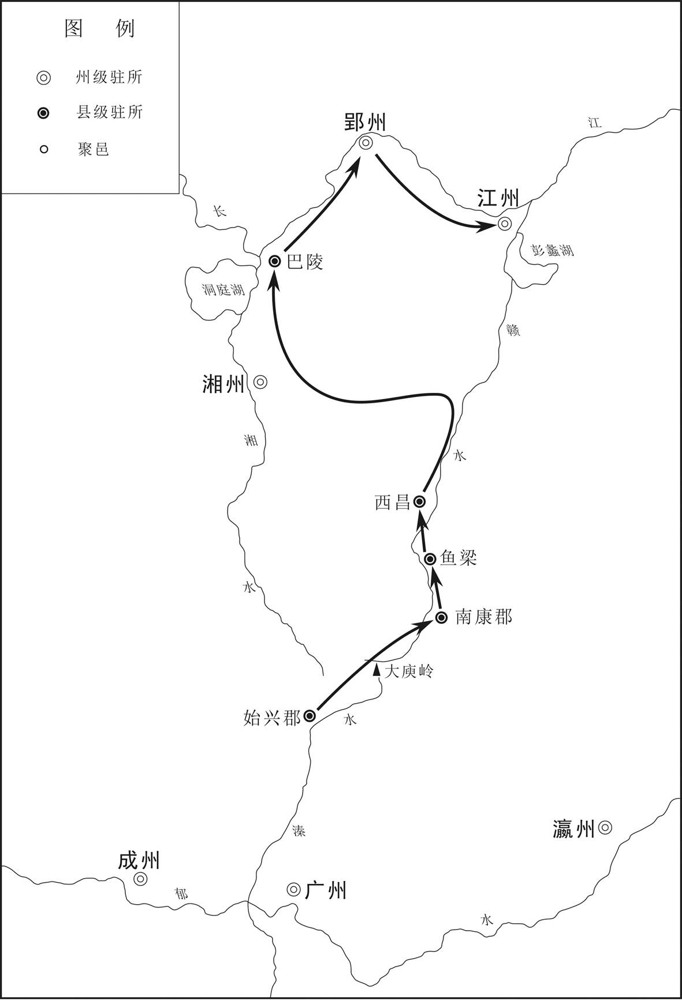
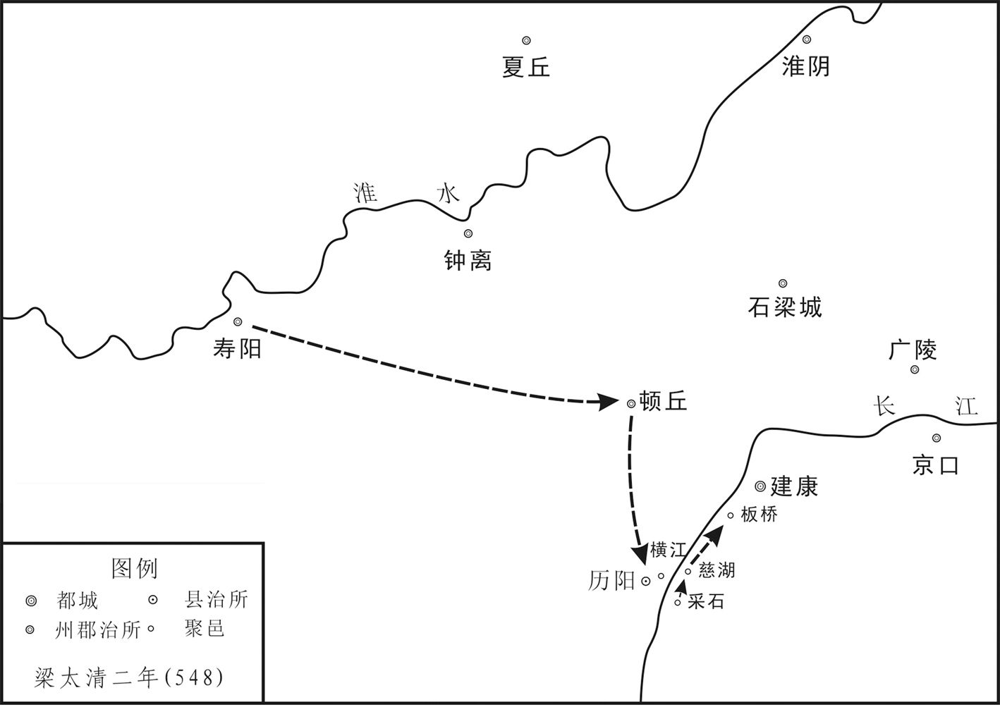
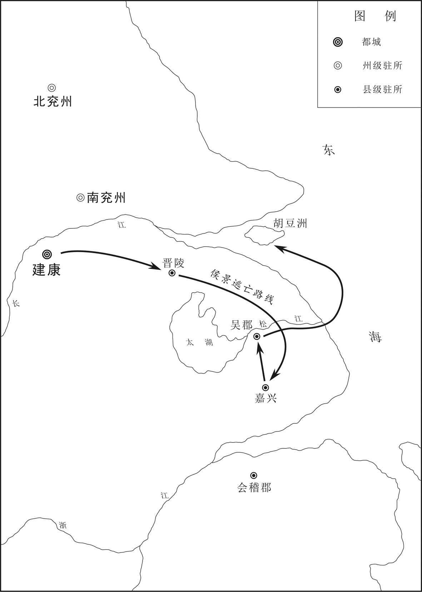
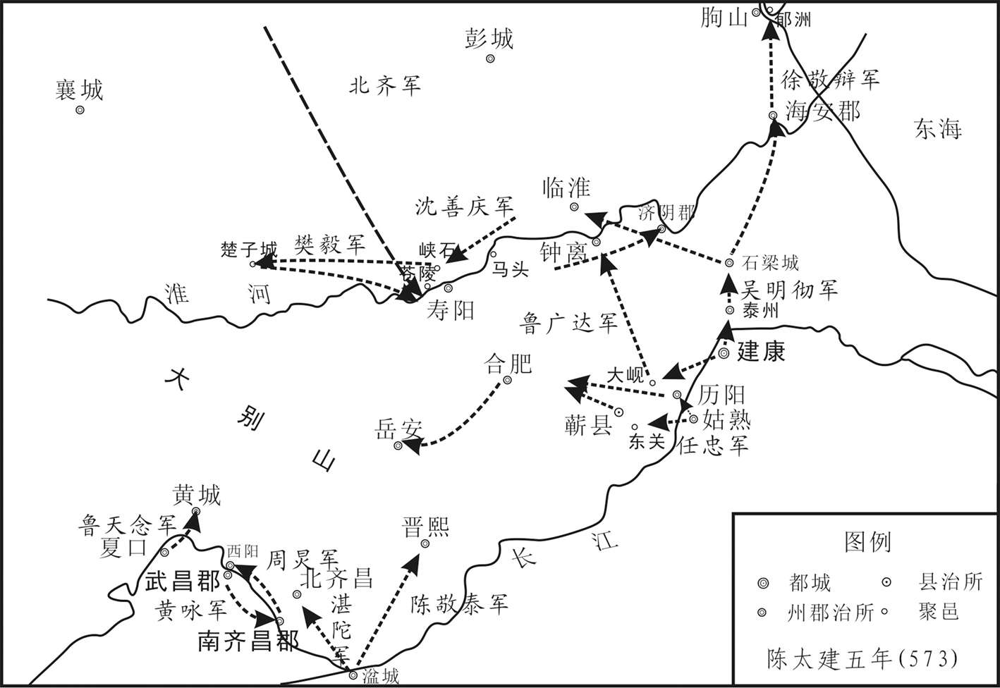
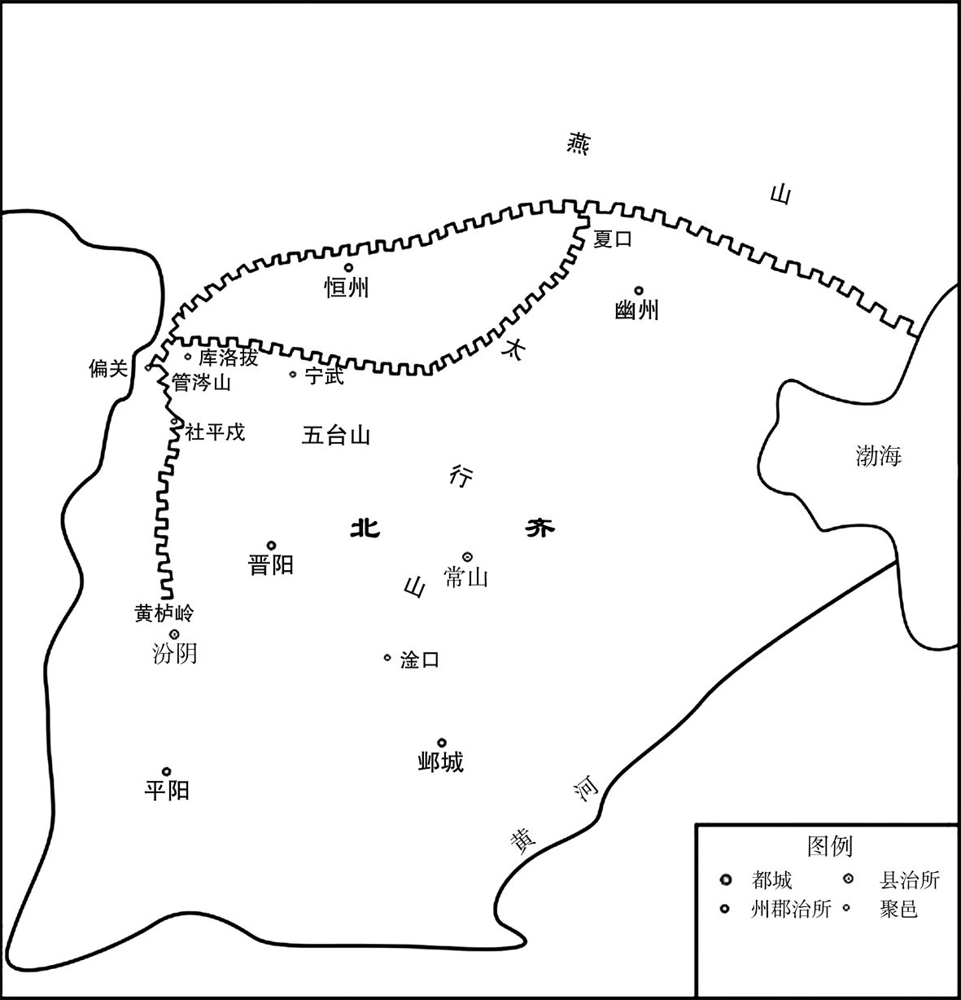
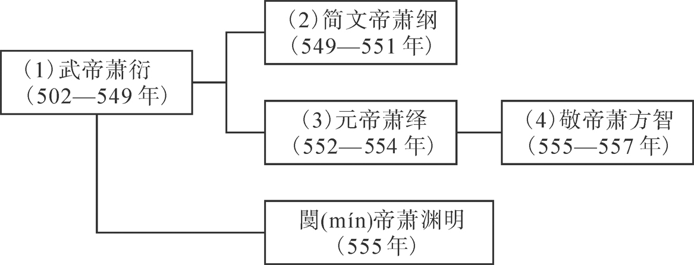
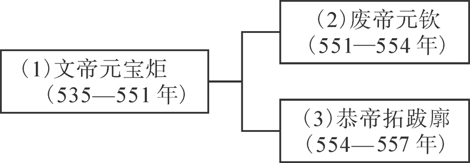
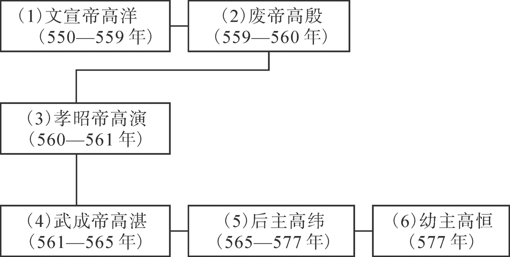
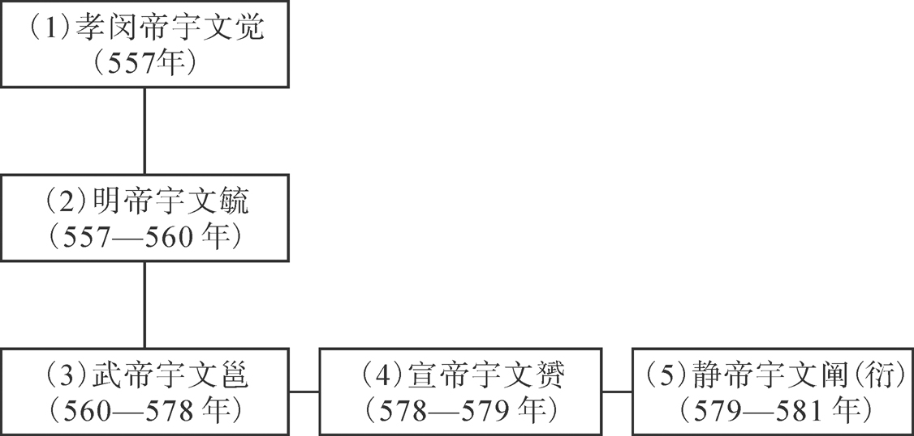

# 目录

梁氏乱亡　陈霸先篡梁

西魏取蜀

萧勃据岭南

王琳奔齐　陈伐齐附

齐显祖狂暴　常山王篡立附

安成王篡立　顼

周陈之叛

宇文护逆节

周伐齐　周齐争宜阳附

吐谷浑盛衰

附录： 
南梁皇帝世系表

西魏皇帝世系表

东魏皇帝世系表

北齐皇帝世系表

北周皇帝世系表

返回总目录

# 梁氏乱亡**  
****陈霸先篡梁**

## 【内容提要】

《梁氏乱亡》叙述了梁朝末年侯景叛乱，梁武帝萧衍诸子不顾国家危难，相互争斗，最终导致梁朝统治分崩离析，以及原梁朝大将陈霸先趁势崛起，铲除政敌，夺取政权，最终建立陈朝的历史过程。

梁武帝萧衍是梁朝的开国之君，在位时间长达四十七年。他即位初期颇勤于政务，但在统治中后期，则刚愎自用，不愿听取劝谏，政治逐渐腐败，国内矛盾渐趋尖锐。

中大通三年（531年），昭明太子萧统去世，梁武帝另立第三子、晋安王萧纲为皇太子，同时为安抚其他诸子，又将其封于国内要地。结果梁武帝诸子皆控制一方，大权独揽，又都不甘居下位，互相猜疑。

梁武帝晚期，原东魏将领侯景降梁。太清二年（548年）侯景起兵叛乱，史称“侯景之乱”。叛乱爆发后，侯景领兵渡过长江，直抵建康，包围台城。面对危局，梁武帝诸子不积极应援，却内部相残，争斗不已。太清三年（549年），侯景攻陷台城后，纵军大肆烧杀抢掠，并将梁武帝囚禁起来，致其饿病而死，侯景遂立萧纲为帝，即南朝梁简文帝。不久侯景又废杀萧纲，立昭明太子萧统之孙、豫章王萧欢之子萧栋为帝。天正元年（551年），侯景废萧栋自立称帝，国号汉。次年，梁将王僧辩、陈霸先率军大败侯景，收复建康。侯景乘船出逃，被部下杀死，侯景之乱随之平息。

侯景之乱平息后，在王僧辩、陈霸先等劝进下，萧绎于公元552年在江陵称帝，即梁元帝。梁元帝命陈霸先镇守京口，王僧辩镇守建康。梁元帝颇具文才，工于书画，喜爱藏书，但心胸狭隘，刚愎自用，为人虚伪而残暴。承圣三年（554年），西魏将领于谨、宇文护、杨忠领兵进攻江陵。次年初，江陵陷落，梁元帝被杀，朝臣与青壮年百姓都被掳至长安。西魏在江陵另立梁元帝之侄、昭明太子之子萧詧（chá）为帝，以继承梁朝社稷，史称西梁。西梁面积狭小，国力虚弱，依附西魏、北周、隋，并奉其为正朔，实际为傀儡政权，后于隋文帝开皇七年（587年）被隋朝废除。

江陵陷落后，王僧辩与陈霸先经过商讨，于公元555年迎接梁元帝萧绎第九子萧方智至建康，准备称帝。萧方智到建康不久，北齐趁虚而入，派兵护送原被东魏俘虏的贞阳侯萧渊明继承梁朝帝位。陈霸先坚持不纳萧渊明，但王僧辩最终迎萧渊明入建康，即皇帝位，改元天成。陈霸先对此极为不满，当年九月，率军突袭建康，杀死王僧辩，逼萧渊明退位。拥立萧方智，改元绍泰，萧方智即梁敬帝。陈霸先自任尚书令、都督中外诸军事等职，大权独揽。太平二年（557年），陈霸先废梁敬帝，自立为帝，定都建康，建立陈朝。自此，梁朝灭亡。

在梁朝末年的变乱中，梁武帝诸子为争权夺利，不仅兵戎相见，而且常引北朝势力介入，终致梁朝灭亡。陈霸先虽统一南方，建立陈朝，但经历侯景之乱和梁末混战后，南朝一蹶不振，已无力与北朝抗衡，这也为北方最终统一全国埋下了伏笔。

## 【原文】

**梁武帝中大通三年夏四月乙巳，昭明太子统卒[1]。五月丙申，立太子母弟晋安王纲为皇太子[2]。朝野多以为不顺，司议侍郎周弘正尝为晋安王主簿，乃奏记曰：“谦让道废，多历年所[3]。伏惟明大王殿下，天挺将圣，四海归仁，是以皇上发德音，以大王为储副[4]。意者愿闻殿下抗目夷上仁之义，执子臧大贤之节，逃玉舆而弗乘，弃万乘如脱屣，庶改浇兢之俗，以大吴国之风[5]。古有其人，今闻其语，能行之者，非殿下而谁[6]？使无为之化复生于遂古，让王之道不坠于来叶，岂不盛欤[7]！”王不能从[8]。六月癸丑，立华容公欢为豫章王，其弟枝江公誉为河东王，曲阿公詧为岳阳王[9]。上以人言不息，故封欢兄弟以大郡，用慰其心[10]。**

## 【注文】

[1]梁（502—557年）：朝代名。共历五十六年，南北朝时期南朝的第三个朝代。齐和帝萧宝融中兴二年（502年），萧衍（yǎn）取代南齐正式称帝，定国号为梁，都城建康（今江苏南京）。辖境早期北到秦岭淮河一线，南至今广东、云南及越南中北部，东到大海，西到今四川大雪山一带，侯景之乱后辖境逐渐缩小，梁敬帝萧方智太平二年（557年）被陈朝取代。　　武帝：即梁武帝萧衍（464—549年），南朝梁的建立者。字叔达，小字练儿，南兰陵中都里人（今江苏常州武进西北）。萧衍是兰陵萧氏的世家子弟，齐高帝萧道成的族侄。他原为南齐官员，起家巴陵王南中郎法曹参军，后任雍州刺史。东昏侯永元三年（501年）起兵拥立萧宝融为帝，南齐中兴二年（502年）自立为帝，建国号梁，定都建康。在位颇有政绩，又笃（dǔ）信佛教，曾三次舍身寺院。在位晚年爆发“侯景之乱”，都城陷落，被侯景囚禁，死于台城，享年八十六岁，谥号“武”，庙号“高祖”。　　中大通：梁武帝萧衍在位期间所用年号，共计六年，即529年至534年。中大通三年即531年。　　乙巳（sì）：中国古代采用天干地支作为纪年、纪月、纪日、纪时的方法。即以甲、乙、丙、丁、戊（wù）、己、庚（gēng）、辛、壬（rén）、癸（guǐ）十天干和子、丑（chǒu）、寅（yín）、卯（mǎo）、辰（chén）、巳、午、未、申、酉（yǒu）、戌（xū）、亥（hài）十二地支，按照顺序组合起来纪年、月、日、时，如乙巳、甲午、丙申等。六十年（月、日）为一周期，周而复始，循环不已。乙巳为干支中的第四十二个。四月乙巳即四月初六。　　昭明太子统：即萧统（501—531年），字德施，小字维摩，梁武帝长子，被立为太子。谥号“昭明”，故后世又称“昭明太子”，梁代文学家。萧统游历山水，喜爱文学，主持编撰（zhuàn）的《文选》（又称《昭明文选》）三十卷，又收集古今典诰（gào）汇编为《正序》十卷，还曾选择五言诗精华编为《文章英华》二十卷。原有集已散佚（yì），后人辑有《昭明太子集》。　　太子：又称世子、储君等。皇帝所选定的继承皇位的皇子，一般为皇帝的嫡（dí）长子，但也常以“传贤不传长”为名，另选皇帝所偏爱者。　　卒：死亡。

[2]母弟：同母之弟。　　晋安：郡名。西晋武帝司马炎太康三年（282年）置，辖今福建东部、南部，治侯官（今福建福州），南朝齐辖侯官、罗江、原丰、晋安、温麻五县。梁武帝天监（502—519年）后，先后分出梁安郡、南安郡，辖境逐渐缩小，仅有今福建东部地区。隋文帝杨坚开皇九年（589年）废。　　王：此处指郡王。爵位名。汉、魏时只封王爵。晋武帝司马炎封子弟二十多人为王，以郡为国，后称之为郡王。南朝陈列为封爵，为十二等爵第一等，一品。隋朝为九等爵第二等，从一品。隋炀帝大业三年（607年）仅保留王、公、侯三等，其余皆废。唐朝复置，为九等爵第二等，从一品。　　纲：即南朝梁简文帝萧纲（503—551年）。字世缵（zuǎn），梁武帝第三子。四岁封晋安王，七岁出任云麾（huī）将军，在属官辅佐下掌管石头城军事。由于长兄萧统早死，中大通三年（531年）被立为太子。太清三年（549年），侯景之乱，梁武帝被囚禁饿死，萧纲即位，大宝二年（551年）被侯景杀害，后被追谥为“简文”。

[3]朝野：朝廷和民间。　　顺：合乎常理，纲常。　　司议侍郎：官职名。即司义侍郎。南朝梁武帝普通年间（520—527年）置司文义郎，为寿光省属官，在职称职则两年后可以转为侍郎，称为司文义侍郎，或司义侍郎，系皇帝的经学侍臣。　　周弘正（496—574年）：南朝梁、陈官员、学者、诗人。字思行，汝南安城（今河南平舆〈yú〉西南）人。幼年丧父，好学不倦，精通经学。梁朝时为国子博士，曾在士林馆讲授，听者遍布朝野。侯景攻占建康，投侯景担任太常，后又投奔梁元帝萧绎为左户尚书、加散骑常侍，校（jiào）雠（chóu）秘府书籍。入陈朝，晋升为侍中、国子祭酒，官至尚书右仆射。为当时的名儒。撰有《周易讲疏》《论语疏》《老子疏》等。　　尝：曾经。　　主簿（bù）：官职名。汉始置，汉代以后，为中央和地方郡县官署主管文书簿籍和印鉴的官吏，即掾（yuàn）史之首。魏晋以后，渐为统兵开府的大臣幕府的重要僚属，参与机要，总领府事。历代或罢或设，其中县主簿在宋代以后为县令（或知县）的助理，沿置至清。　　乃：于是，就。　　奏记：下官向上级言事的公文。　　道：规则。　　历：经历。　　年所：年数。语出《尚书·君奭（shì）》：“率准兹（zī）有陈，保（yì）有殷（yīn）。故殷礼陟（zhì）配天，多历年所。”

[4]伏惟：表示希望，愿望。　　明：表明，告诉。　　殿下：汉以来对太子、诸侯王的称呼。殿下本意为殿阶之下，因太子、诸侯王居宫殿而见群臣，故尊称殿下。犹如称皇帝为陛下。　　天挺：天生挺秀超拔。　　将圣：即将成为圣人。　　四海：古人认为中国有四海环绕，因而用以泛指全国各处。　　归仁：附于仁德。　　发：颁布，发布。　　德音：此处指帝王的诏书。　　储副：国之储君。一般指太子。

[5]意者：表示选择。是，还是。　　愿闻：希望听到。　　抗：树立。　　目夷：生卒年不详。春秋时宋国公子，宋襄（xiāng）公的庶（shù）兄。子姓，宋氏，名目夷（yí），字子鱼。宋襄公即位，目夷为相。兄弟二人友爱，同心协力，以德治国，使得宋国国力增强。　　上仁：至高仁义。　　执：持守。　　子臧（zāng）：生卒年不详。即公子欣时，春秋时期曹国的公子，字子臧，父亲曹宣公。公元前578年，曹宣公在随晋国伐秦时去世。公子负刍（chú）在国内杀太子，即位，即为曹成公。安葬父亲之后，子臧要流亡国外，曹国人都愿意跟从。曹成公请罪，子臧才返国。后诸侯讨伐曹成公，晋国扣留了曹成公。诸侯欲立子臧为君，子臧推辞，逃奔宋国。曹国人请晋国出面，让子臧回国，子臧回国，晋国也释放了被扣留的曹成公。　　大贤：才德超群的人。　　玉舆（yú）：玉饰的车，多指帝王的车。此处指春秋时越人先后三代杀掉自己的国君，王子搜对此很忧虑，于是逃入荒山野洞。越国没有君主，到处找寻王子搜，追踪来到洞穴。王子搜不肯出洞，越人便点燃艾草用烟熏洞，还为他准备了国王的乘舆。王子搜仰天而呼：“君乎君，独不可以舍我乎！”　　弗（fú）：不。　　万乘（shèng）：指天子。周制，天子地方千里，出兵车万乘，诸侯地方百里，出兵车千乘，故称天子为“万乘”。　　屣（xǐ）：同“履（lǚ）”，鞋子。此处指舜弃天下，犹如舍弃敝屣。　　庶：表示希望发生或出现某事，但愿。　　浇兢（jīng）：追逐名利的浮薄风气。　　大：发扬光大。　　吴国：此处指吴国第一代君主吴太伯让国之事。吴太伯，一作泰伯，生卒年不详。姬姓，商末周部落首领古公亶（dǎn）父（即周太王）长子。周太王想传位给季历及他的儿子昌（即周文王），太伯于是与弟弟仲雍将王位让给三弟季历，二人逃至荆（jīng）蛮（mán），改从当地习俗，自号勾吴（即句吴），成为该地君长。吴太伯由此也成为吴国国君的始祖。

[6]行：执行。

[7]无为之化：指顺其自然，无为而治。　　遂古：远古。　　让王：谦让王位。　　坠（zhuì）：丧失；败坏。　　来叶：后代。　　欤（yú）：文言助词，表示疑问、感叹、反诘等语气。

[8]从：听从，顺从，接受。

[9]华容：县名。西汉置，治今湖北潜江西南（一说今湖北监利北）。南朝梁废。　　公：此处指县公，也称开国县公。爵位名。晋代始置，位在郡公之下，一品。其后各朝多置。南朝梁位视三公。陈置为九等爵第二等，二品。北魏孝文帝太和二十三年（499）定为从一品。北齐二品。北周亦置。隋定开国县公为九等爵之第五等，从一品。隋炀帝大业三年（607年）仅保留王、公、侯三等，其余皆废。唐朝复置，从二品。　　欢：即萧欢（？—534年），梁武帝萧衍的嫡孙，昭明太子萧统长子。字孟孙，初封华容公，任东中郎将、南徐州刺史。中大通三年（531年），昭明太子萧统去世，因梁武帝不想让年幼者继位，又因为之前对昭明太子萧统有成见，于是在迟疑再三后立自己的三子、萧统同母弟晋安王萧纲为太子，出于内疚，将萧统的儿子都封为郡王，食邑二千户，封萧欢为豫章王，后改云麾将军。中大通六年（534年）二月，为江州刺史。有三子，萧栋、萧桥、萧樛（jiū）。长子萧栋袭爵为豫章王。天正元年（551年），侯景废梁简文帝萧纲，扶立萧栋即位，追尊萧欢为安皇帝。　　豫章：郡名。西汉高帝六年（前201年）置，治南昌（今江西南昌东）。约在西晋时，郡治移至今江西南昌城区西南部。汉时辖境大致相当于今江西省地，三国魏以后辖境逐渐缩小。南朝梁时辖南昌、新淦（gàn）、建城、望蔡、吴平、宜丰、康乐、钟陵八县，南朝陈时辖今江西锦江流域、南昌、清江等县地。隋开皇九年（589年）废。隋炀帝大业二年（606年）改南昌县为豫章县。后又数度废置。　　枝江：县名。西汉置，治今湖北枝江东北，东晋迁治今湖北枝江西南。陈废。隋复置枝江县。　　誉：即萧誉（？—550年），梁武帝萧衍的孙子，昭明太子萧统的次子，字重孙。普通二年（521年）封枝江县公，中大通三年（531年）改封为河东郡王。历任琅邪、彭城二郡太守，湘州刺史。侯景之乱中，率军入援建康，后被梁元帝萧绎所杀。　　河东：郡名。此处指东晋侨置的南河东郡，辖安邑、闻喜、永安、临汾、弘农、谯（qiáo）、松滋（zī）、大戚（qī）八县，治松滋（今湖北松滋）。南朝齐改称河东郡，辖闻喜、松滋、谯、永安四县，隋朝废。侨置是指东晋、南朝时期为了安置北方来的人们，以北方州郡的名称在长江南北设置的侨郡、侨州。河东原为秦置郡。治所原在安邑（今山西夏县西北）。辖境相当于今山西沁（qìn）水以西、霍（huò）山以南地区。东晋义熙十四年（418年）移治蒲（pú）坂（bǎn）（今山西永济蒲州镇），辖境缩小至今山西西南汾河下游至王屋山以西一角。隋开皇（581—600年）初废。隋大业（605—618年）及唐天宝（742—756年）、至德（756—758年）时又曾改蒲州为河东郡，治河东（即原蒲坂县治，今山西永济蒲州镇），后皆复为蒲州。河东也为县名。隋开皇十六年（596年）分蒲坂县置，蒲坂县移治城东，于蒲坂故城置河东县，即今山西永济蒲州镇。大业三年（607年） 蒲坂县并入河东县，明洪武二年（1369年）废。　　曲阿：县名。秦置，治今江苏丹阳，三国吴改名云阳，晋又改曲阿，唐天宝元年（742年）改名丹阳。　　詧（chá）：即萧詧（519—562年），南朝后梁宣帝，文学家。字理孙，南兰陵（今江苏常州西北）人。昭明太子萧统第三子。梁武帝萧衍时封曲江县公，后进封岳阳王，历任会（kuài）稽（jī）太守、东扬州刺史、雍州刺史。侯景之乱中，阴谋夺取帝位。公元550年，向西魏称臣，请作附庸国。西魏封他为梁王。公元555年，在西魏军队的协助下攻破江陵，消灭梁元帝萧绎，西魏封他为梁主，史称后梁宣帝。在位期间，对西魏、北周行臣礼很是恭顺。著有文集十五卷、佛经义疏三十六卷，皆佚。现存《愍（mǐn）时赋》《游七山寺赋》等文六篇，《建除诗》《迎舍利》《兰》等诗十首。　　岳阳：郡名。南朝梁时置，治岳阳（今湖南汨〈mì〉罗）。南朝陈辖岳阳、湘阴、玉山、湘滨、吴昌、罗县六县，约相当于今湖南汨罗、湘阴、平江等市县。隋文帝开皇九年（589年）废。

[10]上：皇上。此处指梁武帝萧衍。　　以：因为。　　息：停止，歇。　　以：用，把。　　大郡：面积大、人口多的郡。郡为行政区名。春秋时已出现，但当时的郡只设在边远地区，由国君的重臣率军驻守，其地位低于县。战国时期，郡的地位不断提高，故在郡下设县，形成郡、县两级制。郡长官称守，初为武职，防戍边郡。后成为地方长官。秦始皇统一后，确立郡县制。汉初，实行郡、国并存制。王国下辖郡县，后王国和郡同级别，后代沿置。隋文帝开皇三年（583年）废郡，隋大业初和唐天宝初曾两度恢复郡制，唐肃宗李亨乾元元年（758年）再次废除，后不再复设，此后郡成为州、府的别称。　　慰：安抚，抚慰，安慰。

## 【译文】

梁武帝中大通三年（531年）夏季四月乙巳（初六日），昭明太子萧统去世。五月丙申（二十七日），梁武帝立昭明太子的胞弟晋安王萧纲为皇太子。朝廷和民间多数人认为立晋安王萧纲为太子不符合立嗣的纲常，司议侍郎周弘正曾经做过晋安王萧纲的主簿，于是给萧纲呈上报告说：“谦虚礼让之道已经废弃了多年。恭敬地告知大王殿下，您天生挺秀超拔，即将成为天下的圣人，四海之内都归附于您的仁德，因此皇上颁布诏令，立大王您为储君。可我还是真心希望听见大王能像目夷那样崇尚仁义，如子臧那样坚守节操而坚决推辞君位，像王子搜那样逃避玉饰御车而不乘坐，像舜那样放弃帝位如同脱下鞋子，但愿可以改变追逐名利的浮薄风俗，使得吴太伯让国那样的风尚能够发扬光大。古时有这样的人，现在还能听到他们说过的话，但能够真正践行的，除了殿下您还能有谁呢？让古时无为而治之风再现于今日，使谦让王位之道流传于后世，这难道不是一件盛事吗！”晋安王萧纲没有听从周弘正的建议。六月癸丑（十五日），梁武帝封立华容公萧欢为豫章王，立他的弟弟枝江公萧誉为河东王，曲阿公萧詧为岳阳王。武帝因为外人的议论不止，因此把面积大、人口多的郡分封给萧欢兄弟，用来安抚他们。

## 【原文】

**中大同元年[1]。上年高，诸子心不相下，互相猜忌[2]。邵陵王纶为丹杨尹，湘东王绎在江州，武陵王纪在益州，皆权侔人主[3]。太子纲恶之，尝选精兵以卫东宫[4]。八月，以纶为南徐州刺史[5]。冬十月乙亥，以前东扬州刺史岳阳王詧为雍州刺史[6]。上舍詧兄弟而立太子纲，内常愧之，宠亚诸子[7]。以会稽人物殷阜，故用詧兄弟迭为东扬州以慰其心，詧兄弟亦内怀不平[8]。詧以上衰老，朝多秕政，遂蓄聚货财，折节下士，招募勇敢，左右至数千人[9]。以襄阳形胜之地，梁业所基，遇乱可以图大功[10]；乃克己为政，抚循士民，数施恩惠，延纳规谏，所部称治[11]。**

## 【注文】

[1]中大同：梁武帝萧衍在位期间所用的第六个年号，从丙寅年（546年）四月至丁卯年（547年）四月。

[2]年高：年事已高。　　诸子：各儿子。　　相下：彼此不服。相，彼此；互相。　　猜忌：猜疑忌妒。

[3]邵（shào）陵：郡名。三国时吴置昭陵，西晋太康中为避司马昭讳，改称邵陵，治邵陵（今湖南邵阳），南朝齐时移治都梁（今湖南隆回），辖武刚、建兴、都梁、邵陵、邵阳、扶县、高平七县，相当于今湖南新化以南资水流域大部和巫水上游。南朝梁复治邵陵。隋开皇九年（589年）废。　　纶（lún）：即萧纶（507—551年），梁武帝萧衍第六子。字世调，小字六真。博学善文。梁武帝天监十三年（514年），封邵陵郡王，历任会稽太守、江州刺史、侍中、扬州刺史、郢州刺史、南徐州刺史。侯景叛乱，任征讨大都督，率众征讨，都督中外诸军事，进位司空。后被梁元帝部将王僧辩打败，退保齐昌郡。攻打西魏竟陵，被西魏大将杨忠俘获杀害。　　丹杨：即丹阳，郡名。西汉武帝元封二年（前109年）置，治宛陵（今安徽宣城），辖境相当于今安徽长江以南，江苏大茅山、浙江天目山脉以西及浙江新安江支流武强溪以北地区，后辖境缩小。东汉建安二十五年（220年），孙权移郡治建业（今江苏南京）。南朝齐辖建康、秣（mò）陵、丹阳、溧（lì）阳、永世、湖熟、江宁、句容诸县，隋开皇间改为蒋州。隋大业三年（607年）改为丹阳郡，治江宁（今江苏南京），领江宁、溧水、当涂三县。唐武德三年（620年）改为扬州。　　丹杨尹（yǐn）：官职名。一名“丹阳尹”。东晋元帝司马睿（ruì）太兴元年（318年）改丹杨内史置。东晋南朝丹阳郡治建康（今江苏南京），故改丹阳郡守为丹阳尹，为东晋南朝之京畿（jī）长官，职掌相当于郡太守，但参与朝议，地位重要，也称为京尹，官秩中二千石。南朝沿置，南朝梁位列九卿之后，陈朝为五品。　　湘东：郡名。三国吴大帝孙权太平二年（257年）置，因处湘水之东得名，治酃（líng）县（今湖南衡阳湘江东岸）。晋代辖酃县、茶陵、临烝、利阳、阴山、新平、新宁七县，辖境相当于今湖南洣（mǐ）水流域、耒（lěi）水下游以及常宁县地。西境以后略有扩大，西部至今湘江以西的蒸水地区。东晋孝武帝太元二十年（395年）移治临蒸（今湖南衡阳）。南朝齐辖茶陵、新宁、攸（yōu）、临蒸、重安、阴山六县，辖境又扩大至蒸水上、中游。隋开皇九年（589年）废。　　绎（yì）：即南朝梁元帝萧绎（yì）（508—555年），梁武帝萧衍第七子。字世诚，小字七符，自号金楼子。南兰陵（今江苏常州）人。封湘东王，后任荆州刺史。侯景之乱时，他派遣王僧辩讨平叛乱。鉴于建康（今江苏南京）遭兵乱后荒废不堪，就在江陵（今湖北荆州）即帝位。后被雍州刺史萧詧（chá）杀死，在位仅四年。擅长诗文，风格靡（mǐ）丽。善于绘画，其画作栩（xǔ）栩如生。又精于绘画理论，提倡仔细观察景物。生平爱好藏书，得七千多卷，临死前愤而付之一炬。诗集有《梁元帝集》，画论有《山水松石格》，并绘《职贡图》、《宣尼像》等。　　江州：州名。西晋惠帝元康元年（291年）置，治南昌（今江西南昌），领桂阳、武昌、安成、豫章、鄱（pó）阳、庐陵、临川、南康、建安、晋安十郡，后又划入寻阳郡，辖境相当于今江西、福建两省及湖北长江以南、陆水以东以及湖南舂（chōng）陵水中上游以东地区。南朝辖境缩小，治所也多次迁徙（xǐ），梁代治浔（xún）阳（今江西九江），南朝齐辖寻阳、豫章、临川、庐陵、鄱阳、安成、南康、南新蔡、建安、晋安诸郡。州：行政区名。先秦时即有州之称，汉武帝于元封五年（前106年）置十三州，即十三个监察区，州设刺史。另在三辅（京兆、右扶风、左冯翔）、三河（河内、河南、河东）、弘农七个郡设司隶校尉部，与州同级，与十三州合称为十四部州。东汉时州已成为一级行政区划，下辖若干郡，形成州、郡、县三级制。魏晋南北朝时沿用，州的数目大为增加，但辖境则大都缩小。隋初废郡，州直接辖县。隋炀帝杨广时又废州，采用郡县二级制。唐初改郡为州，唐天宝初再度用郡制，不久即恢复州。之后不再设郡，州成为县上一级的行政区。明清时期，直属于布政使司称直隶州，辖县；隶属于府的州，称属州，地位则相当于县。　　武陵：郡、国名。汉高祖刘邦置郡。治所初在义陵，今湖南溆（xù）浦（pǔ）南；一说治索县，在今湖南常德境。东汉移治临沅（yuán）（今湖南常德），南朝齐时辖沅陵、临沅、零陵、辰阳、酉阳、沅南、汉寿、龙阳、（wǔ）阳、黚（qián）阳诸县。辖境约为今沅水流域部分地区。　　纪：即萧纪（508—553年），梁武帝萧衍第八子。字世询，少年时读书勤奋，有文才。梁武帝天监十三年（514年），封武陵王。历任丹阳尹、江州刺史、扬州刺史等职。大同三年（537年）任安西将军、益州刺史。在蜀十几年，颇有政绩。侯景乱梁，他不派兵赴援。及梁武帝死，于梁元帝承圣元年（552年）在成都（今四川成都）称帝，改元天正。不久以讨侯景为名，率军东下，企图夺取荆州。次年七月，被梁元帝的军队击败，被杀。　　益州：州名。汉武帝所置十三州之一。西汉始置，东汉治所初在雒（luò）（今四川广汉北）。中平（184—189年）中移治绵竹（今四川德阳东北）。兴平（194—195年）中又移成都（今四川成都）。辖今四川、云南、贵州大部，以及湖北、甘肃各一部分，东汉以后辖境逐渐缩小。隋炀帝大业三年（607年）改为蜀郡。　　皆：都。　　侔（móu）：相等，等同。　　人主：君主。

[4]恶（wù）：厌恶，讨厌，憎恨。　　精兵：训练有素、战斗力强的士兵。　　东宫：太子所居住的宫殿。也代指太子。

[5]以：任命。　　南徐州：州名。南朝宋武帝永初二年（421年）置，治京口（今江苏镇江），辖境相当于今安徽凤阳以东、江苏淮河以南、长江以北地区。宋文帝元嘉（424—453年）后，辖境南移，相当于今江苏长江以南，南京东北部及丹阳、宜兴等市县以东，无锡以北地区。南朝齐辖南东海、晋陵、义兴、南琅邪、临淮、淮陵、南东莞（guǎn）、南清河、南彭城、南高平、南济阴、南濮阳、南鲁郡、南平昌、南泰山、南济阳诸郡，隋开皇九年（589年）废。　　刺史：官职名。自汉武帝刘彻开始设立。本为监察郡县的官员，“刺”为检核问事之意，即监察之职，在郡守管辖之下。东汉灵帝刘宏改刺史为州牧，职权益重，位居郡守之上，掌握一州军政大权，成为郡上一级地方行政长官。魏晋南北朝，以刺史领州，多带持节、都督诸军事衔，隋唐时期，也为州一级建制的长官，但职权减轻，宋代保留刺史官称，但无职掌，辽、金也有刺史州，以刺史为长官。明清时刺史仅作为知州的别称。

[6]东扬州：州名。南朝宋武帝孝建元年（454年）始置，治山阴（今浙江绍兴），辖会稽、东阳、新安、临海、永嘉五郡，后废。南朝梁武帝普通五年（524年），分扬州、江州置东扬州。梁敬帝太平元年（556年）废。陈文帝天嘉三年（562年）再次恢复东扬州，辖会稽、东阳、临海、永嘉、新安、新宁、晋安、建安八郡。隋开皇九年（589年）隋灭陈，废州。　　雍州：州名。此处指东晋孝武帝太元（376—396年）中所侨置雍州，治襄阳（今湖北襄阳），辖今湖北丹江口、南漳（zhāng）以东，钟祥以北，大洪山、枣阳以西，河南西峡、方城以南，泌（bì）阳以西地区。南朝齐辖襄阳、南阳、新野、始平、广平、京兆、扶风、冯（Píng）翊（yì）、河南、南天水、义成、建昌、华山、南上洛、北河南、弘农、从阳、西汝南、北上洛、齐安、齐康、招义各郡，梁以后缩小。西魏恭帝元年（554年）改为襄州。

[7]舍：放弃；舍弃。　　内：内心，心中。　　愧之：对之有愧疚。　　亚：次于。

[8]会稽（kuài）（jī）：郡名。秦始皇二十五年（前222年）始置，初治吴县（今江苏苏州），辖境相当于今江苏长江以南，浙江仙霞岭、牛头山、天台山以北和安徽水阳江流域以东及新安江、率水流域地。西汉时辖境扩大，相当于今江苏长江以南，茅山山脉以东，浙江大部（仅天目山、淳安以西小部地区除外）及福建全省。东汉顺帝刘保时移治山阴（今浙江绍兴）。其后辖境逐渐缩小，西晋时，辖山阴、上虞（yú）、余姚、句章、鄞（yín）县、（mào）县、始宁、剡（yǎn）县、永兴、诸暨（jì）十县。隋改为越州，大业三年（607年）又改越州为会稽郡，辖会稽、句章、剡县、诸暨四县。唐武德四年（621年）复置越州。也为县名。隋开皇九年（589年）分山阴置。治今浙江绍兴。其后历为会稽郡、越州、绍兴府治所。1912年与山阴合并为绍兴。　　殷（yīn）阜（fù）：富足。　　故：因此。　　迭：交换，轮流。　　亦：也。　　不平：不满。

[9]秕（bǐ）政：弊政。不良的政治措施。　　遂：于是；就。　　蓄聚：积聚。　　货财：钱财。　　折节：屈身礼贤。　　下：谦居于别人之下，以示对人尊敬。　　士：旧指有知识学问的人；今多指参军的士兵。　　勇敢：勇武敢战之士。　　左右：身边人员、部下。

[10]襄阳：郡、县名。西汉初置襄阳，治今湖北襄阳。辖汉水以南、中庐以东、以北地区。东汉建安十三年（208年）置襄阳郡。治襄阳（今湖北襄阳）。辖境相当于今湖北襄阳、南漳、宜城、当阳、远安等县地，其后缩小，南朝齐辖襄阳、中庐、（jì）县、建昌四县。隋开皇初废。隋大业及唐天宝、至德时又曾改襄州（治今湖北襄阳）为襄阳郡，北宋宣和元年（1119年）升襄阳府。也为县名。西汉置，治今湖北襄阳。　　形胜：地理位置优越，地势险要。　　基：基业，作为根基的事业。多指国家政权。　　图：图谋，谋取。　　大功：大功业。

[11]克己：严格自律。　　抚循：安抚存恤。　　士民：士大夫和普通百姓的并称，泛指人民、百姓。　　数：多次，数次。　　延纳：容纳。延：引进，请；纳：接受，吸纳。　　规谏（jiàn）：规劝。谏，规劝君主或尊长使改正错误。　　所部：所管理的地方。　　治：有秩序，井然有序。

## 【译文】

梁武帝中大同元年（546年）。梁武帝萧衍年事已高，他的儿子们彼此不服，互相猜忌。邵陵王萧纶任丹杨尹，湘东王萧绎居于江州，武陵王萧纪驻守在益州，他们的权力都和君主差不多。太子萧纲非常担心他们，曾经挑选精锐部队来守卫东宫。八月，梁武帝任命萧纶为南徐州刺史。冬季十月乙亥（初六日），任命前东扬州刺史岳阳王萧詧担任雍州刺史。武帝没有立萧詧兄弟而立了萧纲为太子，心里常常感觉愧对萧詧他们，对他们的宠爱也比不上对其他儿子。由于会稽地区人口众多，物产丰富，因此任用萧詧兄弟轮流担任东扬州刺史以安抚他们，萧詧兄弟心里也愤愤不平。萧詧认为武帝已经老了，朝廷里也有很多不良的政策措施，于是就积蓄钱财物资，屈身礼贤下士，招募勇武敢战的人，身边部众达到了数千人。因为襄阳地理位置优越，地势险要，又是梁朝基业所依靠的根基，如果遭遇乱世可以据此图谋大业；于是萧詧执政时严格自律，安抚体恤人民百姓，多次对他们施以恩惠，接受他们的规劝，他所管辖的地方井然有序。

## 【原文】

**太清三年[1]。初，上以河东王誉为湘州刺史，徙湘州刺史张缵为雍州刺史，代岳阳王詧[2]。缵恃其才望，轻誉少年，迎候有阙[3]。誉至，检括州府付度事，留缵不遣[4]。闻侯景作乱，颇陵蹙缵[5]。缵恐为所害，轻舟夜遁，将之雍部，复虑詧拒之[6]。缵与湘东王绎有旧，欲因之以杀誉兄弟，乃如江陵[7]。及台城陷，诸王各还州镇，誉自湖口归湘州[8]。桂阳王慥以荆州督府留军江陵，欲待绎至拜谒，乃还信州[9]。缵遗绎书曰：“河东戴樯上水，欲袭江陵，岳阳在雍，共谋不逞[10]。”江陵游军主朱荣亦遣使告绎，云“桂阳留此，欲应誉、詧”[11]。绎惧，凿船，沈米，斩缆，自蛮中步道驰归江陵，囚慥，杀之[12]。**

## 【注文】

[1]太清：南朝梁武帝萧衍在位期间所用的年号，共计三年，即丁卯年（547年）四月至己巳年（549年）十二月。太清三年即549年。

[2]初：起初；当初；以前。　　湘州：州名。西晋怀帝司马炽永嘉元年（307年）置，治临湘（今湖南长沙），初辖今湖南湘、资两水流域，及湖北陆水流域，后扩大至广西北部和广东东北部一带。南朝辖境缩小，南朝齐辖长沙、桂阳、零陵、衡阳、营阳、湘东、邵陵、始兴、临贺、始安、齐熙各郡。隋代改称潭州。此外，南朝梁置湘州，治新化（今湖北大悟东），即今湖北大悟、红安、黄陂等县。北齐改为北江州。　　徙（xǐ）：调职。　　张缵（zuǎn）（499—549年）：南朝梁臣。字伯绪。原籍范阳方城（今河北固安），梁武帝萧衍表弟。以辞赋见长，十一岁时娶梁武帝第四女，封驸马都尉、利亭侯。起家秘书郎。历任尚书吏部郎、长史兼侍中、吏部尚书、尚书仆射。后出任湘州刺史，都督雍、梁等州诸军事。太清三年（549年）被岳阳王萧詧所杀。　　代：取代，替换。

[3]恃（shì）：倚仗，依赖。　　才望：才能和名望。　　轻：看不起，轻视。　　少年：年轻。　　迎候：迎接。　　阙（quē）：欠；残缺。

[4]检括：查察；清查。　　州府：指湘州署收藏文书簿籍等的府库。　　付度：移交，交代。

[5]侯景（503—552年）：北朝、南朝梁将领、叛乱首领。字万景。怀朔镇（今内蒙古固阳）人。有勇力，善骑射。初归属北魏尔朱荣，后投高欢，为镇守河南的将领。梁武帝中大同二年（547年），因害怕被北齐高欢儿子高澄所害，降梁，封河南王。次年，举兵叛变，攻破建康（今江苏南京），所部到处烧杀。梁简文帝大宝二年（551年），自立为帝，国号汉。后萧绎大举进兵平叛，王僧辩、陈霸先等也率军进剿。侯景败退，携残余部众东逃，被部将所杀，首级被送到江陵。侯景之乱给南方带来了巨大灾难，导致了梁朝灭亡，也使得南朝国力从此一蹶（jué）不振。　　陵蹙（cù）：蹙通“蹴”。凌逼，逼迫。

[6]轻舟：一叶小船。　　遁（dùn）：逃跑，逃走。　　之：到，往。　　雍部：雍州。　　复虑：又考虑到。　　拒：拒绝。

[7]旧：老交情。　　因：依靠，凭借，借助。　　如：到，前往。　　江陵：郡、县名。秦置县，治今湖北荆州。南朝齐曾置江陵郡，后废。唐玄宗天宝初置江陵郡，治江陵（今湖北荆州），唐肃宗乾元元年（758年）改为荆州。

[8]台城：指六朝时都城建康的宫城，又称“苑城”，故址位于今江苏南京玄武湖南岸、鸡鸣寺之后。　　镇：军镇。　　湖口：地名。湘江注入洞庭湖口处，在今湖南湘阴北。

[9]桂阳：郡名。西汉高帝刘邦置，治郴（chēn）县（今湖南郴州）。辖境约相当于今湖南耒（lěi）阳以南的耒水、舂（chōng）陵水流域，北至洣（mǐ）水入湘江附近，南至广东英德以北的北江流域。三国吴以后缩小，南朝辖郴县、临武、南平、耒阳、晋宁、汝城六县，隋开皇九年（589年）废。　　慥（zào）：即萧慥（？—549年），字元贞。桂阳王萧象的儿子。南朝梁末为信州刺史。侯景之乱时，率军前往京师赴援，建康陷落后返回。途经江陵，被萧绎所杀。　　督府：军府。　　留军：军队驻扎。　　拜谒（yè）：拜见。　　乃：才。　　信州：历史上信州不止一处，此处指南朝梁武帝普通四年（523年）置。治鱼复（西魏改人复县，今重庆奉节东白帝城）。辖境约相当于今重庆万州以东的长江南、北，大宁河流域及湖北巴东以西地区。北周以后缩小。隋大业三年（607年）改为巴东郡。唐武德元年（618年）复为信州，二年（619年）改为夔（kuí）州。

[10]遗（wèi）：投书；寄信。　　河东：代指河东王萧誉。　　戴：架上，挂上。　　樯（qiáng）：帆船上挂风帆的桅杆，引申为帆船或帆。　　岳阳：代指岳阳王萧詧。　　共谋不逞：指一起谋划作乱。

[11]游军主：指统领游军的将领。游军指无固定防地、流动出击的军队。军主即主一军之义。南朝军制称一军长官为军主。　　朱荣：梁朝将领。生平事迹不详。　　桂阳：代指桂阳王萧慥。　　应：接应，响应。

[12]凿（záo）：打孔。　　沈（chén）：通“沉”。　　斩缆：砍断缆绳。　　蛮中：蛮族所居之地。　　步道：只可步行不能通车的小路。　　驰：车马等奔跑，快跑。

## 【译文】

梁武帝太清三年（549年）。当初，梁武帝萧衍任命河东王萧誉为湘州刺史，调湘州刺史张缵为雍州刺史，取代原雍州刺史岳阳王萧詧。张缵倚仗自己既有才能又有名望，轻视萧誉年龄小，迎候萧誉的礼数不周到。萧誉到了湘州，检查州府的交接事宜，留下张缵不让他走。萧誉听到侯景叛乱的消息后，颇有一些凌侮张缵的言行。张缵害怕自己被萧誉杀害，连夜乘一叶小船逃走，将要到达雍州境时，又担心萧詧拒绝接受自己。张缵和湘东王萧绎有老交情，想要依靠萧绎来杀掉萧誉兄弟，于是前往江陵。等到台城陷落，各个封王各自返回所管辖的州镇，萧誉自湖口回到湘州。桂阳王萧慥以荆州督府的名义留下来驻军于江陵，想等待萧绎到来后拜见了他，再返回信州。张缵给萧绎写信说：“河东王萧誉乘着挂上船帆的船向上游驶来，打算袭击江陵，岳阳王萧詧留在雍州，他们兄弟俩共同密谋作乱。”江陵游军主朱荣也派遣使节告诉萧绎，说“桂阳王萧慥留在此地，想要响应萧誉、萧詧作乱”。萧绎害怕了，下令凿透船底，将大米沉入江中，砍断船上的缆绳，从蛮中小路驰马赶回江陵，把萧慥囚禁起来，接着杀了他。

## 【原文】

**湘东王绎之入援也，令所督诸州皆发兵，雍州刺史岳阳王詧遣府司马刘方贵将兵出汉口，绎召詧使自行，詧不从[1]。方贵潜与绎相知，谋袭襄阳[2]。未发，会詧以他事召方贵，方贵以为谋泄，遂据樊城拒命，詧遣军攻之[3]。绎厚资遣张缵使赴镇，缵至大堤，詧已拔樊城，斩方贵[4]。缵至襄阳，詧推迁未去，但以城西白马寺处之[5]。詧犹总军府之政，闻台城陷，遂不受代[6]。助防杜岸绐缵曰：“观岳阳势不容使君，不如且往西山以避祸[7]。”岸既襄阳豪族，兄弟九人皆以骁勇著名[8]。缵乃与岸结盟，著妇人衣，乘青布舆逃入西山[9]。詧使岸将兵追擒之，缵乞为沙门，更名法缵，詧许之[10]。**

## 【注文】

[1]入援：前去救援。　　府司马：官职名。王公、将军府均置司马，故称。主管府内的兵马事务。司马为官职名。魏晋南北朝时期为东宫、王府、公府和军府的幕僚，掌管府内军事事务。　　刘方贵：萧詧部属。生平事迹不详。　　将兵：率兵，治兵。　　汉口：即汉水入长江处，在今湖北武汉。　　自行：亲自出征。

[2]潜：暗中，隐藏的，秘密地。　　相知：互相知心的朋友。　　谋：图谋；营求。

[3]未发：还未动手。　　会：恰好，正好，适逢。　　谋泄：谋划泄露。　　樊城：城名。在今湖北襄阳樊城。襄阳汉江以北为樊城区，古称樊城。　　拒命：拒绝听命。　　遣（qiǎn）：派，送，打发。

[4]厚资：送给优厚的资财。资，财物，钱财。　　赴镇：指到雍州赴任。　　大堤：城名。今湖北宜城。　　拔：攻下、攻取。指夺取军事上的据点。

[5]推迁：推故迁延、推迟。　　但以：只是让。　　白马寺：寺院名。位于今湖北荆州。　　处：安置。

[6]犹：还，仍然。　　总：统领，统管。　　军府：指地方长官带将军号统兵，开府置官。魏晋之后，各地多设有军府，统辖军务，魏晋南北朝时期，军府有时也取代地方政府成为一级政权。　　受代：接受被取代的命令。

[7]助防：协助城中守将防守的将领。　　杜岸（？—552年）：南朝梁臣。字公衡。祖籍京兆杜陵（今陕西西安东南），世居襄阳（今湖北襄阳）。兄弟九人，皆闻名当世。梁武帝太清二年（548年），归附湘东王萧绎，授以平北将军、北梁州刺史，封江陵县侯。自请率部奔袭襄阳，攻城不克，退保南阳，兵败被杀。　　绐（dài）：同“诒”，欺骗；欺诈。　　观：观察。　　使君：汉代称呼太守刺史，汉以后用作对州郡长官的尊称。　　且：表示暂时。　　西山：指今湖北襄阳万山以西一带山岭。　　避祸：躲避祸患。

[8]豪族：世家大族。　　骁（xiāo）勇：勇猛。

[9]结盟（méng）：结成同盟。　　著（zhuó）：穿着。　　青布：黑色的布。　　舆（yú）：车中装载东西的部分，后泛指车。

[10]追擒：追赶捉拿。　　乞：乞求，请求。　　沙门：佛教名词。原为古印度各教派出家人之通称，后专指佛教僧侣。

## 【译文】

湘东王萧绎去京城救援时，下令所管辖各州都要发兵，雍州刺史、岳阳王萧詧派遣府司马刘方贵率领军队从汉口出击，萧绎召见萧詧，让萧詧亲自出征，萧詧不服从。刘方贵暗中与萧绎是知心朋友，阴谋袭击襄阳。还未行动，恰好萧詧因为其他事情召见刘方贵，刘方贵以为阴谋泄露，就依托樊城拒不服从命令，萧詧派遣军队攻打刘方贵。萧绎给张缵送去了大量钱财，派遣他到雍州赴任镇守，张缵到达大堤时，萧詧已经攻克樊城，杀掉了刘方贵。张缵抵达襄阳，萧詧找借口推脱不肯离开，只把张缵安置在城西的白马寺。萧詧还总管军府的政务，听到台城陷落的消息，于是就不接受张缵取代自己官职的命令。助防杜岸欺骗张缵说：“我观察岳阳王萧詧的情势，他不会容留你，你不如暂且往西山躲避一下祸端。”杜岸是襄阳当地的豪门大族，兄弟九人都以勇猛善战著称。张缵于是与杜岸结为同盟，身穿女人的衣服，乘坐用青布蒙着的车子逃入西山。萧詧派杜岸带兵追赶并擒获了张缵，张缵乞求出家当和尚，改名叫法缵，萧詧答应了他的请求。

## 【原文】

**夏五月丙辰，上殂[1]。辛巳，太子即皇帝位[2]。**

## 【注文】

[1]殂（cú）：死亡。

[2]太子：此处指南朝梁简文帝萧纲。

## 【译文】

梁武帝太清三年（549年）夏季五月丙辰（初二日），梁武帝萧衍去世。辛巳（二十七日），太子萧纲继位当皇帝。

## 【原文】

**六月，上甲侯韶自建康出奔江陵，称受高祖密诏征兵，以湘东王绎为侍中、假黄钺、大都督中外诸军事、司徒、承制，自余藩镇并加位号[1]。**

## 【注文】

[1]上甲：县名。晋置，治今江西湖口东南，后废。　　侯：古代五等爵位公、侯、伯、子、男的第二等。　　韶：即萧韶，生卒年不详。南朝梁大臣。字德茂。梁宗室，封上甲县都乡侯。梁末为太子舍人。侯景攻陷台城后，奉诏奔往江陵，撰《太清纪》，记侯景乱梁之事。被湘东王萧绎封为长沙王，任为郢州刺史。　　建康：古都名。即今江苏南京，又称金陵。秦代称秣陵，东汉献帝建安十七年（212年），孙权在此筑石头城，改称建业。西晋统一，仍名秣陵。晋武帝太康三年（282年），分秣陵北另置建邺县。晋建兴元年（313年），因避愍帝司马邺讳，改建邺为建康，东晋、南朝沿用。三国吴，东晋，南朝宋、齐、梁、陈，皆为国都，隋灭陈后，城邑和宫室被荡为平地。　　出奔：出走；逃亡。　　高祖：即梁武帝萧衍，庙号高祖。　　诏：帝王所发的文书命令。　　征兵：征调军队。　　侍中：官职名。秦始置，因往来殿内，故名侍中。加此官即可入侍禁中，侍从皇帝左右，出入宫廷，与闻朝政，逐渐变为亲信贵重之职。两汉沿置，为正规官职外的加官之一。三国魏，两晋，南朝宋、齐置为侍中省长官，三品。南朝梁、北魏孝文帝改制后为门下省长官。梁为十三班；陈三品，北魏、北齐同。职掌机要、封驳、平尚书奏事等，往往成为事实上的宰相，晋朝开始也把侍中作为三公的加衔。北周仅为加官。隋改称纳言、侍内，唐高祖复改侍中，正三品，为门下省长官。执掌封驳制敕，与中书令共参议军国大政，居宰相之职，唐中期后渐成为虚职。唐高宗、武则天、中宗、玄宗时曾改名东台左相、纳言、黄门监、左相，不久皆复旧。明代废。　　假黄钺（yuè）：指大臣出征，皇帝赐其黄钺，以示代表皇帝出征。“假”意即借代。黄钺为古代兵器名。是以黄金为饰的长柄斧子，为天子仪仗，或赐给主持征伐的重臣。　　大都督中外诸军事：官职名。始见于魏文帝曹丕黄初三年（222年），即统管中央和地方上的军队，也有学者认为是管辖京师内外军队。　　司徒：官职名。古已有之，《周礼》以大司徒为地官之长，西汉哀帝元寿二年（前1年），改丞相为大司徒。西汉末至东汉初，以大司马、大司徒、大司空为三公。至汉光武帝建武二十七年（51年），省大司马，又置太尉，而与司徒、司空并为三公。汉献帝建安十三年（208年）罢三公，置丞相、御史大夫，三国魏黄初元年（220年）复置司徒，魏晋之后所授多系虚衔，以示尊崇，魏晋南北朝皆为一品（南朝梁为十八班），隋唐为正一品，南北朝时又主持“九品中正制”。　　承制：秉承皇帝旨意而便宜行事。　　藩（fān）镇：此处指节制一方的长官。及至唐代，藩镇成为节度使的通称。　　位号：爵位与名号。

## 【译文】

梁武帝太清三年（549年）六月，上甲侯萧韶从建康逃到江陵，声称自己接受了梁武帝萧衍的秘密诏书前来征调兵员，他任命湘东王萧绎为侍中、假黄钺、大都督中外诸军事、司徒、承制，其余的藩王也都加封职位官号。

## 【原文】

**湘州刺史河东王誉骁勇得士心，湘东王绎将讨侯景，遣使督其粮众，誉曰：“各自军府，何忽隶人[1]！”使者三返，誉不与[2]。湘东王世子方等请讨之，绎乃以少子安南侯方矩为湘州刺史，使方等将精卒二万送之[3]。方等将行，谓所亲曰：“是行也，吾必死之[4]。死得其所，吾复奚恨[5]。”**

## 【注文】

[1]得士心：得到将士拥戴。　　督：督促。　　粮众：粮食和部队。　　隶：隶属；归其管辖。

[2]返：往返。　　不与：不赞成。

[3]世子：古代天子、诸侯的谪长子或诸子中继承帝位或王位的人。　　方等：即萧方等（528—549年），梁元帝萧绎的长子。字实相。善骑射，有文才。侯景之乱时，率军入援京师，建康陷落，归荆州收集兵马，修筑城栅。后率军讨伐河东王萧誉，兵败而死。　　少子：最小的儿子。　　安南：县名。梁武帝天监六年（507年）置，治今广东罗定西。　　方矩：即萧方矩（？—554年），梁元帝萧绎第四子。字德规。初封为南安县侯、授湘州刺史。萧绎承制，拜王太子，改名萧元良。承圣元年（552年）立为皇太子。西魏破江陵，与梁元帝一同被杀。

[4]所亲：所亲近的人。　　是行：这次出征。

[5]死得其所：指死得有价值，有意义。　　奚（xī）恨：奚，文言疑问代词，相当于“胡”、“何”。意即有什么遗憾。

## 【译文】

湘州刺史、河东王萧誉骁勇善战，很受将士拥戴，湘东王萧绎将要讨伐侯景，派人督运萧誉的粮草人马，萧誉说：“各自都有自己的军府，为什么忽然来统帅别人！”派来的使节往返三次，萧誉还是不肯答应。湘东王嫡长子萧方等请求讨伐萧誉，萧绎于是就任命小儿子安南侯萧方矩为湘州刺史，派遣萧方等统领二万精兵护送他上任。萧方等将要出发前，对亲信说：“这次出征，我必死无疑。但死得有价值，我又有什么可遗憾的呢。”

## 【原文】

**湘东世子方等军至麻溪，河东王誉将七千人击之，方等军败，溺死[1]。安南侯方矩收余众还江陵，湘东王绎无戚容[2]。**

## 【注文】

[1]麻溪：河流名。为湘水支流，在今湖南长沙北入湘江，今已淤平。　　击：进攻。　　溺（nì）死：淹死。

[2]还（huán）：返回，回到原处。　　戚容：悲伤的表情。

## 【译文】

湘东王萧绎嫡长子萧方等的军队到达麻溪时，河东王萧誉带领七千人来攻打他们，萧方等的军队战败，萧方等也被淹死。安南侯萧方矩收拾残余人马返回江陵，湘东王萧绎脸上没有悲伤的表情。

## 【原文】

**西江督护陈霸先起兵讨侯景[1]。**

 
**陈霸先北上讨伐侯景示意图**

## 【注文】

[1]西江督护：一作西江都护。官职名。南朝宋、齐、梁置于广州，专门执掌西江流域俚（lǐ）、僚（liáo）等民族。官品在校尉之下，应当为六品。　　陈霸先（503—559年）：即南朝陈的创立者陈武帝。字兴国，小字法生。吴兴长城（今浙江长兴）人，庙号高祖。出身寒微，习兵书，多武艺。起初为梁朝新喻侯萧映的属官，镇守广州，任武平太守，讨伐山夷。梁武帝太清元年（547年），官至西江督护、高要太守。太清三年（549年）自广州起兵，与王僧辩讨平侯景，位至司空。梁元帝萧绎在江陵被西魏所杀，他与王僧辩在建康拥立萧方智为帝，不久杀死王僧辩，独揽朝政。梁敬帝太平二年（557年）进封陈王，逼梁禅代，建立陈朝。　　起兵：发兵；出兵。

## 【译文】

西江督护陈霸先出兵讨伐侯景。

## 【原文】

**湘东王绎遣竟陵太守王僧辩、信州刺史东海鲍泉击湘州，分给兵粮，刻日就道[1]。僧辩以竟陵部下未尽至，欲俟众集然后行，与泉入白绎，求申期日[2]。绎疑僧辩观望，案剑厉声曰：“卿惮行拒命，欲同贼邪？今唯有死耳[3]。”因斫僧辩，中其左髀，闷绝，久之方苏，即送狱[4]。泉震怖，不敢言[5]。僧辩母徒行流涕入谢，自陈无训，绎意解，赐以良药，故得不死[6]。丁卯，鲍泉独将兵伐湘州。**

## 【注文】

[1]竟陵：郡名。西晋惠帝元康九年（299年）置，治石城（南朝宋置苌〈cháng〉寿县，西魏改长寿，今湖北钟祥）。辖今湖北钟祥、京山、潜江、仙桃等县市。后辖境渐小，治所也屡次迁徙，南朝齐辖竟陵、云杜、霄城、苌寿、新市、新阳诸县。　　太守：官职名。又称郡守。战国时期，各诸侯国在边地置郡，其长官称守，尊称为太守。秦始皇统一六国后，推行郡县制，每郡置郡守，为郡的最高行政长官，秩二千石。汉景帝刘启时更名为太守，为一郡之最高行政长官。隋初，废州存郡，以刺史为郡的长官。宋以后，改郡为府、州，郡守不再是正式官名，但习惯上仍称知府、知州为太守。明清专指知府。　　王僧辩（？—555年）：南朝梁将领。字君才。祖籍太原祁县（今山西祁县）。起家为湘东王国左常侍，以勇武谋略闻名，后因功官至竟陵太守。侯景之乱时，他参与平定叛乱，梁元帝承圣元年（552年），与东扬州刺史陈霸先会师，水陆并进，攻破石头城（今江苏南京西），大败侯景。元帝登基，任镇卫将军、尚书令。后又大破北齐军队，以功至太尉、车骑大将军。梁元帝死后，在北齐军胁迫之下，迎立北齐扶植的梁贞阳侯萧渊明为帝，遭陈霸先反对，被杀。　　东海：郡名。历史上东海郡不止一处，此处指秦置。治郯（tán）县（今山东郯城）。西汉时其辖境在今山东临沂与江苏东北部一带。东汉、三国魏改为东海国。西晋复置郡，领郯县、祝其、朐（qú）县、襄贲（bēn）、利城、赣榆、厚丘、兰陵、承县、昌虑、合乡、戚县十二县，东魏改置郯郡。此外，南北朝时期还曾侨置东海郡。　　鲍泉（？—约550年）：南朝梁官吏、学者。字润岳。祖籍东海（今山东郯城）。梁御史鲍机的儿子。博涉文史。梁元帝萧绎时，任信州刺史。奉梁元帝命征讨河东王萧誉，未能攻克城池，被王僧辩替代。郢州平定，降官为长史。侯景进攻郢州，城陷被俘，被侯景所杀。　　兵粮：兵马粮草。　　刻日：限定日期。　　就道：上路。

[2]尽：都，全。　　俟（sì）：等待。　　白：告知，明白。　　申：延长。　　期日：约定或预测的日数或时间。

[3]观望：意思是怀着犹豫不定的心情观看事态发展。　　案剑：以手抚剑。表示愤怒。　　卿：古代上级称下级、长辈称晚辈。　　惮（dàn）：怕；畏惧。　　同：参与。　　贼：此处指萧誉。　　唯：只有，只是。

[4]斫（zhuó）：本义石斧。用刀、斧等砍劈。　　髀（bì）：大腿，也指大腿骨。　　闷绝：晕倒。　　苏：死而复生，苏醒过来。

[5]震怖：惊恐或使惊恐。

[6]徒行：步行。　　流涕（tì）：流泪。　　自陈：自己陈说。陈，述说，陈述。　　无训：缺乏训谕。　　意解：指怒气消退。

## 【译文】

湘东王萧绎派遣竟陵太守王僧辩、信州刺史东海人鲍泉进攻湘州，分拨给他们兵马粮草，限定日期开拔上路。王僧辩认为他的竟陵部下还没到齐，打算等到部众聚齐后再出发，就和鲍泉前去向萧绎说明情况，请求延期开拔。萧绎怀疑王僧辩有意观望，手按佩剑厉声喝道：“你害怕出征，抗命不遵，想和贼寇结成一伙吗？现在只有死路一条了。”说着用剑砍王僧辩，砍中了他的左大腿，王僧辩昏厥在地，过了许久才苏醒过来，被投入监狱。鲍泉十分恐惧，不敢再说话。王僧辩母亲徒步来到萧绎的府第，流着眼泪前来谢罪，自己坦言平时对王僧辩训导无方，萧绎的怒气才消解了一些，赏赐给王僧辩一些好药，他才没有死去。太清三年（549年）七月丁卯（十四日），鲍泉独自率领部队讨伐湘州的河东王萧誉。

## 【原文】

**秋八月己亥，鲍泉军于石椁寺，河东王誉逆战而败[1]。辛丑，又败于橘洲，战及溺死者万余人[2]。誉退保长沙，泉引军围之[3]。**

## 【注文】

[1]军：驻军，驻扎。　　石椁（guǒ）寺：地名。在今湖南长沙。　　逆战：迎战。

[2]橘（jú）洲：地名。又称橘子洲、水陆洲。位于今湖南长沙对面的湘江江心，为湘江下游冲积沙洲之一。

[3]退保：退守。　　长沙：郡名。战国时秦王嬴政二十四年（前223年）始置，治临湘（今湖南长沙）。南朝齐、梁时期，辖今湖南北部一带，南朝齐领临湘、罗县、湘阴、醴（lǐ）陵、刘阳、建宁、吴昌诸县，隋开皇中废。　　引军：率军。

## 【译文】

梁武帝太清三年（549年）秋八月己亥（十六日），鲍泉的军队驻扎在石椁寺，河东王萧誉出来迎战被击败。辛丑（十八日），又在橘洲战败，阵亡及淹死一万多人。萧誉退守长沙，鲍泉带领军队包围了长沙。

## 【原文】

**九月，河东王誉告急于岳阳王詧，詧留咨议参军济阳蔡大宝守襄阳，帅众二万、骑二千伐江陵以救湘州[1]。湘东王绎大惧，遣左右就狱中问计于王僧辩[2]。僧辩具陈方略，绎乃赦之，以为城中都督[3]。乙卯，詧至江陵，作十三营以攻之[4]。会大雨，平地水深四尺，詧军气沮[5]。绎与新兴太守杜崱有旧，密邀之[6]。乙丑，崱与兄岌、岸、弟幼安、兄子龛各帅所部降于绎[7]。岸请以五百骑袭襄阳，昼夜兼行，去襄阳三十里，城中觉之，蔡大宝奉詧母龚保林登城拒战[8]。詧闻之，夜遁，弃粮食、金帛、铠仗于湕水，不可胜纪[9]。张缵病足，詧载以随军[10]。及败走，守者恐为追兵所及，杀之，弃尸而去[11]。詧至襄阳，岸奔广平，依其兄南阳太守巘[12]。**

## 【注文】

[1]告急：报告事情紧急，并请求援助。　　咨议参军：即谘议参军，官职名。西晋末始置，为镇东大将军、丞相府部属，掌管咨询谋议。东晋、南朝王、公府和州军府皆置，无定员，也不常置。南北朝也置。北魏至唐也称咨议参军事。南朝梁自九班至六班，陈自五品至七品。北魏自正四品至正六品上。北齐为从四品上。隋唐亲王府置，正五品上，掌参谋议事。元朝废。咨同“谘（zī）”。　　济阳：郡名。东晋改济阳国置，治济阳（今河南兰考东北）。辖境相当于今河南兰考东部及山东东明南境，北魏辖乐平、睢（suī）阳、顿丘、齐丘四县，北魏废。　　蔡大宝（？—564年）：南朝梁臣。字敬位。济阳考城（今河南兰考）人。南朝梁时为萧詧咨议参军，受萧詧信任，为其谋主，曾劝萧詧不出军援建康。萧詧称帝，他进位柱国、军师将军，为荆州刺史。萧岿（kuī）时任吏部尚书。西梁明帝萧岿天保三年（564年）卒。著有《尚书义疏》与文集三十卷。　　伐：征讨，讨伐，进攻。

[2]大惧：十分恐惧。　　就：到……地方。　　问计：询问对策。计：计策，计谋。

[3]具陈：详尽陈述。　　方略：计划，策略。　　赦（shè）：免除和减轻刑罚。　　以为：任命为。以……做……。　　都督：官职名。军事长官或领兵将领。汉末始有此称，魏晋南北朝称都督中外诸军事或大都督者为全国最高军事长官。西魏、北周和隋文帝杨坚时在各军府中设大都督，唐代府兵制设都督，但常为赠官。元代置大都督府统领诸卫，明代设置五军都督府为最高军政机关。

[4]营：军营。

[5]气沮（jǔ）：士气低落。

[6]新兴：郡名。历史上新兴郡不止一处，此处指东晋侨置新兴郡。治广牧（今湖北荆州），南朝领定襄、新丰、广牧等县，南朝陈废。　　杜崱（zè）（？—553年）：南朝梁将领。杜岸之弟。年少时就以勇武闻名乡里，初任湘东王萧绎参军，后升至新兴太守。梁武帝太清二年（548年），随雍州刺史萧詧进攻湘东王萧绎，但他率部归附了萧绎，授武州刺史，封枝江县侯。后随王僧辩讨平侯景，又参与讨伐北齐将领郭元建、湘州长史陆纳、武陵王萧纪，皆有战功。官至散骑常侍、江州刺史。　　密邀：暗中约请。

[7]岌（jí）：即杜岌，杜崱的兄长。生平事迹不详。　　岸：即杜岸。生平事迹不详。　　幼安：即杜幼安，南朝梁人，杜崱的弟弟。梁太清二年（548年）随杜崱归降湘东王萧绎，授以西荆州刺史，封华容县侯。率军随左卫将军徐文盛讨侯景，屡立战功。后徐文盛兵败，乃降于侯景，被侯景所杀。　　兄子：兄长的儿子。即侄子。　　龛（kān）：即杜龛（？—556年），梁、陈时期人。杜崱侄子。骁勇善战，善用兵。起初依附萧绎，任郧州刺史，封中庐县侯。随王僧辩讨平河东王萧誉，击败侯景，以功任东扬州刺史。后依附贞阳侯萧岿，任南豫州刺史，与陈霸先不和。王僧辩被诛后，起兵谋叛，被陈将周文育打败所杀。

[8]兼行：以加倍速度赶路。　　去：距离。　　觉：察觉，发现。　　奉：尊奉，拥奉。　　龚保林：萧詧的母亲。保林，宫中女官。　　拒战：抵抗；抵御抗击。

[9]金帛（bó）：黄金和丝绸，也泛指钱物。　　铠仗（kǎi zhàng）：铠甲和兵器。　　湕（jiǎn）水：水名，也称建水，位于今湖北荆门北。　　不可胜纪：数量极多，数不过来。胜，尽。纪同“计”。

[10]病足：脚部受伤。　　载：用车拉着。

[11]守者：负责守卫之人。　　所及：追上。

[12]奔：投奔。　　广平：郡名。此处指东晋侨置广平郡，治襄阳（今湖北襄阳）。南朝宋移治广平（今河南邓州东南），南朝齐辖酂（zàn）县、比阳、广平、阴县诸县，后废。广平郡原为三国魏文帝黄初二年（221年）置，治曲梁（今河北永年东南），辖今河北邯郸、永年、邢台一带。　　南阳：郡、国名。战国秦昭襄王三十五年（前272年）置。治宛县（今河南南阳）。辖今河南西南及湖北西北部分地区。西晋改为南阳国。十六国南北朝复为郡，辖境缩小。南朝齐辖宛县、涅（niè）阳、冠军、舞阴、郦县、云阳、许昌诸县，隋开皇初改为邓州。隋大业年间复置，移治穰（ráng）县（今河南邓州）。辖穰县、新野、南阳、课阳、顺阳、冠军、菊潭、新城八县。后废。唐天宝、至德年间两度改邓州为南阳郡。唐时辖境西至西峡、淅（xī）川地，北至南召。乾元元年（758年）改为邓州。　　巘（yǎn）：即杜巘（？—552年），杜崱之兄，杜巘时任南阳太守。萧詧派兵攻陷其城，杜岸及杜巘同时被杀。

## 【译文】

梁武帝太清三年（549年）九月，河东王萧誉向岳阳王萧詧告急，萧詧留下咨议参军、济阳人蔡大宝守卫襄阳，自己率领二万步兵、二千骑兵进攻江陵以救援湘州。湘东王萧绎十分恐惧，派遣身边人到狱中向王僧辩询问对策。王僧辩详细陈述了用兵策略，萧绎于是赦免了他，任命王僧辩为城中都督。乙卯（初三日），萧詧抵达江陵，布置了十三座军营来进攻江陵城。正巧赶上天下大雨，平地积水深达四尺，萧詧军中士气低落。萧绎和新兴太守杜崱有老交情，暗地里请他来相会。乙丑（十三日），杜崱与他的哥哥杜岌、杜岸、弟弟杜幼安、侄子杜龛各自率领所辖人马归降了萧绎。杜岸请求带领五百名骑兵袭击襄阳，夜以继日地赶路，距离襄阳三十里时，城中守军发觉了他们，蔡大宝帮助萧詧母亲龚保林登上城楼抵御敌军。萧詧听说这一消息后，连夜逃回襄阳，逃跑时丢弃在湕水中的粮食、金银、绢帛、铠甲、兵器不可胜数。张缵脚上有伤，萧詧用车载着他跟随部队行动。等到失败逃跑时，负责看守张缵的人害怕被追兵赶上，就杀了他，丢弃尸体后逃走了。萧詧到达襄阳，杜岸便逃到了广平，依附于他的兄长南阳太守杜巘。

## 【原文】

**湘东王绎以鲍泉围长沙久不克，怒之，以平南将军王僧辩代为都督，数泉十罪，命舍人罗重欢与僧辩偕行[1]。泉闻僧辩来，愕然曰：“得王竟陵来助我，贼不足平[2]。”拂席待之[3]。僧辩入，背泉而坐，曰：“鲍郎，卿有罪，令旨使我锁卿，卿勿以故意见期[4]。”使重欢宣令，锁之床侧[5]。泉为启自申，且谢淹缓之罪，绎怒解，遂释之[6]。**

## 【注文】

[1]平南将军：官职名。东汉献帝建安（196—220年）年间孙吴置，三国魏也设置，为四平（平东、平南、平西、平北）将军之一，位居三品。吴也有设立。晋沿用。十六国时西秦也有。南北朝均设置。晋、南朝宋、北魏、北齐皆三品，梁武帝天监七年（508年）定为武职第二十班，陈改为拟三品，比秩中二千石，北周正七命。隋列散号将军，为从六品上，隋炀帝大业三年（607年）废。　　数：责备，列举过错。　　舍人：官职名。原为贵族家里的门客，后来成为官职。两晋南北朝时期，太子属官、公府属官都设有舍人，中书省也设有中书舍人。　　罗重欢：梁朝人。生平事迹不详。　　偕（xié）行：一同出发；一起走。

[2]愕（è）然：惊讶的样子。　　王竟陵：即王僧辩，王僧辩时任竟陵太守。　　不足平：不难平定。

[3]拂（fú）席：掸净坐席，表示尊敬。

[4]令旨：指帝王的命令。　　锁：抓捕，拘禁。　　见期：见面。

[5]床：坐具。

[6]启：书信。　　申：陈述，说明。　　淹缓：迟缓；延缓。　　怒解：怒气消退。

## 【译文】

湘东王萧绎因为鲍泉包围了长沙很久却还没能攻克，对此很生气，因此任命平南将军王僧辩代替鲍泉担任都督，列举了鲍泉十项罪状，下令舍人罗重欢和王僧辩一同前往。鲍泉听说王僧辩要来，很惊讶地说：“王僧辩前来帮助我，贼寇就不难平定了。”鲍泉掸净座席，等待王僧辩到来。王僧辩走进来，背对着鲍泉坐下，说：“鲍郎，你有罪，湘东王命我来拘禁你，你可不要以为我是故意这样子和你见面。”接着让罗重欢宣读了命令，将鲍泉拘禁在了座具旁。鲍泉以书面形式为自己申辩，并且为自己进展迟缓谢罪，萧绎这才怒气平息下来，于是释放了他。

## 【原文】

**冬十一月，岳阳王詧使将军薛晖攻广平，拔之，获杜岸，送襄阳[1]。詧拔其舌，鞭其面，支解而烹之[2]。又发其祖父墓，焚其骸而扬之，以其头为漆椀[3]。**

## 【注文】

[1]将军：武官名。春秋时诸侯以卿统军，故称卿为将军。战国以后转为武官之称，加号极繁。如汉代有大将军，骠骑将军，车骑将军，卫将军，前、后、左、右将军，以及楼船将军、材官将军、度辽将军等，多用以尊称。　　薛晖（？—563年）：河东（治蒲坂，今山西永济蒲州镇）人，为萧詧部将，有战功。萧詧称帝，任命为领军将军。萧岿天保二年（563年）卒。　　获：抓获，俘获。

[2]拔：拔掉。　　支解：即“肢解”，碎裂肢体。　　烹（pēng）：煮。

[3]发：刨开，扒开，挖开。　　骸：尸骸，尸体。　　椀（wǎn）：同“碗”。

## 【译文】

梁武帝太清三年（549年）冬季十一月，岳阳王萧詧派遣将军薛晖进攻广平，薛晖攻取广平，俘获了杜岸，并将他押送到襄阳。萧詧割掉杜岸的舌头，用鞭子抽他的脸，然后将他的四肢割下来烹煮。萧詧又挖开杜岸祖父的坟墓，焚烧他的骨骸后抛散了骨灰，还把他的头颅当做漆碗。

## 【原文】

**詧既与湘东王绎为敌，恐不能自存，遣使求援于魏，请为附庸[1]。丞相泰令东祭酒荣权使于襄阳[2]。绎使司州刺史柳仲礼镇竟陵以图詧，詧惧，遣其妃王氏及世子嶚为质于魏[3]。丞相泰欲经略江、汉，以开府仪同三司杨忠都督三荆等十五州诸军事，镇穰城[4]。仲礼至安陆，安陆太守沈勰以城降之[5]。仲礼留长史马岫与其弟子礼守之，帅众一万趣襄阳[6]。泰遣杨忠及行台仆射长孙俭将兵击仲礼以救詧[7]。魏杨忠将至义阳，太守马伯符以下溠城降之，忠以伯符为乡导[8]。伯符，岫之子也。十二月，魏杨忠拔随郡，执太守桓和[9]。**

## 【注文】

[1]自存：保全自己。　　魏：西魏（535—556年），朝代名。共历三帝二十二年，北朝之一。永熙三年（534年）北魏孝武帝元脩（xiū）至长安。次年，宇文泰杀元脩，另立元宝矩为文帝，史称西魏，定都长安（今陕西西安西北）。辖有原北魏洛阳以西地区。西魏政权实际掌握在宇文泰手中，政治比较清明。宇文泰大力推行关中本位体制，建立府兵制，更改官制，通过一系列改革，经济、军事实力不断增强，公元556年宇文泰去世，其子宇文觉于次年初废西魏恭帝拓跋廓，自立为帝（即北周孝闵帝），建立北周。　　附庸：指附属于大国的小国。

[2]丞相：官职名。战国时期正式确立，为百官之长。秦汉定制，以丞相为辅佐皇帝处置国家政务的最高行政长官。魏晋时期，丞相与相国、司徒经常相轮置。魏晋以来，多以他官总管机要，总揽政事，丞相、相国或不置，或成为赠官，多已没有丞相的实际权力。魏晋南北朝时期也授权臣，为其篡夺帝位的先奏，非复辅助皇帝管理国务的宰相之职。魏晋南北朝，丞相皆一品（梁称十八班）。隋朝废。　　泰：即宇文泰（507—556年），西魏王朝的建立者和实际统治者。字黑獭（tǎ）。武川（今内蒙古武川）人，鲜卑族。公元535年建立西魏。统治西魏期间，推行了府兵制、六官制等一系列改革，实行了关陇本位政策，促进了关陇集团的形成，西魏国力也随之增强。西魏禅周后，追尊为文王，庙号太祖。北周明帝武成元年（559年），追尊为文皇帝。　　东（gé）祭酒：应为东阁祭酒，官职名。王府、公府、丞相府、将军府僚属。东汉献帝建安元年（196年）曹操任司空时始置，晋朝诸公及开府位列从公者各置一人，南朝沿置。掌礼贤良待宾客之事，北魏、北齐也置。　　荣权：生卒年不详。西魏臣，曾代表西魏出使西梁，册封萧詧为梁王。　　使：出使。

[3]司州：州名。此处指南朝侨置司州。南朝宋文帝刘义隆元嘉时始治悬瓠（hù）城（今河南汝南），后地入北魏。南朝宋太宗明皇帝刘彧泰始时再置，治平阳（今河南信阳），辖今河南淮河以南及湖北北部部分地区，南朝齐辖南义阳、北义阳、随郡、安陆、汝南、齐安、淮南、宋安左、永宁左、安蛮左、东义阳左、东新安左、新城左、围山左、建宁左、北淮安左、南淮安左、北随安左、东随安左各郡。南朝梁改为北司州，东魏改为南司州，北周改为申州。司州原为三国魏置司隶校尉部，通称为司州，西晋成为正式名称，治洛阳（今河南洛阳东北），辖今陕西中部，山西西南部及河南西部。西晋、北朝以京师周围地区为司州，东晋曾在徐县（今江苏泗洪）、合肥（今安徽合肥）、襄阳侨置司州。　　柳仲礼：生卒年不详。南朝梁人。祖籍河东解县（今山西临猗西南）。少有胆略，勇武过人。曾任著作佐郎、电威将军，以军功官至司州刺史，封阳泉县侯。侯景之乱，率军入援建康，但却拥兵不战，台城陷落后投降侯景。后归附湘东王萧绎，授雍州刺史，率军进攻襄阳，被西魏所俘。　　镇：镇守。　　嶚（liáo）：即萧嶚（？—约550年），梁宣帝萧詧长子，梁明帝萧岿之兄。字道远。萧嶚自幼聪敏，西魏文帝大统十六年（550年），西魏封南梁岳阳王萧詧为梁王，遂立萧嶚为世子。萧嶚不久病卒。　　质：即质子。古代派往敌方或他国去的人质，多为王子或世子等出身贵族的人。

[4]经略：筹划；谋划。　　江、汉：即长江、汉水。长江是中国第一大河，世界第三大河。古称江，又名扬子江、大江。发源于青海唐古拉山主峰各拉丹冬雪山西南侧，流经青海、西藏、云南、四川、重庆、湖北、湖南、江西、安徽、江苏和上海十一个省、自治区、直辖市，在上海注入东海。全长6300公里，流域面积180多万平方公里。汉水，长江支流，源出陕西宁强，东南流经陕西南部、湖北西北部和中部，至湖北武汉汇入长江。　　开府仪同三司：官职名。三司即三公，即开建府署，辟置僚属援引三公之例。东汉初，以司空、司徒、太尉（大司马）为三公，因均冠司字，故又称三司。东汉始有“同三司”、“仪同三司”之称，曹魏时始设置“开府仪同三司”一职，为大臣加号，意即与三司即太尉、司徒、司空礼制和待遇相同，允许开设府署，自辟僚属。两晋、南北朝多沿用。隋初置为正四品上阶散官，隋炀帝大业三年（607年）改从一品，位次王、公。唐沿置，为文散官第一等；也用为勋官，从四品上。宋初为从一品文散官。明代废除。此外，西魏、北周实行府兵制，设十二大将军，每一将军也下设二开府，为统兵官。　　杨忠（507—568年）：西魏、北周重要将领，隋文帝杨坚之父。弘农华阴（今陕西华阴）人，曾随宇文泰征战，战功卓著，西魏恭帝拓跋廓元年（554年），赐姓普六茹氏。北周明帝宇文毓武成元年（559年）晋爵隋国公，北周武帝宇文邕天和三年（568年）病卒。隋文帝开皇元年（581年）追赠为“武元皇帝”，追谥太祖。　　三荆：地名。北魏在穰县（今河南邓州）置荆州，在安昌（今河南确山）置南荆州，在泚（zǐ）阳（今河南泌阳）置东荆州，故称之为三荆。　　穰（rǎng）城：即穰县。战国秦置，治今河南邓州，明代废。

[5]安陆：郡、县名。南朝宋孝武帝孝建元年（454年）置郡，治安陆（今湖北安陆）。辖境相当于今湖北安陆、云梦、应城等地。其后略有变化，南朝齐时辖安陆、应城、新市、新阳、宣化诸县。隋开皇初废。隋炀帝大业中，改安州为安陆郡，治安陆，辖安陆、孝昌、吉阳、应阳、云梦、京山、富水、应山八县。后复为安州。唐天宝、至德时又曾改安州为安陆郡。也为县名。秦置，治今湖北安陆西北（一说位于今湖北云梦），东晋末移治今湖北安陆。　　沈勰（xié）：应为柳勰。南朝梁臣，时任梁朝安陆太守。生平事迹不详。

[6]长（zhǎng）史（shǐ）：官职名。战国末年秦已置，汉代丞相、公府和将军幕府都设有长史官，为幕僚之首。魏晋南北朝时州郡官员也多设长史，职位近于总管。　　马岫（xiù）：南朝梁官员。生平事迹不详。　　子礼：即柳子礼，柳仲礼的弟弟。生平事迹不详。　　趣：通“趋”。奔向，前去。

[7]行台仆（pú）射（yè）：即行台尚书仆射，官职名。北魏始置，为行台副长官。东汉以后，中央政务由三公改归台阁（尚书），习惯上遂称中央政府为“台”。东晋以后，中央官称台官，中央军称台军。台省设于地方的派出机构称为行台，代表中央处置地方事务。魏、晋始有，专为征讨而设，不常置。北魏开始，行台设置较多，出任行台者多兼任当州刺史或都督诸州军事，成为地方性的军政指挥机关，长官为行台尚书令，副长官为行台仆射，行台尚书令空缺时，则为行台长官，若分左右仆射，则左仆射居上位。北齐沿置。隋、唐初也置，隋为从三品，唐为正二品，唐武德后废。　　长（zhǎng）孙俭（492—569年）：本名庆明。西魏、北周大臣。河南洛阳（今河南洛阳东北）人。起家员外散骑常侍。随尔朱天光入关中。担任宇文泰录事参军事。受宇文泰器重，随宇文泰出征，参预机要。西魏大统中（535—551年），为荆州刺史，任职七年，边境安定。后为相府司马。宇文泰敬其清俭，令改名为俭。后复任职荆州，得知梁元帝萧绎立，建议攻取江陵。攻克江陵后，封昌宁郡公，总管五十二州，驻军荆州。北周初，为小冢宰；武帝天和初，为陕州总管。天和四年（569年）卒。

[8]义阳：郡名。三国魏置，治平昌（今湖北枣阳）。后废。西晋武帝复置。移治新野（今河南新野），辖境相当于今河南邓州、新野、唐河、桐柏等地，湖北枣阳、随州、广水三市及襄阳一部地区。后又移治石城（今河南信阳县东南）。东晋末移治平阳（今河南信阳市）。南齐、梁改为北义阳郡，辖平阳、义阳、保城、（méng）、钟武、环水各郡，北魏、东魏、北齐、北周又改义阳郡。隋开皇初废。隋大业和唐天宝年间又分别改义州、申州为义阳郡。隋、唐辖境约为今河南信阳市和信阳、罗山二县，桐柏及湖北大悟各一部分地区。唐乾元初复改申州。　　马伯符：马岫之子，当时为南朝梁义阳太守，后降西魏。生平事迹不详。　　下溠（zhà）城：城戍名。在今湖北枣阳东。　　乡（xiàng）导：向导，带路的人。乡通“向”。

[9]随郡：郡名。晋武帝司马炎分南阳郡立义阳国，后又分义阳立随郡，治随县（今湖北随州）。南朝辖随县、永阳、阙西、安化诸县，辖境相当于今湖北随州、枣阳一带。　　执：拘捕，捕捉，逮捕。　　桓（huán）和：南朝梁末任随郡太守。生平事迹不详。

## 【译文】

萧詧已经与湘东王萧绎结成了仇敌，担心自己无法独立生存，于是派使节向西魏求援，请求成为西魏的附属。西魏丞相宇文泰命令东（阁）祭酒荣权出使襄阳。萧绎派司州刺史柳仲礼镇守竟陵并图谋攻取萧詧，萧詧很害怕，派他的妃子王氏和嫡长子萧嶚到西魏当人质。西魏丞相宇文泰想要占领江、汉一带，任命开府仪同三司杨忠为都督三荆等十五州诸军事，镇守穰城。柳仲礼抵达安陆，安陆太守沈（柳）勰献城投降。柳仲礼留下长史马岫和自己的弟弟柳子礼一起镇守安陆，自己率领一万人马奔赴襄阳。宇文泰派杨忠和行台仆射长孙俭率领部队攻击柳仲礼以救援萧詧。西魏杨忠快要到达义阳时，太守马伯符献出下溠城投降了杨忠，杨忠让马伯符当向导。马伯符是马岫的儿子。太清三年（549年）十二月，西魏杨忠攻陷随郡，俘获了随郡太守桓和。

## 【原文】

**简文帝大宝元年春正月，陈霸先进军南康，湘东王绎承制授霸先明威将军、交州刺史[1]。**

## 【注文】

[1]简文帝：即萧纲。　　大宝：南朝梁简文帝萧纲在位期间所用年号，共计两年，即公元550年至551年。　　南康：郡名。西晋武帝太康三年（282年）置。治雩（yú）都（今江西于都东北），东晋穆帝永和五年（349年），郡治迁至赣县（今江西赣州西南，唐贞观中徙治今江西赣州）。辖赣县、雩都、平固、南康、揭阳（一作“揭杨”）五县，辖境相当于今江西南康、赣县、兴国、宁都以南地区。南朝齐辖赣县、雩都、南野、宁都、平固、陂阳、虔化、南康八县。隋文帝开皇九年（589年）改为虔州。隋炀帝改虔州为南康郡，治赣县，辖赣县、虔化、雩都、南康四县。后复为虔州。唐玄宗李隆基天宝、至德时又曾改虔州为南康郡。　　授：任命。　　明威将军：武官名。两汉之际隗（wěi）嚣（xiāo）曾置。三国魏也置。两晋南北朝多沿置，为两晋南北朝领兵将领，杂号将军之一。唐代开始为武散官，为四十五级武散阶的第十四阶，从四品下。后代多沿置，历朝品阶也有所变化。　　交州：州名。东汉献帝建安八年（203年）改交趾刺史部为交州。初治广信（今广西梧州），不久迁至番禺（今广东广州），辖今广东、广西大部及越南北部。三国吴时，分交州为交州和广州。广州治番禺，交州治龙编（今越南河北省仙游县东），辖今越南中北部地区，南朝梁时辖今红河三角洲地区。

## 【译文】

梁简文帝大宝元年（550年）春季正月，陈霸先进军南康，湘东王萧绎秉承皇帝旨意任命陈霸先为明威将军、交州刺史。

## 【原文】

**魏杨忠围安陆，柳仲礼驰归救之[1]。诸将恐仲礼至则安陆难下，请急攻之。忠曰：“攻守势殊，未可猝拔[2]。若引日劳师，表里受敌，非计也[3]。南人多习水军，不闲野战，仲礼师在近路，吾出其不意，以奇兵袭之，彼怠我奋，一举可克[4]。克仲礼则安陆不攻自拔，诸城可传檄定也[5]。”乃选骑二千，衔枚夜进，败仲礼于漴头，获仲礼及其弟子礼，尽俘其众[6]。马岫以安陆，别将王叔孙以竟陵，皆降于忠[7]。于是汉东之地尽入于魏[8]。**

## 【注文】

[1]驰归：急驰返回。

[2]急攻：猛攻。　　势殊（shū）：情势大不相同。　　猝（cù）：突然。

[3]引日：拖延时日。　　劳师：使军队疲惫。　　表里：内外。　　计：合适的对策。

[4]习：熟悉。　　闲：擅长。　　野战：于旷野交战。　　出其不意：其，代词，对方；不意，没有料到。趁对方没有意料到就采取行动。后也泛指出乎别人的意料。语出《孙子·计篇》：“攻其无备，出其不意。”　　奇兵：出其不意突然袭击的军队。　　怠（dài）：疲倦；倦怠。　　奋：奋勇。　　克：战胜，攻下。

[5]自拔：自己主动地从痛苦或罪恶中解脱出来。　　传檄：传布檄文。

[6]衔（xián）枚（méi）：古代行军时口里衔着小木片以防止喧哗。枚，古代行军时，士卒口衔用以防止喧哗的器具，形如筷子。　　漴（chóng）头：地名，又称潼头。在今湖北安陆西北。　　俘：俘获，俘虏。

[7]别将：武官名。秦汉时代，配合主力军作战的部队统领官称别将。北魏太武帝拓跋焘以后，为主帅指挥侧翼，别道而行的将领也渐称别将，并成为官职名，多隶属于行军的都督主帅，也有单独为主将者。北周的别将，多隶属总管。　　王叔孙：南朝梁将领。生平事迹不详。

[8]汉东：汉水以东。

## 【译文】

西魏杨忠围困安陆，柳仲礼率军急驰返回救援。杨忠的部将担心柳仲礼的援军到来后安陆就难以攻克，都请求赶紧进攻。杨忠说：“进攻和防守的情况很不一样，安陆不可能突然就能攻克。如果拖延时日致使我们的将士疲惫，敌军援军到后我们腹背受敌，这可不是有利的应对之策。南方人大多习惯水战，不擅长在旷野上交战，柳仲礼的军队就在附近，我们出其不意，用奇兵突袭，敌军懈怠而我军奋勇，就可以一举击败他们。打败了柳仲礼安陆就会不攻自破，其他各城发布檄文就可以平定了。”于是杨忠挑选骑兵二千人，口里衔着小木片防止喧哗，乘着夜色进兵，在漴头击败了柳仲礼，活捉了柳仲礼和他的弟弟柳子礼，俘获了他的全部部属。马岫献出安陆，别将王叔孙献出竟陵，都投降了杨忠。于是汉水以东地区全都被西魏占领。

## 【原文】

**二月，魏杨忠乘胜至石城，欲进逼江陵，湘东王绎遣舍人庾恪说忠曰：“詧来伐叔而魏助之，何以使天下归心[1]？”忠遂停湕北[2]。绎遣舍人王孝祀等送子方略为质以求和，魏人许之[3]。绎与忠盟曰：“魏以石城为封，梁以安陆为界，请同附庸，并送质子，贸迁有无，永敦邻睦[4]。”忠乃还。**

## 【注文】

[1]石城：县名。治今湖北钟祥，南朝宋改为苌寿，后改为长寿。也为郡名。北周改竟陵郡置，治长寿（今湖北钟祥），隋开皇初废。　　庾（yǔ）恪,（kè）：萧绎臣属。生平事迹不详。　　说（shuì）：劝说。　　伐叔：萧绎是萧詧的叔辈，故言。　　归心：诚心归附。

[2]湕北：湕水以北。

[3]王孝祀（sì）：梁臣，萧绎臣属。生平事迹不详。　　方略：即萧方略（？—554年），南朝梁人，梁元帝萧绎第十子。侯景之乱时到西魏做质子，后归，封始安王。西魏破江陵，被杀。　　求和：战败或处于不利的一方向对方请求停止作战、谋求和平。　　许：允许，答应。

[4]盟：缔结盟誓。　　封：封赏。　　贸迁：贸易往来。　　永敦（dūn）：永远保持。　　邻睦：两国关系友好。

## 【译文】

梁简文帝大宝元年（550年）二月，西魏杨忠乘胜进攻到石城，打算进兵迫近江陵，湘东王萧绎派舍人庾恪游说杨忠说：“萧詧前来讨伐他的叔叔而西魏却来协助他，这怎么能够让天下人都诚心归附呢？”杨忠于是就将部队停驻在湕水以北。萧绎派舍人王孝祀等人护送儿子萧方略为人质来与西魏求和，西魏人答应了萧绎的请求。萧绎与杨忠订立盟约：“西魏把石城封赏给萧绎，梁朝把安陆划为两国的边界，请求等同于西魏的附属国地位，互送儿子到对方做人质，开展贸易互通有无，永远保持两国的友好关系。”杨忠于是率军返回。

## 【原文】

**邵陵王纶欲救河东王誉而兵粮不足，乃致书于湘东王绎曰：“天时地利不及人和，况乎手足肱支岂可相害[1]！今社稷危耻，创巨痛深，唯应剖心尝胆，泣血枕戈，其余小忿，或宜容贳[2]。若外难未除，家祸仍构，料今访古，未或不亡[3]。夫征战之理，唯求克胜，至于骨肉之战，愈胜愈酷，捷则非功，败则有丧，劳兵损义，亏失多矣[4]。侯景之军所以未窥江外者，良为藩屏盘固，宗镇强密[5]。弟若陷洞庭，不戢兵刃，雍州疑迫，何以自安，必引进魏军以求形援[6]。弟若不安，家国去矣。必希解湘州之围，存社稷之计。”绎复书，陈誉过恶不赦，且曰：“詧引杨忠来相侵逼，颇遵谈笑，用却秦军，曲直有在，不复自陈[7]。临湘旦平，暮便即路[8]。”纶得书，投之于案，慷慨流涕曰：“天下之事，一至于斯[9]！湘州若败，吾亡无日矣[10]。”**

## 【注文】

[1]致书：给……写信。　　天时：天命，天道运行的规律。　　地利：地理优势。　　人和：人心归一，上下团结。　　肱（gōng）支：肱指胳膊由肘到肩的部分，肱支比喻强大、得力的助手。

[2]社稷（jì）：古代帝王、诸侯所祭的土神和谷神，后代指国家。社，土神；稷，谷神。　　危耻：身处危急，蒙受耻辱。　　剖心尝胆：刨明心迹，卧薪尝胆。　　泣血枕戈：枕，枕着。戈，兵器。眼睛流血，睡时枕着武器。形容因悲愤而自励，立志雪恨。　　忿（fèn）：怨恨。　　贳（shì）：宽纵，赦免。

[3]构：制造。　　料今访古：查访古代，料想当代。　　未或：不曾，没有。　　亡：败亡。

[4]克胜：克敌制胜。　　骨肉：骨和肉。比喻至亲、亲人。　　劳兵损义：劳累军队，丧失道义。　　亏失：损失。

[5]窥（kuī）：从小孔、缝隙或隐蔽处偷看。　　江外：江南。从中原人看来，地在长江之外，故称。　　良：的确，确实。　　藩（fān）屏（píng）：屏障。　　盘固：纠结牢固。　　宗镇：指宗室镇守的军镇。　　强密：强固严密。

[6]陷：攻破，占领。　　洞庭：此处指湘州。湘州位于洞庭湖地区，所以称湘州为洞庭。洞庭湖位于今湖南北部，长江南岸。为我国目前第二大淡水湖。　　戢（jí）：止，停止。　　兵刃：刀剑戈矛等兵器。此处指军事行动。　　疑迫：怀疑迫近。　　引进：带领入内。　　魏军：指西魏军队。　　形援：指军事布局上的声援、呼应。

[7]家国：家与国。也特指国家。　　复书：答复来信；也指回复的信。　　过恶：错误；罪恶。　　引：领，招。　　侵逼：侵犯逼迫。　　颇遵谈笑，用却秦军：指鲁仲连谈笑而使得秦军退却之事，萧绎引此以显示信心。鲁仲连，又称鲁连、鲁连子，战国齐人。长平之战后，秦围赵都邯郸（今河北邯郸），赵请求魏救援，魏安厘王魏圉（yǔ）害怕秦不敢出兵，劝赵尊秦为帝，以满足他称雄天下的目的。赵国君臣犹豫不定，鲁仲连闻讯，向赵、魏大臣备说“帝秦”之害，主张以斗争求胜利。经过他的规劝，赵君臣也决心抗秦到底。不久魏、楚救兵至，秦军败归。却，后退，退却。　　曲直：指是非、善恶。

[8]临湘：县名。秦置。治今湖南长沙，因地临湘水得名。隋开皇九年（589年）改名长沙。秦、汉、三国为长沙郡、国治所，西晋永嘉后又为湘州治所。　　旦：早晨。　　暮：傍晚。　　即路：上路。

[9]案：桌案。　　慷慨：情绪激昂。

[10]亡无日：指覆亡就在眼前。

## 【译文】

邵陵王萧纶想要救援河东王萧誉但是兵马粮草不足，于是给湘东王萧绎写信说：“天时地利都不如人和，更何况兄弟之间如同手足股肱怎么能够相互残害呢！现在国家身处危急，蒙受耻辱，遭到了巨大伤害，痛苦深重，我们只有刨明心迹尝胆，泣血枕戈，其他的小怨恨，还是应该相互谅解。如果外部的灾难不能消除，内部还在制造祸端，查访古代，料想当代，恐怕没有不灭亡的。但凡是战争的道理，都是追求克敌制胜，至于亲人相残的战争，越是胜利越是残酷，获胜算不上什么功绩，失败了就会有伤亡，劳累军队丧失道义，亏损实在是太大了。侯景的军队之所以没有进犯江北，确实是因为藩屏盘固，宗室镇守军镇强固严密。你如果攻陷了湘州，还不中止军事行动，雍州就怀疑你要进逼迫近，如何能够安心，肯定会招引西魏军来声援和呼应。你如果内心不安，家庭和国家就都完了。请你务必解除湘州之围，这才是保存国家社稷的良策。”萧绎回信，陈述萧誉罪过严重，不容赦免，还说：“萧詧招引杨忠来侵扰进逼，我就会像鲁仲连那样在谈笑之间，即能消灭西魏兵马，是非曲直摆在这里，不用我再多说了。早上攻克临湘，晚上我便上路出发。”萧纶得到回信，看后扔到案几上，流着眼泪感慨地说：“天下的事情，竟然到了这种地步！如果河东王萧誉战败，我灭亡也就在眼前了。”

## 【原文】

**夏四月，邵陵王纶在郢州，以听事为正阳殿，内外斋悉加题署[1]。其部下陵暴军府，郢州将佐莫不怨之[2]。咨议参军江仲举，南平王恪之谋主也，说恪图纶[3]。恪惊曰：“若我杀邵陵，宁静一镇，荆、益兄弟必皆内喜，海内若平，则以大义责我矣。且巨逆未枭，骨肉相残，自亡之道也[4]。卿且息之。”仲举不从，部分诸将，刻日将发，谋泄，纶压杀之[5]。恪狼狈往谢，纶曰：“群小所作，非由兄也[6]。凶党已毙，兄勿深忧[7]。”**

## 【注文】

[1]郢（yǐng）州：州名。南朝宋孝武帝孝建元年（454年）置，治所初在安陆（今湖北安陆），后移治汝南（即夏口城，今湖北武汉武昌），辖今湖北钟祥、潜江、监利等市县以东，湖南沅江流域和岳阳以北地区，后辖境缩小，南朝齐辖江夏、竟陵、武陵、巴陵、武昌、西阳、齐兴、方城左、北新阳、义安左、南新阳左、北遂安左、新平左、建安左诸郡，隋代改为鄂州。此外，西魏大统十七年（551年），也置郢州，治长寿（今湖北钟祥），辖今湖北钟祥、京山等地。隋大业初改为竟陵郡。唐初复改郢州，太宗贞观元年（627年）州废。后又多次废置。元代至元十五年（1278年）升为安陆府。听事：厅堂，处理政务之所。　　正阳殿：皇宫宫殿名。　　内外：里里外外。　　斋（gé）：也作“斋合”。书房。　　悉：全都，全部。　　题署：题于器物匾额上的文字。

[2]陵暴：欺侮。　　将佐：将领及佐吏。

[3]江仲举：萧恪的谋主。生平事迹不详。　　南平：郡名。西晋武帝太康元年（280年）置。治作唐（今湖南安乡北），辖作唐、孱（chán）陵、南安、江安四县，隋文帝杨坚开皇九年（589年）废。　　恪（kè）：即萧恪（？—552年），梁臣、梁宗室。字敬则，南平元襄王萧伟世的儿子，父亲死后袭爵。年轻时任雍州刺史，不擅政务，后改志好学，为官被称为善政。梁末为郢州刺史，梁元帝萧绎授以尚书令、司空，大宝三年（552年）卒。　　谋主：指为首出谋划策者。

[4]宁静：使……安宁。　　一镇：指郢州。　　内喜：内心窃喜。　　大义：正道；大道理。　　巨逆：最大的叛贼。　　枭（xiāo）：古代刑罚名，把头割下悬挂起来。　　骨肉相残：比喻自己人相互残害。　　自亡：自我灭亡。

[5]部分：部署。

[6]谢：谢罪。　　群小：众小人。

[7]凶党：叛党；逆党。

## 【译文】

梁简文帝大宝元年（550年）夏季四月，邵陵王萧纶居住在郢州，把处理政事的厅堂改叫正阳殿，里外的房斋楼阁都题上了匾名。萧纶的部下在军府里欺侮人，郢州将士官佐没有不怨恨的。咨议参军江仲举是南平王萧恪的谋主，劝说萧恪谋取萧纶。萧恪吃惊地说：“如果我杀掉邵陵王萧纶，固然能使郢州一方安定下来，荆州、益州的兄弟必定都内心窃喜，天下如果平定，就会有人指责我违背人伦大义。而且最大的叛贼还没有被悬首示众，骨肉之间就自相残杀，这是自取灭亡的道路呀。你还是不要有那样的想法吧。”江仲举不服从，他安排部署诸将，定好日期就要起事，可阴谋泄露，萧纶把他们碾压致死。萧恪非常狼狈，前去谢罪，萧纶说：“下面小人的所作所为，不管兄长的事。叛逆党羽已经被消灭，兄长不必过于忧虑。”

## 【原文】

**王僧辩急攻长沙，辛巳，克之。执河东王誉，斩之，传首江陵，湘东王绎反其首而葬之[1]。绎以僧辩为左卫将军，加侍中、镇西长史[2]。**

## 【注文】

[1]传首：传送首级。　　反其首：把萧誉的首级送回。

[2]左卫将军：武官名。三国魏元帝咸熙二年（265年）置。西晋职掌宫禁宿卫，是中央禁军主要将领，南朝齐高帝建元二年（480年）开始与右卫将军每晚留宿一人宿直宫中，南朝后期也领兵出征。晋、南朝宋皆四品，梁定为十二班，陈为三品。北魏、北齐也置，多掌禁卫，皆为三品。隋初为十二卫中左卫的次官，协助左卫大将军执掌宫禁警卫，从三品，隋炀帝杨广时改为左翊卫将军，唐代复旧。　　加：正官之外的加衔。　　镇西长史：官职名。即镇西将军府长史。

## 【译文】

王僧辩猛烈进攻长沙，大宝元年（550年）四月辛巳（初二日），攻克长沙。俘获了河东王萧誉，处死了他，把他的首级传送到江陵，湘东王萧绎让把萧誉的首级又送回长沙并把他安葬。萧绎任命王僧辩为左卫将军，加侍中、镇西长史官衔。

## 【原文】

**六月，魏人欲令岳阳王詧发哀嗣位，詧辞不受[1]。丞相泰使荣权册命詧为梁王，始建台，置百官[2]。秋七月辛酉，梁王詧入朝于魏[3]。**

## 【注文】

[1]发哀：举行哀悼仪式。　　嗣（sì）位：继承君位。嗣的本义是（经皇上恩准）父亲传位或传业给嫡长子。位即君位。　　辞：推辞，辞谢，躲避，推托。

[2]册命：指册立或册封之事。　　建台：建立台省，即建立中央机构。台省是东汉至隋、唐对尚书台（省）、中书省、门下省等机构的简称及其合称。　　百官：古指公卿以下的众官。后泛指各级官吏。

[3]入朝：指属国、外国使臣或地方官员谒见天子。

## 【译文】

梁简文帝大宝元年（550年）六月，西魏人打算让岳阳王萧詧为萧誉举行哀悼仪式，同时宣布继承梁朝皇位，萧詧推辞不肯接受。丞相宇文泰派遣荣权册封萧詧为梁王，这才建立台省，设置各级官职。秋季七月辛酉（十三日），梁王萧詧到西魏进行了朝见。

## 【原文】

**邵陵王纶大修铠仗，将讨侯景。湘东王绎恶之。八月甲午，遣左卫将军王僧辩、信州刺史鲍泉等帅舟师一万，东趣江、郢，声言拒任约，且云迎邵陵王还江陵，授以湘州[1]。九月，王僧辩军至鹦鹉洲，郢州司马刘龙虎等潜送质于僧辩[2]。邵陵王纶闻之，遣其子威正侯将兵击之，龙虎败，奔于僧辩[3]。纶以书责僧辩曰：“将军前年杀人之侄，今岁伐人之兄，以此求荣，恐天下不许。”[4]僧辩送书于湘东王绎，绎命进军。辛酉，纶集其麾下于西园，涕泣言曰：“我本无他，志在灭贼，湘东常谓与之争帝，遂尔见伐[5]。今日欲守则交绝粮储，欲战则取笑千载，不容无事受缚，当于下流避之[6]。”麾下壮士争请出战，纶不从，与自仓门登舟北出[7]。僧辩入据郢州。绎以南平王恪为尚书令、开府仪同三司，世子方诸为郢州刺史，王僧辩为领军将军[8]。**

## 【注文】

[1]声言：声称，扬言；声张。　　任约：生卒年不详。北朝、梁将领。本为西魏将领，后投侯景，又一同降梁。侯景叛乱时，随侯景反梁，被梁元帝萧绎俘虏。梁元帝将他释放并任命为晋安王司马，使其率兵参与讨伐萧纪。　　舟师：水军。　　授：授予。

[2]鹦鹉洲：长江沙洲名。原在今湖北武汉武昌城外江中，在明末逐渐沉没，现存鹦鹉洲为清代以后所淤。　　刘龙虎：本为萧纶部将，后投降王僧辩。生平事迹不详。

[3]威正：县名。南朝梁置，治广东清远西北，隋代开皇年间（581—600年）废。　　（zhì）：即萧，邵陵王萧纶的儿子。生平事迹不详。

[4]杀人之侄：指杀死萧誉。　　伐人之兄：指讨伐萧纶。

[5]麾（huī）下：指将帅的部下。麾，旌旗之属，是将帅用以指挥的旗帜。　　西园：园林名。在郢州城的西边，故称西园。　　贼：此处指侯景。　　遂尔：于是乎。　　见伐：被攻伐。

[6]交绝：交通断绝。　　粮储：粮草储备。　　受缚：被捆缚。　　下流：河流的下游。此处指长江下游。

[7]仓门：此处指郢州城北门。

[8]尚书令：官职名。尚书始于秦，西汉沿置，本为少府的属官，汉武帝刘彻时用宦官为尚书，汉成帝刘骜（ào）时改用士人。掌文书及群臣的奏章。为天子近臣，西汉后期，职权渐重。东汉政务均归尚书台，主官为尚书令，在制度上属于少府，秩仅千石，实际直接对皇帝负责，总领纪纲，无所不统，总揽事权。魏晋南北朝时，改称尚书省，尚书令日益尊贵，曹魏、晋、南朝三品（梁称十六班），为百官之长。南朝、北魏、北齐二品。隋、唐前期以三省（中书、门下、尚书）长官为宰相，尚书令为正二品（唐太宗曾任尚书令，其后无人敢做。故自龙朔三年，即公元663年，废尚书令，以左右仆射为尚书省长官），与中书令、侍中并为宰相。宋代置尚书令，但仅为荣誉之衔，无职事。元明清皆不置。　　方诸：即萧方诸（537—552年），南朝梁元帝次子。字智相。聪明博学，通《老子》、《易经》，深得元帝宠爱。后授郢州刺史，在州不理军政，唯与部属饮酒作乐。侯景遣军偷袭，城陷被俘杀。追谥贞惠。　　领军将军：武官名。东汉献帝建安四年（199年），曹操在相府置领军，领禁兵，后改为中领军。三国魏文帝曹丕时，始设领军将军，后资历深者为领军将军，资历浅者为中领军，掌管禁兵。两晋南北朝多沿用。三国魏、晋、南朝宋皆三品．梁武帝天监七年（508年）定为十五班，陈朝为三品，秩中二千石。北魏从二品，北齐为从二品。

## 【译文】

邵陵王萧纶大举修整铠甲兵器，准备要讨伐侯景。湘东王萧绎很讨厌萧纶。大宝元年（550年）八月甲午（十七日），萧绎派遣左卫将军王僧辩、信州刺史鲍泉等人率领一万名水军，向东赶赴江州、郢州一带，声称要抵抗任约的进攻，还说是要迎接邵陵王返回江陵，把湘州给他。九月，王僧辩进军到了鹦鹉洲，郢州司马刘龙虎等人暗地里给王僧辩送来人质以示友好。邵陵王萧纶听说了这件事，派儿子威正侯萧带兵去攻打刘龙虎，刘龙虎被击败，投奔王僧辩。萧纶写信责备王僧辩说：“将军您前年杀害人家的侄子，今岁又讨伐人家的哥哥，用这种事来求取荣宠，恐怕天下人都不会答应。”王僧辩把信送给了湘东王萧绎，萧绎命令继续进军。辛酉（十四日），萧纶召集他的部将到西园，流泪说道：“我本来没有其他的想法，心里的志向就是消灭反贼侯景，湘东王萧绎经常说我和他争夺帝位，于是就兴兵来攻伐我。现在想要守城但通往粮草储备的道路已经断绝，要是出战就会贻笑千年，我也不能忍受无缘无故被捆缚，还是到长江下游躲避他们吧。”萧纶手下的壮士争相请求出战，萧纶不同意，与萧从仓门登上船向北逃走。王僧辩进占郢州。萧绎任命南平王萧恪为尚书令、开府仪同三司，任命嫡长子萧方诸为郢州刺史，王僧辩为领军将军。

## 【原文】

**纶遇镇东将军裴之高于道，之高之子畿掠其军器，纶与左右轻舟奔武昌涧饮寺，僧法馨匿纶于岩穴之下[1]。纶长史韦质、司马姜律等闻纶尚存，驰往迎之，说七栅流民以求粮仗[2]。纶出营巴水，流民八九千人附之，稍收散卒，屯于齐昌[3]。遣使请降于齐，齐以纶为梁王[4]。岳阳王詧还襄阳。**

## 【注文】

[1]镇东将军：将军名号。东汉末置。三国魏时与镇西、镇南、镇北将军合称四镇，多为持节都督，出镇一方，权势很重，为二品。晋、南朝沿置，改为三品，持节都督则进为二品。梁、陈还列为八镇将军之一，南朝宋为三品，梁为武职二十四班中二十二班，陈改为拟二品。北魏、北齐也置，为从二品。　　裴之高：生卒年不详。字如山。南朝梁人。少年时颇爱读书，常随其叔父裴邃（suì）征讨，以战功封都城县男，又升迁至颍州、西豫州刺史。侯景之乱，率军入援，总督江右援军诸军事，建康城陷，梁元帝萧绎召至江陵，授特进，金紫光禄大夫。后卒。　　畿（jī）：即裴畿（？—554年），梁臣，裴之高的儿子，累官至太子右卫率、隽（juàn）州刺史。西魏攻陷江陵，裴畿力战而死。　　掠：抢掠。　　军器：兵器。　　武昌：郡、县名。三国时吴置郡，治武昌（今湖北鄂州），辖武昌、沙羡、下雉、阳新、柴桑、寻阳六县。辖境约为今湖北长江以南嘉鱼、咸宁、通山等县市以东，以及江西九江、瑞昌等地。后改为江夏郡，西晋武帝太康（280—289年）初复为武昌郡，南朝齐辖武昌、鄂县、阳新、义宁、真阳五县，隋初废。也为县名。三国吴置，治今湖北鄂城。辛亥革命后，改称寿昌。1914年，寿昌改名鄂城。　　涧饮寺：地名。在今湖北鄂州市境。　　法馨（xīn）：僧人法号。生平事迹不详。　　匿（nì）：隐藏，躲藏。　　岩穴：石洞。

[2]韦质：萧纶部下。生平事迹不详。　　姜律：萧纶部下。生平事迹不详。　　驰往：驰马疾奔。　　栅（zhà）：营栅。　　流民：因受灾而流亡外地的人。　　粮仗：粮食兵器。

[3]巴水：河流名。又名巴河，长江中游北岸支流。发源于湖北麻城，流经今湖北麻城、罗田、黄州、浠水等市县，在湖北浠水巴河镇注入长江，长151公里。　　稍：逐渐。　　散卒：零散士卒。　　屯：驻扎。　　齐昌：郡、县名。南朝齐置县，治今湖北蕲（qí）春西南。为齐昌郡治。隋开皇末改名蕲春县。齐昌也为郡名。南朝齐置齐昌郡，治齐昌（今湖北蕲春西南），辖阳塘、保城、齐昌、永兴四县，辖境相当于今湖北蕲春西南部一带，隋开皇初废。

[4]请降：请求投降。　　齐：即北齐（550—577年），朝代名。共历二十八年，是北朝政权之一。公元550年，文宣帝高洋取代东魏称帝，国号齐，建元天保，都城邺（今河北临漳西南），史称北齐。历经文宣帝高洋、废帝高殷、孝昭帝高演、武成帝高湛、后主高纬、幼主高恒六帝，577年被北周消灭。北齐继承了东魏所控制的地盘，占有今黄河下游流域的河北、河南、山东、山西以及苏北、皖北的广阔地区。同时与其并存的王朝有西魏、北周（取代西魏）和南朝梁、陈等。

## 【译文】

萧纶在逃亡路上遇到了镇东将军裴之高，裴之高的儿子裴畿抢夺了他们的兵器，萧纶与身边侍从乘坐小船逃奔到武昌涧饮寺，僧人法馨将萧纶隐藏在一个岩洞里。萧纶的长史韦质、司马姜律等人听说萧纶还活着，骑马奔驰前往迎接他，并劝说七栅的流民为萧纶提供粮食兵器。萧纶出山在巴水设置营帐，流民八九千人前去归附他，又慢慢地收揽些逃散的兵士，在齐昌驻扎下来。萧纶派使节到北齐请求归降，北齐赐封萧纶为梁王。岳阳王萧詧返回了襄阳。

## 【原文】

**冬十一月甲子，南平王恪帅文武拜笺推湘东王绎为相国，总百揆，绎不许[1]。十二月，邵陵王纶在汝南，修城池，集士卒，将图安陆[2]。魏安州刺史马祐以告丞相泰，泰遣杨忠将万人救安陆[3]。**

## 【注文】

[1]拜笺（jiān）：即上书。拜，表示敬意的礼节。笺，笺注。小幅华贵的纸张，用以题咏或写书信。　　推：推举。　　相国：官职名。即宰相。春秋时齐景公始设左右相，至战国时赵国始置相国，此为“相国”一名之始。又称之为相邦、丞相，为百官之长。秦代有丞相，又有相国。为辅佐皇帝的最高官职。汉初先置丞相，后改为相国，各诸侯王国也设过相国，后改称为相。东汉不设相，以大司徒任宰相之职。东汉末，献帝时始改司徒为丞相，曹操担任。东汉建安二十一年（216年），魏王置相国为属官。曹丕代汉后，改相国为司徒。两晋南北朝时期，废设不定，多为权臣担任，唐以后多用作实际任宰相者的尊称。　　总百揆（kuí）：总管百官。

[2]汝南：县名。东晋孝武帝司马曜太元（376—396年）初改侨置汝南郡为汝南县，治今湖北武汉武昌，隋开皇九年（589年）改为江夏县。　　城池：即城墙与护城河。我国古代城邑周围一般都修有城墙、护城河，用来防范他人侵入，因此城又有“城池”之称。　　士卒：士兵。

[3]安州：州名。西魏大统十六年（550年）置，治安陆（今湖北安陆），辖今湖北安陆、云梦、应城、广水、孝感等县市。　　马祐：西魏将领。生平事迹不详。

## 【译文】

梁简文帝大宝元年（550年）冬季十一月甲子（十八日），南平王萧恪率领文武百官上奏推举湘东王萧绎为相国，统领百官，萧绎不赞成这样做。十二月，邵陵王萧纶驻扎在汝南，修筑城池，招募将士兵卒，准备夺取安陆。西魏安州刺史马祐将此事报告给了丞相宇文泰，宇文泰派杨忠率军一万人救援安陆。

## 【原文】

**二年春正月，魏杨忠围汝南，李素战死[1]。二月乙亥，城陷，执邵陵携王纶，杀之，投尸江岸，岳阳王詧取而葬之[2]。**

## 【注文】

[1]李素（？—551年）：原为萧纶故吏，西魏任命他为汝南守将，后开城归附萧纶，西魏杨忠围汝南，李素战死。

[2]邵陵携王：即萧纶。

## 【译文】

梁简文帝大宝二年（551年）春季正月，西魏杨忠率军围攻汝南，李素战死。二月乙亥（初一日），汝南城陷落，杨忠俘虏邵陵携王萧纶，并处死了他，把尸体扔在长江岸边，岳阳王萧詧取回萧纶的尸体并将他安葬。

## 【原文】

**齐遣散骑常侍曹文皎使于江陵，湘东王绎使兼散骑常侍王子敏报之[1]。三月己未，齐以湘东王绎为梁相国，建梁台，总百揆，承制[2]。**

## 【注文】

[1]散骑常侍：官职名。秦、汉时设散骑和中常侍。三国魏置散骑常侍，由散骑和中常侍合并而成，在皇帝左右规谏过失，以备顾问，三品。两晋、南朝、北魏、北齐沿置。初为散骑省长宫，东晋以后为东省（集书省）长官。职掌侍从、规谏，多为加官。至东晋，参掌机密，职任类似侍中。南朝宋以后散骑省改为集书省，职以侍从左右、掌图书文翰为主，地位下降。北朝也兼修史。晋、南朝宋三品，梁十二班，陈三品，北魏、北齐从三品。隋、唐初属门下省。隋从三品。唐太宗曾改从三品散官，后复为职事官。唐高宗显庆二年（657年）分置左右，以左散骑常侍隶门下省，右散骑常侍隶中书省。唐中期后成为虚职，唐高宗曾改左右侍极、左右常侍，不久皆复旧。宋代不常置，金元以后废。　　曹文皎：北齐官员。生平事迹不详。　　王子敏：梁元帝萧绎臣。生平事迹不详。　　报：回复、回访。

[2]梁台：梁朝的台省。

## 【译文】

北齐派散骑常侍曹文皎出使江陵，湘东王萧绎派兼散骑常侍王子敏回访北齐。大宝二年（551年）三月己未（十五日），北齐任命湘东王萧绎为梁朝相国，建立梁朝省台，统领百官，秉承皇帝旨意便宜行事。

## 【原文】

**岳阳王詧闻侯景克郢州，遣蔡大宝将兵一万进据武宁，遣使至江陵，诈称赴援[1]。众议欲答以侯景已破，令其退军。湘东王绎曰：“今语以退军，是趣之令进也[2]。”乃使谓大宝曰：“岳阳累启连和，不相侵犯，卿那忽据武宁[3]？今当遣天门太守胡僧祐精甲二万、铁马五千顿湕水，待时进军[4]。”詧闻之，召其军还。僧祐，南阳人也。**

## 【注文】

[1]武宁：郡名。东晋安帝隆安五年（401年）置，治乐乡（今湖北钟祥西北）。南朝齐辖乐乡、长林二县。隋开皇七年（587年）废。　　诈称：谎称。　　赴援：前来支援。

[2]语：说。　　趣（cù）：同“促”。催促；急促。

[3]累：多次。　　启：陈述；表示。　　连和：联合；交好。

[4]天门：郡名。三国吴永安六年（263年）置，初治零阳（今湖南慈利），辖零阳、溇中和充县，辖境相当于今湖南澧（lǐ）县以西的澧水流域。后治所和辖县均有变化，南朝齐时，治所又迁回零阳（今湖南石门），南朝齐辖零阳、沣阳、临沣、溇中四县，南朝陈废。　　胡僧祐（约492—554年）：南朝梁将领。字愿果，南阳冠军（今河南邓州西北）人。他曾任职北魏，官至银青光禄大夫。后归顺南朝梁，驻守项城。后城为北魏攻克，入北魏。不久，又南归梁朝，任南天水、天门二郡太守，治理地方颇有政绩。侯景之乱爆发后，他受萧绎任命，率军讨伐侯景，后官至侍中、车骑将军。西魏攻打江陵，战死。　　精甲：精兵。　　铁马：身披铁甲的骑兵。也代指精锐之师。　　顿：屯驻，驻扎。

## 【译文】

岳阳王萧詧听说侯景攻陷了郢州，派遣蔡大宝率兵一万人进占武宁，并派使节到江陵，假意声称要来援助。谋士们商议后准备答复说已经击败了侯景，让萧詧退军。湘东王萧绎说：“现在说这样的话让萧詧退军，这实际上是促使他赶快进兵。”于是派人对蔡大宝说：“岳阳王多次表示要与我们联合友好，互不侵犯，你为什么突然占据了武宁？现在应当派遣天门太守胡僧祐率领精兵二万人、身披铁甲的骑兵五千人驻扎在湕水，等待时机进军。”萧詧听到后，便召回了他的军队。胡僧祐是南阳人。

## 【原文】

**秋八月，侯景废帝为晋安王，下诏迎豫章王栋，壬戌，栋即帝位[1]。九月己亥，湘东王绎以尚书令王僧辩为江州刺史，江州刺史陈霸先为东扬州刺史。冬十月壬寅，侯景弑太宗[2]。王僧辩等闻太宗殂，丙辰，启湘东王绎，请上尊号，绎弗许[3]。十一月乙亥，王僧辩［等］复上表劝进，湘东王绎不许[4]。己丑，豫章王栋禅位于侯景，景封栋为淮阴王[5]。**

## 【注文】

[1]晋安王：此指梁简文帝萧纲。　　栋：即萧栋（？—552年），南朝梁人。字符吉，梁昭明太子萧统的孙子。侯景废简文帝萧纲，立他为帝，改年号为天正。不久，被迫禅让给侯景，受封为淮阴王。侯景兵败，萧栋被梁元帝萧绎所杀。

[2]弑（shì）：古代称子杀父、臣杀君为“弑”。　　太宗：即梁简文帝萧纲。

[3]启：上书。　　尊号：指即帝位。

[4]上表：上奏章。　　劝进：劝说实际上已经掌握政权而有意做皇帝的人做皇帝。

[5]禅（shàn）位：本为原始社会末期推选部落首领的制度，反映了原始社会末期的军事民主制传统。禹死后，他的儿子启以父传子的方式继承了王位，以后历代相沿。禅让制遂废。夏代之后，世袭王朝更替，朝中权臣夺取帝位，多通过禅让方式，以取得正统性，但实际上与原始社会的禅让制度不同。　　淮阴：郡、县名。东魏置郡。治怀恩（今江苏淮安），辖怀恩、富陵、鲁县三县，辖境约相当于今江苏淮安及洪泽、盱眙（Xūyí）等地。北齐时，废富陵、鲁县入怀恩。南朝陈废。也为县名。秦置，治今江苏淮安，后名称有变化，南朝梁时改为怀恩，北周改为寿张，隋代之后又屡次设置淮阴。

## 【译文】

梁简文帝大宝二年（551年）秋季八月，侯景废黜梁简文帝萧纲，改封为晋安王，下诏迎请豫章王萧栋，壬戌（二十一日），萧栋即皇帝位。九月己亥（二十九日），湘东王萧绎任命尚书令王僧辩为江州刺史，任命原江州刺史陈霸先为东扬州刺史。冬季十月壬寅（初二日），侯景杀害了简文帝萧纲。王僧辩等人听说简文帝萧纲已经遇害，丙辰（十六日），上书给湘东王萧绎，请求即皇帝位，萧绎不答应。十一月乙亥（初五日），王僧辩等人再次上表劝萧绎继承帝位，他还是没有应允。己丑（十九日），豫章王萧栋被迫将皇位禅位给了侯景，侯景封萧栋为淮阴王。

## 【原文】

**元帝承圣元年春三月乙丑(1)，王僧辩等上表劝进，且迎都建业，不许[1]。辛卯，宣猛将军朱买臣沈豫章王栋于水[2]。**

## 【注文】

[1]元帝：即梁元帝萧绎。参见“绎”条注。　　承圣：南朝梁元帝萧绎在位期间所用年号，共计两年多，即壬申年（552年）十一月至乙亥年（555年）四月。承圣元年即552年。　　建业：即建康，今江苏南京。

[2]宣猛将军：将军名号。南朝梁置。梁武帝天监七年（508年）定为武职二十四班中的六班。陈沿置，拟八品。　　朱买臣：梁朝将领。生平事迹不详。

## 【译文】

梁元帝承圣元年（552年）春季三月乙丑，王僧辩等人再次上表劝萧绎即皇帝位，并且迎请他在建业建都，萧绎不答应。辛卯（二十三日），宣猛将军朱买臣将豫章王萧栋沉于水中溺死。

## 【原文】

**夏四月，王僧辩启陈霸先镇京口[1]。五月庚午，司空南平王恪等复劝进，湘东王犹不受[2]。庚辰，以南平王恪为扬州刺史[3]。甲申，以王僧辩为司徒、镇卫将军，封长宁公；陈霸先为征虏将军、开府仪同三司，封长城县侯[4]。齐主使其散骑常侍曹文皎等来聘，湘东王使散骑常侍柳晖等报之[5]。**

## 【注文】

[1]启：请求，请示。　　京口：古城名。故址在今江苏镇江。东汉建安中，孙权将治所自吴郡（今江苏苏州）迁到这里，改称京口镇。三国吴、晋、南朝时，常为军事重镇及州、郡治所。

[2]司空：官职名。据记载上古已有，但一般认为西周始置，为“六卿”之一，是中央政权中主管水利土木工程和官府手工业的最高行政长官，春秋战国沿置。西汉成帝绥和元年（前8年），改称“御史大夫”为“大司空”，为掌管朝政的重臣之一，职掌与周代不同，东汉改称“司空”。晋代后，“司空”逐渐成为权臣的加官。魏晋南北朝皆为一品（梁称十八班）。隋、唐略为正一品，元代以后废。此外，隋唐以后，司空也为各代工部尚书的别称。

[3]扬州：州名。古九州之一，也为西汉十三刺史部之一，辖今安徽淮河和江苏长江以南，以及江西、浙江、福建三省和湖北、河南各一部分地区，魏晋南北朝时期，治建康（今江苏南京），辖境渐小，南朝齐辖丹阳、会稽、吴郡、吴兴、东阳、新安、临海、永嘉诸郡。隋文帝开皇九年（589年）改为蒋州。同年，改吴州为扬州，置总管府，治广陵（今江苏扬州）。此外，十六国、北朝也置扬州。

[4]镇卫将军：将军名号。十六国后赵石虎建武中置，位在车骑将军之上。南朝梁武帝天监七年（508年）复置，定为武职二十四班之首，陈朝沿置，为拟一品，比秩中二千石。　　长宁：郡名。东晋安帝时侨置，治长宁（今湖北荆门）。南朝宋明帝时改为永宁郡。辖境相当于今湖北荆门西北沮水中游与蛮河中游间地区。北周废（一说隋废）。　　公：此处指郡公，也称开国郡公。爵位名。晋代始置，一品。其后各朝多置。南朝梁位视三公，陈列为九等爵第二等，二品。北魏孝文帝太和二十三年（499年）定为一品。北齐从一品。北周正九命。隋定开国郡公为九等爵之第四等，从一品。隋炀帝大业三年（607年） 仅保留王、公、侯三等，其余皆废。唐朝复置，正二品。　　征虏将军：将军名号。东汉始置。三国，魏、晋，南朝宋、齐、梁及北魏沿用为武官名，也用作高级文职官员的加官，南朝梁为武职二十四班中的十六班。　　长城：县名。晋武帝太康三年（282年）置，治今浙江长兴东南。东晋成帝咸康元年（335年），县治迁至箬（ruò）溪地北（今浙江长兴东）。　　县：行政区名。为地方基层行政区，春秋时已经出现，战国后广泛设立，沿用至今。

[5]齐主：即北齐文宣帝高洋（529—559年），字子进。渤海蓨（tiáo）县（今河北景县南）人。高欢次子，北齐的建立者。公元550年，代东魏自立，建立北齐，改元天保。以鲜卑贵族为政权基础，任用汉人杨愔（yīn）改定律令，抑制贪污。连年出击柔然、突厥，均获大胜。并修建长城，巩固边防。又乘侯景乱梁之后，发兵南征，北齐疆土扩展至淮南，后与陈朝划江为界。高洋在位初年，治国谨慎，执法公允，后居功自傲，荒淫暴虐，并推行鲜卑化，胡汉矛盾比较突出。只是依赖杨愔辅政，得以维持政局。后因酗（xù）酒暴卒，谥号文宣皇帝，庙号显祖。　　聘（pìn）：访问。古代指代表国家出访。　　柳晖：萧绎臣属。生平事迹不详。

## 【译文】

梁元帝承圣元年（552年）夏季四月，王僧辩请示让陈霸先镇守京口。五月庚午（初三日），司空、南平王萧恪等人再次劝萧绎即皇帝位，湘东王萧绎还是不接受。庚辰（十三日），萧绎任命南平王萧恪为扬州刺史。甲申（十七日），萧绎任命王僧辩为司徒、镇卫将军，并封为长宁公；任命陈霸先为征虏将军、开府仪同三司，并封为长城县侯。北齐国主高洋派他的散骑常侍曹文皎等人到萧绎那里访问，湘东王萧绎派散骑常侍柳晖等人到北齐回访。

## 【原文】

**齐主使潘乐、郭元建将兵围秦郡，行台尚书辛术谏曰：“朝廷与湘东王信使不绝[1]。阳平，侯景之土，取之可也[2]。今王僧辩已遣严超达守秦郡，于义何得复争之[3]？且水潦方降，不如班师[4]。”弗从。陈霸先命别将徐度引兵助秦郡固守[5]。齐众七万攻之甚急，王僧辩使左卫将军杜崱救之，霸先亦自欧阳来会[6]。与元建大战于士林，大破之，斩首万余级，生擒千余人[7]。元建收余众北遁，犹以通好，不穷追也[8]。**

## 【注文】

[1]潘乐（？—555年）：东魏、北齐将领。字相贵。出身广宗（今河北威县）大族，北魏时被迁广宁石门（今甘肃渭源西南）。十九岁随葛荣起义，封为京兆王，后降尔朱荣为别将。高欢任命他为镇城都将。以军功担任东雍州刺史，封金门郡公。北齐初，封河东郡王，迁司徒。率军攻侯景，攻克梁朝的泾、安二州，授瀛州刺史，在淮、汉间作战，北齐文宣帝天保六年（555年）卒。　　郭元建：生卒年不详。原为侯景部将，后投奔北齐，成为北齐将领。　　秦郡：郡名。东晋置，治秦县（今江苏南京六合区），辖秦县、尉氏、义成三县，辖境在今江苏南京六合区，后多次废置。南朝梁、陈时，治尉氏（今江苏南京六合区），辖尉氏、堂邑。北周废。　　行台尚书：官职名。十六国南燕置，代表尚书台巡查地方官员。无固定治所。北魏初期又置，为行台长官。北魏末在没设立行台尚书令、仆射时，掌管行台事务，如设令、仆射，则为行台属官，分曹理事。北齐沿置。隋唐初也置。唐高祖武德九年（626年）废。　　辛术（500—559年）：北齐臣、藏书家。字怀哲。狄道（今甘肃临洮）人。历任东南道行台尚书、淮南经略使等职，率军与南朝对峙多年，并因治军威严而朝野闻名，累迁散骑常侍。辛术嗜好读书、藏书，对保存典籍，传播学术文化起了积极的作用，做出了巨大的贡献。　　信使：书信和使节。

[2]阳平：郡名。南朝齐置，寄治山阳郡（今江苏淮安），辖泰清、永阳、安宜、丰国四县。南朝梁复置，治安宜（今江苏宝应西南）。隋开皇三年（583年）废。此外，三国魏文帝曹丕黄初二年（221年）置，治元城（今河北大名东北），十六国后赵移治馆陶（今河北馆陶），辖今河北、山东各一部分地区。隋开皇初废。南朝宋侨置阳平郡，治阳平（今安徽固镇），后寄治彭城（今江苏徐州），领阳平、襄邑、濮阳三县，辖今安徽淮北东部地区，在南北朝之间多次易手，东魏废。

[3]严超达：生卒年不详。梁朝将领。曾任秦州刺史，梁末参加与北齐作战。　　于义：从道义上。

[4]水潦（lǎo）：水淹；因雨水过多而积在田地里的水或流于地面的水。　　班师：出征的军队回朝。也指军队凯旋。

[5]徐度（509—568年）：南朝陈大将。字孝节，安陆（今湖北安陆）人。世居建康（今江苏南京）。初随南朝梁萧介征战，以骁勇善战闻名。侯景之乱时，随陈霸先起兵，谋略多出于他。梁元帝萧绎授以合州刺史，封广德县侯。入陈，历任郢州、南徐州、湘州刺史，以功改封湘东郡公。陈文帝陈蒨（qiàn）卒，受遗诏辅政，废帝陈伯宗即位，进位司空。南朝陈废帝光大二年（568年）卒。　　引兵：领兵。　　固守：坚守。

[6]欧阳：地名。在今江苏仪征境内。

[7]士林：地名。在今江苏南京六合区境内。　　级：首级，人头。　　生擒：活捉。

[8]通：友好往来。　　穷追：连续追击。

## 【译文】

北齐国主高洋派潘乐、郭元建率兵围攻秦郡，行台尚书辛术劝谏说：“朝廷和湘东王萧绎之间书信使节往来不断。阳平是侯景的地盘，攻取它是适宜的。现在王僧辩已派遣严超达镇守秦郡，从道义上讲怎么能再去争夺呢？而且刚下了大雨，不利于作战，不如撤回出征的军队。”北齐国主高洋没有听从。陈霸先命令别将徐度领兵协助秦郡坚守城池。北齐士卒七万人猛攻秦郡，王僧辩派左卫将军杜崱救援秦郡，陈霸先也从欧阳前来会师。和郭元建在士林展开大会战，大败敌军，杀死一万多人，活捉一千多人。郭元建收拾残余部众向北逃去，梁军还是因为双方存在友好交往关系，没有穷追到底。

## 【原文】

**六月，立安南侯方矩为王太子[1]。**

## 【注文】

[1]王太子：被确定为继承王位的人。一般从帝王的儿子中选定。

## 【译文】

梁元帝承圣元年（552年）六月，湘东王萧绎立安南侯萧方矩为王太子。

## 【原文】

**齐政烦赋重，江北之民不乐属齐，其豪杰数请兵于王僧辩，僧辩以与齐通好，皆不许[1]。秋七月，广陵侨人朱盛等潜聚党数千人，谋袭杀齐刺史温仲邕，遣使求援于陈霸先，云已克其外城[2]。霸先使告僧辩，僧辩曰：“人之情伪，未易可测，若审克外城，亟须应援，如其不尔，无烦进军[3]。”使未报，霸先已济江，僧辩乃命武州刺史杜崱等助之[4]。会盛等谋泄，霸先因进军围广陵。**

## 【注文】

[1]烦：繁苛。　　赋：赋税。　　属：归属，隶属。　　请兵：请求发兵支援。

[2]广陵：县名。秦置。一说战国楚置。在今江苏扬州西北。也为郡、国名。西汉元狩三年（前220年）置广陵国。治广陵（今江苏扬州西北）。东汉光武帝刘秀建武（25—56年）中改为郡。辖境相当于今江苏、安徽交界的洪泽湖东部和六合以东，泗阳、宝座、灌南诸县以南，串场河以西，长江以北地区。东汉末曾迁治射阳（今江苏宝应东）。南部辖境内缩。三国魏黄初时移治淮阴（今江苏淮安）。东晋还治广陵县。辖境缩小，辖淮阴、射阳、舆县、海陵、广陵、盐渎、淮浦、江都八县。南朝齐辖海陵、广陵、高邮、江都、齐宁诸县，隋开皇九年（589年）废郡。　　侨人：指东晋南朝时期寓居在南方的北来人口。西晋末中原大乱，百姓纷纷自北南奔，称为侨人。东晋政权于是取原地之名，侨置郡县，免除赋役。后侨人日久安家定居，数经土断，取消侨置郡县，侨人多以其居地为籍，纳税服役与郡县土著编户等同。　　朱盛：广陵侨人。生平事迹不详。　　温仲邕（yōng）：时为北齐广陵郡刺史。生平事迹不详。　　外城：内城外之郭，即内城外围修筑的又一层城墙。

[3]情伪：真诚与虚伪。语出《易·系辞上》：“圣人立象以尽意，设卦以尽情伪。”　　审克：审核，察实。　　亟（jí）须：急迫需要。　　应援：接应援助。　　不尔：不如此；不然。

[4]济江：渡过长江。江即长江。　　武州：州名。治临沅（今湖南常德），辖境相当于今湖南沅江流域。后废。南朝陈天嘉元年（560年）复置，辖天门、武陵、南义阳、南平诸郡。太建七年（575年）改为沅州。

## 【译文】

北齐政令繁杂，赋税沉重，长江以北的民众不愿意归属于北齐，他们中的豪杰之士多次请求王僧辩出兵，王僧辩因为梁朝和北齐还友好交往，一律不予应允。承圣元年（552年）秋季七月，侨居在广陵的朱盛等人暗中集结同党数千人，谋划袭击杀死北齐刺史温仲邕，派使节向陈霸先求援，声称已经攻克广陵的外城。陈霸先派使节报告王僧辩，王僧辩说：“一个人真诚与虚伪，不容易判断出来，如果的确攻克了广陵外城，那就急需接应支援，如果不是这样，就不用烦劳进兵了。”使节还没有来得及返回汇报，陈霸先已经率军渡过了长江，王僧辩于是命令武州刺史杜崱等人前去支援陈霸先。正在此时，朱盛等人的图谋泄露，陈霸先趁此进军包围了广陵。

## 【原文】

**九月甲戌，司空南平王恪卒。甲申，以王僧辩为扬州刺史。齐主使告王僧辩、陈霸先曰：“请释广陵之围，必归广陵、历阳两城[1]。”霸先引兵还京口，江北之民从霸先济江者万余口。湘东王以霸先为征北大将军、开府仪同三司、南徐州刺史，征霸先世子昌及兄子顼诣江陵，以昌为员外散骑常侍，顼为领直[2]。**

## 【注文】

[1]释：解除。　　历阳：县名。秦置，治今安徽和县。也为郡名。西晋惠帝司马衷永兴元年（304年）置，治历阳（今安徽和县）。辖历阳、乌江两县，辖境相当于今安徽和县、含山两县。南朝齐辖历阳、龙亢、雍丘三县。隋开皇九年（589年）废郡置和州。隋炀帝复置历阳郡，辖历阳、乌江二县。后复为和州。唐天宝、至德时又曾改和州为历阳郡。

[2]征北大将军：将军名号。三国吴始置，晋和南北朝多沿置。不常置，多为二品（梁武帝时定为武职二十四班）。　　征：征召。　　昌：即陈昌（？—560年），字敬业，陈霸先第六子，曾陷于西魏，陈霸先即位，多次遣使请求北周送回，周人虽同意却迟迟未遣。陈霸先死后，北周才放他归国。陈文帝天嘉元年（560年）三月入陈境，渡长江时，行至中流船坏，陈昌溺死。　　顼（xù）：即南朝陈宣帝陈顼（530—582年），字绍世，小字师利。陈文帝陈蒨的弟弟。梁元帝萧绎时为中书侍郎，江陵陷落，被掳入关，天嘉三年（562年）南归，历任扬州刺史、尚书令、太傅。光大二年（568年），宣太后废废帝陈伯宗为临海王，立他为帝。在位时曾大举北伐，收复淮南。北周灭齐后，江北之地尽亡入周，陈朝自此愈加衰落。太建十四年（582年）病卒。谥孝宣皇帝，庙号高宗。　　诣（yì）：到，特指到尊长那里去。　　员外散骑常侍：三国时魏始置，意即散骑常侍在正式定员之外者。一般用衰老之臣充任，南朝齐、梁时用人尤为驳杂，品秩低于散骑常侍。三国魏末置。晋至隋沿置。初为正员之外添差之散骑常侍，无员数，后成定员官。魏、晋、南北朝属散骑省（东省、集书省），多以公族、宗室充任。南朝宋以后常用以安置闲退官员，地位渐低。梁十班，陈四品，北魏五品上，北齐五品。隋朝属门下省，与散骑常侍等并掌立朝值班、陪从顾问，正五品上。隋文帝开皇六年（586年）废。　　领直：古代宫禁中统领值宿卫士之官。

## 【译文】

梁元帝承圣元年（552年）九月甲戌（初九日），司空、南平王萧恪去世。甲申（十九日），湘东王萧绎任命王僧辩为扬州刺史。北齐国主高洋派使节告知王僧辩、陈霸先说：“请你们解除对广陵的围困，北齐一定归还广陵、历阳两座城池。”陈霸先领兵返回京口，长江以北的百姓跟随陈霸先渡江的有一万多人。湘东王萧绎任命陈霸先为征北大将军、开府仪同三司、南徐州刺史，征召陈霸先嫡长子陈昌和侄子陈顼到江陵来，任命陈昌为员外散骑常侍，陈顼为领直。

## 【原文】

**公卿、藩镇数劝进于湘东王[1]。十一月丙子，世祖即皇帝位于江陵，改元，大赦[2]。是日帝不升正殿，公卿陪列而已[3]。乙卯(2)，立王太子方矩为皇太子，更名元良。皇子方智为晋安王，方略为始安王，方等之子庄为永嘉王[4]。**

## 【注文】

[1]公卿：三公九卿的简称。代指高级官职。

[2]世祖：即梁元帝萧绎，庙号为世祖。参见“绎”条注。　　改元：更改年号。　　大赦（shè）：帝王对全国已判罪犯普遍赦免或减刑，一般在皇帝登基、更换年号、立皇后、立太子等重大喜庆时实施。

[3]是日：这一天。　　不升：不上。　　正殿：宫殿或庙宇里位置在中间的主殿。　　陪列：陪侍。

[4]方智：即梁敬帝萧方智（543—558年），字慧相，梁元帝萧绎第九子。封晋安郡王。梁元帝死后即位。北齐送还贞阳侯萧渊明，王僧辩立其为帝，以萧方智为太子。后陈霸先杀王僧辩，废萧渊明，复立萧方智为帝。不久陈霸先自立为帝，将他废为江阴王，随后将他杀死。　　始安：郡名。三国吴大帝孙权甘露元年（265年）置，治始安（今广西桂林）。晋代辖始安、始阳、平乐、荔浦、常安、熙平、永丰诸县，辖境相当于今广西桂林、永福、阳朔、平乐、灌阳、荔浦等市县地。南朝齐辖始安、荔浦、建陵左县、熙平、永丰、平乐诸县，隋开皇时废。　　庄：即萧庄（548—？），梁元帝萧绎的孙子。承圣元年（552年），封永嘉王。三年（554年），西魏发兵攻陷江陵，萧庄当时七岁，藏匿得以免死。梁敬帝萧方智时被派到北齐作质子。陈禅代梁，王琳于郢州扶他即帝位，改年号天启，署置百官。王琳兵败，复逃归北齐，齐封梁王。后北齐亡，抑郁而卒。　　永嘉：郡名。东晋明帝司马绍太宁元年（323年）置，治永宁（今浙江温州），辖今浙江温州、瑞安以及丽水大部，南朝齐辖永宁、安固、松阳、横阳、乐成诸县，隋开皇中废。

## 【译文】

王公大臣、地方长官数次劝说湘东王萧绎即皇帝位。承圣元年（552年）十一月丙子（十二日），萧绎在江陵即位，改换年号，大赦天下。这一天梁元帝萧绎并没有升座正殿，只是让公卿大臣在左右排列一下而已。乙卯，梁元帝立王太子萧方矩为皇太子，改名为萧元良。封皇子萧方智为晋安王，封萧方略为始安王，封萧方等的儿子萧庄为永嘉王。

## 【原文】

**侯景之乱，州郡太半入魏，自巴陵以下至建康，以长江为限，荆州界北尽武宁，西拒硖口，岭南复为萧勃所据，诏令所行，千里而近，民户著籍者，不盈三万而已[1]。**

## 【注文】

[1]侯景之乱：南朝梁武帝末年的一次叛乱。羯（jié）族人侯景曾是东魏将领，投靠西魏。他于太清元年（547年）献河南十三州叛魏降梁，梁武帝萧衍封他为大将军，河南王。后东魏提出用被俘的梁将萧渊明交换侯景，梁武帝同意了。侯景于是叛梁。公元548年，侯景率军袭击攻取谯州，直逼长江北岸。梁武帝急忙派侄子萧正德迎战。侯景与萧正德勾结，攻入建康，梁武帝被囚禁饿死。公元551年，侯景自立为帝，国号汉，建元太始。公元552年，梁将陈霸先、王僧辩等在建康打败侯景。侯景出逃时被部下杀死。历史上把侯景叛乱的事件称为“侯景之乱”。侯景之乱虽然平定，但梁朝的统治也分崩离析，不久陈霸先即取代梁朝，建立了陈朝。　　太半：大半。　　魏：东魏（534—550年），朝代名。共历一帝十七年。北朝之一。永熙三年（534年）北魏孝武帝西奔长安，权臣高欢于洛阳立元善见为帝，迁都邺（今河北临漳），史称东魏。西以黄河壶口至洛阳一线与西魏为界，统有原北魏辖区的东部。至武定八年（550年）静帝元善见禅位于北齐。东魏灭亡。　　巴陵：郡名。西晋初置，治巴陵（今湖南岳阳），后废。南朝宋文帝元嘉十六年（439年）再置。治巴陵（今湖南岳阳）。辖巴陵、蒲圻、下雋（jùn）、沙阳，辖境相当于今湖南岳阳及湖北监利、通城、崇阳等县地。南朝齐辖下雋、州陵、巴陵、监利诸县，隋开皇九年（589年）废。　　硖（xiá）口：“硖”应为“峡”，即长江三峡峡口，位于今湖北宜昌境。　　岭南：指中国南方的五岭之南的地区，相当于现在广东、广西、海南全境，以及湖南、江西等省的部分地区。历史上，岭南也包括曾属中国统治的越南红河三角洲一带。　　萧勃（？—557年）：南朝梁宗室，祖籍兰陵（今江苏常州西北），郢州刺史吴平侯萧昺（bǐng）（又名萧景）的儿子。梁武帝萧衍时，任定州刺史。简文帝大宝元年（550年），为广州刺史。元帝承圣三年（554年），朝廷以王琳为广州刺史，以他为晋州刺史。广州刺史元景仲举兵响应侯景，为西江督护陈霸先所杀，萧勃遂占据广州。敬帝萧方智时，进位至太尉、太保。陈禅代梁，他举兵反抗，兵败被杀。　　诏令：皇帝发布命令。　　著籍：登记在册。　　盈：超过。

## 【译文】

自侯景叛乱以来，梁朝州郡的大部分被西魏占领，从巴陵以下到建康，以长江为界限，荆州的边界北面到武宁为止，往西到峡口为止，岭南又被萧勃占据，梁朝皇帝诏令所能下达的范围，不过方圆千里，登记在册的百姓，还不到三万户。

 
**侯景之乱示意图**

 
**侯景败逃路线示意图**

## 【原文】

**二年春正月，王僧辩发建康，承制使陈霸先代镇扬州。秋八月，下诏将还建康，领军将军胡僧祐、太府卿黄罗汉、吏部尚书宗懔、御史中丞刘瑴谏曰：“建业王气已尽，与虏正隔一江，若有不虞，悔无及也[1]。且古老相承云：‘荆州洲数满百，当出天子[2]。’今枝江生洲，百数已满，陛下龙飞，是其应也[3]。”上令朝臣议之。黄门侍郎周弘正、尚书右仆射王褒曰：“今百姓未见舆驾入建康，谓是列国诸王，愿陛下从四海之望[4]。”时群臣多荆州人，皆曰：“弘正等东人也，志愿东下，恐非良计。”弘正面折之曰：“东人劝东，谓非良计，君等西人欲西，岂成长策[5]。”上笑。又议于后堂，会者五百人，上问之曰：“吾欲还建康，诸卿以为如何？”众莫敢先对。上曰“劝吾去者左袒”，左袒者过半[6]。武昌太守朱买臣言于上曰：“建康旧都，山陵所在，荆镇边疆，非王者之宅[7]。愿陛下勿疑，以致后悔。臣家在荆州，岂不愿陛下居此，但恐是臣富贵，非陛下富贵耳。”上使术士杜景豪卜之，不吉，对上曰“未去”，退而言曰：“此兆为鬼贼所留也[8]。”上以建康雕残，江陵全盛，意亦安之，卒从僧祐等议[9]。九月庚午，诏王僧辩还镇建康，陈霸先复还京口[10]。**

## 【注文】

[1]太府卿：也称太府寺卿。官职名。北魏为太府尊称。南朝梁定为正式官称，掌金帛库藏出纳，关市税入，为十三班。陈沿置，为三品。北齐置为太府寺长官，为九卿之一，掌库藏关市，冶铸染织等事务，也为三品，后历朝多沿置。　　黄罗汉：梁元帝臣。生平事迹不详。　　吏部尚书：官职名。吏部长官。三国曹魏改选部为吏部后始称。主管铨选，地位重要。西晋时因为其职任为各部尚书之最故称“大尚书”。南北朝时除北周称“吏部中大夫”外均称吏部尚书。魏、晋、南朝皆三品（梁十四班），北魏、北齐三品。西魏末，北周改置吏部中大夫。隋唐皆置为六部尚书之首，掌六品以下文官铨选，正三品。唐代曾一度改称司列太常伯、天官尚书、文部尚书，不久又恢复旧称。宋初为迁叙官，元丰改制后始实领其职事。明洪武十三年（1380年）成为直接对皇帝负责的中央高级行政官员，正二品。清代吏部尚书满、汉各一人，从一品，但权力却大为降低。清末废。　　宗懔（lǐn）（约500—约563年）：北周文学家。字符懔，祖籍南阳涅（niè）阳（今河南邓州东北），世居江陵（今湖北荆州）。少年即好学，官至荆州别驾。梁元帝时，为吏部尚书。江陵沦陷，入西魏。北周初，拜车骑大将军、仪同三司。参与刊定书籍。北周武帝保定（561—565年）中卒。著有《荆楚岁时记》等。　　御史中丞：官职名。秦汉时御史大夫主要属官，也称御史中执法。掌管殿中图籍秘书，内领侍御史，外督部刺史，是协助御史大夫监察百官的主要长官。西汉末，改御史大夫为大司空，御史中丞出外代御史大夫位，成为掌监察的主要长官。东汉御史中丞为御史台长官，号称宪台，地位尊崇，成为一独立的监察系统的主要长官。北魏一度改称御史中尉。魏、晋、南朝宋为四品，梁朝为十一班，陈朝为三品。唐宋虽置御史大夫，但往往缺位，而以中丞为御史台之首，履行监察职责。明代改御史台为都察院，副都御史相当于前代的御史中丞。清代各省巡抚例兼右都副御史衔，巡抚也称中丞。　　刘瑴（jué）：生卒年不详。南朝梁文人。字仲宝。刘惔（dàn）之后曾任宁海令，迁为湘东王萧绎记室参军，转中记室。梁元帝承圣二年（553年），迁吏部尚书、国子祭酒。江陵陷落，入长安。善于文辞，当时文檄皆出其手，但其作品均不存。　　王气：指象征帝王运数的祥瑞之气。　　虏（lǔ）：此指北齐。　　不虞（yú）：指出乎意料的事。虞，预料。

[2]相承：先后继承；递相沿袭。　　天子：在古代君权神授观念下，认为帝王是上天之子，故称天子。

[3]陛下：对皇帝的尊称。　　龙飞：指帝王的兴起或即位。　　应：应验。

[4]黄门侍郎：官职名。即给事黄门侍郎，又称黄门郎，秦代初置，是皇帝近侍之臣，可传达诏令，无固定之员，掌侍从左右。汉代沿用此官职。与侍中共掌侍中寺事务。秦又有给事黄门之职，汉代沿用。至东汉，合并二官为给事黄门侍郎，掌侍从左右，出入宫禁，地位重要，魏晋南北朝沿用，梁为十二班，陈为四品。隋代改称黄门侍郎，为门下省副长官，正四品上。唐朝沿置，玄宗以后侍中渐成空衔，门下省事务实由其主持。高宗、武则天、玄宗时曾改名东台侍郎、鸾台侍郎、门下侍郎，不久复旧。代宗大历二年（767年）又改为门下侍郎，正三品。　　尚书右仆（pú）射（yè）：官职名。西汉置尚书仆射，为尚书令的副职。东汉献帝建安四年（199年）始分左右，为二人。魏、晋为尚书省次官，三品，协助尚书令执行政务，兼监察百官，凡置二人则称左、右仆射；如果置一人就只称尚书仆射；左仆射位在右仆射之上，如果尚书令位缺，则以左仆射为尚书省长官。南朝宋、齐、梁皆置尚书左、右仆射。掌出纳王命，协理全国政务。南朝宋三品，梁十五班，陈为二品。北魏、北齐与南朝略同。隋唐时期，尚书令多虚设，左右仆射实际上为尚书省长官，位列宰相，权高任重，为从二品。唐开元后，逐渐成为虚职，不亲政务，南宋孝宗赵昚（shèn）以后，改为左右丞相。　　王褒（bāo）（约513—576年）：南朝梁、西魏、北周官员、诗人。字子渊，原籍琅玡临沂（今山东临沂）人。初在南朝梁为官，官至吏部尚书、右仆射。西魏军陷江陵，随梁元帝出降，授车骑大将军、仪同三司。入北周，授太子少保，迁少司空，出为宣州刺史。王褒擅长写诗，为当时著名诗人，明人辑有《王司空集》。　　舆（yú）驾：也作“轝驾”。帝后乘坐的车驾。也借指帝后。　　列国：指梁朝的诸王藩国。　　四海之望：天下人的愿望。

[5]志愿：期望；愿意。　　面折（shé）：当面批评、指责。　　长策：上策；良计；万全之计。

[6]后堂：后宫。　　左袒（tǎn）：在案件中倾向于赞同某一方或问题的某一面。

[7]山陵：指帝王或皇后陵墓。　　荆镇：荆州军镇，荆州。

[8]术士：指以占卜、星相等为职业的人。　　杜景豪：梁朝术士。生平事迹不详。　　兆：占验吉凶时的征候。

[9]雕残：指残缺破损。　　全盛：十分繁盛。　　卒：最后。

[10]还镇：返回并镇守。

## 【译文】

梁元帝承圣二年（553年）春季正月，王僧辩从建康出发，遵照皇帝的诏令派陈霸先代替自己镇守扬州。秋季八月，梁元帝萧绎下诏准备返还建康，领军将军胡僧祐、太府卿黄罗汉、吏部尚书宗懔、御史中丞刘瑴一起劝阻说：“建康的帝王气数已经穷尽，并且和北齐只有一江之隔，如果有意想不到的事情发生，后悔都来不及。况且从古及今就有传说：‘荆州江中沙洲的数量达到一百，就一定会出天子。’现在枝江又新生一块沙洲，一百个沙洲的数目已满，陛下即皇帝位，正是其应验呀。”梁元帝下令朝廷大臣讨论这件事。黄门侍郎周弘正、尚书右仆射王褒说：“现在百姓还没有见到皇帝的车驾仪仗进入建康，还把陛下当成是一个列国的藩王，希望陛下能够依从全国人民的瞩望（回建康定都）。”当时的群臣大多是荆州人，都说：“周弘正等人是东边的人，心里想的也是东下，这恐怕不是个好主意。”周弘正当面反驳他们说：“东边人劝皇上往东去，说这不是好主意，你们西边人想要皇上留在西面，难道这就是长久之策吗。”梁元帝听后也不禁笑了。又让在后堂商议这个问题，与会的有五百人，梁元帝征求他们的意见说：“我准备还都建康，各位觉得怎么样？”众人没有敢先回答的。梁元帝说“劝我回建康的袒露左臂膀”，露出左臂膀的人超过了一半。武昌太守朱买臣对梁元帝说：“建康是旧都，列祖列宗的陵寝也在那里，而荆州地处边疆重镇，不是帝王居住的地方。希望陛下不要再心存犹疑，以致将来后悔。我的家就在荆州，难道不希望陛下在此留居？只是恐怕这只是臣下的富贵之计，而不是陛下的富贵之策。”梁元帝让术士杜景豪占卜吉凶，结果不吉利，杜景豪对梁元帝说：“不要去建康。”退下去后他又说：“这个征兆是鬼贼所留下的。”梁元帝认为建康凋敝残破，而江陵正处于全盛时期，本意也是要在此地安顿下来，最终听从了胡僧祐等人的建议。九月庚午（十一日），梁元帝下诏让王僧辩返回镇守建康，陈霸先还回京口。

## 【原文】

**齐主使郭元建治水军二万余人于合肥，将袭建康，纳湘潭侯退，又遣将军邢景远、步大汗萨帅众继之[1]。陈霸先在建康闻之，白上。上诏王僧辩镇姑孰以御之[2]。冬十月己酉，王僧辩至姑孰，遣婺州刺史侯瑱、吴郡太守张彪、吴兴太守裴之横筑垒东关，以待齐师[3]。闰月丁丑，南豫州刺史侯瑱与郭元建战于东关，齐师大败，溺死者万计[4]。湘潭侯退复归于邺，王僧辩还建康[5]。**

## 【注文】

[1]治：训练。　　合肥：县名。西汉置，治今安徽合肥，东晋改称汝阴，隋开皇初恢复合肥之名。　　纳：接受投降。　　湘潭：县名。南朝梁天监中置，治今湖南衡东县境。　　退：即萧退，梁宗室。仕梁为湘潭侯、青州刺史。“侯景之乱”时与萧祗（zhī）共降东魏。北齐文宣帝高洋时，位金紫光禄大夫。　　邢景远：北齐将领。生平事迹不详。　　步大汗萨：生卒年不详。代郡西部（今山西右玉）人。北魏孝明帝正光末（525年），六镇暴动，步大汗萨投降尔朱荣。其后，随尔朱荣进入洛阳，以军功升扬武将军帐内统军，赐爵江夏县子。尔朱兆（荣）败后，步大汗萨率部众降附高欢，累官至仪同三司，并出任五城大都督，坐镇河阳（今河南孟州）。后再晋封行唐县公，授晋州刺史，加骠骑大将军。

[2]姑孰：城戍名。位于今安徽当涂，为长江重要渡口，建康西南门户。东晋时建城戍守，以后常为军事重镇。　　御（yù）：抵挡。

[3]婺（wù）州：州名。南朝梁置，治长山（今浙江金华），辖今浙江金华、衢州二市及遂昌县。陈朝废。　　侯瑱（tián或zhèn）（510—561年）：南朝梁、陈臣，字伯玉。巴西充国（今四川南部西北）人。世代为西蜀酋（qiú）豪。初随梁益州刺史鄱阳王萧范，以战功累官冯翊太守。侯景攻陷建康，萧范死，他代领其众，杀豫章太守，占据其地，后归降侯景。及侯景败，又投降梁元帝萧绎，任南豫州刺史。后失豫章，归陈武帝陈霸先。历官司空、太尉。曾督军大破王琳及北齐军，又败北周独孤盛等。授湘州刺史。　　吴郡：郡名。东汉顺帝永建四年（129年）置，治吴县（今江苏苏州），辖今江苏长江以南，大茅山、长兴、湖州、天目山以东地区，三国吴后，辖境渐小。南朝齐辖吴县、娄县、海虞、嘉兴、海盐、钱唐、富阳、盐官、新城、建德、寿昌、桐庐诸县，南朝梁、陈时或为吴州，或为吴郡。隋开皇九年（589年）治所迁到今江苏苏州西南，改为苏州。大业初复为吴州，不久复为吴郡。辖吴县、昆山、常熟、乌程、长城五县。唐武德四年（621年）改为苏州，武德七年（624年）治所迁回今江苏苏州。唐天宝元年（742年）又改为吴郡。乾元元年（758年）复改苏州。　　张彪（？—约556年）：南朝梁将领。自称襄阳（今湖北襄阳）人。早年在若邪山（今浙江绍兴南）为盗，部属甚多。临城公萧大连出任东扬州刺史，张彪率众归附，历为防、中兵参军。侯景叛乱，曾投降侯景部将宋子仙。后逃离，复入若邪山聚义军，参与征讨宋子仙。王僧辩待之甚厚，引为得力辅佐。贞阳侯萧渊明即帝位，授以东扬州刺史。陈霸先杀王僧辩，他逃入若邪山，后被杀。　　吴兴：郡名。三国吴末帝孙皓宝鼎元年（266年）置。治乌程（今浙江湖州南），辖境相当于今浙江杭州余杭区、临安、德清一线西北，兼有江苏宜兴地。东晋安帝义熙初（405年），移治今湖州，辖境也日渐缩小。南朝齐辖乌程、武康、余杭、东迁、长城、於潜、临安、故鄣、安吉、原乡十县。隋文帝开皇九年（589年）废。　　裴之横（515—555年）：南朝梁将领。字如岳，裴之高的弟弟。初为河东王常侍、直殿主帅、直阁将军。侯景叛乱，随军讨伐。后入江陵，任散骑常侍、河东内史、东徐州刺史，随王僧辩讨平侯景，屡建战功，因功封豫宁侯。西魏破江陵后，任镇北将军、徐州刺史，后战死。　　筑垒：建筑堡垒。　　东关：城垒名。故址在今安徽含山西南濡（rú）须山上。三国吴诸葛恪筑，隔濡须水与七宝山上的西关相对。北控巢湖，南扼长江，为吴、魏间的要冲。南北朝时仍为军事重地。

[4]南豫州：州名。南朝宋武帝永初二年（421年）分豫州淮河以南地置。治历阳（今安徽和县）。辖境相当于今安徽定远、来安、和县和江苏六合、江浦以西，河南光山、新县，湖北武湖水以东的江北、淮南地区。其后屡经兴废，治所辖境一再迁改。南朝齐时治姑孰（今安徽当涂境），辖淮南、宣城、历阳、南谯、庐江、临江诸郡，陈时治宛陵（今安徽宣州）。隋开皇九年（589年）废。

[5]邺（yè）：都邑名，县名。位于今河北临漳西南。始建于春秋时期，长期以来为北方重镇。东魏孝静帝天平二年（535年），高欢因旧邺城（北城）窄隘，在旧城之南营建新宫，这就是邺南城。次年东魏孝静帝迁居新宫。自此东魏、北齐均以邺南城为都城。北齐灭亡后为相州、魏郡治所。北周静帝大象二年（580年），相州总管尉迟迥起兵讨伐杨坚，兵败后，杨坚令焚毁邺城，于是沦为废墟。

## 【译文】

北齐国主高洋派郭元建在合肥训练水军两万多人，准备袭击建康，并且接受了湘潭侯萧退的归降，又派将军邢景远、步大汗萨率领大量士卒跟进。陈霸先在建康听说这个消息后，报告给梁元帝萧绎。梁元帝下诏让王僧辩镇守姑孰以抵抗北齐。承圣二年（553年）冬季十月己酉（二十日），王僧辩抵达姑孰，派遣婺州刺史侯瑱、吴郡太守张彪、吴兴太守裴之横在东关构筑营垒，以迎战北齐军队。闰十月丁丑（十九日），南豫州刺史侯瑱与郭元建在东关交战，北齐军队大败，淹死的士卒数以万计。湘潭侯萧退也退回邺城，王僧辩返回建康。

## 【原文】

**十一月丙寅，上使侍中王琛使于魏[1]。太师泰阴有图江陵之志，梁王詧闻之，益重其贡献[2]。**

## 【注文】

[1]王琛（chēn）：梁臣。生平事迹不详。

[2]太师：官职名。西周始置，与太傅、太保并称三师，地位崇高，后代渐成重臣加官，以示恩宠，无实际职权。两晋南北朝为一品，隋之后为正一品。也指太子太师，为辅导太子的官。西晋时设太子太师、太傅、太保，太子少师、少傅、少保，称三师三少，后代沿置。明清时以朝臣兼任，三师三少成为荣誉性的虚衔。　　阴：暗中，暗地里。　　益：更加。　　重：加重。　　贡献：贡品。

## 【译文】

梁元帝承圣二年（553年）十一月丙寅（初八日），梁元帝萧绎派侍中王琛出使西魏。西魏太师宇文泰暗地里有侵占江陵的想法，梁王萧詧听说消息后，送给西魏的贡品就更加厚重了。

## 【原文】

**三年春正月，陈霸先自丹徒济江，围齐广陵，秦州刺史严超达自齐郡进围泾州，南豫州刺史侯瑱、吴郡太守张彪皆出石梁，为之声援[1]。三月己酉，魏侍中宇文仁恕来聘[2]。会齐使者亦至江陵，帝接仁恕不及齐使，仁恕归，以告太师泰。帝又请据旧图定疆境，辞颇不逊，泰曰：“古人有言：‘天之所弃，谁能兴之？’其萧绎之谓乎！”荆州刺史长孙俭屡陈攻取之策，泰征俭入朝，问以经略，复命还镇，密为之备[3]。马伯符密使告帝，帝弗之信。夏四月丙寅，上使散骑常侍庾信等聘于魏[4]。**

## 【注文】

[1]丹徒：县名。秦置，治今江苏镇江东南丹徒镇。三国吴改名武进，西晋武帝太康三年（282年）又恢复丹徒之名，隋文帝开皇九年（589年）废。　　秦州：州名。此处指南朝梁所置秦州。治六合（即今江苏南京六合区）。秦州原为西晋武帝泰始五年（269年）置。治冀城（今甘肃甘谷东）。太康三年（282年）废，七年（286年）复置。移治上邽（guī）（今甘肃天水）。辖陇西、南安、天水、略阳、武都、阴平六郡，辖境相当于今甘肃静宁、定西等县以南，清水以西，陕西凤县、略阳，四川平武等县以北，及青海贵德、甘肃临潭、迭部等县以东地，其后辖境缩小。隋大业（605—618年）初废。唐武德二年（619年）复置。以后辖境逐渐缩小。开元二十二年（734年），移治成纪（今甘肃秦安西北）。天宝初还治上邽，改为天水郡，乾元初复为秦州。宝应二年（763年）废。大中三年（849年）复置，移治成纪。北宋初与县同徙治今天水。　　齐郡：郡名。此处指南朝齐侨置，治临淄（zī）（今江苏南京六合区东），辖临淄、齐安、西安、宿豫、尉氏、平虏、昌国、泰益都诸县。梁天监元年（502年）废。齐郡原为西汉武帝元朔二年（前127年）置，治临淄（今山东临淄），辖境相当于今山东淄博、青州及广饶、临朐县地。　　泾州：州名。此处指南朝梁所侨置泾州，治沛县（今安徽天长石梁镇），领泾城、东阳二郡。泾州原为北魏太武帝拓跋焘神（jiā）三年（430年）置，初治临泾（今甘肃镇原东南），后移治安定（今甘肃泾川北）。　　石梁：郡名。北周改沛郡置，治石梁（今安徽天长西），辖境相当于今安徽天长市境。　　声援：遥作支援。

[2]宇文仁恕：西魏臣。生平事迹不详。

[3]疆境：边境。　　天之所弃，谁能兴之：上天要抛弃的东西，谁又能使他兴盛起来呢？语出《左传·襄公传二十三年》：“天之所废，谁能兴之？”　　不及：不如，比不上。

[4]庾信（513—581年）：南北朝时期文学家。字子山，祖籍南阳新野（今河南新野）。两晋末永嘉之乱，迁居江陵。初仕梁，为昭明太子的东宫侍读，以与徐陵同写绮丽诗文名世，时称“徐庾体”，为宫体文学代表。后出使西魏，值魏灭梁，被留，历仕西魏、北周，官至骠骑大将军、开府仪同三司，于是有“庾开府”之称。庾信是当时的文学大家，成就卓著，对后世影响也颇大。

## 【译文】

梁元帝承圣三年（554年）春季正月，陈霸先从丹徒渡过长江，包围了北齐的广陵，秦州刺史严超达从齐郡进兵包围了泾州，南豫州刺史侯瑱、吴郡太守张彪都从石梁出兵，声援陈霸先和严超达。三月己酉（二十三日），西魏侍中宇文仁恕前来问候梁元帝萧绎。正好北齐使节也到达江陵，梁元帝接待宇文仁恕的礼遇不如对北齐的使节，宇文仁恕返回后，把这些情况报告给了西魏太师宇文泰。梁元帝又要求根据以前的版图划分两国的疆域边界，言辞很是傲慢，宇文泰说：“古人有句话：‘上天要抛弃的东西，谁又能使他兴盛起来呢？’这就是在说萧绎吧！荆州刺史长孙俭曾多次陈述攻取梁朝的方略，宇文泰征召长孙俭入朝，向他询问作战策略，又命令他返回原地镇守，秘密为攻打梁朝做准备。降魏的梁朝旧臣马伯符秘密派使节把这些情况报告给梁元帝，梁元帝不相信。夏季四月丙寅（十一日），梁元帝派散骑常侍庾信等人出使西魏。

## 【原文】

**癸酉，以陈霸先为司空。**

## 【译文】

梁元帝承圣三年（554年）四月癸酉（十八日），梁朝任命陈霸先为司空。

## 【原文】

**五月，散骑郎新野庾季才言于上曰：“去年八月丙申，月犯心中星，今月丙戌，赤气干北斗[1]。心为天王，丙主楚分，臣恐建子之月有大兵入江陵，陛下宜留重臣镇江陵，整斾还都，以避其患[2]。假令魏虏侵蹙，止失荆、湘，在于社稷，犹得无虑[3]。”上亦晓天文，知楚有灾，叹曰：“祸福在天，避之何益[4]？”**

## 【注文】

[1]散骑郎：官职名。即散骑侍郎。三国魏始置。两晋、南朝、北魏、北齐、隋及唐初沿置。起初与常侍、侍中、黄门侍郎共掌尚书奏事，东晋废此职能，后多掌侍从，讽谏，北齐兼掌修史。魏、晋、南朝宋五品，梁八班，陈五品。北魏五品上，北齐五品。隋及唐初仅为在朝堂陪从。隋正五品上，隋炀帝大业三年（607年）废。唐高祖武德七年（624年）又置，为正五品下文散官，唐太宗以后废。　　新野：郡名。西晋惠帝司马衷时置，治新野（今河南新野），辖境约为今河南新野、邓州及湖北襄阳西北部。南朝齐时辖新野、山都、穰县、交木、池阳、惠怀诸县。后入北朝。隋开皇初废。　　庾（yǔ）季才（516—603年）：隋臣、学者。字叔奕。祖籍新野（今河南新野），世居江陵（今湖北荆州）。幼年即通《周易》，南朝梁时，历任荆州主簿、外兵参军、太史。封宜昌县伯。北周时，官至太史中大夫，加骠骑大将军、开府仪同三司。后助杨坚代周建隋。入隋，开皇元年（581年），授通直散骑常侍。开皇九年（589年），出任均州刺史。撰有《垂象志》、《地形志》、《灵台秘苑》等书。　　月：月亮。　　犯：冲犯。　　心中星：星名，即心宿二。心即心宿，为二十八星宿之一，共三颗星，中间一颗星即星宿二。　　赤气：红色的云气。　　干：冒犯；冲犯。　　北斗：又称“北斗七星”，指在北方天空排列成斗形（或杓形）的七颗亮星。

[2]心为天王：古代将心宿二也称为“天王”，象征帝王。　　丙：天干的第三位。古人以十干配五方，干主南方。楚地位于南方，故称“丙主楚分”。　　楚：指楚地。楚本为古国名，周代诸侯国，芈（mǐ）姓。熊氏。西周时都丹阳（今湖北秭归东南）。后迁都于郢（今湖北荆州西北纪南城）。春秋时楚庄王一度称霸。战国时为七雄之一。公元前278年为秦所逼，迁都于陈（今河南淮阳），后又迁都寿春（今安徽寿县）。公元前223年灭于秦，辖地大致相当于今湖北全部、湖南、重庆、河南、安徽、江苏、江西部分地区。　　建子之月：指十一月，夏历以十一月（子月）为岁首。　　重臣：指朝廷中居要职的大臣。　　斾（pèi）：同“旆”，旗子上的镶边，泛指旌旗。

[3]假令：假使。　　魏虏：指西魏。　　侵蹙（cù）：侵犯。　　无虑：无所忧虑；不用忧虑。

[4]天文：日月星辰等天体在宇宙间分布运行等现象。古人把风、云、雨、露、霜、雪等自然现象也列入天文范围。　　祸福：灾殃与幸福。

## 【译文】

梁元帝承圣三年（554年）五月，散骑郎、新野人庾季才向梁元帝萧绎进言说：“去年八月丙申（初六日），月亮冲犯了心宿中间的一颗星，本月丙戌（初一日），赤气侵犯了北斗星。心宿三星中的中间一颗就是天王，天干的丙位主管楚地的分野，我担心建子月（十一月）会有大军入侵江陵，陛下应该留下重臣镇守江陵，您整顿仪仗旌旗返回建康，以躲避战争祸患。假如西魏入侵，我们也只是丧失荆州、湘州罢了，对于整个国家，还没有什么妨害。”梁元帝也通晓天文，知道楚地将有灾祸，叹了口气说：“人的祸福由上天决定，躲避又有什么用呢？”

## 【原文】

**六月壬午，齐步大汗萨将兵四万趣泾州，王僧辩使侯瑱、张彪自石梁引兵助严超达拒之，瑱、彪迟留不进[1]。将军尹令思将万余人谋袭盱眙[2]。齐冀州刺史段韶将兵讨东方白额于宿预，广陵、泾州皆来告急，诸将患之[3]。韶曰：“梁氏丧乱，国无定主，人怀去就，强者从之。霸先等外托同德，内有离心，诸君不足忧，吾揣之熟矣。”乃留仪同三司敬显携等围宿预，自引兵倍道趣泾州[4]。涂出盱眙，令思不意齐兵猝至，望风退走[5]。韶进击超达，破之，回趣广陵，陈霸先解围走[6]。杜僧明还丹徒，侯瑱、张彪还秦郡[7]。**

## 【注文】

[1]迟留：停留，逗留。

[2]尹令思：梁朝将领。生平事迹不详。　　盱（xū）眙（yí）：县名。秦置盱台，西汉改为盱眙，治今江苏盱眙东北。东汉复名盱台。西晋改名盱眙。也为郡名。东晋安帝义熙七年（411年）置，治盱眙。北齐、陈时，辖考城、盱眙、阳城、直渎四县，隋文帝开皇三年（583年）废。

[3]冀州：州名。古九州之一。西汉武帝所置十三刺史部之一。辖今河北中南部、山东西端及河南北端，东汉治高邑（今河北柏乡），后治所屡次迁徙，北朝时期州治在信都（今河北冀州），北魏辖长乐、武邑、勃海、安德四郡，辖境也缩小。　　段韶（？—571年）：北齐大臣。字孝先，武威姑藏（今甘肃武威）人。年少即善骑射，有将帅才略，加之为高欢外甥，故为高欢所信任。北齐建国，拜尚书右仆射，出为冀州刺史，六州大都督，曾败梁军，平定宗室之乱，又破北周、突厥进攻，进位太师，除太宰、左丞相。多战功，又以忠孝闻名，为北齐重臣，后病卒于军中。　　东方白额：生卒年不详。宿预的平民，率众降梁。　　宿预：县名。东晋义熙（xī）中置，治今江苏宿迁东南。

[4]丧乱：时局动乱。　　去就：离去或接近。担任官职或不担任官职；取舍；去留不定。　　揣（chuǎi）：猜想，推测；估量。　　仪同三司：官职名。原为“开府仪同三司”的简称。北魏时仪同三司为单独官号，指礼仪同于诸公，但不开府辟官，从一品。北齐也置仪同三司，二品。西魏、北周府兵中二十四开府仪同府下设车骑将军、仪同三司为主将，简称“仪同将军”。北周武帝建德四年（575年）又改为仪同大将军，隋初车骑将军仍号仪同三司。仪同三司也为勋宫、散官号。北周为正九命，隋朝正五品上，隋炀帝大业三年（607年）罢。唐复置，高祖武德七年（624年）改为骑都尉。　　敬显携（xié）：应当为“敬显俊”，字孝英，平阳（今山西临汾）人。少年时，好结交豪侠。归附高欢，有战功，封永安县侯。北齐武成帝河清（562—565年）中，卒于兖州刺史任上。　　倍道：兼程而行，指一日走两日的路程。

[5]涂：同“途”。道路。　　望风退走：远远看到声势就逃走。望风：听到风声，见到动静、气势。

[6]进击：进攻。　　解围：解除包围。

[7]杜僧明（约510—约555年）：南朝梁将领，广陵临泽（今江苏高邮东北）人，字弘照。有胆略，擅长骑射。初为广州南江督护卢安兴部将，后归陈霸先。侯景之乱，曾入援建康，授新州刺史。侯景之乱平定，以功封临江县侯，任南充州刺史，领晋陵太守。西魏破江陵，他率兵赴援，不久病卒。

## 【译文】

梁元帝承圣三年（554年）六月壬午（二十七日），北齐步大汗萨率领军队四万人直逼泾州，王僧辩派侯瑱、张彪从石梁出发领兵帮助严超达抵御北齐，侯瑱、张彪迟迟不肯进兵。将军尹令思带领一万多人计划袭击盱眙。这时，北齐冀州刺史段韶带兵到宿预讨伐东方白额，这时广陵、泾州方面都前来告急，众将对此很担心。段韶说：“梁朝局势混乱，国家没有确定的君主，人们都怀着去留不定的心情，只是依附于强者。陈霸先等人表面上宣称与梁朝同心同德，内里却离心离德，各位不用担忧，情况我已经考虑成熟了。”于是留下仪同三司敬显携（俊）等人围困宿预，段韶亲自领兵加倍行军直奔泾州。进军途中路过盱眙，尹令思没有想到北齐军队会突然到来，部队望风而逃。段韶进兵攻击严超达，打败了他，又折回来直奔广陵，陈霸先解除对广陵的围困撤走。杜僧明回到了丹徒，侯瑱、张彪返回了秦郡。

## 【原文】

**秋九月乙巳，魏遣柱国常山公于谨、中山公宇文护、大将军杨忠将兵五万入寇，冬十月壬戌，发长安[1]。长孙俭问谨曰：“为萧绎之计，将如何？”谨曰：“耀兵汉、沔，席卷渡江，直据丹杨，上策也[2]。移郭内居民退保子城，峻其陴堞以待援军，中策也[3]。若难于移动，据守罗郭，下策也[4]。”俭曰：“揣绎定出何策[5]？”谨曰：“下策。”俭曰：“何故？”谨曰：“萧氏保据江南，绵历数纪，属中原多故，未遑外略[6]。又以我有齐氏之患，必谓力不能分。且绎懦而无谋，多疑少断，愚民难与虑始，皆恋邑居，所以知其用下策也[7]。”**

## 【注文】

[1]柱国：官职名。始见于战国时期楚国，后代屡有设立。十六国后燕慕容垂始置柱国大将军，北魏太武帝于神（jiā）四年（431年）也设置，后废除。北魏末又设置，位在丞相之上，权臣尔朱荣即自大将军迁此职。西魏文帝大统三年（537年）又置此官，由宇文泰担任。宇文泰建西魏后，置柱国，共任命八人，称“八柱国”，其中六人分掌全国府兵，地位显赫。北周后除授渐多，成为没有具体职掌的勋官，正九命。隋代为正二品散官，隋炀帝大业三年（607年）废。唐代为十一转勋官。　　常山：郡名。西汉置，治真定（今河北正定），后移至元氏（今河北元氏西北），辖境相当于今河北唐河以南，曲阳、赵县、藁（gǎo）城以西内丘以北地。东汉初改为常山国。三国魏复为郡，治所迁回真定，北魏时辖九门、真定、行唐、蒲吾、井陉、灵寿、石邑七县。　　于谨（493—568年）：西魏、北周大臣。字思敬，河南洛阳（今河南洛阳东北）人。初从军镇压破六韩拔陵起义，击破茹茹。又参与讨鲜于修礼、邢杲（gǎo）起义；后归附宇文泰，任阁内大都督。屡次作战有功，迁大行台尚书，恒、雍二州刺史，柱国大将军，封常山郡公。又领军伐梁，攻破江陵，立萧詧为西梁国主，别封新野郡公。北周孝闵帝宇文觉即位后，进封燕国公，任太傅、大宗伯，立为三老，参议朝政，官至雍州牧。　　中山：郡、国名。西汉初置郡，景帝刘启时改为国。治卢奴（今河北定州），辖今河北定州、安国、唐县、新乐、无极、满城、完县、望都和保定一带。后或为郡，或为国。十六国后燕慕容垂定都于此，改为中山尹。北魏改为郡，辖卢奴、上曲阳、魏昌、新市、毋极、唐县、安喜七县。隋开皇初废。　　宇文护（513—572年）：北周权臣。一名萨保。代郡武川（今内蒙古武川西）人，鲜卑族。宇文泰长兄宇文颢第三子。早年跟随宇文泰征战，宇文泰死后长期执掌北周国政，封晋国公。后于天和七年（572年）被北周武帝宇文邕所杀。　　大将军：官职名。本为将军的最高称号。战国始置，汉代及魏晋南北朝均沿用，掌统兵作战。南朝齐、陈为赠官，皆为一品（梁为十八班），北周开始成为勋官。西魏、北周推行府兵制，置大将军，属柱国大将军所辖，隋十二卫也置，为各卫统帅，唐十六卫沿置，唐中期后成为虚职。　　入寇：入侵；以征服或掳掠为目的窜犯。　　长安：古都名。西汉高帝五年（前202年）置县，治今陕西西安西北，高帝七年（前200年）定都于此，此即汉长安城。西汉以后，新莽、东汉献帝初、西晋愍帝、前赵、前秦、后秦、西魏、北周、隋初等相继以此为都。隋开皇二年（582年）隋文帝杨坚下令在汉长安城东南营建新都，定名大兴城，次年迁都于此，一般仍称为长安，即今陕西西安。唐代沿用，改称长安，此即隋唐长安城。

[2]耀兵：炫耀兵威。　　沔（miǎn）：即沔水，汉水上源，在陕西西南部。　　席卷：如卷席一般，形容全部占有。

[3]郭：本义是外城，即在城的外围加筑的一道城墙。也泛指城市。　　子城：大城所属的小城，即内城或瓮城、月城。　　峻：增高，加高。　　陴堞（pī dié）：女墙。借指城墙。

[4]罗郭：外城。

[5]定：制定。

[6]萧氏：指梁朝。　　保据：占据。　　绵历：经历。　　数纪：数十年。一纪为十二年。　　属（zhǔ）：适逢，正好遇到。　　中原：指黄河中下游地区。　　多故：多有变乱、患难。　　遑（huáng）：空闲，闲暇。

[7]懦（nuò）：懦弱。　　少断：缺乏决断。　　虑始：考虑事情的开端。　　邑居：里邑住宅。也谓聚邑而居。

## 【译文】

梁元帝承圣三年（554年）秋季九月乙巳（二十二日）），西魏派柱国常山公于谨、中山公宇文护、大将军杨忠率领五万人马攻打梁朝，冬季十月壬戌（初九日），大军从长安出发。长孙俭问于谨：“从萧绎角度考虑，他会如何对抗我军呢？”于谨说：“在汉水、沔水一带展示兵威，然后携带全部兵马辎重渡过长江，长驱直入占据丹杨，这是上策。把外城的居民迁到内城然后退保内城，把城墙加高以等待援军，这是中策。如果认为移动起来困难，就直接据守外城，这是下策。”长孙俭问：“估计萧绎会采用哪一个策略？”于谨回答：“下策。”长孙俭问：“为什么？”于谨说：“萧梁政权占据江南，已经绵延数十年，也正赶上中原一带是多事之秋，没有来得及向外扩张。又因为我们还有北齐为患，萧绎一定会认为我们不能分兵去进攻他们。而且萧绎懦弱，缺乏谋略，多疑却很少能决断，百姓更难有深谋远虑，都留恋自己的家园，所以知道他会采用下策。”

## 【原文】

**癸亥，武宁太守宗均告魏兵且至，帝召公卿议之[1]。领军胡僧祐、太府卿黄罗汉曰：“二国通好，未有嫌隙，必应不尔[2]。”侍中王琛曰：“臣揣宇文容色，必无此理[3]。”乃复使琛使魏。丙寅，于谨至樊、邓，梁王詧帅众会之[4]。丁卯，内外戒严[5]。王琛至石梵，未见魏军，驰书报黄罗汉曰：“吾至石梵，境上帖然，前言皆儿戏耳。”[6]帝闻而疑之。**

## 【注文】

[1]宗均：梁臣。生平事迹不详。　　且至：将要到达。且，将要。

[2]嫌（xián）隙（xì）：因猜疑或不满而产生的恶感、仇怨。

[3]宇文：即宇文泰。　　容色：容貌神色。

[4]樊（fán）：地名。今湖北襄阳。　　邓：地名。今湖北襄阳北。

[5]戒严：在战时或其他非常情况下所采取的严密防备措施。

[6]石梵（fàn）：地名。在今湖北天门境。　　驰书：急速送信。　　帖（tiē）然：顺从服气，俯首收敛。

## 【译文】

梁元帝承圣三年（554年）十月癸亥（初十日），武宁太守宗均报告西魏兵马快要到了，梁元帝萧绎召集公卿大臣商议此事。领军胡僧祐、太府卿黄罗汉说：“我们两国友好交往，没有恶感和仇怨，应该不会这样对我们吧。”侍中王琛说：“我揣测宇文泰的面部神色，肯定没有出兵进攻我们的道理。”梁元帝于是又派王琛出使西魏。丙寅（十三日），于谨到达樊、邓一带，梁王萧詧带领众人与他会面。丁卯（十四日），江陵城内外宣布戒严。王琛抵达石梵，没有遇见西魏军队，派人骑马用书信向黄罗汉报告说：“我已经到了石梵，边境上井然有序，前面那些消息不过是些儿戏罢了。”梁元帝听到报告后对此颇为怀疑。

## 【原文】

**辛未，帝使主书李膺至建康，征王僧辩为大都督、荆州刺史，命陈霸先徙镇扬州[1]。僧辩遣豫州刺史侯瑱帅程灵洗等为前军，兖州刺史杜僧明帅吴明彻等为后军[2]。甲戌，帝夜登凤凰阁，徙倚叹息，曰：“客星入翼、轸，今必败矣。”[3]嫔御皆泣[4]。**

## 【注文】

[1]主书：官职名。三国魏置“主书令史”，主管文书抄写，晋始置“主书”，两晋以武官担任该职，但至南朝宋时，改任文官，南朝齐复称“主书令史”，陈又改为“主书”，北朝也置。尚书、中书、秘书省皆置。隋属内史省，从八品上；隋炀帝时加为正八品。唐属中书省，从七品上。宋代以后废。　　李膺：梁臣。生平事迹不详。　　大都督：官职名。源于东汉末年。东吴、曹魏沿置，为指挥大军从事重大征伐活动的军事统帅，系临时性官称，战时任命，事毕即罢，不常设。魏、晋、南北朝称都督中外诸军事或大都督者，则为一国的最高军事统帅。于军事重地称镇城大都督、防城大都督者，则是地区军事长官。称都督诸州军事者，因常兼任驻地刺史，则为地区性军政长官。权任重。东、西魏分裂后，授予渐多。北周改都督诸州军事为总管，改为勋官，授予有军功的武职，八命。隋初沿置，正六品上，隋炀帝大业三年（607年）废。唐高祖武德初复置，武德七年（624年）废。同年改总管为都督，总管十州者为大都督。唐睿宗太极元年（712年），在并、益、荆、扬四州置大都督府，二品。主领地方军，掌镇戍等事，并对当地军府负督导之责，无隶属关系，是地区性军政长官，为二品或从二品，后由节度使、观察使取代。宋、元、明也置。　　徙镇：到其他城镇守。

[2]豫州：古九州之一。汉武帝所置十三部州之一，辖境在今淮河以北，伏牛山以东的豫东、皖北地区。东汉治谯（qiáo）（今安徽亳县）。三国魏沿置，治安城（今河南正阳东北）。西晋移治陈县（今河南淮阳）。辖境相当于今河南东部，湖北东北部，安徽西部，江苏丰、沛二县，山东曲阜、滕州二市、邹城市东部、泗水及曹县地。永嘉以后，治所也多次迁徙，辖境伸缩不常，往往南北并置。东晋先后徙治谯县（今安徽亳州）、雍丘（今河南杞县）、寿春（今安徽寿县）；十六国前赵移治许昌（今河南许昌），前秦移治洛阳（今河南洛阳东北），北魏徙治虎牢（今河南荥阳西北），皇兴中改为北豫州，而改南朝宋司州为豫州，治悬瓠（xuán hù）城（今河南汝南）。北周废北豫州，而改豫州为舒州。隋开皇初改舒州为豫州，大业初改为蔡州；而别置豫州，治洛阳（今河南洛阳）。隋大业三年（607年）废蔡州；改豫州为河南郡。唐武德初改汝南郡为豫州，治汝阳（今河南汝南）。辖境相当于今河南汝南、郾城、上蔡、西平、遂平、确山、平舆、新蔡、正阳、息、淮滨、漯河等县市地。宝应初改为蔡州。　　程灵洗（514—568年）：陈朝将领。字玄涤，新安海宁（今安徽休宁东）人。少年即勇武善骑射。侯景之乱时，率众抵抗侯景，以战功出任散骑常侍、青州刺史。后依附陈霸先，平定徐嗣徽，征讨王琳，屡战有功，封遂安县侯。陈初，任南豫州刺史，击破周迪，讨伐华皎阴。后官至中护军、安西将军、郢州刺史。　　兖（yǎn）州：州名。此处指南兖州，东晋元帝司马睿侨立兖州于京口（今江苏镇江）。明帝司马绍移治广陵（今江苏扬州）。其后治所屡次迁移，东晋末始定治广陵。南朝宋武帝永初元年（420年）改为南兖州。辖境大致相当于今江苏江淮间地区及安徽凤阳、滁州以东地。其后缩小。南朝齐领广陵、海陵、山阳、盱眙、南沛五郡。北齐文宣帝天保三年（552年），南兖州归属北齐，改名为东广州。陈宣帝太建六年（574年），东广州入南朝，复称南兖州。太建十一年（579年），南兖州又入北朝，并改名吴州。　　吴明彻（512—578年）：南朝陈大将。字通昭，秦郡（今江苏南京六合区）人。初为梁东宫直后，侯景乱梁，投奔陈霸先，授戎昭将军、安州刺史。以平叛功，升任安东将军、南兖州刺史，封安吴县侯。陈霸先称帝，拜安南将军，参与讨伐王琳、周迪。陈宣帝太建五年（573年），任都督征讨诸军事，率军十万大举北伐，收复江淮大片土地。以功晋爵南平郡公，授车骑大将军、豫州刺史。后又进位司空，拜南兖州刺史。太建九年（577年），再奉诏北伐，屡败周师。次年兵败被俘。不久，忧愤而死。

[3]凤凰阁：江陵宫中的楼阁名。　　徙倚（yǐ）：徘徊；流连。　　客星：中国古代对天空中新出现的星的统称。主要是指新星、超新星和彗星，偶尔也包括流星、极光等其他天象。　　翼：翼宿，星名，二十八宿之一。　　轸：轸宿，星名，二十八宿之一。

[4]嫔（pín）御：帝王、诸侯的侍妾与宫女。

## 【译文】

梁元帝承圣三年（554年）十月辛未（十八日），梁元帝萧绎派主书李膺到建康，征召王僧辩为大都督、荆州刺史，命令陈霸先移镇扬州。王僧辩派豫州刺史侯瑱率领程灵洗等人为前锋，兖州刺史杜僧明统领吴明彻等人领兵殿后。甲戌（二十日），梁元帝夜里登上凤凰阁，来回踱步，倚栏叹息说：“客星冲犯翼宿和轸宿，今天是必败无疑了。”嫔妃和仆从听后都哭了。

## 【原文】

**陆法和闻魏师至，自郢州入汉口，将赴江陵，帝使逆之曰：“此自能破贼，但镇郢州，不须动也[1]。”法和还州，垩其城门，著衰绖，坐苇席，终日，乃脱之[2]。**

## 【注文】

[1]陆法和（？—558年）：南北朝时期的术士，官员。初隐于江陵百里州（今湖北枝江南）。跟随梁湘东王萧绎讨伐平定侯景的部将任约和武陵王萧纪。梁元帝萧绎任命他为郢州刺史、司徒，封江乘县公。北齐初，陆法和归附北齐。封太尉公、西南道大行台、荆州刺史、安湘郡公等，卒于邺城。　　逆：迎。

[2]垩（è）：用白土涂饰。　　衰（cuī）绖（dié）：丧服。古人丧服胸前当心处缀有长六寸、广四寸的麻布，名衰，因名此衣为衰；围在头上的散麻绳为首绖，缠在腰间的为腰绖。衰、绖两者是丧服的主要部分。

## 【译文】

陆法和听说西魏军队就要抵达，于是从郢州赶到汉口，准备赶赴江陵增援，梁元帝萧绎派人拦住他说：“这里我自己就能够击败敌人，你只需镇守郢州，不用移动。”陆法和返回郢州，将城门涂上白灰，身穿丧服，坐在苇席上，过一整天，才脱下丧服。

## 【原文】

**十一月，帝大阅于津阳门外，遇北风暴雨，轻辇还宫[1]。癸未，魏军济汉，于谨令宇文护、杨忠帅精骑先据江津，断东路[2]。甲申，护克武宁，执宗均。是日，帝乘马出城行栅，插木为之，周围六十余里[3]。以领军将军胡僧祐都督城东诸军事，尚书右仆射张绾为之副；左仆射王褒都督城西诸军事，四厢领直元景亮为之副，王公已下各有所守[4]。丙戌，命太子巡行城楼，令居人助运木石[5]。夜，魏军至黄华，去江陵四十里，丁亥，至栅下[6]。戊子，嶲州刺史裴畿、畿弟新兴太守机、武昌太守朱买臣、衡阳太守谢答仁开枇杷门出战，裴机杀魏仪同三司胡文伐[7]。畿，之高之子也。**

## 【注文】

[1]大阅：大规模阅兵。　　津阳门：东晋南朝建康外城十二门，门名都用洛阳城门名。梁元帝定都江陵，外城门也按照建康城门命名。津阳门，城南面东来第二门。　　轻辇（niǎn）：辇是古代用人拉着走的车子，后多指天子或王室坐的车子。轻辇即轻便辇车。

[2]精骑：精锐骑兵。　　江津：江津戍，古镇戍名。又名奉城。故址在今湖北荆州沙市区南长江中沙洲上，与长江南岸马头戍相对；地处南北交通要冲，为江防要地。　　断：截断。

[3]行栅（zhà）：巡视修筑营栅。

[4]张绾（wǎn）（约500—约562年）：梁臣。字孝卿，张缵的弟弟，祖籍范阳方城（今河北固安西南）。初为国子生，起家兼秘书郎，累迁太子舍人。又任中书侍郎、国子博士、兰陵太守、散骑常侍、御史中丞，出任豫章内史。讨平刘敬宫暴动，侯景攻陷宫城时，奔江陵。任尚书右仆射。卒于江陵。著有文集十一卷。　　左仆射：参见“尚书右仆射”条注。　　四厢：古代军队的编制名称。　　元景亮：梁朝将领。生平事迹不详。

[5]巡行：出行巡察；巡视。　　居人：居民。

[6]黄华：地名，距离江陵约四十里。

[7]嶲（xī）州：州名。南朝梁武帝大同三年（537年）置，治越嶲（今四川西昌），辖今四川冕（miǎn）宁、越西、美姑以南，金沙江以西以北，盐源、盐井以东地区。　　机：即裴机。裴之高的儿子，裴畿的弟弟。生平事迹不详。　　衡阳：郡名。三国吴太平二年（257年）置，治湘南（今湖南湘潭西）。辖境相当于今湖南安化、益阳以南，衡阳市、县以北，湘江以西，双峰、涟源等市县以东地区。南朝宋移治湘西（今湖南株洲西南），南部辖境略为缩小，南朝齐辖湘西、益阳、湘乡、新康、衡山五县。隋文帝开皇九年（589年）废。　　谢答仁：原为侯景将领，参与侯景叛乱，兵败被俘，为梁元帝所用。生平事迹不详。　　枇杷门：江陵城门名。　　胡文伐（？—554年）：西魏将领，在江陵阵亡。生平事迹不详。

## 【译文】

梁元帝承圣三年（554年）十一月，梁元帝萧绎在津阳门外举行大规模阅兵式，遭遇刮北风、下暴雨，只得乘轻便辇车返回宫中。癸未（初一日），西魏军队渡过汉水，于谨下令宇文护、杨忠率领精锐骑兵首先占据江津，切断梁朝君臣往东逃跑的道路。甲申（初二日），宇文护攻克武宁，俘获了宗均。这一天，梁元帝乘马出城视察护城栅栏，栅栏是用木头插在地上构筑而成，围绕一周总长六十余里。梁朝任命领军将军胡僧祐为都督城东诸军事，尚书右仆射张绾为副手；左仆射王褒为都督城西诸军事，四厢领直元景亮为副手，王公以下大臣各有值守任务。丙戌（初四日），梁元帝命令太子到城楼上巡视督查，命令居民帮助搬运木头和石头。夜里，西魏军队到达黄华，这儿距离江陵只有四十里，丁亥（初五日），魏军抵达木栅近前。戊子（初六日），嶲州刺史裴畿及他的弟弟新兴太守裴机、武昌太守朱买臣、衡阳太守谢答仁打开枇杷门出来迎战，裴机杀死了西魏的仪同三司胡文伐。裴畿是裴之高的儿子。

## 【原文】

**帝征广州刺史王琳为湘州刺史，使引兵入援[1]。丁酉，栅内火，焚数千家及城楼二十五。帝临所焚楼，望魏军济江，四顾叹息。是夜，遂止宫外，宿民家。己亥，移居祗洹寺[2]。于谨令筑长围，中外信命始绝[3]。**

## 【注文】

[1]广州：州名。三国吴大帝黄武五年（226年）始置，治番禺（今广东广州），辖今广东、广西除今广东廉江市以西、广西桂江中上游、容县、北流市以南，宜州市以西北以外的大部分地区，南朝后辖境渐小。南朝齐辖南海、东官、义安、新宁、苍梧、高凉、永平、晋康、新会、广熙、宋康、宋隆、海昌、绥建、乐昌、郁林、桂林、宁浦、晋兴、齐乐、齐康、齐建、齐熙等郡。　　王琳（526—573年）：南朝梁将领。字子珩。会稽山阴（今浙江绍兴）人。王琳出身军人世家，富有智谋胆略，又能关心部属。梁朝时，因军功封建宁县侯，跟随王僧辩击破侯景，封湘州刺史。梁元帝猜忌王琳，于是令他到岭外做官，授都督、广州刺史。梁朝灭亡，王琳在荆州拥立永嘉王萧庄，后归附北齐，封巴陵郡王。陈朝派遣吴明彻讨伐，王琳兵败被杀，百姓都痛哭惋惜。

[2]四顾：环视四周。　　止：停留。　　祗（zhī）洹（huán）寺：佛教寺院名。位于江陵（今湖北荆州）。

[3]长围：绵长的围城工事。　　中外：朝廷内外，中央和地方。　　信命：使者传送的命令或书信。

## 【译文】

梁元帝萧绎征召广州刺史王琳，任命他为湘州刺史，让他领兵前来救援江陵。承圣三年（554年）十一月丁酉（十五日），栅栏里面失火，焚毁了数千户民居和二十五座城楼。梁元帝亲临被焚毁的城楼，眺望西魏军队正在渡江，环视四周情形，不禁叹息。这天夜里，梁元帝就留在宫外，住宿在百姓家里。己亥（十七日），又迁到祗洹寺居住。西魏于谨下令构筑绵长的围城工事，江陵和外部的通信从此断绝。

## 【原文】

**庚子，信州刺史徐世谱、晋安王司马任约等筑垒于马头，遥为声援[1]。是夜，帝巡城，犹口占为诗，群臣亦有和者。帝裂帛为书，趣王僧辩，曰：“吾忍死待公，可以至矣[2]！”壬寅，还宫。癸卯，出长沙寺[3]。戊申，王褒、胡僧祐、朱买臣、谢答仁等开门出战，皆败还[4]。己酉，帝移居天居寺[5]。［十二月］癸丑，移居长沙寺。朱买臣按剑进曰：“唯斩宗懔、黄罗汉，可以谢天下。”帝曰：“曩实吾意，宗、黄何罪[6]？”二人退入众中。**

## 【注文】

[1]徐世谱（509—563年）：南朝梁、陈将领。字兴宗。巴东鱼复（今四川奉节东）人。起初跟随梁元帝萧绎，参与征讨侯景，以军功封鱼复县侯，任信州刺史。江陵陷落后，任侍中，参与讨伐王琳。入陈后任护军将军。文帝即位，加特进，进号安右将军，出任使持节、散骑常侍、都督宣城郡诸军事、安西将军、宣城太守。　　马头：古城名，又名马头戍。故址在今湖北公安北，与长江中的江津戍相对，为江防要地。

[2]口占：不打草稿，随口而成。　　和（hè）：依照他人的诗词的题材或体裁作诗词。　　裂帛：撕裂绢帛。　　忍死：忍受着死亡的煎熬。

[3]长沙寺：寺院名。位于江陵（今湖北荆州），南朝宋元嘉中，临川王刘义庆镇江陵时建，因为其父长沙王刘道怜资福，故名长沙寺。

[4]败还：战败逃回。

[5]天居寺：寺院名。南朝梁安成王萧秀所建，位于江陵（今湖北荆州）。

[6]曩（nǎng）：以往，从前，过去的。　　吾意：我的意图。

## 【译文】

梁元帝承圣三年（554年）十一月庚子（十八日），信州刺史徐世谱、晋安王司马任约等人在马头构筑营垒，遥作支援。这天夜里，梁元帝萧绎巡查城防，还随口吟诗，群臣也有人和诗。梁元帝撕裂绢帛在上面写信，催促王僧辩救援，说：“我忍受着即将死亡的煎熬盼望你来，你总可以来了吧！”壬寅（二十二日），梁元帝返回宫中。癸卯（二十三日），又出宫居长沙寺。戊申（二十六日），王褒、胡僧祐、朱买臣、谢答仁等人打开城门，出城迎战，全都战败而回。己酉（二十七日），梁元帝移居天居寺。十二月癸丑（初一日），又搬到长沙寺。朱买臣手按佩剑进前说：“只有杀掉宗懔、黄罗汉，才可以向天下人赔罪。”梁元帝说：“以往不回建康，实际上是我的主张，宗懔、黄罗汉有什么罪呢？”宗懔、黄罗汉二人退入到众人之中。

## 【原文】

**王琳军至长沙，镇南府长史裴政请间道先报江陵，至百里洲，为魏人所获[1]。梁王詧谓政曰：“我，武皇帝之孙也，不可为尔君乎？若从我计，贵及子孙；如或不然，腰领分矣。”政诡曰：“唯命[2]。”詧锁之至城下，使言曰：“王僧辩闻台城被围，已自为帝。王琳孤弱，不复能至。”政告城中曰：“援兵大至，各思自勉，吾以间使被禽，当碎身报国[3]！”监者击其口，詧怒，命速杀之。西中郎参军蔡大业谏曰：“此民望也，杀之，则荆州不可下矣[4]。”乃释之。政，之礼之子；大业，大宝之弟也[5]。**

## 【注文】

[1]镇南府：即镇南将军府。王琳为镇南将军，故设镇南将军府。　　裴政：生卒年不详。南北朝、隋代官员、学者。字德表，祖籍河东闻喜（今山西闻喜）。初任梁朝邵陵王萧纶法曹参军，又任起居郎、枝江令。后进入湘东王萧绎幕府。萧绎称帝，授通直散骑侍郎，升任给事黄门侍郎。萧绎败亡后，被俘至长安，宇文泰任命他为相府从事，参与制定官制。北周、隋代参与制订律令。北周建国，任少司宪，隋代，官至散骑常侍、太子左庶子、襄州总管。　　间道：小道。　　先报：提前报告。　　百里洲：位于今湖北枝江长江中的沙洲，因长百余里，故得名百里洲。　　所获：所捕获。

[2]武皇帝：即萧衍。　　领：脖子。　　诡：假意。　　唯命：听命。

[3]锁：用锁拷着。　　自勉：自己勉励自己。　　间使：密使。　　禽：古通“擒”。

[4]监者：监押的人。　　西中郎参军：南朝梁在襄阳置西中郎将，蔡大业为西中郎将参军。　　蔡大业（？—568年）：字敬道，蔡大宝的弟弟。初为萧詧参军。仕后梁官至太常卿。西梁明帝天保七年（568年）卒。　　民望：指在民众中享有声望的人。

[5]之礼：即裴之礼，生卒年不详。南朝梁人，字子义，裴邃的儿子。初为国子生，累迁至直阁将军。自请随军北伐，授云麾将军。率军攻克北魏广陵城，迁西豫州刺史。历北徐州刺史、卫尉卿、少府卿。卒，谥号壮。

## 【译文】

王琳率军抵达长沙，镇南府长史裴政请求走小道把消息报告给江陵方面，走到百里洲，被西魏俘虏。梁王萧詧对裴政说：“我是梁武帝的孙子，难道就不能当你的君主吗？如果依从了我的计策，会让你的子孙都得到富贵；如果不按我说的去做，那么你的腰和脖子就要分成两截了。”裴政假意说：“我听从你。”萧詧用锁拷着裴政来到城下，让他说：“王僧辩听说宫城被围困，已经自立当皇帝。王琳势单力孤，也不会再来增援。”裴政却告诉城中人说：“大批援军就要到了，你们要各自勉励，我作为密使被俘，就应当粉身碎骨报效国家！”监押他的人击打他的嘴，萧詧很愤怒，下令立即杀了他。西中郎参军蔡大业劝谏说：“此人被百姓所敬仰瞩望，杀了他，就不可能攻陷荆州了。”于是萧詧释放了裴政。裴政是裴之礼的儿子；蔡大业是蔡大宝的弟弟。

## 【原文】

**时征兵四方，皆未至。甲寅，魏人百道攻城，城中负户蒙楯，胡僧祐亲当矢石，昼夜督战，奖励将士，明行赏罚，众咸致死，所向摧殄，魏不得前[1]。俄而僧祐中流矢死，内外大骇[2]。魏悉众攻栅，反者开西门纳魏师，帝与太子、王褒、谢答仁、朱买臣退保金城，令汝南王大封、晋熙王大圆质于于谨以请和[3]。魏军之初至也，众以王僧辩子侍中可为都督，帝不用，更夺其兵，使与左右十人入守殿中[4]。及胡僧祐死，乃用为都督城中诸军事。裴畿、裴机、历阳侯峻皆出降[5]。于谨以机手杀胡文伐，并畿杀之。峻，渊猷之子也[6]。时城南虽破，而城北诸将犹苦战，日暝，闻城陷，乃散[7]。**

## 【注文】

[1]百道：多路。　　负户蒙楯（dùn）：抬着门板作盾牌。“楯”同“盾”。　　亲当矢石：亲自冒着敌人的箭、石。当，承当。　　矢（shǐ）石：箭和垒石，守城所用的武器。　　明行：严明。　　咸：全，都。　　致死：拼死作战。　　摧殄（tiǎn）：摧折消灭。

[2]俄而：也作“俄尔”。短暂的时间，不久，顷刻，突然间。　　流矢（shǐ）：飞箭或来源不明的箭。　　大骇（hài）：十分惊惧。骇，惊惧。

[3]悉众：全部军队。　　金城：指内城。　　汝南：郡名。汉高祖四年（前203年）置。治上蔡（今河南上蔡西南）。辖境相当于今河南颍河、淮河之间，京广铁路西侧一线以东，安徽茨（cí）河、西淝河以西，淮河以北地区。东汉移治平舆（今河南平舆北），其后治所屡迁，辖境渐小。东晋移治悬瓠（xuán hù）城（即上蔡，今河南汝南），北魏辖上蔡、临汝、平舆、安城、西平、瞿阳、阳安、保城八县。隋开皇初废。隋大业及唐天宝、至德时又曾分别改蔡州、豫州为汝南郡。　　大封：即萧大封。字仁叡（ruì），南朝梁人，梁简文帝萧纲第九子。初封临汝公，萧纲即位，封宜都郡王。后西入江陵，梁元帝萧绎改封汝南王。西魏克江陵，被杀。　　晋熙：郡名。东晋安帝时置，治怀宁（今安徽潜山），辖境约相当于今安徽潜山和太湖东北部、桐城部分。南朝齐辖新冶、阴安、怀宁、南楼烦、齐兴、太湖左等县。隋开皇初废。此外，东晋隆安二年（398年）也置晋熙郡，治晋熙（今四川绵竹）。辖境相当于今四川绵竹一带。南朝齐永元（499—501年）年间废。梁时复置。后为西魏占据，北周时移治阳泉（今四川德阳西）。隋初仍还旧治。开皇初废。　　大圆：即萧大圆。生卒年不详。字仁显，简文帝第二十子。封乐良王，任丹杨尹。侯景之乱，逃奔江陵，梁元帝改封晋熙郡王，任琅邪、彭城二郡太守。北周攻陷江陵，封始宁县公，不久加车骑大将军、仪同三司。入隋，拜内史侍郎，卒于西河郡守之任。　　请和：求和。

[4]（yǐ）：即王，王僧辩的儿子，参与抵抗西魏进攻江陵之战。生平事迹不详。　　更：再；又。　　夺：剥夺。

[5]峻：即萧峻，萧渊猷（yóu）的儿子。生平事迹不详。　　出降：投降；归顺。

[6]手杀：亲手杀死。　　渊猷：即萧渊猷，长沙王萧懿之子。梁天监年间，封临汝侯，历任吴兴太守、益州刺史、侍中、中护军。

[7]暝（míng）：日落，天黑。　　散：逃散。

## 【译文】

当时，梁元帝萧绎在全国各地征召援军，都还没有到达。承圣三年（554年）十二月甲寅（初二日），西魏军队分成多路一起攻城，城中守军抬着门板作盾牌，胡僧祐亲自冒着乱箭飞石，不分昼夜地督战，奖赏勉励将士，严格执行赏罚制度，大家都拼死抵抗，西魏军队纷纷被消灭，魏军无法前进。不久胡僧祐被飞箭射中阵亡，江陵里外都很惊恐。魏军集中全力猛攻栅栏，梁朝叛徒打开西门迎接魏军，梁元帝和太子、王褒、谢答仁、朱买臣退守金城，下令让汝南王萧大封、晋熙王萧大圆去于瑾那儿做人质，向西魏求和。西魏军队刚到时，大家都认为王僧辩的儿子侍中王有能力担任都督，但梁元帝不任用他，又剥夺了他的兵权，让他和十名侍从入宫值守。等到胡僧祐战死，才任用王为都督城中诸军事。裴畿、裴机、历阳侯萧峻都出城投降了西魏。于谨因为裴机杀死了胡文伐，就把他和裴畿一起处死。萧峻是萧渊猷的儿子。此时江陵城南部虽然已被魏军占领，但城北的众将还在顽强抵抗，天黑时分，他们听说城池已经陷落，才各自逃散。

## 【原文】

**帝入东竹殿，命舍人高善宝焚古今图书十四万卷，将自赴火，宫人左右共止之[1]。又以宝剑击柱令折，叹曰：“文武之道，今夜尽矣！”乃使御史中丞王孝祀作降文[2]。谢答仁、朱买臣谏曰：“城中兵众犹强，乘暗突围而出，贼必惊，因而薄之，可渡江就任约[3]。”帝素不便走马，曰：“事必无成，只增辱耳[4]。”答仁求自扶。帝以问王褒，褒曰：“答仁，侯景之党，岂足可信？成彼之勋，不如降也[5]。”答仁又请守子城，收兵可得五千人，帝然之，即授城中大都督，配以公主[6]。既而召王褒谋之，以为不可。答仁请入不得，欧血而去[7]。于谨征太子为质，帝使王褒送之。谨子以褒善书，给之纸笔，褒乃书曰：“柱国常山公家奴王褒。”有顷，黄门郎裴政犯门而出[8]。帝遂去羽仪、文物，白马素衣出东门，抽剑击阖曰：“萧世诚一至此乎[9]！”魏军士度堑牵其辔，至白马寺北，夺其所乘骏马，以驽马代之，遣长壮胡人手扼其背以行[10]。逢于谨，胡人牵帝使拜[11]。梁王詧使铁骑拥帝入营，囚于乌幔之下，甚为詧所诘辱[12]。**

## 【注文】

[1]东：东厢的宫室。　　竹殿：宫殿名。　　高善宝：梁臣。生平事迹不详。　　赴火：跳入火中。　　宫人：妃嫔、宫女的通称。

[2]降文：投降的表文。

[3]因：趁势。　　薄：迫近，接近。　　就：靠近；趋向。

[4]素：一直；一向。　　走马：骑着马跑。

[5]自扶：亲自拉马。　　勋：功勋。

[6]配：许配。　　公主：帝王、诸侯之女的称号。

[7]既而：不久，一会儿。　　欧（ōu）血：欧通“呕”，吐血。

[8]有顷：过一会。　　犯门：强行打开门。

[9]羽仪：仪仗中以羽毛装饰的旌旗之类。　　文物：指车服旌旗仪仗之类。　　素衣：白色衣服。　　阖（hé）：门扇。　　萧世诚：即萧绎。

[10]度堑：渡过深坑。　　辔（pèi）：驾驭牲口的嚼子和缰绳。　　驽（nú）马：劣马。不能快跑的马。　　胡：即胡人，中国古代对北方边地及西域各民族人民的称呼，也泛指外族人。　　扼（è）：用力掐着，抓住。

[11]使拜：强迫向某人叩拜。

[12]铁骑：披挂铁甲的战马，也用以形容精锐的部队。　　乌幔（màn）：黑色帐幕。　　诘辱（jié rǔ）：斥责羞辱。

## 【译文】

梁元帝萧绎进入东阁竹殿，命令舍人高善宝焚烧十四万卷古今图书，自己也准备投火自焚，宫女侍从一起阻止他。梁元帝又用宝剑砍柱子，把宝剑也砍折了，悲叹说：“文武之策，今夜都已用尽了！”于是命令御史中丞王孝祀撰写投降文书。谢答仁、朱买臣劝阻说：“城中的兵马还算强大，趁黑夜突围而出，敌军必然惊慌，趁乱迫近敌军，就可以渡江到任约军中。”梁元帝一贯不擅长骑马，说道：“这事肯定不会成功，只不过徒然增加羞辱罢了。”谢答仁请求亲自为梁元帝牵马。梁元帝征询王褒的意见，王褒说：“谢答仁是侯景的同党，怎么可以信任他呢？与其成就他的功劳，还不如投降西魏。”谢答仁又请求防守内城，认为收罗散兵还能有五千人，梁元帝同意了，就任命他为城中大都督，还将公主许配给他。接着又召见王褒商量此事，王褒认为不能这样做。谢答仁请求入宫晋见梁元帝，但不被允许，气得吐血，只得离去。于谨要求梁朝太子做人质，梁元帝派王褒把太子送去。于谨的儿子因为王褒擅长书法，给他准备纸笔写字，王褒居然写道：“柱国、常山公（于谨）家奴王褒。”过了一会儿，黄门郎裴政破门而出。梁元帝于是丢弃旌旗仪仗、文书宝物，骑着白马、身穿丧服出东门，他还抽出佩剑砍着门扇说道：“萧世诚竟落到如此地步呀！”西魏军士兵越过堑壕，牵着梁元帝坐骑的辔头，抵达白马寺北边，夺走了他所乘坐的骏马，给他换了一匹劣马，派身高强壮的胡人用手掐着他的脊背往前走。路上遇到于谨，胡人拉着梁元帝让他跪拜。梁王萧詧派铁甲骑兵前后推拥着梁元帝进入营帐，把他囚禁在黑色帐幕里面，萧詧狠狠地斥责羞辱了梁元帝一番。

## 【原文】

**帝性残忍，且惩高祖宽纵之弊，故为政尚严[1]。及魏师围城，狱中死囚且数千人，有司请释之以充战士[2]。帝不许，悉令棓杀之，事未成而城陷[3]。**

## 【注文】

[1]惩（chéng）：以……为戒。　　宽纵：宽容放纵，不加约束。

[2]有司：指主管的官吏或部门。古代设官分职，各有专司，故称有司。历代沿用。也为官吏和官署的泛称。

[3]棓（bàng）：棍，杖。“棒”的俗字。

## 【译文】

梁元帝萧绎生性残忍，而且以梁武帝萧衍为政松散放纵的弊端为戒，因此处置政务崇尚严厉。等到西魏军队围困城池，监狱中的死刑犯人还有数千人，主管官员请求释放了他们用以充当兵士。梁元帝不允许，下令用棍棒将他们全都打死，但此事还没来得及做城池就陷落了。

## 【原文】

**十二月丙辰，徐世谱、任约退戍巴陵[1]。于谨逼帝使为书召王僧辩，帝不可[2]。使者曰：“王今岂得自由？”帝曰：“我既不自由，僧辩亦不由我。”又从长孙俭求宫人王氏、苟氏及幼子犀首，俭并还之[3]。或问：“何意焚书？”帝曰：“读书万卷，犹有今日，故焚之。”**

## 【注文】

[1]戍（shù）：驻守；守卫。

[2]为书：写信。

[3]不由我：不听从我。　　犀（xī）首：即萧犀首。萧绎最小的儿子。生平事迹不详。

## 【译文】

梁元帝承圣三年（554年）十二月丙辰（初四日），徐世谱、任约退守巴陵。于谨逼迫梁元帝萧绎的使者写信召王僧辩投降，梁元帝没有答应。使者说：“大王现在还能由自己做主吗？”梁元帝说：“我既然不能由自己做主，王僧辩也就不会听我的话。”梁元帝又向长孙俭请求送还嫔妃王氏、苟氏和最小的儿子萧犀首，长孙俭全都还给了他。有人问梁元帝：“你为什么要焚烧图书？”梁元帝回答说：“我读书上万卷，仍然落到今天的下场。所以把书都烧掉。”

## 【原文】

**辛未，帝为魏人所杀。梁王詧遣尚书傅准监刑，以土囊陨之[1]。詧使以布帊缠尸，敛以蒲席，束以白茅，葬于津阳门外[2]。并杀愍怀太子元良、始安王方略、桂阳王大成等[3]。世祖性好书，常令左右读书，昼夜不绝，虽熟睡，卷犹不释，或差误及欺之，帝辄惊寤[4]。作文章，援笔立就[5]。常言“我韬于文士，愧于武夫”，论者以为得言[6]。**

## 【注文】

[1]傅准（？—568年）：梁臣。北地（治今甘肃庆阳西南）人。有文才，善于词赋。曾以西中郎参军身份跟随萧詧，后官至度支尚书。卒，赠太常卿。谥曰敬康。所著文集二十卷。　　监刑：监督行刑。　　土囊：一种杀人刑具。用装满沙土的袋子压死或闷死囚犯。　　陨（yǔn）：同“殒”，死亡。

[2]布帊（pà）：布制的头巾。　　敛：入殓。　　蒲席：用蒲叶编织的席子。　　束：捆。　　白茅：植物名。多年生。其地下的茎白嫩有节，味甜可食，能入药。古代常用来捆束、包裹祭物。

[3]愍怀太子元良：即萧方矩，立王太子时改名为萧元良。谥号愍怀太子。　　大成：即萧大成（？—554年），字仁和，梁简文帝萧纲第八子。初封新淦（gàn）公，萧纲即位，封山阳郡王。后入江陵，梁元帝改封桂阳王。西魏攻破江陵，被杀。

[4]辄（zhé）：总是；就。　　惊寤（wù）：受惊动而醒来。

[5]援笔：执笔。　　立就：站在那里一气呵成。

[6]韬（tāo）：宽。　　得言：即所言恰当。

## 【译文】

梁元帝承圣三年（554年）辛未（十九日），梁元帝萧绎被西魏人杀死。梁王萧詧派尚书傅准监督行刑，用装满沙土的包将他压死。萧詧让人用粗布包裹尸体，用蒲席收殓，用白茅草捆住，埋葬在津阳门外。一起杀死的还有愍怀太子萧元良、始安王萧方略、桂阳王萧大成等。梁元帝生性喜爱读书，经常命令身边侍从给他读书，夜以继日，即使是在熟睡之中，手里还拿着书，有人读书有差错或是有意欺瞒，梁元帝就会立即惊醒过来。写作文章，拿着笔站在那里一气呵成。他常说“我比文士更擅长著文，比起武夫却要有些惭愧了”，评价他的人认为这话说得很贴切。

## 【原文】

**魏立梁王詧为梁主，资以荆州之地，延袤三百里，仍取其雍州之地[1]。詧居江陵东城，魏置防主将兵居西城，名曰助防，外示助詧备御，内实防之[2]。以前仪同三司王悦留镇江陵[3]。于谨收府库珍宝及宋浑天仪、梁铜晷表、大玉径四尺及诸法物，尽俘王、公以下及选百姓男女数万口为奴婢，分赏三军，驱归长安，小弱者皆杀之[4]。得免者三百余家，而人马所践及冻死者什二三[5]。**

## 【注文】

[1]延袤（mào）：绵亘，绵延伸展。

[2]防主：职官名。南北朝置，专为镇守一城以防变故而置。隋唐府兵制度中也有防主，为低级军官名。　　备御：防备。

[3]王悦（？—561年）：北周将领，字众喜。京兆蓝田（今陕西蓝田）人，随于谨攻陷江陵，留守此地。北周孝闵帝宇文觉即位，授郢州刺史。后封使持节、骠骑大将军、开府仪同三司、大都督、司水中大夫，晋爵蓝田县侯。升司宪中大夫，赐姓宇文氏，又晋爵河北县公。　　留镇：留守。

[4]府库：国家贮藏财物、兵甲的处所。　　浑天仪：中国古代测定天体位置的一种仪器。根据浑天学说制造的天文仪，也称浑仪。宋浑天仪为元嘉十三年（436年）钱乐之所铸。　　铜晷（guǐ）表：按照日影测定时刻的铜制仪表。也称“日规”。梁铜晷表，为梁武帝所造。　　径：直径。　　法物：汉代宗庙祭祀所用乐器和皇帝专用的车驾仪仗。　　王、公：王爵和公爵，皆为高级爵位名。也泛指达官显贵。　　奴婢（bì）：奴仆。　　三军：古时指中军、上军、下军或中军、左军、右军等。泛指军队。

[5]得免：得以幸免。　　践：践踏。　　什二三：十分之二三。

## 【译文】

西魏立梁王萧詧为梁朝君主，给了他荆州一块地区，方圆不过三百里，还剥夺了萧詧原有的雍州土地。萧詧居住在江陵东城，西魏设立防主率军在西城驻扎，名义上叫助防，表面上是协助萧詧警备守御，实际上是防止他扩充势力。西魏让前朝的仪同三司王悦留下来镇守江陵。于谨没收了府库中的珍宝和宋朝的浑天仪、梁朝的铜晷表、直径四尺的美玉及各种仪仗、祭祀物品，将俘获的王公以下官员和在百姓中挑选的数万名男女作为奴仆和婢女，分赏给三军将士，驱赶着他们回到长安，年少体弱的人都被杀死。得以幸免的只有三百多家，而被人马践踏身亡和被冻死的人达到了十分之二三。

## 【原文】

**魏师之在江陵也，梁王詧将尹德毅说詧曰：“魏虏贪惏，肆其残忍，杀掠士民，不可胜纪[1]。江东之人涂炭至此，咸谓殿下为之[2]。殿下既杀人父兄，孤人子弟，人尽雠也，谁与为国[3]？今魏之精锐尽萃于此，若殿下为设享会，请于谨等为欢，预伏武士，因而毙之，分命诸将，掩其营垒，大殲群丑，俾无遗类[4]。收江陵百姓，抚而安之，文武群寮，随材铨授[5]。魏人慑息，未敢送死，王僧辩之徒折简可致[6]。然后朝服济江，入践皇极，晷刻之间，大功可立[7]。古人云‘天与不取，反受其咎’[8]。愿殿下恢弘远略，勿怀匹夫之行[9]。”詧曰：“卿此策非不善也，然魏人待我厚，未可背德。若遽为卿计，人将不食吾余[10]。”既而阖城长幼被虏，又失襄阳，詧乃叹曰：“恨不用尹德毅之言[11]。”**

## 【注文】

[1]尹德毅：梁将。生平事迹不详。　　贪惏（lán）：贪婪，不知足。“惏”同“婪”。　　肆：放纵，任意行事。

[2]江东：长江在芜湖、南京间作西南南、东北北流向，汉代以后，隋、唐以前，是南北往来的主要渡口，习惯上称自此以下的长江南岸地区为江东，也泛指长江下游地区。　　涂炭（tú tàn）：烂泥和炭火。形容极端困苦的处境。

[3]孤：幼年死去父亲或父母双亡。　　雠（chóu）：同“仇”。仇恨，仇怨。　　为国：为国效力。

[4]萃（cuì）：聚集。　　享会：犒劳将士的宴会。　　掩：乘人不备而袭击或捉拿。　　营垒：军营周围的防御建筑物。代指军队。　　殲（jiān）：古同“歼”。消灭。　　群丑：邪恶之众。　　俾（bǐ）：使，把。　　遗类：指残存者。

[5]抚：安抚。　　群寮（liáo）：百官。“寮”同“僚”，官。　　随材：依据才能。　　铨（quán）授：选拔任命（官吏）。

[6]慑（shè）息：因恐惧而屏息。　　折简：指书札或信笺。　　可致：可以召来。

[7]朝服：君臣朝会或举行隆重典礼时穿的礼服。　　入践：即帝位。　　皇极：皇位。　　晷（guǐ）刻：片刻。表示时间短暂。

[8]天与不取，反受其咎（jiù）：上天要授予却不去拿来，反而会受到上天的责罚。咎，灾祸。语出《逸周书·逸文十一》。

[9]恢弘远略：志向高远，深谋远虑。　　匹夫：指平民中的男子。泛指平民百姓。

[10]背德：背信弃义。　　遽（jù）：遂，就。

[11]阖（hé）：全，总共。

## 【译文】

西魏军队在江陵时，梁王萧詧的大将尹德毅劝说萧詧：“魏人贪婪无比，极其残忍，杀害劫掠的官员和百姓不可胜数。江东人民的处境悲惨到如此地步，大家都认为这是殿下造成的。殿下已经杀害了人家的父兄，让人家的子弟成为孤儿，人人都和你是仇敌，谁还为国家效力呢？现在西魏的精锐部队都集中在这里，如果殿下设宴招待他们，邀请于谨等人尽情畅饮，预先埋伏武士，趁此机会消灭他们，再分头命令众将突然攻击西魏的营垒，一举歼灭这些群丑，让他们一个也不剩。然后收容江陵百姓，抚慰安置他们，文武官员，依照他们的才能授予官职。西魏就会惊恐不已，不敢前来动武送死，王僧辩这些人写信就可以让他们归附。紧接着身着朝服，渡过长江，进入建康继承皇位，顷刻之间，就可以大功告成。古人说‘上天要授予却不去拿来，反而就会受到上天的责罚’。希望殿下能志向高远，深谋远虑，不要像普通人那样行事。”萧詧说：“你的计策不是不好，然而西魏人对我很好，我不能背信弃义。如果贸然采纳你的计策，人们将会把我吃得什么都剩不下。”不久全城百姓无论大小都被俘虏，襄阳又被占领，萧詧才感叹道：“后悔没有采用尹德毅的建议。”

## 【原文】

**王僧辩、陈霸先共奉江州刺史晋安王方智为太宰，承制[1]。**

## 【注文】

[1]共奉：共同推举，共同拥奉。　　太宰：官职名。即太师，晋初避司马师讳，以周官太宰名代太师，晋代所设八公之一，与太傅、太保并称上公，东晋、南朝沿置，皆为一品（梁朝为十八班）。北朝也有设置，多为赠官。

## 【译文】

王僧辩、陈霸先共同拥奉江州刺史晋安王萧方智为太宰，以皇帝的名义行事。

## 【原文】

**王褒、王克、刘瑴、宗懔、殷不害及尚书右丞吴兴沈炯至长安，太师泰皆厚礼之[1]。**

## 【注文】

[1]王克：生卒年不详。南朝梁、陈官员。琅邪临沂（今山东临沂北）人。梁朝历任司徒右长史、尚书仆射。侯景叛乱，攻陷台城。归附侯景，封太宰、侍中、录尚书事。后被西魏俘虏，不久又遣返南方，陈代梁，任尚书右仆射。　　殷不害（505—589年）：梁、陈官员。字长卿。陈郡长平（今河南西华东北）人。出身低微，初任梁廷尉平（评），长于处理政务，为梁武帝萧衍所赏识。梁元帝即位，任中书郎、廷尉卿。入陈任司农卿、光禄大夫。后官至晋陵太守、给事中。陈亡后入关中，病卒于道中。　　尚书右丞：官职名。汉成帝建始四年（前29年）置尚书，设尚书五人，尚书丞四人，东汉光武帝减二人，始分左右丞。尚书左丞辅佐尚书令，总领政务；右丞辅佐仆射，掌管钱财等事，为尚书令及仆射的重要属官。魏晋南朝沿置，管理财用、文书，与左丞共掌省内日常事务、监察官员，三国魏、晋、南朝宋皆六品，梁为八班，陈为四品，北魏、北齐从四品。隋唐时期管理右司郎中、员外郎，监督兵、刑、工三部，唐高宗李治时改称右肃机，不久即恢复旧称。隋从四品，唐正四品下。后代多沿置，明初废。　　沈炯（jiǒng）（约502—约561年）：南朝梁、陈官员。南朝吴兴武康（今浙江德清西）人，字礼明。梁朝时为尚书左户侍郎、吴令。后入王僧辩幕府。西魏陷荆州，被俘，授仪同三司。因母亲在南方，上表恳请返回，获准。入陈朝，加通直散骑常侍，参议军国大政。后回乡收教生徒，卒于吴中。

## 【译文】

王褒、王克、刘瑴、宗懔、殷不害以及尚书右丞吴兴人沈炯到达长安，西魏太师宇文泰都给他们优厚的礼遇。

## 【原文】

**敬帝绍泰元年春正月壬午朔，邵陵太守刘棻将兵援江陵，至三百里滩，部曲宋文彻杀之，帅其众还据邵陵[1]。**

## 【注文】

[1]敬帝：即梁敬帝萧方智。参见“方智”条注。　　绍泰：南朝梁敬帝萧方智在位期间所用年号，即乙亥（555年）十月至丙子（556年）八月。　　朔：农历每月初一。　　刘棻（fēn）：梁朝将领。生平事迹不详。　　三百里滩：地名。位于今湖南冷水江资水中游。　　部曲：汉代时本是军队编制的名称。魏晋南北朝时指世族大姓的私人武装；隋唐时期指介于奴婢与良人之间属于贱口的社会阶层。　　宋文彻：梁、陈时期人。生平事迹不详。

## 【译文】

梁敬帝绍泰元年（555年）春季正月壬午朔（初一日），邵陵太守刘棻带领部队救援江陵，到达三百里滩时，部将宋文彻杀死了刘棻，率领部队返回邵陵据守。

## 【原文】

**梁王詧即皇帝位于江陵，改元大定[1]。追尊昭明太子为昭明皇帝，庙号高宗，妃蔡氏为昭德皇后，尊其母龚氏为皇太后，立妻王氏为皇后，子岿为皇太子[2]。赏刑制度，并同王者，唯上疏于魏则称臣，奉其正朔[3]。至于官爵，其下亦依梁氏之旧，其勋级则兼用柱国等名，以咨议参军蔡大宝为侍中、尚书令，参掌选事，外兵参军太原王操为五兵尚书[4]。大宝严整有智谋，雅达政事，文辞赡速，后梁主推心任之，以为谋主，比之诸葛孔明，操亦亚之[5]。追赠邵陵王纶太宰，谥曰壮武；河东王誉丞相，谥曰武桓。[6]**

## 【注文】

[1]大定：西梁宣帝萧詧在位期间所用年号，共计七年，即公元555年至562年。

[2]追尊：为死者追加尊号。　　岿（kuī）：即萧岿（542—585年），字仁远。西梁明帝。公元562年至585年在位。萧詧之子。萧詧死，即皇帝位，改元天保。在位期间，奉北周为正统。在周军配合下，曾多次与陈朝交战。隋朝建立，亲临长安朝贺，并以女嫁晋王杨广。天保二十四年（585年）去世，谥明皇帝，庙号世宗。　　皇太后：皇帝的母亲。又称“太后”。　　皇后：皇帝的正妻。

[3]上疏：臣下向皇帝进呈奏章。　　正朔：正就是正月，朔是月初，正朔即指一年的第一天，所以也用正朔来代表历法或皇帝的年号。奉正朔即遵从奉行王朝的年号和历法，表示对王朝的效忠和拥戴。

[4]爵：即爵位、爵号，是古代皇帝对贵戚功臣的封赐。周代有公、侯、伯、子、男五种爵位，后代爵称和爵位制度往往因时而异。隋文帝杨坚置王、郡王、国公、郡公、县公、侯、伯、子、男九等；隋炀帝杨广改为王、公、侯三等爵。　　依：遵照。　　勋级：勋官的等级。勋官是职官之外的一种荣誉官阶。古代官制分职事官、散官和勋官三种。勋官始见于南北朝，初用以奖励作战有功之将士，其后渐及其他官员，上至文武官吏下至士卒均可授予，并有一定品阶。虽受尊崇但无实职。　　参掌：参与掌管。　　选事：指考选举士，铨选职官方面的事务。　　外兵参军：也称外兵参军事，两晋南北朝诸公、军府的僚属。掌本府外兵曹，也为府主咨询。其品位随府主地位而定，也有以将军、太守兼领者。　　太原：郡、国名。战国秦庄襄王四年（前246年）置。治晋阳（今山西太原西南）。北齐武平六年（575年），移治龙山（今山西太原西南），领龙山、晋阳、中都、平遥、受阳、东受阳、阳邑诸县。北朝时辖境相当于今山西阳曲、交城、平遥、和顺等市县间的晋中地区。隋开皇三年（583年）改为并州，大业三年（607年）复为太原郡。治晋阳（今山西太原），辖晋阳、太原、交城、汾阳、文水、祁县、寿阳、和顺、辽山、平城、石艾、盂县、榆次、太谷、乐平十五县，辖境相当于今山西吕梁山以东的中部地区。唐武德元年（618年），又改为并州。　　王操（？—575年）：后梁大臣。字子高，祖籍太原晋阳（今山西太原）。他博览经史，有谋略，初为南朝梁岳阳王萧詧外兵参军。萧詧称帝建立后梁后，升任五兵尚书、大将军、郢州刺史。萧岿继位后，授镇右将军、尚书仆射。后升任侍中、中卫将军、尚书令、开府仪同三司，兼领荆州刺史，是后梁的主要谋臣之一。　　五兵尚书：官职名。三国魏始置，属尚书省，分设中兵、外兵、别兵、都兵、骑兵五曹，掌管中央军事行政。两晋南北朝沿置。西晋分中兵、外兵二曹为左、右中兵曹，左、右外兵曹，与骑兵、都兵、别兵共七曹，但仍设五兵尚书。南朝宋、齐仅领中兵、外兵二曹，梁、陈增骑兵曹。北魏时改置七兵尚书。北齐复置五兵尚书，下设左右中兵、左右外兵、都兵五曹。皆三品，梁为十三班。隋改置为兵部，一直沿至清代。

[5]雅达：雅正通达。　　赡（shàn）速：语汇丰富，文思敏捷。　　推心：推心置腹。　　诸葛孔明：即诸葛亮（181—234年），三国时期著名的政治家、军事家。字孔明，琅琊阳都（今山东沂南）人。东汉末年，隐居邓县隆中（今湖北襄阳西），结交名士，品评时事，人称“卧龙”。公元207年，刘备三顾茅庐，他向刘备提出占据荆益二州，联合孙权，对抗曹操，统一全国的建议，即著名的“隆中对”，从此成为刘备的主要谋士。赤壁之战中，刘备采取他的策略，联合孙权，击败曹操取得了胜利，奠定了三国鼎立的基础。刘备称帝，建立了蜀汉政权，诸葛亮为丞相。刘备死后，辅佐刘禅执政，加封武乡侯，领益州牧。诸葛亮执政时，加强法治，注意恢复和发展经济，改善与西南少数民族的关系。为了统一国家，曾五次出兵伐魏，但皆未成功，后在伐魏时病逝于五丈原，葬定军山（今陕西勉县东南）。诸葛亮是历史上的杰出人物，又加之文学戏剧的长期渲染，已成为贤臣的楷模和智慧的化身，在民众中具有深远影响。

[6]谥（shì）：即谥号，古代帝王或大臣死后评给的称号。

## 【译文】

梁王萧詧在江陵即皇帝位（即西梁），改年号为大定。追尊昭明太子萧统为昭明皇帝，庙号为高宗，尊昭明太子萧统的妃子蔡氏为昭德皇后，尊自己的母亲龚氏为皇太后，萧詧立妻子王氏为皇后，儿子萧岿为皇太子。奖赏刑罚这些制度，都与帝制相同，只是给西魏上疏时自称为臣，采用西魏的历法。至于官职封爵制度，都还依照梁朝的规制，只是勋官等级也兼用西魏的柱国等名称，任命咨议参军蔡大宝为侍中、尚书令，参与掌管官员选拔的事宜，任命外兵参军太原人王操为五兵尚书。蔡大宝严谨端正，很有谋略，善于处理政务，写文章文辞丰赡，才思敏捷，西梁国主萧詧推心置腹地任用他，把他作为谋主，将他比作诸葛孔明，王操的地位也很重要，仅次于蔡大宝。西梁又追赠邵陵王萧纶为太宰，谥号为壮武；河东王萧誉为丞相，谥号为武桓。

## 【原文】

**齐主使清河王岳将兵攻魏安州以救江陵[1]。岳至义阳，江陵陷，因进军临江，郢州刺史陆法和及仪同三司宋莅举州降之[2]。长史江夏太守王岷不从，杀之[3]。甲午，齐召岳还，使仪同三司清都慕容俨戍郢州[4]。王僧辩遣江州刺史侯瑱攻郢州，任约、徐世谱、宜丰侯循皆引兵会之[5]。**

## 【注文】

[1]清河：郡、国名。西汉高帝始置郡，治青阳（今河北清河东南）。辖境相当于今河北清河及枣强、南宫各一部分，山东临清、夏津、武城及高唐、平原等县市各一部分地。东汉改为国，移治甘陵（今山东临清东）。晋以后辖境缩小。北魏仍为郡，辖清河、贝丘、侯城、武城四县。北齐移至武城（今河北南宫东南悬空村，一说位于今河北清河西北），隋开皇初废。隋炀帝大业中复置，治清河（隋开皇中武城改为清河），辖清河、清阳、武城、历亭、漳南、鄃（shū）县、临清、清泉、清平、高唐、经城、宗城、博平、茌（chí）平十四县。后废。唐天宝元年（742年）改贝州为清河郡，治清河，唐至德二年（757年）复改为贝州。唐懿（yì）宗李漼（cuǐ）咸通元年（860年），贝州治所迁至今河北清河治西。　　岳：即高岳（512—555年），北齐大臣。高欢堂弟。字洪略。早年跟随高欢征伐，封清河郡公，授侍中，推引贤士，升领军将军，任冀、青、晋三州刺史。北齐初年，领军征讨，因功封清河郡王，授予司州牧、太保。威名日重，后被北齐文宣帝高洋赐死。

[2]临江：县名。西汉置，治今重庆忠县。　　宋莅（lì）：梁朝将领，后降北齐。生平事迹不详。　　举州：全州。

[3]江夏：郡名。西汉高帝六年（前201年）置，治安陆（今湖北云梦，一说治西陵，即今湖北武汉新洲区境内），后治所屡迁。南朝时移治夏口（即汝南，今湖北武汉武昌），辖今湖北武汉以西，蒲圻（pú qí）以东长江南北以及汉水、环水下游地区，南朝齐辖沙阳、蒲圻、滠（shè）阳、汝南、沌（zhuàn）阳、惠怀五县。隋初废。　　王岷：梁臣。生平事迹不详。

[4]清都：郡名。即北齐时魏郡。西汉置，治邺县（今河北临漳西南），辖今河北邯郸以南以及河南安阳一带，后辖境屡有变迁。北魏时，辖邺县、临漳、繁阳、列人、昌乐、武安、临水、魏县、平邑、易阳、元城、斥章、贵乡十三县。北齐改为清都郡，北周复为魏郡。　　慕容俨：生卒年不详。北齐将领。字恃德。清都成安（今河北成安）人。善骑射。起初跟随元琛讨梁，又追随尔朱荣。后归附高欢，随从征伐，以功升任谯、胶等州刺史。北齐初，领军抵御梁军，封咸阳郡公，又进封义安王。后官至光州刺史。

[5]宜丰：县名。三国吴置，治今江西宜丰，北宋改新昌。1946年复名宜丰。　　循：即萧循，也作萧修。生卒年不详。字世和，梁鄱阳王萧恢的儿子。封宜丰侯。历卫尉卿，梁、秦二州刺史。侯景之乱，汉中为西魏所占，于是到荆州归附梁元帝萧绎，授湘州刺史。梁敬帝萧方智时，进号太尉、太保。

## 【译文】

北齐国主高洋派清河王高岳率领部队进攻西魏的安州，以救援江陵。高岳抵达义阳时，江陵已经陷落，于是北齐向临江地区进军，郢州刺史陆法和及仪同三司宋莅献出全州官兵投降北齐。长史江夏太守王岷不服从，被杀。绍泰元年（555年）正月甲午（十三日），北齐召高岳返回，派仪同三司清都人慕容俨守卫郢州。王僧辩派江州刺史侯瑱进攻郢州，任约、徐世谱、宜丰侯萧循都率领部队前来会合。

## 【原文】

**辛丑，齐立贞阳侯渊明为梁主，使其上党王涣将兵送之，徐陵、湛海珍等皆听从渊明归[1]。贞阳侯陷魏事，见《侯景之乱》。**

## 【注文】

[1]贞阳：县名。南朝宋置，治今广东英德东。　　渊明：即萧渊明（？—556年）。字靖通，梁武帝萧衍的侄子。太清元年（547年）为豫州刺史，都督梁军北伐，至吕梁兵败，被东魏所俘，授以散骑常侍。西魏攻克江陵后，北齐送萧渊明到建康，立他为帝。陈霸先立梁敬帝萧方智，他被降号为建安王。不久病卒。　　上党：郡名。战国时赵、韩各置上党郡。秦取赵、韩二郡合置上党郡。治壶关（今山西长治北）。西汉移治长子（今山西长子西南），辖境相当于今山西和顺、榆社等县以南，沁河流域以东地区。东汉末移治壶关。其后辖境渐缩，治所屡迁，北魏移治故壶关，辖屯留、长子、壶关、寄氏、乐阳五县。隋开皇初改为潞州，大业初复为上党郡，治上党（今山西长治）。　　涣：即高涣（533—558年），北齐大臣。高欢第七子，字敬寿。先后受封为平原郡公、上党王。他武艺过人，东魏孝静帝武定（543—550年）末年，任冀州刺史。北齐文宣帝天保四年（553年），授中书令。次年，迁任尚书左仆射。后又进位录尚书事。天保九年（558年）被杀。　　徐陵（507—583年）：南朝陈官员、文学家。字孝穆。东海郯（tán）（今山东郯城）人。梁时曾出任东宫学士，后出使东魏七年之久才得以返回。入陈，曾任尚书左仆射，官至左光禄大夫，太子少傅。诗歌名声卓著，其诗文注重对仗、辞藻，与庾信齐名，世称“徐庾体”，为当时主要的宫体诗人。著有《玉台新咏》，是我国较早一部诗歌总集，后人辑有《徐孝穆集》。　　湛海珍：梁将。生平事迹不详。

## 【译文】

梁敬帝绍泰元年（555年）正月辛丑（二十日），北齐立贞阳侯萧渊明为梁朝君主，并派北齐上党王高涣率领部队护送他回国，徐陵、湛海珍等都听从跟萧渊明回去。贞阳侯萧渊明身陷东魏的经过，参见《侯景之乱》。

## 【原文】

**二月癸丑，晋安王至自寻阳，入居朝堂，即梁王位，时年十三[1]。以太尉王僧辩为中书监、录尚书、骠骑大将军、都督中外诸军事，加陈霸先征西大将军[2]。**

## 【注文】

[1]晋安王：即萧方智。　　寻阳：郡名。西晋惠帝永兴元年（304年）置，治寻阳（今湖北黄梅西南）。东晋成帝咸和中（326—334年）治所迁至柴桑（今江西九江西南）。南朝齐辖柴桑、彭泽两县；南朝梁、陈领柴桑、汝南、上甲三县。隋开皇九年（589年）废。　　朝堂：朝廷议政之处。也泛指朝廷。

[2]太尉：官职名。秦置，为全国最高军事长官，与丞相、御史大夫共同负责军政大事，合称三公。西汉初尚沿此制，后改称大司马。东汉时仍称太尉，以太尉、司徒、司空为三公，管理全国军政，参议大政，秩万石。魏、晋、南北朝多为大臣加官，无实际职掌，皆一品（梁称十八班）。隋、唐类此，正一品，北宋初沿置，为加官，宋徽宗赵佶时改为武职最高级阶官，正二品，元代以后废。晚唐至宋也作为对武将的尊称。　　中书监：官职名。三国魏始置，与中书令职务相等而位次略高。中书监、令同掌机密事要。西晋时权更重，在尚书令上。东晋、南朝位虽仍高，但多为重臣加官。北魏、北齐也置中书监、令。梁十五班，陈二品，北魏、北齐从二品，隋初改为内史监，不久废。之后只设中书令，不再设监。　　录尚书：即“录尚书事”。官职名。西汉后期始设“领尚书事”，为总领尚书台的长官或为宰相之兼衔。东汉改称“录尚书事”。自汉末、魏晋以后录尚书事虽不是尚书台的长官，其官秩也随所任者而异，但由于掌重权的大臣常兼此职且位在尚书令之上，故仍是总揽朝政，威权极重。南北朝时无专任的宰相也无正式的宰相之名而实任宰相之职者，常加“录尚书事”衔，当时号称“录公”。南齐及北魏、北齐皆定为正式官号，为尚书省长官，北周时（一说隋时）废。　　骠（piào）骑（jì）大将军：汉代置，为统兵将领，临时设置。两晋南北朝为正式将军名号，地位尊崇，仅次于大将军，多加元老重臣。晋、南朝宋一品，梁二十四班，北魏、北齐从一品。西魏、北周为开府府长官军号，九命。唐代后成为武散官，唐、宋为从一品。　　都督中外诸军事：官职名。三国魏始置，晋、南北朝沿置，总管禁卫军、地方军等全国各种军队，为全国最高军事统帅。权重位高，历朝皆不常置，多以他官兼任，后逐渐成为虚衔。　　征西大将军：将军名号。东汉光武帝建武三年（27年）始置，由冯异担任，统兵征讨。三国蜀、两晋、南朝、北魏、北齐都有设置。在武职中地位很高，任职者多统兵出镇在外，都督数州诸军事，南朝宋、齐、陈、北魏、北齐皆为二品，南朝梁为武职二十四班。

## 【译文】

梁敬帝绍泰元年（555年）二月癸丑（初二日），晋安王萧方智从寻阳抵达建康，进入宫廷居住，即梁朝皇帝位，这年他十三岁。萧方智任命太尉王僧辩为中书监、录尚书、骠骑大将军、都督中外诸军事，加任陈霸先为征西大将军。

## 【原文】

**齐主先使殿中尚书邢子才驰传诣建康，与王僧辩书，以为：“嗣主冲藐，未堪负荷[1]。彼贞阳侯，梁武犹子，长沙之胤，以年以望，堪保金陵，故置为梁王，纳于彼国[2]。卿宜部分舟舻，迎接今主，并心一力，善建良图[3]。”乙卯，贞阳侯渊明亦与僧辩书求迎。僧辩复书曰：“嗣主体自宸极，受于文祖[4]。明公傥能入朝，同奖王室，伊、吕之任，佥曰仰归[5]。意在主盟，不敢闻命[6]。”甲子，齐以陆法和为都督荆雍等十州诸军事、太尉、大都督、西南道大行台，又以宋莅为郢州刺史，莅弟簉为湘州刺史[7]。甲戌，上党王涣克谯郡[8]。己卯，渊明又与僧辩书，僧辩不从。**

## 【注文】

[1]殿中尚书：官职名。西晋太康时置，为六曹尚书之一，掌宫廷禁卫、吉凶礼制及断罪收囚、宫廷车舆等事。南朝梁、陈沿置，北魏、北齐也置，三品。　　邢子才（496年—？）：即邢邵，“邵”又作“劭”，北齐文学家。字子才，小字吉。河间鄚（mò）（今河北任丘北）人。少居洛阳，十岁能写文章。未满二十即有盛名。北魏时曾任中书侍郎。入北齐，官至太常卿，兼中书监，摄国子祭酒，后授特进。邢邵是北朝文学大家，在当时影响极大，原有集三十五卷，已散佚。明人辑有《邢特进集》。　　驰传：驾驭驿站车马疾行。　　嗣主：继位的君王。　　冲藐（miǎo）：幼小。　　未堪：不能。　　负荷：担负；承担。

[2]犹子：指侄子。　　长沙：指长沙王萧懿（？—500年），南朝齐大臣，梁武帝长兄。字元达，初为南齐邵陵王行参军，官至梁、南秦二州刺史。在州抗击北魏有功，任卫尉卿。裴叔业反叛，萧懿授豫州刺史，率军讨叛。又奉召进京平崔慧景之乱，升任尚书令，后为南齐东昏侯萧宝卷所杀。梁追封长沙郡王，谥号宣武。　　胤（yìn）：后代，子孙。　　堪：能够。　　金陵：建康的别称，即今江苏南京。

[3]舟舻（lú）：舳舻；大船。

[4]宸（chén）极：借指帝王；比喻帝位。　　文祖：指梁元帝萧绎。

[5]明公：旧时对有名位者的尊称。　　傥（tǎng）：表示假设，相当于“倘若”、“如果”。　　奖：辅助，辅佐。　　王室：王朝；朝廷。　　伊：即伊尹，生卒年不详。商代大臣。一说名挚（zhì）。史称他原为有莘（shēn）氏奴隶，作为嫁女的陪臣入商，受汤赏识，委以国政，帮助汤灭夏，建立商朝。接着辅佐外丙、中壬二君。中壬死后，太甲即位。因太甲不理国政，被他放逐于桐宫。三年后，太甲悔过自新，又接回复位。在伊尹辅佐下，太甲终成贤君。年百岁卒。另一说太甲逃回王都，杀伊尹。　　吕：即吕尚、姜尚，生卒年不详。字子牙，尊称姜太公或太公望。西周齐国始祖。他为四岳后裔。被周文王姬昌寻访赏识，拜为军师。在他的辅佐下，周人实力大增。姬昌去世后，又辅佐武王灭商，因功封于齐，建都在营丘（今山东昌东东南，一说其子吕伋〈jí〉始封齐）。因治国有方，齐国生产很快发展起来，成为东方大国。　　佥（qiān）：众人；大家。　　仰归：众望所归。

[6]主盟（méng）：盟主，首领。　　闻命：接受命令或教导。

[7]大行台：官署及官职名。东汉以后，中央政务由三公改归台阁（尚书），习惯上遂以中央政府为“台”。魏晋以后，外出征伐时始于地方设置尚书省的派出机构，总揽一方军政，称为行台，多由军事关系临时设置。北魏在重要地区置大行台，南朝梁、北齐、唐初也置，长官称大行台。　　簉（zào）：即宋簉，梁朝将领，后降北齐。

[8]谯（qiáo）郡：此处指南（北）谯郡。东晋元帝永昌元年（322年）侨置南谯郡，治山桑（今安徽全椒），南朝齐辖山桑、扶阳、曲阳、嘉平四县（一说还辖北许昌），南朝梁改为北谯郡。谯郡原为东汉建安时置，治谯县（今安徽亳州），辖今安徽亳州、涡阳、蒙城，以及河南永城等地，后辖境缩小。东晋末移治蒙县（今安徽蒙城西北）。

## 【译文】

北齐国主高洋以前曾派殿中尚书邢子才乘坐驿站马车，迅疾赶到建康，给王僧辩带去书信说：“即位的君主年龄很小，不能承担治国的重担。但那位贞阳侯萧渊明是梁武帝萧衍的侄子，长沙王萧懿的后代，不论年龄还是声望，都有资格保全金陵，所以我们立他为梁王，把他交还给自己国家。你们应该安排船只，迎接现在的国君，与他同心协力，好好谋划建国之计。”绍泰元年（555年）二月乙卯（初四日），贞阳侯萧渊明也给王僧辩写信要求迎接他返回，王僧辩回信说：“即位君主萧方智的血统来自帝室，受命于梁元帝萧绎。您如果能来朝廷，与我共同辅佐皇室，承担伊尹、吕望的责任，大家都会说您是众望所归。如果您本意是来做君主，那我不能听命。”甲子（十三日），北齐任命陆法和为都督荆、雍等十州诸军事、太尉、大都督、西南道大行台，又任命宋莅为郢州刺史，宋莅的弟弟宋簉为湘州刺史。甲戌（二十三日），上党王高涣攻克谯郡。己卯，萧渊明又给王僧辩写信，王僧辩还是不服从。

## 【原文】

**故刘棻主帅赵朗杀宋文彻以邵陵归于王琳[1]。**

## 【注文】

[1]故：死亡。　　主帅：官职名。军中主要将领。此外，南朝称典签为“主帅”，又称签帅。　　赵朗：原为刘棻主帅，后归王琳。生平事迹不详。

## 【译文】

已故邵陵太守刘棻（fēn）的主帅赵朗杀死宋文彻，献出邵陵归降王琳。

## 【原文】

**三月，贞阳侯渊明至东关，散骑常侍裴之横御之。丙戌，齐克东关，斩裴之横，俘数千人。王僧辩大惧，出屯姑孰，谋纳渊明[1]。**

## 【注文】

[1]出屯：出兵驻扎；进驻。

## 【译文】

梁敬帝绍泰元年（555年）三月，贞阳侯萧渊明抵达东关，散骑常侍裴之横率军抵抗他们。丙戌（初六日），北齐攻克东关，杀死裴之横，俘虏了数千人。王僧辩非常恐惧，离开建康到姑孰驻屯，并计划接受萧渊明。

## 【原文】

**夏五月，王琳迎永嘉王庄送之建康。**

## 【译文】

梁敬帝绍泰元年（555年）夏季五月，王琳迎请永嘉王萧庄，把他送到了建康。

## 【原文】

**王僧辩遣使奉启于贞阳侯渊明，定君臣之礼，又遣别使奉表于齐，以子显及显母刘氏、弟子世珍为质于渊明，遣左民尚书周弘正至历阳奉迎，因求以晋安王为皇太子，渊明许之[1]。渊明求度卫士三千，僧辩虑其为变，止受散卒千人[2]。庚子，遣龙舟法驾迎之[3]。渊明与齐上党王涣盟于江北，辛丑，自采石济江[4]。于是梁舆南渡，齐师北返[5]。僧辩疑齐，拥楫中流，不敢就西岸[6]。齐侍中裴英起卫送渊明，与僧辩会于江宁[7]。癸卯，渊明入建康，望朱雀门而哭，道逆者以哭对[8]。丙午，即皇帝位，改元天成[9]。以晋安王为皇太子，王僧辩为大司马，陈霸先为侍中[10]。**

## 【注文】

[1]奉启：上书。　　别使：另外的使节。　　奉表：上表。表是给皇帝上的奏章。　　显：即王显，王僧辩的儿子。生平事迹不详。　　世珍：王世珍，王僧辩侄子。生平事迹不详。　　左民尚书：官职名。尚书省左民曹长官。三国魏改民曹尚书置，两晋、南朝、北魏沿置，掌天下计账、户籍等事。两晋，南朝宋、齐、陈，北魏皆三品，梁为十三班。唐代避太宗李世民讳，改民部为户部。后世以左民为户部的代称。　　奉迎：恭迎；接待。

[2]度：即“渡”。　　止：只；仅。

[3]龙舟：专供皇帝乘坐的船只。　　法驾：天子车驾的一种。天子的车驾分大驾、法驾、小驾三种，其仪卫之繁简各有不同。

[4]采石：地名。位于今安徽马鞍山南长江南岸，古称牛渚（zhǔ）矶（jī），扼据长江要冲，地势险要，为南京西南重要屏障，自古为兵家必争之地。

[5]梁舆：梁朝的车驾。

[6]拥楫（jí）：持桨。楫，划船用具。　　中流：中游。　　西岸：长江西岸。

[7]裴英起（？—556年）：北齐将领，河东（治今山西永济西）人。北齐文宣帝天保中（550—559年），为都官尚书，兼侍中，与萧轨、李希光、东方老、王敬宝渡江攻打梁国，战败而死。　　江宁：县名。西晋太康元年（280年）置，治今江苏南京江宁区。

[8]朱雀门：为建康（今江苏南京）宫城的南城门，始建于东晋，因门上有两个铜雀而得名。后多称都城的南门。朱雀，古代神话传说中的吉祥动物，为“四灵”（青龙、白虎、朱雀、玄武）之一，也称“朱鸟”，为南方神灵。　　道逆者：路上迎接的人。

[9]天成：南朝梁闵帝萧渊明在位期间所用年号。共计六个月，即乙亥年（555年）五月至十月。

[10]大司马：官职名。相传周代已置。汉武帝时置，东汉初，与大司徒、大司空共称三公，不久改为太尉。东汉末与太尉并置，位在三公上。魏晋南北朝大体相同，多作为重臣赠官，为一品（梁为十八班），隋废。

## 【译文】

王僧辩派使节向贞阳侯萧渊明呈上奏章，确定了君臣的礼节，又另外派使节给北齐上表，把自己的儿子王显和王显母亲刘氏、侄子王世珍送给萧渊明做人质，派左民尚书周弘正到历阳迎候萧渊明，趁机提出立晋安王萧方智为皇太子，萧渊明答应了王僧辩的请求。萧渊明要求让三千名卫士一起渡江，王僧辩担心他们会出乱子，只接受一千名零散兵士。绍泰元年（555年）五月庚子（二十一日），派遣龙舟和天子车驾前往迎接萧渊明。萧渊明和北齐上党王高涣在长江北岸缔结盟约，辛丑（二十二日），萧渊明从采石横渡长江。于是梁朝的车辆向南渡江，北齐军队返回北方。王僧辩对北齐军队心存疑虑，船到长江中间就停止划桨，不敢靠近西岸。北齐侍中裴英起护送萧渊明回南方，与王僧辩在江宁会合。癸卯（二十四日），萧渊明进入建康，望见朱雀门就不禁哭泣起来，在路上迎接他的官员百姓也陪着他哭。丙午（二十七日），萧渊明即皇帝位，改年号为天成。立晋安王萧方智为皇太子，任命王僧辩为大司马，陈霸先为侍中。

## 【原文】

**六月，齐慕容俨始入郢州，而侯瑱等奄至城下，俨随方备御，瑱等不能克[1]。乘间出击瑱等军，大破之[2]。城中食尽，煮草木根叶及靴皮带角食之，与士卒分甘共苦，坚守半岁，人无异志[3]。贞阳侯渊明立，乃命瑱等解围，瑱还镇豫章[4]。齐人以城在江外，难守，因割以还梁。俨归，望齐主，悲不自胜。齐主呼前执其手，脱帽看发，叹息久之[5]。**

## 【注文】

[1]奄（yǎn）：忽然，突然。　　随方：依据情势。

[2]乘间：利用机会；趁空子。

[3]带角：衣带角。　　异志：二心；叛离之心。

[4]立：被立为君主。

[5]悲不自胜：悲伤得自己不能承受。形容极度悲伤。

## 【译文】

梁敬帝绍泰元年（555年）六月，北齐慕容俨刚进入郢州，而豫州刺史侯瑱等就突然率军抵达城下，慕容俨按照既定策略组织防御，侯瑱等不能攻下郢州。北齐抓住机会出城袭击侯瑱等人的军队，大败敌军。郢州城中粮食耗尽，慕容俨让煮草木的根叶、靴子皮和衣带角，靠吃这些充饥，慕容俨与士卒同甘共苦，坚守城池达半年之久，士卒都没有叛离之心。贞阳侯萧渊明即位后，于是下令侯瑱等解除对郢州的围困，侯瑱返回豫章镇守。北齐因为郢州城在长江南岸，难于防守，因此放弃郢州，归还给梁朝。慕容俨回到邺城，看见北齐国主高洋，悲伤得不能控制自己。高洋让他上前来，握着他的手，脱下他的帽子，看看他的头发，叹息了好久。

## 【原文】

**吴兴太守杜龛，王僧辩之壻也[1]。僧辩以吴兴为震州，用龛为刺史，又以其弟侍中僧愔为豫章太守[2]。**

## 【注文】

[1]壻（xù）：古同“婿”，女婿。

[2]震州：州名。南朝梁置，治乌程（今浙江湖州）。因震泽（今太湖）得名。辖境约相当于今浙江湖州所属全境和临安，以及杭州余杭区东北部。梁敬帝太平元年（556年）又改为吴兴郡。　　用：任用，任命。　　僧愔：即王僧愔，王神念子，生卒年不详。南朝梁人，祖籍太原祁县（今山西祁县）。位至谯州刺史，受命南征萧勃。兄长王僧辩被陈霸先所杀，才挟北齐军攻打陈国，兵败投奔北齐。

## 【译文】

吴兴太守杜龛是王僧辩的女婿。王僧辩把吴兴改为震州，任命杜龛为刺史，又任命他的弟弟侍中王僧愔为豫章太守。

## 【原文】

**壬子，齐主以梁国称藩，诏凡梁民悉遣南还[1]。**

## 【注文】

[1]藩（fān）：指属国属地或分封的土地。

## 【译文】

梁敬帝绍泰元年（555年）六月壬子（初三日），北齐君主高洋因为梁国自称藩属，下诏凡是梁朝百姓全部遣送回南方。

## 【原文】

**初，王僧辩与陈霸先共灭侯景，情好甚笃，僧辩为子娶霸先女，会僧辩有母丧，未成昏[1]。僧辩居石头城，霸先在京口，僧辩推心待之，兄屡谏，不听[2]。及僧辩纳贞阳侯渊明，霸先遣使苦争之，往返数四，僧辩不从。霸先窃叹谓所亲曰：“武帝子孙甚多，唯孝元能复雠雪耻[3]。其子何罪，而忽废之？吾与王公并处托孤之地，而王公一旦改图，外依戎狄，援立非次，其志欲何所为乎[4]！”乃密具袍数千领及锦彩金银为赏赐之具。会有告齐师大举至寿春将入寇者，僧辩遣记室江旰告霸先，使为之备[5]。霸先因是留旰于京口，举兵袭僧辩[6]。九月壬寅，召部将侯安都、周文育及安陆徐度、钱塘杜棱谋之[7]。棱以为难，霸先惧其谋泄，以手巾绞棱，闷绝于地，因闭于别室。部分将士，分赐金帛，以弟子著作郎昙朗镇京口，知留府事，使徐度、侯安都帅水军趋石头，霸先帅马步自江乘罗落会之[8]。是夜，皆发，召杜棱与同行，知其谋者，唯安都等四将，外人皆以为江旰征兵御齐，不之怪也[9]。**

## 【注文】

[1]情好：交谊，友情。　　笃（dǔ）：深厚。　　（wěi）：即王，王僧辩的儿子。生平事迹不详。　　昏：古同“婚”，婚姻。

[2]石头城：地名。简称石城，又名石首城。故址在今江苏南京西清凉山。南北全长约三千米。城基遗迹为赭（zhě）红色，系自然山岩凿成。本战国时楚威王金陵邑。东汉建安十六年（211年），吴主孙权徙治秣陵（今江苏南京），次年在金陵邑原址筑城，取名石城。东晋时又加固。唐以前，长江主流逼近山麓；城依山面江，南临秦淮河口，为水路交通要冲，形势险要，有“石城虎踞”之称，为建康军事重镇、兵家必争之地。

[3]窃叹：悄悄叹息。　　孝元：即梁元帝萧绎。　　复雠（chóu）：也作“复仇”。报仇。

[4]托孤：以遗孤相托。　　改图：改变打算。　　戎狄：古民族名。西方称戎，北方称狄。先秦时对中国北方、西北等地民族的统称，后泛指除汉族以外的民族。　　援立：即扶立，指扶立帝后及太子。　　非次：不按常规、惯例。

[5]密具：秘密准备。　　锦彩：华美的丝织品。　　寿春：县名。秦置。治今安徽寿县。东晋改名寿阳，南朝宋又改睢阳，北魏复原名。明代废。魏晋南北朝时期为淮南军事重镇。　　记室：官职名。东汉始置，当时诸王、三公及大将军属官有记室令史，为书记官，掌管文书，郡府有主记室史，县府有记室史，皆掌文书表报。两晋、南北朝以来有记室令史、记室督、记室参军、中记室参军等名号，简称记室。　　江旰（gàn）：生卒年不详。南朝梁、陈官员。字季。济阳（今河南兰考东北）人。仕梁为给事黄门郎。北齐末被俘入邺城，任郑州司马、太尉从事中郎，转太子家令。北齐亡，逃还建康，终于都官尚书。

[6]举兵：出兵；起兵。

[7]侯安都（519—562年）：南朝陈将领。字成师。始兴曲江（今广东韶关）人。家世为乡里豪族，初任郡主簿。侯景之乱，招募三千人，跟随陈霸先入援建康，梁元帝授其通直散骑常侍。敬帝时迁至南徐州刺史。陈霸先代梁前，曾与周文育讨王琳。陈武帝卒，参议定立陈文帝。陈文帝陈蒨时晋爵清远郡公，官至司空、征南大将军、江州刺史，后因居功自傲被杀。　　周文育（509—559年）：南朝梁、陈将领。字景德，义兴阳羡（今江苏宜兴）人。本名项猛奴，擅长骑射，勇武有谋略。起初为南江督护卢安兴部将，后归陈霸先。侯景之乱，随陈霸先入援建康，授义州刺史。侯景平定后，封南移县侯。陈霸先诛王僧辩，又从讨王僧辩余党，官至江州刺史。永定三年（559年），南讨王琳，被叛将所杀。　　钱塘：县名。又名钱唐。公元前222年，秦置钱唐，治今浙江杭州灵隐山麓，唐改为钱塘。也为郡名。南朝陈永定二年（558年）以钱唐县置郡，隋文帝开皇九年（589年）平陈后，废郡。　　杜棱（léng）（约503—572年）：南朝陈将领。字雄盛。吴郡钱唐（今浙江杭州）人。世代为县中大族，颇通诗书，初依附萧映，后归陈霸先，掌管文书，随同征伐有功。梁末，任石州刺史。陈武帝时，任中领军、侍中。陈文帝陈蒨即位，封永城县侯。陈废帝陈伯宗时任镇右将军。宣帝陈顼即位，任侍中、右光禄大夫。

[8]绞：用绳子勒。　　别室：正室以外的房间。　　著作郎：官职名。三国魏始置，属中书省，担任编修国史的任务。晋惠帝时起，改属秘书监，称大著作郎，常由中书监、散骑常侍、给事中等兼任，多为贵族子弟起家的职务，后代多沿置。晋、南朝宋皆六品，梁武帝天监七年（508年）定为六班，陈改为六品。北魏中期置为著作局长官，从五品上。北齐为著作省长官，从五品上。隋朝为著作曹长官，隋初定为从五品上，炀帝大业三年（607年）升正五品，后又降为从五品。唐代为著作局长官，唐太宗贞观三年（629年）置史馆后，不再掌国史修撰。　　昙朗：即陈昙朗（529—556年），陈霸先弟弟陈休先的儿子。其父早丧，为陈霸先所宠爱。初任梁著作佐郎，随从陈霸先征伐，任中书侍郎，监南徐州。陈初，与北齐和亲，陈昙朗到齐做质子，后被北齐所杀。　　知留府事：暂时掌管留守官署政务。　　江乘：县名。秦置，治今江苏句容北，为长江下游重要渡口，地处交通要冲。　　罗落：即罗落桥，位于今江苏南京江宁区东北。

[9]怪：奇怪。

## 【译文】

起初，王僧辩和陈霸先共同消灭了侯景，两人感情很深厚，王僧辩为儿子王聘娶陈霸先的女儿，正赶上王僧辩母亲去世办丧事，因此还没有成婚。王僧辩居住在石头城，陈霸先住在京口，王僧辩推心置腹地对待陈霸先，王的哥哥王多次劝说王僧辩不可与陈霸先过从甚密，王僧辩不听。等到王僧辩要接受贞阳侯萧渊明为帝时，陈霸先派使节苦苦劝阻，使者为这件事往返了四次，王僧辩还是不听。陈霸先暗地里感叹，对亲信说：“梁武帝的子孙很多，只有孝元帝能平定侯景叛乱，报仇雪恨，一洗前耻。他的儿子有什么罪过，忽然就被废除了？我和王公僧辩都处于受先帝托付、辅佐幼帝的地位，而王僧辩一天之间就改变了主张，对外依靠夷狄北齐，不按次序拥立皇帝，他的想法到底是什么呢！”陈霸先于是秘密准备了数千件战袍和用于赏赐部下的彩缎金银。正好有人报告大批北齐军队抵达寿春准备入侵梁朝，王僧辩派记室江旰告诉陈霸先，让他预先为此做好作战准备。陈霸先趁势把江旴留在京口，准备起兵攻击王僧辩。绍泰元年（555年）九月壬寅（二十五日），陈霸先召集部将侯安都、周文育以及安陆人徐度、钱塘人杜棱谋划起兵之事。杜棱认为此事很难成功，陈霸先害怕他泄露阴谋，用手巾勒住他，使他昏倒在地，然后把他拘押在另一间屋子里。陈霸先给将士部署任务，分别赏赐给他们金银彩帛，命令侄子著作郎陈昙朗镇守京口，掌管留守官署政务，派徐度、侯安都率领水军直逼石头城，陈霸先亲自统帅骑兵和步兵经由江乘，到罗落会合。这天夜里，各路人马一起出发，陈霸先让杜棱和自己同行，知道他们计划的人，只有侯安都等四名将领，外人都以为是江旰征召军队防御北齐，对此毫不奇怪。

## 【原文】

**甲辰，安都引舟舰将趣石头，霸先控马未进[1]。安都大惧，追霸先骂曰：“今日作贼，事势已成，生死须决，在后欲何所望？若败，俱死，后期得免斫头邪[2]！”霸先曰：“安都嗔我[3]。”乃进。安都至石头城北，弃舟登岸。石头城北接冈阜，不甚危峻，安都被甲带长刀，军人捧之，投于女垣内，众随而入，进及僧辩卧室，霸先兵亦自南门入[4]。僧辩方视事，外白有兵，俄而兵自内出[5]。僧辩遽走，遇子，与俱出，帅左右数十人苦战于听事前，力不敌，走登南门楼，拜请求哀[6]。霸先欲纵火焚之，僧辩与俱下就执。霸先曰：“我有何辜，公欲与齐师赐讨[7]？”且曰：“何意全无备？”僧辩曰：“委公北门，何谓无备？”是夜，霸先缢杀僧辩父子。既而竟无齐兵，亦非霸先之谲也[8]。前青州刺史新安程灵洗帅所领救僧辩，力战于石头西门，军败，霸先遣使招谕，久之乃降[9]。霸先深义之，以为兰陵太守，使助防京口[10]。乙巳，霸先为檄布告中外，列僧辩罪状，且曰：“资斧所指，唯王僧辩父子兄弟，其余亲党，一无所问[11]。”**

## 【注文】

[1]舟舰：战舰。　　控马：驭马；骑马。

[2]作贼：指叛乱。　　事势：事情的趋势；形势，情况。　　俱：全，都。　　期：盼望，希望。

[3]嗔（chēn）：责怪；埋怨。

[4]冈阜（fù）：山丘。　　危峻：高而险。　　被（pī）甲：身披铠甲。被，通“披”。　　女垣（yuán）：城墙上砌有射孔的小墙，即女墙。

[5]视事：任职，治事。多指政事。

[6]遽（jù）：急，仓促。　　（gé）：大门旁的小门。　　求哀：乞怜。

[7]辜（gū）：罪。　　赐讨：征讨。

[8]无备：不做防备。　　委：委派。　　北门：指京口，京口为建康北方门户。　　缢（yì）杀：勒人颈部致死。　　竟：最后，最终。　　谲（jué）：诡诈。

[9]青州：州名。历史上青州有多处，此处指南朝宋明帝泰始（465—471年）中侨置，与冀州合治郁洲（今江苏连云港东）。梁侯景之乱后，其地入东魏，改为海州。　　新安：郡名。晋太康元年（280年）置，治始新（今浙江淳安西北），辖遂安、海宁、始新、黎阳、歙（shè）县、黟（yī）县（“黟”一作“黝”），辖境相当于今浙江淳安以西，安徽新安江流域、祁门和江西婺源等地，南朝梁武帝承圣二年（553年）后，辖遂安、始新、寿昌诸县，陈朝时辖境又有变化，隋开皇九年（589年）废。　　力战：奋力作战。　　招谕：也作“招喻”。指君主招抚敌对势力的谕旨，也指以君主名义对敌对势力进行招抚。

[10]兰陵：郡名。此处指东晋初侨置。治兰陵（今江苏常州）。南朝宋改名南兰陵，辖兰陵、承县。兰陵郡原为西晋元康元年（291年）置。治承县（今山东枣庄峄〈yì〉城镇）。辖境相当于今山东枣庄及滕州东部、东南部。隋开皇三年（583年）废。

[11]资斧：诛戮，征伐。

## 【译文】

梁敬帝绍泰元年（555年）九月甲辰（二十七日），侯安都率领舰船准备直逼石头城，陈霸先驾驭马匹迟迟不肯前进。侯安都十分惊恐，追着陈霸先骂道：“现在我们起来造反，反叛事实已经形成，是生是死必须做出决断，你在后面还有什么打算吗？如果失败了，大家都难逃一死，在后面难道就会免于被砍头吗！”陈霸先说：“侯安都责怪我了。”于是率军前进。侯安都抵达石头城北面，弃船登上江岸。石头城北面连接着山岗，城墙并不太高峻，侯安都身穿铠甲，手持长刀，军士们把他抬起来，投到女墙里面，众人随他一起涌入女墙，一直进到王僧辩的卧室，陈霸先也率军从南门攻入城内。王僧辩刚刚起来处置政务，外面来人报告说有士兵袭击，不一会又有士兵从屋内冒出。王僧辩见状慌忙逃走，路上遇到儿子王，与他一道冲出门外，率领身边几十个人在听事厅前苦苦抵抗，但寡不敌众，于是跑到南门楼上，跪拜在地请求怜悯。陈霸先想要放火焚烧南门楼，王僧辩和儿子王只好下来束手就擒。陈霸先说：“我有什么罪过，你竟要和北齐军队一起讨伐我？”陈霸先又说道：“你为什么对北齐全无戒备？”王僧辩说：“委派你驻扎在京口，据守建康北方门户，怎么能说没有防备呢？”这天夜里，陈霸先绞死了王僧辩父子。后来，竟然没有发现北齐兵马的踪影，如此看来这一切不过是陈霸先玩弄的计谋罢了。前青州刺史、新安人程灵洗率领部下前来援救王僧辩，与陈霸先的军队在石头城西门外竭力苦战，最终失败，陈霸先派使节招抚他归顺，过了许久程灵洗才投降。陈霸先对他的忠义深感钦佩，任命他为兰陵太守，让他率军协助防守京口。乙巳（二十八日），陈霸先向全国各地发布檄文，列举王僧辩罪状，并且说：“我所要征伐的，只有王僧辩父子和兄弟，其他的亲信党羽，一律不予追究。”

## 【原文】

**丙午，贞阳侯渊明逊位，出就邸，百僚上晋安王表，劝进[1]。冬十月己酉，晋安王即皇帝位，大赦，改元，中外文武赐位一等[2]。以贞阳侯渊明为司徒，封建安公[3]。告齐云：“僧辩阴图篡逆，故诛之，仍请称臣于齐，永为藩国[4]。”齐遣行台司马恭与梁人盟于历阳[5]。**

## 【注文】

[1]逊（xùn）位：让位，或称退位，是指君主或其他统治者（通常特指世袭产生的统治者）放弃自己的职务和地位的行为。　　邸（dǐ）：高级官员的住所。　　百僚：百官。

[2]一等：一个等级。

[3]建安：郡名。三国吴景帝永安三年（260年）置，治建安（今福建建瓯〈ōu〉南。南朝移治今福建建瓯）。辖境约相当于今福建。西晋太康三年（282年）分南部置晋安郡，辖境缩小，约相当于今福建西北部。南朝齐辖吴兴、建安、将乐、邵武、建阳、绥城、沙村七县，隋开皇九年（589年）废。

[4]篡（cuàn）逆：篡夺叛逆。　　诛（zhū）：把罪人杀死。

[5]司马恭：东魏、北齐将领，曾任东雍州刺史、行台等职。

## 【译文】

梁敬帝绍泰元年（555年）九月丙午（二十九），贞阳侯萧渊明退位，移出皇宫回到了自己的府邸，文武百官纷纷给晋安王萧方智上表，劝说他即位做皇帝。冬季十月己酉（初二日），萧方智即皇帝位，大赦天下，更改年号，朝廷内外的文武官员都赏赐一级官职。任命贞阳侯萧渊明为司徒，封建安公。向北齐禀告说：“王僧辩暗地里图谋叛逆篡权，因此将他处死，梁朝依然请求向北齐称臣，永远做北齐的附属国。”北齐派行台司马恭和梁朝在历阳缔结了盟约。

## 【原文】

**壬子，加陈霸先尚书令，都督中外诸军事，车骑将军，扬、南徐二州刺史[1]。**

## 【注文】

[1]车骑将军：将军名号。汉代始置，位在骠骑将军下。魏晋南北朝沿置，仍为重号将军，但仅为军府名号，加授大臣、地方长官。曹魏、晋、南朝宋二品，位高者一品；梁二十四班；陈一品；北魏、北齐二品；北周正八命。唐以后废。

## 【译文】

梁敬帝绍泰元年（555年）十月壬子（初五日），梁朝晋升陈霸先为尚书令，都督中外诸军事，车骑将军，扬州、南徐州二州刺史。

## 【原文】

**杜龛恃王僧辩之势，素不礼于陈霸先，在吴兴，每以法绳其宗族，霸先深怨之[1]。及将图僧辩，密使兄子蒨还长城，立栅以备龛[2]。僧辩死，龛据吴兴拒霸先，义兴太守韦载以郡应之[3]。吴郡太守王僧智，僧辩之弟也，亦据城拒守[4]。陈蒨至长城，收兵才数百人，杜龛遣其将杜泰将精兵五千奄至，将士相视失色，蒨言笑自若，部分益明，众心乃定[5]。泰日夜苦攻，数旬，不克而退[6]。霸先使周文育攻义兴，义兴属县卒皆霸先旧兵，善用弩，韦载收得数十人，系以长锁，命所亲监之[7]。使射文育军，约曰“十发不两中者死”，故每发辄毙一人，文育军稍却[8]。载因于城外据水立栅，相持数旬[9]。杜龛遣其从弟北叟将兵拒战，北叟败，归于义兴[10]。霸先闻文育军不利，辛未，自表东讨，留高州刺史侯安都、石州刺史杜棱宿卫台省[11]。甲戌，军至义兴，丙子，拔其水栅。**

## 【注文】

[1]礼：表示敬意；尊敬。　　每：常常。　　绳：约束；制裁。　　宗族：以父氏为血缘纽带划定的家族，也指同宗同族之人。

[2]蒨（qiàn）：即陈朝第二位皇帝陈文帝陈蒨（522—566年），字子华，陈武帝陈霸先侄子。初任吴兴太守。陈霸先即位，封临川郡王，拜侍中、安东将军。永定三年（559年），陈霸先死，遗诏立为帝，公元559—566年在位。次年，改元天嘉。即位后，继续完成统一江南的事业。平时勤于政事，又比较注意节俭，发展农业生产，令地方官员及时劝课农桑，还曾整理户口。在他统治期间，南方的经济、文化都有一定的恢复和发展。天康元年（566年），病死。庙号世祖，谥号文皇帝。　　立栅：设立营栅。

[3]拒：抵挡，抵抗。　　义兴：郡名。晋怀帝永嘉四年（310年）置。治阳羡（今江苏宜兴）。辖阳羡、国山、临津、永世、平陵、义乡六县，辖境相当于今江苏宜兴、溧（lì）阳等地。南朝齐辖阳羡、国山、临津、义乡、绥安诸县，隋开皇九年（589年）废。　　韦载：生卒年不详。南朝梁、陈时人。字德基，祖籍京兆杜陵（今陕西西安）。少年时即好学，博览文史，梁朝曾任太子舍人、尚书三公郎。侯景之乱时，随王僧辩东下讨侯景，历任高唐、义兴太守。入陈朝，官至太子右卫率。天嘉元年（560年），因病辞官，陈宣帝时卒。

[4]王僧智（？—556年）：王僧辩弟，王僧辩死后，投奔任约。任约败走，被杀。　　拒守：据险坚守。

[5]杜泰：梁将，杜龛部将。生平事迹不详。　　失色：因羞愧、吃惊或发怒而改变神色。

[6]旬：十日为一旬（一个月为三旬）。

[7]县卒：守卫县城的士卒。　　弩（nǔ）：用机械力量射箭的弓，也泛指弓。　　系（jì）：拴住、扣住。

[8]稍却：稍稍后退。

[9]相持：双方对立、互不相让或妥协。

[10]从弟：堂弟。　　北叟（sǒu）：即杜北叟，生卒年不详。梁、陈时人，杜龛堂弟，后随韦载归降陈霸先。

[11]自表：亲自上表。　　高州：州名。南朝梁置，治高凉（今广东阳江西）。辖境相当于今广东鉴江及漠阳江流域地区，辖高凉、宋康、杜陵、永宁、阳春、齐安、电白、海昌、南巴、连江等郡。隋废。　　石州：州名。南朝梁置，治夫宁（今广西藤县东北），辖永平、建陵、阴石、桂平诸郡。南朝陈领永平、永业、梁德、建陵、阴石诸郡。辖境相当于今广西桂平、平南、容县、岑溪、藤县等地。隋改为藤州。　　宿卫：保卫，守护。　　台省：官署名。汉代“尚书台”在宫禁之中，当时称禁中为“省中”，故称“尚书台”为“台省”。至唐代，尚书省称为中台，门下省称为东台，中书省称为西台，总称台省。此处代指建康。

## 【译文】

杜龛依仗王僧辩的权势，历来对陈霸先很不礼貌，在吴兴，杜龛经常依照法度处罚陈霸先的宗族，陈霸先对他十分怨恨。等到他准备图谋王僧辩时，秘密派遣侄子陈蒨返回长城县，设置营栅以防备杜龛。王僧辩死后，杜龛占据吴兴对抗陈霸先，义兴太守韦载率领郡中守军响应他。吴郡太守王僧智是王僧辩的弟弟，也占据城池抗拒陈霸先。陈蒨抵达长城县，只收集到数百名士卒，杜龛派遣他的部将杜泰率领五千名精锐士兵突然杀到，陈蒨手下的将士面面相觑，惊慌失色，陈蒨却谈笑自若，部署作战更加清晰明确，众人的心神这才安定下来。杜泰不分昼夜猛攻城池，持续了几十天，仍然没能攻克，不得已而退走。陈霸先派周文育率兵进攻义兴，义兴所属各县的兵卒都是陈霸先的旧部，善于使用弓弩，韦载收罗到了数十人，用长锁链拴住他们，命令亲信监督这些人。让他们用弓弩射周文育的部队，约定说“每射出十支箭，若有两支不能命中的就被处死”，因此每射出一支箭就能射死一人，周文育的军队稍稍后撤了一些。韦载趁势在城外凭借水域设置营栅，双方对峙了几十天。杜龛派遣他的堂弟杜北叟率军抵抗，杜北叟战败，退回义兴。陈霸先听说周文育军队作战不顺利的消息后，绍泰元年（555年）十月辛未（二十四日），亲自上表请求讨伐东方的叛军，陈霸先留下高州刺史侯安都、石州刺史杜棱在中央台省值守。甲戌（二十七日），陈霸先率军到义兴，丙子（二十九日），拔除了韦载军队在水中设置的营栅。

## 【原文】

**谯、秦二州刺史徐嗣徽从弟嗣先，僧辩之甥也[1]。僧辩死，嗣先亡就嗣徽，嗣徽以州入于齐。及陈霸先东讨义兴，嗣徽密结南豫州刺史任约，将精兵五千乘虚袭建康，是日入据石头，游骑至阙下[2]。侯安都闭门藏旗帜，示之以弱，令城中曰：“登陴窥贼者斩[3]。”及夕，嗣徽等收兵还石头。安都夜为战备，将旦，嗣徽等又至，安都帅甲士三百开东、西掖门出战，大破之，嗣徽等奔还石头，不敢复逼台城[4]。**

## 【注文】

[1]谯（qiáo）：即谯州，此处指南朝梁侨置。治顿丘（今安徽滁州），辖境大体相当于今安徽滁州、全椒、来安，以及明光、巢湖、江苏南京浦口部分地区。后改为南谯州，隋废。　　秦：即秦州，南朝梁置秦郡及秦州，治六合（即今江苏南京六合区）。　　徐嗣徽（？—556年）：南朝梁人，祖籍高平（今山东金乡）。侯景之乱，西去荆州，梁元帝授以罗州刺史，以功迁太子右卫率、秦州刺史。陈霸先杀王僧辩，他携北齐军攻陈，兵败被杀。　　嗣先：即徐嗣先，徐嗣徽的堂弟。生平事迹不详。

[2]密结：秘密联络。　　游骑：担任巡逻突击的骑兵。　　阙（què）下：宫阙之下，指帝王所居之处。

[3]陴（pī）：城上的矮墙，也称“女墙”。

[4]甲士：披甲的战士，泛指士兵。　　掖（yè）门：正门两旁的边门。　　奔还：逃回。

## 【译文】

谯、秦二州刺史徐嗣徽的堂弟徐嗣先是王僧辩的外甥。王僧辩死后，徐嗣先逃亡去投靠徐嗣徽，徐嗣徽献出所辖谯、秦两州投降北齐。等到陈霸先到东方讨伐义兴郡时，徐嗣徽秘密联络南豫州刺史任约，率领精兵五千人乘着防守空虚偷袭建康，当天就占据了石头城，担任突击任务的骑兵已抵达宫城门口。侯安都紧闭宫城城门，隐藏旌旗，表现出虚弱的模样，命令城中守军：“谁敢登上城垛窥探敌军就处死谁。”等到晚上，徐嗣徽等人收兵返回石头城。侯安都连夜备战，第二天天快亮时，徐嗣徽等又带兵进攻，侯安都率领三百名身穿铠甲的兵士，打开东、西两侧的大门出城迎战，大败徐嗣徽的军队，徐嗣徽等人慌忙退回石头城，不敢再进逼宫城。

## 【原文】

**陈霸先遣韦载族弟翙赍书谕载，丁丑，载及杜北叟皆降，霸先厚抚之，以翙监义兴郡，引载置左右，与之谋议[1]。霸先卷甲还建康，使周文育讨杜龛，救长城[2]。**

## 【注文】

[1]族弟：同高祖不同曾祖的同辈之间互称为族兄弟，年幼者为族弟，也泛指同族同辈中年少者。　　翙（huì）：即韦翙，梁、陈时期人。生平事迹不详。　　赍（jī）书：送信、携带信函。赍：怀抱着；带着。书：信。　　谕（yù）：告诉，劝说。有时也指上对下的告知、说明。　　厚抚：诚恳地安抚。　　谋议：谋划，计议。

[2]卷甲：收起武装，指撤退或休兵。

## 【译文】

陈霸先派韦载的同族兄弟韦翙给韦载送信劝说他投降，绍泰元年（555年）十月丁丑（三十日），韦载和杜北叟都率军归降，陈霸先给他们优厚的待遇并诚恳地安抚他们，让韦翙监管义兴郡，将韦载安置在自己身边，与他商议谋划军政事务。陈霸先收兵返回建康，派周文育讨伐杜龛，救援长城县。

## 【原文】

**将军黄他攻王僧智于吴郡，不克，霸先使宁远将军裴忌助之[1]。忌选所部精兵，轻行倍道，自钱塘直趣吴郡，夜至城下，鼓噪薄之[2]。僧智以为大军至，轻舟奔吴兴。忌入据吴郡，因以忌为太守。**

## 【注文】

[1]黄他：陈霸先部将。生平事迹不详。　　宁远将军：官职名。将军名号之一，汉置，三国魏、两晋沿置，十六国时前燕、后凉、西凉也设，南朝、北魏、北周也设置。魏、晋、南朝宋为五品，梁为武职十三班，陈改为拟五品，北魏、北齐五品上，北周正五命。隋初列为散号将军，从七品上；隋炀帝大业三年（607年）罢。唐复置为武散官。为正五品下，北宋初为正五品武散官。　　裴忌（522—594年）：陈朝大臣。字无畏，祖籍河东闻喜（今山西闻喜）。初任梁豫章王法曹参军。后随陈霸先征讨侯景，升任至宁远将军、吴郡太守。入陈，出任南康内史，因为平定义安太守张绍宾反叛，封东兴县侯，任卫尉卿。后率军北伐，兵败被北周所俘。隋开皇十四年（594年）卒于长安。

[2]轻行：轻装而行。　　直趣（qù）：径直奔向。趣通“趋”，趋向；奔向。　　鼓噪（zào）：指作战时擂鼓呐喊，以壮声势。

## 【译文】

将军黄他进攻王僧智所据守的吴郡，未能攻克，陈霸先派宁远将军裴忌协助他，裴忌从部属中挑选出精锐的士兵，让他们轻装出发，兼程行军，从钱塘出发直逼吴郡，夜里抵达城下，鸣鼓呼喊着迫近敌军。王僧智以为大军杀到，乘坐小船逃往吴兴。裴忌入城占领了吴郡，陈霸先也因此任命裴忌为吴郡太守。

## 【原文】

**十一月己卯，齐遣兵五千渡江据姑孰，以应徐嗣徽、任约。陈霸先使合州刺史徐度立栅于冶城[1]。庚寅，齐又遣安州刺史翟子崇、楚州刺史刘士荣、淮州刺史柳达摩将兵万人，于胡墅度米三万石、马千匹入石头[2]。霸先问计于韦载，载曰：“齐师若分兵先据三吴之路，略地东境，则时事去矣[3]。今可急于淮南因侯景故垒筑城，以通东道转输，分兵绝彼之粮运，使进无所资，则齐将之首旬日可致[4]。”霸先从之。癸未，使侯安都夜袭胡墅，烧齐船千余艘，仁威将军周铁虎断齐运输，擒其北徐州刺史张领州[5]。仍遣韦载于大航筑侯景故垒，使杜棱守之[6]。齐人于仓门水南立二栅，与梁兵相拒[7]。壬辰，齐大都督萧轨将兵屯江北[8]。甲辰，徐嗣徽等攻冶城栅，陈霸先将精甲自西明门出击之，嗣徽等大败，留柳达摩等守城，自往采石迎齐援[9]。十二月癸丑，侯安都袭秦郡，破徐嗣徽栅，俘数百人。收其家，得其琵琶及鹰，遣使送之曰：“昨至弟处得此，今以相还。”嗣徽大惧。丙辰，陈霸先对冶城立航，悉渡众军，攻其水南二栅。柳达摩等渡淮置陈，霸先督兵疾战，纵火烧栅，齐兵大败，争舟相挤，溺死者以千数，呼声震天地，尽收其船舰[10]。是日，嗣徽与任约引齐兵水步万余人还据石头，霸先遣兵诣江宁，据要险。嗣徽等水步不敢进，顿江宁浦口，霸先遣侯安都将水军袭破之，嗣徽等单舸脱走，尽收其军资器械[11]。**

## 【注文】

[1]合州：南朝梁置。治汝阴（今安徽合肥）。辖境约相当于今安徽合肥及肥东、肥西两县，辖汝阴、南顿、南梁、北梁、南谯、西汝南、北陈、南齐昌等郡。此后略有扩大。隋开皇初改为庐州。此外，南朝梁普通四年（523年）曾分广州置合州。治徐闻（今广东海康）。辖境约相当于今雷州半岛。太清元年（547年）改为南合州，隋开皇九年（589年）又改为合州。大业初废。　　冶城：古城名。相传春秋时吴王夫差（一说三国吴）冶铸于此，故名。故址在今江苏南京朝天宫一带。

[2]安州：州名。北魏置，治今河北隆化境。东魏迁治燕乐（今北京密云）。领密云、广阳、安乐三郡。北齐领安乐郡。北周废。　　翟子崇：北齐将领。生平事迹不详。　　楚州：州名。东魏武定七年（549年）置。治燕县（今安徽凤阳东北）。辖境相当于今安徽淮河以南，瓦埠（bù）湖以东，女山湖以西和池河以北地区。北齐改西楚州。　　刘士荣：北齐将领。生平事迹不详。　　淮州：梁武帝置，治淮阴城（今江苏淮安）。北魏领淮阴、山阳、阳平、盱眙四郡。北齐天保七年（556年）移治怀恩（今江苏淮安东南）。领淮阴、山阳、阳平、盱眙、东莞五郡。　　柳达摩：北齐将领。生平事迹不详。　　胡墅：城戍名。在今江苏南京六合，位于长江北岸，南对石头城。　　石（dàn）：重量单位，一百二十市斤为一石。在古书中读shí。

[3]三吴：地名。说法不一。《水经注》以吴郡、吴兴、会稽三郡为三吴，相当于今江苏太湖以东、以南和浙江绍兴、宁波一带。《通典》、《元和郡县志》以吴郡、吴兴、丹阳三郡为三吴，相当于今江苏秦淮河流域和太湖以东、江南及浙江钱塘江以北地区，较为符合原意。　　略地：占领土地；侵占土地。略：攻取；占领。　　时事：局势；时局。

[4]淮南：秦淮河之南。秦淮河，古称龙藏浦，又名淮水。江苏长江下游右岸支流，全长110公里。相传秦始皇东巡会稽，过秣陵，掘断连岗接石头城处，即开凿今江宁境方山、石硊（guì）山，引淮水北入长江，始有秦淮河之称。秦淮河是南京地区一条重要河流，六朝时是南京的天然屏障。　　故垒：旧堡垒。　　转输：运输。

[5]仁威将军：将军名号。南朝梁置，为五德（智、仁、勇、信、严）将军之一，梁武帝天监七年（508年）定为武职二十四班中的十六班。陈朝沿置，拟四品。　　周铁虎（约511—559年）：南朝梁、陈时期将领。籍贯不详。南朝梁时自北方南渡，勇武善战。起初为梁河东王萧誉部将，历任兴宁、临蒸令。后归梁元帝萧绎，随王僧辩平定侯景有功，升任潼州刺史，封沌阳县侯。后归附陈霸先，因战功升至太子左卫率。陈武帝永定元年（559年），与周文育西征王琳，兵败被杀。　　北徐州：州名。北徐州有多处，此处指北魏孝庄帝永安二年（529年）置，治即丘（今山东临沂西北）。辖东泰山、琅邪两郡，辖境相当于今山东新泰、临沂、费县、平邑等市县地。北周武帝宣政元年（578年）改名沂州。　　张领州：北齐将领。生平事迹不详。

[6]大航：古浮桥名，“航”一作“桁”；又名朱雀桥。故址在今江苏南京镇淮桥稍东，秦淮河上。三国吴时名南津桥，东晋咸康后因在朱雀门外改名。又因在都城正南，通称“南航”；为当时建康门户。隋灭陈后废。

[7]仓门：即石头城仓城之门。　　水南：秦淮河之南。　　相拒：对峙，对抗。

[8]萧轨（？—556年）：北齐将领。陈初率军南侵，被陈霸先俘获处死。

[9]西明门：建康城外城的西中门。

[10]琵（pí）琶（pá）：弹拉类弹弦乐器。“琵琶”二字始自汉代，最早写作枇杷或批把，后在字形上与琴瑟连类，故书为琵琶。古时琵琶为广义之词，文献上将汉族和其他民族的各种弹拨乐器都泛称为琵琶，汉代琵琶指的是圆形的阮。东汉晚期已出现梨形的样式，南北朝以后趋向定型，但称谓混乱，直到唐代，琵琶之名始固定。　　立航：搭建浮桥。　　置陈（zhèn）：设置军阵。　　疾战：速战；突击。

[11]要险：险要之处。　　顿：短时间停留。　　浦口：地名。地处今江苏南京西北部，长江北岸。　　舸（gě）：此处指小船。　　脱走：脱身逃走或隐遁。　　军资：军用物资。　　器械：武器装备。

## 【译文】

梁敬帝绍泰元年（555年）十一月己卯（初二日），北齐派遣五千人马渡过长江占领姑孰城，以策应徐嗣徽、任约。陈霸先派合州刺史徐度在冶城设置营栅。庚寅（初三日），北齐又派安州刺史翟子崇、楚州刺史刘士荣、淮州刺史柳达摩率领官兵一万人，从胡墅向石头城输送三万石大米、一千匹马。陈霸先向韦载征询应对之策，韦载建议道：“北齐军队如果分派部队抢先占据通往三吴的道路，然后再占领东部地区，那么我们就无计可施了。现在可以抓紧时间利用侯景在淮南修建的旧营垒构筑城池，以确保通往东部的运输畅通，再分兵切断北齐的运粮通道，使北齐缺乏进攻的后勤补给，那么十天之内北齐将领的首级就会被送过来。”陈霸先采纳了韦载的建议。癸未（初六日），陈霸先派侯安都趁夜色袭击胡墅，烧毁北齐一千余艘船只，派仁威将军周铁虎截断了北齐的运输道路，俘虏北徐州刺史张领州。陈霸先又派遣韦载在大航修筑侯景时期的旧营垒，派遣杜棱去守卫。北齐军队在仓门和秦淮河南面设置了两道栅栏，与梁朝军队对抗。壬辰（十五日），北齐大都督萧轨率军驻扎在长江北岸。甲辰（二十七日），徐嗣徽等人率军进攻冶城营栅，陈霸先带领精锐士兵从西明门出城迎击敌军，徐嗣徽等人被打得大败，留下柳达摩等人守卫城池，自己前往采石迎接北齐援军。十二月癸丑（初七日），侯安都袭击秦郡，击破徐嗣徽的营栅，抓获几百名俘虏。侯安都抄了徐嗣徽的家，找到他的琵琶和鹰，派使节送还给他说：“昨天到你家里得到这些东西，现在把它们奉还给你。”徐嗣徽非常恐惧。丙辰（初十日），陈霸先对冶城的位置，在秦淮河上将船只连接起来搭建了一座浮桥，将各支部队都渡过河去，进攻北齐秦淮河南岸的两座营栅。柳达摩等人渡过秦淮河设置军阵，陈霸先督促官兵迅猛攻击，放火焚烧营栅，北齐兵马大败，争相上船，互相拥挤，被淹死的人数以千计，呼喊之声震天动地，舰船全部由陈霸先收缴。当天，徐嗣徽和任约带领北齐水军和步兵万余人退回石头城据守，陈霸先已经派兵来到江宁，占据险要之处。徐嗣徽等人所率领的水军和步兵不敢前进，停顿在江宁浦口，陈霸先派侯安都率领水军袭击，击败北齐部队，徐嗣徽等人乘坐一艘小船逃走，梁朝军队将北齐军队的物资器械全部缴获。

## 【原文】

**己未，霸先四面攻石头，城中无水，升水直绢一匹[1]。庚申，达摩遣使请和于霸先，且求质子。时建康虚弱，粮运不继，朝臣皆欲与齐和，请以霸先从子昙朗为质[2]。霸先曰：“今在位诸贤欲息肩于齐，若违众议，谓孤爱昙朗，不恤国家，今决遣昙朗，弃之寇庭[3]。齐人无信，谓我微弱，必当背盟。齐寇若来，诸君须为孤力斗也。”乃以昙朗及永嘉王庄、丹阳尹王冲之子珉为质，与齐人盟于城外，将士恣其南北[4]。辛酉，霸先陈兵石头南门，送齐人归北，徐嗣徽、任约皆奔齐。收齐马、仗、船、米不可胜计[5]。齐主诛柳达摩。壬戌，齐和州长史乌丸远自南州奔还历阳[6]。**

## 【注文】

[1]升：容量单位。　　直：价值；代价。直，通“值”。　　绢：薄而坚韧的丝织物。　　匹：量词。整卷的绸或布。

[2]不继：供应不及时。　　从子：侄子。

[3]息肩：让肩头得到休息，指休养生息。　　寇庭：贼寇的庭院。此指北齐朝廷。

[4]无信：不讲信义。　　孤：古代帝王的自称。　　丹阳：郡名。参见“丹杨”条。　　丹阳尹：官职名。参见“丹杨尹”条注。　　王冲（492—567年）：南朝梁、陈大臣。字长深，祖籍琅邪临沂（今山东临沂）。梁朝历任吴郡、南郡太守，奉公守法，为政平和。侯景之乱爆发，辞去太守，让给王僧辩，梁元帝改授其为衡州刺史。梁敬帝时历尚书左仆射、丹阳尹。入陈，改领太子少傅，参与撰定律令。　　珉：即王珉。王冲之子，王琳兄长。生平事迹不详。　　恣（zì）：听任，放纵，无拘束。

[5]陈兵：布兵列阵。

[6]和州：州名。北齐天保六年（555年）改历阳郡置，治历阳（今安徽和县历阳镇），辖历阳、齐江两郡，南朝陈太建五年（573年）废和州。北周复置，辖历阳、乌江两郡。辖境相当于今安徽和县、含山等地。隋辖历阳、乌江二县，隋大业三年（607年）废。　　乌丸远：北齐官员。生平事迹不详。　　南州：指南方。

## 【译文】

梁敬帝绍泰元年（555年）十二月己未（十三日），陈霸先率军从四个方向进攻石头城，城中缺水，一升水价值一匹绢。庚申（十四日），柳达摩派使者向陈霸先求和，并且请求互送质子。此时建康还很虚弱，粮食补给难以为继，朝廷中的大臣都想和北齐讲和，请求陈霸先把侄子陈昙朗送到北齐作人质。陈霸先说：“现在朝中在位的各位贤臣想要与北齐讲和以获取休养生息的机会，我如果违背大家的意愿，都会说我偏护陈昙朗，不肯顾及国家利益，我现在就决定派陈昙朗去北齐，将他丢弃在贼寇的庭院里。北齐人不讲信义，认为我们卑微虚弱，肯定会背弃盟誓。北齐贼寇如果来入侵，各位一定要为我竭力作战呀。”陈霸先于是将陈昙朗和永嘉王萧庄、丹阳尹王冲的儿子王珉作为质子，和北齐人在城外缔结了盟约，双方的将士根据自己意愿选择是留在南方或是回到北方。辛酉（十五日），陈霸先在石头城南门排列军阵，送北齐人返回北方，徐嗣徽、任约都投奔北齐，陈霸先收取北齐军队留下的马匹、兵器、船只、大米多到不可胜数。北齐君主高洋处死了败将柳达摩。壬戌（十六日），北齐和州长史乌丸远从南州逃回历阳。

## 【原文】

**江宁令陈嗣、黄门侍郎曹朗据姑孰反，霸先命侯安都等讨平之[1]。霸先恐陈昙朗亡窜，自帅步骑至京口迎之。**

## 【注文】

[1]陈嗣：南朝梁官员。生平事迹不详。　　曹朗：南朝梁官员。生平事迹不详。　　亡窜：逃窜。

## 【译文】

江宁县令陈嗣、黄门侍郎曹朗占据姑孰发动叛乱，陈霸先命令侯安都等人前去讨伐，平定了叛乱。陈霸先担心陈昙朗逃跑流窜，亲自率领步兵和骑兵到京口去迎接他。

## 【原文】

**太平元年春正月癸未，陈霸先使从事中郎江旰说徐嗣徽使南归，嗣徽执旰送齐[1]。**

## 【注文】

[1]太平：南朝梁敬帝萧方智在位期间所用年号，共计两年，即公元556年至557年。太平元年即556年。　　从事中郎：官职名。西汉末始置，为大将军属官，位在主簿之上，分掌诸曹，或掌机密，或参谋议，所掌与长史相同。三国两晋及南北朝时皆置，为“三公”及宰相属官。北周末改称从事内郎。晋六品。梁自九班至八班不等，陈为五、六品。北魏公府、开府俱置，五品。北齐三公府置，五品。

## 【译文】

梁敬帝太平元年（556年）春季正月癸未（初七日），陈霸先派从事中郎江旰去劝说徐嗣徽，让他返回南方，徐嗣徽把江旰抓起来送给了北齐。

## 【原文】

**陈蒨、周文育合军攻杜龛于吴兴。龛勇而无谋，嗜酒常醉，其将杜泰阴与蒨等通[1]。龛与蒨等战败，泰因说龛使降，龛然之。其妻王氏曰：“霸先雠隙如此，何可求和[2]！”因出私财赏募，复击蒨等，大破之[3]。既而杜泰降于蒨，龛尚醉未觉，蒨遣人负出，于项王寺前斩之[4]。王僧智与其弟豫章太守僧愔俱奔齐。**

## 【注文】

[1]嗜（shì）：喜欢，爱好。　　通：联系。

[2]雠（chóu）隙：仇恨，怨恨。

[3]赏募：悬赏招募。

[4]负：驮着，背着。　　项王寺：地名。项羽在吴兴（今浙江湖州）起兵，故后人在吴兴为其建寺纪念。

## 【译文】

陈蒨、周文育联合兵力在吴兴攻打杜龛。杜龛有勇无谋，喜欢喝酒，还经常喝醉，他的部将杜泰暗中和陈蒨等人有联系。杜龛与陈蒨等人交战遭到失败，杜泰趁机劝说杜龛投降，杜龛同意了投降的建议。杜龛的妻子王氏说：“陈霸先和我们结下这么深的仇怨，怎么能够向他求和！”于是拿出家里的财产作为奖赏，招募士卒，再次进攻陈蒨等人，把陈蒨的部队打得大败。不久杜泰投降了陈蒨，杜龛还处在酒醉之中，没有察觉，陈蒨派人把他背出来，在项王寺前处死了他。王僧智和他的弟弟豫章太守王僧愔都投奔了北齐。

## 【原文】

**东扬州刺史张彪素为王僧辩所厚，不附霸先[1]。二月庚戌，陈蒨、周文育轻兵袭会稽，彪兵败，走入若邪山中，蒨遣其将吴兴章昭远(3)追斩之[2]。东阳太守留异馈蒨粮食，霸先以异为缙州刺史[3]。江州刺史侯瑱本事王僧辩，亦拥兵据豫章及江州，不附霸先[4]。霸先以周文育为南豫州刺史，使将兵击湓城，庚申，又遣侯安都、周铁虎将舟师立栅于梁山，以备江州[5]。**

## 【注文】

[1]厚：厚待。　　附：依附，归顺。

[2]轻兵：轻装部队。　　若邪（yé）山：一作“若耶”。山名。在今浙江绍兴南。　　章昭远：应为章昭达（518—576年）。南朝梁、陈将领。字伯通，吴兴武康（今浙江德清）人。侯景之乱爆发，他募兵入援建康。侯景平定后，任吴兴太守，深受陈蒨信赖。及陈蒨（即陈文帝）即位，授将帅之职，历经平定王琳、陈宝应之战，皆有大功，升迁至郢州、江州刺史。陈废帝时，进号征南大将军。太建三年（576年）卒。

[3]东阳：郡名。三国吴末帝孙皓宝鼎元年（266年）置。治长山（今浙江金华）。辖境相当于今浙江金华江、武义江流域各市县地。南朝齐辖长山、太末、乌伤、永康、信安、吴宁、丰安、定阳、遂昌九县，南朝陈天嘉三年（562年）后改名金华郡。隋开皇九年（589年）改置为婺（wù）州。治吴宁（后改东阳、金华，即今浙江金华）。辖境相当于今浙江金华、义乌、永康、兰溪及金华、武义、浦江等县地。隋大业三年（607年）复置东阳郡，治金华（今浙江金华），辖金华、永康、乌伤、信安四县。唐武德四年（621年）改东阳郡置婺州。唐天宝、至德时又曾改婺州为东阳郡。乾元元年（758年）再改为婺州。　　留异（？—564年）：南朝梁末陈初割据势力首领，东阳长山（今浙江金华）人。世代为郡中大族，梁朝时，任晋安、安固县令。侯景之乱，返乡募兵。后归降侯景。侯景死后，纠合部众，割据一方。入陈朝，历任散骑常侍、平北将军。与王琳暗通往来，王琳败后，陈文帝派侯安都讨伐他，被俘处死。　　缙（jìn）州：南朝梁敬帝绍泰二年（556年）置；治东阳郡（今浙江金华），辖境相当于今浙江金华、衢州、严州一带。陈文帝天嘉三年（562年）废。

[4]事：服侍，侍奉。

[5]湓（pén）城：古城名。一名湓口城。故址在今江西九江。以地当湓水入长江口得名。汉初灌婴主持修筑。东晋、南朝时，曾为江州治所。隋置寻阳县于此，后改名湓城；唐初又改浔阳。为沿江镇守要地。　　梁山：山名。分为东、西梁山。西梁山在今安徽和县南，东梁山在今安徽芜湖。东、西梁山隔长江对峙，宛若天设门户，故又称天门山。

## 【译文】

东扬州刺史张彪平时受到王僧辩厚待，因此不肯归附陈霸先。太平元年（556年）二月庚戌（初五日），陈蒨、周文育率领轻装士兵袭击会稽，张彪军队战败，逃入若邪山中，陈蒨派他的部将吴兴人章昭达追击并杀了他。东阳太守留异给陈蒨送来了粮食，陈霸先任命留异为缙州刺史。江州刺史侯瑱本来追随王僧辩，也率兵占据豫章郡和江州，不肯归附陈霸先。陈霸先任命周文育为南豫州刺史，让他率领部队攻打湓城，庚申（十五日），又派侯安都、周铁虎带领水军在梁山设置营栅，以防备江州侯瑱部队的侵袭。

## 【原文】

**癸亥，徐嗣徽、任约袭采石，执戍主明州刺史张怀钧送于齐[1]。**

## 【注文】

[1]戍主：官职名。南北朝置，为城戍主将，掌管军事、民政，多以郡守、县令、州参军、杂号将军等担任。隋也置戍主。　　明州：州名。梁武帝中大通二年（530年）置，治交谷（今越南北部）。　　张怀钧：南朝梁将领。生平事迹不详。

## 【译文】

梁敬帝太平元年（556年）二月癸亥（十八日），徐嗣徽、任约袭击采石，俘获采石守将明州刺史张怀钧，把他押送到了北齐。

## 【原文】

**三月戊戌，齐遣仪同三司萧轨、库狄伏连、尧难宗、东方老等与任约、徐嗣徽合兵十万入寇，出栅口，向梁山[1]。陈霸先帐内盟主黄丛逆击，破之，齐师退保芜湖[2]。霸先遣定州刺史沈泰等就侯安都，共据梁山以御之[3]。周文育攻湓城，未克，召之还。夏四月丁巳，霸先如梁山廵抚诸军[4]。侯安都轻兵袭齐行台司马恭于历阳，大破之，俘获万计。**

## 【注文】

[1]库狄伏连：生卒年不详。北齐将领。字仲山，代郡（治今山西大同）人。曾追随尔朱荣，至直阁将军。后归附高欢，赐爵蛇丘男。高欢当政时，迁武卫将军。北齐建国后，封仪同三司、郑州刺史，加开府。　　尧难宗：北齐将领。生平事迹不详。　　东方老（？—556年）：北齐将领。安德鬲（今山东德州南）人。曾为高昂部曲，东魏时，为南益州刺史，勇武善战，身先士卒，以少击众。北齐初，封阳平县伯，为南兖州刺史。北齐文宣帝天保七年（556年）随军攻建康，战败而死。　　栅口：地名。又称栅江口，为濡须水（即今裕溪河前身）入江口，在今安徽无为。古代地处江淮间交通要道，魏晋南北朝时常为兵争要地。　　向：前去；前往。

[2]盟主：古代诸侯盟会的领袖或主持者。泛指同盟首领或倡导者。　　逆击：迎击。　　芜湖：县名。西汉始置，治今安徽芜湖。东晋安帝义熙九年（413年），省芜湖入襄垣，五代十国南唐复置。芜湖也为湖泊名，在今安徽芜湖西南。源出丹阳湖，过黄池，合五丈湖、路西湖诸水至芜湖境入江，蓄水不深而多生芜藻，故名。

[3]定州：州名。定州不止一处。此处应指南朝梁天监十三年（514年）所置定州，治蒙笼城（今湖北麻城）。后入北朝，改名南定州。其后又在不同政权间多次易手。东魏领弋（yì）阳、汝阴、安定、新蔡、北建宁五郡。北齐天保七年（556年）后，领弋阳、建宁、阴平、定城四郡。隋开皇三年（583年）废。　　沈泰：生卒年不详。南朝梁、陈将领。梁末陈初曾任定州刺史、安西将军，参与对北齐、王琳等作战。

[4]廵抚：巡察安抚。廵同“巡”。

## 【译文】

梁敬帝太平元年（556年）三月戊戌（二十三日），北齐派遣仪同三司萧轨、库狄伏连、尧难宗、东方老等人与任约、徐嗣徽联合举兵共十万人入侵南方，他们从栅口出兵，直奔梁山。陈霸先军帐里的一位主将黄丛率军迎击北齐军队，击败了他们，北齐军队退守芜湖。陈霸先派定州刺史沈泰等人与侯安都会合，共同据守梁山以抵御北齐。周文育攻打湓城，没能攻克，陈霸先将他召回。夏季四月丁巳（十三日），陈霸先来到梁山视察抚慰各支部队。侯安都率领轻装士兵袭击据守在历阳的北齐行台司马恭，大败敌军，抓获俘虏上万人。

## 【原文】

**五月，齐人召建安公渊明诈许退师，陈霸先具舟送之[1]。癸未，渊明疽发背，卒[2]。甲申，齐兵发芜湖，庚寅，入丹杨县，丙申，至秣陵故治[3]。陈霸先遣周文育屯方山，徐度顿马牧，杜棱顿大航南以御之[4]。**

## 【注文】

[1]诈（zhà）：欺骗，用手段诓骗。　　具舟：准备船只。

[2]疽（jū）：一种毒疮。

[3]丹杨县：即丹阳县。秦置，治今安徽当涂东北小丹阳，隋开皇（581—600年）间废。　　秣（mò）陵：县名。秦始皇三十七年（前210年）置，治今江苏南京。

[4]方山：山名。位于今江苏南京江宁区。　　马牧：牧苑；牧场。

## 【译文】

梁敬帝太平元年（556年）五月，北齐人召见建安公萧渊明，谎称同意撤军，陈霸先准备船只要送萧渊明前去。癸未（初九日），萧渊明背部痈疽发作而死。甲申（初十日），北齐军队从芜湖出发，庚寅（十六日），进入丹杨县，丙申（二十二日），抵达秣陵郡以前的治所。陈霸先派周文育驻守方山，徐度屯驻在马牧，杜棱屯驻在大航南，以便抵御北齐入侵。

## 【原文】

**辛丑，齐人跨淮立桥栅渡兵，夜至方山，徐嗣徽等列舰于青墩，至于七矶，以断周文育归路[1]。文育鼓噪而发，嗣徽等不能制。至旦，反攻嗣徽。嗣徽骁将鲍砰独以小舰殿军，文育乘单舴艋与战，跳入舰中，斩砰，仍牵其舰而还，嗣徽众大骇，因留船芜湖，自丹杨步上[2]。陈霸先追侯安都、徐度皆还。**

## 【注文】

[1]桥栅：用竹、木所建的临时桥梁。　　青墩（dūn）：长满青草的土堆，指坟墓。　　七矶（jī）：地名。今安徽芜湖西北。

[2]制：阻挡。　　骁将：勇将，猛将。　　鲍砰：南朝梁人，徐嗣徽部将。生平事迹不详。　　殿军：在撤退时为了保护主力部队不受到追击，而安排在军中最后的位置以阻止敌方追击的一种部署。　　舴艋（zé měng）：形似蚱蜢的小船。　　步上：步行而上。

## 【译文】

梁敬帝太平元年（556年）五月辛丑（二十七日），北齐军队用木栅修建了一座横跨秦淮河的临时桥梁来运送士兵，夜里抵达方山，徐嗣徽等人排列舰船在青墩到七矶一线，用来切断周文育的退路。周文育部队鸣鼓呼喊着而来，徐嗣徽等人无法阻挡。到了天亮，周文育率军向徐嗣徽发起反攻。徐嗣徽手下的猛将鲍砰独自驾驶一艘小舰船为全军殿后，周文育也驾驶一只单人小船与他交战，还纵身跳入鲍砰的舰中，杀死了鲍砰，并拉着他的小舰返回，徐嗣徽部众非常惊恐，于是就把船只弃留在芜湖，人马从丹杨步行北上。陈霸先征召侯安都、徐度都返回军中。

## 【原文】

**癸卯，齐兵自方山进及儿塘，游骑至台，建康震骇[1]。帝总禁兵出顿长乐寺，内外纂严[2]。霸先拒嗣徽等于白城，适与周文育会[3]。将战，风急，霸先曰：“兵不逆风。”文育曰：“事急矣，何用古法？”抽槊上马先进，众军从之，风亦寻转，杀伤数百人[4]。侯安都与嗣徽等战于耕坛南，安都帅十二骑突其陈，破之，生擒齐仪同三司乞伏无劳[5]。霸先潜撤精卒三千配沈泰渡江，袭齐行台赵彦深于瓜步，获舰百余艘，粟万斛[6]。**

## 【注文】

[1]儿塘：即倪（ní）塘，地名。因倪氏筑塘而得名，位于今江苏南京江宁区。　　台：台城。　　震骇：惊惧，惊恐。

[2]禁兵：皇帝的亲兵，即侍卫宫中及扈（hù）从的部队。　　长乐寺：寺院名。南朝宋建，位于建康台城之南。　　纂（zuǎn）严 ：军队严装、戒备。即戒严。

[3]白城：地名。位于今江苏南京江宁区东南。　　适：正好，恰好，适逢。

[4]兵不逆风：指部队作战不能逆风。　　槊（shuò）：矛。　　寻：顷刻，不久。

[5]耕坛：古时天子行藉田礼所用的土台。　　突：突击。　　陈（zhèn）：通“阵”。军阵。　　乞伏无劳：北齐将领。生平事迹不详。

[6]配：配属。　　赵彦深（507—576年）：北齐官员、书法家。名隐，字彦深。自称南阳宛县（今河南南阳）人。起初是东魏尚书令司马子如的门客，负责抄写事务。经司马子如推荐，官至大丞相府功曹参军，掌管机密，受到高欢赏识。入北齐，仍掌管机密。逐渐晋升至秘书监，拜侍中，封安乐公。后升任尚书左仆射，监修国史，进位尚书令，封宜阳王。官至司空、司徒。　　瓜步：一作瓜埠（bù）。山名。在江苏南京六合区东南，南北朝时曾经为军事争夺要地。也为城名。是南朝后期都城建康江北的重要城池之一。在今六合区瓜埠镇。　　粟（sù）：即谷子、小米。泛指谷类。　　斛（hú）：中国旧量器名，也是容量单位。一斛本为十斗，南宋之后改为五斗。

## 【译文】

梁敬帝太平元年（556年）五月癸卯（二十九日），北齐军队从方山出发，进抵儿塘，担任巡逻突击任务的骑兵抵达台城附近，建康城内的人们都十分恐惧。梁敬帝萧方智统领宫廷的御林军出宫驻扎在长乐寺，寺内外军队严装戒备。陈霸先率军在白城抵抗徐嗣徽等人的进攻，正好与周文育的部队会合。将要开战时，风刮得很急，陈霸先说：“部队不应该迎风作战。”周文育说：“事情紧急，怎么能用老说法？”边说边挺着长矛，跃身上马带头向前冲去，众军跟随着他也向前冲，风也很快转向，周文育等人杀死杀伤敌军几百人。侯安都与徐嗣徽等人在耕坛南交战，侯安都率领十二名骑兵突袭敌军阵，大败敌军，活捉了北齐的仪同三司乞伏无劳。陈霸先悄悄撤退三千名精锐士兵分配给沈泰，他们渡过长江，在瓜步突袭了北齐行台赵彦深，缴获舰船一百多艘，粮食上万斛。

## 【原文】

**六月甲辰，齐兵潜至钟山，侯安都与齐将王敬宝战于龙尾，军主张纂战死[1]。丁未，齐师至幕府山，霸先遣别将钱明将水军出江乘，邀击齐人粮运，尽获其船米[2]。齐军乏食，杀马驴食之。庚戌，齐军踰钟山，霸先与众军分顿乐游苑东及覆舟山北，断其冲要[3]。壬子，齐军至玄武湖西北，将据北郊坛，众军自覆舟东移顿坛北，与齐人相对[4]。**

## 【注文】

[1]钟山：山名。位于今江苏南京中山门外。　　王敬宝（？—556年）：北齐将领。北齐初，位至东广州刺史，天保七年（556年）随军进攻建康，战败而死。　　龙尾：地名。即钟山之尾。在今江苏南京紫金山东北。　　军主：武职名。即主一军。魏、晋、南北朝时凡统率一军者往往称为军主。　　张纂（zuǎn）（？—556年）：北齐将领。隋军进犯建康时战死。

[2]幕府山：山名。在今江苏南京北。晋元帝司马睿渡江后，丞相王导建幕府于此，因此得名。山北临大江，形势险要，东晋、南朝时为建康门户。　　钱明：陈霸先部将。生平事迹不详。　　邀击：拦击，截击。

[3]乏食：缺乏粮食。　　踰（yú）：同“逾”。越过，超过。　　乐游苑：南朝宫苑名。始建于南朝宋，位于今江苏南京。　　覆舟山：山名。在今江苏南京太平门西侧。　　冲要：军事上或交通上重要的地方。同“要冲”。

[4]玄武湖：湖泊名。古称桑海，又名后湖、昆明池。位于江苏南京玄武门外，东靠紫金山。　　北郊坛：南齐于建康城北郊立北郊坛，祭祀后土地祇，位于今江苏南京玄武湖西北、幕府山南、覆舟山以东。

## 【译文】

梁敬帝太平元年（556年）六月甲辰（初一日），北齐军队悄然进抵钟山，侯安都和北齐大将王敬宝在钟山龙尾交战，主将张纂战死。丁未（初四日），北齐大军抵达幕府山，陈霸先派别将钱明率领水军从江乘出发，截击北齐军队的运粮船只，将北齐的运粮船和所载大米全部截获。北齐军队缺乏粮食补给，只得宰杀马匹和驴肉充饥。庚戌（初七日），北齐军队翻越钟山，陈霸先与各部队分头驻守在乐游苑东面和覆舟山北面，切断北齐军队继续前进的交通要道。壬子（初九日），北齐军队进攻到玄武湖西北边，将要占领建康城北郊的祭坛，梁军各部队从覆舟山向东移动屯驻在祭坛北面，与北齐军队对峙。

## 【原文】

**会连日大雨，平地水丈余，齐军昼夜坐立泥中，足指皆烂，悬鬲以爨，而台中及潮沟北路燥，梁军每得番易[1]。时四方壅隔，粮运不至，建康户口流散，征求无所[2]。甲寅，少霁，霸先将战，调市人得麦饭，分给军士，士皆饥疲[3]。会陈蒨馈米三千斛、鸭千头，霸先命炊米煮鸭，人人以荷叶裹饭，婫以鸭肉数脔[4]。乙卯未明，蓐食，比晓，霸先帅麾下出莫府山[5]。侯安都谓其部将萧摩诃曰：“卿骁勇有名，千闻不如一见[6]。”摩诃对曰：“今日令公见之。”及战，安都坠马，齐人围之，摩诃单骑大呼，直冲齐军，齐军披靡，安都乃免[7]。霸先与吴明彻、沈泰等众军首尾齐举，纵兵大战[8]。安都自白下引兵横出其后，齐师大溃，斩获数千人，相蹂藉而死者不可胜计，生擒徐嗣徽及弟嗣宗，斩之以徇，追奔至于临沂[9]。其江乘、摄山、钟山等诸军相次克捷，虏萧轨、东方老、王敬宝等将帅凡四十六人[10]。其军士得窜至江者，缚荻筏以济，中江而溺，流尸至京口，翳水弥岸[11]。唯任约、王僧愔得免。丁巳，众军出南州，烧齐舟舰。**

## 【注文】

[1]鬲（lì）：古代炊器。用于烧煮或烹炒的锅，特指类似于鼎状的炊具。　　爨（cuàn）：烹煮，烧火煮饭。　　潮沟：河流名。吴孙权所开，引江潮抵于秦淮河、玄武湖。　　燥（zào）：干。　　番易：轮流替换。

[2]壅（yōng）隔：阻隔。　　户口：住户和人口的总称。计家为户，计人为口。借指老百姓。　　流散：流离失所；分散四方。　　无所：无处；没有地方。

[3]霁（jì）：雨雪停止，天放晴。　　市人：市肆中人，商人。

[4]馈（kuì）：进献。泛指赠送。　　婫（hùn）：盖在上面。　　脔（luán）：切成小块的肉。

[5]蓐（rù）：陈草复生，引申为草垫子，草席。　　比：接近。　　莫府山：即幕府山。

[6]萧摩诃（hē）（532—604年）：南朝陈大将。字元胤。兰陵（今江苏常州）人。骁勇善战，初为侯安都步将，因为平定留异、欧阳纥的战功，升任巴山太守。陈宣帝太建五年（573年），随都督吴明彻北伐，以功封廉平县侯。后封右卫将军，始兴王陈叔陵行刺陈叔宝，萧摩诃率兵追斩陈叔陵。陈叔宝即位，授车骑大将军、封绥建郡公，以其女为皇太子妃。陈亡入隋，授开府仪同三司，后因与隋汉王杨谅谋反，被杀。

[7]单骑（qí，旧读jì）：一人一马；独自骑马。　　披靡（mǐ）：草木倒伏，比喻军队溃败。

[8]纵兵：发兵；出兵。

[9]白下：地名。东晋南朝时建康（今江苏南京）附近滨江要地。本名白石陂，相传东晋陶侃讨苏峻，筑白石垒，后人在此筑白下城。故址在今江苏南京金川门外。　　横出：突然出击。　　大溃：大败。　　斩获：指战争中斩首与俘获。　　蹂（róu）藉（jiè）：也作“蹂籍”。践踏。　　嗣宗：即徐嗣宗（？—556年），南朝梁人，徐嗣徽的弟弟。侯景之乱时西归荆州。江陵陷落，逃到建康。陈霸先杀王僧辩，与兄长徐嗣徽挟北齐军攻陈，兵败被杀。　　徇（xùn）：示众，对众宣示。　　追奔：也作“追犇”。追击逃敌。　　临沂（yí）：县名。此处指侨置。晋成帝咸康中置，治今江苏句容。临沂县原为西汉置，治今山东费县东，隋代后移至今山东临沂。

[10]摄山：山名。即栖霞山，古称摄山，在江苏南京东北。　　相次：也作“相佽”。次第，相继。　　克捷：克敌制胜。　　将帅：将领。

[11]缚（fù）：捆绑。　　荻（dí）筏：用芦荻编成的筏。　　中江：长江中流。　　翳（yì）：遮蔽，障蔽。　　弥：满，遍。

## 【译文】

此时正赶上连日下大雨，平地积水达一丈多深，北齐官兵日夜或坐或站在泥水中，脚趾头都溃烂了，锅悬挂起来才能做饭，而宫城和潮沟北路一带却比较干燥，梁朝将士们常常能够轮流替换着去那里休息。当时四面八方通往建康的道路都已被积水阻断，粮食运不进来，建康百姓流离失所，分散四方，也没有地方去征派粮食。太平元年（556年）六月甲寅（十一日），天稍稍放晴了些，陈霸先打算出战，向商人征调了一些麦子，做成饭，分发给士兵吃，当时士卒们早都已经是又饿又累。正好陈蒨派人送来三千斛大米、一千只鸭子，陈霸先下令蒸米煮鸭，士兵个个用荷叶包裹着米饭，米饭上盖着几小块鸭肉。乙卯（十二日）天还没亮，官兵们都坐在草席上吃饭，等到天亮，陈霸先率领部下从莫府山出发。侯安都对他的部将萧摩诃说：“你以骁勇善战而出名，但听说一千次也不如亲眼看一次。”萧摩诃回答说：“今天就让您亲眼看看。”等到交战时，侯安都从马上掉落下来，北齐士兵将他围住，萧摩诃单枪匹马高声呼喊着，直冲向齐军，齐军士兵纷纷溃逃，侯安都才幸免一死。陈霸先和吴明彻、沈泰等率领各部队头尾一起行动，发兵与北齐军队大战。侯安都从白下出发，率兵突然从北齐军队背后杀出，北齐军队彻底崩溃，被打死和俘虏的官兵达到几千人，互相践踏而死的数不胜数，梁军活捉了徐嗣徽和他的弟弟徐嗣宗，将他们斩首示众，又追击北齐军队直到临沂。梁朝在江乘、摄山、钟山等地的各支部队也都相继取胜，俘获萧轨、东方老、王敬宝等北齐将帅共四十六人。北齐士兵有逃到长江边的，他们扎芦苇筏子过江，到长江中流芦苇筏被江水冲散，士兵也纷纷落水淹死，尸体漂流到了京口，遮蔽住水面，堆满江岸。只有任约、王僧愔得以幸免。丁巳（十四日），梁朝各军从南州出击，烧毁了北齐的舰船。

## 【原文】

**戊午，大赦。己未，解严[1]。军士以赏俘贸酒，一人裁得一醉[2]。庚申，斩齐将萧轨等，齐人闻之，亦杀陈昙朗。霸先启解南徐州以授侯安都[3]。**

## 【注文】

[1]解严：解除戒严。

[2]赏俘：因俘获之功而得到的赏赐。　　贸：贸易，交换。　　裁：才。

[3]启：上奏。　　解：解除职务。

## 【译文】

梁敬帝太平元年（556年）六月戊午（十五日），梁朝大赦天下。己未（十六日），解除戒严。军人们用赏赐的俘虏换酒喝，一名俘虏换来的酒才能喝醉一次。庚申（十七日），梁朝斩杀北齐将领萧轨等人，北齐人听到这个消息后，也杀了陈昙朗。陈霸先上奏梁敬帝萧方智解除自己南徐州刺史一职而授予侯安都。

## 【原文】

**秋七月丙子，以陈霸先为中书监、司徒、扬州刺史，进爵长城公，余如故。九月，以陈霸先为丞相、录尚书事、镇卫大将军、扬州牧、义兴公[1]。**

## 【注文】

[1]镇卫大将军：将军名号。十六国后赵置，在武职中地位仅次于大将军，掌握全国兵权。南朝梁、陈也置，地位极高，多以宗室担任。　　扬州牧：扬州的最高官员。　　牧：州的长官。古代以九州之长为“牧”，“牧”是管理人民之意。汉武帝刘彻时设十三州部，每部设一刺史，汉成帝刘骜时，改刺史为州牧。后废置无常。东汉灵帝刘宏时，为镇压农民起义，再设州牧，并提高其地位，居郡守之上，掌一州之军政大权。如汉末刘表为荆州牧，袁绍为冀州牧，都等于割据政权。以后历代设都督、总管、节度使等，州牧之名即废。唐宋时只有京师或陪都地方最高长官以亲王充任者，尚称为“牧”，其他州牧之名均废。清代往往借作知州的别称。

## 【译文】

梁敬帝太平元年（556年）秋季七月丙子（初三日），梁朝任命陈霸先为中书监、司徒、扬州刺史，晋爵为长城公，其余官职、封号和原来一样。九月，任命陈霸先为丞相、录尚书事、镇卫大将军、扬州牧、义兴公。

## 【原文】

**陈高祖永定元年夏（五）［六］月，王琳将攻陈霸先，霸先以侯安都、周文育帅舟师会武昌以击之[1]。事见《王琳奔齐》。**

## 【注文】

[1]陈（557—589年）：朝代名。共历五帝三十三年，是中国历史上南北朝时期南朝的最后一个朝代。由陈武帝陈霸先创建，定都建康（今江苏南京）。仅控制江陵以东、长江以南的狭小地区。陈朝建立时已经出现南朝转弱，北朝转强的局面。陈朝刚建立时面临北方政权的入侵，形势十分危急。陈朝开国皇帝陈霸先带领军队一举击败敌军，形势有所好转。亡国君为陈后主陈叔宝，陈最后被隋文帝杨坚所灭。　　高祖：即陈武帝陈霸先，庙号高祖。　　永定：南朝陈武帝陈霸先在位期间所用年号，共计两年多，即丁丑（557年）十月至己卯（559年）十二月。永定三年六月陈文帝陈蒨即位沿用。

## 【译文】

陈高祖永定元年（557年）夏季六月，王琳准备进攻陈霸先，陈霸先让侯安都、周文育率领水军到武昌会合，以便迎击王琳。事见《王琳奔齐》。

## 【原文】

**秋八月甲午，进丞相霸先位太傅，加黄钺、殊礼，赞拜不名[1]。九月辛丑，进丞相为相国，总百揆，封陈公，备九锡，陈国置百司[2]。**

## 【注文】

[1]太傅：官职名。古代三公之一，周代始置，为辅佐国君的重臣。秦代无太傅。西汉初年复置，其位次于太师，后又废。汉哀帝元寿二年（前1年）复置。东汉时太傅参预朝政。魏、晋以后，多为大臣加衔，以示尊崇。魏晋南北朝为一品（梁朝为十八班）。太傅又指辅导太子的官，西汉时称太子太傅。隋唐以后为虚衔，与太子已无关系。　　殊（shū）礼：特别的礼遇。　　赞拜不名：臣子朝拜帝王时，赞礼的人不直呼其姓名，只称官职。这是帝王给予大臣的一种特殊礼遇。

[2]公：此处指国公。爵位名。北周置国公，正九命，食三千户到一万户。后代多沿置。隋初国公为九等爵第三等，从一品，隋炀帝大业三年（607年） 仅保留王、公、侯三等，其余皆废。唐代复置国公，为从一品。　　九锡（cì）：锡古通“赐”。古代皇帝赐给诸侯、大臣有殊勋者的九种礼器，分别是车马、衣服、乐器、朱户、纳陛、虎贲（bēn）、斧钺、弓矢、秬鬯（chàng），九锡是一种最高礼遇，后来往往成为权臣篡位先声。西汉末年王莽加九锡为篡位建新朝之始。后魏晋南北朝权臣为夺取政权建立新的王朝前都沿用加九锡之制。　　百司：百官。

## 【译文】

陈高祖永定元年（557年）秋季八月甲午（二十八日），梁朝晋升丞相陈霸先为太傅，加赐帝王所用的金钺、享受特殊礼遇，朝拜梁敬帝萧方智时礼官只报他的官职，不直呼姓名。九月辛丑（二十六日），梁朝再次晋升陈霸先为相国，总领百官，赐封为陈公，配备给他九种礼器，陈国设置文武百官。

## 【原文】

**冬十月戊辰，进陈公爵为王。辛未，梁敬帝禅位于陈。**

## 【译文】

陈高祖永定元年（557年）冬季十月戊辰（初三日），梁朝将陈霸先的陈公爵位晋升为陈王。辛未（初六日），梁敬帝萧方智将帝位禅让给陈霸先。

## 【原文】

**陈王使中书舍人刘师知引宣猛将军沈恪勒兵入宫，卫送梁主如别宫[1]。恪排闼见王，叩头谢曰：“恪身经事萧氏，今日不忍见此[2]。分受死耳，决不奉命！[3]”王嘉其意，不复逼，更以荡主王僧志代之[4]。乙亥，王即皇帝位于南郊，还宫，大赦，改元[5]。奉梁敬帝为江阴王，梁太后为太妃，皇后为妃[6]。**

## 【注文】

[1]中书舍人：官职名。西晋初期设置舍人，东晋曾称中书通事舍人，后定名为中书舍人，是中书省的属官，主管文书奏章，七品。后来历代名称和执掌不完全相同。南朝宋初复称中书通事舍人，七品，南齐沿置。梁后期又称中书舍人，四班；陈朝为八品。南朝后舍人的实权很大，负责起草诏令，参与机密，决断政务，往往代行宰相职务。北魏也掌诏命，六品。北齐也六品。隋朝称内史舍人、内书舍人。唐高祖复改中书舍人，正五品上，掌拟定表章诏敕，为中书省要职。唐高宗、武则天、玄宗时曾改名为西台舍人、凤阁舍人、紫微舍人等，不久皆复旧。唐玄宗开元后，权力减弱。后代也沿置，清代废其名。　　刘师知（？—567年）：南朝梁、陈官员。沛国相（今安徽濉〈suī〉溪西北）人。出身低微，博涉书史，善于写文章。梁朝初任王府参军，敬帝时，陈霸先辅政，任中书舍人，掌管诏诰。入陈任鸿胪（hóng lú）卿。陈文帝陈蒨时，任中书舍人，后因图谋夺取陈顼权力，事泄被赐死。曾撰《起居注》十卷。　　沈恪（kè）（约510—583年）：南朝陈将领。字子恭，吴兴武康（今浙江德清）人。初任主簿、中兵参军。侯景之乱，参与守卫京师，以功封东兴县侯。后起兵响应陈霸先，跟随陈霸先讨伐侯景，参与谋划诛杀王僧辩、杜龛。梁敬帝萧方智时，迁交州刺史。入陈后，任通直散骑常侍、吴州刺史、会稽太守。陈文帝陈蒨时，任郢州刺史、护军将军。陈宣帝陈顼即位后，初任广州刺史，有政绩，后官至侍中。后主陈叔宝时，授金紫光禄大夫。　　勒兵（lè bīng）：治军，操练或指挥军队。　　别宫：正式寝宫以外的宫室。

[2]排闼（tà）：推开门。

[3]分：按职责。　　奉命：接受使命；遵命。

[4]嘉：夸奖，赞许。　　荡主：别帅，副将。　　王僧志：陈霸先部将。生平事迹不详。

[5]南郊：天子在京都南面的郊外筑圜（huán）丘用来祭天的地方。

[6]江阴：郡、国名。南朝梁绍泰元年（555年）置，治江阴（今江苏江阴）。辖江阴、利城、梁丰三县，辖境约相当于今江苏江阴一带，陈改为国，隋废。　　太妃：指皇帝之父的妃嫔，诸王的遗孀称王太妃。

## 【译文】

陈王陈霸先派中书舍人刘师知引领宣猛将军沈恪指挥军队进入皇宫，护送梁主萧方智去别宫居住。沈恪撞开大门拜见陈霸先，边叩头边谢罪道：“我亲身经历并侍奉过萧氏，现在不忍心见到梁朝被逼宫的窘迫情形。我宁可被处死，也决不接受您的命令！”陈王霸先很赞赏他的忠义，不再强迫他，命令副将王僧志代替沈恪执行任务。永定元年（557年）十月乙亥（初十日），陈王霸先在南郊即皇帝位，然后返回皇宫，大赦天下，改换年号。尊奉梁敬帝萧方智为江阴王，梁太后为太妃，皇后为妃。

## 【原文】

**二年春正月，王琳求援于齐，且请纳梁永嘉王庄以主梁祀[1]。三月，齐发兵援送永嘉王庄于江南，册拜王琳为梁（王）［丞］相[2]。琳奉庄即皇帝位。**

## 【注文】

[1]纳：迎接。　　以主梁祀（sì）：主持梁朝的祭祀。指继承梁朝基业。

[2]援送：护送。　　江南：长江之南。　　册拜：颁布册书授官。册，古代帝王祭祀天地神仙的文书或封爵的诏书。册封。此处特指皇帝的诏书。拜，用一定的礼仪授予某种官职或名位。

## 【译文】

陈高祖永定二年（558年）春季正月，王琳向北齐求援，并且请求迎回在北齐做人质的梁永嘉王萧庄来主持梁朝的祭祀。三月，北齐发兵援助并护送永嘉王萧庄返回江南，册封王琳为梁丞相。王琳拥戴萧庄即皇帝位。

## 【原文】

**［夏四月］乙丑，上使人害梁敬帝，立梁武林侯咨之子季卿为江阴王[1]。**

## 【注文】

[1]武林：县名。南朝宋元嘉二年（425年）置，治今广西平南东南武林镇。　　咨：即萧咨，萧梁宗室。生平事迹不详。　　季卿：即萧季卿。萧梁宗室，萧咨的儿子。生平事迹不详。

## 【译文】

陈高祖永定二年（558年）夏季四月乙丑（初三日），陈武帝陈霸先派人杀害梁敬帝萧方智，立梁武林侯萧咨的儿子萧季卿为江阴王。

## 【原文】

**文帝天嘉元年［春二月］，王琳兵败奔齐，御史中丞刘仲威奉永嘉王庄奔齐[1]。**

## 【注文】

[1]文帝：即南朝陈文帝陈蒨。　　天嘉：南朝陈文帝陈蒨在位期间所用年号，共计六年多，即庚辰（560年）一月至丙戌（566年）二月。　　刘仲威（约527—569年）：南朝梁人。祖籍南阳涅阳（今河南镇平南）。博通文史，梁元帝承圣中，为中书侍郎，陈永定二年（558年），王琳立梁永嘉王萧庄为帝，任御史中丞。后随萧庄投降北齐，卒于邺（今河北临漳西南）。

## 【译文】

陈文帝陈蒨天嘉元年（560年）春季二月，王琳的军队战败，逃奔北齐，御史中丞刘仲威护卫永嘉王萧庄也逃到北齐。

## 【原文】

**六月，诏葬梁元帝于江宁，车旗礼章悉用梁典[1]。**

## 【注文】

[1]梁典：梁朝的典制。

## 【译文】

陈文帝天嘉元年（560年）六月，陈武帝下诏将梁元帝萧绎埋葬在江宁，灵车、丧幡以及典章礼仪全都采用梁朝制度。

## 【原文】

**三年闰二月，后梁主以封疆褊隘，邑居残毁，干戈日用，郁郁不得志，疽发背而殂[1]。葬平陵，谥曰宣皇帝，庙号中宗[2]。太子岿即皇帝位，改元天保[3]。**

## 【注文】

[1]后梁主：即萧詧。　　褊（biǎn）隘（ài）：狭隘；狭窄。　　残毁：残破毁坏。　　干戈：古代兵器。干即盾；戈为曲头、横刃，装有长柄的格斗兵器。后以“干戈”用作兵器的通称，也引申指战争。　　郁郁：忧闷之状。

[2]平陵：萧詧的陵墓，位于今湖北沙洋纪山。　　庙号：皇帝死后，在太庙立室奉祀时起的名号。

[3]天保：西梁明帝萧岿在位期间所用的年号，共计二十四年，即壬午（562年）二月至乙巳（585年）十二月。

## 【译文】

陈文帝天嘉三年（562年）闰二月，西梁国主萧詧因为自己管辖的国土狭小偏僻，城邑残破败落，战争接连不断，并经常为无法实现自己的志向而郁郁寡欢，最后因背上痈疽发作而死。葬于平陵，谥号宣皇帝，庙号中宗。太子萧岿即皇帝位，改年号为天保。

## 【原文】

**宣帝太建二年冬十月，永嘉王庄卒于邺[1]。**

## 【注文】

[1]宣帝：即南朝陈宣帝陈顼。　　太建：南朝陈宣帝陈顼在位期间所用年号，共计十四年，即己丑（569年）一月至壬寅（582年）十二月。

## 【译文】

陈宣帝太建二年（570年）冬季十月，永嘉王萧庄在邺城去世。

## 【原文】

**十［三］年［春三月丁未(4)］，梁主遣其弟太宰岩入贺于隋[1]。**

## 【注文】

[1]梁主：指西梁国主萧岿。　　岩：即萧岩（？—589年），字义远。西梁宣帝萧詧第五子。隋开皇七年（587年），隋文帝杨坚征召后南梁帝萧琮至长安朝见。萧琮叔父萧岩率众投奔陈朝，任东扬州刺史。陈亡，率众抗隋军，被俘，在长安处死。　　隋（581—618年）：朝代名。共历三帝三十八年。公元581年，杨坚代北周称帝，国号隋，杨坚即为隋文帝，定都大兴城（今陕西西安）。589年，隋灭陈统一全国。隋文帝统治时期，在政治、经济、文化等方面实行了一系列改革，国力强盛，对后世及东亚各国影响颇大。全盛时疆域东、南到海，西到今新疆东部，西南至云南、广西和越南北部，北到大漠，东北至辽河。仁寿四年（604年），隋文帝死，太子杨广继位，改元大业，即为隋炀帝。隋炀帝时期，劳役沉重，巡幸不断，加之三次征伐高丽，耗费了大量国力，严重破坏了社会生产，使得国内矛盾迅速激化。从大业七年（611年）起，各地农民起义不断爆发，逐步形成全国规模的农民大起义。与此同时，统治集团内部也不断有人起兵反抗隋炀帝的统治，隋朝统治土崩瓦解。大业十三年（617年），李渊在太原起兵，并很快进兵关中，占据长安，立隋炀帝的孙子代王杨侑为隋恭帝，改元义宁，遥尊炀帝为太上皇，戊寅（618年）三月，隋炀帝在江都（今江苏扬州）被杀，五月，李渊代隋称帝，国号唐，改元武德。隋王朝覆亡。

## 【译文】

陈宣帝太建十三年（581年）春季三月丁未，西梁国主萧岿派遣他的弟弟太宰萧岩到隋朝祝贺隋朝建国。

## 【原文】

**长城公至德元年夏五月乙巳，梁太子琮入朝于隋[1]。**

## 【注文】

[1]长城公：即陈后主陈叔宝（553—604年），南朝陈皇帝。字元秀，公元582—589年在位。在位时大建宫室，生活奢侈，整日与妃嫔、文臣游宴，写作艳词。隋兵南下时，他依仗长江天险，并不重视。祯（zhēn）明三年（589年），隋兵攻入建康（今江苏南京），陈叔宝被俘。后在洛阳病死，追封为长城县公。　　至德：南朝陈后主陈叔宝在位期间所用年号，共计四年，即癸卯（583年）一月至丙午（586年）十二月。　　琮：南朝后梁国主萧琮（？—约607年），后梁孝明帝萧岿（kuī）长子。字温文。初封东阳王。后梁孝明帝即位，立为太子。天保二十四年（585年），明帝卒，继位。次年，改元广运，曾发兵攻陈，无功而还。隋开皇七年（587年），隋文帝杨坚废后梁，召他入朝，封柱国，赐爵莒（jǔ）国公，后梁随之灭亡。隋炀帝即位后，任内史令，进封梁公。后废于家，不久病卒。

## 【译文】

陈长城公至德元年（583年）夏季五月乙巳（初八日），西梁太子萧琮到隋朝朝拜。

## 【原文】

**三年，梁主殂，谥曰孝明皇帝，庙号世宗[1]。太子琮嗣位。**

## 【注文】

[1]孝明皇帝：西梁国主萧岿，谥号孝明。

## 【译文】

陈长城公至德三年（585年），西梁国主萧岿去世，谥号为孝明皇帝，庙号为世宗。太子萧琮继承皇位。

## 【原文】

**祯明元年秋八月，隋征梁主入朝[1]。梁主帅其群臣二百余人发江陵，庚申，至长安。九月，隋主废梁国，遣尚书左仆射高颎安集遗民，梁中宗、世宗各给守冢十户，拜梁主琮柱国，赐爵莒公[2]。**

## 【注文】

[1]祯（zhēn）明：南朝陈后主陈叔宝在位期间所用年号，共计三年，即丁未（587年）正月至己酉（589年）正月。

[2]尚书左仆（pú）射（yè）：参见“尚书右仆射”条注。　　高颎（jiǒng）（约541—607年）：隋朝大臣。一名敏，字昭玄。渤海蓚（今河北景县）人。北周时曾任宇文宪记室、内史下大夫等职，因平定北齐有功拜开府。杨坚执政，为相府司录。隋朝建立，任尚书左仆射，兼纳言，进封渤海郡公，执掌朝政。开皇五年（585年），隋朝加强中央集权，由他主持颁布“输籍法”、“大索貌阅”等各项措施。灭陈前，他献灭陈方略，灭陈时，他任元帅府长史，主持军事。隋炀帝即位，任太常卿。后因议论隋炀帝荒淫侈靡，遭人诬陷被杀。　　安集：安定。　　遗民：亡国之民；前朝留下的民众。　　梁中宗：萧詧。　　世宗：萧岿。　　冢（zhǒng）：坟墓。　　莒（jǔ）：古国名。西周初封置，嬴姓，都计（今山东胶州西南）。春秋初迁于莒（今山东莒县），公元前431年被楚所灭。也为县名。秦置，治今山东莒县。

## 【译文】

陈长城公祯明元年（587年）秋季八月，隋朝征召西梁国主萧琮入朝。西梁国主萧琮率领群臣二百多人从江陵出发，庚申（十八日），到达长安。九月，隋文帝废除西梁国，派尚书左仆射高颎安抚召集西梁遗民，分别安排十户人家守护梁中宗萧詧、梁世宗萧岿的陵寝，封赐西梁国主萧琮为上柱国，赐爵位莒公。

* * *

(1) 据陈垣《二十史朔闰表》，梁元帝承圣元年三月己巳朔，无乙丑日。疑为己丑之误，己丑为十五日。

(2) 据陈垣《二十史朔闰表》，承圣元年十一月乙丑朔，无乙卯日。疑为己卯之误，己卯为十五日。

(3) 据《陈书·章昭达传》、《资治通鉴》卷一六六“太平元年”条，“章昭远”应为“章昭达”。

(4) 据陈垣《二十史朔闰表》，太建十三年三月庚戌朔，无丁未日。

# 西魏取蜀

## 【内容提要】

《西魏取蜀》叙述了侯景之乱平息前后，萧绎、萧纪等梁朝宗室为争夺帝位而自相残杀，北方的西魏趁机而入，攻占益州，据有蜀地，从而极大提升自身实力的历史过程。

萧纪是梁武帝萧衍第八子，封武陵郡王，大同三年（537年），梁武帝任命其为益州刺史。萧纪自小好学，不务浮华，富有文韬武略。他治理蜀地十七年，开边地、兴农桑，发展冶铁、煮盐各业，鼓励对外贸易，极大促进了蜀地的发展。在萧纪的治理下，益州财富充盈，军事力量雄厚，成为一方强藩。

侯景之乱发生后，萧纪曾一度发兵东进，准备救援建康。他移文通告各军镇，派长子萧圆照率军东征，平定叛乱，并愿意接受湘东王萧绎的节制。但萧绎心存戒备，一再阻挠萧纪派兵东进，并要求萧纪镇守成都，安守疆界。为了壮大自己的实力，萧绎还设计阴谋吞并了萧纪次子、西阳太守、江安侯萧圆正的部队，由此挑起了萧绎、萧纪两大藩王间的冲突。

萧纪凭借益州地区雄厚的财力物力，不断扩充军备，觊觎帝位。当得知侯景叛军攻破宫城，萧绎准备发兵征讨的消息后，萧纪于公元552年宣布即皇帝位，改元为“天正”。立长子萧圆照为皇太子，并下令发兵东征。

此时，萧绎已经在江陵称帝，即梁元帝。梁元帝萧绎听到萧纪亲统大军前来征讨的消息，十分恐慌。为击退萧纪，萧绎竟然置国家大业于不顾，写信请求西魏出兵攻蜀，以解江陵之危。

西魏太师宇文泰见信后异常兴奋，认为这是夺取蜀地，制服梁国的难逢良机。当时西魏许多将领都对攻取西蜀有畏难情绪，但宇文泰不为所动，他牢牢把握住了这一战机，派大将军尉迟迥率领大军入蜀攻成都。攻蜀之战开始后，留守蜀地的萧纪部将杨乾运等人投降了尉迟迥，使得西魏军队长驱直入，迅速包围成都。

此时成都守备空虚，萧纪军中将士都日夜思念家乡，希望能立即回军救援成都，以确保根本，再图以后的发展。可萧纪却认为既然自己已称帝号，就不可再屈居别人之下，宁愿丢掉蜀地也要攻取江陵，因此命令大军继续东下。萧纪大军进抵硖口，在此与梁元帝萧绎的军队多次交战，均未能取胜；又听说西魏军队已经深入到成都，萧纪心中恐惧，有意向梁元帝萧绎求和，但遭到拒绝。萧纪坐拥大量金帛，却从不真正用来奖赏军功；部下禀告军机，萧纪也托病不见。因此蜀军斗志瓦解，上下解体。萧绎军队趁势猛攻，萧纪军一败涂地，萧纪和他的小儿子萧圆满也被杀。萧圆照兄弟被俘，后饿死狱中。萧纪败亡后，成都守将永丰侯萧（huī）与宜都王萧圆肃开城投降，益州全境落入了西魏之手。

蜀地物产丰富，人口繁阜，又居于长江上游，为荆州、江东屏障，战略位置十分重要。梁朝末年，西魏趁萧绎、萧纪等梁朝宗室内斗之机占据攻取蜀地，不仅极大增强了自己的实力，也进一步压缩了南朝的战略空间，强化了自己的军事优势，形成了针对南朝极为有利的战略态势。

## 【原文】

**梁简文帝大宝元年[1]。侯景之乱，太尉、益州刺史武陵王纪移告征镇，使世子圆照帅兵三万受湘东王节度[2]。圆照军至巴水，绎授以信州刺史，令屯白帝，未许东下[3]。冬十一月，武陵王纪帅诸军发成都，湘东王绎遣使以书止之曰：“蜀人勇悍，易动难安，弟可镇之，吾自当灭贼[4]。”又别纸云：“地拟孙、刘，各安境界，情深鲁、卫，书信恒通[5]。”**

## 【注文】

[1]简文帝：即南朝梁简文帝萧纲。

[2]移告：转告。　　征镇：魏晋以来，将军、大将军的称号，有征东、镇东、征西、镇西之类，监督军事，守卫地方，总称征镇。　　圆照：即萧圆照（？—553年），南朝梁人，字明周，祖籍兰陵（今江苏常州西北），梁武陵王萧纪的嫡长子。历任益州东斋郎，宋宁、宋兴二郡太守。武陵王萧纪称帝，立他为太子。萧纪兵败，饿死在狱中。　　湘东王：即南朝梁元帝萧绎，天监十三年（514年）封湘东王。　　节度：指挥；调度；部署。

[3]巴水：古河流名。即今渠江，也指渠江注入嘉陵江后的嘉陵江段。渠江为嘉陵江支流，发源于大巴山区，有多条支脉，一般以源于川陕边境米仓山南麓的巴河为正源，沿途汇集若干大小支流后，在重庆市合川区注入嘉陵江。此处指巴郡巴县（今重庆巴南区）巴水河段。　　白帝：白帝城。古城名。在今四川奉节东白帝山上。东汉初年公孙述筑城。公孙述自封号白帝，因而得名。

[4]成都：县名。战国秦惠文王二十七年（前311年）置。治今四川成都，历代曾经为蜀郡、益州、益州路、成都府、路治所；又为三国蜀汉、五代前蜀、后蜀国都。　　蜀：古地名。古蜀人分布在今成都平原一带，并在此建国，后其地被秦国所占，周赧（nǎn）王元年（前314年）秦置蜀郡，治成都（今四川成都）。后以蜀代指今四川一带。　　蜀人：蜀地之人。蜀人原为先秦时代族名。原居陕南汉中盆地及岷江上游。相传黄帝后代蚕丛、柏灌、鱼凫（fú）代为蜀王，与夏商多交往，随周武王姬发伐纣，封于蜀。西周时蜀王杜宇建都今郫（pí）县。疆域北至汉中，南到今青神，西达天全、芦山，东抵涪水。春秋时代建开明王国，移治今成都。居川西平原，从事农业。秦惠文王嬴驷更元九年（前316年），秦灭蜀，其地置蜀都。　　勇悍：勇猛强悍。

[5]别纸：另外一张纸。　　孙、刘：代指三国时期的孙吴、蜀汉。孙吴（229—280年），或称东吴，即三国之一的吴国。公元222年孙权称吴王。229年称帝，国号吴，建都建业（今江苏南京）。公元280年被西晋灭亡，共历四帝五十二年。蜀汉（221—263年），三国之一。公元221年刘备在成都称帝，国号汉，年号章武，建都成都，史称蜀或蜀汉。公元263年为魏所灭。历二帝共四十三年。　　鲁：周代诸侯国。姬姓。始祖为周公旦（实际是其子伯禽前去封国），都曲阜（今山东曲阜），至顷公二十三年（前249年）被楚国灭。　　卫：周代诸侯国。卫国始祖为周公旦的弟弟康叔，定都朝歌（今河南鹤壁淇县），后都城屡迁，战国时期先后沦为赵魏秦等国的附庸，秦二世元年（前209年），秦灭卫。　　书信恒通：经常保持书信往来。

## 【译文】

梁简文帝大宝元年（550年）。侯景叛乱，太尉、益州刺史武陵王萧纪发文告知各征镇，派嫡长子萧圆照率兵三万人接受湘东王指挥。萧圆照的部队到达巴水，萧绎任命他为信州刺史，命令他驻守白帝城，不允许他率军东进。冬季十一月，武陵王萧纪率领各军从成都出发，湘东王萧绎派使者送信阻止他东下，信中说：“蜀地居民勇武强悍，容易躁动，难以安宁，你应该镇御他们，我自已就应当能消灭侯景叛贼。”又在另外一张纸上写道：“我们可以如同三国时期的孙权、刘备那样划分地盘，让各自的辖境安然无事，让我们之间的情谊像鲁国、卫国般深厚，经常保持书信往来。”

## 【原文】

**二年。江安侯圆正为西阳太守，宽和好施，归附者众，有兵一万[1]。［夏六月］，湘东王绎欲图之，署为平南将军[2]。及至，弗见，使南平王恪与之饮，醉，因囚之内省，分其部曲，使人告其罪[3]。荆、益之衅，自此起矣[4]。冬十一月，益州长史刘孝胜等劝武陵王纪称帝，纪虽未许，而大造乘舆车服[5]。**

## 【注文】

[1]江安：县名。江安县属南平郡，西晋武帝太康元年（280年）由孱（chán）陵（县名。西汉置，治今湖北公安西）分置。　　圆正：即萧圆正（？—553年），字明允，祖籍兰陵（今江苏常州西北），梁武陵王萧纪第二子，封江安侯。为西阳太守。侯景之乱，率军入蜀，在荆州被梁元帝萧绎囚禁，至武陵王萧纪兵败，在狱中饿死。　　西阳：郡、国名。西晋惠帝元康（291—299年）初置国，治西阳（今河南光山，东晋后迁到今湖北黄冈东），东晋改置郡。南朝宋辖境约相当于今湖北倒水以东、长江以北和蕲（qí）水以西地区。南朝齐辖西陵、蕲阳、西阳、孝宁、期思、义安左县、希水左县、东安左县、蕲水左县诸县。北周辖境缩小，相当于今湖北省黄冈市黄州区一带。隋文帝杨坚开皇（581—600年）初废。　　宽和好施：性情宽和，慷慨好施舍。　　归附：归顺，依附。

[2]署：代理、暂任或试充官职。

[3]内省：官署别称，此处指门下省。因设在宫禁内，故称内省。门下省为官署名。东汉始设侍中寺。晋代改为门下省，魏晋南北朝时，权力逐渐扩大，为中央政府的重要机构。隋唐时期，与中书省同掌国政，并负责审查诏令，签署章奏，为中央中枢机构，元代后废。

[4]荆：即荆州。　　衅（xìn）：缝隙，感情上的裂痕，争端。

[5]刘孝胜：生卒年不详。梁臣、诗人。字孝胜，祖籍彭城（今江苏徐州）。有文才，擅长五言诗。历任梁邵陵王法曹、梁湘东王安西主簿记室、尚书左丞。又任信义太守、尚书右丞，兼任散骑常侍，曾奉命出使魏。后官至蜀郡太守、司徒右长史。　　乘舆（yú）：天子和诸侯所用车辆，此处指皇帝用车。　　车服：车舆礼服。

## 【译文】

梁简文帝大宝二年（551年）。江安侯萧圆正任西阳太守，他性情宽和，为人慷慨好施舍，依附他的人很多，有一万人的部队。［夏季六月］，湘东王萧绎想要谋取他，安排他担任平南将军。等到萧圆正来拜见萧绎时，萧绎不接见，派南平王萧恪和他一起饮酒，萧圆正喝醉，萧绎趁机把他囚禁到了门下省，将他的部众分散到其他部队，指使人控告他的罪行。荆州和益州之间的冲突，也从此开始。冬季十一月，益州长史刘孝胜等人劝说武陵王萧纪自立为皇帝，萧纪虽然没有答应，却大造皇帝所用的车辆和礼服。

## 【原文】

**元帝承圣元年。益州刺史、太尉武陵王纪颇有武略，在蜀十七年，南开宁州、越嶲，西通资陵、吐谷浑，内修耕桑盐铁之政，外通商贾远方之利，故能殖其财用，器甲殷积，有马八千匹[1]。闻侯景陷台城，湘东王将讨之，谓僚佐曰：“七官文士，岂能匡济[2]？”内寝柏殿柱绕节生花，纪以为己瑞[3]。夏四月乙巳，即皇帝位，改元天正[4]。立子圆照为皇太子，圆正为西阳王，圆满为竟陵王，圆普为谯王，圆肃为宜都王[5]。以巴西、梓潼二郡太守永丰侯为征西大将军、益州刺史，封秦郡王[6]。司马王僧略、直兵参军徐怦固谏，不从[7]。僧略，僧辩之弟；怦，勉之从子也[8]。**

## 【注文】

[1]武略：用兵的谋略。　　宁州：西晋武帝太始七年（271年）置，治滇（diān）池（今云南晋宁东），一说治味县（今云南曲靖），辖今云南大部分地区，广西、贵州小部分地区，其后逐渐扩大至贵州大部分地区。南朝齐移治建平郡（今云南陆良北），梁朝简文帝大宝以后废除。　　越嶲（xī）：郡名。西汉置，治邛（qióng）都（今四川西昌东南），辖今四川南部及云南部分地区，南朝齐废。　　资陵：地名。其地不详。　　吐谷浑（tǔ yù hún）：中国古代西北民族及其所建国名。本为辽东鲜卑慕容部的一支，原游牧于今辽宁锦州一带。西晋末，首领吐谷浑率部西迁到枹罕（今甘肃临夏）。其后扩展，逐渐统治了今青海、甘南和四川西北地区的羌（qiāng）、氐（dī）部落，建立国家。东晋元帝建武元年（317年），吐谷浑去世，子吐延继位。至吐延子叶延继位后，开始用吐谷浑作为族名、国号。吐谷浑首领曾被不同政权封为河南王。南朝称吐谷浑为河南国；邻族称之为阿柴虏或野虏；唐后期称之为退浑、吐浑。主要从事畜牧，盛产良马，兼营农业。住庐帐，后来渐渐有城居。使用汉文。与北魏及南朝均有密切交往。隋初，吐谷浑不断侵掠边境，隋文帝杨坚两次派兵大破其众。唐高宗时期，吐谷浑灭亡，故地全部为吐蕃占领。　　耕桑：种田和养蚕，泛指农业。　　盐铁：煮盐和冶铁。　　商贾（gǔ）：商人。　　殖：兴生财利。　　财用：财物；财富。　　器甲：兵器铠甲。　　殷（yīn）积：大量聚积。

[2]僚佐：属官；属吏。　　七官：湘东王萧绎在兄弟中排名第七，故称为七官。　　匡济：挽救艰难时势，救助当今人世。

[3]内寝：指正妻的居室。　　柏：柏木。　　节：树节。　　瑞：吉祥，好预兆。

[4]天正：南朝梁武陵王萧纪自立为帝所用年号，共一年多时间，即公元552年至553年。

[5]圆满：即萧圆满，萧纪的儿子。生平事迹不详。　　圆普：即萧圆普，萧纪的儿子。生平事迹不详。　　谯（qiáo）：郡名。参见“谯郡”条注。　　圆肃：即萧圆肃，萧纪的儿子。生平事迹不详。　　宜都：郡名。东汉建安时置，治夷道（今湖北宜都），南朝齐时辖今夷道、佷（hěn）山、夷陵、宜昌四县。

[6]巴西、梓（zǐ）潼（tóng）二郡：巴西，郡名。此处指西晋怀帝永嘉（307年—313年）后侨置，与梓潼郡同治涪（fú）县（今四川绵阳），合称巴西梓潼二郡。　　永丰：县名。三国时吴国置永丰，属始安郡（治始安，今广西桂林）。　　（huī）：即萧，生卒年不详。梁安成王萧秀的儿子，字智遐（xiá）。梁朝时，封永丰侯，任黄门侍郎。侯景之乱中，跟随武陵王萧纪任征西大将军，驻守成都。宇文泰讨伐蜀，萧入西魏，任侍中。周武帝宇文邕时为文学博士，任少傅，改封为蔡阳郡公。

[7]王僧略：王僧辩的弟弟，萧纪的僚佐，被萧纪杀害。生平事迹不详。　　直兵参军：官职名。直兵曹为东晋南朝王府、公府、将军府僚属诸曹之一，掌管亲兵卫队，长官即为直兵参军。　　徐怦（pēng）：萧纪的僚佐，被萧纪所杀。生平事迹不详。　　固谏：苦苦劝谏。

[8]僧辩：即王僧辩。　　勉：即徐勉（466—535年），南朝梁文学家。字修仁，东海郯（tán）（今山东郯城西南）人。幼年孤苦贫寒，励志好学，为徐孝嗣、王俭所称许。南朝齐时历任太学博士、尚书殿中郎、领军长史。入梁朝，深得梁武帝萧衍器重，历任尚书左丞、侍中、吏部尚书、尚书仆（pú）射（yè）、中书令等要职。为官清廉，博通经史，善写文章，颇勤于著述。

## 【译文】

梁元帝承圣元年（552年）。益州刺史、太尉武陵王萧纪很有军事韬略，在蜀地任职十七年，向南开发宁州、越嶲，向西打通了资陵、吐谷浑，对内兴办耕作、桑蚕、盐业、冶铁这些方面的事务，对外发展与远方的贸易往来以从中获取利益，因此财富增殖，武器盔甲积蓄非常充实，拥有战马八千匹。萧纪听说侯景攻陷宫城，湘东王萧绎准备讨伐侯景，就对身边的幕僚说：“老七是个文官，怎么能够挽救艰难时势，救助黎民百姓呢？”萧纪妻子居室的柏木殿柱上，在缠绕树节的地方开了花，萧纪认为这是自己的吉瑞征兆。夏季四月乙巳（初八），萧纪即皇帝位，改年号为天正。立儿子萧圆照为皇太子，萧圆正为西阳王，萧圆满为竟陵王，萧圆普为谯王，萧圆肃为宜都王。任命巴西、梓潼二郡的太守永丰侯萧为征西大将军、益州刺史，封为秦郡王。司马王僧略、直兵参军徐怦一再劝谏萧纪不要称帝，萧纪不听。王僧略是王僧辩的弟弟；徐怦是徐勉的侄子。

## 【原文】

**初，台城之围，怦劝纪速入援，纪意不欲行，内衔之[1]。会蜀人费合告怦反，怦有与将帅书，云“事事往，人口具”，纪即以为反征[2]。谓怦曰：“以卿旧情，当使诸子无恙[3]。”对曰：“生儿悉如殿下，留之何益！”纪乃尽诛之，枭首于市，亦杀王僧略[4]。永丰侯撝叹曰：“王事不成矣[5]！善人，国之基也，今先杀之，不亡何待[6]？”**

## 【注文】

[1]意不欲行：心里不愿意去。　　衔（xián）：记在心里。

[2]费合：人名。生平事迹不详。　　事事往：指每件事都会过去。　　人口：人们口中。　　具：指议论的对象。　　反征：谋反的证据。

[3]无恙（yàng）：没有疾病；没有忧患。多作问候语。

[4]诛：杀；把罪人杀死。　　枭（xiāo）首：把人头砍下挂在城门上示众。　　市：集市，市场。

[5]王事：指争夺帝王的大事。

[6]善人：好人。　　不亡何待：不灭亡还等什么呢？

## 【译文】

起初，梁朝宫城被侯景围困，徐怦劝说萧纪迅速前去救援，萧纪心里不愿意去，因此内心很怨恨徐怦。正赶上蜀人费合控告徐怦谋反，徐怦有封写给将帅们的书信，写到“每件事都会过去，而成为人们口中的谈资”，萧纪就把它作为徐怦谋反的证据。对徐怦说：“我顾念我们旧日的情谊，肯定会让你的几个儿子安然无恙的。”徐怦回答道：“如果生的儿子都像殿下您，留下他们又有什么用处呢！”萧纪于是把徐怦和他的儿子全部处死，砍下首级在集市上悬挂示众，也杀死了王僧略。永丰侯萧叹息说：“萧纪的大事不会成功了！好人是国家的根基，现在先把好人杀掉，国家不灭亡还等什么呢？”

## 【原文】

**纪征宜封侯咨议参军刘璠为中书侍郎，使者八反，乃至[1]。纪令刘孝胜深布腹心，璠苦求还[2]。中记室韦登私谓璠曰：“殿下忍而畜憾，足下不留，将致大祸，孰若共构大厦，使身名俱美哉[3]。”璠正色曰：“卿欲缓颊于我邪[4]？我与府侯分义已定，岂以夷险易其心乎[5]？殿下方布大义于天下，终不逞志于一夫[6]。”纪知必不为己用，乃厚礼遣之[7]。秋八月，武陵王纪举兵由外水东下，以永丰侯为益州刺史，守成都，使其子宜都王圆肃副之[8]。**

## 【注文】

[1]宜封：即宜丰。县名。三国吴置，治江西宜丰。　　宜封侯：即萧循。　　刘璠（fán）（510—568年）：北周文学家。字宝义，祖籍沛（pèi）国沛县（今江苏沛县东），西晋末徙居广陵（今江苏扬州）。年少时好读书，能诗善文。在南朝梁做官，起初为王国常侍，后来归依宜丰侯萧脩（xiū），历任主簿、记室、司马等职。武陵王萧纪在蜀称帝，召刘璠为中书侍郎，转任黄门侍郎。魏军平定蜀地，刘璠投降，入长安，任宇文泰中外府记室，升任黄门侍郎、仪同三司。周明帝宇文毓（yù）初，授内史中大夫，掌诏诰之职，封平阳县子。后来出任同和郡守，颇有政绩。　　中书侍郎：官职名。三国魏始置中书侍郎，也称中书郎，为中书省长官中书监、令的副手，协助长官起草发布诏令，五品。两晋南朝沿置，东晋时执掌诏令的起草，曾一度改称中书通事郎。南朝也置，南朝宋以后起草诏命的职责多归舍人，侍郎职权渐轻。南朝宋五品，梁九班，陈四品。北魏、北齐均设。北魏从四品上。北齐从四品。隋代改称内史侍郎或内书侍郎，唐初复改为中书侍郎，为中书省次官，正四品。唐代宗时升正三品。唐中期后因中书令不轻易授人，故中书侍郎也等于中书省的长官，多以中书侍郎同中书门下平章事为宰相之职衔，唐高宗、武则天、唐玄宗时曾改为西台侍郎、凤阁侍郎、紫微侍郎等，不久都恢复旧称。南宋废除。

[2]深布腹心：推心置腹地交谈。布，宣告，对众陈述。腹心，比喻真心诚意。　　求还：请求放还。

[3]中记室：官职名。南朝齐置，为大将军府僚属。南朝梁、陈诸王府、公府，持节府皆置。梁自七班至三班，陈自六品至九品，依府主品级而定。　　韦登：萧纪所属官吏。生平事迹不详。　　私谓：私下说。　　忍：残忍。　　畜（xù）憾：记仇。　　足下：对同辈、朋友的敬称，也用于下对上。　　致：招致。　　孰若：何如。　　共构：一道创造。　　大厦：指帝王基业。　　身名：声誉；名望。

[4]正色：严肃的神色。　　缓颊（jiá）：劝说。婉言劝解或代人讲情。

[5]府侯：指宜丰侯萧循。　　分义：名分。　　夷险：平安与危险。　　易：改变。

[6]逞志：称愿；得逞。　　一夫：一人。

[7]厚礼：丰厚的礼物。　　遣：遣送。

[8]外水：河流名。今岷江。　　副：担任副手。

## 【译文】

萧纪征召宜封侯萧循的咨议参军刘璠为中书侍郎，派去的使者往返八次，刘璠才来。萧纪让刘孝胜与他推心置腹地交谈，刘璠苦苦请求返回。中记室韦登私下里对刘璠说：“萧纪为人残忍而记仇，您如果不留下来，必将会招致大祸临头，还不如与他一道创造王基帝业，以使得自己身份高贵，名望卓著。”刘璠严肃地说：“你是要来劝说我吗？我与府侯萧循的名分已经确立，难道要因为危险而变心吗？殿下正在向天下宣传大义，终究不会在我这一人身上去宣泄他的意愿吧。”萧纪知道刘璠肯定不会为自己所用，于是馈赠厚礼将他送走。承圣元年（552年）秋季八月，武陵王萧纪起兵，从外水出发向东进军，任命永丰侯萧为益州刺史，镇守成都，派自己的儿子宜都王萧圆肃担当萧的副手。

## 【原文】

**二年春二月，上闻武陵王纪东下，使方士画版为纪像，亲钉支体以厌之，又执侯景之俘以报纪[1]。初，纪之举兵，皆太子圆照之谋也[2]。圆照时镇巴东，执留使者，启纪云：“侯景未平，宜急进讨，已闻荆镇为景所破[3]。”纪信之，趣兵东下。上甚惧，与魏书曰：“‘子纠，亲也，请君讨之[4]。’”太师泰曰：“取蜀制梁，在兹一举[5]。”诸将咸难之[6]。大将军代人尉迟迥，泰之甥也，独以为可克[7]。泰问以方略，迥曰：“蜀与中国隔绝百有余年，恃其险远，不虞我至[8]。若以铁骑兼行袭之，无不克矣。”泰乃遣迥督开府仪同三司原珍等六军，甲士万二千，骑万匹，自散关伐蜀[9]。**

## 【注文】

[1]上：此处指梁元帝萧绎。　　方士：指古代专讲神仙方术，从事巫祝术数的人。　　画版：在木板上画。　　支体：四肢。　　厌（yā）：用咒符来制服对手的巫术。　　执：押送。　　报：传达，告知。

[2]谋：谋划。

[3]巴东：郡名。东汉建安六年（201年）置，治鱼复（今重庆奉节东），辖境相当于今重庆开县、万州区以东，巫山西部以西的长江南北和大宁河中上游一带。　　执留：扣留。　　进讨：进攻讨伐。

[4]子纠（？—前685）：即公子纠。春秋齐宗室。齐僖公之子，襄公之弟。齐襄公在位时因避祸逃奔鲁国。后齐襄公被杀，他在鲁国护送下回国与公子小白争位未成，又逃回鲁国。后鲁受齐胁迫，被迫将其处死。　　君：对人的尊称。

[5]在兹：在此。

[6]难：感到为难。

[7]代：郡名。历史上代郡不止一处。此处指北魏置代郡。治平城（今山西大同北）。辖平城、太平、武周、永固四县，辖境相当于今山西外长城以南的大同、左云县地。北齐废。　　尉迟迥（Yùchí Jiǒng）（516—580年）：宇文泰的外甥、北周大将。代（今山西大同东北）人，字薄居罗。开始为宇文泰帐内都督，跟随宇文泰征战，屡有军功，任尚书右仆射、大将军。西魏废帝二年（553年）入蜀平定萧纪。因战功任大都督，益、潼等十八州诸军事，镇守蜀地。北周初，任柱国大将军。北周宣帝宇文赟（yūn）即位，为相州总管。大象二年（580年），起兵讨伐杨坚，兵败自杀。

[8]中国：指中原地区。　　险远：道路险阻遥远。

[9]督：督帅。　　原珍：西魏将领。生平事迹不详。　　六军：古代军制。周代天子有六军，也称六师，周制一万二千五百人为军。而诸侯国有三军、二军、一军不等。后泛指国家军队。　　散关：即大散关。在陕西宝鸡西南大散岭上。地处秦岭咽喉，扼守川陕间交通，为古代兵家必争之地。

## 【译文】

梁元帝承圣二年（553年）春季二月，梁元帝萧绎听说武陵王萧纪率军东进的消息，让方术之士在木板上画上萧纪的人像，梁元帝亲自在萧纪画像的四肢上钉上铁钉，以镇邪诅咒他，又押送侯景的俘虏到萧纪那里，告诉他侯景之乱已经平定。起初，萧纪起兵都出自太子萧圆照的策划。萧圆照当时镇守巴东，他截留了梁元帝的使者，向萧纪奏报说：“侯景叛乱还没平息，应该迅速出兵讨伐，已经听说荆州军镇被侯景攻破了。”萧纪听信了萧圆照的话，率兵急速东进。梁元帝很恐慌，给西魏写信求援，引用《左传》中鲍叔的话说：“‘子纠是我的亲人，请您前去讨伐他。’”西魏太师宇文泰说：“夺取蜀地，制服梁朝，就在此一举。”西魏众将都觉得这事很难成功。大将军、代郡人尉迟迥是宇文泰的外甥，只有他认为此事可以取胜。宇文泰向他询问作战策略，尉迟迥回答道：“蜀地与中原地区已经隔绝了一百多年，他们凭借地势险峻、位置偏远，不会预料我军到来。如果用铁甲骑兵加倍行军突然袭击他们，没有不取胜的道理。”宇文泰于是派尉迟迥督率开府仪同三司原珍等六支部队，计甲兵一万二千人，骑兵一万人，从散关出兵讨伐蜀地。

## 【原文】

**夏五月，武陵王纪至巴郡，闻有魏兵，遣前梁州刺史巴西谯淹还军救蜀[1]。初，杨乾运求为梁州刺史，纪以为潼州，杨法琛求黎州刺史，以为沙州，二人皆不悦[2]。乾运兄子略说乾运曰：“今侯景初平，宜同心戮力，保国宁民，而兄弟寻戈，此自亡之道也[3]。夫木朽不雕，世衰难佐，不如送款关中，可以功名两全[4]。”乾运然之，令略将二千人镇剑阁，又遣其壻乐广镇安州，与法琛皆潜通于魏[5]。魏太师泰密赐乾运铁券，授骠骑大将军、开府仪同三司、梁州刺史[6]。尉迟迥以开府仪同三司侯吕陵始为前军，至剑阁，略退就乐广，翻城应始，始入据安州[7]。甲戌，迥至涪水，乾运以州降[8]。迥分军守之，进袭成都[9]。时成都见兵不满万人，仓库空竭，永丰侯婴城自守，迥围之[10]。谯淹遣江州刺史景欣、幽州刺史赵拔扈援成都，迥使原珍等击走之[11]。**

## 【注文】

[1]巴郡：郡名。战国秦置，治江州（今重庆渝中区）。南朝齐辖江州、枳（zhǐ）县、垫江、临江四县，辖区约为今重庆城区一带，隋开皇三年（583年）废。　　梁州：州名。此处指南梁州，南朝梁天监二年（503年），立南梁州（今四川剑阁普安镇）。梁末，武陵王萧纪称帝，改南梁州为安州。　　巴西：郡名。即北巴西郡。东汉建安六年（201年）置，治阆（làng）中（今四川阆中）。东晋末改为北巴西郡。南朝齐辖阆中、安汉、宋寿、南国、西国、平周、汉昌诸县，隋废。　　谯淹：南朝梁梁州刺史，为萧纪部属。生平事迹不详。　　还军：回军。

[2]杨乾（qián）运（？—554年）：字玄邈（miǎo），傥（tǎng）城（今陕西洋县）人，为当地大族。在梁朝官至潼、南梁二州刺史。梁末投降西魏，西魏废帝三年（554年）迁至长安。为开府仪同三司、梁州刺史，封安康郡公。不久卒于长安。　　潼（tóng）州：州名。南北朝时期潼州不止一处，此处应指西魏所置潼州，治巴中（今四川绵阳东），辖境相当于今四川绵阳、江油、三台、绵竹、安县等市县地。隋开皇元年（581年）治巴西（即巴中县改名，今四川绵阳）。开皇五年（585年）改为绵州。从记载看，萧纪应已置此州。　　杨法琛（chēn）：生卒年不详。氐族首领之一，北魏孝明帝孝昌（525—527年）中降魏。梁武帝大同元年（535年）十一月，梁朝授为平北将军，次月又授骠骑将军。后降西魏。　　黎州：土司、州名。北周武帝天和三年（568年）正式置州，治汉源（今四川汉源）。隋朝废。辖大渡河两岸之地，为剑南西部边防要地。从记载看，萧纪应已置此州。　　沙州：州名。南朝齐、梁在阴平（今甘肃文县西）一带置沙州，以当地氐（dī）帅杨氏为沙州刺史，西魏、北周时仍有此称号。

[3]略：即杨略，生卒年不详。杨乾运的侄子。曾建议杨乾运降西魏，有功，为车骑大将军。随军作战有功。北周武帝建德（572—578年）末，封上庸县伯。　　宜：应该。　　保国宁民：保卫国家，安抚百姓。　　寻戈：动用刀兵。

[4]木朽不雕：木头腐朽不能雕琢。　　世衰难佐：国势衰落难以辅佐。　　送款：投诚；归降。　　关中：古地区名。秦都咸阳，汉都长安，因而称函谷关以西为关中，大体上相当于今陕西渭河流域。　　功名：功业和名声。

[5]然：同意。　　剑阁：县名。三国蜀置，治今四川剑阁东北。　　壻：同“婿”，女婿。　　乐广：生卒年不详。杨乾运女婿。帮助杨乾运降西魏，任安州刺史，封安康县公。　　安州：州名。南朝梁置南安州，后改为安州（治南安，今四川剑阁普安镇）。西魏废帝三年（554年），改置始州（改南安县为普安县，为始州治所，今四川剑阁普安镇）。　　潜通：暗通；私通。

[6]铁券：赐给功臣、重臣的一种带有奖赏和盟约性质的凭证，允其世代享有优厚待遇及免死罪的一种特别证件，也叫免死券。

[7]侯吕陵始：西魏将领。生平事迹不详。　　前军：前锋。　　翻城：翻过城墙。　　入据：攻占，占据。

[8]涪（fú）水：在今四川中部，源出松潘，至合川入嘉陵江。　　以州降：献州归降。

[9]进袭：进攻袭击。

[10]见（xiàn）：现有。　　空竭：空虚；罄尽。　　婴城：环城而守。婴，围绕。　　自守：自保；自为守卫。

[11]江州：州名。治犍（qián）为（今四川犍为）。　　景欣：梁朝将领。生平事迹不详。　　赵拔扈（hù）：生卒年不详。梁朝将领。南朝新城郡（今四川三台）人。兄长富有钱财，太守樊文茂向其索要钱财未能得到，就诛杀他全族，赵拔扈逃跑幸免。于是聚众报仇，依附的人达到十多万。杀死樊文茂，转而攻打其他郡。战败投降梁军。　　击走：击退。

## 【译文】

梁元帝承圣二年（553年）夏季五月，武陵王萧纪抵达巴郡，听说有西魏军队攻蜀，就派前梁州刺史、巴西人谯淹带兵返回蜀地救援。当初，杨乾运请求担任梁州刺史，萧纪却任命他为潼州刺史，杨法琛请求担任黎州刺史，萧纪却任命他为沙州刺史，因此杨乾运、杨法琛二人都感到不快。杨乾运侄子杨略劝说杨乾运道：“现在侯景叛乱刚刚平息，应该同心协力，保卫国家，安抚百姓，而现在兄弟之间却大动干戈，这是自取灭亡之道。木头腐朽不能雕琢，国势衰落难以辅佐，倒不如向西魏投诚，那样还可以功名两全。”杨乾运赞同杨略的建议，让杨略率二千人马镇守剑阁，又派自己的女婿乐广镇守安州，杨乾运与杨法琛都暗中与西魏联系。西魏太师宇文泰秘密赐予杨乾运铁券，授予他骠骑大将军、开府仪同三司、梁州刺史。尉迟迥命开府仪同三司侯吕陵始为全军前锋，进抵剑阁，杨略弃城退走去投靠乐广，西魏军队进逼乐广，杨略翻越城墙接应侯吕陵始，侯吕陵始进城占领了安州。甲戌（十三日），尉迟迥率军到达涪水，杨乾运献出潼州投降西魏。尉迟迥分派军队防守潼州，大军继续前进，袭击成都。当时成都现有士兵不足一万人，仓库里兵器粮草都已经用尽，永丰侯萧凭借城墙以图自保，尉迟迥围困成都。谯淹派江州刺史景欣、幽州刺史赵拔扈率军救援成都，尉迟迥派原珍等人带兵攻击援军，将他们击退。

## 【原文】

**武陵王纪至巴东，知侯景已平，乃自悔，召太子圆照责之[1]。对曰：“侯景虽平，江陵未服。”纪亦以既称尊号，不可复为人下，欲遂东进[2]。将卒日夜思归，其江州刺史王开业以为宜还救根本，更思后图，诸将皆以为然[3]。圆照及刘孝胜固言不可，纪从之，宣言于众曰：“敢谏者死[4]！”己丑，纪至西陵，军势甚盛，舳舻翳川[5]。护军陆法和筑二城于峡口两岸，运石填江，铁锁断之[6]。**

## 【注文】

[1]自悔：自己感到懊悔。

[2]尊号：指古代尊崇皇帝、皇后的称号。

[3]将卒：官兵。　　王开业：萧纪部将。生平事迹不详。　　还救：回救。　　根本：根基之处。　　更思：再考虑。　　后图：今后的攻略。　　以为然：认为是这样。

[4]固言：坚持认为。　　宣言：对着众人说。

[5]西陵：西陵峡，长江三峡之一。上起湖北秭（zǐ）归香溪河口，下至湖北宜昌南津关，全长约七十一公里。　　军势：军队的力量。　　舳（zhú）舻（lú）：指首尾衔接的船只。舳指船尾；舻指船头。　　翳（yì）川：遮蔽整个江面。

[6]护军：官职名。秦朝置护军都尉，汉代沿用。魏晋之后，设护军将军和中护军，负责军职的选用，与领军将军或中领军共同执掌中央军队。为重要军事长官之一。隋朝为十二卫府属官，为将军副职，正四品，后改称虎贲郎将。唐以后为勋官的称号，比从三品，唐代后期也称禁军的统帅为护军中尉及中护军。　　峡口：指西陵峡峡口。

## 【译文】

武陵王萧纪到达巴东，得知侯景叛乱已经被平定，自己才感到懊悔，召太子萧圆照入见，并斥责了他。萧圆照辩解道：“侯景之乱虽然平息，但江陵方面的萧绎并未臣服。”萧纪也觉得既然自己已经即皇帝位，不能再做别人的臣下，于是准备率军东进。萧纪手下将士们日夜都盼望返回蜀地，萧纪的江州刺史王开业认为应该先返回蜀地救援，然后再考虑今后的攻略，众将都赞同王开业的意见。萧圆照和刘孝胜却坚持说不能返回，萧纪采用了萧圆照等人的建议，当众宣布道：“有再敢劝谏的人一律处死！”承圣二年（553年）五月己丑（二十八日），萧纪的军队抵达西陵，军队气势看起来很是强盛，战船遮蔽了整个江面。护军陆法和在峡口两岸构筑了两座城池，运来巨石填江以阻碍长江航道，还用铁锁截断了江面。

## 【原文】

**帝赦任约于狱，以为晋安王司马，使助法和拒纪[1]。谓之曰：“汝罪不容诛，我不杀汝，本为今日[2]。”因撤禁兵以配之，仍许妻以庐陵王续之女，使宣猛将军刘棻与之俱[3]。**

## 【注文】

[1]帝：此指梁元帝萧绎。　　晋安王：即梁敬帝萧方智。参见“方智”条注。

[2]罪不容诛：罪恶极大，杀了也抵不了所犯的罪恶。

[3]因：接着。　　撤：裁撤。　　妻：嫁给；给……做妻子。　　庐陵：郡名。东汉献帝兴平元年（194年）孙策置，治庐陵（今江西吉安西南）。三国时辖境相当于今江西永新、峡江、乐安、石城以南地区。西晋太康时移治石阳（今江西吉水东北），属扬州。南部辖境缩小。南朝齐辖石阳、西昌、东昌、吉阳、巴丘、兴平、高昌、阳丰、遂兴九县，隋开皇九年（589年）郡废，改置吉州，并改石阳县为庐陵县，大业三年（607年）复为庐陵郡。唐武德五年（622年）改为吉州，永淳元年（682年）与县同徙治今吉安，天宝元年（742年）复为庐陵郡，乾元元年（758年）改为吉州。　　续：即萧续（504—547年），梁武帝萧衍第五子，字世䜣。天监八年（509年），封庐陵郡王。历天监年间，任南彭城琅邪太守、会稽太守、江州刺史。又任雍州、荆州刺史、骠骑将军。　　俱：一起。

## 【译文】

梁元帝萧绎把任约从狱中赦免放出，任命他为晋安王萧方智的司马，让任约协助陆法和抵抗萧纪。萧绎对任约说：“你的罪过本来是应该处死的，我不杀你，就是为了现在用你。”接着又裁撤皇宫卫队配置给任约，还把庐陵王萧续的女儿许配给他做妻子，派宣猛将军刘棻与任约一起去赴任。

## 【原文】

**夏六月壬辰，武陵王纪筑连城，攻绝铁锁，陆法和告急相继[1]。上以谢答仁为步兵校尉，配兵使助法和[2]。武陵王纪遣将军侯叡将众七千筑垒，与陆法和相拒[3]。上遣使与纪书，许其还蜀，专制一方[4]。纪不从，报书如家人礼[5]。上复与纪书曰：“吾年为一日之长，属有平乱之功，膺此乐推，事归当璧[6]。傥遣使乎，良所迟也。如曰不然，于此投笔[7]。友于兄弟，分形共气，兄肥弟瘦，无复相见之期，让枣推梨，永罢欢愉之日[8]。心乎爱矣，书不尽言[9]。”纪顿兵日久，频战不利，又闻魏寇深入成都，孤危忧懑，不知所为[10]。乃遣其度支尚书乐奉业诣江陵求和，请依前旨还蜀[11]。奉业知纪必败，启上曰：“蜀军乏粮，士卒多死，危亡可待[12]。”上遂不许其和。纪以黄金一斤为饼，饼百为箧，至有百箧，银五倍于金，锦罽、缯彩称是[13]。每战，悬示将士，不以为赏[14]。宁州刺史陈智祖请散之以募勇士，弗听，智祖哭而死[15]。有请事者，纪辞疾不见[16]。由是将卒解体[17]。**

## 【注文】

[1]连城：首尾相连的城堡。　　攻绝：砍断。　　相继：一个接着一个，连续不断，相承袭，递相传授。

[2]步兵校尉：武官名。源于西汉。三国魏、西晋领兵，四品，属中领军（领军将军）。职任较汉制轻。东晋省。南朝复置，不领兵，为侍卫武职，用以安置勋旧。　　配兵：给他配置军队。

[3]侯叡（ruì）：萧纪部将。生平事迹不详。

[4]专制一方：独掌一方大权。

[5]报书：回信。　　如家人礼：用兄弟之间的称谓。

[6]一日之长：指年龄稍长一些。　　平乱：指平定侯景之乱。　　膺（yīng）此乐推：有幸受到心悦诚服的拥戴。膺，接受，承当。　　事归当璧：指继承君位。春秋时楚共王无嫡长子，有子五人，即宣布“当璧而拜者，神所立也”。后楚平王即以此得立为楚王。语出《左氏·昭公传十三年》。

[7]投笔：投笔准备交战。

[8]友于兄弟：指兄弟之间本有情谊。　　分形共气：身体虽然分开，血脉气息相通。　　兄肥弟瘦：指汉朝赵孝兄弟临难争相赴死之事，比喻兄弟相爱。语出《后汉书·赵孝传》。　　让枣推梨：指孔融对兄长让枣推梨，比喻兄弟友爱。《后汉书·孔融传》注引《融家传》：“年四岁时，每与诸兄共食梨，融辄引小者。”　　欢愉：欢乐愉快。

[9]心乎爱矣，书不尽言：指心中充满了兄弟之间的友爱之情，书信中很难完全表达。

[10]顿兵：驻屯军队。　　频战：屡次交战。　　寇：入侵。　　孤危：孤立危险。　　忧懑（mèn）：愁闷。　　不知所为：不知道该怎么办。

[11]度支尚书：官职名。三国魏始置，掌管财政收支、漕（cáo）运、仓廪（lǐn）等事务。南北朝时期沿置，其中北齐度支尚书兼辖左民、右民等曹，于度支之外，包括民政事务。魏、晋、宋三品，梁十三班，陈、北魏、北齐三品。隋朝改名为民部尚书，唐代为避唐太宗李世民讳改为户部尚书，正三品。　　乐奉业：萧纪部属。生平事迹不详。

[12]可待：就会到来。

[13]箧（qiè）：箱子一类的东西。　　锦罽（jì）：丝织品和毛织品。　　缯（zēng）彩：也作“缯采”。彩色缯帛。　　称是：差不多。

[14]悬示：悬挂起来给众人看。

[15]陈智祖：萧纪部将。生平事迹不详。　　散：分发。　　募：招募。

[16]辞疾：以身体有病为由推辞不就某种职务或不做某件事。

[17]由是：因此。　　解体：人心涣散，离心离德。

## 【译文】

梁元帝承圣二年（553年）夏季六月壬辰（初一日），武陵王萧纪构筑相连通的城堡，砍断阻碍长江航行的铁锁，陆法和接连向梁元帝萧绎告急。梁元帝任命谢答仁为步兵校尉，给他配置军队前往援助陆法和。武陵王萧纪又派将军侯叡率领七千士卒修筑营垒，让他与陆法和对抗。梁元帝派使者给萧纪送去书信，答应只要他返回蜀地，允许他在蜀地独掌一方大权。萧纪不服从，回信时还是用兄弟之间的称谓，而不肯用君臣之礼。梁元帝再次给萧纪写信道：“我的年龄稍微大你一些，又赶上有平定侯景之乱的功劳，又有幸受到大家心悦诚服的拥戴，继承帝位也是顺理成章的事情。即使现在你派使节前来臣服，都已经有些迟缓了。如果不这么做，就在此投笔准备交战吧。兄弟之间本有情谊，身体虽然分开，血脉气息却是相通的，从今之后，我们兄弟之间像汉朝赵孝兄弟间那样深厚的感情就不会再有了，像孔融对兄长让枣推梨那般的兄弟间欢快愉悦的日子，也永远不复存在了。我心中充满了兄弟之间的友爱之情，书信中很难完全表达我的心意。”萧纪军队驻扎时间长了，多次交战都不能取胜，又听说西魏贼寇入侵蜀地，已经深入到成都一带，形势孤立危急，萧纪心中忧虑愤懑，不知道该何去何从。于是派遣他的度支尚书乐奉业到江陵向梁元帝萧绎求和，请求依照萧绎前面下达的旨意返回蜀地。乐奉业知道萧纪此次必败无疑，向梁元帝奏报道：“蜀军缺乏粮食，士兵很多都已经死亡，他的危急灭亡指日可待。”梁元帝于是不同意萧纪的求和。萧纪把一斤黄金做成一个金饼，一百个金饼为一箱，这样的箱子有上百箱之多，白银比黄金多五倍，锦罽、彩缎也和金银数量差不多。每次作战前都将这些东西悬挂起来给将士们看，但从来不赏赐给将士。宁州刺史陈智祖请求把这些东西分发下去以招募勇士，萧纪不听，陈智祖大哭而死。下面有事请示的人，萧纪都推辞说有病，不肯接见。因此，他的部队人心涣散，离心离德。

## 【原文】

**秋七月辛未，巴东民苻升等斩峡口城主公孙晃，降于王琳[1]。谢答仁、任约进攻侯叡，破之，拔其三垒；于是两岸十四城俱降。纪不获退，顺流东下，游击将军南阳樊猛追击之，纪众大溃，赴水死者八千余人，猛围而守之[2]。上密敕猛曰：“生还，不成功也[3]。”猛引兵至纪所，纪在舟中绕床而走，以金囊掷猛曰：“以此雇卿，送我一见七官[4]。”猛曰：“天子何由可见？杀足下，金将安之[5]。”遂斩纪及其幼子圆满[6]。陆法和收太子圆照兄弟三人送江陵。上绝纪属籍，赐姓饕餮氏[7]。下刘孝胜狱，已而释之[8]。上使谓江安侯圆正曰：“西军已败，汝父不知存亡[9]。”意欲使其自裁[10]。圆正闻之号哭，称世子不绝声[11]。上频使觇之，知不能死，移送廷尉狱[12]。见圆照曰：“兄何乃乱人骨肉，使痛酷如此[13]！”圆照唯云“计误”。上并命绝食于狱，至啮臂啖之，十三日而死，远近闻而悲之[14]。**

## 【注文】

[1]苻（fú）升：南朝梁巴东（今重庆奉节东）人。生平事迹不详。　　城主：官职名。南北朝时城的主将，负责城防等军政事务，多以刺史、郡守等兼任。此外，城中最高长官也称“城主”。　　公孙晃：萧纪的部将。生平事迹不详。

[2]游击将军：汉朝始置，原为杂号将军之一。魏、晋时为禁军将领，四品，与骁骑将军分领命中虎贲，掌宿卫的职务。十六国前凉、北燕也设置。南朝沿置，南朝宋四品。梁武帝天监六年（507年）改游骑将军，另置左、右游击将军，十一班。陈四品。北魏、北齐置为侍卫武职，四品上。唐初后成为武散官，为从五品下。　　樊猛：生卒年不详。南朝梁、陈时人。字智武，樊毅的弟弟。善于弓马，有胆略。梁元帝萧绎时为湘州司马，跟随萧绎讨伐武陵王萧纪，亲手杀萧纪父子三人，因功升迁司州刺史。入陈朝，历任庐陵、长沙内史。跟随章昭达讨伐后梁，因功封富川县侯，任荆州刺史。陈灭亡入隋朝。　　赴水：跳入水中。

[3]敕（chì）：告诫。

[4]走：跑。　　金囊（jīn náng）：放置黄金的袋子。　　掷（zhì）：扔，投，抛。

[5]安之：往何处；如何办。

[6]幼子：小儿子。

[7]绝：革除。　　属籍：指宗室谱籍。　　饕（tāo）餮（tiè）：传说中龙的第五子，是一种想象中的神秘怪兽。

[8]已而：不久。

[9]西军：指萧纪的军队。

[10]自裁：自杀。

[11]号哭：大声哭。

[12]觇（chān）：看，偷偷地察看。　　廷尉：官职名。秦始置，为九卿之一。其职掌为主管刑狱，以后历代沿置，但称呼有所变化。汉景帝刘启时改称大理，汉武帝刘彻时又称廷尉。东汉以后，或称廷尉，或称大理。南朝梁、陈改称“廷尉卿”，北齐改称“大理寺卿”，后世沿用。魏、晋和南朝宋、陈为三品，梁为十一班，北魏、北齐也为三品。

[13]痛酷：极其悲痛；惨痛。

[14]绝食：断绝食物供应。　　啮（niè）：咬。　　啖（dàn）：吃。

## 【译文】

梁元帝承圣二年（553年）秋季七月辛未（十一日），巴东百姓苻升等人杀死了峡口城池守将公孙晃，向王琳投降。谢答仁、任约率军进攻侯叡，打败了侯叡，攻克了他的三座营垒；于是长江两岸十四座城池全都投降。萧纪没有获准撤退，只得顺长江东下，游击将军、南阳人樊猛率兵追击萧纪，萧纪的部众四散奔逃，跳到水里淹死的有八千多人，樊猛将萧纪包围，严密防守。梁元帝萧绎给樊猛下达密令：“如果让萧纪活着逃回蜀地，那就不算成功。”樊猛领兵进到萧纪居所，萧纪在船里绕着坐具而跑，还把装着黄金的口袋扔给樊猛说：“我用这袋黄金雇用你，送我去见老七一面。”樊猛回答说：“天子哪是那么随便见的？我杀了你，金子还能去哪里？”樊猛于是杀死萧纪和他的小儿子萧圆满。陆法和收押萧纪的太子萧圆照兄弟三人，送他们到江陵。梁元帝革除了萧纪的宗室身份，赐他姓氏为饕餮氏。将刘孝胜囚禁入狱，不久又释放了他。梁元帝派人对江安侯萧圆正说：“蜀军已经失败，你的父亲也不知道是死是活。”萧绎的本意是让他自杀。萧圆正听到这一消息后大声号哭，口中不断埋怨嫡长子萧圆照害了他们。梁元帝多次派人窥探，知道萧圆正不会自杀，便把他移送到廷尉的监狱。萧圆正看见萧圆照，说道：“哥哥你为什么要离乱父辈的骨肉亲情，让我们落到如此痛苦悲惨的境地呢！”萧圆照只是说“计谋失误了”。梁元帝下令监狱停止对萧圆照他们供应食物，他们饿得直至咬自己胳膊上的肉，过了十三天才死去，远近人们听到这个消息后都为他们感到悲哀。

## 【原文】

**魏尉迟迥围成都五旬，永丰侯萧屡出战，皆败，乃请降。诸将欲不许，迥曰：“降之则将士全，远人悦；攻之则将士伤，远人惧[1]。”遂受之。八月戊戌，与宜都王圆肃帅文武诣军门降，迥以礼接之，与盟于益州城北[2]。吏民皆复其业，唯收奴婢及储积以赏将士，军无私焉[3]。魏以及圆肃并为开府仪同三司，以迥为大都督益潼等十二州诸军事、益州刺史[4]。**

## 【注文】

[1]全：保全。　　远人：远方的人。

[2]军门：军营的门。　　以礼接：按照礼仪接待。

[3]吏民：官吏与百姓。　　储积：积蓄的财物。　　军无私焉：指西魏军队并没有私吞财物。

[4]并：一起；一齐；同时。

## 【译文】

西魏尉迟迥围困成都达五十天，永丰侯萧多次出城交战，都失利了，于是请求向尉迟迥投降。众将想不同意，尉迟迥说：“萧投降，将士都会完好无损，远方的人们也会高兴；进攻成都，将士们会出现伤亡，远方的人也会恐惧。”于是接受了萧的投降。承圣二年（553年）八月戊戌（初八日），萧和宜都王萧圆肃率领文武官员到尉迟迥军营门口投降，尉迟迥按照礼仪接待了他们，和他们在益州城北缔结盟约。官员百姓都恢复本业，只没收了萧纪的奴仆侍女和仓库中的积蓄赏赐给蜀军将士，西魏军队并没有私吞。西魏任命萧和萧圆肃一起为开府仪同三司，任命尉迟迥为大都督益、潼等十二州诸军事，益州刺史。

## 【原文】

**三年。魏加益州刺史尉迟迥督六州，通前十八州，自剑关以南得承制封拜及黜陟[1]。迥明赏罚，布威恩，绥辑新民，经略未附，华夷怀之[2]。**

## 【注文】

[1]督：统辖。　　通：连同。　　剑关：即剑门关，关隘名。位于今四川剑阁。　　封拜：赐爵授官。　　黜（chù）陟（zhì）：指人才的进退，官吏的升降。

[2]明赏罚：严明赏罚。　　布威恩：恩威并用。　　绥（suí）辑：安抚集聚。　　华夷怀之：汉人和夷人都很感念。

## 【译文】

梁元帝承圣三年（554年）。西魏让益州刺史尉迟迥增加统辖六州，连同以前管辖的共有十八个州，自剑关以南可以依照皇帝的旨意自行封官拜将，决定官员的升迁和降职。尉迟迥赏罚分明，恩威并用，安抚新近归附的民众，善于开发尚未归顺的地区，因此汉人和夷人对他都很感念。

# 萧勃据岭南

## 【内容提要】

《萧勃据岭南》叙述了梁朝末年萧勃割据岭南，陈霸先执掌梁朝大权后，派军讨伐萧勃，平定岭南地区，以及陈朝建国后，继续剿灭萧勃残余势力，巩固南疆统一的历史过程。

梁朝末年，陈霸先以军功起家，在岭南为官，曾任西江督护、高要太守、交州司马等职。侯景叛乱爆发后，陈霸先准备起兵勤王，讨伐侯景。侯景派人劝诱广州刺史元景仲，许诺奉其为首，于是元景仲与侯景勾结，暗中图谋陈霸先。陈霸先闻讯后，集结军队，迅疾出击，消灭了元景仲，接着迎来梁朝宗室、曲江侯、定州刺史萧勃镇守广州，并派军进驻大庾岭，为北伐做准备。

然而萧勃对讨伐侯景并不积极，他意欲割据岭南，专制一方，因此派人到陈霸先军中，以种种借口劝阻其放弃北伐。陈霸先拒绝了萧勃的要求，派使节到江陵，请求接受湘东王萧绎（梁元帝）的节制。当时南康土豪蔡路养起兵占据郡城，与萧勃相互勾结，共同阻挠陈霸先。简文帝大宝元年（550年），陈霸先出兵北伐，抵达大庾岭，击溃蔡路养所部，蔡路养本人狼狈逃跑。

后来梁元帝任命王琳为广州刺史，以萧勃为晋州刺史，进驻始兴。西魏攻陷江陵，杀梁元帝后，萧勃趁机重新占据广州。梁敬帝萧方智即位后，召萧勃返回朝廷，萧勃拒不受命，割据岭南，并想方设法壮大割据势力。

公元557年，陈霸先执掌梁朝大权，命周文育率大军讨伐萧勃，双方在豫章地区展开了激战，萧勃军队最终惨败，其将领欧阳、傅泰被俘，萧孜、余孝顷仓皇逃走。败讯传来，萧勃军中人心惶惶，萧勃本人也被部将杀死。萧勃死后，其余部萧孜、余孝顷仍然率众抵抗。陈霸先派遣平南将军侯安都领兵协助周文育征讨，不久萧孜出城投降。陈霸先又任命欧阳为衡州刺史，利用其声望，让他率军征讨岭南。欧阳抵达岭南，各郡太守纷纷向他投降，于是很快占领广州，平定岭南地区。余孝顷也派遣使节向陈霸先请降。

陈永定二年（558年），王琳领兵东进，进攻陈霸先。余孝顷又率众投附，并力图控制周迪。不久高州刺史黄法氍、吴兴太守沈恪、宁州刺史周敷联合出兵救援周迪。余孝顷战败被俘，被押送到建康。但余孝顷的弟弟余孝劢和儿子余公扬还据守旧营，一直未能攻克，陈霸先下令周文育统兵继续征讨余孝劢等人。

永定三年（559年），周文育、周迪、黄法氍以及豫章太守熊昙朗共同征讨余公扬，余公扬企图诈降，结果被识破，被押送到建康。王琳派遣部将救援余孝劢，周文育作战失利，熊昙朗趁机叛变，杀死了周文育，并袭击周敷，周敷击溃了他的部队，熊昙朗单人匹马逃走。陈文帝天嘉元年（560年）。王琳又率军东进，陈文帝陈蒨调兵抵抗，最终王琳战败，熊昙朗也被杀。

侯景之乱爆发后，萧勃身为梁朝宗室，不思应援，却趁乱割据岭南，此举可谓加速了梁朝的覆亡。陈霸先崛起后，虽派兵剿灭了萧勃，但其残余势力与其他地方豪强相互勾结，割据一方。陈朝建立后，先后几次派军征讨，终于消灭了萧勃残余势力，稳定了南方的局面。

## 【原文】

**梁武帝太清三年。西江督护陈霸先欲起兵讨侯景，景使人诱广州刺史元景仲，许奉以为主，景仲由是附景，阴图霸先[1]。霸先知之，与成州刺史王怀明等集兵南海，驰檄以讨景仲，曰：“元景仲与贼合从，朝廷遣曲阳(1)侯萧勃为刺史，军已顿朝亭[2]。”景仲所部闻之，皆弃景仲而散。秋七月甲寅，景仲缢于下[3]。霸先迎定州刺史萧勃镇广州[4]。**

## 【注文】

[1]诱：劝诱。　　元景仲（？—547年）：元法僧的儿子。起初随父投梁，封枝江县公，任侍中、右卫将军、都督十三州诸军事、广州刺史。侯景之乱时，他举兵响应侯景，被陈霸先等击败，自缢而死。　　阴图：暗中图谋。

[2]成州：州名。南朝梁武帝萧衍普通四年（523年）置，治梁信（今广东封开东南）。辖境相当于今广东封开一带。隋文帝杨坚开皇（581—600年）初改为封州。　　王怀明：梁朝成州刺史。生平事迹不详。　　集兵：集结军队。　　南海：郡名。秦始皇三十三年（前214）置，治番禺（今广东广州）。西汉（前206—25年）初为南越国，汉武帝元鼎六年（前111年）灭南越国后复为郡。隋开皇九年（589年）废。西汉辖境相当于今广东滃（wēng）江、大罗山以南，珠江三角洲及绥江流域以东。其后渐小。南朝梁、陈管辖盆允、新夷、封乐、封平、义宁、始康、初宾、化招（召）八县。　　驰檄（xí）：迅速传送檄文。　　合从（zòng）：也作“合纵”，泛指联合。　　曲阳：县名。应当为“曲江”，汉武帝元鼎六年（前111年）置县，治今广东韶关曲江区。　　朝亭：地名。位于今广东广州东北。

[3]缢（yì）：吊死，用绳子勒死。　　（gē）下：即在屋门之下。

[4]定州：州名。定州不止一处。此处应指南朝梁置定州，治郁林（今广西贵港），后改为南定州，领郁林、宁浦二郡。隋初改为尹州，隋炀帝杨广大业（605—618年）初改为郁州。

## 【译文】

梁武帝萧衍太清三年（549年）。西江督护陈霸先想要起兵讨伐侯景，侯景派人劝诱广州刺史元景仲，许诺尊奉他为君主，元景仲因此归附了侯景，暗中谋取陈霸先。陈霸先得知此事，与成州刺史王怀明等人在南海集结军队，然后迅疾发布檄文讨伐元景仲，檄文中说：“元景仲与反贼侯景勾结，朝廷派曲阳侯萧勃为刺史，大军已经驻扎在朝亭。”元景仲的部下听到这个消息后，都背弃元景仲四处逃散。秋季七月甲寅（初一日），元景仲在房门下自缢而死。陈霸先迎来定州刺史萧勃镇守广州。

## 【原文】

**前高州刺史兰裕，钦之弟也，与其诸弟扇诱始兴等十郡，攻监衡州事欧阳[1]。勃使霸先救之，悉擒裕等，勃因以霸先监始兴郡事。**

## 【注文】

[1]兰裕：梁朝人，兰钦的弟弟。生平事迹不详。　　钦：即兰钦。生卒年不详。南朝梁将。字休明。中昌魏（今湖北房县）人。早年随父北征讨伐北魏，授东宫直阁，屡立战功。又率军讨平桂阳、阳山、始兴三郡蛮叛，收复梁、汉之地，以功任衡州刺史，进号仁威将军。至广州，击破俚（lǐ）人首领陈文彻兄弟，封平南将军，在州有惠政。后官至散骑常侍、安南将军、广州刺史。　　扇诱：煽惑引诱。　　始兴：郡名。三国吴末帝孙皓甘露元年（265年）置。治曲江（今广东韶关）。辖境相当于今广东连江、滃江流域以北地区。南朝宋末一度改名广兴。南朝齐辖曲江、桂阳、仁化、阳山、令阶、含洭（kuāng）、灵溪、中宿、浈（zhēn）阳、始兴诸县，梁时辖境逐渐缩小，陈时辖有今北江上游地区。隋文帝杨坚开皇九年（589年）废。　　衡州：州名。梁武帝萧衍天监六年（507年）置，治含洭（今广东英德西），辖始兴（后属东衡州）、阳山诸郡，辖境相当于今广东广州、韶关、连州、郴（chēn）州地区。南朝陈文帝天嘉（560—566年）中改为西衡州，隋开皇九年（589年）改为洭州。隋平陈，又置衡州，治衡阳（今湖南衡阳）。唐辖境相当于今湖南衡山、常宁、耒（lěi）阳间的湘水流域。　　监衡州事：代理掌管衡州政务。监，监管。　　欧阳（wěi）（约498—563年）：南朝梁、陈将领，字靖世。长沙临湘（今湖南长沙）人。世代为郡中豪族。博览经史，颇有声望。起家为梁信武府中兵参军，随兰钦征伐，任超武将军、天门太守。后归依陈霸先，参与讨平侯景，任衡州刺史，封始兴县侯。陈初，平王琳，封阳山郡公、征南将军，官至交州刺史，名震岭南。

## 【译文】

前高州刺史兰裕是兰钦的弟弟，兰裕和他几个弟弟煽动引诱始兴等十个郡，一起去攻打监衡州事欧阳。萧勃派陈霸先前去救援，将兰裕等人全部擒获，萧勃便任命陈霸先为监始兴郡事。

## 【原文】

**冬十二月，始兴太守陈霸先结郡中豪杰欲讨侯景，郡人侯安都、张偲等各帅众千余人归之[1]。霸先遣主帅杜僧明将二千人顿于岭上，广州刺史萧勃遣人止之，曰：“侯景骁雄，天下无敌[2]。前者援军十万，士马精强，犹不能克，君以区区之众，将何所之[3]？如闻岭北王侯又皆鼎沸，亲寻干戈，以君疏外，讵可暗投[4]。未若且留始兴，遥张声势，保太山之安也[5]。”霸先曰：“仆荷国恩，往闻侯景渡江，即欲赴援，遭值元、兰梗我中道[6]。今京都覆没，君辱臣死，谁敢爱命[7]！君侯体则皇枝，任重方岳，遣仆一军，犹贤乎已，乃更止之乎[8]？”乃遣使间道诣江陵，受湘东王绎节度。时南康土豪蔡路养起兵据郡，勃乃以腹心谭世远为曲江令，与路养相结，同遏霸先[9]。**

## 【注文】

[1]结：结交。　　豪杰：也作“豪桀”，指才能出众的人。　　张偲（cāi又读作sī）：南朝梁、陈时期人。生平事迹不详。

[2]将：率领。　　岭：指大庾（yǔ）岭。位于江西大庾县以南与广东南雄县的分界处，又名台岭，也称为梅岭，是五岭之一，向为岭南、岭北的交通咽喉。　　止：制止。　　骁（xiāo）雄：勇猛威武。

[3]前者：之前。　　士马：兵马。引申指军队。　　精强：精悍强壮。　　区区：形容少。

[4]如闻：听说。　　王侯：王爵和侯爵。此处指梁朝宗室。　　鼎沸：形容喧闹、混乱，像水在锅里沸腾一样，指局势不稳定、不安定。　　疏外：疏远见外。　　讵（jù）：岂，怎。　　暗投：即明珠暗投，比喻有才能的人没有得到重视或好人误投了昏君。

[5]未若：不如。　　且留：暂留。　　遥张声势：远远地扩张自己的声势。　　太山之安：像泰山一样安定。　　太山：即泰山，山名。位于今山东泰安，为五岳之一。

[6]仆：对自己的谦称。　　荷（hè）：承受；承蒙。　　国恩：王朝或君主所赐予的恩惠。　　渡江：指渡过长江。　　元、兰：即元景仲和兰裕。　　梗（gěng）：阻塞，妨碍。　　中道：中途。

[7]京都：指建康，即今江苏南京。　　覆没：陷落；沦陷。　　君辱臣死：帝王遭受耻辱，臣僚应当死节。　　爱命：顾惜生命。

[8]君侯：秦、汉时称列侯而为丞相者，汉以后，用为对达官贵人的敬称。　　皇枝：也作“皇支”。指皇帝的庶子或宗族。　　方岳：传说尧命羲（xī）和四子掌四岳，称四伯。至其死乃分岳事，置八伯，主八州之事。后因称任专一方之重臣为“方岳”。　　犹贤乎已：总比不去好。“已”意即止、罢。　　乃更止之乎：怎么还来阻止我呢？

[9]土豪：地方上有钱有势的家族或个人。　　蔡路养：生卒年不详。南朝梁、陈之际人。陈霸先起兵至大庾岭，蔡路养率二万人驻扎在南野，构筑营垒截击；蔡路养妻侄即陈朝名将萧摩诃。　　起兵：举兵，起事。　　据：占据。　　腹心：指心腹。左右亲信。　　谭世远：生卒年不详。梁臣，萧勃部将，曾为曲江令、衡州刺史，后起兵杀死萧勃。　　曲江：县名。汉武帝元鼎六年（前111年）置县，治今广东韶关曲江区。　　令：即县令。官职名。县一级的行政长官。　　相结：相互结交。　　遏（è）：阻止；抑制。

## 【译文】

梁武帝太清三年（549年）冬季十二月，始兴太守陈霸先结交郡中豪杰，准备讨伐侯景，始兴郡人侯安都、张偲等人各率部下千余人归附陈霸先。陈霸先派主帅杜僧明率领二千人马屯驻在大庾岭上，广州刺史萧勃派人劝阻陈霸先道：“侯景骁勇善战，天下无敌。在这之前有援军十万，兵强马壮，还不能击败侯景，你就凭借这一点点兵力，又能对他怎么样呢？你一定听说大庾岭北面的那些王侯又都闹腾起来了，亲属之间也大动干戈，你是个与萧氏关系疏远的外人，怎么可以明珠暗投。不如暂且停留在始兴，远远地张扬一下声势，以确保泰山般的平安。”陈霸先回复道：“我蒙受国家恩德，前面听说侯景叛军渡过长江，就准备前往增援，但遭遇元景仲、兰裕阻挠，被耽搁在半道。现在都城建康沦陷，国君受到羞辱，大臣就应该拼死相争，谁还敢吝惜自己的性命！君侯您是皇亲国戚，担当一方重任，您派给我这支部队前去征讨叛军，总比不去好吧，怎么还来阻止我呢？”陈霸先于是派使节抄近道到江陵，接受湘东王萧绎指挥。当时南康土豪蔡路养起兵占据郡城，萧勃于是任命自己的心腹谭世远为曲江令，与蔡路养相互勾结，一起遏制陈霸先。

## 【原文】

**简文帝大宝元年春正月，陈霸先发始兴，至大庾岭，蔡路养将二万人军于南野以拒之[1]。路养妻侄兰陵萧摩诃，年十三，单骑出战，无敢当者[2]。杜僧明马被伤，陈霸先救之，授以所乘马，僧明上马复战，众军因而乘之，路养大败，脱身走[3]。**

## 【注文】

[1]南野：县名。东汉建武元年（25年）置，治今江西南康西南，晋太康三年（282年），南野并入南康县（治今江西南康）。　　以拒：以便抗拒。

[2]妻侄：妻子的侄子。　　当：抵挡。

[3]被（pī）伤：受伤。被，通“披”。　　乘（chéng）：利用，趁势。　　脱身：抽身摆脱。

## 【译文】

梁简文帝大宝元年（550年）春季正月，陈霸先从始兴出兵，抵达大庾岭，蔡路养率领二万人在南野驻扎以抗拒陈霸先的部队。蔡路养妻子的侄子兰陵人萧摩诃，年龄才十三岁，独自骑马出战，没有人敢和他对战。杜僧明的战马被打伤，陈霸先前去救援，把自己所乘马匹让给杜僧明，杜僧明上马又投入战斗，各部官兵趁势跟随他进攻，蔡路养军队大败，蔡路养本人脱身逃跑了。

## 【原文】

**元帝承圣三年。广州刺史、曲江侯勃自以非上所授，内不自安，上亦疑之[1]。勃启求入朝，五月乙巳，上以王琳为广州刺史，勃为晋州刺史[2]。秋九月，曲江侯勃迁居始兴。**

## 【注文】

[1]内不自安：心中不安。

[2]启求：请求。　　晋州：州名。南朝梁太清二年（548年）置，治怀宁（今安徽潜山梅城镇），辖今安徽安庆一带。梁敬帝绍泰元年（555年），晋州入北齐，改名为江州，陈太建五年（573年）伐北齐，收复此地，复名晋州，隋开皇三年（583年），改晋州为熙州。

## 【译文】

梁元帝承圣三年（554年）。广州刺史、曲江侯萧勃认为自己的职位不是梁元帝所授予的，心里感到很不安，梁元帝也对他心存疑虑。萧勃上奏请求入朝朝见梁元帝，五月乙巳（二十日），梁元帝任命王琳为广州刺史，萧勃为晋州刺史。秋季九月，曲江侯萧勃迁往始兴居住。

## 【原文】

**陈高祖永定元年。初，梁世祖以始兴郡为东衡州，以欧阳为刺史[1]。久之，徙为郢州刺史，萧勃留不遣。世祖以王琳代勃为广州刺史，勃遣其将孙荡监广州，尽帅所部屯始兴以避之[2]。别据一城，不往谒，闭门自守[3]。勃怒，遣兵袭之，尽收其赀财、马仗，寻赦之，使复其所，与之结盟[4]。江陵陷，遂事勃[5]。二月庚午，勃起兵于广州，遣及其将傅泰、萧孜为前军[6]。孜，勃之从子也。南江州刺史余孝顷以兵会之[7]。诏平西将军周文育帅诸军讨之[8]。**

## 【注文】

[1]东衡州：南朝梁承圣（552—555年）中置，治曲江 （今广东韶关），隋开皇九年（589年）改为韶州。

[2]孙荡：萧勃部将。生平事迹不详。

[3]谒（yè）：拜见。

[4]赀（zī）财：钱财，财物。赀通“资”。　　马仗：马匹兵器。

[5]陷：陷落。

[6]傅泰：萧勃部将。生平事迹不详。　　萧孜：萧勃侄子、部将。生平事迹不详。

[7]南江州：州名。此处指余孝顷占据新吴（东汉置，今江西奉新），在此所置南江州。　　余孝顷（？—约567年）：南朝梁、陈时期人。新吴地方豪族之一，湘东王萧绎曾任命他为豫章太守。萧勃起兵广州，时任南江州刺史的余孝顷举兵响应，后被俘归顺了陈朝，任陈益州刺史和南豫州刺史，后以谋反罪被诛杀。

[8]平西将军：武官名。东汉献帝刘协建安（196—220年）中置。三国魏时与平东、平南、平北将军合称四平将军，多督帅一方军事，也作为刺史加官以兼管军事。魏、晋、南朝宋为三品，梁武帝定为武职第二十班，陈改为拟三品。北魏三品，北齐时也为三品，但成为授予有功武官的闲职。北周正七命。隋初为散号将军，六品上。隋炀帝大业三年（607年）废。

## 【译文】

陈高祖陈霸先永定元年（557年）。起初，梁元帝萧绎将始兴郡改为东衡州，任命欧阳为刺史。过了很久之后，梁元帝又让欧阳改任郢州刺史，萧勃留住欧阳，不肯派遣他去郢州赴任。梁元帝任命王琳取代萧勃担任广州刺史，萧勃派遣他的部将孙荡监守广州，自己率领全部人马驻扎在始兴以躲避王琳。欧阳据守另外一座城池，不肯前去拜见萧勃，关闭城门自己防守。萧勃很恼怒，派兵马袭击欧阳，全部没收了他的货物财产、马匹兵器，不久又赦免了欧阳，让他回到原来镇守的城池，并且和他缔结盟约。江陵沦陷后，欧阳于是就正式追随萧勃。二月庚午（初一日），萧勃在广州起兵，派遣欧阳以及他的部将傅泰、萧孜充任全军的前锋。萧孜是萧勃的侄子。南江州刺史余孝顷率兵前来会合。梁敬帝萧方智诏令平西将军周文育统帅各路兵马征讨萧勃。

## 【原文】

**欧阳等出南康。屯豫章之苦竹滩，傅泰据跖口城，余孝顷遣其弟孝劢守郡城，自出豫章据石头[1]。巴山太守熊昙朗诱共袭高州刺史黄法氍，又语法氍，约共破[2]。且曰：“事捷，与我马仗。”遂出军，与俱进。至法氍城下，昙朗阳败走[3]。法氍乘之，失援而走，昙朗取其马仗归于巴山[4]。**

## 【注文】

[1]苦竹滩：地名。也叫苦竹洲。在今江西丰城西南十里赣江东岸富竹洲。　　跖（zhí）口城：城名。故址在今江西南昌西南。　　孝劢（mài）：即余孝劢，生卒年不详。余孝顷的弟弟。萧勃举兵，余孝顷起兵响应，派其弟余孝劢留守。余孝顷失败后，余孝劢与余孝顷子余公扬占据旧地，扰动南方，陈霸先遣军讨伐，余公扬被俘。王琳派将曹庆、常众爱等救援余孝劢。永定三年（559年），余孝劢弟余孝猷率部投降陈将侯安都，曹庆、常众爱被杀，余孝劢下落不详。　　石头：即石头渚（zhǔ）。山名。位于今江西南昌赣江西岸，为一座小石头山，因地处要冲而成为军事要地。

[2]巴山：郡名。南朝梁武帝大同二年（536年）置，治巴山（今江西崇仁西南），领巴山、西宁、新建、兴平、丰城、广丰、新安七县，辖境相当于今江西崇仁、丰城、永丰、新淦等县。南朝陈废帝光大二年（568年）废。　　熊昙（tán）朗（？—560年）：南朝陈臣。豫章南昌（今江西南昌）人。世为郡中名族。侯景之乱时，他聚众为盗。梁元帝萧绎以其为巴山太守。魏克荆州后，《南史·贼臣传》称其部“劫掠邻县，缚卖居人，山谷之中，最为巨患”。入陈，官至太守、平西将军。后因响应王琳叛陈，被杀。　　黄法氍（qú）（518—576年）：南朝梁、陈时的军事将领。字仲昭，巴山新建（今江西乐安西北）人。侯景之乱时，跟随周文育征讨侯景叛军，封新建县侯，任散骑常侍、高州刺史。入陈参与讨伐萧勃、王琳、熊昙朗和北齐，升任江州、南徐州、郢州、南豫州等刺史。后官至侍中、征西大将军、豫州刺史，封义阳郡公。　　语：交谈。

[3]阳：通“佯”。假装。

[4]失援：丧失援助。

## 【译文】

欧阳等人率军从南康出兵。欧阳驻扎在豫章郡的苦竹滩，傅泰占据跖口城，余孝顷派遣他的弟弟余孝劢守卫豫章城，自己从豫章出发占据了石头城。巴山太守熊昙朗诱骗欧阳一起袭击高州刺史黄法氍，又与黄法氍交谈，相约一起攻击欧阳。并且说：“事情成功了，只要给我一些马匹兵器就行了。”于是熊昙朗出兵，与欧阳同时向高州进军。到达黄法氍的城下，熊昙朗假装战败逃走。黄法氍趁势追击，欧阳失去熊昙朗的援助，被迫逃走，熊昙朗收取了他的马匹兵器后返回了巴山。

## 【原文】

**周文育军少船，余孝顷有船在上牢，文育遣军主焦僧度袭之，尽取以归，仍于豫章立栅[1]。军中食尽，诸将欲退，文育不许，使人间行遗衡州刺史周迪书，约为兄弟[2]。迪得书甚喜，许馈以粮。于是文育分遣老弱乘故船沿流俱下，烧豫章栅，伪若遁去者[3]。孝顷望之，大喜，不复设备[4]。文育由间道兼行据芊韶，芉韶上流则欧阳、萧孜，下流则傅泰、余孝顷营，文育据其中间，筑城飨士，等大骇[5]。退入泥溪，文育遣严威将军周铁虎等袭，癸巳，擒之[6]。文育盛陈兵甲，与乘舟而宴，巡跖口城下，使其将丁法洪攻泰，擒之[7]。孜、孝顷退走。**

## 【注文】

[1]上牢：地名。今江西奉新东北。　　焦僧度：周文育部将。生平事迹不详。

[2]间行：走小道。　　遗（wèi）：送交；交付。　　周迪（？—565年）：南朝梁、陈时将领。临川南城（今江西南城东南）人。出身贫寒，有勇力。侯景之乱时，跟从族人周续起兵。周续被部下杀死后，被推为主。侯景之乱平息，梁元帝萧绎授周迪壮武将军、高州刺史，封临汝县侯。后又授予使持节、散骑常侍、信威将军、衡州刺史，领临川内史。入陈朝，参与平定王琳、熊昙朗反叛，官至平南将军、开府仪同三司。因不满陈文帝猜忌，与留异联合反陈。后被诱杀。　　约为兄弟：相约结为兄弟。

[3]分遣：分别派遣。　　老弱：老弱残兵。　　故船：旧船。

[4]不复设备：不再防备。

[5]芊（qiān）韶：地名。今江西丰城东北。　　飨（xiǎng）士：以酒食款待士兵；犒劳士卒。

[6]泥溪：地名。今江西新干西南。　　严威将军：将军名号。南朝梁置，陈沿用。梁武帝定为武职十五班，陈为拟四品。

[7]盛陈：大肆排摆；大量排列。　　兵甲：兵器和铠甲。指士兵，军队。　　巡（xún）：巡行。　　丁法洪：周文育部将。生平事迹不详。

## 【译文】

周文育军队缺乏船只，余孝顷在上牢有一些船，周文育派主将焦僧度袭击上牢，将船只全部缴获带回，还在豫章设置营栅。部队的粮食吃完了，众将都想要退兵，周文育不答应，派人走小道给衡州刺史周迪带去一封书信，相约结为兄弟。周迪收到书信后很高兴，同意给周文育的部队送去粮食。于是周文育分别派遣年老体弱的士卒乘坐旧船一起顺流而下，并且烧毁了豫章的营栅，伪装成军队像是逃走的模样。余孝顷远远看见这种情况，非常兴奋，不再做作战准备。周文育经由小道加倍行军，占据芊韶，芊韶的上游是欧阳、萧孜的军营，下游是傅泰、余孝顷的军营，周文育占据了两个军营的中间地段，构筑城池，盛宴招待将士，欧阳等人见状十分恐惧。欧阳率军退到泥溪，周文育派严威将军周铁虎等人袭击欧阳，永定元年（557年）二月癸巳（二十四日），擒获了欧阳。周文育集合了大量兵力，与欧阳乘船吃宴，船巡行到跖口城下，周文育派大将丁法洪进攻傅泰，擒获了傅泰。萧孜、余孝顷撤退逃走。

## 【原文】

**三月庚子，周文育送欧阳、傅泰于建康，丞相霸先与有旧，释而厚待之。曲江侯勃在南康，闻欧阳等败，军中忷惧[1]。甲寅，德州刺史陈法武、前衡州刺史谭世远攻勃，杀之[2]。**

## 【注文】

[1]忷（xiōng）惧（jù）：惊恐；惶恐不安。

[2]德州：州名。南朝梁置，治九德（今越南义安省荣市）。辖境相当于今越南蓝江流域下游地区，隋开皇十八年（598年）改（huān）州。　　陈法武：南朝梁德州刺史。生平事迹不详。

## 【译文】

陈高祖永定元年（557年）三月庚子（初一日），周文育把欧阳、傅泰押送到建康，丞相陈霸先与欧阳过去有交情，将他释放并且给他很优厚的待遇。曲江侯萧勃驻扎在南康，听说欧阳等人战败，军中惶恐不安。甲寅（十五日），德州刺史陈法武、前衡州刺史谭世远攻打萧勃，杀了萧勃。

## 【原文】

**夏四月，故曲江侯勃主帅兰敳袭杀谭世远，军主夏侯明彻杀敳，持勃首降[1]。勃故记室李宝藏奉怀安侯任据广州[2]。萧孜、余孝顷犹据石头，为两城，各居其一，多设船舰，夹水而陈[3]。丞相霸先遣平南将军侯安都助周文育击之。戊戌(2)，安都潜师夜烧其船舰，文育帅水军，安都帅步骑，进攻之，萧孜出降，孝顷逃归新吴，文育等引兵还[4]。丞相霸先以欧阳声著南土，复以为衡州刺史，使讨岭南[5]。未至，其子纥已克始兴[6]。至岭南，诸郡皆降，遂克广州，岭南悉平。五月戊辰(3)，余孝顷遣使诣丞相府乞降[7]。**

## 【注文】

[1]兰敳（ái）：萧勃部将。生平事迹不详。　　夏侯明彻：萧勃部将。生平事迹不详。

[2]李宝藏：萧勃部属。生平事迹不详。　　怀安：县名。三国吴置，不久废。晋末复置。宋、齐沿用。梁改为怀泽，治今广西贵港。　　任：即萧任，梁宗室。生平事迹不详。

[3]夹水而陈（zhèn）：部署在河流两岸。陈通“阵”。

[4]潜师：悄悄地派遣军队。　　新吴：县名。治今江西奉新。

[5]声著（zhù）：声望高。　　南土：南方。

[6]纥（hé）：即欧阳纥（537—569年），陈朝大臣。字奉圣。欧阳的儿子。有才干。陈文帝陈蒨时任黄门侍郎、员外散骑常侍、衡州刺史，又袭封阳山郡公。任交州刺史，在交州十余年，颇有威名。陈宣帝陈顼初，在交州举兵反叛，攻陷衡州，后屡战兵败，被俘杀，家口籍没，只有儿子欧阳询因年幼获免。

[7]乞降：请求投降。

## 【译文】

陈高祖永定元年（557年）夏季四月，已经被杀的曲江侯萧勃的主帅兰敳乘其不备袭击并杀死了谭世远，兰敳的主将夏侯明彻杀掉了兰敳，拿着萧勃的首级投降。萧勃以前的记室李宝藏拥戴怀安侯萧任盘踞在广州。萧孜、余孝顷还据守石头，他们修筑了两座城池，两人分别占据一座，还造了很多舰船，分列在河流两岸。丞相陈霸先派平南将军侯安都协助周文育进攻萧孜、余孝顷。戊戌，侯安都秘密派军队趁着夜色烧毁了萧孜等人的舰船，周文育率领水军，侯安都带领步兵和骑兵，一起进攻敌军，萧孜出城投降，余孝顷逃回新吴，周文育等人带领部队返回。丞相陈霸先因为欧阳在南方有很高声望，再次任命欧阳为衡州刺史，派他征讨岭南。欧阳还没到达，他的儿子欧阳纥已经攻克始兴。等到欧阳抵达岭南，各郡全都投降，随后攻克广州，岭南地区全部平定。五月戊辰，余孝顷派使者到丞相府向陈霸先请求投降。

## 【原文】

**二年。王琳之引兵东下也，衡州刺史周迪欲自据南川，乃总召所部八郡守宰结盟，齐言入赴[1]。上恐其为变，厚慰抚之[2]。新吴洞主余孝顷遣沙门道林说琳曰：“周迪、黄法氍皆依附金陵，阴窥间隙，大军若下，必为后患[3]。不如先定南川，然后东下。孝顷请席卷所部以从下吏[4]。”琳乃遣轻车将军樊猛、平南将军李孝钦、平东将军刘广德将兵八千赴之，使孝顷总督三将，屯于临川故郡，征兵粮于迪，以观其所为[5]。**

## 【注文】

[1]南川：指自南康（治雩都，今江西于都东北）至豫章（治南昌，今江西南昌）之地。　　总召：召集。　　守宰：指地方长官。　　入赴：入朝朝见。

[2]为变：变乱；生变。　　厚：极力。　　慰抚：也作“慰拊”。安抚；抚慰。

[3]洞主：古代南方当地部落首领。　　道林：僧人。生平事迹不详。　　依附金陵：指归附陈霸先，金陵即建康（今江苏南京）。　　阴窥（kuī）：暗中窥探。　　间隙：空隙，可乘之机。

[4]席卷所部：带领全体部下。　　以从下吏：做下属。

[5]轻车将军：武官名。西汉置，掌率军出征。东汉、三国、两晋及南北朝沿置。魏、晋、南朝宋皆五品（一说三国魏为三品）。梁武帝天监七年（508年）定为武职十四班，陈改为拟五品。北魏、北齐为从五品，北周改为五命。隋初为散号将军，从七品下，隋炀帝大业三年（607年）废。　　李孝钦：王琳的部将。生平事迹不详。　　平东将军：三国魏始置，与平西、平北、平南将军合称四平将军，晋与南北朝皆置，多为持节都督或监某地区的军事，也可作为刺史兼理军务的加官。三国魏、晋、南朝宋皆三品，梁武帝天监七年（508年）定为武职二十班，陈改为拟三品，北魏三品。北齐时为闲职，三品。北周正七命。隋初列为散号将军，为从六品上，隋炀帝大业三年（607）废。　　刘广德：王琳部将。生平事迹不详。　　赴：赶赴，前往。　　临川：郡名。三国吴太平二年（257年）置，治临汝（今江西抚州临川区）。辖境相当于今江西临川以南的旴江流域及宜黄水流域，西至乐安境。南朝齐徙治南城（今江西南城东南），辖南城、临汝、新建、永城、宜黄、南丰、东兴、安浦、西丰诸县。陈朝治所仍迁回临汝，隋开皇九年（589年）废。　　临川故郡：指临川郡旧治，在今江西抚州临川区西。

## 【译文】

陈高祖永定二年（558年）。王琳率军东下时，衡州刺史周迪想要独自占据南川，于是召集所管辖八郡的太守来缔结盟约，一起声称要入都城朝见。陈武帝陈霸先害怕他们发动变乱，给他们优厚待遇并极力抚慰。新吴洞主余孝顷派和尚道林劝说王琳道：“周迪、黄法氍虽然都依附了金陵陈霸先，但暗地里还在窥探机会，大军如果东进，这些人必定会成为您日后的祸患。不如先平定南川，然后再率军东下。余孝顷请求带领全体部下做您的下属，听从您的驱使。”王琳于是派轻车将军樊猛、平南将军李孝钦、平东将军刘广德带领八千人马奔赴南川，让余孝顷总督樊猛等三位将领，驻扎在临川旧城，同时向周迪征收兵马粮草，以观察他的动向。

## 【原文】

**夏五月癸巳，余孝顷等［众］且二万，军于工塘，连八城以逼周迪[1]。迪惧，请和，并送兵粮。樊猛等欲受盟而还[2]。孝顷贪其利，不许，树栅围之[3]。由是猛等与孝顷不协[4]。**

## 【注文】

[1]工塘：地名。今江西抚州东南。

[2]受盟：缔结盟誓。

[3]贪其利：贪图利益。　　树栅：构筑营栅。

[4]不协：不一致；不和。

## 【译文】

陈高祖永定二年（558年）夏季五月癸巳（初一日），余孝顷等将士近二万人，驻扎在工塘，联合八座城池的兵力来进逼周迪。周迪害怕，向余孝顷求和，并送来了军粮。樊猛等将领想要和周迪缔结盟约后就退兵。余孝顷贪图战争功利，不许与周迪讲和，树立营栅围困周迪。因此樊猛等将领开始与余孝顷出现不和。

## 【原文】

**秋七月，高州刺史黄法氍、吴兴太守沈恪、宁州刺史周敷合兵救周迪[1]。敷自临川故郡断江口，分兵攻余孝顷别城[2]。樊猛等不救而没[3]。刘广德乘流先下，故获全[4]。孝顷等皆弃舟引兵步走，迪追击，尽擒之，送孝顷及李孝钦于建康，归樊猛于王琳[5]。九月，余孝顷之弟孝劢及子公扬犹据旧栅不下，庚午(4)，诏开府仪同三司周文育都督众军出豫章讨之[6]。**

## 【注文】

[1]周敷（530—564年）：南朝梁、陈时期人。字仲远，临川（郡治今江西南城）人，家为郡豪族。侯景之乱，与周迪自乡里起兵，梁元帝萧绎授以宁州刺史，封西丰县侯。入陈，又屡平余孝顷、熊昙朗，因功授豫章太守。当时，南江酋（qiú）帅都不接受征召，自署令长，周敷率先入朝，进号安西将军。后随都督章昭达征讨周迪，被周迪所杀。

[2]江口：指鄱（pó）阳湖入长江口。　　别城：其他城池。

[3]没（mò）：陷落。

[4]乘流：趁着江流。　　获全：得以保全。

[5]步走：步行逃跑。　　归：交给。

[6]公扬：即余公扬，生卒年不详。余孝顷之子。余孝顷失败后，余公扬与余孝劢占据旧地，扰动南方，陈霸先遣军讨伐，余公扬伪降，后被识破，押送都城建康。　　都督：督帅，总领，统领。

## 【译文】

陈高祖永定二年（558年）秋季七月，高州刺史黄法氍、吴兴太守沈恪、宁州刺史周敷联合出兵救援周迪。周敷从临川旧城出发，截断通江口的道路，还分派兵马进攻余孝顷的其他城池。樊猛等将领不去增援，城池陷落。刘广德提前趁着江流而下，所以得以保全。余孝顷等人都丢弃舰船带兵步行逃走，周迪尾随追击，把他们全部擒获，将余孝顷和李孝钦押送到建康，将樊猛交还给王琳。九月，余孝顷的弟弟余孝劢和儿子余公扬还据守旧营栅，一直攻不下来，庚午，梁敬帝萧方智下诏让开府仪同三司周文育统帅各部队从豫章出兵前往征讨他们。

## 【原文】

**三年夏五月，周文育、周迪、黄法氍共讨余公扬，豫章内史熊昙朗引兵会之，众且万人[1]。文育军于金口，公扬诈降，谋执文育，文育觉之，囚送建康[2]。文育进屯三陂，王琳遣其将曹庆帅二千人救余孝劢[3]。庆分遣主帅常众爱与文育相拒，自帅其众攻周迪及安南将军吴明彻，迪等败，文育退据金口[4]。熊昙朗因其失利，谋杀文育以应众爱，监军孙白象闻其谋，劝文育先之，文育不从[5]。时周迪弃船走，不知所在[6]。乙酉，文育得迪书，自赍以示昙朗，昙朗杀之于座而并其众，因据新淦城[7]。昙朗将兵万人袭周敷，敷击破之，昙朗单骑奔巴山[8]。六月，周文育之讨余孝劢也，帝令南豫州刺史侯安都继之。文育死，安都还，遇王琳将周炅、周协南归，与战，擒之[9]。孝劢弟孝猷帅所部四千家诣安都降[10]。安都进军至左里，击曹庆、常众爱，破之[11]。众爱奔庐山，庚寅，庐山民斩之，传首[12]。**

## 【注文】

[1]内史：官职名。内史之职掌，历代有所差异。西周置。又称作册内史、作命内史。掌管著作简册，策命诸侯卿大夫，以及爵禄的废置。春秋时沿置。秦代设置内史，治理京畿地方，为京师之地方长官。西汉景帝二年（前155年）分置左、右“内史”。汉武帝太初元年（前104年）改“右内史”为“京兆尹”，“左内史”为“左冯（píng）翊（yì）”。西汉初，于诸侯国内也置“内史”之官，掌民政，如同“郡守”。武帝更“内史”官名后，诸侯王国均未改名，故“内史”成为诸侯王国特有之官名。魏晋、南朝宋为五品。陈为六品或七品，至隋代废。西魏、北周置内史司，属春官府，掌管诏书撰写，参与议定刑罚爵赏及军国大事，并撰写国志及起居注，长官初为内史中大夫，正五命；后改为内史上大夫，正六命。此外，隋朝为避隋文帝杨坚之父杨忠讳，改中书省为内史省，中书令为内史令，隋炀帝大业十二年（616年）又改内史省为内书省，改内史令为内书令，唐高祖武德元年（618年）复称中书省，长官改为中书令。

[2]金口：地名。即金溪口，今江西新建西南，象牙江注入赣江处。　　诈降：假装投降。　　谋执：计划捉拿。

[3]三陂（bēi）：地名。约在今江西抚州临川区北。　　曹庆（？—567年）：南朝陈时人。初为王琳部将，萧庄授以左卫将军、吴州刺史。王琳兵败，降陈。陈文帝陈蒨以配湘州刺史华皎，官至长沙太守。后与华皎一同谋反，被杀。

[4]常众爱：王琳部将。生平事迹不详。　　安南将军：将军名号。东汉建安中置，三国沿置。为出镇南方某一地区的军事长官，或为刺史兼理军务的加官。晋、南朝也置，魏、晋、南朝宋皆三品，梁武帝天监七年（508年）定为武职二十一班，陈拟三品，北魏、北齐也置，皆为三品。北齐无职事，三品。

[5]监军：官职名。古代派往军队监督军务的官员。始见于春秋时期，仅为临时差遣。至汉代，汉武帝始置常住监军使者或监军使，简称监军或军监，成为定制。后代多有设置，一般由君主亲信充任，对君主负责。　　孙白象：时为周文育监军。生平事迹不详。　　先之：指先发制人除掉熊昙朗。

[6]不知所在：不知道去向。

[7]以示：出示给……看。　　并：吞并。　　新淦城：县名。西汉初置，治今江西清江樟树镇。隋开皇间徙治今江西新干。

[8]击破：击溃。

[9]周炅（jiǒng）（513—576年）：字文昭。祖籍汝南安成（今河南平舆西南）。初为梁通直散骑侍郎、朱衣直阁、弋（yì）阳太守，率部征讨侯景，以功任江州刺史。陈初依从王琳叛乱，被侯安都打败，被擒送都，陈文帝陈蒨释放了他。陈文帝陈蒨时任定州刺史，讨平华皎，封龙源县侯。随吴明彻北伐，败齐将陆骞（qiān），又率军讨平田龙升之叛，收复江北之地。官至平北将军、定州刺史。　　周协：王琳部将。生平事迹不详。　　南归：返回南方。　　与战：与之交战。

[10]孝猷（yóu）：即余孝猷，生卒年不详。余孝劢的弟弟。陈军讨伐余孝劢，永定三年（559年），余孝猷率部四千户投降陈将侯安都。

[11]左里：“左里城”，古城名。“里”一作“蠡（lí）”，因在彭蠡泽（即鄱阳湖）之左得名。故址在今江西都昌西北左蠡山下。

[12]庐山：山名。在今江西九江南，位于长江南岸，鄱阳湖滨。相传殷周匡氏兄弟来山修道，以草庐为舍，故又称匡山或匡庐。

## 【译文】

陈高祖永定三年（559年）夏季五月，周文育、周迪、黄法氍一同征讨余公扬，豫章内史熊昙朗领兵前来与他们会合，将士将近一万人。周文育率军驻扎在金口，余公扬诈称投降，图谋要捉拿周文育，周文育察觉到了余公扬的阴谋，把他囚禁起来押送到建康。周文育进驻三陂，王琳派遣他的部将曹庆率领二千人去救援余孝劢。曹庆分派主帅常众爱与周文育对抗，自己率领军队进攻周迪和安南将军吴明彻，周迪等人被击败，周文育退兵据守金口。熊昙朗因为周文育失利，谋划杀害他以接应常众爱，监军孙白象听说了熊昙朗的阴谋，劝说周文育先发制人除掉熊昙朗，周文育不肯听从。当时周迪放弃船只逃走，不知去向。乙酉（二十九日），周文育得到周迪的书信，亲自把信带来让熊昙朗看，熊昙朗就在座位上杀死了周文育，吞并了他的部众，又趁势占据新淦城。熊昙朗率兵一万人袭击周敷，周敷击溃了他的部队，熊昙朗单人匹马逃向巴山。六月，周文育讨伐余孝劢时，陈武帝陈霸先命令南豫州刺史侯安都随后增援。周文育被杀后，侯安都率军返回，在途中遇到王琳的部将周炅、周协向南撤退，侯安都与他们交战，将他们擒获。余孝劢的弟弟余孝猷率领部下四千户到侯安都军中投降。侯安都进军抵达左里，进攻曹庆、常众爱，击溃了他们。常众爱逃往庐山，庚寅（初六日），庐山百姓杀死了他，把他的首级送了过来。

## 【原文】

**文帝天嘉元年。王琳之东下也，帝征南川兵，江州刺史周迪、高州刺史黄法氍帅舟师将赴之，熊昙朗据城列舰，塞其中路，迪等与周敷共围之[1]。琳败，昙朗部众离心，迪攻拔其城，虏男女万余口。昙朗走入村中，村民斩之[2]。传首建康，尽灭其族[3]。**

## 【注文】

[1]据城：占据城池。此处指占据豫章城。　　列舰：排开舰船。　　塞其中路：阻断中间的通道。

[2]离心：人心离散。　　走：逃跑。

[3]尽灭其族：即一人犯罪，诛杀父母妻子以致整个家族。

## 【译文】

陈文帝天嘉元年（560年）。王琳率军东下时，陈文帝陈蒨征集南川兵马进行抵抗，江州刺史周迪、高州刺史黄法氍率领水军前往增援，熊昙朗占据豫章城，排开舰船，阻断中间的通道，周迪等将领和周敷一道围困熊昙朗。王琳战败，熊昙朗部下离心离德，周迪攻克豫章城，虏获男男女女万余人。熊昙朗逃入村子里，村民将其杀死，把首级送到建康，他的家族也受到牵连全部被诛杀。

* * *

(1) 应当为“曲江”

(2) 据陈垣《二十史朔闰表》，陈武帝永定元年四月己巳朔，无戊戌日。

(3) 据陈垣《二十史朔闰表》，陈武帝永定元年五月己亥朔，无戊辰日。

(4) 据陈垣《二十史朔闰表》，陈武帝永定二年九月辛卯朔，无庚午日。

# 王琳奔齐**  
****陈伐齐附**

## 【内容提要】

《王琳奔齐》叙述了梁末陈初，王琳占据湘州、郢州等地，拥兵自重，陈霸先、陈文帝陈蒨先后派军讨伐，王琳败逃北齐，以及陈宣帝陈顼征讨北齐大获全胜，俘杀王琳，攻取淮南、淮北大片土地的历史过程。

王琳出身军人家庭，其姐妹都被选进了梁朝湘东王萧绎的后宫，所以他青少年时代一直生活在湘东王萧绎身边，与萧绎关系颇为密切。

王琳曾以军功封建宁县侯，后跟随王僧辩击破侯景，任湘州刺史。但梁元帝萧绎即位后对王琳颇为猜忌，想把他安置在远离江陵的地方。于是承圣三年（554年），朝廷命他到岭南，就任广州刺史。

不久，西魏军队围困江陵，梁元帝征召王琳率兵前来救援。王琳率军未到，江陵宫城就已陷落，梁元帝也被西魏所杀。王琳听说江陵已经陷落，就为梁元帝发丧，并发布檄文，进攻后梁。王琳富有智略，果敢过人，又能体恤部下，故深得人心。王琳军队占据了湘州、郢州等地，成为长江中游地区的一支重要军事力量。

王琳军队虽然屡次击败后梁军队，但兵力难以为继，势力逐渐衰微。王琳遂派使节向北齐上表称臣。因江陵陷落，王琳的妻子蔡氏、嫡长子王毅都落到了西魏手中，王琳又向西魏表示归附以求其送回妻子、儿子，同时还向后梁称臣。

因为王琳拒绝接受征召，还积极备战，意图进攻，陈霸先派侯安都为西道都督，周文育为南道都督，让他们统领水军进攻王琳。双方交战，侯安都等人的部队遭到惨败，侯安都、周文育等都被王琳擒获。公元558年，王琳带兵东进，并向北齐求援，迎回在北齐作质子的永嘉王萧庄，拥戴萧庄即皇帝位，改年号为天启。

陈武帝陈霸先下诏令司空侯瑱、领军将军徐度为全军前锋前去征讨王琳。又派遣吏部尚书谢哲前往劝说王琳归顺。王琳请求返回湘州，陈武帝下诏征讨各部队返回，双方罢战。

陈武帝去世后，王琳趁势率军东下伐陈。陈文帝陈蒨派军抵御，王琳军队遭到了惨败，被迫投奔北齐。萧庄在得知王琳战败消息后，也投奔北齐。王琳部将孙玚派遣使节到陈朝，献出长江中游一带，归降陈朝。北齐君主高演任命王琳为骠骑大将军、开府仪同三司、扬州刺史，镇守寿阳。573年，陈宣帝陈顼任命吴明彻为都督征讨诸军事，统帅十万大军征讨北齐。面对陈军的凌厉攻势，北齐臣赵彦深、源文宗建议由王琳等人在淮河一线募兵驻防，固守淮南、淮北一带。但这个计策未被北齐国君高纬采纳。结果，北齐军队惨败，统帅尉破胡逃走，长孙洪略战死。与他们一道出征的王琳，侥幸逃脱。北齐命王琳赶赴寿阳招募兵马以对抗陈朝军队。陈军继续进攻，寿阳终被陈军攻克，王琳被俘，在押往建康途中被杀。陈军席卷淮南、淮北，攻克大量城池，陈朝国势也进入了最强盛的阶段。

王琳借乱世而起，一度成为长江中游重要的军事力量。但在陈朝建立前后，武帝陈霸先、文帝陈蒨励精图治，国内人心思定，王琳未能认清时局，坚持割据，割据不成又投北齐，终于败亡，可见其虽有才略，却不能审时度势，失败亦在情理之中。

## 【原文】

**梁元帝承圣元年冬十月戊申，湘东王执湘州刺史王琳于殿中，杀其副将殷晏[1]。琳本会稽兵家，其姊妹皆入王宫，故琳少在王左右[2]。琳好勇，王以为将帅[3]。琳倾身下士，所得赏赐，不以入家，麾下万人，多江、淮群盗，从王僧辩平侯景，与杜龛功居第一[4]。在建康，恃宠纵暴，僧辩不能禁[5]。僧辩以宫殿之烧，恐得罪，欲以琳塞责，乃密启王，请诛琳[6]。王以琳为湘州，琳自疑及祸，使长史陆纳帅部曲赴湘州，身诣江陵陈谢，谓纳等曰：“吾若不返，子将安之[7]？”咸曰：“请死之[8]。”相泣而别[9]。至江陵，王下琳吏[10]。**

## 【注文】

[1]副将：各级主将的辅佐将领。也为官职名。　　殷晏（？—552年）：南朝梁湘州刺史王琳副将。梁简文帝大宝三年（552年），萧绎（梁元帝）执王琳于江陵，他下狱死。

[2]兵家：魏晋时兵士出身称“兵家”。　　王宫：此处指湘东王萧绎后宫。

[3]好勇：好尚勇猛。

[4]倾身：身体向前倾，多形容对人谦卑恭顺。　　下士：指态度谦逊交结贤士。　　江、淮：即长江、淮河。长江参见前“江、汉”条注。淮河是中国东部的主要河流之一。淮河流域西起桐柏山和伏牛山，淮河干流自西向东，经河南南部、安徽中部，在江苏中部注入洪泽湖，经洪泽湖调蓄后，主流经入江水道至扬州三江营注入长江，少量河水注入黄海，河道全长约一千公里。（淮河原注入黄海，后因黄河改道，淤高下游河床后，它才流入洪泽湖，主流入长江。）　　群盗：指合伙偷窃或抢劫的盗贼，也是历代统治阶级对造反起事民众的称呼。　　从：跟随。

[5]恃（shì）宠：依仗宠爱。　　纵暴：肆意暴虐。　　禁：禁止；制止。

[6]得罪：获罪。　　塞（sè）责：搪塞责任。　　密启：秘密启奏、启禀。

[7]为湘州：担任湘州刺史。　　自疑及祸：怀疑自己会遭祸患。　　陆纳：王琳部属。生平事迹不详。　　身：亲自。　　陈谢：表示谢罪之意。　　子：你们。

[8]请死之：请求一同赴死。

[9]相泣：相对而哭。

[10]下琳吏：将王琳交给有关官员处置。下吏指交付司法官吏审讯、惩治。

## 【译文】

梁元帝萧绎承圣元年（552年）冬季十月戊申（十四日），湘东王萧绎在宫殿里抓捕了湘州刺史王琳，诛杀了他的副将殷晏。王琳出身于会稽军人世家，他的姐姐、妹妹都被选入湘东王后宫，所以王琳年少时就跟随在湘东王萧绎的身边。王琳喜欢炫耀自己勇猛威武，湘东王就任命他当将领。王琳屈身谦逊，倾心结交将士，他所得到的各种赏赐，从不拿到自己家里，他手下有上万人，其中很多原是长江、淮河一带的盗匪，王琳跟随王僧辩平定侯景叛乱，获得的战功和杜龛并列第一。王琳在建康，依仗被萧绎宠信放纵残暴，连王僧辩都不能阻止他。王僧辩因为建康宫殿被烧毁，担心因此被追究罪责，准备让王琳承担罪过，于是秘密上奏萧绎，请求诛杀王琳。萧绎任命王琳为湘州刺史，王琳怀疑自己会卷入祸端，派遣长史陆纳率领部属先赶赴湘州上任，自己亲自到江陵表达谢罪之意，临走时，王琳对陆纳等人说：“我如果这次无法返回，你们打算怎么办呢？”众人都说：“我们会请求与您一同赴死。”众人相对而哭，洒泪分别。王琳抵达江陵，萧绎将王琳交付有关官员处置。

## 【原文】

**辛酉，以王子方略为湘州刺史，又以廷尉黄罗汉为长史，使与太舟卿张载至巴陵，先据琳军[1]。载有宠于王，而御下峻刻，荆州人疾之如雠[2]。罗汉等至琳军，陆纳及士卒并哭，不肯受命，执罗汉及载[3]。王遣宦者陈旻往谕之，纳对旻刳载腹，抽肠以系马足，使绕而走，肠尽气绝[4]。又脔割，出其心，向之抃舞，焚其余骨[5]。以黄罗汉清谨而免之[6]。纳与诸将引兵袭湘州，时州中无主，纳遂据之[7]。**

## 【注文】

[1]王子：帝王的儿子。　　太舟卿：官职名。南朝梁时改都水使者而设，为九卿之一。主管舟船、通航、堤坝、河渠事务，为九班。陈沿置，为三品。隋朝又恢复都水台的称谓。　　张载：时任太舟卿。生平事迹不详。　　据：接管。

[2]御下：管理下属。　　峻刻：严厉苛刻。　　疾：恨。

[3]受命：接受命令。

[4]宦者：宦官。阉割后的男性在宫廷内侍奉皇帝及其家族成员的官员。　　陈旻（mín）：萧绎宫中宦官。生平事迹不详。　　往：前往。　　对：当面。　　刳（kū）：从中间剖开再挖空。　　腹：肚子。　　肠尽：肠子被拉完后。　　气绝：中医病证名。十二经脏气衰竭败绝的病证，一般指死亡。

[5]出：挖出。　　抃（biàn）舞：拍手而舞；极为欢乐。

[6]清谨：廉洁谨慎。　　免：免死。

[7]诸将：各位将领。

## 【译文】

梁元帝承圣元年（552年）十月辛酉（二十七日），任命湘东王萧绎的儿子萧方略为湘州刺史，又任命廷尉黄罗汉为长史，派他和太舟卿张载到巴陵去，先接管下王琳的部队。张载很受湘东王萧绎宠信，然而他对待下属严厉刻薄，荆州人对他就如同仇人一样痛恨。黄罗汉等人到达王琳的军队中，陆纳和士卒一起大哭，不肯接受改编的命令，还把黄罗汉和张载囚禁了起来。湘东王萧绎派遣宦官陈旻前往说服王琳部属，陆纳当着陈旻的面剖开张载的肚子，把他的肠子抽出来系在马蹄上，让马绕圈而跑，直到张载肠子被拉完后气绝身亡。陆纳又把张载身上的肉一块一块地割下来，挖出他的心脏，对着碎尸拍掌跳舞，接着把张载剩余的尸骨放火焚烧了。因为黄罗汉平日为官清廉严谨，陆纳免他一死。陆纳和众将领兵袭击湘州，当时湘州城中没有主事之人，陆纳于是就占据了该城。

## 【原文】

**十一月，湘东王即皇帝位于江陵，陆纳袭击衡州刺史丁道贵于渌口，破之，道贵奔零陵，其众悉降于纳，上闻之，遣使征司徒王僧辩、右卫将军杜崱、平北将军裴之横，与宜丰侯循共讨纳，循军巴陵以待之[1]。**

## 【注文】

[1]丁道贵：梁人，曾出任沙州刺史。当时为衡州刺史。承圣二年（553年） 被陆纳所杀。　　渌（lù）口：地名。即酃（líng）湖口，位于今湖南衡阳东，因为其水清澈碧绿，取水酿酒，味道甘美，故而称为酃渌，酃湖口称为渌口。渌指水清。　　零陵：郡名。西汉武帝元鼎六年（前111年）置，治零陵（今广西全州西南）。辖境相当于今湖南邵阳以南的资水上游、衡阳道县之间的湘江潇水流域，和广西桂林、永福以东、阳朔以北地。东汉移治泉陵（今湖南零陵）。三国后辖境渐小。南朝齐辖泉陵、洮阳、零陵、祁阳、观阳、永昌、应阳七县，隋开皇九年（589年）废。也为县名。秦置，治今广西全州西南，隋废。　　悉降：全部投降。　　右卫将军：参见“左卫将军”条注。　　平北将军：武官名。东汉建安中曹操置，为四平（平东、平西、平南、平北）将军之一。执掌军政，多兼防区的刺史。魏晋南北朝多沿置，北朝后期渐成为闲职。三国魏、晋、南朝宋皆三品，梁武帝天监七年（508年）定为武职二十班，陈改为拟三品，北魏、北齐也三品，北周为正七命。隋初为散号将军，从六品上阶，隋炀帝大业三年（607年）罢。　　以待之：指严阵以待敌军前来进攻。

## 【译文】

梁元帝承圣元年（552年）十一月，湘东王萧绎在江陵即皇帝位，陆纳在渌口袭击衡州刺史丁道贵，击败了丁道贵，丁道贵逃往零陵，他的部下全都投降了陆纳，梁元帝萧绎听到这个消息，派使者征召司徒王僧辩、右卫将军杜崱、平北将军裴之横，和宜丰侯萧循一起征讨陆纳，萧循在巴陵驻扎，以便迎击陆纳的部队。

## 【原文】

**二年春三月，陆纳遣其将吴藏、潘乌黑、李贤明等下据车轮，王僧辩至巴陵，宜丰侯循让都督于僧辩，僧辩弗受[1]。上乃以僧辩、循为东、西都督。夏四月丙申，僧辩军于车轮。陆纳夹岸为城，以拒王僧辩[2]。纳士卒皆百战之余，僧辩惮之，不敢轻进，稍作连城以逼之[3]。纳以僧辩为怯，不设备[4]。五月甲子，僧辩命诸军水陆齐进，急攻之，僧辩亲执旗鼓，宜丰侯循身受矢石，拔其二城[5]。纳众大败，步走，保长沙。**

## 【注文】

[1]吴藏、潘乌黑、李贤明：皆为陆纳部将。生平事迹不详。　　车轮：地名。约在今湖南长沙附近湘江上，为要冲之地。

[2]夹岸为城：沿着江水两岸构筑城堡。

[3]百战之余：指身经百战。　　轻进：轻率冒进。　　作：修建。　　逼：进逼。

[4]不设备：不做防备。

[5]齐进：一起进兵。　　亲执旗鼓：亲自举旗擂鼓。　　身受：亲身受到；亲自承当；亲自冒着。

## 【译文】

梁元帝承圣二年（553年）春季三月，陆纳派他的部将吴藏、潘乌黑、李贤明等人占据车轮，王僧辩抵达巴陵，宜丰侯萧循将都督一职让给王僧辩，王僧辩不肯接受。梁元帝萧绎于是分别任命王僧辩、萧循为东、西都督。夏季四月丙申（初四日），王僧辩在车轮驻军。陆纳沿着江水两岸构筑城堡，以便抵抗王僧辩大军。陆纳的士卒都是身经百战的老兵，王僧辩对他们颇为惧怕，不敢轻易进攻，于是逐渐修建一座座首尾相连的城堡，一步步进逼敌军。陆纳认为王僧辩胆怯，因此不加防备。五月甲子（初三日），王僧辩下令各部队水陆一起进兵，猛烈进攻陆纳军队，王僧辩亲自举旗擂鼓，宜丰侯萧循亲身冒着乱箭飞石，率军攻克了陆纳的两座城池。陆纳的部队大败，步行逃走，退往长沙据守。

## 【原文】

**六月，上遣使送王琳，令说谕陆纳，乙未，琳至长沙，僧辩使送示之，纳众悉拜且泣，使谓僧辩曰：“朝廷若赦王郎，乞听入城[1]。”僧辩不许，复送江陵。陆法和求救不已，上欲召长沙兵，恐失陆纳，乃复遣琳，许其入城[2]。琳既入，纳遂降，湘州平，上复琳官爵[3]。秋八月，以湘州刺史王琳为衡州刺史。**

## 【注文】

[1]说谕：劝说晓谕。　　示：让……看。　　悉拜：全都跪拜。　　泣：流泪。　　使谓：派人对……说。　　王郎：指王琳。　　乞听：请求听任。

[2]不已：不断。　　恐失：担心失去。

[3]既入：进入之后。　　复：恢复，复职。　　官爵：官职爵位。

## 【译文】

梁元帝承圣二年（553年）六月，梁元帝萧绎派遣使者送王琳到陆纳那儿，让他劝说陆纳归顺，乙未（初四日），王琳抵达长沙，王僧辩派人将王琳带到城下让陆纳等人看，陆纳等部众看到王琳都跪拜哭泣，派人对王僧辩说：“朝廷如果是赦免了王郎，请求听凭王琳进入长沙城。”王僧辩不答应，还把王琳送回了江陵。当时陆法和正不断求救以抵抗武陵王萧纪，梁元帝想要征召长沙的部队前去支援陆法和，因此担心失去陆纳，于是再次派王琳去长沙，允许他进入长沙城中。王琳一进入城内，陆纳就归降了，湘州也就此平定，梁元帝恢复了王琳的官职爵位。秋季八月，任命湘州刺史王琳为衡州刺史。

## 【原文】

**三年夏五月乙巳，以王琳为广州刺史。上以琳部众强盛，又得众心，故欲远之[1]。琳与主书广汉李膺厚善，私谓膺曰：“琳小人也，蒙官拔擢至此[2]。今天下未定，迁琳岭南，如有不虞，安得琳力[3]。窃揆官意，不过疑琳，琳分望有限，岂与官争为帝乎[4]？何不以琳为雍州刺史，镇武宁，琳自放兵作田，为国御捍[5]。”膺然其言而弗敢启[6]。**

## 【注文】

[1]得众心：深得人心。　　欲远之：打算把王琳安置到边远的地方。

[2]广汉：郡名。汉高帝六年（前201年）置。治乘乡（一作“绳乡”，今四川金堂东），东汉移治雒（luò）县（今四川广汉北）。西汉辖境相当于今甘肃文县、陕西宁强以南，四川旺苍、剑阁、蓬溪以西，潼南、遂宁、新都以北，什邡（fāng）、北川以东地区。其后渐小。南朝齐辖雒县、什邡、新都、郪（qī）县、伍城、阳泉六县，隋开皇初废。　　厚善：指交情深厚。　　小人：平民百姓。　　蒙：承蒙。　　官：官职。　　拔擢（zhuó）：提拔。擢，提拔，提升。

[3]迁：古代称调动官职，一般指升职。　　安得：如何得到。　　力：出力。

[4]窃：谦辞，指自己。　　揆（kuí）：思量，揣测。　　官意：皇上的意图。官，指皇帝。　　分（fèn）望：职责之内的志向。分，职责本分。望，志向。

[5]雍州：州名。同“梁氏乱亡”故事中“雍州”。　　放兵作田：指带领将士屯田。　　御捍：防御，保卫。

[6]然其言：同意他的话。　　启：报告。

## 【译文】

梁元帝承圣三年（554年）夏季五月乙巳（二十日），梁元帝萧绎任命王琳为广州刺史。梁元帝因为王琳的部队兵强马壮，王琳在军中又深得人心，故而想要把他调防到边远的地方。王琳和主书、广汉人李膺关系亲密，暗地里对李膺说：“我只是个平民百姓，很荣幸官职被提拔到这么高的位置。现在天下还未平定，把我调任到岭南去任职，国家如果有危难，还怎么能够让我出力呢。我揣摩皇上的意思，不过是怀疑我罢了，我的职位和志向都很有限，难道能和皇上争夺帝位吗？为什么不任命我当雍州刺史，镇守武宁，我自然会带领官兵屯垦，为国家守卫边疆。”李膺赞同王琳所说的话，但是却不敢向梁元帝上奏。

## 【原文】

**冬十一月，魏师围江陵，帝征广州刺史王琳为湘州刺史，使引兵入援[1]。王琳军至长沙，镇南府长史裴政间道先报江陵，为魏人所获。（台）城陷，帝为魏人所杀[2]。事见《梁氏乱亡》。**

## 【注文】

[1]魏师：指西魏军队。

[2]（台）城：此处指江陵宫城。

## 【译文】

梁元帝承圣三年（554年）冬季十一月，西魏军队围困江陵，梁元帝萧绎征召广州刺史王琳改任湘州刺史，让他率领部队前来救援江陵。王琳率军抵达长沙，镇南府长史裴政抄小道先去向江陵方面报告援军消息，被西魏人俘获。宫城陷落，梁元帝被西魏人杀死。详情见《梁氏乱亡》。

## 【原文】

**敬帝绍泰元年春正月，梁王詧即皇帝位于江陵，以莫勇为武州刺史，魏永寿为巴州刺史[1]。**

## 【注文】

[1]莫勇：梁臣。生平事迹不详。　　魏永寿：梁臣。生平事迹不详。　　巴州：州名。南朝梁在巴陵郡兼置巴州。巴陵郡，南朝宋元嘉十六年（439年）置。治巴陵（今湖南岳阳）。辖境相当于今湖南岳阳及湖北监利、通城、崇阳等县地。隋开皇九年（589年）废。

## 【译文】

梁敬帝绍泰元年（555年）春季正月，梁王萧詧在江陵即皇帝位，任命莫勇为武州刺史，魏永寿为巴州刺史。

## 【原文】

**湘州刺史王琳将兵自小桂北下，至蒸城，闻江陵已陷，为世祖发哀，三军缟素，遣别将侯平帅舟师攻后梁[1]。琳屯兵长沙，传檄州郡，为进取之计[2]。长沙王韶及上游诸将皆推琳为盟主[3]。二月，侯平攻后梁巴、武二州，故刘棻主帅赵朗杀宋文彻，以邵陵归于王琳[4]。夏五月庚辰，侯平等擒莫勇、魏永寿。江陵之陷也，永嘉王庄生七年矣，尼法慕匿之，王琳迎庄，送之建康[5]。秋八月辛巳(1)，王琳自蒸城还长沙。冬十月［癸丑］，以王琳为车骑将军、开府仪同三司。十二月，以陈霸先从子昙朗及永嘉王庄为质于齐。事见《梁氏乱亡》。**

## 【注文】

[1]小桂：即小桂岭，山岭名。位于今广东连州。　　蒸城：县名。即临蒸，东汉置，隋代改为衡阳县，治今湖南衡阳。　　缟（gǎo）素：白色。　　侯平：王琳部将。生平事迹不详。　　后梁：也称西梁（555—587年），朝代名。共历三十三年。公元554年西魏攻陷江陵，杀梁元帝萧绎，立萧詧为梁朝皇帝，年号大定，史称后梁，也称西梁，定都江陵，是梁朝宗室萧詧在西魏扶持下建立的一个封建小朝廷，属地仅有江陵附近数县，先后为西魏、北周及隋朝的附庸。西梁共传中宗宣帝萧詧、世宗明帝萧岿、惠宗靖帝萧琮三世。公元587年，隋文帝杨坚废除西梁，西梁灭亡。

[2]屯兵：聚集军队。　　进取之计：指进攻后梁的计划。

[3]长沙王韶：即萧韶。　　上游：长江上游。　　皆推：一致推举。

[4]巴、武二州：即巴州、武州。

[5]江陵之陷：指梁元帝萧绎覆灭，当时梁元帝都于江陵。　　生七年：年龄七岁。　　尼：梵语“比丘尼”的简称，指佛教中出家修行的女子。　　法慕：尼姑的法号。　　匿之：将他藏起来。　　迎：迎来。

## 【译文】

湘州刺史王琳带领部队从小桂出发往北进军，到达蒸城时，听说江陵已经陷落，于是为梁元帝萧绎举行了哀悼仪式，全军都穿上白色的丧服，派遣别将侯平率领水军进攻后梁。王琳把部队驻扎在长沙，往各个州郡发布檄文，制订进攻后梁的计划。长沙王萧韶和长江上游的众将都推选王琳为盟主。绍泰元年（555年）二月，侯平率兵攻取后梁巴州、武州二州，已故刘棻的主帅赵朗杀死了宋文彻，率领邵陵归属了王琳。夏季五月庚辰（初一日），侯平等人擒获了莫勇、魏永寿。江陵陷落时，永嘉王萧庄这年七岁，尼姑法慕把他隐藏了起来，王琳派人迎来萧庄，把他送到建康。秋季八月辛巳，王琳从蒸城回到长沙。冬季十月癸丑（初六日），梁朝任命王琳为车骑将军、开府仪同三司。十二月，将陈霸先的侄子陈昙朗和永嘉王萧庄送到北齐做人质。事见《梁氏乱亡》

## 【原文】

**太平元年春二月，后梁主击侯平于公安，平与长沙王韶引兵还长沙[1]。王琳遣平镇巴州。夏（五）［六］月侯平频破后梁军，以王琳兵威不接，更不受指麾[2]。琳遣将讨之，平杀巴州助防吕旬，收其众，奔江州，侯瑱与之结为兄弟[3]。琳军势益衰，乙丑，遣使奉表诣齐，并献驯象[4]。江陵之陷也，琳妻蔡氏、世子毅皆没于魏，琳又献款于魏以求妻、子，亦称臣于梁[5]。**

## 【注文】

[1]公安：县名。东汉建安十四年（209年）置，治今湖北公安。晋改为江安，南朝梁复置公安，沿置至今。

[2]频破：多次打败。　　兵威：军队的威势。　　更：便。　　指麾（huī）：指挥。麾，古代指挥军队的旗子。

[3]吕旬：南朝梁将领。生平事迹不详。

[4]驯象：受过驯化的大象，多用于仪仗或是杂技演出。

[5]蔡氏：王琳的妻子。生平事迹不详。　　毅：即王毅，王琳的儿子。生平事迹不详。　　没（mò）：沦没。　　魏：指西魏。　　献款：归顺；投诚。　　称臣于梁：向后梁称臣。

## 【译文】

梁敬帝太平元年（556年）春季二月，后梁国君萧詧在公安进攻侯平，侯平和长沙王萧韶领兵返回长沙。王琳派侯平镇守巴州。夏季（五）［六］月侯平屡次击败后梁军队，同时因为王琳军队的声势难以为继，侯平便不再接受王琳的指挥。王琳派将领讨伐侯平，侯平于是杀死了巴州的助防吕旬，吞并了他的部下，前去投奔江州，江州刺史侯瑱和他结为兄弟。王琳军队的势力更加衰微，乙丑（二十二日），王琳派使节向北齐上表称臣，并且贡上受过驯化的大象。江陵陷落时，王琳的妻子蔡氏、嫡长子王毅都落到了西魏人手中，王琳又向西魏表示归顺以求他们送回妻子、儿子，也向后梁称臣。

## 【原文】

**秋七月，魏太师泰遣安州长史钳耳康买使于王琳，琳遣长史席豁报之，且请归世祖及愍怀太子之柩，泰许之[1]。八月，魏以王琳为大将军、长沙郡公。九月甲子，王琳以舟师袭江夏。冬十月壬申，丰城侯泰以州降之[2]。十一月辛丑，丰城侯泰奔齐，齐以为永州刺史[3]。诏征王琳为司空，琳辞不至，留其将潘纯陀监郢州，身还长沙[4]。魏人归其妻子[5]。**

## 【注文】

[1]安州：州名。同“梁氏乱亡”故事中安州。　　钳耳康买：北魏官员。生平事迹不详。钳耳是少数民族姓氏，出于羌族。　　席豁：王琳的属下。生平事迹不详。　　柩（jiù）：装有尸体的棺材。

[2]丰城：县名。西晋太康元年（280年）置，治今江西丰城。　　泰：即萧泰。生卒年不详。南朝梁人，字世怡，梁鄱阳王萧恢之子。封丰城侯。曾任中书舍人，竭尽财产结交权贵，提升为谯（qiáo）州刺史。到任后便滥用民力，勒索贿赂，导致民心思乱。侯景之乱时，侯景叛军进抵谯州，萧泰战败被俘。不久逃至江陵，梁元帝以其为兼太常卿、桂阳内史。未到职。后任郢州刺史。陈武帝陈霸先执政，征为侍中，未往。后投北齐，为永州刺史。北周保定四年（564年），周将权景宣攻北齐，归北周。拜开府仪同三司，封义兴郡公，授蔡州刺史。

[3]永州：地名。北魏汝南郡，治城阳（今河南信阳平桥区长台关楚王城遗址），东魏置西楚州，北齐改为永州。

[4]潘纯陀：王琳部将。生平事迹不详。　　身：自己。

[5]妻子：妻子和儿子。

## 【译文】

梁敬帝太平元年（556年）秋季七月，西魏太师宇文泰派遣安州长史钳耳康买出使王琳那里，王琳派长史席豁到西魏回访，并且请求归还梁元帝萧绎和愍怀太子萧元良的灵柩，宇文泰答应了王琳的请求。八月，西魏任命王琳为大将军、长沙郡公。九月甲子（二十三日），王琳派水军袭击江夏。冬季十月壬申（二十一日），丰城侯萧泰献出州城投降了王琳。十一月辛丑（初一日），丰城侯萧泰逃亡到北齐，北齐任命他为永州刺史。北齐下诏征召王琳，任命他为司空，王琳推辞不肯前去，留下他的部将潘纯陀监守郢州，自己返回长沙。西魏人归还了王琳的妻子和儿子。

## 【原文】

**陈高祖永定元年春正月，诏以王琳为司空、骠骑大将军。三月甲辰，以司空王琳为湘郢二州刺史。**

## 【译文】

陈高祖陈霸先永定元年（557年）春季正月，北周国君宇文觉下诏任命王琳为司空、骠骑大将军。三月甲辰（初五日），梁朝任命司空王琳为湘州、郢州两州刺史。

## 【原文】

**夏五月，王琳既不就征，大治舟舰，将攻陈霸先[1]。六月戊寅，霸先以开府仪同三司侯安都为西道都督，周文育为南道都督，将舟师二万会武昌以击之[2]。秋八月丁卯，周人归梁世祖柩及诸将家属千余人于王琳[3]。冬十月，梁敬帝禅位于陈。**

## 【注文】

[1]就征：接受朝廷、官府征召。　　大治：大造。　　将攻：准备进攻。

[2]西道都督、南道都督：官职名。皆为以都督身份统管一方军政事务的将帅。

[3]周：即北周（557—581年），朝代名。共历五帝二十四年。南北朝时期的北朝之一。由西魏权臣宇文泰奠定立国基础，由其子宇文觉正式建立。疆域继承西魏，统治关陇一带。公元577年，北周灭北齐，统一北方。581年，杨坚代周称帝，改国号隋，北周亡。

## 【译文】

陈高祖永定元年（557年）夏季五月，王琳最终没有接受梁朝的征召，还大举修建舰船，准备进攻陈霸先。六月戊寅（十一日），陈霸先任命开府仪同三司侯安都为西道都督，周文育为南道都督，让他们统领水军二万人在武昌会合来进攻王琳。秋季八月丁卯（初一日），北周人把梁元帝萧绎的灵柩和众将家属一千多人归还给王琳。冬季十月，梁敬帝萧方智把帝位禅位给陈霸先。

## 【原文】

**侯安都至武昌，王琳将樊猛弃城走，周文育自豫章会之。安都闻上受禅，叹曰：“吾今兹必败，战无名矣[1]。”时两将俱行，不相统摄，部下交争，稍不相平[2]。军至郢州，琳将潘纯陀于城中遥射官军，安都怒，进军围之[3]。未克，而王琳至弇口，安都乃释郢州悉众诣沌口，留沈泰一军守汉曲[4]。安都遇风不得进，琳据东岸，安都等据西岸，相持数日，乃合战，安都等大败[5]。安都、文育及裨将徐敬成、周铁虎、程灵洗皆为琳所擒，沈泰引军奔归[6]。琳引见诸将，与语，周铁虎辞气不屈，琳杀铁虎而囚安都等，总以一长锁系之，置琳所坐下，令所亲宦者王子晋掌视之[7]。琳乃移湘州军府就郢城，又遣其将樊猛袭据江州[8]。**

## 【注文】

[1]上：此处指陈霸先。　　受禅（shàn）：接受禅让。指王朝更迭，新皇帝承受旧帝让给的帝位。　　今兹：今此；现在。　　无名：没有名义，没有正当理由。

[2]统摄（shè）：统领；总辖。　　交争：纷争。　　相平：指和睦相处。

[3]遥射：从远处射箭。　　官军：国家的正式军队。此处指陈军。

[4]弇（yǎn）口：地名。弇水（长江南岸支流）入长江之口，位于今湖北武汉。　　释：撤出。　　沌（zhuàn）口：地名。地处沌水（长江北岸支流）入长江之口，在今湖北武汉汉阳东南。　　汉曲：地名。即今湖北武汉汉口，因汉水在此弯曲入江，故名。

[5]合战：双方作战、交战。

[6]裨（pí）将：魏晋以降，裨将居各杂号将官之末。南朝为八品，北朝为从九品，隋沿置，唐宋废。　　徐敬成（约540—575年）：南朝陈大将，太尉徐度之子。幼时聪慧，以才识知名。初起为著作郎。永定元年（557年），跟随周文育、侯安都西征王琳，兵败被俘，次年逃归。天嘉四年（563年），率领父亲统辖下的兵马，随章昭达征讨陈宝应。后参与平定华皎和吴明彻北伐，历任南豫州刺史、安州刺史等。太建七年（575年）卒。　　奔归：逃回。

[7]引见：相见。　　诸将：此处指被王琳俘虏的将领。　　与语：与之交谈。　　辞气：.语气；口气。　　不屈：不屈服；不屈从；不卑下。　　亲：亲信。　　：坐具。　　王子晋：王琳手下宦官。生平事迹不详。　　掌视：负责看守。

[8]郢城：城名。春秋、战国时期楚国都城，故址即今湖北荆州。　　袭据：袭击并占据。

## 【译文】

侯安都到达武昌，王琳的部将樊猛弃城逃走，周文育从豫章出兵前来和侯安都会合。侯安都听说陈霸先接受了梁敬帝萧方智禅让帝位，感叹道：“我们这次必定要战败，出战没有正当的理由了。”当时侯安都和周文育两位将领一起进兵，两人互不管辖，双方部下发生纠纷争执，逐渐不再和睦。两军进抵郢州，王琳的将领潘纯陀在城中远远地用箭射陈朝军队，侯安都很愤怒，进军包围了郢州城。还没有攻克城池，而王琳就抵达了弇口，侯安都于是将包围郢州的全部将士撤下来，派到了沌口，留下沈泰一支部队守卫汉曲。侯安都路上遭遇大风无法前进，王琳据守江水东岸，侯安都等人占据江水西岸，两军对峙了好几天，才会聚到一处交战，侯安都等人的部队遭到惨败。侯安都、周文育和副将徐敬成、周铁虎、程灵洗都被王琳所擒获，沈泰率军逃回去。王琳召见被俘众将，还和他们谈话，周铁虎言语气势不肯屈服，王琳杀了周铁虎而把侯安都等人囚禁了起来，把他们全都用一条长锁链系住，关在王琳所坐船的底舱里，让他的亲信宦官王子晋负责看守。王琳于是将原在湘州的军府迁往郢城，又派遣他的部将樊猛率兵突袭并占据了江州。

## 【原文】

**二年春正月，王琳引兵下，至湓城，屯于白水浦，带甲十万[1]。琳以北江州刺史鲁悉达为镇北将军，上亦以悉达为征西将军，各送鼓吹、女乐[2]。悉达两受之，迁延顾望，皆不就[3]。上遣安西将军沈泰袭之，不克[4]。琳欲引军东下，而悉达制其中流，琳遣使说诱，终不从[5]。己亥，琳遣记室宗虩求援于齐，且请纳梁永嘉王庄以主梁祀[6]。**

## 【注文】

[1]下：指王琳军队东进。　　白水浦：一名白水港。在今江西九江西。　　带甲：披甲的将士。

[2]北江州：州名。南朝梁武帝普通四年（523年）置，治鹿关城（今湖北武汉黄陂区北）。北齐文宣帝天保七年（556年）后，辖义阳、梁安、齐兴、永安四郡。北周废。　　鲁悉达（约523—约561年）：南朝梁、陈时期将领。字志通，祖籍扶风郿（méi）县（今陕西眉县）。初为梁南平嗣王中兵参军。参与讨平侯景之乱，保护乡里。梁元帝授以北江州刺史。永定三年（559年）归附陈朝。任刺史，封彭泽县侯，官至吴州刺史。　　镇北将军：将军名号。东汉献帝建安中置。三国魏时与镇东、镇西、镇南将军合称四镇将军。多为持节都督，出镇一方，权势很重，为二品。两晋、南朝沿置。晋、南朝宋为三品，地位高者为二品。梁、陈列为八镇将军之一，梁武帝天监七年（508年）定为武职二十二班，陈改为拟二品。北魏也置，从二品，北齐授予有军功武官，无具体执掌，为从二品。　　征西将军：武官名号。源于东汉。初同偏、裨等杂号将军，地位不高。曹操当政，列为四征将军之一，秩二千石，地位有所提高。三国魏文帝黄初年间（220—226年）为二品，位次三公。魏晋以后多为持节都督，出镇一方。晋、南朝宋皆三品，若为持节都督，则进为二品。梁武帝天监七年（508年），定为武职二十四班之二十三班。陈朝改为拟二品，比秩中二千石。北魏、北齐皆有三品。北周八命。隋朝列为散号将军，正六品，无职事。隋大业三年（607年）罢。　　鼓吹：奏演乐曲的乐队。　　女乐：歌舞伎。

[3]两受之：指对王琳和陈霸先的馈送都接受。　　迁延：延后耽搁，延期。　　顾望：犹豫观望。　　不就：不就职，不接受任命。

[4]安西将军：官职名。曹操始置，三国魏沿置。与安东、安北、安南将军合称四安将军。为出镇西方某一地区的军事长官，或作为刺史兼理军务之加官，权任很重。晋、南朝皆置。魏、晋、南朝宋皆三品，梁武帝天监七年（508年）定为武职二十一班，陈拟三品。北魏也置，三品。北齐授予勋臣武官，无职事，三品。

[5]制：控制。　　说诱：劝说引诱。　　终：最后。

[6]宗虩（xì）：王琳部属。生平事迹不详。

## 【译文】

陈高祖永定二年（558年）春季正月，王琳带兵东进，到达湓城，驻扎在白水浦，所带领的军队有十万人。王琳任命北江州刺史鲁悉达为镇北将军，陈武帝陈霸先也任命鲁悉达为征西将军，并分别送来了乐队、歌伎。鲁悉达把双方的任命和赏赐都接受下来，但实际上却拖延观望，对两个官职都不去赴任。陈武帝派安西将军沈泰袭击鲁悉达，未能取胜。王琳想要率军东下，而鲁悉达的军队控制着长江中游地区，王琳派使者劝诱鲁悉达归附，鲁悉达最终还是不肯服从。己亥（初五日），王琳派记室宗虩向北齐求援，并且请求迎回梁朝永嘉王萧庄以继承梁朝基业。

## 【原文】

**三月，齐发兵援送梁永嘉王庄于江南，册拜王琳为梁丞相、都督中外诸军、录尚书事[1]。琳遣兄子叔宝帅所部十州刺史子弟赴邺[2]。琳奉庄即皇帝位，改元天启[3]。追谥建安公渊明曰闵皇帝[4]。庄以琳为侍中、大将军、中书监，余依齐朝之命[5]。**

## 【注文】

[1]都督中外诸军：即都督中外诸军事，官职名。三国魏始置，晋、南北朝沿置，总管禁卫军、地方军等全国各种军队，为全国最高军事统帅。权重位高，历朝皆不常置，多以他官兼任，后逐渐成为虚衔。

[2]叔宝：王叔宝，王琳侄子。生平事迹不详。　　子弟：泛指年轻的后辈。

[3]奉：拥立。　　天启：南朝梁永嘉王萧庄在位期间所用年号，共三年，即戊寅（558年）三月至庚辰（560年）二月。

[4]追谥（shì）：古代对死者追加谥号。谥，即谥号。古代帝王或大臣死后依其生前行迹而为之所立的称号，以褒贬善恶。　　闵（mǐn）皇帝：萧渊明的谥号。

[5]余：此处指其他官职的任命。

## 【译文】

陈高祖永定二年（558年）三月，北齐发兵护送梁朝永嘉王萧庄来到江南，并且册封王琳为梁朝丞相、都督中外诸军、录尚书事。王琳派侄子王叔宝带领所辖十州刺史的子弟前往邺城。王琳拥戴萧庄即皇帝位，改年号为天启。追加建安公萧渊明谥号为闵皇帝。萧庄任命王琳为侍中、大将军、中书监，其他官职都听从北齐的任命。

## 【原文】

**夏六月己巳，诏司空侯瑱、领军将军徐度帅舟师为前军以讨王琳。秋七月戊戌，上幸石头，送侯瑱等[1]。甲辰，上遣吏部尚书谢哲往谕王琳[2]。哲，朏之孙也[3]。八月，谢哲返命，王琳请还湘州，诏追众军还[4]。癸未，众军至自大雷[5]。**

## 【注文】

[1]幸：帝王到达某地。　　石头：即石头城。

[2]谢哲（509—567年）：字颖豫。祖籍陈郡阳夏（今河南太康）。出身士族，起家为梁秘书郎，官至广陵太守。后归附陈霸先。陈初曾任都官尚书、吏部尚书、晋陵太守。陈文帝陈蒨时，任散骑常侍、中书令，后官至侍中、司徒左长史。　　往谕：前往劝谕。

[3]朏：即谢朏（fěi）（444—509年），南朝梁官员、学者。字敬冲。祖籍陈郡阳夏（今河南太康）。十岁能文，称为神童。初任南朝宋抚军法曹行参军，升任太子舍人，后任临川内史。因不赞成萧道成以齐代宋，被罢官。后被起用，任吴兴太守。但在郡中不理政务，大肆聚敛。梁初任侍中、左光禄大夫，后官至中书监、司徒、卫将军，曾著书及文章。

[4]返命：返回复命。　　请还：请求返回。　　诏追：下诏追征。

[5]至自：从……回来。　　大雷：城戍名。在今安徽望江。

## 【译文】

陈高祖永定二年（558年）夏季六月己巳（初七日），陈武帝陈霸先下诏令司空侯瑱、领军将军徐度率领水军为全军前锋去征讨王琳。秋季七月戊戌（初七日），陈武帝陈霸先临幸石头城，给侯瑱等人送行。甲辰（十三日），陈武帝派遣吏部尚书谢哲前去劝说王琳归顺。谢哲是谢朏的孙子。八月，谢哲返回建康复命，王琳请求返回湘州，陈武帝下诏各征讨部队返回。癸未（二十二日），各部队从大雷回到了建康。

## 【原文】

**冬十二月，后梁主遣其大将军王操将兵略取王琳之长沙、武陵、南平等郡[1]。**

## 【注文】

[1]略取：夺取。

## 【译文】

陈高祖永定二年（558年）冬季十二月，后梁国主萧詧派遣他的大将军王操率兵夺取了王琳所辖的长沙、武陵、南平等郡。

## 【原文】

**三年春正月，王琳召桂州刺史淳于量[1]。量虽与琳合，而潜通于陈，二月辛酉，以量为开府仪同三司[2]。三月，梁永嘉王庄至郢州，遣使入贡于齐[3]。王琳遣其将雷文策袭后梁监利太守蔡大有，杀之[4]。**

## 【注文】

[1]桂州：州名。南朝梁天监六年（507年）置，因境内有桂江而得名。治始安（今广西桂林）。辖始安、梁化、桂林、韶阳、象郡等郡，辖境相当于今广西龙胜、永福以西和荔浦以北地区。　　淳于量（511—582年）：南朝陈将领。字思明，祖籍济北（郡、国名，治所原在卢县，即今山东济南长清区西南，南朝宋移治蛇丘，即今山东肥城南），世居建康（今江苏南京）。初任梁湘东王常侍，兼西中郎府中兵参军，因功先后任涪陵、新兴、武宁太守。参与讨伐侯景，封谢沐县侯，任桂州刺史。后归附陈霸先。陈朝时，历任南徐州、郢州、南兖州刺史，授侍中，封始安郡公。

[2]合：联合。

[3]入贡：进贡，向朝廷进献财物土产。

[4]雷文策：王琳部将。生平事迹不详。　　监利：郡名。西梁承圣三年（554年）置，治监利（今湖北监利）。　　蔡大有：后梁臣。生平事迹不详。

## 【译文】

陈高祖永定三年（559年）春季正月，王琳征召桂州刺史淳于量。淳于量虽然和王琳联合，但暗地里也与陈朝联络，二月辛酉（初三日），陈朝任命淳于量为开府仪同三司。三月，梁朝永嘉王萧庄抵达郢州，派遣使节向北齐进贡。王琳派他的大将雷文策袭击后梁监利太守蔡大有，杀死了他。

## 【原文】

**夏六月丁酉，上不豫，丙午，殂[1]。冬十月，王琳闻高祖殂，乃以少府卿吴郡孙玚为郢州刺史，总留任，奉梁永嘉王庄出屯濡须口，齐扬州道行台慕容俨帅众临江，为之声援[2]。十一月乙卯，琳寇大雷，诏侯瑱、侯安都及仪同徐度将兵御之[3]。安州刺史吴明彻夜袭湓城，琳遣巴陵太守任忠击明彻，大破之，明彻仅以身免，琳因引兵东下[4]。**

## 【注文】

[1]不豫：天子有病的讳称。

[2]少府卿：官职名。少府之名始于战国。秦汉相沿，为九卿之一。掌皇室财政收入、服务和手工业制造，东汉后主要掌管供应皇室生活用品。魏、晋以后沿置，魏、晋、宋三品。梁、陈称少府卿，梁九班，陈三品。北朝改称太府。　　孙玚（yáng）（516—587年）：南朝陈将领。字德琏，吴郡吴县（今江苏苏州）人。博览经史，有谋略。梁朝曾为诸王参军。侯景之乱，随王僧辩讨伐侯景，以功封富阳县侯。梁敬帝萧方智时，升任巴州刺史。王琳于郢州立萧庄为帝，授为太府卿、郢州刺史。王琳兵败，于是降陈，历任湘州刺史、吴郡太守、镇右将军、荆州、郢州刺史，官至五兵尚书卒。　　总留任：总管各种留守事宜。　　濡须口：城戍名。三国时吴建，地处濡须水（古水名。长江支流，源出今安徽巢县西巢湖，经无为东南流入长江，即今运漕河〈裕溪河〉前身）入江处，即今安徽无为城北。　　扬州道行台：北齐所设行台之一，治寿春（今安徽寿县） 。行台：又称行台省、行省。官署名。东汉以后，中央政务由三公改归台阁（尚书），习惯上遂称中央政府为“台”。自三国魏末，尚书台开始在地方设置派出机构，称为行台，代表中央处置地方事务。起初专为征讨而设，不常置。北魏开始，行台设置较多，且逐渐兼管民政，北齐时正式成为地方最高军政机关。隋朝设置行台省。行台（省）内部机构及官属设置与尚书省大体一致，置行台尚书令、尚书仆射为正副长官。也为官职名。其长官也称“行台”。　　临江：抵达长江边。

[3]仪同：官职名。即仪同三司。

[4]任忠：生卒年不详。南朝陈将领。字奉诚，小名蛮奴，汝阴（今安徽阜阳）人。善骑射。侯景之乱时，率乡里数百人起兵。侯景之乱平定后，授荡寇将军。入陈，历任安湘太守、右军将军。随吴明彻北伐有功，封安复县侯，迁霍州刺史。陈后主陈叔宝即位，入朝为领军将军，改封梁信郡公。隋军渡江，归降隋军。陈亡，入长安。隋授开府仪同三司。　　仅以身免：指没有被杀或只身逃出了险境。仅，才能够；身，自身；免，避免。

## 【译文】

陈高祖永定三年（559年）夏季六月丁酉（十二日），陈武帝陈霸先得病，丙午（二十一日），去世。冬季十月，王琳得知了陈武帝去世的消息，于是任命少府卿、吴郡人孙玚为郢州刺史，让他总管各种留守事宜，自己拥奉梁永嘉王萧庄出兵驻扎在屯濡须口，北齐扬州道行台慕容俨率领大军抵达长江边，从远处进行支援。十一月乙卯（初二日），王琳进犯大雷，陈文帝陈蒨下诏令侯瑱、侯安都以及仪同徐度率兵抵御王琳部队的进攻。安州刺史吴明彻趁着夜色袭击湓城，王琳派巴陵太守任忠攻击吴明彻，大败吴明彻的军队，吴明彻只身逃出，幸免一死，王琳趁势率军东下。

## 【原文】

**文帝天嘉元年春二月，王琳至栅口，侯瑱督诸军出屯芜湖，相持百余日。东关春水稍长，舟舰得通，琳引合肥漅湖之众，舳舻相次而下，军势甚盛[1]。瑱进军虎槛洲，琳亦出船列于江西，隔洲而泊[2]。明日，合战，琳军少却，退保西岸[3]。及夕，东北风大起，吹其舟舰并坏，没于沙中，浪大，不得还浦[4]。及旦风静，琳入浦治船，瑱等亦引军退入芜湖[5]。**

## 【注文】

[1]春水：春天的河水。　　稍长：涨高一点。　　得通：得以通行。　　漅（cháo）湖：即巢湖，位于今安徽中部，为我国五大淡水湖之一。

[2]虎槛（jiàn）洲：长江中小岛。今安徽芜湖西南。　　江西：因长江在安徽境内向东北方向斜流，而以此段江为标准确定东西和左右，江西即长江左岸。　　泊（bó）：停船靠岸。

[3]明日：第二天。　　少却：稍稍后退。

[4]及：等到。　　夕：日落的时候，泛指晚上。　　大起：指风势很大。　　吹其舟舰并坏：大风把双方的舰船都吹坏。　　没于沙中：搁浅在沙滩中。　　浦（pǔ）：水滨，岸边。

[5]治船：修理船只。

## 【译文】

陈文帝陈蒨天嘉元年（560年）春季二月，王琳进抵栅口，侯瑱督率各部队出兵驻扎在芜湖，双方相持不下达一百多天。东关一带春天水位稍微涨高了一些，舰船可以从此处通行，王琳又招来原先驻防在合肥、漅湖的部队，运兵的船只一艘接着一艘顺江而下，军队气势很是强盛。侯瑱率军进抵虎槛洲，王琳也令舰船排列在长江西岸，与侯瑱的军队隔着虎槛洲停泊下来。第二天，两军会战，王琳的部队稍微后撤了一些，退守西岸。等到晚上，刮起了东北风，风势很大，大风把双方部队的舰船全都吹坏，搁浅到了沙滩当中，当时水面风浪很大，船只无法返回岸边。等到天亮风平浪静，王琳军队到江边修理船只，侯瑱等人也率兵退回芜湖。

## 【原文】

**周人闻琳东下，遣都督荆襄等五十二州诸军事、荆州刺史史宁将兵数万，乘虚袭郢州，孙玚婴城自守[1]。琳闻之，恐其众溃，乃帅舟师东下，去芜湖十里而泊，击柝闻于陈军[2]。齐仪同三司刘伯球将兵万余人助琳水战，行台慕容恃德之子子会将铁骑二千屯芜湖西岸，为之声势[3]。**

## 【注文】

[1]荆襄：荆州和襄州。襄州，州名。西魏改雍州置。治襄阳（今湖北襄阳）。隋开皇初辖境相当于今湖北襄阳、宜城、老河口、谷城、南漳等地。隋炀帝大业初改为襄阳郡。唐初又改襄州，唐天宝、至德改襄阳郡，唐开元元年（758年）复为襄州。　　史宁（？—563年）：北周将领。字永和。祖籍建康表氏（今甘肃高台西）。早年凭借军功，任别将，升任直阁将军、都督，持节征东将军。又随贺拔胜镇守荆州，与贺拔胜一起投奔梁。后又从梁回归西魏。历任东义州刺史、凉州刺史等职，多谋善战，颇有政绩。北周孝闵帝宇文觉即位，进爵安政郡公，拜小司徒、荆州刺史，因奢侈贪污，不守法度，受人讥讽。武帝保定三年（563年）卒。

[2]恐：担心。　　溃：溃散。　　击柝（tuò）：敲梆子巡夜。　　闻：听见。

[3]刘伯球：生卒年不详。北齐将领。率兵万余人助王琳水战，在作战中被陈朝所擒。　　慕容恃德：即慕容俨，字恃德。　　子会：即慕容子会，生卒年不详。北齐官员，慕容俨之子。北齐时官至郢州刺史，北周武帝宇文邕平邺，归降北周。　　声势：遥相呼应，互为支援。

## 【译文】

北周人听说王琳率军东下，派都督荆襄等五十二州诸军事、荆州刺史史宁率领几万士兵，乘虚袭击郢州，孙玚环城设防，自行守卫。王琳听到这个消息后，担心他的部队溃散，于是率领水军东下，在距离芜湖十里的地方停泊下来，军中夜里敲击木柝巡夜报时的声音，就可以传到陈朝军营中。北齐仪同三司刘伯球率领一万多士兵来协助王琳进行水战，行台慕容恃德的儿子慕容子会率领铁甲骑兵二千人驻扎在芜湖西岸，为王琳壮大声势。

## 【原文】

**丙申，瑱令军中晨炊蓐食以待之[1]。时西南风急，琳自谓得天助，引兵直趣建康[2]。瑱等徐出芜湖蹑其后，西南风翻为瑱用[3]。琳掷火炬以烧陈船，皆反烧其船[4]。瑱发拍以击琳舰，又以牛皮冒蒙冲小船以触其舰，并镕铁洒之[5]。琳军大败，军士溺死者什二三，余皆弃船登岸走，为陈军所杀殆尽[6]。齐步骑在西岸者自相蹂践，并陷于芦荻泥淖中，骑皆弃马脱走，得免者什二三[7]。擒刘伯球、慕容子会，斩获万计，尽收梁、齐军资、器械[8]。琳乘舴艋冒陈走，至湓城，欲收合离散，众无附者，乃与妻妾、左右十余人奔齐[9]。**

## 【注文】

[1]晨炊：早晨烧火做饭。　　蓐（rù）食：早晨未起身，在床席上进餐。意思是早餐时间很早。

[2]天助：上天帮助。

[3]徐出：缓缓而出。　　蹑（niè）：追踪，跟随。　　翻：反转，反而。

[4]火炬：火把。　　反烧其船：反倒烧到了自己的船上。

[5]发拍：发射拍竿。拍竿是古时战具名。置于兵车、战舰上，利用杠杆和滑车遥掷石块、钉板、火种等物以打击敌方。　　冒：蒙着。　　蒙冲：古代具有良好防护的进攻性快艇，又作艨冲、艨艟。　　触其舰：撞击王琳军队的战船。　　镕铁：铁块熔化成铁汁。　　洒：洒向。

[6]殆（dài）尽：几乎穷尽。

[7]蹂（róu）践：踩踏，践踏。　　芦（lú）荻（dí）：又名芦竹，是多年生挺水高大宿根草本，形状如芦苇，在我国主要分布于华东、华南和西南等地。　　泥淖（nào）：烂泥；淤泥。

[8]梁、齐：指王琳和北齐。

[9]冒陈（zhèn）走：冲出战场逃走。　　收合：收揽。　　离散：分离；分散。　　众无附者：众人都不愿再依靠他。

## 【译文】

陈文帝天嘉元年（560年）二月丙申（十四日），侯瑱下令部队早上做饭，将士们都坐在床铺上吃饭，严阵以待王琳军队前来进攻。当时西南风刮得很猛，王琳自认为是得到上天的帮助，率领部队直逼建康。侯瑱等人率军从芜湖缓缓而出，跟随在王琳部队的战船后面，西南风反向而被侯瑱所利用。王琳士卒向陈军船只投掷火炬试图烧毁陈军舰船，结果反倒烧到了自己的船上。侯瑱下令士卒用拍竿来拍击王琳的战船，又用牛皮蒙着有冲击力的小船去撞击王琳军队的战船，并且把熔化了的铁水洒向敌军舰船。王琳军队遭到了惨败，将士被淹死的达到了十分之二三，其他没被淹死的士卒都抛弃战船上岸企图逃走，也被陈军几乎杀光。北齐在西岸的步兵和骑兵也自相踩踏，全都陷入芦苇泥淖中，骑兵都抛弃战马力图脱身逃走，得以幸免一死的也只有十分之二三。陈军擒获了刘伯球、慕容子会，杀死和俘虏了上万名敌军，尽数缴获了梁朝和齐军的军用物资、武器装备。王琳乘坐一只小船冲出战场逃走，到了湓城，王琳打算收揽逃散的将士，众人没有来归附他的，于是王琳只得和妻妾、身边的亲信十几个人投奔北齐。

## 【原文】

**先是，琳使侍中袁泌、御史中丞刘仲威侍卫永嘉王庄，及败，左右皆散[1]。泌以轻舟送庄达于齐境，拜辞而还，遂来降，仲威奉庄奔齐[2]。泌，昂之子也[3]。樊猛及其兄毅帅部曲来降[4]。**

## 【注文】

[1]先是：以前；在此以前。　　袁泌（bì）（510—567年）：南朝梁、陈时期人。字文洋，祖籍陈郡阳夏（今河南太康）。初为梁诸王府佐，侯景之乱时，曾招募士卒，入援建康。侯景之乱平定后，历任富春太守、丹阳尹。陈代梁后，与王琳拥立梁永嘉王萧庄为帝，萧庄败，降陈。任御史中丞、司徒左长史。光大元年（567年）卒。　　侍卫：侍从护卫。

[2]达于齐境：到了北齐边境。　　拜辞：行拜礼辞别；辞别，告别。　　来降：指归降陈朝。　　奔：逃奔。

[3]昂：即袁昂（461—540年），南朝梁文学家、艺术家。字千里，陈郡阳夏（今河南太康）人。仕南朝齐，为御史中丞，弹劾贪官，不避权贵，时称正直。齐末任吴兴太守，萧衍起兵，州郡望风皆降，独袁昂守境。齐亡，才只身归梁朝。梁代历任吴郡太守、尚书令、司空。善画人物，著《古今书评》，有文集二十卷。

[4]毅：即樊毅（？—589年），南朝陈将领。字智烈，南阳湖阳（今河南唐河西南）人。出身将门，少年习武，善于骑射。随王僧辩讨侯景、陆纳，以功授天门太守，封夷道县侯。入陈，历任武州、丰州刺史，左卫将军。随军北伐，立有战功。陈后主陈叔宝即位，改封逍遥郡公，升任护军将军。陈亡入隋。

## 【译文】

这之前，王琳派遣侍中袁泌、御史中丞刘仲威服侍护卫永嘉王萧庄，等到王琳战败，萧庄身边的侍臣都逃散了。袁泌用一艘小船把萧庄送到了北齐边境，跪拜告辞后返回，就前来投降陈朝，刘仲威侍奉萧庄投奔北齐。袁泌是袁昂的儿子。樊猛和他的哥哥樊毅也率领部下前来投降陈朝。

## 【原文】

**周军初至郢州，孙玚士卒皆死战，周人不能克[1]。既而闻王琳败，陈兵将至，乃解围去。玚遣使举中流之地来降[2]。**

## 【注文】

[1]周军：指北周军队。　　死战：拼死作战。

[2]举：献出。　　中流之地：长江中游一带。

## 【译文】

北周军队最初进抵郢州时，孙玚手下士卒都拼死作战，北周人未能攻克城池。不久听说王琳被打败，陈军即将到达，于是就解除对郢州的包围走了。孙玚派使者到陈朝，表示要献出长江中游一带归降陈朝。

## 【原文】

**二年春正月，齐主使王琳出合肥，召募伧楚，更图进取[1]。合州刺史裴景徽，琳兄珉之壻也，请以私属为乡导[2]。齐主使琳与行台左丞卢潜将兵赴之，琳沈吟不决[3]。景徽恐事泄，挺身奔齐[4]。齐主以琳为骠骑大将军、开府仪同三司、扬州刺史，镇寿阳[5]。**

## 【注文】

[1]齐主：即北齐孝昭帝高演（535—561年）。渤海蓨（tiáo）县（今河北景县）人。字延安。高欢第六子。东魏末封常山郡公。北齐初，进封为王。北齐废帝高殷时任太傅、录尚书，执掌朝政。后废高殷为济南王，自己即帝位。他留心统治之道，轻徭薄役。皇建二年（561年）卒。　　出合肥：从合肥出发。　　召募：招募；募集。　　伧（cāng）楚：魏晋南北朝时，吴人以上国自居，鄙视楚人粗伧，谓之“伧楚”。因此也用为楚人的代称。　　更图进取：指想要取得新的发展。

[2]裴景徽：南朝梁、陈时期人。《北齐书》作“裴景晖”，为王琳兄王珉的女婿。生平事迹不详。　　珉：即王珉。　　私属：指亲属。

[3]行台左丞：官职名。东汉始置尚书左、右丞，执掌处理行台日常事务。　　卢潜（518—574年）：北齐大臣。范阳涿（今河北涿州）人。初跟随贺拔胜。后归附高欢。北齐初，任中外府中兵参军、中书舍人、黄门侍郎、江州刺史，颇有政绩。后与王琳经略淮南，屡败陈军。任扬州刺史、行台尚书。在淮南13年，倾心治理军政，颇有成效，官至五兵尚书。后被陈军败俘，不久卒于建业。　　将兵赴之：此处指率兵赶赴合州。　　沈（chén）吟不决：犹豫不决。沈吟即“沉吟”，犹豫、迟疑。

[4]挺身：独自脱身。

[5]扬州：地名。此处扬州指十六国北朝所置，北齐时治寿春（今安徽寿县），辖今淮南一带。　　寿阳：县名。即寿春，寿阳是其东晋旧名。

## 【译文】

陈文帝天嘉二年（561年）春季正月，北齐君主高演派王琳从合肥出发，招募南方人，想要取得新的发展。合州刺史裴景徽是王琳哥哥王珉的女婿，裴景徽以亲戚的身份请求为王琳当向导。北齐君主派王琳和行台左丞卢潜率领部队赶赴合州裴景徽那里，王琳犹豫不决。裴景徽害怕事情败露，独自逃奔到北齐。北齐君主高演任命王琳为骠骑大将军、开府仪同三司、扬州刺史，镇守寿阳。

## 【原文】

**三年春闰二月，齐扬州刺史行台王琳数欲南侵，尚书卢潜以为时事未可[1]。上遣移书寿阳，欲与齐和亲[2]。潜以其书奏齐朝，仍上启且请息兵[3]。齐主许之，遣散骑常侍崔瞻来聘，且归南康愍王昙朗之丧[4]。琳由是与潜有隙，更相表列[5]。齐主征琳赴邺，以潜为扬州刺史，领行台尚书[6]。瞻，之子也[7]。秋七月，上遣使聘齐。冬十一月丁丑，齐遣兼散骑常侍封孝琰来聘[8]。**

## 【注文】

[1]尚书：此处指行台尚书，官职名。十六国南燕置，代表尚书台巡查地方官员。无固定治所。北魏初期又置，为行台长官。北魏末在没设立行台尚书令、仆射时，掌管行台事务，如设令、仆射，则为行台属官，分曹理事。北齐沿置。隋唐初也置。唐高祖武德九年（626年）废。　　未可：不可，不能肯定。

[2]上：此处指陈文帝陈蒨。　　移书：发送公文；布告。多用于不相统属的官署之间交涉公事。　　和亲：指中原王朝利用婚姻关系与边疆各族统治者结亲和好。

[3]仍：还。　　上启：上奏。　　息兵：停止交战。

[4]齐主：即北齐武成帝高湛（537—568年），高欢第九子，高演同母弟弟。继高演为北齐皇帝。公元561年至565年在位。东魏时封长广郡公。北齐建国后，进爵为王。官至太尉、京畿大都督、右丞相。北齐废帝乾明元年（560年），拥立兄长高演为帝。北齐孝昭帝皇建二年（561年），高演死，遗诏高湛继统，不久即位，改元太宁。在位期间，修订律令，首创“十恶”之条。又颁行均田令，定租调之制。后不理朝政，荒淫奢侈。四年（565年），禅位于太子高纬，称太上皇帝。北齐后主高纬天统四年（568年），病死邺都，葬永平陵。谥号武成皇帝，庙号世祖。　　崔瞻（zhān）（519—572年）：北齐大臣、文人。字彦通，清河东武城（今河北故城西南饶阳店附近；一说在今山东武城西北）人，善写诗。通晓礼仪，受人称誉，但不擅长处理政事。在北齐官至冠军将军、尚书吏部郎中。后归居乡里。北齐后主高纬时进位骠骑大将军、银青光禄大夫。北齐后主武平三年（572年）卒。　　昙朗之丧：萧昙朗的尸骨。丧，尸体、骨殖。

[5]有隙：有矛盾。隙指感情上的裂痕。　　更相表列：指相互之间总是抬高自己，贬低对方。

[6]领：兼任。

[7]：即崔（líng）（494—554年），北齐人。清河东武城（今河北故城西南饶阳店附近；一说在今山东武城西北）人。字长孺。出身大族，少知名，北魏宣武帝元恪时为太学博士，孝明帝元诩（xǔ）时免职返乡，后追随东道大行台高欢起兵，为谘议参军。高欢入洛阳，以功封武城县公，进位车骑大将军。但自恃门第高贵，骄纵贪污。入北齐任侍中、东兖州刺史，后被御史弹劾入狱，病卒。

[8]封孝琰（yǎn）（523—573年）：北齐大臣、文人。字士光，勃海蓨（今河北景县）人。初任秘书郎。北齐初为太子舍人。北齐后主天统（565—569年）初，任并省吏部郎中、通直散骑常侍兼尚书左丞。他傲视他人，受人讥议。武平四年（573年），与崔季舒等同时被杀。

## 【译文】

陈文帝天嘉三年（562年）春季闰二月，北齐扬州刺史行台王琳屡次想要进犯南方，尚书卢潜认为时机还不成熟。陈文帝陈蒨派人送书信到寿阳，想要和北齐和亲。卢潜把陈朝来信一事奏报给了北齐朝廷，还上奏请求停息双方的战争。北齐君主高湛同意了息兵停战，派散骑常侍崔瞻来陈朝访问，并且归还了南康愍王萧昙朗的尸骨给陈朝。王琳从此与卢潜有了隔阂，相互之间总是抬高自己，贬低对方。北齐君主高湛征召王琳前来邺城，任命卢潜为扬州刺史，兼任行台尚书。崔瞻是崔的儿子。秋季七月，陈文帝陈蒨派遣使节前往北齐访问。冬季十一月丁丑（十一日），北齐派遣兼散骑常侍封孝琰来陈朝访问。

## 【原文】

**四年夏六月乙卯，齐主使兼散骑常侍崔子武来聘[1]。**

## 【注文】

[1]崔子武：北齐官员。博陵安平（今河北安平）人，崔巨伦儿子。生平事迹不详。

## 【译文】

陈文帝天嘉四年（563年）夏季六月乙卯（二十三日），北齐君主高湛派遣兼散骑常侍崔子武来陈朝访问。

## 【原文】

**五年夏四月辛卯，齐主使兼散骑常侍皇甫亮来聘[1]。冬十一月戊戌，齐主使兼散骑常侍刘逖来聘[2]。**

## 【注文】

[1]皇甫亮：生卒年不详。字君翼，安定朝那（今宁夏固原东南）人。他性情质朴，初为高欢府僚，还乡后又降梁。由梁再返邺，在北齐官至任城太守。

[2]刘逖（tì）（525—573年）：北齐官员、诗人。字子长，彭城（今江苏徐州）人。早年曾好游猎，后发愤读书，留心文辞，颇工诗咏。北齐文宣帝高洋初年，为定陶令。后历官中书侍郎、给事黄门侍郎、散骑常侍。因与崔季舒等人劝阻后主高纬去晋阳，被权贵所杀。其诗学齐梁，辞藻绮丽，对仗工整，接近南朝诗风。

## 【译文】

陈文帝天嘉五年（564年）夏季四月辛卯（初三日），北齐君主高湛派遣兼散骑常侍皇甫亮来陈朝访问。冬季十一月戊戌（十四日），北齐君主高湛派遣兼散骑常侍刘逖来陈朝访问。

## 【原文】

**六年夏六月己巳，齐主使兼散骑常侍王季高来聘[1]。**

## 【注文】

[1]王季高：生卒年不详。北齐官员，北海剧（今山东昌乐西）人，注重名节，为人所称誉。北齐武成帝太宁（561—562年）初年，兼散骑常侍、聘陈使主。后主高纬天统末年，参与修国史，又任通直散骑常侍。

## 【译文】

陈文帝天嘉六年（565年）夏季六月己巳（十八日），北齐君主高纬派遣兼散骑常侍王季高来陈朝访问。

## 【原文】

**天康元年夏六月，齐遣兼散骑常侍韦道儒来聘[1]。**

## 【注文】

[1]天康：南朝陈文帝陈蒨在位期间所用年号，共一年，即丙戌（566年）二月至十二月。　　韦道儒：生卒年不详。北齐官员。祖籍京兆杜陵，以文学知名。

## 【译文】

陈文帝天康元年（566年）夏季六月，北齐派遣兼散骑常侍韦道儒来陈朝访问。

## 【原文】

**临海王光大元年夏四月癸丑，齐遣散骑常侍司马幼之来聘[1]。**

## 【注文】

[1]临海：郡名，三国吴会稽王孙亮太平二年（257）置。初治临海（今浙江临海），不久移治章安（浙江台州椒江区）。辖境相当于今浙江象山港以南，天台、缙（jìn）云、丽水、龙泉以东地区。东晋以后，辖境逐渐缩小。南朝齐辖章安、临海、宁海、始丰、乐安五县，隋文帝杨坚开皇九年（589年）废。　　临海王：即南朝陈废帝陈伯宗（552—570年），字奉业，小字药王，陈文帝陈蒨嫡长子。陈武帝永定二年（558年）立为临川王世子，次年陈文帝即位，立为皇太子。天康元年（566年）即位。即皇帝位后，其叔父陈顼辅政专权，后被废为临海郡王。　　光大：南朝陈废帝临海王陈伯宗在位期间所用年号，共计两年，即丁亥（567年）正月至戊子（568年）十二月。　　司马幼之：生卒年不详。北朝、隋官员，祖籍河内温县（今河南温县），清廉有操守。隋开皇中，卒于眉州刺史任上。

## 【译文】

陈临海王陈伯宗光大元年（567）夏季四月癸丑（十三日），北齐派遣散骑常侍司马幼之来陈朝访问。

## 【原文】

**二年春正月癸亥，齐主使兼散骑常侍郑大护来聘[1]。**

## 【注文】

[1]郑大护：北齐官员。生平事迹不详。

## 【译文】

陈临海王光大二年（568年）春季正月癸亥（二十七日），北齐君主高纬派遣兼散骑常侍郑大护来陈朝访问。

## 【原文】

**宣帝太建二年春正月戊申，齐使兼散骑常侍裴谳之来聘[1]。冬十月，齐以梁永嘉王庄为开府仪同三司、梁王，许以兴复，竟不果[2]。及齐亡，庄愤邑，卒于邺[3]。**

## 【注文】

[1]裴谳（yàn）之：生卒年不详。北齐官员。字士平，河东闻喜（今山西闻喜）人。在北齐历任仪曹郎，许昌太守，有政绩，为人称道。后在北周任职，卒于伊川太守任。

[2]兴复：恢复。　　不果：没有结果；未成事实。

[3]愤邑（yì）：也作“愤悒”。愤恨忧郁。

## 【译文】

陈宣帝陈顼太建二年（570年）春季正月戊申（二十四日），北齐派遣兼散骑常侍裴谳之来陈朝访问。冬季十月，北齐任命梁永嘉王萧庄为开府仪同三司、梁王，许诺帮他恢复梁朝，但最终并没有实现。等到北齐灭亡，萧庄愤恨抑郁，在邺城去世。

## 【原文】

**三年春正月丁巳，齐使兼散骑常侍刘环儁来聘[1]。夏四月，齐遣使来聘。**

## 【注文】

[1]刘环儁（jùn）：北齐大臣。生平事迹不详。

## 【译文】

陈宣帝太建三年（571年）春季正月丁巳（初九日），北齐派遣兼散骑常侍刘环儁来陈朝访问。夏季四月，北齐派遣使节来陈朝访问。

## 【原文】

**五年春三月，帝谋伐齐，公卿各有异同，唯镇前将军吴明彻决策请行[1]。帝谓公卿曰：“朕意已决，卿可共举元帅[2]。”众议以中权将军淳于量位重，共署推之[3]。尚书左仆射徐陵独曰：“吴明彻家在淮左，悉彼风俗，将略人才，当今亦无过者[4]。”都官尚书河东裴忌曰：“臣同徐仆射[5]。”陵应声曰：“非但明彻良将，裴忌即良副也[6]。”壬午，分命众军，以明彻都督征讨诸军事，忌监军事，统众十万伐齐[7]。明彻出秦郡，都督黄法氍出历阳。**

## 【注文】

[1]异同：异议。　　镇前将军：将军名号。南朝梁置，为八镇将军之一，在京师任职。梁武帝定为武职二十二班，陈沿置，拟二品。　　决策：决定计策或办法。　　请行：请求实施。

[2]朕（zhèn）：我，我的。秦始皇时起专用作皇帝自称。　　卿（qīng）：古代上级称下级、长辈称晚辈。　　举：推举。　　元帅：全军统帅或军事长官。

[3]中权将军：将军名号。南朝梁武帝天监六年（507年）置，专门授予在京师任职的官员，地位显要。梁武帝定为武职二十三班，陈沿置，拟二品。　　位重：地位尊崇。　　共署：共同签名。

[4]淮左：淮水东面，即淮南一带。　　悉：知晓。　　将略：用兵谋略。

[5]都官尚书：官职名。尚书台（省）的属官。南朝宋始设都官曹，主官称“都官尚书”，掌刑法狱讼之事。北齐之“都官尚书”，掌纠畿（jī）内违法之事，皆为三品，南朝梁为十三班。隋代，改都官尚书为刑部尚书，为六部长官之一。刑部下设四司，有都官司为第一司，长官称都官郎中。唐、宋与隋代略同，至辽代以后废。　　河东：郡、县名。秦置郡。治所原在安邑（今山西夏县西北）。辖境相当于今山西沁（qìn）水以西、霍（huò）山以南地区。东晋义熙十四年（418年）移治蒲（pú）坂（bǎn）（今山西永济蒲州镇），辖境缩小至今山西西南汾河下游至王屋山以西一角。北魏辖蒲坂、安定、南解、北解、猗氏五县。隋开皇初废。隋大业复置，治河东（即原蒲坂县治，今山西永济蒲州镇），辖河东、桑泉、汾阴、龙门、芮城、安邑、夏县、河北、猗氏、虞乡十县。后改为蒲州。唐天宝、至德时又曾改蒲州为河东郡，后皆复为蒲州。也为县名。隋开皇十六年（596年）分蒲坂县置，蒲坂县移治城东，于蒲坂故城置河东县，即今山西永济蒲州镇。大业三年（607年） 蒲坂县并入河东县，明洪武二年（1369年）废。此外，东晋侨置的南河东郡，辖安邑、闻喜、永安、临汾、弘农、谯县、松滋、大戚（qī）八县，治松滋（今湖北松滋）。南朝齐改称河东郡，辖闻喜、松滋、谯县、永安四县，隋朝废。　　同：赞同。

[6]应声：随着声音。　　非但：不仅，不但，不只是。　　良副：好的副手。

[7]分命：命令；任命。　　都督征讨诸军事：官职名。为统帅大军的军事长官。　　监军事：官职名。随军执行监督军事的官员。古代“监军”仅为临时差遣，始于战国时代齐景公。至汉代，武帝置“监军使”。以后，后汉、魏、晋南北朝各朝均置此官，并略称“监军使”为“监军”。别名“监军事”。

## 【译文】

陈宣帝太建五年（573年）春季三月，陈宣帝谋划征讨北齐，公卿大臣意见不一致，只有镇前将军吴明彻请求将此事确定下来并且着手实施。陈宣帝对各位公卿大臣说：“我的主意已定，你们可以共同推举元帅。”众人讨论后认为中权将军淳于量地位重要，联名上书推举他为元帅。唯独尚书左仆射徐陵说：“吴明彻老家就在淮东一带，知晓那里的风土人情，论用兵谋略和才能，现在也没有人能超过他的。”都官尚书、河东人裴忌也说：“我赞同徐仆射的意见。”徐陵又应声说道：“不只吴明彻是好主将，裴忌还是很好的副将。”壬午（十六日），陈朝分别向各部队下令，任命吴明彻为都督征讨诸军事，裴忌为监军事，统帅十万大军征讨北齐。吴明彻从秦郡出兵，都督黄法氍从历阳出兵。

## 【原文】

**夏四月，齐人于秦郡置秦州，州前江浦通涂水，齐人以大木为栅于水中[1]。辛亥，吴明彻遣豫章内史程文季将骁勇拔其栅，克之[2]。文季，灵洗之子也。**

## 【注文】

[1]江浦（pǔ）：江河与支流的汇合处。　　涂（chú）水：即今滁（chú）河，为长江下游左岸支流，古称涂水，唐代改名滁河。发源于安徽肥东，在今江苏南京六合区入长江。

[2]程文季（？—579年）：南朝陈将领。新安海宁（今安徽休宁）人，字少卿。程灵洗的儿子。幼习骑射，起初随父征伐，有战功，受陈武帝陈霸先赏识，任通直散骑侍郎、句容令。陈文帝陈蒨时，参与讨伐留异、陈宝应，以功任临海太守。其父死后，继领父旧部，袭爵重安县公，防守郢州。陈宣帝陈顼初，随从吴明彻征伐，官至谯州刺史、北徐州刺史。又北讨北周，为周军所俘，送长安，不屈死于狱中。　　骁（xiāo）勇：勇敢之士。

## 【译文】

陈宣帝太建五年（573年）夏季四月，北齐人在秦郡设置秦州，州城前面的江水连通涂水，北齐人用大木头做成栅栏放置在水中。辛亥（十六日），吴明彻派豫章内史程文季率领勇猛的兵士拔除了水中的栅栏，攻克了秦州。程文季是程灵洗的儿子。

## 【原文】

**齐人议御陈师，开府仪同三司王纮曰：“官军比屡失利，人情骚动，若复出顿江、淮，恐北狄、西寇乘弊而来，则世事去矣[1]。莫若薄赋省徭，息民养士，使朝廷协睦，遐迩归心[2]。天下皆当肃清，岂直陈氏而已[3]。”不从。遣军救历阳，庚申，黄法氍击破之。又遣开府仪同三司尉破胡、长孙洪略救秦州[4]。赵彦深私问计于秘书监源文宗曰：“吴贼侏张，遂至于此[5]。弟往为秦泾刺史，悉江、淮间情事，今何术以御之[6]？”文宗曰：“朝廷精兵，必不肯多付诸将，数千已下，适足为吴人之饵[7]。尉破胡人品，王之所知，败绩之事，匪朝伊夕[8]。国家待遇淮南，失之同于蒿箭[9]。如文宗计者，不过专委王琳，招募淮南三四万人，风俗相通，能得死力，兼令旧将将兵屯于淮北，足以固守[10]。且琳之于顼，必不肯北面事之明矣[11]。窃谓此计之上者[12]。若不推赤心于琳，更遣余人掣肘，复成速祸，弥不可为[13]。”彦深叹曰：“弟此策诚足制胜千里，但口舌争之十日，已不见从[14]。时事至此，安可尽言？”因相顾流涕[15]。文宗名彪，以字行，子恭之子也[16]。**

## 【注文】

[1]王纮（hóng）（？—574年？）：北齐大臣。字师罗，太安狄那（今内蒙古固阳和乌拉特前旗一带）人。善骑射，好读书，东魏末，高澄任命他为库直。后因功封平春县男，升任晋阳令。北齐初，受文宣帝高洋赏识。历经北齐数帝，皆敢于直言。齐末官至开府仪同三司、侍中。　　比：近来。　　人情：人心。　　骚动：动荡，不安宁。　　北狄：指突厥（jué）：中国古代北方和西北方民族及其所建汗国名。广义的突厥泛指古代所有行突厥文的部族。狭义的突厥专指6世纪中至8世纪中两度建立汗国的民族。其先人6世纪中居金山（今阿尔泰山）之阳，金山形似战盔，其俗称为突厥，因以为号。首领姓阿史那氏。公元552年破柔然，土门自立为伊利可汗，建立汗国，置汗庭于漠北鄂尔浑河流域的郁督军山（今蒙古杭爱山），史家称之为突厥第一汗国或东突厥（也作北突厥）。曾向隋称臣纳贡并迁居漠南。隋末变乱，突厥又强盛起来。群雄争事突厥以求援助。至唐太宗继位，联结薛延陀（tuó）、回纥（hé）等铁勒诸部，于630年消灭了东突厥汗国，公元682年，东突厥贵族阿史那骨咄（duō）禄起而反唐。公元686年至688年间夺取乌德鞬（jiān）山（郁督军山），重建汗廷，史家称之为突厥第二汗国或后突厥汗国。公元744年，回纥骨力裴罗攻杀白眉可汗，后突厥灭。　　西寇：指北周。　　弊（bì）：疲困。　　世事去矣：大事就完了。世事指时事。去指失去，形容事情无法挽回。

[2]莫若：不如。　　薄赋省徭：降低赋税，减少徭役。　　息民：使人民得到休养生息。　　养士：培养人才。　　协睦：也作“协穆”。和睦。　　遐（xiá）迩（ěr）：远近。

[3]肃清：指清除、消灭干净。　　岂直：难道只是；何止。“直”通“只”。　　陈氏：指陈朝。

[4]尉破胡：生卒年不详。北齐将领，官至开府仪同三司，参与救援王琳之战，被陈朝击败。　　长孙洪略：生卒年不详。北齐将领，与陈将吴明彻交战，战死。

[5]秘书监：官职名。东汉桓（huán）帝刘志始设，属太常。掌图书典籍，校定文字，后废。三国魏文帝曹丕时复置，为秘书署长官，三品。西晋武帝司马炎时罢，惠帝司马衷又复置，为秘书寺长官，掌管图籍、课试、国史修撰等，三品。南北朝沿置，为秘书省长官。南朝宋三品，梁武帝天监七年（508年）定为十一班，陈改为四品；北魏、北齐皆三品。隋初正三品，隋炀帝大业三年（607年）降为从三品，其后改称秘书令。唐初复旧。　　源文宗（521—586年）：即源彪，北朝官员。字文宗，西平乐都（今青海乐都）人。魏末为员外散骑常侍。北齐初，为太子中舍人，后任秦州刺史。北齐后主时，位至秘书监。入北周，为仪同大将军、司成下大夫。隋开皇初，官至莒州刺史。　　吴贼：指陈朝。　　侏（zhū）张：强横跋扈（hù）；放肆。

[6]秦泾：齐置秦州于秦郡（治今江苏南京六合区）、泾州于石梁（城戍名，今安徽天长县西）。　　情事：情况。　　何术以御之：有什么办法来抵御陈朝军队。

[7]付：交给。　　饵（ěr）：用来引诱动物的食物，鱼饵、钓饵。引为引诱或用来引诱人的事物。

[8]人品：人的品格。　　败绩（jì）：指军队溃败。　　匪朝（zhāo）伊（yī）夕：不止一个早晨一个晚上。匪，不是；伊，文言助词。

[9]待遇：对待。　　淮南：淮河以南，主要指今安徽、江苏淮河以南地区。　　蒿（hāo）箭：以蓬蒿制作的箭。用以比喻无用而不足惜之物。

[10]专委：专门负责。　　死力：最大的力量。　　淮北：淮水之北。

[11]北面事之：指称臣，古代君主面朝南坐，臣子朝见君主则面朝北，所以对人称臣为北面。

[12]窃谓：谦称，意即我认为。

[13]推赤心：推心置腹。　　掣（chè）肘（zhǒu）：原意指拉着胳膊，比喻有人从旁牵制，行动受干扰。　　速祸：招致祸害。速，招致。　　弥（mí）：更加；越发。

[14]诚：实在，的确。　　制胜千里：指在远处即可决胜。　　口舌：议论、谈论。　　不见从：不被听从。见，被。

[15]尽言：直言。　　相顾流涕：相对泪流。

[16]以字行：以字闻名于世。　　子恭：即源子恭（？—538年），北魏大臣。年少时聪慧好学，初任司空参军事。北魏孝明帝正光元年（520年），为行台左丞。北魏孝庄帝时，进征南将军、兼右仆射。不久加散骑常侍，迁侍中。东魏孝静帝天平初，任中书监，东魏孝静帝元象元年（538年）卒。

## 【译文】

北齐人商议如何抵御陈朝军队的进攻，开府仪同三司王纮说：“我军最近屡次失利，人们的情绪骚动不安，如果再次出兵驻扎到江淮一带，恐怕突厥、北周会乘我国疲惫之机前来进犯，那样国家大事就完了。还不如降低赋税，减轻徭役，让百姓休养生息，培养人才，使朝廷内部和睦，远近百姓都对朝廷诚心归附。天下就会得到平定，哪里只是一个区区的陈朝呢。”北齐国君高纬不肯听从。北齐派兵去救援历阳，太建五年（573年）四月庚申（二十五日），黄法氍击败了北齐的援军。北齐又派遣开府仪同三司尉破胡、长孙洪略率军救援秦州。赵彦深私下里向秘书监源文宗咨询对策道：“吴明彻这个贼寇强横跋扈，局势才到了这个地步。你曾经当过秦州、泾州的刺史，熟悉江淮一带的情况，现在有什么办法来抵御陈朝军队呢？”源文宗回答道：“朝廷的精锐部队，肯定不会大量交给众将指挥，不到数千人，刚好够给陈军作食物。尉破胡的人品，您是知道的，打败仗的事情，不是早上就是晚上。国家对待淮南，丢掉它就如同丢掉一只蒿箭一样不可惜。依照我的计划，倒不如此事由王琳专门负责，让他在淮南招募三四万人马，这些人的风俗习惯互相通晓，能够得到他们的鼎力相助，还可以命令前朝归顺的将领率领部队在淮北驻扎，足可以固守江淮一带。而且王琳对于陈顼，很明显不会臣服于他。我个人认为这个策略是最好的。如果不推心置腹地对待王琳，再派其他人去牵制他，又会酿成灾祸，更不能这样做。”赵彦深叹息道：“老弟你这个建议的确能够决胜千里之外，但争论了十天，这个计策还是不被朝廷采纳。时局到了如此地步，我们在何处可以直言呢？”于是，两人相对泪流不止。源文宗名彪，以他的字闻名于世，是源子恭的儿子。

## 【原文】

**文宗子师为左外兵郎中，摄祠部，尝白高阿那肱“龙见当雩”[1]。阿那肱惊曰：“何处龙见，其色如何？”师曰：“龙星初见，礼当雩祭，非真龙也[2]。”阿那肱怒曰：“汉儿多事，强知星宿[3]。”遂不祭。师出，窃叹曰：“礼既废矣，齐能久乎[4]！”**

## 【注文】

[1]师：即源师，生卒年不详。北朝、隋大臣。字践言，河南洛阳（今河南洛阳东北）人。起家为北齐司空府参军事，稍迁尚书左外兵郎中，又摄祠部。北周武帝宇文邕平齐，授司赋上士。隋朝建立，任魏州长史，尚书考功侍郎，仍摄吏部。参与制定典章制度。后任尚书左右丞，以擅长处置政务而著称，后任益州总管司马。隋炀帝杨广即位，拜大理少卿。转刑部侍郎。不久卒于任上。　　左外兵郎中：西晋置，为尚书省左中兵曹长官，西晋、北魏、北齐也称“左中兵郎”。与右中兵曹同掌京都畿内军政，属五兵尚书。东晋废，北魏复置，属七兵尚书。北齐沿置，属五兵尚书。　　摄（shè）：代理。　　祠部：三国魏始置，为尚书列曹之一。掌祭祀及死丧赠赐等事。南北朝多沿置。隋代改名礼部，祠部成为礼部所属四司之一。　　高阿那肱（gōng）（？—580年）：北齐大臣，善无（今山西右玉东南）人。善骑射，初为库直。北齐初，以战功升任武卫将军。颇受北齐武成帝高湛及后主高纬宠信，武成帝时曾任侍中。后主即位，官至并州刺史，封淮阴王，后拜录尚书事、司徒公、右丞相。北周军攻齐，他率数千人降周，授大将军，出为隆州刺史。后因跟从王谦起兵反抗杨坚，被杀。　　龙见（xiàn）：龙出现。见通“现”。　　雩（yú）：古代为求雨而举行的一种祭祀。

[2]龙星：大火星，即“心宿二”星，是一颗红超巨星。

[3]汉儿：少数民族对汉人的称呼。　　强知：硬要知晓。　　星宿（xiù）：二十八宿之一。也泛指二十八宿，称“二十八舍”，或“二十八星”。我国古代为了观测天象及日、月、五星的运行，选取二十八个星官作为观测时的标志，称为“二十八宿”。它又平均分为四组，每组七宿，与东、西、南、北四个方位和青龙、白虎、朱雀、玄武（龟蛇合称）等动物形象相配，称为“四象”。

[4]礼：礼法。

## 【译文】

源文宗的儿子源师是左外兵郎中，主管祠部，曾告诉高阿那肱说“龙出现了，应当举行祭祀求雨”。高阿那肱吃惊地问：“哪里有龙出现，他的颜色是什么？”源师说：“是龙星刚刚出现在天空，按照礼制应当举行求雨祭祀，并非是真龙出现。”高阿那肱恼怒地说：“汉人小子多事，硬要知晓星宿变化。”于是不举行求雨祭祀。源师出来后，悄悄叹息道：“礼制已经被废除了，北齐还能够长久存在吗！”

## 【原文】

**齐师选长大有膂力者为前队，号苍头、犀角、大力，其锋甚锐，又有西域胡，善射，弦无虚发，众军尤惮之[1]。辛酉，战于吕梁[2]。将战，吴明彻谓巴山太守萧摩诃曰：“若殪此胡，则彼军夺气，君才不减关羽矣[3]。”摩诃曰：“愿示其状，当为公取之[4]。”明彻乃召降人有识胡者使指示之，自酌酒以饮摩诃[5]。摩诃饮毕，驰马冲齐军[6]。胡挺身出陈前十余步，彀弓未发，摩诃遥掷铣鋧，正中其额，应手而仆[7]。齐军大力十余人出战，摩诃又斩之。于是齐军大败，尉破胡走，长孙洪略战死。**

## 【注文】

[1]长（cháng）大：身材高大。　　膂（lǚ）力：力；力气。膂指脊梁骨。　　苍头、犀角、大力：皆为北齐勇士名号。　　西域胡：西域的胡人。西域指玉门关、阳关以西我国新疆及以西的中亚地区；胡指代除了汉人以外部族的称呼，通常是指中国北方以及西方的游牧民族。　　弦（xián）：弓弦。此处指射箭。

[2]吕梁：地名。位于彭城（今江苏徐州）。

[3]殪（yì）：杀死。　　彼军：对方军队。　　夺气：挫伤锐气；丧失勇气。　　关羽（约160—219年）：三国时蜀汉大将。字云长，本字长生。河东解县（今山西临猗）人。熟读《左氏春秋》，有深谋大略。东汉末，亡命奔涿（zhuō）郡，跟从刘备起兵，情同兄弟。建安五年（200年），刘备被曹操打败，关羽被俘，曹操爱其才，优礼相待，封汉寿亭侯。后仍归刘备。建安十九年（214年），镇守荆州。二十四年（219年）围攻曹操部将曹仁于樊城，又大破于禁所领七军，降伏于禁，杀庞德，一时北方震动，曹操拟迁都以避其锋。后因后方防备空虚，孙权用吕蒙之计，袭取荆州，兵败被杀。

[4]愿示其状：希望展示胡人模样。

[5]降人：投降者。　　酌（zhuó）酒：斟酒。

[6]驰马：驱马疾行。　　冲：冲击。

[7]挺身：形容勇往直前。　　出陈：即“出阵”。　　步：旧制长度单位，一步等于五尺。　　彀（gòu）弓：张满弓。　　未发：没有射出。　　遥掷（zhì）：从远处投掷。　　铣（xiǎn）鋧（xiàn）：铁制小凿子。　　额：额头。　　应手而仆：随手而倒下。仆，倒下。

## 【译文】

北齐军队选择个子高大、身体强壮的士兵作为前锋，称他们为苍头、犀角、大力，他们的战斗力十分强劲，又有西域胡，擅长射箭，箭无虚发，其他部队尤其害怕他。太建五年（573年）四月辛酉（二十六日），陈朝和北齐军队在吕梁交战。战斗即将开始时，吴明彻对巴山太守萧摩诃说：“如果消灭了这个西域胡，那么就会打掉北齐军队的气焰，你的才能就不亚于关羽了。”萧摩诃说：“希望让我看看这个西域胡长什么模样，我一定为您把他俘获过来。”吴明彻于是召来军中有认识西域胡的北齐投降军士，让他们为萧摩诃指认西域胡，又亲自给萧摩诃斟酒。萧摩诃喝完酒，骑马飞奔冲向北齐军队。西域胡从自己阵地挺身而出十几步，拉满弓还未射出去，萧摩诃从远处投掷铁制的小凿子，正好击中西域胡的前额，随着萧摩诃手中的动作发出，西域胡应声倒地。北齐军中十余个大力士出阵迎战，萧摩诃又把他们全都杀死。于是北齐军队惨败，尉破胡逃走，长孙洪略战死。

## 【原文】

**破胡之出师也，齐人使侍中王琳与之俱。琳谓破胡曰：“吴兵甚锐，宜以长策制之，慎勿轻斗[1]。”破胡不从而败。琳单骑仅免，还至彭城，齐人即使之赴寿阳召募以拒陈师，复以卢潜为扬州道行台尚书[2]。**

## 【注文】

[1]轻斗：轻易出战。

[2]单骑仅免：独自骑马逃出幸免一死。　　彭城：郡、国名。西汉宣帝地节元年（前69年）置彭城国，治彭城（今江苏徐州）。辖境相当于今江苏徐州、铜山及沛县东南部、邳（péi）州西北部、安徽宿州北部。黄龙元年（前49年）复为楚国。东汉章帝章和二年（88年）改为彭城国，辖境仍旧。南朝宋武帝永初二年（421年）改为彭城郡，仍治彭城。北魏辖彭城、吕县、薛县、龙城、留县、睢陵六县，隋开皇初废郡。隋大业四年（608年），改徐州为彭城郡。辖彭城、蕲县、榖（gǔ）阳、沛县、留县、丰县、萧县、滕县、兰陵、符离、方与诸县。唐武德四年（621年）仍为徐州，天宝元年（742年）复为郡，乾元元年（758年）复改为徐州。也为县名。秦置，治今江苏徐州。元代废。

## 【译文】

尉破胡这次出兵，北齐人派侍中王琳与他一道出征。王琳对尉破胡说：“吴明彻的军队战斗力很强，应该用长远的计策来制服他们，千万不要轻易出战。”尉破胡不肯听从，最终落得战败。王琳独自骑马逃出幸免一死，回到彭城，北齐人立即派他赶赴寿阳招募兵马以对抗陈朝军队，北齐再次任命卢潜为扬州道行台尚书。

## 【原文】

**甲子，南谯太守徐槾克石梁城，五月己巳，瓦梁城降[1]。癸酉，阳平郡降。甲戌，徐槾克庐江城[2]。历阳穷蹙乞降，黄法氍缓之，则又拒守[3]。法氍怒，帅卒急攻，丙子，克之，尽杀戍卒[4]。进军合肥，合肥望旗请降，法氍禁侵掠，抚劳戍卒，与之盟而纵之[5]。**

## 【注文】

[1]南谯：州名。南朝梁置。南朝陈时，治顿丘（今安徽滁州），辖新昌、南谯、北谯、高塘、南梁五郡，辖境大体相当于今安徽滁州市区、全椒、来安，及明光、浦口、巢湖部分地区。隋废。　　徐槾（màn）：生卒年不详。陈朝将领。参与对北齐作战，攻克石梁城、庐江城等。　　石梁城：城戍名。在安徽天长西北。　　瓦梁城：地名。北齐置瓦梁郡，陈废，治瓦梁城（今江苏南京六合区）。

[2]庐江：郡名。楚汉之际置，治舒县（今安徽庐江），辖有今安徽长江以南大部地区，西汉武帝元狩二年（前121年）时移辖江北地。后郡治屡有变迁，西晋移治舒县（今安徽舒城）。南朝梁治庐江（今安徽庐江）。侯景之乱后，其地入东魏，治潜县（改庐江为潜县，即今安徽庐江），领潜县、北始新、南始新三县，辖地相当于今安徽庐江一带。隋开皇九年（589）废。隋大业初改庐州再置庐江郡，治合肥（今安徽合肥西），辖合肥、庐江、襄安、慎县、霍山、渒（一作“淠”）水、开化七县，唐移治今合肥。唐武德三年（602年）改为庐州，天宝元年（742年）复为庐江郡，乾元元年（758年）改为庐州。

[3]穷蹙（cù）：窘迫；困厄。　　缓之：放缓进攻。

[4]戍（shù）卒：防守的士兵。

[5]望旗请降：见陈军的旗帜就请求投降。　　侵掠（lüè）：侵犯掠夺。　　抚劳：抚慰；慰劳。　　纵：释放；放走。

## 【译文】

陈宣帝太建五年（573年）四月甲子（二十九日），南谯太守徐槾攻克石梁城，五月己巳（初四日），北齐瓦梁城守军投降。癸酉（初八日），阳平郡投降。甲戌（初九日），徐槾攻克庐江城。北齐历阳守军处境困窘，被迫向陈军乞求投降。黄法氍放慢了进攻的节奏，历阳守军就又据守城池。黄法氍很愤怒，率领士兵猛烈攻城，丙子（十一日），攻克了历阳城，将守军全部杀死。黄法氍接着又向合肥进军，合肥守军远远望见陈军的旗帜就请求投降，黄法氍严禁部下到城内侵扰掳掠，对守城士兵加以安抚慰劳，与他们缔结盟誓后便放他们回去。

## 【原文】

**己卯，齐北高唐郡降[1]。辛巳，诏南豫州刺史黄法氍徙镇历阳。乙酉，南齐昌太守黄咏克齐昌外城[2]。丙戌，庐陵内史任忠军于东关，克其东西二城，进克蕲城[3]。戊子，又克谯郡城[4]。秦州城降[5]。癸巳，瓜步、胡墅二城降[6]。六月庚子，郢州刺史李综克滠口城[7]。乙巳，任忠克合州外城。庚戌，淮阳、沐阳(2)郡并弃城走[8]。癸丑，程文季攻齐泾州，拔之。乙卯，宣毅司马湛陀克新蔡城[9]。癸亥，黄法氍克合州。吴明彻进攻仁州，甲子，克之[10]。**

## 【注文】

[1]北高唐郡：郡名。南朝梁置，治宿松（今安徽宿松）。

[2]南齐昌：郡名。治今湖北蕲（qí）春。因当时北齐控制齐昌，故称陈朝置南齐昌郡。　　黄咏：陈朝将领。生平事迹不详。

[3]蕲（qí）城：即蕲（城）县，历史上不止一处。此处指梁置，治今安徽无为。

[4]谯郡城：城名。即南谯郡城涂中，在今安徽滁州。

[5]秦州城：城名。州治秦县（今江苏南京六合区）

[6]瓜步：此处为城名。

[7]李综：陈将。生平事迹不详。　　滠（shè）口城：城名。在湖北武汉黄陂区南因位滠水入长江之口，故名。

[8]淮阳：郡名。此处指梁置，在今江苏邳（pī）州。　　沐阳：应为“沭阳”。南朝梁武帝时置潼阳郡，东魏改为沭阳郡。

[9]宣毅司马：梁置镇兵、翊师、宣惠、宣毅四将军，陈沿置，司马为将军府武职名。　　湛陀：陈将。生平事迹不详。　　新蔡：郡名。此处指侨治新蔡郡。南北朝时在多地同时侨治新蔡郡，本处所指确切地址不详。新蔡郡原为西晋惠帝司马衷时置。治新蔡（今河南新蔡）。辖境相当于今河南新蔡、淮滨北部、安徽临泉，隋开皇初废。也为县名。秦置，治今河南新蔡。隋开皇年间改名广宁。

[10]仁州：南朝梁置，治赤坎城（今安徽泗县西南）。隋大业初废。

## 【译文】

陈宣帝太建五年（573年）五月己卯（十四日），北齐北高唐郡投降陈朝。辛巳（十六日），陈宣帝下诏，调南豫州刺史黄法氍到历阳镇守。乙酉（二十日），南齐昌太守黄咏攻克北齐据守的齐昌外城。丙戌（二十一日），庐陵内史任忠在东关驻扎，攻克北齐占据的东西两座城池，接着出兵攻克了蕲城。戊子（二十三日），又攻克了北齐的谯郡城。北齐秦州城守军投降。癸巳（二十八日），瓜步、胡墅两座城里的守军投降。六月庚子（初六日），郢州刺史李综攻克北齐的滠口城。乙巳（十一日），任忠攻克北齐的合州外城。庚戌（十六日），北齐淮阳、沭阳郡的守军一起弃城逃走。癸丑（十九日），程文季进攻北齐的泾州，攻克了城池。乙卯（二十一日），宣毅司马湛陀攻克北齐的新蔡城。癸亥（二十九日），黄法氍攻克合州。吴明彻进攻北齐的仁州，甲子（三十日），攻克该城。

## 【原文】

**秋七月戊辰，齐遣尚书左丞陆骞将兵二万救齐昌，出自巴、蕲，遇西阳太守汝南周炅[1]。炅留羸弱设疑兵以当之，身帅精锐由间道邀其后，大破之[2]。己巳，征北大将军吴明彻军至峡口，克其北岸城，南岸守者弃城走[3]。周炅克巴州。淮北绛城及榖阳士民并杀其戍主以城降[4]。齐巴陵王王琳与扬州刺史王贵显保寿阳外郭，吴明彻以琳初入，众心未固，丙戌，乘夜攻之，城溃[5]。齐兵退据相国城及金城[6]。八月乙未，山阳城降[7]。壬寅，盱眙城降。壬子，戎昭将军徐敬辩克海安城[8]。青州东海城降[9]。戊午，平固侯敬泰等克晋州[10]。九月甲子，阳平城降[11]。壬申，高阳太守沈善庆克马头城[12]。甲戌，齐安城降[13]。丙子，左卫将军樊毅克广陵楚子城[14]。**

## 【注文】

[1]尚书左丞：官职名。汉成帝建始四年（前29年）置尚书，设尚书五人、尚书丞四人。东汉光武帝减二人，始分左右丞。尚书左丞辅佐尚书令，总领政务；右丞辅佐仆射，掌管钱财等事，为尚书令及仆射的重要属官。魏晋南北朝沿置，掌管监察百官、文书奏章，管理尚书省日常事务。三国魏、晋、南朝宋皆六品，梁为九班，陈为四品，北魏、北齐从四品上。隋唐时期管理左司郎中，员外郎，监督吏、户、礼三部，常与右丞负责尚书省日常事务。唐高宗李治时改称左肃机，不久即恢复旧称。隋从四品，唐正四品上。后代多沿置，元代后废。　　陆骞（qiān）：北齐大臣。生平事迹不详。　　巴：即巴水。　　蕲（qí）：即蕲水，又名蕲河，河流名。发源于今湖北蕲春北部山区，自东北向西南流贯蕲春全县，注入长江。

[2]羸（léi）弱：瘦弱；指身体瘦弱的人。　　疑兵：虚张声势以迷惑敌人的军阵。　　精锐：精干勇敢的部队。　　邀：阻拦；截击。

[3]峡口：地名。即峡石口，淮河峡山口，位于安徽淮南西部，为当时的淮水要津，两岸筑有两城以控制淮水。

[4]绛城：城名。即虹县，西汉置，治今安徽五河。北齐废。　　榖阳：郡名。东魏孝静帝武定六年（548年）取梁之阳平郡，更名榖阳郡，治高昌（今安徽固镇谷阳城），辖高昌、连城二县，隋废。　　以城降：献城投降。

[5]王贵显：北齐将领。生平事迹不详。　　外郭：外城。即在内城外围加筑的一道城墙。　　众心未固：人心尚未稳固。　　城溃：城防崩溃。

[6]相国城：城名。在寿阳城中。为东晋末年刘裕讨伐长安所筑。

[7]山阳：郡名。东晋义熙中置，治山阳（今江苏淮安），辖境相当于今江苏淮阴、淮安、宝应、建湖、盐城等市、县地。南朝齐辖东城、山阳、盐城、左乡四县，隋废。也为县名。东晋义熙中置，治今江苏淮安。1914年改名淮安。

[8]戎昭将军：将军名号。南朝梁置。陈沿置，拟八品。北齐也置，授予有军功的武官，无具体执掌。七品上。　　徐敬辩：陈将。生平事迹不详。　　海安城：城名。今江苏海安。

[9]东海城：郡、城名。东魏武定七年（549年）置东海郡，治安流（今江苏连云港东南），隋开皇初废。

[10]平固：县名。晋太康元年（280年）置，治今江西兴国，隋开皇九年（589年）废。　　敬泰：即陈敬泰，封平固侯。生平事迹不详。

[11]阳平城：参见“阳平”条注。

[12]高阳：郡、国名。东汉桓帝刘志置郡，治高阳（今河北高阳）。晋迁治博陆（今河北蠡〈lǐ〉县南）。北魏迁回高阳，辖高阳、博野、蠡吾、易县、扶舆、新城、乐乡、永宁、清苑九县。隋开皇三年（583年）废。另为安置高阳郡的流民，东晋政府在今江苏南京一带侨置高阳郡，领北新城、博陆二侨县。南朝宋元嘉初废。此外，南朝宋侨置高阳郡。治高阳（今山东淄博临淄区），北齐天宝七年（556年）移治下密（今山东潍坊），隋初废。　　沈善庆：陈将。生平事迹不详。　　马头：郡名。东晋置，治马头城（今安徽怀远东南），辖今安徽怀远、蚌埠部分地区。

[13]齐安：郡名。南齐置，治齐安（今湖北麻城西南）。辖齐安、始安、义城、南安、义昌、义安诸县，辖境相当于今湖北麻城、武汉新洲区等地。隋开皇三年（583年）废。齐安城为郡治，在今湖北麻城西南。

[14]广陵：城名。位于新息（今河南息县）。　　楚子城：城名。在城阳（今河南信阳）。

## 【译文】

陈宣帝太建五年（573年）秋季七月戊辰（初四日），北齐派遣尚书左丞陆骞率领二万人援救齐昌，北齐军队从巴州、蕲州出兵，正好遇到陈朝西阳太守汝南人周炅的部队。周炅留下老弱士兵和北齐军队对阵以迷惑他们，自己率领精锐部队走小道进攻北齐军队背后，大败北齐军队。己巳（初五日），征北大将军吴明彻率军进抵峡口，攻克北齐峡口北岸的城池，峡口南岸的守军弃城逃走。周炅攻克北齐的巴州。淮北绛城和榖阳的官员百姓都杀死北齐守将献城归降。北齐巴陵王王琳和扬州刺史王贵显据守寿阳外城，吴明彻认为王琳投奔北齐不久，人心尚未稳固，丙戌（二十二日），趁着黑夜攻击城池，北齐城防崩溃。齐军官兵退往相国城和金城据守。八月乙未（初二日），北齐的山阳城守军投降。壬寅（初九日），北齐盱眙城守军投降。壬子（十九日），戎昭将军徐敬辩攻克北齐的海安城。北齐青州东海城的守军投降。戊午（二十五日），平固侯陈敬泰等人攻克北齐的晋州。九月甲子（初一日），北齐阳平城的守军投降。壬申（初九日），高阳太守沈善庆攻克北齐的马头城。甲戌（十一日），北齐齐安城的守军投降。丙子（十三日），左卫将军樊毅攻克北齐的广陵楚子城。

## 【原文】

**冬十月，吴明彻攻寿阳，堰肥水以灌城，城中多病肿泄，死者什六七[1]。齐行台右仆射琅邪皮景和等救寿阳，以尉破胡新败，怯懦不敢前，屯于淮口[2]。敕使屡促之，然始渡淮，众数十万，去寿阳三十里，顿军不进[3]。诸将皆惧，曰：“坚城未拔，大援在近，将若之何[4]？”明彻曰：“兵贵神速，而彼结营不进，自挫其锋，吾知其不敢战，明矣[5]。”乙巳，躬擐甲胄，四面疾攻，一鼓拔之，生擒王琳、王贵显、卢潜及扶风王可朱浑孝裕、尚书左丞李，送建康[6]。景和北遁，尽收其驼马辎重[7]。**

## 【注文】

[1]堰：筑堰坝。　　肥水：又称淝水，河流名。源出于安徽肥西、寿县之间的将军岭，水分为二支，其一东南流归巢湖，即南淝河；其一西北流出寿县注入淮河，即东淝河。　　肿（zhǒng）：皮肉浮肿。　　泄：指腹泻。

[2]琅（láng）邪（yá）：郡、国名。也称琅琊等。秦置郡。治琅邪（今山东胶南西南）。西汉移治东武（今山东诸城），辖境相当于今山东半岛东南部。东汉改为国，移治开阳（今山东临沂北）。北魏移治即丘（今山东临沂东南），辖即丘、费县两县，隋开皇三年（583年）废。隋大业复置，辖临沂、费县、颛（zhuān）臾、新泰、沂（yí）水、东安、莒（jǔ）县七县。此外，东晋曾侨置琅琊郡。治金城（今江苏句容西北）。南朝宋改为南琅邪郡，南朝陈废。琅琊也为县名。秦置，治今山东胶南西南。西晋废。隋大业初复在此处置琅邪，唐武德初废。　　皮景和（521—575年）：北齐将领。祖籍琅邪下邳（今江苏睢宁西北）。起初为高欢亲信。北齐初，任通州刺史。他武艺高超，多有战功，又擅长处理政务，升任尚书、侍中、中领军，封广宁郡开国公，后任洛州刺史，封开封郡公。陈军攻淮南，他率军赴援，寿阳失陷，唯独他全军而还，升尚书令。武平六年（575年）病卒。　　新败：刚刚战败；刚打了败仗。　　怯（qiè）懦（nuò）：胆小懦弱。　　淮口：即颍口。为颍水入淮河处，在今安徽寿县正阳关镇。颍水又称颍河，源出河南登封嵩山西南，向东南流经今河南、安徽两省，在今安徽寿县正阳关镇入淮河。

[3]敕（chì）使：皇帝的使者。　　顿军：驻军。

[4]坚城：坚固设防的城池。　　若之何：怎么办。

[5]兵贵神速：指用兵要以行动迅疾为贵。语出《孙子·九地》：“兵之情主速。”结营：扎营。　　挫（cuò）：挫伤。　　锋：锐气。

[6]躬擐（huàn）甲胄（zhòu）：擐：穿，贯。指亲自穿上铠甲，戴上头盔。即长官坐镇军中亲自指挥。　　疾攻：猛攻。　　一鼓拔之：一鼓作气地攻取。　　扶风：郡名。三国魏文帝曹丕时置，治槐里（今陕西兴平东南），辖区约相当于今陕西麟（lín）游、乾县以西，秦岭以北地区。西晋移治池阳（今陕西泾阳），辖地屡有增减。北魏移治好畤（chóu）（今陕西乾县东），西魏移置始平（今陕西兴平东北），隋开皇初废，隋大业三年（607年）改岐州置扶风郡，治雍县（今陕西凤翔南），领雍县、岐山、陈仓、虢（guó）县、郿（méi）县、普闰、汧（qiān）源、汧阳、南由九县。后废。唐天宝、至德又曾改岐州为扶风郡，后为凤翔府。也为县名。唐高祖武德三年（620年）置，治今陕西武功长宁镇，贞观元年（627年）废，贞观八年（634年）复置，治所迁到今陕西扶风。　　可朱浑孝裕：生卒年不详。北齐诸侯王。怀朔镇（治今内蒙古固阳）人。封扶风王。陈太建五年（573年），陈大将吴明彻率军北伐，被俘，送京师建康（今江苏南京）。不久死于建康。葬于邺城西廿（niàn）里野马岗。　　李（táo）（tú）：生卒年不详。北齐时曾任尚书郎、邺县令。武平初年，兼任通直散骑常侍。出使陈朝，被陈朝人所称赞。后任寿阳道行台左丞，与王琳等人一同陷落陈朝。北周末逃回。隋开皇初期，任永安太守。死于绛州长史任上。

[7]驼（tuó）马：驮运货物之马。　　辎（zī）重：随军运载的军用物资。

## 【译文】

陈宣帝太建五年（573年）冬季十月，吴明彻攻打北齐的寿阳，筑堰堵塞肥水来灌注城池，城内人大多得了浮肿和腹泻疾病，病死的人达十分之六七。北齐的行台右仆射、琅玡人皮景和等人奉命救援寿阳，因为尉破胡刚刚战败，胆怯懦弱不敢前进，于是就驻扎在淮口。北齐国君高纬多次派人督促他们进军，这才开始渡过淮河，部队几十万人，在距离寿阳三十里时，又停下部队不前进了。吴明彻的将领们都很害怕，说：“坚固的城池没有攻克，北齐的大批援军就在附近，该怎么办？”吴明彻说：“用兵贵在神速，而他们却驻营不前进，自己挫伤了锋锐气势，我知道他们是不敢和我们交战，这个很明白了。”乙巳（十三日），吴明彻亲自穿着铠甲，戴着头盔，指挥部下从四个方向快速进攻，一鼓作气，攻克了寿阳，活捉了王琳、王贵显、卢潜及扶风王可朱浑孝裕、尚书左丞李，把他们押送到了建康。皮景和向北逃跑，吴明彻全部收缴了皮景和的骆驼、马匹和军用器械、粮草等。

## 【原文】

**琳体貌闲雅，喜怒不形于色[1]。强记内敏，军府佐吏千数，皆能识其姓名[2]。刑罚不滥，轻财爱士，得将卒心[3]。虽失地流寓在邺，齐人皆重其忠义[4]。及被擒，故麾下将卒多在明彻军中，见者皆歔欷，不能仰视，争为请命及致资给[5]。明彻恐其为变，遣使追斩之于寿阳东二十里，哭者声如雷。有一叟以酒脯来祭，哭尽哀，收其血而去[6]。田夫野老，知与不知，闻者莫不流涕[7]。**

## 【注文】

[1]闲雅：也作“娴雅”。闲通“娴”。举止娴静文雅。

[2]强记：高强的记忆力。　　内敏：心思敏捷。　　佐吏：地方长官的僚属。

[3]滥：不加选择，不加节制。　　轻财：不贪图财货。　　爱士：爱惜人才。

[4]流寓：寄居在异乡。　　忠义：忠臣义士。

[5]歔（xū）欷（xī）：悲泣；抽噎；叹息。　　仰视：抬头看。　　请命：请求保全生命。　　致：给予。　　资给：资助，供给。

[6]叟（sǒu）：老年男子。　　酒脯（fǔ）：酒和干肉。脯，干肉。　　尽哀：竭尽哀思。　　收其血：收殓王琳的尸骨。

[7]田夫野老：乡间农夫，村野父老。泛指民间百姓。　　闻者：听说的人。　　莫不流涕：没有不哭泣流泪的。

## 【译文】

王琳的体态容貌闲适文雅，喜怒哀乐不表现在脸上。记忆力强且头脑聪敏，他军府中的幕僚上千人，王琳都能记得他们的姓名。不滥施加刑罚，不贪恋财物，爱护人才，在将士当中很得人心。即使他丧失了自己的地盘，寄寓在邺城，北齐人也都很钦佩他的忠义。等到王琳被擒获，他以前手下的将士很多在吴明彻的部队中，见到他的人都叹息悲泣不止，不忍心抬头看他，大家争相为王琳求情以保全他的性命，还争着把钱物送给他。吴明彻恐怕王琳今后再次作乱，派使者追赶到寿阳东二十里的地方将王琳斩杀。得知王琳被杀，人们的哭声如同雷鸣。有一位老人用酒肉来祭奠王琳，放声痛哭，极尽哀思，最后收殓王琳的尸骨后离开。乡间农夫，村野父老，无论了解或不了解的，听到他的死讯后没有不哭泣流泪的。

## 【原文】

**齐穆提婆、韩长鸾闻寿阳陷，握槊不辍，曰：“本是彼物，从其取去[1]。”齐主闻之，颇以为忧。提婆等曰：“假使国家尽失黄河以南，犹可作一龟兹国[2]。更可怜人生如寄，唯当行乐，何用愁为[3]？”左右嬖臣因共赞和之，帝即大喜，酣饮鼓舞，仍使于黎阳临河筑城戍[4]。**

## 【注文】

[1]穆提婆（？—约578年）：北齐官员。汉阳（今甘肃礼县）人。本姓骆，其父因谋反罪被处死，他随母陆令萱入皇宫为奴。后来他母亲得宠，官任侍中、尚书左仆射、录尚书事，后改姓穆。母子权倾朝野，乱政害国。北齐将要灭亡时，投降北周军，在北周任宜州刺史。不久以谋反罪被杀。　　韩长鸾（luán）：生卒年不详。北齐官员。昌黎（郡治今辽宁义县）人。起初为北齐后主高纬的侍卫，受赏识。后主高纬即位，任侍中、领军，总管内省机密。与穆提婆、高阿那肱并称“三贵”。北齐亡，被周军擒获。隋时卒于陇州刺史任上。　　握槊（shuò）：古时类似双陆的一种博戏。　　不辍（chuò）：也作“不惙”。不止；不绝。辍，停止。　　从其取去：听凭陈朝夺回。

[2]黄河：中国第二长河。发源于青海巴颜喀拉山。流经青海、四川、甘肃、宁夏、内蒙古、陕西、山西、河南等省区，在山东北部入渤海。全长5464公里，流域面积79.5万平方公里。　　龟兹（Qiūcí）：西域古国名，唐代安西四镇之一。又作丘兹、屈支、鸠兹等。其地在约今新疆库车一带。汉代为西域三十六国之一，与汉朝来往颇多。魏晋时，曾遣使入朝。后曾遣使于北魏、北周和南朝梁等。隋代时，臣属于西突厥。隋炀帝大业十一年（615年），曾派使节入朝。唐初，与唐有交往，但仍附属于突厥。唐贞观时成为安西四镇之一。

[3]可怜：值得怜惜。　　人生如寄：指人的生命短促，就像暂时寄居在人世间一样。寄，寓居，暂住。　　唯当：就应当。　　行乐：消遣娱乐；游戏取乐。

[4]嬖（bì）臣：受宠幸的近臣。　　赞和：赞成附和；赞同。　　酣饮：开怀畅饮。　　鼓舞：击鼓起舞。　　黎阳：郡、县名。西汉置县，治今河南浚县，北宋废。也为郡名。北魏置，治黎阳，辖黎阳、顿丘、东黎三县，相当于今河南中北部部分地区。隋初废。　　临河：沿河。　　城戍：防守的城堡。

## 【译文】

北齐穆提婆、韩长鸾听说寿阳陷落的消息时，仍然投骰子游戏不停止，说道：“寿阳本来就是别人的东西，还是听凭陈朝取回吧。”北齐后主高纬听说之后，很是为此感到忧虑。穆提婆等人却说：“即使我国全部丢掉黄河以南的地区，还是可以做一个龟兹国那样的国家。更加宝贵的是人生就如同寄寓在世间，就应当及时行乐，为什么要发愁呢？”高纬身边的宠臣也都一起趁势附和，北齐后主高纬马上变得十分高兴，开怀畅饮，击鼓起舞，不过仍然派人到黎阳沿着黄河构筑防守的城堡。

## 【原文】

**丁未，齐遣兵万人至颍口，樊毅击走之[1]。辛亥，遣兵援苍陵，又破之[2]。齐主以皮景和全军而还，赏之[3]。除尚书令[4]。丙辰，诏以寿阳复为豫州，以黄城为司州[5]。以明彻为都督豫合等六州诸军事、车骑大将军、豫州刺史，遣谒者萧淳风就寿阳册命，于城南设坛，士卒二十万，陈旗鼔戈甲[6]。明彻登坛拜受，成礼而退，将卒荣之[7]。上置酒，举杯属徐陵曰：“赏卿知人[8]。”陵避席曰：“定策圣衷，非臣力也[9]。”以黄法氍为征西大将军、合州刺史。**

## 【注文】

[1]颍口：参见“淮口”条注。

[2]苍陵城：城名。位于今安徽寿县西南。战国时楚考烈王迁国都于此，秦始皇立九江郡治于此，北魏时废。

[3]全军而还：军队不受损失返回。

[4]除：任命官职。

[5]黄城：县名。东晋义熙十二年（416年）置小黄，治今安徽寿县西南，东魏武定六年（548年）改为黄城，隋初废。　　司州：州名。三国魏通称司隶校尉部为司州，西晋始定为正式名称。治洛阳（今河南洛阳东北）。西晋辖境相当于今山西石楼山、霍山以南、沁水以西，河南濮阳、卫辉、朱仙镇以西、外方山以北，及陕西黄河、华山以东，山东冠县、馆陶、莘县，河北邢台、任县、鸡泽、丘县以南等地。永嘉后废。南朝宋元嘉末侨置。治悬瓠（今河南汝南）。北魏献文帝改为豫州。南朝宋泰始中又置。治平阳（今河南信阳）。辖境相当于今河南淮河以南、竹竿河以西、以北。梁大通二年（528年）改名北司州。北朝也多在都城附近置司州。

[6]车骑（jì）大将军：将军名号。两晋、南北朝置，地位尊崇，多加重臣。晋、南朝一品 （梁为二十四班），北魏、北齐从一品。西魏、北周实行府兵制，用作仪同府长官军号。九命。　　谒（yè）者：官职名。始置于春秋战国，为国君掌握传达诏命。南北朝也置，掌引见臣下，传达使命。至宋以后废。也作为使者的别称。　　萧淳风：陈臣。生平事迹不详。　　设坛：设置土坛。　　陈：排列，摆设。　　戈（gē）甲：戈和铠甲。也泛指武器。

[7]登坛：登上土坛。　　拜受：拜而受之。常用作接受人赠与或指教的敬词。　　成礼：使礼完备。　　荣之：为此感到荣耀。

[8]属（zhǔ）：说。　　知人：知人善用。

[9]避席：避席也作辟席，古人习惯席地而坐，为了表示对对方的尊敬和自己的谦逊，都要离座席伏地，称为避席。　　定策：决定方略或策略。　　圣衷：天子的心意。

## 【译文】

陈宣帝太建五年（573年）十月丁未（十五日），北齐派部队一万人进抵颍口，樊毅击退了他们。辛亥（十九日），北齐派部队支援苍陵，又被击败。北齐后主高纬因为皮景和的部队没有遭受损失安全返回，赏赐了皮景和。任命皮景和为尚书令。丙辰（二十四日），陈宣帝陈顼下诏将寿阳的名称恢复为豫州，黄城恢复为司州。陈朝任命吴明彻为都督豫、合等六州诸军事、车骑大将军、豫州刺史，派谒者萧淳风前去寿阳对吴明彻进行册封，在城南设置土坛，将士二十万人，排列好旗帜、战鼓、兵器和盔甲。吴明彻登上土坛跪拜接受册封，仪式结束后返回军中，将士们都为他感到荣耀。陈宣帝设置酒宴，举杯对徐陵说道：“这杯酒奖赏你知人善任。”徐陵站立离席道：“这是皇上的圣明决策，并非臣下出力。”陈宣帝任命黄法氍为征西大将军、合州刺史。

## 【原文】

**戊午，湛陀克齐昌城。十一月甲戌，淮阴城降。庚辰，威虏将军刘桃枝克朐山城[1]。辛巳，樊毅克济阴城[2]。己丑，鲁广达攻齐南徐州，克之，以广达为北徐州刺史，镇其地[3]。**

## 【注文】

[1]威虏将军：将军名号。东汉初置，为杂号将军，统兵出征，后废。东汉献帝建安中曹操复置。三国魏、两晋、南朝宋皆八品（一说三国魏为五品）。梁武帝定为武职二十四班中的三班，陈改为拟八品，北魏七品上。　　刘桃枝：陈将。非北齐之刘桃枝，生平事迹不详。　　朐（qú）山：县名。即朐县，秦置。治今江苏连云港西南锦屏山侧。南朝末废。东魏又改招远（今连云港西南）为朐县，北周建德六年（577年）改名朐山。

[2]济阴城：济阴为郡、国名。此处指南朝宋侨置。治睢陵（北齐改池南，北周改昭义〈今安徽嘉山〉）。辖境相当于今安徽凤阳、嘉山等县地。济阴本为汉景帝中元六年 （前144年）置国，后改为郡。治定陶（今山东济阴西北）。辖境相当于今山东菏泽附近，南至定陶、北至濮城地区。北魏治所迁到左城（今山东定陶西），北齐废。隋大业及唐天宝、至德时，又曾改曹州为济阴郡，治济阴（隋改左城为济阴，今山东定陶西）。

[3]鲁广达（？—589年）：南朝陈将领。字遍览，扶风郿县（今陕西眉县）人，鲁悉达的弟弟。慷慨有气节，立志功名。南朝梁时，为南平当阳公府中兵参军。侯景之乱，与兄鲁悉达聚众保新蔡，梁元帝萧绎授鲁广达晋州刺史。入陈，屡立战功，陈后主陈叔宝时官至中领军，封绥越郡公。隋军进攻建康，鲁广达率军苦战，及诸将战败，才停止抵抗降隋。入隋后，鲁广达怀念故国，有疾不治而死。　　南徐州：此处为北齐所置南徐州，治宿豫（今江苏宿州）。　　北徐州：即北齐的南徐州，南朝已经置南徐州，故以北齐南徐州为北徐州。

## 【译文】

陈宣帝太建五年（573年）十月戊午（二十六日），湛陀攻克北齐的齐昌城。十一月甲戌（十二日），北齐淮阴城守军投降。庚辰（十八日），威虏将军刘桃枝攻克北齐的朐山城。辛巳（十九日），樊毅攻克北齐的济阴城。己丑（二十七日），鲁广达进攻北齐的南徐州，攻克了城池，陈宣帝陈顼任命鲁广达为北徐州刺史，并镇守此地（南徐州）。

 
**陈军进攻淮南淮北经过示意图**

## 【原文】

**齐北徐州民多起兵以应陈，逼其州城，祖珽命不闭城门，禁人不得出衢路，城中寂然[1]。反者不测其故，疑人走城空，不设备[2]。珽忽令鼓噪震天，反者皆惊走。既而复结陈向城，珽令录事参军王君植将兵拒之，自乘马临陈左右射[3]。反者先闻其盲，谓其必不能出，忽见之，大惊。穆提婆欲令城陷，不遣援兵，珽且战且守，十余日，反者竟散走[4]。**

## 【注文】

[1]祖珽（tǐng）：生卒年不详。北齐大臣、文学家。字孝徵（zhēng），北齐范阳逎（qiū）（今河北涞〈lái〉水北）人。博学多才，善写文章，精通音律，但为人、从政贪婪骄奢，为时人所不齿。初任秘书郎，后主时官至尚书左仆射，入文林馆总监撰书，封燕国公。后因罪贬为北徐州刺史。　　衢（qú）路：道路。　　寂然：肃静的样子。

[2]不测：料想不到。

[3]结陈（zhèn）：也作“结阵”。列成队形；结成阵势。　　向城：向州城进兵。　　录事参军：官职名。西晋始置，也称录事参军事，为王府、公府及大将军府等机构的属官，掌管各曹文书、纠查府事，后代州郡也有设置。南朝宋七品，梁六班至二班，陈七品至九品，北魏、北齐公府、将军府、州府置，六品上至八品。隋朝诸卫率、王府、诸州置，从六品上至流外；诸州所置与州主簿合为一职，隋炀帝又改为主簿。唐朝复旧，自从七品下至从八品下。初掌考核文书簿籍，监守符印，纠弹州县官员，中唐后总掌诸曹事务。亲卫府、诸卫率府也置，正七品上至正九品上，宋代也置，元代废。　　王君植：北齐官员。生平事迹不详。　　临陈（zhèn）：即“临阵”。抵达战场。

[4]散走：逃散；四散奔逃。

## 【译文】

北齐北徐州的百姓纷纷起兵来接应陈军，逼近了北徐州的州城，祖珽下令不得关闭城门，还禁止行人在大街上行走，北徐州城中一片寂静。造反的百姓没有考虑其中原因，怀疑是北齐军队逃走，州城已经变成空城，于是没有预设战备。祖珽突然下令部队擂鼓大喊，声音响彻云天，造反的百姓都受惊逃跑了。不久又结成阵势向州城进兵，祖珽让录事参军王君植率兵和他们对抗，自己乘马到阵前左右开弓射造反者。造反的百姓以前听说祖珽已经失明，都认为他肯定不能出战，忽然见到他，都非常吃惊。穆提婆想要让北徐州城陷落，不肯派增援部队，祖珽边出战边防守，坚守了十几天，造反的百姓终于都散去了。

## 【原文】

**诏悬王琳首于建康市。故吏梁骠骑仓曹参军朱玚致书徐陵求其首，曰：“窃以典午将灭，徐广为晋家遗老；当涂已谢，马孚称魏室忠臣[1]。梁故建宁公琳，当离乱之辰，总方伯之任，天厌梁德，尚思匡继，徒蕴包胥之志，终遘苌弘之眚，至使身没九泉，头行千里[2]。伏惟圣恩博厚，明诏爰发[3]。赦王经之哭，许田横之葬[4]。不使寿春城下，唯传报葛之人；沧洲岛上，独有悲田之客[5]。”陵为之启上。十二月壬辰朔，诏琳首皆还其亲属[6]。玚瘗琳于八公山侧，义故会葬者数千人[7]。玚间道奔齐，别议迎葬，寻有寿阳人茅智胜等五人密送其柩于邺。齐赠琳开府仪同三司、录尚书事，谥曰忠武王，给辒辌车以葬之[8]。**

## 【注文】

[1]故吏：指官员以前的属吏和由其推荐为官者，这些人对原来长官或举荐者多存在一种从属意识和关系。　　骠骑仓曹参军：即仓曹参军，官职名。西晋末在镇东大将府置仓曹参军，掌管仓储事务。为诸曹参军之一。后代多沿置。隋初罢郡置州后改称司仓参军。　　朱玚（yáng）：陈臣。生平事迹不详。　　典午：“司马”的隐语，指晋朝。典指司；午指马。　　徐广（约352—约425年）：东晋文学家、史学家。东莞姑幕（今山东安丘东南）人。东晋末，历仕秘书郎、员外散骑侍郎、祠部郎，迁著作郎、秘书监，奉诏撰晋史。晋亡后，辞官归家，后为中散大夫。著有《晋纪》《史记音义》等。　　遗老：指改朝换代后仍忠于前一朝代的老人。　　当涂：三国魏的代称。　　马孚：即司马孚（180—272年），字叔达，司马懿的弟弟。三国魏时官至侍中、太傅。魏高贵乡公曹髦（máo）被害，众官不敢接近，司马孚抱尸痛哭。西晋建立，授太宰，封安平王，泰始八年（272年）死。　　魏室：即魏国（220—265年），朝代名。共历五帝四十六年。三国之一。公元220年曹丕废汉献帝自立为帝，国号魏，建都洛阳（今河南洛阳东北）。占有今黄河流域、长江中游的江北及甘肃、陕西、辽宁的大部分地区。公元265年司马炎代魏建晋，魏亡。

[2]建宁公琳：即王琳。　　离乱：变乱；战乱。　　辰：时日。　　方伯：古代诸侯中的领袖之称，谓一方之长。后泛称地方长官。　　天厌梁德：上天厌弃梁朝失德。　　天厌：上天厌弃、弃绝。　　匡继：匡扶时局，以延续统治。　　徒蕴（yùn）：徒有。　　包胥（bāo xū）：即申包胥，春秋时楚国宗室大夫。芈（mǐ）姓，名包胥（一作勃苏），封于申，故又作申鲍胥。他与伍子胥交谊很厚。伍子胥避难逃亡到吴国，立誓要灭楚国报仇，申包胥即表示如此必定要匡扶楚国。公元前506年，吴王派伍子胥攻破楚国，占领楚国都。申包胥到秦国请求援兵，他在庭下痛哭七日，不饮不食，终于感动秦哀公发兵救楚，击败吴军。楚昭王返国赏功，他逃而不受。　　遘（gòu）：相遇。　　苌（cháng）弘（？—前492年）：春秋时周大夫，也称苌叔。起初为周景王大夫，周敬王即位，王子朝作乱，周敬王逃奔晋国，他与刘文公在成周筑城保护周敬王。后因参与晋范氏反对赵氏内讧，赵鞅因此讨周，前492年被周人所杀。传说周人收其血而保藏，三年化为碧玉。　　眚（shěng）：灾难。　　九泉：即黄泉。死人埋葬的地方，即在阴间。

[3]圣恩：君主的恩宠。　　博厚：宽宏深厚。　　明诏：公开宣示。　　爰：通“缓”。

[4]王经（？—260年）：三国魏时名士，字彦纬，冀州清河（治今山东临清）人。与许允俱为冀州名士。初为江夏郡守，后历刺史、司隶校尉，高贵乡公曹髦甘露年间为尚书。司马昭杀曹髦，王经也随同被杀。　　田横（？—前202年）：本为齐国贵族。秦末，跟从兄田儋（dān）起兵，重建齐国。楚汉战争中，自立为齐王。不久，为汉军所破，投奔彭越。汉朝建立，率徒属五百余人逃亡海岛。汉高祖命他到洛阳，他被迫前往，因不愿称臣于汉，于途中自杀。留居海岛者闻其死讯，也全部自杀。

[5]不使寿春城下，唯传报葛之人：三国魏甘露二年（257年），魏大将诸葛诞占据寿春（今安徽寿县）反叛，并向吴国称臣求援。魏大将军司马昭督大军征讨，次年司马昭攻破寿春，诸葛诞部下不降，数百人与诸葛诞一同被杀。　　沧洲岛：在山东即墨东南大海中。另名叫塔连岛、乍连岛、朝连岛。　　悲田之客：秦末，先后称齐王的田氏兄弟田横等，深受部属拥戴，汉灭齐后，田横自杀，随从他逃亡的五百余名部下，全部自杀相殉。后用作称誉生死同心、壮士殉主的典故。

[6]启上：上奏。

[7]瘗（yì）：掩埋，埋葬。　　八公山：在安徽淮南西。俯瞰平野，形势险要。383年肥水之战时，前秦苻坚登寿阳城（今安徽寿县）望八公山草木，以为晋兵，即此。　　义故：以恩义相结的故旧。　　会葬：参加葬礼；会合送葬。

[8]别议：另外商量。　　迎葬：指迎取王琳遗体。　　茅智胜：人名。生平事迹不详。　　辒（wēn）辌（liáng）：古代可以卧的车，也用作丧车。自秦、汉以来，天子葬用辒辌车。

## 【译文】

陈宣帝下诏将王琳首级悬挂在建康的集市示众。王琳以前的下属官吏、原梁朝骠骑仓曹参军朱玚给徐陵写信，请求得到王琳首级，信中说：“我私下认为晋朝即将灭亡，徐广是晋朝的遗老，当三国的曹魏已经衰微时，马孚是魏室的忠臣。原梁朝已故的建宁公王琳，时逢局势混乱时期，担当起统领一方的责任，尽管上天厌弃梁朝失德，而王琳还想要延续梁朝统治，空怀申包胥的志向，最后却遭遇到苌弘那样的杀身之祸，以至于令身赴黄泉，首级被传送到千里之外。请求陛下能够圣恩博大，明文发布诏书，缓送王琳的首级来建康示众。像司马昭一样宽恕向雄对王经的痛哭，像汉高祖刘邦一样准许安葬田横。不要让寿春城下，只传来兵士们为效忠诸葛诞而死的消息；不要让沧洲岛上，只有为田横之死而悲伤的人们。”徐陵替朱玚把此事上奏给了陈宣帝，太建五年（573年）十二月壬辰朔（初一日），陈宣帝下诏将王琳的首级归还给他的亲属。朱玚把王琳埋葬在八公山旁边，王琳以前的部下旧交前来参加葬礼的有几千人。朱玚抄小道跑到北齐，另外商量迎取和安葬王琳的事情，不久就有茅智胜等五个寿阳人秘密把王琳的灵柩送到了邺城，北齐追赠王琳为开府仪同三司、录尚书事，谥号为忠武王，派去丧车运送安葬王琳。

* * *

(1) 据陈垣《二十史朔闰表》，绍泰元年八月己酉朔，无辛巳日。

(2) 据《陈书·宣帝纪》、《资治通鉴》卷第一七一“太建五年”条、《资治通鉴》卷一七二“太建八年”条，“沐阳”应为“沭（shù）阳”。

# 齐显祖狂暴**  
****常山王篡立附**

## 【内容提要】

《齐显祖狂暴》叙述了北齐文宣帝高洋恃功自傲，荒淫暴虐，终至重病而亡，以及太子高殷即位后，宫廷内斗激烈，常山王高演、长广王高湛先后掌权，登临帝位的历史过程。

高洋是东魏建立者高欢的次子，东魏时封齐王。公元550年，高洋代东魏自立为帝，国号为齐，改元天保，史称北齐，高洋即北齐文宣帝。

北齐立国，以鲜卑贵族为政权基础，辅之以汉族官员。高洋在位初年颇有政绩。他任用汉人杨愔改定律令，抑制贪污。连年征讨柔然、突厥，均获胜利；又修建长城，巩固边防，并乘侯景之乱后梁朝混乱之际，发兵南征，将北齐疆土扩展至淮南，与陈朝划江为界。北齐建立之初，高洋对于军国大事都亲自决断，领兵征战，常常冒着箭石冲锋在前，所向披靡，建立卓越功业，所以朝廷内外对其无不敬畏有加。

但数年之后，高洋便恃功自傲，逐渐变得荒淫无度，狂妄暴虐，酗酒如命。他纵情淫乱，殃及宗室；滥杀无辜，草菅人命；行为乖张，放肆无忌。或是狂歌乱舞，通宵达旦；或是披头散发，穿戴胡服；或是袒身露体，涂脂抹粉；甚至责骂太后，箭射岳母等等，不一而足，可谓荒谬至极。高洋还不喜进谏，对敢于直言的官员，动辄杀害、处罚，又不断大兴土木，兴建宫殿、长城等工程，并大力推行鲜卑化，导致胡汉矛盾日益突出。在高洋的淫威之下，北齐朝野人人自危，上下离心，危机四现。

不过，高洋虽然昏暴，但对杨愔却十分信任，政令皆委任于他。杨愔掌管中枢权柄，竭力辅佐，百般补救，故而保证北齐政权尚能够正常运转，国家不至于覆灭。高洋因为酗酒成性，终得重病，以至于无法进食。他自知难免一死，下诏让杨愔、高归彦接受遗诏，辅佐太子。不久，高洋去世。太子高殷即皇帝位。

高殷性情温和，颇有教养，继位后在杨愔的辅助下，改革弊政，推行文治，局势好转，国家粗安。但杨愔认为长广王高湛、常山王高演威权太重，应当尽快解除他们的职权，因此考虑把二封王调离朝廷，派到地方任刺史。二王得知消息后，对杨愔极为不满，就预谋将其除掉。高演以在尚书省宴请百官为名，邀请杨愔赴宴。杨愔果然赴会，但到后即被扣押，旋即被杀。不久，太皇太后颁布命令，废黜高殷的帝号，降为济南王，由高演继承帝位，改年号为“皇建”，高演即北齐孝昭帝。当初高演谋划诛杀杨愔时，曾允诺立长广王高湛为太弟，即位后却立自己儿子高百年为皇太子，高湛心中暗暗不平。后高演坠马伤重而死。临死前，孝昭帝发布诏书，称因皇太子年幼，召长广王高湛执掌大权。高湛于是即帝位，改年号为“太宁”，高湛即北齐武成帝，封高百年为乐陵王。河清三年（564年）六月，武成帝杀死乐陵王高百年，北齐内讧暂告一段落。

北齐立国，借地利人和的优势，国力在北周之上。高洋在位初年，治国谨慎，统治尚可，但后期荒淫暴虐，导致君臣离心，矛盾重重。高洋去世后，北齐皇位之争激烈，内讧不断，国力日衰，断送了北齐原有的良好局面，也为其最终覆灭埋下了祸根。

## 【原文】

**梁敬帝绍泰元年。初，齐平秦王归彦幼孤，高祖令清河昭武王岳养之，岳情礼甚薄，归彦心衔之[1]。及显祖即位，归彦为领军大将军，大被宠遇；岳谓其德己，更倚赖之[2]。岳屡将兵立功，有威名，而性豪侈，好酒色，起第于城南，厅事后开巷[3]。归彦谮之于帝曰：“清河僭拟宫禁，制为永巷，但无阙耳[4]。”帝由是恶之。帝纳倡妇薛氏于后宫，岳先尝因其姊迎之至第[5]。帝夜游于薛氏家，其姊为父乞司徒。帝大怒，悬其姊，锯杀之[6]。让岳以奸，岳不服[7]。帝益怒，十一月乙亥(1)，使归彦鸩岳[8]。岳自诉无罪，归彦曰：“饮之则家全[9]。”饮之而卒，葬赠如礼[10]。薛嫔有宠于帝，久之帝忽思其与岳通，无故斩首，藏之于怀，出东山宴饮[11]。劝酬始合，忽探出其首，投于柈上，支解其尸，弄其髀为琵琶，一座大惊[12]。帝方收取，对之流涕曰：“佳人难再得[13]！”载尸以出，被发步哭而随之[14]。**

## 【注文】

[1]平秦：郡名。也称岐山郡。北魏太武帝太延二年（436年）于雍县（今陕西凤翔南）分扶风郡置，领雍县、横水、周城三县。西魏文帝大统四年（538年）改名为岐山郡，领雍、周城两县。北周岐山郡领雍县、周城、三龙三县。隋文帝开皇三年（583年）废。　　归彦：即高归彦（？—562年），字仁英，高欢族弟。北齐初，封平秦王。讨伐侯景有功，任领军大将军、司徒，执掌禁卫。又协北齐助孝昭帝篡位，升任司空、尚书令，备受宠爱。北齐武成帝高湛即位，进位太傅、太宰、冀州刺史。后欲谋逆，事泄被杀。　　幼孤：指幼年死去父亲或父母双亡。　　高祖：即高欢（496—547年），东魏权臣，北齐王朝的奠基者。一名贺六浑，祖籍渤海蓨（tiáo）县（今河北景县），后迁居怀朔镇（今内蒙古固阳西南），成为鲜卑化汉人。高欢性格沉稳大度，轻财重士，为当时豪杰所崇敬。曾参加北魏末年杜洛周的起义军，继归葛荣，后归附尔朱荣。尔朱荣死后，高欢以六镇兵为基础，南下据冀州，进兵洛阳，杀北魏节闵帝，立元修为傀（kuǐ）儡（lěi）皇帝，击败尔朱兆，消灭尔朱氏的势力。北魏孝武帝元脩（xiū）西奔长安后，高欢立孝静帝元善见，迁都邺城，史称东魏。武定五年（547年），高欢病死。在执政期间，高欢尝试解决胡汉民族矛盾，维护均田制度，死后其子高洋于公元550年废东魏，建立北齐。追尊高欢为神武帝，庙号高祖。　　情礼：感情与礼仪。

[2]显祖：即北齐文宣帝高洋，其庙号显祖。　　领军大将军：官职名。北齐天保中置。为领军府长官，总掌禁卫诸军。在领军将军之上，权势极重，二品，位次尚书令。　　宠遇：帝王给予的恩遇。　　德己：对自己感恩戴德。　　倚（yǐ）赖：依赖；依靠。

[3]威名：威望，名声。　　豪侈（chǐ）：豪华奢侈。　　酒色：酒和女色。也泛指放纵的生活。　　起第：建宅子。第，高官显贵的大宅子。　　城南：邺城之南。　　厅事：住宅的堂屋。　　开巷：开出一条巷子。

[4]谮（zèn）：说别人的坏话，诬陷，中伤。　　僭（jiàn）：超越本分，过分。指下级冒用上级的名义或器物等。　　宫禁：帝王所居之处。　　永巷：宫内一条狭长的小巷，起初是宫内供宫女、嫔妃所在的地方。后来也作单独关押宫中女性犯罪者之处。　　但：只；仅；只是。　　阙（què）：皇宫门前两边供瞭望的楼。

[5]纳：接入。　　倡（chàng）妇：以歌舞为业的倡家女。后也指卖身的妓女。　　薛氏：生卒年不详。以歌舞为业的倡家女。　　后宫：嫔妃住的宫室。　　因：通过。

[6]悬：吊起来。　　锯杀：锯死。

[7]让：指责，责备。　　奸：奸情。

[8]鸩（zhèn）：用毒酒毒死人。

[9]自诉：自称。　　家全：家里获得保全。

[10]葬赠如礼：葬仪和赏赐都符合礼制。

[11]嫔（pín）：皇帝的妾。　　有宠：受宠爱。　　通：通奸。　　东山：地名。位于邺城，北齐君臣游宴之地。　　宴饮：设宴聚饮。

[12]劝酬：指互相劝酒，敬酒。　　始合：刚开始。　　探出：拿出。　　柈（pán）：盛物之器。通“盘”。

[13]收取：收回。　　佳人：指美女。

[14]载尸：用车载着尸体。　　被发：披头散发步行。　　步：步行。

## 【译文】

梁敬帝绍泰元年（555年）。起初，北齐平秦王高归彦年幼时即成为孤儿，北齐高祖高欢让清河昭武王高岳抚养高归彦，高岳对高归彦寡恩薄礼，高归彦怀恨在心。等到北齐显祖高洋即位，高归彦任领军大将军，很受高洋宠信；高岳认为高归彦应该感激自己抚育了他，凡事更加倚赖高归彦。高岳多次带兵出战立功，威名赫赫，并且性情喜欢豪华奢侈，喜好饮酒女色，在城南俢建了私宅，还在堂屋后面开了一条巷子。高归彦向文宣帝高洋进谗言说：“清河昭武王高岳暗地里仿照皇宫，修建了一条长巷子，只是没有楼台罢了。”文宣帝高洋从此开始厌恶高岳。文宣帝把歌妓薛氏接入后宫，以前，高岳曾经通过薛氏的姐姐把薛氏接到自己的府邸。文宣帝曾经夜里到薛氏家玩，薛氏的姐姐请求让她的父亲做司徒。文宣帝非常愤怒，把薛氏的姐姐悬挂起来，将她锯死。责备高岳奸淫薛氏，高岳不服。文宣帝更加恼怒，十一月乙亥，派高归彦用毒酒毒死高岳。高岳陈述自己没有犯罪，高归彦说：“你若喝了毒酒，那么你的全家就会被保全。”高岳喝毒酒而死，葬仪规格和赏赐的东西都符合礼制。薛氏嫔妃在文宣帝面前很受宠爱，过了很久，文宣帝忽然想到她曾经和高岳有奸情，于是无缘无故就把薛氏斩首了，把她的头颅藏在自己怀中，到东山去宴饮。众人刚开始劝酒应酬，文宣帝忽然把薛氏的头颅拿出来，扔到盘子上面，把她的尸体一块一块切开，将她的髀骨作为琵琶来弹拨，在座的客人都大惊失色。文宣帝才把薛氏的尸体收起来，对着尸体流泪道：“很难再得到这样的佳人了！”将薛氏的尸体用车运出来，披头散发哭着跟车步行。

## 【原文】

**太平元年。齐发丁匠三十余万修广三台宫殿[1]。齐显祖之初立也，留心政术，务存简靖，坦于任使，人得尽力[2]。又能以法驭下，或有违犯，不容勋戚，内外莫不肃然[3]。至于军国机策，独决怀抱，每临行陈，亲当矢石，所向有功[4]。数年之后，渐以功业自矜，遂嗜酒淫泆，肆行狂暴[5]。或身自歌舞，尽日通宵[6]。或散发胡服，杂衣锦彩[7]。或袒露形体，涂傅粉黛[8]。或乘牛、驴、橐驼、白象，不施鞍勒[9]。或令崔季舒、刘桃枝负之而行，担胡鼓拍之[10]。勋戚之第，朝夕临幸，游行市里，街坐巷宿，或盛夏日中暴身，或隆冬去衣驰走，从者不堪，帝居之自若[11]。三台构木高二十七丈，两栋相距二百余尺，工匠危怯，皆系绳自防，帝登脊疾走，殊无怖畏；时复雅儛，折旋中节，傍人见者莫不寒心[12]。尝于道上问妇人曰：“天子何如？”曰：“颠颠痴痴，何成天子。”帝杀之。**

## 【注文】

[1]丁匠：夫役和工匠。　　三台宫殿：宫殿名。三国时曹操始建，在邺城西北，中间称为铜爵台，南面称为金虎台，北面称为冰井台。

[2]留心：关注。　　政术：政治方略。　　务存：致力于。　　简靖：简约清静。　　坦于任使：指任命官员也很公平。　　人得尽力：指人人都能各尽其能。

[3]驭（yù）：驾驶马车。此处即统率、控制。　　不容勋戚：有功勋的皇亲国戚也不宽容。勋戚指有功勋的皇亲国戚。　　内外：朝廷和地方。　　肃然：严肃谨慎的样子。

[4]军国：统军治国。　　机策：重要的决策。　　独决怀抱：自己做出决断。　　每临行陈（zhèn）：每次作战都亲临前线。行陈，巡行军阵。　　所向：力所到达的地方。

[5]功业：功勋事业。　　自矜（jīn）：骄傲自夸。　　淫泆（yì）：也作“淫佚”。纵欲放荡。　　肆行：恣意妄为。　　狂暴：凶暴；残暴。

[6]尽日：整天。　　通宵：整夜。

[7]散发：披散着头发。　　胡服：穿胡人衣服。　　杂衣锦彩：穿着各色衣服，披红挂绿。

[8]袒（tǎn）露：脱下上衣，露出身体。　　形体：身体。　　涂傅粉黛（dài）：涂脂抹粉。傅，涂抹。粉黛，白粉和黑粉。

[9]橐（tuó）驼：骆驼。　　白象：白色的象。古人认为是瑞物。　　鞍（ān）勒（lè）：鞍子和套在马头上带嚼口的笼头。

[10]崔季舒（？—573年）：北齐官员。字叔正，博陵安平（今河北安平）人。十七岁任州主簿。高欢用为大行台都官郎中。受高澄宠信，授中书侍郎，负责监督东魏孝静帝。参与高澄机密，权倾一时。高澄卒，未急随高洋赴晋阳，徙北边。高洋称帝，召还。复受信任。位至尚书右仆射。废帝高殷初，解仆射职。出为齐州刺史。以贪污和遣人渡淮经商，被弹劾，遇赦不问。武成帝高湛初召还，为度支尚书，遭谗言，出为西兖州刺史，因事免官。后主高纬时起为侍中。集文官连名谏后主，被诬集汉官造反。被杀。　　刘桃枝：生卒年不详。南北朝东魏、北齐人。曾侍奉高欢、高澄、高洋、高演、高湛、高纬等北齐历代君王，为其近臣，曾多次处死臣下，北齐灭亡后不知所踪。　　胡鼓：古代北方民族的乐器。用手拍击。

[11]临幸：帝王亲临。　　游行：游走。　　街坐巷宿：街头巷尾或坐或宿。　　暴（pù）身：裸露身体。　　不堪：忍受不了。堪，忍受。　　居之自若：神态自若。

[12]构木：架木造屋。　　栋：房屋的脊檩（lǐn）。　　危怯：危险畏惧。　　系（jì）绳自防：系上绳子以保护自己。　　脊：梁脊。　　疾走：快步小跑。　　怖畏：畏惧。　　雅儛（wǔ）：文雅的舞蹈。儛同“舞”。　　折旋：俯身旋转，形容舞姿。　　中节：合乎节奏。　　傍人：旁边的人。

## 【译文】

梁敬帝太平元年（556年）。北齐征发三十多万壮丁和工匠修缮和扩建三台宫殿。北齐文宣帝高洋刚刚开始做皇帝时，还很注意统治方式，力求做到简朴清净，任命官员也很公平，人人都能各尽其能，为国效力。文宣帝还能做到依照法度驾驭臣下，如果有违犯法度的人，即使是有功勋的皇亲国戚也不宽容，朝廷内外没有不敬畏谨慎的。对于军事和国政大事，都由文宣帝自己做出决断，每次作战都亲临前线，亲自冒着乱箭飞石，所到之处都建立了功业。几年之后，文宣帝逐渐认为自己已经大功告成而骄傲起来，于是就喜欢酗酒，而且淫逸无度，行为放荡暴虐。有时亲自唱歌起舞，通宵达旦。有时披散头发，身穿胡人服装，披红挂绿。有时又裸露身体，涂脂抹粉。有时骑着牛、驴、骆驼、白象，也不用鞍子和缰绳。有时让崔季舒、刘桃枝背着出行，文宣帝则挎着胡鼓，边走边拍打。勋贵和亲属的住宅，不分早晚前往巡幸，在集市里游走，或坐在街头或睡在巷尾，有时盛夏时节中午裸晒身体，有时隆冬季节脱下衣服飞奔，侍从们都无法忍受文宣帝这样的行为，文宣帝却不管到什么地方都神态自若。三台宫殿的木结构高达二十七丈，两个梁栋之间的距离有二百多尺，工匠们上去都觉得危险畏惧，都系上绳子以防护自己，文宣帝却登上梁脊快步小跑，没有一点畏惧之色；有时还来上一段优雅的舞蹈，弯下身子打旋转合乎节奏，旁边看见文宣帝这个样子的人没有不担心害怕的。文宣帝曾经在路上问一个妇女道：“你觉得天子怎么样？”妇女回答说：“疯疯癫癫，痴痴狂狂，哪像天子样。”文宣帝杀掉了这个妇女。

## 【原文】

**娄太后以帝酒狂，举杖击之曰：“如此父生如此儿[1]。”帝曰：“即当嫁此老母与胡。”太后大怒，遂不言笑。帝欲太后笑，自匍匐，以身举床，坠太后于地，颇有所伤[2]。既醒，大惭恨，使积柴炽火，欲入其中[3]。太后惊惧，亲自持挽，强为之笑曰：“向汝醉耳[4]。”帝乃设地席，命平秦王归彦执杖，口自责数，脱背就罚[5]。谓归彦曰：“杖不出血，当斩汝。”太后前自抱之，帝流涕苦请，乃笞脚五十，然后衣冠拜谢，悲不自胜[6]。因是戒酒，一旬，又复如初[7]。**

## 【注文】

[1]娄太后（501—562年）：名昭君。高欢妻子。高欢起事，竭力相助，参与其谋划。她明察善断，善于识人，生活俭朴，对下宽厚，对其亲属要求严格。北齐文宣帝天保初（550—559年），高洋篡魏称帝，尊她为皇太后。高洋虽狂暴至极，但对她极为尊重孝顺。高殷即位，尊为太皇太后。后她废废帝高殷。高演即位，尊为皇太后。孝昭帝高演死后，她又下诏立武成帝高湛。北齐武成帝大宁二年（562年）去世。与高欢合葬于义平陵（今河北临漳西北）。　　酒狂：酒后癫狂。　　杖：棍棒。

[2]匍（pú）匐（fú）：身体贴地爬行。　　坠（zhuì）：落下；掉下。

[3]大惭：十分羞愧。　　炽火：点上烈火。

[4]惊惧：惊慌恐惧。　　持挽：拉住。　　强：勉强。　　向：往昔，从前。

[5]地席：在地上铺上席子。　　责数：责备数说。　　脱背：脱下衣服，露出脊背。　　就罚：接受处罚。

[6]笞（chī）：用鞭杖或竹板打。　　衣冠：穿好衣服。　　拜谢：跪拜道歉。

[7]因是：因此。

## 【译文】

娄太后因为文宣帝高洋酒后癫狂，举起手杖敲打他道：“如此出色的父亲生出如此混账的儿子。”文宣帝回应道：“现在就应该把这个老太婆嫁给胡人。”太后听后大怒，于是不再谈笑。文宣帝想让太后笑，便自己匍匐到床底，用身体举起床，还把太后从床上摔到了地上，太后也因此受了伤。文宣帝酒醒后，十分羞愧悔恨，让人堆起干柴点火，想要跳入火中。太后又吃惊又害怕，亲自赶来拉住文宣帝，勉强笑着对他说：“以前那些事都是因为你喝醉了。”文宣帝于是让人在地上铺上席子，命令平秦王高归彦手执木杖，口中不断斥责数落自己，脱下衣服，露出脊背接受惩罚。文宣帝对高归彦说：“如果你打不出来血，我就杀了你。”太后自己上前抱住文宣帝，文宣帝流着眼泪苦苦请求受刑，于是打了他的脚五十下，然后文宣帝穿好衣服拜谢母亲，悲痛得不能控制自己。从此文宣帝戒酒，但只不过十天，又恢复原来的样子。

## 【原文】

**帝幸李后家，以鸣镝射后母崔氏，骂曰：“吾醉时尚不识太后，老婢何事[1]！”马鞭乱击一百有余。虽以杨愔为宰相，使进厕筹，以马鞭鞭其背，流血浃袍[2]。尝欲以小刀剺其腹，崔季舒托俳言曰：“老小公子恶戏[3]。”因掣刀去之[4]。又置愔于棺中，载以车[5]。又尝持槊走马，以拟左丞相斛律金之胸者三，金立不动，乃赐帛千段[6]。**

## 【注文】

[1]李后：即李祖娥。高洋妻子。赵郡（今河北赵县）人。高洋当皇帝几年后，昏暴荒淫，但对她却相敬如宾，天保十年（559年），加尊号称可贺敦皇后。废帝高殷即位后，尊为皇太后。高殷遭废，迁她于昭信宫，号昭信皇后。后入妙胜寺为尼。北齐亡于北周，她随同入关，后被赦还回乡。　　鸣镝（dí）：带响声的箭，源于匈奴，古代作战时用于战斗信号。　　崔氏：李皇后之母。　　太后：即“皇太后”。　　老婢（bì）：年老的女仆。

[2]杨愔（yīn）（511—560年）：北齐大臣。字遵彦，小名秦王。弘农华阴（今陕西华阴）人，北魏司空杨津之子，家世显贵。他幼通经史。尔朱氏专政，尽杀其家族。他逃匿得以幸免，后结交高乾兄弟。高欢任其为行台郎中，转为大行台右丞，并娶高欢之女。北齐建国，受文宣帝宠信。文宣末，政令多由其出，对政局多有匡救。官至特进、骠骑大将军、尚书令，封开封王。文宣帝死后，辅立太子高殷，不久被高演、高湛所杀。　　宰相：官职名。为中国古代最高行政官员的通称。“宰”的意思是主宰，商朝时为管理家务和奴隶的官；周朝有执掌国政的太宰，也有掌贵族家务的家宰、掌管一邑的邑宰，实际为官的通称。“相”本为相礼之人，字义有辅佐之意。宰相一名始见于《韩非子·显学》，但只有辽代以为正式官名，其他各代所指官名与职权广狭则不同，通常和丞相是一个概念。　　厕筹：擦排泄物的竹片。　　浃（jiā）：湿透。

[3]剺（lí）：割；划开。　　托俳（pái）：假托开玩笑。俳：诙谐，玩笑，滑稽，幽默。　　老小公子：老公子、小公子。　　恶戏：恶作剧。

[4]掣（chè）：拉。

[5]棺：盛载尸体以备埋葬的箱匣。　　（ér）车：载运棺柩的车子。

[6]持槊（shuò）：手持长矛。槊，长矛。古代的一种兵器。　　左丞相：官职名。春秋时齐始置左右丞相各一人。战国时秦武王曾设置左右丞相各一人。秦代及汉代初期也曾沿置。汉文帝以后仅设置丞相一人。魏晋南北朝也有设置，皆为一品（梁为十八班），北齐、北周设置左右丞相。唐玄宗开元元年（713年）至天宝元年（742年），曾改尚书省长官尚书左、右仆射为左、右丞相，为主管行政的宰相之职，从二品。南宋和元代都曾设置左右丞相，明初沿用，不久即废除。　　斛（hú）律金（488—567年）：北齐大臣。斛律光的父亲。字阿六敦。敕勒族酋长。北魏末曾随破六韩拔陵起义，后归降尔朱荣，又协助高欢起兵，作战有功，封石城郡公，任大司马，第一领民酋长，冀州刺史。北齐初年，封咸阳郡王。官至大司马、左丞相、右丞相。因始见斛律金歌咏《敕勒歌》，故后人著书，多将此歌题于斛律金名下。　　帛（bó）：丝织品的总称。　　段：量词。布帛或条形物的丈量单位。

## 【译文】

文宣帝高洋去李皇后的家，用鸣箭射李皇后的母亲崔氏，还骂崔氏道：“我喝醉的时候连太后都不认识，你这个老女仆算什么！”用马鞭乱抽了崔氏一百多下。文宣帝虽然任命杨愔为宰相，却让他到厕所给自己递送擦排泄物的竹片，还用马鞭鞭打杨愔的脊背，把他打得流血浸透了衣服。文宣帝还曾经想要用小刀割破杨愔的腹部，崔季舒只好假装开玩笑说：“老公子、小公子在恶作剧呢。”趁机把刀夺下拿走。文宣帝还曾把杨愔装在棺材里，用丧车运载。又曾经手持长矛，骑马奔跑，向左丞相斛律金的胸部连续三次做出刺杀动作，斛律金站立不动，文宣帝于是赏赐给他一千段锦帛。

## 【原文】

**高氏妇女，不问亲疏，多与之乱，或以赐左右，又多方苦辱之[1]。彭城王浟太妃尔朱氏，魏敬宗之后也，帝欲蒸之，不从，手刃杀之[2]。故魏乐安王元昂，李后之姊壻也，其妻有色，帝数幸之，欲纳为昭仪[3]。召昂，令伏，以鸣镝射之百余下，凝血垂将一石，竟至于死[4]。后啼不食，乞让位于姊，太后又以为言，帝乃止[5]。**

## 【注文】

[1]高氏：指北齐宗室。　　不问：不管；无论。　　亲疏：亲近和疏远。　　乱：淫乱。苦辱：想尽办法羞辱。

[2]浟（yōu）：即高浟（533—564年），北齐大臣、宗室，高欢第五子。字子深。东魏时封长乐郡公，为沧州刺史。任职五年，颇有政绩。北齐初年进封彭城王，后转任司州牧，处事不畏权威。北齐武成帝高湛时为太师，录尚书事。河清三年（564年），田子礼等欲拥立其为主，不从被杀。　　尔朱氏：尔朱荣之女，本为北魏孝庄帝元子攸皇后，高欢后纳其为别室，甚为敬重。尔朱氏后为尼，高欢为此建立佛寺。文宣帝高洋酗酒狂暴，欲对尔朱氏无礼，尔朱氏不从被害。　　魏：北魏（386—534年），朝代名。共历一百四十九年，北朝之一。公元386年，鲜卑族拓跋珪重建代国，称王，改元登国，都盛乐（今内蒙古和林格尔西北），不久改国号魏，史称北魏，又称后魏、拓跋魏；天兴元年（398年），迁都平城（今山西大同东北），称帝。太延五年（439年），太武帝拓跋焘统一北方，与南朝对峙。太和十七年（493年），孝文帝拓跋宏迁都洛阳（今河南洛阳东），改姓元，故又称元魏。统治区域北至蒙古高原，西至今新疆东部，东北至辽西，南境初以黄河为界，后又逐渐扩展至秦岭、淮河，进一步占有淮南地。至孝武帝永熙三年（534年）分裂为东魏、西魏。　　敬宗：即北魏孝庄帝元子攸（507—530年）。拓跋弘孙，父元勰（xié）。北魏明帝时封长乐王，孝明帝死后，由尔朱荣拥立。受制于尔朱荣。后诱杀尔朱荣，谋求亲政。尔朱兆、尔朱世隆等推长广王元晔为主，攻破洛阳后将其俘杀。孝武帝时谥为孝庄皇帝，庙号敬宗。　　蒸：父亲死后，儿子娶庶母，称为“蒸”。　　手刃：亲自杀。

[3]乐（lè）安：郡、国名。东汉置国，治临济（今山东高青高苑镇西北），辖境相当于今山东博兴、高青、桓台、广饶、寿光等县地。三国魏改为郡，移治高苑（今山东博兴西南），南朝宋移治千乘（今山东广饶北）。北魏辖千乘、博昌、安德、般县四县，北齐也置，隋初废。　　元昂：生卒年不详。东魏宗室。封乐安王。北齐时，文宣帝高洋欲霸占其妻，将其杀死。　　姊壻（xù）：姐姐的丈夫。　　色：姿色，美色。　　幸：此处特指帝王与女子同房。　　昭仪：妃嫔称号。汉元帝刘奭（shì）时始置，原为妃嫔中的第一级。自魏晋至明均曾设置，但地位已经下降。

[4]令伏：让他趴下。　　凝血：流血凝结成块。　　垂将：将近。　　石：重量单位，一石为一百二十斤。

[5]啼：哭。

## 【译文】

高氏宗族的妇女，不管血缘关系远近，文宣帝高洋与她们很多人淫乱，有时还把她们赏赐给身边的亲信，又想尽办法羞辱她们。彭城王高浟的母亲尔朱氏原是魏敬宗元子攸（yōu）的皇后，文宣帝想要奸淫她，尔朱氏不肯听从，文宣帝就亲手杀了她。原东魏乐安王元昂是李皇后的姐夫，他的妻子很有姿色，文宣帝几次占有她，还想把她接入宫中立为昭仪。于是文宣帝把元昂召来，让他趴下，用鸣箭射他一百多下，元昂流血凝结成块将近重达一石，最终失血过多而死。李皇后啼哭不止，不肯吃饭，乞求把皇后的位置让给姐姐，太后又为李皇后说话，文宣帝这才作罢。

## 【原文】

**又尝于众中召都督韩哲，无罪，斩之[1]。作大镬、长锯、剉、碓之属，陈之于庭，每醉，辄手杀人，以为戏乐[2]。所杀者多令支解，或焚之于火，或投之于水。杨愔乃简邺下死囚，置之仗内，谓之供御囚，帝欲杀人，辄执以应命，三月不杀则宥之[3]。开府参军裴谓之上书极谏，帝谓杨愔曰：“此愚人，何敢如是[4]！”对曰：“彼欲陛下杀之，以成名于后世耳[5]。”帝曰：“小人。我且不杀尔，焉得名[6]！”帝与左右饮，曰：“乐哉。”都督王纮曰：“有大乐，亦有大苦。”帝曰：“何谓也？”对曰：“长夜之饮，不寤国亡身陨，所谓大苦[7]。”帝缚纮，欲斩之，思其有救世宗之功，乃舍之[8]。**

## 【注文】

[1]韩哲：北齐将领。生平事迹不详。

[2]镬（huò）：锅。　　剉（cuò）：钢制成的磨钢、铁、竹、木等的工具。　　碓（duì）：木石做成的捣米器具。　　属（shǔ）：类。　　庭：堂阶前的院子。　　手：亲手。

[3]简：选择，挑选。　　仗内：宫内。因为殿庭左右设置仪仗而得名。　　御：皇帝君主专用。　　应命：从命，遵命。　　宥（yòu）：宽容，饶恕，原谅。

[4]开府：此处指开府仪同三司府。　　参军：即参军事，官职名。东汉末始置有参军事之名，即参谋军务，简称参军，位任颇重。晋以后军府和王府也置。有单称的，有冠以职名的，如谘议、记室、录事及诸曹参军等。北齐各州、刺史属官有录事、功曹、仓曹、中兵等参军。沿袭至隋唐，兼为地方官职。　　裴谓之：北齐官员。生平事迹不详。　　上书：向君主进呈书面意见。　　极谏（jiàn）：极力劝谏。　　愚人：傻子。　　如是：像这样。

[5]成名：树立名声。　　后世：后代。

[6]小人：人格卑鄙的人。　　尔：你。　　焉（yān）：文言疑问词。怎么，哪儿。

[7]长夜之饮：通宵达旦饮酒。　　不寤（wù）：不醒。寤，睡醒。　　国亡身陨（yǔn）：国家灭亡，自己丧命。

[8]世宗：即高澄（521—549年）。东魏大臣。渤海蓨（今河北景县）人。字子惠，高欢长子。东魏时高欢掌朝政，被委以重任。高澄废除北魏制定的按年资高低选官的停年格制度，尊贤礼士，选拔人才，整顿吏治，广开言路。高欢死后，进位相国，封齐王，掌理朝政。后密谋受禅，遇刺而亡。其弟高洋代魏后，追谥文襄皇帝，庙号世宗。　　舍：放了。

## 【译文】

文宣帝高洋曾经当着众人的面把都督韩哲召来，没有罪的情况下就把他杀了。文宣帝让人制作大铁锅、长锯条、大铡刀、大石碓这些刑具，把它们陈列在宫殿里，每次喝醉，就亲手杀人，以此为娱乐，那些被杀死的人大多是身体被肢解，有的被投入火中烧掉，有的被投入水中浸泡。杨愔于是挑选邺城的死刑犯，把他们安排在宿卫那里，称他们为“供御囚”，文宣帝想要杀人，就把他们抓过来应对，如果三个月还没被杀掉就赦免了他们。开府参军裴谓之上书极力劝谏，文宣帝对杨愔说道：“这是个很愚蠢的人，怎么敢这样做呢！”杨愔回答说：“他想让陛下杀死他，好让他在后世成名。”文宣帝说：“这是个小人。我就不杀他，看他怎么成名！”文宣帝与身边人喝酒，说道：“真高兴啊。”都督王纮说：“有大欢乐，也有大痛苦。”文宣帝问道：“这是什么意思？”王纮回答道：“通宵达旦地饮酒，还没醒来国家就灭亡，自己也丧命了，这就是大痛苦的意思。”文宣帝下令把王纮捆起来，准备杀掉他，后来想到他有救世宗高澄的大功，才放了他。

## 【原文】

**帝游宴东山，以关、陇未平，投杯震怒，召魏收于前，立为诏书，宣示远近，将事西行[1]。魏人震恐，常为度陇之计，然实未行[2]。一日，泣谓群臣曰：“黑獭不受我命，奈何[3]？”都督刘桃枝曰：“臣得三千骑，请就长安擒之以来。”帝壮之，赐帛千匹[4]。赵道德进曰：“东西两国，强弱力均，彼可擒之以来，此亦可擒之以往[5]。桃枝妄言，应诛，陛下奈何滥赏[6]！”帝曰：“道德言是。”回绢赐之[7]。帝乘马欲下峻岸，入于漳，道德揽辔回之[8]。帝怒，将斩之。道德曰：“臣死不恨，当于地下启先帝，论此儿酣酗颠狂，不可教训[9]。”帝默然而止[10]。他日，帝谓道德曰：“我饮酒过，须痛杖我[11]。”道德抶之，帝走[12]。道德逐之曰：“何物人，为此举止[13]！”**

## 【注文】

[1]游宴：游戏宴饮。　　关、陇：关中和甘肃东部一带。此处指西魏。关中为古地区名。秦都咸阳，汉都长安，因而称函谷关以西为关中，大体上相当于今陕西渭河流域。　　投杯：把酒杯扔在地上。　　震怒：盛怒，大怒。　　魏收（505—572年）：北齐大臣、史学家、文学家。字伯起，小字佛助。钜鹿曲阳（今河北晋县西）人。北魏末年，任太学博士、散骑常侍，撰写起居注，并参修国史。东魏时，曾任中书侍郎、秘书监，兼著作郎。北齐建国后，任中书令，兼著作郎，尚书右仆射，进位特进，主持撰写国史。其后专力撰修魏史。编修《魏书》130卷，今为《二十四史》之一，记北魏一代史实。为东魏、北齐时主要作家。与温子升、邢劭齐名，世称“北朝三才”。温子升死后，与邢劭为北齐文坛两大派领袖。原有集六十八卷，已散佚。明人辑有《魏特进集》。　　立为诏书：站着写成诏书。　　宣示：显示；展示。　　将事西行：将要准备征伐西魏。

[2]震恐：惊恐。　　常为度陇之计：经常筹划进攻西魏的计划。

[3]黑獭（tǎ）：即宇文泰，字黑獭。　　奈何：怎么办？

[4]壮：以…为壮美；赞赏。

[5]赵道德：北齐人。为文宣帝高洋侍臣。生平事迹不详。　　进：上奏。　　东西两国：指北齐和西魏。

[6]妄言：胡说。　　滥（làn）赏：不符合规定的赏赐。

[7]回绢赐之：收回赏给刘桃枝的绢帛赐给了赵道德。

[8]峻岸：陡峭的河岸。　　漳（zhāng）：漳水，即今漳河。在今河北、河南两省边境。源分清、浊二漳河，均出山西东南部，在河北南部边境汇合后称为漳河，向东流至馆陶入卫河。　　揽辔（pèi）：挽住马缰。　　回：拉回。

[9]先帝：已经去世的帝王。此处指高欢。　　酣（hān）：酒喝得很畅快。　　酗（xù）：沉迷于酒，撒酒疯。　　颠狂：言谈举止违背常情，放荡不羁（jī）。　　教诲：教导；训诲。

[10]默然：沉默不语。

[11]过：超出，过度，过量。　　痛杖：狠狠地杖击。

[12]抶（chì）：用鞭、杖或竹板之类的东西打。

[13]逐：追赶。　　何物人：什么样的人。　　为此举止：行为举止竟然这样。

## 【译文】

文宣帝高洋到东山游玩饮宴，因为想起关陇一带尚未平定，就把酒杯扔在地上，勃然大怒，把魏收召到面前，让他站着写成诏书，向各地公开宣布，将要征伐西魏。西魏人十分恐慌，文宣帝经常筹划进攻西魏的计划，但实际并没有执行。一天，文宣帝哭着对群臣说：“宇文泰不听从我的命令，怎么办？”都督刘桃枝说：“给我三千名骑兵，请求到长安去把宇文泰抓获送来。”文宣帝很赞赏他的勇气，赏赐他一千匹绢帛。赵道德进言说：“东边的齐国和西边的魏国，双方强弱势均力敌，他们可以被我们擒获来，我们也可以被他们抓过去。刘桃枝信口开河，理应诛杀，陛下怎么滥加赏赐！”文宣帝说：“赵道德说得对。”于是收回赏给刘桃枝的绢帛赐给了赵道德。文宣帝乘马想要从陡峭的河岸下到漳河里，赵道德牵着缰绳把文宣帝拉了回来。文宣帝大怒，要杀掉他。赵道德说：“我死倒没什么悔恨，但应当到九泉之下禀告先帝，说这个孩子酗酒无度，疯疯癫癫，无法教导训诫。”文宣帝听后沉默下来，也没杀赵道德。后来一天，文宣帝对赵道德说：“我喝酒过度，就必须用木棍痛打我。”赵道德真的打文宣帝，文宣帝跑走。赵道德追着他说：“这是什么样的人，行为举止竟然这样！”

## 【原文】

**典御丞李集面谏，比帝于桀、纣[1]。帝令缚置流中，沈没久之，复令引出，谓曰：“吾何如桀、纣[2]？”集曰：“向来弥不及矣[3]。”帝又令沈之，引出，更问，如此数四，集对如初[4]。帝大笑曰：“天下有如此痴人，方知龙逄、比干未是俊物[5]。”遂释之。顷之，又被引入见，似有所谏，帝令将出要斩[6]。其或斩或赦，莫能测焉。内外憯憯，各怀怨毒，而素能默识强记，加以严断，群下战栗，不敢为非[7]。又能委政杨愔，愔总摄机衡，百度修敕，故时人皆言主昏于上，政清于下[8]。**

## 【注文】

[1]典御丞：官职名。北魏置，门下省有尚食、尚药二局，皆有典御及丞。北齐沿置。　　李集：生卒年不详。北齐官员。曾切谏文宣帝高洋。　　面谏：当面直言规劝。　　桀（jié）：夏朝末代国王，历史上的著名昏君。名履癸。生性残暴，沉湎酒色。残酷剥削百姓，大兴土木，建造“倾宫”、“瑶台”等许多豪华宫殿。又曾在有仍（今山东济宁东南）会合诸侯，攻灭有缗（mín）氏（今山东金乡）。人民对他非常痛恨，相传借太阳来咒骂他，愿意一同灭亡。后来商族首领汤联合许多部落在鸣条之战中打败夏军，他逃奔南巢（今安徽巢湖西南）而死。夏朝灭亡。　　纣（zhòu）：即帝辛（？—前1066年），商朝末代国王，历史上的著名暴君。才力过人而刚愎（bì）自用，沉湎酒色，荒淫暴虐。对人民残酷剥削，刑罚苛重，作炮烙之刑，杀鄂侯、九侯和大臣比干，连续发动对东夷的战争，引起民众与各诸侯的反抗。周武王乘机联合西南各族举兵攻商，牧野之战，商军阵前倒戈，纣大败，逃奔鹿台自焚死，商朝灭亡。

[2]流中：水中。　　沈（chén）没：也作“沉没”。没入水中。　　引出：拉出。

[3]向来：刚才；方才。

[4]更问：又询问。　　对如初：回答跟开始一样。

[5]龙逄（páng）：即“龙逢”。夏朝大臣，又称关龙逢、豢（huàn）龙逢。相传为豢龙氏之后。史载他直言敢谏，为桀所忌恨，被囚禁并处死。　　比干（前1125—前1063年）：商朝大臣，商纣王的叔父，任少师之职。他见纣王荒淫暴虐，草菅（jiān）人命，于是拼死直谏。纣王恼羞成怒，借说圣人心有七窍，须取心肝验证，而将他杀死。被后世奉为刚正不阿（ē）、不畏强暴、敢于直谏的典范。　　俊物：杰出人物。

[6]顷之：不久。　　被引入见：把李集带来面见。　　将出：拉出。　　要斩：即腰斩，用重斧从腰部将犯人砍作两截。这种刑罚周代已经出现，直到雍正年间才被废除。

[7]憯（cǎn）憯：忧愁貌。　　怨毒：怨恨，仇恨。　　默识：善于领悟。　　严断：处事严厉果断。　　群下：泛指僚属或群臣。　　战栗：也作“颤栗”。因恐惧、寒冷或激动而颤抖。语自《论语·八佾》：“使民战栗。”　　为非：做坏事。非，不对；错误。

[8]委政：付以政柄。　　总摄（shè）：宰；主持。　　机衡：机要的官署或职位。　　百度：千方百计。　　修敕（chì）：谨慎不逾矩。　　时人：当时的人。　　主昏于上，政清于下：上面的皇帝很昏乱，下面的治理却很清明。

## 【译文】

典御丞李集当面劝谏文宣帝高洋，将他比作夏桀、商纣。文宣帝下令把他捆起来扔到河里，沉到水里很长时间，才让人把他拉出来，对他说：“我和夏桀、商纣比怎样？”李集回答道：“看来你还不如他们。”文宣帝又下令把他沉入水中，再拉出来，再问他，这样连续四次，李集回答还是和开始一样。文宣帝大笑道：“天下竟然还有如此痴呆之人，现在才知道龙逢、比干也不是最杰出的人。”于是释放了李集。不久，文宣帝又让把李集带来面见，李集好像又有什么要进谏，文宣帝下令把他拉出去腰斩。文宣帝到底要杀人还是赦免人，谁也无法猜测。朝廷内外，人们都忧虑怨恨，文宣帝一贯善于领悟事情，记忆力又很好，加上处事严厉果断，群臣都很害怕他，不敢胡作非为。文宣帝又能把政事委托给杨愔，杨愔总管机要官署，各项制度都进行了整顿，所以当时人们都说文宣帝在上面发昏，国政在下面却很清明。

## 【原文】

**秋八月庚申，齐主将西巡，百官辞于紫陌，帝使矟骑围之，曰：“我举鞭，即杀之[1]。”日晏，帝醉不能起[2]。黄门郎是连子畅曰：“陛下如此，群臣不胜恐怖[3]。”帝曰：“大怖邪[4]？若然，勿杀[5]。”遂如晋阳[6]。**

## 【注文】

[1]齐主：指高洋。　　辞：辞别；辞行。　　紫陌（mò）：地名。传说为河伯娶妇处，位于今河北临漳西北，临漳河。　　矟（shuò）骑：骑兵执矟者为矟骑，矟同“槊”，长矛。

[2]日晏（yàn）：天色已晩，日暮。

[3]黄门郎：参见“黄门侍郎”条注。　　是连子畅：北齐臣。生平事迹不详。是连为复姓，出于胡人。　　不胜恐怖：害怕得不得了。

[4]大怖：很害怕。　　邪（yé）：同“耶”，疑问词。

[5]若然：如果这样。

[6]晋阳：县名。秦置，治今山西太原西南。以后历为太原郡、并州治所。西晋扩建，北齐于汾水东岸增筑新城，不久在旧城增设龙山县。隋以龙山为晋阳，晋阳为太原，五代为北汉都城。历经秦汉、三国、南北朝、隋唐、五代，北宋太平兴国四年（979年）城池被毁。

## 【译文】

梁敬帝太平元年（556年）秋季八月庚申（十八日），北齐君主文宣帝高洋准备到西边巡视，百官在紫陌与文宣帝辞别，文宣帝派手持长矛的士兵把他们包围起来，说：“我举起马鞭，你们就杀死这些人。”太阳快下山了，文宣帝酒醉得不能起床。黄门郎是连子畅说：“陛下这个样子，各位大臣都害怕得不得了。”文宣帝说：“他们真的很害怕吗？如果真的是这样，就不杀他们了。”于是文宣帝前往晋阳。

## 【原文】

**冬十二月，齐自西河总秦戍筑长城，东至于海，前后所筑东西凡三千余里[1]。**

## 【注文】

[1]西河：郡名。古代所指不一。此处指北魏孝昌三年（527年）置西河郡，治侨置永安（今山西洪洞西南），领永安、隰城、介休三侨县。隋开皇三年（583年）废。　　总秦戍：戍堡名。在今山西大同西北。　　长城：指北齐所筑长城，主要是在文宣帝高洋时期所建。此处指天保七年（556年）所建的一段。天保三年（552年）北齐南起黄栌岭（今山西离石西北），北至社平戍（今山西朔州朔城西），筑长城约四百多里。天保六年（555年）下诏征发军民筑长城，自幽州北夏口（今北京居庸关南口附近）至恒州（位于今山西大同）共九百余里。天保七年（556年），自西河总秦戍（今内蒙古清水河）向东新筑长城，至今山海关海边止。东西长达三千余里。天保八年（557年），又自库洛拔（今山西偏关）而东至坞纥戍（今山西灵丘），长城内筑重城四百余里。此外，公元563年，北齐武成帝修筑了今山西河北交界处沿太行山走向的一段长城。565年，对原东魏时所筑的一段旧长城增筑至雁门关，又对在公元557年所筑内长城进行修葺（qì）。

## 【译文】

梁敬帝太平元年（556年）冬季十二月，北齐从西河总秦戍开始修筑长城，向东到达海边，前前后后所修筑的长城，从西到东共三千多里长。

 
**北齐长城示意图**

## 【原文】

**陈高祖永定元年秋七月，河南、北大蝗[1]。齐主问魏郡丞崔叔瓒曰：“何故致蝗[2]？”对曰：“《五行志》，土功不时，蝗虫为灾[3]。今外筑长城，内兴三台，殆以此乎[4]？”齐主大怒，使左右殴之，擢其发，以溷沃其头，曳足以出[5]。叔瓒，季舒之兄也。**

## 【注文】

[1]河南、北：指北齐统治区的黄河南北地区。　　大蝗：蝗灾严重。

[2]魏郡：郡名。汉高帝十二年（前195年）置。治邺县（今河北临漳西南）。辖境相当于今河北大名、磁县、涉县、武安、临漳、肥乡、魏县、丘县、成安、广平，河南滑县、浚县、内黄，及山东冠县、馆陶等地。东汉末曾为冀州治所。其后辖境屡有变迁，东魏改为魏尹，辖邺县、临漳、繁阳、列人、昌乐、武安、临水、魏县、平邑、易阳、元城、斥章、贵乡十三县。北周大象初移治安阳（今河南安阳）。隋开皇初废。　　丞：即郡丞，官职名。郡守的主要佐官。秦代始置。郡守下设丞及长史（都尉），为太守的佐官，历代沿置。隋唐时期，废郡级行政区划，郡丞随之而废。　　崔叔瓒（zàn）：生卒年不详。北齐官员。颇有学识，敢于直言。北齐初为魏尹丞。借蝗灾劝文宣帝高洋减省劳役，结果被殴打。久不得升迁，后任阳平太守，卒于任上。

[3]五行志：最早为《汉书》篇名，是对《洪范五行论》的解说，其后的《后汉书》等史书中多有《五行志》分篇。《五行志》记录了大量怪异事物，这些记录一般由“征”与“应”两部分构成。详细论述了五行与政治的关系。一般是先列“经”文，次列“传”文，后列“说”文，最后列举历史上出现的灾异进行比附。为研究古代阴阳五行思想与天人感应论的重要资料。　　土功不时，蝗虫为灾：《五行志》谈到蝗灾，都归因于统治者滥用民力，劳民动众，所以崔叔瓒这样说。土功指治水、筑城、建造宫殿等工程。

[4]殆（dài）：大概，几乎。

[5]殴（ōu）之：殴打崔叔瓒。　　溷（hùn）：肮脏，混浊之物。　　沃（wò）：浇，灌溉。　　曳（yè）：拉，牵引。

## 【译文】

陈高祖永定元年（557年）秋季七月，黄河南北两岸遭遇了严重蝗灾。文宣帝高洋问魏郡丞崔叔瓒道：“蝗灾是什么缘故造成的？”崔叔瓒回答说：“《五行志》上说，修建土木工程不合时宜，蝗虫就会造成灾害。如今在外修筑长城，在内兴建三台，大概这就是蝗灾形成的原因吧？”文宣帝非常愤怒，派身边侍从殴打他，拔掉他的头发，把污水浇在他的头上，曳着他的脚把他拉出来。崔叔瓒是崔季舒的哥哥。

## 【原文】

**初，齐有术士言“亡高者黑衣”，故高祖每出，不欲见沙门。显祖在晋阳，问左右：“何物最黑？”对曰：“无过于漆。”帝以上党王涣于兄弟第七，使库直都督破六韩伯升之邺征涣[1]。涣至紫陌桥，杀伯升而逃，浮河南渡，至济州，为人所执，送邺[2]。**

## 【注文】

[1]兄弟第七：在兄弟中排行第七。　　库直都督：库真都督即亲信都督。库直是诸王及主要大臣的侍卫。东魏、北齐置，也作库真，是鲜卑语的音译。唐初沿置，隶亲事府，唐太宗贞观（627—649年）中废。　　破六韩伯升：北齐官员。破六韩为姓。生平事迹不详。　　之邺：前往邺城。

[2]紫陌桥：桥梁名。十六国后赵建武十一年（346 年），石虎在邺城西北漳河上建造浮桥，接紫陌，故号紫陌桥。　　浮河：渡河。　　济州：州名。北魏明元帝泰常八年（423年）置。治碻（qiāo）磝（áo）城（今山东茌平西南）。辖济北、平原、东平、南清河、东济北五郡，辖境相当于今山东聊城、范县、东阿、肥城、阳谷、高唐等市县地。隋开皇初废。

## 【译文】

起初，北齐有个方术之士说“将来灭亡高氏政权的人穿着黑色衣服”，所以高祖高欢每次外出，都不想见到和尚。显祖文宣帝高洋在晋阳时，问身边的侍从：“什么东西最黑？”侍从回答道：“没有什么比漆更黑的。”文宣帝因为上党王高涣在兄弟中排行第七，派库直都督破六韩伯升前往邺城征召高涣到晋阳。高涣到达紫陌桥，杀死破六韩伯升后逃走，他坐船南渡黄河，抵达济州，被人抓获，押送到邺城。

## 【原文】

**帝之为太原公也，与永安王浚偕见世宗，帝有时洟出，浚责帝左右曰：“何不为二兄拭鼻[1]？”帝心衔之。及即位，浚为青州刺史，聪明矜恕，吏民悦之[2]。浚以帝嗜酒，私谓亲近曰：“二兄因酒败德，朝臣无敢谏者，大敌未灭，吾甚以为忧[3]。欲乘驿至邺面谏，不知用吾言不[4]？”或密以白帝，帝益衔之[5]。浚入朝，从幸东山，帝裸裎为乐[6]。浚进谏曰：“此非人主所宜[7]。”帝不悦。浚又于屏处召杨愔，讥其不谏[8]。帝时不欲大臣与诸王交通，愔惧，奏之[9]。帝大怒，曰：“小人由来难忍[10]。”遂罢酒还宫。浚寻还州，又上书切谏[11]。诏征浚，浚惧祸，谢疾不至[12]。帝遣驰驿收浚，老幼泣送者数千人[13]。至邺，与上党王涣皆盛以铁笼，置于北城地牢，饮食溲秽，共在一所[14]。**

## 【注文】

[1]永安：郡名。北魏建义元年（528年）置。治永安（今山西霍州），领永安、杨县二县，东魏、北齐、北周沿置。隋开皇中废。此外，北魏孝庄帝永安（ 528—530年）中改新兴郡为永安郡。治定襄（今山西定襄），辖定襄、阳曲、平寇、蒲子、驴夷五县。北齐废（一说北周废）。　　浚（jùn）：高浚（？—558年），字定乐，高欢第三子，封永安王。他善骑射。有勇力，为高澄所喜爱。东魏孝静帝武定七年（549年），升任中书监，兼侍中。又出任青州刺史。北齐天保初，进爵为王。其兄高洋即帝位后暴虐凶残，他多次直言劝谏，为高洋所忌恨。天保八年（557年），高洋将其囚禁，次年被杀。　　偕（xié）：共同，在一起。　　洟（tì）：同“涕”。　　拭（shì）：揩擦。

[2]青州：州名。古九州之一，汉武帝所置十三刺史部之一。辖今山东德州、齐河以东，马颊河以南，济南、临朐（qú）、安丘、高密、莱阳、栖（qī）霞（xiá）、乳山等市县以北、以东和河北吴桥。东汉治临菑（zī）（今山东淄博临淄北），东晋移治东阳城（今山东青州）。北魏辖齐郡、北海、乐安、勃海、高阳、河间、乐陵七郡。此外，东晋侨置青州，治广陵（今江苏扬州西北），南朝宋初并入南兖州。南朝宋太宗明皇帝刘彧（yù）泰始（465—471年）中另侨置青州，与冀州合治郁洲（今江苏连云港东），梁侯景之乱后，其地入东魏，改为海州。　　矜恕（jīn shù）：怜悯宽恕。　　悦：喜欢。

[3]亲近：身边亲信。　　败德：败坏品德。

[4]乘驿（yì）：乘坐驿车。　　不（fǒu）：通“否”。

[5]或：有人。　　白：禀告；报告。

[6]从幸：跟随君主巡幸。　　裸裎（chéng）：露体。

[7]所宜：适宜；妥当。

[8]屏（píng）处：隐蔽之处。　　讥：指责，抨击。

[9]交通：交往。

[10]由来：历来，从来。

[11]切谏（jiàn）：直言极谏。

[12]惧祸：惧怕招致灾祸。　　谢疾：托病谢绝。

[13]驰驿：因紧急公事，兼程而进，不按驿站停留耽搁。　　收浚：逮捕高浚。收，逮捕，拘押。

[14]盛（chéng）以铁笼：装在铁笼里。盛，把东西放进去。　　北城：即邺北城，都邑名。位于今河北临漳西南。始建于春秋时期，长期以来为北方重镇。东魏孝静帝天平二年（535年），高欢因旧邺城（北城）窄隘，在旧城之南营建新宫，这就是邺南城。次年东魏孝静帝迁居新宫。自此东魏、北齐均以邺南城为都城。　　地牢：建于地下的监牢。　　溲（sōu）秽（huì）：大小便的秽物。　　一所：一间房里。

## 【译文】

文宣帝高洋当初还是太原公时，与永安王高浚一道晋见高澄，文宣帝不时流鼻涕，高浚责备文宣帝身边的侍从道：“为什么不给二哥擦鼻涕？”文宣帝对此怀恨在心。等到他即皇帝位，高浚当时任青州刺史，高浚对事明察秋毫，对人体恤宽恕，官吏百姓都很喜爱他。高浚因为文宣帝饮酒无度，私下里对身边亲信说：“二哥因为酗酒德行败坏，朝廷大臣没有敢于劝谏的，强劲的对手还没有被消灭，我对此很是感到担忧。我准备乘坐驿车到邺城当面进谏，但不知皇帝会不会听我的话。”有人秘密把这些话报告给文宣帝，文宣帝更加怨恨高浚。高浚进入朝廷，跟随文宣帝到东山巡幸，文宣帝把赤身裸体当成乐事。高浚进谏说：“这不是君主适合做的。”文宣帝听后感到不快。高浚又在隐蔽的地方召见杨愔，责备他不规劝文宣帝。文宣帝当时不喜欢大臣和各王交往沟通，杨愔很害怕，向文宣帝奏报了此事。文宣帝大怒，说：“这个卑鄙小人，我从来都难以容忍他。”于是停止酒宴，返回宫中。高浚不久也返回青州，又上书直言极谏。文宣帝下诏征召高浚，高浚惧怕招致祸端，借口有病不应征召。文宣帝派人乘驿马疾驰而来抓捕高浚，青州老老少少几千人哭着送别高浚。高浚到了邺城，和上党王高涣一起被装在铁笼里，放在北城地牢里，吃喝拉撒，都在一间屋子里。

## 【原文】

**二年冬十（一）月，齐三台成，更名铜爵曰金凤，金虎曰圣应，冰井曰崇光[1]。［十一月］甲午，齐主至邺，大赦。齐主游三台，戏以槊刺都督尉子辉(2)，应手而毙[2]。**

## 【注文】

[1]铜爵曰金凤，金虎曰圣应，冰井曰崇光：曹操在邺城西北筑三台，中间称为铜爵台，南面称为金虎台，北面称为冰井台，至此改名。

[2]戏：开玩笑。　　尉子辉：北齐臣。生平事迹不详。

## 【译文】

陈高祖永定二年（558年）冬季十月，北齐三台建成，将铜爵台改名为金凤台，金虎台改名为圣应台，冰井台改名为崇光台。十一月甲午（初五日），北齐文宣帝高洋抵达邺城，大赦天下。北齐文宣帝游览三台，开玩笑用长矛刺都督尉子辉，一下子就把他刺死了。

## 【原文】

**常山王演以帝沈湎，忧愤形于颜色[1]。帝觉之，谓曰：“但令汝在，我何为不纵乐[2]。”演唯啼泣拜伏，竟无所言[3]。帝亦大悲，抵杯于地曰：“汝似嫌我如是，自今敢进酒者斩之[4]。”因取所御杯尽坏弃[5]。未几，沈湎益甚，或于诸贵戚家角力批拉，不限贵贱，唯演至，则内外肃然[6]。演又密撰事条，将谏，其友王晞以为不可，演不从，因间极言，遂逢大怒[7]。演性颇严，尚书郎中剖断有失，辄加捶楚，令史奸慝即考竟[8]。帝乃立演于前，以刀镮拟胁，召被演罚者，临以白刃，求演之短，咸无所陈，乃释之[9]。晞，昕之弟也[10]。帝疑演假辞于晞以谏，欲杀之[11]。王私谓晞曰：“王博士，明日当作一条事，为欲相活，亦图自全，宜深体勿怪[12]。”乃于众中杖晞二十[13]。帝寻发怒，闻晞得杖，以故不杀，髠鞭配甲坊[14]。居三年，演又因谏争被殴挞，闭口不食[15]。太后日夜涕泣，帝不知所为，曰：“傥小儿死，奈我老母何[16]！”于是数往问演疾，谓曰：“努力强食，当以王晞还汝[17]。”乃释晞，令诣演。演抱晞曰：“吾气息惙然，恐不复相见[18]。”晞流涕曰：“天道神明，岂令殿下遂毙此舍[19]。至尊亲为人兄，尊为人主，安可与计[20]。殿下不食，太后亦不食，殿下纵不自惜，独不念太后乎[21]？”言未卒，演强坐而饭，晞由是得免徒，还为王友[22]。及演录尚书事，除官者皆诣演谢，去必辞[23]。晞言于演曰：“受爵天朝，拜恩私第，自古以为不可，宜一切约绝[24]。”演从之。久之，演从容谓晞曰：“主上起居不恒，卿宜耳目所具，吾岂可以前逢一怒，遂尔结舌[25]。卿宜为撰谏草，吾当伺便极谏[26]。”晞遂条十余事以呈，因谓演曰：“今朝廷所恃者唯殿下，乃欲学匹夫耿介，轻一朝之命[27]。狂药令人不自觉，刀箭岂复识亲疏，一旦祸出理外，将奈殿下家业何[28]？奈皇太后何？”演欷歔不自胜，曰：“乃至是乎[29]？”明日见晞曰：“吾长夜久思，今遂息意[30]。”即命火，对晞焚之。后复承间苦谏，帝使力士反接，拔白刃注颈，骂曰：“小子何如是？谁教汝[31]？”演曰：“天下噤口，非臣谁敢有言[32]？”帝趣杖，乱捶之数十，会醉卧，得解[33]。帝亵黩之游遍于宗戚，所往留连，唯至常山第，多无适而去[34]。尚书左仆射崔暹屡谏，演谓暹曰：“今太后不敢致言，吾兄弟杜口，仆射独能犯颜，内外深相感愧[35]。”**

## 【注文】

[1]沈湎（miǎn）：即“沉湎”。沉溺。多指嗜酒。沈通“沉”。　　忧愤：忧郁愤恨。　　颜色：表情；神色。

[2]纵乐：放纵享乐。

[3]拜伏：跪拜俯伏。表示恭敬的一种礼节。

[4]抵：扔，掷。　　嫌：厌恶，不满意。

[5]坏弃：毁坏抛弃。

[6]未几：没多久。　　贵戚：指帝王本姓的亲族。　　角力：徒手相搏。　　批拉：击；扑打。

[7]密撰：秘密撰写。　　事条：条陈，即分条陈述意见的呈文。　　友：官职名。王的近臣。《晋书》载“王置师、友、文学各一人”。　　王晞（xī）（511—581年）：北齐大臣。字叔朗，又名沙弥。祖籍北海剧（今山东昌乐西）人。初在元魏任员外散骑侍郎，后高欢召为其子常山王高演友，很受高演信任。北齐初，文宣帝高洋忌恨他被高演信任，将其发配到甲坊，后又为高演幕僚。高洋卒后，王晞劝高演称帝。高演称帝后，任散骑常侍、吏部郎中。辞侍中不受。北齐后主时，任仪同三司、大鸿（hóng）胪（lú），监修起居注。北齐灭亡后，北周任命他为仪同大将军、太子谏议大夫。隋开皇元年（581年），卒于洛阳。　　因间：乘隙，趁机会。　　极言：直言规劝。　　遂逢大怒：惹得文宣帝大怒。

[8]性：性情。　　严：严厉。　　尚书郎中：官职名。东汉始置尚书郎，也称郎中或侍郎。魏晋南北朝也置，为尚书曹司的长官。魏、晋、宋六品，梁吏部十一班、诸曹五班，陈四品；北魏、北齐六品。唐朝定为尚书省各部诸司长官，分曹处理政务，吏部正五品上，诸司从五品上。历朝沿置，清末废。　　剖（pōu）断：分析、判决。　　捶（chuí）楚：杖击；鞭打。为古代刑罚之一。　　令史：官职名。汉中央机构设令史，地位仅次于郎官，掌文书事务，有兰台令史、尚书令史等。隋唐以后称三省、六部及御史台低级官员为令史，明代废。　　奸慝（tè）：奸恶的心术或行为。　　考竟：刑讯穷尽或刑讯致死之意。

[9]刀镮（huán）：也作“刀环 ”，刀头上的环。　　拟胁（xié）：抵着高演的胁下，胁指从人体腋下到肋骨尽处的部分。　　临：挨着，靠近。　　白刃：锋利的刀剑；利刃。　　短：缺点，过错。

[10]昕：即王昕（xīn）（？—559年），北齐官员。字符景，北海剧（今山东昌乐西）人。少年好学。东魏时，为秘书监。齐文宣帝初，加封银青光禄大夫，判祠部尚书事。他好清谈，以门第自矜，后为齐文宣帝高洋所杀。

[11]假辞：托词。

[12]博士：学官名。战国时代始置，负责传授学问，培养人才，保管文献档案，编撰著述，掌通古今。秦沿置。汉初也置。汉武帝刘彻时，设立五经博士，博士成为专门传授儒家经学的学官。唐代博士名目繁多，分为国子学、太学、算学等不同门类，都为教职，后代渐少。　　一条事：一件事。　　相活：使……活下来。　　自全：保全自己。　　深体：好好体会。

[13]乃于众中杖：当着众人面用杖打。

[14]髠（kūn）：同“髡”，古代剃去男子头发的一种刑罚。　　鞭：鞭笞罪人的刑罚。　　配：古代把罪人遣放到边远地区充军；放逐。　　甲坊：制造铠甲的作坊。

[15]居：过了。　　谏争：也作“谏诤”，直言规劝，使人改正过错。　　殴挞（tà）：殴打鞭挞。挞指用鞭子或棍子打。

[16]太后：此处指娄太后。　　小儿：指高演。

[17]强食：尽力多吃。

[18]气息：呼吸时进出的气。　　惙（chuò）然：困顿虚弱的样子。

[19]天道：天理，天意，上天的运动变化规律。　　神明：英明；圣明。　　舍：屋子。

[20]至尊：至高无上的地位，用为皇帝的代称。　　亲为人兄，尊为人主：指从亲情上讲高洋是哥哥，从尊卑上讲高洋是君主。　　安可与计：怎么可以与之计较。

[21]自惜：珍重自己。　　独：难道，岂。　　念：顾念。

[22]免徒：免去徒刑。

[23]除官：授官。　　皆诣演谢：都到高演家里道谢。

[24]受爵天朝：从朝廷接受官爵。臣下称本朝的朝廷为天朝。　　私第：官员私人所置的住所。　　约绝：约定废止。

[25]从容：不慌不忙；悠闲舒缓。　　主上：臣下对君主的称呼。　　起居：指日常生活作息。　　不恒：不固定，没有规律。　　耳目所具：所听所看。　　结舌：不敢说话。

[26]谏草：谏书的草稿。　　伺便：等待合适的时机。

[27]条：列举，分条陈述。　　呈：进呈。　　所恃（shì）：所依赖。　　匹夫：指有勇无谋的人。　　耿（gěng）介：正直，不同于流俗。

[28]狂药：使人服后发疯的药。此处指酒。　　自觉：自己感觉到；自己意识到。　　理外：超出常理之外。　　家业：家国之业。

[29]欷（xī）歔（xū）：叹息抽咽声。　　乃：竟，难道。　　至是乎：会到如此地步吗？

[30]长夜：整夜；彻夜。　　息意：不再有意，绝意。

[31]承间：趁机会。　　苦谏：竭力地规劝。　　力士：指力气很大的人。　　反接：反绑两手。　　注颈：顶着脖子。

[32]噤（jìn）口：闭口不言。

[33]趣杖：跑去拿来木棒。趣通“趋”，奔向。　　捶（chuí）：用拳头或棒槌敲打。　　得解：获释。

[34]亵（xiè）黩（dú）：轻狎；不恭敬。黩通“渎”。　　宗戚：泛称皇室亲族。　　留连：留恋不愿离开。　　常山第：高演府第。　　无适：不快，不舒畅。

[35]崔暹（xiān）（？—559年）：字季伦。博陵安平（今河北安平）人。出身士族，曾依附高乾，后归附高欢。东魏时任丞相长史、行台左丞，好推荐人才，深得高欢信任。后任御史中丞，上表弹劾，不避权贵。高澄执政，升任度支尚书、仆射。北齐初，官至太常卿、右仆射。　　致言：极力说。　　杜口：闭口。即不说话。　　犯颜：指冒犯君上或尊长的威严。　　感愧：既感激又惭愧。

## 【译文】

常山王高演因为文宣帝高洋沉湎饮酒，忧虑激愤的神情表现在脸上。文宣帝察觉到了，对高演说：“只要有你在，我为什么不去放纵享乐呢？”高演只是哭泣着跪拜在地，最终什么话也说不出来。文宣帝也十分悲伤，把酒杯扔在地上说：“你好像是反感我这样喝酒，今后有再敢给我献酒的人，我就杀了他。”于是拿出所用的酒杯都弄坏丢弃。不久，文宣帝酗酒更加厉害了，有时在各位皇亲国戚家边喝酒边摔跤斗力，也不分尊贵微贱，只有高演到了，里里外外才规矩下来。高演又秘密撰写条陈，准备进谏，他的近臣王晞认为不可行，高演不肯听从，一有机会就极言直谏，每次都惹得文宣帝大怒。高演性情颇为严厉，尚书郎中处理事务有过失，就加以杖击鞭打，令史们如果作奸犯科，他就一查到底。文宣帝于是让高演站在面前，用刀上的铁环抵在高演的胁下，召来被高演处罚过的人，用雪亮的刀刃逼着他们，让他们揭发高演的过失，这些人全都没什么可说的，文宣帝于是释放了高演。王晞是王昕的弟弟。文宣帝怀疑高演是借用王晞的一套说辞前来进谏，于是想要杀掉王晞。高演暗地里对王晞说：“王博士，明天我将要做一件事，就是为了让你活下来，也是我设法自保，你要好好体会我的用心，不要责怪我。”于是当着众人面用杖打了王晞二十下。文宣帝不久迁怒于王晞，听说王晞被高演用杖打了，因此不杀王晞，剃掉他的头发，鞭打之后发配到兵器作坊服役。过了三年，高演又因进谏力争被殴打鞭挞，因而他闭口绝食。太后日夜哭泣，文宣帝不知道该怎么办，说道：“如果这小子死了，那我怎么给老母亲交代呢！”于是几次前去问候高演的病况，对他说：“你尽量多吃点饭，我就把王晞还给你。”于是文宣帝释放了王晞，命令他到高演那里去。高演见到王晞，抱住他说道：“我的气息虚弱，担心见不到你了。”王晞流泪说：“上天之道，神圣英明，怎么能让殿下就在这间屋子里死去呢？皇上从亲情上讲是你的哥哥，从尊卑上讲是你的君主，怎么能和他计较呢？殿下不吃饭，太后也不吃饭，殿下纵然不在乎自己，难道不挂念太后吗？”王晞话还没说完，高演就强打精神坐起来吃饭，王晞也因此被免于刑罚，回来做高演的近臣。等到高演任录尚书事，被任命官职的人都到高演家里道谢，赴任走时也一定要向高演辞行。王晞对高演说：“官职是朝廷任命的，却到私人家里谢恩，自古以来就不合适，应该把这一切约见谢绝。”高演听从了他的建议。过了很长时间，高演心平气和地对王晞说：“皇上起居没有规律，你应当把你看到听到的情况记录下来，我怎么能够因为前次惹怒皇上，于是就闭口不言呢？你应该替我撰拟谏书，我会等待合适的时机极言直谏。”王晞列举了十多条供呈奏，因而对高演说：“现在朝廷所能够依赖的只有殿下了，而您只想要仿效普通人的耿直，却忽略满朝所依赖的使命。酒这种狂药让人丧失理智，刀箭哪里会认得关系亲疏，一旦出现意想不到的祸端，那殿下的家业如何办呢？皇太后如何办呢？”高演哀叹哽咽，不能控制自己，说：“难道会到这种地步吗？”第二天见到王晞说：“我昨晚思考了一夜，现在已经打消直言劝谏的想法。”马上让人取来火，当着王晞的面把进谏书烧掉。后来高演又找机会极力劝谏，文宣帝派力士把高演反绑起来，拔出雪亮的刀顶在高演脖子上，骂道：“你这小子为何这么做？谁教你的？”高演说：“天下人都闭口不言，除了我谁敢来说？”文宣帝跑去拿来木棒，对着高演乱打了几十下，正好文宣帝酒醉卧地不醒，高演才得以解脱。文宣帝常做淫邪的游幸，宗室亲戚之间都走遍了，所到的地方都流连忘返，只有到了常山王高演的府第，经常是不能尽兴而回。尚书左仆射崔暹多次进谏，高演对崔暹说：“现在太后都不敢说太多，我们这些兄弟也都闭口不言，只有仆射能够不怕冒犯皇上威严，朝廷内外深深感到既感佩又羞愧。”

## 【原文】

**太子殷自幼温裕开朗，礼士好学，关览时政，甚有美名[1]。帝尝嫌太子得汉家性质，不似我，欲废之[2]。帝登金凤台，召太子，使手刃囚。太子恻然有难色，再三不断其首[3]。帝大怒，亲以马鞭捶之，太子由是气悸语吃，精神昏扰[4]。帝因酣宴，屡云：“太子性懦，社稷事重，终当传位常山[5]。”太子少傅魏收谓杨愔曰：“太子国之根本，不可动揺[6]。至尊三爵之后，每言传位常山，令臣下疑贰[7]。若其实也，当决行之[8]。此言非所以为戏，恐徒使国家不安[9]。”愔以收言白帝，帝乃止。帝既残忍，有司讯囚，莫不严酷，或烧犁耳，使立其上，或烧车，使以臂贯之，既不胜苦，皆至诬服[10]。唯三公郎中武强苏琼，历职中外，所至皆以宽平为治[11]。时赵州及清河屡有人告谋反者，前后皆付琼推检，事多申雪[12]。尚书崔昂谓琼曰：“若欲立功名，当更思余理[13]。数雪反逆，身命何轻[14]？”琼正色曰：“所雪者冤枉耳，不纵反逆也[15]。”昂大惭。帝怒临漳令嵇晔、舍人李文师，以赐臣下为奴[16]。中书侍郎彭城郑颐私诱祠部尚书王昕曰：“自古无朝士为奴者[17]。”昕曰：“箕子为之奴[18]。”颐以白帝曰：“王元景比陛下于纣[19]。”帝衔之。顷之，帝与朝臣酣饮，昕称疾不至，帝遣骑执之，见方揺膝吟咏，遂斩于殿前，投尸漳水[20]。**

## 【注文】

[1]殷：即北齐废帝高殷（545—561年），字正道，小名道人。高洋长子，其母李皇后为汉族。他继位后治国主张减轻徭赋，征询为政得失，在杨愔辅助下推行汉化政策。后被高演等废为济南王，次年遇害。　　温裕：平和宽宏。　　礼士：礼贤下士。　　关览：涉猎；阅览。　　时政：当时的政治。　　美名：好名声。

[2]汉家：汉族人。　　性质：禀性；气质。

[3]恻（cè）然：哀怜、悲伤貌。　　难色：感到为难的表情。　　首：人头。

[4]气悸（jì）：呼吸短促。　　语吃：说话口吃。　　昏扰：昏乱，心神不安。

[5]酣宴：纵情饮宴。　　性懦（nuò）：性情懦弱。

[6]太子少傅：官职名。为辅导太子的官职。春秋时少傅已经担负教习太子的职责，西汉时称为太子少傅，为太子太傅的副职。

[7]三爵（jué）：爵，古代饮酒的器皿，三足，以不同的形状显示使用者的身份。　　疑贰：也作“疑二”。因猜忌而生异心。

[8]决行：果断执行。

[9]徒使：徒然让。

[10]严酷：酷刑。　　犁：耕地的农具。　　车（gāng）：也作“车缸”。车毂（gǔ）内外口用以穿轴的铁圈。　　以臂贯之：把胳膊伸进去。　　不胜苦：不能忍受痛苦。　　诬（wū）服：无辜而服罪。

[11]三公郎中：即三公郎，官职名。是魏晋南北朝时期所置中央行政官员。为尚书省殿中四曹之一，即三公曹长官。掌管刑狱诉讼、拟定法律等。北齐为六品。　　武强：县名。西晋置，治今河北武强西南。　　苏琼：生卒年不详。北朝著名廉吏。字珍之，长乐武强（今河北武强西南）人。初任北魏东荆州刺史曹芝参军。东魏时，为高澄刑狱参军。入北齐后，为南清河（今属河北）太守，后升为司直、廷尉。又先后迁为三公郎中、徐州行台左丞、大理卿。他执政清廉，善于处置刑狱，洗雪冤案、尊重儒学、赈济灾贫，深受民众拥戴。北齐灭亡后，为北周博陵太守。　　历职：历任。　　宽平为治：宽宏公平的方式治理。

[12]赵州：州名。北齐置，治广阿（今河北隆尧东）。唐时移治平棘（今河北赵县）。辖境相当于今河北宁晋、元氏、赵县、赞皇、高邑、栾城、临城、柏乡等县和隆尧部分地区。隋大业初改为赵郡。　　推检：审问追查。　　申雪：洗清冤枉。

[13]尚书：官职名。战国时始置，也作掌书，齐、秦均置。秦属少府，为低级官员，在殿中主发布文书。秦及汉初与尚冠、尚衣、尚食、尚浴、尚席，称“六尚”。汉武帝刘彻提高皇权，因尚书在皇帝左右办事，掌理文书章奏，地位逐渐重要，汉武帝时设尚书五人，开始分曹办事。东汉尚书辅佐皇帝处置政务，权任很重，其官署称尚书台，各曹尚书地位更为重要，尚书台长官尚书令则为总揽事权的高级官员。汉灵帝开始用曹名任命尚书。魏有五曹，晋增为六曹。后尚书台改名尚书省，曹改称部，各曹（各部）尚书遂为品级很高的官员，皆三品（梁吏部十四班，诸曹十三班）。隋以后尚书为六部长官，隋唐时期为正三品。　　崔昂（？—565年）：北齐大臣。字怀远。博陵安平（今河北安平）人，出身士族。东魏时，初为高澄僚属，深受信任，升任尚书左丞、度支尚书，荐举弹劾，不避权贵。北齐初，任散骑常侍、太府卿、大司农卿，削减弊政，删定律令，为政清廉。后官至尚书右仆射、祠部尚书。北齐后主天统元年（565年），卒于祠部尚书任上。　　更思余理：再想想其他的处理方法。

[14]反逆：叛逆；谋反。北齐刑律有重罪十条，反逆为首条。　　身命：生命。

[15]纵：放纵。

[16]临漳：县名。即邺城（今河北临漳西南），西晋建兴二年（314年），为避晋愍帝司马邺讳，改名为临漳，后复名邺县。东魏又设临漳，北齐、北周至隋，分置邺县和临漳。　　嵇（jí）晔（yè）：北齐大臣。生平事迹不详。　　李文师：北齐大臣。官至齐郡太守。生平事迹不详。

[17]郑颐（yí）（？—560年）：北齐官员。字子默。彭城（今江苏徐州）人。北齐废帝高殷为太子时，因他博通文史，成为高殷的心腹。废帝即位，升任散骑常侍，后与杨愔同时被杀。　　私诱：暗中诱使。　　祠部尚书：官职名。东晋置，南北朝沿置，为尚书省祠部长官。主管祠祀礼仪。不常置，空缺则以尚书右仆射代领其职，皆三品（梁十三班） 。隋朝改名礼部尚书，为六部尚书之一，祠部成为礼部所属四司之一。　　朝士：朝廷之士。泛称中央官员。

[18]箕（jī）子：商末周初人，名胥余。商纣王诸父（同宗族伯叔，一说纣之庶兄），封于箕（今山西太谷东北）。商末任太师，为辅佐纣的大臣。纣王无道，他曾多次直谏，但纣王拒不纳谏，比干强谏被杀，惧而伪装疯癫为奴，后被纣王囚禁，周武王灭商后获释，封其到朝鲜，允许他不称臣。《尚书·洪范》载周武王曾问其殷周兴亡和天道之事。不过，学者多认为《尚书·洪范》所载他与武王的对话系后人伪托。

[19]王元景：即王昕，字元景。

[20]称疾：称病。　　揺膝：晃动膝盖。　　吟咏：作诗。　　漳水：参见前“漳”条注。

## 【译文】

太子高殷从小性情温和开朗，礼贤下士，爱好学习，关注国家大事，很有好名声。文宣帝高洋曾经不满意太子有汉人的性格、气质，不像自己，想要废掉太子高殷。文宣帝登上金凤台，召来太子，让他亲手杀死囚徒。太子不忍心，面有难色，试了几次都不能砍下囚犯的首级。文宣帝勃然大怒，亲自用马鞭抽打太子，太子从此呼吸短促，说话结巴，神志不清。文宣帝趁着酣畅饮酒的场合，多次说：“太子性格懦弱，统治江山社稷，事情重大，最终还是要把皇位传给常山王高演。”太子少傅魏收对杨愔说：“太子是国家的根本，不可以动揺。皇上喝几杯酒后，经常说将来要传位给常山王高演，让臣下怀疑而有异心。如果这是事实，就应当果断执行它。这种话可不能开玩笑，那样恐怕只是让国家不稳定。”杨愔把魏收的话报告给文宣帝，文宣帝才不再说废太子的事。文宣帝很残忍，主管官吏在讯问囚徒时，没有不使用酷刑的，有的用火烧犁，让囚犯站在上面，有的把车烧热，让囚犯把胳膊伸进去，囚犯们既然不能忍受痛苦，就全都委屈认罪。只有三公郎中、武强人苏琼，在中央和地方都曾经任职，所管辖地方都以宽宏公平的方式治理。当时赵州及清河多次有人告发谋反的人，前后几次都交给苏琼审问追查，事情大多被申明昭雪。尚书崔昂对苏琼说：“你如果想要建立功名，应当要考虑其他的处置方法。几次给谋反者平反昭雪，你的身家性命怎么那么低贱呢？”苏琼严肃地回答：“那些被昭雪的都是受到了冤枉，不是放纵谋反者。”崔昂听后非常羞愧。文宣帝恼怒临漳县令嵇晔、舍人李文师，把他们赏赐给臣下作奴仆。中书侍郎、彭城人郑颐暗地里引诱祠部尚书王昕道：“自古以来没有朝中大臣作奴仆的。”王昕说：“箕子就做过奴仆。”郑颐把此事报告给文宣帝说：“王元景把陛下比作商纣。”文宣帝心里就很怨恨王昕。不久，文宣帝和朝中大臣畅快地饮酒，王昕称病不来，文宣帝派人骑马去抓他，看见他正晃动膝盖作诗，于是文宣帝在殿前把他杀死，将尸体扔到漳水中。

## 【原文】

**齐主北筑长城，南助萧庄，士马死者以数十万计。重以修筑台殿，赐与无节，府藏之积，不足以供，乃减百官之禄，撒军人常廪，并省州郡县镇戍之职，以节费用焉[1]。**

## 【注文】

[1]重以：加以。　　台殿：楼台殿堂。　　赐与：赏赐；赐给。　　无节：没有节制。　　府藏之积：库房的积蓄。　　禄（lù）：古代官吏的俸给。　　常廪（lǐn）：日常供给。　　省：减少；精简。　　镇戍（shù）：镇守，戍守。

## 【译文】

北齐文宣帝高洋在北方修筑长城，在南方援助梁朝永嘉王萧庄，士卒和马匹死亡的有几十万之多。加上修筑亭台楼阁，赏赐臣下没有节制，库房的积蓄不足以供给，于是减少文武百官的俸禄，取消军人的日常供应，合并精简州、郡、县的镇戍职位，用这些方法来节俭费用。

## 【原文】

**十二月，齐主如北城，因视永安简平王浚、上党刚肃王涣于地牢[1]。帝临穴讴歌，令浚等和之，浚等惶怖且悲，不觉声颤[2]。帝怆然为之下泣，将赦之[3]。长广王湛素与浚不睦，进曰：“猛虎安可出穴[4]！”帝默然。浚等闻之，呼湛小字曰：“步落稽，皇天见汝[5]！”帝亦以浚与涣皆有雄略，恐为后害，乃自刺涣，又使壮士刘桃枝就笼乱刺[6]。槊每下，浚、涣辄以手扯折之，号哭呼天，于是薪火乱投，烧杀之，填以土石[7]。后出之，皮发皆尽，尸色如炭，远近为之痛愤[8]。**

## 【注文】

[1]视：探视。

[2]临穴：到地牢边。　　讴歌：歌唱。　　和（hè）之：应和歌唱。　　惶（huáng）怖（bù）：恐惧。

[3]怆（chuàng）然：悲伤的样子。

[4]长广：郡名。东汉建安初置，治长广（今山东莱阳）。不久废。西晋武帝咸宁三年（277年）复置。北魏治胶东城（今山东平度）。辖昌阳、长广、不其、挺县、即墨、当利六县，北齐移治黄县（今山东黄县）。隋开皇初废。　　湛：即北齐武成帝高湛。　　不睦：不和。

[5]小字：小名。　　步落稽（qǐ）：高湛的小名。　　皇天：上天，苍天。

[6]雄略：非凡的谋略。　　后害：后患。

[7]折之：把它折弯。　　号哭呼天：哭喊之声，震天动地。　　薪火：点燃火的柴草。

[8]痛愤：悲痛愤怒；痛心愤慨。

## 【译文】

陈高祖永定二年（558年）十二月，北齐文宣帝高洋来到北城，顺便到地牢探望永安简平王高浚、上党刚肃王高涣。文宣帝在地牢洞口旁边大声唱歌，命令高浚等人跟着唱，高浚等人既恐惧又悲伤，不自觉地声音颤抖。文宣帝也难过地为他们流下了眼泪，准备赦免高浚等人。长广王高湛一直与高浚不和，进谏说：“猛虎怎么能够放出洞呢！”文宣帝听后默不作声。高浚等人听到这些话后，大叫着高湛的小名说：“步落稽，上天在看着你呢！”文宣帝也因为高浚和高涣都有雄才大略，担心今后他们会带来祸端，于是亲手刺杀高涣，又派壮士刘桃枝到关他们的笼子边乱刺。长矛每次落下，高浚、高涣就用手抓住长矛，把它折断，哭喊之声，震天动地，文宣帝于是又让把点着的柴火乱投进牢笼，用火烧死他们，再填上泥土石头。最后把他们弄出来时，高浚等人皮肤毛发都烧尽了，尸体颜色漆黑如炭，各地人们都为他们感到痛惜悲愤。

## 【原文】

**三年春二月丙戌，齐主于甘露寺禅居深观，唯军国大事乃以闻[1]。尚书右仆射崔暹卒，齐主幸其第哭之，谓其妻李氏曰：“颇思暹乎[2]？”对曰：“思之。”帝曰：“然则自往省之[3]。”因手斩其妻，掷首墙外。**

## 【注文】

[1]甘露寺：寺院名。位于今山西左权。　　禅（chán）居深观：隐居坐禅。禅居指僧人居住之所，此处指习僧人坐禅之道。　　乃以闻：才向他汇报。

[2]颇思：很思念。

[3]然则：既然这样，那么……。　　省（xǐng）之：探望他。

## 【译文】

陈高祖永定三年（559年）春季二月丙戌（二十八日），北齐文宣帝高洋到甘露寺隐居坐禅，只有国家军政大事才向他汇报。尚书右仆射崔暹去世，北齐文宣帝驾临他的府第哭丧，对他的妻子李氏说：“你是不是很思念崔暹呢？”李氏回答说：“很思念他。”文宣帝说：“那你就亲自去那里探望他吧。”于是亲手杀死了崔暹的妻子，把她的首级扔到了墙外。

## 【原文】

**夏闰四月，齐高德政与杨愔同为相，愔常忌之[1]。齐主酣饮，德政数强谏，齐主不悦，谓左右曰：“高德政恒以精神凌逼人[2]。”德政惧，称疾，欲自退[3]。帝谓杨愔曰：“我大忧德政病。”对曰：“陛下若用为冀州刺史，病当自差[4]。”帝从之。德政见除书，即起[5]。帝大怒，召德政谓曰：“闻尔病，我为尔针[6]。”亲以小刀刺之，血流沾地[7]。又使曳下，斩去其足，刘桃枝执刀不敢下，帝责桃枝曰：“尔头即堕地[8]。”桃枝乃斩其足之三指。帝怒不解，囚德政于门下，其夜，以毡舆送还家[9]。明旦，德政妻出珍宝满四床，欲以寄人[10]。帝奄至其宅，见之，怒曰：“我内府犹无是物[11]。”诘其所从得，皆诸元赂之，遂曳出斩之[12]。妻出拜，又斩之，并其子伯坚[13]。**

## 【注文】

[1]高德政（？—559）：北齐大臣。字士贞。渤海蓨（今河北景县）人。早年就与高洋交好，为高洋开府参军，高洋执政，以其为心腹。高洋即位后，任侍中，封蓝田公。与杨愔共知朝政。屡次上疏进谏，劝文宣帝纠正过失。官至尚书右仆射，后为高洋所杀。　　忌（jì）：嫉妒，憎恨。

[2]精神：气势。　　凌逼：侵凌逼迫。

[3]自退：自己隐退。

[4]病当自差：病自己就会好。

[5]除书：拜官授职的文书。

[6]针：针灸，用针扎治病。

[7]沾（zhān）：浸湿。

[8]堕（duò）：掉落。

[9]怒不解：怒气不消。　　门下：即门下省。　　毡（zhān）舆：毛毡覆盖车子。毡，用兽毛制成的片状物。

[10]明旦：第二天早晨。　　珍宝满四床：满满四坐具珍宝。　　寄人：送人。

[11]内府：指宫廷府库。

[12]诘（jié）：追问，责问。　　所从得：从何处得到。　　诸元：元氏诸人。即元魏宗室。　　赂（lù）：用财物买通公职人员。

[13]伯坚：即高伯坚（？—559），高德政儿子，时任北齐祭酒。与父亲一起被杀。其他事迹不详。

## 【译文】

陈高祖永定三年（559年）夏季闰四月，北齐高德政和杨愔共同担任宰相，杨愔经常忌恨高德政。北齐文宣帝高洋开怀畅饮，高德政屡次苦苦进谏，文宣帝不高兴，对身边侍卫说：“高德政常常盛气凌人地逼迫我。”高德政听了以后很恐惧，自称有病，打算主动引退。文宣帝对杨愔说：“我非常担心高德政的疾病。”杨愔回答道：“陛下如果任命高德政做冀州刺史，他的病自己就会好了。”文宣帝听从了杨愔的建议。高德政看到任命状，立即就无事起床了。文宣帝非常愤怒，把高德政召来，对他说：“我听说你有病，我来为你扎针。”于是文宣帝亲自用小刀刺他，高德政血流满地。文宣帝又下令把他拉下去，砍掉他的双脚，刘桃枝拿着刀不敢下手，文宣帝斥责刘桃枝道：“再不动手你的头马上就要落地。”刘桃枝于是砍掉高德政的三个脚指头。文宣帝的怒气没有消除，将高德政囚禁在门下省，当天夜里，用毛毡覆盖车子把他送回家。第二天早上，高德政妻子拿出满满四床珍宝，打算送人疏通。文宣帝突然来到他家里，见到这种情况，愤怒地说：“我宫廷的府库还没有这些东西。”文宣帝追究高德政从哪里得到这些东西，得知这些都是元氏家族的人贿赂他的，于是让人把高德政拉出去杀掉。他的妻子出来拜见求情，文宣帝又下令把她处死，他的儿子高伯坚也一道被杀。

## 【原文】

**五月，齐太史奏：“今年当除旧布新[1]。”齐主问于特进彭城公元韶曰：“汉光武何故中兴[2]？”对曰：“为诛诸刘不尽[3]。”于是齐主悉杀诸元厌之[4]。癸未，诛始平公元世哲等二十五家，囚韶等十九家[5]。韶幽于地牢，绝食，啖衣袖而死。**

## 【注文】

[1]太史：官职名。西周、春秋时太史掌管起草文书、策命诸侯卿大夫，记载史事，编写史书，兼管国家典籍、天文历法、祭祀等，为朝廷大臣。秦称太史令，汉属太常，职位渐低。魏晋以后修史的职务划归著作郎，太史仅管推算历法，至明清两朝，修史之事由翰林院负责，又称翰林为太史。　　除旧布新：清除旧的，建立新的。

[2]特进：官职名。西汉置，对诸侯功德优异者，朝廷赐位特进，位在三公之下，可以自设僚佐。魏晋南北朝沿置，皆为加官，无实职。三国魏、晋、宋二品，梁十五班，陈、北魏、北齐二品，隋、唐、北宋初为正二品文散官，清代废。　　元韶（？—559年）：北魏宗室。字世胄（zhòu），洛阳（今河南洛阳）人。北魏孝庄帝侄，封彭城王。东魏末年，官至太傅。入北齐，降王爵为公爵。他喜好儒学，施政惠民。天保十年（559年），被囚于地牢饿死，元氏七百余人尽被高洋杀害。　　汉光武：即刘秀（前6—57年）。东汉王朝的建立者。字文叔，南阳蔡阳（今湖北枣阳西南）人。西汉远支皇族。王莽末年，加入绿林起义军。公元23年，取得昆阳之战的巨大胜利。不久，到河北活动，以恢复汉家制度为号召，取得部分官吏、豪强的支持，镇压和收编铜马等起义军，力量开始壮大。公元25年称帝，后镇压赤眉等起义军，削平各地割据势力，统一全国，建都洛阳。在位期间，减轻田租赋税，废止地方更役制，兴修水利，整顿吏治，精简官吏，多次发布释放奴婢和禁止残害奴婢的命令，使社会生产有所恢复和发展。　　中兴：通常指国家由衰退而复兴。

[3]诸刘：指汉朝宗室。

[4]悉杀：全部处死。　　厌（yā）：压制；抑制。

[5]始平：郡、县名。西晋泰始二年（266年）置郡。治槐里（今陕西兴平）。辖境相当于今陕西兴平、咸阳二市和户县、武功、周至、眉县、太白等县地。北魏太武帝拓跋焘太平真君（440—451年）中废。宣武帝元恪景明元年（500年）又置，仅领上洛（今陕西商洛商州区）一县。此外，东晋（一说南朝宋）侨置始平郡，治襄阳（今湖北襄阳），南朝梁移治武当（今湖北丹江口）。西魏改为武当郡。也为县名。三国魏黄初元年（220年）置，治今陕西咸阳西北。其后屡次迁移，隋移治今陕西兴平。唐景龙四年（710年），金城公主嫁吐蕃，中宗送别到此，故改名金城，唐至德二年（757年）改为兴平。　　元世哲：北齐人，元魏宗室。生平事迹不详。

## 【译文】

陈高祖永定三年（559年）五月，北齐太史上奏：“今年应该清除旧貌、建立新颜。”文宣帝高洋向特进、彭城公元韶询问道：“汉光武帝刘秀为什么能够做到中兴？”元韶回答说：“因为刘氏诸侯王没有杀光。”于是文宣帝把元氏家族的人都杀光，以镇压他们。癸未（二十七日），诛杀了始平公元世哲等二十五家元氏诸侯，将元韶等十九家元氏诸侯囚禁起来。把元韶幽禁在地牢，不给他食物吃，元韶咬嚼衣袖，最后被饿死。

## 【原文】

**秋七月，齐显祖将如晋阳，乃尽诛诸元，或祖父为王，或身尝贵显，皆斩于东市[1]。其婴儿投于空中，承之以矟[2]。前后死者凡七百二十一人，悉弃尸漳水，剖鱼者往往得人爪甲，邺下为之久不食鱼[3]。使元黄头与诸囚自金凤台各乘纸鸱以飞，黄头独能至紫陌乃堕，仍付御史中丞毕义云饿杀之[4]。唯开府仪同三司元蛮、祠部郎中元文遥等数家获免[5]。蛮，继之子，常山王演之妃父[6]。文遥，遵之五世孙也[7]。定襄令元景安，虔之玄孙也，欲请改姓高氏，其从兄景皓曰：“安有弃其本宗而从人之姓者乎[8]？丈夫宁可玉碎，何能瓦全。”景安以其言白帝，帝收景皓诛之，赐景安姓高氏。**

## 【注文】

[1]贵显：高贵显要。　　东市：刑场。汉代在长安东市处决死刑犯，后来泛称刑场为“东市”。

[2]承：在下面接受，托着。

[3]凡：共，总共。　　剖（pōu）：破开。　　爪甲：指甲。

[4]元黄头（？—559年）：元融孙，魏后废帝元朗子。封安平王，入齐，降爵为公。　　纸鸱（chī）：风筝。　　堕（duò）：掉下来，坠落。　　毕义云：北齐官员。小字陁儿。少时常劫掠行旅，后从官，升任尚书都官郎中。北齐初，任治书侍御史、御史中丞，弹劾不避权贵。北齐武成帝即位，任命他为兖州刺史、七兵尚书，后为人所杀。　　饿杀：饿死。

[5]元蛮：生卒年不详。北魏宗室。其女为高演妻子。齐文宣帝诛杀元氏，以高演苦求得免，赐姓步六孤。后进位开府。齐武成帝初，被免官。　　祠部郎中：即祠部郎，官职名。魏晋南北朝为尚书省祠部曹长官，北齐为六品。隋代后为礼部祠部司长官，历朝沿置。　　元文遥：生卒年不详。魏宗室，北齐大臣。字德远，河南洛阳人。东魏时，为高澄大将军府功曹。北齐建立后，任中书舍人。曾被幽禁，获释后授尚书祠部郎中。高演摄政，任大丞相府功曹参军，掌管机密。高演即位，任中书侍郎，封永乐县伯，参军国大事。北齐武成帝时，历任给事黄门侍郎、散骑常侍、侍中、中书监。北齐后主天统二年（566年），特赐姓高氏，升任尚书左仆射，兼侍中。出任西兖州刺史，后征召入朝，不久卒。　　获免：得以避免不利、不幸之事等。

[6]继：即元继（？—528年），北魏大臣，宗室。字世仁，封江阳王。北魏孝文帝时历任要职，颇得孝文帝赞许。北魏宣武帝时为青州刺史、平东将军。灵太后执政，改封京兆王。任太尉、侍中、太师、录尚书事、大都督等职。他生性贪婪，与妻子等广纳贿赂。后被免官。北魏庄帝初，尔朱荣举荐他任太师、司州牧，不久卒。　　妃父：王妃之父。

[7]遵：即拓跋遵（？—407年），什翼犍孙，北魏道武帝拓跋珪（guī）时封常山王，壮勇敢战。天赐四年（407年）因酒醉失礼赐死。

[8]定襄：县名。西汉置，治今内蒙古呼和浩特东南。东汉建安二十年（215年），移治今山西定襄东南。　　元景安（？—约577年）：元魏宗室。善骑射，初任尔朱荣大将军府长流参军。后归附高欢，随从征伐，以战功升任通州刺史。北齐初，赐姓高氏，拜左右大将军、七兵尚书、都官尚书、侍中，为官清俭。后官至徐州刺史、行台尚书令，封历阳郡王、领军大将军。齐亡入周，官至大将军、大义郡开国公。率军讨伐稽胡时阵亡。　　虔：即元虔，生卒年不详。北魏宗室、将领。早年被赐爵陈留公，武艺高强，常从军出征，冲锋陷阵。　　玄孙：自身以下的第五代，即曾孙的儿子。　　从兄：同祖父而不同父又年长于己者；同曾祖伯叔之子年长于己者。略同堂兄。　　景皓：即元景皓，生卒年不详。魏宗室。其父元祚，元景安堂兄。封陈留王。后被文宣帝所杀。　　本宗：本宗族。　　丈夫：男人；男子汉。　　宁可玉碎，何能瓦全：即宁为玉碎，不为瓦全。宁做玉器被打碎，不做陶器得保全。比喻宁愿壮烈地死去，不愿苟且偷生、委曲求全。

## 【译文】

陈高祖永定三年（559年）秋季七月，北齐显祖文宣帝高洋准备去晋阳，于是把元氏宗族的人全部杀光，有的是祖父曾为诸侯王，有的是自己曾为显赫的权贵，都在东市上被斩杀。他们的婴儿被抛向空中，然后用长矛接住刺死。前前后后死去的共七百二十一人，死者的尸体都被扔进漳河，老百姓剖开鱼腹往往能看见人的指甲，邺城一带的百姓为此很长时间不再吃鱼。文宣帝让元黄头和众囚犯从金凤台上各乘一风筝飞行，只有元黄头自己能飞到紫陌才落地，可仍然把他交给御史中丞毕义云看管，并把他饿死。只有开府仪同三司元蛮、祠部郎中元文遥等几家人获准免死。元蛮是元继的儿子，常山王高演妃子的父亲。元文遥是元遵的第五代孙子。定襄令元景安是元虔的玄孙，想要请求把姓改为高氏，他的堂兄元景皓说：“怎么会有放弃自己的本姓而去改用别人姓的事情呢？大丈夫宁可玉碎，也不能求取瓦全。”元景安把元景皓的话报告给了文宣帝，文宣帝于是把元景皓抓起来杀了，赏赐元景安改姓高氏。

## 【原文】

**齐显祖嗜酒成疾，不复能食，自知不能久，谓李后曰：“人生必有死，何足致惜[1]！但怜正道尚幼，人将夺之耳[2]。”又谓常山王演曰：“夺则任汝，慎勿杀也[3]。”尚书令开封王杨愔、领军大将军平秦王归彦、侍中广汉燕子献、黄门侍郎郑颐皆受遗诏辅政[4]。冬十月甲午，殂。癸卯，发丧，群臣号哭，无下泪者，唯杨愔涕泗呜咽[5]。太子殷即位，大赦。庚戌，尊皇太后为太皇太后，皇后为皇太后[6]。**

## 【注文】

[1]不能久：活不久。　　致惜：值得可惜。

[2]怜：怜惜。　　正道：即高殷，字正道。

[3]夺：指夺取皇位。　　慎勿：千万不要。

[4]开封：郡名。东魏天平元年（534年）置，治开封（今河南开封南），辖开封、尉氏二县，北齐天保七年（556年）废。　　燕子献（？—560年）：北齐大臣。字季则，广宁（今河北涿鹿）人。初随宇文泰，后投奔高欢，娶高欢之女。北齐文宣帝高洋时，授开府、侍中。北齐文宣帝去世后，任右仆射，与杨愔共同辅政废帝。后与杨愔一同被杀。　　遗诏：皇帝临终时颁发的诏书。　　辅政：辅佐治理政事。

[5]发丧：办理丧事。　　涕泗：涕泪俱下，哭泣。

[6]皇太后：此处指李后。　　太皇太后：皇帝的祖母。

## 【译文】

北齐显祖高洋因为酗酒导致生病，不再能够进食，他自己知道活不长了，对李皇后说：“人生必然会有一死，这没什么值得可惜！只是可怜儿子高正道年龄还小，别人将会夺取他的皇位呀。”文宣帝又对常山王高演说：“你要是想夺取皇位就随你意，但千万不要杀我的儿子。”尚书令开封王杨愔、领军大将军平秦王高归彦、侍中广汉人燕子献、黄门侍郎郑颐都接受文宣帝的遗诏辅佐朝政。永定三年（559年）冬季十月甲午（初十日），文宣帝去世。癸卯（十九日），北齐为文宣帝高洋办理丧事，群臣放声号哭，但是却没人掉眼泪，只有杨愔涕泪纵横，呜咽不止。太子高殷登基做皇帝（即北齐废帝），大赦天下。庚戌（二十六日），废帝尊奉皇太后为太皇太后，皇后为皇太后。

## 【原文】

**辛未，齐显祖之丧至邺[1]。**

## 【注文】

[1]丧：遗体、灵柩。

## 【译文】

陈高祖永定三年（559年）十一月辛未（十八日），北齐显祖文宣帝的灵柩到达邺城。

## 【原文】

**文帝天嘉元年。齐高阳王湜以滑稽便辟有宠于显祖，常在左右，执杖以挞诸王，太皇太后深衔之[1]。及显祖殂，湜有罪，太皇太后杖之百余，正月癸亥，卒。**

## 【注文】

[1]湜（shí）：即高湜（？—559年），高欢第十一子。北齐天保初封高阳王，天保末为尚书令。受文宣帝宠信，常奉命杖击诸王，娄太后对此深为不满。文宣帝死后，娄太后下令杖击高湜，致使其伤重而死。　　滑稽：能言善辩，言辞流利。　　便（pián）辟（bì）：指善于歪门邪道的小人。

## 【译文】

陈文帝陈蒨天嘉元年（560年）。北齐高阳王高湜凭借能言善辩，曲意逢迎而被文宣帝高洋宠信，经常侍奉在文宣帝身边，手持棍棒殴打各位王侯，太皇太后非常厌恶他。等到文宣帝去世，高湜犯罪，太皇太后下令用棍棒打他一百多下，正月癸亥（十一日），高湜因伤重而死。

## 【原文】

**齐主自晋阳还至邺[1]。**

## 【注文】

[1]齐主：指北齐废帝高殷。

## 【译文】

北齐废帝高殷从晋阳回到邺城。

## 【原文】

**二月己亥，齐以常山王演为太师、录尚书事，以长广王湛为大司马，并省录尚书事[1]。**

## 【注文】

[1]并省：即晋阳行台。晋阳为并州治所，故晋阳行台称并省。

## 【译文】

陈文帝天嘉元年（560年）二月己亥（十七日），北齐任命常山王高演为太师、录尚书事，任命长广王高湛为大司马，兼任晋阳行台录尚书事。

## 【原文】

**齐显祖之丧，常山王演居禁中护丧事，娄太后欲立之而不果[1]。太子即位，乃就朝列[2]。以天子谅阴，诏演居东馆，欲奏之事，皆先咨决[3]。杨愔等以演与长广王湛位地亲逼，恐不利于嗣主，心忌之[4]。居顷之，演出归第，自是诏敕多不关预[5]。或谓演曰：“鸷鸟离巢，必有探卵之患[6]。今日王何宜屡出？”中山太守杨休之诣演，演不见[7]。休之谓王友王晞曰：“昔周公朝读百篇书，夕见七十士，犹恐不足[8]。录王何所嫌疑，乃尔拒绝宾客[9]。”**

## 【注文】

[1]禁中：也作“禁内”。封建帝王所居的宫苑。因不许人随便进出，故称。　　护丧事：负责治丧事。

[2]朝列：即朝班。泛指朝廷官员。

[3]谅（liàng）阴：帝王守丧。　　东馆：邺城宫殿名。在昭阳殿东。　　咨决：断决。

[4]位地：官位门第。　　亲逼：指与废帝是亲属。　　忌：猜忌，嫉妒，憎恨。

[5]归第：返回自己的府第。　　自是：从此。　　诏敕：帝王的命令。　　关预：参与；过问。

[6]鸷（zhì）鸟：凶猛的鸟。　　探卵之患：鸟蛋被人掏走的危险。

[7]杨休之（509—582年）：即阳休之，北齐、北周时期的官员，文学家。北平无终（今天津蓟县）人。北魏孝庄帝时，起家员外散骑侍郎，领御史，迁给事中、太尉记室参军，加轻车将军。节闵帝元恭普泰（531年）中，敕与魏收、李同轨等同修国史。后南奔至建业。东魏孝静帝天平二年（535年），北归至邺，又赴晋阳，为高澄开府主簿。武定二年（544年），授中书侍郎。后兼侍中。入北齐，为散骑常侍，监修起居注。出任中山太守，升任吏部尚书、尚书右仆射，领中书监，加位特进。北周时为太子少保、和州刺史，进位上开府。隋开皇二年（582年）卒于洛阳。他少年即好学，擅长文藻，为当时的著名文人。

[8]周公：周公旦，西周初大臣。姓姬名旦，也称叔旦。文王之子，武王之弟。采邑在周（今陕西岐山一带），故称周公。他曾辅佐武王灭商，武王去世后，成王年幼，他代成王摄政治国。管叔、蔡叔不满，勾结武庚及东夷诸国叛周，周公亲自率师东征，讨平叛乱，真正控制了东方地区。又营建雒邑，继续分封诸侯，加强对地方的控制。治国注重礼贤下士，强调明德慎刑。周成王长大后，他归政成王，致力于制礼作乐，建立各项典章制度，对后世影响很大。他的封地在鲁，都曲阜，是鲁国宗族的始祖。　　朝读百篇书，夕见七十士，犹恐不足：过去周公早上读上百篇书籍，晚上会见七十名高士，就这样还觉得不满足。语出《墨子》卷十二《贵义第四十七》“昔者周公旦朝读书百篇，夕见漆十士。故周公旦佐相天子，其修至于今”。

[9]录王：高演为常山王、录尚书事，故称为录王。　　乃尔：竟然如此。

## 【译文】

北齐为文宣帝高洋治丧时，常山王高演住在宫中负责治丧事宜，娄太后想要立高演为帝，但没有成功。太子高殷即位后，高演才到大臣的行列中就位。因为北齐天子高殷正在守孝，下诏让高演住在东馆，群臣想要启奏的事情，都先向高演请示决断。杨愔等人因为高演和长广王高湛官位门第极高，又与废帝是亲戚，担心他们对刚继位的皇帝不利，因此心中很猜忌他们。高演在东馆居住了一段时间，搬出来返回自己的府第，从此对于下达的诏书敕令大多不再参与意见。有人对高演说：“鸷鸟离开鸟巢，就必然会有鸟蛋被人掏走的危险。今天大王怎么适合频频离开宫中外出呢？”中山太守杨休之去拜见高演，高演不肯见他。杨休之对高演的近臣王晞说：“过去周公早上读一百篇文章，晚上会见七十名高士，就这样还恐怕做得不好。录王要避什么嫌疑，就如此拒绝会见宾客。”

## 【原文】

**先是，显祖之世，群臣人不自保，及济南王立，演谓王晞曰：“一人垂拱，吾曹亦保优闲[1]。”因言：“朝廷宽仁，真守文良主[2]。”王晞曰：“先帝时，东宫委一胡人傅之[3]。今春秋尚富，骤览万机，殿下宜朝夕先后，亲承音旨，而使他姓出纳诏命，大权必有所归，殿下虽欲守藩，其可得邪[4]？借令得遂冲退，自审家祚得保灵长乎[5]？”演默然久之，曰：“何以处我[6]？”晞曰：“周公抱成王摄政七年，然后复子明辟，惟殿下虑之[7]。”演曰：“我何敢自比周公！”晞曰：“殿下今日地望，欲不为周公得邪[8]？”演不应。显祖尝使胡人康虎儿保护太子，故晞言及之[9]。**

## 【注文】

[1]人不自保：人人不能自我保全。　　济南：郡、国名。西汉初置郡，治东平陵（今山东章丘），辖境相当于今山东济南、章丘、济阳、邹平等县地。后或为郡，或为国。西晋复为郡，移治历城（今山东济南）。北魏辖历城、蓍（shī）县、平陵、土鼓、逢陵、朝阳六县。　　济南王：即高殷。　　垂拱：指垂衣拱手，形容毫不费力。　　吾曹：我辈；我们。　　优闲：闲逸；安闲。

[2]宽仁：宽厚仁慈。　　守文：指遵循先王法度。

[3]胡人：中国古代对北方边地及西域各民族人民的称呼，也泛指外族人。　　傅之：指做太子的师傅。

[4]春秋尚富：意为还很年轻。春秋，年纪；年数。　　骤（zhòu）：突然。　　万机：指当政者处理的各种重要事务。　　朝夕先后：早晚都陪同在皇上身边。　　音旨：言谈意旨。　　他姓：指非高姓齐宗室大臣。　　出纳：宣达王命，禀告下情。　　大权必有所归：指皇权旁落。　　守藩：指王侯驻守其封地。

[5]借令：假如，假使。　　得遂冲退：指急流勇退，比喻仕途顺利的时候毅然退出。　　自审：自己考虑。　　家祚（zuò）：即国祚，国运。高演为高殷叔父，与国一体，故言家祚。　　保灵长：确保时间长久。

[6]何以处我：我该怎么办呢？

[7]成王：周武王子，周朝第二代国君。姬姓，名诵。周灭商后两年，周武王病死，成王继位。当时天下初定，成王年少，周公摄政当国。这引起了周朝统治集团中一部分人的猜忌。纣子武庚乘机煽动管叔蔡叔联合淮夷部落一起叛乱。周公兴师东征。经过三年苦战，平定叛乱，扩大了周朝的统治区域。周公摄政七年，成王长大执政，周公还政称臣。成王命周公、召公在居“天下之中”的洛邑营建新都，叫做成周，作为东都。在周公、召公的辅佐、教诲下，成王勤于政事，使周朝政权进一步得到巩固。周成王在位37年，大约在公元前1027年病死，太子钊继位，即为康王。　　摄政：代国君处理国政。　　然后复子明辟：指还政或让位。《尚书·洛诰》：“周公拜手稽首曰：‘朕复子明辟。’”　　惟：愿，希望。

[8]地望：地位、声望。

[9]康虎儿：北齐胡人。文宣帝高洋时曾教导保护太子高殷。生平事迹不详。

## 【译文】

以前，文宣帝高洋统治时期，群臣人人不能自保，等到济南王高殷继位，高演对王晞说：“皇帝一人掌握政权，我们也可以过悠闲的日子了。”接着又说：“当今皇上宽厚仁慈，的确是遵循先王法度的好君主。”王晞说：“先帝在时，曾委派一名胡人教导太子。如今皇上年龄还小，突然日理万机，殿下应该早晚都陪在皇上身边，亲自倾听他的言谈意旨，而如果让其他姓氏的大臣传达诏书命令，这样国政大权必定会落到其他姓氏人手中，殿下即使想要守住自己的藩国，又怎么可能呢？假使能让您得以急流勇退，但请好好考虑一下，高氏的社稷能够保持长久吗？”高演沉默了许久，问道：“我该怎么办呢？”王晞说：“周公抱着周成王代理国政达七年之久，然后把政权交还给周成王，希望殿下也考虑这样做。”高演说：“我怎么敢把自己比作周公！”王晞说：“殿下今天的地位和名望，想要不做周公能行吗？”高演没有回应。文宣帝高洋曾经派胡人康虎儿教导保护太子，所以王晞谈到了这件事。

## 【原文】

**齐主将发晋阳，时议谓常山王必当留守根本之地[1]。执政欲使常山王从帝之邺，留长广王镇晋阳，既而又疑之，乃敕二王俱从至邺[2]。外朝闻之，莫不骇愕[3]。又敕以王晞为并州长史[4]。演既行，晞出郊送之。演恐有觇察，命晞还城，执晞手曰：“努力自慎[5]！”因跃马而去[6]。**

## 【注文】

[1]将发晋阳：从晋阳出发返回邺城。　　根本之地：指晋阳。高欢在晋阳建大丞相府，文宣帝高洋也常居晋阳，精兵猛将多在此，故以为根本之地。

[2]执政：掌握国家大权的人。此处指杨愔。　　敕（chì）：皇帝的诏书、命令。

[3]外朝：汉代朝官自武帝后分为中朝、外朝官。汉武帝为强化皇权，以侍中、常侍、给事中等近臣组成内朝，参与国家大事的决策；以丞相为首下至六百石的官员则为外朝，为执行一般政务的机关。三国魏、北朝时仍有内、外朝之分，指以宰相为首的政务部门。　　骇（hài）愕（è）：惊讶，惊愕。

[4]并（bīng）州：古九州之一。汉武帝所置十三刺史部之一，约相当于今山西大部和内蒙古、河北的一部分地区。东汉治晋阳（今山西太原西南），辖境扩大，包括今陕西北部与河套地区。三国后渐小。北朝时，治晋阳（今山西太原西南），北魏辖太原、上党、乡郡、乐平、襄垣五郡，辖境相当于今山西汾水中游一带。唐代辖境相当于今山西阳曲以南、文水以北的汾水中游地区，开元中改为太原府。北宋太宗赵匡义太平兴国时又改为并州，移治阳曲（今山西太原），宋仁宗嘉祐四年（1059年）升为太原府。

[5]觇（chān）察：暗中侦察。　　自慎：自己小心。

[6]跃马：跨上马。

## 【译文】

北齐废帝高殷将要从晋阳出发返回邺城，当时的舆论都认为常山王高演肯定留守在晋阳这个北齐的根基之地。执掌国政的杨愔想让常山王高演跟随皇上返回邺城，留下长广王高湛镇守晋阳，随即又对高湛产生了疑虑，于是下令让高演、高湛两位封王都随同废帝一起回邺城。朝中大臣听说此事，没有不感到震骇惊愕的。北齐又下敕令任命王晞担任并州长史。高演即将上路时，王晞出城到郊外给他送行。高演恐怕有人在暗中窥探，让王晞赶回城中，临走拉着王晞的手说：“你要尽量多加小心！”然后跳上马飞奔而去。

## 【原文】

**平秦王归彦总知禁卫，杨愔宣敕留从驾五千兵于西中，阴备非常[1]。至邺数日，归彦乃知之，由是怨愔[2]。**

## 【注文】

[1]总知：总管。　　禁卫：指保卫帝王或京城的军队。即禁卫军。　　宣敕：宣读、发布敕令。　　从驾：扈从或陪侍皇帝。　　西中：指晋阳，晋阳在邺城之西，故北齐称晋阳为西中。　　阴备：暗地里提防。　　非常：意外事情。

[2]怨：怨恨。

## 【译文】

平秦王高归彦总管宫廷卫队，杨愔宣布敕令，把随从废帝高殷的五千名护卫军士兵留在西中，暗地里提防意外事情。到达邺城好几天，高归彦才知道这件事，因此心中也怨恨杨愔。

## 【原文】

**领军大将军可朱浑天和，道元之子也(3)，尚帝姑东平公主，每曰：“若不诛二王，少主无自安之理[1]。”燕子献谋处太皇太后于北宫，使归政皇太后[2]。**

## 【注文】

[1]可朱浑天和（？—560年）：北齐大臣。可朱浑元之子（《北齐书》称为可朱浑道元之季弟）。因可朱浑元功大，得以娶高欢之女。北齐文宣帝时，位列开府、领军大将军。文宣帝去世后，升任特进，封博陵郡公，后与杨愔同时被杀。　　道元：即可朱浑元，字道元。生卒年不详。怀朔镇（今内蒙古固阳西南）人。少与高欢相识，曾参加六镇起义，又归属尔朱荣，任渭州刺史。曾助侯莫陈悦。后入据秦州，因被宇文泰军队所迫，于是率部归降高欢。其用兵有道，屡立战功。北齐初，封扶风王。从文宣帝高洋北征，进位太师，不久卒。　　尚：娶帝王之女为妻。因系君主之女，不敢言娶，故称。尚为奉事、仰攀之意。　　帝姑：废帝的姑母，高欢之女，封东平公主。　　东平：郡、国名。历史上东平不止一处。此处指西汉宣帝甘露二年（前52年）置东平国。治无盐（今山东东平东）。辖境相当于今山东济宁、汶上、东平等地。南朝宋改为郡，北齐废。　　二王：指高演、高湛。

[2]北宫：古代王后所居之宫。　　归政：交还政权。

## 【译文】

领军大将军可朱浑天和是可朱浑道元的儿子，他娶了废帝高殷的姑姑东平公主，经常说：“如果不杀高演、高湛两个亲王，年幼的皇帝断然没有自保的道理。”燕子献策划将太皇太后安置在北宫，让朝廷大权全都归皇太后掌管。

## 【原文】

**又自天保八年已来，爵赏多滥，杨愔欲加澄汰，乃先自表解开府及开封王，诸叨窃恩荣者皆从黜免[1]。由是嬖宠失职之徒，尽归心二叔[2]。平秦王归彦初与杨、燕同心，既而中变，尽以疏忌之迹告二王[3]。**

## 【注文】

[1]天保：北齐文宣帝高洋在位期间所用的第一个年号，历时九年多，即庚午（550年）五月至己卯（559年）十二月。　　爵赏：爵禄和赏赐。　　澄（dèng）汰（tài）：澄去泥滓，汰除沙砾。此处指甄别、拣选官员。　　叨（dāo）窃（qiè）：不当得而得。　　恩荣：指受到恩赏而荣华富贵者。　　黜（chù）免：罢免、免除；革除官职。

[2]嬖（bì）宠：指受君主宠爱的人或嫔妃。　　二叔：指高演、高湛，二人为北齐废帝之叔。

[3]中变：中途发生变化。　　疏忌：疏远猜忌。

## 【译文】

此外，从天保八年（557年）以来，北齐官爵和赏赐又多又滥，杨愔想要加以甄别、拣选，于是首先上表请求解除自己的开府及开封王的官爵，各位不该获取却得到皇恩眷顾而荣华富贵的人都被废黜罢免。因此以前受到宠信而现在失去官职的人，都诚心归附于废帝的两位叔叔。平秦王高归彦起初与杨愔、燕子献一条心，不久中途发生变化，把杨愔、燕子献疏远、疑忌高演、高湛的情况全都报告给了两位诸侯王。

## 【原文】

**侍中宋钦道，弁之孙也，显祖使在东宫，教太子以吏事[1]。钦道面奏帝，称“二叔威权既重，宜速去之”[2]。帝不许，曰：“可与令公共详其事[3]。”**

## 【注文】

[1]宋钦道（？—560年）：北齐大臣。广平（治今河北鸡泽东南）人。北齐时，历任中山太守、黄门侍郎、秘书监。得到北齐文宣帝信任，令其为太子讲解政务。又受到太子信任。后任侍中。与杨愔同时被杀。　　弁（biàn）：即宋弁（452—499年），北魏大臣。字义和，广平列人（今河北肥乡东北）人。博学多才。北魏孝文帝时，为著作佐郎，升任中书侍郎，曾出使南齐，以才学为南朝士人所称许。后任黄门郎、散骑常侍。孝文帝去世时，遗诏让其以吏部尚书身份辅政，不久宋弁也去世。　　吏事：政事，官务。

[2]面：当面。　　威权：威势和权力。　　去之：剪除他。

[3]令公：此处指杨愔。古代尚书令、中书令的尊称。杨愔时为尚书令，故称之为令公。　　详：详细谋划。

## 【译文】

侍中宋钦道是宋弁的孙子，文宣帝高洋曾经派他在东宫教太子如何处理政务。宋钦道当面上奏废帝高殷，声称“二位皇叔威望权势已经太重了，应该迅速剪除他们”。废帝高殷不答应，说：“你可以和令公杨愔一起详细谋划此事。”

## 【原文】

**愔等议出二王为刺史，以帝慈仁，恐不可所奏，乃通启皇太后，具述安危[1]。宫人李昌仪，即高仲密之妻也，李太后以其同姓，甚相昵爱，以启示之，昌仪密启太皇太后[2]。**

## 【注文】

[1]慈仁：慈善；仁慈。　　不可：不许可。　　通启：通书信。　　具述：详细陈述。

[2]李昌仪：北齐宫人。生平事迹不详。　　高仲密：生卒年不详。即高慎，字仲密。北朝大臣，高乾的弟弟。渤海蓨（今河北景县）人。魏孝武帝初，任骠骑大将军、仪同三司、光州刺史。后奔晋阳投高欢，任大行台左丞，转尚书。东魏元象初，为御史中尉。又出任北豫州刺史，后投降西魏。　　昵爱：亲爱，亲近。

## 【译文】

杨愔等人商议把二位亲王派出去担任刺史，因为废帝高殷仁慈，恐怕不同意他们所奏的事情，于是给皇太后写信，详细陈述了国家的安危大事。宫人李昌仪是高仲密的妻子，李太后因为她和自己同姓，对她很是亲昵宠爱，将杨愔等人的信件给她看，李昌仪将密信的内容报告给了太皇太后。

## 【原文】

**愔等又议不可令二王俱出，乃奏以长广王湛镇晋阳，以常山王演录尚书事[1]。二王既拜职，乙巳，于尚书省大会百僚[2]。愔等将赴之，散骑常侍兼中书侍郎郑颐止之，曰：“事未可量，不宜轻脱[3]。”愔曰：“吾等至诚体国，岂常山拜职有不赴之理[4]？”**

## 【注文】

[1]俱出：一起派出。

[2]拜职：除授官职。　　尚书省：官署名。为综理全国政务的中央行政机构。战国时始置尚书，也作掌书，齐、秦均置。秦属少府，为低级官员，在殿中掌管文书。汉武帝刘彻为强化皇权，因尚书在皇帝左右办事，掌理文书章奏，地位逐渐重要，设尚书五人，开始分曹办事。东汉尚书辅佐皇帝处置政务，权任很重，其官署称尚书台。魏、晋以后多称“尚书省”，也有的称台，曹改称部，隋代尚书省下辖六部，与内史、门下三省共掌中央大权。唐高宗、武则天时曾改名中台、文昌台、文昌都省，后皆恢复旧称。尚书省为最高行政机构，诏令、政务皆交其颁下执行。尚书令一般不置，左、右仆射多为长官，与门下、中书省长官并为宰相。唐中期以后权力渐被侵夺，元代废。　　大会：大举集会。

[3]事未可量：事情前景还不可测度。　　轻脱：轻率行动。

[4]至诚体国：诚心诚意体念国家。

## 【译文】

杨愔等人又商议不能把高演、高湛两个亲王都派出去当刺史，于是奏报让长广王高湛镇守晋阳，任命常山王高演为录尚书事。两位亲王就拜领了职位，天嘉元年（560年）二月乙巳（二十三日），在尚书省隆重举行会见百官仪式。杨愔等人也赶去见二位亲王，散骑常侍兼中书侍郎郑颐劝止他们，说：“这件事情深不可测，不应该轻易赴会。”杨愔说：“我们这些人是诚心诚意体念国家，哪有常山王新领职务而我们不去道贺的道理呢？”

## 【原文】

**长广王湛，旦伏家僮数十人于录尚书后室，仍与席上勋贵贺拔仁、斛律金等数人相知约曰：“行酒至愔等，我各劝双杯，彼必致辞[1]。我一曰‘执酒’，二曰‘执酒’，三曰‘何不执’，尔辈即执之[2]。”及宴，如之[3]。愔大言曰：“诸王反逆，欲杀忠良邪[4]？尊天子，削诸侯，赤心奉国，何罪之有[5]？”常山王演欲缓之，湛曰：“不可[6]。”于是拳杖乱殴，愔及天和、钦道皆头面血流，各十人持之[7]。燕子献多力，头又少发，狼狈排众走出门，斛律光逐而擒之[8]。子献叹曰：“丈夫为计迟，遂至于此[9]。”使太子太保薛孤延等执颐于尚药局[10]。颐曰：“不用智者言至此，岂非命也[11]。”**

## 【注文】

[1]伏：埋伏。　　家僮（tóng）：也作“家童”。对私家奴仆的统称。　　席上：参加宴席。　　勋（xūn）贵：功臣权贵。　　贺拔仁（？—570年）：北齐大臣、将领。字天惠，善无（今山西右玉南）人。跟随高欢起兵，作战有功，北齐初封安定郡王，位至右丞相、录尚书事。北齐后主武平元年（570年）卒。　　行酒：依次斟酒。　　劝双杯：劝他们喝两杯酒。　　致辞：也作“致词”。指用文字或语言向人表达思想感情。

[2]执酒：持酒。

[3]如之：如事先所设计的那样。

[4]大言：大声说。

[5]赤心奉国：忠心报国。

[6]缓之：将事态缓和。指饶过杨愔。

[7]拳杖：拳头棍棒。

[8]排：推开。　　斛（hú）律光（515—572年）：北齐著名将领。字明月，朔州（今山西朔县）敕勒部人，出身军人世家。善骑射，以武艺知名。东魏时，随父斛律金征西魏，因功赐都督。东魏武定年间封永乐县伯。北齐建立后，长期与北周作战，屡破周军，袭爵咸阳王，后官至太尉、左丞相，封清河郡公，位高权重而廉俭自守。后为北齐后主所猜忌，被杀。

[9]为计：用计；策划。

[10]太子太保：太子三师（太子太师、太子太傅、太子太保）之一。西晋始置，掌辅导太子，三品。后多为虚衔，为加官或赠官。北魏、北齐为二品。隋正二品，唐从一品。　　薛孤延：生卒年不详。北齐将领。代（今山西大同）人。跟随高欢起兵，骁勇善战、屡立大功。东魏初，因功升任梁州刺史、武卫将军，封平秦郡公。北齐天保初，位至太子太保、太傅，出任肆州刺史，加开府仪同三司。　　尚药局：官署名。南朝梁开始设置，北齐时实行医政改革，把隶属于太常太医署中管理药品的人员独立出来成立尚药局，并且改归门下省管理，掌管宫廷用药事务，置典御二人主管，下置丞、侍御师、尚药监等官。隋初沿承北齐之制，炀帝时改为隶属殿内省。唐、宋沿隋制，属殿中省。元代隶属宣徽院。明代废。

[11]智者：有智慧的人。

## 【译文】

长广王高湛，早上派家童几十人埋伏在录尚书府的后室，又和参加宴席的功臣权贵贺拔仁、斛律金等几个知己约定说：“我依次斟酒到杨愔等人时，我劝他们每个人喝两杯酒，他们一定会推辞。我第一次说‘执酒’，第二次说‘执酒’，第三次说‘为什么不执’，你们就把他们抓起来。”等到宴会时，事情发展和策划的一样。杨愔大声喊道：“众位亲王反叛，想要杀害忠良吗？我尊崇天子，削弱诸侯势力，忠心报国，有什么罪过？”常山王高演想要让事情缓和一些，高湛说：“不行。”于是拳头棍棒乱打，杨愔和可朱浑天和、宋钦道头部脸上都血流不止，每个人都被十个人按住。燕子献力气大，头上头发又少，狼狈地推开众人逃出门去，斛律光追赶并擒获了他。燕子献哀叹道：“大丈夫用计晚了，才落到这种地步。”高演等人派太子太保薛孤延等人到尚药局抓捕了郑颐。郑颐说：“不听明智人的话才到这一境地，难道不是命中注定的吗。”

## 【原文】

**二王与平秦王归彦、贺拔仁、斛律金拥愔等唐突入云龙门，见都督叱利骚，招之，不进，使骑杀之[1]。开府仪同三司成休宁抽刃呵演，演使归彦谕之，休宁厉声不从[2]。归彦久为领军，素为军士所服，皆弛仗，休宁方叹息而罢[3]。演入至昭阳殿，湛及归彦在朱华门外[4]。帝与太皇太后并出，太皇太后坐殿上，皇太后及帝侧立[5]。演以砖叩头，进言曰：“臣与陛下骨肉至亲，杨遵彦等欲独擅朝权，威福自己，自王公已下皆重足屏气，共相唇齿，以成乱阶，若不早图，必为宗社之害[6]。臣与湛为国事重，贺拔仁、斛律金惜献武皇帝之业，共执遵彦等入宫，未敢刑戮[7]。专辄之罪，诚当万死[8]。”时庭中及两庑卫士二千余人，皆被甲待诏，武卫娥永乐武力绝伦，素为显祖所厚，叩刀仰视，帝不睨之[9]。帝素吃讷，仓猝不知所言[10]。太皇太后令却仗，不退[11]。又厉声曰：“奴辈即今头落。”乃退。永乐内刀而泣[12]。太皇太后因问：“杨郎何在[13]？”贺拔仁曰：“一眼已出。”太皇太后怆然曰：“杨郎何所能为，留使岂不佳邪[14]？”乃让帝曰：“此等怀逆，欲杀我二子，次将及我，尔何为纵之[15]？”帝犹不能言。太皇太后怒且悲，曰：“岂可使我母子受汉老妪斟酌[16]！”太后拜谢。太皇太后又为太后誓言：“演无异志，但欲去逼而已[17]。”演叩头不止。太后谓帝：“何不安慰尔叔？”帝乃曰：“天子亦不敢为叔惜，况此汉辈[18]。但匄儿命，儿自下殿去，此属任叔父处分[19]。”遂皆斩之。**

## 【注文】

[1]拥：拥着。　　唐突：横冲直撞；乱闯。　　云龙门：此处指邺城宫城正南门。　　叱（chì）利骚：北齐将领。生平事迹不详。叱利，复姓。

[2]成休宁：北齐将领。后入隋为江州刺史。生平事迹不详。　　抽刃：抽出刀。　　呵（hē）：怒责。

[3]领军：武官名。东汉献帝建安四年（199年），曹操在相府置领军，领禁兵，后改为中领军。三国魏文帝曹丕时，始设领军将军，后资历深者为领军将军，资历浅者为中领军，掌管禁兵。两晋南北朝多沿用。三国魏、晋、南朝宋皆三品．梁武帝天监七年（508年）定为十五班，陈朝为三品，秩中二千石。北魏从二品，北齐为从二品。领军将军、中领军，职掌相同，皆可简称为领军。仅北魏孝文帝太和十七年（493年）时曾专设领军一职，二品中。　　弛仗：放下兵器。

[4]昭阳殿：位于北齐邺城宫城内。太极殿后三十步朱华门内为昭阳殿。　　朱华门：在北齐邺城宫城内，太极殿后三十步为朱华门。

[5]侧立：因敬重或戒惧而立在旁边。

[6]以砖叩头：叩头到地砖。　　至亲：指血统关系最亲近的戚属。　　杨遵彦：即杨愔，字遵彦。　　独擅（shàn）：独自据有；独揽。　　朝权：朝政大权。　　威福：本指赏罚之权。比喻大权在握，独断专行。　　重（chóng）足屏（bǐng）气：迭足站立，止住声息。指非常恐惧。　　共相唇（chún）齿：比喻关系密切，互相依存，有共同的利害关系。　　乱阶：祸端；祸根。　　早图：早日处置。　　宗社：宗庙和社稷。泛指国家。

[7]为国事重：以国事为重。　　惜：珍惜，珍视。　　献武皇帝：即高欢。初谥献武帝，后改为神武帝。　　刑戮（lù）：受刑罚或被处死。

[8]专辄（zhé）：专断，专擅。　　万死：死一万次。形容罪重，应该受严厉惩罚。

[9]两庑（wǔ）：庑指宫殿或祠庙的东西两廊。堂下周围的走廊、廊屋。　　待诏：等待诏命。　　武卫：即武卫将军。武官名。三国曹魏黄初年间始置，掌管宿卫禁军，为四品。西晋武帝泰始三年（267年）废。晋惠帝永康年间复置，四品。东晋废置不定。南朝宋大明中复置。南朝齐、梁、陈都置。梁三班，陈八品。北魏也置，从三品。北齐为左右卫府次官，职掌宫禁朱华阁以外禁卫，从三品。此外，隋置左右武卫，属十二卫，各置大将军一人，将军二人，掌管领军宿卫。唐代也置，属十六卫，光宅元年（684年）改为左右鹰扬府，神龙元年（705年）复称左右武卫。　　娥永乐：北齐将领。生平事迹不详。　　绝伦：形容事物的状态（或形态）没有任何的可比性（绝无仅有）。　　叩刀：拔刀稍稍出鞘。　　睨（nì）：斜着眼睛看。

[10]吃讷（nè）：说话迟钝且结结巴巴。　　仓猝（cù）：匆忙急迫。

[11]却仗：放下武器退后。

[12]内刀：收起刀。

[13]杨郎：即杨愔。

[14]怆（chuàng）然：悲伤的样子。　　何所能为：做了哪些事？　　留使岂不佳邪：留下来使用不是更好吗？

[15]怀逆：心怀反叛之心。　　次：依次，接下来。

[16]老妪（yù）：老妇人。指李后。　　斟酌：安排；摆布。

[17]誓言：发誓说，保证说。　　去逼：清除逼迫。

[18]为叔惜：因为叔叔的事情而惜身。　　汉辈：汉人。

[19]匄（gài）：同“丐”，乞求。　　此属：这班人。　　处分：处置；布置；部署。

## 【译文】

二位亲王和平秦王高归彦、贺拔仁、斛律金拥着杨愔等人突然闯入云龙门，遇见都督叱利骚，招手让他过来，叱利骚不肯来，便派骑兵杀死了他。开府仪同三司成休宁抽出刀来呵斥高演，高演派高归彦招抚他，成休宁厉声不肯服从。高归彦长期做禁卫军的领军，历来被军士所信服，因此军士都放下了兵器，成休宁才叹息着不再抵抗。高演进入宫中，到达昭阳殿，高湛和高归彦等在朱华门外。废帝高殷与太皇太后一起出来，太皇太后坐在大殿上，皇太后和废帝站立在旁边。高演叩头叩到地上的砖面，进前说道：“我和陛下是骨肉至亲，杨愔等人想要独揽朝廷大权，自己作威作福，自王公以下大臣都叠足站立，屏住呼吸，十分害怕，杨愔他们结成团伙，形成了作乱的祸根，如果不早日想办法解决，必然会成为社稷的祸害。我和高湛以国事为重，贺拔仁、斛律金珍惜献武皇帝的基业，一起将杨愔等人抓获送入宫中，没敢处置。专断之罪，实在是罪该万死。”当时庭院中和两侧廊庑中的卫士有二千余人，都身披铠甲等待诏令，武卫娥永乐武艺、力气绝伦，历来被显祖文宣帝高洋所厚待，他用手叩击刀面，抬头仰望废帝，废帝高殷故意不看他。废帝高殷历来口吃，事情发生得很仓促，不知该说什么。太皇太后下令卫士放下兵器退后，卫士不肯后退。太皇太后又厉声说道：“你们这些奴才现在就快人头落地了。”卫士们这才退下。娥永乐收起刀具哭泣起来。太皇太后于是问道：“杨郎在哪里？”贺拔仁说：“他的一只眼睛已经被打出来了。”太皇太后伤心地说：“杨郎能做什么坏事，留下来使用不是更好吗？”于是又责备废帝高殷说：“这些心怀反叛之心的人，想要杀害我的两个儿子，然后就轮到来害我，你为什么放纵他们？”废帝还是说不出话来。太皇太后既愤怒又悲伤，说：“怎么能让我们母子受汉人老太婆的摆布呢！”皇太后叩拜谢罪。太皇太后又对皇太后发誓说：“高演并没有夺取皇位的野心，只不过是为了清除对自己的逼迫而已。”高演也不住地叩头。皇太后对废帝说：“为什么不去安慰你的叔叔？”废帝才说：“天子也不敢因为叔叔的事情而惜身，何况是因为这些汉人。只是请求宽恕侄儿性命，侄儿自己退下殿去，这些人任凭叔父处置。”高演于是下令把杨愔等人全都处死。

## 【原文】

**长广王湛以郑颐昔尝谗己，先拔其舌，截其手而杀之[1]。演令平秦王归彦引侍卫之士向华林园，以京畿军士入守门，斩娥永乐于园[2]。**

## 【注文】

[1]昔：过去。　　谗（chán）己：说自己的坏话。　　截：折断；截断。

[2]华林园：十六国、北朝宫苑名。后赵石虎都邺后建，故址在今河北临漳西南古邺城北。北齐武成帝扩建后，华丽似神仙所居，因此改名仙都苑。　　京畿（jī）：国都及其附近的地区。　　门：也叫“门合”，泛指名门府第的大门。

## 【译文】

长广王高湛因为郑颐过去曾经进过自己的谗言，于是先拔掉他的舌头，截断他的手，然后才杀死他。高演命令平秦王高归彦率领侍卫军士前往华林园，另派京城附近的兵士前来守卫宫廷，高归彦在华林园斩杀了娥永乐。

## 【原文】

**太皇太后临愔丧哭曰：“杨郎忠而获罪[1]。”以御金为之一眼，亲内之，曰：“以表我意[2]。”演亦悔杀之。于是下诏罪状愔等，且曰：“罪止一身，家属不问[3]。”顷之，复簿录五家，王晞固谏，乃各没一房，孩幼尽死，兄弟皆除名[4]。以中书令赵彦深代杨愔总机务[5]。鸿胪少卿阳休之私谓人曰：“将涉千里，杀骐而策蹇驴，可悲之甚也[6]。”**

## 【注文】

[1]临愔丧：参加杨愔的丧事。

[2]御金：宫廷藏金。　　亲内之：亲手把它安放到杨愔的眼眶里。

[3]罪状愔等：公布杨愔等人的罪状。　　罪止一身：只限于惩处本人。　　不问：不追究。

[4]簿（bù）录：查抄登记财产。　　没：抄斩。　　一房：房指宗族分支单位，由兄弟们分家形成。　　除名：除去名籍，取消原有身份。

[5]中书令：官职名。西汉始置，汉武帝时以宦官充任，掌管传达诏命。西汉后期改为中谒者令。三国魏初置秘书令，不久改置中书令。三国、西晋，中书令掌管国家机要，执掌发布政令，成为实际的宰相，为三品，南北朝，中书令权责渐轻，多为三品，南朝梁十三班。隋代曾改中书令为内史令，又曾改称内书令，参与机密，掌管发布政令，与门下省的侍中、尚书省的尚书令合称三省长官，位居宰相之职，三品。唐初又改称中书令，正三品。唐代又曾改称右相、凤阁令、紫微令等，不久即恢复旧称。元代之中书令权位很重，或以皇太子兼任。明代废。　　总机务：总管朝廷政务。

[6]鸿胪少卿：官职名。鸿胪寺是中央行政事务机构九寺之一。北齐始置，掌管少数民族宾客接待、朝会礼仪、宗教事务。鸿胪少卿也称鸿胪寺少卿，是鸿胪寺次官。四品上。协助鸿胪卿掌宾客、朝会、礼仪事务。历朝沿置，隋为四品，唐为从四品上。　　阳休之：参见前“杨休之”条注。　　涉（shè）：行走。　　骐（qí）（lín）：也作“骐麟”。马黑脊称为骐。　　策：鞭打。　　蹇（jiǎn）驴：跛蹇驽弱的驴子。蹇，跛，行走困难。

## 【译文】

太皇太后亲自参加杨愔的丧事，她哭着说：“杨郎是由于忠君才获罪。”她用宫廷金子为杨愔做了一只眼睛，亲手把它安放到杨愔的眼眶里，说：“用此来表达我的心意。”高演也后悔杀死了杨愔。于是下诏公布杨愔等人的罪状时，并且宣布：“只限于惩处本人，家属不再追究。”不久，又造册登记了杨愔、可朱浑天和、燕子献、宋钦道、郑颐五家，王晞一再苦劝，于是五家各处斩一房，幼儿也全都杀死，他们的兄弟也都被撤职。北齐任命中书令赵彦深取代杨愔总管朝廷政务。鸿胪少卿阳休之私下对别人说：“将要跋涉千里，却杀掉骐骏马而驱使跛足的驴子，真是太可悲了。”

## 【原文】

**戊申，演为大丞相、都督中外诸军、录尚书事，湛为太傅、京畿大都督，段韶为大将军，平阳王淹为太尉，平秦王归彦为司徒，彭城王浟为尚书令[1]。**

## 【注文】

[1]大丞相：官职名。北魏敬宗始置大丞相，以尔朱荣为大丞相，后高欢也任此职。北周、隋也置，多授予权臣，亦有分左右者。　　京畿大都督：官职名。京都最高军事长官。北魏末置，统领京畿军士，负责京城治安及警卫。东魏迁都邺城后，权势更重。北齐时多任用宗室各王任职京畿大都督。北齐后主武平二年（571年）废。　　平阳：郡名。三国魏正始八年（247年）置。治平阳（今山西临汾西南）。辖境相当于今山西霍县以南的汾河流域及其以西地区。北魏以后缩小，辖禽昌、平阳、襄陵、临汾、泰平五县。隋初改名平河，后废。　　淹：即高淹（？—564年），北齐大臣。高欢第四子，字子邃（suì）。东魏孝静帝元象（538—539年）中，封平阳郡公，后任御史中尉、侍中。北齐文宣帝天保（550—559年）初，拜尚书令，进爵平阳王。天保五年（554年），改任录尚书事，后历任司空、太尉。北齐孝昭帝皇建（560—561年）初，迁太傅。北齐武成皇帝太宁元年（561年），迁太宰。北齐武成帝河清三年（564年），卒于晋阳。　　浟：即高浟。

## 【译文】

陈文帝天嘉元年（560年）二月戊申（二十六日），高演任大丞相、都督中外诸军、录尚书事，高湛任太傅、京畿大都督，段韶任大将军，平阳王高淹任太尉，平秦王高归彦任司徒，彭城王高浟任尚书令。

## 【原文】

**齐大丞相演如晋阳，既至，谓王晞曰：“不用卿言，几至倾覆[1]。今君侧虽清，终当何以处我[2]？”晞曰：“殿下往时位地，犹可以名教出处[3]。今日事势，遂关天时，非复人理所及[4]。”演奏赵郡王叡为左长史，王晞为司马[5]。**

## 【注文】

[1]倾覆：颠覆；覆灭。

[2]君侧：指君主身旁的亲信、坏人。

[3]往时：过去的时候；往日。　　名教：一般指以正名分、定尊卑为主要内容的伦理道德规范，与礼教含义相近。　　出处：进退，多指出仕和隐退。

[4]人理：人世道理。

[5]赵郡：郡、国名。汉高帝四年（前203年）改邯郸郡置赵国，建安中改为郡，三国魏太和中复为国，并移治房子（今河北高邑西南）。西晋末复为郡。北魏移治平棘（今河北赵县）。辖境缩小，辖平棘、房子、元氏、高邑、栾城五县，相当于今河北赵县、元氏、高邑、柏乡等县地。隋初废。　　叡（ruì）：即高叡（534—569年），北齐大臣，高欢弟高琛之子。小名须拔，自幼为高欢所养，东魏末任太子庶子，北齐建国封赵郡王，迁散骑常侍。北齐武成帝高湛时，升任尚书令，执掌朝政，屡次抗击突厥、北周进攻，进封太尉，声望很高，因此逐渐遭到猜忌，武成帝死后，被胡太后所杀。

## 【译文】

北齐大丞相高演前去晋阳，到达后，对王晞说：“以前没采用你的建议，几乎导致覆灭。现在皇上身边的逆臣虽然被清除掉了，但皇上最终将会如何对待我呢？”王晞说：“殿下以前凭借地位门第，还可以依据礼教选择进退。现在的局势，全都关乎天命，已经不再是正常人世道理所能够理解的了。”高演上奏废帝高殷任命赵郡王高叡为左长史，王晞为司马。

## 【原文】

**三月甲寅，诏“军国之政皆申晋阳，禀大丞相规算”[1]。**

## 【注文】

[1]申：说明；报告。　　禀（bǐng）：禀告；下对上报告。　　规算：规划打算。

## 【译文】

陈文帝天嘉元年（560年）三月甲寅（初三日），废帝下诏称“军国大事都要报告到晋阳，禀告大丞相高演，由他规划打算”。

## 【原文】

**秋七月，齐丞相演以王晞儒缓，恐不允武将之意，每夜载入，昼则不与语[1]。尝进晞密室，谓曰：“比王侯诸贵，每见敦迫，言我违天不祥，恐当或有变起[2]。吾欲以法绳之，何如[3]？”晞曰：“朝廷比者疏远亲戚，殿下仓猝所行，非复人臣之事[4]。芒刺在背，上下相疑，何由可久[5]？殿下虽欲谦退，秕糠神器，实恐违上玄之意，坠先帝之基[6]。”演曰：“卿何敢发此言？须致卿于法[7]。”晞曰：“天时人事，皆无异谋，是以敢冒犯斧钺，抑亦神明所赞耳[8]。”演曰：“拯难匡时，方俟圣哲，吾何敢私议，幸勿多言[9]。”丞相从事中郎陆杳将出使，握晞手，使之劝进[10]。晞以杳言告演，演曰：“若内外咸有此意，赵彦深朝夕左右，何故初无一言[11]？”晞乃以事隙密问彦深，彦深曰：“我比亦惊此声论，每欲陈闻，则口噤心悸[12]。弟既发端，吾亦当昧死一披肝胆。”因共劝演[13]。**

## 【注文】

[1]儒缓：宽柔，柔弱。　　不允：不为人所敬服。　　每夜载入：常常夜里用车把他载入府第。

[2]诸贵：指王公大臣。　　每见：常常被。　　敦迫：催逼，指敦促高演即位。　　违天：违背天意。　　恐当或有变起：恐怕可能会发生变乱。

[3]以法绳之：即绳之以法，根据法律制裁。绳，即准绳。木工用的墨线。引申为标准、法则，及按一定的标准去衡量。

[4]比者：近来。　　仓猝（cù）所行：指诛杀了杨愔等人。仓猝指非常事变。　　人臣：臣子；臣下。

[5]芒（máng）刺在背：芒刺指植物茎叶、果壳上的小刺。如同有芒刺扎在背上。形容内心惶恐，坐立不安。《汉书·霍光传》：“宣帝始立，谒见高庙，大将军光从骖乘，上内严惮之，若有芒刺在背。”

[6]谦退：谦让。　　秕（bǐ）糠（kāng）：瘪谷和米糠，形容轻视，视为粃糠。　　神器：代表国家政权的实物，如玉玺、宝鼎之类。借指帝位、政权。　　上玄（xuán）：上天。

[7]致卿于法：把你绳之以法。

[8]异谋：不同的谋求、打算。　　斧钺（yuè）：古代用于作战的兵器，而且是军权和国家统治权的象征。另外，还是古代酷刑中的一种，意思是用斧钺劈开头颅，使人致死。钺，古代兵器。青铜制，像斧，比斧大，圆刃，可砍劈。　　抑（yì）：文言连词，表转折，相当于“可是”“但是”。　　神明：神灵；神祇。　　赞：夸奖，称扬。

[9]拯难匡（kuāng）时：拯救危难，匡扶时局。匡为纠正、帮助之意。　　圣哲：有圣人哲人之意，指超人的道德才智。也指具有这种道德才智的人，并以称帝王。　　私议：私下议论，指发表个人的看法或主张。　　幸：希望。

[10]丞相从事中郎：官职名。西汉末期始置。为将军府属官，职责为协助将军，为参谋之职。三国、两晋、南北朝，从事中郎为三公及宰相的属官，其职责因时因府而有差异，分别执掌诸曹、机密、谋议等事务。西晋赵王司马伦任宰相时从事中郎为六品。南朝公府多沿用。南朝梁自九班至八班不等，陈为五、六品，北魏、北齐为五品，至北周改为“从事内郎”。　　陆杳（yǎo）（？—573年）：北齐臣。字云迈。北齐后主时为秦州刺史。守城百余日病死。城被陈将吴明彻攻破，其尸身归还北齐。

[11]朝夕左右：早晚都在身边。　　初无：从无。

[12]事隙：工作的间隙。　　声论：言论。　　陈闻：陈述自己的想法。　　口噤（jìn）：本为中医症名。指牙关紧急，口不能张开。　　心悸（jì）：心脏跳动不安。

[13]发端：开端。　　昧（mèi）死：冒死，不避死罪。　　一披肝胆：表示以真诚相见。

## 【译文】

陈文帝天嘉元年（560年）秋季七月，北齐丞相高演因为王晞儒雅文弱，担心不被武将敬服，常常夜里用车把他载入府第，白天则不和他说话。高演曾经把王晞叫入密室，询问他道：“最近王侯和各位权贵，常常敦促我即位，说我不即位就是违背天意，很不吉祥，恐怕会发生变乱。我打算对这些人依法惩处，怎么样？”王晞说：“朝廷最近对亲戚很疏远，殿下仓促举事诛杀了杨愔等人，已经不是臣下所应做的事情了。现在皇上内心惶恐，上下相互猜忌，如何能够持久呢？殿下即使要谦让推辞，把国家政权视为秕糠，恐怕的确是违背了上天的意志，破坏了先帝的基业。”高演说：“你怎么敢说出这样的话来？必须要把你绳之以法了。”王晞说：“天命和人意，都没有其他的想法，所以我才敢于冒着被斧钺诛杀的危险进言，这或许也是神明所赞成的吧。”高演说：“拯救危难，匡扶时局，要等圣贤之人，我怎么敢私下议论呢，希望你不要再多说了。”丞相从事中郎陆杳将要作为使节出使他国，临行前他握着王晞的手，让他劝高演即位。王晞把陆杳的话报告给了高演，高演说：“如果朝廷内外都有劝进之意，赵彦深早晚都在我的身边，为什么他从来没说过一句这样的话呢？”王晞于是利用公干间隙秘密地向赵彦深询问此事，赵彦深回答道：“我最近也对劝高演即位的言论感到吃惊，每次想要陈述自己的想法，就心中慌乱无法开口。老弟既然提到此事，我也应当冒死把心里的想法都说出来。”于是和王晞一道劝高演即位。

## 【原文】

**演遂言于太皇太后。赵道德曰：“相王不效周公辅成王，而欲骨肉相夺，不畏后世谓之篡邪[1]？”太皇太后曰：“道德之言是也。”未几，演又启云：“天下人心未定，恐奄忽变生，须早定名位[2]。”太皇太后乃从之。**

## 【注文】

[1]相王：高演为丞相，故称之为相王。　　篡（cuàn）：臣子夺取君位。

[2]奄忽：突然。　　名位：官职与品位；名誉与地位。

## 【译文】

高演把劝进之事报告给了太皇太后。赵道德说：“相王不去仿效周公辅佐成王，而要骨肉之间相互争夺皇位，不害怕后代人说你是篡位吗？”太皇太后说：“赵道德的话很对。”不久，高演又奏报太皇太后道：“现在天下人心还不稳定，恐怕突然会有变乱发生，必须要早日确定名分。”太皇太后这才同意了他。

## 【原文】

**八月壬午，太皇太后下令，废齐主为济南王，出居别宫。以常山王演入纂大统[1]。且戒之曰：“勿令济南有他也[2]。”**

## 【注文】

[1]入纂（zuǎn）：入朝继承皇位。　　大统：帝业；帝位。

[2]戒：通“诫”。告诫。　　有他：发生意外。

## 【译文】

陈文帝天嘉元年（560年）八月壬午（初三日），太皇太后下令，废黜北齐废帝高殷，贬为济南王，搬出皇宫，居住到别的宫殿。让常山王高演入朝继承皇位。太皇太后还告诫高演：“不要让济南王发生意外。”

## 【原文】

**肃宗即皇帝位于晋阳，大赦，改元皇建[1]。太皇太后还称皇太后[2]。皇太后称文宣皇后，宫曰昭信[3]。**

## 【注文】

[1]肃宗：即北齐孝昭帝高演，庙号肃宗。　　皇建：北齐孝昭帝高演在位期间所用年号，历时一年多，即庚辰（560年）八月至辛巳（561年）十一月。

[2]太皇太后还称皇太后：高演是文宣帝高洋的同母弟，故即位后将娄太后由太皇太后改称皇太后。

[3]昭信：北齐皇宫宫殿名。

## 【译文】

北齐肃宗（孝昭帝）高演在晋阳即皇帝位，大赦天下，改年号为皇建。太皇太后还称作皇太后。皇太后改称文宣皇后，她居住的宫殿叫昭信宫。

## 【原文】

**乙酉，诏绍封功臣，礼赐耆老，延访直言，褒赏死事，追赠名德[1]。**

## 【注文】

[1]绍封：介绍封赏。　　礼赐：礼遇和赏赐。　　耆（qí）老：老年人。六十为耆，七十为老。　　延访：延请求教。　　直言：直率地说；说实话。　　死事：死于国事，为国捐躯。　　名德：名号与荣誉。

## 【译文】

陈文帝天嘉元年（560年）八月乙酉（初六日），孝昭帝高演下诏介绍封赏功臣，优礼厚赐元老，延请求教正直敢言的人，褒奖赏赐为国捐躯的人，追加赠与他们名号与荣誉。

## 【原文】

**帝谓王晞曰：“卿何为自同外客，略不可见[1]？自今假非局司，但有所怀，随宜作一牒，俟少隙即径进也[2]。”因敕与尚书阳休之、鸿胪卿崔劼等三人，每日职务罢，并入东廊，共举录历代礼乐、职官及田市、征税，或不便于时而相承施用，或自古为利而于今废坠，或道德高儁久在沈沦，或巧言眩俗妖邪害政者，悉令详思，以渐条奏[3]。朝晡给御食，毕景听还[4]。**

## 【注文】

[1]外客：外人。　　略不可见：常常见不到。

[2]假：借，通过。　　局司：指官衙之主事者。　　有所怀：有什么想法。　　随宜：随即。　　牒（dié）：原意为古代书写用的木片或竹片，后指官府往来文书。　　少隙：稍有闲隙。　　径进：径直上奏。

[3]鸿胪卿：官职名。南朝梁、陈为十二卿之一，掌朝会司仪。梁九班，陈三品。北齐时期始置鸿胪寺，以鸿胪卿为寺长官，三品，主管寺务，职掌宾客、朝会等事，后历代相继沿置，故也称鸿胪寺卿。隋初正三品，隋炀帝杨广时改从三品。唐沿用，历朝也置。　　崔劼（jié）（508—573年）：北齐大臣。字彦玄，祖籍清河东武城（今河北故城西南饶阳店附近；一说在今山东武城西北）。好学有操守。北齐初，为给事黄门侍郎。为官清正勤勉，受到北齐文宣帝赏识，参与机密。后出任南兖州刺史。后主时官至中书令。北齐武平（570—576年）中病卒。　　职务罢：指完成公务。　　东廊：东厢。　　共举：一起。　　录：记载，抄写。　　礼乐：礼节和音乐。　　职官：指官职设置制度。　　田市：农业和商业。　　征税：征收的赋税。　　不便于时：不适应现实情况。　　废坠：衰落。　　高儁（jùn）：高尚俊逸，不同凡响。儁同“俊”，优秀，出众。　　沈（chén）沦：也作“沉沦”。埋没。　　巧言：表面上好听而实际上虚伪的话。　　眩（xuàn）俗：迷惑世俗。眩，迷惑。　　妖邪（yāo xié）：妖异怪诞。　　害政：有害于国家的治理。　　详思：详细思考。　　渐：逐渐。　　条奏：逐条上奏。

[4]朝（cháo）晡（bū）：指一日两餐之食。　　给（jǐ）：供应。　　御食：即御膳，帝王宗族所享用的饮食。　　毕景：太阳光已尽。指黄昏。　　听还：让他们返回。

## 【译文】

孝昭帝高演对王晞说：“你为什么把自己看得和外人一样，常常见不到你？从今往后不必通过局司，如果对国事有什么想法，随时可以写成文牒，一有机会便可径直上奏。”于是下敕令让王晞和尚书阳休之、鸿胪卿崔劼等三人，每天完成公务后，一起进入东廊，共同抄录历代礼乐、职官以及田市、征税等方面的典章制度，有些是不适应现实情况却被沿用实施，有些是自古以来就利国利民现在却被废除，有些是道德高尚却长期沉沦，有些是花言巧语诱惑世俗、奸邪损害政事，孝昭帝下令全都审慎地加以考订，逐步写出条陈上奏。早上中午都由宫廷给他们供应食物，到了晚上才让他们回家。

## 【原文】

**帝识度沈敏，少居台阁，明习吏事，即位尤自勤励，大革显祖之弊，时人服其明而讥其细[1]。群臣进言，帝皆从容受纳[2]。**

## 【注文】

[1]识度：见识与器度。　　沈（chén）敏：也作“沉敏”。沉着聪慧。　　台阁：指尚书台。后也泛指中央政府机构。　　明习：明了熟习。　　勤励：也作“勤厉”，勤劳奋勉。　　革：革除。　　讥：讥讽，非议。　　细：琐碎。

[2]受纳：受取；容纳。

## 【译文】

孝昭帝高演学识机敏，气度深沉，小时候就住在宫廷里，明了熟悉政务，即位后特别勤勉努力，大力革除文宣帝高洋时的弊端，当时的人们都佩服他的明睿，却讥讽他的琐碎。群臣有进言的，孝昭帝都不慌不忙地接受采纳。

## 【原文】

**戊子，以长广王湛为右丞相，平阳王淹为太傅，彭城王浟为大司马[1]。**

## 【注文】

[1]右丞相：参见前“左丞相”条注。

## 【译文】

陈文帝天嘉元年（560年）八月戊子（初九日），孝昭帝高演任命长广王高湛为右丞相，平阳王高淹为太傅，彭城王高浟为大司马。

## 【原文】

**冬十一月辛亥，立世子百年为太子[1]。百年时才五岁。**

## 【注文】

[1]百年：即高百年（550—564年），高演次子，立为太子。后高湛即位，封为乐陵王。高湛信天象，因其学写“敕”字，故被高湛捕杀。

## 【译文】

陈文帝天嘉元年（560年）冬季十一月辛亥（初四日），孝昭帝高演立世子高百年为太子。高百年当时才五岁。

## 【原文】

**二年。齐主之谋诛杨、燕也，许以长广王湛为太弟，既而立太子百年，湛心不平[1]。帝在晋阳，湛居守于邺[2]。散骑常侍高元海，高祖之从孙也，留典机密[3]。帝以领军代人库狄伏连为幽州刺史，以斛律光之弟羡为领军，以分湛权[4]。湛留伏连，不听羡视事[5]。**

## 【注文】

[1]太弟：皇帝的弟弟。一般指皇帝诸弟中定为皇位的继承者。

[2]居守：留守。

[3]高元海（？—578年）：北齐大臣。其父高思宗为高欢之侄，高元海为高欢从孙。北齐初期，曾弃官出家，两年后复职。北齐孝昭帝高演时，掌管机要，协助武成帝高湛夺取帝位。武成帝即位后任侍中、开府仪同三司、太子詹事，后出为兖州刺史。北齐后主武平七年（576年），任尚书令。北周建德七年（578年），在邺城被周武帝宇文邕诛杀。　　从孙：兄弟的孙子。　　典：主持；主管。　　机密：掌管机要大事的部门、职务。

[4]羡：即斛律羡（？—572年），北齐将领。字丰乐，斛律金次子，斛律光之弟。善骑射。河清三年（564年）为都督、幽州刺史，曾击败突厥。北齐后主武平元年（570年），加骠骑大将军，后进爵荆山郡王。事北齐数帝，谨慎忠直，受人赞誉。斛律光被处死时，斛律羡和五子也一同被杀。

[5]不听：不让，不允许。

## 【译文】

陈文帝天嘉二年（561年）。北齐孝昭帝高演当时谋划诛杀杨愔、燕子献时，许诺立长广王高湛为太弟，不久立了高百年为太子，高湛心里很不满。孝昭帝在晋阳，高湛镇守邺城。散骑常侍高元海是高祖高欢的侄孙，留在邺城掌管机要政务。孝昭帝任命领军、代郡人库狄伏连为幽州刺史，任命斛律光的弟弟斛律羡为领军，用以分散高湛的权力。高湛留住库狄伏连不让他赴任，也不让斛律羡就职处理政事。

## 【原文】

**先是，济南闵悼王常在邺，望气者言邺中有天子气，平秦王归彦恐济南王复立，为己不利，劝帝除之[1]。帝乃使归彦至邺，征济南王如晋阳。湛内不自安，问计于高元海。元海曰：“皇太后万福，至尊孝友异常，殿下不须异虑[2]。”湛曰：“此岂我推诚之意邪[3]？”元海乞还省，一夜思之，湛即留元海于后堂[4]。元海达旦不眠，唯绕床徐步[5]。夜漏未尽，湛遽出，曰：“神算如何[6]？”元海曰：“有三策，恐不堪用耳。请殿下如梁孝王故事，从数骑入晋阳，先见太后求哀，后见主上，请去兵权，以死为限，不干朝政，必保太山之安[7]。此上策也。不然，当具表云‘威权太盛，恐取谤众口’，请青、齐二州刺史，沈靖自居，必不招物议[8]。此中策也。”更问下策，曰：“发言即恐族诛[9]。”固逼之，元海曰：“济南世嫡，主上假太后令而夺之[10]。今集文武示以征济南之敕，执斛律丰乐，斩高归彦，尊立济南，号令天下，以顺讨逆，此万世一时也[11]。”湛大悦。然性怯，狐疑未能用，使术士郑道谦等卜之，皆曰：“不利举事，静则吉[12]。”有林虑令潘子密，晓占候，潜谓湛曰：“宫车当晏驾，殿下为天下主[13]。”湛拘之于内以候之[14]。又令巫觋卜之，多云“不须举兵，自有大庆”[15]。湛乃奉诏，令数百骑送济南王至晋阳[16]。九月，帝使人鸩之，济南王不从，乃扼杀之[17]。帝寻亦悔之。**

## 【注文】

[1]济南闵（mǐn）悼（dào）王：即高殷。　　望气：古代方士的一种占候术。观察云气以预测吉凶。

[2]万福：多福。　　孝友：事父母孝顺、对兄弟友爱。　　异虑：三心二意。

[3]推诚：以诚心相待。

[4]还省（shěng）：返归台省。　　后堂：后面的堂屋。

[5]达旦：整整一夜；直到天明。　　徐步：慢慢踱步。

[6]夜漏：夜间的时刻。漏，古代滴水计时的器具。　　神算：神妙的计谋。

[7]如：效仿。　　梁孝王：即刘武（前184年—前144年），西汉人，汉文帝刘恒次子。汉景帝刘启胞弟。公元前178年，封太原王。前176年改封淮阳王。前168年梁怀王刘揖夭折，刘武又改封梁王，死后谥号为孝，故号梁孝王。史载汉景帝废栗皇后之后，窦太后想以刘武为皇储，但袁盎（àng）推荐刘彻为太子，于是梁孝王派刺客刺杀了袁盎，后来事情败露，刘武向汉景帝负荆请罪。因为窦太后说情，汉景帝终于原谅了他。　　故事：旧事；先例。　　从数骑：带着几个骑兵。　　请去：请求解除。　　以死为限：一直到死。　　不干：不干预。　　朝政：朝廷政务。

[8]具表：上表。　　取谤：遭到诋毁。　　青、齐二州：即青州和齐州。齐州：州名。北魏献文帝皇兴三年（469年）置。治历城（今山东济南）。辖东魏、东平原、东清河、广川、济南、太原六郡，辖境约相当于今山东济南地区和德州地区。隋大业三年（607年）改为齐郡，唐初复改齐州。唐天宝、至德时改济南郡，后皆复为齐州，辖境缩小，相当于今山东济南、章丘、禹城、济阳、齐河、长清等市县地。北宋政和六年（1116年）升为济南府。　　沈靖：也作“沉靖”。沉静。　　自居：自处。　　物议：众人的议论。多指非议。

[9]发言：说出来。　　族诛：族灭。

[10]固逼：一再逼问。　　世嫡：嫡嗣。

[11]征济南之敕：征召济南王去晋阳的敕令。　　斛律丰乐：即斛律羡，字丰乐。　　此万世一时：这是万代才有的机会。

[12]狐疑：犹豫不决。　　郑道谦：北齐术士。生平事迹不详。　　卜（bǔ）：占卜。

[13]林虑：县名。东汉殇（shāng）帝延平元年（106年）置，治今河南林州。北魏太平真君六年（445年）废，太和二十一年（497年）复置。明洪武三年（1370年）废。　　潘子密：北齐官员。生平事迹不详。　　占候：依据天象变化以附会人事，预言吉凶。　　宫车：帝王、后妃等所乘坐的车辆。因此常借指帝、后。此处指皇帝。　　晏（yàn）驾：帝王死亡的讳称。

[14]拘之于内：指关在府内。

[15]巫觋（xí）：女巫为“巫”，男巫为“觋”，合称“巫觋”。后泛指巫师。　　大庆：大吉。

[16]奉诏：接受皇帝的命令。

[17]鸩（zhèn）：毒酒，用毒酒害人。　　扼（è）杀：掐住脖子，使窒息而死。

## 【译文】

在这以前，济南闵悼王高殷常住在邺城，有擅长望云气占卜的人说邺城中有天子的气象，平秦王高归彦担心济南王高殷复辟，对自己不利，劝孝昭帝高演除掉高殷。孝昭帝于是派高归彦去邺城，征召济南王到晋阳。高湛心里不安宁，向高元海咨询对策。高元海说：“皇太后多福，皇上对兄弟非常友善，殿下不必有其他想法。”高湛说：“你这样说，难道就是对我推心置腹的本意吗？”高元海请求返归台省，用一夜时间思考此事，高湛却把高元海留在了后堂。高元海一直到天明都没有入睡，只是绕着床慢慢踱步。夜里滴水计时的刻漏中的水还未滴尽，高湛突然走出来，问：“你神机妙算得怎样了？”高元海说：“现在有三个计策，但恐怕都没什么用。请殿下仿效汉朝梁孝王的旧例，带着几个骑兵做随从前往晋阳，先拜见太后求得她的同情，再朝见皇上，请求解除兵权，一直到死，不再干预朝政，必定保证你能像泰山一样安定。这是上策。如果不这样做，应当给皇上上表说‘自己的威望权势过大，恐怕遭到众人之口的诋毁’，请求担任青、齐二州的刺史，沉稳安静地居住下来，必定不会招来外界的非议。这是中策。”高湛又询问下策，高元海说：“我一说就恐怕会招致您的家族被诛杀。”高湛强逼他说出来，高元海只好说：“济南王高殷是先帝嫡长子，皇上凭借太后的敕令夺取了他的帝位。现在召集文武百官向他们出示孝昭帝高演征召济南王去晋阳的敕令，然后抓捕斛律丰乐，处死高归彦，尊立济南王为帝，向天下发布号令，凭借正义，讨伐叛逆，这是万代才有的机会。”高湛听后十分高兴。然而高湛生性怯懦，犹犹豫豫未能采用，派法术之士郑道谦等人占卜此事，都说：“现在不利于起事，静观其变则是大吉。”有一位林虑县令叫潘子密，通晓占候之术，悄悄对高湛说：“皇帝快要驾崩，殿下你会成为统治天下的君主。”高湛把他关在府内以等候他的预言发生。又下令男女巫师占卜此事，巫师大多说“不用起兵，自然就会有大喜事”。高湛于是遵照孝昭帝的诏令，命令几百名骑兵护送济南王到达晋阳。九月，孝昭帝派人用毒酒毒济南王，济南王不肯喝毒酒，就掐死了他。孝昭帝不久也后悔这样做。

## 【原文】

**冬十月，齐肃宗出畋，有兔惊马，坠地绝肋[1]。娄太后视疾，问济南所在者三，齐主不对[2]。太后怒曰：“杀之邪？不用吾言，死其宜矣！”遂去不顾[3]。十一月甲辰，诏以“嗣子冲眇，可遣尚书右仆射赵郡王叡谕旨，征长广王湛统兹大宝[4]。”又与湛书曰：“百年无罪，汝可以乐处置之，勿效前人也[5]。”是日，殂于晋阳宫[6]。临终言：“恨不见太后山陵。”**

## 【注文】

[1]出畋（tián）：也称“出田”，出外打猎。畋，打猎。　　绝肋（lèi）：摔断了肋骨。

[2]视疾：侍奉或探望病人。　　济南：此处代指济南王高殷。　　对：回答。

[3]不顾：不回头看。

[4]嗣子：君主的承嗣子，多为嫡长子。　　冲眇（miǎo）：幼小。　　谕旨：晓谕帝旨。　　兹（zī）：这，这个。　　大宝：皇帝之位。

[5]乐处置之：凭自己的喜好安置他。

[6]晋阳宫：晋阳（今山西太原）是北齐的陪都。东魏时，高欢于兴和元年（539年）在晋阳建成“新宫”，武定三年（545年）又建起宏伟的晋阳宫。北齐皇帝对营建晋阳很重视，后主高纬又建大明殿和十二院，比邺城宫殿还壮观。隋唐时又有兴建，唐建国后以晋阳为北都。

## 【译文】

陈文帝天嘉二年（561年）冬季十月，北齐肃宗孝昭帝高演外出打猎，有兔子惊了孝昭帝的坐骑，他坠落到地上摔断了肋骨。娄太后前去探望孝昭帝的病情，再三询问济南王高殷在哪里，孝昭帝不回答。娄太后恼怒地说：“你把他杀了吧？不采纳我的话，你死了也是应该的！”太后于是头也不回地走了。十一月甲辰（初二日），孝昭帝下诏，因为“太子年幼，可以派遣尚书右仆射赵郡王高叡宣达旨意，征召长广王高湛前来继承皇位。”又给高湛写信说：“高百年没有罪过，你可以凭自己的喜好安置他，不要仿效我骨肉相残。”这一天，孝昭帝在晋阳宫去世。临终遗言说：“遗恨没见到太后的陵墓。”

## 【原文】

**颜之推论曰：孝昭天性至孝，而不知忌讳，乃至于此，良由不学之所为也[1]。**

## 【注文】

[1]颜之推（531—约595年）：南北朝、隋之际的学者、教育思想家。字介，原籍琅邪临沂（今山东临沂）。出身儒学世家，早年受父兄家传训导，青年时又博览群书，精于经学而又兼通百家。先后在南朝梁、北齐、北周、隋朝任官。在北齐二十一年，曾以文学士待诏文林馆，主持编《修文殿御览》《续文章流别》等，官至黄门侍郎。晚年主要从事学术研究和著作。他总结一生经历，所著《颜氏家训》流传至今，影响颇大。　　忌讳（huì）：指因风俗习惯或畏惧权势而对某些不吉利的语言或举动有所顾忌。

## 【译文】

学者颜之推评论说：“孝昭帝高演生性最孝顺，却不知道忌讳，才以至于说出这样的话，的确是因为不学经典造成的。”

## 【原文】

**赵郡王叡先使黄门侍郎王松年驰至邺，宣肃宗遗命[1]。湛犹疑其诈，使所亲先诣殡所，发而视之[2]。使者复命，湛喜，驰赴晋阳，使河南王孝瑜先入宫，改易禁卫[3]。癸丑，世祖即皇帝位于南宫，大赦，改元太宁[4]。立太子百年为乐陵王[5]。**

## 【注文】

[1]王松年：生卒年不详。北齐官员。晋阳（今山西太原）人，北齐文襄帝在并州时，任其为主簿，后升至通直散骑常侍、尚书郎中。因讥讽魏收撰《魏书》被文宣帝责罚，豁免后，相继任临漳令、司马、别驾、大中正。北齐孝昭帝时，升任给事黄门侍郎，颇受信任。北齐武成帝即位，以本官加散骑常侍，封高邑侯，参与制定律令，处置大政，兼御史中丞，后卒。　　驰至：驰马赶赴。　　遗命：即遗嘱。

[2]诈：欺骗。　　殡（bìn）所：停放灵柩的地方。殡，停放灵柩。　　发：打开。

[3]复命：执行命令后回报情况。　　河南：郡名。西汉高帝二年（前205）置，治雒阳（今河南洛阳）。汉时辖境相当于今河南黄河以南洛水、伊水下游，双洎（jì）河、贾鲁河上游地区及黄河以北原阳县，其后辖境渐小。东魏治宜迁（东魏静帝改河南县置，今河南洛阳），辖宜迁，隋初废。　　孝瑜：即高孝瑜（537—563年），北齐大臣。高澄之子，字正德。北齐初封河南王，任中书令、司州牧。与武成帝高湛相友善。又参与杀杨愔，受到高湛信任。后因生活淫奢僭越，和士开等向高湛告发。高湛恼怒，于是派人将他毒死。　　改易：改换。

[4]世祖：北齐武成帝高湛，庙号世祖。　　南宫：晋阳南宫。　　太宁：北齐武成帝高湛在位期间所用年号，历时数月，即辛巳（561年）十一月至壬午（562年）四月。

[5]乐陵：郡名。东汉末置，治乐陵（今山东乐陵西南），晋移郡治于厌次（今山东惠民）。北魏郡治返回乐陵，隋废。

## 【译文】

赵郡王高叡先派黄门侍郎王松年骑马赶到邺城，宣布孝昭帝高演的遗诏。高湛还怀疑其中有诈，派自己亲信先到停放灵柩的地方，打开棺木查看。使者看后回来复命，高湛很高兴，骑马赶赴晋阳，派河南王高孝瑜先进入宫中，把宫中禁卫军都换了人。天嘉二年（561年）十一月癸丑（十一日），世祖（武成帝）高湛在南宫即皇帝位，大赦天下，改年号为太宁，封太子高百年为乐陵王。

## 【原文】

**三年春正月乙亥，齐主至邺。辛巳，祀南郊[1]。壬午，享太庙[2]。丙戌，立妃胡氏为皇后，子纬为皇太子[3]。后，魏兖州刺史安定胡延之之女也[4]。戊子，齐大赦。己亥，以冯翊王润为尚书左仆射[5]。闰二月丁未，齐以太宰平阳王淹为青州刺史，太傅平秦王归彦为太宰、冀州刺史。**

## 【注文】

[1]祀南郊：南郊祭祀。

[2]享：贡献祭品。　　太庙：古代帝王为祭拜祖先而营建的庙宇。

[3]胡氏：武成皇后，北齐武成帝高湛的皇后，生卒年不详。父胡延之，母为范阳卢氏。天保初年，选为长广王高湛王妃。高湛继帝位后，立为皇后，其子高纬登基后，为太后。北齐灭亡后，胡太后入北周。胡氏在做皇后和太后期间，行为颇不检点，北齐灭亡后，更是恣意淫秽，隋开皇年间去世。　　纬：即北齐后主高纬（556—578年），字仁纲。高湛长子。北齐河清四年（565年）即位。尊父为太上皇。高纬宠信陆令萱、和士开、高阿那肱等佞（nìng）臣。赋役沉重，吏治败坏。577年，北周武帝宇文邕灭北齐，高纬被俘，封温公，不久被赐死。

[4]兖（yǎn）州：古九州之一。汉武帝所置十三刺史部之一。约相当于今山东西南部及河南东部。东汉治昌邑（今山东金乡东北），其后治所屡有迁移，辖境逐渐缩小。南朝宋移治瑕丘城（今山东兖州），北朝沿置，北魏辖泰山、鲁郡、高平、任城、东平、东阳平六郡。隋大业二年（606年）废。唐初复为兖州，天宝、至德时又改为鲁郡。乾元元年（758年）再改兖州。唐治瑕丘（今山东兖州）。辖境相当于今山东兖州、曲阜（fù）、泰安、邹（zōu）城四市及泗（sì）水、微山、金乡、宁阳四县地。　　安定：郡、县名。西汉元鼎三年（前114年）置，治高平（今宁夏固原），其辖境大致相当于今宁夏中南部、甘肃平凉、白银北部和东部及镇原一带。东汉改治临泾（今甘肃镇原南），西晋治安定（今甘肃泾川北），北魏辖安定、临泾、朝那、乌氏、石堂五县，隋开皇三年（583年）废。隋大业五年（607年）复置安定郡。治安定县（今甘肃泾川县北），辖安定、鹑（chún）觚（gū）、阴盘、朝那、良原、临泾、华亭七县。唐高祖武德元年（618年）废。唐天宝时又改泾州为安定郡。也为县名，西汉置。治今甘肃泾川北。属安定郡。东汉废。北魏复置，为泾州及安定郡治。唐至德二年（757年）改为保定。　　胡延之：生卒年不详。胡后之父。元魏时官至魏中书令、兖州刺史。

[5]冯（píng）翊（yì）：郡名。三国魏改左冯翊为冯翊郡，治临晋（今陕西大荔），辖境相当于今陕西韩城、黄龙以南，白水，蒲城以东和渭河以北地区。北魏移治高陆（今陕西高陵），辖境缩小。后废。隋唐时曾改同州为冯翊郡。　　润：即高润，生卒年不详。北齐大臣、宗室。字子泽，高欢第十四子。北齐文宣帝天保初年，封冯翊王。历任东北道大行台、尚书右仆射、都督、定州刺史。不久为尚书令，领太子少师。历任司徒、太尉、大司马、司州牧、太保、河南道行台、领录尚书事。官至太师、太宰。后又出任定州刺史。

## 【译文】

陈文帝天嘉三年（562年）春季正月乙亥（初五日），北齐武成帝高湛到达邺城。辛巳（十一日），武成帝在南郊祭祀。壬午（十二日），武成帝到太庙贡奉祭品。丙戌（十六日），武成帝立妃胡氏为皇后，儿子高纬为皇太子。胡皇后是元魏兖州刺史安定人胡延之的女儿。戊子（十八日），北齐大赦天下。己亥（二十九日），任命冯翊王高润为尚书左仆射。闰二月丁未（初七日），北齐任命太宰、平阳王高淹为青州刺史，任命太傅、平秦王高归彦为太宰、冀州刺史。

## 【原文】

**归彦为肃宗所厚，恃势骄盈，陵侮贵戚[1]。世祖即位，侍中、开府仪同三司高元海、御史中丞毕义云、黄门郎高乾和数言其短，且云：“归彦威权震主，必为祸乱[2]。”帝亦寻其反覆之迹，渐忌之[3]。伺归彦还家，召魏收于帝前作诏草，除归彦冀州，使乾和缮写，书日，仍敕门司不听归彦辄入宫[4]。时归彦纵酒为乐，经宿不知[5]。至明，欲参，至门知之，大惊而退[6]。及通名谢，敕令早发，别赐钱帛等物甚厚，又敕督将悉送至清阳宫[7]。拜辞而退，莫敢与语，唯赵郡王叡与之久语，时无闻者。**

## 【注文】

[1]恃（shì）势：仰仗权势。　　骄盈：骄傲自满。　　陵侮（líng wǔ）：凌辱，欺压。

[2]高乾和：北齐官员，官至黄门郎。生平事迹不详。　　数言其短：屡次揭露他的罪过。　　震主：使君主地位受到威胁。　　祸乱：祸害变乱。

[3]寻：探求。　　反覆：也作“反复”。多次变动更改；变化无常。

[4]伺（sì）：观察。　　诏草：诏书的草稿；诏书。　　缮（shàn）写：抄写。　　书日：诏书下达之日。　　仍：就。　　门司：守门的吏役。　　辄：擅自，专断。

[5]纵（zòng）酒：酗酒，任意狂饮。　　经宿（xiǔ）：整个夜里。宿，一夜。

[6]参：朝见。　　至门：到达宫门。

[7]通名谢：通报名字去谢恩。　　督将：官职名。将军的属官，领兵将领。　　清阳宫：北齐别宫名。在今河北清河。

## 【译文】

高归彦被肃宗高演所厚待，他仰仗权势骄横自满，欺凌侮辱贵族皇亲。武成帝高湛即位后，侍中、开府仪同三司高元海、御史中丞毕义云、黄门郎高乾和多次揭露他的罪过，并且说：“高归彦的威望权势太重，已经威胁到君主，必定会出现祸乱。”武成帝也发现了高归彦反复无常的行为，逐渐对他产生猜忌。一天，等到高归彦回家的时候，武成帝把魏收召来当面起草诏书，任命高归彦为冀州刺史，派高乾和抄写诏书，诏书下达那天，就下敕令让守门的官员不准高归彦擅自进宫。当夜高归彦开怀畅饮，喝得很兴奋，整个夜里根本不知道发生了何事。等到天明，想要朝见武成帝，到了门口才知道发生的事情，十分吃惊地退下。等到他向宫中通报名字要去谢恩，武成帝下达敕令让他早日出发赴任，此外赏赐给他很丰厚的钱财绢帛等，又敕令督将全都到清阳宫为他送行。大家行拜礼辞别后就退走，没人敢和他说话，只有赵郡王高叡与他交谈了许久，当时没人听到他们说什么。

## 【原文】

**秋七月，齐平秦王归彦至冀州，内不自安，欲待齐主如晋阳，乘虚入邺。其郎中令吕思礼告之[1]。诏大司马段韶、司空娄叡讨之[2]。归彦于南境置私驿，闻大军将至，即闭城拒守[3]。长史宇文仲鸾等不从，皆杀之[4]。归彦自称大丞相，有众四万。齐主以都官尚书封子绘，冀州人，祖父世为本州刺史，得人心，使乘传至信都，巡城，谕以祸福[5]。吏民降者相继，城中动静，大小皆知之。归彦登城大呼云：“孝昭皇帝初崩，六军百万，悉在臣手，投身向邺，奉迎陛下。当时不反，今日岂反邪？正恨高元海、毕义云、高乾和诳惑圣上，疾忌忠良，但为杀此三人，即临城自刎[6]。”既而城破，单骑北走，至交津，获之，锁送邺。乙未，载以露车，衔木面缚，刘桃枝临之以刃，击鼓随之，并其子孙十五人皆弃市[7]。命封子绘行冀州事[8]。齐主知归彦前谮清河王岳，以归彦家良贱百口赐岳家，赠岳太师[9]。**

## 【注文】

[1]郎中令：官职名。秦代始置，为掌管宫廷宿卫的高级官员。汉武帝时改名光禄勋，为九卿之一，秩中二千石。魏晋以后，仅存其名。北齐光禄寺有光禄卿、少卿，职掌皇室膳食。后历代基本沿置此制，和汉代制度不同。汉朝也置郎中令，为诸王国属官，守卫王宫，初秩二千石，后为六百石。魏晋南北朝沿置。　　吕思礼：北齐官员。生平事迹不详。

[2]娄叡（531—570年）：北齐大臣、外戚。字佛仁，代郡平城（今山西大同，墓志称其为太安狄那〈今内蒙古固阳和乌拉特前旗一带〉）人。少好弓马，有武才，累迁开府仪同、骠骑大将军，进封东安郡王。封司空、司徒、太尉。又授大将军、大司马，太傅兼录尚书事、太师。在任贪纵，聚敛无厌，为时人所鄙视。

[3]南境：指州城的南部边境。　　私驿：私设的驿站。

[4]宇文仲鸾：生卒年不详。北齐官员。东魏末，为齐王丞相府长流参军。时为平秦王高归彦长史。

[5]封子绘（515—564年）：北齐官员。字仲藻，小名搔。北魏末年，初任秘书郎中，后归依高欢，东魏初，任给事黄门侍郎、平阳太守，征兵运粮，供军需有功，高欢召其任大行台吏部郎中。北齐天保中，为合州刺史，守备有方，击败陈军，又善于处置政事。有政绩。武成帝时，官至祠部尚书。河清三年（564年）卒。　　乘传（zhuàn）：乘坐驿车。传，驿站的马车。　　信都：县名。汉置。治今河北冀州。隋大业初并入长乐，唐初复改信都。唐末曾改尧都，不久复旧。明洪武六年（1373年）废。历为信都国、信都郡、乐成国、冀州、长乐国等治所。　　巡城：巡视城防、街市。　　谕以祸福：晓谕如何趋利避祸。

[6]诳（kuáng）惑：欺骗迷惑。　　圣上：臣民对在位的皇帝的尊称。　　疾忌：妒忌。自刎（wěn）：自己割断脖颈；自杀。

[7]单骑北走：单人匹马向北逃去。　　交津：地名。在今河北武强东。　　露车：无帷盖的车子。　　衔木：口叼树枝。　　面缚：双手反绑于背而面向前。古代用以表示投降。　　弃市：弃之于市。指处死刑。

[8]行冀州事：代管冀州政事。

[9]良贱：良民和贱民。

## 【译文】

陈文帝天嘉三年（562年）秋季七月，北齐平秦王高归彦抵达冀州，心里很不安宁，准备等待北齐武成帝高湛到晋阳后，乘虚攻入邺城。他的郎中令吕思礼告发了此事。武成帝下诏派大司马段韶、司空娄叡讨伐高归彦。高归彦在冀州南边的边界私下设置驿站，听说朝廷大军将要到来，高归彦就关闭城门拒守。长史宇文仲鸾等人不肯听从，高归彦把他们全都处死。高归彦自称大丞相，有兵士四万人。武成帝因为都官尚书封子绘是冀州人，祖父、父亲世代任冀州刺史，很得人心，就派他乘着驿车抵达信都，在城池周围巡行，并向城中的官兵和百姓晓谕如何趋利避祸。投降的官兵百姓络绎不绝，城内的动静，无论小大讨伐大军全都知道。高归彦登上城楼大喊道：“孝昭皇帝刚驾崩时，六军有百万之众，全都控制在我的手中，我投身前去邺城，迎请陛下。当时没有谋反，现在难道会反叛吗？只是痛恨高元海、毕义云、高乾和欺骗迷惑皇上，嫉恨忠良，只要替我杀了这三个人，我立即在城楼上自杀。”不久官军攻破城池，高归彦单人匹马向北逃去，到了交津，被抓获，锁上铁链押送到邺城。乙未（二十七日），用没有围盖的车载着他，口中衔着小木棍，双手被反绑着，脸面向前方，刘桃枝用刀逼着他，并敲击锣鼓跟随着他们，连同他的子子孙孙十五人都被处死，陈尸街头。北齐任命封子绘管理冀州政事。武成帝知道高归彦以前陷害过清河王高岳，因此将高归彦家里的良民和贱民上百人赏赐给了高岳家，还追赠给高岳太师的称号。

## 【原文】

**丁酉，以段韶为太傅，娄叡为司徒，平阳王淹为太宰，斛律光为司空，赵郡王叡为尚书令，河间王孝琬为左仆射[1]。**

## 【注文】

[1]河间：郡、国名。汉高帝置郡，文帝改国，其后或为郡，或为国。治乐城（今河北献县东南）。平帝时辖境相当于今河北献县、交河、东光、阜城、武强各一部分地。东汉初废，永元初复置国，辖境扩大至相当于今河北雄县及大清河以南，南运河以西，高阳、肃宁以东，交河、阜城以北地区。三国魏改为郡，西晋复为国。北魏初又改为郡，辖武垣、乐城、中水、鄚（mào）县四县，隋开皇初废。隋大业初改瀛（yíng）州为河间郡。治赵军城（隋置河间县，即今河北河间）。辖河间、文安、乐寿、束城、景城、高阳、鄚县、博野、清苑、长芦、平舒、鲁城、饶阳十三县，辖境相当于今河北保定市区、博野以东，肃宁、河间、沧州、盐山以北，大清河以南地区。唐武德四年（621年）复为瀛州，天宝元年（742年）又改为河间郡，乾元元年（758年）又复为瀛州。北宋大观二年（1108年）升为河间府。此外，南朝宋侨置河间郡。治乐城（今山东寿光），北魏辖阜城、城平、武垣、乐城、章武、南皮六县。　　孝琬（wǎn）：即高孝琬（541—566年），北齐大臣。高欢长子高澄第三子。北齐天保元年封河间王，天统元年（565年）升任尚书令。后因骄矜自负，人进谗言，被武成帝所杀。

## 【译文】

陈文帝天嘉三年（562年）七月丁酉（二十九日），北齐任命段韶为太傅，娄叡为司徒，平阳王高淹为太宰，斛律光为司空，赵郡王高叡为尚书令，河间王高孝琬为左仆射。

## 【原文】

**五年夏六月，齐主杀乐陵王百年。时白虹围日再重，又横贯而不达，赤星见，齐主欲以百年厌之[1]。会博陵人贾德胄教百年书，百年尝作数“敕”字，德胄封以奏之[2]。帝发怒，使召百年。百年自知不免，割带玦留与其妃斛律氏，见帝于凉风堂[3]。使百年书“敕”字，验与德胄所奏相似，遣左右乱捶之，又令曳之绕堂行且捶，所过血皆遍地，气息将尽，乃斩之，弃诸池，池水尽赤。妃把玦哀号不食，月余亦卒，玦犹在手，拳不可开，其父光自擘之乃开[4]。**

## 【注文】

[1]白虹围日：白色晕圈包围着太阳。　　横贯而不达：横穿天空又不连接。　　赤星：即角宿一。或称灵星。

[2]博陵：郡、国名。东汉质帝刘缵本初元年（146年）置郡，治博陵（今河北蠡县南）。东汉献帝建安（196—220年）末废。西晋置国，治安平（今河北安平）。相当于今河北安平、深县、饶阳、安国等地。北魏改为郡，辖饶阳、安平、深泽、安国四郡，隋开皇初废。隋炀帝大业三年（607年）改定州为博陵郡，治鲜虞（今河北定州），辖鲜虞、北平、唐县、恒阳、新乐、隋昌、毋(4)极、义丰、深泽、安平十县。隋大业九年（613年）改为高阳郡。唐玄宗李隆基天宝（742—756年）、唐肃宗李亨至德（756—758年）时又曾改定州为博陵郡，后皆复为定州。　　贾德胄：北齐博陵（治今河北安平）人。生平事迹不详。　　书：写字。　　封以奏之：把这几个字封起来上奏。

[3]自知不免：自己知道不能幸免。　　带玦（jué）：佩玉。玦，半环形有缺口的佩玉，古代常用以赠人表示决绝。　　斛律氏：斛律光之女。高百年妃子。生平事迹不详。　　凉风堂：建筑名。在邺城宫中的玄都苑。

[4]把：拿，抓住。　　哀号：因悲伤而放声哭号。　　擘（bāi）：同“掰”。用手把东西分开或折断。

## 【译文】

陈文帝天嘉五年（564年）夏季六月，北齐武成帝高湛杀死乐陵王高百年。当时两条白色虹包围着太阳，横穿天空又不连接，赤星也出现了，武成帝想要杀掉高百年以压服奇异的天象。正好博陵人贾德胄教高百年写字，高百年曾经写过几个“敕”字，贾德胄把这几个字封起来上奏给武成帝。武成帝大为震怒，派人召来高百年。高百年自己知道不能幸免，割断自己衣带上的佩玉留给他的妃子斛律氏，然后在凉风堂拜见武成帝。武成帝让高百年写“敕”字，检验与贾德胄所奏的字很相似，武成帝派身边侍卫乱捶打他，又下令拽着他绕凉风堂边走边捶打，经过的地方都是血流满地，高百年快要断气时，才下令将其斩首，尸体扔进水池中，池水都被染红了。王妃斛律氏拿着佩玉哭号绝食，一个多月后也去世了，佩玉还在手中，拳头都打不开，她的父亲斛律光亲自去掰，才把她的手掰开。

* * *

(1) 据陈垣《二十史朔闰表》，绍泰元年十一月戊寅朔，无乙亥日。或为己亥之误，己亥为二十日。

(2)  《北齐书》《北史》都作“尉子耀”。

(3) 《北齐书》卷三四《可朱浑天和传》称可朱浑天和是“道元之季弟”。 

(4) 《隋书》卷三〇《地理志中》作“毌”，疑有误。

# 安成王篡立**  
****顼**

## 【内容提要】

《安成王篡立》叙述了陈文帝陈蒨在位时期，其弟陈顼从北周归国。陈文帝去世后太子陈伯宗即位，陈顼逐渐掌握国家的大权，最终夺取帝位的历史过程。

公元560年，江陵被西魏军队攻陷，梁元帝萧绎被杀。当时，陈霸先的嫡长子陈昌与侄儿陈顼正在江陵城中，都被掳掠到长安。陈霸先即帝位之后，多次请求北周放回他们，北周虽然应允，却迟迟不肯放人回来。陈霸先称帝不满两年即去世，陈霸先之侄陈蒨即位，即陈文帝。

陈文帝陈蒨起于民间，历经艰难，深知百姓疾苦。他即位后励精图治，勤于政事，处事务求节俭，注意发展农业生产。陈文帝即位之初，境内割据势力依然强大，他在位期间先后平定了王琳、周迪、熊昙朗、留异、陈宝应等叛乱，完成统一江南的大业。尽管领土面积不及前朝，但陈朝境内较为安定，百姓得以安居乐业，南方的经济文化都得到了一定的恢复和发展。

在陈霸先卒后，北周送陈昌回南方。陈昌返国引起了陈文帝陈蒨的警觉，为除后患，他指使侯安都等人前往迎接陈昌，在渡长江时将陈昌害死，对外称其溺水而死。陈文帝天嘉三年（562年），北周又相继送安成王陈顼和他的妃子柳氏，以及儿子陈叔宝返回江南。

天康元年（566年），陈文帝陈蒨身体不适。当时太子陈伯宗性情柔弱，年纪又小，难以应对一国之政。因此，陈文帝有意传位给其弟陈顼。对此，陈顼多有顾虑，未敢接受。不久，陈文帝去世，皇太子陈伯宗即位，是为陈废帝。不久，陈废帝任命安成王陈顼为骠骑大将军、司徒、总领尚书、都督中外诸军事。从此以后，国家的大权全都掌握在陈顼一人手中。在清除异己，巩固了自己的权势之后，陈顼于光大二年（568年）假借太皇太后的命令，废黜陈伯宗为临海王。公元569年，陈顼即位，改元太建，是为陈宣帝。陈宣帝又下令废黜陈伯茂的王位，降为温麻侯，安置到宫禁之外。接着安成王派盗贼在途中拦击，把他杀死在车中。立妃子柳氏为皇后，立长子陈叔宝为皇太子，封皇子陈叔陵为始兴王。至此，陈朝政局动荡也暂告一段落。

陈文帝即位后励精图治，百姓得以安居乐业，陈朝国力得到恢复和发展。在这种情况下，北周送陈昌、陈顼回南方，其目的显然是为了挑起陈朝皇位之争，引发陈朝内部动荡，以便从中渔利。陈文帝去世后，陈朝果然出现皇位之争，不过幸而未对国家造成太大冲击。随着陈顼即位，陈朝政局得以稳定下来，动荡局面暂告结束。

## 【原文】

**陈文帝天嘉元年。江陵之陷也，长城世子昌及中书侍郎顼皆没于长安[1]。高祖即位，屡请之于周，周人许而不遣。高祖殂，周人乃遣昌还。以王琳之难，居于安陆。琳败，昌发安陆，将济江，致书于上，辞甚不逊[2]。上不怿，召侯安都从容谓曰：“太子将至，须别求一藩为归老之地[3]。”安都曰：“自古岂有被代天子[4]？臣愚，不敢奉诏[5]。”因请自迎昌[6]。于是群臣上表，请加昌爵命[7]。春二月庚戌，以昌为骠骑将军、湘州牧，封衡阳王[8]。三月甲戌，衡阳献王昌入境，诏主书、舍人缘道迎候；丙子，济江，中流陨之，使以溺告[9]。侯安都以功进爵清远公[10]。**

## 【注文】

[1]长城：指陈霸先，曾封长城公。　　没（mò）：沦落，流落。

[2]辞：言辞。　　不逊（xùn）：不恭敬；没有礼貌。逊，谦逊。

[3]怿（yì）：高兴；欢喜。　　归老：辞官养老。

[4]岂：哪里，如何，怎么。

[5]愚（yú）：自称之谦词。

[6]自：亲自。

[7]爵命：封爵受职。

[8]骠骑（jì）将军：将军名号。汉朝为重要武职，领兵征战。魏、晋、南北朝仍为重号将军，但仅作为军府名号，加授大臣、重要地方长官。隋初行府兵制，置为骠骑府长官，正四品上。隋炀帝杨广时改名鹰扬郎将。唐复改为骠骑将军，车骑将军为副手。贞观十年（636年）军府统称为折冲府，长官为折冲都尉，副职为果毅都尉。显庆元年（656年）复置骠骑将军，为武散官。

[9]入境：进入陈朝国境。　　缘道：沿途。　　溺（nì）：淹没，淹死。

[10]清远：郡名。南朝梁置，治中宿（今广东清远）。辖中宿、威正、廉平、恩洽、浮护五县。辖境相当于今广东中部、北江中游。隋废郡为县。

## 【译文】

陈文帝天嘉元年（560年）。江陵陷落时，长城公陈霸先的嫡长子陈昌和中书侍郎陈顼都沦落在长安。陈武帝陈霸先即皇位后，多次向北周请求放还他们，北周人虽然答应却不肯遣人回来。陈武帝去世后，北周人才把陈昌送回来。因为王琳发难叛乱，陈昌就在安陆住了下来。王琳败亡后，陈昌从安陆出发，准备渡过长江，陈昌给陈文帝陈蒨写信，信中的言辞很傲慢不恭。陈文帝很不高兴，召来侯安都不慌不忙地对他说：“太子就要到了，我必须再找一处封国作为养老的地方。”侯安都说：“自古哪有被取代的天子？我很愚昧，不敢遵奉这个诏令。”于是侯安都请求亲自迎接陈昌。群臣也因为这件事上表，请求给陈昌封官赏爵。春季二月庚戌（二十八日），陈文帝任命陈昌为骠骑将军、湘州牧，封为衡阳王。三月甲戌（二十三日），衡阳献王陈昌进入陈朝国境，陈文帝下诏让主书、舍人沿途迎候；丙子（二十五日），陈昌渡江，船行到长江中流陈昌就死了，使者报告是淹死的。侯安都因为这个功劳进爵为清远公。

## 【原文】

**初，高祖遣荥阳毛喜从安成王顼诣江陵，梁世祖以喜为侍郎，没于长安，与昌俱还，因进和亲之策[1]。上乃使侍中周弘正通好于周[2]。**

## 【注文】

[1]荥（xíng）阳：郡名。三国魏正始三年（242年）置。治荥阳（今河南郑州西北古荥镇）。辖境相当于今河南巩义、新密二市以东，至原阳、中牟二县及开封县西南部、偃师东南部地。北魏孝文帝太和十九年（495年）治所迁至大栅城（今河南荥阳）。东魏时辖荥阳、成皋、京县、密县、卷县五县，辖境相当于今河南郑州的市区和新密、荥阳二市，以及原阳一部分地区。北齐废。隋大业（605—618年）初又改郑州为荥阳郡。　　毛喜（516—587年）：陈朝大臣。字伯武，荥阳阳武（今河南原阳）人。少好学。梁为西昌侯记室参军，梁元帝萧绎时授尚书功论侍郎。江陵陷，被俘入关。陈文帝时南归，建议与北周和好，两国始通使。陈顼即帝位，授中书舍人，掌军国机密，封东昌县侯。升任吏部尚书。陈后主陈叔宝时，出任永嘉内史，祯明元年（587年）卒。　　安成：郡名。三国吴宝鼎二年（267年）置。治平都（今江西安福）。辖境相当于今江西新余以西袁水流域和泸水、禾水流域。南朝齐辖平都、新喻、永新、萍乡、宜阳、广兴、安复诸县，隋开皇九年（589年）废。　　世祖：即南朝梁元帝萧绎。　　侍郎：官职名。秦置，汉代沿置，为郎中令（汉武帝后改称光禄勋）的属官。汉武帝时也叫常侍郎。东汉以后，尚书属官初任称郎中，满一年称尚书郎，三年称侍郎。魏、晋、南北朝为尚书省列曹尚书所辖诸郎曹长官，魏、晋、宋六品，梁吏部郎十一班、侍郎六班，陈皆四品，北魏、北齐六品。隋唐以后，中书、门下及尚书省所属各部都以侍郎为长官的副职，官位渐高。

[2]通好：彼此友好往来。多指国与国之间。

## 【译文】

起初，陈武帝陈霸先派荥阳人毛喜跟随安城王陈顼前往江陵，梁元帝萧绎任命毛喜为侍郎，他也沦落在长安，此次和陈昌一起返回，就趁机进献与北周和亲的策略。陈文帝陈蒨于是派侍中周弘正出使北周修好。

## 【原文】

**二年夏六月乙酉，周主使御正殷不害来聘[1]。冬十一月，周人许归安成王顼，使司会上士京兆杜杲来聘[2]。上悦，即遣使报之，并赂以黔中地及鲁山郡[3]。**

## 【注文】

[1]周主：即北周武帝宇文邕（yōng）（543—578年）。宇文泰第四子，初封鲁国公。武成二年（560年）继位。初期政权为宇文护所掌握，天和七年（572年）杀宇文护后亲政。亲政后，整顿内政，禁断佛道二教，建德六年（577年），率军攻灭北齐。谥号武皇帝，庙号高祖。　　御正：即御正中大夫，官职名。西魏恭帝三年（556年）置，为天官府御正司长官，负责宣达皇帝诏命，参议军国大事；颁发诏书时，须由其连署，权任颇重。北周明帝武成元年（559年）置御正上大夫为御正司长官，御正中大夫为次官，正五命。隋文帝开皇元年（581年）废。

[2]司会（kuài）上士：官职名。西魏恭帝三年（656年）置，为天官府司会司次官，协助司会中大夫掌计会国家财政收入及支出，并以此为据考核百官，正三命。隋文帝开皇元年（581年）废。　　京兆：行政区名。西汉太初元年（前104年）置，因地处畿辅，故不称郡。治长安（今陕西西安西北），辖境约相当于今陕西秦岭以北、西安以东、渭河以南地。三国魏改为京兆郡，改尹为太守，治长安城。北魏移治霸城（今陕西西安东北），辖长安、杜县、鄠（hù）县、山北、新丰、霸城、阴槃、蓝田八县，北周明帝二年（558年）改京兆郡太守为尹。隋开皇三年（583年）改京兆郡为雍州，治大兴城（即唐长安城，今陕西西安）。大业三年（607年）改雍州为京兆郡，置尹。辖大兴、长安、始平、武功、盩厔、醴泉、上宜、鄠县、蓝田、新丰、华原、宜君、同官、郑县、渭南、万年、高陵、三原、泾阳、云阳、富平、华阴二十二县。唐武德元年（618年）复改京兆郡为雍州。开元元年（713年）改称京兆府，治唐长安城（今陕西西安）。　　杜杲（gǎo）（？—582年）：北周、隋官员。字子晖。京兆社杜（今陕西西安西）人。初任奉朝请，后晋升至修城郡守，曾奉命使陈，与陈通好，以功升任司仓中大夫。北周末年，任申州刺史。隋初，官至同州总管、工部尚书，封义兴县公。

[3]悦：高兴，愉快。　　黔（qián）中地：黔中本为郡名。战国时楚置，后入秦。秦代治临沅（今湖南常德）。辖境相当于今湖南沅水、澧（lǐ）水流域、湖北清江流域、四川黔江流域和贵州东北一部分。西汉改名武陵。黔中地指四川黔江流域。　　鲁山郡：即鲁阳郡。北魏太和二十二年（498年）置，治山北（今河南鲁山），辖山北、河山两县，即今河南鲁山和叶县西部。隋初废。

## 【译文】

陈文帝天嘉二年（561年）夏季六月乙酉（十一日），北周武帝派御正殷不害前来陈朝访问。冬季十一月，北周人许诺送还安成王陈顼，派司会上士、京兆人杜杲来陈朝访问。陈文帝陈蒨很高兴，立即派遣使节回访北周，并且将黔中的土地和鲁山郡送给了北周。

## 【原文】

**三年春正月丁未，周以安成王顼为柱国大将军，遣杜杲送之南归[1]。三月丙子，安成王顼至建康，诏以为中书监、中卫将军[2]。上谓杜杲曰：“家弟今蒙礼遣，实周朝之惠，然鲁山不返，亦恐未能及此[3]。”杲对曰：“安成，长安一布衣耳，而陈之介弟也，其价岂止一城而已哉[4]。本朝敦睦九族，恕己及物，上遵太祖遗旨，下思继好之义，是以遣之南归[5]。今乃云以寻常之土易骨肉之亲，非使臣之所敢闻也[6]。”上甚惭，曰：“前言戏之耳。”待杲之礼有加焉[7]。顼妃柳氏及子叔宝犹在穰城，上复遣毛喜如周请之，周人皆归之[8]。**

## 【注文】

[1]柱国大将军：官职名。柱国始见于战国时期楚国，后代屡有设立。十六国后燕慕容垂始置柱国大将军，北魏太武帝于神（jiā）四年（431年）也设置，后废除。北魏末又设置，位在丞相之上，权臣尔朱荣即自大将军迁此。西魏文帝大统三年（537年）又置此官，由宇文泰担任。宇文泰建西魏后，置柱国，共任命八人，称“八柱国”，其中六人分掌全国府兵，正九命。北周后除授渐多，成为没有具体职掌的勋官。

[2]中卫将军：将军名号。三国魏元帝咸熙二年（265年）于晋王司马昭相国府置，统率亲军，护卫相国，位在骁骑将军、左右长史之上。司马炎即晋王位后，分为左、右卫将军。南朝梁武帝天监六年（507年）复置，与中军、中权、中抚将军合称四中将军，地位显要，专授在京任职的官员，为武职二十三班，与四征将军同班。陈沿置，拟二品。

[3]家弟：对自己弟弟的称呼。　　礼遣：以礼遣返。

[4]安成：即安成王陈顼。　　布衣：古时百姓穿的麻布衣服。代指平民百姓。　　介弟：对他人之弟的敬称，或对自己弟弟的爱称。

[5]本朝：指北周。　　敦睦：亲善和睦。　　九族：指血缘相近的亲族。但“九族”所指，说法不同。一说是以自己为基准，上推至四世之高祖，下推至四世之玄孙为九族；一说是父族四、母族三、妻族二。父族四是指姑母之子、姊妹之子、女儿之子、本人的同族（父母、兄弟、姐妹、儿女）；母族三是指外祖父、外祖母、舅舅；妻族二是指岳父、岳母。九族也泛指亲属。　　恕己及物：即恩及万物。　　太祖：即宇文泰，庙号太祖。　　遗旨：遗诏。　　继好：继续通好。多指两国之间的关系。

[6]易：交换。

[7]礼有加：礼遇厚待。

[8]顼妃：陈顼的妃子。　　柳氏：即柳敬言（533—615年），南朝陈宣帝陈顼皇后，陈后主陈叔宝母亲。祖籍河东解县（今山西临猗西南）。其母为梁武帝萧衍女长城公主。侯景之乱，逃难至江陵，梁元帝萧绎将她配给陈顼。太建元年（569年），陈宣帝陈顼即位，立为皇后。陈后主即位，尊为皇太后。当时陈后主陈叔宝有伤病，她代为执政。陈后主病伤愈，才归政。陈亡入隋，卒于东都洛阳。

## 【译文】

陈文帝天嘉三年春季（562年）正月丁未（初六日），北周任命安成王陈顼为柱国大将军，派杜杲护送他返回南方。三月丙子（初七日），安成王陈顼抵达建康，陈文帝陈蒨下诏任命他为中书监、中卫将军。陈文帝对杜杲说：“我弟弟现在承蒙贵国优礼遣返，这的确是周朝的恩惠，然而如果我不把鲁山郡送还周朝，也恐怕你们未必能够做到这些。”杜杲回答道：“安成王在长安不过是一个平民百姓罢了，而对于陈朝，他却是您的弟弟，他的价值何止是一座城池呢。周朝一向敦促亲族和睦，将仁爱宽宏之心推及众人，我们上遵太祖的遗旨，下思继续交好的信义，所以才把安成王陈顼送回南方。现在您竟然说是用平常的土地换回了骨肉亲人，这可不是我一个使臣愿意听到的话啊。”陈文帝很是惭愧，说：“前面的话是开玩笑的。”招待杜杲的礼遇格外隆重。陈顼的妃子柳氏和儿子陈叔宝还在穰城，陈文帝又派毛喜到北周请求放回他们，北周人把他们都送回来了。

## 【原文】

**天康元年夏四月，上不豫，台阁众事，并令尚书仆射到仲举、五兵尚书孔奂共决之[1]。奂，琇之之曾孙也[2]。疾笃，奂、仲举与司空尚书令扬州刺史安成王顼、吏部尚书袁枢、中书舍人刘师知入侍医药[3]。枢，君正之子也[4]。太子伯宗柔弱，上忧不能守位，谓顼曰：“吾欲遵太伯之事[5]。”顼拜伏泣涕，固辞[6]。上又谓仲举、奂等曰：“今三方鼎峙，四海事重，宜须长君[7]。朕欲近则晋成，远隆殷法，卿等宜遵此意[8]。”孔奂流涕对曰：“陛下御膳违和，痊复非久[9]。皇太子春秋鼎盛，圣德日跻，安成王介弟之尊，足为周旦[10]。若有废立之心，臣等愚，诚不敢闻诏[11]。”上曰：“古之遗直，复见于卿[12]。”乃以奂为太子詹事[13]。**

## 【注文】

[1]尚书仆（pú）射（yè）：参见“尚书右仆射”条注。　　到仲举（517—567年）：陈朝大臣。字德高。彭城武原（今江苏邳州西北）人。初任梁著佐郎、太子舍人、王府主簿。梁末，依附陈蒨，至陈蒨即位，任侍中，掌管官员任用，封宝安县侯。后任都官尚书、尚书右仆射。陈文帝卒，欲独揽朝政，图谋夺取陈顼权力，事泄，被下狱赐死。　　孔奂（huàn）（514—583年）：南朝陈大臣、作家。字休文，会稽山阴（今浙江绍兴）人。少年好学，博通经史，善写文章。初任梁镇西湘东王外兵参军，升为仪曹侍郎。后依附王僧辩，又任建康令，协助陈霸先破北齐。入陈任竟陵太守。陈文帝时，任御史中丞 ，宣帝时任度支尚书、吏部尚书、侍中、中书令。为官正直，不事权贵，官至金紫光禄大夫卒。　　决：决断，决定。

[2]琇之：孔琇之（？—494年），南朝齐官员。会稽山阴（今浙江绍兴）人。初为国子生，后历任乌程、吴令，又为临海太守，任内清廉节俭。监吴兴郡，更为严谨，官声甚佳。南朝齐隆昌元年（494年）卒。　　曾孙：孙子的儿子。

[3]疾笃（dǔ）：病势沉重。　　扬州：州名。此处为古九州之扬州。　　袁枢（507—567年）：梁陈大臣、作家。字践言，祖籍陈郡阳夏（今河南太康）。好读书。起家为梁秘书郎，后历任诸王府属官。梁末，任员外散骑常侍，兼侍中、吏部尚书。陈初，为都官尚书，掌管官员选任，为官清白，举荐贤士。后官至尚书左仆射。有文集十卷。　　入侍医药：进宫侍奉治病吃药。

[4]君正：即袁君正（？—约549年），南朝梁臣。字世忠，祖籍陈郡阳夏（今河南太康）。历任吏部郎、北中郎长史、东阳太守、豫章内史等职，后升任吴郡太守，为政有名，但聚敛财货，生活奢靡。侯景之乱时，奉迎侯景叛军，士兵掠其财产子女，忧愤而死。

[5]伯宗：即南朝陈废帝陈伯宗。　　柔弱：软弱、柔软。　　太伯：即吴太伯。

[6]泣涕：哭泣。　　固辞：坚决推辞。

[7]三方鼎峙：指陈朝、北周、北齐对峙。　　长君：以年长者为君。

[8]则：效法。　　晋成：即晋成帝司马衍（321—342年），字世根，五岁即位，皇太后庾氏临朝称制，司徒王导录尚书事，与中书令庾亮参辅朝政。咸和二年（327年），历阳内史苏峻、豫州刺史祖约以讨庾亮为名，反叛朝廷，次年，攻陷建康，纵兵抢掠烧杀。荆州刺史陶侃等起兵救援，收复建康。苏峻败死。在位期间，颇为勤俭，政权趋于稳固。咸康八年（342年）卒，晋成帝立胞弟为嗣。　　隆：尊崇。　　殷法：商代王位继承之法为兄死弟继。

[9]陛（bì）下：本义为帝王宫殿的台阶之下，后成为下臣对统治者的尊称，秦朝以后只用以称皇帝。　　御膳：帝王世族所享用的饮食。　　违和：不协调；失常。　　痊（quán）复：痊愈康复。

[10]春秋鼎盛：指年纪正当盛年。　　圣德：圣明的德行。　　跻（jī）：上升。　　周旦：即周公旦，也称周公。

[11]废立：帝王废置皇后、太子、诸侯或大臣废旧君立新君。

[12]遗直：指直道而行、有古人遗风的人。

[13]太子詹事：官职名。秦置，汉沿置。掌太子东宫事务，东汉时废除。魏、晋又恢复设置，负责辅佐、教育太子，魏晋南北朝皆为三品（梁为十四班），以后历代相沿，职权渐重，成为统领东宫内外众事的官员。

## 【译文】

陈文帝陈蒨天康元年（566年）夏季四月，陈文帝患病，朝廷的各项事务，全都让尚书仆射到仲举、五兵尚书孔奂共同处置。孔奂是孔琇之的曾孙。陈文帝的病情严重，孔奂、到仲举和司空尚书令扬州刺史安成王陈顼、吏部尚书袁枢、中书舍人刘师知进宫侍奉治病吃药。袁枢是袁君正的儿子。太子陈伯宗生性软弱，陈文帝担心他不能守住皇位，对陈顼说：“我想要遵循太伯的旧例把皇位传给弟弟你。”陈顼跪拜在地上哭泣不止，坚决推辞。陈文帝又对到仲举、孔奂等人说：“现在陈朝、北周、北齐三方鼎足而立，天下之事繁重，应该立年龄大些的人为君主。我打算近的效法晋成帝，远的尊崇商代王位继承之法传帝位给弟弟，你们应当遵守服从我的这个意旨。”孔奂流着泪回答道：“陛下因为膳食不当引起身体不适，康复不会用太久时间。皇太子年纪正当盛年，圣明的德行每天都在增加，安成王凭借是您的弟弟这样的尊位，足能像周公那样辅佐朝政。陛下如果有废立的心思，我辈愚昧，的确不敢听到这样的诏书。”陈文帝说：“古代正道直行的遗风，在你身上又体现出来了。”于是任命孔奂为太子詹事。

## 【原文】

**臣光曰：夫臣之事君，宜将顺其美，正救其恶[1]。孔奂在陈，处腹心之重任，决社稷之大计，茍以世祖之言为不诚，则当如窦婴面辨，爰盎廷争，防微杜渐，以绝觊觎之心[2]。以为诚邪，则当请明下诏书，宣告中外，使世祖有宋宣之美，高宗无楚灵之恶[3]。不然，谓太子嫡嗣，不可动揺，欲保辅而安全之，则当尽忠竭节，以死继之，如晋之荀息，赵之肥义[4]。奈何于君之存，则逆探其情而求合焉，及其既没，则权臣移国而不能救，嗣主失位而不能死[5]。斯乃奸谀之尤者，而世祖谓之遗直，以托六尺之孤，岂不悖哉[6]！**

## 【注文】

[1]光：即司马光（1019—1086年），北宋著名政治家、史学家，《资治通鉴》的主编者。陕州夏县（今山西夏县）涑（sù）水乡人。字君实，世称涑水先生。仁宗宝元初中进士甲科，先后任大理评事、开封府推官、并州通判等职。嘉祐间任天章阁待制兼侍讲、知谏院。英宗时官居龙图阁直学士。神宗即位，擢（zhuó）翰林学士、御史中丞。熙宁时，他竭力反对王安石变法，强调祖宗之法不可变。后坚辞枢密副使的任命，于熙宁三年（1070年）以端明殿学士出知永兴军（今陕西西安），又徙知许州（今河南许昌）。次年自请判西京御史台，居洛阳15年。元丰八年（1085年）入京主持国政，任尚书左仆射兼门下侍郎，完全废弃王安石推行的新法，全面恢复旧制。主编有《资治通鉴》，著有《司马文正公集》《稽古录》《涑水记闻》等。　　事君：侍奉君主。　　将顺其美：顺势相助，成全美事。　　正救其恶：纠正补救君主的过失。

[2]腹心：指要害或中心部分。　　苟（gǒu）：如果。　　世祖：指陈文帝，庙号世祖。　　不诚：言不由衷。　　窦婴（？—前131年）：西汉大臣。观津（今河北武邑东南）人。字王孙，窦太后之侄。汉文帝时，任吴相。景帝立，为詹事。因皇位继承之事得罪太后，被除门籍。吴楚等七国叛乱时，任大将军。七国破败后，封魏其侯。曾为栗太子（栗姬之子）傅，太子被废后，隐居蓝田南山下。汉武帝初，任丞相，好儒术，厌黄老学说，为窦太后贬斥，后因罪被杀。　　面辩：当面抗辩。　　爰（yuán）盎（àng）（？—前148年）：即袁盎，西汉大臣。字丝，楚人。后徙安陵（今陕西咸阳东北）。初为郎中，后历任齐相、吴相。与御史大夫晁（cháo）错不和，因受吴王金钱，隐匿吴王谋反事迹被晁错告发，降为庶人。后吴楚七国叛乱提出请诛杀晁错口号，他借机向景帝建议诛晁错。吴楚破后，任楚相。不久病免居家，后因劝汉景帝勿立梁孝王为储君，而遭梁孝王忌恨，被梁孝王派人刺死。　　廷争：在朝廷上向皇帝极力谏诤。　　防微杜渐：微，微小；杜，堵住；渐，指事物的开端。比喻在坏事情坏思想萌芽的时候就加以制止，不让它发展。　　觊（jì）觎（yú）：非分的希望或企图。觊，希图；希望。

[3]邪（xié）：错。　　明下诏书：公开下达诏书。　　宋宣：宋宣公（？—前729年），春秋时宋国国君。子姓，名力。宋武公之子。公元前748年即位。立十九年，病重将死，舍太子与夷而传位于弟和（即宋穆公）。　　高宗：即陈宣帝陈顼，庙号高宗。　　楚灵（？—前529年）：春秋楚王。名围，一名虔，楚康王弟，楚共王的儿子。康王死，其子麇（jūn）即位（即郏敖），任他为令尹。公元前541年，他杀郏敖自立为王。在位期间，多次对外用兵，国人苦于徭役。公元前529年，蔡人观从与公子比、公子晳、公子弃疾共同作乱，杀太子禄，鼓动楚军溃散，他被迫自杀。

[4]嫡（dí）嗣（sì）：嫡子，指皇位承继人。　　保辅：保护辅佐。　　尽忠竭节：竭尽自己全部的忠诚和义节。节，气节，义节。　　以死继之：不惜牺牲自己的生命来把某事干到底。比喻决心很大。　　晋：晋国，周代春秋时期诸侯国名。在今山西南部。西周初，周成王封其弟叔虞于唐（今山西翼城西），为当时重要封国之一。叔虞子改称晋，后曾迁都于曲沃（今山西闻喜）、绛（即翼，今山西翼城）、新田（今山西侯马）等地。到公元前403年晋国大夫韩虔、赵籍、魏斯三家自立为诸侯，晋国分裂为韩、赵、魏三个诸侯国。　　荀息（？—前651年）：春秋时晋国大夫。公元前658年，晋献公欲攻虢（guó）、虞，命他以名马求虞君借道伐虢。过两年，又借虞道灭虢，并返而灭虞。晋献公将死，嘱他立公子奚齐继位，并任其为相，主持国政。献公死后，大臣里克等杀奚齐，他又立奚齐弟卓子（又作“悼子”）为君，不久，卓子为里克所杀，他也以身从死。　　赵：即赵国，战国七雄之一。公元前453年，赵与韩、魏三家分晋。建都晋阳（今山西太原西南）。公元前403年赵献侯被周威烈王承认为诸侯。赵敬侯元年（前386年）迁都邯郸（今河北邯郸）。疆域相当于今山西中部、陕西东北角、河北西南部。赵武灵王改革军队胡服骑射，灭中山，败林胡、楼烦，建立云中、雁门、代郡，疆域扩大至今河北西部、山西北部及河套东部地区。后因用人失当，长平之战为秦所败，国势一蹶不振。公元前222年为秦所灭。　　肥义（?—前295年）：战国时赵国大臣。初事赵肃侯，及赵武灵王即位，全力支持武灵王推行胡服骑射，深得信任。公元前298年，赵惠文王即位，拜为相国。及公子章反叛，被杀。

[5]于君之存：君主还活着时。　　逆探：预测；事先探知。　　合：迎合。　　没：去世。　　权臣：指有权势之臣，多指专权的大臣。　　移国：篡夺国家政权。

[6]奸谀（yú）：奸诈谄媚。　　尤：特异的，突出的。　　六尺之孤：指没有成年的孤儿。语出《论语·泰伯》：“可以托六尺之孤，可以寄百里之命，临大节而不可夺也。”　　悖（bèi）：违背道理，谬误。

## 【译文】

史臣司马光评论说：“臣下侍奉君主，应该推动君主完成善举，纠正补救君主的过失。孔奂在陈朝是君主的心腹大臣，担当朝廷重任，决定国家大计，如果认为陈文帝陈蒨的话言不由衷，就应当像窦婴那样当面争辩，像爰盎那样在朝廷上直言力争，以预防错误苗头滋长，用来杜绝其他人的非分之想。如果认为陈文帝的话出于真诚，就应当请求陈文帝公开下达诏书，向朝廷内外明确宣布，让陈文帝能够获得宋宣公舍子立弟为君的美德，陈宣帝陈顼没有楚灵王杀侄自立的恶行。否则的话，就说太子是嫡系继承人，不能动揺他的地位，要是准备保护辅佐他，使得太子能够安全，就应当竭尽忠心节操，直到自己死亡为止，就如同晋国的荀息、赵国的肥义那样。怎么能够在君主还活着时，就窥测君主的想法以企图迎合，等到君主去世，而有权势的大臣篡夺政权却不能拯救，继位新君失去皇位却不能拼死相争。这就属于特别奸佞阿谀之徒，可陈文帝却说他有古代正道直行的遗风，把年幼的太子托付给他，这难道不太荒谬了吗！”

## 【原文】

**癸酉，上殂，太子即位，大赦。五月庚寅，以安成王顼为骠骑大将军、司徒、录尚书、都督中外诸军事。**

## 【译文】

陈文帝天康元年（566年）四月癸酉（二十七日），陈文帝陈蒨去世，太子陈伯宗即皇帝位，大赦天下。五月庚寅（十四日），陈朝任命安成王陈顼为骠骑大将军、司徒、录尚书、都督中外诸军事。

## 【原文】

**临海王光大元年［二月］。初，高祖为梁州(1)，用刘师知为中书舍人[1]。师知涉学工文，练习仪体，历世祖朝，虽位宦不迁，而委任甚重，与扬州刺史安成王顼、尚书仆射到仲举同受遗诏辅政[2]。师知、仲举恒居禁中，参决众事，顼与左右三百人入居尚书省[3]。师知见顼地望权势为朝野所属，心忌之，与尚书左丞王暹等谋出顼于外，众犹豫，未敢先发[4]。东宫通事舍人殷不佞，素以名节自任，又受委东宫，乃驰诣相府，矫敕谓顼曰：“今四方无事，王可还东府经理州务[5]。”**

## 【注文】

[1]梁州：应为“梁相”。指陈武帝陈霸先杀王僧辩，拥立梁敬帝萧方智，自任丞相，并以此建立陈朝。

[2]涉学：学识广博。　　工文：擅长写文章。　　练习：熟悉谙习。　　仪体：礼仪的程序法式。　　位宦：指官职爵位。　　不迁：没有升迁。

[3]恒居：常居。　　参决：参与决策。

[4]所属（zhǔ）：指意向集中或倾向于某人或某事。　　王暹（xiān）（？—568年）：陈臣，为尚书左丞，因谋划将陈顼外派，被杀。　　先发：首先发起。

[5]东宫通事舍人：南朝梁置，东宫属官，属太子中庶子、太子庶子。掌管宣传旨意，内外启事。陈沿置，九品。隋属太子典书坊，隋炀帝改为宣令舍人，正七品。唐复称通事舍人，掌导引东宫诸臣辞见礼节，承令劳问之事。亦称太子通事舍人。　　殷不佞（518—573年）：字季卿，殷不害弟。好读书，长于吏事。初为梁尚书中兵部，梁元帝时迁武康令，所至称职。母卒，身自负土成坟，手植松柏，每岁时伏腊，必三日不食。入陈，为东宫通事舍人，以矫诏令相王陈顼还第，免官。陈宣帝时，复为尚书右丞、通直散骑常侍，太建五年卒。　　名节：名誉与节操。　　自任：自觉承担；当作自身的职责。　　受委：接受委任。　　驰诣：骑马来到。　　矫敕（jiǎo chì）：假托诏令，矫，假托。　　无事：没有变故。多指没有战事、灾异等。　　东府：地名。即东府城，在建康台城东南，常为扬州州治。　　经理：管理。　　州务：州中的事务。

## 【译文】

陈临海王光大元年（567年）二月。起初，陈武帝陈霸先是梁朝丞相，任用刘师知为中书舍人。刘师知学识广博，擅长写文章，熟悉礼仪制度，历经陈文帝陈蒨统治时期，虽然刘师知的官职没有升迁，但给他委派的任务却很重要，和扬州刺史安成王陈顼、尚书仆射到仲举一同接受遗诏，辅佐幼主理政。刘师知、到仲举经常居住在皇宫，参与决定各类政务，陈顼与身边的侍从三百人进入尚书省居住。刘师知看到陈顼的地位、声望、职权和势力被官民所关注，心里很忌恨陈顼，与尚书左丞王暹等人谋划要将陈顼派往外地，众人都犹豫不决，因此刘师知没有敢于率先行动。东宫通事舍人殷不佞，历来把维护名声节操视为己任，又受命辅佐东宫太子，于是驰马来到相府，假托皇上敕令对陈顼说：“现在国内平安无事，安成王可以返回东府处置扬州的事务。”

## 【原文】

**顼将出，中记室毛喜驰入见顼曰：“陈有天下日浅，国祸继臻，中外危惧[1]。太后深惟至计，令王入省，共康庶绩，今日之言，必非太后之意[2]。宗社之重，愿王三思，须更闻奏，无使奸人得肆其谋[3]。今出外即受制于人，譬如曹爽，愿作富家翁，其可得邪[4]？”顼遣喜与领军将军吴明彻筹之[5]。明彻曰：“嗣君谅闇，万机多阙[6]。殿下亲实周、邵，当辅安社稷，愿留中勿疑[7]。”**

## 【注文】

[1]驰入：赶来。　　日浅：时间短。　　国祸：国家的祸患。此指陈朝的国丧。　　继臻（zhēn）：接连到达。臻，到，来到。　　危惧：忧虑恐惧。

[2]深惟：深思，深入考虑。　　至计：最好的计策、办法。　　入省：进入尚书省。　　共康：共同处理。康，安定维护。　　庶绩：各种事务。

[3]更（gèng）：再，复，又。　　闻奏：即奏闻，臣下将情事向帝王报告。　　得肆：得以放纵，任意行事。

[4]譬（pì）如：比如；例如。　　曹爽（？—249年）：三国魏大臣、曹操侄孙。字昭伯。沛国谯县（今安徽亳州）人。魏明帝曹睿为东宫太子时，很器重他。明帝即位后，即任为散骑侍郎，迁城门校尉，加散骑常侍，转任武卫将军，很受信任。魏明帝重病时，任其为大将军，处理军国大事，与宣王司马懿并受遗诏辅佐少帝曹芳。曹芳即位，加侍中，改封武安侯，大权独揽，司马懿称病退避，待机制服曹爽。嘉平元年（249年），少帝曹芳谒魏明帝曹睿墓高平陵，曹爽兄弟皆随行。司马懿趁机发动政变。曹爽归罪请死，曹爽及兄弟、党羽全被处决，并被夷灭三族。　　愿作富家翁：语出《三国志·魏志·曹爽传》“爽于是遣允泰诣宣王”。裴松之注引晋孙盛《魏氏春秋》：“爽既罢兵，曰：‘我不失作富家翁。’”

[5]筹：谋划，策划。

[6]嗣（sì）君：继位的国君。　　谅闇（àn）：即谅阴，守丧时所住的房子。后代指守丧。多用于皇帝。　　万机多阙（quē）：指朝廷政务无人管理。

[7]周：即周公。　　邵（shào）：即邵公，姬姓，名奭（shì）。一作召公、召康公。文王子。西周初大臣，燕国始祖。因采邑在召（今陕西岐山西南），故也称召公。他曾辅助武王灭商，封于燕。成王时，支持周公旦东征平叛。叛乱平定后，封其长子于蓟丘（今北京西南），又奉命营建东都洛邑（今河南洛阳），并镇守东都，为周公旦得力辅佐。成王亲政后，任太保，与周公分陕（今河南陕县）而治：自陕以西，召公治理，自陕以东，周公旦主之。召公治理自陕以西的地方，很得当地人民的拥护。他的后代为周王世卿，也称召公。　　留中：指留在朝中任职。

## 【译文】

陈顼即将出发时，中记室毛喜赶来拜见陈顼说：“陈朝拥有天下的时间不长，国家的大丧就相继而来，朝廷内外都感到担忧害怕。太后经过深思熟虑，敕令大王进入尚书省，共同处置各种事务，今天殷不佞所说的话，一定不是太后的意思。宗室社稷的重任在身，希望大王三思，还必须另外启奏朝廷，不要让奸臣得以任意实施阴谋。现在到外地立即就会受别人牵制，比如三国的曹爽，只是愿作个富家翁，难道可以如愿吗？”陈顼派毛喜和领军将军吴明彻谋划此事。吴明彻说：“继位的君主还在守丧，众多的朝廷政务还没有人去处理。殿下亲如周公旦、邵公奭，应当辅佐幼主安定国家，希望您留在尚书省，不要再有疑虑。”

## 【原文】

**顼乃称疾，召刘师知，留之与语，使毛喜先入言于太后。太后曰：“今伯宗幼弱，政事并委二郎[1]。此非我意。”喜又言于帝，帝曰：“此自师知等所为，朕不知也。”喜出，以报顼。顼因囚师知，自入见太后及帝，以陈师知之罪(2)，仍自草敕请画，以师知付廷尉，其夜，于狱中赐死[2]。以到仲举为金紫光禄大夫[3]。王暹、殷不佞并付治[4]。不佞，不害之弟也，少有孝行，顼雅重之，故独得不死，免官而已[5]。王暹伏诛[6]。自是国政尽归于顼。**

## 【注文】

[1]幼弱：幼小。　　政事：政务。　　二郎：即陈顼。陈文帝陈蒨为长子，陈顼居次，故称二郎。

[2]以陈：应为“极陈”，尽力上言。　　草敕：起草敕令。　　请画：请求批准。画，签署，批准。　　赐死：君主命令罪臣自杀。

[3]金紫光禄大夫：官职名。魏、晋以后，光禄大夫得加金印紫绶，叫作金紫光禄大夫。两晋、南北朝为加官、赠官及退休大臣荣衔，二品，待遇同特进。南朝梁十四班，陈三品。北魏从二品。北齐沿置。隋初为从二品散官，隋炀帝时改正三品。唐太宗贞观十一年（637年）置为正三品文散官。宋也置。金升为正二品。元升为从一品。明代废。

[4]付治：交有关部门治罪。

[5]雅重：很器重；很敬重。

[6]伏诛：被法律惩罚而受到死刑。

## 【译文】

陈顼于是声称患病，召见刘师知，留下他和自己谈话，派毛喜先行入宫向太后报告。太后说：“现在伯宗皇帝年幼，政事全都委托给二郎。殷不佞所说的事情不是我的本意。”毛喜又向陈废帝陈伯宗禀告，陈废帝陈伯宗说：“这些都是刘师知等人做的，我不知道。”毛喜出宫，把这些情况报告给陈顼。陈顼于是囚禁了刘师知，亲自入宫拜见太后和陈废帝陈伯宗，极力陈述刘师知的罪状，还亲自起草敕书请求陈废帝陈伯宗画批，把刘师知交付廷尉拘押，当天夜里，在狱中将他赐死。陈朝任命到仲举为金紫光禄大夫。王暹、殷不佞一起交付廷尉治罪。殷不佞是殷不害的弟弟，少年时就有孝顺的事迹，陈顼很敬重他，因此只有殷不佞得以不死，只被免了官。王暹被杀。从此陈朝政权都由陈顼掌握。

## 【原文】

**右卫将军会稽韩子高，镇领军府，在建康诸将中士马最盛，与仲举通谋[1]。事未发，毛喜请简人马配子高，并赐铁炭，使修器甲，顼惊曰：“子高谋反，方欲收执，何为更如是邪[2]？”喜曰：“山陵始毕，边寇尚多，而子高受委前朝，名为杖顺，若收之，恐不时授首，或能为人患[3]。宜推心安诱，使不自疑，伺间图之，一壮士之力耳[4]。”顼深然之[5]。仲举既废归私第，心不自安[6]。子郁，尚世祖妹信都长公主(3)，除南康内史，未之官[7]。子高亦自危，求出为衡、广诸镇[8]。郁每乘小舆，蒙妇人衣，与子高谋[9]。会前上虞令陆昉及子高军主告其谋反[10]。顼在尚书省，因召文武在位议立皇太子[11]。平旦，仲举、子高入省，皆执之，并郁送廷尉，下诏于狱赐死，余党一无所问[12]。**

## 【注文】

[1]韩子高（538—567年）：会稽山阴人。本名蛮子，后改名。出身贫寒，善于骑射，侍奉陈蒨深受宠爱，陈蒨即帝位，任右军将军，参与讨伐王琳，历任成州刺史、东阳太守。征讨留异、陈宝应，皆有战功，升任右卫将军。文帝卒，陈顼辅政，为人告以谋反，下狱赐死。　　领军府：官署名。三国魏置领军将军，掌管禁军。护卫皇帝及宫廷。仅置僚属，未正式建府。晋、南朝、北魏沿置。北齐正式建府，以领军将军或中领军为其长官，掌管禁卫宫廷，隋朝置左、右领军府，隋炀帝时废。　　通谋：共同策划。

[2]谋反：图谋反叛。　　发：发动。　　配：配发。　　收执：捉拿。　　何为：为何。　　如是：如此这么；像这样。

[3]始毕：刚完成。　　边寇：侵犯边疆的敌寇。　　前朝：指陈文帝朝。　　名为：名义上。　　杖顺：依从。　　不时：不能随时。　　授首：指投降或被杀。　　人患：人为的灾祸。

[4]安诱：使之安心。　　自疑：自己疑虑。　　伺间：利用空隙或漏洞以等待机会。　　图：处置。　　壮士：勇士。

[5]深然：很赞同。

[6]废：免官。

[7]郁：即到郁（？—567年），南朝陈人。祖籍彭城武原（今江苏徐州东）。娶陈文帝妹妹信义长公主，历为中书侍郎、宣城太守。父亲到仲举被宣帝免官，到郁内心不安，常蒙妇人衣与韩子高密谋，被人告发，被杀。　　信义：郡名。南朝梁天监六年（507年）置，治南沙（今江苏常熟），辖海虞、海阳、南沙三县，隋文帝开皇九年（589年）废。　　信都长公主：应为“信义长公主”。陈文帝妹妹。自汉朝以后，皇帝的女儿称为公主，皇帝的姐妹称为长公主，皇帝的姑母为大长公主。　　未之官：未去就任。

[8]自危：感到自己危险。　　出：离京任职。　　衡：即衡州。　　广：即广州。　　诸镇：各军镇。

[9]每乘：经常乘坐。　　小舆：泛指一般小车；小轿。

[10]上虞（yú）：县名。秦置，治今浙江上虞。隋开皇中废，后又重建。　　陆昉（fǎng）：陈朝人。生平事迹不详。

[11]文武在位：文武大臣。　　议立：商议立。

[12]平旦：清晨。

## 【译文】

右卫将军、会稽人韩子高，镇守领军府，在建康城的众将中兵马最强盛，韩子高曾和到仲举共同密谋。事件没有发生，毛喜请求挑选人马配发给韩子高，并且赏赐给他铁和炭，让他修缮兵器铠甲，陈顼惊讶地说：“韩子高要图谋反叛，正准备把他抓起来，为什么还要这样做呢？”毛喜说：“陈文帝陈蒨的陵墓刚刚修建完，边境上的敌人还很多，而韩子高是前朝委任的将领，只是名义上归您管辖，如果现在抓他，恐怕他不会马上投降，可能还会成为国家的祸患。应该推心置腹地安抚劝诱他，让他自己不再疑虑，等有时机再算计他，只用一位壮士的力量就够了。”陈顼很赞同毛喜的话。到仲举被免官回到自己家中后，心里很不安宁。他的儿子到郁娶了陈文帝陈蒨的妹妹信义长公主，被任命为南康内史，没有去就任。韩子高也感到自己危险，请求离开京师去镇守衡州、广州各镇。到郁经常乘坐小轿，蒙着妇女的衣服，去和韩子高密谋。正好前上虞县令陆昉和韩子高的主将告发他们谋反。陈顼于是在尚书省召集文武大臣商议立皇太子事宜。天刚亮，到仲举、韩子高一进入尚书省，他们全被拘捕了，和到郁一起被押送到廷尉，陈废帝陈伯宗下诏在监狱里赐他们自杀，其余同党一个也没有追究。

## 【原文】

**癸丑，以东扬州刺史始兴王伯茂为中卫大将军、开府仪同三司[1]。伯茂，帝之母弟也。刘师知、韩子高之谋，伯茂皆预之，司徒顼恐扇动中外，故以为中卫，专使之居禁中，与帝游处[2]。**

## 【注文】

[1]伯茂：即陈伯茂（551—568年），陈文帝陈蒨第二子。字郁之。永定三年（559年），封始兴王。历任彭城太守，扬州、东扬州刺史。废帝陈伯宗时，陈顼专权，陈伯茂不满，屡有怨言。光大二年（568年），陈废帝被废黜为临海王，陈伯茂也被降为温麻侯，不久被杀。　　中卫大将军：即中卫将军。

[2]预：参与。通“与”。　　扇动：煽动；鼓动。　　游处：出游和家居。借指相处，彼此生活在一起。

## 【译文】

陈临海王光大元年（567年）二月癸丑（十二日），陈朝任命东扬州刺史、始兴王陈伯茂为中卫大将军、开府仪同三司。陈伯茂是陈废帝陈伯宗一母同胞的弟弟。刘师知、韩子高的密谋，陈伯茂都参与其中，司徒陈顼担心他在朝廷内外蛊惑煽动，所以任命他为中卫，专门让他住在皇宫中，与陈废帝游玩相处。

## 【原文】

**夏四月，湘州刺史华皎闻韩子高死，内不自安，缮甲聚徒，抚循所部，启求广州以卜朝廷之意[1]。司徒顼伪许之，而诏书未出[2]。皎遣使潜引周兵，又自归于梁，以其子玄响为质[3]。五月癸巳，顼以丹杨尹吴明彻为湘州刺史。**

## 【注文】

[1]华皎（jiǎo）（？—567年）：南朝陈将。晋阳暨阳（今江苏江阴）人。出身小吏之家。初任梁尚书比部令史。侯景之乱时，助陈霸先讨伐侯景。入陈，官至都督、刺史，封重安县公。陈文帝陈蒨时深受信任。宣帝陈顼时韩子高被诛，华皎不安，于是依附北周，陈遣大军征讨，兵败被杀。　　缮（shàn）甲：整治武器装备。　　聚徒：搜罗部众。　　卜（bǔ）：预料，估计，猜测。

[2]伪许：假意答应。

[3]潜引：暗地里招引。　　周兵：北周军队。　　梁：此处为西梁。　　玄响：即华玄响，华皎儿子。生平事迹不详。

## 【译文】

陈临海王光大元年（567年）夏季四月，湘州刺史华皎听说韩子高被处死，心里很不安，就整治武器装备、搜罗部众，抚慰部下，上书请求镇守广州来窥测朝廷对自己的态度。司徒陈顼假装许可他的要求，但是任命的诏书却没有发出。华皎派遣使者暗地里招引来北周的军队，自己又归顺了西梁，用自己的儿子华玄响作为质子。五月癸巳（二十三日），陈顼任命丹杨尹吴明彻为湘州刺史。

## 【原文】

**司徒顼遣吴明彻帅舟师三万趣郢州，丙申，遣征南大将军淳于量帅舟师五万继之，又遣冠武将军杨文通从安成步道出茶陵，巴山太守黄法慧从宜阳出澧陵，共袭华皎，并与江州刺史章昭达、郢州刺史程灵洗合谋进讨[1]。六月壬寅，以司空徐度为车骑将军，总督建康诸军，步道趣湘州[2]。**

## 【注文】

[1]征南大将军：将军名号。东汉光武帝建武二年（26年），以廷尉岑（cén）彭任此职，统兵出征。魏、晋、南北朝时，在武职中地位很高，任职者多统兵出镇在外，都督数州诸军事。梁、陈时较征南将军进一阶。三国魏二品。晋二品，地位高者升为一品。南朝宋二品。梁、陈时较征南将军进一阶。北魏、北齐皆二品。　　冠武将军：将军名号。南朝梁置。武帝天监七年（508年）定为武职二十四班中的十班。陈沿置，拟七品。　　杨文通：陈将。生平事迹不详。　　步道：步行。　　茶陵：县名。西汉高帝五年（前202年）置，治今湖南茶陵。新莽改名声乡，东汉恢复旧名。隋废，唐武则天圣历元年（698年）复置。　　宜阳：一名“宜春”，县名。西汉置，治今江西宜春。晋孝武帝更名宜阳，隋复称宜春。　　澧（lǐ）陵：即醴（lǐ）陵，县名。东汉置，治今湖南醴陵。隋废。唐武德四年（621年）复置。

[2]总督：总管。

## 【译文】

司徒陈顼派吴明彻率领水军三万人直逼郢州，光大元年（567年）五月丙申（二十六日），陈朝派征南大将军淳于量率领水军五万人跟进，又派冠武将军杨文通从安成经陆路向茶陵进发，巴山太守黄法慧从宜阳出发进兵澧陵，一起袭击华皎，并且和江州刺史章昭达、郢州刺史程灵洗共同谋划进军讨伐华皎。六月壬寅（初三日），陈朝任命司空徐度为车骑将军，总管建康的各路军队，从陆路直奔湘州。

## 【原文】

**华皎使者至长安，梁王亦上书言状，且乞师[1]。周人议出师应之，司会崔猷曰：“前岁东征，死伤过半[2]。比虽循抚，疮痍未复[3]。今陈氏保境息民，共敦邻好，岂可利其土地，纳其叛臣，违盟约之信，兴无名之师乎[4]”晋公护不从[5]。闰六月戊寅，遣襄州总管卫公直督柱国陆通、大将军田弘、权景宣、元定等将兵助之[6]。**

## 【注文】

[1]梁王：指西梁主萧岿。　　言状：用语言来形容或描绘。　　乞师：请求出兵援助。

[2]司会（kuài）：即司会中大夫。官职名。西魏恭帝三年（556年）置。主管全国财政收支计划，为天官府主要属官。在下五府总于天官之命时，协助大冢宰卿处理六府事务，隋代废。　　崔猷（yóu）（？—584年）：西魏、北周大臣。字宣猷，博陵安平（今河北安平）人。为人耿直、多计谋。起家员外散骑侍郎。西魏初，为黄门侍郎。参与制定礼仪、官制。西魏末，为梁州刺史。北周明帝宇文毓初称天王，无年号，崔猷请遵秦汉制度，被采纳。受宇文护器重，数次直言劝谏。武帝宇文邕时为小司徒。隋初，封汲郡公，位大将军。开皇四年（584年）卒。　　前岁东征：指564年底至565年初北周进攻北齐洛阳之战。

[3]循（xún）抚（fǔ）：安抚。　　疮（chuāng）痍（yí）：也作“创夷”，创伤；或比喻遭受破坏或遭受灾害后的景象。

[4]保境息民：保卫国家边疆，使人民得以安宁。　　共敦邻好：一起促进两国间的友好关系。　　利：贪图。　　无名之师：没有正当理由出征的军队。

[5]晋公护：即宇文护。

[6]总管：官职名。北周武成元年（559年）改都督诸州军事为总管，总督一州或诸州军事，后也兼管民事。隋及唐初也在各州设总管，边镇或大州设大总管。后复称都督，唯统兵出征之将帅则称总管。　　卫公直：即宇文直（?—574年），北周大臣，北周武帝宇文邕同母弟。字豆罗突。北周初封卫国公，归附宇文护。武帝天和（566—572年）中与陈军作战兵败，被免职。于是怨恨宇文护，助宇文邕杀宇文护，并求任大司马，北周武帝不许。建德三年（574年）晋爵为王。同年，北周武帝宇文邕赴云阳宫，宇文直在长安举兵攻宫城。举事失败，逃至荆州被擒，免为庶人，囚禁在别宫。不久被杀。　　陆通（？—572年）：西魏、北周大臣。字仲明。祖籍吴郡（今江苏苏州）。幼聪敏好学，先追随尔朱氏。后入关依附宇文泰，随从征伐，力战有功，任徐州刺史、骠骑大将军，赐姓步六孤氏，封绥德郡公。西魏孝闵帝宇文觉时，升任大司寇，居官清俭自守，后官至大司马。　　田弘（？—574年）：西魏、北周将领。字广略，高平（今宁夏固原）人。勇而有谋，初随万俟丑奴。后降尔朱天光任都督。又归附宇文泰，很受宇文泰赏识。他作战勇猛，临阵争先，前后受伤百余处。赐姓纥干氏。升任原州刺史，周武帝天和初年，随军攻克北齐宜阳等九城。北周建德初，为大司空。建德三年（574年），卒于襄州刺史任上。　　权景宣（?—567年）：西魏、北周将领。字晖远，天水显亲（今甘肃秦安西北）人。初随萧宝寅，为轻车将军，后依宇文泰，为行台郎中，秦州大中正。知兵法，有胆识。临阵勇猛。率军与齐、梁作战，有战功。灭梁之战，破陆法和军，招降王琳。北周初，为大将军，江陵防主。北周武帝天和初，为荆州刺史，封千金郡公。陈湘州刺史华皎降，督水军赴援。骄纵纳贿，导致将士愤而厌战，遂被陈军击败，不久病卒。　　元定（？—567年）：西魏、北周将领。字愿安，洛阳（今河南洛阳）人。初从尔朱天光讨关陇起义军，又从贺拔岳。后依附宇文泰，他深沉少言，作战勇敢有谋略，多有战功，却不曾夸耀其功，为将士所拥戴，深受宇文泰赏识。北魏末年，以军功拜步兵校尉，封高邑县男。入西魏，晋爵建城郡王，官至骠骑大将军。入北周，降爵为长湖郡公，官至大将军。攻南朝陈之郢州，兵败被俘，死于丹阳。

## 【译文】

华皎的使者抵达长安，西梁王萧岿也给北周上书说明情况，并且请求北周派军队支援。北周人商议后，准备应要求派兵，司会崔猷说：“前年东征北齐，军士死伤过半，最近虽然加以抚慰，但战争的创伤还没平复。现在陈朝保境安民，和我国共同促进两国间的友好关系，怎么能够贪图陈朝的土地，接纳他们的叛臣，违背两国结盟誓约的信义，派出没有正当理由的军队呢？”晋公宇文护不听从。光大元年（567年）闰六月戊寅（初九日），北周派襄州总管卫公宇文直统领柱国陆通、大将军田弘、权景宣、元定等人，率军援助华皎。

## 【原文】

**秋八月，华皎遣使诱章昭达，昭达执送建康。又诱程灵洗，灵洗斩之。皎以武州居其心腹，遣使诱都督陆子隆，子隆不从，遣兵攻之，不克[1]。巴州刺史戴僧朔等并隶于皎，长沙太守曹庆等本隶皎下，遂为之用[2]。司徒顼恐上流守宰皆附之，乃曲赦湘、巴二州[3]。九月乙巳，悉诛皎家属。**

## 【注文】

[1]心腹：核心。　　陆子隆（524—570年）：南朝陈臣，字世兴，吴郡吴（今江苏苏州）人。出身大族，起家梁东宫直后。侯景之乱时，他聚众随太守张彪抵抗侯景，后归陈朝。初为中兵参军，领兵宿卫，后参与平定王琳有功，升任高唐、庐陵太守。又讨伐周迪、陈宝应、华皎，以功封朝阳县侯，官至通直散骑常侍、云麾将军、荆州刺史。为官有惠政，颇得民心。

[2]戴僧朔（？—567年）：南朝陈人。祖籍吴郡钱唐（今浙江杭州）。勇敢善战，曾代任南丹阳太守。参与讨伐留异，以功授北江州刺史，又随军征讨周迪，再任巴州刺史。后与湘州刺史华皎谋反，兵败逃奔江陵，被杀。

[3]上流：此处指长江上游。　　曲赦：赦令的一种。不普赦天下而独赦一地、两地或数地叫作“曲赦”。

## 【译文】

陈临海王光大元年（567年）秋季八月，华皎派使者劝诱章昭达，章昭达将使者捉拿送到建康。华皎又派人劝诱程灵洗，程灵洗将使者斩杀。华皎因为武州位于他辖境的心腹地带，派使者劝诱都督陆子隆，陆子隆不听从，华皎就派兵攻打陆子隆，没能攻克武州。巴州刺史戴僧朔等人都隶属于华皎，长沙太守曹庆等原来隶属于华皎，于是他们都被华皎所用。司徒陈顼担心长江上游的地方长官都归附华皎，于是特别赦免了湘、巴二州。九月乙巳（初七日），将华皎的家属全都处决。

## 【原文】

**梁以皎为司空，遣其柱国王操将兵二万会之。周权景宣将水军，元定将陆军，卫公直总之，与皎俱下。淳于量军夏口，直军鲁山，使元定以步骑数千围郢州[1]。皎军于白螺，与吴明彻等相持[2]。徐度、杨文通由岭路袭湘州，尽获其所留军士家属[3]。**

## 【注文】

[1]夏口：古城名。位于汉水下游入长江处。由于汉水自沔阳以下古称夏水，三国吴黄武二年（223年），在今湖北武汉黄鹄山上筑城。因与夏口相对，故名夏口城。背山临江，形势险要，历为争战要地。

[2]白螺：即白螺山，山名。即今湖北洪湖西南长江北岸的螺山。

[3]岭路：山路。

## 【译文】

西梁任命华皎为司空，派西梁的柱国王操率领二万人马去和华皎会合。北周权景宣率领水军，元定率领陆军，卫公宇文直统率全军，和华皎一起顺江而下。淳于量驻军在夏口，宇文直驻军在鲁山，派元定率领步兵和骑兵几千人围困郢州。华皎驻军在白螺，与吴明彻等人相对峙。陈朝将领徐度、杨文通走山路袭击湘州，全部俘获华皎留在湘州的军士家属。

## 【原文】

**皎自巴陵与周、梁水军顺流乘风而下，军势甚盛，战于沌口。量、明彻募军中小舰，多赏金银，令先出当西军大舰受其拍[1]。西军诸舰发拍皆尽，然后量等以大舰拍之，西军舰皆碎，没于中流[2]。西军又以舰载薪，因风纵火，俄而风转自焚，西军大败[3]。皎与戴僧朔单舸走，过巴陵，不敢登岸，径奔江陵，卫公直亦奔江陵[4]。**

## 【注文】

[1]当：用武力抵敌。　　西军：北周、西梁军队。　　受其拍：承受他们拍竿的拍击。

[2]没于中流：沉没在长江中流。

[3]薪（xīn）：柴火。　　风转：风向变化。　　自焚：自己烧着自己。

[4]径奔：直奔。

## 【译文】

华皎从巴陵出兵，与北周、西梁的水军沿长江乘风顺流而下，军队声势很是强盛，和陈朝在沌口交战。淳于量、吴明彻征募军中的小船，重赏金银，让小船先出击挡住华皎以及北周、西梁等西军的大舰，承受他们拍竿的拍击。西军各个舰上的发射拍竿都已经用完，然后淳于量等人用自己的大舰拍击敌人，西军的舰船都被拍碎，沉没在长江中流。西军又用舰船装载干柴，趁着风势放火，不久风向变化，焚烧了自己的船只，西军大败。华皎和戴僧朔驾一只小船逃走，经过巴陵，不敢上岸，直接逃奔江陵，卫公宇文直也投奔江陵。

## 【原文】

**元定孤军，进退无路，斫竹开径，且战且引，欲趣巴陵[1]。巴陵已为徐度等所据，度等遣使伪与结盟，许纵之还国[2]。定信之，解仗就度，度执之，尽俘其众，并擒梁大将军李广[3]。定愤恚而卒[4]。**

## 【注文】

[1]开径：开辟路径。　　且战且引：边战边退。

[2]纵：放。　　还国：指回北周。

[3]解仗：放下兵器。　　李广：后梁将领。生平事迹不详。

[4]愤恚（huì）：痛恨；怨恨。

## 【译文】

元定的军队孤立无援，前进后退都没有道路，只得劈砍竹林开辟道路，边战边退，打算奔向巴陵。巴陵已经被徐度等人占领，徐度等人派使者假意与元定缔结盟约，答应放他们回北周。元定相信了他们，放下武器投靠了徐度，徐度抓捕了他们，全部俘虏了他的部众，并且擒获了西梁大将军李广。元定愤恨而死。

## 【原文】

**皎党曹庆等四十余人并伏诛[1]。唯以岳阳太守章昭裕，昭达之弟，杜阳太守曹宣(4)，高祖旧臣，衡阳内史汝阴任忠，尝有密启，皆宥之[2]。**

## 【注文】

[1]皎党：华皎的同党。

[2]章昭裕：章昭达之弟，岳阳太守。生平事迹不详。　　杜阳：应为“桂阳”，参见前“桂阳”条注。　　曹宣：陈朝臣，时任桂阳太守。生平事迹不详。　　汝阴：郡名。三国魏景初二年（238年）置。治汝阴（今安徽阜阳）。西晋辖境相当于今安徽颍河流域以西和河南沈丘、新蔡、项城等县地。其后渐小。北魏辖汝阴、宋县、许昌三县，隋开皇时废。　　密启：秘密的书函。

## 【译文】

华皎的同党曹庆等四十多人一起被处决。只因为岳阳太守章昭裕是章昭达的弟弟，桂阳太守曹宣是陈武帝陈霸先的老部下，衡阳内史、汝阴人任忠，曾经给陈朝写密信汇报，都宽恕了他们。

## 【原文】

**吴明彻乘胜攻梁河东，拔之[1]。**

## 【注文】

[1]河东：郡名。此处指东晋侨置的南河东郡。

## 【译文】

吴明彻乘胜进攻西梁河东，攻克了城池。

## 【原文】

**周卫公直归罪于梁柱国殷亮，梁主知非其罪，然不敢违，遂诛之[1]。**

## 【注文】

[1]归罪：将罪过归于别人。　　殷亮：西梁将领。生平事迹不详。

## 【译文】

北周卫公宇文直将战败归罪于西梁柱国殷亮，西梁国主萧岿也知道并不是殷亮的责任，然而不敢违背宇文直，于是就诛杀了殷亮。

## 【原文】

**周与陈既交恶，周沔州刺史裴宽白襄州总管，请益戍兵，并迁城于羊蹄山以避水[1]。总管兵未至，程灵洗舟师奄至城下。会大雨，水暴涨，灵洗引大舰临城发拍，击楼堞皆碎，矢石昼夜攻之三十余日[2]。陈人登城，宽犹帅众执短兵拒战，又二日，乃擒之[3]。**

## 【注文】

[1]交恶（wù）：关系变坏；互相憎恨仇视。　　沔（miǎn）州：州名。西魏废帝三年（554年）置。治甑（zèng）山，今湖北汉川东南。辖境约相当于今湖北汉川及武汉汉阳区一带。北周建德二年（573年）废。隋开皇中再置，治建兴（今湖北仙桃西南沔城镇），辖境相当于今湖北仙桃、天门、洪湖及监利等市、县地。大业初改沔阳郡，治沔阳（大业初改建兴为沔阳），辖沔阳、监利、竟陵、甑山、汉阳五县。唐武德四年（621年）复置沔州，移治汉阳（今湖北武汉）。宝历二年（826年）废入鄂州。　　裴宽：西魏、北周将领。字长宽。河东闻喜（今山西闻喜）人。起家魏员外散骑侍郎，随魏孝武帝入关，依附宇文泰，曾讨伐侯景，升任河南郡守。西魏孝闵帝宇文觉时，击败北齐将领独孤永业，任沔州刺史。陈军来攻沔州，城破被俘，卒于陈朝。　　益：增加。　　戍（shù）兵：戍守边疆的士兵。　　羊蹄山：又名阳台山，山名。在今湖北汉川南。　　避水：躲避水淹。

[2]引：率领。　　楼堞（dié）：城楼与城堞。泛指城墙。堞，城上如齿状的矮墙。

[3]短兵：尺寸较短的兵器。

## 【译文】

北周与陈朝关系已经恶化，北周沔州刺史裴宽告知襄州总管，请求增加镇守兵士，并把城池迁到羊蹄山以躲避水淹。总管派遣的援兵还没到，程灵洗率领水军突然进抵城下。正赶上天下大雨，江水暴涨，程灵洗率领大舰靠近城池发射拍竿，击中城楼上的矮墙，墙都被打碎了，又用弓箭石头不分昼夜攻打了三十多天。陈朝部队登上城墙，裴宽还率领部下拿着短兵器抵抗，又过了两天，陈军才擒获裴宽。

## 【原文】

**二年春正月己亥，安成王顼进位太傅，领司徒，加殊礼[1]。冬十一月，始兴王伯茂以安成王顼专政，意甚不平，屡肆恶言[2]。甲寅，以太皇太后令诬帝，云“与刘师知、华皎等通谋”[3]。且曰：“文皇知子之鉴，事等帝尧；传弟之怀，又符太伯[4]。今可还申曩志，崇立贤君[5]。”遂废帝为临海王，以安成王入纂。又下令黜伯茂为温麻侯，置诸别馆，安成王使盗邀之于道，杀之车中[6]。**

## 【注文】

[1]进位：晋升官爵，封号。　　殊礼：特殊的礼遇。

[2]专政：独揽政权。　　意甚不平：心中很不满意。　　肆：宣扬。　　恶言：指用狠毒的话骂人或说话。

[3]诬帝：污蔑废帝。

[4]文皇知子之鉴：指陈文帝对儿子明察秋毫。　　帝尧：中国传说中的古帝王，父系氏族社会后期炎黄部落联盟领袖。帝喾（kù）少子。姓伊祁、伊耆，名放勋，号陶唐氏，史称帝尧、唐尧。传说他勤俭朴素，办事公正，体恤人民，被视为仁君的典范。曾设官治理国政，掌管时令，制定历法，并用鲧治水。晚年征询四岳（四方部落首领）意见，推荐舜为其继承人。恐长子丹朱不服，将其放逐于南方，后丹朱举兵反叛，尧亲自率兵平叛，处死丹朱，让位给舜。　　传弟之怀：将帝位传给弟弟的胸怀。　　符：符合。

[5]申：重申。　　曩（nǎng）志：指先帝的心愿。　　崇立：拥戴。

[6]温麻：县名。晋太康三年（282年）置，治今福建霞浦（一说治今福建连江），隋大业三年（607年）废。　　别馆：帝王在京城主要宫殿以外的备巡幸用的宫室；离宫别馆。　　邀之于道：在路上拦截。

## 【译文】

陈临海王光大二年（568年）春季正月己亥（初三日），安城王陈顼晋升为太傅，兼任司徒，增加特殊礼遇。冬季十一月，始兴王陈伯茂因为安成王陈顼独揽大权，心中很不满意，多次说陈顼的坏话。甲寅（二十三日），陈顼借用太皇太后名义宣布敕令，污蔑陈废帝陈伯宗，称他“与刘师知、华皎等人串通密谋”。并且说：“文皇帝对儿子明察秋毫，不传位给他就如同帝尧一样；将帝位传给弟弟的胸怀，又符合太伯的做法。现在可以重申先帝的心愿，拥戴圣贤的君主。”于是废黜陈废帝陈伯宗为临海王，安成王陈顼即皇帝位。又下令贬始兴王陈伯茂为温麻侯，安置陈伯茂住在客馆，安成王陈顼指使盗贼在路上拦截他，把他杀死在车中。

## 【原文】

**宣帝太建元年春正月甲午，安成王即皇帝位，改元，大赦。复太皇太后为皇太后，皇太后为文皇后，立妃柳氏为皇后，世子叔宝为太子。封皇子叔陵为始兴王，奉昭烈王祀[1]。乙未，上谒太庙。丁酉，以尚书仆射沈钦为左仆射，度支尚书王劢为右仆射[2]。劢，份之孙也[3]。**

## 【注文】

[1]叔陵：即陈叔陵（554—582年），南朝陈宗室王。陈宣帝陈顼第二子，陈后主弟。字子嵩（sōng）。初到北周为质子，天嘉三年（562年）还朝，封康乐侯。宣帝即位，封始兴郡王。年十六为江州刺史，后历任湘州、扬州刺史。他表面上爱慕虚名，读书不倦，但为人横暴，无所不为。陈宣帝病危，乘侍疾之机行刺陈叔宝，逃出聚兵谋反，兵败被杀。　　昭烈王：即陈道谈，生卒年不详。陈高祖陈霸先兄长，陈文帝陈蒨父亲，梁朝时为东宫直将军。侯景之乱，领军救援，在台城中流矢卒。南朝梁敬帝萧方智绍泰二年（556年），追赠侍中、使持节、都督南兖州诸军事、南兖州刺史，封义兴郡公，谥号昭烈。陈文帝陈蒨以子陈伯茂奉始兴昭烈王祀，后陈文帝杀陈伯茂，以陈叔陵奉祀。　　祀：后嗣。

[2]沈钦（503—569年）：陈朝大臣，陈文帝陈蒨沈皇后兄。吴兴武康（今浙江德清）人。随陈文帝征伐，以功升任贞威将军、安州刺史。陈文帝即位，袭爵建城侯。废帝陈伯宗时，官至尚书左仆射。无才能，以外戚得至高位。陈宣帝陈顼时出任义兴太守，太建元年（569年）卒。　　王劢（mài）（506—572年）：南朝大臣。字公济，祖籍琅邪临沂（今山东临沂北）。初为梁朝秘书郎，后官至侍中、五兵尚书、中书令。陈初，为衡州刺史、晋陵太守，官至中书监、尚书右仆射。他为官清廉，恩威并用，颇受官民欢迎。太建四年（572年）卒。

[3]份：即王份（446—524年），南朝齐、梁大臣。字季文。琅邪临沂（今山东临沂）人。初为宋车骑主簿，后为宁远将军、始安内史。入齐为中书侍郎、大司农、秘书监等。梁历任宣城、吴郡太守、尚书左仆射。梁普通五年（524年）卒。

## 【译文】

陈宣帝陈顼太建元年（569年）春季正月甲午（初四日），安成王陈顼即皇帝位（陈宣帝），改年号，大赦天下。恢复太皇太后为皇太后，皇太后改称文皇后，立王妃柳氏为皇后，嫡长子陈叔宝为太子。封皇子陈叔陵为始兴王，侍奉昭烈王祭祀。乙未（初五日），陈宣帝陈顼拜谒太庙。丁酉（初七日），任命尚书仆射沈钦为左仆射，度支尚书王劢为右仆射。王劢是王份的孙子。

* * *

(1) 据《资治通鉴》卷一七〇“光大元年”条，此句应为“高祖为梁相”。

(2) 据《资治通鉴》卷一七〇“光大元年”条，“以陈师知之罪”应为“极陈师知之罪”。

(3) 据《资治通鉴》卷一七〇“光大元年”条，“尚世祖妹信都长公主”应为“尚世祖妹信义长公主”。

(4) 据《资治通鉴》卷一七〇“光大元年”条，“杜阳太守曹宣”应为“桂阳太守曹宣”。

# 周陈之叛

## 【内容提要】

《周陈之叛》叙述了陈朝初年，留异、周迪、陈宝应等豪酋拥兵自重，割据一方，陈朝在击败北齐后，派军讨伐割据势力，最终平定内部的历史过程。

陈朝立国之初危机四伏，北齐曾多次派军南侵，企图吞并南方。北周虽然表面上与陈朝交好，但也对江南虎视眈眈。王琳则占据湘、郢二州，控制长江中游地区，时刻准备东击建康。由于大敌环伺，陈朝初期集中全力抵御强敌，无力顾及安定内部。在此情势下，江南的一些豪族大姓纷纷拥兵自重，割据一方。

侯景叛乱时期，临川人周续在郡中起兵，后周续被杀，其同族周迪被推举为军中首领。周迪不善言辞却内心诚恳，他鼓励农桑，政教严明，因而百姓归心，很受拥戴。梁元帝萧绎授周迪以高州刺史，封临汝县侯。梁敬帝萧方智时，升任江州刺史。入陈，周迪参与平定王琳、熊昙朗，皆有战功。后来周迪认为朝廷封赏不公，故此渐生二心。

留异是东阳长山（今浙江金华）人。世代为郡中大姓，曾任晋安、安固县令。侯景之乱爆发后，他纠合乡人，专制一方。陈霸先为笼络他，把自己的女儿嫁给留异的儿子留贞臣。陈霸先即位后，又任命留异为缙（jìn）州刺史，兼任东阳太守。陈文帝陈蒨时，留异表面顺从，却心怀异谋，与王琳、周迪等互相勾结，伺机反叛。

陈宝应是晋安侯官（今福建福州）人。出身闽中大族，侯景之乱时，随父陈羽在郡中起兵，任晋安太守，封侯官县侯。入陈，任闽州刺史，陈文帝陈蒨任命陈宝应的父亲陈羽为光禄大夫，陈宝应的子女也都被封官晋爵，还下令让宗正把他们编入宗室名录。但陈宝应因为妻子是留异的女儿，暗地里与留异合谋不轨。

此外，其他的江南酋长也都私自任命地方官员，大多不接受朝廷诏令，朝廷还无暇讨伐，只得对他们示好笼络。

陈朝在击退北齐入侵，平定王琳势力之后，便腾出手来对付地方的割据势力。陈文帝天嘉二年（561年），陈朝派军讨伐留异、周迪，二人被击败，前去依靠陈宝应。陈宝应抽出兵力援助周迪，留异又派遣儿子留忠臣跟随周迪。之后，周迪再次率兵进攻陈朝。

天嘉四年（563年），陈文帝陈蒨下诏命令大将章昭达率军讨伐陈宝应、周迪。陈宝应据守建安、晋安二郡，在水陆两处都设置营栅，用以对抗章昭达的部队。章昭达与陈宝应交战，经过激战，陈宝应大败被俘，周迪、留异也被俘，一起被送到建康，全都被处死。至此，陈朝内部的割据势力基本上被平定。

梁陈之际，地方豪酋蜂拥而起，专制一方，形成割据势力。陈朝建立之初，面对内忧外患，陈武帝、陈文帝正确区分主次威胁，采取先御北齐，后平南方的策略，在击退北齐进攻后，转而集中精力平定地方豪酋。由于决策得当，最终得以荡平割据势力，保证了陈朝的统一。

## 【原文】

**梁敬帝绍泰元年。初，晋安民陈羽，世为闽中豪姓，其子宝应多权诈，郡中畏服[1]。侯景之乱，晋安太守宾化侯云以郡让羽，羽老，但治郡事，令宝应典兵[2]。时东境荒馑，而晋安独丰衍，宝应数自海道出，寇抄临安、永嘉、会稽，或戴米粟与之贸易，由是能致富强[3]。侯景平，世祖因以羽为晋安太守。及陈霸先辅政，羽求传郡于宝应，霸先许之[4]。**

## 【注文】

[1]陈羽：生卒年不详。南朝梁人。为闽中大族，侯景之乱中占据晋安。　　闽中：郡名。秦置。治冶县（今福建福州）。辖境相当于今福建和浙江宁海及其以南的灵江、瓯（ōu）江、飞云江流域。秦末废。后以“闽中”指福建，尤其是今福建福州及其西南一带。　　豪姓：指豪门大族。　　宝应：即陈宝应（？—564年），晋安侯官（今福建福州）人。世为闽中大族，侯景之乱，随父陈羽在郡中起兵，授晋安太守，封侯官县侯。入陈，升任闽州刺史，编入宗室，子女皆加封爵。陈宝应娶留异之女为妻，朝廷讨伐留异，他遣兵协助留异；又向周迪提供兵粮，进攻临川。等到留异、周迪兵败，朝廷遣章昭达督众军征讨，宝应兵败被俘，在建康被杀。　　权诈：奸诈。　　畏服：畏惧而服从。

[2]宾化：县名。南朝齐置，治今广东罗定。　　云：即萧云，梁宗室。当时为晋安郡太守。生平事迹不详。　　典兵：统领军队；掌管军事。

[3]东境：梁朝东部边境。　　荒馑（jǐn）：饥荒。馑，荒年。　　丰衍（yǎn）：富裕盈足。　　海道：海路。　　寇抄：也作“寇钞”。劫掠。　　临安：县名。西晋武帝太康元年（280年）置。治今浙江临安。　　戴：携带。　　米粟：米和粟。泛指粮食。　　致：达到。

[4]传郡：指将太守的官职传给陈宝应。

## 【译文】

梁敬帝绍泰元年（555年）。起初，晋安郡平民陈羽，世代是闽中地区的世家大族，他的儿子陈宝应很奸诈，晋安郡的人都因畏惧而服从陈宝应。侯景叛乱时，晋安太守、宾化侯萧云把郡守的位置让给陈羽，陈羽年事已高，只处置郡里的日常事务，让陈宝应掌管军权。当时梁朝东部边境闹饥荒，而只有晋安郡粮食丰富有余，陈宝应多次从海路出发，抢夺掳掠临安、永嘉、会稽这些地方，有时携带粮食在这些地方交易，因此能够做到一郡富强。侯景叛乱平息后，梁元帝萧绎也就此任命陈羽为晋安太守。等到陈霸先辅佐朝政，陈羽请求将太守的职位传给陈宝应，陈霸先答应了他的请求。

## 【原文】

**太平元年。初，侯景之乱，临川民周续起兵郡中，始兴王毅以郡让之而去[1]。续部将皆郡中豪族，多骄横，续裁制之，诸将皆怨，相与杀之[2]。续宗人迪，勇冠军中，众推为主[3]。迪素寒微，恐郡人不服，以同郡周敷族望高显，折节交之，敷亦事迪甚谨[4]。迪据上塘，敷据故郡，朝廷以迪为衡州刺史，领临川内史[5]。时民遭侯景之乱，皆弃农业，群聚为盗，唯迪所部独务农桑，各有赢储，政教严明，征敛必至，余郡乏绝者皆仰以取给[6]。迪性质朴，不事威仪，居常徒跣，虽外列兵卫，内有女伎，挼绳破篾，傍若无人，讷于言语而襟怀信实，临川人皆附之[7]。**

## 【注文】

[1]周续：生卒年不详。南朝梁临川南城（今江西南城东南）人。侯景之乱中在郡中起兵，后被杀。　　毅：即萧毅，梁宗室。封始兴王。生平事迹不详。

[2]骄横：傲慢专横。　　裁制：制裁。　　相与：共同；一道。

[3]宗人：同宗之人。　　迪：即周迪。　　勇冠军中：军中勇猛首屈一指。

[4]寒微：指出身贫贱，家世低微。　　族望：在宗族中的声望。　　高显：显赫。　　谨：郑重，恭敬。

[5]上塘：地名。当在临川。按《陈书·周迪传》，“上”为“工”字。　　故郡：指临川旧城。临川郡原治临汝（今江西抚州临川区西）。南朝齐徙治南城（今江西南城东南），南朝陈仍治临汝。

[6]群聚：聚众。　　农桑：种地与养蚕，泛指农业生产。　　赢储：充裕的储备。　　政教：政治与教化。　　征敛（liǎn）：征收聚集；征收赋税。　　乏绝：食用缺乏、断绝。　　仰：仰仗。　　取给（jǐ）：取得物力或人力以供需用。

[7]质朴：朴实淳厚。　　不事：不树立。　　威仪：威严的态度。即起居动作皆有威德有仪则。　　居常：平时；经常。　　徒跣（xiǎn）：赤足。　　兵卫：卫兵。　　女伎：也作“女妓”。女乐，歌妓。　　挼（ruó）绳：搓草绳。挼，揉搓。　　破篾（miè）：破竹篾。篾，劈成条的竹片。　　傍若无人：好像旁边没有人在。　　讷（nè）于言语：不善言辞。讷，语言迟钝。　　襟（jīn）怀：胸襟；胸怀；心胸。　　信实：诚实；真实可靠。

## 【译文】

梁敬帝太平元年（556年）。起初，侯景叛乱时期，临川郡平民周续在郡中起兵，始兴王萧毅把临川郡让给他后离开。周续的部将都是临川郡的世家大族，大多傲慢蛮横，周续制裁他们，众将都怨恨他，一道杀了他。周续的同族周迪，在军中勇猛首屈一指，众将推选他为军中首领。周迪出身贫贱，家世低微，担心郡里的人不服从自己，而同郡人周敷在宗族中的声望很高贵显赫，就屈身和周敷交朋友，周敷也很恭敬地事奉周迪。周迪占据上塘，周敷占据临川郡旧城，梁朝任命周迪为衡州刺史，兼任临川内史。当时平民百姓遭遇侯景叛乱，都放弃了农田作业，聚众当盗贼，只有周迪管辖的百姓独自从事农耕蚕桑，家家资产都有盈余，周迪的政法教令很严明，官府征收赋税必定能够足额收取，其他郡缺乏的物资都依靠周迪供给。周迪生性质朴，不注重仪容举止，在家里常常光着脚，虽然外面站有警卫的士兵，屋子里有歌舞伎，他却搓草绳，破竹篾，傍若无人，不善言辞却胸襟诚实，临川人都依附他。

## 【原文】

**陈武帝永定元年[1]。诏给事黄门侍郎萧乾招谕闽中[2]。时熊昙朗在豫章，周迪在临川，留异在东阳，陈宝应在晋安，共相连结，闽中豪帅往往立砦以自保[3]。上患之，使乾谕以祸福，豪帅皆帅众请降，即以乾为建安太守。乾，子范之子也[4]。**

## 【注文】

[1]武帝：即南朝陈武帝陈霸先。

[2]给事黄门侍郎：官职名。参见“黄门侍郎”条注。　　萧乾：生卒年不详。陈臣。萧子范之子。陈初曾劝谕地方割据势力归降，授建安太守。

[3]共相连结：相互勾结。　　豪帅：即首领。多指武装反抗势力的首领或部落酋长。　　立砦（zhài）：建立营寨。砦同“寨”。

[4]子范：即萧子范（486—549年），字景则。南齐豫章文献王萧嶷（yí）第六子、南朝梁大臣、文学家。南齐时，封祁阳县侯、拜太子洗马。入梁，降爵位为子，任司徒主簿、建安太守、南平王从事中郎。曾作《千字文》，以文雅辞美广受赞赏。后升任光禄、廷尉卿，官至秘书监。原有集已散佚，今存部分作品。

## 【译文】

陈武帝永定元年（557年）。陈武帝陈霸先下诏命给事黄门侍郎萧乾到闽中进行招抚。当时熊昙朗在豫章，周迪在临川，留异在东阳，陈宝应在晋安，他们在一起相互勾结，闽中的土豪首领往往建立营寨以自卫。陈武帝陈霸先对此很担忧，派萧乾向他们阐明趋福避祸的道理，这些土豪首领都率领部众请求归降，陈武帝陈霸先就任命萧乾为建安太守。萧乾是萧子范的儿子。

## 【原文】

**文帝天嘉二年。初，高祖以帝女丰安公主妻留异之子贞臣，征异为南徐州刺史，异迁延不就[1]。帝即位，复以异为缙州刺史，领东阳太守[2]。异屡遣其长史王澌入朝，澌每言朝廷虚弱[3]。异信之，虽外示臣节，恒怀两端，与王琳自鄱阳信安岭潜通使往来[4]。琳败，上遣左卫将军沈恪代异，实以兵袭之。异出军下淮以拒恪[5]。恪与战而败，退还钱塘，异复上表逊谢[6]。时众军方事湘、郢，乃降诏书慰谕，且羁縻之[7]。异知朝廷终将讨己，乃以兵戍下淮及建德，以备江路[8]。十二月丙午(1)，诏司空、南徐州刺史侯安都讨之。**

## 【注文】

[1]帝女：帝王之女。　　丰安公主：陈世祖陈蒨的长女。生平事迹不详。　　贞臣：即留贞臣，留异的儿子。生平事迹不详。

[2]帝即位：指陈文帝陈蒨即皇帝位。

[3]王澌（sī）：人名。时为留异长史。生平事迹不详。　　每言：常常说。

[4]外示：对外表现。　　臣节：臣属的节操。　　恒怀两端：常常心怀二心。　　鄱（pó）阳：郡名。东汉建安十五年（210年）孙权分豫章郡置。治鄱阳（今江西鄱阳东）。辖境相当于今江西鄱阳湖东岸、进贤以东及信江、乐安江流域（江西婺源除外）。晋移治广晋（今江西鄱阳北），南朝齐复治鄱阳（今江西鄱阳），辖鄱阳、馀干、葛阳、乐安、广晋、上饶六县。隋开皇九年（589年）废。也为县名。汉置，治今江西鄱阳。　　信安岭：地名。今浙江常山、江山与江西玉山间山岭之通名。　　通使：互派使者。

[5]下淮：地名。在浙江桐庐东北，为钱塘江防守要地。

[6]逊谢：道歉谢罪。

[7]众军方事湘、郢：指当时陈朝各军正在湘州、郢州作战。　　湘：即湘州。　　慰谕：即“慰喻”，抚慰；宽慰晓喻。　　羁縻（jī mí）：笼络；怀柔使不生异心。

[8]建德：县名。三国东吴黄武四年（225年）置，治今浙江建德梅城镇。隋开皇九年（589年）废。　　以备江路：以防备来自钱塘江水路进攻。此处“江”指钱塘江，又名浙江。浙江第一大河。发源于安徽休宁县六股尖。不同河段有新安江、富春江、桐江等名称，至浙江萧山闻家堰以下称钱塘江，经杭州湾注入东海。全长588.73千米，流域面积55058平方千米。有休宁河、练江、兰江、浦阳江、分水江、壶源溪等支流。

## 【译文】

陈文帝天嘉二年（561年）。起初，陈武帝陈霸先把陈文帝陈蒨的女儿丰安公主嫁给留异的儿子留贞臣做妻子，并征召留异担任南徐州刺史，留异拖延没有上任。陈文帝陈蒨即位后，又任命留异为缙州刺史，兼任东阳太守。留异多次派他的长史王澌入朝拜见，王澌常常说起朝廷力量虚弱。留异相信了王澌的话，虽然对外还表现出做人臣的节操，但常常心怀二心，与王琳经由鄱阳信安岭暗地里派使者往来。王琳失败后，陈文帝陈蒨派左卫将军沈恪取代留异的职位，实际上是率兵袭击留异。留异派兵驻扎在下淮来抗拒沈恪。沈恪与留异交战却战败了，退军到钱塘，留异又给朝廷上表道歉谢罪。当时陈朝各军正在湘州、郢州作战，于是陈文帝陈蒨下诏书对他抚慰劝谕，并且笼络他。留异知道朝廷最终还是要讨伐自己，于是派兵守卫下淮和建德，以防备遭水路攻击。十二月丙午，陈文帝陈蒨下诏令司空、南徐州刺史侯安都讨伐留异。

## 【原文】

**三年春二月，帝征江州刺史周迪出镇湓城，又征其子入朝[1]。迪趑且顾望，并不至[2]。其余南江酋帅私署令长，多不受召，朝廷未暇致讨，但羁縻之[3]。豫章太守周敷独先入朝，进号安西将军，给鼓吹一部，赐以女妓、金帛，令还豫章[4]。迪以敷素出己下，深不平之，乃阴与留异相结，遣其弟方兴将兵袭敷，敷与战，破之[5]。又遣其兄子伏甲船中，诈为贾人，欲袭湓城[6]。未发，事觉，寻阳太守监江州事晋陵华皎遣兵逆击之，尽获其船仗[7]。上以闽州刺史陈宝应之父为光禄大夫，子女皆受封爵，命宗正编入属籍[8]。而宝应以留异女为妻，阴与异合[9]。**

## 【注文】

[1]入朝：此处指到朝廷做官。

[2]趑（zī）且（jū）：也称“趑趄”，犹豫不前。

[3]南江：即江南，长江以南。　　酋（qiú）帅：旧称部落或叛乱者的首领。　　私署：私授官职。　　令长：秦汉时治理万户以上县者为令，不足万户者为长。后因此以“令长”泛指县令。　　未暇：没有时间顾及。　　致讨：讨伐。讨，征伐，发动攻击。

[4]进号：晋升官爵之名号。

[5]方兴：即周方兴，生卒年不详。南朝陈临川南城（今江西南城）人。周迪弟。周迪举兵反，遣他率兵袭豫章太守周敷，战败被杀。

[6]伏甲：埋伏武士或军队。　　贾（gǔ）人：商人。

[7]事觉：事情暴露。　　监江州事：代管江州政务。　　晋陵：郡名。西晋永嘉五年（311年）置。治丹徒（今江苏镇江东南丹徒镇）。东晋初移治京口（今江苏镇江）。义熙九年（413年）移治晋陵（今江苏常州）。辖境相当于今江苏镇江、常州、无锡三市及丹阳、金坛、江阴、武进、锡山等市县地。南朝宋以后，逐渐缩小，南朝齐辖晋陵、无锡、延陵、曲阿、暨阳、南沙、海阳七县，隋开皇九年（589年）废。也为古县名。西晋永嘉五年（311年）置。治今江苏常州。明洪武初并入武进。　　船仗：船只兵器。

[8]闽州：州名。南朝陈永定元年（557年）置，治侯官（今福建福州），天嘉六年（565年）废。　　光禄大夫：官职名。战国时置中大夫，汉武帝始改称光禄大夫。掌管顾问应对事务，隶属光禄勋。魏晋后无定员，成为加官及褒赠的官职，加金章紫绶者，称金紫光禄大夫；加银章青绶者，称银青光禄大夫。魏、晋、南朝宋皆三品，梁十三班，陈三品；北魏、北齐皆三品。隋唐之后为文散官称号。隋炀帝大业三年（607年）加置，为文散官之首，从一品。唐为从二品。　　封爵：分封爵位。　　宗正：官职名。为掌管皇帝亲族或外戚勋贵等有关事务的官员。西周、战国已置。秦汉时为九卿之一，一般由皇族成员担任主要属员。汉、三国魏、西晋沿置，三国魏、西晋皆为三品。东晋、南朝宋、齐不设。梁、陈改称“宗正卿”，梁为十三班，陈为三品，北朝也置，称为“大宗正”。隋朝置“宗正卿”，为宗正寺长官，初为正三品，隋炀帝改从三品。唐初也置，从三品，唐玄宗时改正三品。历朝沿置，也称宗寺卿。

[9]合：合谋。

## 【译文】

陈文帝天嘉三年（562年）春季二月，陈文帝陈蒨征召江州刺史周迪出来镇守湓城，又征召他的儿子进入京城做官。周迪犹豫不前，拖延观望，父子二人都没有到任。其他的南江首领私自任命地方官员，大多不接受朝廷诏令，朝廷没有空闲时间讨伐他们，只能笼络他们。豫章太守周敷独自率先入朝，朝廷晋升他安西将军封号，赏赐给他一支乐队，还赏赐给他歌伎、金银、绢帛，命令他返回豫章。周迪因为周敷的地位一直都在自己之下，心里对这件事感到很不平，于是暗地与留异相互勾结，派他的弟弟周方兴率兵袭击周敷，周敷与周方兴交战，打败了周方兴。周迪又派他的侄子在船中埋伏兵士，谎称是商人，想要袭击湓城。还没出发，事情败露了，寻阳太守、代管江州政务的晋陵人华皎派兵迎击他们，全都缴获了他们的船只、兵器。陈文帝陈蒨任命闽州刺史陈宝应的父亲陈羽为光禄大夫，陈宝应的子女也都被封官晋爵，还命令宗正把他们编入皇族宗室名册。但陈宝应因为娶了留异的女儿为妻，暗地里与留异合谋。

## 【原文】

**虞荔弟寄流寓闽中，荔思之成疾，上为荔征之，宝应留不遣[1]。寄常从容讽以逆顺，宝应辄引他语以乱之[2]。宝应尝使人读《汉书》，卧而听之，至蒯通说韩信曰：“相君之背，贵不可言[3]。”蹶然起坐，曰：“可谓智士[4]。”寄曰：“通一说杀三士，何足称智[5]？岂若班彪《王命》，识所归乎[6]！”寄知宝应不可谏，恐祸及己，乃著居士服，居东山寺阳称足疾[7]。宝应使人烧其屋，寄安卧不动[8]。亲近将扶之出，寄曰：“吾命有所悬，避将安往[9]？”纵火者自救之[10]。**

## 【注文】

[1]虞荔（lì）（503—561年）：南朝梁陈之间的官员、作家。字山披。会稽馀姚（今浙江余姚）人。少聪明好学，博览典籍，善于作文。起家梁西中郎行参军、法曹外兵参军，梁武帝萧衍召为士林学士，升任中书舍人。侯景之乱，逃归乡里。梁元帝萧绎任用他为中书侍郎，没有就职。陈文帝陈蒨时，任太子中庶子，领大著作，深为文帝器重。他为官清白，生活俭朴。天嘉二年（561年）卒。　　寄：即虞寄（510—579年），虞荔的弟弟，南朝梁陈之间的官员、作家。字次安。少好学，善作文。起家梁宣城王国左常侍，后任会稽郡记室参军，在职清俭。梁末，流落至闽中，依附陈宝应，曾劝谏陈宝应不要谋叛。陈宝应谋反败亡后，虞寄返回京师建康，历任国子博士、太中大夫。太建十一年（579年）卒。

[2]讽：规劝。　　逆顺：逆与顺。指作为臣下的顺从与叛逆。　　乱：扰乱。

[3]《汉书》：我国第一部纪传体断代史书，又称《前汉书》，东汉班固撰。全书一百篇一百二十卷，分为本纪十二篇、表八篇、志十篇、传七十篇。其体例基本上与《史记》相同，但将《史记》中的“本纪”改称“纪”，“书”改称“志”，删除“世家”，并入“传”。《汉书》分纪、表、志、传四部分，并创《刑法》《五行》《地理》《艺文》四志，成为后世纪传体史书的标准。班固去世时，《汉书》八表及《天文志》尚未完成，后由其妹班昭及马续完成。　　蒯（kuǎi）通：即蒯彻，生卒年不详。秦汉之际策士。汉初范阳（今河北定兴北）人。陈胜起义后，派武臣进取赵地。蒯通说服范阳令徐公归降，武臣不战而得赵地三十余城。又协助韩信攻取齐地，并劝韩信背叛刘邦自立，韩信不听。后汉高祖刘邦诛杀韩信，蒯通也险些被杀。汉惠帝时，蒯通为宰相曹参宾客。　　韩信（？—前196年）：汉初著名军事家，西汉开国功臣。淮阴（今江苏淮安市淮阴区西南）人。早年家贫，但胸怀大志。秦末农民起义爆发后，秦二世二年（前208年）投奔项梁。项梁阵亡后归属项羽，任郎中，曾多次献策，都未被采纳。后韩信弃项羽投奔汉王刘邦，在汉丞相萧何的极力举荐下，刘邦拜韩信为大将军。韩信建议刘邦出兵东进，夺取关中。刘邦采纳了这一建议，出兵平定三秦，占据关中。汉高帝二年（前205年）出关，与项羽争夺天下。公元前206年，韩信与刘邦、彭越会师垓（gāi）下，围歼楚军，迫使项羽自刎。在楚汉战争中，韩信发挥了卓越的军事才能，刘邦先后封韩信为齐王和楚王，后被人告发谋反。汉高帝五年（前202年），刘邦逮捕了韩信，不久赦为淮阴侯，后因谋反罪被杀。　　相君之背，贵不可言：指看后背骨相，其尊贵不能明说。

[4]蹶（juě）然：忽然，突然。　　起坐：起身；坐起。　　智士：有智慧或有智谋的人。

[5]通一说杀三士：三士指郦食其、田横、韩信。汉高帝四年（前203年），郦食其已经说服齐王田广投降刘邦。韩信正要退兵，蒯通鼓动其发兵袭击齐国，齐王田广认为被骗，乃烹杀郦食其，齐军不敌汉军，战败。田横闻齐王败死，自立为齐王，迎击汉将灌婴，也战败。田横不肯称臣于汉，率徒众500余人逃亡海上，避居岛中。刘邦招抚。田横偕门客二人赴洛阳，于途中自杀。

[6]班彪（3—54年）：东汉史学家、文学家。字叔皮。扶风安陵（今陕西咸阳）人。年轻时好学，后依附隗（wěi）嚣（xiāo），劝隗嚣兴复汉室，不被采纳，于是投奔窦融，促使他归附刘秀。东汉初，官至望都县长。擅长史学，续修《史记》，撰成《史记后传》多篇，其子女班固、班昭继之而成《汉书》。　　王命：即《王命论》，文章名。东汉初班彪撰。建武元年（25年），光武帝刘秀即皇帝位，但豪强割据，大局未定，当时人们怀疑刘氏能否复兴，班彪有感而作此文，集中体现了班彪国家大一统的思想。　　识：见识。　　归：令人折服。

[7]恐祸及己：担心祸端会落到自己身上。　　祸及：无辜波及而受害。　　居士：出家人对在家信佛的人的泛称。　　东山寺：寺院名。约在今福建仙游。　　阳称：假称。古同“佯”，假装。　　足疾：足部疾病的一种简称。

[8]安卧：安稳卧息。

[9]命有所悬：指生命垂危或处境为人控制，十分危险。　　避将安往：往哪里躲避呢。

[10]自救之：指纵火者自己把虞寄救了出来。

## 【译文】

虞荔的弟弟虞寄流落寄居在闽中，虞荔思念他导致生病，陈文帝陈蒨替虞荔征召虞寄进京，陈宝应扣留虞寄不让走。虞寄经常不慌不忙用叛逆和归顺的道理含蓄地规劝陈宝应，陈宝应就引出其他话头来扰乱他。陈宝应曾经派人读《汉书》，他躺在床上听，当听到蒯通劝说韩信的话：“看了您的后背，骨相尊贵得不能明说。”陈宝应突然坐起来，说：“蒯通真可称为明智的人。”虞寄说：“蒯通的一番话害死了三个才俊之士，怎么能称得上明智呢？哪里如班彪《王命》一文所阐述的见识让人折服呢！”虞寄知道陈宝应不会接受劝谏，担心祸端会落到自己身上，于是穿上居士的衣服，居住在东山寺，假称脚上有病。陈宝应派人焚烧他住的屋子，虞寄安稳地躺在那里不动。他的亲信要扶他出来，虞寄说：“我的性命控制在别人手里，又能躲避到哪里呢？”结果纵火者自己把虞寄救了出来。

## 【原文】

**三月丁丑，以安右将军吴明彻为江州刺史，督高州刺史黄法氍、豫章太守周敷共讨周迪[1]。**

## 【注文】

[1]安右将军：官职名。南朝梁置，为八安将军之一，只授予在京师任职者，为武职二十一班。陈沿置，拟三品。

## 【译文】

陈文帝天嘉三年（562年）三月丁丑（初八日），陈朝任命安右将军吴明彻为江州刺史，统帅高州刺史黄法氍、豫章太守周敷共同讨伐周迪。

## 【原文】

**留异始谓台军必自钱塘上，既而侯安都步由诸暨出永康，异大惊，奔桃枝岭，于岩口竖栅以拒之[1]。安都为流矢所中，血流至踝，乘舆指麾，容止不变[2]。因其山势，迮而为堰，会潦水涨满，安都引船入堰，起楼舰与异城等，发拍碎其楼堞[3]。异与其子忠臣脱身奔晋安，依陈宝应[4]。安都虏其妻及余子，尽收铠仗而还。**

## 【注文】

[1]始谓：开始认为。　　台军：六朝时对官军的称谓。　　钱塘：即钱塘江。　　诸暨（jì）：县名。秦王嬴政二十五年（前222年）置，治今浙江诸暨。　　永康：县名。三国吴大帝赤乌八年（245年）置，治今浙江永康。隋末废。唐武德四年（621年）复置为缙云，武德八年（625年）又改名永康。　　桃枝岭：山名，又名桃花岭。在今浙江缙云西南。　　岩口：山岩进口。　　竖栅：立起营栅。

[2]踝（huái）：脚腕两旁凸起的部分。也称“踝骨”。　　容止：神态举止。

[3]迮（zé）：仓促；匆忙。　　堰（yàn）：挡水的堤坝。　　潦（lǎo）：雨水大。　　楼舰：楼船，兵舰。

[4]忠臣：即留忠臣，留异儿子。生平事迹不详。　　依：依附。

## 【译文】

留异开始认为朝廷军队必定从钱塘江逆流而上，不久侯安都率兵步行从诸暨出发直逼永康，留异十分惊慌，逃奔到桃枝岭，在桃枝岭山岩入口立起营栅以对抗陈朝军队。侯安都被飞箭射中，血流到脚踝，他乘车指挥作战，神态举止都没有改变。侯安都凭借桃枝岭的山势，匆忙建造了一条拦河坝，正巧下大雨坝内涨满了水，侯安都率领战船进入大坝，楼船和留异的城堡一样高，兵士们发射拍竿，击碎了城楼上的矮墙。留异和儿子留忠臣脱离军队逃奔晋安，前去依附陈宝应。侯安都俘虏了他的妻子和其他儿子，全都收缴了留异军中的铠甲兵器后返回。

## 【原文】

**异党向文政据新安，上以贞毅将军程文季为新安太守，帅精甲三百径往攻之[1]。文政战败，遂降。文季，灵洗之子也。**

## 【注文】

[1]向文政：梁、陈时期新安人。陈初与留异勾结，占据新安。　　贞毅将军：将军名号。南朝梁置，武帝天监七年（508年）定为武职二十四班中的十四班。陈沿置，拟五品。　　径往：径直前去。

## 【译文】

留异的同党向文政占据着新安郡，陈文帝陈蒨任命贞毅将军程文季为新安太守，率领精锐士兵三百人径直前去攻击向文政。向文政战败，于是就投降了。程文季是程灵洗的儿子。

## 【原文】

**秋九月，吴明彻至临川攻周迪，不能克。丁亥，诏安成王顼代之。**

## 【译文】

陈文帝天嘉三年（562年）秋季九月，吴明彻进抵临川攻打周迪，不能取胜。丁亥（二十日），陈文帝陈蒨下诏，命安成王陈顼替代吴明彻攻打周迪。

## 【原文】

**四年春正月甲申，周迪众溃，脱身踰岭奔晋安，依陈宝应[1]。官军克临川，获迪妻子。宝应以兵资迪，留异又遣子忠臣随之[2]。虞寄与宝应书，以十事谏之，曰：“自天厌梁德，英雄互起，人人自以为得之，然夷凶翦乱，四海乐推者，陈氏也，岂非历数有在，惟天所授乎[3]？一也。以王琳之强，侯瑱之力，进足以揺荡中原，争衡天下，退足以屈强江外，雄张偏隅[4]。然或命一旅之师，或资一士之说，琳则瓦解冰泮，投身异域，瑱则厥角稽颡，委命阙廷[5]。斯又天假之威而除其患[6]。二也。今将军以藩戚之重，东南之众，尽忠奉上，戮力勤王，岂不勋高窦融，宠过吴芮，析珪判野，南面称孤乎[7]？三也。圣朝弃瑕忘过，宽厚得人，至于余孝顷、潘纯陀、李孝钦、欧阳等，悉委以心腹，任以爪牙，胸中豁然，曾无纤芥[8]。况将军衅非张绣，罪异毕谌，当何虑于危亡，何失于富贵[9]？四也。方今周、齐邻睦，境外无虞，并兵一向，匪朝伊夕，非刘、项竞逐之机，楚、赵连从之势，何得雍容高拱，坐论西伯哉[10]？五也。且留将军狼顾一隅，亟经摧衂，声实亏丧，胆气衰沮[11]。其将帅首鼠两端，唯利是视，孰能被坚执锐，长驱深入，系马埋轮，奋不顾命，以先士卒者乎[12]？六也。将军之强，孰如侯景？将军之众，孰如王琳？武皇灭侯景于前，今上摧王琳于后，此乃天时，非复人力[13]。且兵革已后，民皆厌乱，其孰能弃坟墓，捐妻子，出万死不顾之计，从将军于白刃之间乎[14]？七也。历观前古，子阳、季孟倾覆相寻，余善、右渠危亡继及，天命可畏，山川难恃[15]。况将军欲以数郡之地，当天下之兵，以诸侯之资，拒天子之命，强弱逆顺，可得侔乎？八也。且非我族类，其心必异，不爱其亲，岂能及物[16]。留将军身縻国爵，子尚王姬，犹且弃天属而弗顾，背明君而孤立，危急之日，岂能同忧共患，不背将军者乎[17]？至于师老力屈，惧诛利赏，必有韩智晋阳之谋，张陈井陉之势[18]。九也。北军万里远斗，锋不可当[19]。将军自战其地，人多顾后，众寡不敌，将帅不侔[20]。师以无名而出，事以无机而动，以此称兵，未知其利[21]。十也。为将军计，莫若绝亲留氏，遣子入质，释甲偃兵，一遵诏旨[22]。方今藩维尚少，皇子幼冲，凡预宗枝，皆蒙宠树；况以将军之地，将军之才，将军之名，将军之势，而克修藩服，北面称臣，宁与刘泽同年而语其功业哉[23]！寄感恩怀德，不觉狂言，斧钺之诛，其甘如荠[24]。”宝应览书大怒。或谓宝应曰：“虞公病势渐笃，言多错谬[25]。”宝应意乃小释，亦以寄民望，故优容之[26]。**

## 【注文】

[1]踰岭：翻越山岭。岭指东兴岭，在今江西黎川、福建光泽之间。

[2]以兵资迪：抽出兵力援助周迪。

[3]互起：竞相涌现。　　夷凶翦（jiǎn）乱：平定凶患，消除混乱。夷，平定；翦同“剪”，消灭。　　乐推：乐于推举。　　历数：指帝王继承的次序。古代认为帝位相承和天象运行次序相应。　　惟：文言助词，常用于句首。　　天所授乎：上天所授予的吗。

[4]揺荡：动摇。　　争衡：较量轻重；比试高低。　　屈强：倔强，不服外力。　　雄张：即势力扩张；旺盛。　　偏隅（yú）：一方之地；一隅之地。

[5]一旅之师：一支部队。旅为军队编制。《周礼·地官》以五百人为旅，后泛指部队。师，军队。　　一士之说：一位谋士的一番言论。　　瓦解：瓦片碎裂。比喻崩溃或分裂、分离。　　冰泮（pàn）：冰开始融解。　　投身：置身。　　异域：他乡；异国。　　厥（jué）角：兽角。此处指以前额触地。厥，其。语出《尚书·泰誓中》：“百姓懔（lǐn）懔，若崩厥角。”　　稽（qǐ）颡（sǎng）：古代一种跪拜礼，屈膝下拜，以额触地，表示极度虔诚。　　委命：寄托性命。　　阙（quē）廷：朝廷。

[6]天假之威：借助上天之威。

[7]藩（fān）戚（qī）：天子亲戚中封为侯王或出任一方重臣的人。陈宝应被陈朝编入宗籍，故称为“藩戚”。　　勤王：指君王有难，而臣下起兵救援君王。　　窦融（前16—62年）：东汉初大臣。扶风平陵（今陕西咸阳西北）人。字周公。王莽末年，曾随太师王邑镇压农民起义军，任波水将军。后归降更始帝刘玄，任张掖属国都尉。更始政权覆灭后，割据河西，统有武威、张掖、酒泉、敦煌、金城五郡，行河西五郡大将军事。公元29年，归附刘秀，授凉州牧，率军参与征讨隗嚣，因功封安丰侯。后历任冀州牧、大司空、行卫尉事，兼领将作大匠。备受宠遇，子孙多居高官显位。　　吴芮（ruì）（?—前202年）：汉初诸侯王，秦朝为番阳（今江西鄱阳）令，称为番君。秦末率越人起兵，并派部将梅绢领兵协同刘邦入关。项羽分封诸侯，封卫山王。汉朝建立，改封长沙王。　　析珪（guī）判野：指封爵分土。　　南面称孤：南面，面朝南。朝南坐着，自称孤家。此处指统治一方，被封为侯。

[8]圣朝：此处指陈朝。　　弃瑕（xiá）忘过：指不追究缺点和过错。瑕指玉上面的斑点，比喻缺点或过失。　　得人：指得人心。　　爪牙：得力帮手。　　豁（huò）然：通达的样子。　　曾无：从来没有。　　纤芥（jiè）：指细小的嫌隙。

[9]衅（xìn）：罪过。　　张绣（？—207年）：三国曹操部将。武威祖厉（今甘肃会宁西北）人，董卓部将骠骑将军张济之侄。初任县吏，曾随张济出征，因功升任建忠将军，封宣威侯。后张济战死，他领其众依附刘表。曹操南征时，他率众出降，又因私恨攻袭曹操。后曹操与袁绍战于官渡，他再次率众归降曹操，任扬武将军，因力战有功，升破羌将军。建安十二年（207年）参与征讨乌桓，死于途中。　　毕谌：东汉末年兖州东平（今山东东平）人。曹操为兖州刺史时，毕谌为别驾。后叛归吕布。后来，曹操消灭吕布，在下邳（pī）俘获了毕谌。曹操因其孝顺任命为鲁国相。　　当何虑于危亡：又何必考虑危险存亡。　　何失于富贵：又怎么会失去富贵呢。

[10]无虞（yú）：没有忧患，太平无事。　　并兵一向：集中兵力指向一处。　　刘、项竞逐之机：指刘邦、项羽争夺天下。　　刘：刘邦（前256—前195年），即汉高祖。西汉王朝的建立者。字季，沛县（今江苏沛县东）人，秦时任泗水亭长。公元前209年，陈胜、吴广起义，他起兵响应，称沛公。陈胜、吴广起义失败后，刘邦与项羽领导的起义军成为反秦主力。公元前206年率军攻入咸阳，推翻秦王朝，实行约法三章，取得民心。同年，项羽入关，封汉王。后来同项羽进行了长达四年的楚汉战争，最后打败项羽。公元前202年即皇帝位。在位期间继承秦制，实行中央集权制度，消灭了异姓王割据势力。发展农业生产，制定《汉律》。这些措施，有利于社会经济的恢复和全国的安定统一，为西汉王朝的巩固奠定了基础。　　项：项羽（前232—前202年），秦汉之际反秦起义军领袖、军事统帅。名籍，字羽。下相（今江苏宿迁西南）人。出身楚国将门之后。少时随叔父项梁避仇居于吴中。秦二世元年（前209年），助项梁举兵反秦。公元前207年，他率军在钜鹿与秦兵交战，摧毁秦军主力，给秦统治以致命打击，奠定了推翻秦王朝的基础。秦亡后，项羽自立为西楚霸王，并大封诸侯。后为争夺帝位与刘邦进行了长达四年的楚汉战争。因刚愎自用，迷信武力，不得人心，优势转为劣势，公元前202年被刘邦围困于垓下（今安徽固镇东北，沱河南岸），失利自刎。　　竞逐：竞争；争逐。　　连从（zòng）：合纵连横。战国时期纵横家所宣扬并推行的外交和军事政策。从通“纵”。　　雍（yōng）容：舒缓；从容不迫。　　高拱（gǒng）：两手相抱，高抬于胸前，安坐时的姿势。　　坐论：坐而议论。　　西伯：指周文王或周武王。

[11]狼顾：像狼一样不停地回头张望。用来形容人对处境存在着严重的不安全感。　　一隅（yú）：指一个狭小的地区。　　亟（qì）：屡次。　　摧衂（cuī nǜ）：也称“摧衄”。指畏缩、挫折。　　声实亏丧：声名实力颓丧。　　胆气：胆量和勇气。　　衰沮（jǔ）：衰退沮丧。

[12]首鼠两端：形容迟疑不决、瞻前顾后。　　唯利是视：也作“唯利是图”。以利为着眼点。即一心只顾谋取利益。　　孰（shú）：谁。　　被（pī）坚执锐：穿坚固甲胄，握锐利武器。　　长驱深入：长驱直入。长途向前驱驰，进入内部或中心。　　系马埋轮：指敌人进攻时，系住马，埋车轮于地，以示固守不退。语出《孙子·九地》：“是故方马埋轮，未足恃也。”

[13]武皇：陈武帝陈霸先。　　今上：当朝皇帝。此指陈文帝陈蒨。

[14]兵革：兵器和甲胄。代指战争。　　厌：厌弃。　　捐：舍弃，抛弃。　　出万死不顾之计：想出万死不辞的计策。

[15]前古：古代；往古。　　子阳：公孙述（？—36年），东汉初割据军阀。字子阳，扶风茂陵（今陕西兴平东北）人。汉哀帝时，任清水长。王莽时，任导江卒正（即蜀郡太守）。新朝末年，率众起兵，自立为蜀王，建都成都。不久自称天子，设置百官。东汉光武帝刘秀，曾写信劝降，他拒不接受。于是遣军征讨，兵败被刺死。　　季孟：即隗嚣（？—33年），东汉初割据军阀。字季孟，天水成纪（今甘肃秦安）人。出身陇右大族，青年时代在州郡为官，以知书通经而闻名陇上。王莽末年，绿林起义爆发后，其叔隗崔等聚众数千人起兵，拥隗嚣为首，称上将军，据有天水、陇西、武都、金城、武威等郡。更始二年（24年），依附刘玄，为右将军。后与诸将谋劫持刘玄投奔刘秀，被发觉，逃归天水，自称西州上将军。建武六年（30年）刘秀统一关东以后，多次诏谕其来降，而隗嚣拒降。刘秀于是亲率大军讨伐，隗嚣屡败，后忧愤而死。　　相寻：相继；接连不断。　　余善（？—前110年）：西汉东粤王，闽粤王余郢之弟。公元前135年他杀兄余郢降汉，汉武帝以诛杀余郢有功封东粤王。南粤吕嘉反叛，他持观望态度，暗中派使节出使南粤。汉武帝元鼎六年（前111年），举兵反汉，自立为武帝，诛杀西汉官吏，汉武帝下令讨伐。次年冬，攻入东粤，余善被部下所杀。　　右渠：即卫右渠（？—前108年）。卫氏朝鲜的第三代国王，卫满之孙。继位朝鲜王，接纳西汉流亡者，不肯朝贡，并阻拦真番、辰国人入见汉帝，汉武帝元封二年（前109），汉遣涉何为使者召其入朝，仍不肯听命。涉何返回时杀死了朝鲜裨王。激起卫右渠的愤怒，等到涉何为辽东东部都尉，遂发兵攻杀涉何。汉武帝派军从水陆两路攻朝鲜，朝鲜贵族畏惧，遂合谋将他杀死降汉。　　危亡继及：灭亡接踵而至。　　天命：上天的意旨；由天主宰的命运。　　可畏：可敬畏。

[16]非我族类，其心必异：不是我们同族的人，他们必定不同我们一条心。族类，同族的人。　　不爱其亲，岂能及物：不爱自己的亲戚，怎么能去爱别人呢。及物指推及万物。

[17]身縻（mí）国爵：身受国家官爵。　　子尚王姬：儿子娶了皇室女儿。　　天属：指有血缘关系的亲属。　　弗（fú）顾：不顾。

[18]师老力屈：部队疲惫，力量用尽。　　惧诛利赏：用诛杀来威胁，用赏赐来引诱。　　韩：即韩康子，名韩虎，战国时期晋国正卿，韩氏首领，韩庄子之子。韩庄子死，康子即位。公元前433年，韩康子和赵襄子、魏桓子一起打败了智伯瑶，瓜分了他的领地，只给晋幽公留下两城，三家的领地更大了，韩、赵、魏三氏势力更强。为韩、赵、魏三家分晋，各自独立建国奠定了基础。　　智：即智瑶（?—前454年）：又称智襄子、智伯，春秋末晋六卿之一。晋定公时，晋国有智（也作知）、赵、韩、魏、范、中行氏六卿。六卿势力日强，晋室愈弱。公元前458年，智瑶与赵、韩、魏共灭范、中行氏，分其地。晋六卿中剩四卿，其中又以智氏最强。公元前454年，智瑶向赵、韩、魏三家索地，韩、魏被迫交出，但遭到赵襄子拒绝，他胁迫韩、魏进攻赵襄子，包围晋阳（位于今山西永济市境内），赵襄子派人劝说韩、魏反击智氏。智氏军大败。智瑶兵败被杀，地为三家所分。　　晋阳之谋：指韩、智两家用水淹晋阳那样的计策。　　张：即张耳（前264年—前202年），西汉初诸侯王。大梁（今河南开封）人。战国末年曾为魏国信陵君门客，与同乡人陈余为至交。秦统一六国，与陈余一同为监门。陈胜起义后，参义军，任校尉。又拥立武臣为赵王，立除余为大将军，自任丞相，脱离陈胜。不久，杀掉武臣，立赵歇为王。又从项羽入关，楚汉战争时被项羽封为常山王。后来，张耳又与陈余绝交，投奔刘邦，改封赵王。　　陈：即陈余（？—前205年），一作陈馀。秦末起义将领。大梁（今河南开封）人。早年与张耳交好。陈胜起义后，投奔陈胜，后任右校尉，跟随将军武臣攻取赵地。劝说武臣自立为赵王，任大将军。武臣死后，拥立赵歇为赵王。秦将章邯围赵于钜鹿，救援不力，遭张耳怨恨。项羽大封诸侯，张耳为常山王，他仅封南皮附近三县，大为不满，借兵袭逐张耳，自立为代王，后在井陉被韩信击杀。　　井陉（xíng）：县名。秦置，治今河北井陉。此处指陈余在井陉被韩信击杀之事。

[19]北军：指陈朝军队。　　万里远斗：不远万里征战。　　锋不可当：兵锋无法阻挡。

[20]自战其地：在自己的地盘作战。　　人多顾后：人们多有后顾之忧。　　将帅不侔（móu）：将帅也无法同北军相比。

[21]事以无机而动：事情没有恰当的时机而发动。　　称兵：兴兵。指采取军事行动。

[22]绝亲：断绝亲戚关系。　　释甲：脱下战衣。　　偃（yǎn）兵：放下兵器。　　一遵诏旨：一律服从皇上的旨意。

[23]藩维：指藩国。　　幼冲：年幼。　　凡预宗枝：列入宗室。　　蒙：身受。　　宠树：加恩扶植。　　克修：能够谨守。克，能够。　　藩（fān）服：古九服之一。古代分王畿以外之地为九服。其封国区域离王畿最远的称“藩服”。《周礼·夏官·职方氏》：“乃辨九服之邦国……又其（镇服）外方五百里曰藩服。”　　北面称臣：古代君主面南，臣子拜见君主则面北。指臣服于人。　　宁与：难道要。　　刘泽（？—前178年）：西汉藩王，可能是汉高祖刘邦的远房兄弟。娶吕媭（xū）之女为妻，使得吕后封他为王。后帮助确立汉文帝刘恒即位，以功改封燕王。　　同年而语：犹言相提并论。把不同的人或不同的事不加区分放在一起谈论或看待。

[24]感恩怀德：指感恩戴德。　　狂言：语无伦次，狂躁妄语。　　荠（qí）：荸（bí）荠，莎草科荸荠属浅水性宿根草本，以球茎作蔬菜食用。

[25]笃（dǔ）：病沉重。　　错谬（miù）：错乱；错误。

[26]意乃小释：怒气才稍微缓解了些。　　民望：在民众中的威望。　　优容：宽容；宽待。

## 【译文】

陈文帝天嘉四年（563年）春季正月甲申（十九日），周迪的部众被击溃，他脱离战场越过山岭逃奔晋安，前去归附陈宝应。朝廷的军队攻克了临川，擒获了周迪的妻子和儿子。陈宝应抽出部分兵力援助周迪，留异又派儿子留忠臣跟随周迪。虞寄给陈宝应写信，举出十件事情来劝谏他，信中写道：“自从上天厌弃梁朝失德，各路英雄竞相涌现，每个人都认为自己能得到天下，然而平定凶患，消除混乱，天下人所愿意拥戴的，是陈氏，这难道不是天命所在，上天所授予的吗？这是其一。凭借王琳的强盛，侯瑱的力量，进足以动摇中原的格局，为争夺天下而一比高下，退足以傲视江南，称雄一方。然而，或是派一支部队，或凭借一位谋士的言论，王琳的势力就冰消瓦解，投身到异国，侯瑱则屈膝叩头，把命运交给朝廷掌握。这又是借助上天之威而清除祸患。这是其二。现在将军具有一方统帅、皇族这样重要的地位，率领东南地区的百姓，竭尽忠诚，侍奉皇上，全力援助朝廷，岂不是比窦融功劳更大，比吴芮更加受宠，加封官爵分封土地，面南而坐，称王称侯呢？这是其三。陈朝不追究以往的缺点和过错，待人宽厚很得人心，即使是余孝顷、潘纯陀、李孝钦、欧阳等人，朝廷都把他们委为亲信、任用为得力帮手，他们胸怀开阔，从来没有细微的嫌隙。况且将军的过失不如张绣，罪责不同于毕谌，又何必考虑危险存亡，又怎么会失去富贵呢？这是其四。现在北周、北齐和陈朝相邻和睦，境外没有忧患，太平无事，集中兵力指向一处已经不是一朝一夕了，已经不是刘邦、项羽那样争夺天下的时代，也并非楚国、赵国合纵连横的形势了，怎么能够从容不迫，无所事事地坐着谈论西伯呢？这是其五。而且留异将军退缩在一个角落里，屡次遭到挫折，声名实力颓丧，胆气衰竭。他的将帅瞻前顾后，犹豫不定，只顾自己的利益，谁能够身披铠甲，手持兵器，深入敌阵，系上战马，埋下车轮，奋不顾身，身先士卒呢？这是其六。将军兵力的强大，与侯景相比如何呢？将军部下的多少，比王琳怎样呢？陈武帝消灭侯景在前，当今皇帝摧毁王琳在后，这就是依赖的天时，而不是人力。并且经过战争以后，百姓都厌恶战乱，谁能舍弃家园，抛下妻子儿女，想出万死不辞的计策，跟随将军拼杀在刀锋之间呢？这是其七。纵观以往历史，公孙述、隗嚣相继覆灭，余善、卫右渠的灭亡接踵而至，上天的意志，令人敬畏，山川形势，难以依赖。何况将军想要凭借几个郡的地方，抵挡整个国家的军队，凭借诸侯的力量，抗拒天子的命令，双方这样的强弱和逆顺对比，能够相等吗？这是其八。并且不是我们的同族同类，他们心里的想法必定和我们的不同，不爱自己的亲戚，怎么能去爱别人呢？留异将军身受国家官爵，儿子娶了皇室女儿，还尚且抛弃有血缘关系的亲属而不顾，背弃圣明的君主陷于孤立，在危急的时候，这种人怎么能够同忧愁共患难，不背叛将军呢？等部队到了疲惫不堪的时候，即使是用诛杀来威胁，用赏赐来引诱，也必定有韩康子、智瑶用水淹晋阳那样的计策，有张耳、陈余在井陉作战时那样的形势。这是其九。朝廷军队行进万里到远方作战，兵锋锐不可当。将军在自己的地盘作战，人们多有后顾之忧，兵力对比悬殊，不能抵挡，将帅不等，不能对抗。军队没有正当的理由而出动，事情没有适当的时机而行动，在这样的情况下起兵，不明白它的好处在哪儿。这是第十。我为将军谋划，不如和留氏断绝亲戚关系，送儿子到朝廷作质子，脱下铠甲，放下兵器，一律服从皇上的诏令、旨意。如今的藩国还很少，皇子年龄还小，凡是列入宗室，都受到了恩宠扶植；况且凭借将军的地盘，将军的才干，将军的威名，将军的势力，只要能够谨守藩国行为，对朝廷面北称臣，难道还要和刘泽的功业相提并论吗！我虞寄对您感恩戴德，不自觉说出了狂妄的话，即使被斧钺诛杀，我心里也像吃了荸荠那样甘甜。”陈宝应看了书信后大怒。有人对陈宝应说：“虞公的病情越来越严重，因此言辞大多谬误。”陈宝应的怒气才稍微缓解了些，也因为虞寄在百姓中有声望，因此宽容了他。

## 【原文】

**秋九月，周迪复越东兴岭为寇，辛未，诏护军章昭达将兵讨之[1]。冬十一月辛酉，章昭达大破周迪。迪脱身潜窜山谷，民相与匿之，虽加诛戮，无肯言者[2]。十二月，章昭达进军度岭趣建安[3]。讨陈宝应，诏益州刺史余孝顷督会稽、东阳、临海、永嘉诸军自东道会之。**

## 【注文】

[1]越：翻越。　　东兴岭：在今江西黎川、福建光泽之间。　　寇：贼寇。

[2]潜窜：偷偷地逃走。　　诛戮（lù）：诛杀；杀戮。

[3]度岭：越过东兴岭。

## 【译文】

陈文帝天嘉四年（563年）秋季九月，周迪再次翻过东兴岭前来侵扰，辛未（初十日），陈文帝陈蒨下诏命令护军章昭达率军讨伐周迪。冬季十一月辛酉（初一日），章昭达大败周迪的部队。周迪脱身潜逃到山谷中，百姓隐藏了他，虽然加以诛杀，也没人肯说出周迪的下落。十二月，章昭达进军，越过东兴岭直逼建安。讨伐陈宝应，陈文帝陈蒨下诏，令益州刺史余孝顷统率会稽、东阳、临海、永嘉的各部队从东路出发前来会师。

## 【原文】

**五年冬十月，周迪复出东兴，宣城太守钱肃镇东兴，以城降迪[1]。吴州刺史陈详将兵击之，详兵大败，迪众复振[2]。南豫州刺史西丰脱侯周敷帅所部击之，至定川，与迪对垒[3]。迪绐敷曰：“吾昔与弟戮力同心，岂规相害[4]。今愿伏罪还朝，因弟披露心腑，先乞挺身共盟[5]。”敷许之，方登坛，为迪所杀。**

## 【注文】

[1]东兴：县名。三国吴会稽王太平（256—258年）中置，治今江西黎川东北。隋开皇（581—600年）中废。唐武德五年（622年）复置，七年（624年）废。　　宣城：郡名。晋太康二年（281年）置（一说东汉顺帝时始置，桓帝时废）；治宛陵（今安徽宣城）。辖境相当于今安徽宣城、广德、宁国、黄山、石台等市县地。隋开皇九年（589年）废。　　钱肃：南朝陈臣。生平事迹不详。

[2]吴州：州名。南朝梁太清三年（549年）以吴郡改名置，治吴县（今江苏苏州）。大宝元年（550年）复为吴郡。南朝陈后主祯明元年（587年），又改为吴州，辖今江苏苏州、昆山以南，浙江长兴、桐庐以东，南至富春江地域。隋开皇九年（589年）改名苏州。隋大业初复名吴州，后又改为吴郡。　　陈详（523—564年）：陈朝将领。字文几，吴兴长城（今浙江长兴）人。早年出家为僧。陈霸先自广州起兵讨侯景，令其还俗，随从平定建康，以功升任广梁太守。入陈，封遂兴县侯，历任宣城太守、吴州刺史。天嘉五年（564年），都督诸军讨周迪，在南城战死。　　复振：重新振作。

[3]西丰：县名。西晋太康元年（280年）置，治今江西抚州临川区西南。　　西丰脱侯：即周敷，脱为其谥号。　　定川：县名。南朝梁普通三年（522年）置，在今江西抚州临川区。隋开皇九年（589年），隋军平陈，改临川郡为抚州，定川并入临汝。　　对垒：指两军相持。

[4]规：谋划。

[5]伏罪：承认自己的罪过。　　还朝：归顺朝廷。　　披露心腑：表明心迹。　　先乞挺身共盟：先请求你挺身而出与我一起缔结盟约。

## 【译文】

陈文帝天嘉五年（564年）冬季十月，周迪再次出袭东兴岭，宣城太守钱肃镇守东兴，献城投降了周迪。吴州刺史陈详率兵攻击周迪，陈详的部队惨败，周迪的部队再次振作起来。南豫州刺史、西丰脱侯周敷率领所辖部队进攻周迪，进抵定川，与周迪对阵。周迪欺骗周敷说：“我过去和老弟齐心协力，怎么会谋求加害你呢。我现在愿意认罪归顺朝廷，故此向老弟表明我的心迹，先请求你挺身而出与我一起缔结盟约。”周敷答应了他，刚刚登上举行结盟的土坛，就被周迪杀害了。

## 【原文】

**陈宝应据建安、晋安二郡，水陆为栅，以拒章昭达[1]。昭达与战不利，因据上流，命军士伐木为筏，施拍其上[2]。会大雨，江涨，昭达放筏冲宝应水栅，尽坏之，又出兵攻其步军[3]。方合战，上遣将军余孝顷自海道适至，并力乘之[4]。十一月己丑，宝应大败，逃至莆口，谓其子曰：“早从虞公计，不至今日[5]。”昭达追擒之，并擒留异及其族党，送建康，斩之[6]。异子贞臣以尚主得免[7]。宝应宾客皆死[8]。**

## 【注文】

[1]水陆为栅：在水里和陆地都设置营栅。

[2]为筏：做成木筏。　　施拍其上：把拍竿配置在木筏上面。

[3]坏：冲毁。

[4]适至：恰好抵达。　　并力乘之：合力进攻周迪的部队。

[5]莆（pú）口：地名。在今福建莆田。　　虞公：指虞寄。

[6]族党：聚居的同族亲属。

[7]尚主：指娶公主为妻。因系君主之女，不敢言娶，故称。尚为奉事、仰攀之意。

[8]宾客：指贵族的门客、策士等。东汉后对依附世家豪族的人也称宾客。　　皆死：都被处死。

## 【译文】

陈宝应据守建安、晋安二郡，在水里和陆地都设置营栅，用以对抗章昭达的部队。章昭达与陈宝应交战，战事不顺利，因此占据河流上游，命令军士砍伐树木做成木筏，把拍竿配置在木筏上面。正赶上天下大雨，江水上涨，章昭达放下木筏冲击陈宝应水中的营栅，把营栅全都冲毁，又派兵攻打周迪的步兵。刚开始交战，陈文帝陈蒨派将军余孝顷率兵自海路正好赶到，于是合力进攻周迪的部队。天嘉五年（564年）十一月己丑（初五日），陈宝应大败，逃到莆口，对他的儿子说：“我早听从虞公的计策，就不至于有今天的下场。”章昭达追上擒获了周迪，并且擒获了留异和他的同族亲戚，一起送到建康，全都被处死。留异的儿子留贞臣因为娶了公主被赦免。陈宝应的门客都被杀死。

## 【原文】

**上闻虞寄尝谏宝应，命昭达礼遣诣建康。既见，劳之曰：“管宁无恙[1]。”以为衡阳王掌书记[2]。**

## 【注文】

[1]劳：慰劳。　　管宁（158—241年）：三国魏学者。朱虚（今山东临朐东南）人。字幼安，少年笃志好学，曾与华歆同窗读书。东汉末，黄巾军起义，避乱，居辽东，从者颇众，于是召集众人讲授《诗》《书》等，历经三十余年始归故里。魏文帝曹丕即位，召为太中大夫，推辞不受。魏明帝曹叡（ruì）即位，又征为光禄勋，也推辞不往。

[2]衡阳王：即陈伯信（？—589年），陈文帝第七子，字孚之。天嘉元年（560年）封衡阳王。历任丹阳尹、扬州刺史、太子詹事。祯明元年（587年），出任西衡州刺史。祯明三年（589年），隋军攻入建康，被东衡州刺史王勇所杀。　　掌书记：官职名。南朝宋始置。为王府属官，掌管文书事务。

## 【译文】

陈文帝陈蒨听说虞寄曾经劝谏陈宝应，下令章昭达将虞寄按照礼节送到建康。陈文帝见到虞寄后，慰问他道：“管宁身体没有问题吧。”任命他为衡阳王陈伯信掌书记。

## 【原文】

**六年秋七月，上遣都督程灵洗自鄱阳别道击周迪，破之[1]。迪与麾下十余人窜于山穴中，日月浸久，从者亦稍苦之[2]。后遣人潜出临川市鱼鲑，临川太守骆牙执之，令取迪自效，因使腹心勇士随之入山[3]。其人诱迪出猎，勇士伏于道傍，出斩之[4]。丙戌，传首至建康。**

## 【注文】

[1]别道：其他道路。

[2]浸（jìn）久：指时间久了。　　稍苦：逐渐感到艰苦。

[3]市：买。　　鲑（xié）：古书上鱼类菜肴的总称。　　骆（luò）牙（528—584年）：陈朝将领。字旗门，吴兴临安（今浙江临安）人。初任吴兴将帅，跟随陈蒨征讨杜龛、张彪等，每战率先冲锋，勇冠诸军，因功授直阁将军。陈蒨即位，封常安县侯，升任越州刺史。后又以平定周迪之功，任冠军将军。官至丰州刺史。　　自效：愿为别人或集团贡献自己的力量或生命。

[4]傍：通“旁”，旁边。

## 【译文】

陈文帝天嘉六年（565年）秋季七月，陈文帝陈蒨派都督程灵洗从鄱阳出发，经由其他道路袭击周迪，击败了他。周迪与手下十几个人逃窜到山洞中，时间长了，手下人逐渐感到生活有些艰苦。周迪后来派人悄悄出来到临川集市购买鱼做菜，临川太守骆牙抓住了买鱼人，让他擒获周迪报效朝廷，还派遣亲信勇士跟随他们进山。这些人引诱周迪出洞打猎，勇士埋伏在道旁，冲出来杀了周迪。丙戌（初六日），把周迪的首级送到了建康。

* * *

(1) 据陈垣《二十史朔闰表》，天嘉二年十二月壬申朔，无丙午日。

# 宇文护逆节

## 【内容提要】

《宇文护逆节》叙述了北周建国后，宇文护大权独揽，长期控制北周朝政，甚至杀害国君，操纵废立，周武帝宇文邕（yōng）即位后，以韬光之策麻痹宇文护，最终寻机一举剪除宇文护的历史过程。

公元535年，宇文泰建立西魏，北方地区形成了东、西魏对峙之势。宇文泰死后，遗命其侄子宇文护执掌国政。宇文护是宇文泰长兄宇文颢（hào）第三子。早年跟随宇文泰征战，屡立战功，颇受宇文泰信任。宇文泰临死时，诸子幼小，遗命宇文护掌管国家大政。公元556年，宇文护废西魏，立宇文泰儿子宇文觉为帝，建立北周，宇文觉即北周孝闵（mǐn）帝。宇文护自任大司马、大冢宰，独揽朝政。之后，宇文护又除掉北周勋贵赵贵、独孤信等人，进一步巩固了权势。

北周皇帝宇文觉性情刚烈果断，对于宇文护独揽大权很反感，因此图谋剪除宇文护。但消息泄露，宇文护先发制人，发动宫廷政变，废孝闵帝，不久将他杀害，另立宇文毓为新帝，即北周明帝。周明帝宇文毓即位后，宇文护任太师、雍州牧。公元559年，宇文护上表把政权交还给明帝宇文毓。周明帝开始亲自处置政务，但军事方面的事务，仍然由宇文护继续统管。

周明帝聪明敏捷，富有胆识，因此宇文护对他颇为忌惮，意欲将他除掉。公元560年，宇文护派人在周明帝的食物中下毒，周明帝中毒病危，临终前将帝位传给了弟弟宇文邕，即周武帝。

从周孝闵帝宇文觉开始，宇文护长期控制北周朝政，大权独揽，专横跋扈。他生活奢侈，府邸规制超过皇宫；诸子、下属密布朝野，个个贪婪残暴，恣意横行，官民都深受其害。周武帝宇文邕即位后，采取韬光养晦的策略，对宇文护专权不加干涉，外人无法猜测他的心思。但在暗中，周武帝秘密与宇文直、宇文神举、王轨、宇文孝伯谋划，准备除掉宇文护。天和七年（572年），周武帝借在宫中召见宇文护之机，设计杀死他，并将他的儿子、党羽一网打尽。

接着周武帝大赦全国，改元建德。铲除宇文护后，周武帝开始亲自处置朝政。他重用宇文孝伯等贤臣，注意倾听朝政得失；执法公正，即使是骨肉亲戚违法也不宽恕。在周武帝的治理下，北周政治清明，内部稳定，国力得以增强。

宇文护虽大权在握，乾纲独断，但他专横跋扈，才能平庸，在其统治下，北周国政已渐呈紊乱之势。周武帝即位后，表面上隐忍不发，但却暗中培植亲信，等待时机。在铲除宇文护的过程中，周武帝出手果断，措施严密，表现出了极高的政治成熟度。周武帝亲政后，在内政方面进行了一系列整顿，使得北周国力增强，为统一北方和全国奠定了基础。

## 【原文】

**陈高祖永定元年春二月，周楚公赵贵、卫公独孤信故皆与太祖等夷，及晋公护专政，皆怏怏不服[1]。贵谋杀护，信止之。开府仪同三司宇文盛告之，丁亥，贵入朝，护执而杀之，免信官[2]。三月，周晋公护以赵景公、独孤信名重，不欲显诛之，己酉，逼令自杀[3]。夏四月，周仪同三司齐轨谓御正中大夫薛善曰：“军国之政，当归天子，何得犹在权门[4]？”善以告晋公护，护杀之，以善为中外府司马[5]。**

## 【注文】

[1]赵贵（？—557年）：西魏、北周将领。字符贵。天水南安（今属甘肃）人。初依尔朱荣，又跟从贺拔岳。后归附宇文泰，任大都督，行秦州事。为政清简，又参与东讨、北伐，累功迁陇西行台、雍州刺史、柱国大将军，封中山郡公，赐姓乙弗氏。北周孝闵帝即位后，拜太傅、大冢宰，进封楚国公。因与独孤信谋杀宇文护被杀。　　独孤信（503—557年）：本名如愿，西魏、北周将领。云中（治今内蒙古托克托东北）人。擅长骑射，起初跟随葛荣，又归附尔朱荣，后来投靠宇文泰，积功至武卫将军。跟随魏孝武帝西奔，中途受命封卫大将军、荆州刺史。南攻荆州，被高欢军击败，率部归附梁朝。西魏大统三年（537年）北返长安，为领军将军，出镇陇右，为陇右十州大都督、秦州刺史，封河内郡公。他处事明决，重视恢复发展农业，流民多有附归，宇文泰赐名为信。北周初为太保、大宗伯、卫国公。与赵贵共谋，欲杀宇文护。事泄，被逼自杀。　　等夷：同等，同辈或同等的人。　　护：即宇文护。　　怏（yàng）怏：不高兴；不满意。

[2]宇文盛（？—580年）：宇文泰的儿子、北周大臣。字立久突。北周明帝武成初，封越国公。武帝天和中，晋爵为王。宣帝初为大冢宰。周静帝大象元年（579年），前往封国。宣帝死，召回长安，被杨坚杀害。

[3]赵景公：即独孤信。　　名重：名声显赫。　　显诛：公开诛杀。

[4]齐轨：北周官员，时为仪同三司。生平事迹不详。　　御正中大夫：官职名。参见前“御正”条注。　　薛善：生卒年不详。西魏、北周官员。字仲良，河东汾阴（今山西万荣西南）人。北魏末年曾为司空府参军事，东魏时任泰州别驾。高欢在沙苑战败后，薛善率宗党数十人归附宇文泰，任汾阴令，又掌管冶监，任黄门侍郎，民、工部中大夫。赐姓宇文氏。后依附宇文护，官至司会中大夫、隆州刺史、少傅。　　权门：权贵豪门。

[5]中外府：即都督中外诸军事府，官署名。北朝置，统管中央和地方上的军队，设有长史、司马、司录、从事中郎，掾（yuàn）、属、诸曹参军、行参军等佐官。

## 【译文】

陈高祖陈霸先永定元年（557年）春季二月，北周楚公赵贵、卫公独孤信以往都与太祖宇文泰辈分相同，等到晋公宇文护独揽大权，他们都很不高兴，心里不服。赵贵图谋杀死宇文护，独孤信制止了他。开府仪同三司宇文盛告发此事，丁亥（十八日），赵贵入朝，宇文护擒获并将其诛杀，免除了独孤信的官职。三月，北周晋公宇文护因为赵景公独孤信名望显赫，不想公开杀掉他，己酉（初十日），逼迫他自杀。夏季四月，北周仪同三司齐轨对御正中大夫薛善说：“军国大政，应当归天子处置，怎么还在权臣的手中呢？”薛善将齐轨的话报告给晋公宇文护，宇文护处死了齐轨，任命薛善为中外府司马。

## 【原文】

**周孝愍帝性刚果，恶晋公护之专权[1]。司会李植，自太祖时为相府司录，参掌朝政，军司马孙恒亦久居权要[2]。及护执政，植、恒恐不见容，乃与宫伯乙弗凤、贺拔提等共谮之于周王[3]。植、恒曰：“护自诛赵贵以来，威权日盛，谋臣宿将，争往附之，大小之政，皆决于护[4]。以臣观之，将不守臣节，愿陛下早图之。”王以为然。凤、提曰：“以先王之明，犹委植、恒以朝政，今以事付二人，何患不成[5]？且护常自比周公，臣闻周公摄政七年，陛下安能七年邑邑如此乎[6]？”王愈信之，数引武士于后园讲习，为执缚之势[7]。植等又引宫伯张光洛同谋，光洛以告护[8]。护乃出植为梁州刺史，恒为潼州刺史，欲散其谋[9]。后王思植等，每欲召之，护泣谏曰：“天下至亲，无过兄弟，若兄弟尚相疑，它人谁可信者[10]？太祖以陛下富于春秋，属臣后事，臣情兼家国，实愿竭其股肱[11]。若陛下亲览万机，威加四海，臣死之日，犹生之年[12]。但恐除臣之后，奸回得志，非唯不利陛下，亦将倾覆社稷，使臣无面目见太祖于九泉[13]。且臣既为天子之兄，位至宰相，尚复何求[14]？愿陛下勿信谗人之言，疏弃骨肉[15]。”王乃止不召，而心犹疑之。**

## 【注文】

[1]周孝愍（mǐn）帝：即宇文觉（542—557年），北周开国皇帝。代郡武川（今内蒙古武川）人，西魏大丞相宇文泰儿子。九岁即封略阳郡公。西魏恭帝三年（556年）四月，拜大将军。十月，宇文泰去世后，袭位为太师、大冢宰。十二月，恭帝元廓下诏以岐阳地封为周公。次年，在宇文护支持下，代西魏称天王，建国号周，史称“北周”。宇文觉继位时只有十五岁，由宇文护辅政。宇文觉不甘心当傀儡皇帝，联合李植、孙恒、乙弗凤等人谋杀宇文护。因同谋张光洛告密，宇文护先发制人，拘禁宇文觉，不久毒死他，时年十六。周武帝宇文邕杀宇文护亲政后，追谥宇文觉为孝闵皇帝。　　刚果：刚烈果断。

[2]李植（？—557年）：北周官员，官至司会中大夫。北周初与孙恒、乙弗凤、贺拔提等图谋除掉宇文护，事泄被杀。　　相府司录：官职名。大丞相府属官。掌记录簿书之事。南北朝时期北周置大丞相，始有大丞相府司录。　　军司马：即军司马中大夫。官职名。西魏恭帝三年（556年）置，为西魏、北周夏官府军司马司长官，掌全国兵事，职权颇重，约相当于兵部郎中，正五命。隋文帝开皇元年（581年）罢。　　孙恒（？—557年）：北周官员。北周初与李植、乙弗凤、贺拔提等图谋除掉宇文护，事泄被杀。　　权要：即权贵。

[3]不见容：容不下。见即“被”。　　宫伯：即宫伯中大夫，官职名。西魏恭帝三年（556年）置。分置左、右，正五命，为西魏、北周天宫府宫伯司长官。掌侍卫禁中，保卫皇帝及后宫的安全，并负责皇帝临朝及出行的警卫。隋文帝开皇元年（581年）废。　　乙弗凤（？—557年）：北周官员。北周初与李植、孙恒、贺拔提等图谋除掉宇文护，事泄被杀。　　贺拔提（？—557年？）：北周官员。北周初与李植、孙恒、乙弗凤等图谋除掉宇文护，事泄未成。　　周王：即北周愍帝宇文觉。

[4]宿将：久经战争的将领。　　决于：由……决定。

[5]先王：前代君王。此处指宇文泰。

[6]安能：怎么能。　　邑邑：忧郁不乐貌。

[7]愈：更，越。　　执缚：逮捕；捆绑。

[8]引：引荐。　　张光洛：生卒年不详。北周将领。李植等引荐其一同谋除宇文护，张光洛却密告宇文护，导致政变流产。

[9]出：派出。　　梁州：州名。本为古九州之一。三国魏元帝景元四年（263年）置，治沔（miǎn）阳（今陕西勉县东）。西晋太康三年（282年）移治南郑（今陕西汉中东）。其后治所屡有迁徙，南朝宋仍还治南郑。辖境相当于今陕西汉中、四川东部、重庆全境、贵州北部的广大地区。隋大业三年（607年）废。　　散其谋：拆散他们的阴谋。

[10]泣谏（jiàn）：流泪进谏。

[11]富于春秋：指年少，年轻。　　属（zhǔ）臣后事：嘱托我处置他去世后的事情。属，嘱托。后事，生前未尽之事。　　股肱（gōng）：大腿和胳膊。比喻左右辅佐之臣。

[12]威加四海：威望布于四海。　　犹生之年：也如同还活着。

[13]奸回：指奸恶邪僻的人或事。　　得志：指名利欲望得到满足。　　非唯：不仅。

[14]尚复：又；还；依然。

[15]谗（chán）人：进谗言之人。　　疏弃：疏远嫌弃。

## 【译文】

北周孝闵帝宇文觉性情刚烈果断，很反感晋公宇文护独揽大权。司会李植，从太祖宇文泰时起就担任相府司录，参与执掌朝廷政事，军司马孙恒也长期位居权贵。等到宇文护掌握大权，李植、孙恒担心宇文护容不下他们，于是与宫伯乙弗凤、贺拔提等人一起在孝闵帝宇文觉面前说宇文护的坏话。李植、孙恒说：“宇文护自从杀掉赵贵以来，威名权势日渐盛大，有谋略的大臣和久经沙场的将领争相归附他，大大小小的政务，都由宇文护决定。据我们观察宇文护，他将来必定不谨守臣下的节操，希望陛下早日处置他。”孝闵帝认为他们说得对。乙弗凤、贺拔提说：“凭借先王的圣明，还把朝政委托给李植、孙恒，现在把处置宇文护的事情交给这二人，还用担心事情不成功吗？并且宇文护常常把自己比作周公，我听说周公主管朝政七年，陛下怎么能七年里闷闷不乐地听任宇文护掌握大权呢？”孝闵帝更加信任他们，多次率领武士在皇宫后园讲习练武，做出抓捕捆绑的态势。李植等人又引荐宫伯张光洛共同谋划，张光洛把此事报告给了宇文护。宇文护于是派李植出京担任梁州刺史，孙恒担任潼州刺史，想要拆散他们的阴谋。后来孝闵帝想念李植等人，常常想召回他们，宇文护流泪进谏道：“天下最亲的人，莫过于兄弟，如果兄弟之间还互相猜疑，其他人还有谁可以相信呢？太祖因为陛下年纪还小，嘱托我处置后事，我对陛下的感情既有对家庭的，也有对国家的，我的确愿意竭尽全力辅佐陛下。如果陛下能够亲自处理国家大事，威望布于四海，我即使死了，也如同还活着。只是担心陛下除掉我后，奸臣回朝得志，不仅对陛下不利，也会导致国家覆灭，让我没脸在九泉之下拜见太祖。况且我既然是天子的哥哥，官职到了宰相，还再有什么可追求的呢？希望陛下不要听信坏人的谗言，疏离抛弃骨肉兄弟之情。”孝闵帝这才停止，不再召见李植等人，但心里还是很怀疑宇文护。

## 【原文】

**凤等益惧，密谋滋甚，刻日召群公入燕，因执护诛之[1]。张光洛又以告护。护乃召柱国贺兰祥、领军尉迟纲等谋之，祥等劝护废立[2]。时纲总领禁兵，（及）［护］遣纲入宫召凤等议事，及至，以次执送护第，因罢散宿卫兵[3]。王方悟，独在内殿，令宫人执兵自守[4]。护遣贺兰祥逼王逊位，幽于旧第[5]。悉召公卿会议，废王为略阳公，迎立岐州刺史宁都公毓[6]。公卿皆曰：“此公之家事，敢不唯命是听[7]。”乃斩凤等于门外，孙恒亦伏诛。**

## 【注文】

[1]滋：更加，愈益。　　群公：各位大臣。　　入燕（yàn）：赴宴。燕古同“宴”，宴饮。

[2]贺兰祥（515—562年）：西魏、北周将领。字盛乐，宇文泰外甥。本为武川镇（今内蒙古武川西南）人。初任奉朝请，加威烈将军。常随宇文泰参战。西魏大统时，以战功封博陵郡公，先后为荆州、华州刺史，为政清廉，与宇文护友善，助宇文护杀赵贵，废北周孝闵帝。北周明帝宇文毓时，击败吐谷浑，置洮州，晋爵凉国公。武帝保定二年（562年）卒。　　尉迟纲（517—569年）：西魏、北周将领。字婆罗，代（郡治今山西大同）人。宇文泰外甥，尉迟迥弟弟。西魏大统初，为帐内督，受到宇文泰宠信。西魏末为领军将军。掌管禁军监视西魏帝。北周初，为小司马。领禁军。助宇文护废孝闵帝宇文觉。明帝宇文毓立，封吴国公。武帝保定初，为大司空。后为陕州总管兼刺史。政绩显著，天和四年（569年），卒于长安。

[3]总领：统管。　　以次：按次序。　　罢散：遣散。　　宿卫：皇帝的警卫人员；禁军。

[4]方悟：才醒悟。　　内殿：指皇帝召见大臣和处理国事之处。因在皇宫内进，故称。　　执兵：拿着兵器。

[5]幽：把人关起来，不让跟外人接触。　　旧第：指登基前的府第。

[6]会议：聚会论议。　　略阳：郡名。西晋武帝泰始（265—274年）中置。治临渭（今甘肃天水东北）。辖境相当于今甘肃静宁、庄浪、张家川、清水等县地及天水、秦安、通渭部分地区。北魏移治陇城（今甘肃秦安东北陇城镇），辖安戎、绵诸、陇城、清水、阿阳五县。隋初废。　　迎立：迎接而推立为君主。　　岐（qí）州：州名。北魏太和十一年（487年）置。治雍县（今陕西凤翔南，隋移至今凤翔），辖平秦、武都、武功三郡，辖境相当于今陕西周至、麟游、陇县、宝鸡、太白等地。唐改为凤翔府。　　宁都：郡、县名。南朝宋置县，治今陕西紫河西北安家河入汉江处。西魏大统末升为宁都郡，隋开皇（581—600年）初废。　　毓（yù）：即宇文毓（534—560年），北周明帝。小字统万突。宇文泰庶长子。继宇文觉为北周皇帝。西魏大统十四年（548年），封宁都郡公。北周建国后任柱国，岐州刺史。公元557年被宇文护立为天王，宇文护辅政专权。公元559年宇文护归政，开始亲政，称皇帝，改元武成，仍受制于宇文护。武成二年（560年）四月，被宇文护毒死。谥明皇帝，庙号世宗。

[7]唯命是听：是命令就服从，不敢有任何违抗。

## 【译文】

乙弗凤等人更加恐惧，密谋活动也加紧进行，选定一个日期召集大臣赴宴，趁机逮捕宇文护并且处死他。张光洛又把此事报告给了宇文护。宇文护于是召集柱国贺兰祥、领军尉迟纲等人谋划应对此事，贺兰祥等人劝宇文护废孝闵帝宇文觉拥立新君。当时尉迟纲总管禁卫军，等到宇文护派尉迟纲入宫召集乙弗凤等人来商讨政事，等到他们到来，按照到达顺序拘捕起来押送到宇文护的府第，又趁势撤除、遣散皇宫值守的士兵。孝闵帝才醒悟过来，独自在内殿，下令宫人拿起兵器保卫自己。宇文护派贺兰祥逼迫孝闵帝退位，将他幽禁在登基前住的府第中。宇文护召集全部公卿大臣开会商议，贬黜孝闵帝为略阳公，迎来岐州刺史宁都郡公宇文毓拥立为新帝。公卿大臣都说：“这是您的家务事，谁敢不听从您的命令。”于是宇文护下令把乙弗凤等人拉到门外斩首，孙恒也被处死。

## 【原文】

**时李植父柱国大将军远镇弘农，护召远及植还朝[1]。远疑有变，沉吟久之，乃曰：“大丈夫宁为忠鬼，安可作叛臣邪[2]！”遂就征。至长安，护以远功名素重，犹欲全之，引与相见，谓之曰：“公儿遂有异谋，非止屠戮护身，乃是倾危宗社[3]。叛臣贼子，理宜同疾，公可早为之所[4]。”乃以植付远。远素爱植，植又口辩，自陈初无此谋[5]。远谓为信然，诘朝，将植谒护[6]。护谓植已死，左右曰“植亦在门”，护大怒曰：“阳平公不信我[7]！”乃召入，仍命远同坐，令略阳公与植相质于远前[8]。植辞穷，谓略阳公曰：“本为此谋，欲安社稷，利至尊耳[9]。今日至此，何事云云[10]。”远闻之，自投于床曰：“若尔，诚合万死[11]。”于是护乃害植，并逼远令自杀。植弟叔诣、叔谦、叔让亦死，余子以幼得免[12]。初，远弟开府仪同三司穆知植非保家之主，每劝远除之，远不能用[13]。及远临刑，泣谓穆曰：“吾不用汝言，以至此。”穆当从坐，以前言获免，除名为民，及其子弟亦免官[14]。植弟淅州刺史基尚义归公主，当从坐，穆请以二子代基命，护两释之[15]。后月余，护弑略阳公，黜王后元氏为尼[16]。癸亥，宁都公自岐州至长安，甲子，即天王位，大赦[17]。**

## 【注文】

[1]远：即李远（507—557年），西魏、北周大臣。字万岁，祖籍陇西成纪（今甘肃秦安），高平（治今宁夏固原）人，大将军李贤弟弟。北魏正光（520—525年）末，各地纷乱，他率乡人据守。后归附宇文泰，很受信任，屡立战功，因功授原州刺史、河东郡守，封阳平郡公。又屡败齐兵，升任尚书左仆射。北周孝闵帝宇文觉时，进位柱国大将军。后因其子李植密谋宇文护事发，被迫自杀。　　弘农：郡名。西汉元鼎四年（前113年）置。治弘农（今河南灵宝北）。辖境相当于今河南黄河以南，宜阳以西的洛、伊、淅川等流域和陕西洛水、社川河上游、丹江流域。东汉至北周，曾改名恒农。晋以后辖境逐渐缩小。北周废。隋大业复置，辖弘农、卢氏、长泉、朱阳四县。也为县名。汉武帝元鼎三年（前114年）于旧函谷关地置。治今河南灵宝北。东汉灵帝改名恒农，晋复旧。北魏献文帝又改恒农，北周恢复旧称。隋大业（605—618年）中移至今河南灵宝。唐神龙（705—707年）初又改恒农，开元（713—741年）中复旧。宋初改名常农，后改名虢（guó）略。历为弘农、恒农、凤林等郡及虢州治所。　　还朝：返回朝廷。

[2]沉吟：犹豫；迟疑。　　忠鬼：忠君之鬼。

[3]屠戮（lù）：也作“屠僇”。杀戮，杀害。　　倾危：倾覆，颠覆。

[4]叛臣贼子：不忠不孝的反叛臣子。叛臣，叛乱之臣；贼子，忤逆之子。　　理宜同疾：应当一起痛恨。　　早为之所：及早为他安排一个场所。此处指及早处置。语出《左传·隐公元年》：“不如早为之所，无使滋蔓，蔓难图也。”

[5]口辩：能言善辩。

[6]信然：确实如此。　　诘（jié）朝（zhāo）：同“诘旦”，即平明，清晨。　　将植谒（yè）护：带着李植去拜谒宇文护。

[7]阳平公：即李远，曾封阳平公。

[8]同坐：同席而坐。　　略阳公：即宇文觉，此时被废为略阳公。　　相质：彼此质询；对质。

[9]辞穷：因理亏而无言可答。

[10]何事云云：还有什么可说的呢。

[11]自投于床：自己扑倒在座位上。　　若尔：如此，如果这样。　　诚合万死：的确该死一万次了。合，应该。

[12]叔诣、叔谦、叔让（？—557年）：即李叔诣、李叔谦、李叔让，皆李远之子，因李植谋叛而被杀。

[13]穆：即李穆（510—586年），北周、隋大臣。字显庆。高平（今宁夏固原）人。初任宇文泰部将，西魏大统四年（538年），东西魏邙山之战中，舍身救宇文泰。北周时官至大司空、上柱国、安武郡公。驻守太原。杨坚执政，尉迟迥起兵，东方震动。力拒与尉迟迥同谋，坚守驻地，牵制了尉迟迥的西进，同时劝进杨坚称帝。隋朝建立后，封太师，位列三公。　　保家：保护家族。

[14]从坐：连坐。因别人犯罪牵连而受处罚。　　前言：前面那番话。　　获免：获得免死。

[15]淅（xī）州：亦作析州，州名。北魏永安初置，治脩阳（今河南西峡北），领脩阳、固郡、朱阳、南上洛、析阳等五郡，隋初废。　　基：即李基（531—561年），西魏、北周官员，宇文泰的女婿，李植的弟弟。字仲和。初任员外散骑常侍。西魏末，宇文泰令其掌禁军，监督西魏帝。后为御正中大夫。北周初，为淅州刺史，兄长李植被杀，他因娶宇文泰女儿而免死。北周明帝时为江州刺史，武帝保定元年（561年）卒。　　义归公主：宇文泰的女儿，封义归公主。

[16]黜（chù）：降职或罢免。　　元氏：即元胡摩（？—616年），北周皇后。西魏文帝元宝炬第五女，初封晋安公主，嫁与宇文觉，宇文觉即位后立为皇后。宇文觉被杀后，出家为尼。

[17]天王：即皇帝。北周建国后最高统治者称天王，北周明帝武成元年（559年）始称皇帝。

## 【译文】

当时，李植的父亲、柱国大将军李远镇守弘农，宇文护征召李远和李植回朝。李远怀疑有变故发生，沉吟了许久，才说道：“大丈夫宁作忠鬼，怎么能作叛臣呢！”于是接受朝廷征召。到达长安，宇文护因为李远向来功绩卓著，声名显赫，还想要保全他，让他前来见自己，宇文护对李远说：“您的儿子竟然有反叛的图谋，不只是要杀害我宇文护，而是要倾覆危害宗庙社稷。对于叛臣贼子，理应一起痛恨，您可以趁早为他安排一个处所。”于是就把李植交给李远。李远向来疼爱李植，李植又能言善辩，自己辩解说本来就没有参与反叛的图谋。李远认为李植的话可信，第二天早朝，带着李植去拜谒宇文护。宇文护以为李植已经死了，身边的侍卫说“李植也在门口”，宇文护非常生气地说：“阳平公不相信我！”于是召李远进来，还命令李远和自己一起坐下，让略阳公宇文觉和李植当着李远的面对质。李植无话可说，对略阳公宇文觉说：“本来策划这个计谋，想要安定社稷，有利于皇上。今天走到这个地步，还有什么可说的呢。”李远听到这番话，自己扑倒在座位上，说：“如果是这样，确实该死一万次了。”于是宇文护就处死了李植，并且逼迫李远自杀。李植的弟弟李叔诣、李叔谦、李叔让也被处死，李远其他的儿子因为年幼得以免死。起初，李远的弟弟开府仪同三司李穆知道李植不是能保护家族的人物，常常劝说李远除掉他，李远没能采纳李穆的建议。等到李远临到受刑，哭着对李穆说：“我没有采用你的话，以致落到如此地步。”李穆本来应当受到连坐，因为有前面那些劝说李远的话而获赦免，但被除去原来的身份，削职为民，他的子弟也被免去官职。李植的弟弟淅州刺史李基娶义归公主为妻，本来应当连坐，李穆请求用两个儿子换取李基性命，宇文护把李基和李穆两个儿子都赦免了。又过了一个多月，宇文护杀害略阳公宇文觉，贬黜王后元氏做尼姑。永定元年（557年）五月癸亥（二十五日），宁都公宇文毓从岐州出发抵达长安，甲子（二十六日），即皇帝位，大赦天下。

## 【原文】

**二年春正月，周以晋公护为太师。夏四月，周以太师护为雍州牧[1]。**

## 【注文】

[1]雍州：州名。原为古九州之一。东汉兴平元年（194年）置，治姑臧（今甘肃武威），辖境相当于今甘肃河西走廊地区。三国魏治所迁到长安（今陕西西安西北）。辖境相当于今陕西中部、甘肃东南部、宁夏南部及青海黄河以南的部分地区。后辖境逐渐缩小，北魏辖京兆、冯翊、扶风、咸阳、北地五郡。隋开皇三年（583年）治所从故长安城迁于大兴城（即长安城，今陕西西安）。大业三年（607年）又改雍州为京兆郡。唐武德元年（618年）复为雍州。天授元年（690年）又改为京兆郡，其年又复为雍州。唐时辖今陕西秦岭以北、乾县以东、铜川以南、渭南以西地。开元元年（713年），改雍州为京兆府，雍州之名遂废。此外，东晋太元中曾侨置雍州，治襄阳（今湖北襄阳），辖今湖北丹江口、南漳（zhāng）以东，钟祥以北，大洪山、枣阳以西，河南西峡、方城以南，泌（mì）阳以西地区。梁以后缩小。西魏恭帝元年（554年）改为襄州。

## 【译文】

陈高祖永定二年（558年）春季正月，北周任命晋公宇文护为太师。夏季四月，北周任命太师宇文护为雍州牧。

## 【原文】

**三年春正月己酉，周太师护上表归政，周王始亲万机，军旅之事，护犹总之[1]。**

## 【注文】

[1]亲万机：亲自处理国家政务。　　军旅：有关军队及作战的事务。

## 【译文】

陈高祖永定三年（559年）春季正月己酉（二十一日），北周太师宇文护上表把政权交还给周明帝宇文毓，周明帝开始亲自处置政务，但军事方面的事务，宇文护仍然总管着。

## 【原文】

**周处士韦夐，孝宽之兄也，志尚夷简，魏、周之际，十征不屈[1]。周太祖甚重之，不夺其志，世宗礼敬尤厚，号曰“逍遥公”[2]。晋公护延之至第，访以政事[3]。护盛修第舍，夐仰视堂，叹曰：“酣酒嗜音，峻宇雕墙，有一于此，未或不亡[4]。”护不悦。**

## 【注文】

[1]处士：称有德才而隐居不愿做官的人。　　韦夐（xiòng）（502—578年）：北周文人。北周名将韦孝宽的兄长。字敬远。京兆杜陵（今陕西西安东）人。曾任雍州中从事，后称病去职。宇文泰占据关中，对他颇为礼遇。及北周明帝宇文毓即位，曾以诗赠他，北周武帝宇文邕时，下诏让其辨儒、道、佛优劣，韦夐为此作《三教序》，认为三教同归于善，不应区分优劣。宣政元年（578年）卒于家。他著述较多，但存世极少。　　孝宽：即韦孝宽（509—580年），南北朝时期西魏、北周杰出的军事家、政治家。名叔裕，字孝宽，京兆杜陵（陕西西安南）人，涉猎经史，有经略之才。西魏初年即追随宇文泰，在玉璧与东魏苦战，因功授骠骑大将军，进爵建忠郡公。西魏恭帝拓跋廓时因攻取江陵之功，拜尚书右仆射，进爵郧国公。又为北周武帝宇文邕献平齐三策，历大司空、延州总管，进位上柱国。后为徐州总管，经略淮南。又平定尉迟迥之变，不久卒。志尚：志向；理想。　　夷简：平易而质朴。

[2]不夺其志：不再强夺他的志向。　　世宗：即北周明帝宇文毓，庙号世宗。　　礼敬：以合于礼仪的举动表示尊崇。　　逍遥：优游自得；安闲自在。

[3]延：邀请。　　访以政事：向他咨询政事。访，向人询问。

[4]盛修第舍：指府第修建得十分华贵。　　酣酒嗜音：沉湎于饮酒和音乐。　　峻宇雕墙：高大的屋宇和彩绘的墙壁。形容居处豪华奢侈。语出《尚书·五子之歌》：“内作色荒，外作禽荒；甘酒嗜音，峻宇雕墙。”

## 【译文】

北周的处士韦夐是韦孝宽的哥哥，他的志向是崇尚质朴简约，西魏、北周交替之际，朝廷十次征召他入仕，他都没有屈从。北周太祖宇文泰很敬重他，不再强迫他改变志向，周明帝宇文毓对他的礼遇敬重更加优厚，称呼他“逍遥公”。晋公宇文护邀请他到自己府第，向他咨询对政事的意见。宇文护大修府第馆舍，韦夐仰视厅堂，感叹道：“酣畅饮酒，嗜好音乐，屋宇高大，墙体雕饰，这几样中只要有一条，就没有不灭亡的。”宇文护听后很不高兴。

## 【原文】

**文帝天嘉元年夏四月，周世宗明敏有识量，晋公护惮之，使膳部中大夫李安置毒于糖而进之[1]。帝颇觉之。庚子，大渐，口授遗诏五百余言，且曰：“朕子年幼，未堪当国[2]。鲁公，朕之介弟，宽仁大度，海内共闻，能宏我周家，必此子也[3]。”辛丑，殂。鲁公幼有器质，特为世宗所亲爱，朝廷大事，多与之参议[4]。性深沈，有远识，非因顾问，终不辄言[5]。世宗每叹曰：“夫人不言，言必有中[6]。”壬寅，鲁公即皇帝位，大赦。**

## 【注文】

[1]明敏：聪明机敏。　　识量：识见与度量。　　膳部中大夫：官职名。西魏恭帝三年（556年）置。西魏、北周天官府膳部司长官。掌管皇帝饮食事务。隋文帝开皇元年（581年）罢。　　李安（？—572年）：北周官员。时为膳部中大夫。其他事迹不详。　　糖（duī）：糖饼。

[2]大渐：病危将死。　　当国：主持国事。

[3]鲁公：即北周武帝宇文邕。　　周家：北周。

[4]器质：器局；资质；才识。　　参议：参加商讨。

[5]深沈：也作“深沉”，沉着持重。　　远识：远见卓识。　　顾问：咨询，询问。　　不辄（zhé）言：不随便说。辄，随便。

[6]夫人不言，言必有中：这个人不轻易说话，说了就必定切中要害。语出《论语·先进》。夫人，这个人。

## 【译文】

陈文帝天嘉元年（560年）夏季四月，北周明帝宇文毓聪明机敏，有胆识雅量，晋公宇文护很怕他，让膳部中大夫李安在糖饼中加入毒药，进献给北周明帝。北周明帝吃下毒饼后就察觉到了。永定三年（559年）四月庚子（十九日），北周明帝病危，于是口授了五百多字的遗诏，并且说：“我的儿子年幼，不能担负国家大事。鲁公宇文邕是我的弟弟，他宽仁大度，海内都听说他的名声，能够弘扬我周家基业的肯定是这个孩子。”辛丑（二十日），北周明帝去世。鲁公宇文邕自幼就气度不凡，很有才识，特别被北周明帝所喜爱，朝廷中的大事，北周明帝大多和他商议。宇文邕性情深沉，有远见卓识，不是北周明帝询问，始终不肯轻易开口。北周明帝常常赞叹说：“这个人不轻易说话，说了就必定切中要害。”壬寅（二十一日），鲁公宇文邕即皇帝位，大赦天下。

## 【原文】

**二年春正月戊申，周改元保定，以大冢宰护为都督中外诸军事，令五府总于天官，事无巨细，皆先断后闻[1]。**

## 【注文】

[1]保定：北周武帝宇文邕在位期间所用年号，历时四年多，即辛巳（561年）正月至乙酉（565年）十二月。　　大冢（zhǒng）宰：即大冢宰卿，官职名。西魏恭帝三年（556年）依《周礼》置六官，设天官府，以大冢宰卿为主官，正七命，掌管宫廷供奉及财政、赋税、百官俸给。如果君主下“五府总于天官”之诏，即可总摄百官，执掌朝政。北周沿置。隋文帝开皇元年（581年）废。　　五府：指地官、春官、夏官、秋官、冬官，加上天官合称六官。为西魏大丞相宇文泰接受苏绰、卢辩的建议，于恭帝三年（556年）开始仿照《周礼》官制所置，借以取得中原地区汉族大地主的拥护和归向。次年北周代魏，宇文泰的儿子宇文觉（孝闵帝）即位后，北周继续行用，直到隋文帝杨坚代周称帝，六官之制才废除。　　总于天官：都归天官管辖。天官：西魏、北周主要官署之一。西魏恭帝三年（556年）置，为六府之首。以大冢宰卿为长官，掌宫廷供奉侍御、警卫及赋役收入、百官俸给等事务。如果君主下“五府总于天官”之诏，成为最高行政机构，统管全国事务。隋文帝开皇元年（581年）罢。　　事无巨细：事情不分大小。形容什么事都管。　　先断后闻：都由宇文护先行决断，然后再上奏北周武帝宇文邕。

## 【译文】

陈文帝天嘉二年（561年）春季正月戊申（初一日），北周改年号为保定，任命大冢宰宇文护为都督中外诸军事，下令五府都归天官管辖，事情无论大小，都由宇文护先行决断，然后再上奏北周武帝宇文邕。

## 【原文】

**四年春二月辛酉，周诏：“大冢宰晋国公，亲则懿昆，任当元辅，自今诏诰及百司文书，并不得称公名[1]。”护抗表固让[2]。**

## 【注文】

[1]亲则懿（yì）昆：论亲属是我的哥哥。懿，美。昆，兄长。　　元辅：重臣，多指宰相。　　诏诰：文体名。古代帝王、皇太后或皇后发布的命令、文告。

[2]抗表：向皇帝上奏章。　　固让：坚决推辞。

## 【译文】

陈文帝天嘉四年（563年）春季二月辛酉（二十七日），北周武帝宇文邕下诏：“大冢宰晋国公宇文护，论亲属是我的哥哥，论职务他是最重要的大臣，自今诏书诰命及各官署的文书，都不得称晋国公宇文护的名字。”宇文护上表反对，坚决推辞。

## 【原文】

**宣帝太建四年［三月］。初，周太祖为魏相，立左右十二军，总属相府[1]。太祖殂，皆受晋公护处分，凡所征发，非护书不行[2]。护第屯兵侍卫，盛于宫阙[3]。诸子、僚属皆贪残恣横，士民患之[4]。周主深自晦匿，无所关预，人不测其浅深[5]。护问稍伯大夫庾季才曰：“比日天道何如[6]？”季才对曰：“荷恩深厚，敢不尽言[7]。顷上台有变，公宜归政天子，请老私门[8]。此则享期颐之寿，受旦、奭之美，子孙常为藩屏[9]。不然，非复所知[10]。”护沉吟久之，曰：“吾本志如此，但辞未获免耳[11]。公既王官，可依朝例，无烦别参寡人也[12]。”自是疏之[13]。**

## 【注文】

[1]魏相：西魏丞相。　　左右十二军：西魏、北周、隋、唐军制。西魏大统十六年（550年）创立府兵制，中央设立八柱国，宇文泰任都督中外诸军事，居柱国之首，宗室广陵王元欣只挂虚名，其余六柱国统兵。每个柱国领二大将军，共十二大将军；每个大将军领二开府将军，共二十四开府将军；每个开府将军领一开府即一军，共二十四开府即二十四军。二十四军又分左右，则称左右十二军。隋开皇元年（581年），隋文帝设立十二卫府，即左右卫、左右武卫府、左右武侯府、左右领左右府、左右监门府和左右领军府，每府设有大将军一人，将军二人，负责宿卫，并统领全国府兵。大业三年（607年），隋炀帝改为左右卫、左右骁卫、左右武卫、左右屯卫、左右御卫、左右候卫等十二卫和左右备身府、左右监门府等四府，统称十六卫府。唐代沿置，但名称有所改变；唐代中期后，随着府兵制的瓦解，卫府制度也名存实亡，五代后晋时废。

[2]征发：征集调遣人力或物资。　　不行：不施行。

[3]盛：奢华。　　宫阙（què）：帝王所居住的宫殿。因宫门外有双阙，故称宫阙。

[4]僚属：属官；属吏。　　贪残：贪婪凶残。　　恣（zì）横：放纵专横。

[5]晦（huì）匿（nì）：隐蔽不露。

[6]稍伯大夫：即稍伯中大夫，官职名。北周置，属于地官，正五命，掌稍地军民政令。下置小稍伯下大夫，为主要属官。稍，距京师三百里称稍。　　比日：近日。

[7]荷恩：蒙受恩惠。

[8]顷：刚才，不久以前。　　上台：星名。在文昌星之南。　　请老私门：请求回家养老。私门指私人的住宅。

[9]期颐（yí）之寿：期颐，百年，高寿的意思。　　旦：即周公，名旦。　　奭（shì）：即召（shào）公，一作邵公，也作召康公，名奭。　　藩屏：封藩国，作为国家屏障。比喻保卫国家的重臣。

[10]非复所知：不是我所能够知道的了。

[11]本志：历来的意愿或志向。　　辞：辞职。　　获免：指获得批准。

[12]王官：王朝的官员；亦指藩王府里的属官。　　朝例：朝廷惯例。　　别参：特意参拜。　　寡人：指宇文护。

[13]疏（shū）：疏远，不亲近。

## 【译文】

陈宣帝陈顼太建四年（572年）三月。起初，北周太祖宇文泰担任东魏丞相，设置左、右十二军，都隶属于丞相府。宇文泰去世，左、右十二军都接受晋公宇文护指挥，凡是征调出兵，没有宇文护的文书就不执行。宇文护的府第驻扎部队守卫，人数比皇宫的还多。他的儿子、部属都贪婪残暴，恣意横行，官民都深受其害。周武帝深知韬光养晦的策略，对所有都不加以干涉，别人无法猜测他的深浅。宇文护询问稍伯大夫庾季才说：“最近几天的天相征兆怎么样？”庾季才回答说：“我深受您的恩惠，怎么敢言而不尽。刚才上台星有变化，您应该把政权归还给天子，请求回家养老。这样就能享百年高寿，受周公旦、召公奭那样的美名，子孙一直能拥有藩国，作为卫国的重臣。不这样做的话，就不是我所能知道的了。”宇文护沉吟了许久，说：“我本来的志向就是如此，只是辞职未获得批准罢了。您既然是国家官员，可以依照朝廷惯例，就不要麻烦再来特意参拜我了。”宇文护从此以后疏远了庾季才。

## 【原文】

**卫公直，帝之母弟也，深昵于护[1]。及沌口之败，坐免官，由是怨护，劝帝诛之，冀得其位[2]。帝乃密与直及右宫伯中大夫宇文神举、内史下大夫太原王轨、右侍上士宇文孝伯谋之[3]。神举，显和之子；孝伯，安化公深之子也[4]。**

## 【注文】

[1]昵（nì）：亲近。

[2]坐免官：受到牵连被免官。坐，定罪，由…而获罪。　　冀得其位：希望能够取代宇文护的地位。冀，期盼。

[3]右宫伯中大夫：参见“宫伯”条注。　　宇文神举（？—579年）：北周将领。武川（今内蒙古武川）人，宇文泰族子。勇而有谋。北周武帝宇文邕建德（572—578年）中，出任熊州刺史，参与讨平北齐并州，留任刺史，以功进位柱国大将军，封东平郡公，授并州总管。北周宣帝即位，将其杀害。　　内史下大夫：即小内史下大夫，官职名。西魏恭帝三年（556年）置，春官府内史司次官，正四命。协助内史中大夫掌管皇帝的诏令，并参与军国大事。北周沿置，隋文帝开皇元年（581年）废。　　王轨（？—579年）：北周将领。小名沙门，太原祁（今属山西）人。他为人质朴，有才干，受北周武帝信任。参与诛杀宇文护。为内史中大夫，参与军政大事。建德五年（576年），辅佐太子宇文赟（yūn）受命攻吐谷浑，因直言宇文赟过失，遭其忌恨。次年，随军讨平北齐，进位上大将军。又率军与陈朝作战，尽歼陈军精锐，俘其名将吴明彻，为徐州总管。宇文赟即位后，被杀。　　右侍上士：官职名。西魏恭帝三年（556年）置，西魏、北周天宫府右宫伯中大夫属官。统领宫廷卫士，正三命，负责皇帝寝宫的警卫，皇帝临朝及出行时，也随侍左右。隋文帝开皇元年（581年）废。　　宇文孝伯（543—578年）：北周大臣。字胡三。小时候被宇文泰抚养。与武帝宇文邕友善。宇文邕即位，将其置于左右，才得以联络内外，诛杀宇文护。后为左宫正，辅佐太子宇文赟，数次直言宇文赟过失。北周武帝去世前，托以后事，即令为司卫上大夫。入京镇守。宣帝初，为小冢宰，数言朝政得失，并拒绝助宣帝杀齐王宇文宪，被赐死。

[4]显和：即宇文显和（498—554年），西魏将领。有文武才干，与魏孝武帝元脩交往颇深，魏孝武帝任用他为阁内大都督。后归附宇文泰，又护魏孝武帝至关中。宇文泰任用为帐内大都督。后进位仪同三司、散骑常侍。魏恭帝元年（554年）卒。　　安化：郡名。治今甘肃庆阳。　　深：即宇文深（？—568年），字奴干，宇文测弟弟，宇文永儿子。起家秘书郎。好读兵书，有谋略。宇文泰任用为相府主簿。为宇文泰筹划擒窦泰、取弘农及沙苑作战方略。封长乐县侯。北周武帝保定初，为京兆尹，转司会中大夫。为政严明，抑制豪强，受人赞誉。

## 【译文】

卫公宇文直是北周武帝宇文邕的同母胞弟，很受宇文护亲昵。等到沌口战败，受到牵连被免官，由此怨恨宇文护，劝北周武帝诛杀宇文护，希望取代宇文护的职位。北周武帝于是秘密和宇文直以及右宫伯中大夫宇文神举、内史下大夫太原人王轨、右侍上士宇文孝伯谋划此事。宇文神举是宇文显和的儿子；宇文孝伯是安化公宇文深的儿子。

## 【原文】

**帝每于禁中见护，常行家人礼，太后赐护坐，帝立侍于旁[1]。丙辰，护自同州还长安，帝御文安殿见之[2]。因引护入含仁殿谒太后，且谓之曰：“太后春秋高，颇好饮酒，虽屡谏，未蒙垂纳[3]。兄今入朝，愿更启请[4]。”因出怀中《酒诰》授之，曰：“以此谏太后[5]。”护既入，如帝所戒读《酒诰》；未毕，帝以玉珽自后击之，护踣于地[6]。帝令宦者何泉以御刀斫之，泉惶惧，斫不能伤[7]。卫公直匿于户内，跃出，斩之[8]。时神举等皆在外，更无知者[9]。**

## 【注文】

[1]行家人礼：按照家人的礼节行礼。　　太后：皇帝的母亲。此处指叱（chì）奴氏（？—574年），鲜卑人。北周武帝宇文邕之母。原为宇文泰妾，生两子，即宇文邕和宇文直。宇文邕即位后尊为太后。　　立侍：在尊长身旁站立侍奉。

[2]同州：州名。西魏废帝三年（554年）置。治武乡（隋代改名为冯翊，即今陕西大荔）。隋大业初废。唐武德元年（618年）复置，治冯翊（今陕西大荔）。唐代辖境相当于今陕西大荔、合阳、澄城、韩城、白水等市县。　　御：驾临。　　文安殿：北周长安宫殿名。

[3]含仁殿：北周长安宫殿名，为太后所居。　　未蒙垂纳：没有接受。

[4]启请：启奏请求。

[5]酒诰（gào）：《尚书》中的篇章，由西周统治者在推翻商代的统治之后发布。文中强调不要经常饮酒，只有祭祀时，才能饮酒。对于那些聚众饮酒的人，要抓捕起来，并认为酒是大乱丧德，亡国的根源。酒诰是中国古代最早的禁酒令，构成了中国禁酒的主要思想基础之一，成为后世人们引经据典的典范。

[6]所戒：所说。　　玉珽（tǐng）：玉制手板，玉笏。　　踣（bó）：跌倒。

[7]何泉：北周宦官。生平事迹不详。　　御刀：古代仪仗中所用的刀。　　惶惧：惶恐，恐惧。

[8]户内：屋内。

[9]更无知者：再无知道的人。

## 【译文】

周武帝宇文邕每次在宫中看见宇文护，经常按照家人的礼节行礼，太后赐宇文护入座，周武帝就站着在旁边侍奉。太建四年（572年）三月丙辰（十四日），宇文护从同州返回长安，周武帝驾临文安殿接见他。趁势领宇文护进入含仁殿拜见太后，并且对他说：“太后年事已高，很喜欢饮酒，我虽然多次劝谏，都没有被接受。兄长现在去参拜，希望再次劝谏太后。”于是拿出放在怀中的《酒诰》递给宇文护，说：“就用这篇《酒诰》劝谏太后。”宇文护进入含仁殿后，依照周武帝所说的那样读《酒诰》；还没读完，周武帝用玉笏从后面击打他，宇文护跌倒在地。周武帝命令宦官何泉用御刀砍宇文护，何泉惶恐畏惧，砍却没能砍伤。卫公宇文直在屋里藏着，此时一跃而出，将宇文护斩首。当时宇文神举等人都在皇宫外面，再无知道的人。

## 【原文】

**帝召宫伯长孙览等，告以护已诛，令收护子柱国谭公会、大将军莒公至、崇业公静、正平公乾嘉及其弟乾基、乾光、乾蔚、乾祖、乾威并柱国北地侯龙恩、龙恩弟大将军万寿、大将军刘勇、中外府司录尹公正、袁杰、膳部下大夫李安等，于殿中杀之[1]。览，稚之孙也[2]。**

## 【注文】

[1]长孙览：生卒年不详。北周、隋代将领。字休因，初名善，洛阳（今河南洛阳）人。北周明帝宇文毓时为大都督；武帝宇文邕时任车骑大将军，因参与诛杀宇文护有功晋封薛国公，其后任小司空，参加了平齐战役，升任柱国；宣帝宇文赟时晋升上柱国、大司徒，后历任同、泾、宜三州刺史。隋初，曾任东南道行军元帅，率领八总管进攻陈。后陈宣帝宇文赟卒，监军高颍以礼不伐丧劝其撤兵。不久转任泾州刺史，有政绩，卒于任上。　　谭公会：即宇文会（？—572年），字乾仁，宇文护儿子。北周时，封谭国公，进位柱国，与其父同时被杀。　　至：即宇文至（？—572年），字乾附，宇文护儿子，与其父同时被杀。　　崇业：郡名。属于随州（治今湖北随州）。建置不详。　　静：即宇文静（？—572年），宇文护儿子。与其父一同被杀。　　正平：郡名。北魏置，领闻喜、曲沃二县。治今山西新绛西南。北齐、北周沿置。隋开皇三年（583年）废。　　乾嘉：即宇文乾嘉（？—572年），宇文护儿子，与其父一同被杀。　　乾基、乾光、乾蔚、乾祖、乾威：即宇文乾基、宇文乾光、宇文乾蔚、宇文乾祖、宇文乾威（？—572年），皆为宇文护儿子，与其父、兄一同被杀。　　北地：县名。南朝齐置，在今陕西南郑。也为郡名。战国秦置，治义渠（今甘肃庆阳西南），西汉移徙马岭（今甘肃环县东南），东汉又移于富平（今宁夏吴忠西南），辖地包括今宁夏贺兰山、青铜峡、苦水河以东及甘肃环江、马莲河流域。东汉末寄治于冯翊境。三国魏治泥阳（今陕西铜川耀州区），辖今陕西耀州、富平地。北魏曾移治于今陕西富平县境。北魏时辖富平、泥阳、弋居、云阳、铜官、土门、宜君七县。西魏改为通川郡。此外，北魏置西北地郡。治彭阳（今甘肃庆阳西南），辖彭阳、富平、安武三县，北周改名北地郡。隋开皇中废。隋大业初改幽州置北地郡，治定安（今甘肃宁县），辖地包括今陕西旬邑、彬县及甘肃宁县、合水、正宁、庆阳南境。　　侯龙恩（？—572年）：北周将领。上谷居庸人。官居柱国大将军，封爵平高公。　　万寿：即侯万寿（？—572年），北周将领，侯龙恩兄弟。官居大将军之位。孝闵帝宇文觉即位，宇文护执政，侯龙恩兄弟为宇文护所信任。宇文护被杀，其亲信侯龙恩、侯万寿等人也被杀死于殿中。　　刘勇（？—572年）：北周将领。事迹不详。　　司录：官职名。西魏，北周始置，在大丞相府、都督中外诸军事府、开府将军及诸州府设置，为官署僚佐，位在长史、司马下，掌录一府之事。唐、宋司录参军也简称为司录。　　尹公正（？—572年）：北周官员。时任中外府司录，宇文护亲信。　　袁杰（？—572年）：北周官员。时任中外府司录，宇文护亲信。　　膳部下大夫：即小膳部下大夫，官职名。西魏恭帝三年（556年）置，为天官府膳部司次官，正四命。协助膳部中大夫掌管皇帝饮食事务。北周沿置，隋文帝开皇元年（581年）罢。

[2]稚：即长孙稚（?—535年），北魏代郡（治今山西大同东北）人。原名冀归，字承业。初为孝文帝元宏前将军；宣武帝元恪以为扬州刺史、都督淮南诸军事。孝昌二年（526年），奉令镇压鲜于修礼，战败免官，复除雍州刺史；孝庄帝时，迁司徒公，兼尚书令。及孝武帝入关，随赴长安。后位至太师，封上党王。

## 【译文】

周武帝宇文邕召见宫伯长孙览等人，告诉他们宇文护已经被诛杀，命令逮捕宇文护的儿子、柱国谭公宇文会，大将军莒公宇文至，崇业公宇文静，正平公宇文乾嘉，以及他们的弟弟宇文乾基、宇文乾光、宇文乾蔚、宇文乾祖、宇文乾威，连同柱国北地人侯龙恩、侯龙恩的弟弟大将军侯万寿、大将军刘勇、中外府司录尹公正、袁杰、膳部下大夫李安等人，在殿中将他们处死。长孙览是长孙稚的孙子。

## 【原文】

**初，护既杀赵贵等，诸将多不自安。侯龙恩为护所亲，其从弟开府仪同三司植谓龙恩曰：“主上春秋既富，安危系于数公[1]。若多所诛戮以自立威权，岂唯社稷有累卵之危，恐吾宗亦缘此而败[2]。兄安得知而不言。”龙恩不能从。植又承间言于护曰：“公以骨肉之亲，当社稷之寄，愿推诚王室，拟迹伊、周，则率土幸甚[3]。”护曰：“我誓以身报国，卿岂谓吾有他志邪[4]？”又闻其先与龙恩言，阴忌之[5]。植以忧卒[6]。及护败，龙恩兄弟皆死，高祖以植为忠，特免其子孙。大司马兼小冢宰、雍州牧齐公宪，素为护所亲任，赏罚之际，皆得参预，权势颇盛[7]。护欲有所陈，多令宪闻奏，其间或有可不，宪虑主相嫌隙，每曲而畅之，帝亦察其心[8]。及护死，召宪入，宪免冠拜谢，帝慰勉之，使诣护第收兵符及诸文籍[9]。卫公直素忌宪，固请诛之，帝不许[10]。护世子训为蒲州刺史，是夜，帝遣柱国越公盛乘传征训，至同州，赐死[11]。昌城公深(1)使突厥未还，遣开府仪同三司宇文德赍玺书就杀之[12]。护长史代郡叱罗协、司录弘农冯迁及所亲任者，皆除名[13]。**

## 【注文】

[1]植：即侯植（？—557年），北周将领。字仁干，上谷（郡治，今河北怀来东南）人。北魏末年，募兵跟随贺拔岳，以战功任刺史。后随魏孝武帝入关中。西魏初，被赐姓侯伏侯氏；有战功，又赐姓贺屯氏，为骠骑大将军。北周初，封郡公。为宇文护猜忌，忧惧而死。

[2]累卵之危：好比堆叠起来的蛋，极容易打碎。比喻情况极其危险。累，堆积。　　吾宗：我们的宗族。　　缘此：由此。　　败：覆灭。

[3]拟迹：仿效。　　率土：“率土之滨”的略称。即境域之内。语出《诗·小雅·北山》：“率土之滨，莫非王臣。”

[4]他志：二心；叛离之心。

[5]阴忌：暗中忌恨。

[6]以忧卒：因为忧虑过度而死。

[7]大司马：官职名。此处指西魏置。为西魏、北周夏官府长官，掌军政、军备、宿卫，正七命。亦称大司马卿。　　小冢（zhǒng）宰：即小冢宰上大夫，官职名。西魏恭帝三年（556年）置。为西魏、北周天官府次官，正六命，协助大冢宰卿掌管宫廷供奉、侍卫以及全国财政收支、百官俸给等事务。隋文帝开皇元年（581年）废。　　齐公宪：即宇文宪（约544—578年），北周重要将领，宇文泰第五子。字毗（pí）贺突，北周初为益州刺史，封齐国公。与宇文护交好。武帝初，常调解武帝与宇文护间矛盾。宇文护被杀，宇文宪继任为大冢宰。建德三年（574年）晋爵为王。在灭齐之战中，他多谋善战，屡立大功，声名日重。平定北齐后，自请解除兵权。宣帝即位后，因忌其声名，以谋反罪将其杀死。　　亲任：亲近信任。

[8]所陈：向朝廷进言。　　其间：在中间。　　可不（fǒu）：指不同的看法。　　主相：皇帝和宰相。　　曲而畅之：指委婉地阐述宇文护的意见。

[9]免冠：脱帽。古人用以表示谢罪。　　慰勉：抚慰勉励。　　兵符：指古代传达命令或调兵遣将所用的凭证。用铜、玉或木石制成，作虎型，又称虎符。制成两半，右半留存在国君，左半交给统帅。调发军队时，必须在符验合后，方能生效。　　文籍：文书。

[10]固请：坚决要求；苦苦请求。

[11]训：即宇文训（？—572年），宇文护儿子。时任蒲州刺史。宇文护被杀后赐死。　　蒲州：州名。北周明帝二年（558年）置。治蒲坂（隋改为河东县，今永济西蒲州镇）。隋大业初废。唐武德元年（618年）复置，治桑泉（今山西临猗西南临晋）。贞观三年（629年）移治河东（今山西永济蒲州镇）。辖境相当于今山西永济、河津、临猗、闻喜、万荣及运城西南部分地区。开元八年（720年）升为河中府，后复为蒲州。乾元三年（760年）又升为河中府。　　越公盛：即宇文盛。

[12]昌城：郡名。西魏置，治昌城 （今四川三台）。辖境约相当于今四川三台及其附近一带。后属北周。隋开皇初废。　　深：即宇文深（？—572年）。宇文护儿子。封昌城公。宇文护被杀时他出使突厥还未回来，遣使前去杀死了他。　　宇文德：北周官员。生平事迹不详。　　玺（xǐ）书：古代以泥封加印的文书，秦以后专指皇帝的诏书。玺即“印”。

[13]代郡：郡名。历史上代郡不止一处。战国赵武灵王曾置，秦时治代县（今河北蔚县西南），东汉移治高柳（今山西阳高西北），后复还故治。西晋末废。西汉辖境相当于今河北怀安、蔚县以西，山西阳高、浑源以东的内、外长城之间，以及长城外的东洋河流域。此处指北魏置代郡。治平城（今山西大同北）。辖平城、太平、武周、永固四县，辖境相当于今山西外长城以南的大同、左云县地。北齐废。　　叱（chì）罗协（499—574年）：西魏、北周将领。本名邕，代（郡治今山西大同）人。初为州小吏。北魏末为统军，守冀州，降葛荣。葛荣败后，依附尔朱兆。又降窦泰，均受信任。后归宇文泰，任相府从事中郎，颇受信任。除岐州刺史，平定蜀土叛乱，赐姓宇文氏。宇文护执政，为其心腹。任宇文护长史，升迁为少傅，进位大将军，封南阳郡公。建德三年（574年）卒。　　冯迁：西魏、北周将领、官员。字羽化。弘农（今河南灵宝北）人。初为州从事。魏孝武帝西奔，他弃官从行。西魏时，以战功任车骑将军、大都督，汉东郡守。北周初为宇文护晋公府司录，为人谨慎谦恭。处事明白善断，勤于职任，受宇文护信任。出为陕州刺史，封隆山郡公，官至军司马、小司空。为宇文护府司录。宇文护被杀，免官爵。建德（572—578年）末卒于家。

## 【译文】

起初，宇文护杀掉了赵贵等人后，众将大多内心感到不安。侯龙恩被宇文护所宠信，他的堂弟开府仪同三司侯植对侯龙恩说：“皇上还很年轻，国家安危系于几位重臣身上。如果依靠大加杀戮来建立自己的威名和权势，岂止国家形势好比堆叠起来的蛋一样，极其危险，恐怕我们的宗族也会因此失败。兄长怎能明明知道却不说呢？”侯龙恩不肯听从他的话。侯植又趁机会对宇文护说：“晋公您凭借和皇上是骨肉之亲，担负国家社稷的寄托，希望您诚心对待朝廷，仿效伊尹和周公，这样举国都会感到庆幸。”宇文护说：“我立誓以身报国，你难道认为我有不轨的图谋吗？”宇文护又听说先前侯植对侯龙恩说了那样一番话，暗地里很忌恨他。侯植因此忧虑而死。等到宇文护败亡，侯龙恩兄弟都被处死，周武帝宇文邕因为侯植忠心，特地赦免了他的子孙。大司马兼小冢宰、雍州牧、齐公宇文宪向来被宇文护所亲近信任，宇文护在决定奖赏和处罚的时候，他都参与意见，权势很大。宇文护想要向朝廷进言，大多让宇文宪前去奏报，这中间也许有不同的看法，宇文宪担心君主和丞相之间会因彼此不满或猜疑而产生恶感，常常委婉地阐述宇文护的意见，周武帝也明白他的苦心。等到宇文护被处死，周武帝召宇文宪进宫，宇文宪脱下帽子跪拜谢罪，周武帝抚慰勉励他，派他到宇文护的府第抄收兵符和各种文书。卫公宇文直向来忌恨宇文宪，苦苦请求杀掉他，周武帝不同意。宇文护的嫡长子宇文训担任蒲州刺史，这天夜里，周武帝派柱国越公宇文盛乘着驿车征召宇文训，到达同州，赐宇文训自杀。昌城公宇文深出使突厥还没回来，周武帝派开府仪同三司宇文德带着盖着玉玺的诏书到突厥处死他。宇文护长史代郡人叱罗协、司录弘农人冯迁和他的亲信，都被革除名籍。

## 【原文】

**丁巳，大赦，改元。以宇文孝伯为车骑大将军，与王轨并加开府仪同三司。初，孝伯与帝同日生，太祖爱之，养于第中，幼与帝同学。及即位，欲引致左右，托言欲与孝伯讲习旧经，故护弗之疑也，以为右侍上士，出入卧内，预闻机务[1]。孝伯为人，沈正忠谅，朝政得失，外间细事，无不使帝闻之[2]。**

## 【注文】

[1]引致：引荐罗致；使之来。　　托言：借口。　　旧经：古代经典。　　卧内：卧室，内室。　　预闻：即参与其事并得知内情。　　机务：机要事务。

[2]沈正：稳重正直。　　忠谅（liàng）：忠信。　　细事：琐碎的小事。

## 【译文】

陈宣帝太建四年（572年）三月丁巳（十五日），大赦全国，更改年号。任命宇文孝伯为车骑大将军，和王轨一起晋升为开府仪同三司。起初，宇文孝伯与周武帝宇文邕同一天出生，周太祖宇文泰很喜欢他，把他收养在自己家中，自幼就和周武帝一起上学。等到周武帝即位，想让宇文孝伯待在自己身边，借口想要和宇文孝伯研讨古代经典，因此宇文护对此也没怀疑，周武帝任命宇文孝伯为右侍上士，出入皇宫内廷，参与国家要务。宇文孝伯为人沉稳持正，忠厚诚实，但凡朝政得失，外面的琐碎小事情，无不让周武帝知晓。

## 【原文】

**帝阅护书记，有假托符命妄造异谋者，皆坐诛[1]。唯得庾季才书两纸，盛言纬候灾祥，宜返政权，帝赐季才粟三百石，帛二百段，迁太中大夫[2]。**

## 【注文】

[1]书记：文书。　　符命：天预示帝王受命的符兆。　　异谋：反叛的图谋。　　坐诛：因犯罪被诛杀。

[2]两纸：两张纸。　　盛言：极力说。　　纬候：纬书与《尚书中候》的合称。也为纬书的通称。也指谶纬之学。多指天象符瑞、占验灾异之术。　　灾祥：指自然界出现的预兆灾祸与吉祥的征兆。　　宜返政权：指应该把政权交还给皇帝。　　太中大夫：也作“大中大夫”。官职名。秦置，汉沿置，为皇帝亲近侍从官员，备顾问应对、奉诏出使，名义上隶属郎中令（光禄勋）。三国、两晋、南北朝多用以安置迟免大臣，或作为加官、兼官，无具体职掌。三国魏、晋、宋七品，梁十一班，陈四品，北魏、北齐从三品。唐、北宋初为从四品上阶文散官。

## 【译文】

周武帝宇文邕浏览从宇文护家中搜得的文书，有假托符命妄图策划叛逆阴谋的，都治罪处死。唯独得到庾季才所写的两张文书，大谈天相变化的灾难和吉祥，认为应该把政权交还给周武帝，于是周武帝赏赐庾季才三百石小米，二百段绢帛，晋升他为太中大夫。

## 【原文】

**癸亥，以尉迟迥为太师，柱国窦炽为太傅，李穆为太保，齐公宪为大冢宰，卫公直为大司徒，陆通为大司马，柱国辛威为大司寇，赵公招为大司空[1]。时帝始亲览朝政，颇事威刑，虽骨肉无所宽借[2]。齐公宪虽迁冢宰，实夺之权。又谓宪侍读裴文举曰：“昔魏末不纲，太祖辅政；及周室受命，晋公复执大权，积习生常，愚者谓法应如是[3]。岂有年三十天子，而可为人所制乎！《诗》云：‘夙夜匪懈，以事一人[4]。’一人，谓天子耳。卿虽陪侍齐公，不得遽同为臣，欲死于所事[5]。宜辅以正道，劝以义方，辑睦我君臣，协和我兄弟，勿令自致嫌疑[6]。”文举咸以白宪，宪指心抚几曰：“吾之夙心，公宁不知[7]。但当尽忠竭节耳，知复何言[8]。”卫公直性浮诡贪很，意望大冢宰，既不得，殊怏怏，更请为大司马，欲据兵权[9]。帝揣知其意，曰：“汝兄弟长幼有序，岂可返居下列[10]。”由是用为大司徒。**

## 【注文】

[1]窦炽（chì）（约507—584年）：西魏、北周大臣。字光成，扶风平陵（今陕西咸阳西北）人。有文武才干。北魏末年投葛荣，后依附尔朱荣，为都督。曾受魏孝武帝元脩信任，随从入关，有战功。西魏末，为原州刺史。抑制豪强，关心农业，受到吏民爱戴。北周武帝初，封邓国公。为大宗伯，因遭到宇文护猜忌，出任刺史。北周武帝宇文邕亲政，召回授太傅，参与朝政。北周静帝时，杨坚为丞相，尉迟迥举兵反叛，他率军据守。杨坚建隋，任太傅。隋开皇四年（584年）卒。　　太保：官职名。西周置，为辅佐君王的大臣。春秋沿置，辅佐君王，执掌军政。战国后废。西汉复置，与太师、太傅、少傅并称四辅，位上公，但无实际职掌，不久废除。三国魏末复置，安置元老重臣，位在三司上，无职掌。两晋时为上公，执掌朝政，开府置僚佐。南朝沿置，多用以安置元老勋旧或作为增官。北朝也置。两晋、南北朝位居一品（梁称十八班），地位尊隆。隋、唐用作元老重臣的加官。　　大司徒：官职名。此处指西魏置。为西魏、北周地官府长官，掌管土地、户籍、赋役，正七命。也称大司徒卿。　　辛威（512—580年）：西魏、北周将领。陇西（今甘肃陇西东南）人。初属贺拔岳，后从宇文泰，作战骁勇，赐姓普屯氏。后为河州刺史、大中正。北周初，为大将军，久在军阵，多有军功。北周末为上柱国、少傅，封宿国公。大象二年（580年）卒。　　大司寇：即大司寇卿，官职名。西魏恭帝三年（556年）置。西魏、北周秋官府长官，正七命。主持国家刑法的制定与执行，并负责接待敌国及属国的使者。隋文帝开皇元年（581年）废。　　赵公招：即宇文招（？—580年），北周武帝宇文邕儿子，北周大臣。字豆卢突。初封正平郡公，进封赵国公，任益州总管。武帝即位，进爵为王。跟随武帝东讨灭齐，又破稽胡，位进上柱国。宣帝时，为太师。杨坚辅政，他曾设计于宴会中杀杨坚，事未成。不久因谋反罪被杀。　　大司空：官职名。此处指西魏置。西魏、北周为冬官府长官，掌管工程营建，正七命。也称大司空卿。

[2]威刑：严厉的刑罚。　　宽借：宽容；宽纵。

[3]侍读：官职名。为皇帝、太子、王公讲读经史的官吏。　　裴文举（？—578年）：字道裕。西魏中，初任奉朝请。宇文泰选其为诸子宾友。后升任著作郎。赐姓贺兰氏。北周初，为齐公宇文宪益州总管府中郎，又任绛州刺史，廉洁爱惜民力，颇令时人钦佩。北周武帝宣政元年（578年），卒于南青州刺史任上。　　魏末：北魏末年。　　不纲：语出《论语·述而》：“子钓而不纲。”纲是网上端总绳，引申指大网。指孔子不用大网横断流水以取鱼。后以“不纲”代指朝廷失去纲纪，政治混乱。　　受命：接受天命。此指北周代西魏。　　积习生常：指积弊已久，习以为常。

[4]诗云：即《诗经》上说。《诗经》是我国第一部诗歌总集，共收入自西周初期至春秋中叶约五百年间的诗歌三百零五篇（《小雅》中另有六篇“笙诗”，有目无辞，不计在内），所以又称《诗三百》，与《尚书》《礼记》《周易》《春秋》合称为“五经”。《诗经》的体制，分风、雅、颂三大类，它们从不同角度不同层面，反映西周至春秋时期的政治动态和社会生活。　　夙（sù）夜匪懈：形容日夜谨慎工作，勤奋不懈。夙夜，早晚，朝夕；匪，不；懈，懈怠。　　一人：指天子周宣王。

[5]陪侍：陪伴服侍；旧时指辈分或地位低的人站在辈分或地位高的人旁边伺候。

[6]义方：做人的正道；应该遵守的规矩法度。　　辑睦：和睦。语出《左传·僖公十五年》：“群臣辑睦，甲兵益多。”　　协和：指和睦，融洽。语出《书·尧典》：“百姓昭明，协和万邦。”　　自致：即将精力用在某一方面。

[7]指心抚几：指着心拍着桌案。几，小或矮的桌子。　　夙（sù）心：平素的心愿。　　宁：难道。

[8]知复何言：知道了还有什么可说的呢。

[9]浮诡：虚伪诡诈。　　贪很：也作“贪狠”。贪婪凶暴。　　意望：愿望，希望。

[10]揣（chuǎi）知：推想；估计。　　长幼有序：指年长者和年幼者之间的先后尊卑。同“长幼有叙”。语出《荀子·君子篇》：“故尚贤使能，则主尊下安；贵贱有等，则令行而不流；亲疏有分，则施行而不悖；长幼有序，则事业捷成而有所休。”　　下列：下位。

## 【译文】

陈宣帝太建四年（572年）三月癸亥（二十一日），周武帝宇文邕任命尉迟迥为太师，柱国窦炽为太傅，李穆为太保，齐公宇文宪为大冢宰，卫公宇文直为大司徒，陆通为大司马，柱国辛威为大司寇，赵公宇文招为大司空。当时周武帝开始亲自主持朝政，注重使用严厉的刑罚，即使是周武帝的骨肉亲戚也不宽恕。齐公宇文宪虽然升任冢宰，但实际是被剥夺了实权。周武帝又对宇文宪的侍读裴文举说：“过去北魏末年缺乏纲纪，政事紊乱，太祖宇文泰才辅佐朝政；等到周朝建立，晋公宇文护还执掌朝廷大权，长期的习惯竟然变成了常规，愚昧的人们认为法度就应该是这样。哪有年过三十岁的天子，还被别人操纵的道理呢！《诗经》里说：‘从早到晚不懈怠，来侍奉一个人。’一个人说的就是天子。你虽然陪伴侍奉齐公宇文宪，但不要怕得像是他的臣属一样，就打算一生老死在侍奉读书这事上面。你应该用正确的道理辅佐他，用应当遵守的规矩法度来劝导他，使得我们君臣融洽，兄弟和睦，不要总是猜忌、怀疑。”裴文举把周武帝的这些话都告诉了宇文宪，宇文宪指着心口、拍着案几说：“我向来的心思，你难道不知道吗？只是要竭尽忠诚贞节罢了，你知道了还有什么可说的呢？”卫公宇文直性情浮躁狡诈，贪婪狠毒，他心里想做大冢宰，没有得到这个职位，心里很不高兴，又请求担任大司马，想掌控兵权。周武帝揣测到了他的用意，说：“你们兄弟长幼有序，怎么可以返回再官居下列。”因此任命他为大司徒。

## 【原文】

**夏四月庚寅，周追尊略阳公为孝闵皇帝。**

## 【译文】

陈宣帝太建四年（572年）夏季四月庚寅（十九日），北周追尊略阳公宇文觉为孝闵皇帝。

* * *

(1) 深：即宇文深，与前文宇文深不是同一人。

# 周伐齐**  
****周齐争宜阳附**

## 【内容提要】

《周伐齐》叙述了北周宇文护当政期间，北周两次与突厥联合讨伐北齐，均遭失败，以及周齐争夺宜阳，最终也告败北的历史过程。

北魏后期，北方地区再次陷入分裂之中。经过一系列征战，公元534年，高欢建立东魏；次年，宇文泰建立西魏，北方地区形成了东、西魏对峙之势。西魏建立之初，财力、军力、人才等方面都不及东魏，国力处于劣势。西魏和东魏曾多次爆发战争，双方虽互有胜负，但总体上仍然是东魏占据优势，西魏在军事上多呈守势。宇文泰多谋善战，在政治上也极有才能。为扭转不利局面，宇文泰清除弊政，推行府兵制、六官制等一系列改革，实行关陇本位政策，促进关陇集团的形成，西魏国力也随之增强。

宇文泰死后，遗命其侄子宇文护执掌国政。公元557年，宇文护拥立宇文觉登帝位，建立了北周王朝。北周建国后，宇文护大权独揽，先后毒杀了孝闵帝宇文觉、明帝宇文毓（yù）。公元560年，宇文泰四子宇文邕（yōng）即位，是为周武帝，但大权仍由宇文护掌握。公元550年，高欢之子高洋废东魏孝静帝自立为帝，建立北齐政权。公元563年，北周派遣杨荐和王庆前往突厥联络，力图与之结盟共伐北齐。与此同时，北齐也向突厥求婚以图拉拢。突厥木杆可汗在经过权衡后，最终决定与北周结盟，联合举兵伐齐。公元563年冬，战端开启。北周派遣杨忠率兵一万，达奚武率兵三万，联合突厥南北夹击北齐晋阳。战事之初，杨忠进展颇为顺利，不久即与突厥会师于晋阳城下，达奚武也抵达平阳。面对北周与突厥的进攻，北齐全力救援，北齐武成帝高湛也亲赴晋阳。在晋阳之战中，北齐守军士气高涨，指挥得当，突厥又畏战退缩，最终北周军大败而退，突厥也退回塞外，达奚武闻讯后也撤军。

此战北齐虽然获胜，但损失颇大，因此战后也积极与北周谋和，为此先后将周武帝姑母、宇文护母亲送还以示诚意。不久突厥告知北周，要求再次联合伐齐，宇文护不得已应允。伐齐开始后，宇文护亲自统军，派遣尉迟迥率兵为前锋，向洛阳进发，权景宣领兵向悬瓠进发，杨檦出击轵关。此战，主要战场在洛阳及其周边地区。在洛阳之战中，北齐守军顽强抵抗，齐武成帝及大臣段韶，将领高长恭、斛律光皆率兵赴洛阳增援。经过激战，齐军最后击溃北周军，不久，其他各路北周军也全部撤退，北齐再次获得胜利。

公元569年，北齐占领北周宜阳，双方为争夺宜阳又爆发战争。周齐宜阳之战陷于胶着，逾年未分胜负，战事后又延及汾水以北。北周虽一度攻陷宜阳，但整体而言损失较大，仍遭败绩。

宇文护执政，虽性情宽和却不识大体，任用非人又久专朝政，且不通晓军事，故此导致几次与北齐作战皆遭失败。伐齐战争的失败不仅损耗了北周国力，也使得北周君臣对宇文护的不满情绪上升，内部矛盾开始凸显，宇文护的地位也因此动摇，应当说这也是其最终被诛杀的原因之一。

## 【原文】

**陈文帝天嘉四年［九月］。初，周人欲与突厥木杆可汗连兵伐齐，许纳其女为后，遣御伯大夫杨荐及左武伯太原王庆往结之[1]。齐人闻之惧，亦遣使求昏于突厥，赂遗甚厚[2]。木杆贪齐币重，欲执荐等送齐[3]。荐知之，责木杆曰：“太祖昔与可汗共敦邻好，蠕蠕部落数千来降，太祖悉以付可汗使者，以快可汗之意[4]。如何今日遽欲背恩忘义，独不愧鬼神乎[5]？”木杆惨然良久，曰：“君言是也[6]。吾意决矣，当相与共平东贼，然后送女[7]。”荐等复命。**

## 【注文】

[1]木杆可汗（kè hán）（？—572年）：可汗，又称大汗。古代鲜卑、柔然、突厥、回纥、蒙古等民族中最高统治者的称号。原意为王朝、神灵和上天，北方游牧民族对首领的尊称，最早出现于3世纪鲜卑部落，记载于《宋书》，类似于汉字的天子；古代北方游牧民族鲜卑、回纥、柔然、高车、突厥、吐谷浑、铁勒、女真等建立的汗国，其君主或政治首领皆称可汗。木杆可汗，人名，突厥汗国著名军事首领，又叫木汗可汗、术汗可汗。本名俟（qí）斤，也名燕都，阿史那氏。伊利可汗之子，乙息记可汗之弟。西魏元钦二年（553年）立为突厥可汗。恭帝二年（555年），消灭柔然汗国残余势力，后又东败契丹，北并契骨，北周武帝宇文邕建德元年（572年）卒，在位期间国势强大，威服塞外诸国。　　连兵：联合兵力；集结军队。　　纳：迎娶。　　后：皇后。　　御伯大夫：即御伯中大夫，官职名。西魏恭帝三年（556年）置，为西魏、北周天官府御伯司长官，掌管出入侍从，皇帝出入皆陪侍左右，正五命。北周武帝保定四年（564年），更名为纳言中大夫。　　杨荐：生卒年不详，西魏、北周大臣。字承略，秦郡宁夷（今陕西礼泉）人。北魏永安中随并州刺史尔朱天光出讨关陇，后又随宇文泰镇夏州，不久受命迎孝武帝元脩到长安。西魏文帝元宝炬大统（535—551年）中，进骠骑大将军，加侍中。北周孝闵帝宇文觉即位，授大将军，行大司徒。天和三年（568年）迁总管、梁州刺史，后病卒。　　左武伯：即左武伯中大夫。西魏恭帝三年（556年）置，与右武伯中大夫共掌宫廷内外宿卫，兼领虎贲、旅奔、射声、骁骑、羽林、游击六率宿卫，皇帝临朝及出行时掌侍卫，正五命。隋文帝开皇元年（581年）废。　　王庆（？—581年）：字兴庆，太原祁（今山西祁县）人，颇有才略，初从宇文泰征战，屡有战功，北周时累官至延州总管，进位柱国。隋开皇（581—600年）初卒。　　结：联络。

[2]赂（lù）遗（wèi）：赠送财物。

[3]币重：指财物厚重。

[4]蠕（rú）蠕：即柔然，中国古代北方民族。也有蝚（róu）蠕、芮（ruì）芮、茹茹等名，均为同音异译。本为东胡苗裔（yì），与鲜卑（bēi）同源。4—6世纪间游牧于蒙古高原。4、5世纪之交，鲜卑拓（tuò）跋（bá）部南迁平城，柔然得以兴起扩张。公元402年，首领社仑自称可汗，即豆代可汗（一作丘豆伐可汗），这也是北方游牧民族首次把它用作最高统治者的称号，以后突厥、回纥、蒙古等族均沿用。在豆代可汗的率领下，柔然建立了部落联盟国家，一度控制大漠南北。后柔然因内部纷争和外部反抗而逐渐衰落，6世纪中叶，突厥部落强大起来。552年，突厥发兵击柔然，可汗阿那瓌（guī）大败自杀。其后又屡被突厥所败，555年亡国，余众辗转西迁。　　部落：由若干血缘相近的宗族、氏族结合而成的集体。分部屯居，故称。　　快：使……高兴。

[5]背恩忘义：辜负别人对自己的恩义。背，背叛。

[6]惨然：悲痛。　　良久：许久；好一会儿。

[7]东贼：此处指北齐。

## 【译文】

陈文帝天嘉四年（563年）九月。起初，北周人想要与突厥木杆可汗联合举兵讨伐北齐，北周许诺娶木杆可汗的女儿做皇后，派御伯大夫杨荐和左武伯、太原人王庆前往联络。北齐听说这件事情后感到很恐慌，也派使节向突厥求婚，馈赠给突厥的财物更加丰厚。木杆可汗贪图北齐进献的礼品更为厚重，想要拘捕了杨荐等人送给北齐。杨荐知道消息后，责备木杆可汗说：“太祖过去与可汗共同敦促了我们两个邻国间的友好关系，蠕蠕部落几千人前来归降，太祖全部将他们交给了可汗的使者，以使可汗感到满意。为什么今天突然想背恩负义，难道不有愧于鬼神吗？”木杆可汗羞愧了许久，说：“你说得很对，我的主意已定，应当与你们一起平定东面的贼人，然后再将女儿送去。”杨荐等人完成了任务返回复命。

## 【原文】

**公卿请发十万人击齐，柱国杨忠独以为得万骑足矣。戊子，遣忠将步骑一万，与突厥自北道伐齐[1]。又遣大将军达奚武帅步骑三万自南道出平阳，期会于晋阳[2]。**

## 【注文】

[1]北道：北路。

[2]达奚武（504—570年）：字成兴，西魏、北周将领。鲜卑族。代（郡名，治平城，位于今山西大同东北）人。世代为镇将，善骑射，后投奔宇文泰，多次参与东魏战争，屡立战功。曾以功授侍中、骠骑大将军、大司寇、大宗伯，进郑国公，再迁太保、太傅，后病卒。　　南道：南路。　　期会：约期聚集。

## 【译文】

北周的公卿大臣请求派遣十万大军讨伐北齐，只有柱国杨忠认为只要一万名骑兵就足够了。天嘉四年（563年）九月戊子（二十七日），北周派杨忠统帅步兵和骑兵一万人，与突厥一道从北路讨伐北齐，又派大将军达奚武统领步兵、骑兵三万从南道攻击平阳，约定在晋阳相会。

## 【原文】

**冬十二月，周杨忠拔齐二十余城[1]。齐人守陉岭之隘，忠击破之[2]。突厥木杆、地头、步离三可汗以十万骑会之[3]。己丑(1)，自恒州三道俱入[4]。时大雪数旬，南北千余里，平地数尺。齐主自邺倍道赴之，戊午，至晋阳。斛律光将步骑三万屯平阳。己未，周师及突厥逼晋阳，齐主畏其强，戎服帅宫人欲东走避之[5]。赵郡王叡、河间王孝琬叩马谏[6]。孝琬请委叡部分，必得严整[7]。帝从之，命六军进止皆取叡节度，而使并州刺史段韶总之[8]。**

## 【注文】

[1]城：城池。

[2]陉（xíng）岭：陉岭关，即雁门关。位于今山西代县县城以北约20公里处的雁门山中，是长城上的重要关隘。　　隘（ài）：险要的地方。　　破：打败，打垮。

[3]木杆、地头、步离三可汗：木杆可汗分国为三部：木杆牙帐居于都斤山（都斤山：学界有争议，有杭爱山东脉说、阿尔泰山说、杭爱山说、都兰哈拉山说、南阿尔泰山东部说等。近来有学者论证即今杭爱山脉之西部以最高峰鄂托浑腾格里为主的山，即汉文史所记登凝黎山、天山、天灵山）；地头可汗（名库头，木杆可汗弟）统东方；步离可汗（名室点密，木杆可汗叔父）统西方。

[4]恒州：州名。北魏太和时置。治平城（今山西大同东北）。北魏辖代郡、善无、梁城、繁畤、高柳、北灵丘、内附、灵丘八郡，辖境相当于今山西北部内长城以北，河北蔚县、阳原和内蒙古与山西邻近的南部地区。后治所有迁移，北齐时移治今山西大同。北周大象二年（580年）废。

[5]戎（róng）服：穿着军服。

[6]叩马谏：勒住马头进行规劝。语出《史记》卷六一《伯夷列传》：“（武王）东伐纣。伯夷、叔齐叩马而谏曰：‘父死不葬，爰及干戈，可谓孝乎？以臣弑君，可谓仁乎？’”

[7]严整：指（队伍）严明整齐。

[8]进止：进退。　　取：选择。

## 【译文】

陈文帝天嘉四年（563年）冬季十二月，北周杨忠攻克北齐二十多座城池。北齐军队守卫陉岭险要的地方，杨忠进攻并打败了守军。突厥木杆、地头、步离三位可汗率领十万骑兵前来会合。己丑，从恒州三道并进。此时大雪下了几十日，从南到北一千多里，平地里积雪达几尺厚。北齐国主武成帝高湛从邺城兼程赶来，戊午（二十八日），到达晋阳。斛律光率领步骑兵三万人驻扎在平阳。己未（二十九日），北周军队和突厥兵马进逼晋阳城，北齐国主武成帝畏惧对手强大，身着军服带领宫女打算向东逃跑以躲避北周和突厥军队。赵郡王高叡、河间王高孝琬勒住马头进行劝阻。高孝琬请求委托高叡负责军队部署，一定能够整顿得严明整齐。北齐武成帝听从了他们，命令六军进退都由高叡指挥，同时让并州刺史段韶统领六军。

## 【原文】

**五年春正月庚申，齐主登北城，军容甚整[1]。突厥咎周人曰：“尔言齐乱，故来伐之[2]。今齐人眼中亦有铁，何可当邪[3]！”**

## 【注文】

[1]北城：指晋阳北城。　　军容：本指军队的武器、装备。后用以指军队的声势和官兵的仪容、纪律等。

[2]咎（jiù）：怪罪、追究。

[3]眼中亦有铁：即目光如铁。“铁”在当时突厥人口语中，是表示强壮、有力的一种比喻。

## 【译文】

陈文帝天嘉五年（564年）春季正月庚申（初一日），北齐国主武成帝高湛登上晋阳北城，军容十分严整。突厥抱怨北周人说：“你们说北齐很混乱，因此前来讨伐他们。现在北齐人目光如铁，怎么可以抵挡呢！”

## 【原文】

**周人以步卒为前锋，从西山下，去城二里许[1]。诸将咸欲逆击之，段韶曰：“步卒力势，自当有限，今积雪既厚，逆战非便[2]。不如陈以待之，彼劳我逸，破之必矣[3]。”既至，齐悉其锐兵鼓噪而出[4]。突厥震骇，引上西山，不肯战，周师大败而还[5]。突厥引兵出塞，纵兵大掠，自晋阳以往七百余里，人畜无遗[6]。段韶追之，不敢逼[7]。突厥还至陉岭，冻滑，乃铺毡以度，胡马寒痩，膝已下皆无毛，比至长城，马死且尽，截矟杖之以归[8]。**

## 【注文】

[1]步卒：步兵。　　前锋：前头部队，走在军队前面的部队。　　西山：指晋阳西面的山地，属吕梁山中段东麓。　　许：表示约略估计的数量。

[2]力势：势力；力量。

[3]陈（zhèn）：通“阵”，列阵。　　劳：疲惫。　　逸（yì）：安闲。

[4]锐兵：精锐士卒。

[5]引：退却。

[6]出塞：出边塞。　　纵兵：放纵兵士。　　大掠：大肆抢掠。　　以往：用于地名之后，表示所处位置已过这一地点。　　遗：遗漏或余留。

[7]逼：逼近。

[8]胡马：泛指产在西北民族地区的马。　　比至：等到到达。　　杖之：以之为杖。即将截短的矟做手杖。

## 【译文】

北周人以步兵作为前锋，自西山而下，距离城池二里左右。北齐各位将领都想要迎击北周军队，段韶说：“步兵力量很有限，现在积雪已经很厚，迎战不方便。不如严阵以待，敌人疲惫不堪，我军养精蓄锐，必定能够击败敌军。”等北周军到来后，北齐集中全部精锐部队鸣鼓出击。突厥人震惊恐惧，退却到西山，不肯作战，北周军队大败而还。突厥率领兵马向塞外撤退，放纵军队大肆掳掠，自晋阳以北七百多里，百姓、牲畜荡然无存。段韶追赶突厥，不敢逼近。突厥退回到陉岭，冰冻地滑，就铺设毛毡通过，胡人马匹受寒痩弱，膝盖以下都已无毛，等到了长城，马匹都快死光了，截短长矛做手杖拄着回去。

## 【原文】

**达奚武至平阳，未知忠退。斛律光与书曰：“鸿鹄已翔于寥廓，罗者犹视于沮泽[1]。”武得书，亦还。光逐之入周境，获二千余口而还。**

## 【注文】

[1]与书：写信给。　　鸿（hóng）鹄（hú）：鸿雁和天鹅。　　寥（liáo）廓（kuò）：高远空旷。　　罗者：张网的人。　　沮（jù）泽：水草丛生之处。

## 【译文】

达奚武到达平阳，还不知道杨忠败退。斛律光给他写信说：“鸿鹄已在辽阔的苍穹中翱翔，下网的人还在沼泽里等待观望。”达奚武收到书信后，也退兵了。斛律光追赶达奚武进入北周国境，俘获二千多口人后返回。

## 【原文】

**光见帝于晋阳，帝以新遭大寇，抱光头而哭。任城王湝进曰：“何至于此[1]？”乃止。**

## 【注文】

[1]任城：郡、国名。东汉置国，后时为郡时为国，南朝宋废。北魏孝明帝神龟（518—520年）初复置郡，治任城（今山东济宁），辖任城、亢父、钜野三县。北齐文宣帝天保七年（556年），移治鲁县（今山东曲阜）。隋开皇三年（583年）废郡。　　湝（jiē）：即高湝（？—578年），北齐大臣，高欢第十子。北齐天保初封任城王。武成帝高湛时任太保、并州刺史。北齐后主高纬时历任司州牧，冀、青州刺史。待下宽和，处事干练。以战功拜左丞相，转瀛州刺史。北齐后主高纬晋州军败后，为大丞相。北齐后主高纬想要南逃，传令让他继帝位。占据冀州抵抗北周军，战败被俘至长安，与北齐后主高纬同时被杀。

## 【译文】

斛律光在晋阳朝见北齐武成帝高湛，武成帝因为刚刚遭到敌人的大举入侵，抱着斛律光的头痛哭。任城王高湝上前说：“怎么至于到这种程度？”武成帝才停止了哭泣。

## 【原文】

**初，齐显祖之世，周人常惧齐兵西渡，每至冬月，守河椎冰[1]。及世祖即位，嬖幸用事，朝政渐紊，齐人椎冰以备周兵之逼[2]。斛律光忧之曰：“国家常有吞关、陇之志，今日至此，而唯翫声色乎[3]！”**

## 【注文】

[1]河：指黄河。　　椎（chuí）：敲打。冬季黄河结冰，可通兵马。敲打冰面，使河水冰面破碎，可以防止敌军趁黄河结冰进攻。

[2]世祖：即高湛。　　嬖（bì）幸：被宠爱狎昵的近臣或姬妾。　　用事：指当权；执政；当政。　　紊（wěn）：混乱。

[3]关、陇：此处指北周。　　翫（wán）：同“玩”。　　声色：指歌舞和女色。

## 【译文】

起初，北齐显祖高洋统治时，北周人常常惧怕北齐兵马西渡黄河，每到冬季月份，守备黄河要凿破冰凌。等到北齐世祖高湛即位，宠臣当权，朝政逐渐紊乱，北齐人凿冰来防备北周兵马进逼。斛律光为此忧虑地说：“我国常有夺取关、陇一带的志向，今天到这一地步，却只是沉溺于声色之中！”

## 【原文】

**初，周太祖之从贺拔岳在关中也，遣人迎晋公护于晋阳[1]。护母阎氏及周主之姑皆留晋阳，齐人以配中山宫[2]。及护用事，遣间使入齐求之，莫知音息。齐遣使者至玉璧，求通互市[3]。护欲访求母、姑，使司马下大夫尹公正至玉璧，与之言，使者甚悦[4]。勋州刺史韦孝宽获关东人，复纵之，因致书，为言西朝欲通好之意[5]。是时，周人以前攻晋阳不得志，谋与突厥再伐齐[6]。齐主闻之，大惧，许遣护母西归，且求通好，先遣其姑归[7]。**

## 【注文】

[1]贺拔岳（？—534年）：北魏后期将领。一名阿斗泥。字可泥（又作阿泥、阿鞠泥）。神武尖山（今山西神池）人，高车族。北魏末年，初为广阳王元渊帐内军主，后曾随尔朱荣、尔朱天光征战，因功加车骑将军，进爵清水郡公，后任雍州刺史。永熙三年（534年）因高欢离间，被秦州刺史侯莫陈悦所杀。

[2]阎氏：人名。宇文护母亲。　　周主：此时为北周武帝宇文邕。周主之姑为宇文泰之妹。　　配：安排。　　中山宫：位于今河北定州东北，后燕慕容氏故宫，自北魏以来为别宫。

[3]玉璧：城名。位于今山西稷山西南。西魏大统四年（538年）东道行台王思政在玉璧筑城以抵御东魏，王思政、韦孝宽先后在此镇守。　　互市：指民族或国家之间的贸易活动。

[4]司马下大夫：官职名。西魏置，属夏官府，协助大司马卿掌军政，正六命。北周沿置，隋废。

[5]勋州：地名。北周保定（561—565年）初在玉壁城置勋州。以韦孝宽在玉璧立有勋功而立，玉壁即为勋州治所，故址在今山西稷山西南。　　关东：指函谷关、潼关以东地区。　　西朝：指北周。

[6]是时：这时。　　得志：实现志愿。

[7]西归：指返回北周。

## 【译文】

起初，北周太祖宇文泰在关中跟随贺拔岳，派人到晋阳接来晋公宇文护。宇文护母亲阎氏及北周国主宇文邕的姑母都留在晋阳，北齐人将她们发落到中山宫。等到宇文护当权，派遣密使潜入北齐寻找她们，没能探知到音讯。北齐派使者到达玉璧，请求开通互市贸易。宇文护打算查询母亲、姑母下落，派司马下大夫尹公正到玉璧，和北齐商谈，使者很高兴。勋州刺史韦孝宽俘获关东之人，又释放了他们，接着写信，说明北周希望通好的意思。这时，北周人因为以前进攻晋阳没有达到目的，筹划与突厥联合再次攻伐北齐。北齐听到后，十分恐惧，答应遣送宇文护母亲回到北周，而且请求通好，先遣送宇文护的姑母返回。

## 【原文】

**秋八月，周遣柱国杨忠将兵会突厥伐齐，至北河而还[1]。九月，突厥寇齐幽州，众十余万，入长城，大掠而还。**

## 【注文】

[1]会：聚合，合拢，合在一起。　　北河：北面的黄河。

## 【译文】

陈文帝天嘉五年（564年）秋季八月，北周派柱国杨忠统率兵马联合突厥进攻北齐，到达北面的黄河后退回。九月，突厥侵扰北齐幽州，兵力达到十余万人，攻入长城以内，大肆掳掠后返回。

## 【原文】

**周皇姑之归也，齐主遣人为晋公护母作书，言护幼时数事，又寄其所着锦袍，以为信验[1]。且曰：“吾属千载之运，逢大齐之德，矜老开恩，许得相见[2]。禽兽草木，母子相依，吾有何罪，与汝分离。今复何福，还望见汝。言此悲喜，死而更苏。世间所有，求皆可得，母子异国，何处可求？假汝贵极王公，富过山海，有一老母，八十之年，飘然千里，死亡旦夕，不得一朝暂见，不得一日同处，寒不得汝衣，饥不得汝食，汝虽穷荣极盛，光耀世间，于吾何益[3]？吾今日之前，汝既不得申其供养，事往何论[4]。今日以后，吾之残命，唯系于汝尔[5]。戴天履地，中有鬼神，勿云冥昧，而可欺负[6]。”**

## 【注文】

[1]皇姑：皇帝之姑。　　作书：写信。　　着（zhuó）：穿。　　锦袍（páo）：锦帛制成的袍子。　　信验：证明。

[2]吾属（shǔ）：我们这些人。属，类。　　千载之运：千年才有的好运。　　矜（jīn）：怜恤，怜惜。

[3]贵极：尊贵至极。　　王公：王爵和公爵，皆为高级爵位名。也泛指达官显贵。　　飘然：漂泊貌；流落散失貌。　　旦夕：即早与晚，比喻短时间内。　　暂见：短暂的相见。　　穷：穷极，极尽。

[4]申：指尽到责任。　　事往：事情已经过去。

[5]残命：残生，晚年；余生。此指晚年。　　系：依赖。

[6]戴天履地：顶天立地。即生于天地之间。　　冥（míng）昧（mèi）：幽暗，混沌。　　欺负：欺瞒、欺诈。

## 【译文】

北周皇帝宇文邕的姑母归来，北齐国主高湛派人替晋公宇文护的母亲写信，说了宇文护年幼时的几件事，又寄去了他所穿的锦袍，以此作为证明。还说：“我恰好遇到千年才有的好运，承蒙大齐的恩德，开恩照顾老年人，允许可以相见。飞禽走兽，花草树木，母子也相依为命，我有什么罪过，与你分离。现在又得到什么运气，还有希望见到你。写到这里悲喜交加，死而复生。世间所能拥有的富贵，只要寻求都可以得到，母子分散在不同国家，哪里可以找到呢？假如你到了王公这样高贵的地位，富足超过山海，有一位老母亲，八十多岁，飘零在千里之外，死亡就是一早一晚的事，却不能得到哪怕一天短暂的相见，不能有一天相处在一起，寒冷得不到你送来的衣服，饥饿得不到你送的食物，你虽然极尽荣华富贵，光彩炫耀在世间，对我有什么益处呢？在今天之前，你既然不能尽供养我的责任了，事情已经过去就不再说了。从今日以后，我的余生，只有系在你身上了。苍天大地，中间有鬼神，不要认为天地间幽暗混沌而可欺瞒。”

## 【原文】

**护得书，悲不自胜，复书曰：“区宇分崩，遭遇灾祸，违离膝下，三十五年[1]。受形禀气，皆知母子，谁同萨保，如此不孝[2]。子为公侯，母为俘隶，暑不见母暑，寒不见母寒，衣不知有无，食不知饥饱，冺如天地之外，无由暂闻[3]。分怀冤酷，终此一生，死若有知，冀奉见于泉下耳[4]。不谓齐朝解网，惠以德音，磨敦、四姑，并许矜放[5]。初闻此旨，魂爽飞越，号天叩地，不能自胜[6]。齐朝霈然之恩，既已沾洽，有家有国，信义为本，伏度来期，已应有日[7]。一得奉见慈颜，永毕生愿[8]。生死肉骨，岂过今恩，负山戴岳，未足胜荷[9]。”**

## 【注文】

[1]区宇分崩：疆土境域分裂。　　违离：离别；分离。　　膝下：指父母的身边。

[2]受形：形成身体之形。　　禀（bǐng）气：天赋的气性。　　萨保：宇文护自称。宇文护，字萨保。

[3]俘隶：被俘而为奴隶者。　　冺（mǐn）：同“泯”，消灭；消失。　　无由：没有门径；没有办法。　　暂闻：一点音讯。

[4]冤酷：无罪而加刑戮。　　冀：希望。　　奉见：侍奉。　　泉下：地下深处。死人埋葬的地方，即在阴间。

[5]不谓：没想到。　　齐朝：即北齐。　　解网：解开罗网。比喻宽宥、仁德。　　德音：福音。　　磨敦：宇文护兄弟称呼其母为“阿磨敦”。　　四姑：即北周武帝宇文邕姑母。　　矜放：顾惜宽容。

[6]旨：消息。　　魂爽：即魂魄、精神。　　飞越：飞扬。　　号天：对天号泣。言极其悲痛。　　叩：叩头、拜。　　不能自胜：不能自已。

[7]霈（pèi）：大雨。也比喻帝王恩泽。　　沾洽：普遍受惠。　　伏：下对上陈述时的表敬之辞。　　度（duó）：推测；估计。　　来期：归期。

[8]慈颜：慈祥和蔼的容颜。称尊上的音容，多指母亲而言。　　永毕生愿：就永远了却了毕生心愿。

[9]负山戴岳：背负高大的山岳。比喻担负重任。岳，高大的山。

## 【译文】

宇文护接到书信，悲痛不能自已，回信说：“天下分裂，遭遇灾祸，离开您的身边，已经三十五年了。人禀天地之气而生，都知道有母子，谁像我萨保，如此不孝。儿子是公侯，母亲为俘虏，天热不见母亲受热的样子，天冷不见母亲受寒的样子，衣服不知道有没有，吃饭不知道饱不饱，就好像消失在天地之外，没有一点音讯。分别怀有冤屈和悲惨的心情，终结这一生，死后如果还有知，希望能在阴间侍奉母亲。没想到北齐朝网开一面，惠赐福音，母亲、四姑，一起被怜悯释放。刚听到这个消息，精神轻快飞越，呼天谢地，不能自已。北齐雨露般的恩情既然已经滋润了我们的心田，对于家庭、国家，以信义为本，计算归来日期，已经不远。一旦见到母亲慈祥的面容，就永远了却了毕生心愿。死者复活，白骨生肉，怎能比过今日的恩情，如同背负高山峰岳，不能说尽感激之情。”

## 【原文】

**齐人留护母，使更与护书，邀护重报，往返再三[1]。时段韶拒突厥军于塞下，齐主遣黄门徐世荣乘传赍周书问韶[2]。韶以：“周人反覆，本无信义，比晋阳之役，其事可知[3]。护外托为相，其实主也[4]。既为母请和，不遣一介之使[5]。若据移书，即送其母，恐示之以弱。不如且外许之，待和亲坚定，然后遣之未晩。”齐主不听，即遣之。阎氏至周，举朝称庆，周主为之大赦[6]。**

## 【注文】

[1]邀：希求，求取。

[2]塞下：边塞附近。也泛指北方边境地区。　　黄门：即黄门侍郎。　　徐世荣：广宁石门（今山西寿阳东）人，时为北齐给事黄门侍郎。生平事迹不详。

[3]晋阳之役：指564年初北周在晋阳被北齐击败一战。

[4]外托：对外假托。　　相：即丞相。

[5]一介：一个。

[6]举朝：整个朝廷，满朝。

## 【译文】

北齐人滞留宇文护的母亲，派人再给宇文护写信，希望宇文护再次回信，反复多次。这时段韶正在边塞抵抗突厥军队，北齐国主高湛派遣黄门徐世荣乘官车带着北周书信征询段韶的意见。段韶认为：“北周人反复无常，从来就没有信义，最近晋阳战役，这种事情就可以看出来。宇文护对外自称为宰相，其实就是国主。他既然为母亲而请和，却不派遣一个使臣。如果根据送来的书信，就送遣他的母亲，恐怕这是对北周示弱的表现。不如暂且对外宣称应允，等到和亲之事确定无疑，然后再遣还也不晚。”北齐国主不听从，马上遣还了宇文护的母亲。阎氏到了北周，举朝庆贺，北周国主还为此全国大赦。

## 【原文】

**突厥自幽州还，留屯塞北，更集诸部兵，遣使告周，欲与共击齐如前约[1]。闰月乙巳，突厥寇齐幽州。晋公护新得其母，未欲伐齐。又恐负突厥约，更生边患，不得已，征二十四军及左右厢散隶秦、陇、巴、蜀之兵并羌胡内附者凡二十万人[2]。冬十月甲子，周主授护斧钺于庙廷[3]。丁卯，亲劳军于沙苑[4]。癸酉，还宫。护军至潼关，遣柱国尉迟迥帅精兵十万为前锋，趣洛阳，大将军权景宣帅山南之兵趣悬瓠，少师杨檦出轵关[5]。十一月，周晋公护进屯弘农。甲午，尉迟迥围洛阳，雍州牧齐公宪、同州刺史达奚武、泾州总管王雄军于邙山[6]。**

## 【注文】

[1]塞北：指长城以北，也泛指我国北边地区。

[2]负：违背。　　边患：指外敌对边疆的侵扰。　　二十四军：兵制名。西魏大统八年（542年）宇文泰创立府兵制，初置六军以六柱国分别统领，一柱国督两大将军，一大将军督两开府，共二十四人，分部统领，故称二十四军，又分为左右各十二军。　　左右厢：指禁卫兵。　　秦、陇：即关、陇。　　巴：古地名。古巴人主要分布在今重庆、四川东部、湖北西部一带，曾经建国。战国时并于秦，秦惠文王更元十年（前316年）以其地为巴郡，治江州（今重庆）。后以巴代指今重庆一带。　　羌（qiāng）胡：羌人。羌：狭义为中国古代西部民族名称，广义为中国古代西部游牧民族泛称。属他称，即当时中原部落对西部游牧民族的泛称。商代已有羌方、多羌之称见于卜辞。商末，羌人曾参加周武王伐纣的战争。周代有一部分羌人如“姜戎氏”等内迁至今豫西、晋南一带，后渐与华夏族融合。另一部分居于河湟地区的羌人向西部及西南发展，演为汉代的西羌及在今甘肃、川西一带的牦牛、白马、参狼诸羌。魏晋南北朝时期，羌族大量内迁，为“五胡”之一，羌族人姚苌（cháng）曾建立后秦国。入居内地的羌人与汉族杂居，逐渐融合于汉族。唐代，党项羌从青海迁到夏州等地，至宋代建立了西夏国，后被蒙古灭亡。居住在岷江上游的羌人部落大部分渐同化于汉族和藏族，一部分得以保存下来，形成今天的羌族。　　内附：迁居内地。

[3]庙廷：君王接受朝见、议论政事的殿堂。

[4]沙苑：一名沙阜，地名。在今陕西大荔南洛水与渭水间。此地多沙草，西周秦汉以来灌草植被丰富，动物种类繁多，为历朝的牧马场所。

[5]潼（tóng）关：关隘名。位于陕西潼关北，北临黄河，南踞山腰，为关中的东大门，历来为兵家必争之地。　　洛阳：中国古代著名古都之一。位于今河南洛阳。本作“雒阳”，三国魏改称“洛阳”。历史上东周、东汉、曹魏、西晋、北魏、武周等王朝先后建都于此。隋唐时期为东都。也为县名。秦置，治今河南洛阳东北。隋大业元年（605年）迁至今河南洛阳。　　山南：地名。即秦岭以南，大体指今陕西、湖北、四川交界地区。　　悬瓠（hù）：古城名。在今河南汝南。以城北汝水向左分出支脉流向西北，又西曲东转，最终在西南方会于汝水，形若悬瓠，故以此命名该城。瓠，一年生草本植物，茎蔓生，夏天开白花，果实长圆形，嫩时可食。　　少师：官职名。春秋时楚国设置，为君主的辅弼之官。北周置为加官，八命，历代多沿置，与少傅、少保合称三孤，为大臣加官。　　杨檦（biǎo）：生卒年不详。西魏、北周将领。字显进，正平高凉（今山西稷山）人。屡建战功，为西魏、北周两朝最高统治者所器重，保定四年（564年）参与围攻洛阳，后兵败投降北齐。　　轵（zhǐ）关：古关隘名。位于河内轵县（今河南济源城西），地处豫北平原进出山西高原要道，为“太行八陉”第一陉，是古轵道上的咽喉，为历代军事险要。

[6]雍州：州名。同“宇文护逆节”故事中的“雍州”。　　王雄（507—564年）：西魏、北周大臣。字胡布头，太原（今山西太原）人。少有谋略，北魏孝庄帝永安（528—530年）末，跟随贺拔岳入关，任征西将军。孝武帝西入关，授都督，封临贞县伯。西魏文帝大统初，拜武卫将军，加骠骑将军。大统十年（544年），加侍中，出任岐州刺史，后进位大将军。北周孝闵帝宇文觉即位，授少傅，进柱国大将军，进封庸国公，出任泾州总管诸军事、泾州刺史。保定四年（564年），随宇文护东征，为斛律光所杀。　　邙山：位于河南洛阳北，黄河南岸，是秦岭山脉的余脉，崤（xiáo）山支脉。广义的邙山起自洛阳北，沿黄河南岸绵延至郑州北的广武山，长度100多公里。

## 【译文】

突厥从幽州撤退之后，留驻在长城北面，再次集中各个部落兵马，派遣使臣告诉北周，打算像前面约定的那样一起进攻北齐。天嘉五年（564年）闰月乙巳（二十日），突厥侵扰北齐幽州。晋公宇文护刚和他母亲团聚，不想进攻北齐。又担忧违背与突厥的约定，再次引发边患，不得已，征发二十四军以及左右厢所隶属的秦、陇、巴、蜀之兵，加上羌胡人归附者共二十万人。冬季十月甲子（初十日），北周国主宇文邕在君王接受朝见、议论政事的殿堂举行授宇文护斧钺仪式。丁卯（十三日），亲自到沙苑慰劳部队。癸酉（十九日），返回皇宫。宇文护进军到了潼关，派柱国尉迟迥率领精兵十万为前锋，向洛阳进发，大将军权景宣带领山南的士兵向悬瓠进发，少师杨檦出击轵关。十一月，北周晋公宇文护进屯至弘农。甲午（初十日），尉迟迥包围了洛阳，雍州牧齐公宇文宪、同州刺史达奚武、泾州总管王雄在邙山驻军。

## 【原文】

**初，周杨檦为邵州刺史，镇捍东境二十余年，数与齐战，未尝不捷，由是轻之[1]。既出轵关，独引兵深入，又不设备。甲辰，齐太尉娄叡将兵奄至，大破檦军，檦遂降齐。权景宣围悬瓠，十二月，齐豫州道行台豫州刺史太原王士良、永州刺史萧世怡并以城降之[2]。景宣使开府郭彦守豫州，谢彻守永州，送士良、世怡及降卒千人于长安[3]。**

## 【注文】

[1]邵州：北周置，治阳胡城（今山西垣曲），辖邵郡、王屋二郡。隋开皇三年（583）废。　　镇捍：守卫，保卫。　　捷（jié）：战胜。

[2]豫州道：治今河南汝南。道：北朝时，北魏在州、郡之上始设道行台省，历西魏、北齐。在中国北方曾先后设立东南道、南道、西南道、西道、北道、河南道、山东道、朔州道、豫州道、扬州道、河阳道、建州道、徐州道等，一道统数州、十余州或数十州。不过，这种以军事为主、带有政区性质的道行台省制并没有发展成为州以上的行政区划单位，却是隋、唐设“道”的前身。至唐代，“道”逐渐具备了一定的行政区功能，形成了道、州、县三级架构。　　行台：官署名。　　王士良（500—581年）：北齐大臣。字君明，太原晋阳（今山西太原西南）人。高湛即位，授太子太傅、少师，又拜为侍中，转任太常卿、加开府仪同三司，后又调为豫州道行台、豫州刺史。后降北周，授大将军、大司徒，晋爵广昌郡公，官至荆州总管，并州刺史。　　萧世怡（？—568年）：梁武帝弟鄱阳王萧恢之子，投奔北齐，封车骑大将军、散骑常侍。不久出任永州刺史。降北周后拜使持节、骠骑大将军、开府仪同三司，封义兴郡公，后授蔡州刺史，卒于此。

[3]开府：此处为开府仪同三司的简称。　　郭彦（？—569年）：北周将领。太原阳曲（今山西阳曲）人。北魏时，其祖先曾在关中任职，因而迁居冯翊 （今陕西高陵），曾跟从宇文泰，历任都督、兵部尚书、骠骑大将军、开府仪同三司。北周初授澧（lǐ）州刺史，后历任益州总管府长史、陇右总管府长史，卒于官。　　谢彻：北周将领。生平事迹不详。

## 【译文】

起初，北周杨檦担任邵州刺史，镇守捍卫东部边境二十多年，多次与北齐作战，没有不取胜的，因此轻视北齐。这次出击轵关，独自率兵深入敌境，也不设防。天嘉五年（564年）十一月甲辰（二十日），齐太尉娄叡率兵突然来到，大败杨檦部队，杨檦于是投降了北齐。权景宣围困悬瓠，十二月，北齐豫州道行台豫州刺史太原人王士良、永州刺史萧世怡一道献城投降北周。权景宣派开府郭彦防守豫州，谢彻防守永州，遣送王士良、萧世怡以及投降士兵上千人到长安。

## 【原文】

**周人为土山地道以攻洛阳，三旬不克[1]。晋公护命诸将堑断河阳路，遏齐救兵，然后同攻洛阳[2]。诸将以为齐兵必不敢出，唯张斥候而已[3]。齐遣兰陵王长恭、大将军斛律光救洛阳，畏周兵之强，未敢进[4]。齐主召并州刺史段韶谓曰：“洛阳危急，今欲遣王救之。突厥在北，复须镇御，如何[5]？”对曰：“北虏侵边，事等疥癣，今西邻窥逼，乃腹心之病，请奉诏南行[6]。”齐主曰：“朕意亦尔。”乃令韶督精骑一千发晋阳。丁巳，齐主亦自晋阳赴洛阳。**

## 【注文】

[1]为：建造。

[2]堑（qiàn）断：挖壕沟阻断。　　河阳：县名。汉武帝元封五年（前106年）置，故治在今孟州槐树乡桑洼村。属河内郡。新莽改称河亭。东汉、魏、晋、北魏均称河阳。北魏太和中至东魏元象元年（538年）先后筑河阳三城，河阳三城就成为洛阳以北军事重镇。北齐天保七年（556年）废县为关。隋开皇十六年（596年），重置县，治今河南孟州南。唐武德初改为大基，置河阳宫，武德八年（625年）废，复称河阳。咸亨五年（674年）复置大基，唐玄宗李隆基时又改为河阳。金代县治移到今河南孟州，明代废。　　救兵：援救的军队。

[3]张：派出。　　斥候：开拓道路候望，即侦察兵。斥，开拓。候，候望。

[4]兰陵：郡名。西晋元康元年（291年）置。治承县（今山东枣庄峄〈yì〉城镇），辖境相当于今山东枣庄及滕县东部、东南部。北魏辖昌虑、承县、合乡、兰陵四县。隋开皇三年（583年）废。此外，东晋初侨置兰陵郡。治兰陵（今江苏常州）。南朝宋改名南兰陵，辖兰陵、承县二县。　　长恭：即高长恭（？—573年），一名孝瓘（guàn），北齐世宗文襄帝高澄第四子，高欢之孙，封兰陵王。武艺高强而面容俊美，故常戴假面以对敌。为将恭谨勤恳，金墉城大捷后，武士作《兰陵王入阵曲》赞美他。后因北齐后主疑忌被毒死。

[5]镇御：镇守治理。

[6]北虏（lǔ）：北面的胡虏。指突厥。　　疥（jiè）癣（xuǎn）：都是皮肤表面的疾病，常用来比喻有关痛痒，但无碍生命的小问题。　　西邻：西面的邻国。指北周。　　窥逼：伺机进逼。

## 【译文】

北周人筑土山挖地道用来进攻洛阳，三十天没能攻克。晋公宇文护命令各位将领挖沟堑截断河阳的道路，阻止北齐援救的军队，完成后同时进攻洛阳。将领们都认为北齐援军肯定不敢出城，只是派出侦探而已。北齐派兰陵王高长恭、大将军斛律光救援洛阳，畏惧北周兵马力量强大，没有敢于前往。北齐国主高湛召来并州刺史段韶对他说：“洛阳危急，现在想要派兰陵王救援洛阳。突厥在北面，也必须防御，该怎么办？”段韶回答说：“北面胡虏侵袭边境，就如同皮肤表面的疾病，现在西面的邻国虎视眈眈地进逼，才是心腹大患，请求奉诏南行。”齐主高湛说：“我的意思也是这样。”于是命令段韶率领精锐骑兵一千人从晋阳出发。天嘉五年（564年）十二月丁巳（初三日），北齐国主高湛也从晋阳奔赴洛阳。

## 【原文】

**段韶自晋阳行，五日济河，会连日阴雾，壬戌，韶至洛阳，帅帐下三百骑与诸将登邙阪，观周军形势[1]。至大和谷(2)，与周军遇，韶即驰告诸营，追集骑士，结陈以待之[2]。韶为左军，兰陵王长恭为中军，斛律光为右军。周人不意其至，皆忷惧。韶遥谓周人曰：“汝宇文护才得其母，遽来为寇，何也？”周人曰：“天遣我来，有何可问。”韶曰：“天道赏善罚恶，当遣汝送死来耳。”周人以步兵在前，上山逆战。韶且战且却以诱之[3]。待其力弊，然后下马击之。周师大败，一时瓦解，投坠溪谷死者甚众[4]。**

## 【注文】

[1]济河：渡过黄河。　　帐下：将帅的部下。　　邙阪（bǎn）：邙山山坡。阪同“坂”，山坡，斜坡。　　形势：指行军的阵势。

[2]大和谷：地名。应为“太和谷”，位于今河南洛阳东北。　　驰告：驰马告知。　　追集：召集，征募。　　骑士：骑兵。

[3]且战且却：一边作战，一边退却。

[4]投坠（zhuì）：坠落。

## 【译文】

段韶从晋阳上路，五天后渡过黄河，正赶上连日阴天起雾，天嘉五年（564年）十二月壬戌（初八日）抵达洛阳，率领手下三百名骑兵和众将领登上邙山坡，观察北周军队的形势。到达太和谷时，与北周军队相遇，段韶立即派人骑马快速告知各营，集合骑兵，列阵准备迎击敌人。段韶为左军，兰陵王高长恭为中军，斛律光为右军。北周人没想到北齐军队到来，都恐慌喧嚷。段韶远远地对北周人说：“你们的宇文护刚刚与他的母亲团聚，就马上来入侵，这是为什么呢？”北周人曰：“上天派我们来，有什么可问的。”段韶说：“上天之道是赏善罚恶，必定是派你们来送死的。”北周人让步兵在前，上山迎战。段韶边战边退以引诱敌人。等到敌人势衰力竭。于是下马攻击北周军队。北周军队大败，即刻崩溃，掉落在溪谷中而死的有很多人。

## 【原文】

**兰陵王长恭以五百骑突入周军，遂至金墉城下[1]。城上人弗识，长恭免胄示之面，乃下弩手救之[2]。周师在城下者亦解围遁去，委弃营幕，自邙山至谷水三十里中，军资、器械，弥满川泽[3]。唯齐公宪、达奚武及庸忠公王雄在后，勒兵拒战[4]。**

## 【注文】

[1]金墉（yōng）城：古城名。在今洛阳东汉魏故城西北角，由魏明帝曹丕在东汉洛阳城（汉魏洛阳故城）基础上修建而城。城小而坚固，为攻占守戍要地，唐贞观年间废。

[2]胄（zhòu）：头盔，为古代将士防护头部的装具。　　弩（nǔ）手：弓箭手。

[3]委弃：抛弃；舍弃；丢弃。　　营幕：营帐。　　谷水：即今河南渑池南渑水及其下游涧水，东流至洛阳西注入洛河。　　弥（mí）：满，遍。　　川泽：河川和湖沼。泛指江河湖泊。

[4]庸忠：庸即庸国，先秦古国名。建都上庸（今湖北竹山），春秋时被楚国所灭。忠，王雄谥号。　　勒兵：治军，操练或指挥军队。

## 【译文】

兰陵王高长恭率领五百骑兵突入北周军中，成功到达金墉城下。城上人不认识高长恭，高长恭摘下头盔露出面容让城上人看，城里这才派弓箭手下城救援。北周在城下的军队也解围逃走，丢弃了营帐，从邙山一直到谷水三十里范围内，军资、器械填满了河池水泽。只有齐公宇文宪、达奚武及庸忠公王雄在后面，指挥军队抵抗。

## 【原文】

**王雄驰马冲斛律光陈，光退走，雄追之。光左右皆散，惟余一奴一矢[1]。雄按矟不及光者丈余，谓光曰：“吾惜尔不杀，当生将尔见天子[2]。”光射雄中额，雄抱马走，至营而卒。军中益惧[3]。**

## 【注文】

[1]矢（shǐ）：箭。

[2]生将：生擒，活捉。

[3]惧：害怕。

## 【译文】

王雄骑马飞驰冲击斛律光军阵，斛律光撤退，王雄追赶他们。斛律光的部众都逃散了，只剩下一位奴仆一支箭。王雄手按长矛距离斛律光不到一丈，王雄对斛律光说：“我爱惜不杀你，要活捉你去面见天子。”斛律光射王雄正中额头，王雄抱马逃跑，到营中就死了。北周军中更加恐慌。

## 【原文】

**齐公宪拊循督励，众心小安[1]。至夜，收军。宪欲待明更战，达奚武曰：“洛阳军散，人情震骇，若不因夜速还，明日欲归不得[2]。武在军久，备见形势，公少年未经事，岂可以数营士卒委之虎口乎！[3]”乃还。权景宣亦弃豫州走。**

## 【注文】

[1]拊（fǔ）循（xún）：也作“拊巡”、“捬循”。安抚，抚慰。　　督励：也作“督厉”。督率策励；督导勉励。　　小安：稍微安定。

[2]更战：再战。　　因夜：趁着夜色。

[3]备：全部；完全；尽。

## 【译文】

齐公宇文宪抚慰激励将士们，众人的心情稍稍安定。到夜里，集合部队。宇文宪打算等到天明再次出战，达奚武说：“洛阳的军队溃散，人们的心情震撼恐慌，如果不趁着夜色赶快撤退，明日想回都回不去。我在军中时间很久了，完全能够看清形势，您年轻不曾经历过这样的事，怎么能够把几个营的将士们送到虎口中去呢！”于是宇文宪、达奚武撤退。权景宣也放弃豫州退走。

## 【原文】

**丁卯，齐主至洛阳。己巳，以段韶为太宰，斛律光为太尉，兰陵王长恭为尚书令。壬申，齐主如虎牢，遂自滑台如黎阳，丙子，至邺[1]。**

## 【注文】

[1]虎牢：又称汜水关，在洛阳以东，今河南荥阳西北部16公里的汜水镇境内。为洛阳东边门户和重要的关隘，因西周穆王在此牢虎而得名。南连嵩岳，北濒黄河，山岭交错，自成天险，为历代兵家必争之地。　　滑台：古城名。即今河南滑县东旧滑县城。北临黄河，汉末以来为军事要冲。

## 【译文】

陈文帝天嘉五年（564年）十二月丁卯（十三日），北齐国主高湛到达洛阳。己巳（十五日），任命段韶为太宰，斛律光为太尉，兰陵王高长恭为尚书令。壬申（十八日），北齐国主抵达虎牢，接着从滑台往黎阳，丙子（二十二日），回到邺城。

## 【原文】

**杨忠引兵出沃野，应接突厥，军粮不给，诸军忧之，计无所出[1]。忠乃招诱稽胡酋长咸在坐，诈使河州刺史王杰勒兵鸣鼓而至，曰：“大冢宰已平洛阳，欲与突厥共讨稽胡之不服者[2]。”坐者皆惧，忠慰谕而遣之。于是诸胡相帅馈输，军粮填积[3]。属周师罢归，忠亦还。**

## 【注文】

[1]沃野：即沃野镇。北魏初为防备柔然所置北方六镇之一，沃野镇故城位于今内蒙古乌拉特前旗。　　应接：接应。　　计无所出：走投无路，无法可想。

[2]稽（jī）胡：古族名。又称山胡、步落稽。今学界对稽胡民族属性尚有分歧，主要有三说：或认为其以南匈奴人为主，混合其他民族；或认为其系操突厥语的北狄部族；或认为其是以西域胡人为主。南北朝时居于陕西与山西的北部山谷中，与汉人杂处，从事农业。隋唐以后，稽胡逐渐与汉族融合。　　酋（qiú）长：部落的首领。　　河州：州名。十六国前凉置，治枹（fú）罕（今甘肃临夏）。辖境屡变，前秦时相当于今甘肃黄河、大营川以西，乌鞘岭以南，西顷山以北和青海民和地。西秦末被吐谷浑所占。北魏太和（477—499年）中复改枹罕镇（治今甘肃临夏）为河州，辖金城、武始、洪和、临洮四郡，辖境约相当于今甘肃洮河、大厦河中下游流域、湟水下游及桑园峡积石峡间黄河流域地。隋以后辖境缩小，唐宝应初地入吐蕃。宋熙宁中复置州，后屡经变迁，1913年改称导河，后改为临夏。　　王杰（515—579年）：本名文达，直城人（今陕西汉阴），曾从宇文泰征战，有“万人敌”之勇。北周建立，累迁至大将军，任河州刺史，授泾州总管，进上柱国。　　鸣鼓：击鼓。

[3]相帅：也作“相率”。相继；一个接一个。　　馈（kuì）输：进献输送。　　填积：聚积；累积。

## 【译文】

杨忠领兵从沃野镇出兵，接应突厥人，军粮供应不上，众军对此担忧，无计可施。杨忠就召集诱骗稽胡酋长都来军中入座，假装派河州刺史王杰率军鸣鼓而来，说：“大冢宰已经平定了洛阳，准备和突厥一起讨伐不顺从的稽胡。”在座的酋长们都很害怕，杨忠抚慰劝谕他们后送他们离开。于是众胡人争相送来粮食，军粮囤积充足。等到北周军队撤军，杨忠也跟着返还。

## 【原文】

**晋公护本无将略，是行也又非本心，故无功，与诸将稽首谢罪[1]。周主慰劳罢之[2]。**

## 【注文】

[1]稽（qǐ）首：古时的一种跪拜礼节。跪下，拱手至地，头也至地。这是九拜中最隆重的拜礼。　　谢罪：认错，请求原谅。

[2]罢：停止、遣散。

## 【译文】

晋公宇文护本来没有将才和谋略，这次行动又不是他自己的本意，故此无功而返，宇文护和众将领一起磕头请罪。北周国主宇文邕慰劳他们后作罢。

## 【原文】

**六年五月，突厥遣使至齐，始与齐通。**

## 【译文】

陈文帝天嘉六年（565年）五月，突厥派使臣到北齐，开始与北齐友好来往。

## 【原文】

**宣帝太建元年秋八月庚辰，盗杀周孔城防主，以其地入齐[1]。九月辛卯，周遣齐公宪与柱国李穆将兵趣宜阳，筑崇德等五城[2]。冬十二月，周齐公宪等围齐宜阳，绝其粮道[3]。**

## 【注文】

[1]孔城：北魏置新城郡，治孔城（今河南伊川）。

[2]宜阳：县名。位于今河南宜阳西。　　崇德：城戍名。在宜阳附近。

[3]绝：断。　　粮道：指军队运送军粮等补给的通路。

## 【译文】

陈宣帝陈顼太建元年（569年）秋季八月庚辰（二十三日），盗贼杀害了北周孔城的守防主将，将孔城归入北齐。九月辛卯（初五日），北周派齐公宇文宪和柱国李穆率兵去宜阳，构筑崇德等五座城池。冬季十二月，北周齐公宇文宪等围困北齐宜阳，截断了其运粮道路。

## 【原文】

**二年春正月，齐太傅斛律光将步骑三万救宜阳，屡破周军，筑统关、丰化二城以通宜阳粮道而还[1]。周军追之，光纵击，又破之，获其开府仪同三司宇文英、梁景兴[2]。二月己巳，齐以斛律光为右丞相、并州刺史，又以任城王湝为太师，贺拔仁录尚书事。**

## 【注文】

[1]统关、丰化：城戍名。在宜阳附近。　　通：沟通；接通。

[2]纵击：猛烈攻击。　　宇文英：北齐将领。时任开府仪同三司。生平事迹不详。　　梁景兴：北齐将领。时任开府仪同三司。生平事迹不详。

## 【译文】

陈宣帝太建二年（570年）春季正月，北齐太傅斛律光统领步骑三万人救援宜阳，多次击败北周部队，构筑了用来保证宜阳粮道畅通的统关、丰化两座城池后返还。北周军队追赶他们，斛律光猛烈攻击，又击败了北周部队，俘获北周仪同三司宇文英、梁景兴。二月己巳（十五日），北齐任命斛律光为右丞相、并州刺史，又任命任城王高湝为太师，贺拔仁为录尚书事。

## 【原文】

**周、齐争宜阳，久不决。勋州刺史韦孝宽谓其下曰：“宜阳一城之地，不足损益，两国争之，劳师弥年[1]。彼岂无智谋之士，若弃崤东来图汾北，我必失地[2]。今宜速于华谷及长秋筑城以杜其意，脱其先我，图之实难[3]。”乃画地形，且陈其状。晋公护谓使者曰：“韦公子孙虽多，数不满百，汾北筑城，遣谁守之[4]？”事遂不行。齐斛律光果出晋州道，于汾北筑华谷、龙门二城[5]。光至汾东，与孝宽相见，光曰：“宜阳小城，久劳争战[6]。今既舍彼，欲于汾北取偿，幸勿怪也[7]。”孝宽曰：“宜阳彼之要冲，汾北我之所弃，我弃彼取，其偿安在[8]？君辅翼幼主，位望隆重，不抚循百姓，而极武穷兵，苟贪寻常之地，涂炭疲弊之民，窃为君不取也[9]。”光进围定阳，筑南汾城以逼之[10]。周人释宜阳之围以救汾北。晋公护问计于齐公宪，宪曰：“兄宜暂出同州以为声势，宪请以精兵居前，随机攻取[11]。”护从之。**

## 【注文】

[1]损益：增减，指得失。

[2]智谋：才智和计谋。　　崤（xiáo）东：崤山以东。崤山是秦岭支脉，分为东西二崤，位于今河南西部，延伸于黄河、洛河间。　　汾：即汾水，又称汾河，河流名。黄河支流。在山西中部。发源于宁武西南管涔（cén）山，自北向南流经静乐、太原、灵石、霍州、洪洞、临汾、新绛，于河津湖潮村附近汇入黄河。全长694公里，流域面积39471平方公里。　　汾北：城名。位于今山西乡宁。

[3]华谷：地名。即黍葭谷，为涑水所分出的支脉，俗称华谷。位于今山西稷山西北。　　长秋：地名。在今山西新绛西北。　　杜：杜绝，制止。　　脱：倘若，如果。

[4]韦公：即韦孝宽。

[5]晋州：州名。北魏建义元年（528年）置。治白马城（今山西临汾），辖今山西霍州以南，襄汾以北的汾河流域，及其以东地区。隋废。唐初复置晋州，天宝元年（742年）改为平阳郡，乾元元年（758年）复改置晋州。北宋政和六年（1116年）改为平阳府。

[6]汾东：汾水东岸。

[7]怪：责怪。

[8]要冲：交通枢纽。

[9]辅翼：辅佐，辅助。　　位望：地位和声望。　　隆重：尊崇；贵盛。　　极武穷兵：穷兵黩武；滥用武力。　　苟（gǒu）贪：贪求。　　涂炭：蹂躏；摧残。　　疲弊：即“疲敝”。困苦穷乏。

[10]定阳：郡、县名。魏孝文帝置郡，治定阳（今山西吉县），领定阳、昌宁二县，隋废。也为县名，治今山西吉县。　　南汾城：城名。在今山西吉县南，北齐斛律光所筑。

[11]随机：随机应变。

## 【译文】

北周、北齐争夺宜阳，很长时间都不能决出输赢，勋州刺史韦孝宽对其下属说：“宜阳不过是一座城池的地方，无足轻重，两国争夺宜阳，兴师动众已经满一年了。对方难道没有有智谋之士，假如放弃崤山以东而来谋取汾水以北地区，我们必定会丧失土地。现在应该赶快在华谷及长秋构筑城池来断绝对方的想法，倘若北齐在我们之前行动，对付起来就确实困难了。”于是画出地形，并且陈述情况。晋公宇文护对使者说：“韦公子孙虽然多，算起来也不满百人，汾水以北筑城，派遣谁去防御它呢？”此事于是没有执行。北齐斛律光果然从晋州道而出，在汾水以北构筑了华谷、龙门两座城池。斛律光到达汾水以东，与韦孝宽见面，斛律光说：“宜阳是个小城，长期费力争夺。现在我们已经放弃了它，想要在汾水以北获取补偿，希望不要见怪。”韦孝宽说：“宜阳是你们的要冲之地，汾北是我们所放弃的地方，我们放弃你们占取，这其中的补偿在哪里呢？你辅佐年幼的君主，地位声望都很高，不安抚百姓，反而穷兵黩武，如果贪图一块平常地方，蹂躏摧残困苦穷乏的百姓，私下认为你不应当这样做。”斛律光进军包围定阳，构筑南汾城来逼迫北周。北周人解除对宜阳的包围来救援汾北。晋公宇文护向齐公宇文宪询问对策，宇文宪说：“兄长最好暂且出击同州以塑造声势，我请求带领精兵作前锋，待机攻取。”宇文护听从了他。

## 【原文】

**三年春正月，齐斛律光筑十三城于西境，马上以鞭指画而成，拓地五百里，而未尝伐功[1]。又与周韦孝宽战于汾北，破之。齐公宪督诸将东拒齐师。三月，周齐公宪自龙门渡河，斛律光退保华谷，宪攻拔其新筑五城[2]。齐太宰段韶、兰陵王长恭将兵御周师，攻柏谷城，拔之而还[3]。**

## 【注文】

[1]指画：用手指点。　　拓地：开辟土地；扩充疆域。

[2]龙门：即“禹门”，在今山西河津西北和陕西韩城东北的黄河峡谷中。黄河至此两岸峭壁夹峙，形如门阙，故名“龙门”。也为郡、县名。北魏太平真君七年（446年）置县，治今山西河津。北宋宣和二年（1120年）改为河津。西魏置郡，治龙门（今山西河津），隋开皇初废。

[3]柏谷城：在今河南灵宝西南。有柏谷水经此流入黄河。故称柏谷。

## 【译文】

陈文帝太建三年（571年）春季正月，北齐斛律光在西方边境构筑了十三座城池，仅在马上用鞭子指挥筹划即建成，占领五百里土地，却不曾夸耀功劳。又和北周韦孝宽在汾水以北交战，击败了敌人。齐公宇文宪带领众将在东方抵抗北齐军队。三月，北周齐公宇文宪自龙门渡过黄河，斛律光撤退守卫华谷，宇文宪攻克它新筑的五座城池。北齐太宰段韶、兰陵王高长恭率领部队抵御北周军队，进攻柏谷城，攻陷城池后返还。

## 【原文】

**夏四月，周陈公纯等取齐宜阳等九城，齐斛律光将步骑五万赴之[1]。**

## 【注文】

[1]陈公纯：即宇文纯（？—580年），字堙（yīn）智突，宇文泰子。北周明帝宇文毓武成（559—560年）初，封陈国公，北周武帝宇文邕建德三年（574年），晋爵为王，为并州总管。宣帝初为太傅。北周静帝宇文阐大象元年（579年），到封国去。宣帝死，召回长安，被杨坚所杀。

## 【译文】

陈文帝太建三年（571年）夏季四月，北周陈公宇文纯等人攻取北齐宜阳等九座城池，北齐斛律光率领步骑五万人赶赴此地。

## 【原文】

**五月，周晋公护使中外府参军郭荣城于姚襄城南、定阳城西，齐段韶引兵袭周师，破之[1]。六月，韶围定阳城，周汾州刺史杨敷固守不下[2]。韶急攻之，屠其外城[3]。时韶卧病，谓兰陵王长恭曰：“此城三面重涧，皆无走路，唯虑东南一道耳，贼必从此出，宜简精兵专守之，此必成擒[4]。”长恭乃令壮士千余人伏于东南涧口。城中粮尽，齐公宪总兵救之，惮韶，不敢进。敷帅见兵突围夜走，伏兵击擒之，尽俘其众[5]。乙巳，齐取周汾州及姚襄城，唯郭荣所筑城独存。敷，愔之族子也[6]。**

## 【注文】

[1]郭荣（547—614年）：北周、隋官员。字长荣，自称太原（今山西太原）人。北周时为司水大夫。早年即与隋文帝杨坚交好，隋初，封郡公。仁寿时率军攻西南夷、獠部落，都取得胜利。隋炀帝杨广时也屡立军功。大业九年（613年）因作战勇敢、为官认真升任右候卫大将军。次年病死。　　城：筑城。　　姚襄城：相传为东晋十六国时姚襄所筑，后人用其名命名。位于今山西汾州吉县。

[2]汾州：州名。北魏孝文帝太和十二年（488年）置。治蒲子城（今山西隰〈xí〉县）。孝明帝孝昌（525—527年）时移治隰城（今山西汾阳），辖西河、吐京、五城、定阳四郡。北齐改为南朔州，北周改为介州，隋改称西河郡，唐置浩州，不久又改浩州为汾州，辖境相当于今山西汾阳、介休、平遥、孝义、灵石等县地。此外，北周以南汾州改名汾州，治定阳（隋改名吉昌，今山西吉县）。隋开皇十六年（596年）改名耿州，开皇十八年（598年）复为汾州，隋炀帝大业初改为文城郡。唐武德元年（618年）复置汾州，五年（622年）改为南汾州。　　杨敷（fū）（？—571年）：北周将领。字文衍，被北齐俘虏后忧愤卒于邺，其子即为隋代名臣杨素。

[3]屠：大量残杀。

[4]重涧：很深的溪谷。　　走路：逃跑之路。　　成擒：被擒。

[5]见（xiàn）兵：现有的士兵。见通“现”。

[6]族子：同族兄弟之子。

## 【译文】

陈文帝太建三年（571年）五月，北周晋公宇文护派中外府参军郭荣在姚襄城南面、定阳城西面构筑城池，北齐段韶率领部队袭击北周军队，击败了他们。六月，段韶围攻定阳城，北周汾州刺史杨敷顽强防守无法攻克。段韶猛烈进攻，在其外城实施了大屠杀。当时段韶生病在床，对兰陵王高长恭说：“这座城池三面是很深的河谷，都没有可以通行的道路，只忧虑东南的一条道路，贼寇必定从这里出来，应该挑选精兵专门守备这条路，这样一定能擒获敌人。”高长恭于是命令精壮之士一千多人埋伏在东南河谷出口。城中的粮食耗尽，齐公宇文宪统率全部兵马救援定阳，惧怕段韶而不敢进逼。杨敷率领现有兵马在夜里突围而走，伏兵出击抓捕，全部俘虏了他们。乙巳（二十九日），北齐攻取北周的汾州和姚襄城，只有郭荣所修筑的城池单独保存了下来。杨敷是杨愔同族兄弟之子。

## 【原文】

**齐斛律光与周师战于宜阳城下，取周建安等四戍，捕虏千余人而还[1]。军未至邺，齐主敕使散兵，光以军士多有功者，未得慰劳，乃密通表，请遣使宣旨，军仍且进，齐朝发使迟留[2]。军还，将至紫陌，光乃驻营待使。帝闻光军已逼，心甚恶之，亟令舍人召光入见，然后宣劳散兵[3]。**

## 【注文】

[1]建安：城戍名。在宜阳附近。　　戍（shù）：营垒、城堡。　　捕虏：俘虏。

[2]散兵：解散部队。　　通表：上表。　　宣旨：宣布旨令、诏书。

[3]亟（jí）：急切。　　宣劳：慰劳。

## 【译文】

北齐斛律光与北周军队在宜阳城下交战，夺取北周的建安等四座营垒，捕获了一千多人返回。军队还没到邺城，北齐国主武成帝高湛下令让军队遣散，斛律光认为军士中很多是有功的人，还没有得到慰劳，于是秘密上表，请求派使臣宣布圣旨，军队仍然继续前进，北齐朝廷派遣使臣迟缓。军队返回，就要到达紫陌，斛律光才结营驻扎以等待使臣。北齐武成帝听说斛律光军队已逼近，心里很是反感，紧急下令宦官召斛律光觐（jìn）见，接着宣达抚慰后遣散了军队。

* * *

(1) 据陈垣《二十史朔闰表》，天嘉四年十二月辛卯朔，无己丑日。

(2) 据《资治通鉴》卷一六九“文帝天嘉五年”条，“大和谷”应作“太和谷”。

# 吐谷浑盛衰

## 【内容提要】

《吐谷浑盛衰》叙述了公元4世纪初吐谷浑西迁后，逐渐壮大实力，建立国家，拓展疆土，臻于强盛，后又走向衰落，最终在7世纪初被隋朝所灭的历史过程。

吐（tǔ）谷（yù）浑（hún）为古代西北民族及其所建国名。吐谷浑原是鲜卑慕容部的一支，创建者吐谷浑是慕容部落首领慕容廆（wěi）的庶出兄长，其父慕容涉归分给吐谷浑一部分部落归他统辖。等到慕容廆继承慕容部落首领地位后，慕容廆和吐谷浑两个集团发生冲突，吐谷浑愤而率部众西迁。吐谷浑部落先是到达阴山，接着又越过陇西，抵达枹罕（今甘肃临夏西南之枹罕镇）。吐谷浑卒后，长子吐延继位。吐延后遇刺而死，儿子叶延继位，叶延始定国号为吐谷浑。

公元351年，吐谷浑首领叶延去世，儿子辟奚、孙子视连相继继位。辟奚、视连仁慈宽厚，威望果敢不足，因此频被四邻侵扰欺侮。视连去世，他的儿子视罴（pí）继位。鉴于父、祖父过于软弱，视罴于是督励将士，加强军力，力图建功立业。公元398年，吐谷浑王视罴与西秦交战，视罴遭到惨败，被迫向西秦求和。

公元400年，视罴去世，视罴的弟弟乌纥（hé）堤、视罴之子树洛干相继即位。这一时期，吐谷浑仍与西秦不断交战。树洛干统治时，减轻徭役赋税，赏罚严明，吐谷浑由衰转盛，其他部落纷纷前来归附。不过，吐谷浑在与西秦作战时仍然处于不利地位。公元417年，树洛干去世，其弟阿柴继位。阿柴派兵逐渐侵占附近小部落，方圆达到数千里，于是吐谷浑一跃而成为强国。阿柴调整策略，派遣使节向西秦归附，同时，吐谷浑王也向刘宋进贡。

公元424年，吐谷浑王阿柴去世。阿柴叔父乌纥堤的儿子慕璝（guī）继位。临终前，阿柴以折箭为喻，激励吐谷浑内部齐心协力，共保国家安全。慕璝也富有才略，吐谷浑国力进一步增强。公元431年，慕璝派遣侍郎谢太宁给北魏上表，请求把俘虏的赫连定送给北魏，北魏也封慕璝为大将军、西秦王。后因对封赏不满，慕璝与北魏的关系开始冷淡。慕璝还派人到刘宋进贡，并接受刘宋所封官职。

公元436年，吐谷浑惠王慕璝去世。之后，他的弟弟慕利延、树洛干的儿子拾寅（yín）相继继位。他们也同时接受北魏、刘宋的封赏和官爵。

吐谷浑王拾寅虽向北魏称臣，但与北魏关系不睦。北魏两次派兵讨伐，拾寅战败，被迫归降。公元491年，北魏孝文帝拓跋宏召当时的吐谷浑王伏连筹到朝廷晋见，伏连筹不从，北魏于是讨伐吐谷浑。后来北魏孝文帝对伏连筹采取安抚手段，吐谷浑也称臣于魏。于是，北魏与其大体相安。

伏连筹去世，他的儿子夸吕继位，与西魏、北周冲突不断，吐谷浑遭到很大损失。隋朝建立后，隋文帝多次派军征讨吐谷浑，吐谷浑也不时侵扰隋朝的边境。夸吕在位时间很长，他喜怒无常，导致内部人心惶惶，很多人，甚至包括身为太子的夸吕小儿子皆有降隋之心。夸吕去世，他的儿子世伏继位，开皇十七年（597年）。吐谷浑发生变乱，吐谷浑人杀死了世伏，拥立世伏的弟弟伏允为可汗。隋炀帝大业四年（608年）秋季七月，铁勒进攻吐谷浑，结果铁勒大败吐谷浑。宇文述领兵追击伏允，伏允向南逃，吐谷浑以前统治的地区皆被隋朝所据，隋朝在此设置郡、县、镇、戍，吐谷浑也由此亡国。

吐谷浑前期，君臣勠力同心，国力不断增强，加之当时全国尚处于分裂状态，吐谷浑未遇劲敌，因此发展空间较为宽松，国家也渐渐步入强盛期。到了夸吕为可汗时，吐谷浑内部骨肉相残，人心涣散。以至夸吕子世伏即位后不久即国内大乱，国家一蹶不振。更为重要的是，隋朝建国后实现统一，国力强大，消弭边患已经成为朝廷关注的要务，在这一背景下，业已式微的吐谷浑走向灭亡也就势在必然了。

## 【原文】

**晋元帝建武元年[1]。河南王吐谷浑卒[2]。吐谷浑者，慕容廆之庶兄也，父涉归，分户一千七百以隶之[3]。及廆嗣位，二部马斗，廆遣使让吐谷浑曰：“先公分建有别，奈何不相远异，而令马有斗伤[4]。”吐谷浑怒曰：“马是六畜，斗乃其常，何至怒及于人[5]？欲远别甚易，恐后会为难耳[6]。今当去汝万里之外。”遂帅其众西徙[7]。廆悔之，遣其长史乙那娄冯追谢之[8]。吐谷浑曰：“先公尝称卜筮之言，云‘吾二子皆当强盛，祚流后世’[9]。我孽子也，理无并大[10]。今因马而别，殆天意乎[11]！”遂不复还，西傅阴山而居[12]。属永嘉之乱，因度陇而西，据洮水之西，极于白兰，地方数千里[13]。鲜卑谓兄为阿干，廆追思之，为之作《阿干之歌》[14]。吐谷浑有子六十人，长子吐延嗣[15]。吐延长大有勇力，羌胡皆畏之[16]。**

## 【注文】

[1]晋：朝代名。分为前后两个历史时期，即西晋（266—316年）与东晋（317—420年），合称“两晋”。共历十五帝一百五十五年。公元266年初，司马炎代魏称帝（晋武帝），国号晋，建都洛阳（今河南洛阳东北），史称“西晋”。280年，灭吴，出现了短暂的统一局面。晋武帝去世后，晋惠帝司马衷即位，爆发“八王之乱”，内迁的少数民族也纷纷起兵，统治趋于崩溃。317年，西晋灭亡。同年，司马睿在南方重建晋朝，是为晋元帝，建都建康（今江苏南京）。由于其都城在洛阳之东，故史称东晋。420年，刘裕代晋，东晋灭亡。　　元帝：即东晋开国皇帝司马睿（276—322年），司马懿曾孙，琅邪恭王司马觐儿子。字景文。初袭封琅邪王，拜员外散骑常侍，累迁左将军。永嘉初，受东海王司马越命为安东将军，都督扬州江南诸军事。由下邳移镇建邺（今江苏南京）后，势力又扩大，形成以南北士族为核心的江东政权。西晋灭亡，称晋王，317年称帝。重任王导为辅佐，依靠南北士族偏安江南。又利用刘隗、刁协为心腹，削弱王氏势力。东晋元帝永昌元年（322年），王敦起兵于武昌，以诛刘隗为名，进攻建康（今江苏南京），杀戴渊、刁协，控制朝政，永昌元年十一月，司马睿忧愤而死。谥号元，庙号中宗。　　建武：晋元帝司马睿在位期间所用的第一个年号，共计两年，即乙酉（317年）三月至丙戌（318年）三月。建武元年即317年。

[2]河南：地名。此处指吐谷浑统治区域，《梁书·河南传》称，因“其地则张掖（今甘肃张掖）之南，陇西（今甘肃陇西）之西，在河之南”，故名。　　吐（tǔ）谷（yù）浑（hún）（？—317年）：此处为人名。吐谷浑族（鲜卑的一支）首领，姓慕容氏。原游牧于今辽宁锦州一带。西晋末，率部西迁到枹罕（今甘肃临夏）。其后扩展，逐渐统治了今青海、甘南和四川西北地区的羌（qiāng）、氐（dī）部落，建立国家。东晋元帝建武元年（317年）去世，子吐延继位。及至吐延子叶延继位后，开始用吐谷浑作为族名、国号。

[3]慕容廆（wěi）（269—333年）：晋朝时辽东割据政权首领，西晋末至北魏十六国时期前燕的奠基者。字奕洛瓌（guī）。昌黎棘（jí）城（今辽宁义县西北）人。鲜卑单于慕容涉归子。晋武帝时，降附，授鲜卑都督。率部众活动于徒河、棘城一带，开始经营农业，仿照魏晋建立政治、法律制度。永嘉初，自称大单于。当时中原丧乱，他设置侨郡县以安置中原流民，任用汉族士人裴嶷（yí或nì）等。东晋建，遣使上表臣服，授车骑将军、单于，封辽东郡公。晋成帝咸和八年（333年）死。死后其子慕容皝（huàng），建立燕国，史称前燕。　　庶兄：指父妾所生的哥哥。　　涉归：即慕容涉归（?—283年）西晋时辽东地方政权首领。昌黎棘城（今辽宁义县西北）人。鲜卑慕容氏。左贤王木延子，慕容廆之父。附于晋，数从征讨，以功拜鲜卑单于，迁于辽东之北。晋太康二年（281年）十月，率兵扰昌黎。四年（283年）卒。　　户：用以计户数。

[4]二部马斗：两个部落马匹相互争斗。　　遣：派，送，打发。　　先公：亡父。　　分建：即分别建立部落。　　奈何：如何。为什么。　　不相远异：不远离我们。

[5]六畜（chù）：六种家畜的合称，即马、牛、羊、犬、猪、鸡。

[6]远别：远远分离。　　后会为难：以后就难以见面。

[7]徙（xǐ）：迁移。

[8]乙那娄冯：人名。时任慕容廆长史。生平事迹不详。乙那娄为三字姓。　　追谢：追回并致歉。

[9]卜（bǔ）筮（shì）：古时预测吉凶，用龟甲称卜，用蓍（shī）草称筮，合称卜筮。　　祚（zuò）：皇位；国运。

[10]孽（niè）子：庶子。非正妻所生之子。　　理无并大：按理不该一样坐大。

[11]天意：上天的意旨。

[12]复还：回返。　　傅：靠近。　　阴山：山名。横亘于今内蒙古自治区中部，东段入主河北西北部，连绵1200多公里，南北宽50—100公里，是黄河流域的北部界线。西起狼山西端，东与大马群山相接，东西长约1000公里，宽度在50—200公里之间，海拔高度在1000—2000米之间，主峰大青山海拔为2338米，最高峰呼和巴什格峰海拔为2364米。

[13]永嘉之乱：指永嘉五年（311年），匈奴攻陷洛阳、掳走怀帝的乱事。晋惠帝时，政治腐败，八王争夺政权的战争（八王之乱）使生产受到严重破坏。永兴元年（304年），匈奴贵族刘渊在左国城（今山西离石）起兵，自称汉王。光熙元年（306年），晋惠帝死，司马炽嗣位，是为怀帝，改元永嘉。永嘉四年（310年），刘渊死，子刘聪继立，永嘉五年（311年）刘聪遣石勒大败晋军，俘杀太尉王衍等。同年派刘曜（yào）破洛阳，俘晋怀帝，纵兵烧掠，杀王公士民三万余人。史称这一事件为“永嘉之乱”。　　因：于是，就。　　度陇：翻越陇山。陇山，又名“大陇山”、“六盘山”、“鹿盘山”、“鹿攀山”等，山名。地处宁夏和甘肃南部、陕西西部。主峰在宁夏固原、隆德两县境内，海拔2928米。山体大致为南北走向，长约240公里，是陕北黄土高原和陇西黄土高原的界山，及渭河与泾河的分水岭，曲折险峻。　　洮（táo）水：河流名。即今甘肃黄河支流洮河。黄河上游支流。位于中国甘肃西南部。发源于甘、青两省交界处的西倾山东麓（lù）。东流经碌曲、卓尼等县，到岷县折向北流，经临洮到永靖刘家峡附近注入黄河。流域面积2.55万平方千米，长673.1千米。　　极于：最远到达。　　白兰：我国古代部落名。羌族别种。分布于今青海南部、四川西部一带。以游牧为生。北周保定元年（561年），遣使到京师朝贡。唐初曾遣使来朝，后为吐蕃所兼并。　　地方：疆土方圆。

[14]鲜卑：鲜卑族是我国北方阿尔泰语系游牧民族，其族源属东胡部落，兴起于大兴安岭山脉。中国古代游牧民族。先世是商代东胡族的一支。秦汉时从大兴安岭一带南迁至西拉木伦河流域。曾归附东汉。匈奴西迁后尽有其故地，留在漠北的匈奴10多万户均并入鲜卑，势力逐渐强盛。　　阿干：古代鲜卑语对兄及尊贵者的称呼。　　追思：回想，回忆。　　阿干之歌：又作阿干歌。歌曲名。“阿干”，鲜卑语，意为“兄”。西晋太康四年至十年（283—289年），鲜卑首领吐谷浑与异母弟慕容廆不和，被迫率众西迁，慕容廆后悔，派人追赶未果，为寄托追思兄长之情，命乐士作此歌。思念时，常歌咏此曲，其子孙以此歌为鼓吹大曲，今已失传。

[15]吐延：即慕容吐延（？—329年），公元317年，吐谷浑王国创始人慕容吐谷浑去世，由他的长子吐延继位。吐延开疆拓土，四处征伐，扩大了吐谷浑王国的领土。东晋咸和四年（329年），吐延被羌族酋长姜聪刺死。　　嗣：继位。

[16]勇力：勇气和力量。　　畏：畏惧。

## 【译文】

晋元帝司马睿建武元年（317年）。河南王吐谷浑去世。吐谷浑是慕容廆的庶出兄长，吐谷浑的父亲是慕容涉归，分给他一千七百户让他统辖。等到慕容廆继承慕容部落首领，慕容廆部落和吐谷浑部落的马匹相互争斗，慕容廆派使节责备吐谷浑说：“先父分别建立的部族本来有区分，你为什么不距离我们远些，而让马匹争斗受伤。”吐谷浑愤怒地说：“马是六畜之一，争斗是很正常的，何至于迁怒到人的身上？想要远远分离很容易，恐怕以后相见就难了。现在我们就离开你们到万里之外。”于是吐谷浑率领自己的部众向西迁徙。慕容廆后悔逼走吐谷浑，派他的长史乙那娄冯追赶并向吐谷浑致歉。吐谷浑说：“先父曾经谈到占卜术士的话，说‘我的两个儿子都应当强大，君主的位置将会传承给后代’。我是庶子，按理不该和嫡子一样坐大。现在因马而离别，这大概就是天意。”于是吐谷浑不再返回，往西依阴山定居下来。这时恰逢永嘉之乱，吐谷浑于是率领部众越过陇山向西，占据洮水以西地区，最远到达白兰，疆土方圆几千里。鲜卑人称兄长为阿干，慕容廆追忆吐谷浑的往事，为他作《阿干之歌》。吐谷浑有儿子六十人，长子吐延继位。吐延身材高大，勇武有力，羌人、胡人都很害怕他。

## 【原文】

**成帝咸和四年[1]。河南王吐延，雄勇多猜忌，羌酋姜聪刺之[2]。吐延不抽剑，召其将纥扢埿，使辅其子叶延，保于白兰，抽剑而死[3]。叶延孝而好学，以为“礼，公孙之子得以王父字为氏”，乃自号其国曰吐谷浑[4]。**

## 【注文】

[1]成帝：即晋成帝司马衍。　　咸和：晋成帝司马衍在位期间所用的第一个年号，共计九年，即咸和元年（326年）二月至咸和九年（334年）。

[2]雄勇：勇猛威武。　　羌酋（qiú）：羌人首领。　　姜聪：羌人首领。生平事迹不详。　　刺：刺杀。

[3]纥（hé）扢（gē）埿（ní）：吐谷浑将领。生平事迹不详。　　辅：辅佐，帮助，佐助。　　叶延：生卒年不详。吐谷浑族首领。吐延之子。公元329年，吐延遇刺身亡，叶延继位，改国名为吐谷浑。

[4]礼，公孙之子得以王父字为氏：依照礼制，王公孙子之子可以把祖父的字作为姓氏。《左传·隐公八年》：“天子建德，因生以赐姓，胙之土而命之氏；诸侯以字。”杜预注即称：诸侯之子称公子，公子之子称公孙，公孙之子以王父（祖父）字为氏。

## 【译文】

晋成帝司马衍咸和四年（329年）。河南王吐延，勇猛威武但喜欢猜忌，羌人首领姜聪刺杀他。吐延被刺后连剑都不拔出，召来他的部将纥扢埿，让他辅佐自己的儿子叶延，保卫白兰，然后拔出剑死去。叶延孝顺好学，认为“依照礼制，王公的孙子之子可以用祖父的字作为姓氏”，于是自称国号为吐谷浑。

## 【原文】

**穆帝永和七年[1]。吐谷浑叶延卒，子辟奚立[2]。**

## 【注文】

[1]穆帝：即东晋皇帝司马聃（dān）（343—361年）。晋康帝儿子。两岁即位，褚太后临朝，会稽王司马昱（yù）辅政。当时褚裒（póu）、殷浩、谢万先后北伐失败。而桓温西灭成汉，北伐前秦，进军至灞（bà）上，收复洛阳，声势日盛，总揽内外大权。升平元年（357年），他始亲政，但无所作为，升平五年（361年）病死，谥号穆，庙号孝宗。　　永和：晋穆帝司马聃在位期间所用的第一个年号，共计十二年，即公元345年至356年，永和七年即351年。

[2]辟奚：也称碎奚，生卒年不详。东晋十六国时吐谷浑族首领。叶延长子。嗣位时，正值前秦苻坚称雄北方，于是臣服苻坚，受封“安远将军”。史称其“性仁厚慈惠”，在位时间为公元352年至371年。

## 【译文】

晋穆帝司马聃永和七年（351年）。吐谷浑首领叶延去世，儿子辟奚继位。

## 【原文】

**简文帝咸安元年[1]。吐谷浑王辟奚闻杨纂败，五月，遣使献马千匹、金银五百斤于秦[2]。秦以辟奚为安远将军、漒川侯[3]。辟奚，叶延之子也，好学，仁厚而无威断，三弟专恣，国人患之[4]。长史钟恶地，西漒羌豪也，谓司马乞宿云曰：“三弟纵横，势出王右，几亡国矣[5]。吾二人位为元辅，岂得坐而视之[6]？诘朝月望，文武并会，吾将讨焉[7]。王之左右皆吾羌子，转目一顾，必可擒也[8]。”宿云请先白王，恶地曰：“王仁而无断，白之必不从，万一事泄，吾属无类矣[9]。事已出口，何可中变！”遂于坐收三弟杀之[10]。辟奚惊怖，自投床下，恶地、宿云趋而扶之，曰：“臣昨梦先王（刺）［敕］臣，云‘三弟将为逆，不可不讨’，故诛之耳[11]。”辟奚由是发病恍惚，命世子视连曰：“吾祸及同生，何以见之于地下[12]！国事大小，任汝治之，吾余年残命，寄食而已[13]。”遂以忧卒。**

## 【注文】

[1]简文帝：即东晋皇帝司马昱（320—372年）。晋元帝子，初封琅邪王。晋成帝时改封会稽王。晋穆帝时任抚军大将军、录尚书六条事。晋废帝时进为丞相、录尚书事。太和六年（371年），桓温废黜晋废帝司马奕，立司马昱为帝。当时桓温独揽朝政，司马昱虽处帝位，但常惧怕被废黜，无所作为。咸安二年（372年）病死。谥号简文，庙号太宗。　　咸安：东晋简文帝司马昱在位期间所用年号，共计两年，即公元371年至372年。咸安二年七月晋孝武帝即位沿用，次年改元宁康。

[2]闻：听说。　　杨纂（zuǎn）：氐人，十六国时期仇池（今甘肃南部一带）首领之一。他曾杀原首领杨统自立为仇池公。公元371年，前秦发兵七万攻仇池，杨纂率兵抵抗，结果大败，于是向前秦投降，被迫迁往长安。　　秦：即前秦，十六国之一。公元350年氐族贵族苻洪称三秦王，公元352年他的儿子苻健称帝，国号秦，建都长安，史称前秦。公元357年苻坚即位后，重用王猛，实行改革，出现了少见的清明政治。先后灭前燕、前凉及代国，曾一度统一北方。公元383年，大举进攻东晋，在淝水之战中败北。前秦国分裂为燕、秦、凉三部分。公元394年为后秦姚兴所灭。

[3]安远将军：官职名。东汉末始置，为边远地区地方长官；或用以封赏降将。三国魏置，为三品。十六国前秦、后秦、西秦均置。南朝梁、陈沿置，南朝梁为武职第十九班。北魏、北齐也置，北魏为三品下，后改四品。隋文帝置为散号将军，正七品上；隋炀帝大业三年（607年）废。　　漒（qiáng）川：地名。今甘肃甘南州至白水上游一带。

[4]仁厚：仁爱宽厚。　　威断：果断：决断。　　专恣（zì）：专横放肆。　　患：苦于。

[5]钟恶地：生卒年不详。吐谷浑官员，为辅佐辟奚的大臣。　　西漒（qiáng）羌：羌人的一支。魏晋南北朝时期活动于漒川（今甘肃甘南州至白水上游一带）南北地区。又分为南漒羌、东漒羌、西漒羌数支。　　豪：豪强。　　乞宿云：吐谷浑官员。时任司马。生平事迹不详。　　纵横：肆意横行，无所顾忌。　　势出王右：势力超过了辟奚。右，上；等级高。

[6]岂得：怎能，怎可。　　坐而视之：坐视，坐着观看。指对该管的事漠不关心或故意不管。

[7]月望：望月，满月。　　文武并会：文武大臣都要来集会。

[8]羌子：羌人。　　转目一顾：使一下眼色。

[9]断：决断。　　事泄：事情泄露。　　无类 ：即无遗类，无幸存者。

[10]坐：同“座”。

[11]惊怖：惊讶，震惊。　　自投：自己倒在。　　趋而扶之：赶快上前扶起辟奚。趋，快步上前。　　逆：作乱。

[12]恍惚（hū）：精神不能集中，神志不清，无法思考。　　视连（？—390年）：吐谷浑王国统治者之一，辟奚儿子，承袭辟奚担任国王，公元372年—390年在位。　　同生：同父所生。指兄弟。　　地下：即阴间。

[13]寄食：依赖别人过日子。

## 【译文】

东晋简文帝司马昱咸安元年（371年）。吐谷浑王辟奚听说杨纂战败，五月，派使节向先秦献出马一千匹、金银五百斤。秦任命辟奚为安远将军、漒川侯。辟奚是叶延的儿子，好学习，仁慈宽厚但缺乏威名果断，他的三个弟弟专横放肆，吐谷浑百姓都深受其害。长史钟恶地是西漒羌人部落的豪族，对司马乞宿云说：“辟奚的三个弟弟横行跋扈，势力超过了辟奚，这几乎就要亡国了。我们二人位居重臣，怎么能坐在那里袖手旁观呢？明早是十五，文武大臣都要来集会，我准备讨平这三兄弟。吐谷浑王辟奚身边的侍从都是我们羌人，只要使一下眼色，就一定能够擒这三人。”乞宿云请求先报告辟奚，钟恶地说：“辟奚仁慈却不果断，报告他肯定不会听从，万一事情泄露，我们这些人就都活不下来了。事情已经说出口，怎么可以中途变化呢！”他们于是把辟奚的三个弟弟从座位上抓起来并且全都处死。辟奚十分恐惧，自己倒在座位下面，钟恶地、乞宿云赶快上前扶起他，说：“我们昨天梦见先王叶延敕令我们，说‘您的三个弟弟准备叛逆，不能不讨平他们’，故而才诛杀了他们。”辟奚从此得病神志恍惚，下敕令给嫡长子视连说：“我给兄弟带来了灾祸，还有什么面目在九泉之下去见他们！国家事务无论大小，任由你处置，我的余生，依靠你吃饭就行了。”最后忧郁而死。

## 【原文】

**视连立，不饮酒、游畋者七年，军国之事，委之将佐[1]。钟恶地谏，以为人主当自娱乐，建威布德[2]。视连泣曰：“孤自先世以来，以仁孝忠恕相承[3]。先王念友爱之不终，悲愤而亡[4]。孤虽纂业，尸存而已，声色游娱，岂所安也[5]。威德之建，当付之将来耳[6]。”**

## 【注文】

[1]游畋（tián）：即“游田”，出游打猎。　　委：任，派，把事交给人办。

[2]建威布德：建立威名，广布恩德。

[3]先世：祖先；先人。　　仁孝：仁爱孝顺。　　忠恕（shù）：儒家的一种道德规范。忠，尽心为人；恕，推己及人。语出《论语·里仁》：“夫子之道，忠恕而已矣。”

[4]先王：此指辟奚。　　友爱：指兄弟之情。　　悲愤：悲痛而又愤怒。

[5]纂（zuǎn）业：继承大业。　　尸存：尸是古代祭礼中的一个代表神像端坐着，而不须做任何动作的人。《尚书·五子之歌》里有“太康尸位”一句，尸位即源出于此，用来比喻一个有职位而没有工作做的人。　　声色游娱：歌舞、女色、游玩、娱乐。

[6]威德：指威势和德政。　　付之将来耳：放在将来吧。

## 【译文】

视连继位，不饮酒、不狩猎达七年，军国事务，都委派给将领、臣下。钟恶地规劝，认为君主应当自己娱乐，建立威名，广布恩德。视连流泪道：“我的先人一直传承仁慈、孝敬、忠义、宽宏。我父王感念不能保持兄弟友爱，最终悲愤而死，我虽然继承王位，只是占个位置罢了，歌舞、女色、游玩、娱乐，难道能够安享么。威名德政的建立，这些都放在将来吧。”

## 【原文】

**孝武帝太元十五年[1]。吐谷浑视连遣使献见于金城王乾归，乾归拜视连沙州牧、白兰王[2]。**

## 【注文】

[1]孝武帝：即东晋皇帝司马曜（yào）（362—396年），字昌明。简文帝儿子。封会稽王。11岁即位，太后临朝摄政。太元八年（383年），派遣谢石、谢玄抵抗前秦苻坚南侵大军，取得淝水之战的胜利。战后，重用同母弟会稽王司马道子，排斥宰相谢安，宫廷内部斗争激烈，东晋王朝陷入民贫国弱的困境。不事政务，沉醉酒色，太元二十一年（396年）死。　　太元：东晋孝武帝司马曜在位期间所用的第二个年号，共计二十一年，即公元376年至396年。太元十五年即390年。

[2]献见：进贡晋见。　　金城：郡、县名。西汉始元六年（前81年）置郡，治允吾（今甘肃永靖西北湟水南岸）。三国魏移治榆中（今甘肃榆中西北黄河南岸）。西汉辖境相当于今甘肃兰州以西，青海湖以东的河、湟二水流域和大通河下游地区。东汉建安以后辖境西部缩小，仅至今大通河下游以东。东晋时，郡治迁到金城（今甘肃兰州西）。北魏时，改金城县为子城县（隋开皇初移治今甘肃兰州），仍为金城郡治所。隋开皇三年（583年）废郡。大业三年（607年）复置金城郡，治金城（隋大业初将子城县复改名金城县，隋末改称五泉县。唐咸亨二年〈671年〉复改名为金城县，天宝元年〈742年〉又改为五泉县。即今甘肃兰州），领金城、狄道二县。唐武德二年（619年），改金城郡为兰州。天宝元年（742年）复改为金城郡，乾元二年（759年）又改金城郡为兰州。也为县名。西汉置，治今甘肃兰州西，曾改名为子城、五泉等，隋代治所移到今甘肃兰州。　　乾归：即乞伏乾归（？—412年），十六国时期西秦国君主。陇西鲜卑人，乞伏国仁弟。晋孝武帝太元十三年（388年），兄乞伏国仁死，被部众推为大单于、河南王。即位后，出兵灭仇池氐人首领杨定，占有陇西、巴西。后被后秦姚兴所攻，兵败降秦，授河州刺史，还镇宛川。晋安帝义熙五年（409年），复称秦王。义熙八年（412年），被侄子乞伏公府所杀。　　拜：授予官职；任命。　　沙州：州名。十六国前凉张骏置，治敦煌（今甘肃敦煌西）。辖境相当于今甘肃安西以西，及新疆东部地。后废。

## 【译文】

东晋孝武帝司马曜太元十五年（390年）。吐谷浑王视连派使节进贡晋见西秦金城王乞伏乾归，乞伏乾归任命视连为沙州牧、白兰王。

## 【原文】

**秋九月，吐谷浑视连卒，子视罴立[1]。视罴以其父祖慈仁，为四邻所侵侮，乃督厉将士，欲建功业[2]。冬十月，金城王乾归遣使拜视罴沙州牧、白兰王，视罴不受[3]。**

## 【注文】

[1]视罴（pí）（？—400年）：东晋十六国时吐谷浑族首领。视连长子。嗣位后，广纳秦陇一带汉族文人为谋士，增设博士等官职，扩充军队，称雄西北一隅。因拒绝继续臣服于西秦乞伏乾归，遭攻击，被迫降服、纳贡，并送子入西秦为质。

[2]四邻：四方邻国。　　侵侮（wǔ）：侵犯轻慢；侵害欺侮。

[3]受：接受。

## 【译文】

晋孝武帝太元十五年（390年）秋季九月，吐谷浑王视连去世，他的儿子视罴继位。视罴认为因为他的父亲、祖父慈善仁厚，被四周邻国侵扰欺侮，于是督促鼓励将士，想要建功立业。冬季十月，西秦金城王乞伏乾归派使节任命视罴为沙州牧、白兰王，视罴不接受任命。

## 【原文】

**安帝隆安二年九月，西秦王乾归遣秦州牧益州、武卫将军慕兀、冠军将军翟瑥帅骑二万伐吐谷浑[1]。［冬十月］，西秦乞伏益州与吐谷浑王视罴战于度周川，视罴大败，走保白兰山，遣子宕岂为质于西秦以请和，西秦王乾归以宗女妻之[2]。**

## 【注文】

[1]安帝：即东晋皇帝司马德宗（382—418年）。晋孝武帝长子。痴呆，口不能言。即位初，司马道子、元显父子专权。在位期间，朝政腐败，战乱不断。元兴元年（402年），桓玄攻入建康。次年，桓玄自立为帝，建国号楚，废其为平固王，迁出京师。义熙元年（405年）刘裕讨平桓玄，他返回建康，受制于刘裕，不久被刘裕派人杀死。　　隆安：或作崇安；东晋安帝司马德宗在位期间所用的年号，共计五年，即公元397年至401年。隆安二年即398年。　　西秦：十六国之一。前秦苻坚时，陇西鲜卑酋长（一说属赀虏）乞伏司繁被任命为镇西将军，镇勇士川（今甘肃榆中东北）。乞伏司繁死，儿子乞伏国仁代镇。淝水之战，苻坚败亡，乞伏国仁召集诸部，众至十余万，于公元385年自称大将军、大单于，领秦、河二州牧，筑勇士城（勇士川内）为都，史称西秦。后都城有迁徙，乞伏炽磐时迁都枹罕（今甘肃临夏），盛时有今甘肃西南部和青海一部分地区。公元431年为赫连勃勃所灭。历四主，共47年。　　益州：即乞伏益州，生卒年不详。东晋十六国时陇西（治今甘肃陇西东南）人。西秦国主乞伏乾归弟。在西秦历前将军、秦州牧，曾率军击败前秦苻崇与陇西氐王杨定，夺取陇西、巴西之地，后又率军攻吐谷浑王视罴，逼视罴质子请和。　　慕兀（wù）：西秦将领。生平事迹不详。　　冠军将军：将军名号。东汉献帝建安中置，三国魏、吴沿置。西晋时有营兵。魏、晋、南朝宋皆三品。梁武帝天监七年（508年），设五武将军代之，大通三年（529年）复置，陈沿置，拟四品。北朝也置，北魏、北齐皆三品，北周七命。隋初列为散号将军，从六品下，隋炀帝大业三年（607年）废。唐初复置，仍为散号将军，正三品。太宗贞观（627—649年）中废。　　翟（zhái）瑥（wēn）：西秦将领。生平事迹不详。

[2]度周川：地名。在今青海东南。　　走保：退保，退守。　　白兰山：山名。今青海黄河源西北布尔汗布达山。　　宕（dàng ）岂：视罴的儿子。生平事迹不详。　　宗女：即宗室之女。

## 【译文】

东晋安帝司马德宗隆安二年（398年）九月，西秦王乞伏乾归派秦州牧乞伏益州、武卫将军慕兀、冠军将军翟瑥率领骑兵二万人讨伐吐谷浑。［冬季十月］，西秦乞伏益州和吐谷浑王视罴在度周川交战，视罴遭到惨败，退保白兰山，把儿子宕岂作为质子送到西秦求和，西秦王乞伏乾归将宗室女儿嫁给宕岂做妻子。

## 【原文】

**四年夏四月，吐谷浑视罴卒，世子树洛干方九岁，弟乌纥堤立，妻树洛干之母念氏，生慕璝、慕延[1]。乌纥堤懦弱荒淫，不能治国，念氏专制国事，有胆智，国人畏服之[2]。**

## 【注文】

[1]树洛干（？—417年）：东晋十六国时期吐谷浑首领。视罴子。其叔乌纥堤卒后继位。树洛干继位后自称大都督、车骑大将军、大单于、吐谷浑王，又号戊寅可汗。他轻徭薄赋，赏罚分明，致吐谷浑复兴，邻近各族部均仰慕归服，势力渐强。西秦乞伏乾归为稳定边境封为平狄将军、赤水都护。后因屡遭西秦攻伐，被迫退保白兰（今青海柴达木盆地南侧的布尔汗布达山一带），在位九年。　　方：才，刚刚。　　乌纥堤（371—405年）：又名大孩，吐谷浑王，视罴之弟，视罴死后继位。　　念氏：树洛干母，聪慧有姿色，乌纥堤娶她为妻，受到宠爱，遂掌管国事。　　慕璝（guī）（？—436年）：吐谷浑王国统治者之一，吐谷浑王阿柴同母弟，承袭阿柴为王。在位期间，于431年率军消灭了夏国，功绩卓著。　　慕延：生卒年不详。吐谷浑王。南朝宋元嘉十三年（436年）继位后，因与其侄不和，其侄向北魏请兵讨伐。北魏兵西征，他接连败逃，西奔西域。后遣使纳贡于南朝宋国。后北魏撤兵东归。元嘉十八年（441年）返回故地。

[2]懦（nuò）弱：也作“愞（nuò）弱”。柔弱；软弱。　　荒淫：指过分贪恋女色，纵情享乐。　　专制：独掌大权。　　胆智：胆识与智谋。

## 【译文】

晋安帝隆安四年（400年）夏季四月，吐谷浑王视罴去世，他的嫡长子树洛干才九岁，视罴的弟弟乌纥堤继位，乌纥堤娶树洛干的母亲念氏为妻，生下了慕璝、慕延。乌纥堤生性懦弱，荒淫无道，没有治国能力，念氏独掌国家大权，她有胆量，又有智谋，吐谷浑人都很敬畏她。

## 【原文】

**义熙元年春正月，乞伏乾归击吐谷浑大孩，大破之，俘万余口而还[1]。大孩走死胡园(1)[2]。视罴世子树洛干帅其余众数千家奔莫何川，自称车骑大将军、大单于、吐谷浑王[3]。树洛干轻徭薄赋，信赏必罚，吐谷浑复兴，沙漒诸戎皆附之[4]。**

## 【注文】

[1]义熙：东晋安帝司马德宗在位期间所用的年号，共计十四年，即公元405年至418年。　　大孩：即乌纥堤。

[2]走死：逃亡他乡而死。　　胡园：应为“胡国”，胡人之国。

[3]莫何川：吐谷浑的王城，位于今青海乌兰境。　　大单（chán）于（yú）：又称单于元辅。单于本为匈奴族君主的称号。十六国时北方胡汉杂居，国君多为胡人，往往行胡汉分治，于国君之外设大单于以“镇抚百蛮”，或国君自兼，或授予世子及宗亲。大单于地位仅次于皇帝，掌军国大权。

[4]轻徭薄赋：减轻徭役，降低赋税。　　信赏必罚：有功必赏，有罪必罚，赏罚严明。语出《韩非子·外储说右上》：“狐子对曰：‘信赏必罚，其足以战。’”　　复兴：衰落后再兴盛起来。　　沙漒：洮水出漒台山（即西倾山，位于今青海东南部），故洮水兼有漒川之名。因其西接黄沙，又称为沙漒。　　戎（róng）：中国古代称西部民族。

## 【译文】

晋安帝司马德宗义熙元年（405年）春季正月，西秦乞伏乾归进攻吐谷浑大孩，大败吐谷浑大孩，俘虏一万多人后返回。吐谷浑大孩逃走并且最终死在胡国。视罴嫡长子树洛干率领余下的几千家部众逃往莫何川，树洛干自称车骑大将军、大单于、吐谷浑王。树洛干减轻徭役赋税，赏罚严明，吐谷浑由衰转盛，沙漒一带的戎族部落都前来归附。

## 【原文】

**八年春二月，河南王乾归击吐谷浑阿若干于赤水，降之[1]。**

## 【注文】

[1]阿若干：一说即“树洛干”。东晋十六国时期吐谷浑将领。生平事迹不详。　　赤水：城名。四世纪时吐谷浑所筑，在今青海兴海东南黄河西岸。

## 【译文】

晋安帝义熙八年（412年）春季二月，西秦河南王乞伏乾归在赤水袭击吐谷浑阿若干，降服了他。

## 【原文】

**九年夏四月，河南王炽盘遣安北将军乌地延、冠军将军翟绍击吐谷浑别统句旁于泾勒川，大破之[1]。秋七月，河南王炽盘击吐谷浑支旁于长柳川，虏旁及其民五千余户而还[2]。九月，河南王炽盘击吐谷浑别统掘逵于渴浑川，大破之，虏男女二万三千[3]。冬十月，掘逵帅其余众降于炽盘。**

## 【注文】

[1]炽盘：即乞伏炽盘（?—428年），十六国时期西秦国君，西秦更始四年（412年）继父位，改元永康。称大将军、河南王。连年征战。先后用兵吐谷浑，灭南凉，破北凉，攻南羌。永康六年（417年），进攻吐谷浑树洛干，迫使其逃亡。西秦永康五年（416年）四月，西秦出兵征讨北凉，攻占河湟；击败南羌的一些部落；再大败后秦，国势强大。　　安北将军：官职名。三国魏置，与安东、安西、安南将军合称四安将军，为出镇某一地区的军事长官，或作为刺史兼理军务的加官，权任很重，晋、南北朝多沿置。魏、晋、南朝宋皆为三品，南朝梁、陈时加安前、安后、安左、安右将军合称八安将军。梁为二十一班，陈拟三品，北魏三品，北齐授予有军功的武官，无职事，三品。　　乌地延：西秦将领。生平事迹不详。　　翟绍：西秦将领。生平事迹不详。　　别统：别帅，偏军统帅。　　句旁：吐谷浑将领。生平事迹不详。　　泾勒川：也作泣勤川。今地不详。

[2]支旁：吐谷浑人。生平事迹不详。　　长柳川：地名。位于今青海东南。　　虏（lǔ）：俘获；抓获。

[3]掘逵：吐谷浑将领。生平事迹不详。　　渴浑川：地名。在今甘肃靖远西南。

## 【译文】

晋安帝义熙九年（413年）夏季四月，西秦河南王乞伏炽盘派安北将军乌地延、冠军将军翟绍在泾勒川袭击吐谷浑的偏军统帅句旁，大败句旁。秋季七月，西秦河南王乞伏炽盘在长柳川袭击吐谷浑的支旁，俘获支旁和他的部众五千多家后返回。九月，西秦河南王乞伏炽盘在渴浑川袭击吐谷浑的偏军统帅掘逵，大败掘逵，虏获男男女女二万三千人。冬季十月，掘逵率领剩下的部众投降乞伏炽盘。

## 【原文】

**十三年春二月，西秦安东将军木弈干击吐谷浑树洛干，破其弟阿柴于尧杆川，俘五千余口而还[1]。树洛干走保白兰山，惭愤发疾，将卒，谓阿柴曰：“吾子拾虔幼弱，今以大事付汝[2]。”树洛干卒，阿柴立，自称骠骑将军、沙州刺史。谥树洛干曰武王。阿柴稍用兵侵并其旁小种，地方数千里，遂为强国[3]。**

## 【注文】

[1]木弈干：生卒年不详。十六国西秦乞伏暮末朝尚书令。乞伏乾归子，初为扬武将军，兄炽磐立，任安东将军。后任沙州刺史，镇乐都。进号征北将军。暮末立，任尚书令、车骑大将军。　　阿柴（？—424年）：即阿豺。南北朝时期吐谷浑国的国君。东晋义熙九年（413年）即位后，全力兼并河湟地区和陇西的氐族、羌族，使国力达到鼎盛时期。南朝宋景平元年（423年），遣使于南朝宋，宋少帝刘义符封安西将军、沙州刺史等官职。　　尧杆川：地名。在今青海东部。

[2]惭愤：羞愧愤恨。　　发疾：发病。　　拾虔：树洛干的儿子。生平事迹不详。

[3]小种：小部落。

## 【译文】

晋安帝义熙十三年（417年）春季二月，西秦安东将军木弈干袭击吐谷浑的树洛干，在尧杆川击败树洛干的弟弟阿柴，虏获五千多人后返回。树洛干逃走，退保白兰山，他羞愧忧愤而得病，快要死时，对弟弟阿柴说：“我的儿子拾虔太小，现在我把国家大事托付给你。”树洛干去世，阿柴继位，自称骠骑将军、沙州刺史。追赠树洛干谥号为武王。阿柴逐渐派兵侵占吞并了附近的小部落，疆土方圆达到几千里，竟然成为一个强大的国家。

## 【原文】

**宋武帝永初二年夏四月，吐谷浑王阿柴遣使降秦，秦王炽盘以阿柴为征西大将军、开府仪同三司、安州牧、白兰王[1]。**

## 【注文】

[1]宋：即刘宋（420—479年），朝代名。共历八帝六十年，南朝之一。公元420年，东晋大将刘裕代东晋自立为帝，国号宋，是为宋武帝。定都建康（今江苏南京）。刘宋前期政治清明，经济发展，国力较强；后期皇室内部争位，混战不止，朝政也日益腐败，国力一蹶不振。公元479年，宋顺帝刘凖禅位给萧道成，宋被齐取代。刘宋国势最盛时，其统治地区北以秦岭、黄河与北魏相邻，西至四川大雪山，西南包括云南，南至越南中部横山、林邑一带。　　武帝：即南朝宋的建立者刘裕（363—422年），字德舆，小名寄奴。祖籍彭城（今江苏徐州），后迁居京口（今江苏镇江）。刘裕出身贫寒却有大志，初为东晋北府兵将领，跟随刘牢之镇压孙恩、卢循起义。桓玄篡晋，他起兵讨伐，恢复晋室帝位，掌握东晋军政大权。出兵北伐，灭南燕、后秦，又西攻谯纵，收复巴蜀。并剪除北府将领刘毅及晋宗室司马休之等势力，元熙二年（420年）代晋称帝。即位后，勤于政事，抑制豪强兼并；减轻赋税，放免奴客兵士；重视学校教育。生活崇尚节俭。死后谥武帝。庙号高祖。　　永初：南朝宋武帝刘裕在位期间所用年号，共计三年，即公元420年至422年。　　安州：州名。西秦以吐谷浑之地为安州。

## 【译文】

宋武帝刘裕永初二年（421年）夏季四月，吐谷浑王阿柴派遣使节向西秦投降，西秦王乞伏炽盘任命阿柴为征西大将军、开府仪同三司、安州牧、白兰王。

## 【原文】

**营阳王景平元年［春二月］，吐谷浑王阿柴遣使入贡[1]。［庚辰］，诏以阿柴为督塞表诸军事、安西将军、沙州刺史、浇河公[2]。**

## 【注文】

[1]营阳：郡名。三国吴宝鼎元年（266年）置，治营浦（在今湖南道县西北）。南朝齐辖营道、泠（líng）道、营浦、舂（chōng）陵四县，南朝梁天监十四年（515年），改营阳郡为永阳郡；隋文帝开皇九年（589年）废。　　营阳王：即南朝宋少帝刘义符（406—424年），刘裕长子。小名车兵。晋元熙元年（419年），刘裕晋爵宋王，立为宋太子。刘裕称帝，又立为皇太子。永初三年（422年），刘裕死，即位，时年十七。次年，改元景平，由司空徐羡之、尚书仆射傅亮、领军将军谢晦辅政。即位后，朝夕游乐，不理政事。景平二年（424年），为徐羡之等人所废，降为营阳王。不久，又被徐羡之派人杀死。　　景平：南朝宋少帝刘义符在位期间所用年号，共计二年，即公元423年至424年。

[2]督塞表诸军事：官职名。督帅塞外军队。塞表指塞外。　　浇河：城、郡名。东晋末吐谷浑筑城，故址在今青海黄河南岸贵德。后凉吕光得其地置郡。西魏移置黄河北岸今化隆西，北周还治河南故城。隋开皇初郡废。大业初复改廓州为浇河郡，治河津（今青海贵德），辖境约相当于今贵德、同仁及甘肃夏河一带。唐武德初改为廓州。

## 【译文】

宋少帝景平元年（423年）春季二月，吐谷浑王阿柴派使节向南朝宋进贡。庚辰（十三日），宋少帝刘义符下诏任命阿柴为督塞表诸军事、安西将军、沙州刺史、浇河公。

## 【原文】

**文帝元嘉元年冬十月，吐谷浑威王阿柴卒[1]。阿柴有子二十人。疾病，召诸子弟谓之曰：“先公车骑，以大业之故，舍其子拾虔而授孤，孤敢私于纬代而忘先君之志乎[2]！我死，汝曹当奉慕璝为主[3]。”纬代者，阿柴之长子。慕璝者，阿柴之母弟，叔父乌纥堤之子也。**

## 【注文】

[1]文帝：即南朝宋文帝刘义隆（407—453年）。刘裕第三子，小字车儿。初封宜都王。少帝遇害后，被立为皇帝，清除专权大臣徐羡之、张亮、谢晦等。坚持集权、抑制豪强、清理户籍、减免赋税、扶助农桑、奖励儒学，使当时的经济、文化得以发展，被称为“元嘉之治”。晚年遣兵北伐失败，北魏军反攻至建康附近，江北地区破坏严重，国势渐衰，后为其子刘劭（shào）所杀。谥文帝，庙号太祖。　　元嘉：南朝宋文帝刘义隆在位期间所用年号，共计三十年，即公元424年至453年。

[2]先公车骑：指树洛干。其自号车骑将军。　　大业：指国家大计。　　纬代：阿柴的儿子。生平事迹不详。　　先君：前代君主。

[3]汝曹：汝辈；你们。多用于长辈称后辈。

## 【译文】

宋文帝刘义隆元嘉元年（424年）冬季十月，吐谷浑威王阿柴去世。阿柴有二十个儿子。生病期间，阿柴召集各位儿子和弟弟，对他们说：“先公车骑将军树洛干，因为考虑国家大业的缘故，放弃了他的儿子拾虔而把王位授予我，我怎么敢以私心把王位传给儿子纬代，而忘记先王的志向呢！我死后，你们应当尊奉慕璝为吐谷浑王。”纬代是阿柴的长子。慕璝是吐谷浑王阿柴的同胞弟弟，叔父乌纥堤的儿子。

## 【原文】

**阿柴又命诸子各献一箭，取一箭授其弟慕利延，使折之[1]。慕利延折之。又取十九箭使折之，慕利延不能折。阿柴乃谕之曰：“汝曹知之乎？孤则易折，众则难摧[2]。汝曹当戮力一心，然后可以保国宁家[3]。”言终而卒。慕璝亦有才略，抚纳秦、凉失业之民及氐、羌杂种至五六百落，部众转盛[4]。**

## 【注文】

[1]慕利延：生卒年不详。南北朝时吐谷浑族首领。慕璝弟。北魏太延二年（436年）继位。受北魏封西平王，南朝宋封河南王。太延五年（439年）魏太武帝伐北凉，大军逼近青海东部时，慕利延心怀疑惧，率众西逃，入于阗（tián）国杀其王，数年后才返回故地。　　折：折断。

[2]难摧：难以折断。摧，破坏，折断。

[3]戮力一心：指齐心协力，团结一致。语出《国语·晋语四》：“吾先君武公与晋文侯戮力一心，股肱周室，夹辅平王。”　　保国宁家：保国安家。

[4]才略：才干和谋略。　　抚纳：安抚招纳。　　凉：即凉州，州名。本为汉武帝所置十三刺史部之一。东汉献帝刘协延康元年（220年）再置，治姑臧（今甘肃武威）。辖金城、西平、武威、张掖、西郡、酒泉、敦煌、西海八郡，辖境相当于今甘肃兰州和会宁、永靖、靖远三县以西至敦煌市地，以及青海海晏、西宁及海东地区，内蒙古额济纳旗地。西晋末年，凉州被张轨占据，史称前凉。此后，除前秦时期外，凉州辖境不断缩小。后凉、北凉也建都于此。隋大业年间改为武威郡，唐代又数度废置。　　失业：指没有生计。　　氐（dī）：中国西北古代民族。多数人认为氐、羌同源而异派。商周时，氐人已分布在今甘肃、陕西、四川等省的邻接地带，从事畜牧业和农业。部落支系繁多。西汉初叶，氐人各部已“自有君长”，其社会阶级分化汉以前已存在。汉武帝元鼎六年（前111年）灭氐王，置武都郡，为氐地设郡县之始。汉至三国，氐人不断内迁。两晋、十六国时，氐人曾建立“仇池”、“前秦”、“后凉”政权。魏晋以后氐人在与汉族的频繁接触中转习农耕，最终融于汉族。　　杂种：混杂而成的。　　落：停留或居住的地方。此处指帐篷。

## 【译文】

吐谷浑王阿柴又下令让儿子们各拿出一支箭，取出一支箭交给他的弟弟慕利延，让他折这支箭。慕利延折断了它，又拿出十九支箭捆在一起让慕利延折，慕利延不能折断。阿柴于是训谕他们说：“你们知道吗？孤立就容易折断，聚拢起来就难以被摧毁。你们要齐心协力，然后就可以保国安家。”说完就死了。慕璝也有才能谋略，他安抚招纳秦、凉一带失去产业的百姓和氐族、羌族各部落达到五六百部帐篷，吐谷浑的部众变得强盛起来。

## 【原文】

**三年秋九月，吐谷浑掘逵等帅部众二万余落叛秦，奔昴川，附于吐谷浑王慕璝[1]。**

## 【注文】

[1]昴川：地名。在今青海西宁西南。

## 【译文】

宋文帝元嘉三年（426年）秋季九月，吐谷浑的掘逵等人率领部众二万多落帐篷背叛西秦，逃往昴川，归附于吐谷浑王慕璝。

## 【原文】

**六年冬十二月，吐谷浑王慕璝遣使入贡。**

## 【译文】

宋文帝元嘉六年（429年）冬季十二月，吐谷浑王慕璝派使节向南朝宋进贡。

## 【原文】

**七年春正月癸巳，以吐谷浑王慕璝为征西将军、沙州刺史、陇西公[1]。夏（四）［六］月，吐谷浑王慕璝将其众万八千袭秦定连，秦辅国大将军段晖等击走之[2]。**

## 【注文】

[1]陇西：郡名。战国秦昭王二十八年（前279年）置，治狄道（今甘肃临洮南），西汉时辖境相当于今甘肃东乡以东的洮河中游、武山以西的渭河上游、礼县以北的西汉水上游及天水东部地区。后辖境多次变化。东汉安帝永初五年（111年）治所迁到襄武（今甘肃陇西东南）。延光三年（124年）还治狄道。三国魏又迁到襄武。北魏时辖襄武、首阳二县，辖境相当于今甘肃陇西附近地区。隋开皇初改为渭州。隋炀帝大业年间复为陇西，辖襄武、陇西、渭源、障县、长川五县。

[2]定连：城名。今甘肃临夏东南。　　辅国大将军：将军名号。新莽末刘永割据政权置。三国蜀后主景耀四年（261年）复置，地位很高。三国魏末也置，二品。后代多沿置，渐成散官。西晋二品。地位高者进为一品。北魏二品。唐初为正二品武散官，太宗贞观（627—649年）中改为从二品。北宋神宗元丰（1078—1085年）改制时废置。　　段晖：生卒年不详。西秦大臣。字长祚。任辅国大将军、凉州刺史。后携子投奔吐谷浑。吐谷浑附魏，段晖归魏，魏太武帝待之为上宾。后欲投南朝宋，事泄被杀。

## 【译文】

宋文帝元嘉七年（430年）春季正月癸巳（初六日），南朝宋文帝刘义隆任命慕璝为征西将军、沙州刺史、陇西公。夏季六月，吐谷浑王慕璝率领部众一万八千人袭击西秦的定连，西秦辅国大将军段晖等人率军击退了慕璝。

## 【原文】

**八年秋八月，吐谷浑王慕璝遣侍郎谢太宁奉表于魏，请送赫连定[1]。己丑，魏以慕璝为大将军、西秦王。**

## 【注文】

[1]谢太宁：吐谷浑官员。生平事迹不详。　　赫连定（？—431年）：十六国时期夏国君。小字直獖（fén）。赫连勃勃儿子，赫连昌弟弟。初封平原公，后晋封为王。赫连昌为北魏所俘，他逃往平凉（今甘肃平凉南）称帝。胜光三年（430年）为魏军所败，尽失关中地。次年攻灭西秦。复欲进攻北凉，渡黄河时遭吐谷浑袭击，被擒，送到北魏后被杀。

## 【译文】

宋文帝元嘉八年（431年）秋季八月，吐谷浑王慕璝派侍郎谢太宁给北魏上表，请求把俘虏的赫连定送给北魏。己丑（十一日），北魏任命慕璝为大将军、西秦王。

## 【原文】

**九年春三月壬申，吐谷浑王慕璝送赫连定于魏，魏人杀之。慕璝上表曰：“臣俘擒僭逆，献捷王府，爵秩虽崇而土不增廓，车旗既饰而财不周赏；愿垂鉴察[1]。”魏主下其议[2]。公卿以为：“慕璝所致，唯定而已，塞外之民，皆为己有，而贪求无厌，不可许也[3]。”魏主乃诏曰：“西秦王所得金城、枹罕、陇西之地，朕即与之，乃是裂土，何须复廓[4]。西秦款至，绵绢随使疏数，临时增益，非一赐而止也[5]。”自是慕璝贡使至魏者稍简[6]。［夏六月］，吐谷浑王慕璝遣其司马赵叙入贡，且来告捷[7]。乙未，以吐谷浑王慕璝为都督西秦河沙三州诸军事、征西大将军、西秦河二州刺史，进爵陇西王，且命慕璝悉归南方将士先没于夏者，得百五十余人[8]。**

## 【注文】

[1]俘擒：擒获或被擒获。　　僭（jiàn）逆：越礼犯上。　　献捷：打胜仗后，进献所获的俘虏及战利品。　　爵秩：即爵禄。　　增廓（kuò）：增大。廓，扩大。　　周赏：遍赏属下。　　垂：敬辞。　　鉴察：鉴别，察看。

[2]魏主：北魏太武帝拓跋焘（408—452年）。一名佛貍。明元帝长子。少封泰平王，立为太子，即位后，任用崔浩等汉族士族地主，依靠鲜卑骑兵击败柔然，攻灭夏、北燕、北凉，取南朝宋控制的虎牢、滑台等河南地，统一北方。太平真君十一年（450年）大举攻南朝宋，军至瓜步（今江苏南京六合区东南），因南朝宋军民抵抗猛烈，被迫撤退。在位时严禁佛教，尊崇道教。晚年政趋严酷，为宦官宗爱所杀。谥太武皇帝，庙号世祖。　　下其议：交给大臣讨论。

[3]所致：达到的；得到的。　　塞外：古代指长城以北的地区。也称塞北。　　贪求：过分追求。　　无厌：不满足；没有限制。

[4]枹（fú）罕：县名。西汉置，治今甘肃临夏西南。西晋废。　　裂土：分封土地。　　复廓：再扩大。

[5]款至：真诚恳切。　　绵绢：绢帛绵。　　疏数（cù）：稀疏和密集。　　增益：增加；增添。

[6]稍简：逐渐稀少。

[7]赵叙：吐谷浑臣。生平事迹不详。　　告捷：报告胜利的消息。

[8]都督西秦河沙三州诸军事：官职名。南朝宋所封官职。　　西秦河沙三州：即西秦州（即秦州）、河州、沙州。　　南方将士先没于夏者：指南朝宋刘义真之败没于夏者。刘义真（407—424年），南朝宋武帝刘裕次子。幼时机敏，深得刘裕喜爱。年十二即跟随刘裕北伐。及关中平定，刘裕想回江南，可只留偏将不足服众，遂留他镇守长安。后诸将相互残杀，他无力控制局势，在敌兵的进攻下，大败仓皇逃回建康。　　夏：十六国之一。公元407年，夏国为匈奴贵族赫连勃勃建立。至义熙九年（413年）已占有今宁夏、陕西北部、甘肃东部及内蒙古河套以南地区。赫连勃勃还下令征调十万人营建新都统万城（今陕西靖边北）。东晋大将刘裕北伐，灭后秦，留子守关中，赫连勃勃遂挥军南下，义熙十四年（418年）攻入长安，将东晋势力赶出关中，赫连勃勃称帝，仍以统万为都城。南朝宋元嘉二年（425年）秋，赫连勃勃病死。北魏趁赫连勃勃去世之机，大举伐夏，夏军频频失利，长安、统万等重镇先后失陷。元嘉八年（431年），夏残余势力西逃，攻入南安（今甘肃陇西），消灭西秦，然后西渡黄河，在渡河途中，被吐谷浑军歼灭。历经三主共二十五年。

## 【译文】

宋文帝元嘉九年（432年）春季三月壬申（二十八日），吐谷浑王慕璝押送赫连定到北魏，北魏人处死了赫连定。慕璝给北魏上表说：“我俘获了叛逆赫连定，把他送给王府报捷，封赏的官爵虽然很高但土地却没有增加，车辆旗帜虽然得以装饰但财物却不能遍赏属下；希望您能够体认下情。”北魏太武帝拓跋焘把慕璝的上表交给大臣讨论。公卿大臣都认为：“慕璝的功劳，只是擒获赫连定罢了，塞外的百姓，都已经被他据为己有，却贪图索求没有穷尽，不能答应他。”北魏太武帝拓跋焘于是下诏说：“西秦王慕璝攻取的金城、枹罕、陇西这些地方，我立即允许给你，这就是分封给你的土地，何必再扩大疆土呢。西秦王慕璝真诚恳切，我们赏赐的绢帛根据使节的多少，临时增加，并不是赏赐一次就完了。”从此，慕璝派遣到北魏进贡的使节逐渐稀少了。［夏季六月］，吐谷浑王慕璝派他的司马赵叙到南朝宋进贡，并且来奏报军事胜利。乙未（二十二日），南朝宋任命吐谷浑王慕璝为都督西秦河沙三州诸军事、征西大将军、西秦河二州刺史，晋升爵位陇西王，并且命令慕璝把以前沦陷在夏国的南方将士全部送回来，南朝宋共得到一百五十多人。

## 【原文】

**十三年冬十二月，吐谷浑惠王慕璝卒[1]，弟慕利延立。**

## 【注文】

[1]惠王：即慕璝，其谥号惠王。

## 【译文】

宋文帝元嘉十三年（436年）冬季十二月，吐谷浑惠王慕璝去世，他的弟弟慕利延继位。

## 【原文】

**十四年秋九月丁酉，魏主遣使者拜吐谷浑王慕利延为镇西大将军、仪同三司，改封西平王[1]。**

## 【注文】

[1]镇西大将军：将军名号。三国蜀置。三国时镇西将军中以资深者为镇西大将军。两晋二品，地位高者进为一品。南北朝沿置，多为二品（梁为武职二十三班）。　　西平：郡名。东汉建安中置。治西都（今青海西宁）。辖境相当于今青海湟源、乐都间湟水流域地。北魏改置鄯善镇。隋大业复置，治湟水（今青海海东乐都区），辖湟水、化隆二县。唐初改为鄯州。唐天宝、至德时又改鄯州为西平郡。

## 【译文】

宋文帝元嘉十四年（437年）秋季九月丁酉（二十五日），北魏太武帝拓跋焘派使者任命吐谷浑王慕利延为镇西大将军、仪同三司，改封他为西平王。

## 【原文】

**十五年春二月丁未，以吐谷浑王慕利延为都督西秦河沙三州诸军事、镇西大将军、西秦河二州刺史、陇西王。**

## 【译文】

宋文帝元嘉十五年（438年）春季二月丁未（初七日），南朝宋任命吐谷浑王慕利延为都督西秦河沙三州诸军事、镇西大将军、西秦河二州刺史、陇西王。

## 【原文】

**十六年夏六月己酉，改封陇西王吐谷浑慕利延为河南王。冬十二月，吐谷浑王慕利延闻魏克凉州，大惧，帅众西遁，踰沙漠。魏主以其兄慕璝有擒赫连定之功，遣使抚谕之，慕利延乃还故地[1]。**

## 【注文】

[1]抚谕：即“抚喻”。安抚晓喻。

## 【译文】

宋文帝元嘉十六年（439年）夏季六月己酉（十六日），南朝宋改封陇西王吐谷浑慕利延为河南王。冬季十二月，吐谷浑王慕利延听说北魏攻克凉州，十分恐惧，率领部众向西逃跑，越过沙漠。北魏太武帝拓跋焘因为慕利延的哥哥慕璝有擒赫连定的功劳，派遣使节前去安抚晓谕慕利延，慕利延于是返回了原住地。

## 【原文】

**二十一年夏六月，吐谷浑王慕利延兄子纬世与魏使者谋降魏，慕利延杀之[1]。是月，纬世弟叱力延等八人奔魏，魏以叱力延为归义王[2]。**

## 【注文】

[1]纬世：慕利延的侄子。生平事迹不详。

[2]叱（chì）力延：慕利延的侄子，纬世的弟弟。生平事迹不详。　　归义：归附正义。

## 【译文】

宋文帝元嘉二十一年（444年）夏季六月，吐谷浑王慕利延的侄子纬世与北魏使者密谋投降北魏，慕利延杀死了纬世。这一月，纬世的弟弟叱力延等八个人逃奔到北魏，北魏任命叱力延为归义王。

## 【原文】

**秋八月，吐谷浑叱力延等请师于魏以讨吐谷浑王慕利延，魏主使晋王伏罗督诸军击之[1]。**

## 【注文】

[1]请师：请求北魏出兵。　　伏罗：即拓跋伏罗（？—447年），北魏太武帝拓跋焘儿子。封晋王，位车骑大将军。督率诸军攻吐谷浑，出奇兵取胜。

## 【译文】

宋文帝元嘉二十一年（444年）秋季八月，吐谷浑叱力延等人向北魏请求出兵讨伐吐谷浑王慕利延，北魏太武帝拓跋焘派晋王拓跋伏罗统率各部队攻打慕利延。

## 【原文】

**魏晋王伏罗至乐都，引兵从间道袭吐谷浑，至大母桥[1]。吐谷浑王慕利延大惊，逃奔白兰，慕利延兄子拾寅奔河西，魏军斩首五千余级[2]。慕利延从弟伏念等帅万三千部落降于魏[3]。**

## 【注文】

[1]乐都：古城名。故址在今青海乐都，十六国时前凉所筑。后凉吕光置乐都郡。公元399年南凉秃发乌孤自西平迁都于此。　　大母桥：黄河渡桥之一，位于今青海龙羊峡西口。具体位置尚无定论，大致在黄河上游循化到同德段。在今青海循化撒拉族东清水河注入黄河处。一说在今青海乐都西南。

[2]拾寅（？—481年）：南北朝时吐谷浑族首领。树洛干之子。继叔父慕利延位。北魏封镇西大将军、沙州刺史、西平王。又先后与南朝宋、齐通贡使，宋授车骑大将军、领护羌校尉、西秦、河二州刺史。齐进封河南王，与齐通使往来，建元三年（481年）卒。　　河西：地名。泛指黄河以西之地，其意在古代有过变化。春秋战国时，指今山西、陕西两省间黄河南段以西地区，约在陕西的韩城、合阳、大荔一带。汉唐时期指今甘肃、青海两省黄河以西，即今河西走廊地区与湟水流域。

[3]伏念：慕利延堂弟。　　万三千部落：指一万三千多落帐篷。

## 【译文】

北魏晋王拓跋伏罗率军到达乐都，带领兵马从小道袭击吐谷浑，进抵大母桥。吐谷浑王慕利延十分惊恐，逃奔白兰，慕利延的侄子拾寅逃奔河西，北魏军队斩杀五千多吐谷浑人。慕利延的堂弟伏念等人率领一万三千多部帐篷向北魏投降。

## 【原文】

**二十二年夏四月庚戌，魏主遣征西大将军高凉王那等击吐谷浑王慕利延于白兰，秦州刺史代人封敕文、安远将军乙乌头系慕利延兄子什归于枹罕[1]。［秋七月］，吐谷浑什归闻魏军将至，弃城夜遁。八月丁亥，封敕文入枹罕，分徙其民千家还上邽，留乙乌头守枹罕[2]。万度归至敦煌，留辎重，以轻骑五千度流沙，袭鄯善[3]。壬辰，鄯善王真达面缚出降[4]。度归留军屯守，与真达诣平城[5]。西域复通[6]。壬寅，魏高凉王那军至宁头城，吐谷浑王慕利延拥其部落西度流沙[7]。吐谷浑慕璝之子被囊逆战，那击破之[8]。被囊遁走，中山公杜丰帅精骑追之，度三危，至雪山，生擒被囊及吐谷浑什归、乞伏炽盘之子成龙，皆送平城[9]。慕利延遂西入于阗，杀其王，据其地，死者数万人[10]。**

## 【注文】

[1]高凉：地名。后来北魏孝文帝太和十一年（487）置郡，治高凉（今山西稷山东南），辖高凉、龙门二县。隋代废。　　那：即拓跋那，生卒年不详。北魏将领，袭封高凉王。勇猛善战，北魏太武帝拓跋焘正平（451—452年）初被杀。　　封敕文（？—466年）：代（今山西大同）人。北魏太武帝初为中散。后封天水公。为镇西将军，秦、益二州刺史，镇守上邽。数有战功。北魏文成帝时，率军攻南朝宋将领殷孝祖，不克。北魏献文帝初卒。　　乙乌头：北魏将领。生平事迹不详。　　系（xì）：拘禁；囚禁。　　什归：慕利延的侄子。生平事迹不详。

[2]分徙：分别迁移。　　上邽（guī）：县名。秦置，治今甘肃天水。北魏改名上封县。

[3]万度归：生卒年不详。北魏将领。太平真君六年（445年），太武帝命其征发凉州以西兵进攻鄯善，迫使鄯善投降。太平真君九年，又率军攻破焉（yān）耆（qí）（今属新疆）和龟兹（今新疆库车），于是西域诸国，纷纷归附。　　敦煌：郡、县名。汉元鼎六年（前111年）分酒泉郡置。治敦煌（今甘肃敦煌西）。辖境相当于今甘肃疏勒河以西及以南地区。隋开皇初废。隋炀帝大业初复置，辖敦煌、常乐、玉门三县。后废。唐天宝、至德时又曾改沙州为敦煌郡。地处河西走廊西端，西界置有玉门关和阳关，两汉魏晋时中原与西域的往来，都以此为门户。敦煌县与敦煌郡同时置，为敦煌郡治所。新莽改县名敦德亭，东汉复旧名，北周更名鸣沙县。隋大业二年（606年）复旧县名。　　轻骑：装备轻便而行动快速的骑兵。　　流沙：沙漠。沙常因风吹而流动，故称。　　鄯（shàn）善：西域古国名。本名楼兰国，旧都在楼兰城（遗址在今新疆罗布泊西北岸）。自西汉始为内地通西域的门户。元封三年（前108年）附汉，元凤四年（前77年），改国名楼兰为鄯善，国都迁到扜（yū）泥城（今新疆若羌附近），为扼丝绸之路的要冲。汉置都尉，属西域都护。三国时属魏。西晋时，封其王为归义侯。东晋时，先属前凉，后其王朝贡前秦，受加封。南北朝时屡朝献于北魏。隋大业五年（609年）设鄯善郡。

[4]真达：又作真达兴，鄯善王。生平事迹不详。

[5]屯守：驻守。　　平城：县名。秦置。治今山西大同。东汉灵帝时废。建安中复置，移治今山西代县东。西晋建兴元年（313年）拓跋猗卢定盛乐为北都，修秦汉故平城为南都，平城复还旧治。北魏天兴元年（398年）自盛乐迁都于此。又为司州、代郡治所。孝文帝迁都洛阳后，为恒州、代郡治所。孝昌二年（526年）被六镇起义军攻破，州、郡、县并废。

[6]西域：汉以来对玉门关、阳关以西地区的总称。狭义专指葱岭以东，巴尔喀什湖东、南及新疆广大地区。广义则指凡通过狭义西域所能到达的地区，包括亚洲中、西部，印度半岛，欧洲东部和非洲北部。后也泛指我国西部地区。

[7]宁头城：地名。约今青海乌兰一带。

[8]被囊：慕璝儿子。生平事迹不详。

[9]杜丰：北魏将领。生平事迹不详。　　三危：山名。又名卑羽山，或作升雨山。今俗呼火焰山。位于今甘肃敦煌南，三峰危峙，故名三危。主峰海拔1778米。　　雪山：即祁连山，山名。位于今青海东北部与甘肃西部边境，由多条西北—东南走向的平行山脉和宽谷组成。　　成龙：即乞伏成龙，乞伏炽盘之子。生平事迹不详。

[10]于阗（tián）：古西域国名。又作于寘，在今新疆和田一带。居民从事农牧，多桑麻，产美玉。有文字，信佛教。汉通西域后，属西域都护。东汉初为莎车所并。至广德为王，击灭莎车，势力强大。和帝永元六年（94年）班超联合于阗等国，击败焉耆。魏晋南北朝时，数入贡。唐于其地置毗沙都督府，属安西都护府。北宋时为回鹘（hú）所并。

## 【译文】

宋文帝元嘉二十二年（445年）夏季四月庚戌（二十二日），北魏太武帝拓跋焘派遣征西大将军、高凉王拓跋那等人在白兰袭击吐谷浑王慕利延，派秦州刺史代人封敕文、安远将军乙乌头在枹罕抓捕慕利延哥哥的儿子什归。秋季七月，吐谷浑什归听说北魏军队即将到来，放弃城池连夜逃走。八月丁亥（初一日），封敕文进入枹罕，分别将一千多户百姓迁入上邽，留乙乌头守卫枹罕。北魏的万度归抵达敦煌，留下辎重，率领五千名轻装骑兵穿越沙漠，袭击鄯善。壬辰（初六日），鄯善王真达反绑双臂，出城投降。万度归留下部队驻守鄯善，自己和真达前往平城。西域道路再次畅通。壬寅（十六日），北魏高凉王拓跋那率军抵达宁头城，吐谷浑王慕利延带领他的部众向西穿越沙漠。前任吐谷浑王慕璝的儿子被囊迎战，拓跋那击败了他。被囊逃走，中山公杜丰率领精锐骑兵追击被囊，翻越三危山，抵达雪山，活捉被囊和吐谷浑什归、乞伏炽盘的儿子乞伏成龙，把他们都送到了平城。慕利延于是往西进入于阗，杀害于阗王，占据了他的地盘，被杀的有几万人。

## 【原文】

**二十三年。吐谷浑复还旧土。**

## 【译文】

宋文帝元嘉二十三年（446年）。吐谷浑又回到了原来的居住地。

## 【原文】

**二十七年［夏六月］，吐谷浑王慕利延为魏所逼，上表求入保越嶲[1]。上许之，慕利延竟不至。**

## 【注文】

[1]入保：进入某地自保。

## 【译文】

宋文帝元嘉二十七年（450年）［夏季六月］，吐谷浑王慕利延被北魏逼迫，给南朝宋上表请求进入越嶲自保。宋文帝刘义隆同意了他的请求，但慕利延最终没有去。

## 【原文】

**二十九年秋九月，吐谷浑王慕利延卒，树洛干之子拾寅立，始居伏罗川，遣使来请命，［亦请命］于魏[1]。丁亥，以拾寅为安西将军、西秦河沙三州刺史、河南王。魏以拾寅为镇西大将军、沙州刺史、西平王。**

## 【注文】

[1]伏罗川：地名。今学术界看法不一，一种认为伏罗川是今青海共和与恰卜恰城之南的黄河，又称奠何川，吐谷浑所建城邑在共和县城之东赤水城；另一种说法，伏罗川位置相当于今青海都兰西柴达木河，所建城邑可能是指吐谷浑城。　　请命：请求任命。

## 【译文】

宋文帝元嘉二十九年（452年）秋季九月，吐谷浑王慕利延去世，树洛干的儿子拾寅继位，拾寅开始入居伏罗川，派遣使节前来南朝宋请求任命，同时也向北魏请求任命。丁亥（十一日），南朝宋任命拾寅为安西将军、西秦河沙三州刺史、河南王。北魏任命拾寅为镇西大将军、沙州刺史、西平王。

## 【原文】

**［孝］武帝大明四年[1]。吐谷浑王拾寅两受宋、魏爵命，居止出入，拟于王者，魏人忿之[2]。定阳侯曹安表：“拾寅今保白兰，若分军出其左右，必走保南山，不过十日，人畜乏食，可一举而定[3]。”六月甲午，魏遣征西大将军阳平王新成等督统万、高平诸军出南道，南郡公中山李惠等督凉州诸军出北道，以击吐谷浑[4]。秋七月，魏军至西平，吐谷浑王拾寅走保南山。九月，魏军济河追之，会疾疫，引还，获杂畜二十余万[5]。**

## 【注文】

[1]孝武帝：即南朝宋皇帝刘骏（430—464年），字休龙，小字道民。宋文帝第三子。初立为武陵王。元嘉末，任江州刺史，刘劭弑宋文帝，与荆州刺史刘义宣、雍州刺史臧质举兵进讨，自即帝位。即位之初，国势处于转衰之时，力图恢复昔日“元嘉之治”局面，但无大收效。重用戴法兴等权臣，致贪污受贿之风有所长，又讨平几次宗室叛乱，大明八年（464年）死，谥号孝武，庙号世祖。　　大明：南朝宋孝武帝刘骏在位期间所用年号，共计八年，即公元457年至464年。大明四年即460年。

[2]居止：起居行动。　　出入：出门与进门。　　拟于王者：仿效皇帝。

[3]定阳：县名。西汉置，治今陕西延安东南固县镇。西晋废。　　曹安：北魏将领。生平事迹不详。　　南山：山名。位于今青海湖西南，又称库库诺尔岭。

[4]阳平：郡名。此处指三国魏文帝黄初二年（221年）置，治元城（今河北大名东北），十六国后赵移治馆陶（今河北馆陶），辖今河北、山东各一部分地区。隋开皇初废。　　新成：即拓跋新成，生卒年不详。北魏宗室，拓跋晃的儿子。北魏太安三年（457年），封阳平王，拜征西大将军。后为内都大官。　　统万：古城名。十六国时夏国的都城，故址在今陕西靖边境内。公元413年赫连勃勃发民十万蒸土筑城为都；自以为将统一天下，君临万邦，故取“统万”为名。公元427年为北魏太武帝攻取，在此置统万镇。自太和以后至唐，曾为夏州治所；唐末又为定难军节度使治所。北宋淳化五年（994年）毁。　　高平：县、军镇名。西汉置县，治今宁夏固原。三国魏废。十六国时复置。北魏初改置镇，北魏孝明帝元诩（xǔ）正光五年（524年）复为县。西魏末改名平高。历为安定郡、朔州、原州、高平郡治。　　南郡：郡名。战国秦昭襄王二十九年（前278年）置，治故楚都郢城（今湖北荆州江陵北纪南城）。秦汉沿置，治江陵（今荆州江陵城）。汉代辖境相当于北起今湖北汉水以南，东至荆门、洪湖，西抵四川及鄂西土家族自治州，南迄湖南石门、澧县、安乡北界。其后辖境渐小。三国吴移治公安（今湖北公安城），西晋移治江陵。南朝齐辖江陵、华容、枝江、临沮、编县、当阳六县，隋开皇初（582年）废。　　李惠（？—479年）：北魏官员。魏献文帝思皇后之父。中山（今河北定州）人。少袭爵，历任散骑常侍、侍中、征西大将军、秦益二州刺史，进爵为南郡王。又转任雍州刺史、征南大将军，加长安镇大将。为政有声誉。后为开府仪同三司、青州刺史。冯太后诬陷他想南叛，被灭族。

[5]疾疫：疫病。流行性的传染病。此处指发生疫病。　　引还：率军退回。　　杂畜：各种牲畜。

## 【译文】

宋［孝］武帝刘骏大明四年（460年）。吐谷浑王拾寅同时接受南朝宋、北魏两者任命的官爵，他的住所、进出的礼仪都仿效皇帝，北魏人对此很气愤。定阳侯曹安上表道：“拾寅现在据守白兰，如果我们派兵分别进攻他的左右两翼，拾寅肯定退保南山，要不了十天，人畜都缺乏食物，就可以一举平定。”六月甲午（初四日），北魏派遣征西大将军、阳平王拓跋新成等人统帅统万、高平的各部队从南路出兵，南郡公、中山人李惠等人统帅凉州各部队从北路出兵，进攻吐谷浑。秋季七月，北魏军队进抵西平，吐谷浑王拾寅退保南山。九月，北魏军队渡过黄河追击拾寅，正赶上瘟疫流行，北魏军队返回，俘获吐谷浑各种牲畜二十多万头。

## 【原文】

**明帝泰始六年春二月，魏主遣征西大将军上党王长孙观击吐谷浑[1]。夏四月戊申，魏长孙观与吐谷浑王拾寅战于曼头山，拾寅败走[2]。遣别驾康盘龙入贡，魏主囚之[3]。**

## 【注文】

[1]明帝：即南朝宋皇帝刘彧（yù）（439—472年），字休炳，小字荣期。宋文帝第十一子，初封淮阳王，改封湘东王。前废帝时为南豫州刺史，入朝遣人刺杀前废帝，自立为帝。即位初任贤用能，故能平定四方叛乱，末年奢侈无度，民不堪命，失淮北、淮西之地，宋王朝自此而衰。泰豫元年（472年）病卒，谥明皇帝，庙号太宗。　　泰始：南朝宋明帝刘彧在位期间所用年号，共计七年，即公元465年至471年。泰始六年即470年。　　魏主：即北魏献文帝拓跋弘（454—476年），拓跋濬长子。即位之初，丞相乙浑专权，拓跋濬妻冯氏定策杀乙浑，遂掌握朝政。献文帝在位六年禅位太子拓跋宏，后被冯太后毒死。在位时，北魏取宋淮北地区。谥献文，庙号显祖。　　长孙观：生卒年不详。北魏将领。曾多次率军攻吐谷浑有功。北魏孝文帝时，官至征南大将军。

[2]曼头山：山名。位于今青海共和西南。　　败走：战败逃走。

[3]别驾：官职名。汉代始置，也称别驾从事，为刺史佐吏。因随刺史出巡所部，别乘传车，故称之别驾。魏、晋以后，各州置别驾，掌管州中政务，其权甚重。唐代时曾一度改称长史，唐中期后别驾与长史并设，其权渐降。宋代于各州置“通判”，近似“别驾”之职。至明代，改“别驾”为“通判”，作为“知府”的属官，故后世沿称“通判”为“别驾”。　　康盘龙：吐谷浑官员。生平事迹不详。

## 【译文】

宋明帝刘彧泰始六年（470年）春季二月，北魏献文帝拓跋弘派征西大将军、上党王长孙观袭击吐谷浑。夏季四月戊申（十五日），北魏长孙观和吐谷浑王拾寅在曼头山交战，拾寅战败逃走。拾寅派遣别驾康盘龙到北魏进贡，北魏献文帝把康盘龙囚禁起来。

## 【原文】

**苍梧王元徽元年[1]。吐谷浑王拾寅寇魏浇河。夏四月戊申，魏以司空长孙观为大都督，发兵讨之。秋八月庚申，魏长孙观入吐谷浑境，刍其秋稼[2]。吐谷浑王拾寅窘急请降，遣子斤入侍[3]。自是岁修职贡[4]。**

## 【注文】

[1]苍梧：郡名。西汉元鼎六年（前111年）置。治广信（今广西梧州）。南朝时辖今广西梧州、苍梧及蒙江下游地区。隋开皇九年（589年）废。　　苍梧王：即南朝宋后废帝刘昱（463—477年），字德融。明帝长子。公元472年继位。在位期间，荒淫无度，嗜杀成性，元徽五年（477年）被萧道成杀死。追贬为苍梧郡王。　　元徽：南朝宋后废帝刘昱在位期间所用年号，共计五年，即癸丑（473年）正月至丁巳（477年）七月。元徽元年即473年。

[2]刍（chú）：割。　　秋稼：秋季的庄稼。

[3]窘（jiǒng）急：困难急迫；困迫危急。　　斤：即吐谷浑（慕容）斤，拾寅的儿子。　　入侍：入朝奉侍。

[4]岁修：指每年有计划地做某事。　　职贡：古代称藩属或外国对于朝廷按时的贡纳。

## 【译文】

宋苍梧王刘昱元徽元年（473年）。吐谷浑王拾寅侵扰北魏浇河一带。夏季四月戊申（十五日），北魏任命司空长孙观为大都督，出兵讨伐拾寅。秋季八月庚申（二十九日），北魏长孙观攻入吐谷浑境内，抢收他们秋季的庄稼。吐谷浑王拾寅处境窘迫，请求归降，派儿子斤入北魏奉侍。从此每年按时向北魏进贡。

## 【原文】

**齐高帝建元三年[1]。吐谷浑王拾寅卒，世子度易侯立[2]。冬十月戊子朔，以度易侯为西秦河二州刺史、河南王[3]。**

## 【注文】

[1]齐：即南齐（479—502年），朝代名。共历二十三年，南北朝时期的南朝之一。公元479年，刘宋将领萧道成夺取宋顺帝刘凖之位，自立为帝，国号齐，定都建康（今年江苏南京），萧道成即为齐高帝。齐高帝和其子齐武帝萧赜统治期间，南齐内部稳定，国力较强。齐武帝去世后，南齐政治腐败，国势转弱。为争夺帝位，皇室之间还不断自相残杀，更加重了统治危机。公元502年，齐和帝萧宝融被迫禅位于萧衍（梁武帝）。萧衍改国号为梁，齐朝灭亡。　　高帝：即南朝齐皇帝萧道成（427—482年），字绍伯，小名斗将。南兰陵（今江苏常州西北）人。南朝宋末历任建康令、南兖州刺史、左卫将军，乘宋皇族自相残杀，执掌军政大权。南朝宋顺帝刘凖昇明元年（477年）杀后废帝刘昱，立顺帝刘凖，自封相国、齐王。昇明三年（479年），废刘凖，自立为帝，改国号为齐。执政后注意减免欠租旧债，限制诸王营立私邸，提倡节俭，改变宋奢靡之风，在位四年卒。庙号太祖。　　建元：南朝齐高帝萧道成在位期间所用年号，共计四年，即己未（479年）四月至辛戌（482年）十二月。

[2]度易侯（？—490年）：南北朝时吐谷浑族首领。拾寅儿子。北魏太和五年（481年）嗣位。向魏遣使纳贡。不久，因攻伐本族南部的宕（dàng）昌羌，遭北魏指责。送还所掠宕昌人口。公元490年死，儿子伏连筹立。

[3]朔（shuò）：农历每月初一。

## 【译文】

南朝齐高帝萧道成建元三年（481年）。吐谷浑王拾寅去世，嫡长子度易侯继位。冬季十月戊子朔（初一日），南齐任命度易侯为西秦州、河州二州刺史、河南王。

## 【原文】

**武帝永明八年秋八月，河南王度易侯卒，乙酉，以其世子伏连筹为秦河二州刺史，遣振武将军丘冠先拜授，且吊之[1]。伏连筹逼冠先使拜，冠先不从，伏连筹推冠先坠崖而死。上厚赐其子雄，敕以丧委绝域，不可复寻，仕进无嫌[2]。**

## 【注文】

[1]武帝：南朝齐武帝萧赜（zé）（440—493年），齐太祖长子。字宣远，小名龙儿。南朝宋时历赣令、广兴相、江州刺史、中军大将军。齐国建立，立为太子。建元四年（482年）即位。注重发展生产，减免租赋，与北魏通好，边境比较安定，使得江南经济有一定发展。卒后谥武皇帝，庙号世祖。　　永明：南朝齐武帝萧赜在位期间所用年号，共计十一年，即公元483年至493年。　　伏连筹：生卒年不详。南北朝时期吐谷浑首领。拾寅孙子。魏孝文帝时立，在位期间，国势日盛，建立官司、宕昌等国为其附国。与南北朝同时修好。受北魏封领护西域中郎将、西海郡开国公、吐谷浑王。同北魏和南朝宋终年贡使不绝。　　振武将军：将军名号。西汉置，为杂号将军统兵。新莽、后汉沿之，不常置。三国魏改为常设名号，魏、晋、南朝宋皆四品。南朝宋时与建武、奋武、扬武、广武将军合称五武将军。北魏也置，从四品。　　丘冠先：生卒年不详。南朝齐臣。字道玄，祖籍吴兴（治乌程，今浙江湖州南）。齐武帝时为振武将军，奉命出使河南国，吊唁吐谷浑首领易度侯，因不肯叩拜伏连筹被杀。　　拜授：授官。　　吊：祭奠死者或对遭到丧事的人家给予慰问。

[2]雄：即丘雄，生卒年不详。丘冠先儿子，齐武帝因丘冠先不辱使命，赐其子丘雄钱一万、布三十匹。丘雄未受。　　丧委：丧生。委，丢弃。　　绝域：极其遥远的地方（多指国外）。　　仕进：入仕，做官。　　无嫌：即无妨。

## 【译文】

齐武帝萧赜永明八年（490年）秋季八月，河南王度易侯去世，乙酉（二十日），南齐任命度易侯嫡长子伏连筹为秦州、河州二州刺史，派振武将军丘冠先到吐谷浑给伏连筹授官，并且吊唁度易侯。伏连筹强迫丘冠先向自己叩拜，丘冠先不肯服从，伏连筹将丘冠先推下山崖摔死。齐武帝萧赜优厚地赏赐了丘冠先的儿子丘雄，下敕说因为丘冠先在极远的地方丧命，无法寻找尸体，丘雄入仕做官不会受到影响。

## 【原文】

**九年。初，魏主召吐谷浑王伏连筹入朝，伏连筹辞疾不至，辄修洮阳、泥和二城，置戍兵焉[1]。二月乙亥，魏枹罕镇将长孙百年请击二戍，魏主许之[2]。五月，魏长孙百年攻洮阳、泥和二戍，克之，俘三千余人。**

## 【注文】

[1]魏主：即北魏孝文帝拓跋宏（元宏）（467—499年）。即位时仅五岁，太皇太后冯氏当国。曾改革吏治，实行三长制、均田制。太和十四年（490年）冯氏死，孝文帝亲政，进一步改革。太和十七年（493年）迁都洛阳。改鲜卑姓氏为汉姓，变鲜卑风俗、服制、语言，奖励鲜卑和汉族通婚。加强鲜卑贵族和汉人士族的联合统治。并参照南朝典章制度，修改北魏政治制度等。经过改革，加速了鲜卑拓跋部的封建化过程，促进了民族融合。去世后谥孝文，庙号高祖。　　辄：则。　　洮阳：城戍名。位于今甘肃临潭西。　　泥和：城戍名。即迷和城、洪和城。位于今甘肃临潭东。　　戍兵：戍守边疆的士兵。

[2]镇将：官职名。古代在军事要地设镇，以驻兵戍守，主官称为镇将。北魏时代所设之镇，分为两类。一类设于不立州郡之地，各镇置镇将统辖军民；一类与州、郡同设于一地，镇将管理军务，而刺史、太守掌民政。但多以镇将兼任刺史、太守。北魏前期多以宗室或鲜卑勋贵亲信充任，多兼刺史，并持节、都督邻近州、镇，地位显贵，高于刺史。北魏孝文帝改制后，此官地位渐低。北齐、北周沿置。隋以后仅置于边防，权任骤降，隋将分为三等，上镇将从四品，中镇将从五品，下镇将正六品。　　长孙百年：北魏枹罕的镇将。生平事迹不详。

## 【译文】

齐武帝永明九年（491年）。起初，北魏孝文帝拓跋宏征召吐谷浑王伏连筹到朝廷晋见，伏连筹借口有病不肯来，紧接着修筑洮阳、泥和两座城池，部署防御部队。二月乙亥（十二日），北魏枹罕镇将长孙百年请求进攻洮阳、泥和二城，孝文帝拓跋宏同意了他的请求。五月，北魏长孙百年进攻洮阳、泥和二城，攻克了城池，俘虏了三千多人。

## 【原文】

**十年。魏文明太后之丧，使人告于吐谷浑[1]。吐谷浑王伏连筹拜命不恭，群臣请讨之，魏主不许[2]。又请还其贡物[3]。帝曰：“贡物乃人臣之礼。今而不受，是弃绝之，彼虽欲自新，其路无由矣[4]。”因命归洮阳、泥和之俘。秋七月庚申，吐谷浑遣其世子贺虏头入朝于魏[5]。诏以伏连筹为都督西垂诸军事、西海公、吐谷浑王，遣兼员外散骑常侍张礼使于吐谷浑[6]。伏连筹谓礼曰：“曩者宕昌常自称名而见谓为大王，今忽称仆，又拘执使人，欲使偏师往问，何如[7]？”礼曰：“君与宕昌皆为魏藩，比辄兴兵攻之，殊违臣节[8]。离京师之日，宰辅有言，以为君能自知其过，则藩业可保，若其不悛，祸难将至矣[9]。”伏连筹默然。**

## 【注文】

[1]文明太后：即冯太后（442—490年），北魏文成帝皇后。长乐信都（今河北冀州）人。和平六年（465年）文成帝死，献文帝继位，尊为皇太后。当时献文帝年仅十二岁，宰相乙浑谋反，冯太后密谋处死乙浑，一度临朝听政。皇兴五年（471年）毒死献文帝，年仅五岁的孝文帝继位，她又亲临朝政，直至太和十四年（490年）病死，前后执政二十五年。执政期间，主持改革吏治，颁行班禄制、三长制、均田令、租调制等。促进了社会经济发展，其改革为孝文帝推行汉化政策奠定了基础。死后谥号文明太皇太后。　　丧：发丧；治丧。

[2]拜命：拜谢之辞。命，吊问之辞。

[3]贡物：官吏、百姓或属国献给帝王的物品。

[4]弃绝：断绝；抛弃。

[5]贺虏头：吐谷浑王伏连筹之子。生平事迹不详。

[6]都督西垂诸军：官职名。西垂是西方边地的泛称。　　西海：郡名。西汉元始（1—5年）中在羌族中置，辖境约相当于今青海湖附近一带，新莽时废。东汉建安时复置。治居延（今内蒙古额济纳旗东南），辖居延，辖境相当于今居延海附近一带。北魏废。　　张礼：北魏官员。生平事迹不详。

[7]曩（nǎng）者：以往，从前。　　宕（tàn）昌：又称宕昌羌，是中国十六国末期至南北朝期间的一个羌族所建立的政权，其地相当于今中国甘肃南部，都城宕昌城（今甘肃宕昌西），首领姓梁，史籍第一位有记载的首领是梁勤。北周武帝保定四年（564年），当时的宕昌王梁弥定因屡犯北周，北周武帝大怒，命大将田弘讨灭宕昌国，并在原地设立宕州，宕昌自此灭亡。　　见谓：被称为。　　拘执：拘捕。　　偏师：指主力军以外的部分军队。　　往问：前去兴师问罪。

[8]藩：藩国；附属国。　　兴兵：起兵；调动军队打仗。　　殊违：严重违背。

[9]京师：帝王的都城。此处指北魏京师洛阳。　　宰辅：辅政的大臣。一般指宰相。因宰相位居百官之上为天子之元辅，故称。　　藩业：藩国的基业。　　不悛（quān）：坚持作恶，不肯悔改。悛，改过，悔改。　　祸难：祸害，灾难。

## 【译文】

齐武帝永明十年（492年）。北魏文明太后去世治丧，派人向吐谷浑报丧。吐谷浑王伏连筹接受报丧时很不恭敬，北魏众臣请求讨伐吐谷浑，北魏孝文帝拓跋宏不同意。众臣又请求退还吐谷浑的贡品。孝文帝拓跋宏说：“进献贡品是吐谷浑作为臣属应该有的礼节。现在不接受，这就是与他断绝关系，吐谷浑即使想要改过自新，也没有可走的途径了。”于是命令送还在洮阳、泥和抓获的吐谷浑俘虏。秋季七月庚申（初六日），吐谷浑伏连筹派他的嫡长子贺虏头到北魏朝拜。北魏下诏任命伏连筹为都督西垂诸军事、西海公、吐谷浑王，派兼员外散骑常侍张礼出使吐谷浑。伏连筹对张礼说：“以前宕昌国王常常自称名字，而看见我称我为大王，现在忽然称我为仆人，又拘禁我的使者，最近就想派兵前去问罪，你看怎么样呢？”张礼说：“您和宕昌国都是北魏的藩属，最近总是派兵进攻他们，这实在是违背做臣属的礼节。我离开京师的那天，宰辅告诉我，他认为您如果能自己认识到过错，那么藩国的基业就可以保住，如果您不肯悔改，灾祸将会很快到来。”伏连筹听后沉默无语。

## 【原文】

**东昏侯永元二年[1]。吐谷浑王伏连筹事魏尽礼，而居其国置百官，皆如天子之制，称制于其邻国[2]。魏主遣使责而宥之。**

## 【注文】

[1]东昏侯：即南朝齐皇帝萧宝卷（483—501年），字智藏，齐明帝萧鸾第二子。本名明贤，建武元年（494年）立为皇太子，永泰元年（498年）即帝位。为政暴虐，肆意杀戮大臣，赋敛烦苛，生活荒淫，大修殿台楼阁，百姓贫困，国势日衰。后雍州刺史萧衍等起兵围建康，城破被杀。和帝即位，追谥萧宝卷为东昏侯。　　永元：南朝齐东昏侯萧宝卷在位期间所用年号，共计两年多，即己卯（499年）正月至辛巳（501年）三月。

[2]尽礼：竭尽礼仪。　　称制：以皇帝的名义行事。

## 【译文】

齐东昏侯萧宝卷永元二年（500年）。吐谷浑王伏连筹侍奉北魏能够尽到藩臣的礼数，然而在自己国内设置百官，都和天子制度一样，以皇帝的名义在自己邻国行使权力。北魏宣武帝元恪派使节责备伏连筹，最后还是宽恕了他。

## 【原文】

**梁武帝天监三年秋九月，以吐谷浑王伏连筹为西秦河二州刺史、河南王[1]。**

## 【注文】

[1]天监：南朝梁武帝萧衍在位期间所用的第一个年号，共计十八年，即天监元年（502年）四月至天监十八年（519年）十二月。

## 【译文】

南朝梁武帝萧衍天监三年（504年）秋季九月，梁朝任命吐谷浑王伏连筹为西秦州、河州二州刺史，河南王。

## 【原文】

**大同六年冬十一月，吐谷浑自莫折念生之乱，不通于魏[1]。伏连筹［卒］，子夸吕立，始称可汗，居伏俟城[2]。其地东西三千里，南北千余里。官有王、［公］、仆射、尚书、郎中、将军之号[3]。是岁，始遣使假道柔然，聘于东魏[4]。**

## 【注文】

[1]大同：南朝梁武帝萧衍在位期间所用的第五个年号，共计十二年，即公元535年至546年。　　莫折念生（？—527年）：北魏末年秦州士兵和少数民族起义首领。莫折大堤之子。公元524年大堤起义占领秦州，大堤死后，他继领其众，自称天子，建元“天建”。先后攻占岐州、泾州、凉州，一度控制渭水下游，占据潼关。后因内部分裂，为其部属所杀。

[2]夸吕（？—591年）：吐谷浑可汗，吐谷浑首领伏连筹子。北魏孝庄帝永安二年（529年）嗣位。西魏文帝大统六年（540年）始称可汗，居伏俟城（今青海共和西北）。仿汉制设立官职，与西魏、东魏、北周、北齐联系密切。后屡攻西魏、北周。北周武帝建德五年（576年），曾遭北周攻伐，一度被迫弃伏俟城西遁。隋初，曾率部攻隋边境，后内部分裂，未敢再扰边，隋文帝开皇十一年（591年）死，他的儿子世伏向隋称臣。　　可汗：又称大汗，北方游牧民族对首领的尊称，原意为王朝、神灵和上天，最早出现于3世纪鲜卑部落，记载于《宋书》，类似于汉字的天子。古代鲜卑、柔然、高车、吐谷浑、突厥、铁勒、回纥、女真、蒙古等民族建立的汗国，其君主或政治首领都称为可汗。　　伏俟（sì）城：城名。故址位于今青海共和县石乃亥乡铁卡加村，吐谷浑国主夸吕可汗建都于此。隋大业五年（609年）置西海郡。是古代连接东西交通的重镇。

[3]郎中：即尚书郎中。

[4]假道：经由；取道。

## 【译文】

南朝梁武帝萧衍大同六年（540年）冬季十一月，吐谷浑自从发生莫折念生叛乱后，不再和北魏交往。伏连筹去世，他的儿子夸吕继位，开始称可汗，居住在伏俟城。吐谷浑地域东西达三千里，南北达一千多里。设立的官职有王、［公］、仆射、尚书、郎中、将军等官号。这一年，吐谷浑开始派使节借道柔然，到东魏去访问。

## 【原文】

**元帝承圣二年夏四月，吐谷浑可汗夸吕，虽通使于魏，而寇抄不息。宇文泰将骑三万，踰陇至姑臧讨之[1]。夸吕惧，请服[2]。既而复通使于齐。凉州刺史史宁觇知其还，袭之于赤泉，获其仆射乞伏触状[3]。**

## 【注文】

[1]陇：即陇山。　　姑臧：县名。西汉元狩二年（前121年）置。治今甘肃武威。地处河西走廊冲要，东汉为武威郡治所；三国魏后又为凉州治所；十六国时前凉、后凉、南凉、北凉都曾建都于此；唐为凉州及河西节度使治所。安史之乱后地入吐蕃，最终废除。

[2]请服：表示愿意顺服。

[3]觇（chān）知：暗中了解。　　赤泉：又名赤乌泉，地名。在今甘肃武威西南。　　乞伏触状：吐谷浑大臣。生平事迹不详。

## 【译文】

梁元帝萧绎承圣二年（553年）夏季四月，吐谷浑可汗夸吕，虽然和西魏互派使节，但还是不停地袭扰西魏。宇文泰率领三万名骑兵，穿越陇山进抵姑臧讨伐吐谷浑。夸吕害怕了，请求归附西魏。不久吐谷浑又派使节联络北齐。西魏凉州刺史史宁窥探到夸吕返回，在赤泉袭击他们，擒获了吐谷浑的仆射乞伏触状。

## 【原文】

**敬帝太平元年秋九月，突厥木杆可汗假道于凉州以袭吐谷浑，魏太师泰使凉州刺史史宁帅骑随之，至番禾，吐谷浑觉之，奔南山[1]。木杆将分兵追之，宁曰：“树敦、贺真二城，吐谷浑之巢穴也，拔其本根，余众自散[2]。”木杆从之。木杆从北道趣贺真。宁从南道趣树敦。吐谷浑可汗夸吕在贺真，使其征南王将数千人守树敦[3]。木杆破贺真，获夸吕妻子，宁破树敦，虏征南王，还，与木杆会于青海，木杆叹宁勇决，赠遗甚厚[4]。**

## 【注文】

[1]木杆可汗：此处为人名。　　番（pān）禾：县名。治今甘肃永昌。

[2]树敦：吐谷浑旧都。故址在今青海共和。　　贺真：吐谷浑城名。位于今青海共和西。有学者认为即伏俟城。　　巢穴：本指虫鸟兽类栖身之处。代指敌人或盗贼盘踞之地。　　本根：根基；基地。

[3]征南王：吐谷浑可汗夸吕所封王爵。

[4]青海：即青海湖，湖泊名。古代又称西海。在青海东北部。面积有4583平方公里，湖面海拔3195米，湖最深处可达32.8米。是我国最大的咸水湖。　　叹：感叹。　　勇决：勇敢而果断。　　赠遗（wèi）：赠送，赠给。也指赠送的财物。

## 【译文】

梁敬帝萧方智太平元年（556年）秋季九月，突厥木杆可汗借道凉州袭击吐谷浑，西魏太师宇文泰派凉州刺史史宁率领骑兵跟随突厥行动，突厥和西魏军队进抵番禾，吐谷浑王夸吕发现了他们，逃往南山。木杆准备分头追击，史宁说：“树敦、贺真这两座城池是吐谷浑的老巢，拔除他的根基，其他部众自己就会逃散。”木杆听从了史宁的建议。木杆从北路进逼贺真。史宁从南路进逼树敦。吐谷浑可汗夸吕住在贺真，派他的征南王率领几千人据守树敦。木杆攻克贺真，俘获夸吕的妻子和儿子，史宁攻克树敦，俘获夸吕所封的征南王，回军，和木杆在青海会和，木杆感叹史宁勇猛果断，馈赠给他丰厚的财物。

## 【原文】

**陈武帝永定元年春正月，吐谷浑为寇于周，攻凉、鄯、河三州[1]。秦州都督遣渭州刺史于翼赴援，翼不从[2]。僚属咸以为言，翼曰：“攻取之术，非夷俗所长[3]。此寇之来，不过钞掠边牧耳，掠而无获，势将自走[4]。劳师以往，必无所及。翼揣之已了，幸勿复言[5]。”数日，问至，果如翼所策。**

## 【注文】

[1]武帝：即南朝陈的创立者陈霸先。　　鄯（shàn）：即鄯州，州名。北魏孝昌二年（526年）置，治西都（隋改名湟水。今青海乐都）。辖境相当于今青海西宁、湟中、乐都等地。唐安史之乱后地属吐蕃，北宋崇宁三年（1104年）改为西宁州。

[2]渭州：州名。北魏永安三年（530年）置。治襄武（今甘肃陇西东南），辖陇西、南安阳、广宁三郡。辖境相当于今甘肃陇西、漳、渭源三县，及定西、武山二县各一部分地区。隋大业（605—618年）年间和唐天宝（742—756年）、至德（756—758年）年间两度改为陇西郡。宝应元年（762年）废。　　于翼（？—583年）：北周将领。字文若。西魏时，起家员外散骑常侍，官至左宫伯，封安平郡公。北周初，出任渭州刺史，后为右宫伯。与宇文护共同拥立北周武帝宇文邕。受到信任，掌领禁军。武帝亲政，出任安州总管，武帝有大事就遣使咨询。平齐后为豫州总管，甚得民心。北周宣帝宇文赟初，督修长城。为幽州总管，突厥不敢侵扰。尉迟迥举兵，他参与平定。官至上柱国，封任国公。入隋后，为太尉。

[3]攻取之术：进攻的方法。　　夷：古代称东部的民族，也泛指少数民族。

[4]钞掠：劫掠。　　边牧：边境的牲畜。

[5]揣（chuǎi）之已了：考虑好了。　　复言：再发表意见。

## 【译文】

陈武帝陈霸先永定元年（557年）春季正月，吐谷浑侵扰北周，进攻凉州、鄯州、河州三州。北周秦州都督派渭州刺史于翼赶去救援，于翼不服从调遣。他的部属都纷纷进言，于翼说：“攻取战术，不是北方部族所擅长的。这次敌寇前来，只不过为抢掠边境的牲畜罢了，抢掠没有收获，他们必然会自行退走。我军兴师动众前去，肯定接触不到他们。我对这个情况揣测透了，希望不要再多说了。”过了几天，前去打探信息的人回到渭州，说局势果然和于翼预料的一样。

## 【原文】

**文帝天康元年夏五月，吐谷浑龙涸王莫昌帅部落附于周，以其地为扶州[1]。**

## 【注文】

[1]龙涸（hé）：郡名。北周天和元年（566年）置，治嘉诚（今四川松潘东），辖嘉诚、交川、平康三县，约相当于今四川松潘。隋开皇三年（583年）废。　　莫昌：吐谷浑人。生平事迹不详。　　扶州：州名。北周天和元年（566年）置，治嘉诚（今四川松潘东），隋开皇七年（587年）废。

## 【译文】

陈文帝陈蒨天康元年（566年）夏季五月，吐谷浑龙涸王莫昌率领他的部落归附北周，北周将他管辖的地区设置为扶州。

## 【原文】

**宣帝太建八年春二月辛酉，周主命太子巡抚西土，因伐吐谷浑[1]。秋八月，周太子伐吐谷浑，至伏俟城而还。**

## 【注文】

[1]周主：即北周宣帝宇文赟（559—580年），字乾伯，北周武帝宇文邕的长子。保定元年（561年），封鲁国公。建德元年（572年），立为皇太子。宣政元年（578年），即位。次年改元大成。即位后，巡行游宴，不理朝政。所居宫殿，穷奢极丽。群臣规谏，动辄加罪。导致内外恐惧，人不自安。大成元年（579年），传位于皇太子宇文衍，自称太上皇，又称天元皇帝。次年五月病死。谥号“宣”。　　西土：西部疆域。

## 【译文】

陈宣帝陈顼太建八年（576年）春季二月辛酉（十二日），北周武帝宇文邕命令太子宇文赟去巡行抚慰西部疆土，乘机讨伐吐谷浑。秋季八月，北周太子宇文赟讨伐吐谷浑，进抵伏俟城后撤回。

## 【原文】

**十三年秋八月，吐谷浑寇凉州，隋主遣行军元帅乐安公元谐等步骑数万击之[1]。谐击破吐谷浑于丰利山，又败其太子可博汗于青海，俘斩万计[2]。吐谷浑震骇，其王侯三十人，各帅所部来降。吐谷浑可汗夸吕帅亲兵远遁[3]。隋主以其高宁(2)王移兹裒为河南王，使统降众；以元谐为宁州刺史，留行军总管贺娄子乾镇凉州[4]。**

## 【注文】

[1]隋主：即隋代开国君主隋文帝杨坚（541—604年），小名那罗延。弘农华阴（今陕西华阴）人。庙号高祖，谥文皇帝。北周重臣杨忠之子，其女为北周宣帝皇后，袭爵隋国公。太建十二年（580年），宣帝死，年仅8岁的静帝即位，他总揽大权，任丞相，封隋王。次年，代周自立。开皇七年（587年）灭后梁。九年，灭陈，统一全国，结束南北朝分裂局面。统治期间，政治上改革官制，加强中央集权。在中央设立三省六曹（即六部），地方废郡，实行州、县两级制；废除九品官人法，开始用科举考试选拔人才，并规定九品以上地方官吏均由中央任免；制定法律，改革府兵制，统一度量衡；在农业上，推行均田制，扩大垦田，减免租赋徭役及盐酒商税；清查户口，重编户籍。崇佛教，好猜忌，废太子杨勇。仁寿四年（604年），为其子杨广所杀。　　行军元帅：武官名。北周始置。有重大军事行动时临时设置，为军中主帅，统领大军，权位极重，兵罢则省。隋和唐初都曾设。　　元谐（xié）（？—589年）：隋代将领。洛阳（今河南洛阳东北）人。小时候与杨坚同窗。北周时位至大将军。杨坚建隋后，颇受信任，进位上大将军，封安乐郡公，参与修订律令。开皇元年（581年），率军西征吐谷浑，屡战屡捷，因功进位柱国，为宁州刺史。后被诬告，以谋反罪被杀。

[2]丰利山：山名。在今青海湖东。　　可博汗：吐谷浑太子。生平事迹不详。

[3]亲兵：身边的随从护卫。　　远遁（dùn）：逃往远处。

[4]高宁：郡名。疑有误。　　移兹裒（póu）（？—588年）：吐谷浑国高宁王，隋开皇元年（581年），吐谷浑王夸吕侵弘州，被上柱国元谐率步骑所败；夸吕派河西总管定城王钟利旁及太子可博汗再战又败，于是率部远逃，其名王17人、公侯13人率部而降。隋拜移兹裒为大将军，封河南王，以统降众。八年（588年）卒，隋主继令其弟树归统领。　　降众：投降的部众。　　宁州：历史上，曾多次设置宁州，此处指西魏废帝三年（554年）置。治定安（今甘肃宁县），隋辖境相当于今甘肃宁县、正宁及陕西彬县、旬邑、长武、永寿等地。　　行军总管：官职名。北周武帝宇文邕以后，对南朝齐、陈战争频繁，规模愈大，乃置行军总管，统率一军。隋、唐时期也置。　　贺娄子乾（535—594年）：隋代将领。字万寿。代郡（今山西大同）人。少以骁勇善战知名。北周时，官至仪同大将军。北周末，与宇文述、韦孝宽等讨原相州总管尉迟迥，进位上开府，封武川县公。隋初数率军拒突厥、吐谷浑，有战功，进位上大将军。隋文帝视其为边城干臣。授榆关总管。后授云州总管。卒于任上。

## 【译文】

陈宣帝太建十三年（581年）秋季八月，吐谷浑侵扰凉州，隋文帝杨坚派行军元帅、乐安公元谐等人率领步兵、骑兵几万人进攻吐谷浑。元谐在丰利山击败了吐谷浑，又在青海打败了吐谷浑太子可博汗，俘获和杀死上万吐谷浑人。吐谷浑十分惊恐，三十名吐谷浑王侯，各自带领自己的部落前来投降。吐谷浑可汗夸吕率领随从护卫逃往远方。隋文帝任命吐谷浑高宁王移兹裒为河南王，让他统领归降的吐谷浑部落；隋文帝杨坚任命元谐为宁州刺史，留下行军总管贺娄子乾镇守凉州。

## 【原文】

**长城公至德元年夏四月庚午，吐谷浑寇隋临洮[1]。洮州刺史皮子信出战，败死[2]。汶州总管梁远击走之[3]。又寇廓州，州兵击走之[4]。**

## 【注文】

[1]临洮：县名。秦置，治今甘肃岷县，以临洮水得名。西魏大统中改名溢乐，隋大业初复旧，义宁初又改名溢乐。

[2]洮州：州名。本吐谷浑地。北周保定元年（561年）置州。治美相（唐改名临潭，今甘肃临潭）。辖境相当于今甘肃临潭以西、西倾山以东的洮河流域。　　皮子信（？—583年）：北周、隋朝将领。原为北齐将领，后降北周。隋朝时任洮州刺史，隋文帝开皇三年（583年）在与吐谷浑作战时阵亡。

[3]汶州：州名。北周置，治广阳（今四川汶川）。隋改蜀州，不久又改为会州。　　梁远：隋朝将领。生平事迹不详。

[4]廓州：州名。北周建德五年（576年）置。治浇河故城（今青海贵德南）。唐初移治化隆（后改广威，今青海化隆西黄河北岸）。辖境相当于今青海化隆以西黄河两岸地区。　　州兵：州中守军。

## 【译文】

陈长城公陈叔宝至德元年（583年）夏季四月庚午（初三日），吐谷浑侵扰隋朝的临洮。洮州刺史皮子信出城迎战，战败阵亡。汶州总管梁远击退了吐谷浑。吐谷浑又侵扰廓州，廓州守军击退了他们。

## 【原文】

**夏六月庚辰，隋行军总管梁远破吐谷浑于尔汗山[1]。**

## 【注文】

[1]尔汗山：山名。在今青海湖东。

## 【译文】

陈长城公至德元年（583年）夏季六月庚辰（十四日），隋朝行军总管梁远在尔汗山击败吐谷浑。

## 【原文】

**二年夏四月，隋上大将军贺娄子乾发五州兵击吐谷浑，杀男女万余口，二旬而还[1]。帝以陇西频被寇掠，而俗不设村坞，命子乾勒民为堡，仍营田积谷[2]。子乾上书曰：“陇西、河右，土旷民稀，边境未宁，不可广佃[3]。比见屯田之所，获少费多，虚役人功，卒逢践暴，屯田疏远者请皆废省[4]。但陇右之民，以畜牧为事，若更屯聚，弥不自安[5]。但使镇戍连接，烽堠相望，民虽散居，必谓无虑[6]。”帝从之。以子乾晓习边事，丁巳，以为榆关总管[7]。**

## 【注文】

[1]上大将军：官职名。三国始置，曹魏和孙吴都置有此官，为统军最高将领。十六国汉、前燕、北燕皆置。北周为正九命。隋为从二品散实官，隋炀帝大业三年（607年）废。唐高祖武德七年（624年）复置为十二转勋官，太宗贞观十一年（637年）改为上护军。　　五州：即凉州、甘州、瓜州、鄯州、廓州。甘州：西魏废帝三年（554年）置。治永平（隋改名张掖，今甘肃张掖）。辖境相当于今甘肃高台以东弱水上游。后屡有变迁。瓜州：州名。北魏置。治敦煌（今甘肃敦煌）。辖境相当于今甘肃酒泉以西地区。唐武德五年（622年）改为西沙州。

[2]陇西：地名。此处泛指陇山以西地区。古代以西为右，故名。约相当于今甘肃六盘山以西，黄河以东一带。　　寇掠：抢掠，侵犯劫掠。　　村坞（wù）：村庄。坞，地势周围高而中央凹的地方。　　勒民：指挥百姓。　　为堡：修建坞堡。　　营田：官田的一种，募人耕种，量收租利。　　积谷：储存谷物。

[3]河右：河西的别称。汉、唐时多指今甘肃、青海两省黄河以西的地区。也泛指黄河以西的地区。　　佃（tián）：耕种土地。

[4]屯田：利用戍卒或农民、商人垦殖荒地。　　虚役：白白耗费。　　践暴：践踏；糟蹋。　　废省：废除。

[5]陇右：陇西。　　屯聚：聚集；集合。　　弥：更加；越发。

[6]烽堠（hòu）：也作“烽候”，烽火台。古时用于点燃烟火传递重要消息的高台，系古代重要军事防御设施。　　相望：互相看见。

[7]晓习：精通，熟悉。　　边事：边防事务。　　榆关：地名。今陕西榆林东。

## 【译文】

陈长城公至德二年（584年）夏季四月，隋朝上大将军贺娄子乾征发五个州的军队进攻吐谷浑，杀死吐谷浑男男女女一万多人，二十天后才撤军。隋文帝杨坚因为陇西地区经常被侵扰抢掠，然而当地的习俗是不修筑村庄，下令贺娄子乾强制百姓修建坞堡，并且经营农田、储存粮食。贺娄子乾给隋文帝杨坚上书说：“陇西、河右一带，土地空旷，居民稀少，边境还不安宁，不能普遍开垦。最近我看到屯田的地方，收获少而花费多，白白耗费人们的劳动，最后还是遭到异族的践踏，请求将偏远地方的屯田都废除缩减。但是陇西地区的居民，以畜牧为业，如果再让他们集中居住，心里会更不安稳。只要让防御敌人的城堡前后相连，烽火台相互可以望见，百姓虽然分散居住，也必定没什么可担心的。”隋文帝杨坚同意了贺娄子乾的建议。因为贺娄子乾通晓御边事务，丁巳（二十六日），任命贺娄子乾为榆关总管。

## 【原文】

**四年。吐谷浑可汗夸吕在位百年，屡因喜怒废杀太子。后太子惧，谋执夸吕而降，请兵于隋边吏[1]。秦州总管河间王弘请以兵应之，隋主不许[2]。太子谋泄，为夸吕所杀。复立其少子嵬王诃为太子[3]。迭州刺史杜粲请因其衅而讨之，隋主又不许[4]。是岁，嵬王诃复惧诛，谋帅部落万五千户降隋，遣使诣阙，请兵迎之[5]。隋主曰：“浑贼风俗，特异人伦，父既不慈，子复不孝[6]。朕以德训人，何有成其恶逆乎[7]！”乃谓使者曰：“父有过失，子当谏争，岂可潜谋非法，受不孝之名[8]。溥天之下，皆朕臣妾，各为善事，即称朕心[9]。嵬王既欲归朕，唯教嵬王为臣子之法，不可远遣兵马，助为恶事[10]。”嵬王诃乃止。**

## 【注文】

[1]边吏：边境地区的官吏。

[2]弘：即杨弘（？—607年），隋代将领、大臣。字辟恶。隋文帝杨坚族弟，弘农华阴（今陕西华阴）人，有文武才干。北齐亡，入关中，得到杨坚重用，引为心腹，数从征伐。北周时，授开府仪同三司。杨坚建隋，封大将军，进爵河间郡公。不久拜右卫大将军，授柱国，封河间王。征讨突厥有功，进位上柱国。为宁州总管。为政清正。后为蒲州刺史，境内安定。隋炀帝杨广即位，加太子太保，不久卒。　　隋主：隋文帝杨坚。

[3]嵬（wéi）王诃：吐谷浑可汗夸吕儿子。生平事迹不详。

[4]迭州：州名。北周建德中置，以群山重叠得名。治迭川（今甘肃迭部境）。隋大业初废。　　杜粲（càn）：隋朝迭州刺史。生平事迹不详。

[5]诣（yì）阙（què）：指赴京都。阙，京城，宫殿。

[6]浑贼：对吐谷浑的蔑称。　　特异：特殊；不同一般。　　人伦：礼教所规定的人与人之间的关系。特指尊卑长幼之间的等级关系。

[7]训人：教诲民众。　　恶（è）逆：奸恶逆乱。也为古代刑律十恶大罪之一，指殴打及谋杀祖父母、父母，杀死伯叔父母、姑、兄、姊、外祖父母、夫、夫之祖父母和父母的人。

[8]潜谋：暗中谋划。

[9]溥（pǔ）天之下：指整个天下；遍天下。语出《诗经·小雅·北山》：“溥天之下，莫非王土；率土之滨，莫非王臣。”　　臣妾：古时对奴隶的称谓。男称臣，女称妾，后也泛指统治者所役使的民众和藩属。　　称（chèn）：符合。

[10]为臣子之法：行好做臣下的规矩。

## 【译文】

陈长城公至德四年（586年）。吐谷浑可汗夸吕在位时间很长，屡次因为喜怒无常废除杀死太子。后面所立的太子很害怕，密谋把夸吕抓起来投降隋朝，并向隋朝边境官员请求援兵。秦州总管河间王杨弘请求派兵接应吐谷浑太子，隋文帝杨坚不同意。太子的密谋泄露，被夸吕处死。夸吕又立他的小儿子嵬王诃为太子。迭州刺史杜粲请求趁他们感情上有裂痕讨伐吐谷浑，隋文帝还不准许。这一年，嵬王诃又害怕被杀，谋划率领部落一万五千户归降隋朝，派使节到隋朝朝廷，请求派兵接应他。隋文帝说：“吐谷浑贼寇的风俗，不同于一般尊卑长幼之间的等级关系，父亲既然不慈爱，儿子也就不孝顺。我用道德教化百姓，哪能成全嵬王诃大逆不道的行为呢！”隋文帝于是对嵬王诃的使者说：“父亲有错误，儿子应当进谏规劝，怎么能够私下里秘密谋划不轨行为，留下不孝名声。天底之下，都是我的臣属，每个人都做好事，就符合我的心愿。嵬王诃既然想要归附我，我只能教导嵬王诃做好臣下孝子的方法，不可能大老远地派军队去帮助他做坏事。”嵬王诃于是停止了密谋。

## 【原文】

**祯明二年。吐谷浑裨王拓跋木弥请以千余家降隋[1]。隋主曰：“溥天之下，皆是朕臣，朕之抚育，俱存仁孝[2]。浑贼惛狂，妻子怀怖，并思归化，自救危亡[3]。然叛夫背父，不可收纳[4]。又其本意，正自避死，今若违拒，又复不仁[5]。若更有音信，但宜慰抚，任其自拔，不须出兵应接。其妹夫及甥欲来，亦任其意，不劳劝诱也[6]。”**

## 【注文】

[1]裨（pí）王：汉时称匈奴的小王，此处指吐谷浑小王。　　拓跋木弥：生卒年不详。拓跋党项在隋朝时的首领，西夏的先祖。本是吐谷浑裨王，因为吐谷浑可汗夸吕年老昏庸，太子大臣都背叛他归附隋朝。隋开皇八年（588年），拓跋木弥请求率领所属部落一千余家降附隋朝。隋文帝为了表明自己不鼓励背叛行为，对归附部落慰勉安抚，听其自然，不出兵接应。

[2]抚育：照料培育。

[3]惛（hūn）狂：昏乱狂悖。惛古同“昏”，迷乱；糊涂。　　怀怖：心怀恐惧。　　归化：归顺，归附。

[4]收纳：接纳。

[5]违拒：也作“违距”。违抗；不服从。

[6]劝诱：规劝诱导。

## 【译文】

陈长城公祯明二年（588年）。吐谷浑禆王拓跋木弥请求率领一千多家投降隋朝。隋文帝杨坚说：“天底之下，都是我的臣属，我抚育臣民，用的都是仁孝之心。吐谷浑贼寇昏庸残暴，妻子儿女都心怀恐惧，全都渴望归附隋朝，以使自己脱离危亡境地。然而背叛丈夫离弃父亲，按说不可接纳。但他们的本意是逃避被杀，现在如果拒绝接受，又不仁厚。如果他们还有来归降的消息，只是应该加以安抚，由他们自己设法脱离困境，不需要出兵接应。夸吕的妹夫和外甥想来归降，也任由他们自己的意愿，不必去费劲劝诱。”

## 【原文】

**隋文帝开皇十一年春二月戊午，吐谷浑遣使入贡[1]。吐谷浑可汗夸吕闻陈亡，大惧，遁逃保险，不敢为寇。夸吕卒，子世伏立，使其兄子无素奉表称藩，并献方物，请以女备后庭[2]。上谓无素曰：“若依来请，他国闻之，必当相效，何以拒之[3]。朕情存安养，各令遂性，岂可聚敛子女以实后宫乎[4]！”竟不许。**

## 【注文】

[1]开皇：隋文帝杨坚在位期间所用年号，历时二十年，即公元581年至600年。

[2]世伏（？—597年）：吐谷浑王。夸吕儿子。隋开皇十一年（591年）嗣位，与隋通好，596年娶隋光化公主为妻。次年，因政权发生内讧被杀。　　无素：吐谷浑王世伏的侄子。生平事迹不详。　　方物：本地产物；土产。　　备：填充。　　后庭：房室的后园，此处指后宫。

[3]相效：争相效仿。

[4]安养：安息休养。　　遂性：随心，顺应本性。　　聚敛：收集。　　实：填充、充实。

## 【译文】

隋文帝杨坚开皇十一年（591年）春季二月戊午（初六日），吐谷浑派使者向隋朝进献贡品。吐谷浑可汗夸吕听说陈朝灭亡，非常惊慌，逃跑以求自保，不敢再进犯掳掠。夸吕去世，他的儿子世伏继位，世伏派他的侄子无素上表请求成为隋朝的藩国，并进献特产，请求把女儿送到隋文帝杨坚后宫。隋文帝对无素说：“如果依照你们的请求，其他国听说此事，一定会争相仿效，怎么样来拒绝他们。我心中想的是安身养性，随心如意，怎么可以聚集女子来填充后宫呢！”最终不答应。

## 【原文】

**十六年冬十一月，帝以光化公主妻吐谷浑可汗世伏[1]。世伏上表，请称公主为天后，上不许。**

## 【注文】

[1]光化公主：吐谷浑王妃。隋文帝杨坚宗室女。开皇十六年（596年），吐谷浑可汗世伏遣使到隋和亲，隋文帝杨坚将光化公主嫁给吐谷浑可汗世伏。开皇十七年（597年），吐谷浑内乱，世伏被杀，其弟伏允继位。按照吐谷浑习俗，光化公主再嫁世伏弟伏允。

## 【译文】

隋文帝开皇十六年（596年）冬季十一月，隋文帝杨坚把光化公主嫁给吐谷浑可汗世伏做妻子。世伏给隋朝上表，请求尊称公主为天后，隋文帝杨坚不准许。

## 【原文】

**十七年。吐谷浑大乱，国人杀世伏，立其弟伏允为主，遣使陈废立之事，并谢专命之罪，且请依俗尚主[1]。上从之，自是朝贡岁至[2]。**

## 【注文】

[1]伏允（？—635年）：吐谷浑王，夸吕儿子。隋开皇十七年（597年）杀兄世伏自立。唐初曾助李渊击李轨，后屡发兵攻掠唐边境。贞观九年（635年）唐将李靖率军讨击，兵败自缢而卒，一说被部下所杀。　　专命：不奉上命而自由行事。

[2]朝贡：外国或藩属国的使臣来朝见君主，并敬献礼物。

## 【译文】

隋文帝开皇十七年（597年）。吐谷浑发生大规模变乱，吐谷浑人杀死了世伏，拥立世伏的弟弟伏允为可汗，伏允派使节到隋朝汇报吐谷浑废立可汗的情况，并且为自己独断专行的行为谢罪，同时请求依照吐谷浑风俗娶光化公主为妻。隋文帝杨坚同意了伏允的请求，从此吐谷浑向隋朝进贡，每年按时送到。

## 【原文】

**炀帝大业四年秋七月，裴矩说铁勒，使击吐谷浑，大破之[1]。吐谷浑可汗伏允东走，入西平境内，遣使请降求救。帝遣安德王雄出浇河，许公宇文述出西平迎之[2]。述至临羌城，吐谷浑畏述兵盛，不敢降，帅众西遁[3]。述引兵追之，拔曼头、赤水二城，斩三千余级，获其王公以下二百人，掳男女四千口而还[4]。伏允南奔雪山，其故地皆空，东西四千里，南北二千里，皆为隋有，置郡、县、镇、戍，天下轻罪徙居之[5]。**

## 【注文】

[1]炀（yáng）帝：即隋代皇帝杨广（569—618年）。隋文帝杨坚次子。一名英。开皇元年（581年）立为晋王。开皇八年（588年），统领大军南下，次年攻灭陈朝。开皇二十年（600年）隋文帝废太子杨勇，立他为太子。仁寿四年（604年）杀父自立。即位后，高傲奢华，不喜纳谏，频繁征发民工营建东都洛阳，开凿运河，修筑长城，开辟驰道，又到各地巡游，任情挥霍，严重破坏社会生产。此外，又三次发兵远攻高丽，兵役繁重，民不聊生，激起各地农民起义和暴动。大业十四年（618年），禁军将领宇文化及发动兵变，杨广被杀，谥号炀。　　大业：隋炀帝杨广在位期间所用年号，共计十四年，即乙丑（605年）正月至戊寅（618年）三月。　　裴矩（547—627年）：隋末唐初大臣。字弘大。河东闻喜（今山西闻喜东北）人。初仕北齐，齐亡入隋，隋文帝时官至吏部侍郎。大业初，撰《西域图记》三卷，深得隋炀帝喜爱，任民部侍郎，不久转任黄门侍郎。他鼓动隋炀帝西征西域各国，东攻高丽。江都之变后，先后为宇文化及、窦建德所用，官至尚书右仆射。窦建德失败后，举山东之地降唐，官至检校侍中，民部尚书。　　铁勒：又作狄历、丁零、敕勒、高车。南北朝、隋、唐时期北方操突厥语游牧部落的泛称。其语言、风俗都与突厥相近。最早出现的铁勒政权是5世纪下半期，高车副伏罗部首领阿伏至罗在前部（今新疆吐鲁番交河故城）西北自立为王，反抗柔然统治。至6世纪30年代，复为柔然所灭。北朝末，铁勒部落众多，分布遍及漠北草原，各有部帅，互不统属。6世纪中叶，诸部又受突厥汗国统治。隋代，铁勒分属东、西突厥。唐初，铁勒诸部中薛延陀最强，其首领夷男为可汗，受唐册封，助唐灭东突厥。东突厥灭亡后，薛延陀统辖其故地。646年，唐灭薛延陀汗国。次年，唐在铁勒诸部分置羁縻（jī mí）都督府、州。7世纪80年代，后突厥汗国兴起，铁勒诸部重受突厥统治。8世纪40年代，回纥（788年改称“回鹘”）灭后突厥，统有铁勒诸部，建立汗国。840年，回鹘被黠戛斯所破，汗国瓦解，部众西迁。铁勒一名逐渐消失。

[2]安德：郡名。北魏太和（477—499年）中置，治安德（今山东平原东北）。辖平原、安德、绎幕、鬲（gé）县四县。隋开皇三年（583年）废。　　雄：即杨雄（542—612年），初名惠，杨坚族侄。北周武帝时，官至右司卫上大夫。北周静帝大象（579—581年）中，晋爵邗国公。杨坚当权，任雍州牧，进位上柱国。隋建国后，官至宗正卿、右卫大将军，参与朝政，封爵广平王，因深得众望而被文帝所猜忌，名拜司空，实是虚名，他也闭门谢客，留心诗书。炀帝时，历任刺史、京兆尹等职，从征吐谷浑与辽东，病死于远征高丽的军营中。　　宇文述（546—617年）：北周、隋臣。武川（今内蒙古武川西）人，字伯通。本姓破野头，北周时以门荫爵至濮阳郡公。杨坚执政时，参与镇压邺城尉迟迥之变。灭陈时，又频立战功，任安州总管。隋文帝晚年，太子杨勇失宠，与杨素等人阴谋中伤，致使太子被废。隋炀帝即位，特受宠信，势倾朝野，拜左卫大将军，封许国公。参与朝政，为官贪鄙。大业八年（612年），参与东征高丽，指挥失当，招致溃败，一度除名，不久即恢复官爵。次年，镇压杨玄感叛乱。后劝隋炀帝南下江都，在江都病死。

[3]临羌城：县名。西汉置，治今青海湟源东南。魏、晋间移治东面湟水北岸。　　兵盛：军力强盛。

[4]曼头：城名。在今青海兴海（一说在今青海共和）。

[5]徙居：迁居。

## 【译文】

隋炀帝杨广大业四年（608年）秋季七月，裴矩诱说铁勒，让铁勒进攻吐谷浑，结果铁勒大败吐谷浑。吐谷浑可汗伏允向东逃跑，进入西平境内，伏允派遣使节向隋朝请求归降并恳求援助。隋炀帝杨广派安德王杨雄率军出兵浇河，许公宇文述出兵西平迎接吐谷浑可汗伏允。宇文述进抵临羌城，吐谷浑畏惧宇文述兵力强盛，不敢投降，伏允率领部众向西逃跑。宇文述领兵追击伏允，攻克了曼头、赤水二城，斩杀三千多人，俘获吐谷浑王公以下贵族两百人，掳掠男女四千人后返回。伏允向南逃入雪山，吐谷浑以前统治的地区都丧失掉了，从东到西四千里，从南到北两千里，都被隋朝所占据，隋朝在此设置郡、县、镇、戍，天下犯有轻罪的人都被迁居到这里。

## 【原文】

**五年夏四月癸亥，上出临津关，渡黄河，至西平，陈兵讲武，将击吐谷浑[1]。五月，吐谷浑可汗伏允帅众保覆袁川，帝分命内史元寿南屯金山，兵部尚书段文振北屯雪山，太仆卿杨义臣东屯琵琶峡，将军张寿西屯泥岭，四面围之[2]。伏允以数十骑遁出，遣其名王诈称伏允，保车我真山[3]。壬辰，诏右屯卫大将军张定和往捕之[4]。定和轻其众少，不被甲，挺身登山，吐谷浑伏兵射杀之[5]。其亚将柳武建击吐谷浑，破之[6]。甲午，吐谷浑仙头王穷蹙，帅男女十余万口来降[7]。六月丁酉，遣左光禄大夫梁默等追讨伏允，兵败，为伏允所杀[8]。卫尉卿彭城刘权出伊吾道击吐谷浑，至青海，虏获千余口，乘胜追奔，至伏俟城[9]。**

## 【注文】

[1]上：此处指隋炀帝。　　临津关：关隘名。位于今甘肃积石山大河家镇的黄河渡口。　　讲武：讲习武事。

[2]覆袁川：地名。即今青海门源永安河谷。　　元寿（548—611年）：隋臣。字长寿，洛阳（今河南洛阳东北）人。北周时位至仪同三司，封仪陇县侯。入隋后，官至尚书左丞、大将军、内史令、左翊卫将军等职。为人干练，居官廉洁。大业七年（611年），随炀帝征辽东，病死在途中。　　金山：山名。即托赖山，也称托来山、木雷山、托勒山、陶莱山、讨赖山等。祁连山脉中段支脉，在青海柴达木盆地东北。　　兵部尚书：官职名。魏、晋、南北朝时设“五兵曹尚书”，为六曹尚书之一。西魏为尚书省兵部曹长官，管理军政事务。西魏恭帝三年（556年）改置兵部中大夫。隋代确立六部制，置兵部尚书，为尚书省六部尚书之一，掌武官铨选、军事行政。唐代沿置。隋、唐为正三品。唐高宗李治、武则天、玄宗李隆基时分别改称司戍太常伯、夏官尚书、武部尚书，不久各复旧称。后代也均置该官。　　段文振（？—612年）：隋代将领。北海（治今山东青州）人。刚强勇猛，有胆识。北周时为宇文护亲信，以军功授上仪同，赐爵襄国县公。杨坚为丞相时，为丞相掾（yuàn）。入隋，屡为行军总管，抵御突厥。隋炀帝即位，任兵部尚书，随炀帝进攻吐谷浑、征讨高丽，授左候卫大将军，病死于途中。　　太仆卿：官职名。始置于春秋，称太仆。秦、汉沿袭，为九卿之一。掌皇帝的舆马和马政。王莽一度更名为太御。梁武帝天监七年（508年），将九卿增设为十二卿，太仆卿由此得名。负责管理畜牧事务，位居十班。陈沿置，三品。北齐置，为太仆寺长官，三品。历朝沿置，也称太仆寺卿，隋初正三品，炀帝改从三品，唐沿用。唐高宗、武则天时，曾改名司驭正卿、司仆卿，不久即恢复旧称。南宋时，太仆寺并入兵部。　　杨义臣（？—616年）：隋朝将领。代（今山西代县）人。本姓尉迟氏，幼时养于宫中，赐姓杨氏。隋文帝杨坚时，为陕州刺史，曾大破突厥军。隋炀帝杨广时，因镇压汉王杨谅叛变有功，为上大将军。又参与征吐谷浑和进攻高丽之战。隋末，为镇压起义军的主力之一，后因隋炀帝疑忌其威名，调入朝中，官至礼部尚书。　　琵琶峡：地名。今青海门源回族自治县西大通河畔。　　张寿（538—614年）：北周、隋将领。字安乐，武威姑臧（今甘肃武威）人。北周明帝武成（559—560年）时，以宿卫起家，后任都督、大都督，授使持节、仪同大将军，封襄乐县开国公、信都县开国公，进位开府仪同大将军。隋初，以功迁上开府仪同大将军，授骠骑将军。隋朝伐陈，授行军总管。隋文帝开皇十年（590年），拜岐州诸军事、岐州刺史，领宫监左辅，开皇二十年（600年），入授太子右卫副率。隋炀帝杨广时，参与征讨吐谷浑。隋炀帝伐辽东，留守东都，参与镇压杨玄感起事，官至右翊卫大将军，授光禄大夫。隋炀帝大业十年（614）卒。　　泥岭：地名。今青海祁连西南。

[3]名王：指古代少数民族声名显赫的王。　　车我真山：山名。今祁连八宝山。或青海祁连东南俄博南山。

[4]右屯卫大将军：官职名。隋炀帝大业三年（607年）改右领军府为右屯卫大将军，正三品，总管军府事，统诸鹰扬府。唐高宗龙朔二年（662年）改为右威卫大将军。　　张定和（？—609年）：隋朝将领。字处谧。京兆万年（今陕西西安西北）人，开皇九年（589年），参与平陈，以军功加骠骑将军。又从上柱国李充征突厥，冲锋陷阵。上嘉其功，进位柱国，封武安县公。炀帝即位，历宜州刺史、河内太守，迁左屯卫大将军。后从征吐谷浑，中流箭阵亡。

[5]挺身：奋身而起。

[6]亚将：次将，副将。　　柳武建：隋朝将领。生平事迹不详。

[7]仙头王：吐谷浑王公。生平事迹不详。

[8]左光禄大夫：官职名。三国魏始置，为在朝显职的加官，以示优崇，或授予年老有病的致仕官员，也常用为卒后赠官，无职掌。两晋多为二品，位高者进为一品。南北朝沿置，梁定为十六班，位高者升为十七班，陈为二品。北魏、北齐皆二品，北周正八命。隋初定为文散官，正二品，隋炀帝大业三年（607年）降为从二品。唐初沿用，唐太宗贞观（627—649年）光禄大夫不分左右。北宋哲宗元祐三年（1088年），光禄大夫又分为左、右两阶，宋徽宗大观二年（1108年）废。　　梁默（？—609年）：隋朝将领。骁勇过人，每征战，常冲击陷阵。开皇末，以行军总管从杨素征突厥，以功进位大将军。又从平汉王杨谅，授柱国。大业中，从征吐谷浑，力战而死。

[9]卫尉卿：官职名。初为卫尉的尊称。南朝梁定为正式官称，为十二卿之一，位居十二班。掌宫门宿卫屯兵。陈沿置，三品。北齐置为卫尉寺长官，为九卿之一，三品。掌武器、仪仗库藏，宫门、京城警卫，历朝沿置。隋初正三品，后改为从三品。唐沿用。南宋废。　　刘权（548—617年）：隋朝将领。字世略，彭城丰县（今江苏丰县）人。北齐初为州主簿，后为行台郎中。齐亡归周，北周官至假淮洲刺史。隋开皇时参与平陈之役，后为苏州刺史。隋大业五年（609年），任卫尉卿参与征讨吐谷浑。隋末为南海太守，颇得民心。当地首领欲推其自立，其誓为隋守，不久卒。　　伊吾道：指由敦煌（今甘肃敦煌）出发到伊吾（今新疆哈密），再到蒲类海（今新疆巴里坤西北的巴里坤湖）的道路。

## 【译文】

隋炀帝大业五年（609年）夏季四月癸亥（二十七日），隋炀帝杨广率军从临津关出发，渡过黄河，抵达西平，部署军队，讲习军事，将要进攻吐谷浑。五月，吐谷浑可汗伏允率领部众保卫覆袁川，隋炀帝分别下令内史元寿往南驻扎在金山，兵部尚书段文振往北驻扎在雪山，太仆卿杨义臣往东驻扎在琵琶峡，将军张寿往西驻扎在泥岭，从四面包围覆袁川。伏允率领几十名骑兵逃出，让他的名王谎称是伏允，守卫车我真山。壬辰（二十六日），隋炀帝下诏派右屯卫大将军张定和前往抓捕伏允。张定和轻视伏允部下人少，没有穿上铠甲，挺身登山，吐谷浑的伏兵将他射死。张定和的副将柳武建进攻吐谷浑，击败了吐谷浑。甲午（二十八日），吐谷浑仙头王途穷窘迫，率领男男女女十多万人前来隋朝投降。六月丁酉（初二日），隋炀帝派遣左光禄大夫梁默等人追击讨伐伏允，梁默战败，被伏允杀死。卫尉卿、彭城人刘权率军从伊吾道进军攻击吐谷浑，到达青海，俘虏了一千多人，刘权乘胜追击，进抵伏俟城。

## 【原文】

**初，吐谷浑伏允使其子顺来朝，帝留顺不遣[1]。伏允败走，无以自资，帅数千骑客于党项[2]。帝立顺为可汗，送至玉门，令统其余众，以其大宝王尼洛周为辅[3]。至西平，其部下杀洛周，顺不果入而还。**

## 【注文】

[1]顺：伏允长子。吐谷浑国可汗。因吐谷浑兵败，被隋俘作人质，封金紫光禄大夫。唐高祖时，封大宁王。回国后率众叛乱，伏允自杀后，被拥立为可汗。在位时，向唐称臣，唐封西平郡王，赐号趉（jué）胡吕乌甘豆可汗。不久，为臣属杀死，儿子诺曷（hé）钵继位。

[2]自资：自谋生计；自给。　　客：客居。　　党项：古民族名。古羌人中较晚兴起的一支。南北朝末期分布在今青海东南部黄河河曲一带。从事游牧。唐初，活动范围扩至今四川松潘以西地区。族众以姓氏结成部落，互不统属，以拓跋部为最强。由唐朝先后设置的正州或羁縻州辖理。不久，受吐蕃势力所迫，请求内徙，唐遂陆续移其部众于今甘肃东部、宁夏和陕西西北部一带。其中以地处夏州（辖境相当于今陕西大理河以北的红柳河流域及内蒙古杭锦旗、乌审旗等地区）的平夏部最强。其首领历任唐边州官吏。北宋时，在地跨今陕、甘、宁、青、内蒙古、新疆六省区的辽阔地域，建立了以党项羌族为主体的西夏政权。西夏宝义元年（1227年）为蒙古所灭，党项羌人流散各地，多与当地各族融合。

[3]玉门：县名。西汉置，治今甘肃玉门西北赤金堡稍东。北周改名会稽。隋开皇十年（590年）复改玉门。唐末废。　　大宝王：吐谷浑王公。生平事迹不详。　　尼洛周：吐谷浑大宝王。生平事迹不详。

## 【译文】

起初，吐谷浑伏允派他的儿子顺来隋朝朝拜，隋炀帝杨广留下顺不让他返回。伏允战败逃走，没有什么可依靠的了，就率领几千名骑兵客居在党项。隋炀帝立顺为可汗，把他送到玉门，让他统辖吐谷浑剩余的部众，让吐谷浑大宝王尼洛周辅佐顺。顺到达西平，尼洛周的部下杀死了尼洛周，顺最终无法抵达目的地，只得返回。

* * *

(1) 据《晋书·吐谷浑传》，“胡园”应为“胡国”。

(2) 高宁：当为郡名。当时并无该郡，疑有误。

# 附录：

## 南梁皇帝世系表

 

## 西魏皇帝世系表

 

## 东魏皇帝世系表

 

## 北齐皇帝世系表

 

## 北周皇帝世系表

