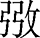
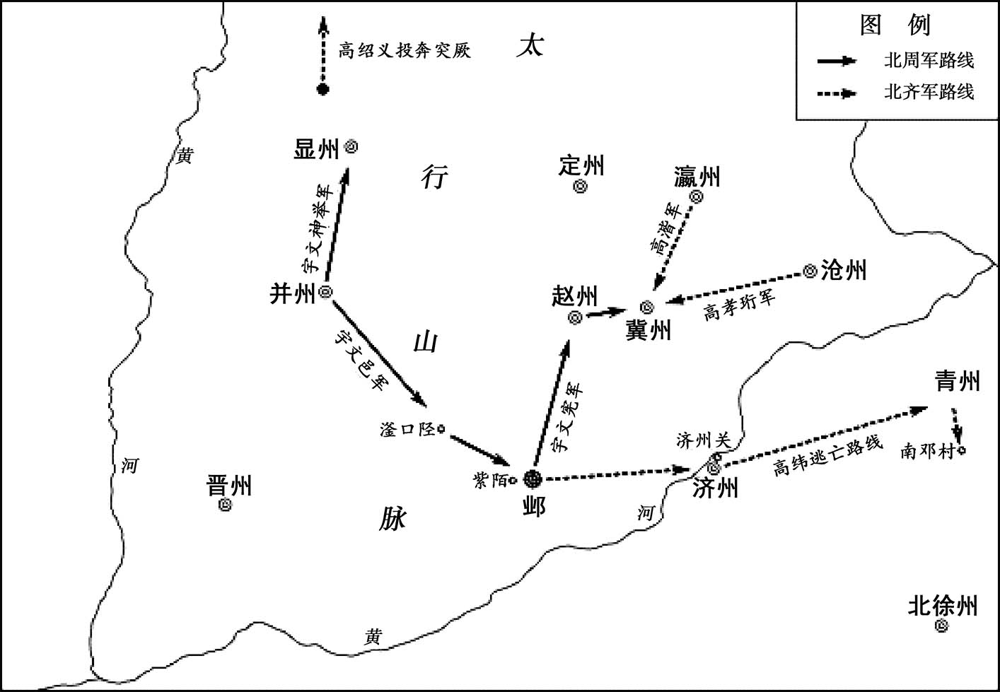
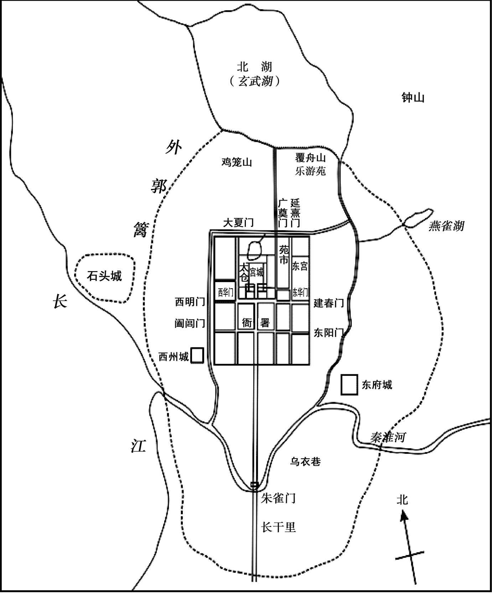
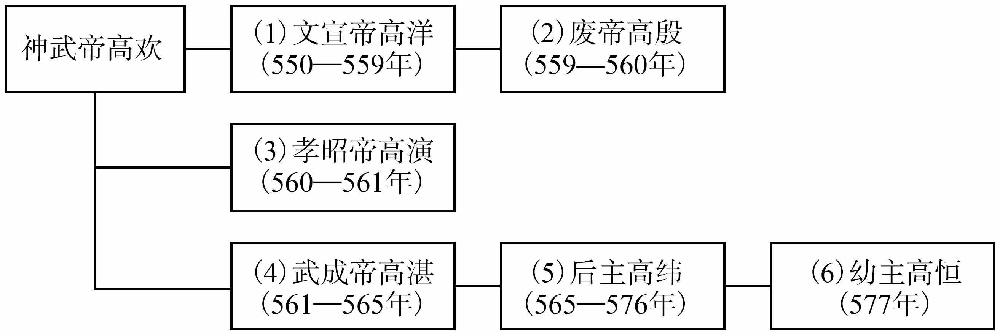
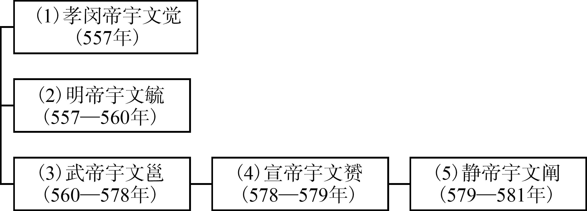
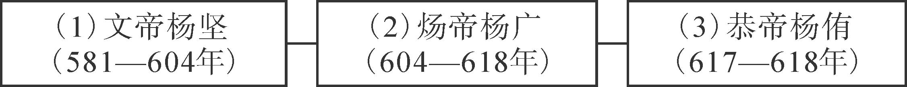

# 目录

周灭齐

杨坚篡周

始兴王谋逆

隋灭陈

隋易太子

附录： 
北齐皇帝世系表

北周皇帝世系表

隋皇帝世系表

返回总目录

# 周灭齐

## 【内容提要】

《周灭齐》叙述了北齐末年，政局混乱，统治黑暗，北周武帝宇文邕抓住时机，两次率军讨伐北齐，最终消灭北齐，统一北方的历史过程。

公元561年，北齐孝昭帝高演去世。高演在临死前，将帝位传给自己的胞弟、长广王高湛。高湛即位后，改元太宁，高湛即北齐武成帝。

高湛本即庸劣无能，即位后更是沉湎酒色，诛杀宗室，不谋国事，还重用奸诈作恶、阿谀逢迎的和士开、祖珽等人，北齐政治腐败，国势颓废。

北齐大臣祖珽私下劝说和士开，让他劝谏武成帝传位给太子，以便邀功。和士开听后照办，在和士开等人的劝说下，公元565年，武成帝果然传位于太子高纬，自为太上皇，但军国大事仍向他汇报。太子高纬即皇帝位，改年号为天统，高纬即北齐后主。

高纬木讷口吃，生性怯懦，不喜欢召见朝臣，如非宠幸之人，他从不与其交谈。北齐后主高纬继承武成帝的奢侈风气，宠信陆令萱、和士开、穆提婆等奸佞之徒，导致北齐更为衰落。但后主高纬却无视危机，一味享乐，还置文林馆，游宴赋诗，粉饰太平，被人讥为无愁天子。

北齐将领斛律光骁勇过人，治军严明，临阵果敢，每战必胜，深为敌手所忌惮，是一代名将。而且其为人正直，不贪权势，堪为北齐的中流砥柱，但却被诬陷而遭灭族之祸。北齐大臣崔季舒、张雕等人因联名劝谏后主不要到晋阳，也遭杀身之祸。北齐股肱之臣接连被杀，朝野无不失望，使得北齐内部矛盾更加尖锐，局面岌岌可危，国家处于危急之中。

北周建国后，国力不断增强。北周武帝宇文邕亲政后，更是励精图治，君臣同心，国势蒸蒸日上。看到北齐统治昏聩，北周武帝宇文邕决心灭齐。公元575年，他率兵东进，进攻河阴（今河南洛阳），后因宇文邕病重，北周撤军。公元576年，北周武帝再次率领大军攻伐北齐。灭齐之战开始后，宇文邕率大军攻击北齐重镇晋州（治今山西临汾），他亲临前线督战，周军一举攻克晋州。北齐后主得知周军伐齐，率军赴援，企图夺回晋州，周齐两军在晋州一带展开决战。在交战中，北齐后主表现得十分愚蠢，导致齐军大败。齐后主逃往晋阳，不久又逃奔邺城。周军乘胜连续进攻，相继攻破晋阳、邺城等地，北齐灭亡，北齐后主也被俘虏。

北周在宇文邕亲政后，国力日增，与此相应的是，北齐自文宣帝高洋去世后，统治集团内讧不断，政局动荡不安。到北齐武成帝高湛时期，更是政治腐败，经济凋敝，国家一蹶不振。北周攻灭北齐，使分裂的北方重归统一，为日后隋朝统一全国奠定了坚实基础。

## 【原文】

**陈文帝天嘉三年[1]。齐主之为长广王也，清都和士开以善握槊、弹琵琶有宠，辟为开府行参军，及即位，累迁给事黄门侍郎[2]。**

## 【注文】

[1]陈（557—589年）：朝代名。共历五帝三十三年，是中国历史上南北朝时期南朝的最后一个朝代。由陈武帝陈霸先创建，定都建康（今江苏南京）。仅控制江陵以东、长江以南的狭小地区。陈朝建立时已经出现南朝转弱、北朝转强的局面。陈朝刚建立时面临北方政权的入侵，形势十分危急。陈朝开国皇帝陈霸先带领军队一举击败敌军，形势有所好转。亡国君为陈后主陈叔宝，陈最后被隋文帝杨坚所灭。　　文帝：即陈朝第二位皇帝陈文帝陈蒨（522—566年），字子华，陈武帝陈霸先侄子。初任吴兴太守。陈霸先即位，封临川郡王，拜侍中、安东将军。永定三年（559年），陈霸先死，遗诏立为帝，公元559—566年在位。次年，改元天嘉。即位后，继续完成统一江南的事业。平时勤于政事，又比较注意节俭，发展农业生产，令地方官员及时劝课农桑，还曾整理户口。在他统治期间，南方的经济、文化都有一定的恢复和发展。天康元年（566年），病死。庙号世祖，谥号文皇帝。　　天嘉：南朝陈文帝陈蒨在位期间所用年号，共计六年多，即庚辰（560年）一月至丙戌（566年）二月。天嘉三年即562年。

[2]齐：即北齐（550—577年），朝代名。共历二十八年，是北朝政权之一。公元550年，文宣帝高洋取代东魏称帝，国号齐，建元天保，都城邺（今河北临漳西南），史称北齐。历经文宣帝高洋、废帝高殷、孝昭帝高演、武成帝高湛、后主高纬、幼主高恒六帝，577年被北周消灭。北齐继承了东魏所控制的地盘，占有今黄河下游流域的河北、河南、山东、山西以及苏北、皖北的广大地区。同时与其并存的王朝有西魏、北周（取代西魏）、南朝梁、陈等。　　齐主：即北齐武成帝高湛（537—568年），高欢第九子，高演同母弟弟。继高演为北齐皇帝。公元561年至565年在位。东魏时封长广郡公。北齐建国后，进爵为王。官至太尉、京畿大都督、右丞相。北齐废帝乾明元年（560年），拥立兄长高演为帝。北齐孝昭帝皇建二年（561年），高演死，遗诏高湛继统，不久即位，改元太宁。在位期间，修订律令，首创“十恶”之条。又颁行均田令，定租调之制。后不理朝政，荒淫奢侈。四年（565年），禅位于太子高纬，称太上皇帝。北齐后主高纬天统四年（568年），病死邺都，葬永平陵。谥号武成皇帝，庙号世祖。　　长广：郡名。东汉建安初置，治长广（今山东莱阳）。不久废。西晋武帝咸宁三年（277年）复置。北魏治胶东城（今山东平度）。辖昌阳、长广、不其、挺县、即墨、当利六县，北齐移治黄县（今山东黄县）。隋开皇初废。　　王：此处指郡王。爵位名。汉、魏时只封王爵。晋武帝司马炎封子弟二十多人为王，以郡为国，后称之为郡王。南朝陈置为封爵，为十二等爵第一等，一品。隋朝为九等爵第二等，从一品。隋炀帝大业三年（607年）仅保留王、公、侯三等，其余皆废。唐朝复置，为九等爵第二等，从一品。　　清都：郡名。即北齐时魏郡。西汉置，治邺县（今河北临漳西南），辖今河北邯郸以南以及河南安阳一带，后辖境屡有变迁。北魏时，辖邺县、临漳、繁阳、列人、昌乐、武安、临水、魏县、平邑、易阳、元城、斥章、贵乡十三县。北齐改为清都郡，北周复为魏郡。　　和士开（524—571年）：北齐大臣。字彦通，清都临漳（今河北临漳西）人。北齐初，任长广王高湛开府行参军，深为高湛宠信。高湛即位，官至给事黄门侍郎、兖州刺史、侍中、尚书右仆射，更受宠爱。高湛死后，顾托辅佐后主，深以委任，拜左仆射、尚书令，封淮阳王。后被琅邪王高俨所杀。　　以：因为，由于。　　善：善于，擅长。　　握槊（shuò）：古时类似双陆的一种博戏。　　琵（pí）琶（pá）：弹拉类弹弦乐器。琵琶二字始自汉代，最早写作枇杷或批把，后在字形上与琴瑟连类，故书为琵琶。古时琵琶为广义之词，文献上将汉族和其他民族的各种弹拨乐器都泛称为琵琶，汉代琵琶指的是圆形的阮。东汉晚期已出现梨形的样式，南北朝以后趋向定型，但称谓混乱，直到唐代，琵琶之名始固定。　　辟（bì）：帝王召见并授予官职。　　开府：官职名。此处为“开府仪同三司”的简称。三司即三公，即开建府署，辟置僚属援引三公之例。东汉初，以司空、司徒、太尉（大司马）为三公，因均冠司字，故又称三司，东汉始有“同三司”、“仪同三司”之称，曹魏时始设置“开府仪同三司”一职，为大臣加号，意即与三司即太尉、司徒、司空礼制、待遇相同，允许开设府署，自辟僚属。两晋、南北朝多沿用。隋初置为正四品上阶散官，隋炀帝大业三年（607年）改从一品，位次王、公。唐沿置，为文散官第一等；也用为勋官，从四品上。宋初为从一品文散官。明代废除。此外，西魏、北周实行府兵制，设十二大将军，每一将军也下设二开府，为统兵官。　　行参军：官职名。三国始置，晋初，朝廷除拜为参军，诸府自辟为行参军。晋以后行参军也可朝廷除拜，唯官阶低于参军。魏晋南北朝时期，公府、军府、州皆置，隋唐也置。　　累迁：多次升迁。　　给事黄门侍郎：官职名。即黄门侍郎，也称黄门郎，秦代初置，是皇帝近侍之臣，可传达诏令，无固定之员，掌侍从左右。汉代沿用此官职。与侍中共掌侍中寺事务。秦又有给事黄门之职，汉代沿用。至东汉，合并二官为给事黄门侍郎，掌侍从左右，出入宫禁，地位重要，魏晋南北朝沿用，梁为十二班，陈为四品。隋代改称黄门侍郎，为门下省副长官，正四品上。唐朝沿置，玄宗以后侍中渐成空衔，门下省事务实由其主持。高宗、武则天、玄宗时曾改名东台侍郎、鸾台侍郎、门下侍郎，不久复旧。代宗大历二年（767年）又改为门下侍郎，正三品。

## 【译文】

陈文帝天嘉三年（562年）。北齐国主武成帝高湛还是长广王时，清都人和士开因为擅长握槊游戏、弹琵琶而被宠信，被征召并授予开府行参军一职，等到武成帝即位，多次升迁至给事黄门侍郎。

## 【原文】

**四年。齐侍中、开府仪同三司和士开有宠于齐主，齐主外朝视事，或在内宴赏，须臾之间，不得不与士开相见，或累日不归，一日数入，或放还之后，俄顷即追，未至之间，连骑督趣[1]。奸谄百端，宠爱日隆，前后赏赐，不可胜纪[2]。每侍左右，言辞容止，极诸鄙亵，以夜继昼，无复君臣之礼[3]。常谓帝曰：“自古帝王，尽为灰土，尧舜、桀纣，竟复何异[4]？陛下宜及少壮，极意为乐，纵横行之，一日取快，可敌千年[5]。国事尽付大臣，何虑不办，无为自勤约也[6]。”帝大悦，于是委赵彦深掌官爵，元文遥掌财用，唐邕掌外、骑兵，信都冯子琮、胡长粲掌东宫[7]。帝三四日一视朝，书数字而已，略无所言，须臾罢入[8]。长粲，僧敬之子也[9]。**

## 【注文】

[1]侍中：官职名。秦始置，因往来殿内，故名侍中。加此官即可入侍禁中，侍从皇帝左右，出入宫廷，与闻朝政，逐渐变为亲信贵重之职。两汉沿置，为正规官职外的加官之一。三国魏、两晋、南朝宋、齐置为侍中省长官，三品。南朝梁、北魏孝文帝改制后为门下省长官。梁十三班；陈三品，北魏、北齐同。职掌机要、封驳、平尚书奏事等，往往成为事实上的宰相，晋朝开始也把侍中作为三公的加衔。北周仅为加官。隋改称纳言、侍内，唐高祖复改侍中，正三品，为门下省长官。执掌封驳制敕，与中书令共参议军国大政，居宰相之职，唐中期后渐成为虚职。唐高宗、武则天、中宗、玄宗时曾改名东台左相、纳言、黄门监、左相，不久皆复旧。明代废。　　外朝：天子处理朝政之所，对内朝而言。　　视事：任职，治事。多指政事。　　宴赏：宴饮赏玩。　　须臾（yú）：片刻，一会儿，少顷。　　累日：连日。　　俄顷：片刻；一会儿。　　连骑：指从骑之多。　　督趣：也作“督促”。督责催促。

[2]奸谄（chǎn）：奸邪谄媚。　　隆：上升；升高；增高。　　不可胜纪：数量极多，数不过来。胜，尽。纪同“计”。

[3]每：常常。　　容止：仪容举止。　　极诸：极其。　　鄙亵：鄙陋轻慢。　　无复：不再。复，再。

[4]灰土：尘土。　　尧：中国传说中的古帝王，父系氏族社会后期炎黄部落联盟领袖。帝喾（kù）少子。姓伊祁、伊耆，名放勋，号陶唐氏，史称帝尧、唐尧。传说他勤俭朴素，办事公正，体恤人民，被视为仁君的典范。曾设官治理国政，掌管时令，制定历法，并用鲧治水。晚年征询四岳（四方部落首领）意见，推荐舜为其继承人。恐长子丹朱不服，将其放逐于南方，后丹朱举兵反叛，尧亲自率兵平叛，处死丹朱，让位给舜。　　舜：古代传说中的帝王，原始社会后期部落联盟首领。姚姓（一说妫姓），名重华。号有虞氏，也称虞舜。被四岳荐为尧的继承人。继位后，耕田、打鱼、制陶，深受大众爱戴。先后实行了一系列社会改革：让八元管土地，八恺管教化，契管民事，伯益管山林川泽，伯夷管祭祀，皋陶作刑。又巡视四方，以禹治洪水，并经洪水考验，将禹立为自己的继承人。在位期间，继续对三苗等用兵，巩固华夏族的地位。晚年在南巡中病卒。　　桀（jié）：夏朝末代国王，历史上的著名昏君。名履癸。生性残暴，沉湎酒色。残酷剥削百姓，大兴土木，建造“倾宫”、“瑶台”等许多豪华宫殿。又曾在有仍（今山东济宁东南）会合诸侯，攻灭有缗（mín）氏（今山东金乡）。人民对他非常痛恨，相传借太阳来咒骂他，愿意一同灭亡。后来商族首领汤联合许多部落在鸣条之战中打败夏军，他逃奔南巢（今安徽巢湖西南）而死。夏朝灭亡。　　纣（zhòu）：即帝辛（？—前1066年），商朝末代国王，历史上的著名暴君。才力过人而刚愎（bì）自用，沉湎酒色，荒淫暴虐。对人民残酷剥削，刑罚苛重，作炮烙之刑，杀鄂侯、九侯和大臣比干，连续发动对东夷的战争，引起民众与各诸侯的反抗。周武王乘机联合西南各族举兵攻商，牧野之战，商军阵前倒戈，纣大败，逃奔鹿台自焚死，商朝灭亡。　　竟：最后；最终。

[5]陛（bì）下：本义为帝王宫殿的台阶之下，后成为下臣对统治者的尊称，秦朝以后只用以称皇帝。　　及：趁着。　　极意为乐：随心所欲，纵情取乐。　　纵横：肆意横行，无所顾忌。

[6]付：交给。　　勤约：勤劳节俭。

[7]赵彦深（507—576年）：北齐官员、书法家。名隐，字彦深。自称南阳宛县（今河南南阳）人。起初是东魏尚书令司马子如的门客，负责抄写事务。经司马子如推荐，官至大丞相府功曹参军，掌管机密，受到高欢赏识。入北齐，仍掌管机密。逐渐晋升至秘书监，拜侍中，封安乐公。后升任尚书左仆射，监修国史，进位尚书令，封宜阳王。官至司空、司徒。　　官爵：官职爵位。爵：即爵位、爵号，是古代皇帝对贵戚功臣的封赐。周代有公、侯、伯、子、男五种爵位，后代爵称和爵位制度往往因时而异。隋文帝杨坚置王、郡王、国公、郡公、县公、侯、伯、子、男九等；隋炀帝杨广改为王、公、侯三等爵。　　元文遥：生卒年不详。魏宗室，北齐大臣。字德远，河南洛阳人。东魏时，为高澄大将军府功曹。北齐建立后，任中书舍人。曾被幽禁，获释后授尚书祠部郎中。高演摄政，任大丞相府功曹参军，掌管机密。高演即位，任中书侍郎，封永乐县伯，参军国大事。北齐武成帝时，历任给事黄门侍郎、散骑常侍、侍中、中书监。北齐后主天统二年（566年），特赐姓高氏，升任尚书左仆射，兼侍中。出任西兖州刺史，后征召入朝，不久卒。　　财用：财物；财富。　　唐邕（yōng）：生卒年不详。北齐、北周大臣。字道和，太原晋阳（今山西太原西南）人。为高澄大将军府参军。北齐天保（550—559年）末为给事黄门侍郎。处事机敏，受到宠信。后主高纬时，迁尚书令，封晋昌王，加录尚书事。后因得罪高阿那肱，被夺权柄。北周灭齐之战，降北周，为仪同大将军，卒于凤州刺史任上。　　外、骑兵：即外兵省（曹）和骑兵省（曹）。外兵省（曹），官职名。三国魏置外兵曹，两晋、南北朝沿置，北魏也置。为五兵（七兵）尚书之一，掌管京畿外之兵。北齐建国后，外兵曹未归尚书省，而是改称外兵省，为掌管全国军政枢务的机构，直属皇帝，职权极重。骑兵曹（省），官职名。尚书省骑兵曹长官通称。三国魏置、西晋沿置，六品。东晋废。南朝梁复置，五班，北魏也置，六品。北齐不再归属尚书省，另设骑兵省，掌管骑兵事务。　　信都：县名、郡、国名。汉置县，治今河北冀州。隋大业（605—618年）初并入长乐，唐初复改信都。唐末曾改尧都，不久复旧。明洪武六年（1373年）废。历为信都国、信都郡、乐成国、冀州、长乐国等治所。也为郡、国名，西汉置郡。治信都（今河北冀州旧城），一度改为广川国等名，东汉建武元年（25年）恢复信都郡、县名。统辖信都、阜城、扶柳、南宫、经县、武邑、观津、堂阳、武遂、下博、饶阳、安平、深泽十三个县。仍属于冀州。东汉永平十五年（72年），改信都郡为乐成国。后又改为安平国、安平郡、长乐国、长乐郡等。　　冯子琮（cóng）（？—571年）：北齐大臣。字子琮，长乐信都（今河北冀州旧城）人。其妻为北齐武成帝胡皇后妹妹。初为领军府法曹参军，掌管机密。又升任太子中庶子、给事黄门侍郎，监修大明宫。北齐后主即位，任郑州刺史、吏部尚书、尚书右仆射。他卖官纳贿，肆意聚敛，后为北齐琅邪王高俨所杀。　　胡长粲（càn）：生卒年不详。北齐大臣。北齐后主时任侍中。安定临泾（今甘肃镇原东南）人。武成帝胡皇后的堂兄。以外戚起家给事中，迁黄门侍郎。后主即位，胡长粲与黄门冯子琮出入禁中，专典敷奏。世祖高湛死，与娄定远、赵彦深、和士开等同知朝政，当时人称他们为八贵。后主富于春秋，庶事皆委胡长粲。天统四年（568年），进位侍中。五年（569年），出为赵州刺史。卒于州。　　东宫：太子所居住的宫殿。也代指太子。

[8]视朝：临朝听政。　　略无：全无，毫无。　　罢入：散朝回宫。罢，中止某种活动。

[9]僧敬：即胡虔，生卒年不详。北魏末年官员。字僧敬，北魏临泾（今甘肃镇原郭塬乡皇后湾）人。初任千牛备身。北魏灵太后复执政，位至泾州刺史。对灵太后举止，时有劝谏。东魏时，位至司空。

## 【译文】

陈文帝天嘉四年（563年）。北齐侍中、开府仪同三司和士开受到北齐武成帝高湛宠信，武成帝或是上朝听政，或是在宫内饮宴赏玩，即使是片刻工夫，也不能不与和士开相见，有时武成帝一连几天不让他回家，有时一天几次召他进宫，有时刚让他回去，不大一会儿又要把他追回来，和士开还没到达之时，武成帝接连派人骑马催促。和士开想方设法阿谀逢迎，日益受武成帝宠爱，前后收到的赏赐，多得不可胜数。和士开每次侍奉在武成帝身边，说话言语，表情举止，都极为卑鄙下流，夜以继日，不再遵守君臣之间的礼节。和士开经常对武成帝说：“自古以来的帝王，最终都会变成泥土，尧舜、桀纣，最终有什么区别呢？陛下应该趁着身强力壮，随心所欲，纵情取乐，一天行乐，可以胜过千年。国家大事都交给大臣，还担心有什么不能办的呢，用不着给自己添加束缚。”武成帝听后非常高兴，于是委派赵彦深掌管官爵封赏，元文遥掌管处理财政，唐邕掌管外军和骑兵，信都人冯子琮、胡长粲掌管东宫事务。武成帝三四天才上一次朝，仅仅批示几个字而已，也不说什么话，一会就散朝回宫。胡长粲是胡僧敬的儿子。

## 【原文】

**帝使士开与胡后握槊，河南康献王孝瑜谏曰：“皇后天下之母，岂可与臣下接手[1]。”孝瑜又言：“赵郡王叡，其父死于非命，不可亲近[2]。”由是叡及士开共谮之[3]。士开言“孝瑜奢僭”，叡言“山东唯闻河南王，不闻有陛下”[4]。帝由是忌之[5]。孝瑜窃与尔朱御女言，帝闻之，大怒[6]。夏六月庚申，顿饮孝瑜酒三十七杯[7]。孝瑜体肥大，腰带十围，帝使左右娄子彦载以出，酖之于车，至西华门，烦躁投水而绝[8]。赠太尉、录尚书事[9]。诸侯在宫中者，莫敢举声，唯河间王孝琬大哭而出[10]。**

## 【注文】

[1]胡后：北齐武成帝高湛的皇后，生卒年不详。父胡延之，母为范阳卢氏。天保初年，选为长广王高湛王妃。高湛继帝位后，立为皇后，其子高纬登基后，为太后。北齐灭亡后，胡太后入北周。胡氏在做皇后和太后期间，行为颇不检点，北齐灭亡后，更是恣意淫秽，隋开皇年间去世。　　河南：郡名。西汉高帝二年（前205年）置，治雒阳（今河南洛阳）。汉时辖境相当于今河南黄河以南洛水、伊水下游，双洎（jì）河、贾鲁河上游地区及黄河以北原阳，其后辖境渐小。东魏治宜迁（东魏静帝改河南县置，今河南洛阳），辖宜迁，隋初废。　　康献王孝瑜：即高孝瑜（537—563年），北齐大臣，高澄之子。字正德。北齐初封河南王，任中书令、司州牧。与武成帝高湛相友善。又参与杀杨愔，受到高湛信任。后生活淫奢僭越，和士开等向高湛密告。高湛恼怒，于是派人将他毒死。　　谏（jiàn）：规劝君主或尊长，使改正错误。　　皇后：皇帝的正妻。　　接手：手相接触。

[2]赵郡：郡、国名。汉高帝四年（前203年）改邯郸郡置赵国，建安中改为郡，三国魏太和中复为国，并移治房子（今河北高邑西南）。西晋末复为郡。北魏移治平棘（今河北赵县）。辖境缩小，辖平棘、房子、元氏、高邑、栾城五县，相当于今河北赵县、元氏、高邑、柏乡等县地。隋初废。郡：行政区名。春秋时已出现，但当时的郡只设在边远地区，由国君的重臣率军驻守，其地位低于县。战国时期，郡的地位不断提高，故在郡下设县，形成郡、县两级制。郡长官称守，初为武职，防戍边郡。后成为地方长官。秦始皇统一后，确立郡县制。汉初，实行郡、国并存制。王国下辖郡县，后王国和郡同级别，后代沿置。隋文帝开皇三年（583年）废郡，隋大业初和唐天宝（742—756年）初曾两度恢复郡制，唐肃宗乾元元年（758年）再次废除，后不再复设，此后郡成为州、府的别称。　　叡（ruì）：即高叡（534—569年），北齐大臣，高欢弟高琛之子。小名须拔，自幼为高欢所养，东魏末任太子庶子，北齐建国封赵郡王，迁散骑常侍。北齐武成帝高湛时，升任尚书令，执掌朝政，屡次抗击突厥、北周进攻，进封太尉，声望很高，因此逐渐遭到猜忌，武成帝死后，被胡太后所杀。　　死于非命：指遭受意外的灾祸而死。非命，意外的祸患。

[3]由是：因此。　　谮（zèn）：说别人的坏话，诬陷，中伤。

[4]奢僭（jiàn）：指奢侈逾礼，不合法度。　　山东：崤（xiáo）山或华山以东地区。

[5]忌：猜忌，嫉妒，憎恨。

[6]窃：偷偷。　　尔朱御女：北齐武成帝高湛嫔妃，名摩女，生平事迹不详。御女为妃嫔称号。北魏孝文帝时始见。北齐后期，置八十一御女，各有名号。

[7]庚（gēng）申：中国古代用干支纪年、纪月、纪日、纪时的方法。即以甲、乙、丙、丁、戊（wù）、己、庚、辛、壬、癸（guǐ）十天干和子、丑、寅、卯（mǎo）、辰（chén）、巳、午、未、申、酉（yǒu）、戌（xū）、亥（hài）十二地支按照顺序组合起来纪年（月、日、时），如庚申、甲午、丙申等。六十年（月、日、时）为一周期，周而复始，循环不已。庚申为干支中的第五十七个。　　顿饮：一顿饭饮酒。

[8]围：量词。两手拇指和食指合拢的长度。　　左右：身边人员、部下。　　娄子彦：北齐武成帝高湛的近臣。生平事迹不详。　　酖（zhèn）：“鸩”的异体字。毒酒，用毒酒害人。　　西华门：邺城宫城西门。　　绝：死。

[9]太尉：官职名。秦置，为全国最高军事长官，与丞相、御史大夫共同负责军政大事，合称三公。西汉初尚沿此制，后改称大司马。东汉时仍称太尉，以太尉、司徒、司空为三公，管理全国军政，参议大政，秩万石。魏、晋、南北朝多为大臣加官，无实际职掌，皆一品（梁称十八班）。隋、唐类此，正一品，北宋初沿置，为加官，宋徽宗赵佶时改为武职最高级阶官，正二品，元代以后废。晚唐至宋也作为对武将的尊称。　　录尚书事：官职名。西汉后期始设“领尚书事”，为总领尚书台的长官或为宰相之兼衔。东汉改称“录尚书事”。自汉末、魏晋以后录尚书事虽不是尚书台的长官，其官秩也随所任者而异，但由于掌重权的大臣常兼此职且位在尚书令之上，故仍是总揽朝政，威权极重。南北朝时无专任的宰相也无正式的宰相之名而实任宰相之职者，常加“录尚书事”衔，当时号称“录公”。南齐及北魏、北齐皆定为正式官号，为尚书省长官，北周时（一说隋时）废。

[10]举声：出声。　　河间：郡、国名。汉高帝置郡，文帝改国，其后或为郡，或为国。治乐城（今河北献县东南）。平帝时辖境相当于今河北献县、交河、东光、阜城、武强各一部分地。东汉初废，永元初复置国，辖境扩大至相当于今河北雄县及大清河以南，南运河以西，高阳、肃宁以东，交河、阜城以北地区。三国魏改为郡，西晋复为国。北魏初又改为郡，辖武垣、乐城、中水、鄚（mào）县四县，隋开皇初废。隋大业初改瀛（yíng）州为河间郡。治赵军城（隋置河间县，即今河北河间）。辖河间、文安、乐寿、束城、景城、高阳、鄚县、博野、清苑、长芦、平舒、鲁城、饶阳十三县，辖境相当于今河北保定市区、博野以东，肃宁、河间、沧州、盐山以北，大清河以南地区。唐武德四年（621年）复为瀛州，天宝元年（742年）又改为河间郡，乾元元年（758年）又复为瀛州。北宋大观二年（1108年）升为河间府。此外，南朝宋侨置河间郡。治乐城（今山东寿光），北魏辖阜城、城平、武垣、乐城、章武、南皮六县。　　孝琬（wǎn）：即高孝琬（541—566年），北齐大臣。高欢长子高澄第三子。北齐天保元年封河间王，天统元年（565年）升任尚书令。后因骄矜自负，人进谗言，被武成帝高湛所杀。

## 【译文】

北齐武成帝高湛让和士开与胡皇后玩握槊游戏，河南康献王高孝瑜劝谏说：“皇后是百姓之母，怎么可以和臣下的手接触呢。”高孝瑜又说：“赵郡王高叡，他的父亲死于非命，陛下不可与他亲近。”因此高叡与和士开共同进高孝瑜的谗言。和士开说“高孝瑜奢侈程度超越他的身份”，高叡说“山东只听说有河南王，听不到有陛下”。武成帝因此猜忌高孝瑜。高孝瑜曾经偷偷和尔朱御女交谈，武成帝听说这件事，非常愤怒。天嘉四年（563年）夏季六月庚申（二十八日），武成帝一次让高孝瑜喝了三十七杯酒。高孝瑜身体肥胖硕大，腰粗十围，武成帝派身边亲信娄子彦用车将高孝瑜载着拉出来，在车上又给高孝瑜灌了毒酒，到了西华门，高孝瑜毒药发作，烦躁投水而死。武成帝给高孝瑜赠官为太尉、录尚书事。在宫中的各个诸侯，都不敢声张，只有河间王高孝琬从宫中大哭而出。

## 【原文】

**六年［夏四月］。齐著作郎祖珽有文学，多技艺，而疏率无行[1]。尝为高祖中外府功曹，因宴失金叵罗，于珽髻上得之[2]。又坐诈盗官粟三千石，鞭二百，配甲坊[3]。显祖时，珽为秘书丞，盗《华林遍略》，及有他赃，当绞，除名为民[4]。显祖虽憎其数犯法，而爱其才伎，令直中书省[5]。世祖为长广王，珽为胡桃油献之，因言“殿下有非常骨法，孝徵梦殿下乘龙上天”[6]。王曰：“若然，当使兄大富贵[7]。”及即位，擢拜中书侍郎，迁散骑常侍[8]。与和士开共为奸谄。**

## 【注文】

[1]著作郎：官职名。三国魏始置，属中书省，担任编修国史和起居注的任务。晋惠帝时起，改属秘书监，称大著作郎，常由中书监、散骑常侍、给事中等兼任，多为贵族子弟起家的职务，后代多沿置。晋、南朝宋皆六品，梁武帝萧衍天监七年（508年）定为六班，陈改为六品。北魏中期置为著作局长官，从五品上。北齐为著作省长官，从五品上。隋朝为著作曹长官，隋初定为从五品上，炀帝大业三年（607年）升正五品，后又降为从五品。唐代为著作局长官，唐太宗贞观三年（629年）置史馆后，不再掌国史修撰。　　祖珽（tǐng）：生卒年不详。北齐大臣、文学家。字孝徵（zhēng），北齐范阳逎（qiū）（今河北涞〈lái〉水北）人。博学多才，擅写文章，精通音律，但为人、从政贪婪骄奢，为当时人们所不齿。初任秘书郎，后主时官至尚书左仆射，入文林馆总监撰书，封燕国公。后因罪贬为北徐州刺史。　　疏率（lǜ）：粗疏轻率；粗略草率。　　无行：行为恶劣；品行不好。

[2]尝：曾经。　　高祖：即高欢（496—547年），东魏权臣，北齐王朝的奠基者。一名贺六浑，祖籍渤海蓨（tiáo）县（今河北景县），后迁居怀朔镇（今内蒙古固阳西南），成为鲜卑化汉人。高欢性格沉稳大度，轻财重士，为当时豪杰所崇敬。曾参加北魏末年杜洛周的起义军，继归葛荣，后归附尔朱荣。尔朱荣死后，高欢以六镇兵为基础，南下据冀州，进兵洛阳，杀北魏节闵帝，立元脩（xiū）为傀（kuǐ）儡（lěi）皇帝，击败尔朱兆，消灭尔朱氏的势力。北魏孝武帝元脩西奔长安后，高欢立孝静帝元善见，迁都邺城，史称东魏。武定五年（547年），高欢病死。在执政期间，高欢尝试解决胡汉民族矛盾，维护均田制度，死后其子高洋于公元550年废东魏，建立北齐。追尊高欢为神武帝，庙号为高祖。　　中外府：即都督中外诸军事府，官署名。北朝置，统管中央和地方上的军队，设有长史、司马、司录、从事中郎、掾（yuàn）、属、诸曹参军、行参军等佐官。　　功曹：官职名。西汉始设，为地方官府职事机构。掌管人员选任，并兼参管诸曹事务。其主事者，司隶校尉府称功曹从事，州府称治中从事，郡称功曹，县称功曹掾。后代沿置，北宋崇宁三年（1104年）废。　　金叵（pǒ）罗：金制酒器。　　髻（jì）：在头顶或脑后盘成各种形状的头发。

[3]坐：定罪，由……而获罪。　　诈盗：诈骗盗窃。　　粟（sù）：即谷子、小米。泛指谷类。　　石（dàn）：重量单位，一百二十市斤为一石。在古书中读shí，如三千石。　　配：古代把罪人遣放到边远地区充军；放逐。　　甲坊：制造铠甲的作坊。

[4]显祖：即北齐文宣帝高洋（529—559年），字子进。渤海蓨（tiáo）县（今河北景县南）人。高欢次子，北齐的建立者。公元550年，代东魏自立，建立北齐，改元天保。以鲜卑贵族为政权基础，任用汉人杨愔（yīn）改定律令，抑制贪污。连年出击柔然、突厥，均获大胜。并修建长城，巩固边防。又乘侯景乱梁之后，发兵南征，北齐疆土扩展至淮南，后与陈朝划江为界。高洋在位初年，治国谨慎，执法公允，后居功自傲，荒淫暴虐，并推行鲜卑化，胡汉矛盾比较突出。只是依赖杨愔辅政，得以维持政局。后因酗（xù）酒暴卒，谥号文宣皇帝，庙号显祖。　　秘书丞：官职名。东汉建安十八年（213年）曹操置。魏文帝黄初元年（220年）改秘书令为秘书监，下设秘书丞等职。晋武帝曾以秘书并入中书省，其长官称中书秘书丞。晋惠帝复置秘书监，秘书丞为其属官之一，负责所藏图书典籍的管理和整理校定。在两晋、南北朝时期为清要之官，出任者多为士族高门。晋、南朝宋皆六品，梁武帝天监七年（508年）定为八班，陈改为五品。在北魏时多参典著作，主修撰国史及起居注，并参与礼仪制度的议定。北魏、北齐皆五品上。隋初于秘书省也设秘书丞，五品。大业三年（607年）改革官制，废秘书丞之职。唐复设，主管秘书省的日常事务，从五品上。宋、金也有此官。　　《华林遍略》：书名。南北朝时期重要的类书之一，由南朝梁武帝萧衍下令编纂，徐勉、徐僧权、何思澄等人编写，共七百卷。自天监十五年（516年）起，历时八年完成。北齐时颇受注重。隋时尚有六百二十卷，唐修《艺文类聚》时也多摘录。宋初已不传。今在敦煌文书中发现一唐人写本之古类书，存二百五十九行，或认定即为本书残存之抄本。《华林遍略》为我国古代许多重要类书的蓝本，对中国古代类书的编纂具有深远的影响。　　绞（jiǎo）：勒死；吊死。　　除名：除去名籍，取消原有身份。

[5]才伎（jì）：即“才技”。才智本领。　　直：职守。　　中书省：官署名。三国魏置，掌臣下奏事，并草拟皇帝诏令，设监、令为长官。晋朝、南北朝沿置，为秉承君主意旨，掌管机要、发布政令的机构。权力甚大，长官多为实际宰相。隋朝因避讳改称内史省、内书省。唐高祖李渊时复称中书省，与门下省、尚书省共理军国大政，为最高决策机关。掌草拟诏敕，交尚书省颁下执行；中央各部门及地方州府进奏章表，亦由中书省递呈皇帝，并草拟批答。唐高宗、武则天、玄宗时曾改名西台、风阁、紫微省，不久即复旧。明初废。

[6]胡桃：即核桃。　　因：趁势；乘便。　　殿下：汉以来对太子、诸侯王的称呼。殿下本意为殿阶之下，因太子、诸侯王居宫殿而见群臣，故尊称殿下。犹如称皇帝为陛下。　　非常：异乎寻常的、异常的。　　骨法：骨相。　　孝徵：即祖珽，字孝徵。

[7]若然：如果这样。　　大富贵：得到荣华富贵。

[8]擢（zhuó）拜：提拔授官。擢，提拔，提升。拜，授予官职；任命。　　中书侍郎：官职名。三国魏始置中书侍郎，也称中书郎，为中书省长官中书监、令的副手，协助长官起草发布诏令，五品。两晋南朝沿置，东晋时执掌诏令的起草，曾一度改称中书通事郎。南朝也置，南朝宋以后起草诏命的职责多归舍人，侍郎职权渐轻。南朝宋五品，梁九班，陈四品。北魏、北齐均设。北魏从四品上。北齐从四品。隋代改称内史侍郎或内书侍郎，唐初复改为中书侍郎，为中书省次官，正四品。唐代宗时升正三品。唐中期后因中书令不轻易授人，故中书侍郎也等于中书省的长官，多以中书侍郎同中书门下平章事为宰相之职衔，唐高宗、武则天、唐玄宗时曾改为西台侍郎、风阁侍郎、紫微侍郎等，不久都恢复旧称。南宋废除。　　迁：古代称调动官职，一般指升职。　　散骑常侍：官职名。秦、汉时设散骑和中常侍。三国魏置散骑常侍，由散骑和中常侍合并而成，在皇帝左右规谏过失，以备顾问，三品。两晋、南朝、北魏、北齐沿置。初为散骑省长宫，东晋以后为东省（集书省）长官。职掌侍从、规谏，多为加官。至东晋，参掌机密，职任类似侍中。南朝宋以后散骑省改为集书省，职以侍从左右、掌图书文翰为主，地位下降。北朝也兼修史。晋、南朝宋三品，梁十二班，陈三品，北魏、北齐从三品。隋、唐初属门下省。隋从三品。唐太宗曾改从三品散官，后复为职事官。唐高宗显庆二年（657年）分置左右，以左散骑常侍隶门下省，右散骑常侍隶中书省。唐中期后成为虚职，唐高宗曾改左右侍极、左右常侍，不久皆复旧。宋代不常置，金元以后废。

## 【译文】

陈文帝天嘉六年（565年）夏季四月。北齐著作郎祖珽很有文才，擅长多种技艺，然而却为人粗疏轻率，缺乏德行。祖珽曾经在高祖高欢手下做中外府功曹，因为宴饮时丢失金叵罗，后来在祖珽的发髻上找到。又因为犯下诈骗盗窃官家三千石小米的罪行，被抽打二百鞭，发配到甲坊。文宣帝高洋时，祖珽出任秘书丞，盗窃《华林遍略》，还涉及其他一些犯罪行为，依法本应该被绞死，最终被免职为民。文宣帝高洋虽然憎恶祖珽屡次犯法，然而爱惜他的文才技艺，便让他在中书省职守。武成帝高湛还是长广王时，祖珽做了胡桃油进献给他，趁机进言“殿下有非同寻常的骨相，我梦见殿下乘龙飞上青天”。长广王说：“如果真是这样，我一定让老兄大富大贵。”等到武成帝即位，提拔祖珽为中书侍郎，又晋升为散骑常侍。与和士开一起奸诈作恶，阿谀逢迎。

## 【原文】

**珽私说士开曰：“君之宠幸，振古无比，宫车一日晚驾，欲何以克终[1]？”士开因从问计，珽曰：“宜说主上，云文襄、文宣、孝昭之子俱不得立，今宜令皇太子早践大位，以定君臣之分[2]。若事成，中宫、少主必皆德君，此万全计也[3]。请君微说主上令粗解，珽当自外上表论之[4]。”士开许诺[5]。会有彗星见，太史奏云：“彗，除旧布新之象，当有易主[6]。”珽于是上书言：“陛下虽为天子，未为极贵，宜传位东宫，且以上应天道[7]。”并上魏显祖禅子故事[8]。齐主从之，丙子，使太宰段韶持节奉皇帝玺绶，传位于太子纬[9]。太子即皇帝位于晋阳宫，大赦，改元天统[10]。又诏以太子妃斛律氏为皇后[11]。于是群公上世祖尊号为太上皇帝，军国大事咸以闻[12]。使黄门侍郎冯子琮、尚书左丞胡长粲辅导少主，出入禁中，专典敷奏[13]。子琮，胡后之妺夫也。祖珽拜秘书监，加仪同三司，大被亲宠，见重二宫[14]。**

## 【注文】

[1]私说（shuì）：私下劝说。说，劝说。　　宠幸：旧指帝王对后妃、臣下的宠爱。泛指地位高的人对地位低的人的宠爱。　　振古：远古；往昔。　　宫车：帝王、后妃等所乘坐的车辆。因此常借指帝、后。　　晚驾：即晏（yàn）驾。帝王、君主死亡的婉辞。　　克终：维持到底。

[2]因：于是，就。　　问计：咨询对策。计，计策；计谋。　　主上：臣下对君主的称呼。　　文襄（xiāng）：即高澄（521—549年）。东魏大臣。渤海蓨（今河北景县）人。字子惠，高欢长子。东魏时高欢掌朝政，被委以重任。高澄废除北魏制定的按年资高低选官的停年格制度，尊贤礼士，选拔人才，整顿吏治，广开言路。高欢死后，进位相国，封齐王，掌理朝政。后密谋受禅，遇刺而亡。其弟高洋代魏后，追谥文襄皇帝，庙号世宗。　　文宣：即北齐文宣帝高洋。　　孝昭：即北齐孝昭帝高演（535—561年）。渤海蓨（tiáo）（今河北景县）人。字延安。高欢第六子。东魏末封常山郡公。北齐初，进封为王。北齐废帝高殷时任太傅、录尚书，执掌朝政。后废高殷为济南王，自己即帝位。他留心统治之道，轻徭薄役。皇建二年（561年）卒。　　皇太子：又称太子。皇帝所选定的继承皇位的皇子，一般为皇帝的嫡（dí）长子，但也常以“传贤不传长”为名，另选皇帝所偏爱者。　　践：特指皇帝登临皇位。　　大位：指帝位。　　君臣之分：明确君臣之间的名分。

[3]中宫：皇后居住之处，因以借指皇后。　　少主：指即位的年轻君主。　　德：感激。

[4]微说：委婉劝说。　　粗解：大致了解。　　上表：上奏章。

[5]许诺：应允；答应；应承。

[6]会：恰好，正好，适逢。　　彗星：绕太阳运行的一种星体。后曳长尾，呈云雾状。俗称扫帚星。古人认为彗星主除旧布新，其出现又为重大灾难的预兆。　　见（xiàn）：通“现”。出现。　　太史：官职名。西周、春秋时太史掌管起草文书、策命诸侯卿大夫，记载史事，编写史书，兼管国家典籍、天文历法、祭祀等，为朝廷大臣。秦称太史令，汉属太常，职位渐低。魏晋以后修史的职务划归著作郎，太史仅管推算历法，至明清两朝，修史之事由翰林院负责，又称翰林为太史。　　除旧布新：清除旧的，建立新的。　　易主：更换君主。易，更换。

[7]上书：向君主进呈书面意见。　　天子：在古代君权神授观念下，认为帝王是上天之子，故称天子。　　极贵：极端高贵。　　应：应和。　　天道：天理，天意，上天的运动变化规律。

[8]魏：北魏（386—534年）。朝代名。共历149年。北朝之一，公元386年，鲜卑族拓跋珪重建代国，称王，改元登国，都盛乐（今内蒙古和林格尔西北），不久改国号魏，史称北魏，又称后魏、拓跋魏；天兴元年（398年），迁都平城（今山西大同东北），称帝。太延五年（439年），太武帝拓跋焘统一北方，与南朝对峙。太和十七年（493年），孝文帝拓跋宏迁都洛阳（今河南洛阳东），改姓元，故又称元魏。统治区域北至蒙古高原，西至今新疆东部，东北至辽西，南境初以黄河为界，后又逐渐扩展至秦岭、淮河，进一步占有淮南地。至孝武帝元脩永熙三年（534年）分裂为东魏、西魏。　　显祖：即北魏献文帝拓跋（tuò bá）弘（454—476年），拓跋浚长子。即位之初，丞相乙浑专权，拓跋浚妻冯氏定策杀乙浑，遂掌握朝政。献文帝在位六年禅位与太子拓跋宏，后被冯太后毒死。在位时，北魏取宋淮北地区。谥献文皇帝，庙号显祖。　　禅（shàn）子故事：指北魏献文帝把帝位传给儿子的旧例。禅也称禅位，禅让。本为原始社会末期推选部落首领的制度，反映了原始社会末期的军事民主制传统。禹死后，他的儿子启以父传子的方式继承了王位，以后历代相沿。禅让制遂废。夏代之后，世袭王朝更替，朝中权臣夺取帝位，多通过禅让方式，以取得正统性，但实际上与原始社会的禅让制度不同。故事，旧事；先例。

[9]从：听从，顺从，接受。　　太宰：官职名。即太师，晋初避司马师讳，以周官太宰名代太师，晋代所设八公之一，与太傅、太保并称上公，东晋、南朝沿置，皆为一品（梁朝为十八班）。北朝也有设置，多为赠官。　　段韶（sháo）（？—571年）：北齐大臣。字孝先，武威姑藏（今甘肃武威）人。年少即善骑射，有将帅才略，加之为高欢外甥，故为高欢所信任。北齐建国，拜尚书右仆射，出为冀州刺史，六州大都督，曾败梁军，平定宗室之乱，又破北周、突厥进攻，进位太师，除太宰、左丞相。其多战功，又以忠孝闻名，为北齐重臣，后病卒于军中。　　持节：即持节出使。古代使臣奉命出行，必执符节以为凭证。　　玺（xǐ）绶：古代印玺上所系的彩色丝带。借指印玺。　　纬：即北齐后主高纬（556—578年），字仁纲。高湛长子。北齐河清四年（565年）即位。尊父为太上皇。高纬宠信陆令萱、和士开、高阿那肱等佞（nìng）臣。赋役沉重，吏治败坏。577年，北周武帝宇文邕灭北齐，高纬被俘，封温公，不久被赐死。

[10]晋阳宫：晋阳（今山西太原）是北齐的陪都。东魏时，高欢于兴和元年（539年）在晋阳建成“新宫”，武定三年（545年）又建起宏伟的晋阳宫。北齐皇帝对营建晋阳很重视，后主高纬又建大明殿和十二院，比邺城宫殿还壮观。隋唐时又有兴建，唐建国后以晋阳为北都。　　大赦（shè）：帝王对全国已判罪犯普遍赦免或减刑，一般在皇帝登基、更换年号、立皇后、立太子等重大喜庆时实施。赦，免除和减轻刑罚。　　改元：更改年号。　　天统：北齐后主高纬在位期间所用年号，共计四年多。即乙酉（565年）四月至己丑（569年）十二月。

[11]太子妃：太子的正妻。　　斛（hú）律氏：生卒年不详。北齐后主高纬的皇后，斛律光的女儿。起初为皇太子高纬妃。高纬即位，立斛律氏为皇后。后主高纬杀害斛律光后，废斛律皇后为庶人，后令其为尼。北齐灭亡后，改嫁元仁。

[12]群公：各位大臣。　　尊号：指古代尊崇皇帝、皇后的称号。　　太上皇帝：即太上皇。皇帝父亲的尊号。　　军国：统军治国。　　咸：全；都。　　以闻：把某件事报告给皇帝。

[13]黄门侍郎：参见“给事黄门侍郎”条注。　　尚书左丞：官职名。汉成帝建始四年（前29年）置尚书，设尚书五人、尚书丞四人。东汉光武帝减二人，始分左右丞。尚书左丞辅佐尚书令，总领政务；右丞辅佐仆射，掌管钱财等事，为尚书令及仆射的重要属官。魏晋南北朝沿置，掌管监察百官，文书奏章，管理尚书省日常事务。三国魏、晋、南朝宋皆六品，梁为九班，陈为四品，北魏、北齐从四品上。隋唐时期管理左司郎中、员外郎，监督吏、户、礼三部，常与右丞负责尚书省日常事务。唐高宗李治时改称左肃机，不久即恢复旧称。隋从四品，唐正四品上。后代多沿置，元代后废。　　辅导：辅佐。帮助和指导。　　禁中：也作“禁内”。封建帝王所居的宫苑。因不许人随便进出，故称。　　典：主持，主管。　　敷（fū）奏：陈奏，向君主报告。

[14]秘书监：官职名。东汉桓（huán）帝刘志始设，属太常。掌图书典籍，校定文字，后废。三国魏文帝曹丕时复置，为秘书署长官，三品。西晋武帝司马炎时罢，惠帝司马衷又复置，为秘书寺长官，掌管图籍、课试、国史修撰等，三品。南北朝沿置，为秘书省长官。南朝宋三品，梁武帝天监七年（508年）定为十一班，陈改为四品；北魏、北齐皆三品。隋初正三品，隋炀帝大业三年（607年）降为从三品，其后改称秘书令。唐初复旧。　　仪同三司：官职名。原为“开府仪同三司”的简称。北魏时仪同三司为单独官号，指礼仪同于诸公，但不开府辟官，从一品。北齐也置仪同三司，二品。西魏、北周府兵中二十四开府仪同府下设车骑将军、仪同三司为主将，简称“仪同将军”。北周武帝建德四年（575年）又改为仪同大将军，隋初车骑将军仍号仪同三司。仪同三司也为勋宫、散官号。北周为正九命，隋朝正五品上，隋炀帝大业三年（607年）罢。唐复置，高祖武德七年（624年）改为骑都尉。　　亲宠：亲近宠幸。　　见重二宫：指被太上皇、皇上所看重。二宫，此处指太上皇和皇上。

## 【译文】

祖珽私下劝说和士开道：“您受到的宠幸，自古及今前所未有，但皇上一旦驾崩，打算用什么办法维持这种地位呢？”和士开于是向祖珽询问对策，祖珽回答道：“应该劝说皇上，说文襄帝高澄、文宣帝高洋和孝昭帝高演的儿子都没能继位，现在应该让皇太子早日继承帝位，以明确君臣之间的名分。如果此事成功，皇后、皇太子一定都会感激您，这才是万全之计。请您委婉劝说皇上让他大体知道，我自当从外面上表论及此事。”和士开答应照办。当时适逢有彗星出现，太史上奏说：“彗星是除旧布新的象征，应当会有皇位变化。”祖珽借此上书说：“陛下虽然是天子，但还不是至极尊贵，应该把帝位传给太子，以此顺应天道。”并且奏上北魏显祖献文帝拓跋弘把帝位传给儿子的旧例。武成帝高湛听从了他们的建议，天嘉六年（565年）四月丙子（二十四日），武成帝派太宰段韶手持符节，捧着皇帝的玉玺和绶带，传帝位给太子高纬。太子高纬在晋阳宫即皇帝位，大赦全国，改年号为天统。又下诏册封太子妃斛律氏为皇后。于是众王公给武成帝上尊号为太上皇帝，军国大事全都向他汇报。派黄门侍郎冯子琮、尚书左丞胡长粲辅佐新皇帝，他们出入皇宫，专门负责奏章方面的事情。冯子琮是胡皇后的妺夫。祖珽被任命为秘书监，加仪同三司，大受亲近宠幸，被太上皇、皇上所看重。

## 【原文】

**齐世祖之为长广王也，数为显祖所捶，心常衔之[1]。显祖每见祖珽，常呼为贼，故珽亦怨之。且欲求媚于世祖，乃说世祖曰：“文宣狂暴，何得称‘文’[2]？既非创业，何得称‘祖’？若文宣为祖，陛下万岁后当何所称[3]？”帝从之。己丑(1)，改谥太祖献武皇帝为神武皇帝，庙号高祖，献明皇后为武明皇后[4]。令有司更议文宣谥号[5]。十二月庚午，齐改谥文宣皇帝为景烈皇帝，庙号威宗。**

## 【注文】

[1]捶（chuí）：用拳头或棒槌敲打。　　衔（xián）：记在心里。

[2]求媚（mèi）：讨好。　　乃：于是，就。　　狂暴：凶暴；残暴。

[3]万岁后：指皇帝去世。

[4]谥（shì）：即谥号。古代帝王或大臣死后评给的称号。　　太祖献武皇帝：即高欢。　　庙号：皇帝死后，在太庙立室奉祀时起的名号。　　献明皇后：即高欢妻子娄氏（501—562年），名昭君。高欢起事，竭力相助，参与其谋划。她明察善断，善于识人，生活俭朴，对下宽厚，对其亲属要求严格。北齐文宣帝高洋天保初，高洋篡魏称帝，尊她为皇太后。高洋虽狂暴至极，但对她极为尊重孝顺。高殷即位，尊为太皇太后。后她废北齐废帝高殷。高演即位，尊她为皇太后。孝昭帝高演死后，她又下诏立武成帝高湛。大宁二年（562年）去世。与高欢合葬于义平陵（今河北临漳西北）。

[5]有司：指主管的官吏或部门。古代设官分职，各有专司，故称有司。历代沿用。也为官吏和官署的泛称。　　更议：改议。

## 【译文】

北齐武成帝高湛还是长广王时，曾经屡次被文宣帝高洋所鞭打，心中常常忌恨文宣帝。文宣帝每次见到祖珽，常常喊他贼，所以祖珽心里也怨恨他。并且祖珽又想要讨好武成帝，于是劝说武成帝说：“文宣帝举止狂躁暴戾，怎么能够称为‘文’呢？他也没有创立基业，怎么能称为‘祖’呢？如果文宣帝被称为祖，那陛下驾崩之后该如何称呼呢？”武成帝听从了祖珽的建议。己丑，改太祖献武皇帝高欢的谥号为神武皇帝，庙号为高祖，改献明皇后的谥号为武明皇后。下令有关部门重新讨论文宣帝高洋的谥号。天嘉六年（565年）十二月庚午（二十二日），北齐改文宣皇帝高洋的谥号为景烈皇帝，改庙号为威宗。

## 【原文】

**天康元年冬十二月，齐河间王孝琬怨执政，为草人而射之[1]。和士开、祖珽谮之于上皇曰：“草人以拟圣躬也[2]。又前突厥至并州，孝琬脱兜鍪抵地，云：‘我岂老妪，须著此物！’此言属大家也[3]。又魏世谣言‘河南种谷河北生，白杨树端金鸡鸣’[4]。河南、北者，河间也[5]。孝琬将建金鸡大赦耳[6]。”上皇颇惑之[7]。会孝琬得佛牙，置第内，夜有光[8]。上皇闻之，使捜之，得填库矟幡数百[9]。上皇以为反具，收讯[10]。诸姬有陈氏者，无宠，诬孝琬，云“孝琬常画陛下像而哭之”，其实世宗像也[11]。上皇怒，使武卫赫连辅玄倒鞭挝之[12]。孝琬呼叔。上皇曰：“何敢呼我为叔！”孝琬曰：“臣神武皇帝嫡孙，又襄皇帝嫡子，魏孝静皇帝之甥，何为不得呼叔[13]？”上皇愈怒，折其两胫而死[14]。安德王延宗哭之，泪赤[15]。又为草人鞭而讯之，曰：“何故杀我兄[16]？”奴告之，上皇覆延宗于地，马鞭鞭之二百，几死[17]。**

## 【注文】

[1]天康：南朝陈文帝陈蒨在位期间所用年号，共计一年，即丙戌（566年）二月至十二月。　　执政：掌握国家大权的人。此处指太上皇高湛。

[2]上皇：指北齐武成帝高湛。　　圣躬：即圣体，臣下称皇帝的身体。也代指皇帝。

[3]突厥（jué）：中国古代北方和西北方民族及其所建汗国名。广义的突厥泛指古代所有行突厥文的部族。狭义的突厥专指6世纪中至8世纪中两度建立汗国的民族。其先人6世纪中居金山（今阿尔泰山）之阳，金山形似战盔，其俗称为突厥，因以为号。首领姓阿史那氏。552年破柔然，土门自立为伊利可汗，建立汗国，置汗庭于漠北鄂尔浑河流域的郁督军山（今蒙古国杭爱山），史家称之为突厥第一汗国或东突厥（也作北突厥）。曾向隋称臣纳贡并迁居漠南。隋末变乱，突厥又强盛起来。群雄争事突厥以求援助。至唐太宗继位，联结薛延陀（tuó）、回纥（hé）等铁勒诸部，于630年消灭了东突厥汗国，682年，东突厥贵族阿史那骨咄（duō）禄起而反唐。公元686年至688年间夺取乌德鞬（jiān）山（郁督军山），重建汗廷，史家称之为突厥第二汗国或后突厥汗国。公元744年，回纥骨力裴罗攻杀白眉可汗，后突厥灭。　　并州：古九州之一。汉武帝所置十三刺史部之一，约相当于今山西大部和内蒙古、河北的一部分地区。东汉治晋阳（今山西太原西南），辖境扩大，包括今陕西北部与河套地区。三国后渐小。北朝时，治晋阳（今山西太原西南），北魏辖太原、上党、乡郡、乐平、襄垣五郡，辖境相当于今山西汾水中游一带。唐代辖境相当于今山西阳曲以南、文水以北的汾水中游地区，开元中改为太原府。北宋太宗赵光义太平兴国时又改为并州，移治阳曲（今山西太原），宋仁宗嘉祐四年（1059年）升为太原府。州：行政区名。先秦时即有州之称，汉武帝于元封五年（前106年）置十三州，即十三个监察区，州设刺史。另在三辅（京兆、右扶风、左冯翔）、三河（河内、河南、河东）、弘农七个郡设司隶校尉部，与州同级，合称为十四部州。东汉时州已成为一级行政区划，下辖若干郡，形成州、郡、县三级制。魏晋南北朝时沿用，州的数目大为增加，但辖境则大都缩小。隋初废郡，州直接辖县。隋炀帝杨广时又废州，采用郡县二级制。唐初改郡为州，唐天宝初再度用郡制，不久即恢复州。之后不再设郡，州成为县上一级的行政区。明清时期，直属于布政使司称直隶州，辖县；隶属于府的州，称属州，地位则相当于县。　　兜（dōu）鍪（móu）：也作“兜牟”。古代战士戴的头盔。　　抵地：到地上。　　老妪（yù）：老年妇女。　　大家：宫中近臣或后妃对皇帝的称呼。

[4]魏世：即北魏时期。　　河南：泛指黄河以南。黄河为中国第二长河。发源于青海巴颜喀拉山。流经青海、四川、甘肃、宁夏、内蒙古、陕西、山西、河南等省区，在山东北部入渤海。全长5464公里，流域面积79.5万平方公里。　　河北：地区名。泛指黄河以北地区。　　金鸡：一种金首鸡形。古代颁布赦诏时所用的仪仗。

[5]河间：此处指河南、河北为河水之间，此处隐喻河间王高孝琬。

[6]孝琬将建金鸡大赦耳：北齐大赦日，武库令在宫阙门外右面设金鸡及鼓，将囚徒集中在阙前，击鼓千声后，释放囚徒。此处指高孝琬要夺取帝位，然后大赦天下。

[7]颇惑之：对此感到很疑惑。

[8]佛牙：即释迦牟尼佛的牙齿。据传，释迦牟尼荼（tú）毗（pí）后，全身都化为细粒之舍利，唯其部分牙齿未损，称为佛牙舍利，为佛教圣物。　　第内：府第里面。第，高官显贵的大宅子。

[9]填（zhèn）库：放置在库房中。填即“镇”。　　矟（shuò）：同“槊”，长矛。　　幡（fān）：用竹竿等挑起来直着挂的长条形旗子。

[10]反具：叛乱用的物品。　　收讯：拘押审讯。

[11]姬（jī）：帝王的妾。　　诬：诬陷。　　世宗：即高澄。庙号世宗。

[12]武卫：侍卫。　　赫连辅玄：高湛的近臣。生平事迹不详。　　倒鞭：倒拿着鞭子，即手握小头，用大头击打。　　挝（zhuā）：打，敲打。

[13]嫡孙：正室生的第一个儿子是嫡长子，其长子即嫡孙。　　襄皇帝：即高澄，被追谥文襄皇帝。　　嫡子：正室生的第一个儿子。　　魏：东魏（534—550年），朝代名。共历一帝17年。北朝之一。永熙三年（534年），北魏孝武帝西奔长安，权臣高欢于洛阳立元善见为帝，迁都邺（今河北临漳），史称东魏。西以黄河壶口至洛阳一线与西魏为界，统有原北魏辖区的东部。至武定八年（550年）静帝元善见禅位于北齐，东魏灭亡。　　孝静皇帝：即东魏孝静帝元善见（524—551年）。河南洛阳（今河南洛阳）人，北魏清河文宣王元亶（dǎn）的儿子。北魏孝武帝永熙三年（534年）任骠骑大将军加开府仪同三司。同年，被高欢立为皇帝，在洛阳即皇帝位，随后迁都于邺，史称东魏。高欢父子相继执政，多次与西魏交战。武定八年（550年），被迫禅位于高欢的儿子高洋。北齐立国后，降封中山王。次年（551年）被毒死，谥号孝静。

[14]胫：小腿，从膝盖到脚跟的一段。

[15]安德：郡名。北魏太和（477—499年）中置，治安德（今山东平原东北）。辖平原、安德、绎幕、鬲（gé）县四县。隋开皇三年（583年）废。　　延宗：即高延宗，生卒年不详。北齐大臣，曾称帝。高澄第五子，幼年被高洋所养，封安德王。后为定州刺史，骄纵多不法，后有所改悔。历任司徒、太尉、相国、并州刺史，总管并州军事。北周灭齐，北齐后主逃往邺城，高延宗在晋阳即皇帝位，改元德昌。周军攻克晋阳，高延宗被俘。为帝仅仅二日。及至长安，以谋反罪赐死。　　泪赤：眼泪都变成红色，哭出血水。

[16]讯：讯问。

[17]覆：按翻。

## 【译文】

陈文帝天康元年（566年）冬季十二月，北齐河间王高孝琬心中怨恨太上皇高湛，做成草人用箭射它。和士开、祖珽向太上皇高湛进谗言道：“草人是用来模拟圣上的。另外，之前突厥人进攻到并州时，高孝琬将头盔扔在地上说：‘我难道是老太婆，需要戴着这东西！’这话也是针对圣上的。还有北魏时民间有歌谣说‘河南种谷河北生，白杨树端金鸡鸣’。黄河的南边、北边就是河间呀。高孝琬将要设置金鸡，就是要像皇帝那样大赦天下。”太上皇高湛感到很疑惑。正好高孝琬得到一枚佛牙，放置在自己的府第里面，佛牙夜里放光。太上皇高湛听说此事，派人搜查高孝琬府第，搜到放在仓库里的几百件长矛和旗幡。太上皇高湛认为这是高孝琬谋反的器具，将他拘押审讯。高孝琬的妃姬中有一个叫陈氏的，由于得不到宠爱，就诬陷高孝琬，说“高孝琬经常画陛下的像并且对着他哭”，其实是文宣帝高洋的画像。太上皇高湛很愤怒，派武卫赫连辅玄用鞭子粗的一头抽打高孝琬。高孝琬喊高湛叔叔。太上皇高湛说：“你怎么胆敢叫我叔叔！”高孝琬说：“我是神武皇帝的嫡孙，又是襄皇帝的嫡子，东魏孝静皇帝的外甥，为什么不能称陛下为叔叔？”太上皇听后更加愤怒，将他的两条小腿打断，高孝琬于是死去。安德王高延宗哭悼高孝琬，眼泪都变成红色。并且又做了一个草人，一边用鞭子抽打一边责问它说：“为什么杀死我的兄长？”他的奴仆告发了他，太上皇把高延宗按翻在地上，用马鞭抽打他两百下，高延宗几乎被打死。

## 【原文】

**临海王光大元年[1]。齐秘书监祖珽与黄门侍郎刘逖友善，珽欲求宰相，乃疏赵彦深、元文遥、和士开罪状，令逖奏之，逖不敢通[2]。彦深等闻之，先诣上皇自陈[3]。上皇大怒，执珽，诘之，珽因陈士开、文遥、彦深等朋党弄权、卖官、鬻狱事[4]。上皇曰：“尔乃诽谤我[5]。”珽曰：“臣不敢诽谤陛下取人女[6]。”上皇曰：“我以其饥馑，收养之耳[7]。”珽曰：“何不开仓振给，乃买入后宫乎[8]？”上皇益怒，以刀环筑其口，鞭杖乱下，将扑杀之[9]。珽呼曰：“陛下勿杀臣，臣为陛下合金丹[10]。”遂得少宽[11]。珽曰：“陛下有一范增不能用[12]。”上皇又怒，曰：“尔自比范增，以我为项羽邪[13]？”珽曰：“项羽布衣，帅乌合之众，五年而成霸业[14]。陛下藉父兄之资，才得至此，臣以为项羽未易可轻[15]。”上皇愈怒，令以土塞其口。珽且吐且言，乃鞭二百，配甲坊，寻徙光州，敕令牢掌[16]。别驾张奉福曰：“牢者，地牢也[17]。”乃置地牢中，桎梏不离身，夜以芜菁子为烛，眼为所熏，由是失明[18]。**

## 【注文】

[1]临海：郡名。三国吴太平二年（257年）置。初治临海（今浙江临海），不久移治章安（浙江台州椒江区）。辖境相当于今浙江象山港以南，天台、缙（jìn）云、丽水、龙泉以东地区。东晋以后，辖境逐渐缩小。南朝齐辖章安、临海、宁海、始丰、乐安五县，隋开皇九年（589年）废。　　临海王：即南朝陈废帝陈伯宗（552—570年），字奉业，小字药王，陈文帝陈蒨（qiàn）嫡长子。陈武帝永定二年（558年）立为临川王世子，次年陈文帝即位，立为皇太子。天康元年（566年）即位。即皇帝位后，其叔父陈顼辅政专权，后被废为临海郡王。　　光大：南朝陈废帝临海王陈伯宗在位期间所用年号，共计二年，即丁亥（567年）正月至戊子（568年）十二月。

[2]刘逖（tì）（525—573年）：北齐官员、诗人。字子长，彭城（今江苏徐州）人。早年曾好游猎，后发愤读书，留心文辞，颇工诗咏。北齐文宣帝高洋初年，为定陶令。后历官中书侍郎、给事黄门侍郎、散骑常侍。因与崔季舒等人劝阻后主高纬去晋阳，被权贵所杀。其诗学齐梁，辞藻绮丽，对仗工整，接近南朝诗风。　　宰相：官职名。为中国古代最高行政官员的通称。“宰”的意思是主持、主宰，商朝时为管理家务和奴隶的官；周朝有执掌国政的太宰，也有掌贵族家务的家宰、掌管一邑的邑宰，实际为官的通称。“相”本为相礼之人，字义有辅佐之意。宰相一名始见于《韩非子·显学》，但只有辽代以为正式官名，其他各代所指官名与职权广狭则不同，通常和丞相是一个概念。　　疏：在朝官员专门上奏皇帝的一种文书形式。　　通：报告。

[3]诣（yì）：到；去。尤指到尊长处。　　自陈：自己陈述。陈，述说，陈述。

[4]执：拘捕，捕捉，逮捕。　　诘（jié）：追问，责问。　　朋党：指同类的人以恶相济而结成的集团。后指因政见、利益不同而形成的相互倾轧的宗派。　　弄权：把握权力，操纵朝政。　　鬻（yù）狱：借案件收取贿赂而枉断官司。

[5]诽谤：说人坏话，诋毁和破坏他人名誉。诽是背地议论，谤是公开指责。

[6]取：通“娶”。

[7]饥馑（jǐn）：饥荒。

[8]振给（zhèn jǐ）：救济施与。振通“赈”。　　后宫：嫔妃住的宫室。也代指妃嫔。

[9]益：更加。　　筑：塞入。　　鞭杖：以鞭、杖责罚人。杖，木棍。　　扑杀：击杀。

[10]合：制作。　　金丹：古代方士炼金石为丹药，认为服之可以长生不老。

[11]遂：于是；就。　　少宽：轻了一些。

[12]范增（前277—前204年）：项羽谋臣。居鄛（cháo）（今安徽巢县）人。素善奇谋，秦末农民战争爆发，项梁起兵，他以七十高龄随项梁，劝他立楚王之后熊心为楚怀王，以收众心。秦军围钜鹿，楚怀王熊心派宋义为上将军，项羽为次将，范增为末将，北进救赵。后归属项羽，为主要谋士，被尊为“亚父”。秦亡，刘邦、项羽军相继入关，范增多次劝说项羽杀死刘邦，以除劲敌，在鸿门宴上又力主杀刘邦以除后患，项羽不听。后刘邦在荥阳被项羽围困，用陈平计，离间项羽与范增之间的关系，项羽中计，削其兵权，范增愤而离去，在途中疽（jū）发背而死。

[13]项羽（前232—前202年）：秦汉之际反秦起义军领袖、军事统帅。名籍，字羽。下相（今江苏宿迁西南）人。出身楚国将门之后。少时随叔父项梁避仇居于吴中。秦二世元年（前209年），助项梁举兵反秦。公元前207年，他率军在钜鹿与秦兵交战，摧毁秦军主力，给秦统治以致命打击，奠定了推翻秦王朝的基础。秦亡后，项羽自立为西楚霸王，并大封诸侯。后为争夺帝位与刘邦进行了长达四年的楚汉战争。因刚愎自用，迷信武力，不得人心，优势转为劣势，公元前202年被刘邦围困于垓下（今安徽灵璧南），失利自刎。

[14]布衣：古时百姓穿的麻布衣服。指平民百姓。　　乌合之众：像暂时聚合的一群乌鸦。比喻临时杂凑的、毫无组织纪律的一群人。　　霸（bà）业：指称霸诸侯或维持霸权的事业。

[15]藉：依赖，依靠。　　父兄之资：指依赖父亲兄长的资本。

[16]寻：顷刻，不久。　　徙：流放。古代的一种刑罚。　　光州：州名。北魏置，治掖（yè）县（今山东莱州），辖东莱、长广、东牟（mù）三郡。隋改光州为莱州。　　敕（chì）令：皇帝的诏书、命令。　　牢掌：牢房的主管。

[17]别驾：官职名。汉代始置，也称别驾从事，为刺史佐吏。因随刺史出巡所部，别乘专车，故称之别驾。魏、晋以后，各州置别驾，掌管州中政务，其权甚重。唐代时曾一度改称长史，唐中期后别驾与长史并设，其权渐降。宋代于各州置“通判”，近似“别驾”之职。至明代，改“别驾”为“通判”，作为“知府”的属官，故后世沿称“通判”为“别驾”。　　张奉福：北齐官员。生平事迹不详。

[18]桎（zhì）梏（gù）：刑具。脚镣手铐。　　芜（wú）菁（jīnɡ）子：十字花科植物芜菁的种子。

## 【译文】

陈临海王光大元年（567年）。北齐秘书监祖珽和黄门侍郎刘逖关系很好，祖珽想要做宰相，于是上书列举赵彦深、元文遥、和士开的罪状，让刘逖上奏，刘逖不敢通报。赵彦深等人听说此事，抢先到太上皇高湛那里自己表白。太上皇非常愤怒，派人逮捕祖珽，责问他，祖珽趁机陈述了和士开、元文遥、赵彦深等人结成朋党，操纵朝政、出卖官职、办案受贿的事情。太上皇高湛说：“你这是在诽谤我。”祖珽说：“臣下不敢诽谤陛下迎娶人家女儿。”太上皇说：“我是因为她们饥饿，收养她们。”祖珽说：“为什么不开仓赈济，而是把她们买入后宫呢？”太上皇更加愤怒，将刀把的铁环塞到他的口中，用鞭子木棍乱打，要把他打死。祖珽大叫道：“陛下不要杀臣，臣能为陛下制作金丹。”这才打得轻了一些。祖珽说：“陛下有一位范增却不能使用。”太上皇又发怒，说：“你把自己比作范增，把我当作项羽吗？”祖珽说：“项羽是位平民百姓，率领乌合之众，用五年时间就成就霸业。陛下依赖父亲兄长的资本，才得到了现在的地位，臣认为项羽不应该随便被轻视。”太上皇更加愤怒，让人用土塞住祖珽的嘴。祖珽边吐土边说不休，太上皇于是鞭打他二百下，发配到甲坊服苦役，不久被流放到光州，敕令他做牢掌。别驾张奉福说：“牢就是地牢。”于是把祖珽囚禁在地牢中，枷锁一直套在身上，夜里点芜菁子当蜡烛，祖珽的眼睛被烟火所熏，因此失明。

## 【原文】

**二年。齐尚书左仆射徐之才善医，上皇有疾，之才疗之，既愈，中书监和士开欲得次迁，乃出之才为兖州刺史[1]。夏五月癸卯，以尚书右仆射胡长仁为左仆射，和士开为右仆射[2]。长仁，太上皇后之兄也[3]。冬十月辛巳，齐以士开为左仆射，中书监唐邕为右仆射。**

## 【注文】

[1]尚书左仆（pú）射（yè）：官职名。西汉置尚书仆射，为尚书令的副职。东汉献帝建安四年（199年）始分左右，为二人。魏、晋为尚书省次官，三品，协助尚书令执行政务，兼监察百官，凡置二人则称左、右仆射；如果置一人就只称尚书仆射；左仆射位在右仆射之上，如果尚书令位缺，则以左仆射为尚书省长官。南朝宋、齐、梁皆置尚书左、右仆射。掌出纳王命，协理全国政务。南朝宋三品，梁十五班，陈为二品。北魏、北齐与南朝略同。隋唐时期，尚书令多虚设，左右仆射实际上为尚书省长官，位列宰相，权高任重，为从二品。唐开元后，逐渐成为虚职，不亲政务，南宋孝宗赵昚（shèn）以后，改为左右丞相。　　徐之才（492—572年）：北齐大臣、医学家。字士茂，丹阳（江苏南京）人。少年时聪敏好学，通晓经学，承家传医术。起初为梁太学生、丹阳主簿。后随萧综入魏，官至秘书监。入北齐，官至尚书左仆射、尚书令、太子太师。封西阳郡王。他在前人的《雷公药对》一书基础上，增修撰（zhuàn）成《药对》一书，在药物分类等方面，有一定贡献。此外，还撰有《徐氏家传秘方》、《徐王八世家传效验方》等医书。　　既：已经。　　中书监：官职名。三国魏始置，与中书令职务相等而位次略高。中书监、令同掌机密事要。西晋时权更重，在尚书令上。东晋、南朝位虽仍高，但多为重臣加官。北魏、北齐也置中书监、令。梁十五班，陈二品，北魏、北齐从二品，隋初改为内史监，不久废。之后只设中书令，不再设监。　　次迁：按次序得到升迁。　　兖（yǎn）州：古九州之一。汉武帝所置十三刺史部之一。约相当于今山东西南部及河南东部。东汉治昌邑（今山东金乡东北），其后治所屡有迁移，辖境逐渐缩小。南朝宋移治瑕丘城（今山东兖州），北朝沿置，北魏辖泰山、鲁郡、高平、任城、东平、东阳平六郡。隋大业二年（606年）废。唐初复为兖州，天宝、至德（756—758年）时又改为鲁郡。乾元元年（758年）再改兖州。唐治瑕丘（今山东兖州）。辖境相当于今山东兖州、曲阜（fù）、泰安、邹（zōu）城四市及泗（sì）水、微山、金乡、宁阳四县地。　　刺史：官职名。自汉武帝刘彻开始设立。本为监察郡县的官员，“刺”为检核问事之意，即监察之职，在郡守管辖之下。东汉灵帝刘宏改刺史为州牧，职权益重，位居郡守之上，掌握一州军政大权，成为郡上一级地方行政长官。魏晋南北朝，以刺史领州，多带持节、都督诸军事衔，隋唐时期，也为州一级建制的长官，但职权减轻，宋代保留刺史官称，但无职掌，辽、金也有刺史州，以刺史为长官。明清时刺史仅作为知州的别称。

[2]胡长仁（？—569年）：北齐大臣。字孝隆，安定临泾（今甘肃镇原东南）人。武成皇后胡氏的哥哥。后主天统三年（567年），任职尚书右仆射。次年任尚书令。北齐世祖高湛死后，他参预朝政，封陇东王。因与和士开不和，谋刺杀和士开，事泄被赐死。　　左仆射：即尚书左仆射。　　右仆射：即尚书右仆射。

[3]太上皇后：指尚健在的太上皇帝的正妻。此处指北齐武成帝高湛的皇后胡氏。

## 【译文】

陈临海王光大二年（568年）。北齐尚书左仆射徐之才擅长医术，太上皇高湛有病，徐之才为他治疗，太上皇身体已经痊愈，中书监和士开想要按次序得到升迁，于是将徐之才派出担任兖州刺史。夏季五月癸卯（初九日），北齐任命尚书右仆射胡长仁为左仆射，和士开为右仆射。胡长仁是太上皇后的哥哥。冬季十月辛巳（二十日），北齐任命和士开为左仆射，中书监唐邕为右仆射。

## 【原文】

**十一月，齐上皇疾作，驿追徐之才，未至[1]。辛未(2)，疾亟，以后事属和士开，握其手曰：“勿负我也[2]！”遂殂于士开之手[3]。明日，之才至，复遣还州[4]。士开秘丧，三日不发[5]。黄门侍郎冯子琮问其故，士开曰：“神武、文襄之丧，皆秘不发。今至尊年少，恐王公有贰心者，意欲尽追集于凉风堂，然后与公议之[6]。”士开素忌太尉、录尚书事赵郡王叡及领军娄定远，子琮恐其矫遗诏出叡于外，夺定远禁兵，乃说之曰：“大行先已传位于今上，群臣富贵者，皆至尊父子之恩，但令在内贵臣一无改易，王公必无异志[7]。世异事殊，岂得与霸朝相比[8]？且公不出宫门已数日，升遐之事，行路皆传，久而不举，恐有他变[9]。”士开乃发丧[10]。丙子(3)，大赦。戊寅，尊太上皇后为皇太后[11]。**

## 【注文】

[1]疾作：疾病发作。　　驿追：用驿车追赶。

[2]亟（jí）：急切。　　后事：身后之事。　　属（zhǔ）：同“嘱”，嘱咐，托付。　　负：辜负。

[3]殂（cú）：死亡。

[4]明日：第二天。　　遣：派，送，打发。

[5]秘丧：保密不发丧。

[6]至尊：至高无上的地位。用于皇帝的代称。　　王公：王爵和公爵，皆为高级爵位名。也泛指达官显贵。　　贰心：异心。　　追集：召集，征募。　　凉风堂：建筑名。在邺城宫中的玄都苑。

[7]素：一直；一向。　　领军：武官名。东汉献帝建安四年（199年），曹操在相府置领军，领禁兵，后改为中领军。三国魏文帝曹丕时，始设领军将军，后资历深者为领军将军，资历浅者为中领军，掌管禁兵。两晋南北朝多沿用。三国魏、晋、南朝宋皆三品．梁武帝天监七年（508年）定为十五班，陈朝为三品，秩中二千石。北魏从二品，北齐为从二品。领军将军、中领军，职掌相同，皆可简称为领军。仅北魏孝文帝太和十七年（493年）时曾专设领军一职，二品中。　　娄定远（？—574年）：代郡平城（今山西大同东北）人。父亲娄昭，为武明皇后娄氏的同母弟弟，官至司徒，封濮阳郡公。深受武成帝高湛宠幸，封临淮郡王。武成帝临终前，他与高叡同受顾命。北齐后主天统三年（567年），任尚书左仆射。与高叡同谋奏黜和士开，后来却接受和士开贿赂，致使高叡被害。最后因事触怒宠臣穆提婆。穆提婆诬陷他谋反，于是畏罪自杀。　　矫（jiǎo）：假托，诈称。　　遗诏：皇帝临终时颁发的诏书。　　禁兵：皇帝的亲兵，即侍卫宫中及扈（hù）从的部队。　　大行：对刚去世而尚未定谥号的皇帝、皇后的敬称。　　今上：指当朝皇帝。　　贵臣：本指公卿大夫位高的家臣，后泛指显贵的大臣。　　改易：改换。　　异志：二心；叛离之心。

[8]世异事殊：也称“时异事殊”，时间不同，事情也和以前不一样。意思是事物随着时间改变而发生变化。　　霸朝：指高欢、高澄掌握东魏政权时期，北齐君臣都称之为霸朝。

[9]升遐（xiá）：帝王死去的婉辞。　　行路：路人。

[10]发丧：办理丧事。

[11]尊：尊奉。　　皇太后：皇帝的母亲。又称“太后”。

## 【译文】

陈临海王光大二年（568年）十一月，北齐太上皇高湛疾病发作，用驿车追赶徐之才，徐之才还没返回。辛未，太上皇病危，把后事托付给和士开，太上皇握住和士开的手说：“切勿辜负我的嘱托！”于是就握着和士开的手而死。第二天，徐之才抵达，和士开又让他返回兖州。和士开隐匿太上皇驾崩的信息，连着三天不发丧。黄门侍郎冯子琮向他询问原因，和士开说：“神武帝、文襄帝的丧事，都是隐匿不发丧。当今皇上年轻，恐怕王公中有人有贰心，我打算把他们都召集到凉风堂，然后再与他们商议。”和士开向来害怕太尉、录尚书事赵郡王高叡和领军娄定远，冯子琮担心他假托遗诏把高叡排挤到外面，夺取娄定远的御林军兵权，于是劝说和士开道：“驾崩的太上皇之前已经把皇位传给了当今皇上，群臣能够得到富贵，都是依赖太上皇和当今皇上的恩德，只要让朝廷的尊贵大臣地位保持不变，王公们一定不会有贰心。时代变了，事情也不同了，怎么能够和神武帝、文襄帝时期相比呢？并且您已经好几天不出宫门，太上皇驾崩的事情，外面都已经传开了，长期不发丧，恐怕会有其他变化。”和士开这才发丧。丙子，大赦全国。戊寅，尊太上皇后为皇太后。

## 【原文】

**侍中、尚书左仆射元文遥，以冯子琮胡太后之妺夫，恐其赞太后干预朝政，与赵郡王叡、和士开谋，出子琮为郑州刺史[1]。**

## 【注文】

[1]胡太后：即北齐武成帝高湛的皇后胡氏。参见前“胡后”条注。　　赞：帮助，辅佐。　　郑州：州名。东魏武定七年（549年）置。治颍阴（今河南许昌）。辖许昌、颍川、阳翟（dí）三郡，辖境相当于今河南许昌、禹州和鄢（yān）陵、临颍、长葛、扶沟等地。北周大定元年（581年）改为许州。

## 【译文】

侍中、尚书左仆射元文遥，因为冯子琮是胡太后的妺夫，担心他帮助胡太后干预朝政，和赵郡王高叡、和士开合谋，派冯子琮出任郑州刺史。

## 【原文】

**宣帝太建元年春二月，齐以司空徐显秀为太尉，并省尚书令娄定远为司空[1]。初，侍中、尚书右仆射和士开为世祖所亲狎，出入卧内，无复期度，遂得幸于胡后[2]。及世祖殂，齐主以士开受顾托，深委任之，威权益盛，与娄定远及录尚书事赵彦深、侍中尚书左仆射元文遥、开府仪同三司唐邕、领军綦连猛、高阿那肱、度支尚书胡长粲俱用事，时号“八贵”[3]。太尉赵郡王叡、大司马冯翊王润、安德王延宗与娄定远、元文遥皆言于齐主，请出士开为外任[4]。会胡太后觞朝贵于前殿，叡面陈士开罪失，云：“士开先帝弄臣，城狐社鼠，受纳货赂，秽乱宫掖[5]。臣等义无杜口，冒死陈之[6]。”太后曰：“先帝在时，王等何不言？今日欲欺孤寡邪[7]？且饮酒，勿多言。”叡等词色愈厉[8]。仪同三司安吐根曰：“臣本商胡，得在诸贵行末，既受厚恩，岂敢惜死[9]。不出士开，朝野不定。”[10]太后曰：“异日论之，王等且散。”叡等或投冠于地，或拂衣而起[11]。明日，叡等复诣云龙门，令文遥入奏之，三返，太后不听[12]。左丞相段韶使胡长粲传太后言曰：“梓宫在殡，事太怱怱，欲王等更思之[13]。”叡等遂皆拜谢。长粲复命，太后曰：“成妺母子家者，兄之力也[14]。”厚赐叡等，罢之[15]。**

## 【注文】

[1]宣帝：即南朝陈宣帝陈顼（xū）（530—582年）。字绍世，小字师利。陈文帝陈蒨的弟弟。梁元帝萧绎时为中书侍郎，江陵陷落，被掳入关，天嘉三年（562年）南归，历任扬州刺史、尚书令、太傅。光大二年（568年），宣太后废废帝陈伯宗为临海王，立他为帝。在位时曾大举北伐，收复淮南。北周灭齐后，江北之地尽亡入周，陈朝自此愈加衰落。太建十四年（582年）病卒。谥孝宣皇帝，庙号高宗。　　太建：南朝陈宣帝陈顼在位期间所用年号，共计十四年，即己丑（569年）一月至壬寅（582年）十二月。　　司空：官职名。据记载上古已有，但一般认为西周始置，为“六卿”之一，是中央政权中主管水利土木工程和官府手工业的最高行政长官，春秋战国沿置。西汉成帝绥和元年（前8年），改称“御史大夫”为“大司空”，为掌管朝政的重臣之一，职掌与周代不同，东汉改称“司空”。晋代后，“司空”逐渐成为权臣的加官。魏晋南北朝皆为一品（梁称十八班）。隋、唐略为正一品，元代以后废。此外，隋唐以后，司空也为各代工部尚书的别称。　　徐显秀（？—571年）：北齐大臣。名颖，恒州忠义郡（今河北北部）人，他作战勇猛，屡立战功。河清三年（564年）因作战英勇，封武安王。在北魏末期，先跟随尔朱荣，尔朱荣失败后归附高欢，公元571年死于晋阳。　　省：撤销。　　尚书令：官职名。尚书始于秦，西汉沿置，本为少府的属官，汉武帝刘彻时用宦官为尚书，汉成帝刘骜（ào）时改用士人。掌文书及群臣的奏章。所掌为章奏文书，为天子近臣，西汉后期，职权渐重。东汉政务均归尚书台，主官为尚书令，在制度上属于少府，秩仅千石，实际直接对皇帝负责，总领纪纲，无所不统。总揽事权。魏晋南北朝时，改称尚书省，尚书令日益尊贵，曹魏、晋、南朝三品（梁称十六班），为百官之长。南朝、北魏、北齐二品。隋、唐前期以三省（中书、门下、尚书）长官为宰相，尚书令为正二品（唐太宗曾任尚书令，其后无人敢做。故自龙朔三年，即公元663年，废尚书令，以左右仆射为尚书省长官），与中书令、侍中并为宰相。宋代置尚书令，但仅为荣誉之衔，无职事。元明清皆不置。

[2]初：起初；当初；以前。　　亲狎（xiá）：亲近狎昵。　　卧内：卧室，内室。　　期度：指法度，限度。　　得幸：得到皇上或皇后的宠幸。

[3]顾托：嘱托。　　威权：威势和权力。　　綦（qí）连猛（？—577年）：北齐将领、大臣。字武儿，代郡（治今山西大同）人。起初为尔朱荣亲信。尔朱荣败亡，归降高欢。武艺超人，临阵敢战。东魏末，凭军功升抚军将军，以勇武受赏识。北齐后主天统时，为领军大将军，封山阳王，出任定州刺史。后主从晋阳败归，召迁大将军。北齐亡，入周后卒。　　高阿那肱（gōng）（？—580年）：北齐大臣，善无（今山西右玉东南）人。善骑射，初为库直。北齐初，以战功升任武卫将军。颇受北齐武成帝高湛及后主高纬宠信，武成帝时曾任侍中。后主即位，官至并州刺史、并省尚书令，封淮阴王，后拜录尚书事、司徒公、右丞相。北周军攻齐，他率数千人降周，授大将军，出为隆州刺史。后因跟从王谦起兵反抗杨坚，被杀。　　度支尚书：官职名。三国魏始置，掌管财政收支、漕（cáo）运、仓廪（lǐn）等事务。南北朝时期沿置，其中北齐度支尚书兼辖左民、右民等曹，于度支之外，包括民政事务。魏、晋、宋三品，梁十三班，陈、北魏、北齐三品。隋朝改名为民部尚书，唐代为避唐太宗李世民讳改为户部尚书，正三品。　　用事：指当权；执政；当政。

[4]大司马：官职名。相传周代已置，汉武帝时置，东汉初，与大司徒、大司空共称三公，不久改为太尉。东汉末与太尉并置，位在三公上。魏晋南北朝大体相同，多作为重臣赠官，为一品（梁为十八班），隋废。　　冯（píng）翊（yì）：郡名。三国魏改左冯翊为冯翊郡，治临晋（今陕西大荔），辖境相当于今陕西韩城、黄龙以南，白水，蒲城以东和渭河以北地区。北魏移治高陆（今陕西高陵），辖境缩小。后废。隋大业三年（607年）改同州为冯翊郡，治冯翊（今陕西大荔），辖冯翊、韩城、郃阳、朝邑、澄城、蒲城、下邽、白水八县。唐武德元年（618年）改冯翊郡为同州，天宝元年（742年）又改同州为冯翊郡，宋仍为冯翊郡，金以后为同州。也为县名，隋大业初置，治今陕西大荔，元代废。　　润：即高润，生卒年不详。北齐大臣、宗室。字子泽，高欢第十四子。北齐文宣帝天保初年，封冯翊王。历任东北道大行台、尚书右仆射、都督、定州刺史。不久为尚书令，领太子少师。历任司徒、太尉、大司马、司州牧、太保、河南道行台、领录尚书事。官至太师、太宰。后又出任定州刺史。　　外任：指在京城以外的地方做官。

[5]觞（shāng）：宴请。　　朝贵：朝廷中的权贵。　　面陈：当面陈述。　　先帝：已经去世的帝王。此处指武成帝高湛。　　弄臣：帝王所宠幸狎玩之臣。　　城狐社鼠：城墙洞中的狐狸，社庙里的老鼠。比喻有所凭依而为非作歹的人。　　纳：接受。　　货赂（lù）：贿赂。　　秽（huì）乱：淫乱。　　宫掖（yè）：指皇宫。掖，掖庭，宫中的旁舍，嫔妃居住的地方。

[6]义无：从道义上讲不退缩。　　杜口：闭口。即不说话。

[7]孤寡：孤儿寡母。

[8]词色愈厉：言语面色更加严厉。

[9]安吐根：生卒年不详。安息胡人。家居酒泉，魏末留居柔然，多次为使者入东魏。后归附东魏，位至开府仪同三司。　　商胡：古称至中国经商的胡人。多指粟特、大食商人。　　诸贵：指王公大臣。　　行末：排行末尾，谦辞。

[10]朝野：朝廷和民间。

[11]投冠：将帽子掷于地上。　　拂（fú）衣：提起或撩起衣襟，表示不满或愤怒。

[12]云龙门：此处指邺城宫城正南门。

[13]左丞相：官职名。春秋时齐始置左右丞相各一人。战国时秦武王曾设置左右丞相各一人。秦代及汉代初期也曾沿置。汉文帝以后仅设置丞相一人。魏晋南北朝也有设置，皆为一品（梁为十八班），北齐、北周设置左右丞相。唐玄宗开元元年（713年）至天宝元年（742年），曾改尚书省长宫尚书左、右仆射为左、右丞相，为主管行政的宰相之职，从二品。南宋和元代都曾设置左右丞相，明初沿用，不久即废除。　　梓宫：皇帝所用之棺椁。因以梓木制作而成，故名。太皇太后、皇太后也用。汉代或赐重臣以示殊宠。　　在殡（bìn）：指尚未下葬。　　欲：希望。　　更思：再考虑。

[14]复命：执行命令后回报情况。　　成：保全。

[15]罢：免去，解除。

## 【译文】

陈宣帝陈顼太建元年（569年）春季二月，北齐任命司空徐显秀为太尉，并撤销娄定远尚书令职位而任命为司空。起初，侍中、尚书右仆射和士开被武成帝高湛宠爱亲昵，进出武成帝卧室没有限制，于是得到胡后的宠幸（私通）。等到武成帝驾崩，北齐后主高纬因为和士开受到顾命委托，对他深信重用，和士开威名权势日益增加，和娄定远以及录尚书事赵彦深、侍中尚书左仆射元文遥、开府仪同三司唐邕、领军綦连猛、高阿那肱、度支尚书胡长粲一起掌握朝政，当时号称“八贵”。太尉、赵郡王高叡，大司马、冯翊王高润，安德王高延宗与娄定远、元文遥都向后主高纬进言，请求把和士开派到外地任职。正赶上胡太后在前殿宴请当朝权贵，高叡当着胡太后的面陈述和士开的罪过，说：“和士开是先帝时的狎玩之臣，城狐社鼠，收受贿赂，淫乱宫廷。我们出于道义，不能闭口不言，故此冒死陈述。”太后说：“先帝在时，你们为什么不说？今天想要欺负我们孤儿寡母吗？暂且去喝酒，不要再多说。”高叡等人言语面色更加严厉。仪同三司安吐根说：“我本是经商的胡人，有幸排在众位贵人行列的末位，既然身受朝廷厚恩，怎敢贪生怕死。不派出和士开去外地做官，朝廷民间都不会安定。”太后说：“改天再商议这件事，你们都暂且散去。”高叡等人有的把帽子扔到地上，有的摔衣袖离座而去。第二天，高叡等人又来到云龙门，让元文遥入宫启奏，往返三次，太后不肯听从。左丞相段韶派胡长粲传达太后的话说：“先帝的棺椁还未殡葬，此事太过匆忙，希望你们重新考虑这件事。”高叡等人于是都跪拜谢恩。胡长粲回宫复命，太后说：“保全妹妺我们母子全家，都是兄长出力。”太后给予高叡等人优厚赏赐，事情才算作罢。

## 【原文】

**太后及齐主召问士开，对曰：“先帝于群臣之中，待臣最厚，陛下谅暗始尔，大臣皆有觊觎，今若出臣，正是翦陛下羽翼[1]。宜谓叡等，云‘文遥与臣，俱受先帝任用，岂可一去一留？并可用为州，且出纳如旧[2]。待过山陵，然后遣之’[3]。叡等谓臣真出，心必喜之。”帝及太后然之，告叡等如其言[4]。乃以士开为兖州刺史，文遥为西兖州刺史[5]。葬毕，叡等促士开就路[6]。太后欲留士开过百日，叡不许[7]。数日之内，太后数以为言。有中人知太后密旨者，谓叡曰：“太后意既如此，殿下何宜苦违[8]？”叡曰：“吾受委不轻[9]。今嗣主幼冲，岂可使邪臣在侧[10]？不守之以死，何面戴天[11]！”遂更见太后，苦言之[12]。太后令酌酒赐叡，叡正色曰：“今论国家大事，非为巵酒[13]。”言讫，遽出[14]。**

## 【注文】

[1]谅暗（àn）：即谅阴，守丧时所住的房子。后代指守丧。多用于皇帝。　　觊（jì）觎（yú）：非分的希望或企图。觊，希图；希望。　　翦（jiǎn）：同“剪”。除掉。　　羽翼：翅膀。比喻辅佐的人或力量。

[2]用为州：到州立任职。　　出纳：宣达王命，禀告下情。

[3]山陵：指帝王或皇后陵墓。

[4]然：同意。　　如：依照，顺从。

[5]西兖州：州名。北魏孝明帝孝昌三年（527年）置。因当时在它东边有兖州，故名西兖州。治定陶城（遗址在今山东定陶镇西北两公里李线庄）。不久移左城（遗址在今山东定陶城西力本屯乡五里长寨），与济阴郡同治。辖沛（pèi）、济阴二郡。

[6]就路：上路。

[7]百日：指武成帝高湛去世百天祭奠。

[8]中人：即宦官。阉割后的男性在宫廷内侍奉皇帝及其家族成员的官员。　　苦违：坚决反对。

[9]受委：接受委托。

[10]嗣主：继位的君王。　　幼冲：年幼。　　邪臣：奸诈的官吏。　　在侧：在身边。

[11]不守之以死，何面戴天：不冒死守卫皇帝，有何面目活在世上。戴天指立于天地之间。

[12]更见：再次觐见。

[13]酌（zhuó）：斟酒。　　正色：严肃的神色。　　巵（zhī）酒：古同“卮”，盛酒的器皿。此指一杯酒。

[14]言讫（qì）：说完。讫，完结。　　遽（jù）：急，仓促。

## 【译文】

太后和齐主高纬召见并询问和士开，和士开应答道：“在群臣之中，先帝对我最优厚，陛下刚开始守丧，大臣都心存观望，现在如果把我派往外地，这就如同剪除陛下的翅膀。应该对高叡等人说‘元文遥和我，都受到先帝信任重用，怎么能一个离开一个留下呢？他们可以一起到州里任职，并且还像以前一样负责宣达王命，禀告下情。等待太上皇的陵墓竣工，然后再把他们派到州里去’。高叡等人认为我真的被派往外地，心中一定欢喜。”北齐后主高纬和太后同意他的建议，把这番话告诉了高叡等人。北齐于是任命和士开为兖州刺史，元文遥为西兖州刺史。太上皇高湛的丧事办完，高叡等人催促和士开上路。太后想要留和士开过太上皇高湛百天祭奠后再走，高叡不允许。几天之内，太后又几次提及此事。有知道太后密旨的宦官对高叡说：“太后的本意既然是如此，殿下何必坚决反对呢？”高叡说：“我受朝廷委托，责任不轻。现在继位的皇帝年龄还小，怎么能够让奸臣在他的身边呢？不冒死守卫皇帝，有何面目活在世上！”于是再次晋见太后，苦苦劝谏。太后下令斟酒，赏赐给高叡，高叡严肃地说：“今天是讨论国家大事，不是来喝酒。”说完，立即告退。

## 【原文】

**士开载美女、珠帘诣娄定远，谢曰：“诸贵欲杀士开，蒙王力，特全其命，用为方伯[1]。今当奉别，谨上二女子，一珠帘[2]。”定远喜，谓士开曰：“欲还入不[3]？”士开曰：“在内久不自安，今得出，实遂本志，不愿更入[4]。但乞王保护，长为大州刺史足矣[5]。”定远信之。送至门，士开曰：“今当远出，愿得一辞觐二宫[6]。”定远许之。士开由是得见太后及帝，进说曰：“先帝一旦登遐，臣愧不能自死[7]。观朝贵意势，欲以陛下为乾明[8]。臣出之后，必有大变，臣何面目见先帝于地下！”因恸哭[9]。帝、太后皆泣。问：“计安出[10]？”士开曰：“臣已得入，复何所虑，正须数行诏书耳。”于是诏出定远为青州刺史，责赵郡王叡以不臣之罪[11]。**

## 【注文】

[1]珠帘：线穿成一条条垂直串珠构成的帘幕。　　蒙：承蒙。　　全：保全。　　方伯：古代诸侯中的领袖之称，谓一方之长。后泛称地方长官。

[2]奉别：敬辞。告别。　　谨上：敬上。

[3]欲还入不（fǒu）：指今后是否还想回京城。不通“否”。

[4]在内：指在朝中。　　自安：自安其心；自以为安定。　　遂（suì）：成功；实现。　　本志：历来的意愿或志向。　　愿：希望。　　更入：再回朝廷。

[5]乞：乞求，请求。

[6]觐（jìn）：朝见君主或朝拜圣地。　　二宫：此处指皇上和皇太后。

[7]进说：进言。　　登遐（xiá）：特指帝王之死。

[8]意势：意图和动向。　　乾明：北齐废帝高殷在位期间所用的年号，历时数月，即庚辰（560年）正月至八月。此处代指高殷。北齐废帝高殷（545—561年），字正道，小名道人。高洋长子，其母李皇后为汉族。继位后治国主张减轻徭赋，征询为政得失，在杨愔辅助下推行汉化政策。后被高演等废为济南王，次年遇害。

[9]恸（tòng）哭：放声痛哭，号哭。恸，极悲哀，大哭。

[10]计安出：如何制定计谋呢？安，怎么，怎样。

[11]青州：古九州之一，汉武帝所置十三刺史部之一。辖今山东德州、齐河以东，马颊河以南，济南、临朐（qú）、安丘、高密、莱阳、栖霞（qī xiá）、乳山等市县以北、以东和河北吴桥。东汉治临菑（zī）（今山东淄博临淄北），东晋移治东阳城（今山东青州）。北魏辖齐郡、北海、乐安、渤海、高阳、河间、乐陵七郡。唐代辖今山东潍坊、青州、临朐、广饶、博兴、寿光、昌乐、潍县、临淄、昌邑等市县区。此外，东晋侨置青州，治广陵（今江苏扬州西北），南朝宋初并入南兖州。南朝宋太宗明皇帝刘彧（yù）泰始（465—471年）中另侨置青州，与冀州合治郁洲（今江苏连云港东），梁侯景之乱后，其地入东魏，改为海州。　　不臣：不守臣节，不合臣道。旧指言行不符合臣子的规矩。

## 【译文】

和士开用车拉着美女、珠宝来拜访娄定远，感谢道：“各位贵臣想要杀了我，承蒙大王之力才保全了我的性命，还任命我为地方大员。现在要告别，特地供上二位女子，一张珠帘。”娄定远很高兴，对和士开说：“今后还想回京城吗？”和士开说：“在朝廷久了内心很不安宁，现在能够外出做官，的确满足了我的愿望，不想再入朝廷了。只是乞求大王能保护我，长期担任大州的刺史就足够了。”娄定远相信了和士开的话。送和士开到门口时，和士开说：“现在我就要远行，希望能够得到一次觐见并辞别太后、皇帝的机会。”娄定远答应了他的请求。和士开因此得以拜见太后和皇帝，他进言游说道：“先帝晏驾，我很惭愧不能以死相随。我观察朝廷贵臣的意图和动向，是想要把陛下当作乾明时期的济南王那样对待。我离开朝廷之后，必定会有大变故，我还有何脸面在九泉之下觐见先帝！”于是痛哭。后主高纬、太后也都哭泣，问道：“你有什么对策呢？”和士开说：“我已经得以进入宫中，还有什么可担忧的，只需要几行字的诏书就行了。”于是后主高纬下诏派娄定远任青州刺史，斥责赵郡王高叡犯下不守臣节的罪过。

## 【原文】

**旦日，叡将复入谏，妻、子咸止之[1]。叡曰：“社稷事重，吾宁死事先皇，不忍见朝廷颠沛[2]。”至殿门，又有人谓曰：“殿下勿入，恐有变。”叡曰：“吾上不负天，死亦无恨。”入见太后，太后复以为言，叡执之弥固[3]。出至永巷，遇兵，执送华林园雀离佛院，令刘桃枝拉杀之[4]。叡久典朝政，清正自守，朝野冤惜之[5]。复以士开为侍中、尚书左仆射。定远归士开所遗，加以余珍赂之[6]。**

## 【注文】

[1]旦日：第二天。

[2]社稷（jì）：古代帝王、诸侯所祭的土神和谷神，后代指国家。社，土神；稷，谷神。　　事：侍奉；服侍。　　颠沛（pèi）：受磨难、挫折。

[3]执：固执；坚持。　　弥（mí）：更加；越发。

[4]永巷：宫内一条狭长的小巷，起初是宫内供宫女、嫔妃所在的地方。后来也作单独关押宫中女性犯罪者之处。　　执送：抓起来送到。　　华林园：宫苑名。后赵石虎建都邺城后建，故址在今河北临漳西南古邺城北。北齐武成帝高湛扩建后，改名为仙都苑。　　雀离佛院：寺院名。仿造龟兹国雀离寺而建。　　刘桃枝：生卒年不详。南北朝东魏、北齐人。曾侍奉高欢、高澄、高洋、高演、高湛、高纬等北齐历代君王，为其近臣，曾多次处死臣下，北齐灭亡后不知所踪。　　拉杀：拉折人的躯干使其死亡。

[5]久典：长期执掌。　　清正自守：清廉有操守。　　冤惜：痛惜。

[6]遗（wèi）：赠送；给予；馈赠。　　余珍：别的珍宝。　　赂（lù）：用财物买通公职人员。

## 【译文】

第二天，高叡准备再次入宫进谏，他的妻子、儿子都阻止他。高叡说：“国家社稷事情重大，我宁可为此而死侍奉先帝，也不忍看见朝廷动荡不安。”高叡来到殿门口，又有人对他说：“殿下不要入宫，恐怕会有变故。”高叡说：“我不辜负上天，死也没什么遗恨。”入宫觐见太后，太后又重申了原先的说辞，高叡更加坚持自己的意见。他出来走到永巷时，遭遇士兵，士兵们把他抓起来送到了华林园雀离佛院，被刘桃枝勒死。高叡长期执掌朝廷政事，清廉正直，很有操守，朝廷百姓对他的死都感到很痛惜。北齐又任命和士开为侍中、尚书左仆射。娄定远归还了和士开所赠送的礼物，又加上别的珍宝贿赂他。

## 【原文】

**齐主年少，多嬖宠[1]。武卫将军高阿那肱，素以谄佞为世祖及和士开所厚，世祖多令在东宫侍齐主，由是有宠，累迁并省尚书令，封淮阴王[2]。**

## 【注文】

[1]嬖（bì）宠：指受君主宠爱的人或嫔妃。

[2]武卫将军：武官名。三国曹魏黄初年间始置，掌管宿卫禁军，为四品。西晋武帝泰始三年（267年）废。晋惠帝永康年间复置，四品。东晋废置不定。南朝宋大明中复置。南朝齐、梁、陈都置。梁三班，陈八品。北魏也置，从三品。北齐为左右卫府次官，职掌宫禁朱华阁以外禁卫，从三品。此外，隋置左右武卫，属十二卫，各置大将军一人，将军二人，掌管领军宿卫。唐代也置，属十六卫，光宅元年（684年）改为左右鹰扬府，神龙元年（705年）复称左右武卫。　　谄（chǎn）佞（nìng）：花言巧语，阿谀逢迎。也指花言巧语阿谀逢迎的人。　　并省尚书令：并省的最高军政长官。并省：北齐并州行尚书省的简称。尚书令此处指并州行台尚书令。　　淮阴：郡、县名。东魏置郡。治怀恩（今江苏淮安），辖怀恩、富陵、鲁县三县，辖境约相当于今江苏淮安及洪泽、盱眙（xū yí）等地。北齐时，废富陵、鲁县入怀恩。南朝陈废。也为县名。秦置，治今江苏淮安，后名称有变化，南朝梁时改为怀恩，北周改为寿张，隋代之后又屡次设置淮阴。

## 【译文】

北齐后主很年轻，便有很多宠臣、宠妃。武卫将军高阿那肱，一直凭借阿谀奸邪被齐世祖武成帝高湛及和士开所厚待，齐世祖武成帝常常让他在东宫侍奉北齐后主，因此也得到后主的宠爱，高阿那肱多次升迁，官至并省尚书令，被封为淮阴王。

## 【原文】

**世祖简都督二十人使侍卫东宫，昌黎韩长鸾预焉[1]。齐主独亲爱长鸾。长鸾名凤，以字行，累迁侍中、领军，总知内省机密[2]。**

## 【注文】

[1]简：选择，挑选。　　都督：官职名。军事长官或领兵将领。汉末始有此称，魏晋南北朝称都督中外诸军事或大都督者为全国最高军事长官。西魏、北周和隋文帝杨坚时在各军府中设大都督，唐代府兵制设都督，但常为赠官。元代置大都督府统领诸卫，明代设置五军都督府为最高军政机关。　　昌黎：郡、国名。三国魏正始五年（244年）置国，不久改为昌黎郡。治昌黎（今辽宁义县）。属幽州。辖境相当于今辽宁辽河以西大凌河中下游及小凌河流域地区。西晋改属平州。十六国前燕迁治龙城（今辽宁朝阳），前秦为平州治，后燕仍属平州。北魏为营州治，辖龙城、广兴、定荒三县。北齐废。　　韩长鸾（luán）：生卒年不详。北齐官员。字长鸾，昌黎（郡治今辽宁义县）人。起初为北齐后主高纬的侍卫，受到高纬赏识。后主高纬即位，任侍中、领军，总管内省机密。与穆提婆、高阿那肱并称“三贵”。北齐亡，被周军擒获。隋时卒于陇州刺史任上。　　预：通“与”。参与。

[2]以字行：以字闻名于世。　　总知：总管。　　内省：官署别称，此处指门下省。因设在官禁内，故称内省。门下省为官署名。东汉始设侍中寺，晋代改为门下省。魏晋南北朝时，其权力逐渐扩大，为中央政府的重要机构。隋唐时期，与中书省同掌国政，并负责审查诏令，签署章奏，为中央中枢机构，元代后废。　　机密：掌管机要大事的部门、职务。

## 【译文】

北齐世祖武成帝高湛挑选二十名都督，让他们侍卫东宫，昌黎人韩长鸾也被选中。北齐后主尤其喜爱韩长鸾。韩长鸾名叫韩凤，以字闻名于世，经多次升迁官至侍中、领军，总管内省机密。

## 【原文】

**宫婢陆令萱者，其夫汉阳骆超坐谋叛诛，令萱配掖庭，子提婆亦没为奴[1]。齐主之在襁褓，令萱保养之[2]。令萱巧黠，善取媚，有宠于胡太后，宫掖之中，独擅威福，封为郡君，和士开、高阿那肱皆为之养子[3]。齐主以令萱为女侍中[4]。令萱引提婆入侍齐主，朝夕戏狎，累迁至开府仪同三司、武卫大将军[5]。宫人穆舍利者，斛律后之从婢也，有宠于齐主[6]。令萱欲附之，乃为之养母，荐为弘德夫人，因令提婆冒姓穆氏[7]。然和士开用事最久，诸幸臣皆依附之以固其宠[8]。**

## 【注文】

[1]宫婢（bì）：宫中的侍女。　　陆令萱（？—577年）：北齐后主高纬的乳母。其丈夫因谋叛被处死，陆令萱入宫廷。受胡太后宠信，封郡君。和士开、高阿那肱为其养子。善于奉迎后主，权威日重，操纵后宫，干预政治，以至于太后也屈意相下。她卖官枉法，贪敛无度。后来他的儿子穆提婆投降北周，陆令萱自杀。　　汉阳：郡名。北朝有两处汉阳郡。此处当指北魏太平真君五年（444年）置。治兰仓（今甘肃礼县）。辖谷泉、兰仓二县，辖境相当于今甘肃礼县一带，北周废。此外，北魏太平真君七年（446年）置汉阳郡。治黄瓜（今甘肃天水南）。辖黄瓜、阳廉、阶陵三县，辖境相当于今甘肃天水与武山之间地区。隋初废。　　骆超：生卒年不详。北齐人。陆令萱的丈夫，因谋叛被杀。　　诛（zhū）：把罪人杀死。　　掖（yè）庭：也写作“掖廷”、“液廷”。宫中旁舍，宫女居住的地方。　　提婆：即穆提婆（？—约578年），北齐官员。汉阳（今甘肃礼县）人。本姓骆，其父因谋反罪被处死，他随母陆令萱入皇宫为奴。后来他母亲得宠，官任侍中、尚书左仆射录尚书事，后改姓穆。母子权倾朝野，乱政害国。北齐将要灭亡时，投降北周军，在北周任宜州刺史。不久以谋反罪被杀。

[2]襁（qiǎng）褓（bǎo）：背负婴儿用的宽带和包裹婴儿的被子。借指婴幼儿。

[3]巧黠（xiá）：狡猾。　　取媚：讨好。　　独擅（shàn）：独自据有；独揽。　　威福：本指赏罚之权。比喻大权在握，独断专行。　　郡君：妇女封号。汉始置。北魏、北齐、北周均置。多封皇后之母、高官母、妻及郡公之妻，也有封宫婢者。

[4]女侍中：女官名。北魏置。多以能解诗书的近臣妻、母充任，负责陪侍皇后或皇太后。北齐沿置。

[5]戏狎（xiá）：嬉戏；调戏。　　武卫大将军：将军名号。北魏置，掌宿卫禁军，权任甚重，二品。北齐沿置。

[6]宫人：妃嫔、宫女的通称。　　穆舍利：北齐宫人。生平事迹不详。

[7]弘德夫人：封号名。　　冒姓：假冒姓氏。

[8]幸臣：得宠的臣子。　　依附：依赖；附着；从属。

## 【译文】

有一位宫婢叫陆令萱，她的丈夫汉阳人骆超犯下谋反罪被诛杀，陆令萱被发配到宫廷做奴仆，儿子骆提婆也被官府收没为奴仆。北齐后主高纬当时还是个婴儿，陆令萱做保姆抚养他。陆令萱为人乖巧机敏，善于讨好人，很受胡太后宠爱，在宫廷之中作福作威，被封为郡君，和士开、高阿那肱都是她的养子。北齐后主任命陆令萱为女侍中。陆令萱引荐骆提婆入宫侍奉后主高纬，不分早晚嬉戏亲昵，多次升迁，官至开府仪同三司、武卫大将军。宫人穆舍利是斛律皇后的随从婢女，很受北齐后主的宠爱。陆令萱想要依附她，于是就做她的养母，荐举穆舍利为弘德夫人，还让儿子骆提婆冒用穆氏的姓氏。然而和士开掌权时间最长，各位宠臣都依附他，以巩固自己的宠幸。

## 【原文】

**齐主思祖珽，就流囚中除海州刺史[1]。珽乃遗陆媪弟仪同三司悉达书曰：“赵彦深心腹阴沈，欲行伊、霍事，仪同姊弟岂得平安[2]！何不早用智士邪[3]？”和士开亦以珽有胆略，欲引为谋主，乃弃旧怨，虚心待之，与陆媪言于帝曰：“襄、宣、昭三帝之子，皆不得立[4]。今至尊独在帝位者，祖孝徵之力也[5]。人有功，不可不报。孝徵心行虽薄，奇略出人，缓急可使[6]。且其人已盲，必无反心，请呼取，问以筹策[7]。”齐主从之，召入，为秘书监，加开府仪同三司。士开谮尚书令陇东王胡长仁骄恣，出为齐州刺史[8]。长仁怨愤，谋遣刺客杀士开[9]。事觉，士开与珽谋之，珽引汉文帝诛薄昭故事，遂遣使就州赐死[10]。**

## 【注文】

[1]就：依照现有情况。　　流囚：被流放的囚徒。　　除：任命官职。　　海州：东魏武定七年（549年）改青、冀二州置。治龙沮（jǔ）城（今江苏灌云西北）。北齐移治朐（qú）县（北周改名朐山，今江苏连云港西南海州镇）。

[2]遗（wèi）：送交；交付。　　陆媪：指陆令萱。媪，老妇人的通称。　　悉达：即陆悉达，生卒年不详。北齐官员，陆令萱的弟弟。时任北齐仪同三司。　　心腹：心机，心思。　　阴沈（chén）：阴暗深邃。沈通“沉”。　　伊：即伊尹，生卒年不详。商代大臣。一说名挚（zhì）。史称他原为有莘（shēn）氏奴隶，作为嫁女的陪臣入商，受汤赏识，委以国政，帮助汤灭夏，建立商朝。接着辅佐外丙、中壬二君。中壬死后，太甲即位。因太甲不理国政，被他放逐于桐宫。三年后，太甲悔过自新，又接回复位。在伊尹辅佐下，太甲终成贤君。年百岁卒。另一说太甲逃回王都，杀伊尹。　　霍：即霍光（？—前68年），西汉大臣。平阳（今山西临汾西南）人。字子孟，为骠骑将军霍去病的弟弟。汉武帝刘彻时任奉常都尉。武帝去世前，让他和桑弘羊、金日（dī）等人共同辅佐汉昭帝刘弗陵，任大司马、大将军，封博陆侯。汉昭帝刘弗陵年幼，霍光掌握大权。汉昭帝刘弗陵去世，迎立昌邑王刘贺为帝，霍光又因为他淫乱而废除，迎立汉宣帝刘询，仍然主持朝政。死于汉宣帝刘询地节年间。霍光为人端正，沉稳谨慎，前后秉政二十年，未有过失，但亲族满朝。霍光死后，汉宣帝刘询亲政，收霍氏兵权，以谋反为名将其灭族。　　伊、霍事：指如同伊尹、霍光那样掌握废立，代行朝政。

[3]智士：有智慧或有智谋的人。

[4]胆略：勇气和谋略。　　谋主：指为首出谋划策者。　　襄、宣、昭三帝：即文襄帝高澄、文宣帝高洋、孝昭帝高演。

[5]祖孝徵：即祖珽，字孝徵。

[6]心行：品行。　　奇略：奇谋，奇策。　　缓急：舒缓与紧急，指需要相助的事。

[7]呼取：召回。　　筹策：即筹算。

[8]陇东：郡名。北魏置，治泾阳（今甘肃平凉西北）。领泾阳、祖居、抚夷三县。后废。此外，北魏太延二年（436年）于汧（qiān）县（北魏太平真君六年〈445年〉改为汧阴，西魏废帝二年〈553年〉改为杜阳，今陕西陇县东南）置陇东郡，北魏孝昌三年（527年）废，北魏永熙元年（532年）复置，领汧县（汧阴）、长蛇二县。隋开皇三年（583年）废。　　骄恣（zī）：骄纵。　　出为：指离开京城任职。　　齐州：州名。北魏献文帝皇兴三年（469年）置。治历城（今山东济南）。辖东魏、东平原、东清河、广川、济南、太原六郡，辖境约相当于今山东济南地区和德州地区。隋大业三年（607年）改为齐郡，唐初复改齐州。唐天宝、至德时改济南郡，后皆复为齐州，辖境缩小，相当于今山东济南、章丘、禹城、济阳、齐河、长清等市县地。北宋政和六年（1116年）升为济南府。

[9]怨愤：怨恨；愤恨。

[10]汉文帝：即刘恒（前202—前157年），汉高祖的儿子。初封代王，前180年，吕后死，周勃、陈平等诛杀诸吕势力后，被迎立为帝。在位时，继续实行汉初“与民休息”的政策，减轻田租、赋役，省约刑罚，鼓励农业生产，使社会经济得到恢复和发展。又采取贾谊建议，削弱诸侯王势力，巩固中央集权。又迁民入塞下，加强抵御匈奴力量。汉朝由此呈现出安定繁荣景象，与景帝时期并称“文景之治”。去世后，谥“孝文”，庙号太宗。　　薄昭（？—前170年）：西汉大臣。汉文帝刘恒的舅父。曾迎刘恒为帝，又辅佐汉文帝，功勋卓著，因杀使者之罪，被迫自杀。　　就：靠近；到。　　州：指齐州。　　赐死：君主命令罪臣自杀。

## 【译文】

北齐后主想念祖珽，就在祖珽被流放囚禁期间任命他为海州刺史。祖珽于是给陆令萱的弟弟仪同三司陆悉达写信说：“赵彦深居心叵测，想要仿效伊尹、霍光行事，您姐弟怎么能获得平安呢！为什么不早些任用智谋之士呢？”和士开也认为祖珽有胆量谋略，打算拉拢他做谋主，于是舍弃旧日怨恨，诚心诚意对待祖珽，和陆令萱一起向后主高纬进言道：“文襄、文宣、孝昭三位皇帝的儿子，都没能继承帝位。现在唯独陛下能继承帝位，就是因为祖孝徵的力量。人有功劳，不能不回报。祖孝徵虽然品行不端，但身怀过人的奇谋，不论平时还是紧急时刻都可以发挥作用。而且祖珽已成瞎子，必定不会有谋反之心，请求把他召回，征询他的计谋策略。”北齐后主听从了他们的建议，将祖珽召回，任命为秘书监，加开府仪同三司。和士开诬陷尚书令陇东王胡长仁骄横放肆，把他派出担任齐州刺史。胡长仁心中怨恨愤怒，谋划派刺客刺杀和士开。事情泄露，和士开与祖珽商议此事，祖珽引用汉文帝诛杀薄昭的旧例，于是派遣使者到齐州赐胡长仁自尽。

## 【原文】

**二年秋七月甲寅，齐以中领军和士开为尚书令，赐爵淮阳王[1]。士开威权日盛，朝士不知廉耻者，或为之假子，与富商大贾同在伯仲之列[2]。**

## 【注文】

[1]中领军：官职名。东汉建安中曹操改领军置，与中护军皆掌禁军，属丞相府。三国魏时，仍与中护军掌禁军，并统中护军，成为禁卫军最高统领，资深者称为领军将军。三国蜀也置。晋代时废时复。东晋时总管左右卫、骁骑等禁军，不再掌管中护军。十六国成汉、前凉、后燕皆置。南朝沿置。北魏侍臣带领军者，也称中领军。北齐为领军府长官，掌管禁卫宫廷。魏晋南北朝，皆为三品（南朝梁为十四班）。　　淮阳：郡、国名。汉高帝十一年（前196年）置淮阳国，建都于陈（今河南淮阳），汉惠帝之后或为郡，或为国。隋大业中，改陈州（北周置，治秣陵，即今河南沈丘南。隋移治宛丘，即今河南淮阳）为淮阳郡，辖宛丘、西华、溵（yīn）水、扶乐、太康、鹿邑、项城、南顿、县、鲖（tóng）阳十县。后复为陈州。唐天宝、至德时又曾改陈州为淮阳郡。辖境相当于今河南淮阳、太康、西华、鹿邑、柘城等县地。

[2]朝士：朝廷之士。泛指中央官员。　　假子：养子；义子。　　伯仲：兄弟之间的老大和老二，借指关系密切的人或事物。

## 【译文】

陈宣帝太建二年（570年）秋季七月甲寅（初三日），北齐任命中领军和士开为尚书令，赏赐淮阳王爵位。和士开威名权势日益增加，一些不知廉耻的官员，有的就去做他的干儿子，这些行为就和富商大贾差不多。

## 【原文】

**三年春二月壬寅，齐以兰陵王长恭为太尉，赵彦深为司空，和士开录尚书事，徐之才为尚书令，唐邕为左仆射，吏部尚书冯子琮为右仆射，仍摄选[1]。子琮素谄附士开，至是，自以太后亲属，且典选，颇擅引用人，不复启禀，由是与士开有隙[2]。**

## 【注文】

[1]兰陵：郡名。西晋元康元年（291年）置。治承县（今山东枣庄峄〈yì〉城镇），辖境相当于今山东枣庄及滕州东部、东南部。北魏辖昌虑、承县、合乡、兰陵四县。隋开皇三年（583年）废。此外，东晋初侨置兰陵郡。治兰陵（今江苏常州）。南朝宋改名南兰陵，辖兰陵、承县二县。　　长恭：即高长恭（？—573年），一名孝瓘（guàn），北齐世宗文襄帝高澄第四子，高欢之孙，封兰陵王。武艺高强而面容俊美，故常戴假面以对敌。为将恭谨勤恳，金墉城大捷后，武士作《兰陵王入阵曲》赞美他。后因北齐后主疑忌被毒死。　　吏部尚书：官职名。吏部长官。三国曹魏改选部为吏部后始称。主管铨选，地位重要。西晋时因为其职任为各部尚书之最故称“大尚书”。南北朝时除北周称“吏部中大夫”外均称吏部尚书。魏、晋、南朝皆三品（梁十四班），北魏、北齐三品。西魏末，北周改置吏部中大夫。隋唐皆置为六部尚书之首，掌六品以下文官铨选，正三品。唐代曾一度改称司列太常伯、天官尚书、文部尚书，不久又恢复旧称。宋初为迁叙官，元丰改制后始实领其职事。明洪武十三年（1380年）成为直接对皇帝负责的中央高级行政官员，正二品。清代吏部尚书满、汉各一人，从一品，但权力却大为削弱。清末废。　　摄（shè）选：指兼任吏部尚书。

[2]谄（chǎn）附：逢迎趋附。　　典选：掌管选拔人才授官的事务。　　启禀（bǐng）：禀告。　　有隙：有矛盾。隙指感情上的裂痕。

## 【译文】

陈宣帝太建三年（571年）春季二月壬寅（二十四日），北齐任命兰陵王高长恭为太尉，赵彦深为司空，和士开为录尚书事，徐之才为尚书令，唐邕为左仆射，吏部尚书冯子琮为右仆射，仍负责官员选拔。冯子琮一直逢迎依附和士开，到此时，他认为自己是太后的亲属，并且掌管官员选拔，因此常常擅自引荐任命人选，不再向上面禀告，从此与和士开之间产生了矛盾。

## 【原文】

**夏四月壬午，齐以琅邪王俨为太保[1]。琅邪王俨以和士开、穆提婆等专横奢纵，意甚不平[2]。二人相谓曰：“琅邪王眼光奕奕，数步射人，向者暂对，不觉汗出[3]。吾辈见天子奏事尚不然[4]。”由是忌之，乃出俨居北宫，五日一朝，不得无时见太后[5]。**

## 【注文】

[1]琅（láng）邪（yá）：郡、国名。也称琅琊、琅邪等。秦置郡。治琅邪（今山东胶南西南）。西汉移治东武（今山东诸城），辖境相当于今山东半岛东南部。东汉改为国，移治开阳（今山东临沂北）。北魏移治即丘（今山东临沂东南），辖即丘、费县两县，隋开皇三年（583年）废。隋大业复置，辖临沂、费县、颛（zhuān）臾、新泰、沂（yí）水、东安、莒（jǔ）县七县。此外，东晋曾侨置琅琊郡。治金城（今江苏句容西北）。南朝宋改为南琅邪郡，南朝陈废。也为县名。秦置，治今山东胶南西南。西晋废。隋大业初复在此处置琅邪，唐武德初废。　　俨：即高俨（558—571年），北齐大臣，武成帝高湛第三子。字仁威，始封东平王，后封琅邪王。历任开府、侍中、中书监、京畿大都督、领军大将军、领御史中丞。后主天统三年（567年），晋升为尚书令、录尚书事、司徒，历大将军、大司马等职。武成帝高湛和皇后胡氏，都十分宠爱高俨，因为后主高纬懦弱，有立他为帝的意愿。等到高湛死后，后主让高俨居住在北宫。后来因为谋杀和士开以后，进而想要夺取帝位，结果被后主高纬所杀。　　太保：官职名。西周置，为辅佐君王的大臣。春秋沿置，辅佐君王，执掌军政。战国后废。西汉复置，与太师、太傅、少傅并称四辅，位上公，但无实际职掌，不久废除。三国魏末复置，安置元老重臣，位在三司上，无职掌。两晋时为上公，执掌朝政，开府置僚佐。南朝沿置，多用以安置元老勋旧或作为增官。北朝也置。两晋、南北朝位居一品（梁称十八班），地位尊隆。隋、唐用作元老重臣的加官。

[2]奢纵（zòng）：奢侈放纵。　　意甚不平：心中很不满意。

[3]奕奕（yì）：光明貌；亮光闪动貌。　　向者：以往；从前。

[4]吾辈：我辈，我等。

[5]北宫：古代王后所居之宫。　　无时：不定时，随时。

## 【译文】

陈宣帝太建三年（571年）夏季四月壬午（初五日），北齐任命琅邪王高俨为太保。琅邪王高俨因为和士开、穆提婆等人专横跋扈，奢侈放纵，心里很不满。和士开、穆提婆二人互相说：“琅邪王高俨目光炯炯有神，几步之外就感到咄咄逼人，以前和他短时间相对，就不自觉冒冷汗。我们觐见天子奏事时还不会这个样子。”因此很忌惮高俨，让高俨出来居住到北宫，五天上朝一次，不得随时晋见太后。

## 【原文】

**俨之除太保也，余官悉解，犹带中丞及京畿[1]。士开等以北城有武库，欲移俨于外，然后夺其兵权[2]。治书侍御史王子宜与俨所亲开府仪同三司高舍洛、中常侍刘辟强说俨曰：“殿下被疏，正由士开间构，何可出北宫入民间也[3]！”俨谓侍中冯子琮曰：“士开罪重，儿欲杀之，何如？”子琮心欲废帝而立俨，因劝成之[4]。**

## 【注文】

[1]犹：还；仍然。　　中丞：官职名。御史中丞的简称。御史中丞为秦汉时御史大夫主要属官，也称御史中执法。掌管殿中图籍秘书，内领侍御史，外督部刺史，是协助御史大夫监察百官的主要长官。西汉末，改御史大夫为大司空，御史中丞出外代御史大夫位，成为掌监察的主要长官。东汉御史中丞为御史台长官，号称宪台，地位尊崇，成为一独立的监察系统的主要长官。北魏一度改称御史中尉。魏、晋、南朝宋为四品，梁朝为十一班，陈朝为三品。唐宋虽置御史大夫，但往往缺位，而以中丞为御史台之首，履行监察职责。明代改御史台为都察院，副都御史相当于前代的御史中丞。清代各省巡抚例兼右都副御史衔，巡抚也称中丞。　　京畿（jī）：即京畿大都督，官职名。京都最高军事长官。北魏末置，统领京畿军士，负责京城治安及警卫。东魏迁都邺城后，权势更重。北齐时多任用宗室各王任职京畿大都督。北齐后主高纬武平二年（571年）废。

[2]武库：军械库，贮存武器和军事装备的地方。

[3]治书侍御史：官职名。秦置。也称治书御史、持书侍御史，简称御史、侍御。有人认为西汉宣帝时令侍御史二人治书（管理图籍文书），遂有其名。东汉沿置，为御史台属官，掌审理疑难案件，并协助管理御史台事务，多选通晓法律的人充任。魏晋开始地位提高，为御史中丞副手，监察较高级官员，分管侍御史所掌诸曹。南朝沿置。北魏掌纠察朝会失时、服章违错等事。北齐同。北周改称司宪上士。魏、晋、宋六品，梁六班，陈七品，北魏六品上，北齐从五品。隋代为御史台次官，为御史大夫副手，实际主持台务，从五品。唐初沿隋称，仍为御史大夫之副，正四品下。唐高宗李治即位，为避讳改名为御史中丞。　　王子宜：北齐官员。生平事迹不详。　　所亲：所亲近的人。　　高舍洛：北齐官员。生平事迹不详。　　中常侍：官职名。秦置，西汉沿置，为加官。自列侯、将军至尚书、郎中，加此号可以出入宫禁，常侍从皇帝左右。东汉改为固定职官，掌侍从左右，联通宫内外，应对顾问。名义上属少府。初兼用士人、宦官，安帝以后成为专职高级宦官，把持朝政，权势极盛。三国或置。西晋废。十六国成汉置，任用高级宦官；西秦则为执政长官，任用士人。北魏为高级宦官，侍从帝、后左右，职权甚重，四品上；北齐沿置，也为四品上。隋朝改名为内常侍。　　刘辟强：时为北齐中常侍。生平事迹不详。　　间构：离间。

[4]成：做成。

## 【译文】

高俨被授予太保之职，其他的官职都被解除，只还带有中丞和京畿大都督职务。和士开等人因为北城有兵器仓库，想把高俨调到城外，然后夺取他的兵权。治书侍御史王子宜和高俨的好友开府仪同三司高舍洛、中常侍刘辟强劝说高俨道：“殿下被疏远，正是因为和士开离间，怎么能够离开北宫进入民间呢！”高俨对侍中冯子琮说：“和士开罪行严重，我想杀掉他，怎么样？”冯子琮心中想废除后主高纬而拥戴高俨为帝，于是鼓励他这样做。

## 【原文】

**俨令子宜表弹士开罪，请禁推[1]。子琮杂他文书奏之，齐主不审省而可之[2]。俨诳领军库狄伏连曰：“奉敕，令领军收士开[3]”。伏连以告子琮，且请覆奏[4]。子琮曰：“琅邪受敕，何必更奏[5]？”伏连信之，发京畿军士伏于神虎门外，并戒门者不听士开入。[6]秋七月庚午旦，士开依常早参，伏连前执士开手曰：“今有一大好事[7]。”王子宜授以一函，云：“有敕，令王向台[8]。”因遣军士护送，俨遣都督冯永洛就台斩之[9]。**

## 【注文】

[1]表弹：上表弹劾。　　禁推：拘禁犯人加以推究审问。

[2]审省（xǐng）：详细审察。　　可：批准。

[3]诳（kuáng）：欺骗，瞒哄。　　库狄伏连：生卒年不详。北齐将领。字仲山，代郡（治今山西大同）人。曾追随尔朱荣，至直阁将军。后归附高欢，赐爵蛇丘男。高欢当政时，迁武卫将军。北齐建国后，封仪同三司、郑州刺史，加开府。　　奉敕（chì）：奉皇帝的命令。奉，遵循皇帝的旨意。敕，皇帝的诏书、命令。

[4]覆奏：奏请皇帝复核的制度。

[5]琅邪：即高俨，曾封琅邪王。

[6]军士：兵士。　　神虎门：邺城宫城西门之一。　　戒：通“诫”。告诫。　　门者：守门人。　　不听：不让，不允许。

[7]旦：早晨。　　早参：早晨朝参。　　执：抓着。

[8]函：信件。　　台：即尚书省（台）。尚书省（台）为官署名。为综理全国政务的中央行政机构。战国时始置尚书，也作掌书，齐、秦均置。秦属少府，为低级官员，在殿中掌管文书。汉武帝刘彻为强化皇权，因尚书在皇帝左右办事，掌理文书章奏，地位逐渐重要，设尚书五人，开始分曹办事。东汉尚书辅佐皇帝处置政务，权任很重，其官署称尚书台。魏、晋以后多称“尚书省”，也有的称台，曹改称部，隋代尚书省下辖六部，与内史、门下三省共掌中央大权。唐高宗、武则天时曾改名中台、文昌台、文昌都省，后皆恢复旧称。尚书省为最高行政机构，诏令、政务皆交其颁下执行。尚书令一般不置，左、右仆射多为长官，与门下、中书省长官并为宰相。唐中期以后权力渐被侵夺，元代废。

[9]冯永洛：北齐将领。生平事迹不详。

## 【译文】

高俨让王子宜上表弹劾和士开罪状，请求拘禁审问他，冯子琮把这份奏章夹杂在其他文书中一起上奏，后主高纬没有细看就批准了。高俨欺骗领军库狄伏连说：“尊奉皇上敕令，命令你逮捕和士开。”库狄伏连把此事报告给冯子琮，并且请求再次上奏核准。冯子琮说：“琅邪王接受皇上敕令，何必重新奏请？”库狄伏连相信了他的话，于是派京畿军士埋伏在神虎门外，并且告诫门卫不要让和士开入宫。太建三年（571年）秋季七月庚午（二十五日）早上，和士开照常来早朝，库狄伏连上前抓住和士开的手说：“现在有一件大好事。”王子宜交给他一封书函，说：“皇上有敕令，让您到台省去。”于是派士兵护送他前去，高俨派都督冯永洛到台省处死和士开。

## 【原文】

**俨本意唯杀士开，其党因逼俨曰：“事既然，不可中止[1]。”俨遂帅京畿军士三千余人屯千秋门[2]。帝使刘桃枝将禁兵八十人召俨，桃枝遥拜，俨命反缚，将斩之，禁兵散走[3]。帝又使冯子琮召俨，俨辞曰：“士开昔来实合万死，谋废至尊，剃家家发为尼，臣为是矫诏诛之[4]。尊兄若欲杀臣，不敢逃罪[5]。若赦臣，愿遣姊姊来迎，臣即入见[6]。”姊姊，谓陆令萱也，俨欲诱出杀之，令萱执刀在帝后，闻之战栗。[7]**

## 【注文】

[1]党：党羽。

[2]屯（tún）：驻扎，驻守。　　千秋门：邺城宫城西门。

[3]遥拜：在远处行拜礼。　　反缚（fù）：反绑两手。缚，捆绑。

[4]辞：推辞，辞谢，躲避，推托。　　合：应该。　　万死：死一万次。形容罪重，应该受严厉惩罚。　　家家：北齐诸王称呼亲生母亲为家家。　　尼：梵语“比丘尼”的简称，指佛教中出家修行的女子。　　矫（jiǎo）诏（zhào）：假托或者篡改皇帝诏书。

[5]尊兄：对同辈年长者或己兄的敬称。此处指北齐后主高纬。

[6]姊姊：北齐诸王称乳母为姊姊。此处指陆令萱。

[7]战栗：也作“颤栗”。因恐惧、寒冷或激动而颤抖。语自《论语·八佾》：“使民战栗。”

## 【译文】

高俨最初的意愿只是杀了和士开，他的同党却趁机逼迫高俨说：“事已至此，不能半途而废。”高俨于是率领京畿军士三千多人驻守在千秋门。后主高纬派刘桃枝带领八十名禁兵前来征召高俨，刘桃枝还未到达，就在远处参拜高俨，高俨下令把他捆绑起来，要斩杀他，禁兵见状四散逃走。后主又派冯子琮去召高俨入宫，高俨推辞说：“和士开按照他以往的罪行确实应该万死，他阴谋废除皇上，让亲生母亲剃发为尼，我因此才假托陛下诏书诛杀他。兄长如果想要杀我，我也不敢逃避罪责。如果赦免我，希望派姐姐来接我，我就入宫拜见。”姐姐就是指陆令萱，高俨想诱使她出来杀死她，陆令萱当时手拿着刀站在后主高纬身后，听到高俨的话，浑身发抖。

## 【原文】

**帝又使韩长鸾召俨。俨将入，刘辟强牵衣谏曰：“若不斩穆提婆母子，殿下无由得入[1]。”广宁王孝珩、安德王延宗自西来，曰：“何不入[2]？”辟强曰：“兵少。”延宗顾众而言曰：“孝昭帝杀杨遵彦止八十人[3]。今有数千，何谓少？”帝泣启太后曰：“有缘，复见家家；无缘，永别[4]。”乃急召斛律光，俨亦召之[5]。**

## 【注文】

[1]无由：无法。

[2]广宁：郡名。东魏置，治山阳（今河南焦作东）。北周废。　　孝珩（héng）：即高孝珩（？—577年），北齐大臣、画家、文人，高澄第二子。高孝珩通经史，好文艺。文宣帝天保六年（555年），封广宁王。后主天统四年（568年），进位尚书令。历任司空、司徒、录尚书事、大将军、大司马等职。幼主高恒承光元年（577年），为太宰。后出任沧州刺史。与周军作战被俘，至长安，不久卒。

[3]顾：回头看；看。　　杨遵彦：即杨愔（yīn）（511—560年），北齐大臣。字遵彦，小名秦王。弘农华阴（今陕西华阴）人，北魏司空杨津之子，家世显贵。幼通经史。尔朱氏专政，尽杀其家族。他逃匿得以幸免，后结交高乾兄弟。高欢任其为行台郎中，转任大行台右丞，并娶高欢之女。北齐建国，受文宣帝高洋宠信。文宣末，政令多由其出，对政局多有匡救。官至特进、骠骑大将军、尚书令，封开封王。文宣帝死后，辅立太子高殷，不久被高演、高湛所杀。

[4]启：启奏；禀告。

[5]斛（hú）律光（515—572年）：北齐著名将领。字明月，朔州（今山西朔县）敕勒部人，出身军人世家。善于骑射，以武艺知名。东魏时，随父斛律金征西魏，因功赐都督。东魏武定年间封永乐县伯。北齐建立后，长期与北周作战，屡破周军，袭爵咸阳王，后官至太傅、左丞相，封清河郡公，位高权重而廉俭自守。后为北齐后主猜忌，被杀。

## 【译文】

后主高纬又派韩长鸾召见高俨。高俨打算入宫，刘辟强拉着高俨的衣服劝谏说：“如果不处死穆提婆母子，殿下千万不能入宫。”广宁王高孝珩、安德王高延宗从西面过来，问：“为什么不入宫？”刘辟强回答道：“兵士太少。”高延宗回头对众人说：“孝昭帝只用八十人就杀了杨遵彦。现在有几千兵士，如何说少呢？”后主哭着禀告太后说：“要是还有缘，还能够再见到母亲；如果无缘，现在就是永别。”于是火速召见斛律光，高俨也征召斛律光。

## 【原文】

**光闻俨杀士开，抚掌大笑曰：“龙子所为，固自不似凡人[1]。”入见帝于永巷。帝帅宿卫者步骑四百，授甲，将出战[2]。光曰：“小儿辈弄兵，与交手即乱。鄙谚云‘奴见大家心死’，至尊宜自至千秋门，琅邪必不敢动[3]。”帝从之。**

## 【注文】

[1]抚掌：拍手。多表示高兴、得意。　　龙子：帝王的后代。　　固：确实。

[2]宿卫：皇帝的警卫人员；禁军。　　授甲：授予甲胄（zhòu）。

[3]弄兵：轻率动兵。　　鄙谚：民间谚语。　　自至：亲自到。

## 【译文】

斛律光听说高俨杀死了和士开，拍手大笑道：“龙子的作为，确实与平常人不一样。”斛律光入宫，在永巷碰见后主高纬。后主高纬率领担任宫廷警卫的四百名步兵和骑兵，授予他们铠甲，正准备出宫迎战。斛律光说：“小孩子们轻率动兵，与他们一交战就会混乱。民间谚语说‘奴仆看见皇帝就不会有杂念’，皇上应该亲自到千秋门，琅邪王必定不敢轻举妄动。”后主高纬听从了斛律光的建议。

## 【原文】

**光步道，使人走出曰：“大家来[1]。”俨徒骇散[2]。帝驻马桥上遥呼之，俨犹立不进，光就谓曰：“天子弟杀一夫，何所苦[3]？”执其手，强引以前，请于帝曰：“琅邪王年少，肠肥脑满，轻为举措，稍长自不复然，愿宽其罪[4]。”帝拔俨所带刀镮，乱筑辫头，良久，乃释之[5]。收库狄伏连、高舍洛、王子宜、刘辟强、都督翟显贵，于后园支解，暴之都街[6]。帝欲尽杀俨府文武职吏，光曰：“此皆勋贵子弟，诛之，恐人心不安[7]。”赵彦深亦曰：“《春秋》责帅[8]。”于是罪之各有差[9]。**

## 【注文】

[1]步道：只可步行不能通车的小路。此处指步行。

[2]骇散：惊慌逃散。

[3]驻马：使马停下不走。　　遥呼：在远处呼叫。

[4]强引：强拉着。　　肠肥脑满：大腹便便、肥头鼓脑的形象，形容不劳而食，养尊处优，无所用心。　　稍长：年龄稍微大些。　　复然：还这样。

[5]刀镮（huán）：也作“刀环”。刀头上的环。　　筑：敲打。　　辫头：即留辫发之头，辫发为当时鲜卑等北方民族的习俗。北齐皇室是鲜卑化汉人，故保留鲜卑传统。另胡三省认为，辫头表示将斩。　　良久：许久；好一会儿。

[6]收：逮捕，拘押。　　翟显贵：北齐官员。生平事迹不详。　　支解：即“肢解”，碎裂肢体。　　暴（pù）：为惩罚死者生前的行为，将其尸体暴露在公共场所，未经许可不得收殓。　　都街：闹市。

[7]职吏：地位较低的官吏。　　勋（xūn）贵：功臣权贵。

[8]《春秋》责帅：《春秋左氏传》中说军队不服从命令应该责罚统帅。语出《左传·宣公十二年》，韩献子（韩厥）对荀林父说：“子为元帅，师不用命，谁之罪也？”

[9]各有差（chā）：依据情况分别处理。

## 【译文】

斛律光步行走在前面引路，派人跑到外面说：“皇上驾到。”高俨的部下惊慌逃散。后主勒马停在桥上，远远地喊高俨他们过来，高俨还是站在那里不敢上前，斛律光走过去对他说：“天子的弟弟杀掉一个人，有什么可苦恼的？”斛律光握着高俨的手，硬拉着他上前，向后主高纬请求说：“琅邪王还年轻，肠肥脑满，举措轻率，等年龄大些自然不会这样，希望您宽恕他的罪过。”后主高纬拔出高俨的佩刀，用刀环连续敲打他的脑袋，过了许久，才放了他。后主高纬下令逮捕库狄伏连、高舍洛、王子宜、刘辟强、都督翟显贵，在后园把他们肢解，然后在都城街头暴尸示众。后主高纬想要全部杀掉高俨府中的文武官吏，斛律光说：“这些人都是达官贵人的子弟，杀掉他们，恐怕人们内心不安。”赵彦深也说：“《春秋左氏传》中说军队不服从命令应该责罚统帅。”后主高纬于是下令根据不同情形追究这些人的罪责。

## 【原文】

**太后责问俨，俨曰：“冯子琮教儿[1]。”太后怒，遣使就内省以弓弦绞杀子琮，使内参以库车载尸归其家[2]。自是太后常置俨于宫中，每食必自尝之[3]。**

## 【注文】

[1]责问：用责备的语气质问。

[2]内参：即宦官。　　库车：运载府库货物的车辆。

[3]自是：从此。

## 【译文】

太后责问高俨，高俨说：“冯子琮教我做的。”太后大怒，派人到内省用弓弦绞死冯子琮，让宦官用库车把尸体拉回他家。从此太后经常把高俨安置在宫中，每顿饭都要亲自品尝以防有毒。

## 【原文】

**九月，齐祖珽说陆令萱出赵彦深为兖州刺史。齐主以珽为侍中。陆令萱说帝曰：“人称琅邪王聪明雄勇，当今无敌。观其相表，殆非人臣[1]。自专杀以来，常怀恐惧，宜早为之计[2]。”幸臣何洪珍等亦请杀之[3]。帝未决，以食轝密迎珽，问之[4]。珽称“周公诛管叔，季友酖庆父”[5]。帝乃携俨之晋阳，使右卫大将军赵元侃诱俨执之[6]。元侃曰：“臣昔事先帝，见先帝爱王。今宁就死，不忍行此[7]。”帝出元侃为豫州刺史[8]。庚午，帝启太后曰：“明旦欲与仁威早出猎[9]。”夜四鼓，帝召俨，俨疑之[10]。陆令萱曰：“兄呼，儿何为不去？”俨出至永巷，刘桃枝反接其手[11]。俨呼曰：“乞见家家、尊兄。”桃枝以袖塞其口，反袍蒙头，负出，至大明宫，鼻血满面，拉杀之(4)，时年十四[12]。裹之以席，埋于室内。帝使启太后，太后临哭，十余声，即拥入殿[13]。遗腹四男，皆幽死[14]。冬十月，罢京畿府入领军[15]。**

## 【注文】

[1]相表：相貌；体形。　　殆（dài）：大概，几乎。　　人臣：臣子；臣下。

[2]专杀：擅自杀人。

[3]何洪珍：生卒年不详。北齐官员，胡人。受北齐后主宠爱，卖官枉法，被封王。

[4]决：决断，决定。　　食轝（yú）：往宫中运载食物的车辆。轝同“舆”。

[5]周公：周公旦，西周初大臣。姓姬名旦，也称叔旦。文王之子，武王之弟。采邑在周（今陕西岐山一带），故称周公。曾辅佐武王灭商，武王去世后，成王年幼，他代成王摄政治国。管叔、蔡叔不满，勾结武庚及东夷诸国叛周，周公亲自率师东征，讨平叛乱，真正控制了东方地区。又营建雒邑，继续分封诸侯，加强对地方的控制。治国注重礼贤下士，强调明德慎刑。周成王长大后，他归政成王，致力于制礼作乐，建立各项典章制度，对后世影响很大。其封地在鲁，都曲阜，是鲁国宗族的始祖。　　管叔：西周初大臣，诸侯。一作关叔。姬姓，名鲜。文王之子，武王之弟，周武王灭商后，为周初“三监”之一，封于管（今河南郑州）。武王死后，成王年幼，周公旦摄政，他和蔡叔、霍叔不服，散布流言，诬周公拟而代之，遂勾结武庚叛周。后在周公东征中被杀。　　季友：姬姓，名友，号成季。鲁桓（huán）公子，庄公弟。受桓公、庄公宠信。庄公病，想让公子斑（一作“班”）继位，但又担心庆父夺位，季友于是杀死支持庆父的叔牙。庄公死后，季友拥立斑即位。不久，庆父杀斑，季友逃亡陈，后又与庄公子申至邾（zhū）。庆父遭国人反对奔莒（jǔ），他随公子申由邾入鲁，立其为君，即鲁厘公。他被任为相，执掌国政。其后人即鲁“三桓”的季孙氏。　　庆父（？—前660年）：春秋时鲁国上卿，鲁桓公之子，鲁庄公庶兄。姬姓，鲁氏，名庆父。庄公去世，他派人先后杀死继位的姬斑和闵公，制造内乱。后来他所逃奔的莒国受鲁贿赂，将其送回，途中自缢而死。后人常把制造内乱的人比为“庆父”，成语“庆父不死，鲁难未已”即源于此。

[6]晋阳：县名。秦置，治今山西太原西南。以后历为太原郡、并州治所。西晋扩建，北齐于汾水东岸增筑新城，不久在旧城增设龙山县。隋以龙山为晋阳，晋阳为太原，五代为北汉都城。历经秦汉、三国、南北朝、隋唐、五代，北宋太平兴国四年（979年）城池被毁。　　右卫大将军：官职名。不同时期含义不同。北齐置。常在嗣主左右，兼掌机要之事。隋置，为十二卫府之右卫府长官，正三品，负责宫廷禁御、仪仗。隋炀帝大业三年（607年）改为右翊卫大将军，总管府事，并统诸鹰扬府。唐高祖武德五年（622年）复改为右卫府大将军，掌管宫廷禁卫等事。　　赵元侃：北齐将领。生平事迹不详。

[7]就死：赴死。

[8]豫州：古九州之一。汉武帝所置十三刺史部之一，辖境在今淮河以北，伏牛山以东的豫东、皖北地区。东汉治谯（qiáo）（今安徽亳州）。三国魏沿置，治安城（今河南正阳东北）。西晋移治陈县（今河南淮阳）。辖境相当于今河南东部，湖北东北部，安徽西部，江苏丰、沛二县，山东曲阜、滕州二市、邹城市东部、泗水及曹县地。永嘉以后，治所多次迁徙，辖境伸缩不常，往往南北并置。东晋先后徙治谯县（今安徽亳州）、雍丘（今河南杞县）、寿春（今安徽寿县）；十六国前赵移治许昌（今河南许昌），前秦移治洛阳（今河南洛阳东北），北魏徙治虎牢（今河南荥阳西北），皇兴中改为北豫州，而改南朝宋司州为豫州，治悬瓠（hù）城（今河南汝南）。北周废北豫州，而改豫州为舒州。隋开皇初改舒州为豫州，大业初改为蔡州；而别置豫州，治洛阳（今河南洛阳）。隋大业三年（607年）废蔡州；改豫州为河南郡。唐武德初改汝南郡为豫州，治汝阳（今河南汝南）。辖境相当于今河南汝南、郾城、上蔡、西平、遂平、确山、平舆、新蔡、正阳、息、淮滨、漯河等县市地。宝应初改为蔡州。

[9]明旦：第二天早晨。　　仁威：即高俨，字仁威。　　出猎：外出打猎。

[10]四鼓：古代把夜晚分成五个时段，用鼓打更报时，四鼓即四更，相当于1—3点。

[11]反接：反绑两手。

[12]反袍：把袍子翻过来。　　负出：背出来。　　大明宫：宫殿名。位于晋阳城内，北齐后主高纬时所建。　　拉杀：此处指用杖击杀。

[13]临哭：前来哭悼。

[14]遗腹：指遗腹子。父亲死后才出生的孩子。　　幽死：幽禁至死。幽，把人关起来，不让跟外人接触。

[15]京畿府：即京畿大都督府。

## 【译文】

陈宣帝太建三年（571年）九月，北齐祖珽劝说陆令萱将赵彦深派出做兖州刺史。北齐后主高纬任命祖珽为侍中。陆令萱游说后主说：“人们都说琅邪王聪明勇猛，当今无敌。我观察他的相貌，大概不像是人臣。自从他擅自杀死和士开以来，常怀有恐惧心理，陛下应该早日处置。”后主宠臣何洪珍等人也请求杀掉高俨。后主高纬犹豫不决，用转运食物的车子秘密把祖珽接入宫中，咨询他的意见。祖珽列举了“周公诛杀管叔，季友毒死庆父”这两个事例，劝说后主高纬杀死高俨。后主高纬于是带着高俨来到晋阳，派右卫大将军赵元侃诱捕高俨。赵元侃说：“我以前侍奉先帝时，看见先帝很喜爱琅邪王。今天我宁可去死，也不忍心做这种事。”后主高纬于是将赵元侃调出晋阳做豫州刺史。庚午（二十五日），后主高纬启奏太后说：“明天我想和仁威一早去打猎。”夜里四更时分，后主召见高俨，高俨很怀疑。陆令萱说：“哥哥喊你，你为什么不去？”高俨出门来到永巷，刘桃枝把他反绑起来。高俨大喊：“请求觐见母亲、兄长。”刘桃枝用袖子塞住他的嘴，把他的袍子翻过来蒙着他的头，把他背出来，到了大明宫，高俨鼻子出血，血流满面，被人用杖击杀，当年才十四岁。用席子裹了尸体，埋在室内。后主高纬派人把这件事禀告太后，太后前来悼念哭泣，才哭了十几声，就被簇拥着进入殿内。高俨的四个遗腹子，全都被幽禁至死。冬季十月，北齐撤销京畿府，兵士都并入领军。

## 【原文】

**齐胡太后出入不节，与沙门统昙献通，诸僧至有戏呼昙献为太上皇者[1]。齐主闻太后不谨而未之信，后朝太后，见二尼，悦而召之，乃男子也[2]。于是昙献事亦发，皆伏诛[3]。己亥，帝自晋阳奉太后还邺，至紫陌，遇大风[4]。舍人魏僧伽习风角，奏言：“即时当有暴逆事[5]。”帝诈云“邺中有变”，弯弓缠弰，驰入南城，遣宦者邓长颙幽太后于北宫，仍敕内外诸亲皆不得与胡太后相见[6]。太后或为帝设食，帝亦不敢尝[7]。**

## 【注文】

[1]不节：不遵法度；没有节制。　　沙门：佛教名词。原为古印度各教派出家人之通称，后专指佛教僧侣。　　统：主管。　　昙献：北齐僧人。生平事迹不详。　　通：私通，通奸。　　戏呼：戏称。

[2]不谨（jǐn）：指行为放荡。

[3]发：暴露。　　伏诛：被法律惩罚而受到死刑。

[4]邺（yè）：都邑名，县名。位于今河北临漳西南。始建于春秋时期，长期以来为北方重镇。东魏孝静帝天平二年（535年），高欢因旧邺城（北城）窄隘，在旧城之南营建新宫，这就是邺南城。次年东魏孝静帝迁居新宫。自此东魏、北齐均以邺南城为都城。北齐灭亡后为相州、魏郡治所。北周静帝大象二年（580年），相州总管尉迟迥（Yùchí Jiǒng）起兵讨伐杨坚，兵败后，杨坚令焚毁邺城，于是沦为废墟。　　紫陌（mò）：地名。传说为河伯娶妇处，位于今河北临漳西北，临漳河。

[5]舍人：官职名。原为贵族家里的门客，后来成为官职。两晋南北朝时期，太子属官、公府属官都设有舍人，中书省也设有中书舍人。　　魏僧伽：北齐官员。生平事迹不详。　　习：熟知。　　风角：古代占卜之法。　　暴逆：凶暴忤逆。

[6]缠弰（shāo）：也称“缠矟（shuò）”，用铁丝缠柄的长矛。　　宦者：即宦官。　　邓长颙（yóng）：生卒年不详。北齐宦官。初从高湛，北齐后主高纬时，任参宰相，干预朝政。　　内外：朝廷和地方。

[7]设食：准备饭。

## 【译文】

北齐胡太后行为不守妇道，与僧侣的主管昙献私通，众僧人甚至有人戏称昙献为太上皇。北齐后主高纬听说太后行为不检点却不相信，后来后主高纬朝见太后，看见二位尼姑，很喜欢她们，就召见这二位尼姑，才发现原来是男子。于是昙献私通太后的事情暴露，这些人都被处死。太建三年（571年）十月己亥（二十五日），后主高纬从晋阳出发侍奉太后返回邺城，抵达紫陌，遭遇大风天气。舍人魏僧伽熟知天相吉凶，上奏说：“马上会有暴乱叛逆的事情发生。”后主谎称“邺城中有变乱”，于是拉满弓弦，绷紧弓梢，骑马飞奔进入南城，派宦官邓长颙将太后幽禁在北宫，还敕令朝廷内外各位亲属都不得和胡太后相见。太后有时为后主高纬准备食物，后主也不敢品尝。

## 【原文】

**四年春二月庚寅，齐以侍中祖珽为左仆射。初，胡太后既幽于北宫，珽欲以陆令萱为太后，为令萱言魏保太后故事[1]。且谓人曰：“陆虽妇人，然实雄杰，自女娲以来未之有也[2]。”令萱亦谓珽为国师、国宝，由是得仆射[3]。**

## 【注文】

[1]魏保太后：即北魏昭太后常氏（？—460年），出身辽西，北魏太延年间入宫为婢，为北魏太武帝拓跋焘选为文成帝拓跋濬的乳母。常氏性情仁慈，对于拓跋濬有养育之恩，因而拓跋濬即位后尊为保太后，后改封皇太后。

[2]雄杰：指才智出众的人。　　女娲（wā）：神话中人类的始祖。又称“娲皇”。相传她与伏羲氏兄妹相婚产生人类，为人类的始祖。后来他们禁止兄妹通婚，制定嫁娶之礼。传说当时共工氏为祝融所败，头触不周山，天柱折，地维绝。她炼五色石以补天，断鳌（áo）足以立四极，杀死水怪，治平洪水，使人民得以安居。又传说她曾用黄土造人。

[3]国师：新莽始建国元年（9年）置，位上公，与太傅、太师、国将同为四辅。太师、国子祭酒也别称国师。　　国宝：对国家有特殊贡献的人的赞誉。

## 【译文】

陈宣帝太建四年（572年）春季二月庚寅（十八日），北齐任命侍中祖珽为左仆射。起初，胡太后被幽禁在北宫，祖珽想立陆令萱为太后，向陆令萱讲述魏朝保太后的旧例。并且对别人说：“陆令萱虽然是妇人，然而的确是位英雄豪杰，自女娲以来从未有过这样的人。”陆令萱也称呼祖珽为国师、国宝，祖珽也因此被任命为仆射。

## 【原文】

**齐尚书左仆射祖珽势倾朝野，左丞相咸阳王斛律光恶之，遥见，辄骂曰：“多事乞索小人，欲行何计[1]！”又尝谓诸将曰：“边境消息，兵马处分，赵令恒与吾辈参论[2]。盲人掌机密以来，全不与吾辈语，正恐误国家事耳[3]。”光尝在朝堂垂帘坐，珽不知，乘马过其前，光怒曰：“小人乃敢尔[4]！”后珽在内省，言声高慢，光适过，闻之，又怒[5]。珽觉之，私赂光从奴问之[6]。奴曰：“自公用事，相王每夜抱膝叹曰：‘盲人入，国必破矣。’”**

## 【注文】

[1]势倾朝野：形容权势极大，压倒一切人。　　咸阳：郡、县名。十六国前秦苻坚置，治今陕西咸阳东北。北魏太和二十年（496年）移治池阳（今陕西泾阳），辖石安、池阳、灵武、宁夷、泾阳五县，属雍州。隋开皇初废。也为县名。公元前351年，秦改迁都于今陕西咸阳东北，并在此置咸阳。西汉高祖元年（前206年），更名新城。汉武帝元鼎三年（前114年），改为渭城。晋时设置灵武。后赵时更名石安。隋开皇三年（583年）废石安入泾阳（位于今陕西泾阳境）。隋开皇九年（589年），改泾阳为咸阳，大业三年（607年）又废入泾阳，唐武德二年（619年）再置咸阳，治今陕西咸阳东。　　恶（wù）：厌恶，讨厌，憎恨。　　遥见：远远看见。　　辄（zhé）：总是；就。　　乞索：索取。　　小人：人格卑鄙的人。　　欲行何计：想要打什么主意。

[2]处分：处置；布置；部署。　　赵令：指赵彦深，时任尚书令，故称。　　恒：经常，常常。　　参论：参与讨论。

[3]盲人：指祖珽，祖珽因病致盲，故称。

[4]朝堂：朝廷议政之处。也泛指朝廷。　　垂帘：放下帘子。

[5]高慢：高而傲慢。　　适过：恰巧经过。

[6]私赂：私下贿赂。　　从奴：随从的奴仆。

## 【译文】

北齐尚书左仆射祖珽的权势倾动朝廷内外，左丞相、咸阳王斛律光很厌恶他，远远看见他，就骂道：“这个使国家多事动荡，又贪得无厌的小人，想要打什么主意！”斛律光还曾经对众将说：“边境的消息，兵马部署，赵彦深一直以来让我们参与商讨。从这个瞎子掌管机密事务以来，全都不和我们交流，这恐怕会耽误国家大事。”斛律光曾经在朝堂垂帘而坐，祖珽不知道，乘马经过斛律光面前，斛律光大怒说：“小人怎么敢这样！”后来祖珽在内省，说话时声音高而且言语傲慢，斛律光正好经过，听到后又很愤怒。祖珽感觉到有问题，暗地里贿赂斛律光的随从奴仆询问缘由。奴仆回答说：“自从您执政后，相王每天晚上都抱着膝盖感叹说：‘瞎子入朝，国家必定要灭亡了。’”

## 【原文】

**穆提婆求娶光庶女，不许[1]。齐主赐提婆晋阳田，光言于朝曰：“此田，神武帝以来常种禾，饲马数千匹，以拟寇敌[2]。今赐提婆，无乃阙军务也[3]。”由是祖、穆皆怨之。**

## 【注文】

[1]庶（shù）女：侧室、妾所生的女儿。

[2]禾：谷子。　　拟：预备；打算。　　寇敌：入侵的敌人；敌军。

[3]阙（jué）：去除，挖掘，毁伤。

## 【译文】

穆提婆请求娶斛律光妾生的女儿为妻，斛律光不同意。北齐后主高纬赏赐给穆提婆晋阳的田产，斛律光在朝堂上说：“这些田产，自神武帝以来一直种稻子，饲养着几千匹马，以准备抵御敌人入侵。现在赏赐给穆提婆，恐怕会影响朝廷的军务吧。”从此祖珽、穆提婆都怨恨斛律光。

## 【原文】

**斛律后无宠，珽因而间之[1]。光弟羡为都督、幽州刺史、行台尚书令，亦善治兵，士马精强，鄣候严整，突厥畏之，谓之“南可汗”[2]。光长子武都为开府仪同三司、梁兖二州刺史[3]。**

## 【注文】

[1]无宠：不受宠爱。　　间：离间。挑拨使人不和。

[2]羡：即斛律羡（？—572年），北齐将领。字丰乐，斛律金次子，斛律光之弟。善骑射。河清三年（564年）为都督、幽州刺史，曾击败突厥。北齐后主武平元年（570年），加骠骑大将军，后进爵荆山郡王。事北齐数帝，谨慎忠直，受人赞誉。斛律光被处死时，斛律羡和五子也一同被杀。　　幽州：古九州之一。汉武帝所置十三刺史部之一。东汉治蓟（jì）县（今北京城西南）。辖境相当于今河北北部及辽宁等地。魏、晋以后渐缩小。北魏辖燕郡、范阳、渔阳三郡。隋炀帝大业（605—618年）初改幽州为涿郡。唐玄宗天宝元年（742年）改为范阳郡，唐肃宗乾元元年（758年）又改为幽州。治蓟县。后晋天福元年（936年），后晋皇帝石敬瑭以幽蓟十六州割让契丹，次年契丹以幽州为南京。　　行台尚书令：官职名。北魏、北齐置，为行台最高长官，兼管所辖地军政、民政事务。隋朝沿置，视正二品。唐高祖武德（618—626年）初也置，从二品，武德五年（622年）、九年（626年）先后废。行台：又称行台省、行省。官署名。东汉以后，中央政务由三公改归台阁（尚书），习惯上遂称中央政府为“台”。自三国魏末，尚书台开始在地方设置派出机构，称为行台，代表中央处置地方事务。起初专为征讨而设，不常置。北魏开始，行台设置较多，且逐渐兼管民政，北齐时正式成为地方最高军政机关。隋朝设置行台省。行台（省）内部机构及官属设置与尚书省大体一致，置行台尚书令、尚书仆射为正副长官。也为官职名。其长官也称“行台”。　　治兵：训练军队。　　士马：兵马。引申指军队。　　精强：精悍强壮。　　鄣（zhāng）候：用以观察、警戒敌情的城堡。　　南可（kè）汗（hán）：南方的可汗。可汗：又称大汗，北方游牧民族对首领的尊称，原意为王朝、神灵和上天，最早出现于3世纪鲜卑部落，记载于《宋书》，类似于汉字的天子。古代鲜卑、柔然、高车、吐谷浑、突厥、铁勒、回纥、女真、蒙古等民族建立的汗国，其君主或政治首领都称为可汗。

[3]武都：即斛律武都（？—572年），北齐官员，斛律光的长子。位至特进、太子太保、开府仪同三司，梁、兖二州刺史。为官以侵夺百姓为事，斛律光死，于任所被杀。　　梁：即梁州。东魏天平（534—537年）初置，治大梁城（今河南开封）。辖阳夏、开封、陈留三郡，辖境约相当于今河南开封和太康、杞县、尉氏、兰考、封丘等地。北周宣帝宇文赟（yūn）改为汴州。

## 【译文】

斛律皇后得不到后主高纬宠爱，祖珽趁机离间他们。斛律光的弟弟斛律羡当时出任都督、幽州刺史、行台尚书令，也善于治军，兵强马壮，设置的边防要塞规整齐备，突厥很害怕他，称他为“南可汗”。斛律光的大儿子斛律武都当时出任开府仪同三司，梁、兖二州刺史。

## 【原文】

**光虽贵极人臣，性节俭，不好声色，罕接宾客，杜绝馈饷，不贪权势[1]。每朝廷会议，常独后言，言辄合理。或有表疏，令人执笔，口占之，务从省实[2]。行兵，仿其父金之法，营舍未定，终不入幕[3]。或竟日不坐，身不脱介胄，常为士卒先[4]。士卒有罪，唯大杖挝背，未尝妄杀，众皆争为之死[5]。自结发从军，未尝败北，深为邻敌所惮[6]。周勋州刺史韦孝宽密为谣言曰：“百升飞上天，明月照长安[7]。”又曰：“高山不推自崩，槲木不扶自举[8]。”令谍人传之于邺，邺中小儿歌之于路[9]。珽因续之曰：“盲老公背受大斧，饶舌老母不得语[10]。”使其妻兄郑道盖奏之[11]。帝以问珽，珽与陆令萱皆曰：“实闻有之。”珽因解之曰：“百升者，斛也。盲老公，谓臣也，与国同忧。饶舌老母，似谓女侍中陆氏也。且斛律累世大将，明月声震关西，丰乐威行突厥，女为皇后，男尚公主，谣言甚可畏也[12]。”帝以问韩长鸾，长鸾以为不可，事遂寝[13]。**

## 【注文】

[1]贵极：尊贵至极。　　声色：指歌舞和女色。　　馈（kuì）饷（xiǎnɡ）：馈赠。

[2]表疏：泛指奏章。　　口占：不打草稿，随口而成。　　省（shěng）实：简约真实。

[3]行兵：领兵；用兵。　　金：即斛律金（488—567年），北齐大臣，斛律光的父亲。字阿六敦。敕勒族酋长。北魏末曾随破六韩拔陵起义，后归降尔朱荣，又协助高欢起兵，作战有功，封石城郡公，任大司马，第一领民酋长，冀州刺史。北齐初年，封咸阳郡王。官至大司马、左丞相、右丞相。因始见斛律金歌咏《敕勒歌》，故后人著书，多将此歌题于斛律金名下。　　营舍：营房。　　入幕：进入军帐。

[4]竟日：整日。　　介胄（zhòu）：铠甲和头盔。

[5]妄杀：滥杀。　　为之死：为他效死。

[6]结发：束发，扎结头发。古人男二十岁束发而冠，女子十五岁束发而笄（jī），表示成年。　　败北：失败。　　惮（dàn）：怕；畏惧。

[7]周：即北周（557—581年），朝代名。共历五帝24年。南北朝时期的北朝之一。由西魏权臣宇文泰奠定立国基础，由其子宇文觉正式建立。疆域继承西魏，统治关陇一带。公元577年，北周灭北齐，统一北方。581年，杨坚代周称帝，改国号隋，北周亡。　　勋州：地名。北周保定（561—565年）初在玉璧城置勋州。以韦孝宽在玉璧立有勋功而立，玉璧即为勋州治所，故址在今山西稷山西南。　　韦孝宽（509—580年）：南北朝时期西魏、北周杰出的军事家、政治家。名叔裕，字孝宽，京兆杜陵（陕西西安南）人，涉猎经史，有经略之才。西魏初年即追随宇文泰，在玉璧与东魏苦战，因功授骠骑大将军，进爵建忠郡公。西魏恭帝拓跋廓时因攻取江陵之功，拜尚书右仆射，进爵郧国公。又为北周武帝宇文邕献平齐三策，历大司空、延州总管，进位上柱国。后为徐州总管，经略淮南。又平定尉迟迥之变，不久卒。　　百升：百升为一斛，此处暗指斛律。　　明月：此处暗指斛律光，斛律光字明月。　　长安：古都名。西汉高帝五年（前202年）置县，治今陕西西安西北，高帝七年（前200年）定都于此，此即汉长安城。西汉以后，新莽、东汉献帝初、西晋愍帝、前赵、前秦、后秦、西魏、北周、隋初等相继以此为都。隋开皇二年（582年）隋文帝杨坚下令在汉长安城东南营建新都，定名大兴城，次年迁都于此，一般仍称为长安，即今陕西西安。唐代沿用，改称长安，此即隋唐长安城。

[8]槲（hú）木：一种落叶乔木或灌木，叶子略呈倒卵形，花黄褐色，结坚果，球形，木材坚硬。树皮可以做黑色染料。叶子和果实可入药。此处暗指斛律家族。“槲”与“斛”同音。

[9]谍（dié）人：间谍；暗探。

[10]盲老公：即祖珽。　　饶舌：唠叨；多嘴。　　老母：指陆令萱。

[11]妻兄：妻子的哥哥。　　郑道盖：北齐官员。祖珽的妻兄。生平事迹不详。

[12]累世：好几代，数代。　　关西：泛指故函谷关（今河南灵宝东北）或潼关（今陕西潼关东北）以西地区。　　丰乐：即斛律羡，字丰乐。　　尚：娶帝王之女为妻。因系君主之女，不敢言娶，故称。尚为奉事、仰攀之意。　　公主：帝王、诸侯之女的称号。

[13]寝（qǐn）：停息。

## 【译文】

斛律光虽然是尊贵至极的臣子，但他生性节俭，不喜欢音乐女色，很少接待宾客，也拒绝接受馈赠，不贪恋权势。每次朝廷集会议事，斛律光常常最后发言，所说的都合情合理。有时上奏表疏，让人拿笔记录，自己口述内容，务求简约真实。领兵打仗，效仿他父亲斛律金的做法，营帐没有设好，就一直不肯进入自己的军帐。有时一整天不坐，不脱掉身上的盔甲，做士卒的表率。士卒犯下罪过，只是用大木棍打犯人脊背，从不滥杀人，部下都争着为他效死尽力。自年轻时参加军队，从没打过败仗，周边敌人很害怕他。北周勋州刺史韦孝宽秘密制造谣言说：“百升飞上天，明月照长安。”又说：“高山不推自崩，槲木不扶自举。”让间谍把这个谣言散布到邺城去，邺城中的小孩子在路上都传唱它。祖珽趁机接上两句：“盲老公背受大斧，饶舌老母不得语。”让他的妻兄郑道盖上奏这件事。后主高纬询问祖珽，祖珽和陆令萱都说：“确实听说有此事。”祖珽接着向后主高纬解释说：“一百升的意思就是斛。盲老头就是指我，和国家同忧，饶舌老母，似乎就是指女侍中陆令萱。并且斛律家族世代都是大将，斛律光字明月，声震关西，斛律羡字丰乐，威行突厥，女儿为皇后，儿子娶了公主，这个谣言很是可怕。”后主高纬又向韩长鸾咨询此事，韩长鸾认为不能相信谣言，这件事情才平息下来。

## 【原文】

**珽又见帝，请间，唯何洪珍在侧[1]。帝曰：“前得公启，即欲施行，长鸾以为无此理[2]。”珽未对，洪珍进曰：“若本无意则可，既有此意而不决行，万一泄露，如何[3]？”帝曰：“洪珍言是也。”然犹未决。会丞相府佐封士让密启云：“光前西讨还，敕令散兵，光引兵逼帝城，将行不轨，事不果而止[4]。家藏弩甲，奴僮千数，每遣使往丰乐、武都所，阴谋往来[5]。若不早图，恐事不可测[6]。”帝遂信之，谓何洪珍曰：“人心亦大灵，我前疑其欲反，果然[7]。”帝性怯，恐即有变，令洪珍驰召祖珽告之[8]。欲召光，恐其不从命，珽请“遣使赐以骏马，语云‘明日将遊东山，王可乘此同行’[9]。光必入谢，因而执之。”帝如其言[10]。**

## 【注文】

[1]请间：请求秘密上奏。

[2]公启：指祖珽的上奏。

[3]未对：没有回答。　　决行：果断执行。

[4]丞相：官职名。战国时期正式确立，为百官之长。秦汉定制，以丞相为辅佐皇帝处置国家政务的最高行政长官。魏晋时期，丞相与相国、司徒经常相轮置。魏晋以来，多以他官总管机要，总揽政事，丞相、相国或不置，或成为赠官，多已没有丞相的实际权力。魏晋南北朝时期也授权臣，为其篡夺帝位的先奏，非复辅助皇帝管理国务的宰相之职。魏晋南北朝，丞相皆一品（梁称十八班）。隋朝废。唐玄宗开元元年（713年）至天宝元年（742年），曾改尚书省长官左、右仆射为左，右丞相，为主管行政的宰相之职，从二品。　　府佐：指高级官署中的佐治官吏。丞相府佐为丞相府的佐吏。　　封士让：北齐官吏。生平事迹不详。　　密启：秘密启奏、启禀。　　西讨还：指与北周作战返回。　　散兵：解散部队。　　引兵：领兵。　　帝城：京都；皇城。此处指北齐国都邺城。　　不轨：不守法的事。此处指叛乱。轨，车辙，引申为法度。　　不果：没有结果；未成事实。

[5]弩（nǔ）甲：弓箭和铠甲。弩是用机械力量射箭的弓，也泛指弓。　　奴僮（tóng）：奴仆。　　阴谋：暗中策划，秘密计议。

[6]早图：早日处置。　　事不可测：事情发展难以预测。

[7]大灵：十分灵验。

[8]性怯：生性怯懦。　　驰召：急召。

[9]遊：同“游”。　　东山：地名。位于邺城，北齐君臣游宴之地。

[10]如其言：按照祖珽的话来部署。

## 【译文】

祖珽又去晋见后主高纬，请求秘密上奏，只有何洪珍留在旁边。后主高纬说：“此前得到你的启奏，就准备采取行动，韩长鸾认为没有这样做的道理。”祖珽没有回答，何洪珍进言说：“如果斛律家原本没有叛逆之意还行，如果他们已经有谋反的意思而我们不果断采取行动，万一我们的计划泄露，该怎么办呢？”后主高纬说：“何洪珍说得很对。”然而还是犹豫不决。恰逢丞相府佐封士让秘密上奏说：“斛律光此前西征后回军，皇上敕令他把部队解散，斛律光领兵逼近都城，准备图谋不轨，事情没有成功而被迫中止。他的家里藏有弓弩铠甲，奴仆有上千人，经常派人去斛律羡、斛律武都的居所，暗中往来。如果不早日处置他们，恐怕事情发展就难以预测了。”后主高纬于是相信了他们的话，对何洪珍说：“人的心灵十分灵验，我以前怀疑斛律家族想要谋反，果然是这样。”后主高纬生性怯懦，担心马上就会有变乱，下令何洪珍急召祖珽告诉他此事。后主高纬想要召见斛律光，又害怕他不服从命令，祖珽请求“派使者赏赐斛律光骏马，告知他‘明天打算游览东山，大王可以乘此马一起去’。斛律光一定入宫拜谢，趁机就可以把他抓起来。”后主高纬于是按照祖珽的话来部署。

## 【原文】

**六月戊辰(5)，光入至凉风堂，刘桃枝自后扑之，不仆[1]。顾曰：“桃枝常为如此事。我不负国家。”桃枝与三力士以弓弦罥其颈，拉而杀之[2]。血流于地，刬之，迹终不灭[3]。于是下诏称其谋反，并杀其子开府仪同三司世雄、仪同三司恒伽[4]。**

## 【注文】

[1]不仆：没有倒下。仆，倒下。

[2]罥（juàn）：用绳子套。

[3]刬（chǎn）：同“铲”。

[4]世雄：即斛律世雄（？—572年）。北齐人，斛律光第三子，官至开府仪同三司，其父被害后也被杀。　　恒伽：即斛律恒伽（？—572年）。北齐人，斛律光第四子。封假仪同三司，其父被害后也被杀。

## 【译文】

陈宣帝太建四年（572年）六月戊辰，斛律光入宫到达凉风堂，刘桃枝从后面扑向他，没有扑到。斛律光回头说：“刘桃枝经常干如此勾当。我没有辜负国家。”刘桃枝和三位大力士用弓弦套着斛律光的脖子，用力拉把他勒死。斛律光血流满地，经过铲除，血迹始终不能消除。后主高纬于是下诏称斛律光谋反，并且处死了斛律光的儿子开府仪同三司斛律世雄、仪同三司斛律恒伽。

## 【原文】

**祖珽使二千石郎刑祖信簿录光家[1]。珽于都省问所得物，祖信曰：“得弓十五，宴射箭百，刀七，赐矟二[2]。”珽厉声曰：“更得何物？”曰：“得枣杖二十束，拟奴仆与人斗者，不问曲直，即杖之一百[3]。”珽大惭，乃下声曰：“朝廷已加重刑，郎中何宜为雪[4]。”及出，人尤其抗直[5]。祖信慨然曰：“贤宰相尚死，我何惜余生[6]！”齐主遣使就州斩斛律武都。又遣中领军贺拔伏恩乘驿捕斛律羡，仍以洛州行台仆射中山独孤永业代羡，与大将军鲜于桃枝发定州骑卒续进[7]。伏恩等至幽州，门者曰：“使人衷甲，马有汗，宜闭城门[8]。”羡曰：“敕使岂可疑拒[9]。”出见之，伏恩执而杀之。初，羡常以盛满为惧，表解所职，不许[10]。临刑叹曰：“富贵如此，女为皇后，公主满家，常使三百兵，何得不败？”及其五子伏护、世达、世迁、世辨、世酋皆死[11]。周主闻光死，为之大赦[12]。**

## 【注文】

[1]二千石郎：官职名。尚书省二千石曹长官通称。三国魏置，六品。西晋沿置。东晋废。北魏、北齐复置，掌管监察京师以外地区。北魏六品，北齐六品上，属都官尚书。　　刑祖信：北齐官员。时任二千石郎，生平事迹不详。　　簿（bù）录：查抄登记财产。

[2]都省：北齐尚书省的别称。　　宴射箭：宴会时游戏用箭。

[3]枣杖：枣木棍。　　束：捆。　　不问：不管；无论。　　曲直：指是非、善恶。

[4]大惭：十分羞愧。　　下声：放低声音。　　郎中：官职名。此处指二千石郎中，魏晋北朝与二千石郎互称。郎中即为尚书郎中。东汉始置尚书郎，也称郎中或侍郎。魏、晋、南北朝也置，为尚书曹司的长官。魏、晋、南朝宋六品，梁吏部十一班、诸曹五班，陈四品；北魏、北齐六品。唐朝定为尚书省各部诸司长官，分曹处理政务，吏部正五品上，诸司从五品上。历朝沿置，清末废。　　雪：洗雪。

[5]尤：责备；怪罪。　　抗直：刚直不屈。

[6]慨然：感慨的样子。

[7]贺拔伏恩：生卒年不详。北齐将领。曾任中领军、开府仪同三司。后降北周。　　乘驿：乘坐驿车。　　洛州：州名。北魏置，治洛阳（今河南洛阳东北）。孝文帝太和中改为司州。东魏时又改洛州，辖洛阳、河阴、新安、中川、河南、阳城六郡。隋废。唐朝初年又改河南郡为洛州，治洛阳（今河南洛阳）。唐玄宗开元元年（713年）改名为河南府。　　行台仆（pú）射（yè）：即行台尚书仆射，官职名。北魏始置，为行台副长官。东汉以后，中央政务由三公改归台阁（尚书），习惯上遂称中央政府为“台”。东晋以后，中央官称台官，中央军称台军。台省设于地方的派出机构称为行台，代表中央处置地方事务。魏、晋始有，专为征讨而设，不常置。北魏开始，行台设置较多，出任行台者多兼任当州刺史或都督诸州军事，成为地方性的军政指挥机关，长官为行台尚书令，副长官为行台仆射，行台尚书令空缺时，则为行台长官，若分左右仆射，则左仆射居上位。北齐沿置。隋、唐初也置，隋为从三品，唐为正二品，唐武德后废。　　中山：郡、国名。西汉初置郡，景帝刘启时改为国。治卢奴（今河北定州），辖今河北定州、安国、唐县、新乐、无极、满城、完县、望都和保定一带。后或为郡，或为国。十六国后燕慕容垂定都于此，改为中山尹。北魏改为郡，辖卢奴、上曲阳、魏昌、新市、毋极、唐县、安喜七县。隋开皇初废。　　独孤永业（？—580年）：北齐将领。字世基，中山（今河北定州）人。初为军士，有武艺、善歌舞，被文宣帝赏识。北齐孝昭帝时为洛州刺史，在州数年。治军有方，又善理政，后解职。武平（570—576年）中再任洛州刺史，击退北周武帝宇文邕所率军，封临川王。后听说后主兵败，请求北讨，未批准，愤而降周。官至襄州总管，大象二年（580年），因受猜忌被杀。　　大将军：官职名。本为将军的最高称号。战国始置，汉代及魏晋南北朝均沿用，掌统兵作战。南朝齐、陈为赠官，皆为一品（梁为十八班），北周开始成为勋官。西魏、北周推行府兵制，置大将军，属柱国大将军所辖，隋十二卫也置，为各卫统帅，唐十六卫沿置，唐中期后成为虚职。　　鲜于桃枝：北齐将领。生平事迹不详。　　定州：州名。北魏天兴三年（400年）改安州置。治卢奴（北齐改为安喜，今河北定州）。辖中山、常山、钜鹿、博陵、北平五郡，辖境相当于今河北满城以南，安国、饶阳等县以西，石家庄、井陉、藁（gǎo）城、辛集等市、县以北地区，后来逐渐缩小。隋大业三年（607年）改为博陵郡。　　骑卒：骑兵。　　续进：继续跟进。

[8]使人：使者。　　衷甲：内穿铠甲。

[9]敕使：皇帝的使者。　　疑拒：怀疑抗拒。

[10]盛（chéng）满：满盈；盛极。　　表解所职：上表请求解除职务。

[11]临刑：即将受死刑。　　伏护、世达、世迁、世辨、世酋：即斛律伏护、斛律世达、斛律世迁、斛律世辨、斛律世酋（？—572年），皆为斛律羡之子。事迹不详。

[12]周主：即北周武帝宇文邕（yōng）（543—578年）。宇文泰第四子，初封鲁国公。武成二年（560年）继位。初期政权为宇文护所掌握，天和七年（572年）杀宇文护后亲政。亲政后，整顿内政，禁断佛道二教，建德六年（577年），率军攻灭北齐。谥号武皇帝，庙号高祖。

## 【译文】

祖珽派遣二千石郎刑祖信查抄登记斛律光家的财产。祖珽到都省询问查收所得的财物，邢祖信回答说：“得到弓箭十五只，宴会用的射箭一百只，刀七把，被赏赐的长矛两个。”祖珽大声问：“还得到什么东西？”邢祖信说：“还得到二十捆枣木棍，是准备他的奴仆中有与别人争斗的，不管是非，就杖打他一百下。”祖珽听后非常羞惭，于是小声说：“朝廷已经对斛律光施以重刑，郎中何必为他洗冤雪耻呢。”等到邢祖信出来，有人责备他过于耿直。邢祖信感慨地说：“贤良的宰相还难免被杀，我又何必怜惜余生！”北齐后主高纬派遣使者到梁州、兖州去处斩斛律武都。又派中领军贺拔伏恩乘坐驿车去拘捕斛律羡，还任命洛州行台仆射中山独孤永业去代替斛律羡，和大将军鲜于桃枝一起征发定州骑兵继续进兵。贺拔伏恩等人到达幽州后，守门人报告说：“朝廷使者内穿铠甲，马匹流汗，应该关闭城门。”斛律羡说：“怎么可以怀疑抗拒朝廷使者呢。”于是出城拜见，贺拔伏恩逮捕并处死了斛律羡。以前，斛律羡常常因为权势过大而感到担心，上表请求解除职务，皇帝不同意。临刑时他感叹说：“富贵到如此地步，女儿为皇后，满家是公主，常常驱使三百多兵士，怎么能不败亡？”斛律羡和他的五个儿子斛律伏护、斛律世达、斛律世迁、斛律世辨、斛律世酋都被处死。北周皇帝听说斛律光被杀，为此大赦全国。

## 【原文】

**祖珽与侍中高元海共执齐政[1]。元海妻，陆令萱之甥也，元海数以令萱密语告珽[2]。珽求为领军，齐主许之。元海密言于帝曰：“孝徵汉人，两目又盲，岂可为领军！”因言珽与广宁王孝珩交结，由是中止[3]。珽求见，自辨，且言：“臣与元海素嫌，必元海谮臣[4]。”帝弱颜，不能讳，以实告之[5]。珽因言元海与司农卿尹子华等结为朋党[6]。又以元海所泄密语告令萱，令萱怒，出元海为郑州刺史，子华等皆被黜[7]。珽自是专主机衡，总知骑兵、外兵事，内外亲戚皆得显位[8]。帝常令中要人扶侍出入，直至永巷，每同御榻论决政事，委任之重，群臣莫比[9]。**

## 【注文】

[1]高元海（？—578年）：北齐大臣。其父高思宗为高欢之侄，高元海为高欢从孙。北齐初期，曾弃官出家，两年后复职。北齐孝昭帝高演时，掌管机要，协助武成帝高湛夺取帝位。武成帝即位后任侍中、开府仪同三司、太子詹事，后出为兖州刺史。北齐后主武平七年（576年），任尚书令。北周建德七年（578年），在邺城被周武帝宇文邕所杀。

[2]陆令萱之甥：陆令萱的外甥女。　　密语：秘密的话语。

[3]交结：交往。

[4]自辨：自己辨明。　　素嫌：一直不和。嫌，怨。

[5]弱颜：见人就羞，脸皮薄。　　讳（huì）：隐讳。

[6]司农卿：官职名。两晋时为大司农别称，南朝梁武帝天监七年（508年），正式改大司农为司农卿，掌管劝农、仓储、园苑、供应宫廷膳食，十一班。陈沿置，三品。北齐始为司农寺长官，三品。隋、唐两代为从三品，后代沿置，也称司农寺卿，明代废。　　尹子华：北齐官员。时为司农卿。生平事迹不详。

[7]黜（chù）：降职或罢免。

[8]专主：独断。　　机衡：机要的官署或职位。　　显位：显要高位。

[9]中要人：亲信宦官。　　御榻（tà）：皇帝的坐卧具。榻，坐具。　　论决：商议决断。　　政事：政务。

## 【译文】

祖珽和侍中高元海共同执掌北齐政权。高元海的妻子是陆令萱的外甥女，高元海多次把陆令萱的秘密话告诉祖珽。祖珽请求出任领军，后主高纬答应了他的要求。高元海向后主秘密进言说：“祖孝徵是汉人，又双目失明，怎么可以担任领军！”趁机又说祖珽与广宁王高孝珩交往，祖珽的请求因此被搁置下来。祖珽请求晋见后主高纬，自己辩解了一番，并且说：“我和高元海一直不和，一定是高元海说我的坏话。”后主高纬不善掩饰，不会避讳，把事情真相告诉了祖珽。祖珽于是告发高元海与司农卿尹子华等人勾结为朋党。又把高元海所透露的秘密话告诉给陆令萱，陆令萱大怒，贬高元海出外担任郑州刺史，尹子华等人都被免职。祖珽从此独掌朝政，总管骑兵、外兵事务，他的内外亲戚都获得显贵要职。后主高纬常常下令让亲信宦官扶侍祖珽出入宫廷，直到深巷，常常同祖珽在御榻上讨论决断政事，后主高纬对他的倚重，群臣中没有人能相比。

## 【原文】

**秋八月庚午，齐废皇后斛律氏为庶人[1]。初，齐胡太后自愧失德，欲求悦于齐主，乃饰其兄长仁之女置宫中，令帝见之，帝果悦，纳为昭仪[2]。及斛律后废，陆令萱欲立穆夫人[3]。太后欲立胡昭仪，力不能遂，乃卑辞厚礼以求令萱，结为姊妹[4]。令萱亦以胡昭仪宠幸方隆，不得已，与祖珽白帝立之[5]。戊子，立皇后胡氏。**

## 【注文】

[1]庶（shù）人：又称庶民。指无官爵的平民、百姓。

[2]失德：过错；罪过；失误。　　求悦（yuè）：讨好。　　饰：打扮。　　长仁之女：即北齐后主胡皇后。胡长仁之女，胡太后的侄女。后废。北齐灭亡后改嫁。　　纳：迎娶。　　昭仪：妃嫔称号。汉元帝刘奭时始置，原为妃嫔中的第一级。自魏晋至明均曾设置，但地位已经下降。

[3]穆夫人：北齐后主皇后。名邪利，小字黄花，后字舍利。本为斛律皇后侍女，后被后主宠幸，生皇子高恒（北齐幼主）。陆令萱知其有宠，认为养女，后立为皇后。北齐亡国后，在长安沦为娼妓。

[4]力不能遂：力不从心。遂，称心如意。　　卑辞：也作“卑词”。言辞谦恭。

[5]方隆：正盛。　　白：禀告；报告。

## 【译文】

陈宣帝太建四年（572年）秋季八月庚午（初一日），北齐把皇后斛律氏废黜为平民。起初，北齐胡太后对自己的不道德行为感到羞愧，想要讨好北齐后主高纬，于是打扮了她哥哥胡长仁的女儿，把她安置在宫中，以便让后主看见她，后主看见后果然高兴，将她纳为昭仪。等到斛律皇后被废黜，陆令萱想要立穆夫人为皇后。太后想要立胡昭仪为皇后，但力不从心，于是用谦卑的言语和优厚的礼物去央求陆令萱，和陆令萱结为姊妹。陆令萱也因为胡昭仪日益受到后主高纬宠幸，不得已，与祖珽一起启奏后主请求立胡昭仪为皇后。戊子（十九日），后主高纬册立胡氏为皇后。

## 【原文】

**冬十月，齐陆令萱欲立穆昭仪为皇后，每私谓齐主曰：“岂有男为皇太子，而身为婢妾者乎[1]？”胡后有宠于帝，不可离间，令萱乃使人行厌蛊之术，旬朔之间，胡后精神恍惚，言笑无恒，帝渐畏而恶之[2]。令萱一旦忽以皇后服御衣被穆昭仪，又别造宝帐，爰及枕席器玩，莫非珍奇[3]。坐昭仪于帐中，谓帝曰：“有一圣女出，将大家看之。”及见昭仪，令萱乃曰：“如此人不作皇后，遣何物人作？”帝纳其言，甲午，立穆氏为右皇后，以胡氏为左皇后。**

## 【注文】

[1]婢（bì）妾：妾与使女。

[2]离间：从中挑拨，造成分离。　　厌蛊（gǔ）：以巫术致灾祸于人。　　旬朔（shuò）：十天或一个月，也泛指不长的时日。旬：十日为一旬（一个月为三旬）。　　恍惚：精神不能集中，神志不清，无法思考。　　无恒：没有恒心，不能持久。

[3]服：穿。　　御衣：帝王所穿服装。　　被（pī）：穿上。　　宝帐：华美的帐子。　　爰（yuán）及：以及。　　器玩：可供玩赏的器物。

## 【译文】

陈宣帝太建四年（572年）冬季十月，北齐陆令萱想要立穆昭仪为皇后，常常私下对后主高纬说：“哪里有儿子是皇太子，而自己身为侍妾的道理呢？”胡皇后当时很受后主高纬的宠爱，陆令萱无法挑拨离间，于是派方术之士实施诅咒人的巫术，不到一个月的功夫，胡皇后就精神恍惚，说话哭笑无常，后主高纬渐渐害怕并且厌恶她。有一天，陆令萱忽然让穆昭仪穿上皇后穿的衣服，又另外造了华美的帷帐，枕席和玩赏器物，全都是奇珍异宝。陆令萱让穆昭仪坐在帷帐中，对后主高纬说：“有一位圣贤女子出现，我带陛下去看看。”等见到穆昭仪，陆令萱就说：“这样的人不做皇后，那什么样的人做皇后？”后主高纬采纳了她的建议，甲午（二十六日），北齐立穆氏为右皇后，胡氏为左皇后。

## 【原文】

**十二月，齐胡后之立，非陆令萱意，令萱一旦于太后前作色而言曰：“何物亲侄，作如此语[1]。”太后问其故，令萱曰：“不可道。”固问之，乃曰：“语大家云：‘太后行多非法，不可以训[2]。’”太后大怒，呼后出，立剃其发，送还家。辛丑，废胡后为庶人。然齐主犹思之，每致物以通意[3]。自是令萱与其子侍中穆提婆势倾内外，卖官、鬻狱，聚敛无厌[4]。每一赐与，动倾府藏[5]。令萱则自太后以下皆受其指麾，提婆则唐邕之徒皆重迹屏气，杀生与夺，唯意所欲[6]。**

## 【注文】

[1]作色：脸上变色，指神情变严肃或发怒。　　何物：什么。

[2]固：坚持。　　非法：不符合法度。　　训：表率。

[3]致物：送东西。　　通意：表明心意。

[4]势倾内外：权势倾动朝廷内外。　　聚敛无厌：尽力搜刮钱财，永远也不满足。形容非常贪婪。聚敛，搜刮，盘剥。厌，饱，满足。

[5]动倾府藏：动不动就用尽府库的储藏。府藏，国家储存文书、财物之所。也指贮藏的财物。

[6]指麾（huī）：指挥。麾，古代指挥军队的旗子。　　重迹屏气：叠足而立，不敢迈步；屏住呼吸，不敢喘气。指畏惧之甚。　　杀生与夺：指掌握生死、赏罚大权。与即“予”，给予。语出《周礼·春官·内史》：“内史掌王之八枋之法，以诏王治。一曰爵……五曰杀，六曰生，七曰予，八曰夺。”　　唯意所欲：以自己的心意为所欲为。

## 【译文】

陈宣帝太建四年（572年）十二月，北齐册立胡皇后，这不符合陆令萱的本意，有一天，陆令萱在太后面前生气地说：“什么亲侄女，竟然说这样的话。”太后询问其中原因，陆令萱说：“不能说。”太后坚持追问，陆令萱才说：“胡皇后告诉皇上说：‘太后行为很多不符合法度，不能够作为表率。’”太后听了大怒，喊胡皇后出来，立即剃掉她的头发，送回娘家。辛丑（初四日），北齐把胡皇后废黜为平民。然而北齐后主高纬还思念她，经常给她送礼物以表明心意。从此陆令萱和她的儿子侍中穆提婆权势倾动朝廷内外，出卖官职，收受贿赂断案，搜刮财富没有满足。后主高纬每次赏赐他们，动不动就用尽府库的储藏。陆令萱是自太后以下的所有人都受她指挥，穆提婆则是唐邕这些人见到都吓得大气不敢出，生杀予夺，完全以他们的心意为所欲为。

## 【原文】

**五年春正月戊寅，齐以并省尚书令高阿那肱录尚书事，总知外兵及内省机密，与侍中城阳王穆提婆、领军大将军昌黎王韩长鸾共处衡轴，号曰“三贵”，蠧国害民，日月滋甚[1]。长鸾弟万岁、子宝行、宝信并开府仪同三司，万岁仍兼侍中，宝行、宝信皆尚公主[2]。每群臣旦参，帝常先引长鸾顾访，出后，方引奏事官[3]。若不视事，内省有急事，皆附长鸾奏闻，军国要密，无不经手[4]。尤疾士人，朝夕宴私，唯事谮诉[5]。常带刀走马，未尝安行，瞋目张拳，有噉人之势[6]。朝士咨事，莫敢仰视，动致呵叱[7]。每骂云：“汉狗大不可耐，唯须杀之[8]！”**

## 【注文】

[1]城阳：郡名。北魏太和三年（479年）置，治城阳（今河南泌阳），后罢。东魏武定初复置，领安定、淮阴、真阳、建兴、建宁五县。此外，南朝梁置城阳郡，治淮阴（今河南信阳）。北魏移治义兴（今河南信阳），领平春、义阳、义兴三县。隋废。　　领军大将军：官职名。北齐天保中置。为领军府长官，总掌禁卫诸军。在领军将军之上，权势极重，二品，位次尚书令。　　衡轴：比喻中枢要职。　　蠧（dù）：同“蠹”。原意为蛀蚀器物的虫子。引申比喻侵蚀或消耗国家财富的人或事。　　滋（zī）：增加，增多。

[2]万岁：即韩万岁。韩长鸾的弟弟，生平事迹不详。　　宝行：即韩宝行。韩长鸾的儿子，生平事迹不详。　　宝信：即韩宝信。韩长鸾的儿子，生平事迹不详。

[3]旦参：早朝。　　引：领，招来。　　顾访：本意为造访。此处指咨询。　　奏事官：在朝廷接递奏章的官员。

[4]奏闻：臣下向帝王报告。　　要密：重要机密。

[5]疾：忌恨。　　士人：士大夫；儒生。也借称知识阶层。　　宴私：私人宴席。　　谮（zèn）诉：说别人的坏话。

[6]走马：骑着马跑。　　瞋（chēn）目：瞪大眼睛表示愤怒。　　噉（dàn）：同“啖”，吃或给人吃。

[7]咨事：咨询事情。　　仰视：抬头看。　　动致：动不动。　　呵（hē）叱（chì）：大声斥责。

[8]汉狗：对汉人的蔑称。

## 【译文】

陈宣帝太建五年（573年）春季正月戊寅（十一日），北齐任命并省尚书令高阿那肱为录尚书事，总管外兵及门下省机密政务，与侍中、城阳王穆提婆和领军大将军、昌黎王韩长鸾共同组成朝廷权力的中枢，号称是“三贵”，他们祸国殃民，日甚一日。韩长鸾的弟弟韩万岁、儿子韩宝行、韩宝信都被任命为开府仪同三司，韩万岁仍然兼任侍中，韩宝行、韩宝信都娶了公主。每次群臣早朝，后主高纬常常先召见韩长鸾咨询，等他出来后，才召见奏事官。后主高纬如果没有上朝，门下省有急事，都依附韩长鸾上奏汇报，军国机要大事，没有一件不经过他的手。韩长鸾特别嫉恨读书人，早晚的私人宴席，都在说士人的坏话。韩长鸾常常佩刀骑马疾驰，横冲直撞，有事就怒目伸拳，大有吃人的架势。朝廷官员向他咨询事情，没有敢抬头看他的，动不动就遭到呵斥。每次都怒骂道：“汉狗真让人不耐烦，就该杀掉他们！”

## 【原文】

**齐自和士开用事以来，政体隳紊[1]。及祖珽执政，颇收举才望，内外称美[2]。珽复欲增损政务，沙汰人物，官号服章，并依故事[3]。又欲黜诸阉竖及群小辈，为致治之方[4]。陆令萱、穆提婆议颇同异[5]。珽乃讽御史中丞丽伯律，令劾主书王子冲纳赂[6]。知其事连提婆，欲使赃罪相及，望因此并坐及令萱[7]。犹恐齐主溺于近习，欲引后党为援，乃请以胡后兄君瑜为侍中、中领军，又征君瑜兄梁州刺史君璧，欲以为御史中丞[8]。令萱闻而怀怒，百方排毁，出君瑜为金紫光禄大夫，解中领军，君璧还镇梁州[9]。胡后之废，颇亦由此。释王子冲不问[10]。**

## 【注文】

[1]政体：为政的要领。　　隳（huī）紊（wěn）：败坏紊乱。

[2]收举：收罗。　　才望：指有才能声望的人。

[3]沙汰：淘汰；拣选。　　官号：官职的名称。　　服章：古代表示官阶身份的服饰。

[4]阉（yān）竖：对宦官的蔑称。　　群小：众小人。　　致治：使国家在政治上安定清平。

[5]议颇同异：指想法颇不一致。

[6]讽：规劝。　　丽伯律：北齐官员。时任御史中丞。生平事迹不详。　　劾（hé）：揭发罪状。　　主书：官职名。三国魏置“主书令史”，主管文书抄写，晋始置“主书”，两晋以武官担任该职，但至南朝宋时，改任文官，南朝齐复称“主书令史”，陈又改为“主书”，北朝也置。尚书、中书、秘书省皆置。隋属内史省，从八品上；隋炀帝时加为正八品。唐属中书省，从七品上。宋代以后废。　　王子冲：北齐官员。时任主书，擅围棋。生平事迹不详。　　纳赂：接受贿赂。

[7]连：牵连。　　赃罪相及：指想让穆提婆和贪赃枉法的罪状联系起来。　　并坐：连带受处罚。

[8]近习：指君主宠爱亲信的人。　　后党：皇后、太后的亲族或与皇后、太后利害关系一致的人所结成的集团。　　君瑜：即胡君瑜，北齐官员，胡皇后之兄。生平事迹不详。　　征：征召。　　君璧：即胡君璧。北齐官员，胡皇后之兄。生平事迹不详。

[9]排毁：排斥诋毁；抨击。　　金紫光禄大夫：官职名。魏、晋以后，光禄大夫得加金印紫绶，叫作金紫光禄大夫。两晋、南北朝为加官、赠官及退休大臣荣衔，二品，待遇同特进。南朝梁十四班，陈三品。北魏从二品。北齐沿置。隋初为从二品散官，隋炀帝时改正三品。唐太宗贞观十一年（637年）置为正三品文散官。宋也置。金升为正二品。元升为从一品。明代废。　　还镇：返回方镇。

[10]不问：不追究。

## 【译文】

北齐自从和士开执掌朝政以来，朝廷制度败坏混乱。等到祖珽执掌政权，颇能收揽举荐有才能和声望的人，朝廷内外都纷纷称赞。祖珽还想调整政务，筛选审核官员，官号和标志官员等级的服饰制度都依照以前的制度确定。又打算黜退宦官和小人之流，作为治理朝政的方法。陆令萱、穆提婆的想法与祖珽颇不一致。祖珽于是规劝御史中丞丽伯律，让他弹劾主书王子冲接受贿赂。祖珽知道这件事和穆提婆有牵连，想让他和贪赃枉法的罪状相牵连，还希望由此让陆令萱受到株连。祖珽还担心后主高纬沉溺于亲近人当中，想要拉拢皇后一派的人作为自己的后援，于是请求任命胡皇后的哥哥胡君瑜为侍中、中领军，又征召胡君瑜的哥哥梁州刺史胡君璧，想要任命他为御史中丞。陆令萱听到消息后心怀怨怒，千方百计地诋毁，把胡君瑜派出担任金紫光禄大夫，解除中领军的职务，胡君璧还返回梁州。胡皇后被废黜，与此颇有关系。释放了王子冲不再追究。

## 【原文】

**珽日以益疏，诸宦者更共谮之[1]。帝以问陆令萱，令萱悯嘿不对[2]。三问，乃下床拜曰：“老婢应死[3]。老婢始闻和士开言孝徵多才博学，意谓善人，故举之[4]。比来观之，大是奸臣[5]。人实难知，老婢应死。”帝令韩长鸾检案，长鸾素恶珽，得其诈出敕受赐等十余事[6]。帝以尝与之重誓，故不杀，解珽侍中、仆射，出为北徐州刺史[7]。珽求见帝，长鸾不许，遣人推出栢[8]。珽坐，不肯行，长鸾令牵曳而出[9]。**

## 【注文】

[1]疏：疏远。

[2]悯（mǐn）嘿：悯默，因忧伤而沉默。

[3]床：坐具。　　老婢（bì）：年老的女仆。此处为陆令萱的谦称。

[4]意谓：以为；认为。

[5]比来：近来；近时。比，近来。　　奸臣：指不忠于君主，弄权误国营私、残害忠良之臣。

[6]检案：审理考查案情。　　诈出敕受赐：诈称有敕令接受赏赐。

[7]重誓：大誓；庄重的誓言。　　北徐州：州名。北徐州有多处，此处指北魏孝庄帝元永安二年（529年）置，治即丘（今山东临沂西北）。辖东泰山、琅邪两郡，辖境相当于今山东新泰、临沂、费县、平邑等市县地。北周武帝宣政元年（578年）改名沂州。

[8]栢（bǎi）：楼阁名。在邺城。

[9]牵曳（yè）：也作“牵拽”。牵拉；拖带。

## 【译文】

祖珽日益被后主高纬疏远，众宦官也一起攻讦（jié）诋毁他。后主高纬向陆令萱询问情况，陆令萱面带忧愁，默不作答。后主高纬询问了三遍，陆令萱才下坐具叩拜说：“老奴婢该死。老奴婢开始听和士开说祖孝徵博学多才，认为他是好人，因此才举荐他。最近观察他，十足是个奸臣。人实在是很难了解透，老奴婢该死。”后主高纬下令韩长鸾查办此案，韩长鸾历来厌恶祖珽，查出祖珽诈称有敕令而接受赏赐等十几件罪过。后主高纬因为曾经和祖珽一起发过郑重的誓言，因此没有杀他，只解除了祖珽侍中、仆射的职务，派他出外任北徐州刺史。祖珽请求晋见后主高纬，韩长鸾不允许，派人把他推出栢。祖珽坐在地上，不肯走，韩长鸾让人把他拖出去。

## 【原文】

**癸巳，齐以领军穆提婆为尚书左仆射，侍中、中书监段孝言为右仆射[1]。孝言，韶之弟也。初，祖珽执政，引孝言为助，除吏部尚书。孝言凡所进擢，非贿则旧，求仕者或于广会膝行跪伏，公自陈请，孝言气色扬扬，以为己任，随事酬许[2]。将作丞崔成忽于众中抗言曰：“尚书，天下尚书，岂独段家尚书也[3]！”孝言无辞以应，唯厉色遣下而已[4]。既而与韩长鸾等共构祖珽，逐而代之[5]。**

## 【注文】

[1]段孝言：生卒年不详。北齐官员。姑臧武威（今甘肃武威）人。魏末，起家司徒参军事。以父兄之功封侯。武成帝时先后任刺史、都官尚书等。多行不法，虽遭贬斥，随即升用。后主初，助祖珽执政，为侍中、吏部尚书、中书监，位特进。后背离祖珽，依附韩长鸾，官至尚书左仆射。掌管官员任用，取贿授官，后免官徙光州。北齐亡，入周。位至上开府。

[2]进擢（zhuó）：提拔。　　广会：大庭广众之下。　　膝行：跪着行走。　　陈请：陈述理由以请求。　　气色扬扬：得意扬扬。　　己任：自己的责任或任务。　　随事：随便地，毫不经意地。　　酬许：答应；允许。

[3]将作丞：官职名。秦代始置，“将作少府”的属官。北齐设将作寺，将作长官称大匠，将作副长官称将作丞，掌管宫室、城郭修缮等事，从七品上。隋唐也置，为将作监的佐官，管理本监的日常事务。隋从五品，唐从六品下。　　崔成：北齐官员。时为将作丞。生平事迹不详。　　抗言：直言。　　尚书：官职名。战国时始置，也作掌书，齐、秦均置。秦属少府，为低级官员，在殿中主发布文书。秦及汉初与尚冠、尚衣、尚食、尚浴、尚席，称“六尚”。汉武帝刘彻提高皇权，因尚书在皇帝左右办事，掌理文书章奏，地位逐渐重要。汉武帝时设尚书五人，开始分曹办事。东汉尚书辅佐皇帝处置政务，权任很重，其官署称尚书台，各曹尚书地位更为重要，尚书台长官尚书令则为总揽事权的高级官员。汉灵帝刘宏开始用曹名任命尚书。魏有五曹，晋增为六曹。后尚书台改名尚书省，曹改称部，各曹（各部）尚书遂为品级很高的官员，皆三品（梁吏部十四班，诸曹十三班）。隋以后尚书为六部长官，隋唐时期为正三品。

[4]厉色：严厉的脸色。　　遣下：使……离开。

[5]既而：不久，一会儿。　　共构：一起排挤。

## 【译文】

陈宣帝太建五年（573年）正月癸巳（二十六日），北齐任命领军穆提婆为尚书左仆射，侍中、中书监段孝言为右仆射。段孝言是段韶的弟弟。起初，祖珽执掌朝政，引荐段孝言做自己的助手，任命他为吏部尚书。段孝言凡是选拔任用的官员，不是贿赂了他就是自己的故旧，求取做官的人有时在大庭广众之下用膝盖爬行，跪伏在地，公开向他陈述请求，段孝言得意扬扬，认为这是自己的职权，按照情况就予以许诺。将作丞崔成忽然在众人中高声说：“尚书是朝廷的尚书，难道仅仅成了段家的尚书？”段孝言无言以对，只能声色俱厉地让崔成离开而已。不久段孝言与韩长鸾等人一起排挤祖珽，把他赶出朝廷，自己取而代之。

## 【原文】

**冬十月，齐国子祭酒张雕以经授齐主为侍读，帝甚重之[1]。雕与宠胡何洪珍相结，穆提婆、韩长鸾等恶之[2]。洪珍荐雕为侍中，加开府仪同三司，奏度支事，大为帝所委信，常呼“博士”[3]。雕自以出于微贱，致位大臣，欲立效以报恩，论议抑扬，无所回避，省宫掖不急之费，禁约左右骄纵之臣，数讥切宠要，献替帷幄，帝亦深倚仗之[4]。雕遂以澄清为己任，意气甚高，贵幸皆侧目，阴谋陷之[5]。**

## 【注文】

[1]国子祭酒：官职名。西晋武帝咸宁四年（278年）置，负责参议礼制。魏晋南北朝多沿用，南齐始总管国子学、太学。梁为十三班。陈为三品。北魏不领太学，从三品。北齐为国子寺长官，从三品，掌管国子、太学、四门三学。隋唐以后称国子监祭酒。为国子学或国子监的最高官员，其职能是掌领太学、国子学或国子监所属各学，清末因改革学制而废。　　张雕：生卒年不详。北齐大臣。中山北平（今河北满城北）人。家世寒微。小时好学，精通儒经。起家殄（tiǎn）寇将军、定州主簿。北齐文宣帝高洋天保中，为永安王府参军。历任泾州刺史、散骑常侍、侍读。加国子祭酒，待诏文林馆。后主武平四年（573年），进位侍中，加开府。张雕为政严谨，欲立功绩，报效朝廷。后被韩长鸾等人陷害，不久被杀。　　经：即经学，系中国古代研究儒家经典，解释其字面意义、阐明其蕴含义理的学问，也是中国古代学术的主体。　　侍读：官职名。为皇帝、太子、王公讲读经史的官吏。

[2]宠胡：宠臣胡人，何洪珍为胡人，故称。　　相结：相互结交。

[3]度支：掌管全国财赋的统计与支调。　　委信：委任信赖。　　博士：学官名。战国时始置，负责传授学问，培养人才，保管文献档案，编撰著述，掌通古今。秦沿置。汉初也置。汉武帝刘彻时，设立五经博士，博士成为专门传授儒家经学的学官。唐代博士名目繁多，分为国子学、太学、算学等不同门类，皆为教职，后代渐少。

[4]致位：即达到某种职位。　　立效：立功。　　论议抑扬：指别人的褒贬。　　省：减少；精简。　　禁约：禁止约束；管束。　　骄纵：骄傲放纵。　　讥切：劝谏。　　宠要：居显要之位。　　献替：即“献可替否”，指劝善归过，提出兴革的建议。献，进；替，废。语出《左传·昭公二十年》：“君所谓可而有否焉，臣献其否以成其可。君所谓否而有可焉，臣献其可以去其否。”　　帷幄（wéi wò）：指帝王居处。天子居处必设帷幄，故称。　　倚（yǐ）仗：依赖；依靠。

[5]意气：意志气概。　　贵幸：指位尊且受君王宠信的人。　　侧目：斜着眼睛看人，形容愤恨。

## 【译文】

陈宣帝太建五年（573年）冬季十月，北齐国子祭酒张雕凭借给后主高纬讲授经学而被任命为侍读，后主高纬十分器重他。张雕和宠臣胡人何洪珍结成同党，穆提婆、韩长鸾等人很厌恶他们。何洪珍举荐张雕为侍中，加开府仪同三司，负责奏报财政收支方面的事务，非常受后主高纬的信任，常常称呼他为“博士”。张雕自认为出身贫寒，却得以升任朝廷大臣的职位，想要立功来报答后主高纬的知遇之恩，对别人的褒贬，也不顾忌，削减宫廷不急需的费用，制止约束后主高纬身边骄横放纵的大臣，多次规劝谴责后主高纬的宠臣，在内廷中指出得失，后主也很倚重他。张雕于是就以澄清朝廷为己任，意气高昂，朝廷的权贵和宠臣都对他侧目而视，暗中谋划陷害他。

## 【原文】

**尚书左丞封孝琰，隆之之弟子也，与侍中崔季舒皆为祖珽所厚[1]。孝琰尝谓珽曰：“公是衣冠宰相，异于余人[2]。”近习闻之，大以为恨。会齐主将如晋阳，季舒与张雕议，以为：“寿阳被围，大军出拒之，信使往还，须禀节度[3]。且道路小人，或相惊恐，以为大驾向并州，畏避南寇[4]。若不启谏，恐人情骇动[5]。”遂与从驾文官连名进谏[6]。时贵臣赵彦深、唐邕、段孝言等意有异同，季舒与争，未决。长鸾遽言于帝曰：“诸汉官连名总署，声云谏幸并州，其实未必不反，宜加诛戮[7]。”辛丑，齐主悉召已署名者集含章殿，斩季舒、雕、孝琰及散骑常侍刘逖、黄门侍郎裴泽、郭遵于殿庭，家属皆徙北边，妇女配奚官，幼男下蚕室，没入赀产[8]。癸卯，遂如晋阳。**

## 【注文】

[1]封孝琰（yǎn）（523—573年）：北齐大臣、文人。字士光，渤海蓨（今河北景县）人。初任秘书郎。北齐初为太子舍人。北齐后主天统（565—569年）初，任并省吏部郎中、通直散骑常侍兼尚书左丞。他傲视他人，受人讥议。武平四年（573年），与崔季舒等同时被杀。　　隆之：即封隆之（485—545年），北魏、东魏官员。字祖裔，小名皮。渤海蓨人。起家奉朝请。魏庄帝时为河内太守，后归乡与高乾一道举兵，被推为冀州刺史。又依附高欢，受到高欢信任，参与机密。东魏初，为侍中、代管冀州政务，多次平定境内变乱。以尚书右仆射兼济州刺史。武定三年（545年），卒于任上。　　弟子：兄弟的儿子，即侄子。　　崔季舒（？—573年）：北齐官员。字叔正，博陵安平（今河北安平）人。十七岁任州主簿。高欢用为大行台都官郎中。受高澄宠信，授中书侍郎，负责监督东魏孝静帝。参与高澄机密，权倾一时。高澄卒，未急随高洋赴晋阳，徙北边。高洋称帝，召还。复受信任。位至尚书右仆射。废帝高殷初，解仆射职。出为齐州刺史。以贪污和遣人渡淮经商，被弹劾，遇赦不问。武成帝高湛初召还，为度支尚书，遭谗言，出为西兖州刺史，因事免官。后主高纬时起为侍中。集文官联名谏后主，被诬集汉官造反。于是被杀。

[2]衣冠宰相：士族出身，有修养的宰相。衣冠指衣和冠。古代士以上戴冠，因此用来指士以上的服装。代称缙绅、士大夫。也借指礼教、斯文。

[3]如：到；往。　　寿阳：县名。即寿春，寿阳是其东晋旧名。寿春，秦置。治今安徽寿县。东晋改名寿阳，南朝宋又改睢阳，北魏复原名。明代废。魏晋南北朝时期为淮南军事重镇。　　节度：指挥；调度；部署。

[4]小人：平民百姓。　　大驾：皇帝出行，仪仗队之规模最大者称为大驾，在法驾、小驾之上。　　南寇：南方的敌寇。此处指陈朝军队。

[5]启谏：启奏劝谏。　　人情：人心。　　骇（hài）动：惊动。

[6]从驾：扈从或陪侍皇帝。　　连名：几个人在同一文书上联合签名，表示共同负责。

[7]遽：遂，就。　　总署：一同签字。　　幸：帝王到达某地。　　诛戮（zhū lù）：杀害；杀戮。

[8]含章殿：宫殿名。在邺城。　　裴泽（？—573年）：北齐官员。河东闻喜（今山西闻喜）人。北齐时官至尚书左丞。起初为官正直，颇有声誉，因此屡遭贬斥。因与祖珽友善，故得以升迁，且不再有正直之举。北齐后主杀崔季舒等，他同时被杀。　　郭遵（？—573年）：北齐官员。官至黄门侍郎。武平四年（573年）与张雕、刘逖、封孝琰、裴泽等谏止后主前往晋阳，以谋反罪名被诛。　　殿庭：宫殿阶前平地。　　奚官：官职和官署名。晋代，称饲养马匹的官为“奚官”。也有称宦官为“奚官”的。到南北朝和隋代，设有“奚官署”，司掌宫女的疾病、罪罚、丧葬等事务。　　蚕室：古代执行宫刑及受宫刑者所居之狱室，引用为受宫刑的牢狱，代指宫刑，即男子阉割。　　赀（zī）产：财产。赀通“资”。

## 【译文】

尚书左丞封孝琰是封隆之的侄子，和侍中崔季舒都被祖珽厚待。封孝琰曾经对祖珽说：“您是士族出身的宰相，与其他人不一样。”后主高纬亲近的人听到后，对他十分忌恨。正赶上后主高纬准备前往晋阳，崔季舒与张雕商议后认为：“寿阳还被围困，大军出动去迎击敌人，信使往返，必须向统帅禀告。而且道路上的百姓，可能会相互惊吓，认为皇上到并州是畏惧躲避南方的敌寇。如果不启奏劝谏后主，恐怕会人心恐惧躁动。”于是和随从皇帝出行的文官联名进谏。当时贵臣赵彦深、唐邕、段孝言等人的意见与他们不一致，崔季舒和他们争论，结果争执不下。韩长鸾就向后主进言说：“各位汉人官员联名上书，声称是劝阻皇上到并州去，他们实际上未必不是谋反，应该把他们诛杀。”太建五年（573年）十月辛丑（初九日），后主高纬把已经签名的大臣都召集到含章殿，在殿庭中处死了崔季舒、张雕、封孝琰和散骑常侍刘逖、黄门侍郎裴泽、郭遵，他们的家属都被流放到北方边疆，妇女被配给管理奴隶的官吏为妻，男孩被阉割，财产全都被没收。癸卯（十一日），后主抵达晋阳。

## 【原文】

**六年春正月，齐主还邺。秋八月，齐主如晋阳。**

## 【译文】

陈宣帝太建六年（574年）春季正月，北齐后主高纬返回邺城。秋季八月，齐主前往晋阳。

## 【原文】

**七年春正月，齐主还邺。**

## 【译文】

陈宣帝太建七年（575年）春季正月，北齐后主高纬返回邺城。

## 【原文】

**二月，齐主言语涩呐，不喜见朝士，自非宠私昵狎，未尝交语[1]。性懦，不堪人视，虽三公、令、录奏事，莫得仰视，皆略陈大指，惊走而出[2]。承世祖奢泰之余，以为帝王当然[3]。后宫皆宝衣玉食，一裙之费，至直万匹，竞为新巧，朝衣夕弊[4]。盛修宫苑，穷极壮丽，所好不常，数毁又复[5]。百工土木，无时休息，夜则然火照作，寒则以汤为泥[6]。凿晋阳西山为大像，一夜然油万盆，光照宫中[7]。每有灾异，寇盗，不自贬损，唯多设斋，以为修德[8]。好自弹琵琶，为《无愁》之曲，近侍和之者以百数，民间谓之“无愁天子”[9]。于华林园立贫儿村，帝自衣蓝缕之服，行乞其间以为乐[10]。又写筑西鄙诸城，使人衣黑衣攻之，帝自帅内参拒斗[11]。宠任陆令萱、穆提婆、高阿那肱、韩长鸾等宰制朝政，宦官邓长颙、陈德信、胡儿何洪珍等并参预机权，各引亲党，超居显位[12]。官由财进，狱以贿成，竞为奸谄，蠧政害民[13]。旧苍头刘桃枝等皆开府、封王，其余宦官、胡儿、歌舞人、见鬼人、官奴婢等滥得富贵者殆将万数，庶姓封王者以百数，开府千余人，仪同无数，领军一时至二十人，侍中、中常侍数十人[14]。乃至狗马及鹰亦有仪同、郡君之号，有斗鸡号开府，皆食其干禄，诸嬖幸朝夕娱侍左右，一戏之赏，动踰巨万[15]。既而府藏空竭，乃赐二三郡或六七县，使之卖官取直[16]。由是为守令者，率皆富商大贾，竞为贪纵，赋繁役重，民不聊生[17]。**

## 【注文】

[1]涩呐：木讷口吃。　　宠私：宠爱、亲近的人。　　昵（nì）狎（xiá）：亲昵的人。　　交语：交谈。

[2]性懦（nuò）：性情懦弱。　　不堪人视：不愿让别人看到他。　　三公：官职名。为古代中央三种最高官衔的合称。周立太师、太傅、太保为三公。一说为司马、司徒、司空。秦不设三公。西汉末至东汉初，以大司马、大司徒、大司空为三公。东汉至隋唐及宋代多以太尉、司徒、司空为三公，三公也逐渐成为荣誉职务，无实际执掌。明清沿周制，以太师、太傅、太保为三公，作为大臣的最高荣衔。　　令、录：即尚书令、录尚书事。　　略陈：简要地陈述。　　大指：也称“大旨”，基本的意思，主要的含义。　　惊走：慌慌张张走。

[3]世祖：北齐武成帝高湛。　　奢（shē）泰：奢侈过度。

[4]宝衣玉食：华美的衣服，精美的食物。　　直：价值；代价。直同“值”。　　朝衣夕弊：早上刚穿上新衣，晚上就觉得是旧衣服。夕，日落的时候。泛指晚上。

[5]盛修：大造。　　穷极：穷尽；极尽。

[6]百工：泛指手工业工人，各种工匠。　　土木：指建筑材料。　　然火：燃火。然通“燃”。　　以汤为泥：以热水和泥。汤，热水。

[7]凿（záo）：开凿。　　西山：指晋阳西面的山地，属吕梁山中段东麓。　　大像：巨大的佛像。

[8]灾异：指自然灾害或某些异常的自然现象。　　寇盗：盗贼。　　贬损：贬抑（减少；减省）。　　设斋：备办素食。　　修德：修养德行。

[9]《无愁》：乐曲名。　　近侍：帝王的亲近侍奉。　　和（hè）：应和；跟着唱。

[10]蓝缕（lǚ）：破旧的衣服。

[11]写：画下。　　西鄙（bǐ）：西部边疆。鄙，边远的地方。　　拒斗：抵御。

[12]宠任：受到偏爱和信赖。　　宰制：统辖；控制。　　陈德信：北齐宦官。生平事迹不详。　　胡儿：指胡人。多用为蔑称。　　机权：枢机大权。　　超居：破格任用。

[13]狱：罪案，官司。　　竞为：争相。　　蠧（dù）政：败坏朝政。

[14]苍头：指奴仆。北齐勇士名号。北齐军队作战，选择身材高大、身体强壮的士兵为前锋，号为“苍头”、“犀角”、“大力”等。　　歌舞人：歌舞艺人。　　见鬼人：指以祷祝神鬼为业的人。　　官奴婢：即国家所有奴婢。最初的来源是掠夺异族或卖身的奴隶，后也有因犯罪被罚没为奴者。　　庶姓：指与天子或诸侯国君异姓且无亲属关系者。　　仪同：官职名。即仪同三司。

[15]干禄：南北朝时勋贵、官吏对被役使的“干”收取免役绢作为一种额外俸给，称“干禄”。　　嬖（bì）幸：被宠爱狎昵的近臣或姬妾。　　娱侍：陪伴侍候使之欢乐。　　踰（yú）：同“逾”。越过，超过。　　巨万：极言数目之多。

[16]县：行政区名。为地方基层行政区。春秋时已经出现，战国后广泛设立，沿用至今。　　取直：赚钱。直同“值”。

[17]守：即“郡（太）守”，郡的最高行政长官。　　令：即县令。官职名。县一级的行政长官。　　率皆：都是。　　贪纵：贪婪放纵。

## 【译文】

陈宣帝太建七年（575年）二月，北齐后主高纬说话木讷口吃，不喜欢召见朝廷官员，除非是宠臣和狎昵的人，从不与人交谈。后主高纬性格怯懦，不愿让别人看着他，即使是三公、尚书令、录尚书事奏报事情时，也不能仰视后主，都是简单陈述一下概要，然后惊恐地走出宫殿。后主高纬继承武成帝高湛极度奢侈的作风，认为帝王理所应当就是这样。后宫嫔妃都是锦衣玉食，一条裙子的费用，竟然价值一万匹布，她们竞相攀比衣着的新奇精巧，早上刚穿上的新衣，晚上就觉得是旧衣服。后主高纬大肆修建宫殿园林，极其壮丽，又喜好无常，多次拆毁又重新修建。各种工匠和建筑材料，没有片刻时间停息，夜里就点火照明继续工作，天冷就用热水和泥。北齐在晋阳西山开凿巨大的佛像，一夜燃烧灯油上万盆，以致光焰能照亮宫中。国家每次有灾患灵异，敌寇盗贼，后主高纬从不责备自己，只是多设些斋饭，认为这样就是修行积德了。后主高纬喜欢自己弹琵琶，制作了《无愁》曲子，身边侍奉的人中随之唱和的有上百人，百姓都称后主高纬是“无愁天子”。后主高纬在华林园设立贫儿村，自己身穿破旧衣服，在贫儿村乞讨，从中取乐。又命人画下西部边疆一些城池的模样，然后按照图纸仿建。他让人穿着黑衣服进攻这些城池，自己亲自率领太监防守。后主所宠信的陆令萱、穆提婆、高阿那肱、韩长鸾等人控制朝政，宦官邓长颙、陈德信、胡人何洪珍等人共同参与掌管朝廷机密，每人都引荐自己的亲戚同党，破格任用，官居显要职位。想做官就进奉钱财，想被判成无罪就赠送贿赂，上下官员都竞相作奸犯科，祸国殃民。旧苍头刘桃枝等人皆晋升为开府、被封为王，其余宦官、胡人、歌舞艺人、巫师、官府奴婢等人轻松获得富贵的人将近一万人，非高氏姓族被封王的有上百人，封开府的有一千多人，封仪同的不计其数，领军一度有二十人，侍中、中常侍达到几十人。甚至连狗、马和鹰也有仪同、郡君的封号，有一只斗鸡封号是开府，都享受相应的俸禄，那些宠臣奴嬖从早到晚侍奉在后主高纬身边，游戏作乐，一场游戏的赏赐，动不动就超过一万。不久府库储存用光了，后主高纬就赏赐两三个郡或六七个县，让他们卖官赚钱。因此担任太守或县令的官员，大都是富商大贾，他们竞相贪婪放纵，致使赋税繁多，劳役沉重，百姓几乎无法生存。

## 【原文】

**周高祖谋伐齐，命边镇益储偫，加戍卒[1]。齐人闻之，亦增修守御[2]。柱国于翼谏曰：“疆场相侵，互有胜负，徒损兵储，无益大计[3]。不如解严继好，使彼懈而无备，然后乘间出其不意，一举可取也[4]。”周主从之。**

## 【注文】

[1]周高祖：即北周武帝宇文邕，庙号高祖。　　伐：征讨，讨伐，进攻。　　益：增加。　　储偫（zhì）：也作“储峙”、“储跱”。储备，特指存储物资以备需用。　　戍卒：古代守边士兵的通称，也称戍兵。

[2]守御：防守；防御。

[3]柱国：官职名。始见于战国时期楚国，后代屡有设立。十六国后燕慕容垂始置柱国大将军，北魏太武帝于神（jiā）四年（431年）也设置，后废除。北魏末又设置，位在丞相之上，权臣尔朱荣即自大将军迁此职。西魏文帝大统三年（537年）又置此官，由宇文泰担任。宇文泰建西魏后，置柱国，共任命八人，称“八柱国”，其中六人分掌全国府兵，地位显赫。北周后除授渐多，成为没有具体职掌的勋官，正九命。隋代为正二品散官，隋炀帝大业三年（607年）废。唐代为十一转勋官。　　于翼（？—583年）：北周将领。字文若。西魏时，起家员外散骑常侍，官至左宫伯，封安平郡公。北周初，出任渭州刺史，后为右宫伯。与宇文护共同拥立北周武帝宇文邕。受到信任，掌领禁军。武帝亲政，出任安州总管，武帝有大事就遣使咨询。平齐后为豫州总管，甚得民心。北周宣帝宇文赟初，督修长城。为幽州总管，突厥不敢侵扰。尉迟迥举兵，他参与平定。官至上柱国，封任国公。入隋后，为太尉。　　疆场：战场，往往指国家疆界附近的战场。　　兵储：军中的储备。　　大计：重大的谋略或策划。

[4]解严：解除戒严。　　继好：继续通好。多指两国之间的关系。　　懈（xiè）：疲困；松散。　　乘间：利用机会；趁空子。　　出其不意：其，代词，对方；不意，没有料到。趁对方没有意料到就采取行动。后也泛指出乎别人的意料。语出《孙子·计篇》：“攻其无备，出其不意。”

## 【译文】

北周高祖宇文邕图谋讨伐北齐，下令边境军镇增添储备，增加守备兵力。北齐人听到消息，也增强防御。北周柱国于翼进谏说：“战场上互相拼杀，双方都会有胜有负，白白损耗兵力储备，对国家大事没有好处。不如解除戒备与北齐继续通好，使得北齐懈怠没有防备，然后找机会出其不意，一举就可消灭北齐。”宇文邕听从了于翼的建议。

## 【原文】

**韦孝宽上疏陈三策[1]。其一曰：“臣在边积年，颇见间隙，不因际会，难以成功[2]。是以往岁出军，徒有劳费，功绩不立，由失机会[3]。何者？长淮之南，旧为沃土，陈氏以破亡余烬，犹能一举平之，齐人历年赴救，丧败而返[4]。内离外叛，计尽力穷，雠敌有衅，不可失也[5]。今大军若出轵关，方轨而进，兼与陈氏共为掎角，并令广州义旅出自三鸦，又募山南骁锐沿河而下，复遣北山稽胡，绝其并、晋之路[6]。凡此诸军，仍令各募关、河之外劲勇之士，厚其爵赏，使为前驱[7]。岳动川移，雷骇电激，百道俱进，并趋虏庭[8]。必当望旗奔溃，所向摧殄，一戎大定，实在此机[9]。”其二曰：“若国家更为后图，未即大举，宜与陈人分其兵势[10]。三鸦以北，万春以南，广事屯田，预为贮积，募其骁悍，立为部伍[11]。彼既东南有敌，戎马相持，我出奇兵，破其疆场[12]。彼若兴师赴援，我则坚壁清野，待其去远，还复出师[13]。常以边外之军，引其腹心之众，我无宿舂之费，彼有奔命之劳，一二年中，必自离叛[14]。且齐氏昏暴，政出多门，鬻狱、卖官，唯利是视，荒淫酒色，忌害忠良，阖境嗷然，不胜其弊[15]。以此而观，覆亡可待。然后乘间电扫，事等摧枯[16]。”其三曰：“昔勾践亡吴，尚期十载，武王取纣，犹烦再举[17]。今若更存遵养，且复相时，臣谓宜还崇邻好，申其盟约，安民和众，通商惠工，蓄锐养威，观衅而动[18]。斯乃长策远驭，坐自兼并也[19]。”书奏，周主引开府仪同三司伊娄谦入内殿，从容谓曰：“朕欲用兵，何者为先[20]？”对曰：“齐氏沈溺倡优，耽昏曲蘖[21]。其折冲之将斛律明月，已毙于谗口[22]。上下离心，道路以目，此易取也[23]。”帝大笑。三月丙辰，使谦与小司寇元卫聘于齐以观衅[24]。**

## 【注文】

[1]上疏：臣下向皇帝进呈奏章。

[2]积年：多年；累年。　　间隙：空隙，可乘之机。　　际会：机遇；时机。

[3]往岁：往年。　　徒：白白。

[4]长淮：即长江、淮河。　　陈氏：即陈朝。　　余烬（jìn）：指残存的力量。　　齐人：指北齐。　　赴救：前往援救。赴，往，去。　　丧败：因失败而受损失。

[5]内离外叛：内部离心离德，外部又有造反。　　雠（chóu）敌：仇人；敌人。　　有衅（xìn）：有可乘之机。

[6]轵（zhǐ）关：古关隘名。位于河内轵县（今河南济源城西），地处豫北平原进出山西高原要道，为“太行八陉”第一陉，是古轵道上的咽喉，为历代军事险要。　　方轨：车辆并行。　　掎（jǐ）角：指互相呼应。　　广州：州名。北魏永安中置，治山北（今河南鲁山），东魏移治襄城（今河南襄城）。辖南阳、顺阳、定陵、鲁阳、汝南、汉广、襄城七郡。　　义旅：为正义而战的军队。　　三鸦：城戍名。即平高城，又称三鸦镇。北周置，在今河南鲁山。三鸦路即经此通过，为洛阳南下经鲁山、南召通向南阳的便捷通道。　　山南：地名。即秦岭以南，大体指今陕西、湖北、四川交界地区。　　骁锐：勇猛精锐之士。　　北山：指长安以北的山区。　　稽（jī）胡：古族名。又称山胡、步落稽。今学界对稽胡民族属性尚有分歧，主要有三说：或认为其以南匈奴人为主，混合其他民族；或系操突厥语的北狄部族；或是以西域胡人为主。南北朝时居于陕西与山西的北部山谷中，与汉人杂处，从事农业。隋唐以后，稽胡逐渐与汉族融合。　　并：即并州。　　晋：即晋州，州名。北魏建义元年（528年）置。治白马城（今山西临汾），辖境相当于今山西霍州以南，襄汾以北的汾河流域，及其以东地区。隋废。唐初复置晋州，天宝元年（742年）改为平阳郡，乾元元年（758年）复改置晋州。北宋政和六年（1116年）改为平阳府。

[7]关、河之外：即关中、黄河之外。指北齐境内，招募北齐当地人为向导。关中：古地区名。秦都咸阳，汉都长安，因而称函谷关以西为关中，大体上相当于今陕西渭河流域。　　劲勇：顽强勇敢。　　爵赏：爵禄和赏赐。　　前驱：先头部队；先锋。

[8]岳动川移，雷骇电激：形容气势猛烈。　　百道俱进：多路并进。　　趋：进军。　　虏庭：也作“虏廷”，古时对少数民族所建朝廷的蔑称。

[9]望旗：望见旌旗。　　奔溃：逃散，败逃。　　摧殄（tiǎn）：摧折消灭。　　一戎：一战。　　大定：大体平定。

[10]更为后图：还有长远打算。　　未即大举：不能马上大举进军攻北齐。　　兵势：兵力情况。

[11]万春：城戍名。北周置，在今山西河津东北。　　屯田：利用戍卒或农民、商人垦殖荒地。　　贮积：储存积聚。　　骁（xiāo）悍（hàn）：勇猛强悍之士。　　部伍：军队的编制单位；部曲行伍，泛指军队。

[12]戎马：指军队。　　相持：双方对立、互不相让或妥协。　　奇兵：出其不意突然袭击的军队。

[13]兴师：举兵，起兵。　　赴援：前来支援。　　坚壁清野：指采用使敌人攻不下据点又得不到任何东西的措施，以疲饿敌人的作战方法。

[14]边外之军：边远地区的军队。边外，边远。　　腹心：指要害或中心部分。　　宿舂（chōng）：本指隔夜舂米备粮。后以“宿舂”指少量的粮食。　　奔命：指忙于应付。　　离叛：离心；背叛。

[15]政出多门：政令由许多部门发出。指领导无力，权力分散。语出《左传·成公十六年》：“鲁之有季孟，犹晋之有栾范也，政令于是乎成。今其谋曰：‘晋政多门，不可从也。’”　　唯利是视：也作“唯利是图”。以利为着眼点。即一心只顾谋取利益。　　荒淫：指过分贪恋女色，纵情享乐。　　酒色：酒和女色。也泛指放纵的生活。　　忌（jì）害：妒忌。　　阖（hé）境：边界以内的全部地方。有时指全国。　　嗷（áo）然：也作“嗸然”。哀号之状。　　不胜其弊：承受不了那么多弊端。形容弊端很多，难以承受。胜，能承受；弊，弊端，害处。

[16]电扫：形容迅疾进攻。　　摧枯：即“摧枯拉朽”。比喻腐朽势力或事物很容易被摧毁。摧，破坏，折断；枯，枯草。

[17]勾践（？—前465年）：春秋末年越国国君。公元前496年在携李（今浙江嘉兴西南）打败吴国，吴王阖闾（hé lǘ）受伤而死。公元前494年，越国被吴国君主夫差（fū chāi）打败，勾践被迫屈辱求和。但他不甘失败，卧薪尝胆，立志图强，在范蠡（lǐ）、文种等人辅佐下，励精图治，国力转弱为强，终于攻灭吴国。继而北进，在徐州（今山东滕州南）大会诸侯，号称霸主。公元前465年去世。　　吴：周代诸侯国名。又名句吴、攻吴。姬姓。周太王古公亶（dǎn）父的儿子太伯、仲雍。初居梅里（今江苏无锡东南30里），后迁都吴（今江苏苏州），筑小城为“吴子城”；至春秋后期，吴国力强盛，公元前506年吴王阖闾一度攻破楚国，其子夫差又战胜越国，迫使越王勾践屈服求和；并北上与晋争霸。其时疆域有今江苏、上海大部和安徽、浙江的一部分。前473年为越王勾践所灭。　　武王：即周武王（约前1087—前1043年），姬姓。西周王朝的建立者。名发。周文王姬昌的次子。文王死后继承周首领之位，积极做灭商的准备。即位后，迁都于镐（hào）（今陕西西安西南）。重用姜尚、周公、召公、毕公等人，以实现文王的遗志。在位九年时大会诸侯于盟津，誓师发兵讨纣。在位第十一年，率兵伐纣，于牧野大败商军，纣王自焚而死，商朝灭亡。历史上称为“武王伐纣”（时间说法不一，约前1044年或前1046年）。武王建立周朝后，实行分封制，封宗室亲戚为诸侯，并安抚、监督前朝的后裔，表彰商朝的忠臣，使周朝统治很快安定下来。

[18]遵养：顺应时势或环境而积蓄力量。　　相时：观察时机。　　崇：尊重，推重。　　申：重申。　　安民和众：安抚百姓。　　通商惠工：两国通商，让工匠得到实惠。　　蓄锐养威：养精蓄锐。　　观衅（xìn）：窥伺敌人的间隙以便行动。

[19]长策远驭（yù）：指长远打算。　　坐自兼并：坐等兼并敌国。

[20]书奏：指递交书简、奏章等。　　伊娄谦：生卒年不详。北周将领。字彦恭。北周武帝宇文邕时位至车骑大将军。善于言辞，曾出使北齐窥探情势，遭部属叛卖，被扣。后归，请武帝赦部属，升任前驱中大夫。隋初，为大将军，出任泽州刺史。受吏民爱戴，因病去职，卒于家。　　内殿：指皇帝召见大臣和处理国事之处。因在皇宫内进，故称。　　从容：不慌不忙；悠闲舒缓。　　朕（zhèn）：我，我的。秦始皇时起专用作皇帝自称。

[21]沈溺：也作“沉溺”。本义为沉没在水中。比喻沉迷，迷恋。　　倡优：古代对乐舞或杂技戏谑艺人的通称。倡，指乐人；优，指伎人。　　耽（dān）昏：沉湎昏迷。　　曲蘖（qǔ niè）：酒曲，指饮酒。

[22]折冲：使敌方的战车折返，意谓抵御、击退敌人。　　斛律明月：即斛律光。　　谗（chán）口：说坏话的嘴；谗人。

[23]离心：人心离散。　　道路以目：在路上遇到不敢交谈，只是以目示意。形容政治专横暴虐。语出《国语·周语上》：“厉王虐，国人谤王，邵公告曰：‘民不堪命矣！’王怒，得卫巫，使监谤者，以告，则杀之。国人莫敢言，道路以目。”

[24]小司寇：即小司寇上大夫，官职名。西魏恭帝三年（556年）置。西魏、北周秋官府次官。简称小司寇，正六命。协助大司寇卿主持刑法的制订与执行。隋文帝杨坚开皇元年（581年）罢。　　元卫：北周官员。时为小司寇。生平事迹不详。　　聘（pìn）：访问，古代指代表国家出访。

## 【译文】

韦孝宽给北周武帝宇文邕进呈奏章陈述灭齐的三条计策。第一条说：“我在边境很多年，曾经见到不少可乘之机，不利用机遇，很难成功。因此前些年出兵攻打北齐，白白消耗国力，没有取得成效，就是由于丧失了可乘之机。为什么？长江淮河以南以往是肥沃的地方，陈氏依靠梁朝败亡后的残余力量，还能够一举平定这些地方，北齐每年前往救援，都是战败而回。北齐朝廷内部离心离德，外部又有反叛，对策用尽，力量困窘，敌国出现这种破绽，我们就不能失去机会。现在大军如果从轵关出兵，两车并行地前进，加上与陈氏共同形成掎角之势，并且下令广州的义军从三鸦进击，另外征募山南的精锐骑兵沿黄河而下，同时再派遣北山稽胡部落，让他们截断并州、晋州之间的交通。所有这些部队，还下令他们各自招募关中、黄河以外地区的健壮勇猛的士卒，给予他们优厚官爵和赏赐，让他们充当前锋。山动河移，雷电激骇，多路大军共同出击，一起进攻北齐都城。北齐一定看见我军旌旗就溃败逃散，我军所向披靡，一次出兵就可以平定天下，的确都在这次机遇。”第二条说：“如果国家还有长远打算，不能马上进军攻齐，就应该和陈朝合作使得北齐兵力分散。在三鸦以北，万春以南地区，大举屯田，预先存储囤积，招募勇猛之士，编成部队。这样北齐在东南面就有敌手，军队对峙，我军派出奇兵，突破北齐阵地。北齐如果派兵前来救援，我军就坚壁清野，等待北齐援军离开走远，我们就再次出击。经常用我们边远地区的军队，吸引北齐核心地区的部队，我军连隔夜的粮草都不用准备，北齐军队却奔波劳顿，一两年内，北齐内部必定自行离心离德，背叛逃散。并且北齐君主昏庸残暴，政出多门，官员审案受贿、出卖官职，唯利是图，贪恋酒色，残害忠良，北齐全国哀号，无法忍受朝廷的弊政。以此来看，北齐灭亡指日可待。然后我军趁机迅疾横扫北齐，这就如同摧枯拉朽一样。”第三条说：“以前勾践消灭吴国，还要等待十年，武王伐纣，也两次出征。现在如果还要积蓄实力，以等待更好的机会，臣认为应该恢复与齐国间的友好关系，重申两国的盟约，安抚百姓，两国通商，让工匠得到实惠，养精蓄锐，等待机会再行动。这好比用长长的马鞭去驾驭马匹，坐等兼并敌国。”韦孝宽递交奏章后，北周武帝宇文邕召开府仪同三司伊娄谦进入内殿，不慌不忙地对伊娄谦说：“我想对北齐用兵，应该优先用哪一条？”伊娄谦回答说：“北齐后主沉溺于乐舞杂耍之中，酷好饮酒。他的冲锋陷阵猛将斛律明月，已被奸臣的谗言害死。北齐上下离心离德，百姓摄于暴政，在道路见面以目示意，不敢交谈，这就很容易攻取了。”北周武帝大笑。太建七年（575年）三月丙辰（初二日），北周派遣伊娄谦和小司寇元卫出使北齐以观察时机。

## 【原文】

**先是，周主独与齐王宪及内史王谊谋伐齐，又遣纳言卢韫乘驲三诣安州总管于翼问策，余人皆莫之知[1]。秋七月丙子，始召大将军以上于大德殿告之[2]。丁丑，下诏伐齐，以柱国陈王纯、荥阳公司马消难、郑公达奚震为前三军总管，越王盛、周昌公侯莫陈崇(6)、赵王招为后三军总管[3]。齐王宪帅众二万趋黎阳，随公杨坚、广宁公薛廻将舟师三万自渭入河，梁公侯莫陈芮帅众二万守太行道，申公李穆帅众三万守河阳道，常山公于翼帅众二万出陈、汝[4]。谊，盟之兄孙；震，武之子也[5]。**

## 【注文】

[1]先是：以前；在此以前。　　宪：即宇文宪（约544—578年），北周重要将领，宇文泰第五子。字毗（pí）贺突，北周初为益州刺史，封齐国公。与宇文护交好。武帝初，常调解武帝与宇文护间矛盾。宇文护被杀，宇文宪继任大冢（zhǒng）宰。建德三年（574年）进爵为王。在灭齐之战中，他多谋善战，屡立大功，声名日重。平定北齐后，自请解除兵权。宣帝即位后，因忌其声名，以谋反罪将其杀死。　　内史：官职名。即内史中大夫。西魏恭帝三年（556年）置。西魏、北周春官府内史司长官。参议军国大事，地位重要。周静帝大象元年（579年），置内史上大夫为内史司长官，内史中大夫降为次官。隋文帝开皇元年（581年）废。　　王谊（540—585年）：北周、隋将领。字宜君，洛阳（今河南洛阳东北）人。少有大志，博览群书，有武艺。周闵帝时，为左中侍上士。周武帝时，累迁内史大夫，封扬国公。从武帝伐北齐，有救驾之功。及平定北齐，授相州刺史，不久复征为大内史。周宣帝即位，忌恨其刚正，出为襄州总管。杨坚为相时，以行军元帅讨平司马消难之叛，以功拜大司徒。杨坚称帝后，待之甚厚。后因有不满之语，赐死于家。　　纳言：官职名。初见于《尚书·尧典》，本职掌管出纳帝王之命。北周保定四年（564年）置纳言中大夫，简称纳言。为天官府纳言司长官，正五命，负责出纳帝命。隋开皇元年（581年）罢。隋代因避讳隋文帝之父杨忠，改侍中为纳言，正三品，隋炀帝时改称侍内。唐高祖复称侍中，正三品。高宗曾改称左相，光宅元年（684年）武后改门下省为鸾（luán）台、改侍中为纳言。中宗神龙元年（705年）仍称侍中。　　卢韫（yùn或wēn）：北周官员。时任纳言。生平事迹不详。　　驲（rì）：古代驿站专用的车，后也指驿马。　　安州：州名。北魏置，治今河北隆化境。东魏迁治燕乐（今北京密云）。领密云、广阳、安乐三郡。北齐领安乐郡。北周废。　　总管：官职名。北周武成元年（559年）改都督诸州军事为总管，总督一州或诸州军事，后也兼管民事。隋及唐初也在各州设总管，边镇或大州设大总管。后复称都督，惟统兵出征之将帅则称总管。

[2]大德殿：宫殿名。位于长安。

[3]王：此处指亲王。爵位名。始于南北朝，指皇族中封王者。北周时为十一等爵之第一等。隋朝以“国王”中皇伯叔昆弟、皇子为亲王，以别于嗣王。正一品。隋炀帝大业三年（607年）仅保留王、公、侯三等，其余皆废。唐置，为九等爵之第一等，正一品。　　纯：即陈王宇文纯（？—580年），字堙（yīn）智突，宇文泰子。北周明帝武成（559—560年）初，封陈国公，北周武帝建德三年（574年），进爵为王，为并州总管。宣帝初为太傅。北周静帝大象元年（579年），到封国去。宣帝死，召回长安，被杨坚所杀。　　荥（xíng）阳：郡名。三国魏正始三年（242年）置。治荥阳（今河南郑州西北古荥镇）。辖境相当于今河南巩义、新密二市以东，至原阳、中牟二县及开封县西南部、偃师东南部地。北魏孝文帝太和十九年（495年）治所迁至大栅城（今河南荥阳）。东魏时辖荥阳、成皋、京县、密县、卷县五县，辖境相当于今河南郑州的市区和新密、荥阳二市，以及原阳一部分地区。北齐废。隋大业（605—618年）初又改郑州为荥阳郡。　　公：此处指郡公，也称开国郡公。爵位名。晋代始置，一品。其后各朝多置。南朝梁位视三公，陈列为九等爵第二等，二品。北魏孝文帝太和二十三年（499年）定为一品。北齐从一品。北周正九命。隋定开国郡公为九等爵之第四等，从一品。隋炀帝大业三年（607年）仅保留王、公、侯三等，其余皆废。唐朝复置，正二品。　　司马消难（？—589年）：北朝人，河内温县（今河南温县西）人，字道融。高欢的女婿。北齐时，官至北豫州刺史。因与公主不和，被文宣帝高洋疑忌，为免祸，于天保九年（558年）降周，得到重用，授大将军、荥阳公。北周静帝大象元年（579年），迁大后丞，其女为静帝皇后。不久，出为郧州总管。大象二年（580年）响应尉迟迥，举兵反杨坚，战败降陈，封随公。隋平陈，至长安，卒于家。　　达奚震：生卒年不详。北周将领。字猛略，达奚武之子。西魏大统初，起家员外散骑常侍。骁勇善骑射，北周明帝宇文毓（yù）时，进爵广平郡公。任华州刺史，有理政才干。武帝宇文邕时，灭北齐有功，拜大宗伯。宣帝初，出任原州总管。不久免职归家。隋开皇初卒。　　三军：古时指中军、上军、下军或中军、左军、右军等。泛指军队。　　越王盛：即越王宇文盛（？—580年），宇文泰的儿子，北周大臣。字立久突。北周明帝宇文毓时，封越国公。武帝宇文邕天和中，进爵为王。参与灭齐之战，为后三军总管。并州平定，进位上柱国。占领邺后，任相州总管。宣帝宇文赟初为大冢宰。周静帝大象元年（579年），前往封国。宣帝死，召回长安，被杨坚杀害。　　周昌：地名。具体情况待考。一说即同昌。郡、县名。西魏废帝置县，治今四川南坪东北。隋大业初改扶州置郡，治同昌（今四川南坪东北），唐武德初复改为扶州。　　侯莫陈崇：应当为侯莫陈琼。生卒年不详。西魏、北周官员，字世乐，侯莫陈崇之弟。西魏大统时，曾任北秦州刺史。周初为郢州刺史，武帝宇文邕时为秦州总管，封郡公。宣帝时加上柱国。　　招：即宇文招（？—580年），北周武帝宇文邕儿子，北周大臣。字豆卢突。初封正平郡公，进封赵国公，任益州总管。武帝即位，进爵为王。跟随武帝东讨灭齐，又破稽胡，位进上柱国。宣帝时，为太师。杨坚辅政，他曾设计于宴会中杀杨坚，事未成。不久因谋反罪被杀。

[4]黎阳：郡、县名。西汉置县，治今河南浚县，北宋废。也为郡名。北魏置，治黎阳，辖黎阳、顿丘、东黎三县，相当于今河南中北部部分地区，隋初废。　　杨坚（541—604年）：隋代开国君主，小名那罗延。弘农华阴（今陕西华阴）人。庙号高祖，谥文皇帝。北周重臣杨忠之子，其女为北周宣帝皇后，袭爵隋国公。太建十二年（580年），宣帝死，年仅8岁的静帝即位，他总揽大权，任丞相，封隋王。次年，代周自立。开皇七年（587年）灭后梁。九年，灭陈，统一全国，结束南北朝分裂局面。统治期间，政治上改革官制，加强中央集权。在中央设立三省六曹（即六部），地方废郡，实行州、县两级制；废除九品官人法，开始用科举考试选拔人才，并规定九品以上地方官吏均由中央任免；制定法律，改革府兵制，统一度量衡；在农业上，推行均田制，扩大垦田，减免租赋徭役及盐酒商税；清查户口，重编户籍。崇佛教，好猜忌，废太子杨勇。仁寿四年（604年），被儿子杨广所杀。　　薛廻（huí）：北周将领。生平事迹不详。　　舟师：水军。　　渭：渭水，也称渭河，黄河最大支流。发源于甘肃东部渭源县鸟鼠山，向东流经甘肃东部和陕西中部，在陕西潼关入黄河。长818公里，流域面积13.48万平方公里。　　侯莫陈芮：生卒年不详。北周官员。侯莫陈崇的儿子。北周武帝宇文邕时，有战功，平齐后任大司马。　　太行道：太行八陉之一，又称天井道。位于太行山南端，南起今河南沁（qìn）阳西北，北至山西晋城南，为豫北通往晋东南的要道。　　李穆（510—586年）：北周、隋大臣。字显庆。高平（今宁夏固原）人。初任宇文泰部将，西魏大统四年（538年），东西魏邙山之战中，舍身救宇文泰。北周时官至大司空、上柱国、安武郡公。驻守太原。杨坚执政，尉迟迥起兵，东方震动。力拒与尉迟迥同谋，坚守驻地，牵制了尉迟迥的西进，同时劝进杨坚称帝。隋朝建立后，封太师，位列三公。　　河阳道：道路名。为河阳通往洛阳的道路。　　河阳：县名。汉武帝元封五年（前106年）置，故治在今孟州槐树乡桑洼村。属河内郡。新莽改称河亭。东汉、魏、晋、北魏均称河阳。北魏太和中至东魏元象元年（538年）先后筑河阳三城，河阳三城就成为洛阳以北军事重镇。北齐天保七年（556年）废县为关。隋开皇十六年（596年），重置县，治今河南孟州南。唐武德初改为大基，置河阳宫，武德八年（625年）废，复称河阳。咸亨五年（674年）复置大基，唐玄宗李隆基时又改为河阳。金代县治移到今河南孟州，明代废。　　常山：郡名。西汉置，治真定（今河北正定），后移至元氏（今河北元氏西北），辖境相当于今河北唐河以南，曲阳、赵县、藁（gǎo）城以西，内丘以北地。东汉初改为常山国。三国魏复为郡，治所迁回真定县，北魏时辖九门、真定、行唐、蒲吾、井陉、灵寿、石邑七县。　　陈：郡、国名。秦置郡，汉代先后改为淮阳国、陈国，辖今河南淮阳、太康、西华、柘城、鹿邑等县，治陈县（今河南淮阳）。后或为国，或为郡，晋代后改为郡，北魏治项县（今河南沈丘），辖项县、长平、西华、襄邑四县，隋开皇初废。　　汝：即汝南，郡名。汉高祖四年（前203年）置。治上蔡（今河南上蔡西南）。辖境相当于今河南颍河、淮河之间，京广铁路西侧一线以东，安徽茨（cí）河、西淝河以西，淮河以北地区。东汉移治平舆（今河南平舆北），其后治所屡迁，辖境渐小。东晋移治悬瓠（xuán hù）城（即上蔡，今河南汝南），北魏辖上蔡、临汝、平舆、安城、西平、瞿阳、阳安、保城八县。隋开皇初废。隋大业及唐天宝、至德时又曾分别改蔡州、豫州为汝南郡。

[5]盟（？—545年）：即王盟，西魏将领。字子仵，先世为乐浪人，北魏世居武川，为宇文泰舅。魏末入破六韩拔陵军，后从萧宝夤（yín）入关中，又归贺拔岳。临阵英勇，迁征西将军。宇文泰统军后，任原州刺史。西魏初，累迁至太尉。赐姓拓王氏。后进位太傅。为人谦恭，不恃势位欺人。大统十一年（545年）卒。　　兄孙：兄长的孙子。　　武：即达奚武（504—570年），字成兴，西魏、北周将领。鲜卑族。代（今山西大同东北）人。世代为镇将，善骑射，后投奔宇文泰，多次参与东魏战争，屡立战功。曾以功授侍中、骠骑大将军、大司寇、大宗伯，进郑国公，再迁太保、太傅，后病卒。

## 【译文】

起先，北周武帝宇文邕只和齐王宇文宪以及内史王谊谋划讨伐北齐事宜，又派纳言卢韫乘坐驿车三次到安州向总管于翼咨询对策，其他人都不知道消息。太建七年（575年）秋季七月丙子（二十四日），北周武帝才召集大将军以上官员到大德殿告诉他们准备讨伐北齐的事情。丁丑（二十五日），北周武帝下诏讨伐北齐，任命柱国陈王宇文纯、荥阳公司马消难、郑公达奚震为前三军总管，越王宇文盛、周昌公侯莫陈崇、赵王宇文招为后三军总管。齐王宇文宪率领二万部众直逼黎阳，随公杨坚、广宁公薛廻率领三万水军自渭河进入黄河，梁公侯莫陈芮率领二万部众守备太行道，申公李穆率领三万部众防守河阳道，常山公于翼率领二万部众向陈、汝两地进兵。王谊是王盟兄长的孙子；达奚震是达奚武的儿子。

## 【原文】

**周主将出河阳，内史上士宇文曰：“齐氏建国，于今累世，虽曰无道，藩镇之位，尚有其人[1]。今之出师，要须择地[2]。河阳冲要，精兵所聚，尽力攻围，恐难得志[3]。如臣所见，出于汾曲，戍小山平，攻之易拔，用武之地，莫过于此[4]。”民部中大夫天水赵煚曰：“河南洛阳，四面受敌，纵得之不可以守[5]。请从河北，直指太原，倾其巢穴，可一举而定[6]。”遂伯下大夫鲍宏曰：“我强齐弱，我治齐乱，何忧不克[7]？但先帝往日屡出洛阳，彼既有备，每用不捷[8]。如臣计者，进兵汾、潞，直掩晋阳，出其不虞，似为上策[9]。”周主皆不从。宏，泉之弟也[10]。**

## 【注文】

[1]内史上士：即小史上士，官职名。西魏恭帝三年（556年）置，为西魏、北周春官府太史中大夫属官，协助小史下大夫掌管帝王世系昭穆。正三命。隋文帝开皇元年（581年）废。　　宇文（bì）：即宇文弼（545—607年）。字公辅，河南洛阳（今河南洛阳东北）人。北周武帝宇文邕时为礼部上士，曾奉使到邓至国一带招降羌部落三十余。迁少吏部，以能知人有名当世。后随北周武帝平定北齐，以军功拜司州总管司录；北周宣帝宇文赟时，任左守庙大夫，黄州、定州刺史。隋开皇初，历任尚书右丞，并州刺史，朔、代、吴三州总管。隋炀帝杨广即位，先后拜为刑部、礼部尚书。后因指摘隋炀帝好声色被诛，时年六十二岁。他少时即以博学多通知名于时，所著辞赋有二十余万言，今佚。　　无道：暴虐，没有德政。　　藩（fān）镇：此处指节制一方的长官。及至唐代，藩镇成为节度使的通称。

[2]要须：必须；需要。　　择地：选择处所。即行动慎重。

[3]冲要：军事上或交通上重要的地方。同“要冲”。　　得志：实现志愿。

[4]汾曲：地名。即汾水弯曲处。汾水源出今山西宁武管涔（cén）山，经太原南流到新绛折向西，于河津入黄河，汾水西折处称为汾曲。汾水，又称汾河，河流名。黄河支流。在山西中部。发源于宁武西南管涔（cén）山，自北向南流经静乐、太原、灵石、霍州、洪洞、临汾、新绛，于河津湖潮村附近汇入黄河。全长694公里，流域面积39471平方公里。　　戍（shù）：防守的兵力。　　用武之地：用兵之地；宜于打仗的地方。也喻指能施展武艺或才能的场所。

[5]民部中大夫：又称户部中大夫，官职名。西魏恭帝三年（556年）置。西魏、北周地官府民部司长官，正五命，掌管国家户口、籍账等事务，隋文帝开皇元年（581年）罢。　　天水：郡名。西汉武帝元鼎三年（前114年）置，治平襄（今甘肃通渭西北）。辖境相当于今甘肃通渭、秦安、清水、张家川、庄浪、静宁、定西等县及榆中县东北部、天水市西北部地。东汉永平十七年（74年）改名汉阳郡，移治冀县（今甘肃甘谷县东南）。三国魏文帝曹丕时复为天水郡。西晋沿置，移治上邽（guī，今甘肃天水）。隋开皇初废。隋大业年间改秦州为天水郡，治上邽（今甘肃天水），辖上邽、冀城、清水、秦岭、陇城、成纪六县，辖境相当于今甘肃天水及静宁、庄浪、张家川、清水、秦安、甘谷县地。不久复为秦州。唐天宝、至德年间，又改秦州为天水郡。唐乾元初复为秦州。此外，北魏太平真君七年（446年）也置天水郡。治天水南（今甘肃礼县东）。西魏改为长道郡，隋开皇初废。　　赵煚（jiǒng）（532—599年）：北周、隋官员。字贤通，天水西（今甘肃天水西南）人。初为宇文泰相府参军事。北周时，破北齐有功，封平定县男。为陕州刺史时，抵御陈兵有功。官至御正上大夫。隋建国，进位大将军，封金城郡公，任相州刺史。征拜尚书右仆射。不久，出任陕州刺史、冀州刺史。注重德教，为政利民。开皇十九年（599年），卒于任上。　　洛阳：中国古代著名古都之一。位于今河南洛阳。本作“雒阳”，三国魏改称“洛阳”。历史上东周、东汉、曹魏、西晋、北魏、武周等王朝先后建都于此。隋唐时期为东都。也为县名。秦置，治今河南洛阳东北。隋大业元年（605年）迁至今河南洛阳。　　纵：纵然，即使。

[6]直指：笔直指向；直趋。　　太原：郡、国名。战国秦庄襄王四年（前246年）置。治晋阳（今山西太原西南）。北齐武平六年（575年），移治龙山（今山西太原西南），领龙山、晋阳、中都、平遥、受阳、东受阳、阳邑诸县。北朝时辖境相当于今山西阳曲、交城、平遥、和顺等市县间的晋中地区。隋开皇三年（583年）改为并州，大业三年（607年）复为太原郡。治晋阳（今山西太原），辖晋阳、太原、交城、汾阳、文水、祁县、寿阳、和顺、辽山、平城、石艾、盂县、榆次、太谷、乐平十五县，辖境相当于今山西吕梁山以东的中部地区。唐武德元年（618年），又改为并州。　　倾：倾覆。　　巢（cháo）穴：本指虫鸟兽类栖身之处，代指敌人或盗贼盘踞之地。

[7]遂伯下大夫：即小遂伯下大夫，官职名。西魏恭帝三年（556年）置，属地官府，协助遂伯中大夫掌管本方事务，正四命。北周沿置，隋开皇元年（581年）废。　　鲍宏（？—约581年）：南朝梁、陈、北周、隋官员，学者。字润身。祖籍东海（今山东郯〈tán〉城）。善写文章，萧绎用为中记室。后升任尚书永部郎，通直散骑侍郎。后归北周，为周明帝宇文毓所赏识。又到陈，任少御正，赐爵平遥县伯。之后又返回北周，杨坚即位后，加开府，任利州刺史，进爵为公。又先后任邓州刺史。后因病免官，卒于家。

[8]每用：每次。

[9]汾：即汾水。　　潞（lù）：即潞水，又称潞川，今称浊漳河，河流名。南源山西长子黑虎岭，西源沁县漳源镇，北源榆社磨盍（hé）岭，流至襄垣合河口汇合为浊漳河。浊漳河又东南经山西黎城、潞城、平顺，在平顺东北部的下马塔出山西境。在河北涉县合漳乡与清漳河汇合后称漳河，向东流至馆陶入卫河。　　掩：乘人不备而袭击或捉拿。　　出其不虞（yú）：出其不意。虞，预料。

[10]泉：即鲍泉（？—约550年），南朝梁官吏、学者。字润岳。祖籍东海（今山东郯城）。梁御史鲍机的儿子。博涉文史。梁元帝萧绎时，任信州刺史。奉梁元帝命征讨河东王萧誉，未能攻克城池，被王僧辩替代。郢州平定，降官为长史。侯景进攻郢州，城陷被俘，被侯景所杀。

## 【译文】

北周武帝宇文邕准备出兵河阳，内史上士宇文说：“北齐建国以来，到现在已历经几代，虽然说朝廷统治无道，但在藩镇的职位上，还是有称职的人。现在我军要出兵，必须要选择合适地域。河阳地处要冲，北齐的精锐部队都集中在这里，我军即使竭尽全力围攻，恐怕也难以取胜。在臣看来，应出兵汾曲，那里北齐防守兵力弱，山势平缓，容易攻克，用以作战的地方，没有比这里更合适的了。”民部中大夫、天水人赵煚说：“河南洛阳，四面都容易受到攻击，纵然得到也无法防守。请从黄河以北进兵，直指太原，捣毁齐国的老巢，可以一举平定北齐。”遂伯下大夫鲍宏说：“我国强大北齐虚弱，我国政局稳定而北齐统治混乱，为什么还担心不能克敌制胜呢？只是先帝以前多次出兵洛阳，北齐已经做好了防备，每次都不能取胜。依照我的计策，出兵汾水、潞水，直捣晋阳，出其不意似乎是上策。”北周武帝都不采用。鲍宏是鲍泉的弟弟。

## 【原文】

**壬午，周主帅众六万直指河阴，杨素请帅其父麾下先驱，周主许之[1]。**

## 【注文】

[1]河阴：县名。三国魏黄初中改平阴置。治今河南孟津东北。隋初移治今宜阳东，隋炀帝大业（605—618年）初废入洛阳。　　杨素（？—606年）：隋朝权臣、军事家。字处道。弘农华阴（今陕西华阴）人。北周武帝宇文邕时，任司城大夫、车骑大将军。与北齐军交战，多有战功，加上开府，封成安县公。与北周丞相杨坚结交。尉迟迥叛乱时，破宇文胄，迁徐州总管，进位柱国，封清河郡公。隋初，加上柱国。隋灭陈，以其为行军元帅，率水军自三峡东下，大破陈军。封越国公，历任内史令、尚书左仆射等要职，执掌朝政。仁寿四年（604年），参与宫廷阴谋，废黜太子杨勇，拥立隋炀帝杨广。升任尚书令，官至司徒，改封楚国公，权势日重。　　麾（huī）下：指将帅的部下。麾，旌旗之属，是将帅用以指挥的旗帜。　　先驱：前行开路。

## 【译文】

陈宣帝太建七年（575年）七月壬午（三十日），北周武帝宇文邕率领六万大军直逼河阴，杨素请求率领他父亲的部下充当先锋，北周武帝宇文邕答应了他的请求。

## 【原文】

**八月，周师入齐境，禁伐树践稼，犯者皆斩[1]。丁未，周主攻河阴大城，拔之[2]。齐王宪拔武济，进围洛口，拔东西二城，纵火船焚浮桥，桥绝[3]。齐永桥大都督太安傅伏自永桥夜入中潬城[4]。周人既克南城，围中潬，二旬不下。洛州刺史独孤永业守金墉，周主自攻之，不克[5]。永业通夜办马槽二千，周人闻之，以为大军且至而惮之[6]。**

## 【注文】

[1]践稼：践踏庄稼。

[2]大城：外城，即内城外围修筑的又一层城墙。　　拔：攻下；攻取。指夺取军事上的据点。

[3]武济：城名。传说周武王伐纣，由此渡河，故名。在今河南孟津东。　　洛口：城名。在洛水入黄河之口，位于今河南巩义北。　　纵：放。　　火船：古代一种设有火攻装备的战船。　　浮桥：用船或浮箱代替桥墩，浮在水面的桥梁。　　桥绝：桥断。绝，断。

[4]永桥：地名。位于今河南武陟西。　　大都督：官职名。源于东汉末年。东吴、曹魏沿置，为指挥大军从事重大征伐活动的军事统帅，系临时性官称，战时任命，事毕即罢，不常设。魏、晋、南北朝称都督中外诸军事或大都督者，则为一国的最高军事统帅。于军事重地称镇城大都督、防城大都督者，则是地区军事长官。称都督诸州军事者，因常兼任驻地刺史，则为地区性军政长官。权任重。东、西魏分裂后，授予渐多。北周改都督诸州军事为总管，改为勋官，授予有军功的武职，八命。隋初沿置，正六品上，隋炀帝大业三年（607年）废。唐高祖武德初复置，武德七年（624年）废。同年改总管为都督，总管十州者为大都督。唐睿宗太极元年（712年），在并、益、荆、扬四州置大都督府，二品。主领地方军，掌镇戍等事，并对当地军府负督导之责，无隶属关系，是地区性军政长官，为二品或从二品，后由节度使、观察使取代。宋、元、明也置。　　太安：也称大安，郡名。此处指侨置，治狄那（今山西寿阳），领狄那、捍殊二县。　　傅伏：生卒年不详。北齐将领。太安（今山西寿阳）人，北齐末，为行台右仆射、东雍州刺史。北周武帝宇文邕多次派北齐降人招降他，傅伏据城坚守，得知北齐后主高纬被擒，哭而后降。北周用为上仪同、岷州刺史。不久卒。　　中潬（tān）城：城名。在今河南孟州西南。为河阳三城（南城、北城、中潬）之一。

[5]金墉（yōng）：古城名。在今洛阳东汉魏故城西北角，由魏明帝曹丕在东汉洛阳城（汉魏洛阳故城）基础上修建而城。城小而坚固，为攻占守戍要地，唐贞观年间废。

[6]马槽：喂马之槽。　　且：将要、将近。

## 【译文】

陈宣帝太建七年（575年）八月，北周军队攻入北齐境内，周军禁止砍伐树木践踏庄稼，凡是违反的都被斩首。丁未（二十五日），北周武帝宇文邕率军进攻河阴外城，攻克了城池。齐王宇文宪攻取了武济，进兵包围洛口，攻克洛口东西两座城池，放火船焚烧黄河浮桥，桥被截断。北齐永桥大都督太安人傅伏从永桥趁夜进入中潬城。北周人已经攻克了南城，围困着中潬城，二十天还没能攻克。北齐洛州刺史独孤永业防守金墉城，北周武帝亲自率军进攻金墉城，未能攻克。独孤永业连夜赶制了两千个马槽，北周人听到消息，以为北齐大军就要到了，故此感到害怕。

## 【原文】

**九月，齐右丞相高阿那肱自晋阳将兵拒周师。至河阳，会周主有疾，辛酉夜，引兵还。水军焚其舟舰[1]。傅伏谓行台乞伏贵和曰：“周师疲弊，愿得精骑二千追击之，可破也。[2]”贵和不许。**

## 【注文】

[1]舟舰：战舰。

[2]乞伏贵和：生卒年不详。北齐将领。北齐末，为开府仪同三司。齐、周并州之战前与弟弟乞伏令和等人降北周。　　疲弊：即“疲敝”。疲劳不堪。　　精骑：精锐骑兵。

## 【译文】

陈宣帝太建七年（575年）九月，北齐右丞相高阿那肱从晋阳出发率军抵御北周军队。北齐部队到达河阳，正赶上北周武帝宇文邕生病，辛酉（初九日）夜，宇文邕领兵撤退。北周水军烧毁了自己的舰船。傅伏对行台乞伏贵和说：“北周军队疲惫不堪，愿意率领二千名精锐骑兵追击，就可以击败他们。”乞伏贵和没有准许。

## 【原文】

**齐王宪、于翼、李穆所向克捷，降拔三十余城，皆弃而不守。唯以王药城要害，令仪同三司韩正守之，正寻以城降齐[1]。戊寅，周主还长安。**

## 【注文】

[1]王药城：城名。在今河南巩义南河渡一带，濒临黄河。　　要害：重要地点。　　韩正：北周将领。时任仪同三司。生平事迹不详。　　以城降：献城投降。

## 【译文】

齐王宇文宪、于翼、李穆兵锋所指，接连取胜，北齐投降和被攻克了三十多座城池，北周军队都放弃城池不做防守。只因为王药城属于要害之地，北周命令仪同三司韩正守备该城，韩正不久献城归降北齐。太建七年（575年）九月戊寅（二十六日），北周武帝宇文邕返回长安。

## 【原文】

**八年秋九月，周主谓群臣曰：“朕去岁属有疾疹，遂不得克平逋寇[1]。前入齐境，备见其情，彼之行师，殆同儿戏[2]。况其朝廷昏乱，政由群小，百姓嗷然，朝不谋夕[3]。天与不取，恐贻后悔[4]。前出河外，直为拊背，未扼其喉[5]。晋州本高欢所起之地，镇摄要重，今往攻之，彼必来援，吾严军以待，击之必克[6]。然后乘破竹之势，鼓行而东，足以穷其巢穴，混同文轨[7]。”诸将多不愿行。帝曰：“机不可失。有沮吾军者，当以军法裁之[8]。”**

## 【注文】

[1]属（zhǔ）：恰逢；正好遇到。　　疾疹：泛指疾病。　　逋寇（bū kòu）：逃寇，流寇。

[2]备见：详细看到。　　行师：用兵；出兵。

[3]昏乱：昏庸无道；糊涂妄为。　　朝不谋夕：早晨不能知道晚上会变成什么样子或发生什么情况。形容形势危急，难以预料。语出《左传·昭公元年》：“吾侪偷食，朝不谋夕。”

[4]天与不取，恐贻（yí）后悔：上天要授予却不去拿来，就会留下后悔。与，给。贻，遗留，留下。语出《逸周书·逸文十一》“天与不取，反受其咎（jiù）”。咎，灾祸。

[5]河外：指黄河以南。　　直为：只为。　　拊（fǔ）背：轻拍肩背，形容未达其关键。　　扼（è）：用力掐着，抓住。

[6]镇摄（shè）：统摄。　　要重：重要地域。　　严军以待：严阵以待。

[7]破竹之势：比喻节节胜利，势不可当。　　鼓行：击鼓行军。形容大张声势地前去。　　混同文轨：统一天下。混同指统一。文轨指文字和车轨，古代以同文轨为国家统一的标志。此处引申为疆域。

[8]沮（jǔ）：坏；败坏。

## 【译文】

陈宣帝太建八年（576年）秋季九月，北周武帝宇文邕对群臣说：“我去年正赶上生病，因此没能平定齐国，擒获敌寇。上次进入北齐境内，详细看到了他们的状况，北齐出兵作战，几乎如同儿戏一样。何况北齐朝廷昏庸混乱，政事由一帮小人把持，百姓哀号，朝不保夕。上天赐予而不领取，恐怕会留下后悔。上次进兵黄河以北地区，只相当于轻轻拍打了一下北齐的后背，未能卡住它的咽喉。晋州本来是高欢起家的地方，镇守管辖着北齐要害之地，现在前去进攻晋州，北齐必定前来救援，这样我军严阵以待，进攻齐军一定能够取胜。然后我军就乘着破竹之势，大张旗鼓地向东进军，就可以攻克北齐巢穴，统一天下。”各位将领大多不愿意出征。北周武帝说：“机不可失。有阻碍我军行动者，必当用军法惩治。”

## 【原文】

**冬十月己酉，周主自将伐齐，以越王盛、杞公亮、随公杨坚为右三军，谯王俭、大将军窦泰、广化公丘崇为左三军，齐王宪、陈王纯为前军[1]。亮，导之子也[2]。**

## 【注文】

[1]杞（qǐ）：周代诸侯国名。在今河南杞县一带。　　亮：即宇文亮（？—580年），北周大臣。字乾德。北周武帝宇文邕天和（566—572年）末为秦州总管。宇文护被杀后，不问政事。曾随军灭北齐，升大司徒。北周宣帝宇文赟即位，出任安州总管。北周静帝大象（579—581年）中，任行军总管，与韦孝宽共率军攻陈。回军途中袭击韦孝宽，欲夺军攻长安，事败被杀。　　谯（qiáo）：郡名。东汉建安末置，治谯县（今安徽亳州），三国魏辖今安徽亳州、灵璧、蒙城、太和、鹿邑、永城等市县，后辖境缩小，隋初废。隋大业初复置谯郡，治谯县（今安徽亳州），辖谯县、酂（zàn）县、城父、谷阳、山桑、临涣六县。后废。唐天宝、至德又曾改谯州为谯郡。　　俭：即宇文俭（？—578年），北周大臣，宇文泰的儿子。字侯幼突，北周明帝宇文毓武成初，封谯国公。武帝天和中，任大将军，封柱国，出为益州总管。建德三年（574年），进爵为王。灭齐时，有战功。拜大冢宰，宣政元年（578年）卒。　　窦泰（？—537年）：东魏太安捍殊（今山西寿阳北，北魏侨置）人。字世宁。世代为边镇军人。北魏末，父兄皆被破六韩拔陵所杀，因而投靠尔朱荣。高欢镇守晋阳，任其为镇城都督、参谋军事。后官至侍中、京畿大都督，领御史中尉，很受宠任。天平三年（536年）奉高欢命击西魏，入潼关。次年兵败死。　　广化：郡名。北魏置，治广化（今甘肃徽县西）。隋开皇初废。　　丘崇：北周将领。生平事迹不详。　　前军：前锋。

[2]导：即宇文导（511—554年），北周将领。字菩萨。随宇文泰入关中，西魏文帝初为领军将军，率领禁军。宇文泰与高欢作战，他常留守后方。大统四年（538年），为华州刺史，后出守陇右，卒于任上。

## 【译文】

陈宣帝太建八年（576年）冬季十月己酉（初四日），北周国主宇文邕亲自率军讨伐北齐，任命越王宇文盛、杞公宇文亮、随公杨坚为右三军，谯王宇文俭、大将军窦泰、广化公丘崇为左三军，齐王宇文宪、陈王宇文纯充当前锋。宇文亮是宇文导的儿子。

## 【原文】

**丙辰，齐主猎于祁连池[1]。癸亥，还晋阳。先是，晋州行台左丞张廷隽公直勤敏，储偫有备，百姓安业，疆场无虞[2]。诸嬖幸恶而代之，由是公私烦扰。**

## 【注文】

[1]祁连池：湖泊名。一名天池，在今山西宁武西南管涔山上。

[2]行台左丞：官职名。东汉始置尚书左、右丞，执掌处理行台日常事务。　　张廷隽（jùn）：生卒年不详。北齐官员。时任晋州行台左丞，为官勤勉。　　公直勤敏：为人公正，勤勉聪敏。　　无虞（yú）：没有忧患，太平无事。

## 【译文】

陈宣帝太建八年（576年）十月丙辰（十一日），北齐后主高纬在祁连池打猎。癸亥（十八日），返回晋阳。之前，晋州行台左丞张廷隽为人公正，勤勉聪敏，物资储存充足，百姓安居乐业，边境太平无事。北齐后主的各位宠臣讨厌张廷隽，取代了他的职位，从此当地的官府百姓都被扰乱得没有安宁。

## 【原文】

**周主至晋州，军于汾曲，遣齐王宪将精骑二万守雀鼠谷，陈王纯步骑二万守千里径，郑公达奚震步骑一万守统军川，大将军韩明步骑五千守齐子岭，焉氏公尹升步骑五千守鼓钟镇，凉城公辛韶步骑五千守蒲津关，赵王招步骑一万自华谷攻齐汾州诸城，柱国宇文盛步骑一万守汾水关[1]。**

## 【注文】

[1]军：驻军，驻扎。　　雀鼠谷：山道名。北起介休、中经灵石、南至霍州。有人认为雀鼠谷，应自西而东由大体平行的雀鼠谷谷道、千里径山道和统军川间道三道组成。　　千里径：山道名。由今山西霍州南境北上，为晋州（治今山西临汾）通往并州（治今山西太原）的要道。　　统军川：山道名。本指发源霍山西南流至洪洞南境注入汾河的今洪安涧河。统军川道，由洪洞南境溯洪安涧河河谷东北行。　　韩明：北周将领。生平事迹不详。　　齐子岭：在河南济源西北。一名秦岭。为东西交通要冲。北齐、北周以此为界。　　焉（yān）氏（zhī）：即焉支。县名。西晋永嘉置，治今甘肃永昌红山窑乡高古城村，前秦、后凉、南凉、北凉沿置。北魏改名燕支，隋炀帝大业元年（605年）废。　　公：此处指县公，也称开国县公。爵位名。晋代始置，位在郡公之下，一品。其后各朝多置。梁位视三公。陈置为九等爵第二等，二品。北魏孝文帝太和二十三年（499年）定为从一品。北齐二品。北周也置。隋定开国县公为九等爵之第五等，从一品。隋炀帝大业三年（607年）仅保留王、公、侯三等，其余皆废。唐朝复置，从二品。　　尹升：北周将领。生平事迹不详。　　鼓钟镇：地名。在今山西垣曲北。　　凉城：郡名。北魏置，治今内蒙古凉城东北。辖境约相当于今内蒙古丰镇、凉城一带。北魏孝明帝孝昌（525—527年）中废。　　辛韶：生卒年不详。北周将领。入隋，封柱国，颇得隋文帝信任。　　蒲津关：古代关名。本名临晋关，战国时魏始置，汉武帝刘彻时改名蒲津关，简称蒲关。位于今陕西大荔东，为黄河重要的古渡口和秦晋间的要隘之地。北宋改名大庆关。　　华谷：即华谷城，城名。在今山西稷山西北，因地近华谷而得名。华谷，即黍葭谷。为涑水所分出的支脉，俗称华谷。　　汾州：州名。北魏孝文帝太和十二年（488年）置。治蒲子城（今山西隰〈xí〉县）。孝明帝孝昌（525—527年）时移治隰城（今山西汾阳），辖西河、吐京、五城、定阳四郡。北齐改为南朔州，北周改为介州，隋改称西河郡，唐置浩州，不久又改浩州为汾州，辖境相当于今山西汾阳、介休、平遥、孝义、灵石等县地。此外，北周以南汾州改名汾州，治定阳（隋改名吉昌，今山西吉县）。隋开皇十六年（596年）改名耿州，开皇十八年（598年）复为汾州，隋炀帝大业初改为文城郡。唐武德元年（618年）复置汾州，五年（622年）改为南汾州。　　汾水关：地名。一名阴地关，在今山西灵石西南。

## 【译文】

北周武帝宇文邕抵达晋州，部队驻扎在汾曲，派齐王宇文宪率领精锐骑兵二万人守备雀鼠谷，陈王宇文纯率领步兵、骑兵二万人守备千里径，郑公达奚震率领步兵、骑兵一万人防守统军川，大将军韩明率领步兵、骑兵五千人防守齐子岭，焉氏公尹升率领步兵、骑兵五千人防守鼓钟镇，凉城公辛韶率领步兵、骑兵五千人守备蒲津关，赵王宇文招率领步兵、骑兵一万人从华谷进攻北齐汾州所属各城池，柱国宇文盛率领步兵、骑兵一万人守备汾水关。

## 【原文】

**遣内史王谊监诸军攻平阳城，齐行台仆射海昌王尉相贵婴城拒守[1]。相贵，相愿之兄也[2]。甲子，齐集兵晋祠[3]。庚午，齐主自晋阳帅诸军趣晋州[4]。周主日自汾曲至城下督战，城中窘急[5]。庚午，行台左丞侯子钦出降于周[6]。壬申，晋州刺史崔景嵩守北城，夜，遣使请降于周，王轨帅众应之[7]。未明，周将北海段文振杖槊与数十人先登，与景嵩同至尉相贵所，抜佩刀劫之[8]。城上鼓噪，齐兵大溃，遂克晋州，虏相贵及甲士八千人[9]。**

## 【注文】

[1]监：监督。　　平阳城：古邑、县名。相传尧都于此。春秋时属晋国。战国属韩国，秦置县。治今山西临汾西南。隋初改名临汾，移治今山西临汾。　　海昌：郡名。南朝宋元嘉十六年（439年）置，治宁化（今广东茂名电白区）。领宁化、武宁、永建、招怀、兴定五县，辖地相当于今广东电白树仔镇和电城镇。南朝陈时治海昌（今广东高州），领海昌、宁化、永建、化召、熙潭、招集六县。隋文帝杨坚开皇九年（589年）废。　　尉相贵：生卒年不详。北齐将领。北齐末，为开府仪同三司、晋州道行台尚书仆射、晋州刺史。因部下为北周军做内应，被俘至长安而死。　　婴城：环城而守。婴，围绕。　　拒守：据险坚守。

[2]相愿：即尉相愿，生卒年不详。北齐将领，尉相贵的弟弟。北齐末，为开府仪同三司、领军大将军。曾欲废北齐后主高纬，立广宁王高孝珩，事终未成。

[3]晋祠：古园林名。始建于北魏，为纪念周武王次子叔虞而建，位于今山西太原西南的悬瓮山麓，历代均有修缮，为太原著名风景区。

[4]趣：通“趋”。奔向，前去。

[5]窘（jiǒng）急：困难急迫；困迫危急。

[6]侯子钦（？—584年）：北齐、北周将领、官员。名明，字子钦，燕州上谷（今河北怀来）人。北齐任前军将军，后升任太常卿、使持节、都督荆州诸军事、荆州刺史、仪同三司、晋州道行台左丞。北周攻齐，在晋州率众归附周军。北周武帝宇文邕时为上开府，封平阳县公，进爵东平郡公。后升任使持节、都督成州诸军事、成州刺史。隋开皇四年（584年）卒。　　出降：投降；归顺。

[7]崔景嵩：北齐将领。时任晋州刺史。生平事迹不详。　　北城：指晋州北城。　　请降：请求归降。　　王轨（？—579年）：北周将领。小名沙门，太原祁（今属山西）人。为人质朴，有才干，受北周武帝信任。参与诛杀宇文护。为内史中大夫，参预军政大事。建德五年（576年），辅佐太子宇文赟（yūn），受命攻吐谷浑，因直言宇文赟过失，遭其忌恨。次年，随军讨平北齐，进位上大将军。又率军与陈朝作战，尽歼陈军精锐，俘其名将吴明彻，为徐州总管。宇文赟即位后，被杀。　　应：接应；响应。

[8]北海：郡、国名。西汉置，治营陵（今山东昌乐东南），后汉徙治据（在今山东寿光东南），后封其诸王在此，改称为北海国。南齐治都昌（在今江苏东海东北），南朝宋及北魏治平寿（在今山东潍坊西南），隋废。大业元年（605年）改青州为北海郡。治益都（今山东青州），辖益都、临淄、千乘、博昌、寿光、临朐（qú）、都昌、北海、营丘、下密十县。唐改北海郡复称青州。唐天宝元年（742年）又改青州为北海郡。乾元元年（758年）复改北海郡为青州。　　段文振（？—612年）：隋代将领。北海（治今山东青州）人。刚强勇猛，有胆识。北周时为宇文护亲信，以军功授上仪同，赐爵襄国县公。杨坚为丞相时，为丞相掾（yuàn）。入隋，屡为行军总管，抵御突厥。隋炀帝即位，任兵部尚书，随炀帝进攻吐谷浑、征讨高丽，授左候卫大将军，病死于途中。　　杖槊（shuò）：手拿长矛。槊，长矛。　　抜（bá）：意同“拔”，抽、拉出的意思。

[9]鼓噪（zào）：指作战时擂鼓呐喊，以壮声势。　　甲士：披甲的战士。泛指士兵。

## 【译文】

北周武帝宇文邕派遣内史王谊监督各支部队进攻平阳城，北齐行台仆射、海昌王尉相贵凭借城池拒守。尉相贵是尉相愿的哥哥。太建八年（576年）十月甲子（十九日），北齐将兵力集中在晋祠。庚午（二十五日），北齐后主高纬从晋阳出发率领各支部队赶赴晋州。北周武帝同一天也从汾曲赶到晋州城下督战，晋州城中困窘危急。庚午（二十五日），行台左丞侯子钦出城投降北周。壬申（二十七日），北齐晋州刺史崔景嵩防守北城，夜里，派使者向北周请求投降，王轨率领部队响应崔景嵩。天还没亮，北周将领北海人段文振手拿长矛和几十人抢先登上城楼，与崔景嵩一同到达尉相贵的住所，拔出佩刀将他抓获。城上的周军擂鼓大喊，北齐兵马大败溃逃，北周于是攻克晋州，俘虏尉相贵以及八千名士兵。

## 【原文】

**齐主方与冯淑妃猎于天池，晋州告急者，自旦至午，驿马三至[1]。右丞相高阿那肱曰：“大家正为乐。边鄙小小交兵，乃是常事，何急奏闻[2]？”至暮，使更至，云“平阳已陷”，乃奏之。齐主将还，淑妃请更杀一围，齐主从之[3]。**

## 【注文】

[1]冯淑妃：生卒年不详。北齐后主高纬的妃子。名小怜。北周灭北齐，后主高纬被杀。她被赐予代王宇文达。隋开皇元年（581年），杨坚灭北周，将其赐予宇文达妃兄李询。后被李询母所逼自杀。　　天池：即祁连池。　　告急：报告事情紧急，并请求援助。　　驿（yì）马：驿站供应的马，供传递公文者及来往官员使用。此处指传送公文的官员。

[2]边鄙（bǐ）：靠近边界的地方。边疆；边远的地方。

[3]一围：指一次捕猎。

## 【译文】

北齐后主高纬正和冯淑妃在天池打猎，晋州前来告急的使者，从早上到中午，驿车来了三批。右丞相高阿那肱说：“皇上正在玩乐。边境上小小的交战，只是平常事，何必急于奏报？”到了晚上，使者再次到达，说“平阳已经陷落”，这才上奏后主高纬。后主高纬准备返回，冯淑妃请求再狩猎一次，后主高纬依从了她。

## 【原文】

**周齐王宪攻拔洪洞、永安二城，更图进取[1]。齐人焚桥守险，军不得进，乃屯永安。使永昌公椿屯鸡栖原，伐柏为庵以立营[2]。椿，广之弟也[3]。**

## 【注文】

[1]攻拔：进攻占领。　　洪洞：城名。位于杨县（治今山西洪洞东南）境内。　　永安：县名。东汉顺帝阳嘉三年（134年）置，治今山西霍州白龙镇陈村。三国魏正始三年（242年），移治仇池壁（今山西洪洞赵城镇东北），北魏末复迁今霍州，隋开皇十八年（598年）改名霍邑。　　更图进取：指想要取得新的发展。

[2]永昌：郡名。北周置，治大昌（今四川巫山北大昌镇）。　　椿：即宇文椿（？—581年），北周将领。宇文泰长兄之孙，字乾寿。初封永昌郡公，后封大将军，任岐州刺史。北周武帝宇文邕伐齐，立有战功。宣帝时先任大司寇，进位上柱国，后改任大司徒。开皇元年（581年）被隋文帝杨坚所杀。　　鸡栖原：地名。在山西霍州东北，霍山高平处。

[3]广：即宇文广（？—570年），北周官员，宇文导长子。字乾归，曾为陕州总管，邠（bīn）国公。为政和缓。天和五年（570年）卒。

## 【译文】

北周齐王宇文宪攻陷洪洞、永安两座城池，希望更进一步进攻其他城池。北齐人烧毁桥梁，据守险要，北周军队无法前进，于是驻扎在永安。北周派永昌公宇文椿屯驻在鸡栖原，砍伐柏树建造小屋以作为军营。宇文椿是宇文广的弟弟。

## 【原文】

**癸酉，齐主分军万人向千里径，又分军出汾水关，自帅大军上鸡栖原[1]。宇文盛遣人告急，齐王宪自救之。齐师退，盛追击，破之。俄而椿告齐师稍逼，宪复还救之[2]。与齐对陈，至夜不战[3]。会周主召宪还，宪引兵夜去。齐人见柏庵在，不之觉，明日，始知之[4]。齐主使高阿那肱将前军先进，仍节度诸军。**

## 【注文】

[1]向：开往。

[2]俄而：也作“俄尔”。短暂的时间，不久；顷刻；突然间。　　稍逼：慢慢进逼。

[3]对陈（zhèn）：即“对阵”。两军摆开作战阵势。

[4]柏庵：柏木小屋。　　不之觉：没有察觉。

## 【译文】

陈宣帝太建八年（576年）十月癸酉（二十八日），北齐后主高纬分兵一万人开往千里径，又分派部队出击汾水关，亲自统帅大军前往鸡栖原。宇文盛派人告急，齐王宇文宪亲自率军救援。北齐军队后退，宇文盛追击敌军，击败了北齐军队。不久宇文椿报告北齐军队正在慢慢逼近，宇文宪又返回救援。宇文宪与齐军对峙，一直到夜里也没交战。正赶上北周武帝宇文邕召宇文宪返回，宇文宪领兵趁夜离去。北齐人看见柏木小屋还在，没有察觉，第二天，才知道周军已撤退。北齐后主高纬派高阿那肱率领前锋先进发，仍然指挥调度其他各军行动。

## 【原文】

**甲戌，周以上开府仪同大将军安定梁士彦为晋州刺史，留精兵一万镇之[1]。**

## 【注文】

[1]上开府仪同大将军：勋官名号。北周武帝建德四年（575年）置，授予有军功的武臣和北齐降臣，无具体执掌，九命。隋文帝开皇元年（581年）废。　　安定：郡、县名。西汉元鼎三年（前114年）置，治高平（今宁夏固原），其辖境大致相当于今宁夏中南部、甘肃平凉、白银北部和东部及镇原一带。东汉改治临泾（今甘肃镇原南），西晋治安定（今甘肃泾川北），北魏辖安定、临泾、朝那、乌氏、石堂五县，隋开皇三年（583年）废。隋大业五年（609年）复置安定郡。治安定县（今甘肃泾川北），辖安定、鹑（chún）觚（gū）、阴盘、朝那、良原、临泾、华亭七县。唐高祖李渊武德元年（618年）废。唐天宝时又改泾州为安定郡。也为县名，西汉置。治今甘肃泾川北。属安定郡。东汉废。北魏复置，为泾州及安定郡治。唐至德二年（757年）改为保定。　　梁士彦（515—586年）：北周、隋将领、官员。字相如，安定（今甘肃泾川北）人。因平定北齐有大功，封郕（chéng）国公。为上柱国，任徐州总管，又与王轨俘获陈名将吴明彻。杨坚为相，跟随韦孝宽破尉迟迥，有战功，却未被杨坚重用，不得志，欲谋反，事泄被杀。

## 【译文】

陈宣帝太建八年（576年）十月甲戌（二十九日），北周任命上开府仪同大将军、安定人梁士彦为晋州刺史，留下一万名精兵镇守晋州。

## 【原文】

**十一月己卯，齐主至平阳。周主以齐兵新集，声势甚盛，且欲西还以避其锋。开府仪同大将军宇文忻谏曰：“以陛下之圣武，乘敌人之荒纵，何患不克[1]？若使齐得令主，君臣协力，虽汤、武之势，未易平也[2]。今主暗臣愚，士无斗志，虽有百万之众，实为陛下奉耳。”军正京兆王韶曰：“齐失纪纲，于兹累世，天奖周室，一战而扼其喉[3]。取乱侮亡，正在今日[4]。释之而去，臣所未喻[5]。”周主虽善其言，竟引军还[6]。忻，贵之子也[7]。**

## 【注文】

[1]开府仪同大将军：北周勋官名称。北周建德四年（575年）改开府仪同三司为开府仪同大将军，增置上开府仪同大将军，均九命，位在大将军之下。　　宇文忻（523—586年）：北周、隋将领。字仲乐，少年时精于骑射，北周时，曾因讨突厥建功，授骠骑将军、加开府，封化政郡公。北周武帝宇文邕攻北齐晋阳，劝武帝乘机决战。灭北齐，进位大将军。又结好杨坚。任行军总管率兵讨平尉迟迥，功勋卓著，封英国公，为右领军大将军。协助杨坚代周，因颇受军士拥戴，遭到隋文帝杨坚猜忌被免官。遂与梁士彦等共谋叛，事泄被杀。　　圣武：圣明英武。旧时称颂帝王之词。　　荒纵：荒淫放纵。

[2]令主：贤德的君主。　　汤：即商汤，商朝建立者。又称成汤（或成唐）、武汤、武王。子姓，原名履、天乙。甲骨卜辞作唐、大乙或高祖乙。原是商部族首领，与有莘氏（今山东曹县北）通婚。汤任用伊尹和仲虺（huǐ）为左、右相，以亳（今河南商丘北）为根据地，积极做灭夏的准备。他采取逐个剪除羽翼、削弱夏桀统治、最后取而代之的策略，逐渐扩大势力。后他见时机已到，遂出兵灭夏。两军在鸣条（今河南封丘东）交战，夏桀主力被击溃，汤于是向西攻取夏朝的核心地区，最终灭夏，建商王朝。商建国后，汤将桀流放于南巢（今安徽巢湖东南）。汤灭夏后，注意减轻赋敛，发展生产，商朝统治范围也不断扩展，其影响远及黄河上游，商朝的统治也由此得以稳固。　　武：即周武王。

[3]军正：官职名。春秋战国时期已有，军中执法官，执掌军纪军法。　　京兆：行政区名。西汉太初元年（前104年）置，因地处畿辅，故不称郡。治长安（今陕西西安西北），辖境约相当于今陕西秦岭以北、西安以东、渭河以南地。三国魏改京兆尹为京兆郡，尹为太守，治长安城。北魏移治霸城（今陕西西安东北），辖长安、杜县、鄠（hù）县、山北、新丰、霸城、阴槃、蓝田八县，北周明帝二年（558年）改京兆郡太守为尹。隋开皇三年（583年）改京兆郡为雍州，治大兴城（即唐长安城，今陕西西安）。大业三年（607年）改雍州为京兆郡，置尹。辖大兴、长安、始平、武功、盩厔、醴泉、上宜、鄠县、蓝田、新丰、华原、宜君、同官、郑县、渭南、万年、高陵、三原、泾阳、云阳、富平、华阴二十二县。唐武德元年（618年）复改京兆郡为雍州。开元元年（713年）改称京兆府，治唐长安城（今陕西西安）。　　王韶：生卒年不详。北周、隋臣。字子相，自称晋阳（今山西太原西南）人。世居京兆。北周时以军功至刺史，封公爵。隋初，进位大将军，任行台右仆射，辅晋王杨广，颇受杨广敬重。平陈后，王韶留守石头城，因辅佐晋王立功，进位柱国。后为秦王杨俊并州总管长史，不久卒。　　纪纲：法度。　　兹：此。　　天奖：上天奖授。　　周室：即北周。

[4]取乱侮亡：指夺取政治荒乱的国家，侵侮将亡的国家。语出《尚书·商书·仲虺（huǐ）之诰》。

[5]喻：明白，了解。

[6]善：赞许。　　引军：率军。

[7]贵：即宇文贵（？—567年），北周将领。字永贵。其先为昌黎大棘（今辽宁义县西北）人，后徙居夏州（今陕西靖边东北）。少时投笔从戎。魏末从征农民起义有功，任郢州刺史，封革融县侯。随魏孝武帝西迁，受宇文泰信任，因战功，进位大将军、兴州刺史。又代尉迟迥镇蜀，平定诸郡叛乱。闵帝即位后，拜柱国，领兵讨吐谷浑。后官至大司徒、太保，封许国公。

## 【译文】

陈宣帝太建八年（576年）十一月己卯（初四日），北齐后主高纬抵达平阳。北周武帝宇文邕因为北齐军队刚刚集结，声势很盛，就想向西撤退以避开北齐的锋芒。开府仪同大将军宇文忻劝谏道：“凭借陛下的圣明勇武，乘着敌人正荒淫放纵，为什么还要担心不能取胜？如果让北齐得到明君，君臣同心协力，即使有商汤、周武王那样的声势，也不容易平定了。现在北齐君主高纬昏庸，群臣愚蠢，兵无斗志，虽然有百万大军，实际上也是奉送给陛下的。”军正、京兆人王韶说：“北齐纲纪败坏，到现在已经好几代了，这是上天嘉奖周朝，一战就可以卡住北齐的咽喉。攻取动乱之地，羞辱败亡之国，就看今天了。放掉北齐而撤军，这是臣所无法理解的。”北周武帝虽然赞许他们的话，最终还是带领部队返回。宇文忻是宇文贵的儿子。

## 【原文】

**周主留齐王宪为后拒，齐师追之，宪与宇文忻各将百骑与战，斩其骁将贺兰豹子等，齐师乃退[1]。宪引军渡汾，追及周主于玉壁[2]。**

## 【注文】

[1]后拒：后卫。　　骁将：勇将；猛将。　　贺兰豹子（？—567年）：北齐将领。与北周作战时阵亡。

[2]玉壁：古城名。在今山西稷山西南。西魏大统四年（538年），因此地险要，筑城以抵御东魏，北周曾在此地置勋州。

## 【译文】

北周武帝宇文邕留下齐王宇文宪领兵断后，齐军追击周军，宇文宪和宇文忻分别率领一百名骑兵与齐军交战，斩杀北齐的猛将贺兰豹子等人，齐军才撤退。宇文宪率军渡过汾水，在玉壁追上了武帝宇文邕。

## 【原文】

**齐师遂围平阳，昼夜攻之。城中危急，楼堞皆尽，所存之城，寻仞而已[1]。或短兵相接，或交马出入，外援不至，众皆震惧[2]。梁士彦忼慨自若，谓将士曰：“死在今日，吾为尔先[3]。”于是勇烈齐奋，呼声动地，无不一当百[4]。齐师少却，乃令妻妾、军民、妇女昼夜修城，三日而就[5]。周主使齐王宪将兵六万屯涑川，遥为平阳声援[6]。齐人作地道攻平阳，城陷十余步，将士乘势欲入[7]。齐主敕且止，召冯淑妃观之。淑妃妆点，不时至，周人以木拒塞之，城遂不下[8]。旧俗相传，晋州城西石上有圣人迹[9]。淑妃欲往观之。齐主恐弩矢及桥，乃抽攻城木造远桥[10]。齐主与淑妃度桥，桥坏，至夜乃还[11]。**

## 【注文】

[1]楼堞（dié）：城楼与城堞。泛指城墙。堞，城上如齿状的矮墙。　　寻：古代长度单位。八尺称为一寻。　　仞（rèn）：古代计量单位。一仞约为周尺八尺或七尺（周尺一尺约合二十三厘米）。

[2]短兵相接：指面对面地进行激烈的搏斗。短兵，尺寸较短的兵器。　　交马：指马上交锋。　　震惧：震惊，惧怕。

[3]忼（kāng）慨：激昂；愤激。　　自若：镇静自如，毫不拘束；一如既往，依然如故。

[4]勇烈：勇敢刚烈；壮烈。　　齐奋：一起奋战。

[5]少却：稍稍后退。　　就：完成。

[6]涑（sù）川：地名。今山西永济东北。　　声援：遥作支援。

[7]步：旧制长度单位，一步等于五尺。

[8]妆点：打扮。　　不时：未按时。　　拒塞：阻塞；拒绝；阻遏。

[9]旧俗：旧时传说。

[10]弩（nǔ）矢（shǐ）：弩弓与箭。　　攻城木：古代的攻城木制器具。

[11]度：过。

## 【译文】

北齐军队于是包围了平阳，昼夜攻城。城中形势危急，城门楼和城上的矮墙都被夷平，残存的城墙，只有六七尺高。有时两军短兵相接，有时纵马进出城墙，北周的外援一直没有抵达，众人都感到震惊恐惧。梁士彦慷慨从容，对将士们说：“如果今天要战死，我一定死在你们前头。”于是周军勇猛激愤，喊声惊天动地，无不以一当百。北齐军队稍微后退，梁士彦于是命令自己的妻妾、军民、妇女昼夜不停地修缮城墙，三天就把城墙修好了。北周武帝宇文邕派齐王宇文宪率兵六万人驻扎在涑川，从远处声援平阳。齐军挖地道攻击平阳，城墙已经挖开了十几步，北齐将士想要乘势攻入。北齐后主高纬下敕令暂停进攻，召冯淑妃前来观战。冯淑妃穿衣打扮，没有及时到达，北周守军用木头塞住了缺口，因此北齐没有攻下城池。旧时传说，晋州城西石头上有圣人遗迹。冯淑妃想要前去观看。北齐后主高纬担心弩箭射到桥上，就抽调攻城木头在远处另造一座桥。后主高纬和冯淑妃过桥时，桥梁损坏，到夜里才返回。

## 【原文】

**癸巳，周主还长安。甲午，复下诏，以齐人围晋州，更帅诸军击之[1]。丙申，纵齐降人使还[2]。丁酉，周主发长安。壬寅，济河，与诸军合[3]。十二月丁未，周主至高显，遣齐王宪帅所部先向平阳[4]。戊申，周主至平阳。庚戌，诸军总集，凡八万人，稍进，逼城置陈，东西二十余里[5]。**

## 【注文】

[1]更帅：再次率领。

[2]纵：释放；放走。

[3]济河：渡过黄河。

[4]高显：地名。在涑川附近。　　先向：先进发。

[5]总集：全部汇集。　　凡：共，总共。　　稍进：逐渐推进。　　陈（zhèn）：排列战阵。陈通“阵”。

## 【译文】

陈宣帝太建八年（576年）十一月癸巳（十八日），北周武帝宇文邕返回长安。甲午（十九日），又下诏，因为北齐军队围困晋州，再次率领各支大军进攻北齐。丙申（二十一日），北周释放了北齐降兵，让他们返回北齐。丁酉（二十二日），北周武帝从长安出发。壬寅，渡过黄河，与各军会合。十二月丁未（初三日），北周武帝抵达高显，派遣齐王宇文宪率领部属先进发平阳。戊申（初四日），北周武帝抵达平阳。庚戌，北周各部队全部汇集，总共八万人，逐渐向前推进，逼近城下排兵布阵，战阵东西达二十多里。

## 【原文】

**先是，齐人恐周师猝至，于城南穿堑，自乔山属于汾水[1]。齐主大出兵，陈于堑北[2]。周主命齐王宪驰往观之，宪复命曰：“易与耳，请破之而后食[3]。”周主悦，曰：“如汝言，吾无忧矣。”周主乘常御马，从数人巡陈，所至辄呼主帅姓名慰勉之[4]。将士喜于见知，咸思自奋[5]。将战，有司请换马。周主曰：“朕独乘良马，欲何之？”周主欲薄齐师，碍堑而止[6]。自旦至申，相持不决[7]。齐主谓高阿那肱曰：“战是邪？不战是邪？”阿那肱曰：“吾兵虽多，堪战者不过十万，疾伤及绕城樵爨者复三分居一[8]。昔攻玉壁，援军来即退。今日将士岂胜神武时邪[9]？不如勿战，却守高梁桥[10]。”安吐根曰：“一撮许贼，马上刺取，掷著汾水中耳[11]。”齐主意未决。诸内参曰：“彼亦天子，我亦天子。彼尚能远来，我何为守堑示弱？”齐主曰：“此言是也。”于是填堑南引[12]。周主大喜，勒诸军击之[13]。**

## 【注文】

[1]猝（cù）：突然。　　穿：开挖。　　堑（qiàn）：防御用的壕沟，护城河。　　乔山：山名。在山西曲沃杨谈北与襄汾交界处，为太岳山脉延伸部分之一，主峰海拔1160米。

[2]陈：列阵。

[3]驰往：驰马疾奔。

[4]常御马：平常的坐骑。御，骑。　　巡陈：即“巡阵”。巡视战阵。　　慰勉：抚慰勉励。

[5]见知：指自己的名字被知道。见，被。　　咸思自奋：都想着要奋勇作战。

[6]薄：迫近，接近。

[7]申：哺时，又名日铺、夕食，15：00至17：00。

[8]堪：能够。　　樵（qiáo）爨（cuàn）：打柴做饭。樵，打柴；爨，做饭。

[9]神武：即高欢，谥号神武。

[10]却守：退守。　　高梁桥：桥梁名。位于山西临汾东北。

[11]一撮（cuō）：容量单位，古以六粟为一圭，十圭为一撮。　　掷（zhì）：扔，投，抛。

[12]南引：率军南进。

[13]勒（lè）：指挥；统率。

## 【译文】

之前，北齐人害怕北周军队突然到来，就在城南挖了壕沟，从乔山连通汾水。北齐后主高纬大举出兵，在壕沟北面排好阵势。北周武帝宇文邕命令齐王宇文宪驰马前去侦察，宇文宪看后复命说：“这容易对付，请求击败齐军后再吃饭。”武帝听后很高兴，说：“如果像你所说的那样，我就没有忧虑了。”北周武帝骑着平时的坐骑，带着几位随从巡视阵地，所到之处就呼喊主帅的姓名，抚慰勉励他们。将士们都很高兴自己的名字被皇上知道，都想着要奋勇作战。临近开战，有关部门请求北周武帝换马。北周武帝说：“我独自骑着好马，想要怎么换呢？”北周武帝率军想要逼近齐军，遇到壕沟阻碍而停了下来。从早上到下午，双方相持不下。北齐后主高纬问高阿那肱道：“是打好呢，还是不打好呢？”高阿那肱回答说：“我军兵力虽多，但能作战的不过十万人，疾病、受伤以及在城周围砍柴烧饭的又占到三分之一。以前神武帝进攻玉壁城时，敌人援军到来，我军马上就撤退。今天的将士难道胜过神武帝时期的将士吗？不如停止作战，退守高梁桥。”安吐根说：“敌人不过是一小撮贼寇，一上马就能刺死或俘虏他们，将他们扔到汾水里去。”北齐后主高纬主意未定。众宦官说：“他是天子，陛下也是天子。他们还能大老远来进攻，我军为什么防守着壕沟示弱？”北齐后主高纬说：“这话说得对呀。”于是下令填平壕沟，率军南进。北周武帝知道后很高兴，下令各路大军进攻齐军。

## 【原文】

**兵才合，齐主与冯淑妃并骑观战[1]。东偏小却，淑妃怖曰：“军败矣！”录尚书事城阳王穆提婆曰：“大家去！大家去！”齐主即以淑妃奔高梁桥。开府仪同三司奚长谏曰：“半进半退，战之常体[2]。今兵众全整，未有亏伤，陛下舍此安之[3]？马足一动，人情骇乱，不可复振[4]。愿速还安慰之。”武卫张常山自后至，亦曰：“军寻收讫，甚完整，围城兵亦不动[5]。至尊宜回。不信臣言，乞将内参往视。”齐主将从之，穆提婆引齐主肘曰：“此言难信[6]。”齐主遂以淑妃北走。齐师大溃，死者万余人，军资器械，数百里间委弃山积[7]。安德王延宗独全军而还[8]。**

## 【注文】

[1]兵才合：指双方军队刚开始交战。

[2]奚长：即奚长乐，北齐官员。生平事迹不详。　　常体：惯例。

[3]安之：往何处，如何办。之，往，到。

[4]骇乱：惊恐扰乱。　　复振：重新振作。

[5]武卫：即武卫将军。　　张常山：北齐将领。时为武卫将军。生平事迹不详。　　收讫（qì）：指部队收拢停当。

[6]引：拉。　　肘（zhǒu）：上臂与前臂相接处向外凸起的部分。

[7]军资：军用物资。　　器械：武器装备。　　委弃：抛弃；舍弃；丢弃。　　山积：堆积如山。

[8]全军而还：军队不受损失返回。

## 【译文】

双方军队刚开始交战，北齐后主高纬和冯淑妃一起骑马观战。战场东面的齐军稍微后退了些，冯淑妃就惊恐地说：“我军打败了！”录尚书事、城阳王穆提婆说：“皇上快跑！皇上快跑！”北齐后主就带着冯淑妃逃奔向高梁桥。开府仪同三司奚长劝谏说：“军队时进时退，这是交战中的常事。目前我军队伍完整，没有损伤，陛下舍弃部队要到哪里去？马蹄一旦移动，人心就会惊骇混乱，不会再振作起来了。希望陛下赶快返回以安抚部队。”武卫张常山从后面赶来，也说：“部队不久就收拢完毕，十分完整，围城的士兵也未动摇。皇上应该返回。如果不相信臣的话，请求带领宦官前去视察。”北齐后主高纬打算接受他的建议，穆提婆拉着后主的胳膊说：“这些话难以相信。”北齐后主高纬于是带着冯淑妃向北逃去。北齐大军彻底崩溃，死了一万多人，军用物资器械，丢弃在几百里范围内堆积如山。只有安德王高延宗率军完整撤退。

## 【原文】

**齐主至洪洞，淑妃方以粉镜自玩，后声乱，唱贼至，于是复走[1]。先是，齐主以淑妃为有功勋，将立为左皇后，遣内参诣晋阳取皇后服御袆翟等[2]。至是，遇于中涂，齐主为按辔，命淑妃著之，然后去[3]。**

## 【注文】

[1]粉镜：梳妆用的镜子。　　自玩：自己欣赏。　　唱：高呼，大声叫。　　贼：指北周军队。

[2]服御：也作“服驭”。指服饰车马器用之类。　　袆（yī）：古代王后的祭服。　　翟（dí）：画翟羽用为装饰的衣服。

[3]中涂：中途。涂通“途”。　　按辔（pèi）：即扣紧马缰使马缓行或停止。辔指驾驭牲口的嚼子和缰绳。　　著（zhuó）：穿着。

## 【译文】

北齐后主高纬抵达洪洞，冯淑妃正对着粉镜梳妆自赏，后面声音嘈杂，有人大叫贼人来了，于是北齐后主和冯淑妃再次奔逃。之前，北齐后主认为冯淑妃有功劳，准备把她封立为左皇后，派宦官到晋阳取皇后所穿的服饰等物。此时，和取皇后服饰的宦官在中途相遇，北齐后主为她拉住缰绳，命令冯淑妃穿上皇后服饰，然后才又逃走。

## 【原文】

**辛亥，周主入平阳。梁士彦见周主，持周主须而泣曰：“臣几不见陛下。”周主亦为之流涕[1]。**

## 【注文】

[1]几：将近；差一点；几乎；几至。　　流涕（tì）：流泪。

## 【译文】

陈宣帝太建八年（576年）十二月辛亥（初七日），北周武帝宇文邕进入平阳。梁士彦拜见北周武帝，握着武帝的胡须哭着说：“臣差一点就见不到陛下了。”周武帝也感动得流下眼泪。

## 【原文】

**周主以将士疲倦，欲引还[1]。士彦叩马谏曰：“今齐师遁散，众心皆动，因其惧而攻之，其势必举[2]。”周主从之，执其手曰：“余得晋州，为平齐之基，若不固守，则大事不成。朕无前忧，唯虑后变，汝善为我守之[3]。”遂帅诸将追齐师。诸将固请西还，周主曰：“纵敌患生[4]。卿等若疑，朕将独往[5]。”诸将乃不敢言。癸丑，至汾水关。**

## 【注文】

[1]引还：率军退回。

[2]叩马谏：勒住马头进行规劝。语出《史记》卷六一《伯夷列传》：“（武王）东伐纣。伯夷、叔齐叩马而谏曰：‘父死不葬，爰及干戈，可谓孝乎？以臣弑君，可谓仁乎？’”　　遁散：也作“遯散”。指逃散。　　动：动摇。　　举：成就；成功。

[3]后变：后方有变。　　善：好好地。

[4]固请：坚决要求；苦苦请求。　　纵敌患生：放纵敌人就会产生祸患。

[5]卿：古代上级称下级、长辈称晚辈。

## 【译文】

北周武帝宇文邕因为将士疲惫困倦，想要率军返回。梁士彦勒住武帝的马劝谏说：“现在北齐军队都已逃散，军队人心都已经动摇，趁着敌军惊恐而攻击他们，势必能够成功。”北周武帝听从了他的话，握着梁士彦的手说：“我得到晋州，这是平定北齐的基础，如果不能坚决守住，灭齐大事就不能成功。我对前方没有担心，只是忧虑后方有变乱，你要好好替我镇守住这里。”北周武帝于是率领众将追击北齐军队。众将坚决要求西还，北周武帝说：“放纵敌人就会产生祸患。你们如果有疑虑，我自己前去追击。”众将才不敢再说。太建八年（576年）十二月癸丑（初九日），周军抵达汾水关。

## 【原文】

**齐主入晋阳，忧惧不知所之[1]。甲寅，齐大赦。齐主问计于朝臣，皆曰：“宜省赋息役，以慰民心[2]。收遗兵，背城死战，以安社稷[3]。”齐主欲留安德王延宗、广宁王孝珩守晋阳，自向北朔州[4]。若晋阳不守，则奔突厥[5]。群臣皆以为不可，帝不从。**

## 【注文】

[1]忧惧：忧愁恐惧。　　不知所之：不知道该如何办。

[2]朝臣：朝廷大臣。　　省赋息役：减轻赋税，停止劳役。　　以慰民心：以抚慰民心。

[3]遗兵：残余士卒。　　背城：背靠自己的城墙。多指做最后决战。　　死战：拼死作战。

[4]北朔州：州名。北齐文宣帝天保六年（555年）置，治新城（今山西朔州西南），因西河郡置南朔州，故此处称为北朔州。天保八年（557年），移治招远（隋改为善阳县，今山西朔州），北周升朔州为总管府。隋大业初改置代郡，不久改为马邑郡。唐武德四年（621年）复为朔州，天宝元年（742年）复改为马邑郡，乾元初仍改为朔州，建中初移治马邑（今山西朔州东北马邑），不久还故治。辖境相当于今山西朔州、应县、偏关、河曲、神池、五寨等市县。

[5]奔：投奔。

## 【译文】

北齐后主高纬进入晋阳，忧虑恐惧不知道该如何办。太建八年（576年）十二月甲寅（初十日），北齐大赦全国。北齐后主高纬向朝廷大臣询问对策，大家都说：“应该减轻赋税，停止劳役，以抚慰民心。收集残余士卒，依靠城池拼死作战，好让国家得以稳定。”北齐后主高纬想要留下安德王高延宗、广宁王高孝珩镇守晋阳，自己到北朔州去。如果晋阳守不住，就投奔突厥。群臣都认为不能那样做，后主不听。

## 【原文】

**开府仪同三司贺拔伏恩等宿卫近臣三十余人西奔周军，周主封赏各有差[1]。高阿那肱所部兵尚一万，守高壁，余众保洛女砦[2]。周主引军向高壁，阿那肱望风退走[3]。齐王宪攻洛女砦，拔之。有军士告称阿那肱遣臣招引西军，齐主令侍中斛律孝卿检校，孝卿以为妄[4]。还，至晋阳，阿那肱腹心复告阿那肱谋反，又以为妄，斩之[5]。**

## 【注文】

[1]近臣：指君主左右亲近之臣。

[2]高壁：山岭名。在今山西灵石南，为南北要隘。　　洛女砦（zhài）：地名。在今山西灵石境。砦同“寨”。

[3]望风退走：远远看到声势就逃走。望风，听到风声；见到动静、气势。

[4]招引：招致；引之使来。　　西军：指北周军。　　斛律孝卿：生卒年不详。北朝、隋将领。太安（治今山西寿阳）人。斛律孝卿聪明机警，北齐时历任要职。北齐末封义宁王，任侍中、开府仪同三司、知内省事，参预军机。当时朝贵中，只有他清廉。后主高纬到达齐州，任为尚书令。薛道衡与斛律孝卿劝后主高纬禅位于任城王高湝，没来得及将诏书及传国玺送到高湝，斛律孝卿于是到邺，归降北周武帝宇文邕。隋开皇中，卒于民部尚书。　　检校：审查核对；核实。　　妄：胡乱，荒诞不合理。

[5]腹心：指心腹。左右亲信。

## 【译文】

开府仪同三司贺拔伏恩等北齐宫廷宿卫和后主亲近的大臣共三十多人向西投奔北周军，北周武帝宇文邕对他们分别给予封赏。高阿那肱率领的部队还有一万人，驻守在高壁，其他部队保卫洛女砦。北周武帝率军进兵高壁，高阿那肱望风而逃。齐王宇文宪进攻洛女砦，攻克了洛女砦。北齐有军士报告说高阿那肱派人招引西面的北周军队，北齐后主让侍中斛律孝卿调查核实，斛律孝卿认为是胡说。返回，到达晋阳时，高阿那肱的心腹又告发高阿那肱谋反，又认为是胡说，处死了告发人。

## 【原文】

**乙卯，齐王诏安德王延宗、广宁王孝珩募兵[1]。延宗入见，齐主告以欲向北朔州，延宗泣谏，不从，密遣左右先送皇太后、太子于北朔州[2]。**

## 【注文】

[1]募兵：招募士兵。

[2]泣谏（jiàn）：流泪进谏。

## 【译文】

陈宣帝太建八年（576年）十二月乙卯（十一日），北齐后主高纬下诏让安德王高延宗、广宁王高孝珩招募兵士。高延宗入见后主，北齐后主说他准备去北朔州，高延宗哭着劝谏，北齐后主不听，秘密派身边侍从先送皇太后、太子到北朔州。

## 【原文】

**丙辰，周主与齐王宪会于介休[1]。齐开府仪同三司韩建业举城降，以为上柱国，封郇公[2]。**

## 【注文】

[1]介休：县名。秦置界休，西晋改为介休，治今山西介休。

[2]韩建业：生卒年不详。北朝官员。北齐时，为领军大将军、并州刺史。建德五年（576年），北周大举进攻北齐，他归降北周，周武帝宇文邕任命他为上柱国，封郇（xún）国公。大象元年（579年），进位大左辅。隋开皇中卒。　　举城：献城。　　上柱国：官职名。始置于战国。北周武帝建德四年（575年）置为勋官，正九命，为最高勋官。隋朝为从一品散实官，隋炀帝大业三年（607年）罢。唐高祖武德七年（624年）置为十二转勋官，比正二品。唐以后也为勋官。　　郇（xún）：周代诸侯国名，在今山西临猗西南。

## 【译文】

陈宣帝太建八年（576年）十二月丙辰（十二日），北周武帝宇文邕和齐王宇文宪在介休会合。北齐开府仪同三司韩建业献城投降，北周任命他为上柱国，封郇公。

## 【原文】

**是夜，齐主欲遁去，诸将不从[1]。丁巳，周师至晋阳。齐主复大赦，改元隆化[2]。以安德王延宗为相国、并州刺史，总山西兵[3]。谓曰：“并州兄自取之，儿今去矣。”延宗曰：“陛下为社稷勿动。臣为陛下出死力战，必能破之。”穆提婆曰：“至尊计已成，王不得辄沮[4]。”齐主乃夜斩五龙门而出，欲奔突厥，从官多散[5]。领军梅胜郎叩马谏，乃回向邺[6]。时唯高阿那肱等十余骑从，广宁王孝珩、襄城王彦道继至，得数十人与俱[7]。**

## 【注文】

[1]是夜：这天夜里。　　遁（dùn）去：逃走。遁，逃跑，逃走。

[2]隆化：北齐后主高纬在位期间所用年号，历时一个月，即丙申（576年）十二月。

[3]相国：官职名。即宰相。春秋时齐景公始设左右相，至战国时赵国始置相国，此为“相国”一名之始。又称之为相邦、丞相，为百官之长。秦代有丞相，又有相国。为辅佐皇帝的最高官职。汉初先置丞相，后改为相国，各诸侯王国也设过相国，后改称为相。东汉不设相，以大司徒任宰相之职。东汉末，献帝时始改司徒为丞相，曹操担任。东汉建安二十一年（216年），魏王置相国为属官。曹丕代汉后，改相国为司徒。两晋南北朝时期，废设不定，多为权臣担任，唐以后多用作实际任宰相者的尊称。　　总：统领，统管。　　山西：北齐称并州一带为山西。

[4]辄沮：阻挠。

[5]斩：冲破。　　五龙门：晋阳大明宫门。

[6]梅胜郎：北齐将领。时任领军。生平事迹不详。　　回向：转向。

[7]襄城：郡名。晋武帝司马炎泰始二年（266年）置。治襄城（今河南襄城）。辖襄城、繁昌、郏（jiá）县、定陵、父城、昆阳、舞阳七县，辖境相当于今河南襄城、郏县、舞阳等县地。隋初废。隋炀帝大业时又曾改汝州（治汝原，今河南汝州）为襄城郡，治承休（今河南汝州），辖承休、梁县、郏城、阳翟、汝源、汝南、鲁县、犫（chōu）城八县。也为县名。秦置，治今河南襄城。　　彦道：即高亮，字彦道，高演第二子。好文学，有风度。为徐州刺史。北齐后主高纬在晋阳兵败，归邺以其为太尉。北周军队入邺，战败被俘。北周授其仪同，迁徙龙州（治今四川平武东南）而卒。　　继至：相继来到。

## 【译文】

这天夜里，北齐后主高纬想要逃走，众将不肯服从。太建八年（576年）十二月丁巳（十三日），北周部队进抵晋阳。北齐后主再次大赦全国，改年号为隆化。任命安德王高延宗为相国、并州刺史，统管山西军队。后主对高延宗说：“并州请兄长自己去取吧，我现在要走了。”高延宗说：“陛下为国家着想不要离开。臣为陛下拼死作战，必定能打败北周部队。”穆提婆说：“皇上的计划已经定好了，大王不要加以阻挠。”北齐后主于是趁夜冲破五龙门而出，想要投奔突厥，随从官员大多散去。领军梅胜郎拦住后主高纬的坐骑劝谏，后主才转向邺城。当时只有高阿那肱等十几名骑兵随从，广宁王高孝珩、襄城王高彦道相继赶到，才有了几十人和后主高纬在一起。

## 【原文】

**穆提婆西奔周军。陆令萱自杀，家属皆诛没[1]。周主以提婆为柱国、宜州刺史[2]。下诏谕齐群臣曰：“若妙尽人谋，深达天命，官荣爵赏，各有加隆[3]。或我之将卒逃逸彼朝，无问贵贱，皆从荡涤[4]。”自是齐臣降者相继。**

## 【注文】

[1]诛没：诛杀。

[2]宜州：地名。西魏废帝三年（554年）置。治泥阳（今陕西铜川耀州区）。北周沿置，领通川、云阳、宜君三郡，辖境相当于今陕西铜川及富平、宜君、泾阳、三原等一部分地区。隋大业二年（606年）废。

[3]妙尽人谋：指献出妙计。　　深达：通晓。　　天命：上天的意旨；由天主宰的命运。　　加隆：封赏。

[4]逃逸：逃跑。　　彼朝：指北齐。　　荡涤：清洗；洗除。

## 【译文】

穆提婆西逃投奔北周军。陆令萱自杀，她的家属都被诛杀。北周武帝宇文邕任命穆提婆为柱国、宜州刺史。下诏晓谕北齐群臣道：“无论谁只要献出妙计，通晓天命，就封官晋爵，各有封赏。如果我军将士逃奔北齐，不问贵贱，一律清除。”从此北齐大臣投降的络绎不绝。

## 【原文】

**初，齐高祖为魏丞相，以唐邕典外兵曹，太原白建典骑兵曹，皆以善书计、工簿帐受委任[1]。及齐受禅，诸司咸归尚书，唯二曹不废，更名二省[2]。邕官至录尚书事，建官至中书令，常典二省，世称“唐、白”[3]。邕兼领度支，与高阿那肱有隙，阿那肱谮之[4]。齐主敕侍中斛律孝卿总知骑兵度支[5]。孝卿事多专决，不复询禀[6]。邕自以宿旧习事，为孝卿所轻，意甚郁郁[7]。及齐主还邺，邕遂留晋阳。并州将帅请于安德王延宗曰：“王不为天子，诸人实不能为王出死力。”延宗不得已，戊午，即皇帝位。下诏曰：“武平孱弱，政由宫竖，斩关夜遁，莫知所之[8]。王公卿士，猥见推逼，今祗承宝位[9]。”大赦，改元德昌[10]。以晋昌王唐邕为宰相，齐昌王莫多娄敬显、沐阳(7)王和阿干子、右卫大将军段畅、开府仪同三司韩骨胡等为将帅[11]。敬显，贷文之子也[12]。众闻之，不召而至者前后相属[13]。延宗发府藏及后宫美女以赐将士，籍没内参十余家，齐主闻之，谓近臣曰：“我宁使周得并州，不欲安德得之[14]。”左右曰：“理然[15]。”延宗见士卒，皆亲执手称名，流涕呜咽，众争为死[16]。童儿女子，亦乘屋攘袂，投砖石以御敌[17]。**

## 【注文】

[1]齐高祖：即高欢，庙号高祖。　　外兵曹：参见前“外、骑兵”条注。　　白建（？—576年）：北齐大臣。宇彦举，原籍太原阳邑（今山西太谷）。北齐王朝，初任大丞相府骑正曹。天保十年（559年），高殷继位，擢兼中书舍人，后又任大丞相骑兵参军。相继授以尚书、特进、侍中、中书令。“虽无他才，勤于在公”，在朝很有威望。　　骑兵曹：参见前“外、骑兵”条注。　　书计：书写计算。　　工簿帐：精于簿账。工，擅长；善于。

[2]受禅（shàn）：接受禅让。指王朝更迭，新皇帝承受旧帝让给的帝位。

[3]中书令：官职名。西汉始置，汉武帝时以宦官充任，掌管传达诏命。西汉后期改为中谒者令。三国魏初置秘书令，不久改置中书令。三国、西晋，中书令掌管国家机要，执掌发布政令，成为实际的宰相，为三品，南北朝，中书令权责渐轻，多为三品，南朝梁十三班。隋代曾改中书令为内史令，又曾改称内书令，参与机密，掌管发布政令，与门下省的侍中，尚书省的尚书令合称三省长官，位居宰相之职，三品。唐初又改称中书令，正三品。唐代又曾改称右相、凤阁令、紫微令等，不久即恢复旧称。元代之中书令权位很重，或以皇太子兼任。明代废。

[4]兼领：一并管辖统领；兼任。　　度支：此处为度支曹，官署名。三国魏始置，主管国家财赋收支、漕运、事役、仓廪等政令的机构。两晋、南北朝沿置，设尚书为长宫，属尚书省。南朝领度支、金部、仓部、起部四郎曹，北齐领度支、仓部、左户、右户、金部、库部六郎曹。隋朝改名民部。

[5]骑兵：即骑兵曹（省）。

[6]专决：独断专行。　　询（xún）：问，征求意见。　　禀（bǐng）：禀告；下对上报告。

[7]宿旧：长者。　　习事：熟悉事理。　　郁（yù）郁：忧闷之状。

[8]武平：北齐后主高纬在位期间所用年号，历时七年。即庚寅（570年）正月至丙申（576年）十二月。此处代指北齐后主高纬。　　孱（chán）弱：缺乏权威和能力。　　斩关：砍断门闩（shuān），攻破城门，夺取关隘。形容军队作战勇敢，势不可当。　　莫知所之：不知道到了什么地方。

[9]卿士：指卿、大夫。后用以泛指官吏。　　猥（wěi）：谦辞，即言辱。　　推逼：强行推举。　　祗（zhī）：敬，恭敬。　　宝位：指帝位。语出《易·系辞下》：“圣人之大宝曰位。”

[10]德昌：北齐安德王高延宗在位期间所用年号，共历一个月，即丙申（576年）十二月。

[11]晋昌：郡名。晋昌郡有多处，此处指东晋置。治长乐（北魏改为永乐，今陕西石泉）。辖境相当于今陕西石泉西部地区。西魏时改魏昌郡。　　齐昌：郡名。南朝齐置，治齐昌（今湖北蕲春西南），辖阳塘、保城、齐昌、永兴四县，辖境相当于今湖北蕲春西南部一带，隋开皇初废。　　莫多娄敬显（？—577年）：北齐将领。太安狄那（今山西寿阳北）人。少以武力见知。从斛律光征讨，数有战功。位至领军将军、恒检校虞候事。武平七年（576年），在晋阳拥高延宗为帝。高延宗败，他逃还邺城。进位司徒。北周武帝宇文邕克邺城，责怪他在晋阳不投降，将他处死。　　沐阳：应为沭（shù）阳，郡名。东魏置，治怀文（今江苏沭阳），辖下城、临渣、怀文、服武四县。北齐沿置。　　和阿干子：生卒年不详。也作和阿千子，北齐将领。封沭阳王，后来投降北周。　　段畅：北齐将领。时任右卫大将军，后降北周。生平事迹不详。　　韩骨胡：北齐将领。时任开府仪同三司，后来投降北周。生平事迹不详。

[12]贷文：即莫多娄贷文（？—538年），东魏将领。跟随高欢，有战功，封侯，为左厢大都督。东魏元象时，任车骑大将军、仪同、南道大都督，后与侯景一同进攻西魏洛阳守将独孤信。西魏大军来援，莫多娄贷文战死。

[13]相属（zhǔ）：相接连；相继。

[14]籍没：登记并没收家产入官。

[15]理然：有道理。

[16]执手：握手，拉手。　　呜咽（yè）：低声哭泣。也指悲泣声。

[17]乘屋：登上屋顶。　　攘袂（rǎng mèi）：捋（luō）起衣袖。常形容奋起的样子。

## 【译文】

起初，北齐神武帝高欢担任东魏丞相，任命唐邕掌管外兵曹，太原人白建掌管骑兵曹，这两个人都因为擅长书写计算、精于簿账而受到委任。等到北齐接受帝位禅让，各个部门都归尚书省管辖，只有外兵、骑兵二曹没有撤销，改名字为外兵省、骑兵省。唐邕的官位升至录尚书事，白建的官位升至中书令，二人长期掌管这两个省，当时被人称为“唐、白”。唐邕兼管度支曹，与高阿那肱有矛盾，高阿那肱就进言诬陷他。北齐后主高纬敕令侍中斛律孝卿总管骑兵省和度支曹。斛律孝卿做事经常独断专行，不再征求唐邕的意见。唐邕认为自己资格老，熟悉相关事务，被斛律孝卿所轻视，心中很是不快。等到北齐后主高纬返回邺城后，唐邕就留在晋阳。并州的将帅们向安德王高延宗请求说：“您不当天子，众人实在不能为您出死力作战。”高延宗迫不得已，太建八年（576年）十二月戊午（十四日），即皇帝位。并下诏书说：“北齐后主高纬懦弱无能，政权被宫内宦官把持，目前冲破关口，深夜逃走，不知道去了什么地方。各位王公大臣，强行推戴，现在我只好继承帝位。”大赦全国，改年号为德昌。任命晋昌王唐邕为宰相，齐昌王莫多娄敬显、沭阳王和阿干子、右卫大将军段畅、开府仪同三司韩骨胡等人为将帅。莫多娄敬显是莫多娄贷文的儿子。大家听到安德王继帝位的消息，没有接到征召就前来效力者络绎不绝。高延宗散发官府储存的财物并把后宫美女赏赐给将士，查抄了十几户宦官的家产，北齐后主高纬听说此事，对身边宠臣说：“我宁可让北周得到并州，也不想让安德王得到。”后主身边宠臣说：“理当是这样。”高延宗见到士卒，都亲自拉着他们的手称呼他们的名字，流泪呜咽，大家争着为他拼死效力。儿童妇女，也登上屋顶，挽起袖子，投掷砖头石块来抵御敌人。

## 【原文】

**己未，周主至晋阳。庚申，齐主入邺。**

## 【译文】

陈宣帝太建八年（576年）十二月己未（十五日），北周武帝宇文邕抵达晋阳。庚申（十六日），北齐后主高纬进入邺城。

## 【原文】

**周军围晋阳，四合如黑云[1]。安德王延宗命莫多娄敬显、韩骨胡拒城南，和阿干子、段畅拒城东，自帅众拒齐王宪于城北[2]。延宗素肥，前如偃，后如伏，人常笑之[3]。至是，奋大矟往来督战[4]。劲捷若飞，所向无前[5]。和阿干子、段畅以千骑奔周军。周主攻东门，际昏，遂入之，进焚佛寺[6]。延宗、敬显自门入，夹击之，周师大乱，争门，相填压，塞路不得进[7]。齐人从后斫刺，死者二千余人[8]。周主左右略尽，自拔无路[9]。承御上士张寿牵马首，贺拔伏恩以鞭拂其后，崎岖得出[10]。齐人奋击，几中之[11]。城东道阨曲，伏恩及降者皮子信导之，仅得免，时已四更[12]。延宗谓周主为乱兵所杀，使于积尸中求长鬛者，不得[13]。时齐人既捷，入坊饮酒，尽醉卧，延宗不复能整[14]。**

## 【注文】

[1]四合：四面围拢。

[2]拒：抵挡，抵抗。

[3]前如偃（yǎn），后如伏：去前面看仰面朝天，后面看俯伏在地。偃，仰面倒下，放倒。伏，趴，脸向下，体前屈。

[4]奋：挥动；举起；舞动。

[5]劲捷：敏捷有力。　　所向无前：所指向的地方，谁也阻挡不住。

[6]际昏：黄昏时分。际，当，适逢其时。

[7]争门：抢着出门。　　相填压：自相践踏。

[8]斫（zhuó）刺：砍击刺杀。斫，本义石斧。用刀、斧等砍、劈。

[9]略尽：将尽。　　自拔无路：自己无法逃脱。拔，逃脱。

[10]承御上士：即小承御上士，官职名。北周置。皇帝的侍卫官。　　张寿：北周将领。生卒年不详。参加了北周灭北齐的战役，时任承御上士（正三命）。又：在卷二十四《吐谷浑盛衰》中也有一个将军张寿，但据他的墓志记载：北周武帝宇文邕保定四年（564年），已授都督。天和五年（570年），迁大都督。建德五年（576年）北周灭北齐时，诏授使持节、仪同大将军，封襄乐县开国公，食邑一千二百户。所以这可能是两个张寿。　　崎岖得出：沿着崎岖的道路艰难地逃出城门。

[11]奋击：奋力进击。　　几中：几乎击中。

[12]阨（è）曲：狭窄曲折。　　皮子信（？—583年）：北周、隋朝将领。原为北齐将领，后降北周。隋朝时任洮州刺史，隋文帝杨坚开皇三年（583年）在与吐谷浑作战时阵亡。　　导：引路。　　得免：得以幸免。　　四更：指晨一时至三时。

[13]谓：以为。　　鬛（liè）：古同“鬣”。兽类颈上的长毛。

[14]坊：街市，市中店铺。　　整：整顿。

## 【译文】

北周军队包围晋阳，晋阳城四周像被黑云包裹一样。安德王高延宗命令莫多娄敬显、韩骨胡据守城南，和阿干子、段畅据守城东，自己率领部众在城北抵御齐王宇文宪。高延宗一直很肥胖，从前面看像仰面朝天，从后面看像俯伏在地，人们常常取笑他。但在此刻，他挥舞长矛来回督战。强劲有力，敏捷如飞，所向无敌。和阿干子、段畅率领一千名骑兵投降北周军队。北周武帝宇文邕进攻东门，到黄昏时，便攻入东门，进城焚烧了佛寺。高延宗、莫多娄敬显率兵从城门进入，夹击北周军队，北周军队极为混乱，纷纷夺门而逃，自相践踏，堵塞了道路不能前进。北齐人从后面乱砍乱刺，杀死二千多人。北周武帝身边的侍卫几乎全被杀死，自己也无路可逃。承御上士张寿牵着宇文邕的马头，贺拔伏恩用马鞭猛抽马的臀部，艰难地逃出城。北齐人奋力追击，几乎击中了宇文邕。晋阳城东边的道路狭窄弯曲，由贺拔伏恩和北齐降将皮子信引路，宇文邕才得以幸免一死，当时已经四更天。高延宗认为北周武帝已经被乱军杀死，让人在尸体堆中寻找长胡须的人，没有找到。当时北齐军队取胜，都到坊肆饮酒庆贺，全都醉倒在地，高延宗无法把部队再整顿起来。

## 【原文】

**周主出城，饥甚，欲遁去，诸将亦多劝之还。宇文忻勃然进曰：“陛下自克晋州，乘胜至此[1]。今伪主奔波，关东响振，自古行兵，未有若斯之盛[2]。昨日破城，将士轻敌，微有不利，何足为怀[3]。丈夫当死中求生，败中取胜[4]。今破竹之势已成，奈何弃之而去？”齐王宪、柱国王谊亦以为去必不免，段畅等又盛言城内空虚[5]。周主乃驻马，鸣角收兵，俄顷复振[6]。辛酉旦，还攻东门，克之。延宗战力屈，走至城北，周人擒之[7]。周主下马执其手，延宗辞曰：“死人手，何敢迫至尊[8]。”周主曰：“两国天子，非有怨恶，直为百姓来耳。终不相害，勿怖也。”使复衣帽而礼之。唐邕等皆降于周。独莫多娄敬显奔邺，齐主以为司徒[9]。延宗初称尊号，遣使修启于瀛州刺史任城王湝曰：“至尊出奔，宗庙事重，群公劝迫，权主号令[10]。事宁，终归叔父[11]。”湝曰：“我人臣，何容受此启。”执使者送邺。壬戌，周主大赦，削除齐制，收礼文武之士[12]。**

## 【注文】

[1]勃然：因愤怒或心情紧张而变色之貌。

[2]伪主：北齐君主高纬。　　奔波：逃跑。　　关东：指函谷关、潼关以东地区。　　响振：惊惧；骚乱。　　若斯：像这样。

[3]何足为怀：有什么值得担忧的呢。怀，思虑。

[4]丈夫：男人；男子汉。

[5]去必不免：撤军必定带来危险。　　盛言：极力说。

[6]鸣角：吹奏号角。

[7]力屈：力竭。

[8]死人：快要死的人。　　迫：接近。靠近。

[9]司徒：官职名。古已有之，《周礼》以大司徒为地官之长，西汉哀帝元寿二年（前1年），改丞相为大司徒。西汉末至东汉初，以大司马、大司徒、大司空为三公。至汉光武帝刘秀建武二十七年（51年），省大司马，又置太尉，而与司徒、司空并为三公。汉献帝建安十三年（208年）罢三公，置丞相、御史大夫，三国魏黄初元年（220年）复置司徒，魏晋之后所授多系虚衔，以示尊崇，魏晋南北朝皆为一品（南朝梁为十八班），隋唐为正一品，南北朝时又主持“九品中正制”。

[10]修启：写信。启，书信。　　瀛（yíng）州：州名。北魏孝文帝太和十一年（487年）置。治赵军城（隋置河间县，即今河北河间），辖高阳、章武、河间三郡，辖境相当于今河北保定市区、博野以东，肃宁、河间、沧州、盐山以北，大清河以南地区。隋炀帝大业初改为河间郡。唐高祖武德四年（621年）复为瀛州，唐玄宗天宝元年（742年）又改为河间郡，唐肃宗乾元元年（758年）又复为瀛州。北宋宋徽宗大观二年（1108年）升为河间府。　　任城：郡、国名。东汉置国，后时为郡时为国，南朝宋废。北魏孝明帝神龟（518—520年）初复置郡，治任城（今山东济宁），辖任城、亢父、钜野三县。北齐文宣帝天宝七年（556年），移治鲁县（今山东曲阜）。隋开皇三年（583年）废郡。　　湝（jiē）：即高湝（？—578年），北齐大臣，高欢第十子。北齐天保初封任城王。武成帝高湛时任太保、并州刺史。北齐后主高纬时历任司州牧，冀、青州刺史。待下宽和，处事干练。以战功拜左丞相，转瀛州刺史。北齐后主高纬晋州军败后，为大丞相。北齐后主高纬想要南逃，传令让他继帝位。占据冀州抵抗北周军，战败被俘至长安，与北齐后主高纬同时被杀。　　宗庙：天子或诸侯祭祀祖先的专用建筑。也代指国家。　　权主：暂且负责。　　号令：发号施令。

[11]叔父：指高湝。高延宗为高湝侄辈。

[12]收礼：招收并礼遇。　　文武之士：有文韬武略的人才。

## 【译文】

北周武帝宇文邕逃出城后，感到很饿，想要离开晋阳回国，众将也大都劝他返回。宇文忻勃然进言说：“陛下自从攻克晋州后，乘胜进军到这里。现在北齐后主高纬逃跑，关东一带响声震天，自古用兵作战，从来没有像现在这样大的声势。昨天攻进城池，只是将士们轻敌，才稍微遭到一些挫折，有什么值得担忧的呢。大丈夫应当在死中求生，败中取胜。现在我军对北齐的破竹之势已经形成，为什么要舍弃而离开呢？”齐王宇文宪、柱国王谊也认为撤军必定带来危险，段畅等人又极力说晋阳城内已经很空虚。北周武帝才勒住马，下令吹响号角集合部队，很快北周部队重新振作了起来。太建八年（576年）十二月辛酉（十七日）早晨，北周军队再次攻打晋阳东门，攻克了东门。高延宗在作战中力量耗尽，逃到城北，北周人俘获了他。北周武帝下马拉着他的手，高延宗辞谢说：“死人的手，怎么敢接触天子的手。”北周武帝说：“两个国家的天子交战，不是有什么个人怨恨，只是为了百姓的利益才来的。最终不会相互杀害，不要害怕。”让他重新穿戴好衣服帽子并以礼相待。唐邕等人都投降了北周。只有莫多娄敬显逃奔到邺城，北齐后主高纬任命他为司徒。高延宗当初即皇帝位，派遣使者写信给瀛州刺史任城王高湝说：“皇上出逃，国家大事繁重，王公大臣劝说逼迫，所以我暂且负责向全国发号施令。等形势稳定下来，最后还会把帝位归还给叔父。”高湝说：“我是别人的臣属，怎么能够接受这样的信函。”把使者抓起来送到了邺城。壬戌（十八日），北周武帝宇文邕大赦全国，废除北齐制度，招纳并礼遇有文韬武略的人才。

## 【原文】

**初，伊娄谦聘于齐，其参军高遵以情输于齐，齐人拘之于晋阳[1]。周主既克晋阳，召谦劳之，执遵付谦，任其报复[2]。谦顿首请赦之，周主曰：“卿可聚众唾面，使其知愧[3]。”谦曰：“以遵之罪，又非唾面可责。”帝善其言而止。谦待遵如初。**

## 【注文】

[1]参军：即参军事，官职名。东汉末始置有参军事之名，即参谋军务，简称参军，位任颇重。晋以后军府和王府也置。有单称的，有冠以职名的，如咨议、记室、录事及诸曹参军等。北齐各州、刺史属官有录事、功曹、仓曹、中兵等参军。沿至隋唐，兼为地方官职。　　高遵：北周官员。任伊娄谦参军。生平事迹不详。　　以情输于齐：将内情告诉北齐。情，意图；内情。输，传递。

[2]劳：慰劳。

[3]顿首：磕头。礼节之一，以头叩地即举而不停留。　　唾（tuò）：啐；吐。

## 【译文】

起初，北周的伊娄谦出访北齐，他的参军高遵把北周准备攻齐的意图告诉了北齐，北齐人把伊娄谦拘押在晋阳。北周武帝宇文邕攻克晋阳后，召见伊娄谦并慰劳他，把高遵抓起来交给伊娄谦，任由他报复。伊娄谦磕头请求赦免高遵，北周武帝说：“你可以召集部众往他的脸上唾口水，让他知道羞愧。”伊娄谦说：“以高遵犯下的罪状，不是往他的脸上唾口水就足以惩罚的。”北周武帝很赞同他的话，就不再惩罚高遵。伊娄谦对待高遵还像以前一样。

## 【原文】

**臣光曰：赏有功，诛有罪，此人君之任也[1]。高遵奉使异国，漏泄大谋，斯叛臣也。周高祖不自行戮，乃以赐谦，使之复怨，失政刑矣[2]。孔子谓以德报怨者何以报德[3]。为谦者，宜辞而不受，归诸有司，以正典刑[4]。乃请而赦之，以成其私名，美则美矣，亦非公义也[5]。**

## 【注文】

[1]光：即司马光（1019—1086年）。　　人君：君主。

[2]行戮：即行刑。特指执行死刑。　　复怨：复仇。　　政刑：政令和刑罚。

[3]以德报怨：不记别人的仇，反而用恩德去回报他。出自《论语·宪问》：“以德报怨，如何？”

[4]正典刑：指依法公开处置。正，治罪。典刑，常刑，法律。

[5]公义：公平正义。

## 【译文】

史臣司马光评论说：奖赏有功的人，惩罚有罪的人，这是君主的职责。高遵奉旨出使他国，泄露重要机密，这就是叛臣了。北周武帝宇文邕不亲自去诛杀高遵，而是把他交给伊娄谦，让他报复高遵，在刑罚上已经有了偏差。孔子认为“以德报怨”的人如何回报德呢？作为伊娄谦，应该辞谢不接受北周武帝的恩赐，把高遵送交有关部门，按照法令公开进行处置。然而伊娄谦却请求赦免高遵，以获取个人的好名声，名声倒是美了，却不符合公平正义。

## 【原文】

**齐主命立重赏以募战士，而竟不出物[1]。广宁王孝珩请“使任城王湝将幽州道兵入土门，扬声趣并州，独孤永业将洛州道兵入潼关，扬声趣长安，臣请将京畿兵出滏口，鼓行逆战[2]。敌闻南北有兵，自然逃溃[3]”。又请出宫人、珍宝赏将士。齐主不悦[4]。斛律孝卿请齐主亲劳将士，为之撰辞，且曰：“宜忼慨流涕，以感激人心。[5]”齐主既出，临众，将令之，不复记所受言，遂大笑，左右亦笑[6]。将士怒曰：“身尚如此，吾辈何急[7]。”皆无战心。于是自大丞相已下，太宰、三师、大司马、大将军、三公等官，并增员而授，或三或四，不可胜数[8]。**

## 【注文】

[1]竟不出物：最后不肯拿出财物。

[2]幽州道：即幽州行台。道：北朝时，北魏在州、郡之上始设道行台省，历西魏、北齐。在北方曾先后设立东南道、南道、西南道、西道、北道、河南道、山东道、朔州道、豫州道、扬州道、河阳道、建州道、徐州道等，一道统数州、十余州或数十州。不过，这种以军事为主、带有政区性质的道行台省制虽没有发展成为州以上的行政区划单位，却是隋、唐设“道”的前身。至唐代，“道”逐渐具备了一定的行政区功能，形成了道、州、县三级架构。　　土门：指土门关，即井陉东口。在今河北石家庄鹿泉区西。　　扬声：扬言，故意对外宣扬。　　洛州道：即洛州行台。　　潼（tóng）关：关隘名。位于陕西潼关北，北临黄河，南踞山腰，为关中的东大门，历来为兵家必争之地。　　京畿（jī）：国都及其附近的地区。　　滏（fǔ）口：古隘道。即滏口陉，太行八陉之一。位于今河北省邯郸市峰峰矿区，自古以来为兵家重地。　　鼓行逆战：大张旗鼓地迎战敌军。逆战，迎战。

[3]逃溃：逃跑溃散。

[4]请出：请求拿出。

[5]亲劳：亲自慰劳。　　撰（zhuàn）辞：也作“撰词”。撰写文词。　　感激：感动激励。

[6]临众：面对众人。

[7]身尚如此：自己尚且如此。

[8]大丞相：官职名。北魏敬宗始置大丞相，以尔朱荣为大丞相，后高欢也任此职。北周、隋也置，多授予权臣，也有分左右者。　　三师：官职名。一般为太师、太傅、太保三个官名合称。　　增员：增加员额。

## 【译文】

北齐后主高纬命令设立重赏以招募战士，然而最后却拿不出财物。广宁王高孝珩请求“派任城王高湝率领幽州道的部队进入土门，扬言向并州进兵，独孤永业率领洛州道的部队进入潼关，扬言向长安进兵，我请求率领京畿附近的部队从滏口出击，大张旗鼓地迎战敌军。敌人听说南北都有我军部队，自然奔逃溃散”。广宁王高孝珩又请求拿出宫人、珍宝赏赐将士。北齐后主很不高兴。斛律孝卿请求北齐后主亲自慰劳将士，为他撰写了文辞，并且说：“应该做出慷慨激昂、痛哭流涕的样子，以感动激励将士。”北齐后主出来后，面对众人，准备发表讲话，却忘记了所背的内容，于是大笑起来，后主身边的侍从也笑。将士们愤怒地说：“皇上自己尚且这样，我们有什么可着急的。”都丧失了斗志。于是从大丞相以下，太宰、三师、大司马、大将军、三公等官职，都增加员额授官，有的三人，有的四人，多得不可胜数。

## 【原文】

**朔州行台仆射高劢将兵侍卫太后、太子，自土门道还邺[1]。时宦官仪同三司苟子溢犹恃宠纵暴，民间鸡彘，纵鹰犬搏噬取之[2]。劢执以狥，将斩之[3]。太后救之，得免。或谓劢曰：“子溢之徒，言成祸福，独不虑后患邪？”劢攘袂曰：“今西寇已据并州，达官率皆委叛，正坐此辈浊乱朝廷[4]。若得今日斩之，明日受诛，亦无所恨。”劢，岳之子也[5]。甲子，齐太后至邺。**

## 【注文】

[1]朔州：即北朔州。　　高劢（mài）：生卒年不详。北齐大臣、宗室。字敬德，早年承袭父亲高岳的爵位，封清河王。后历任青州刺史、武卫将军、领军将军、祠部尚书、开府仪同三司。改封乐安王。北齐后主武平五年（574年），进位侍中，转尚书右仆射。第二年，出任朔州行台仆射。北齐灭亡，入北周任开府仪同三司。隋朝时位至上开府，历任杨、楚、光、洮（táo）四州刺史，后被免官，隋文帝开皇（581—600年）中卒。

[2]苟子溢（yì）：北齐宦官。生平事迹不详。　　恃（shì）宠：依仗宠爱。　　纵暴：肆意暴虐。　　彘（zhì）：猪。　　搏噬（shì）：搏击吞噬。也用来比喻打击陷害或侵略吞并。噬，咬；吞。

[3]狥（xùn）：同“徇”。示众，对众宣示。

[4]西寇：指北周。　　达官：指显贵的官吏。　　率：大约，大概。　　委叛：弃官叛离。　　此辈：这班人；这类人。　　浊（zhuó）乱：混乱。

[5]岳：即高岳（512—555年），北齐大臣。高欢堂弟。字洪略。早年跟随高欢征伐，封清河郡公、授侍中，推引贤士，升领军将军，任冀、青、晋三州刺史。北齐初年，领军征讨，因功封清河郡王，授司州牧、太保。威名日重，后被北齐文宣帝高洋赐死。

## 【译文】

朔州行台仆射高劢率兵侍奉护卫太后、太子，从土门关返回邺城。当时宦官仪同三司苟子溢仍依仗北齐后主高纬的宠爱放纵残暴，百姓养的鸡、猪，被苟子溢放出鹰和狗搏击吞噬叼走。高劢把苟子溢抓起来示众，准备杀掉他。太后为他求情，苟子溢得以免死。有人对高劢说：“苟子溢这种人，他们说的话就能决定一个人的祸福，难道你不忧虑将来会遭受祸患吗？”高劢挽起衣袖说：“现在北周已经占据了并州，达官贵人大概都弃官叛离了，正是因为这些人扰乱了朝廷。如果能今天杀掉他们，明天我被诛杀，也没有遗恨了。”高劢是高岳的儿子。太建八年（576年）十二月甲子（二十日），北齐太后到达邺城。

## 【原文】

**丙寅，周主出齐宫中珍宝、服玩及宫女二千人班赐将士，加立功者官爵各有差[1]。周主问高延宗以取邺之策，辞曰：“此非亡国之臣所及。”强问之，乃曰：“若任城王据邺，臣不能知。若今主自守，陛下兵不血刃[2]。”癸酉，周师趣邺，命齐王宪先驱，以上柱国陈王纯为并州总管。**

## 【注文】

[1]服玩：也作“服翫”。服饰器用玩好之物。　　班赐：赏赐。

[2]强问：一再追问。　　今主：指北齐后主高纬。　　自守：亲自守城。　　兵不血刃：兵器上没有沾血。形容战事顺利，未经交锋或激战就取得了胜利。兵，兵器；刃，刀锋。

## 【译文】

陈宣帝太建八年（576年）十二月丙寅（二十二日），北周武帝宇文邕拿出北齐宫廷中的珍宝、衣服、玩赏物品以及宫女二千人赏赐给将士，又对立功的将士分别授予官职和爵位。北周武帝向高延宗咨询攻取邺城的对策，高延宗辞谢道：“这不是亡国之臣所能回答的。”北周武帝一再追问，高延宗才答道：“如果任城王据守邺城，臣无法预测。如果是当今皇上亲自防守，陛下就可以兵不血刃而取胜。”癸酉（二十九日），北周军队直奔邺城，北周武帝命令齐王宇文宪为先锋，任命上柱国、陈王宇文纯为并州总管。

## 【原文】

**齐主引诸贵臣入朱雀门，赐酒食，问以御周之策[1]。人人异议，齐主不知所从[2]。是时，人情忷惧，莫有斗心，朝士出降，昼夜相属[3]。高劢曰：“今之叛者，多是贵人，至于卒伍，犹未离心[4]。请追五品已上家属置之三台，因胁之以战，若不捷，则焚台[5]。此曹顾惜妻子，必当死战[6]。且王师频北，贼徒轻我，今背城一决，理必破之[7]。”齐主不能用。望气者言，当有革易[8]。齐主引尚书令高元海等议，依天统故事，禅位皇太子[9]。**

## 【注文】

[1]朱雀门：邺城宫城正南门。　　御周：抵御北周。

[2]异议：不同的意见。

[3]忷（xiōng）惧：惊恐；惶恐不安。

[4]贵人：古代对高官显贵者的尊称。　　卒伍：指士兵。

[5]追：收缴。　　五品：古代官职的等级。魏晋时官级开始立九品制，从第一品到第九品，共分九个等级。北魏时，每品各分正、从共十八个等级。四品以下，每品正、从又分上、下阶，共分三十阶。唐宋文职与北魏相同，武职三品起分上、下阶。隋及元明清保留正、从品，取消上、下阶。　　三台：宫殿名。三国时曹操始建，在邺城西北，中间称为铜爵台，南面称为金虎台，北面称为冰井台。　　胁：胁迫；迫使。

[6]此曹：此辈；这些人。曹，辈，等于现代汉语中的“们”。　　顾惜：爱惜。　　妻子：妻子和儿子。

[7]王师：天子的军队；国家的军队。此处指北齐军队。　　频北：频频失利。北，打败仗。　　贼徒：此处指北周军队。　　理必破之：势必会击败敌军。

[8]望气：古代方士的一种占候术。观察云气以预测吉凶。　　望气者：善于观察星象变化的人。　　革易：革除改变。

[9]天统故事：指北齐武成帝高湛将帝位禅让给儿子高纬。天统是北齐后主高纬在位期间所用年号。

## 【译文】

北齐后主高纬领着各位贵臣进入朱雀门，赐给他们酒食，向他们询问抵御北周的对策，每个人的意见都不一致，北齐后主高纬不知道该听谁的。当时，人们心中都很恐惧，没有斗志，朝廷大臣出城投降的，白天黑夜络绎不绝。高劢说：“现在背叛的人，大多是达官贵人，至于士兵，还没有离心离德。请求聚集五品以上官员的家属，把他们安置在三台居住，以此迫使他们作战，如果不能取胜，就焚烧三台。这些人顾惜自己的妻子儿女，必然会拼死作战。而且我军多次败北，敌人轻视我军，现在我们背城决一死战，势必会击败敌军。”北齐后主高纬没能采纳高劢的建议。善于观察星象变化的人说，北齐朝廷将会有变革改易。后主高纬召来尚书令高元海等人商议，决定依照天统年间的旧例，把皇位禅位给皇太子高恒。

## 【原文】

**九年春正月乙亥朔，齐太子恒即皇帝位，生八年矣，改元承光，大赦[1]。尊齐主为太上皇帝，皇太后为太皇太后，皇后为太上皇后。以广宁王孝珩为太宰。**

## 【注文】

[1]朔：农历每月初一。　　恒：即北齐幼主高恒（570—578年），后主高纬的长子。武平元年（570年）十月，立为皇太子。承光元年（577年）正月即位，尊父为太上皇。在位25天被俘，北齐灭亡。建德七年（578年），以谋反罪名被杀。　　承光：北齐幼主高恒在位期间所用年号，仅二十五天，即丁酉（577年）正月。

## 【译文】

陈宣帝太建九年（577年）春季正月乙亥朔（初一日），北齐太子高恒即皇帝位，当时是八岁，改年号为承光，大赦全国。尊奉北齐后主高纬为太上皇帝，皇太后为太皇太后，皇后为太上皇后。任命广宁王高孝珩为太宰。

## 【原文】

**司徒莫多娄敬显、领军大将军尉相愿谋伏兵千秋门，斩高阿那肱，立广宁王孝珩[1]。会阿那肱自他路入朝，不果[2]。孝珩求拒周师，谓阿那肱等曰：“朝廷不赐遣击贼，岂不畏孝珩反邪[3]？孝珩若破宇文邕，遂至长安反，亦何预国家事？以今日之急，犹如此猜忌邪[4]！”高、韩恐其为变，出孝珩为沧州刺史[5]。相愿拔佩刀斫柱叹曰：“大事去矣，知复何言[6]！”**

## 【注文】

[1]伏兵：埋伏下来伺机袭击敌人的军队。

[2]入朝：指属国、外国使臣或地方官员谒见天子。

[3]求拒：请求抵御。　　赐遣：派遣。

[4]猜忌：猜疑忌妒。

[5]高、韩：即高阿那肱、韩长鸾。　　沧州：州名。北魏孝明帝熙平二年（517年）置，治饶安城（今河北盐山），辖浮阳、乐陵和安德等三郡。

[6]知复何言：知道了再说还有什么用呢。

## 【译文】

北齐司徒莫多娄敬显、领军大将军尉相愿计划在千秋门设下伏兵，斩杀高阿那肱，拥立广宁王高孝珩为帝。恰巧高阿那肱从其他道路入朝，计划没能实现。高孝珩请求抵御北周军队，对高阿那肱等人说：“朝廷不派遣我去进攻周军，难道不是害怕我谋反吗？如果我击败了宇文邕，就是到了长安后再谋反，对国家又有什么影响呢？如今形势如此危急，还要这样猜忌我！”高阿那肱、韩长鸾担心高孝珩发动变乱，将高孝珩派出担任沧州刺史。尉相愿拔出佩刀砍向柱子，叹息着说：“大势已去，知道了再说还有什么用呢！”

## 【原文】

**齐主使长乐王尉世辩帅千余骑觇周师，出滏口，登高阜西望，遥见群乌飞起，谓是西军旗帜，即驰还，比至紫陌桥，不敢回顾[1]。于是黄门侍郎颜之推、中书侍郎薛道衡、侍中陈德信等劝上皇往河外募兵，更为经略[2]。若不济，南投陈国[3]。从之。丁丑，太皇太后、太上皇后自邺先趣济州；癸未，幼主亦自邺东行[4]。己丑，周师至紫陌桥。**

## 【注文】

[1]长乐：郡、国名。西晋太康五年（284年）置长乐国。治信都（今河北冀州），辖信都和扶柳。后改为郡。十六国时期先后属后赵、前燕、前秦和后燕。北魏辖信都、扶柳、堂阳、枣强、索卢、广川、南宫、下博八县。隋开皇三年（583年）废。　　尉世辩：生卒年不详。北齐将领。北齐末，曾率军抗拒北周部队。隋开皇中，死于淅州刺史任上。　　觇（chān）：看，偷偷地察看。　　高阜（fù）：高的土山。　　比至：等到，到达。　　紫陌桥：桥梁名。十六国后赵建武十一年（346年），石虎在邺城西北漳河上建造浮桥，接紫陌，故号紫陌桥。

[2]颜之推（531—约595年）：南北朝、隋之际的学者、教育思想家。字介，原籍琅邪临沂（今山东临沂）。出身儒学世家，早年受父兄家传训导，青年时又博览群书，精于经学而又兼通百家。先后在南朝梁、北齐、北周、隋朝任官。在北齐二十一年，曾以文学士待诏文林馆，主持编《修文殿御览》、《续文章流别》等，官至黄门侍郎。晚年主要从事学术研究和著作。他总结一生经历，所著《颜氏家训》流传至今，影响颇大。　　薛道衡（540—609年）：北齐、北周、隋著名诗人、官员。字玄卿，河东汾阴（今山西万荣西）人。北齐时，始为彭城王兵曹从事，升任太尉府主簿，诗文南北称美。后待诏文林馆，与卢思道、李德林齐名，且相处友善。入北周，任御史二命士、司禄上士。入隋，官至内史侍郎，进位上开府，隋朝权贵争与他相交。曾出使陈，在陈每有所作，无不传诵，隋炀帝时为司隶大夫，因上《高祖文皇帝颂》，遭疑忌被杀。　　经略：筹划；谋划。

[3]不济：不成功。

[4]济州：州名。北魏明元帝泰常八年（423年）置。治碻磝（qiāo áo）城（今山东茌〈chí〉平西南）。辖济北、平原、东平、南清河、东济北五郡，辖境相当于今山东聊城、范县、东阿、肥城、阳谷、高唐等市县地。隋开皇初废。

## 【译文】

北齐后主高纬派长乐王尉世辩率领一千多名骑兵侦察北周军队的情况，从滏口出发，登上高岗向西瞭望，远远看见一群乌鸦飞起来，以为是周军的旗帜，马上驰马返回，等到了紫陌桥，还是不敢回头看。于是黄门侍郎颜之推、中书侍郎薛道衡、侍中陈德信等人劝说太上皇前往黄河南面招募士卒，再作谋划。如果不成功，就往南投奔陈朝。高纬接受了他们的建议。太建九年（577年）正月丁丑（初三日），太皇太后、太上皇后从邺城先行前去济州；癸未（初九日），小皇帝也从邺城往东走。己丑（十五日），北周军进抵紫陌桥。

## 【原文】

**壬辰，周师至邺城下。癸巳，围之，烧城西门。齐人出战，周师奋击，大破之。齐上皇从百骑东走，使武卫大将军慕容三藏守邺宫[1]。周师入邺，齐王公以下皆降。三藏犹拒战，周主引见，礼之，拜仪同大将军[2]。三藏，绍宗之子也[3]。领军大将军渔阳鲜于世荣，齐高祖旧将也[4]。周主先以马脑酒钟遗之，世荣得即碎之[5]。周师入邺，世荣在三台前鸣鼓不辍，周人执之[6]。世荣不屈，乃杀之。周主执莫多娄敬显，数之曰：“汝有死罪三：前自晋阳走邺，携妾弃母，不孝也；外为伪朝戮力，内实通启于朕，不忠也；送款之后，犹持两端，不信也[7]。用心如此，不死何待！”遂斩之[8]。使将军尉迟勤追齐主[9]。**

## 【注文】

[1]慕容三藏（？—611年）：北齐、北周、隋将领。有武略。北齐时，袭爵燕郡公，以军功官至武卫大将军。北周军队入邺，北齐后主高纬逃走，他留守邺宫至最后降，受北周武帝宇文邕赞赏。隋初，以平定岭南之功授大将军，历任廓州刺史、淮南郡太守，所任多有善政，后改授金紫光禄大夫，后卒。　　邺宫：邺城宫城。

[2]拒战：抵抗；抵御抗击。　　引见：引导入见。　　仪同大将军：勋官名。北周武帝建德四年（575年）置。授予有军功的武官及北齐降臣，无具体执掌，九命。隋文帝开皇元年（581年）废。

[3]绍宗：即慕容绍宗（501—549年），东魏将领。初随尔朱荣，封侯爵，任并州刺史，后随尔朱兆。尔朱兆死后，率众投降高欢。高欢引其参与军谋。东魏时，以军功任御史中尉、徐州刺史。高欢死后，高澄以慕容绍宗为东南道行台，率军击败侯景，迫使侯景投梁。又为南道行台，率军攻西魏，后战死。

[4]渔阳：郡名。战国燕置。秦汉治渔阳（今北京密云西南）。辖境相当于今河北滦（luán）河上游以南，蓟（jì）运河以西，天津海河以北，北京怀柔、通州以东地区。北魏移治雍奴（今天津武清西北），属幽州，领雍奴、潞县、无终、渔阳、土垠、徐无六县。北齐废。　　鲜于世荣（？—577年）：北齐将领。渔阳（今北京密云西南）人。跟随高欢，任亲信副都督，后升任平西将军。入北齐，历任河州刺史、武卫将军、郑州刺史。后主武平中，任领军将军，封义阳王。武平七年（576年），北齐后主高纬抵达晋阳，令其以本官判尚书右仆射事。北周军队攻打邺城，他任领军大将军、太子太傅。与北周军队作战，战败不屈被杀。

[5]马脑：即“马瑙”、“玛瑙”。为一种细纹玉石。品类甚多，颜色光美，可用以制器皿及装饰品。　　酒钟：酒器。小的如酒杯，用来取饮；大的如酒瓮，用来贮酒。

[6]鸣鼓：击鼓。　　不辍（chuò）：也作“不惙”。不止；不绝。辍，停止。

[7]数：责备，列举过错。　　戮（lù）力：协力，通力合作、合力，尽力。　　通启：通书信。　　送款：投诚；归降。　　持两端：犹豫观望。

[8]用心：居心。

[9]将军：武官名。春秋时诸侯以卿统军，故称卿为将军。战国以后转为武官之称，加号极繁。如汉代有大将军，骠骑将军，车骑将军，卫将军，前、后、左、右将军以及楼船将军，材官将军，度辽将军等，多用以尊称。　　尉迟勤（？—580年）：北周将领。北周末，任青州总管，随伯父尉迟迥反杨坚，兵败被杀。

## 【译文】

陈宣帝太建九年（577年）正月壬辰（十八日），北周军队抵达邺城城下。癸巳（十九日），包围邺城，焚烧邺城西门。北齐部队出城迎战，北周军队奋勇出击，大败齐军。北齐太上皇高纬带领一百名左右骑兵向东逃跑，派武卫大将军慕容三藏守卫邺宫。北周军队进入邺城，北齐王公以下大臣都投降了北周。慕容三藏还在抵抗作战，北周武帝宇文邕召见他，对他以礼相待，任命他为仪同大将军。慕容三藏是慕容绍宗的儿子。领军大将军渔阳人鲜于世荣是北齐高祖高欢的老将。北周武帝以前将玛瑙酒杯赠送给他，鲜于世荣收到杯子后就把它摔碎。北周军队进入邺城，鲜于世荣在三台前不停地击鼓，北周人抓获了他。鲜于世荣不肯投降，于是处死了他。北周武帝抓获莫多娄敬显，谴责他说：“你犯有三项死罪：以前从晋阳逃往邺城，带着小老婆却舍弃母亲不管，这是不孝；表面上为北齐效力，背地里给我写信联络，这是不忠；你投诚之后，还在犹豫观望，这是不信。这样的用心，不杀还等什么！”于是下令斩杀莫多娄敬显。派将军尉迟勤追击北齐后主高纬。

## 【原文】

**甲午，周主入邺。齐国子博士长乐熊安生博通《五经》，闻周主入邺，遽令扫门[1]。家人怪而问之，安生曰：“周帝重道尊儒，必将见我[2]。”俄而周主幸其家，不听拜，亲执其手，引与同坐，赏赐甚厚，给安车驷马以自随[3]。又遣小司马唐道和就中书侍郎李德林宅宣旨慰谕，曰：“平齐之利，唯在于尔[4]。”引入宫，使内史宇文昂访问齐朝风俗、政教、人物善恶，即留内省，三宿乃归[5]。**

## 【注文】

[1]国子博士：学官名。晋咸宁四年（276年），设立国子学，置国子博士，掌管教习，并备咨询顾问。东晋，南朝宋、齐沿置。南朝梁时改国子学为国学，也设有国子博士，并有类似国子博士的正言博士一人。北魏、北齐时也置。　　熊安生（？—578年）：北朝经学家。字植之。长乐阜城（今河北阜城东）人。博通《五经》，精于“三礼”，曾有弟子数千人。北齐时，任国子博士；后入北周，参与讨论五礼，任露门学博士、下大夫。其学说沿袭东汉儒家经说，撰有《周礼》、《礼记》、《孝经》诸义疏等。　　博通：取自博古通今。　　《五经》：儒家的五种经典著作，指《诗经》《尚书》《礼记》《周易》《春秋》，简称为“诗、书、礼、易、春秋”。　　扫门：打扫门庭。

[2]怪：奇怪。

[3]安车：古代可以坐乘的小车。　　驷马：指驾一车之四马，泛指驾车用的马匹。　　自随：跟随在自己身边；随身携带。

[4]小司马：即小司马上大夫。官职名。为西魏、北周夏官府次官。西魏恭帝三年（556年）置，负责军政、军备、宿卫及官员调遣等事务，也可统兵作战，正六命。隋开皇元年（581年）废。　　唐道和：北周官员。时为小司马上大夫。生平事迹不详。　　李德林（531—591年）：北齐、北周、隋官员，文学家。字公辅，博陵安平（今河北安平）人。幼聪敏，博通群书。北齐天保八年（557年）举秀才，历任给事中、中书侍郎等职，诏修国史。又召入文林馆，与颜之推同判文林馆事，进位仪同三司。入北周，为内史上士，迁御正下大夫。杨坚辅政，召为丞相府属官，加仪同大将军。军书文告，皆出其手。隋文帝杨坚即位，任内史令，封安平县公。后出任怀州刺史。他以文名世，曾奉诏撰《齐史》，没有完成。他的儿子李百药续写完成，即《北齐书》。明人辑有《李怀州集》。　　宅：住宅。　　宣旨慰谕：宣布旨意进行抚慰。慰谕，即“慰喻”，抚慰；宽慰晓喻。

[5]宇文昂：北周官员。时任内史。生平事迹不详。　　访问：咨询；求教。　　政教：政治与教化。

## 【译文】

陈宣帝太建九年（577年）正月甲午（二十日），北周武帝宇文邕进入邺城。北齐国子博士长乐人熊安生精通《五经》，听说北周武帝进入邺城，立即下令打扫门庭。家里人感到奇怪，就询问他原因，熊安生说：“北周武帝宇文邕重视道统、尊崇儒学，必定要召见我。”一会儿北周武帝亲临他家，不让他参拜，亲自拉着他的手，让他和自己一同坐下，给他很优厚的赏赐，还送给他小车和马匹供他使用。又派遣小司马唐道和到中书侍郎李德林的府上宣布旨意进行抚慰，说：“平定北齐后所需得到的帮助，就只在于你了。”然后召他进宫，派内史宇文昂向他咨询北齐的风俗习惯、政治教化、人物善恶，就将他留在门下省，三天后才让他回家。

## 【原文】

**乙未，齐上皇渡河入济州。是日，幼主禅位于大丞相任城王湝。又为湝诏尊上皇为无上皇，幼主为（宋）［守］国天王。令侍中斛律孝卿送禅文及玺绂于瀛州，孝卿即诣邺[1]。周主诏：“去年大赦所未及之处，皆从赦例[2]。”**

## 【注文】

[1]禅文：禅让皇位的文书。　　玺（xǐ）绂（fú）：也作“玺韨”。玺绶。

[2]赦例：指遵照大赦执行。

## 【译文】

陈宣帝太建九年（577年）正月乙未（二十一日），北齐太上皇高纬渡过黄河进入济州。这一天，小皇帝把皇位禅位给大丞相、任城王高湝。又替高湝下诏尊奉上皇为无上皇，幼主为守国天王。下令侍中斛律孝卿将禅让文告和有丝带的玉玺送到瀛州，斛律孝卿就到了邺城。北周武帝宇文邕下诏说：“去年大赦所未到达的地方，一律遵照大赦执行。”

## 【原文】

**齐洛州刺史独孤永业有甲士三万，闻晋州败，请出兵击周，奏寝不报，永业愤慨[1]。又闻并州陷，乃遣子须达请降于周[2]。周以永业为上柱国，封应公[3]。丙申，周以越王盛为相州总管[4]。**

## 【注文】

[1]奏寝：上奏被扣下。寝，停下。　　愤慨：气愤不平；愤恨感慨。

[2]须达：即独孤须达。北齐人。独孤永业的儿子。生平事迹不详。

[3]应公：应国公。应国为周代古国名，为西周周武王儿子的封国，故城位于今河南平顶山西。春秋时灭亡。

[4]相州：州名。北魏天兴四年（401年）置。治邺县（今河北临漳西南）。东魏天平初在此定都，改为司州，辖魏尹、阳平、广平、汲郡、广宗、东郡、北广平、林虑、顿丘、濮阳、黎阳、清河十二郡。北周建德六年（577年）灭北齐，又改为相州。大象二年（580年），杨坚执政，相州总管尉迟迥举兵反叛，后兵败，杨坚下令毁邺城，将相州迁徙到安阳城（今河南安阳西南）。辖境相当于今河北临漳、磁县、魏县、大名、涉县、武安，河南安阳、林州、南乐、清丰，山东冠县、莘县、馆陶等市县地。隋大业初改为魏郡。

## 【译文】

北齐洛州刺史独孤永业拥有甲兵三万人，听说晋州战败，请求出兵攻击北周，上奏最终被扣下，没有呈报给北齐后主高纬，独孤永业感到很愤慨。又听说并州陷落，于是派儿子独孤须达向北周请求投降。北周任命独孤永业为上柱国，封应公。太建九年（577年）正月丙申（二十二日），北周任命越王宇文盛为相州总管。

## 【原文】

**齐上皇留胡太后于济州，使高阿那肱守济州关，觇候周师，自与穆后、冯淑妃、幼主、韩长鸾、邓长颙等数十人奔青州[1]。使内参田鹏鸾西出，参伺动静；周师获之，问：“齐主何在[2]？”绐云：“已去，计当出境[3]。”周人疑其不信，捶之，每折一支，辞色愈厉，竟折四支而死[4]。上皇至青州，即欲入陈。而高阿那肱密召周师，约生致齐主，屡启云：“周师尚远，已令烧断桥路[5]。”上皇由是淹留自宽[6]。周师至关，阿那肱即降之。周师奄至青州，上皇嚢金，系于鞍后，与后、妃、幼主等十余骑南走[7]。己亥，至南邓村，尉迟勤追及，尽擒之，并胡太后送邺[8]。**

## 【注文】

[1]济州关：即碻磝津。为当时黄河重要渡口，位于济州城（今山东茌平西南）北。　　觇（chān）候：窥视；侦察。

[2]田鹏鸾（？—577年）：北齐宦官。被周人所杀。　　参伺（sì）：侦察，窥视。

[3]绐（dài）：同“诒”，欺骗；欺诈。　　计：估计。

[4]辞色：言辞和神色。

[5]生致：生擒；活着或新鲜地送到。

[6]淹留：长期逗留；羁（jī）留。　　自宽：自我宽慰。

[7]奄（yǎn）：忽然；突然。　　嚢（náng）金：用袋子装金子。

[8]南邓村：地名。约在今山东临朐西南。

## 【译文】

北齐太上皇把胡太后留在济州，派高阿那肱守卫济州关，侦察北周军队动向，自己和穆太后、冯淑妃、小皇帝、韩长鸾、邓长颙等数十人逃奔青州。同时派宦官田鹏鸾到西方侦察北周军队的动向；北周军抓获了他，询问他：“北齐后主高纬在什么地方？”田鹏鸾谎称：“后主已经逃走，算起来应当已经逃出国境。”北周人怀疑他没说实话，就拷打他，每打断一根棍棒，田鹏鸾的言辞和脸色就愈加严厉，最后打断了四根棍棒，田鹏鸾也被打死。北齐太上皇高纬抵达青州后，随即想要逃入陈朝。然而高阿那肱偷偷召来北周军，相约要生擒北齐太上皇高纬，所以屡次上奏说：“北周军还很远，已经下令烧毁桥梁，截断道路。”北齐太上皇因此滞留不走，自己也懈怠下来。北周军队抵达济州关，高阿那肱就投降了北周军。北周军队突然到达青州，太上皇把金子装入口袋中，系在马鞍后面，与太后、冯淑妃、小皇帝等十多人骑马向南逃跑。太建九年（577年）正月己亥（二十五日），到达南邓村时，尉迟勤追上来，把他们全都擒获，连同胡太后一起送到邺城。

## 【原文】

**庚子，周主诏：“故斛律光、崔季舒等宜追加赠谥，并为改葬，子孙各随荫叙录，家口田宅没官者并还之[1]。”周主指斛律光名曰：“此人在，朕安得至邺[2]！”辛丑，诏：“齐之东山、南园、三台，并可毁撤[3]。瓦木诸物可用者悉以赐民，山园之田，各还其主。”二月丙午，周主宴从官将士于齐太极殿，颁赏有差[4]。**

## 【注文】

[1]故：死亡；已故。　　赠谥（shì）：古代帝王、官员死后，根据其生前事迹赠给一个表示褒贬的称号。　　随荫：子孙按父祖之功绩而补官。　　叙录：记载。　　家口：家属；家中人口。　　田宅：田地和房屋。

[2]安得：如何能得、怎能得。

[3]南园：邺城宫苑名。为北齐皇帝游赏之处。　　毁撤：撤除，毁掉。

[4]太极殿：宫殿名。为邺城宫城正殿，是举行百官朝会及各种仪式之所。

## 【译文】

陈宣帝太建九年（577年）正月庚子（二十六日），北周武帝宇文邕下诏说：“已故的斛律光、崔季舒等人应该追加褒赠谥号，并且全都改葬，他们的子孙按照门荫制度授予官职，被官府没收的人口和田宅一律退还。”北周武帝指着斛律光的名字说：“如果这个人还活着，我怎么能来到邺城！”辛丑（二十七日），北周武帝又下诏说：“北齐的东山、南园、三台，应该一起拆毁。砖瓦木材等物品可利用的全都赏赐给百姓，山园所占的田地，分别归还给原来的主人。”二月丙午（初三日），北周武帝在北齐太极殿宴请随从官员和将士，按功分别进行了赏赐。

## 【原文】

**丁未，高纬至邺，周主降阶，以宾礼见之[1]。齐广宁王孝珩至沧州，以五千人会任城王湝于信都，共谋匡复，召募得四万余人[2]。周主使齐王宪、柱国杨坚击之。令高纬为手书招湝，湝不从[3]。宪军至赵州，湝遣二谍觇之，候骑执以白宪[4]。宪集齐旧将，遍示之，谓曰：“吾所争者大，不在汝曹[5]。今纵汝还，仍充吾使。”乃与湝书曰：“足下谍者为候骑所拘，军中情实，具诸执事[6]。战非上计，无待卜疑，守乃下策，或未相许[7]。已勒诸军，分道并进，相望非远，冯轼有期[8]。‘不俟终日’，所望知机也[9]。”**

## 【注文】

[1]降阶：走下台阶，以示恭敬。　　宾礼：古代的五礼（即吉礼、凶礼、军礼、宾礼、嘉礼）之一，是诸侯朝见天子的礼节。

[2]匡（kuāng）复：挽救国家，使转危为安。　　召（zhào）募：招募；募集。

[3]手书：亲笔写信。

[4]赵州：州名。北齐置，治广阿（今河北隆尧东）。唐时移治平棘（今河北赵县）。辖境相当于今河北宁晋、元氏、赵县、赞皇、高邑、栾城、临城、柏乡等县和隆尧部分地区。隋大业初改为赵郡。　　候骑（jì）：担任侦察巡逻任务的骑兵。

[5]遍示：给大家看。　　汝曹：汝辈；你们。多用于长辈称后辈。

[6]足下：对同辈、朋友的敬称，古时也用于下对上。　　情实：实情；真相。　　执事：原指侍从左右供使令的人，后来书信中用作敬称，意思是不敢直接说话，请左右转达。

[7]上计：上策。　　无待：不用等待。　　卜（bǔ）疑：占卜决定。卜指古人用火灼龟甲，通过看裂纹以推测吉凶。也泛指其他占卜方式。　　相许：赞同。

[8]相望：互相看见。　　冯轼：也作“冯式”。即凭倚车前横木。此处指驾车；出征。　　有期：指日可待。

[9]俟（sì）：等待。　　知机：把握好机会。

## 【译文】

陈宣帝太建九年（577年）二月丁未（初四日），高纬被押送到邺城，北周武帝宇文邕亲自走下台阶，用迎宾礼节接见他。北齐广宁王高孝珩抵达沧州，率领五千人和任城王高湝在信都会合，共同谋划挽救北齐政权的计策，而且招募了四万多人。北周武帝派遣齐王宇文宪、柱国杨坚攻打他们。让高纬写亲笔信招抚高湝，高湝不服从。宇文宪率军进抵赵州，高湝派两名间谍窥察北周军队，北周军侦察兵抓住他们，报告给了宇文宪。宇文宪召集原先北齐的将领，让这两个间谍看，并对他们说：“我所争夺的是大目标，不是你们这些人。现在放你们回去，同时充当我的使者。”于是给高湝写信说：“您手下的侦探被我军侦察兵抓获，我军的情况，都让他们报告给您。作战不是上策，不用占卜决定，就可知道固守是下策，您或许不同意。我已经命令各支部队，分路一起进兵，离相见已经不远了，我扶着战车上的横木前来已经指日可待。‘不用等到太阳落山’，希望能够把握好机会。”

## 【原文】

**宪至信都，湝陈于城南以拒之。湝所署领军尉相愿诈出略陈，遂以众降[1]。相愿，湝心腹也，众皆骇惧，湝杀相愿妻子[2]。明日复战，宪击破之，俘斩三万人，执湝及广宁王孝珩。宪谓湝曰：“任城王何苦至此？”湝曰：“下官神武皇帝之子，兄弟十五人，幸而独存。逢宗社颠覆，今日得死，无愧坟陵[3]。”宪，壮之，命归其妻子[4]。又亲为孝珩洗疮傅药，礼遇甚厚[5]。孝珩叹曰：“自神武皇帝以外，吾诸父兄弟，无一人至四十者，命也。嗣君无独见之明，宰相非柱石之寄，恨不得握兵符，受斧钺，展我心力耳[6]。”齐王宪善用兵，多谋略，得将士心。齐人惮其威声，皆望风沮溃；刍牧不扰，军无私焉[7]。**

## 【注文】

[1]略（lüè）：巡视；巡行。

[2]骇惧：惊惶恐惧。

[3]宗社：宗庙和社稷。泛指国家。　　颠覆：颠坠覆败；灭亡。　　坟陵：帝王的陵墓。代指祖先。

[4]壮之：佩服他的雄壮。

[5]疮（chuāng）：伤口；外伤。　　傅：涂抹。　　礼遇：尊敬有礼的待遇；以礼相待。

[6]嗣（sì）君：继位的国君。　　柱石：支撑建筑物的立柱和石基，借指能够肩负国家重任的人。　　寄：依靠，依附。　　握：掌握。　　兵符：指古代传达命令或调兵遣将所用的凭证。用铜、玉或木石制成，作虎形，又称虎符。制成两半，右半留存在国君，左半交给统帅。调发军队时，必须在兵符验合后，方能生效。　　受：得到。　　斧钺（yuè）：古代用于作战的兵器，而且是军权和国家统治权的象征。另外，还是古代酷刑中的一种，意思是用斧钺劈开头颅，使人致死。钺，古代兵器。青铜制，像斧，比斧大，圆刃，可砍劈。

[7]沮（jǔ）溃：溃败。　　刍（chú）牧：家畜。指马牛羊之类。　　军无私：军队很遵守纪律。

## 【译文】

宇文宪抵达信都，高湝在城南排兵布阵抵御北周军队。高湝任命的领军尉相愿谎称出城巡视阵地，便率领部队投降了北周军。尉相愿是高湝的亲信，众人都震惊恐惧，高湝处死了尉相愿的妻子儿女。第二天高湝再次出战，宇文宪击败了他的部队，俘虏斩杀了三万人，抓获高湝和广宁王高孝珩。宇文宪对高湝说：“任城王您何苦陷入这种地步呢？”高湝回答道：“我是神武皇帝的儿子，兄弟共十五人，侥幸只有我自己活了下来。遭遇国家灭亡，今天得以死去，也无愧于祖先。”宇文宪很佩服他的雄壮，下令把妻子儿女归还给他。又亲自为高孝珩清洗伤口，敷上药物，给他们很优厚的礼遇。高孝珩感叹说：“北齐除神武皇帝以外，我的各位父辈和兄弟，没有一人能活到四十岁的，这真是天命。继位的皇帝自己缺乏明睿的见解，宰相也不能担当国家大任，我真恨自己不能手握兵符，掌管兵权，施展我的才智力量。”齐王宇文宪善于用兵，很有谋略，深得将士的拥戴。北齐人害怕他的威名，遇到他都是望风而逃；北周军队对百姓的家畜不加侵扰，很遵守纪律。

## 【原文】

**周主以齐降将封辅相为北朔州总管[1]。北朔州，齐之重镇，士卒骁勇[2]。前长史赵穆等谋执辅相迎任城王湝于瀛州，不果，乃迎定州刺史范阳王绍义[3]。绍义至马邑，自肆州以北二百八十余城皆应之[4]。绍义与灵州刺史袁洪猛引兵南出，欲取并州[5]。至新兴，而肆州已为周守，前队二仪同以所部降周[6]。周兵击显州，执刺史陆琼，复攻拔诸城[7]。绍义还保北朔州。周东平公神举将兵逼马邑，绍义战败，北奔突厥，犹有众三千人[8]。绍义令曰：“欲还者从其意。”于是辞去者太半。突厥佗钵可汗常谓齐显祖为英雄天子，以绍义重踝，似之，甚见爱重，凡齐人在北者悉以隶之[9]。**

## 【注文】

[1]封辅相：生卒年不详。北齐将领。后降北周，北周武帝宇文邕任命他为朔州总管。长史赵穆等人拥北齐范阳王高绍义起兵，封辅相又投靠高绍义，后不知所终。

[2]骁（xiāo）勇：勇猛。此处指勇敢之士。

[3]长（zhǎng）史：官职名。战国末年秦已置，汉代丞相、公府和将军幕府都设有长史官，为幕僚之首。魏晋南北朝时州郡官员也多设长史，职位近于总管。　　赵穆：北齐官员。生平事迹不详。　　范阳：三国魏黄初七年（226年），改涿（zhuō）郡置，治涿县（今河北涿州）。西晋时改为范阳国。十六国、北朝时又改为范阳郡，北魏辖涿县、固安、范阳、苌乡、方城、容城、遒县七县，隋开皇三年（583年）废除。　　绍义：即高绍义，生卒年不详。北齐文宣帝高洋的儿子，封范阳王。北齐末为尚书令、定州刺史。北齐灭亡后，北齐旧臣封辅相等迎高绍义为主。兵败，高绍义投奔突厥，突厥以他为号召，于是高绍义称帝。与突厥联兵攻北周，遭到失败。后突厥将他送回长安，被安置在蜀中，卒于蜀地。

[4]马邑：县名。秦置，治今山西朔州。西汉永嘉中废。　　肆州：北魏太平真君七年（446年）置，领永安、秀容、雁门三郡。治九原（今山西忻州），辖境相当于今山西恒山以南的滹（hū）沱（tuó）河、牧马河流域。北周大象元年（579年）移治广武（今山西代县）。隋开皇五年（585年）改为代州。

[5]灵州：州名。当时灵州不止一处。此处应指东魏孝静帝天平（534—537年）中所置灵州，治汾州隰城（今山西临汾）。此外，北魏孝昌二年（526年）置灵州，治今宁夏灵武西南。西魏、北周沿置。辖境相当于今宁夏同心以北地区。东魏也曾置北灵州，治繁畤（shì）（今山西繁峙东）。　　袁洪猛：北周将领。生平事迹不详。

[6]新兴：郡名。东汉建安二十年（215年）置，治九原（今山西忻州）。辖境相当于今山西五台山以南，滹沱河、云中山以东，南至忻州、盂县地区，西晋后辖境渐小。西晋元康中改为晋昌郡，不久恢复旧称。北魏移治定襄（今山西定襄），北魏孝庄帝永安中改为永安郡，北周废。隋复置新兴郡，治秀容（今山西忻州），不久改为忻州，后复为郡；唐废，复置忻州。此外，东晋曾侨置，治广牧（今湖北荆州）。

[7]显州：州名。此处指北显州，北齐置。治崞（guō）县（今山西原平）。显州原为北魏孝庄帝永安（528—530年）中置，治汾州玉壁城（今山西稷山西南），东魏辖定戎、建平、真君、武昌四郡。　　陆琼：北齐将领。生平事迹不详。与南朝陈文学家陆琼并非一人。

[8]东平：郡、国名。历史上东平不止一处。此处指西汉宣帝甘露二年（前52年）置东平国。治无盐（今山东东平东）。辖境相当于今山东济宁、汶上、东平等地。南朝宋改为郡，北齐废。　　神举：即宇文神举（？—579年）：北周将领。武川（今内蒙古武川）人，宇文泰族子。勇而有谋。北周武帝建德（572—578年）中，出任熊州刺史，参与讨平北齐并州，留任刺史，以功进位柱国大将军，封东平郡公，授并州总管。北周宣帝宇文赟即位，将其杀害。

[9]佗钵可汗（？—581年）：突厥可汗。木杆可汗的弟弟。木杆卒，继立为汗。当时，北齐、北周相互攻伐，争与之结好。北齐灭亡后，佗钵可汗联合北齐残余势力，助高绍义为北齐皇帝，攻北周。公元581年，病死，传位给沙钵略可汗。　　重踝（huái）：双重足踝。　　爱重：喜爱，尊重。

## 【译文】

北周武帝宇文邕任命北齐降将封辅相为北朔州总管。北朔州是北齐的重镇，士卒勇猛善战。前长史赵穆等人谋划捉拿住封辅相，将任城王高湝迎到瀛州，没能成功，于是迎接了定州刺史范阳王高绍义。高绍义抵达马邑，从肆州往北的二百八十多座城池都起兵响应他。高绍义和灵州刺史袁洪猛率军向南出兵，准备攻取并州。进抵新兴时，肆州已经被北周军占据并防守了，前锋的二位仪同三司率领部下投降了北周。北周军进攻显州，擒获了显州刺史陆琼，又攻占其他各城。高绍义退守北朔州。北周东平公宇文神举率兵进逼马邑，高绍义战败，往北投奔突厥，当时还有部下三千人。高绍义下令说：“想要返回的各随其便。”于是告辞离开的有一大半人。突厥佗钵可汗常称赞北齐文宣帝高洋是位英雄天子，因为高绍义的踝关节两侧各有两个踝骨凸起，很像文宣帝，因此很喜爱和器重他，凡是在突厥的北齐人都交给他管辖。

## 【原文】

**于是齐之行台、州、镇唯东雍州行台傅伏、营州刺史高宝宁不下，其余皆入于周[1]。凡得州五十，郡一百六十二，县三百八十，户三百三万二千五百[2]。高宝宁者，齐之疏属，有勇略，久镇和龙，甚得夷夏之心[3]。周主于河阳、幽、青、南兖、豫、徐、北朔、定置总管府，相、并二州各置宫及六府官[4]。乙卯，周主自邺西还。**

## 【注文】

[1]东雍州：地名。北魏置，治南太平郡（后改为征平郡、正平郡，今山西新绛），太和十八年（494年）废。东魏天平初复置。辖邵郡、高凉、正平三郡。北周武成二年（560年）改为绛州。　　营州：古九州之一。北魏太平真君五年（444年）设。治和龙城（今辽宁朝阳），辖昌黎、建德、辽东、乐良、冀阳、营丘六郡，辖境相当于今辽宁大、小凌河和女儿河、六股河流域。其后辖境渐小。唐肃宗上元二年（761年）属奚。历为东北重镇，唐盛时曾一再被契丹攻取；开元后平卢节度使治此。　　高宝宁（？—583年）：北齐至隋初地方割据首领。北周渤海郡人。原为北齐皇族，任营州刺史。北齐灭亡后，据地独立。杨坚执政，他联结契丹、靺鞨（mò hé）频频骚扰，并引突厥连兵南下，使隋东北边境大受威胁。开皇三年（583年），隋朝对突厥全面出击，他被隋将阴寿击败，逃奔漠北，隋收复营州，阴寿派人离间其部属，于是被部下杀死。

[2]户：人家。

[3]疏属：血缘关系不亲密的远族。　　勇略：勇敢而有谋略。　　和龙：古城名。故址在今辽宁朝阳。本名龙城，十六略燕慕容皝（huàng）迁都于此，筑新宫名和龙宫，故又名和龙。其后后燕、北燕先后曾都于此。　　夷夏：夷狄与华夏的并称。指中国境内的各族民众。

[4]幽：即幽州。　　青：即青州。　　南兖：即南兖州。北魏孝文帝太和（477—499年）中置，治涡（guō）阳（今安徽蒙城东北），北魏孝明帝正光（520—525年）中又移治谯（qiáo）城（今安徽亳州），辖陈留、梁郡、下蔡、谯郡、北梁、沛郡、马头七郡。北周大象元年（579年）改为亳州。　　豫：即豫州。　　徐：即徐州。古九州之一。也为汉武帝所置十三刺史部之一。辖境相当于今江苏长江以北和山东东南部地区。东汉治郯（tán）（今山东郯城），三国魏移治彭城（今江苏徐州）。东晋初失淮北地，治所南迁。后得淮北，东晋义熙七年（411年）分淮北为北徐州，治彭城（今江苏徐州）；淮南仍为徐州，治京口（今江苏镇江）。南朝宋永初二年（421年）又改徐州为南徐州；北徐州为徐州。东晋、北朝以后辖境缩小。隋时设徐州，后改彭城郡，治彭城（今江苏徐州）。唐代，徐州与彭城郡名称多次互易。此外，十六国及南北朝期间，一些政权也置徐州。主要有后秦置，治项（今河南沈丘南），辖境约相当于今河南商丘、太康、商水以东地区和安徽亳州、涡阳、蒙城等县地。后燕置，治黄巾固（今山东章丘），后移治黎阳（今河南浚县东南），又移治鄄（juàn）城（今山东鄄城北）。十六国南燕置，治莒城（今山东莒县），辖境约相当于今山东沂山东南到滨海一带。北魏延和二年（433年）置，治济阳（今河南兰考东北），皇兴初废。南朝宋置，治燕县（今安徽凤阳东北），辖境相当于今安徽淮河以南，包括蚌埠、凤阳、嘉山、来安、滁县、全椒等市县地。北齐改北徐州。　　北朔：即北朔州。　　总管府：官署名。北周始于地方设“总管府”，掌几州的军政。隋初沿置，不久废。唐初复设，后改为“都督府”。　　置宫：设置行宫。　　六府官：即六官制，指天官、地官、春官、夏官、秋官、冬官，合称六官。为西魏大丞相宇文泰接受苏绰、卢辩的建议，于恭帝三年（556年）开始仿照《周礼》官制所置，借以取得中原地区汉族大地主的拥护和归向。次年北周代魏，宇文泰儿子宇文觉（孝闵帝）即位后，北周继续行用，直到隋文帝杨坚代周称帝，六官之制才废除。

 
北周灭北齐示意图

## 【译文】

于是北齐的行台、州、镇只有东雍州行台傅伏、营州刺史高宝宁没有归顺，其余都被北周占领。总共获取五十座州，一百六十二座郡，三百八十座县，三百零三万二千五百户居民。高宝宁是北齐皇室的远房支脉，勇猛而有谋略，长期镇守和龙，深得汉人和夷人的拥戴。北周武帝宇文邕在河阳、幽、青、南兖、豫、徐、北朔、定各州设置总管府，相、并二州各设置行宫以及六府官。太建九年（577年）二月乙卯（十二日），北周武帝从邺城西还长安。

## 【原文】

**周主之擒尉相贵也，招齐东雍州刺史傅伏，伏不从。齐人以伏为行台右仆射[1]。周主既克并州，复遣韦孝宽招之，令其子以上大将军、武乡公告身及金、马脑二酒钟赐伏为信[2]。伏不受，谓孝宽曰：“事君有死无贰[3]。此儿为臣不能竭忠，为子不能尽孝，人所雠疾，愿速斩之，以令天下[4]。”周主自邺还，至晋州，遣高阿那肱等百余人临汾水，召伏。伏出军，隔水见之，问：“至尊今何在？”阿那肱曰：“已被擒矣。”伏仰天大哭，帅众入城，于听事前北面哀号，良久，然后降[5]。周主见之曰：“何不早下？”伏流涕对曰：“臣三世为齐臣，食齐禄，不能自死，羞见天地。”周主执其手曰：“为臣当如此。”乃以所食羊肋骨赐伏，曰：“骨亲肉疏，所以相付[6]。”遂引使宿卫，授上仪同大将军[7]。敕之曰：“若亟与公高官，恐归附者心动[8]。努力事朕，勿忧富贵。”他日，又问：“前救河阴得何赏？”对曰：“蒙一转，授特进、永昌郡公[9]。”周主谓高纬曰：“朕三年教战，决取河阴[10]。正为傅伏善守，城不可动，遂敛军而退[11]。公当时赏功，何其薄也[12]！”**

## 【注文】

[1]行台右仆射：行台副长官。

[2]上大将军：官职名。三国始置，曹魏和孙吴都置有此官，为统军最高将领。十六国汉、前燕、北燕皆置。北周为正九命。隋为从二品散实官，隋炀帝大业三年（607年）废。唐高祖武德七年（624年）复置为十二转勋官，太宗贞观十一年（637年）改为上护军。　　武乡：郡名。北魏孝明帝孝昌二年（526年）置（一说西魏大统六年，即公元540年置），治武乡（今陕西大荔）。北魏领武乡、南五泉、郃阳三县。西魏领武乡、朝邑、郃阳三县。北周领武乡、朝邑二县。隋文帝开皇三年（583年）废。　　告身：古代委任官吏的文凭。

[3]事君：侍奉君主。　　有死无贰：效死没有二心。

[4]竭忠：尽忠。　　雠（chóu）疾：仇恨，憎恨。

[5]听事：厅堂，处理政务之所。　　哀号：因悲伤而放声哭号。

[6]相付：相送。

[7]上仪同大将军：勋官名。北周武帝建德四年（575年）置，授予有军功的武臣及其子弟，无职事，九命。隋文帝开皇元年（581年）罢。

[8]心动：内心有所触动。

[9]一转：一级。　　特进：官职名。西汉置，对诸侯功德优异者，朝廷赐位特进，位在三公之下，可以自设僚佐。魏晋南北朝沿置，皆为加官，无实职。三国魏、晋、宋二品，梁十五班，陈、北魏、北齐二品，隋、唐、北宋初为正二品文散官，清代废。　　永昌：郡名。北齐天宝七年（556年）置。治成武城（今山东成武）。领城武、丰县两县。

[10]教战：指挥作战。

[11]敛（liǎn）军：收兵。敛，收拢，聚集。

[12]薄（bó）：轻微，少，微薄。

## 【译文】

北周武帝宇文邕擒获尉相贵时，曾招降北齐东雍州刺史傅伏，傅伏不听从。北齐人任命傅伏为行台右仆射。北周武帝已经攻克并州，又派韦孝宽招降他，让傅伏的儿子送上大将军、武乡公的任命状以及黄金、玛瑙两个酒杯赐给傅伏作为信物。傅伏不接受，对韦孝宽说：“侍奉君主应当效死，没有二心。我这个儿子作为臣子不能竭力尽忠，作为儿子不能尽孝，人人都会痛恨他，希望你尽快把他杀掉，以昭示天下。”北周武帝从邺城返回，抵达晋州，派遣高阿那肱等一百多人前往汾水，召见傅伏。傅伏率军出城，隔着汾水与高阿那肱等人相见，问道：“皇上现在在什么地方？”高阿那肱说：“皇上已经被俘虏了。”傅伏仰天大哭，率领部下入城，在官署的厅堂前面向北方大声号哭，过了许久，然后才投降。北周武帝召见他说：“为什么不尽早归降？”傅伏流着眼泪回答道：“臣三代都是齐朝的臣属，吃着齐朝的俸禄，没有以身殉国，活在天地间感到很羞愧。”北周武帝拉着他的手说：“作为臣子就应当如此。”于是把自己吃的羊肋骨赐给傅伏，说：“骨亲而肉疏，所以把骨头送给你。”于是任用他当宿卫，授予上仪同大将军一职。北周武帝还敕令他说：“如果我立即授予你高官，恐怕别的归附者人心浮动。努力为我做事，不必担心得不到富贵。”又一天，北周武帝问傅伏：“以前你救援河阴获得什么封赏？”傅伏回答道：“承蒙官职晋升一级，授予特进、永昌郡公。”北周武帝对高纬说：“我指挥作战三年，决心攻取河阴。正是因为傅伏善于防守，城池无法撼动，于是集合军队撤退。你当时奖赏功劳，真是太微薄了！”

## 【原文】

**夏四月乙巳，周主至长安，置高纬于前，列其王、公等于后，车舆、旗帜、器物，以次陈之[1]。备大驾，布六军，奏凯乐，献俘于太庙[2]。观者皆称万岁。戊申，封高纬为温公，齐之诸王三十余人皆受封爵。周主与齐君臣饮酒，令温公起舞。高延宗悲不自持，屡欲仰药，其傅婢禁止之[3]。**

## 【注文】

[1]置：安排。　　车舆（yú）：也作“车轝”。车辆；车轿。　　以次：按次序。　　陈（chén）：排列。

[2]六军：古代军制。周代天子有六军，也称六师，周制一万二千五百人为军。而诸侯国有三军、二军、一军不等。后泛指国家军队。　　凯乐：演奏胜利的乐曲。　　献俘：古代一种军礼。凯旋时以所获俘虏献于宗庙，显示战功。　　太庙：古代帝王为祭拜祖先而营建的庙宇。

[3]悲不自持：悲伤到难以自我克制。　　仰药：服毒药。　　禁止：制止；防止。

## 【译文】

陈宣帝太建九年（577年）夏四月乙巳（初三日），北周武帝宇文邕抵达长安，安排高纬站在前面，排列北齐的王、公等人站在后面，车辆、旗帜、器物，按次序排列好。准备好皇帝的车驾，布置好六军，演奏凯旋乐曲，在太庙举行献俘仪式。观看的人都高呼万岁。戊申（初六日），北周武帝封高纬为温公，北齐的各位王共三十多人都被封赏官爵。北周武帝和原北齐的君臣一起饮酒，命令温公高纬起来跳舞。高延宗悲伤不已，多次想要喝毒药自杀，侍奉他的奴婢都制止了他。

## 【原文】

**周主以李德林为内史上士，自是诏诰格式及用山东人物，并以委之[1]。帝从容谓群臣曰：“我常日唯闻李德林名，复见其为齐朝作诏书移檄，正谓是天上人，岂言今日得其驱使[2]。”神武公纥豆陵毅对曰：“臣闻麒麟凤皇，为王者瑞，可以德感，不可力致[3]。麒麟凤皇，得之无用，岂如德林，为瑞且有用哉！”帝大笑曰：“诚如公言。”**

## 【注文】

[1]诏（zhào）诰（gào）：文体名。古代帝王、皇太后或皇后发布的命令、文告。　　格式：官吏处事的规则法度。

[2]常日：平日；往日。　　移檄（xí）：古代官方文书移和檄的并称。多用于征召、晓谕和声讨。　　天上人：北周武帝宇文邕对北齐名士李德林赞誉之语。　　驱使：差遣；命令人去做某事。

[3]神武：郡名。北魏置，治神武川（今山西朔州），辖尖山、殊颓二县，后迁至今山西寿阳北。　　纥豆陵毅：即窦毅（519—582年），北周、隋大臣。字天武。起家员外散骑侍郎。随北魏孝武帝入关中。娶宇文泰女儿。北周时，封神武郡公。为邠（bīn）州刺史，后为大司马。隋开皇初，为定州总管。开皇二年（582年），卒于任上。其第二女即为唐高祖李渊妻子。　　麒（qí）麟（lín）：也作“骐麟”，简称“麟”，古代传说中的一种动物。形状像鹿，头上有角，全身有鳞甲，尾像牛尾。古人以为仁兽、瑞兽，拿它象征祥瑞。　　凤皇：即“凤凰”，古代传说中的百鸟之王。雄的叫凤，雌的叫凰。通称为凤或凤凰，常用来象征瑞应。　　瑞：吉祥，好预兆。　　德感：以德行感化。感，感化。　　力致：强力取得。

## 【译文】

北周武帝宇文邕任命李德林为内史上士，从此凡是朝廷的诏诰格式以及任用崤山以东的人士，全都委派给他。北周武帝闲谈时曾对群臣说：“我往日只是听说过李德林的名字，又看见过他为北齐写的诏书文告，认为他是极为高明的人才，怎么敢说今天也被我所用。”神武公纥豆陵毅回答说：“臣听说麒麟凤凰，是君主的祥瑞，能够以德感化它们，不可用强力取得它们。麒麟凤凰，得到并没有什么用处，怎么能像李德林，象征祥瑞而且又有用呢！”北周武帝大笑着说：“真的是像你所说的那样。”

## 【原文】

**五月己丑，周主祭方丘[1]。诏以：“路寝会义，崇信、含仁、云和、思齐诸殿，皆晋公护专政时所为，事穷壮丽，有踰清庙，悉可毁撤[2]。雕斫之物，并赐贫民[3]。缮造之宜，务从卑朴[4]。”戊戌，又诏：“并、邺诸堂［殿］壮丽者凖[5]此。”**

## 【注文】

[1]方丘：古祭地祇之坛。

[2]路寝：帝王正殿所在。意指古代天子、诸侯的正厅。　　崇信、含仁、云和、思齐：皆为北周长安宫殿名。　　晋公护：即宇文护（513—572年），北周权臣。一名萨保。代郡武川（今内蒙古武川西）人，鲜卑族。宇文泰长兄宇文颢第三子。早年跟随宇文泰征战，宇文泰死后长期执掌北周国政，封晋国公。后于天和七年（572年）被北周武帝宇文邕所杀。　　清庙：即太庙。古代帝王的宗庙。

[3]雕斫（zhuó）：刻意修饰文辞。

[4]缮造：修造。　　宜：事宜。　　卑朴：低矮朴素。

[5]凖（zhǔn）：比照。

## 【译文】

陈宣帝太建九年（577年）五月己丑（十七日），北周武帝宇文邕在方丘祭祀。下诏说：“皇帝的寝宫会义，崇信、含仁、云和、思齐这些宫殿，都是晋公宇文护专权时所修建的，穷极壮观华丽，超过了宗庙的规制，全部可以拆毁。雕饰的物件，全都赐给贫苦百姓。今后修缮营造的事宜，务必遵从狭小简朴。”戊戌（二十六日），北周武帝又下诏说：“并州、邺城的各个殿堂，凡穷极壮观华丽的，也比照此方法处理。”

## 【原文】

**臣光曰：周高祖可谓善处胜[1]矣。他人胜则益奢，高祖胜而愈俭。**

## 【注文】

[1]善处胜：善于处理胜利之后的事务。　　益奢：更加奢侈。　　愈俭：更加节俭。

## 【译文】

史臣司马光评论说：北周武帝宇文邕可以说是善于处理胜利之后的事务。其他人胜利后就会更加奢侈，北周武帝胜利后却更加节俭。

## 【原文】

**十月，周人诬温公高纬与宜州刺史穆提婆谋反，并其宗族皆赐死[1]。众人多自陈无之，高延宗独攘袂泣而不言，以椒塞口而死[2]。唯纬弟仁英以清狂，仁雅以瘖疾得免，徙于蜀[3]。其余亲属，不杀者散配西土，皆死于边裔[4]。周主以高湝妻卢氏赐其将斛斯徵[5]。卢氏蓬首垢面，长斋，不言笑[6]。徵放之，乃为尼。齐后、妃贫者，至以卖烛为业。**

## 【注文】

[1]宗族：以父氏为血缘纽带划定的家族，也指同宗同族之人。

[2]椒（jiāo）：即胡椒。味辛辣，可供药用或调味。

[3]仁英：即高仁英，生卒年不详。高纬的弟弟，封高平王。精神不定。曾任定州刺史。北齐灭亡，被迁徙到蜀。隋文帝开皇（581—600年）中卒。　　清狂：痴癫。　　仁雅：即高仁雅，高湛第十一子。封安乐王。先天患瘖疾。北齐灭亡，被迁徙到蜀。隋文帝开皇（581—600年）中卒。　　瘖疾：由于生理缺陷或疾病而不能说话的病症。　　蜀：古地名。古蜀人分布在今成都平原一带，并在此建国，后其地被秦国所占，周赧（nǎn）王元年（前314年）秦置蜀郡，治成都（今四川成都）。后以蜀代指今四川一带。

[4]散配：分散发配。　　西土：指西部边境州郡。　　边裔（yì）：边远的地方。

[5]卢氏：生卒年不详。高湝妻。北齐灭亡后被北周武帝赐予斛斯徵。卢氏蓬首垢面，长斋不言笑。斛斯徵于是将她放还，卢氏出家为尼。隋开皇三年（583年），卢氏上表请文帝将高湝及五子葬于长安北原。　　斛斯徵（zhēng）（529—584年）：北周、隋官员。字士亮，洛阳（今河南洛阳东北）人。西魏时，官至太常少卿。入北周，为皇室子弟之师，封岐（qí）国公，官至上大将军、大宗伯，因谏北周宣帝宇文赟入狱。入隋，恢复官爵，曾奉隋文帝杨坚诏撰《乐典》十卷。

[6]蓬首垢面：头发很乱，脸上很脏，外表不整洁。旧时形容贫苦人生活条件很差的样子。　　长斋：所谓佛教徒长期坚持过午不食。后多指长期素食。

## 【译文】

陈宣帝太建九年（577年）十月，北周人诬陷温公高纬和宜州刺史穆提婆密谋反叛，连同他们的家族都被赐死。众人大多陈述没有此事，只有高延宗挽起衣袖，哭泣不说话，用毒椒塞住嘴而死。只有高纬的弟弟高仁英因为是个疯子，高仁雅因为是个哑巴得以免死，被流放到蜀地。其他的亲属，没有被杀的都被分散发配到西部边境，这些人最后都死于边境。北周武帝宇文邕把高湝的妻子卢氏赏赐给部将斛斯徵。卢氏每天都蓬头垢面，一直吃素斋，不说不笑。斛斯徵便放了她，于是卢氏削发为尼。北齐的皇后、妃子中的贫困者，甚至以卖蜡烛为生。

## 【原文】

**十二月，高宝宁自黄龙上表劝进于高绍义，绍义遂称皇帝，改元武平，以宝宁为丞相[1]。突厥佗钵可汗举兵助之。**

## 【注文】

[1]黄龙：即和龙。　　武平：武平为北齐后主所用年号，高绍义应该为沿用该年号。

## 【译文】

陈宣帝太建九年（577年）十二月，高宝宁从和龙上表劝高绍义即皇帝位，高绍义便称皇帝，改年号为武平，任命高宝宁为丞相。突厥佗钵可汗发兵援助他们。

## 【原文】

**十年夏六月，周高祖殂。闰月，齐范阳王绍义闻周高祖殂，以为天助[1]。幽州人卢昌期起兵据范阳，迎绍义，绍义引突厥兵赴之[2]。周遣柱国东平公神举将兵讨昌期。绍义闻幽州总管出兵在外，欲乘虚袭蓟，神举遣大将军宇文恩将四千人救之，半为绍义所杀[3]。会神举克范阳，擒昌期，绍义闻之，素衣举哀，还入突厥[4]。高宝宁帅夷夏数万骑救范阳，至潞水，闻昌期死，还据和龙。**

## 【注文】

[1]闰月：中国的农历，二年或三年，需要加一个月，所加的这个月称“闰月”，平均十九年有七个闰月。　　天助：上天帮助。

[2]卢昌期：生卒年不详。幽州（治蓟县，今北京城区西南）人。北齐灭亡后起兵反北周，占据范阳，迎立高绍义，后被北周击败擒杀。

[3]蓟（jì）：县名。蓟县。秦置。治今北京城区西南。　　宇文恩：北周将领。封中山公。生平事迹不详。

[4]素衣举哀：穿上白衣举行哀悼。

## 【译文】

陈宣帝太建十年（578年）夏季六月，北周武帝宇文邕去世。闰月，北齐范阳王高绍义听说北周武帝去世，认为是上天帮助他。幽州人卢昌期起兵占据范阳，迎接高绍义，高绍义率领突厥兵赶赴范阳。北周派柱国、东平公宇文神举率军讨伐卢昌期。高绍义听说幽州总管领军在外，想要乘虚袭击蓟州，宇文神举派遣大将军宇文恩带领四千人前去救援，一半人都被高绍义的部队杀死。正赶上宇文神举攻克范阳，擒获卢昌期，高绍义听到消息，穿上白衣举行哀悼，然后退回突厥。高宝宁率领汉族和夷族的数万名骑兵救援范阳，进抵潞水，听说卢昌期已经被杀，就返回据守和龙。

## 【原文】

**十一年春二月，突厥佗钵可汗请和于周，周主以赵王招女为千金公主，妻之[1]。且命执送高绍义，佗钵不从。**

## 【注文】

[1]千金公主：即宇文芳（约563—596年），北周赵王宇文招的女儿。北周与突厥和亲，封千金公主，北周大象二年（580年），嫁与突厥沙钵略可汗。公元581年，隋朝建立，次年，突厥以为北周复国为名进攻隋朝，但最终未能取胜。突厥请和，隋文帝赐千金公主杨姓，收为养女，改封大义公主。587年，沙钵略病死，其子即位，按突厥风俗，大义公主又嫁给沙钵略的儿子都蓝可汗。后隋文帝下诏废除了大义公主的公主封号，公元596年公主被突利可汗所杀。　　妻：嫁给；给……做妻子。

## 【译文】

陈宣帝太建十一年（579年）春季二月，突厥佗钵可汗向北周求和，北周宣帝宇文赟封赵王宇文招的女儿为千金公主，嫁给佗钵可汗为妻。北周并且让突厥把高绍义押送到北周，佗钵可汗不肯服从。

## 【原文】

**十二年夏六月，周遣建威侯贺若谊赂佗钵可汗，且说之以求高绍义[1]。佗钵伪与绍义猎于南境，使谊执之[2]。谊，敦之弟也[3]。秋七月甲申，绍义至长安，徙之蜀。久之，病死于蜀。**

## 【注文】

[1]建威：县名。北周置，治今甘肃陇南北。属武都郡。唐贞观元年（627年）废。　　贺若谊：生卒年不详。字道机，河南洛阳（今河南洛阳东北）人。初任职西魏，官至直阁将军、大都督等职。入北周后，有功拜车骑大将军、仪同三司。从北周武帝宇文邕平齐，率先攻占洛阳，又追杀齐范阳王高绍义于马邑，进位大将军。杨坚为相，平定司马消难、尉迟迥、李慧之反，授上大将军，进爵范阳郡公。入隋，以征突厥之功，转左武侯大将军，进位柱国，任灵州刺史。　　赂：贿赂。

[2]南境：南部边境。

[3]敦：即贺若敦（约521—约565年），西魏、北周将领。北朝洛阳（今河南洛阳东北）人，原籍代（今山西大同东北）。西魏大统中，随父贺若统归降宇文泰。西魏废帝二年（553年），拜右卫将军，加骠骑大将军、开府仪同三司，进爵为公。北周武成元年（559年）任军司马。陈将侯瑱、侯安都等围湘州，他赴援，相持一年多，全军而返。宇文护以其无功，免官为民。后又起用，因有怨言，被逼令自杀。

## 【译文】

陈宣帝太建十二年（580年）夏季六月，北周派遣建威侯贺若谊贿赂佗钵可汗，并且劝说佗钵可汗以求得到高绍义。佗钵可汗假装与高绍义在南部边境打猎，让贺若谊擒获了他。贺若谊是贺若敦的弟弟。秋季七月甲申（初一日），高绍义被押送到长安，后被流放到蜀地。过了很久，病死在蜀地。

* * *

(1) 据陈垣《二十史朔闰表》，天嘉六年四月癸卯朔，无己丑日。己丑当为五月初八日。

(2) 据陈垣《二十史朔闰表》，光大二年十一月壬辰朔，无辛未日。

(3) 据陈垣《二十史朔闰表》，光大二年十一月壬辰朔，无丙子、戊寅日。

(4) 《北齐书·琅邪王俨传》、《北史·武成诸子传》均作“立杀之”。

(5) 据陈垣《二十史朔闰表》，太建四年六月辛未朔，无戊辰日。

(6) 侯莫陈崇已死于保定三年（563年），此处可能是指侯莫陈琼。

(7) 据《陈书·宣帝纪》、《资治通鉴》卷第一七一“太建五年”条、《资治通鉴》卷第一七二“太建八年”条，“沐阳”应为“沭（shù）阳”。

# 杨坚篡周

## 【内容提要】

《杨坚篡周》叙述了北周宣帝宇文赟（yūn）登基后，国政紊乱，外戚杨坚趁势逐渐掌握北周政权，夺取帝位，建立隋朝的历史进程。

杨坚出身于西魏阀阅之家，为西魏名将杨忠之子。北周时他继承父爵，封隋国公，北周武帝太子宇文赟娶杨坚之女为妃子，故此杨坚在北周地位显赫。

北周武帝宇文邕太子宇文赟才能平庸，亲近小人，北周武帝于是精选官员来辅导太子，对待太子要求也很严格。太子有过错，武帝就加以责打；宇文赟惧怕父亲，常常掩饰自己的真实面目。周武帝虽知太子不宜为一国之君，但由于太子尚无大的过失，加之其他儿子都不合适，故此宇文赟太子之位得以保留。

公元578年，周武帝病逝，太子宇文赟即位，是为周宣帝。周宣帝即位后，立太子妃杨氏为皇后，任命杨坚为上柱国、大司马。

周宣帝登基后，执法宽严不定，骄奢淫逸，过失连连。他反感臣下规劝，采用威胁残暴的方式来震慑群臣，还密令身边侍卫监视群臣，只要稍有过错，就加以贬杀。

公元579年，周宣帝传位给太子宇文阐，改年号为大象，宇文阐即为周静帝，周宣帝自称为天元皇帝。传位给太子后，宇文赟更加骄傲奢侈，妄自尊大，无所顾忌，对国家的典章制度也任意变更。杨坚官职声望尊崇，天元皇帝忌恨他，曾威胁把其家灭族。杨坚深知危险，故韬光养晦，隐忍不发，同时结交宠臣郑译等人，以观动静。

公元580年，宇文赟病死。宇文赟死后，在刘昉、郑译等人协助下，杨坚得以辅佐朝政，总管军务。后杨坚又为假黄钺、左大丞相，掌管北周大权。杨坚执政后，重用高颎等人，革除周宣帝时期严苛残酷的政令，自己又倡导节俭，得到了朝廷内外的拥戴。北周相州总管尉迟迥深知丞相杨坚将会篡夺皇室政权，故发兵讨伐杨坚，郧州总管司马消难等人也举兵响应尉迟迥。尉迟迥年老昏聩，缺乏深谋远虑，举措失当。在韦孝宽等人的镇压下，尉迟迥之乱共历六十八日即败，尉迟迥兵败自杀，司马消难逃奔陈朝。

平定尉迟迥后，北周任命杨坚长子杨勇为洛州总管、东京小冢宰，统辖原北齐旧地，废除左、右丞相的官职，授杨坚为大丞相。不久，北周又任命大丞相杨坚为相国，统辖百官，总管国家大事，晋升爵位为王。杨坚建立台省，设置百官，距称帝仅一步之遥。北周静帝大定元年（581年），杨坚代周称帝，国号隋，改元开皇，建立了隋王朝。

少内史崔仲方劝隋文帝废除北周六官制度，仿效汉、魏的旧制。隋文帝接受了他的建议，恢复了汉族的政治、文化传统，俨然成为中央王朝的正统。

西魏、北周时期，关陇集团占据高官显爵，势力盘根错节。他们能征惯战，内聚力强，既是国家支柱，也易于掌控政权。杨坚篡周，即是充分利用了其在关陇集团中的显赫身份，轻易夺取了北周政权，建立了隋朝。隋王朝建立后不久，即统一全国，结束了中国自东汉末年以来长期的分裂局面，也开启了中国封建王朝发展的高峰阶段。

## 【原文】

**陈临海王光大二年秋七月壬寅，周随桓公杨忠卒，子坚袭爵[1]。坚为开府仪同三司。**

## 【注文】

[1]随桓：即“隋桓”，杨忠在北周时被封为隋公，死后谥号为“桓”，故称“隋桓”。　　公：高级爵位名。古代皇帝对贵戚功臣，常封以爵位，至高为王，下有公、侯、伯、子、男五个等级。　　杨忠（507—568年）：西魏、北周重要将领，隋文帝杨坚之父。弘农华阴（今陕西华阴）人，曾随宇文泰征战，战功卓著，西魏恭帝元年（554年），赐姓普六茹氏。北周明帝武成元年（559年）进爵隋国公，北周武帝宇文邕天和三年（568年）病卒。隋文帝开皇元年（581年）追赠为“武元皇帝”，追谥太祖。　　卒：死亡。　　坚：即隋文帝杨坚。　　袭爵：指子孙承袭先代的爵位。

## 【译文】

陈临海王光大二年（568年）秋季七月壬寅（初九日），北周随桓公杨忠去世，杨忠的儿子杨坚承袭爵位。杨坚当时任开府仪同三司。

## 【原文】

**宣帝太建四年夏四月癸巳，周立皇子鲁公赟为太子，大赦[1]。**

## 【注文】

[1]皇子：皇帝的儿子。　　赟（yūn）：即北周宣帝宇文赟（559—580年），字乾伯，北周武帝宇文邕的长子。保定元年（561年），封鲁国公。建德元年（572年），立为皇太子。宣政元年（578年），即位。次年改元大成。即位后，巡行游宴，不理朝政。所居宫殿，穷奢极丽。群臣规谏，动辄加罪。导致内外恐惧，人不自安。大成元年（579年），传位给皇太子宇文阐，自称太上皇，又称天元皇帝。次年五月病死。谥号宣。

## 【译文】

陈宣帝太建四年（572年）夏季四月癸巳（二十二日），北周册立皇子鲁公宇文赟为太子，大赦全国。

## 【原文】

**五年秋九月壬午，周太子赟纳妃杨氏[1]。妃，大将军隋公坚之女也。太子好昵近小人，左宫正宇文孝伯言于周主曰：“皇太子四海所属，而德声未闻，臣忝宫官，实当其责[2]。且春秋尚少，志业未成，请妙选正人，为其师友，调护圣质，犹望日就月将[3]。如或不然，悔无及矣。”帝敛容曰：“卿世载鲠直，竭诚所事[4]。观卿此言，有家风矣[5]。”孝伯拜谢曰：“非言之难，受之难也[6]。”帝曰：“正人岂复过卿。”于是以尉迟运为右宫正[7]。运，迥之弟子也[8]。**

## 【注文】

[1]杨氏：即杨丽华（？—约609年），北周宣帝宇文赟皇后，杨坚的长女。北周宣帝宇文赟即位，立为皇后。性温柔、豁达，在宫内颇有声望。宇文赟病重，杨坚辅政，杨丽华起初表示赞成。后宇文赟去世，杨坚把持朝政，及北周亡，杨丽华对杨坚颇不满。隋炀帝大业五年（609年）卒。

[2]昵近：亲近。　　左宫正：官职名。南北朝时期北周置，为辅导太子之官。　　宇文孝伯（543—578年）：北周大臣。字胡三。小时候被宇文泰抚养。与武帝宇文邕友善。宇文邕即位，将其置于左右，才得以联络内外，诛杀宇文护。后为左宫正，辅佐太子宇文赟，数次直言宇文赟过失。北周武帝去世前，托以后事，即令为司卫上大夫。入京镇守。宣帝初，为小冢宰，数言朝政得失，并拒绝助宣帝杀齐王宇文宪，被赐死。　　　四海：古人认为中国有四海环绕，因而用以泛指全国各处。　　属（zhǔ）：通“瞩”，注视，关注。　　德声：德望名声。　　忝（tiǎn）：羞辱、惭愧。　　宫官：太子属官。宫指东宫。　　当其责：承担责任。

[3]春秋：指年龄。　　志业：志向和学业。　　妙选：精心挑选。　　正人：正直的人；正派的人。　　调（tiáo）护：调教辅佐。　　圣质：神圣的秉性。多用于圣人和帝王。　　犹望：还有希望。　　日就月将：每天有成就，每月有进步。形容积少成多，不断进步。语出《诗经·周颂·敬之》：“日就月将，学有缉熙（xī）于光明。”

[4]敛（liǎn）容：收起笑容；脸色变得严肃。　　世载：世代。　　鲠（ɡěnɡ）直：同“耿直”，（性格）正直；直爽。　　竭诚：竭尽忠诚；全心全意。

[5]家风：指家庭或家族的传统风尚或作风。

[6]拜谢：跪拜道歉。

[7]尉迟运（539—579年）：北周将领。有文武才干，又为人耿直，受北周武帝宇文邕器重。北周武帝建德（572—578年）初任右宫正，辅导太子宇文赟。屡次直言劝谏宇文赟，遭宇文赟忌恨。因功进位大将军。参与筹划平定北齐，封卢国公。北周武帝宣政元年（578年），总领禁军，随北周武帝北伐突厥。北周武帝去世，他护丧还京。宣帝初，进位上柱国，后出任秦州刺史，卒于任上。　　右宫正：官职名。北周置，与左宫正同为辅导太子之官。

[8]迥：即尉迟迥（516—580年），宇文泰的外甥、北周大将。代（今山西大同东北）人，字薄居罗。开始为宇文泰帐内都督，跟随宇文泰征战，屡有军功，任尚书右仆射、大将军。西魏废帝二年（553年）入蜀平定萧纪。因战功任大都督，益、潼等十八州诸军事，镇守蜀地。北周初，任柱国大将军。北周宣帝宇文赟即位，为相州总管。大象二年（580年），起兵讨伐杨坚，兵败自杀。

## 【译文】

陈宣帝太建五年（573年）秋季九月壬午（十九日），北周太子宇文赟娶杨氏为太子妃。太子妃是大将军隋公杨坚的女儿。太子喜欢亲近小人，左宫正宇文孝伯对北周武帝宇文邕进言说：“皇太子是全国所瞩目的人，但在德行方面却没有什么名声，我很惭愧任东宫官员，实在是应该对此负责。况且太子年龄还小，志向和学业还都不成熟，请求陛下精心挑选正派的人，担任他的良师益友，调教培养太子的品质，还有望每日每月地进步。如果不这样做，将来后悔也来不及了。”北周武帝庄重地说：“你家历代耿直，竭尽忠诚为国效劳。听你的一番话，就可见你的家风。”宇文孝伯拜谢道：“说这样的话并不难，接受这些话却很难。”北周武帝说：“正派的人哪还有超过你的。”于是任命尉迟运为右宫正。尉迟运是尉迟迥的侄子。

## 【原文】

**帝尝问万年县丞南阳乐运曰：“卿言太子何如人[1]？”对曰：“中人[2]。”帝顾谓齐公宪曰：“百官佞我，皆称太子聪明睿智[3]。惟运所言忠直耳[4]。”因问运中人之状，对曰：“如齐桓公是也[5]。管仲相之则霸，竖貂辅之则乱，可与为善，可与为恶[6]。”帝曰：“我知之矣。”乃妙选宫官以辅之，仍擢运为京兆丞[7]。太子闻之，意甚不悦。**

## 【注文】

[1]万年：县名。西汉置，治今陕西西安临潼区东北。北周明帝二年（558年）移治长安城（今陕西西安西北）。隋开皇三年（583年）移治到今陕西西安，改名大兴。　　县丞：官职名。始于战国，秦、汉沿置，掌管文书及仓狱，为“县令”之辅佐。其后历朝均仿此制，所置略同。　　南阳：郡、国名。战国秦昭襄王嬴稷三十五年（前272年）置。治宛县（今河南南阳）。辖今河南西南及湖北西北部分地区。西晋改为南阳国。十六国南北朝复为郡，辖境缩小。南朝齐辖宛县、涅（niè）阳、冠军、舞阴、郦县、云阳、许昌诸县，隋开皇初改为邓州。隋大业年间复置，移治穰（ráng）县（今河南邓州）。辖穰县、新野、南阳、课阳、顺阳、冠军、菊潭、新城八县。后废。唐天宝、至德年间两度改邓州为南阳郡。唐时辖境西至西峡、淅（xī）川地，北至南召。乾元元年（758年）改为邓州。　　乐运：生卒年不详。北周、隋官员，文人。字承业，南阳淯阳（今河南南阳东南）人。西魏平江陵，被俘至长安，初为夏州总管府仓曹参军，北周武帝初，任柱国府记室参军、露门学士。曾直言太子宇文赟的不足，为武帝赏识。宣帝时，上书直言皇帝过失。隋开皇初，历任县令，求任谏官未果。撰《谏苑》四十一卷，受隋文帝杨坚赞赏。

[2]中人：中等人。

[3]齐公宪：即宇文宪。　　百官：古指公卿以下的众官。后泛指各级官吏。　　佞（nìng）：用花言巧语谄媚。　　睿（ruì）智：见识卓越，富有远见；聪慧，明智。

[4]惟（wéi）：单，只。　　忠直：忠诚正直。

[5]齐桓公（？—前643年）：春秋时齐国国君，春秋五霸之一。姜姓，名小白，僖公的儿子，襄公的弟弟。公元前685—前643年在位，登位前因国内大乱，流亡至莒（jǔ）（今山东莒县）。襄公被杀后，返国即位为国君。任用管仲为相，改革内政，发展经济，整顿军队，国势大振。以“尊王攘夷”为旗号，联合燕国打败北戎，并援救邢、卫，抵御狄族。公元前656年，又联合中原诸侯攻蔡伐楚，与楚会盟于召陵，制止楚国北进。举兵平定周王室内乱，多次大会诸侯。成为春秋时第一个霸主。

[6]管仲（？—前645年）：春秋时杰出的政治家，齐国大臣。春秋颍上（今安徽颍上）人。名夷吾，字仲，谥敬，故也称敬仲。出身贫寒，早年与鲍叔牙交游，合伙经商，因母老家贫，常受鲍叔牙资助，成为挚交。齐襄公时，协助公子纠与公子小白争位。失败后，经鲍叔牙推荐，任齐桓公相，管理齐国，对内政、经济、军事进行全面改革，制订一系列富国强兵方略。从此，国力大振。对外以“尊王攘夷”相号召，会诸侯，尊周王，使齐桓公成为春秋时第一个霸主。　　相（xiāng）：辅佐，扶助。　　霸：称霸。　　竖貂（diāo）：即竖刁，也作竖刀。春秋齐国宦官，为齐桓公近臣。管仲死后，竖刁与易牙、开方专权，囚禁齐桓公。齐桓公死后，与易牙等杀群臣，逼走太子，齐国遂陷入内乱。　　辅：辅佐，帮助，佐助。

[7]京兆丞：官职名。即京兆郡丞。郡丞为秦代始置，辅佐郡守，历代多沿置，至唐废。

## 【译文】

北周武帝宇文邕曾经问万年县丞、南阳人乐运说：“你说说太子是什么样的人？”乐运回答说：“是中等人。”北周武帝回头对齐公宇文宪说：“朝廷百官都阿谀逢迎我，都说太子聪明睿智。只有乐运说的话忠诚直率。”北周武帝接着问乐运中等人是什么样，乐运回答说：“就像齐桓公那样。管仲辅佐他就能称霸，竖貂辅佐他国家就混乱，可以做好事，也可以做坏事。”北周武帝说：“我明白了。”于是精挑细选宫官来辅导太子，还提拔乐运为京兆丞。太子听说这件事，心里很不高兴。

## 【原文】

**七年。大将军杨坚姿相奇伟[1]。畿伯下大夫长安来和尝谓坚曰：“公眼如曙星，无所不照，当王有天下[2]。愿忍诛杀[3]。”**

## 【注文】

[1]姿相：资容，仪态。　　奇伟：奇特怪异。

[2]畿（jī）伯下大夫：官职名，也称小畿伯下大夫。西魏恭帝三年（556年）置，为西魏、北周地官府民部中大夫的属官，畿伯中大夫的副职，协助畿伯中大夫掌管辖区政令，正四命。隋文帝开皇元年（581年）罢。　　来和：生卒年不详。隋代官员。京兆长安（今陕西西安）人。字弘顺。善长相术。曾受到北周大冢宰宇文护赏识，引为心腹，进封洹水县男。多次以相术怂恿杨坚篡位。隋建国，进为子爵。隋文帝开皇末年，进位至开府，著有《相经》四十卷。　　曙星：拂晓之星。多指启明星。

[3]忍：耐，把感情按住不让表现。比喻谨慎行事。

## 【译文】

陈宣帝太建七年（575年）。大将军杨坚身姿魁梧，容貌奇特。畿伯下大夫、长安人来和曾经对杨坚说：“您的眼睛如同晨星，无所不照，应该会据有天下。希望在诛杀方面能够谨慎行事。”

## 【原文】

**周主待坚素厚。齐王宪言于帝曰：“普六茹坚，相貌非常，臣每见之，不觉自失[1]。恐非人下，请早除之。”帝亦疑之，以问来和。和诡对曰：“随公止是守节人，可镇一方，若为将领，陈无不破[2]。”**

## 【注文】

[1]普六茹坚：即杨坚，杨坚父亲杨忠因有战功，被赐姓普六茹，故杨坚也称普六茹坚。　　自失：因感空虚、不足而内心若有所失。

[2]诡（guǐ）：欺诈，奸猾。　　守节：遵守规则，忠于职守。

## 【译文】

北周武帝宇文邕对待杨坚一向很优厚。齐王宇文宪向北周武帝进言说：“普六茹坚，相貌不同寻常，臣每次见到他，不自觉就感到茫然若失。恐怕他不会甘居人臣，请求早日除掉他。”北周武帝也对杨坚产生疑虑，向来和咨询此事。来和欺骗北周武帝说：“随公只是个谨守臣节的人，可以镇守一方，如果作为将领，无论什么敌阵他都能攻破。”

## 【原文】

**八年秋八月，周太子伐吐谷浑，至伏俟城而还[1]。宫尹郑译、王端等，皆有宠于太子[2]。太子在军中多失德，译等皆预焉。军还，王轨等言之于周主。周主怒，杖太子及译等，仍除译等名，宫官亲幸者咸被谴[3]。太子复召译，戏狎如初。译因曰：“殿下何时可得据天下？”太子悦，益昵之[4]。译，俨之兄孙也[5]。**

## 【注文】

[1]吐（tǔ）谷（yù）浑（hún）：中国古代西北民族及其所建国名。本为辽东鲜卑慕容部的一支，原游牧于今辽宁锦州一带。西晋末，首领吐谷浑率部西迁到枹罕（今甘肃临夏）。其后扩展，逐渐统治了今青海、甘南和四川西北地区的羌（qiāng）、氐（dī）部落，建立国家。东晋元帝建武元年（317年），吐谷浑去世，子吐延继位。至吐延子叶延继位后，开始用吐谷浑作为族名、国号。吐谷浑首领曾被不同政权封为河南王。南朝称吐谷浑为河南国；邻族称之为阿柴虏或野虏；唐后期称之为退浑、吐浑。主要从事畜牧，盛产良马，兼营农业。住庐帐，后来渐渐有城居。使用汉文。与北魏及南朝均有密切交往。隋初，吐谷浑不断侵掠边境，隋文帝杨坚两次派兵大破其众。唐高宗时期，吐谷浑灭亡，故地全部为吐蕃占领。　　伏俟（sì）城：城名。故址位于今青海共和县石乃亥乡铁卡加村西南，吐谷浑国主夸吕可汗建都于此。隋大业五年（609年）置西海郡。是古代连接东西交通的重镇。

[2]宫尹：即太子宫尹下大夫，东宫属官。北周置，简称太子宫尹。掌辅佐及教授太子，正四命。隋文帝杨坚开皇元年（581年）废。　　郑译（540—591年）：隋代大臣。字正义，荥阳开封（今河南开封西南）人。他博览群书，善骑射，尤善音乐。北周时，历任左侍上士、御正下大夫、太子宫尹。北周宣帝宇文赟时，拜开府，迁内史上大夫，进封沛国公。因与杨坚有同学之交，大象二年（580年）北周宣帝病危，与刘昉等密谋引杨坚入宫辅政。杨坚辅政后，任柱国、相府长史，帮助杨坚夺取帝位。入隋，因不亲职务，又卖官鬻狱，名声恶劣，未得重用。曾任隆、岐两州刺史，转而参与议修乐律，修成《乐府声调》，今佚。　　王端：北周官员。生平事迹不详。

[3]杖：古代刑罚之一，用棍打。　　除译等名：指除去郑译等人的名籍，取消原有身份。　　亲幸：也作“亲倖”。宠幸。　　谴（qiǎn）：贬谪。

[4]昵（nì）：亲近。

[5]俨（yǎn）：即郑俨（？—528年），北魏大臣。字季然，荥阳（今河南荥阳）人。初为司徒胡国珍行参军，后被灵太后所宠幸，历任谏议大夫、中书舍人、中书令，加车骑将军等，权倾内外，后尔朱荣举兵攻洛阳，他逃归乡里，被部下所杀。

## 【译文】

陈宣帝太建八年（576年）秋季八月，北周太子讨伐吐谷浑，进抵伏俟城后撤军。宫尹郑译、王端等人都被太子宠信。太子在部队中常常多有过失，郑译等人都参与其中。部队返回后，王轨等人向北周武帝宇文邕汇报了这些事情。武帝大怒，用棍棒责打太子和郑译等人，还下令将郑译等人免职，曾经被亲近宠信的宫官都被贬谪。太子仍旧召来郑译，和以前一样嬉戏亲昵。郑译趁机说：“殿下什么时候才可以拥有天下？”太子听后很高兴，与他更加亲近。郑译是郑俨的侄孙。

## 【原文】

**周主遇太子甚严，每朝见，进止与群臣无异，虽隆寒、盛暑，不得休息[1]。以其嗜酒，禁酒不得至东宫[2]。有过，辄加捶挞[3]。尝谓之曰：“古来太子被废者几人，余儿岂不堪立邪？”乃敕东宫官属录太子言语动作，每月奏闻[4]。太子畏帝威严，矫情修饰，由是过恶不上闻[5]。**

## 【注文】

[1]遇：对待，款待。　　进止：举止；行动。　　隆寒：严寒。

[2]嗜（shì）：喜欢，爱好。

[3]辄（zhé）：总是，就。　　捶（chuí）挞（tà）：杖击，鞭打。

[4]官属：官员及其属吏。　　录：记载；抄写。

[5]畏：怕。　　矫（jiǎo）情：掩饰真情。　　修饰：修养品德。　　过恶：错误；罪恶。

## 【译文】

北周武帝宇文邕对待太子很严格，每次上朝，行为举止和群臣没有差别，即使是隆冬盛夏也不准休息。因为太子嗜好饮酒，于是武帝禁止酒进入东宫。太子有过错，就用棍棒或鞭子加以责打。北周武帝曾经对太子说：“自古以来太子被废立的有多少人，其他的儿子难道我就不能立为太子吗？”于是敕令东宫所属官员记录太子的言行举止，每个月都要奏报。太子惧怕北周武帝的威严，常常掩盖修饰自己的真实本性，因此太子的过失和恶行都没有让北周武帝听到。

## 【原文】

**王轨尝与小内史贺若弼言：“太子必不克负荷[1]。”弼深以为然，劝轨陈之[2]。轨后因侍坐，言于帝曰：“皇太子仁孝无闻，恐不了陛下家事[3]。愚臣短暗，不足可信[4]。陛下恒以贺若弼有文武奇才，亦常以此为忧[5]。”帝以问弼，对曰：“皇太子养德春宫，未闻有过[6]。”既退，轨让弼曰：“平生言论，无所不道，今者对扬，何得乃尔反覆[7]？”弼曰：“此公之过也。太子国之储副，岂易发言[8]。事有蹉跌，便至灭族[9]。本谓公密陈臧否，何得遂至昌言[10]？”轨默然久之，乃曰：“吾专心国家，遂不存私计[11]。向者对众，良实非宜[12]。”**

## 【注文】

[1]小内史：即小内史下大夫，官职名。西魏恭帝三年（556年）置，春官府内史司次官，正四命。协助内史中大夫掌管皇帝的诏令，并参与军国大事。北周沿置，隋文帝开皇元年（581年）废。　　贺若弼（bì）（544—607年）：隋代名将。字辅伯，洛阳（今河南洛阳东北）人。有文武才。北周时，有军功，官至寿州刺史，封襄邑县公。隋初，高颎举荐他任吴州总管，准备讨伐陈。他进献平陈十策，平陈之战，击破陈军主力。因军功进位上柱国，官至右武候大将军，封宋国公。后居功自傲，又言时政得失，被隋炀帝杨广所杀。　　克：能够。　　负荷：担负；承担。此处指承担皇帝重任。

[2]深以为然：深感赞同。

[3]侍坐：在尊长近旁陪坐。　　仁孝：仁爱孝顺。　　无闻：没有名声。　　不了：无法完成。　　陛下家事：指皇帝大业。

[4]愚臣：大臣对君主自称的谦辞。　　短暗：浅薄愚昧。

[5]恒（héng）：长久，持久。

[6]养德：修养德行。　　春宫：即东宫，太子所居之宫。

[7]让：指责，责备。　　对扬：面君奏对。　　反覆：也作“反复”。多次变动更改；变化无常。

[8]储副：国之储君。指太子。　　发言：评论。

[9]蹉（cuō）跌：失足跌倒，比喻失误。　　灭族：一人犯死罪，连及整个家族被杀。

[10]密陈：秘密进言，秘密报告。　　臧（zāng）否（pǐ）：褒贬。指评论人物好坏。　　昌（chāng）言：直言不讳。

[11]默然：沉默不语。　　私计：有个人的考虑。

[12]向者：刚才，适才。　　对众：当着大庭广众。　　良：的确；确实。

## 【译文】

王轨曾经对小内史贺若弼说：“太子肯定不能担负起皇帝的重任。”贺若弼对此深感赞同，劝王轨陈述给北周武帝宇文邕。王轨后来趁着在北周武帝身边侍奉的机会，对北周武帝说：“皇太子在仁爱孝顺方面都没有声誉，恐怕不能将陛下家事完成到底。我见识短浅，不足为信。陛下一直认为贺若弼有文韬武略，他也常常为此感到忧虑。”北周武帝向贺若弼询问此事，贺若弼回答说：“皇太子在东宫培养德行，没有听说有什么过失。”退出之后，王轨责备贺若弼道：“你平时说话，无所不言，今天面对皇上陈述，怎么却反复无常呢？”贺若弼说：“这就是您的过错了。太子是国家未来的君主，怎么能够轻易评论呢。事情如果有差错，便会遭到灭族之祸。本来认为你是秘密表达意见，为什么像这样直言不讳呢？”王轨沉默了良久，才说：“我是一心一意为国家，便没有考虑个人。刚才当着大庭广众，的确不合适。”

## 【原文】

**后轨因内宴上寿，捋帝须曰：“可爱好老公，但恨后嗣弱耳[1]。”先是，帝问右宫伯宇文孝伯曰：“吾儿比来何如[2]？”对曰：“太子比惧天威，更无过失[3]。”罢酒，帝责孝伯曰：“公常语我云，太子无过，今轨有此言，公为诳矣[4]。”孝伯再拜曰：“臣闻父子之际，人所难言[5]。臣知陛下不能割慈忍爱，遂尔结舌[6]。”帝知其意，默然久之，乃曰：“朕已委公矣，公其勉之[7]。”**

## 【注文】

[1]内宴：宫廷宴会。　　上寿：祝寿。　　捋（luō）：用手握着条状物，顺着移动、抚摩。　　老公：指天子。　　恨：遗憾；后悔。　　后嗣（sì）：指后代子孙。嗣，子孙；后代。

[2]右宫伯：即右宫伯中大夫，官职名。西魏恭帝三年（556年）置宫伯中大夫。分置左、右，正五命，为西魏、北周天宫府宫伯司长官。掌侍卫禁中，保卫皇帝及后宫的安全，并负责皇帝临朝及出行的警卫。隋文帝开皇元年（581年）废。

[3]惧：害怕。　　天威：皇上的威严。　　更：再；又。

[4]罢酒：喝完酒。　　语：告诉。

[5]再拜：一种隆重的礼节，先后拜两次，表示恭敬。

[6]割慈忍爱：割舍慈爱。　　遂尔：于是乎。　　结舌：不敢讲话。

[7]委：委托，委任。　　勉：努力。

## 【译文】

后来王轨趁着在宫中举行宴会给北周武帝宇文邕祝寿的机会，捋着武帝的胡须说：“可爱好天子，只是遗憾接班人太懦弱了。”以前，北周武帝向右宫伯宇文孝伯询问道：“我儿子近来怎么样？”宇文孝伯回答说：“太子最近惧怕皇上的威严，再也没有什么过失了。”停止饮酒，北周武帝责备宇文孝伯说：“你常对我说，太子没有过失，现在王轨这样说，那你就是瞒哄我了。”宇文孝伯向北周武帝拜了两拜说：“我听说父子之间，外人很难评论。我知道陛下不能割舍慈爱，于是就不敢再多说。”北周武帝清楚他的用意，沉默许久，才说：“我已经把太子委托给您了，希望您能尽力而为。”

## 【原文】

**王轨骤言于帝曰：“皇太子非社稷主[1]。普六茹坚貎有反相[2]。”帝不悦，曰：“必天命有在，将若之何[3]？”杨坚闻之，甚惧，深自晦匿[4]。**

## 【注文】

[1]骤（zhòu）：突然。

[2]反相：古代封建迷信中的“命理”说法。指谋反的骨相。

[3]若之何：怎么办。

[4]晦（huì）匿（nì）：隐蔽不露。

## 【译文】

王轨突然对北周武帝宇文邕说：“皇太子不是国家合适的君主。普六茹坚相貌有谋反的骨相。”北周武帝不高兴，说：“这是天命所决定的，又该如何办呢？”杨坚听说这件事，十分恐惧，从此深藏不露。

## 【原文】

**帝深以轨等言为然，但汉王赞次长，又不才，余子皆幼，故得不废[1]。**

## 【注文】

[1]汉王赞：即宇文赞（？—581年），北周武帝宇文邕的儿子。字乾依，初封汉国公。北周武帝建德三年（574年），进爵为王，任柱国。北周静帝大象（579—580年）末年，杨坚辅政，进位上柱国、右大丞相，表示尊崇，无实权。隋代周，降为汉公。不久被杨坚杀死。　　不才：没有才能。

## 【译文】

北周武帝宇文邕认为王轨等人的话很对，但汉王宇文赞是次子，也很没才能，其他儿子都还年幼，故此才没有废立太子。

## 【原文】

**十年夏五月癸巳，帝不豫[1]。六月丁酉朔，帝疾甚，还长安，是夕殂，年三十六[2]。**

## 【注文】

[1]不豫：天子有病的讳称。

[2]疾甚：病情严重。　　是夕：当天夜里。

## 【译文】

陈宣帝太建十年（578年）夏季五月癸巳（二十七日），北周武帝宇文邕生病。六月丁酉朔（初一日），北周武帝病情严重，返回长安，当天夜里驾崩，时年三十六岁。

## 【原文】

**戊戌，太子即位，尊皇后阿史那氏为皇太后，宣帝始立，即逞奢欲[1]。大行在殡，曾无戚容，扪其杖痕，大骂曰：“死晚矣[2]！”阅视高祖宫人，逼为淫欲[3]。超拜吏部下大夫郑译为开府仪同大将军、内史中大夫，委以朝政[4]。**

## 【注文】

[1]阿史那氏（551—582年）：北周武帝宇文邕的皇后，突厥木杆可汗阿史那俟斤之女。宣帝宇文赟即位，尊为太后。静帝宇文阐尊她为太皇太后。隋文帝杨坚开皇二年（582年）去世。　　宣帝：即宇文赟。　　始立：刚即位。　　逞：实现意愿。　　奢欲：奢侈的欲望。

[2]戚容：悲伤的表情。　　扪（mén）：按，摸。

[3]阅视：查看。　　高祖：即宇文邕，庙号高祖。

[4]超拜：超级升授官职；破格提拔。　　吏部下大夫：即小吏部下大夫，官职名。西魏、北周夏官府吏部司次官。西魏恭帝三年（556年）置，协助吏部中大夫掌管官员的选举与迁转，正四命。隋文帝杨坚开皇元年（581年）罢。　　内史中大夫：官职名。也称内史、大内史。西魏恭帝三年（556年）置，北周沿置。春官府内史司长官，掌撰拟与宣读皇帝诏书，参议军国大事，正五命。北周静帝大象元年（579年），在其上置内史上大夫，于是降为本司次官。隋开皇元年（581年）罢。　　朝政：朝廷政务。

## 【译文】

陈宣帝太建十年（578年）六月戊戌（初二日），太子即皇帝位，尊奉皇后阿史那氏为皇太后，北周宣帝宇文赟刚刚即位，就放纵奢侈的欲望。北周武帝宇文邕还未殡葬，宣帝连悲哀的表情都没有，还抚摸着他被棍棒打的伤痕，大骂道：“死得太晚了！”宣帝挑选北周武帝的嫔妃，逼迫她们满足自己的淫欲。还破格任命吏部下大夫郑译为开府仪同大将军、内史中大夫，委托他处置朝政。

## 【原文】

**己未，葬武皇帝于孝陵，庙号高祖[1]。既葬，诏内外公除帝及六宫，皆议即吉[2]。京兆郡丞乐运上疏，以为“葬期既促，事讫即除，太为汲汲[3]”。帝不从。**

## 【注文】

[1]武皇帝：即北周武帝宇文邕。　　孝陵：北周武帝宇文邕陵，位于陕西咸阳底张镇陈马村东南约一公里处。

[2]公除：以天下为公而除丧服。　　六宫：本义是指古代皇后的寝宫，正寝一，燕寝五，合为六宫，后来代指皇后或皇帝的其他妻子。　　即吉：换上吉服。

[3]郡丞：官职名。郡守的主要佐官。秦代始置。郡守下设丞及长史（都尉）为佐官，历代沿置。隋唐时期，废郡级行政区划，郡丞随之而废。　　葬期：安葬日期。　　促：仓促。　　除：去掉丧服。　　太为：太过于。　　汲汲（jí jí）：形容急切的样子，表示急于得到的意思。

## 【译文】

陈宣帝太建十年（578年）六月己未（二十三日），北周将武帝宇文邕葬于孝陵，庙号为高祖。办理完武帝的丧事，北周宣帝宇文赟下诏朝廷内外官员都换下丧服，宣帝和嫔妃都商议要换上吉服。京兆郡丞乐运上书，认为“武帝安葬日期本来就过于仓促，丧事刚办完就换下丧服，太急迫了”。北周宣帝不肯听从。

## 【原文】

**帝以齐炀王宪属尊望重，忌之[1]。谓宇文孝伯曰：“公能为朕图齐王，当以其官相授[2]。”孝伯叩头曰：“先帝遗诏，不许滥诛骨肉[3]。齐王，陛下之叔父，功高德茂，社稷重臣[4]。陛下若无故害之，臣又顺旨曲从，则臣为不忠之臣，陛下为不孝之子矣[5]。”帝不怿，由是疏之[6]。乃与开府仪同大将军于智、郑译等密谋之，使智就宅候宪，因告宪有异谋[7]。**

## 【注文】

[1]齐炀（yáng）王宪：即宇文宪。谥号炀。　　属尊：指功高。　　望重：声望高。

[2]图：图谋，谋取。此处指除掉。

[3]先帝：此处指北周武帝宇文邕。　　滥诛：不加节制的杀戮。　　骨肉：比喻至亲、亲人。

[4]德茂：多德行。　　重臣：指朝廷中居要职的大臣。

[5]顺旨：也作“顺指”。即曲意逢迎。　　曲从：违心顺从。

[6]怿（yì）：高兴；欢喜。　　疏：疏远，不亲近。

[7]于智：生卒年不详。北周官员。初为开府。在宣帝宇文赟授意下，告齐王宇文宪谋反，进位柱国，又为大司空。　　就宅：到宇文宪住宅。　　异谋：特别的计谋。此处指谋反。

## 【译文】

北周宣帝宇文赟认为齐炀王宇文宪职位高，声望重，很忌恨他。对宇文孝伯说：“您要能够替我除掉齐王，我就把他的官职授予你。”宇文孝伯叩头说：“先帝有遗诏，不许滥杀骨肉亲戚。齐王是陛下的叔父，功高德广，是国家的重臣。陛下如果无缘无故杀害他，我又服从旨意，违心跟从，那我就是不忠之臣，陛下就是不孝之子了。”北周宣帝很不高兴，从此开始疏远宇文孝伯。北周宣帝于是和开府仪同大将军于智、郑译等人秘密谋划杀害宇文宪，派于智到宇文宪家侍候宇文宪，趁机诬告宇文宪有反叛的图谋。

## 【原文】

**甲子，帝遣宇文孝伯语宪，欲以宪为太师，宪辞让[1]。又使孝伯召宪曰：“晚与诸王俱入[2]。”既至殿门，宪独被引进[3]。帝先伏壮士于别室，至，即执之[4]。宪自辨理，帝使于智证宪，宪目光如炬，与智相质[5]。或谓宪曰：“以王今日事势，何用多言[6]？”宪曰：“死生有命，宁复图存，但老母在堂，恐留兹恨耳[7]。”因掷笏于地[8]。遂缢之[9]。帝召宪僚属，使证成宪罪[10]。参军渤海李纲誓之以死，终无桡辞[11]。有司以露车载宪尸而出，故吏皆散，惟李纲抚棺号恸，躬自瘗之，哭拜而去[12]。**

## 【注文】

[1]太师：官职名。西周始置，与太傅、太保并称三师，地位崇高，后代渐成重臣加官，以示恩宠，无实际职权。两晋南北朝为一品，隋之后为正一品。也指太子太师，为辅导太子的官。西晋时设太子太师、太傅、太保，太子少师、少傅、少保，称三师三少，后代沿置。明清时以朝臣兼任，三师三少成为荣誉性的虚衔。　　辞让：谦逊推让。

[2]俱：一起。

[3]引进：带领入内。

[4]壮士：指体健力大者。　　别室：正室以外的房间。

[5]证：证实有罪。　　目光如炬：眼光亮得像火炬。形容发怒时的神色。　　相质：彼此质询；对质。

[6]事势：事情的趋势；形势，情况。

[7]死生有命：即“生死有命”，指人的生死等一切遭际皆由天命决定。常用作事势所至、人力不可挽回之意。　　宁复：难道。　　图存：谋求生存。　　在堂：指母亲健在。　　兹（zī）恨：这种（不能养老送终的）遗憾。兹，这；这个。

[8]笏（hù）：大臣上朝拿着的手板，用玉、象牙或竹片制成，上面可以记事。

[9]缢（yì）：吊死，用绳子勒死。

[10]僚属：属官；属吏。

[11]渤海：郡名。“渤”一作“勃”。历史上渤海郡不止一处。西汉高祖五年（前202年）置郡，治浮阳（今河北沧县东南）。辖境相当于今天津、河北廊坊安次以南，文安、交河、阜城、宁津以东，山东乐陵、无棣以北地区。东汉移治南皮（今河北南皮东北），辖南皮、高城、重合、浮阳、东光、章武、脩县、阳信八县，其后辖境渐小。北魏太武初改渤海郡为沧水郡，后复旧称。北魏太安四年（458年），郡治迁至东光（今河北东光城关），辖南皮、东光、脩县、安陵四县。隋废。此外，南朝宋孝武帝侨置，治临济城（今山东高青高苑）。北齐废。隋大业三年（607年）改沧州所置渤海郡，治阳信（今山东阳信南），辖阳信、乐陵、滳（shāng）河、厌次、蒲台、饶安、无棣、盐山、南皮、清池十县。唐废。宋代也曾置郡，治今山东滨州，金代废。　　李纲（547—631年）：北周、隋、唐官员。字文纪。初名瑗，后改。观州蓨（tiáo）（今河北景县）人。北周为齐王宇文宪参军。隋时任太子洗马、尚书右丞。李渊起兵后，入长安投效，封新昌县公，负责官员选拔。唐建国后，任礼部尚书，兼太子詹事，后升太子太保。曾上表弹劾齐王李元吉，贞观时任太子少师。　　终无：始终没有。　　桡（ráo）辞：也作“桡词”。屈从的言辞。

[12]露（lù）车：无帷盖的车子。　　故吏：指官员以前的属吏和由其推荐为官者，这些人对原来长官或举荐者多存在一种从属意识和关系。　　号恸（tòng）：号哭哀痛。　　躬：自身；亲自。　　瘗（yì）：掩埋；埋葬。

## 【译文】

陈宣帝太建十年（578年）六月甲子（二十八日），北周宣帝宇文赟派宇文孝伯告诉宇文宪，想要任命宇文宪为太师，宇文宪加以推辞。北周宣帝又派宇文孝伯召来宇文宪说：“今天晚上请您和众王一起进宫。”等到众王到了宫殿大门口，宇文宪单独被领进宫去。宣帝预先在别室里埋伏了壮士，宇文宪一到达，就被抓了起来。宇文宪自己申辩，北周宣帝让于智证明宇文宪有罪，宇文宪目光炯炯如火，和于智当场对质。有人对宇文宪说：“依照大王今天的处境，多说又有什么用处呢？”宇文宪说：“生死有命，难道还打算能活下去吗？只是老母亲还健在，不能养老送终，恐怕留下遗憾罢了。”就将朝笏扔在地上。于是绞死了宇文宪。北周宣帝召来宇文宪的幕僚属官，让他们证实宇文宪的罪状。参军渤海人李纲以死起誓，始终没有屈从乱说。有关部门用敞篷车载着宇文宪的尸体出宫，宇文宪的旧属官吏全都逃散，只有李纲手抚棺木号啕痛哭，亲自将他埋葬，大哭拜别而去。

## 【原文】

**又杀上大将军王兴、上开府仪同大将军独孤熊、开府仪同大将军豆卢绍，皆素与宪亲善者也[1]。帝既诛宪而无名，乃云与兴等谋反，时人谓之“伴死”。以于智为柱国，封齐公以赏之。**

## 【注文】

[1]王兴：北周将领。时任大将军。生平事迹不详。　　独孤熊：北周将领。时任上开府仪同大将军。生平事迹不详。　　豆卢绍：北周将领。时任开府仪同大将军。生平事迹不详。　　亲善：亲近友善。

## 【译文】

北周宣帝宇文赟还处死了上大将军王兴、上开府仪同大将军独孤熊、开府仪同大将军豆卢绍，这些人都一向与宇文宪亲近友善。北周宣帝诛杀了宇文宪却没有罪名，便说宇文宪与王兴等人谋反，当时人们称王兴等人是“伴死”。北周宣帝任命于智为柱国，封他为齐公以奖赏他。

## 【原文】

**闰月乙亥，周主立妃杨氏为皇后。秋七月壬戌，以亳州总管杨坚为上柱国、大司马[1]。**

## 【注文】

[1]亳（bó）州：州名。北周末改南兖州置。治谯（qiáo）县（今安徽亳州）。唐代辖境相当于今安徽亳州、涡阳、蒙城及河南鹿邑、永城等地。　　大司马：官职名。此处指西魏置。为西魏、北周夏官府长官，掌军政、军备、宿卫，正七命。亦称大司马卿。

## 【译文】

陈宣帝太建十年（578年）闰月乙亥（初十日），北周宣帝宇文赟册封太子妃杨氏为皇后。秋季七月壬戌（二十七日），北周宣帝任命亳州总管杨坚为上柱国、大司马。

## 【原文】

**十一年春正月癸巳，周主受朝于露门，始与群臣服汉、魏衣冠[1]。大赦，改元大成[2]。置四辅官，以大冢宰越王盛为大前疑，相州总管蜀公尉迟迥为大右弼，申公李穆为大左辅，大司马随公杨坚为大后承[3]。**

## 【注文】

[1]受朝：帝王接受臣下的朝贺。　　露门：即路门。天子五门之一，宫室最内之正门。露通“路”。　　服：穿衣裳。　　汉：朝代名。分西汉和东汉。西汉（前202—公元8年），共历二百一十年。是继秦朝之后的统一的封建王朝。前202年刘邦称帝，建都长安，史称西汉，也称前汉。西汉至公元8年王莽篡位止。东汉（25—220年），共历一百九十六年。公元25年汉光武帝刘秀称帝，建都洛阳。因为在西汉旧都长安之东，故史称东汉，也称后汉。公元220年，汉献帝刘协禅让曹丕，东汉灭亡。　　魏：即三国魏（220—265年），朝代名。共历五帝四十五年。三国之一。公元220年曹丕废汉献帝自立为帝，国号魏，建都洛阳（今河南洛阳东北）。占有今黄河流域、长江中游的江北及甘肃、陕西、辽宁的大部分地区。公元265年司马炎代魏建晋，魏亡。

[2]大成：北周宣帝宇文赟在位期间所用年号，历时数月，即己亥（579年）正月至二月。

[3]四辅官：辅佐帝王总理国家政务的四员大臣的统称。北周大成元年（579年）置四辅官，为大前疑、大右弼、大左辅、大后丞。　　大冢（zhǒng）宰：即大冢宰卿，官职名。西魏恭帝三年（556年）依《周礼》置六官，设天官府，以大冢宰卿为主官，正七命，掌管宫廷供奉及财政、赋税、百官俸给。如果君主下“五府总于天官”之诏，即可总摄百官，执掌朝政。北周沿置。隋文帝开皇元年（581年）废。　　越王盛：即宇文盛。

## 【译文】

陈宣帝太建十一年（579年）春季正月癸巳（初一日），北周宣帝宇文赟在露门接受百官朝拜，开始与群臣穿汉、魏时期的服饰。大赦全国，改年号为大成。设置四名辅佐皇帝官职，任命大冢宰、越王宇文盛为大前疑，相州总管、蜀公尉迟迥为大右弼，申公李穆为大左辅，大司马、随公杨坚为大后承。

## 【原文】

**周主之初立也，以高祖《刑书要制》为太重而除之，又数行赦宥[1]。京兆郡丞乐运上疏，以为：“《虞书》所称‘眚灾肆赦’，谓过误为害，当缓赦之[2]。《吕刑》云‘五刑之疑有赦’，谓刑疑从罚，罚疑从免也[3]。谨寻经典，未有罪无轻重，溥天大赦之文[4]。大尊岂可数施非常之惠，以肆奸宄之恶乎[5]？”帝不纳。既而民轻犯法，又自以奢淫多过失，恶人规谏，欲为威虐，慑服群下，乃更为《刑经圣制》，用法益深，大醮于正武殿，告天而行之[6]。密令左右伺察群臣，小有过失，辄行诛谴[7]。**

## 【注文】

[1]《刑书要制》：北周法令之一，北周武帝宇文邕时制定。《刑书要制》用法严厉，北周宣帝宇文赟即位废除；等到杨坚为相，又删略旧律，作新《刑书要制》，北周静帝宇文阐下诏颁行。　　重：严厉。　　除：废止；除掉。　　赦宥（shè yòu）：宽恕；赦免。

[2]虞（yú）书：《尚书》组成部分之一。相传是记载唐尧、虞舜、夏禹等事迹的书。今本有《尧典》《舜典》《大禹谟》《皋陶谟》《益稷》五篇。其中《舜典》由《尧典》分出，《益稷》由《皋陶谟》分出。　　眚（shěng）灾肆赦：西周时期的刑法原则。指因过失或不幸事故而犯罪，可以赦免，视为无罪。是最早区分故意和过失、偶犯和惯犯的法律思想。　　过误：也作“过悮”。过失；错误。　　缓赦：赦免。

[3]《吕刑》：西周的法典，主要记述了当时的法律原则和详尽的赎（shú）刑及一般司法制度。　　五刑：古代对罪犯使用的五种刑罚的总称。商周时期指墨刑、劓刑、剕刑、宫刑、大辟。隋代至清代指笞刑、杖刑、徒刑、流刑、死刑。　　刑疑从罚：判刑有疑问的可以改为处罚。　　罚疑从免：对处罚有疑问的就改为免罪。

[4]谨寻：仔细查询。　　经典：指具有典范性、权威性的著作。一般指作为典范的儒家著述。　　溥（pǔ）天：遍天下。

[5]大尊：即“至尊”。臣下称君主。　　肆：放纵，任意行事。　　奸宄（guǐ）：指违法作乱的人。

[6]奢淫：奢侈淫逸。　　规谏（jiàn）：规劝。　　威虐：凶恶残酷。　　慑（shè）：威胁，使恐惧。　　群下：泛指僚属或群臣。　　刑经圣制：北周宣帝大象元年（579年）所订的重法。宣帝以高祖所立《刑书要制》用法过重，下令废除。后又增益为《刑经圣制》，但较《形书要制》更为严厉。　　大醮（jiào）：道教举行的隆重的祭天仪式。　　正武殿：北周宫殿名。北周帝常在此处理司法案件。　　告天：祭告天帝。

[7]伺察：侦视；观察。　　辄行：擅自行使。　　诛谴（qiǎn）：也作“诛遣”。诛杀贬谪。

## 【译文】

北周宣帝宇文赟刚刚即位，他认为高祖时期制定的《刑书要制》太严厉就废除了它，又多次施行赦免罪人。京兆郡丞乐运上书，认为：“《虞书》所说的‘眚灾肆赦’，意思是对因过失而造成危害的人，应当宽恕赦免。《吕刑》说‘五刑之疑有赦’，意思是说对判刑有疑问的可以改为处罚，对处罚有疑问的就改为免罪。我谨慎认真查询经典，从来没有罪行不分轻重而遍天下大赦的记载。皇帝怎么可以屡次实施非同寻常的恩惠，以放纵那些作奸犯科者的恶行呢？”北周宣帝不肯接受。很快百姓就不害怕违犯法律了，北周宣帝又因为自己骄奢淫逸，有很多过失，很讨厌臣下规劝，想要采用威胁残暴的方式，来震慑群臣，于是又另外制定《刑经圣制》，执法更加严酷，在正武殿设坛祷告，上告苍天后正式实施。北周宣帝悄悄命令身边侍卫观察监视朝廷百官，只要稍有过失，就施以诛杀或贬谪。

## 【原文】

**又居丧才踰年，即恣声乐，鱼龙百戏，常陈殿前，累日继夜，不知休息[1]。多聚美女以实后宫，增置位号，不可详录[2]。遊宴沈湎，或旬日不出，群臣请事者，皆因宦者奏之[3]。于是乐运舆襯诣朝堂，陈帝八失：其一，以为：“大尊比来事多独断，不参诸宰辅，与众共之[4]。”其二，“搜美女以实后宫，仪同以上女不许辄嫁，贵贱同怨[5]。”其三，“大尊一入后宫，数日不出，所须闻奏，多附宦者[6]。”其四，“下诏宽刑，未及半年，更严前制[7]。”其五，“高祖斫雕为朴，崩未踰年，而遽穷奢丽[8]。”其六，“徭赋下民，以奉俳优、角抵[9]。”其七，“上书字误者即治其罪，杜献书之路[10]。”其八，“玄象垂诫，不能咨诹善道，修布德政[11]。”“若不革兹八事，臣见周庙不血食矣[12]。”帝大怒，将杀之。朝臣恐惧，莫有救者。内史中大夫洛阳元岩叹曰：“臧洪同死，人犹愿之，况比干乎[13]？若乐运不免，吾将与之俱毙[14]。”乃诣请见，曰：“乐运不顾其死，欲以求名，陛下不如劳而遣之，以广圣度[15]。”帝颇感悟[16]。明日，召运谓曰：“朕昨夜思卿所奏，实为忠臣。”赐御食而罢之[17]。**

## 【注文】

[1]居丧：守孝。处在直系尊亲的丧期中。　　踰（yú）年：也作“逾年”。时间超过一年。　　恣（zì）：听任，放纵，无拘束。　　鱼龙百戏：古代百戏杂耍节目。百戏是对古代乐舞杂技表演的总称。秦朝时百戏产生。汉代民间的各种演出总称为“百戏”，包括歌舞、杂技、武术等。南北朝以后“百戏”也称作“散乐”。隋、唐、北宋时百戏颇为流行，元朝以后“百戏”被各种乐舞杂技的专名所取代。

[2]增置：增添，添设。　　位号：爵位与名号。

[3]遊（yóu）宴：同“游宴”。游戏宴饮。　　沈（chén）湎（miǎn）：即“沉湎”。沉溺。多指嗜酒。沈通“沉”。　　旬日：十天。也指较短的时日。

[4]舆襯（chèn）：襯应为櫬（榇）。载棺以随。表示决死或有罪当死。　　独断：独自决断；专断。　　参：参考。

[5]辄（zhé）嫁：出嫁。

[6]闻奏：即奏闻。　　附：依从。

[7]宽刑：放宽刑罚。

[8]斫（zhuó）雕为朴：指摒弃雕琢，推行简朴。斫：砍，削。　　崩：君主时代称帝王死。　　穷：穷极，极尽。　　奢丽：形容服饰等奢侈华丽。

[9]徭赋：力役与赋税。　　下民：百姓。　　奉：供养，伺候。　　俳优（pái yōu）：古代以乐舞谐戏为业的艺人。　　角抵：是一种类似现在摔跤、拳斗一类的角力游戏。它们主要是通过力量型的较量，用非常简单的人体相搏的方式来决出胜负。

[10]杜：阻塞（sè），堵塞。　　献书：上书。指陈述意见。

[11]玄象：天象。即日月星辰在天所成之象。　　垂诫：即“垂戒”。垂示警戒。　　咨诹（zōu）善道：询问（治国的）好道理。诹，询问。　　修布：培养推行。

[12]革：改变；革新。　　周庙：指北周太庙。　　血食：指受享祭品。古代杀牲取血以祭，故称血食。“不血食”指其国家的祖先不能再得到祭祀，也就是这个国家灭亡了，没有传承的后代能够祭祀祖先了。

[13]元岩（？—593年）：北周、隋官员。字君山，洛阳（今河南洛阳东北）人。好读书，为人耿直，注重名节。北周时，曾任内史中大夫、昌国县伯，后免官。杨坚为相辅政，加位开府、民部中大夫。隋建国后，任兵部尚书、进爵平昌郡公，升任益州总管长史。所任之处，执法严明。开皇十三年（593年）卒。　　臧洪（160—195年）：东汉文学家。字子源，广陵射阳（今江苏宝应东）人。初举孝廉，曾任即丘长，汉灵帝末弃官还乡。董卓之乱时，曾策动张超联合陈留太守张邈（miǎo）、兖（yǎn）州刺史刘岱（dài）等五人结盟讨伐董卓。后归袁绍，任青州刺史、东郡太守。张超被曹操围困，向其求救，袁绍不肯发兵，臧洪于是与袁绍决裂。袁绍兴兵围东郡，城破臧洪被杀。　　比干：商朝大臣，商纣王的叔父，任少师之职。他见纣王荒淫暴虐，草菅（jiān）人命，于是拼死直谏。纣王恼羞成怒，借说圣人心有七窍，须取心肝验证，而将他杀死。被后世奉为刚正不阿（ē）、不畏强暴、敢于直谏的典范。

[14]俱毙：一起赴死。

[15]诣（yì）（gé）：也作“诣阁”，前往朝廷官署。　　以广圣度：以增加皇上的气度。

[16]感悟：有所感触而醒悟或领悟。

[17]御食：即御膳，帝王世族所享用的饮食。

## 【译文】

北周宣帝宇文赟守丧才刚满一年，就恣意于音乐歌舞，常在殿前观赏鱼龙变化等魔术杂技，日以继夜，不知道休息。又征集了很多美女以充实后宫，还增加了名位称号，多到难以详细记录。他沉湎于游玩宴飨，有时十几天不出门，群臣有请示事情的，都通过宦官上奏。于是乐运抬着棺木到朝堂，指出北周宣帝的八项过失：第一，认为：“皇上最近处理政务多独断专行，不和各位宰相辅臣共同商议。”第二，“搜罗美女以充实后宫，迫使仪同以上官员的女儿不准出嫁，无论贵贱对此都有怨恨。”第三，“皇上一进入后宫，常常几天不出来，所需要奏报的消息，大多依靠宦官转达。”第四，“下诏放宽刑罚，不到半年，又制定比以前更加严酷的法度。”第五，“高祖摒弃雕琢，推行简朴，他驾崩刚过一年，就马上追求极度的奢侈华丽。”第六，“对百姓施以徭役，征收赋税，却用来供养杂耍、角力的艺人。”第七，“群臣上书有用字不当的就进行惩治，杜绝了他们上书言事的途径。”其八，“上天显示灾相进行警示，却不征询向善之道，培养推行德政。”“如果不革除这八项弊端，臣将再也看不到周室宗庙杀牲取血的祭祀了。”北周宣帝大怒，准备处死乐运。群臣十分恐惧，没有人敢出言相救。内史中大夫、洛阳人元岩叹息着说：“和臧洪一起赴死，还有人愿意做，何况是和比干一同死呢？如果乐运得不到赦免，我将和他一同赴死。”于是到阁中求见宣帝，说：“乐运不顾惜自己的生命，想要以此获得名声，陛下不如慰劳并打发他走，以增加皇上的气度。”北周宣帝听后很有醒悟。第二天，宣帝召来乐运，对他说：“我昨夜认真思考了你的奏章，你的确是个忠臣。”在宫中赐饭后罢免了他。

## 【原文】

**癸卯，周立皇子阐为鲁王[1]。戊午，周主至洛阳，立鲁王阐为皇太子。**

## 【注文】

[1]阐：即北周静帝宇文阐（573—581年）。本名衍。宣帝长子。北周宣帝在位不到一年，传位与他。因年仅七岁，由外祖隋国公杨坚总揽朝政。北周宣帝死后，杨坚辅政。隋代周，废为介国公。不久被害。

## 【译文】

陈宣帝太建十一年（579年）正月癸卯（十一日），北周立皇子宇文阐为鲁王。戊午（二十六日），北周宣帝宇文赟抵达洛阳，立鲁王宇文阐为皇太子。

## 【原文】

**二月，周徐州总管王轨闻郑译用事，自知及祸，谓所亲曰：“吾昔在先朝，实申社稷至计，今日之事，断可知矣[1]。此州控带淮南，邻接强寇，欲为身计，易如反掌[2]。但忠义之节不可亏违，况荷先帝厚恩，岂可以获罪于嗣主，遽忘之邪[3]！正可于此待死，冀千载之后，知吾此心耳[4]。”**

## 【注文】

[1]及祸：遭到灾难。　　昔：过去。　　先朝：指先帝。　　申：陈述，说明。　　至计：最好的计策、办法。

[2]控带：萦带。　　淮南：淮水以南各地。淮水，又称淮河。是中国东部的主要河流之一。流域西起桐柏山和伏牛山，淮河干流自西向东，经河南南部、安徽中部，在江苏中部注入洪泽湖，经洪泽湖调蓄后，主流经入江水道至扬州三江营注入长江，少量河水注入黄海，河道全长约一千公里。（淮河原注入黄海，后因黄河改道，淤高下游河床后，它才流入洪泽湖，主流入长江。）　　强寇：强大的敌寇。此处指陈朝。　　欲为身计：想要为自己考虑出路。　　易如反掌：像翻一下手掌那样容易。比喻事情非常容易做。

[3]亏违：违背忠义的臣节。　　荷（hè）：承受；承蒙。

[4]冀：希望。

## 【译文】

陈宣帝太建十一年（579年）二月，北周徐州总管王轨听说郑译执掌朝政，自己知道就要遭到灾祸，对亲近的人说：“我以前在先帝执政时，如实陈述了国家的大政方针，今天的情形，可想而知。徐州统辖淮南一带，邻近陈朝，想要为自身考虑出路，真是易如反掌。但是忠义的臣节不能违背，何况我曾承蒙先帝的厚恩，怎么能够因为害怕继位的君主加罪，就把这些都忘记呢！正好可以在此等死，希望等到千年以后，人们会明白我的忠心。”

## 【原文】

**周主从容问译曰：“我脚杖痕，谁所为也？”对曰：“事由乌丸轨、宇文孝伯[1]。”因言轨捋须事。帝使内史杜庆信就州杀轨，元岩不肯署诏[2]。御正中大夫颜之仪切谏，帝不听，岩进继之，脱巾顿颡，三拜三进[3]。帝曰：“汝欲党乌丸轨邪[4]？”岩曰：“臣非党轨，正恐滥诛失天下之望[5]。”帝怒，使阉竖搏其面[6]。轨遂死，岩亦废于家[7]。远近知与不知，皆为轨流涕。之仪，之推之弟也[8]。**

## 【注文】

[1]乌丸轨：即王轨，其家族被赐姓“乌丸”，故称。

[2]杜庆信：北周官员。生平事迹不详。　　就州：到……州。此处指到徐州。　　署诏：在诏书上签名。

[3]御正中大夫：官职名。西魏恭帝三年（556年）置，为天官府御正司长官，负责宣达皇帝诏命，参议军国大事；颁发诏书时，须由其连署，权任颇重。北周明帝武成元年（559年）置御正上大夫为御正司长官，御正中大夫为次官，正五命。隋文帝开皇元年（581年）废。　　颜之仪（523—591年）：颜之推的弟弟。字子升，南北朝时琅邪临沂（今山东临沂东北）人。初在梁。梁灭，被俘至长安，为北周麟趾学士、司书上士。北周武帝宇文邕选他做太子侍读。北周宣帝宇文赟时，为御正中大夫，数次直言进谏。北周宣帝宇文赟死后，刘昉等作遗诏任命杨坚为丞相，他拒不连署。隋代周后，任集州刺史。不久致仕，著有文集。　　切谏（jiàn）：直言极谏。　　脱巾：脱下头巾，改戴官帽。　　顿颡（sǎng）：古代的一种跪拜礼。屈膝下拜，以额触地。多表示请罪或投降。

[4]党：与……结成同党。

[5]正：仅；只。　　望：希望；期望。

[6]搏：打。

[7]废于家：免职回家。

[8]之推：即颜之推。

## 【译文】

北周宣帝宇文赟曾经悠闲舒缓地问郑译道：“我脚上的棍棒伤痕，是谁造成的？”郑译回答说：“事情是由乌丸轨、宇文孝伯引起的。”于是报告了王轨捋北周武帝宇文邕胡须的事情。北周宣帝派内史杜庆信到徐州处死王轨，元岩不肯在诏书上签名。御正中大夫颜之仪苦苦劝谏，宣帝不听，元岩也随即进见规劝，摘下头巾叩拜，三次叩拜，三次进谏。北周宣帝说：“你想和乌丸轨结成同党吗？”元岩说：“臣不是想和王轨结党，只是担忧滥杀会丧失天下人的期望。”北周宣帝很愤怒，让宦官抽元岩耳光。王轨最终被杀死，元岩也被免职回家。远近的人们，无论认识或不认识的，都为王轨流泪。颜之仪是颜之推的弟弟。

## 【原文】

**周主之为太子也，上柱国尉迟运为宫正，数进谏，不用[1]。又与王轨、宇文孝伯、宇文神举皆为高祖所亲待，太子疑其同毁己[2]。及轨死，运惧，私谓孝伯曰：“吾徒必不免祸，为之奈何[3]？”孝伯曰：“今堂上有老母，地下有武帝，为臣为子，知欲何之？且委质事人，本徇名义，谏而不入，死焉可逃[4]！足下若为身计，宜且远之。”于是运求出为秦州总管[5]。他日，帝托以齐王宪事让孝伯曰：“公知齐王谋反，何以不言[6]？”对曰：“臣（不）知齐王忠于社稷，为群小所谮，言必不用，所以不言。且先帝付嘱微臣，惟令辅导陛下[7]。今谏而不从，实负顾托[8]。以此为罪，是所甘心。”帝大惭，俛首不语，命将出，赐死于家[9]。**

## 【注文】

[1]宫正：北周东宫属官。分置左、右，掌匡正辅弼太子。隋初罢。　　不用：不接受。

[2]亲待：亲近优待。　　毁：诽谤，说别人的坏话。

[3]私谓：暗地里说。　　吾徒：我辈。徒，徒党，同一类或同一派别的人。

[4]委质：委身、归附。　　事人：指侍奉君主。　　徇：顺从，曲从。　　名义：名节道义。

[5]秦州：州名。西晋武帝泰始五年（269年）置。治冀城（今甘肃甘谷东）。太康三年（282年）废，七年（286年）复置。移治上邽（guī）（今甘肃天水）。辖陇西、南安、天水、略阳、武都、阴平六郡，辖境相当于今甘肃静宁、定西等县以南，清水以西，陕西凤县、略阳，四川平武等县以北，及青海贵德，甘肃临潭、迭部等县以东地，其后辖境缩小。隋大业（605—618年）初废。唐武德二年（619年）复置。以后辖境逐渐缩小。开元二十二年（734年），移治成纪（今甘肃秦安西北）。天宝初还治上邽，改为天水郡，乾元初复为秦州。宝应二年（763年）废。大中三年（849年）复置，移治成纪。北宋初与县同徙治今天水。

[6]托：借。

[7]付嘱：也作“付属”，即委付、嘱告的意思。　　微臣：卑贱之臣。常用作谦辞。　　陛下：对皇帝的尊称。

[8]顾托：也作“顾讬”。嘱托。

[9]俛（fǔ）首：低头。俛同“俯”。

## 【译文】

北周宣帝宇文赟做太子时，上柱国尉迟运担任宫正，屡次进谏，宣帝不肯采纳。尉迟运又和王轨、宇文孝伯、宇文神举都被北周武帝宇文邕所亲近优待，太子怀疑他也一起诋毁自己。等到王轨被杀，尉迟运很恐惧，暗地里对宇文孝伯说：“我们这些人必定不会免于灾祸，该怎么办呢？”宇文孝伯说：“如今我厅堂上有老母亲，地下有刚入土的武帝，作为臣下，作为儿子，我怎么知道去哪里？况且委身侍奉君主，本来应该遵循名节和道义，劝谏而不能被采纳，怎能避免一死！你如果为自身考虑，应该暂且远远离开。”于是尉迟运请求出任秦州总管。另一天，北周宣帝借齐王宇文宪的事情责备宇文孝伯说：“你明知齐王谋反，为什么不报告？”宇文孝伯回答道：“臣知道齐王对国家忠心，却被一群小人诬陷，我说话也不会被采用，所以不说。况且先帝嘱托我，只是让我辅佐陛下。现在进谏而陛下不听从，实在是辜负了先帝的托付。以此作为我的罪名，我甘心情愿领罪。”北周宣帝十分羞愧，低头不语，下令让他出去，赐他在家自杀。

## 【原文】

**时宇文神举为并州刺史，帝遣使就州酖杀之。尉迟运至秦州，亦以忧死[1]。**

## 【注文】

[1]忧死：忧惧而死。

## 【译文】

当时宇文神举担任并州刺史，北周宣帝宇文赟派遣使者到并州用毒酒毒死了他。尉迟运抵达秦州，也因为忧惧而死。

## 【原文】

**辛巳，周宣帝传位于太子阐，大赦，改元大象[1]。自称天元皇帝，所居称天台，冕二十四旒，车服旗鼓皆倍于前王之数[2]。皇帝称正阳宫，置纳言、御正、诸卫等官，皆准天台[3]。尊皇太后为天元皇太后。**

## 【注文】

[1]大象：北周静帝宇文阐在位期间所用年号，历时近二年，即己亥（579年）二月至庚子（580年）十二月。

[2]天台：宫殿名。北周宣帝宇文赟改自己所居宫殿为天台。　　冕（miǎn）：中国古代帝王及地位在大夫以上的官员们戴的礼帽，后专指帝王的皇冠。　　旒（liú）：古代帝王礼帽前后悬垂的玉串。

[3]正阳宫：北周宫殿名。宇文阐即位后所居之宫。　　御正：即御正中大夫。　　诸卫：此处指西魏、北周负责宫廷侍卫的官员。包括左右宫伯、小宫伯、左右中侍、左右侍、左右前侍、左右后侍、左右骑侍、左右宗侍、左右庶侍、左右勋侍、左右武伯、小武伯、左右武贲、左右旅贲、左右射声、左右骁骑、左右羽林、左右游击。　　准：依照，依据。

## 【译文】

陈宣帝太建十一年（579年）二月辛巳（二十日），北周宣帝宇文赟传位给太子宇文阐，大赦全国，改年号大象。北周宣帝自称天元皇帝，所住的宫殿称为天台，皇冠上垂着二十四条玉带，车驾、服饰、旗帜、鼓吹都比原先君主增加一倍。继位皇帝所居宫殿称为正阳宫，设置纳言、御正、诸卫等官，都仿效天台。尊奉皇太后为天元皇太后。

## 【原文】

**天元既传位，骄侈弥甚，务自尊大，无所顾惮，国之仪典，率情变更[1]。每对臣下自称为“天”，用樽、彝、珪、瓒以饮食，令群臣朝天台者致斋三日，清身一日[2]。既自比上帝，不欲群臣同己，常自带绶，及冠通天冠，加金附蝉，顾见侍臣弁上有金蝉及王公有绶者，并令去之[3]。不听人有“天”、“高”、“上”、“大”之称，官名有犯，皆改之。改姓高者为姜，九族称“高祖”者为“长祖”[4]。又令天下车皆以浑木为轮[5]。禁天下妇人不得施粉黛，自非宫人，皆黄眉墨妆[6]。**

## 【注文】

[1]天元：即北周宣帝宇文赟。　　骄侈（chǐ）：骄纵奢侈。　　弥（mí）甚：更加；越发。　　务自尊大：即妄自尊大，狂妄自大。　　顾惮（dàn）：顾忌。　　仪典：礼法；仪式。　　率情：任意。

[2]樽（zūn）：古代盛酒的器具。　　彝（yí）：古代盛酒的器具，也泛指古代宗庙常用的祭器。　　珪（guī）：同“圭”。古代帝王或诸侯在举行典礼时拿的一种玉器，上圆（或剑头形）下方。　　瓒（zàn）：古代祭祀用的一种像勺子的玉器。　　致斋：斋戒。沐浴更衣，不喝酒，不吃荤，不与妻妾同寝，以示虔诚庄敬，称为斋戒。　　清身：洁身。

[3]上帝：天帝。古时指天上主宰一切的神。　　绶（shòu）：一种丝质带子，古代常用来拴在印纽上，后用来拴勋章。　　冠：戴帽。　　通天冠：皇帝戴的一种帽子。　　加金附蝉：冠冕上缀着金蝉。金蝉为冠饰。金取坚刚，蝉取居高饮洁之义，多为侍中、常侍的冠饰。　　顾见：看见。　　侍臣：皇帝左右的近臣。　　弁（biàn）：古代的一种帽子。

[4]九族：指血缘相近的亲族。但“九族”所指，说法不同。一说是以自己为基准，上推至四世之高祖，下推至四世之玄孙为九族；一说是父族四、母族三、妻族二。父族四是指姑母之子、姊妹之子、女儿之子、本人的同族（父母、兄弟、姐妹、儿女）；母族三是指外祖父、外祖母、舅舅；妻族二是指岳父、岳母。九族也泛指亲属。

[5]浑木：未加雕饰的木材。

[6]粉黛：白粉和黑粉。后代指年轻貌美的女子，也借指妆饰。黛，古代妇女画眉用的黑色颜料。　　黄眉：黄色眉毛。古代妇女的一种化妆方式。　　墨妆：脸部以墨化妆。

## 【译文】

天元皇帝宇文赟传位给太子后，更加骄纵奢侈，妄自尊大，没有一点顾忌担心，国家的典章制度任意变更。天元皇帝常常对臣下自称为“天”，用樽、彝、珪、瓒等金、玉器皿盛食物，下令到天台朝拜的群臣要斋戒三天，洁身一天。还把自己比做上帝，不想让群臣与自己有相同之处，常常穿着有绶带的衣服，戴着通天冠的帽子，冠冕上缀着金蝉，看见侍臣帽子上有金蝉，或者王公大臣服饰上有绶带的，都命令他们去掉。不允许其他人有“天”、“高”、“上”、“大”的称号，官员姓名中有这些字眼的，全部改掉。改姓高的人为姜姓，九族中被称为“高祖”的改称“长祖”。又下令全国的车辆都用未加雕饰的木材制造车轮。禁止全国的妇女涂脂抹粉，除了宫人之外，其他妇女都得涂黄眉，化黑妆。

## 【原文】

**每召侍臣论议，惟欲兴造变革，未尝言及政事[1]。游戏无常，出入不节，羽仪仗卫，晨出夜还，陪侍之官，皆不堪命[2]。自公卿以下，常被楚挞[3]。每捶人皆以百二十为度，谓之“天杖”；其后又加至二百四十，宫人内职亦如之[4]。后、妃、嫔、御虽被宠幸，亦多杖背[5]。于是内外恐怖，人不自安，皆求苟免，莫有固志，重足累息，以逮于终[6]。**

## 【注文】

[1]兴造：施工建造。

[2]羽仪：仪仗中以羽毛装饰的旌旗之类。　　仗卫：手持兵仗的侍卫。　　不堪：忍受不了。堪，忍受。

[3]公卿：三公九卿的简称，代指高级官职。　　楚挞（tà）：杖打。

[4]内职：指供职禁中，内参机要的朝廷重臣。

[5]嫔（pín）：古代皇宫里的女官，皇帝的妾，侍从。　　御：宫中女官名。

[6]苟（gǒu）免：苟且免于损害。　　固志：指稳定的情绪，坚定的主张。　　重足累息：指极为畏惧。　　逮（dài）：到；及。

## 【译文】

天元皇帝宇文赟每次召集侍臣议论，只想着要修建改造宫室，从不曾谈及朝廷政事。随意地游玩嬉戏，出入没有节制，仪仗队陪同侍卫，早出晚归，陪同侍卫的官员，都忍受不了疲累。从公卿以下，常常被棍杖毒打。每次打人都以一百二十下为准，称为“天杖”；后来又增加到二百四十下，宫人和内廷官员也一样受拷打。皇后、嫔妃、御即使受到宠幸，也大多被刑杖责打过脊背。于是朝廷内外都感到恐惧惊慌，人人内心不安，都乞求能苟安幸免，没有坚定的意志，双脚并拢，屏住呼吸，恐惧之极，直到死去为止。

## 【原文】

**夏五月辛亥，以襄国郡为赵国，济南郡为陈国，武当、安富(1)二郡为越国，上党郡为代国，新野郡为滕国，邑各万户，令赵王招、陈王纯、越王盛、代王达、滕王逌并之国[1]。**

## 【注文】

[1]襄国郡：行政区名。北周武帝宇文邕置，治襄国（隋改为龙冈，今河北邢台西南）。隋开皇初废。　　济南郡：西汉初置，治东平陵（今山东章丘），辖境相当于今山东济南、章丘、济阳、邹平等地。后或为郡，或为国。西晋复为郡，移治历城（今山东济南）。北魏辖历城、蓍（shī）县、平陵、土鼓、逢陵、朝阳六县。　　武当：郡名。西魏置，治武当（今湖北丹江口西北关门岩北），辖境相当于今丹江口地。隋开皇初废。　　安富：郡名。胡三省注应当为“安福”。治安福（今湖北郧县东南）。　　上党郡：行政区名。战国时赵、韩各置上党郡。秦取赵、韩二郡合置上党郡。治壶关（今山西长治北）。西汉移治长子（今山西长子西南），辖境相当于今山西和顺、榆社等县以南，沁河流域以东地区。东汉末移治壶关。其后辖境渐缩，治所屡迁，北魏移治故壶关（今山西长治北），辖屯留、长子、壶关、寄氏、乐阳五县。隋开皇初改为潞州，大业初复为上党郡，治上党（今山西长治）。　　新野郡：西晋惠帝司马衷时置，治新野（今河南新野），辖境约为今河南新野、邓州及湖北襄阳西北部。南朝齐时辖新野、山都、穰县、交木、池阳、惠怀诸县。隋开皇初废。　　邑（yì）：古代诸侯分给大夫的封地。　　代王达：即宇文达（？—580年）。北周大臣。字度斤突，宇文泰之子。北周武成初，封代国公。建德初，进位柱国，出任荆淮十四州十防诸军事、荆州刺史。在州有政绩，受到北周武帝宇文邕褒奖。建德三年（574年），进爵代王，出任益州总管，跟随北周武帝攻打北齐，任右军总管。大象元年（579年），拜大右弼。次年被杨坚所杀。　　滕王逌（yōu）：即宇文逌（？—580年），北周藩王、文人。字尔固突，宇文泰的儿子。少好经史，北周明帝武成初（559年），封滕国公。武帝天和末（571年）拜大将军。建德初（572年）进位柱国，三年（574年）为滕王。宣政元年（578年）为上柱国。静帝大象二年（580年），被杨坚所杀。　　并之国：全都到封国去。

## 【译文】

陈宣帝太建十一年（579年）夏季五月辛亥（二十一日），北周改襄国郡为赵国，济南郡为陈国，武当、安富二郡为越国，上党郡为代国，新野郡为滕国，分别食邑一万户，命令赵王宇文招、陈王宇文纯、越王宇文盛、代王宇文达、滕王宇文逌都到自己的封国去。

## 【原文】

**随公杨坚私谓大将军汝南公庆曰：“天元实无积德，视其相貌，寿亦不长[1]。又诸藩微弱，各令就国，曾无深根固本之计，羽翮既翦，何能及远哉[2]！”秋七月庚寅，周以杨坚为大前疑。**

## 【注文】

[1]庆：即宇文庆，生卒年不详。北周宗室、隋将领。字神庆，河南洛阳（今河南洛阳东北）人。通经史。后应募从征，以功授都督，官至骠骑大将军、加开府。后从武帝征战，以功进位大将军，封汝南郡公，又历任延、宁二州总管。杨坚为北周丞相时，引为心腹，晋升上大将军。隋建国后，拜左武卫将军，封上柱国。后出任凉州总管，不久征还回京，未再任职，卒于家。

[2]诸藩（fān）：各藩王。藩指属国属地或分封的土地。　　微弱：衰弱。　　就国：到藩国。　　曾无：从来没有。　　深根固本：稳固根基。　　羽翮（yǔ hé）：鸟羽。比喻辅翼或辅佐者。

## 【译文】

随公杨坚暗地里对大将军、汝南公宇文庆说：“天元皇帝实在没有德行，观察他的相貌，寿命也不会长。而且各位藩王的势力都很弱小，并命令他们各自到封国去，这并非巩固国家根基的大计，羽毛都已经剪去，又怎么能飞得远呢！”太建十一年（579年）秋季七月庚寅（初一日），北周任命杨坚为大前疑。

## 【原文】

**己酉，周尊天元帝太后李氏为天皇太后[1]。壬子，改天元皇后朱氏为天皇后，立妃元氏为天右皇后，陈氏为天左皇后，凡四后云[2]。**

## 【注文】

[1]李氏：即北周武帝宇文邕的皇后李娥姿（535—588年）。楚人，北周宣帝宇文赟的生母。西魏攻陷江陵，李娥姿和全家一起被掠到长安，被宇文邕娶为夫人。不久，李娥姿生下了后为宣帝的儿子宇文赟。宣帝宇文赟即位，先后尊生母李娥姿为太后、天皇太后、天元圣皇太后。北周灭亡，李娥姿出家为尼，法号常悲。隋文帝开皇八年（588年）病死。

[2]朱氏：即朱满月（547—586年），北周宣帝宇文赟的皇后。吴郡（今江苏苏州）人，因其夫犯罪，没入东宫，被太子宇文赟宠幸，生子宇文衍，即后来的静帝。周静帝大象元年（579年），封天元帝后，不久改称天皇后，又改称天大皇后。宣帝死，太子衍即位，尊为帝太后，位仅次于宣帝的正妻皇太后杨丽华。581年，隋朝建立，出家为尼，改名法净。隋文帝开皇六年（586年）去世。　　元氏：即元乐尚（565—？），北周宣帝宇文赟的皇后。洛阳（今河南洛阳东北）人，开府元晟（shèng）的次女。大象元年（579年），元氏应召入宫，时年15岁，封贵妃。同年七月，立为天右皇后。翌年，改称天右太皇后。大象二年（580年），北周宣帝宇文赟死，元氏出家为尼，法名华胜。卒年不详。　　陈氏：即陈月仪（565—？），北周宣帝宇文赟的皇后。颍川（今河南许昌）人，大将军陈山提之女。北周静帝大象元年（579年）六月被选入宫中，封德妃。七月，天元皇帝封立五皇后，以陈氏为天左皇后。翌年，改称天左大皇后，后来又立为天中大皇后。大象二年（580年），北周宣帝宇文赟死，陈氏出家为尼，法名华光。卒年不详。

## 【译文】

陈宣帝太建十一年（579年）七月己酉（二十日），北周尊奉天元皇帝太后李氏为天皇太后。壬子（二十三日），改称天元皇后朱氏为天皇后，封立皇妃元氏为天右皇后，陈氏为天左皇后，总共有四位皇后。

## 【原文】

**十二年春二月乙丑，周天元改制为天制，敕为天敕[1]。壬午，尊天元皇太后为天元上皇太后，天皇太后为天元圣皇太后。癸未，诏杨后与三后皆称“太皇后”，司马后直称“皇后”[2]。**

## 【注文】

[1]改制：改变制度或法式。

[2]司马后：即司马令姬（jī），北周静帝宇文阐的皇后。生卒年不详。荥阳公司马消难的女儿。大象元年（579年）入宫为后。大象二年（580年）北周宣帝宇文赟去世，杨坚辅政。司马消难起兵反叛，结果失败，司马令姬也被废为庶人。隋朝建立，杨坚杀宇文阐，司马令姬改嫁给司隶刺史李丹为妻，唐代时去世。

## 【译文】

陈宣帝太建十二年（580年）春季二月乙丑（初九日），北周天元皇帝将自己所下的制书改称为“天制”，敕书改称为“天敕”。壬午（二十六日），尊奉天元皇太后为天元上皇太后，天皇太后为天元圣皇太后。癸未（二十七日），下诏杨皇后与其他三位皇后都改称“太皇后”，司马皇后则直接称为“皇后”。

## 【原文】

**行军总管杞公亮，天元之从祖兄也[1]。其子西阳公温妻尉迟氏，蜀公迥之孙，有美色，以宗妇入朝，天元饮之酒，逼而淫之[2]。亮闻之，惧。三月，军还至豫州，密谋袭韦孝宽并其众，推诸父为主，鼓行而西[3]。亮国官茹宽知其谋，先告孝宽，孝宽潜设备[4]。亮夜将数百骑袭孝宽营，不克而走[5]。戊子，孝宽追斩之，温亦坐诛[6]。天元即召其妻入宫，拜长贵妃[7]。时周师寇淮南，韦孝宽为行军元帅[8]。**

## 【注文】

[1]行军总管：官职名。北周武帝宇文邕以后，对南朝齐、陈战争频繁，规模愈大，乃置行军总管，统率一军。其属佐有长史等。水军也别置总管。隋、唐时期也置。　　从祖兄：同一曾祖父但不同祖父的同辈人互称为从祖兄弟。

[2]西阳：郡、国名。西晋惠帝司马衷元康（291—299年）初置国，治西阳（今河南光山，东晋后迁到今湖北黄冈东），东晋改置郡。南朝宋辖境约相当于今湖北倒水以东、长江以北和蕲（qí）水以西地区。南朝齐辖西陵、蕲阳、西阳、孝宁、期思、义安左县、希水左县、东安左县、蕲水左县诸县。北周辖境缩小，相当于今湖北黄冈黄州区一带。隋文帝杨坚开皇（581—600年）初废。　　温：即宇文温，宇文亮的儿子。生平事迹不详。　　尉迟氏（566—595年）：北周宣帝宇文赟的天左大皇后。名炽繁，蜀国公尉迟迥的孙女。初为西阳公宇文温的妃子，后被北周宣帝宇文赟召入宫中，封长贵妃。大象二年（580年），册立为天左大皇后。北周宣帝宇文赟驾崩后，尉迟炽繁出家为尼，法号华首，隋开皇十五年（595年）去世。　　宗妇：同一宗族的儿子的正妻。　　淫：奸淫。

[3]并：吞并。　　诸父：指父辈。此处指赵王宇文招兄弟。

[4]国官：藩王的属官。　　茹宽：北周人。宇文亮属官。生平事迹不详。　　潜：暗中，隐藏的，秘密地。　　设备：设防；设置军备。

[5]不克：未能取胜。克，战胜，攻下。　　走：逃跑。

[6]坐诛：因犯罪被诛杀。

[7]拜：封为。

[8]寇：入侵；侵犯。　　行军元帅：武官名。北周始置。有重大军事行动时临时设置，为军中主帅，统领大军，权位极重，兵罢则省。隋和唐初都曾设。

## 【译文】

行军总管、杞公宇文亮是天元皇帝宇文赟的从祖堂兄。宇文亮的儿子西阳公宇文温的妻子尉迟氏是蜀公尉迟迥的孙女，她容貌美丽，以皇族妇女身份入朝，天元皇帝宇文赟让她陪酒，威逼奸淫了她。宇文亮得知此事，十分恐惧。太建十二年（580年）三月，宇文亮率军返回豫州，密谋袭击韦孝宽吞并他的部众，推举父辈中的人当国君，然后大张旗鼓地西征。宇文亮的国官茹宽得知他的图谋，预先报告了韦孝宽，韦孝宽暗中做了防备。宇文亮趁夜率领数百名骑兵袭击韦孝宽的营帐，未能取胜，被迫逃走。戊子（初三日），韦孝宽追上斩杀了他，宇文温也受到株连被杀。天元皇帝宇文赟就召宇文温的妻子入宫，封为长贵妃。当时北周军队入侵淮南，韦孝宽担任行军元帅。

## 【原文】

**周天元如同州，增候正、前驱、式道为三百六十重，自应门至于赤岸泽，数十里间，幡旗相蔽，音乐俱作[1]。又令虎贲持钑马上，称警跸[2]。乙未，改同州宫为成天宫[3]。庚子，还长安。诏天台侍卫之官，皆著五色及红、紫、绿衣，以杂色为缘，名曰“品色衣”，有大事，与公服间服之[4]。壬寅，诏内外命妇皆执笏，其拜宗庙及天台皆俛伏如男子[5]。**

## 【注文】

[1]同州：州名。西魏废帝三年（554年）置。治武乡（隋代改名为冯翊，今陕西大荔）。隋大业初废。唐武德元年（618年）复置，治冯翊（今陕西大荔）。唐代辖境相当于今陕西大荔、合阳、澄城、韩城、白水等市县。　　候正：官职名。先秦已置，负责侦察、监视。北周再置，负责警卫、侦察。　　式道：即式道候，官职名。皇帝车驾出行，在前负责清道。车驾返回则执麾至宫门，宫门乃开。分中、左、右。　　重（chóng）：层。　　应门：皇宫的正门。　　赤岸泽：湖泽名。在今陕西大荔西南，现已湮（yān）废。　　幡（fān）旗：旗帜。　　蔽（bì）：遮，挡。

[2]虎贲（bēn）：守卫王宫、护卫君主的专职人员。　　钑（sà）：戟。　　警跸（bì）：古代帝王出入时，在所经路途侍卫警戒，清道止行，称为“警跸”。出为警，入为跸。

[3]同州宫：即西魏宇文泰故居，北周静帝大象二年（580年）改名成天宫，位于今陕西大荔城内。

[4]五色：青、赤、白、黑、黄五种颜色，古人以此五色为正色。　　缘：器物的边沿。　　品色衣：北周侍卫官的礼服。　　公服：古代官吏在衙署内处理公务时所穿的一种服装，在较次要的场合穿用又称“从省服”。其重要性低于朝服。　　间服：交替穿着。

[5]命妇：泛称有封号的妇女。　　俛（miǎn）伏：趴在地上。

## 【译文】

北周天元皇帝宇文赟到达同州，增置候正、前驱、式道等官职多达三百六十层，从皇宫应门到赤岸泽，几十里之间，旗幡相连，互相遮蔽，音乐大作，响彻云天。又命令虎贲持戟骑马，沿途戒严。太建十二年（580年）三月乙未（初十日），改同州宫为成天宫。庚子（十五日），返回长安。下诏天台的侍卫官员，都穿五色以及红色、紫色、绿色的衣服，用杂色装饰衣服边沿，命名为“品色衣”，朝廷有重大事务时，可以和公服交替穿戴。壬寅（十七日），下诏朝廷内外有封号的妇人上朝时都要手持笏板，她们在宗庙祭祀及天台朝圣时都要像男子一样俯身跪拜。

## 【原文】

**天元将立五皇后，以问小宗伯狄道辛彦之[1]。对曰：“皇后与天子敌体，不宜有五[2]。”太学博士西城何妥曰：“昔帝喾四妃，虞舜二妃，先代之数，何常之有[3]。”帝大悦，免彦之官。甲辰，诏曰：“坤仪比德，土数惟五，四太皇后外，可增置天中太皇后一人[4]。”于是以陈氏为天中太皇后，尉迟妃为天左太皇后。又造下帐五，使五后各居其一，实宗庙祭器于前，自读祝版而祭之[5]。又以五辂载妇人，自帅左右步从[6]。又好倒悬鸡及碎瓦于车上，观其号呼以为乐[7]。**

## 【注文】

[1]小宗伯：即小宗伯上大夫，官职名。西魏恭帝三年（556年）置，为西魏、北周春官府次官。正六命。协助大宗伯卿掌管礼乐、祭祀、太史、卜祝、著作等事务。隋文帝开皇元年（581年）废。　　狄（dí）道：县名。秦置，治今甘肃监洮。唐代宝应后废。　　辛彦之（？—591年）：隋代官员、学者。陇西狄道（今甘肃临洮）人。博览群书。宇文泰用为中外府礼曹，制定朝仪。北周末为小宗伯。隋建国，任太常少卿，改封任城郡公，进位上开府，随即转国子祭酒。又拜礼部尚书，与牛弘撰《新礼》。后拜随州刺史，迁潞州刺史，皆有惠政。撰《坟典》、《六官》、《祝文》、《礼要》、《新礼》、《五经异义》等行于世。

[2]敌体：指彼此地位相等，无上下尊卑之分。

[3]太学博士：学官名。东晋置，晋元帝末年，在国子学中增仪礼、春秋、公羊博士，不再分掌五经，称为太学博士。南朝也多置。南朝梁时，曾改国子学为国学，有太学博士八人。北魏国子学与太学分立，太学博士专门教授太学生，北齐改称国子寺，有太学博士十人。　　西城：郡名。东汉建安二十年（215年）置。治西城（今陕西安康西北）。辖境相当于今陕西石泉至安康间汉水流域一带。三国魏改名魏兴。隋大业初复改金州为西城郡，治金川（今陕西安康），唐初又改金州。　　何妥（约523—约593年）：隋代官员、学者。字栖凤，祖籍西城（今陕西安康西北，一说为西域何国）。年幼聪颖，颇有才名。曾为梁朝湘东王萧绎侍读，西魏灭梁后入北周。北周武帝时授太学博士，宣帝封襄城县伯。隋初，为国子博士，加通直散骑常侍，进爵为公。隋文帝开皇六年（586年），出任龙州刺史，后除伊州刺史，不行，寻为国子祭酒，卒于任上。何妥一生所著颇丰，有《周易讲疏》、《孝经义疏》、《庄子义疏》，并与沈重等合撰《三十六科鬼神感应等大义》、《封禅书》、《乐要》等，有文集十卷。　　帝喾（kù）：中国古代传说中的五帝之一。号高辛氏，为黄帝曾孙，尧的父亲。居亳（今河南偃师），是黄帝以后的部落联盟首领。传说有四妻，生四子：姜嫄生弃（即后稷），是周族的祖先；简狄生契，是商族的祖先；庆都生尧；常仪生挚。任首领时，曾继颛顼之后，再一次打败共工氏。重视日月的观察，据此制定历法、取地利，对发展农业生产有贡献。　　虞舜：即“舜”。　　先代：先世；古代。

[4]坤仪：大地，即母仪。多以称颂帝后，言为天下母亲之表率。坤即地。坤为八卦之一，卦象征地，代指女性。　　土数惟五：指五行中的土行配数字是五。

[5]祭器：祭祀时用的器具。　　祝版：也作祝板。书写祝文的木版、纸版等，祭祀时所用。

[6]五辂（lù）：也作“五路”。古代帝王所乘的五种车子，即玉路、金路、象路、革路、木路。　　步从：步行跟随。

[7]倒悬：头向下、脚向上悬挂着。　　号呼：哀号哭喊；大声叫唤。

## 【译文】

天元皇帝宇文赟打算册立五位皇后，征询小宗伯、狄道人辛彦之的意见。辛彦之回答说：“皇后与天子同样尊崇，不应该册封五位皇后。”太学博士、西城人何妥说：“以前帝喾有四位妃子，舜有二位妃子，可见先代皇后的数目哪里有什么一成不变的规定。”天元皇帝十分高兴，免除了辛彦之的官职。太建十二年（580年）三月甲辰（十九日），下诏说：“妇人取法大地，土行配数目是五，因此在四位太皇后之外，可以增加设置天中太皇后一人。”于是封陈氏为天中太皇后，尉迟妃为天左太皇后。又建造了五个帷帐，让五位皇后各住一个，又将宗庙的祭祀礼器陈列在帐前，亲自捧着祝版宣读祭文，祭告祖先。天元皇帝又用玄辂等五种车子载着妇女，亲自率领身边的随从步行跟随。还喜欢在车上倒挂鸡和投掷碎瓦片，观看那些妇女吓得号叫以从中取乐。

## 【原文】

**夏五月，周杨后性柔婉，不妬忌，四皇后及嫔、御等咸爱而仰之[1]。天元昏暴滋甚，喜怒乖度，尝谴后，欲加之罪[2]。后进止详闲，辞色不挠，天元大怒，遂赐后死，逼令引诀[3]。后母独孤氏诣陈谢，叩头流血，然后得免[4]。**

## 【注文】

[1]柔婉：柔顺。　　妬（dù）忌（jì）：同“妒忌”。因别人比自己好而忌恨。　　仰：敬重。

[2]昏暴：昏乱暴虐。也指昏乱暴虐之君。　　乖度：即失当，违度。　　谴（qiǎn）：指责。

[3]详闲：安详闲雅。　　不挠（náo）：不屈服。挠，弯曲，屈服。　　引诀：即“引决”。自杀。

[4]独孤氏：即独孤伽罗（543—602年），杨坚夫人，隋建国后被隋文帝杨坚册立为皇后。河南洛阳（今河南洛阳东北）人。北周大司马独孤信之女。其长女杨丽华为北周宣帝宇文赟的皇后。独孤伽罗协助杨坚夺取帝位，建立隋朝。杨坚称帝后，立为皇后，参与朝政。独孤氏生性节俭，喜好读书，识古通今，是杨坚的得力助手，与杨坚被宫中并称为二圣。但其为人颇好妒忌，也曾受蒙蔽，黜良信奸。独孤氏还与次子杨广等合谋废太子杨勇，立杨广为太子。　　陈谢：表示谢罪之意。

## 【译文】

陈宣帝太建十二年（580年）夏季五月，北周杨皇后性情柔顺温婉，不喜嫉妒，其他四位皇后和嫔妃、女官等人都喜爱并且敬重她。天元皇帝宇文赟日益昏庸残暴，喜怒无常，曾经指责杨皇后，想要强加给她罪名。杨皇后行为举止仍安详贤淑，言语态度毫不屈从，天元皇帝大怒，于是赐杨皇后死，逼迫皇后自杀。杨皇后母亲独孤氏赶到台阁谢罪，叩头至流血，这样杨皇后才得以免死。

## 【原文】

**后父大前疑坚，位望隆重，天元忌之[1]。尝因忿谓后曰：“必族灭尔家[2]！”因召坚，谓左右曰：“色动，即杀之[3]。”坚至，神明自若，乃止[4]。内史上大夫郑译与坚少同学，奇坚相表，倾心相结[5]。坚既为帝所忌，情不自安，尝在永巷私于译曰：“久愿出藩，公所悉也，愿少留意[6]。”译曰：“以公德望，天下归心[7]。欲求多福，岂敢忘也。谨即言之[8]。”**

## 【注文】

[1]后父：皇后的父亲。　　位望：地位和声望。　　隆重：尊崇；贵盛。

[2]忿：生气，愤怒。　　族灭：即灭族。一人犯罪，整个家族、亲属被诛灭。

[3]色动：脸色改变。

[4]神明：精神。

[5]内史上大夫：官职名。北周静帝大象元年（579年）置。北周春官府内史司长官。位在内史中大夫之上，掌皇帝诏书的撰写与宣读，参议军国大事，权势极重。正六命。隋文帝开皇元年（581年）废。　　倾心：尽心；竭尽诚心。

[6]情不自安：内心惶恐不安。情，内心。　　出藩：离京到封藩。　　悉：知道；了解。　　留意：留心；注意。

[7]天下归心：全国民心都归于一统，拥戴新的领导者。

[8]谨：恭敬。

## 【译文】

杨皇后的父亲、大前疑杨坚，官职声望尊崇，天元皇帝宇文赟很疑忌他。曾经借着发怒对杨皇后说：“一定要把你们全家族杀光！”天元皇帝于是召见杨坚，并对身边侍从说：“如果他的神色稍有变化，就杀死他。”杨坚到来后，神色自若，天元皇帝才没有杀他。内史上大夫郑译和杨坚小时候是同学，认为杨坚的骨相外表很奇特，于是诚心诚意和他结交。杨坚已经被天元皇帝所猜忌，内心惶恐不安，曾经在皇宫中的长巷里悄悄对郑译说：“我长期以来希望能外出镇守一方，您是清楚的，希望你对这件事稍加留意。”郑译说：“凭您的德行声望，天下人的心都会归附您。我还想从您那里得到福佑，怎么敢忘记呢。我很快就会向皇上奏报。”

## 【原文】

**天元将遣译入寇，译请元帅[1]。天元曰：“卿意如何？”对曰：“若定江东，自非懿戚重臣，无以镇抚[2]。可令随公行，且为寿阳总管以督军事。”天元从之。己丑，以坚为扬州总管，使译发兵会寿阳[3]。将行，会坚暴有足疾，不果行[4]。**

## 【注文】

[1]入寇：入侵；以征服或掳掠为目的窜犯。　　元帅：全军统帅或军事长官。

[2]江东：长江在芜湖、南京间作西南南、东北北流向，汉代以后，隋、唐以前，是南北往来的主要渡口，习惯上称自此以下的长江南岸地区为江东，也泛指长江下游地区。　　自非：倘若不是。　　懿（yì）戚（qī）：指皇亲国戚。　　镇抚：安抚。

[3]扬州：古九州之一，也为西汉十三刺史部之一，辖今安徽淮河和江苏长江以南，以及江西、浙江、福建三省和湖北、河南各一部分地区，魏晋南北朝时期，治建康（今江苏南京），辖境渐小，南朝齐辖丹阳、会稽、吴郡、吴兴、东阳、新安、临海、永嘉诸郡。隋文帝杨坚开皇九年（589年）改为蒋州。同年，改吴州为扬州，置总管府，治广陵（今江苏扬州）。此外，十六国、北朝也置扬州。

[4]暴：突然。　　足疾：足部疾病的一种简称。　　不果行：最终没有成行。

## 【译文】

天元皇帝宇文赟准备派遣郑译入侵陈朝，郑译请求任命一名元帅。天元皇帝问：“你的意见是派谁呢？”郑译回答道：“如果要平定江东，倘若不是皇亲国戚、国家重臣，就无法统驭全军。可以派随公杨坚前去，并且出任寿阳总管以掌管军事。”天元皇帝采纳了他的建议。太建十二年（580年）五月己丑（初五日），北周任命杨坚为扬州总管，派遣郑译调遣军队到寿阳与杨坚会合。准备出发时，正赶上杨坚突然患上脚病，结果未能赴任。

## 【原文】

**甲午夜，天元备法驾，幸天兴宫[1]。乙未，不豫而还。小御正博陵刘昉素以狡谄得幸于天元，与御正中大夫颜之仪并见亲信[2]。天元召昉、之仪入卧内，欲属以后事，天元瘖，不复能言[3]。昉见静帝幼冲，以杨坚后父有重名，遂与领内史郑译、御饰大夫柳裘、内史大夫杜陵韦謩、御正下士朝那皇甫绩谋引坚辅政[4]。坚固辞，不敢当[5]。昉曰：“公若为，速为之；不为，昉自为也。”坚乃从之，称受诏居中侍疾[6]。裘，惔之孙也[7]。**

## 【注文】

[1]法驾：天子车驾的一种。天子的车驾分大驾、法驾、小驾三种，其仪卫之繁简各有不同。　　天兴宫：北周宫殿名。

[2]小御正：即小御正下大夫，官职名。西魏恭帝三年（556年）置。西魏、北周天官府御正司次官，辅佐御正中大夫宣传皇帝诏命，参议军国大事，正四命。隋文帝开皇元年（581年）废。　　博陵：郡、国名。东汉质帝本初元年（146年）置郡，治博陵（今河北蠡县南）。东汉献帝建安（196—220年）末废。西晋置国，治安平（今河北安平）。相当于今河北安平、深县、饶阳、安国等地。北魏改为郡，辖饶阳、安平、深泽、安国四郡，隋开皇初废。隋炀帝大业三年（607年）改定州为博陵郡，治鲜虞（今河北定州），辖鲜虞、北平、唐县、恒阳、新乐、隋昌、毋(2)极、义丰、深泽、安平十县。隋大业九年（613年）改为高阳郡。唐玄宗李隆基天宝（742—756年）、唐肃宗李亨至德（756—758年）时又曾改定州为博陵郡，后皆复为定州。　　刘昉（fǎng）（？—586年）：隋大臣。博陵望都（今河北望都西北）人。北周宣帝宇文赟时为小御正。与郑译同谋，在宣帝宇文赟死后，引杨坚辅政。入隋，以功封舒国公，进位柱国。不久因居功自傲，贪于财利，又畏怯不敢统兵，渐被隋文帝杨坚疏远。开皇六年（586年），与上柱国梁士彦、宇文忻谋反，事泄被杀。　　狡谄（chǎn）：狡诈谄媚。　　亲信：亲近信任。

[3]瘖（yīn）：同“喑”，哑，不能说话。

[4]静帝：即宇文阐。　　重名：盛名，很高的名望或很大的名气。　　领：兼任。　　御饰大夫：官职名。南北朝时期北周置，掌管皇帝御用饰物的官员。一说为天官府属官，命品不详。　　柳裘（qiú）：生卒年不详。隋代大臣。字茂和，祖籍河东解县（今山西永济东北）。初在梁为尚书郎、驸马都尉。后出使西魏，遂留于关中，北周宣帝末为御饰大夫。与刘昉、郑译共引杨坚入宫，拜内史大夫。参与机密。隋初进位大将军，任许州刺史。为官清正，后卒于曹州刺史任上。　　内史大夫：即内史上大夫。　　杜陵：地名。为汉宣帝刘询的陵墓所在地，位于陕西西安南郊的杜陵原上。　　韦謩（mó）：生卒年不详。北周、隋官员。京兆（陕西西安）人。北周时任内史大夫。隋代官至上柱国，封普安郡公。开皇初年，卒于蒲州刺史任上。　　御正下士：官职名。西魏、北周置，天官府御正中大夫属官。　　朝（zhū）那（nuó）：县名。西汉置，治今宁夏固原东南。北魏移治今甘肃灵台西北朝那镇。　　皇甫绩（541—592年）：隋代官员。字功明。安定朝那（今甘肃灵台）人。小时候被外祖韦孝宽抚养，发奋读书，博通经史。北周宣帝末年为御正下大夫，帮助杨坚入宫。入隋，为豫、晋两州刺史，进平定陈朝之策。陈平任苏州刺史，以功进信州总管。后因病返回长安，卒于家。　　辅政：辅佐治理政事。

[5]固辞：坚决推辞。

[6]居中：指居于宫中。　　侍疾：侍候、陪伴、护理患者。

[7]惔：即柳惔（dàn）（462—507年）：南朝齐、梁官员，文人。字文通。原籍河东解县（今山西永济）。南朝宋末，萧赜为中军将军，其任参军，转主簿。齐初，为尚书三公郎，升任太子中舍人。巴东王萧子响友。永明七年（489年），萧子响为荆州刺史，柳惔称病还京，历任中书侍郎，新安太守，梁、南秦二州刺史。萧衍起兵东下，柳惔举兵响应，后任益、宁二州刺史。萧衍代齐即位，授太子詹事，加散骑常侍，封曲江县侯，升尚书右仆射，出为湘州刺史。南朝梁天监六年（507年）卒。有集二十卷，又著《仁政传》等。

## 【译文】

陈宣帝太建十二年（580年）五月甲午（初十日）夜里，天元皇帝宇文赟下令准备车驾，临幸天兴宫。乙未（十一日），生病返回。小御正、博陵人刘昉一直凭借狡诈逢迎而被天元皇帝宠幸，和御正中大夫颜之仪一同被天元皇帝视为亲信。天元皇帝召刘昉、颜之仪进入卧室，想要对他们嘱托后事，天元皇帝嗓子变哑，不再能说出话。刘昉见北周静帝年幼，认为杨坚是皇后的父亲，名望显赫，于是和领内史郑译、御饰大夫柳裘、内史大夫杜陵人韦謩、御正下士朝那人皇甫绩谋划让杨坚辅佐朝政。杨坚一再推辞，不敢接受。刘昉说：“您如果接受，就赶快上任；如果不接受，我就自己担任了。”杨坚这才接受，宣称接受诏令留在宫中照顾天元皇帝治病。柳裘是柳惔的孙子。

## 【原文】

**是日，帝殂，秘不发丧。昉、译矫诏以坚总知中外兵马事[1]。颜之仪知非帝旨，拒而不从。昉等草诏署讫，逼之仪连署，之仪厉声曰：“主上升遐，嗣子冲幼，阿衡之任，宜在宗英[2]。方今赵王最长，以亲以德，合膺重寄[3]。公等备受朝恩，当思尽忠报国，奈何一旦欲以神器假人[4]？之仪有死而已，不能诬罔先帝[5]。”昉等知不可屈，乃代之仪署而行之[6]。诸卫既受敕，并受坚节度。**

## 【注文】

[1]总知中外兵马事：官职名。总管全国的军事事宜。　　中外：朝廷内外，中央和地方。

[2]草诏：指拟定诏书。　　连署：是公文签发制度的一种形式。指一类公文需要几个部门都表示意见，由这些部门的负责官员在同一公文上联合签署姓名，以表示对该公文内容共同负责。　　嗣子：君主的承嗣子，多为嫡长子。　　冲幼：年幼。　　阿衡：官职名别称。一作保衡。一说伊尹号阿衡，商代成汤时以伊尹、仲虺（huī）为二相，因成汤依靠伊尹治理国家，故以其名为官职名。后引申为任国家辅弼之任，宰相之职。　　宗英：皇室中才能杰出的人。

[3]赵王：即赵王宇文招。　　膺（yīng）：接受，承当。　　重寄：重任；重大的托付。

[4]神器：代表国家政权的实物，如玉玺、宝鼎之类。借指帝位、政权。　　假人：授予人。

[5]诬罔（wǎng）：欺骗。　　先帝：此处指宇文赟。

[6]屈：使屈从。　　署：签字。

## 【译文】

这一天，天元皇帝宇文赟驾崩，对外保密没有发布讣告。刘昉、郑译伪造诏书任命杨坚总管朝廷内外各项军事事务。颜之仪知道这不是天元皇帝的旨意，拒绝服从。刘昉等人草拟诏书并且签完字，逼迫颜之仪也签署名字，颜之仪厉声说：“天元皇帝驾崩，继位皇帝年幼，统管朝政的重任，应该让皇室中有杰出才能的人担当。现在赵王宇文招年龄最大，不管是论宗亲还是论德行，都应该承担此重任。你们身受朝廷恩惠，应当多想想尽忠报国，怎么能够有朝一日把国家大权送给外人呢？我只有一死而已，绝不能欺瞒先帝。”刘昉等人知道颜之仪不可能屈从，于是就代他签字后执行。负责守卫京师的部队和宦官禁卫军收到敕令后，全都接受杨坚的指挥。

## 【原文】

**坚恐诸王在外生变，以千金公主将适突厥为辞，征赵、陈、越、代、滕五王入朝[1]。坚索符玺，颜之仪正色曰：“此天子之物，自有主者，宰相何故索之[2]？”坚大怒，命引出，将杀之，以其民望，出为西边郡守[3]。**

## 【注文】

[1]生变：发生变故。　　适：女子出嫁。　　辞：借口，口实。　　赵：即赵王宇文招。　　陈：即陈王宇文纯。　　越：即越王宇文盛。　　代：即代王宇文达。　　滕：即滕王宇文逌。

[2]索：索取，索要。　　符玺（xǐ）：印信。秦汉以后，特指帝王的符和印。

[3]引出：拉出。　　民望：在民众中的威望。　　西边：西部边境。　　郡守：官职名。又称太守。战国时期，各诸侯国在边地置郡，其长官称守，尊称为太守。秦始皇统一六国后，推行郡县制，每郡置郡守，为郡的最高行政长官，秩二千石。汉景帝刘启时更名为太守，为一郡之最高行政长官。隋初，废州存郡，以刺史为郡的长官。宋以后，改郡为府、州，郡守已经不是正式官名，但习惯上仍称知府、知州为太守。明清专指知府。

## 【译文】

杨坚担心众王在外地发动变乱，借口千金公主将要出嫁到突厥，征召赵王宇文招、陈王宇文纯、越王宇文盛、代王宇文达、滕王宇文逌五位王入朝。杨坚索取兵符和印玺，颜之仪严肃地说：“这是天子的信物，自然会有它们的主人，宰相为什么要索取？”杨坚听后大怒，下令把颜之仪拉出去，准备处死他，考虑到他在百姓中的威望，将他贬到西部边疆任太守。

## 【原文】

**丁未，发丧。静帝入居天台，废正阳宫。大赦。停洛阳宫作[1]。庚戌，尊阿史那太后为太皇太后，李太后为太帝太后，杨后为皇太后，朱后为帝太后，其陈后、元后、尉迟后并为尼[2]。以汉王赞为上柱国、右大丞相，尊以虚名，实无所综理[3]。以杨坚为假黄钺、左大丞相，秦王贽为上柱国[4]。百官总己以听于左丞相[5]。**

## 【注文】

[1]洛阳宫：洛阳宫殿。北周宣帝宇文赟曾下诏以洛阳为东京；发山东各州军士修建洛阳宫。　　作：修建。

[2]太皇太后：皇帝的祖母。

[3]右大丞相：官职名。北魏敬宗始置大丞相，以尔朱荣为大丞相，后高欢也任此职。北周、隋也置，多授予权臣，也有分左右者。　　综理：总揽；管理。

[4]假黄钺（yuè）：指大臣出征，皇帝赐其黄钺，以示代表皇帝出征。“假”意即借代。黄钺为古代兵器名。是以黄金为饰的长柄斧子，为天子仪仗，或赐给主持征伐的重臣。　　左大丞相：参见“右大丞相”条注。　　贽（zhì）：即宇文贽（？—581年），北周大臣、宗室。字乾信，北周武帝宇文邕的儿子，初封秦国公。武帝建德三年（574年），进爵为王。静帝大象二年（580年）五月，进上柱国。六月，任大冢宰。八月，进位大右弼。隋代周，降为汉公。不久，被杨坚所杀。

[5]总己：即总摄己职。

## 【译文】

陈宣帝太建十二年（580年）五月丁未（二十三日），北周为天元皇帝宇文赟办理丧事。静帝宇文阐进入天台居住，废除正阳宫。大赦全国。停止兴建洛阳宫。庚戌（二十六日），尊奉阿史那太后为太皇太后，李太后为太帝太后，杨皇后为皇太后，朱皇后为帝太后，其陈皇后、元皇后、尉迟皇后一同出家为尼。任命汉王宇文赞为上柱国、右大丞相，地位尊崇但徒有虚名，实际上没有什么实权。任命杨坚为假黄钺、左大丞相，秦王宇文贽为上柱国。朝廷百官各司其职，都听命于左大丞相。

## 【原文】

**坚初受顾命，使邗国公杨惠谓御正下大夫李德林曰：“朝廷赐令总文武事，经国任重[1]。今欲与公共事，必不得辞[2]。”德林曰：“愿以死奉公。”坚大喜。始，刘昉、郑译议以坚为大冢宰，译自摄大司马，昉又求小冢宰[3]。坚私问德林曰：“欲何以见处？”德林曰：“宜作大丞相、假黄钺、都督中外诸军事，不尔，无以压众心[4]。”及发丧，即依此行之。以正阳宫为丞相府。**

## 【注文】

[1]顾命：临终遗命之意。　　邗（hán）国：古国名。为西周武王之子的封国，约在今江苏扬州市一带。　　杨惠：即杨雄（542—612年），初名惠，杨坚族侄。北周武帝时，官至右司卫上大夫。北周静帝大象（579—580年）中，进爵邗国公。杨坚当权，任雍州牧，进位上柱国。隋建国后，官至宗正卿、右卫大将军，参预朝政，封爵广平王，因深得众望而被隋文帝所猜忌，名拜司空，实是虚名，他也闭门谢客，留心诗书。隋炀帝时，历任刺史、京兆尹等职，从征吐谷浑与辽东，病死于远征高丽的军营中。　　经国：治理国家。

[2]共事：一起做事。

[3]自摄：自行代理。　　小冢宰：即小冢宰上大夫，官职名。西魏恭帝三年（556年）置。为西魏、北周天官府次官，正六命，协助大冢宰卿掌管宫廷供奉、侍卫以及全国财政收支、百官俸给等事务。隋文帝开皇元年（581年）废。

[4]都督中外诸军事：官职名。三国魏始置，晋、南北朝沿置，总管禁卫军、地方军等全国各种军队，为全国最高军事统帅。权重位高，历朝皆不常置，多以他官兼任，后逐渐成为虚衔。

## 【译文】

杨坚刚开始受命辅佐朝政，派邗国公杨惠对御正下大夫李德林说：“朝廷赐令杨坚总管文武事务，管理国家任务十分繁重。现在想和您共同承担，一定不要推辞。”李德林说：“愿意以死侍奉杨公。”杨坚非常高兴。开始，刘昉、郑译商议任命杨坚为大冢宰，郑译自己代理大司马，刘昉又请求出任小冢宰。杨坚私下咨询李德林道：“我该怎么安排？”李德林说：“您应该做大丞相、假黄钺、都督中外诸军事，如果不这样，就无法镇服人心。”等到为天元皇帝宇文赟办理完丧事后，杨坚就依照这一计划行事。把正阳宫改为丞相府。

## 【原文】

**时众情未壹，坚引司武上士卢贲置左右[1]。将之东宫，百官皆不知所从。坚潜令贲部伍仗卫，因召公卿谓曰：“欲求富贵者宜相随[2]。”往往偶语，欲有去就，贲严兵而至，众莫敢动[3]。出崇阳门，至东宫，门者拒不纳[4]。贲谕之，不去，瞋目叱之，门者遂却，坚入[5]。贲遂典丞相府宿卫。贲，辩之弟子也[6]。以郑译为丞相府长史，刘昉为司马，李德林为府属[7]。二人由是怨德林。**

## 【注文】

[1]壹：统一；一致。　　司武上士：官职名。西魏北周置，掌管侍卫。　　卢贲（bēn）（543—594年）：隋代大臣。字子徵。涿郡范阳（今河北涿州）人。精通音律。北周时官至开府，协助杨坚辅政掌权，掌管宿卫。开皇初，因不满高颎、苏威掌权而被免，不久复位，检校太常卿，转任郢州、怀州等地刺史。后被免职。

[2]部伍：部署。

[3]偶语：相聚议论或窃窃私语。　　去就：离去或接近。担任官职或不担任官职；取舍；去留不定。　　严兵：陈兵；部署军队。

[4]崇阳门：北周宫城城门。　　不纳：不让进。

[5]谕（yù）：告诉，劝说。有时也指上对下的告知，说明。　　叱（chì）：大声呵斥。　　却：后退；退却。

[6]辩：即卢辩，生卒年不详。西魏、北周大臣。字景宣，范阳涿（今河北涿州）人。出身儒学世家，少好学，博览经籍。北魏时被举为秀才，为太学博士。北魏末年，为少师。后跟随魏孝武帝元修入关中，为给事黄门侍郎，兼任著作郎。入西魏，历任太子少傅、少师，进爵范阳公，太子和诸王都从师于他，官至尚书右仆射。苏绰死后，奉命负责仿《周礼》六官制改革官制，于恭帝三年（556年）完成并推行。北周明帝宇文毓即位后，进位大将军，出为宜州刺史，后卒。

[7]司马：官职名。魏晋南北朝时期为东宫、王府、公府和军府的幕僚，掌管府内军事事务。隋唐军府也置行军司马。此外，隋初改治中为司马，为州府佐官，协助刺史管理州务。上州正五品，中州从五品，下州正六品。隋炀帝时废。唐高宗李治复置，无具体职掌，多用以安置贬谪官员，上州从五品下，中州正六品下，下州从六品上。　　府属：官职名。始置于西汉，王府、军府等的属官。

## 【译文】

当时众人还未归附杨坚，杨坚将司武上士卢贲安置在身边。准备去东宫，文武百官都不知道该怎么办。杨坚悄悄命令卢贲部署好宿卫禁兵，然后召来公卿大臣，对他们说：“想要求取富贵的人就跟着我。”大臣们纷纷耳语，有的想离开，有的想跟随，卢贲率领全副武装的宿卫禁兵到来，众人都不敢擅自行动。杨坚带领大臣们从崇阳门出发，抵达东宫，守门侍卫拒不让他们进入。卢贲上前向他们说明情况，守门侍卫还是不肯放行，卢贲怒目呵斥他们，门卫才退下，杨坚于是进入东宫。卢贲从此掌管丞相府的宿卫。卢贲是卢辩的侄子。杨坚任命郑译为丞相府长史，刘昉为司马，李德林为府属。郑译、刘昉二人从此怨恨李德林。

## 【原文】

**内史下大夫勃海高颎，明敏有器局，习兵事，多计略，坚欲引之入府，遣杨惠谕意[1]。颎承旨，欣然曰：“愿受驱驰[2]。纵令公事不成，颎亦不辞灭族[3]。”乃以为相府司录[4]。**

## 【注文】

[1]高颎（jiǒng）（约541—607年）：隋朝大臣。一名敏，字昭玄。渤海蓨（今河北景县）人。北周时曾任宇文宪记室、内史下大夫等职，因平定北齐有功拜开府。杨坚执政，为相府司录。隋朝建立，任尚书左仆射，兼纳言，进封渤海郡公，执掌朝政。开皇五年（585年），隋朝加强中央集权，由他主持颁布“输籍法”、“大索貌阅”等各项措施。灭陈前，他献灭陈方略，灭陈时，他任元帅府长史，主持军事。隋炀帝即位，任太常卿。后因议论隋炀帝荒淫侈靡，遭人诬陷被杀。　　明敏：聪明机敏。　　器局：器量；度量。

[2]承旨：逢迎意旨。　　欣然：非常愉快地。　　驱驰：尽力奔走效劳。

[3]纵令：即使。

[4]相府司录：官职名。大丞相府属官。掌记录簿书之事。南北朝时期北周置大丞相，始有大丞相府司录。

## 【译文】

内史下大夫、勃海人高颎，聪明灵敏，又有气度，熟悉军事，多有计谋，杨坚想要请他进入丞相府任职，派遣杨惠去说明意图。高颎接受了邀请，高兴地说：“我愿意接受大丞相的差遣。纵使大事不成功，我也不怕灭族之祸。”于是杨坚任命高颎为相府司录。

## 【原文】

**时汉王赞居禁中，每与静帝同帐而坐。刘昉饰美妓进赞，赞甚悦之。昉因说赞曰：“大王，先帝之弟，时望所归，孺子幼冲，岂堪大事[1]。今先帝初崩，群情尚扰，王且归第，待事宁后，入为天子，此万全计也[2]。”赞年少，性识庸下，以为信然，遂从之[3]。**

## 【注文】

[1]先帝之弟：指宇文赞是北周宣帝宇文赟的弟弟。　　时望所归：声望甚高，众望所归。　　孺（rú）子：小孩子。

[2]群情尚扰：指人心不稳。　　归第：返回自己的府第。第，高官显贵的大宅子。

[3]性识：天分，悟性。　　庸下：平庸低下。　　信然：确实如此。

## 【译文】

当时汉王宇文赞居住在宫中，常常和静帝在一个帷帐下同坐。刘昉挑选一些美艳的妓女，梳妆打扮，进献给宇文赞，宇文赞很高兴。刘昉趁机劝说宇文赞道：“大王是先帝的弟弟，为众望所归，周静帝年幼，怎么能够承担治国大事。现在先帝刚刚驾崩，人心不稳，大王暂且返回王府，等待事情稳定后，入宫做天子，这是万全之计。”宇文赞年轻，禀性见识都很平庸，认为真的会是那样，于是接受了刘昉的建议。

## 【原文】

**坚革宣帝苛酷之政，更为宽大，删略旧律，作《刑书要制》，奏而行之[1]。躬履节俭，中外悦之[2]。**

## 【注文】

[1]苛酷：苛刻残酷。　　更为：改为。　　删略：删除省略。

[2]躬履（lǚ）：亲身履行。　　悦：悦服；从心里佩服。

## 【译文】

杨坚革除了北周宣帝时期严苛残酷的政令，改用宽松的政令，删除旧律令，制定《刑书要制》，上奏静帝宇文阐后颁布施行。又身体力行倡导节俭，朝廷内外都从心里佩服他。

## 【原文】

**坚夜召太史中大夫庾季才，问曰：“吾以庸虚，受兹顾命[1]。天时人事，卿以为何如[2]？”季才曰：“天道精微，难可意察[3]。窃以人事卜之，符兆已定[4]。季才纵言不可，公岂复得为箕、颍之事乎[5]？”坚默然久之，曰：“诚如君言。”独孤夫人亦谓坚曰：“大事已然，骑虎之势，必不得下，勉之[6]。”**

## 【注文】

[1]太史中大夫：官职名。西魏恭帝三年（556年）置，为西魏、北周春官府太史司长官，掌管编撰历法，正五命。隋文帝开皇元年（581年）废。　　庾（yǔ）季才（516—603年）：隋臣、学者。字叔奕。祖籍新野（今河南新野），世居江陵（今湖北荆州）。幼年即通《周易》，南朝梁时，历任荆州主簿、外兵参军、太史。封宜昌县伯。北周时，官至太史中大夫，加骠骑大将军、开府仪同三司。后助杨坚代周建隋。入隋，开皇元年（581年），授通直散骑常侍。开皇九年（589年），出任均州刺史。撰有《垂象志》、《地形志》、《灵台秘苑》等书。　　庸虚：自谦之词。指才能低下，学识浅薄。

[2]天时：天命，天道运行的规律。　　人事：指人世间的事。

[3]精微：精深微妙，也指精微之处。　　意察：观察。

[4]窃：谦辞，指自己。　　符兆（zhào）：征兆。

[5]纵言：广泛谈论。　　箕、颍之事：相传许由是尧时的贤者，尧要把天下让给许由，许由不肯，于是隐居在箕山（今河南登封东南）之下，颍水（今颍河）之阳。后以“箕颍”指隐居者或隐居之地。

[6]骑虎之势：骑虎难下，比喻行事虽遇困难，然迫于大势而不可能中止。

## 【译文】

杨坚夜里召见太史中大夫庾季才，问他：“我这样平庸无才，却受命担当辅佐朝政重任。从天时和人事两方面看，你认为我该怎么做？”庾季才说：“天道精微深奥，难以观察出来。我只能从人事方面加以预测，征兆已经很明显。我即便说您不可以，您难道还能够像许由那样逃到箕山、在颍水边洗耳朵，让出天下吗？”杨坚沉默许久，说：“的确像你说的那样。”独孤夫人也对杨坚说：“大事已经这样，就像骑在虎背上，势必难以下来，你就努力去做吧。”

## 【原文】

**坚以相州总管尉迟迥位望素重，恐有异图，使迥子魏安公惇奉诏书召之会葬[1]。壬子，以上柱国韦孝宽为相州总管，又以小司徒叱列长义为相州刺史，先令赴邺，孝宽续进[2]。**

## 【注文】

[1]异图：谋叛的意图。　　惇（dūn）：即尉迟惇（？—580年），尉迟迥之子。尉迟迥不满杨坚，起兵反抗。尉迟惇率军进攻杨坚所部，兵败被杀。　　会葬：参加葬礼；会合送葬。

[2]小司徒：即小司徒上大夫，官职名。西魏恭帝三年（556年）置，西魏、北周地官府次官，简称小司徒。负责协助大司徒卿掌民户、土地、赋役、教育、仓廪（lǐn）、关市及山泽渔猎等事务，正六命。隋文帝开皇元年（581年）废。　　叱（chì）列长义：北周官员。时任小司徒上大夫。生平事迹不详。叱列为复姓。

## 【译文】

杨坚认为相州总管尉迟迥职位名望素来尊崇，担心他有二心，派尉迟迥的儿子、魏安公尉迟惇携带诏书召尉迟迥来参加天元皇帝宇文赟的丧礼。太建十二年（580年）五月壬子（二十八日），北周任命上柱国韦孝宽为相州总管，又任命小司徒叱列长义为相州刺史，并命令叱列长义先赶赴邺城，韦孝宽随后再去。

## 【原文】

**陈王纯时镇齐州，坚使门正上士崔彭征之[1]。彭以两骑往止传舍，遣人召纯[2]。纯至，彭请屏左右，密有所道，遂执而锁之，因大言曰：“陈王有罪，诏征入朝，左右不得辄动[3]！”其从者愕然而去[4]。彭，楷之孙也[5]。六月，五王皆至长安。**

## 【注文】

[1]门正上士：官职名。负责城门启闭及出入门。　　崔彭（约550—613年）：隋代将领。字子彭。博陵安平（今河北安平）人。善于骑射，通晓《尚书》。北周时，曾任侍伯上士、门正上士。归附杨坚。前往齐州擒宇文纯有功，拜上仪同。入隋，迁监门郎将，兼领右卫长史，赐爵安阳县男。几年后，转车骑将军，随即转骠骑，掌宿卫军，小心谨慎，得隋文帝称赞。后封安阳县公，隋炀帝初迁左领军大将军。率众屯山东。为官清廉，受赏赐，不久卒。

[2]止：停留。　　传舍：古时供行人休息住宿的处所。

[3]屏（bǐng）：退避。　　辄（zhé）动：擅动；随便行动。

[4]愕（è）然：惊讶的样子。

[5]楷：即崔楷（477—527年），北魏将领。字季则，博陵安平（今河北安平）人。北魏宣武帝元恪（kè）时，历任尚书左主客郎中、太子中舍人、左中郎将。北魏孝明帝元诩（xǔ）时，葛荣起事。崔楷出为殷州刺史，为安抚人心，他举家赴任。后为葛荣所围，城陷身亡。

## 【译文】

陈王宇文纯当时镇守齐州，杨坚派门正上士崔彭征召他回朝廷。崔彭带着两名骑兵前去住在招待使者的馆舍里，派人召来宇文纯。宇文纯到来后，崔彭请求让随从退下，说有机密事情告知，然后就逮捕并锁住了宇文纯，接着大声说：“陈王有罪，皇上下诏征他入朝，随从们不得轻举妄动！”宇文纯的随从都惊慌地散去。崔彭是崔楷的孙子。太建十二年（580年）六月，五位藩王都到达长安。

## 【原文】

**周尉迟迥知丞相坚将不利于帝室，谋举兵讨之[1]。韦孝宽至朝歌，迥遣其大都督贺兰贵赍书候韦孝宽[2]。孝宽留贵与语以审之，疑其有变，遂称疾徐行[3]。又使人至相州求医药，密以伺之[4]。孝宽兄子艺为魏郡守，迥遣艺迎孝宽[5]。孝宽问迥所为，艺党于迥，不以实对。孝宽怒，将斩之，艺惧，悉以迥谋语孝宽。孝宽携艺西走，每至亭驿，尽驱传马而去，谓驿司曰：“蜀公将至，宜速具酒食[6]。”迥寻遣仪同大将军梁子康将数百骑追孝宽，追者至驿，辄逢盛馔，又无马，遂迟留不进[7]。孝宽与艺由是得免。**

## 【注文】

[1]帝室：皇室；皇族。

[2]朝歌：地名。位于今河南淇县。商代武乙、帝辛（纣）在此建都。周武王灭殷，封康叔为卫侯于此。战国属魏。西汉置为县。隋大业中改为卫县。　　贺兰贵：北周将领。时为尉迟迥的大都督。生平事迹不详。　　赍（jī）书：送信、携带信函。赍，怀抱着；带着。书，信。　　候：迎候。

[3]与语：与之交谈。　　称疾：称病。　　徐行：慢慢走。

[4]伺（sì）：观察，侦候。

[5]兄子：兄长的儿子。即侄子。　　艺：即韦艺（538—595年），隋代将领。字世文。京兆杜陵（今陕西西安西南）人，北周末以军功至上仪同、魏郡太守。杨坚为相时，初与尉迟迥共谋，后投韦孝宽，共平尉迟迥之乱，以功进上大将军，封武威县公。隋立，进爵魏兴郡公，历任齐州刺史、营州总管。开皇十五年（595年）卒于任。　　魏郡：郡名。汉高祖十二年（前195年）置。治邺县（今河北临漳西南）。辖境相当于今河北大名、磁县，涉县、武安、临漳、肥乡、魏县、丘县、成安、广平，河南滑县、浚县、内黄及山东冠县、馆陶等地。东汉末曾为冀州治所。其后辖境屡有变迁，东魏改为魏尹，辖邺县、临漳、繁阳、列人、昌乐、武安、临水、魏县、平邑、易阳、元城、斥章、贵乡十三县。北周大象初移治安阳（今河南安阳）。隋开皇初废。

[6]亭驿：古代供旅客歇宿的处所。　　传马：驿站所用的马。　　驿司：管理驿站的官员。　　具：准备。　　酒食：酒与饭菜。

[7]梁子康：北周将领。时为尉迟迥的仪同大将军。生平事迹不详。　　盛馔（zhuàn）：丰盛的饮食。　　迟留：停留；逗留。

## 【译文】

北周尉迟迥深知丞相杨坚将会篡夺朝廷政权，密谋起兵讨伐杨坚。韦孝宽抵达朝歌，尉迟迥派他的大都督贺兰贵携带书信迎候韦孝宽。韦孝宽留下贺兰贵交谈以审视他们，怀疑尉迟迥要发动变乱，于是就声称生病缓慢行进。又派人到相州寻医买药，暗中窥视尉迟迥的动向。韦孝宽的侄子韦艺担任魏郡太守，尉迟迥派遣韦艺迎候韦孝宽。韦孝宽向他询问尉迟迥的举动，韦艺是尉迟迥的同党，因此没有把真实情况告诉韦孝宽。韦孝宽大怒，要杀了他，韦艺十分恐惧，把尉迟迥的密谋全都告诉了韦孝宽。韦孝宽带着韦艺向西逃走，每到一个亭驿，就把驿站中的马全都驱赶走，对驿官说：“蜀公尉迟迥很快就要到了，应该马上准备酒宴招待。”尉迟迥不久派遣仪同大将军梁子康率领数百名骑兵追赶韦孝宽，追赶的人抵达驿站，就有丰盛的酒宴，又没有驿马，于是就迟滞不进。韦孝宽和韦艺因此得以幸免。

## 【原文】

**坚又令候正破六韩裒诣迥谕旨，密与总管府长史晋昶等书，令为之备[1]。迥闻之，杀昶及裒，集文武士民，登城北楼令之曰：“杨坚藉后父之势，挟幼主以作威福，不臣之迹，暴于行路[2]。吾与国舅甥，任兼将相，先帝处吾如此，本欲寄以安危[3]。今欲与卿等纠合义勇，以匡国庇民，何如[4]？”众咸从命。迥乃自称大总管，承制置官司[5]。时赵王招入朝，留少子在国，迥奉以号令[6]。**

## 【注文】

[1]破六韩裒（póu）：北周官员。杨坚部属，当时为候正。生平事迹不详。　　晋昶（chǎng）：北周官员。时为尉迟迥总管府长史。生平事迹不详。

[2]士民：士大夫和普通百姓的并称。泛指人民、百姓。　　藉（jiè）：同“借”。依靠。　　作威福：擅用威权，独断专横。　　暴：显露；暴露。

[3]国舅甥：尉迟迥为北周太祖宇文泰的外甥。　　将相：将帅和丞相。也泛指文武大臣。　　安危：平安与危险。

[4]纠合：纠集；聚集；集合。　　义勇：南北朝时州郡乡里自募的兵。　　匡国：匡正国家。　　庇（bì）民：庇佑保护人民。

[5]承制：秉承皇帝旨意而便宜行事。　　官司：百官。

[6]奉以号令：尊奉他为首领以号令全国。

## 【译文】

杨坚又命令候正破六韩裒到尉迟迥处阐明自己的心迹，同时秘密给总管府长史晋昶等人写信，让他们防备尉迟迥变乱。尉迟迥得知这个消息，杀死了晋昶和破六韩裒，集合文武官员和百姓，登上城门北楼对他们说：“杨坚凭借太后父亲的地位，挟持年幼的皇帝作威作福，不遵守臣节的行为，已经是路人皆知。我和太祖是舅甥，出将入相，先帝让我镇守相州，本意就是要把国家安危寄托在我身上。现在我打算和你们聚合忠义勇敢之士，以匡复国家，保护百姓，怎么样？”众人都愿意服从命令。尉迟迥于是自称大总管，以皇帝的名义设置官府机构。当时赵王宇文招入朝，留下小儿子在封国，尉迟迥尊奉他为首领以号令全国。

## 【原文】

**甲子，坚发关中兵，以韦孝宽为行军元帅，郕公梁士彦、乐安公元谐、化政公宇文忻、濮阳公武川宇文述、武乡公崔弘度、清河公杨素、陇西公李询等皆为行军总管，以讨迥[1]。弘度，楷之孙；询，穆之兄子也。**

## 【注文】

[1]郕（chéng）：古地名。西周初，周文王第五子郕叔武被封于郕（今山东菏泽东北，一说位于今山东宁阳东北。也有学者认为郕叔武初封的郕国在今陕西周原，周平王东迁后才迁到今山东）。秦置郕（城）阳县，汉代改为成阳国，后又为县，北齐废。　　乐（lè）安：郡、国名。东汉置国，治临济（今山东高青高苑镇西北），辖境相当于今山东博兴、高青、桓台、广饶、寿光等县地。三国魏改为郡，移治高苑（今山东博兴西南），南朝宋移治千乘（今山东广饶北）。北魏辖千乘、博昌、安德、般县四县，北齐也置，隋初废。　　元谐（xié）（？—589年）：隋代将领。洛阳（今河南洛阳东北）人。小时候与杨坚同窗。北周时位至大将军。杨坚建隋后，颇受信任，进位上大将军，封安乐郡公，参与修定律令。开皇元年（581年），率军西征吐谷浑，屡战屡捷，因功进位柱国，为宁州刺史。后被诬告，以谋反罪被杀。　　化政：郡名。北魏孝文帝太和十二年（488年）置。治岩绿（今陕西靖边北，即白城子南），辖革融、岩绿二县。　　濮（pú）阳：郡、国名。西晋武帝咸宁三年（277年）置国。治濮阳（今河南濮阳西南）。辖境相当于今河南滑县、濮阳、范县，山东郓城、鄄城等地。西晋末改为郡。北魏移治鄄（juàn）城（今山东鄄城北），辖廪丘、濮阳、城阳、鄄城四县。隋初废。　　武川：地名。北魏时设武川军镇，以防御北方柔然等族侵扰，在今内蒙古武川西。为北部边疆的六重镇之一。实行军政合一的管理体制，以代替原来的州郡。北魏武泰元年（528年），废镇改为神武郡。　　宇文述（546—617年）：北周、隋臣。武川（今内蒙古武川西）人，字伯通。本姓破野头，北周时以门荫爵至濮阳郡公。杨坚执政时，参与镇压邺城尉迟迥之变。灭陈时，又频立战功，任安州总管。隋文帝晚年，太子杨勇失宠，与杨素等人阴谋中伤，致使太子被废。隋炀帝即位，特受宠信，势倾朝野，拜左卫大将军，封许国公。参预朝政，为官贪鄙。大业八年（612年），参与东征高丽，指挥失当，招致溃败，一度除名，不久即恢复官爵。次年，镇压杨玄感叛乱。后劝隋炀帝南下江都，在江都病死。　　崔弘度：生卒年不详。隋代官员。字摩诃衍，博陵安平（今河北安平）人。臂力过人，性格严酷。北周时以战功任上柱国、武乡郡公。跟随韦孝宽平定尉迟氏之乱，迫使尉迟迥自杀。隋开皇初升任襄州总管，参与平陈之战。治下严格，所在令行禁止，隋仁寿中任检校太府卿，隋炀帝大业时病卒。　　清河：郡、国名。西汉高帝始置郡，治青阳（今河北清河东南）。辖境相当于今河北清河及枣强、南宫各一部分，山东临清、夏津、武城及高唐、平原等县市各一部分地。东汉改为国，移治甘陵（今山东临清东）。晋以后辖境缩小。北魏仍为郡，辖清河、贝丘、侯城、武城四县。北齐移至武城（今河北南宫东南悬空村，一说位于今河北清河西北），隋开皇初废。隋炀帝大业中复置，治清河（隋开皇中武城改为清河），辖清河、清阳、武城、历亭、漳南、鄃（shū）县、临清、清泉、清平、高唐、经城、宗城、博平、茌（chí）平十四县。后废。唐天宝元年（742年）改贝州为清河郡，治清河，唐至德二年（757年）复改为贝州。唐懿（yì）宗咸通元年（860年），贝州治所迁至今河北清河治西。　　陇西：郡名。战国秦昭王二十八年（前279年）置，治狄道（今甘肃临洮南），西汉时辖境相当于今甘肃东乡以东的洮河中游、武山以西的渭河上游、礼县以北的西汉水上游及天水东部地区。后辖境多次变化。东汉安帝永初五年（111年）治所迁到襄武（今甘肃陇西东南）。延光三年（124年）还治狄道。三国魏又迁到襄武。北魏时辖襄武、首阳二县，辖境相当于今甘肃陇西附近地区。隋开皇初改为渭州。隋炀帝大业年间复为陇西，辖襄武、陇西、渭源、障县、长川五县。　　李询：生卒年不详。北周、隋官员。字孝询，李穆兄长李贤之子。北周位至大将军，封公爵。为政干练果断。杨坚执政，任元帅长史，随韦孝宽击尉迟迥。隋初，位隰（xí）州总管。后因病返回长安卒。

## 【译文】

太建十二年（580年）六月甲子（初十日），杨坚征发关中军队，任命韦孝宽为行军元帅，郕公梁士彦、乐安公元谐、化政公宇文忻、濮阳公武川人宇文述、武乡公崔弘度、清河公杨素、陇西公李询等人都被任命为行军总管，讨伐尉迟迥。崔弘度是崔楷的孙子；李询是李穆兄长的儿子。

## 【原文】

**初，宣帝使计部中大夫杨尚希抚慰山东，至相州，闻宣帝殂，与尉迟迥发丧[1]。尚希出，谓左右曰：“蜀公哭不哀而视不安，将有他计。吾不去，惧及于难。”遂夜从捷径而遁。迟明，迥觉，追之不及，遂归长安[2]。坚遣尚希督宗兵三千人镇潼关[3]。**

## 【注文】

[1]计部中大夫：官职名。西魏恭帝三年（556年）置，西魏、北周天官府计部司长官，掌管国家赋役收入及百官俸给等事务，正五命。隋文帝开皇元年（581）废。　　杨尚希（534—590年）：隋代官员。弘农（治今河南灵宝）人。年少时曾就读于长安。北周末任司宪中大夫。出使关东，至相州，因发觉尉迟迥有异心，就悄然返回长安。入隋，封公爵，为度支尚书。言天下州郡过多，请隋文帝杨坚减并郡县。被采纳。后为蒲州刺史，有政绩。开皇十年（590年）卒。　　抚慰：抚恤安慰。

[2]迟明：黎明，天快亮时。

[3]宗兵：以同族人组成的武装。

## 【译文】

起初，北周宣帝宇文赟派计部中大夫杨尚希到崤山以东地区进行安抚，抵达相州，听说宣帝驾崩，与尉迟迥一起为北周宣帝宇文赟举行葬礼。丧礼结束，杨尚希走出来对随从说：“蜀公尉迟迥虽然哭泣但并不哀伤，并且神情不安，他一定怀有图谋。如果我们不走，恐怕就会陷入祸端。”于是连夜从近路逃走。天快亮时，尉迟迥察觉，派兵追赶没有追上，杨尚希于是返回长安。杨坚派遣杨尚希率领家兵三千人镇守潼关。

## 【原文】

**雍州牧毕刺王贤与五王谋杀坚，事泄，坚杀贤并其三子，掩五王之谋不问，以秦王贽为大冢宰，杞公椿为大司徒[1]。庚子，以柱国梁睿为益州总管[2]。**

## 【注文】

[1]雍州：原为古九州之一。东汉兴平元年（194年）置，治姑臧（今甘肃武威），辖境相当于今甘肃河西走廊地区。三国魏治所迁到长安（今陕西西安西北）。辖境相当于今陕西中部、甘肃东南部、宁夏南部及青海黄河以南的部分地区。后辖境逐渐缩小，北魏辖京兆、冯翊、扶风、咸阳、北地五郡。隋开皇三年（583年）治所从故长安城迁于大兴城（即长安城，今陕西西安）。大业三年（607年）又改雍州为京兆郡。唐武德元年（618年）复为雍州。天授元年（690年）又改为京兆郡，其年又复为雍州。唐时辖今陕西秦岭以北、乾县以东、铜川以南、渭南以西地。开元元年（713年），改雍州为京兆府，雍州之名遂废。此外，东晋太元中曾侨置雍州，治襄阳（今湖北襄阳），辖今湖北丹江口、南漳（zhāng）以东，钟祥以北，大洪山、枣阳以西，河南西峡、方城以南，泌（mì）阳以西地区。梁以后缩小。西魏恭帝元年（554年）改为襄州。　　牧：州的长官。古代以九州之长为“牧”，“牧”是管理人民之意。汉武帝刘彻时设十三州部，每部设一刺史，汉成帝刘骜时，改刺史为州牧。后废置无常。东汉灵帝刘宏时，为镇压农民起义，再设州牧，并提高其地位，居郡守之上，掌一州之军政大权。如汉末刘表为荆州牧，袁绍为冀州牧，都等于割据政权。以后历代设都督、总管、节度使等，州牧之名即废。唐宋时只有京师或陪都地方最高长官以亲王充任者，尚称为“牧”，其他州牧之名均废。清代往往借作知州的别称。　　毕刺王贤：应为“毕剌（là）王贤”。即宇文贤（？—580年），北周大臣、宗室。字乾阳。北周明帝宇文毓的长子。保定四年（564年），封毕国公。建德三年（574年），进爵为王。出为华州刺史，升任荆州总管。历为大司空、上柱国、太师。北周末，因为扬言杨坚欲篡权，被杨坚所杀。谥号剌。　　掩：掩饰。　　杞：周代诸侯国名，在今河南杞县一带。　　大司徒：官职名。此处指西魏置。为西魏、北周地官府长官，掌管土地、户籍、赋役，正七命。亦称大司徒卿。

[2]梁睿（531—595年）：北周、隋大臣。字恃德，安定乌氏（今甘肃平凉西）人。西魏太尉梁御之子，为宇文泰所养，视同己子。北周时，官至凉、安二州总管。杨坚执政，令梁睿代王谦为益州总管。王谦起兵反抗，被梁睿击破。进位上柱国，密上表拥戴杨坚。隋初自请解职，返回长安。闭门不通朝贵。开皇十五年（595年）卒。　　益州：州名。汉武帝所置十三刺史部之一。西汉始置，东汉治所初在雒（luò）（今四川广汉北）。中平（184—189年）中移治绵竹（今四川德阳东北）。兴平（194—195年）中又移成都（今四川成都）。辖今四川、云南、贵州大部，以及湖北、甘肃各一部分，东汉以后辖境逐渐缩小。隋炀帝杨广大业三年（607年）改为蜀郡。

## 【译文】

雍州牧、毕剌王宇文贤与五位藩王密谋杀死杨坚，事情泄露，杨坚处死了宇文贤和他的三个儿子，但将五位藩王参与密谋的事情掩饰起来，没有追究，任命秦王宇文贽为大冢宰，杞公宇文椿为大司徒。太建十二年（580年）七月庚子（十七日），任命柱国梁睿为益州总管。

## 【原文】

**周青州总管尉迟勤，迥之弟子也。初得迥书，表送之，寻亦从迥。迥所统相、卫、洛、贝、赵、冀、瀛、沧，勤所统青、齐、胶、光、莒等州皆从之，众数十万[1]。荥州刺史邵公胄、申州刺史李惠、东楚州刺史费也利进、潼州刺史曹孝远各据本州，徐州总管司录席毗罗据兖州，前东平郡守毕义绪据兰陵，皆应迥[2]。怀县永桥镇将纥豆陵惠以城降迥[3]。迥使其所署大将军石逊攻建州，建州刺史宇文弁以州降之[4]。又遣西道行台韩长业攻拔潞州，执刺史赵威，署城人郭子胜为刺史[5]。纥豆陵惠袭陷钜鹿，遂围恒州[6]。上大将军宇文威攻汴州，莒州刺史乌丸尼等帅青、齐之众围沂州[7]。大将军檀让攻拔曹、亳二州，屯兵梁郡[8]。席毗罗众号八万，军于蕃城，攻陷昌虑、下邑[9]。李惠自申州攻永州，拔之[10]。**

## 【注文】

[1]相：即相州。　　卫：即卫州，州名。北周宣政元年（578年）置。治枋（fāng）头城（今河南浚县西南）。隋大业初废，后又重置。唐武德初治卫县（今河南淇县东）。贞观初移治汲县（今河南卫辉）。辖境相当于今河南卫辉、辉县、新乡、浚县、淇县、滑县等市县地。　　洛：即洛州。　　贝：即贝州，州名。北周宣政元年（578年）置。治武城（今河北南宫东南悬空村，一说为今河北清河西北）。隋炀帝大业中改为清河郡，治清河（隋开皇中武城县改为清河县）。后废。后复为贝州。唐天宝元年（742年）改为清河郡，至德二年（757年）复为贝州。咸通元年（860年），治所迁至今河北清河西。辖境相当于今河北清河，山东临清、武城、夏津以及河北南宫部分地，北宋改名为恩州。　　赵：即赵州。　　冀：即冀州，州名。古九州之一。西汉武帝所置十三刺史部之一。辖今河北中南部、山东西端及河南北端，东汉治高邑（今河北柏乡），后治所屡次迁徙，北朝时期州治在信都（今河北冀州），北魏辖长乐、武邑、勃海、安德四郡，辖境也缩小。　　瀛（yíng）：即瀛州。　　沧：即沧州。　　青：即青州。　　齐：即齐州。　　胶：即胶州，州名。北魏永安时置，治东武（今山东诸城），领东武、高密、平昌三郡，隋改胶州为密州。　　光：即光州。　　莒（jǔ）：即莒州，州名。北周置。治团城（今山东沂水镇沂水城），隋大业三年（607年）废。

[2]荥（xíng）州：州名。北周宣政元年（578年）置，治成皋（今河南荥阳汜水镇），辖成皋郡、广武郡等，共八县。隋开皇三年（583年）改为郑州。　　邵公胄（zhòu）：即宇文胄（？—580年），北周宗室。幼时曾遭东魏刑罚。北周武帝时归周，出任荥州刺史，周末举兵响应尉迟迥抗杨坚，兵败被杀。　　申州：州名。北周置，治今河南信阳浉（shī）河区，隋大业二年（606年）废。　　李惠：北周官员。时任申州刺史。生平事迹不详。　　东楚州：州名。东魏武定七年（549年）置，治宿预（今江苏宿迁东南旧黄河东北岸古城），辖宿豫、高平、淮阳、晋宁、安远、临沐六郡。南朝陈宣帝太建（569—582年）时改为安州。北周改为泗（sì）州。　　费也利进：北周官员。时任东楚州刺史。生平事迹不详。　　潼州：州名。南朝梁大通初置。治取虑城（今安徽灵璧东北，一说在今江苏睢宁西南）。辖境相当于今安徽灵璧。东魏武定六年（548年）改为睢州。北齐又置潼州，治夏丘（今安徽泗县），领夏丘郡、潼郡。辖境相当于今安徽灵璧、泗县。陈宣帝太建时治取虑城，领潼郡、榖（gǔ）阳郡。辖境相当于今安徽灵璧、泗县、固镇。又先后改为安州、冀州。后被北周占领。　　曹孝远：北周官员。时任潼州刺史。生平事迹不详。　　司录：官职名。西魏、北周始置，在大丞相府、都督中外诸军事府、开府将军及诸州府设置，为官署僚佐，位在长史、司马下，掌录一府之事。唐、宋司录参军也简称为司录。　　席毗罗（？—580年）：北周将领。随同尉迟迥叛乱，后兵败被杀。　　毕义绪：尉迟迥部将。前东平郡守。生平事迹不详。

[3]怀县：县名。秦置。治今河南武陟西南。隋大业初废。自秦至晋为河内郡治所。　　镇将：官职名。古代在军事要地设镇，以驻兵戍守，主官称为镇将。北魏时代所设之镇，分为两类。一类设于不立州郡之地，各镇置镇将统辖军民；一类与州、郡同设于一地，镇将管理军务，而刺史、太守掌民政。但多以镇将兼任刺史、太守。北魏前期多以宗室或鲜卑勋贵亲信充任，多兼刺史，并持节、都督邻近州、镇，地位显贵，高于刺史。北魏孝文帝改制后，此官地位渐低。北齐、北周沿置。隋以后仅置于边防，权任骤降，隋将分为三等，上镇将从四品，中镇将从五品，下镇将正六品。　　纥豆陵惠：生卒年不详。尉迟迥部将。时任永桥（今河南武陟西）镇将，以州降尉迟迥。

[4]署：任命。　　石逊：尉迟迥部将。生平事迹不详。　　建州：州名。北魏孝庄帝永安二年（529年）置，辖高都、长平、安平、泰宁四郡。北齐时辖高都、长平二郡，辖境相当于今山西晋城地区，初治玄氏（今山西高平），北齐初移治高平（今山西高平东）。隋文帝开皇（581—600年）中废。　　宇文弁（biàn）：北周官员。时为建州刺史。生平事迹不详。　　以州降：献州归降。

[5]西道行台：官职名。北魏始置。临时设官，事毕则罢，掌一方军令。　　韩长业：尉迟迥部将。生平事迹不详。　　潞（lù）州：地名。北周宣政元年（578年）置，治襄垣（今山西襄垣北）。辖境相当于今山西黎城、榆社以北，长子、壶关以南，沁县、沁源以东地区。隋开皇三年（583年）移治壶关（今山西长治北古驿），开皇十六年（596年）改为韩州。大业三年（607年）改为上党郡。唐武德元年（618年）复改为潞州，治上党（今山西长治），天宝元年（742年）复为上党郡，乾元元年（758年）复改为潞州。后屡经变迁，明嘉靖八年（1529年）升为潞安府，治长治（今山西长治）。　　赵威：北周官员。生平事迹不详。　　郭子胜：北周潞州人，尉迟迥任命他为潞州刺史。生平事迹不详。

[6]钜鹿：县名。秦置。治今河北平乡西南。北魏时改名平乡。隋复置钜鹿，治今河北巨鹿。　　恒州：州名。北周宣政元年（578年）置。治真定（今河北正定南，唐初移今正定）。唐代辖境相当于今河北石家庄、正定、藁城、灵寿、行唐、井陉、平山、阜平等地。元和十五年（820年）改名镇州。

[7]宇文威：尉迟迥部将。生平事迹不详。　　汴州：州名。北周宣帝改梁州置，因州城临汴水得名。治浚仪（今河南开封市）。五代梁开平元年（907年）升为开封府。　　乌丸尼：尉迟迥部将。时任上开府莒州刺史。生平事迹不详。　　沂（yí）州：州、府名。北周改北徐州置州。治即丘（今山东临沂东南）。隋移治临沂（今山东临沂）。唐、宋辖境相当于今山东沂河流域及枣庄、新泰。

[8]檀（tán）让：尉迟迥部将。生平事迹不详。　　曹：即曹州，州名。北周置。治左城（今山东曹县西北）。唐辖境相当于今山东菏泽、曹县、成武、东明及河南兰考、民权等地。　　屯兵：聚集军队。　　梁郡：郡、国名。西汉高帝五年（前202年）置梁国。初都定陶（今山东定陶西北）。辖境相当于今河南东部、山东西南部一带。后徙都睢阳（今河南商丘南）。其后辖境屡变。王莽时国废，改为梁郡。之后或为国，或为郡。南朝宋初移治下邑（今安徽砀〈dàng〉山）。北魏还治睢阳（今河南商丘南），辖襄邑、睢阳二县。隋开皇初废。隋大业三年（607年）改宋州为梁郡。治宋城（今河南商丘南），辖宋城、雍丘、襄邑、宁陵、虞城、榖熟、陈留、下邑、考城、楚丘、砀山、圉（yǔ）城、柘（zhè）城十三县。唐武德四年（621年）改为宋州。

[9]蕃（fán）城：地名。汉置蕃县。治今山东滕州城关镇滕州城西侧。隋开皇十六年（596年）改蕃县为滕（téng）县。此外，北魏孝昌三年（527年）置蕃郡。治蕃县。东魏元象二年（539年）废。东魏武定五年（547年）复置蕃郡。北齐废蕃郡。　　昌虑：地名。西汉宣帝封置侯国，治今山东滕州东南。东汉改为县。　　下邑：县名。秦置。治今安徽砀山。北魏孝昌元年（525年）移治今河南夏邑。明初改为夏邑。

[10]永州：地名。本东魏西楚州。北齐改置。治楚城（今河南信阳北桥镇北30公里苏楼村附近）。隋开皇九年（589年）废。

## 【译文】

北周青州总管尉迟勤是尉迟迥的侄子。起初接到尉迟迥的书信后，派人送到朝廷，但不久也归顺了尉迟迥。尉迟迥所管辖的相州、卫州、洛州、贝州、赵州、冀州、瀛州、沧州，尉迟勤所管辖的青州、齐州、胶州、光州、莒州等州都跟随尉迟迥起兵，人数达到数十万。荥州刺史邵公宇文胄、申州刺史李惠、东楚州刺史费也利进、潼州刺史曹孝远各自占据本州，徐州总管司录席毗罗占据兖州，前东平郡守毕义绪占据兰陵，都响应尉迟迥。怀县永桥镇将纥豆陵惠献城投降了尉迟迥。尉迟迥派他任命的大将军石逊进攻建州，建州刺史宇文弁献出州城投降。尉迟迥又派西道行台韩长业攻陷潞州，擒获刺史赵威，任命潞州城人郭子胜为刺史。纥豆陵惠袭击并攻下了钜鹿，接着包围了恒州。上大将军宇文威进攻汴州，莒州刺史乌丸尼等人率领青州、齐州的军队围攻沂州。大将军檀让攻陷曹州、亳州，将军队驻扎在梁郡。席毗罗部队号称有八万人，进军蕃城，攻陷昌虑、下邑。李惠从申州出兵进攻永州，攻陷了此地。

## 【原文】

**迥遣使招大左辅并州刺史李穆，穆锁其使，封上其书[1]。穆子士荣以穆所居天下精兵处，阴劝穆从迥，穆深拒之[2]。坚使内史大夫柳裘诣穆为陈利害，又使穆子左侍上士浑往布腹心[3]。穆使浑奉尉斗于坚曰：“愿执威柄以尉安天下[4]。”又以十三镮金带遗坚[5]。十三镮金带者，天子之服也。坚大悦，遣浑诣韦孝宽述穆意，穆兄子崇为怀州刺史，初欲应迥[6]。后知穆附坚，慨然太息曰：“阖家富贵者数十人，值国有难，竟不能扶倾继绝，复何面目处天地间乎[7]！”不得已，亦附于坚。迥子谊为朔州刺史，穆执送长安[8]。又遣兵讨郭子胜，擒之。**

## 【注文】

[1]封上其书：把书信封存好后上交朝廷。

[2]士荣：即李士荣。李穆之子。生平事迹不详。　　阴：暗中，暗地里。　　深：坚决。

[3]左侍上士：官职名。西魏恭帝三年（556年）置，西魏、北周天官府左宫伯中大夫属官、统领宫廷卫士，负责皇帝寝宫的警卫，皇帝临朝及出行时，也随侍左右，正三命。隋文帝开皇元年（581年）废。　　浑：即李浑（？—615年），隋代官员。字金才，李穆第十子。北周时，初为左侍上士。以从平尉迟迥功，封安武郡公。隋初，随军攻打突厥，升任左武卫将军。隋炀帝大业十一年（615年），被人诬陷有意谋叛，被杀。　　布腹心：转达诚恳相待之意。布，宣告，对众陈述。腹心，比喻真心诚意。

[4]尉斗：即熨斗；烫衣服用的金属器具。　　威柄：威权，权力。　　尉安：安抚；安慰。尉通“慰”。

[5]镮（huán）：同“环”。

[6]崇：即李崇（536—583年），北周、隋将领。字永隆，北周位至开府仪同三司，封广宗郡（县）公，后进爵郡公。杨坚执政时，任怀州刺史。隋初，为幽州总管，屡破突厥，颇有威名。后在与突厥作战时阵亡。谥号壮。　　怀州：州名。北魏天安二年（467年）置，治野王（今河南沁阳），辖河内、武德二郡。隋炀帝大业三年（607年）改置河内郡。唐辖境相当于今河南焦作、沁阳、武陟、修武、博爱、获嘉等市县。

[7]太息：即叹息。太通“叹”。　　值：正值；正赶上。　　扶倾继绝：匡扶险难，延续皇室。

[8]谊：即尉迟谊，尉迟迥之子。时任朔州刺史。生平事迹不详。

## 【译文】

尉迟迥派使者招降大左辅、并州刺史李穆，李穆将他的使者锁了起来，把书信封存好后上交给朝廷。李穆的儿子李士荣认为李穆统辖着天下精兵集中之地，暗地里劝李穆追随尉迟迥，李穆坚决拒绝了李士荣的主张。杨坚派内史大夫柳裘到李穆那里向他陈述利害关系，又派遣李穆的儿子、左侍上士李浑前往并州转达诚恳相待之意。李穆派李浑送熨斗给杨坚，说：“希望您秉持威势和权柄以安定天下。”又把十三环金带赠送给杨坚。十三环金带是天子的服饰。杨坚十分高兴，派遣李浑到韦孝宽处转述李穆的态度，李穆的侄子李崇担任怀州刺史，起初打算响应尉迟迥。后来得知李穆归附杨坚，感慨叹息道：“全家得到富贵的有几十人，现在正值国家有危难，竟然不能匡扶险难，延续皇室，还有什么面目立于天地之间呀！”迫不得已，李崇也归附了杨坚。尉迟迥的儿子尉迟谊担任朔州刺史，李穆抓住他，押送到长安。又派兵讨伐郭子胜，擒获了他。

## 【原文】

**迥招徐州总管源雄、东郡守于仲文，皆不从[1]。雄，贺之曾孙；仲文，谨之孙也[2]。迥遣宇文胄自石济，宇文威自白马济河，二道攻仲文[3]。仲文弃郡走还长安，迥杀其妻子。迥遣檀让徇地河南，丞相坚以仲文为河南道行军总管，使诣洛阳发兵讨让，命杨素讨宇文胄[4]。**

## 【注文】

[1]源雄（约520—约590年）：北周、隋将领。字世略，西平乐都（今青海乐都）人。魏末起家秘书郎。西魏、北周时，以军功官至检校徐州总管。尉迟迥起兵，源雄家眷在邺，但仍拒绝归附尉迟迥，又以军功进位上大将军，任徐州总管。平陈之战有功，进位上柱国，任朔州总管。后因年老返回长安，卒于家。　　东郡：郡名。秦始皇帝五年（前242年）置。治濮阳（今河南濮阳西南）。西汉辖境约相当于今河南东北部和山东西部部分地区，即今山东东阿、梁山以西，山东郓（yùn）城、东明和河南范县、长垣北部以北，河南延津以东，山东茌（chí）平、冠县和河南清丰、濮阳、滑县以南地区。东汉以后辖境缩小，三国以后废置无常。十六国前燕移治鄄（juàn）城（今山东鄄城北旧城）。北魏移治滑台城（今河南滑县旧治）。隋开皇九年（589年）废。隋炀帝大业初又复置东郡，治白马（今河南滑县），辖白马、灵昌、卫南、濮阳、封丘、匡城、胙（zuò）城、韦城、离狐九县。　　于仲文（545—612年）：隋臣。字次武，洛阳（今河南洛阳）人。少年聪敏，好学不倦。北周时曾为仪同三司、安固太守、东郡太守等。杨坚任丞相时，因坚决抵抗尉迟迥之乱，得到信任，进位大将军，任河南道行军总管，率军攻灭尉迟迥部属。入隋，为行军元帅，统兵御突厥，又曾参加灭陈之役。隋炀帝即位，任右翊卫大将军。讨伐吐谷浑有功，进光禄大夫，深受宠信。后因指挥辽东之战失利，被隋炀帝除名拘禁，气愤而死。

[2]贺：源贺（407—479年），南凉王秃发傉（nù）檀子。南凉国亡，投奔北魏。魏太武帝拓跋焘赐姓源。北魏征伐凉州，源贺为先导，以功封西平公。源贺常从出征，作战勇猛，被赐名贺。北魏文成帝拓跋濬即位，封西平王，出任冀州刺史，在任削减徭役。后任太尉，曾力主献文帝拓跋弘禅位孝文帝拓跋宏。北魏太和中卒。　　谨：即于谨（493—568年），西魏、北周大臣。字思敬，河南洛阳（今河南洛阳东北）人。初从军镇压破六韩拔陵起义，击破茹茹。又参与讨鲜于修礼、邢杲（gǎo）起义；后归附宇文泰，任阁内大都督。屡次作战有功，迁大行台尚书，恒、雍二州刺史，柱国大将军，封常山郡公。又领军伐梁，攻破江陵，立萧詧为西梁国主，别封新野郡公。北周孝闵帝宇文觉即位后，进封燕国公，任太傅、大宗伯，立为三老，参议朝政，官至雍州牧。

[3]石济：即古棘（jí）津，古黄河渡口。在河南延津东北。　　白马：古黄河渡口。今河南滑县东北。

[4]徇（xùn）地：攻占土地。　　河南道：即河南道行台。

## 【译文】

尉迟迥招降徐州总管源雄、东郡守于仲文，二人都不顺从。源雄是源贺的曾孙；于仲文是于谨的孙子。尉迟迥派遣宇文胄从石济，宇文威从白马渡过黄河，分两路进攻于仲文。于仲文放弃东郡逃回长安，尉迟迥处死了他的妻子儿女。尉迟迥派檀让夺取河南，丞相杨坚任命于仲文为河南道行军总管，派他到洛阳调兵进讨檀让，命令杨素讨伐宇文胄。

## 【原文】

**丁未，周以丞相坚都督中外诸军事。**

## 【译文】

陈宣帝太建十二年（580年）七月丁未（二十四日），北周任命丞相杨坚为都督中外诸军事。

## 【原文】

**郧州总管司马消难亦举兵应迥[1]。己酉，周以柱国王谊为行军元帅以讨消难。**

## 【注文】

[1]郧（yún）州：州名。北周置，隋废，治安陆（今湖北安陆）。

## 【译文】

郧州总管司马消难也举兵响应尉迟迥。太建十二年（580年）七月己酉（二十六日），北周任命柱国王谊为行军元帅，率军讨伐司马消难。

## 【原文】

**广州刺史于，仲文之兄也[1]。与总管赵文表不协[2]。诈得心疾，诱文表，手杀之，因昌言文表与尉迟迥通谋[3]。坚以迥未平，因劳勉之，即拜吴州总管[4]。**

## 【注文】

[1]广州：此处为东广州，北齐置，治广陵（今江苏扬州），陈改称南兖，北周改为吴州。　　于（yǐ）：生卒年不详。北周、隋将领。字元武，洛阳（今河南洛阳东北）人。宇文护的女婿，因父亲功勋，赐爵新野郡公。后授大都督，车骑大将军、仪同三司。又以军功授上开府，历左、右宫伯，郢州刺史。北周大象中，在淮南与陈军作战，拜东广州刺史。隋建立，被贬为开府。后袭爵燕国公，开皇七年（587年）任泽州刺史。数年后免职，卒于家。

[2]赵文表（？—580年）：祖籍天水西（今甘肃天水西南）。有文武才干，为宇文泰亲信。北周武帝宇文邕时，出使突厥迎亲，制定礼仪，任蓬州刺史，受官民信任，封公爵。北周宣帝宇文赟时，任吴州总管。尉迟迥举兵，于以其与尉迟迥通谋为名将其杀害。　　协（xié）：同心；和协。

[3]诈：假装。　　心疾：劳思、忧愤等引起的疾病。　　通谋：共同策划。

[4]劳勉：慰问勉励。　　吴州：州名。历史上吴州不止一处。此处指北周置，治广陵（今江苏扬州）。隋文帝开皇九年（589年），改吴州为扬州。

## 【译文】

广州刺史于是于仲文的哥哥。他与广州总管赵文表有矛盾。就诈称得了心脏病，引诱赵文表前来探望，亲手杀了他，接着公开声称赵文表与尉迟迥是同谋。杨坚因为还没有平定尉迟迥，便慰问勉励于，任命他为吴州总管。

## 【原文】

**赵僭王招谋杀坚，邀坚过其第，坚赍酒殽就之[1]。招引入寝室，招子员、贯及妃弟鲁封等皆在左右，佩刀而立，又藏刃于帷席之间，伏壮士于室后[2]。坚左右皆不得从，唯从祖弟开府仪同大将军弘、大将军元胄坐于户侧，胄，顺之孙也[3]。弘、胄皆有勇力，为坚腹心[4]。酒酣，招以佩刀刺瓜连啗坚，欲因而刺之[5]。元胄进曰：“相府有事，不可久留。”招诃之曰：“我与丞相言，汝何为者[6]！”叱之使却。胄瞋目愤气，扣刀入卫[7]。招赐之酒，曰：“吾岂有不善之意邪？卿何猜警如是[8]！”招伪吐，将入后，胄恐其为变，扶令上坐，如此再三[9]。招称喉干，命胄就厨取饮，胄不动[10]。会滕王逌后至，坚降阶迎之。胄耳语曰：“事势大异，可速去[11]。坚曰：“彼无兵马，何能为？”胄曰：“兵马皆彼物，彼若先发，大事去矣。胄不辞死，恐死无益。”坚复入坐。胄闻室后有被甲声，遽请曰：“相府事殷，公何得如此[12]。”因扶坚下床趋去[13]。招将追之，胄以身蔽户，招不得出[14]。坚及门，胄自后至。招恨不时发，弹指出血[15]。壬子，坚诬招与越野王盛谋反，皆杀之，及其诸子。赏赐元胄，不可胜计[16]。周室诸王数欲伺隙杀坚，都督临泾李圆通常保护之，由是得免[17]。**

## 【注文】

[1]赵僭（jiàn）王招：即赵王宇文招。“僭”为宇文招的谥号，意为超越本分，指地位在下的冒用在上的名义或礼仪、器物等。杨坚因宇文招谋杀自己而给其加该谥号。　　过：来访；前往拜访；探望。　　酒殽（yáo）：酒和菜肴。

[2]寝室：卧室。　　员：即宇文员（？—580年），宇文招的儿子，封德广公，与宇文招一同被杀。　　贯：即宇文贯（？—580年），宇文招的儿子，封永康公，与宇文招一同被杀。　　鲁封：宇文招妃弟。生平事迹不详。　　佩刀：佩在腰间的刀。古代男子服饰有佩刀，表示威武。　　帷席：帷帐和床席。指寝息之处。

[3]从祖弟：自己祖父兄弟的孙子，即同一曾祖的弟弟。　　弘：即杨弘（？—607年），隋代将领、大臣。字辟恶。隋文帝杨坚族弟，弘农华阴（今陕西华阴）人，有文武才干。北齐亡，入关中，得到杨坚重用，引为心腹，数从征伐。北周时，授开府仪同三司。杨坚建隋，封大将军，进爵河间郡公。不久拜右卫大将军，授柱国，封河间王。征讨突厥有功，进位上柱国。为宁州总管。为政清正。后为蒲州刺史，境内安定。隋炀帝杨广即位，加太子太保，不久卒。　　元胄（？—604年）：隋代将领、官员。洛阳（今河南洛阳东北）人。北魏昭成帝六代孙。任职北周，官至大将军。赵王宇文招企图诱杀杨坚，他奋力保护，使杨坚得以幸免。隋开国后，以功晋位上柱国，封武陵郡公，官至右卫大将军，后以防突厥边患出任灵州总管。曾参与废太子杨勇。后因与蜀王杨秀暗通被免官，隋炀帝杨广即位后被杀。　　户侧：门边。　　顺：即元顺（494—528年），北魏宗室、大臣、文学家。字子和，北魏任城王元澄之子。好学有文才。初任给事中，后历任中书侍郎、太常少卿、齐州刺史。北魏孝明帝孝昌元年（525年），由殿中尚书转侍中。后任吏部尚书，兼右仆射。他为官正直，尔朱荣入洛阳大杀朝臣宗室，元顺出走被杀。曾撰《帝录》二十卷、诗赋数十篇，多失传。

[4]勇力：勇猛而有气力。

[5]酒酣（hān）：酒喝得尽兴，畅快。　　啗（dàn）：吃或给人吃。

[6]诃（hē）：同“呵”。呵叱；怒责。

[7]愤气：怒气；激愤不平之气。　　扣刀：拔刀微出鞘。

[8]猜警：因猜疑而警惕。

[9]后：后室。　　令：让。　　上坐：入席。

[10]取饮：取饮水。

[11]事势大异：情形十分不寻常。

[12]被（pī）甲：穿着铠甲。被通“披”。　　殷（yīn）：众，多。

[13]趋：快步走。

[14]蔽户：挡着屋门。户：门。

[15]恨不时发：遗恨没有及时动手。　　弹（tán）指：捻弹手指作声的动作。

[16]越野王盛：即越王宇文盛。“野”为谥号。　　不可胜计：多得数不过来。

[17]伺隙：查看可利用的机会；伺机。　　临泾：县名。西汉置。治今甘肃镇原南。西魏后废。隋复置。东汉、魏、晋为安定郡治所，北魏为径州治所。　　李圆通：生卒年不详。隋臣。京兆泾阳（今陕西泾阳）人。曾在杨坚家为役使，为人机敏，处事认真。为杨坚的心腹。杨坚建隋称帝后，授他为护卫，封伯爵。历任左卫长史、尚书左丞、司农卿、刑部尚书等职，进爵郡公。隋炀帝时为兵部尚书，留守长安。后因受诬陷，被召至洛阳免官。

## 【译文】

赵僭王宇文招密谋杀死杨坚，邀请杨坚来他的府第，杨坚带着酒菜前往。宇文招把杨坚领入卧室，宇文招的儿子宇文员、宇文贯以及他王妃的弟弟鲁封等人都佩刀站立在旁边，又在帷帐和床席之间藏了利刃，在卧室后面埋伏了壮士。杨坚的随从都不得入内，只有杨坚的从祖堂弟开府仪同大将军杨弘、大将军元胄坐在门边，元胄是元顺的孙子。杨弘、元胄都勇武健壮，是杨坚的心腹。当饮酒到尽兴时，宇文招用佩刀刺瓜连连送入杨坚口中，想要趁机刺死杨坚。元胄进屋说：“相府有事情，不可在此久留。”宇文招呵斥他说：“我和丞相谈话，你想干什么！”喝令他退下。元胄双目怒视，提刀进前，侍卫杨坚。宇文招赐他饮酒，说：“我难道有不良用意吗？你为什么要如此多疑戒备！”宇文招假装要呕吐，准备走入后，元胄担心他生变，于是扶着他强令他坐好，如此反复多次。宇文招说咽喉干，让元胄去厨房取水，元胄不肯动。恰好滕王宇文逌随后赶到，杨坚走下台阶迎接他。元胄对杨坚耳语说：“情形十分异常，应该尽快离开。”杨坚说：“他们没有军队，能怎么样？”元胄说：“军队本来就是他们的，他们如果先发制人，一切都完了。我不怕死，但只怕这样死去毫无益处。”杨坚没听从，又重新入坐。元胄听到屋子后面有甲胄的声响，急忙请求杨坚道：“相府事情繁忙，您怎么能这样一直畅饮呢。”于是扶着杨坚离开座床，快速离开。宇文招想要追赶杨坚，元胄用身体挡住屋门，宇文招无法出来。杨坚到了大门口，元胄从后面赶上。宇文招后悔没有及时动手，以至于弹指出血。太建十二年（580年）七月壬子（二十九日），杨坚诬告宇文招和越野王宇文盛谋反，把他们及他们的儿子全都处死。杨坚赏赐元胄的财物，多到不可胜数。北周皇室诸王多次想要寻找机会杀死杨坚，都督、临泾人李圆通经常保护杨坚，因此杨坚能得以幸免。

## 【原文】

**周韦孝宽军至永桥城，诸将请先攻之，孝宽曰：“城小而固，若攻而不拔，损我兵威[1]。今破其大军，此何能为？”于是引军壁于武陟[2]。尉迟迥遣其子魏安公惇帅众十万入武德，军于沁东[3]。会沁水涨，孝宽与迥隔水相持不进。**

## 【注文】

[1]兵威：军队的威势。

[2]壁：构筑壁垒。　　武陟（zhì）：县名。隋开皇十六年（596年）置，治今河南武陟东南。隋炀帝大业三年（607年）废。唐武德四年（621年）复置，县治迁至今河南武陟西。

[3]武德：郡名。东魏孝静帝天平元年（534年）置，治州县（今河南温县东北武德镇），辖平皋、温县、怀县、州县四县，辖境相当于今河南温县、武陟二县地。隋开皇初废。　　沁（qìn）东：沁水东面。沁水：河流名，黄河支流。位于今山西东南部、河南北部。源于山西沁源北太岳山东麓二郎神沟，南流经安泽、沁水、阳城，向东南经河南济源、沁阳至武陟以南入黄河。

## 【译文】

北周韦孝宽率军进抵永桥城，众将请求先攻下永桥城，韦孝宽说：“永桥城虽小但却很坚固，如果攻城却不能攻克的话，就会挫伤军队的军威。现在只要我军击败尉迟迥的大军，这个小城还能有什么作为？”于是韦孝宽率军在武陟构筑营垒。尉迟迥派他的儿子魏安公尉迟惇率领部众十万人进入武德，驻扎在沁水东面。正赶上沁水上涨，韦孝宽与尉迟迥隔沁水相对峙，都未发动进攻。

## 【原文】

**孝宽长史李询密启丞相坚云：“梁士彦、宇文忻、崔弘度并受尉迟迥饟金，军中慅慅，人情大异[1]。”坚深以为忧，与内史上大夫郑译谋代此三人者。李德林曰：“公与诸将皆国家贵臣，未相服从，今正以挟令之威控御之耳[2]。前所遣者疑其乖异，后所遣者安知其能尽腹心邪[3]？又，取金之事，虚实难明。今一旦代之，或惧罪逃逸。若加縻絷，则自郧公以下莫不惊疑[4]。且临敌易将，此燕、赵之所以败也[5]。如愚所见，但遣公一腹心，明于智略，素为诸将所信服者，速至军所，使观其情伪[6]。纵有异意，必不敢动，动亦能制之矣[7]。”坚大悟曰：“公不发此言，几败大事[8]。”乃命少内史崔仲方往监诸军，为之节度[9]。仲方，猷之子也，辞以父在山东[10]。又命刘昉、郑译，昉辞以未尝为将，译辞以母老。坚不悦。府司录高颎请行，坚喜，遣之[11]。颎受命亟发，遣人辞母而已[12]。自是坚措置军事，皆与李德林谋之[13]。时军书日以百数，德林口授数人，文意百端，不加治点[14]。**

## 【注文】

[1]饟（xiǎng）金：馈赠的金钱。　　慅（sāo）慅：动荡不安。　　人情大异：人心非常不安。

[2]未相服从：没有相互服从的关系。　　挟（xié）令：挟制皇帝，借其名义号令诸侯。比喻借重权威者的名义，发号施令。　　威：凭借力量或势力。　　控御：也作“控驭”。指控制，驾驭。

[3]乖异：反常。

[4]縻絷（zhí）：拘禁。　　郧公：即韦孝宽。　　惊疑：惊讶疑惑。

[5]临敌易将，燕、赵之所以败也：指战国燕惠王时，燕国任命乐毅为将，讨伐齐国，接连取胜，齐国几乎亡国。于是齐国将领田单散布流言说乐毅有野心，燕惠王相信谗言，用骑劫替换乐毅，结果被田单击败，齐国转危为安。赵惠文王时，秦军进攻赵国，廉颇为赵军统帅，率军与秦将白起对峙，秦军无法取胜，即散布谣言说廉颇老迈无用，不能打败秦军，若用赵括为将，必胜秦军，赵惠文王听信离间，用赵括取代廉颇，结果赵军被秦国白起军队包围歼灭，即历史上著名的长平之战。

[6]愚：谦辞，用于自称。　　智略：才智与谋略。　　情伪：真假；真诚与虚伪。语出《易·系辞上》：“圣人立象以尽意，设卦以尽情伪。”

[7]异意：不良意图；叛离之心。

[8]大悟：豁然醒悟；彻底明白。

[9]崔仲方（约535—约610年）：隋代大臣。字不齐，博陵安平（今河北安平）人。崔仲方有文武才干，与北周武帝宇文邕同学交好，官至少内史。后依附杨坚，劝杨坚代周。隋初，请求废除六官制度，恢复汉晋官制。进位上开府、任司农少卿，进爵安因县公。伐陈之战，授行军总管。陈平，历任会州总管、代州总管。隋炀帝初，平定汉王杨谅余党，进位大将军，拜民部尚书、礼部尚书，后出为信都太守。隋炀帝杨广大业（605—618年）中年老免官，卒于家。

[10]猷（yóu）：即崔猷（？—584年），西魏、北周大臣。字宣猷，博陵安平（今河北安平）人。为人耿直、多计谋。起家员外散骑侍郎。西魏初，为黄门侍郎。参与制定礼仪、官制。西魏末，为梁州刺史。北周明帝初称天王，无年号，崔猷请遵秦汉制度，被采纳。受宇文护器重，数次直言劝谏。武帝宇文邕时为小司徒。隋初，封汲郡公，位大将军。开皇四年（584年）卒。

[11]请行：请求前往。

[12]亟（jí）发：立即出发。

[13]措置：安排；料理。

[14]文意：文辞的意义。　　百端：多种多样；百般。　　治点：修改润色。

## 【译文】

韦孝宽的长史李询秘密向丞相杨坚报告道：“梁士彦、宇文忻、崔弘度都接受了尉迟迥所馈赠的金钱，军中骚动，人心不安。”杨坚对此深感忧虑，与内史上大夫郑译商议替代这三人的人选。李德林说：“您和众将都是国家贵臣，并没有相互服从的关系，现在您也就是凭借天子的威势来控制他们罢了。前面派出的将领您怀疑他们有二心，后面派出的将领又怎么知道他们能够对您竭尽忠心呢？再者，收取尉迟迥金钱的事情，真假难辨。现在一旦派人取代他们，他们或许会因为害怕获罪而潜逃。如果将他们拘押起来，那么从郧公韦孝宽以下的将领都会惊慌疑惧。况且临战换将，这也是战国时期燕国、赵国之所以战败的原因。按照我的愚见，只要派您的一个心腹，既通晓谋略，又一向被众将所信服的人，立即赶赴军中，让他查访事情的真假。即使他们有二心，也必然不敢轻举妄动，即使妄动也能制服他们。”杨坚恍然大悟说：“您如果不说这番话，几乎就要败坏大事。”于是命令少内史崔仲方前去监督各部队，并节制调度各军行动。崔仲方是崔猷的儿子，他以父亲在山东为借口推辞前往。杨坚又命刘昉、郑译前去，刘昉以未曾做过将领为由推辞，郑译则借口母亲年老加以推辞。杨坚很不高兴。丞相府司录高颎请求前往，杨坚很高兴，派遣高颎前去。高颎接受命令后立即出发，只是派人代向母亲辞别而已。从此杨坚部署军事行动，都与李德林商议。当时军事文书每天都上百件，李德林同时向几个人口授批文，文意随情势变化百端，从不需要修改润饰。

## 【原文】

**司马消难以郧、随、温、应、土、顺、沔、儇、岳九州及鲁山等八镇来降，遣其子永为质以求援[1]。八月己未，诏以消难为大都督、总督九州八镇诸军事、司空，赐爵随公[2]。庚申，诏镇西将军樊毅进督沔、汉诸军事，南豫州刺史任忠帅众趣历阳，超武将军陈慧纪为前军都督，趣南兖州[3]。**

## 【注文】

[1]随：即随州，州名。西魏置。北周封杨坚于此。故隋开皇时改为隋州。治隋县（今湖北随州）。辖境相当于今湖北随州、枣阳地。隋炀帝大业初改为汉东郡。唐初又改隋州。北宋太宗太平兴国元年（976年）改为随州。　　温：即温州，州名。西魏置，治角陵（今湖北京山），隋大业初废。　　应：即应州，州名。南朝梁置，治永阳（西魏改称吉阳县，今湖北广水）。隋废。　　土：即土州，州名。南朝梁置，治龙巢（北周改称左阳县，今湖北随州东北）。西魏领东永宁、西永宁、真阳三郡。隋开皇时废。　　顺：即顺州，州名。西魏置，治厉城（今湖北随州北），领南阳（原北随郡）、淮南二郡。隋大业初废。　　沔（miǎn）州：州名。西魏废帝三年（554年）置。治甑（zèng）山，今湖北汉川东南。辖境约相当于今湖北汉川及武汉汉阳区一带。北周建德二年（673年）废。隋开皇中再置，治建兴（今湖北仙桃西南沔城镇），辖境相当于今湖北仙桃、天门、洪湖及监利等市、县地。大业初改沔阳郡，治沔阳（大业初改建兴为沔阳），辖沔阳、监利、竟陵、甑山、汉阳五县。唐武德四年（621年）复置沔州，移治汉阳（今湖北武汉）。宝历二年（826年）废入鄂州。　　儇（xuān）：即儇州（澴州），州名。北周置，治京池（今湖北孝感北）。　　岳：即岳州，州名。西魏置，治孝昌（今湖北孝昌）。　　鲁山：地名。即龟山。位于今湖北武汉，临长江，齐、梁以来为军事重镇。　　永：即司马永。司马消难的儿子。生平事迹不详。　　质：即质子。古代派往敌方或他国去的人质，多为王子或世子等出身贵族的人。

[2]总督：总管。　　镇：军镇。

[3]镇西将军：将军名号。东汉末置。三国魏时与镇东、镇南、镇北将军合称四镇，多为持节都督，出镇一方，权势很重，为二品。晋、南朝沿置，改为三品，持节都督则进为二品。梁、陈还列为八镇将军之一，南朝宋为三品，梁为武职二十四班中二十二班，陈改为拟二品。北魏、北齐也置，为从二品。　　樊毅（？—589年）：南朝陈将领。字智烈，南阳湖阳（今河南唐河西南）人。出身将门，少年习武，善于骑射。随王僧辩讨侯景、陆纳，以功授天门太守，封夷道县侯。入陈，历任武州、丰州刺史，左卫将军。随军北伐，立有战功。陈后主陈叔宝即位，改封逍遥郡公，升任护军将军。陈亡入隋。　　沔：即沔水，汉水上源，在陕西西南部。　　汉：汉水，长江支流，源出陕西宁强，东南流经陕西南部、湖北西北部和中部，至湖北武汉汇入长江。　　南豫州：州名。南朝宋武帝永初二年（421年）分豫州淮河以南地置。治历阳（今安徽和县）。辖境相当于今安徽定远、来安、和县和江苏六合、江浦以西，河南光山、新县，湖北武湖水以东的江北、淮南地区。其后屡经兴废，治所辖境一再迁改。南朝齐时治姑孰（今安徽当涂境），辖淮南、宣城、历阳、南谯、庐江、临江诸郡，陈时治宛陵（今安徽宣州）。隋开皇九年（589年）废。　　任忠：生卒年不详。南朝陈将领。字奉诚，小名蛮奴，汝阴（今安徽阜阳）人。善骑射。侯景之乱时，率乡里数百人起兵。侯景之乱平定后，授荡寇将军。入陈，历任安湘太守、右军将军。随吴明彻北伐有功，封安复县侯，迁霍州刺史。陈后主陈叔宝即位，入朝为领军将军，改封梁信郡公。隋军渡江，归降隋军。陈亡，入长安。隋授开府仪同三司。　　历阳：县名。秦置，治今安徽和县；也为郡名。西晋惠帝永兴元年（304年）置，治历阳（今安徽和县）。辖历阳、乌江两县，辖境相当于今安徽和县、含山两县。南朝齐辖历阳、龙亢、雍丘三县。隋开皇九年（589年）废郡置和州。隋炀帝复置历阳郡，辖历阳、乌江二县。后复为和州。唐天宝、至德时又曾改和州为历阳郡。　　超武将军：南朝梁将军名号。武帝普通六年（525年）置，定为武职三十四班中九班。陈沿置，拟八品。　　陈慧纪：生卒年不详。南朝陈宗室、将领，陈武帝陈霸先的从孙。字元方。南朝梁末曾随陈霸先起兵讨伐侯景、杜龛（kān），官至通直散骑常侍。陈建国后，封宜黄县侯。陈文帝陈蒨时，随军进攻后梁有战功。历任兖州、郢州、荆州刺史。祯明元年（587年），进号征西将军。隋攻陈，曾率军入援建康，后降隋，隋授其仪同三司。　　南兖（yǎn）州：州名。此处指东晋元帝侨立兖州于京口（今江苏镇江）。明帝司马绍移治广陵（今江苏扬州）。其后治所屡次迁移，东晋末始定治广陵。南朝宋武帝永初元年（420年）改为南兖州。辖境大致相当于今江苏江淮间地区及安徽凤阳、滁州以东地。其后缩小。南朝齐领广陵、海陵、山阳、盱眙、南沛五郡。北齐文宣帝天保三年（552年），南兖州归属北齐，改名东广州。陈宣帝太建六年（574年），东广州入南朝，复称南兖州。太建十一年（579年），南兖州又入北朝，并改名吴州。

## 【译文】

司马消难率领郧州、随州、温州、应州、土州、顺州、沔州、儇州、岳州共九个州以及鲁山等八个军镇向陈朝投降，派遣他的儿子司马永为质子向陈朝求援。太建十二年（580年）八月己未（初六日），陈宣帝陈顼下诏任命司马消难为大都督、总督九州八镇诸军事、司空，赐爵位为随公。庚申（初七日），陈朝下诏晋升镇西将军樊毅为督沔、汉诸军事，命令南豫州刺史任忠率领军队直逼历阳，命令超武将军陈慧纪为前军都督，直逼南兖州。

## 【原文】

**周益州总管王谦亦不附丞相坚，起巴、蜀之兵以攻始州[1]。梁睿至汉川不得进，坚即以睿为行军元帅以讨谦[2]。**

## 【注文】

[1]王谦（？—580年）：北周官员，王雄之子。早年以其父战功，授骠骑大将军、开府，任右小武伯。后王雄在与北齐作战中阵亡，王谦因此更受优待，授柱国大将军，袭爵庸公。曾参与讨伐吐谷浑，力战有功。杨坚率军东征，王谦又力战，进位上柱国、益州总管。后因不满杨坚执政，起兵反抗，兵败被杀。　　巴：古地名。古巴人主要分布在今重庆、四川东部、湖北西部一带，曾经建国。战国时并于秦，秦惠文王更元十年（前316年）以其地为巴郡，治江州（今重庆）。后以巴代指今重庆一带。　　始州：州名。西魏废帝三年（554年）置，治普安郡（今四川剑阁普安镇）。辖普安、黄原、安都、潼川四郡。辖境相当于今四川剑阁地。隋大业三年（607年）改为普安郡。唐武德元年（618年）复为始州。先天二年（713年）改为剑州。

[2]汉川：即汉中郡。隋避讳，改汉川。汉中，郡名。公元前312年秦惠王置，治南郑（今陕西汉中东），北周时辖今陕西汉中、南郑、城固等地。隋开皇初废。

## 【译文】

北周益州总管王谦也没有归顺丞相杨坚，征发巴、蜀一带的军队进攻始州。梁睿到达汉川后无法前进，杨坚就任命梁睿为行军元帅，领兵讨伐王谦。

## 【原文】

**梁世宗使中书舍人柳庄奉书入周，丞相坚执庄手曰：“孤昔以开府从役江陵，深蒙梁主殊眷[1]。今主幼时难，猥蒙顾托[2]。梁主奕叶委诚朝廷，当相与共保岁寒[3]。”时诸将竞劝梁主举兵，与尉迟迥连谋，以为“进可以尽节周氏，退可以席卷山南”[4]。梁主疑未决。会庄至，具道坚语，且曰：“昔袁绍、刘表、王凌、诸葛诞皆一时雄杰，据要地，拥强兵，然功业莫就，祸不旋踵者，良由魏、晋挟天子，保京都，仗大顺以为名故也[5]。今尉迟迥虽曰旧将，昏耄已甚[6]。司马消难、王谦，常人之下者，非有匡合之才[7]。周朝将相，多为身计，竞效节于杨氏[8]。以臣料之，迥等终当覆灭，随公必移周祚[9]。未若保境息民，以观其变[10]。”梁主深然之，众议遂止。**

## 【注文】

[1]梁：即西梁（555—587年），也称后梁，朝代名。共历33年。公元554年西魏攻陷江陵，杀梁元帝萧绎、立萧詧为梁朝皇帝，年号大定，史称后梁，也称西梁，定都江陵，是梁朝宗室萧詧在西魏扶持下建立的一个封建小朝廷，属地仅有江陵附近数县，先后为西魏、北周及隋朝的附庸。西梁共传中宗宣帝萧詧、世宗明帝萧岿、惠宗靖帝萧琮三世。公元587年，隋文帝杨坚废除西梁，西梁灭亡。　　世宗：即萧岿（kuī）（542—585年），字仁远。西梁明帝。公元562年至585年在位。萧詧之子。萧詧死，即皇帝位，改元天保。在位期间，奉北周为正统。在周军配合下，曾多次与陈朝交战。隋朝建立，亲临长安朝贺，并以女嫁晋王杨广。天保二十四年（585年）去世，谥明皇帝，庙号世宗。　　中书舍人：官职名。西晋初期设置舍人，东晋曾称中书通事舍人，后定名为中书舍人，是中书省的属官，主管文书奏章，七品。后来历代名称和执掌不完全相同。南朝宋初复称中书通事舍人，七品，南齐沿置。梁后期又称中书舍人，四班；陈朝为八品。南朝后舍人的实权很大，负责起草诏令，参与机密，决断政务，往往代行宰相职务。北魏也掌诏命，六品。北齐也六品。隋朝称内史舍人、内书舍人。唐高祖复改中书舍人，正五品上，掌拟定表章诏敕，为中书省要职。唐高宗、武则天、玄宗时曾改名为西台舍人、凤阁舍人、紫微舍人等，不久皆复旧。唐玄宗开元后，权力减弱。后代也沿置，清代废其名。　　柳庄：生卒年不详。西梁大臣。字思敏，祖籍河东解县（今山西永济）。后梁任中书舍人、黄门侍郎、吏部郎中、鸿胪（lú）卿等职。萧琮继为梁主后，迁任太府卿。隋开皇七年（587年），隋文帝杨坚废梁国，入隋授开府仪同三司、黄门侍郎等职。　　奉书：手持君主的文书。　　孤：古代帝王的自称。　　从役：服劳役。　　江陵：郡、县名。秦置县，治今湖北荆州。南朝齐曾置江陵郡，后废。唐玄宗李隆基天宝初置江陵郡，治江陵（今湖北荆州），唐肃宗乾元元年（758年）改为荆州。　　殊眷：特别恩宠和关怀。

[2]猥蒙；谦词。即辱蒙。

[3]奕（yì）叶：即“奕世”，累世，世世代代。　　委诚：即倾诚，倾心。　　相与：共同；一道。　　岁寒：一年中的寒冷季节，深冬。比喻困境，乱世。

[4]举兵：出兵；起兵。　　连谋：合谋。　　尽节：尽心竭力，保全节操。多指赴义捐生。　　周氏：指北周。　　席卷：如卷席一般。形容全部占有。

[5]具道：备述，详细说。　　袁绍（？—202年）：东汉末军阀。字本初，汝南汝阳（今河南商水西北）人。出身于世家大族，其家为四世三公的大官僚家庭。少年以郎入仕，后历任侍御史、虎贲中郎将。中平五年（188年），任佐军校尉，统率禁军。少帝时，袁绍与何进谋诛杀宦官，何进因事泄被杀，袁绍率兵入宫，尽诛宦官。董卓入京专权，他出奔冀州，号召各州起兵讨伐，被推为盟主。后在军阀混战中，先后占据冀、青、幽、并四州，成为北方最强大的一股势力。建安五年（200年），起兵进攻曹操。但由于刚愎自用，不善用兵而败于官渡（今河南中牟东北）。此战后元气大伤，建安七年（202年）病死。　　刘表（142—208年）：东汉大臣，皇族。字景升，山阳高平（今山东邹县西南）人。少知名，汉末党锢（gù）之祸中，曾遭禁锢。党禁解除后，为大将军何进掾。初平元年（190年），任荆州刺史，取得豪族蒯（kuǎi）越、蔡瑁（mào）等人的支持，据有今湖南、湖北地方。后为荆州牧。因不参与当时混战，所据地区破坏较少，中原人前来避难者很众。后病死，儿子刘琮投降曹操。　　王凌（？—251年）：三国时魏将。字彦云，太原祁（今山西祁县）人。初举孝廉，为发干县长，升任中山太守，后为曹操丞相掾属。魏文帝、明帝时期，历任兖、青、扬、豫等州刺史，处置军政，颇有功绩。齐王曹芳时期，任征东将军、都督扬州诸军事，与外甥令狐愚专门负责淮南方面军务。曹爽被杀后，司马懿专权，王凌与令狐愚密谋迎立楚王曹彪为帝，建都许昌。谋泄被迫自杀。　　诸葛诞（？—258年）：三国魏将领。字公休，琅邪阳都（今山东沂南）人。初为尚书郎。魏明帝时曾任御史中丞、尚书。后历任扬州刺史、都督扬州诸军事，镇东大将军、都督扬州，镇守淮南。甘露二年（257年）起兵反对司马氏专政，据守寿春，遣使入吴求救。次年被司马昭率军击败被杀。　　功业：功勋事业。　　莫就：未能成功。　　祸不旋踵（zhǒng）：形容灾祸很快来临。踵，脚跟；不旋踵，来不及转身，比喻时间极为短暂。　　晋（266—420年）：朝代名。分为前后两个历史时期，即西晋（266年—317年）与东晋（317年—420年），合称“两晋”。公元266年初，司马炎代魏称帝（晋武帝），国号晋，建都洛阳（今河南洛阳东北），史称西晋。280年，灭吴，出现了短暂的统一局面。晋武帝去世后，晋惠帝司马衷即位，爆发“八王之乱”，内迁的少数民族也纷纷起兵，统治趋于崩溃。317年，西晋灭亡。同年，司马睿在南方重建晋朝，是为晋元帝，建都建康（今江苏南京）。由于其都城在洛阳之东，故史称东晋。420年，刘裕代晋，东晋灭亡。　　大顺：顺乎伦常天道。语出《礼记·礼运》：“天子以德为车，以乐为御，诸侯以礼相异，大夫以法相序，士以信相考，百姓以睦相守，天下之肥也，是谓大顺。”

[6]昏耄（mào）：衰老，老迈。

[7]匡合：纠合力量，匡定天下。

[8]效节：尽忠。

[9]祚（zuò）：皇位；国运。

[10]保境息民：保卫国家边疆，使人民得以安宁。

## 【译文】

后梁世宗孝明帝萧岿派中书舍人柳庄携带书信到北周访问，丞相杨坚握着柳庄的手说：“我过去任开府时，曾经随军到过江陵，深受梁国君主的盛情款待。现在皇上年幼，国家处境艰难，我蒙受先帝嘱托，辅佐朝政。梁国历代君主都忠于朝廷，我们应当共同努力来保持这种友好融洽的关系。”当时众将都争着劝说后梁国君萧岿起兵，与尉迟迥联合，认为“进可以向北周皇室效忠，退可以席卷汉水、沔水地区”。梁主萧岿犹豫不决。正赶上柳庄返回朝廷，详细报告了杨坚的话，并且说：“过去袁绍、刘表、王凌、诸葛诞都是一时的英雄豪杰，他们占据战略要地，拥有强大兵力，然而最后功名事业都没有成功，不久灾祸就紧跟而来，这正是因为魏、晋挟持天子，占据京师，依仗名正言顺师出有名的缘故。现在尉迟迥虽说是一名老将，但已经很年迈衰老了。司马消难、王谦都是很普通的人，没有匡时之才。北周的文武大臣，大都为自己利益考虑，争相效忠于杨坚。依我的预料，尉迟迥等人最终一定会覆灭，随公肯定会夺取北周皇位。我们不如保护国土，安抚百姓，坐观事态变化。”后梁孝明帝萧岿很赞同柳庄的看法，众臣的争论也就停息了。

## 【原文】

**高颎至军，为桥于沁水。尉迟惇于上流纵火栰，颎豫为土狗以御之[1]。惇布陈二十余里，麾兵小却，欲待孝宽军半渡而击之[2]。孝宽因其却，鸣鼓齐进[3]。军既渡，颎命焚桥，以绝士卒反顾之心[4]。惇兵大败，单骑走，孝宽乘胜进追至邺[5]。**

## 【注文】

[1]火栰（fá）：古代水战中用以驰近并能焚毁对方战船的着火的木筏。　　豫：通“预”。预先，事先。　　土狗：即在水中填土，前窄后宽，前高后低，其形状如狗坐之状，以抵御上流火筏，使之不能逼近桥梁。

[2]布陈：即“布阵”，布列阵势。　　麾（huī）兵：指挥军队。　　半渡：渡河到一半时。

[3]鸣鼓：击鼓。

[4]反顾：回头看，比喻反悔。

[5]单骑（qí，旧读jì）：一人一马；独自骑马。

## 【译文】

高颎抵达军中后，下令在沁水上修建桥梁。尉迟惇从上游放下燃烧的木筏，高颎事先建造了被称为“土狗”的土墩来阻挡这些木筏靠近桥梁。尉迟惇排兵布阵达二十多里，他指挥部队稍稍后退，想要等到韦孝宽的军队渡河一半时再发动攻击。韦孝宽却趁着尉迟惇部队后退，击鼓号令军队全面进攻。军队渡河之后，高颎下令烧毁桥梁，以断绝士卒后退反顾的念头。尉迟惇的军队大败，独自骑马逃走，韦孝宽乘胜进军，追击至邺城。

## 【原文】

**庚午，迥与惇及惇弟西都公祐悉将其卒十三万陈于城南，迥别统万人皆绿巾锦袄，号曰“黄龙兵”[1]。迥弟勤帅众五万，自青州赴迥，以三千骑先至。迥素习军旅，老犹被甲临陈，其麾下兵皆关中人，为之力战[2]。孝宽等军不利而却。邺中士民观战者数万人，行军总管宇文忻曰：“事急矣，吾当以诡道破之[3]。”乃先射观者，观者皆走，转相腾籍，声如雷霆[4]。忻乃传呼曰：“贼败矣[5]！”众复振，因其扰而乘之，迥军大败，走保邺城[6]。孝宽纵兵围之，李询及思安伯代人贺娄子幹先登[7]。**

## 【注文】

[1]西都：郡名。东汉献帝建安（196—220年）中置，治今青海西宁。北魏废。北魏孝明帝孝昌二年（526年）复置，移治今青海乐都境（碾伯镇）。隋文帝开皇十八年（598年）改为湟水县。　　佑：即尉迟佑，尉迟惇的弟弟。生平事迹不详。　　锦袄（ǎo）：彩色的上衣。

[2]迥弟勤：尉迟勤应为尉迟迥之弟子，即侄子。　　军旅：有关军队及作战的事务。　　临陈：即“临阵”。抵达战场。　　力战：奋力作战。

[3]诡道：诡诈之术。

[4]转相：相互，争相。　　腾籍：奔腾践踏。

[5]传呼：大喊。

[6]走保：退保，退守。

[7]纵兵：发兵；出兵。　　思安：县名。北魏置，治今甘肃徽县东南，隋开皇三年（583年）废。　　伯：爵位名。古代公、侯、伯、子、男五等爵中的第三等。　　代：郡名。历史上代郡不止一处。此处指北魏置代郡。治平城（今山西大同北）。辖平城、太平、武周、永固四县，辖境相当于今山西外长城以南的大同、左云地。北齐废。　　贺娄子幹（535—594年）：隋代将领。字万寿。代郡（今山西大同）人。少以骁勇善战知名。北周时，官至仪同大将军。北周末，与宇文述、韦孝宽等讨原相州总管尉迟迥，进位上开府，封武川县公。隋初数率军拒突厥、吐谷浑，有战功，进位上大将军。隋文帝视其为边城干臣。授榆关总管。后授云州总管。卒于任上。

## 【译文】

陈宣帝太建十二年（580年）八月庚午（十七日），尉迟迥和尉迟惇以及尉迟惇的弟弟、西都公尉迟祐率领全部士卒十三万人在邺城南面布阵，尉迟迥自己另外率领一万人都头戴绿巾，身穿锦袄，号称“黄龙兵”。尉迟迥的侄子尉迟勤率领五万大军，从青州赶赴尉迟迥军中增援，并亲自带领三千名骑兵先期到达。尉迟迥向来熟知用兵之道，虽然年老还身穿铠甲，亲临战场，他手下的士卒都是关中人，都为他奋力作战。韦孝宽等人的军队战事不顺利，被迫后退。当时邺城中的士人百姓观看双方交战的有数万人，行军总管宇文忻说：“情况紧急，我应当用奇招击败敌军。”于是下令先向观战的人群射箭，观战的人都争相逃走，互相推搡践踏，喊声如雷。宇文忻于是大喊道：“贼寇被打败了！”部队士气重新振作起来，趁着敌军混乱发动攻击，尉迟迥的军队大败，逃回邺城据守。韦孝宽发兵包围邺城，李询和思安伯、代人贺娄子幹率先登上城头。

## 【原文】

**崔弘度妺，先适迥子为妻，及邺城破，迥窘迫升楼，弘度直上龙尾追之[1]。迥弯弓，将射弘度，弘度脱兜鍪谓迥曰：“颇相识不[2]？今日各图国事，不得顾私[3]。以亲戚之情，谨遏乱兵，不许侵辱[4]。事势如此，早为身计，何所待也[5]？”迥掷弓于地，骂左丞相极口而自杀[6]。弘度顾其弟弘升曰：“汝可取迥头[7]。”弘升斩之。军士在小城中者，孝宽尽坑之[8]。勤、惇、祐东走青州，未至，开府仪同大将军郭衍追获之[9]。丞相坚以勤初有诚款，特不之罪[10]。李惠先自缚[11]归罪，坚复其官爵。**

## 【注文】

[1]窘迫：处境困急。　　升楼：登上城楼。　　龙尾：上城盘旋而上的甬道。自上望下，宛如龙尾下垂，故称。

[2]兜（dōu）鍪（móu）：古代将士戴的头盔。

[3]顾私：顾念私情。

[4]遏（è）：阻止；抑制；遏止。　　侵辱：凌辱。

[5]早为身计：指早些自己决断。

[6]左丞相：指杨坚，时任左大丞相。　　极口：竭尽口舌。

[7]弘升：即崔弘升，生卒年不详。隋将领，崔弘度的弟弟。字上客。隋时封公爵。其女为隋炀帝杨广长子杨昭的妻子。隋炀帝时，为检校左武卫大将军事，率兵攻平壤。兵败逃回。发病卒。

[8]小城：即内城。　　坑：把人活埋。

[9]郭衍（？—611年）：隋代将领。字彦文，自称介休（今山西介休）人。初仕北周，以军功授仪同大将军、开府、右中军熊渠中大夫，授上柱国，封武山郡公。隋开皇五年（585年），任嬴州刺史，授朔州总管，协助杨广夺取太子之位。后授左监门率，转左宗卫率。隋文帝病重时，郭衍率兵宿卫，参与弑帝篡位。善阿谀逢迎，隋炀帝即位后，拜左武卫大将军，改授光禄大夫。

[10]诚款：也作“诚欵”。忠诚；真诚。　　不之罪：不治他们的罪过。

[11]自缚：将自己捆绑起来，表示有罪。　　归罪：自首认罪。

## 【译文】

崔弘度的妹妹早先嫁给尉迟迥的儿子为妻，等到邺城被攻破时，尉迟迥走投无路，被迫登上城楼，崔弘度径直从龙尾道追上去。尉迟迥拉开弓，准备射杀崔弘度，崔弘度摘下头盔对尉迟迥说：“你还认识我吗？今天我们都是各自为了国事，无法顾念私情。看在我们是亲戚的情分上，我特地遏制了乱兵，不让他们凌辱你。事已至此，早些替自己了断，还等待什么呢？”尉迟迥把弓箭扔在地上，尽情痛骂左丞相杨坚，然后自杀了。崔弘度回头对他的弟弟崔弘升说：“你可以取下尉迟迥的头。”崔弘升于是斩下尉迟迥的首级。在小城中抓获的军士，韦孝宽将他们全都活埋。尉迟勤、尉迟惇、尉迟佑向东逃往青州，还没到达，开府仪同大将军郭衍追上擒获了他们。丞相杨坚因为尉迟勤当初曾诚心归附自己，特地不治他的罪过。李惠事先自己捆绑着主动向朝廷请罪，杨坚恢复了他的官爵。

## 【原文】

**迥末年衰耄，及起兵，以小御正崔达拏为长史[1]。达拏，暹之子也，文士无筹略，举措多失，凡六十八日而败[2]。**

## 【注文】

[1]衰耄（mào）：衰老；年老糊涂。　　崔达拏（ná）（？—580年）：北齐、北周官员。北齐高澄的女婿，官至司农卿。北齐灭亡归北周。北周末，尉迟迥用为总管司马。尉迟迥败亡，崔达拏被杀。

[2]暹：即崔暹（xiān）（？—559年），字季伦。博陵安平（今河北安平）人。出身士族，曾依附高乾，后归附高欢。东魏时任丞相长史、行台左丞，好推荐人才，深得高欢信任。后任御史中丞，上表弹劾，不避权贵。高澄执政，升任度支尚书、仆射。北齐初，官至太常卿、右仆射。　　筹略：谋略。

## 【译文】

尉迟迥晚年衰老昏聩（kuì），等到起兵后，任命小御正崔达拏为长史。崔达拏是崔暹的儿子，他是个文官，没有计谋方略，举措也有很多失误，故此尉迟迥起兵总共六十八天就失败了。

## 【原文】

**于仲文军至蓼堤，去梁郡七里[1]。檀让拥众数万，仲文以羸师挑战而伪北，让不设备，仲文还击，大破之，生获五千余人，斩首七百级[2]。进攻梁郡，迥守将刘子宽弃城走[3]。仲文进击曹州，获迥所署刺史李仲康[4]。檀让以余众屯成武，仲文袭击，破之，遂拔成武[5]。迥将席毗罗众十万，屯沛县，将攻徐州[6]。其妻子在金乡，仲文遣人诈为毗罗使者，谓金乡城主徐善净曰：“檀让明日午时至金乡，宣蜀公令，赏赐将士[7]。”金乡人皆喜。仲文简精兵伪建迥旗帜，倍道而进[8]。善净望见，以为檀让，出迎谒[9]。仲文执之，遂取金乡。诸将多劝屠其城，仲文曰：“此城乃毗罗起兵之所，当宽其妻子，其兵自归[10]。如即屠之，彼望绝矣。”众皆称善。于是毗罗恃众来薄官军，仲文设伏击之，毗罗军大溃，争投洙水死，水为之不流[11]。获檀让，槛送京师[12]。斩毗罗，传首[13]。**

## 【注文】

[1]蓼（liǎo）堤：地名。位于今河南睢县西北部，地处睢县、杞县、民权交界。又名蓼堤岭，为西汉梁孝王迁徙睢阳时建堤，堤生蓼草远望如岭故而得名。　　去：距离。

[2]拥众：聚众；拥有众多兵员。　　羸（léi）师：疲弱的军队。　　伪北：假装失败逃跑。　　不设备：没有防备。　　还击：返回进攻。

[3]刘子宽：尉迟迥部将。生平事迹不详。

[4]李仲康：尉迟迥部属。生平事迹不详。

[5]成武：县名。秦置，治今山东成武县成武城。北魏景明元年（500年），县治迁往原郜（gào）城故城，即今山东成武郜鼎集乡郜鼎集河村。隋大业二年（606年），县治迁回成武城。

[6]沛（pèi）县：县名。秦置，治今江苏沛县东。

[7]金乡：县名。东汉置，治今山东嘉祥南。北魏时移治今山东金乡县金乡城。　　城主：官职名。南北朝时城的主将，负责城防等军政事务，多以刺史、郡守等兼任。此外，城中最高长官也称“城主”。　　徐善净：金乡城长官。生平事迹不详。　　蜀公：即尉迟迥，北周封为蜀公。

[8]倍道：兼程而行；指一日走两日的路程。

[9]谒（yè）：拜见。

[10]宽：宽免；宽恕。

[11]恃（shì）：依仗，依赖。　　官军：国家的正式军队。此处指隋军。　　洙（zhū）水：古水名。源出今山东新泰东北，西流至泰安东南，折西南至泗水北与泗水合流，西至曲阜城东北又与泗水分流，西经兖州至济宁合洸（guāng）水，折南注入泗水。后世改道，今为小汶河上游，已与泗水隔绝。今洙水自曲阜城北孔林之东，西南流入沂水，与古洙水不同。

[12]获：抓获，俘获。　　槛：古代押运囚犯的车。　　京师：帝王的都城。

[13]传首：传送首级。

## 【译文】

于仲文率军进抵蓼堤，距离梁郡有七里。檀让拥有数万兵马，于仲文派老弱士卒前往挑战，然后假装败退，檀让乘胜追击不设防备，于仲文突然回军反击，大败檀让，活捉五千多人，斩首七百人。于仲文又进攻梁郡，尉迟迥守将刘子宽弃城逃跑。于仲文进兵攻击曹州，擒获尉迟迥任命的刺史李仲康。檀让收罗残余部众驻扎在成武，于仲文袭击他们，将其击败，于是攻克成武。尉迟迥的部将席毗罗率领十万军队，驻扎在沛县，准备进攻徐州。席毗罗的妻子儿女居住在金乡，于仲文派人谎称是席毗罗的使者，对金乡的城主徐善净说：“檀让明天午时到金乡，传达蜀公尉迟迥的命令，并且赏赐将士。”金乡人都很高兴。于仲文挑选精兵，打着伪造的尉迟迥的旗帜，兼程前进。徐善净远远看见，认为是檀让到来，出城迎接并拜谒。于仲文擒获了他，于是攻占了金乡。众将领大多劝于仲文屠光金乡城，于仲文说：“这座城是席毗罗起兵的地方，应当宽大对待他们的妻子儿女，他的士卒自己就会回来。如果马上屠杀了他们的家人，他们的希望就被断绝。”众将都称赞是个好主意。此时席毗罗仗着人多势众逼近官军，于仲文设下埋伏袭击敌军，席毗罗的军队惨败，争相跳入洙水，都被淹死，河水也因此无法流动。于仲文抓获了檀让，用囚车押送到京师。于仲文又斩杀了席毗罗，将他的首级送往京都。

## 【原文】

**韦孝宽分兵讨关东叛者，悉平之。坚徙相州于安阳，毁邺城及邑居[1]。分相州置毛州、魏州[2]。**

## 【注文】

[1]安阳：地名。西晋置，治今河南安阳西南。东魏孝静帝天平（534—537年）初废入邺县。隋开皇十年（590年）复置，移治今河南安阳。　　邑居：里邑住宅。也谓聚邑而居。

[2]毛州：州名。北周大象二年（580年）置，治馆陶（今山东冠县东古城镇）。隋大业二年（606年）废州。唐武德五年（622年）复置毛州。领馆陶、冠氏、堂邑、临清、清水、沙丘六县。　　魏州：州名。北周大象二年（580年）置，治贵乡（今河北大名东北）。隋大业时改为武阳郡。唐武德四年（621年）复为魏州。龙朔二年（662年）改为冀州。咸亨三年（672年）复为魏州。天宝、至德年间又曾改为魏郡。辖境相当于今河北大名、魏县、馆陶，河南南乐、清丰、范县和山东冠县、莘县等地。

## 【译文】

韦孝宽分兵讨伐关东的叛军，将他们全部平定。杨坚将相州的州治迁到安阳，摧毁了邺城的城墙和民居。又把相州分置为毛州、魏州。

## 【原文】

**梁主闻迥败，谓柳庄曰：“若从众人之言，社稷已不守矣。”**

## 【译文】

后梁国主萧岿听说尉迟迥败亡的消息，对柳庄说：“我如果听从了众人的话，国家也就保不住了。”

## 【原文】

**丞相坚之初得政也，待黄公刘昉、沛公郑译甚厚，赏赐不可胜计，委以心膂，言无不从，朝野倾属，称为“黄、沛”[1]。二人皆恃功骄恣，溺于财利，不亲职务[2]。及辞监军，坚始疏之，恩礼渐薄[3]。高颎自军所还，宠遇日隆[4]。时王谦、司马消难未平，坚忧之，忘寝与食。而昉逸游纵酒，相府事多遗落[5]。坚乃以高颎代昉为司马，不忍废译，阴敕官属不得白事于译[6]。译犹坐听事，无所关预，惶惧，顿首求解职，坚犹以恩礼慰勉之[7]。**

## 【注文】

[1]心膂（lǚ）：心与脊骨。比喻主要的辅佐人员或亲信得力之人。　　倾属（zhǔ）：也作“倾瞩”。注视。

[2]恃（shì）功骄恣（zì）：自负功高；骄傲放纵。　　溺（nì）：沉迷不悟，过分，无节制。　　不亲：不亲身力行。　　职务：职位规定应该担任的工作。

[3]监军：官职名。古代派往军队监督军务的官员。始见于春秋时期，仅为临时差遣。至汉代，汉武帝始置常住监军使者或监军使，简称监军或军监，成为定制。后代多有设置，一般由君主亲信充任，对君主负责。　　恩礼：尊上对下的礼遇。

[4]宠遇：帝王给予的恩遇。

[5]逸游：纵情游乐。　　纵（zòng）酒：酗酒，任意狂饮。　　遗落：遗漏；漏掉。

[6]阴敕（chì）：暗地里告诫。　　白事：禀告政务。

[7]关预：参与；过问。　　惶惧：惶恐，恐惧。　　解职：解除职务。

## 【译文】

丞相杨坚刚开始掌握朝政时，对待黄公刘昉、沛公郑译很优厚，赏赐的财物多得不可胜数，并委以心腹重任，对他们是言听计从，朝廷上下无不巴结逢迎他们，称他们为“黄、沛”。这二人都依仗功劳，骄横放肆，贪图钱财，不理政务。自从他们推辞监军一职后，杨坚开始疏远他们，恩惠礼遇逐渐削减。高颎从军中返回后，杨坚对他的宠信礼遇日渐增加。当时王谦、司马消难叛乱还没有平定，杨坚对此很忧虑，以至于忘记了睡觉和吃饭。然而刘昉却纵情游乐、酗酒狂饮，相府的事务大多贻误。杨坚于是让高颎代替刘昉担任司马，不忍心免除郑译的官职，而是暗中告诫官员不要再向郑译禀告政务。郑译还坐在听事堂，却无所事事，于是感到了惶恐，向杨坚叩头谢罪请求解除职务，杨坚还是对他施以恩惠，以礼相待，安抚慰勉他。

## 【原文】

**周王谊帅四总管至郧州，司马消难拥其众，以鲁山、甑山二镇来奔[1]。**

## 【注文】

[1]甑山：地名。在今湖北汉川东。　　来奔：前来投奔。

## 【译文】

北周将领王谊率领四位总管到达郧州，司马消难率领他的部众，献出鲁山、甑山二镇投降北周。

## 【原文】

**九月庚戌，以隋世子勇为洛州总管、东京小冢宰，总统旧齐之地[1]。壬子，以左丞相坚为大丞相，罢左、右丞相之官。**

## 【注文】

[1]隋（581—618年）：朝代名。共历三帝38年。公元581年，杨坚代北周称帝，定国号隋，杨坚即为隋文帝，定都大兴城（今陕西西安）。589年，隋灭陈统一全国。隋文帝统治时期，在政治、经济、文化等方面实行了一系列改革，国力强盛，对后世及东亚各国影响颇大。全盛时疆域东、南到海，西到今新疆东部，西南至云南、广西和越南北部，北到大漠，东北至辽河。仁寿四年（604年），隋文帝死，太子杨广继位，改元大业，即为隋炀帝。隋炀帝时期，劳役沉重，巡幸不断，加之三次征伐高丽，耗费了大量国力，严重破坏了社会生产，使得国内矛盾迅速激化。从大业七年（611年）起，各地农民起义不断爆发，逐步形成全国规模的农民大起义。与此同时，统治集团内部也不断有人起兵反抗隋炀帝的统治，隋朝统治陷于土崩瓦解。大业十三年（617年），李渊在太原起兵，并很快进兵关中，占据长安，立隋炀帝的孙子代王杨侑为隋恭帝，改元义宁，遥尊炀帝为太上皇，次年（618年）三月，隋炀帝在江都（今江苏扬州）被杀，五月，李渊代隋称帝，国号唐，改元武德。隋王朝覆亡。　　世子：古代天子、诸侯的谪长子或诸子中继承帝位或王位的人。　　勇：即杨勇（？—604年），字睍（xiàn）地伐，隋文帝杨坚长子，初立为太子。好学，颇懂词赋，行事率意任情，无所掩饰。后遭杨坚疑忌。又因多内宠，服饰华丽，招致其母独孤氏不满。杨广与杨素等人从中离间，杨坚遂废杨勇，囚禁在东宫。杨广即位后，立即假拟隋文帝杨坚诏书，令杨勇自杀。　　东京：即东都洛阳。　　总统：总揽；总管。　　旧齐：即北齐。

## 【译文】

陈宣帝太建十二年（580年）九月庚戌（二十八日），北周任命隋公杨坚的嫡长子杨勇为洛州总管、东京小冢宰，统辖原先北齐的地区。壬子（三十日），北周任命左丞相杨坚为大丞相，废除左、右丞相的官职。

## 【原文】

**冬十月，周丞相坚杀陈惑王纯及其子[1]。周梁睿将步骑二十万讨王谦。谦分命诸将据险拒守，睿奋击，屡破之，蜀人大骇[2]。谦遣其将达奚惎、高阿那肱、乙弗虔等帅众十万攻利州，堰江水以灌之[3]。城中战士不过二千，总管昌黎豆卢昼夜拒守，凡四旬，时出奇兵击惎等，破之[4]。会梁睿至，惎等遁去。睿自剑阁入，进逼成都[5]。谦令达奚惎、乙弗虔城守，亲帅精兵五万，背城结陈[6]。睿击之，谦战败，将入城，惎、虔以城降。谦将麾下三十骑走新都，新都令王宝执之[7]。戊寅，睿斩谦及高阿那肱，剑南平[8]。**

## 【注文】

[1]陈惑王纯：即宇文纯。曾封陈王，谥号惑。

[2]蜀人：蜀地之人。蜀人原为先秦时代族名。原居陕南汉中盆地及岷江上游。相传黄帝后代蚕丛、柏灌、鱼凫（fú）代为蜀王，与夏商多交往，随周武王姬发伐纣，封于蜀。西周时蜀王杜宇建都今郫（pí）县。疆域北至汉中，南到今青神，西达天全、芦山，东抵涪水。春秋时代建开明王国，移治今成都。居川西平原，从事农业。秦惠文王嬴驷更元九年（前316年），秦灭蜀，其地置蜀都。　　大骇（hài）：十分惊惧。骇，惊惧。

[3]达奚惎（jì）：生卒年不详。北周将领。北周末为益州刺史。与王谦据蜀抗杨坚。杨坚派大将梁睿讨伐，达奚惎归降。　　乙弗虔：生卒年不详。北周将领。王谦部属。梁睿讨伐王谦，他归降梁睿。　　利州：州名。西魏废帝三年（654年）置。治兴安（今四川广元）。宋代辖境相当于今四川广元、旺苍一带。　　堰（yàn）：挡水的堤坝。　　江水：指嘉陵江，嘉陵江在利州城西，为长江上游支流。位于四川东部。发源于陕西凤县秦岭南麓。向西南流经陕西、甘肃、四川三省，到重庆入长江。

[4]豆卢（536—590年）：北周、隋将领。字定东，昌黎徒河（今辽宁锦州）人。北周太保豆卢宁的儿子。北周时官至柱国、利州总管。率二千名士兵据城抗王谦大军十万多人，坚守四十天，迫使王谦陷入困境。隋初为夏州总管。受隋文帝杨坚器重，隋文帝开皇十年（590年）卒。

[5]剑阁：县名。三国蜀置，治今四川剑阁东北。　　成都：县名。战国秦惠文王二十七年（前311年）置。治今四川成都，历代曾经为蜀郡、益州、益州路、成都府、成都路治所；又为三国蜀汉，五代前蜀、后蜀国都。

[6]城守：守城。　　结陈（zhèn）：也作“结阵”。列成队形；结成阵势。

[7]新都：县名。西汉置，治今四川新都西。隋开皇间改为兴乐。　　王宝：新都县令。生平事迹不详。

[8]剑南：蜀地在剑阁之南，故称剑南。唐代曾设剑南道。

## 【译文】

陈宣帝太建十二年（580年）冬季十月，北周丞相杨坚杀死陈惑王宇文纯和他的儿子。北周将领梁睿率领步兵、骑兵二十万人讨伐王谦。王谦下令众将分别占据险要之处坚守，梁睿率军奋力出击，屡次打败王谦的军队，蜀人十分惊惧。王谦派遣他的部将达奚惎、高阿那肱、乙弗虔等人率领十万大军进攻利州，在江水中建挡水坝拦截江水以淹没利州城。利州城中的守军不足二千人，利州总管、昌黎人豆卢昼夜率军拒守，共四十天，还不时派出奇兵袭击达奚惎等人，击败了敌军。适逢梁睿率军赶到，达奚惎等人逃走。梁睿从剑阁进入蜀地，进逼成都。王谦命令达奚惎、乙弗虔在成都城据守，亲自率领精锐部队五万人，背靠城池，布下阵势。梁睿下令进攻王谦的部队，王谦战败，准备进入成都城，达奚惎、乙弗虔却献城投降梁睿。王谦带领手下三十名骑兵逃到新都，新都县令王宝将他擒获。戊寅（二十六日），梁睿斩杀了王谦和高阿那肱，剑南一带得以平定。

## 【原文】

**十二月甲子，周以大丞相坚为相国，总百揆，去都督中外、大冢宰之号，进爵为王，以安陆等二十郡为随国[1]。赞拜不名，备九锡之礼[2]。坚受王爵、十郡而已。**

## 【注文】

[1]总百揆（kuí）：总管百官。　　安陆：郡、县名。南朝宋孝武帝孝建元年（454年）置郡，治安陆（今湖北安陆）。辖境相当于今湖北安陆、云梦、应城等地。其后略有变化，南朝齐时辖安陆、应城、新市、新阳、宣化诸县。隋开皇初废。隋炀帝大业中，改安州为安陆郡，治安陆，辖安陆、孝昌、吉阳、应阳、云梦、京山、富水、应山八县。后复为安州。唐天宝、至德时又曾改安州为安陆郡。也为县名。秦置，治今湖北安陆西北（一说位于今湖北云梦），东晋末移治今湖北安陆。

[2]赞拜不名：臣子朝拜帝王时，赞礼的人不直呼其姓名，只称官职。这是帝王给予大臣的一种特殊礼遇。　　九锡（cì）：锡古通“赐”。古代皇帝赐给诸侯、大臣有殊勋者的九种礼器，分别是车马、衣服、乐器、朱户、纳陛、虎贲（bēn）、斧钺、弓矢、秬鬯（chàng）。九锡是一种最高礼遇，后来往往成为权臣篡位先声。西汉末年王莽加九锡为篡位建新朝之始。后魏晋南北朝权臣为夺取政权建立新的王朝前都相沿用加九锡之制。

## 【译文】

陈宣帝太建十二年（580年）十二月甲子（十三日），北周任命大丞相杨坚为相国，统辖百官，总管国家大事，免去都督中外诸军事、大冢宰的官职，晋升爵位为王，以安陆等二十个郡划归隋国。特许杨坚朝拜天子时，不必直呼其名，又赐给他九锡殊礼。杨坚只接受了王爵、十个郡的封地，其他的都推辞了。

## 【原文】

**十三年春二月甲寅，隋王始受相国、百揆、九锡之命，建台，置官[1]。丙辰，诏进王妃独孤氏为王后，世子勇为太子。开府仪同大将军庾季才劝隋王宜以今月甲子应天受命[2]。太傅李穆、开府仪同大将军卢贲亦劝之[3]。于是周主下诏，逊居别宫[4]。甲子，命兼太傅杞公椿奉册，大宗伯赵煚奉皇帝玺绂，禅位于隋[5]。隋王冠远游冠，受册玺，改服纱帽、黄袍，入御临光殿，服衮冕，如元会之仪[6]。大赦，改元开皇[7]。命有司奉册祀于南郊[8]。遣少冢宰元孝矩代太子勇镇洛阳[9]。孝矩名矩，以字行，天赐之孙也，女为太子妃[10]。**

## 【注文】

[1]建台：建立台省，即建立中央机构。台省是东汉至隋、唐对尚书台（省）、中书省、门下省等机构的简称及其合称。

[2]应天受命：顺应天道，承受天命。多指帝王登基。

[3]太傅：官职名。古代三公之一，周代始置，为辅佐国君的重臣。秦代无太傅。西汉初复置，位次于太师，后又废。汉哀帝元寿二年（前1年）复置。东汉时太傅参预朝政。魏、晋以后，多为大臣加衔，以示尊崇。魏晋南北朝为一品（梁朝为十八班）。太傅又指辅导太子的官，西汉时称太子太傅。隋唐以后为虚衔，与太子已无关系。

[4]逊（xùn）居：退居。逊，退避，退让。　　别宫：正式寝宫以外的宫室。

[5]奉册：捧着册书。奉，恭敬地用手捧着。　　大宗伯：官职名。西魏置，北周沿置，为春官府长官。掌管祭祀、礼仪，正七命。隋废。后世也有将礼部尚书俗称为“大宗伯”的。

[6]远游冠：秦冠名。帝王、太子等所戴冠的一种。秦汉以后历代沿用，至元代始废。　　册玺（xǐ）：册宝。　　纱帽：古代君主、官员戴的一种帽子，用纱制成。　　黄袍：黄色长衣。起初，官民可同穿黄袍，隋唐以后，皇帝常穿黄袍，黄袍于是成为皇帝的专用服饰。　　入御：进入。　　临光殿：长安皇城里的宫殿名。　　衮（gǔn）冕（miǎn）：即衮衣和冕。古代帝王与王公的礼服和礼冠。皇帝、王公贵族在祭祀等重大庆典活动时穿戴用的正式服装。　　元会：皇帝于正月初一朝会群臣，称正会，也称元会。

[7]开皇：隋文帝杨坚在位期间所用年号，历时二十年，即公元581年至600年。

[8]祀：祭祀。　　南郊：天子在京都南面的郊外筑圜（huán）丘以祭天的地方。

[9]少冢宰：即“小冢宰”。　　元孝矩（约528—587年）：北周、隋官员。洛阳（今河南洛阳东北）人。先后任西魏南丰州刺史，北周益州总管、司宪大夫。其女为杨勇妻子。隋初拜寿州总管，带兵与陈朝作战。后转为泾州刺史。不久卒于任上。

[10]天赐：即元天赐。生卒年不详。北魏宗室。北魏和平二年（461年）封汝阴王，魏孝文帝时为内都大官，又升任怀朔镇大将。因在任贪腐残暴，被削除官爵。

## 【译文】

陈宣帝太建十三年（581年）春季二月甲寅（初四日），隋王杨坚才接受相国、统辖百官、总管国家大事、赐九锡的诏命，建立台省，设置百官。丙辰（初六日），北周静帝下诏晋封王妃独孤氏为王后，嫡长子杨勇为王太子。开府仪同大将军庾季才劝隋王杨坚应在当月甲子（十四日）顺应天命，接受帝位。太傅李穆、开府仪同大将军卢贲也向杨坚劝进。于是北周静帝宇文阐下诏，退位迁居到其他宫中。甲子（十四日），北周静帝宇文阐命兼太傅杞公宇文椿捧着册书，大宗伯赵煚捧着皇帝玺印，将帝位禅让给隋。隋王杨坚戴上远游冠，接受册书玺印，改戴白纱帽、穿黄袍，进入临光殿，再戴上皇冠，穿上衮服，按照皇帝每年元月初一朝会文武百官的礼仪登基称帝。大赦全国，改年号为开皇。下令有关部门捧着册书在南郊祭祀。杨坚派遣少冢宰元孝矩代替太子杨勇镇守洛阳。元孝矩名矩，以字闻世，是元天赐的孙子，女儿为太子杨勇的妃子。

## 【原文】

**少内史崔仲方劝隋主除周六官，依汉、魏之旧，从之[1]。置三师、三公及尚书、门下、内史、秘书、内侍五省，御史、都水二台，太常等十一寺，左、右卫等十二府，以分司统职[2]。又置上柱国至都督十一等勋官，以酬勤劳，特进至朝散大夫七等散官，以加文武官之有德声者[3]。改侍中为纳言。以相国司马高颎为尚书左仆射，兼纳言，相国司录京兆虞庆则为内史监，兼吏部尚书，相国内郎李德林为内史令[4]。**

## 【注文】

[1]隋主：隋文帝杨坚。　　六官：即六官制，天官、地官、春官、夏官、秋官、冬官，合称六官。为西魏大丞相宇文泰接受苏绰、卢辩的建议，于恭帝三年（556年）开始仿照《周礼》官制所置，借以取得中原地区汉族大地主的拥护和归向。次年北周代魏，宇文泰儿子宇文觉（孝闵帝）即位后，北周继续行用，直到隋文帝杨坚代周称帝，六官之制才废除。

[2]内史：此处指内史省，官署名。隋初为避隋文帝杨坚之父杨忠讳，改中书省为内史省。掌管取旨出令，为中央决策机构。隋炀帝大业十二年（616年）至唐高祖武德元年（618年）改为内书省，唐武德三年（620年）复称中书省。　　秘书：即秘书省，官署名。掌管修撰国史及管理国家所藏图书，东汉桓帝延熹二年（159年）始置秘书监；西晋置秘书寺；南朝梁始称秘书省；以秘书监为长官。北魏、北齐也置。隋代沿置，唐代之后，不再主管修史，仅负责主书写勘校，明代废。　　内侍：此处指内侍省，宦官官署名。北齐置中侍中省和长秋寺，专掌奏事，侍应左右。隋初始改称内侍省，统领内侍、内常侍等官。隋炀帝杨广时称长秋监。常侍奉皇帝，管理宫廷内部事务。唐代或称内侍省，或称内侍监、司宫台。因在皇宫北面，又称“北司”，省内专用宦官。清代废。　　御史：即御史台，官署名。西汉时建御史府，东汉时，改称御史台，又叫“兰台寺”，掌管纠察弹劾百官过失，成为专司弹劾的监察机关。历代多相沿不改，唐代曾改称宪台、肃政台，不久又恢复旧称。唐宋以来，御史台屡屡参与重大案件的审理，明太祖洪武十五年（1382年）改御史台为都察院。　　都水：即都水台，官署名。西晋建立都水台，主管水政，自晋至隋，除南朝宋一度不置，梁、陈以大舟卿为官名外，各代均同。隋开皇三年（583年），废都水台入司农，后复置。仁寿元年（601年），改为都水监，明在工部设都水司，不单独置监。　　太常：即太常寺，官署名。秦置奉常，汉景帝时改称太常，为九卿之一，掌宗庙礼仪，兼掌选试博士。北齐始置太常寺，掌宗庙陵寝祭祀礼仪、天文术数等，设卿、少卿为长官和次官，唐高宗、武则天时曾改名奉常寺、司礼寺，不久各复旧。历朝沿置。　　十一寺：指太常、光禄、卫尉、宗正、太仆、大理、鸿胪、司农、太府、国子、将作共十一寺，皆为中央官署名。　　十二府：隋代宿卫宫廷的禁军机构。开皇中置，统御禁卫兵，即左右卫府、左右武卫府、左右武候府、左右领左右府、左右监门府、左右领军府。各置大将军一人、将军两人统领。十二府的职责：左右卫府为皇帝内卫，掌禁卫宫廷；左右武卫府掌宫廷外警卫；左右武候府为皇帝护从任前卫、后卫，掌昼夜巡查、执捕奸非、警戒道路、侦察水草等，大驾出巡或田猎时承担宿营禁卫；左右领左右府掌侍卫皇帝左右、供御兵仗；左右监门府掌宫殿门禁及警卫；左右领军府掌十二军籍帐、差科、辞讼之事。隋炀帝时改置扩充为十六卫。

[3]勋官：官称的一种。授给有功官员的一种荣誉称号，有品级而无职掌。北周时本以奖励有功的战士，后渐及朝官。隋置勋官十一等，即上柱国、柱国、上大将军、大将军、上开府仪同三司、开府仪同三司、上仪同三司、仪同三司、大都督、帅都督、都督。　　酬勤劳：奖赏勤勉和立功的将士。　　朝散大夫：文散官名。隋文帝始置，正四品。隋炀帝大业三年（607年）改从五品。唐朝为从五品下，文官第十三阶，宋为从五品上，文官第十二阶。元丰改制用以代中行郎中。后定为第十八阶。金仍从五品。元升为从四品。明废。　　散官：有官名而无固定职事之官，与职事官相对而言，也称为“散位”，没有权力和职掌，仅为加官而已，只是身份地位的表征。汉代始置，魏晋南北朝沿用。隋代开始正式确定散官制度，后代多沿置，但官号有所不同。隋代散官分为七等，即特进、左光禄大夫、右光禄大夫、金紫光禄大夫、银青光禄大夫、朝议大夫、朝散大夫。

[4]虞庆则（？—597年）：隋代大臣。京兆栎（yuè）阳（今陕西临潼北）人。本姓鱼，世为北方豪强。北周时官至石州总管。隋开皇初年迁内史监兼吏部尚书、京兆尹，怂恿隋文帝杨坚诛灭宇文氏势力。开皇四年（584年），出使突厥，说服突厥归隋。回来后封鲁国公，得到隋文帝杨坚宠信。后进位上柱国、右武候大将军。开皇十七年（597年），平定岭南李贤反叛时，被他的妻弟诬陷而被诛杀。　　内史监：官职名。隋初置，为内史省长官。不久废。　　内郎：官职名。即从事中郎，隋代为避杨坚父讳改为从事内郎。掌相国府诸曹。　　内史令：官职名。隋置，内史省长官，正三品，隋炀帝大业十二年（616年）至唐高祖武德元年（618年）改为内书令，武德三年（620年）改为中书令。

## 【译文】

少内史崔仲方劝隋文帝杨坚废除北周制定的六官制度，依照汉、魏时期的官职制度，隋文帝杨坚接受了他的建议。隋朝设置三师、三公，以及尚书、门下、内史、秘书、内侍五省，御史、都水二台，太常等十一寺，左卫、右卫等十二府，以分别执掌各类职事政务。又设置上柱国至都督十一等勋官，以奖赏勤勉和立功的将士，还设置特进至朝散大夫七等散官，用以加封有德行声望的文武官员。将侍中改为纳言。任命相国司马高颎为尚书左仆射，兼纳言，相国司录、京兆人虞庆则为内史监，兼吏部尚书，相国内郎李德林为内史令。

## 【原文】

**乙丑，追尊皇考为武元皇帝，庙号太祖，皇妣吕氏为元明皇后[1]。丙寅，修庙、社[2]。立王后独孤氏为皇后，王太子勇为皇太子。丁卯，以大将军赵煚为尚书右仆射。己巳，封周静帝为介公，周氏诸王皆降爵为公。**

## 【注文】

[1]追尊：为死者追加尊号。　　皇考：对亡父的尊称。此处指杨忠。　　皇妣（bǐ）：对亡母的敬称。　　吕氏：即吕苦桃，杨忠之妻，隋文帝杨坚的母亲。生平事迹不详。

[2]庙：宗庙。　　社：社稷庙。

## 【译文】

陈宣帝太建十三年（581年）二月乙丑（十五日），隋文帝杨坚追尊父亲杨忠为武元皇帝，庙号为太祖，母亲吕氏为元明皇后。丙寅（十六日），隋文帝下令修建隋皇室的宗庙、社庙。册立王后独孤氏为皇后，王太子杨勇为皇太子。丁卯（十七日），隋文帝杨坚任命大将军赵煚为尚书右仆射。己巳（十九日），隋文帝封北周静帝宇文阐为介公，北周各位王的爵位都降为公。

## 【原文】

**初，刘、郑矫诏以隋主辅政，杨后虽不预谋，然以嗣主幼冲，恐权在他族，闻之甚喜[1]。后知其父有异图，意颇不平，形于言色[2]。及禅位，愤惋逾甚[3]。隋主内甚愧之，改封乐平公主。久之，欲夺其志，公主誓不许，乃止[4]。**

## 【注文】

[1]刘、郑：指刘昉、郑译。　　杨后：即北周宣皇后杨丽华。　　预谋：参与谋划。

[2]形于言色：言语神色都表现了出来。言色，言语和脸色。

[3]愤惋（wǎn）：怅恨；愤恨。

[4]夺其志：指让她改嫁。

## 【译文】

起初，刘昉、郑译假造诏书让杨坚辅佐朝政，杨皇后虽然没有参与谋划，但因为继位的皇帝年幼，担心皇权落在其他家族手里，听说杨坚辅佐朝政感到很高兴。后来得知父亲有篡权的意图，心中很不满，在言语态度上都表现出来。等到北周禅位给隋朝，她心中异常愤怒悲伤。隋文帝杨坚心中也很愧疚，改封她为乐平公主。时间长了，隋文帝杨坚想要让女儿改嫁，公主誓死不同意，改嫁的事才作罢。

## 【原文】

**隋主与周载下大夫北平荣建绪有旧，隋主将受禅，建绪为息州刺史，将之官，隋主谓曰：“且踌躇，当共取富贵[1]。”建绪正色曰：“明公此旨，非仆所闻[2]。”及即位来朝，帝谓之曰：“卿亦悔不？”建绪稽首曰：“臣位非徐广，情类杨彪[3]。”帝怒曰：“朕虽不晓书语，亦知卿此言不逊[4]。”**

## 【注文】

[1]载下大夫：即小载师下大夫，西魏恭帝三年（556年）置。为西魏、北周地官府载师司次官，负责协助载师中大夫掌管封邑、地产、赋役轻重及牧产事务，正四命。隋文帝开皇元年（581年）废。　　北平：郡名。战国燕置右北平郡。西晋改为北平郡，治徐无（今河北遵化东）。北魏太武帝太平真君七年（446年）废。其后复置。治新昌(3)（今河北卢龙），辖朝鲜、新昌二县。北齐辖境相当于今河北长城以南、滦河流域以东地。隋初废。隋炀帝大业（605—618年）初改平州为北平郡，治肥如（县名。开皇六年〈586年〉废；大业元年〈605年〉复置，武德二年〈619年〉改为卢龙，今河北卢龙西北）。唐高祖李渊武德二年（619年）复置平州。治卢龙（今河北卢龙）。辖境相当于今河北陡河流域以东、长城以南地区。唐玄宗天宝（742—756年）初又改为北平郡，唐肃宗乾元（758—760年）初复为平州。　　荣建绪：生卒年不详。隋代官员。耿直有学识。北周时为息州刺史，杨坚欲留其在京助己，不从。入隋，历任刺史，颇有政绩。　　息州：北周置。治新息（今河南息县），隋炀帝大业初废。　　踌（chóu）躇（chú）：思量，考虑。

[2]明公：旧时对有名位者的尊称。

[3]稽（qǐ）首：古时的一种跪拜礼节。跪下，拱手至地，头也至地。这是九拜中最隆重的拜礼。　　徐广（约352—约425年）：东晋文学家、史学家。东莞（guǎn）姑幕（今山东安丘东南）人。东晋末，历仕秘书郎、员外散骑侍郎、祠部郎，迁著作郎、秘书监，奉诏撰晋史。晋亡后，辞官归家，后为中散大夫。著有《晋纪》《史记音义》等。　　杨彪（142—225年）：东汉末年大臣、学者。字文先，杨震曾孙。少习家学，精通诸经。汉灵帝时征拜议郎。后任京兆尹，又任司徒，曾反对董卓迁都之议，被免官。又历职太尉、录尚书事、尚书令等。汉献帝时遭曹操猜忌，被捕下狱，经孔融营救得免。三国魏初辞官。

[4]书语：书卷中的话。常含有引经据典、咬文嚼字之义。　　不逊：不恭敬；没有礼貌。

## 【译文】

隋文帝杨坚和北周载下大夫、北平人荣建绪有老交情，杨坚准备接受北周的禅让，荣建绪当时出任息州刺史，打算去息州赴任，杨坚对他说：“暂且等待一下，我们应当一起取得荣华富贵。”荣建绪严肃地说：“您的这些话，不是我想听到的。”等到隋文帝杨坚即位，荣建绪前来朝拜，隋文帝对他说：“你后悔吗？”荣建绪叩头答道：“我的职位虽然不像东晋、刘宋之际秘书监徐广那样的地位，但情况却和曹魏代汉后东汉太尉杨彪的情形相似。”隋文帝发怒说：“我虽然不懂书上的典故，但也知道你的话不恭敬。”

## 【原文】

**上柱国窦毅之女闻隋受禅，自投堂下，抚膺太息曰：“恨我不为男子，救舅氏之患[1]！”毅及襄阳公主掩其口，曰：“汝勿妄言，灭吾族[2]。”毅由是奇之。及长，以适唐公李渊[3]。渊，昞之子也[4]。**

## 【注文】

[1]窦毅（519—582年）：参见“纥豆陵毅”条注。　　窦毅之女：李渊之妻。京兆始平（今陕西兴平）人。出身周隋贵族。自幼聪慧果决，善书能文，后嫁李渊。隋大业中卒，唐代尊为太穆顺圣皇后。　　自投堂下：在堂阶下以头碰地。自投指以头碰地。表示自责之意。　　抚膺（yīng）：抚摩或捶拍胸口。表示惋惜、哀叹、悲愤等。　　舅氏：窦毅娶宇文泰女，窦氏故称北周为舅氏。

[2]襄阳：郡、县名。西汉初置襄阳，治今湖北襄阳。辖汉水以南，中庐以东、以北地区。东汉建安十三年（208年）置襄阳郡。治襄阳（今湖北襄阳）。辖境相当于今湖北襄阳、南漳、宜城、当阳、远安等地，其后缩小，南朝齐辖襄阳、中庐、（jì）县、建昌四县。隋开皇初废。隋大业及唐天宝、至德时又曾改襄州（治今湖北襄阳）为襄阳郡，北宋宣和元年（1119年）升襄阳府。也为县名。西汉置，治今湖北襄阳。　　襄阳公主：即宇文泰第五女，封襄阳公主。为窦毅之妻，窦氏之母。　　妄言：胡说。

[3]李渊（566—635年）：即唐高祖，唐朝开国皇帝。字叔德。先世本为赵郡（今河北赵县）李氏。西魏宇文泰以关中为根据地，改西迁汉人的山东郡望为关陇郡望，李氏遂伪托西凉李暠（hào）后裔，改郡望为陇西狄道（今甘肃临洮）（一说李渊祖籍即为陇西狄道，也有人认为李渊祖籍为陇西成纪，即今甘肃秦安北，后迁陇西狄道）。出身关陇贵族。祖父李虎，是西魏八大柱国之一，死后追封为唐国公。父李昞（bǐng），袭爵，官至柱国大将军。李渊少袭封唐国公，因母亲为隋文帝杨坚独孤皇后姐姐，故特受亲重。大业十三年（617年）任太原留守。当时隋末天下大乱，他乘机起兵太原，攻取长安，拥立隋炀帝孙子杨侑（yòu）为帝。次年，隋炀帝在江都之变中被杀后，他又逼杨侑退位，建立唐朝。在位期间镇压各地叛乱，削平割据势力，到武德七年（624年）重新统一全国。武德九年（626年），玄武门之变后，传位次子李世民，自称太上皇。

[4]昞：即李昞（？—572年），北周大臣。八柱国之一，唐国公李虎之子，唐高祖李渊之父。袭父爵，官至安州总管、柱国大将军。建德元年（572年）卒，李渊称帝后追谥为元皇帝，庙号世祖。

## 【译文】

上柱国窦毅的女儿听说隋朝接受北周禅让，扑倒在堂阶下，抚胸叹息说：“只恨我不是男子，不能去拯救舅舅宇文氏的祸患！”窦毅和襄阳公主捂住她的嘴，说：“你千万不要乱说，否则我们会被灭族。”窦毅从此觉得女儿非同寻常。等她长大，将她嫁给了唐公李渊。李渊是李昞的儿子。

## 【原文】

**虞庆则劝隋主尽灭宇文氏，高颎、杨惠亦依违从之[1]。李德林固争，以为不可[2]。隋主作色曰：“君书生，不足与议此。”于是周太祖孙谯公乾恽、冀公绚、闵帝子纪公湜、明帝子鄷公贞、宋公实、高祖子汉公赞、秦公贽、曹公允、道公充、蔡公兑、荆公元、宣帝子莱公衍、郢公术皆死[3]。德林由是品位不进[4]。**

## 【注文】

[1]依违：迟疑。

[2]固争：苦苦争辩；力争。

[3]谯公乾恽：即宇文乾恽（？—581年），宇文泰孙子，宇文俭的儿子，袭爵谯王。隋代周，降为谯公。被隋文帝杨坚所杀。事迹不详。　　冀公绚：即宇文绚（？—581年），宇文泰孙子，宇文通的儿子，袭爵冀王，隋代周，降为冀公。被隋文帝杨坚所杀。事迹不详。　　闵帝：即北周开国皇帝宇文觉（542—557年），小名陀罗尼，代郡武川（今内蒙古武川）人，西魏大丞相宇文泰儿子。九岁即封略阳郡公。西魏恭帝三年（556年）四月，拜大将军。十月，宇文泰去世后，袭位为太师、大冢宰。十二月，恭帝元廓下诏以岐阳地封他为周公。次年，在宇文护支持下，代西魏称天王，建国号周，史称北周。宇文觉继位时只有十五岁，由宇文护辅政。宇文觉不甘心当傀儡皇帝，联合李植、孙恒、乙弗凤等人谋杀宇文护。因同谋张光洛告密，宇文护先发制人，拘禁宇文觉，不久毒死，时年十六。北周武帝宇文邕杀宇文护亲政后，追谥宇文觉为孝闵皇帝。　　纪公湜：即宇文湜（shí）（？—581年），北周孝闵帝宇文觉之孙（非其子），纪厉王宇文康之子。建德五年（576年）袭爵纪王。隋代周，降为纪公。隋朝大定年间（581年），被隋文帝杨坚所杀。　　明帝：即北周明帝宇文毓（yù）（534—560年），小字统万突。宇文泰庶长子。继宇文觉为北周皇帝。西魏大统十四年（548年），封宁都郡公。北周建国后任柱国，岐州刺史。公元557年被宇文护立为天王，宇文护辅政专权。公元559年宇文护归政，开始亲政，称皇帝，改元武成，仍受制于宇文护。武成二年（560年）四月，被宇文护毒死。谥明皇帝，庙号世宗。　　鄷（fēng）公贞：即宇文贞（？—581年），字乾雅，北周明帝宇文毓第二子，初封酆国公。建德三年（574年），进爵为酆王。北周静帝大象二年（580年），为大冢宰。隋代周，降为鄷公。和他的儿子济阴郡公宇文德文都被隋文帝杀害。　　宋公实：即宇文实（？—581年），字乾辩，世宗宇文毓第三子，为宋献公宇文震嗣。建德三年，进爵为王。大象中，为大前疑。隋代周，降为宋公。不久为隋文帝杨坚所害。　　高祖：即宇文邕。　　汉公赞：即宇文赞。隋代周，降为汉公。　　秦公贽：即宇文贽。隋代周，降为秦公。　　曹公允：即宇文允（？—581年），字乾仕，北周武帝宇文邕之子。初封曹国公。建德三年（574年），进爵为曹王。隋代周，降为曹公。被隋文帝杨坚所杀。　　道公充：即宇文充（？—581年），字乾仁，北周武帝宇文邕之子。建德六年（577年），封道王。隋代周，降为道公。被隋文帝杨坚所杀。　　蔡公兑：即宇文兑（？—581年），北周武帝宇文邕之子。建德六年（577年），封蔡王。隋代周，降为蔡公。被隋文帝杨坚所杀。　　荆公元：即宇文元（？—581年），字乾仪。北周武帝宇文邕第七子，宣政元年（578年）封荆王。隋代周，降为荆公。被隋文帝杨坚所杀。　　莱公衍：应为宇文衎（？—581年），北周宣帝宇文赟次子，大象二年（580年）封莱王。隋代周，降为莱公。被隋文帝杨坚所杀。　　郢公术：即宇文术（？—581年），北周宣帝宇文赟第三子。大象二年（580年）封郢王。隋代周，降为郢公。后被隋文帝杨坚所杀。

[4]品位：官阶；位次。

## 【译文】

虞庆则劝隋文帝杨坚全部诛灭宇文家族的人，高颎、杨惠也违心赞同虞庆则的建议。李德林苦苦争辩，认为不能这样做。隋文帝杨坚变了脸色说：“你是个书生，没资格议论这件事。”于是北周太祖宇文泰的孙子谯公宇文乾恽、冀公宇文绚、闵帝的儿子（孙子）纪公宇文湜、明帝的儿子鄷公宇文贞、宋公宇文实、北周高祖宇文邕儿子汉公宇文赞、秦公宇文贽、曹公宇文允、道公宇文充、蔡公宇文兑、荆公宇文元、北周宣帝宇文赟的儿子莱公宇文衎、郢公宇文术都被处死。李德林也从此官职没有得到晋升。

## 【原文】

**五月，隋主潜害周静帝而为之举哀，葬于恭陵，以其族人洛为嗣[1]。**

## 【注文】

[1]举哀：指办丧事时高声号哭，表示哀悼。　　恭陵：北周静帝宇文阐陵。位于今陕西咸阳渭城区底张镇。　　族人：同宗族的人；同一家族的人。　　洛：即宇文洛，字永洛，宇文兴的儿子。袭父爵。建德初，为车骑大将军。隋初，封介国公。

## 【译文】

陈宣帝太建十三年（581年）五月，隋文帝暗地里害死了北周静帝宇文阐，为他举办丧礼，将其葬在恭陵，让他的同族人宇文洛作为他的后代。

* * *

(1) 胡三省认为“安富”当作“安福”。

(2) 《隋书》卷三〇《地理志中》作“毌”，疑有误。

(3) 《魏书》卷一〇六上《地形志上》称“昌新”，疑有误。

# 始兴王谋逆

## 【内容提要】

《始兴王谋逆》叙述了陈朝宣帝陈顼（xū）去世前后，始兴王陈叔陵谋杀太子陈叔宝，企图夺取帝位，最终失败被杀的历史过程。

公元569年，陈朝内部出现了一次重要的政权更迭。安成王陈顼废黜陈废帝陈伯宗，自立为帝，是为陈宣帝。陈宣帝即位后，改元太建，立长子陈叔宝为太子。

陈叔陵是陈宣帝陈顼第二子，与太子陈叔宝是同父异母的兄弟。陈宣帝即位，封为始兴王，陈叔陵还曾历任江州刺史，湘州、扬州刺史等职。

陈叔陵性情苛刻，狡猾阴险，但被陈宣帝和太子陈叔宝所宠信。他一方面矫揉造作，邀取名声；另一方面党同伐异，树立权势。陈朝朝臣之中，凡顺应他者，陈叔陵就劝陈宣帝陈顼重用；稍有抵牾，就罗织罪名，严刑处置。他发掘冢墓，逼淫民女，胡作非为，进而图谋不轨，窥伺帝位。

陈太建十四年（582年），陈宣帝陈顼得病，太子陈叔宝和始兴王陈叔陵、长沙王陈叔坚一起入宫侍奉。陈宣帝陈顼去世后，陈叔陵趁乱行刺太子陈叔宝。陈叔宝受伤，昏倒在地，幸亏被长沙王陈叔坚等人救下。看到刺杀未能成功，陈叔陵冲出皇宫，回到老巢纠集一千多人，想要依城自保。陈叔坚以太子的名义下令召右卫将军萧摩诃入见，萧摩诃接受敕令，率兵讨逆。陈叔陵知道大势已去，率领数百人准备投奔隋朝，结果被萧摩诃部下截击杀死。

不久，太子陈叔宝即皇帝位，即陈后主。陈叔宝即位后，伤势还很严重，卧床休息，不能理政。政事无论大小，都由陈叔坚裁断。陈叔坚也权倾朝廷，颇为骄横放肆，陈叔宝心生猜忌，因此将其免官，自己掌握了政权，陈朝政权暂时得以稳定。

陈宣帝去世时，北方已经统一，北强南弱格局已经很明显，但陈朝皇室不图补救，却内斗不断，徒增损耗。始兴王陈叔陵被杀，陈叔宝得以即位，国家表面上度过危机，但陈朝内部矛盾依然，衰落格局已不可逆转。

## 【原文】

**陈宣帝大建十三年冬十二月，始兴王叔陵，太子之次弟也，与太子异母，母曰彭贵人[1]。叔陵为江州刺史，性苛刻狡险[2]。新安王伯固以善谐谑，有宠于上及太子，叔陵疾之，阴求其过失，欲中之以法[3]。叔陵入为扬州刺史，事务多关涉[4]。省执事，承意顺旨，即讽上进用之，微致违忤，必抵以大罪，重者至殊死[5]。伯固惮之，乃谄求其意[6]。叔陵好发古冢，伯固好射雉，常相从郊野，大相款狎，因密图不轨[7]。伯固为侍中，每得密语，必告叔陵[8]。**

## 【注文】

[1]大建：应为太建。　　始兴：郡名。三国吴末帝孙皓甘露元年（265年）置。治曲江（今广东韶关）。辖境相当于今广东连江、滃江流域以北地区。南朝宋末一度改名广兴。南朝齐辖曲江、桂阳、仁化、阳山、令阶、含洭（kuāng）、灵溪、中宿、浈（zhēn）阳、始兴诸县，梁时辖境逐渐缩小，陈时辖有今北江上游地区。隋文帝开皇九年（589年）废。　　叔陵：即陈叔陵（554—582年），南朝陈宗室王。陈宣帝陈顼第二子，陈后主弟。字子嵩（sōng）。初到北周为质子，天嘉三年（562年）还朝，封康乐侯。宣帝即位，封始兴郡王。年十六为江州刺史，后历任湘州、扬州刺史。他表面上爱慕虚名，读书不倦，但为人横暴，无所不为。陈宣帝病危，乘侍疾之机入行刺陈叔宝，逃出聚兵谋反，兵败被杀。　　太子：此处指陈后主陈叔宝（553—604年）。字元秀，公元582—589年在位。在位时大建宫室，生活奢侈，整日与妃嫔、文臣游宴，写作艳词。隋兵南下时，他依仗长江天险，并不重视。祯（zhēn）明三年（589年），隋兵攻入建康（今江苏南京），被俘。后在洛阳病死，追封为长城县公。　　彭贵人（？—579年）：南北朝末年人，南朝陈宣帝陈顼的妃子，被封贵人。生皇次子始兴王陈叔陵。贵人：皇帝妃嫔封号之一。东汉光武帝时始置，其位仅次于皇后。

[2]江州：州名。西晋惠帝元康元年（291年）置，治南昌（今江西南昌），领桂阳、武昌、安成、豫章、鄱（pó）阳、庐陵、临川、南康、建安、晋安十郡，后又划入寻阳郡，辖境相当于今江西、福建两省及湖北长江以南、陆水以东以及湖南舂（chōng）陵水中上游以东地区。南朝辖境缩小，治所也多次迁徙，梁代治浔（xún）阳（今江西九江），南朝齐辖寻阳、豫章、临川、庐陵、鄱阳、安成、南康、南新蔡、建安、晋安诸郡。　　狡险：狡诈阴险。

[3]新安：郡名。晋太康元年（280年）置，治始新（今浙江淳安西北），辖遂安、海宁、始新、黎阳、歙（shè）县、黟（yī）县（“黟”一作“黝”），辖境相当于今浙江淳安以西，安徽新安江流域，祁门和江西婺源等地，南朝梁元帝承圣二年（553年）后，辖遂安、始新、寿昌诸县，陈朝时辖境又有变化，隋开皇九年（589年）废。　　伯固：即陈伯固（555—582年）。陈文帝陈蒨第五子，南朝陈宗室、大臣。字牢之，母潘容华。陈文帝天嘉六年（565年），封新安郡王。陈废帝陈伯宗即位，为使持节，都督南琅邪、彭城、东海三郡诸军事，云麾将军，彭城、琅邪二郡太守，迁丹阳尹。陈宣帝太建元年（569年），进号智武将军，又授使持节、都督吴兴诸军事、平东将军、吴兴太守。四年（572年），入为侍中、翊前将军，迁安前将军、中领军。后出为南徐州、扬州刺史。因与始兴王陈叔陵图谋不轨，被杀。　　谐谑（xuè）：诙谐逗趣。即语言滑稽而略带戏弄。　　上：皇帝。此处指陈宣帝陈顼。　　中：遭受。

[4]关涉：涉及。

[5]省（gé）：指尚书、中书二省。　　执事：有职守之人；官员。　　承意：秉承意旨；逢迎。　　进用：选拔任用。　　微致：稍微有。　　违忤（wǔ）：违背；抵触。　　抵：诋毁。　　殊死：古时指斩首的死刑。

[6]谄（chǎn）：奉承，巴结。

[7]发：挖掘。　　古冢（zhǒng）：古墓。　　雉（zhì）：野鸡。　　相从：跟随，在一起。　　郊野：郊外。　　款狎（xiá）：亲近，亲昵。　　密图：秘密图谋。

[8]密语：机密讯息。

## 【译文】

陈宣帝太建十三年（581年）冬季十二月，始兴王陈叔陵是太子陈叔宝的二弟，和太子是同父异母的兄弟，母亲为彭贵人。陈叔陵担任江州刺史，性情苛刻，狡猾阴险。新安王陈伯固因为擅长诙谐逗趣，受到陈宣帝陈顼和皇太子陈叔宝的宠幸，陈叔陵很忌恨他，暗地里搜寻他的过错，想让他陷入法网。陈叔陵后来进京担任扬州刺史，政事大多涉及尚书、中书二省。朝廷大臣中，凡是顺应他意旨的，陈叔陵就劝说陈宣帝陈顼予以提拔任用，稍微有抵牾他的，就一定诬陷为犯重罪，严重的以至于被处死。陈伯固害怕陈叔陵，于是对他阿谀逢迎，投其所好。陈叔陵喜欢挖掘古墓，陈伯固爱好打猎射野鸡，两人经常相约去郊外田野，彼此十分亲狎，进而又秘密图谋不轨。陈伯固担任侍中，每次得到机密信息，一定会告诉陈叔陵。

## 【原文】

**十四年春正月己酉，上不豫，太子与始兴王叔陵、长沙王叔坚并入侍疾[1]。叔陵阴有异志，命典药吏曰：“切药刀甚钝，可砺之[2]。”甲寅，上殂。仓猝之际，叔陵命左右于外取剑[3]。左右弗悟，取朝服、木剑以进，叔陵怒[4]。叔坚在侧，闻之，疑有变，伺其所为。乙卯，小敛，太子哀哭俯伏[5]。叔陵抽剉药刀斫太子，中项，太子闷绝于地[6]。母柳皇后走来救之，又斫后数下[7]。乳媪吴氏自后掣其肘，太子乃得起[8]。叔陵持太子衣，太子自奋得免[9]。叔坚手搤叔陵，夺去其刀，仍牵就柱，以其摺袖缚之[10]。时吴媪已扶太子避贼，叔坚求太子所在，欲受生杀之命[11]。叔陵多力，奋袖得脱，突走出云龙门，驰车还东府[12]。召左右断青溪道，赦东城囚以充战士，散金帛赏赐，又遣人往新林追其所部兵[13]。仍自被甲，著白布帽，登城西门，招募百姓。又召诸王将帅，莫有至者，惟新安王伯固单马赴之，助叔陵指挥。叔陵兵可千人，欲据城自守[14]。**

## 【注文】

[1]长沙：郡名。战国时秦王嬴政二十四年（前223年）始置，治临湘（今湖南长沙）。南朝齐、梁时期，辖今湖南北部一带，南朝齐领临湘、罗县、湘阴、醴（lǐ）陵、刘阳、建宁、吴昌诸县，隋开皇中废。　　叔坚：即陈叔坚，生卒年不详。南朝陈大臣、陈宣帝第四子。字子成，初封丰城侯。太建元年（569年），立为长沙王。历任吴郡太守，江州、广州、郢州刺史。始兴王陈叔陵谋杀陈叔宝，陈叔坚夺其刀，以功升任司空、扬州刺史。恃功骄纵，多行不法，被免官。后复用为荆州刺史。陈亡入隋，隋炀帝杨广时任遂宁郡太守。　　并：一起；一齐；同时。

[2]典药吏：掌管药物的官吏。　　砺（lì）：磨。

[3]仓猝（cù）：匆忙急迫。

[4]弗（fú）悟：没有理解，没有明白。　　朝服：君臣朝会或举行隆重典礼时穿的礼服。　　木剑：木制的剑。汉时朝服带剑，晋始改用木制，称班剑、象剑。

[5]小敛：也作“小殓”。丧礼之一，给死者沐浴，穿衣、覆衾等。　　哀哭：悲伤地哭泣；痛哭。　　俯伏：趴在地上。

[6]剉（cuò）：铡；切。　　斫（zhuó）：本义石斧。用刀、斧等砍劈。　　项：颈的后部，泛指脖子。　　闷绝：晕倒。

[7]柳皇后：即柳敬言（533—615年），南朝陈宣帝陈顼皇后，陈后主陈叔宝母亲。祖籍河东解县（今山西临猗西南）。其母为梁武帝萧衍女长城公主。侯景之乱，逃难至江陵，梁元帝萧绎将她配给陈顼。太建元年（569年），陈宣帝陈顼即位，立为皇后。陈后主即位，尊为皇太后。当时陈后主陈叔宝有伤病，她代为执政。陈后主病伤愈，才归政。陈亡入隋，卒于东都洛阳。

[8]乳媪（ǎo）：乳母。　　吴氏：陈叔宝的乳母。生平事迹不详。　　掣（chè）：牵制；控制。

[9]自奋：自己拼命用力。

[10]搤（è）：同“扼”。把守，控制。　　摺（zhé）袖：衣服摺叠而形成的印痕。泛指摺皱重复的部分。

[11]生杀之命：生杀予夺的指示。

[12]奋袖：奋力挣脱衣袖的束缚。　　突走：冲出。　　云龙门：此处指建康（今江苏南京）宫城正南门。　　驰车：驱车。　　东府：地名。即东府城，在建康台城东南，常为扬州州治。

[13]断：截断。　　青溪：古水名。三国吴开凿。发源于今江苏南京钟山西南，流经今南京市区入秦淮河，又名九曲青溪。现多已湮废，今仅存入秦淮河的一段。　　东城：即东府城。　　金帛（bó）：黄金和丝绸，也泛指钱物。　　新林：地名。在今江苏南京西南。

[14]可：大约。　　据城：占据城池。

## 【译文】

陈宣帝太建十四年（582年）春季正月己酉（初五日），陈宣帝陈顼生病，太子陈叔宝和始兴王陈叔陵、长沙王陈叔坚一起入宫侍奉。陈叔陵暗中有夺皇位企图，便命令掌管药物的官吏道：“切药刀太钝，你该去磨一下。”甲寅（初十日），陈宣帝驾崩。正在忙乱之时，陈叔陵让身边随从去外面取剑。身边随从没有领悟他的用意，取了朝服和木剑呈给他，陈叔陵大怒。陈叔坚在一旁看到这种情形，怀疑陈叔陵要作乱，便暗中监视他的行动。乙卯（十五日），陈宣帝的遗体入殓，太子俯伏痛哭。陈叔陵抽出切药刀砍向太子，砍中了脖子，太子昏倒在地。太子母亲柳皇后跑来救护太子，陈叔陵又砍了柳皇后几刀。太子的乳母吴氏从后面扯住陈叔陵的胳膊，太子才得以爬起来。陈叔陵又拉住太子的衣服，太子奋力得以挣脱。陈叔坚冲上去用手扼住陈叔陵的脖子，夺走了他手中的刀，接着把他拖到柱子边，用他的衣袖把他捆绑在柱子上。当时吴氏已经扶着太子出去躲避陈叔陵，陈叔坚询问太子在何处，想要请示如何处置陈叔陵。陈叔陵力气很大，奋力挣脱了捆缚，冲出云龙门，乘车奔回东府城。陈叔陵召集身边亲信截断了青溪道，赦免东府城的囚徒，让他们充当士兵，散发金银绢帛赏赐给他们，又派人到新林追召他所管辖的军队。陈叔陵还亲自穿上铠甲，头戴白布帽，登上西城门，招募百姓参军。他又征召宗室各王和朝廷将帅，但无人前来，只有新安王陈伯固单人匹马赶来响应，协助陈叔陵指挥军队。陈叔陵的兵马大约一千人，想要占据东府城固守。

## 【原文】

**时众军并缘江防守，台内空虚[1]。叔坚白柳后，使太子舍人河内司马申以太子命召右卫将军萧摩诃入见，受敕，帅马步数百趣东府，屯城西门[2]。叔陵惶恐，遣记室韦谅送其鼓吹与摩诃，谓之曰：“事捷，必以公为台鼎[3]。”摩诃绐报之曰：“须王心膂节将自来，方敢从命[4]。”叔陵遣其所亲戴温、谭骐诣摩诃，摩诃执以送台，斩其首，徇东城[5]。**

## 【注文】

[1]并：全，全都，全部。　　缘江：沿着长江。　　台内：台城之内。台城指六朝时都城建康的宫城，又称“苑城”，故址位于今江苏南京玄武湖南岸、鸡鸣寺之后。

[2]太子舍人：官职名。秦代始置，汉代沿置。三国魏也置，七品。两晋掌管东宫文书，七品。南北朝沿置，南朝宋七品、梁三班、陈七品。北魏从六品下。北齐从六品下。隋置，从六品，掌管书令表奏。隋炀帝大业三年（607年）曾改为管记舍人。唐初恢复旧称。唐高宗龙朔二年（662年）改右司议郎。不久复旧，正六品上。宋代亦置。　　河内：郡、县名。楚、汉之际置。治怀县（今河南武陟西南）。辖境相当于今河南黄河以北，京汉铁路（包括河南卫辉）以西地区。西晋移治野王（今河南沁阳），辖境渐小，北魏治野王（今河南沁阳），辖野王、沁水、河阳、轵（zhǐ）县四县。隋开皇初废。隋炀帝大业（605—618年）初复置，治河内（今河南沁阳），辖河内、温县、济源、河阳、安昌、王屋、获嘉、新乡、修武、共城十县。后废。唐天宝、至德时又复置。　　司马申（？—586年）：南朝陈官员。字季和，祖籍河内温县（今河南温县）。初为梁丹阳尹主簿，镇西记室参军。随王僧辩讨侯景，常出谋划策。入陈，历任江乘、秣（mò）陵令，升任员外散骑常侍、兼东宫通事舍人。始兴王陈叔陵刺伤陈叔宝后逃走，司马申率兵追击，以功授太子左卫率，封文招县伯。官至右卫将军卒。　　右卫将军：武官名。三国魏元帝咸熙二年（265年）置。西晋职掌宫禁宿卫，是中央禁军主要将领。南朝齐高帝建元二年（480年）开始与左卫将军每晚留宿一人宿直宫中，南朝后期也领兵出征。晋、南朝宋皆四品，梁定为十二班，陈为三品。北魏、北齐也置，多掌禁卫，皆为三品。隋初为十二卫中右卫的次官，协助右卫大将军执掌宫禁警卫，从三品，隋炀帝杨广时改为右翊卫将军，唐代复旧。　　萧摩诃（hē）（532—604年）：南朝陈大将。字元胤。兰陵（今江苏常州）人。骁勇善战，初为侯安都步将，因为平定留异、欧阳纥的战功，升任巴山太守。陈宣帝太建五年（573年），随都督吴明彻北伐，以功封廉平县侯。后封右卫将军，始兴王陈叔陵行刺陈叔宝，萧摩诃率兵追斩陈叔陵。陈叔宝即位，授车骑大将军、封绥建郡公，以其女为皇太子妃。陈亡入隋，授开府仪同三司，后因与隋汉王杨谅谋反，被杀。　　屯：驻扎。

[3]记室：官职名。东汉始置，当时诸王、三公及大将军属官有记室令史，为书记官，掌管文书，郡府有主记室史，县府有记室史，皆掌文书表报。两晋、南北朝以来有记室令史、记室督、记室参军、中记室参军等名号，简称记室。　　韦谅：南朝陈人，时为陈叔陵记室。生平事迹不详。　　鼓吹：奏演乐曲的乐队。　　台鼎：三公的别称。

[4]节将：持节的大将。泛指统领军队者。

[5]戴温：陈叔陵部将。生平事迹不详。　　谭骐：陈叔陵部将。生平事迹不详。　　台：台城。　　徇（xùn）：示众，对众宣示。

## 【译文】

当时陈朝军队全都沿长江防守，台城内守备空虚。陈叔坚禀告柳皇后，派太子舍人、河内人司马申以太子的名义下令征召右卫将军萧摩诃入宫晋见，萧摩诃接受敕令，率领骑兵和步兵数百人直逼东府城，驻扎在城西门外。陈叔陵惊慌恐惧，派遣记室韦谅把他的鼓吹仪仗送给萧摩诃，对萧摩诃说：“如果我大功告成，一定任命你为辅政大臣。”萧摩诃欺骗他们说：“必须要始兴王的心腹将领亲自前来，我才敢于听命。”陈叔陵于是派他的亲信将领戴温、谭骐到萧摩诃军中，萧摩诃把他们拘押起来送到台城，然后将这二人斩首，尸体被送到东府城外示众。

## 【原文】

**叔陵自知不济，入内，沈其妃张氏及宠妾七人于井，帅步骑数百自小航渡，欲趣新林，乘舟奔隋[1]。行至白杨路，为台军所邀[2]。伯固见兵至，旋避入巷，叔陵驰骑拔刃追之，伯固复还，叔陵部下多弃甲溃去[3]。摩诃马容陈智深迎刺叔陵僵仆，陈仲华就斩其首，伯固为乱兵所杀，自寅至巳乃定[4]。叔陵诸子并赐死，伯固诸子宥为庶人[5]。韦谅及前衡阳内史彭暠、咨议参军兼记室郑信、典签俞公喜并伏诛[6]。暠，叔陵舅也。信、谅有宠于叔陵，常参谋议。谅，粲之子也[7]。丁巳，太子即皇帝位，大赦。**

## 【注文】

[1]沈（chén）：通“沉”。没（mò）入水中，与“浮”相对。　　小航：地名。秦淮河渡口地处朱雀门者为大航，地处东府门者为小航。

[2]白杨路：地名。位于今江苏南京。　　台军：六朝时对官军的称谓。　　邀：阻拦；截击。

[3]旋：立即，随即。　　刃（rèn）：刀。　　溃：战败；大败。

[4]马容：行军时乘马居前以壮军容的军官。　　陈智深：生卒年不详。南朝陈人。勇力过人，初为萧摩诃部属。因平始兴王陈叔陵有功，升任巴陵内史。隋时萧摩诃被杀，他亲手为之收尸安葬。　　僵仆：身体不自主地直挺倒地。　　陈仲华：萧摩诃部属。生平事迹不详。　　寅（yín）：凌晨三点至五点。　　巳（sì）：上午九点至十一点。

[5]宥（yòu）：宽容，饶恕，原谅。

[6]衡阳：郡名。三国吴太平二年（257年）置，治湘南（今湖南湘潭西）。辖境相当于今湖南安化、益阳以南，衡阳市、县以北，湘江以西，双峰、涟源等市县以东地区。南朝宋移治湘西（今湖南株洲西南），南部辖境略为缩小，南朝齐辖湘西、益阳、湘乡、新康、衡山五县。隋文帝开皇九年（589年）废。　　彭暠（hào）：南朝陈人，曾任衡阳内史。生平事迹不详。　　咨议参军：即谘议参军，官职名。西晋末始置，为镇东大将军、丞相府部属，掌管咨询谋议。东晋、南朝王、公府、州军府皆置，无定员，也不常置。南北朝也置。北魏至唐也称谘议参军事。南朝梁自九班至六班，陈自五品至七品。北魏自正四品至正六品上。北齐为从四品上。隋唐亲王府置，正五品上，掌参谋议事。元朝废。　　郑信：南朝陈人，曾任咨议参军。生平事迹不详。　　典签（qiān）：官职名。本为处理文书的小吏。南朝宋、齐时朝廷常派以监视出任方镇的宗室诸王和各州刺史，权力甚大。梁以后权力渐废。隋、唐王府也设典签，但仅掌文书，宋代以后废除。　　俞公喜：南朝陈人，曾任典签。生平事迹不详。

[7]粲（càn）：即韦粲（495—548年），南朝梁将领。字长蒨，祖籍京兆杜陵（今陕西西安东）。初为晋安王行参军，历迁外兵、中兵参军。晋安王立为皇太子，授以左卫率，很受信任与重用。梁武帝大同十一年（545年）升任衡州刺史。太清二年（548年）侯景围建康，率兵赴援，战死。

## 【译文】

陈叔陵知道自己大势已去，进入府内，把他的妃子张氏和爱妾七人沉入井中淹死，自己率领步兵、骑兵数百人从小航渡过秦淮河，想要先逃到新林，然后乘船投奔隋朝。走到白杨路时，被朝廷军队截击。陈伯固看见官军逼近，赶紧逃入巷子躲避，陈叔陵驰马拔刀追赶他，陈伯固只得又返回，陈叔陵的部下大多丢盔弃甲，大败而逃。萧摩诃的马前卫士陈智深迎面把陈叔陵刺下马来，陈仲华上前斩下他的首级，陈伯固被乱兵所杀，从凌晨一直到近午，陈叔陵作乱才被平定下来。陈叔陵的儿子都被赐令自杀，陈伯固的儿子被宽大处理，免官为百姓。韦谅和前衡阳内史彭暠、咨议参军兼记室郑信、典签俞公喜都被诛杀。彭暠是陈叔陵的舅舅。郑信、韦谅被陈叔陵宠信，常常为陈叔陵出谋划策。韦谅是韦粲的儿子。太建十四年（582年）正月丁巳（十三日），太子陈叔宝即皇帝位，大赦全国。

## 【原文】

**癸亥，以长沙王叔坚为骠骑将军、开府仪同三司、扬州刺史；萧摩诃为车骑将军、南徐州刺史，封绥远公，始兴王叔陵家金帛累巨万，悉以赐之[1]。以司马申为中书通事舍人。**

## 【注文】

[1]骠骑（jì）将军：将军名号。汉朝为重要武职，领兵征战。魏、晋、南北朝仍为重号将军，但仅作为军府名号，加授大臣、重要地方长官。隋初行府兵制，置为骠骑府长官，正四品上。隋炀帝杨广时改名鹰扬郎将。唐复改为骠骑将军。显庆元年（656年）复置骠骑将军，为武散官。　　车骑（jì）将军：将军名号。汉代始置，位在骠骑将军下。魏晋南北朝沿置，仍为重号将军，但仅为军府名号，加授大臣、地方长官。曹魏、晋、南朝宋二品，位高者一品；梁二十四班；陈一品；北魏、北齐二品；北周正八命。隋初行府兵制，置为骠骑府副长官或车骑府长官。正五品。隋炀帝时改名鹰扬副郎将、鹰击郎将。唐初复置，高祖武德七年（624）以后，先后改名别将、果毅都尉。　　南徐州：州名。南朝宋武帝永初二年（421年）置，治京口（今江苏镇江），辖境相当于今安徽凤阳以东，江苏淮河以南、长江以北地区。宋文帝元嘉（424—453年）以后，辖境南移，相当于今江苏长江以南，南京东北部及丹阳、宜兴等市县以东，无锡以北地区。南朝齐辖南东海、晋陵、义兴、南琅邪、临淮、淮陵、南东莞（guǎn）、南清河、南彭城、南高平、南济阴、南濮阳、南鲁郡、南平昌、南泰山、南济阳诸郡，隋开皇九年（589年）废。　　绥远：郡名。属广州。　　累：多次。

## 【译文】

陈宣帝太建十四年（582年）正月癸亥（十九日），陈朝任命长沙王陈叔坚为骠骑将军、开府仪同三司、扬州刺史；萧摩诃为车骑将军、南徐州刺史，封为绥远公，始兴王陈叔陵家里的金银玉帛累计巨万，全部赐给他。任命司马申为中书通事舍人。

## 【原文】

**乙丑，尊皇后为皇太后。时帝病创，卧承香殿，不能听政[1]。太后居柏梁殿，百司众务，皆决于太后，帝创愈乃归政焉[2]。丁卯，封皇弟叔重为始兴王，奉昭烈王祀[3]。秋九月丙午，以长沙王叔坚为司空，将军、刺史如故。**

## 【注文】

[1]病创：受伤。　　承香殿：建康宫城宫殿名。　　听政：坐朝处理政务；执政。

[2]柏梁殿：皇后的正殿。　　百司：百官。　　众务：各方面的事情。　　决于：由……决定。　　归政：交还政权。

[3]叔重：即陈叔重，生卒年不详。南朝陈臣，陈宣帝陈顼第十四子。字子厚。陈太建十四年（582年）封始兴王。历任扬州、江州刺史。陈亡入隋，隋炀帝杨广时为太府少卿。　　奉：供奉。　　昭烈王：即陈道谈，生卒年不详。陈高祖陈霸先兄长，陈文帝陈蒨父亲，梁朝时为东宫直将军。侯景之乱，领军救援，在台城中流矢卒。南朝梁敬帝绍泰二年（556年），追赠侍中、使持节、都督南兖州诸军事、南兖州刺史，封义兴郡公，谥号昭烈。陈文帝陈蒨以子陈伯茂奉始兴昭烈王祀，后陈文帝杀陈伯茂，以陈叔陵奉祀。　　祀：后嗣。

## 【译文】

陈宣帝太建十四年（582年）正月乙丑（二十一日），陈朝尊皇后为皇太后。当时陈后主陈叔宝伤势还很严重，在承香殿中卧床休养，不能上朝处理政务。太后居住在柏梁殿，各部门上奏的朝廷政务，都由太后决断，陈后主伤愈后太后就把处置朝政的大权交还给他。丁卯（二十三日），陈朝封陈后主弟弟陈叔重为始兴王，作为昭烈王陈道谈的后嗣。秋季九月丙午（初五日），陈朝任命长沙王陈叔坚为司空，他原来担任的将军、刺史职务依旧保留。

## 【原文】

**长城公至德元年[1]。初，上病创，不能视事，政无大小，皆决于长沙王叔坚，权倾朝廷[2]。叔坚颇骄纵，上由是忌之[3]。都官尚书山阴孔范、中书舍人施文庆皆恶［叔］坚而有宠于上，日夕求其短，构之于上[4]。上乃即叔坚骠骑将军本号，用三司之仪，出为江州刺史，以祠部尚书江总为吏部尚书[5]。秋八月，长沙王叔坚未之江州，复留为司空，实夺之权。冬十二月丙辰，司空长沙王叔坚免。叔坚既失恩，心不自安，乃为厌媚，醮日月以求福[6]。或上书告其事，帝召叔坚，囚于西省，将杀之，令近侍宣敕数之[7]。叔坚对曰：“臣之本心，非有他故，但欲求亲媚耳[8]。臣既犯天宪，罪当万死[9]。臣死之日，必见叔陵，愿宣明诏，责之于九泉之下[10]。”帝乃赦之，免官而已。**

## 【注文】

[1]长城公：即陈后主陈叔宝。　　至德：南朝陈后主陈叔宝在位期间所用年号，共计四年，即583年至586年。

[2]权倾朝廷：权势倾倒朝廷。

[3]上：皇上。此处指陈叔宝。

[4]都官尚书：官职名。尚书台（省）的属官。南朝宋始设都官曹，主官称“都官尚书”，掌刑法狱讼之事。北齐之“都官尚书”，掌纠畿（jī）内违法之事，皆为三品，南朝梁为十三班。隋代，改都官尚书为刑部尚书，为六部长官之一。刑部下设四司，有都官司为第一司，长官称都官郎中。唐、宋与隋代略同，至辽代以后废。　　山阴：县名。秦置，治今浙江绍兴。隋末废。　　孔范：生卒年不详。南朝陈臣、诗人。字法言，山阴（今浙江绍兴）人，初为江夏王长史，陈后主时任都官尚书。为人奸佞跋扈，逢迎后主陈叔宝，与孔贵人攀结为兄妹，深受宠遇。陈亡，与陈后主被俘至长安，后被隋文帝杨坚处罪流放。　　施文庆（？—589年）：南朝陈臣。吴兴乌程（今浙江湖州南）人。出身寒微，少好学，博涉书史。陈后主陈叔宝在东宫时即与他相识，即位后，授中书舍人。他明于政事，有吏才，但为人过于苛刻，肆意搜刮钱财，以供后主陈叔宝挥霍。陈后主陈叔宝祯明二年（588年）任湘州刺史。未及上任，隋军伐陈，边境连连告急，他出于个人私利，竟同沈客卿一起劝阻陈后主，不让发兵援救。不久，隋军攻入建康，陈朝灭亡，被隋军杀死。　　日夕：日夜。　　构：诬陷，陷害。

[5]三司：即三公。　　祠部尚书：官职名。东晋置，南北朝沿置，为尚书省祠部长官。主管祠祀礼仪。不常置，空缺则以尚书右仆射代领其职，皆三品（梁十三班）。隋朝改名礼部尚书，为六部尚书之一，祠部成为礼部所属四司之一。　　江总（519—594年）：南朝陈臣、诗人。字总持，祖籍济阳考城（今河南兰考）。有才学，善文辞。南朝梁时累迁太子中舍人。入陈，官至尚书令。不理政务，日夜随后主陈叔宝赋诗游宴，致使国势颓唐。隋灭陈，任上开府。有文集30卷。

[6]失恩：丧失恩宠。　　厌媚（mèi）：也作“厌魅”，用迷信方法祈祷鬼神以求迷惑或伤害别人。　　醮（jiào）：祈祷神灵的祭礼，后专指道士、和尚为禳除灾祸所设的道场。

[7]或：有人。　　西省：中书省的别称。　　宣敕：宣读、发布敕令。

[8]亲媚：亲近喜爱。

[9]天宪：朝廷法令；王法。

[10]宣：皇帝命令或传达皇帝的命令。　　明诏：公开宣示。　　九泉：即黄泉。死人埋葬的地方，即在阴间。

## 【译文】

陈长城公陈叔宝至德元年（583年）。起初，陈后主陈叔宝伤情未愈，不能上朝处理政务，政事无论大小，都由长沙王陈叔坚决定，他也权倾朝廷。陈叔坚颇为骄横放肆，陈后主也开始猜忌他。都官尚书、山阴人孔范和中书舍人施文庆都厌恶陈叔坚，而且被陈后主宠信，他们日夜搜罗陈叔坚的过失，在陈后主面前陷害他。陈后主于是就让陈叔坚以骠骑将军的称号，享受三司长官的待遇，出任江州刺史，任命祠部尚书江总为吏部尚书。秋季八月，长沙王陈叔坚还未去江州赴任，又被留在朝廷任司空，实际上是被夺去了实权。冬季十二月丙辰（二十三日），司空、长沙王陈叔坚被免去官职。陈叔坚失去陈后主的恩宠后，内心十分不安，于是就用妖魅之术，祭祀太阳、月亮以求取福佑。有人上书告发此事，陈后主召来陈叔坚，将他囚禁在中书省，准备处死他，命令身边的近臣宣读敕书，谴责他的罪状。陈叔坚回应说：“我的本意，并没有其他想法，只是想要亲近讨好皇上而已。我既然触犯了国家法度，罪该万死。我死那天，肯定会见到陈叔陵，我希望能够向他传达陛下的诏书，在九泉之下谴责他的罪行。”陈后主于是赦免了陈叔坚的死罪，仅仅是将他免官罢了。

# 隋灭陈

## 【内容提要】

《隋灭陈》叙述了陈朝末年，后主陈叔宝暗弱无能，国家危机四伏，隋文帝杨坚则把握时机，下令进兵江南，统一全国的历史过程。

公元576年，北周灭北齐，统一北方。公元581年，杨坚建立隋朝。在巩固内部之后，隋文帝杨坚渐有吞并江南的意图，开始派贺若弼、韩擒虎等人经略南部边境。

在南方，陈后主陈叔宝大建宫室，生活奢侈，经常与妃嫔、文臣游宴欢歌，通宵达旦。陈后主政治腐败，他身边的宠姬、宦官和亲信，内外勾结，横行不法，朝廷政令也都由宫中的宦官和近侍把持。陈后主重用孔范、施文庆、沈客卿等人，这些人为官贪婪苛刻，只知一味聚敛财富，导致陈朝文武官员离心离德，直到最终覆灭。

隋朝建立之时，北强南弱的格局已经很明显。陈宣帝太建末年，隋军准备进攻陈朝。适逢陈宣帝驾崩，隋文帝杨坚以“礼不伐丧”为由下令撤军，还派遣使节前往陈朝吊唁。陈后主陈叔宝以华夏正统自居，回信傲慢，隋文帝杨坚看后不悦，把书信出示给群臣看，群臣愤怒，皆要求伐陈。由此，隋文帝在朝臣中巧妙地进行了伐陈的政治动员。

此后，隋文帝以天下共主的身份公开宣布要解救江南百姓出水火，大张旗鼓做伐陈的准备，此举不仅鼓舞了士气，也赢得了政治上的主动。

公元588年，隋文帝杨坚派杨广、杨俊、杨素、韩擒虎等分道进兵伐陈。隋军由晋王杨广任总指挥，在东接大海，西抵巴、蜀的数千里战线上发起进攻。

伐陈之战开始，秦王杨俊担任上游隋军的指挥，杨素则率领水军沿三峡而下。陈朝沿江守军见状，相继上奏报告，施文庆、沈客卿却拒不向陈后主汇报。战争开始前，陈将樊毅建议派军防守江防重镇京口、采石，并且要派出战船，沿江上下巡守防守。但施文庆、沈客卿出于私利，暗中阻挠，陈后主陈叔宝也未加以采纳。等到隋军进抵长江北岸，陈后主仍然盲目乐观，照旧奏乐观舞，饮酒赋诗，不做认真防备。

隋文帝开皇九年（589年）元旦，贺若弼、韩擒虎率军渡江。陈后主得知消息后，慌忙布防。隋军连续进攻，陈军则望风而逃，隋军很快包围了建康。

当时建康城将士还有十几万人。陈后主陈叔宝将城内军政事务的处置，全都委托给施文庆。施文庆不顾国家安危，对众将所请，事事予以掣肘阻挠。隋军攻来后，陈后主先是拒绝萧摩诃、任忠等将领的正确建议。之后又强迫萧摩诃等率军出城攻击隋军，企图一举击退对方。萧摩诃率军出城进攻贺若弼，他本人就无战意，官兵也虚骄，最终被隋军击溃，萧摩诃本人被俘，任忠也归降隋军。台城随即失守，陈后主被俘，聚集在城内的王侯相继投降。在得知建康陷落，陈后主被俘的消息后，长江中上游、岭南地区的陈朝军民纷纷投降，陈朝旧地皆被平定。

隋灭陈之前，隋朝在政治、军事上已经占有全面优势。隋文帝杨坚励精图治，决策得当，文臣武将各得其所，竭力效命。反观陈朝，政治腐败，上下解体，在军事上盲目自大，不认真布防，因此隋灭陈之役如此顺利也在情理之中。隋灭陈，结束了东汉末年以来中国数百年分裂的局面，迎来了隋唐的大统一，是历史上的重大事件。

## 【原文】

**陈宣帝太建十三年春，隋主既受周禅，三月戊子，以上开府仪同三司贺若弼为吴州总管，镇广陵；和州刺史河南韩擒虎为庐州总管，镇庐江[1]。隋主有并吞江南之志，问将帅于高颎，颎荐弼与擒虎，故置于南边，使潜为经略[2]。**

## 【注文】

[1]上开府仪同三司：勋官名。北周武帝建德五年（576）置，授予有军功的武臣及其子弟，无具体执掌，八命。隋朝为从三品散实官，隋炀帝大业三年（607年）废。　　吴州：州名。历史上吴州不止一处，此处指南朝梁太清三年（549年）以吴郡改名置，治吴县（今江苏苏州）。大宝元年（550年）复为吴郡。南朝陈后主祯明元年（587年），又改为吴州，辖今江苏苏州、昆山以南，浙江长兴、桐庐以东，南至富春江地域。隋开皇九年（589年）改名苏州。隋大业初复名吴州，后又改为吴郡。　　广陵：县名。秦置。一说战国楚置。在今江苏扬州西北。也为郡、国名。西汉元狩三年（前220年）置广陵国。治广陵（今江苏扬州西北）。东汉光武帝建武（25—56年）中改为郡。辖境相当于今江苏、安徽交界的洪泽湖东部和六合以东，泗阳、宝座、灌南诸县以南，串场河以西，长江以北地区。东汉末曾迁治射阳（今江苏宝应东）。南部辖境内缩。三国魏黄初时移治淮阴（今江苏淮安）。东晋还治广陵县。辖境缩小，辖淮阴、射阳、舆县、海陵、广陵、盐渎、淮浦、江都八县。南朝齐辖海陵、广陵、高邮、江都、齐宁诸县，隋开皇九年（589年）废郡。　　和州：州名。北齐天保六年（555年）改历阳郡置，治历阳（今安徽和县历阳镇），辖历阳、齐江两郡，南朝陈太建五年（573年）废和州。北周复置，辖历阳、乌江两郡。辖境相当于今安徽和县、含山等地。隋辖历阳、乌江二县，隋大业三年（607年）废。　　韩擒虎（538—592年）：一作韩擒。周、隋两朝大将。原名豹，字子通，河南东垣（今河南新安）人。北周时，任都督、刺史等职，袭爵为新义郡公。入隋，初为庐州总管。灭陈之战，为大将，与贺若弼夹攻建康。率部突破陈军防线，率先攻破陈朝宫城台城，以功进上柱国。后迁凉州总管。不久被征还京。开皇十二年（592年）卒。　　庐州：州名。隋文帝开皇（581—600年）初置。治合肥（今安徽合肥西）。辖合肥、庐江、襄安、慎县、霍山、开化、渒（一作“淠”）水七县，辖境相当于今安徽合肥、六安、霍山、庐江、巢县等市县地。大业（605—618年）初改为庐江郡，唐武德三年（620年）复为庐州，治所移至今合肥，辖境渐小。天宝（742—756年）初复为庐江郡。也为县名。南朝梁置，治今安徽庐江境。　　庐江：郡名。楚汉之际置，治舒县（今安徽庐江），辖有今安徽长江以南大部地区，西汉武帝元狩二年（前121年）时移辖江北地。后郡治屡有变迁，西晋移治舒县（今安徽舒城）。南朝梁治庐江（今安徽庐江）。侯景之乱后，其地入东魏，治潜县（改庐江为潜县，即今安徽庐江），领潜县、北始新、南始新三县，辖地相当于今安徽庐江一带。隋开皇九年（589）废。隋大业初改庐州再置庐江郡，治合肥（今安徽合肥西），辖合肥、庐江、襄安、慎县、霍山、渒（一作“淠”）水、开化七县，唐移治今合肥。唐武德三年（602年）改为庐州，天宝元年（742年）复为庐江郡，乾元元年（758年）改为庐州。

[2]并吞：吞并。　　江南：长江以南。　　南边：南方边界。

## 【译文】

陈宣帝太建十三年（581年）春季，隋文帝杨坚接受了北周静帝宇文阐的禅让后，三月戊子（初八日），任命上开府仪同三司贺若弼为吴州总管，镇守广陵；任命和州刺史、河南人韩擒虎为庐州总管，镇守庐江。隋文帝杨坚有吞并长江以南地区的志向，向高颎咨询将帅人选，高颎举荐贺若弼和韩擒虎，故此隋文帝杨坚把他们安置在南部边境，让他们暗中筹划此事。

## 【原文】

**长城公至德二年。上于光昭殿前起临春、结绮、望仙三阁，各高数十丈，连延数十间，其牎牖、壁带、县楣、栏槛皆以沉，檀为之，饰以金玉，间以珠翠，外施珠帘，内有宝床、宝帐，其服玩瑰丽，近古所未有[1]。每微风暂至，香闻数里[2]。其下积石为山，引水为池，杂植奇花异卉[3]。**

## 【注文】

[1]光昭殿：建康宫城的宫殿名。　　阁：类似楼房的建筑物，供远眺、游憩、藏书和供佛之用。　　连延：连续；绵延。　　牎（chuāng）牖（yǒu）：牎古通“窗”。窗户。　　壁带：壁中露出如带状的横木。屋檐边联结椽（chuán）头的、像长带一样的木板。　　县（xuán）楣：前后两柱间的渡梁。县通“悬”。　　栏槛（kǎn）：栏杆。　　沉：指沉香木。是雕刻成装饰品的上乘原料。　　檀（tán）：檀香木，木质坚硬，有香气，可制贵重家具或工艺品。　　金玉：黄金与珠玉。　　间：加有。　　珠翠：珍珠翡翠，泛指用珍珠翡翠做成的各种装饰品。　　宝床：贵重的坐具或卧具。　　近古：指距今不远的古代。与远古相对而言。

[2]暂至：指风阵阵吹来。

[3]奇花异卉：奇花异草。

## 【译文】

陈长城公至德二年（584年）。陈后主陈叔宝下令在光昭殿前面兴建临春、结绮、望仙三座楼阁，楼阁都各高数十丈，连绵数十间，楼阁的窗户、壁带、悬楣、栏槛都用沉香木和檀木制成，用金、玉加以装饰，又点缀着珍珠翡翠，门窗上都挂着珠帘，室内设有宝床、宝帐，服饰和玩器瑰丽精美，为近世所未有。每当微风吹来，数里之外还可以闻到香气。楼阁下面堆石做成假山，引入水积为池塘，间杂种上各种奇花异草。

## 【原文】

**上自居临春阁，张贵妃居结绮阁，龚、孔二贵嫔居望仙阁，并复道交相往来[1]。又有王、李二美人，张、薛二淑媛，袁昭仪、何婕妤、江修容并有宠，迭游其上[2]。以宫人有文学者袁大舍等为女学士[3]。仆射江总虽为宰辅，不亲政务，日与都官尚书孔范、散骑常侍王瑳等文士十余人，侍上游宴后庭，无复尊卑之序，谓之“狎客”[4]。上每饮酒，使诸妃嫔及女学士与狎客共赋诗，互相赠答，采其尤艳丽者，被以新声，选宫女千余人习而歌之，分部迭进[5]。其曲有《玉树后庭花》、《临春乐》等，大略皆美诸妃嫔之容色[6]。君臣酣歌，自夕达旦，以此为常[7]。**

## 【注文】

[1]上：皇上。此处指陈后主陈叔宝。　　张贵妃：即张丽华（？—约589年）。南朝陈后主陈叔宝的妃子。张丽华出身低微。本是龚贵嫔的使女，后被陈叔宝宠幸，并生太子陈深。隋军攻破建康，被杀。贵妃是皇帝妃嫔封号之一。南朝宋孝武帝刘骏始设，地位次于皇后、皇贵妃，自隋至清多沿置。　　贵嫔：妃嫔的称号。三国魏文帝曹丕时始置。明帝太和时，贵嫔与夫人位次皇后。晋武帝时与夫人、贵人为三夫人，位比三公。南朝宋孝武帝时，与贵妃、贵人为三夫人。　　复道：楼阁间架空的通道。也称阁道。

[2]美人：妃嫔称号。西汉置，后代多沿称。　　淑媛（yuán）：妃嫔称号之一，魏文帝时始置。地位相当于外官中的御史大夫。晋时列入九嫔。南北朝、隋、唐沿置。　　婕妤（yú）：宫中女官。一作“倢伃”，妃嫔称号。汉武帝时始置，自魏、晋以后至明多沿置。　　修容：嫔妃称号。三国时魏文帝置。晋武帝时为九嫔之一，位视九卿。南朝宋孝建间省，改置昭容。明帝泰始元年（465年）复置，后代多沿置。　　迭（dié）游：游玩。

[3]袁大舍：南朝陈后主陈叔宝宫女。生卒年、籍贯不详。工诗词，善吟咏，后主任命为女学士。曾与文人墨客赋诗填词。　　女学士：陈叔宝所置宫中女官名。

[4]仆（pú）射（yè）：即尚书仆射，官职名。西汉置，为尚书令的副职。东汉献帝建安四年（199年）始分左右，为二人。魏、晋为尚书省次官，三品，协助尚书令执行政务，兼监察百官，凡置二人则称左、右仆射；如果置一人就只称为尚书仆射；左仆射位在右仆射之上，如果尚书令位缺，则以左仆射为尚书省长官。南朝宋、齐、梁皆置尚书左、右仆射。掌出纳王命，协理全国政务。南朝宋三品，梁十九班，陈为二品。北魏、北齐与南朝略同。隋唐时期，尚书令多虚设，左右仆射实际上为尚书省长官，位列宰相，权高任重，为从二品。唐开元后，逐渐成为虚职，不亲政务，南宋孝宗赵昚（shèn）以后，改为左右丞相。　　宰辅：辅政的大臣。一般指宰相。因宰相位居百官之上为天子之元辅，故称。　　不亲政务：不亲自处理政务。　　王瑳（cuō）：生卒年不详。南朝陈人。祖籍琅邪（郡治今山东临沂）。为散骑常侍，刻薄贪鄙，忌贤害能。陈亡，隋文帝杨坚将他流放边疆。　　文士：读书人；文人。　　游宴：游戏宴饮。　　后庭：房室的后园。此处指后宫。　　狎（xiá）客：陪伴有权势的官僚贵族游乐的人。

[5]赠答：互赠诗歌。　　新声：新作的乐曲；新颖美妙的乐音。　　分部迭进：轮流分部演唱。

[6]玉树后庭花：乐府吴声歌曲名。南朝陈后主陈叔宝作。　　临春乐：乐曲名。　　大略：大概；大要。　　容色：容貌神色。

[7]酣（hān）歌：沉湎于饮酒歌舞。　　自夕达旦：从晚上到早晨。

## 【译文】

陈后主自己居住在临春阁，张贵妃住在结绮阁，龚、孔二位贵嫔住在望仙阁，各楼阁间由空中通道连接，方便相互来往。还有王、李二位美人，张、薛二位淑媛，袁昭仪、何婕妤、江修容都受到陈后主的宠爱，也轮流到楼阁上游玩。陈后主任命宫人中有文学才能的袁大舍等人为女学士。仆射江总虽然担任宰相，但不亲理政务，天天和都官尚书孔范、散骑常侍王瑳等十几名文人学士，陪侍陈后主在皇宫后庭游玩宴饮，也不再顾及君臣间的尊卑秩序，当时人们都称他们为“狎客”。陈后主每次饮酒，都让众妃嫔、女学士和狎客一起赋诗，互相赠答诗句，然后选择其中特别艳丽的诗作，谱上曲子，挑选一千多名宫女演习歌唱，轮流分部演出。其中的曲目有《玉树后庭花》、《临春乐》等，大体上都是赞美众妃嫔的美貌。君臣尽情饮酒欢歌，通宵达旦，已经是习以为常。

## 【原文】

**张贵妃名丽华，本兵家女，为龚贵嫔侍儿，上见而说之，得幸，生太子深[1]。贵妃发长七尺，其光可鉴，性敏慧，有神彩，进止闲华，每瞻视眄睐，光采溢目，照映左右[2]。善候人主颜色，引荐诸宫女，后宫咸德之，竞言其善[3]。又有厌魅之术，常置淫祀于宫中，聚女巫鼓舞[4]。上怠于政事，百司启奏，并因宦者蔡脱儿、李善度进请[5]。上倚隠囊，置张贵妃于膝上，共决之[6]。李、蔡所不能记者，贵妃并为条疏，无所遗脱[7]。因参访外事，人间有一言一事，贵妃必先知白之[8]。由是益加宠异，冠绝后庭[9]。宦官近习，内外连结，援引宗戚，纵横不法，卖官、鬻狱，货赂公行[10]。赏罚之命，不出于外。大臣有不从者，因而谮之。于是孔、张之权，熏灼四方，大臣执政，皆从风谄附[11]。**

## 【注文】

[1]兵家：魏晋时兵士出身称“兵家”。　　侍儿：使女；女婢。　　说（yuè）：通“悦”。喜欢。　　幸：宠幸。　　深：即陈深（575年—？），南朝陈人，陈后主陈叔宝第四子。字承源。母张贵妃有宠，特别被陈后主陈叔宝喜爱。至德元年（583年）封始安王，授军师将军、扬州刺史。祯明二年（588年）立为皇太子。陈亡入隋，隋炀帝杨广时为枹罕太守。

[2]鉴：镜子般照人。　　敏慧：也作“敏惠”，聪明。　　神彩：也作“神采”，精神和风采。　　闲华：文雅优美。　　瞻视：观看；顾盼。　　眄（miǎn）睐（lài）：顾盼。　　溢目：满目；目不暇接。　　照映：照耀辉映。

[3]候：观察。　　人主：君主。　　颜色：表情；神色。　　引荐：举荐。　　竞：争相。

[4]淫祀：也称“淫祭”，指不合礼制的祭祀。淫，过度、滥的意思。　　女巫：古代以歌舞迎神、掌占卜祈祷的女官。　　鼓舞：击鼓起舞。

[5]怠（dài）：懒惰，松懈。　　启奏：向帝王进言、上书。　　因：通过。　　蔡脱儿：南朝陈宦官。生平事迹不详。　　李善度：南朝陈宦官。生平事迹不详。　　进请：进奏并请示。

[6]倚：靠着。　　隐囊：供人倚凭的软囊。如靠枕、靠垫之类。

[7]条疏：即条奏。逐条上奏。　　遗脱：遗漏；亡佚。

[8]参访：访查；访问。　　外事：宫外之事。

[9]宠异：指帝王给以特殊的尊崇或宠爱。　　冠绝：出类拔萃，超越。

[10]连结：联合；结交。　　援引：提拔；推荐。　　宗戚：泛称皇室亲族。　　公行：公然行动，公然进行。

[11]熏灼：声威气势逼人。　　四方：天下；各处。　　从风：附和；响应。

## 【译文】

张贵妃名叫张丽华，本是军人之女，曾是龚贵嫔的侍女，陈后主陈叔宝看见后很喜欢她，因此得到宠幸，并生下太子陈深。张贵妃的头发长达七尺，光彩照人，天性聪颖慧敏，神采奕奕，举止贤淑华雅，每当顾盼凝视时，光彩夺人，映照左右。她善于体察陈后主的心意，向陈后主引荐宫中美女，因此后宫都对她感恩戴德，竞相称赞她。张贵妃又通晓祈祷鬼神的方术，常常在宫中设置不合礼制的祭祀，聚集女巫击鼓起舞。陈后主懒于处理政事，朝廷百官的启奏，都通过宦官蔡脱儿、李善度呈进请示。陈后主背靠着软垫，让张贵妃坐在膝盖上，一起决断政事。李善度、蔡脱儿没有记住的事情，张贵妃能逐条陈述，毫无遗漏。张贵妃还进而留意访察宫外的事务，宫外的每一个言论和每一件事情，张贵妃必定预先知道并报告给陈后主。因此张贵妃更加受到陈后主的特殊宠爱，后庭中无人能比。陈后主身边的宦官和亲信，和朝廷官员相互勾结，彼此引荐自己的宗亲担任官职，横行不法，售卖官职、受贿审案，贿赂公行。朝廷发布赏罚的命令，也都由宫中的宦官和近侍把持。朝廷大臣有不服从的，就借机诋毁他们。于是孔贵嫔、张贵妃的权力炙手可热，执政的大臣，都顺从她们的旨意，谄媚逢迎。

## 【原文】

**孔范与孔贵嫔结为兄妺。上恶闻过失，每有恶事，孔范必曲为文饰，称扬赞美，由是宠遇优渥，言听计从[1]。群臣有谏者，輙以罪斥之[2]。中书舍人施文庆，颇涉书史，尝事上于东宫，聪敏强记，明闲吏职，心算口占[3]。应时条理，由是大被亲幸[4]。又荐所善吴兴沈客卿、阳慧朗、徐哲、暨慧景等，云有吏能，上皆擢用之，以客卿为中书舍人[5]。客卿有口辩，颇知朝廷典故，兼掌金帛局[6]。旧制，军人、士人并无关市之税[7]。上盛修宫室，穷极耳目，府库虚空，有所兴造，恒苦不给，客卿奏请不问士、庶，并责关市之征，而又增重其旧[8]。于是以阳惠朗为太市令，暨慧景为尚书金、仓都令史[9]。二人家本小吏，考校簿领，毫厘不差[10]。然皆不达大体，督责苛碎，聚敛无厌，士民嗟怨[11]。客卿总督之，每岁所入，过于常格数十倍[12]。上大悦，益以施文庆为知人，尤加亲重，小大众事，无不委任[13]。转相汲引，珥貂蝉者五十人[14]。**

## 【注文】

[1]恶（wù）闻：讨厌听到。　　恶（è）事：坏事。　　曲：不顾客观事实或歪曲原意，作错误的解释。　　文饰：掩饰；文过饰非。　　称扬：称许赞扬。　　优渥（wò）：丰足优厚。

[2]斥：贬斥。

[3]书史：典籍，指经史一类书籍。　　聪敏：聪明。　　强记：高强的记忆力。　　明闲（xián）：娴熟。闲通“娴”。　　吏职：官吏的职责。

[4]应时：顺应时势；适合时会。　　条理：井井有条。

[5]吴兴：郡名。三国吴末帝孙皓宝鼎元年（266年）置。治乌程（今浙江湖州南），辖境相当于今浙江杭州余杭区、临安、德清一线西北，兼有江苏宜兴地。东晋安帝义熙初（405年），移治今湖州，辖境也日渐缩小。南朝齐辖乌程、武康、馀杭、东迁、长城、於潜、临安、故鄣、安吉、原乡十县。隋文帝开皇九年（589年）废。　　沈客卿（？—589年）：南朝陈官吏。吴兴武康（今浙江德清武康镇）人。由施文庆引荐于后主陈叔宝，任尚书仪曹郎。至德初，为中书舍人，兼步兵校尉，掌管财政税收。陈后主大修宫室，恣意挥霍，致府库空虚。他巧立名目，向百姓敛以苛捐杂税，以供陈后主享用，因功加授散骑常侍、左卫将军。祯明三年（589年），与施文庆共掌国家机要。隋军攻入建康，被杀。　　阳慧朗（？—589年）：南朝陈官吏。曾任太市令，隋军攻入建康，被杀。　　徐哲（？—589年）：南朝陈官吏。曾任刑法监，隋军攻入建康，被杀。　　暨（jì）慧景（？—589年）：南朝陈官吏。隋军攻入建康，被杀。　　吏能：为政的才能。　　擢（zhuó）用：提拔任用。

[6]有口辩：能言善辩。　　典故：典制和成例。　　金帛局：南朝陈中书省分为二十一局，金帛局为其中之一，掌管钱物征收。

[7]军人：有军籍的人，服兵役的人。　　关市：官府在交通要道、货物聚集之处设立的通商征税处所。后又专指互市的市场。

[8]宫室：帝王的宫殿。　　穷极耳目：指极尽奢华。　　府库：国家贮藏财物、兵甲的处所。　　恒苦不给：常常苦于无钱支付。　　奏请：上奏请示；上奏请求。

[9]太市令：南朝梁置。属太府卿，位一班，职掌约为管理关市。南朝陈也置。　　尚书金：即尚书金部都令史。魏晋始置，为尚书省属官。协助尚书左、右丞监督金部曹政务，晋、宋秩二百石，梁二班。　　仓都令史：即尚书仓部都令史，为尚书省属官。协助尚书左、右丞监督仓部曹政务。

[10]考校：校正核对。　　簿（bù）领：官府记事的簿册或文书。

[11]不达：不明白；不通达。　　大体：大局，整体利益。　　督责：督察责罚；督促责备。　　苛碎：督责苛刻而繁碎。　　嗟（jiē）怨：嗟叹怨恨。

[12]常格：惯例；通例。

[13]知人：知人善用。　　亲重：亲近器重。　　委任：付托；交托。

[14]汲（jí）引：引水。比喻举荐提拔。　　珥（ěr）：插戴。　　貂蝉：貂尾和附蝉，古代为侍中、常侍等贵近之臣的冠饰，代指高官。

## 【译文】

孔范和孔贵嫔结拜为兄妺。陈后主陈叔宝讨厌听到别人指出他的过失，每次犯下过失，孔范一定为他设法掩饰开脱，并且称颂赞美陈后主，因此陈后主对他非常宠信，言听计从。群臣有直言进谏的，孔范就罗织罪名，将他们贬斥出朝廷。中书舍人施文庆，通晓经史，在陈后主做太子时曾在东宫任职，聪明机敏，博闻强记，谙熟吏职政事，擅长算数。各项事务都处置得井井有条，因此很受陈后主的宠幸。施文庆又引荐好友吴兴人沈客卿、阳惠朗、徐哲、暨慧景等人，说他们有为政的才能，陈后主对他们都加以提拔任用，任命沈客卿为中书舍人。沈客卿能言善辩，熟知朝廷的典故，兼管中书省金帛局。按照朝廷旧制，军人、读书人都不用交纳入市税收。而陈后主大修宫室，极尽奢华，官府财库空虚，再有兴建项目，常常苦于无钱支付，沈客卿上书奏请，不论读书人还是平民，都必须交纳入市税赋，并且还提高征收数额。于是陈后主任命阳惠朗为太市令，暨慧景为尚书金、仓都令史。这二人本来都是小官吏出身，审核考订文簿，丝毫不差。然而他们都不通达国家大局，督促征收赋税，苛刻琐碎，只是一味地聚敛财富，令读书人和百姓都叹息抱怨。沈客卿统领征收赋税，每年的征税收入，超过往年的几十倍。陈后主非常高兴，更加认为施文庆知人善用，对他特别亲近倚重，无论大小事情，无不委托他处置。施文庆之流互相推荐引用，攀升到高官的达五十人。

## 【原文】

**孔范自谓文武才能，举朝莫及，从容白上曰：“外间诸将，起自行伍，匹夫敌耳[1]。深见远虑，岂其所知。”上以问施文庆，文庆畏范，亦以为然，司马申复赞之[2]。自是将帅微有过失，即夺其兵，分配文吏[3]。夺任忠部曲以配范及蔡征[4]。由是文武解体，以至覆灭[5]。**

## 【注文】

[1]举朝：整个朝廷，满朝。　　行（háng）伍：古代兵制。五人为伍，五伍为行，因以指军队。　　匹夫：指有勇无谋的人。　　敌：相当。

[2]赞：同意。

[3]分配：安排；分派。　　文吏：文职官吏。

[4]部曲：汉代时本是军队编制的名称。魏晋南北朝时指世族大姓的私人武装，隋唐时期指介于奴婢与良人之间属于贱口的社会阶层。　　蔡征：生卒年不详。南朝陈臣。字希祥，祖籍济阳考城（今河南兰考）。梁元帝萧绎时为南徐州主簿、太学博士。入陈，历尚书主客郎、太子中舍人、中书舍人。陈后主对他很信任，官至吏部尚书，祯明三年（589年），隋军渡江，授中领军，督众军抵抗。陈亡入隋，历为太常丞、尚书民部仪曹郎。

[5]解体：人心涣散，离心离德。　　覆灭：灭亡。

## 【译文】

孔范自认为有文武才能，整个朝廷无人能比，他神情自若地对陈后主说：“朝廷外的各位将领，都出身于行伍，只不过是匹夫之勇。至于深谋远虑，哪是他们所知道的。”陈后主征询施文庆意见，施文庆畏惧孔范，也就附和了他的话，司马申也对此赞同。从此陈朝将帅们稍有过失，就被剥夺兵权，而把军队分派给文官掌管。陈朝曾经剥夺任忠的部曲，分配给孔范和蔡征。从此文武官员离心离德，直到陈朝最终灭亡。

## 【原文】

**三年。初，北地傅縡以庶子事上于东宫，及即位，迁秘书监、右卫将军兼中书通事舍人，负才使气，人多怨之[1]。施文庆、沈客卿共谮縡受高丽使金，上收縡下狱[2]。縡于狱中上书曰：“夫君人者，恭事上帝，子爱下民，省嗜欲，远谄佞，未明求衣，日旰忘食，是以泽被区宇，庆流子孙[3]。陛下顷来酒色过度，不虔郊庙大神，专媚淫昏之鬼[4]。小人在侧，宦竖弄权，恶忠直若仇雠，视生民如草芥[5]。后宫曳绮绣，廐马余菽粟，百姓流离，殭尸蔽野[6]。货贿公行，帑藏损耗，神怒民怨，众叛亲离[7]。臣恐东南王气，自斯而尽[8]。”书奏，上大怒。顷之，意稍解，遣使谓縡曰：“我欲赦卿，卿能改过不[9]？”对曰：“臣心如面。臣面可改，则臣心可改。”上益怒，令宦者李善庆穷治其事，遂赐死狱中[10]。上每当郊祀，常称疾不行，故縡言及之[11]。**

## 【注文】

[1]北地：县名。南朝齐置，在今陕西南郑。也为郡名。战国秦置，治义渠（今甘肃庆阳西南），西汉移徙马岭（今甘肃环县东南），东汉又移于富平（今宁夏吴忠西南），辖地包括今宁夏贺兰山，青铜峡、苦水河以东及甘肃环江、马莲河流域。东汉末寄治于冯翊境。三国魏治泥阳（今陕西铜川耀州区），辖今陕西耀州、富平地。北魏曾移治于今陕西富平县境。北魏时辖富平、泥阳、弋居、云阳、铜官、土门、宜君七县。西魏改为通川郡。此外，北魏置西北地郡。治彭阳（今甘肃庆阳西南），辖彭阳、富平、安武三县，北周改名北地郡。隋开皇中废。隋大业初改幽州置北地郡，治定安（今甘肃宁县），辖地包括今陕西旬邑、彬县及甘肃宁县、合水、正宁、庆阳南境。　　傅縡（zài）（532—584年）：南朝陈官员、文人。字宜事。祖籍北地灵州（今宁夏灵武西南）。好学善文，笃信佛教。侯景之乱，携母南逃避难。后依梁湘州刺史萧循，梁将王琳闻其名，任为记室。南朝陈文帝陈蒨时，王琳兵败，傅縡归陈，为撰史学士，升任骠骑安成王陈顼中记室。陈顼即位后，傅縡曾出使北齐。还为镇南始兴王陈叔陵谘议参军，兼东宫管记，历太子庶子等职。后主陈叔宝即位，迁秘书监、右卫将军，兼中书通事舍人，掌诏诰。后被诬陷下狱，不久被赐死。　　庶子：官职名。战国时期国君、太子、列侯、相国、县令的侍从之臣。有御庶子、中庶子、少庶子等，也称门庭庶子。汉以后成为太子侍从官的一种。隋代，东宫设“左庶子”、“右庶子”。历代多沿置。　　负才：仗恃才学。　　使气：恣逞意气。

[2]高丽（前37—668年）：即高句（gōu）丽，也写作“高句骊”，简称“句丽”、“句骊”，现又叫“高氏高丽”。是公元前1世纪至公元7世纪在我国东北地区和朝鲜半岛存在的一个民族政权，与百济、新罗合称朝鲜三国时代。其领土最大时包括今辽东半岛、朝鲜半岛大部、俄罗斯滨海边疆一部分地区，人民主要是濊（huì）貊（mò）（也作“濊貉”。我国古代东北地区少数民族名）和扶馀（yú）人（包括沃沮和东濊），后又吸收些靺鞨（mò hé）人，古朝鲜遗民及三韩人，公元668年被唐朝所灭。

[3]君人：人君；国君。　　恭事：恭敬地侍奉。　　子爱下民：爱民如子。　　嗜欲：嗜好与欲望。多指贪图身体感官方面享受的欲望。　　未明求衣：天不明就穿衣起床。　　日旰（gàn）忘食：天色已晚仍顾不上吃饭。形容专心致志，勤勉不懈。　　区宇：境域；天下。　　庆流子孙：福佑子孙。

[4]顷来：近来。　　虔（qián）：恭敬。　　郊庙：古代帝王祭天地的郊宫和祭祖先的宗庙。　　大神：尊神。　　媚：谄，逢迎。　　淫昏：极度昏庸；淫乱昏聩。

[5]宦竖：对宦官的蔑称。　　恶（wù）：诽谤；中伤。　　仇雠（chóu）：雠即“仇”，仇敌。　　生民：百姓。　　草芥（jiè）：路边干枯的小草，枯草的一段。比喻不足珍惜的无价值的东西。

[6]曳（yè）：穿着。　　绮（qǐ）绣：彩色丝织品。　　廐（jiù）马：马房。　　菽粟（shū sù）：豆和小米。泛指粮食。　　流离：指离散、流落。　　殭（jiāng）尸：僵硬的死尸。

[7]货贿：贿赂。　　帑（tǎng）藏：国库。　　损耗：损失消耗。

[8]东南：指陈朝，陈朝位于东南，故称。　　王气：指象征帝王运数的祥瑞之气。　　自斯：自此。

[9]顷之：不久。　　稍解：指怒气稍微减退。

[10]李善庆：陈朝宦官。生平事迹不详。　　穷治：彻底查办。

[11]郊祀：古代于郊外祭祀天地，南郊祭天，北郊祭地。郊即大祀，祀为群祀。

## 【译文】

陈长城公至德三年（585年）。起初，北地人傅縡以太子庶子的身份在东宫侍奉陈叔宝，等到陈叔宝即皇帝位后，傅縡升任秘书监、右卫将军兼中书通事舍人，他恃才傲物，人们都讨厌他。施文庆、沈客卿一起诬陷傅縡接受了高丽使者的金钱，陈后主将傅縡逮捕并关进监狱。傅縡在狱中给后主陈叔宝上书说：“作为君主，应当恭敬地侍奉上帝，爱民如子，节制嗜好和私欲，远离谄媚奸佞的小人，天不明就穿衣起床，天已晚还忘记吃饭，这样才能在四海之内广布恩泽，福佑子孙。陛下最近酒色过度，不虔诚敬奉郊庙尊神，却专心逢迎取悦于淫乱昏聩的鬼神。小人聚集身边，宦官把持朝政，忌恨忠良如同仇人，轻视百姓像草芥。后宫嫔妃宫女绮罗锦帛拖曳在地，马廐里喂马的粟麦过剩，而百姓却流离失所，僵尸遍野。贿赂之风公然盛行，国库仓储损失耗尽，天神发怒，百姓怨恨，众叛亲离。我担心东南一带的帝王气数，从此就要终结了。”傅縡上书奏报后，陈后主大怒。不久，怒气稍微缓解，派使者对傅縡说：“我打算赦免你，你能改正错误吗？”傅縡回答说：“我的心如同面容一样。我的面容可以改变，那么我的心就可以改变。”陈后主听后更加愤怒，命令宦官李善庆彻底追查傅縡的罪过，然后赐他在狱中自尽。陈后主每次应该去郊祀时，总是说生病不前去，所以傅縡谈到郊祀一事。

## 【原文】

**祯明元年[1]。初，隋主受禅以来，与陈邻好甚笃，每获陈谍，皆给衣马礼遣之，而高宗犹不禁侵掠[2]。故太建之末，隋师入寇。会高宗殂，隋主即命班师，遣使赴吊，书称姓名顿首[3]。帝答之益骄，书末云“想彼统内如宜，此宇宙清泰[4]。”隋主不悦，以示朝臣。上柱国杨素以为“主辱臣死”，再拜请罪[5]。**

## 【注文】

[1]祯（zhēn）明：南朝陈后主陈叔宝在位期间所用年号，即丁未（587年）正月至己酉（589年）正月。

[2]邻好：睦邻友好；邻国相友善。　　笃（dǔ）：深厚。　　谍：探子。　　礼遣：以礼遣返。　　高宗：即陈宣帝陈顼，庙号高宗。　　侵掠（lüè）：侵犯掠夺。

[3]班师：出征的军队回朝。也指军队凯旋。　　赴吊：前往吊丧。　　顿首：书简表奏用语。表示致敬。常用于结尾。

[4]骄：傲慢，骄横。　　统内：统治区域内。　　如宜：如果安定。　　宇宙：天下，国家。　　清泰：清静平安。

[5]主辱臣死：主，君主。君主蒙受耻辱时，做臣子的就应当效忠而死。指以死报效君王。出自《国语·越语下》：“为人臣者，君忧臣劳，君辱臣死。”《史记·越王勾践世家》：“臣闻主忧臣劳，主辱臣死。昔者君王辱于会稽，所以不死，为此事也。今既以雪耻，臣请从会稽之诛。”　　请罪：自认有罪过，请求处分。

## 【译文】

陈长城公祯明元年（587年）。起初，隋文帝杨坚自从接受北周静帝宇文阐禅让以来，与陈朝睦邻友好关系很深厚，每次抓获陈朝的探子，都送给他们衣服、马匹，以礼遣返回陈朝，然而陈高宗陈顼还是不断地对隋朝进行侵扰掠夺。因此太建末年，隋朝派军队进攻陈朝。恰逢陈宣帝陈顼驾崩，隋文帝杨坚就命令撤军，并派遣使节前往陈朝吊唁，书信中还有“杨坚顿首”这样的话。于是陈后主陈叔宝的回信就更加傲慢，信尾还写道：“想你统治区域内如果安定，这便是天下太平。”隋文帝杨坚看后很不高兴，把书信出示给群臣看。上柱国杨素认为“君主受辱，臣下当死”，两次叩拜，请求治罪。

## 【原文】

**隋主问取陈之策于高颎，对曰：“江北地寒，田收差晩，江南水田早熟[1]。量彼收获之际，微征士马，声言掩袭，彼必屯兵守御，足得废其农时[2]。彼既聚兵，我便解甲[3]。再三若此，彼以为常，后更集兵，彼必不信[4]。犹豫之顷，我乃济师，登陆而战，兵气益倍[5]。又，江南土薄，舍多茅竹，所有储积，皆非地窖[6]。密遣行人，因风纵火，待彼修立，复更烧之，不出数年，自可财力俱尽[7]。”隋主用其策，陈人始困。**

## 【注文】

[1]江北：长江之北。　　地寒：气候寒冷。　　田收：农田的收成。　　差晩：晚一些。

[2]量：估计，揣测。　　微征：少量征召。　　声言：声称，扬言；声张。　　掩袭：突然袭击。　　屯（tún）兵：聚集军队。　　农时：在农业生产中，每种农作物都有一定的农耕季节和一定的耕作时间。

[3]聚兵：集中军队。　　解甲：脱下作战时穿的铠甲，指收兵。

[4]彼以为常：陈朝习以为常。　　后更：后面再。　　集兵：集结军队。

[5]犹豫之顷：犹豫之际。　　济师：军队渡水。　　兵气：士气。

[6]土薄：土层浅薄。　　茅竹：毛竹的别称。竹的一种，高可达二三丈，茎壁厚，性坚韧，是优良的建筑材料，还可制造器物。　　储积：积蓄的财物。　　地窖：贮藏用的地洞或地下室。

[7]行人：出行的人；出征的人。　　修立：修好。　　复更：再次。

## 【译文】

隋文帝杨坚向高颎征询攻取陈朝的计策，高颎回答说：“长江以北地区气候寒冷，农田收获要晚一些，长江以南的水田庄稼成熟较早。估计在陈朝要收获庄稼之际，我们征召少量兵马，扬言要突然袭击陈朝，他们一定会聚集军队防守，这就足以让陈朝荒废农时。陈朝集中部队后，我军便解甲散兵。反复这样做，陈朝习以为常，以后我军再集合部队，他们必然不再相信我们会进攻。正当陈朝犹豫不决时，我军已经渡过长江，登上陆地作战，军队士气加倍高涨。再者，江南土层浅薄，房屋大多用茅竹建造，所有的物资仓储，都不使用地窖。我军秘密派人趁着风势放火烧房，等到陈朝人把房屋修好，再派人去烧毁，要不了几年，他们自然就会财力耗尽。”隋文帝杨坚采纳了高颎的计策，陈朝人开始感到困窘。

## 【原文】

**于是杨素、贺若弼及光州刺史高劢、虢州刺史崔仲方等争献平江南之策[1]。仲方上书曰：“今唯须武昌以下，蕲、和、滁、方、吴、海等州，更帖精兵，密营度计[2]。益、信、襄、荆、基、郢等州，速造舟楫，多张形势，为水战之具[3]。蜀、汉二江是其上流，水路冲要，必争之所[4]。贼虽于流头、荆门、延洲、公安、巴陵、隐矶、夏首、蕲口、湓城置船，然终聚汉口、峡口，以水战大决[5]。若贼必以上流有军，令精兵赴援者，下流诸将即须择便横渡[6]。如拥众自卫，上江水军鼓行以前[7]。彼虽恃九江、五湖之险，非德无以为固，徒有三吴、百越之兵，无恩不能自立矣[8]。”隋主以仲方为基州刺史。**

## 【注文】

[1]虢（guó）州：州名。隋文帝杨坚开皇三年（583年）置，治卢氏（今河南卢氏），隋大业初废。

[2]武昌：郡、县名。三国时吴置郡，治武昌（今湖北鄂州），辖武昌、沙羡、下雉、阳新、柴桑、寻阳六县。辖境约为今湖北长江以南嘉鱼、咸宁、通山等县市以东，以及江西九江、瑞昌等地。后改为江夏郡，西晋武帝司马炎太康（280—289年）初复为武昌郡，南朝齐辖武昌、鄂县、阳新、义宁、真阳五县，隋初废。也为县名。三国吴置，治今湖北鄂城。辛亥革命后，改称寿昌。1914年，寿昌改名鄂城。　　蕲（qí）：即蕲州，州名。北周置。隋初沿置。治蕲春（今湖北蕲春东北）。辖境相当于今湖北蕲春、浠（xī）水、英山、罗田、黄梅及武穴地区。大业初改为蕲春郡，辖蕲春、浠水、蕲水、黄梅、罗田五县。唐初复为蕲州，天宝、至德时又改为蕲春郡，开元元年（758年）再改为蕲州。　　和：即和州。　　滁（chú）：即滁州，州名。隋初置。治新昌（后改清流，今安徽滁州）。辖境相当于今安徽滁县、来安、全椒三县地。1912年废，改州为县。　　方：即方州，州名。北周置，治今江苏南京六合区。隋废。唐复置，不久又废。　　吴：即吴州。　　海：即海州。　　更帖：增加。　　密营度计：秘密拟定渡江计划。

[3]益：即益州。　　信：即信州，州名。历史上信州不止一处，此处指南朝梁武帝普通四年（523年）置。治鱼复（西魏改人复县，今重庆奉节东白帝城）。辖境约相当于今重庆万州以东的长江南、北，大宁河流域及湖北巴东以西地区。北周以后缩小。隋大业三年（607年）改为巴东郡。唐武德元年（618年）复为信州，二年（619年）改为夔（kuí）州。　　襄（xiāng）：即襄州，州名。西魏改雍州置。治襄阳（今湖北襄阳）。隋开皇初辖境相当于今湖北襄阳、宜城、老河口、谷城、南漳等地。隋炀帝杨广大业初改为襄阳郡。唐初又改襄州，唐天宝、至德改襄阳郡，唐开元元年（758年）复为襄州。　　荆：即荆州。古九州之一，也为西汉所置十三州刺史部之一，早期治所屡次变更，东晋孝武帝太元（376—396年）后才固定在江陵（今湖北荆州），南朝宋、齐辖今湖南沣（fēng）水以北，湖北大神农架、荆山以南，湖北荆门、监利以西和重庆万县以东，开县、巫溪以南地区，南朝齐辖南郡、南平、天门、宜都、南义阳、河东、汶阳、新兴、永宁、武宁诸郡，梁以后辖境有所缩小。隋炀帝大业曾改荆州为南郡，唐高祖武德时复为荆州。唐代约辖有今湖北松滋至石首间的长江流域，北部兼有今荆门、当阳等市县。后几经变迁，唐肃宗上元元年（760年）改为江陵府。　　基：即基州，州名。西魏置，治今湖北钟祥南内方山。辖章山、上黄二郡。辖境大致包括今湖北钟祥南部一带。隋大业初废。　　郢（yǐng）：即郢州，州名。南朝宋孝武帝孝建元年（454年）置，治所初在安陆（今湖北安陆），后移治汝南（即夏口城，今湖北武汉武昌），辖今湖北钟祥、潜江、监利等市县以东，湖南沅江流域和岳阳以北地区，后辖境减小，南朝齐辖江夏、竟陵、武陵、巴陵、武昌、西阳、齐兴、方城左、北新阳、义安左、南新阳左、北遂安左、新平左、建安左诸郡，隋代改为鄂州。此外，西魏大统十七年（551年），也置郢州，治长寿（今湖北钟祥），辖今湖北钟祥、京山等地。隋大业初改为竟陵郡。唐初复改郢州，太宗贞观元年（627年）废。后又多次废置。元代至元十五年（1278年）升为安陆府。　　舟楫（jí）：船和桨，代指船只。　　张：大造。

[4]蜀、汉二江是其上流：蜀指蜀江，即长江三峡以上段；汉指汉水。陈朝辖境在东南的长江中下游一带，因此蜀、汉二江位于陈朝上游。上流，河流的上游。

[5]流头：即流头滩，长江险滩名。在今湖北宜昌西北。　　荆门：山名。在今湖北宜都西北长江西南岸，东北与虎牙山隔江相望，为长江咽喉要冲。　　延洲：长江沙洲名。今湖北宜都附近长江中。　　公安：县名。东汉建安十四年（209年）置，治今湖北公安。晋改为江安，南朝梁复置公安，沿置至今。　　巴陵：郡名。西晋初置，治巴陵（今湖南岳阳），后废。南朝宋文帝元嘉十六年（439年）再置。治巴陵（今湖南岳阳）。辖巴陵、蒲圻、下雋（jùn）、沙阳，辖境相当于今湖南岳阳及湖北监利、通城、崇阳等县地。南朝齐辖下雋、州陵、巴陵、监利诸县，隋开皇九年（589年）废。　　隐矶：地名。位于今湖南岳阳。　　夏首：即夏口，地名。在今湖北沙市附近，为夏水分长江处。夏水为古水名。自今湖北沙市南分长江水东出，经监利北，折东北至沔阳东北入汉水，因此汉水自此以下也称夏水。也有人认为，夏首是因夏首洲而得名，位于今湖北荆州东荆江防洪堤木沉渊段。　　蕲（qí）口：蕲水入长江处，在今湖北蕲春。蕲水，又名蕲河，发源于今湖北蕲春北部山区，自东北向西南流贯蕲春全县，注入长江。长117.8公里。　　湓（pén）城：古城名。一名湓口城。故址在今江西九江。以地当湓水入长江口得名。汉初灌婴主持修筑。东晋、南朝时，曾为江州治所。隋置寻阳县于此，后改名湓城；唐初又改浔阳。为沿江镇守要地。　　汉口：即汉水入长江处，在今湖北武汉。　　峡口：即长江三峡峡口。位于今湖北宜昌境。

[6]下流：河流的下游。　　择便横渡：选择合适时机横渡长江。

[7]上江：长江的上游。

[8]九江：指长江水系的九条支流。其说法多有不同，也泛指长江中下游干支流水系。　　五湖：南方五个大湖的总称。一说是具区、洮（táo）滆（gé）、彭蠡（lǐ）、青草、洞庭；一说是彭蠡、洞庭、巢湖、震泽、鉴湖；一说是洞庭、震泽、青草、云梦、巴丘；也有其他说法。也作为湖泊的总称。　　三吴：地名。说法不一。《水经注》以吴郡、吴兴、会稽三郡为三吴，相当于今江苏太湖以东、以南和浙江绍兴、宁波一带。《通典》《元和郡县志》以吴郡、吴兴、丹阳三郡为三吴，相当于今江苏秦淮河流域和太湖以东、江南及浙江钱塘江以北地区。　　百越：古时江浙闽粤之地，即今浙江、江西、福建、广东至越南地方。

## 【译文】

于是杨素、贺若弼和光州刺史高劢、虢州刺史崔仲方等人争相进献平定江南的计策。崔仲方上书说：“现在只需要在武昌以下的蕲州、和州、滁州、方州、吴州、海州等地增加精锐部队，秘密拟定渡江计划。在益州、信州、襄州、荆州、基州、郢州等地，加速建造船只，大造声势，制造水战器具。蜀江、汉江二江是长江的上游，水路要冲，是兵家必争之地。陈贼虽然在流头、荆门、延洲、公安、巴陵、隐矶、夏首、蕲口、湓城部署舰船，但最终还会聚集在汉口、峡口，用水战决一胜负。如果陈贼确认我军在上游部署军队，就会命令精锐部队赶赴增援，我们位于下游的众将就必须选择合适时机横渡长江。如果陈朝集中兵力防守都城，那么我们位于上游的水军就大张旗鼓地前进。陈朝虽然依恃九江、五湖天险，但君主没有德行，就无法再固守，陈朝徒然拥有三吴、百越的兵马，但没有恩德也就无法自立了。”隋文帝杨坚于是任命崔仲方为基州刺史。

## 【原文】

**及受萧岩等降，隋主益忿，谓高颎曰：“我为民父母，岂可限一衣带水不拯之乎[1]！”命大作战船[2]。人请密之，隋主曰：“吾将显行天诛，何密之有[3]！”使投其柹于江曰：“若彼惧而能改，吾复何求[4]？”**

## 【注文】

[1]萧岩（？—589年）：字义远。西梁宣帝萧詧第五子。隋开皇七年（587年），隋文帝杨坚征召后南梁帝萧琮至长安朝见。萧琮叔父萧岩率众投奔陈朝，任东扬州刺史。陈亡，率众抗隋军，被俘，在长安处死。　　一衣带水：一条衣带那样狭窄的水。

[2]大作：大造。

[3]显行：公开行动。　　天诛：即“天谴”。恶人做了伤天害理之事，上天给予恶有恶报的惩罚。

[4]柹（shì）：伐木掉下来的碎片。

## 【译文】

等到陈朝接受后梁萧岩等人投降，隋文帝杨坚更加愤怒，他对高颎说：“我作为百姓的父母，怎么能够因为受到长江一水之隔的限制而不去拯救江南百姓呢！”隋文帝杨坚命令大力建造战船。有人请求秘密进行，隋文帝杨坚说：“我就是要公开替天诛杀罪恶，有什么可保密的！”还让人把造船砍下的木片投入长江中，说：“如果陈朝能够因为感到恐惧而改正过失，我还有什么可求的呢？”

## 【原文】

**杨素在永安，造大船，名曰“五牙”，上起楼五层，高百余尺，左右前后置六拍竿，并高五十尺，容战士八百人[1]。次曰“黄龙”，置兵百人[2]。自余平乘、舴艋等，各有等差[3]。**

## 【注文】

[1]永安：县名。三国蜀章武二年（222年）改鱼复县置，治今重庆奉节，西晋太康元年（280年）复名鱼复，西魏废帝三年（554年）改鱼复为人复。唐贞观二十三年（649年）改人复为奉节。　　拍竿：古时战具名。置于兵车、战舰上，利用杠杆和滑车，遥掷石块、钉板、火种等物以打击敌方。

[2]次：第二。

[3]平乘：大船名，又名平乘舫。　　舴（zé）艋（měng）：形似蚱蜢的小船。　　各有等差：大小不等。

## 【译文】

杨素率军驻扎在永安，建造了一艘大船，命名为“五牙”，船上建有五层高楼，高达一百多尺，左右前后布置有六根拍竿，每根拍竿都高达五十尺，船可以容纳八百名战士。第二大的船叫做“黄龙”，可以容纳上百人。其余的船称为平乘、舴艋等，大小不等。

## 【原文】

**晋州刺史皇甫绩将之官，稽首言陈有三可灭[1]。帝问其状，对曰：“大吞小，一也。以有道伐无道，二也[2]。纳叛臣萧岩，于我有词，三也[3]。陛下若命将出师，臣愿展丝发之效[4]。”隋主劳而遣之。**

## 【注文】

[1]将之官：将要去赴任。

[2]有道：政治清明。

[3]有词：有借口。

[4]展：施展。　　丝发之效（xiào）：微薄之力。

## 【译文】

晋州刺史皇甫绩将要到晋州赴任，向隋文帝杨坚叩头辞行，说了陈朝可灭的三条理由。隋文帝杨坚向他询问具体情况，皇甫绩回答道：“以大国吞小国，这是第一。以有道讨伐无道，这是第二。陈朝接纳我国叛臣萧岩，使我军师出有名，这是第三。陛下如果任命将领出征，我愿意效微薄之力。”隋文帝杨坚对他慰勉一番，然后打发他赴任。

## 【原文】

**时江南妖异特众，临平湖草久塞，忽然自开[1]。帝恶之，乃自卖于佛寺为奴以厌之[2]。又于建康造大皇寺，起七级浮图，未毕，火从中起而焚之[3]。**

## 【注文】

[1]妖异：神奇怪异的现象。　　特众：特别多。　　临平湖：湖泊名。位于今浙江杭州余杭区，此湖常被水草拥塞，传说湖开则天下平。　　开：疏通。

[2]自卖于佛寺为奴：自卖自身到佛寺为奴。　　厌：压制。

[3]建康：古都名。即今江苏南京，又称金陵。秦代称秣陵，东汉献帝建安十七年（212年），孙权在此筑石头城，改称建业。西晋统一，仍名秣陵。晋武帝太康三年（282年），分秣陵北另置建邺县。晋建兴元年（313年），因避愍帝司马邺讳，改建邺为建康，东晋、南朝沿用。三国吴、东晋和南朝宋、齐、梁、陈皆为国都，隋灭陈后，城邑和宫室被荡为平地。　　大皇寺：佛寺名。位于建康（今江苏南京），南朝陈宣帝陈顼时因遭雷击损毁，陈后主陈叔宝重建，又被火毁。　　七级浮图：也作“七级浮屠”，即七层佛塔。

## 【译文】

当时江南一带妖异怪事特别多，临平湖长期被水草堵塞，此时忽然自己疏通。陈后主陈叔宝对此很厌恶，于是自卖自身到佛寺当奴隶，以求压制怪异之事。又在建康兴建大皇寺，建造七级佛塔，还未竣工，佛塔中间起火，把大皇寺焚毁了。

 
东晋南朝建康示意图

## 【原文】

**吴兴章华，好学，善属文，朝臣以华素无伐阅，竞排诋之，除大市令[1]。华郁郁不得志，上书极谏，略曰：“昔高祖南平百越，北诛逆虏[2]。世祖东定吴会，西破王琳[3]。高宗克复淮南，辟地千里[4]。三祖之功勤亦至矣。陛下即位，于今五年，不思先帝之艰难，不知天命之可畏[5]。溺于嬖宠，惑于酒色，祠七庙而不出，拜三妃而临轩[6]。老臣宿将，弃之草莽，谄佞谗邪，升之朝廷[7]。今疆场日蹙，隋军压境，陛下如不改弦易张，臣见麋鹿复游于姑苏矣[8]。”帝大怒，即日斩之[9]。先是，隋征梁主入朝，梁叔父安平王岩、弟义兴王瓛来奔[10]。**

## 【注文】

[1]章华：生卒年不详。南朝陈臣。字仲宗，祖籍吴兴。世代务农，章华好学，博览经史，善作文。侯景之乱时避难岭南，广州刺史欧阳（wěi）任其为南海太守。后还京师建康，陈后主陈叔宝时授太市令，称疾辞官。上书极谏朝政得失，为陈后主所杀。　　属（zhǔ）文：撰写文章。　　伐阅：功绩和资历。　　排诋：排斥诋毁。　　大市令：即太市令。

[2]极谏（jiàn）：极力劝谏。　　高祖：即南朝陈创立者陈武帝陈霸先（503—559年）。字兴国，小字法生。吴兴长城（今浙江长兴）人，庙号高祖。出身寒微，习兵书，多武艺。起初为梁朝新喻侯萧映的属官，镇守广州，任武平太守，讨伐山夷。梁武帝太清元年（547年），官至西江督护、高要太守。太清三年（549年）自广州起兵，与王僧辩讨平侯景，位至司空。梁元帝萧绎在江陵被西魏所杀，他与王僧辩在建康拥立萧方智为帝，不久杀死王僧辩，独揽朝政。梁敬帝太平二年（557年）进封陈王，逼梁禅代，建立陈朝。　　逆虏：对叛逆者的蔑称，此处指北朝。

[3]世祖：即陈朝第二位皇帝陈文帝陈蒨。　　吴会：地名。吴郡、会稽的合称，指今江苏、浙江一带。　　王琳（526—573年）：南朝梁将领。字子珩。会稽山阴（今浙江绍兴）人。王琳出身于军人世家，富有智谋胆略，又能关心部属。梁朝时，因军功封建宁县侯，跟随王僧辩击破侯景，封湘州刺史。梁元帝萧绎猜忌王琳，于是令他到岭外做官，授都督、广州刺史。梁朝灭亡，王琳在荆州拥立永嘉王萧庄，后归附北齐，封巴陵郡王。陈朝派遣吴明彻讨伐，王琳兵败被杀，百姓都痛哭惋惜。

[4]克复：用武力收复失地。　　辟地：开拓疆土。

[5]三祖：即陈武帝、陈文帝、陈宣帝。

[6]惑（huò）于酒色：沉湎于酒色之中。惑，迷恋。　　七庙：帝王的宗庙。供奉四亲（父、祖、曾祖、高祖）庙、二祧（高祖的父和祖父）庙和始祖庙。按左昭右穆顺序排列，三昭三穆，共七代祖先。　　拜三妃：指册封龚贵嫔、孔贵嫔、张贵妃三位妃子。　　临轩：皇帝于殿前平台上接见臣属的礼仪。皇帝不坐正殿而御前殿。殿前堂陛之间近檐处两边有槛楯，如车之轩，故称。

[7]宿将：久经战争的将领。　　草莽：偏僻之处。　　谗邪：谗佞奸邪。

[8]日蹙（cù）：一天比一天紧迫。　　改弦易张：本指重调乐器上的弦，使音调更能和谐。比喻改变法度或做法。　　臣见麋（mí）鹿复游于姑苏矣：西汉淮南王刘安欲谋反，召谋士策划，其臣伍被劝谏说“臣今见麋鹿游姑苏之台也”，意为吴国不久即亡国。语出《史记》卷一一八《淮南王列传》。麋鹿为动物名，属哺乳纲，鹿科，俗称“四不像”。姑苏为今江苏苏州的别称，因西南有姑苏山得名。

[9]即日：当天；当日。

[10]梁主：此为南朝后梁国主萧琮（？—约607年），后梁孝明帝萧岿（kuī）长子。字温文。初封东阳王。后梁孝明帝即位，立为太子。天保二十四年（585年），明帝卒，继位。次年，改元广运，曾发兵攻陈，无功而还。隋开皇七年（587年），隋文帝杨坚废后梁，召他入朝，封柱国，赐爵莒（jǔ）国公，后梁随之灭亡。隋炀帝即位后，任内史令，进封梁公。后废于家，不久病卒。　　安平：郡名。北魏置，治端氏（今山西沁水东北），辖端氏、濩（huò）泽二县。隋文帝开皇三年（583年）废。　　义兴：郡、县名。晋怀帝永嘉四年（310年）置郡。治阳羡（今江苏宜兴）。辖阳羡、国山、临津、永世、平陵、义乡六县，辖境相当于今江苏宜兴、溧（lì）阳等地。南朝齐辖阳羡、国山、临津、义乡、绥安诸县，隋开皇九年（589年）废。也为县名。隋初置。治今江苏宜兴。宋太平兴国初，改名宜兴。　　瓛（huán）：即萧瓛（？—589年），萧琮的弟弟。字钦文，西梁时任荆州刺史，隋征萧琮君臣入朝，萧瓛与其叔父萧岩投奔陈朝。陈后主陈叔宝任为侍中、安东将军、吴州刺史。及陈灭亡，吴人推萧瓛为主。隋军讨伐，萧瓛战败被俘，被送到长安处斩。

## 【译文】

吴兴人章华，好学不倦，擅写文章，朝廷大臣因为章华一向没有资历和门第，竞相排挤诋毁他，陈后主陈叔宝只好任命他为大市令。章华郁郁不得志，上书苦苦劝谏陈后主，大致说：“以往高祖在南面平定百越，在北面诛杀叛将侯景。世祖在东面平定吴郡、会稽，在西面击败王琳。高宗收复淮南，新开辟国土上千里。三位先帝的功绩勤苦可谓是达到了极点。陛下即皇帝位至今已经五年，不体念先帝创业治国的艰难，不知道天命的可畏之处。溺爱嬖妾宠臣，沉湎于酒色，祭祀天子七庙借故不去，册封三位妃子却亲临朝堂。老臣旧将，抛弃在草莽之中，花言巧语、阿谀逢迎、谗佞奸邪之流，升任在朝廷之上。现在国家疆土日益缩减，隋朝大军压境，陛下如果再不改弦更张，臣恐怕又会看见麋鹿游荡在建康城废墟上了。”陈后主大怒，当天就杀了章华。这之前，隋文帝杨坚征召后梁国主萧琮入朝，后梁国主萧琮的叔父安平王萧岩、弟弟义兴王萧瓛投奔了陈朝。

## 【原文】

**二年春正月，遣散骑常侍袁雅等聘于隋，又遣散骑常侍九江周罗睺将兵屯峡口，侵隋峡州[1]。三月甲戌，隋遣兼散骑常侍程尚贤等来聘[2]。戊寅，隋下诏曰：“陈叔宝据手掌之地，恣溪壑之险，劫夺闾阎，资产俱竭，驱逼内外，劳役弗已[3]。穷奢极侈，俾昼作夜[4]。斩直言之客，灭无罪之家[5]。欺天造恶，祭鬼求恩。盛粉黛而执干戈，曳罗绮而呼警跸[6]。自古昏乱，罕或能比[7]。君子潜逃，小人得志[8]。天灾地孽，物怪人妖[9]。衣冠钳口，道路以目[10]。重以背德违言，揺荡疆场，昼伏夜游，鼠窃狗盗[11]。天之所覆，无非朕臣，每关听览，有怀伤恻[12]。可出师授律，应机诛殄，在斯一举，永清吴越[13]。”又送玺书暴帝二十恶，仍散写诏书三十万纸，遍谕江外[14]。**

## 【注文】

[1]袁雅：南朝陈臣，时任散骑常侍。生平事迹不详。　　九江：郡、国名。秦王嬴政二十四年（前223年），秦灭楚，建九江郡。治寿春（今安徽寿县），辖境相当于今安徽霍山、潜山以东的淮南地区、江西全省及河南商城、固始等地。后辖境缩小。三国魏黄初二年（221年），改为淮公国。隋大业初，废江州改置九江郡。治湓城（今江西九江），辖湓城、彭泽二县。唐初废郡复称江州。周罗睺为九江寻阳人，实际上，当时尚无九江郡之称，寻阳属于寻阳郡。　　周罗睺（hóu）（542—605年）：南朝陈、隋将领。寻阳（今江西九江）人，字公布。梁冠军将军周法嵩之子。十五岁即善骑射。在陈以军功授开远将军、句容令，曾跟随吴明彻与北齐作战。又协助萧摩诃与北周作战，常为先锋。陈末，为都督巴峡缘江诸军事，与隋军相持，后得知陈后主陈叔宝被俘，他才降隋。在隋历任幽州、泾州刺史，从杨素抵御突厥。隋炀帝杨广即位，授右武候大将军，协助杨素平定汉王杨谅之乱。次年，在剿灭杨谅余部时阵亡。　　将兵：率兵，治兵。　　峡州：州名。又作硖州。北周置。治夷陵（今湖北宜昌西北）。隋大业三年（607年）改为夷陵郡。辖夷陵、夷道、远安三县，辖境相当于今湖北宜昌、枝城和远安及宜昌北部地。唐武德四年（621年）复改峡州。贞观九年（635年），徙治步阐垒（今湖北宜昌）。辖境相当于今湖北宜昌、枝城、长阳、远安等市县地。天宝、至德时复改夷陵郡。唐肃宗乾元元年（758年）改峡州。宋代后，治所多次迁徙，地名也有更改，清雍正十三年（1735年）改为宜昌府。

[2]程尚贤：隋臣。生平事迹不详。

[3]手掌之地：形容地域之小。　　溪壑（hè）：溪谷。也借喻难以满足的贪欲。　　劫（jié）夺：抢劫夺取。　　闾（lǘ）阎（yán）：闾泛指门户；人家。古代以二十五家为闾。阎指里巷的门，泛指平民老百姓。　　驱逼：驱使逼迫。　　劳役：指统治者强迫人民出劳力当差服役。　　弗已：不止；不停。

[4]俾（bǐ）昼作夜：将白天当作黑夜睡大觉，夜间却寻欢作乐。俾，使，把。

[5]直言：直率地说；说实话。

[6]盛粉黛而执干戈：抬高粉黛女子的声望，让人执干戈以护卫。盛，提高。执，手持。　　干戈：古代兵器。干即盾；戈为曲头、横刃，装有长柄的格斗兵器。后以“干戈”用作兵器的通称，也引申指战争。　　曳罗绮而呼警跸：提升罗绮女子的声威，出行则让人清空道路。呼，叫；召唤。

[7]罕：罕有；少有。

[8]君子：才德出众的人。　　潜逃：偷偷地逃走。

[9]天灾：天降的灾祸；自然灾害。　　地孽：地上出现妖孽。　　物怪：怪异事物，怪物。　　人妖：也作“人祅”。人事方面的反常现象；人为的灾祸。

[10]钳口：迫于压力而不敢说话。

[11]重以：加以。　　背德违言：背信弃义。　　揺荡：指侵犯隋朝疆土。

[12]天之所覆：普天之下。　　听览：听事览文。即处理政务。　　伤恻：悲伤同情，哀伤不忍。

[13]授律：以实施法度。　　诛殄（tiǎn）：诛灭。　　吴越：春秋吴国、越国的并称，泛指现在的江苏、安徽、浙江一带地区。

[14]玺（xǐ）书：古代以泥封加印的文书，秦以后专指皇帝的诏书。玺即“印”。　　江外：江南。从中原人看来，地在长江之外，故称。

## 【译文】

陈长城公祯明二年（588年）春季正月，陈后主陈叔宝派遣散骑常侍袁雅等人访问隋朝，另派遣散骑常侍、九江人周罗睺率军驻扎在峡口，入侵隋朝的峡州。三月甲戌（初五日），隋朝派遣兼散骑常侍程尚贤等人前来陈朝访问。戊寅（初九日），隋文帝杨坚下诏说：“陈叔宝占据巴掌大的地域，仰仗着沟壑天险，劫掠百姓，使他们倾家荡产，驱使逼迫百姓无休止地当差服役。而自己却穷奢极欲，不分昼夜地寻欢作乐。斩杀直言进谏的人士，诛灭并未犯罪的家庭。欺瞒上天，作恶多端，祭祀邪鬼，求取恩惠。抬高粉黛女子的声望，让人执干戈以护卫，提升罗绮女子的声威，出行则让人清道开路。自古以来昏庸腐化的君主，也很少能与他相比。君子潜逃，小人得志。上天降下灾祸，地上出现妖孽，事物异常，人妖频出。士大夫都缄默不语，在路上相遇只能用目光示意。加之他背信弃义，侵犯我国疆土，白天闭门不出，夜间游走侵扰，做些鼠窃狗盗之举。普天之下，无人不是我的臣民，每次听到或是阅读有关江南百姓苦难的奏章，心中都感到悲痛。因此，我要出师讨伐，以正国法，顺应时机，诛杀暴君，在此一举，永清吴越。”又将盖有玉玺的文书送给陈后主陈叔宝，历数了陈叔宝的二十条罪状，还把诏书抄写了三十万份，遍布晓谕江南地区。

## 【原文】

**冬十月己未，隋置淮南行省于寿春，以晋王广为尚书令[1]。帝遣兼散骑常侍王琬、兼通直散骑常侍许善心聘于隋[2]。隋人留于客馆，琬等屡请还，不听[3]。甲子，隋以出师，有事于太庙。命晋王广、秦王俊、清河公杨素皆为行军元帅[4]。广出六合，俊出襄阳，素出永安，荆州刺史刘仁恩出江陵，蕲州刺史王世积出蕲春，庐州总管韩擒虎出庐州，吴州总管贺若弼出广陵，青州总管弘农燕荣出东海[5]。凡总管九十，兵五十一万八千，皆受晋王节度。东接沧海，西距巴、蜀，旌旗舟楫，横亘数千里[6]。以左仆射高颎为晋王元帅长史，右仆射王韶为司马，军中事皆取决焉[7]。区处支度，无所凝滞[8]。**

## 【注文】

[1]晋王广：即隋代皇帝杨广（569—618年）。隋文帝杨坚次子。一名英。开皇元年（581年）立为晋王。开皇八年（588年），统领大军南下，次年攻灭陈朝。开皇二十年（600年），隋文帝废太子杨勇，立他为太子。仁寿四年（604年）杀父自立。即位后，高傲奢华，不喜纳谏，频繁征发民工营建东都洛阳，开凿运河，修筑长城，开辟驰道，又到各地巡游，任情挥霍，严重破坏社会生产。此外，又三次发兵远攻高丽，兵役繁重，民不聊生，激起各地农民起义和暴动。大业十四年（618年），禁军将领宇文化及发动兵变，杨广被杀，谥号炀。

[2]王琬：南朝陈臣。生平事迹不详。　　通直散骑常侍：职官名。西晋武帝司马炎泰始十年（274年）置，因晋武帝以员外散骑常侍二人与散骑常侍共同轮流值班，称为通直散骑常侍，故名。职掌同散骑常侍，位重似侍中。东晋增至四人，属散骑省。南北朝多沿置，但地位渐低，不为人所重。梁位十一班，陈四品。北魏、北齐定为四品下。隋朝属门下省，正四品，隋炀帝杨广曾废。唐高祖武德七年（624年）置为文散官，太宗贞观元年（627年）废。　　许善心（558—618年）：隋官员、学者。字务本。祖籍高阳新城（今河北徐水西南）。少年聪慧好学，陈朝时，任新安王法曹，后历任度支郎中、侍郎、撰史学士等职。入隋，拜通驾散骑常侍，官至秘书丞。隋炀帝杨广时，受信任，转礼部侍郎，位至通议大夫，大业十二年（616年），随从隋炀帝游江都。后被宇文化及所杀。许善心仿照梁阮孝绪《七录》体例撰《七林》，分图籍为七部，每部各冠总序，各书分别有撰著意旨，为我国最后一部七分法目录学书籍。另著有《皇隋瑞文》十四卷、《梁史》七十卷、《方物志》、《灵异记》十卷等。

[3]客馆：招待宾客的馆舍。　　请还：请求返回。

[4]秦王俊：即杨俊（571—600年），隋文帝杨坚第三子。字阿祗。隋文帝开皇元年（581年），封爵秦王，历任洛州刺史、秦州总管、扬州总管、并州总管等职。灭陈时任山南道行军元帅，节度长江中游各军。为官颇有政绩，但生活奢侈糜烂，因此被免官，后归长安病死。

[5]六合：县名。隋开皇四年（584年）置，治今江苏南京六合区。　　刘仁恩：生卒年不详。隋朝将领，有文武才干。隋初为毛州刺史，政绩卓著，后以随杨素破陈军功，位至上大将军。　　王世积（？—599年）：隋代将领。阐熙新国（今内蒙古鄂托克前旗）人。北周时，以军功授上仪同，封长子县公。杨坚为相，协助韦孝宽平定尉迟迥之乱，以功拜上大将军。隋朝建立后，进爵宜阳郡公，授蕲州总管。参加平陈之役，进位柱国，拜荆州总管。后镇压李光仕起事，进位上柱国。任凉州总管时，遭人诬告谋反，被杀。　　蕲春：县名。西汉高祖六年（前201年）建县，位于今湖北蕲春东北。　　弘农：郡名。西汉元鼎四年（前113年）置。治弘农（今河南灵宝北）。辖境相当于今河南黄河以南，宜阳以西的洛、伊、淅川等流域和陕西洛水、社川河上游、丹江流域。东汉至北周，曾改名恒农。晋以后辖境逐渐缩小。北周废。隋大业复置，辖弘农、卢氏、长泉、朱阳四县。也为县名。汉武帝元鼎三年（前114年）于旧函谷关地置。治今河南灵宝北。东汉灵帝改名恒农，晋复旧。北魏献文帝又改恒农，北周恢复旧称。隋大业（605—618年）中移至今河南灵宝。唐神龙（705—707年）初又改恒农，开元（713—741年）中复旧。宋初改名常农，后改名虢（guó）略。历为弘农、恒农、凤林等郡及虢州治所。　　燕荣：生卒年不详。隋代官员。字贵公，弘农华阴（今陕西华阴）人。北周封县公。隋初，位大将军，封郡公。以军功历任显职。后为幽州总管，性严酷，贪暴放纵。后被帝召还长安，赐死。　　东海：郡名。历史上东海郡不止一处。东魏及后来的隋、唐诸朝，以海州为东海郡，治朐（qú）山（今江苏连云港海州区），隋辖朐山、东海、涟水、沭阳、怀仁五县，辖境相当于今江苏东海以东、淮水以北地区。

[6]沧海：大海。　　旌（jīng）旗：旗帜。　　横亘（gèn）：绵延横陈。

[7]取决：决断。

[8]区处：安排，打算，处理。　　支度：支出。　　凝滞：延误。

## 【译文】

陈长城公祯明二年（588年）冬季十月己未（二十三日），隋朝在寿春设置淮南行省，任命晋王杨广为尚书令。陈后主陈叔宝派遣兼散骑常侍王琬、兼通直散骑常侍许善心到隋朝聘问。隋朝人将他们安置在客馆中，王琬等人多次请求返回陈朝，都没有被允许。甲子（二十八日），隋文帝杨坚因为即将出师讨伐陈朝，在太庙中进行祭告。隋文帝任命晋王杨广、秦王杨俊、清河公杨素都为行军元帅。杨广率军从六合出兵，杨俊率军从襄阳出兵，杨素率军从永安出兵，荆州刺史刘仁恩率军从江陵出兵，蕲州刺史王世积率军从蕲春出兵，庐州总管韩擒虎率军从庐州出兵，吴州总管贺若弼率军从广陵出兵，青州总管、弘农人燕荣率军从东海出兵。总共有九十位总管，五十一万八千名士兵，都受晋王杨广统一指挥。隋朝大军东接大海，西抵巴、蜀，旌旗舟船，绵延数千里。隋文帝任命左仆射高颎为晋王杨广的元帅长史，右仆射王韶为司马，军中事务都由他们商议决断。他们部署各路军队的进退攻守以及安排军需供应等事宜迅速果断，没有丝毫延误。

## 【原文】

**十一月丁卯，隋主亲饯将士[1]。乙亥，至定城，陈师誓众[2]。十二月，隋军临江[3]。高颎谓行台吏部郎中薛道衡曰：“今兹大举，江东必可克乎[4]？”道衡曰：“克之。尝闻郭璞有言‘江东分王三百年，复与中国合’，今此数将周，一也[5]。主上恭俭勤劳，叔宝荒淫骄侈，二也[6]。国之安危，在所寄任，彼以江总为相，唯事诗酒，拔小人施文庆，委以政事，萧摩诃、任蛮奴为大将，皆一夫之用耳，三也[7]。我有道而大，彼无德而小，量其甲士不过十万，西自巫峡，东至沧海，分之则势悬而力弱，聚之则守此而失彼，四也[8]。席卷之势，事在不疑。”颎忻然曰：“得君言成败之理，令人豁然[9]。本以才学相期，不意筹略乃尔[10]。”**

## 【注文】

[1]饯（jiàn）：设酒食送行。

[2]定城：县名。北魏永熙元年（532年）置，治今陕西华阴东，后废。　　陈师：排列军队。　　誓众：誓师，告诫众人。

[3]临江：抵达长江边。

[4]行台吏部郎中：官职名。行台吏部司长官。吏部郎中：隋朝始置吏部司，属吏部。大业年间，改称选部司。唐武德五年（622年）复旧名。吏部司为吏部四司之首，主管文官的阶、品授予，俸禄等级，赏赐，朝集等事务。主官为吏部郎中，两员。　　今兹：今此；现在。

[5]郭璞（pú）（276—324年）：东晋官员、学者。字景纯，河东闻喜（今山西闻喜）人。博学多才，西晋末年，避乱南渡。东晋初为著作郎、王敦大将军府记室参军。后因借卜筮（shì）劝阻王敦谋反，被王敦杀害。爱好古文奇字，擅长诗赋，其诗富于文采，精通训诂、阴阳、历算、天文、卜筮之术。著有《江赋》《南郊赋》《客傲》《洞林》《新林》《卜韵》《音义》《图谱》等，注《尔雅》《山海经》《子虚赋》等。　　中国：指中原地区。　　周：时间的一轮。指期满。

[6]恭俭：恭敬俭约。俭，俭约，不放纵。

[7]寄任：所委托的重要职任。　　相：即宰（zǎi）相，官职名。为中国古代最高行政官员的通称。“宰”的意思是主宰，商朝时为管理家务和奴隶的官；周朝有执掌国政的太宰，也有掌贵族家务的家宰、掌管一邑的邑宰，实已为官的通称。“相”本为相礼之人，字义有辅佐之意。宰相一名始见于《韩非子·显学》，但只有辽代以为正式官名，其他各代所指官名与职权广狭则不同，通常和丞相是一个概念。　　拔：提拔。　　任蛮奴：即任忠，小名蛮奴。

[8]巫峡：长江三峡之一。西起重庆巫山城东的大宁河口，东讫湖北巴东官渡口，全长约46公里。以幽深秀丽著称。　　势悬：势单力孤。

[9]忻（xīn）然：喜悦貌；愉快貌。　　豁（huò）然：一下子彻底晓悟。

[10]才学相期：钦佩您的才学。

## 【译文】

陈长城公祯明二年（588年）十一月丁卯（初二日），隋文帝杨坚亲自为出征将士饯行。乙亥（初十日），隋军进抵定城，陈列军队举行誓师仪式。十二月，隋军抵达长江北岸。高颎对行台吏部郎中薛道衡说：“现在我军大举进兵，江南一定可以攻克吗？”薛道衡说：“能够攻克。我曾经听郭璞说过‘江南地区分裂称王三百年，会再次与中原统一’，现在时间就快要到了，这是其一。陛下节俭勤政，陈叔宝荒淫骄奢，这是其二。国家的安危，在于所倚重的大臣，陈朝任命江总为宰相，而江总只是沉湎于饮酒作诗，又提拔小人施文庆，委托他处理朝政，萧摩诃、任蛮奴身为大将，也都不过是匹夫之勇，这是其三。我们秉持道义，又国力强大，陈朝没有德行，又国力衰微，估计陈军甲士不过十万人，防线西起巫峡，东到大海，如果兵力分散防守则势单力孤，集中防守则顾此失彼，这是其四。我军席卷江南的态势，毫无疑虑。”高颎高兴地说：“听到您对成败的分析，令人豁然开朗。我原来只是钦佩您的才学，想不到也如此擅长运筹帷幄。”

## 【原文】

**秦王俊督诸军屯汉口，为上流节度。诏以散骑常侍周罗睺都督巴峡缘江诸军事以拒之[1]。杨素引舟师下三峡，军至流头滩[2]。将军戚昕以青龙百余艘、兵数千人守狼尾滩，地势险峭，隋人患之[3]。素曰：“胜负大计，在此一举。若昼日下船，彼见我虚实，滩流迅激，制不由人，则吾失其便[4]。不如以夜掩之。”素亲帅黄龙数千艘衔枚而下，遣开府仪同三司王长袭引步卒自南岸击昕别栅，大将军刘仁恩帅甲骑自北岸趣白沙，迟明而至，击之，昕败走[5]。悉俘其众，劳而遣之，秋毫不犯。素帅水军东下，舟舻被江，旌甲曜日[6]。素坐平乘大船，容貎雄伟，陈人望之皆惧，曰：“清河公即江神也[7]。”江滨镇戍闻隋军将至，相继奏闻，施文庆、沈客卿并抑而不言[8]。**

## 【注文】

[1]都督：督帅，总领，统领。　　巴峡：长江峡谷名，重庆以东的石洞峡、铜锣峡、明月峡统称巴峡。

[2]三峡：即长江三峡，长江三个峡谷的合称，西起重庆奉节，东至湖北宜昌，全长192千米。自西向东主要有三个大的峡谷地段——瞿（qú）塘峡、巫峡和西陵峡，三峡因而得名。

[3]戚昕（xīn）：南朝陈将领。生平事迹不详。　　青龙：古代战舰名。相传为三国吴孙权始造，以牛皮包裹，高十五丈，为古代的大型战舰。　　狼尾滩：长江险滩名。在今湖北宜昌西北。　　险峭：陡峭。

[4]迅激：迅速而猛烈。　　制不由人：人无法控制。

[5]衔（xián）枚（méi）：古代行军时口里衔着小木片以防止喧哗。枚，古代行军时，士卒口衔用以防止喧哗的器具，形如筷子。　　王长袭：隋朝将领。生平事迹不详。　　别栅：侧翼营栅。　　甲骑：披甲的骑兵。　　白沙：即白沙洲，滨江，地多白沙，故名。在今江苏仪征南。

[6]舟舻（lú）：舳舻；大船。　　被（pī）江：满江。　　旌甲：旌旗和铠甲。　　曜（yào）日：映日。

[7]江神：传说中的江水之神。

[8]江滨（bīn）：江边。　　镇戍：指驻防军的营垒、城堡。　　抑（yì）：压，压制。

## 【译文】

秦王杨俊督帅各部队驻扎在汉口，指挥长江上游部队的行动。陈后主陈叔宝下诏任命散骑常侍周罗睺为都督巴峡缘江诸军事，以抵御隋军。杨素率领水军沿三峡而下，抵达流头滩。将军戚昕带领青龙战船一百多艘、兵士几千人守备狼尾滩，狼尾滩地势险峻陡峭，隋军都很为此担忧。杨素说：“胜败大计，在此一举。如果白天顺流而下发动进攻，敌军容易看到我军的虚实，加上滩头水流迅猛，很难操纵船只，这样我军就失去了居于上游的有利条件。不如趁着夜色袭击敌军。”于是杨素亲自率领几千艘黄龙战船，让将士们口中衔枚，顺江而下，派遣开府仪同三司王长袭率领步兵从南岸袭击戚昕的侧翼营栅，大将军刘仁恩率领披甲的骑兵从北岸直逼白沙，天快亮时，隋军进抵指定地点，攻击戚昕的部队，戚昕战败逃跑。他的将士全部被隋军俘获，杨素抚慰了陈军并遣返了他们，对他们没有丝毫侵犯。杨素率领水军沿长江东下，战船遮蔽江面，旌旗铠甲在日光下熠熠生辉。杨素乘坐在平乘大船上，容貎雄伟，陈朝人看见他都感到恐惧，纷纷说：“清河公就是江神呀。”陈朝沿江地区的守将听说隋军就要抵达，相继上奏报告，施文庆、沈客卿把奏章全都扣押下来不向陈后主陈叔宝禀告。

## 【原文】

**初，上以萧岩、萧瓛，梁之宗室，拥众来奔，心忌之，故远散其众，以岩为东扬州刺史，瓛为吴州刺史，使领军任忠出守吴兴郡、以襟带二州[1]。使南平王嶷镇江州，永嘉王彦镇南徐州[2]。寻召二王赴明年元会，命缘江诸防船舰悉从二王还都，为威势以示梁人之来者[3]。由是江中无一斗船，上流诸州兵皆阻杨素军，不得至[4]。**

## 【注文】

[1]梁（502—557年）：朝代名。共历55年，南北朝时期南朝的第三个朝代。齐和帝中兴二年（502年），萧衍（yǎn）取代南齐正式称帝，定国号为梁，都城建康（今江苏南京）。辖境早期北到秦岭淮河一线，南至今广东、云南及越南中北部，东到大海，西到今四川大雪山一带，侯景之乱后辖境逐渐缩小，梁敬帝太平二年（557年）被陈朝取代。　　宗室：与君主同宗族之人。　　远散：分散安置到偏远地区。　　东扬州：州名。南朝宋孝武帝孝建元年（454年）始置，治山阴（今浙江绍兴），辖会稽、东阳、新安、临海、永嘉五郡，后废。南朝梁武帝普通五年（524年），分扬州、江州置东扬州。梁敬帝太平元年（556年）废。陈文帝天嘉三年（562年）再次恢复东扬州，辖会稽、东阳、临海、永嘉、新安、新宁、晋安、建安八郡。隋开皇九年（589年）隋灭陈，废州。　　襟（jīn）带：拱卫；控制。

[2]南平：郡名。西晋武帝太康元年（280年）置。治作唐（今湖南安乡北），辖作唐、孱（chán）陵、南安、江安四县，隋文帝开皇九年（589年）废。　　嶷（nì）：即陈嶷，生卒年不详。陈后主第二子。字承岳，至德元年（583年）立为南平王。历任南琅邪、彭城二郡太守，扬州、郢州刺史。陈亡入隋，卒于长安。　　永嘉：郡名。东晋明帝太宁元年（323年）置，治永宁（今浙江温州），辖今浙江温州、瑞安以及丽水大部，南朝齐辖永宁、安固、松阳、横阳、乐成诸县，隋开皇中废。　　彦：即陈彦，生卒年不详。陈后主第三子。字承懿，初封永嘉王，任忠武将军，散骑常侍，南徐州、江州刺史。隋师渡江灭陈，随后主入关。隋炀帝杨广时，任武襄令。

[3]威势：威力和气势。

[4]斗船：小船。

## 【译文】

起初，陈后主陈叔宝认为萧岩、萧瓛都是后梁的宗室，率领部众前来投奔，对他们心存猜忌，所以把这些人分散安置到偏远地区，任命萧岩为东扬州刺史，萧瓛为吴州刺史，派领军任忠出京镇守吴兴郡，以挟制、防范这两个州。又派遣南平王陈嶷镇守江州，永嘉王陈彦镇守南徐州。不久又召南平王、永嘉王参加第二年正月初一的朝会，还命令沿江防守的各艘战船都跟随两位王返回都城建康，以向后梁前来投诚的军民显示国威。因此，长江中没有一艘陈朝小船，上游各州兵马都被杨素部队所阻遏，无法赶来增援。

## 【原文】

**湘州刺史晋熙王叔文，在职既久，大得人和，上以其据有上流，阴忌之[1]。自度素与群臣少恩，恐不为用，无可任者，乃擢施文庆为都督、湘州刺史，配以精兵二千，欲令西上，仍征叔文还朝[2]。文庆深喜其事，然惧出外之后，执事者持己短长，因进其党沈客卿以自代[3]。**

## 【注文】

[1]湘州：州名。西晋怀帝永嘉元年（307年）置，治临湘（今湖南长沙），初辖今湖南湘、资两水流域，及湖北陆水流域，后扩大至广西北部和广东东北部一带。南朝辖境缩小，南朝齐辖长沙、桂阳、零陵、衡阳、营阳、湘东、邵陵、始兴、临贺、始安、齐熙各郡。隋代改称潭州。此外，南朝梁置湘州，治新化（今湖北大悟东），即今湖北大悟、红安、黄陂等县。北齐改为北江州。　　晋熙：郡名。东晋安帝时置，治怀宁（今安徽潜山），辖境约相当于今安徽潜山和太湖东北部、桐城部分地。南朝齐辖新冶、阴安、怀宁、南楼烦、齐兴、太湖左等县。隋开皇初废。此外，东晋隆安二年（398年）也置晋熙郡，治晋熙（今四川绵竹）。辖境相当于今四川绵竹一带。南朝齐永元（499—501年）年间废。梁时复置。后为西魏占据，北周时移治阳泉（今四川德阳西）。隋初仍还旧治。开皇初废。　　叔文：即陈叔文，生卒年不详。陈宣帝第十二子。字子才。起初封晋熙王，后任侍中、散骑常侍、宣惠将军，进号轻车将军、扬州刺史。陈后主陈叔宝即位，官至江州、湘州刺史。隋军渡江，率众归降，入隋授开府，任宜州刺史。　　人和：人心归一，上下团结。　　据有上流：湘州位于建康上游，故称。　　阴忌：暗中猜忌。

[2]度（duó）：推测；估计。　　还朝：返回朝廷。

[3]执事者：掌握权力者。　　持己短长：掌握自己的过失。短长意为缺点和长处，此处指过失。　　自代：代替自己。

## 【译文】

陈朝湘州刺史、晋熙王陈叔文，任职时间很久，颇得人心，陈后主因为他占据长江上游地区，暗地里对他很猜忌。陈后主考虑自己一向对群臣寡恩薄义，担心他们不为自己效命，没有可任用的人选，于是提拔施文庆为都督、湘州刺史，调配给他两千名精兵，想让他西去，同时征召陈叔文还朝。施文庆对这项任命十分欣喜，然而又担心自己外出任职以后，执掌朝政的人掌握自己的过失，因此荐举同党沈客卿接替自己的职位。

## 【原文】

**未发间，二人共掌机密。护军将军樊毅言于仆射袁宪曰：“京口、采石俱是要地，各须锐兵五千，并出金翅二百，缘江上下，以为防备[1]。”宪及骠骑将军萧摩诃皆以为然，乃与文武群臣共议，请如毅策。施文庆恐无兵从己，废其述职，而客卿又利文庆之任，己得专权，俱言于朝曰：“必有论议，不假面陈，但作文启，即为通奏[2]。”宪等以为然，二人赍启入白。帝曰：“此是常事，边城将帅足以当之。若出人船，必恐惊扰。[3]”**

## 【注文】

[1]护军将军：将军名号。西汉始置，执掌统兵，不常置。东汉末曹操改护军为中护军，其资深者称为护军将军。主管武官选举，归中领军统辖。三国魏沿置。两晋、南北朝负责监督京师以外诸军，不再属领军，权任颇重，晋、南朝宋三品，梁十五班，陈三品，北魏、北齐从二品。隋废。　　袁宪（529—598年）：南朝陈、隋官员。字德章，祖籍陈郡阳夏（今河南太康）。少年好学，曾为国子生，南朝梁历任秘书郎、太子舍人。入陈，为中书侍郎，升任御史中丞，执法公正，权贵对其颇为畏惧。官至吏部尚书、尚书右仆射，在任十分清白。陈宣帝陈顼卒，受遗诏顾命，陈后主时，以功封建安县伯。陈亡入隋，历任昌州刺史、晋王府长史，开皇十八年（598年）卒。　　京口：古城名。故址在今江苏镇江。东汉建安中，孙权将治所自吴郡（今江苏苏州）迁到这里，改称京口镇。三国吴、晋、南朝时，常为军事重镇及州、郡治所。　　采石：地名。位于今安徽马鞍山南长江南岸，古称牛渚（zhǔ）矶（jī），扼据长江要冲，地势险要，为南京西南重要屏障，自古为兵家必争之地。　　锐兵：精锐士卒。　　金翅：古代战船名。

[2]述职：供职；就职。　　专权：独揽大权。　　不假：不需要；不凭借。　　文启：奏章。启，官方文件。　　通奏：通报，奏告。

[3]边城：靠近国界的城池。　　人船：部队战舰。　　惊扰：惊动干扰。

## 【译文】

在施文庆还没有去赴任的一段时间里，施文庆和沈客卿二人共同掌管国家机要。护军将军樊毅向仆射袁宪建议说：“京口、采石都是战略要地，需要分别派五千名精兵，和二百艘金翅战船，沿江上下巡守，以作防备。”袁宪和骠骑将军萧摩诃都赞同这个意见，于是和文武群臣一起商议此事，请求按照樊毅的计划执行。施文庆担心这样做就会没有精兵跟随自己赴任，陈后主会因此撤销自己的任命，而且沈客卿又认为施文庆的任命对自己有利，施文庆走后自己就可以操纵朝政，因此二人都在朝堂上说：“如果有讨论建议，不必向皇上当面陈述，只要写份奏章，我们马上向皇上转奏。”袁宪等人也同意这样做，施文庆、沈客卿二人拿着奏章向陈后主汇报。陈后主说：“隋军侵扰这是平常事，边境城池的将帅足以抵御隋军。如果派出军队战船，必定会在国内造成惊慌。”

## 【原文】

**及隋军临江，间谍骤至，宪等殷勤奏请，至于再三[1]。文庆曰：“元会将逼，南郊之日，太子多从，今若出兵，事便废阙[2]。”帝曰：“今且出兵[3]。若北边无事，因以水军从郊，何为不可[4]？”又曰：“如此则声闻邻境，便谓国弱。”后又以货动江总，总内为之游说，帝重违其意，而迫群官之请，乃令付外详议[5]。总又抑宪等，由是议久不决。帝从容谓侍臣曰：“王气在此。齐兵三来，周师再来，无不摧败[6]。彼何为者邪？”都官尚书孔范曰：“长江天堑，古以为限隔南北，今日虏军岂能飞渡邪[7]？边将欲作功劳，妄言事急[8]。臣每患官卑，虏若渡江，臣定作太尉公矣[9]。”或妄言北军马死，范曰：“此是我马，何为而死[10]？”帝笑以为然，故不为深备，奏伎纵酒，赋诗不辍[11]。**

## 【注文】

[1]骤（zhòu）至：屡次来到。　　殷勤：频繁，反复。

[2]逼：逼近。　　南郊之日：到南郊祭祀之日。　　废阙（què）：丧失。

[3]且：表示暂时。

[4]无事：没有变故。多指没有战事、灾异等。　　从郊：参加南郊祭祀。

[5]以货动：用财物贿赂。　　游说（shuì）：指多方活动并陈述自己的建议、主张，希望被采纳。　　重违其意：不便违背江总的意见。　　迫：迫于。　　付外：交付朝廷大臣。

[6]齐兵：指北齐军队。　　周师：指北周军队。　　摧败：挫败。指被打败或打败敌人。

[7]天堑（qiàn）：天然的壕沟。言其险要可以隔断交通。多指长江。　　限隔：阻隔；隔绝。　　虏军：指隋军。　　飞度：飞过。

[8]边将：守边将领。

[9]官卑：官职卑微。

[10]北军：指隋军。

[11]深备：认真防备。　　奏伎（jì）：奏乐观舞。伎指以歌舞为业的女子。

## 【译文】

等到隋军进抵长江北岸，探子也屡次前来，袁宪等人一再急切地上奏后主请求出兵抗击隋军。施文庆说：“元会日期快到了，到南郊祭祀的时候，太子要率领大量兵马，现在如果出兵，这件事便无法举行了。”陈后主说：“现在暂且出兵。如果北方边境没有事情了，就让水军参加南郊祭祀，有什么不可以呢？”施文庆又说：“这样做就会被邻国知道，他们会认为我们国力虚弱。”后来施文庆又用财物贿赂江总，江总就进宫为他游说陈后主，陈后主不便违背江总的意见，却又迫于百官的再三奏请，于是就下令交付朝廷大臣详细商议。江总又压抑袁宪等人的意见，因此商议了很久却无法做出决策。陈后主神态自若地对侍臣说：“皇帝气数就在这里。北齐兵马三次入侵，北周军队两次来进攻，全都被我军击败。隋朝又能做些什么呢？”都官尚书孔范说：“长江天堑，自古以来就分割为南北双方，现在隋军难道能飞过长江吗？边境将领想要求取功劳，谎称情势危急。我正发愁官职低微，隋军如果真的渡江，我一定能够建立功勋，官至太尉了。”有人谎报隋军马匹死亡了很多，孔范说：“这些马匹都会是我的战马，怎么会死去呢？”陈后主大笑，认为就会像孔范说的一样，所以没有认真做边境的防备，照旧奏乐观舞，饮酒赋诗，没有停息。

## 【原文】

**隋文帝开皇九年春正月乙丑朔，陈主朝会群臣，大雾四塞，入人鼻，皆辛酸，陈主昏睡，至晡时乃寤[1]。是日，贺若弼自广陵引兵济江[2]。先是，弼以老马多买陈船而匿之，买弊船五六十艘，置于渎内[3]。陈人觇之，以为内国无船[4]。弼又请缘江防人每交代之际，必集广陵，于是大列旗帜，营幕被野[5]。陈人以为隋兵大至，急发兵为备，既知防人交代，其众复散[6]。后以为常，不复设备[7]。又使兵缘江时猎，人马喧噪[8]。故弼之济江，陈人不觉。韩擒虎将五百人自横江宵济采石，守者皆醉，遂克之[9]。晋王广帅大军屯六合镇桃叶山[10]。**

## 【注文】

[1]隋文帝：即杨坚。　　朝会：诸侯、臣属及外国使者朝见天子。　　四塞（sài）：到处充塞。　　辛酸：辣味与酸味。　　晡（bū）时：申时，即午后三点至五点。　　寤（wù）：睡醒。

[2]济江：渡过长江。

[3]匿（nì）：隐藏；躲藏。　　弊船：破船。　　渎（dú）：水沟，小渠。也泛指河川。

[4]内国：中原之国。

[5]防人：防守军人。　　交代：接替，移交。　　营幕：营帐。　　被（pī）野：遍野。被通“披”。

[6]大至：大举到来。

[7]不复设备：不再防备。

[8]喧噪：声音嘈杂。

[9]横江：即横江浦，地名。在今安徽和州东南，与采石矶隔江相对。　　宵（xiāo）济：夜渡。宵指夜。

[10]桃叶山：山阜（fù）名。位于今江苏南京六合区，南京长江大桥桥北处，濒临长江，今名宝塔山。

## 【译文】

隋文帝杨坚开皇九年（589年）春季正月乙丑朔（初一日），陈后主大会群臣，这天大雾弥漫，雾气吸入鼻子，又辣又酸，陈后主散朝后又昏昏入睡，至晡时才睡醒。这天，贺若弼从广陵率兵渡江。之前，贺若弼用军中的老马换购了许多陈朝人的船只，并且隐藏起来，又购买了五六十艘破旧船只，停泊在小河内。陈朝人侦查到这种情况后，认为隋朝人没有船只。贺若弼又要求沿江边防部队每次换防的时候，一定都集中在广陵，于是隋军旗帜广布，营帐遍野。陈朝人认为隋朝大军要来进攻了，急忙调兵予以防备，后来知道是隋朝边防部队换防，陈朝的军队就解散了。后来陈军对此习以为常，就不再作防备。贺若弼还时常派兵在沿江地区打猎，人喊马叫。所以贺若弼率军渡江，陈朝人并没有察觉。韩擒虎率领五百人从横江趁夜渡江，进抵采石，陈朝守军都喝醉了，于是攻克了采石。晋王杨广率领大军驻扎在六合镇的桃叶山。

## 【原文】

**丙寅，采石戍主徐子建驰启告变[1]。丁卯，召公卿入议军旅。戊辰，陈主下诏曰：“犬羊陵纵，侵窃郊畿，蜂虿有毒，宜时扫定[2]。朕当亲御六师，廓清八表，内外并可戒严[3]。”以骠骑将军萧摩诃、护军将军樊毅、中领军鲁广达并为都督，司空司马消难、湘州刺史施文庆并为大监军[4]。遣南豫州刺史樊猛帅舟师出白下，散骑常侍皋文奏将兵镇南豫州[5]。重立赏格，僧、尼、道士尽令执役[6]。**

## 【注文】

[1]戍主：官职名。南北朝置，为城戍主将，掌管军事、民政，多以郡守、县令、州参军、杂号将军等担任。隋也置戍主。　　徐子建：南朝陈将领。生平事迹不详。　　驰启：急驰禀告。

[2]犬羊：狗和羊，系对隋军的蔑称。　　陵纵：放纵无忌，任意欺辱百姓。　　郊畿（jī）：京城郊外王畿之地。　　蜂虿（chài）：蜂和虿都是有毒刺的螫虫，比喻恶人或敌人。　　宜时扫定：应当及时清除。

[3]亲御：亲自率领。　　六师：即六军。　　廓清：澄清，肃清，清除。　　八表：又称八荒，八方之外，指极远的地方。　　戒严：在战时或其他非常情况下所采取的严密防备措施。

[4]鲁广达（？—589年）：南朝陈将领。字遍览，扶风郿县（今陕西眉县）人，鲁悉达的弟弟。慷慨有气节，立志功名。南朝梁时，为南平当阳公府中兵参军。侯景之乱，与兄鲁悉达聚众保新蔡，梁元帝萧绎授鲁广达晋州刺史。入陈，屡立战功，陈后主时官至中领军，封绥越郡公。隋军进攻建康，鲁广达率军苦战，及诸将战败，才停止抵抗降隋。入隋后，鲁广达怀念故国，有疾不治而死。　　大监军：官职名。为监督军队的临时性官职。也为“监诸州军事”简称。

[5]樊猛：生卒年不详。南朝梁、陈时人。字智武，樊毅的弟弟。善于弓马，有胆略。梁元帝萧绎时为湘州司马，跟随萧绎讨伐武陵王萧纪，亲手杀萧纪父子三人，因功升迁司州刺史。入陈朝，历任庐陵、长沙内史。跟随章昭达讨伐后梁，因功封富川县侯，任荆州刺史。陈灭亡入隋朝。　　白下：地名。东晋南朝时建康（今江苏南京）附近滨江要地。本名白石陂，相传东晋陶侃讨苏峻，筑白石垒，后人在此筑白下城。故址在今江苏南京金川门外。　　皋（gāo）文奏：生卒年不详。南朝陈将领。陈末曾率军镇守南豫州，后被隋将韩擒虎击败，退回江南。

[6]重立赏格：重赏。赏格即奖酬军功的条件和数目。　　执役：受使唤或服劳役的人。

## 【译文】

隋文帝开皇九年（589年）正月丙寅（初二日），陈朝采石守将徐子建急驰向朝廷禀告隋军已渡江的消息。丁卯（初三日），陈后主召来公卿大臣入宫商议军事对策。戊辰（初四日），陈后主下诏说：“狗、羊之流竟然欺凌放肆，侵略我朝京城近郊，有毒的蜂蝎蜇人，应当及时清除。我将亲自统帅大军，扫清天下，全国一律戒严。”陈后主任命骠骑将军萧摩诃、护军将军樊毅、中领军鲁广达全都担任都督，司空司马消难、湘州刺史施文庆全都担任大监军。陈朝派南豫州刺史樊猛率领水军从白下出兵，散骑常侍皋文奏率领部队镇守南豫州。下令设立重赏，僧人、尼姑、道士也都被勒令服劳役。

## 【原文】

**庚午，贺若弼攻拔京口，执南徐州刺史黄恪[1]。弼军令严肃，秋毫不犯，有军士于民间酤酒者，弼立斩之[2]。所俘获六千余人，弼皆释之，给粮劳道，付以勑书，令分道宣谕[3]。于是所至风靡[4]。**

## 【注文】

[1]黄恪（kè）：南朝陈将领。生平事迹不详。

[2]严肃：严明。　　酤（gū）酒：买酒或卖酒。

[3]给（jǐ）粮劳道：发给他们粮食，加以抚慰。　　勑（lài）书：皇帝慰谕公卿、诫约朝臣的文书。　　分道：分路。　　宣谕：宣布命令；晓谕。

[4]风靡：形容事物很风行，像风吹倒草木一样。

## 【译文】

隋文帝开皇九年（589年）正月庚午（初六日），贺若弼攻陷京口，抓获南徐州刺史黄恪。贺若弼军令严明，秋毫无犯，曾有兵士向百姓买酒喝，贺若弼立即下令将他处斩。隋军所俘获的六千多名陈朝士兵，贺若弼都释放了他们，并发给他们粮食，加以抚慰，还交给他们隋文帝杨坚的敕书，让他们沿途宣传。于是隋军所到之处，陈军都望风而逃。

## 【原文】

**樊猛在建康，其子巡摄行南豫州事[1]。辛未，韩擒虎进攻姑孰，半日拔之，执巡及其家口[2]。皋文奏败还[3]。江南父老素闻擒虎威信，来谒军门者昼夜不绝[4]。**

## 【注文】

[1]巡：即樊巡，樊猛的儿子。生平事迹不详。　　摄行：代理行使职权。

[2]姑孰：城戍名。位于今安徽当涂，为长江重要渡口，建康西南门户。东晋时建城戍守，以后常为军事重镇。

[3]败还：战败逃回。

[4]父老：古时乡里管理公共事务的人，多由有名望的老人担任；也尊称老年人。　　威信：威望与信誉。　　军门：军营的门。

## 【译文】

陈朝的南豫州刺史樊猛当时在建康，他的儿子樊巡代理南豫州政务。开皇九年（589年）正月辛未（初七日），韩擒虎进攻姑孰，半天时间就攻克城池，俘虏了樊巡和他的家人。皋文奏战败逃回建康。江南百姓早就听说过韩擒虎的威名，来军中拜谒的人昼夜不断。

## 【原文】

**鲁广达之子世真在新蔡，与其弟世雄及所部降于擒虎，遣使致书招广达[1]。广达时屯建康，自劾，诣廷尉请罪[2]。陈主慰劳之，加赐黄金，遣还营。樊猛与左卫将军蒋元逊将青龙八十艘于白下游弈，以御六合兵[3]。陈主以猛妻子在隋军，惧有异志，欲使镇东大将军任忠代之，令萧摩诃徐谕猛，猛不悦，陈主重伤其意而止[4]。**

## 【注文】

[1]世真：即鲁世真，鲁广达的儿子。原为南朝陈将领，后降隋。生平事迹不详。　　新蔡：郡、县名。原西晋惠帝时置郡。治新蔡（今河南新蔡）。辖境相当于今河南新蔡、淮滨北部、安徽临泉，隋开皇初废。后南北朝时在多地同时侨治新蔡郡。也为县名。秦置，治今河南新蔡。隋开皇年间改名广宁。　　世雄：即鲁世雄，鲁广达的儿子。原为南朝陈将领，后降隋。生平事迹不详。　　致书：给……写信。

[2]自劾（hé）：自己揭发自己的罪过。　　廷尉：职官名。秦始置，为九卿之一。其职掌为主管刑狱，以后历代沿置，但称呼有所变化。汉景帝刘启时改称大理，汉武帝刘彻时又称廷尉。东汉以后，或称廷尉，或称大理。南朝梁、陈改称“廷尉卿”，北齐改称“大理寺卿”，后世沿用。魏、晋和南朝宋、陈为三品，梁为十一班，北魏、北齐也为三品。

[3]蒋元逊：南朝陈将领。生平事迹不详。　　游弈（yì）：游弋，巡逻。

[4]镇东大将军：将军名号。三国魏置，职掌同镇东将军，只有资历深的人才能担任，不常置。两晋南朝及北魏、北齐都设置。三国魏二品。两晋二品，地位高者进为一品。南朝宋二品，梁为武职二十三班，陈为二品。北魏、北齐皆二品。　　徐谕（yù）：委婉地说明。　　重伤其意：难以违背他的意愿。

## 【译文】

鲁广达的儿子鲁世真在新蔡时，与他的弟弟鲁世雄以及所率领的部下投降了韩擒虎，韩擒虎命令他们写信招降鲁广达。鲁广达当时屯驻在建康，接到书信后，自我弹劾，到廷尉那里请求治罪。陈后主抚慰劝勉了他一番，又额外赏赐给他黄金，让他返回军营。樊猛和左卫将军蒋元逊率领八十艘青龙战船在白下一带江面上游弋，以抵御从六合进兵的隋军。陈后主因为樊猛的妻子儿女都在隋军营中，担心他怀有二心，想派镇东大将军任忠代替他，命令萧摩诃委婉地向樊猛说明，樊猛听后很不高兴，陈后主难以违背樊猛的意愿，只好作罢。

## 【原文】

**于是，贺若弼自北道，韩擒虎自南道并进，缘江诸戍望风尽走。弼分兵断曲阿之冲而入[1]。陈主命司徒豫章王叔英屯朝堂，萧摩诃屯乐游苑，樊毅屯耆阇寺，鲁广达屯白土冈，忠武将军孔范屯宝田寺[2]。己卯，任忠自吴兴入赴，仍屯朱雀门[3]。**

## 【注文】

[1]曲阿：县名。秦置，治今江苏丹阳，三国吴改名云阳，晋又改曲阿，唐天宝元年（742年）改名丹阳。　　冲：要冲。

[2]豫章：郡名。西汉高帝刘邦六年（前201年）置。治南昌（今江西南昌东）。约在西晋时，郡治移至今江西南昌城区西南部。汉时辖境大致相当于今江西省地。三国魏以后辖境逐渐缩小，南朝梁时辖南昌、新淦（gàn）、建城、望蔡、吴平、宜丰、康乐、钟陵八县，南朝陈时辖今江西锦江流域、南昌、清江等地。隋开皇九年（589年）废。隋炀帝大业二年（606年）复置，治豫章（今江西南昌），辖豫章、丰城、建昌、建城四县。后又数度废置。　　叔英：即陈叔英，生卒年不详。陈宣帝陈顼第三子。字子烈。初封建安侯，陈宣帝即位，改封豫章王。历为东扬州、南豫州、江州刺史。陈后主陈叔宝即位，迁至司空。隋军渡江，主持石头戍军事，战败降于隋将韩擒虎，隋炀帝时为涪陵太守。　　乐游苑：南朝宫苑名。始建于南朝宋，位于今江苏南京。　　耆（qí）阇（dū）寺：寺院名。始建于东晋，在今江苏南京鸡鸣山西。　　白土冈：地名。位于今江苏南京江宁区东。　　忠武将军：武官名。南朝梁置，为武职第十九班。陈沿置，四品，秩中二千石。唐初为武散官。宋神宗元丰五年（1082年）罢。　　宝田寺：寺院名。位于今江苏南京东。

[3]入赴：赴援。　　朱雀门：为建康（今江苏南京）宫城的南城门，始建于东晋，因门上有两个铜雀而得名。后多称都城的南门。朱雀：古代神话传说中的吉祥动物，为“四灵”（青龙、白虎、朱雀、玄武）之一，也称“朱鸟”，为南方神灵。

## 【译文】

于是，贺若弼从北路，韩擒虎从南路一起进军，陈朝沿江的守军都望风而逃。贺若弼分兵占领了曲阿，切断了陈军增援的道路。陈后主命令司徒、豫章王陈叔英率军驻扎在朝堂，萧摩诃率军驻扎在乐游苑，樊毅率军驻扎在耆阇寺，鲁广达率军驻扎在白土冈，忠武将军孔范率军驻扎在宝田寺。开皇九年（589年）正月己卯（十五日），任忠从吴兴赶赴建康增援，仍然驻军在朱雀门。

## 【原文】

**辛未，贺若弼进据钟山，顿白土冈之东[1]。晋王广遣总管杜彦与韩擒虎合军，步骑二万屯于新林[2]。蕲州总管王世积以舟师出九江，破陈将纪瑱于蕲口，陈人大骇，降者相继[3]。晋王广上状，帝大悦，宴赐群臣[4]。**

## 【注文】

[1]钟山：山名。位于今江苏南京中山门外。　　顿：止宿；屯驻；驻扎。

[2]杜彦（539—599年）：北周、隋代将领。祖籍云中（今山西大同）。北周时，任左侍上土，后以战功，升任大都督，又出任陇州刺史，赐爵永安县伯。杨坚为丞相时进位上开府，改封襄武县侯，拜魏郡太守。隋开皇初，进爵为公。后征为左武卫将军。平陈之战，进位柱国。平陈之役，从军数有战功。后历任洪州、云州、朔州总管。杜彦一生南征北讨，为北周、隋的得力将领。

[3]纪瑱：南朝陈将领。生平事迹不详。

[4]上状：汇报战况。　　宴赐：赐宴并赏赐。

## 【译文】

隋文帝开皇九年（589年）正月辛未（初七日），贺若弼进兵占据钟山，屯驻在白土冈东面。晋王杨广派遣总管杜彦和韩擒虎合兵一处，共有步兵和骑兵二万人驻扎在新林。蕲州总管王世积率领水军从九江出兵，在蕲口击溃了陈朝将领纪瑱，陈朝人十分恐惧，纷纷投降。晋王杨广向隋文帝杨坚汇报战况，隋文帝十分欣喜，设宴宴请百官，并大加赏赐。

## 【原文】

**时建康甲士尚十余万人。陈主素怯懦，不达军事，唯昼夜啼泣，台内处分，一以委施文庆[1]。文庆既知诸将疾己，恐其有功，乃奏曰：“此等怏怏，素不伏官，迫此事机，那可专信[2]？”由是诸将凡有启请，率皆不行[3]。**

## 【注文】

[1]怯懦（nuò）：胆小懦弱。　　达：通晓。　　啼泣：啼哭；哭泣。

[2]怏（yàng）怏：不高兴；不满意。　　伏：通“服”。屈服，顺从。　　官：即官家，古时对皇帝的称呼。　　事机：行事的时机。　　专信：偏信。

[3]启请：启奏请求。　　率：皆；都。　　不行：不批准。

## 【译文】

当时建康城内披甲将士还有十多万人。陈后主向来性格懦弱，不懂军事，只是日夜啼哭，台城之内事务的处置，全都委托给施文庆。施文庆知道各位将领都痛恨自己，害怕他们立功，于是上奏说：“这些将领都心怀不满，向来不服从命令，现在时值紧急时刻，哪能完全信任他们？”从此众将凡是有什么启奏请求，全都不予批准。

## 【原文】

**贺若弼之攻京口也，萧摩诃请将兵逆战，陈主不许。及弼至钟山，摩诃又曰：“弼悬军深入，垒堑未坚，出兵掩袭，可以必克[1]。”又不许。陈主召摩诃、任忠等于内殿议军事，忠曰：“兵法，客贵速战，主贵持重[2]。今国家足食足兵，宜固守台城，缘淮立栅，北军虽来，勿与交战[3]。分兵断江路，无令彼信得通[4]。给臣精兵一万，金翅三百艘，下江径掩六合[5]。彼大军必谓其渡江将士已被俘获，自然挫气[6]。淮南土人与臣旧相知悉，今闻臣往，必皆景从[7]。臣复扬声欲往徐州，断彼归路，则诸军不击自去。待春水既涨，上江周罗睺等众军必沿流赴援，此良策也[8]。”陈主不能从。明日，歘然曰：“兵久不决，令人腹烦，可呼萧郎一出击之[9]。”任忠叩头苫请勿战[10]。孔范又奏：“请作一决，当为官勒石燕然[11]。”陈主从之，谓摩诃曰：“公可为我一决。”摩诃曰：“从来行阵，为国为身，今日之事，兼为妻子[12]。”陈主多出金帛赋诸军以充赏[13]。甲申，使鲁广达陈于白土冈，居诸军之南，任忠次之，樊毅、孔范又次之，萧摩诃军最在北。诸军南北亘二十里，首尾进退不相知[14]。**

## 【注文】

[1]悬军深入：孤军深入。悬军，深入敌方的孤军。　　垒堑：营垒沟堑。

[2]持重：行事慎重；谨慎稳重，不轻浮。

[3]固守：坚守。　　淮：即秦淮河。古称龙藏浦，又名淮水。江苏长江下游右岸支流。相传秦始皇东巡会稽，过秣陵，掘断连岗接石头城处，即开凿今江宁方山、石硊（guì）山，引淮水北入长江，始有秦淮河之称。秦淮河是南京地区一条重要河流，六朝时是南京的天然屏障。　　立栅：设立营栅。

[4]断江路：切断长江通道。

[5]下江径掩六合：指沿江而下，径直袭击六合。径，径直；直接。

[6]挫（cuò）气：丧气。

[7]土人：土著；当地居民。　　景（yǐng）从：如影随形。比喻追随之紧或趋从之盛。

[8]春水：春天的河水。

[9]歘（xū）然：忽然。　　腹烦：心中烦恼。　　萧郎：萧摩诃。

[10]苫（shàn）：应当为“苦”。竭力；尽力。

[11]为官：为陛下。　　勒石燕（yān）然：勒石，刻字于石。燕然，燕然山，即今蒙古国境内杭爱山脉。东汉和帝永元元年（89年）窦宪与耿秉率军进攻北匈奴，出塞三千里，直追至燕然山，取得了辉煌胜利。窦宪登上燕然山，令史官班固写了一篇铭文，在岩石上刻字记功，宣扬汉朝的威德。后以此喻指在边疆建立卓越战功。

[12]行（háng）阵（zhèn）：指挥军队，布阵势。　　为身：为自己。

[13]赋：给予。

[14]亘（gèn）：空间和时间上延续不断。　　相知：相互联系。

## 【译文】

贺若弼率军进攻京口时，萧摩诃请求率军迎战，陈后主不允许。等到贺若弼进抵钟山，萧摩诃又说：“贺若弼孤军深入，立足未稳，我们出兵突然袭击他，一定能够取胜。”陈后主又不允许。陈后主召集萧摩诃、任忠等将领到宫廷内殿商议军事，任忠说：“按兵法上说，进攻者贵在速战速决，防守者贵在持久稳重。现在我们国家的粮食和兵力都很充足，应该固守台城，沿秦淮河设立营栅，隋军即使到来，我军也不和他们交战。另外再分派部队切断长江通道，不让隋军相互联络。派给我精兵一万名，金翅战船三百艘，沿江而下，突袭六合。隋朝大军一定认为他们渡江的将士已经被俘获，自然会挫伤士气。淮南当地百姓与我以前都很熟悉，现在听说我前往，一定会纷纷响应。我再宣称要前去徐州，切断隋军退路，那么隋军各部队就会不战自退。等到春季江水上涨，上游的周罗睺等各军必定会沿江而下前来增援，这是个好计策。”陈后主未能听从。第二天，陈后主忽然说：“战事久拖不决，让人心中烦扰，可以让萧摩诃率军出城，进攻隋军。”任忠叩头苦苦请求不要出战。孔范又上奏道：“请求与隋军决战，我要为陛下立下东汉班固勒石燕然那样的功勋。”陈后主同意了他的主张，对萧摩诃说：“你可以为我决一死战。”萧摩诃答道：“过去出征打仗，都是为国家、为自己，今天的形势，也要兼顾妻子儿女。”陈后主拿出很多金钱绢帛赐给各部队作为犒赏。开皇九年（589年）正月甲申（二十日），陈朝派鲁广达在白土冈排兵布阵，位于各军最南面，任忠、樊毅、孔范依次往北排列，萧摩诃的军队在最北面。各部队南北绵延二十里，首尾部队是进是退互相都不知道。

## 【原文】

**贺若弼将轻骑登山，望见众军，因驰下，与所部七总管杨牙、员明等甲士凡八千，勒陈以待之[1]。陈主通于萧摩诃之妻，故摩诃初无战意[2]。唯鲁广达以其徒力战，与弼相当[3]。隋师退走者数四，弼麾下死者二百七十三人，弼纵烟以自隐，窘而复振[4]。陈兵得人头，皆走献陈主求赏[5]。弼知其骄惰，更引兵趣孔范[6]。范兵暂交即走，陈诸军顾之，骑卒乱溃，不可复止，死者五千人[7]。员明擒萧摩诃送于弼，弼命牵斩之，摩诃颜色自若，乃释而礼之[8]。**

## 【注文】

[1]轻骑：装备轻便而行动快速的骑兵。　　驰下：驰马下山。　　杨牙：隋代将领。随贺若弼参加灭陈之战。生平事迹不详。　　员明：隋代将领。随贺若弼参加灭陈之战。生平事迹不详。　　勒陈（zhèn）：列阵迎敌。陈通“阵”。　　以待之：指严阵以待敌军前来进攻。

[2]战意：作战的意志。

[3]徒：部下。

[4]窘（jiǒng）：困迫。

[5]走献：争着献给。

[6]骄惰（duò）：也作“骄堕”。骄纵怠惰。

[7]暂交：短暂交战。

[8]牵：拉，引领向前。　　礼：礼遇。

## 【译文】

贺若弼率领轻装骑兵登上山头，远远望见陈军各部队，立即驰马下山，与所管辖的七位总管杨牙、员明等人率领八千名披甲战士，列阵迎敌。陈后主和萧摩诃的妻子私通，所以萧摩诃一开始就没有为陈后主打仗的意愿。只有鲁广达率领部下奋力作战，与贺若弼的部队打得旗鼓相当。隋军有四次被击退，贺若弼部下阵亡了二百七十三人，贺若弼释放烟雾来隐蔽自己，才摆脱困境，重新振作起来。陈军兵士斩得隋军人头，都争着献给陈后主以求取赏赐。贺若弼知道陈军骄傲怠惰，又率军直逼孔范。孔范的部队刚一交战就逃跑，陈朝各军看到这种情形，骑兵、步兵一起溃逃，无法阻止，此战死了五千人。员明擒获了萧摩诃，押送给贺若弼，贺若弼下令将他拉出去处斩，萧摩诃神色自若，贺若弼于是下令放开他，并以礼相待。

## 【原文】

**任忠驰入台，见陈主言败状，曰：“官好住，臣无所用力矣[1]。”陈主与之金两縢，使募人出战，忠曰：“陛下唯当具舟楫，就上流众军，臣以死奉卫[2]。”陈主信之，敕忠出部分，令宫人装束以待之，怪其久不至[3]。时韩擒虎自新林进军，忠已帅数骑迎降于石子冈[4]。领军蔡征守朱雀航，闻擒虎将至，众惧而溃[5]。忠引擒虎军直入朱雀门，陈人欲战，忠挥之曰：“老夫尚降，诸军何事？”众皆散走。于是城内文武百司皆遁出，唯尚书仆射袁宪在殿中，尚书令江总等数人居省中[6]。陈主谓袁宪曰：“我从来接遇卿不胜余人，今日但以追愧[7]。非唯朕无德，亦是江东衣冠道尽[8]。”**

## 【注文】

[1]驰入台：疾驰进入台城。　　好住：好自为之。　　无所用力：无能为力。

[2]縢（téng）：通“幐”，袋子。　　唯当：就应当。　　奉卫：护卫。

[3]部分：部署。　　装束：束装，整理行装。

[4]迎降：迎接并投降对方。　　石子冈：地名。在今江苏南京雨花台一带。

[5]朱雀航：桥梁名。是建康秦淮河上二十四航（浮桥）中最大的一座。在今江苏南京镇淮桥东。因面对都城正南门朱雀门，故名。

[6]遁（dùn）出：逃出。　　省中：宫禁之中。

[7]接遇：对待。　　追愧：追悔羞愧。

[8]衣冠道尽：士大夫的气节丧尽。

## 【译文】

任忠疾驰进入台城，朝见陈后主，报告了陈军战败的情况，说：“陛下好自为之，我已经无能为力了。”陈后主赐给他两袋金子，让他招募人出城作战，任忠说：“陛下就应当准备好船只，到长江上游各军那里去，我愿意誓死护卫。”陈后主相信了任忠的话，敕令任忠出宫安排部署，命令宫人收拾行装等待任忠，可是奇怪等了很久任忠却没来。当时韩擒虎从新林进军，任忠已经率领几名骑兵在石子冈迎接归降了韩擒虎。领军蔡征镇守朱雀航，听说韩擒虎率军就要抵达，众军都惊慌溃散。任忠领着韩擒虎的军队径直攻入朱雀门，陈朝将士还想抵抗，任忠向他们挥挥手说：“老夫我都已经投降，你们还抵抗什么？”将士们都逃散了。于是台城内的文武百官都逃出城去，只有尚书仆射袁宪留在殿中，尚书令江总等几人在宫中。陈后主对袁宪说：“我从来对待你都不如对其他人，今天真是感到追悔惭愧。今天的局面不全是因为我没有德行，也是由于江南士大夫的气节丧尽。”

## 【原文】

**陈主遑遽，将避匿，宪正色曰：“北兵之入，必无所犯[1]。大事如此，陛下去欲安之？臣愿陛下正衣冠，御正殿，依梁武帝见侯景故事[2]。”陈主不从，下榻驰去，曰：“锋刃之下，未可交当，吾自有计[3]。”从宫人十余出后堂景阳殿，将自投于井，宪苦谏，不从[4]。后舍人夏侯公韵以身蔽井，陈主与争，久之，乃得入[5]。既而军人窥井，呼之不应，欲下石，乃闻叫声[6]。以绳引之，惊其太重，及出，乃与张贵妃、孔贵嫔同束而上[7]。沈后居处如常[8]。太子深年十五，闭而坐，舍人孔伯鱼侍侧[9]。军士叩而入，深安坐，劳之曰：“戎旅在涂，不至劳也[10]。”军士咸致敬焉[11]。时陈人宗室王侯在建康者百余人，陈主恐其为变，皆召入，令屯朝堂，使豫章王叔英总督之，又阴为之备[12]。及台城失守，相帅出降[13]。**

## 【注文】

[1]遑（huáng）遽（jù）：惊惧不安。　　避匿（nì）：躲避；躲藏。

[2]正衣冠：穿戴好衣冠。　　御：驾临。　　正殿：宫殿或庙宇里位置在中间的主殿。　　梁武帝：即萧衍（464—549年），南朝梁的建立者。字叔达，小字练儿，南兰陵中都里人（今江苏常州武进西北）。萧衍是兰陵萧氏的世家子弟，齐高帝萧道成的族侄。原为南齐官员，起家巴陵王南中郎法曹参军，后任雍州刺史。东昏侯永元三年（501年）起兵拥立萧宝融为帝，南齐中兴二年（502年）自立为帝，建国号梁，定都建康。在位颇有政绩，又笃（dǔ）信佛教，曾三次舍身寺院。在位晚年爆发“侯景之乱”，都城陷落，被侯景囚禁，死于台城，享年八十六岁，谥号武，庙号高祖。　　侯景（503—552年）：北朝、南朝梁将领，叛乱首领。字万景。怀朔镇（今内蒙古固阳）人。有勇力，善骑射。初归属北魏尔朱荣，后投高欢，为镇守河南的将领。梁武帝中大同二年（547年），因害怕被北齐高欢儿子高澄所害，降梁，封河南王。次年，举兵叛变，攻破建康（今江苏南京），所部到处烧杀。梁简文帝大宝二年（551年），自立为帝，国号汉。后萧绎大举进兵平叛，王僧辩、陈霸先等也率军进剿。侯景败退，携残余部众东逃，被部将所杀，首级被送到江陵。侯景之乱给南方带来了巨大灾难，导致了梁朝灭亡，也使得南朝国力从此一蹶（jué）不振。

[3]榻（tà）：狭长而较矮的床，也泛指床。　　驰去：奔去。　　锋刃：刀剑等的尖端和刃口。借指兵器。　　交当：应对。

[4]景阳殿：建康台城宫殿名。　　苦谏：竭力规劝。

[5]后舍人：官职名。执掌守御后。　　夏侯公韵：南朝陈臣。生平事迹不详。

[6]窥（kuī）：从小孔、缝隙或隐蔽处偷看。

[7]同束：一起捆在一条绳子上。

[8]沈后：即沈婺（wù）华（？—627年），南朝陈后主陈叔宝的皇后。吴兴武康（今浙江湖州南）人。性端庄，博通经史，善于书翰。陈宣帝太建初为皇太子陈叔宝的妃子。陈叔宝即位后立为皇后，但无宠。陈亡入隋，陈后主卒，于毗陵天静寺为尼，法名观音。著有《沈皇后集》十卷，今已散佚。　　居处：仪容举止。

[9]闭：关上楼阁门。　　孔伯鱼：南朝陈臣。生平事迹不详。　　侍侧：陪侍左右。

[10]安坐：古时坐的一种姿势，端正坐立。　　戎旅：军旅；兵事。　　不至劳也：还不至于过于劳累吧。

[11]致敬：致礼。向人施礼。

[12]王侯：王爵和侯爵。

[13]相帅：也作“相率”。相继；一个接一个。

## 【译文】

陈后主惊慌失措，打算藏匿起来，袁宪严肃地说：“隋军进入皇宫，一定不会欺辱陛下。事已至此，陛下想去什么地方呢？臣希望陛下穿戴好衣冠，驾临正殿，仿照梁武帝萧衍接见侯景的旧例。”陈后主不肯听从，下了座榻向外奔去，说：“刀刃下面，不能去冒险，我自有办法。”让十多名宫人跟随着逃出后堂景阳殿，准备自己跳入井中，袁宪苦苦劝阻，陈后主不听。后舍人夏侯公韵用身体遮挡住井口，陈后主和他争执，过了许久，陈后主才得以跳入井中。不久隋军兵士察看这口井，大声呼喊却没人答应，准备往井里投石头，才听到有呼叫声。士兵们用绳子拉他出来，感觉特别重，十分惊奇，等拉出来，才发现陈后主和张贵妃、孔贵嫔是用一条绳子同时被拉上来的。沈皇后的仪容举止和平常一样毫不惊慌。太子陈深当年才十五岁，关闭着门，端正地坐着，舍人孔伯鱼在身边侍奉。隋朝军士推门而入，陈深安然坐着，慰问军士们道：“你们一路鞍马劳顿，还不至于过于劳累吧。”隋朝军士都向他致礼。当时陈朝皇室王侯留在建康城的有一百多人，陈后主担心他们变乱，将他们全部召入宫中，让他们住在朝堂上，派豫章王陈叔英负责监督他们，并暗中加以戒备。等到台城失守，这些王侯都相继投降。

## 【原文】

**贺若弼乘胜至乐游苑，鲁广达犹督余兵苦战不息，所杀获数百人[1]。会日暮，乃解甲，面台再拜恸哭，谓众曰：“我身不能救国，负罪深矣[2]。”士卒皆涕泣歔欷，遂就擒[3]。诸门卫皆走，弼夜烧北掖门入[4]。闻韩擒虎已得陈叔宝，呼视之，叔宝惶惧，流汗股栗，向弼再拜[5]。弼谓之曰：“小国之君，当大国之卿，拜乃礼也[6]。入朝不失作归命侯，无劳恐惧[7]。”既而耻功在韩擒虎后，与擒虎相訽，挺刃而出，欲令蔡征为叔宝作降笺，命乘骡车归己，事不果[8]。弼置叔宝于德教殿，以兵卫守[9]。**

## 【注文】

[1]息：停止，歇。　　杀获：斩杀捕获。

[2]日暮：傍晚；天色晚。　　负罪：负有罪责；身担罪名。

[3]涕（tì）泣：哭泣；流泪。　　歔（xū）欷（xī）：悲泣；抽噎；叹息。　　就擒：受擒拿；被捉。

[4]北掖（yè）门：台城的北面侧门。

[5]股栗（lì）：两腿发抖。

[6]卿：此处指公卿。

[7]归命侯：即归顺投降的亡国之君。　　无劳：无须。

[8]相訽（gòu）：互相辱骂。訽古同“诟”。　　挺刃：拔刀。　　降笺（jiān）：降书。

[9]德教殿：宫殿名。

## 【译文】

贺若弼率军乘胜进抵乐游苑，鲁广达还在督率残部不停地奋力抵抗，斩杀或俘获隋军几百人。等到傍晚，鲁广达才脱下盔甲，面向台城跪拜了两次，不禁失声痛哭，对部下说：“我不能拯救国家，罪过深重呀。”士卒们也都流泪叹息，最后束手就擒。台城的宫廷门卫全都已经逃走，贺若弼夜里烧毁北掖门攻入宫中。听说韩擒虎已经俘虏了陈叔宝，就把陈叔宝喊过来看，陈叔宝惊慌恐惧，冷汗直冒，两腿发抖，向贺若弼两次行跪拜礼。贺若弼对他说：“小国的君主，相当于大国的公卿，跪拜也是符合礼制的。入朝后也会被封个归命侯什么的，不用恐惧。”不久，贺若弼羞愧自己的功劳在韩擒虎之后，和韩擒虎互相辱骂，以至于拔刀相对，贺若弼想让蔡征替陈叔宝写归降书，还命令陈叔宝乘坐骡车走在自己的队伍中，事情都没能办成。贺若弼将陈叔宝关押在德教殿，派兵守卫。

## 【原文】

**高颎先入建康，颎子德弘为晋王广记室，广使德弘驰诣颎所，令留张丽华[1]。颎曰：“昔太公蒙面以斩妲己，今岂可留丽华[2]！”乃斩之于青溪。德弘还报，广变色曰：“昔人云无德不报，我必有以报高公矣[3]。”由是恨颎[4]。**

## 【注文】

[1]德弘：应为弘德，即高弘德，生卒年不详。高颎之子。封应国公，为晋王府记室。

[2]太公：即姜尚，又名吕尚，生卒年不详。字子牙，尊称姜太公或太公望。西周齐国始祖。他为四岳后裔。被周文王姬昌寻访赏识，拜为军师。在他的辅佐下，周人实力大增。姬昌去世后，又辅佐武王灭商，因功封于齐，建都在营丘（今山东昌东东南，一说其子吕伋〈jí〉始封齐）。因治国有方，齐国生产很快发展起来，成为东方大国。　　妲（dá）己：生卒年不详。商纣王的宠妃。有苏氏女。商纣王进攻有苏时，有苏氏把她进献给商纣王，很受商纣王宠爱，以至于言听计从。曾经诱使纣王以炮烙酷刑残害宗室大臣，又造酒池肉林，奢侈挥霍。牧野之战，纣王军队溃败，纣王自焚。她被武王俘获斩首，一说自缢死。

[3]还报：返回报告。

[4]变色：脸色改变。

## 【译文】

高颎先进入建康，高颎的儿子高德弘（高弘德）担任晋王杨广的记室，杨广派高德弘驰马赶到高颎营所，传令留下张丽华。高颎说：“过去姜太公蒙着脸斩杀妲己，今天怎么可以留下张丽华呢！”于是在青溪处死了张丽华。高德弘返回向杨广报告，杨广脸色一沉说：“古人说对人没有恩德，别人也不会报答，我必定有报答高公恩德的理由了。”从此，杨广开始忌恨高颎。

## 【原文】

**丙戌，晋王广入建康，以施文庆受委不忠，曲为谄佞以蔽耳目，沈客卿重赋厚敛以悦其上，与太市令阳慧朗、刑法监徐析、尚书都令史暨慧皆为民害，斩于石关下，以谢三吴[1]。使高颎与元帅府记室裴矩收图籍，封府库，资财一无所取，天下皆称广，以为贤[2]。矩，让之之弟子也[3]。**

## 【注文】

[1]重赋厚敛：加重赋役，横征暴敛。　　刑法监：官职名。具体不详。　　徐析：应为徐哲。　　尚书都令史：官职名。西晋置。两晋、南北朝尚书省属官，协助尚书左、右丞管理都省事务，监督诸曹，职权较重，晋、宋秩二百石，梁二班，北魏、北齐从八品上，隋改都令史为都事。　　暨慧：应为暨慧景。　　石关下：即石阙下。石阙，石筑的阙，多立于宫庙陵墓之前，作铭记官爵、功绩或装饰用。　　谢：谢罪。

[2]元帅府：元帅军府。　　裴矩（547—627年）：隋末唐初大臣。字弘大。河东闻喜（今山西闻喜东北）人。初仕北齐，齐亡入隋，隋文帝时官至吏部侍郎。大业初，撰《西域图记》三卷，深得隋炀帝喜爱，任民部侍郎，不久转任黄门侍郎。他鼓动隋炀帝西征西域各国，东攻高丽。江都之变后，先后为宇文化及、窦建德所用，官至尚书右仆射。窦建德失败后，举山东之地降唐，官至检校侍中，民部尚书。　　图籍：图簿，地图和户口册。　　资财：钱财物资。　　称：称赞。

[3]让之：即裴让之（？—555年），字士礼，东魏、北齐官员、文人。河东闻喜（今山西闻喜）人。少年即好学，善写文章，也工于作诗。东魏时，官至中书侍郎，领舍人。入北齐，任清河太守。后因杀地方豪吏贪官而招致忌恨，权贵诬陷他眷恋魏朝，被赐死于家，有诗文传于世。

## 【译文】

隋文帝开皇九年（589年）正月丙戌（二十二日），晋王杨广进入建康，认为施文庆接受后主陈叔宝委任，却不忠心报国，反而以谗言诡计蒙蔽君主的耳目，沈客卿加重赋税劳役，横征暴敛以取悦君主，与太市令阳慧朗、刑法监徐析（徐哲）、尚书都令史暨慧（暨慧景）都是祸国殃民的罪臣，在石关下将他们处斩，以向三吴地区的百姓谢罪。派高颎和元帅府记室裴矩收集陈朝的地图和户籍，封存官府仓储，物资财物一无所取，天下人都称颂杨广，认为他很贤德。裴矩是裴让之的侄子。

## 【原文】

**广以贺若弼先期决战，违军令，收以属吏[1]。上驿召之，诏广曰：“平定江表，弼与韩擒虎之力也[2]。”赐物万段[3]。又赐弼与擒虎诏，美其功[4]。**

## 【注文】

[1]先期：约定日期之前；在事情发生或进行之前。　　属（zhǔ）吏：交给执法官吏处理。

[2]驿召：以驿马传召。　　江表：指长江以南地区，从中原看，地在长江之外，故称江表。

[3]段：量词。布帛或条形物的丈量单位。

[4]美：赞扬。

## 【译文】

杨广因为贺若弼在没有接到命令时就率先与陈军决战，违背了军令，将他拘押起来，交给执法官吏处理。隋文帝杨坚通过驿传，下令将贺若弼召回，下诏给杨广说：“这次平定江南，都是依靠贺若弼和韩擒虎的力量。”并赏赐贺若弼一万段绢帛。隋文帝又赐给贺若弼和韩擒虎诏书，赞扬他们的功绩。

## 【原文】

**开府仪同三司王颁，僧辩之子也，夜发陈高祖陵，焚骨取灰，投水而饮之[1]。既而自缚归罪于晋王广，广以闻，上命赦之。诏陈高祖、世祖、高宗陵，总给五户分守之。**

## 【注文】

[1]王颁（bān）（约541—约593年）：隋代官吏。字景彦，祖籍太原祁县（今山西祁县）。王僧辩儿子。初在北周为官，官至汉中太守，迁仪同三司。隋开皇初，加开府，封蛇丘县公。陈灭，王颁夜密召士卒挖陈武帝陈霸先陵墓，后自缚归罪。隋文帝杨坚未予追究。之后因战功加柱国，授代州刺史，后为齐州刺史。　　僧辩：即王僧辩（？—555年），南朝梁将领。字君才。祖籍太原祁县（今山西祁县）。起家为湘东王国左常侍，以勇武谋略闻名，后因功官至竟陵太守。侯景之乱时，他参与平定叛乱，梁元帝萧绎承圣元年（552年），与东扬州刺史陈霸先会师，水陆并进，攻破石头城（今江苏南京西），大败侯景。元帝登基，任镇卫将军、尚书令。后又大破北齐军队，以功至太尉、车骑大将军。梁元帝死后，在北齐军胁迫之下，迎立北齐扶植的梁贞阳侯萧渊明为帝，遭陈霸先反对，被杀。　　陈高祖：即陈霸先，其庙号高祖。

## 【译文】

隋朝开府仪同三司王颁是王僧辩的儿子，他在夜里挖开了陈高祖的陵墓，焚烧了尸骨，取骨灰投入水中并且喝了下去。不久反绑着自己向晋王杨广自首，请求治罪，杨广向隋文帝杨坚汇报了情况，隋文帝下令赦免他。还下诏给陈高祖、世祖、高宗陵，共安排五户守陵人，分别负责守护陵墓。

## 【原文】

**上遣使以陈亡告许善心，善心衰服号哭于西阶之下，籍草东向坐三日，敕书唁焉[1]。明日，有诏就馆，拜通直散骑常侍，赐衣一袭[2]。善心哭尽哀，入房改服，复出北面立，垂泣，再拜受诏[3]。明日，乃朝，伏泣于殿下，悲不能兴[4]。上顾左右曰：“我平陈国，唯获此人。既能怀其旧君，即我之诚臣也[5]。”敕以本官直门下省[6]。**

## 【注文】

[1]衰（cuī）服：丧服。此处指穿着丧服。衰通“缞”，丧服。　　号哭：大声哭。　　西阶：指堂西台阶，为尊礼之位。　　籍草：坐在干草上。　　敕（chì）书：皇帝慰谕公卿、诫约朝臣的文书。　　唁：吊丧，对遭遇丧事表示慰问。

[2]就馆：即赴朝廷治事之所任职。　　袭：量词，指成套的衣服。

[3]尽哀：竭尽哀思。　　垂泣：无声而流泪，也指低声哭。

[4]伏泣：伏地哭泣。　　悲不能兴：悲痛得不能站起来。

[5]诚臣：忠臣。

[6]本官：原来的官职。

## 【译文】

隋文帝杨坚派遣使者把陈朝灭亡的消息告诉许善心，许善心身穿丧服，在客馆西边的台阶下放声痛哭，面朝东方在干草上坐了三天，隋文帝下敕书对他表示慰问。第二天，隋文帝派使者送诏书到客馆，任命许善心为通直散骑常侍，并赐给他一套朝服。许善心又痛哭了一场，表达了对陈朝的哀悼，回到房间换上朝服，然后再出来面北站立，流着泪跪拜并接受诏书。第二天，许善心上朝，在殿下伏地痛哭，以至于悲痛得站不起来。隋文帝看着身边的大臣说：“我平定陈国，只得到了这个人。他既然能够怀念他的旧君主，也就会是我的忠臣。”于是敕令以通直散骑常侍的官职在门下省值守。

## 【原文】

**陈水军都督周罗睺与郢州刺史苟法尚守江夏，秦王俊督三十六总管水陆十余万屯汉口，不得进，相持逾月[1]。陈荆州刺史陈慧纪遣南康内史吕忠肃屯岐亭，据巫峡，于北岸凿岩，缀铁锁三条，横截上流，以遏隋船，忠肃竭其私财以充军用[2]。杨素、刘仁恩奋兵击之，四十余战，忠肃守险力争，隋兵死者五千余人，陈人尽取其鼻以求功赏[3]。既而隋师屡捷，获陈之士卒，三纵之。忠肃弃栅而遁，素徐去其锁[4]。忠肃复据荆门之延洲，素遣巴蜑千人，乘五牙四艘，以拍竿碎其十余舰，遂大破之，俘甲士二千余人，忠肃仅以身免[5]。陈信州刺史顾觉屯安蜀城，弃城走[6]。陈慧纪屯公安，悉烧其储蓄，引兵东下[7]。于是巴陵以东无复城守者。陈慧纪帅将士三万人，楼船千余艘，沿江而下，欲入援建康，为秦王俊军所拒，不得前[8]。是时，陈晋熙王叔文罢湘（汉）［州］，还，至巴州，慧纪推叔文为盟主[9]。而叔文已帅巴州刺史毕宝等致书请降于俊，俊遣使迎劳之[10]。会建康平，晋王广命陈叔宝手书招上江诸将，使樊毅诣周罗睺，陈慧纪子正业诣慧纪谕指[11]。时诸城皆解甲，罗睺乃与诸将大临三日，放兵散，然后诣俊降[12]。陈慧纪亦降，上江皆平。杨素下至汉口，与俊会。王世积在蕲口，闻陈已亡，移书告谕江南诸郡，于是江州司马黄偲弃城走，豫章等诸郡太守皆诣世积降[13]。**

## 【注文】

[1]苟法尚：应为荀法尚。生卒年不详。南朝陈人。有文武才干，初为江宁令，后曾随吴明彻北伐，历任梁郡、安城太守。陈后主陈叔宝时，升任郢州刺史。隋军攻陈，举州降隋。入隋，历任邵、观、绵、丰四州刺史，巴东、敦煌二郡太守。　　江夏：郡名。西汉高帝六年（前201年）置，治安陆（今湖北云梦，一说治西陵，即今湖北武汉新洲区境内），后治所屡迁。南朝时移治夏口（即汝南，今湖北武汉武昌），辖今湖北武汉以西，蒲圻（qí）以东长江南北以及汉水、环水下游地区，南朝齐辖沙阳、蒲圻、滠（shè）阳、汝南、沌（zhuàn）阳、惠怀六县。隋初废。

[2]南康：郡名。西晋武帝太康三年（282年）置。治雩（yú）都（今江西于都东北），东晋穆帝永和五年（349年），郡治迁至赣县（今江西赣州西南，唐贞观中徙治今江西赣州）。辖赣县、雩都、平固、南康、揭阳（一作“揭杨”）五县，辖境相当于今江西南康、赣县、兴国、宁都以南地区。南朝齐辖赣县、雩都、南野、宁都、平固、陂阳、虔化、南康八县。隋文帝开皇九年（589年）改为虔州。隋炀帝改虔州为南康郡，治赣县，辖赣县、虔化、雩都、南康四县。后复为虔州。唐玄宗李隆基天宝、至德时又曾改虔州为南康郡。　　吕忠肃：南朝陈官员。生平事迹不详。《隋书》作“吕仲肃”，《南史》作“吕肃”，《陈书》作“吕忠肃”。　　岐（qí）亭：地名。当在今湖北宜昌西陵峡口。　　缀（zhuì）：连接，连缀。　　横截：横阻。　　军用：军中费用。

[3]奋兵：奋战。

[4]徐去其锁：从容地拆除铁锁。

[5]巴蜑（dàn）：古族名。分布在今重庆、四川、湖北交界地区，即巫山、大巴山与汉水、清江之间，善于使用舟船，一般认为是属于百越系的民族，后融入当地的汉、土家、苗族之中。　　五牙：古战舰名。隋朝杨素建造。分五层，约高百尺，可载兵士八百余人。　　仅以身免：指没有被杀或只身逃出了险境。仅，才能够；身，自身；免，避免。

[6]信州：原属南朝，后被西魏占领。当时信州归属隋朝，陈朝仍设有信州刺史，但驻于安蜀城。　　顾觉：南朝陈将领。时任信州刺史，率军抵抗隋军。生平事迹不详。　　安蜀城：古城名。在今湖北宜昌西北长江南岸。

[7]储蓄：积存的钱物。

[8]楼船：高大有楼的战船。

[9]巴州：州名。南朝梁在巴陵郡兼置巴州。巴陵郡，南朝宋元嘉十六年（439年）置。治巴陵（今湖南岳阳）。辖境相当于今湖南岳阳及湖北监利、通城、崇阳等县地。隋开皇九年（589年）废。　　盟主：古代诸侯盟会的领袖或主持者，泛指同盟首领或倡导者。

[10]毕宝：南朝陈将领。时任巴州刺史，陈亡后降隋。生平事迹不详。　　迎劳：迎接慰劳。

[11]正业：即陈正业，陈慧纪的儿子。生平事迹不详。　　谕指：晓谕皇帝旨意。

[12]大临：聚哭告哀。　　放兵散：解散部队。

[13]移书：发送公文；布告。多用于不相统属的官署之间交涉公事。　　告谕：晓喻；晓示。　　黄偲（sī）：南朝陈臣。本为江州司马，陈亡弃城而走。生平事迹不详。

## 【译文】

陈朝的水军都督周罗睺和郢州刺史苟法尚（荀法尚）镇守江夏，秦王杨俊统率三十六位总管和水军、陆军十多万人驻扎在汉口，无法前进，两军相持超过了一个月。陈朝荆州刺史陈慧纪派南康内史吕忠肃率军驻扎在岐亭，据守巫峡，在长江北岸凿石开孔，横跨长江拉起三条铁锁，截断上游江面，用来阻止隋军战船顺江而下，吕忠肃把所有的私人财产都拿出来以充当军用。杨素、刘仁恩奋力进攻，双方交战四十多次，吕忠肃据守险要，顽强抵抗，隋军战死了五千多人，陈军官兵全部割掉阵亡隋军的鼻子，以求取封赏。不久隋军连连获胜，抓获陈军的士卒，多次将他们释放。吕忠肃放弃营栅，率军逃走，杨素派人从容地拆除了三条铁锁。吕忠肃又退守到荆门的延洲，杨素派遣一千名巴蜑人，乘坐四艘五牙战船，用拍竿击碎了吕忠肃的十多艘战船，最终大败陈军，俘虏甲士二千多人，吕忠肃只身逃走。陈朝信州刺史顾觉驻守安蜀城，弃城逃走。陈慧纪驻守在公安，将所有的物资储备都烧毁，率军东下。于是巴陵以东地区不再有陈军防守的城池。陈慧纪率领三万名将士，一千多艘楼船，沿江而下，想要增援建康，但是被秦王杨俊的军队阻截，无法前进。当时，陈朝晋熙王陈叔文被罢免湘州刺史，返回建康，到达巴州，陈慧纪推举陈叔文为盟主。但是陈叔文已经率领巴州刺史毕宝等人给杨俊写信请求归降，杨俊也派遣使者迎接、慰劳他们。适逢建康陷落，晋王杨广命令陈叔宝写亲笔信招降长江上游的陈朝将领，派樊毅到周罗睺军中晓谕旨意，派陈慧纪的儿子陈正业到陈慧纪军中去晓谕旨意。当时陈朝各个城池的守军都放下了武器，周罗睺于是和众将大哭三天，把部队遣散，然后到杨俊军中投降。陈慧纪也投降了隋朝，长江上游都已平定。杨素顺江而下抵达汉口，与杨俊会合。隋将王世积驻军在蕲口，听说陈朝已经灭亡，便给江南各郡发布文书，告知他们陈朝灭亡的消息，于是江州司马黄偲弃城逃走，豫章等各郡的太守都到王世积那里归降。

## 【原文】

**癸巳，诏遣使者巡抚陈州郡[1]。二月乙未，废淮南行台省。**

## 【注文】

[1]巡抚：巡视安抚。

## 【译文】

隋文帝开皇九年（589年）正月癸巳（二十九日），隋文帝杨坚下诏派使者巡视安抚陈朝各个州郡。二月乙未（初一日），隋朝撤销淮南行台省。

## 【原文】

**陈吴州刺史萧瓛能得物情，陈亡，吴人推瓛为主[1]。右卫大将军武川宇文述帅行军总管元契、张默言等讨之[2]。落丛公燕荣以舟师自东海至，亦受述节度[3]。陈永新侯陈君范自晋陵奔瓛，并军拒述[4]。述军且至，瓛立栅于晋陵城东，留兵拒述，遣其将王褒守吴州，自义兴入太湖，欲掩述后[5]。述进破其栅，回兵击瓛，大破之。又遣兵别道袭吴州，王褒衣道士服弃城走。瓛以余众保包山，燕荣击破之[6]。瓛将左右数人匿民家，为人所执。述进至奉公埭，陈东扬州刺史萧岩以会稽降，与瓛皆送长安，斩之[7]。**

## 【注文】

[1]物情：众情；民心。

[2]元契：生卒年不详。隋朝将领。北周时为开府仪同三司，隋曾任上大将军，出使突厥阿波可汗，隋灭陈之战，为行军总管，参与作战。　　张默言：生卒年不详。隋朝将领。隋灭陈之战，为行军总管，参与征战。

[3]落丛：郡名。北魏置，治明水（今陕西略阳西北徐家坪乡明水坝村）。领武都、明水二县。隋文帝开皇（581—600年）初废。

[4]永新：县名。三国吴置，治今江西永新西。隋开皇时废。　　陈君范：生卒年不详。南朝陈人，鄱阳王陈伯山长子。陈宣帝陈顼时为鄱阳国世子，历任贞威将军、晋陵太守。陈亡，被俘入隋，迁徙到陇右及河西诸州，后被召还长安，官至温令。　　晋陵：郡名。西晋永嘉五年（311年）置。治丹徒（今江苏镇江东南丹徒镇）。东晋初移治京口（今江苏镇江）。义熙九年（413年）移治晋陵（今江苏常州）。辖境相当于今江苏镇江、常州、无锡三市及丹阳、金坛、江阴、武进、锡山等市县地。南朝宋以后，逐渐缩小，南朝齐辖晋陵、无锡、延陵、曲阿、暨阳、南沙、海阳七县，隋开皇九年（589年）废。唐天宝、至德时，又曾改常州为晋陵郡。也为古县名。西晋永嘉五年（311年）置。治今江苏常州。明洪武初并入武进。

[5]王褒（bāo）：南朝陈将领。生平事迹不详。与24卷中的王褒非同一人。　　太湖：湖泊名。古称“震泽”，又名“笠泽”，中国第三大淡水湖。横跨江、浙两省，北临无锡，南接湖州，西依宜兴，东近苏州。

[6]包山：山名。在江苏苏州西南太湖中。也作苞山，一名夫椒山。　　击破：击溃。

[7]奉公埭（dài）：地名。位于今浙江杭州萧山区西。　　会（kuài）稽（jī）：郡名。秦始皇嬴政二十五年（前222年）始置，初治吴县（今江苏苏州），辖境相当于今江苏长江以南，浙江仙霞岭、牛头山、天台山以北和安徽水阳江流域以东及新安江、率水流域地。西汉时辖境扩大，相当于今江苏长江以南，茅山山脉以东，浙江大部（仅天目山、淳安以西小部地区除外）及福建全省。东汉顺帝刘保时移治山阴（今浙江绍兴）。其后辖境逐渐缩小，西晋时，辖山阴、上虞（yú）、余姚、句章、鄞（yín）县、（mào）县、始宁、剡（yǎn）县、永兴、诸暨（jì）十县。隋改为越州，大业三年（607年）又改越州为会稽郡，辖会稽、句章、剡县、诸暨四县。唐武德四年（621年）复置越州。也为县名。隋开皇九年（589年）分山阴置。治今浙江绍兴。其后历为会稽郡、越州、绍兴府治所。1912年与山阴合并为绍兴。

## 【译文】

陈朝吴州刺史萧瓛很得民心，陈朝灭亡后，吴地人推举萧瓛为君主。右卫大将军、武川人宇文述率领行军总管元契、张默言等人讨伐萧瓛。落丛公燕荣率领水军从东海赶来，也受宇文述指挥。陈朝永新侯陈君范从晋陵出兵投奔萧瓛，联合起来抵御宇文述。宇文述率军将要抵达时，萧瓛在晋陵城东面设置营栅，安排兵力抵抗宇文述，又派遣他的部将王褒据守吴州，从义兴率军进入太湖，准备从背后袭击宇文述。宇文述进兵摧毁了萧瓛部队的营栅，再回兵进攻萧瓛，大败萧瓛。又派兵从其他道路袭击吴州，王褒身穿道士衣服弃城逃走。萧瓛率领残余部众退守包山，燕荣击溃了他们。萧瓛带着几名随从躲藏在百姓家里，结果被人抓获。宇文述率军进抵奉公埭，陈朝东扬州刺史萧岩献出会稽投降，萧岩和萧瓛都被押送到长安处死。

## 【原文】

**杨素之下荆门也，遣别将庞晖将兵略地，南至湘州，城中将士，莫有固志，刻日请降[1]。刺史岳阳王叔慎，年十八，置酒会文武僚吏[2]。酒酣，叔慎叹曰：“君臣之义，尽于此乎！[3]”长史谢基伏而流涕[4]。湘州助防遂兴侯正理在坐，乃起曰：“主辱臣死，诸军独非陈国之臣乎[5]？今天下有难，实致命之秋也[6]。纵其无成，犹见臣节，青门之外，有死不能[7]。今日之机，不可犹豫，后应者斩！”众咸许诺，乃刑牲结盟，仍遣人诈奉降书于庞晖[8]。晖信之，克期而入，叔慎伏甲待之[9]。晖至，执之以徇，并其众皆斩之。叔慎坐于射堂，招合士众，数日之中，得五千人[10]。衡阳太守樊通、武州刺史邬居业皆请举兵助之[11]。隋所除湘州刺史薛胄将兵适至，与行军总管刘仁恩共击之[12]。叔慎遣其将陈正理与樊通拒战，兵败。胄乘胜入城，擒叔慎，仁恩破邬居业于横桥，亦擒之，俱送秦王俊，斩于汉口[13]。**

## 【注文】

[1]别将：武官名。秦汉时代，配合主力军作战的部队统领官称别将。北魏太武帝拓跋焘以后，为主帅指挥侧翼，别道而行的将领也渐称别将，并成为官职名，多隶属于行军的都督主帅，也有单独为主将者。北周的别将，多隶属总管。　　庞晖（？—589年）：隋朝将领。为杨素别将，参加了灭陈之战，被陈叔慎所杀。　　略地：占领土地；侵占土地。略，攻取；占领。　　刻日：限定日期。

[2]岳阳：郡名。南朝梁时置，治岳阳（今湖南汨〈mì〉罗）。南朝陈辖岳阳、湘阴、玉山、湘滨、吴昌、罗县六县，约相当于今湖南汨罗、湘阴、平江等市县。隋文帝开皇九年（589年）废。　　叔慎：即陈叔慎（572—589年）。陈宣帝第十六子。字子敬。太建十四年（582年）立为岳阳王。授侍中、丹阳尹。陈后主陈叔宝爱好文章，陈叔慎有文才，每应诏赋诗，常受称赏。祯明元年（587年），出为湘州刺史。祯明三年（589年），隋军渡江至湘州，陈叔慎诈降，杀隋将庞晖等数十人。隋大军攻破州城，被杀。　　僚吏：属吏；属官。

[3]君臣之义：指君臣间的名分。

[4]谢基：南朝陈臣。时为陈叔慎长史。生平事迹不详。　　伏：趴在地上。

[5]助防：协助城中守将防守的将领。　　遂兴：县名。东汉建安四年（199年）置，治今江西遂川境，三国吴嘉禾四年（235年）改县名为新兴。晋太康元年（280年），复名遂兴，隋废县。　　正理：即陈正理，陈叔慎部将。封遂兴侯。事迹不详。　　独非：表示反问。即岂非，难道不是？

[6]致命：效命。　　秋：指某个时期（多指不好的）。

[7]臣节：臣属的节操。　　青门之外，有死不能：意为如果就这样投降，死也不能安心。汉长安城东南门，本名霸城门，因其门色青，故俗称为“青门”或“青城门”。广陵人召平本为秦朝东陵侯，秦亡后，为百姓，在青门外种瓜谋生。陈正理引此，意为在陈亡之后，不能效仿召平为民以自存。

[8]刑牲：古时为了祭祀或盟约而杀牲畜。

[9]克期：限期；定期；如期。　　伏甲：埋伏武士或军队。

[10]射堂：古时习射的场所。　　招合：招揽聚合。　　士众：士兵。

[11]樊通：陈朝官员。时任衡阳太守。生平事迹不详。　　武州：州名。南朝梁置。治临沅（今湖南常德），辖境相当于今湖南沅江流域。后废。南朝陈天嘉元年（560年）复置，辖天门、武陵、南义阳、南平诸郡。太建七年（575年）改为沅州。　　邬居业：生卒年不详。南朝陈臣。时任武州刺史，陈亡后，曾协助陈叔慎反隋。

[12]薛胄（zhòu）：生卒年不详。隋代官员。字绍玄，河东汾阴（今山西万荣西南）人。博通经学。北周时为司金大夫。隋文帝杨坚时历任刺史、大理卿、刑部尚书、检校相州事等职。执法宽平，留心民生，颇受百姓信赖。隋炀帝杨广初，被控告附汉王杨谅，下狱。后除名，配岭南，卒于途中。　　适：刚刚。

[13]横桥：地名。当在今湖南常德境。

## 【译文】

杨素率领大军进抵荆门时，派遣别将庞晖率兵攻城略地，往南直到湘州，湘州城中的将士，都没有坚守的信心，按照隋军限定的日期向庞晖请求归降。刺史岳阳王陈叔慎，当年十八岁，他摆下酒席宴请文武官吏。喝酒到尽兴时，陈叔慎叹息道：“君臣大义，到此就算结束了！”长史谢基伏在地上流泪不止。湘州助防、遂兴侯陈正理也参加宴席，于是站起来说：“君主受到侮辱，臣下应当以死效命，在座的各位难道不是陈朝的臣属吗？现在国家面临危难，正是我们为国效力的时候。纵然不能成功，也可以表现出臣下的气节，如果就这样投降，死也不能安心。现在是危急时刻，不能犹豫不决，最后答应的人，就杀掉他！”在座众人全都响应陈正理的号召，于是杀牲饮血，缔结盟誓，还派人假意给庞晖奉上降书。庞晖信以为真，按照约定的日期进入湘州城受降，陈叔慎事先埋伏好了甲士。庞晖抵达后，被抓捕起来示众，然后连同他的部下一起被处死。陈叔慎坐在射堂上，招募军队，几天之内，就召集到了五千人。衡阳太守樊通、武州刺史邬居业都请求率军支援陈叔慎。适逢隋朝所任命的湘州刺史薛胄率军赶到，于是和行军总管刘仁恩一起进攻陈叔慎。陈叔慎派遣部将陈正理和樊通一起抵抗隋军，遭到失败。薛胄乘胜攻入湘州城，擒获陈叔慎，刘仁恩在横桥击溃邬居业，也将他擒获，与陈叔慎一起押送到秦王杨俊军中，并在汉口处死了他们。

## 【原文】

**岭南未有所附，数郡共奉高凉郡太夫人冼氏为主，号“圣母”，保境拒守[1]。诏遣柱国韦洸等安抚岭外，陈豫章太守徐璒据南康拒之，洸等不得进[2]。晋王广遣陈叔宝遗夫人书，谕以国亡，使之归隋。夫人集首领数千人，尽日恸哭，遣其孙冯魂帅众迎洸[3]。洸击斩徐璒，入至广州，说谕岭南，诸州皆定[4]。表冯魂为仪同三司，册冼氏为宋康郡夫人[5]。洸，夐之子也[6]。**

## 【注文】

[1]岭南：指中国南方的五岭之南的地区，相当于现在广东、广西、海南全境，以及湖南、江西等省的部分地区。历史上，岭南也包括曾属中国统治的越南红河三角洲一带。　　高凉：郡名。东汉建安二十五年（220年）孙权置，治恩平（今广东恩平北）。辖境相当于今广东电白、阳江、恩平、阳春、茂名等地。西晋移治安宁（今广东阳江西）。辖安宁、高凉、思平三县。隋开皇九年（589年）废。　　太夫人：汉制列侯之母称太夫人，后来凡官吏的母亲不论在世与否，均称太夫人。　　冼（xiǎn）氏：生卒年不详。南朝末、隋朝初岭南少数民族杰出女领袖。相传她本名阿英，高凉（今广东阳江西）人。家世为首领，跨据山洞，部落十万余家。冼氏多筹略，善于行军用兵，嫁梁高凉太守冯宝。南朝梁末，协助陈霸先平定侯景之乱，助陈统一岭南，并会同车骑将军章昭达击败图谋割据的广州刺史欧阳纥，封石龙太夫人。开皇九年（589年），得陈后主陈叔宝书，令其归于隋朝，她遣孙冯魂迎隋将韦洸入广州，受封宋康郡夫人。不久，番禺人王仲宣起兵围广州，她先后派其孙冯暄、冯盎率兵平定，隋朝册封她为谯国夫人。仁寿初年病卒。冼氏一生经历梁、陈、隋三代，对国家的统一事业和岭南各族人民的融合做出了杰出贡献。

[2]韦洸（guāng）：隋代官员。字世穆，京兆杜陵（今陕西西安）人。初在北周做官，以功授柱国，进封襄阳郡公。后击破突厥兵，任荆州总管。入隋，先后任江州、安州、广州总管。后番禺人王仲宣聚众起兵，他率军抵抗，中流箭而死。　　安抚：安顿抚慰。　　岭外：即岭南。　　徐璒（dēng）：生卒年不详。南朝陈豫章太守。隋伐陈之战，徐璒据城首鼠两端，韦洸派军进抵城下，徐璒伪降，乘夜率所部二千人袭击隋军，失败被俘，不久被杀。

[3]尽日：整天。　　冯魂：冼夫人之孙。陈亡，冼夫人派他率众迎隋将韦洸。生平事迹不详。

[4]击斩：斩杀。　　广州：州名。三国吴大帝孙权黄武五年（226年）始置，治番禺（今广东广州），辖今广东、广西除今广东廉江以西、广西桂江中上游、容县、北流以南，宜山以西北以外的大部分地区，南朝后辖境渐小。南朝齐辖南海、东官、义安、新宁、苍梧、高凉、永平、晋康、新会、广熙、宋康、宋隆、海昌、绥建、乐昌、郁林、桂林、宁浦、晋兴、齐乐、齐康、齐建、齐熙诸郡。　　说谕：劝说晓喻。

[5]表：封建时代称臣子给君主的奏章。　　册：古代帝王祭祀天地神仙的文书或封爵的诏书。册封。　　宋康：郡名。南朝宋元嘉九年（432年）置，治广化（今广东阳西织篑〈kuì〉）。领广化、单城、逐度（一作“遂度”）、海邻、开宁、绥定、石门、威覃、化隆九县。南朝齐领广化、石门、化隆、遂度、威覃、单城、开宁、海邻、舆定、绥定诸县。梁、陈沿置。隋开皇九年（589年）废宋康郡为宋康县，后改义康县。

[6]夐（xiòng）：即韦夐（xiòng）（502—578年），北周文人。北周名将韦孝宽的兄长。字敬远。京兆杜陵（今陕西西安东）人。曾任雍州中从事，后称病去职。宇文泰占据关中，对他颇为礼遇。及北周明帝宇文毓即位，曾以诗赠他，北周武帝宇文邕时，下诏让其辨儒、道、佛优劣，韦夐为此作《三教序》，认为三教同归于善，不应区分优劣。宣政元年（578年）卒于家。他著述较多，但仅有极少存世。

## 【译文】

当时岭南一带还没有归附隋朝，岭南的几个郡共同推举高凉郡太夫人冼氏为首领，号称“圣母”，保卫边境，抵御入侵。隋文帝杨坚下诏派柱国韦洸等人到岭南地区安抚，陈朝豫章太守徐璒占据南康抵抗韦洸，韦洸等人无法前进。晋王杨广让陈叔宝给冼夫人写信，告诉她陈朝已经灭亡，让她归顺隋朝。冼夫人集合当地数千名首领，痛哭了一整天，然后派她的孙子冯魂率领众人迎接韦洸。韦洸率军袭击斩杀了徐璒，进入到广州，在岭南地区劝说晓谕，各州都被平定。韦洸还上表请求隋文帝任命冯魂为仪同三司，同时册封冼氏为宋康郡夫人。韦洸是韦夐的儿子。

## 【原文】

**衡州司马任瓌劝都督王勇据岭南，求陈氏子孙立以为帝[1]。勇不能用，以所部来降，瓌弃官去。瓌，忠之弟子也。**

## 【注文】

[1]衡州：州名。梁武帝萧衍天监六年（507年）置，治含洭（kuāng）（今广东英德西），辖始兴（后属东衡州）、阳山诸郡，辖境相当于今广东广州、韶关、连州、郴（chēn）州地区。南朝陈文帝天嘉（560—566年）中改为西衡州，隋开皇九年（589年）改为洭州。隋平陈，又置衡州，治衡阳（今湖南衡阳）。唐辖境相当于今湖南衡山、常宁、耒（lěi）阳间的湘水流域。　　任瓌（guī）（？—约629年）：陈、隋、唐时人。任忠的侄子。字玮。庐州合淝（今安徽合肥）人。初为陈、隋两代官员。李渊起兵后归唐。唐武德初，为谷州刺史，多次在新安击退王世充，并平定徐圆朗叛乱，调任徐州总管。领兵镇压辅公祏（shí）起义。后历任邗（hán）、陕、通等州都督。　　王勇（？—589年）：南朝陈人。陈宣帝陈顼时为晋陵太守，善理政事。后主陈叔宝时累迁至衡州刺史，随陈方庆奔袭广州刺史马靖，以功封龙阳县子。隋军攻建康，率兵入援，建康陷，还州据守。隋军进入岭南，乃归降，至荆州病卒。

## 【译文】

陈朝衡州司马任瓌劝说都督王勇占据岭南，寻求陈氏子孙立为皇帝。王勇没有采纳他的建议，率领部下前来归顺了隋朝，任瓌弃官逃走。任瓌是任忠的侄子。

## 【原文】

**于是陈国皆平，得州三十，郡一百，县四百。诏建康城邑宫室，并平荡耕垦，更于石头城置蒋州[1]。晋王广班师，留王韶镇石头，委以后事[2]。**

## 【注文】

[1]平荡：摧毁平整。　　耕垦：犁地翻土。　　石头城：地名。简称石城，又名石首城。故址在今江苏南京西清凉山。南北全长约三千米。城基遗迹为赭（zhě）红色，系自然山岩凿成。本为战国时楚威王金陵邑。东汉建安十六年（211年），吴主孙权徙治秣陵（今江苏南京），次年在金陵邑原址筑城，取名石城。东晋时又加固。唐以前，长江主流逼近山麓；城依山面江，南临秦淮河口，为水路交通要冲，形势险要，有“石城虎踞”之称，为建康军事重镇、兵家必争之地。　　蒋州：州名。隋开皇九年（589年）置，治石头城（今江苏南京），辖今江苏南京、溧水、高淳及安徽芜湖、当涂、繁昌县地，隋炀帝杨广改为丹阳郡。

[2]后事：善后事宜。

## 【译文】

至此陈朝国境都被平定，得到三十个州，一百个郡，四百个县。隋文帝杨坚下诏将建康城墙、住区、宫殿，全部摧毁平整，变作耕地开垦，另在石头城设置蒋州。晋王杨广班师回朝，留下王韶镇守石头城，委任他处理善后事宜。

## 【原文】

**三月己巳，陈叔宝与其王公百司发建康，诣长安，大小在路，五百里累累不绝[1]。帝命权分长安士民宅以俟之，内外修整，遣使迎劳，陈人至者如归[2]。夏四月（辛）［己］亥，帝幸骊山亲劳旋师[3]。乙巳，诸军凯入，献俘于太庙[4]。陈叔宝及诸王、侯、将、相并乘舆服御、天文图籍等以次行列，仍以铁骑围之，从晋王广、秦王俊入，列于庙廷[5]。拜广为太尉，赐辂车、乘马、衮冕之服、玄圭、白璧[6]。丙午，帝坐广阳门观，引陈叔宝于前，及太子、诸王二十八人，司空司马消难以下至尚书郎凡二百余人，帝使纳言宣诏劳之[7]。次使内史令宣诏，责以君臣不能相辅，乃至灭亡[8]。叔宝及其群臣并愧惧，伏地屏息，不能对[9]。既而宥之。**

## 【注文】

[1]累累：连续不断；排列成串。

[2]权：暂且。　　分：分发。　　如归：好像回到家里。

[3]骊山：山名。又称郦山。在陕西临潼县城南。　　旋师：回师。

[4]凯入：奏着胜利的乐曲归来。

[5]乘（shèng）舆（yú）：天子和诸侯所用车辆。此处指皇帝用车。　　以次行列：依次排列。　　铁骑：披挂铁甲的战马，也用以形容精锐的部队。　　庙廷：宗庙或庙宇的前殿。

[6]辂（lù）车：古代天子或诸侯贵族所乘的车。　　玄圭（guī）：也作“玄珪”。一种黑色的玉器，上尖下方，古代用以赏赐建立特殊功绩的人。　　白璧：平圆形而中有孔的白玉。

[7]广阳门：城门名。隋大兴城宫城正南门。仁寿元年（601年），改为昭阳门，唐武德元年（618年），改称顺天门，神龙元年（705年），改为承天门。　　观：楼台。　　尚书郎：官职名。东汉时自孝廉中选出有才能之人入尚书台于皇帝左右处理国政。初入台称“守尚书郎中”，一年以后称“尚书郎”，三年后称“侍郎”。魏晋以后，尚书省下各曹设侍郎、郎中等官职也通称尚书郎。唐代确定以郎中为六部各司主官。后历代沿袭但习惯上仍称郎中为尚书郎。

[8]宣诏：宣读诏书；下达诏命。　　相辅：相辅助；相配合。

[9]愧惧：惭愧恐惧。　　屏（bǐng）息：屏气。形容注意力集中或恐惧。

## 【译文】

隋文帝开皇九年（589年）三月己巳（初六日），陈叔宝和陈朝的王公百官从建康出发，前往长安，大人、孩子相继上路，队伍绵延五百里不断。隋文帝杨坚下令暂且腾出长安官员百姓的住房等待安顿他们，里里外外整修一遍，还派遣使者去迎接和慰劳，陈朝被俘君臣抵达后感觉如同回家一样。夏季四月（辛）［己］亥（初六日），隋文帝驾临骊山亲自慰问凯旋的隋军将士。乙巳（十二日），各军凯旋进入长安，在太庙举行献俘礼。陈叔宝和众王、侯、将、相以及车辆服饰、天文图籍等依次排列，还用铁甲骑兵围护着他们，跟随晋王杨广、秦王杨俊进入，排列在太庙前殿。隋文帝任命杨广为太尉，赐给他辂车、乘马、衮服、玄圭、白璧。丙午（十三日），隋文帝坐在广阳门观台上，令人领着陈叔宝排在前面，连同太子、各王二十八人，司空司马消难以下直至尚书郎共二百多人，隋文帝派纳言宣读诏书对他们加以抚慰。接着派内史令宣读诏书，责备陈叔宝君臣不能同心同德，才导致国家灭亡。陈叔宝及其群臣都感到既惭愧又恐惧，伏在地上大气都不敢出，无言以对。不久隋文帝下令赦免了他们。

## 【原文】

**初，武元帝迎司马消难，与消难结为兄弟，情好甚笃，帝每以叔父礼事之[1]。及平陈，消难至，特免死，配为乐户[2]。二旬而免，犹以旧恩引见，寻卒于家[3]。鲁广达追伤本朝沦覆，得疾不疗，愤慨而卒[4]。**

## 【注文】

[1]武元帝：即隋文帝杨坚的父亲杨忠。　　情好：交谊，友情。

[2]配为乐户：隋时刑罚。乐户为封建时代供统治阶级取乐的人户，专门从事吹弹歌唱，名隶乐籍，户称“乐户”。其社会地位低贱。

[3]旧恩：昔日的恩情。

[4]追伤：追念伤悼。　　本朝：指陈朝。　　沦覆：沦亡；覆没。

## 【译文】

起初，司马消难由北齐投奔北周，隋文帝杨坚的父亲杨忠前往迎接司马消难，与司马消难结为兄弟，两人交情十分深厚，隋文帝都是用对待叔父的礼节礼遇司马消难。等到平定陈朝，司马消难也被押到长安，隋文帝特免他一死，只是把他发配为乐户。二十天后又免除他乐户的低贱身份，还按老交情召见他，不久司马消难在家中去世。鲁广达追念感伤陈朝灭亡，生病却不肯医治，心怀愤慨而死。

## 【原文】

**庚戌，帝御广阳门，宴将士，自门外夹道列布帛之积，达于南郭，班赐各有差，凡用三百余万段[1]。故陈之境内，给复十年，余州免其年租赋[2]。**

## 【注文】

[1]夹道：在道路两旁。　　布帛：古代一般以麻、葛之织品为布，丝织品为帛，因以“布帛”统称供裁制衣着用品的材料。　　南郭：南城。

[2]给复：免除赋税徭役。　　租赋（fù）：田租，赋税。

## 【译文】

隋文帝开皇九年（589年）四月庚戌（十七日），隋文帝杨坚驾临广阳门，宴请将士，用来赏赐的布匹绢帛堆满从广阳门外一直到南城的道路两旁，按不同情况赏赐给将士，总共耗用了三百多万段布帛。原陈朝境内地区，免除十年的赋税徭役，其余各州免除当年租税。

## 【原文】

**乐安公元谐进曰：“陛下威德远被，臣前请以突厥可汗为候正，陈叔宝为令史，今可用臣言矣[1]。”帝曰：“朕平陈国，本以除逆，非欲夸诞[2]。公之所奏，殊非朕心[3]。突厥不知山川，何能警候[4]？叔宝昏醉，宁堪驱使[5]！”谐默然而退。**

## 【注文】

[1]威德：指威势和德政。　　远被：远及；传布远方。　　令史：官职名。汉中央机构设令史，地位仅次于郎官，掌文书事务，有兰台令史、尚书令史等。隋唐以后称三省、六部及御史台低级官员为令史，明代废。

[2]除逆：剪除叛逆。　　夸诞：言词夸大虚妄，不合实际。

[3]殊（shū）：特别，很。

[4]警候：警戒，守望。

[5]昏：神志不清楚或失去知觉。　　宁堪：哪里能够。

## 【译文】

乐安公元谐上奏说：“陛下的威望德行传播远方，臣以前请求任命突厥可汗为候正，陈叔宝为令史，现在可以采纳臣的建议了。”隋文帝杨坚说：“我平定陈国，本来是为了剪除叛逆，并非是为了夸耀。你所上奏的事情，实在不符合我的用心。突厥可汗不懂得山川地势，怎么能够侦察预警？陈叔宝昏庸嗜酒，哪里能够使用！”元谐默不作声地退下了。

## 【原文】

**辛酉，进杨素爵为越公，以其子玄感为仪同三司，玄奖为清河郡公，赐物万段，粟万石，命贺若弼登御坐，赐物八千段，加位上柱国，进爵宋公[1]。仍各加赐金宝及陈叔宝妹为妾[2]。**

## 【注文】

[1]玄感：即杨玄感（？—613年），隋臣，杨素的儿子。弘农华阴（今陕西华阴）人。喜好读书，善于骑射。袭父爵楚国公，曾任礼部尚书，敬重文士，声誉颇佳。隋炀帝后期，政治昏暗，天下大乱。他乘隋炀帝东征高丽之机，于大业九年（613年）起兵反隋，以除暴政为号召，从者十余万。杨玄感起兵后，围攻东都洛阳，月余进不克，于是解围西走，欲取关中，后被隋军追及，兵败自杀。　　玄奖：即杨玄奖（？—613年），杨素的儿子，杨玄感的弟弟。封清河郡公，任义阳太守，杨玄感起兵，杨玄奖想要投奔杨玄感，被郡丞周琁（xuán）玉所杀。　　御坐：也作“御座”。皇帝的宝座。　　加位：进位。

[2]金宝：黄金和珠宝。泛指贵重财物。

## 【译文】

隋文帝开皇九年（589年）四月辛酉（二十八日），晋升杨素爵位为越公，任命他的儿子杨玄感为仪同三司，杨玄奖为清河郡公，赏赐布帛上万段，粮食上万石，命令贺若弼登上御座，赏赐布帛八千段，加授官位上柱国，进封爵位宋公。又分别赐给他们金银财宝及陈叔宝的妹妹为妾。

## 【原文】

**贺若弼、韩擒虎争功于帝前。弼曰：“臣在蒋山死战，破其锐卒，擒其骁将，震扬威武，遂平陈国[1]。韩擒虎略不交陈，岂臣之比[2]！”擒虎曰：“本奉明旨，令臣与弼同时合势以取伪都，弼乃敢先期，逢贼遂战，致令将士伤死甚多[3]。臣以轻骑五百，兵不血刃，直取金陵，降任蛮奴，执陈叔宝，据其府库，倾其巢穴[4]。弼至夕方扣北掖门，臣启关而纳之[5]。斯乃救罪不暇，安得与臣相比[6]！”帝曰：“二将俱为上勋[7]。”于是进擒虎位上柱国，赐物八千段。有司劾擒虎放纵士卒，淫污陈宫，坐此不加爵邑[8]。**

## 【注文】

[1]蒋山：山阜名。即今江苏南京东北的钟山。　　锐卒：劲兵，精锐部队。　　骁（xiāo）将：勇将，猛将。　　震扬：震动，传扬。　　威武：威力强大，有气势。

[2]交陈（zhèn）：即“交阵”，交战。

[3]明旨：对帝王旨意的美称。　　合势：合力；协力。　　伪都：指陈都城建康。　　逢贼遂战：遇见陈军就发起进攻。

[4]金陵：建康的别称，即今江苏南京。

[5]扣：敲击。此处意为进攻。　　启关：打开城门。

[6]救罪不暇：赎罪恐怕还来不及。

[7]上勋：上等功勋。

[8]劾：揭发罪状。弹劾。　　放纵：纵容；不加约束。　　淫污：奸污。　　爵邑：爵位和封邑。也特指封邑。

## 【译文】

贺若弼、韩擒虎在隋文帝杨坚面前争功。贺若弼说：“我在蒋山拼死作战，击溃了陈朝的精锐部队，擒获了陈朝的猛将，打出了军威，最终平定了陈国。韩擒虎基本上就没有交战，怎么能够和我相比呢！”韩擒虎说：“我原先接受陛下明确旨意，让我和贺若弼同时合兵进攻建康，贺若弼却胆敢提前发动进攻，逢贼就交战，致使伤亡了很多将士。我率领五百名轻装骑兵，兵不血刃，就直取金陵，降服了任忠，抓获了陈叔宝，占领了陈朝的府库仓储，摧毁了陈朝的老巢。贺若弼到晚上才进攻北掖门，是我打开城门让他入城。贺若弼赎罪恐怕还来不及，怎么能和我相比！”隋文帝说：“二位将军都立下了上等功勋。”于是晋升韩擒虎为上柱国，赐予布帛八千段。有关部门弹劾韩擒虎放纵士卒奸淫陈朝宫女，受此牵连，韩擒虎没有增加爵位封邑。

## 【原文】

**加高颎上柱国，进爵齐公，赐物九千段。帝劳之曰：“公伐陈后，人言公反，朕已斩之。君臣道合，非青蝇所能间也[1]。”帝从容命颎与贺若弼论平陈事。颎曰：“贺若弼先献十策，后于蒋山苦战破贼。臣文吏耳，焉敢与大将论功。”帝大笑，嘉其有让[2]。帝之伐陈也，使高颎问方略于上仪同三司李德林，以授晋王广[3]。至是，帝赏其功，授柱国，封郡公，赏物三千段。已宣敕讫，或说高颎曰：“今归功于李德林，诸将必当愤惋，且后世观公有若虚行[4]。”颎入言之，乃止。**

## 【注文】

[1]君臣道合：君臣志同道合。　　青蝇：苍蝇。蝇色黑，故称。喻指谗佞。

[2]嘉：夸奖，赞许。　　让：谦让。

[3]上仪同三司：勋官号。北周置。隋朝为从四品散实官，隋炀帝杨广大业三年（607年）废。唐初亦有采用。

[4]虚行：虚伪的行径。

## 【译文】

隋文帝杨坚加封高颎为上柱国，晋升爵位为齐公，赐布帛九千段。隋文帝慰劳他说：“你在讨平陈朝后，有人告发你谋反，我已把这个人斩杀。君臣志同道合，不是谗言能够离间的。”隋文帝曾经心平气和地令高颎和贺若弼争论平定陈朝的功劳。高颎说：“贺若弼先是提出了平陈的十条计策，后来又在蒋山苦战击溃陈军。我不过是个文官，怎么敢和大将比较功劳。”隋文帝大笑，夸奖高颎懂得谦让。隋文帝决定讨伐陈朝时，曾派高颎向上仪同三司李德林咨询作战方略，让晋王杨广依照李德林的计策施行。平定陈朝后，隋文帝奖赏李德林的功劳，授予他柱国，封他为郡公，赏布帛三千段。已经宣布了敕令，有人对高颎说：“现在把平陈归功于李德林，众将肯定会愤愤不平，并且后人看你，会认为你这样做也不过是虚伪的行径。”高颎入宫向隋文帝汇报，隋文帝只好作罢。

## 【原文】

**以秦王俊为扬州总管四十四州诸军事，镇广陵。晋王广还并州。**

## 【译文】

隋文帝杨坚任命秦王杨俊为扬州总管四十四州诸军事，镇守广陵。晋王杨广返回并州。

## 【原文】

**晋王广之戮陈五佞也，未知都官尚书孔范、散骑常侍王瑳、王仪、御史中丞沈瓘之罪，故得免[1]。及至长安，事并露。乙未(1)，帝暴其过恶，投之边裔，以谢吴越之人[2]。瑳刻薄贪鄙，忌害才能，仪倾巧侧媚，献二女以求亲昵，瓘险惨苛酷，发言邪谄，故同罪焉[3]。**

## 【注文】

[1]戮（lù）：杀。　　五佞（nìng）：指施文庆、沈客卿、阳慧朗、徐析（徐哲）、暨慧景。佞指以谄媚而得宠幸。

[2]暴（pù）：公布。暴同“曝”。

[3]刻薄：挑剔冷酷。　　贪鄙（tān bǐ）：贪婪卑鄙。　　才能：有才智和能力的人。　　倾巧：即狡诈。　　侧媚：用不正当的手段讨好别人。　　亲昵：亲密昵爱。　　险惨：阴险残酷。　　发言：说话。　　邪谄（chǎn）：也作“邪讇”。邪恶而谄谀。

## 【译文】

晋王杨广处死陈朝的五位奸臣时，他还不知道都官尚书孔范，散骑常侍王瑳、王仪，御史中丞沈瓘的罪恶，所以这些人得以免死。等到他们到达长安，罪行全都暴露。开皇九年（589年）四月乙未，隋文帝杨坚公布了他们的罪状，将他们流放到了边疆，以向吴越百姓谢罪。王瑳为人刻薄，贪婪卑劣，嫉贤害能，王仪善于逢迎奉承，献出两个女儿给陈后主陈叔宝，以求取宠信，沈瓘阴险残酷，说话奸诈谄媚，所以一起被治罪。

## 【原文】

**帝给赐陈叔宝甚厚，数得引见，班同三品[1]。每预宴，恐致伤心，为不奏吴音[2]。后监守者奏言：“叔宝云‘既无秩位，每预朝集，愿得一官号[3]’。”帝曰：“叔宝全无心肝！”监者又言：“叔宝常醉，罕有醒时。”帝问：“饮酒几何？”对曰：“与其子弟日饮一石。”帝大惊，使节其酒[4]。既而曰：“任其性，不尔，何以过日[5]？”帝以陈氏子弟既多，恐其在京城为非，乃分置边州，给田业使为生，岁时赐衣服以安全之[6]。**

## 【注文】

[1]班：次序。引申为朝班。指在朝廷上臣属所站的队列。

[2]预宴：参加饮宴。　　吴音：吴地的音乐。吴地的概念首先源于春秋后期五霸之一的吴国，大致在今天的苏南太湖流域和浙北地区。

[3]监守：监临主守；监督看守。　　秩位：职位。　　朝集：朝见聚会。

[4]节：节制；管束。

[5]尔：如此。

[6]为非：做坏事。非，不对；错误。　　边州：靠近边境的州邑。泛指边境地区。　　岁时：一年；四季；季节。　　安全：保护、保全。

## 【译文】

隋文帝杨坚供给和封赏给陈叔宝的财物很丰厚，多次召见他，和三品以上的大臣同班站列。每次陈叔宝参加宴席，隋文帝担心使其伤心，因此不演奏吴地音乐。后来负责监视陈叔宝的官员上奏说：“陈叔宝说‘我没有官职，却常常参与朝会，希望被任命一个官号’。”隋文帝说：“陈叔宝一点心肝也没有！”负责监视的官员又说：“陈叔宝经常喝得酩酊大醉，很少有清醒的时候。”隋文帝问：“能喝多少酒？”官员回答说：“和他的子弟们每天要喝一石酒。”隋文帝非常吃惊，下令节制陈叔宝喝酒。不久又说：“任由他的性子去吧，不这样，他怎么打发日子呢？”隋文帝因为陈氏子弟很多，担心他们在京城为非作歹，于是把他们分别安置在边境各州，赐予他们田地以维持生计，每年还按时赐给衣服以使他们安然度日。

## 【原文】

**诏以陈尚书令江总为上开府仪同三司，仆射袁宪、骠骑萧摩诃、领军任忠皆为开府仪同三司，吏部尚书吴兴姚察为秘书丞[1]。上嘉袁宪雅操，下诏，以为江表称首，授昌州刺史[2]。闻陈散骑常侍袁元友数直言于陈叔宝，擢拜主爵侍郎[3]。谓群臣曰：“平陈之初，我悔不杀任蛮奴。受人荣禄，兼当重寄，不能横尸徇国，乃云‘无所用力’，与宏演纳肝，何其远也[4]！”**

## 【注文】

[1]骠骑：即骠骑将军。　　姚察（533—606年）：南朝陈、隋史学家、文学家。字伯审。吴兴武康（今浙江德清）人。少年聪颖好学，十二岁能写文章。梁简文帝时，为南海王国左常侍，兼司文侍郎。梁元帝萧绎即位，授原乡令，后为佐著作，奉命撰史。陈初为史佐。陈宣帝陈顼时，历任宣明殿学士、东宫学士、尚书祠部郎等职，主修梁史。陈后主陈叔宝即位，任中书侍郎，迁秘书监，领著作郎，官至吏部尚书。陈朝时，曾参与编撰梁史。入隋，任秘书丞，官至太子内舍人。又受命撰梁、陈二代史，未成而卒，其子姚思廉继续撰写完成。另撰有《汉书训纂》三十卷、《说林》十卷及《文集》二十卷等。

[2]雅操：高尚的操守。　　称首：第一。　　昌州：地名。西魏恭帝元年（554年）置，治广昌（今湖北枣阳境），领广昌、安昌二郡。隋大业三年（607年）改昌州为舂陵郡，唐初复，唐太宗贞观十年（636年）废。

[3]袁元友：南朝陈臣。生平事迹不详。　　主爵侍郎：官职名。北齐吏部有主爵曹，设主爵郎中，掌管封爵事，六品上。隋改名为主爵侍郎。唐初改主爵郎，从五品上，为吏部所属各司之一。唐高宗龙朔二年（662年）至咸亨元年（670年）改为司封大夫，武则天垂拱元年（685年）改为司封郎中；神龙元年（705年）又改为主爵郎中，唐玄宗开元二十四年（736年）复改司封郎中，后不变。

[4]荣禄：功名利禄。　　兼当重寄：还被寄予重托。　　横尸：陈尸。　　徇国：为国家利益而献出生命。徇通“殉”。　　宏演：即弘演，春秋卫懿公臣。在外出使未还，狄人攻卫，追杀懿公，尽食其肉，独舍其肝，宏演抵达后，呼天大恸，剖腹掏出其内脏，纳卫懿公之肝而死。

## 【译文】

隋文帝杨坚下诏任命原陈朝尚书令江总为上开府仪同三司，原仆射袁宪、骠骑萧摩诃、领军任忠都为开府仪同三司，原吏部尚书、吴兴人姚察为秘书丞。隋文帝称赞袁宪节操高雅，下诏，作为在江南的表率，授予袁宪昌州刺史。又听说原陈朝散骑常侍袁元友数次直言进谏陈叔宝，因此提拔他为主爵侍郎。隋文帝对群臣说：“平定陈朝之初，我就后悔不杀任忠。任忠享受君主赐予的功名利禄，还被寄予重托，不能战死报国，却声称‘无能为力’，与战国时期宏演为卫懿公纳肝的举动，相差得多么遥远！”

## 【原文】

**帝见周罗睺，慰谕之，许以富贵。罗睺垂泣对曰：“臣荷陈氏厚遇，本朝沦亡，无节可纪[1]。得免于死，陛下之赐也，何富贵之敢望？”贺若弼谓罗睺曰：“闻公郢、汉捉兵，即知扬州可得。王师利涉，果如所量[2]。”罗睺曰：“若得与公周旋，胜负未可知也[3]。”顷之，拜上仪同三司。先是，陈禆将羊翔来降，伐陈之役，使为乡导，位至上开府仪同三司，班在罗睺上[4]。韩擒虎于朝堂戏之曰：“不知机变，乃立在羊翔之下，能无愧乎[5]？”罗睺曰：“昔在江南，久承令问，谓公天下节士[6]。今日所言，殊非所望[7]。”擒虎有愧色。**

## 【注文】

[1]厚遇：很优厚的待遇。　　无节可纪：没有什么节操可言。

[2]捉兵：提调军队。　　王师：此处指隋军。　　利涉（shè）：顺利渡江。

[3]周旋：相机进退，与对手追逐较量。

[4]禆将：将官中职务低微者。　　羊翔：南朝陈将领。后降隋，灭陈时为向导。生平事迹不详。　　乡（xiàng）导：向导，带路的人。乡通“向”。

[5]机变：随机应变；机智灵活。

[6]令问：美好的声名。问通“闻”。　　节士：有节操的人。

[7]殊非所望：让人大失所望。

## 【译文】

隋文帝杨坚召见周罗睺，对他慰劳劝勉，并承诺给他荣华富贵。周罗睺流着眼泪回答说：“我深受陈朝优厚待遇，本国灭亡，也没有什么节操可言。得以幸免一死，这是承蒙陛下的恩赐，哪敢指望获得富贵？”贺若弼对周罗睺说：“听说您被调到郢州、汉水一带指挥军队，就知道扬州唾手可得了。结果我军顺利渡江，果然和预计的一样。”周罗睺说：“如果我和您交战，胜负还不一定是谁呢。”不久，隋文帝任命周罗睺为上仪同三司。以前，原陈朝禆将羊翔归降隋朝，在伐陈战役中，隋军让他做向导，官职晋升至上开府仪同三司，在朝会时位列在周罗睺之上。韩擒虎在朝堂上戏弄周罗睺说：“你不知道随机应变，才位列羊翔之下，难道不感到羞愧吗？”周罗睺说：“过去在江南，早就听说过您的好名声，都称您是天下有节操的人。今天说的这些话，让我大失所望。”韩擒虎听后面有愧色。

## 【原文】

**帝之责陈君臣也，陈叔文独欣然有得色[1]。既而复上表自陈：“昔在巴州，已先送款，乞知此情，望异常例[2]。”帝虽嫌其不忠，而欲怀柔江表，乃授叔文开府仪同三司，拜宜州刺史[3]。**

## 【注文】

[1]得色：显示出得意的神态。

[2]异：差别；不同。　　常例：常规；惯例。

[3]怀柔：用政治手段笼络其他民族或国家，使其归附自己。

## 【译文】

隋文帝杨坚谴责原陈朝君臣，只有陈叔文感到欣喜，神色得意。不久陈叔文又上表自我表白：“过去在巴州时，我已经请求归顺朝廷，乞求陛下获知这种情况后，希望能够给我不同于其他陈朝降者的待遇。”隋文帝虽然厌恶他不忠，但是想要采用怀柔的方法治理江南，于是授予陈叔文开府仪同三司，任命他为宜州刺史。

## 【原文】

**初，陈散骑常侍韦鼎聘于周，遇帝而异之，谓帝曰：“公当大贵，贵则天下一家[1]。岁一周天，老夫当委质于公[2]。”及至德之初，鼎为太府卿，尽卖田宅[3]。大匠卿毛彪问其故，鼎曰：“江东王气尽于此矣，吾与尔当葬长安[4]。”及陈平，上召鼎为上仪同三司。鼎，叡之孙也[5]。**

## 【注文】

[1]韦鼎（514—592年）：南朝陈、隋官员。字超盛，京兆杜陵（今陕西西安东南）人。南朝梁时，初任湘东王法曹参军，后官至中书侍郎。入陈，任黄门侍郎，累迁司农卿、廷尉卿。后任秘书监，转太卿。陈亡，隋文帝杨坚遣使召他，进位仪同三司。开皇十二年（592年），出任光州刺史，不久病卒。他博涉经史，通晓阴阳占卜，尤擅长相面之术。曾当面奉承陈霸先、杨坚有帝王之相，因此闻名于世。

[2]岁一周天：指十二年。岁指岁星，即木星，其周天率，即绕行天球一周为12年（实际是11.86年），称为一周天。

[3]太府卿：也称太府寺卿。官职名。北魏为太府尊称。南朝梁定为正式官称，掌金帛库藏出纳，关市税入，为十三班。陈沿置，为三品。北齐置为太府寺长官，为九卿之一，掌库藏关市、冶铸染织等事务，也为三品，后历朝多沿置。

[4]大匠卿：官职名。本为将作大匠，南朝梁改称大匠卿，职掌宫室、宗庙、陵寝等的土木营建，陈沿用。隋灭陈后废此官职。　　毛彪：南朝陈臣。时任大匠卿。生平事迹不详。

[5]叡（ruì）：即韦叡（442—520年），南朝将领。字怀文。京兆杜陵（今陕西西安东南）人。南朝宋时历官齐兴太守、长水校尉、右军将军。南朝齐末为上庸太守，跟随雍州刺史萧衍起兵，多有战功。南朝梁初，任豫州刺史，积战功封永昌县侯。韦叡率军与北魏作战屡次获胜。他军法严明，善于抚慰将士，指挥得当。魏人畏惧，称为“韦虎”。后官至侍中、平北将军、雍州刺史。

## 【译文】

起初，原陈朝散骑常侍韦鼎到北周聘问，遇到杨坚，感到他异于常人，对他说：“您将来必定会十分显贵，您显贵天下就会统一。十二年后，我将会向您委身称臣。”等到至德初年，韦鼎担任太府卿，他把土地、房子全都卖掉。大匠卿毛彪询问他原因，韦鼎说：“江南帝王气数在这里已经终结，我和你死后一定会埋葬在长安。”等到隋朝灭掉陈朝，隋文帝召见韦鼎，任命为上仪同三司。韦鼎是韦叡的孙子。

## 【原文】

**壬戌，诏曰：“今率土大同，含生遂性，太平之法，方可流行[1]。凡我臣民，澡身浴德，家家自修，人人克念[2]。兵可立威，不可不戢；刑可助化，不可专行[3]。禁卫九重之余，镇守四方之外，戎旅军器，皆宜停罢[4]。世路既夷，群方无事，武力之子，俱可学经[5]。民间甲仗，悉皆除毁[6]。颁告天下，咸悉此意[7]。”**

## 【注文】

[1]率土：“率土之滨”的略称。即境域之内。语出《诗·小雅·北山》：“率土之滨，莫非王臣。”　　含生：一切有生命者。多指人类。　　遂性：随心，顺应本性。

[2]澡身浴德：洁身自好，沐浴在道德中。形容加强品行磨炼，使身心保持纯洁。澡身，洁身。浴德，沐浴于德。　　克念：克制私念。

[3]立威：树立威名。　　戢（jí）：止，停止。　　助化：协助教化。　　专行：独断独行。

[4]禁卫：警卫。　　九重：指宫禁，朝廷。　　军器：军用器械。

[5]世路：世道，指社会状况。　　夷：平安；太平。　　群方：即万方。　　武力：武卒。　　经：经书，指儒家经典。

[6]甲仗：指披铠甲执兵器的卫士。

[7]颁告：布告。

## 【译文】

隋文帝开皇九年（589年）四月壬戌（二十九日），隋文帝杨坚下诏说：“现在天下一统，百姓各得其所，太平时期的法律制度，才能普遍实施。凡是我朝臣民，都要洁身自好，家家修德，人人自觉克制私念。战争可以树立国家的威名，但不能不加以节制；刑罚有助于推进教化，但不能任意专行。除了守卫京师皇宫、镇守四方要地之外的军队都要遣散，武器装备都要停止制造。世道既然太平，天下安宁，将士们的子弟，都可以去学习经学。民间的铠甲兵器，全部予以销毁。诏书颁告天下，愿天下臣民都明白我的意愿。”

## 【原文】

**贺若弼撰其所画策上之，谓为《御授平陈七策》[1]。帝弗省，曰：“公欲发扬我名，我不求名[2]。公宜自载家传。”弼位望隆重，兄弟并封郡公，为刺史、列将，家之珍玩，不可胜计，婢妾曵罗绮者数百，时人荣之[3]。其后突厥来朝，上谓之曰：“汝闻江南有陈国天子乎[4]？”对曰：“闻之。”上命左右引突厥诣韩擒虎前曰：“此是执得陈国天子者。”擒虎厉色顾之，突厥惶恐，不敢仰视。**

## 【注文】

[1]撰（zhuàn）：写作，著书。　　画策：谋划策略；筹划计策。

[2]弗省（xǐng）：不看。省，审查。　　发扬：弘扬。

[3]列将：泛称将领，也称诸将。　　珍玩：珍贵的供玩赏的物品，指古董、字画等。　　曵（yè）：即“曳”。拉，拖着。　　罗绮（qǐ）：罗和绮。多借指丝绸衣裳或代指衣着华贵的女子。

[4]朝：朝见，朝觐（jìn）。

## 【译文】

贺若弼将他谋划的计策撰写了出来上奏给隋文帝杨坚，命名为《御授平陈七策》。隋文帝杨坚看也不看，说：“你想弘扬我的名气，我不求名声显达。你该把它写入自己的家传中。”贺若弼位高望重，他的兄弟都被封为郡公，出任刺史、将领，家里的珍宝玩器，不可胜数，身穿绫罗绸缎的卑妾侍女都达到几百人，当时人们都夸赞贺若弼家。后来突厥来隋朝朝拜，隋文帝对突厥使者说：“你听说过江南有个陈国天子吗？”突厥使者回答：“听说过。”隋文帝命令身边的侍从领着突厥使者来到韩擒虎面前说：“这就是擒获陈国天子的人。”韩擒虎表情严厉地看着突厥使者，突厥使者十分惶恐，不敢抬头看韩擒虎。

## 【原文】

**右卫将军庞晃等短高颎于上，上怒，皆黜之，亲礼逾密[1]。因谓颎曰：“独孤公犹镜也，每被磨莹，皎然益明[2]。”初，颎父宾为独孤信僚佐，赐姓独孤氏，故上常呼为独孤而不名[3]。**

## 【注文】

[1]庞晃：生卒年不详。隋朝将领。字符显，榆林（治今内蒙古准格尔东北）人。北周位至上仪同。杨坚为随州刺史，庞晃一见就预言他将为帝，因此过往甚密。隋初，封公爵。为右卫将军。有军功。因陵侮广平王杨雄，又与高颎不和，十余年不得升迁。仁寿中卒于原州总管任上。　　短：指摘缺点，揭发过失。　　亲礼：亲信礼遇。

[2]独孤公：即高颎。高颎父高宾，被赐姓独孤氏，故称。　　磨莹：磨治光亮。　　皎（jiǎo）然：明亮洁白貌。

[3]宾：即高宾（504—571年），北周官员。渤海蓨（tiáo）（今河北景县）人。东魏为谏议大夫、立义都督。后投奔西魏。北周初，为咸阳郡守，进位仪同三司，散骑常侍。北周武帝初，为计部中大夫，敏捷干练，事无疑滞。北周武帝天和六年（571年）卒。　　独孤信（503—557年）：本名如愿，西魏、北周将领。云中（治今内蒙古托克托东北）人。擅长骑射，起初跟随葛荣，又归附尔朱荣，后来投靠宇文泰，积功至武卫将军。跟随魏孝武帝西奔，中途受命封卫大将军、荆州刺史。南攻荆州，被高欢军击败，率部归附梁朝。西魏大统三年（537年）北返长安，为领军将军，出镇陇右，为陇右十州大都督、秦州刺史，封河内郡公。他处事明决，重视恢复发展农业，流民多有附归，宇文泰赐名信。北周初为太保、大宗伯、卫国公。与赵贵共谋，欲杀宇文护。事泄，被逼自杀。　　僚佐：属官；属吏。　　不名：不称其名。

## 【译文】

右卫将军庞晃等人在隋文帝杨坚面前揭发高颎的过失，隋文帝听后很恼怒，把庞晃等人都免了官，对高颎更加亲近礼遇。还对高颎说：“你就如同一面镜子，常常被擦磨，就会显得更加洁白明亮。”以前，高颎父亲高宾担任独孤信的属官，所以被赐姓为独孤氏，所以隋文帝常常喊高颎为独孤，而不叫他的名字。

## 【原文】

**十四年冬闰十月甲寅，诏以齐、梁、陈宗祀废绝，命高仁英、萧琮、陈叔宝以时修祭，所须器物，有司给之[1]。陈叔宝从帝登邙山，侍饮，赋诗曰：“日月光天德，山河壮帝居[2]。太平无以报，愿上东封书[3]。”并表请封禅。帝优诏答之[4]。他日，复侍宴，及出，帝目之曰：“此败岂不由酒[5]！以作诗之功，何如思安时事。当贺若弼度京口，彼人密启告急，叔宝饮酒，遂不之省。高颎至日，犹见启在床下，未开封。此诚可笑，盖天亡之也。昔苻氏征伐所得国，皆荣贵其主[6]。苟欲求名，不知违天；命与之官，乃违天也[7]。”**

## 【注文】

[1]宗祀：对祖宗的祭祀，也称庙祭。　　废绝：衰绝；废止灭绝。　　以时：按时节。　　修祭：祭祀。

[2]邙山：位于河南洛阳北，黄河南岸，是秦岭山脉的余脉，崤（xiáo）山支脉。广义的邙山起自洛阳北，沿黄河南岸绵延至郑州北的广武山，长度100多公里。　　侍饮：侍候、陪从尊长宴饮。　　帝居：天帝、天子所居之处。也指京都。

[3]东封：即封禅（shàn），祭祀名。封为“祭天”，禅为“祭地”，是指古代帝王在太平盛世或天降祥瑞之时祭祀天地的大型典礼。即皇帝祭天于泰山，祀地于梁父山（泰山下之小山），谓之封禅，也称“东封”。

[4]优诏：褒美嘉奖的诏书。

[5]侍宴：宴享时陪从或侍候于旁。

[6]苻（fú）氏：即苻坚（338—385年）。十六国时前秦君主。字永固，又名文玉。氐族。略阳临渭（今甘肃秦安东南）人。其祖父苻洪原是氐族部落盟主。叔父苻健于351年占领关中，建立政权，国号秦，都长安，史称前秦，次年称帝。苻健死后，子苻生继位。很暴虐。苻坚遂在氐汉大臣的支持下，杀苻生自立为君。他重用汉族士人王猛等，劝课农桑，兴修水利，提倡儒学，整顿军政，使关陇地区经济文化得到恢复发展。370年先后攻灭前燕、前凉、代，占领东晋梁、益等州，进兵西域，一度完成北方的统一，结束黄河流域长期动乱分裂局面。公元383年，调集数十万大军南下企图攻灭东晋，淝水一战，遭晋军反击，大败而归。北方又出现分裂状态。前秦瓦解后，苻坚被姚苌（cháng）俘杀。　　荣贵：荣华富贵。

[7]苟（gǒu）：如果；假使。　　违天：违背天意。

## 【译文】

隋文帝开皇十四年（594年）冬季闰十月甲寅（二十三日），隋文帝杨坚下诏，由于齐、梁、陈这几个朝代的宗庙已经被摧毁，故此命令高仁英、萧琮、陈叔宝按照时令祭祀，祭祀所用的器物，由有关部门发给他们。一次，陈叔宝跟随隋文帝登上邙山，在侍奉隋文帝饮酒时，陈叔宝赋诗道：“日月光天德，山河壮帝居。太平无以报，愿上东封书。”并上表请求到泰山祭祀天地。隋文帝下诏褒美嘉奖他。又一日，陈叔宝又侍奉隋文帝饮宴，等他出去，隋文帝看着他说：“他的覆灭难道不是因为嗜酒吗！将功夫用在写诗上面，哪里如好好思考如何安定国家。当贺若弼渡过京口时，他手下人秘密上奏告急，陈叔宝还在饮酒，以至于醉到不省人事。高颎抵达陈朝皇宫时，还看见奏章在床下，没有打开封皮。这的确是太可笑了，大概也是上天要灭亡他。以前苻坚征伐所占领的国家，都给他原来的君主荣华富贵。如果只是为了求取好名声，却不知道已经是违背天命；如果授予这些人官职，那就是违背天命了。”

## 【原文】

**仁寿四年冬十一月壬子，陈叔宝卒，赠大将军、长城县公，谥曰炀[1]。**

## 【注文】

[1]仁寿：隋文帝杨坚在位期间所用年号，共计四年，即公元601年至604年。

## 【译文】

隋文帝仁寿四年（604年）冬季十一月壬子（二十日），陈叔宝去世，隋文帝杨坚追赠他为大将军、长城县公，谥号炀。

* * *

(1) 据陈垣《二十史朔闰表》，开皇九年四月乙未初二日。然初二日与史实前后颇不符，疑为己未之误，己未二十六日。

# 隋易太子

## 【内容提要】

《隋易太子》叙述了隋朝建国后，太子杨勇因多有失礼之处，隋文帝杨坚对其渐生不满，晋王杨广则矫饰伪行，邀取声誉，取得隋文帝信任，终于夺得太子之位的历史过程。

公元581年，隋文帝建立隋朝，立长子杨勇为皇太子，另外封次子杨广为晋王，三子杨俊为秦王，四子杨秀为越王，五子杨谅为汉王。

太子杨勇性情宽厚，为人直率，不善掩饰自己言行。起初，隋文帝让杨勇参与处理军国政事，对他的建议大多予以采纳。但隋文帝生性节俭，杨勇却性喜奢华，又多内宠，故此其父隋文帝和其母独孤皇后对他渐生不满。

晋王杨广容貌俊美，好学有文才，但生性狡黠，城府很深。他对朝臣十分恭敬，待人谦卑，因此在众王中声望极高。得知隋文帝不喜欢杨勇，晋王杨广就更加矫揉造作，阴谋夺取太子之位。他拉拢执政大臣和隋文帝、独孤皇后的身边侍从为他进言。在隋文帝和独孤皇后面前，他表现得不好声色，生活简朴。因此隋文帝更加喜爱他，逐渐有立杨广为太子之意。

杨广利用母亲独孤皇后反感杨勇之机，诬陷杨勇有加害他的意图，独孤皇后听后极为愤怒，决心废黜杨勇，立杨广为太子。杨广又通过宇文述，拉拢杨约和他的哥哥杨素，共同谋划夺取太子之位。

杨素等人不断诋毁太子杨勇，独孤皇后也派人频频向隋文帝报告诸多不实之词，罗织杨勇的罪状，隋文帝于是疏远猜忌杨勇。当时朝廷内外也都有人诋毁太子，废立之议更盛。开皇二十年（600年），隋文帝终于将杨勇和他的子女都废黜为平民。不久册立晋王杨广为皇太子。杨勇认为自己无罪，常常请求觐见隋文帝申述，然而都被杨广所阻止，最终也没能晋见文帝。

看到太子杨勇被废黜，晋王杨广被立为太子，蜀王杨秀心中愤愤不平。杨秀后被召回长安，杨广诬陷杨秀编造图谶（chèn），图谋不轨，杨秀于是也被治罪。

仁寿四年（604年），隋文帝杨坚病危。临终前，他发觉杨广的虚伪面目，试图召回杨勇。杨素听到消息，伙同杨广派兵封锁文帝寝宫。不久，隋文帝驾崩，内外对此议论纷纷。

隋文帝去世后，太子即皇帝位，是为隋炀帝。隋炀帝登基后，即假传高祖诏书，将杨勇绞死。汉王杨谅很受隋文帝宠信，担任并州总管，统领山东军民，权势很大。他眼见太子杨勇因为遭受谗言而被废黜，常心中愤懑。在王頍、萧摩诃等人的蛊惑下，杨谅心生反叛之意。等到隋文帝驾崩，隋炀帝杨广派人带着盖有隋文帝玉玺的诏书征召杨谅。杨谅知道诏书不是其父所发，情况有变，于是发兵造反，结果被杨素率军镇压、被迫请降，他的残部也都被平定。隋炀帝将杨谅废为平民，最终幽禁而死。

隋文帝和独孤皇后关系亲密，没有姬妾生子，五个儿子都是同胞兄弟，隋文帝也以此自诩。为拱卫中央，隋文帝又让诸子分别据守重镇，独当一面，权力极大。隋文帝晚年，父子、兄弟接连相互猜忌，使得温情落幕，冷血横生，五个儿子皆不得寿终正寝，终成历史悲剧。

## 【原文】

**陈宣帝太建十三年春二月甲子，周禅位于隋王[1]。隋王以太子勇为皇太子，封子雁门公广为晋王，俊为秦王，秀为越王，谅为汉王[2]。**

## 【注文】

[1]隋王：即隋文帝杨坚。

[2]雁（yàn）门：郡名。战国赵武灵王置。秦、西汉时治善无（今山西右玉）。辖境相当于今山西河曲、五寨、宁武等县以北，恒山以西，内蒙古黄旗海、岱海以南地。东汉移治阴馆（今山西朔州东南）。三国魏治所又迁到广武（今山西代县西南，北魏明帝移治今代县）。隋开皇初废。隋大业初改代州为雁门郡，治雁门（即原广武，隋改为雁门，今山西代县），辖雁门、繁畤、崞县、五台、灵丘五县，辖境相当于今山西代县、繁峙、五台、原平四县地。唐武德元年（618年）复改为代州，天宝元年（742年）又为雁门郡，乾元元年（758年）又复为代州。　　公：即郡公。　　广：即杨广。　　俊：即杨俊。　　秀：即杨秀（？—618年），隋文帝第四子。富有胆识，武艺高强。开皇元年（581年）封越王，又改封蜀王，授柱国、益州刺史，总管二十四州诸军事。开皇二年（582年），进位上柱国，加西南道行台尚书令。开皇十二年（592年），任内史令、右领军大将军。不久又出镇蜀地。因对杨广立为太子，杨勇废为庶人不满，遭杨广及杨素陷害，废为庶人，幽禁在内侍省，直至隋末，被宇文化及所杀。　　谅（liànɡ）：即杨谅（？—604年）。隋文帝杨坚第五子。一名杰，字德章。开皇元年（581年）封汉王，官至并州总管，辖黄河以北五十二州，特许便宜行事。太子杨勇被废后，他修武备以防不测。仁寿四年（604年），杨广即位，他拒不还朝，并发兵反叛，不久被杨素击败，被迫投降。被废为民，幽禁而死。

## 【译文】

陈宣帝太建十三年（581年）春季二月甲子（十四日），北周静帝宇文阐禅位给隋王杨坚。隋王杨坚立太子杨勇为皇太子，封儿子雁门公杨广为晋王，杨俊为秦王，杨秀为越王，杨谅为汉王。

## 【原文】

**隋文帝开皇二十年[1]。初，上使太子勇参决军国政事，时有损益，上皆纳之[2]。勇性宽厚，率意任情，无矫饰之行[3]。上性节俭，勇尝文饰蜀铠，上见而不悦，戒之曰：“自古帝王，未有好奢侈而能久长者[4]。汝为储后，当以俭约为先，乃能奉承宗庙[5]。吾昔日衣服，各留一物，时复观之，以自警戒[6]。恐汝以今日皇太子之心，忘昔时之事，故赐汝以我旧所带刀子一枚，并葅酱一合，汝昔作上士时常所食也[7]。若存记前事，应知我心[8]。”**

## 【注文】

[1]文帝：即隋文帝杨坚。

[2]参决：参与决策。　　损益：兴革。

[3]率意：直率，按照本意。　　任情：任意；恣意；尽情。　　矫饰：造作夸饰，掩盖真相。

[4]文饰：装饰。　　蜀铠（kǎi）：蜀地所产铠甲，以工巧精丽闻名。　　奢侈：挥霍浪费，追求过分享受。

[5]储后：储君。　　俭约：节俭。　　奉承：继承。

[6]警戒：告诫，使注意改正错误。

[7]葅（zū）酱：又叫菹（zū）酱，酱菜。　　一合：一盒。合通“盒”。　　上士：官职名。西魏、北周置，天官、地官等六府皆设置，依部门而称谓、职掌不同，正三命。此处指杨勇在北周时所任官职。

[8]存记：关注；挂念。

## 【译文】

隋文帝杨坚开皇二十年（600年）。起初，隋文帝让太子杨勇参与处理军国政事，杨勇时常提出一些修改意见，隋文帝都采纳了他的建议。杨勇性情宽厚，率直任性，从不掩饰自己的举止。隋文帝生性节俭，杨勇曾经对蜀地出产的铠甲加以修饰，隋文帝看到后很不高兴，训诫他说：“自古以来的帝王，没有哪一个喜欢奢侈而能长治久安的。你是皇储，应当以节俭为先，这样才能侍奉和继承宗庙。我以前穿的衣服，都各留下一件，经常拿出来看看，以告诫自己。我担心你因为现在皇太子身份的心态会忘记以前的事情，所以赐给你我以前所佩带的一把刀，还有你以前作上士时经常吃的一盒酱菜。如果你能记住从前的事情，就会明白我的苦心。”

## 【原文】

**后遇冬至，百官皆诣勇，勇张乐受贺[1]。上知之，问朝臣曰：“近闻至日，内外百官相帅朝东宫，此何礼也[2]？”太常少卿辛亶对曰：“于东宫，乃贺也，不得言朝[3]。”上曰：“贺者正可三数十人，随情各去，何乃有司征召，一时普集[4]？太子法服，设乐以待之，可乎[5]？”因下诏曰：“礼有等差，君臣不杂[6]。皇太子虽居上嗣，义（君）［兼］臣子，而诸方岳牧正冬朝贺，任土作贡，别上东宫[7]。事非典则，宜悉停断[8]。”自是恩宠始衰，渐生猜阻[9]。**

## 【注文】

[1]冬至：二十四节气之一。在每年的公历12月21、22或23日，这一天北半球白天最短，夜间最长。　　张乐：置乐；奏乐。　　受贺：接受庆祝，祝颂。

[2]至日：指冬至或夏至。

[3]太常少卿：官职名。北魏置，为太常之副，四品上。北齐置太常寺，太常少卿为太常寺次官，四品上。历朝沿置，也称太常寺少卿。北魏置为太常副官，北齐置为太常寺次官。隋、唐为从四品上。唐高宗李治、武则天时曾改名奉常大夫、司礼少卿，不久即恢复旧称。历朝沿置。　　辛亶（dǎn）：隋代官员。曾为太常少卿，后任刑部侍郎。生平事迹不详。

[4]正可：应该是。　　随情：随意。　　普集：集合起来。

[5]法服：古代礼法规定的服饰。　　设乐：奏乐。

[6]等差：等级差别。　　杂：混杂。

[7]上嗣（sì）：君主的嫡长子。后指太子。　　义：指君臣之义。　　诸方：各方。　　岳牧：传说为尧舜时四岳十二牧的简称。代指地方长官。　　正冬：冬至。　　朝贺：朝觐庆贺。　　任土作贡：依据土地的具体情况，制定贡赋的品种和数量。语出《书·禹贡序》：“禹别九州，随山濬川，任土作贡。”　　别上东宫：指另外到东宫给太子进贡。

[8]典则：典章法则。　　宜：应该。　　悉：全都，全部。　　停断：停止。

[9]恩宠：恩惠与宠爱。即帝王对臣下的优遇宠幸。也泛指对下属的宠爱。　　猜阻：因猜忌而有隔阂。

## 【译文】

后来时逢冬至，百官都到杨勇那里去，杨勇下令奏乐接受拜贺。隋文帝杨坚知道这件事后，向朝臣询问：“最近听说冬至时，朝廷内外百官相继去朝拜太子，这是什么礼法？”太常少卿辛亶回答说：“百官到东宫，是祝贺，不能说朝贺。”隋文帝说：“祝贺的官员应该是二三十人，各自随意而去，为什么还要有关部门告知大家，集合起来一起前往？太子身穿礼服，奏乐以招待百官，这样做可以吗？”因此隋文帝下诏说：“礼法确立了等级差别，君臣关系不能混淆。皇太子虽然居于皇储的地位，但从君臣大义的角度看，太子还是臣下，而各位地方长官冬至时朝见君主庆贺，献上土特产作贡物，又另外到东宫给太子进贡。这样做不符合礼法，应该一律停止。”从此，隋文帝对杨勇的恩宠开始减少，而且逐渐产生猜忌和戒心。

## 【原文】

**勇多内宠，昭训云氏尤幸[1]。其妃元氏无宠，遇心疾，二日而薨[2]。独孤后意有他故，甚责望勇[3]。自是云昭训专内政，生长宁王俨、平原王裕、安成王筠[4]。高良娣生安平王嶷、襄城王恪[5]。王良媛生高阳王该、建安王韶[6]。成姬生颍川王煚，后宫生孝实、孝范[7]。后弥不平，颇遣人伺察，求勇过恶。**

## 【注文】

[1]内宠：帝王宠爱的人。指姬妾。　　昭训：古代后妃和太子妾的封号。北齐武成帝高湛时，昭训为后宫名号，北齐亡后废。隋唐时，昭训为太子妾名。　　云氏：杨勇妾，倡优工匠云定兴之女，倡优工匠出身的云定兴常为杨勇制作奇服异器进奉东宫。他见杨勇好色，便把颇有姿色的女儿奉送东宫，被封为昭训，被杨勇宠爱，杨勇妃元氏去世后，云昭训专擅内政，成为杨勇被废的重要原因，后云昭训归杨广为妃。

[2]元氏：杨勇之妃，无宠，后因心疾而死。　　宠：宠幸。　　薨（hōng）：古代称诸侯或有爵位的大官死去。

[3]意有他故：怀疑元氏去世另有隐情。　　责望：责怪抱怨。

[4]专：独揽。　　内政：宫内的行政事务。　　长宁：郡名。北齐置，治长宁（今山西神池）。隋开皇初废。　　俨：即杨俨，生卒年不详。杨勇长子。初封长宁郡王。杨勇被废，杨俨也被黜。隋炀帝杨广即位，常令杨俨随行。后被毒死于路途。　　平原：郡、国名。汉高祖置平原郡。治平原（今山东平原西南）。辖境相当于今山东平原、陵县、禹城、齐河、临邑、商河、惠民、阳信等县市地。东汉改为平原国。三国魏改为郡，西晋又改为国，十六国复改为郡，隋开皇初废。　　裕：即杨裕，生卒年不详。杨勇儿子。初封平原王，后迁徙岭南，在当地被杀。　　安成：郡名。三国吴宝鼎二年（267年）置。治平都（今江西安福）。辖境相当于今江西新余以西袁水流域和泸水、禾水流域。南朝齐辖平都、新喻、永新、萍乡、宜阳、广兴、安复诸县，隋开皇九年（589年）废。　　筠（jūn）：即杨筠，生卒年不详。杨勇的儿子。初封安成王，迁徙岭南后被杀。

[5]高良娣（dì）：杨勇妾，生卒年不详。生杨嶷（nì）、杨恪（kè）。良娣为太子妃妾的称号。地位仅次于正室。西汉始置，魏、晋至唐多沿置。　　嶷（nì）：即杨嶷，生卒年不详。杨勇的儿子，初封安平王，迁徙岭南后被杀。　　恪（kè）：即杨恪，生卒年不详。杨勇的儿子。初封襄城王，迁徙岭南后被杀。

[6]王良媛（yuàn）：杨勇妾，生卒年不详。生杨该、杨韶。良媛为太子妃妾的称号。　　高阳：郡、国名。东汉桓帝刘志置郡，治高阳（今河北高阳）。晋迁治博陆（今河北蠡〈lǐ〉县南）。北魏迁回高阳，辖高阳、博野、蠡吾、易县、扶舆、新城、乐乡、永宁、清苑九县。隋开皇三年（583年）废。另为安置高阳郡的流民，东晋政府在今江苏南京一带侨置高阳郡，领北新城、博陆二侨县。南朝宋元嘉初废。此外，南朝宋侨置高阳郡。治高阳（今山东淄博临淄区），北齐天宝七年（556年）移治下密（今山东潍坊），隋初废。　　该：即杨该，生卒年不详。杨勇的儿子。初封高阳王，迁徙岭南后被杀。　　建安：郡名。三国吴景帝永安三年（260年）置，治建安（今福建建瓯〈ōu〉南。南朝移治今福建建瓯）。辖境约相当于今福建。西晋太康三年（282年）分南部置晋安郡，辖境缩小，约相当于今福建西北部。南朝齐辖吴兴、建安、将乐、邵武、建阳、绥城、沙村七县，隋开皇九年（589年）废。　　韶（sháo）：即杨韶，生卒年不详。杨勇的儿子。初封建安王，迁徙岭南后被杀。

[7]成姬：杨勇妾，生卒年不详。生杨煚。姬即妾。　　颍川：郡名。秦置，治阳翟（今河南禹州）。辖境相当于今河南登封、宝丰以东，尉氏、郾城以西，密县以南，叶县、舞阳以北县地。其后治所屡有迁移；辖境渐小。东魏武定时移治颍阴（北齐改为长社，隋改颍川，唐又改长社，今河南许昌）。辖长社、临颍、颍阴三县。隋初废。　　煚（jiǒng）：即杨煚，生卒年不详。杨勇的儿子。初封颍川王，迁徙岭南后被杀。　　孝实：即杨孝实，生卒年不详。杨勇的儿子。迁徙岭南后被杀。　　孝范：即杨孝范，生卒年不详。杨勇的儿子。迁徙岭南后被杀。

## 【译文】

杨勇有很多姬妾，云昭训尤其被宠幸。杨勇的妃子元氏不受宠爱，一次，突发心脏病，两天后去世。独孤皇后怀疑元氏去世另有隐情，狠狠责备了杨勇。从此云昭训独掌东宫的内部事务，生下长宁王杨俨、平原王杨裕、安成王杨筠。高良娣生下安平王杨嶷、襄城王杨恪。王良媛生下高阳王杨该、建安王杨韶。成姬生下颍川王杨煚，后宫生下杨孝实、杨孝范。独孤皇后心中更加不满，常派人到东宫窥测，搜寻杨勇的过失恶行。

## 【原文】

**晋王广知之，弥自矫饰，唯与萧妃居处，后庭有子皆不育[1]。后由是数称广贤[2]。大臣用事者，广皆倾心与交[3]。上及后每遣左右至广所，无贵贱，广必与萧妃迎门接引，为设美馔，申以厚礼[4]。婢仆往来者，无不称其仁孝[5]。上与后尝幸其第，广悉屏匿美姬于别室，唯留老丑者，衣以缦彩，给事左右，屏帐改用缣素，故绝乐器之弦，不令拂去尘埃[6]。上见之，以为不好声色。还宫，以语侍臣，意甚喜。侍臣皆称庆，由是爱之特异诸子[7]。上密令善相者来和遍视诸子，对曰：“晋王眉上双骨隆起，贵不可言[8]。”上又问上仪同三司韦鼎：“我诸儿谁得嗣位[9]？”对曰：“至尊、皇后所最爱者当与之，非臣敢预知也[10]。”上笑曰：“卿不肯显言邪[11]？”**

## 【注文】

[1]唯：只有，只是。　　萧妃（？—647年）：隋炀帝杨广的皇后。西梁明帝萧岿（kuī）的女儿。好学，善为诗赋，颇得隋炀帝敬重。大业末，她预感到隋朝灭亡在即，多想规劝，又不敢直言。江都兵变后，她被宇文化及胁裹北行，宇文化及兵败，为窦建德所获，后北入突厥。唐贞观四年（630年），唐军破突厥，返回中原。　　居处：指日常生活。

[2]数：屡次。

[3]交：结交。

[4]接引：接待。　　美馔（zhuàn）：美食。馔即饮食，吃喝。　　申：赠送。

[5]婢（bì）仆：男女奴仆。

[6]屏匿（nì）：隐藏。　　缦（màn）：没有彩色花纹的丝织品。　　给事左右：在身边服侍。　　屏帐：室中张设的帷帐。　　缣（jiān）素：细绢。　　拂（fú）：拭，掸去。

[7]称庆：道贺。　　特异：特殊；不同一般。

[8]善相：善于（擅长）观察人的形貌、气色、骨相等以断定命运，为迷信行为。　　遍（biàn）：全面，到处。　　贵不可言：尊贵程度无法预言。

[9]嗣（sì）位：继承君位。嗣的本义是（经皇上恩准）父亲传位或传业给嫡长子。位即君位。

[10]预知：预测。

[11]显言：明明白白地说出来。

## 【译文】

晋王杨广得知这一情况后，就更加造作掩饰，只和萧妃住在一起，对后宫宫人所生的孩子都不养育。独孤皇后因此多次称赞杨广贤德。执掌朝政的大臣，杨广都用尽心思与他们交往。隋文帝杨坚和独孤皇后每次派身边的侍从到杨广住所，无论他们的地位高低，杨广必定和萧妃一起到大门口迎接，备下美味佳肴，还要赠送给他们优厚的礼物。因此那些来来往往的侍女男仆，人人都称赞他仁德孝顺。隋文帝和独孤皇后曾经驾临杨广的府第，杨广把美貌的姬妾全部隐藏在别的房屋，只留下又老又丑的，穿着没有纹饰的衣服，在身边服侍，屏风和帷帐也改用素朴的布帛。故意折断乐器上的丝弦，还不让人擦掉乐器上面的尘埃。隋文帝见到后，认为杨广不喜欢音乐美色。隋文帝返回宫中，和侍臣说起这些，感到很高兴。侍臣们也都祝贺隋文帝，从此，隋文帝喜爱杨广的程度远远超出对其他儿子。隋文帝秘密让善于看相的术士来和看每个儿子，来和禀告说：“晋王眉头上双骨隆起，尊贵程度无法预言。”隋文帝又问上仪同三司韦鼎：“我几个儿子中谁能够继承帝位？”韦鼎答道：“陛下、皇后最喜爱的儿子应该继承皇位，这不是我敢预测的。”隋文帝笑着说：“你不肯明确说出来吗？”

## 【原文】

**晋王广美姿仪，性敏慧，沈深严重，好学，善属文[1]。敬接朝士，礼极卑屈[2]。由是声名籍甚，冠于诸王[3]。**

## 【注文】

[1]姿仪：容貌，仪表。　　沈（chén）深严重：深沉庄重。沈通“沉”。

[2]敬接：恭敬接待。　　卑屈：卑躬屈膝的意思。

[3]声名籍甚：声望很高，声誉显赫。籍甚，盛大。　　冠：超出众人，居首位。

## 【译文】

晋王杨广容貌俊美，仪态典雅，生性机敏聪慧，性格深沉庄重，好学不倦，擅长写文章。接待朝廷大臣十分恭敬，待人礼让谦卑。因此他的名声卓著，在众王中名列首位。

## 【原文】

**广为扬州总管，入朝，将还镇，入宫辞后，伏地流涕，后亦泫然泣下[1]。广曰：“臣性识愚下，常守平生昆弟之意，不知何罪失爱东宫，恒蓄盛怒，欲加屠陷[2]。每恐谗谮生于投杼，鸩毒遇于杯勺，是用勤忧积念，惧履危亡[3]。”后忿然曰：“睍地伐渐不可耐[4]。我为之娶元氏女，竟不以夫妇礼待之，专宠阿云，使有如许豚犬[5]。前新妇遇毒而夭，我亦不能穷治，何故复于汝发如此意[6]？我在尚尔，我死后当鱼肉汝乎[7]！每思东宫，竟无正嫡，至尊千秋万岁之后，遣汝等兄弟向阿云儿前再拜问讯，此是几许苦痛邪[8]！”广又拜，呜咽不能止，后亦悲不自胜[9]。自是，后决意欲废勇立广矣[10]。**

## 【注文】

[1]伏地：趴在地上。　　泫（xuàn）然泣下：伤心地流下眼泪。泫然，流泪的样子。也指眼泪。

[2]愚下：谦辞。愚昧卑下。　　昆弟：同昆仲，指兄和弟。比喻亲密友好。　　失爱：失去别人的爱怜。　　恒蓄：常常满怀。　　盛怒：大怒。　　屠陷：即罗织罪名，加以杀害。

[3]谗（chán）谮（zèn）：恶言中伤。　　投杼（zhù）：比喻谣言众多，动摇了对最亲近者的信心。　　鸩（zhèn）毒：毒酒，毒害、谋害多用鸩毒。　　杯勺（sháo）：也作“杯杓”。酒杯和勺子。　　是用：因此。　　勤忧积念：十分担忧。　　惧履（lǚ）危亡：害怕大祸临头。履，走向。

[4]忿（fèn）然：愤怒之状。　　睍（xiàn）地伐：即杨勇。为杨勇的小名或字。　　渐不可耐：越来越让人不可忍受。

[5]阿云：即云昭训。　　如许：这么多。　　豚（tún）犬：猪和狗。多用以谦称自己的儿子或是蔑称别人孩子。

[6]新妇：新娶的媳妇。此指元氏。　　夭（yāo）：未成年的人死去。

[7]尚尔：尚且如此。　　鱼肉：欺凌，残害。

[8]正嫡（dí）：正室之子，嫡子。　　千秋万岁：帝王之死的婉称。　　问讯：问候。　　苦痛：痛苦。

[9]悲不自胜：悲伤得自己不能承受。形容极度悲伤。

[10]决意：决心。

## 【译文】

杨广担任扬州总管，一次入朝晋见隋文帝杨坚后，准备返回扬州，入宫向独孤皇后辞行，伏在地上眼泪直流，独孤皇后也伤心地流下泪水。杨广说：“我性情愚笨，见识低劣，常常惦念兄弟间的情义，不知因为什么原因得罪了太子，他常常满怀怒气，想要加以陷害。我常常担心您会相信了谗言，饮食器皿会被投了毒，因此我心里十分忧惧，害怕大祸临头。”独孤皇后愤怒地说：“睍地伐越来越让人不可忍受了。我为他迎娶了元家的女儿，他竟然不以夫妇的礼节对待她，却一心宠爱阿云，以至于生下了这么多猪狗般的儿女。先前新娶的媳妇被毒死，我也无法一追到底，为什么又萌发杀害你的念头呢？我活着他还如此，我死后他必定会把你当作鱼肉任意处置！每次想到太子，竟然没有嫡子，陛下驾崩之后，让你们兄弟在阿云的儿子面前叩拜问候，这是多么痛苦的事呀！”杨广再次跪拜，呜咽不止，独孤皇后也悲伤不已。从此，独孤皇后决心废黜杨勇，另立杨广为太子。

## 【原文】

**广与安州总管宇文述素善，欲述近己，奏为寿州刺史[1]。广尤亲任总管司马张衡，衡为广画夺宗之策[2]。广问计于述，述曰：“皇太子失爱已久，令德不闻于天下[3]。大王仁孝著称，才能盖世，数经将领，频有大功[4]。主上之与内宫，咸所钟爱，四海之望，实归大王[5]。然废立者国家大事，处人父子骨肉之间，诚未易谋也[6]。然能移主上意者，唯杨素耳。素所与谋者，唯其弟约[7]。述雅知约，请朝京师，与约相见，共图之[8]。”广大悦，多赍金宝，资述入关[9]。**

## 【注文】

[1]善：友好，交好。　　寿州：州名。隋开皇九年（589年）置，治寿春（今安徽寿州）。大业三年（607年）改为淮南郡，唐武德三年（620年）复为寿州。唐辖境相当于今安徽六安、寿县、霍山、霍邱等市县地。

[2]亲任：亲近信任。　　张衡（？—612年）：隋代官员。字建平，河内（今河南沁阳）人。张衡最初在北周为官，隋初，拜司门侍郎。为人谨慎而圆滑，协助杨广登基。拜御史大夫，恩宠无比。因为劝阻隋炀帝扩建汾阳宫遭贬。后被赐死。　　画：策划。　　夺宗：诸侯之家，因各种原因变非大宗为大宗，称为“夺宗”。

[3]令德：好德行。

[4]盖世：即才能、功绩等高出世人之上。　　将领：率领。　　频：屡次。

[5]内宫：后宫。此指孤独皇后。　　钟爱：特别疼爱；非常喜爱。　　四海之望：天下人的期待。

[6]废立：帝王废置皇后、太子、诸侯或大臣废旧君立新君。　　诚：实在，的确。　　易谋：容易谋划。

[7]与谋：参与谋划。　　约：即杨约，生卒年不详。隋代官员。字惠伯，杨素异母弟。少年受伤入宫为宦官。好学又权诈多谋，杨素以其为智囊。隋初，官职为大理少卿，协助杨广立为太子，隋炀帝即位，用为内史令。后以事免官，复用为淅阳太守。后召回京师而卒。

[8]雅知：熟悉。　　图：计谋，计划。

[9]资：供给，帮助。

## 【译文】

杨广和安州总管宇文述向来关系很好，杨广想要拉拢宇文述，于是奏请隋文帝任命宇文述为寿州刺史。杨广特别亲近信任总管司马张衡，张衡替杨广谋划了夺取太子地位的策略。杨广向宇文述咨询计策，宇文述说：“皇太子杨勇失去宠爱已经很长时间了，天下人也没有听到过他的好名声。大王以仁德孝顺著称，才能举世无双，屡次担任军队统帅，多次立下大功。皇上和皇后也都钟爱您，天下人的期待的确都集中到大王身上。然而废立太子是国家重大事宜，我们身处你们父子骨肉之间，的确难以出谋划策。但是能够让陛下改变主意的，只有杨素一人。杨素又只和他的弟弟杨约商议谋划。我和杨约熟悉，我请求到京师朝见皇上，借机与杨约相见，共同谋划这件事。”杨广十分高兴，送给宇文述很多金银财宝，作为他入关进京的活动费用。

## 【原文】

**约时为大理少卿，素凡有所为，皆先筹于约而行之[1]。述请约，盛陈器玩，与之酣畅，因而共博，每阳不胜，所赍金宝尽输之[2]。约所得既多，稍以谢述，述因曰：“此晋王之赐，令述与公为欢乐耳[3]。”约大惊曰：“何为尔？”述因通广意，说之曰：“夫守正履道，固人臣之常致；反经合义，亦达者之令图[4]。自古贤人君子，莫不与时消息，以避祸患[5]。公之兄弟，功名盖世，当涂用事有年矣，朝臣为足下家所屈辱者，可胜数哉[6]。又储后以所欲不行，每切齿于执政[7]。公虽自结于人主，而欲危公者固亦多矣[8]。主上一旦弃群臣，公亦何以取庇[9]？今皇太子失爱于皇后，主上素有废黜之心，此公所知也[10]。今若请立晋王，在贤兄之口耳。诚能因此时建大功，王必永铭骨髓，斯则去累卵之危，成太山之安也[11]。”约然之，因以白素。素闻之，大喜，抚掌曰：“吾之智思殊不及此，赖汝起予[12]。”约知其计行，复谓素曰：“今皇后之言，上无不用，因机会早自结托，则长保荣禄，传祚子孙[13]。兄若迟疑，一旦有变，令太子用事，恐祸至无日矣。”素从之。**

## 【注文】

[1]大理少卿：官职名。北齐始置，为大理寺次官，协助大理寺卿掌刑狱案件审理，四品。隋朝沿置，正四品上；隋炀帝大业三年（607年）改为从三品，不久废。唐高宗永徽六年（655年）复置，唐中宗神龙元年（705年）定为从四品上；曾改称详刑少卿、司刑少卿，不久即恢复旧称。后代多沿置。　　筹：谋划，策划。　　行：施行，实施。

[2]盛陈：大肆排摆；大量排列。　　酣畅：畅饮。　　博：赌博。　　阳（yáng）：通“佯”，假装。

[3]稍：随即。

[4]守正：恪守正道。　　履道：躬行正道。　　常致：指本应做的事情。　　反经合义：虽违背常道，但仍合于义理。　　达者：通达事理的人。　　令图：明智之举。

[5]与时消息：指关注时事变化而决定进退。消息意指变化。　　祸患：灾祸；祸害。

[6]功名：功业和名声。　　当涂：也作“当途”。居要职、掌大权的人。此处指杨素。

[7]切齿：咬牙；齿相磨切。极端痛恨的样子。

[8]自结：主动攀附、结交。　　危：威胁；陷害。

[9]弃群臣：指隋文帝去世。　　取庇（bì）：得到庇护。

[10]废黜（chù）：罢免；革除。

[11]永铭骨髓：永远铭刻在心。　　累卵之危：好比堆叠起来的蛋，极容易打碎。比喻情况极其危险。累，堆积。　　太山：即泰山，山名。位于今山东泰安，为五岳之一。

[12]智思：即智慧，才智。　　殊：特别，很。　　起予：为启发自己之意。

[13]行：成功。　　结托：勾结，伙同，合谋。　　传祚（zuò）：流传后世。

## 【译文】

杨约当时担任大理少卿，杨素凡是有什么举动，都要预先和杨约商议，然后才会实施。宇文述请求和杨约见面，摆设了很多器皿玩物，两人一起开怀畅饮，接着就一起赌博，宇文述每次都假装输给杨约，将带来的金银财宝都输给了他。杨约赢取许多财物后，就对宇文述表示感谢，宇文述趁机说：“这些都是晋王赏赐你的，让我和您玩乐之用。”杨约十分吃惊地问：“为什么要这样？”宇文述于是转达了杨广的意图，还劝说杨约说：“恪守常规，固然是臣属的本分；但违反常规以符合道义，也不失为通达事理者的明智之举。自古以来的贤人君子，无不关注时事变化而决定进退，以规避祸患。你们兄弟，功劳名望举世无双，当权执政好多年了，朝臣中被您家欺压和侮辱的，能数得清吗？加上太子因为他的要求未获实行，常常对执政大臣痛恨得咬牙切齿。您虽然注重结好陛下，但是想要陷害您的人也很多。陛下一旦驾崩，您又从何处得到庇护呢？现在皇太子失去了皇后的宠爱，陛下也一直有废黜太子的意图，这个您也是知道的。现在若要请求册立晋王为太子，就得靠您兄长的一张嘴了。如果能够趁这个时机建立大功，晋王也必然会永远铭刻在心，这样你们也就除去了累卵之危，造就了泰山般的安全。”杨约很赞同他的话，于是告知了杨素。杨素听说这件事后，十分高兴，拍着手说：“我的才智思虑远没有达到这一步，全靠你启发我。”杨约知道他的计划成功了，就又对杨素说：“现在皇后的话，皇上无不采纳，趁着机会早日结交依托皇后，就可以长保恩宠官禄，并传给子子孙孙。兄长如果迟疑不决，一旦情势有变化，让太子执掌朝政，恐怕我们很快就会大难临头了。”杨素听从了杨约的建议。

## 【原文】

**后数日，素入侍宴，微称“晋王孝悌恭俭，有类至尊”，用此揣后意[1]。后泣曰：“公言是也。吾儿大孝爱，每闻至尊及我遣内使到，必迎于境首[2]。言及违离，未尝不泣[3]。又其新妇亦大可怜，我使婢去，常与之同寝共食[4]。岂若睍地伐与阿云对坐，终日酣宴，昵近小人，疑阻骨肉[5]。我所以益怜阿者，常恐其潜杀之[6]。”素既知后意，因盛言太子不才。后遂遗素金，使赞上废立。**

## 【注文】

[1]微称：略略提到。　　孝：指还报父母的爱。　　悌：指兄弟姊妹的友爱，也包括了和朋友之间的友爱。　　有类：很像。　　用此：以此。　　揣（chuǎi）：猜想，推测；估量。

[2]孝爱：孝敬爱重。　　内使：传达皇帝诏令的内监。　　迎于境首：远迎。境首指边境。

[3]违离：离别；分离。

[4]新妇：指儿媳。　　可怜：可爱。　　同寝共食：同住同吃。

[5]对坐：相对而坐。　　酣宴：纵情饮宴。　　疑阻：疑惑隔阂。

[6]阿（mó）：即杨广，小字阿。

## 【译文】

之后过了几天，杨素入宫陪侍饮宴，他略略提到“晋王谨守孝悌，恭敬节俭，很像陛下”，以此来试探独孤皇后的心思。独孤皇后哭着说：“您说得对。我儿杨广十分孝顺仁爱，每次听说皇上和我派遣使者前往，他都亲自到边境远迎。说到要远离时，没有不流泪哭泣的。加上他的妃子萧氏也十分让人喜爱，我派遣侍女去，萧氏经常和侍女同住同吃。哪像睍地伐和阿云相对而坐，整日沉湎于饮宴，亲近小人，猜忌提防骨肉兄弟。我因此更加疼爱阿，常常担心太子暗地里会杀害他。”杨素了解皇后的心思后，便竭力指责太子不成器。皇后于是送给杨素黄金，让他促使隋文帝杨坚废黜杨勇，册立杨广为太子。

## 【原文】

**勇颇知其谋，忧惧，计无所出，使新丰人王辅贤造诸厌胜[1]。又于后园作庶人村，室屋卑陋，勇时于中寝息，布衣草褥，冀以当之[2]。上知勇不自安，在仁寿宫，使杨素观勇所为[3]。素至东宫，偃息未入，勇束带待之，素故久不进，以激怒勇[4]。勇衔之，形于言色。素还言：“勇怨望，恐有他变，愿深防察[5]。”上闻素谮毁，甚疑之[6]。后又遣人伺觇东宫，纤介事皆闻奏，因加诬饰以成其罪[7]。**

## 【注文】

[1]计无所出：走投无路，无法可想。　　新丰：县名。汉置。治今陕西临潼东北阴盘城。东汉灵帝末，县治迁城东零水畔。北周又迁，隋大业六年（610年）迁今陕西西安临潼东北新丰镇。唐垂拱二年（686年）改新丰为庆山，神龙元年（705年）复名新丰。天宝七年（748年）废。　　王辅贤：隋人。善于占候。生平事迹不详。　　厌（yā）胜：即用法术诅咒或祈祷以达到制胜所厌恶的人、物或魔怪的目的。

[2]后园：指东宫后园。　　卑陋：低矮简陋。　　寝（qǐn）息：睡卧休息。　　草褥（rù）：草垫子。　　当：抵挡。

[3]仁寿宫：宫殿名。隋开皇十三（593年）年建，唐贞观五年（631年）改为九成宫。故址在今陕西麟游境内。

[4]偃（yǎn）息：休养；歇息。　　束带：整饰衣服。表示端庄。　　待：等，等候。

[5]还言：回话，答话。　　怨望：怨恨；心怀不满。　　防察：伺察防备。

[6]谮（zèn）毁：谗间毁谤。

[7]伺觇（chān）：伺察；窥探。　　纤（xiān）介：细微，细小。　　诬饰：虚妄粉饰，虚假不实。　　成：坐实。

## 【译文】

杨勇也很清楚他们的谋划，感到忧虑恐惧，无计可施，于是派新丰人王辅贤制作了一些巫术诅咒的用具。又在东宫后园建立了一个平民村，房屋低矮简陋，杨勇时常在里面歇息，他身穿布衣，铺着草席，希望以此抵挡住废立之议。隋文帝杨坚知道杨勇心中不安，一次在仁寿宫，隋文帝让杨素观察杨勇的举止。杨素抵达东宫，停脚不进入，杨勇穿戴好衣服等着他，杨素故意长时间不进去，以此来激怒杨勇。杨勇怀恨在心，并且言语神色都表现了出来。杨素返回汇报说：“杨勇心存怨恨，恐怕会发生一些变故，希望陛下多多提防。”隋文帝听到杨素诋毁杨勇，更加怀疑太子。皇后又派人到东宫窥探，琐碎的事情也都向隋文帝奏报，并且添加了很多不实之词以罗织杨勇的罪状。

## 【原文】

**上遂疏忌勇，乃于玄武门达至德门量置候人，以伺动静，皆随事奏闻[1]。又东宫宿卫之人，侍官以上，名籍悉令属诸卫府，有勇健者咸屏去之，出左卫率苏孝慈为淅州刺史[2]。勇愈不悦。太史令袁充言于上曰：“臣观天文，皇太子当废[3]。”上曰：“玄象久见，群臣不敢言耳。”充，君正之子也[4]。**

## 【注文】

[1]疏忌：也作“疎忌”。疏远猜忌。　　玄武门：城门名。隋大兴宫（即唐长安太极宫）北面正门，故址在今陕西西安城北。　　至德门：城门名。隋大兴宫东北门。　　量置：酌量安置。　　候人：侦察之人。　　随事：随时随地。

[2]侍官：官职名。北魏道武帝天赐四年（407年）置侍官，为皇帝的侍从官。其后也用之充宿卫。北周武帝建德三年（574年）改府兵之军士为侍官，轮番宿卫宫廷，使其直隶于君主。隋炀帝大业三年（607年），改称卫士。唐沿称。　　名籍：名册。　　卫府：军事机构名称。隋开皇元年（581年），隋文帝杨坚设立十二卫府，即左右卫、左右武卫府、左右武侯府、左右领左右府、左右监门府和左右领军府，每府设有大将军一人，将军二人，负责宿卫，并统领全国府兵。隋大业三年（607年），隋炀帝杨广改为左右卫、左右骁卫、左右武卫、左右屯卫、左右御卫、左右候卫等十二卫和左右备身府、左右监门府等四府，统称十六卫府。唐代沿置，但名称有所改变。唐代中期后，随着府兵制的瓦解，卫府制度也名存实亡，五代后晋时废。　　勇健：勇敢强健。　　屏（píng）去：退除；除却。　　左卫率：即太子左卫率，官职名。西晋武帝泰始五年（269年）置，掌管宿卫东宫，也参与征伐，地位重要；东晋南朝多沿置。南朝宋五品，梁十一班、陈四品。十六国前秦置。北朝也置。北魏孝文帝太和十七年（493年）定为三品上，二十三年（499年）以后定为从三品。北齐从三品。隋朝置，正四品，掌管宫中禁卫；隋炀帝大业三年（607年）改为左侍率。唐高祖武德五年（622年）复置，正四品上，掌管东宫兵仗、仪卫等事务，统管诸曹及三府、外府事。唐高宗龙朔二年（662年）至咸亨元年（670年）改称左典戎卫率。　　苏孝慈：生卒年不详。隋代官员。祖籍扶风（治今陕西兴平东北）。北周官至工部上大夫。隋初封郡公，历太府卿，兵部、工部尚书。兼任东宫官属，受太子杨勇器重。隋文帝杨坚准备废杨勇，出他为淅州刺史。后为洪州总管。有政绩。曾击平桂林山越诸部。　　淅（xī）州：亦作析州，州名。北魏永安初置，治脩阳（今河南西峡北），领脩阳、固郡、朱阳、南上洛、析阳等五郡，隋初废。

[3]太史令：官职名。相传夏代置。西周、春秋时太史掌管起草文书、策命诸侯卿大夫、记载史事、编写史书，兼管国家典籍、天文历法、祭祀等，为朝廷大臣。秦称太史令，汉属太常，职位渐低。魏晋以后修史的职务划归著作郎，太史仅管推算历法。南朝宋、陈均置。北魏也置。北齐为太常寺太史署长官。隋朝为秘书省太史曹（局）长官，从七品下；炀帝大业三年（607年）改为太史监。唐高祖武德四年（621年）复为太史令，从五品下；高宗龙朔二年（662年）后屡改，肃宗乾元元年（758年）定名为司天监。北宋神宗元丰（1078—1085年）改制复置，为太史局长官。至明清两朝，修史之事由翰林院负责，又称翰林为太史。　　袁充（544—618年）：隋代官吏、学者。字德符。祖籍陈郡阳夏（今河南太康）。初仕陈，为秘书郎。历任太子舍人、晋安王文学、吏部侍郎、散骑常侍。陈灭归隋，历任蒙、鄜（fū）二州司马。好道术，通占侯，由此领太史令。大业六年（586年），任内史舍人。讨伐辽东，任朝请大夫、秘书少监，被隋炀帝杨广宠信，拜秘书令。宇文化及诛杀隋炀帝杨广时，袁充被处死。　　天文：日月星辰等天体在宇宙间分布运行等现象。古人把风、云、雨、露、霜、雪等自然现象也列入天文范围。

[4]君正：即袁君正（？—约549年），南朝梁臣。字世忠，祖籍陈郡阳夏（今河南太康）。历任吏部郎、北中郎长史、东阳太守、豫章内史等职，后升任吴郡太守，为政有名，但聚敛财货，生活奢靡。侯景之乱时，奉迎侯景叛军，士兵掠其财产子女，忧愤而死。

## 【译文】

隋文帝杨坚于是疏远猜忌杨勇，还在玄武门到至德门之间的道路上安置探子，以窥探杨勇的动静，随时奏报情况。而且东宫的警卫人员，凡是官职在侍官以上的，名册都被归属到各个卫府，东宫勇武强健的侍卫全都被调离，将左卫率苏孝慈调离京都去担任淅州刺史。杨勇更加不高兴。太史令袁充给隋文帝上奏说：“我观测天相变化，皇太子应当废黜。”隋文帝说：“上天的征兆早就出现，只是群臣不敢说呀。”袁充是袁君正的儿子。

## 【原文】

**晋王广又令督王府军事姑臧段达私赂东宫幸臣姬威，令伺太子动静，密告杨素[1]。于是内外喧谤，过失日闻[2]。段达因胁姬威曰：“东宫过失，主上皆知之矣。已奉密诏，定当废立[3]。君能告之，则大富贵。”威许诺，即上书告之。**

## 【注文】

[1]督王府军事：官职名。总管王府军事。　　姑臧：县名。西汉元狩二年（前121年）置。治今甘肃武威。地处河西走廊冲要，东汉为武威郡治所；三国魏后又为凉州治所；十六国时前凉、后凉、南凉、北凉都曾建都于此；唐为凉州及河西节度使治所。安史之乱后地入吐蕃，最终废除。　　段达（？—621年）：隋代大臣。武威姑臧（今甘肃武威）人。北周时，袭爵襄垣县公。北周末，杨坚为丞相时，以大都督领亲兵，常在左右。隋初，为左直斋，累迁车骑将军，兼任晋王参军。以功进仪同，加开府。仁寿初，为太子左卫副率。大业初，拜左翊卫将军。隋炀帝杨广征辽东，留守涿郡。大业十二年（616年），留守东都。大业十四年（618年），听说隋炀帝被杀，与太府卿元文都奉越王杨侗即位。后归附王世充。王世充称帝，为司徒。王世充败后，被唐军所杀。　　姬威（约549—610年）：隋臣。字永兴，洛阳（今河南洛阳东北）人。北周建德二年（573年），授折冲上士。建德三年（574年），又授大都督。曾参与平定北齐之战，立有战功。后授仪同三司、承御大夫、右内侍，开府仪同三司。隋开皇元年（581年），授太子内率，其年九月，又授太子左内率。开皇二年（582年），封岢岚县开国侯，开皇十二年（592年）诏授上开府仪同三司。开皇十三年（594年）又授太子右卫率，后又授右备身将军，进封汾源县开国公。大业初，授司农卿。大业三年（607年）授银青光禄大夫，出任龙泉太守。大业四年（608年），转为敦煌太守。大业六年（610年）卒。

[2]喧谤：大声指责。

[3]密诏：秘密的诏书。

## 【译文】

晋王杨广又让督王府军事、姑臧人段达私下贿赂太子的宠臣姬威，让他窥探太子的动静，然后秘密向杨素报告。于是朝廷内外都有人议论诋毁太子，每天都能听到杨勇的过失。段达趁机威胁姬威说：“太子的过失，陛下都已经知道了。我已经接到密诏，肯定要废黜太子。如果你能告发他，就会得到荣华富贵。”姬威应承下来，马上上书告发杨勇。

## 【原文】

**秋九月壬子，上至自仁寿宫。翌日，御大兴殿，谓侍臣曰：“我新还京师，应开怀欢乐，不知何意，翻邑然愁苦[1]。”吏部尚书牛弘对曰：“臣等不称职，故至尊忧劳[2]。”上既数闻谮毁，疑朝臣悉知之，故于众中发问，冀闻太子之过。弘对既失旨，上因作色谓东宫官属曰：“仁寿宫去此不远，而令我每还京师，严备仗卫，如入敌国[3]。我为下利，不解衣卧，昨夜欲近厕，故在后房，恐有警急，还移就前殿，岂非尔辈欲坏我家国邪[4]？”于是执太子左庶子唐令则等数人付所司讯鞠，命杨素陈东宫事状以告近臣[5]。**

## 【注文】

[1]翌（yì）日：次日；明日。　　大兴殿：宫殿名。即隋朝国都大兴城（唐朝复名长安，今陕西西安）宫城正殿，唐代改名为太极殿。大兴城为隋国都名，唐朝改长安，位于汉长安城东南，故址在今陕西西安城南、城东、城西一带。隋建国后，由宇文恺主持设计。开皇三年（583年），隋朝迁都于大兴城。城北中部为宫城，宫城南为皇城。唐朝恢复长安城的名称，仅有部分改建。　　翻（fān）：反而。　　邑然：不乐之状。　　愁苦：忧虑痛苦。

[2]牛弘（545—610年）：隋代大臣、学者。也叫牛宏，字里仁，安定鹑觚（chún gū）（今甘肃灵台东北）人。本姓尞（liáo），父尞允为北魏侍中，被赐姓牛。牛弘好学博闻，精通音律，也通律令。北周时，任中外府记室、纳言上士，专掌文书。后袭封临泾公，转内史下大夫。入隋为秘书监，曾上表请开献书之路，进爵奇章郡公。后任礼部尚书、太常卿、吏部尚书。隋炀帝杨广时，进位上大将军，改右光禄大夫。曾奉命编撰《大业律》，又曾奉命修撰《五礼》，并参与定新乐，著有文集十三卷。　　称（chèn）职：才能与职位相称。　　忧劳：忧患劳苦。

[3]失旨：也作“失指”。不合帝王旨意。　　严备：严密戒备。

[4]下利：简称利。也称下痢，是一种病症。早期古医籍中痢疾与泄泻的统称。后世区分为利与痢，以利为泄泻，痢为痢疾。　　不解衣卧：不脱衣服睡觉。　　后房：后面的房屋。多指姬妾住处。　　警急：危急。　　移就：移到。　　前殿：正殿。　　家国：家与国。也特指国家。

[5]太子左庶子：东宫属官。约西晋已置。隋朝为太子门下坊长官，正四品上。后代沿置。　　唐令则（？—600年）：北周隋朝文士、音乐家。父亲唐谨在西魏北周以文词著名。他承家学，擅写文章，能解音律。北周静帝大象（579—580年）中，官至乐部下大夫。入隋，为太子左庶子，以其才艺得宠于皇太子。后杨勇被废，被诛杀。　　讯鞠（jū）：审讯。　　事状：事实情况。

## 【译文】

开皇二十年（600年）秋季九月壬子（二十六日），隋文帝杨坚从仁寿宫返回长安。第二天，驾临大兴殿，对侍臣说：“我刚回到京师，本该开怀畅饮，但不知什么原因，心中却十分忧愁苦闷。”吏部尚书牛弘回答道：“我们不称职，所以让陛下忧心操劳。”隋文帝已经好几次听到对太子的诋毁，疑心朝臣都已经知道了这些事，因此在群臣中发问，希望能够听到太子的过失。牛弘的回答不符合隋文帝的心意，隋文帝便脸色一变对东宫的属官说：“仁寿宫离这里不远，却让我每次返回京师时，都要严加戒备，好像是进入敌国一样。我得腹泻，不脱衣服睡觉，昨夜想上厕所，厕所在后房，我担心发生意外，就到前殿上厕所，这难道不是你们想要危害我的家庭和国家吗？”于是派人将太子左庶子唐令则等数人拘捕，交给有关部门审讯，让杨素把太子的所作所为告诉近臣。

## 【原文】

**素乃显言之曰：“臣奉敕向京，令皇太子检校刘居士余党[1]。太子奉诏，作色奋厉，骨肉飞腾，语臣云：‘居士党尽伏法，遣我何处穷讨[2]？尔作右仆射，委寄不轻，自检校之，何关我事[3]。’又云：‘昔大事不遂，我先被诛[4]。今作天子，竟乃令我不如诸弟，一事以上，不得自遂[5]。’因长叹回视，云‘我大觉身妨’[6]。”上曰：“此儿不堪承嗣久矣，皇后恒劝我废之[7]。我以布衣时所生，地复居长，望其渐改，隐忍至今[8]。勇尝指皇后侍儿谓人，曰‘是皆我物’，此言几许异事[9]！其妇初亡，我深疑其遇毒，尝责之，勇即怼曰‘会杀元孝矩’，此欲害我而迁怒耳[10]。长宁初生，朕与皇后共抱养之，自怀彼此，连遣来索[11]。且云定兴女，在外私合而生，想此由来，何必是其体胤[12]。昔晋太子取屠家女，其儿即好屠割[13]。今傥非类，便乱宗祏[14]。我虽德惭尧、舜，终不以万姓付不肖子[15]。我恒畏其加害，如防大敌[16]。今欲废之，以安天下[17]。”**

## 【注文】

[1]向京：到京城。向，到。　　刘居士：生卒年不详。隋人。刘昶（chǎng）的儿子。隋初为太子千牛备身，纠集公卿子弟数百人，横行长安，为非作歹，隋文帝杨坚一直未予深究。后被人告其谋反，并且想要勾引突厥，隋文帝才下令捕其党羽。将刘居士与其父处死。

[2]奉诏：接受皇帝的命令。　　奋厉：激愤的样子。　　骨肉飞腾：面部骨肉似乎就要崩开。　　伏法：依法被处死刑。　　穷讨：深究。

[3]委寄：委任付托。

[4]大事：指皇位禅让之事。　　不遂：不成功。

[5]不得自遂：不自主。

[6]回视：回头看。　　身妨：不自由。

[7]承嗣：世袭；传代。

[8]地复：指顺序。　　居长：长子。　　隐忍：克制忍耐。将事情藏在内心，强力克制忍耐，不作表示。

[9]异事：奇怪的事；难以理解的事。

[10]怼（duì）：怨恨。　　会杀：应该处死。　　迁怒：把自己的怒气或对某人的怒气发泄到另一个人身上。

[11]长宁：即长宁王杨俨。　　自怀彼此：有其他的想法。　　连遣：接连派人来。

[12]云定兴女：指云氏，是云定兴的女儿。云定兴，生卒年不详。隋代人。通晓音律服饰。女儿为太子杨勇所宠，杨勇被废，云定兴被配少府。后追随宇文述，经其荐举，为隋炀帝杨广制器物，受到奖赏。云定兴为求官，请求处死外孙杨俨等。后位至左屯卫大将军。　　私合：通奸。　　体胤（yìn）：亲生的后代。

[13]晋太子：即司马遹（yù）（277—300年），西晋皇太子。晋惠帝司马衷长子。字熙祖。少年聪颖，为晋武帝司马炎所喜爱。晋惠帝司马衷即位，立为太子。当时惠帝司马衷皇后贾氏专权，因他不是自己的亲生儿子，图谋废黜。元康九年（299年），贾后将他废为庶人，不久司马遹被杀。太子幼年聪颖，但长大后不好学，与左右嬉戏，奢靡暴虐。曾于宫中建市场，让人割肉卖酒，他手掂斤两，轻重不差。据称是因为他母亲原本是屠家女的缘故，故太子乐于为此。　　屠家：屠夫之家。　　屠割：屠杀分割。

[14]傥（tǎng）：表示假设，相当于“倘若”“如果”。　　非类：身份、门第等不相类的人。　　宗祏（shí）：宗庙中藏神主的石室。也借指宗庙、宗祠，引申指朝廷、国家。

[15]德惭：德行比不上。　　万姓：百姓。　　不肖（xiào）：品行不好，没有出息。

[16]恒畏：常常担心。

[17]安天下：安定天下。

## 【译文】

杨素于是公开说：“我遵奉皇上敕令来京师，让皇太子追查刘居士的余党。太子接受诏书后，脸色大变，以至于面部骨肉似乎就要崩开，对我说：‘刘居士的党羽已经全部伏法，还派我去哪里追查呢？你担任右仆射，责任不轻，应该自己去追查他们，跟我有什么关系呢。’还说：‘过去禅让这样的大事没有成功的话，我首先会被诛杀。如今将做天子，竟然让我还不如我的弟弟们，凡事都不能做主。’还回头长叹，说‘我觉得太不自由了’。”隋文帝杨坚说：“我早就感到他不能承担继承帝业的重任，皇后常常劝我废黜他。我因为他是我做平民百姓时所生，又是长子，希望他能逐渐改掉恶习，所以一直忍耐到现在。杨勇曾经指着皇后的侍女对人说‘这些人都是我的’，这话说得多么奇怪！他的妃子刚去世时，我非常怀疑她是被毒死的，曾经责问杨勇，杨勇就回答道‘应该处死元孝矩’，这是想要害我去迁怒其他人。长宁王刚出生时，我和皇后一起把他抱来养育，但杨勇却有其他的想法，接连派人来索要长宁王。况且云定兴女儿是私生女，由此想来，长宁王不一定是他的亲骨肉。过去晋太子娶了屠户的女儿，他们的儿子就喜欢屠宰。现在如果他和我们不是一类人，便会乱了宗祏。我的德行虽然比不上尧、舜，但也不会把天下百姓交给不肖子孙。我常常怕他加害我，像防敌人一样防他。我现在就准备废黜他，以安定天下。”

## 【原文】

**左卫大将军五原公元旻谏曰：“废立大事，诏旨若行，后悔无及[1]。谗言罔极，惟陛下察之[2]。”上不应，命姬威悉陈太子罪恶[3]。威对曰：“太子由来与臣语，唯意在骄奢[4]。且云：‘若有谏者，正当斩之，不杀百许人，自然永息[5]。’营起台殿，四时不辍[6]。前苏孝慈解左卫率，太子奋髯扬肘曰：‘大丈夫会当有一日，终不忘之，决当快意[7]。’又宫内所须，尚书多执法不与，辄怒曰：‘仆射以下，吾会戮一二人，使知慢我之祸[8]。’每云：‘至尊恶我多侧庶，高纬、陈叔宝岂孽子乎[9]？’常令师姥卜吉凶，语臣云：‘至尊忌在十八年，此期促矣[10]。’”上泫然曰：“谁非父母生，乃至于此！朕近览《齐书》，见高欢纵其儿子，不胜忿愤，安可效尤邪[11]？”于是禁勇及诸子，部分收其党与[12]。杨素舞文巧诋，锻炼以成其狱[13]。**

## 【注文】

[1]左卫大将军：官职名。不同时期含义不同。北齐置。常在嗣主左右，兼掌机要之事。隋置，为十二卫府之左卫府长官，正三品，负责宫廷禁御、仪仗。隋炀帝大业三年（607年）改为左翊卫大将军，总管府事，并统诸鹰扬府。唐高祖武德五年（622年）复改为左卫府大将军，掌管宫廷禁卫等事。　　五原：郡、县名。原为战国秦九原郡，汉武帝元朔二年（前127年）改置。治九原（今内蒙古包头西北）。辖境相当于今内蒙古后套以东、阴山以南、包头以西和达拉特、准格尔等地。东汉末废。隋大业三年（607年）改丰州为五原郡，领九原、永丰、安化三县，治九原（今内蒙古五原西南黄河北岸），后废。也为古县名。西汉置。治今内蒙古包头西北，东汉末废。　　元旻（mín）（？—600年）：隋代将领。曾任右卫将军、左卫大将军。隋文帝杨坚欲废太子杨勇，元旻苦谏，结果被杨素挑拨处死。　　诏旨：诏书、圣旨。

[2]谗言：说坏话诽谤人。也指坏话，挑拨离间的话。　　罔（wǎng）极：无穷尽。

[3]悉陈：全都陈述出来。

[4]骄奢：骄横奢侈。

[5]永息：永远平息。

[6]台殿：楼台殿堂。　　四时：四季。

[7]解：解除职务。　　奋髯（rán）：抖动胡须。激愤或激昂的样子。　　扬肘：挥着胳膊。　　快意：恣意所欲。

[8]宫内：指东宫之内。　　执法：执行法令。　　不与：不给。　　会戮（lù）：应该处死。戮，杀。　　慢：轻慢。

[9]侧庶：嫡妻外的偏房。　　孽（niè）子：庶子，非正妻所生之子。

[10]师姥：巫婆。　　忌：父母或祖先死亡的日期。此处指隋文帝的死期。　　促：迫近。

[11]齐书：史书名。一般指《北齐书》，唐李百药撰，为记载北齐一代的史书，当时尚未撰写完成，故隋文帝所览齐书，应为崔子发所撰齐纪。　　忿愤：愤怒不平。　　效尤：仿效坏的行为。效，仿效。尤，过失。

[12]禁：囚禁。　　党与：同党。

[13]舞文巧诋（dǐ）：玩弄文字，诋毁构陷。

## 【译文】

左卫大将军、五原公元旻劝谏说：“废立太子是大事，诏书旨意如果颁行，后悔就来不及了。谗言没有穷尽，希望陛下明察。”隋文帝杨坚没有回答他，命令姬威将太子的罪状恶行全都陈述出来。姬威答道：“太子向来和我说话，态度都是十分骄横。并且还说：‘如果有劝谏我的人，就该把他们处斩，不过杀掉一百多人，自然就会永远清静了。’太子营建楼台宫殿，一年四季都不停息。此前，苏孝慈被解除左卫率的职务，太子气得胡子都翘起来了，他挥着胳膊说：‘大丈夫终究会有一天，不会忘记此事，决断杀伐以求得痛快。’还有太子在宫内所求东西，尚书经常依法不予发放，太子就大怒说：‘仆射以下的官员，我一定处死一两人，让他们知道怠慢我所带来的祸端。’常常说：‘陛下厌恶我多有姬妾庶子，难道高纬、陈叔宝是庶子吗？’太子经常让巫婆占卜吉凶，对我说：‘皇上的忌期在开皇十八年，这个期限快到了。’”隋文帝伤心地说：“谁不是父母所生，怎么竟然到这种地步呢！我最近看《齐书》，看到高欢放纵他的儿子，不胜愤怒，怎么可以效仿他呢？”于是隋文帝下令拘禁杨勇和他的儿子，分别逮捕了他的党羽。杨素舞文弄墨，巧言诋毁，编织罪名，以铸成杨勇罪案。

## 【原文】

**居数日，有司承素意，奏：“元旻尝曲事于勇，情存附托[1]。在仁寿宫，勇使所亲裴弘以书与旻，题云‘勿令人见’[2]。”上曰：“朕在仁寿宫，有纤介事，东宫必知，疾于驿马[3]。怪之甚久，岂非此徒邪？”遣武士执旻于仗[4]。右卫大将军元胄时当下直，不去，因奏曰：“臣向不下直者，为防元旻耳[5]。”上以旻及裴弘付狱[6]。**

## 【注文】

[1]居：停止；休息；止息。　　承：顺从，迎合。　　曲事：曲意奉事。　　附托：依附寄托。

[2]裴弘：隋人，杨勇亲信。生平事迹不详。

[3]疾：快，迅速。

[4]武士：指宫廷卫士。　　仗：即左卫仗。

[5]下直：在宫中当值结束。　　向：之前。　　防：防备。

[6]付狱：关进监狱。

## 【译文】

过了几天，有关部门按照杨素的授意，上奏道：“元旻曾经曲意逢迎杨勇，有阿谀结交的事情。在仁寿宫，杨勇派亲信裴弘送信给元旻，信封上写着‘勿令人见’的字样。”隋文帝杨坚说：“我在仁寿宫，即使是些细微琐事，太子也都知道，比驿马传递还迅速。我早就对此感到奇怪，难道不是这家伙在通风报信吗？”于是派武士到左卫仗逮捕元旻。右卫大将军元胄当时已经完成值守，还没有离去，趁机上奏说：“我先前值完班不走，就是为了提防元旻。”隋文帝于是下令将元旻和裴弘都关进监狱。

## 【原文】

**先是，勇见老枯槐，问：“此堪何用[1]？”或对曰：“古槐尤宜取火。”时卫士皆佩火燧，勇命工造数千枚，欲以分赐左右，至是，获于库[2]。又药藏局贮艾数斛，索得之，大以为怪，以问姬威[3]。威曰：“太子此意，别有所在。至尊在仁寿宫，太子常饲马千匹，云：‘径往守城门，自然饿死。’”素以威言诘勇，勇不服，曰：“窃闻公家马数万匹，勇忝备太子，马千匹乃是反乎[4]？”素又发东宫服玩，似加琱饰者，悉陈之于庭，以示文武群官，为太子之罪[5]。上及皇后迭遣使责问勇，勇不服[6]。**

## 【注文】

[1]枯槐（huái）：枯死的槐树。

[2]火燧（suì）：引火之物。

[3]药藏局：官署名。隋唐时期置，归太子左春坊（即门下坊），负责掌管东宫医药，隋朝长官为药藏监，唐高宗龙朔二年（662年）改称药藏郎。　　艾：多年生草本植物，嫩叶可食，老叶制成绒，供针灸用。　　斛（hú）：中国旧量器名，也是容量单位。一斛本为十斗，南宋之后改为五斗。　　索：搜寻，寻求。

[4]径往：径直前往。　　诘：盘问，追问。　　忝（tiǎn）备：荣幸成为太子。忝，荣幸，为谦辞。

[5]琱（diāo）饰：雕刻装饰。琱同“雕”。　　庭：堂阶前的院子。

[6]迭（dié）：交换，轮流。

## 【译文】

以前，杨勇看见一棵枯死的老槐树，问道：“这能做什么用？”有人回答说：“古槐特别适合取火用。”当时杨勇的卫士都佩戴火燧，杨勇命令工匠用古槐制作了数千枚火燧，准备分别赐给身边的侍从，到这时，这些火燧都在东宫的仓库中被查获。而且药藏局贮藏了几斛艾叶，搜出这些东西，大家都十分奇怪，便询问姬威。姬威说：“太子这样做是别有用心。陛下在仁寿宫，太子长期饲养着一千匹马，说：‘如果直接守住城门，他们自然就会被饿死。’”杨素拿姬威的话来盘问杨勇，杨勇不服，说：“我听说你家饲养数万匹马，我作为太子，养上千匹马就是谋反？”杨素又搜出东宫的服饰玩器，只要是加以雕饰的，全都摆列在厅堂上，展示给文武百官看，以作为太子的罪状。隋文帝杨坚和独孤皇后接连派使者责问杨勇，杨勇都表示不服。

## 【原文】

**冬十月乙丑，上使人召勇，勇见使者警曰：“得无杀我邪[1]？”上戎服陈兵，御武德殿，集百官立于东面，诸亲立于西面，引勇及诸子列于殿庭，命内史侍郎薛道衡宣诏，废勇及其男女为王、公主者并为庶人[2]。勇再拜言曰：“臣当伏尸都市，为将来鉴戒[3]。幸蒙哀怜，得全性命[4]。”言毕，泣下流襟，既而舞蹈而去，左右莫不闵默[5]。长宁王俨上表乞宿卫，辞情哀切，上览之闵然[6]。杨素进曰：“伏愿圣心同于螫手，不宜复留意[7]。”己巳，诏：“元旻、唐令则及太子家令邹文腾、左卫率司马夏侯福、典膳监元淹、前吏部侍郎萧子宝、前主玺下士何竦并处斩，妻妾子孙皆没官[8]。车骑将军榆林阎毗、东郡公崔君绰、游骑尉沈福宝、瀛州术士章仇太翼，特免死，各杖一百，身及妻子、资财、田宅皆没官[9]。副将作大匠高龙义、率更令晋文建、通直散骑侍郎元衡皆处尽[10]。”于是集群官于广阳门外，宣诏戮之。乃移勇于内史省，给五品料食[11]。赐杨素物三千段，元胄、杨约并千段，赏鞠勇之功也[12]。文林郎杨孝政上书谏曰：“皇太子为小人所误，宜加训诲，不宜废黜[13]。”上怒，挞其胸[14]。**

## 【注文】

[1]得无：恐怕；岂不；莫非。

[2]戎（róng）服：军服。也指穿着军服。　　陈兵：布兵列阵。　　武德殿：大兴宫宫殿名。建于隋初，唐建国后沿用。唐睿宗景云元年（710年）改大兴宫为太极宫，仍用其名。　　诸亲：指各位宗亲。　　内史侍郎：官职名。隋置，内史省次官，正四品。隋炀帝大业十二年（616年）至唐高祖武德元年（618年）改称内书侍郎，唐高祖武德三年（620年）改为中书侍郎。

[3]伏尸：尸体倒地，即死亡。　　都市：都城中的集市。　　鉴戒：也作“鉴诫”。引为教训，使人警惕。

[4]幸蒙：承蒙。　　哀怜：怜惜；同情。

[5]泣下流襟：泪流沾湿衣襟。形容极度悲哀。泣，眼泪。　　舞蹈：臣下朝见帝王时的礼节。指拜谢。　　闵（mǐn）默：忧郁不语。

[6]辞情：话语和文辞的情感。　　哀切：凄切，多用来形容声音、眼神等。　　闵然：忧伤的样子。

[7]进：进奏。　　伏愿：表示愿望的敬辞。多作奏疏用语。　　螫（shì）手：咬手。

[8]太子家令：太子官属。秦汉始置，秦、西汉掌太子汤沐邑，掌东宫刑狱、饮食、仓库；东汉不掌刑狱，两晋掌东宫刑狱、仓储、饮食等，五品。南朝、北魏沿置。宋五品，梁十班，陈四品，北魏从四品上。北齐至唐为太子家令寺长官，从四品上。明清时废。　　邹文腾（？—600年）：隋朝人。任太子杨勇太子家令。杨勇被废黜后，被处死。　　左卫率司马：官职名。执掌左卫率府军务。　　夏侯福（？—600年）：隋臣。曾任左卫率司马。被太子杨勇宠信，杨勇被废黜后，被处死。　　典膳监：官职名。北齐始置，为太子门下坊典膳局长官，执掌进膳、尝食。北齐正六品下。隋朝沿置，正七品下。唐高宗龙朔二年（662年）改为典膳郎。　　元淹（？—600年）：隋朝人。任典膳监。杨勇被废黜后，被处死。　　吏部侍郎：官职名。始于汉代，为郎官之一。东汉以后，为吏部曹之副长官。魏、晋、南北朝与吏部郎互称。为尚书省吏部曹（郎曹）长官。隋初为吏部司长官，从五品，隋炀帝改称选部郎，又置吏部侍郎为吏部次官，正四品。唐代亦置，为正四品上，当时尚书多用作兼官，部务多由侍郎主持。唐高宗李治、武则天、玄宗李隆基时曾改名司列少常伯、天官侍郎、文部侍郎，不久即各复旧。历朝沿置。　　萧子宝（？—600年）：隋臣。曾任吏部侍郎，被太子杨勇所宠信，杨勇被废黜后，被处死。　　主玺（xǐ）下士：官职名。西魏恭帝三年（556年）置，为西魏、北周天官府纳言中大夫属官。执掌保管神玺，传国玺与六玺，正一命。隋文帝开皇元年（581年）废。　　何竦（sǒng）（？—600年）：北周、隋朝人。曾任主玺下士，杨勇被废黜后，被处死。　　没（mò）官：没收入官。

[9]榆林：郡名。隋大业三年（607年）置。治榆林（今内蒙古准格尔旗十二连城古城）。后移治今陕西榆林。领榆林、富昌、金河三县。辖境包括今内蒙古鄂尔多斯市准格尔旗、乌兰察布市和林格尔县、呼和浩特托克托的部分地区。唐贞观四年（630年）改为胜州。唐天宝元年（742年）复置，乾元元年（758年）改为胜州。　　阎毗（pí）（564—613年）：隋代官员。祖籍榆林盛乐（今内蒙古和林格尔北）。北周武帝宇文邕的女婿，北周末拜仪同三司，任千牛左右。入隋，事太子杨勇。杨勇被废，他与妻子被没为官奴。后放免为民。隋炀帝杨广即位，授为朝请郎、起部郎，主持制造军械、修筑长城、开永济渠等。历仕武贲郎将、将作少监等。大业九年（613年）病死。　　崔君绰：生卒年不详。隋朝人。博览经史，北周末，曾为丞相府宾曹参军，隋建国后，与太子杨勇有交往。　　游骑尉：隋武散官名。隋文帝开皇六年（586年）置，从七品下。隋炀帝大业三年（607年）废。　　沈福宝：隋朝人。生平事迹不详。　　术士：指以占卜、星相等为职业的人。　　章仇太翼：即卢太翼，生卒年不详。隋代著名术士。字协昭。河间（今河北河间市）人。隋初，被太子杨勇招为府属。杨勇被废，章仇太翼没为官奴。他目盲，能以手摸字。史称其预言皆验。隋炀帝杨广赐他姓卢。卒于洛阳。

[10]副将作大匠：官职名。为将作寺长官将作大匠的副职，协助将作大匠掌修建宫室、宗庙、陵寝等事务。隋文帝开皇二十年（600年）至隋炀帝大业三年（607年），大业五年（609年）至大业十三年（617年）曾改名将作少监。唐朝复旧。　　高龙义（？—600年）：隋臣，任副将作大匠，太子杨勇被废，他被迫自杀。　　率更令：官职名。即“太子率更令”，为东宫属官，秦代始置，掌东宫刻漏计时，宫殿值守及赏罚之事。南朝宋五品，梁十班，陈四品，北魏从四品上。至北齐始设率更寺，置“率更令”为长官。唐代之“率更寺”加掌宗族次序、礼乐、刑罚等事。北齐至唐为太子率更寺长官，皆从四品上。龙朔中改“率更寺”为“司更寺”，改“率更令”为“司更大夫”，咸亨中复旧。宋代以后不置，辽、金沿置。元以后无。　　晋文建（？—600年）：隋代官员。任率更令。太子杨勇被废，他被迫自杀。　　通直散骑侍郎：官职名。东晋元帝大兴元年（318年）置，以员外散骑侍郎与散骑侍郎通员当班值守，故名。职掌同散骑侍郎，地位颇高。南朝沿置。自南朝宋以后多为加官，梁位六班，陈六品。北魏、北齐也置，皆从五品上。隋朝置于门下省，陪从值朝，从五品上，隋炀帝杨广罢。唐高祖武德七年（624年）置为文散官，唐太宗贞观元年（627年）废。　　元衡（？—600年）：隋臣，任通直散骑侍郎，太子杨勇被废，他被迫自杀。　　处尽：因罪被赐自尽。

[11]料食：指俸禄。

[12]鞠（jū）：即“鞫”，审问犯人。

[13]文林郎：官职名、散官名。隋文帝开皇六年（586年）置，为从九品上散官。炀帝大业三年（607年）罢，又于秘书省另置为职官，掌撰录文史、检讨旧事，从八品。唐高祖武德七年（624年）复置为文散官，从九品上。后代多沿置。　　杨孝政：生卒年不详。隋朝人。开皇末任文林郎。上书谏阻废太子杨勇，被帝怒挞。　　训诲：教导。用于上级对下级，尊长对晚辈。

[14]挞（tà）：用鞭子或棍子打。

## 【译文】

隋文帝开皇二十年（600年）冬季十月乙丑（初九日），隋文帝杨坚派人召见杨勇，杨勇见到使者吃惊地说：“难道要杀我吗？”隋文帝身穿戎装，排列卫兵，驾临武德殿，召集百官站立在东面，各位皇亲站立在西面，派人领着杨勇和他的儿子站在大殿中间，命令内史侍郎薛道衡宣读诏书，将杨勇和他被封为王、公主的儿女全都废黜为平民。杨勇拜了两拜说：“我本应被押到街市斩首示众，以作为后人的镜鉴。幸而承蒙陛下哀怜，得以保全性命。”说完，眼泪就洒满了衣襟，随后跪拜行礼后离去，殿里的人无不怜悯，沉默不语。长宁王杨俨上表请求充当隋文帝杨坚的宿卫，言辞凄婉恳切，隋文帝看后也很难过。杨素进言说：“希望在陛下的心中，对待此事就应该像被毒蛇咬了手一样，不应该再对此奏表动心了。”己巳（十三日），隋文帝下诏：“元旻、唐令则和太子家令邹文腾、左卫率司马夏侯福、典膳监元淹、前吏部侍郎萧子宝、前主玺下士何竦全都处斩，妻妾子孙都入官为奴。车骑将军、榆林人阎毗，东郡公崔君绰，游骑尉沈福宝，瀛州术士章仇太翼，特赦免死罪，各杖打一百下，本人和妻子儿女、家产、田地住宅都被没收入官。副将作大匠高龙义、率更令晋文建、通直散骑侍郎元衡都被赐自尽。”于是把百官集中到广阳门外，宣读诏书，处死了这些人。还迁移杨勇到内史省，供给他五品官的俸禄。赐给杨素三千段布帛，元胄、杨约都被赐给一千段布帛，以奖赏他们审问杨勇的功劳。文林郎杨孝政上书劝谏说：“皇太子被小人教坏，应该加以训诫，不应该废黜。”隋文帝大怒，用鞭子抽打他的胸部。

## 【原文】

**初，云昭训父定兴，出入东宫无节，数进其奇服异器以求悦媚[1]。左庶子裴政屡谏，勇不听[2]。政谓定兴曰：“公所为不合法度[3]。又元妃暴薨，道路籍籍，此于太子非令名也[4]。公宜自引退，不然将及祸[5]。”定兴以告勇，勇益疏政，由是出为襄州总管。唐令则为勇所昵狎，每令以弦歌教内人[6]。右庶子刘行本责之曰：“庶子当辅太子以正道，何有取媚于房帷之间哉[7]？”令则甚惭，而不能改。时沛国刘臻、平原明克让、魏郡陆爽并以文学为勇所亲，行本怒其不能调护，每谓三人曰：“卿等止解读书耳[8]。”夏侯福尝于内与勇戏，福大笑，声闻于外[9]。行本闻之，待其出，数之曰：“殿下宽容，赐汝颜色[10]。汝何物小人，敢为亵慢[11]！”因付执法者治之。数日，勇为福致请，乃释之[12]。勇尝得良马，欲令行本乘而观之。行本正色曰：“至尊置臣于庶子，欲令辅导殿下，非为殿下作弄臣也。”勇惭而止。及勇败，二人已卒，上叹曰：“向使裴政、刘行本在，勇不至此[13]。”**

## 【注文】

[1]无节：没有节制。　　奇服异器：奇异的服饰和器皿。　　悦媚：逢迎取悦。

[2]裴政：生卒年不详。南北朝、隋代官员、学者。字德表，祖籍河东闻喜（今山西闻喜）。初任梁朝邵陵王萧纶法曹参军，又任起居郎、枝江令。后进入湘东王萧绎幕府。萧绎称帝，授通直散骑侍郎，升任给事黄门侍郎。萧绎败亡后，被俘至长安，宇文泰任命他为相府从事，参与制定官制。北周、隋代参与制订律令。北周建国，任少司宪，隋代，官至散骑常侍、太子左庶子、襄州总管。

[3]法度：行为的准则；规矩。

[4]暴薨（hōng）：暴死。　　籍籍：众口喧腾的样子。　　令名：指好的名声。

[5]引退：自请辞去官职或职务。

[6]昵狎：亲近；亲狎。　　弦（xián）歌：用琴瑟等伴奏歌唱。　　内人：宫中女官，也指宫女。

[7]右庶子：东宫属官。西晋已置。隋朝为太子典书坊长官，正四品。后代沿置。　　刘行本：生卒年不详。隋代官员。沛人。仕梁、北周。北周末，以忤（wǔ）宣帝宇文赟被贬为河内太守。隋初，为黄门侍郎，谏隋文帝杨坚，隋文帝不听从，刘行本置笏于地而退，隋文帝改容谢过。后为太子杨勇属官，以礼法戒饬同僚，杨勇畏惧他方正严谨。领大兴令，权贵不敢造门请托。杨勇被废时，隋文帝叹息他早逝。　　房帷：指宫闱（wéi）；宫中。

[8]沛国：地名。西汉高帝置，治相县（今濉〈suī〉溪西北）。辖境相当于今安徽淮河以北、西肥河以东，河南夏邑、永城和江苏沛、丰等县地。东汉改为沛国，隶豫州。辖境相当于今苏、皖、豫间之淮北、亳州、宿州三市及濉溪、永城、丰县、沛县、萧县、固镇、灵璧、五河。三国魏时移治沛县（今江苏沛县）。西晋因之，徙治相县。东晋时改为沛郡，移治沛县（今江苏沛县）。隶徐州。辖境缩小。北魏沿置，移治萧县（今安徽萧县西北），辖萧县、沛县、相县三县。北齐废。　　刘臻（527—598年）：隋文学家。沛国相（今安徽淮北）人。南朝梁时历任邵陵王东阁祭酒、中书舍人。梁亡，入后梁（萧詧）。后入北周，历任宇文护记室、蓝田县令、畿（jī）伯下大夫等职。隋授仪同三司，为太子杨勇所重。精通《汉书》，时人称为汉圣。有文集十卷，后佚。　　明克让（525—594年）：隋臣。平原鬲（gé）（今山东德州东南）人。字弘道。博涉经史，十四岁为梁湘东王萧绎法曹参军，官至中书侍郎。梁亡，归北周，曾参与修订历法，累迁司调大夫。入隋，为太子内舍人，转率更令。太子杨勇以师礼待之。又与牛弘等修礼议乐，对当时制度多有订正。　　陆爽（539—591年）：隋代官吏。字开明。魏郡临漳（今河北临漳西南）人。仕齐，官至中书侍郎。入隋为太子洗马，博学有口才，与左庶子宇文恺等撰《东宫典记》，陈人至隋，常参与迎劳，后为太子杨勇所宠信，开皇十一年（591年）卒。　　止：只；仅。

[9]（gě）内：阁中。，楼房的建筑物。

[10]颜色：面子。

[11]亵（xiè）慢：举止不庄重。

[12]致请：求情。

[13]向使：假使。

## 【译文】

起初，云昭训的父亲云定兴，没有节制地进出东宫，数次进献奇异的服饰和器皿，以博取杨勇的欢喜与宠信。左庶子裴政多次劝谏，杨勇不听。裴政对云定兴说：“您的行为不符合礼法制度。而且元妃突然去世，众人议论纷纷，这对太子来说不是什么好名声。您应该主动隐退，否则将来必定大祸临头。”云定兴把这番话告诉了杨勇，杨勇便更加疏远裴政，因此让他出京担任襄州总管。唐令则被杨勇所亲近宠信，常常让他教东宫宫人弦丝歌舞。右庶子刘行本责备唐令则说：“身为庶子，应当以正道辅佐太子，为什么要用声色歌舞取悦太子呢？”唐令则听后很惭愧，然而却不能改正。当时沛国人刘臻、平原人明克让、魏郡人陆爽都因为擅长文学而被杨勇亲宠，刘行本对他们没有调教好太子感到很愤怒，常常对这三人说：“你们只限于知道读些书罢了。”夏侯福曾经在中与杨勇嬉戏，夏侯福笑声很大，声音传到外面。刘行本听到，等夏侯福出来，数落他道：“殿下对人宽容，给你面子。你是什么人物，怎么敢于如此轻慢！”于是将夏侯福交给执法官员治罪。过几天，杨勇为夏侯福求情，刘行本才将他释放。杨勇曾经得到一匹好马，想让刘行本骑上去给他看看。刘行本严肃地说：“陛下让我担任庶子，是要让我辅佐引导殿下，不是给殿下做弄臣的。”杨勇感到很惭愧，于是作罢。等到杨勇被废黜时，裴政、刘行本二人已经去世，隋文帝杨坚叹息着说：“假如裴政、刘行本还活着，杨勇不至于落到如此境地。”

## 【原文】

**勇尝宴宫臣，唐令则自弹琵琶，歌《妩媚娘》[1]。洗马李纲起白勇曰：“令则身为宫卿，职当调护，乃于广座自比倡优，进淫声，秽视听[2]。事若上闻，令则罪在不测，岂不为殿下之累邪[3]！臣请速治其罪。”勇曰：“我欲为乐耳，君勿多事。”纲遂趋出[4]。及勇废，上召东宫官属切责之，皆惶惧，无敢对者[5]。纲独曰：“废立大事。今文武大臣皆知其不可而莫肯发言，臣何敢畏死，不一为陛下正白言之乎[6]？太子性本中人，可与为善，可与为恶。向使陛下择正人辅之，足以嗣守鸿基[7]。今乃以唐令则为左庶子，邹文腾为家令，二人唯知以弦歌、鹰犬娱悦太子，安得不至于是邪[8]！此乃陛下之过，非太子之罪也。”因伏地流涕呜咽。上惨然良久，曰：“李纲责我非为无理，然徒知其一，未知其二[9]。我择汝为宫臣，而勇不亲任，虽更得正人何益哉？”对曰：“臣之所以不被亲任者，良由奸臣在侧故也。陛下但斩令则、文腾，更选贤才以辅太子，安知臣之终见疏弃也[10]。自古国家废立冢嫡，鲜不倾危[11]。愿陛下深留圣思，无贻后悔[12]。”上不悦，罢朝，左右皆为之股栗。会尚书右丞缺，有司请人，上指纲曰：“此佳右丞也[13]。”即用之。**

## 【注文】

[1]宫臣：东宫臣属。指太子的属官。　　妩媚娘：歌曲名。

[2]洗马：即太子洗马，官职名。秦始置，太子属官，太子出行为前导。后代多沿置。　　宫卿：太子左庶子的别称。　　广座：大庭广众。　　淫声：淫邪的音乐。通称不合礼制的音乐。　　秽（huì）：弄脏，弄污。

[3]事若上闻：此事如果被皇上知道。　　罪在不测：罪过难以预测。　　累：拖累。

[4]趋出：小步疾行退出，表示恭敬。

[5]切责：严厉责备。

[6]正白言之：堂堂正正地说清楚。

[7]嗣守：继承并遵守和保持。　　鸿基：伟大的基业。多指王业。

[8]家令：即太子家令。　　鹰犬：打猎时追捕禽兽的鹰和狗。　　娱悦：使他人或自己欢乐。

[9]惨然：悲痛。　　徒：只是。

[10]贤才：才智出众的人。　　终见：一直被。　　疏弃：疏远嫌弃。

[11]冢（zhǒng）嫡：嫡长子。　　倾危：倾覆，颠覆。

[12]深留圣思：认真考虑。

[13]尚书右丞：官职名。汉成帝建始四年（前29年）置尚书，设尚书五人，尚书丞四人，东汉光武帝减二人，始分左右丞。尚书左丞辅佐尚书令，总领政务；右丞辅佐仆射，掌管钱财等事，为尚书令及仆射的重要属官。魏晋南朝沿置，管理财用、文书，与左丞共掌省内日常事务、监察官员，三国魏、晋、南朝宋皆六品，梁为八班，陈为四品，北魏、北齐从四品。隋唐时期管理右司郎中、员外郎，监督兵、刑、工三部，唐高宗李治时改称右肃机，不久即恢复旧称。隋从四品，唐正四品下。后代多沿置，明初废。

## 【译文】

杨勇曾经宴请东宫臣属，唐令则亲自弹琵琶，咏唱《妩媚娘》。洗马李纲站起来禀告杨勇说：“唐令则身为东宫官员，职责是调教护佑太子，却在大庭广众之下把自己比作歌伎优伶，演奏靡靡之音，污染人们的视听。此事如果被皇上知道，唐令则的罪责就大了，这难道不是拖累了殿下吗！我请求殿下马上追究他的罪过。”杨勇说：“我只不过是想要玩乐一下，你不要多事。”李纲于是马上退出宴席。等到杨勇被废黜，隋文帝杨坚召来东宫属下官员严厉责备他们，众人都十分惶恐，没人敢回应。只有李纲说：“废立太子是大事。现在文武大臣都知道废立之事不可行，但却没人敢说出来，我怎么敢因为怕死而不向陛下堂堂正正地说清楚呢？太子生性属于中等人，可以向善，也可以作恶。假如陛下选择正人君子辅佐他，足以继承帝业。现在却任命唐令则为左庶子，邹文腾为家令，这二人只知道以声色、犬马娱乐讨好太子，又怎能不让太子落到如此地步呢！这是陛下的过失，不是太子的罪过。”接着就伏在地上流泪呜咽。隋文帝悲伤了许久，说：“李纲对我的指责不是没有道理，但是他只知其一，不知其二。我选择你担任东宫臣属，然而杨勇却不亲近信任你，即使再得到正人君子又有什么用处呢？”李纲回答道：“我之所以不被亲近信任，实在是因为有奸臣在太子身边的缘故。陛下只要处斩唐令则、邹文腾，另选择贤德有才之人来辅佐太子，怎么能确认我一直被疏远厌弃呢。自古以来，国家废立帝位继承人，很少有不导致国家危亡的。希望陛下认真考虑，不要留下遗恨。”隋文帝听后感到不快，宣布散朝，隋文帝身边的官员都为李纲感到心惊胆战。适逢尚书右丞职位空缺，有关部门请示人选，隋文帝指着李纲说：“这位就是好尚书右丞。”随即就任用了他。

## 【原文】

**十一月戊子，立晋王广为皇太子，天下地震[1]。太子请降章服，宫官不称臣[2]。十二月戊午，诏从之。以宇文述为左卫率。始，太子之谋夺宗也，洪州总管郭衍预焉，由是征衍为左监门率[3]。**

## 【注文】

[1]地震：比喻社会变动或引起震动的事件。

[2]降：免穿。　　章服：以纹饰为等级标志的礼服。章，古代礼服上绣的红白相间的花纹。

[3]洪州：州名。隋开皇九年（589年）置。治豫章（今江西南昌）。唐辖境相当于今江西修水、锦江流域和南昌、丰城、进贤等地；五代后缩小。　　左监门率：官职名。隋朝始置，为掌管东宫诸门禁的长官，从四品上。隋炀帝大业三年（607年）改为宫门将，正五品。唐高祖武德五年（622年）复置，为太子左监门率府长官，掌东宫禁卫；高宗龙朔二年（662年）至咸亨元年（670年）改为左崇掖卫率；武则天垂拱元年（685年）至中宗神龙元年（705年）又改为左鹤禁卫率。

## 【译文】

隋文帝开皇二十年（600年）十一月戊子（初三日），隋文帝杨坚册立晋王杨广为皇太子，国内震动。太子请求免穿礼服，东宫官员在太子面前不必称臣。十二月戊午（初三日），隋文帝下诏批准太子的请求。隋文帝任命宇文述为左卫率。起初，杨广策划夺取太子地位，洪州总管郭衍也参与了密谋，因此征召郭衍出任左监门率。

## 【原文】

**帝囚故太子勇于东宫，付太子广掌之。勇自以废非其罪，频请见上申冤，而广遏之，不得闻[1]。勇于是升树大叫，声闻帝所，冀得引见[2]。杨素因言“勇情志昏乱，为癫鬼所著，不可复收[3]”。帝以为然，卒不得见[4]。**

## 【注文】

[1]申冤：洗雪冤屈。

[2]升树：爬上树。

[3]情志：感情志趣。　　癫（diān）鬼：使人癫狂的鬼祟。　　著：附着。　　复收：收回。

[4]卒：最终。

## 【译文】

隋文帝杨坚下令将原太子杨勇拘禁在东宫，交给太子杨广看管。杨勇认为自己无罪却被废黜，频频请求晋见隋文帝申述冤情，然而都被杨广阻止，不让隋文帝知道。杨勇于是爬上树大声喊叫，声音传到了隋文帝的住所，希望能够得到隋文帝召见。杨素趁机进言说“杨勇精神错乱，被疯鬼附身，不可复收”。隋文帝同意他的话，所以杨勇最终也没能晋见隋文帝。

## 【原文】

**初，帝之克陈也，天下皆以为将太平。监察御史房彦谦私谓所亲曰：“主上（思）［忌］刻而苛酷，太子卑弱，诸王擅权[1]。天下虽安，方忧危乱[2]。”其子玄龄亦密言于彦谦曰：“主上本无功德，以诈取天下，诸子皆骄奢不仁，必自相诛夷[3]。今虽承平，其亡可翘足待[4]。”**

## 【注文】

[1]监察御史：官职名。秦置御史监理诸郡，汉代罢。至晋太元中，置检校御史，专掌门禁以外的违法事件。北魏、北齐、北周沿置。隋开皇二年（582年），改检校御史为监察御史，初为八品上，隋炀帝时改为从七品。唐沿置，隶御史台察院，为正八品下，掌分察百官、巡抚州县狱讼、祭祀及监诸军出使等。宋、元、明、清都沿置。　　房彦谦：生卒年不详。隋代官员。字孝冲，祖籍清河东武城（今河北故城西南饶阳店附近；一说在今山东武城西北）。世居临淄（今山东淄博南）。通晓经学，善写草隶，北齐时为州治中。北齐亡还乡，隋开皇七年（587年），出任秦州总管府录事参军，受到高颎赏识。隋炀帝杨广时为司隶刺史，出为泾阳令。为官正直廉洁，颇得民心。其子即房玄龄，为唐代名臣。　　卑弱：指格调低下纤弱。　　擅（shàn）权：专权，揽权。

[2]方忧：正要担忧。　　危乱：危险动乱。

[3]玄龄：即房玄龄（577—648年），唐初大臣。字乔（一说名乔，字玄龄），齐州临淄（今山东淄博）人。隋开皇时举进士，任隰（xí）城县尉。李渊起兵后，投奔李世民，为行军记室参军，后为秦王府记室，协助李世民筹谋统一。武德中与长孙无忌策划玄武门之变，为李世民尽力。贞观元年（627年），为中书令，后任尚书仆射，监修国史。与杜如晦、魏徵等同为唐太宗的主要助手，后封梁国公。曾参与制定贞观年间各种典章制度，受诏重撰《晋书》，审定各种典章制度，整顿吏治，与杜如晦并称良相，有“房谋杜断”之称。对历史上有名的“贞观之治”做出了突出贡献。其言论见于《贞观政要》。　　功德：功绩德行。　　诈：欺骗。　　不仁：不讲仁德；残暴。　　诛夷：杀戮，诛杀。

[4]承平：太平。　　翘（qiáo）足待：一举足的时间内即可等到。比喻很快就能实现。翘足，抬起脚。

## 【译文】

起初，隋文帝杨坚平定陈朝，天下人都认为将会迎来太平盛世。监察御史房彦谦暗地里对亲近的人说：“皇上性情猜忌严厉，行事苛刻残忍，太子谦卑软弱，众王掌握大权。天下虽然平安，却正要担忧发生危机变乱。”他的儿子房玄龄也秘密对房彦谦说：“皇上本来没有功德，凭借狡诈取得天下，他的儿子们都骄横奢侈，不施仁义，将来必定会自相残杀。现在隋朝虽然太平无事，但灭亡却指日可待。”

## 【原文】

**仁寿二年。益州总管蜀王秀，容貎瓌伟，有胆气，好武艺[1]。帝每谓独孤后曰：“秀必以恶终[2]。我在，当无虑，至兄弟，必反矣[3]。”大将军刘哙之讨西爨也，帝令上开府仪同三司杨武通将兵继进，秀以嬖人万智光为武通行军司马[4]。帝以秀任非其人，谴责之，因谓群臣曰：“坏我法者，子孙也。譬如猛虎，物不能害，反为毛间蛊所损食耳[5]。”遂分秀所统[6]。**

## 【注文】

[1]瓌（guī）伟：状貌魁梧美好。　　胆气：胆量和勇气。　　武艺：指骑马、射箭、击刺等军事技术。

[2]恶终：不得善终。即遭横祸而死。

[3]无虑：无所忧虑；不用忧虑。　　反：反叛。

[4]刘哙（kuài）：隋代将领。生平事迹不详。　　西爨（cuàn）：西南古地名和族名。晋代、南朝至隋时主要分布在今云南东部，势力曾达西洱河（今云南洱海）。唐时分布在滇池周围的石城（今云南曲靖）、昆川（今云南昆明）、曲轭（è）（今云南马龙）、晋宁、喻献（今云南澂江、江川）、安宁和龙和城（今云南禄丰）一带。作为族名，指白蛮。　　杨武通：生卒年不详。隋代将领。弘农华阴（今陕西华阴）人。屡任行军总管讨伐西南少数民族，有功封白水郡公，拜左武卫大将军。当时党项羌屡为边患，杨武通任岷、兰二州总管以镇抚。后在讨嘉州獠（lǎo）时阵亡。　　继进：随后跟进。　　嬖（bì）人：皇帝或国王宠幸的人。　　万智光：隋人。生平事迹不详。　　行军司马：官职名。三国之后，为将军的主要幕僚职，有战事则置，战事结束则罢。至唐代出外作战的将帅及节度使下皆置行军司马。

[5]譬（pì）如：比如；例如。　　毛间蛊（gǔ）：毛间虫。蛊，虫子。　　损食：损害吞食。

[6]统：指统帅的部队。

## 【译文】

隋文帝杨坚仁寿二年（602年）。益州总管蜀王杨秀，容貎雄伟，很有胆量气度，喜好武艺。隋文帝常常对独孤皇后说：“杨秀将来必定不得善终。我活着，应当不用担心，等到他的兄弟继位，他一定会谋反。”大将军刘哙讨伐西爨，隋文帝命令上开府仪同三司杨武通率兵随后出发，杨秀任命他宠信的万智光为杨武通的行军司马。隋文帝因为杨秀任用人不合适，责备他，接着对群臣说：“败坏我法度的人就是我的子孙。这就像是猛虎，其他动物不能伤害它，却反而被毛间虫损害吞食。”于是下令削减了杨秀统帅的部队。

## 【原文】

**自长史元岩卒后，秀渐奢僭，造浑天仪，多捕山獠充宦者，车马被服，拟于乘舆[1]。**

## 【注文】

[1]浑天仪：中国古代根据浑天学说制造的天文仪，用于测定天体位置，也称浑仪。　　山獠（lǎo）：山里的獠人。獠是古代南方民族之一。自汉中（今陕西汉中）达于邛（qióng）（今四川西昌）、笮（zuó）（今四川盐源）都有分布。　　被（pī）服：穿着。　　拟：仿照。

## 【译文】

自从长史元岩去世后，杨秀逐渐奢侈逾礼，制作浑天仪，抓捕山中的獠人充当宦官，车马服饰，都模仿皇帝的车舆。

## 【原文】

**及太子勇以谗废，晋王广为太子，秀意甚不平[1]。太子恐秀终为后患，阴令杨素求其罪而谮之[2]。上遂征秀，秀犹豫，欲谢病不行[3]。总管司马源师谏，秀作色曰：“此自我家事，何豫卿也[4]？”师垂涕对曰：“师忝参府幕，敢不尽心[5]。圣上有敕追王，已淹时月，今乃迁延未去[6]。百姓不识王心，傥生异议，内外疑骇，发雷霆之诏，降一介之使，王何以自明[7]？愿王熟计之[8]。”朝廷恐秀生变，七月，以原州总管独孤楷为益州总管，驰传代之[9]。楷至，秀犹未肯行。楷讽谕久之，乃就路[10]。楷察秀有悔色，因勒兵为备[11]。秀行四十余里，将还袭楷，觇知有备，乃止[12]。**

## 【注文】

[1]以谗废：因为谗言被废黜。

[2]阴令：暗中下令。

[3]谢病：托病谢绝。

[4]源师：生卒年不详。北朝、隋大臣。字践言，洛阳（今河南洛阳东北）人。起家为北齐司空府参军事，稍迁尚书左外兵郎中，又摄祠部。北周武帝宇文邕平齐，授司赋上士。隋朝建立，任魏州长史，尚书考功侍郎，仍摄吏部。参与制定典章制度。后任尚书左右丞，以擅长处置政务而著称，后任益州总管司马。隋炀帝杨广即位，拜大理少卿。转刑部侍郎。不久卒于任上。　　豫：同“预”。涉及。

[5]垂涕（tì）：落泪。　　参：参与。　　府幕：府署的幕僚。

[6]淹：滞，久留。　　迁延：延后耽搁，延期。

[7]疑骇：疑惧；惊骇。　　雷霆：对帝王或尊者暴怒的敬称。　　自明：自我表白。

[8]熟计：深思熟虑。

[9]原州：州名。北魏正光五年（524年）置。治高平城（今宁夏固原）。辖高平、长城二郡，辖境相当于今宁夏固原至甘肃平凉一带。隋大业年间和唐天宝、至德年间曾两度改为平凉郡。唐末移治临泾（今甘肃镇原）。元初改为镇原州，明初又改为镇原。　　独孤楷：生卒年不详。隋代名将。字修则，本姓李，赐姓独孤。北周时，由侍卫积军功封公爵。北周末，依附杨坚，督相府亲兵。隋初，历任右卫将军，原州总管。代蜀王杨秀任总管镇守益州。为政宽和，受到蜀民称誉。隋炀帝时，为并州总管。后转长平太守，未到任卒。　　驰传：驾驭驿站车马疾行。

[10]讽谕：也作“讽喻”。用委婉的言语进行劝说。

[11]悔色：后悔的迹象。　　勒兵：治军，操练或指挥军队。

[12]觇（chān）知：暗中了解。

## 【译文】

等到太子杨勇因为遭受谗言而被废黜，晋王杨广被立为太子，杨秀心中愤愤不平。太子杨广担心杨秀最终会成为后患，暗中让杨素搜罗杨秀的罪过，进而陷害他。隋文帝杨坚于是征召杨秀，杨秀犹豫不决，想要以生病为借口推辞不走。总管司马源师规劝，杨秀脸色一变说：“这是我家里的事，和你有什么相干？”源师流着泪回答：“我荣任王府属官，怎敢不尽心辅佐。皇上有敕令让大王回京，已经耽搁很久了，现在还拖延不走。百姓不理解大王的意图，倘若产生怀疑，使得朝廷内外疑虑恐惧，皇上震怒下诏，派遣使节前来，大王如何证明自己清白？希望大王仔细考虑其中的利害。”朝廷担心杨秀发动变乱，仁寿二年（602年）七月，任命原州总管独孤楷为益州总管，骑乘驿马火速赴任替换杨秀。独孤楷到达后，杨秀还不肯走。独孤楷劝说他很久，杨秀才上路。独孤楷察觉到杨秀有后悔的迹象，于是指挥部队预先防备。杨秀走出四十多里，准备返回袭击独孤楷，侦察后得知他已经有了防备，才作罢。

## 【原文】

**八月甲子，皇后独孤氏崩。太子对上及宫人哀恸绝气，若不胜丧者[1]。其处私室，饮食言笑如平常[2]。又每朝令进二镒米，而私令外取肥肉脯鲊，置竹筩中，以蜡闭口，衣襆裹而纳之[3]。**

## 【注文】

[1]哀恸（tòng）：极为悲哀。　　绝气：断气。　　不胜丧：不胜哀痛。

[2]私室：私人房间；内室。

[3]朝（zhāo）：早上。　　镒（yì）：古代重量单位，合二十两（一说二十四两）。　　脯（fǔ）：干肉。　　鲊（zhǎ）：一种用盐和红曲腌的鱼。　　竹筩（tǒng）：也作“竹筒”。竹制的管形盛器；竹管。　　衣襆（fú）：衣巾。襆同“幞”。

## 【译文】

隋文帝仁寿二年（602年）八月甲子（十九日），皇后独孤氏驾崩。太子在隋文帝杨坚和宫人面前悲痛欲绝，好像是不胜哀痛。但当他待在自己的房间里，却仍然与平时一样饮食谈笑。此外，杨广每天早上都让进献二镒米饭，而暗中却派人到外面去买鱼肉，装在竹筒里，用蜡封口，用衣巾包裹着带进来。

## 【原文】

**冬闰十月，蜀王秀至长安，上见之，不与语。明日，使使切让之，秀谢罪[1]。太子、诸王流涕庭谢[2]。上曰：“顷者秦王糜费财物，我以父道训之[3]。今秀蠧害生民，当以君道绳之[4]。”于是付执法者。开府仪同三司庆整谏曰：“庶人勇既废，秦王已薨，陛下见子无多，何至如是[5]？蜀王性甚耿介，今被重责，恐不自全[6]。”上大怒，欲断其舌，因谓群臣曰：“当斩秀于市，以谢百姓。”乃令杨素等推治之[7]。**

## 【注文】

[1]切让：严厉责备。

[2]庭谢：在庭院里流泪认错。

[3]顷者：近来。　　秦王：即秦王杨俊。　　糜（mí）费：浪费；耗费过多。　　父道：为父之道。　　训：训导。

[4]蠧（dù）害：危害；损害，破坏。　　君道：为君之道。　　绳：即准绳。木工用的墨线。引申为标准、法则，及按一定的标准去衡量、约束。

[5]庆整：生卒年不详。隋臣，时任开府仪同三司，曾劝谏隋文帝宽待杨秀。

[6]耿（gěng）介：正直，不同于流俗。　　重责：严厉地责罚。　　自全：保全自己。

[7]市：街市。　　推治：审问治罪。

## 【译文】

隋文帝仁寿二年（602年）冬季闰十月，蜀王杨秀抵达长安，隋文帝杨坚召见他，但不和他说话。第二天，派使者严厉责备他，杨秀向隋文帝谢罪。太子、诸王也在庭院里流泪认错。隋文帝说：“以前秦王杨俊浪费财物，我用父亲的身份训导他。现在杨秀祸害百姓，我应当以君主的身份将他绳之以法。”于是把杨秀交给执法官员。开府仪同三司庆整劝谏说：“庶人杨勇已经被废黜，秦王已死，陛下现在的孩子已经不多，何必如此严厉呢？蜀王性情很耿直，现在被施以重罚，恐怕他难以承受。”隋文帝大怒，想要割断他的舌头，还对群臣说：“应当把杨秀押到街市处斩，以向百姓谢罪。”于是命令杨素等人对杨秀追究治罪。

## 【原文】

**太子阴作偶人，缚手钉心，枷锁杻械，书上及汉王姓名，仍云：“请西岳慈父圣母神兵收杨坚、杨谅神魂，如此形状，勿令散荡[1]。”密埋之华山下，杨素发之[2]。又云：“秀妄述图谶，称京师妖异，造蜀地征祥[3]。”并作檄文，云“指期问罪”，置秀集中，俱以闻奏[4]。上曰：“天下宁有是邪[5]？”十二月癸巳，废秀为庶人，幽之内侍省，不听与妻子相见，唯给獠婢二人驱使，连坐者百余人[6]。秀上表摧谢，且曰：“伏愿慈恩，赐垂矜愍，残息未尽之间，希与瓜子相见[7]。请赐一穴，令骸骨有所[8]。”瓜子，其爱子也。上因下诏，数其十罪，且曰：“我今不知杨坚、杨谅是汝何亲？”后乃听与其子同处[9]。**

## 【注文】

[1]阴作：暗中让人制作。　　偶人：一种制成人形的雕像或塑像。　　缚手：捆绑住手。　　枷锁：枷和锁链。枷是旧时套在罪犯脖子上的刑具，用木板制成，分左右两片模板，木板中间有几个矩形和凿空的洞用来夹住两片木板起固定作用。　　杻（chǒu）械：刑具名。即木制的手铐脚镣，也泛指刑具。　　汉王：即杨谅。　　西岳：指华山，位于今陕西华阴。　　神魂：心神；神志。　　散荡：动摇不定；动荡不定。

[2]发：挖出。

[3]妄述：胆大妄为地编造。　　图谶（chèn）：古代方士或儒生编造的关于帝王受命征验一类的书。多为隐语、预言。　　征祥：征兆，也特指祥兆。

[4]檄（xí）文：用于晓谕、征召、声讨的文书。　　指期：即指日，不日；限期。　　问罪：宣布对方罪状，加以谴责、声讨。　　集中：文集中间。

[5]宁：难道。

[6]内侍省：宦官官署名。　　獠婢（bì）：獠人婢女。　　连坐：因与自己有一定关系的人犯罪而连带受刑。又称相坐、随坐、从坐、缘坐。

[7]摧谢：受挫折而谢过。　　慈恩：称上对下的恩惠。　　赐垂：对皇帝的敬辞。即垂恩赐允。　　矜（jīn）愍（mǐn）：同“矜悯”。哀怜；怜悯。　　残息：余年，残生。　　瓜子：对愚钝之子的称呼。

[8]骸（hái）骨：尸骨。　　所：安置之处。

[9]同处：居住在一起。

## 【译文】

太子暗中让人制作木偶，将木偶的手反绑着，用针钉着心口，戴上枷锁，写上隋文帝杨坚和汉王杨谅的姓名，还写着：“请西岳慈父圣母神兵收杨坚、杨谅神魂，如此形状，勿令散荡。”然后派人秘密埋在华山脚下，杨素把它挖出来。还报告说：“杨秀胆大妄为，编造图谶，宣称京师出现妖异，制造蜀地祥瑞征兆。”并且写作檄文，说“指日就可以问罪”，把檄文掺杂到杨秀的文集中。杨素把这些都报告给隋文帝。隋文帝说：“天下难道有这样的事情吗？”仁寿二年（602年）十二月癸巳（二十日），隋文帝把杨秀废黜为庶人，幽禁在内侍省，不让他和妻子儿女相见，只给两名獠人婢女服侍他，受到牵连的达到一百多人。杨秀上表悲伤地谢罪，并且说：“希望陛下能够同情怜悯，在我苟延残喘之时，希望能和瓜子相见。请赐予我一个墓穴，让我的骸骨有个去处。”瓜子是杨秀的爱子。隋文帝于是下诏，列举了杨秀的十项罪状，并且说：“我现在不知道杨坚、杨谅是你的什么亲人？”后来还是允许杨秀和儿子一起居住。

## 【原文】

**初，杨素尝以少谴敕送南台，命治书侍御史柳彧治之[1]。素恃贵，坐彧床。彧从外来见之，于阶下端笏整容谓素曰：“奉敕治公之罪[2]。”素遽下。彧据案而坐，立素于庭，辩诘事状[3]。素由是衔之。蜀王秀尝从彧求李文博所撰《治道集》，彧与之，秀遗彧奴婢十口[4]。及秀得罪，素奏彧以内臣交通诸侯，除名为民，配戍怀远镇[5]。**

## 【注文】

[1]少（shǎo）谴（qiǎn）：小罪；小过失。　　敕送：被敕令送到。　　南台：南北朝以后对御史台的别称。因其位于宫廷之南故名。　　柳彧（yù）：生卒年不详。隋臣。字幼文，祖籍河东解县（今山西永济东北）。世居襄阳。北周为司武中士。隋初，为治书侍御史，为政清明，对时政多有建议，受到隋文帝杨坚嘉奖。后遭到杨素诬陷，除名配戍。未至召还。后遇汉王杨谅叛乱，杨素又诬柳彧参与杨谅谋反，被徙敦煌。杨素死后，得归，卒于途中。

[2]端笏（hù）：端拿朝笏。　　整容：指整肃仪容。　　治：惩办。

[3]据案：手扶桌案。　　辩诘：辩驳诘问。　　事状：指诉状所陈之事。

[4]李文博：生卒年不详。隋代官员、学者。博陵（郡治今河北安平）人。博通经史，有节操。隋代，历任羽骑尉、校书郎、县丞。疾恶敢言，为县丞数年不得迁转。撰有《治道集》十卷。　　《治道集》：书名。隋代李文博著，共十卷，载前人所论治理之道，流行于当时，此书约在宋代失传。近代在敦煌发现有残卷，约为原书八分之一。

[5]得罪：获罪。　　内臣：朝廷大臣。　　交通：交往。　　配戍：发配到边境城戍。　　怀远：县名。北周武帝建德三年（574年）置。治今宁夏银川。宋代废。

## 【译文】

以前，杨素曾经因为一个小过失被敕令送到御史台，隋文帝杨坚命令治书侍御史柳彧追究他的罪责。杨素依仗自己地位尊贵，坐在柳彧的座床上，柳彧从外面进来看到这些，于是在台阶下端拿朝笏，整理仪容，对杨素说：“我奉皇上敕令治你的罪责。”杨素赶快从座床上下来。柳彧手扶桌案而坐，让杨素站立在庭中，审问杨素的过错。杨素从此忌恨他。蜀王杨秀曾经从柳彧那里求取李文博所撰写的《治道集》，柳彧送给了杨秀，杨秀赠送柳彧十名奴婢。等到杨秀获罪，杨素上奏说柳彧以朝廷大臣的身份和诸王交往，因此被免官为百姓，发配到怀远镇充军。

## 【原文】

**帝使司农卿赵仲卿往益州穷案秀事，秀之宾客经过之处，仲卿必深文致法，州县长吏，坐者太半[1]。上以为能，赏赐甚厚。**

## 【注文】

[1]赵仲卿（542—605年）：隋代官员。天水陇西（今甘肃陇西）人。北周大将军赵刚的儿子。隋初封郡公，击突厥数有功，历任要职。为人性情粗暴，执法严酷。蜀王杨秀获罪，奉命治其余党，益州官吏大半获罪。受到嘉赏。隋炀帝时，任兵、工两曹尚书事，不久卒。　　穷案：彻底追查并处理。　　宾客：指贵族的门客、策士等。东汉后对依附世家豪族的人口也称宾客。　　深文：制定或援用法律条文苛细严峻。　　致法：以法治罪。　　长吏：旧时称地位较高的官员。也指地位较高的县级官吏。　　太半：大半。

## 【译文】

隋文帝杨坚派司农卿赵仲卿前往益州彻底追查杨秀的案件，凡是杨秀宾客经过的地方，赵仲卿一定严苛地引用法令条文设法追究，州、县的长官，大部分被治罪。隋文帝认为他很能干，给他的赏赐很优厚。

## 【原文】

**久之，贝州长史裴肃遣使上书，称高颎以天挺良才，元勋佐命，为众所疾，以至废弃[1]。愿陛下录其大功，忘其小过[2]。又二庶人得罪已久，宁无革心[3]？愿陛下弘君父之慈，顾天性之义，各封小国，观其所为[4]。若能迁善，渐更増益，如或不悛，贬削非晚[5]。今者自新之路永绝，愧悔之心莫见，岂不哀哉[6]。”书奏，上谓杨素曰：“裴肃忧我家事，此亦至诚也。”于是征肃入朝[7]。太子闻之，谓左庶子张衡曰：“使勇自新，欲何为也？”衡曰：“观肃之意，欲令如吴太伯、汉东海王耳[8]。”肃至，上面谕以勇不可复收之意而罢遣之[9]。肃，侠之子也[10]。**

## 【注文】

[1]裴肃：生卒年不详。周、隋时人。字神封，河东闻喜（今山西闻喜）人。周、隋之际，因慨叹北周灭亡被免官。后来隋文帝杨坚任用他为贝州长史等职。曾上书请求宽待杨勇、杨秀等人，受到隋文帝赞赏。隋炀帝杨广即位，也因此遭贬，任永平郡丞，颇受官民信任。　　天挺：天生挺秀超拔。　　元勋：有特大功绩的人。指为建立新的国家或朝代立大功的人。　　佐命：辅助帝王创业的人。　　疾：同“嫉”，妒忌。　　废弃：弃置不用。

[2]录：记载。

[3]二庶人：即杨勇、杨秀。　　宁无：难道没有。　　革心：改过自新的心。

[4]弘：弘扬。　　君父：对父为国君者的称呼，也特称天子。　　顾：眷念，顾及。　　天性：指人先天具有的品质或性情。

[5]迁善：去恶为善；改过向善。　　渐更増益：逐渐扩大。　　悛（quān）：改过，悔改。　　贬削：指对官吏的职务、称号等降级或削除。

[6]永绝：永远断绝。　　愧悔：惭愧懊悔。

[7]至诚：极为诚恳；诚心诚意。

[8]吴太伯：一作泰伯，生卒年不详。姬姓，商末周部落首领古公亶（dǎn）父（即周太王）长子。周太王想传位给季历及他的儿子昌（即周文王），太伯于是与弟弟仲雍将王位让给三弟季历，二人逃至荆蛮（jīng mán），改从当地习俗，自号勾吴（即句吴），成为该地君长。吴太伯由此也成为吴国国君的始祖。　　汉东海王：即东海王刘强（25—58年）。汉光武帝刘秀的儿子。母亲郭皇后。建武二年（26年），其母立为皇后，立他为皇太子。建武十七年（41年），郭皇后被废，他请求废黜自己的太子之位，离京到封国，建武十九年（43年），封东海王，后离京就国，汉明帝永平元年（58年）卒。

[9]面谕（yù）：当面给予训示或下达命令。

[10]侠：即裴侠（？—559年），西魏北周官员。本名协，字嵩和，河东解（今山西永济西北）人。起家奉朝请。随孝武帝入关中。力战有功，宇文泰赐名侠，为河北郡守。因其廉洁奉公，宇文泰令其独立于群官之前，称“独立君”。北周初，封公爵。历任民部、工部中大夫，奸吏不敢贪污。北周明帝武成元年（559年）卒。谥贞。

## 【译文】

许久之后，贝州长史裴肃派使者上书，说：“高颎具有天赋的杰出才能，作为开国元勋，辅佐朝政，受到众人的嫉妒，以致被弃之不用。希望陛下记住他的大功，忘记他的小过失。再者，杨勇、杨秀二位庶人获罪已经很久了，难道他们没有改过自新之心吗？希望陛下弘扬君主和父亲的慈恩，顾念父子之情，分别赐予二人一个小封国，观察他们今后的行为。如果能改过向善，就逐渐扩大他的封国，如果仍不改悔，贬位削爵也不晚。现在永远断绝他们的自新之路，他们追悔的心情无人能了解，难道不是很可悲吗？”看过奏章后，隋文帝杨坚对杨素说：“裴肃忧虑我的家事，这也是十分诚挚了。”于是征召裴肃入朝。太子听说此事，对左庶子张衡说：“让杨勇改过自新，他想要干什么呢？”张衡说：“我揣测裴肃的用心，是想让杨勇如同吴国的太伯、汉代的东海王一样罢了。”裴肃到京师后，隋文帝当面向他说明杨勇神志不清，无法复原的情况，然后让他返回。裴肃是裴侠的儿子。

## 【原文】

**杨素弟约及从父文思、文纪、族父忌并为尚书、列卿，诸子无汗马之劳，位至柱国、刺史[1]。广营资产，自京师及诸方都会，邸店、碾硙、便利田宅，不可胜数[2]。家僮千数，后庭妓妾曳绮罗者以千数[3]。第宅华侈，制拟宫禁，亲故吏布列清显[4]。既废一太子及一王，威权愈盛[5]。朝臣有违忤者，或至诛夷，有附会及亲戚，虽无才用，必加进擢[6]。朝廷靡然，莫不畏附[7]。敢与素抗而不挠者，独柳彧及尚书右丞李纲、大理卿梁毗而已[8]。**

## 【注文】

[1]从父：父亲的兄弟。即伯父或叔父。　　文思：即杨文思，生卒年不详。隋代将领。字温才。弘农华阴（今陕西华阴）人。杨素堂叔。北周时，有军功，官至果毅右旅下大夫。北周末，杨坚为相，以平尉迟迥之功，授上大将军，封洛川县公。入隋后，进爵正平郡公，先后历任魏州、冀州刺史。隋炀帝杨广即位，授民部尚书，加左光禄大夫。　　文纪：即杨文纪，生卒年不详。杨文思的弟弟。字温范，北周时以军功位开府仪同三司、虞部下大夫。依附杨坚，随军讨伐王谦，进位上大将军、宗正少卿。隋仁寿时为荆州总管。　　族父：同族兄弟之父。也泛指同族伯叔父。　　忌：即杨忌，杨素族父，生平事迹不详。　　列卿：泛称九卿。　　汗马之劳：比喻征战劳苦，功绩卓著。汗马，战马奔驰疆场，累得大汗淋漓。

[2]广营资产：大肆获取资产。　　都会：都市。都，原意是建有宗庙的城邑，后来引申为城市；会，人物荟萃的地方，主要指城市。　　邸（dǐ）店：兼具货栈、商店、客舍性质的处所。　　碾（niǎn）硙（wèi）：利用水力启动的石磨。

[3]家僮（tóng）：也作“家童”。对私家奴仆的统称。　　妓妾：侍姬。　　绮（qǐ）罗：华贵的丝织品或丝绸衣服。

[4]第宅：即宅第；住宅。　　华侈：豪华奢侈。　　制拟：规制效仿。　　宫禁：帝王所居之处。　　亲故吏：新增的原来的属吏。　　布列：分布陈列；遍布。　　清显：清要显达的官位。

[5]一太子及一王：指杨勇和杨秀。

[6]附会：随从，追随。

[7]靡（mǐ）然：草木顺风而倒貌，比喻望风响应，闻风而动。　　畏附：畏惧依附。

[8]大理卿：官职名。也称大理寺卿，大理寺长官。北齐始置，掌审核各地疑狱重案事，三品。隋炀帝大业三年（607年）改从三品。唐朝沿置，曾改称详刑正卿、司刑卿，不久即复。后代沿置。　　梁毗（pí）（？—610年）：隋臣。字景和，安定乌氏（今甘肃平凉西）人。北周官至武藏大夫，为官耿直。隋初，封侯爵，任大兴令，敢与权贵抗争。曾任西宁州刺史十一年，不取诸部酋长金银。回京任大理卿。上书言杨素擅权，使得隋文帝杨坚有所醒悟。隋炀帝杨广初，为刑部尚书，曾屡次直言进谏，抵忤隋炀帝杨广，后忧愤而卒。

## 【译文】

杨素的弟弟杨约以及叔父杨文思、杨文纪、同族叔父杨忌都担任尚书、列卿，他们的各个儿子没有立下汗马功劳，却都官至柱国、刺史。杨素一家大肆获取资产，从京师到各地的大城市，拥有的客店、磨坊、良田、美宅，多得不可胜数。家中的奴仆有数千人，后庭中穿着华丽罗绮的歌伎妻妾，也有数千人。府第华丽奢侈，规制都是效仿皇宫，亲戚和老部下遍布显要官职。自从废黜杨勇和杨秀后，杨素的威名和权势更加显赫。朝廷大臣凡有抵触他的，就可能遭到诛杀灭族，有逢迎的人或是亲戚，即使没有才能，也一定会加官进爵。朝廷内外的人对杨素没有不畏惧附和的。敢于和杨素对抗而不屈从的，只有柳彧和尚书右丞李纲、大理卿梁毗三人而已。

## 【原文】

**毗见杨素专权，恐为国患，乃上封事曰：“臣闻‘臣无有作威作福，其害于而家，凶于而国’[1]。窃见左仆射越国公素，幸遇愈重，权势日隆[2]。搢绅之徒，属其视听[3]。忤意者严霜夏零，阿旨者膏雨冬澍[4]。荣枯由其唇吻，废兴候其指麾，所私皆非忠谠，所进咸是亲戚，子弟布列，兼州连县[5]。天下无事，容息异图，四海有虞，必为祸始[6]。夫奸臣擅命，有渐而来，王莽资之于积年，桓玄基之于易世，而卒殄汉祀，终倾晋祚[7]。陛下若以素为阿衡，臣恐其心未必伊尹也。伏愿揆鉴古今，量为处置，俾洪基永固，率土幸甚[8]。”书奏，上大怒，收毗系狱，亲诘之[9]。毗极言：“素擅宠弄权，将领之处，杀戮无道[10]。又太子及蜀王罪废之日，百僚无不震悚，唯素扬眉奋肘，喜见容色，利国家有事以为身幸[11]。”上无以屈，乃释之[12]。其后上亦寖疏忌素，乃下敕曰：“仆射国之宰辅，不可躬亲细务，但三五日一向省，评论大事[13]。”外示优崇，实夺之权也[14]。素由是终仁寿之末，不复通判省事[15]。出杨约为伊州刺史[16]。素既被疏，吏部尚书柳述益用事，摄兵部尚书，参掌机密，素由是恶之[17]。**

## 【注文】

[1]国患：国家的灾难；祸患。　　封事：一种机密的上行公文，属奏启类。古时臣下上书奏事，为防有泄露，用袋封缄，称为“封事”。　　臣无有作威作福，其害于而家，凶于而国：意为臣下作威作福，就会危害皇室，贻祸国家。语出《尚书·洪范》“臣无有作福作威玉食。臣之有作福作威玉食，其害于而家。凶于而国。”

[2]越国：先秦诸侯国名。春秋晚期都会稽（今浙江绍兴），核心统治区域主要在今天的浙江诸暨、东阳、义乌和绍兴周边地区，势力最盛时一度北达江苏，南入闽台，东濒东海，西达皖南、赣东。战国时为楚国所灭。　　幸遇：宠信。　　权势：权力和势力。

[3]搢（jìn）绅：即缙绅，指官宦或儒士。绅，古代仕宦者和儒者围于腰际的大带。　　属其视听：都是他的耳目。

[4]忤意：违逆心意。　　严霜夏零：由于受寒霜摧残，夏季的草木都凋零了。比喻恣意暴虐。零，凋零。　　阿（ē）旨：曲意逢迎。阿，曲从。　　膏雨：滋润作物的霖雨。　　澍（shù）：及时的雨。

[5]荣枯：繁茂和枯萎；兴衰。　　唇吻：口；嘴。借指言词。　　废兴：盛衰；兴亡。　　忠谠：忠诚正直。

[6]容息：意为遏制。容，容纳；息，喘息。　　有虞（yú）：有危险。虞，忧虑。　　祸始：灾祸的开端。

[7]擅（shàn）命：擅自发号施令；不受节制。　　有渐：逐渐。　　王莽（前45—23年）：新王朝的建立者。字巨君。汉元帝刘奭（shì）皇后的侄子。西汉末，王莽以外戚掌权，成帝永始元年（前16年），封新都侯。于元始五年（5年）毒死平帝刘衎（kàn），自称“假皇帝”。初始元年（8年）称帝，改国号为“新”，年号“始建国”。在位期间，为缓和阶级矛盾，稳定其统治，实行“改制”，把全国土地改称“王田”，奴婢改称“私属”，都禁止买卖。一家不满8男而占田超过一井（900亩）者，余田须分与亲族邻里，一夫一妻受田百亩。但因贵族、官僚及大地主阶级的反对，未能有效实施，被迫废除，土地兼并更加严重。又推行五均六筦（guǎn），以控制和垄断工商业，增加国家税收。曾屡改币制，造成经济混乱。恢复五等爵，更改官制。由于法令苛细，赋役繁重，致社会矛盾激化，公元17年爆发全国性农民起义，公元23年被杀。　　桓（huán）玄（369—404年）：东晋武装割据首领。字敬道，一名灵宝。谯国龙亢（今安徽怀远西）人。桓温的儿子，袭爵南郡公。始任太子洗马，太元末，出任义兴太守，后弃官居江陵，秘密积蓄力量，联络荆州刺史殷仲堪、南兖州刺史王恭，隆安二年（398年）起兵，反对专擅朝政的会稽王司马道子及其子司马元显。次年夺取殷仲堪的地盘，领荆、江二州刺史。元兴元年（402年），举兵入建康（今江苏南京），次年篡位，自称楚帝。不久，被刘裕所灭。　　易世：改朝换代。　　卒殄（tiǎn）：最终灭亡。殄，尽、绝。　　汉祀（sì）：汉朝。　　晋祚（zuò）：东晋的皇位。

[8]揆（kuí）鉴：明察。揆，思量，揣测。鉴，观察，审察。　　量：审度。　　洪基：大业。多指世代相袭的帝业。

[9]系（xì）狱：囚禁于牢狱。系，拘禁；囚禁。

[10]极言：竭力陈说。　　擅（shàn）宠：独受宠信或宠爱。

[11]百僚（liáo）：百官。　　震悚（sǒng）：身体因为恐惧或者过度兴奋而颤动。　　扬眉：举目。形容得意。　　奋肘：挥肘。　　身幸：自己的幸事。

[12]无以屈：无法让他屈服。

[13]寖（jìn）：同“浸”，逐渐。　　躬亲：亲身去做；亲自经手。　　细务：琐碎小事。　　向省：到尚书省。　　评论：商议；商量。

[14]外示：对外表现。　　优崇：优待而尊崇。

[15]通判：裁决。　　省事：指尚书省之事。

[16]伊州：地名。隋开皇初置。治伏流城（今河南嵩县东北陆浑村）。开皇四年（584年）移治汝原（今河南汝州）。大业初改为襄城郡（今河南襄城）。唐武德四年（621年）复改伊州。辖境相当于今河南汝州及汝阳、宝丰、鲁山三县地。贞观八年（634年）改为汝州。

[17]柳述：生卒年不详。隋臣。字业隆，河东解（今山西永济）人，聪明有才干。娶隋文帝杨坚的女儿为妻。被隋文帝宠信。历任给事黄门侍郎，吏部、兵部尚书。勤于政务，但恃宠骄矜，与杨素等不和。隋文帝病重，因太子杨广无礼，令其作诏书，召废太子杨勇。杨素与杨广共谋扣押柳述。杨广即位，徙他到龙川郡，命令他与公主离异。后复徙宁越，患病死。　　摄（shè）：代理。　　兵部尚书：官职名。魏、晋、南北朝时设“五兵曹尚书”，为六曹尚书之一。西魏为尚书省兵部曹长官，管理军政事务。西魏恭帝三年（556年）改置兵部中大夫。隋代确立六部制，置兵部尚书，为尚书省六部尚书之一，掌武官铨选、军事行政。唐代沿置。隋唐为正三品。唐高宗李治、武则天、玄宗李隆基时分别改称司戍太常伯、夏官尚书、武部尚书，不久各复旧称。后代也均置该官。　　参掌：参与掌管。

## 【译文】

梁毗眼见杨素在朝中独揽大权，担心他成为国家的祸患，于是密谋上奏说：“我听说‘臣下作威作福，就会危害皇室，贻祸国家’。我见到左仆射、越国公杨素，越来越受到陛下的宠信，权势日渐增大。朝廷的官宦，都是他的耳目。和他对抗的人都遭到严霜酷暑般的打击，阿谀奉承的人都受到他雨露般的栽培。每个人的荣辱升贬都由他一句话，一挥手决定，他所偏爱的都不是忠君爱国的人，所提拔的都是他的亲戚，他的门徒子弟遍布各州各县。天下太平时，还可以遏制住叛逆的阴谋，国家如果有危险，他们必然会成为祸首。奸臣独掌朝政，由来已久，王莽靠的是多年的苦心经营，桓玄是在皇位变动时打下了基础，王莽最终灭亡了汉朝，桓玄也倾覆了东晋的基业。陛下如果让杨素做辅佐大臣，我担心他的用心未必会像伊尹一样。希望陛下能够明察古今，谨慎处置，使得帝业永远牢固，这也是天下的幸运。”奏章呈上后，隋文帝大怒，将梁毗投入监狱，并亲自审问他。梁毗恳切地说：“杨素依靠陛下的宠信，操纵朝政，对于朝廷的将领，也任意诛杀。还有太子杨勇和蜀王杨秀获罪被废黜那天，百官无不震惊恐惧，只有杨素扬眉挥肘，喜形于色，将国家的变故看作是自己的幸事。”隋文帝无法反驳他，于是只好将他释放。这之后，隋文帝也逐渐疏远猜忌杨素，还下敕令说：“仆射是朝廷的辅佐大臣，不必亲自过问具体政务，只要每隔三五天到尚书省一次，商议国家大事即可。”表面上是显示对杨素的优待恩宠，其实是剥夺了他的实权。因此一直到仁寿末年，杨素都不再能处置尚书省的事务。又将杨约派出任伊州刺史。杨素被隋文帝疏远后，吏部尚书柳述更加受到重用，代管兵部尚书，参与掌管朝廷机密，杨素因此很忌恨他。

## 【原文】

**四年春正月甲子，帝幸仁寿宫。乙丑，诏赏赐、支度，事无巨细，并付皇太子[1]。夏四月乙卯(1)，上不豫。六月庚申(2)，赦天下。秋七月甲辰，上疾甚，卧与百僚辞诀，并握手歔欷[2]。丁未，崩于大宝殿[3]。**

## 【注文】

[1]事无巨细：事情不分大小。

[2]辞诀：诀别。

[3]大宝殿：仁寿宫中寝殿。

## 【译文】

隋文帝仁寿四年（604年）春季正月甲子（二十七日），隋文帝杨坚驾临仁寿宫。乙丑（二十八日），下诏凡是赏赐、财政收支，事无巨细，都交给皇太子处理。夏季四月乙卯，隋文帝生病。六月庚申，大赦天下。秋季七月甲辰（初十日），隋文帝病危，躺在床上与百官诀别，握着大臣的手，悲泣不已。丁未（十三日），隋文帝在大宝殿驾崩。

## 【原文】

**初，文献皇后既崩，宣华夫人陈氏、容华夫人蔡氏皆有宠[1]。陈氏，陈高宗之女；蔡氏，丹阳人也[2]。上寝疾于仁寿宫，尚书左仆射杨素、兵部尚书柳述、黄门侍郎元岩皆入侍疾，召皇太子入居大宝殿[3]。太子虑上有不讳，须预防拟，手自为书，封出问素[4]。素条录事状以报太子，宫人误送上所，上览而大恚[5]。陈夫人平旦出更衣，为太子所逼，夫人拒之，得免，归于上所[6]。上怪其神色有异，问其故，夫人泫然曰：“太子无礼[7]。”上恚，抵床曰：“畜生何足付大事，独孤误我[8]！”乃呼柳述、元岩曰：“召我儿。”述等将呼太子，上曰：“勇也。”述、岩出为敕书。杨素闻之，以白太子，矫诏执述、岩系大理狱[9]。追东宫兵士帖上台宿卫，门禁出入，并取宇文述、郭衍节度[10]。令右庶子张衡入寝殿侍疾，尽遣后宫出就别室[11]。俄而上崩，故中外颇有异论[12]。陈夫人与后宫闻变，相顾战栗失色[13]。晡后，太子遣使者赍小金合，帖纸于际，亲署封字，以赐夫人[14]。夫人见之，惶惧，以为鸩毒，不敢发，使者促之，乃发，合中有同心结数枚[15]。宫人咸悦，相谓曰：“得免死矣[16]。”陈氏恚而却坐，不肯致谢，诸宫人共逼之，乃拜使者[17]。其夜，太子蒸焉[18]。**

## 【注文】

[1]文献皇后：即独孤氏，谥号为文献。　　宣华夫人陈氏（约577—约605年）：隋文帝杨坚的嫔妃。陈宣帝陈顼的女儿。陈亡入后宫，得隋文帝杨坚宠爱，曾助杨广夺取太子位。隋文帝病重，杨广借侍疾之机逼陈氏，陈氏告知隋文帝。隋文帝意欲废黜杨广，杨广与杨素等人杀隋文帝后自立。当夜杨广逼占陈氏，一年多后陈氏卒。　　容华夫人蔡氏：生卒年不详。隋文帝嫔妃。丹阳（郡治在今江苏南京）人。陈亡入后宫。独孤氏死后得隋文帝宠爱。隋文帝死，被隋炀帝逼占。

[2]丹阳：郡名。西汉武帝元封二年（前109年）置，治宛陵（今安徽宣城），辖境相当于今安徽长江以南，江苏大茅山及浙江天目山脉以西及浙江新安江支流武强溪以北地区，后辖境缩小。东汉建安二十五年（220年），孙权移郡治建业（今江苏南京）。南朝齐辖建康、秣（mò）陵、丹阳、溧（lì）阳、永世、湖熟、江宁、句容诸县，隋开皇间改为蒋州。隋大业三年（607年）改为丹阳郡，治江宁（今江苏南京），领江宁、溧水、当涂三县。唐武德三年（620年）改为扬州。

[3]寝疾：卧病。　　入：进入房室。

[4]不讳（huì）：死亡的婉辞。　　防拟：防备。　　手自：亲手。　　为书：写信。

[5]条录：逐条撰写。　　报：回复，回访。　　恚（huì）：怨恨，愤怒。

[6]平旦：清晨。　　更衣：更换衣服。也为避讳语，指去厕所大小便。　　逼：强迫，威胁。

[7]神色：神情面色。

[8]抵床：捶着床。抵，触。

[9]大理狱：古代监狱名称。隋置。因属大理寺，故称。宋以后废。

[10]追：调集。　　帖：使。　　上台宿卫：担任隋文帝杨坚寝宫的宿卫。　　并取：全部由。

[11]寝殿：帝王的寝宫，卧室。

[12]异论：不同看法。

[13]相顾：相视；互看。　　失色：因羞愧、吃惊或发怒而改变神色。

[14]晡（bū）：即晡时。　　际：开口处。　　亲署：亲自写。　　封字：封条上的字。

[15]发：打开。　　同心结：用锦带编成的连环回文样式的结子，用以象征坚贞的爱情。

[16]咸悦：都很高兴。　　相谓：互相说。

[17]却坐：静坐。

[18]蒸：父亲死后，儿子娶庶母，称为“蒸”。

## 【译文】

起初，独孤皇后驾崩后，宣华夫人陈氏、容华夫人蔡氏都受到隋文帝杨坚的宠爱。陈氏是陈宣帝陈顼的女儿；蔡氏是丹阳人。隋文帝在仁寿宫卧病期间，尚书左仆射杨素、兵部尚书柳述、黄门侍郎元岩都进宫侍奉，隋文帝下诏让皇太子入居大宝殿。太子考虑到隋文帝如果过世，需要预先制定防范措施，就亲自写信，密封后带出向杨素咨询。杨素为太子杨广逐条撰写对策，但宫人误送到隋文帝的住所，隋文帝读后非常愤怒。陈夫人天亮时出宫更衣，被太子杨广逼迫，陈夫人拒绝太子，幸而摆脱，返回隋文帝的住所。隋文帝奇怪她神色不正常，问她原因，夫人流着泪说：“太子非礼。”隋文帝大怒，捶着床说：“这个畜生，怎么能把国家大事托付给他，独孤皇后误了我！”于是唤来柳述、元岩说：“把我儿子召来。”柳述等人准备去叫太子，隋文帝说：“我说的是杨勇。”柳述、元岩出殿起草敕书。杨素听到消息，告诉了太子，于是他们假造诏书拘捕柳述、元岩，并关进大理狱。迅速调来东宫侍卫担任隋文帝寝宫的宿卫，出入皇宫，都由宇文述、郭衍指挥。太子派右庶子张衡进入隋文帝寝宫侍奉，将后宫宫人全部安置到其他房间。不久，隋文帝就驾崩了，因此朝廷内外对此议论纷纷。陈夫人与后宫宫人听说发生了变故，面面相觑，战栗失色。黄昏后，太子派遣使者送来一个小金盒，在开口处贴着纸条，亲自写上封字，赐给陈夫人。陈夫人见到盒子，十分惊恐，以为是毒酒，不敢打开，使者一再催促，才打开，盒子里有几枚同心结。宫人都很高兴，相互说：“可以免于一死了。”陈氏气愤地坐着不动，不肯道谢，宫人们一起催逼她，才拜谢了使者。当天夜里，太子杨广奸污了陈夫人。

## 【原文】

**乙卯，发丧，太子即皇帝位。会伊州刺史杨约来朝，太子遣约入长安，易留守者[1]。矫称高祖之诏，赐故太子勇死，缢杀之，然后陈兵集众，发高祖凶问[2]。炀帝闻之曰：“令兄之弟，果堪大任[3]。”追封勇为房陵王，不为置嗣[4]。**

## 【注文】

[1]留守：居留下来看管。

[2]矫称：诈称。　　缢（yì）杀：勒人颈部致死。　　凶问：死讯；噩耗。凶，不吉。

[3]令兄：尊称对方的兄长。　　大任：重任，重要职务。

[4]追封：死后封爵。　　房陵：郡名。东汉建安末置，治房陵（今湖北房县）。三国魏改为新城郡，隋大业初复置，治光迁（今湖北房县），辖光迁、永清、竹山、上庸四县，辖境相当于今湖北房县、竹山、竹溪、保康及神农架林区北部地。唐初改为迁州，贞观十年（636年）改为房州，天宝初复改房州为房陵郡，乾元初又复改为房州。　　置嗣：安排继承人。

## 【译文】

隋文帝仁寿四年（604年）七月乙卯（二十一日），隋朝为隋文帝杨坚办理丧事，太子即皇帝位。适逢伊州刺史杨约入朝晋见，太子派杨约进入长安，替换长安原来的守军。杨约假传高祖诏书，将原太子杨勇赐死，于是绞死了杨勇，然后安排好卫兵，召集众人，公布高祖驾崩的消息。隋炀帝听说这事后对杨素说：“你的弟弟果然能够担当大任。”隋炀帝杨广追封杨勇为房陵王，但不为他安排继承人。

## 【原文】

**汉王谅有宠于高祖，为并州总管，自山以东至于沧海，南距黄河，五十二州皆隶焉[1]。特许以便宜从事，不拘律令[2]。谅自以所居天下精兵处，见太子勇以谗废，居常怏怏[3]。及蜀王秀得罪，尤不自安，阴蓄异图[4]。言于高祖，以“突厥方强，宜修武备”[5]。于是大发工役，缮治器械，招集亡命，左右私人殆将数万[6]。突厥尝寇边，高祖使谅御之，为突厥所败，其所领将帅坐除解者八十余人，皆配防岭表[7]。谅以其宿旧，奏请留之[8]。高祖怒曰：“尔为藩王，惟当敬依朝命，何得私论宿旧，废国家宪法邪[9]？嗟乎小子，尔一旦无我，或欲妄动，彼取尔如笼内鸡耳，何用腹心为[10]！”**

## 【注文】

[1]高祖：即隋文帝杨坚。　　山：指崤（xiáo）山。崤山是秦岭支脉，分为东西二崤，位于今河南西部，延伸于黄河、洛河间。　　隶：隶属；归其管辖。

[2]特许：特别许可。　　便宜从事：即可斟酌情势，不拘规制条文，无需请示，自行处理。　　拘：限，限制。　　律令：律度法令；法规。

[3]居常：平时；经常。

[4]尤：更加，格外。　　阴蓄：暗中图谋。

[5]修：修整。　　武备：军备。指武装力量、军事装备等。

[6]发：征发。　　工役：从事土木工程的人。　　缮（shàn）治：整理；修补。　　亡命：指铤而走险不顾性命的人。

[7]寇边：敌人侵犯边境。　　除解：被解除职务。　　配防：发配罪人守边。　　岭表：即岭南。

[8]宿旧：指旧部，旧有人员。

[9]藩（fān）王：指拥有封地或封国的亲王或郡王。　　敬依朝命：谨守朝廷的命令。　　私论：个人的言论。　　宪法：国法。

[10]嗟（jiē）乎：感叹词，相当于“唉”。　　妄动：轻率行动；胡乱行动。　　鸡（chú）：雏鸡。

## 【译文】

汉王杨谅很受隋文帝杨坚宠信，担任并州总管，自崤山以东，直至海滨，南抵黄河，五十二个州都归属他管辖。隋文帝特地批准杨谅可以斟酌形势，自行处理政务，不用拘泥于法令条文。杨谅自认为统辖着天下精兵集中之处，眼见太子杨勇因为遭受谗言而被废黜，平常就怏怏不乐。等到蜀王杨秀获罪，内心更加不安，暗中怀有叛逆之心。杨谅奏报高祖杨坚，认为“突厥现在十分强大，应该修整军备”。于是大举征发工匠服役，修造兵器装备，招募亡命之徒，身边的私从差不多有数万人。突厥曾经侵扰隋朝边境，高祖派杨谅发兵抵御突厥，但被突厥击败，杨谅所率领的将帅因此获罪而被解除职务的多达八十多人，都被发配到岭南戍边。杨谅因为他们都是自己的老部下，上奏请求将他们留下。高祖杨坚愤怒地说：“你身为藩王，就应该谨守朝廷的命令，怎么能因为私情为老部下求情，破坏国家的根本法度？你这小子，一旦我不在世，可能就会恣意妄行，但杨广擒获你就如抓笼内小鸡一样，你培植心腹有什么用呢！”

## 【原文】

**王頍者，僧辩之子，倜傥好奇略，为谅咨议参军，萧摩诃，陈氏旧将，二人俱不得志，每郁郁思乱，皆为谅所亲善，赞成其阴谋[1]。**

## 【注文】

[1]王頍（kuǐ）（551—604年）：隋文学家。字景文，王僧辩的儿子，祖籍太原祁县（今山西祁县东南），西魏破江陵时尚幼，随家入关中。通五经。入北周为露门学士，以博学著称于时。又晓兵法。隋开皇五年（585年），任著作佐郎，进授国子博士。后因事免职，配防岭南。数年后，复任汉王杨谅府谘议参军，很受礼遇。仁寿四年（604年），杨谅叛乱，王頍数进奇策，不为所用。及兵败，王頍被迫自杀。　　倜（tì）傥（tǎng）：卓异，不同寻常。　　陈氏：即陈朝。　　思乱：意欲作乱。　　赞成：帮助促成。　　阴谋：暗中的计谋。

## 【译文】

王頍是王僧辩的儿子，为人洒脱，擅长谋略，当时担任杨谅的咨议参军，萧摩诃是陈朝旧将，这二人都郁郁不得志，常常意图叛乱，也都被杨谅所亲近优待，于是他们就帮助杨谅实现阴谋。

## 【原文】

**会荧惑守东井，仪曹邺人傅奕晓星历，谅问之曰：“是何祥也[1]？”对曰：“天上东井，黄道所经，荧惑过之，乃其常理，若入地上井，则可怪耳[2]。”谅不悦。**

## 【注文】

[1]荧惑：即火星。　　东井：星宿名。即井宿，二十八宿之一。因在玉井之东，故称。　　仪曹：官职名。始置于三国魏，职掌吉凶礼仪制度，魏、晋、南朝为尚书省祠部尚书所属郎曹之一，设郎（郎中）。北魏直属尚书省，设尚书为长官。北齐复为郎曹，属殿中尚书。隋初罢，隋炀帝杨广时改礼部员外郎为仪曹郎，唐初又改仪曹郎为礼部员外郎。　　傅奕（556—639年）：隋唐官员，学者。邺（今河北临漳西南）人。精通天文历数，隋代曾任仪曹，事汉王杨谅。唐高祖称帝，拜太史丞，上书请求改革朝制，变更刑法律令。武德七年（624年），又上疏十二论，极力反对佛教，认为其祸乱国家，无益于百姓。著有《高识篇》传世。　　晓：通晓。　　星历：天文历法。　　祥：吉凶的预兆。

[2]黄道：地球上的人看太阳于一年内在恒星之间所走的视路径，即地球的公转轨道平面和天球相交的大圆。黄道与天赤道成23度26分的角，相交于春分点和秋分点。　　入地上井：一种星象现象。指火星进入代表地上分野的星宿。

## 【译文】

当时适逢火星运行到东井的位置，仪曹、邺城人傅奕通晓星象变化，杨谅问他：“这是什么征兆？”傅奕回答：“天上的东井，位于太阳黄道所经过的轨道上，火星经过东井，这是符合常规的，如果火星进入代表地上分野的星宿，才属于怪异的事情。”杨谅听后感到不快。

## 【原文】

**及高祖崩，炀帝遣车骑将军屈突通以高祖玺书征之[1]。先是，高祖与谅密约，若玺书召汝，［敕］字傍别加一点，又与玉麟符合者，当就征[2]。及发书，无验，谅知有变，诘通，通占对不屈，乃遣归长安[3]。谅遂发兵反。**

## 【注文】

[1]屈突通（557—628年）：隋唐之际将领。长安（今陕西西安）人。隋开皇中官至右武侯车骑将军，隋炀帝时官至左骁卫大将军。大业末与宇文述破杨玄感，又曾镇压关中起义军刘迦论部。后奉命镇守河东。李渊自太原出兵反隋，他被李渊军击败后降唐。唐高祖李渊授其为兵部尚书，封蒋国公。为秦王行军元帅长史，从李世民平薛举、王世充，战功卓著。后历任刑、工等各部尚书、陕东大行台右仆射、洛州都督等职。卒后，图像绘于凌烟阁。

[2]密约：秘密约定。　　傍：旁边；侧近。　　玉麟：即玉麟符，泛指符信。　　就征：接受朝廷、官府征召。

[3]验：证信，凭据。　　占对：应对，对答。

## 【译文】

等到隋文帝杨坚驾崩，隋炀帝杨广派遣车骑将军屈突通带着盖隋文帝玉玺的诏书征召杨谅。先前，隋文帝与杨谅秘密约定，“如果我用玺书召你，会‘敕’字旁边另加一点，又和玉麟相符合者，就可遵从应召入朝”。等杨谅打开诏书，没有暗号，杨谅知道情况有变故，审问屈突通，屈突通不肯说出实情，就把他遣回长安。杨谅于是发兵造反。

## 【原文】

**总管司马安定皇甫诞切谏，谅不纳[1]。诞流涕曰：“窃料大王兵资，非京师之敌[2]。加以君臣位定，逆顺势殊，士马虽精，难以取胜[3]。一旦陷身叛逆，于刑书，虽欲为布衣，不可得也[4]。”谅怒，囚之。**

## 【注文】

[1]皇甫诞（？—604年）：隋臣。字玄虑，安定乌氏（今甘肃泾川东北）人。北周曾为仓曹参军。隋初，位至尚书左丞。隋文帝杨坚特令他为并州总管司马，辅汉王杨谅。隋炀帝杨广初，杨谅想举兵反叛，他劝谏无效，被囚禁。后杨谅出战，被主簿豆卢毓释放，与豆卢毓关闭城门抗拒杨谅，城破后一同被杨谅杀死。

[2]窃料：我判断。　　敌：对手。

[3]逆顺：逆与顺。指作为臣下的顺从与叛逆。　　势殊（shū）：情势大不相同。

[4]（guà）：触犯。　　刑书：刑律。

## 【译文】

总管司马、安定人皇甫诞苦苦劝说杨谅不要起兵，杨谅没有接受他的意见。皇甫诞流着泪说：“我判断大王的兵力，无法和京师的军队相匹敌。加上君臣的身份也已经确立，逆顺的情势大不相同，殿下的军队虽然精锐，但还是难以取胜。一旦身陷叛逆之中，触犯了刑法，即使是想要当个平民百姓，也是不可能的了。”杨谅听后大怒，将皇甫诞囚禁了起来。

## 【原文】

**岚州刺史乔钟葵将赴谅，其司马京兆陶模拒之曰：“汉王所图不轨，公荷国厚恩，位为方伯，当竭诚效命，岂得身为厉阶乎[1]？”钟葵失色曰：“司马反邪！”临之以兵，辞气不挠，钟葵义而释之[2]。军吏曰：“若不斩模，无以压众心[3]。”乃囚之。于是从谅反者凡十九州。**

## 【注文】

[1]岚州：州名。北魏孝武帝永熙二年（533年）置（一说北魏末置广州，隋避炀帝名讳追改），治今山西岚县。隋废。　　乔钟葵：生卒年不详。隋臣。官至岚州刺史，跟随汉王杨谅参与了叛乱。　　陶模：即陶世模。生卒年不详。隋人，京兆（治今陕西西安）人。隋仁寿初，为岚州司马。杨谅反叛，刺史乔钟葵准备投奔杨谅，他极力劝阻，乔钟葵感佩而释放了他。军吏请杀陶模。于是又被囚禁。等到杨谅被平定，陶模被授开府，任大兴令。参与讨伐杨玄感，以功进位银青光禄大夫。　　效命：出力帮忙，不惜生命。　　厉阶：指祸端；祸患的来由。

[2]临之以兵：拿着兵器对着他。兵即兵器。　　辞气：语气；口气。

[3]军吏：军官，多指低级军官。

## 【译文】

岚州刺史乔钟葵准备投奔杨谅，他的司马、京兆人陶模阻止说：“汉王图谋不轨，您蒙受国家厚恩，担任一方长官，应当竭诚为国效命，怎么能够参加谋反呢？”乔钟葵脸色一变说：“司马要谋反吗？”于是拿着兵器对着他，陶模言语神色毫不屈服，乔钟葵认为他有大义，就释放了他。军中官吏说：“如果不斩杀陶模，就不能震慑军心。”乔钟葵便下令将他囚禁起来。当时追随杨谅反叛的一共有十九个州。

## 【原文】

**王頍说谅曰：“王所部将吏，家属尽在关西，若用此等，则宜长驱深入，直据京都，所谓‘疾雷不及掩耳’[1]。若但欲割据旧齐之地，宜任东人[2]。”谅不能决，乃兼用二策。唱言杨素反，将诛之[3]。**

## 【注文】

[1]将吏：军官。　　长驱深入：即长驱直入。长途向前驱驰，进入到内部或中心。　　京都：指长安。

[2]割据：一国之内，拥兵占据部分地区，形成分裂对抗的局面。　　东人：指关东人，即函谷关或潼关以东的人。

[3]唱言：扬言；宣扬。

## 【译文】

王頍劝说杨谅道：“大王率领的将领和官吏，他们的家属都在关西，如果任用这些人，就应该长驱直入，径直攻占京都，这就是所谓的‘疾雷不及掩耳’。如果只是要在前北齐的土地上割据，就应该任用关东人。”杨谅不能决断，于是同时采纳这两条计策。杨谅宣称杨素谋反，要去诛杀他。

## 【原文】

**总管府兵曹闻喜裴文安说谅曰：“井陉以西，在王掌握之内，山东士马亦为我有，宜悉发之[1]。分遣羸兵屯守要害，仍令随方略地，帅其精锐，直入蒲津[2]。文安请为前锋，王以大军继后，风行雷击，顿于霸上，咸阳以东，可指麾而定[3]。京师震扰，兵不暇集，上下相疑，群情离骇[4]。我陈兵号令，谁敢不从？旬日之间，事可定矣。”谅大悦，于是遣所署大将军余公理出太谷，趣河阳；大将军綦良出滏口，趣黎阳；大将军刘建出井陉，略燕、赵；柱国乔钟葵出雁门[5]。署文安为柱国，与柱国纥单贵、王聃等直指京师[6]。**

## 【注文】

[1]兵曹：官署名。西汉始置，为丞相府所属诸曹之一，掌管兵事。东汉三公府、郡县也置。隋朝诸卫，太子诸率、诸王府、诸州郡县皆置，以参军事或从事，佐掌其事。隋文帝开皇三年（583年）改为司兵。唐朝诸卫、太子诸率、诸王府、三都六府又置兵曹。　　闻喜：县名。西汉元鼎六年（前111年）置，治今山西闻喜东北。东汉移治今闻喜。　　裴文安：生卒年不详。隋人，杨谅部属，参与杨谅叛乱。　　井陉（xíng）：县名。秦置，治今河北井陉。

[2]羸（léi）兵：疲弱的士兵。　　随方：到处。　　精锐：精干勇敢的部队。　　蒲津：即蒲津关。

[3]风行雷击：形容行动迅疾。　　霸上：地名。即灞上。在今陕西西安东，因地处霸水西高原上得名。

[4]震扰：惊动不安的样子。　　兵不暇集：来不及调集兵马。　　群情：群众的情绪；民意。　　离骇：离心离德。

[5]署：代理、暂任或试充官职。　　余公理：生卒年不详。隋人，杨谅部属。参与杨谅叛乱。　　太谷：县名。隋置，治今山西太谷。也为谷地名，在山西祁县东南。　　綦（qí）良：生卒年不详。隋人，杨谅部属，参与杨谅叛乱。　　刘建：生卒年不详。隋人，杨谅部属，参与杨谅叛乱。　　燕、赵：指战国时燕国、赵国。也泛指其所在地区，即今河北、北京、天津及山西西部一带。

[6]纥（hé）单贵：生卒年不详。隋人，杨谅部属，参与杨谅叛乱。　　王聃（dān）：生卒年不详。隋人，杨谅部属，参与杨谅叛乱。

## 【译文】

总管府兵曹、闻喜人裴文安劝说杨谅道：“井陉以西的土地都在大王的控制之下，山东兵马也为我们所拥有，应该全部征发。分派弱兵驻扎在要害之处，命令他们按照实际情况攻取土地，率领精锐部队，直接攻入蒲津。我请求担任前锋，大王率领大军随后前进，雷厉风行，驻军在霸上，咸阳以东便可挥手而定。京师震惊混乱，来不及集中兵力，君臣上下猜忌，离心离德。我们排开军队，发布号令，谁敢不服从？十天之内，大事就可成功。”杨谅听后十分高兴，于是派遣他所任命的大将军余公理从太谷出兵，直逼河阳；大将军綦良从滏口出兵，直逼黎阳；大将军刘建从井陉出兵，攻取燕、赵一带；柱国乔钟葵从雁门出兵。任命裴文安为柱国，与柱国纥单贵、王聃等人率军直指京师长安。

## 【原文】

**帝以右武卫将军洛阳丘和为蒲州刺史，镇蒲津[1]。谅简精锐数百骑戴羃离，诈称谅宫人还长安，门司弗觉，径入蒲州，城中豪杰亦有应之者[2]。丘和觉其变，逾城逃归长安。蒲州长史勃海高义明、司马北平荣毗皆为反者所执[3]。裴文安等未至蒲津百余里，谅忽改图，令纥单贵断河桥，守蒲州，而召文安还[4]。文安至，谓谅曰：“兵机诡速，本欲出其不意[5]。王既不行，文安又返，使彼计成，大事去矣。”谅不对[6]。以王聃为蒲州刺史，裴文安为晋州刺史，薛粹为绛州刺史，梁菩萨为潞州刺史，韦道正为韩州刺史，张伯英为泽州刺史[7]。代州总管天水李景发兵拒谅，谅遣其将刘暠袭景，景击斩之[8]。谅复遣乔钟葵帅劲勇三万攻之[9]。景战士不过数千，加以城池不固，为钟葵所攻，崩毁相继[10]。景且战且筑，士卒皆殊死斗，钟葵屡败[11]。司马冯孝慈、司法吕玉并骁勇善战，仪同三司侯莫陈乂多谋画，工拒守之术，景知三人可用，推诚任之，已无所关预，唯在持重，时抚循而已[12]。**

## 【注文】

[1]丘和（552—637年）：隋、唐官员。原籍洛阳（今河南洛阳），后徙家郿（méi）（陕西眉县）。隋初为右武卫将军，封平城郡公。历资、梁、薄、代四州刺史，博陵太守。大业末，任交趾太守。隋亡后曾一度依附萧铣。后归唐，授交州大总管，封谭国公。后升左武候大将军，出任稷州刺史。去世后陪葬高祖献陵。　　蒲州：州名。北周明帝二年（558年）置。治蒲坂（隋改为河东县，今永济西蒲州镇）。隋大业初废。唐武德元年（618年）复置，治桑泉（今山西临猗西南临晋）。贞观三年（629年）移治河东（今山西永济蒲州镇）。辖境相当于今山西永济、河津、临猗、闻喜、万荣及运城西南部分地区。开元八年（720年）升为河中府，后复为蒲州。乾元三年（760年）又升为河中府。

[2]羃（mì）离：原为氐、羌等少数民族服饰中的一种首服。用以遮蔽脸部或全身。　　诈称：谎称。　　门司：守门的吏役。

[3]高义明：生卒年不详。隋代官员，时任蒲州长史。　　荣毗（pí）：生卒年不详。隋代官员。字子谌，北平无终（今河北蓟县）人。隋开皇中，任华州长史；隋炀帝初，为治书侍御史。为官刚强耿直，严肃无私，群官敬畏。

[4]改图：改变计划。　　河桥：即蒲津的黄河浮桥。战国秦昭襄王五十年（前257年），在蒲津初作“河桥”；其后西魏、隋、唐，都在此连舟为浮梁，仍号“河桥”。唐始称蒲津桥。

[5]兵机：用兵的计谋。　　诡速：诡诈而神速。

[6]计成：计划实现。

[7]薛粹：生卒年不详。隋人，杨谅部属，参与杨谅叛乱。　　绛州：州名。北周武成二年（560年）置。治龙头城（今山西闻喜东北）。其后屡有迁移。唐移治正平（今山西新绛）。辖境相当于今山西曲沃、稷山、新绛、绛县、翼城、垣曲、闻喜等市县地。　　梁菩萨：生卒年不详。隋人，杨谅部属，参与杨谅叛乱。　　韦道正：生卒年不详。隋人，杨谅部属，参与杨谅叛乱。　　韩州：州名。隋开皇十六年（596年）置，治襄垣（今山西襄垣），隋大业初废。　　张伯英：生卒年不详。隋人，杨谅部属，参与杨谅叛乱。　　泽州：州、府名。隋开皇初置。治丹川（今山西晋城东北）。唐贞观初移治晋城（今山西晋城）。辖境相当于今山西东南部沁水、阳城、晋城、高平、陵川等市县地。

[8]代州：州名。隋开皇五年（585年）置。治广武（后改为雁门，今山西代县）。辖境相当于今山西代县、繁峙、五台、原平四县地。隋大业初改代州为雁门郡，治雁门（今山西代县）。唐武德元年（618年）复改为代州，天宝元年（742年）又为雁门郡，乾元元年（758年）又复为代州。1912年，改为代县。　　李景（？—616年）：隋将领。字道兴，天水休官（甘肃天水）人。膂（lǚ）力过人，骁勇善射。北周时参与平齐之战，讨伐尉迟迥，皆有战功，赐爵平寇县公。隋开皇间，以行军总管从攻陈，进讨高智慧，以功授鄜（fū）州刺史。仁寿中，检校代州总管，击败汉王杨谅部将刘暠、乔钟葵等。辽东之役，为马军总管。又从史万岁征讨突厥，后进柱国，拜右武卫大将军。江都兵变后，李景在返归幽州途中遇害。　　刘暠（hào）（？—604年）：隋人，杨谅部属，参与杨谅叛乱被杀。

[9]劲勇：此处指顽强勇敢的士卒。

[10]城池：即城墙与护城河。我国古代城邑周围一般都修有城墙、护城河，用来防范他人侵入，因此城又有“城池”之称。　　崩毁：崩溃毁坏。　　相继：一个接着一个，连续不断。

[11]殊死：拼死；决死。

[12]冯孝慈（？—613年）：隋代将领。多次随从征讨，闻名于时。大业九年，因镇压张金称，战死。　　司法：官职名。即法曹行参军。西晋末丞相府置法曹参军，东晋、南朝宋公府、将军府沿置，掌检定法律，审议、判决案件等。南朝齐改为法曹行参军。隋初王府、诸卫、诸州置，隋炀帝改为行书佐。唐初亲王府、都督府、诸州也置，改称法曹参军事，唐玄宗改诸州所置为司法参军事，诸府依旧。　　吕玉：隋代官吏，李景部属。生平事迹不详。　　骁勇善战：勇猛，善于战斗。　　侯莫陈（yì）：隋代官员，李景部属。生平事迹不详。　　谋画：也作“谋划”，筹谋策划。　　推诚：以诚心相待。　　抚循：安抚存恤。

## 【译文】

隋炀帝杨广任命右武卫将军、洛阳人丘和为蒲州刺史，镇守蒲津。杨谅挑选数百名精锐骑兵，戴着面遮，假称是杨谅的宫人返回长安，看守城门的兵士没有察觉其中有诈，径直进入了蒲州城，蒲州城中的豪杰之士也有起兵响应杨谅的。丘和发觉情况有变，翻过城墙逃回长安。蒲州长史、勃海人高义明，司马、北平人荣毗都被反叛士兵抓获。裴文安等人率军抵达距蒲津一百多里的地方，杨谅忽然改变计划，命令纥单贵拆毁黄河上的浮桥，据守蒲州，并且召裴文安返回。裴文安返回后，对杨谅说：“兵贵神速，我本来打算出敌不意地进攻，但大王不肯执行，我又返回，使得对手的计划成功，现在大势已去了。”杨谅无言以对。杨谅又任命王聃为蒲州刺史，裴文安为晋州刺史，薛粹为绛州刺史，梁菩萨为潞州刺史，韦道正为韩州刺史，张伯英为泽州刺史。代州总管、天水人李景发兵抵抗杨谅，杨谅派部将刘暠袭击李景，结果被李景击杀。杨谅又派乔钟葵率领三万名劲兵进攻李景。李景的部众不过几千人，加上城池不坚固，在乔钟葵部队的进攻下，相继崩塌毁坏。李景率领守军边作战边修城，士卒都拼死奋战，乔钟葵屡次被击败。司马冯孝慈、司法吕玉都勇猛善战，仪同三司侯莫陈善于谋划，擅长防守战术，李景知道这三人可以担当重任，就诚心诚意地任用他们，自己不加以干涉，只在官署中坐镇，时而出来安抚巡视而已。

## 【原文】

**杨素将轻骑五千袭王聃、纥单贵于蒲州，夜至河际，收商贾船得数百艘，船内多置草，践之无声，遂衔枚而济[1]。迟明，击之，纥单贵败走，聃惧，以城降。有诏征素还。初，素将行，计日破贼，皆如所量[2]。于是以素为并州道行军总管、河北道安抚大使，帅众数万以讨谅[3]。**

## 【注文】

[1]河际：黄河岸边。　　商贾（gǔ）：商人。　　践：踩。　　济：渡河。

[2]计日：计算日数。形容短暂，为时不远。

[3]并州道：即并州行台。　　安抚大使：官职名。安抚使为由中央派遣处理地方事务的官员。隋代设安抚大使，为行军主帅兼职。

## 【译文】

杨素率领轻装骑兵五千人袭击驻守在蒲州的王聃、纥单贵，夜里进抵黄河边，征用数百艘商船，船内摆放了很多草，走在上面没有声音，还让官兵衔枚渡河。天刚亮，攻打蒲州，纥单贵溃败逃走，王聃害怕了，献城投降。隋炀帝杨广下诏召杨素回京都。起初，杨素出兵前，计算好了破贼的日子，结果都和预先估计的一样。于是隋炀帝杨广任命杨素为并州道行军总管、河北道安抚大使，率领数万军队讨伐杨谅。

## 【原文】

**谅之初起兵也，妃兄豆卢毓为府主簿，苦谏，不从，私谓其弟懿曰：“吾匹马归朝，自得免祸，此乃身计，非为国也[1]。不若且伪从之，徐伺其便[2]。”毓，绩之子也[3]。毓兄显州刺史贤言于帝曰：“臣弟毓素怀志节，必不从乱，但逼凶威，不能自遂[4]。臣请从军，与毓为表里，谅不足图也[5]。”帝许之。贤密遣家人赍敕书至毓所，与之计议[6]。谅出城将往介州，令毓与总管属朱涛留守[7]。毓谓涛曰：“汉王构逆，败不旋踵，吾属岂可坐受夷灭，孤负家国邪[8]？当与卿出兵拒之。”涛惊曰：“王以大事相付，何得有是语？”因拂衣而去，毓追斩之。出皇甫诞于狱，与之协计，及开府仪同三司宿勤武等闭城拒谅[9]。部分未定，有人告谅，谅袭击之。毓见谅至，绐其众曰：“此贼军也。”谅攻城南门，稽胡守南城，不识谅，射之，矢下如雨。谅移攻西门，守兵识谅，即开门纳之，毓、诞皆死。**

## 【注文】

[1]起兵：举兵，起事。　　豆卢毓（577—604年）：隋代官吏。字道生，汉王杨谅王府主簿，为杨谅妻兄。隋炀帝杨广即位，杨谅发兵反叛。豆卢毓伪从。乘杨谅率军出城，在城中部署闭门抗拒杨谅。但部署未定，杨谅得到讯息返回，士兵开城，豆卢毓被杀。　　主簿（bù）：官职名。汉始置，汉代以后，为中央和地方郡县官署主管文书簿籍和印鉴的官吏，即掾（yuàn）史之首。魏晋以后，渐为统兵开府的大臣幕府的重要僚属，参与机要，总领府事。历代或罢或设，其中县主簿在宋代以后为县令（或知县）的助理，沿置至清。　　懿：即豆卢懿，隋人，豆卢毓的弟弟。生平事迹不详。　　匹马：一匹马。后常指单身一人。

[2]伪从：假意服从杨谅。　　徐伺其便：慢慢找机会行事。

[3]绩：即豆卢绩。

[4]显州：州名。隋文帝开皇五年（585年）置。治比阳（今河南泌阳）。隋炀帝大业三年（607年）废。　　贤：即豆卢贤，豆卢毓之兄。时任显州刺史。生平事迹不详。　　志节：志向和节操。　　凶威：凶恶的威势。　　自遂：自主。

[5]表里：内外。此处指里应外合。　　不足：不难。

[6]计议：计划；商议。

[7]介州：州名。北周以南朔州改名，治隰城（今山西汾阳）。隋大业初废。唐武德元年（618年）以介休郡改置，治介休（今山西介休）。贞观元年（627年）废。　　属：总管府的佐吏。　　朱涛（？—604年）：隋人，杨谅部属。参与杨谅叛乱，被豆卢毓所杀。

[8]构逆：造反，发动叛乱。　　吾属（shǔ）：我们这些人。属，类。　　夷灭：消灭；杀尽。　　孤负：即辜负。

[9]协计：共同计议。　　宿勤武：生卒年不详。隋代大臣，曾封盘石侯；时任开府仪同三司。乘杨谅率军出城，在城中闭门抗拒杨谅。但部署未定，杨谅得到讯息返回，士兵开城接纳杨谅，城遂下。

## 【译文】

杨谅起事之初，王妃的哥哥豆卢毓担任王府主簿，苦苦劝说杨谅不要反叛，杨谅不听，豆卢毓暗中对他的弟弟豆卢懿说：“我单人匹马返回朝廷，自然就可以免祸，但这是为自己考虑，不是为国家考虑。不如暂且假意服从杨谅，慢慢找机会行事。”豆卢毓是豆卢绩的儿子。豆卢毓的哥哥、显州刺史豆卢贤上奏隋炀帝杨广说：“我的弟弟豆卢毓一向都很有志向和节操，肯定不会跟随杨谅叛乱，只是被叛乱者所威逼胁迫，不能自己做主。我请求参加平叛大军，与豆卢毓里应外合，杨谅之乱也就很容易平息了。”隋炀帝批准了他的请求。于是豆卢贤秘密派遣家人带着敕书抵达豆卢毓的住所，和他商议。杨谅出城准备前往介州，命令豆卢毓和总管属朱涛守城。豆卢毓对朱涛说：“汉王起兵作乱，很快就会失败，我们怎么能够受牵连而遭受灭门之祸，辜负家族和国家呢？我应当和你一起出兵抗拒杨谅。”朱涛吃惊地说：“大王把大事托付给我们，怎么能说出这样的话呢？”于是拂袖而去。豆卢毓追上去斩杀了朱涛，将皇甫诞从监狱中放出，与他一起谋划，准备和开府仪同三司宿勤武等人闭城抵抗杨谅。还没有完成部署，有人就报告了杨谅，杨谅发兵袭击他们。豆卢毓眼见杨谅军队抵达，欺骗守军说：“这是敌军。”杨谅率军进攻城池南门，稽胡防守南城，不认识杨谅，用箭射杨谅部队，飞箭如雨。杨谅转攻西门，守军认识杨谅，就开城门让他进入，豆卢毓、皇甫诞都被杀死。

## 【原文】

**綦良攻慈州刺史上官政，不克[1]。引兵攻行相州事薛胄，又不克[2]。遂自滏口攻黎州，塞白马津[3]。余公理自太行下河内[4]。帝以右卫将军史祥为行军总管，军于河阴[5]。祥谓军吏曰：“余公理轻而无谋，恃众而骄，不足破也[6]。”公理屯河阳，祥具舟南岸，公理聚兵当之[7]。祥简精锐于下流潜济，公理闻之，引兵拒之，战于须水[8]。公理未成列，祥击之，公理大败[9]。祥东趣黎阳，綦良军不战而溃。祥，宁之子也[10]。**

## 【注文】

[1]慈州：州名。隋开皇十年（590年）置慈州，治滏阳（今河北磁县）。大业二年（606年）废。唐武德元年（618年）复置，仍治滏阳，领滏阳、临水二县。贞观元年（627年）又废。永泰元年（765年）置慈州，治滏阳，领滏阳、昭义二县。天祐三年（906年）改慈州为惠州，治领不变。五代后唐复名慈州。北宋政和三年（1113年）改为磁州。　　上官政：生卒年不详。隋臣。宇匡济，京兆（治今陕西西安）人。北周时，初任右侍上士。大象二年（580年），授仪同。开皇元年（581年）授仪同大将军，赐爵安养县子。后授左武候车骑将军，左备身府骠骑将军，改领右亲卫府骠骑将军。仁寿中，进授上大将军，改封义清县开国公，授左备身将军。仁寿四年（604年）任检校慈州刺史事，参与平定杨谅反叛，大业三年（607年）授左武卫将军，又授右骁卫将军，授右光禄大夫，检校西平太守，后卒于官。

[2]行相州事：治理相州事。行，官阶高而所理职低称行。

[3]黎州：州名。东魏置，北齐天保中废。北周宣政元年（578年）复置。治黎阳（今河南浚县东）。辖境相当于今河南浚县地。隋开皇初废，十六年（596年）复置，大业初又废。唐武德二年（619年）复置。辖境相当于今河南浚县、内黄二县地。贞观十七年（643年）废。　　塞：封锁。　　白马津：古黄河渡口名。在今河南滑县北。

[4]太行：即太行山，山脉名。北起北京西山，南至山西、河南交界的黄河沿岸，长700多公里，呈东北—西南走向，跨河北、北京、山西、河南四省市。太行山西坡缓，东坡陡。海拔多在1000米以上，主峰小五台山，海拔2882米。

[5]史祥：生卒年不详。隋代将领。字世休。朔方（今陕西靖边北）人。北周为太子车右中士，承袭武遂县公爵。入隋，进位上开府，又拜为蕲州总管、左领左右将军。参与征伐突厥，升任右卫将军。隋炀帝即位，汉王杨谅反，他于河阴大败杨谅军，进位上大将军，转太仆卿，迁鸿胪卿。从隋炀帝杨广征吐谷浑，以军功位进左光禄大夫，拜左骁卫将军。参与征讨辽，拜燕郡太守，后卒。

[6]轻：轻率。　　恃众：依仗人多势众。

[7]具舟：集结舟船。

[8]潜济：悄悄渡河。　　须水：当作“湨（jú）水”，位于今河南济源境内，原与蟒河合流后注入黄河。

[9]成列：排列好。

[10]宁：即史宁（？—563年），北周将领。字永和。祖籍建康表氏（今甘肃高台西）。早年凭借军功，任别将，升任直阁将军、都督，持节征东将军。又随贺拔胜镇守荆州，与贺拔胜一起投奔梁。后又从梁回归西魏。历任东义州刺史、凉州刺史等职，多谋善战，颇有政绩。北周孝闵帝宇文觉即位，进爵安政郡公，拜小司徒、荆州刺史，因奢侈贪污，不守法度，受人讥讽。武帝保定三年（563年）卒。

## 【译文】

綦良率军进攻慈州刺史上官政，未能攻克。领兵进攻行相州事薛胄，又未能攻克。于是从滏口出兵进攻黎州，封锁白马津。余公理从太行山出兵直下河内。隋炀帝任命右卫将军史祥为行军总管，驻扎在河阴。史祥对军吏说：“余公理为人轻率，缺乏谋略，仰仗人多势众十分骄傲，我们不难打败他。”余公理驻军在河阳，史祥在南岸集结舟船，余公理集中兵力防守。史祥挑选精锐士卒在下游悄悄渡河，余公理听到消息后，领兵抵抗，双方在湨水交战。余公理的部队还没有排列好，史祥就率军攻击，余公理遭到惨败。史祥向东直逼黎阳，綦良的部队不战而溃。史祥是史宁的儿子。

## 【原文】

**帝将发幽州兵，疑幽州总管窦抗有贰心，问可使取抗者于杨素[1]。素荐前江州刺史勃海李子雄，授上大将军，拜广州刺史[2]。又以左领军将军长孙晟为相州刺史，发山东兵，与李子雄共经略之[3]。晟辞以男行布在谅所部，帝曰：“公体国之深，终不以儿害义[4]。朕今相委，公其勿辞[5]。”李子雄驰至幽州，止传舍，召募得千余人。抗来诣子雄，子雄伏甲擒之。抗，荣定之子也[6]。**

## 【注文】

[1]窦抗（？—621年）：隋、唐将领。字道生。窦威从侄，隋陈国公窦荣儿子。袭父爵，官至幽州总管，后因罪除名。李渊起兵后往投长安，拜将作大匠兼纳言，不久授左武候大将军。跟随李世民平薛举、王世充，皆有战功。武德四年（621年）卒。

[2]李子雄（？—613年）：隋朝将领。蓨（今河北景县）人。少时从北周武帝宇文邕平齐，以功授都督。隋文帝杨坚即位，进骠骑将军，参与平陈之役，屡立战功，进位大将军。隋炀帝杨广时，擒幽州窦抗，破汉王杨谅，累官至右武侯大将军。大业九年（613年），杨玄感起兵反叛，隋炀帝怀疑与他相通，遣使往捕。他杀使者，逃奔杨玄感。杨玄感失败，被杀。

[3]左领军将军：官职名。掌管左领军府事。左领军府为隋朝卫府之一，一般不置将军，多只有长史、司马等，掌十二军籍帐、差科、词讼之事，兼领府兵。隋炀帝大业三年（607年）改为左屯卫。　　长孙晟（shèng）（552—609年）：隋朝将领。字季晟，洛阳（今河南洛阳东北）人。北周时，历任司卫上士、奉车都尉。曾出使突厥，了解其山川形势和部众强弱。隋初，突厥沙钵略可汗侵扰隋境。他建议隋文帝杨坚采取远交近攻的策略，离间突厥，取得成效，最终使得突厥沙钵略可汗向隋朝称臣。后又数次出使突厥，宣扬朝廷威德。历官左勋卫车骑将军、左勋卫骠骑将军、上开府仪同三司、内卫宿卫、相州刺史、淮阳太守、右骁卫将军。其女即为唐太宗李世民皇后。

[4]男：儿子。　　行布：即长孙行布（？—604年）。长孙晟长子。起家汉王杨谅库真。杨谅起兵反叛隋炀帝杨广，长孙行布在并州闭城拒谅，兵败被杀。　　体国：体念国家。　　害义：损害正道、正理。

[5]相委：委托与你。

[6]荣定：即窦荣定（530—586年），隋朝将领。扶风平陵（今陕西咸阳西北）人。西魏文帝元宝炬时，为千牛备身。北周时，随武帝宇文邕参加平定北齐之战，加上开府，拜前将军。窦荣定从小与杨坚交好，又娶杨坚的姐姐为妻。杨坚夺取政权前，用他担任洛州总管，镇守关东一带。入隋，任右武候大将军。曾率军征讨突厥获胜，封安丰郡公，官至左武卫大将军。

## 【译文】

隋炀帝杨广准备征发幽州兵马，但怀疑幽州总管窦抗心怀二心，便向杨素询问派谁做使者可以把窦抗抓起来。杨素推荐前江州刺史、勃海人李子雄，隋炀帝授予李子雄上大将军，任命他为广州刺史。又任命左领军将军长孙晟为相州刺史，征发山东兵马，与李子雄一起筹划此事。长孙晟因为儿子长孙行布在杨谅军中，所以推辞任命，隋炀帝说：“您能体会国家的危难，终究不会由于您儿子的事情而损害君臣大义。我现在就委任您，您千万不要推辞。”李子雄驰马抵达幽州，住在驿馆中，招募了一千多人。窦抗来到李子雄的住所，李子雄埋伏甲士将他擒获。窦抗是窦荣定的儿子。

## 【原文】

**子雄遂发幽州兵步骑三万，自井陉西击谅。时刘建围戍将京兆张祥于井陉，子雄破建于抱犊山下，建遁去[1]。李景被围月余，诏朔州刺史代人杨义臣救之[2]。义臣帅马步二万，夜出西陉，乔钟葵悉众拒之[3]。义臣自以兵少，悉取军中牛驴，得数千头，复令兵数百人，人持一鼓，潜驱之匿于涧谷间[4]。晡后，义臣复与钟葵战。兵初合，命驱牛驴者疾进，一时鸣鼔，尘埃涨天，钟葵军不知，以为伏兵发，因而奔溃，义臣纵击，大破之[5]。晋、绛、吕三州皆为谅城守，杨素各以二千人縻之而去[6]。谅遣其将赵子开拥众十余万，栅绝径路，屯据高壁，布陈五十里[7]。素令诸将以兵临之，自引奇兵潜入霍山，缘崖谷而进[8]。素营于谷口，自坐营外，使军司入营，简留三百人守营，军士惮北军之强，不欲出战，多愿守营，因尔致迟[9]。素责所由，军司具对，素即召所留三百人出营悉斩之，更令简留，人皆无愿留者[10]。素乃引军驰进，出北军之北，直指其营，鸣鼓纵火[11]。北军不知所为，自相蹂践，杀伤数万[12]。谅所署介州刺史梁修罗屯介休，闻素至，弃城走[13]。**

## 【注文】

[1]戍将：戍守边境的将领。　　张祥：生卒年不详。隋将。杨谅之乱时，曾坚守井陉，阻滞了杨谅军队的攻势。　　抱犊山：山名。又名萆（bì）山，位于河北石家庄鹿泉区获鹿镇西。

[2]代：地名。历史上代作为地名不止一处。战国赵武灵王曾置代郡，秦时治代县（今河北蔚县西南），东汉移治高柳（今山西阳高西北），后复还故治。西晋末废。西汉辖境相当于今河北怀安、蔚县以西，山西阳高、浑源以东的内、外长城之间，以及长城外的东洋河流域。北魏也置代郡。治平城（今山西大同北）。辖境相当于今山西外长城以南的大同、左云。北齐废。隋开皇五年（585年）又置代州。治广武（后改雁门，今山西代县）。辖境相当于今山西代县、繁峙、五台、原平四地。隋炀帝大业初改为雁门郡。唐代数度废置。　　杨义臣（？—616年）：隋朝将领。代（今山西代县）人。本姓尉迟氏，幼时养于宫中，赐姓杨氏。隋文帝杨坚时，为陕州刺史，曾大破突厥军。隋炀帝杨广时，因镇压汉王杨谅叛乱有功，为上大将军。又参与征吐谷浑和进攻高丽之战。隋末，为镇压起义军的主力之一。后因隋炀帝疑忌其威名，被调入朝中，官至礼部尚书。

[3]西陉：即西陉关，关隘名。在今山西代县西北。　　悉众：全部军队。

[4]涧谷：溪涧山谷。

[5]初合：刚开始交战。　　疾进：迅猛进击。　　纵击：猛烈攻击。

[6]吕：即吕州。隋开皇十八年（598年）置，治霍邑（今山西霍州）。辖境相当于今山西霍州、汾西等市县地。大业初废。唐武德元年（618年）复以霍山郡改置为吕州。贞观十七年（643年）废。　　縻（mí）：牵制；束缚。

[7]赵子开：生卒年不详。隋人，杨谅部将。参与杨谅叛乱。　　栅绝径路：用木栅堵塞小路。　　屯据：驻扎据守。

[8]霍山：即太岳山。位于今山西中部，汾河东岸山脉。为东北—西南走向。长约二百公里。　　缘：沿着；顺着。　　崖谷：山崖、山谷。

[9]营：扎营。　　军司：军官名。为出征时主帅的主要僚佐。西晋置。佐主帅统带军队，有匡正、监察主帅之负，常为继任主帅人选。　　致迟：导致延误。

[10]具对：照实禀报。

[11]驰进：急进。　　北军：指杨谅军队。

[12]蹂（róu）践：踩踏，践踏。

[13]梁修罗：生卒年不详。隋人，杨谅部属，参与杨谅叛乱。

## 【译文】

李子雄于是征发幽州三万步兵和骑兵，从井陉出兵，向西进攻杨谅。当时刘建率军在井陉包围戍将、京兆人张祥，李子雄在抱犊山下击溃了刘建的部队，刘建仓皇逃走。李景被围困一个多月，隋炀帝杨广下诏派朔州刺史、代人杨义臣前往救援。杨义臣率领二万步兵和骑兵，连夜通过西陉，乔钟葵率领全部军队抗拒他。杨义臣因为自己兵力较少，就将军中所有的牛、驴找出来，一共有几千头，再命令数百名士兵，每人手持一面鼓，悄悄地把牛、驴赶到山谷间隐蔽起来。黄昏之后，杨义臣又和乔钟葵交战。双方刚开始交兵，杨义臣就命令士兵们驱赶着牛驴急速前进，一时鼓声大作，尘埃满天，乔钟葵的军队不知底细，以为是伏兵出动，因此奔逃溃散，杨义臣发兵猛击，大败乔钟葵的军队。晋州、绛州、吕州三州都是归附杨谅的军队在防守，杨素向每州各派二千人进行牵制。杨谅派遣部将赵子开率领十几万大军，用木栅堵塞小路，率军驻扎在高壁岭上，排摆阵势达五十里。杨素命令众将率兵逼近敌阵，自己率领奇兵潜入霍山，沿着崖谷前进。杨素在谷口扎营，亲自坐在营外，派军司入营挑选三百人守卫营帐，军士都害怕杨谅军队力量强大，不想出战，大多愿意留守营盘，因此导致延误。杨素质问原因，军司照实禀报，杨素立即召来留守的三百人，将他们押到营外全体处斩，再次下令挑选留守士兵，大家都不再愿意留下。杨素于是率军急进，进至杨谅军队的北面，直逼大军营盘，敲鼓放火。杨谅军队不知所措，自相践踏，死伤数万人。杨谅任命的介州刺史梁修罗驻扎在介休，听说杨素就要抵达，弃城逃走。

## 【原文】

**谅闻赵子开败，大惧，自将众且十万拒素于蒿泽[1]。会天大雨，谅欲引军还，王頍谏曰：“杨素悬军深入，士马疲弊，王以锐卒自将击之，其势必克。今望敌而退，示人以怯，沮战士之心，益西军之气，愿王勿还[2]。”谅不从，退守清源[3]。**

## 【注文】

[1]蒿（hāo）泽：即古昭馀祁。今山西祁县、平遥、介休之间。

[2]沮：坏，败坏。

[3]清源：县名。隋开皇十六年（596年）置，在今山西清徐。

## 【译文】

杨谅听说赵子开战败，十分惊恐，亲自率领将近十万人在蒿泽抵御杨素。适逢天下大雨，杨谅打算率军返回，王頍劝阻说：“杨素孤军深入，兵马很疲惫，大王亲自率领精锐部队进攻他们，势必能够取胜。现在看见敌人就后退，让人感到我们胆怯，挫伤我军将士士气，而鼓舞杨素军队的士气，希望大王不要撤退。”杨谅不听，率军退守清源。

## 【原文】

**王頍谓其子曰：“气候殊不佳，兵必败，汝可随我[1]。”杨素进击谅，大破之，擒萧摩诃。谅退保晋阳，素进兵围之[2]。谅穷蹙请降，余党悉平[3]。帝遣杨约赍手诏劳素[4]。王頍将奔突厥，至山中，径路断绝，知必不免，谓其子曰：“吾之计数不减杨素，但坐言不见从，遂至于此[5]。不能坐受擒获，以成竖子名[6]。吾死之后，汝慎勿过亲故[7]。”于是自杀，瘗之石窟中[8]。其子数日不得食，遂过其故人，竟为所擒，并获頍尸，枭于晋阳[9]。**

## 【注文】

[1]气候：指云气等变化。古代多据此来预测吉凶。

[2]退保：退守。

[3]穷蹙（cù）：窘迫；困厄。

[4]手诏：皇帝亲笔写的命令。

[5]径路：小路。　　计数：谋略。　　坐言：坐着发表意见。　　不见从：不被听从。见，被。

[6]竖子：小子，对人的鄙称。

[7]慎勿：千万不要。　　亲故：亲戚和老友。

[8]石窟：山岩上的洞。

[9]故人：旧交，老朋友。　　枭（xiāo）：古代刑罚名。把头割下来悬挂在木上。

## 【译文】

王頍对他的儿子说：“形势很不好，我军必败无疑，你要紧跟着我。”杨素进攻杨谅，大败杨谅军队，擒获了萧摩诃。杨谅退保晋阳，杨素进兵包围了晋阳。杨谅走投无路，请求投降，他的残部也都被平定。隋炀帝杨广派杨约带着亲笔写的诏书慰问杨素。王頍准备投奔突厥，来到山中，山路都被切断，知道难免一死，便对他的儿子说：“我的智谋不比杨素低，但只是坐着发表意见，却不被听从，因此落到如此地步。我不能坐等被擒获，以成就那小子的名声。我死之后，你千万不要去找亲戚熟人。”于是王頍自杀，他的儿子把他的尸体埋在石洞中。王頍的儿子一连几天没吃饭，于是找到王頍的熟人，最终被抓获，还找到了王頍的尸体，送到晋阳枭首示众。

## 【原文】

**群臣奏汉王谅当死，帝不许，除名为民，绝其属籍，竟以幽死[1]。谅所部吏民坐谅死徙者二十余万家[2]。初，高祖与独孤后甚相爱重，誓无异生之子[3]。尝谓群臣曰：“前世天子，溺于嬖幸，嫡庶分争，遂有废立，或至亡国[4]。朕旁无姬侍，五子同母，可谓真兄弟也，岂有此忧邪[5]？”帝又惩周室诸王微弱，故使诸子分据大镇，专制方面，权侔帝室[6]。及其晚节，父子、兄弟迭相猜忌，五子皆不以寿终[7]。**

## 【注文】

[1]当死：应当处死。　　属籍：指宗室谱籍。

[2]吏民：官吏与百姓。

[3]异生：指姬妾生子。

[4]嫡庶：指嫡子与庶子。　　分争：争斗；争夺。

[5]姬侍：俗称侍妾。

[6]惩：鉴于。　　周室：即北周。　　专制方面：独当一面。　　侔（móu）：相等，等同。

[7]晚节：晚年。　　迭相：相继；轮番。　　寿终：寿终正寝。

## 【译文】

群臣纷纷上奏说汉王杨谅应该被处死，隋炀帝杨广不批准，将杨谅废为平民，除去他宗室的名籍，最终幽禁而死。杨谅手下的官吏百姓受到牵连被处死或流放的有二十多万家。起初，隋文帝杨坚和独孤皇后相亲相爱，发誓不要姬妾生子。隋文帝曾经对群臣说：“前代的天子，溺爱姬妾，嫡子和庶子相互争夺，于是出现废立现象，有的以至于亡国。我身边没有姬妾，五个儿子都是同一个母亲，可以说是真正的兄弟，哪里有这方面的担忧呀？”隋文帝又鉴于北周皇室诸王势力弱小，因此让各位儿子都分别据守重镇，独当一面，权力和皇帝差不多。等到隋文帝晚年，父子、兄弟轮番相互猜忌，五个儿子都没有寿终正寝。

## 【原文】

**臣光曰：昔辛伯谂周桓公曰：“内宠并后，外宠贰政，嬖子配嫡，大都偶国，乱之本也[1]。”人主诚能慎此四者，乱何自生哉[2]？隋高祖徒知嫡庶之多争，孤弱之易揺，曾不知势钧位逼，虽同产至亲，不能无相倾夺[3]。考诸辛伯之言，得其一而失其三乎[4]？**

## 【注文】

[1]辛伯：生卒年不详。春秋时周臣。周桓王姬林宠爱太子姬佗的弟弟王子克（即子仪），不理朝政，他深感忧虑，规劝周桓王关注国政，周桓王不听。周桓王死，周庄王姬佗立，周公黑肩想要杀周庄王而立子仪，他知道后急告于周庄王，周庄王于是杀死周公黑肩，子仪逃往南燕（今河南延津东北）。　　谂（shěn）：规谏，劝告。　　周桓公（？—前694年）：即周公黑肩，周公旦之后，又称周公、周桓公。周桓王卒，周庄王立。周桓王生前曾把爱子王子克（即子仪）托付给他，他欲杀周庄王而立王子克，事泄，被杀，子仪逃往南燕。　　内宠并后：内廷宠爱的姬妾和王后地位相同。　　外宠贰政：朝廷上宠信的大臣权势几乎相当于天子。　　嬖子配嫡：庶子和嫡子地位同等。嬖子即庶子，姬妾所生的儿子。　　大都偶国：国都大城市和京都不相上下。偶，相配，比得上。　　本：根本原因。

[2]慎：小心，当心。

[3]徒知：只知道。　　孤弱之易揺：藩王势力弱小，国家容易动摇。　　曾不知：并不知道。　　势钧位逼：势均力敌。　　同产：同胞兄弟。　　至亲：指血统关系最亲近的戚属。　　倾夺：竞争，争夺。

[4]考：考较查验；考察。

## 【译文】

史臣司马光评论说：从前辛伯规劝周桓公说：“内廷宠爱的姬妾和王后地位相同，朝廷上宠信的大臣权势几乎相当于天子，庶子和嫡子地位同等，大城市和国都一样强大，这都是国家动乱的根本原因。”君主如果确实能够慎重地对待这四点，动乱又从哪里发生呢？隋文帝杨坚只知道嫡子庶子间常常相互争夺，藩王势力弱小国家容易动摇，并不知道嫡子间势均力敌，即使是一母同胞的至亲兄弟，也不会不相互倾轧争夺。考察辛伯的话，杨坚是采纳了其中一条而忽略了其他三条啊。

* * *

(1) 据陈垣《二十史朔闰表》，仁寿四年四月丙寅朔，无乙卯日。

(2) 据陈垣《二十史朔闰表》，仁寿四年六月乙丑说，无庚申日。

# 附录：

## 北齐皇帝世系表

 

## 北周皇帝世系表

 

## 隋皇帝世系表

