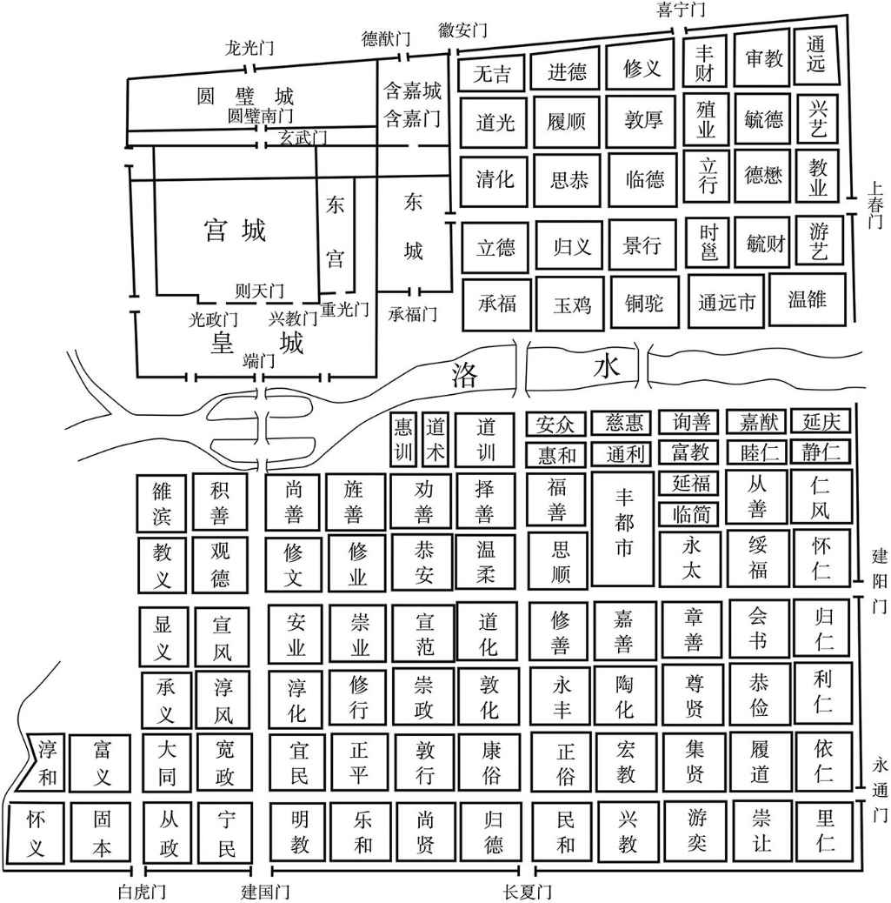
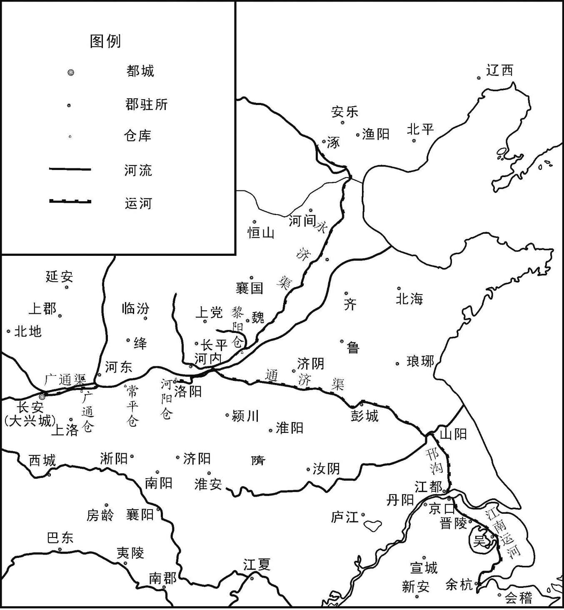
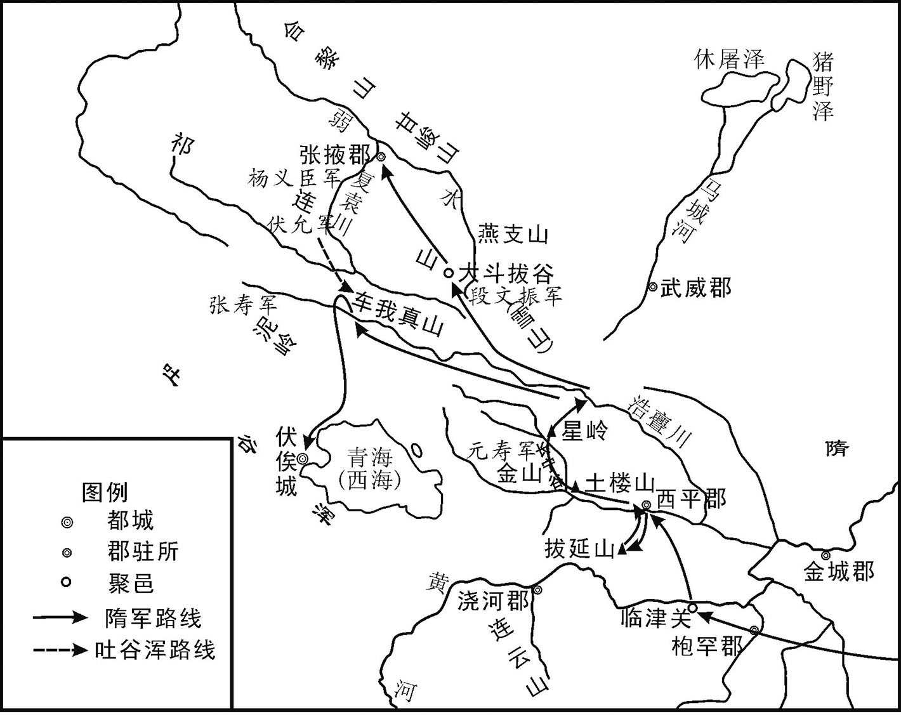
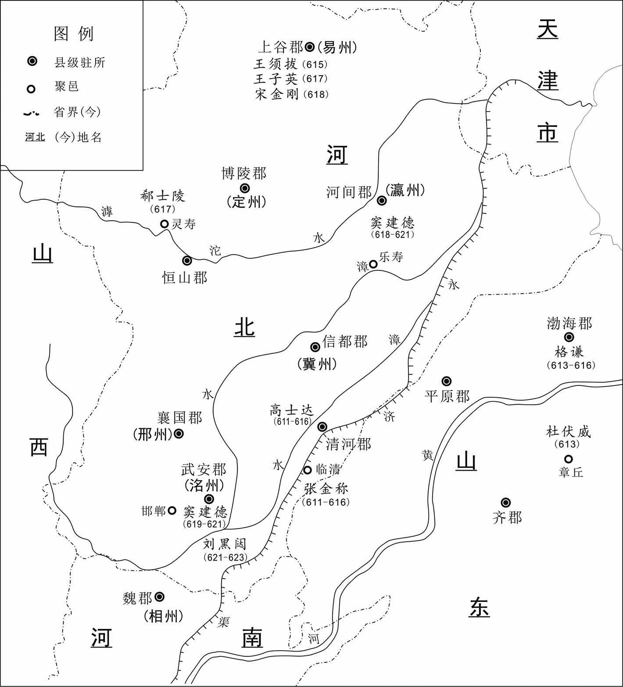
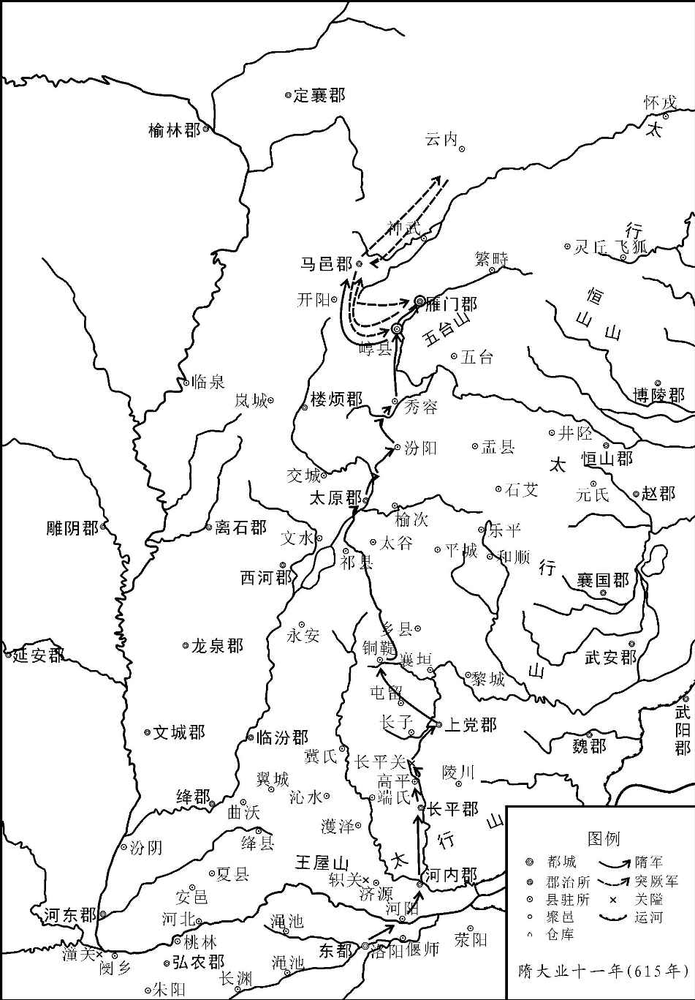
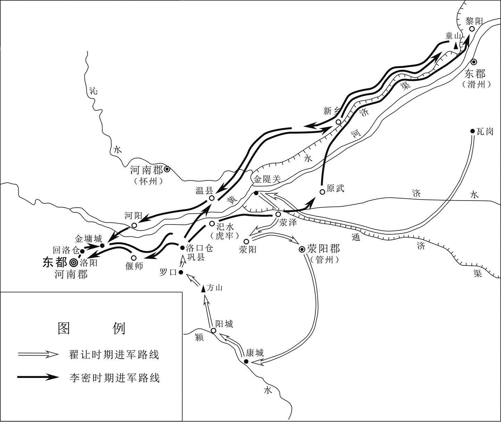
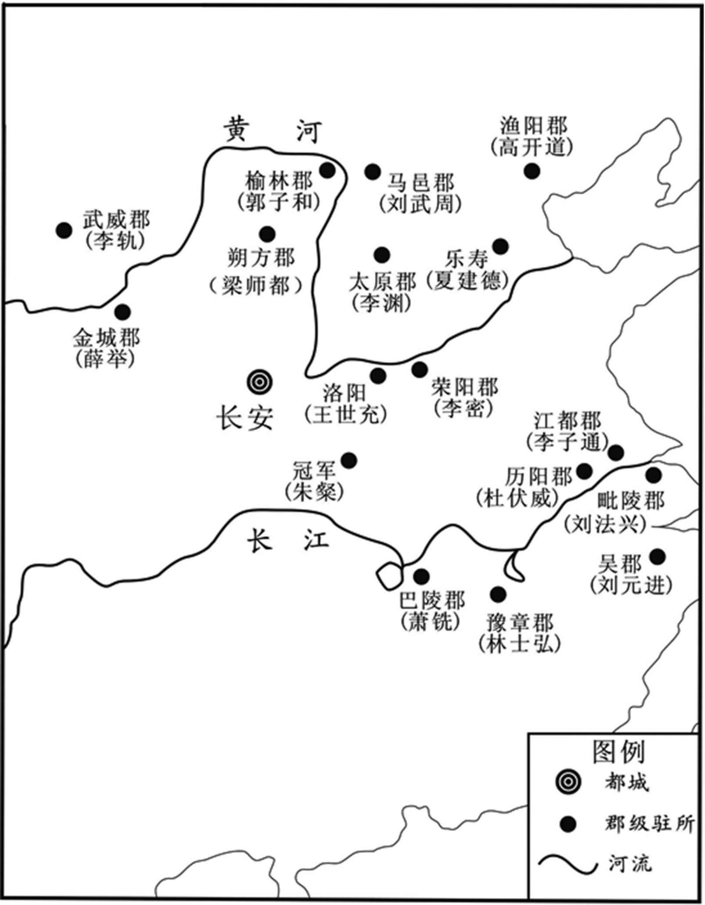
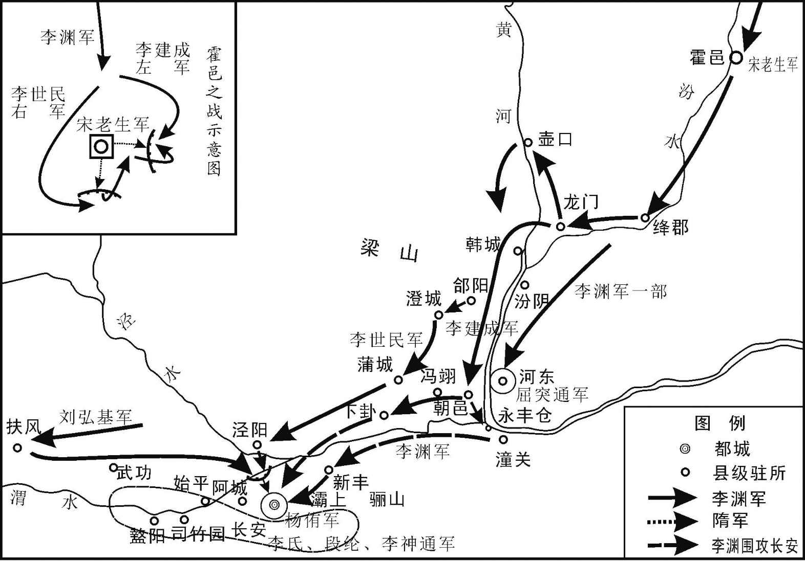
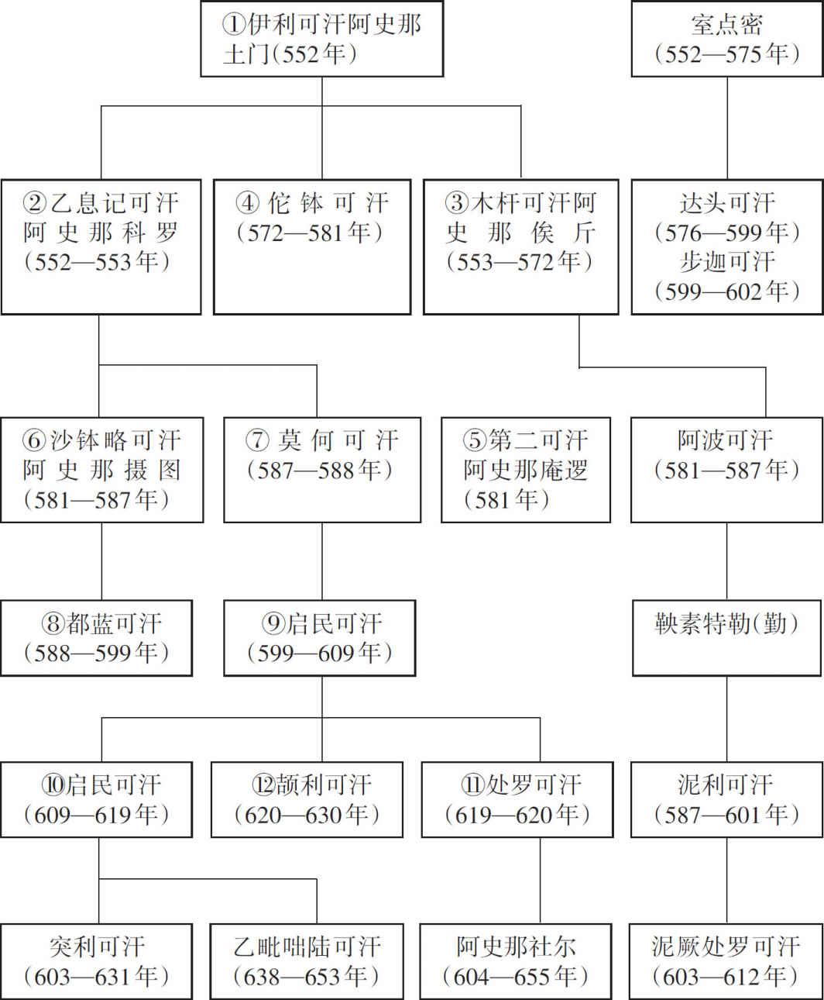
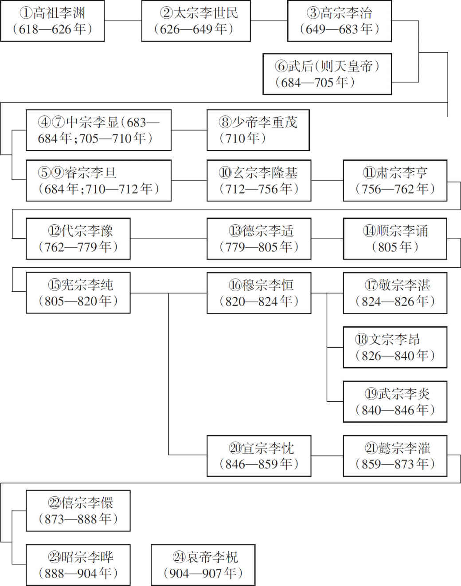

# 目录

突厥朝隋

隋讨高丽

炀帝亡隋

高祖兴唐

附录： 
隋朝皇帝世系表

突厥可汗世系表

隋朝册封高丽王世系表

唐朝皇帝世系表

返回总目录

# 突厥朝隋

## 【内容提要】

《突厥朝隋》叙述了隋朝建国后，对突厥采取远交近攻、分化瓦解的策略，终于使其大部归附中原，使得隋朝北方地区得以安宁的历史过程。

突厥是北朝后期在北方兴起的强大的民族政权。突厥本来是西方的小国，姓阿史那氏，世代居住在金山（阿尔泰山）的南面，为柔然人的奴仆，到突厥酋长土门统治时期才开始强大。公元551年，土门向柔然求婚，遭到拒绝，于是断绝了与柔然的关系，转而与西魏通婚。

552年，土门自称伊利可（kè）汗（hán）。次年，伊利可汗去世，他的儿子科罗即位，称乙息记可汗。一个月后，乙息记去世，他的弟弟俟斤即位，称为木杆可汗。木杆可汗生性刚强勇猛，足智多谋，善于用兵，镇服塞北各国。统辖的范围东至辽海，西达西海，南至大漠，北到北海（贝加尔湖），在广大地域建立起了强大的突厥汗国。556年，木杆可汗与西魏联合击溃了吐谷浑。

572年，木杆可汗去世，他的弟弟佗（tuó）钵（bō）可汗即位。随着突厥的强大，北周、北齐都臣服于突厥，争着用厚礼贿赂他们。即使如此，突厥仍不断侵扰边境，杀害抢掠官民。

581年（隋文帝杨坚开皇元年），佗钵可汗病死。突厥人迎立摄图为可汗，建号为沙钵略可汗。此外，庵（ān）逻（luó）称为第二可汗，大逻便为阿波可汗，沙钵略的叔父玷（diàn）厥，占据突厥西面，称为达头可汗。各位可汗分别统领自己的部众，占据四面，但沙钵略可汗仍为突厥共主。

隋文帝杨坚称帝后，对待突厥的礼遇冷淡，突厥十分怨恨。沙钵略妻子千金公主为北周公主，北周王朝覆灭后，她向沙钵略进言，请求为北周复仇。582年，沙钵略大举攻隋，隋文帝组织反击。583年，沙钵略被隋军打败。达头可汗和沙钵略可汗之间出现矛盾，突厥一分为二，分为西突厥和东突厥，双方互相攻伐不断。584年，沙钵略请求向隋朝和亲。

隋奉车都尉长孙晟（shèng）熟知突厥的山川地势、部众强弱。他建议利用突厥内部矛盾，实行远交近攻的政策，离间其上下，待时机成熟后再一举荡平。隋文帝十分高兴，采纳了他的建议。突厥果然上下猜忌，心怀二心。

沙钵略可汗与西突厥阿波可汗互相攻伐，阿拔国（铁勒诸部之一，居独洛水，在今蒙古国境内）乘虚袭击沙钵略，掠走其妻子。隋朝替沙钵略击败了阿拔国，将缴获的战利品都还给了沙钵略。沙钵略十分高兴，于是和隋朝订立盟约，做了隋朝的藩国，从此每年按时不断进贡。587年，沙钵略可汗去世后，他的弟弟叶护处罗侯即位，是为莫何可汗。588年，莫何可汗战死，国人拥立沙钵略的儿子雍虞闾（lǘ），称为颉（xié）伽（jiā）施多那都蓝可汗。

589年，隋灭陈后，处罗侯（沙钵略之弟）的儿子染干号称突利可汗，来隋朝求婚，隋朝对他赏赐十分优厚。都蓝可汗感到愤怒，于是断绝了对隋朝的朝贡，还多次到边境抢掠。599年，都蓝可汗与达头可汗结盟，进攻突利可汗。突利可汗大败，投奔隋朝，隋文帝授予他意利珍豆启民可汗。同时，隋朝派军进攻达头可汗，突厥大败，都蓝也为部下所杀。都蓝死后，达头自立为步迦可汗。601年（隋文帝仁寿元年），隋又派杨素挟启民可汗北击达头。603年，达头所部大乱，西奔吐谷浑，启民可汗于是拥有了步迦可汗的全部部众。

从此以后，突厥启民可汗与隋朝保持了十分亲密的往来关系，北方解除了边患，边疆地区出现了和平安宁的局面。这为隋朝统一中国以及极盛时代的出现，提供了一个很好的外部环境。直到隋末，天下变乱，突厥才重新成为边患。

## 【原文】

**梁武帝大同十一年春二月，魏丞相泰遣酒泉胡安诺槃陀始通使于突厥[1]。突厥本西方小国，姓阿史那氏，世居金山之阳，为柔然铁工[2]。至其酋长土门始强大，颇侵魏西边[3]。安诺槃陀至，其国人皆喜曰：“大国使者至，吾国其将兴矣[4]。”**

## 【注文】

[1]梁（502—557年）：朝代名。共历五十六年，南北朝时期南朝的第三个朝代。齐和帝萧宝融中兴二年（502年），萧衍（yǎn）取代南齐正式称帝，定国号为梁，都城建康（今江苏南京）。辖境早期北到秦岭淮河一线，南至今广东、云南及越南中北部，东到大海，西到今四川大雪山一带，侯景之乱后辖境逐渐缩小，梁敬帝萧方智太平二年（557年）被陈朝取代。　　武帝：即梁武帝萧衍（464—549年），南朝梁的建立者。字叔达，小字练儿，南兰陵中都里人（今江苏常州武进西北）。萧衍是兰陵萧氏的世家子弟，齐高帝萧道成的族侄。他原为南齐官员，起家巴陵王南中郎法曹参军，后任雍州刺史。齐东昏侯永元三年（501年）起兵拥立萧宝融为帝，齐中兴二年（502年）自立为帝，建国号梁，定都建康。在位颇有政绩，又笃（dǔ）信佛教，曾三次舍身寺院。在位晚年爆发侯景之乱，都城陷落，被侯景囚禁，死于台城，享年八十六岁，谥号武，庙号高祖。　　大同：南朝梁武帝萧衍在位期间所用年号，共计十二年，即公元535年至546年。　　魏：即西魏（535—557年），朝代名。共历三帝二十三年，北朝之一。北魏永熙三年（534年），孝武帝元修至长安。次年，宇文泰杀元修，另立元宝炬为文帝，史称西魏，定都长安（今陕西西安西北）。辖有原北魏洛阳以西地区。西魏实际掌握在宇文泰手中，政治比较清明。宇文泰大力推行关中本位体制，建立府兵制，改革官制，通过一系列改革，经济、军事实力不断增强，公元556年，宇文泰去世，其子宇文觉于次年初废西魏恭帝拓跋廓，自立为帝（即北周孝闵帝），建立北周。　　丞相：官职名。战国时期正式确立，为百官之长。秦汉定制，以丞相为辅佐皇帝处置国家政务的最高行政长官。魏晋时期，丞相与相国、司徒经常相轮置。魏晋以来，多以他官总管机要，总揽政事，丞相、相国或不置，或成为赠官，多已没有丞相的实际权力。魏晋南北朝时期也授权臣，为其篡夺帝位的先奏，非复辅助皇帝管理国务的宰相之职。魏晋南北朝，丞相皆一品（梁称十八班）。隋朝废。唐玄宗开元元年（713年）至天宝元年（742年），曾改尚书省长官左、右仆射为左、右丞相，为主管行政的宰相之职，从二品。　　泰：即宇文泰（507—556年），西魏王朝的建立者和实际统治者。字黑獭（tǎ），武川（今内蒙古武川）人，鲜卑族。公元535年建立西魏。统治西魏期间，推行了府兵制、六官制等一系列改革，实行了关陇本位政策，促进了关陇集团的形成，西魏国力也随之增强。西魏禅周后，追尊为文王，庙号太祖。北周明帝宇文毓（yù）武成元年（559年），追尊为文皇帝。　　遣（qiǎn）：派，送，打发。　　酒泉：郡名。西汉元狩二年（前121年）置。治禄福（晋改为福禄，隋改为酒泉，今甘肃酒泉），元鼎后辖境相当于今甘肃疏勒河以东、高台以西地区。十六国时西凉曾迁都于此。北魏太延元年（435年）废，北魏孝昌中复置。隋开皇初废。唐天宝、至德时又曾一度改肃州（治酒泉，今甘肃酒泉）为酒泉郡。　　安诺槃（pán）陀：生卒年不详。西魏使臣，为侨居酒泉的粟（sù）特人。西魏大统十一年（545年）奉命出使突厥，至金山牙庭。他是中央王朝最早派到突厥的使节，也是中原王朝与突厥通使的开端。　　始通：开始与……相来往。　　突厥（jué）：中国古代北方和西北方民族及其所建汗国名。广义的突厥泛指古代所有行突厥文的部族。狭义的突厥专指6世纪中至8世纪中两度建立汗国的民族。其先人6世纪中居金山（今阿尔泰山）之阳，金山形似战盔，其俗称为突厥，因以为号。首领姓阿史那氏。552年破柔然，土门自立为伊利可（kè）汗（hán），建立汗国，置汗庭于漠北鄂尔浑河流域的郁督军山（今蒙古国杭爱山），史家称之为突厥第一汗国或东突厥（也作北突厥）。曾向隋称臣纳贡并迁居漠南。隋末变乱，突厥又强盛起来。群雄争事突厥以求援助。至唐太宗李世民继位，联结薛延陀（tuó）、回纥（hé）等铁勒诸部，于630年消灭了东突厥汗国。682年，东突厥贵族阿史那骨咄（duō）禄起而反唐。公元686年至688年间夺取乌德鞬（jiān）山（郁督军山），重建汗庭，史家称之为突厥第二汗国或后突厥。公元745年，回纥骨力裴罗攻杀白眉可汗，后突厥灭。

[2]阿史那：突厥可汗的姓氏。原为突厥神话中突厥人的始祖。传说阿史那是一个男子与一头母狼生的十个儿子中的其中一个，后成为突厥可汗的姓氏，意思就是苍色的狼眼。　　金山：即阿尔泰山，山名。位于中国新疆北部和蒙古国西部，西北延伸到俄罗斯境内。西北—东南走向，长2000公里，宽数百公里。海拔1500—3500米。　　阳：山的南面。　　柔然：中国古代北方民族。也有蠕（rú）蠕、蝚（róu）蠕、芮（ruì）芮、茹茹等名，均为同音异译。本为东胡苗裔（yì），与鲜卑（bēi）同源。4—6世纪间游牧于蒙古高原。4世纪与5世纪之交，鲜卑拓跋部南迁平城（今山西大同），柔然得以兴起扩张。402年，首领社仑自称可汗，即丘豆伐可汗（一作豆代可汗），这也是北方游牧民族首次把它用作最高统治者的称号，以后突厥、回纥、蒙古等族均沿用。在丘豆伐可汗的率领下，柔然建立了部落联盟国家，一度控制大漠南北。后柔然因内部纷争和外部反抗而逐渐衰落。6世纪中叶，突厥部落强大起来。552年，突厥发兵击柔然，可汗阿那瓌（guī）大败自杀。其后又屡被突厥所败，555年亡国，余众辗转西迁。　　铁工：指从事制造或修理铁器工作的工匠。

[3]酋（qiú）长：部落首领。　　土门（？—553年）：即吐门，也作布民，突厥汗国的创建者。出身突厥贵族阿史那氏，起初臣服柔然。546年，柔然合并铁勒部落，逐渐强大。551年，土门娶西魏长乐公主。552年，土门大败柔然，迫使其主阿那瓌自杀，土门始自称伊利可汗。　　西边：西部边境。

[4]国人：国内之人，全国的人。

## 【译文】

梁武帝萧衍大同十一年（545年）春季二月，西魏丞相宇文泰派遣酒泉胡人安诺槃陀首次出使突厥，与他们建立联系。突厥本来是西方的一个小国，姓阿史那氏，世代居住在金山的南面，是为柔然人做锻铁的奴仆。到突厥的酋长土门统治时期才开始强大，不断侵扰西魏的西部边境。安诺槃陀抵达突厥后，突厥人都高兴地说：“大国使者来了，我国就要兴盛了。”

## 【原文】

**简文帝大宝二年夏六月，土门恃其强盛，求婚于柔然[1]。柔然头兵可汗大怒，使人詈辱之曰：“尔，我之锻奴也，何敢发是言[2]！”土门亦怒，杀其使者，遂与之绝，而求婚于魏，魏丞相泰以长乐公主妻之[3]。**

## 【注文】

[1]简文帝：即南朝梁简文帝萧纲（503—551年）。字世缵（zuǎn），梁武帝第三子。四岁封晋安王，七岁出任云麾（huī）将军，在属官辅佐下掌管石头城军事。由于长兄萧统早死，中大通三年（531年）被立为太子。太清三年（549年），侯景之乱，梁武帝被囚禁饿死，萧纲即位，大宝二年（551年）被侯景杀害，后被追谥为简文帝。　　大宝：南朝梁简文帝萧纲在位期间所用年号，共计两年，即公元550年至551年。　　恃（shì）：依仗，依赖。

[2]头兵可汗（？—552年）：即敕连头兵豆伐可汗，柔然可汗，名郁久闾（lǘ）阿那瓌，豆罗伏跋豆伐可汗弟。520年，豆罗伏跋豆伐可汗去世后继位。因柔然内乱，他率一部归附北魏，次年，北魏遣还。552年，遭突厥人袭击，战败自杀，柔然灭亡。可汗：又称大汗，北方游牧民族对首领的尊称，原意为王朝、神灵和上天，最早出现于3世纪鲜卑部落，记载于《宋书》，类似于汉字的天子。古代鲜卑、柔然、高车、吐谷浑、突厥、铁勒、回纥、女真、蒙古等民族建立的汗国，其君主或政治首领都称为可汗。　　詈（lì）辱：谩骂侮辱。　　锻奴：指突厥是为柔然炼铁的奴隶。

[3]绝：断交。　　长乐公主：西魏公主。突厥可汗土门求婚于西魏。经宇文泰同意，于西魏大统十七年（551年）六月，将长乐公主嫁与土门可汗。　　妻：嫁给；给……做妻子。

## 【译文】

梁简文帝萧纲大宝二年（551年）夏季六月，土门依仗突厥国势强盛，向柔然求婚。柔然头兵可汗大怒，派人去辱骂土门道：“你只是为我锻铁的奴仆，怎么敢说出这样的话！”土门也很愤怒，杀了柔然的使者，于是与柔然断绝了关系，转而向西魏求婚，西魏丞相宇文泰将长乐公主嫁给土门为妻。

## 【原文】

**元帝承圣元年春正月，突厥土门自号伊利可汗，号其妻为“可贺敦”，子弟谓之“特勒(1)”，别将兵者皆谓之“设”[1]。**

## 【注文】

[1]元帝：即南朝梁元帝萧绎（yì）（508—555年），梁武帝萧衍第七子。字世诚，小字七符，自号金楼子。南兰陵（今江苏常州）人。封湘东王，后任荆州刺史。侯景之乱时，他派遣王僧辩讨平叛乱。鉴于建康遭兵乱后荒废不堪，就在江陵（今湖北荆州）即帝位。后被雍州刺史萧詧（chá）杀死，在位仅三年。擅长诗文，风格靡（mǐ）丽。善于绘画，其画作栩（xǔ）栩如生。又精于绘画理论，提倡仔细观察景物。生平爱好藏书，得十余万卷，临死前愤而付之一炬。诗集有《梁元帝集》，画论有《山水松石格》，并绘《职贡图》《宣尼像》等。　　承圣：南朝梁元帝萧绎在位期间所用年号，共计四年，即承圣元年（552年）十一月至承圣四年（555年）四月。　　自号：自称。　　伊利可汗：即土门。　　可贺敦：突厥语音译，意为皇后。也作“可敦”“恪尊”“贺敦”“可孙”“合屯”“合敦”等。古代鲜卑、柔然、突厥、回纥、蒙古诸游牧民族对可汗之妻的称呼。　　特勒：即“特勤”之误。古突厥语音译。突厥可汗子弟及宗族的官衔。地位仅次于“叶护”及“设”，各有封地及部曲，历代可汗有不少出身此职。　　设：古突厥语音译。别部领兵者之称号。

## 【译文】

梁元帝萧绎承圣元年（552年）春季正月，突厥土门自称伊利可汗，称他的妻子为“可贺敦”，子弟们都称为“特勤”，其他的领兵将领都称为“设”。

## 【原文】

**二年春二月，突厥伊利可汗卒，子科罗立，号乙息记可汗[1]。三月，遣使献马五万于魏。乙息记卒，舍其子摄图而立其弟俟斤，号木杆可汗[2]。木杆状貌奇异，性刚勇，多智略，善用兵，邻国畏之[3]。**

## 【注文】

[1]卒：死亡。　　科罗：即乙息记可汗，突厥伊利可汗的儿子。西魏废帝元钦元年（552年），土门死后继立，击破柔然。次年，遣使向西魏朝贡，不久病死。

[2]舍：放弃；舍弃。　　摄（shè）图（？—587年）：即沙钵（bō）略可汗，佗钵可汗的侄子，为东突厥可汗。隋文帝杨坚开皇元年（581年），佗钵的儿子庵（ān）罗让汗位给他。庵罗为第二可汗，据独洛水（今土拉河）。开皇二年（582年），率军进攻隋境，遭到隋朝反击，损失严重。不久突厥内乱，分裂为东西突厥，他占据东突厥。东西突厥连年用兵，势力日衰。开皇四年（584年），与隋朝通和，后内附称臣。开皇七年（587年）病卒，由他的弟弟莫何可汗继位。　　俟（qí）斤（？—572年）：又名燕都，又称木杆可汗、木汗可汗、术汗可汗。阿史那氏。伊利可汗的儿子，乙息记可汗的弟弟。突厥汗国著名军事首领。西魏废帝二年（553年），立为突厥可汗。恭帝二年（555年），消灭柔然汗国残余势力，后又东败契（qì）丹，北并契骨，北周武帝宇文邕（yōng）建德元年（572年）卒，在位期间国势强大，威服塞外诸国。　　木杆可汗：即俟斤。

[3]状貌：相貌，容貌；形状，外貌。　　奇异：奇特，很新奇。　　刚勇：刚强勇猛。　　智略：才智与谋略。

## 【译文】

梁元帝承圣二年（553年）春季二月，突厥伊利可汗去世，他的儿子科罗即位，称为乙息记可汗。三月，乙息记可汗派遣使节向西魏进献五万匹马。乙息记可汗去世时，放弃了他的儿子摄图而另立他的弟弟俟斤为继承人，称为木杆可汗。木杆可汗相貌奇特，生性刚强勇猛，足智多谋，善于用兵，邻国都很畏惧他。

## 【原文】

**冬十一月癸亥，齐主自晋阳亲追突厥于朔州，突厥请降，许之而还，自是贡献相继[1]。**

## 【注文】

[1]癸（ɡuǐ）亥（hài）：中国古代用干支纪年、纪月、纪日、纪时，即以甲、乙、丙、丁、戊（wù）、己、庚（gēng）、辛、壬（rén）、癸十天干和子、丑（chǒu）、寅（yín）、卯（mǎo）、辰（chén）、巳（sì）、午、未、申、酉（yǒu）、戌（xū）、亥（hài）十二地支按照顺序组合起来纪年（月、日、时），如癸亥、甲午、丙申等。六十年（月、日、时）为一周期，周而复始，循环不已。癸亥为干支中的第六十个。此处十一月癸亥即十一月初五。　　齐：即北齐（550—577年），朝代名。共历二十八年，是北朝政权之一。公元550年，文宣帝高洋取代东魏称帝，国号齐，建元天保，都城邺（yè）（今河北临漳西南），史称北齐。历经文宣帝高洋、废帝高殷、孝昭帝高演、武成帝高湛、后主高纬、幼主高恒六帝，577年被北周消灭。北齐继承了东魏所控制的地盘，占有今黄河下游流域的河北、河南、山东、山西以及苏北、皖北的广阔地区。同时与其并存的王朝有西魏、北周（取代西魏）、南朝梁、南朝陈等。　　齐主：即北齐文宣帝高洋（529—559年），字子进。渤海蓨（tiáo）县（今河北景县南）人。高欢次子，北齐的建立者。公元550年，代东魏自立，建立北齐，改元天保。以鲜卑贵族为政权基础，任用汉人杨愔（yīn）改定律令，抑制贪污。连年出击柔然、突厥，均获大胜。并修建长城，巩固边防。又乘侯景乱梁之后，发兵南征，北齐疆土扩展至淮南，后与陈朝划江为界。高洋在位初年，治国谨慎，执法公允，后居功自傲，荒淫暴虐，并推行鲜卑化，胡汉矛盾比较突出。只是依赖杨愔辅政，得以维持政局。后因酗（xù）酒暴卒，谥号文宣皇帝，庙号显祖。　　晋阳：县名。战国时秦置，治今山西太原西南。以后历为太原郡、并州治所。西晋扩建，北齐于汾水东岸增筑新城，不久在旧城增设龙山县。隋以龙山为晋阳，晋阳为太原，五代为北汉都城。历经秦汉、三国、南北朝、隋唐、五代，北宋太平兴国四年（979年）城池被毁。　　朔州：州名。北齐文宣帝高洋天保六年（555年）置，治新城（今山西朔州西南），因西河郡置南朔州，故此处称为北朔州。天保八年（557年），移治招远（隋改为善阳县，今山西朔州），北周升朔州为总管府。隋大业初改置代郡，不久改为马邑郡。唐武德四年（621年）复为朔州，天宝元年（742年）复改为马邑郡，乾元初仍改为朔州，建中初移治马邑（今山西朔州东北马邑），不久还故治。辖境相当于今山西朔州、应县、偏关、河曲、神池、五寨等市县。　　请降：请求投降。　　许：允许，答应。　　贡献：进奉；进贡。　　相继：一个接着一个，连续不断，相承袭，递相传授。

## 【译文】

梁元帝承圣二年（553年）冬季十一月癸亥（初五日），北齐国主高洋从晋阳亲自率兵追击突厥直到朔州，突厥请求投降，高洋答应突厥的请降要求，然后撤军，从此突厥接连不断地向北齐进贡。

## 【原文】

**敬帝绍泰元年冬十二月，木杆西破嚈哒，东走契丹，北并契骨，威服塞外诸国[1]。其地东自辽海，西至西海，长万里，南自沙漠以北，五六千里皆属焉[2]。**

## 【注文】

[1]敬帝：即梁敬帝萧方智（543—558年），字慧相，梁元帝萧绎第九子。封晋安郡王。梁元帝死后即位。北齐送还贞阳侯萧渊明，王僧辩立其为帝，以萧方智为太子。后陈霸先杀王僧辩，废萧渊明，复立萧方智为帝。不久陈霸先自立为帝，将他废为江阴王，随后将他杀死。　　绍泰：南朝梁敬帝萧方智在位期间所用年号，共两年，即绍泰元年（555）年十月至绍泰二年（556年）八月。　　嚈（yàn）哒（dā）：古代中亚游牧部族，也称白匈奴，为大月氏人的后裔。嚈哒人起源于蒙古草原，公元4世纪70年代初跨阿尔泰山向西南迁徙，版图从裕勒都斯河上游（焉〈yān〉耆〈qí〉西北）起，越过伊犁河流域到巴尔喀什湖，再到楚河和塔拉斯河草原、锡尔河地区，一直达到咸海，全盛时，其领域东至葱岭到天山南路的一部分，西至里海的库尔干河。5世纪与波斯萨珊王朝、贵霜帝国发生冲突，扩展其势力于妫（guī）水之南、定都于拔底延城。6世纪初，嚈哒人北上同高车争夺准噶尔盆地及其以西地区，并控制高昌，遏制柔然势力的西进。与此同时，嚈哒人又东进控制塔里木盆地西部，南北朝时期，嚈哒人频繁地开展同中国北魏、西魏、北周乃至梁朝的交往。向东则趁柔然衰败之机，占据了塔里木盆地的许多地方。南北朝时期，在大漠南北与北魏争雄。约558—567年间，萨珊波斯和当时北亚新兴的游牧部族突厥联盟，夹击并最终灭亡嚈哒，其领土被瓜分，部众散居于北亚、中亚及南亚各地，后渐与各地民族融合。　　契丹：中古时期出现在中国东北地区的少数民族。属东胡族系，鲜卑族的一支。北魏时，始见其名，游牧于潢（huáng）水（今西拉木伦河）及土河（今老哈河）流域一带，分为八个部落。唐初，已形成部落联盟，首领为大贺氏，臣服于突厥。公元628年，其首领摩会背弃突厥，归附唐朝。648年，在首领窟哥的率领下举诸部内属，唐廷以其地置松漠都督府，以窟哥为都督，赐姓李。又置十羁（jī）縻（mí）州，以各部首领为刺史。武则天时，松漠都督李尽忠及内兄孙万荣不堪唐营州都督赵文翙（huì）的凌辱，起兵杀赵文翙，据营州（今辽宁朝阳）反，李尽忠自称无上可汗。唐借奚及突厥之助，始得平定。715年，唐复置松漠都督府，以契丹首领李失活为都督，并把宗女嫁给他为妻。其后，契丹首领可突干再度叛唐，至天宝末年以后，又归顺。双方聘使往来不绝，保持朝贡贸易关系，但契丹也受崛起漠北的回鹘（gǔ）控制。及至唐末，回鹘政权衰亡，中原内乱不已，无力控制边疆，契丹势力渐强。916年，耶律阿保机称王，建国号契丹。947年改称辽，与北宋、西夏并立。1125年，辽朝被金朝灭亡。辽亡前一年，辽皇族耶律大石西迁建契丹国，仍用辽国号，史称西辽，后被蒙古所灭。　　契骨：民族名。又作结骨、纥骨，今柯尔克孜族先祖。公元6世纪中叶，突厥兴起于阿尔泰山，向北占领并统治了叶尼塞河流域的古柯尔克孜人，也即史籍中的契骨人。后来，突厥势力向西发展，契骨人的分布地也随军事行动向西伸展，其势力达到伊吾（今新疆哈密）以西、白山（今天山）一带。　　威服：以武力慑服。　　塞外：指长城以北，也泛指北边地区。

[2]辽海：泛指今辽宁辽河流域及其以东至海地区。　　西海：我国古时有关中西交通的史籍记载中，常称西方极远处的海为西海，包括今咸海、里海、波斯湾、地中海都曾经被称为西海。　　属：归属；隶属。

## 【译文】

梁敬帝绍泰元年（555年）冬季十二月，木杆可汗在西方击溃了嚈哒，在东方打退了契丹，在北面吞并了契骨，以武力镇服了塞北各国。突厥统辖的范围东起辽海，西到西海，横跨上万里，南起沙漠以北，五六千里都归属突厥。

## 【原文】

**太平元年[1]。突厥木杆可汗袭击吐谷浑，魏太师泰使凉州刺史史宁帅骑随之，吐谷浑奔南山[2]。宁说木杆使攻树敦、贺真二城，以拔其根本，木杆从之[3]。木杆破贺真，获吐谷浑可汗夸吕[4]。宁破树敦、虏其征南王，还，与木杆会于青海[5]。详见《吐谷浑盛衰》。**

## 【注文】

[1]太平：南朝梁敬帝萧方智在位期间所用年号，共计二年，即公元556年至557年。

[2]吐谷（yù）浑：中国古代西北民族及其所建国名。本为辽东鲜卑慕容部的一支，原游牧于今辽宁锦州一带。西晋末，首领吐谷浑率部西迁到枹（fú）罕（今甘肃临夏）。其后扩展，逐渐统治了今青海、甘南和四川西北地区的羌（qiāng）、氐（dī）部落，建立国家。东晋元帝司马睿建武元年（317年），吐谷浑去世，子吐延继位。至吐延子叶延继位后，开始用吐谷浑作为族名、国号。吐谷浑首领曾被不同政权封为河南王。南朝称吐谷浑为河南国；邻族称之为阿柴虏或野虏；唐后期称之为退浑、吐浑。主要从事游牧，盛产良马，兼营农业。住庐帐，后来渐渐有城居。使用汉文。与北魏及南朝均有密切交往。隋初，吐谷浑不断侵掠边境，隋文帝杨坚两次派兵大破其众。唐高宗时期，吐谷浑灭亡，故地全部为吐蕃占领。　　太师：官职名。西周始置，与太傅、太保并称三公，地位崇高，后代渐成重臣加官，以示恩宠，无实际职权。两晋南北朝为一品，隋之后为正一品。也指太子太师，为辅导太子的官。西晋时设太子太师、太傅、太保，太子少师、少傅、少保，称三师、三少，后代沿置。明清时以朝臣兼任，三师、三少成为荣誉性的虚衔。　　凉州：州名。本为汉武帝刘彻所置十三刺史部之一。东汉献帝刘协延康元年（220年）再置，治姑臧（zāng）（今甘肃武威），辖金城、西平、武威、张掖、西郡、酒泉、敦煌、西海八郡，辖境相当于今甘肃兰州和会宁、永靖、靖远三县以西至敦煌市地，以及青海海晏、西宁及海东地区，内蒙古额济纳旗等地。西晋末年，凉州被张轨占据，史称前凉。此后，除前秦时期外，凉州辖境不断缩小。后凉、北凉也建都于此。隋大业年间改为武威郡，唐代又数度废置。　　刺史：官职名。自汉武帝刘彻开始设立。本为监察郡县的官员，“刺”为检核问事之意，即监察之职，在郡守管辖之下。东汉灵帝刘宏改刺史为州牧，职权益重，位居郡守之上，掌握一州军政大权，成为郡上一级地方行政长官。魏晋南北朝，以刺史领州，多带持节、都督诸军事衔，隋唐时期，也为州一级建制的长官，但职权减轻，宋代保留刺史官称，但无职掌，辽、金也有刺史，为州长官。明清时刺史仅作为知州的别称。　　史宁（？—563年）：北周将领，字永和。祖籍建康表氏（今甘肃高台西）。早年凭借军功，任别将，升任直阁将军、都督，持节征东将军。又随贺拔胜镇守荆州，随贺拔胜投奔梁。后从梁归西魏，历任东义州刺史、凉州刺史等职，多谋善战，颇有政绩。北周孝闵帝宇文觉即位，晋爵安政郡公、拜小司徒、荆州刺史，因奢侈贪污，不守法度，受人讥讽。周武帝保定三年（563年）卒。　　南山：山名。位于今青海省青海湖西南，又称库库诺尔岭。

[3]说（shuì）：劝说。　　树敦：吐谷浑旧都。故址在今青海共和。　　贺真：吐谷浑城名。位于今青海共和西。有学者认为即伏俟城。　　拔：攻下；攻取；指夺取军事上的据点。

[4]破：打败，打垮。　　获：抓获，俘获。　　夸吕（？—591年）：吐谷浑可汗，吐谷浑首领伏连筹子。北魏孝庄帝元子攸永安二年（529年）嗣位。西魏文帝元宝炬大统六年（540年）始称可汗，居伏俟城（今青海共和西北）。仿汉制设立官职，与西魏、东魏、北周、北齐联系密切。后屡攻西魏、北周。北周武帝宇文邕建德五年（576年），曾遭北周攻伐，一度被迫弃伏俟城西遁。隋初，曾率部攻隋边境，后内部分裂，未敢再扰边，隋文帝杨坚开皇十一年（591年）死，他的儿子世伏向隋称臣。

[5]虏：俘虏，俘获。　　征南王：吐谷浑封王。具体不详。　　青海：此处指青海湖，湖泊名。古代又称西海。在青海东北部。面积有4583平方公里，湖面海拔3195米，湖最深处可达32.8米。是我国最大的咸水湖。

## 【译文】

梁敬帝太平元年（556年）。突厥木杆可汗率兵袭击吐谷浑，西魏太师宇文泰派凉州刺史史宁率领骑兵跟随突厥一起出兵，吐谷浑逃奔南山。史宁劝说木杆可汗派兵进攻树敦、贺真这两座城池，以拔除吐谷浑的老巢，木杆听从了史宁的建议。木杆攻克贺真，俘获了吐谷浑可汗夸吕。史宁攻克树敦，俘虏了吐谷浑征南王，然后撤退，和木杆在青海会师。详见《吐谷浑盛衰》。

## 【原文】

**陈文帝天嘉四年[1]。初，周人与突厥木杆连兵伐齐，许纳其女为后，遣御伯大夫杨荐等往结之，齐人亦遣使求昏[2]。木杆欲执荐等送齐，荐知而责之，木杆许共平东贼，然后送女[3]。详见《周伐齐》。**

## 【注文】

[1]陈（557—589年）：朝代名。共历五帝三十三年，是中国历史上南北朝时期南朝的最后一个朝代。由陈武帝陈霸先创建，定都建康（今江苏南京）。仅控制江陵以东、长江以南的狭小地区。陈朝建立时已经出现南朝转弱，北朝转强的局面。陈朝刚建立时面临北方政权的入侵，形势十分危急。陈朝开国皇帝陈霸先带领军队一举击败敌军，形势有所好转。亡国君为陈后主陈叔宝，最后被隋文帝杨坚所灭。　　文帝：即陈文帝陈蒨（qiàn）（522—566年），字子华，陈武帝陈霸先的侄子。初任吴兴太守。陈霸先即位，封临川郡王，拜侍中、安东将军。永定三年（559年），陈霸先死，遗诏立为帝。公元559年至566年在位。次年，改元天嘉。即位后，继续完成统一江南的事业。平时勤于政事，事事节俭，又比较注意农业生产，令地方官员及时劝课农桑，还曾整理户口。在他统治期间，南方的经济文化都有一定的恢复和发展。天康元年（566年）病死。谥为文皇帝，庙号世祖。　　天嘉：南朝陈文帝陈蒨在位期间所用年号，共计七年。即天嘉元年（560年）一月至天嘉七年（566年）二月。

[2]初：起初；当初；以前。　　周：即北周（557—581年），朝代名。共历五帝二十五年。南北朝时期的北朝之一。由西魏权臣宇文泰奠定立国基础，由其子宇文觉正式建立。疆域继承西魏，统治关陇一带。公元577年，北周灭北齐，统一北方。581年，杨坚代周称帝，改国号隋，北周亡。　　连兵：联合兵力；集结军队。　　纳：迎娶。　　御伯大夫：即御伯中大夫，官职名。西魏恭帝三年（556年）置，为西魏、北周天官府御伯司长官，掌管出入侍从，皇帝出入皆陪侍左右，正五命。北周武帝保定四年（564年），更名为纳言中大夫。　　杨荐：生卒年不详，西魏、北周大臣。字承略，秦郡宁夷（今陕西礼泉）人。北魏永安中随并州刺史尔朱天光出讨关陇，后又随宇文泰镇夏州，不久受命迎孝武帝元脩到长安。西魏文帝元宝炬大统（535—551年）中，进骠骑大将军，加侍中。北周孝闵帝宇文觉即位，授大将军，行大司徒。天和三年（568年）迁总管、梁州刺史，后病卒。　　结：联络。　　昏：古同“婚”，婚姻。

[3]执：拘捕，捕捉，逮捕。　　责：质问，诘（jié）问。　　东贼：指北齐。

## 【译文】

陈文帝天嘉四年（563年）。起初，北周人和突厥木杆可汗联合讨伐北齐，许诺娶木杆可汗的女儿做皇后，还派遣御伯大夫杨荐等人前往突厥联络，北齐人也派使节向木杆可汗求婚。木杆可汗想要抓住杨荐等人送到北齐，杨荐得知消息后责备木杆可汗，木杆可汗于是答应一起讨伐北齐，然后再送女儿到北周。详见《周伐齐》。

## 【原文】

**冬十二月，突厥木杆、地头、步离三可汗以十万骑会周师于晋阳[1]。**

## 【注文】

[1]木杆、地头、步离三可汗：木杆可汗分国为三部：木杆牙帐居于都斤山（都斤山：学界有争议，有杭爱山东脉说、阿尔泰山、杭爱山、都兰哈拉山、南阿尔泰山东部说、杭爱山总称、杭爱山主峰说等。近来有学者论证即今杭爱山脉之西部以最高峰鄂托浑腾格里为主的山，即汉文史所记登凝黎山、天山、天灵山）；地头可汗（名库头，木杆可汗弟）统东方；步离可汗（名室点密，木杆可汗叔父）统治西方。　　骑（jì）：骑兵。　　会：会师。

## 【译文】

陈文帝天嘉四年（563年）冬季十二月，突厥木杆、地头、步离三位可汗率领十万骑兵在晋阳与北周大军会师。

## 【原文】

**五年春正月，突厥引兵出塞，纵兵大掠，自晋阳［以往］七百里，人畜无遗[1]。**

## 【注文】

[1]引兵：领兵。　　出塞：出边塞，出长城。　　纵兵：放纵兵士。　　大掠：大肆抢掠。以往：用于地名之后，表示位置已过这一地点。　　遗（yí）：遗漏或余留。

## 【译文】

陈文帝天嘉五年（564年）春季正月，突厥人领兵撤回长城北面，放纵兵士大肆抢掠，从晋阳往北七百里的地带，百姓、牲畜都被洗劫一空。

## 【原文】

**秋九月，突厥寇齐幽州，众十余万，入长城，大掠而还[1]。突厥自幽州还，留屯塞北[2]。闰月，突厥寇齐幽州[3]。**

## 【注文】

[1]寇：入侵；侵犯。　　幽州：古九州之一。汉武帝所置十三刺史部之一。东汉治蓟（Jì）县（今北京城西南）。辖境相当于今河北北部及辽宁等地。魏、晋以后渐缩小。北魏辖燕郡、范阳、渔阳三郡。隋炀帝大业（605—618年）初改幽州为涿郡。唐玄宗李隆基天宝元年（742年）改为范阳郡，唐肃宗李亨乾元元年（758年）又改为幽州。治蓟县。后晋天福元年（936年），后晋皇帝石敬瑭以幽蓟十六州割让契丹，次年契丹以幽州为南京。　　长城：指北齐所筑长城，主要是在文宣帝高洋时期所建。天保三年（552年），北齐南起黄栌岭（今山西吕梁离石西北）北至社平戍（今山西朔州西），筑长城约四百多里。天保六年（555年）诏发军民筑长城，自幽州北夏口（今北京居庸关南口附近）至恒州（今山西大同）共九百多里。天保七年（556年），自西河总秦戍（今内蒙古清水河）向东新筑长城，至今山海关海边止。东西长达三千多里。天保八年（557年），又自库洛拔（今山西偏关）而东至于坞纥戍（今山西灵丘），长城内筑重城四百多里。此外，563年，北齐武成帝高湛修筑了今山西河北交界处沿太行山走向的一段长城。565年，对原东魏时所筑一段旧长城增筑至雁门关，又对在公元557年所筑内长城进行修葺（qì）。

[2]留屯：驻军。屯，驻扎。　　塞北：指长城以北。也泛指我国北边地区。

[3]闰：每四年加一日，称“闰日”。有闰日的这一年称“闰年”。这是公历的“闰”。中国的农历，两年或三年，需要加一个月，所加的这个月称“闰月”，平均十九年有七个闰月。

## 【译文】

陈文帝天嘉五年（564年）秋季九月，突厥侵扰北齐幽州，人数达到十多万，攻入长城，大肆掳掠后撤回。突厥从幽州撤退后，留守驻扎在塞北。闰九月，突厥再次入侵北齐幽州。

## 【原文】

**六年春二月辛丑(2)，周遣陈公纯、许公贵、神武公窦毅、南阳公杨荐等备皇后仪卫行殿，并六宫百二十人，诣突厥可汗牙帐逆女[1]。夏五月，突厥遣使至齐，始与齐通[2]。**

## 【注文】

[1]公：此处指国公。爵位名。北周置国公，正九命，食三千户到一万户。后代多沿置。隋初国公为九等爵第三等，从一品，隋炀帝大业三年（607年）仅保留王、公、侯三等，其余皆废。唐代复置国公，为从一品。　　纯：即宇文纯（？—580年），字堙（yīn）智突，宇文泰子。北周明帝宇文毓武成（559—560年）初，封陈国公，北周武帝宇文邕建德三年（574年），晋爵为王，为并州总管。宣帝初为太傅。北周静帝宇文阐大象元年（579年），到封国去。宣帝死，召回长安，被杨坚所杀。　　贵：即宇文贵（？—567年），北周将领。字永贵。其先为昌黎大棘（今辽宁义县西北）人，后徙居夏州（今陕西靖边东北）。少时投笔从戎。北魏末从征农民起义有功，任郢州刺史，封革融县侯。随北魏孝武帝西迁，受宇文泰信任，因战功，进位大将军、兴州刺史。又代尉迟迥（Yùchí Jiǒng）镇蜀，平定诸郡叛乱。北周孝闵帝即位后，拜柱国，领兵讨吐谷浑。后官至大司徒、太保，封许国公。　　神武：郡名。北魏置，治神武川（今山西朔州），辖尖山、殊颓二县。后迁至今山西寿阳北。　　公：此处指郡公，也称开国郡公。爵位名。晋代始置，一品。其后各朝多置。南朝梁位视三公，陈列为九等爵第二等，二品。北魏孝文帝太和二十三年（499年）定为一品。北齐从一品。北周正九命。隋定开国郡公为九等爵之第四等，从一品。隋炀帝大业三年（607年）仅保留王、公、侯三等，其余皆废。唐朝复置，正二品。　　窦毅（519—582年）：也叫纥豆陵毅，北周、隋大臣。字天武。起家员外散骑侍郎。随北魏孝武帝入关中。娶宇文泰女儿。北周时，封神武郡公。为邠（bīn）州刺史，后为大司马。隋开皇初，为定州总管。开皇二年（582年），卒于任上。其第二女即为唐高祖李渊妻子。　　南阳：郡、国名。战国秦昭襄王嬴稷三十五年（前272年）置。治宛县（今河南南阳）。辖今河南西南及湖北西北部分地区。西晋改为南阳国。十六国南北朝复为郡，辖境缩小。南朝齐辖宛县、涅（niè）阳、冠军、舞阴、郦县、云阳、许昌诸县，隋开皇初改为邓州。隋大业年间复置，移治穰（ráng）县（今河南邓州），辖穰县、新野、南阳、课阳、顺阳、冠军、菊潭、新城八县。后废。唐天宝、至德年间两度改邓州为南阳郡。唐时辖境西至西峡、淅（xī）川地，北至南召。乾元元年（758年）改为邓州。　　仪卫：仪仗与卫士的统称。　　行殿：可以移动的宫殿。指一种安稳的大车。　　六宫：本义是指古代皇后的寝宫，正寝一，燕寝五，合为六宫，后来代指皇后或皇帝的其他妻子。　　诣（yì）：到；去。尤指到尊长处。　　牙帐：古代北方少数民族匈奴、鲜卑、羌、铁勒、柔然、回纥、突厥、沙陀的“首都”称为牙帐。　　逆女：男子迎娶女子的礼仪。为婚姻六礼之一。逆即迎。

[2]通：友好往来。

## 【译文】

陈文帝天嘉六年（565年）春季二月辛丑，北周派遣陈公宇文纯、许公宇文贵、神武公窦毅、南阳公杨荐等人配备了皇后的仪仗、侍卫、行殿，连同六宫一百二十人，到突厥可汗的大帐迎娶可汗的女儿。夏季五月，突厥派遣使节到北齐，开始与北齐交往。

## 【原文】

**临海王光大二年春二月，突厥木杆可汗贰于周，更许齐人以昏，留陈公纯等数年不返[1]。会大雷风，坏其穹庐，旬日不止[2]。木杆惧，以为天谴，即备礼送其女于周，纯等奉之以归[3]。三月癸卯，至长安，周主行亲迎之礼[4]。**

## 【注文】

[1]临海：郡名。三国吴会稽王孙亮太平二年（257年）置。初治临海（今浙江临海），不久移治章安（浙江台州椒江区）。辖境相当于今浙江象山港以南，天台、缙（jìn）云、丽水、龙泉以东地区。东晋以后，辖境逐渐缩小。南朝齐辖章安、临海、宁海、始丰、乐安五县，隋文帝杨坚开皇九年（589年）废。　　临海王：即南朝陈废帝陈伯宗（554—570年），字奉业，小字药王，陈文帝陈蒨嫡长子。陈武帝陈霸先永定二年（558年）立为临川王世子，次年陈文帝即位，立为皇太子。天康元年（566年）即位。即皇帝位后，其叔父陈顼（xū）辅政专权，后被废为临海郡王。　　王：此处指郡王。爵位名。汉、魏时只封王爵。晋武帝司马炎封子弟二十多人为王，以郡为国，后称之为郡王。南朝陈置为封爵，为十二等爵第一等，一品。隋朝为九等爵第二等，从一品。隋炀帝大业三年（607年）仅保留王、公、侯三等，其余皆废。唐朝复置，为九等爵第二等，从一品。　　光大：南朝陈废帝临海王陈伯宗在位期间所用年号，共计两年，即光大元年（567年）正月至光大二年（568年）十二月。　　贰（èr）：变节，背叛。

[2]会：恰好，正好，适逢。　　穹（qióng）庐：指蒙古人所住的毡帐，略同于今蒙古包，用毡子做成，中央隆起，四周下垂，形状似天，因而称为穹庐。　　旬日：十天。也指较短的时日。旬，十日为一旬（一个月为三旬）。

[3]天谴：上天责罚。

[4]长安：古都名。西汉高帝五年（前202年）置县，治今陕西西安西北，高帝七年（前200年）定都于此，此即汉长安城。西汉以后，新莽、东汉献帝初、西晋愍（mǐn）帝、前赵、前秦、后秦、西魏、北周、隋初等相继以此为都。隋开皇二年（582年）隋文帝杨坚下令在汉长安城东南营建新都，定名大兴城，次年迁都于此，一般仍称为长安，即今陕西西安。唐代沿用，改称长安，此即隋唐长安城。　　行：履行。　　亲迎：古代婚礼，又称迎亲。婚姻礼仪。六礼中第六礼。是新郎亲自迎娶新娘回家的礼仪。

## 【译文】

陈临海王光大二年（568年）春季二月，突厥木杆可汗开始对北周产生二心，又答应了北齐人的求婚，扣留陈公宇文纯等人好几年不让他们返回。适逢雷电风雨大作，摧毁了木杆可汗的帐篷，一连十天都没有停息。木杆可汗感到恐惧，认为这是上天的责罚，于是立即准备礼仪，送女儿去北周，宇文纯等人侍奉可汗女返回。三月癸卯（初八日），抵达长安，北周国君用亲迎礼迎接。

## 【原文】

**宣帝太建四年[1]。突厥木杆可汗卒，复舍其子大逻便而立其弟，是为佗钵可汗[2]。佗钵以摄图为尔伏可汗，统其东面，又以其弟褥但可汗之子为步离可汗，居西面[3]。周人与之和亲，岁给缯絮锦彩十万段[4]。突厥在长安者，衣锦食肉，常以千数[5]。齐人亦畏其为寇，争厚赂之[6]。佗钵益骄，谓其下曰：“但使我在南两儿常孝，何忧于贫[7]！”**

## 【注文】

[1]宣帝：即陈宣帝陈顼（xū）（530—582年），字绍世，小字师利。陈文帝陈蒨的弟弟。梁元帝萧绎时为中书侍郎，江陵陷落，被掳入关，陈天嘉三年（562年）南归，历任扬州刺史、尚书令、太傅。光大二年（568年），宣太后废废帝陈伯宗为临海王，立他为帝。在位时曾大举北伐，收复淮南。北周灭齐后，江北之地尽亡入周，陈朝自此愈加衰落。太建十四年（582年）病卒。谥孝宣皇帝，庙号高宗。　　太建：南朝陈宣帝陈顼在位期间所用年号，共计十四年，即太建元年（569年）正月至太建十四年（582年）十二月。

[2]大逻便（？—587年）：隋代东突厥可汗。公元581年至587年在位。木杆可汗的儿子，沙钵略可汗授他为阿波可汗。隋文帝开皇二年（582年）随沙钵略可汗攻隋。开皇三年为隋将窦荣定所败，于是遣使与隋联系。后沙钵略攻破他的北牙，阿波可汗投奔达头可汗。达头遣阿波率兵东攻沙钵略。开皇五年（585年），为沙钵略所败。开皇七年（587年），沙钵略的弟弟莫何可汗西击阿波，阿波被俘杀。　　佗钵可汗：突厥可汗。木杆可汗的弟弟。木杆卒，继立可汗。当时，北齐、北周相互攻伐，争相与之结好。北齐灭亡后，佗钵可汗联合北齐残余势力，助高绍义为北齐皇帝，攻北周。公元581年，病死，传位给沙钵略可汗。

[3]褥（rù）但可汗：突厥可汗。佗钵可汗的弟弟。生平事迹不详。　　步离可汗：突厥可汗，褥但可汗的儿子，佗钵可汗的侄子，佗钵可汗命他统治突厥西部。生平事迹不详。

[4]和亲：指中原王朝的统治者为了免于战争与边疆异族统治者通婚和好。历史上著名的和亲事例，如汉朝王昭君嫁给匈奴呼韩邪单于，唐朝文成公主嫁给吐蕃松赞干布。　　岁给：每年送给。　　缯（zēng）絮（xù）：缯帛丝绵，也指缯帛丝绵所制的衣服。　　锦彩：指华美的丝织品。　　段：量词。布帛或条形物的丈量单位。

[5]衣锦：穿锦绣衣裳。

[6]赂（lù）：用财物买通公职人员。

[7]益：更加。　　骄：傲慢，骄横。　　两儿：指北周和北齐。

## 【译文】

陈宣帝太建四年（572年）。突厥木杆可汗去世，也舍弃他的儿子大逻便，转而立他的弟弟为可汗，这就是佗钵可汗。佗钵可汗授予摄图为尔伏可汗，统治突厥东部，又授予他的弟弟褥但可汗的儿子为步离可汗，居住在突厥西部。北周与突厥和亲，每年送给突厥十万段丝绵锦帛彩缎。住在长安的突厥人，穿锦衣吃肉，人数常常达到上千人。北齐人也害怕突厥人侵扰，争着用优厚的礼物贿赂他们。佗钵可汗更加骄横，对他的部下说：“只要让我南方的两个儿子经常孝敬，又何必忧虑贫困呢！”

## 【原文】

**五年，突厥求昏于齐。**

## 【译文】

陈宣帝太建五年（573年），突厥向北齐求婚。

## 【原文】

**九年，周师之克晋阳也，齐使开府仪同三司纥奚永安求救于突厥，比至，齐已亡[1]。**

## 【注文】

[1]克：战胜，攻下。　　开府仪同三司：官职名。三司即三公，即开建府署，辟置僚属援引三公之例。东汉初，以司空、司徒、太尉（大司马）为三公，因均冠司字，故又称三司，东汉始有“同三司”“仪同三司”之称，曹魏时始设置“开府仪同三司”一职，为大臣加号，意即与三司即太尉、司徒、司空礼制、待遇相同，允许开设府署，自辟僚属。两晋、南北朝多沿用。隋初置为正四品上阶散官，隋炀帝大业三年（607年）改从一品，位次王、公。唐沿置，为文散官第一等；也用为勋官，从四品上。宋初为从一品文散官。明代废除。此外，西魏、北周实行府兵制，设十二大将军，每一将军也下设二开府，为统兵官。　　纥（hé）奚（xī）永安：生卒年不详。北齐官员。北齐末为开府，受命赴突厥求援。北齐灭，突厥主降他的班位在吐谷浑使者以下，自称宁死不受辱。突厥主赠马放他回来。　　比至：等到到达。

## 【译文】

陈宣帝太建九年（577年），北周军队攻克晋阳，北齐派开府仪同三司纥奚永安向突厥求救，等纥奚永安到达突厥，北齐已经灭亡。

## 【原文】

**十年夏四月庚申，突厥寇周幽州，杀掠吏民[1]。五月己丑，周高祖帅诸军伐突厥，遣柱国原公姬愿、东平公神举等将兵五道俱入[2]。帝不豫，诏停诸军[3]。六月，帝殂[4]。冬十一月，突厥寇周边，围酒泉，杀掠吏民。**

## 【注文】

[1]杀掠：抢劫杀戮。　　吏民：官吏与百姓。

[2]周高祖：即北周武帝宇文邕（yōng）（543—578年）。宇文泰第四子，初封鲁国公。北周明帝武成二年（560年）继位。初期政权为宇文护所掌握，北周武帝天和七年（572年）杀宇文护后亲政。亲政后，整顿内政，禁断佛道二教，建德六年（577年），率军攻灭北齐。谥号武皇帝，庙号高祖。　　柱国：官职名。始见于战国时期楚国，后代屡有设立。十六国后燕慕容垂始置柱国大将军，北魏太武帝于神（jiā）四年（431年）也设置，后废除。北魏末又设置，位在丞相之上，权臣尔朱荣即自大将军迁此职。西魏文帝元宝炬大统三年（537年）又置此官，由宇文泰担任。宇文泰建西魏后，置柱国，共任命八人，称“八柱国”，其中六人分掌全国府兵，地位显赫。北周后除授渐多，成为没有具体职掌的勋官，正九命。隋代为正二品散官，隋炀帝大业三年（607年）废。唐代为十一转勋官。　　姬愿：即宇文姬愿，北周臣，曾封神水公、原国公，生平事迹不详。　　东平：郡、国名。历史上东平不止一处。此处指西汉宣帝刘询甘露二年（前52年）置东平国。治无盐（今山东东平东）。辖境相当于今山东济宁、汶上、东平等地。南朝宋改为郡，北齐废。　　神举：即宇文神举（？—579年），北周将领。武川（今内蒙古武川）人，宇文泰族子。勇而有谋。北周武帝宇文邕建德（572—578年）中，出任熊州刺史，参与讨平北齐并州，留任刺史，以功进位柱国大将军，封东平郡公，授并州总管。北周宣帝宇文赟即位，将其杀害。

[3]不豫：天子有病的讳称。

[4]殂（cú）：死亡。

## 【译文】

陈宣帝太建十年（578年）夏季四月庚申（二十三日），突厥侵扰北周幽州，杀害抢掠官吏百姓。五月己丑（二十三日），北周武帝宇文邕率领各路部队讨伐突厥，派遣柱国原公宇文姬愿、东平公宇文神举等人率军分五路一起进兵。适逢北周武帝宇文邕生病，下诏各军停止前进。六月，北周武帝宇文邕驾崩。冬季十一月，突厥侵扰北周边境，包围酒泉，杀害抢掠官吏百姓。

## 【原文】

**十一年春二月，突厥佗钵可汗请和于周，周主以赵王招女为千金公主，妻之[1]。突厥寇周并州，六月，周发山东诸民修长城[2]。**

## 【注文】

[1]请和：求和。　　王：此处指亲王。爵位名。始于南北朝，指皇族中封王者。北周时为十一等爵之第一等。隋朝以“国王”中皇伯叔昆弟、皇子为亲王，以别于嗣王。正一品。隋炀帝大业三年（607年）仅保留王、公、侯三等，其余皆废。唐置，为九等爵之第一等，正一品。　　招：即宇文招（？—580年），北周武帝宇文邕弟，北周大臣。字豆卢突。初封正平郡公，进封赵国公，任益州总管。武帝即位，晋爵为王。跟随武帝东讨灭齐，又破稽胡，位进上柱国。宣帝时，为太师。杨坚辅政，他曾设计于宴会中杀杨坚，事未成。不久因谋反罪被杀。　　千金公主：即宇文芳（约563—593年），北周赵王宇文招的女儿。北周与突厥和亲，封千金公主，北周大成元年（579年），嫁为佗钵可汗可敦。佗钵未娶先死，从突厥俗，于大象二年（580年），嫁与突厥沙钵略可汗。公元581年，隋朝建立，次年，突厥以为北周复国为名进攻隋朝，但最终未能取胜。突厥请和，隋文帝赐千金公主杨姓，收为养女，改封大义公主。587年，沙钵略病死，其弟莫何即位，莫何死后，沙钵略的儿子即位，大义公主又嫁给沙钵略的儿子都蓝可汗。后隋文帝下诏废除了大义公主的公主封号，公元593年公主被都蓝可汗所杀。

[2]并（bīng）州：古九州之一。汉武帝所置十三刺史部之一，约相当于今山西大部和内蒙古、河北的一部分地区。东汉治晋阳（今山西太原西南），辖境扩大，包括今陕西北部与河套地区。三国后渐小。唐代辖境相当于今山西阳曲以南、文水以北的汾水中游地区，开元中改为太原府。北宋太宗赵匡义太平兴国时又改为并州，移治阳曲（今山西太原），宋仁宗赵祯嘉祐四年（1059年）升为太原府。　　山东：崤（xiáo）山或华山以东地区。　　长城：此处指北周长城。为防御北方突厥、契丹犯边袭扰，北周静帝宇文阐于公元579年，征调山东各州人民对原北齐长城进行了一次大规模修整，并新建了一些地段，大体是西自雁门（今山西代县），东至碣石（今河北昌黎北）。

## 【译文】

陈宣帝太建十一年（579年）春季二月，突厥佗钵可汗向北周请求讲和，北周宣帝宇文赟封赵王宇文招的女儿为千金公主，嫁给佗钵可汗为妻。突厥侵扰北周并州，六月，北周征发崤山以东各地百姓修筑长城。

## 【原文】

**十二年春二月戊午，突厥入贡于周，且迎千金公主[1]。夏六月，周遣汝南公神庆、司卫上士长孙晟送千金公主于突厥[2]。**

## 【注文】

[1]入贡：进贡，向朝廷进献财物土产。

[2]汝南：郡名。汉高祖四年（前203年）置。治上蔡（今河南上蔡西南）。辖境相当于今河南颍河、淮河之间，京广铁路西侧一线以东，安徽茨（cí）河、西淝（féi）河以西、淮河以北地区。东汉移治平舆（今河南平舆北），其后治所屡迁，辖境渐小。东晋移治悬瓠（hù）城（即上蔡，今河南汝南），隋开皇初废。隋大业及唐天宝、至德时又曾分别改蔡州、豫州为汝南郡。　　神庆：即宇文庆，生卒年不详。北周宗室、隋将领。字神庆，河南洛阳（今河南洛阳东北）人。通经史。后应募从征，以功授都督，官至骠骑大将军、加开府。后从武帝征战，以功进位大将军，封汝南郡公，又历任延、宁二州总管。杨坚为北周丞相时，引为心腹，晋升上大将军。隋建国后，拜左武卫将军，封上柱国。后出任凉州总管，不久征还京，未再任职，卒于家。　　司卫上士：官职名。北周置，分左右，为东宫侍卫官。　　长孙晟（shèng）（552—609年）：隋朝名将。字季晟，洛阳（今河南洛阳东北）人。北周时，历任司卫上士、奉车都尉。曾出使突厥，了解其山川形势和部众强弱。隋初，突厥沙钵略可汗侵扰隋境。他建议隋文帝杨坚采取远交近攻的策略，离间突厥，取得成效，最终使得突厥沙钵略可汗向隋朝称臣。后又数次出使突厥，宣扬朝廷威德。历官左勋卫车骑将军、左勋卫骠骑将军、上开府仪同三司、内卫宿卫、相州刺史、淮阳太守、右骁卫将军。其女即为唐太宗李世民皇后。

## 【译文】

陈宣帝太建十二年（580年）春季二月戊午（初二日），突厥向北周进贡，并且迎娶千金公主。夏季六月，北周派遣汝南公宇文神庆、司卫上士长孙晟护送千金公主到突厥去。

## 【原文】

**十三年（冬十二月）。突厥佗钵可汗病且卒，谓其子庵逻曰：“吾兄不立其子，委位于我[1]。我死，汝当避大逻便[2]。”及卒，国人将立大逻便。以其母贱，众不服[3]。庵逻母贵，突厥素重之[4]。摄图最后至，谓国人曰：“若立庵逻者，我当帅兄弟事之[5]。若立大逻便，我必守境，利刃长矛以相待[6]。”摄图长，且雄勇，国人莫敢拒，竟立庵逻为嗣[7]。大逻便不得立，心不服庵逻，每遣人詈辱之，庵逻不能制，因以国让摄图[8]。国中相与议曰：“四可汗子，摄图最贤[9]。”共迎立之，号沙钵略可汗，居都斤山[10]。庵逻降居独洛水，称第二可汗[11]。大逻便乃谓沙钵略曰：“我与尔俱可汗子，各承父后[12]。尔今极尊，我独无位，何也[13]？”沙钵略患之，以为阿波可汗，还领所部[14]。又沙钵略从父玷厥，居西面，号达头可汗[15]。诸可汗各统部众，分居四面。沙钵略勇而得众，北方皆畏附之[16]。**

## 【注文】

[1]庵（ān）逻：突厥佗钵可汗之子。佗钵可汗去世，国人立他为嗣。后因堂兄大逻便不服，让位与沙钵略可汗，自称第二可汗。曾多次随沙钵略侵隋。后被西突厥兼并，可汗之位取消。　　且：将要、将近。　　委位：指传给君位。

[2]避：指回避大逻便，不登可汗之位。

[3]贱：地位低下，卑贱。

[4]素：一直，一向。　　重：敬重；尊重。

[5]事：侍奉；服侍。

[6]守境：守备边境。　　相待：对待。

[7]雄勇：勇猛威武。　　拒：违抗。　　竟：最后；最终。　　嗣（sì）：君位或职位的继承人。

[8]每：常常。　　制：限定，约束，管束，制止。

[9]相与：共同；一道。　　贤：有道德的，有才能的。

[10]沙钵略可汗：参见“摄图”条注。　　都斤山：山名。参见前“木杆、地头、步离三可汗”条注。

[11]降居：贬谪迁居。也称天子之子出为诸侯。　　独洛水：即土拉河，河流名。位于今蒙古国中北部，发源于今蒙古国肯特山特热勒基国家公园，注入鄂尔浑河，并经色楞格河流入贝加尔湖。

[12]乃：于是，就。

[13]极尊：泛称至尊的人。

[14]患：担心、忧愁。　　还：返回。

[15]从父：父亲的兄弟。即伯父或叔父。　　玷（diàn）厥（jué）：生卒年不详。西突厥可汗，也称达头可汗，室点密可汗的儿子、摄图的叔叔。当时突厥内部纷争，五可汗争雄，他为西面可汗，居乌孙故地（今伊犁河上游）。隋文帝杨坚开皇二年（582年），随沙钵略可汗攻隋，后因不服沙钵略可汗，引兵西去。开皇三年（583年），沙钵略攻破阿波可汗后，达头支持阿波东攻沙钵略，形成西突厥可汗国。阿波可汗被沙钵略擒获后，他联合东突厥都蓝可汗，击败突利可汗，乘机占领漠北。开皇二十年（600年）称步迦可汗。其后屡扰隋境，为隋所败。仁寿三年（603年），境内部落南降启民可汗，于是向西投奔吐谷浑，不知所终。

[16]畏附：畏惧依附。

## 【译文】

陈宣帝太建十三年（581年）冬季十二月。突厥佗钵可汗病危，临死前对他的儿子庵逻说：“我哥哥不立他的儿子为可汗，将君位传给我。我死之后，你应该避让大逻便，不登可汗之位。”等到佗钵可汗去世后，突厥国人准备立大逻便为主。但因为他的母亲地位低微，众人不服。而庵逻的母亲地位高贵，突厥人一向很敬重她。摄图可汗最后到来，对国人说：“如果立庵逻为可汗，我一定率领各位兄弟侍奉他。如果拥立大逻便，我必定据守边境，用利刃长矛来对付他。”摄图年龄大，且雄武勇猛，突厥国人没人敢抗拒他，最终拥立庵逻为可汗继承人。大逻便没能被立为可汗，心中不服庵逻，常常派人去辱骂他，庵逻无法控制大逻便，因此就把国家大权让给摄图。突厥人相互商议说：“在四位可汗的儿子中，摄图最为贤德。”于是一起迎立他为可汗，建号为沙钵略可汗，居住在都斤山。庵逻降格居住在独洛水，称为第二可汗。大逻便于是对沙钵略可汗说：“我和你都是可汗的儿子，分别继承父亲的基业。现在你的地位至高无上，只有我没有可汗的地位，这是为什么？”沙钵略对他很头疼，于是授予他阿波可汗，返回故地统领自己的部落。此外，沙钵略的叔父玷厥，居住在突厥西面，称为达头可汗。各位可汗各自统领自己的部众，分别占据着突厥的四面。沙钵略可汗勇武，很得人心，北方一带都敬畏依附他。

## 【原文】

**隋主既立，待突厥礼薄，突厥大怨[1]。千金公主伤其宗祀覆没，日夜言于沙钵略，请为周室复雠[2]。沙钵略谓其臣曰：“我，周之亲也，今隋公自立而不能制，复何面目见可贺敦乎[3]！”乃与故齐营州刺史高宝宁合兵为寇[4]。隋主患之，敕缘边修保障，峻长城，命上柱国武威阴寿镇幽州，京兆尹虞庆则镇并州，屯兵数万以备之[5]。**

## 【注文】

[1]隋（581—618年）：朝代名。共历三帝三十八年。公元581年，杨坚代北周称帝，定国号隋，杨坚即为隋文帝，定都大兴城（今陕西西安）。589年，隋灭陈统一全国。隋文帝统治时期，在政治、经济、文化等方面实行了一系列改革，国力强盛，对后世及东亚各国影响颇大。全盛时疆域东、南到海，西到今新疆东部，西南至云南、广西和越南北部，北到大漠，东北至辽河。仁寿四年（604年），隋文帝死，太子杨广继位，改元大业，即为隋炀帝。隋炀帝时期，劳役沉重，巡幸不断，加之三次征伐高丽，耗费了大量国力，严重破坏了社会生产，使得国内矛盾迅速激化。从大业七年（611年）起，各地农民起义不断爆发，逐步形成全国规模的农民大起义。与此同时，统治集团内部也不断有人起兵反抗隋炀帝的统治，隋朝统治陷于土崩瓦解。大业十三年（617年），李渊在太原起兵，并很快进兵关中，占据长安，立隋炀帝的孙子代王杨侑（yòu）为隋恭帝，改元义宁，遥尊炀帝为太上皇。大业十四年（618年）三月，隋炀帝在江都（今江苏扬州）被杀。五月，李渊代隋称帝，国号唐，改元武德。隋王朝覆亡。　　隋主：即隋代开国君主隋文帝杨坚（541—604年），小名那罗延。弘农华阴（今陕西华阴）人。庙号高祖，谥文皇帝。北周重臣杨忠之子，其女为北周宣帝皇后，袭爵隋国公。北周陈宣帝太建十二年（580年），宣帝死，年仅8岁的静帝即位，他总揽大权，任丞相，封隋王。次年，代周自立。隋开皇七年（587年）灭后梁。九年，灭陈，统一全国，结束南北朝分裂局面。统治期间，政治上改革官制，加强中央集权。在中央设立三省六曹（即六部），地方废郡，实行州、县两级制；废除九品官人法，开始用科举考试选拔人才，并规定九品以上地方官吏均由中央任免；制定法律，改革府兵制，统一度量衡；在农业上，推行均田制，扩大垦田，减免租赋徭役及盐酒商税；清查户口，重编户籍。崇佛教，好猜忌，废太子杨勇。仁寿四年（604年），为其子杨广所杀。　　薄：冷淡，不热情。　　怨：不满意，责备。

[2]伤：悲哀。　　宗祀（sì）：对祖宗的祭祀，也称庙祭。　　覆没：覆灭；全部被消灭。　　复雠（chóu）：也作“复仇”。报仇。

[3]隋公：指杨坚，杨坚曾被北周封为隋公。　　可贺敦：即“可敦”，此处指千金公主。

[4]营州：传说中的古九州之一。北魏太平真君五年（444年）设。治和龙城（今辽宁朝阳），辖昌黎、建德、辽东、乐良、冀阳、营丘六郡，辖境相当于今辽宁大小凌河、女儿河、六股河流域。其后辖境渐小。唐肃宗上元二年（761年）属奚。历为东北重镇，唐盛时曾一再被契丹攻取；开元后平卢节度使治此。　　高宝宁（？—583年）：北齐至隋初地方割据首领。北周渤海郡人。原为北齐皇族，任营州刺史。北齐灭亡后，据地独立。杨坚执政，他联结契丹、靺鞨（Mò hé）频繁骚扰，并引突厥连兵南下，使隋东北边境大受威胁。开皇三年（583年），隋朝对突厥发动全面出击，他被隋将阴寿击败，逃奔漠北，隋收复营州，阴寿派人离间他的部属，于是被部下杀死。

[5]缘边：沿边。缘，沿着。指沿着边境。　　保障：特指供防御戍守的军事建筑物。　　峻：增高，加高。　　上柱国：官职名。始置于战国。北周武帝建德四年（575）置为勋官，正九命，为最高勋官。隋朝为从一品散实官，隋炀帝大业三年（607）罢。唐高祖武德七年（624）置为十二转勋官，比正二品。唐以后也为勋官。　　武威：郡名。西汉元狩二年（前121年）置。治武威（今甘肃民勤东北），元鼎后辖境相当于今甘肃黄河以西，武威以东及大东河、大西河流域地区。东汉移治姑臧（今甘肃武威）。十六国时前凉、后凉、南凉、北凉都曾建都于此。隋开皇初废。隋大业复置，辖姑臧、昌松、番和、允吾四县。后废。唐天宝、至德时又曾改凉州为武威郡。　　阴寿（？—583年）：隋代将领。字罗云。武威（治今甘肃武威）人。仕周，以军功进位开府。杨坚为相，跟随韦孝宽平定尉迟迥叛乱，以功进位上柱国，封赵国公，拜幽州总管。当时高宝宁据营州（今辽宁朝阳），时常引突厥、契丹犯边，他率部众反击，逼迫其逃入漠北，被部下所杀，北边才安定下来。　　京兆尹：官职名、政区名。西汉太初元年（前104年）置。作为职官，为京兆长官，职掌相当于郡太守，三国魏改为京兆郡，设太守。西魏、北周、隋仍称郡，改太守为尹。唐开元初改雍州为京兆府，常以亲王领雍州牧，以长史为京兆尹，并增设少尹，协助处置府事。元代废。作为政区，治长安（今陕西西安西北），辖境约相当于今陕西秦岭以北、西安以东、渭河以南地。因地属畿辅，故不称郡。三国魏改称京兆郡，西魏、北周、隋都沿用，唐开元初改雍州为京兆府。　　虞庆则（？—597年）：隋代大臣。京兆栎（yuè）阳（今陕西临潼北）人。本姓鱼，世为北方豪强。北周时官至石州总管。隋开皇初年迁内史监兼吏部尚书、京兆尹，怂（sǒng）恿（yǒng）隋文帝杨坚诛灭宇文氏势力。开皇四年（584年），出使突厥，说服突厥归隋。回来后封鲁国公，得到隋文帝杨坚宠信。后进位上柱国、右武侯大将军。开皇十七年（597年），平定岭南李世贤反叛时，被他的妻弟诬陷而被诛杀。

## 【译文】

隋文帝杨坚称帝后，对待突厥的礼遇很冷淡，突厥十分怨恨。千金公主对北周皇室覆灭很伤心，日夜向沙钵略可汗进言，请求他为北周复仇。沙钵略可汗对他的大臣说：“我是北周的亲戚，现在杨坚自立为帝却不能制止他，还有何面目见夫人可贺敦呢！”于是和原北齐营州刺史高宝宁联合起兵进攻隋朝。隋文帝对此很担忧，下令沿着边境修筑屏障，加高加固长城，命令上柱国、武威人阴寿镇守幽州，京兆尹虞庆则镇守并州，驻扎数万军队以防备突厥。

## 【原文】

**初，奉车都尉长孙晟送千金公主入突厥，突厥可汗爱其善射，留之竟岁，命诸子弟贵人与之亲友，冀得其射法[1]。沙钵略弟处罗侯，号突利设，尤得众心，为沙钵略所忌，密托心腹，阴与晟盟[2]。晟与之游猎，因察山川形势，部众强弱，靡不知之[3]。及突厥入寇，晟上书曰：“今诸夏虽安，戎虏尚梗，兴师致讨，未是其时，弃于度外，又相侵扰，故宜密运筹策，渐以攘之[4]。玷厥之于摄图，兵强而位下，外名相属，内隙已彰，鼓动其情，必将自战[5]。又处罗侯者，摄图之弟，奸多势弱，曲取众心，国人爱之，因为摄图所忌，其心殊不自安，迹示弥缝，实怀疑惧[6]。又，阿波首鼠，介在其间，颇畏摄图，受其牵率，唯强是与，未有定心[7]。今宜远交而近攻，离强而合弱，通使玷厥，说合阿波，则摄图回兵，自防右地[8]。又引处罗，遣连奚、霫，则摄图分众，还备左方[9]。首尾猜嫌，腹心离阻，十数年后，乘衅讨之，必可一举而空其国矣[10]。”帝省表，大悦，因召与语[11]。晟复口陈形势，手画山川，写其虚实，皆如指掌[12]。帝深嗟异，皆纳用之[13]。遣太仆元晖出伊吾道，诣达头，赐以狼头纛[14]。达头使来，引居沙钵略使上[15]。以晟为车骑将军，出黄龙道，赍币赐奚、霫、契丹，遣为乡导，得至处罗侯所，深布心腹，诱之内附[16]。反间既行，果相猜贰[17]。**

## 【注文】

[1]奉车都尉：官职名。西汉武帝元鼎二年（前115年）置，执掌御乘舆车。东汉属光禄勋，奉朝，无员额。魏、晋、南北朝作为加官、冗散官。魏、晋、宋六品，陈七品，北魏从五品上，北齐从五品，北周五命。隋初沿置，掌驭副车，从五品上，隋炀帝废。唐时不常置，宋废。　　善射：善于射箭。　　竟岁：终岁；整年。　　贵人：古代对高官显贵者的尊称。　　冀：希望。　　射法：指射箭的技术要领。

[2]处罗侯（？—588年）：隋初东突厥可汗，沙钵略可汗摄图的弟弟。隋开皇七年（587年）沙钵略卒，处罗侯继任东突厥可汗，为莫何可汗，又称叶护可汗。他有勇有谋，在隋的支持下，击败了西突厥的阿波可汗，并将他俘虏，后在征战时中箭而死，沙钵略的儿子雍虞闾继位为东突厥可汗。　　突利设：突厥官职名。为突厥东部统领。　　尤：更加，格外。　　忌：猜忌，嫉妒，憎恨。　　密托：秘密委托。　　心腹：左右亲信。在身边参与机密的人物。　　阴：暗中，暗地里。　　盟：缔结盟誓。

[3]游猎：指出游打猎。　　因：趁着；乘便。　　部众：指部下兵众；部族兵众。　　靡（mǐ）：没有。

[4]入寇：入侵；以征服或掳掠为目的窜犯。　　上书：向君主进呈书面意见。　　诸夏：原指周代分封的中原各个诸侯国。后泛指中原地区。　　戎虏：古时对西方或北方少数民族的蔑称。　　梗（gěng）：阻塞，妨碍。　　兴师：举兵，起兵。　　致讨：讨伐。讨，征伐，发动攻击。　　度外：心意计虑之外。　　侵扰：侵犯，扰乱。含贬责、憎恶的感情色彩。适用于表示骚扰和破坏别国或别的民族。　　密运：周密运筹。　　筹策：即筹算。谋划；揣度料量。　　攘（rǎng）：推，排斥，指抵御外族侵略。

[5]位下：地位低下。　　外名：即对外宣称。　　相属：从属。　　内隙：内部矛盾。　　彰：明显，显著。　　鼓动其情：指对这种情绪加以煽动。

[6]曲取：即迎合。曲意取悦。　　众心：人之心；民心。　　忌：忌恨。　　殊：特别，很。　　不自安：内心不安。　　迹示弥缝：表面上要弥补过失。弥缝，缝合；补救。　　疑惧：猜疑畏惧。

[7]首鼠：指犹豫观望，进退不定。　　介：在两者中间。　　牵率：牵制，牵缠。　　唯强是与：指谁势力强大就听谁的。　　定心：指确定的主张。

[8]远交而近攻：联络距离远的国家，进攻邻近的国家。最早为战国时范雎（jū）建议秦国采取的一种外交策略。　　离强而合弱：离间强大的，联合弱小的。　　通使：互派使者。　　说合：说服。　　自防右地：防守自己的西部地区。右，指西方。

[9]引：拉拢。　　遣连：派遣使节联络。　　奚：东北地区古代民族之一。东胡后裔，鲜卑族的一部，最早见于《魏书》，称为库莫奚。其住地在弱落水（今辽宁西拉木伦河）以南、吐护真水（今辽宁辽河上游老哈河）流域，东北与契丹族毗邻，逐水草而居。北魏侵库莫奚居地，于是受北魏辖治。隋朝时改称奚。唐贞观年间，臣属唐朝。唐末，奚部势力逐渐衰落，被契丹征服。金朝兴起后，归金，后逐渐与女真、汉族融合。　　霫（xí）：古代东北少数民族的一支。隋唐时居潢（huáng）水（今西拉木伦河）以北，习俗与契丹相近。唐太宗贞观三年（629年），其君长遣使向唐朝贡。后迁潢水以南，并入奚。唐末，依附契丹，逐渐与其融合。　　分众：分兵。　　左方：东方。

[10]猜嫌：猜忌嫌怨。　　腹心：指要害或中心部分。　　离阻：分离，阻隔。　　乘衅（xìn）：利用机会，趁空子。　　空：指荡平。

[11]省（xǐng）：审阅。　　表：封建时代称臣子给君主的奏章。　　与语：与之交谈。

[12]口陈：口头陈说。陈，述说；陈述。　　指掌：比喻事理浅显易明或对事情非常熟悉了解。

[13]嗟异（jiē yì）：赞叹称异。　　纳用：采纳。

[14]太仆：即太仆卿。官职名。始置于西周，称太仆。秦、汉沿袭，为九卿之一。掌皇帝的舆马和马政。王莽一度更名为太御。梁武帝天监七年（508年），将九卿增设为十二卿，太仆卿由此得名。负责管理畜牧事务，位居十班。陈沿置，三品。北齐置，为太仆寺长官，为九卿之一，三品。历朝沿置，也称太仆寺卿，隋初正三品，炀帝改从三品，唐沿用。唐高宗、武则天时，曾改名司驭正卿、司仆卿，不久即恢复旧称。南宋时，太仆寺并入兵部。　　元晖（约526—586年）：北周、隋官员。字叔平，洛阳（今河南洛阳东北）人。北周时历任相府中兵参军、司宪大夫等职。曾出使突厥。隋开皇初，拜都官尚书，兼领太仆。后历官兵部尚书、魏州刺史等。　　伊吾道：指由敦煌（今甘肃敦煌）出发到伊吾（今新疆哈密），再到蒲类海（今新疆巴里坤西北的巴里坤湖）的道路。　　狼头纛（dào）：省称“狼纛”。用狼头作标志的大旗，为突厥国之旗。狼头为突厥人之图腾。纛指古代军队里的大旗。

[15]引居沙钵略使上：指拜见隋文帝杨坚时，安排达头可汗的使节，位居沙钵略可汗的使节之上。

[16]车骑将军：将军名号。汉代始置，位在骠骑将军下。魏晋南北朝沿置，仍为重号将军，但仅为军府名号，加授大臣、地方长官。曹魏、晋、南朝宋二品，位高者一品；梁二十四班；陈一品；北魏，北齐二品；北周正八命。唐以后废。　　黄龙：即和龙，地名。故址在今辽宁朝阳。　　黄龙道：通往黄龙的道路。　　赍（jī）：把东西送给别人。　　乡（xiàng）导：向导，带路的人。乡通“向”。　　深布心腹：指推心置腹地交谈。　　内附：归附朝廷。

[17]反间：诱使敌方的间谍或其他人反为我用，制造敌人内讧而伺机取胜。　　果：果然。　　猜贰：疑忌，有二心。

## 【译文】

起初，奉车都尉长孙晟护送千金公主来到突厥，突厥可汗喜爱他高超的射术，留他在突厥待了一年，让自己的子弟和达官贵人和他亲密来往，希望能够学到他的箭法。沙钵略的弟弟处罗侯，称为突利设，特别得人心，因此被沙钵略所猜忌，他秘密通过自己的亲信，暗中与长孙晟缔结盟誓。长孙晟和处罗侯一起游玩打猎，趁机侦察突厥的山川地势，部众强弱，各种情况全都了解。等到突厥入侵时，长孙晟给隋文帝杨坚上书说：“现在中原地区虽然平定，但突厥仍然不肯臣服，出兵讨伐，时机还不成熟，弃之不管，又来侵扰，所以应当周密筹划，逐渐排除掉突厥的威胁。玷厥可汗对于沙钵略可汗而言，兵力强大但地位较低，名义上属于摄图，但内部的矛盾已经很明显，我们只要对这种情绪加以煽动，他们必将自相残杀。并且处罗侯是摄图的弟弟，为人奸诈但势力弱小，处处曲意造作，迎合民心，国人都很爱戴他，因此被摄图所猜忌。他的心中极为不安，表面上要弥补过失，实际上心存疑惧。此外，阿波持首鼠两端的态度，处在玷厥和摄图之间，他很畏惧摄图，受到他的牵制和督率，谁势力强大就听谁的，没有确定的主张。现在应该实行远交近攻的策略，离间强大的，联合弱小的，向玷厥派出使节，劝说阿波可汗与我们联合，这样摄图就会率兵返回，防守自己的西部地区。再拉拢处罗侯，派遣使节联络奚、霫部族，这样摄图就要分派部队，兼防守东部地区。如此一来突厥上下猜忌，离心离德，十几年后，趁机讨伐他们，必定可以一举荡平突厥。”隋文帝杨坚看了奏章后，十分高兴，便召来长孙晟和他面谈。长孙晟又陈述了突厥的形势，并亲手绘制突厥的山川地势，描摹出各处的虚实，了如指掌。隋文帝十分赞叹称异，对他的建议全都予以采纳。隋文帝派遣太仆元晖从伊吾道出发，抵达达头可汗那里，赐予他狼头旗。达头可汗使节来到长安拜见隋文帝时，被安排在位居沙钵略可汗的使节之上。隋文帝任命长孙晟为车骑将军，从黄龙道出发，携带钱币赏赐给奚、霫、契丹等部族，让他们做向导，得以抵达处罗侯那里。长孙晟与他推心置腹地交谈，诱使他归附隋朝。隋朝的反间计策实行后，突厥内部果然上下猜忌，心怀二心。

## 【原文】

**十四年夏四月庚寅，隋大将军韩僧寿破突厥于鸡头山，上柱国李充破突厥于河北山[1]。五月己未，高宝宁引突厥寇隋平州，突厥悉发五可汗控弦之士四十万入长城[2]。六月乙酉，隋上柱国李光败突厥于马邑[3]。突厥又寇兰州，凉州总管贺娄子干败之于可洛峐[4]。冬十月癸酉，隋太子勇屯兵咸阳以备突厥[5]。**

## 【注文】

[1]大将军：官职名。本为将军的最高称号。战国始置，汉代及魏晋南北朝均沿用，掌统兵作战。南朝齐、陈为赠官，皆为一品（梁为十八班），北周开始成为勋官。西魏、北周推行府兵制，置大将军，属柱国大将军所辖，隋十二卫也置，为各卫统帅，唐十六卫沿置，唐中期后成为虚职。　　韩僧寿（548—612年）：隋朝将领，韩擒虎的弟弟。字玄庆，以勇猛著名。北周末，参与平定尉迟迥之乱，立有战功，授大将军。隋开皇时，历任刺史、行军总管。有战功，进位上柱国。隋炀帝杨广时改封新蔡郡公，大业八年（612年）卒于长安。　　鸡头山：山名。位于今甘肃陇东一带，具体地点有争议，有平凉说，镇原说、西和说。　　李充：生卒年不详。隋朝将领。自称陇西成纪（今甘肃秦安）人。隋开皇中，多次任行军总管征讨突厥有功，名闻于时。官至上柱国、武阳郡公，拜朔州总管，很有威名，为胡人所惧。后有人诬陷他谋反，征还京师，忧愤而死。　　河北山：山脉名。当在黄河河套之北。

[2]平州：地名。北魏天赐四年（407年）置，治肥如（今河北卢龙西北），辖辽西、北平二郡。隋炀帝大业初改为北平郡。唐高祖武德二年（619年）复置。移治卢龙（今河北卢龙）。辖境相当于今河北陡河流域以东、长城以南地区。唐天宝初又改为北平郡，乾元初复为平州，成吉思汗十年（1215年）改为兴平府。　　控弦：拉弓；持弓，借指士兵。

[3]李光：生卒年不详。隋朝将领，曾任上柱国，并于隋文帝开皇二年（582年）六月，率军于马邑打败突厥的侵犯。　　马邑：郡名。隋炀帝大业三年（607年）置。治善阳（今山西朔州）。辖善阳、神武、云内、开阳四县，辖境相当于今山西宁武和恒山以北，黑驼山、洪涛山、左云以东地区。唐武德四年（621年）复改朔州，天宝元年（742年）又改为马邑郡，乾元初复改朔州。

[4]兰州：州、府名。隋文帝开皇元年（581年）置。治子城（后改金城，又改五泉，今甘肃兰州）。辖境相当于今甘肃兰州及临洮等地。唐辖境仅有今兰州附近。安史之乱后地属吐蕃。宋元丰中复置。辖境相当于今兰州及榆中一带。　　总管：官职名。地方军政长官。北周明帝宇文毓武成元年（559年）改都督诸州军事为总管。隋及唐初也在各州设总管，边镇或大州设大总管。后复称都督，只有统兵出征的将帅才称总管。　　贺娄子干（535—594年）：隋代将领。字万寿。代郡（今山西大同）人。少以骁勇善战知名。北周时，官至仪同大将军。北周末，与宇文述、韦孝宽等讨原相州总管尉迟迥，进位上开府，封武川县公。隋初数次率军抵御突厥、吐谷浑，有战功，进位上大将军。隋文帝杨坚视他为边城干臣。授榆关总管。后授云州总管。卒于任上。　　可洛峐（gāi）：山名。位于今甘肃武威东南。

[5]太子：又称世子、储君等。中国古代嗣君的称号。是皇帝选定并册立的皇位继承人。一般为皇帝的嫡（dí）长子，但也常以“传贤不传长”为名，另选皇帝所偏爱者。　　杨勇（？—604年）：字睍（xiàn）地伐，隋文帝杨坚长子，初立为太子。好学，颇懂词赋，行事率意任情，无所掩饰。后遭杨坚疑忌。又因多内宠，服饰华丽，招致母亲独孤氏不满。其弟杨广与大臣杨素等人从中离间，于是被废黜，囚禁在东宫。杨广即位后，立即假拟隋文帝诏书，逼令自杀。　　咸阳：郡、县名。十六国前秦苻（fú）坚置，治今陕西咸阳东北。北魏太和二十年（496年）移治池阳（今陕西泾阳），辖石安、池阳、灵武、宁夷、泾阳五县，属雍州。隋开皇初废。也为县名。公元前350年，秦迁都于今陕西咸阳东北，并在此置咸阳。西汉高祖元年（前206年），更名新城。汉武帝元鼎三年（前114年），改为渭城。晋时设置灵武。后赵时更名石安。隋开皇三年（583年）废石安入泾阳（位于今陕西泾阳境）。隋开皇九年（589年），改泾阳为咸阳，大业三年（607年）又废入泾阳，唐武德二年（619年）再置咸阳，治今陕西咸阳东。

## 【译文】

陈宣帝太建十四年（582年）夏季四月庚寅（十七日），隋朝大将军韩僧寿在鸡头山击溃突厥军队，上柱国李充在河北山击溃突厥军队。五月己未（十六日），高宝宁引诱突厥军队侵扰隋朝的平州，突厥军出动五位可汗的全部四十万兵力攻入长城。六月乙酉（十三日），隋朝上柱国李光在马邑击败突厥军队。突厥军又侵扰兰州，凉州总管贺娄子干在可洛峐打败他们。冬季十月癸酉（初三日），隋朝太子杨勇率军驻扎在咸阳以防备突厥人。

## 【原文】

**十二月乙酉，隋遣沁源公虞庆则屯弘化以备突厥[1]。行军总管达奚长儒将兵二千，与突厥沙钵略可汗遇于周槃，沙钵略有众十余万，军中大惧[2]。长儒神色慷慨，且战且行，为虏所冲突，散而复聚，四面抗拒[3]。转斗三日，昼夜凡十四战，五兵咸尽，士卒以拳殴之，手皆骨见，杀伤万计[4]。虏气稍夺，于是解去[5]。长儒身被五疮，通中者二[6]。其战士死伤者什八九[7]。诏以长儒为上柱国，余勋回授一子[8]。**

## 【注文】

[1]沁源：县名。北魏孝庄帝元子攸（yōu）建义元年（528年）置，治今山西沁源城南。　　弘化：郡名。西魏置，治岩绿（今陕西靖边东北白城子）。隋开皇三年（583年）废。隋大业三年（607年）改庆州置，治合水（今甘肃庆城）。辖合水、马岭、华池、归德、洛源、弘化、弘德七县，辖境相当于今甘肃合水、庆阳、华池、环县及陕西吴旗等县地。唐武德元年（618年）复改置为庆州。

[2]行军总管：官职名。北周武帝宇文邕因对南朝齐、陈战争频繁，规模愈大，乃置行军总管，统率一军。其属佐有长史等。水军也别置总管。隋、唐时期也置。　　达奚长儒（？—约588年）：北周及隋将领。字富仁，代（今山西大同东北）人。北周时数立军功，天和中进骠骑大将军。参与平齐之战，晋爵成安郡公。又与乌丸轨击破陈朝大将吴明彻，以功进位大将军，隋初，进位上大将军，封蕲（qí）郡公。隋开皇二年（582年），率军奋战，大破突厥，以功授上柱国。后历任宁、鄜（Fū）二州刺史，夏、襄、兰三州总管，后转任荆州总管，卒于任上。　　周槃：地名。确切地址不详，当在弘化郡境内。

[3]神色：神情面色。　　慷慨：情绪激昂。　　虏（lǔ）：古代对北方民族的贬称，此处指突厥。　　冲突：冲杀奔突。　　抗拒：抵抗。

[4]转斗：转战。　　凡：共，总共。　　五兵：五种兵器，所指不一，泛指军队。　　咸：全；都。　　殴（ōu）：打人。

[5]气：士气。　　稍夺：逐渐消退。　　解去：解围后离开。

[6]身被：身受。被通“披”。　　疮：通“创”，伤。　　通中：指贯穿全身的重伤。

[7]什（shí）八九：十之八九。

[8]余：其余。　　勋：指勋官，官称的一种。授给有功官员的一种荣誉称号，有品级而无职掌。北周时本以奖励有功的战士，后渐及朝官。隋置勋官十一等，即上柱国、柱国、上大将军、大将军、上开府仪同三司、开府仪同三司、上仪同三司、仪同三司、大都督、帅都督、都督。以奖赏勤勉和立功的将士。　　回授：转授（官职）。

## 【译文】

陈宣帝太建十四年（582年）十二月乙酉（十六日），隋朝派遣沁源公虞庆则率军驻扎在弘化以防备突厥军队。行军总管达奚长儒率领二千名将士，和突厥沙钵略可汗在周槃遭遇，沙钵略可汗拥有十多万大军，隋军将士都十分恐惧。达奚长儒神色慷慨，一边交战，一边行进。隋军被突厥人所冲杀突击，部队被冲散后又重新聚拢，四面抵抗。隋军转战三天，昼夜与敌作战，前后共打了十四战。各种兵器都用尽了，将士们就用拳头打击突厥人，手上的骨头都露出来，杀伤上万敌军。突厥军队的气焰逐渐消退，于是自动解围撤走。达奚长儒身上五处受伤，其中重伤有两处。将士伤亡达到十分之八九。隋文帝杨坚下诏封达奚长儒为上柱国，剩余封赏不尽的功劳转授给他的一个儿子。

## 【原文】

**时柱国冯昱屯乙弗泊，兰州总管叱列长叉守临洮，上柱国李崇屯幽州，皆为突厥所败[1]。于是突厥纵兵自木硖、石门两道入寇，武威、天水、安定、金城、上郡、弘化、延安六畜咸尽[2]。沙钵略更欲南入，达头不从，引兵而去。长孙晟又说沙钵略之子染干(3)诈告沙钵略曰：“铁勒等反，欲袭其牙[3]。”沙钵略惧，回兵出塞[4]。**

## 【注文】

[1]冯昱（yù）：生卒年不详。隋代边将。多谋略，有武艺。北周杨坚为丞相时，任行军总管，与王谊、李威等征讨蛮人，以功拜柱国。隋初，又为行军总管，与突厥作战，数有战功，闻名于时。　　乙弗泊（bó）：地名。约在今青海乐都西。　　叱（chì）列长叉：生卒年不详。北朝、隋将领。北齐武平末，任侍中、开府仪同三司，封新宁王。隋开皇中，任上柱国，卒于泾州长史任上。　　临洮（táo）：郡、县名。历史上多次出现，此处指北周时置洮阳郡和洮州，治美相（唐改名临潭，今甘肃临潭）。隋废郡，改洮州为临洮郡，辖美相、叠川、合川、乐川、归政、洮源、洮阳、洮潭、临洮、当夷、和政十一县。唐又改为洮州，后改临洮郡，不久复为洮州。　　李崇（536—583年）：北周、隋将领。字永隆，北周位至开府仪同三司，封广宗郡（县）公，后进爵郡公。杨坚执政时，任怀州刺史。隋初，为幽州总管，屡破突厥，颇有威名。后在与突厥作战时阵亡。谥号壮。　　屯：驻扎。

[2]纵兵：发兵；出兵。　　木硖（xiá）：即木硖关。位于今宁夏固原西南。　　石门：即石门关。位于今宁夏固原北须弥山下寺口子。　　天水：郡名。西汉武帝元鼎三年（前114年）置，治平襄（今甘肃通渭西北）。辖境相当于今甘肃通渭、秦安、清水、张家川、庄浪、静宁、定西等县及榆中东北部、天水西北部地。东汉永平十七年（74年）改名汉阳郡，移治冀县（今甘肃甘谷东）。三国魏文帝曹丕时复为天水郡。西晋沿置，移治上邽（guī）（今甘肃天水）。隋开皇初废。隋大业年间改秦州为天水郡，治上邽（今甘肃天水），辖上邽、冀城、清水、秦岭、陇城、成纪六县，辖境相当于今甘肃天水及静宁、庄浪、张家川、清水、秦安、甘谷县地。不久复为秦州。唐天宝、至德年间，又曾两度改秦州为天水郡。唐乾元（758—760年）初复为秦州。此外，北魏太平真君七年（446年）也置天水郡。治天水南（今甘肃礼县东）。西魏改为长道郡，隋开皇初废。　　安定：郡、县名。西汉元鼎三年（前114年）置，治高平（今宁夏固原），其辖境大致相当于今宁夏中南部，甘肃平凉、白银北部和东部及镇原一带。东汉改治临泾（今甘肃镇原南），西晋治安定（今甘肃泾川北），北魏辖安定、临泾、朝那、乌氏、石堂五县，隋开皇三年（583年）废。隋大业五年（609年）复置安定郡，治安定县（今甘肃泾川县北），辖安定、鹑觚（gū）、阴盘、朝那、良原、临泾、华亭七县。唐高祖李渊武德元年（618年）废。唐天宝时又改泾州为安定郡。也为县名，西汉置。治今甘肃泾川北，属安定郡。东汉废。北魏复置，为泾州及安定郡治。唐至德二年（757年）改为保定。　　金城：郡、县名。西汉始元六年（前81年）置郡，治允吾（今甘肃永靖西北湟水南岸）。三国魏移治榆中（今甘肃榆中西北黄河南岸）。西汉辖境相当于今甘肃兰州以西，青海湖以东的河、湟二水流域和大通河下游地区。东汉建安以后辖境西部缩小，仅至今大通河下游以东。东晋时，郡治迁到金城（今甘肃兰州西）。北魏时，改金城县为子城县（隋开皇初移治今甘肃兰州），仍为金城郡治所。隋开皇三年（583年）废郡。大业三年（607年）复置金城郡，治金城（隋大业初将子城县复改名金城县，隋末改称五泉县，唐咸亨二年〈671年〉复改名为金城县，天宝元年〈742年〉又改为五泉县，即今甘肃兰州），领金城、狄道二县。唐武德二年（619年），改金城郡为兰州。天宝元年（742年）复改为金城郡，乾元二年（759年）又改金城郡为兰州。也为县名。西汉置，治今甘肃兰州西，曾改名为子城、五泉等，隋代治所移到今甘肃兰州。　　上郡：郡名。战国魏文侯置郡。秦惠文王十年（前328年）上郡归秦国。秦昭王三年（前304年），治肤施（今陕西榆林南）。秦亡，项羽改称翟（dí）国。西汉高帝二年（前205年）复改为上郡。西汉辖境相当于今陕西榆林、延安以及富县、甘泉、安塞、志丹、子长、子洲、横山、靖边等市县地。东汉建安二十年（215年）废，此处用上郡之名，为古称。此外，隋大业三年（607年）也置上郡。治洛交（今陕西富县），辖洛交、内部、三川、鄜城、洛川五县，辖境相当于今陕西富县、洛川、甘泉、黄陵、黄龙县地。唐武德元年（618年）改为鄜州。　　延安：郡名。隋大业三年（607年）改延州置。治肤施（今陕西延安北）。辖肤施、丰林、魏平、义川、金明、临真、延川、延安、因城、汾川、咸宁十一县，辖境相当于今陕西延河、清涧河、仕望河、周河等流域。唐武德元年（618年）改为延州。天宝、至德时又曾改延州为延安郡。　　六畜（chù）：六种家畜的合称，即：马、牛、羊、猪、狗、鸡。

[3]染干（？—609年）：即启民可汗。东突厥可汗。沙钵略可汗的侄子，其父处罗侯（即莫何可汗）为沙钵略的弟弟。染干初即汗位，也称突利可汗。隋文帝开皇十七年（597年），娶隋宗室女安义公主。开皇十九年（599年），突利可汗被突厥都蓝、达头两可汗击败，归降隋朝。安义公主死后，隋又以义成公主嫁突利可汗，封他为意利珍豆启民可汗。居朔州大利城。在隋朝的支持保护下，突厥部众纷纷投归，后统一北方，始终与隋保持臣属关系。　　诈：欺骗。　　铁勒：又作狄历、丁零、敕勒、高车。南北朝、隋、唐时期北方操突厥语游牧部落的泛称。其语言、风俗都与突厥相近。最早出现的铁勒政权是5世纪下半期，高车副伏罗部首领阿伏至罗在前部（今新疆吐鲁番交河故城）西北自立为王，反抗柔然统治。至6世纪30年代，复为柔然所灭。北朝末，铁勒部落众多，分布遍及漠北草原，各有部帅，互不统属。6世纪中叶，诸部又受突厥汗国统治。隋代，铁勒分属东、西突厥。唐初，铁勒诸部中薛延陀最强，其首领夷男为可汗，受唐册封，助唐灭东突厥。东突厥灭亡后，薛延陀统辖其故地。646年，唐灭薛延陀汗国。次年，唐在铁勒诸部分置羁（jī）縻（mí）都督府、州。7世纪80年代，后突厥汗国兴起，铁勒诸部重受突厥统治。8世纪40年代，回纥（788年改称回鹘）灭后突厥，统有铁勒诸部，建立汗国。840年，回鹘被黠戛斯所破，汗国瓦解，部众西迁。铁勒一名逐渐消失。　　牙：将帅所居的营帐。前建牙旗，故名。

[4]回兵：退兵。

## 【译文】

当时柱国冯昱驻扎在乙弗泊，兰州总管叱列长叉守卫临洮，上柱国李崇屯驻在幽州，都被突厥军打败。于是突厥军队从木硖、石门两路出兵入侵隋朝，武威、天水、安定、金城、上郡、弘化、延安的牲畜都被劫掠一空。沙钵略可汗还想要南进，达头可汗不服从，领兵返回。长孙晟又劝说沙钵略可汗的儿子染干，对沙钵略可汗谎称：“铁勒等部族反叛，想要袭击你的牙帐。”沙钵略可汗感到害怕，于是撤军退回塞外。

## 【原文】

**长城公至德元年春二月，突厥寇隋北边[1]。**

## 【注文】

[1]长城：县名。晋武帝司马炎太康三年（282年）置，治今浙江长兴东南。东晋成帝司马衍咸康八年（342年），迁治箬（ruò）溪地北（今浙江长兴东）。　　长城公：即陈后主陈叔宝（553—604年），南朝陈皇帝。字元秀，公元582—589年在位。在位时大建宫室，生活奢侈，整日与妃嫔、文臣游宴，写作艳词。隋兵南下时，他依仗长江天险，并不重视。祯（zhēn）明三年（589年），隋兵攻入建康（今江苏南京），陈叔宝被俘。后在洛阳病死，追封为长城县公。　　公：此处指县公，也称开国县公。爵位名。晋代始置，位在郡公之下，一品。其后各朝多置。梁位视三公。陈置为九等爵第二等，二品。北魏孝文帝太和二十三年（499年）定为从一品。北齐二品。北周也置。隋定开国县公为九等爵之第五等，正四品。隋炀帝大业三年（607年）仅保留王、公、侯三等，其余皆废。唐朝复置，从二品。　　至德：南朝陈后主陈叔宝在位期间所用年号，共计四年，即至德元年（583年）正月至至德四年（586年）十二月。　　北边：指隋朝的北部边境。

## 【译文】

陈长城公陈叔宝至德元年（583年）春季二月，突厥进犯隋朝北方边境。

## 【原文】

**夏四月，突厥数为隋寇，隋主下诏曰：“往者周、齐抗衡，分割诸夏，突厥之虏，俱通二国[1]。周人东虑，恐齐好之深；齐氏西虞，惧周交之厚[2]。谓虏意轻重，国遂安危，盖并有大敌之忧，思减一边之防也[3]。朕以为厚敛兆庶，多惠豺狼，未尝感恩，资而为贼[4]。节之以礼，不为虚费，省傜薄赋，国用有余[5]。因入贼之物，加赐将士，息道路之民，务为耕织，清边制胜，成策在心[6]。凶丑愚暗，未知深旨，将大定之日，比战国之时，乘昔世之骄，结今时之恨[7]。近者尽其巢窟，俱犯北边，盖上天所忿，驱就齐斧[8]。诸将今行，义兼含育，有降者纳，有违者死，使其不敢南望，永服威刑[9]。何用侍子之朝，宁劳渭桥之拜[10]。”**

## 【注文】

[1]抗衡：彼此对抗，不相上下。对抗；匹敌。　　俱通：同时交往。

[2]虞（yú）：忧虑。

[3]虏意：指突厥的意图。　　轻重：指走向。　　安危：安全与危险。　　盖（gài）：文言虚词，用于句子或词汇之首。

[4]朕（zhèn）：我，我的。秦始皇时起专用作皇帝自称。　　厚敛：重敛财物。也指征收重税。　　兆庶：即兆民。古称天子之民，后泛指众民，百姓。　　豺狼：豺和狼是两种凶狠的野兽，比喻凶狠残忍的坏人或恶势力。此处指突厥。　　资：供给，帮助。

[5]节之以礼：用礼义节制它。　　虚费：靡费。白白地消耗。　　省傜（yáo）：减轻徭役。傜同“徭”。　　薄赋：指降低赋税。　　国用：国家的费用或经费。

[6]加赐：额外赏赐。　　息：停止，歇。　　道路之民：指奔波在道路服劳役的百姓。　　务：致力于。　　耕织：耕种纺织。特指农桑。　　清边制胜：消除边患，克敌制胜。　　成策：成熟的计策。

[7]凶丑：凶恶不善之人。此处指突厥。　　愚暗：也作“愚黯”。愚钝而不明事理。　　深旨：深刻的意旨。　　大定：天下平定。　　战国：时代名。指周元王元年至秦王政二十六年，即公元前475至公元前221年。（另一说认为是从公元前403年至公元前221年，即从韩赵魏三家分晋开始算起，直到秦始皇统一天下为止。）战国时期，小国大多灭亡，形成了秦、齐、楚、燕、韩、赵、魏七雄并立的局面。这一时期，各诸侯国相继变法，促进了社会经济的发展和社会结构的变化，中央集权制度也开始确立。伴随着社会经济基础和政治制度的大变革，在思想领域也出现了“百家争鸣”的局面，使得战国时期成为学术文化发展的黄金时期。与此同时，各国之间还互相征战不休，进行激烈的兼并战争，最后实力强大的秦国在公元前221年统一全国，战国时期最终落幕。　　乘昔世之骄：依靠以往的骄横。　　结今时之恨：结下当今的仇恨。

[8]近者：最近。　　尽其巢窟：倾巢而出。巢窟原为鸟兽虫类栖身之处，借指敌人或盗贼盘踞之地。　　俱犯：一起进犯。　　上天：古人观念中的万物主宰者，能降祸福于人。　　忿：生气，愤怒。　　就：凑近，靠近。　　齐（zī）斧：利斧。齐通“资”。

[9]义兼：兼有。　　含育：包容化育。　　违：反抗。　　南望：指南侵。　　永服：永远遵从。　　威刑：严厉的刑法。

[10]何用侍子之朝，宁劳渭桥之拜：指西汉宣帝刘询时，匈奴派遣质子入侍，并到渭桥朝拜之事。　　侍子：古代诸侯或属国国王把自己的儿子送入皇宫侍奉皇帝称为侍子。实质上等于是人质。　　宁劳：哪里用。　　渭桥：汉、唐时代长安附近渭水上的桥梁，共有三处，即中渭桥、东渭桥、西渭桥。此处指中渭桥，位于今陕西咸阳东。

## 【译文】

陈长城公至德元年（583年）夏季四月，突厥多次进犯隋朝，隋文帝杨坚下诏说：“以前北周、北齐两国相互抗衡，分别占据中原，突厥这支胡虏，和两个国家同时交往。北周人顾虑东方的安危，担心突厥和北齐交好过深；北齐则害怕西方出危险，忧虑北周和突厥交情深厚。两国都认为突厥的向背，关系到国家的安危，双方都有大敌当前的担忧，都想要减轻一面国境的防御。我认为对百姓征收繁重的赋税，对突厥施加很多恩惠，突厥却不曾知道感恩，反而资助他们成了贼寇。对突厥要以礼义节制它，不能再白白耗费钱财，轻徭薄赋，国家的物资就会有剩余。将那些送给突厥的财物，加赐给将士们，让奔波在道路服劳役的百姓止息，致力于耕织，消除边患，克敌制胜，我心中已经有了成熟的计策。突厥凶顽愚蠢，不了解深邃的意旨，将天下平定的今天，比成战国时期，依仗以往的骄横，结下当今的仇恨。最近突厥又要倾巢而出，一起进犯我国的北部边境，这是连上天都愤恨的举动，驱使他们来送死。众将现在就要出发，要做到含养教化，有投降的要接受，有反抗的就处死，使突厥不敢再有南侵的企图，永远遵从我国的严格法度。哪里用得着对方国主派遣质子入朝侍奉，并在渭水桥头下朝拜呢？”

## 【原文】

**于是命卫王爽等为行军元帅，分八道出塞击之[1]。爽督总管李充等四将出朔州道，己卯，与沙钵略可汗遇于白道[2]。李充言于爽曰：“突厥狃于骤胜，必轻我而无备，以精兵袭之，可破也[3]。”诸将多以为疑，唯长史李彻赞成之，遂与充帅精骑五千掩击突厥，大破之[4]。沙钵［略］弃所服金甲，潜草中而遁[5]。其军中无食，粉骨为粮，加以疾疫，死者甚众[6]。甲午，突厥遣使入见于隋。**

## 【注文】

[1]爽：即杨爽（约563—587年），隋朝宗室，大臣，隋文帝杨坚同父异母弟。字师仁，小字明达。北周时，以其父军功，封同安郡公。年幼父死，被杨坚妻子独孤氏抚养成人，故特为隋文帝杨坚宠爱。后入仕，官至蒲州刺史，进位柱国。隋初，封卫王。开皇二年（582年），进位上柱国，任凉州总管，开皇三年（583年），为行军元帅，率军北伐突厥，大破突厥，后复为元帅，率军进击，迫使突厥遁逃。开皇七年（587年），拜纳言，不久病卒。　　行军元帅：武官名。北周始置。有重大军事行动时临时设置，为军中主帅，统领大军，权位极重，兵罢则省。隋和唐初都曾设。

[2]朔州道：古道路名，指自马邑出塞之道。　　白道：古道路名。在今内蒙古呼和浩特西北。为河套东北地区通往阴山以北的要道。因路口千余步土色灰白，故名。

[3]狃（niǔ）：因袭，拘泥。　　骤（zhòu）胜：屡次打胜仗。骤，屡次。　　无备：不设防备。

[4]长（zhǎng）史：官职名。战国末年秦已置，汉代丞相、公府和将军幕府都设有长史官，为幕僚之首。魏晋南北朝时州郡官员也多设长史，职位近于总管。　　李彻（？—599年）：隋朝将领。字广达。朔方岩绿（今陕西横山西北白城子）人。北周时大冢宰宇文护引为亲信，官至车骑大将军。北周武帝宇文邕时，跟随皇太子西征吐谷浑。后随武帝平齐，随韦孝宽定淮南，授淮州刺史。隋文帝杨坚即位，转任云州刺史。后任左武卫将军。晋王杨广镇守并州，任总晋王府军事，进封齐安郡公。开皇初，从卫王杨爽迎击突厥，大破突厥，因功加上大将军，后复领行军总管。开皇十年（590年），进位柱国。后任扬州总管司马，改封城阳郡公。开皇十九年（599年），因出怨言，被隋文帝毒杀。　　精骑：精锐骑兵。　　掩击：趁敌不备袭击。

[5]金甲：金饰的铠甲。　　遁（dùn）：逃跑；逃走。

[6]粉骨：把尸体骨头碾成粉末。　　疾疫：疫病。流行性的传染病。此处指发生疫病。

## 【译文】

于是隋文帝杨坚任命卫王杨爽等人担任行军元帅，兵分八路出塞进攻突厥。杨爽督帅总管李充等四位将领从朔州道出兵，陈长城公至德元年（583年）四月己卯（十二日），与沙钵略可汗在白道遭遇。李充向杨爽进言道：“突厥沉溺于屡次取胜，必然轻视我军而不做防备，我军派出精兵袭击突厥，就可以打败他们。”众将大多对此怀疑，只有长史李彻赞成这一建议，李彻于是和李充率领五千名精锐骑兵突袭突厥军，大败敌军。沙钵略可汗扔掉所穿的金甲，潜伏在草丛中才得以逃脱。突厥军中没有粮食，把尸体骨头碾成粉末充当军粮，再加上疫病流行，死亡的人很多。甲午（二十七日），突厥派遣使节向隋朝入朝觐见。

## 【原文】

**五月癸卯，隋行军总管李晃破突厥于摩那度口[1]。隋秦州总管窦荣定帅九总管步骑三万出凉州，与突厥阿波可汗相拒于高越原，阿波屡败[2]。荣定，炽之兄子也[3]。**

## 【注文】

[1]李晃：生卒年不详。隋朝将领，曾任行军总管，参与开皇三年（583年）破突厥之战。　　摩那度口：地名。在今新疆乌鲁木齐北。

[2]秦州：州名。西晋武帝司马炎泰始五年（269年）置。治冀城（今甘肃甘谷东）。太康三年（282年）废，七年（286年）复置，移治上邽（guī）（今甘肃天水）。辖陇西、南安、天水、略阳、武都、阴平六郡，辖境相当于今甘肃静宁、定西等县以南，清水以西，陕西凤县、略阳，四川平武等县以北，及青海贵德、甘肃临潭、迭部等县以东地，其后辖境缩小。隋大业（605—618年）初废。唐武德二年（619年）复置。以后辖境逐渐缩小。开元二十二年（734年），移治成纪（今甘肃秦安西北）。天宝初还治上邽，改为天水郡，乾元初复为秦州。宝应二年（763年）废。大中三年（849年）复置，移治成纪。北宋初与县同徙治今天水。　　窦荣定（530—586年）：隋朝将领。扶风平陵（今陕西咸阳西北）人。西魏文帝元宝炬时，为千牛备身。北周时，随武帝宇文邕参加平定北齐之战，加上开府，拜前将军。窦荣定从小与杨坚交好，又娶杨坚的姐姐为妻。杨坚夺取政权前，用他担任洛州总管，镇守关东一带。入隋，任右武候大将军。曾率军征讨突厥获胜，封安丰郡公，官至左武卫大将军。　　相拒：对峙，对抗。　　高越原：地名。位于今甘肃民勤西北。

[3]炽（chì）：即窦炽（约507—584年），西魏、北周大臣。字光成，扶风平陵人。有文武才干。北魏末年投葛荣，后依附尔朱荣，为都督。曾受西魏孝武帝元修信任，随从入关，有战功。西魏末，为原州刺史。抑制豪强，关心农业，受到吏民爱戴。北周武帝初，封邓国公。为大宗伯，因遭到宇文护猜忌，出任刺史。北周武帝宇文邕亲政，召回授太傅，参与朝政。北周静帝时，杨坚为丞相，尉迟迥举兵反叛，他率军据守。杨坚建隋，任太傅。隋开皇四年（584年）卒。　　兄子：兄长的儿子。即侄子。

## 【译文】

陈长城公至德元年（583年）五月癸卯（初六日），隋军行军总管李晃在摩那度口打败突厥军。隋朝秦州总管窦荣定率领九位总管及三万步兵、骑兵从凉州出发，与突厥阿波可汗在高越原对阵，阿波可汗多次被打败。窦荣定是窦炽的侄子。

## 【原文】

**前上大将军京兆史万岁，坐事配敦煌为戍卒，诣荣定军门，请自効[1]。荣定素闻其名，见而大悦。壬戌，将战，荣定遣人谓突厥曰：“士卒何罪而杀之，但当各遣一壮士决胜负耳[2]。”突厥许诺，因遣一骑挑战，荣定遣万岁出应之，万岁驰斩其首而还[3]。突厥大惊，不敢复战，遂请盟，引军而去[4]。**

## 【注文】

[1]上大将军：官职名。三国始置，曹魏和孙吴都置有此官，为统军最高将领。十六国汉、前燕、北燕皆置。北周为正九命。隋为从二品散实官，隋炀帝大业三年（607年）废。唐高祖武德七年（624年）复置为十转勋官，太宗贞观十一年（637年）改为上护军。　　史万岁（约550—600年）：隋朝将领。京兆杜陵（今陕西西安）人。骁勇善射，精通兵法。北周时，袭父爵太平县公。参与讨尉迟迥，战功卓著，拜上大将军。隋开皇初，尔朱谋反，受其株连，免官发配敦煌为戍卒。戍主窦荣定击突厥，史万岁斩突厥骁将，大破突厥军，拜车骑将军。平陈之役及镇压岭南有功，回军后拜左领军将军。开皇末，大破突厥军，直追至大斤山，杨素忌妒他的功劳，诬陷他为废太子杨勇的党羽，遭杀害。　　坐事：因事获罪。　　配：古代把罪人遣放到边远地区充军；放逐。　　敦煌：郡、县名。西汉武帝元鼎六年（前111年）分酒泉郡置。治敦煌（今甘肃敦煌西）。辖境相当于今甘肃疏勒河以西及以南地区。隋开皇初废。隋炀帝大业初复置，辖敦煌、常乐、玉门三县。后废。唐天宝、至德时又曾改沙州为敦煌郡。地处河西走廊西端，西界置有玉门关和阳关，两汉魏晋时中原与西域的往来，都以此为门户。敦煌县与敦煌郡同时置，为敦煌郡治所。新莽改县名敦德亭，东汉复旧名，北周更名鸣沙县。隋大业三年（607年）复旧县名。　　戍（shù）卒：防守的士兵。　　军门：军营的门。　　自効（xiào）：也作“自效”。指愿贡献自己的力量或生命。

[2]壮士：勇士。

[3]驰斩：驰马斩杀。

[4]请盟：请求结盟好。　　引军：率军。

## 【译文】

原上大将军、京兆人史万岁，犯法被发配到敦煌充当戍兵，他来到窦荣定军营门口，主动请求效力。窦荣定早就听说过他的大名，见到他很高兴。陈长城公至德元年（583年）壬戌（二十五日），准备出战，窦荣定派人对突厥说：“士卒有什么罪过要被杀死，只要各派一名壮士决出胜负。”突厥答应了，便派一人骑马挑战，窦荣定派史万岁出去迎战，史万岁驰马斩对手首级返回。突厥十分震惊，不敢再出战，于是请求结盟，然后领军退走。

## 【原文】

**长孙晟时在荣定军中为偏将，使谓阿波曰：“摄图每来，战皆大胜[1]。阿波才入，遽即奔败，此乃突厥之耻也[2]。且摄图之与阿波，兵势本敌[3]。今摄图日胜，为众所崇，阿波不利，为国生辱[4]。摄图必当以罪归阿波，成其宿计，灭北牙矣[5]。愿自量度，能御之乎[6]？”阿波使至，晟又谓之曰：“今达头与隋连和，而摄图不能制[7]。可汗何不依附天子，结连达头，相合为强，此万全计也[8]。岂若丧兵负罪，归就摄图，受其戮辱邪[9]？”阿波然之，遣使随晟入朝[10]。**

## 【注文】

[1]偏将：副将。　　使谓：派人对……说。

[2]才：方，始。　　遽（jù）即：立即。　　奔败：溃败。

[3]兵势：军队的实力。　　敌：相当。

[4]崇：尊重，推重。　　生辱：增添耻辱。

[5]宿计：一向采用的计策。　　北牙：指阿波之牙，阿波建牙在摄图之北。

[6]愿：希望。　　量度（duó）：思量、忖度。　　御：抵御。

[7]连和：联合；交好。　　制：控制。

[8]依附：依赖；附着；从属。　　天子：古代君权神授观念以为帝王为上天之子，故称天子。此处指隋文帝杨坚。　　结连：被连接在一起的性质或状态。也作“结联”。联结；结合。　　相合为强：合作增强实力。　　万全：万无一失；绝对安全。

[9]岂若：何如。难道不如。　　丧兵：损失兵马。　　负罪：负有罪责；身担罪名。　　归就：返回到。　　戮辱：指杀戮污辱。

[10]然：同意。　　入朝：指属国、外国使臣或地方官员谒见天子。

## 【译文】

长孙晟当时在窦荣定的军中担任偏将，他派人对阿波可汗说：“摄图每次侵扰，都能获得大胜。你阿波可汗刚侵入，就立即战败奔逃，这真是突厥的耻辱呀。况且摄图与你兵势本来相当。现在摄图每天都打胜仗，被众人所崇敬，你出师不利为国家增添耻辱。摄图一定会把罪名加在你的头上，实现他的夙愿，消灭北部的牙帐。希望你自己掂量考虑，你能抵御住摄图吗？”阿波可汗的使节来到隋军营，长孙晟又对使节说：“现在达头可汗和隋朝交好，因而摄图不能控制他。阿波可汗为什么不依附大隋天子，联合达头可汗，相互合作以增强实力，这是个万全之策呀。难道不比损失兵马，承担罪责，返回到摄图那里，受他的侮辱杀戮好吗？”阿波可汗认为长孙晟说的对，于是派遣使节跟随长孙晟入隋朝拜。

## 【原文】

**沙钵略素忌阿波骁悍，自白道败归，又闻阿波贰于隋，因先归袭击北牙，大破之，杀阿波之母[1]。阿波还，无所归，西奔达头[2]。达头大怒，遣阿波帅兵而东，其部落归之者将十万骑，遂与沙钵略相攻，屡破之，复得故地，兵势益强[3]。贪汗可汗素睦于阿波，沙钵略夺其众而废之，贪汗亡奔达头[4]。沙钵略从弟地勤察别统部落，与沙钵略有隙，复以众叛归阿波[5]。连兵不已，各遣使诣长安请和、求援，隋主皆不许。**

## 【注文】

[1]骁（xiāo）悍：勇猛强悍。　　败归：战败逃回。　　贰：变节，背叛。此处指阿波可汗与隋朝交往。

[2]无所归：无处可归。

[3]部落：由若干血缘相近的宗族、氏族结合而成的集体。分部而居，故称。　　相攻：互相攻打。　　故地：旧地；旧时所有之地。

[4]贪汗可汗：生卒年不详。突厥国内众多可汗之一。统辖高昌北部的贪汗山（今新疆吐鲁番北博格达山）。与阿波可汗交好。沙钵略可汗与阿波可汗相争时，夺他的部众并将他废黜，贪汗可汗于是投奔达头可汗。后与达头可汗、阿波可汗、地勤察等联合反对沙钵略。　　睦：和好，亲近。　　亡奔：逃奔。

[5]从弟：堂弟。　　地勤察：生卒年不详。突厥贵族，沙钵略可汗的堂弟，因与沙钵略有矛盾，率众叛归阿波。　　别统：另外统治。　　有隙：有矛盾。隙，指感情上的裂痕。

## 【译文】

沙钵略可汗向来妒忌阿波可汗骁勇强悍，从白道战败逃回时，又听说阿波可汗与隋朝交往，因此先返回袭击北牙，大败阿波可汗部落，杀死了阿波可汗的母亲。阿波可汗返回后，无处可归，就往西投奔了达头可汗。达头可汗听说情况后大怒，派阿波可汗率兵东进，他的北部部落前来投奔的有近十万骑兵，阿波可汗于是和沙钵略可汗互相攻打，多次打败沙钵略可汗，又收复了旧地，军队势力更加强大。贪汗可汗一向和阿波可汗和睦相处，沙钵略可汗吞并了他的部众，并将他废黜，贪汗可汗逃奔达头可汗。沙钵略的堂弟地勤察另外统治其他部落，和沙钵略可汗有矛盾，也率领部下反叛，归附了阿波可汗。突厥内部征战不已，分别都派使节到长安请和、求援，隋文帝杨坚都没有答应。

## 【原文】

**六月，突厥寇幽州，隋幽州总管广宗壮公李崇帅步骑三千拒之，转战十余日，师人多死，遂保砂城[1]。突厥围之，城荒颓，不可守御，晓夕力战，又无所食，每夜出掠虏营，得六畜以继军粮[2]。突厥畏之，厚为其备，每夜中结陈以待之[3]。崇军苦饥，出辄遇敌，死亡略尽，及明，奔还城者尚百许人，然多重伤，不堪更战[4]。突厥意欲降之，遣使谓崇曰：“若来降者，封为特勒。”崇知不免，令其士卒曰：“崇丧师徒，罪当万死[5]。今日効命，以谢国家[6]。汝俟吾死，且可降贼，便散走，努力还乡，若见至尊，道崇此意[7]。”乃挺刃突陈，复杀二人，突厥乱射杀之[8]。秋七月辛丑，以豫州刺史代人周揺为幽州总管，命李崇子敏袭爵[9]。**

## 【注文】

[1]广宗：郡、县名。东汉永元五年（93年）置县，治今河北威县东。隋仁寿元年（601年）改为宗城。北魏太和十一年（487年）置郡，治广宗（今河北威县东），不久废。北魏孝明帝元诩孝昌（525—527年）中复置，领广宗、经县、武强三县。隋文帝开皇三年（583年）废。　　广宗壮公：即李崇，曾封广宗郡（县）公，谥号壮。　　转战：辗转循回作战。　　师人：兵士。　　砂（shā）城：地名。可能为今河北怀来，治沙城镇。

[2]荒颓（tuí）：荒凉颓败。　　守御：防守；防御。　　晓夕：日夜。　　力战：奋力作战。　　出掠：出城抢夺。　　虏营：指突厥军营。

[3]厚为其备：严密防备。　　结陈（zhèn）：也作“结阵”。列成队形；结成阵势。　　以待之：指严阵以待敌军前来进攻。

[4]苦饥：困于饥饿；很饿。　　辄（zhé）：总是，就。　　略尽：将尽。　　奔还：逃回。不堪：忍受不了。堪，忍受。　　更战：再战。

[5]意欲：想要。　　不免：无法幸免。　　师徒：士卒。

[6]効命：面对危难，奉献出自己的生命。効同“效”，指奉献。　　以谢国家：以回报国家。

[7]俟（sì）：等待。　　散走：逃散；四散奔逃。　　至尊：至高无上的地位。用为皇帝的代称。　　道：说出。

[8]挺刃：拔刀。　　突陈（zhèn）：突入敌阵。陈通“阵”。

[9]豫州：古九州之一。汉武帝所置十三刺史部之一，辖境在今淮河以北，伏牛山以东的豫东、皖北地区。东汉治谯（qiáo）（今安徽亳州）。三国魏沿置，治安城（今河南正阳东北）。西晋移治陈县（今河南淮阳）。辖境相当于今河南东部，湖北东北部，安徽西部，江苏丰、沛二县，山东曲阜、滕州二市、邹城市东部、泗水及曹县地。永嘉以后，治所也多次迁徙，辖境伸缩不常，往往南北并置。东晋先后徙治谯县（今安徽亳州）、雍丘（今河南杞县）、寿春（今安徽寿县）；十六国后赵、前燕移治许昌（今河南许昌），前秦移治洛阳（今河南洛阳东北），北魏徙治虎牢（今河南荥阳西北），皇兴中改为北豫州，而改南朝宋司州为豫州，治悬瓠（hù）城（今河南汝南）。北周废北豫州，而改豫州为舒州。隋开皇初改舒州为豫州，大业初改为蔡州；而别置豫州，治洛阳（今河南洛阳）。隋大业三年（607年）废蔡州；改豫州为河南郡。唐武德初改汝南郡为豫州，治汝阳（今河南汝南）。辖境相当于今河南汝南、郾城、上蔡、西平、遂平、确山、平舆、新蔡、正阳、息、淮滨、漯河等县市地。宝应初改为蔡州。　　代：地名。历史上代作为地名不止一处。战国赵武灵王曾置代郡，秦时治代县（今河北蔚县西南），东汉移治高柳（今山西阳高西北），后复还故治。西晋末废。西汉辖境相当于今河北怀安、蔚县以西，山西阳高、浑源以东的内、外长城之间，以及长城外的东洋河流域。北魏也置代郡。治平城（今山西大同北）。辖境相当于今山西外长城以南的大同、左云。北齐废。隋开皇五年（585年）又置代州。治广武（后改雁门，今山西代县）。辖境相当于今山西代县、繁峙、五台、原平四地。隋炀帝大业初改为雁门郡。唐代数度废置。　　周揺（519—602年）：字世安，祖籍代郡（今山西大同北），河南洛阳（今河南洛阳东北）人。西魏、北周、隋将领。北魏太武帝拓跋焘后裔、献文帝兄普乃氏四世孙。少刚毅，有武艺，遵守法度。魏时为开府仪同三司，北周时封金水郡公。历任凤、楚二州刺史，参与平齐之战，以战功授柱国，进封夔（kuí）国公。后任晋州总管。杨坚为丞相，封济北郡公，拜豫州总管。隋开皇初，突厥寇边，李崇被杀，出任幽州总管、六州五十镇诸军事，巩固边防，边民始安。后徙寿、襄二州总管，进上柱国。　　敏：即李敏（577—615年），字树生，李崇的儿子。隋文帝杨坚养他在宫中。起家左千牛。隋文帝杨坚女儿（北周宣帝宇文赟的皇后）选他为婿。授柱国，掌管宿卫。隋炀帝杨广时，为卫尉卿。隋攻高丽，领新城道军将。隋炀帝疑心他的小名“洪儿”应图谶（chèn），宇文述罗织罪状，李敏与堂叔李浑同时被杀，其妻也被处死。　　袭爵：子孙承袭先代的爵位。爵即爵位、爵号，是古代皇帝对贵戚功臣的封赐。周代有公、侯、伯、子、男五种爵位，后代爵称和爵位制度往往因时而异。隋文帝杨坚置王、郡王、国公、郡公、县公、侯、伯、子、男九等；隋炀帝杨广改为王、公、侯三等爵。

## 【译文】

陈长城公至德元年（583年）六月，突厥进犯幽州，隋朝幽州总管、广宗壮公李崇率领三千名步兵和骑兵抵抗他们，转战十几天，将士大多阵亡，于是退守砂城。突厥包围了他们，砂城城墙荒凉颓败，无法防守，隋军不分早晚奋力作战，又没有食物，于是每夜都出城到突厥军营中掠夺，抢得牲畜来充当军粮。突厥很恐惧，严密防备，每夜都排好阵势以等待隋军来袭。李崇的部队苦于饥饿难忍，出城抢掠却遭遇敌军，几乎全部死亡，等到天亮，逃回城中的只有一百多人，但多数人都身负重伤，不能继续作战。突厥想要招降他们，派使节对李崇说：“你如果来投降，就封你为特勒（特勤）。”李崇知道难免一死，命令他手下的士卒说：“我损失兵马，罪该万死。今天要为国效命，以回报国家。你们等我死后，可暂且投降突厥，然后便分散逃走，努力返回家乡，如果能见到皇上，就陈述我的这番心意。”于是拔刀突入敌阵，又杀死两名突厥人，突厥乱箭把他射死。秋季七月辛丑（初五日），隋文帝杨坚任命豫州刺史、代人周揺担任幽州总管，让李崇的儿子李敏继承父亲的爵位。

## 【原文】

**秋八月壬午，隋遣尚书左仆射高颎出宁州道，内史监虞庆则出原州道，以击突厥[1]。**

## 【注文】

[1]尚书左仆（pú）射（yè）：官职名。西汉置尚书仆射，为尚书令的副职。东汉献帝建安四年（199年）始分左右，为二人。魏、晋为尚书省次官，三品，协助尚书令执行政务，兼监察百官，凡置二人则称左、右仆射；如果置一人就只称尚书仆射；左仆射位在右仆射之上，如果尚书令位缺，则以左仆射为尚书省长官。南朝宋、齐、梁皆置尚书左、右仆射。掌出纳王命，协理全国政务。南朝宋三品，梁十五班，陈为二品。北魏、北齐与南朝略同。隋唐时期，尚书令多虚设，左、右仆射实际上为尚书省长官，位列宰相，权高任重，为从二品。唐开元后，逐渐成为虚职，不亲政务，南宋孝宗赵昚（shèn）以后，改为左、右丞相。　　高颎（jiǒng）（约541—607年）：隋朝大臣。一名敏，字昭玄。渤海蓨（tiáo）（今河北景县）人。北周时曾任宇文宪记室、内史下大夫等职，因平定北齐有功拜开府。杨坚执政，为相府司马。隋朝建立，任尚书左仆射，兼纳言，进封渤海郡公，执掌朝政。开皇五年（585年），隋朝加强中央集权，由他主持颁布“输籍法”“大索貌阅”等各项措施。灭陈前，献灭陈方略。灭陈时，任元帅府长史，主持军事。隋炀帝即位，任太常卿。后因议论隋炀帝荒淫侈靡，遭人诬陷被杀。　　宁州道：从宁州出兵的道路。宁州为州名，西魏废帝三年（554年）置。治定安（今甘肃宁县），隋辖境相当于今甘肃宁县、正宁及陕西咸阳彬州、旬邑、长武、永寿等地。唐以后辖境缩小，主要限于今甘肃境。　　内史监：官职名。隋初置，为内史省长官。不久废。　　原州道：从原州出兵的道路。原州为州名。北魏正光五年（524年）置。治高平城（今宁夏固原）。辖高平、长城二郡，辖境相当于今宁夏固原至甘肃平凉一带。隋大业年间和唐天宝、至德年间曾两度改为平凉郡。唐末移治临泾（今甘肃镇原）。元初改为镇原州，明初又改为镇原。

## 【译文】

陈长城公至德元年（583年）秋季八月壬午（十六日），隋朝派遣尚书左仆射高颎率军从宁州道出兵，内史监虞庆则率军从原州道出兵，进攻突厥。

## 【原文】

**二年春二月突厥苏尼部男女万余口降隋[1]。突厥达头可汗请降于隋。秋九月，突厥沙钵略可汗数为隋所败，乃请和亲。千金公主自请改姓杨氏，为隋主女。隋主遣开府仪同三司徐平和使于沙钵略，更封千金公主为大义公主[2]。晋王广请因衅乘之，隋主不许[3]。**

## 【注文】

[1]苏尼部：突厥部落名。

[2]徐平和：生卒年不详。隋臣，授开府仪同三司，曾出使突厥。　　更封：改封。

[3]晋王广：即隋炀帝杨广（569—618年），隋文帝杨坚次子。一名英。开皇元年（581年）立为晋王。开皇八年（588年），统领大军南下，次年攻灭陈朝。开皇二十年（600年），太子杨勇被废，立他为太子。仁寿四年（604年），即位。在位期间，奢侈腐化，拒绝纳谏，频繁征发民工营建东都洛阳，开凿运河，修筑长城，开辟驰道，又到各地巡游，任情挥霍，严重破坏社会生产。此外，又三次发兵远攻高丽，兵役繁重，民不聊生，激起各地民变和暴动。大业十四年（618年），禁军将领宇文化及发动兵变，被杀，谥号炀。　　因衅（xìn）：指趁着突厥内乱。衅，缝隙，感情上的裂痕，争端。

## 【译文】

陈长城公至德二年（584年）春季二月突厥苏尼部落男男女女一万多人投降隋朝。突厥达头可汗请求归降隋朝。秋季九月，突厥沙钵略可汗因为多次被隋朝击败，于是请求和亲。千金公主也请求改姓杨氏，做隋文帝杨坚的女儿。隋文帝派开府仪同三司徐平和出使到沙钵略那里，改封千金公主为大义公主。晋王杨广请求趁着突厥内乱进攻他们，隋文帝没有允许。

## 【原文】

**沙钵略遣使致书曰：“从天生大突厥天下贤圣天子伊利俱卢设莫何沙钵略可汗致书大隋皇帝：皇帝，妇父，乃是翁比[1]。此为女夫，乃是儿例[2]。两境虽殊，情义如一[3]。自今子子孙孙，乃至万世，亲好不绝[4]。上天为证，终不违负[5]。此国羊马，皆皇帝之畜，彼之缯彩，皆此国之物[6]。”帝复书曰：“大隋天子贻书大突厥沙钵略可汗：得书，知大有善意[7]。既为沙钵略妇翁，今日视沙钵略与儿子不异[8]。时遣大臣往彼省女，复省沙钵略也[9]。”于是遣尚书右仆射虞庆则使于沙钵略，车骑将军长孙晟副之[10]。**

## 【注文】

[1]致书：给……写信。　　天生：命定。　　贤圣：古代对君主颂称。　　伊利俱卢设莫何：即伊利俱卢设莫何始波罗可汗，也即沙钵略可汗。　　妇父：妻子的父亲。　　翁：岳父。

[2]女夫：女儿的丈夫。　　乃是儿例：就属于儿子一类。

[3]两境：指突厥与隋两国。

[4]不绝：不断。

[5]违负：违反，背弃。

[6]此国：指突厥。　　缯（zēng）彩：也作“缯采”。彩色缯帛。

[7]贻（yí）书：赠给书信。

[8]妇翁：岳父。　　视：看待。　　不异：没有差别。异，差别；不同。

[9]时：现在；当前。　　省（xǐng）：省亲。

[10]尚书右仆射：官职名。参见“尚书左仆射”条注。

## 【译文】

沙钵略可汗派遣使节给隋文帝杨坚带去书信说：“从天生大突厥天下贤圣天子伊利俱卢设莫何沙钵略可汗致书大隋皇帝：皇帝是我妻子的父亲，就是我的岳父。我是您女儿的丈夫，就属于儿子一类。两国的辖境虽有不同，但情义都是一样的。从现在开始，子子孙孙，以至万代，都永远不断地亲近和好。上天为证，始终不违背。我国的羊马牲畜都是大隋皇帝的牲畜，贵朝的缯帛彩缎也都是我国的财物。”隋文帝回信道：“大隋天子致信大突厥沙钵略可汗：收到你的书信，知道你抱有很大的善意。我既然是你妻子的父亲，今天我看待你就与儿子一样。我现在要派遣大臣到你那里看望我的女儿，同时也是看望你沙钵略可汗。”于是隋文帝派尚书右仆射虞庆则出使到沙钵略可汗那里，车骑将军长孙晟担任副使。

## 【原文】

**沙钵略陈兵，列其珍宝，坐见庆则，称病不能起，且曰：“我诸父以来，不向人拜[1]。”庆则责而谕之[2]。千金公主私谓庆则曰：“可汗豺狼性，过与争，将啮人[3]。”长孙晟谓沙钵略曰：“突厥与隋俱大国天子，可汗不起，安敢违意[4]。但可贺敦为帝女，则可汗是大隋女壻，奈何不敬妇翁[5]？”沙钵略笑谓其达官曰：“须拜妇翁[6]。”乃起拜顿颡，跪受玺书，以戴于首[7]。既而大惭，与群下相聚恸哭[8]。庆则又遣称臣，沙钵略谓左右曰：“何谓臣[9]？”左右曰：“隋言臣，犹此云奴耳。”沙钵略曰：“得为大隋天子奴，虞仆射之力也[10]。”赠庆则马千匹，并以从妹妻之[11]。**

## 【注文】

[1]陈兵：陈列士兵；陈设兵力。　　列：摆列；摆出。　　坐见：坐着接见。　　诸父：指父辈。　　拜：叩拜。

[2]责：指摘过失。　　谕（yù）：告诉，劝说。有时也指上对下的告知，说明。

[3]私谓：私下说。　　过与争：过度争执。　　啮（niè）人：咬人。

[4]安敢：怎么敢。　　违意：违背意志。

[5]女壻（xù）：也作“女婿”，女儿的丈夫。　　奈何：如何。为什么。　　不敬：不尊敬。

[6]达官：指突厥可汗之下的首领。

[7]起拜：起身下拜。　　顿颡（sǎng）：古代的一种跪拜礼。屈膝下拜，以额触地。多表示请罪或投降。　　跪受：跪着接受。　　玺（xǐ）书：古代以泥封加印的文书，秦以后专指皇帝的诏书。玺即“印”。　　以戴于首：顶在头上。

[8]既而：不久，一会儿。　　大惭：十分羞愧。　　群下：泛指僚属或群臣。　　相聚：聚在一起；彼此相会。　　恸（tòng）哭：放声痛哭，号哭。恸，极悲哀，大哭。

[9]遣：让。　　称臣：向隋朝称臣。

[10]左右：身边办事的人，侍从。

[11]从妹：堂妹。

## 【译文】

沙钵略可汗排列军队，陈列他的珍宝，坐着接见虞庆则，自称有病不能起身，并且说：“自从我的父辈以来，就不向人叩拜。”虞庆则责备他，并且对他加以疏导。千金公主暗中对虞庆则说：“沙钵略可汗性情如同豺狼，过多与他争执，就会咬人。”长孙晟于是对沙钵略说：“突厥可汗和大隋皇帝都是大国天子，可汗不肯站起来，我又怎么敢违背您的意愿呢。但是可贺敦是大隋皇帝的女儿，那可汗就是大隋的女婿，女婿怎么能够不尊敬岳父呢？”沙钵略笑着对他的侍臣说：“应该拜见岳父。”于是起立拜见，额头触地，跪着接受盖着玉玺的书信，顶在头上。不久又感到很羞愧，与群臣聚在一起痛哭。虞庆则又让他向隋朝称臣，沙钵略可汗问身边的侍臣：“什么是臣？”侍臣说：“隋朝所说的臣，就如同我们所说的奴仆。”沙钵略说：“我能够做大隋天子的奴仆，全仰仗虞仆射的力量。”于是赠虞庆则一千匹马，并且把堂妹嫁给他为妻。

## 【原文】

**三年。初，突厥阿波可汗既与沙钵略有隙，分而为二。阿波浸强，东距都斤，西越金山，龟兹、铁勒、伊吾及西域诸胡悉附之，号西突厥[1]。隋主亦遣上大将军元契使于阿波以抚之[2]。秋七月，突厥沙钵略既为达头所困，又畏契丹，遣使告急于隋，请将部落度漠南，寄居白道川[3]。隋主许之，命晋王广以兵援之，给以衣食，赐之车服、鼓吹[4]。沙钵略因西击阿波，破之。而阿拔国乘虚掠其妻子，官军为击阿拔，败之，所获悉与沙钵略[5]。沙钵略大喜，乃立约，以碛为界，因上表曰：“天无二日，土无二王，大隋皇帝真皇帝也，岂敢阻兵恃险，偷窃名号[6]。今感慕淳风，归心有道，屈膝稽颡，永为藩附[7]。”遣其子库合真入朝[8]。**

## 【注文】

[1]浸（jìn）强：逐渐强大。浸，逐渐。　　东距：东抵。　　都斤：即都斤山。　　龟（qiū）兹（cí）：西域古国名，唐代安西四镇之一。又作丘兹、屈支、鸠兹等。其地约在今新疆库车一带。汉代为西域三十六国之一，与汉朝来往颇多。魏晋时，曾遣使入朝。后曾遣使于北魏、北周和南朝梁等。隋代时，臣属于西突厥。隋炀帝大业十一年（615年），曾派使节入朝。唐初，与唐有交往，但仍附属于突厥。唐贞观时成为安西四镇之一。　　伊吾：地名。在今新疆哈密境。为历代进入西域的门户。汉代曾被匈奴占据，称伊吾卢。东汉明帝永平十六年（73年），汉破匈奴后在此置宜禾都尉，专事屯田。晋立伊吾都尉。隋大业六年（610年）置伊吾郡。唐为伊吾州，下辖伊吾等三县。大业末并入西突厥。　　西域：汉以来对玉门关、阳关以西地区的总称。狭义专指葱岭以东，巴尔喀什湖东、南及新疆广大地区。广义则指凡通过狭义西域所能到达的地区，包括亚洲中、西部，印度半岛，欧洲东部和非洲北部。后也泛指我国西部地区。　　胡：即胡人。中国古代对北方边地及西域各民族人民的称呼，也泛指外族人。　　西突厥：部族及其政权名。西突厥为突厥的一支。公元583年突厥汗国分裂后，西突厥境内三可汗并立。611年射匮可汗继位，统一西突厥，广拓疆土，控制着东起阿尔泰山、西至里海，玉门以西诸国。618年其弟统叶护可汗继位，进一步扩张，北并铁勒，西拒波斯，南接罽（jì）宾，拥兵数十万，雄踞西域，成为西突厥最强盛时期。628年统叶护被杀，西突厥内乱不断。636年，沙钵罗咥（dié）利失可汗分西突厥为十部。651年，阿史那贺鲁自立为沙钵罗可汗，总领十姓部落，控制西域各国，统兵几十万，曾进攻唐朝的庭州等地。657年，唐击灭西突厥。

[2]元契：生卒年不详。隋朝将领。北周时为开府仪同三司，隋曾任上大将军，出使突厥阿波可汗，隋灭陈之战，为行军总管，参与作战。　　抚：巡察安抚。

[3]畏：惧怕。　　告急：报告事情紧急，并请求援助。　　度：穿越。　　漠南：指蒙古高原大沙漠以南地区。　　寄居：居住在他乡或别人家里。　　白道川：地名。即今内蒙古呼和浩特平原（也称土默川）。秦汉以前称“云中川”，北魏时称“敕勒川”。

[4]援：帮助，救助。　　鼓吹：演奏乐曲的乐队。

[5]阿拔国：约为铁勒的一个部落，位于今蒙古国境内。　　官军：国家的正式军队。此处指隋军。　　所获：所缴获的。

[6]立约：订立盟约；成立契约或口头约定。　　碛（qì）：沙漠，不生草木的沙石地。　　上表：上奏章。　　阻兵：仗恃军队。　　恃险：倚仗险要；负险。　　偷窃：即苟得。　　名号：称号。

[7]感慕：感念仰慕。　　淳（chún）风：敦厚古朴的风俗。　　归心：诚心归附。　　有道：有道之君。　　屈膝：跪下或跪倒。　　稽颡（sǎng）：古代一种跪拜礼，屈膝下拜，以额触地，表示极度的虔诚。　　藩（fān）附：藩国。

[8]库合真：沙钵略可汗的儿子，生平事迹不详。

## 【译文】

陈长城公至德三年（585年）。起初，突厥阿波可汗和沙钵略可汗出现矛盾后，突厥一分为二。阿波可汗势力逐渐强大，东部抵达都斤山，西部越过了金山，龟兹、铁勒、伊吾以及西域的众胡人部落都归附他，号称西突厥。隋文帝也派遣上大将军元契出使阿波可汗，来安抚他。秋季七月，突厥沙钵略可汗被达头可汗所困扰，又畏惧契丹，于是派遣使节向隋朝告急，请求率领部落越过大漠南面，寄居在白道川。隋文帝答应了他的请求，命令晋王杨广率兵去支援他，供给了衣服食物，还赏赐沙钵略可汗车驾服饰、鼓吹仪仗。沙钵略趁势向西进攻阿波可汗，打败了他，而阿拔国乘沙钵略可汗后方空虚，抢夺走了他的妻子儿女。隋朝军队替沙钵略可汗进攻阿拔国，击败了他，所有缴获的战利品都送给了沙钵略可汗。沙钵略可汗十分高兴，于是和隋朝订立盟约，以大漠为界，接着上表说：“天上没有两个太阳，地上没有两个国王，大隋朝皇帝才是真皇帝，我怎么敢依仗天险，拥兵自重，偷取窃据名号。现在我感怀仰慕大隋淳朴的风尚，诚心归附于有道的君主，屈膝叩首，永远做隋朝的藩国。”沙钵略可汗还派遣儿子库合真入隋朝觐见。

## 【原文】

**八月丙戌，库合真至长安。隋主下诏曰：“沙钵略往虽与和，犹是二国[1]。今作君臣，便成一体。”因命肃告郊庙，普颁远近，凡赐沙钵略诏，不称其名[2]。宴库合真于内殿，引见皇后，赏劳甚厚[3]。沙钵略大悦，自是岁时贡献不绝[4]。**

## 【注文】

[1]往虽与和，犹是二国：以往虽然和我国和亲通好，但还是两个国家。

[2]肃告：恭敬地举行。　　郊庙：古代帝王祭天地的郊宫和祭祖先的宗庙。　　普颁：颁布。

[3]内殿：指皇帝召见大臣和处理国事的地方，因在皇宫内，故称。　　赏劳：奖赏犒劳。

[4]岁时：一年；四季；季节。

## 【译文】

陈长城公至德三年（585年）八月丙戌（初二日），库合真抵达长安。隋文帝下诏说：“沙钵略可汗以往虽然和我国和亲通好，但还是两个国家。现在成为君臣，就是一个整体。”于是下令在郊庙恭敬地举行祭祀，颁布远近各处，隋朝凡是赐给沙钵略可汗的诏书，都不直接称呼他的名字。隋文帝在内殿设宴招待库合真，还把他引见给独孤皇后，赏赐慰劳都很优厚。沙钵略可汗十分高兴，从此每年按时向隋朝进贡，从不间断。

## 【原文】

**四年春正月庚午，隋颁历于突厥[1]。**

## 【注文】

[1]颁历：历，历法。颁布历法。颁历是古代中原王朝为了对周边民族表示其宗主国地位而举行的一项典礼。隋向突厥颁历，是实施对突厥进行宗主统治的象征。

## 【译文】

陈长城公至德四年（586年）春季正月庚午（十九日），隋朝向突厥颁发了新历法。

## 【原文】

**祯明元年夏四月，突厥沙钵略可汗遣其子入贡于隋，因请猎于恒、代之间[1]。隋主许之，仍遣人赐以酒食，沙钵略帅部落再拜受赐[2]。沙钵略寻卒，隋为之废朝三日，遣太常吊祭[3]。**

## 【注文】

[1]祯（zhēn）明：南朝陈后主陈叔宝在位期间所用年号，共计三年，即祯明元年（587年）正月至祯明三年（589年）正月。　　恒：即恒州，州名。此处指北魏太和时置。治平城（今山西大同东北）。北魏领代郡、善无、梁城、繁峙、高柳、北灵丘、内附、灵丘八郡，辖境相当于今山西北部内长城以北，河北蔚县、阳原和内蒙古与山西邻近的南部地区。后治所有迁移，北齐时移治今山西大同。北周大象二年（580年）废。

[2]再拜：一种隆重的礼节，先后拜两次，表示恭敬。

[3]寻：顷刻，不久。　　废朝：停止朝会。　　太常：即太常寺卿，官职名。秦置奉常，汉景帝刘启时改称太常，为九卿之一，掌宗庙礼仪，兼掌选试博士。北魏称太常卿，南朝梁定为正式官称，为二十卿之一，掌宗庙祭祀礼乐宾客学校等事，十四班。陈沿置，三品。北齐为太常寺长官，也称太常寺卿，掌宗庙祭祀礼乐，三品。隋、唐正三品。唐高宗、武则天时，曾改名奉常正卿、司礼卿，不久各复旧。历代沿置，专为司祭祀礼乐之官。北魏称太常卿，北齐称太常寺卿，北周称大宗伯，隋至清称太常寺卿，清末废。　　吊祭：祭奠、吊唁。

## 【译文】

陈长城公祯明元年（587年）夏季四月，突厥沙钵略可汗派遣儿子向隋朝进贡，趁势请求在恒、代之间游猎。隋文帝批准了他的请求，还派人赏赐给他们酒肉食物，沙钵略可汗率领本部落连连跪拜接受赏赐。沙钵略可汗不久去世，隋朝为他停止朝会三天以示悼念，还派遣太常寺卿前去吊唁祭奠。

## 【原文】

**初，沙钵略以其子雍虞闾懦弱，遗令立其弟叶护处罗侯，雍虞闾遣使迎处罗侯，将立之[1]。处罗侯曰：“我突厥自木杆可汗以来，多以弟代兄，以庶夺嫡，失先祖之法，不相敬畏[2]。汝当嗣位，我不惮拜汝[3]。”雍虞闾曰：“叔与我父共根连体[4]。我，枝叶也，岂可使根本反从枝叶，叔父屈于卑幼乎[5]！且亡父之命，何可废也[6]。愿叔勿疑。”遣使相让者五六，处罗侯竟立，是为莫何可汗[7]。以雍虞闾为叶护。遣使上表言状，隋使车骑将军长孙晟持节拜之，赐以鼓吹、幡旗[8]。**

## 【注文】

[1]雍虞闾（lǘ）（？—599年）：隋时东突厥可汗，沙钵略可汗的儿子，叶护西征中流矢而亡，继为可汗。号颉伽施多那都蓝可汗，初承沙钵略与叶护之制，向隋称臣。即位初与隋保持友好关系，互通贸易。后因向隋求婚不得，而隋又以安义公主嫁突利可汗，与隋决裂，攻击隋和突利可汗。兵败被杀，其国被突利可汗合并。　　懦（nuò）弱：软弱无能；柔弱。　　遗令：临终前的告诫、嘱咐。　　叶护：突厥、回鹘、葛逻禄等族官职名。其职位仅次于可汗，为一个大部族中的分部首领，有继承可汗地位的法定权利，常以可汗的子弟或宗族中的强者为之。属世袭职。

[2]庶：宗法制度下家庭的旁支，与“嫡”相对。　　嫡：亲的，血统最近的，家庭的正支。　　敬畏：既敬重又害怕。

[3]嗣（sì）位：继承君位。嗣的本义是（经皇上恩准）父亲传位或传业给嫡长子。位即君位。　　惮（dàn）：怕；畏惧。

[4]共根：根基相连。　　连体：形体相连，形容关系极为密切。

[5]屈：屈从。　　卑幼：指晚辈年龄幼小者。

[6]亡父：已经去世的父亲。

[7]相让：推让。　　莫何可汗：即处罗侯，号莫何可汗。

[8]言状：用语言来形容或描绘。　　持节：即持节出使。古代使臣奉命出行，必执符节以为凭证。　　幡（fān）旗：旗帜。

## 【译文】

以前，沙钵略可汗因为他的儿子雍虞闾性情懦弱，遗言下令立他的弟弟叶护处罗侯为可汗，雍虞闾派遣使节迎来处罗侯，准备拥立他为可汗。处罗侯说：“我们突厥自从木杆可汗时期以来，大多是弟弟继承兄长，庶子夺取嫡子为可汗，丢掉了祖先的规矩，上下不再敬重畏惧。你应当继承可汗之位，我不担心向你跪拜。”雍虞闾说：“叔父和我的父亲是共根连体的至亲骨肉，我是晚辈，如同枝叶，怎么能让根本反而顺从枝叶，叔父屈从晚辈呢！况且这是先父的遗命，怎么能够废止呢。希望叔父不要疑虑。”双方互相派使者推让了五六次，处罗侯最终被立为可汗，这就是莫何可汗。他任命雍虞闾担任叶护。还派遣使节向隋文帝上表说明情况，隋朝派车骑将军长孙晟持旌节册封他，赏赐给他鼓吹仪仗、幡旗。

## 【原文】

**莫何勇而有谋，以隋所赐旗鼓西击阿波[1]。阿波之众以为得隋兵助之，多望风降附[2]。遂生擒阿波，上书请其死生之命[3]。隋主下其议，乐安公元谐请就彼枭首，武阳公李充请生取入朝，显戮以示百姓[4]。隋主谓长孙晟：“于卿何如[5]？”晟对曰：“若突厥背诞，须齐之以刑[6]。今其昆弟自相夷灭，阿波之恶，非负国家[7]。因其困穷，取而为戮，恐非招远之道，不如两存之[8]。”左仆射高颎曰：“骨肉相残，教之蠧也，宜存养以示宽大[9]。”隋主从之。**

## 【注文】

[1]旗鼓：旗与鼓，为军中指挥战斗的用具。

[2]望风降附：远远看见就归降。风，踪影。

[3]生擒：活捉。　　死生之命：指请示是杀是留。

[4]下其议：让群臣商议。　　乐（lè）安：郡、国名。东汉置国，治临济（今山东高青高苑镇西北），辖境相当于今山东博兴、高青、桓台、广饶、寿光等县地。三国魏改为郡，移治高苑（今山东博兴西南），南朝宋移治千乘（今山东广饶北）。北魏辖千乘、博昌、安德、般县四县，北齐也置，隋初废。　　元谐（？—589年）：隋代将领。洛阳（今河南洛阳东北）人。小时候与杨坚同窗。北周时位至大将军。杨坚建隋后，颇受信任，进位上大将军，封安乐郡公，参与修订律令。开皇元年（581年），率军西征吐谷浑，屡战屡捷，因功进位柱国，为宁州刺史。后被诬告，以谋反罪被杀。　　枭（xiāo）首：把人头砍下挂在城门上示众。　　武阳：郡名。北周建德七年（578年）置，治乐平（今山东莘县）。辖今山东莘（shēn）县一带。隋开皇初郡废。隋大业三年（607年）复置，治贵乡（今河北大名东北）。辖贵乡、元城、繁水、魏县、莘县、顿丘、观城、临黄、武阳、武水、馆陶、堂邑、冠氏、聊城十四县，辖境相当于今河北大名、魏县、馆陶，河南南乐、清丰、范县，山东冠县、莘县、聊城等县市地。唐武德中改名魏州。　　生取：活着押来。　　显戮（lù）：明正典刑，陈尸示众。

[5]卿：上级称下级、长辈称晚辈。

[6]背诞：违命放诞，不受节制。　　齐之以刑：用刑罚来约束他们。齐，整齐，约束。语出《论语·为政》：“子曰：‘道之以政，齐之以刑，民免而无耻；道之以德，齐之以礼，有耻且格。’”

[7]昆弟：同昆仲，指兄和弟，比喻亲密友好。　　夷灭：消灭；杀尽。　　负：辜负。　　国家：指隋朝。

[8]因其困穷：趁着他处于穷途困境。　　取而为戮：抓来处死。　　招远：招抚远方。

[9]骨肉相残：比喻自己人相互残害。　　教：教化。　　蠧（dù）：同“蠹”。原意为蛀蚀器物的虫子。引申比喻侵蚀或消耗国家财富的人或事。　　存养：抚恤；抚养。

## 【译文】

莫何可汗智勇双全，他打着隋朝赏赐的旌旗鼓吹往西进攻阿波可汗。阿波的部众以为他得到了隋军的援助，大多望风而降。莫何可汗于是生擒阿波可汗，并给隋文帝上书请示如何处置阿波可汗。隋文帝让群臣商议，乐安公元谐请求在莫何可汗那里将阿波斩首，武阳公李充请求把他活着押到长安，当着百姓公开处死。隋文帝问长孙晟：“你看该怎么办？”长孙晟答道：“如果突厥背叛陛下，就必须用刑法来制裁。现在是他们兄弟之间自相残杀，阿波的罪过，并非是辜负了大隋。趁着他处于穷途困境，把他抓来处死，恐怕不是招抚远方的好方法，不如让莫何可汗和阿波可汗两者共存。”左仆射高颎说：“骨肉相残，这是推行教化的大害，应该赦免阿波可汗，将他养护起来以显示宽大。”隋文帝听从了长孙晟、高颎的建议。

## 【原文】

**二年冬十二月，突厥莫何可汗西击邻国，中流矢而卒[1]。国人立雍虞闾，号颉伽施多那都蓝可汗[2]。**

## 【注文】

[1]中（zhòng）：受到，遭受。　　流矢（shǐ）：飞箭或来源不明的箭。

[2]颉伽施多那都蓝可汗：即雍虞闾。

## 【译文】

陈长城公祯明二年（588年）冬季十二月，突厥莫何可汗西出进攻邻国，结果身中飞箭而死。国人拥立雍虞闾，称为颉伽施多那都蓝可汗。

## 【原文】

**隋文帝开皇十三年[1]。上之灭陈也，以陈叔宝屏风赐突厥大义公主[2]。公主以其宗国之覆，心常不平，书屏风为诗，叙陈亡以自寄[3]。上闻而恶之，礼赐渐薄[4]。彭公刘昶先尚周公主，流人杨钦亡入突厥，诈言昶欲与其妻作乱攻隋，遣钦来密告大义公主，发兵扰边[5]。都蓝可汗信之，乃不修职贡，颇为边患[6]。上遣车骑将军长孙晟使于突厥，微观察之[7]。公主见晟，言辞不逊，又遣所私胡人安遂迦与杨钦计议，扇惑都蓝[8]。晟至京师，具以状闻[9]。上遣晟往索钦，都蓝不与，曰：“检校客内无此色人[10]。”晟乃赂其达官，知钦所在，夜掩获之，以示都蓝，因发公主私事，国人大以为耻[11]。都蓝执安遂迦等，并以付晟[12]。上大喜，加授开府仪同三司，仍遣入突厥，废公主。内史侍郎裴矩请说都蓝，使杀公主[13]。时处罗侯之子染干号突利可汗，居北方，遣使求婚[14]。上使裴矩谓之曰：“当杀大义公主乃许婚[15]。”突利复谮之于都蓝，都蓝因发怒，杀公主，更表请婚[16]。朝议将许之，长孙晟曰：“臣观雍虞闾反复无信，直以与玷厥有隙，所以欲依倚国家[17]。虽与为婚，终当叛去[18]。今若得尚公主，承藉威灵，玷厥、染干必受其征发[19]。强而更反，后恐难图[20]。且染干者，处罗侯之子，素有诚款，于今两代，前乞通婚，不如许之，招令南徙，兵少力弱，易可抚驯，使敌雍虞闾以为边捍[21]。”上曰：“善[22]。”复遣晟慰谕染干，许尚公主[23]。**

## 【注文】

[1]开皇：隋文帝杨坚在位期间所用年号，历时二十年，即开皇元年（581年）二月至开皇二十年（600年）十二月。

[2]上：皇上。此处指隋文帝杨坚。　　屏风：室内陈设。用以挡风或遮蔽的器具，上面常有字画。

[3]宗国：古代称同姓诸侯国为宗国。　　叙陈亡以自寄：叙述陈朝灭亡的情况以寄托自己的心情。自寄：寄托自己的心情。

[4]恶（wù）：厌恶，讨厌，憎恨。　　礼赐：礼遇和赏赐。

[5]彭：即彭城，郡、国名。西汉宣帝地节元年（前69年）置彭城郡，治彭城（今江苏徐州）。辖境相当于今江苏徐州、铜山及沛县东南部、邳（pī）州西北部、安徽宿州北部。黄龙元年（前49年）复为楚国。东汉章帝章和二年（88年）改为彭城国，辖境仍旧。南朝宋武帝永初二年（421年）改为彭城郡，仍治彭城县。北魏辖彭城、吕县、薛县、龙城、留县、睢陵六县，隋开皇初废郡。隋大业四年（608年），改徐州为彭城郡，辖彭城、蕲县、榖（gǔ）阳、沛县、留县、丰县、萧县、滕县、兰陵、符离、方与诸县。唐武德四年（621年）仍为徐州，天宝元年（742年）复为郡，乾元元年（758年）复改为徐州。也为县名。秦置，治今江苏徐州，元代废。　　刘昶（chǎng）：生卒年不详。北周、隋臣，娶宇文泰女儿。北周末为秦、灵二州总管，因父功封彭国公。　　尚：娶帝王之女为妻。因系君主之女，不敢言娶，故称。尚为奉事、仰攀之意。　　公主：帝王、诸侯之女的称号。　　流人：离开家乡，流浪外地的人。　　杨钦：隋人，流亡到突厥。　　亡：逃。　　诈言：谎称。　　作乱：发动叛乱。　　密告：秘密地报告；秘密地告诉。　　扰边：袭扰边境。

[6]不修：不修明；不整治；不作为。　　职贡：古代称藩属或外国对于朝廷按时的贡纳。　　边患：外敌对边疆的侵扰，也指这种侵扰造成的灾难。

[7]微：暗中察访。　　观察：细察事物的现象、动向。

[8]不逊（xùn）：不恭敬；没有礼貌。逊，谦逊。　　私：私通。　　安遂迦：生卒年不详。胡人，与大义公主有私情，隋文帝开皇十三年（593年），汉人杨钦流亡到突厥，谎报彭国公刘昶将谋反，让大义公主发兵扰边。千金公主相信了他，并说服了都蓝可汗。隋朝闻讯，再次让长孙晟出使突厥。长孙晟索要杨钦不果，便自己抓住了杨钦及安遂迦。都蓝可汗不得已，把杨钦等人都交给了长孙晟。　　扇惑：煽动蛊（gǔ）惑。

[9]京师：帝王的都城。此处指长安。　　具以状闻：详细汇报。具，详细。

[10]不与：不给。　　检校：审查核对；核实。官职名。勾稽查核之意，加在官名之上。南北朝以他官派办某事，加“检校”，如检校秘书等，非正式官衔。隋、唐时入衔。　　客内：来客之中。　　此色：此类。色，种类。

[11]掩：乘人不备而袭击。　　私事：指公主与人私通之事。

[12]并：一起；一齐；同时。　　付：交给。

[13]内史侍郎：官职名。隋置，内史省次官，正四品。隋炀帝大业十二年（616年）至唐高祖武德元年（618年）改称内书侍郎，唐高祖武德三年（620年）改为中书侍郎。　　裴矩（547—627年）：隋末唐初大臣。字弘大。河东闻喜（今山西闻喜东北）人。初仕北齐，齐亡入隋，隋文帝时官至吏部侍郎。大业初，撰《西域图记》三卷，深得隋炀帝喜爱，任民部侍郎，不久转任黄门侍郎。他鼓动隋炀帝西征西域各国，东攻高丽。江都之变后，先后为宇文化及、窦建德所用，官至尚书右仆射。窦建德失败后，举山东之地降唐，官至检校侍中、民部尚书。　　请说：请求鼓动。

[14]突利可汗：染干的可汗号。

[15]许婚：应允婚约。

[16]谮（zèn）：说别人的坏话，诬陷，中伤。　　更表：重新上表。　　请婚：求婚。

[17]朝议：朝廷的评议、决议。　　直以：只是因为。　　依倚：依仗。

[18]为婚：通婚。

[19]承藉：同“承籍”。凭藉。藉通“籍”。　　威灵：威名。　　征发：征集调遣人力或物资。

[20]更反：再反叛。　　难图：难以收拾。

[21]诚款：也作“诚欵”。忠诚；真诚。　　南徙：迁移到南方。　　抚驯：安辑，使之驯服。　　边捍：也作“边扞”。边防，边境防务。

[22]善：表示应诺。对，好。

[23]慰谕：即“慰喻”，抚慰；宽慰晓喻。

## 【译文】

隋文帝杨坚开皇十三年（593年）。隋文帝消灭了陈朝，将陈叔宝的屏风赏赐给了突厥大义公主。大义公主因为宗室国家北周的覆灭，心中常常愤愤不平，在屏风上写诗，叙述陈朝灭亡的情况以寄托自己的心情。隋文帝听说后很反感她，对她的礼遇和恩赐逐渐减少。彭公刘昶先前娶了北周的公主，流民杨钦流亡到突厥后，他谎称刘昶想要和他的妻子作乱，攻打隋朝，派遣他前来秘密告诉大义公主，让突厥发兵侵扰隋朝边境。都蓝可汗相信了杨钦的话，于是不再谨守职任和朝贡，还一再侵扰隋朝边境地区。隋文帝派遣车骑将军长孙晟出使突厥，暗中了解突厥动向。大义公主见到长孙晟，出言不逊，又派和她私通的胡人安遂迦与杨钦商议，煽动诱惑都蓝可汗。长孙晟抵达京师，详细汇报了情况。隋文帝派遣长孙晟前往突厥索要杨钦，都蓝可汗不肯交出，说：“检查核对过我的宾客，其中没有这个人。”长孙晟于是贿赂突厥的达官，知道了杨钦的藏身之地，连夜乘人不备将他抓获，然后带给都蓝可汗看，并趁机揭发公主与胡人安遂迦私通之事，突厥人对此深感耻辱。都蓝可汗下令拘捕了安遂迦等人，并把他们一起交给了长孙晟。隋文帝十分高兴，加授长孙晟为开府仪同三司，又派他到突厥，废黜大义公主。内史侍郎裴矩请求鼓动都蓝可汗杀死大义公主。当时处罗侯的儿子染干号称突利可汗，住在北方，派使节来隋朝求婚。隋文帝派裴矩对使节说：“必须杀掉大义公主隋朝才同意求婚。”突利可汗又在都蓝可汗面前说大义公主的坏话，都蓝可汗于是发怒，杀死了大义公主，重新上表求婚。朝廷商议后准备答应他的求婚，长孙晟说：“我观察雍虞闾反复无常，不讲信义，只是因为和玷厥有矛盾，所以才想要仰仗我们。虽然想要和我们通婚，但最终还会反叛而去。如果现在他们能够迎娶公主，他们凭借大隋的威名发号施令，玷厥、染干必定接受他的征发。他势力强大后会再度反叛，今后就恐怕难于制服他了。况且染干是处罗侯的儿子，向来诚心归附，到现在已经两代，之前染干就请求与大隋通婚，倒不如答应他，诏令他们南迁，染干兵少力弱，容易安抚驯化，让他抵御雍虞闾，作为捍卫边疆的力量。”隋文帝说：“好。”又派长孙晟前往安抚晓谕染干，答应把公主嫁给他。

## 【原文】

**十七年秋［七月］戊戌，突厥突利可汗来逆女，上舍之太常，教习六礼，妻以宗女安义公主[1]。上欲离间都蓝，故特厚其礼，遣太常卿牛弘、纳言苏威、民部尚书斛律孝卿相继为使[2]。突利本居北方，既尚主，长孙晟说其帅众南徙，居度斤旧镇，锡赉优厚[3]。都蓝怒曰：“我大可汗也，反不如染干！”于是朝贡遂绝，亟来抄掠边鄙[4]。突利伺知动静，辄遣奏闻，由是边鄙每先有备[5]。**

## 【注文】

[1]舍：居住，休息。　　太常：此处指太常寺，官署名。秦置奉常，汉景帝时改称太常，为九卿之一，掌宗庙礼仪，兼掌选试博士。北齐始置太常寺，掌宗庙陵寝祭祀礼仪、天文术数等，设卿、少卿为长官和次官，唐高宗、武则天时曾改名奉常寺、司礼寺，不久各复旧。历朝沿置，清末废。　　教习：教授。　　六礼：古代的婚姻礼仪。指从议婚至完婚过程中的六种礼节，即纳采、问名、纳吉、纳征、请期、亲迎。　　安义公主（？—599年）：隋宗室女，隋文帝杨坚为笼络突厥，将她嫁给启民可汗为妻，远嫁突厥之后，早卒。

[2]离间：从中挑拨，造成分离。　　太常卿：官职名。参见“太常”条注。　　牛弘（545—610年）：隋代大臣、学者。也叫牛宏，字里仁，安定鹑觚（gū）（今甘肃灵台东北）人。本姓尞（liáo），父尞允为西魏侍中，被赐姓牛。牛弘好学博闻，精通音律，也通律令。北周时，任中外府记室、纳言上士，专掌文书。后袭封临泾公，转内史下大夫。入隋为秘书监，曾上表请开献书之路，晋爵奇章郡公。后任礼部尚书、太常卿、吏部尚书。隋炀帝杨广时，进位上大将军，改右光禄大夫。曾奉命编撰《大业律》，又曾奉命修撰《五礼》，并参与定新乐，著有文集十三卷。　　纳言：官职名。初见于《尚书·尧典》，本职掌出纳帝王之命。北周保定四年（564年），置纳言中大夫，简称纳言，为天官府纳言司长官，正五命，负责出纳帝命。隋开皇元年（581年）罢。隋代因避讳隋文帝之父杨忠，改侍中为纳言，正三品，隋炀帝时改称侍内。唐高祖复称侍中，正三品。高宗曾改称左相。光宅元年（684年），武后改门下省为鸾（luán）台、改侍中为纳言。中宗神龙元年（705年），仍称侍中。　　苏威（539—621年）：隋大臣。字无畏，京兆武功（今陕西武功西）人。北周时授车骑大将军、仪同三司，封怀道县公。任稍伯下大夫。隋文帝时，任民部尚书。主张轻徭薄赋，务从节俭。隋代法典律令多经其手改订。后被告发结党营私，被免职。随即复职，巡抚江南，出使突厥。以功升任尚书右仆射，进位大将军。隋炀帝杨广即位，加上大将军，进封房公，深得尊重。后因讽谏，触怒炀帝，被除名为民。隋亡，先后在宇文化及、李密、越王杨侗、王世充政权下称臣。入唐，意欲攀附唐统治者，遭到拒绝，后卒于家。　　民部尚书：官职名。西魏置，为尚书省民部曹长官，掌财赋户籍。西魏恭帝拓跋廓时，建六官制，设民部中大夫为长官，属于地官府。隋开皇三年（583年）改置度支尚书，为尚书省六部长官之一，正三品，唐朝改名为户部尚书。　　斛律孝卿：生卒年不详。北朝、隋将领。太安（治今山西寿阳）人。斛律孝卿聪明机警，北齐时历任要职。北齐末封义宁王，任侍中、开府仪同三司、知内省事，参与军机。当时朝贵中，只有他清廉。后主高纬到达齐州，任为尚书令。薛道衡与斛律孝卿劝后主高纬禅位于任城王高湝（jiē），没来得及将诏书及传国玺送到，北齐灭亡。斛律孝卿于是到邺城（今河北临漳），归降北周武帝宇文邕。隋开皇中，卒于民部尚书。

[3]尚主：指娶公主为妻。　　度斤：即都斤山。　　锡（cì）赉（lài）：赏赐。锡通“赐”。

[4]朝贡：古时称藩属国或外国使臣入朝，贡献方物。　　亟（qì）：屡次。　　抄掠：抢劫；掠夺。　　边鄙：靠近边界的地方。边疆；边远的地方。

[5]伺知：侦察了解。　　奏闻：臣下将情事向帝王报告。　　备：防备。

## 【译文】

隋文帝开皇十七年（597年）秋季七月戊戌（二十四日），突厥突利可汗前来迎娶公主，隋文帝杨坚将他安置在太常寺，教他学习迎亲的纳采、问名、纳吉、纳征、请期、亲迎六种礼节，然后把皇室的女儿安义公主嫁给他为妻。隋文帝想要离间都蓝和突利的关系，因此用特别隆重的礼遇招待突利可汗，派遣太常卿牛弘、纳言苏威、民部尚书斛律孝卿相继充当使臣出使突利可汗。突利可汗本来居住在北方，娶了安义公主后，长孙晟说服他率领部众南迁，徙居到都斤山旧镇，隋朝对他赏赐十分优厚。都蓝可汗愤怒地说：“我是大可汗，反而不如染干！”于是断绝了对隋朝的朝贡，还多次到边境抢掠。突利可汗侦察了解到动静，就派人上奏告知，因此隋朝边境每次都预先防备。

## 【原文】

**十九年春二月，突厥突利可汗因长孙晟奏言“都蓝可汗作攻具，欲攻大同城”[1]。诏以汉王谅为元帅，尚书左仆射高颎出朔州道，右仆射杨素出灵州道，上柱国燕荣出幽州道以击都蓝，皆取汉王节度[2]。然汉王竟不临戎[3]。都蓝闻之，与达头可汗结盟，合兵掩袭突利，大战长城下，突利大败[4]。都蓝尽杀其兄弟子侄，遂渡河入蔚州[5]。突利部落散亡，夜与长孙晟以五骑南走，比旦，行百余里，收得数百骑[6]。突利与其下谋曰：“今兵败入朝，一降人耳，大隋天子岂礼我乎？玷厥虽来，本无冤隙，若往投之，必相存济[7]。”晟知之，密遣使者入伏远镇，令速举烽[8]。突利见四烽俱发，以问晟，晟绐之曰：“城高地迥，必遥见贼来[9]。我国家法，若贼少，举二烽，来多，举三烽，大逼，举四烽。彼见贼多而又近耳。”突利大惧，谓其众曰：“追兵已逼，且可投城[10]。”既入镇，晟留其达官执室领其众，自将突利驰驿入朝[11]。**

## 【注文】

[1]攻具：攻城用的器械。　　大同城：古城名。初建于汉代，北周、隋、唐为北方御边重镇，在今内蒙古额济纳旗达来库布镇东南。

[2]汉王谅（liàng）：即杨谅（？—604年），隋文帝杨坚第五子，一名杰，字德章。开皇元年（581年），封汉王，官至并州总管，辖黄河以北五十二州，特许便宜行事。太子杨勇被废后，他修武备以防不测。仁寿四年（604年），隋广即位，他拒不还朝，并发兵反叛，不久被杨素击败，被迫投降，被废为民，幽禁而死。　　元帅：全军统帅或军事长官。参见前“行军元帅”条注。　　杨素（？—606年）：隋朝权臣、军事家。字处道。弘农华阴（今陕西华阴）人。北周武帝宇文邕时，任司城大夫、车骑大将军。与北齐军交战，多有战功，加上开府，封成安县公。与北周丞相杨坚交结。尉迟迥叛乱时，破宇文胄，迁徐州总管，进位柱国，封清河郡公。隋初，加上柱国。隋灭陈，以其为行军元帅，率水军自三峡东下，大破陈军。封越国公，历任内史令、尚书左仆射等要职，执掌朝政。仁寿四年（604年），参与宫廷阴谋，拥立皇太子杨广。升任尚书令，官至司徒，改封楚国公，权势日重。　　灵州：州名。此处指北魏孝昌二年（526年）置，治今宁夏灵武西南。隋炀帝大业三年（607年）改为灵武郡。唐高祖武德元年（618年），复为灵州。辖境相当于今宁夏同心以北地。唐玄宗天宝元年（742年）改灵武郡。唐肃宗乾元元年（758年）复为灵州。后多次废置，今为宁夏灵武。　　燕荣（？—603年）：隋代官员。字贵公，弘农华阴（今陕西华阴）人。性情刚烈严酷，相貌凶猛，且有一身好武艺。北周时，为内侍上士，随武帝讨齐，因功授开府仪同三司，封高邑县公。隋初，进位大将军，改封落丛郡公。以军功历任显职。后为幽州总管，性贪暴放纵。后被召还长安，赐死。　　节度：指挥；调度；部署。

[3]临戎（róng）：指挥打仗。

[4]结盟（méng）：结成同盟。

[5]渡河：渡过黄河。　　蔚（Yù）州：州名。北魏以怀荒（今河北张北）、御夷（今河北赤城北）二镇改置蔚州，后废弃。东魏复置，移治今山西平遥西北，辖始昌、忠义、附恩三郡。北齐天保中移治灵丘（今山西灵丘）。隋大业初废。唐代复置，治所屡迁，辽代治所改为灵仙（今河北蔚县），明代废灵仙入州，1913年改为蔚县。

[6]比旦：等到天亮。

[7]降人：投降者。　　礼：给予礼遇。　　冤隙：冤仇矛盾。　　存济：救助。

[8]伏远镇：军镇名。位于今山西大同西北。　　举烽：点燃报警烽火。

[9]俱：一起。　　绐（dài）：同“诒”，欺骗；欺诈。　　迥（jiǒng）：远。　　遥见：远远望见。

[10]逼：逼近。　　且可：应该。　　投城：进城。

[11]执室：突利可汗大臣。生平事迹不详。　　自将：自己带着。　　驰驿：因紧急公事，由沿途驿站供给夫马粮食，兼程而进。

## 【译文】

隋文帝开皇十九年（599年）春季二月，突厥突利可汗通过长孙晟上奏说：“都蓝可汗制造攻城器具，想要进攻大同城。”隋文帝于是下诏任命汉王杨谅为元帅，派尚书左仆射高颎从朔州道出兵，右仆射杨素从灵州道出兵，上柱国燕荣从幽州道出兵，进攻都蓝可汗，隋军都由汉王杨谅指挥。然而汉王杨谅始终没有亲临前线。都蓝可汗听说隋军出兵的消息，便和达头可汗结盟，合兵突袭突利可汗，双方在长城下展开激战，突利可汗遭到惨败。都蓝可汗把突利可汗的兄弟、儿子、侄子全都杀光，接着渡过黄河攻入蔚州。突利可汗的部落四处逃散，他连夜与长孙晟带着五名骑兵向南逃去，等到天亮，跑了一百多里，收拢了数百名骑兵。突利可汗和他部下商议说：“现在我们兵败入朝，只是一个降人罢了，大隋天子怎么能对我们以礼相待呢？玷厥虽然杀来，但我们之间本来并没有冤仇矛盾，如果前去投奔他，他一定会收留救济。”长孙晟得知此事后，秘密派使者进入伏远镇，让伏远镇守军迅速点燃烽燧。突利可汗看见四座烽火台都一起点燃，就询问长孙晟，长孙晟欺骗他说：“伏远镇城墙很高，四处又平坦，一定是远远看见贼寇前来。隋朝的法度，如果贼寇人少，点燃二座烽燧，贼寇来得多，就点燃三座烽燧，贼寇大举进逼，就点燃四座烽燧。他们一定是看见贼寇人数很多，而且已经逼近了。”突利可汗十分恐惧，对他的部众说：“追兵已经逼近，应该进城躲避。”等进入伏远镇，长孙晟留下突利可汗的大臣执室率领其部众，自己带着突利可汗乘驿马奔驰入朝。

## 【原文】

**夏四月丁酉，突利至长安。帝大喜，以晟为左勋卫骠骑将军，持节护突厥[1]。上令突利与都蓝使者因头特勒相辨诘，突利辞直，上乃厚待之[2]。都蓝弟都速六弃其妻子与突利归朝，上嘉之，使突利多遗之珍宝，以慰其心[3]。**

## 【注文】

[1]左勋卫：官署名。本属于北周东宫，负责宿卫。隋朝时为左、右卫所统，领宿卫禁军。　　骠骑（jì）将军：将军名号。汉朝为重要武职，领兵征战。魏、晋、南北朝仍为重号将军，但仅作为军府名号，加授大臣、重要地方长官。隋初行府兵制，置为骠骑府长官，正四品上。隋炀帝杨广时改名鹰扬郎将。唐复改为骠骑将军，车骑将军为副手。贞观十年（636年）军府统称为折冲府，长官为折冲都尉，副职为果毅都尉。显庆元年（656年）复置骠骑将军，为武散官。

[2]因头：都蓝的大臣，为出使隋朝使者，生平事迹不详。　　辨诘（jié）：辩难诘问。辨通“辩”。　　辞直：理直气壮。　　厚待：给以优厚的待遇；优待。

[3]都速六：都蓝的弟弟，生平事迹不详。　　归朝：归附朝廷。　　嘉：夸奖，赞许。　　遗（wèi）：赠送；给予；馈赠。　　慰：慰问；慰劳。

## 【译文】

隋文帝开皇十九年（599年）夏季四月丁酉（初二日），突利可汗抵达长安。隋文帝十分高兴，任命长孙晟为左勋卫骠骑将军，持节监护突厥。隋文帝命令突利可汗与都蓝可汗的使者因头特勒当面辩论是非，突利可汗理直气壮，隋文帝于是很厚待他。都蓝的弟弟都速六抛弃妻子儿女与突利可汗一起归附隋朝，隋文帝嘉奖他，让突利可汗多多送给他珍宝，以慰劳他的忠心。

## 【原文】

**高颎使上柱国赵仲卿将兵三千为前锋，至族蠡山，与突厥遇，交战七日，大破之[1]。追奔至乞伏泊，复破之，虏千余口，杂畜万计[2]。突厥复大举而至，仲卿为方陈，四面拒战，凡五日[3]。会高颎大兵至，合击之，突厥败走，追度白道，踰秦山七百余里而还[4]。杨素军与达头遇。先是，诸将与突厥战，虑其骑兵奔突，皆以戎车步骑相参，设鹿角为方陈，骑在其内[5]。素曰：“此乃自固之道，未足以取胜也。”于是悉除旧法，令诸军为骑陈[6]。达头闻之大喜，曰：“天赐我也。”下马仰天而拜，帅骑兵十余万直前。上仪同三司周罗睺曰：“贼陈未整，请击之[7]。”先帅精骑逆战，素以大兵继之，突厥大败，达头被重创而遁，杀伤不可胜计，其众号哭而去[8]。**

## 【注文】

[1]赵仲卿（542—605年）：隋代官员。天水陇西（今甘肃陇西）人。北周大将军赵刚的儿子，隋初封郡公，击突厥数有功，历任要职。为人性情粗暴，执法严酷。蜀王杨秀获罪，奉命治其余党，益州官吏大半获罪。受到嘉赏。隋炀帝时，任兵、工两曹尚书事，不久卒。　　族蠡（lí）山：山名。今山西右玉北。

[2]追奔：也作“追犇”。追击逃敌。　　乞伏泊：湖泊名。即今内蒙古察哈尔右翼前旗东北黄旗海。　　虏（lǔ）：俘获。　　杂畜：各种牲畜。

[3]方陈（zhèn）：即“方阵”。方形军阵，首脑置于阵中位置。　　拒战：抵抗；抵御抗击。　　凡：共，总共。

[4]大兵：大部队。　　合击：合力攻击；围攻。　　败走：战败逃走。　　追度：追击度过。　　踰（yú）：同“逾”。越过，超过。　　秦山：山名。即大斤山，今内蒙古大青山。属阴山山脉。西至包头昆都仑河，东至呼和浩特大黑河上游谷地。东西长240多公里，南北宽20—60公里，海拔1800—2000米，主峰大青山海拔2338米。

[5]先是：以前；在此以前。　　虑：担心。　　奔突：横冲直撞；奔驰。　　戎车：古代战车。采用单辕、两轮、后面辟门的横长方形车厢。车辕前端有衡，上缚轭，用以驾马。　　相参：相互掺杂。　　鹿角：雄鹿的角，代指为阻止敌军前进而设置的树枝、荆棘之类的障碍物。　　骑在其内：骑兵布置在方阵之内。

[6]悉除旧法：全部放弃旧战术。　　骑陈：结成骑兵战阵。

[7]上仪同三司：勋官号。北周置。隋朝为从四品散实官，隋炀帝杨广大业三年（607年）废。唐初也有采用。　　周罗睺（hóu）（542—605年）：南朝陈、隋将领，浔阳（今江西九江）人，字公布。梁冠军将军周法嵩之子。少年时即善骑射。以军功授开远将军、句容令，曾跟随吴明彻与北齐作战。又协助萧摩诃与北周作战，常为先锋。陈末，为都督巴峡缘江诸军事，与隋军相持，后得知陈后主陈叔宝被俘，降隋。在隋历任幽州、泾州刺史，从杨素御突厥。隋炀帝杨广即位，授右武候大将军，协助杨素平定汉王杨谅之乱。次年，在剿灭杨谅余部时阵亡。　　未整：阵势还未摆好。

[8]逆战：迎战。　　重创：使受到严重的损伤。　　号哭：大声哭。

## 【译文】

高颎派上柱国赵仲卿率领三千名将士担任前锋，进抵族蠡山，与突厥军遭遇，双方接连七天交战，隋军大败突厥军。追击他们到乞伏泊，又击败突厥军队，俘获了一千多人，各种牲畜上万头。突厥兵马又大举前来，赵仲卿部署了方形阵势，从四面抵抗突厥的进攻，一共坚持了五天。适逢高颎大军到达，隋军合力攻击突厥，突厥军战败逃走，隋军追击越过白道，翻越秦山七百多里后才返回。杨素的军队与达头可汗相遇。在这之前，隋朝众将和突厥交战，顾虑突厥骑兵来回奔突，都用战车、步兵和骑兵相互掺杂，用带尖的木桩设置方陈，骑兵布置在方阵的内层。杨素说：“这只是自己防守的战法，不能够取胜。”于是全部放弃旧战术，下令各军结成骑兵战阵。达头可汗听到消息后十分高兴，说：“这是上天赏赐给我取胜的良机呀。”下马朝天空叩拜，然后率领十几万骑兵径直进攻。上仪同三司周罗睺说：“突厥的阵势还未摆好，请求进攻他们。”于是抢先率领精锐骑兵迎战，杨素率领大军随后跟进，突厥遭到惨败，达头可汗身负重伤逃跑，突厥士卒死伤不计其数，他的部众哀号痛哭而去。

## 【原文】

**冬十月甲午，以突厥突利可汗为意利珍豆启民可汗，华言意智健也[1]。突厥归启民者男女万余口，上命长孙晟将五万人于朔州筑大利城以处之[2]。时安义公主已卒，复使晟持节，送宗女义成公主以妻之[3]。**

## 【注文】

[1]华言：指中原地区的语言。后泛指汉语。　　智健：智慧矫健。

[2]大利城：城名。位于今内蒙古和林格尔西北。　　处：安置。

[3]宗女：即宗室之女。　　义成公主（？—630年）：隋朝宗室女。隋文帝开皇十九年（599年），突厥突利可汗被突厥都蓝可汗打败，南奔隋朝，隋文帝封他为启民可汗。此时原嫁给启民可汗的安义公主已死，隋文帝又将义成公主嫁给启民可汗。启民可汗死后，她从突厥俗，续嫁启民可汗的儿子始毕可汗、处罗可汗、颉利可汗。唐太宗贞观四年（630年），李靖灭突厥，被杀。

## 【译文】

隋文帝开皇十九年（599年）冬季十月甲午（初二日），隋文帝杨坚册封突厥突利可汗为意利珍豆启民可汗，汉语的意思是智慧强健。突厥归附启民可汗的男女百姓有一万多，隋文帝下令让长孙晟带领五万人在朔州修筑大利城以安置他们。当时安义公主已经去世，隋文帝又派长孙晟带着旌节，将宗室之女义成公主嫁给启民可汗为妻。

## 【原文】

**晟奏：“染干部落归者益众，虽在长城之内，犹被雍虞闾抄掠，不得宁居[1]。请徙五原，以河为固，于夏、胜两州之间，东西至河，南北四百里，掘为横堑，令处其内，使得任情畜牧[2]。”上从之。又令上柱国赵仲卿屯兵二万为启民防达头，代州总管韩洪等将步骑一万镇恒安[3]。达头骑十万来寇，韩洪军大败，仲卿自乐宁镇邀击，斩首虏千余级[4]。**

## 【注文】

[1]宁居：安居。

[2]五原：郡、县名。原为战国秦九原郡，汉武帝元朔二年（前127年）改置。治九原（今内蒙古包头西北）。辖境相当于今内蒙古后套以东、阴山以南、包头以西和达拉特、准格尔等旗地。东汉末废。隋大业三年（607年）改丰州为五原郡，领九原、永丰、安化三县，治九原（今内蒙古五原西南黄河北岸），后废。也为古县名。西汉置。治今内蒙古包头西北，东汉末废。　　以河为固：利用黄河作为屏障。　　夏：即夏州，地名。本统万镇。北魏孝文帝太和十一年（487年）改置。治岩绿（今陕西靖边北红墩界乡下城子，即白城子南）。辖化政、阐熙、金明、代名四郡，辖境相当于今陕西靖边和内蒙古乌审、杭锦二旗地。元初废。　　胜：即胜州，地名。隋开皇二十年（600年）置，治榆林（今内蒙古准格尔旗东北黄河南十二连城）。隋大业三年（607年）改为榆林郡，后废。唐贞观三年（629年）复置胜州。天宝元年（742年）又改为榆林郡。乾元元年（758年）复为胜州。辽神册元年（916年）废。　　掘（jué）：挖。　　横堑（qiàn）：与前方平行的濠沟。　　任情：任意；恣意；尽情。　　畜牧：放养牲畜。

[3]代州：州名。隋开皇五年（585年）置。治广武（后改为雁门，今山西代县）。辖境相当于今山西代县、繁峙、五台、原平四县地。隋大业初改代州为雁门郡，治雁门（今山西代县）。唐武德元年（618年）复改为代州，天宝元年（742年）又为雁门郡，乾元元年（758年）又复为代州。1912年，改为代县。　　韩洪（547—610年）：北周、隋将领。字叔明，河南东垣（今河南新安）人，上柱国韩擒虎的三弟，以骁勇闻名。初任职北周，以军功位至大都督，加开府、甘棠县侯。隋初，任骠骑将军。开皇九年（589年）参加平陈战役，任行军总管。后相继任蒋、廉二州刺史。北方突厥屡侵隋境，朝廷以其骁勇，先后派他出任朔、代二州总管，与突厥作战。不久任陇西太守，两次镇压了王万昌、王仲通兄弟率领的农民起义。　　镇：镇守。　　恒安：军镇名。北齐天保七年（556年）改北恒州（今山西大同）为恒安镇，又名东州城，不久废镇，仍为北恒州。北周灭齐后，复置恒安镇，隋朝沿用。

[4]乐宁镇：军镇名。约在今内蒙古和林格尔与察哈尔右翼前旗之间。　　邀击：拦击；截击。　　级：首级，人头。

## 【译文】

长孙晟奏报：“染干部落归附大隋的人数日益增加，虽然都居住在长城之内，但还是被都蓝可汗雍虞闾劫掠，无法安定生活。因此请求把他们迁徙到五原，利用黄河作为屏障，在夏、胜两州之间，东西两面各到黄河边上，南北相距四百里，挖掘横沟，让他们生活在这个区域内，使得他们可以随意放牧。”隋文帝接受了这一建议。又下令让上柱国赵仲卿率领两万军队驻扎在此，替启民可汗防备达头可汗的侵袭，代州总管韩洪等人率领一万名步兵和骑兵镇守恒安。达头可汗率领十万骑兵前来进犯，韩洪的部队遭到惨败，赵仲卿从乐宁镇出兵迎击，斩杀一千多人。

## 【原文】

**帝遣越公杨素出灵州，行军总管韩僧寿出庆州，太平公史万岁出燕州，大将军武威姚辩出河州以击都蓝[1]。师未出塞，十二月乙未，都蓝为部下所杀，达头自立为步迦可汗，其国大乱。长孙晟言于上曰：“今官军临境，战数有功，虏内自携离，其主被杀，乘此招抚，可以尽降[2]。请遣染干部下分道招慰[3]。”上从之。降者甚众。**

## 【注文】

[1]庆州：地名。隋开皇十六年（596年）置。治合水（今甘肃庆阳）。大业初改弘化郡。辖合水、马岭、华池、归德、洛源、弘化、弘德七县，辖境相当于今甘肃庆阳、华池、环县，陕西吴旗等市县地。唐武德元年（618年）复为庆州。天宝初改安化郡，至德初改顺化郡。乾元初复为庆州。北宋宣和七年（1125年）升为庆阳府。　　太平：郡名。北魏置，领太平、太清、永宁三县，北周废。故治在今山西宁武东北太平村。　　燕州：州名。北齐置北燕州，治怀戎（今河北涿鹿西南桑干河南岸），统长宁、永丰二郡。北周改称燕州。隋大业初废。　　姚辩（约545—611年）：隋朝将领，字思辩，武威（今甘肃武威）人。其五世祖为后秦国君姚泓，隋开皇元年（581年），姚辩被授予上开府仪同三司，进公爵。开皇二年（582年），突厥入侵凉州，姚辩任行军都督，率军反击获胜。开皇五年（585年），授右武卫骠骑将军。开皇六年（586年），授云州道水军总管。开皇十年（590年），任检校叠州总管、河州刺史，行叠州刺史事。开皇十二年（592年），授左武侯将军，不久改任凉州总管、凉州刺史。开皇十六年（596年），使持节灵州总管诸军事。后任原州道行军总管、环州道行军总管。大业二年（606年），授左武侯大将军，晋爵蔡阳郡开国公。大业四年（608年），授金紫光禄大夫。大业七年（611年）卒。　　河州：州名。十六国前凉置，治枹（fú）罕（今甘肃临夏）。辖境屡变，前秦时相当于今甘肃黄河、大营川以西，乌鞘岭以南、西顷山以北和青海民和地。西秦末被吐谷浑所占。北魏太和（477—499年）中复改袍罕镇（治今甘肃临夏）为河州，辖金城、武始、洪和、临洮四郡，辖境约相当于今甘肃洮河、大厦河中下游流域、湟水下游及桑园峡、积石峡间黄河流域地。隋以后辖境缩小，唐宝应初地入吐蕃。北宋熙宁中复置州，后屡经变迁，1913年改导河，后改为临夏。

[2]临境：大兵压境。　　数：屡次。　　携（xié）离：离心，背叛。　　招抚：招安，使归附。

[3]招慰：招抚。

## 【译文】

隋文帝杨坚派遣越国公杨素从灵州出兵，行军总管韩僧寿从庆州出兵，太平公史万岁从燕州出兵，大将军、武威人姚辩从河州出兵，进攻都蓝可汗。隋朝军队还没出塞，开皇十九年（599年）十二月乙未（初四日），都蓝可汗被部下杀死，达头可汗自立为步迦可汗，突厥国内大乱。长孙晟向隋文帝进言道：“现在官军逼近突厥国境，几次交战都获得成功，突厥内部离心离德，可汗又被杀，趁此机会进行招抚，突厥就可以全部投降。请求派染干的部下分路前去招抚慰问突厥部众。”隋文帝接受了他的建议，突厥归降的人很多。

## 【原文】

**二十年夏四月壬戌，突厥达头可汗犯塞，诏命晋王广、杨素出灵武道，汉王谅、史万岁出马邑道以击之[1]。长孙晟帅降人为秦州行军总管，受晋王节度。晟以突厥饮泉，易可行毒，因取诸药毒水上流，突厥人畜饮之多死[2]。于是大惊曰：“天雨恶水，其亡我乎[3]！”因夜遁。晟追之，斩首千余级。史万岁出塞，至大斤山与虏相遇[4]。达头遣使问：“隋将为谁？”候骑报“史万岁也”[5]。突厥复问：“得非敦煌戍卒乎[6]？”候骑曰：“是也。”达头惧而引去[7]。万岁驰追百余里，纵击，大破之，斩数千级[8]。逐北，入碛数百里，虏远遁而还[9]。诏遣长孙晟复还大利城，安抚新附[10]。**

## 【注文】

[1]犯塞：侵犯边塞。　　诏命：皇帝命令。　　灵武：郡名。隋大业三年（607年）改灵州置。治回乐（今宁夏灵武西南），辖迴乐、弘静、怀远、灵武、鸣沙、丰安六县，辖境相当于今宁夏中卫及其以北地区。唐武德元年（618年）改为灵州。天宝、至德时又曾改灵州为灵武郡，乾元元年（758年）复为灵州。也为县名。隋置，治今宁夏陶乐西南。唐移治今宁夏青铜峡东北，北宋初废。

[2]取诸药毒水上流：指取来毒药在泉水上游放毒。

[3]恶水：污水，脏水。

[4]大斤山：古山名。即今内蒙古大青山。见“秦山”条。

[5]候（hòu）骑：巡逻侦察的骑兵。

[6]得非：莫非是。

[7]引去：离去；引退。

[8]驰追：驰马追赶。　　纵击：猛烈攻击。

[9]逐北：追击败兵。

[10]新附：指新近归附的人。

## 【译文】

隋文帝开皇二十年（600年）夏季四月壬戌（初四日），突厥达头可汗进犯隋朝边境，隋文帝下诏命令晋王杨广、杨素从灵武道出兵，汉王杨谅、史万岁从马邑道出兵反击达头可汗。长孙晟担任秦州行军总管率领投降的突厥人，受晋王杨广指挥。长孙晟因为突厥人饮用泉水，容易下毒，便派人取来毒药在泉水上游放毒，突厥人和牲畜饮用泉水后大多死亡。于是都非常惊恐地说：“上天降毒水，这是要灭亡我们呀！”因此都连夜逃走。长孙晟率军追击，斩杀一千多人。史万岁出塞后，到大斤山时与突厥人相遇。达头可汗派人侦查：“隋军大将是谁？”侦查的骑兵回来报告“是史万岁”。突厥达头可汗又问：“莫非是那个敦煌戍卒？”侦查的骑兵说：“是。”达头可汗很恐惧，于是领兵离去。史万岁率军驰马追赶一百多里，派兵攻击，大败突厥，斩杀几千个首级。又继续追击，深入沙漠数百里，一直到突厥逃得很远后才返回。隋文帝下诏派长孙晟仍然返回大利城，安抚新归降的突厥人。

## 【原文】

**达头复遣其弟子俟利伐从碛东攻启民，上又发兵助启民守要路，俟利伐退走入碛[1]。启民上表陈谢曰：“大隋圣人可汗怜养百姓，如天无不覆，地无不载[2]。染干如枯木更叶，枯骨更肉，千世万世，常为大隋典羊马也。[3]”帝又遣赵仲卿为启民筑金河、定襄二城[4]。**

## 【注文】

[1]弟子：弟弟的儿子，即侄子。　　俟利伐：达头可汗的侄子。生平事迹不详。　　要路：重要的道路；主要通道。

[2]陈谢：表示谢意。　　大隋圣人可汗：突厥启民可汗对隋文帝的敬称。　　怜养：爱护养育。　　覆：保护；庇护。　　载：承载；负担。

[3]典：掌管。

[4]金河：县名。隋文帝开皇十八年（598年）置，治今内蒙古托克托北，后几度废置，唐代治所迁到今内蒙古和林格尔北。　　定襄：地名。即恒安镇，在今山西大同。唐贞观十四年（640年）改名为定襄，兼为云州治，唐永淳初废，后在此置云中。

## 【译文】

达头可汗又派他的侄子俟利伐从沙漠东面进攻启民可汗，隋文帝杨坚又发兵援助启民可汗防守要道，俟利伐撤退逃入沙漠。启民可汗上表致谢道：“大隋圣人可汗怜惜养护天下百姓，就像苍天一样无不覆盖，大地一样无不承载。我如同枯木又长出叶子，枯骨再生出新肉，千秋万代，永远为大隋放羊牧马。”隋文帝又派赵仲卿为启民可汗构筑了金河、定襄两座城池。

## 【原文】

**仁寿元年春正月，突厥步迦可汗犯塞，败代州总管韩洪于恒安[1]。夏五月，突厥男女九万口来降。冬十一月，诏以杨素为云州行军元帅，长孙晟为受降使者，挟启民可汗北击步迦[2]。**

## 【注文】

[1]仁寿：隋文帝在位期间所用的第二个年号，历时四年，即仁寿元年（601年）正月至仁寿四年（604年）十二月。　　犯塞：进犯边塞。

[2]云州：即云州总管府，隋开皇五年（585年）置，治大利（今内蒙古和林格尔西北）。唐贞观十四年（640年）置云州，治定襄（后改为云中，今山西大同）。辖境相当于今山西右玉以东至阳高，怀仁、浑源二县以北，至内蒙古察哈尔右翼前旗、兴和，河北尚义地。唐永淳元年（682年）废，开元十八年（730年）复置。天宝初改云中郡，乾元元年（758年）复为云州。辽重熙十三年（1044年）改为大同府。　　挟（xié）：强迫人服从。

## 【译文】

隋文帝仁寿元年（601年）春季正月，突厥步迦可汗进犯边塞，在恒安打败了隋朝代州总管韩洪。夏季五月，突厥男男女女九万人前来归降隋朝。冬季十一月，隋文帝杨坚下诏任命杨素为云州行军元帅，长孙晟为受降使者，带领启民可汗向北出击步迦可汗。

## 【原文】

**二年春三月，突厥思力俟斤等南渡河，掠启民男女六千口，杂畜二十余万而去[1]。杨素帅诸军追击，转战六十余里，大破之。突厥北走，素复进追，夜及之[2]。恐其越逸，令其骑稍后，亲引两骑并降突厥二人与虏并行，虏不之觉[3]。候其顿舍未定，趣后骑掩击，大破之，悉得人畜以归启民[4]。自是突厥远遁，碛南无复寇掠[5]。**

## 【注文】

[1]思力俟斤：突厥将领。生平事迹不详。

[2]进追：追击。　　及：追上。

[3]越逸：逃跑；逃窜。　　亲引：亲自带领。　　不之觉：没有发觉。

[4]顿舍：停下来休息。　　趣（cù）：同“促”，催促；急促。

[5]碛（qì）南：即漠南，蒙古沙漠以南。　　无复：不再。复，再。　　寇掠：抢掠，侵犯劫掠。

## 【译文】

隋文帝仁寿二年（602年）春季三月，突厥思力俟斤可汗等南渡黄河，掳掠了启民可汗境内的六千多名男女，各种牲畜二十多万头后离去。杨素率领大军追击，转战六十多里，大败思力俟斤可汗。突厥北逃，杨素率军追击，到夜里追上了敌军。杨素恐怕他们逃走，命令骑兵跟在后面，自己带着两名骑兵和两名归降的突厥人与敌人一起行进，突厥人没有发觉。等到突厥人中途休息还没安顿停当时，下令后面的骑兵急攻，大败敌人，将被夺走的人畜都归还给了启民可汗。从此突厥逃到远方，沙漠南面不再有突厥抢掠。

## 【原文】

**三年（秋九月），突厥步迦可汗所部大乱，铁勒、仆骨等十余部皆叛步迦降于启民[1]。步迦众溃，西奔吐谷浑[2]。长孙晟送启民置碛口，启民于是尽有步迦之众[3]。**

## 【注文】

[1]仆骨：部族名。为九姓铁勒的一个部族，又译作仆固、仆古，游牧于蒙古高原的土拉河以北。初臣属于突厥，后来又归附于薛延陀。唐贞观二十年（646年），与回纥等部联合，击灭薛延陀汗国。其首领随回纥首领吐迷度归唐，唐朝在其地设置金微州，以其首领为刺史。8世纪中期，回纥强盛，仆骨依附回纥，成为其外九部之一，后来大多逐渐融合于回纥之中。

[2]众溃：部下溃散。

[3]碛口：地名。即大碛之口。在今内蒙古苏尼特右旗西，为通往漠北要道。

## 【译文】

隋文帝仁寿三年（603年）（秋季九月），突厥步迦可汗统治下的部落大乱，铁勒、仆骨等十几部族都反叛步迦，投降了启民可汗。步迦可汗的部众溃散，纷纷向西投奔了吐谷浑。长孙晟护送启民可汗到碛口安置，启民可汗于是拥有了步迦可汗的全部部众。

## 【原文】

**炀帝大业三年春正月朔旦，大陈文物[1]。时突厥启民可汗入朝，见而慕之，请袭冠带，帝不许[2]。明日，又帅其属上表固请，帝大悦，谓牛弘等曰：“今衣冠大备，致单于解辫，卿等功也[3]。”各赐帛甚厚[4]。**

## 【注文】

[1]炀帝：即隋炀帝杨广。见前“晋王广”条注。　　大业：隋炀帝杨广在位期间所用年号，历时十四年，即大业元年（605年）正月至大业十四年（618年）三月。　　朔旦：旧历每月初一。也专指正月初一。　　大陈：排列，摆设。　　文物：指车服旌旗仪仗之类。

[2]慕：向往，敬仰。　　袭：袭用。　　冠带：帽子与腰带，指中原王朝的服制。

[3]固请：坚决要求；苦苦请求。固，坚决。　　衣冠：衣和冠。古代士以上戴冠，因此用来指士以上的服装。代称缙绅、士大夫。也借指礼教、斯文。　　大备：十分齐备。　　单（chán）于（yú）：本为匈奴最高统治者的称号，全称为“撑犁孤涂单于”。此处指突厥启民可汗。　　解辫：解散发辫。旧时少数民族多结发辫，解辫指改用汉人服饰，以示归服。

[4]帛（bó）：丝织品的总称。

## 【译文】

隋炀帝杨广大业三年（607年）春季正月初一，隋炀帝大举陈设典章文物。当时突厥启民可汗入朝，看见后十分羡慕，请求袭用隋朝的服饰，隋炀帝没有同意。第二天，启民可汗又率领部属上表苦苦请求，隋炀帝十分高兴，对牛弘等人说：“现在大隋衣冠服饰很齐备，使得单于主动解散发辫，这都是你们的功劳。”分别赏赐他们很优厚的绢帛。

## 【原文】

**夏四月丙寅(4)，车驾北巡[1]。己亥，顿赤岸泽[2]。五月丁巳，突厥启民可汗遣其子拓特勒来朝[3]。戊午，发河北十余郡丁男凿太行山，达于并州，以通驰道[4]。丙寅，启民遣其兄子毗黎伽特勒来朝[5]。辛未，启民遣使请自入塞奉迎舆驾，上不许[6]。六月戊子，车驾顿榆林郡[7]。帝欲出塞耀兵，径突厥中，指于涿郡，恐启民惊惧，先遣武卫将军长孙晟谕旨[8]。启民奉诏，因召所部诸国奚、霫、室韦等酋长数十人咸集[9]。晟见牙帐中草秽，欲令启民亲除之，示诸部落，以明威重[10]。乃指帐前草曰：“此根大香。”启民遽嗅之，曰“殊不香也”[11]。晟曰：“天子行幸所在，诸侯躬自洒扫，耕除御路，以表至敬之心[12]。今牙内芜秽，谓是留香草耳[13]。”启民乃悟曰：“奴之罪也[14]。奴之骨肉皆天子所赐，得効筋力，岂敢有辞[15]。特以边人不知法耳，赖将军教之[16]。此将军之惠，奴之幸也。”遂拔所佩刀自芟庭草，其贵人及诸部争效之[17]。于是发榆林北境，至其牙，东达于蓟，长三千里，广百步，举国就役，开为御道[18]。帝闻晟策，益嘉之。**

## 【注文】

[1]车驾：帝王所乘的车。也用为帝王的代称。　　巡：巡视；巡查。

[2]顿：止宿；屯驻；驻扎。　　赤岸泽：湖泊名。在今陕西大荔西南，现已湮（yān）废。

[3]拓：启民可汗的儿子，生平事迹不详。

[4]河北：地区名。泛指黄河以北地区。　　丁男：已到服役年龄的成年男子。　　凿（záo）：凿通。　　太行山：山脉名。北起北京西山，南至山西、河南交界的黄河沿岸，长700多公里，呈东北—西南走向，跨河北、北京、山西、河南四省市。太行山西坡缓，东坡陡。海拔多在1000米以上，主峰小五台山，海拔2882米。　　驰道：古代供君王行驶车马的道路。泛指供车马驰行的大道。

[5]毗（pí）黎伽（qié）：启民可汗的侄子。突厥特勒（特勤）。生平事迹不详。

[6]奉迎：恭迎；接待。　　舆驾（jià）：帝后乘坐的车驾。也借指帝后。

[7]榆林：郡名。隋大业三年（607年）置。治榆林（今内蒙古准格尔旗十二连城古城）。后移治今陕西榆林。领榆林、富昌、金河三县。辖境包括今内蒙古伊克昭盟准格尔旗、乌兰察布盟和林格尔县、呼和浩特托克托的部分地区。唐贞观四年（630年）改为胜州。唐天宝元年（742年）复置，乾元元年（758年）改为胜州。

[8]耀兵：炫耀兵威。即观兵。检阅军队。　　径突厥中：直接经过突厥。径，直，直截了当。　　指于：前往。　　涿（zhuō）郡：郡名。西汉置。治涿县（今河北涿州）。西汉成帝刘骜（áo）末辖境相当于今北京房山以南，河北易县、清苑以东，安平、河间以北，霸州、任丘以西地区。三国魏黄初中改名范阳郡。隋大业初又置涿郡。治蓟县（今北京西南）。辖蓟县、良乡、安次、涿县、固安、雍奴、昌平、怀戎、潞县九县，辖境相当于今北京通州区、昌平区西南，河北霸州和天津以北，涿州、涿鹿以东地区。　　惊惧：惊慌恐惧。　　武卫将军：武官名。不同时期含义不同。三国曹魏黄初（220—226年）年间始置，掌管宿卫禁军，权任颇重，为四品。西晋武帝司马炎泰始三年（267年）废。西晋惠帝司马衷永康（300—301年）年间复置，四品。东晋废置不定。南朝宋孝武帝刘骏大明（457—464年）中复置，但权任渐轻。南朝齐、梁、陈都置。梁三班，陈八品。北魏也置，从三品。北齐为左、右卫府次官，辅佐左、右卫将军，职掌宫禁朱华阁以外禁卫武官，从三品。此处指隋置左、右武卫，属十二卫，各置大将军一人，将军二人，掌管领军宿卫。唐代也置，属十六卫，光宅元年（684年）改为左、右鹰扬府，神龙元年（705年）复称左、右武卫。　　谕旨：晓谕帝旨。

[9]奉诏：接受皇帝的命令。　　室韦：又称失韦或失围。古代东北民族。北魏时始见于记载。源于东胡，与契丹语言风俗相似。分布在今嫩江流域和黑龙江中上游两岸。以狩猎为业，也有简单农业。北朝时曾遣使到北周、北齐朝贡。后分为南室韦、北室韦、钵室韦、深末怛室韦、大室韦五部，各不相属，均服属突厥。隋朝时，曾贡献方物。唐代室韦遣使朝贡，并受唐朝所授官职，与唐朝关系密切。唐末五代，在契丹建立政权过程中，部分室韦并入契丹，室韦一支蒙兀室韦则逐渐发展成为蒙古族。

[10]牙帐：将帅所居的营帐。前建牙旗，故名。　　草秽（huì）：杂草蔓生。秽，多杂草。　　威重：威严庄重。

[11]嗅（xiù）：闻，用鼻子辨别气味。

[12]行幸：古代专指皇帝出行。幸，指帝王到达某地。　　所在：所到之处。　　躬自：亲自。　　洒扫：用水喷洒地面，然后进行打扫。　　耕除：平整。　　御路：即御道。供帝王通行的道路。　　至敬：极尊敬。

[13]芜秽：杂草蔓生。

[14]悟：省悟。

[15]筋力：即体力。

[16]特以：特别。　　边人：偏远地方的人。

[17]佩刀：佩在腰间的刀。古代男子服饰有佩刀，表示威武。　　芟（shān）：割草。　　庭草：庭院中的杂草。

[18]举国：指突厥全国。　　就役：服役。

## 【译文】

隋炀帝大业三年（607年）夏季四月丙寅，隋炀帝杨广的车驾到北方巡视。己亥（二十一日），停驻在赤岸泽。五月丁巳（初九日），突厥启民可汗派他的儿子拓特勒（特勤）前来朝拜隋炀帝。戊午（十一日），隋炀帝征发河北十几个郡的成年男子开凿太行山，直到并州，以开通驰道。丙寅（十八日），启民可汗派他的侄子毗黎伽特勒（特勤）前来朝拜隋炀帝。辛未（二十三日），启民可汗派遣使节请求亲自入塞奉迎隋炀帝的车驾，隋炀帝没有同意。六月戊子（十一日），隋炀帝的车驾停驻在榆林郡。隋炀帝想要出塞炫耀武力，直接通过突厥境内，前去涿郡，但害怕启民可汗惊慌恐惧，就预先派武卫将军长孙晟前去传达旨意。启民可汗接受诏书后，便召所管辖各属的奚、霫、室韦等部族酋长几十人全都来会集。长孙晟看见牙帐中杂草蔓生，想让启民可汗亲自清除，做表率给各部落看，以表明隋炀帝的威严尊贵。于是指着帐前的杂草说：“这些草的根很香。”启民可汗马上去闻，说“一点也不香呀”。长孙晟说：“凡是天子巡视的地方，诸侯亲自洒水扫地，平整皇帝经过的道路，以表达极为尊敬的心情。现在牙帐内荒芜污秽，所以就叫留香草了。”启民可汗这才醒悟地说：“这是我的罪过。我的身体都是天子赐予的，能够为天子效力，哪里敢推辞。只是偏远地方的人不知道规矩，全仗将军指教我。这是将军的恩惠，我的幸运啊。”于是拔出佩刀亲自砍割庭院中的杂草，他手下的达官贵人和各部落都争相仿效。于是从榆林北部边境，到他的牙帐，再向东直达蓟州，长达三千里，宽一百步，调动突厥全国人服劳役，开通为御道。隋炀帝听说了长孙晟的策略，更加赞赏他。

## 【原文】

**丁酉，启民及义成公主来朝行宫[1]。己亥，吐谷浑、高昌并遣使入贡[2]。甲辰，上御北楼观渔于河，以宴百僚[3]。定襄太守周法尚朝于行宫，太府卿元寿言于帝曰：“汉武出关，旌旗千里[4]。今御营之外，请分为二十四军，日别遣一军发，相去三十里，旗帜相望，钲鼓相闻，首尾相属，千里不绝，此亦出师之盛者也[5]。”法尚曰：“不然[6]。兵亘千里，动间山川，猝有不虞，四分五裂[7]。腹心有事，首尾未知，道路阻长，难以相救，虽有故事，乃取败之道也[8]。”帝不怿，曰：“卿意如何[9]？”法尚曰：“结为方陈，四面外拒，六宫及百官家属并在其内[10]。若有变起，所当之面，即令抗拒，内引奇兵，出外奋击，车为壁垒，重设钩陈，此与据城，理亦何异[11]。若战而捷，抽骑追奔，万一不捷，屯营自守，臣谓此万全之策也[12]。”帝曰：“善。”因拜法尚左武卫将军[13]。**

## 【注文】

[1]行宫：古代京城以外供帝王出行时居住的宫室。

[2]高昌：西域古国名。故地在今新疆吐鲁番东南的哈剌和卓，是古代西域交通枢纽。西汉时，已在其地建筑军事壁垒，称为高昌壁，又称高昌垒。同时，设戊己校尉，治于高昌，主管屯田和军事。十六国前凉，置高昌郡及高昌、田地等县。公元443年，北凉末代国君沮（jǔ）渠牧犍之弟沮渠无讳在此自立为凉王，为高昌地区建立王国之始。460年，柔然灭沮渠氏，立阚（kàn）伯周为高昌王，高昌开始作为国号。后统治者变动，497年鞠嘉为王，经九世十王，统治一百四十四年，贞观十四年（640年）被唐朝灭亡。次年，唐改其地为西州，安史之乱时高昌被回鹘所占。　　入贡：进贡，向朝廷进献财物土产。

[3]御：驾临。　　北楼：指行宫北楼。　　观渔于河：观看黄河捕鱼。　　百僚：百官。

[4]太守：官职名。又称郡守，战国时期，各诸侯国在边地置郡，其长官称守，尊称为太守。秦始皇统一六国后，推行郡县制，每郡置郡守，为郡的最高行政长官，秩二千石。西汉景帝刘启时更名为太守，为一郡之最高行政长官。隋初，废州存郡，以刺史为郡的长官。宋以后，改郡为府、州，郡守不再是正式官名，但习惯上仍称知府、知州为太守。明清专指知府。　　周法尚（556—614年）：隋朝将领。字德迈，祖籍汝南安成（今河南平舆南）。仕陈，以军功授贞毅将军、散骑常侍，领齐昌郡事，封山阴县侯。后遭猜忌降北周，立有战功，拜顺州刺史。隋文帝杨坚受禅，拜巴州刺史，官历检校潞州事。曾参加灭陈之战，平定岭南。隋炀帝杨广时进位金紫光禄大夫，参与讨伐吐谷浑。后率水军参加辽东之役，因杨玄感反隋，回军镇压。次年，卒于海滨。　　太府卿：也称太府寺卿。官职名。北魏为太府尊称。南朝梁定为正式官称，掌金帛库藏出纳，关市税入，为十三班。陈沿置，为三品。北齐置为太府寺长官，为九卿之一，掌库藏关市，冶铸染织等事务，也为三品，后历朝多沿置。　　元寿（549—611年）：隋臣。字长寿，洛阳（今河南洛阳东北）人。北周时位至仪同三司，封仪陇县侯。入隋后，文帝时官至尚书左丞。炀帝时，以功授大将军、拜内史令。大业七年（611年），任左翊卫将军。为人干练，居官廉洁。大业七年（611年），随炀帝征辽东，病死在途中。　　汉武：即汉武帝刘彻（前156—前87年），西汉皇帝。汉景帝刘启的儿子。初封胶东王，七岁立为皇太子。后元三年（前141年）即帝位，次年在历史上首次用年号纪年，年号建元。在位期间，采取了一系列措施加强中央集权。在政治方面，颁行推恩令，使诸侯王众立子弟为侯，规定诸侯王需推恩把自己的封地分封给继承王位的嫡长子以外的子弟，削弱了其割据势力。抑制丞相职权，形成内朝和外朝的政治体制。加强对郡国的控制。在与周边民族的关系上，曾派张骞两次出使西域，发展经济文化交流，加强对西域的统治。派卫青、霍去病多次出击匈奴，又派兵征服闽越、南越等地，设置郡县。发展了我国统一的多民族国家。在经济方面，改革币制，禁止各郡国铸钱，实行盐铁官营，向商人征收重税。在思想方面，罢黜百家，独尊儒术，设五经博士，在长安兴建太学，命令各郡国立学馆，儒家思想从此逐渐成为中国封建社会的正统思想。晚年，由于挥霍无度，加以徭役繁重，长期用兵，使农民大量破产流亡，社会矛盾激化。去世前，有所省悟，并着手调整。后元二年（前87年）病逝，在位共五十五年。　　旌（jīng）旗：旗帜。

[5]御营：帝王亲征或出巡时驻跸（bì）的营帐。　　相去：相距；相差。　　钲（zhēng）鼓：钲和鼓。古代行军或歌舞时用以指挥进退、动静的两种乐器。钲是一种铜制乐器，形似钟而狭长，有长柄可执，口向上以物击之而鸣，在行军时敲打。　　相属（zhǔ）：相接连；相继。

[6]不然：不对。

[7]亘（gèn）：空间和时间上延续不断。　　动间山川：指行进中间隔着山川。　　猝（cù）：突然。　　不虞（yú）：指出乎意料的事。虞，预料。

[8]阻长：形容道路艰险而遥远。　　故事：旧事；先例。　　取败：导致失败。

[9]怿（yì）：高兴；欢喜。

[10]外拒：防御。

[11]所当之面：面对敌人的那面。　　内引：指从阵里面调集。　　奇兵：出其不意突然袭击的军队。　　奋击：奋力进击。　　壁垒：兵营四周的墙壁。泛指防御、戒备的工事。　　重设：再设置。　　钩陈：一种用于防卫的仪仗。　　理亦何异：道理有什么不同呢？

[12]抽骑：抽打坐骑追击。　　屯营自守：驻扎起来，自己坚守。　　万全之策：万无一失的计策或办法。

[13]拜：授予官职；任命。

## 【译文】

隋炀帝大业三年（607年）六月丁酉（二十日），启民可汗和义成公主前来行宫朝拜。己亥（二十二日），吐谷浑、高昌都派遣使节朝贡。甲辰（二十七日），隋炀帝杨广驾临北楼观看在黄河中捕鱼，并且用鱼宴请百官。定襄太守周法尚到行宫朝拜，太府卿元寿向隋炀帝进言说：“汉武帝刘彻出关时，旌旗连绵千里。现在在御营外面的军队，请求划分为二十四军，每天分别派一支军队出发，相距三十里，旗帜前后相望，金鼓之声相闻，首尾相连，千里不断，这也是出师的盛况。”周法尚说：“不对。部队绵延千里，行进中间隔着山川，突然发生意外情况，四分五裂。中心地方有事，首尾的部队不知道，道路艰险而遥远，难以救援，虽然有汉武帝刘彻的旧例，但仍是招致失败的做法。”隋炀帝听后很不高兴，问道：“你认为该怎么办呢？”周法尚回答说：“军队应该集结为方阵，四面可以对外防御，六宫和百官家属都在方阵里面。如果有变故发生，面对敌人的那面，就命令他们抵抗，从里面调集奇兵，出到阵外奋力反击，用车构成壁垒，再设置钩阵，这与据守城池，在道理上没有什么不同。如果交战获胜，抽打坐骑追击，万一受挫，就驻扎起来，自己坚守，我认为这是万全之策。”隋炀帝说：“好。”于是任命周法尚为左武卫将军。

## 【原文】

**启民可汗复上表，以为：“先帝可汗怜臣，赐臣安义公主，种种无乏[1]。臣兄弟嫉妬，共欲杀臣[2]。臣当是时，走无所适，仰视唯天，俯视唯地，奉身委命，依归先帝[3]。先帝怜臣且死，养而生之，以臣为大可汗，还抚突厥之民[4]。至尊今御天下，还如先帝养生臣及突厥之民，种种无乏[5]。臣荷戴圣恩，言不能尽[6]。臣今非昔日突厥可汗，乃是至尊臣民，愿帅部落变改衣服，一如华夏[7]。”帝以为不可。秋七月辛亥，赐启民玺书，谕以：“碛北未静，犹须征战，但存心恭顺，何必变服[8]。”**

## 【注文】

[1]先帝：已经去世的帝王。此处指隋文帝杨坚。　　无乏：不缺乏。

[2]嫉妬（dù）：妬同“妒”。因人胜过自己而产生的忌恨心理。

[3]臣当是时：我在那时。　　走无所适：走投无路。　　仰视：抬头看。　　奉身委命：奉上身躯，交付性命。　　依归：归附。

[4]养而生之：收养了我，使我存活下来。

[5]御：统治；治理。

[6]荷戴：荷恩戴德。　　圣恩：帝王的恩宠。　　言不能尽：无法用言语表达。

[7]华夏：古代汉族的自称。

[8]恭顺：恭敬并服从。

## 【译文】

启民可汗又上表，认为：“先帝可汗怜惜我，赐给我安义公主，各种东西都不缺乏。我的兄弟们嫉妒我，都想要来杀我。我在那时，走投无路，仰视只有天空，俯视只有大地，奉上身躯，交付性命，归附先帝。先帝怜惜我将要死去，收养了我，使我存活下来，让我担任大可汗，返还安抚突厥百姓。陛下现在统治天下，还如同先帝一样养护我和突厥的百姓，各种东西都不缺乏。我承蒙圣上恩德，用言语无法全部表达。我现在不是以前的突厥可汗，而是陛下的臣民，我愿意率领部落变更服装，就如同华夏一样。”隋炀帝认为不能这样做。大业三年（607年）秋季七月辛亥（初四日），隋炀帝赐给启民可汗盖着玉玺的书信，晓谕他：“沙漠北面还未安宁，还需要征战，只要心存恭顺，何必变更服装呢。”

## 【原文】

**帝欲夸示突厥，令宇文恺为大帐，其下可坐数千人[1]。甲寅，帝于城东御大帐，备仪卫，宴启民及其部落，作散乐[2]。诸胡骇悦，争献牛、羊、驼、马数千万头[3]。帝赐启民帛二十万段，其下各有差[4]。又赐启民路车、乘马、鼓吹、幡旗，赞拜不名，位在诸侯王上[5]。又诏发丁男百余万筑长城，西距榆林，东至紫河[6]。尚书左仆射苏威谏，帝不听，筑之二旬而毕[7]。**

## 【注文】

[1]夸示：把自己的长处、东西等向人炫耀、显示。　　宇文恺（kǎi）（555—612年）：隋臣，建筑家。字安乐，朔方（今陕西靖边东北白城子）人。勤学巧思，多才华。初在北周任职，隋文帝时任营建新都副监，主持大兴城建设，又负责开凿广通渠。隋炀帝时，任将作大匠，主持营建东都，极尽奢华以迎合隋炀帝杨广。后任工部尚书。隋炀帝自江都北巡，又建数千人大帐；造观风行殿，能容纳数百侍卫，下装轮轴可以推移。著有《东都图记》《明堂图议》等，都佚失。

[2]散乐：古代乐舞名。原指周代民间乐舞。南北朝后，成为“百戏”，即乐舞杂戏的同义语。

[3]骇（hài）悦：惊异喜悦。

[4]各有差（chā）：依据情况分别处理。

[5]路车：即辂（lù）车。古代天子或诸侯贵族所乘的车。　　赞拜不名：臣子朝拜帝王时，赞礼的人不直呼其姓名，只称官职。这是帝王给予大臣的一种特殊礼遇。

[6]长城：此处指隋长城。隋代曾七次修筑长城。其中新修的长城有两条，其余都是修缮旧有长城。较为重要的有：隋文帝开皇五年（585年），在朔方、灵武筑长城，东至黄河，西拒绥州（治今陕西绥德），南至勃出岭（今地不详），绵亘七百里。次年，在朔方以东缘边险要筑数十城。即从今宁夏灵武南面的黄河向东，经内蒙古伊克昭盟南部、陕西东北部而抵黄河，又东南沿无定河抵绥德及勃出岭。隋炀帝大业三年（607年）七月，“发丁男百余万筑长城，西距榆林，东至紫河，二旬而罢”。四年（608年）七月，又“发丁男二十余万筑长城，自榆谷而东”。前者系从今内蒙古托克托的黄河北岸起，直到山西大同西北为止，基本上是修缮北朝长城；后者是前者的内长城。　　紫河：河流名。即今内蒙古南部、山西西北长城外的浑河，蒙古语名乌兰穆伦河。上游有二源头，北支位于今内蒙古凉城的宁远水；南支位于今山西右玉的兔毛河（苍头河）。南北二水在内蒙古杀虎口外汇合西流，经内蒙古清水河县与清水合，西流入黄河。

[7]谏（jiàn）：规劝君主或尊长，使改正错误。

## 【译文】

隋炀帝杨广想要在突厥面前炫耀国力，于是下令宇文恺制造大帐，里面可以坐下数千人。大业三年（607年）七月甲寅（初七日），隋炀帝到城东驾临大帐，准备好仪仗护卫，宴请启民可汗和他的部属，并演奏散乐百戏。各位胡人都很惊异喜悦，争相进献牛、羊、驼、马，多达上万头。隋炀帝赏赐启民可汗二十万段绢帛，对他的部下也分别进行了赏赐。又赐给启民可汗路车、乘马、鼓吹、幡旗等仪仗，特许他朝拜时可以不报姓名，排位在各位侯王之前。隋炀帝又下诏征发一百多万成年男子修筑长城，西到榆林，东至紫河。尚书左仆射苏威规劝，隋炀帝不听，修筑了二十天才竣工。

## 【原文】

**八月壬午，车驾发榆林，历云中，泝金河[1]。时天下承平，百物丰实，甲士五十余万，马十万匹，旌旗辎重，千里不绝[2]。令宇文恺等造观风行殿，上容侍卫者数百人，离合为之，下施轮轴，倐忽推移[3]。又作行城，周二千步，以板为干，衣之以布，饰以丹青，楼橹悉备[4]。胡人惊以为神，每望御营，十里之外，屈膝稽颡，无敢乘马。启民奉庐帐以俟车驾，乙酉，帝幸其帐[5]。启民奉觞上寿，跪伏恭甚，王侯以下袒割于帐前，莫敢仰视[6]。帝大悦，赋诗曰：“呼韩顿颡至，屠耆接踵来；何如汉天子，空上单于台[7]。”皇后亦幸义成公主帐。帝赐启民及公主金瓮各一，并衣服、被褥、锦彩，特勒以下受赐各有差[8]。帝还，启民从入塞，己丑，遣归国。**

## 【注文】

[1]云中：郡、县名。秦置郡，治云中（今内蒙古托克托），辖境相当于今内蒙古土默特右旗以东，至卓资、凉城二县西部；大青山以南至黄河、长城。西汉时辖境东部缩小，后几经废置。北魏又置云中郡，治盛乐（今内蒙古和林格尔西北土城子），后废。北魏末，复置云中郡，治延民（今山西原平），辖延民、云阳二县，后废。唐天宝元年（742年）再置云中郡，治云中（今山西大同），乾元元年（758年）复改云州。也为县名，秦置，治今内蒙古托克托北，东汉末移治今山西原平西南，北魏废。唐开元十八年（730年）复置，治今山西大同。蒙古至元二年（1265年）废。　　泝（sù）：同“溯”。逆水而行。　　金河：即紫河下游。

[2]承平：太平。　　甲士：披甲的战士。泛指士兵。　　辎（zī）重：行军时由运输部队携带的军械、粮草、被服等物资。

[3]观风行殿：可活动的殿堂，由宇文恺设计建造，可以随时拆卸组装，下面有轮子，转动自如，上面可以容纳几百人。供隋炀帝巡行边境时使用。行殿指可以移动的宫殿。　　离合：拆卸组装。　　下施：下面安装。　　轮轴：车轮与车轴。　　倐忽：顷刻。指极短的时间。　　推移：变化、移动或发展。

[4]行城：临时建成的城垣。　　以板为干，衣之以布：用木板做主干，在外面蒙上布。　　丹青：丹和青是我国古代绘画常用的两种颜色，代指绘画。　　楼橹（lǔ）：也作“楼樐”。古代军中用以瞭望、攻守的无顶盖的高台。建于地面或车、船之上。　　悉备：全部具备。

[5]庐帐：帐篷。

[6]奉觞（shāng）：举杯敬酒。　　上寿：向人敬酒，祝颂长寿。　　跪伏：跪倒俯伏在地行礼。　　袒（tǎn）割：袒右膊而割切牲肉，为天子敬老、养老之礼。

[7]赋诗：吟诗；写诗。　　呼韩：即呼韩邪（yé）（？—前31年），匈奴单于。名稽侯珊。西汉宣帝神爵四年（前58年）立为单于。后被其兄郅（zhì）支单于打败，于甘露二年（前52年）归附汉朝。在汉朝的支持下，恢复了对匈奴的统治，呼韩邪与汉朝保持亲密友好关系，汉朝把宫女王昭君嫁给他，对他优礼有加，汉匈结束了双方一百多年的战争状态。此后，有六十多年边境相安无事。　　屠耆（qí）：即尉屠耆，西汉时鄯（shàn）善国王。原在汉为质子。楼兰王安归因受匈奴反间计，多次杀害汉使。西汉昭帝元凤四年（前77年）汉将傅介子杀安归，立尉屠耆为王，将楼兰改为鄯善，并在此开始屯田，传播汉文化，密切了鄯善和内地的友好关系。　　接踵（zhǒng）：接触到前面人的足跟。意即相继、相从、连续不断或紧接着。　　汉：朝代名。分西汉和东汉。西汉（前202—公元8年），共历十二帝二百十年。是继秦朝之后的统一的封建王朝。前202年刘邦称帝，建都长安，史称西汉，也称前汉。西汉至公元8年王莽篡位止。东汉（25—220年），共历十二帝一百九十六年。公元25年刘秀（即汉光武帝）称帝，建都洛阳。因为新都洛阳在西汉旧都长安之东，故史称东汉，也称后汉。公元220年，汉献帝刘协禅让曹丕，东汉灭亡。　　天子：此处指汉武帝刘彻。　　单于台：地名。位于今内蒙古呼和浩特西。西汉元封元年（前110年），汉武帝刘彻出长城，北登单于台。

[8]金瓮：金制的盛酒器。

## 【译文】

隋炀帝大业三年（607年）八月壬午（初六日），隋炀帝的车驾从榆林出发，经过云中郡，沿着金河而上。当时天下太平，各种物品丰富充实，随行甲士五十多万，马十万匹，旌旗和运输的物资，连绵千里不断。隋炀帝命令宇文恺等人制造观风行殿，上面可以容纳几百名侍卫，用部件组合而成，下面安装轮轴，可以迅速推行移动。又制作行城，周长二千步，用木板做主干，在外面蒙上布，用图画进行装饰，楼台等防御设施齐全。胡人惊叹，以为是神制作。每当望见御营，在十里之外，就跪拜叩头，没人敢骑马。启民可汗奉守庐帐等待隋炀帝的车驾。乙酉（初九日），隋炀帝驾临他的庐帐。启民可汗捧着酒杯为隋炀帝祝寿，跪伏在地十分恭敬，王侯以下的人都在帐前袒衣亲自杀割牲畜，不敢抬头看。隋炀帝十分高兴，写诗道：“呼韩顿颡至，屠耆接踵来；何如汉天子，空上单于台。”萧皇后也驾临了义成公主的帐篷。隋炀帝赐给启民可汗和义成公主各自一个金瓮，还有衣服、被褥、锦彩，特勒（特勤）以下分别给予赏赐。隋炀帝返回，启民可汗跟随入塞，己丑（十三日），隋炀帝让他归国。

## 【原文】

**四年夏四月乙卯，诏以“突厥启民可汗，遵奉朝化，思改戎俗，宜于万寿戍置城造屋，其帷帐床褥以上，务从优厚[1]。”**

## 【注文】

[1]遵奉：遵照奉行。　　朝化：朝廷的政教和风化。　　戎俗：西北少数民族的风俗。　　万寿戍（shù）：城戍名。今内蒙古托克托东北。　　帷（wéi）帐：帷幕床帐。　　务从：务必要。

## 【译文】

隋炀帝大业四年（608年）夏季四月乙卯（十三日），隋炀帝下诏说：“突厥启民可汗，遵奉朝廷的教化，想要改变突厥的习俗，可以在万寿戍建造城池房屋，他们所需用的帷帐床褥以上物品，要从优供给。”

## 【原文】

**五年春正月，突厥启民可汗来朝，礼赐益厚。冬十一月，突厥启民可汗卒，上为之废朝三日，立其子咄吉，是为始毕可汗[1]。表请尚公主，诏从其俗。**

## 【注文】

[1]咄（duō）吉（？—619年）：也称咄吉世，即始毕可汗，东突厥可汗。启民可汗的儿子。隋大业十一年（615年），曾率兵将隋炀帝围困在雁门（今山西代县）。在他统治期间，突厥势力骤增，契丹、吐谷浑、高昌都前来归附。隋末地方割据势力如薛举、刘武周、梁师都、李轨、王世充等也纷纷向他称臣。中原地区的老百姓，因战乱也多往依附。李渊在太原起兵，也曾遣使称臣，请求借兵。唐初，双方建立互市关系，但仍不时南侵，对中原地区形成严重威胁。

## 【译文】

隋炀帝大业五年（609年）春季正月，突厥启民可汗前来朝拜，受到的礼遇和赏赐更加丰厚。冬季十一月，突厥启民可汗去世，隋炀帝罢朝三天以示哀悼，册立他的儿子咄吉，这就是始毕可汗。始毕可汗上表请求娶公主为妻，隋炀帝下诏婚事遵从突厥风俗。

## 【原文】

**八年春二月，北平襄侯段文振为兵部尚书，上表，以为帝“宠待突厥太厚，处之塞内，资以兵食[1]。戎狄之性，无亲而贪，异日必为国患，宜以时谕遣，令出塞外，然后明设烽候，缘边镇防，务令严重，此万岁之长策也”[2]。三月辛卯，文振卒，帝甚惜之[3]。**

## 【注文】

[1]北平：郡名。战国燕置右北平郡。西晋改为北平郡，治徐无（今河北遵化东）。北魏太武帝拓跋焘太平真君七年（446年）废。其后复置。治新昌(5)（今河北卢龙），辖朝鲜、新昌二县。北齐辖境相当于今河北长城以南、滦河流域以东地。隋初废。隋炀帝大业（605—618年）初改平州为北平郡，治肥如（县名。开皇六年〈586年〉废，大业元年〈605年〉复置，武德二年〈619年〉改为卢龙，今河北卢龙西北）。唐高祖李渊武德二年（619年）复置平州。治卢龙（今河北卢龙）。辖境相当于今河北陡河流域以东、长城以南地区。唐玄宗李隆基天宝（742—756年）初又改为北平郡，唐肃宗李亨乾元（758—760年）初复为平州。　　襄：段文振的谥号。其义为“甲胄有劳”，取“征伐”之义。　　段文振（？—612年）：隋代将领。北海（今山东潍坊）人。刚强勇猛，有胆识。北周时为宇文护亲信，以军功授上仪同，赐爵襄国县公。杨坚为丞相时，为丞相掾（yuàn）。入隋，屡为行军总管，抵御突厥。隋炀帝即位，任兵部尚书，随炀帝进攻吐谷浑、征讨高丽，授左候卫大将军，病死于途中。　　兵部尚书：官职名。魏、晋、南北朝时设“五兵曹尚书”，为六曹尚书之一。西魏为尚书省兵部曹长官，管理军政事务。西魏恭帝三年（556年）改置兵部中大夫。隋代确立六部制，置兵部尚书，为尚书省六部尚书之一，掌武官铨选、军事行政。唐代沿置。隋唐为正三品。唐高宗李治、武则天、玄宗李隆基时分别改称司戍太常伯、夏官尚书，武部尚书，不久各复旧称。后代也均置该官。

[2]戎狄：古民族名。西方称戎，北方称狄。先秦时对中国北方、西北等地民族的统称，后泛指除汉族以外的民族。　　国患：国家的灾难、祸患。　　烽（fēng）候：也作“烽堠”。烽火台。古时用于点燃烟火传递重要消息的高台，系古代重要军事防御设施。　　镇防：镇守防御。　　严重：严密。　　万岁：代臣民对皇帝的专称。　　长策：上策；良计；万全之计。

[3]惜：痛惜。

## 【译文】

隋炀帝大业八年（612年）春季二月，北平襄侯段文振出任兵部尚书，上表认为隋炀帝“宠爱突厥过于优厚，把他们安置在塞内，资助他们兵器粮食。突厥人的性格，既没有情义，又为人贪婪，以后必定会成为国家的祸患，应当找时机下诏遣返，让他们回到塞外，然后公开设置烽燧、侦察设施，沿边境设置防备，务必做到严密，这才是长治久安的大计。”三月辛卯（十二日），段文振去世，隋炀帝很是感到痛惜。

* * *

(1) 据《资治通鉴》卷一六四“承圣元年”条载“，特勒”应为“特勤”。

(2) 据陈垣《二十史朔闰表》，天嘉六年二月甲寅朔，无辛丑日。

(3) 染干应为沙钵略的侄子，其父处罗侯（即莫何可汗）为沙钵略的弟弟。

(4) 据陈垣《二十史朔闰表》，大业三年四月己卯朔，无丙寅日。

(5) 《魏书》卷一〇六上《地形志上》作“昌新”，疑有误。

# 隋讨高丽

## 【内容提要】

《隋讨高丽》叙述了隋朝建立以后，与高丽政权的关系一直不睦，隋文帝杨坚时就与高丽有冲突，隋炀帝杨广即位后更是连续三次征伐高丽的历史过程。

高丽，也称句（gōu）丽（lí）、高句丽（公元前37年—公元668年，也写作“高句骊”，简称“句丽”“句骊”“高丽”）是公元前1世纪至公元7世纪存在于我国东北地区和朝鲜半岛的一个政权，与百济、新罗并立，合称为朝鲜三国时代。

公元589年，隋灭陈，统一中国。高丽王高汤听说陈朝灭亡，十分恐惧，于是积蓄力量，企图固守。开皇十七年（597年），隋文帝下诏书责备高汤不守臣节，要求他改过自新。高汤收到信后十分惊恐，准备上表谢罪，不巧得病去世。他的儿子高元继位，隋文帝派遣使节对他进行册封，授官封王。

开皇十八年（598年），高元率众进犯辽西。隋文帝派水陆大军讨伐高丽。由于后勤供应无法跟上，加上水军遭遇风暴，隋军损失惨重，被迫撤退。高元也派遣使节前来谢罪，隋文帝于是停止用兵。

隋炀帝大业六年（610年），炀帝下诏召高元入朝，遭到拒绝。高丽招兵买马，打造兵器，准备对抗。大业七年（611年），隋炀帝下诏讨伐高丽。次年，各地将士集结涿郡（治今北京），分道出兵。隋炀帝亲自统帅大军渡过辽河，包围了辽东城。由于守军诈降，隋军停止进攻，结果错失良机，未能攻克。隋右翊卫大将军来护儿率领水军，渡海攻入高丽，但由于轻敌，在平壤中了埋伏，惨败而退。高丽又采取诱敌深入之策，将率军进抵平壤附近的宇文述打败。由于隋军后勤供应困难，最后不得不下令撤军。此次作战，隋朝人员、物资损失巨大，仅取得微小战果，可谓惨败。

大业九年（613年），隋炀帝再次下诏讨伐高丽。隋军渡过辽水，进攻辽东城。此时，发生杨玄感叛乱，兵部侍郎斛斯政也叛逃高丽，于是隋炀帝不得不再次下令撤军。这次征高丽又无果而终。

大业十年（614年），隋炀帝下诏再次讨伐高丽。但是，当时国内局势已经大乱，调集的兵马大多没有按期到来；高丽也因隋军屡次征讨，困窘疲惫，于是派使节前来求降。隋炀帝再次下令撤军，返回长安。

后来，隋炀帝征召高元入朝，还是没有结果。隋炀帝谋划再次出兵，但此时国内群雄并起，隋朝统治已经风雨飘摇，最终未能出征。

隋朝建国后，隋文帝励精图治，国家迅速繁荣强盛起来。但是，隋炀帝三次征伐高丽，消耗了大量国力，激化了社会矛盾，直接导致了隋末大乱，并最终葬送了隋朝的统治。

## 【原文】

**隋文帝开皇十七年[1]。高丽王汤闻陈亡，大惧，治兵积谷，为拒守之策[2]。是岁，上赐汤玺书，责以“虽称藩附，诚节未尽”[3]。且曰：“彼之一方，虽地狭人少，今若黜王，不可虚置，终须更选官属，就彼安抚[4]。王若洒心易行，率由宪章，即是朕之良臣，何劳别遣才彦[5]。王谓辽水之广，何如长江[6]？高丽之人，多少陈国？朕若不存含育，责王前愆，命一将军，何待多力[7]！殷勤晓示，许王自新耳[8]。”汤得书惶恐，将奉表陈谢，会病卒[9]。子元嗣立，上使使拜元为上开府仪同三司，袭爵辽东公[10]。元奉表谢恩，因请封王，上许之[11]。**

## 【注文】

[1]隋文帝：参见前“隋主”条注。

[2]高丽（前37—668年）：即高句丽，也写作“高句骊”，简称“句丽”“句骊”，现又称“高氏高丽”。是公元前1世纪至公元7世纪在我国东北地区和朝鲜半岛存在的一个民族政权，与百济、新罗合称朝鲜三国时代。其领土最大时包括今辽东半岛、朝鲜半岛大部、俄罗斯滨海边疆一部分地区，人民主要是濊（wèi）貊（mò）（也作“濊貉”。我国古代东北地区少数民族名）和扶余人（包括沃沮和东濊），后又吸收了靺（mò）鞨（hé）人、古朝鲜遗民及三韩人。公元668年被唐朝所灭。　　汤（？—597年）：即高汤。高丽王。北周时，遣使称臣，北周武帝宇文邕授上开府、辽东王。隋建国后，曾遣使庆贺，隋文帝杨坚封他为大将军、高丽王，朝贡不绝。隋平陈后，高汤恐惧，屯兵积粮，预作防备，隋文帝下诏斥责，高汤得书后惊惧，不久去世。　　治兵：训练军队。　　积谷：储存谷物。　　为：制订。　　拒守：据险坚守。

[3]是岁：这一年。　　藩附：藩国。　　诚节：忠诚不渝的节操。

[4]彼之一方：你那里一片土地。　　地狭人少：土地狭小，人口稀少。　　黜（chù）：降职或罢免。　　虚置：指无人管理。　　终须：最终还要。　　更选：改选。　　官属：官员及其属吏。　　就：靠近；走近；趋向。　　安抚：安顿抚慰。

[5]洒（sǎ）心：荡涤心中的杂念；彻底悔改。　　易行：改弦更张。　　率（shuài）由：遵循，沿用。语出《尚书·微子之命》：“率由典常，以蕃王室。”　　宪章：典章制度。　　才彦：才子贤士。

[6]辽水：河流名。即辽河，上游分东、西两支，东辽河发源于吉林哈达岭，西辽河发源于内蒙古和河北两省区边境。东、西辽河在辽宁昌图县古榆树附近汇合后称辽河。南流到辽宁南部，顺双台子河由盘山湾入海。全长1390公里，流域面积16.41万平方公里。　　长江：中国第一大河，世界第三大河。古称江，又名扬子江、大江。发源于青海唐古拉山主峰各拉丹冬雪山西南侧，经青海、西藏、云南、四川、重庆、湖北、湖南、江西、安徽、江苏和上海十一个省、自治区、直辖市，在上海市注入东海。全长6300公里，流域面积180多万平方公里。

[7]含育：收容养育。　　愆（qiān）：罪过，过失。　　何待多力：哪里用多少力气？

[8]殷勤：情意深厚。　　晓示：明白告知；告诫。　　自新：自己改正错误，重新做人。

[9]惶恐：惶惧惊恐。　　奉表：上表。表是给皇帝上的奏章。

[10]元：即高元（？—618年），高丽王。高丽史称婴阳王。高汤的儿子。高汤死后，继位，隋文帝杨坚封他为上开府、辽东郡公、高丽王。开皇十八年（598年），高元率兵进犯辽西，隋文帝令汉王杨谅率军反击，受挫；高元请罪，隋朝于是退兵。隋炀帝即位，征高元入朝，遭到拒绝，朝贡也渐少。从大业七年（611年）至大业十年（614年），隋炀帝三次亲征，劳民伤财，损失惨重，最终无功而还，高丽也因此元气大伤。　　嗣（sì）立：继位。　　上开府仪同三司：勋官名。北周武帝宇文邕建德五年（576年）置，授予有军功的武臣及其子弟，无具体执掌，八命。隋朝为从三品散实官，隋炀帝大业三年（607年）废。　　辽东：郡、国名。战国燕置郡。治襄平（今辽宁辽阳），辖境相当于今辽宁大凌河以东。西晋改为国，后复为郡。十六国后燕末地入高句骊。北燕又侨置辽东郡于今辽宁西部。北魏（一说北齐）废。隋大业八年（612年）又置，治通定镇（今辽宁新民东北辽滨塔），唐废。

[11]因：趁势；乘便。

## 【译文】

隋文帝杨坚开皇十七年（597年）。高丽王高汤听说陈朝灭亡，十分恐惧，因此修缮兵器，囤积粮食，制订拒敌防守的对策。这一年，隋文帝赐给高汤加盖玉玺的书信，责备他“虽然自称是隋朝的藩国，但忠诚的臣节却没做到”。并且说：“你那一片地方，虽然土地狭小，人口稀少，假若如今我废黜你的王位，也不能让王位闲置，最终还是要改选官属，到那里进行安抚。你如果能洗心革面、改弦更张，完全按照规矩行事，就还是我的良臣，我又何必烦劳另派贤才呢？你认为辽水宽阔，和长江相比怎么样呢？高丽的人口，和陈国相比是多是少？我如果不是心存养育之心，责问你以前的罪过，命令一位将军前去征服，哪里用多少力气！殷切地开导晓谕你，是允许你改过自新罢了。”高汤收到书信后十分惊慌害怕，准备上表谢罪，适逢得病去世。他的儿子高元继位，隋文帝派遣使节授予高元上开府仪同三司，承袭辽东公爵位。高元上表谢恩，趁机请求封他为王，隋文帝批准了他的请求。

## 【原文】

**十八年春二月，高丽王元帅靺鞨之众万余寇辽西，营州总管韦冲击走之[1]。上闻而大怒，乙巳，以汉王谅、王世积并为行军元帅，将水陆三十万伐高丽[2]。以尚书左仆射高颎为汉王长史，周罗睺为水军总管[3]。夏六月丙寅，下诏黜高丽王元官爵[4]。汉王谅军出临渝关，值水潦，馈运不继，军中乏食，复遇疾疫[5]。周罗睺自东莱泛海趣平壤城，亦遭风，船多飘没[6]。秋九月己丑，师还，死者什八九[7]。高丽王元亦惶惧，遣使谢罪，上表称“辽东粪土臣元”，上于是罢兵，待之如初[8]。**

## 【注文】

[1]帅：率领。　　靺鞨：古民族名。其先世周、秦时称肃慎，汉、魏时称挹（yì）娄，南北朝时改称勿吉，隋、唐之际改称靺鞨。唐代，靺鞨分为粟末、伯咄、安车骨、拂涅、号室、白山、黑水等七大部落，分布在松花江、牡丹江、黑龙江中下游流域，以渔猎和放牧为主，也有原始农业。其中黑水部、粟末部势力最强。隋末黑水靺鞨归附中原，遣使朝贡。至唐玄宗李隆基时，在其地置黑水都督府，以他们的首领为都督、刺史。粟末靺鞨在唐高宗李治时迁居在营州（今辽宁朝阳）附近。粟末部在黑水部南，与中原来往密切。开元初，玄宗封粟末部首领大祚荣为渤海郡王，成为唐朝藩臣，称为渤海国。　　辽西：本为郡名。战国燕置。秦汉治阳乐（今辽宁义县西）。辖境相当于今河北迁西、乐亭以东、长城以南，辽宁松岭山以东、大凌河下游以西地区。其后辖境渐小，十六国前燕移治令支（今河北迁安南），北燕又移治肥如（今河北卢龙北）。北齐废。此处指辽河以西地区。　　韦冲（540—605年）：隋代官员。字世冲。京兆杜陵（今陕西西安东南）人。北周时官至少御伯下大夫，加上仪同，拜汾州刺史。隋代，历任石州刺史，南宁州总管。后任营州总管，颇得靺鞨、契丹等部拥护。曾击退高丽军。隋文帝仁寿年间，升任民部尚书，不久去世。

[2]乙巳（sì）：干支纪年中的第四十二个。此处乙巳即二月初四。　　王世积（？—599年）：隋代将领。阐熙新囶（guó）（今陕西靖边西）人。北周时，以军功授上仪同，封长子县公。杨坚为相，协助韦孝宽平定尉迟迥之乱，以功拜上大将军。隋朝建立后，晋爵宜阳郡公，授蕲州总管。参加平陈之役，进位柱国，拜荆州总管。后镇压李光仕起事，进位上柱国。任凉州总管时，遭人诬告谋反，被杀。　　将：统率。

[3]水军总管：官职名。北周置。掌统辖水军，隋朝沿置。

[4]诏：帝王所发布的文书命令。

[5]临渝关：即渝关，古关名。一作榆关，又称临闾关、临榆关。隋文帝开皇三年（583年）筑，故址即今河北秦皇岛东山海关，明洪武初改山海关。一说故址位于今河北抚宁东榆关镇，与山海关非一地。　　值：正值；正赶上。　　水潦（lǎo）：水淹；因雨水过多而积在田地里的水或流于地面的水。　　馈（kuì）运：运送粮食。　　不继：供应不及时。　　乏食：缺乏粮食。

[6]东莱：郡、国名。汉高帝置郡。治掖县（今山东莱州）。辖境相当于今山东胶莱河以东，岠（jù）嵎（yú）山以北和乳山河以东地。东汉移治黄县（今山东龙口东）。西晋改为国，还治掖县，南朝宋仍为郡。隋初废。大业三年（607年），改莱州为东莱郡，治掖县，领掖县、胶水、卢乡、即墨、观阳、昌阳、黄县、牟平、文登九县。唐武德四年（621年）复改为莱州。唐天宝元年（742年）又改为东莱郡，治掖县，领掖县、昌阳、胶水、即墨等县。乾元元年（758年）又改为莱州，此后不再复置。　　泛海：乘船过海，渡海。　　趣：直逼；进军。　　平壤城：高句丽国都城之一，在今朝鲜平壤市东北。　　飘没：指洪水将物体漂走淹没。飘通“漂”。

[7]师还：军队返回。

[8]惶惧：惶恐，恐惧。　　谢罪：认错，请求原谅。　　罢兵：停止用兵。　　待之如初：对待高元和以前一样。

## 【译文】

隋文帝开皇十八年（598年）春季二月，高丽王高元率领靺鞨部众一万多人进犯辽西，营州总管韦冲迎击并打跑了他们。隋文帝听说后大怒，乙巳（初四日），任命汉王杨谅、王世积为行军元帅，率领水陆大军三十万讨伐高丽。任命尚书左仆射高颎为汉王长史，周罗睺为水军总管。夏季六月丙寅（二十七日），隋文帝下诏废黜高丽王高元的官爵。汉王杨谅率军从临渝关出兵，适逢天降大雨，后勤供应无法跟上，军中粮食缺乏，又遭遇疫病流行。周罗睺从东莱出兵渡海直逼平壤城，也遭到风暴，船只大多漂散沉没。秋季九月己丑（二十一日），隋军撤退，死亡的人占到十分之八九。高丽王高元也惶恐畏惧，派遣使节前来谢罪，上表自称“辽东粪土臣高元”，隋文帝于是停止用兵，对待高元和以前一样。

## 【原文】

**百济王昌遣使奉表请为军导，帝下诏，谕以“高丽服罪，朕已赦之，不可致伐”[1]。厚其使而遣之。高丽颇知其事，以兵侵掠其境[2]。**

## 【注文】

[1]百济：朝鲜古国名。位于朝鲜半岛西南部。公元前1世纪逐步兴起，公元前18年，高句骊王子温祚率领部分臣民来到汉江北岸，在慰礼（今韩国首尔附近）定都称王，国号百济。百济当地人逐渐与其融合。后百济将王都迁至汉江南岸的汉山城（今韩国京畿道广州）。4世纪定都汉城（今韩国首尔），成为朝鲜半岛上一大强国。百济与高句骊征战不断，经常失利，都城被迫一再南迁，曾一度改国号南扶余。7世纪中期与高句骊联合进攻新罗，660年，被唐与新罗联军所灭。其地归唐安东都护府管辖。　　昌：即余昌，生卒年不详。百济王。隋文帝开皇初，遣使朝贡，授上开府、带方郡公、百济王。平陈之后，曾遣使上表祝贺。开皇十八年（598年），隋统兵讨伐辽东，派遣使者王辩那请为向导，得罪高丽，受到其兵侵扰。　　军导：军队的向导。　　赦（shè）：免除和减轻刑罚。

[2]厚：厚待。　　侵掠：侵犯掠夺。

## 【译文】

百济王余昌派遣使节上表，请求做隋军的向导，隋文帝下诏，告知他“高丽认罪，我已经赦免他，不可再去讨伐”。隋文帝优厚地赏赐了他的使节，然后让他回国。高丽也听说了这件事，于是派兵进犯百济边境。

## 【原文】

**炀帝大业六年。帝之幸启民帐也，高丽使者在启民所，启民不敢隐，与之见帝。黄门侍郎裴矩说帝曰：“高丽本箕子所封之地，汉、晋皆为郡县，今乃不臣，别为异域[1]。先帝欲征之久矣，但杨谅不肖，师出无功[2]。当陛下之时，安可不取，使冠带之境，遂为蛮貊之乡乎[3]？今其使者亲见启民举国从化，可因其恐惧，胁使入朝[4]。”帝从之，敕牛弘宣旨曰：“朕以启民诚心奉国，故亲至其帐[5]。明年当往涿郡，尔还日语高丽王，宜早来朝，勿自疑惧[6]。存育之礼，当如启民[7]。苟或不朝，将帅启民往巡彼土[8]。”高丽王元惧藩礼颇阙，帝将讨之，课天下富人买武马，匹至十万钱，简阅器仗，务令精新，或有滥恶，则使者立斩[9]。**

## 【注文】

[1]黄门侍郎：即给事黄门侍郎，官职名。也称黄门郎，秦代初置，是皇帝近侍之臣，可传达诏令，无固定之员，掌侍从左右。汉代沿用此官职。与侍中共掌侍中寺事务。秦又有给事黄门之职，汉代沿用。至东汉，合并二官为给事黄门侍郎，掌侍从左右，出入宫禁，地位重要，魏晋南北朝沿用，梁为十二班，陈为四品。隋代改称黄门侍郎，为门下省副长官，正四品上。唐朝沿置，玄宗以后侍中渐成空衔，门下省事务实由其主持。高宗、武则天、玄宗时曾改名东台侍郎、鸾台侍郎、门下侍郎，不久复旧。代宗大历二年（767年）又改为门下侍郎，正三品。　　箕（jī）子：商末周初人，名胥余。商纣王诸父（同宗族伯叔，一说纣之庶兄），封于箕（今山西太谷东北）。商末任太师，为辅佐纣的大臣。纣王无道，他曾多次直谏，但纣王拒不纳谏，比干强谏被杀，惧而伪装疯癫为奴，后被纣王囚禁，周武王灭商后获释，封其到朝鲜，允许他不称臣。《尚书·洪范》载周武王曾问其殷周兴亡和天道之事。不过，学者多认为《尚书·洪范》所载他与武王的对话系后人伪托。　　晋（265—420年）：朝代名。分为前后两个历史时期，即西晋（265年—316年）与东晋（317年—420年），合称“两晋”。共历十五帝一百五十六年。公元265年，司马炎代魏称帝（晋武帝），国号晋，建都洛阳（今河南洛阳东北），史称西晋。280年，灭吴，出现了短暂的统一局面。晋武帝去世后，晋惠帝司马衷即位，爆发“八王之乱”，内迁的少数民族也纷纷起兵，统治趋于崩溃。316年，西晋灭亡。317年，司马睿在南方重建晋朝，是为晋元帝，建都建康（今江苏南京）。由于其都城在洛阳之东，故史称东晋。420年，刘裕代晋，东晋灭亡。　　郡：行政区名。春秋时已出现，但当时的郡只设在边远地区，由国君的重臣率军驻守，其地位低于县。战国时期，郡的地位不断提高，故在郡下设县，形成郡、县两级制。郡长官称守，初为武职，防戍边郡。后成为地方长官。秦始皇统一中国后，确立郡县制。汉初，实行郡、国并存制。王国下辖郡县，后王国和郡同级别，后代沿置。隋文帝开皇三年（583年）废郡，隋大业初和唐天宝初曾两度恢复郡制，唐肃宗乾元元年（758年）再次废郡，后不复再置。此后郡成为州、府的别称。　　县：行政区名。为地方基层行政区。春秋时已经出现，战国后广泛设立，沿用至今。　　不臣：不守臣节，不合臣道。旧指言行不符合臣子的规矩。　　异域：他乡；异国。

[2]不肖：不成材；不成器。　　师出无功：出兵未能成功。

[3]陛下：对皇帝的尊称。　　蛮貊（mò）：也作“蛮貉”“蛮貃”。古称南方和北方落后部族，也泛指四方落后部族。

[4]从化：归化；归顺。　　胁（xié）：逼迫恐吓。

[5]敕（chì）：皇帝的诏书、命令。　　宣旨：宣布旨令、诏书。　　奉国：献身为国。

[6]尔：你。　　还日：返回之日。

[7]存育：抚慰存恤。

[8]苟（gǒu）：如果；假使。　　彼土：指高句骊。

[9]藩礼：藩国之礼。　　阙（quē）：同“缺”。空缺。　　课：使交纳赋税。　　武马：战马。　　简阅：挑选。　　器仗：武器总称。　　精新：精良崭新。　　或有：如果有。　　滥恶：恶劣，质量低劣。

## 【译文】

隋炀帝杨广大业六年（610年）。隋炀帝临幸启民可汗的大帐，高丽使者也在启民可汗的大帐，启民不敢隐瞒，与使节一起朝见隋炀帝。黄门侍郎裴矩劝隋炀帝说：“高丽本来是箕子被封的地方，汉朝、晋朝时都是当时的郡县，现在却不守臣节，另外形成异域国家。先帝想要征伐他们很久了，但杨谅不成器，出兵未能成功。现在是陛下统治，怎能不攻取高丽，而使得礼仪之地变成蛮夷之乡呢？现在高丽使节亲眼看见启民可汗全国都顺从教化，可以趁着他们恐慌害怕，威迫高丽入朝。”隋炀帝接受了他的建议，敕令牛弘宣旨说：“我因为启民可汗诚心侍奉朝廷，所以亲自临幸他的大帐。明年就该到涿郡了，你返回后告诉高丽王，应该早日前来朝见，不要心存疑虑恐惧。存恤养育的礼数，一定和启民可汗一样。如果不来朝见，我将率领启民可汗到你那里巡查。”高丽王高元害怕自己没有履行好藩国之礼，隋炀帝就要来讨伐他，于是让国内富人缴纳赋税来购买兵器马匹，一匹马价值十万钱，挑选检查武器兵仗，务求精良崭新，如果有粗制滥造的，就可以把他立即斩首。

## 【原文】

**七年春二月乙亥，帝自江都行幸涿郡[1]。壬午，下诏讨高丽。敕幽州总管元弘嗣往东莱海口造船三百艘[2]。官吏督役，昼夜立水中，略不敢息，自腰以下皆生蛆，死者什三四[3]。夏四月庚午，车驾至涿郡之临朔宫，文武从官九品以上，并令给宅安置[4]。先是，诏总征天下之兵，无问远近，俱会于涿[5]。又发江、淮以南水手一万人，弩手三万人，岭南排镩手三万人，于是四远奔赴如流[6]。五月，敕河南、淮南、江南造戎车五万乘送高阳，供载衣甲幔幕，令兵士自挽之，发河南、北民夫以供军须[7]。秋七月，发江、淮以南民夫及船，运黎阳及洛口诸仓米至涿郡[8]。舳舻相次千余里，载兵甲及攻取之具，往还在道，常数十万人，填咽于道，昼夜不绝，死者相枕，臭秽盈路，天下骚动[9]。**

## 【注文】

[1]江都：郡、县名。隋大业初置郡，治江阳（今江苏扬州）。辖江阳、江都、海陵、宁海、高邮、安宜、山阳、盱（xū）眙（yí）、盐城、清流、全椒、永福、句容、延陵、六合、曲阿十六县，辖境相当于今江苏淮南江北地区及镇江、丹阳、句容，安徽天长、全椒、滁州等市、县地。唐武德三年（620年）改南兖（yǎn）州。隋炀帝杨广在此兴建宫苑，定为行都。也为县名，西汉景帝时置，治今江苏扬州。

[2]元弘嗣（565—613年）：隋朝将领。洛阳（今河南洛阳东北）人。少袭父爵为北周渔阳郡公，后为左亲卫。隋开皇九年（589年），跟随晋王杨广参与平陈之战，以功授上仪同。后历任观、幽二州总管长史，为政严苛。仁寿末任木工监，负责营修东都洛阳。大业初隋炀帝准备征辽东，受命至东莱海口监造战船，后授金紫光禄大夫。杨玄感叛乱，被告合谋，除名，死于发配途中。

[3]督役：即监工。　　略不敢息：片刻也不得休息。　　蛆（qū）：苍蝇的幼虫。

[4]临朔宫：隋朝行宫名。建于大业五年（609年），在涿郡蓟县（今北京广安门一带）。　　从官：随从官员。　　九品：古代官职的等级。魏晋时官级开始立九品制，从第一品到第九品，共分九个等级。北魏时，每品各分正、从共十八个等级。四品以下，每品正、从又分上、下阶，共分三十阶。唐宋文职与北魏相同，武职三品起分上、下阶。隋及元明清保留正、从品，取消上、下阶。

[5]总征：大举征发。

[6]江、淮：即长江、淮河。长江参见前注。淮河是中国东部的主要河流之一。淮河流域西起桐柏山和伏牛山，淮河干流自西向东，经河南南部、安徽中部，在江苏中部注入洪泽湖，经洪泽湖调蓄后，主流经入江水道至扬州三江营注入长江，少量河水注入黄海，河道全长约1000公里（淮河原注入黄海，后因黄河改道，淤高下游河床后，它才流入洪泽湖，主流入长江）。　　水手：船员；船工。　　弩（nǔ）手：弓箭手。　　岭南：指中国南方的五岭之南的地区，相当于现在广东、广西、海南全境，以及湖南、江西等省的部分地区。历史上，岭南也包括曾属中国统治的越南红河三角洲一带。　　排镩（cuān）手：即排矟（shuò）手。一手持盾一手持矛的兵士。　　四远：四方边远之地。　　奔赴：急急忙忙奔向目的地。

[7]河南：泛指黄河以南。黄河为中国第二长河。发源于青海巴颜喀拉山。流经青海、四川、甘肃、宁夏、内蒙古、陕西、山西、河南等省区，在山东北部入渤海。全长5464公里，流域面积75.2万平方公里。　　淮南：淮水以南。　　江南：长江以南。　　戎（róng）车：兵车。　　五万乘（shèng）：五万辆兵车。乘，古代称兵车。　　高阳：郡、国名，东汉桓帝刘志置郡，治高阳（今河北高阳）。晋迁治博陆（今河北蠡〈lǐ〉县南）。北魏迁回高阳，辖高阳、博野、蠡吾、易县、扶舆、新城、乐乡、永宁、清苑九县。隋开皇三年（583年）废。另为安置高阳郡的流民，东晋政府在今江苏南京一带侨置高阳郡，领北新城、博陆二侨县。南朝宋元嘉初废。此外，南朝宋侨置高阳郡。治高阳（今山东淄博临淄区），北齐天保七年（556年）移治下密（今山东潍坊），隋初废。　　供载：供运载。　　幔幕：也作“幔幙”。帷幕。　　挽：拉，牵引。

[8]黎阳：此处指黎阳仓，隋朝粮仓。在今河南浚县东。　　洛口：此处指洛口仓，即兴洛仓，隋朝粮仓。位于今河南巩义河洛镇七里铺村以东的黄土岭。隋朝末年，瓦岗军曾攻占此地，唐朝前期，洛口仓仍为仓粮重要转运站。洛口为地名。在今河南巩义东北，洛河右岸。古为洛汭，因位于洛水入黄河处，故名。

[9]舳（zhú）舻（lú）：指首尾衔接的船只。舳指船尾；舻指船头。　　相次：也作“相佽”。依为次第；相继。　　兵甲：兵器和甲胄，泛指武器装备。　　往还在道：在路上往返奔波。　　填咽：充满空间。　　相枕（zhěn）：彼此枕藉，形容极多。　　臭秽（huì）：恶臭的气味。　　盈路：充满道路。盈，满。　　骚动：动荡，不安宁。

## 【译文】

隋炀帝大业七年（611年）春季二月乙亥（十九日），隋炀帝杨广从江都出行巡视涿郡。壬午（二十六日），隋炀帝下诏讨伐高丽。敕令幽州总管元弘嗣前往东莱海口建造战船三百艘。官吏监督着让工匠们日夜站在水中，片刻也不得休息，工匠们从腰以下都生了蛆，死亡的人达到十分之三四。夏季四月庚午（十五日），隋炀帝的车驾抵达涿郡的临朔宫，随驾的文武官员凡九品以上的，下令全都给予宅邸安置。这之前，隋炀帝下诏大举征发全国的兵马，无论远近，都集中到涿郡。又征发长江、淮河以南的水手一万人，弓弩手三万人，岭南的排镩手三万人，至此从四方边远地方赶赴来涿郡的人，像流水一样。五月，敕令河南、淮南、江南制造兵车五万辆并送到高阳，供运载衣服、铠甲、帐幕之用，命令兵士们自己拉车，征发河南、河北的民夫来运输军需物资。秋季七月，征发长江、淮河以南的民夫和船只，运送黎阳和洛口各个仓库的粮食到涿郡。船只前后相连达一千多里，运载兵器、盔甲以及攻城用具的人，在路上往返奔波，经常有几十万人，塞满阻隔道路，昼夜不断。死亡的人前后相压，恶臭的气味充满道路，全国骚动不安。

## 【原文】

**八年春正月，四方兵皆集涿郡。帝征合水令庾质问曰：“高丽之众不能当我一郡，今朕以此众伐之，卿以为克不[1]？”对曰：“伐之可克。然臣窃有愚见，不愿陛下亲行[2]。”帝作色曰：“朕今总兵至此，岂可未见贼而先自退邪[3]？”对曰：“战而未克，惧损威灵[4]。若车驾留此，命猛将劲卒，指授方略，倍道兼行，出其不意，克之必矣[5]。事机在速，缓则无功[6]。”帝不悦曰：“汝既惮行，自可留此。”右尚方署监事耿询上书切谏，帝大怒，命左右斩之，何稠苦救得免[7]。**

## 【注文】

[1]合水：县名。隋文帝开皇十六年（596年）置，治今甘肃庆城，唐高祖武德元年（618年），改为合川，后又为弘化，后废。　　令：即县令。官职名。为县的长官。秦汉时，万户以上县长官为令，不足万户长官为长，后“令长”泛指县令。　　庾（yǔ）质（？—614年）：隋代官吏。庾季才之子。字行修。祖籍新野（今河南新野）。为人性情耿直，敢于直言。北周为齐炀王记室。隋文帝时，授奉朝请，历任鄢陵令、陇州司马。隋炀帝大业初，授太史令，后为合水令。大业八年（612年），隋炀帝伐辽东，他奉召随行，屡次劝谏隋炀帝伐高丽之举。后因进谏获罪，下狱而死。　　朕（zhèn）：我，我的。秦始皇时起专用作皇帝自称。　　不（fǒu）：通“否”。

[2]窃：谦辞，指自己。　　愚见：谦称自己的意见。也说“愚意”。　　亲行：亲自前往。

[3]作色：脸上变色。指神情变严肃或发怒。　　总兵：统领军队。　　邪（yé）：同“耶”，疑问词。

[4]惧损：恐怕会损害。　　威灵：声威；威势。

[5]劲卒：精壮的士兵。　　指授：指示。　　方略：计划；权谋；策略。　　倍道：兼程而行；指一日走两日的路程。　　兼行：以加倍速度赶路。　　出其不意：其，代词，对方；不意，没有料到。趁对方没有意料到就采取行动。后也泛指出乎别人的意料。语出《孙子·计篇》：“攻其无备，出其不意。”

[6]事机：行事的时机。

[7]右尚方署：官署名。南朝梁置，隋朝隶属太府寺，有令二人，丞六人，正九品。隋炀帝大业三年（607年）改隶少府监。唐武则天垂拱元年（685年）改为右尚署。掌管鞍辔（pèi）、兵器、甲胄、纸笔、鞋履等制作。长官为令，属官有丞、监作等。　　监事：即监作，为右尚方署属官。　　耿询（？—618年）：隋臣、能工巧匠。字敦信，丹阳（治今江苏南京）人。陈末留岭南，隋将王世积俘为家奴，造水力浑天仪。隋文帝任命为太史局官奴。隋炀帝初，放为良人。后授右尚方署监事。辽东之役，曾预言必败，后位至守太史丞。隋炀帝死后，欲归李渊，被宇文化及杀害。　　切谏（jiàn）：直言极谏。　　何稠：生卒年不详。隋代建筑家。西域胡人，字桂林。本为南朝梁人，江陵陷落后被俘入长安。隋初为太府丞。好学多思，尤其留心工艺。因战功授开府。隋炀帝初，拜太府少卿、右光禄大夫等。主持建造独孤皇后陵园，制定宫廷文物车辇、皇后卤簿、百官朝服。后领少府监。征辽东时，造辽水桥，又制行殿及六合城，被称为“神功”，加金紫光禄大夫，后曾为宇文化及、窦建德臣。入唐，为将作少匠。　　得免：得以免死。

## 【译文】

隋炀帝大业八年（612年）春季正月，四方的兵马都集结到了涿郡。隋炀帝杨广召见合水县令庾质，向他询问道：“高丽的人口还不抵大隋的一个郡，现在我用这么多的军队去讨伐高丽，你认为能不能取胜呢？”庾质回答说：“讨伐可以取胜。然而依我的愚见，不希望陛下亲自率军前往。”隋炀帝脸色一沉说：“我现在集结大军到此，怎么能够还没看见贼寇而自己先退回呢？”庾质回答道：“征战不能取胜，恐怕会损害陛下的威名。如果陛下留在此处，授命猛将强兵，指示方略，日夜兼程，出敌不意，一定会取胜。取胜的关键在于迅速，缓慢则不会成功。”隋炀帝不高兴地说：“你既然害怕随军前进，自己可以留在这里。”右尚方署监事耿询上书极力劝谏不要出兵，隋炀帝大怒，下令左右斩杀他，何稠苦苦相救，耿询才得以免死。

## 【原文】

**壬午，诏左十二军出镂方、长岑、溟海、盖马、建安、南苏、辽东、玄菟、扶余、朝鲜、沃沮、乐浪等道，右十二军出黏蝉、含资，浑弥、临屯、候城、提奚、蹋顿、肃慎、碣石、东暆、带方、襄平等道，骆驿引途，总集平壤，凡一百一十三万三千八百人，号二百万，其馈运者倍之[1]。宜社于南桑干水上，类上帝于临朔宫南，祭马祖于蓟城北[2]。帝亲授节度，每军大将、亚将各一人，骑兵四十队，队百人，十队为团，步卒八十队，分为四团，团各有偏将一人[3]。其铠胄、缨拂、旗旛，每团异色[4]。受降使者一人，承诏慰抚，不受大将节制[5]。其辎重散兵等亦为四团，使步卒挟之而行，进止立营，皆有次叙仪法[6]。癸未，第一军发。日遣一军，相去四十里，连营渐进[7]。终四十日发乃尽，首尾相继，鼓角相闻，旌旗亘九百六十里[8]。御营内合十二卫，三台、五省、九寺分隶内、外、前、后、左、右六军，次后发，又亘八十里[9]。近古出师之盛，未之有也[10]。**

## 【注文】

[1]左十二军：西魏、北周、隋、唐军制。西魏大统十六年（550年）创立府兵制，中央设立八柱国，宇文泰任都督中外诸军事，居柱国之首，宗室广陵王元欣只挂虚名，其余六柱国统兵。每个柱国领二大将军，共十二大将军；每个大将军领二开府将军，共二十四开府将军；每个开府将军领一开府即一军，共二十四开府即二十四军。二十四军又分左右，则称左右十二军。隋开皇元年（581年），隋文帝设立十二卫府，即左右卫府、左右武卫府、左右武候府、左右领左右府、左右监门府和左右领军府，每府设有大将军一人，将军二人，负责宿卫，并统领全国府兵。大业三年（607年），隋炀帝改为左右翊卫、左右骁骑卫、左右武卫、左右屯卫、左右御卫、左右候卫等十二卫和左右备身府、左右监门府等四府，统称十六卫府。唐代沿置，但名称有所改变；唐代中期后，随着府兵制的瓦解，卫府制度也名存实亡，五代后晋时废。　　镂（lòu）方：县名。西汉置，在今朝鲜平安南道成川、阳德二郡之间。西晋后废。　　长岑（cén）：县名。西汉置，在今朝鲜黄海南道长渊北。　　溟（míng）海：即海冥县，西汉置，在今朝鲜黄海南道海州一带。西晋后废。　　盖马：即西盖马县，西汉置，在今朝鲜鸭绿江左畔楚山附近。东汉安帝时移治今辽宁抚顺，后废。　　建安：高句骊城名。位于今辽宁盖州青石岭镇高丽城村高丽城山上。　　南苏：高句骊城名。位于今辽宁铁岭南催阵堡山城。　　玄菟（tù）：郡名。西汉武帝元封三年（前108年）置，辖境相当于今辽宁东部东至朝鲜咸镜北道一带。治沃沮（今朝鲜咸镜南道咸兴）。汉昭帝始元五年（前82年），迁治高句骊（今辽宁新宾西南兴京老城附近）。后高句骊势力渐强，不断扩张，治所曾于东汉安帝永初元年（107年）再度内徙。东晋安帝义熙元年（405年）以后，辽东及玄菟郡地被高句骊所占。玄菟郡移至辽西，南朝宋文帝元嘉九年（432年），该郡再度内迁，侨治于幽州，后废。　　扶余：高句骊城名。地址尚有争论，约位于吉林农安境。　　朝鲜：县名。西汉武帝刘彻置，为乐浪郡治所，位于今朝鲜平壤大同江南岸。西晋后被高句骊所占。　　沃沮：古县名。西汉置，在今朝鲜咸镜南道咸兴。东汉废。　　乐浪：郡名。汉武帝元封三年（前108年）置，治朝鲜（今朝鲜平壤南大同江南岸）。汉时辖境约相当于今朝鲜平安南道、黄海南北道、江南道和咸境南道等地，西晋末年被高句骊所占。　　右十二军：参见“左十二军”条注。　　黏（nián）蝉：县名。西汉置，在今朝鲜平壤西南。东汉改作占蝉。西晋废。　　含资：县名。西汉武帝元封三年（前108年）置，治今朝鲜黄海北道瑞兴郡，西晋建兴元年（313年）地入高句骊。　　浑弥：县名。西汉武帝元封三年（前108年）置，治今朝鲜平安南道安州区东南。西晋建兴元年（313年），其地入高句骊。　　临屯：郡名。西汉武帝元封三年（前108年）置。治东暆（yí）（今韩国江原道江陵市）。辖境大致相当于今朝鲜与韩国分治的江原道及其以南地区。汉昭帝始元五年（前82年）并入乐浪郡。　　候城：古县名。西汉置，治今辽宁沈阳东南古城子，一说即今沈阳旧城区。三国魏废。　　提奚：县名。西汉武帝元封三年（前108年）置，治今朝鲜黄海北道平山郡西南，西晋建兴元年（313年）地入高句骊。　　蹋顿（？—207年）：东汉后期乌桓首领。东汉末乌桓首领丘力居的侄子。东汉献帝初平年间立，统一辽东、右北平及上谷乌桓各部，组成部落联盟，势力渐强，曾与袁绍和亲。官渡之战后，接纳前来投奔的袁绍的儿子袁熙、袁尚等，企图割据河北。东汉建安十二年（207年），与曹操战于柳城（今辽宁朝阳南），兵败被杀。　　肃慎：中国古代东北民族。又称息慎、稷慎。传说舜、禹时代已与中原有联系。周灭商后臣服于周，与中原地区来往频繁。大体分布在今长白山以北，西至松嫩平原，北至黑龙江中下游的广大地域。以渔猎和狩猎生活为主，松嫩平原可能有初步农耕。战国以后的挹娄、勿吉、靺鞨、女真，多认为属肃慎系统或与之有密切的渊源关系。　　碣（jié）石：山名。在河北昌黎北。　　东暆：县名。西汉置，在今韩国江原道江陵市，后废。　　带方：郡、县名。西汉置县，治今朝鲜黄海北道沙里院东南。西晋建兴元年（313年）徙治棘城（今辽宁义县北）附近。也为郡名，东汉建安九年（204年）置，辖境约相当于今朝鲜海南道、黄海北道一带，西晋建兴元年（313年）被高句骊所攻陷。　　襄平：县名。秦置。治今辽宁辽阳。东晋元兴三年（404年）地入高句骊。　　骆（luò）驿（yì）：也作“络驿”。连续不断；往来不绝。　　平壤：高丽国都，今朝鲜平壤市。

[2]社：土神。也指祭祀土神的地方、日子以及祭礼。　　桑干水：即桑干河。河流名。为海河的重要支流，其上游有源子河、恢河两条河流。主流恢河发源于山西宁武的管涔（cén）山分水岭村，源子河发源于山西左云的截口山。两河在朔县与邑村会合后始称桑干河。桑干河流经今山西、河北、北京，在天津注入海河。　　类：通“”，祭天。　　上帝：天帝。古时指天上主宰一切的神。　　马祖：星宿名。即房星（天驷星）。　　蓟（jì）城：即蓟县，县名。秦置，治今北京城区西南。

[3]大将：古代军队中的中军主将。也指主帅。　　亚将：次将，副将。　　偏将：副将。

[4]铠（kǎi）胄（zhòu）：铠甲和头盔。　　缨拂：即帽缨，指系在帽子上的穗状装饰物。拂，拂具。　　旗旛（fān）：也作“旗幡”。旌旗。　　异色：颜色各异。

[5]承诏：奉诏旨。　　慰抚：安慰；抚慰。　　节制：指挥管辖。

[6]散兵：军队中供差役而非正式编制的兵士。　　步卒：步兵。　　挟（jiā）：同“夹”，从物体两边钳住，指护送他们前进。　　进止：行进、停止。　　立营：安营。　　次叙：次第，顺序。　　仪法：礼仪法度。

[7]连营：扎营相连。　　渐进：逐步前进、发展。

[8]鼓角：战鼓和号角的总称。古代军队中为了发号施令而制作的吹擂之物。　　旌旗：旗帜。

[9]合：总共。　　三台：隋炀帝置司隶台，与谒者台、御史台合称“三台”。　　五省：五个重要中央官署。隋开皇元年（581年）规定，以尚书、门下、内史（中书）、秘书、内侍为五省。大业三年（607年），以门下的尚食、殿内等司与太仆寺的骅骝署，合为殿内省，与尚书、门下、内史、秘书合称五省。内侍省改称长秋监。大业末，又改内史省为内书省。　　九寺：寺即官署，九寺即九卿之官署。汉以太常、光禄勋、卫尉、太仆、廷尉、大鸿胪、宗正、大司农、少府称做九寺大卿，历代略有变动。北齐后以太常、光禄、卫尉、宗正、太仆、大理、鸿胪、司农、太府为九寺。

[10]近古：指距今不远的古代。与远古相对而言。

## 【译文】

隋炀帝大业八年（612年）壬午（初二日），隋炀帝杨广下诏左十二军出兵镂方、长岑、溟海、盖马、建安、南苏、辽东、玄菟、扶余、朝鲜、沃沮、乐浪等道，右十二军出兵黏蝉、含资、浑弥、临屯、候城、提奚、蹋顿、肃慎、碣石、东暆、带方、襄平等道，大军在路上络绎不绝，全都会集在平壤，共一百一十三万三千八百人，号称二百万，从事后勤运输的人是军队的两倍。为图吉利，应当在桑干河南岸祭祀土神，在临朔宫南面祭祀天帝，在蓟城北面祭祀天驷星。隋炀帝亲自指挥，每军设主将、副将各一人，骑兵四十队，每队一百人，十队组成一团，步兵八十队，分为四团，每团各设偏将一人。每团将士的盔甲、缨拂、旗幡的颜色各异。设置受降使者一人，承接诏书，负责抚慰，不受主将管辖。那些运输物资、散兵等部队也分为四团，派步兵护送他们前进，隋军行进、停止和安营，都有一定的次序和礼法。癸未（初三日），第一支军队出发。一天派出一军，军与军相距四十里，一营接一营地依次推进。最后用了四十天才出发完毕，各军首尾相连，鼓角之声相闻，旌旗连绵九百六十里。隋炀帝的御营内共部署有十二卫，三台、五省、九寺分别隶属内、外、前、后、左、右六军，在大军之后出发，又绵亘了八十里。近古军队的出动，从未有过如此的盛况。

## 【原文】

**二月，以段文振为左候卫大将军，出南苏道[1]。文振于道中疾笃，上表曰：“窃见辽东小丑，未服严刑，远降六师，亲劳万乘[2]。但夷狄多诈，深须防拟，口陈降款，毋宜遽受[3]。水潦方降，不可淹迟[4]。唯愿严勒诸军，星驰速发，水陆俱前，出其不意，则平壤孤城，势可拔也[5]。若倾其本根，余城自克[6]。如不时定，脱遇秋霖，深为艰阻，兵粮既竭，强敌在前，靺鞨出后，迟疑不决，非上策也[7]。”三月辛卯，文振卒，帝甚惜之。**

## 【注文】

[1]左候卫大将军：武官名。隋炀帝大业三年（607年）改左武候为左候卫，为十二卫大将军之一，总管府事，并统各鹰扬府。唐初沿置，正三品。唐高宗李治龙朔二年（662年）改为左金吾卫大将军。

[2]疾笃（dǔ）：病势沉重。　　窃见：我私底下认为。　　辽东小丑：指高句骊。　　六师：即六军。古代军制。周代天子有六军，也称六师。周制一万二千五百人为军。而诸侯国有三军、二军、一军不等。后泛指天子的军队。　　亲劳：亲自劳顿。　　万乘（shèng）：指天子。周制，天子地方千里，出兵车万乘，诸侯地方百里，出兵车千乘，故称天子为“万乘”。

[3]夷狄：古称东方部族为夷，北方部族为狄。后常用以泛称除华夏族以外的各族。　　防拟：防备。　　降款：降服。　　毋（wú）宜：不该。

[4]淹迟：缓慢；迟缓。

[5]唯：表示希望、祈使。　　严勒：严加约束。　　星驰：如流星飞奔，形容速度很快。　　俱前：一起进军。　　势可拔也：势必可以攻取。

[6]倾：倾覆。　　本根：根基，基地。

[7]时定：及时平定。　　脱：倘若，如果。　　秋霖：秋日连绵不断的降雨。　　深为艰阻：形成严重险阻。艰阻，艰难险阻。　　竭（jié）：尽，用尽。

## 【译文】

隋炀帝大业八年（612年）二月，隋炀帝杨广任命段文振为左候卫大将军，从南苏道出兵。段文振在半路病得很严重，上表道：“我看辽东小丑，不服从朝廷严格的法令，以致大军远道来讨伐，使得陛下亲自劳顿。但高丽生性多诈，需要严加防备，口头请求投降，不应该立即接受。大雨正要降下，不能再耽搁延迟。只希望陛下严格约束指挥各军，星夜驰奔，快速进发，水陆并进，出其不意，那么平壤这座孤城，势必可以攻克。如果捣毁了高丽的老巢，其他城池自然就会被攻克。如果不能及时平定高丽，假若遇到秋雨连绵，形成严重险阻，军粮再耗尽，前有强敌，后有靺鞨，迟疑不断，不是上策。”三月辛卯（十二日），段文振去世，隋炀帝感到很痛惜。

## 【原文】

**癸巳，上始御师，进至辽水[1]。众军总会，临水为大陈[2]。高丽兵阻水拒守，隋兵不得济[3]。左屯卫大将军麦铁杖谓人曰：“丈夫性命自有所在，岂能然艾灸，瓜蒂歕鼻，治黄不差，而卧死儿女手中乎[4]！”乃自请为前锋，谓其三子曰：“吾荷国恩，今为死日[5]。我得良杀，汝当富贵[6]。”帝命工部尚书宇文恺造浮桥三道于辽水西岸，既成，引桥趣东岸，桥短不及岸丈余[7]。高丽兵大至，隋兵骁勇者争赴水接战，高丽兵乘高击之，隋兵不得登岸，死者甚众[8]。麦铁杖跃登岸，与虎贲郎将钱士雄、孟叉等皆战死[9]。乃敛兵，引桥复就西岸[10]。诏赠铁杖宿公，使其子孟才袭爵，次子仲才、季才并拜正议大夫[11]。更命少府监何稠接桥，二日而成[12]。诸军相次继进，大战于东岸，高丽兵大败，死者万计[13]。诸军乘胜进围辽东城，即汉之襄平城也[14]。车驾度辽，引曷萨那可汗及高昌王伯雅观战处以慑惮之[15]。因下诏赦天下。命刑部尚书卫文升、尚书右丞刘士龙抚辽左之民，给复十年，建置郡县，以相统摄[16]。**

## 【注文】

[1]御师：驾临军队。

[2]总会：聚集会合。　　陈（zhèn）：通“阵”。军阵。

[3]阻水：凭借辽水。　　济：渡河。

[4]左屯卫大将军：武官名。隋炀帝大业三年（607年）改左领军府为左屯卫置，为隋朝十二卫将军之一。总管府事，统诸鹰扬府，正三品。唐高宗龙朔二年（662年）改为左威卫大将军。　　麦铁杖（？—612年）：隋代将领。始兴（今广东始兴）人。好交游，重信义，善于骑射、骁勇敢战。南朝陈时曾聚众为盗，后被俘，没为官户。陈亡，入杨素军，参与讨伐高智慧。因功授仪同三司，后还乡。开皇十六年（596年），复为车骑将军。随从杨素进攻突厥，平定汉王杨谅有功。后受到隋炀帝信任。位至右屯卫大将军。隋军攻高丽时阵亡。　　丈夫：即言大丈夫。指有所作为的人。　　自有所在：自然有其归宿。　　然艾灸（è）：燃艾，以艾炷灸灼鼻梁。艾为多年生草本植物，植株有浓烈香气。分布广，除极干旱与高寒地区外，几乎遍及全国。灸指烧，为中医的一种医疗方法。用艾叶等制成艾炷或艾卷，烧灼或熏烤人身的穴位。指鼻梁。　　瓜蒂（dì）歕（pēn）鼻：即用瓜蒂喷鼻来打出喷嚏。瓜蒂，瓜果与枝茎相连的部分，中医指甜瓜的瓜蒂。黄褐色，质柔韧。味苦，性寒，有催吐、利尿等作用。歕同“喷”。　　治黄：治黄病。黄指伤寒病。　　不差：无差错。　　卧死：卧床而死，指死在家中。

[5]荷（hè）：承受；承蒙。　　国恩：王朝或君主所赐予的恩惠。

[6]良杀：指为国效死。

[7]工部尚书：官职名。隋朝置，为尚书省工部长官，掌百工、屯田、山泽之政令，正三品。唐朝沿置，中叶后渐为虚衔，部务由侍郎主持。高宗龙朔二年（662年）至咸亨元年（670年）改司平太常伯，后复称尚书。武则天光宅元年（684年）至中宗神龙元年（705年）改称冬官尚书，后复旧称，后代沿置。　　浮桥：在并列的船、筏、浮箱或绳索上面铺木板而造成的桥。　　趣：趋向。　　不及：不到。

[8]大至：大量开到。　　骁（xiāo）勇：勇猛。此处指勇敢之士。　　赴水：涉水。　　乘高：居高临下。

[9]虎贲（bēn）郎将：官职名。北魏置，为皇帝的侍卫武官，统率虎贲郎护卫皇帝，从五品上。隋炀帝大业三年（607年）又改十二卫护军为虎贲郎将，每卫四人，正四品。唐改为武贲郎将。　　钱士雄（？—612年）：隋将官，在辽东之战中阵亡。生平事迹不详。　　孟叉（？—612年）：隋朝将领，在辽东之战中阵亡。生平事迹不详。

[10]敛兵：收缩兵力。　　引桥：将桥收回。　　复就：再次回到。

[11]诏赠：下诏追赠官职。　　宿：古国名。西周初封，在今山东东平东南。春秋时亡于宋国。　　孟才：即麦孟才（？—618年），隋朝将领。麦铁杖的长子，字智稜（léng），以父功拜武贲郎将。隋炀帝杨广死，麦孟才聚众想要杀宇文化及。事情泄露，被杀。　　仲才：即麦仲才。麦铁杖的次子。生平事迹不详。　　季才：即麦季才。麦铁杖的三子。生平事迹不详。　　正议大夫：文散官名。隋炀帝大业三年（607年）置，正四品。唐代为文官第六阶，正四品上。宋元丰改制用以代六部侍郎。后定为文官第八阶。金正四品上，元升为正三品。明正三品，初授嘉议大夫，升授通议大夫，加授正议大夫，清废。

[12]更命：再次命令。　　少府监：官署名、官职名。战国时期，各国设有少府之官，历代沿置。隋炀帝大业三年（607年）置少府监，置监为长官，从三品。统领左尚、右尚、内尚、司织、司染、铠甲、弓弩、掌冶等署。掌管百工制作，后将监、少监改为令、少令。唐武德初废少府监以诸署隶属太府寺。贞观元年（627年）重置，从三品。龙朔二年（662年）曾改为内府监。咸亨元年（670年）恢复旧称。垂拱元年（685年）又改少府监为尚方监。神龙元年（705年）再改为少府监。南宋初废，辽金也置。　　接桥：将浮桥加长。

[13]继进：随后跟进。

[14]辽东城：即襄平城，今辽宁辽阳。

[15]曷萨那可汗：即泥撅处罗可汗，西突厥可汗。名达漫。泥利可汗的儿子。泥利可汗死，他率部驻乌孙故地（今伊犁河流域）。大业七年（611年）被射匮可汗击败，率部降隋。曾随隋炀帝征高丽，有功，赐号曷萨那可汗，后随隋炀帝至江都。唐初，返长安，受唐封爵，后被东突厥使者杀死。　　伯雅：即麹（qū）伯雅（？—623年），高昌王。麹干固的儿子，602年即位，改年号延和。609年，至隋朝朝贡，封光禄大夫、弁国公、高昌王。612年，随隋炀帝征高丽。娶隋朝华容公主宇文氏。612年，归国。613年，发生政变，失去王位。620年，复位，改年号重光。　　慑惮（dàn）：震慑。

[16]刑部尚书：官职名。隋文帝杨坚开皇三年（683年）改都官尚书为刑部尚书，为六部长官之一，掌管刑罚、狱讼等事务。唐沿置，正三品。唐中叶后，多以外官兼任，刑部尚书渐成虚衔，由刑部侍郎实际掌管部务。唐高宗龙朔二年（662年）至咸亨元年（670年）改称司刑太常伯。武则天光宅元年（684年）至中宗神龙元年（705年）改为秋官尚书。玄宗天宝十一年（752年）至肃宗至德二年（757年）改为宪部尚书，后都恢复旧称。唐以后历代沿置，清末废。　　卫文升（？—617年）：隋将。名玄，字文升，洛阳（今河南洛阳东北）人。北周武帝宇文邕为藩王时为记室。曾独自劝降山獠（liáo）。参与隋炀帝伐高丽之战，唯独他的部队不受损失而还。杨玄感反隋，他率军苦战，与宇文述等击败杨玄感。后任西京留守，李渊攻打长安，忧惧而死。　　尚书右丞：官职名。西汉成帝建始四年（前29年）置尚书，设尚书五人，尚书丞四人，东汉光武帝减二人，始分左右丞。尚书左丞辅佐尚书令，总领政务；右丞辅佐仆射，掌管钱财等事，为尚书令及仆射的重要属官。魏晋南朝沿置，管理财用、文书，与左丞共掌省内日常事务、监察官员，三国魏、晋、南朝宋皆六品，梁为八班，陈为四品，北魏、北齐从四品。隋唐时期管理右司郎中、员外郎，监督兵、刑、工三部，唐高宗李治时改称右肃机，不久即恢复旧称。隋从四品，唐正四品下。后代多沿置，明初废。　　刘士龙（？—612年）：隋臣。官至尚书右丞，隋炀帝征高丽时负责安抚辽西，征辽失败后，隋炀帝斩其以谢天下。　　辽左：即辽东。　　统摄（shè）：统领；总辖。

## 【译文】

隋炀帝大业八年（612年）三月癸巳（十四日），隋炀帝杨广开始统帅大军，进抵辽水西岸。各军会合，面向辽水布置成大型军阵。高丽兵依托辽水拒守，隋兵无法渡河。左屯卫大将军麦铁杖对人说：“大丈夫的性命自然有其归宿，怎么能够点燃艾炷灼灸鼻梁以治疗头痛，用瓜蒂喷鼻来打出喷嚏，毫无差错地治愈黄热病，却在儿女面前寿终正寝呢？！”于是自己请求充当前锋，对他的三个儿子说：“我蒙受国家恩惠，今天就是我死的日子。我得以为国效死，你们也应当得到富贵了。”隋炀帝命令工部尚书宇文恺在辽水西岸建造了三座浮桥，建成后，将桥拉向东岸，浮桥有些短，距离岸边还有一丈多。高丽军队大量开到河边，隋军中骁勇善战的将士争相跳入水中与敌人交战，高丽军队居高临下攻击隋军，隋军无法登岸，战死的人很多。麦铁杖纵身跳上河岸，与虎贲郎将钱士雄、孟叉等人都战死。隋军于是收兵，又把浮桥拉回西岸。隋炀帝下诏赠封麦铁杖为宿公，让他的儿子麦孟才继承爵位，次子麦仲才、麦季才都封为正议大夫。隋炀帝又命令少府监何稠将浮桥加长，用了两天建成。隋朝各军依次进兵，与高丽在辽水东岸大战，高丽兵马大败，死亡上万人。各军乘胜包围了辽东城，即汉代的襄平城。隋炀帝的车驾渡过辽水，带领着曷萨那可汗和高昌王麴伯雅观战以震慑他们。隋炀帝于是下诏大赦天下。命令刑部尚书卫文升、尚书右丞刘士龙安抚辽东的民众，免除十年的赋税徭役，设置郡县，以分别统辖。

## 【原文】

**诸将之东下也，帝亲戒之曰：“今者吊民伐罪，非为功名[1]。诸将或不识朕旨，欲轻兵掩袭，孤军独斗，立一身之名以邀勋赏，非大军行法[2]。公等进军，当分为三道，有所攻击，必三道相知，毋得轻军独进，以致失亡[3]。又凡军事进止，皆须奏闻待报，毋得专擅[4]。”辽东数出战不利，乃婴城固守，帝命诸军攻之[5]。又敕诸将：“高丽若降，即宜抚纳，不得纵兵[6]。”辽东城将陷，城中人辄言请降，诸将奉旨，不敢赴机，先令驰奏[7]。比报至，城中守御亦备，随出拒战[8]。如此再三，帝终不悟。既而城久不下[9]。六月己未，帝幸辽东城南，观其城池形势，因召诸将诘责之曰：“公等自以官高，又恃家世，欲以暗懦待我邪[10]？在都之日，公等皆不愿我来，恐见病败耳[11]。我今来此，正欲观公等所为，斩公辈耳[12]！公今畏死，莫肯尽力，谓我不能杀公邪？”诸将咸战惧失色[13]。帝因留止城西数里，御六合城[14]。高丽诸城各坚守不下。**

## 【注文】

[1]戒：通“诫”。告诫。　　吊民伐罪：慰问受害的百姓，讨伐有罪的人。吊，慰问；伐，讨伐。　　功名：功业和名声。

[2]轻兵：轻装的部队。　　孤军：单独的没有援兵的军队。　　立一身之名：树立自己的名声。　　邀：希求，求取。　　勋赏：功勋赏赐。　　行法：做法。

[3]相知：相互联系。　　毋（wú）：不要，不可以。　　失亡：失败。

[4]待报：等候批复；回复。　　专擅（shàn）：不请示或不经上级批准而擅自行动。

[5]婴城：环城而守。婴，围绕。　　固守：坚守。

[6]抚纳：安抚招纳。

[7]赴机：参与战事。　　驰奏：急速奏报。

[8]比：等到。　　随出：随即。

[9]既而：不久，一会儿。

[10]诘（jié）责：诘问谴责。　　暗懦（nuò）：愚昧懦弱。

[11]都：都城。此处指东都洛阳。

[12]所为：所作，作为。

[13]战惧：战栗恐惧。　　失色：因羞愧、吃惊或发怒而改变神色。

[14]留止：留驻。　　六合城：一座活动式的城垣，由隋臣何稠设计建造。城垣周围八里，仅半夜时间就可以建成。城上遍插旌旗，站满兵士，宛如真实城垣，隋炀帝在作战时曾用，可以对敌方产生威慑作用。

## 【译文】

众将率军东下时，隋炀帝杨广亲自告诫他们说：“现在出兵是为了抚慰百姓，讨伐有罪之人，不是为了求取功名。众将中有的人不了解我的旨意，想要轻装突袭，孤军作战，树立自己的名声以邀功请赏，这不是天朝大军的做法。你们进军，要兵分三路，凡是进攻哪里，一定要三路都知道，不得轻敌孤军深入，以致失利败亡。而且凡是军事方面的进止，都要奏报，等待回复，不得独断专行。”高丽的辽东守军多次出战失败，于是就依托城墙固守，隋炀帝命令各军攻城。同时又敕令众将：“高丽如果投降，就应当安抚接受，不得出兵攻击。”辽东城即将陷落时，城中守军就说请求投降，众将遵奉隋炀帝的旨意，不敢抓住战机，而是先派人急速奏报。等到回复到达，城中的防御也部署好了，随即出兵抵抗。这样的情况反复发生，隋炀帝始终没有省悟。之后辽东城久攻不下。大业八年（612年）六月己未（十一日），隋炀帝驾临辽东城南，观察了城池形势，于是召来众将责问他们说：“你们自以为官位高，又依仗家世显赫，想要把我当成愚昧懦弱吗？在京都的时候，你们就不希望我亲自前来，恐怕我见到真相。我今天来到这里，就是为了观看你们的所作所为，斩杀你们这些人！你们现在怕死，不肯尽心竭力，难道认为我不能杀你们吗？”众将都恐惧战栗，大惊失色。隋炀帝于是停留在城西数里，驾临六合城。高丽各城都在坚守，无法攻克。

## 【原文】

**右翊卫大将军来护儿帅江、淮水军，舳舻数百里，浮海先进，入自水，去平壤六十里，与高丽相遇，进击，大破之[1]。护儿欲乘胜趣其城，副总管周法尚止之，请俟诸军至俱进。护儿不听，简精甲四万直造城下[2]。高丽伏兵于罗郭内空寺中，出兵与护儿战而伪败，护儿逐之入城，纵兵俘掠，无复部伍[3]。伏兵发，护儿大败，仅而获免，士卒还者不过数千人。高丽追至船所，周法尚整陈待之，高丽乃退[4]。护儿引兵还屯海浦，不敢复留应接诸军[5]。**

## 【注文】

[1]右翊（yì）卫大将军：官职名。隋大业三年（607年）改左右卫为左右翊卫置，为隋十二卫将军之一，正三品。下设将军二人，从三品。属官有录事参军、仓曹参军、兵曹参军、骑曹参军、胄曹参军等，唐又改左右翊卫为左右卫。　　来护儿（？—618年）：隋朝将领。字崇善。江都（今江苏扬州）人。初为贺若弼部下，参与灭陈战役。后随杨素平定江南豪族叛乱，屡立战功。隋炀帝时官至右翊卫大将军。大业八年（612年），率水军破平壤外城。因轻敌被击退。次年克杨玄感有功，封荣国公。随隋炀帝至江都，升任左翊卫大将军，受到宠信，江都之变中，被宇文化及杀害。　　浮海：渡海。　　（pèi）水：河流名。一作江，又名王城江。所指因时而异，两汉为朝鲜清川江（一说指鸭绿江）。隋唐时期，则为现今朝鲜大同江。大同江，发源于朝鲜咸镜南道狼林山东南坡，向西南方向流，先后流经平安南道、平壤市，在南埔附近汇入西朝鲜湾。

[2]精甲：精兵。　　造：到，去。

[3]罗郭：外城。　　内空寺：寺院名。位于平壤。　　伪败：假装战败。　　俘掠：俘获抢劫。　　无复部伍：指乱不成军。部伍为军队的编制单位；部曲行伍。泛指军队。

[4]船所：停船的地方。　　整陈（zhèn）：严阵以待。陈通“阵”。

[5]海浦：海湾，海滨。　　应接：接应。

## 【译文】

右翊卫大将军来护儿率领长江、淮河的水军，船只连绵数百里，渡海先行进发，从水攻入高丽，在距离平壤六十里处，与高丽军相遇，隋军进攻，大败高丽军队。来护儿准备乘胜直逼平壤城，副总管周法尚阻止他，请求等待各军都到齐后一起进兵。来护儿不听，挑选四万名精锐甲士直接进抵平壤城下。高丽军在外城的内空寺中埋伏士兵，出兵和来护儿交战并假装战败，来护儿追赶着敌人进入城内，放纵士兵抓俘虏、抢东西，乱不成军。高丽伏兵出动，来护儿遭到惨败，仅仅免于一死，返回的士卒不过几千人。高丽军追到隋军停船的地方，周法尚列阵迎敌，高丽军队这才退走。来护儿领兵返回，屯驻在海边，不敢再留在原地接应各路军队。

## 【原文】

**左翊卫大将军宇文述出扶余道，右翊卫大将军于仲文出乐浪道，左骁卫大将军荆元恒出辽东道，右翊卫将军薛世雄出沃沮道，右屯卫将军辛世雄出玄菟道，右御卫将军张瑾出襄平道，右武候将军赵孝才出碣石道，涿郡太守检校左武卫将军崔弘升出遂城道，检校右御卫虎贲郎将卫文升出增地道，皆会于鸭绿水西[1]。述等兵自泸河、怀远二镇，人马皆给百日粮，又给排甲、枪矟幷衣资、戎具、火幕，人别三石已上，重莫能胜致[2]。下令军中“遗弃米粟者斩”，士卒皆于幕下掘坑埋之，才行及中路，粮已将尽[3]。**

## 【注文】

[1]宇文述（546—616年）：北周、隋臣。武川（今内蒙古武川西）人，字伯通。本姓破野头，北周时以门荫爵至濮阳郡公。杨坚执政时，参与镇压邺城尉迟迥之变。灭陈时，又频立战功，任安州总管。隋文帝晚年，太子杨勇失宠，与杨素等人阴谋中伤，致使太子被废。隋炀帝即位，特受宠信，势倾朝野，拜左卫大将军，封许国公。参与朝政，为官贪鄙。大业八年（612年），参与东征高丽，指挥失当，招致溃败，一度除名，不久即恢复官爵。次年，镇压杨玄感叛乱。后劝隋炀帝南下江都，在江都病死。　　于仲文（545—613年）：隋臣。字次武，洛阳（今河南洛阳）人。少年聪敏，好学不倦。北周时曾为仪同三司、安固太守、东郡太守等。杨坚任丞相时，因坚决抵抗尉迟迥之乱，得到信任，进位大将军，任河南道行军总管，率军攻灭尉迟迥部属。入隋，为行军元帅，统兵御突厥，又曾参加灭陈之役。隋炀帝即位，任右翊卫大将军。以予讨伐吐谷浑，以功进光禄大夫，深受宠信。后因指挥辽东之战失利，被隋炀帝除名拘禁，气愤而死。　　左骁卫大将军：官职名。隋炀帝大业三年（607年）改左备身府置，设大将军一人，正三品。统各鹰扬府，掌管宫廷宿卫，唐代沿置，武则天光宅元年（684年）至中宗神龙元年（705年）曾一度改称左武威大将军，宋辽也置，后废。　　荆元恒：隋朝将领。隋炀帝征辽东时任左骁卫大将军。生平事迹不详。　　薛世雄（555—617年）：隋朝将领。字世英，祖籍河东汾阴（今山西万荣西南），世居关中。十七岁时，随北周武帝宇文邕平北齐，以功授帅都督。隋初位仪同三司。隋炀帝杨广时，率军击败伊吾。治军严整，攻克之处，秋毫不犯。隋军攻高丽，为涿郡留守。隋末，率军镇压农民起义，遭窦建德夜袭，兵败逃回涿郡，病死。　　右屯卫将军：官职名。隋炀帝大业三年（607年）改右领军府为右屯卫。右屯卫将军协领右屯卫事，从三品。唐高宗龙朔二年（662年）改为右威卫将军。　　辛世雄（？—612年）：隋朝将领。大业中为右屯卫将军，跟随隋炀帝杨广进攻高丽，大业八年（612年）战死。　　右御卫将军：官职名。隋朝十二卫将军之一。隋炀帝大业三年（607年）与左御卫将军同置，佐大将军管理府事。置二人，从三品。唐高祖武德五年（622年）改为右领军卫将军。　　张瑾：生卒年不详。隋朝将领，任右御卫将军。隋炀帝讨伐高句丽时，参加作战。　　右武候将军：官职名。隋朝十二卫将军之一。与左武候将军分别为左、右武候大将军的副手，置二人，从三品。隋炀帝大业三年（607年）改为右候卫将军。　　赵孝才：隋朝将领。生平事迹不详。　　崔弘升：生卒年不详。隋朝将领。字上客，崔弘度的弟弟。隋时封公爵。其女为隋炀帝杨广长子杨昭的妻子。隋炀帝时，为检校左武卫大将军事，率兵攻平壤。兵败逃回。发病卒。　　遂城道：即出遂城之道。遂城，县名。隋文帝开皇十八年（598年）置，治今河北徐水西，元代废。　　右御卫虎贲郎将：右御卫，官署名。隋朝十二卫之一。隋炀帝大业三年（607年）设左、右御卫，置大将军一人、将军二人，统鹰扬府；置护军四人，为将军辅佐，不久改为武（虎）贲郎将，又置武牙郎将六人；又有长史、录事参军、司仓等。唐高祖李渊武德五年（622年）改为右领军卫。　　增地道：即增地之道。增地为古县名。西汉置，治今朝鲜平安南道安州附近，东汉末废。　　鸭绿（lù）水：即鸭绿江，河流名。源出吉林东南长白山南麓，向西南流，注入黄海干流。长795公里，流域面积61900平方公里。

[2]泸河：县、军镇名。隋置。在今辽宁义县境，大业七年（611年）隋炀帝进攻辽东，曾屯军粮在此地。　　怀远：县、军镇名。隋置，位于今辽宁辽中。　　排甲：甲胄。　　枪矟（shuò）：枪矛。矟同“槊”，长矛。　　衣资：衣服。　　戎（róng）具：兵器。　　火幕：古代一种防守器具，当敌人进攻时，点燃火幕以阻止敌人进攻。　　石（dàn）：重量单位，一百二十市斤为一石。

[3]米粟（sù）：米和粟。泛指粮食。　　幕下：军帐下面。

## 【译文】

左翊卫大将军宇文述从扶余道出兵，右翊卫大将军于仲文从乐浪道出兵，左骁卫大将军荆元恒从辽东道出兵，右翊卫将军薛世雄从沃沮道出兵，右屯卫将军辛世雄从玄菟道出兵，右御卫将军张瑾从襄平道出兵，右武候将军赵孝才从碣石道出兵，涿郡太守、检校左武卫将军崔弘升从遂城道出兵，检校右御卫虎贲郎将卫文升从增地道出兵，都会集在鸭绿江西岸。宇文述等人的部队从泸河、怀远两座军镇出发，人马都发放一百天的军粮，又要携带排甲、枪矟和衣服、军事器具、火幕，每人都负重在三石以上，重到难以承受。隋将并下令军中“凡遗弃粮食的人斩首”，士卒都在军帐下面挖坑埋掉粮食，才走到半路，军粮已经快要耗尽了。

## 【原文】

**高丽遣大臣乙支文德诣其营诈降，实欲观虚实[1]。于仲文先奉密旨：“若遇高元及文德来者，必擒之。”仲文将执之，尚书右丞刘士龙为慰抚使，固止之。仲文遂听文德还。既而悔之，遣人绐文德曰：“更欲有言，可复来。”文德不顾，济鸭绿水而去。仲文与述等既失文德，内不自安。述以粮尽，欲还。仲文议以精锐追文德，可以有功。述固止之，仲文怒曰：“将军仗十万之众，不能破小贼，何颜以见帝！且仲文此行，固知无功。何则？古之良将能成功者，军中之事，决在一人。今人各有心，何以胜敌？”时帝以仲文有计画，令诸军咨禀节度，故有此言。由是述等不得已而从之，与诸将渡水追文德。文德见述军士有饥色，故欲疲之，每战辄走[2]。述一日之中，七战皆捷，既恃骤胜，又逼群议，于是遂进，东济萨水，去平壤城三十里，因山为营[3]。文德复遣使诈降，请于述曰：“若旋师者，当奉高元朝行在所。”述见士卒疲弊，不可复战，又平壤城险固，度难猝拔，遂因其诈而还[4]。述等为方陈而行，高丽四面钞击，述等且战且行[5]。秋七月壬寅，至萨水，军半济，高丽自后击其后军，右屯卫将军辛世雄战死。于是诸军俱溃，不可禁止，将士奔还，一日一夜至鸭绿水，行四百五十里[6]。将军天水王仁恭为殿，击高丽，却之[7]。来护儿闻述等败，亦引还。唯卫文升一军独全。**

## 【注文】

[1]乙支文德：高丽国将军。生卒年不详，约6世纪中期出生在朝鲜半岛平壤石多山。有智谋，善文书。大业八年（612年），将隋炀帝的征高丽大军诱至深入，又遣使诈降，诱使隋军退却。然后出军四面追击，大败隋军。　　诈降：假装投降。　　虚实：指内部的实际情况。

[2]密旨：秘密谕旨。　　慰抚使：官职名。负责安抚军民的官员。为临时设置性质。　　咨禀（bǐng）：请教；禀告。　　每战辄走：每次交战就逃跑。

[3]骤胜：屡次胜利。　　萨水：即清川江。朝鲜中部河流，发源于咸兴西北方约120公里的狄逾岭山脉，流向西南，纳九龙江等河后注入西朝鲜湾。全长约200公里。

[4]行在所：指天子巡行所到之地。　　疲弊：即“疲敝”。疲劳不堪。　　险固：险阻坚固。　　度：估计。　　猝（cù）拔：立即攻取。猝，立即，马上。

[5]钞（chāo）击：包抄袭击。

[6]溃（kuì）：散乱，垮台。

[7]将军：武官名。春秋时诸侯以卿统军，故称卿为将军。战国以后转为武官之称，加号极繁。如汉代有大将军，骠骑将军，车骑将军，卫将军，前、后、左、右将军以及楼船将军，材官将军，度辽将军等，多用以尊称。　　王仁恭（558—617年）：隋朝将领。字元实，天水上邽（guī）（今甘肃天水）人。善骑射，年轻时曾为州主簿，为隋文帝旧部。后从杨素征讨，多有战功，升至大将军，历任吕、卫二州刺史和汲郡、信都太守。隋炀帝时，以战功官至光禄大夫、马邑太守。数次击退突厥。大业末，天下大乱，被其麾下校尉刘武周所杀。　　殿（diàn）：在最后。

## 【译文】

高丽派遣大臣乙支文德到隋朝军营诈降，其实是为了观察隋军内部情况。于仲文预先接到隋炀帝杨广的密旨：“如果遇到高元和乙支文德前来，一定要擒获他们。”于仲文准备抓乙支文德，尚书右丞刘士龙当时担任慰抚使，坚决阻止于仲文那样做。于仲文于是听任乙支文德返回。不久于仲文又感到后悔，于是派人哄骗乙支文德说：“还想有话说，可以再回来。”乙支文德头也不回，渡过鸭绿江而走。于仲文和宇文述等将领放走了乙支文德，心里很惶恐不安。宇文述因为军粮耗尽，想要撤退。于仲文建议派精锐兵士追击乙支文德，还可以立功。宇文述坚决制止他，于仲文愤怒地说：“将军依仗十万大军，却不能打败小贼，有什么脸面去见皇上！况且我的这次行动，本来就知道不会成功。为什么呢？古代的良将凡是能成功的，军中事务，都是由一人决断。现在每人的想法都不同，怎么能够打败敌人呢？”当时隋炀帝因为于仲文有谋略，命令各军向他咨询、禀报，接受他的指挥，所以于仲文才有这番话。因此，宇文述等将领不得已而听从于仲文的调遣，和众将渡过鸭绿水追击乙支文德。乙支文德看见宇文述的军士面带饥饿的迹象，所以故意让他们疲惫不堪，每次一交战就逃跑。宇文述一天之中，七战全都取胜，他既凭仗着骤然获得的多次胜利，又迫于众人的议论，于是继续进军，东渡萨水，距离平壤城三十里，依托山势扎下营寨。乙支文德又派遣使节前来诈降，向宇文述请求道：“如果隋军回师，我们就奉送高元到皇帝临时住所去朝见。”宇文述眼见士卒疲惫不堪，不能再继续作战，而且平壤城险要坚固，预料难以马上攻克，于是就顺着他的诈降而撤军。宇文述等人布成方阵撤军，高丽从四面包抄攻击，宇文述等人边战边走。大业八年（612年）秋季七月壬寅（二十四日），抵达萨水，隋军刚渡河一半，高丽军队从后面进攻隋军的后军，右屯卫将军辛世雄战死。于是各军都溃散了，无法禁止，将士纷纷奔逃而回，一天一夜抵达鸭绿江，跑了四百五十里。将军、天水人王仁恭殿后，抗击高丽军，击退了他们。来护儿听说宇文述等人战败，也率军返回。只有卫文升一支部队得以保持完整。

## 【原文】

**初，九军度辽凡三十万五千，及还至辽东城，唯二千七百人，资储、器械巨万计，失亡荡尽[1]。帝大怒，锁系述等[2]。癸卯，引还。**

## 【注文】

[1]九军：为数众多的军队，即大军。　　资储：积蓄，贮备。　　荡尽：损失净尽。

[2]锁系：锁铐捆绑，拘禁。

## 【译文】

起初，隋朝大军渡过辽水时共有三十万五千人，等到返回辽东城时，只剩下二千七百人，物资、器械价值巨大，全部损失净尽。隋炀帝杨广大怒，将宇文述等人戴上铁索关起来。大业八年（612年）七月癸卯（二十五日），隋炀帝率军返回。

## 【原文】

**初，百济王璋遣使请讨高丽，帝使之觇高丽动静，璋内与高丽潜通[1]。隋军将出，璋使其臣国智牟来请师期，帝大悦，厚加赏赐，遣尚书起部郎席律诣百济，告以期会[2]。及隋军渡辽，百济亦严兵境上，声言助隋，实持两端[3]。**

## 【注文】

[1]璋：即余璋，生卒年不详。百济王。隋炀帝大业初，派遣使者至隋，请求讨伐高丽。隋军攻打高丽，他陈兵于边境，名义上是协助隋军，实际上则坐观成败。后来隋朝内乱，他不再遣使入朝。　　觇（chān）：看，偷偷地察看。　　潜通：暗通；私通。

[2]国智牟：百济大臣。生平事迹不详。　　师期：出师的日期。　　尚书起部郎：官职名。西晋置，南北朝沿置，为尚书省起部曹长官通称。隋初改名工部侍郎，隋炀帝时恢复旧称，从五品。唐朝改称工部郎中。　　席律：隋朝官员，曾出使百济。生平事迹不详。　　期会：约期聚集。

[3]严兵：陈兵；部署军队。　　两端：指游移于两者之间的态度。

## 【译文】

起初，百济王余璋派遣使节请求讨伐高丽，隋炀帝杨广让余璋侦察高丽的动静，但余璋却暗中和高丽秘密交往。隋军准备出动，余璋派大臣国智牟来探问隋军出师的日期，隋炀帝很高兴，优厚地赏赐了他，派尚书起部郎席律到百济国，告诉余璋出兵的日期。等到隋军渡辽水时，百济也在边境上严密布防，声称协助隋军，实际上持观望态度。

## 【原文】

**是行也，唯于辽水西拔高丽武厉逻，置辽东郡及通定镇而已[1]。八月，敕运黎阳、洛口、太原等仓谷向望海顿，使民部尚书庐江樊子盖留守涿郡[2]。九月庚寅，车驾至东都[3]。**

## 【注文】

[1]武厉逻：军事堡垒名。高丽置，在今辽宁新民西北的公主屯镇一带。　　通定镇：隋军镇名。地点说法不一，当即武厉逻旧址。

[2]太原：此处为太原仓，粮仓名。隋太原仓在太原（今山西太原）附近；唐以隋常平仓改名，在今河南三门峡西南。　　望海顿：地名。位于今辽宁凌海东南。　　庐江：郡名。楚汉之际置，治舒县（今安徽庐江），辖有今安徽长江以南大部地区，西汉武帝刘彻元狩二年（前121年）时移辖江北地。后郡治屡有变迁，西晋移治舒县（今安徽舒城）。南朝梁治庐江（今安徽庐江）。侯景之乱后，其地入东魏，治潜县（改庐江为潜县，即今安徽庐江），领潜县、北始新、南始新三县，辖地相当于今安徽庐江一带。隋开皇九年（589年）废。隋大业初改庐州再置庐江郡，治合肥（今安徽合肥西），辖合肥、庐江、襄安、慎县、霍山、渒（Pài）（一作“淠（Pì）”）水、开化七县，唐移治今合肥。唐武德三年（620年）改为庐州，天宝元年（742年）复为庐江郡，乾元元年（758年）改为庐州。　　樊子盖（545—616年）：隋朝将领。字华宗，庐江（治今安徽合肥）人。曾历仕北齐、北周。入隋，历任辰、嵩、齐三州刺史，后为循州总管，加统四州，在岭南长期任职。隋炀帝杨广初任武威太守。征辽东时，任东都留守。大业九年（613年），防守洛阳，抵御杨玄感。大业十一年（615年），率军镇压绛（jiàng）郡起义军敬槃（pán）陀、柴保昌等部，征战时，烧毁村坞（wù），坑杀降人。后因无功征还，病卒。　　留守：指军队进发时，留驻部分人员以为守备。

[3]东都：即隋唐洛阳。隋大业初建，即今河南洛阳。

## 【译文】

这次隋军大举讨伐高丽，只是在辽水以西攻克了高丽的武厉逻城，在此处设置了辽东郡及通定镇而已。大业八年（612年）八月，敕令运输黎阳、洛口、太原等官仓的粮食到望海顿，派民部尚书、庐江人樊子盖留守涿郡。九月庚寅（十三日），车驾抵达东都洛阳。

## 【原文】

**［十一月］宇文述素有宠于帝，且其子士及尚帝女南阳公主，故帝不忍诛[1]。甲申，与于仲文等皆除名为民[2]。斩刘士龙，以谢天下[3]。萨水之败，高丽追围薛世雄于白石山，世雄奋击，破之，由是独得免官[4]。以卫文升为金紫光禄大夫[5]。诸将皆委罪于于仲文，帝既释诸将，独系仲文[6]。仲文忧恚，发病困笃，乃出之，卒于家[7]。**

## 【注文】

[1]士及：即宇文士及（？—642年），隋、唐时大臣，宇文述的儿子，宇文化及的弟弟。字仁人，徙居雍州长安（今陕西西安）。隋代，娶隋炀帝杨广的女儿南阳公主为妻，任尚辇奉御等职。其兄长宇文化及杀隋炀帝，封他为蜀王，宇文化及兵败后，宇文士及投靠唐朝，授上仪同。参与讨伐宋金刚、王世充等，有功，武德八年（625年）任检校侍中、太子詹（zhān）事。唐太宗即位，拜中书令，检校凉州都督。后改任蒲州刺史，迁右卫大将军，后又任殿中监。为政宽简、谨慎。贞观十六年（642年）卒。　　南阳公主：生卒年不详。隋炀帝杨广的长女。嫁给宇文述的儿子宇文士及为妻，遵从妇道，敬重公婆。宇文士及的兄长宇文化及杀死隋炀帝，窦建德诛杀宇文化及，公主请求削发为尼。宇文士及后来恳求与她重为夫妻，杨氏严词回拒。　　诛（zhū）：把罪人杀死。

[2]除名：除去名籍，取消原有身份。

[3]谢：谢罪。

[4]白石山：即白头山，山名。位于今吉林东南中、朝边境上。属长白山脉，为休眠火山，系松花江、鸭绿江和图们江源地。　　独得：只得到。

[5]金紫光禄大夫：官职名。魏、晋以后，光禄大夫得加金印紫绶，叫作金紫光禄大夫。两晋、南北朝为加官、赠官及退休大臣荣衔，二品，待遇同特进。南朝梁十四班，陈三品。北魏从二品。北齐沿置。隋初为从二品散官，隋炀帝时改正三品。唐太宗贞观十一年（637年）为正三品文散官。宋也置。金升为正二品。元升为从一品。明代废。

[6]委罪：把罪责推给别人。　　系：拘囚；监禁。

[7]忧恚（huì）：忧愁愤恨。　　困笃（dǔ）：病重；病危。　　出：释放。

## 【译文】

隋炀帝大业八年（612年）十一月，宇文述向来被隋炀帝杨广宠信，并且他的儿子宇文士及娶了隋炀帝的女儿南阳公主，所以隋炀帝不忍心诛杀他。甲申（初八日），宇文述和于仲文等人都被除去官员名籍，废为平民。隋炀帝斩杀了刘士龙，向天下人谢罪。隋军萨水战败时，高丽追击薛世雄，并把他包围在了白石山，薛世雄奋力反击，击败了敌军，因此只是被免官。任命卫文升为金紫光禄大夫。众将都把罪责推给了于仲文，因此隋炀帝就释放了众将领，只拘禁了于仲文。于仲文忧郁愤恨，得了重病，隋炀帝才将他释放，于仲文便在家中去世。

## 【原文】

**九年春正月丁丑，诏征天下兵集涿郡。始募民为骁果，修辽东古城以贮军粮[1]。二月壬午1，诏：“宇文述以兵粮不继，遂陷王师[2]。乃军吏失于支料，非述之罪，宜复其官爵[3]。”寻又加开府仪同三司。帝谓侍臣曰：“高丽小虏，侮慢上国[4]。今拔海移山，犹望克果，况此虏乎[5]！”乃复议伐高丽。左光禄大夫郭荣谏曰：“戎狄失礼，臣下之事[6]。千钧之弩，不为鼷鼠发机，奈何亲辱万乘，以敌小寇乎[7]！”帝不听。**

## 【注文】

[1]募民：招募百姓。　　骁（xiāo）果：本义为勇猛敢死之士。隋代骁果为禁军之一。大业八年（612年），隋炀帝募人组建骁果，设左、右雄武府统领，其长官是雄武郎将。左、右雄武府隶属于左、右备身府。骁果除担负宿卫外，还参加征战。　　辽东古城：城名。说法不一，可能即指汉襄平城（今辽宁辽阳）。

[2]陷：指失败。　　王师：天子的军队；国家的军队。

[3]军吏：军官，多指低级军官。　　支料：料理。

[4]侍臣：皇帝左右的近臣。　　侮（wǔ）慢：对人轻忽，态度傲慢，乃至冒犯无礼。　　上国：外藩对帝室或朝廷的称呼。

[5]拔海移山：拔起大海，移动大山。形容力量巨大。语出晋人葛洪《抱朴子·交际》：“势力足以移山拔海，吹呼能令泥象登云。”　　克果：能成功，能实现。

[6]复议：再次商议。　　左光禄大夫：官职名。三国魏始置，为在朝显职的加官，以示优崇，或授予年老有病的致仕官员，也常用为卒后赠官，无职掌。两晋多为二品，位高者进为一品。南北朝沿置，梁定为十六班，位高者升为十七班，陈为二品。北魏、北齐皆二品，北周正八命。隋初定为文散官，正二品，隋炀帝大业三年（607年）降为从二品。唐初沿用，唐太宗贞观（627—649年）光禄大夫不分左右。北宋哲宗元祐三年（1088年），光禄大夫又分为左、右两阶，宋徽宗大观二年（1108年）废。　　郭荣（547—614年）：北周、隋官员。字长荣，自称太原（今山西太原）人。北周时为司水大夫。早年即与隋文帝杨坚交好，隋初，封郡公。仁寿时率军攻西南夷、獠部落，都取得胜利。隋炀帝杨广时也屡立军功。大业九年（613年）因作战勇敢、为官认真升任右候卫大将军。次年病死。　　失礼：违反礼节。

[7]千钧：三十斤为一钧，千钧即三万斤。形容器物之重或力量之大。　　弩：用机械力量射箭的弓，也泛指弓。　　鼷（xī）鼠：鼠类最小的一种。古人以为有毒，啮（niè）人畜至死不觉痛，故又称甘口鼠。　　小寇：小敌人。

## 【译文】

隋炀帝大业九年（613年）春季正月丁丑（初二日），隋炀帝杨广下诏，征召全国的兵丁集结到涿郡。并首次招募百姓充当骁果成员，修整了辽东古城来储存军粮。二月壬午，隋炀帝下诏说：“宇文述因为武器、粮食供应不及时，于是使得国家军队招致失陷。这是军吏在军需供应方面失职，不是宇文述的罪过，应当恢复他的官爵。”不久又加封他为开府仪同三司。隋炀帝对侍臣说：“高丽这个小小的胡虏，竟敢侮辱轻慢天朝大国。现在就是拔海移山，也希望能攻克，何况是这个胡虏呢！”于是再次讨论讨伐高丽。左光禄大夫郭荣规劝说：“戎狄不守礼节，这应该是臣下处置的事情。千钧重的弓弩，不向小老鼠发射，为什么陛下要辱没万乘之尊，去和小小的贼寇对阵呢！”隋炀帝不听。

## 【原文】

**夏四月庚午，车驾度辽。壬申，遣宇文述与上大将军杨义臣趣平壤，左光禄大夫王仁恭出扶余道[1]。仁恭进军至新城，高丽兵数万拒战，仁恭帅劲骑一千击破之，髙丽婴城固守[2]。帝命诸将攻辽东，听以便宜从事[3]。飞楼、橦、云梯、地道四面俱进，昼夜不息，而高丽应变拒之，二十余日不拔，主客死者甚众[4]。冲梯竿长十五丈，骁果吴兴沈光升其端，临城与高丽战，短兵接，杀十数人[5]。高丽竞击之而坠，未及地，适遇竿有垂，光接而复上[6]。帝望见，壮之，即拜朝散大夫，恒置左右[7]。**

## 【注文】

[1]杨义臣（？—616年）：隋朝将领。代（今山西代县）人。本姓尉迟氏，幼时养于宫中，赐姓杨氏。隋文帝杨坚时，为陕州刺史，曾大破突厥军。隋炀帝杨广时，因镇压汉王杨谅叛变有功，为上大将军。又参与征吐谷浑和进攻高丽之战。隋末，为镇压起义军的主力之一，后因隋炀帝疑忌其威名，调入朝中，官至礼部尚书。

[2]新城：高句骊城，故址为今辽宁抚顺北高尔山山城。　　劲骑：强悍的骑兵。　　击破：击溃。

[3]听以：允许。　　便宜从事：指可依据形势，随机处置。

[4]飞楼：攻城用的一种楼车。　　橦（chuáng）：指旗杆、桅杆等。　　云梯：古代攻城的梯子。　　地道：地下的道路或坑道。　　应变：随机应变。　　主客：指攻守双方。

[5]冲梯：战具。冲车和云梯。　　吴兴：郡名。三国吴末帝孙皓宝鼎元年（266年）置。治乌程（今浙江湖州南），辖境相当于今浙江杭州余杭区、临安，湖州德清一线西北，兼有江苏宜兴地。东晋安帝司马德宗义熙初（405年），移治今湖州，辖境也日渐缩小。南朝齐辖乌程、武康、余杭、东迁、长城、於潜、临安、故鄣、安吉、原乡十县。隋文帝开皇九年（589年）废。　　沈光（591—618年）：隋将领。字总持，吴兴（今浙江湖州）人。其父为陈吏部侍郎。陈亡后迁入长安。沈光骁勇敏捷，隋炀帝大业中，应征从军，参与讨伐高丽，作战勇猛，深受隋炀帝喜爱，任折冲郎将。隋炀帝死后，受宇文化及信任。后因谋杀宇文化及，事泄被杀。　　升其端：爬到顶端。升，爬。　　临城：临近城上。　　短兵：尺寸较短的兵器。

[6]竞击：竞相与他搏击。　　适：正好，恰好，适逢。　　垂（gēng）：落下绳子。同“緪”，大绳索。

[7]壮之：深感他勇壮。　　朝散大夫：文散官名。隋文帝始置，正四品。隋炀帝大业三年（607年）改从五品。唐朝为从五品下，文官第十三阶，宋为从五品上，文官第十二阶。元丰改制用以代中行郎中。后定为第十八阶。金仍从五品。元升为从四品。明废。　　恒置：常常置于。

## 【译文】

隋炀帝大业九年（613年）夏季四月庚午（二十七日），隋炀帝杨广的车驾渡过辽水。壬申（二十九日），派宇文述和上大将军杨义臣率军直逼平壤，左光禄大夫王仁恭从扶余道出兵。王仁恭进军至新城，高丽数万兵马据城抵抗，王仁恭率领一千名强悍的骑兵击败高丽军队，髙丽人凭借城墙固守。隋炀帝命令众将进攻辽东，允许将领们相机从事。隋军使用飞楼、橦、云梯，挖掘地道，从四面一起攻城，昼夜不停，而高丽随机应变抵抗隋军，二十多天隋军未能攻克辽东，双方阵亡将士都很多。隋军所用的冲梯竿长达十五丈，骁果、吴兴人沈光爬到顶端，临于城上和高丽士兵作战，短兵相接，杀死了十几人。高丽士兵竞相刺击致使他坠落下来，还未落到地上，正好碰上竿上落下绳子，沈光接着绳子又往上爬。隋炀帝看见，深感他勇壮，当即任命他为朝散大夫，常常带在身边。

## 【原文】

**辽东城久不拔，帝遣造布囊百余万口，满贮土欲积为鱼梁大道，阔三十步，高与城齐，使战士登而攻之[1]。又作八轮楼车，高出于城，夹鱼梁道，欲俯射城内[2]。指期将攻，城内危蹙[3]。会杨玄感反书至，帝大惧[4]。兵部侍郎斛斯政素与玄感善，玄感之反，政与之通谋[5]。玄纵兄弟亡归，政潜遣之[6]。帝将穷治玄纵等党与，政内不自安，［六月］戊辰，亡奔高丽[7]。庚午夜二更，帝密召诸将，使引军还，军资、器械、攻具，积如丘山，营垒、帐幕，案堵不动，皆弃之而去[8]。众心忷惧，无复部分，诸道分散，高丽即时觉之，然不敢出，但于城内鼓噪[9]。至来日午时，方渐出外，四远觇侦，犹疑隋军诈之[10]。经二日，乃出数千兵追蹑，畏隋军之众，不敢逼，常相去八九十里[11]。将至辽水，知御营毕渡，乃敢逼后军[12]。时后军犹数万人，高丽随而抄击，最后羸弱数千人为所杀略[13]。**

## 【注文】

[1]布囊（náng）：布袋。　　鱼梁大道：鱼梁本指拦截水流以捕鱼的设施。以土石筑堤横截水中，此处指用积土堆高出地面的通道。

[2]楼车：古代战车。上设望楼，用以瞭望敌人。　　俯射：古射法之一。指伏身下射姿势。

[3]指期：即指日，不日；限期。　　危蹙（cù）：即危迫。

[4]杨玄感（？—613年）：隋臣，杨素的儿子。弘农华阴（今陕西华阴）人。喜好读书，善于骑射。袭父爵楚国公，曾任礼部尚书，敬重文士，声誉颇佳。隋炀帝后期，政治昏暗，天下大乱。他乘隋炀帝东征高丽之机，于大业九年（613年）起兵反隋，以除暴政为号召，从者十余万。杨玄感起兵后，围攻东都洛阳，月余进不克，于是解围西走，欲取关中，后被隋军追及，兵败自杀。　　反书：报告叛乱的文书。

[5]兵部侍郎：官职名。隋始置。隋初为兵部所属兵部司之长官，从五品。隋炀帝时定为兵部副长官，协助尚书，正四品。其后成定制。唐朝员二人，正四品下。唐高宗、武则天、玄宗时曾改名司戎少常伯、夏官侍郎、武部侍郎等名，不久即复旧称。历代沿置，清末废。　　斛（hú）斯政（？—614年）：隋代官吏。自称河南（今河南洛阳）人。初为亲卫。开皇中以军功授仪同，受杨素信任。大业中，任尚书兵曹郎，因办事干练，逐渐得到隋炀帝重视。不久为兵部侍郎。大业九年（613年）与杨玄感通谋反隋，失败后，逃奔高丽。次年，高丽将他送回，被杀。　　善：友好，交好。　　通谋：共同策划。

[6]玄纵：即杨玄纵。生卒年不详。杨素的儿子，官至武贲郎将。跟随隋炀帝征辽东，其兄杨玄感反叛，逃归，不久败亡。　　亡归：逃回。　　潜：暗中，隐藏的，秘密地。

[7]穷治：彻底查办。　　党与：同党。

[8]军资：军用物资。　　丘山：山丘；山岳，比喻重、大或多。　　营垒：军营周围的防御建筑物；堡垒。　　帐幕：帐篷，营帐。　　案堵：安居，安定有序。案通“安”。

[9]忷（xiōng）惧：惊恐；惶恐不安。　　部分：部署。　　即时：事情发生时。　　鼓噪（zào）：指作战时擂鼓呐喊，以壮声势。

[10]来日：第二天。　　午时：十二时辰之一，上午十一点到下午一点为午时，也泛指中午前后。　　觇（chān）侦：暗中侦察。

[11]追蹑（niè）：跟踪追寻；追踪。

[12]毕渡：渡河完毕。

[13]随而：随即。　　抄击：包抄袭击。　　羸（léi）弱：瘦弱；指身体瘦弱的人。　　杀略：也作“杀掠”。杀戮掳掠。

## 【译文】

辽东城久攻不下，隋炀帝派人制作了一百多万个布袋，在里面装满了土，准备堆积成鱼脊一样的大道，宽三十步，高度和城墙平齐，派将士登上去攻城。又建造了八轮楼车，高度超出城墙，布置在鱼梁道两侧，准备俯射城内。按期即将攻城，辽东城内形势危急紧迫。适逢杨玄感造反的报告送到，隋炀帝极为恐惧。兵部侍郎斛斯政一向与杨玄感关系友好，杨玄感谋反，斛斯政与他串通谋划。杨玄纵兄弟逃回，就是斛斯政暗中遣送的。隋炀帝打算彻底追查杨玄纵等人的同党，斛斯政内心惶惶不安，大业九年（613年）六月戊辰（二十六日），斛斯政逃奔到高丽。庚午（二十七日）夜里二更，隋炀帝秘密召来众将，让他们率军返回，军用物资、器械、攻城器具，堆积如山，营垒、帐幕，都堆在那里不动，舍弃而去。众人心里惶恐不安，也不再布置，各路分别退走，高丽当时就察觉到隋军撤走，但不敢出击，只是在城内擂鼓呼喊。到第二天午时，才渐渐出城，到四方远处窥探侦察，但还是怀疑隋军有诈。又过了两天，才派出几千名士兵追击跟踪，又害怕隋军兵力雄厚，不敢紧逼，与隋军常常相距八九十里。即将抵达辽水，得知隋炀帝的御营已经渡河完毕，于是才敢逼近隋军后军。当时隋军后军还有数万人，高丽军随即包抄攻击，最后的几千名羸弱兵士被高丽人追杀掳掠。

## 【原文】

**初，帝再征高丽，复问太史令庾质曰：“今段何如[1]？”对曰：“臣实愚迷，犹执前见[2]。陛下若亲动万乘，劳费实多。”帝怒曰：“我自行犹不克，直遣人去，安得有功！”[3]及还，谓质曰：“卿前不欲我行，当为此耳。”**

## 【注文】

[1]复问：再次问。　　太史令：官职名。相传夏代置。西周、春秋时太史掌管起草文书，策命诸侯卿大夫，记载史事，编写史书，兼管国家典籍、天文历法、祭祀等，为朝廷大臣。秦称太史令，汉属太常，职位渐低。魏晋以后修史的职务划归著作郎，太史仅管推算历法。南朝宋、陈均置。北魏也置。北齐为太常寺太史署长官。隋朝为秘书省太史曹（局）长官，从七品下；炀帝大业三年（607年）改为太史监令。唐高祖武德四年（621年）复为太史令，从五品下；高宗龙朔二年（662年）后屡改，肃宗乾元元年（758年）定名为司天监。北宋神宗元丰（1078—1085年）改制复置，为太史局长官。至明清两朝，修史之事由翰林院负责，又称翰林为太史。　　今段：这次；此时。

[2]愚迷：愚昧而执迷不悟。　　执：坚持。　　前见：先前的意见。

[3]劳费：指耗费人力、精力或财力。　　直：只是。

## 【译文】

起初，隋炀帝再次征讨高丽，又问太史令庾质：“这次情况怎么样？”庾质回答：“我实在是愚昧迷惘，还是坚持原来的意见。陛下如果亲自以万乘之尊前去，劳费实在太大。”隋炀帝生气地说：“我亲自去还不能取胜，只派别人去，怎么能有功业！”等到隋炀帝返回，对庾质说：“你不想让我前去，恐怕就是因为担心这个结局吧。”

## 【原文】

**十年春二月辛未，诏百僚议伐高丽，数日，无敢言者。戊子，诏复征天下兵，百道俱进。三月壬子，帝行幸涿郡，士卒在道，亡者相继[1]。癸亥，至临渝宫，祃祭黄帝，斩叛军者以衅鼔，亡者亦不止[2]。夏四月甲午，车驾至北平。**

## 【注文】

[1]亡者：逃亡者。

[2]临渝宫：隋朝行宫名。位于今河北卢龙。　　祃（mà）祭：古代出兵，于军队所止处举行的祭礼。　　黄帝：古代传说中的华夏始祖、中国远古时期部落联盟首领。少典之子，本姓公孙，居轩辕之丘（今河南新郑西北），故号轩辕氏，长居姬水（约位于今陕西渭河流域），故又姓姬，建都于有熊（今河南新郑），故也称有熊氏，因有土德之瑞，故号黄帝。相传炎帝欺凌各部落，黄帝在阪泉（今河北涿鹿东南）打败炎帝；黄帝部落和炎帝部落也逐渐融合，成为后来华夏族的主脉。后蚩尤作乱，黄帝又率领各部落与蚩尤在涿鹿（今河北涿鹿）激战，并杀死蚩尤。黄帝由此声威大震，被拥戴为部落联盟领袖。此外传说有很多发明，如养蚕、舟车、文字、音律、医学、算数等。　　衅：以血涂器物的缝隙。

## 【译文】

隋炀帝大业十年（614年）春季二月辛未（初三日），隋炀帝下诏让百官讨论征伐高丽，一连几天，无人敢说话。戊子（二十日），隋炀帝下诏再次征召全国的兵丁，从各道一起进发。三月壬子（十四日），隋炀帝巡幸涿郡，士卒在路途中，逃亡的人接连不断。癸亥（二十五日），隋炀帝抵达临渝宫，在野外祭祀黄帝，斩杀叛逃的士卒，用他们的血涂旗鼓，但逃亡的人仍然没有停止。夏季四月甲午（二十七日），隋炀帝的车驾抵达北平郡。

## 【原文】

**秋七月癸丑，车驾次怀远镇[1]。时天下已乱，所征兵多失期不至，高丽亦困弊[2]。来护儿至卑奢城，高丽举兵逆战，护儿击破之[3]。将趣平壤，高丽王元惧，甲子，遣使乞降，囚送斛斯政[4]。帝大悦，遣使持节召护儿还。护儿集众曰：“大军三出，未能平贼，此还不可复来，劳而无功，吾窃耻之[5]。今高丽实困，以此众击之，不日可克。吾欲进兵径围平壤，取高元献捷而归，不亦善乎[6]？”答表请行，不肯奉诏[7]。长史崔君肃固争，护儿不可，曰：“贼势破矣，独以相任，自足办矣[8]。吾在阃外，事当专决，宁得高元，还而获谴，舍此成功，所不能矣[9]。”君肃告众曰：“若从元帅违拒诏书，必当闻奏，皆应获罪[10]。”诸将惧，俱请还，乃始奉诏。**

## 【注文】

[1]次：停留。

[2]失期：超过了限定的日期；误期。　　困弊（bì）：困顿疲惫。

[3]卑奢城：古城名。今辽宁大连金州区大黑山山城。

[4]乞降：请求投降。　　囚送：用囚车送来。

[5]集众：召集众将。　　此还不可复来：指再次返回就不可能再来。　　窃耻之：我自己感到很耻辱。

[6]径围：直接包围。　　献捷：打胜仗后，进献所获的俘虏及战利品。

[7]答表：指回应上表。　　请行：请求前进。

[8]崔君肃：生卒年不详。隋唐官员。郑州新郑（今河南新郑）人，隋炀帝时任兵部侍郎。唐高祖武德二年（619年），被窦建德擒获，任侍中。后投降唐朝，历任黄门侍郎、鸿胪卿。　　固争：苦苦争辩；力争。　　势破：气焰已经被破灭。　　相任：信任。　　自足办矣：可以自己处置。

[9]阃（kǔn）外：指京城或朝廷以外，也指外任将吏驻守管辖的地域，与朝中、朝廷相对。　　专决：独自决断。　　获谴：受到责备。

[10]违拒：也作“违距”。违抗；不服从。　　闻奏：即奏闻。

## 【译文】

隋炀帝大业十年（614年）秋季七月癸丑（十七日），隋炀帝的车驾到达怀远镇。当时国内局势已经紊乱，调集的兵马大多没有按期到来，高丽国也困窘疲惫。来护儿到卑奢城，高丽发兵迎战，来护儿击败了高丽军队。准备直逼平壤，高丽王高元感到恐惧，甲子（二十八日），他派遣使节乞求投降，并用囚车押送斛斯政过来。隋炀帝十分高兴，派人持旌节命来护儿撤军。来护儿召集众将说：“大军三次出征，没能平定贼虏，这次返回就不可能再来了，劳而无功，我自己都感到很耻辱。现在高丽的确很困迫，以现在的大军进攻他们，要不了几天就能取胜。我准备进兵直接包围平壤，抓住高元，再报捷撤回，这不也很好吗？”于是上表请求继续进军，不肯遵照诏书撤军。长史崔君肃力争，来护儿不听，说：“高丽的气焰已经破灭，我被授任独当一面，我自己足可以处置。我在朝外，事情应独断专行，宁可抓获高元，返回后受到责备，也不能放弃这次的成功机会。”崔君肃告诉众将说：“如果顺从元帅，违背抗拒诏书，一定要奏报皇上，大家都要被治罪。”众将感到恐惧，全都请求撤退，来护儿这才奉诏撤军。

## 【原文】

**八月己巳，帝自怀远镇班师。邯郸贼帅杨公卿帅其党八千人抄驾后第八队，得飞黄上厩马四十二匹而去[1]。冬十月丁卯，上至东都。己丑，还西京[2]。以高丽使者及斛斯政告太庙[3]。仍征高丽王元入朝，元竟不至。敕将帅严装，更图后举，竟不果行[4]。**

## 【注文】

[1]班师：出征的军队回朝。也指军队凯旋。　　邯郸：地名。公元前386年赵敬侯自晋阳徙都于此。故址在今河北邯郸西南，秦置县。东魏天平初废入临漳县。隋开皇时复置，治所移到今河北邯郸。　　贼帅：盗贼的头领，也指叛军首领，或是统治者对起义军首领的诬称。　　杨公卿（？—621年）：隋末叛军首领，率众起事，后归王世充。唐高祖武德四年（621年），唐军攻克洛阳后，被杀。　　飞黄上厩（jiù）马：良马名。

[2]西京：即大兴城（隋唐长安城），即今陕西长安。

[3]告：祭告。　　太庙：古代帝王为祭拜祖先而营建的庙宇。

[4]严装：整理行装。　　果行：贯彻实行。

## 【译文】

隋炀帝大业十年（614年）八月己巳（初四日），隋炀帝从怀远镇班师回朝，邯郸一带的贼寇首领杨公卿率领八千名同党抄袭车架后的第八队，抢得四十二匹飞黄上廐马而去。冬季十月丁卯（初三日），隋炀帝抵达东都。己丑（二十五日），返回西京。用高丽使者和斛斯政祭告太庙。又征召高丽王高元入朝，高元最终还是没来。隋炀帝敕令将帅准备行装，再次图谋今后出兵，但最后未能出征。

## 【原文】

**初，开皇之末，国家殷盛，朝野皆以高丽为意，刘炫独以为不可，作《抚夷论》以刺之[1]。至是，其言始验[2]。十一月丙申，杀斛斯政于金光门外[3]。**

## 【注文】

[1]殷盛：富裕。　　朝野：朝廷和民间。　　刘炫（xuàn）（约546—约613年）：隋臣、经学家。字光伯，河间景城（今河北献县东北）人。年轻时与刘焯（chāo）学《毛诗》。隋文帝开皇中，参与撰写隋史及天文律历，与刘焯齐名，时称“二刘”。历任旅骑尉、太学博士等官。著《论语述议》《春秋攻昧》《五经正名》《春秋述议》《尚书述议》《毛诗述议》等书，均佚失。隋末变乱，饥寒而死。　　《抚夷论》：书名。刘炫认为不能征伐辽东，作《抚夷论》来讽刺。当时没有明白这个道理的人。等到大业的时候，三次征伐都不成功，刘炫的话得到验证。　　刺：用尖锐的话指出别人的坏处。

[2]始验：才应验。

[3]金光门：隋唐长安外郭城西面中门，故址在今西安西郊李家庄西北。

## 【译文】

起初，开皇末年，国家殷实繁盛，朝廷民间都认为可以讨伐高丽，只有刘炫认为不可行，作《抚夷论》来讥讽这些人。至此，他的话得到了应验。大业十年（614年）十一月丙申（初二日），隋炀帝在金光门外斩杀了斛斯政。

# 炀帝亡隋

## 【内容提要】

《炀帝亡隋》叙述了隋炀帝杨广即位以后，穷奢极欲，大兴土木，四处巡游，穷兵黩武，最后导致隋朝灭亡的历史过程。

隋炀帝即位之初，国家仓廪充实，人口繁多，国富兵强。隋炀帝通晓文学，颇有教养，言谈举止，也堂而皇之。但他爱慕奢华，喜好声色。大臣裴矩、宇文述、虞世基、裴蕴、郭衍等人善于阿谀逢迎，都获得他的宠信。

大业元年（605年），隋炀帝下诏营建东京。官吏监督劳役严苛急迫，服役丁男大量死亡。他下令开挖运河，大修宫苑，其中东都西苑修得穷极壮丽，宛若仙境。他还喜欢四处巡幸，炫耀国力，每次出游耗费都十分惊人。他曾下令搜罗各地的艺人汇聚到东都，大兴歌舞，昼夜不息。他仰慕秦始皇、汉武帝的功绩，一心想打通西域，使得四方胡人臣服。裴矩就投其所好，诱导胡人入朝，耗费巨大，使得中原疲惫不堪。

大业七年（611年），隋炀帝下诏讨伐高丽，导致山东地区赋役繁重，百姓贫困之极，无法生存，于是开始聚集起来进行反抗。邹平人王薄率领民众起义，揭开了隋末农民大起义的序幕。他写下了《无向辽东浪死歌》，号召民众起来反抗，不要到辽东送死。从此各地的义军和割据势力蜂拥而起，不可胜数。

面对各地民众的反抗，隋炀帝既不接受大臣的规劝，也不知对百姓进行抚恤，而是在首次讨伐高丽失败后，又于大业九年（613年）和十年（614年）接连两次发动征辽战争，几次征战都没有达到目的，反而消耗了大量国力，激起了更多的反抗。

到大业十三年（617年）前后，各地武装起义逐渐形成三支主力：一是以翟让、李密领导的瓦岗军，主要活动于黄河以南，多次大败隋军，威胁洛阳，成为当时农民军的主力。二是窦建德领导的河北起义军，转战于河北地区，并建立“夏”政权。三是杜伏威、辅公祏领导的江淮起义军，转战于江淮地区，并形成了对江都的战略包围。

随着农民起义风起云涌，统治阶级内部也出现分裂。太原留守李渊于大业十三年（617年），在晋阳起兵，迅速进兵关中，占领长安，立代王杨侑为帝。

隋炀帝见中原大乱，无意北返，想要在江南建都，进行据守。但他部下多为关中人，不愿久居江南，盼望回归，于是纷纷逃亡，甚至密谋叛乱。大业十四年（618年）三月，司马德戡等在江都发动兵变，杀死隋炀帝，拥戴宇文化及为大丞相，率众北返。公元619年，宇文化及被窦建德所杀。618年，李渊废杨侑，自立为帝，建立唐朝，隋朝灭亡。

隋朝在隋炀帝的统治下虽然灭亡了，但隋朝在政治、经济、军事和文化上所进行的一系列改革，却为后来建立的唐朝所继承，开创了中国历史上的盛世辉煌局面。

## 【原文】

**隋文帝仁寿四年[1]。章仇太翼言于帝曰：“陛下木命，雍州为破木之冲，不可久居[2]。又谶云：‘修治洛阳还晋家[3]。’”帝深以为然，十一月乙未，幸洛阳，留晋王昭守长安[4]。丙申，发丁男数十万掘堑，自龙门东接长平、汲郡，抵临清关，渡河至浚仪、襄城，达于上洛，以置关防[5]。癸丑，下诏于伊、洛营建东京[6]。**

## 【注文】

[1]文帝：参见前“隋主”条注。

[2]章仇太翼：即卢太翼，生卒年不详。隋代著名术士。字协昭。河间（今河北河间）人。隋初，被太子杨勇召为府属。杨勇被废，没为官奴。他目盲，能以手摸字。史称其预言皆验。隋炀帝赐他姓卢，卒于洛阳。　　木命：按星命说，年辰有干支，依支划为十二生肖，分属金、木、水、火、土五行。隋炀帝出生于己丑年（569年），属于木年。　　雍州：州名。原为古九州之一。东汉兴平元年（194年）置，治姑臧（今甘肃武威），辖境相当于今甘肃河西走廊地区。三国魏治所迁到长安（今陕西西安西北）。辖境相当于今陕西中部、甘肃东南部、宁夏南部及青海黄河以南的部分地区。后辖境逐渐缩小，北魏辖京兆、冯翊、扶风、咸阳、北地五郡。隋开皇三年（583年）治所从故长安城迁于大兴城（即长安城，今陕西西安）。大业三年（607年）又改雍州为京兆郡。唐武德元年（618年）复为雍州。天授元年（690年）又改为京兆郡，其年又复为雍州。唐时辖今陕西秦岭以北、乾县以东、铜川以南、渭南以西地。开元元年（713年），改雍州为京兆府，雍州之名遂废。此外，东晋太元中曾侨置雍州，治襄阳（今湖北襄阳），辖今湖北丹江口、南漳（zhāng）以东，钟祥以北，大洪山、枣阳以西，河南西峡、方城以南，泌（bì）阳以西地区。梁以后缩小。西魏恭帝元年（554年）改为襄州。　　破木之冲：按照星命说，木命兴旺在卯位，就是东方的位置；雍州在西，属于酉位也，故称为破木之冲。冲指重要之处。

[3]谶（chèn）：迷信的人指将要应验的预言、预兆。　　修治：治理、修整。　　洛阳：中国古代著名古都之一。位于今河南洛阳。本作“雒阳”，三国魏改称“洛阳”。历史上东周、东汉、曹魏、西晋、北魏、武周等王朝先后建都于此。隋唐时期为东都。也为县名。秦置，治今河南洛阳东北。隋大业元年（605年）迁至今河南洛阳。

[4]深以为然：认为很对。　　乙未：干支纪年中的第32个。此处十一月乙未即十一月初三。　　昭：即杨昭（584—606年），隋炀帝的长子，隋太子。萧皇后所生，号大曹主。12岁立为河南王。仁寿初，改封晋王，拜内史令，兼左卫大将军，转雍州牧。隋炀帝即位，留守京师。大业元年（605年），立为皇太子。大业二年（606年）病卒。

[5]掘堑（qiàn）：挖掘沟堑。　　龙门：即“禹门”，在今山西河津西北和陕西韩城东北的黄河峡谷中。黄河至此两岸峭壁夹峙，形如门阙，故名“龙门”。也为郡、县名。北魏太平真君七年（446年）置县，治今山西河津。北宋宣和二年（1120年）改为河津。西魏置郡，治龙门（今山西河津），隋开皇初废。　　长平：指长平邑，在今山西高平西北。战国赵地，秦将白起攻赵，坑杀赵降卒四十万于此。　　汲郡：郡名。西晋泰始二年（266年）置。治汲县（今河南卫辉西南）。辖境相当于今河南新乡、卫辉、辉县、获嘉、修武等市、县地。其后治所、辖境屡有变迁。隋初废。隋炀帝大业年间（605—618年）复置，治卫县（今河南淇县东），辖卫县、汲县、隋兴、黎阳、内黄、汤阴、临河、澶水八县。后废。唐天宝、至德时又曾改卫州（武德初治卫县〈今河南淇县东〉；贞观初移治汲县〈今河南卫辉〉）为汲郡。　　临清关：地名。在河南新乡市东北，古黄河北岸，为当时的水路咽喉。　　浚（xùn）仪：县名。西汉置。治今河南开封。北朝、隋、唐先后为陈留郡、梁州、汴州治所；五代、宋与开封同为开封府治所。大中祥符三年（1010年）改名祥符。　　襄城：郡、县名。西晋武帝司马炎泰始二年（266年）置郡。治襄城（今河南襄城）。辖襄城、繁昌、郏（jiá）县、定陵、父城、昆阳、舞阳七县，辖境相当于今河南襄城、郏县、舞阳等县地。隋初废。隋炀帝大业又曾改汝州（治汝原，即今河南汝州）为襄城郡，治承休（今河南汝州），辖承休、梁县、郏（jiá）城、阳翟、汝源、汝南、鲁县、犫（chōu）城八县。也为县名。秦置，治今河南襄城。　　上洛：郡名。西晋泰始二年（266年）置。治上洛（今陕西商洛商州区）。辖境相当于今陕西丹江上游、河南熊耳山西北洛河上游地区。其后辖境缩小。隋开皇三年（583年）废。隋大业复置，治上洛（今陕西商洛商州区），辖上洛、商洛、洛南、丰阳、上津五县。后废。唐天宝、至德时又曾改商州为上洛郡。　　关防：关隘有军队驻守的地方。

[6]伊：即伊河。洛河支流。发源于河南栾川西部，伏牛山北麓，向东北流经栾川、嵩县、伊川、洛阳、偃师，至杨村东汇入洛河。全长265公里，流域面积6029平方公里。　　洛：即洛河。黄河支流。发源于陕西洛南秦岭华山南麓木岔沟，向东流经河南卢氏、洛宁、宜阳、洛阳、偃师，至杨村与伊河汇合后名伊洛河，在巩义神堤汇入黄河。河长447公里，流域面积1.29万平方公里。　　东京：即隋唐洛阳城，在今河南洛阳。

## 【译文】

隋文帝仁寿四年（604年）。章仇太翼对隋炀帝杨广说：“陛下是木命，雍州为克木之处，不能长期居住。又有谶语说：‘修治洛阳还晋家。’”隋炀帝对此深表赞同，十一月乙未（初三日），隋炀帝临幸洛阳，留下晋王杨昭镇守长安。丙申（初四日），征发数十万丁男挖掘沟堑，从龙门向东连接长平、汲郡，直抵临清关，越过黄河到达浚仪、襄城，直达上洛，用以布置关防。癸丑（二十一日），隋炀帝下诏在伊水、洛水间营建东京。

 
隋洛阳城示意图

## 【原文】

**炀帝大业元年春三月丁未，诏杨素与纳言杨达、将作大匠宇文恺营建东京，每月役丁二百万人，徙洛州郭内居民及诸州富商大贾数万户以实之[1]。废二崤道，开葼册道[2]。敕宇文恺与内史舍人封德彝等营显仁宫，南接皁涧，北跨洛滨[3]。发大江之南，五岭以北奇材异石，输之洛阳[4]。又求海内嘉木异草，珍禽奇兽，以实园苑[5]。辛亥，命尚书右丞皇甫议发河南、淮北诸郡民，前后百余万，开通济渠[6]。自西苑引谷、洛水达于河[7]。复自板渚引河历荥泽入汴[8]。又自大梁之东引汴水入泗达于淮[9]。又发淮南民十余万开邗沟，自山阳至杨子入江[10]。渠广四十步，渠旁皆筑御道，树以柳，自长安至江都置离宫四十余所[11]。庚申，遣黄门侍郎王弘等往江南造龙舟及杂船数万艘[12]。东京官吏督役严急，役丁死者什四五，所司以车载死丁，东至成皋，北至河阳，相望于道[13]。又作天经宫于东京，四时祭高祖[14]。**

## 【注文】

[1]杨达（551—612年）：隋代官吏。字士达。隋观德王杨雄的弟弟，杨绍的儿子。北周时，官至仪同、内史下大夫。隋朝建国，任给事黄门侍郎，进子爵。参与讨伐吐谷浑，后兼吏部侍郎，授开府仪同三司，转任内史侍郎，历任刺史、工部尚书、纳言等职。隋炀帝时，为右武卫将军。隋军攻高丽，卒于军中，其女为武则天的母亲。　　将作大匠：官职名。西汉景帝中元六年（前144年）置，掌修建宫室、宗庙、陵寝等。新莽改名都匠。东汉复旧。三国沿置。两晋、南朝不常置，常以他官兼领，梁、陈改称大匠卿。北魏仍置，从三品。北齐为将作寺长官，从三品。隋文帝开皇二十年（600年）至隋炀帝大业三年（607年），大业五年（609年）至大业十三年（617年）曾改名将作大监。唐朝复旧，从三品，后屡有更改，唐玄宗时定名为将作大监。　　洛州：州名。北魏置，治洛阳（今河南洛阳东北）。孝文帝太和中改为司州。东魏时又改洛州，辖洛阳、河阴、新安、中川、河南、阳城六郡。隋废。唐朝初年又改河南郡为洛州，治洛阳（今河南洛阳）。唐玄宗开元元年（713年）改名为河南府。　　州：行政区名。先秦时即有州之称，汉武帝于元封五年（前106年）置十三州，即十三个监察区，州设刺史。另在三辅（京兆、右扶风、左冯翊）、三河（河内、河南、河东）、弘农七个郡设司隶校尉部，与州同级，合称为十四部州。东汉时州已成为一级行政区划，下辖若干郡，形成州、郡、县三级制。魏晋南北朝时沿用，州的数目大为增加，但辖境则大都缩小。隋初废郡，州直接辖县。隋炀帝时又废州，采用郡、县二级制。唐初改郡为州，唐天宝初再度用郡制，不久即恢复州。之后不再设郡，州成为县上一级的行政区。明清时期，直属于布政使司称直隶州，辖县；隶属于府的州，称属州，地位则相当于县。　　郭：本义是外城，即在城的外围加筑的一道城墙，也泛指城市。　　富商大贾（gǔ）：也作“富商巨贾”。指有大量钱财的商人。　　实：充满；充实；填塞。

[2]二崤（xiáo）道：通过崤山的南北两条通道，为崤函古道的一部分，古道在陕州城（今河南三门峡境内）以东的交口分为南北崤道，因此又叫“二崤古道”。南崤道，由交口南折往东，因开凿时较早，习惯上称“周秦古道”。北崤道。由陕州城向东，至硖石与南崤道的周秦古道重合，这条道开通于东汉末年，据记载是当时曹操为了西征方便，加之南道险远才开通的，习惯上又叫“曹魏古道”。崤山，又名嵚（qīn）崟（yín）山。在河南西部，属秦岭东段的北支脉。呈东北—西南走向，延伸于黄河与洛河之间。　　葼（zōng）册道：道路名。具体走向不详。

[3]内史舍人：官职名。即中书舍人，隋改称内史舍人，属内史省，负责起草诏令，参与机密，从五品。隋炀帝大业十二年（616年）至唐高祖武德元年（618年）改称内书舍人，唐武德三年复称中书舍人。　　封德彝（yí）（568—627年）：隋、唐大臣。名伦，字德彝。观州蓨（tiáo）县（今河北景县）人。隋开皇末为杨素行军记室，因善于揣摩帝后的心意，被杨素所看重，举荐他任内史舍人。江都兵变后，宇文化及专断政事，任他为内史令。入唐为内史舍人，随秦王李世民讨王世充、退突厥兵，都参议有功，任检校吏部尚书，封密国公。武德六年（623年）任侍郎兼中书令。太宗即位，任尚书右仆射。议事多无定论，常持两端，贞观元年（627年）卒。　　显仁宫：宫殿名。隋炀帝营建。在今河南宜阳西南。　　皁（zào）涧：河流名。即涧水，源出河南渑（miǎn）池东北，向东南流与渑水汇合，向东流经新安南至洛阳西折向南入洛河。　　洛滨（bīn）：洛水之滨。

[4]大江：即长江。参见前“长江”条注。　　五岭：即南岭，山名。通常指越城、都庞、萌渚、骑田、大庾五岭。这五岭组成了我国华南南岭山脉的主体，在湘、赣和粤、桂等省的边境。　　奇材异石：奇异的木材和怪石。　　输：从一个地方运送到另一个地方。

[5]海内：古人认为我国国境四面环海，就以“海内”指国境之内。　　嘉木：美好的树木。　　异草：奇异的花草。　　珍禽奇兽：珍奇的飞禽，罕见的走兽。珍，贵重的；奇，特殊的。　　实：填充、充实。　　园苑（yuàn）：即园囿。即有围墙，布置亭榭石木，畜有鸟兽的帝王花园。

[6]皇甫议：生卒年不详。隋代大臣，隋炀帝时为尚书右丞，负责征发百姓开凿通济渠。　　淮北：淮河以北。　　通济渠：隋代大运河的一部分。大业元年（605年）开凿，当年三月开工，八月完成，主要利用已有运河渠道，加以拓宽而成。通济渠具体路线是以东都的西苑为起点，然后引谷水、洛水入黄河。进入黄河后利用黄河的一段河道直达板渚（zhǔ）（今河南荥阳汜水镇东北）。再引黄河水南流，利用睢水、泗水等河道，经过现在的河南、安徽、江苏三省部分地区，至江苏盱（xū）眙（yí）入淮河，全长约650公里。

[7]西苑：隋炀帝在东都洛阳所建苑囿，在今河南洛阳。　　谷：谷水。旧作穀水。即今河南洛河支流涧水及其上游渑池南渑水。　　洛水：即洛河。

[8]板渚：黄河河段名。也称板城渚口。在今河南荥阳北，北邙（máng）乡刘沟村西北黄河河道中。隋炀帝大业元年（605年），开通济渠，自此引河水。　　荥（xíng）泽：湖泊名。故址在今河南郑州西北古荥北。即《书·禹贡》的荥波，和古代的黄河中游及济水相通，是黄河水沿古济水溢出后聚积而成。西汉平帝以后，渐淤为平地。　　汴（biàn）：即汴水，古水名。古称卞水，原指今河南荥阳西南索河。后指汴渠，即卞水所入荥阳一带从黄河分出的狼汤渠（即古鸿沟）。魏、晋之际，自荥阳汴渠东循狼汤渠至今开封，又自开封东流，在今江苏徐州转入泗水。隋开通济渠，因中间自今荥阳至开封一段就是原来的汴水，故唐、宋人遂将自出黄河至入淮水的通济渠东段全流统称为汴水、汴河或汴渠。开封以东一段汴水，有时改称为古汴河。

[9]大梁：地名。战国魏国国都。在今河南开封西北。隋唐以后，通称今开封为大梁。　　泗（Sì）：即泗水，河流名。源自今山东泗水东蒙山南麓，西流经泗水、曲阜、兖州等地，折向南流，在今江苏淮安西南入淮河。金后自徐州以下河道为黄河所夺，元后今山东济宁东南鲁桥镇至徐州一段又成为大运河的一部分，从此泗水之名仅限于鲁镇以上河段。

[10]淮南：淮河南面。　　邗（hán）沟：古运河名。又名邗江、邗溟（míng）沟、渠水、韩江、山阳渎（dú）、中渎水、淮阳运河、里运河。故道自今江苏扬州南引长江水北过高邮西，折向东北入射阳湖（今宝应县东），又西北至淮安北入淮河，东汉时建安初广陵太守陈登改凿新道自今高邮直接向北达淮安。隋大业元年（605年）重开邗沟。唐改称漕河、官河或合渎渠。　　山阳：县名。东晋义熙中置，治今江苏淮安。1914年改名淮安。　　杨子：即扬子，县名。故址在今江苏仪征东南。

[11]御道：供帝王通行的道路。　　离宫：古代帝王在都城之外的宫殿，也泛指皇帝出巡时的住所。

[12]王弘：生卒年不详。隋臣，曾为扬州长史，隋炀帝即位，入为黄门侍郎，曾攻讦（jié）辛公义等良臣。隋炀帝开运河，派其前往负责造龙舟、杂船，耗费巨大，劳民伤财。　　龙舟：专供皇帝乘坐的船只。

[13]督役：即监工。　　严急：严厉急迫。　　役丁：服劳役者。　　所司：即有司。指主管的官吏或部门。古代设官分职，各有专司，故称有司。历代沿用。也为官吏和官署的泛称。　　成皋：地名。春秋郑建邑，又名虎牢，战国属韩，汉置成皋县，在今河南荥阳汜（Sì）水镇。隋开皇十八年（598年）改名汜水。唐武德四年（621年）复置，贞观初废。成皋为洛阳长安之间的要津，自古为军事要地。　　河阳：县名。汉武帝元封五年（前106年）置，故治在今孟州槐树乡桑洼村。属河内郡。新莽改称河亭。东汉、魏、晋、北魏均称河阳。北魏太和中至东魏元象元年（538年）先后筑河阳三城，河阳三城就成为洛阳以北军事重镇。北齐天保七年（556年）废县为关。隋开皇十六年（596年），重置县，治今河南孟州南。唐武德初改为大基，置河阳宫，武德八年（625年）废，复称河阳。咸亨五年（674年）复置大基，唐玄宗李隆基时又改为河阳。金代县治移到今河南孟州，明代废。　　相望于道：指道路上到处可以看到，连绵不绝。

[14]天经宫：隋朝宫殿名。在洛阳，大业元年隋炀帝所造。　　四时：四季。　　高祖：即隋文帝杨坚，庙号高祖。

 
隋朝大运河示意图

## 【译文】

隋炀帝大业元年（605年）春季三月丁未（十七日），下诏令杨素和纳言杨达、将作大匠宇文恺营建东京，每月役使壮丁二百万人，还迁徙洛州外城的居民和各州的富商大贾数万户到此以充实东京。废弃二崤道，开通葼册道。敕令宇文恺和内史舍人封德彝等人营建显仁宫，显仁宫向南连接皁涧，北面跨到洛水岸边。征收长江之南、五岭以北的奇材异石，运送到洛阳。又寻求国内嘉木异草，珍禽异兽，以充实皇室的苑囿。辛亥（二十一日），隋炀帝命令尚书右丞皇甫议征发河南、淮北各郡的百姓，前后共一百多万，开挖通济渠。从西苑引谷水、洛水直通黄河。又从板渚引黄河水经过荥泽进入汴水。又从大梁东面引汴水进入泗水通到淮水。又征发淮南百姓十多万人开凿邗沟，从山阳到达杨子进入长江。沟渠宽四十步，沟渠旁边都修筑御道，栽种柳树，从长安到江都设置离宫四十多座。庚申（三十日），派遣黄门侍郎王弘等人前往江南监造龙舟和其他船只数万艘。东京官吏监督劳役严苛急迫，服役的壮丁死亡的达到十分之四五，有关部门用车运载死亡的壮丁，东到成皋，北至河阳，道路上到处可见连绵不断的车辆。又在东京建造天经宫，每年四季祭祀隋文帝杨坚。

## 【原文】

**夏五月，筑西苑，周二百里。其内为海，周十余里，为方丈、蓬莱、瀛洲诸山，高出水百余尺，台观、宫殿、罗络山上，向背如神[1]。海北有龙鳞渠，萦纡注海内[2]。缘渠作十六院，门皆临渠，每院以四品夫人主之，堂殿楼观，穷极华丽[3]。宫树秋冬雕落，则翦彩为花叶，缀于枝条，色渝则易以新者，常如阳春[4]。沼内亦翦彩为荷芰菱芡，乘舆游幸，则去冰而布之[5]。十六院竞以殽羞精丽相高，求市恩宠[6]。上好以月夜从宫女数千骑游西苑，作清夜游曲，于马上奏之[7]。**

## 【注文】

[1]海：此处指湖泊。　　周：周长。　　方丈：又名方壶，神话中仙人居住的三座神山之一。此处为洛阳西苑所筑的假山。　　蓬莱：又称“蓬壶”。神话中仙人居住的三座神山之一。此处为洛阳西苑所筑的假山。　　瀛（yíng）洲：也作“瀛州”，神话中仙人居住的三座神山之一。此处为洛阳西苑所筑的假山。　　台观：指楼台馆阁等高大建筑物。　　罗络：即“罗落”。布列。　　向背：正面和背面；面对和背向。

[2]龙鳞渠：洛阳西苑北面一条人工水道，蜿蜒盘亘，依地形高低而曲折跌宕，形如龙鳞，故名。　　萦（yíng）纡（yū）：盘旋弯曲；回旋曲折；萦回。

[3]四品夫人：后宫妃嫔的品级，等同于四品官员。　　楼观：指楼殿之类的高大建筑物。　　穷极：穷尽；极尽。

[4]宫树：宫中树木。　　翦彩：剪裁彩帛。翦，同“剪”。　　缀（zhuì）：装饰。　　色渝（yú）：颜色旧了。渝，改变。　　易：改换。　　阳春：春天；温暖的春天。

[5]沼：沼池。　　荷芰（jì）：即艾荷，出水的荷，指荷叶或荷花。　　菱（líng）芡（qiàn）：菱角和芡实。　　乘（shèng）舆（yú）：天子和诸侯所用车辆。此处指皇帝用车。　　游幸：指帝王或后妃出游。　　布之：布置一番。

[6]殽（yáo）羞：美味佳肴。　　精丽：精美华丽。　　相高：一争高下。　　求市：以求获得。　　恩宠：恩惠与宠爱。即帝王对臣下的优遇宠幸。也泛指对下属的宠爱。

[7]清夜游曲：曲名。用曹植“清夜游西园”的诗句命名的曲调。

## 【译文】

隋炀帝大业元年（605年）夏季五月，修筑西苑，周长二百里。里面有一个湖，湖周长十几里，湖中建造了方丈、蓬莱、瀛洲各座仙山，高出水面一百多尺，台观、宫殿星罗棋布地分布在山上，无论从哪个方向看都宛如仙境。湖北面有龙鳞渠，蜿蜒流入湖内。沿着龙鳞渠兴建了十六院，院门都面向龙鳞渠，每院都以四品夫人主管，堂殿楼观，极尽华丽。宫中树木秋冬季节树叶凋落，就剪裁彩帛充当花叶，点缀在枝条上，颜色旧了就换上新的，景色常常如同阳春一般。沼池里也剪裁彩帛当作荷、芰、菱、芡，隋炀帝乘辇巡游，就破冰布置一番。十六院竞相以美味佳肴的精美奇丽来一较高下，以求得或换取隋炀帝的恩宠。隋炀帝喜欢在月光之夜带领数千宫人骑马在西苑游玩，还写了《清夜游曲》，在马上演奏。

## 【原文】

**秋八月壬寅，上行幸江都，发显仁宫，王弘遣龙舟奉迎。乙巳，上御小朱航，自漕渠出洛口，御龙舟[1]。龙舟四重，高四十五尺，长二百尺，上重有正殿、内殿、东西朝堂；中二重，有百二十房，皆饰以金玉；下重内侍处之[2]。皇后乘翔螭舟，制度差小，而装饰无异[3]。别有浮景九艘，三重，皆水殿也[4]。又有漾彩、朱鸟、苍螭、白虎、玄武、飞羽、青凫、陵波、五楼、道场、玄坛、楼船、板（）、黄篾等数千艘，后宫、诸王、公主、百官、僧尼、道士、蕃客乘之，及载内外百司供奉之物[5]。共用挽船士八万余人，其挽漾彩以上者九千余人，谓之“殿脚”，皆以锦彩为袍[6]。又有平乘、青龙、艨艟、艚、八棹、艇舸等数千艘，并十二卫兵乘之，并载兵器、帐幕，兵士自引，不给夫[7]。舳舻相接二百余里，照曜川陆，骑兵翊两岸而行，旌旗蔽野[8]。所过州县，五百里内皆令献食，多者一州至百，极水陆珍奇[9]。后宫厌饫，将发之际，多弃埋之[10]。**

## 【注文】

[1]小朱航：船只名。　　漕（cáo）渠：人工挖掘或疏浚的主要用于漕运的河道，指运河。

[2]四重（chóng）：四层。重，层。　　正殿：宫殿或庙宇里位置在中间的主殿。　　朝堂：朝廷议政之处。也泛指朝廷。　　内侍：此处指宦官。宦官为阉割后的男性在宫廷内侍奉皇帝及其家族成员的官员。

[3]皇后：皇帝的正妻。　　翔螭（chī）舟：舟船名。螭为古代传说中一种没有角的龙。古建筑或器物、工艺品上常用它的形状作装饰。　　制度：规制形状。　　差小：规模小一些。

[4]浮景：舟船名。　　水殿：帝王所乘的豪华舟船。

[5]漾（yàng）彩、朱鸟、苍螭、白虎、玄武、飞羽、青凫（fú）、陵波、五楼、道场、玄坛、楼船、板（tà）、黄篾（miè）：皆为隋炀帝巡幸时的舟船名。　　后宫：原指嫔妃住的宫室。此处代指妃嫔。　　僧（sēng）尼：和尚和尼姑。　　道士：道教徒。　　蕃（fān）客：古代对外国商旅的泛称。　　内外：朝廷和地方。　　百司：百官。　　供奉：特指贡献给帝王。

[6]挽：拉，牵引。

[7]平乘：大船名。又名平乘舫。　　青龙：古代战舰名。相传为三国吴孙权始造，以牛皮包裹，高十五丈，为古代的大型战舰。　　艨（méng）艟（chōng）：也作“艨冲”。古代战船。　　艚：船名。　　八棹（zhào）：战舰名。棹为划船的一种工具，形状和桨类似。　　艇舸（gě）：大小战船。艇，轻便的小船。舸，大船。

[8]照曜（yào）：即“照耀”。光芒照射。　　川陆：水陆。　　翊（yì）：辅佐，帮助。　　蔽（bì）野：遮盖原野。形容数量众多。

[9]（yú）：古同“舆”。车中装载东西的部分，后泛指车。　　极：极尽。

[10]厌饫（yù）：吃饱；吃腻。

## 【译文】

隋炀帝大业元年（605年）秋季八月壬寅（十五日），隋炀帝杨广巡幸江都，从显仁宫出发，王弘派遣龙舟前来迎奉。乙巳（十八日），隋炀帝乘坐小朱航，从漕渠出洛口，登上龙舟。龙舟有四层，高四十五尺，长二百尺，上层建有正殿、内殿、东西朝堂；中间两层，有一百二十个房间，都用黄金美玉装饰；下层是内侍居住的地方。皇后乘坐翔螭舟，规制小一些，但内部装饰和龙舟没有差别。另外有浮景船九艘，三层，都是水殿。还有漾彩、朱鸟、苍螭、白虎、玄武、飞羽、青凫、陵波、五楼、道场、玄坛、楼船、板、黄篾等船数千艘，由后官、诸王、公主、百官、僧尼、道士、蕃客乘坐，以及运载朝廷内外百官供奉的物品。这些船一共用拉船的纤夫八万多人，其中拉挽漾彩以上船只的有九千多人，被称为“殿脚”，都穿着锦彩袍子。另有平乘、青龙、艨艟、艚、八棹、艇舸等数千艘船，全都由十二卫的将士乘坐，还运载着兵器、帐幕，兵士自己拉纤，不配给民夫。船只首尾相连达二百多里，流彩溢光照耀河流陆地，骑兵护卫者在两岸跟随行进，旌旗遮蔽了山野。所经过的州县，五百里内都命令让进献食物，多的一州进贡达到一百多车，极尽各种水陆珍奇。后宫嫔妃宫人都吃腻了，准备出发的时候，很多都被丢弃埋掉。

## 【原文】

**二年春正月辛酉，东京成，进将作大匠宇文恺位开府仪同三司[1]。**

## 【注文】

[1]进：晋升。

## 【译文】

隋炀帝大业二年（606年）春季正月辛酉（初六日），东京建成，晋升将作大匠宇文恺为开府仪同三司。

## 【原文】

**二月丙戌，诏吏部尚书牛弘等议定舆服、仪卫制度[1]。以开府仪同三司何稠为太府少卿，使之营造，送江都[2]。稠智思精巧，博览图籍，参会古今，多所损益[3]。衮冕画日月星辰，皮弁用漆纱为之[4]。又作黄麾三万六千人仗，及辂辇车舆，皇后卤簿，百官仪服，务为华盛，以称上意[5]。课州县送羽毛，民求捕之，网罗被水陆，禽兽有堪氅毦之用者，殆无遗类[6]。乌程有高树踰百尺，旁无附枝，上有鹤巢，民欲取之，不可上，乃伐其根[7]。鹤恐杀其子，自拔氅毛投于地，时人或称以为瑞，曰：“天子造羽仪，鸟兽自献毛羽[8]。”所役工十万余人，用金银钱帛巨亿计[9]。帝每出游幸，羽仪填街溢路，亘二十余里[10]。三月庚午，上发江都。夏四月庚戌，自伊阙陈法驾，备千乘万骑入东京[11]。辛亥，御端门，大赦，免天下今年租赋[12]。制五品已上文官乘车，在朝弁服，佩玉；武官马加珂，戴帻，服袴褶[13]。文物之盛，近世莫及也[14]。**

## 【注文】

[1]吏部尚书：官职名。吏部长官。三国曹魏改选部为吏部后始称。主管铨选，地位重要。西晋时因为其职任为各部尚书之最故称“大尚书”。南北朝时除北周称“吏部中大夫”外均称吏部尚书。魏、晋、南朝皆三品（梁十四班），北魏、北齐三品。西魏末、北周改置吏部中大夫。隋、唐皆置为六部尚书之首，掌六品以下文官铨选，正三品。唐代曾一度改称司列太常伯、天官尚书、文部尚书，不久又恢复旧称。宋初为迁叙官，元丰改制后始实领其职事。明洪武十三年（1380年）成为直接对皇帝负责的中央高级行政官员，正二品。清代吏部尚书满、汉各一人，从一品，但权力却大为降低。清末废。　　议定：商议决定。　　舆服：车舆冠服与各种仪仗。古代车舆与冠服都有定式，以表尊卑等级。

[2]太府少卿：官职名。北魏始置，为太府卿副手。四品上。北齐置为太府寺次官，四品上。历朝沿置。隋员二人，从四品。唐员二人，从四品上，高宗、武则天时曾改名外府大夫、司府少卿，不久各复旧。北宋初为寄禄官，神宗元丰改制后，始掌职事，正六品。

[3]智思：即智慧，才智。　　参会：参酌综合。　　损益：增减。

[4]衮（gǔn）冕（miǎn）：即衮衣和冕。古代帝王与王公的礼服和礼冠。皇帝、王公贵族在祭祀等重大庆典活动时穿戴用的正式服装。　　皮弁（biàn）：古冠名。用白鹿皮制成。　　漆纱：用漆刷过的纱。

[5]黄麾（huī）：古代天子或大臣所乘车舆的装饰品。　　辂（lù）：一种大车。　　辇（niǎn）：用人拉着走的车子，后多指天子或王室坐的车子。　　车舆（yú）：也作“车”。车辆；车轿。　　卤（lǔ）簿：古代帝王驾出时扈从的仪仗队。出行之目的不同，仪式也各别。自汉以后也用于后妃、太子、王公大臣。唐制四品以上都给卤簿。　　仪服：礼服。　　华盛：繁华兴盛。　　称（chèn）：符合。

[6]课：征收。　　网罗：本为捕捉鸟兽的工具，指多方面地搜求。　　被（pī）：古同“披”。覆盖。　　氅（chǎng）毦（ěr）：一种羽毛饰物。　　殆（dài）：大概，几乎。　　遗类：指残存者。

[7]乌程：县名。秦置。治今浙江吴兴南。东晋义熙初移治今浙江吴兴。1912年废。　　鹤：鹤科鸟类的通称。

[8]氅毛：指一种鹤科水鸟的羽毛，用以做衣服和仪仗中的旗幡。　　瑞：吉祥，好预兆。　　羽仪：仪仗中以羽毛装饰的旌旗之类。

[9]巨亿：数以亿计。极言其多。

[10]溢（yì）：充满。

[11]伊阙：县名。隋开皇十八年（598年）置，治今河南伊川西南，北宋熙宁五年（1072年）废。也为山名。又名阙塞山、龙门山。因两山相对如阙门，伊水流经其间，故名。　　法驾：天子车驾的一种。天子的卤簿分大驾、法驾、小驾三种，其仪卫之繁简各有不同。

[12]端门：宫城的正南门。　　大赦（shè）：帝王对全国已判罪犯普遍赦免或减刑，一般在皇帝登基、更换年号、立皇后、立太子等重大喜庆时实施。

[13]制：帝王的命令。　　弁服：古代贵族的帽子和衣服。随场合而异，有韦弁服、皮弁服、冠弁服、服弁服等。　　珂（kē）：马笼头的装饰。　　帻（zé）：古代的头巾。　　袴（kù）褶（zhě）：服装名。上穿褶，下着裤，外不加裘裳，故称。汉末开始有，起初为骑服。南北朝很盛行，也用作常服、朝服。唐末渐废。

[14]文物：指礼乐制度。

## 【译文】

隋炀帝大业二年（606年）二月丙戌（初一日），隋炀帝杨广下诏，责令吏部尚书牛弘等人商议确定车马、服饰、仪仗、侍卫制度。任命开府仪同三司何稠为太府少卿，派他负责营造，并送到江都。何稠构思精巧，他博览图书，参考融会古今，对前朝的制度在很多地方都做了增减。在皇帝的朝服和皇冠上描绘了日、月、星、辰，皮帽用漆纱制成。又制作了三万六千人的黄麾仪仗，以及路辇车舆，皇后的仪仗，百官的礼服，都务求华丽隆盛，以符合隋炀帝的心意。督征各州县进奉羽毛，百姓因此前去捕捉禽鸟，在水陆各处都设立罗网，凡是能够作为装饰用的禽兽，几乎都被捕得一只不剩。乌程县有棵大树超过一百尺高，旁边没有枝杈，树上有个鹤巢，百姓想把它取下来，但无法攀上，于是就砍伐树的根部。鹤恐怕人们杀死它的幼鹤，就主动拔下氅毛扔在地上，当时有人就把这事视为祥瑞，说：“天子建造毛羽仪仗，鸟兽就主动进献毛羽。”当时所役使的工匠达十万多人，耗费的金银钱帛用亿万计算。隋炀帝每次外出游玩巡幸，毛羽仪仗都填满街道，塞满道路，连绵二十多里。三月庚午（十六日），隋炀帝从江都出发。夏季四月庚戌（二十六日），从伊阙开始布设皇帝的车辆，配备了上千辆车和上万名骑士进入东京。辛亥（二十七日），隋炀帝驾临宫城的正南门，大赦天下，免除全国当年的田租赋税。下达制书，五品以上文官的乘车，在上朝时穿戴的朝服礼冠，服饰佩玉；武官的马匹用珂贝装饰，戴上头巾，上身穿褶，下身穿裤，外不加裘裳。文物典章的兴盛，近代以来没有能比得上的。

## 【原文】

**秋七月甲戌，元德太子昭薨，帝哭之，数声而止，寻奏声伎，无异平日[1]。八月辛卯，封皇孙倓为燕王，侗为越王，侑为代王，皆昭之子也[2]。九月乙丑，立秦孝王子浩为秦王[3]。**

## 【注文】

[1]元德太子昭：即太子杨昭。　　薨（hōng）：古代称诸侯或有爵位的大臣死去。　　声伎（jì）：也作“声技”。指歌舞等技艺。

[2]倓（tán）：即杨倓（603—618年），隋炀帝的孙子，杨昭的长子，受炀帝宠爱。封燕王。大业十四年（618年）与隋炀帝一同被杀，年仅十六。　　侗（tǒng）：即杨侗（？—619年）隋炀帝的孙子，杨昭的幼子。字仁谨。隋炀帝即位后立为越王。隋炀帝去江都，他留守东都洛阳。大业十四年（618年），宇文化及等人杀死隋炀帝后，他得元文都、王世充等人拥立，在东都继位，改元皇泰。次年，被王世充所废，不久被杀。　　侑（yòu）：即杨侑（605—619年）。隋朝末代皇帝隋恭帝。隋炀帝的孙子，杨昭的儿子，初封陈王，后改封代王。隋炀帝外巡时，留镇京师。大业十三年（617年）李渊自太原起兵，攻入长安，立他为帝，改元义宁。次年，被迫禅位给李渊。唐高祖武德二年（619年），被杀，谥号恭皇帝。

[3]秦孝王：即杨俊（571—600年），隋文帝杨坚第三子。字阿祗（zhī）。隋文帝开皇元年（581年），封秦王，历任洛州刺史、秦州总管、扬州总管、并州总管等职。灭陈时任山南道行军元帅，节度长江中游各军。为官颇有政绩，但生活奢侈糜烂，因此被免官，后归长安病死。　　王：爵位名。隋朝为九等爵之第一等，正一品。其中以皇伯叔昆弟、皇子为亲王，以承继亲王者为嗣王。隋炀帝大业三年（607年）仅保留王、公、侯三等，其余皆废。　　浩：即杨浩（？—618年），隋末宇文化及所立傀儡皇帝，隋文帝杨坚第三子杨俊的儿子。杨俊因奢侈而被免官，他母亲崔氏因毒杀杨俊而被处死，杨浩因此失去官爵。隋炀帝即位，袭爵秦王。大业十二年（616年），跟随隋炀帝至江都。大业十四年（618年），江都之变后，宇文化及立他为帝，自任大丞相，掌朝政。不久率军北还，被李密打败，后宇文化及想要称帝，于是将杨浩杀死。

## 【译文】

隋炀帝大业二年（606年）秋季七月甲戌（二十二日），元德太子杨昭去世，隋炀帝杨广悼哭，只哭了几声就停止了，不久，又让演奏音乐，歌伎演唱，和平常没有什么不同。八月辛卯（初九日），封立皇孙杨倓为燕王，杨侗为越王，杨侑为代王，他们都是杨昭的儿子。九月乙丑（十四日），立秦孝王杨俊的儿子杨浩为秦王。

## 【原文】

**冬十月，置洛口仓于巩东南原上，筑仓城，周回二十余里，穿三千窖，窖容八千石以还，置监官并镇兵千人[1]。十二月，置回洛仓于洛阳北七里，仓城周回十里，穿三百窖[2]。**

## 【注文】

[1]巩：即巩县，县名。秦置，治今河南巩义西北，北齐废，隋开皇十六年（596年）复置。　　原：同“塬（yuán）”。黄土高原地区因冲刷形成的高地，四边陡，顶上平。　　仓城：守护仓库的城池。

[2]回洛仓：隋朝粮仓。隋炀帝大业二年（606年）建。位于隋朝洛阳城北。

## 【译文】

隋炀帝大业二年（606年）冬季十月，在巩县东南的平地上设置洛口仓，修筑仓城，周长二十多里，开凿了三千口粮窖，每窖可以容纳八千石以上的粮食，配置了监官和一千人的守护士兵。十二月，在洛阳北七里设置回洛仓，仓城周长十里，开凿三百口粮窖。

## 【原文】

**初，齐温公之世，有鱼龙、山车等戏，谓之散乐，周宣帝时，郑译奏征之[1]。高祖受禅，命牛弘定乐，非正声、清商及九部、四舞之色，悉放遣之[2]。帝以启民可汗将入朝，欲以富乐夸之[3]。太常少卿裴蕴希旨奏括天下周、齐、梁、陈乐家子弟皆为乐户[4]。其六品以下至庶人有善音乐者，皆直太常[5]。帝从之。于是四方散乐，大集东京，阅之于芳华苑积翠池侧[6]。有舍利兽先来跳跃，激水满衢，鼋鼍龟鳖，水人虫鱼，遍覆于地[7]。又有鲸鱼，喷雾翳日，倏忽化成黄龙，长七八丈[8]。又二人戴竿，上有舞者，欻然腾过，左右易处[9]。又有神鳌负山、幻人、吐火，千变万化[10]。伎人皆衣锦绣缯彩，舞者鸣环佩，缀花毦[11]。课京兆、河南制其衣，两京锦彩为之空竭[12]。帝多制艳篇，令乐正白明达造新声播之，音极哀怨[13]。帝甚悦，谓明达曰：“齐氏偏隅，乐工曹妙达犹封王[14]。我今天下大同，方且贵汝，宜自修谨[15]。”**

## 【注文】

[1]齐温公：即北齐后主高纬（556—578年），字仁纲。高湛长子。北齐清河四年（565年）即位。尊父为太上皇。高纬宠信陆令萱、和士开、高阿那肱等佞（nìng）臣。赋役沉重，吏治败坏。577年，北周武帝宇文邕灭北齐，高纬被俘，封温国公，不久被赐死。　　鱼龙：即“鱼龙百戏”。古代百戏杂耍节目。百戏是对古代乐舞杂技表演的总称。秦朝时百戏产生。汉代民间的各种演出总称为“百戏”，包括歌舞、杂技、武术等。南北朝以后“百戏”也称作“散乐”。隋、唐、北宋时百戏颇为流行，元朝以后“百戏”被各种乐舞杂技的专名所取代。　　山车：指供宫苑娱乐用的扎着山林状棚阁的彩车。此处指该项百戏杂耍名。　　周宣帝：即宇文赟（yūn）（559—580年），北周皇帝。字乾伯，北周武帝宇文邕的长子。保定元年（561年），封鲁国公。建德元年（572年），立为皇太子。宣政元年（578年），即位。次年改元大成。即位后，巡行游宴，不理朝政。所居宫殿，穷奢极丽。群臣规谏，动辄加罪。导致内外恐惧，人不自安。大成元年（579年），传位于皇太子宇文衍，自称太上皇，又称天元皇帝。次年五月病死。谥号宣。　　郑译（540—591年）：隋代大臣。字正义，荥阳开封（今河南开封西南）人。他博览群书，善骑射，尤善音乐。北周时，历任左侍上士、御正下大夫、太子宫尹。北周宣帝宇文赟时，拜开府，迁内史上大夫，进封沛国公。因与杨坚有同学之交，大象二年（580年）北周宣帝病危，与刘昉（fǎng）等密谋引杨坚入宫辅政。杨坚辅政后，任柱国、相府长史，帮助杨坚夺取帝位。入隋，因不亲职务，又卖官鬻（yù）狱，名声恶劣，未得重用。曾任隆、岐两州刺史，转而参与议修乐律，修成《乐府声调》，今佚。

[2]受禅（shàn）：接受禅让。指王朝更迭，新皇帝承受旧帝让给的帝位。禅让（位）本为原始社会末期推选部落首领的制度，反映了原始社会末期的军事民主制传统。禹死后，他的儿子启以父传子的方式继承了王位，以后历代相沿。禅让制遂废。夏代之后，世袭王朝更替，朝中权臣夺取帝位，多通过禅让方式，以取得正统性，但实际上与原始社会的禅让制度不同。　　正声：符合音律的标准乐声。此处指郑译等所定之乐。　　清商：即清乐，也称为清商乐。是指汉魏六朝的乐府音乐，流传下来的歌词即当时的乐府诗。　　九部：即九部乐。古代宫廷燕乐。流行于隋和唐初。隋初燕乐设七部乐，即国伎、清商、高丽、天竺、安国、龟兹、文康等乐。隋大业中改清商为清乐，改国伎为西凉，增加疏勒、康国两部，为九部乐。唐武德初，去掉天竺和文康两部，增设宴乐和扶南两部。　　四舞：四类乐舞，即鞞（pí）、铎（duó）、巾、拂（fú）四舞。

[3]富乐：音乐丰富。夸：夸耀。

[4]太常少卿：官职名。北魏置，为太常之副，四品上。北齐置太常寺，太常少卿为太常寺次官，四品上。历朝沿置，也称太常寺少卿。隋、唐为正四品上。唐高宗李治、武则天时曾改名奉常大夫、司礼少卿，不久即恢复旧称。历朝沿置。　　裴蕴（yùn）（？—618年）：隋臣。祖籍河东闻喜（今山西闻喜东北）人。初在陈朝为官，任直阁将军、兴宁令。隋灭陈之战中为内应。入隋，位开府仪同三司，历任洋、直、棣等州刺史，善于吏事。隋炀帝初，任太常少卿。后为民部侍郎。后授御史大夫，参掌机密。他独断专行，任性生杀，以致法纪崩坏，民怨沸腾，江都兵变时被杀。　　希旨：也作“希指”。迎合在上者的意旨。　　括：收罗。　　乐户：古代供统治阶级取乐的人户，专门从事吹弹歌唱，名隶乐籍，户称“乐户”。其社会地位低贱。

[5]庶人：泛指无官爵的平民；百姓。　　直：担任。

[6]芳华苑：宫苑名。隋造。有泉极冷，因以为名。也名芳华神都苑，在东都洛阳。　　积翠池：湖泊名。洛阳西苑，谷、洛二水在此相会。

[7]舍利兽：乐舞等场合所表演的舞蹈，用人扮演的一种瑞兽。　　激水：湍急的水流。　　衢（qú）：大路，四通八达的道路。　　鼋（yuán）鼍（tuó）：大鳖和猪婆龙。　　龟（guī）：爬行动物的一科，腹背都有硬甲，头尾和脚能缩入甲中，耐饥渴，寿命很长。　　鳖（biē）：爬行动物，生活在水中，形状像龟，背甲上有软皮，无纹。肉可食，甲可入药。也称“甲鱼”“团鱼”；有的地区称“鼋”；俗称“王八”。　　遍覆（fù）：普遍覆盖；普遍覆育。

[8]鲸鱼：鲸的俗称。　　翳（yì）日：遮蔽太阳。翳指遮蔽，障蔽。　　倏（shū）忽：忽然。　　黄龙：古代传说中的动物名，被认为是帝王的瑞征。

[9]戴竿：杂技的一种。　　欻（xū）然：也作“歘然”。忽然。　　腾过：飞腾而过。　　易处：交换位置。

[10]神鳌（áo）负山：传说中的海上有神力的大鳌，头顶大山。此处即以此为内容的表演。　　幻人：古代对魔术艺人的称呼。　　吐火：杂技节目。表演时以燃着物置于口中，喷吐火苗。

[11]伎人：指女歌舞艺人。　　锦绣：花纹色彩精美鲜艳的丝织品。　　鸣：泛指发声。　　环佩：环形玉佩；妇女的饰物。　　花毦：用彩色羽毛制作的装饰物。

[12]课：督促完成指定的工作。　　河南：郡名。西汉高帝二年（前205）置，治雒阳（今河南洛阳）。汉时辖境相当于今河南黄河以南洛水、伊水下游，双洎（jì）河、贾鲁河上游地区及黄河以北原阳，其后辖境渐小。东魏治宜迁（东魏静帝改河南县置，今河南洛阳），辖宜迁。隋初废。隋炀帝大业初复置河南郡，治河南（今河南洛阳），辖河南、洛阳、阌（wén）乡、桃林、陕县、熊耳、渑池、新安、偃师、巩县、宜阳、陆浑、寿安、伊阙、兴泰、缑（gōu）氏、嵩阳、阳城十八县。唐朝时期改称河南府，治隋唐洛阳城（今河南洛阳）。　　空竭（jié）：空虚；罄（qìng）尽。

[13]艳篇：即辞藻华丽之作。　　乐正：官职名。西周设置，掌管音乐并教育贵族子弟。官职多为世袭。各朝各代也多设置掌管音乐的职官，但名字各不相同。隋设置有太乐署、清商署，各有乐师，隋炀帝改乐师为乐正，共置员十人。　　白明达：生卒年不详。隋末唐初音乐家。作品很多，隋炀帝时，任乐正，为隋炀帝的辞篇谱写了多首乐曲。入唐后，为教坊乐工，曾奉唐高宗之命创作乐曲。　　新声：新作的乐曲；新颖美妙的乐音。　　哀怨：悲伤怨恨；悲伤埋怨。

[14]齐氏：指北齐。　　偏隅（yú）：一方之地；一隅之地。　　乐工：古代宫廷中以音乐活动为职业的艺人。　　曹妙达：生卒年不详。北齐乐师，胡人。北齐至隋初的乐官。善琵琶。他继承了祖父曹婆罗门所学习的龟兹琵琶，深受北齐文宣帝高洋的推崇。北齐后主高纬曾封其为王。隋建国后仍作乐，为当时著名作曲家。

[15]大同：指国家统一。　　修谨（jǐn）：即行事或处世谨慎，恪守礼法。

## 【译文】

起初，北齐后主、温公高纬统治时，有鱼龙、山车等杂戏，被称为散乐，北周宣帝宇文赟统治时，郑译上奏请求征召这些散乐乐人。隋文帝杨坚接受北周禅让后，命令牛弘制定礼乐，凡是不属于正声、清商及九部、四舞品类的，全都予以遣散。隋炀帝杨广因为启民可汗即将入朝，想用丰富的乐舞向他炫耀。太常少卿裴蕴迎合隋炀帝的意图，上奏请求搜罗全国的北周、北齐、梁、陈等朝的乐户子弟，将他们都编为乐户。六品以下官吏至平民中有擅长音乐的，都到太常任职。隋炀帝同意了他的建议。于是各地的散乐乐人，都汇聚到东京，在芳华苑积翠池旁边接受观阅。有舍利兽先来上下跳跃，激起的水浪洒满街道，鼋鼍龟鳖，水人虫鱼，铺满地面。又有鲸鱼，喷出水雾遮蔽阳光，忽然又变化成黄龙，长达七八丈。还有二人头顶长竿，上面有人跳舞，猛然腾空而起，相互交换了位置。还有神鳌背山、魔术、吐火，千变万化。艺人都身穿着锦绣缯彩，跳舞的舞者环佩叮当作响，还点缀着花色的毛羽。督征京兆、河南为艺人缝制服饰，东西两京的锦彩为此都用尽了。隋炀帝写作了很多艳体诗，让乐正白明达谱上新曲传唱，音调极为哀怨。隋炀帝十分高兴，对白明达说：“北齐偏安一隅，乐工曹妙达还被封为王。我朝现在天下一统，正该让你得到显贵，你要自己谨慎，恪尽职守。”

## 【原文】

**三年夏四月庚辰，下诏欲安辑河北，巡省赵、魏[1]。丙（寅）［申］，车驾北巡。六月，帝过雁门[2]。自榆林出塞，甲士五十万，旌旗辎重千里不绝。作观风殿及行城，周二千步[3]。八月，幸突厥启民帐而还。事见《突厥朝隋》。**

## 【注文】

[1]安辑（jí）：安抚。　　巡省（xǐng）：巡行视察。　　赵、魏：战国诸侯国名，即赵国和魏国。赵国，战国七雄之一。公元前453年，韩、赵、魏三家分晋。赵建都晋阳（今山西太原西南）。公元前403年赵献侯被周威烈王承认为诸侯。赵敬侯元年（前386年）迁都邯郸（今河北邯郸）。疆域相当于今山西中部、陕西东北角、河北西南部。赵武灵王改革军队，胡服骑射，灭中山，败林胡、楼烦，建立云中、雁门、代郡，疆域扩大至今河北西部、山西北部及河套东部地区。后因用人失当，长平之战为秦所败，国势一蹶不振。公元前222年为秦所灭。魏国，也为战国七雄之一。魏国的先祖是周文王的儿子毕公高，其后代毕万后到晋国为大夫。春秋末年，魏桓子、韩康子与赵氏共灭智伯，并瓜分其所有领地，从此晋国赵、魏、韩三卿独霸。公元前403年被承认为诸侯国，定都安邑（今山西夏县西北）。魏文侯任用李悝进行改革，成为强国。后魏惠王迁都大梁（今河南开封）。公元前225年，为秦国所灭。它的领土约包括现时山西南部、河南北部和陕西、河北的部分地区。此处指赵魏旧地，即今河北、河南、山东、北京等地。

[2]雁（yàn）门：郡名。战国赵武灵王置。秦、西汉时治善无（今山西右玉）。辖境相当于今山西河曲、五寨、宁武等县以北，恒山以西，内蒙古黄旗海、岱海以南地。东汉移治阴馆（今山西朔州东南）。三国魏治所又迁到广武（今山西代县西南，北魏明帝移治今代县）。隋开皇初废。隋大业初改代州为雁门郡，治雁门（即原广武，隋改为雁门，今山西代县），辖雁门、繁峙（shì）、崞（Guō）县、五台、灵丘五县，辖境相当于今山西代县、繁峙、五台、原平四县地。唐武德元年（618年）复改为代州，天宝元年（742年）又为雁门郡，乾元元年（758年）又复为代州。

[3]观风殿：即“观风行殿”。

## 【译文】

隋炀帝大业三年（607年）夏季四月庚辰（初二日），隋炀帝杨广下诏想要安抚黄河以北地区，巡视赵、魏一带。丙申（十八日），隋炀帝车驾北巡。六月，隋炀帝经过雁门关。从榆林出塞，随从甲士有五十万人，旌旗和运输物资的车辆连绵千里。还制作了观风行殿和行城，行城周长二千步。八月，巡幸突厥启民可汗的牙帐后返回。事见《突厥朝隋》。

## 【原文】

**西域诸胡多至张掖交市，帝使吏部侍郎裴矩掌之[1]。矩知帝好远略，诸商胡至者，矩诱访诸国山川风俗，王及庶人仪形服饰，撰《西域图记》三卷，合四十四国，入朝奏之[2]。仍别造地图，穷其要害，从西倾以去，纵横所亘将二万里，发自敦煌，至于西海，凡为三道，北道从伊吾，中道从高昌，南道从鄯善，总凑敦煌[3]。且云：“以国家威德，将士骁雄，泛蒙汜而越昆仑，易如反掌[4]。但突厥、吐浑分领羌胡之国，为其壅遏，故朝贡不通[5]。今并因商人密送诚款，引领翘首，愿为臣妾[6]。若服而抚之，务存安辑，皇华遣使，弗动兵车，诸蕃既从，浑、厥可灭，混壹戎夏，其在兹乎[7]！”帝大悦，赐物五百段，日引矩至御坐，亲问西域事[8]。矩盛言“胡中多诸珍宝，吐谷浑易可并吞[9]”。帝于是慨然慕秦皇、汉武之功，甘心将通西域，四夷经略，咸以委之[10]。以矩为黄门侍郎，复使至张掖，引致诸胡，啖之以利，劝令入朝[11]。自是西域诸胡往来相继，所经郡县，疲于送迎，糜费以万万计[12]。令中国疲弊，以至于亡，皆矩之唱导也[13]。**

## 【注文】

[1]张掖（yè）：郡名。汉武帝元鼎六年（前111年）分武威郡置。治觻（lù）得（今甘肃张掖西北。晋改名永平，隋又改名张掖，移治今甘肃张掖）。辖境相当于今甘肃永昌以西、高台以东地区。十六国时北凉沮渠蒙逊曾建都于此。隋开皇初废。隋炀帝大业复置，治张掖（今甘肃张掖），辖张掖、删丹、福禄三县。后废。唐天宝、至德时又曾改甘州为张掖郡。　　交市：互市。相互贸易。　　吏部侍郎：官职名。始于汉代，为郎官之一。东汉以后，为吏部曹之副长官。魏、晋、南北朝与吏部郎互称。为尚书省吏部曹（郎曹）长官。隋初为吏部司长官，从五品，隋炀帝改称选部郎，又置吏部侍郎为吏部次官，正四品。唐代也置，为正四品上，当时尚书多用作兼官，部务多由侍郎主持。唐高宗李治、武则天、玄宗李隆基时曾改名司列少常伯、天官侍郎、文部侍郎，不久即各复旧。历朝沿置。

[2]远略：指经略远方。　　商胡：古称至中国经商的胡人。多指粟特、大食商人。　　诱访：诱导询问。　　仪形：形貌。　　撰（zhuàn）：写作，著书。　　《西域图记》：书名。隋朝裴矩著。作者于隋炀帝大业年间在西域任职时，留意搜访有关西域风俗、山川险易资料，据此成书。书中附有地图，记载了从我国新疆出发，经中亚、波斯等地到达今地中海的三条道路。为研究中西交通和文化交流史，提供了宝贵的资料。

[3]穷其要害：指详细叙述要害之处。　　西倾：山名。也称西强山、嵹（jiàng）台山。位于青海东南部，地处青藏高原东南部边缘，为青藏高原到黄土高原的过渡地带。　　以去：开始。　　鄯（shàn）善：西域古国名。本名楼兰国，旧都在楼兰城（遗址在今新疆罗布泊西北岸）。自西汉始为内地通西域的门户。汉武帝元封三年（前108年）附汉，汉昭帝元凤四年（前77年），改国名楼兰为鄯善，国都迁到扜（yū）泥城（今新疆若羌附近），为扼丝绸之路的要冲。汉置都尉，属西域都护。三国时属魏。西晋时，封其王为归义侯。东晋时，先属前凉，后其王朝贡前秦，受加封。南北朝时屡朝献于北魏。隋大业五年（609年）设鄯善郡。　　总凑：最后汇集。

[4]威德：指威势和德政。　　骁（xiāo）雄：勇猛威武。　　蒙汜（sì）：古称日落之处。　　昆仑：山名。在我国的新疆与西藏之间，西接帕米尔高原，东延入青海境内。山势高峻，多雪峰冰川。传说为中国神话中的“琼瑶仙境”。　　易如反掌：像翻一下手掌那样容易。比喻事情极容易做。

[5]吐浑：即吐谷（yù）浑。　　分领：分别统领。　　羌（qiāng）胡：羌人。羌：狭义为中国古代西部民族名称，广义为中国古代西部游牧民族泛称。属他称，即当时中原部落对西部游牧民族的泛称。商代已有羌方、多羌之称见于卜辞。商末，羌人曾参加周武王伐纣的战争。周代有一部分羌人如“姜戎氏”等内迁至今豫西、晋南一带，后渐与华夏族融合。另一部分居于河湟地区的羌人向西部及西南发展，演为汉代的西羌及在今甘肃、川西一带的牦牛、白马、参狼诸羌。魏晋南北朝时期，羌族大量内迁，为“五胡”之一，羌族人姚苌（cháng）曾建立后秦国。入居内地的羌人与汉族杂居，逐渐融合于汉族。唐代，党项羌从青海迁到夏州等地，至宋代建立了西夏国，后被蒙古灭亡。居住在岷江上游的羌人部落大部分渐同化于汉族和藏族，一部分得以保存下来，形成今天的羌族。　　壅（yōng）遏：也作“壅蔼”。阻塞；阻止。

[6]引领：伸长脖子。　　翘首：抬着头。　　臣妾：古时对奴隶的称谓。引申为统治，管辖。

[7]若服而抚之：指如果降服并安抚这些胡人国家。　　安辑：安定；使安定。　　皇华：为赞颂奉命出使或出使者之语。语出《诗·小雅·皇皇者华》。　　弗（fú）：不。　　诸蕃：各个胡人国家。　　混壹：见“混一”。统一，也指统一天下。　　戎夏：戎夷华夏。　　兹：今此；现在。

[8]御坐：也作“御座”。皇帝的宝座。

[9]盛言：极力说。

[10]慨然：感慨的样子。　　秦皇：即秦始皇（前259—前210年）。战国时秦国国君。秦王朝的建立者。嬴姓，名政，因生于赵地，又称赵政。秦庄襄王之子。即位时年方十三，亲政后镇压了宦官嫪毐（Lào’ǎi）发动的叛乱。次年，免吕不韦相职，任用李斯，派王翦等大将继续进行统一战争。自公元前230年到公元前221年先后灭韩、赵、魏、楚、燕、齐六国，建立了中国历史上第一个统一的中央集权的封建国家。在统一后，秦始皇为了加强专制主义中央集权的统治，巩固国家的统一，采取了一系列措施：在全国范围内实行郡县制度，分全国为36郡，郡下设县；确定最高统治者的称号为皇帝，国家一切重大事务由皇帝决定，中央和地方的重要官吏直接由皇帝任免；统一法律、度量衡、货币和文字；派兵北征匈奴，修筑长城；征服越族，统一岭南。这些措施，促进了各民族各地区的经济文化的发展和交流，巩固和加强了国家的统一。但秦的租赋沉重，法律苛酷，焚书坑儒，推行文化专制主义，再加上连年用兵和大兴土木，终于酿成暴政，激起了民众的强烈不满，他去世后不久便爆发了大规模的农民起义。　　四夷：古代华夏族对四方少数民族的统称。含有轻蔑之意。　　经略：筹划治理。

[11]引致：引荐罗致；使之来。　　啖（dàn）之以利：用优厚的利益和好处引诱或收买人。啖，吃，引诱；利，利益、好处。

[12]疲于送迎：疲于迎来送往。　　糜（mí）费：浪费；耗费过多。　　万万：亿，指数量多。

[13]中国：指内地。　　唱导：唱古同“倡”。也作“倡道”。带头提倡。

## 【译文】

西域的各个胡人部落大多到张掖进行集市贸易，隋炀帝杨广派吏部侍郎裴矩负责管理。裴矩知道隋炀帝喜好经略远方，各位胡族商人来到后，裴矩就诱导询问他们国家的山川地形和风土人情，国君和百姓的礼仪服饰，还撰写了《西域图记》三卷，总共记载了四十四个国家，入朝上奏了这部书。另外还绘制了地图，详细叙述了西域地区的要害之处，从西倾山开始，横亘将近二万里，从敦煌出发，抵达西海，共有三条道路，北道经伊吾，中道经高昌，南道经鄯善，最后汇集到敦煌。裴矩还说：“凭借大隋的威名德化，将士的骁勇雄健，渡过蒙汜水，翻越昆仑山，易如反掌。只是突厥、吐谷浑分别统辖羌胡各国，羌胡各国被他们阻拦遏制，所以入朝贡献不能畅通。现在他们都通过商人秘密转达了诚恳迫切的意愿，引领翘首，希望能够成为大隋的臣属。如果降服并安抚他们，务必要做到安定和睦，堂堂华夏派遣使节，不用动用兵车，各个番邦归附后，吐谷浑、突厥就可以被消灭，统一戎夷和华夏，就在此时！”隋炀帝十分高兴，赏赐给他布帛五百段，每天都让裴矩到御坐前，亲自询问西域的事宜。裴矩极力宣称“胡人地区有很多奇珍异宝，吐谷浑容易吞并”。隋炀帝于是心怀豪迈地仰慕秦皇、汉武的功绩，一心想打通西域，对于经营谋划四方夷狄的事务，都委任裴矩处置。任命裴矩为黄门侍郎，再次出使到张掖，诱导各位胡人，通过利益引诱他们，劝说他们入京朝见。从此西域各个胡人部落相继前来朝拜，他们所经过的郡县，疲于迎来送往，耗费用亿来计算。使得中原疲惫不堪，以至于隋朝最后灭亡，这都是由裴矩所倡导的。

## 【原文】

**四年正月乙巳，诏发河北诸军百余万众穿永济渠，引沁水南达于河，北通涿郡[1]。丁男不供，始役妇人[2]。三月乙丑，车驾幸五原，因出塞，巡长城。帝无日不治宫室，两京及江都，苑囿、亭殿虽多，久而益厌，每游幸，左右顾瞩，无可意者，不知所适[3]。乃备责天下山川之图，躬自历览，以求胜地可置宫苑者[4]。夏四月，诏于汾州之北汾水之源营汾阳宫[5]。秋七月辛巳，发丁男二十余万筑长城，自榆谷而东[6]。九月辛未，征天下鹰师悉集东京，至者万余人[7]。**

## 【注文】

[1]永济渠：隋朝大运河的一段。大业四年（608年）开凿，分南北两段。南段即疏浚沁水下游，南通黄河，又自今河南武陟（zhì）引沁水东流至今河南卫辉，下接清水、淇（qí）水（即白沟），大致沿着白沟、清河、屯氏河故道东北流至今山东德州，渠道大致即今卫河（自河南内黄至山东武城在卫河西，自山东武城至山东德州在卫河东）。在德州，再沿今南运河抵今天津，会白河入海。北段用沽水上接桑干水通涿郡，即今天津至武清的一段白河，与武清至北京西南郊的永定河故道。涿郡附近一段不久即湮废。自今天津以南，唐后就专以清、淇二水为源，与沁水隔绝，宋后通称御河，金、元以来屡经改道，至明称卫河，河道同今。　　沁水：河流名。黄河支流。位于今山西东南部，河南北部。源于山西沁源北太岳山东麓二郎神沟，南流经安泽、沁水、阳城，向东南经河南济源、沁阳至武陟以南入黄河，长485公里。流域面积1.35万平方公里。

[2]不供：数量不够。　　役：使……服役。

[3]治：修建。　　宫室：帝王的宫殿。　　两京：指东京洛阳和西京长安。　　苑囿（yòu）：畜养禽兽供帝王玩乐的园林。　　亭殿：指亭台楼阁。　　顾瞩（zhǔ）：顾视注目。　　可意：合意，中意，如意。　　适：到。

[4]躬自：亲自。　　历览：遍览，逐一地看。　　胜地：景色宜人的地方。　　宫苑：宫廷中的园林。

[5]汾州：州名。北魏孝文帝太和十二年（488年）置。治蒲子城（今山西隰〈xí〉县）。孝明帝孝昌（525—528年）时移治隰城（今山西汾阳），辖西河、吐京、五城、定阳四郡。北齐改为南朔州，北周改为介州，隋改称西河郡，唐置浩州，不久又改浩州为汾州，辖境相当于今山西汾阳、介休、平遥、孝义、灵石等地。此外，北周以南汾州改名汾州，治定阳（隋改名吉昌，今山西吉县）。隋开皇十六年（596年）改名耿州，开皇十八年（598年）复为汾州，隋炀帝大业初改为文城郡。唐武德元年（618年）复置汾州，五年（622年）改为南汾州。　　汾水：河流名。又称汾河，黄河支流。在山西中部。发源于宁武西南管涔（cén）山，自北向南流经静乐、太原、灵石、霍州、洪洞、临汾、新绛，于河津湖潮村附近汇入黄河。全长694公里，流域面积39471平方公里。　　汾阳宫：宫殿名。故址在今山西静乐东北管涔山，隋炀帝时修建。

[6]榆谷：即大榆谷、小榆谷。古地区名。在今青海贵德河曲一带。

[7]鹰师：驯鹰的人。

## 【译文】

隋炀帝大业四年（608年）正月乙巳（初一日），隋炀帝杨广下诏征发河北各军一百多万人开挖永济渠，引沁水向南流入黄河，向北直通涿郡。男丁不够使用，开始役使妇女。三月乙丑（二十二日），隋炀帝车驾临幸五原，顺便出塞，巡视长城。隋炀帝没有一天不营建宫室，东西两京和江都，苑囿、亭殿虽然很多，但时间久了心生厌烦，每次巡幸，左顾右盼，没有满意的宫苑，不知道该到什么地方去。于是责成全国各地送来山川地形图，亲自浏览，以寻求可以设置宫苑的胜地。夏季四月，隋炀帝下诏在汾州北面的汾水源头营建汾阳宫。秋季七月辛巳（初十日），隋炀帝征发男丁二十多万人修筑长城，从榆谷往东。九月辛未（初一日），征召全国的驯鹰师全都集中到东京，到来的有一万多人。

## 【原文】

**五年春正月丙子，改东京为东都。戊子，上自东都西还。二月戊申，车驾至西京。三月己巳，西巡河右[1]。乙亥，幸扶风旧宅[2]。夏四月癸亥，出临津关，渡黄河，至西平，陈兵讲武，将击吐谷浑[3]。五月乙亥，上大猎于拔延山，长围周亘二十里[4]。庚辰，入长宁谷，度星岭[5]。丙戌，至浩亹川[6]。以桥未成，斩都水使者黄亘及督役者九人，数日，桥成，乃行[7]。**

## 【注文】

[1]河右：河西的别称。汉、唐时多指甘肃、青海两省黄河以西的地区；也泛指黄河以西的地区。

[2]扶风：郡名。三国魏文帝曹丕时置，治槐里（今陕西兴平东南），辖区约相当于今陕西麟（lín）游、乾县以西，秦岭以北地区。西晋移治池阳（今陕西泾阳），辖地屡有增减。北魏移治好畤（chóu）（今陕西乾县东），西魏移置始平（今陕西兴平东北），隋开皇初废，隋大业三年（607年）改岐州置扶风郡，治雍县（今陕西凤翔南），领雍县、岐山、陈仓、虢（guó）县、郿（méi）县、普闰、汧（qiān）源、汧阳、南由九县。后废。唐天宝、至德又曾改岐州为扶风郡，后为凤翔府。也为县名。唐高祖武德三年（620年）置，治今陕西武功长宁镇，贞观元年（627年）废，贞观八年（634年）复置，治所迁到今陕西扶风。

[3]临津关：关隘名。位于今甘肃积石山大河家镇的黄河渡口。　　西平：郡名。东汉建安中置。治西都（今青海西宁）。辖境相当于今青海湟源、乐都间湟水流域地。北魏改置鄯善镇。隋大业复置，治湟水（今青海海东乐都区），辖湟水、化隆二县。唐初改为鄯州。唐天宝、至德时又改鄯州为西平郡。　　讲武：讲习军事。

[4]拔延山：古山名。即今青海南山山脉的拉脊山马场至马曹山段，在今青海乐都与化隆两县交界处。

[5]长宁谷：地名。在今青海西宁北。　　星岭：山岭名。在甘肃西宁南。

[6]浩（gào，又读gé）亹（mén）川：地名。今青海门源。浩亹为水名。也名阁门河，即今大通河。湟水支流。在青海东北部。发源于祁连山脉东段托来南山和大通山之间。东南流经甘、青边境，在青海民和享堂入湟水。

[7]都水使者：官职名。西汉置，负责管理河渠航运事务。秦代设有都水长、丞，西汉也设此官。西汉武帝刘彻改置左右使者，西汉哀帝刘欣时废。东汉改置河堤谒者。西晋置都水台，长官即称使者。南北朝时废置不定。南朝宋初罢，不久复置；梁、陈改置太舟卿。北魏仍置，从五品上。隋、唐、五代为都水监长官，隋正五品，唐正五品上。曾屡改称都水监、都水令、司津监、水衡都尉，不久各复旧。南宋废。　　黄亘（？—609年）：隋朝著名工匠。与其弟黄衮，都巧思绝人。隋炀帝每令其兄弟直少府将作。于时改创多务，何稠有所设计时，先让他设计样品。官至朝散大夫。

## 【译文】

隋炀帝大业五年（609年）春季正月丙子（初八日），改东京为东都。戊子（二十日），隋炀帝杨广从东都向西返回。二月戊申（十一日），隋炀帝车驾抵达西京。三月己巳（初二日），隋炀帝向西巡视河西地区。乙亥（初八日），驾临扶风杨氏旧宅。夏季四月癸亥（二十七日），从临津关出发，渡过黄河，抵达西平，陈列军队，检阅武备，准备攻打吐谷浑。五月乙亥（初九日），隋炀帝在拔延山大规模田猎，长形的防御工事横亘二十里。庚辰（十四日），进入长宁谷，翻越星岭。丙戌（二十日），抵达浩亹川。因为桥梁未修好，隋炀帝斩杀了都水使者黄亘和九名负责督役的官员，过了几天，桥梁修成，才继续前行。

 
隋炀帝西巡示意图

## 【原文】

**六月辛丑，帝谓给事郎蔡征曰：“自古天子有巡狩之礼，而江东诸帝多傅脂粉，坐深宫，不与百姓相见，此何理也[1]？”对曰：“此其所以不能长世[2]。”丙午，至张掖。帝之将西巡也，命裴矩说高昌王麹伯雅及伊吾吐屯设等，啖以厚利，召使入朝[3]。壬子，帝至燕支山，伯雅、吐屯设等及西域二十七国谒于道左，皆令佩金玉，被锦罽，焚香奏乐，歌舞喧噪[4]。帝复令武威、张掖士女盛饰纵观，衣服车马不鲜者，郡县督课之[5]。骑乘填咽，周亘数十里，以示中国之盛[6]。吐屯设献西域数千里之地，上大悦。癸丑，置西海、河源、鄯善、且末等郡，谪天下罪人为戍卒以守之[7]。命刘权镇河源郡积石镇，大开屯田，扞御吐谷浑，以通西域之路[8]。是时天下凡有郡一百九十，县一千二百五十五，户八百九十万有奇。东西九千三百里，南北万四千八百一十五里[9]。隋氏之盛，极于此矣。**

## 【注文】

[1]给事郎：官职名。晋、南朝梁置，职掌不详。隋文帝开皇六年（586年）尚书省吏部置，为番直散官，常出使监察，正八品上。隋炀帝改置于门下省，位黄门侍郎下，掌审读奏案，从五品。唐朝复为文散官，正八品上。北宋神宗元丰三年（1080年）废。　　蔡征：生卒年不详。南朝陈臣。字希祥，祖籍济阳考城（今河南兰考）。梁元帝萧绎时为南徐州主簿、太学博士。入陈，历尚书主客郎、太子中舍人、中书舍人。陈后主陈叔宝对他很信任，官至吏部尚书，祯明三年（589年），隋军渡江，授中领军，督众军抵抗。陈亡入隋，历为太常丞、尚书民部仪曹郎。　　巡狩：见“巡守”。天子出行，视察邦国州郡。　　江东：长江在芜湖、南京间作西南南、东北北流向，汉代以后，隋、唐以前，是南北往来的主要渡口，习惯上称自此以下的长江南岸地区为江东，也泛指长江下游地区。　　傅（fù）：涂。　　脂粉：胭脂和香粉。　　深宫：宫禁之中，帝王居住处。

[2]对：回答。长世：立国长久。

[3]吐屯设：突厥官职名。为领兵的武官。

[4]燕支山：山名。一作焉支山、胭脂山。在甘肃永昌西、山丹东南。　　谒（yè）：拜见。　　道左：道路旁边。　　锦罽（jì）：丝织品和毛织品。　　焚香：烧香。　　喧（xuān）噪：声音嘈杂。

[5]士女：指成年男女。　　盛饰：指装扮华丽。　　纵观：恣意观看。

[6]填咽：见“填噎”。充满空间。

[7]西海：郡名。隋大业中置。治伏俟城（今青海共和石乃亥乡）。辖宣德、威定二县，辖境相当于今青海日月山以西地区。隋末为吐谷浑所占。　　河源：郡名。隋大业中置。治赤水城（今青海兴海东南）。辖远化、赤水二郡，辖境相当于今青海海南州、果洛州北部及黄南州地区。隋末为吐谷浑所占。唐贞观十年（636年），封吐谷浑王诺曷钵为河源郡王。　　且末：原为古西域国名。隋大业置郡，治且末城（今新疆且末附近，一说即今且末城），辖肃宁、伏戎二县。　　谪（zhé）：发配。

[8]刘权（548—617年）：隋朝将领。字世略，彭城丰县（今江苏丰县）人。北齐初为州主簿，后为行台郎中。齐亡归周，北周官至假淮洲刺史。隋开皇时参与平陈之役，后为苏州刺史。隋大业五年（609年），任卫尉卿，参与征讨吐谷浑。隋末为南海太守，颇得民心。当地首领欲推其自立，其誓为隋守，不久卒。　　积石镇：地名。今青海兴海东南。　　屯田：利用戍卒或农民、商人垦殖荒地。　　扞（hàn）御：防御；抵抗。

[9]奇（jī）：零数。

## 【译文】

隋炀帝大业五年（609年）六月辛丑（初六日），隋炀帝杨广对给事郎蔡征说：“自古以来天子就有巡狩的礼法制度，然而江南的各位皇帝大多涂脂抹粉，安坐在深宫之中，不和百姓相见，这是什么道理？”蔡征答道：“这就是他们不能世代长存的原因。”丙午（十一日），隋炀帝抵达张掖。隋炀帝准备向西巡视的时候，命令裴矩劝说高昌王麹伯雅和伊吾君主吐屯设等人，用优厚的利益诱导他们，征召他们入朝觐见。壬子（十七日），隋炀帝到达燕支山，伯雅、吐屯设等人和西域二十七国的国君都在道旁迎接拜谒，隋炀帝让他们全都佩带金玉，身穿锦衣，焚香奏乐，歌舞喧天。隋炀帝还下令让武威、张掖的成年男女盛装打扮，纵情观看，衣服车马凡是不鲜丽的，郡县官吏就督责他们。马匹车辆拥塞街道，绵延几十里，以显示中原的强盛。吐屯设进献了西域数千里的土地，隋炀帝十分高兴。癸丑（十八日），设置西海、河源、鄯善、且末等郡，发配全国的罪犯到这里充当戍卒以守备此处。命令刘权镇守河源郡积石镇，大举开发屯田，抵御吐谷浑，以打通通往西域的道路。这时隋朝全国共有郡一百九十座，县一千二百五十五座，农户八百九十万多家。疆域范围东西为九千三百里，南北为一万四千八百一十五里。隋朝的强盛，此时达到了极点。

## 【原文】

**帝谓裴矩有绥怀之略，进位银青光禄大夫[1]。自西京诸县及西北诸郡，皆转输塞外，每岁巨亿万计[2]。经途险远及遇寇钞，人畜死亡不达者，郡县皆征破其家[3]。由是百姓失业，西方先困矣[4]。**

## 【注文】

[1]绥（suí）怀：安抚关切。　　进位：晋升官爵，封号。　　银青光禄大夫：官职名。两晋、南北朝置，为加官、赠官及致仕官员的荣誉职务。即以银章、青绶授予光禄大夫，故名。隋初为散官，正三品，隋炀帝改从三品，唐代沿置。北宋初为文散官，从三品，神宗元丰改制时改为寄禄官，从二品。宋哲宗元祐三年（1088年）分左、右两阶，徽宗大观二年（1108年）改左银青光禄大夫为银青光禄大夫、右银青光禄大夫为光禄大夫。

[2]转输：运输。

[3]经途：经过的道路。　　险远：道路险阻遥远。　　寇钞：也作“寇抄”。劫掠。　　征破：横征暴敛直至使家破产。

[4]由是：因此。　　西方：指隋朝西部地区。

## 【译文】

隋炀帝杨广认为裴矩有安抚、怀柔的韬略，晋升他为银青光禄大夫。从西京各县和西北各郡，都要转运货物到塞外，每年耗费用亿来计算。经过的道路危险偏远以及遭遇贼寇抢掠，人畜死亡不能到达目的地的，郡县都横征暴敛直至他们家破产。因此百姓失去生计，西部地区首先穷困起来。

## 【原文】

**丙辰，上御观风殿，大备文物，引高昌王麹伯雅及伊吾吐屯设升殿宴饮，其余蛮夷使者陪阶庭者二十余国，奏九部乐及鱼龙戏以娱之，赐赉有差[1]。戊午，赦天下。吐谷浑有青海，俗传置牝马于其上，得龙种[2]。秋七月丁卯(1)，置马牧于青海，纵牝马二千匹于川谷以求龙种，无效而止[3]。**

## 【注文】

[1]升殿：登殿。　　宴饮：设宴聚饮。　　蛮夷：古代泛指华夏中原民族以外的少数民族。　　阶庭：台阶前的庭院。　　赐赉（lài）：赏赐。或指赏赐的东西。　　有差（chā）：依据情况分别处理。

[2]传置：放置。　　牝（pìn）马：母马。驾车纯用牝马就显得主人地位低下。　　龙种：指骏马。

[3]马牧：牧苑；牧场。

## 【译文】

隋炀帝大业五年（609年）六月丙辰（二十一日），隋炀帝杨广临幸观风殿，大举陈列文物典章，让高昌王麹伯雅和伊吾王吐屯设到观风殿参加宴席，其他的夷族使者在阶前庭院陪侍的有二十多邦国，演奏九部乐和鱼龙戏来娱乐他们，赏赐按照级别，各有不同。戊午（二十三日），隋炀帝大赦天下。吐谷浑境内有青海，民间相传将母马放进里面，就可以得到龙种。秋季七月丁卯（初二日），在青海里放牧马匹，在河谷中放了两千匹母马以求取龙种，结果无效而作罢。

## 【原文】

**车驾东还，行经大斗拔谷，山路隘险，鱼贯而出，风雪晦冥，文武饥馁沾湿，夜久不逮前营，士卒冻死者太半，马驴什八九，后宫妃、主或狼狈相失，与军士杂宿山间[1]。九月癸未，车驾入西京。冬十一月丙子，复幸东都。**

## 【注文】

[1]大斗拔谷：地名。一作达斗拔谷、大斗谷。在今甘肃民乐东南，为甘肃、青海二省交界处扁都口要道。　　隘（ài）险：狭窄险要。　　鱼贯：形容前后接连着，像鱼群游动一样。　　晦（huì）冥（míng）：昏暗；阴沉。同“晦暝”。　　饥馁（něi）：饥饿。　　沾（zhān）湿：被淋湿。　　不逮：赶不上。　　太半：大半。　　妃、主：嫔妃、公主。　　相失：走失。　　杂宿：混杂露宿。

## 【译文】

隋炀帝杨广的车驾向东返回，经过大斗拔谷时，因山道狭窄险恶，人们只能鱼贯而出，当时风雪漫天，天色昏暗，文武百官饥饿难耐，身上又被雨雪淋湿，入夜很久还追不上前营，士卒被冻死了一大半，驴马被冻死的达十分之八九，后宫嫔妃、公主有的狼狈走失，与军士们混杂露宿在山间。大业五年（609年）九月癸未（十九日），隋炀帝的车驾进入西京。冬季十一月丙子（十三日），又巡幸东都。

## 【原文】

**六年春正月，帝以诸蕃酋长毕集洛阳，丁丑，于端门街盛陈百戏[1]。戏场周围五千步，执丝竹者万八千人，声闻数十里[2]。自昏达旦，灯火光烛天地[3]。终月而罢，所费巨万[4]。自是岁以为常。诸蕃请入丰都市交易，帝许之[5]。先命整饰店肆，檐宇如一，盛设帷帐，珍货充积，人物华盛，卖菜者亦藉以龙须席[6]。胡客每过酒食店，悉令邀延就坐，醉饱而散，不取其直，绐之曰：“中国丰饶，酒食例不取直[7]。”胡客皆惊叹。其黠者颇觉之，见以缯帛缠树，曰：“中国亦有贫者，衣不盖形，何如以此物与之，缠树何为[8]？”市人惭不能答[9]。**

## 【注文】

[1]毕集：全部聚集。　　端门街：洛阳皇城端门外大街。　　盛陈：大肆排摆；大量排列。　　百戏：古代乐舞杂技的总称。参见“鱼龙戏”条注。

[2]执：拿着。　　丝竹：弦乐器与竹管乐器之总称。也泛指音乐。

[3]自昏达旦：从晚上到早上。　　光烛：照耀。

[4]终：从开始到末了。　　巨万：极言数目之多。

[5]丰都市：即东都洛阳东，为当时洛阳重要的商业区。

[6]整饰：修整装饰。　　店肆（sì）：商店。　　檐（yán）宇：屋檐，也代指房屋。　　藉：用。　　龙须席：以龙须草编织的席子。

[7]邀延：邀请。　　丰饶：丰裕富饶。

[8]黠（xiá）：聪慧；狡猾。　　衣不盖形：衣不蔽体。

[9]市人：市肆中人，商人。　　惭：羞惭。

## 【译文】

隋炀帝大业六年（610年）春季正月，隋炀帝杨广因为各位番邦酋长都会聚在洛阳，丁丑（十五日），在端门街举行大规模的百戏表演。戏场周长达五千步，手持乐器奏乐的乐师达一万八千人，演奏声在数十里外都能听见。从晚上到早上，灯火烛光照亮天地。持续了一个月才结束，花费成千上万。从此，这样的表演每年都习以为常。各番国都请求进入丰都市交易，隋炀帝答应了他们的请求。预先命令整修装饰店铺，屋檐都整齐划一，店中大设帷帐，摆满珍贵的货物，店里的人也都衣着华贵，卖菜的人也用龙须席铺地。胡族客人每次经过酒食店，都要求店家邀请他们进来就座，酒足饭饱才离去，店家不收取费用，欺骗他们说：“中原丰裕富饶，酒食照例不收费。”胡族客人都惊讶叹服。但其中狡黠的人颇有些察觉，看见用丝绸缠树，就说：“中原大国也有贫穷的人，衣不遮体，不如把这些东西送给那些穷人，缠在树上做什么用呢？”市肆中的人惭愧地无言以对。

## 【原文】

**帝称裴矩之能，谓群臣曰：“裴矩大识朕意，凡所陈奏，皆朕之成算，未发之顷，矩辄以闻[1]。自非奉国尽心，孰能若是[2]！”是时矩与左翊卫大将军宇文述、内史侍郎虞世基、御史大夫裴蕴、光禄大夫郭衍皆以谄谀有宠[3]。述善于供奉，容止便辟，侍卫者咸取则焉[4]。郭衍尝劝帝五日一视朝，曰：“无效高祖，空自勤苦[5]。”帝益以为忠，曰：“唯有郭衍心与朕同。”**

## 【注文】

[1]陈奏：臣下向君王进言、上书。　　成算：已定的计划；打算。　　未发之顷：指还没有宣布之时。顷，短时间，时刻。

[2]自非：倘若不是。　　奉国：献身为国。　　孰能：如何能。

[3]虞世基（？—618年）：隋臣，虞世南的兄长。字懋（mào）世，会稽（jī）余姚（今浙江慈溪）人。博学多才，工于书法，善作诗赋。南朝陈官至尚书左丞。入隋，初为通直郎，隋炀帝时，受信任，任内史侍郎。掌管机密，参掌朝政，后进位金紫光禄大夫。隋炀帝昏暴，他文过饰非，外情不据实上报，还卖官鬻爵，大受贿赂，为朝野痛恨。江都兵变时与隋炀帝同时被杀。　　御史大夫：官职名。秦始置，西汉沿置，为副丞相，掌管监察、执法，兼掌文书图籍。曾一度改称大司空，不久复旧。东汉时，御史大夫又改称大司空，为三公之一，其监察职能由御史中丞代行。魏晋南北朝时不置御史大夫，而以御史中丞为监察官员之首。隋、唐、五代又置御史大夫，为御史台长官，掌弹劾百官，及同刑部尚书、大理寺卿作为三司联合审理狱案等。隋朝为从四品；唐初从三品，唐武宗时升正三品。唐高宗时改称大司宪，不久即复旧：武则天改置左、右肃政大夫，中宗改为左、右御史大夫，后不久皆复旧。宋御史大夫为虚职，一般不授人。元复置，明洪武中改御史台为都察院，御史大夫之名遂废。　　光禄大夫：官职名。战国时置中大夫，汉武帝始改称光禄大夫。掌管顾问应对事务，隶属光禄勋。魏晋后无定员，成为加官及褒赠的官职，加金章紫绶者，称金紫光禄大夫；加银章青绶者，称银青光禄大夫。魏、晋、南朝宋皆三品，梁十三班，陈三品；北魏，北齐皆三品。隋唐之后为文散官称号。隋炀帝大业三年（607年）加置，为文散官之首，从一品。唐为从二品。　　郭衍（？—611年）：隋代将领。字彦文，自称介休（今山西介休）人。初仕北周，以军功授仪同大将军、开府、右中军熊渠中大夫，授上柱国，封武山郡公。隋开皇五年（585年），任嬴州刺史，授朔州总管，协助杨广夺取太子之位。后授左监门率，转左宗卫率。隋文帝病重时，郭衍率兵宿卫，参与弑帝篡位。善阿谀逢迎，隋炀帝即位后，拜左武卫大将军，改授光禄大夫。　　谄（chǎn）谀（yú）：谄媚阿谀。

[4]容止：仪容举止。　　便辟：也作“便僻”。谄媚逢迎。　　取则：取作准则、规范或榜样。

[5]尝：曾经。　　视朝：临朝听政。　　无效：不要效法。

## 【译文】

隋炀帝杨广称赞裴矩有才能，对群臣说：“裴矩深知我的旨意，凡是所陈述奏报的东西，都是我考虑成熟的事情，在我还没有宣布之时，裴矩就已经奏报上来。如果不是尽心报国，怎么能这样呢！”当时裴矩和左翊卫大将军宇文述、内史侍郎虞世基、御史大夫裴蕴、光禄大夫郭衍都靠阿谀逢迎获得宠信。宇文述善于侍奉隋炀帝，容颜举止谄媚逢迎，隋炀帝的侍卫都视他为效仿的榜样。郭衍曾经劝说隋炀帝五天上一次朝，说：“不要效仿先帝高祖，白白让自己辛勤劳苦。”隋炀帝就更加认为他忠心，说：“只有郭衍和我同心。”

## 【原文】

**帝临朝凝重，发言降诏，辞义可观[1]。而内存声色，其在两都及巡游，常以僧、尼、道士、女官自随，谓之“四道场”[2]。梁公萧钜，琮之弟子；千牛左右宇文皛，庆之孙也；皆有宠于帝[3]。帝每日于苑中林亭间盛陈酒馔，敕燕王倓与钜、皛及高祖嫔御为一席，僧、尼、道士、女官为一席，帝与诸宠姬为一席，略相连接，罢朝即从之[4]。宴饮更相劝侑，酒酣殽乱，靡所不至，以是为常[5]。杨氏妇女之美者，往往进御[6]。皛出入宫掖，不限门禁，至于妃嫔、公主皆有丑声，帝亦不之罪也[7]。**

## 【注文】

[1]临朝：上朝。　　凝重：端庄；庄重。　　降诏：下诏。　　辞义：辞采和文义。指形式和内容两方面。　　可观：值得看；可以看。

[2]声色：指歌舞和女色。　　女官：即出入宫中的女道士。　　自随：跟随在自己身边；随身携带。

[3]萧钜（？—618年）：隋臣，萧琮的侄子，小名藏，封梁公。隋炀帝杨广对他颇为宠信，任千牛，与宇文皛（xiǎo）出入官中，窥察内外情势。隋炀帝每有游宴，他都侍从，在宫中多有淫秽之事。江都之变中，被杀。　　琮：即萧琮（？—约607年），后梁孝明帝萧岿（kuī）长子，南朝后梁国君。字温文。初封东阳王。后梁孝明帝即位，立为太子。天保二十四年（585年），明帝卒，继位。次年，改元广运，曾发兵攻陈，无功而还。隋开皇七年（587年），隋文帝杨坚废后梁，召他入朝，封柱国，赐爵莒（jǔ）国公，后梁随之灭亡。隋炀帝即位后，任内史令，进封梁公。后废于家，不久病卒。　　千牛左右：武官名。隋炀帝大业三年（607年）置。为执千牛刀宿卫皇帝的侍从武官，隶左右备身府，各十六人，正六品。唐朝与备身左右并为千牛备身。　　宇文皛（xiǎo）（？—618年）：隋臣。字婆罗门，宇文庆孙，宇文静礼的次子。隋炀帝养于宫中，深得宠爱，侍从左右。人称宇文三郎。与宫人淫乱，隋炀帝也不问。江都兵变时，被乱兵杀死。　　庆：即宇文庆，生卒年不详。北周宗室、隋将领。字神庆，洛阳（今河南洛阳东北）人。通经史。后应募从征，以功授都督，官至骠骑大将军、加开府。后从武帝征战，以功进位大将军，封汝南郡公，又历任延、宁二州总管。杨坚为北周丞相时，引他为心腹，晋升上大将军。隋建国后，拜左武卫将军，封上柱国。后出任凉州总管，不久征还回京，未再任职，卒于家。

[4]林亭：林中亭阁。　　酒馔（zhuàn）：酒食，借指酒席。　　嫔（pín）御：帝王、诸侯的侍妾与宫女。　　宠姬：受宠爱的姬妾。　　罢朝：帝王退朝或臣子朝罢退归。

[5]更相：轮番。　　劝侑（yòu）：即劝人喝酒、吃饭。　　酒酣（hān）：酒喝得尽兴，畅快。　　殽（yáo）乱：混乱。　　靡（mǐ）所不至：无所不为。

[6]杨氏妇女：指隋朝杨姓宗室妇女。　　进御：指被君王所御幸。

[7]宫掖：指皇宫。掖，掖庭，宫中的旁舍，嫔妃居住的地方。　　妃嫔（fēi pín）：帝王的妾侍。妃，位次于后；嫔，位又次于妃。　　丑声：坏名声；丑闻。

## 【译文】

隋炀帝杨广上朝时神态凝重，说话和颁令诏书时，辞义都堂而皇之。但他内心却存念歌舞和女色，隋炀帝在东西两都居住以及巡游时，经常让僧人、尼姑、道士、女官跟随自己，称他们为“四道场”。梁公萧钜是萧琮的侄子；千牛左右宇文皛是宇文庆的孙子；都受到隋炀帝的宠信。隋炀帝每天都在苑中的树林亭阁间大排酒宴，命令燕王杨倓和萧钜、宇文皛以及隋文帝的嫔妃为一席，僧人、尼姑、道士、女官为一席，隋炀帝和各位宠姬妃为一席，各个酒席之间相邻，罢朝之后，隋炀帝就和这些人入席饮宴。宴饮时轮番劝酒，饮酒至酣畅时混淆杂乱，无所不为，也都习以为常。杨氏妇女有美貌的，往往进献给隋炀帝侍寝。宇文皛出入皇宫内廷，不受门卫限制，至于妃嫔、公主都有私通的丑事，隋炀帝也不对他们治罪。

## 【原文】

**二月庚申，以所征周、齐、梁、陈散乐悉配太常，皆置博士弟子以相传授，乐工至三万余人[1]。**

## 【注文】

[1]博士：学官名。战国时代始置，负责传授学问，培养人才，保管文献档案，编撰著述，掌通古今。秦沿置。汉初也置。汉武帝刘彻时，设立五经博士，博士成为专门传授儒家经学的学官。唐代博士名目繁多，分为国子学、太学、算学等不同门类，都为教职，后代渐少。

## 【译文】

隋炀帝大业六年（610年）二月庚申（二十八日），把所有征召来的原北周、北齐、梁朝、陈朝的散乐乐人都分配到太常，都安排博士弟子以便相互传授技艺，乐工达三万多人。

## 【原文】

**三月癸亥，帝幸江都宫[1]。初帝欲大营汾阳宫，令御史大夫张衡具图奏之[2]。衡承间进谏曰：“比年劳役繁多，百姓疲弊，伏愿留神，稍加抑损[3]。”帝意甚不平，后目衡谓侍臣曰：“张衡自谓由其计划，令我有天下也[4]。”乃录齐王暕携皇甫诩从驾及前幸涿郡祠恒岳时父老谒见者衣冠多不整，谴衡以宪司不能举正，出为榆林太守[5]。久之，衡督役筑楼烦城，因帝巡幸，得谒帝[6]。帝恶衡不损瘦，以为不念咎，谓衡曰：“公甚肥泽，宜且还郡[7]。”复遣之榆林。未几，敕衡督役江都宫。礼部尚书杨玄感使至江都，衡谓玄感曰：“薛道衡真为枉死[8]。”玄感奏之。江都郡丞王世充又奏衡频减顿具[9]。帝于是发怒，锁诣江都市，将斩之，久乃得释，除名为民，放还田里[10]。以王世充领江都宫监[11]。**

## 【注文】

[1]江都宫：隋代宫名。在江都郡江阳（今江苏扬州），为隋炀帝的行宫。

[2]张衡：生卒年不详。隋代官员。字建平，河内（今河南沁阳）人。张衡最初在北周为官，隋初，拜司门侍郎。为人谨慎而圆滑，协助杨广登基。拜御史大夫，恩宠无比。因为劝阻隋炀帝扩建汾阳宫遭贬，后被赐死。　　具图：详细绘制图样。

[3]承间：趁机会。　　比年：近年。　　伏愿：俯伏的希望，为表示愿望的敬辞。多作奏疏用语。　　抑损：限制；减省。

[4]意甚不平：心里很不满意。

[5]录：翻出；索出。　　暕（jiǎn）：即杨暕（585—618年），字世朏（fěi），隋炀帝次子。小名阿孩。开皇中，立为豫章王，及长，为内史令。仁寿年间，任扬州总管，江淮以南诸军事。隋炀帝即位后，进封齐王。先后任豫州牧、雍州牧、河南尹、开府仪同三司。元德太子杨昭死后，隋炀帝对他宠爱备至，后因骄纵不法，失宠遭软禁。死于江都之变。　　皇甫诩（xǔ）：生卒年不详。隋臣。隋炀帝杨广时为伊阙县令。大业四年（608年），因受时任河南尹的齐王杨暕宠幸，违反禁令，与杨暕一道去汾阳宫游玩。御史韦德裕于是弹劾齐王杨暕和皇甫诩，这也成为杨暕失宠的一个原因。　　从驾：扈从或陪侍皇帝。　　祠：祭祀。　　恒岳：即恒山。在山西东北部。为五岳之一，故称。　　父老：乡里管理公共事务的人，多由有名望的老人担任。也尊称老年人。　　谒（yè）见：本指通名刺进见，后泛指进见地位或辈分高的人。　　宪司：魏晋以来御史台的别称。御史台，官署名。西汉时建御史府，东汉时，改称御史台，又叫“兰台寺”，掌管纠察弹劾百官过失，成为专司弹劾的监察机关。历代多相沿不改，唐代曾改称宪台、肃政台，不久又恢复旧称。唐宋以来，御史台屡屡参与重大案件的审理，明太祖洪武十五年（1382年）改御史台为都察院。　　举正：指出谬误，加以纠正。

[6]久之：很久。　　楼烦城：隋炀帝置汾阳宫，于大业四年（608年）置楼烦郡。治静乐（今山西静乐），辖静乐、临泉、秀容三县，辖境相当于今山西忻州、静乐、岚县、五寨、岢岚、兴县、保德、河曲、偏关等地。唐武德四年（621年）改为管州。

[7]损瘦：消瘦；瘦弱。　　咎（jiù）：过失，罪过。　　肥泽：肌肉丰润。

[8]礼部尚书：官职名。北魏始置礼部尚书，为礼部长官。西魏初为尚书省十二部尚书之一。隋朝设一人，正三品，属尚书省，为六部之一礼部的长官，掌管礼部事务，唐代曾一度改称司礼太常伯或春官尚书，不久即复旧，历代沿置。　　薛道衡（540—609年）：北齐、北周、隋著名诗人、官员。字玄卿，河东汾阴（今山西万荣西）人。北齐时，始为彭城王兵曹从事，升任太尉府主簿，诗文南北称美。后待诏文林馆，与卢思道、李德林齐名，且相处友善。入北周，任御史二命士、司禄上士。入隋，官至内史侍郎，进位上开府，隋朝权贵争与他相交。曾出使陈，在陈每有所作，无不传诵，隋炀帝时为司隶大夫，因上《高祖文皇帝颂》，遭疑忌被杀。

[9]郡丞：官职名。郡守的佐官。秦代始置。郡守下设丞及长史（都尉）为太守的佐官，历代沿置。隋唐时期，废郡级行政区划，郡丞随之而废。　　王世充（？—621年）：隋臣、隋末割据者。字行满，本姓支，祖籍西域，后迁新丰（今陕西西安临潼区东北）。隋炀帝时任江都郡丞，后升江都通守。瓦岗军包围东都洛阳，奉命前往救援，被李密打败，入居洛阳。隋炀帝被杀后，在洛阳拥立杨侗为帝，拜尚书左仆射，总督内外诸军事。唐武德二年（619年）废杨侗自立为帝，国号郑，建元开明，定都洛阳。武德四年（621年），被李世民击败，降唐，至长安，被仇人所杀。　　顿具：指摆设的器具。

[10]江都市：江都的集市。

[11]领：兼任。　　宫监：官职名。隋唐时离宫设宫监、副监，掌管离宫事务。

## 【译文】

隋炀帝大业六年（610年）三月癸亥（初二日），隋炀帝杨广巡幸江都宫。起初，隋炀帝想要大规模营建汾阳宫，命令御史大夫张衡详细绘制图样上奏。张衡找机会进谏说：“近年来劳役繁多，百姓疲惫不堪，希望陛下留意，稍微加以抑制减少。”隋炀帝心里很不满意，后来盯着张衡对身边侍臣说：“张衡自认为是由他谋划，才让我得到了天下。”于是翻出齐王杨暕带着皇甫诩跟随御驾，以及以前巡幸涿郡祭祀恒岳时前来拜谒的父老大多穿戴不整齐，指责张衡身为御史不能检举纠正，因此将他派出担任榆林太守。过了很久，张衡监督役丁修筑楼烦城，因为隋炀帝前来巡幸，得以晋见。隋炀帝很反感张衡没有劳损消瘦，认为他没有把自己的过错当回事，就对张衡说：“你很肥胖，应该返回郡城。”又把他派回了榆林。不久，隋炀帝敕令张衡监督役丁修建江都宫。礼部尚书杨玄感出使江都，张衡对杨玄感说：“薛道衡真是冤枉死的。”杨玄感将这番话上奏隋炀帝。江都郡丞王世充又上奏张衡常常减少物资供应。隋炀帝于是发怒，用枷锁锁着张衡押到江都的集市上，准备将他处斩，许久才得以释放，被除去官员名籍，废为平民，遣送回原籍。任命王世充兼任江都宫监。

## 【原文】

**冬十二月，敕穿江南河，自京口至余杭，八百余里，广十余丈，使可通龙舟，并置驿宫、草顿，欲东巡会稽[1]。**

## 【注文】

[1]江南河：运河名。隋炀帝时开凿的大运河的一段。始开于春秋吴国，丹徒水道入通吴会。大业六年（610年）开凿修浚，起自京口（今江苏镇江），引江水绕太湖之东，直达余杭（今浙江杭州）。　　京口：古城名。故址在今江苏镇江。东汉建安中，孙权将治所自吴郡（今江苏苏州）迁到这里，改称京口镇。三国吴、晋、南朝时，常为军事重镇及州、郡治所。　　余杭：县名。秦置，治今浙江杭州余杭区，西汉沿置。王莽时改为进睦。东汉建武初年，恢复原名，后代沿置。　　驿宫：离宫。　　草顿：简易停顿之所。　　会（kuài）稽（jī）：郡名。秦始皇嬴政二十五年（前222年）始置，初治吴县（今江苏苏州），辖境相当于今江苏长江以南，浙江仙霞岭、牛头山、天台山以北和安徽水阳江流域以东及新安江、率水流域地。西汉时辖境扩大，相当于今江苏长江以南，茅山山脉以东，浙江大部（仅天目山、淳安以西小部地区除外）及福建全省。东汉顺帝刘保时移治山阴（今浙江绍兴）。其后辖境逐渐缩小。西晋时，辖山阴、上虞（yú）、馀姚、句章、鄞（yín）县、（mào）县、始宁、剡（shàn）县、永兴、诸暨（jì）十县。隋改为越州，大业三年（607年）又改越州为会稽郡，辖会稽、句章、剡县、诸暨四县。唐武德四年（621年）复置越州。也为县名。隋开皇九年（589年）分山阴置。治今浙江绍兴。其后历为会稽郡、越州、绍兴府治所。1912年与山阴合并为绍兴。

## 【译文】

隋炀帝大业六年（610年）冬季十二月，隋炀帝杨广下令开挖江南河，从京口到余杭，长达八百多里，宽十多丈，使能通行龙舟，并且建造驿宫、临时停顿处，准备东巡会稽。

## 【原文】

**七年春二月己未，上升钓台，临杨子津，大宴百僚[1]。乙亥，帝自江都行幸涿郡，御龙舟，渡河入永济渠，仍敕选部、门下、内史、御史四司之官于（前）船［前］选补，其受选者三千余人，或徒步随船三千余里，不得处分，冻馁疲顿，因而致死者什一二[2]。壬午，下诏讨高丽。讨高丽事见《隋讨高丽》。**

## 【注文】

[1]升：登上。　　钓台：钓鱼之所。　　杨子津：即杨子渡。杨通“扬”，在今江苏扬州南。

[2]选部：官署名。西汉置尚书四人，一为常侍曹。东汉光武帝改常侍曹为吏部曹，东汉末改吏部曹为选部曹，设尚书，属尚书台，主管官吏铨选。三国魏改选部为吏部。后选部成为吏部的别称。此外，隋炀帝时将吏部所辖的吏部司改为选部司，为尚书省吏部头司，唐朝复改吏部司。　　门下：即门下省，官署名。东汉始设侍中寺。晋代改为门下省，魏晋南北朝时，权力逐渐扩大，为中央政府的重要机构。隋唐时期，与中书省同掌国政，并负责审查诏令，签署章奏，为中央中枢机构，元代后废。　　内史：此处指内史省，官署名。隋初为避隋文帝杨坚之父杨忠讳，改中书省为内史省。掌管取旨出令，为中央决策机构。隋炀帝大业十二年（616年）至唐高祖武德元年（618年）改为内书省，唐武德三年（620年）复称中书省。　　御史：即御史台。参见“宪司”条注。　　选补：官吏有缺额，选人递补。　　处分：处置；布置；部署。　　冻馁：过分的寒冷与饥饿。　　疲顿：疲乏劳累。

## 【译文】

隋炀帝大业七年（611年）春季二月己未（初三日），隋炀帝杨广登上钓台，面对杨子津，大宴百官。乙亥（十九日），隋炀帝从江都临幸涿郡，乘坐龙舟，渡过黄河进入永济渠，还敕令选部、门下、内史、御史这四个部门的官员在船前等候选补，其中被选任的有三千多人，有的随船步行三千多里，得不到安置，冻饿疲惫，因此导致死亡的有十分之一二。壬午（二十六日），隋炀帝下诏讨伐高丽。讨高丽事见《隋讨高丽》。

## 【原文】

**帝自去岁谋讨高丽，诏山东置府，令养马以供军役[1]。又发民夫运米，积于泸河、怀远二镇，车牛往者皆不返，士卒死亡过半，耕稼失时，田畴多荒[2]。加之饥馑，谷价踊贵，东北边尤甚，斗米直数百钱[3]。所运米或粗恶，令民籴以偿之[4]。又发鹿车夫六十余万，二人共推米三石，道途险远，不足充糇粮，至镇，无可输，皆惧罪亡命[5]。重以官吏贪残，因缘侵渔，百姓困穷，财力俱竭，安居则不胜冻馁，死期交急，剽掠则犹得延生，于是始相聚为群盗[6]。邹平民王薄拥众据长白山，剽掠齐、济之郊，自称知世郎，言事可知矣[7]。又作《无向辽东浪死歌》以相感劝，避征役者多往归之[8]。平原东有豆子，负海带河，地形深阻，自高齐以来，群盗多匿其中[9]。有刘霸道者，家于其旁，累世仕宦，赀产富厚[10]。霸道喜游侠，食客常数百人，及群盗起，远近多往依之，有众十余万，号“阿舅贼”[11]。漳南人窦建德，同县孙安祖，亦集无赖少年，入高鸡泊中为群盗[12]。时鄃人张金称聚众河曲，蓨人高士达聚众于清河境内为盗[13]。事见《唐平河朔》。**

## 【注文】

[1]置府：即设置鹰扬府。鹰扬府是隋朝十二卫所领府兵组织，隋炀帝大业三年（607年）改骠骑府置，唐初又改为骠骑将军府。　　军役：指为战事所服的劳役。

[2]耕稼：指种庄稼。　　失时：违误农时。　　田畴（chóu）：泛指田地。

[3]饥馑（jǐn）：灾荒；荒年。五谷收成不好叫“饥”。蔬菜和野菜吃不上叫“馑”。　　踊（yǒng）贵：物价上涨。　　直：价值；代价。直通“值”。

[4]粗恶：粗糙低劣。　　籴（dí）：买进粮食。

[5]鹿车：古代的一种小车。　　糇（hóu）粮：干粮；食粮。　　至镇：抵达军镇。

[6]重以：加以。　　贪残：贪婪凶残。也指贪婪凶残的人。　　因缘：趁机。　　侵渔：侵夺，从中侵吞牟利。　　不胜冻馁：无法忍受冻饿。　　交急：迫在眉睫。　　剽（piāo）掠：抢劫掠夺；击杀。　　延生：延续生命。　　群盗：统治者对农民起义军的诬称。后文“贼”“盗”“贼寇”“贼军”等也是统治者对起义军的诬称。

[7]邹平：县名。西汉置，治今山东邹平北，南朝宋废，隋开皇十八年（598年）复置，治今山东邹平东南。北宋景德二年（1005年）县治迁到今山东邹平。　　王薄（？—622年）：隋末起义军领袖。齐郡邹平（今山东邹平东南）人。大业七年（611年），率众在长白山起义，自称“知世郎”，作《无向辽东浪死歌》，号召民众起来反抗隋朝暴政，不要为隋王朝到辽东去送死。起义爆发后百姓应者云集，部众达到数万人，屡败隋军，重创隋朝统治。后与隋将张须陀交战失利，619年降唐，任齐州总管。622年，为仇人所杀。王薄起义揭开了隋末农民大起义的序幕，此后各地起事风起云涌，不久即摧毁了隋朝的统治。　　长白山：山名。位于今山东邹平、章丘、淄博周村区交界处。　　齐：齐郡，地名。秦王政二十六年（前221年）置。治临淄（今山东淄博临淄北）。辖境相当于今山东北部地区。秦末汉初为齐国。西汉武帝元朔二年（前127年）又改为郡。辖境大为缩小，东汉再改为齐国，至十六国时期又改为郡。其后辖境进一步缩小，隋初废。大业三年（607年）改齐州为齐郡，治历城（今山东济南）。辖历城、祝阿、临邑、临济、邹平、章丘、长山、高苑、亭山、淄川十县，辖境相当于今山东济南、淄博、章丘、禹城及临邑、济阳、高青、邹平县地。唐武德元年（618年）又改为齐州。天宝五载（746年）再改为齐郡。乾元元年（758年）复改齐州。　　济：即济北郡。秦置，治博阳（今山东泰安东南）。辖境相当于今山东德州、茌（chí）平以东，东平、泰安、莱芜以北，邹平、信阳以西及河北沧州、海兴以南地区，后多次废置。南朝宋再置，治肥城（今山东肥城）。北魏改为东济北郡，治所迁到卢子城（今山东平阴旧东阿东北），辖境相当于今山东东阿、阳谷东北部及茌平南部等地区，北齐废。隋复置济北郡，治卢县（今山东茌平西南），辖卢县、范县、阳榖、东阿、平阴、长清、济北、寿张、肥城九县，辖境有所扩大。唐武德四年（621年）改为济州，天宝元年（742年）改为济阳郡，后济州和济阳郡又多次废置。

[8]《无向辽东浪死歌》：诗歌名。王薄作，其文：“长白山前知世郎，纯着红罗绵背裆（dāng）。长槊侵天半，轮刀耀日光。上山吃獐鹿，下山吃牛羊。忽闻官军至，提刀向前荡。譬如辽东死，斩头何所伤。”　　感劝：鼓动。

[9]平原：郡名。此处指隋大业改德州所置平原郡，治安德（今山东陵县），辖安德、平原、将陵、平昌、般县、长河、弓高、东光、胡苏九县，唐复改为德州。唐天宝、至德时，又先后改德州（治安德，即今山东陵县）为平原郡，后皆又改为德州。也为县名。秦末置，治今山东平原西南，北齐时移治今平原县治。　　豆子（gǎng）：地名。位于今山东惠民境内。　　负海带河：背靠大海，又被河流环绕。　　地形深阻：地形深邃（suì）险恶。　　高齐：北齐。　　匿（nì）：隐藏，躲藏。

[10]刘霸道：生卒年不详。隋末山东起义军领袖。出身豪强，喜结交游侠。611年，率众起义，被推为领袖。以豆子（今山东惠民）为根据地，发展至十多万人，号称“阿舅军”。　　累世：好几代，数代。　　仕宦：指做官。　　赀（zī）产：财产。赀通“资”。

[11]游侠：指好交游、轻生死、重信义、能救人于急难之中的人。　　食客：指寄食在豪门贵族官僚家里并为主人服务的人。

[12]漳南：县名。隋开皇十八年（598年）置。治今河北故城东北，唐武德七年（624年）治所迁至今山东武城以北，北宋仁宗至和初废。　　窦建德（573—621年）：隋末起义军首领。清河漳南（今河北故城东北）人。农民出身，曾为里长，后被征为二百人长。因助孙安祖起义，家属被杀，于是率部投高鸡泊起义军高士达，任军司马。曾多次率众击败隋军，声威大振。后继任为领袖，称将军，拥众十余万。617年称长乐王，建元丁丑。618年称夏王，改元五凤，国号夏，次年迁都洺（míng）州（今河北永年）。待属下宽厚，生活简朴，尊重士人，收揽隋朝将领，所辖区域社会安定，很得民心。621年，被李世民击败，俘至长安，遭杀害。　　孙安祖（？—611年）：隋末起义军首领。清河漳南（今河北故城东北）人。隋炀帝大业七年（611年），家中遇灾，妻子饿死，官府仍迫其服兵役，愤而杀死县令，逃匿窦建德家。因官府追捕很急，窦建德就助他入高鸡泊起义，自号将军。后被张金称所杀，余部归窦建德。　　无赖：游手好闲，刁滑强横的人。　　高鸡泊：湖泊名。在今河北故城西南，今已湮废。

[13]鄃（shū）：县名。隋开皇十六年（596年）置，治今山东夏津，唐玄宗李隆基天宝元年（742年）改为夏津。　　张金称（？—616年）：隋末山东起义军首领。清河鄃县（今山东夏津）人。大业七年（611年），发动起义，拥众数万人，接连取胜。后因轻敌，被隋军击败俘虏，被杀，所部归窦建德。　　河曲：清河之曲，即清河弯曲之处。清河即济水自巨野泽北纳汶水以下的别名。济水，河流名。包括黄河南北两部分。河北部分源出河南济源西王屋山，注入黄河。河南部分本系黄河分出来的一条支流，因分流处与河北济口隔岸相对，古人就视为济水的下游，汉代其故道大体相当于今黄河下游、小清河等河道。后河道、名称屡经变迁，济水这个名称今已不存在。　　蓨（tiáo）：县名。西汉置，治今河北景县南。　　高士达（？—616年）：隋末山东起义军首领。信都蓨（今河北景县）人。大业七年（611年）率千余人在清河起义。以高鸡泊为根据地。不久，得窦建德部会合，自称东海公。后为隋将杨义臣所败，战死。　　清河：郡、国名。西汉高帝始置郡，治青阳（今河北清河东南）。辖境相当于今河北清河及枣强、南宫各一部分，山东临清、夏津、武城及高唐、平原等县市各一部分地。东汉改为国，移治甘陵（今山东临清东）。晋以后辖境缩小。北魏仍为郡，辖清河、贝丘、侯城、武城四县。北齐移至武城（今河北南宫东南悬空村，一说位于今河北清河西北），隋开皇初废。隋炀帝大业中复置，治清河（隋开皇中武城改为清河），辖清河、清阳、武城、历亭、漳南、鄃县、临清、清泉、清平、高唐、经城、宗城、博平、茌平十四县。后废。唐天宝元年（742年）改贝州为清河郡，治清河，唐至德二年（757年）复改为贝州。唐懿（yì）宗李漼（cuǐ）咸通元年（860年），贝州治所迁至今河北清河治西。

## 【译文】

隋炀帝从去年谋划征讨高丽，下诏在山东地区设置鹰扬府，命令饲养马匹以供给军队使用。又征发民夫运送粮食，囤积在泸河、怀远二镇，运送粮食的车辆和牛去了之后都没有返回，士卒死亡超过一半，耕作误了农时，田地大多荒芜。加上饥荒，谷价飞涨，东北边境地区尤为严重，一斗米价值几百钱。运来的米有的粗糙低劣，就让百姓买进以补偿损失。又征发鹿车夫六十多万人，二个人共推三石米，道途艰险遥远，这三石米还不够在途中充当干粮，到达泸河、怀远二镇时，就已经没有什么可以运送的了，鹿车夫都害怕获罪而纷纷逃亡。又加上官吏贪婪残暴，用各种借口侵剥鱼肉百姓，百姓贫穷困迫，财物人力都耗尽了，安分守己却无法忍受冻饿之苦，死期又将迫近，劫掠则还可能苟延性命，于是开始相互聚集起来形成群盗团伙。邹平百姓王薄率领众人占领长白山，抢掠齐郡、济北郡的郊野，自称“知世郎”，说他洞晓时事。又创作了《无向辽东浪死歌》来感染、劝导民众，逃避服役的人大多前往投奔他。平原郡东面有个地方叫豆子，背靠大海，河流环绕，地形深邃险恶，自从北齐以来，盗贼大多藏匿在里面。有一个叫刘霸道的人，家就在豆子旁边，世代做官，资产雄厚。刘霸道喜欢行侠仗义，家里的门客经常有几百人，等到强盗团伙纷纷而起，远近的人大多前往依附他，拥有部众十多万人，号称“阿舅贼”。漳南人窦建德，与之同县的孙安祖，也聚集无赖少年，进入高鸡泊中结成群盗。当时鄃县人张金称在河曲纠合部众，蓨县人高士达在清河县境内聚众为盗。事见《唐平河朔》。

## 【原文】

**自是所在群盗蜂起，不可胜数，徒众多者至万余人，攻陷城邑[1]。［十二月］甲子，敕都尉、鹰扬与郡县相知追捕，随获斩决，然莫能禁止[2]。**

## 【注文】

[1]自是：从此。　　蜂起：形容很多人或事物如群蜂飞舞般并起。　　徒众：兵众。　　城邑（yì）：城和邑。泛指城镇。

[2]都尉：官职名。秦置郡尉，辅佐郡守并掌全郡军事，西汉景帝刘启时改为都尉。都尉在郡中权位很重，有时代行太守事务。后情况较为复杂，中央、地方、临时差遣的军政事务都置有都尉，唐代后的勋官也都置有都尉。隋潼关有守兵，故也置都尉。　　鹰扬：即鹰扬府。　　相知：相互配合。　　斩决：斩杀。

## 【译文】

从此各地的群盗蜂拥而起，不可胜数，部众多的达一万多人，攻陷城池。大业七年（611年）十二月甲子（十三日），隋炀帝敕令都尉、鹰扬府和郡县相互配合追捕盗贼，抓到随时处斩，然而仍不能制止。

 
隋末河北主要农民起义示意图

## 【原文】

**八年春三月癸巳，上始御师，进至辽水[1]。夏六月己未，帝幸辽东城南。秋七月，进军至萨水，高丽击之，诸军俱溃[2]。初，九军度辽，凡三十万五千，及还至辽东城，二千七百人，资储器械亡失荡尽[3]。九月庚寅，车驾至东都。**

## 【注文】

[1]御师：亲临军队。

[2]溃：溃散。

[3]器械：武器装备。

## 【译文】

隋炀帝大业八年（612年）春季三月癸巳（十四日），隋炀帝开始亲自指挥军队，进抵辽水。夏季六月己未（十一日），隋炀帝巡幸到辽东城南面。秋季七月，隋军进军到萨水，高丽军攻击隋军，各军都纷纷溃散。起初，九路大军渡过辽水，共有三十万五千人，等到撤回到辽东城时，只剩下二千七百人，物资储备和兵器械具全都损失殆尽。九月庚寅（十三日），隋炀帝的车驾返回东都。

## 【原文】

**九年春正月丁丑，诏征天下兵集涿郡。己亥，命刑部尚书卫文升等辅代王侑留守西京[1]。**

## 【注文】

[1]辅：辅佐，帮助，佐助。　　留守：官职名。古代帝王出巡或亲征时，命大臣或太子、亲王督守京城，便宜行事，称为“留守”。其陪京和行都则常设留守，多以地方长官兼任。

## 【译文】

隋炀帝大业九年（613年）春季正月丁丑（初二日），下诏征召全国军队集结到涿郡。己亥（二十四日），隋炀帝命令刑部尚书卫文升等人辅佐代王杨侑留守西京。

## 【原文】

**二月，帝复议伐高丽，左光禄大夫郭荣谏，不听。三月丙子，济阴孟海公起为盗，保据周桥，众至数万[1]。丁丑，发丁男十万城大兴[2]。戊寅，帝幸辽东，命民部尚书樊子盖等辅越王侗留守东都。时所在盗起。齐郡王薄、孟让、北海郭方预、清河张金称、平原郝孝德、河间格谦、勃海孙宣雅各聚众攻剽[3]。多者十余万，少者数万人，山东苦之。天下承平日久，人不习兵，郡县吏每与贼战，望风沮败[4]。夏四月庚午，车驾度辽。**

## 【注文】

[1]济阴：郡、国名。西汉景帝中元六年（前144年）置国，后改为郡。治定陶（今山东定陶西北）。辖境相当于今山东菏泽附近，南至定陶、北至濮城地区。北魏治所迁到左城（今山东定陶西），北齐废。隋大业及唐天宝、至德时，又曾改曹州为济阴郡，治济阴（隋改左城为济阴，今山东定陶西）。隋辖济阴、外黄、济阳、成武、冤句、乘氏、定陶、单（shàn）父、金乡九县。后改为曹州；唐辖境相当于今山东菏泽部分市县及河南兰考、民权等县地。　　孟海公（？—621年）：隋末起义军首领。济阴（治今山东定陶西）人。大业九年（613年）起义，自称录事，有部众三万人。唐武德四年（621年）被窦建德所俘。窦建德被李世民击败俘虏时，他也一同被送至长安，被杀。　　保据：占据。　　周桥：地名。位于今山东定陶田集乡一带。

[2]大兴：即大兴城。隋初于西汉长安城东南筑都城，名大兴城，唐更名为长安，即今陕西西安。

[3]孟让：生卒年不详。隋末起义军首领。齐郡（今山东济南）人。大业九年（613年）率众起义，曾与王薄联合占据长白山（在今山东邹平南）。后转移江淮，部众达到十多万人。不久因与王世充作战失利，投归瓦岗军，任总管，封齐郡公，后被隋军击败北逃，下落不详。　　北海：郡、国名。西汉置，治营陵（今山东昌乐东南），东汉徙治剧（今山东寿光东南），后封其诸王在此，改称为北海国。南齐治都昌（今江苏东海东北），南朝宋及北魏治平寿（今山东潍坊西南），隋废。隋大业元年（605年）改青州为北海郡。治益都（今山东青州），辖益都、临淄、千乘、博昌、寿光、临朐（qú）、都昌、北海、营丘、下密十县。唐改北海郡复称青州。唐天宝元年（742年）又改青州为北海郡。乾元元年（758年）复改北海郡为青州。　　郭方预：生卒年不详。隋末起义军首领。北海（今山东青州）人。隋炀帝大业九年（613年）起兵反隋，自称卢公，曾攻下北海郡城（今山东青州），有部众达三万多人，被隋将张须陀击败。后不详。　　郝孝德：生卒年不详。隋末起义军领袖。平原（今山东平原西南）人。大业九年（613年），聚众数万人起义，和王薄、孙宣雅等部十多万人合兵进攻章丘，被隋将张须陀击败。后活动于黄河以北。大业十三年（617年），归附瓦岗军，封平原公，配合徐世等攻占黎阳仓。后不详。　　河间：郡、国名。西汉高帝置郡，文帝改国，其后或为郡，或为国。治乐城（今河北献县东南）。平帝时辖境相当于今河北献县、交河、东光、阜城、武强各一部分地区。东汉初废，永元初复置国，辖境扩大至相当于今河北雄县及大清河以南，南运河以西，高阳、肃宁以东，交河、阜城以北地区。三国魏改为郡，西晋复为国。北魏初又改为郡，辖武垣、乐城、中水、鄚（mào）县四县，隋开皇初废。隋大业初改瀛州为河间郡。治赵都军城（隋置河间，即今河北河间）。辖河间、文安、乐寿、束城、景城、高阳、鄚县、博野、清苑、长芦、平舒、鲁城、饶阳十三县，辖境相当于今河北保定、博野以东，肃宁、河间、沧州、盐山以北，大清河以南地区。唐武德四年（621年）复为瀛州，天宝元年（742年）又改为河间郡，乾元元年（758年）又复为瀛州。北宋大观二年（1108年）升为河间府。　　格谦（？—616年）：隋厌次（今山东惠民东南）人，一作河间（治今河北河间）人。大业九年（613年）率众起义，有部众十余万人，称燕王。大业十二年（616年）被隋军击杀。　　勃海：郡名。“勃”一作“渤”。历史上勃海郡不止一处。西汉高祖五年（前202年）置郡，治浮阳（今河北沧县东南）。辖境相当于今天津、河北安次以南，文安、交河、阜城、宁津以东，山东乐陵、无棣以北地区。东汉移治南皮（今河北南皮东北），辖南皮、高城、重合、浮阳、东光、章武、脩县、阳信八县，其后辖境渐小。北魏太武初改渤海郡为沧水郡，后复旧称。北魏太安四年（458年），郡治迁至东光（今河北东光城关），辖南皮、东光、脩县、安陵四县。隋废。此外，南朝宋孝武帝侨置，治临济城（今山东高青高苑）。北齐废。此处指隋大业三年（607年）改沧州所置渤海郡，治阳信（今山东阳信南），辖阳信、乐陵、滳（shāng）河、厌次、蒲台、饶安、无棣、盐山、南皮、清池十县，辖境相当于今山东滨州、商河以北，乐陵及河北南皮以东，黄骅以南，东至海。唐废。宋代也曾置郡，治今山东滨州，金代废。　　孙宣雅：生卒年不详。隋末山东起义军领袖。渤海（今山东阳信）人。大业九年（613年），率部起义，发展至十万人，称齐王。曾联合王薄、郝孝德等部南攻章丘，与张金称、高士达等部合兵攻破黎阳仓，后在河北一带屡败隋军。　　攻剽（piāo）：侵扰劫夺。

[4]习兵：操演军事。　　沮（jǔ）败：挫败；溃败。

## 【译文】

隋炀帝大业九年（613年）二月，隋炀帝又让群臣商议讨伐高丽，左光禄大夫郭荣劝谏，隋炀帝不肯听从。三月丙子（初二日），济阴人孟海公造反做了强盗，据守周桥，部众达到几万人。丁丑（初三日），隋炀帝征发男丁十万人修筑大兴城。戊寅（初四日），隋炀帝驾临辽东，命令民部尚书樊子盖等人辅佐越王杨侗留守东都。当时各地盗贼纷纷起事。齐郡的王薄、孟让，北海郡的郭方预，清河郡的张金称，平原郡的郝孝德，河间郡的格谦，勃海郡的孙宣雅分别聚众攻城劫掠。人多的有十多万，人少的也有好几万，山东民众为此感到很痛苦。当时天下太平的局面已经保持很长时间了，人们都不操演军事，郡县的官吏每次和盗贼交战，就望风溃败。夏季四月庚午（二十七日），隋炀帝的车驾渡过辽水。

## 【原文】

**礼部尚书杨玄感反于黎阳[1]。秋七月癸未，余杭民刘元进起兵以应玄感[2]。元进手长尺余，臂垂过膝，自以相表非常，阴有异志[3]。会帝再发三吴兵征高丽，三吴兵皆相谓曰：“往岁天下全盛，吾辈父兄征高丽者犹太半不返[4]。今已罢弊，复为此行，吾属无遗类矣[5]。”由是多亡命。郡县捕之急，闻元进举兵，亡命者云集，旬月间众至数万[6]。**

## 【注文】

[1]黎阳：郡、县名。西汉置县，治今河南浚县，北宋废。也为郡名。北魏置，治黎阳，辖黎阳、顿丘、东黎三县，相当于今河南中北部部分地区。隋初废。

[2]刘元进（？—613年）：隋末江南起义军首领。余杭（今浙江杭州余杭区）人。大业九年（613年），乘杨玄感起兵反隋，率众起义，部众发展至数万人。占据吴郡（今江苏苏州），自称天子，设置百官。被隋军击败，退保建安（今福建建瓯），后反攻至吴郡。与王世充军交战，战败而死。

[3]相表：相貌；体形。　　非常：不同寻常。　　异志：二心；叛离之心。

[4]三吴：地名。说法不一。《水经注》以吴郡、吴兴、会稽三郡为三吴，相当于今江苏太湖以东、以南和浙江绍兴、宁波一带。《通典》《元和郡县志》以吴郡、吴兴、丹阳三郡为三吴，相当于今江苏秦淮河流域和太湖以东、江南及浙江钱塘江以北地区，较为符合原意。　　全盛：十分繁盛。　　吾辈：我辈，我等。

[5]罢（pí）弊（bì）：同“疲敝”，疲劳困敝。罢：古同“疲”。　　吾属（shǔ）：我们这些人。属，类。

[6]云集：形容许多人从各处来，聚集在一起。　　旬月：十天至一个月。指较短的时日。

## 【译文】

礼部尚书杨玄感在黎阳造反。大业九年（613年）秋季七月癸未（十一日），余杭百姓刘元进起兵响应杨玄感。刘元进手长一尺多，手臂垂过膝盖，自认为相貌、体形非同一般，暗中怀有野心。适逢隋炀帝再次征发三吴一带的兵马去征伐高丽，三吴的兵丁都相互议论说：“往年国家全盛，我们的父兄去征讨高丽的还大部分回不来。如今国家已经疲敝不堪，再去征讨，我们这些人就一个不剩了。”因此大多逃亡奔命。郡县官吏追捕得很紧急，听说刘元进起兵，逃亡奔命的人都云集到他那里，一个月内部众就达到几万人。

## 【原文】

**秋八月，玄感兵败，执送行在所，磔尸东都市[1]。**

## 【注文】

[1]磔（zhé）尸：陈尸，也指戮尸。

## 【译文】

隋炀帝大业九年（613年）秋季八月，杨玄感兵败，被抓获押送到隋炀帝行幸的地方，后在东都的街市被碎尸。

## 【原文】

**癸卯，吴郡朱燮、晋陵管崇聚众寇掠江左[1]。燮本还俗道人，涉猎经史，颇知兵法，形容眇小，为昆山县博士，与数十学生起兵，民苦役者赴之如归[2]。崇长大，美姿容，志气倜傥，隐居常熟，自言有王者相，故群盗相与奉之[3]。时帝在涿郡，命虎牙郎将赵六儿将兵万人屯杨子，分为五营以备南贼[4]。崇遣其将陆渡江，夜袭六儿，破其两营，收其器械军资而去，众益盛，至十万[5]。**

## 【注文】

[1]吴郡：郡名。东汉顺帝刘保永建四年（129年）置，治吴县（今江苏苏州），辖今江苏长江以南，大茅山、浙江长兴、湖州、天目山以东地区，三国吴后，辖境渐小。南朝齐辖吴县、娄县、海虞、嘉兴、海盐、钱唐、富阳、盐官、新城、建德、寿昌、桐庐诸县，南朝梁、陈时或为吴州，或为吴郡。隋开皇九年（589年）治所迁到今江苏苏州西南，改为苏州。大业初复为吴州，不久复为吴郡。辖吴县、昆山、常熟、乌程、长城五县。唐武德四年（621年）改为苏州，武德七年（624年）治所迁回今江苏苏州。唐天宝元年（742年）又改为吴郡。乾元元年（758年）复改苏州。　　朱燮（xiè）（？—613年）：隋末吴郡（今江苏苏州）人，隋末起义军首领。曾出家为道士。通经史兵法，隋末任昆山县博士。隋炀帝大业九年（613年），率数十名学生起义，民众纷纷投奔。他与起义军领袖管崇共推刘元进为主，进据吴郡，任尚书仆射。后被隋将吐万绪击败，不久又被隋将王世充打败，后战死。　　晋陵：郡名。西晋永嘉五年（311年）置。治丹徒（今江苏镇江东南丹徒镇）。东晋初移治京口（今江苏镇江）。义熙九年（413年）移治晋陵（今江苏常州）。辖境相当于今江苏镇江、常州、无锡三市及丹阳、金坛、江阴、武进、锡山等市县地。南朝宋以后，辖境逐渐缩小，南朝齐辖晋陵、无锡、延陵、曲阿、暨阳、南沙、海阳七县，隋开皇九年（589年）废。唐天宝、至德时，又曾改常州为晋陵郡。也为古县名。西晋永嘉五年（311年）置。治今江苏常州。明洪武初并入武进。　　管崇（？—613年）：隋末起义军首领。晋陵郡（今江苏常州）人，隐居常熟（今江苏常熟）。隋炀帝大业九年（613年）率众起义，后与朱燮共推刘元进为主，进据吴郡，拥众达十万人。始任尚书仆射，后战死于军中。　　江左：即江东。

[2]还俗：出家的和尚、尼姑、道士恢复普通人的身份。　　道人：对道士的尊称。　　涉猎：粗略地阅读；浏览。不深入钻研。　　经史：经学和史学。　　形容：形体和容貌。　　眇（miǎo）小：指形貌矮小瘦弱。　　昆山：县名。南朝梁大同三年（537年）置，治今江苏昆山。

[3]长（cháng）大：身材高大。　　姿容：外貌；仪容。

志气：精神和气概。　　倜（tì）傥（tǎng）：卓异，不同寻常。　　隐居：退居乡里，不肯出仕。退居山野。　　常熟：县名。梁天监六年（507年）置，治今江苏常熟北。　　王者相：帝王的气相。

[4]虎牙郎将：官职名。隋朝十二卫虎贲郎将的副将，隋炀帝大业中置。每卫六人，从四品，唐改为武牙郎将。　　赵六儿：生卒年不详。隋将，隋末任虎牙郎将，被隋炀帝派往南方镇守，被起义军击败。

[5]陆（yǐ）：隋朝人，管崇的部将。生平事迹不详。

## 【译文】

隋炀帝大业九年（613年）八月癸卯（初二日），吴郡人朱燮、晋陵人管崇聚众侵犯劫掠江东地区，朱燮原本是还俗的道士，他涉猎经史，颇为通晓兵法，形体矮小，相貌平平。担任昆山县博士，与数十名学生起兵，民众中深受劳役坑害的百姓投奔他就如同回家一样。管崇身材高大，相貌俊美，志气卓异洒脱，隐居在常熟，他称自己有帝王之相，所以群盗都共同尊奉他。当时隋炀帝在涿郡，命令虎牙郎将赵六儿率兵一万人驻扎在杨子，分为五营以防备江南的盗贼。管崇派遣他的部将陆渡过长江，夜袭赵六儿，击破了他两座大营，缴获了他的兵器械具和军用物资后离去，他的部众更加强盛，达到十万人。

## 【原文】

**辛酉，帝使大理卿郑善果、御史大夫裴蕴、刑部侍郎骨仪与留守樊子盖推玄感党与[1]。仪本天竺胡人也[2]。帝谓蕴曰：“玄感一呼而从者十万，益知天下人不欲多，多即相聚为盗耳，不尽加诛，无以惩后[3]。”子盖性既残酷，蕴复受此旨，由是峻法治之，所杀三万余人，皆籍没其家，枉死者太半，流徙者六千余人[4]。玄感之围东都也，开仓赈给百姓[5]。凡受米者，皆坑之于都城之南[6]。玄感所善文士会稽虞绰、琅琊王胄俱坐徙边，绰、胄亡命，捕得，诛之[7]。**

## 【注文】

[1]大理卿：官职名。也称大理寺卿，大理寺长官，北齐始置，掌审核各地疑狱重案事，三品。隋炀帝大业三年（607年）改从三品。唐朝沿置，曾改称详刑正卿、司刑卿，不久即复。后代沿置。　　郑善果（572—629年）：隋唐官员。郑州荥泽（今河南郑州西北）人。北周时袭父爵为开封县公，隋建国后改封武德郡公，任沂州刺史，转鲁郡太守。其母崔氏常于阁内听他理事，激励他清白为官，他由此立志为清吏。后随隋炀帝到江都。江都之变后，跟从宇文化及北还，被窦建德俘虏，后投唐。唐高祖李渊授检校内史侍郎、太子左庶子。后历礼部、刑部尚书。唐太宗贞观初，出为岐州、江州刺史。　　刑部侍郎：官职名。隋文帝始置。初为尚书省都官曹所辖刑部长官，正六品上，开皇三年（583年）改为从五品。隋炀帝大业三年（607年）始置为尚书省刑部副长官，协助尚书掌管部务，正四品。唐武德七年（624年）废。唐太宗贞观二年（628年）复置，正四品下。唐高宗龙朔二年（662年）至咸亨元年（670年）曾改司刑少常伯；武则天光宅元年（684年）至中宗神龙元年（705年）再改秋官侍郎；玄宗天宝十一年（752年）至肃宗至德二年（757年）又改宪部侍郎，不久皆复旧称。后历代沿置，清末废。　　骨仪（？—617年）：隋臣。天竺（今印度）人。隋初为侍御史，执法公正。隋炀帝初，为尚书右司郎，升任京兆郡丞。隋末与阴世师一同抵抗唐军，战败被杀。　　推：审问；推究。

[2]天竺：古印度别称。　　胡人：中国古代对北方边地及西域各民族人民的称呼。也泛指外族人。

[3]惩（chéng）后：警戒后人。

[4]峻法：严酷的法令。　　籍（jí）没（mò）：登记并没收家产入官。　　枉死：受冤而死。　　流徙（xǐ）：流放。徙，古代称流放的刑罚。

[5]赈（zhèn）给（jǐ）：救济施与。

[6]坑（kēng）：把人活埋。　　都城：指东都洛阳。

[7]所善：要好的朋友。　　文士：读书人；文人。　　虞绰（chuò）（562—615年）：隋臣、文学家。字士裕，会稽余姚（今浙江余姚）人。博学多才，善书法词赋，南朝陈时，曾为太学博士、记室。入隋，为学士。大业初（605年），任秘书学士，参与撰写《长洲玉镜》等书十余部。升任著作佐郎，常居宫中待诏。大业八年（612年），随隋炀帝征辽东，奉诏写作，为隋炀帝歌功颂德，授建节尉。杨玄感叛乱，因曾与他交游，化名逃亡，后被人告发，在江都被杀。　　琅（láng）琊（yá）：郡、国名。也称琅邪、琅玡等。秦置郡。治琅邪（今山东胶南西南）。西汉移治东武（今山东诸城），辖境相当于今山东半岛东南部。东汉改为国，移治开阳（今山东临沂北）。北魏移治即丘（今山东临沂东南），辖即丘、费县两县，隋开皇三年（583年）废。隋大业复置，辖临沂、费县、颛（zhuān）臾、新泰、沂（yí）水、东安、莒（jǔ）县七县。此外，东晋曾侨置琅琊郡。治金城（今江苏句容西北）。南朝宋改为南琅邪郡，南朝陈废。也为县名。秦置，治今山东胶南西南。西晋废。隋大业初又在此处置琅邪，唐武德初废。　　王胄（zhòu）（558—613年）：隋臣、文学家。字承基，祖籍琅邪临沂（山东临沂东南）。少有才华，为鄱阳王法曹参军，后历任太子舍人、东阳王文学。入隋，晋王杨广引为学士。大业初（605年），升迁著作佐郎，以文学被隋炀帝重用。后从征辽东，进授朝散大夫。自恃才大，凌傲时人，又嫌官卑微，郁郁不得志，常与杨玄感交游。杨玄感败亡后，受牵连流放边疆。后逃还江南，被抓捕处死。　　坐：定罪，由……而获罪。　　徙边：发配边疆。

## 【译文】

隋炀帝大业九年（613年）八月辛酉（二十日），隋炀帝派大理卿郑善果、御史大夫裴蕴、刑部侍郎骨仪和留守樊子盖追究杨玄感的同党。骨仪本来是天竺的胡人。隋炀帝对裴蕴说：“杨玄感振臂一呼，跟从他的人就达十万，就更加明白了天下的人不该太多，多了就会相互聚集做盗贼，不斩尽杀绝，就不能惩戒后人。”樊子盖性情本来就残暴冷酷，裴蕴又接到隋炀帝的旨意，因此就用严刑峻法惩办杨玄感的同党，处死的有三万多人，全都抄没他们的家产，其中受冤枉而死的占一大半，流放发配边疆的有六千多人。杨玄感围攻东都时，曾经开仓赈济百姓。凡是接受赈米的民众，都在都城南面坑杀掉。杨玄感结交的文士会稽人虞绰、琅琊人王胄，也都受到牵连发配到边疆，虞绰、王胄逃亡，被官府抓获，都被处死。

## 【原文】

**帝善属文，不欲人出其右[1]。薛道衡死，帝曰：“更能作‘空梁落燕泥’否[2]？”王胄死，帝诵其佳句，曰：“‘庭草无人随意绿’，复能作此语邪[3]？”帝自负才学，每骄天下之士，尝谓侍臣曰：“天下皆谓朕承藉绪余而有四海，设令朕与士大夫高选，亦当为天子矣[4]。”**

## 【注文】

[1]属（zhǔ）文：撰写文章。　　右：上；等级高。

[2]空梁落燕泥：薛道衡诗《昔昔盐》中的诗句。

[3]佳句：指诗文中精彩的语句。　　庭草无人随意绿：隋朝人王胄所作诗句。

[4]自负：自以为了不起。　　才学：才华和学识。　　骄：自满，傲慢。　　绪余：后代。　　四海：古人认为中国有四海环绕，因而用以泛指全国各处。　　高选：用高标准选拔官吏，也指考试中高榜。

## 【译文】

隋炀帝擅长写文章，不想有人超过他。薛道衡死后，隋炀帝说：“谁还能写‘空梁落燕泥’？”王胄死后，隋炀帝诵读他诗中的佳句，说：“‘庭草无人随意绿’，你还能再写这样的话吗？”隋炀帝认为自己的才华和学识很了不起，常常轻视天下的士人，曾经对侍臣说：“天下人都认为我继承先帝的基业才拥有天下，假如让我和士大夫以考试来比较高下，也应当我做天子了。”

## 【原文】

**帝从容谓秘书郎虞世南曰：“我性不喜人谏，若位望通显而谏以求名者，弥所不耐[1]。至于卑贱之士，虽少宽假，然卒不置之地上[2]。汝其知之。”世南，世基之弟也。**

## 【注文】

[1]从容：不慌不忙；悠闲舒缓。　　秘书郎：官职名。也称秘书郎中。东汉置，后罢。汉献帝建安十八年（213年），曹操复置，掌管文书机要。三国魏文帝黄初（220—226年）初，于秘书署置四人，也称秘书郎中，掌管图书经籍。南朝宋以后只称秘书郎。三国魏、晋、宋皆六品，梁武帝天监七年（508年）定为二班。北魏孝文帝太和十七年（493年）定为从五品上，二十三年（499年）后称秘书郎中。隋初为正七品，炀帝大业三年（607年）升为从五品。唐初沿之，高宗龙朔二年（662年），改称兰台郎，咸亨元年（670年）复旧。武则天天授（690—692年），改称麟台郎，中宗神龙元年（705年）复旧。玄宗开元二十八年（740年），改为从六品上。明初废。清末曾复设。　　虞世南（558—638年）：唐臣、书法家。字伯施，越州余姚（浙江慈溪）人。曾仕于南朝陈。陈亡后仕隋，官至秘书郎。后又为窦建德黄门侍郎。归唐后历任秘书监、弘文馆学士、太子右庶子，封永兴县公。常与唐太宗李世民谈议古今政治，并借机规谏，唐太宗对他很尊重，称他德才过人，图像绘于凌烟阁。有集三十卷，并纂辑《北堂书钞》一百七十三卷。　　位望通显：位高名显。　　谏以求名：通过进谏来博取名望。　　弥（mí）：更加；越发。

[2]卑贱：指出身或地位低下。　　宽假：宽容；宽纵。　　卒（zú）：完毕，终了。　　地上：出头之日。

## 【译文】

隋炀帝曾经悠闲舒缓地对秘书郎虞世南说：“我生性不喜欢别人劝谏，如果位高名显的人通过进谏来博取名望，我就更加不能忍耐。对于身份低微的人，虽然稍微有所宽大，然而最后还是不会让他有出头之日。你要知道这些。”虞世南是虞世基的弟弟。

## 【原文】

**九月己卯，东海民彭孝才起为盗，有众数万[1]。冬十月丁丑，贼帅吕明星围东郡，虎贲郎将费青奴击破之[2]。刘元进帅其众将渡江，会杨玄感败，朱燮、管崇共迎元进，推以为主，据吴郡，称天子，燮、崇俱为尚书仆射，署置百官，毗陵、东阳、会稽、建安豪杰多执长史以应之[3]。帝遣左屯卫大将军代人吐万绪、光禄大夫下邽鱼俱罗将兵讨之[4]。十一月己酉，右候卫将军冯孝慈讨张金称于清河，孝慈败死[5]。**

## 【注文】

[1]东海：郡名。历史上东海郡不止一处。东魏及后来的隋、唐诸朝，以海州为东海郡，治朐（qú）山（今江苏连云港海州区）。隋辖朐山、东海、涟水、沭阳、怀仁五县，辖境相当于今江苏东海以东、淮水以北地区。　　彭孝才：生卒年不详。隋末起义军首领。曾率军攻略沂水一带，被隋将董纯擒获后杀害。

[2]吕明星：生卒年不详。隋末起义军首领。率众数千围东郡，被隋军镇压，失败。　　东郡：郡名。秦王嬴政五年（前242年）置。治濮阳（今河南濮阳西南）。西汉辖境约相当于今河南东北部和山东西部部分地区，即今山东东阿、梁山以西，山东郓（yùn）城、东明、河南范县、长垣北部以北，河南延津以东，山东茌平、冠县、河南清丰、濮阳、滑县以南地区。东汉以后辖境缩小，三国以后废置无常。十六国前燕移治鄄（juàn）城（今山东鄄城北旧城）。北魏移治滑台城（今河南滑县旧治）。隋开皇九年（589年）废。隋炀帝大业初又复置东郡，治白马（今河南滑县），辖白马、灵昌、卫南、濮阳、封丘、匡城、胙（zuò）城、韦城、离狐九县。　　费青奴（？—617年）：隋将。强悍善战，曾镇压吕明星起义，后归王世充，与瓦岗军作战，被王伯当击败斩杀。

[3]推：推举。　　主：即盟主。古代诸侯盟会的领袖或主持者，泛指同盟首领或倡导者。　　尚书仆（pú）射（yè）：官职名。参见“尚书左仆射”条注。　　署置：部署设置。常指选用官吏。　　毗（pí）陵（líng）：也作“毘陵”。地名。西汉初置县，治今江苏常州。西晋永嘉五年（311年）改为晋陵。三国吴嘉禾三年（234年）置毗陵典农校尉，领毗陵等三县，治毗陵。西晋太康二年（281年）置毗陵郡，治丹徒（今江苏丹徒东南丹徒镇）。后徙治毗陵（今江苏常州）。辖境相当于今江苏镇江、常州、无锡、锡山、江阴、武进、丹阳等地。西晋永嘉五年（311年）改为晋陵郡。隋大业三年（607年）又置毗陵郡。治晋陵（今江苏常州），辖晋陵、江阴、无锡、义兴四县。唐武德三年（620年）改为常州。　　东阳：郡名。三国吴宝鼎元年（266年）置。治长山（今浙江金华）。辖境相当于今浙江金华江、武义江流域各市县地。南朝齐辖长山、太末、乌伤、永康、信安、吴宁、丰安、定阳、遂昌九县，南朝陈天嘉三年（562年）后改名金华郡。隋开皇九年（589年）改置为婺（Wù）州。治吴宁（后改东阳、金华，即今浙江金华）。辖境相当于今浙江金华、义乌、永康、兰溪及武义、浦江等县地。隋大业三年（607年）复置东阳郡，治金华（今浙江金华），辖金华、永康、乌伤、信安四县。唐武德四年（621年）改东阳郡置婺州。唐天宝、至德时又曾改婺州为东阳郡。唐乾元元年（758年）再改为婺州。　　建安：郡名。三国吴永安三年（260年）置，治建安（今福建建瓯〈ōu〉南。南朝移治今福建建瓯）。辖境相当于今福建。西晋太康三年（282年）分南部置晋安郡，辖境缩小，约相当于今福建西北部。隋开皇九年（589年）废。隋大业年中复改闽州为建安郡，治闽县（今福建福州），领闽县、建安、南安、龙溪四县。

[4]吐万绪（？—613或614年）：隋代州（治今山西代县）人，复姓吐万，字长绪。鲜卑族。少有武略。在北周起家抚军将军，升至大将军。隋文帝时，历襄州、青州、朔州、徐州总管，从平陈。隋炀帝时，从破汉王杨谅，拜左武候将军。辽东之役，为先锋，拜左屯卫大将军。后至江南，镇压刘元进起义军，因求暂缓进兵，得罪除名，郁郁不得志而死。　　下邽（guī）：地名。战国时秦置县，治今陕西渭南东北。其后屡有废置，元初并入渭南。　　鱼俱罗（？—613年）：隋代将领。冯翊下邽（今陕西渭南东北）人。隋文帝时，以军功位至柱国、丰州总管，又从杨素征突厥，大业初，其弟获罪死，鱼俱罗也被贬斥。隋末，将兵至会稽镇压民变，后因战败，被处死。

[5]右候卫将军：官职名。隋炀帝大业三年（607年）改右武候为右候卫，置将军二人，协助大将军管理府事，负责宿卫警戒，为隋朝十二卫将军之一，从三品，唐初沿置，唐高宗龙朔二年（662年）改为右金吾卫将军。　　冯孝慈（？—613年）：隋代将领。多次随从征讨，闻名于时。大业九年，因镇压张金称，战死。

## 【译文】

隋炀帝大业九年（613年）九月己卯（初八日），东海百姓彭孝才起事为盗，拥有部众数万人。冬季十月丁丑（初七日），盗贼首领吕明星围攻东郡，虎贲郎将费青奴迎击并打败了他。刘元进率领部众准备渡江，适逢杨玄感战败，朱燮、管崇一同迎接刘元进，推举他为盟主，占据吴郡，自称天子，朱燮、管崇都担任尚书仆射，设置百官，毗陵、东阳、会稽、建安的豪杰大多抓捕地方长官以响应他。隋炀帝派遣左屯卫大将军、代人吐万绪，光禄大夫、下邽人鱼俱罗率兵讨伐。十一月己酉（初九日），右候卫将军冯孝慈前去清河讨伐张金称，冯孝慈失败战死。

## 【原文】

**十二月，唐县人宋子贤，善幻术，能变佛形，自称弥勒出世，远近信惑，遂谋因无遮大会举兵袭乘舆[1]。事泄，伏诛，并诛党与千余家。扶风桑门向海明亦自称弥勒出世，人有归心者辄获吉梦，由是三辅人翕然奉之，因举兵反，众至数万[2]。丁亥，海明自称皇帝，改元白乌[3]。诏太仆卿杨义臣击破之。**

## 【注文】

[1]唐县：县名。西汉高祖四年（前203年）置，治今河北唐县境。王莽新朝始建国元年（9年）改为和亲。东汉建武元年（25年）复名唐县，北齐废，隋开皇十六年（596年）复置。　　宋子贤：生卒年不详。隋朝人。唐县（今河北唐县）人。善为幻术，自称弥勒佛出世，聚众起事，事情败露被杀。　　幻术：方士、术士用来眩惑人的法术。也指魔术。　　弥（mí）勒（lè）：佛教未来佛。弥勒本是释迦牟尼的门徒，释迦曾预言他将在来世成佛，继承释迦事业，来到世上度脱众生。所以佛教认为他是一个未来佛。现在在寺院中常见的大肚弥勒塑像袒胸露腹，面带笑容。传说其原型是唐末五代时的布袋和尚。　　信惑：迷惑。　　无遮大会：佛教举行的以布施为主要内容的法会，每五年一次。无遮，指宽容一切，解脱诸恶，不分贵贱、僧俗、智愚、善恶，一律平等看待。

[2]桑门：即“沙门”，指佛教依照戒律出家修道的僧侣。　　向海明（？—613年？）：隋末起义军首领。扶风（今陕西凤翔）人。自称“弥勒”出世。大业九年（613年）率众起义，部众至数万人，自称皇帝，年号白乌。后被隋将杨义臣击败。　　吉梦：吉祥的梦。　　三辅：地名。指今西安及其周边地区。汉武帝刘彻时改右内史为京兆尹，管理长安以东；改左内史为左冯翊，管理长陵以北；改都尉为右扶风，管理渭城以西，合称三辅，故有此名。　　翕（xī）然：一致。

[3]改元：更改年号。　　白乌：隋末起义军首领向海明所使用的年号。历时一个月。即癸酉年（613年）十二月。意为白羽之乌。古时以为瑞物。

## 【译文】

隋炀帝大业九年（613年）十二月，唐县人宋子贤，擅长法术，能变为佛的样子，自称是弥勒佛出世，远近的民众都受到他的迷惑，于是密谋趁着无遮大会的机会举兵袭击隋炀帝的车驾。事情泄露，被处死，一并诛杀他的同党一千多家。扶风僧人向海明也自称是弥勒佛出世，只要有归附之心的人就能获得吉梦，因此三辅地区的人一致尊奉他，他借机举兵谋反，部众达到几万人。丁亥（十八日），向海明自称皇帝，改年号为白乌。隋炀帝诏令太仆卿杨义臣率兵镇压并打败了他。

## 【原文】

**刘元进攻丹阳，吐万绪济江击破之，元进解围去，绪进屯曲阿[1]。元进结栅拒绪，相持百余日[2]。绪击之，贼众大溃，死者以万数。元进挺身夜遁，保其垒[3]。朱燮、管崇等屯毗陵，连营百余里，绪乘胜进击，复破之。贼退保黄山，绪围之，元进、燮仅以身免，于陈斩崇及其将卒五千余人，收其子女三万余口，进解会稽围[4]。鱼俱罗与绪偕行，战无不捷，然百姓从乱者如归市，贼败而复聚，其势益盛[5]。**

## 【注文】

[1]丹阳：地名。疑为丹徒县，即今江苏镇江。《隋书·吐万绪传》称“时刘元进作乱江南，以兵攻润州”。润州为隋开皇十五年（595年）置。治延陵（今江苏镇江）。隋大业三年（607年）废。唐武德三年（620年）复置，治丹徒（今江苏镇江）。《隋书》为唐初编撰，称润州当用唐代之名，而润州当时并无丹阳建制，故疑丹阳为丹徒县。　　济江：渡江。　　解围：解除包围。　　曲阿：县名。秦置，治今江苏丹阳。三国吴改名云阳，晋又改曲阿，唐天宝元年（742年）改名丹阳。

[2]结栅（zhà）：设置营栅。　　相持：双方对立、互不相让或妥协。

[3]挺身：独自脱身。　　夜遁（dùn）：连夜逃走。　　保其垒：退守营垒。

[4]退保：退守。　　黄山：地名。在今江苏苏州西南。　　仅以身免：指没有被杀或只身逃出了险境。仅，才能够；身，自身；免，避免。

[5]偕（xié）行：一同出发；一起走。　　如归市：好像去赶集一样，形容人多而踊跃。

## 【译文】

刘元进率兵进攻丹阳，吐万绪渡过长江迎击并打败了他，刘元进撤围离去，吐万绪进兵到曲阿屯驻。刘元进设置营栅抵抗吐万绪，双方相持一百多天。吐万绪进攻刘元进，刘元进的部众彻底溃散，战死的人数以万计。刘元进独自脱身，趁着夜色逃跑，退守营垒。朱燮、管崇等人驻扎在毗陵，连营一百多里，吐万绪乘胜进攻，又击败了他们。贼军退保黄山，吐万绪围攻他们，刘元进、朱燮仅仅自己逃脱免于一死，隋军在战场上斩杀了管崇和他的将士五千多人，俘获了他们的子女三万多人，继续进击，解除了对会稽的围困。鱼俱罗与吐万绪一起行动，战无不胜，然而百姓中跟从作乱的人好像赶集一样多，贼寇战败后又重新聚集，他们的声势越来越强盛。

## 【原文】

**元进退据建安，帝令绪进讨，绪以士卒疲弊，请息甲待来春，帝不悦[1]。俱罗亦以贼非岁月可平，诸子在洛京，潜遣家仆迎之，帝怒[2]。有司希旨，奏绪怯懦，俱罗败衂，俱罗坐斩，征绪诣行在，绪忧愤，道卒[3]。**

## 【注文】

[1]退据：退守。　　进讨：进攻讨伐。　　息甲：解除盔甲。停战。

[2]岁月：指短时间。　　洛京：东都洛阳，时人又称洛京。

[3]有司：参见“所司”条注。　　怯（qiè）懦（nuò）：胆小懦弱。　　败衂（nǜ）：战败。衂同“衄”。损伤，挫败。　　坐斩：获罪被处死。　　忧愤：忧郁愤恨。

## 【译文】

刘元进撤退据守建安，隋炀帝命令吐万绪进兵征讨，吐万绪认为士卒疲惫不堪，请求让部队休整，等到第二年春天再战，隋炀帝很不高兴。鱼俱罗也认为贼寇不是短时间内就可以平定的，他的儿子们都在东京洛阳，他暗地里派家仆把儿子都接走，隋炀帝闻讯大为震怒。有关部门迎合隋炀帝的意旨，上奏说吐万绪怯懦，鱼俱罗打了败仗，鱼俱罗获罪被处死，隋炀帝征召吐万绪到行宫，吐万绪忧虑愤恨，在路上就死了。

## 【原文】

**帝更遣江都丞王世充发淮南兵数万人讨元进[1]。世充渡江，频战皆捷，元进、燮败死于吴，其余众或降或散[2]。世充召先降者于通玄寺瑞像前焚香为誓，约降者不杀[3]。散者始欲入海为盗，闻之，旬日之间，归首略尽，世充悉坑之于黄亭涧，死者三万余人[4]。由是余党复相聚为盗，官军不能讨，以至隋亡。帝以世充有将帅才，益加宠任[5]。**

## 【注文】

[1]更遣：再派遣。　　江都丞：即江都郡丞。

[2]频战：连战。　　吴：即吴郡。见前注。

[3]通玄寺：寺院名。即开元寺。位于今江苏苏州。原名“通玄寺”，始建于三国东吴赤乌年间。唐代改名“开元寺”，后屡有兴毁。　　降者：降兵。　　瑞像：佛教语。称佛教始祖释迦牟尼之像。

[4]归首：归降；自首。　　黄亭涧：地名。黄山附近，即今江苏苏州西南。

[5]宠任：受到偏爱和信赖。

## 【译文】

隋炀帝又派遣江都丞王世充征发淮南士兵几万人讨伐刘元进。王世充渡过长江，接连交战都获胜，刘元进、朱燮在吴郡战败身亡，他们的剩余部众有的投降，有的逃散。王世充召集先投降的人在通玄寺佛像前焚香起誓，约定对投降的人不杀。逃散的人开始想要入海当海盗，听说这一消息，十天之内，几乎都来归降，王世充在黄亭涧将他们全部坑杀，死的有三万多人。从此刘元进、朱燮的余党又聚集为盗，官军无法征讨，一直持续到隋朝灭亡。隋炀帝认为王世充具有将帅才干，对他更加宠信重用。

## 【原文】

**是岁，诏“为盗者籍没其家”。时群盗所在皆满，郡县官因之各专威福，生杀任情矣[1]。章丘杜伏威与临济辅公祏俱亡命为群盗[2]。**

## 【注文】

[1]各专威福：专擅一方，作威作福。

[2]章丘：县名。隋开皇十六年（596年）置，在今山东章丘。　　杜伏威（？—624年）：隋末江淮地区起义军领袖。齐郡章丘（今山东章丘）人。隋末与辅公祏起义反隋，自称将军。转战于江淮，驻历阳（今安徽和县），自称总管。唐高祖武德元年（618年）上书隋越王杨侗，被任命为东南道大总管，封楚王。次年降唐，任东南道行台尚书令、淮南安抚使，封吴王。后入朝长安，留于京师。辅公祏叛唐，杜伏威受到牵连，被杀害。　　临济：县名。临济不止一处，此处指隋开皇十六年（596年）改朝阳所置，治今山东章丘黄河乡临济村，北宋咸平四年（1001年）废。　　辅公祏（shí）（？—624年）：隋末起义军首领。齐郡临济（今山东章丘西北）人。大业九年（613年），跟随杜伏威起义，进军淮南。唐武德二年（619年），杜伏威降唐，被夺去兵权，任淮南道行台左仆射，于是与左游仙共谋起事。杜伏威被调长安后，他起兵反唐，称帝，国号宋，年号天明，有众十余万。唐武德七年（624年），被唐将李孝恭等人打败，被俘杀。

## 【译文】

这一年，隋炀帝下诏“凡是当盗贼的人，一律登记并没收他们的家产”。当时群盗遍布各地，郡县官吏趁机专擅一方，作威作福，生杀予夺，随心所欲。章丘人杜伏威和临济人辅公祏都逃亡在外，聚众结成了群盗。

## 【原文】

**十年春二月，议伐高丽。丁酉，扶风贼帅唐弼立李弘芝为天子，有众十万，自称唐王[1]。三月壬子，帝行幸涿郡，士卒在道，亡者相继。夏四月，车驾至北平。**

## 【注文】

[1]唐弼（？—617年）：隋末起义军首领，扶风（治雍县，今陕西凤翔南）人。大业十年（614年），举兵反隋，有众十万，推李弘芝为天子，自称唐王。后归薛举。薛举子薛仁杲（gǎo）趁机袭破唐弼，并有其众。唐弼率数百骑兵逃到扶风郡请降，被扶风太守窦琎（jìn）所杀。　　李弘芝（？—617年）：隋人，扶风人，唐弼举兵反时，被推为帝，后被唐弼所杀。

## 【译文】

隋炀帝大业十年（614年）春季二月，隋炀帝又让群臣讨论征伐高丽。丁酉（二十九日），扶风贼寇首领唐弼拥立李弘芝为天子，拥有部众十万人，自称为唐王。三月壬子（十四日），隋炀帝巡幸涿郡，士卒在路途中奔波，逃亡的人接连不断。夏季四月，隋炀帝的车驾抵达北平郡。

## 【原文】

**五月庚申，延安贼帅刘迦论自称皇王，建元大世，有众十万，与稽胡相表里为寇[1]。诏以左骁卫大将军屈突通为关内讨捕大使，发兵击之，战于上郡，斩迦论并将卒万余级，虏男女数万口而还[2]。秋七月癸丑，车驾次怀远镇，［八月己巳］，班师。冬十月丁卯，上至东都。［己丑，还西京］。十一月乙卯，离石胡刘苗王反，自称天子，众至数万[3]。将军潘长文讨之，不克[4]。汲郡贼帅王德仁，拥众数万，保林虑山为盗[5]。帝将如东都，太史令庾质谏曰：“比岁伐辽，民实劳弊，陛下宜镇抚关内，使百姓尽力农桑，三五年间，四海稍丰实，然后巡省，于事为宜[6]。”帝不悦。质辞疾不从，帝怒，下质狱，竟死狱中[7]。十二月壬申，帝如东都，赦天下。戊子，入东都。**

## 【注文】

[1]刘迦论（？—614年）：隋末起义军首领。延安（今陕西延安）人。大业十年（614年）起义，自称皇王，年号大世，有众十万。后与隋将屈突通战于上郡（今陕西北部），战败被杀。　　建元：开国后第一次建立年号。　　大世：隋末起义军首领刘迦论所用年号，历时一个月。即大世元年（614年）五月。　　稽胡：古族名。又称山胡、步落稽。今学界对稽胡民族属性尚有分歧，主要有三说：（1）以南匈奴人为主，混合其他民族；（2）系操突厥语的北狄部族；（3）以西域胡人为主。南北朝时居于陕西与山西的北部山谷中，与汉人杂处，从事农业。隋唐以后，稽胡逐渐与汉族融合。　　相表里：内外互相配合，共为一体。　　为寇：进犯。

[2]屈突通（557—628年）：隋唐之际将领。长安（今陕西西安）人。隋开皇中官至右武侯车骑将军，隋炀帝时官至左骁卫大将军。大业末与宇文述破杨玄感，又曾镇压关中起义军刘迦论部。后奉命镇守河东。李渊自太原出兵反隋，他被李渊军击败后降唐。唐高祖李渊授其为兵部尚书，封蒋国公。为秦王行军元帅长史，从李世民平薛举、王世充，战功卓著。后历任刑、工等各部尚书，陕东大行台右仆射，洛州都督等职。卒后，图像绘于凌烟阁。　　关内：即关中。古地区名。秦都咸阳，汉都长安，因而称函谷关以西为关中，大体上相当于今陕西渭河流域。　　讨捕大使：官职名。执掌讨平安抚地方，为临时性官职。

[3]离石胡：古代北方少数民族部落，为胡人的一支。魏晋时活动于离石（今山西吕梁离石区）境内。离石为地名。秦置县，治今山西吕梁离石区。东汉灵帝末废。三国魏黄初三年（222年）复置。北魏明帝置离石镇，北齐天保三年（552年）改为昌化县。北周改为离石县，并置离石郡。隋开皇初郡废。隋大业初又置离石郡，治离石（今山西吕梁离石区），辖离石、修化、定胡、平夷、太和五县。唐武德元年（618年）复改石州。　　刘苗王：离石稽胡，隋末起义军首领。一说即刘龙儿。大业十年（614年），聚众起义，自称天子，部众达数万人。打败了前来镇压的隋将潘长文。后被隋将梁德镇压，兵败被杀。

[4]潘长文（？—616年）：隋朝将领。在镇压隋末起义时战死。

[5]王德仁（？—621年）：隋末起义军将领。唐武德元年（618年），投唐，先后任相州、岩州刺史等职，后叛归王世充。武德四年（621年），被唐军俘虏处死。　　拥众：聚众；拥有众多兵员。　　林虑山：本名隆虑山。在今河南林州西。

[6]农桑：种地与养蚕，泛指农业生产。　　丰实：丰裕殷实。

[7]辞疾：即辞病。以身体有病为由推辞不就某种职务或不做某件事。

## 【译文】

隋炀帝大业十年（614年）五月庚申（二十三日），延安贼寇首领刘迦论自称皇王，建年号为大世，拥有部众十万人，与稽胡相互勾结进犯隋朝。隋炀帝下诏，任命左骁卫大将军屈突通为关内讨捕大使，出兵攻打他们，双方在上郡交战，隋军斩杀了刘迦论和他的将士一万多人，俘获男男女女几万人，然后班师。秋季七月癸丑（十七日），隋炀帝的车驾停留在怀远镇，八月己巳（初四日），班师回朝。冬季十月丁卯（初三日），隋炀帝抵达东都洛阳。己丑（二十五日），返回西京长安。十一月乙卯（二十一日），离石郡的胡人刘苗王发动叛乱，自称天子，部众达到几万人。将军潘长文率军征讨，没能获胜。汲郡贼寇首领王德仁，拥有部众几万人，占据林虑山为盗。隋炀帝准备去东都，太史令庾质劝谏道：“连年讨伐辽东，百姓确实很疲惫，陛下应该安抚关中地区，让百姓能够尽力从事农耕纺织，三五年内，国家逐渐富裕充实了，然后巡视天下，这样行事才合适。”隋炀帝听后不高兴。庾质借口有病不跟随隋炀帝去东都，隋炀帝大怒，把庾质关进监狱，庾质最后死在了狱中。十二月壬申（初九日），隋炀帝前往东都，大赦天下。戊子（二十五日），进入东都。

## 【原文】

**东海贼帅彭孝才转掠沂水，彭城留守董纯讨擒之[1]。纯战虽屡捷，而盗贼日滋，或谮纯怯懦，帝怒，锁纯诣东都，诛之[2]。**

## 【注文】

[1]转掠：辗转侵扰。　　沂（Yí）水：县名。隋置，治今山东沂水。　　彭城：参见前“彭”条注。　　董纯：生卒年不详。隋朝将领。字德厚，陇西成纪（今甘肃秦安）人。善骑射。北周时为仪同。隋代，历任左卫将军、榆林太守等职。隋大业末，为彭城留守，面对义军，董纯虽全力镇压，但仍然无法扑灭，因此引起隋炀帝不满，将他押往洛阳处死。

[2]滋：生出，长。　　或：有人。　　谮（zèn）：说别人的坏话，诬陷，中伤。

## 【译文】

东海郡贼寇首领彭孝才辗转到沂水抢掠，彭城留守董纯征讨并擒获了他。董纯虽然屡战屡捷，然而盗贼却日益增多，有人诬陷董纯怯懦，隋炀帝震怒，将董纯带上锁链押送到东都，杀了他。

## 【原文】

**孟让自长白山寇掠诸郡，至盱眙，众十余万，据都梁宫，阻淮为固[1]。江都丞王世充将兵拒之，为五栅以塞险要，羸形示弱[2]。让笑曰：“世充文法小吏，安能将兵[3]！吾今生缚取，鼓行入江都耳[4]。”时民皆结堡自固，野无所掠，贼众渐馁，乃少留兵围五栅，分人于南方抄掠[5]。世充伺其懈，纵兵出击，大破之，让以数十骑遁去，斩首万余级[6]。**

## 【注文】

[1]盱眙：县名。秦置盱台，西汉改为盱眙，治今江苏盱眙东北。东汉复名盱台。西晋改名盱眙。也为郡名。东晋安帝义熙七年（411年）置，治盱眙。北齐、陈时，辖考城、盱眙、阳城、直渎四县，隋文帝开皇三年（583年）废。　　都梁宫：宫殿名。隋大业元年（605年）置，在今江苏盱眙东南都梁山上，因山得名。　　阻淮为固：依靠淮水作为防守屏障。

[2]栅（zhà）：营栅。　　羸（léi）形：瘦弱；虚弱。　　示弱：表示自己软弱，不敢同对方较量。

[3]文法：法令条文。　　小吏：小官。

[4]生缚（fù）取：活捉捆绑起来。　　鼓行：击鼓行军，比喻大张声势地前去。

[5]结堡自固：结成堡垒自守。

[6]伺（sì）：观察，侦候。　　懈（xiè）：疲困；松散。

## 【译文】

孟让从长白山出兵进犯抢掠各郡，抵达盱眙，部众有十多万人，占据了都梁宫，依托淮水作为防守屏障。江都郡丞王世充率兵与他对抗，制作五道营栅来阻塞险要的地方，装出羸弱的样子以显示虚弱。孟让耻笑他说：“王世充是个舞文弄法的小官，怎么能统帅军队呢！我今天就把他生擒活捉捆绑来，大张旗鼓地攻入江都。”当时百姓都结成堡垒自守，野外没有可掠夺的东西，贼军部众逐渐挨饿，于是留下少部分兵力包围王世充的五道营栅，分派其他人到南方抢掠。王世充乘贼军疲困松散，派兵出击，大败贼寇，孟让只率领数十名骑兵逃走，贼寇被斩首一万多级。

## 【原文】

**齐郡贼帅左孝友众十万屯蹲狗山，郡丞张须陀列营逼之，孝友窘迫出降[1]。须陀威振东夏，以功迁齐郡通守，领河南道十二郡黜陟讨捕大使[2]。涿郡贼帅卢明月众十余万军祝阿，须陀将万人邀之[3]。相持十余日，粮尽，将退，谓将士曰：“贼见吾退，必悉众来追，若以千人袭据其营[4]，可有大利。此诚危事，谁能往者？”众莫对，唯罗士信及历城秦叔宝请行[5]。于是须陀委栅而遁，使二人分将千人伏葭苇中[6]。明月悉众追之，士信、叔宝驰至其栅，栅门闭，二人超升其楼，各杀数人，营中大乱，二人斩关以纳外兵，因纵火焚其三十余栅，烟焰涨天[7]。明月奔还，须陀回军奋击，大破之，明月以数百骑遁去，所俘斩无算[8]。叔宝名琼，以字行[9]。**

## 【注文】

[1]左孝友：生卒年不详。隋末起义军首领。齐郡（郡治在今山东济南）人。曾有众十万人，因遭隋将张须陀围剿，被迫出降。　　蹲狗山：山名。因山形似蹲坐的狗而得名。位于今山东招远东北到龙口西南；一说在今山东昌乐东。　　张须陀（565—616年）：隋将领。弘农阌（wén）乡（今河南灵宝西南）人。早年跟随史万岁征战，以功授仪同。隋炀帝初，随杨素讨汉王杨谅，加开府。大业八年（612年）起，曾先后镇压王薄、郭方预、卢明月、左孝友等起义军。官至齐郡通守，领河南道十二郡黜陟讨捕大使。后转任荥阳通守。大业十二年（616年），率军进攻瓦岗军，战败被杀。　　列营：分布的阵营；排列阵营。　　窘迫：处境困急。　　出降：投降；归顺。

[2]东夏：泛指中国东部。　　迁：古代称调动官职，一般指升职。　　通守：官职名。隋炀帝置。职位次于太守，协助郡守管理一郡军民事务。京兆郡与河南郡称内史。不久废。清代各府通判也俗称通守。　　河南道：即河南道行台。道：北朝时，北魏在州、郡之上始设道行台省，历西魏、北齐。在中国北方曾先后设立东南道、南道、西南道、西道、北道、河南道、山东道、朔州道、豫州道、扬州道、河阳道、建州道、徐州道等，一道统数州、十余州或数十州。不过，这种以军事为主、带有政区性质的道行台省制并没有发展成为州以上的行政区划单位，但却是隋、唐设“道”的前身。至唐代，“道”逐渐具备了一定的行政区功能，形成了道、州、县三级架构。　　黜陟（zhì）讨捕大使：官职名。参见前“讨捕大使”条注。

[3]卢明月（？—617年）：隋末起义军首领。涿郡涿县（今河北涿州）人。大业十年（614年），率众起义，拥兵十多万人，据祝阿（今山东济南长清区东北），拟向河北推进。因遭受隋将张须陀袭击，于是转战河南、淮北一带。大业十三年（617年），拥众至四十万，自称无上王。后在与隋将王世充作战中失败战死。　　祝阿（ē）：县名。西汉置，在今山东济南长清区东北，北魏治所迁到今山东禹城，唐天宝元年（742年），改名禹城。　　邀：阻拦；截击。

[4]悉众：全部军队。

[5]罗士信（595或603—622年）：隋末唐初将领。齐州历城（今山东济南）人。隋末为齐郡通守张须陀部下，参与镇压起义军。后归李密、王世充，不久，率部降唐，拜陕州道行军总管，进攻王世充，以功授绛州总管、剡国公。随秦王李世民击刘黑闼（tà），被擒遇害。　　历城：县名。秦置，治今山东济南。　　秦叔宝（？—638年）：唐初名将。名琼。齐州历城（今山东济南）人。隋末，跟随隋将张须陀镇压卢明月、李密等起义军，任建节尉。张须陀败死，降李密；李密败后又依附王世充，任龙骧大将军。唐武德二年（619年）投唐。跟随李世民击破宋金刚、王世充、窦建德、刘黑闼等，以作战勇猛著称。唐武德九年（626年），协助李世民夺取帝位有功，授左武卫大将军。贞观十二年（638年）病死，陪葬昭陵。

[6]委：抛弃，舍弃。　　葭（jiā）苇：芦苇。

[7]超升其楼：攀登上门楼。超升指攀登。　　斩关：砍断门闩（shuān），攻破城门，夺取关隘。形容军队作战勇敢，势不可挡。　　纳：接入，放进。　　烟焰：烟和火焰。　　涨天：冲天。

[8]无算：无法计算。形容数目多。

[9]以字行：以字闻名于世。

## 【译文】

齐郡贼寇首领左孝友率领部众十万人屯据在蹲狗山，郡丞张须陀布设兵营进逼他们，左孝友走投无路，被迫出山投降。张须陀威震东方，凭借功绩晋升为齐郡通守，兼任河南道十二郡黜陟讨捕大使。涿郡贼寇首领卢明月率领部众十多万人驻扎在祝阿，张须陀率领一万兵马拦击他。相持十几天，张须陀部队粮食耗尽，准备撤退，对将士们说：“贼兵看见我军撤退，一定会倾巢而出追击，如果派一千人袭击占领贼兵的营帐，就可以取得大胜。这的确是很危险的差事，谁能前往？”众将无人回答，只有罗士信和历城人秦叔宝请求前去。于是张须陀放弃营栅退走，派罗士信和秦叔宝二人分别率领一千人埋伏在芦苇丛中。卢明月率领全体部众追击，罗士信、秦叔宝飞奔到卢明月的营栅，营栅大门紧闭，罗士信、秦叔宝二人攀登上门楼，各杀死几个敌兵，贼营中大乱，二人砍断门闩接纳外面的将士，接着纵火焚烧了卢明月的三十多座营栅，烟火冲天。卢明月飞奔撤回，张须陀回军奋力追击，大败贼兵，卢明月只带领数百名骑兵逃走，被俘获斩杀的贼兵多得不可胜数。秦叔宝名琼，以字闻世。

## 【原文】

**十一年。帝以户口逃亡，盗贼繁多，二月庚午，诏民悉城居，田随近给[1]。郡县驿亭、村坞皆筑城[2]。上谷贼帅王须拔自称漫天王，国号燕[3]。贼帅魏刀儿自称历山飞[4]。众各十余万，北连突厥，南寇燕、赵[5]。**

## 【注文】

[1]户口：住户和人口的总称。计家为户，计人为口。借指老百姓。　　城居：居住在城里。　　田随近给（jǐ）：指将田地就近拨给。

[2]驿亭：驿站所设的供行旅止息的处所。因驿传中有亭，故称。　　村坞（wù）：村庄。坞，地势周围高而中央凹的地方。

[3]上谷：郡名。战国燕置。秦时治沮（jǔ）阳（今河北怀来东南）。北魏废。隋大业初又改易州置上谷郡，治易县（今河北易县），辖易县、涞水、逎（qiú）县、遂城、永乐、飞狐六县。唐武德四年（621年），改为易州。天宝元年（742年）又称上谷郡，乾元元年（758年）复置易州。　　王须拔（？—约617）：隋末起义军首领。上谷（河北易县）人。大业十一年（615年）率众起义，部众达十多万，称漫天王，国号燕。转战于今河北、山西等地。后攻幽州时战死。一说唐武德元年（618年）为窦建德所败，逃入突厥。

[4]魏刀儿（？—618年）：隋末河北起义军首领。“刀”一作“刁”。大业十一年（615年）与王须拔同时在上谷起义，自称历山飞，率众转战于今河北、山西间。后王须拔战死，他收其余部，称魏帝，后被窦建德所杀。

[5]燕、赵：指战国时燕国、赵国二国。也泛指其所在地区，即今河北、北京、天津及山西西部一带。燕国：周代诸侯国。西周初，封召公奭（shì）于燕，燕国始建，但召公并未前往，由长子克前往就任。都城在今北京房山区琉璃河镇附近。春秋时期迁都临易（今河北容城），国力较弱；战国时期迁都于蓟（今北京城区西南），至易王始称王，为战国七雄之一。又以武阳（今河北易县南）为下都。燕昭王时国力较为强盛，曾联合各国攻占齐国七十余城，又击退东胡，向东北扩展，设置上谷、渔阳、右北平、辽西、辽东等郡。燕惠王时国力渐衰。秦王嬴政二十一年（前226年）被秦攻破，燕王喜迁至今辽东。秦王政二十五年（前222年）为秦所灭。战国初期，领土包括今北京、河北北部和山西东北一角。燕昭王时，燕国国力强大，疆域也大为拓展。占领了中山北境一带，今河北唐县、望都一线成为燕国的南境。向东北直到辽东、朝鲜半岛北部，并一度占有齐国大部分的领土。

## 【译文】

隋炀帝大业十一年（615年）。隋炀帝因为百姓纷纷逃亡，盗贼繁多，二月庚午（初七日），下诏让百姓都到城里居住，田地就近拨给。郡县驿亭、村坞都修筑城墙。上谷郡贼寇首领王须拔自称漫天王，国号燕。贼寇首领魏刀儿自称历山飞。各有部众十几万人，在北面勾结突厥，在南面进犯燕、赵。

## 【原文】

**初，高祖梦洪水没都［城］，意恶之，故迁都大兴。申明公李穆薨，高祖以浑为穆嗣，累官至右骁卫大将军，改封郕公[1]。帝以其门族强盛，忌之[2]。会有方士安伽陀言李氏当为天子，劝帝尽诛海内凡姓李者[3]。浑从子将作监敏小名洪儿，帝疑其名应谶，尝面告之，冀其引决[4]。虎贲郎将河东裴仁基告浑反，帝收浑、敏及宗族三十二人杀之[5]。**

## 【注文】

[1]李穆（510—586年）：北周、隋大臣。字显庆。高平（今宁夏固原）人。初任宇文泰部将，西魏大统四年（538年），东、西魏邙山之战中，舍身救宇文泰。北周时官至大司空、上柱国、安武郡公。驻守太原。杨坚执政，尉迟迥起兵，东方震动。其力拒与尉迟迥同谋，坚守驻地，牵制了尉迟迥的西进，同时劝进杨坚称帝。隋朝建立后，封太师，位列三公。开皇六年（586年）卒。　　浑：即李浑（？—615年），隋代官员。字金才，李穆第十子。北周时，初为左侍上士。以从平尉迟迥功，封安武郡公。隋初，随军攻打突厥，升任左武卫将军。隋炀帝大业十一年（615年），被人诬陷有意谋叛，被杀。　　累官：指积功升官。　　郕（Chéng）：古地名。西周初，周文王第五子郕叔武封于郕（今山东菏泽东北，一说位于今山东宁阳东北。也有学者认为郕叔武初封的郕国在今陕西周原，周平王东迁后才迁到今山东）。秦置郕（城）阳县，汉代改为成阳国，后又为县，北齐废。

[2]门族：宗族；家族。

[3]方士：指古代专讲神仙方术，从事巫祝术数的人。　　安伽陀：隋朝方士，曾劝隋炀帝尽杀天下李姓。生平事迹不详。

[4]从子：侄子。　　将作监：官职名。北齐置将作寺，隋文帝开皇二十年（600年）改称将作监，掌土木营建，置将作监、将作少监为正副长官。唐沿置。高宗时一度更名为缮监，武后又改称营缮监，不久各复旧称。明代废。　　应谶（chèn）：应验符谶。谶，迷信的人指将要应验的预言、预兆。　　引决：自杀。

[5]河东：郡、县名。秦置郡。治所原在安邑（今山西夏县西北）。辖境相当于今山西沁（qìn）水以西、霍（huò）山以南地区。东晋义熙十四年（418年）移治蒲（pú）坂（bǎn）（今山西永济蒲州镇），辖境缩小至今山西西南汾河下游至王屋山以西一角。北魏辖蒲坂、安定、南解、北解、猗氏五县。隋开皇初废。隋大业复置，治河东（即原蒲坂县治，今山西永济蒲州镇），辖河东、桑泉、汾阴、龙门、芮城、安邑、夏县、河北、猗氏、虞乡十县。后改为蒲州。唐天宝、至德时又曾改蒲州为河东郡，后皆复为蒲州。也为县名。隋开皇十六年（596年）分蒲坂县置，蒲坂县移治城东，于蒲坂故城置河东县，即今山西永济蒲州镇。大业三年（607年）蒲坂县并入河东县，明洪武二年（1369年）废。此外，东晋侨置的南河东郡，辖安邑、闻喜、永安、临汾、弘农、谯县、松滋、大戚（qī）八县，治松滋（今湖北松滋）。南朝齐改称河东郡，辖闻喜、松滋、谯县、永安四县，隋朝废。　　裴仁基（？—619年）：隋朝将领。河东（今山西永济西南）人，字德本。少年即骁勇善战。隋开皇初为亲卫，参加平陈之战，以功授仪同。隋炀帝时，参与征讨吐谷浑、高丽，进位光禄大夫。隋末义军风起云涌，受命为河南讨捕大使，不久率众归李密，授河东郡公。李密败后，裴仁基为王世充所俘，任礼部尚书，后谋袭王世充，复越王杨侗之位，事泄被杀。　　宗族：以父氏为血缘纽带划定的家族，也指同宗同族之人。

## 【译文】

起初，隋文帝梦见洪水淹没都城，心里很厌恶这件事，所以迁都到大兴城。申明公李穆去世，隋文帝让李浑继承李穆的爵位，李浑经多次升迁，直到右骁卫大将军，改封为郕公。隋炀帝因为李氏家族势力强盛，对他颇为猜忌。适逢有术士安伽陀说李氏将要做天子，劝说隋炀帝全部诛杀国内所有姓李的人。李浑的侄子将作监李敏的小名叫洪儿，隋炀帝疑心他的名字应验谶语，曾经当面告诉他这件事，想让他自杀。虎贲郎将、河东人裴仁基告发李浑谋反，隋炀帝下令逮捕李浑、李敏和他们的宗族三十二人，并处死了他们。

## 【原文】

**三月己酉，帝行幸太原[1]。夏四月，幸汾阳宫避暑。宫城迫隘，百官士卒布散山谷间，结草为营而居之[2]。以卫尉少卿李渊为山西、河东抚慰大使，承制黜陟，选补郡县文武官，仍发河东兵讨捕群盗[3]。渊行至龙门，击贼帅毋端儿，破之[4]。秋八月乙丑，帝巡北塞[5]。突厥始毕帅骑数十万谋袭乘舆[6]。事见《太宗平突厥》。**

## 【注文】

[1]太原：郡、国名。战国秦庄襄王三年（前247年）置。治晋阳（今山西太原西南）。北齐武平六年（575年），移治龙山（今山西太原西南），领龙山、晋阳、中都、平遥、受阳、东受阳、阳邑诸县。北朝时辖境相当于今山西阳曲、交城、平遥、和顺等市县间的晋中地区。隋开皇三年（583年）改为并州，大业三年（607年）复为太原郡。治晋阳（今山西太原），辖晋阳、太原、交城、汾阳、文水、祁县、寿阳、和顺、辽山、平城、石艾、盂县、榆次、太谷、乐平十五县，辖境相当于今山西吕梁山以东的中部地区。唐武德元年（618年），又改为并州。

[2]迫隘（ài）：狭窄；狭小。　　结草：扎草。

[3]卫尉少卿：官职名。北魏始置，四品上。北齐置为卫尉寺次官，掌管宫门守卫、军器仪仗、帐幕事务，四品上。隋、唐沿置，隋为从四品。唐为从四品上。唐高宗、武则天时曾改名司卫大夫、司卫少卿，不久各复旧称。宋代并入兵部，元代独立为卫尉院。明代废除。　　李渊（566—635年）：即唐高祖，唐朝开国皇帝。字叔德。先世本为赵郡（今河北赵县）李氏。西魏宇文泰以关中为根据地，改西迁汉人的山东郡望为关陇郡望，李氏遂伪托西凉李暠（hào）后裔，改郡望为陕西狄道（今甘肃临洮）（一说李渊祖籍即为陇西狄道，也有人认为李渊祖籍为陇西成纪，即今甘肃秦安北，后迁陇西狄道）。出身关陇贵族。祖父李虎，是西魏八大柱国之一，死后追封为唐国公。父李昞（bǐng），袭爵，官至柱国大将军。李渊少袭封唐国公，因母亲为隋文帝杨坚独孤皇后姐姐，故特受亲重。大业十三年（617年）任太原留守。当时隋末天下大乱，他乘机起兵太原，攻取长安，拥立隋炀帝孙子杨侑（yòu）为帝。次年，隋炀帝在江都之变中被杀后，他又逼杨侑退位，建立唐朝。在位期间镇压各地叛乱，削平割据势力，到武德七年（624年）重新统一全国。武德九年（626年），玄武门之变后，传位次子李世民，自称太上皇。　　山西：地区名。崤山或华山以西地区，也通称太行山以西地区。　　河东：地区名。黄河流经山西境，自北而南，故称今山西境内黄河以东的地区为“河东”。　　抚慰大使：官职名。负责安抚地方，为临时性官职。　　承制：秉承皇帝旨意而便宜行事。　　黜陟：指人才的进退，官吏的升降。　　讨捕：搜捕。

[4]毋（wú）端儿（？—615年）：隋末起义军首领，活动于河东一带。隋大业十一年（615年），败于李渊，被杀。

[5]北塞：北部边塞。

[6]始毕：即始毕可汗。参见前“咄吉”条注。

## 【译文】

隋炀帝大业十一年（615年）三月己酉（十七日），隋炀帝驾临太原。夏季四月，前去汾阳宫避暑。因宫城拥挤狭窄，文武百官和士卒们都分散在山谷间，用草搭成营帐居住。隋炀帝任命卫尉少卿李渊担任山西、河东抚慰大使，秉承皇帝的旨意掌管官员的升迁降职，挑选任命郡县的文武官员，又征发河东兵马讨伐捉拿群盗。李渊行进到龙门，进击贼寇首领毋端儿，打败了他。秋季八月乙丑（初五日），隋炀帝巡视北方边塞。突厥始毕可汗率领骑兵数十万人密谋袭击隋炀帝的车驾。事见《太宗平突厥》。

 
隋炀帝北巡示意图

## 【原文】

**九月丁未，车驾还至太原。苏威言于帝曰：“今盗贼不息，士马疲弊，愿陛下亟还西京，深根固本，为社稷计[1]。”帝初然之。宇文述曰：“从官妻子多在东都，宜便道向洛阳，自潼关而入[2]。”帝从之。冬十月壬戌，帝至东都，顾盼街衢，谓侍臣曰：“犹大有人在[3]。”意谓向日平杨玄感，杀人尚少故也[4]。杨玄感之乱，龙舟水殿皆为所焚，诏江都更造，凡数千艘，制度仍大于旧者。**

## 【注文】

[1]亟（jí）：急切。　　深根固本：稳固根基。　　社稷（jì）：古代帝王、诸侯所祭的土神和谷神。后代指国家。社，土神；稷，谷神。

[2]便道：顺路。　　潼（tóng）关：关隘名。位于陕西潼关北，北临黄河，南踞山腰，为关中的东大门，历来为兵家必争之地。

[3]顾盼：观看，左顾右盼。　　街衢（qú）：通衢大道。

[4]向日：往日；从前。

## 【译文】

隋炀帝大业十一年（615年）九月丁未（十八日），隋炀帝的车驾返回太原。苏威向隋炀帝进言道：“如今盗贼没有平息，兵马疲惫不堪，希望陛下赶快返回西京，牢牢稳固根基，为国家好好谋划。”隋炀帝起初认为他说得对。宇文述说：“随从官员的妻子儿女大多住在东都，应该顺道前往洛阳，从潼关进入。”隋炀帝听从了他的意见。冬季十月壬戌（初三日），隋炀帝抵达东都洛阳，他左顾右盼街道，对侍臣说：“这里还是大有人在。”意思是此前平定杨玄感叛乱时，杀人还是太少。杨玄感叛乱时，龙舟水殿都被他焚毁了，隋炀帝下诏让江都重新建造，共建了几千艘，规模形制比过去的还要大。

## 【原文】

**壬申，卢明月帅众十万寇陈、汝[1]。东海李子通起长白山，依左才相[2]。才相忌之，渡淮与杜伏威合，自称将军。**

## 【注文】

[1]陈：即陈州，州、府名。北周武帝宇文邕置州。治秣陵（今河南沈丘南）。隋移治淮阳（今河南淮阳）。唐代辖境相当于今河南太康、西华、项城、商水、淮阳、沈丘等地。其后略有改变。北宋宣和初改为淮宁府。金复改为陈州。清代改为陈州府。1913年废。　　汝：即汝州，州名。隋大业二年（606年）置。治汝原（今河南汝州）。大业三年（607年）改襄城郡。唐初改伊州。唐贞观八年（634年）复改为汝州。治梁县（今河南汝州）。天宝初改临汝郡。乾元初复为汝州。辖境相当于今河南汝州、平顶山及汝阳、郏（jiá）县、宝丰、襄城、鲁山、叶县等地。1913年改为临汝县。

[2]李子通（？—622年）：隋末起义军首领。东海郡（今山东枣庄）人。小时家贫，以渔猎为生。隋末，投左才相起义军，因待人宽厚，人多归附，左才相为此猜忌。李子通于是率军投杜伏威。不久占据海陵（今江苏泰州），自称将军。唐武德二年（619年）攻占江都，自立为帝，国号吴，建元明政。次年被杜伏威打败，降唐。唐武德五年（622年），又叛唐南逃，被捕杀。　　左才相：生卒年不详。隋末起义军首领，大业末率众占据长白山，自号博山公，后转战淮北一带。

## 【译文】

隋炀帝大业十一年（615年）十月壬申（十三日），卢明月率领部众十万人进犯陈州、汝州。东海人李子通在长白山起兵，依附左才相。左才相猜忌他，于是李子通渡过淮水与杜伏威联合，自称将军。

## 【原文】

**城父朱粲始为县佐史，从军，遂亡命，聚众为盗，谓之“可达寒贼”，自称迦楼罗王，众至十余万，引兵转掠荆、沔及山南郡县，所过噍类无遗[1]。十二月庚寅(2)，诏民部尚书樊子盖发关中兵数万击绛贼敬盘陁等[2]。子盖不分臧否，自汾水之北村坞尽焚之，贼有降者皆坑之[3]。百姓怨愤，益相聚为盗。诏以李渊代之[4]。有降者，渊引置左右，由是贼众多降，前后数万人，余党散入他郡[5]。**

## 【注文】

[1]城父：县名。秦置，治今安徽亳（bó）州东南。南朝宋废。隋开皇中又改为城父，唐末朱全忠改为焦夷，五代梁改为夷父，后唐又改为城父。明代废。　　朱粲（？—621年）：隋末地方武装割据势力首领。亳州城父（今安徽亳州东南）人，隋为县佐史。大业末，聚众起兵反隋，自称迦楼罗王，拥兵十余万，转战江汉之间。后称帝，国号楚，年号昌达。朱粲性情残暴，所到之处烧杀劫掠，作恶多端，为百姓所痛恨。后一度降唐，不久又投奔王世充，为龙骧将军。唐武德四年（621年）李世民攻克洛阳，朱粲被杀。　　佐史：辅佐官员的统称。历朝多置，隋朝则指州、郡、县低级官员。　　荆：即荆州。古九州之一，也是西汉所置十三刺史部之一，早期治所屡次变更，东晋孝武帝太元（376—396年）后才固定在江陵（今湖北荆州），南朝宋、齐辖今湖南澧（lǐ）水以北，湖北大神农架、荆山以南，湖北荆门、监利以西和重庆万州区以东，开县、巫溪以南地区，南朝齐辖南郡、南平、天门、宜都、南义阳、河东、汶阳、新兴、永宁、武宁诸郡，梁以后辖境有所缩小。隋炀帝大业曾改荆州为南郡，唐高祖李渊武德时复为荆州。唐代约辖有今湖北松滋至石首间的长江流域，北部兼有今荆门、当阳等市县。后几经变迁，唐肃宗上元元年（760年）改为江陵府。　　沔（miǎn）：即沔州，州名。西魏废帝三年（554年）置。治甑（zèng）山，今湖北汉川东南。辖境约相当于今湖北汉川及武汉汉阳区一带。北周建德二年（573年）废。隋开皇中再置，治建兴（今湖北仙桃西南沔城镇），辖境相当于今湖北仙桃、天门、洪湖及监利等市、县地。大业初改沔阳郡，治沔阳（大业初改建兴为沔阳），辖沔阳、监利、竟陵、甑山、汉阳五县。唐武德四年（621年）复置沔州，移治汉阳（今湖北武汉）。宝历二年（826年）废入鄂州。　　山南：地名。即秦岭以南，大体指今陕西、湖北、四川交界地区。　　噍（jiào）类：指活着的或活下来的人。

[2]绛（jiàng）：即绛郡。西魏恭帝时置，治绛县（今山西绛县南）。辖境相当于今山西绛县一带。隋开皇初废。隋大业三年（607年）又改绛州置绛郡，治正平（今山西新绛），辖正平、翼城、绛县、曲沃、稷山、闻喜、垣（yuán）县、太平八县，辖境相当于今山西翼城、绛县、垣曲、闻喜、稷山、新绛、侯马及襄汾等地。唐武德元年（618年）改为绛州。天宝元年（742年）复为绛郡，乾元元年（758年）又改为绛州。　　敬盘陁（tuó）：隋末起事首领。生平事迹不详。

[3]臧否（zāng pǐ）：褒贬。指评论人物好坏。

[4]怨愤：怨恨；愤恨。

[5]引置：安置。

## 【译文】

城父人朱粲起初是县里的佐史，后来从军，就逃亡在外，聚众当了盗贼，人们称他为“可达寒贼”，朱粲自称迦楼罗王，部众达到十多万人，领兵在荆州、沔州以及山南各郡县辗转抢掠，所过之处人烟灭绝。大业十一年（615年）十二月庚寅，隋炀帝诏令民部尚书樊子盖征发关中兵数万人攻打绛郡贼寇敬盘陁等人。樊子盖不分善恶，从汾水以北地区，村坞全都烧毁，贼寇有投降的都一律坑杀。百姓怨恨愤怒，更加聚集起来为盗。隋炀帝下诏，让李渊代替樊子盖。有投降的贼兵，李渊就把他们安排在身边，因此贼寇大多前来归降，前后有数万人，其余分散进入了其他郡。

## 【原文】

**十二年春正月，朝集使不至者二十余郡，始议分遣使者十二道发兵讨捕盗贼[1]。诏毗陵通守路道德集十郡兵数万人，于郡东南起宫苑，周围十二里内，为十六离宫，大抵仿东都西苑之制，而奇丽过之[2]。又欲筑宫于会稽，会乱，不果成[3]。三月上巳，帝与群臣饮于西苑水上，命学士杜宝撰《水饰图经》，采古水事七十二，使朝散大夫黄衮以木为之，间以妓航、酒船，人物自动如生，钟磬筝瑟，能成音曲[4]。己丑，张金称陷平恩，一朝杀男女万余口[5]。又陷武安、钜鹿、清河诸县[6]。金称比诸贼尤残暴，所过民无孑遗[7]。夏四月丁巳，大业殿西院火，帝以为盗起，惊走，入西苑，匿草间，火定乃还[8]。帝自八年以后，每夜眠中恒惊悸，云有贼，令数妇人揺抚，乃得眠[9]。癸亥，历山飞别将甄翟儿众十万寇太原，将军潘长文败死[10]。**

## 【注文】

[1]朝（cháo）集使：官职名。汉代，各郡每年派“计吏”赴京师向天子和宰相报告郡政和赋税收入情况，称“朝集使”或“上计使者”，后世多仿此制。

[2]路道德：生卒年不详。隋臣，隋炀帝时任毗陵通守。　　奇丽：新奇美丽。

[3]不果成：最终未能建成。

[4]学士：官职名。学士之名始于魏晋南北朝时期，当时征召文学之士掌典礼、撰述等事，通称为学士，无定员，也无品秩。隋代诸王、诸帅等也置学士，为其师友。唐初置弘文馆，置学士，掌刊正图籍，教授生徒，属门下省。唐太宗时引学士参与议政，学士地位始重。唐玄宗开元中置学士院，入院的称翰林学士，一年后带“知制诰”衔，掌管机要，有“内相”之称。中唐以后，学士地位更高，实际权力往往超过宰相。宋代也设翰林学士院，学士掌撰写诏令及备皇帝顾问，翰林学士多能升任宰相。宋代另设龙图阁、天章阁、宝文阁等十一阁，各置学士等，为皇帝顾问、参与朝议和校订图书。明代也置翰林院学士。明初还设大学士，为皇帝顾问。后进入内阁的大学士已成为实际上的宰相，号称辅臣。清代翰林院设掌院学士，又置内阁大学士，为文臣最高职衔，但实权不如明代。　　杜宝：生卒年不详。隋唐时人。隋末任学士，初唐时任著作佐郎。善文，著《大业杂记》十卷，记事从隋炀帝即位起，截止到王世充废皇泰帝杨侗自立。原书已佚失。　　《水饰图经》：书名。隋炀帝命学士杜宝撰写，十五卷。记载有河图洛书、苍颉造字、尧舜乘舟等内容。　　黄衮（gǔn）：生卒年不详。隋代建筑师。黄亘的弟弟。与其兄长齐名。官至散骑侍郎。　　妓航：女妓乘坐的船。　　酒船：也作“酒舩（chuán）”，供客人饮酒游乐的船。　　自动如生：自由活动，栩栩如生。　　钟：金属制成的响器，中空，敲时发声。　　磬（qìng）：打击乐器，形状像曲尺，用玉、石制成，可悬挂。　　筝（zhēng）：弦乐器，木制长形。古代十三或十六根弦，现为二十五根弦。　　瑟（sè）：弦乐器，似琴。长近三米，古有五十根弦，后为二十五根或十六根弦，平放演奏。　　音曲：乐声曲调。

[5]平恩：地名。西汉置侯国，治今河北曲周东南。东汉改置县，金废。

[6]武安：县名。西汉置县，治今河北武安西南。　　钜鹿：县名。秦置。治今河北平乡西南。北魏时改名平乡。隋复置钜鹿，治今河北巨鹿境。

[7]孑（jié）遗：残存者；遗民。

[8]大业殿：隋东都宫殿名。

[9]恒：常常。　　惊悸（jì）：因惊恐而心跳得厉害。　　揺抚：摇动抚摸。

[10]历山飞：即魏刀儿。　　别将：武官名。秦汉时代，配合主力军作战的部队统领官称别将。北魏太武帝拓跋焘以后，为主帅指挥侧翼，别道而行的将领也渐称别将，并成为官职名，多隶属于行军的都督主帅，也有单独为主将者。北周的别将，多隶属总管。　　甄（zhēn）翟（dí）儿：隋末起义军领袖，历山飞魏刀儿别将。公元616年，率众十万攻打太原，击毙隋将潘长文。李渊为太原留守，率兵讨伐甄翟儿，战于雀鼠谷，大破之。　　败死：战败阵亡。

## 【译文】

隋炀帝大业十二年（616年）春季正月，朝廷举行元会时，朝集使没能前来的有二十多个郡，朝廷才开始计议分别派遣十二道使者，发兵讨伐捉拿盗贼。隋炀帝下诏让毗陵通守路道德集结十个郡的兵丁数万人，在郡城东南建造宫苑，周围十二里的范围内，建造十六座离宫，大体仿照东都西苑的规模形制，但新奇华丽程度却超过了西苑。隋炀帝还想要在会稽修筑宫苑，适逢天下大乱，没能建成。三月上巳节（初三），隋炀帝和群臣在西苑水上宴饮，命学士杜宝编撰《水饰图经》，采集古代与水有关的七十二桩事，派朝散大夫黄衮用木材仿制，中间再夹杂着妓航、酒船，人物会自己活动，栩栩如生，钟、磬、筝、瑟，都能弹奏乐曲。己丑（初三日），张金称攻陷平恩县，一个早上就杀死了男男女女上万人。又攻陷了武安、钜鹿、清河各县。张金称比其他贼寇更为残暴，所过之处人迹灭绝。夏季四月丁巳（初一日），大业殿西院起火，隋炀帝以为是盗贼杀进来了，惊慌逃走，逃入西苑，隐藏在草丛中，火被扑灭后才返回。隋炀帝从大业八年（612年）以后，每天晚上睡觉时常常惊悸而醒，说有贼寇，让几名妇人摇动抚摸才能入睡。癸亥（初七日），历山飞的部将甄翟儿率领十万之众进犯太原，将军潘长文战败阵亡。

## 【原文】

**帝问侍臣盗贼，左翊卫大将军宇文述曰：“渐少。”帝曰：“比从来少几何？”对曰：“不能什一[1]。”纳言苏威引身隐柱，帝呼前问之，对曰：“臣非所司，不委多少，但患渐近。”帝曰：“何谓也？”[2]威曰：“他日贼据长白山，今近在汜水[3]。且往日租赋丁役，今皆何在？岂非其人皆化为盗乎！比见奏贼皆不以实，遂使失于支计，不时翦除[4]。又昔在雁门，许罢征辽，今复征发，贼何由息？”帝不悦而罢。寻属五月五日，百僚多馈珍玩，威独献《尚书》[5]。或谮之曰：“《尚书》有《五子之歌》，威意甚不逊[6]。”帝益怒。顷之，帝问威以伐高丽事，威欲帝知天下多盗，对曰：“今兹之役，愿不发兵，但赦群盗，自可得数十万，遣之东征，彼喜于免罪，争务立功，高丽可灭[7]。”帝不怿。威出，御史大夫裴蕴奏曰：“此大不逊，天下何处有许多贼？”帝曰：“老革多奸，以贼胁我，欲批其口，且复隐忍[8]。”蕴知帝意，遣河南白衣张行本奏：“威昔在高阳典选，滥授人官[9]。畏怯突厥，请还京师[10]。”帝令案验，狱成，下诏数威罪状，除名为民[11]。后月余，复有奏威与突厥阴图不轨者，事下裴蕴推之，蕴处威死[12]。威无以自明，但摧谢而已[13]。帝悯而释之，曰：“未忍即杀[14]。”遂并其子孙三世皆除名。**

## 【注文】

[1]什一：十分之一。

[2]引身：抽身；引退。　　隐柱：藏在柱子后面。　　不委：不知。

[3]汜（Sì）水：县名。隋开皇十八年（598年）置，1949年与广武县合并为成皋县，1954年成皋县并入荥阳县。

[4]以实：讲求实际，实事求是。　　支计：筹划。　　不时：不能及时。　　翦（jiǎn）除：消灭。

[5]寻属（zhǔ）：不久适逢。　　五月五日：即端午。　　馈（kuì）：进献。泛指赠送。　　珍玩：珍贵的供玩赏的物品，指古董、字画等。　　《尚书》：又称《书》《书经》。儒家经典之一。尚即上，尚书即上代之书。其内容为虞、舜、夏、商、周时帝王诰命、誓辞及典章制度等。汉初伏生所传为二十九篇，因用当时通行的隶书书写，称《今文尚书》。西汉中期鲁恭王坏孔子故宅，于壁中发现用“蝌蚪”古文书写的《尚书》，称《古文尚书》，比《今文尚书》多十六篇。东晋时梅赜献出《尚书》，称系孔安国所传之《古文尚书》，共58篇，即今所存之《尚书》。经考定，其中有三十三篇同于《今文尚书》，为伏生所传之二十九篇析解而成；另有二十五篇，自唐至清学者多怀疑为伪托《古文尚书》。《尚书》注本有传为孔安国《传》及唐孔颖达《尚书正义》，后世合刻为《尚书注疏》。

[6]《五子之歌》：为《尚书·夏书》的篇目。夏王太康失国，国都被后羿（yì）侵占。太康的五个弟弟和母亲被赶到洛河边，太康追述大禹的告诫而作《五子之歌》，表达了追悔之意。　　不逊（xùn）：不恭敬，没有礼貌；骄横。

[7]顷之：不久。

[8]老革：老兵。多用为骂人之语。　　批：用手掌打。　　隐忍：克制忍耐。将事情藏在内心，强力克制忍耐，不作表示。

[9]白衣：古代平民着白衣，借称无功名的人。　　张行本：生卒年不详。隋朝河南人，曾受裴蕴指使上书诬陷苏威。　　高阳：县名。西汉高祖六年（前201年）置，治今河北高阳旧城村。　　典选：掌管选拔人才授官的事务。　　滥授：随意授予。

[10]畏怯：胆小怯懦。

[11]案验：查询验证。　　狱成：案件成立。　　数（shǔ）：责备，列举过错。

[12]阴图不轨：暗中图谋不轨。

[13]无以自明：无法证明自己清白。　　摧谢：受挫折而谢过。

[14]悯（mǐn）：哀怜。

## 【译文】

隋炀帝向侍臣询问盗贼的情况，左翊卫大将军宇文述说：“逐渐减少了。”隋炀帝又问：“和原来相比，减少了多少？”宇文述回答说：“不到原来的十分之一。”纳言苏威起身藏在柱子后面，隋炀帝把他喊到前面询问，苏威答道：“我不负责这方面的事情，不知道盗贼有多少，只是忧虑盗贼越来越逼近了。”隋炀帝说：“这是什么意思呢？”苏威答道：“前些日子贼寇占据长白山，现在已经近在汜水。并且以前征收的租赋和丁役，现在都在哪里呢？难道不是这些人都变成盗贼了吗！最近我发现奏报贼情都不据实禀告，于是使得对策失当，无法及时消灭贼寇。另外，以往在雁门时，许诺停止征伐辽东，现在又要征召兵丁，贼寇怎么能够平息呢？”隋炀帝听后很不高兴，于是罢朝。不久适逢五月五日端午，百官大多进献珍宝玩器，只有苏威进献《尚书》。有人诬陷苏威说：“《尚书》里有《五子之歌》，苏威的意图很不恭敬。”隋炀帝更加恼怒。过了不久，隋炀帝向苏威询问讨伐高丽的事宜，苏威想让隋炀帝知道全国贼寇很多，就回答说：“现在这次服役，希望不要征发兵丁，只要赦免了群盗，自然就可以得到数十万兵马，派遣他们东征，他们都高兴被赦免了死罪，一定会争取立功，高丽也就可消灭了。”隋炀帝听后很不快。苏威出来后，御史大夫裴蕴上奏说：“这太不恭敬了，天下哪里有这么多贼寇？”隋炀帝说：“这个老家伙多怀奸诈，用贼寇来威胁我，我真想要抽他的耳光，暂且先忍耐下来了。”裴蕴知道隋炀帝的心意，于是派遣河南百姓张行本上奏：“苏威以前在高阳掌管选拔官员时，随意授予人官职。他畏惧突厥，请求返回京师。”隋炀帝下令审核勘验，罪案成立，隋炀帝下诏罗列苏威的罪状，将他从官员名籍中除名，废为平民。后来又过了一个多月，又有人上奏苏威和突厥暗中图谋不轨，案件下发给裴蕴审理，裴蕴判处苏威死刑。苏威无法为自己证明清白，只有不断俯身谢罪而已。隋炀帝怜悯并释放了他，说：“不忍心立即杀掉你。”于是连同他的子孙三代都一起从官员名籍中除名。

## 【原文】

**秋七月，江都新作龙舟成，送东都。宇文述劝幸江都，帝从之。右候卫大将军酒泉赵才谏曰：“今百姓疲劳，府藏空竭，盗贼蜂起，禁令不行，愿陛下还京师，安兆庶[1]。”帝大怒，以才属吏，旬日意解，乃出之[2]。朝臣皆不欲行，帝意甚坚，无敢谏者。建节尉任宗上书极谏，即日于朝堂杖杀之[3]。甲子，帝幸江都，命越王侗与光禄大夫段达、太府卿元文都、检校民部尚书韦津、右武卫将军皇甫无逸、右司郎卢楚等总留后事[4]。津，孝宽之子也[5]。帝以诗留别宫人曰：“我梦江都好，征辽亦偶然[6]。”奉信郎崔民象以盗贼充斥，于建国门上表谏，帝大怒，先解其颐，然后斩之[7]。**

## 【注文】

[1]右候卫大将军：参见“右候卫将军”条注。　　赵才（547—619年）：隋朝将领。字孝才，酒泉（今甘肃酒泉）人。勇武善战。隋初，为晋王杨广府属，深得信任。杨广即位后，位至右候卫大将军。大业十二年（616年），隋炀帝将游江都，他极力劝阻，隋炀帝大怒不听。江都兵变后，跟随宇文化及。窦建德破宇文化及，被掳，不久卒。　　府藏（cáng）：旧时国家储存文书、财物之所。也指贮藏的财物。　　空竭：空虚；罄尽。

[2]属吏（lì）：交给执法官吏处理。　　意解：指怒气消退。

[3]朝臣：朝廷大臣。　　建节尉：隋散官名。正六品。　　任宗（？—616年）：隋臣，隋炀帝时为建节尉，因劝阻隋炀帝巡幸而被杖杀。　　极谏：极力劝谏。谏，规劝君主或尊长，使改正错误。

[4]段达（？—621年）：隋代大臣。武威姑臧（今甘肃武威）人。北周时，袭爵襄垣县公。北周末，杨坚为丞相时，以大都督领亲兵，常在左右。隋初，为左直斋，累迁车骑将军，兼任晋王参军。以功进仪同，加开府。仁寿初，为太子左卫副率。大业初，拜左翊卫将军。隋炀帝杨广征辽东，留守涿郡。大业十二年（616年），留守东都。大业十四年（618年），听说隋炀帝被杀，与太府卿元文都奉越王杨侗即位。后归附王世充。王世充称帝，为司徒。王世充败后，被唐军所杀。　　元文都（？—618年）：隋臣。洛阳（今河南洛阳东北）人。北周时，初任右侍上士。隋开皇初年，授内史舍人，历任库部、考功二曹郎，因为官干练，提升为尚书左丞，转太府少卿。隋炀帝继位，历任司农少卿、司隶大夫、御史大夫、太府卿，受宠信。大业十二年（616年），隋炀帝巡江都，与皇甫无逸、段达等同为东都留守，协助越王杨侗守洛阳。宇文化及在江都杀死隋炀帝后，与王世充等拥越王杨侗在洛阳称帝。后谋除王世充，事泄被杀。　　韦津：生卒年不详。隋臣，韦孝宽的儿子。曾任内史侍郎、户部侍郎、判尚书事。大业十二年（616年），隋炀帝巡幸江都，任检校民部尚书，留守东都，辅佐杨侗。隋炀帝被杀后，共推越王杨侗为帝。后瓦岗军进攻洛阳，被俘。　　皇甫无逸：生卒年不详。隋唐时官员。字仁俭，祖籍安定乌氏（今甘肃泾川），后迁京兆万年（今陕西西安西北）。隋末为右武卫将军，留守洛阳，参与立越王杨侗为帝。后降唐，任刑部尚书，封滑国公。曾持节巡抚益州，转益州大都督府长史，以清正廉洁闻名。　　右司郎：官职名。隋大业置，尚书都司始置左、右司郎各一人，掌管都省之职。　　卢楚（？—618年）：隋臣。涿郡范阳（河北涿州）人。少有才学，大业中为尚书右司郎，为官公正，颇为公卿所惧。越王杨侗即位后，与元文都同任内史令。因见王世充骄纵，劝元文都除掉王世充。因计谋败露，被王世充所杀。　　后事：后方事宜。

[5]孝宽：即韦孝宽（509—580年），南北朝时期西魏、北周杰出的军事家、政治家。名叔裕，字孝宽，京兆杜陵（陕西西安南）人，涉猎经史，有经略之才。西魏初年即追随宇文泰，在玉璧与东魏苦战，因功授骠骑大将军，进爵建忠郡公。西魏恭帝拓跋廓时因攻取江陵（今湖北荆州）之功，拜尚书右仆射，进爵郧国公。又为北周武帝宇文邕献平齐三策，历大司空、延州总管，进位上柱国。后为徐州总管，经略淮南。又平定尉迟迥之变，不久卒。

[6]留别：指以诗文作纪念赠给分别的人。　　宫人：妃嫔、宫女的通称。

[7]奉信郎：官职名。隋炀帝大业置，为出使之官，从九品。不久改为散从郎。　　崔民象（？—616年）：隋臣。任奉信郎，因劝谏隋炀帝被杀。　　建国门：洛阳罗城正南门。罗城指城墙外另修的环墙。　　颐（yí）：面颊，腮。

## 【译文】

隋炀帝大业十二年（616年）秋季七月，江都新造的龙舟建成，送到了东都。宇文述劝说隋炀帝巡幸江都，隋炀帝听从了他的建议。右候卫大将军、酒泉人赵才劝谏说：“如今百姓疲惫不堪，官府库藏空竭，盗贼蜂拥而起，朝廷禁令无法推行，希望陛下返回京师，安抚天下百姓。”隋炀帝大怒，将赵才交付有关部门关押起来，过了十天怒气消除，才将赵才释放。朝中大臣都不想出行，隋炀帝的想法十分坚决，没人敢劝谏。建节尉任宗上书苦苦劝谏，隋炀帝当天就在朝堂上用棍打死了他。甲子（初十日），隋炀帝巡幸江都，命令越王杨侗和光禄大夫段达、太府卿元文都、检校民部尚书韦津、右武卫将军皇甫无逸、右司郎卢楚等人统一掌管东都留守事务。韦津是韦孝宽的儿子。隋炀帝写诗送给宫人留念：“我梦江都好，征辽亦偶然。”奉信郎崔民象因为全国盗贼充斥，在建国门上表劝谏，隋炀帝大怒，先打掉他的下巴，然后杀了他。

## 【原文】

**戊辰，冯翊孙华举兵为盗[1]。虞世基以盗贼充斥，请发兵屯洛口仓。帝曰：“卿是书生，定犹恇怯[2]。”戊辰，车驾至巩。敕有司移箕山、公路二府于仓内，仍令筑城，以备不虞[3]。至汜水，奉信郎王爱仁复上表请还西京，帝斩之而行[4]。至梁郡，郡人邀车驾上书曰：“陛下若遂幸江都，天下非陛下之有[5]。”又斩之。是时李子通据海陵，左才相掠淮北，杜伏威屯六合，众各数万[6]。帝遣光禄大夫陈稜将宿卫精兵八千讨之，往往克捷[7]。八月乙巳，贼帅赵万海众数十万，自恒山寇高阳[8]。**

## 【注文】

[1]冯（píng）翊（yì）：郡名。三国魏改左冯翊为冯翊郡，治临晋（今陕西大荔），辖境相当于今陕西韩城、黄龙以南，白水、蒲城以东和渭河以北地区。北魏移治高陆（今陕西高陵），辖境缩小。后废。隋大业三年（607年）改同州为冯翊郡，治冯翊（今陕西大荔），辖冯翊、韩城、郃阳、朝邑、澄城、蒲城、下邽、白水八县。唐武德元年（618年）改冯翊郡为同州，天宝元年（742年）又改同州为冯翊郡，宋仍为冯翊郡，金以后为同州。也为县名。隋大业初置，治今陕西大荔，元代废。　　孙华：生卒年不详。隋末起义军首领。冯翊（今陕西大荔）人，隋末率众起义，自号总管。李渊进军关中，归降。

[2]恇（kuāng）怯（qiè）：懦弱，胆怯。

[3]箕山、公路：为二鹰扬府名。

[4]王爱仁（？—616年）：隋臣，任奉信郎，因劝谏隋炀帝被杀。

[5]梁郡：郡、国名。西汉高祖五年（前202年）置梁国。初都定陶（今山东定陶西北）。辖境相当于今河南东部、山东西南部一带。后徙都睢阳（今河南商丘南）。其后辖境屡变。王莽时国废，改为梁郡。之后或为国，或为郡。南朝宋初移治下邑（今安徽砀〈dàng〉山）。北魏还治睢阳，辖襄邑、睢阳二县。隋开皇初废。隋大业三年（607年）改宋州为梁郡。治宋城（今河南商丘南），辖宋城、雍丘、襄邑、宁陵、虞城、榖熟、陈留、下邑、考城、楚丘、砀山、圉（yǔ）城、柘（zhè）城十三县。唐武德四年（621年）改为宋州。

[6]海陵：县名。西汉置，治今江苏泰州，明代废。　　六合：县名。隋开皇四年（584年）置，治今江苏南京六合区。

[7]陈稜（léng）（？—约619年）：隋朝将领。庐江襄安（今安徽巢湖）人。隋文帝时为开府。隋炀帝时，历仕骠骑将军、武贲郎将、御卫将军。大业五年（609年），曾率众万人渡海入流求（今台湾），以功进位右光禄大夫。征讨辽东之战，以功授左光禄大夫。后参与镇压杨玄感及江淮起义军。江都兵变，隋炀帝被杀后，投杜伏威。后为其所杀。　　宿卫：皇帝的警卫人员；禁军。　　克捷：克敌制胜。

[8]赵万海：隋末起义军首领。生平事迹不详。　　恒山：郡名。秦置，治东垣（今河北石家庄）。汉沿置，治元氏（今河北元氏西北）。后避汉文帝刘恒讳改常山郡。隋炀帝大业初复置恒山郡，治真定（今河北正定南），辖真定、滋阳、行唐、石邑、九门、房山、灵寿、井陉（xíng）八县。唐又改为常山郡。

## 【译文】

隋炀帝大业十二年（616年）七月戊辰（十四日），冯翊人孙华起兵为盗。虞世基因为遍地都是盗贼，请求派兵驻扎在洛口仓。隋炀帝说：“你是书生，一定会恐惧胆怯。”戊辰（十四日），车驾抵达巩县。隋炀帝敕令有关部门将箕山、公路两个鹰扬府移到洛口仓内，还下令构筑城墙，以防备意外情况。等到了汜水，奉信郎王爱仁又上表请求返回西京，隋炀帝将他处斩后继续行进。到达梁郡，郡里民众拦住车驾上书说：“陛下如果真要巡幸江都，天下就不再归陛下拥有了。”隋炀帝又斩杀了他们。这时李子通占据海陵，左才相劫掠淮北，杜伏威屯驻在六合，分别拥有数万部众。隋炀帝派遣光禄大夫陈稜带领宫廷宿卫中的精兵八千人前去讨伐他们，无往而不胜。八月乙巳（二十一日），贼寇首领赵万海率领部众数十万人，从恒山进犯高阳。

## 【原文】

**冬十月己丑，许恭公宇文述卒[1]。初，述子化及、智及皆无赖[2]。化及事帝于东宫，帝宠昵之，及即位，以为太仆少卿[3]。帝幸榆林，化及、智及冒禁与突厥交市，帝怒，将斩之，已解衣辫发，既而释之，赐述为奴[4]。智及弟士及以尚主之故，常轻智及，唯化及与之亲昵。述卒，帝复以化及为右屯卫将军，智及为将作少监[5]。**

## 【注文】

[1]许恭公：即宇文述，封许公，“恭”为谥号。

[2]化及：即宇文化及（？—619年）。隋臣、隋末割据首领。武川（今内蒙古武川）人，宇文述的儿子。隋炀帝为太子时，就深得宠信。隋炀帝即位后，任太仆少卿、右屯卫将军。隋末天下纷乱，隋炀帝居于江都（今江苏扬州），不愿北返。隋炀帝军士多关中人，多欲叛归，于是武贲郎将司马德戡（kān）等推他为主，密谋反叛。大业十四年（618年），司马德戡等强迫宇文化及一起发动兵变，杀隋炀帝，立秦王杨浩为帝，宇文化及为大丞相，率军北上，被李密击败，遂杀杨浩，自立为帝，国号许，建元天寿，次年被窦建德擒杀。　　智及：即宇文智及（？—619年），隋臣。宇文述的儿子，宇文化及的弟弟。年幼时即骄纵不法，隋末为将作少监。江都兵变时，为主要策划者之一。隋炀帝被杀后，他和众将拥宇文化及为主，自己则领十二卫大将军。宇文化及称帝，封齐王，宇文化及兵败，被窦建德擒杀。

[3]东宫：太子所居住的宫殿，也代指太子。　　宠昵：宠爱亲近。　　太仆少卿：官职名。北魏始置，为太仆卿副手，四品上。北齐置为太仆寺次官，四品上。历朝沿置，也称太仆寺少卿。隋朝从四品，唐朝从四品上。唐高宗、武则天时曾改名司驭大夫、司仆少卿，不久都恢复旧称。北宋初为寄禄官。神宗元丰改制后掌职事，南宋废。元明清都置。

[4]冒禁：违犯禁令。　　解衣辫发：已经剥下衣服，解开辫发。

[5]将作少监：官职名。隋炀帝时置，为将作监次官，正五品。唐代沿置，也称少匠，唐玄宗定为从四品下。后代多沿置，明代废。

## 【译文】

隋炀帝大业十二年（616年）冬季十月己丑（初六日），许恭公宇文述去世。起初，宇文述的儿子宇文化及、宇文智及都是无赖之徒。宇文化及曾在太子东宫侍奉隋炀帝，隋炀帝很宠信亲近他，等到隋炀帝即位，任命宇文化及为太仆少卿。隋炀帝巡幸榆林，宇文化及、宇文智及违背禁令和突厥进行贸易，隋炀帝大怒，准备斩杀他们，已经剥下衣服，解开辫发，一会儿又释放了他们，赐给宇文述当奴仆。宇文智及的弟弟宇文士及因为娶了公主的缘故，常常看不起宇文智及，只有宇文化及和宇文智及亲近。宇文述去世后，隋炀帝又任命宇文化及为右屯卫将军，宇文智及为将作少监。

 
瓦岗军活动示意图

## 【原文】

**韦城翟让亡命于瓦岗为群盗，同郡单雄信往从之，聚徒至万余人[1]。时又有外黄王当仁、济（南）［阳］(3)王伯当、韦城周文举、雍丘李公逸等，皆拥众为盗[2]。李密亡命，往来诸帅间，说以取天下之策[3]。**

## 【注文】

[1]韦城：县名。隋开皇六年（586年）置，治今河南滑县东南，金废。　　翟让（？—617年）：隋末瓦岗军领袖。东郡韦城（今河南滑县东南）人。初任东郡法曹，因故被判死刑，后越狱，在瓦岗寨组织起义。大业十二年（616年），采纳李密计划，联合附近义军伏杀隋将张须陀，攻据荥阳，次年攻取兴洛仓，发粮救济百姓，部队发展到数十万人。后推李密为瓦岗军主帅，号魏公，受命为上柱国，司徒，封东郡公。不久，被李密杀害。　　瓦岗：即瓦岗寨，地名。位于今河南滑县东南。　　单（Shàn）雄信（？—621年）：隋末瓦岗军将领。名通，曹州济阴（今山东曹县北）人。初投瓦岗起义军，屡立战功。瓦岗军失败后，归降王世充。秦王李世民围攻东都时，率军迎战。唐军攻克洛阳后，被杀。　　聚徒：聚众。

[2]外黄：古县名。秦置。治今河南民权西北，唐贞观六年（632年）废。　　王当仁：隋末起义军首领，生平事迹不详。　　王伯当（？—618年）：隋末瓦岗军将领。济阳（今河南兰考东北）人，世为当地豪族。隋末参加翟让领导的瓦岗军。曾劝说翟让接纳李密，后又劝翟让奉李密为瓦岗军主，李密封其为琅玡公。唐武德元年（618年）与李密一起归降唐朝，不久又叛唐东走，被唐军截杀。　　周文举：生卒年不详。隋末起义军首领，后归徐圆朗，镇守杞州，后被唐军所俘。　　雍丘：县名。秦置县。治今河南杞县。五代后晋改名杞县，后汉恢复旧名。金正隆后又改名杞县。　　李公逸：生卒年不详。隋末唐初人。雍丘（今河南杞县）人。隋末率众起事，后归附王世充，又降唐，为杞州总管，封阳夏郡公。王世充遣将攻杞州，西走求援，途中为王世充部下俘获，送至洛阳杀害。

[3]李密（582—619年）：隋末瓦岗起义军首领。字玄邃，一字法主。京兆长安（今陕西西安）人，柱国、蒲山公李宽之子。初为隋炀帝宿卫，后去职读书。大业九年（613年），参与杨玄感起兵反隋，因玄感不用其策而败。大业十二年（616年）加入瓦岗军，向翟让献计，击毙隋将张须陀。后自统一军，号蒲山公营，连续取胜，被推举为瓦岗军首领。唐高祖武德元年（618年）九月，因麻痹轻敌，为王世充击败，部众或降或散，他率残部投降唐朝。不久又叛逃，为唐军截杀。

## 【译文】

韦城人翟让逃亡到瓦岗寨做了群盗，同郡人单雄信前去投奔他，聚集部众达到一万多人。当时还有外黄人王当仁、济阳人王伯当、韦城人周文举、雍丘人李公逸等，都拥众做了强盗。李密逃亡在外，往来于各位首领之间，用夺取天下的策略劝说他们。

## 【原文】

**鄱阳贼帅操师乞自称元兴王，建元始兴，攻陷豫章郡，以其乡人林士弘为大将军[1]。诏治书侍御史刘子翊将兵讨之[2]。师乞中流矢死，士弘代统其众，与子翊战于彭蠡湖，子翊败死[3]。士弘兵大振，至十余万人[4]。十二月壬辰，士弘自称皇帝，国号楚，建元太平。遂取九江、临川、南康、宜春等郡，豪杰争杀隋守令，以郡县应之[5]。其地北自九江，南及番禺，皆为所有[6]。**

## 【注文】

[1]鄱（pó）阳：郡名。东汉建安十五年（210年）孙权分豫章郡置。治鄱阳（今江西鄱阳东）。辖境相当于今江西鄱阳湖东岸、进贤以东及信江、乐安江流域（江西婺源除外）。晋移治广晋（今江西鄱阳北），南朝齐复治鄱阳（今江西鄱阳），辖鄱阳、馀干、葛阳、乐安、广晋、上饶六县。隋开皇九年（589年）废郡置饶州。隋炀帝大业初改饶州为鄱阳郡，治鄱阳，辖鄱阳、馀干、弋阳三县。后复为饶州。唐天宝、至德时又曾改饶州为鄱阳郡。也为县名。汉置，治今江西鄱阳。　　操师乞（？—616年）：隋末起义军首领。鄱阳（今江西鄱阳）人，隋大业十二年（616年）与同乡林士弘率众起义，自称元兴王，年号始兴。后阵亡，所部归林士弘率领。　　豫章郡：郡名。西汉高帝刘邦六年（前201年）置，治南昌（今江西南昌东）。约在西晋时，郡治移至今江西南昌城区西南部。汉时辖境大致相当于今江西省地，三国魏以后辖境逐渐缩小。南朝梁时辖南昌、新淦（gàn）、建城、望蔡、吴平、宜丰、康乐、钟陵八县，南朝陈时辖今江西锦江流域、南昌、清江等县地。隋开皇九年（589年）废。隋炀帝大业二年（606年）复置，治豫章（今江西南昌），辖豫章、丰城、建昌、建城四县。后又数度废置。　　林士弘（？—622年）：隋末起义军首领。鄱阳（今江西鄱阳）人。大业十二年（616年），随同乡操师乞起义，号大将军。操师乞战死，统其众，大败隋军。大业十三年（617年），自称皇帝，国号楚，年号太平。一度据有北起长江南至番禺（今广东广州）的广大地区。唐武德五年（622年），战败降唐。后又退保安成山洞，不久病死，部众离散。

[2]治书侍御史：官职名。秦置。也称治书御史、持书侍御史，简称御史、侍御。有人认为西汉宣帝时令侍御史二人治书（管理图籍文书），遂有其名。东汉沿置，为御史台属官，掌审理疑难案件，并协助管理御史台事务，多选通晓法律的人充任。魏晋开始地位提高，为御史中丞副手，监察较高级官员，分管侍御史所掌诸曹。南朝沿置。北魏掌纠察朝会失时、服章违错等事。北齐同。北周改称司宪上士。魏、晋、宋六品，梁六班，陈七品，北魏六品上，北齐从五品。隋代为御史台次官，为御史大夫副手，实际主持台务，从五品。唐初沿隋称，仍为御史大夫之副，正四品下。唐高宗李治即位，为避讳改名为御史中丞。　　刘子翊（yì）（549—618年）：隋臣。彭城（今江苏徐州）人。北齐为殿中将军。入隋，历新丰令、大理正，官至治书侍御史。随隋炀帝至江都，敢于直言进谏，后被义军俘获。隋炀帝死，义军请他为首领，遭到拒绝，被杀。

[3]彭蠡（lǐ）湖：即鄱阳湖，位于江西北部、长江南岸，今面积4125平方公里。　　子翊败死：《隋书·刘子翊传》《北史·刘子翊传》记载与此不同，说他是因拒绝义军要他担任首领之请而被杀。

[4]大振：指兵力大增。

[5]九江：郡、国名。秦王嬴政二十四年（前223年），秦灭楚，建九江郡。治寿春（今安徽寿县），辖境相当于今安徽霍山、潜山以东的淮南地区、江西全省及河南商城、固始等地。后辖境也缩小。三国魏黄初二年（221年），改为淮南国。隋大业初，废江州改置九江郡。治湓城（今江西九江），辖湓城、彭泽二县。唐初废郡复称江州。　　临川：郡名。三国吴太平二年（257年）置，治临汝（今江西抚州临川区）。辖境相当于今江西临川以南的旴（xū）江流域及宜黄水流域，西至乐安境。南朝齐徙治南城（今江西南城东南），辖南城、临汝、新建、永城、宜黄、南丰、东兴、安浦、西丰诸县。陈朝治所仍迁回临汝，隋开皇九年（589年）废郡。隋炀帝大业初复为临川郡，治临川（由临汝改名），辖临川、南城、崇仁、邵武四县。唐武德五年（622年）改为抚州，天宝元年（742年）复为临川郡，乾元元年（758年）又改抚州。　　南康：郡名。西晋武帝太康三年（282年）置。治雩（yú）都（今江西于都东北），东晋穆帝司马聃（dān）永和五年（349年），郡治迁至赣县（今江西赣州西南，唐贞观中徙治今江西赣州）。辖赣县、雩都、平固、南康、揭阳（一作“揭杨”）五县。南朝齐辖赣县、雩都、南野、宁都、平固、陂阳、虔化、南康八县。隋文帝开皇九年（589年）改为虔州。隋炀帝改虔州为南康郡，治赣县，辖赣县、虔化、雩都、南康四县。后复为虔州。唐天宝、至德时又曾改虔州为南康郡。　　宜春：郡名。隋大业三年（607年）置，治宜春（今江西宜春东，唐武德四年〈621年〉徙今宜春），辖宜春、萍乡、新喻三县。辖境相当于今江西萍乡、宜春、新余、分宜等地。唐武德四年（621年）改为袁州，天宝元年（742年）又改宜春郡，乾元元年（758年）再改袁州。　　守令：指太守县令。

[6]番（pān）禺（yú）：县名。秦置，治今广东广州。隋开皇间废。

## 【译文】

鄱阳的贼寇首领操师乞自称元兴王，建年号始兴，攻陷豫章郡，任命他的同乡人林士弘为大将军。隋炀帝下诏，命令治书侍御史刘子翊率兵前去讨伐他们。操师乞中流箭而死，林士弘代替他统领部众，与刘子翊在彭蠡湖交战，刘子翊战败阵亡。林士弘兵马大增，达到十多万人。大业十二年（616年）十二月壬辰（初十日），林士弘自称皇帝，国号楚，建年号太平。于是又攻取九江、临川、南康、宜春等郡，英雄豪杰争相斩杀隋朝的太守县令，献出郡县来响应他。林士弘的地盘北到九江，南至番禺，都归他所有。

## 【原文】

**诏以右骁卫将军唐公李渊为太原留守，以虎贲郎将王威、虎牙郎将高君雅为之副，将兵讨甄翟儿，与翟儿遇于雀鼠谷[1]。渊众才数千，贼围渊数匝，李世民将精兵救之，拔渊于万众之中，会步兵至，合击，大破之[2]。**

## 【注文】

[1]右骁卫将军：官职名。隋炀帝大业三年（607年）改右备身府为右骁卫而置。置二人，从三品，协助大将军掌管府事，掌宫禁警卫。唐朝沿置。武则天时曾改名右武威将军，唐中宗时恢复旧称。宋辽也置，后废。　　王威（？—617年）：隋臣。为虎贲郎将，隋末李渊为太原留守，王威、高君雅为副留守。大业十三年（617年）李渊起兵反隋，以他和高君雅勾结突厥为借口，将他处死。　　高君雅（？—617年）：隋臣。为虎牙郎将。大业十二年（616年），隋炀帝派他与王威同为太原副留守，监视李渊。大业十三年（617年）李渊起兵反隋，以他和王威勾结突厥为借口，将他杀死。　　雀鼠谷：山道名。北起介休、中经灵石、南至霍州。有人认为雀鼠谷，应自西而东由大体平行的雀鼠谷谷道、千里径山道和统军川间道等三道组成。

[2]匝（zā）：周，绕一圈。　　李世民（599—649年）：即唐太宗，唐高祖李渊次子。隋末，曾辅佐父亲李渊在太原起兵，在唐统一战争中东征西讨，发挥了关键作用，封秦王。武德九年（626年）发动玄武门之变，杀死兄长、太子李建成，弟弟齐王李元吉，唐高祖被迫退位，李世民登基为帝，即为唐太宗。唐太宗在位时，推行均田制、租庸调法和府兵制度，加强对官吏的考核，发展科举制度。他常以“亡隋为戒”，注重任人唯贤，善于纳谏。降服东突厥，使西北各族奉其为“天可汗”。又以文成公主嫁给吐蕃赞普松赞干布，加强了汉藏两族的关系。在位期间，社会安定，经济得到一定恢复发展。因他的年号贞观，史称“贞观之治”。　　拔：脱身；脱离；摆脱。

## 【译文】

隋炀帝下诏任命右骁卫将军、唐公李渊为太原留守，任命虎贲郎将王威、虎牙郎将高君雅担任李渊的副手，率领军队讨伐甄翟儿，和甄翟儿在雀鼠谷遭遇。李渊部队只有数千人，贼寇将李渊围了好几层，李世民率领精兵救援李渊，使李渊从万军包围中脱身，适逢隋军步兵赶到，合力反击，大败贼军。

## 【原文】

**张金称、郝孝德、孙宣雅、高士达、杨公卿等寇掠河北，屠陷郡县[1]。隋将帅败亡相继，惟虎贲郎将王辩、清河郡丞杨善会数有功[2]。帝遣太仆杨义臣讨张金称，金称与左右逃于清河之东，杨善会讨擒之，余众皆归窦建德。**

## 【注文】

[1]杨公卿（？—621年）：隋朝人。隋末率众起事，后归王世充。武德四年（621年）唐军攻克洛阳，被杀。　　屠陷：屠杀攻陷。

[2]王辩（563—618年）：隋朝将领。冯翊蒲城（今陕西蒲城）人。少善骑射，通兵法，北周时以军功授帅都督。隋炀帝时，参与平杨谅、征吐谷浑、攻辽东等战役。隋末起义爆发后，先后进攻魏刀儿、高士达、郝孝德等起义军。后与王世充围攻李密，兵败溺死。　　杨善会（？—约617年）：隋朝将领。字敬仁。弘农华阴（今陕西华阴）人。大业中为鄃令，率左右数百人镇压农民起义军。将军段达镇压张金称，杨善会献计，隋军大胜，他升任清河郡丞，又进为通守。与杨义臣先后攻杀起义军首领张金称、高士达，后为窦建德所围，城破被俘而死。

## 【译文】

张金称、郝孝德、孙宣雅、高士达、杨公卿等人进犯劫掠黄河以北地区，屠杀攻陷郡县。隋军将帅接连败亡，只有虎贲郎将王辩、清河郡丞杨善会屡次立有战功。隋炀帝杨广派遣太仆杨义臣讨伐张金称，张金称和亲信逃到清河以东地区，杨善会讨伐并擒获了他，张金称的其余部众都归附了窦建德。

## 【原文】

**内史侍郎虞世基以帝恶闻贼盗，诸将及郡县有告败求救者，世基皆抑损表状，不以实闻，但云：“鼠窃狗盗，郡县捕逐，行当殄尽，愿陛下勿以介怀[1]。”帝良以为然，或杖其使者，以为妄言[2]。由是盗贼遍海内，陷没郡县，帝皆弗之知也[3]。杨义臣破降河北贼数十万，列状上闻[4]。帝叹曰：“我初不闻贼顿如此，义臣降贼何多也[5]？”世基对曰：“小窃虽多，未足为虑[6]。义臣克之，拥兵不少，久在阃外，此最非宜[7]。”帝曰：“卿言是也。”遽追义臣，放散其兵，贼由是复盛[8]。治书侍御史韦云起劾奏：“世基及御史大夫裴蕴职典枢要，维持内外，四方告变，不为奏闻[9]。贼数实多，裁减言少，陛下既闻贼少，发兵不多，众寡悬殊，往皆不克，故使官军失利，贼党日滋[10]。请付有司结正其罪[11]。”大理卿郑善果奏：“云起诋訾名臣，所言不实，非毁朝政，妄作威权[12]。”由是左迁云起为大理司直[13]。**

## 【注文】

[1]恶闻：厌恶听到。　　抑损：限制；减省。　　表状：指奏章中所陈述的情况。　　不以实闻：不据实报告。　　殄（tiǎn）：尽，绝。　　介怀：介意。指把不快或令人忧虑的事存于心中。

[2]良：的确；确实。　　妄言：谎言，假话。

[3]陷没：沦陷，被攻占。没，陷落。

[4]列状：陈述情况。

[5]顿：被打败。

[6]小窃：小偷小摸。　　未足为虑：不足为虑。

[7]非宜：不合适。

[8]遽追：立即追回。遽，立即；马上。　　放散：解散。

[9]韦云起（？—626年）：隋、唐大臣。雍州万年（今陕西西安）人。隋大业初，为通事谒者。曾督突厥兵击败契丹部落，升治书御史。后因弹劾虞世基等降职为大理司直。武德初归唐，历任司农卿兼领西麟州刺史、夔（kuí）州刺史、益州行台兵部尚书等职，玄武门之变后，被益州行台仆射窦轨所杀。　　劾奏：向皇帝检举官吏的过失或罪行。　　职典：主持；主管。　　枢要：指中央政权中机要部门或官职。

[10]实多：实际数目多。　　裁减：削减；减去一部分。　　滋：增益，加多。

[11]结正：定案判决。

[12]诋訾（zǐ）：也作“诋訿”。毁谤；非议。　　非毁：诽谤；诋毁。非通“诽”。　　妄作：无知而任意胡为。　　威权：威势和权力。

[13]左迁：官职降低。古人贵右贱左，故将贬官称为左迁。　　大理司直：官职名。北齐置，大理寺属官，掌出使审案，从五品。隋朝沿置。唐朝为从六品上。北宋初为寄禄官，神宗元丰改制后置为职事官，金章宗明昌二年（1191年）废。

## 【译文】

内史侍郎虞世基因为隋炀帝讨厌听到贼盗的消息，因此对各位将领和郡县报告战败求救的奏章都进行了删改，不如实禀告，只是说：“鼠窃狗盗之辈，郡县正派人捕拿驱逐，即将被消灭干净，希望陛下不要放在心上。”隋炀帝信以为真，有时还杖打郡县据实禀报的使者，认为他们胡言乱语。因此盗贼遍布全国，攻陷郡县，隋炀帝都不知道这些情况。杨义臣击破降服黄河以北的贼寇数十万人，将战况上奏。隋炀帝感叹道：“我起初没有听说过盗贼被打败到这种地步，杨义臣降服的盗贼怎么这么多？”虞世基回答说：“小窃贼人数虽然众多，但不足为虑。杨义臣打败他们，因为他拥兵也不少，他长期在朝廷之外，这最不合适。”隋炀帝说：“你说得对。”于是马上追召杨义臣，遣散他的军队，盗贼也因此又强盛起来。治书侍御史韦云起上书弹劾道：“虞世基和御史大夫裴蕴执掌中枢机要，维持朝廷内外局势，可各地报告变乱，却不进行奏报。盗贼人数实际上很多，却削减后奏报谎称很少，陛下既然听到盗贼减少的禀告，派出征讨的兵马就不多，敌我众寡悬殊，前去讨伐都不能取胜，所以使得官军失利，贼众也日渐增多。请求把他们交给有关部门定案判决。”大理卿郑善果上奏：“韦云起诋毁谩骂名臣，所说的情况不是事实，非议诽谤朝政，妄自擅用威权。”因此隋炀帝将韦云起降职为大理司直。

## 【原文】

**帝至江都，江、淮郡官谒见者专问礼饷丰薄，丰则超迁丞守，薄则率从停解[1]。江都郡丞王世充献铜镜屏风，迁通守[2]。历阳郡丞赵元楷献异味，迁江都郡丞[3]。由是郡县竞务刻剥，以充贡献[4]。民外为盗贼所掠，内为郡县所赋，生计无遗[5]。加之饥馑无食，民始采树皮叶，或捣藁为末，或煮土而食之，诸物皆尽，乃自相食[6]。而官食犹充牣，吏皆畏法，莫敢振救[7]。王世充密为帝简阅江、淮民间美女献之，由是益有宠。**

## 【注文】

[1]礼饷（xiǎng）：进献的礼物。　　丰薄：多少。　　超迁：越级升迁。　　丞守：指郡丞、通守等。　　率（lǜ）从：顺从；遵循。　　停解：指停留原职。

[2]铜镜：古代铜制的照面用具。

[3]历阳：郡名。西晋惠帝司马衷永兴元年（304年）置，治历阳（今安徽和县）。辖历阳、乌江两县，辖境相当于今安徽和县、含山两县。南朝齐辖历阳、龙亢、雍丘三县。隋开皇九年（589年）废郡置和州。隋炀帝复置历阳郡，辖历阳、乌江二县。后复为和州。唐天宝、至德时又曾改和州为历阳郡。　　赵元楷：生卒年不详。隋臣。有才干。隋炀帝时为历阳郡丞。盘剥百姓，进贡上用。隋炀帝拜江都郡丞，兼任江都宫使。　　异味：不寻常的精美食品。

[4]竞务：竞相。　　刻剥：侵夺剥削。

[5]赋：征敛。　　无遗：没有脱漏或余留。

[6]藁（gǎo）：藁木，多年生草本植物，茎直立中空，根可入药。也称“西芎（xiōng）”“抚芎”。　　自相食：指人吃人。

[7]充牣（rèn）：丰足。　　振救：援助，挽救。

## 【译文】

隋炀帝抵达江都，江、淮各郡的官吏前来朝拜，隋炀帝只查问他们所进献礼品贡物的多少，礼品丰赡的就越级提升为郡丞、通守，礼品菲薄的就停职。江都郡丞王世充进献铜镜屏风，被提拔为通守。历阳郡丞赵元楷进献珍馐美味，被晋升为江都郡丞。从此郡县竞相剥削百姓，以充实进献的贡物。民众外受盗贼掠夺，内被郡县盘剥征敛，生活没有出路。加上饥荒缺食，百姓开始采摘树皮树叶充饥，有人把草秆捣成碎末，有人煮观音土来吃，各种东西都吃光了，于是开始人吃人。而官府的粮食仍然很充裕，官吏都害怕犯法，没人敢赈济。王世充秘密为隋炀帝挑选江、淮一带的民间美女进献，因此更加受到隋炀帝宠信。

## 【原文】

**河间贼帅格谦拥众十余万，据豆子，自称燕王，帝命王世充将兵讨斩之[1]。谦将勃海高开道收其余众，寇掠燕地，军势复振[2]。**

 
隋末农民起义及割据势力分布示意图

## 【注文】

[1]高开道（？—624年）：隋末起义军首领。沧州阳信（今山东阳信）人。出身盐户。隋大业末参加格谦起义军，任将军。格谦战死后，他率领格谦旧部继续作战。唐武德元年（618年）称燕王，年号始兴（一说天成）。不久跟从高昙晟，并吞并了他的部众。武德三年（620年）降唐，任蔚州总管，赐姓李。次年又起兵反唐，引突厥攻幽州等地。后被部将张金树所杀。

[2]军势：军队力量。

## 【译文】

河间的贼寇首领格谦拥众十多万，占据豆子，自称燕王，隋炀帝命令王世充率兵征讨并杀了他。格谦的部将、勃海人高开道收罗余部，进犯燕地，军势又重新振兴起来。

## 【原文】

**恭帝义宁元年春正月，右御卫将军陈稜讨杜伏威，伏威奋击，大破之[1]。伏威乘胜破高邮，引兵据历阳，自称总管，以辅公祏为长史，分遣诸将徇属县，所至辄下，江、淮间小盗争附之[2]。事见《唐平江淮》。**

## 【注文】

[1]恭帝：即隋朝末代皇帝杨侑（yòu）（605—619年）。　　义宁：隋恭帝杨侑在位期间所用年号，历时七个月，即义宁元年（617年）十一月至义宁二年（618年）五月。

[2]高邮：县名。西汉元狩五年（前118年）置，治今江苏高邮。　　徇（xùn）：攻击。

## 【译文】

隋恭帝义宁元年（617年）春季正月，右御卫将军陈稜讨伐杜伏威，杜伏威奋力反击，大败陈稜。杜伏威乘胜攻陷高邮，领兵占据历阳，自称总管，任命辅公祏为长史，分派众将攻占所属各县，所到之处就能拿下，江、淮间小盗贼争相归附他。事见《唐平江淮》。

## 【原文】

**丙辰，窦建德自称长乐王。辛巳，鲁郡贼帅徐圆朗攻陷东平，分兵略地，自琅邪以西，北至东平，尽有之，胜兵二万余人[1]。卢明月转掠河南，至于淮北，众号四十万，自称无上王。帝命江都通守王世充讨之，世充与战于南阳，大破之，斩明月，余众皆散。二月壬午，朔方鹰扬郎将梁师都杀郡丞唐世宗，据郡，自称大丞相，北连突厥[2]。马邑人刘武周杀太守王仁恭，自称太守[3]。事见《唐平河东》。**

## 【注文】

[1]鲁郡：郡、国名。西汉初置鲁国，治鲁县（今山东曲阜）。辖境相当于今山东曲阜、邹城、滕州及泗水及宁阳东部地。三国魏、东晋、南朝宋及北魏、东魏曾先后改为鲁郡，辖境相当于今山东曲阜、邹城、滕州等地。北齐改为任城郡，隋开皇三年（583年）废。大业二年（606年）改兖州为鲁郡，治瑕丘（今山东兖州东北），辖瑕丘、任城、邹县、曲阜、泗水、平陆、龚丘、梁父、博城、嬴县十县。唐初复为兖州，天宝、至德时又改鲁郡。乾元元年（758年）再改兖州。唐辖境相当于今山东兖州、曲阜、泰安、邹城、泗水、微山、金乡、宁阳等地。　　徐圆朗（？—623年）：隋末起义军首领。鲁郡（今山东兖州东北）人。大业十三年（617年）起兵反隋，后附李密。李密败，降王世充。王世充败，降唐。武德四年（621年）窦建德被杀后，与窦建德旧部共助刘黑闼举兵反唐，自称鲁王。武德六年（623年），败死。　　东平：郡名。历史上东平不止一处。此处指隋开皇十年（590年）置郓（yùn）州。治万安（后改郓城，在今山东郓城东）。隋大业初改郓州为东平郡，治郓城（今山东郓城东），辖郓城、鄄（juàn）城、须昌、宿城、雷泽、钜野六县。唐初复为郓州，移治须昌（今山东东平西北）。唐天宝、至德时又改东平郡。唐乾元元年（758年）又改郓州。北宋宣和元年（1119年）升为东平府。　　略地：占领土地；侵占土地。略，攻取；占领。　　琅邪：参见前“琅琊”条注。　　胜兵：指能充当兵士参加作战的人。

[2]朔方：郡名。西汉、北魏、隋皆置。此处指隋大业三年（607年）置，治岩绿（今陕西靖边北红墩界乡下城子，即白城子），辖岩绿、宁朔、长泽三县，辖境相当于今陕西靖边、横山二县及内蒙古乌审旗地。唐贞观二年（628年）改为夏州。天宝元年（742年）复为朔方郡。北部辖境扩大至今内蒙古伊金霍洛旗、杭锦旗一带。乾元元年（758年）再改为夏州。　　鹰扬郎将：官职名。隋炀帝大业三年（607年），改府兵制的军府名称，以骠骑府为鹰扬府，主官骠骑将军改称鹰扬郎将，正五品。唐高祖武德元年（618年）改称军头。　　梁师都（？—628年）：隋末地方割据势力。朔方人。世为本郡豪族。隋朝为鹰扬郎将，后被罢官。大业十三年（617年）起兵反隋，自称大丞相。后依附突厥，称帝，国号梁，建元永隆。突厥封他为大度毗伽可汗。屡引突厥南下。贞观二年（628年）被唐军包围，为堂弟梁洛仁所杀。　　唐世宗（？—617年）：隋官员。朔方郡丞，被梁师都所杀。　　大丞相：官职名。北魏敬宗始置，以尔朱荣为大丞相，后高欢也任此职。北周、隋也置，多授予权臣，也有分左右者。

[3]刘武周（？—622年）：隋末地方割据势力。河间景城（今河北沧州）人，其父迁居马邑（今山西朔州）。为人强悍骁勇，喜爱结交豪杰。曾应募参与征辽东，以军功任马邑鹰扬府校尉。隋末，杀太守王仁恭，自称太守，依附突厥，受封为定杨可汗，屡败隋军，自称皇帝，建元天兴。与唐朝对抗，连败唐军。李世民率军攻讨，被击溃后逃降突厥，他的部将尉迟敬德等人降唐。后企图返回马邑，事泄，被突厥人所杀。

## 【译文】

隋恭帝义宁元年（617年）正月丙辰（初五日），窦建德自称长乐王。辛巳（三十日），鲁郡贼寇首领徐圆朗攻陷东平郡，又分兵占领地盘，从琅邪以西，北到东平郡，全都被他占有，被他吞并的兵众有二万多人。卢明月辗转劫掠河南，一直抵达淮北，部众号称有四十万人，自称无上王。隋炀帝命令江都通守王世充讨伐他，王世充和卢明月在南阳展开激战，大败贼军，斩杀卢明月，其余部众都逃散了。二月壬午（初一日），朔方鹰扬郎将梁师都杀死郡丞唐世宗，占据朔方郡，自称大丞相，北面联合突厥。马邑人刘武周杀死太守王仁恭，自称太守。事见《唐平河东》。

## 【原文】

**李密、翟让袭兴洛仓，破之[1]。让推密为主，上密号为魏公，即位，称元年。事见《唐平东都》。**

## 【注文】

[1]兴洛仓：即洛口仓，隋朝粮仓。位于今河南巩义河洛镇七里铺村以东的黄土岭。隋朝末年，瓦岗农民起义军曾攻占此地。唐朝前期，洛口仓仍为仓粮重要转运站。

## 【译文】

李密、翟让袭击并攻占了兴洛仓。翟让推举李密为首领，为李密上尊号为魏公，李密即位，称元年。事见《唐平东都》。

## 【原文】

**三月，梁师都略定雕阴、弘化、延安等郡，遂即皇帝位，国号梁，改元永隆[1]。左翊卫蒲城郭子和坐事徙榆林[2]。会郡中大饥，子和潜结敢死士十八人攻郡门，执郡丞王才，数以不恤百姓，斩之，开仓赈施[3]。自称永乐王，改元丑平(4)[4]。尊其父为太公，以其弟子政为尚书令，子端、子升为左右仆射[5]。有二千余骑，南连梁师都，北附突厥，各遣子为质以自固[6]。始毕以刘武周为定杨天子，梁师都为解事天子，子和为平杨天子。子和固辞不敢当，乃更以为屋利设[7]。夏四月，汾阴薛举劫金城令郝瑗发兵，自称西秦霸王[8]。事见《唐平陇右》。**

## 【注文】

[1]略定：攻克平定。　　雕阴：郡名。隋大业三年（607年）置，治上县（今陕西绥德），辖上县、大斌、延福、儒林、真乡、开光、银城、城平、开疆、抚宁、绥德十一县。唐贞观二年（628年）废。　　梁：政权名。隋大业末年，夏州朔方（今陕西靖边北红墩界乡下城子，即白城子）人梁师都据郡反叛，自称大丞相，向北联合突厥。大败隋兵，于是占领平定雕阴（今陕西绥德）、弘化（今甘肃庆城）、延安，即皇帝位，称梁国，建年号永隆。突厥送其狼头纛（dào），封为大度毗伽可汗、解事天子。贞观二年（628年）被唐军打败，为部下所杀。自起至灭共十一年多。　　永隆：隋末唐初割据朔方的梁师都所用年号，历时十一年多，即永隆元年（617年）三月至永隆十二年（628年）四月。

[2]左翊卫：即左翊卫大将军。　　蒲城：县名。西魏废帝二年（553年）置，治今陕西浦城。唐开元四年（716年）改置奉先。北宋开宝四年（971年）复名蒲城。　　郭子和（？—约664年）：即李子和，隋末割据势力、唐初将领。同州蒲城（今陕西蒲城）人。隋末任左翊卫大将军，因罪流放榆林。大业十三年（617年），起兵杀郡丞，开仓散粮，称永乐王，年号正平（一作丑平）。与梁师都联合，接受突厥封爵。唐武德元年（618年）降唐，历任郡守、总管、都督等职，赐姓李，封夷国公。约卒于唐高宗麟德元年（664年）。

[3]潜结：暗中联络。　　王才（？—617年）：隋官员。榆林郡丞，郭子和起兵，将他杀死。　　恤（xù）：救济。　　赈（zhèn）施：救济布施。

[4]丑平：一说为正平。隋末唐初割据首领郭子和所用年号，历时一年多，即丑平元年（617年）三月至丑平二年（618年）七月。

[5]太公：对老者的尊称。　　子政：即郭子政，郭子和的弟弟。生平事迹不详。　　尚书令：官职名。尚书始于秦，西汉沿置，本为少府的属官，汉武帝刘彻时用宦官为尚书，汉成帝刘骜（ào）时改用士人。掌文书及群臣的奏章。所掌为章奏文书，为天子近臣。西汉后期，职权渐重。东汉政务均归尚书台，主官为尚书令，在制度上属于少府，秩仅千石，实际直接对皇帝负责，总领纪纲，无所不统，总揽事权。魏晋南北朝时，改称尚书省，尚书令日益尊贵，曹魏、晋、南朝三品（梁称十六班），为百官之长。南朝、北魏、北齐二品。隋、唐前期以三省（中书、门下、尚书）长官为宰相，尚书令为正二品（唐太宗曾任尚书令，其后无人敢做。故自龙朔三年〈663年〉，废尚书令，以左右仆射为尚书省长官），与中书令、侍中并为宰相。宋代置尚书令，但仅为荣誉衔，无职事。元明清皆不置。　　子端：即郭子端。郭子和的弟弟。生平事迹不详。　　子升：即郭子升。郭子和的弟弟。生平事迹不详。　　左右仆（pú）射（yè）：官职名。参见“尚书左仆射”条注。

[6]自固：巩固自身的地位，确保自己的安全。

[7]固辞：坚决推辞。　　屋利设：突厥官名。为一个地方的统帅。

[8]汾阴：郡、县名。北周武帝宇文邕置郡，隋开皇初废，大业十三年（617年）复置。唐武德元年（618年）改为泰州，治汾阴（今山西万荣西南）。也为县名。西汉置，治今山西万荣西南宝鼎。十六国前赵废。北魏太和十一年（487年）复置于后土城（今山西万荣西南古城），北周迁回旧治。唐开元十一年（723年）改为宝鼎。　　薛举（？—618年）：隋末地方割据势力首领。河东汾阴（今山西万荣西南）人，后迁居兰州金城（今甘肃兰州）。家财万贯，为金城府校尉。大业十三年（617年）和儿子薛仁杲（gǎo）起兵反隋，自称西秦霸王，年号秦兴，占据陇西之地，不久称帝，迁都天水（今甘肃天水）。次年病死。他的儿子薛仁杲继位。　　郝瑗（yuàn）：生卒年不详。隋人。隋末为金城令，大业末，招募数千人，派薛举率领镇压叛乱，薛举趁机劫持郝瑗起兵反隋。后在薛举军中任卫尉卿。

## 【译文】

隋恭帝义宁元年（617年）三月，梁师都攻取雕阴、弘化、延安等郡，即皇帝位，国号梁，改年号永隆。左翊卫、蒲城人郭子和因为犯罪被流放到榆林。适逢郡中发生大饥荒，郭子和暗中纠集敢死之士十八人攻占郡门，抓获郡丞王才，历数他不体恤百姓的罪责，杀了他，又开仓赈济百姓。然后自称永乐王，改年号为丑平。尊奉他的父亲为太公，任命他的弟弟郭子政为尚书令，郭子端、郭子升分别为左右仆射。拥有二千多名骑兵，向南联合梁师都，向北依附突厥，分别送儿子到梁师都、突厥那里做人质来巩固自己的统治。始毕可汗授予刘武周为定杨天子，梁师都为解事天子，郭子和为平杨天子。郭子和坚决推辞不敢接受，于是改授为屋利设。夏季四月，汾阴人薛举劫持金城县令郝瑗起兵，自称西秦霸王。事见《唐平陇右》。

## 【原文】

**李密帅众据回洛仓，以逼东都。越王侗遣太常丞元善达间行贼中，诣江都奏称：“李密有众百万，围逼东都，据洛口仓，城内无食[1]。若陛下速还，乌合必散，不然者，东都决没[2]。”因歔欷呜咽，帝为之改容[3]。虞世基进曰：“越王年少，此辈诳之[4]。若如所言，善达何缘来至[5]？”帝乃勃然怒曰：“善达小人，敢廷辱我[6]。”因使经贼中向东阳催运，善达遂为群盗所杀。是后人人杜口，莫敢以贼闻[7]。**

## 【注文】

[1]太常丞：官职名。西汉始置，为太常副手，协掌宗庙祭祀礼仪。魏、晋、南朝沿置，魏、晋、南朝宋皆为七品，梁为五班，陈为八品。北魏置太常少卿为太常次官，太常丞居少卿之下，从六品。北齐置太常寺，太常丞为佐官，参与管理本寺日常事务，从六品，也称太常寺丞。隋初从六品，炀帝改从五品。唐朝从五品下。唐高宗、武则天时，曾改名奉常丞、司礼丞，不久即各恢复旧称。此后历代皆置。　　元善达（？—617年）：隋臣，任太常丞，李密率领瓦岗军包围东都洛阳，越王杨侗派他到江都报告并请隋炀帝北返，遭到虞世基诬陷。后隋炀帝派他催运物资，结果被造反者所杀。　　间行：抄小路。

[2]乌合：形容人群没有严密组织而临时凑合，如群乌暂时聚合。　　没（mò）：沦陷。

[3]歔（xū）欷（xī）：悲泣；抽噎；叹息。　　呜咽（yè）：低声哭泣。也指悲泣声。　　改容：改变仪容；动容。

[4]此辈：这班人；这类人。　　诳（kuáng）：欺骗，瞒哄。

[5]何缘：怎么；为什么。

[6]勃然：因愤怒或心情紧张而变色之貌。　　廷辱：即在朝廷上当众侮辱人。

[7]杜口：闭口。即不说话。　　以贼闻：指向隋炀帝报告贼寇的消息。

## 【译文】

李密率领部众占据回洛仓，进逼东都。越王杨侗派遣太常丞元善达抄小路经过贼寇地盘，到江都奏报：“李密拥有部众上百万人，包围进逼东都，占据了洛口仓，东都城内没有粮食。如果陛下赶紧返回，李密的乌合之众必然溃散，如果不回，东都肯定会沦陷。”说着元善达就歔欷呜咽不止，隋炀帝也为之动容。虞世基进言说：“越王年龄小，这些人诓骗他。如果像他所说的那样，元善达怎么能来到这里呢？”隋炀帝于是勃然大怒说：“元善达这个小人，敢在朝廷上当众羞辱我。随即派元善达经过贼寇占领区到东阳催运物资，元善达于是被群盗所杀。这以后人人闭口不言，没有人敢再把贼寇的情况向隋炀帝奏报。

## 【原文】

**世基容貎沈审，言多合意，特为帝所亲爱，朝臣无与为比[1]。亲党凭之，鬻官、卖狱，贿赂公行，其门如市[2]。由是朝野共疾怨之[3]。内史舍人封德彝托附世基，以世基不闲吏务，密为指画，宣行诏命，谄顺帝意，群臣表疏忤旨者，皆屏而不奏[4]。鞫狱用法，多峻文深诋，论功行赏，则抑削就薄[5]。故世基之宠日隆，而隋政益坏，皆德彝所为也[6]。**

## 【注文】

[1]沈（chén）审：即“沉审”。深沉明察；沉稳谨慎。沈通“沉”。　　合意：合乎心意；中意。　　亲爱：亲近喜爱。　　无与为比：即无与伦比，无可比拟。

[2]亲党：亲信党与。　　鬻（yù）官：卖官。　　卖狱：指受贿后枉法断案。　　公行：公然行动，公然进行。　　其门如市：门庭若市。

[3]疾怨：怨恨。

[4]托附：依附。　　不闲：不娴熟，不精通。　　吏务：指政务。　　指画：指点。　　宣行：宣布和施行君命。　　谄（chǎn）顺：逢迎阿顺。　　表疏：泛指奏章。　　忤（wǔ）旨：与其意图相抵触。忤，逆，不顺从；旨，意图，目的。　　屏（bǐng）：抑止。

[5]鞫（jū）狱：审理案件。鞫，审问犯人。　　峻文：指苛细的法令条文。　　深诋（dǐ）：极力诋毁。　　抑削：抑制削弱。　　就薄：就低。

[6]隆：厚，程度深。

## 【译文】

虞世基外表沉稳通透，言语大多迎合隋炀帝的意图，特别受到隋炀帝的亲近宠爱，朝臣中无人能与他相比。亲戚党羽都依仗他，售卖官职、收受钱财，枉法断案，公然贿赂，门庭若市。因此朝野都极为痛恨他。内史舍人封德彝依附虞世基，因为虞世基不熟悉官吏政务，封德彝就秘密为他策划，宣布执行诏命，阿谀逢迎隋炀帝的心意，群臣上表疏有与他的意图相抵触的，都扣下来不上奏。审理案件和施用法度，大多严峻苛密，极力诋毁；论功行赏，就抑制削弱，全部就低。所以虞世基受到的恩宠一天比一天隆盛，而隋朝的统治却一天比一天腐败，这都是封德彝所导致的。

## 【原文】

**五月甲子，唐公李渊举兵于晋阳。秋七月，李渊发晋阳，移檄郡县，谕以尊立代王之意[1]。周(5)武威鹰扬府司马李轨自称河西大（梁）［凉］王，置官属，并拟开皇故事[2]。薛举自称秦帝，立子仁杲为太子[3]。骁果从帝在江都者多逃亡，帝患之，以问裴矩，对曰：“人情非有匹偶，难以久处，请听军士于此纳室[4]。”帝从之。九月，悉召江都境内寡妇、处女集宫下，恣将士所取[5]。或先与奸者听自首，即以配之。戊午，李渊帅诸军围河东，屈突通婴城自守。渊留诸将围河东，自引兵趣长安[6]。庚申，诸军济河，甲子，至朝邑，舍于长春宫[7]。冬十月，渊至长安。罗川令萧铣自称梁王[8]。十一月，渊迎代王即位，遥尊炀帝为太上皇，进封渊为唐王[9]。**

## 【注文】

[1]移檄（xí）：古代官方文书移和檄的并称。多用于征召、晓谕和声讨。　　尊立：拥立。　　代王：即杨侑，封代王。

[2]武威鹰扬府：即武威郡鹰扬府。隋各郡置鹰扬府，有郎将、副郎将、长史、司马。　　司马：官职名。魏晋南北朝时期为东宫、王府、公府和军府的幕僚，掌管府内军事事务。隋唐军府也置行军司马。此外，隋初改治中为司马，为州府佐官，协助刺史管理州务。上州正五品，中州从五品，下州正六品。隋炀帝时废。唐高宗李治复置，无具体职掌，多用以安置贬谪官员，上州从五品下，中州正六品下，下州从六品上。　　李轨（？—619年）：字处则，甘肃武威人。河西豪族，为人机智多谋，能言善辩，又能赈济贫穷，被乡里称道。隋末，任武威郡鹰扬府司马。大业十三年（617年）起兵反隋，自称河西大凉王。次年称帝，年号安乐。攻据张掖、敦煌等河西五郡，后被唐朝击败俘虏，在长安被杀。

[3]仁杲（gǎo）：即薛仁杲（？—618年），隋末地方割据势力首领。薛举长子，河东汾阴（山西万荣）人。善骑射。军中号“万人敌”。性凶悍好杀人。隋炀帝大业十三年（617年），与其父在金城（今甘肃兰州）起兵。父死，即位，众心猜惧，势力渐弱。后为李世民打败，俘至长安斩杀。

[4]人情：人的感情；人之常情。　　匹偶：婚配。　　纳室：娶妻。

[5]寡妇：没有丈夫的妇人。后多指死了丈夫的妇人。　　处女：特指未出嫁、未曾有过性行为的女子。　　恣（zì）：听任，放纵，无拘束。

[6]趣：通“趋”。奔向，前去。

[7]朝邑（yì）：县名。西魏置，治今陕西大荔境东。唐乾元三年（760年）改为河西，大历五年（770年）复称朝邑。1958年撤销建置，并入大荔县。　　舍：居住，休息。　　长春宫：行宫名。北周宇文护筑。故址在今陕西大荔东北。隋唐沿用，五代初废。

[8]罗川：即罗县，县名。战国末秦王嬴政二十四年（前223年）置，治今湖南汨（mì）罗西北。唐武德八年（625年）废。　　萧铣（xiǎn）（583—621年）：隋末地方割据势力。南北朝时期西梁宣帝萧詧（chá）的曾孙。隋炀帝时任罗川令。大业十三年（617年），巴陵校尉董景珍、雷世猛等起兵，被推为主，自称梁王，年号凤呜。次年称帝，迁都江陵，割据长江中游，拥兵四十万。后兵败降唐，在长安被杀。

[9]遥尊：在远处尊奉。　　太上皇：皇帝的父亲，特指把皇位让给太子而自己退位的皇帝。

## 【译文】

隋恭帝义宁元年（617年）五月甲子（十五日），唐公李渊在晋阳起兵。秋季七月，李渊从晋阳出发，向各郡县发布檄文，晓谕拥立代王为帝的本意。武威鹰扬府司马李轨自称河西大凉王，设置百官，全都仿效开皇年间的旧例。薛举自称秦帝，册立儿子薛仁杲为太子。跟随隋炀帝在江都的骁卫御林军大多都逃亡了，隋炀帝对这个情况很担心，询问裴矩，裴矩回答说：“按人之常情，没有配偶的人在一个地方很难长期停留，请求听任军士在这里娶妻吧。”隋炀帝听从了他的建议。九月，将江都境内的寡妇、处女全部召来，集中在宫殿下，任由将士们挑选。有的是已经与当地妇女通奸，也允许自首，当场就让那个妇女嫁给他。戊午（初十日），李渊率领各军围攻河东郡，屈突通凭借城池防守。李渊留下众将围困河东郡，自己率兵直逼长安。庚申（十二日），各军渡过黄河，甲子（十六日），进抵朝邑，李渊住在长春宫。冬季十月，李渊抵达长安。罗川县令萧铣自称梁王。十一月，李渊迎立代王杨侑即位，遥尊隋炀帝为太上皇，进封李渊为唐王。

## 【原文】

**唐高祖武德元年[1]［三月］。隋炀帝至江都，荒淫益甚，宫中为百余房，各盛供张，实以美人，日令一房为主人[2]。江都郡丞赵元楷掌供酒馔，帝与萧后及幸姬历就宴饮，酒卮不离口，从姬千余人亦常醉[3]。然帝见天下危乱，意亦扰扰不自安，退朝则幅巾短衣，策杖步游，遍历台馆，非夜不止，汲汲顾景，唯恐不足[4]。帝自晓占候卜相，好为吴语[5]。常夜置酒，仰视天文，谓萧后曰：“外间大有人图侬，然侬不失为长城公，卿不失为沈后，且共乐饮耳[6]。”因引满沉醉[7]。又尝引镜自照，顾谓萧后曰：“好头颈，谁当斫之[8]？”后惊问故，帝笑曰：“贵贱苦乐，更迭为之，亦复何伤[9]。”**

## 【注文】

[1]唐（618—907年）：朝代名。共历二十二帝，二百九十年。公元617年，太原留守李渊在晋阳起兵，618年称帝，国号唐，定都长安（今陕西西安），建立唐朝。唐代历史以安史之乱为界，大体可以分为前后两个时期。唐朝建国初期，相继平定了各地起义和割据势力，继续推行三省六部制、均田制和府兵制等制度，社会得以初步安定。唐太宗李世民即位后，政治清明，社会经济得到了恢复发展，史称“贞观之治”。唐高宗、武则天统治时期，唐代经济继续发展，国力不断增强。唐玄宗开元年间，唐朝进入极盛期，史称“开元盛世”。安史之乱后，唐朝内部出现了藩镇割据、宦官专权、朋党之争等一系列严重问题，统治逐渐走向衰落。此后又出现了元和中兴、会昌中兴和大中之治等暂时复兴，但国力衰落的总体趋势已不可逆转。唐朝末年爆发了黄巢领导的大起义，唐朝统治土崩瓦解，907年终于被后梁朱温所灭。唐朝，尤其是前期，国力强大，疆域辽阔，文化繁荣，在政治、经济、文化、外交等各方面都取得了辉煌成就，是中国历史上最为强大的王朝之一，也是当时世界上最为富强的国家之一，对中国历史发展产生了深远影响。　　高祖：即李渊，庙号为高祖。　　武德：唐朝的第一个年号。唐高祖李渊在位期间所用年号，共九年，即武德元年（618年）五月至武德九年（626年）十二月。

[2]荒淫：指过分贪恋女色，纵情享乐。　　供张：即“供帐”。陈设供宴会用的帷帐、用具、饮食等物。也称举行宴会。

[3]掌供：执掌供应。　　酒馔（zhuàn）：酒食。　　萧后（？—647年）：隋炀帝的皇后。西梁明帝萧岿（kuī）的女儿。好学，善为诗赋，颇得隋炀帝敬重。大业末，预感到隋朝灭亡在即，多想规劝，又不敢直言。江都兵变后，被宇文化及胁裹北行，宇文化及兵败，被窦建德所获，后北入突厥。唐贞观四年（630年），唐军破突厥，返回中原。　　历就：前去。　　酒卮（zhī）：也作“酒巵”。盛酒的器皿。　　从姬（jī）：侍妾。

[4]扰扰：形容纷乱的样子。　　幅巾：古代男子以全幅细绢裹头的头巾。　　短衣：指带短下摆或短后摆的紧身上衣。　　策杖：也称杖策。拄杖。　　步游：步行游历。　　遍历：周游。　　汲汲：忧惶不安的样子。　　顾景（yǐng）：即“顾影”，自顾其影而自矜、自怜。景通“影”。

[5]占候：依据天象变化以附会人事，预言吉凶。　　卜（bǔ）相：占卜看相以断吉凶。　　吴语：泛指吴地方言。

[6]天文：日月星辰等天体在宇宙间分布运行等现象。古人把风、云、雨、露、霜、雪等自然现象也列入天文范围。　　侬（nóng）：我。　　卿：古代夫妻互称。　　沈后：即沈婺（wù）华（？—627年），南朝陈后主陈叔宝的皇后。吴兴武康（今浙江湖州南）人。性端庄，博通经史，善于书翰。陈宣帝太建初为皇太子陈叔宝的妃子。陈叔宝即位后立为皇后，但无宠。陈亡入隋，陈后主卒，于毗陵天静寺为尼，法名观音。著有《沈皇后集》十卷，今已散佚。　　乐饮：畅饮。

[7]引满：斟（zhēn）酒满杯而饮。　　沉醉：大醉。

[8]引镜：持镜。　　斫（zhuó）：本义石斧。用刀、斧等砍劈。

[9]更迭：交换，更替。

## 【译文】

唐高祖李渊武德元年（618年）三月。隋炀帝抵达江都，更加荒淫，宫中布置了一百多间房子，都大加布置修饰，里面住上美女，每天让一房的美人做主人。江都郡丞赵元楷掌管供应美酒佳肴，隋炀帝和萧皇后以及被宠幸的嫔妃前去宴饮，酒杯不离口，跟随的一千多名嫔姬也常常喝醉。然而隋炀帝眼见天下危急混乱，心中也烦扰不安，退朝后就头戴幅巾，身穿短衣，拿着手杖步行游走，走遍亭台楼馆，不到天黑就不停下来，迫切地观看景色，唯恐看不够。隋炀帝自己通晓占卜相面，喜欢说吴地方言。常在夜里摆上酒宴，仰观天上的星象变化，对萧皇后说：“外面有很多人在算计我，然而我最后还不失为长城公陈后主，你也不失为沈后，还是一起快乐饮酒吧。”接着就斟满酒杯而饮，直到喝得酩酊大醉。还拿着镜子看自己，回头对萧皇后说：“多好的头颅，谁会来砍下它呢？”萧皇后吃惊地询问缘故，隋炀帝笑着说：“贵贱苦乐，更替承受，有什么可感伤的。”

## 【原文】

**帝见中原已乱，无心北归，欲都丹阳，保据江东，命群臣廷议之[1]。内史侍郎虞世基等皆以为善。右候卫大将军李才极陈不可，请车驾还长安，与世基忿争而出[2]。门下录事衡水李桐客曰：“江东卑湿，土地险狭，内奉万乘，外给三军，民不堪命，恐亦将散乱耳[3]。”御史劾桐客谤毁朝政[4]。于是公卿皆阿意，言：“江东之民，望幸已久，陛下过江，抚而临之，此大禹之事也[5]。”乃命治丹阳宫，将徙都之[6]。**

## 【注文】

[1]中原：指黄河中下游地区。　　丹阳：郡名。西汉武帝刘彻元封二年（前109年）置，治宛陵（今安徽宣城），辖境相当于今安徽长江以南，江苏大茅山及浙江天目山脉以西，浙江新安江支流武强溪以北地区，后辖境缩小。东汉献帝刘协建安二十五年（220年），孙权移郡治建业（今江苏南京）。南朝齐辖建康、秣（mò）陵、丹阳、溧（lì）阳、永世、湖熟、江宁、句容诸县，隋开皇间改为蒋州。隋大业三年（607年）改为丹阳郡，治江宁（今江苏南京），领江宁、溧水、当涂三县。唐武德三年（620年）改为扬州。　　廷议：在朝廷上商议。

[2]李才：生卒年不详。隋臣。隋末任右候卫大将军，曾反对迁都江南，力劝隋炀帝还都长安。　　极陈：尽力上言。　　忿争：愤怒相争。

[3]录事：晋始置，掌管文书。隋、唐后，中央和地方行政机关、军事机关均设录事，掌收发公文。后世沿置。　　衡水：县名。隋开皇十六年（596年）置，治今河北衡水。　　李桐客：生卒年不详。隋、唐官员。冀州衡水（今河北衡水）人。大业末任门下录事，曾反对迁都江南。隋朝灭亡，随宇文化及北上，不久入窦建德军中。秦王李世民平窦建德后又归唐，授秦府法曹参军。唐太宗贞观初年，任通、巴二州刺史，为官清廉，受到百姓信赖。后卒于家。　　卑湿：地势低下潮湿。　　险狭：也作“险陿”。即险隘。民不堪命：百姓疲于奔命不堪忍受。　　散乱：溃散变乱。

[4]劾（hé）：揭发罪状。弹劾。　　谤（bàng）毁：毁谤。

[5]公卿：三公九卿的简称，代指高级官职。　　阿意：迎合他人的意旨。　　抚而临之：安抚驾临。　　大禹（yǔ）：原始社会末期部落联盟首领。姒（sì）姓，名文命，也称大禹、夏禹，鲧（gǔn）的儿子。始为夏后氏部落首领，后受舜命平治洪水，接受鲧治水失败的教训，采用疏导的办法治水，在外十三年，三过家门而不入，治水始获成功。又开垦土地，发展农业生产，大得民心，被舜选为继承人。舜死后为部落联盟领袖，巡行四方，分天下为九州，设牧分治，并铸九鼎以象征权力。又发动过对三苗的战争，取得胜利。他几次大会夷、夏部落首领，以扩大统治区域，显示权威。大禹去世后，他的儿子启取得政权，建立了夏朝，中国历史也由此进入了世袭王朝时期。

[6]丹阳宫：隋宫。在今江苏南京。隋炀帝想要定都建康，建此宫。

## 【译文】

隋炀帝眼见中原地区已经大乱，无意返回北方，想要定都丹阳，退保据守江南，下令让群臣在朝堂上商议此事。内史侍郎虞世基等人都认为很好。右候卫大将军李才极力陈述不能这样做，请求车驾返回长安，并和虞世基忿然争辩，气愤而出。门下录事、衡水人李桐客说：“江南低洼潮湿，土地狭窄，对内要供奉陛下，对外要供给三军，民众无法承受，恐怕也要溃散变乱。”御史弹劾李桐客诋毁朝政。从此公卿大臣都逢迎隋炀帝的意图，说：“江南的百姓，盼望陛下来这里已经很久了，陛下渡过长江，安抚驾临江南，这是大禹一样的事业啊。”于是命令修建丹阳宫，准备迁都到那里。

## 【原文】

**时江都粮尽，从驾骁果多关中人，久客思乡里，见帝无西意，多谋叛归[1]。郎将窦贤遂帅所部西走，帝遣骑追斩之，而亡者犹不止，帝患之[2]。虎贲郎将扶风司马德戡素有宠于帝，帝使领骁果屯于东城，德戡与所善虎贲郎将元礼、直裴虔通谋曰：“今骁果人人欲亡，我欲言之，恐先事受诛，不言，于后事发，亦不免族灭，奈何[3]？又闻关内沦没，李孝常以华阴叛，上囚其二弟，欲杀之[4]。我辈家属皆在西，能无此虑乎！”二人皆惧，曰：“然［则］计将安出[5]？”德戡曰：“骁果若亡，不若与之俱去[6]。”二人皆曰：“善。”因转相招引，内史舍人元敏、虎牙郎将赵行枢、鹰扬郎将孟秉、符玺郎李覆、牛方裕、直长许弘仁、薛世良、城门郎唐奉义、医正张恺、勋侍杨士览等皆与之同谋，日夜相结约，于广座明论叛计，无所畏避[7]。有宫人白萧后曰：“外间人人欲反。”后曰：“任汝奏之。”宫人言于帝，帝大怒，以为非所宜言，斩之。其后宫人复白后曰：“天下事一朝至此，无可救者，何用言之，徒令帝忧耳。”自是无复言者[8]。**

## 【注文】

[1]关中：参见“关内”条注。　　久客：久居在外。　　叛归：叛逃。

[2]郎将：官职名。原指中郎将。西魏创建府兵制，每府有一郎将为主管。隋置为诸卫府副手，并冠以卫名。大业三年（607年），隋炀帝设置鹰扬府，改骠骑将军为鹰扬郎将，次官为鹰击郎将。唐置为诸卫亲、勋、翊府中郎将副手，分设左、右。宋代诸卫也置，但无具体职掌，也无定员，仅为安置宗室及武职闲散人员或作为武臣赠官。　　窦贤（？—约618年）：隋朝将领。随隋炀帝至江都，因叛归被杀。

[3]司马德戡（kān）（580—618年）：隋朝将领。扶风雍县（今陕西凤翔）人。隋文帝时官至大都督，隋炀帝时为武贲郎将。大业十二年（616年），随隋炀帝至江都。唐武德元年（618年），发动兵变，推举宇文化及为首，诛杀隋炀帝及其亲族、大臣等。然后由宇文化及统领北上，后因不满宇文化及昏庸奢侈，试图袭击宇文化及，事泄被杀。　　元礼（？—619）：隋朝将领。隋炀帝时任虎贲郎将，随炀帝到江都，后协助司马德戡联络左右，发动兵变，缢杀隋炀帝。拥戴宇文化及率军北返，为窦建德击败，被俘处死。　　直（gě）：即直阁，官职名。南朝及北魏始置，为皇帝左右侍卫官。隋文帝时左右卫率置直阁将军，负责宿卫侍从。太子左右卫率府也有直阁，隋炀帝时废。仅于左右监门府各置直阁六人，都为本府郎将的副手。宋朝也有直阁之名，为正式官职外，另以诸馆阁学士、直学士、待制、直阁等衔号加于文臣，凡得此衔号者，需入直（值）馆阁，故此含义不同。　　裴虔（qián）通（？—620年）：隋朝将领。河东（治今山西永济蒲州镇）人。隋文帝时，为晋王杨广的亲信。杨广即位，升任监门直阁，跟随炀帝巡行征战，官至通议大夫。大业十四年（618年），在江都与司马德戡发动兵变，杀死炀帝，后归宇文化及北上。宇文化及败后，投唐，任辰州刺史。不久以杀隋炀帝之罪除名，流放岭南而死。　　先事：事前。　　族灭：即灭族。一人犯罪，整个家族、亲属被诛灭。

[4]沦没：沦陷。　　李孝常（？—627年）：隋朝将领。隋朝大将李圆通的儿子。隋末，李渊起兵进攻关中，李孝常为华阴县令，献永丰仓归降李渊，并去接应河西的李渊诸军。隋炀帝在江都得知后，囚其二弟。唐武德元年（618年），封义安王。贞观元年（627年），因密谋反叛，被唐太宗处死。　　华阴：县名。西汉高祖六年（前201年），改宁秦邑置，治今陕西华阴东南。后屡次废置。隋大业五年（609年）重设华阴，治今陕西华阴，武后垂拱时曾改为仙掌，唐神龙元年（705年）复名华阴，上元二年（761年）改名太阴，宝应元年（762年）复名华阴。

[5]计将安出：如何制定计谋呢？计，计策，计谋；安，怎么，怎样。

[6]若亡：如果逃亡。　　不若：不如；比不上。

[7]转相：相互，争相。　　招引：招致；引之使来。　　元敏（？—618年）：隋臣。位至内史舍人，曾力劝宇文化及杀隋炀帝。宇文化及任用他为内史侍郎，江都兵变后，沈光等人谋袭宇文化及未果，遇元敏，于是将他杀死。　　赵行枢（？—619年）：隋朝将领。初为太常乐户，家财以亿计，与宇文化及兄弟交从甚密。通过贿赂宇文述，起家为折冲郎将。后为虎牙郎将。大业十四年（618年）三月，江都兵变爆发，隋炀帝被杀。众人于是推他为丞相主持朝政，立秦王杨浩为傀儡皇帝。宇文化及战败，一同被窦建德所杀。　　孟秉（？—619年）：隋朝将领。隋炀帝时任鹰扬郎将，参加了江都兵变，又随宇文化及北上。被窦建德击败后，被俘杀。　　符玺（xǐ）郎：官职名。秦、汉在少府的符节令之下，为掌管皇帝玺印、朝廷符节的官员。三国魏属符节令，七品。西晋省。北魏复置，归御符史台，北齐沿置，从六品上。隋初罢。隋炀帝时由符玺监改名置，为门下省符玺局长官，从六品。唐初沿置，高宗李治时改名符宝郎，中宗李显时复旧，玄宗李隆基再改，遂成定制。　　李覆：生卒年不详。隋官员。隋末任符玺郎，积极参与了江都兵变。　　牛方裕：生卒年不详。隋、唐官员。安定鹑觚（今甘肃泾川东南）人。隋朝大臣牛弘次子。隋末为符玺郎。积极参与了江都兵变，隋炀帝被杀后，宇文化及引他参决政事。唐代任莱州刺史。贞观二年（628年）被除名流放边疆。　　直长：官职名。北魏时始置，掌管皇帝起居。为皇帝近侍，多以他官兼领。北齐、隋开皇时的门下省、大业时的殿内省、唐时的殿中省所辖各供奉机构，均设此官，为奉御等主官的副手。北齐时分左、右，从五品。隋、唐、五代，正七品上。宋代沿置。元各供奉机构也有直长，但已不是主官之副。　　许弘仁（？—619年）：隋官员。隋末任直长，积极参与了江都兵变，后随宇文化及北上，兵败后，被窦建德俘杀。　　薛世良：生卒年不详。隋、唐官员。隋末任直长，积极参与了江都兵变，并力推宇文化及为主，被引参决政事。唐代官至绛州刺史，贞观二年（628年）被除名流放边疆。　　城门郎：官职名。西汉始置城门校尉员，掌城门屯兵，后代多沿置。隋炀帝改城门校尉为城门郎，为掌管京城、皇城、宫殿诸门启闭等事的官吏，从六品。唐沿置，宋代废。　　唐奉义：生卒年不详。隋官员，隋末任城门郎，积极参与了江都兵变。唐代官至广州都督长史，贞观二年（628年）被除名流放边疆。　　医正：医官名。隋炀帝大业三年（607年）置，掌医疗疾病，为太常寺太医署属官，唐沿置，从九品下。金、明等朝也置。　　张恺：生卒年不详。隋官员，隋末任医正，积极参与了江都兵变，宇文化及引其参与政事，后随宇文化及北上。　　勋侍：官职名。隋炀帝大业三年（607年）改左右卫所领勋卫为勋侍，唐初又改为勋卫。　　杨士览（？—619年）：隋朝官员。隋炀帝时任勋侍，积极参加了江都兵变，又随宇文化及北上。被窦建德击败后，被俘杀。　　结约：联络。　　广座：大庭广众。　　明论：公开议论。　　叛计：叛逃的计策。　　畏避：因害怕而退避。

[8]白：禀告；报告。　　徒：白白。　　复言：再发表意见。

## 【译文】

当时江都粮食耗尽，跟随隋炀帝的骁卫御林军大多是关中人，长期客居在外思念家乡，看到隋炀帝没有西返的意思，大多密谋叛逃返回关中。郎将窦贤就率领部下向西逃跑，隋炀帝派骑兵追杀了他们，但逃亡的人还是没有停止，隋炀帝对此很担心。虎贲郎将、扶风人司马德戡向来受到隋炀帝的宠信，隋炀帝派他率领骁卫御林军驻扎在东城，司马德戡同他要好的虎贲郎将元礼、直阁裴虔通密谋道：“现在骁果人人都想逃走，我想要向陛下禀告这件事，但恐怕骁卫御林军还没逃走我就被诛杀了，不去报告，骁卫御林军逃走的事情发生，我还是不免被灭族，该怎么办呢？还听说关中沦陷，李孝常占据华阴叛乱，皇上囚禁了他的两个弟弟，打算处死他们。我们的家属都在关中，能不考虑这个问题吗！”两人听后都很恐惧，说：“那么该采取什么对策呢？”司马德戡说：“骁卫御林军如果逃亡，不如和他们一起逃走。”两人都说：“好。”于是就互相辗转联络，内史舍人元敏、虎牙郎将赵行枢、鹰扬郎将孟秉、符玺郎李覆、牛方裕、直长许弘仁、薛世良、城门郎唐奉义、医正张恺、勋侍杨士览等人都和他们一起谋划这件事，日夜相互联络邀约，在大庭广众之下公开讨论叛逃的计划，无所畏惧和回避。有宫人报告给萧皇后说：“宫外人人都想造反。”萧皇后说：“随你去禀报。”宫人把情况报告给隋炀帝，隋炀帝大怒，认为这不是宫人应该说的事情，就处死了这个宫人。后来别的宫人又向萧皇后禀告这件事，萧皇后说：“天下的事一旦到了这种境地，就已经无药可救，说了又有什么用呢，只会让陛下担心罢了。”从此宫中也就没再说外面情况的人了。

## 【原文】

**赵行枢与将作少监宇文智及素厚，杨士览，智及之甥也，二人以谋告智及，智及大喜。德戡等期以三月望日结党西遁，智及曰：“主上虽无道，威令尚行，卿等亡去，正如窦贤取死耳[1]。今天实丧隋，英雄并起，同心叛者已数万人，因行大事，此帝王之业也。”德戡等然之。行枢、薛世良请以智及兄右屯卫将军许公化及为主，结约既定，乃告化及。化及性驽怯，闻之变色流汗，既而从之[2]。**

## 【注文】

[1]期：约定时日。　　望日：月亮圆的那一天。通常指旧历每月的十五日。　　结党：结成党羽。　　主上：臣下对君主的称呼。　　无道：暴虐，没有德政。　　威令：指政令、军令。

[2]驽（nú）怯：怯弱。

## 【译文】

赵行枢和将作少监宇文智及一向交情深厚，杨士览是宇文智及的外甥，二人把密谋告诉了宇文智及，宇文智及听后非常高兴。司马德戡等人预定在三月十五日结伙西逃，宇文智及说：“皇上虽然昏庸无道，但威令还在，你们逃亡，就如同窦贤找死一样。如今上天实际上是要灭亡隋朝，英雄们一起起事，怀着相同心愿的人已经有数万人，趁此机会做大事，这就是帝王的功业。”司马德戡等人认同他的话。赵行枢、薛世良请求立宇文智及的兄长右屯卫将军许公宇文化及为首领，联络邀约确定后，才告诉宇文化及。宇文化及性情驽钝怯懦，听到这件事后脸色大变，汗流不止，不久也同意了。

## 【原文】

**德戡使许弘仁、张恺入备身府，告所识者，云：“陛下闻骁果欲叛，多酝毒酒，欲因享会尽鸩杀之，独与南人留此[1]。”骁果皆惧，转相告语，反谋益急[2]。乙卯，德戡悉召骁果军吏，谕以所为，皆曰：“唯将军命[3]。”是日，风霾，昼昏[4]。晡后，德戡盗御厩马，潜厉兵刃[5]。是夕，元礼、裴虔通直下，专主殿内[6]。唐奉义主闭城门，与虔通相知，诸门皆不下键[7]。至三更，德戡于东城集兵，得数万人，举火与城外相应。帝望见火，且闻外喧嚣，问：“何事[8]？”虔通对曰：“草坊失火，外人共救之耳[9]。”时内外隔绝，帝以为然。智及与孟秉于城外集千余人，劫候卫虎贲冯普乐布兵分守衢巷[10]。燕王倓觉有变，夜穿芳林门侧水窦而入，至玄武门，诡奏曰：“臣猝中风，命悬俄顷，请得面辞[11]。”裴虔通等不以闻，执囚之。丙辰，天未明，德戡授虔通兵，以代诸门卫士。虔通自门将数百骑至成象殿，宿卫者传呼有贼，虔通乃还，闭诸门，独开东门，驱殿内宿卫者令出，皆投仗而走[12]。右屯卫将军独孤盛谓虔通曰：“何物兵，形势大异[13]？”虔通曰：“事势已然，不预将军事[14]。将军慎毋动。”盛大骂曰：“老贼，是何物语[15]！”不及被甲，与左右十余人拒战，为乱兵所杀[16]。盛，楷之弟也[17]。千牛独孤开远帅殿内兵数百人诣玄览门，叩请曰：“兵仗尚全，犹堪破贼[18]。陛下若出临战，人情自定[19]。不然，祸今至矣。”竟无应者，军士稍散[20]。贼执开远，义而释之[21]。先是，帝选骁健官奴数百人置玄武门，谓之“给使”，以备非常，待遇优厚，至以宫人赐之[22]。司宫魏氏为帝所信，化及等结之，使为内应[23]。是日，魏氏矫诏，悉听给使出外，仓猝之际无一人在者[24]。**

## 【注文】

[1]备身府：官署名。隋开皇中置，左右领左右府，掌侍卫。隋炀帝大业三年（607年）改称左右备身府。不领府兵，为十六府之一。唐武德五年（622年）又改称左右府。　　酝（yùn）：酿酒。　　享会：犒劳将士的宴会。　　鸩（zhèn）杀：用鸩酒毒杀。　　南人：南方人，指原南朝人。

[2]告语：告诉，诉说。

[3]唯将军命：一切服从将军的命令。

[4]是日：这一天。　　风霾（mái）：指风吹尘飞、天色阴晦的现象。

[5]晡（bū）：申时，即午后三点至五点。　　御厩：宫中的马厩。　　厉：磨，使锋利。　　兵刃：刀剑戈矛等兵器。

[6]是夕：当天夜里。　　直下：在阁下值守。直，值守。

[7]主闭城门：负责关闭城门。　　下键：落锁。

[8]喧嚣（xiāo）：声音大而嘈杂；吵闹。

[9]草坊：存草料的房子。

[10]劫：强取，掠夺。　　候卫：官署名。即左、右候卫。为隋朝十二卫中的两个。隋炀帝大业三年（607年）改为左、右武候卫，唐初沿置，高宗龙朔二年（662年）改为左、右金吾卫。　　虎贲：即虎贲郎将。　　冯普乐：隋臣。生平事迹不详。　　分守：分别把守。　　衢（qú）巷：街巷。

[11]芳林门：江都宫城城门。　　水窦（dòu）：水道；水出入的孔道。窦，孔、洞。　　玄武门：城门名。此处指江都宫城的城门。　　诡（guǐ）：欺诈，奸猾。　　中风：中医病名。多由脑血管栓塞或发生血栓、脑出血等引起。　　俄顷：片刻；一会儿。　　面辞：当面告辞。此处指诀别。

[12]成象殿：江都宫殿名。　　传呼：传声呼喊。　　投仗：扔下兵器。

[13]独孤盛（？—618年）：隋将领。上柱国独孤楷的弟弟。性格刚烈，有胆气。隋炀帝未即位时，即追随左右，累迁为车骑将军。等到隋炀帝即位后，受到信任，官至右屯卫将军。江都兵变时，率兵抵抗，被乱兵所杀。　　何物：哪些。　　形势大异：情况很不一样。

[14]事势：事情的趋势；形势，情况。　　已然：已经如此；已经成为事实。　　不预：不涉及。

[15]慎：小心，当心。　　何物语：什么话。

[16]被（pī）甲：穿上铠甲。被通“披”。

[17]楷：即独孤楷，生卒年不详。隋代名将。字修则，本姓李，赐姓独孤。北周时，由侍卫积军功封公爵。北周末，依附杨坚，督相府亲兵。隋初，历任右卫将军、原州总管。代蜀王杨秀任总管镇守益州。为政宽和，受到蜀民称誉。隋炀帝时，为并州总管，后转长平太守，未到任卒。

[18]千牛：即千牛左右。　　独孤开远（582—642年）：隋、唐官员。字行夏，洛阳（今河南洛阳）人。隋历任左千牛、建节尉、朝散大夫。唐武德元年（618年）授开府，检校同州、下卦县令，后任使持节辽州诸军事、辽州刺史、左领左右将军、左卫将军。贞观年间历任宫城内长、检校左武候将军、检校左卫将军事、持节成州诸军事、成州刺史、陇右统军别将、使持节蒲州诸军事、蒲州刺史、检校右武候大将军、右卫将军、总检校外内左右留守、左卫将军、上开府、考城县开国公。贞观十六年（642年）卒。　　玄览门：城门名。江都宫城的城门。　　叩：叩击阁门。　　兵仗：武器。

[19]临战：驾临战场。　　人情：人心，众人的情绪、愿望。

[20]稍散：逐渐逃散。

[21]义而释之：觉得他很懂君臣大义就放了他。

[22]骁健：勇猛强健。　　官奴：没入官府的奴隶。　　非常：突如其来的事变。

[23]司宫：官职名。主管宫内之事，以宦官充任。　　魏氏：姓魏者。

[24]矫（jiǎo）诏：假托或者篡改皇帝诏书。　　悉听：全部允许。　　仓猝（cù）：匆忙急迫。

## 【译文】

司马德戡派许弘仁、张恺进入备身府，告诉认识的人说：“陛下听说骁卫御林军准备叛乱，大量酿造毒酒，准备趁宴享盛会时全部毒死他们，只和南方人留在此处。”骁卫御林军都感到恐惧，相互传告这番话，反叛的谋划更加急迫。武德元年（618年）三月乙卯（初十日），司马德戡召集全体骁卫御林军军吏，把要采取的行动明确地告知他们，众人都说：“一切听从将军的命令。”这一天，风吹尘扬，大白天天色一片昏暗。黄昏时，司马德戡偷出御厩的马匹，悄悄磨砺兵刃。这天晚上，元礼、裴虔通在阁下值守，专职负责殿内行动。唐奉义负责关闭城门，与裴虔通相互联络，各门都不落锁。到了三更，司马德戡在东城收集兵力，纠集了数万人，点起火与城外相呼应。隋炀帝看见火起，并且听到外面喧哗，问道：“出了什么事？”裴虔通回答说：“草坊失火了，外面的人一起救火呢。”当时皇宫内外隔绝，隋炀帝信以为真。宇文智及和孟秉在城外集合了一千多人，劫持了候卫虎贲冯普乐，部署兵力分头把守大街小巷。燕王杨倓察觉到有变故，连夜穿过芳林门旁边的水洞进入城内，到了玄武门，谎奏说：“我突然中风，命悬在顷刻之间，请求和皇上当面诀别。”裴虔通等人不去奏报，还抓住并囚禁了他。丙辰（十一日），天还没亮，司马德戡授予裴虔通兵马，让他们取代各门的警卫。裴虔通从宫门率领数百名骑兵抵达成象殿，宿卫的兵士一个接一个呼喊有贼寇，裴虔通才返回，关闭各个城门，只打开东门，驱赶殿内的宿卫让他们都出来，这些人都放下武器逃走了。右屯卫将军独孤盛对裴虔通说：“这是什么兵马，现在的形势太反常了吧？”裴虔通说：“事势已经这样了，不关将军您的事。将军千万小心不要轻举妄动。”独孤盛大骂道：“老贼，这是什么话！”来不及穿上铠甲，与身边的十几个人进行抵抗，被乱兵所杀。独孤盛是独孤楷的弟弟。千牛独孤开远率领殿内的兵马数百人到达玄览门，叩门请求说：“兵士武器都还齐全，还能够打败反贼。陛下如果出来亲临战场，人心自然安定。不然的话，灾祸今天就到了。”门内却始终无人答应，军士渐渐散走了。反叛者抓获了独孤开远，觉得他很懂君臣大义就放了他。在这之前，隋炀帝挑选了骁勇强健的官奴数百名安置在玄武门，称他们为“给使”，以防备突发事件，他们的待遇很优厚，甚至把宫女赏赐给他们。司宫魏氏受到隋炀帝宠信，宇文化及等人联络他，让他做内应。这天，魏氏假传圣旨，听任全部给使出外活动，仓猝之际竟没有一个人在场。

## 【原文】

**德戡等引兵自玄武门入，帝闻乱，易服逃于西阁[1]。虔通与元礼进兵排左，魏氏启之，遂入永巷，问：“陛下安在[2]？”有美人出，指之。校尉令狐行达拔刀直进[3]。帝映窗扉谓行达曰：“汝欲杀我邪[4]？”对曰：“臣不敢，但欲奉陛下西还耳。”因扶帝下阁[5]。虔通，本帝为晋王时亲信左右也，帝见之，谓曰：“卿非我故人乎，何恨而反[6]？”对曰：“臣不敢反，但将士思归，欲奉陛下还京师耳。”帝曰：“朕方欲归，正为上江米船不至[7]。今与汝归耳。”虔通因勒兵守之[8]。**

## 【注文】

[1]易服：改换衣服。　　西阁：指西面的房阁。

[2]排左：推左边的门。，大门旁的小门。　　永巷：宫内一条狭长的小巷，起初是宫内供宫女、嫔妃所在的地方。后来也作单独关押宫中女性犯罪者之处。　　安在：在哪里。

[3]校尉：武官名。秦代始置，为将帅之下的军官，后代沿置，种类也不断变化。令狐行达：生卒年不详。隋朝将领，任校尉令，江都兵变时，亲手杀死隋炀帝。　　直进：径直进去。

[4]映：隔着。　　窗扉（fēi）：窗户和门，也专指窗户。

[5]下阁：下楼。

[6]故人：旧交；老朋友。

[7]上江：长江的上游。

[8]勒兵：治军，操练或指挥军队。

## 【译文】

司马德戡等人领兵从玄武门进入宫城，隋炀帝听说叛乱，改换衣服逃到西阁。裴虔通和元礼率兵前行，推左边的小门，魏氏打开门，于是进入永巷，问道：“陛下在哪里？”有位美人出来，指点隋炀帝的藏身位置。校尉令狐行达拔刀径直进入。隋炀帝隔着窗户对令狐行达说：“你想要杀了我吗？”令狐行达回答说：“臣不敢，只是想要拥奉陛下返回关中罢了。”于是搀扶着隋炀帝走下西阁。裴虔通本来是隋炀帝当晋王时的亲信，隋炀帝见到他，对他说：“你不是我的老部下吗，有什么怨恨要谋反？”裴虔通回答说：“臣不敢谋反，只是将士渴望返乡，想拥奉陛下返回京师长安罢了。”隋炀帝说：“我也正打算返回京师，只因为长江上游运米船一直没到。现在我就和你们一起返回关中。”裴虔通于是指挥兵士看押隋炀帝。

## 【原文】

**至旦，孟秉以甲骑迎化及，化及战栗不能言，人有来谒之者，但俛首据鞍称“罪过”[1]。化及至城门，德戡迎谒，引入朝堂，号为丞相[2]。裴虔通谓帝曰：“百官悉在朝堂，陛下须亲出慰劳。”进其从骑，逼帝乘之[3]。帝嫌其鞍勒弊，更易新者，乃乘之[4]。虔通执辔，挟刀出宫门，贼徒喜噪动地[5]。化及扬言曰：“何用持此物出，亟还与手[6]。”帝问：“世基何在？”贼党马文举曰：“已枭首矣[7]。”于是引帝还至寝殿，虔通、德戡等拔白刃侍立[8]。帝叹曰：“我何罪至此？”文举曰：“陛下违弃宗庙，巡游不息，外勤征讨，内极奢淫，使丁壮尽于矢刃，女弱填于沟壑，四民丧业，盗贼蜂起，专任佞谀，饰非拒谏，何谓无罪[9]！”帝曰：“我实负百姓。至于尔辈，荣禄兼极，何乃如是[10]？今日之事，孰为首邪？”德戡曰：“溥天同怨，何止一人[11]。”化及又使封德彝数帝罪，帝曰：“卿乃士人，何为亦尔[12]？”德彝赧然而退[13]。帝爱子赵王杲年十二，在帝侧，号恸不已，虔通斩之，血溅御服[14]。贼欲弑帝，帝曰：“天子死自有法，何得加以锋刃[15]！取鸩酒来。”文举等不许，使令狐行达顿帝令坐[16]。帝自解练巾授行达，缢杀之[17]。初，帝自知必及于难，常以罂贮毒药自随，谓所幸诸姬曰：“若贼至，汝曹当先饮之，然后我饮[18]。”及乱，顾索药，左右皆逃散，竟不能得[19]。萧后与宫人撤漆床板为小棺，与赵王杲同殡于西院流珠堂[20]。**

## 【注文】

[1]旦：早晨。　　甲骑：披甲的骑兵。　　战栗（lì）：打颤；发抖。　　俛（fǔ）首：低头，表示服从、恭顺。俛同“俯”。　　据鞍：靠着马鞍。　　罪过：谦词。表示愧不敢当，受之有罪。

[2]引入：领入。

[3]从骑：随从的马匹。

[4]鞍勒：鞍子和套在马头上带嚼口的笼头。　　弊（bì）：坏，低劣。　　更易：更换。

[5]执辔：指手持马缰驾车。　　挟（xié）：用胳膊夹着。　　贼徒：对敌军或叛军的蔑称。　　喜噪：喜悦喧哗之声。

[6]此物：指隋炀帝。　　与手：南北朝以来的俗语，意思是下毒手而杀之。

[7]马文举：生卒年不详。隋朝人。参与江都兵变。（唐贞观中，李率军讨伐辽东，有果毅都尉马文举者奋勇作战，以功升任中郎将，未知是否为同一人。）

[8]寝殿：帝王的寝宫，卧室。　　白刃：锋利的刀剑；利刃。

[9]违弃：离弃；丢弃。　　宗庙：天子或诸侯祭祀祖先的专用建筑。也代指国家。　　外勤：对外频繁。　　内极：对内极尽。　　奢淫：奢侈荒淫。　　矢刃：箭和刀。泛指兵器。　　填于沟壑（hè）：指野死之处。沟壑，山沟；坑。　　四民：士、农、工、商为四民。　　专任：一心信用。　　佞（nìng）谀（yú）：以美言奉承讨好。　　饰非拒谏：拒绝劝告，掩饰错误。饰，掩饰；非，错误；谏，直言规劝。

[10]荣禄：功名利禄。　　兼极：都极尽。

[11]溥（pǔ）天同怨：天下人都心怀怨恨。溥通“普”，普遍的。

[12]士人：士大夫；儒生。也泛称知识阶层。　　亦尔：也这样。

[13]赧（nǎn）然：惭愧脸红的样子。

[14]赵王杲（gǎo）：即杨杲（607—618年）。字季子，隋炀帝的儿子，封赵王。深得宠爱，江都之变中，与隋炀帝同时被杀，年仅十二岁。　　号恸（tòng）：号哭哀痛。　　御服：帝王所用的衣服。

[15]弑（shì）：古人称子杀父、臣杀君为“弑”。　　锋刃：刀剑等的尖端和刃口。借指兵器。

[16]顿：按着。

[17]练巾：白色的头巾。　　缢（yì）杀：勒人颈部致死。

[18]及于难：也叫“及难”。遇祸而死。　　罂（yīng）：泛指盛酒器。　　汝曹：汝辈；你们。多用于长辈称后辈。

[19]顾：回头。　　索：索取，索要。

[20]撤：拆下。　　殡（bìn）：停放灵柩或把灵柩送到墓地去。　　流珠堂：厅堂名。位于江都宫。

## 【译文】

到第二天早上，孟秉派披甲的骑兵迎来宇文化及，宇文化及浑身战栗，说不出话来，有人前来谒见他，他只是低头靠着马鞍说“罪过”。宇文化及到达城门口，司马德戡迎接拜见，把他领入朝堂，称他为丞相。裴虔通对隋炀帝说：“百官都在朝堂，陛下必须亲自出去慰劳他们。”牵来随从的马匹，逼迫隋炀帝骑乘。隋炀帝嫌这个马鞍笼头破旧，更换了一套新的，隋炀帝才骑上去。裴虔通拉着马缰绳，持刀走出宫门，叛乱兵士喜悦喧哗之声震天动地。宇文化及大声说：“怎么还用把这家伙拉出来，赶快送回去杀了他。”隋炀帝问：“虞世基在哪里？”贼党马文举说：“已经被砍头示众了。”于是拉着隋炀帝返回到寝殿，裴虔通、司马德戡等人拔刀侍立在旁边。隋炀帝哀叹地说：“我有什么罪过竟然落到这种地步？”马文举说：“陛下违离舍弃宗庙，巡游不止，对外频繁征战，在内极尽奢靡荒淫，使得强壮的丁男都死在飞箭利刃之下，妇女老弱填埋在沟壑之中，四民丧失生计，盗贼蜂拥而起，你只一味任用奸佞阿谀的小人，文过饰非，拒绝劝谏，怎么能说无罪！”隋炀帝说：“我的确有负于百姓。至于你们这些人，都享尽了荣华富贵，为什么还要这样做呢？今天的事情，谁是领头的？”司马德戡说：“普天下的人都心怀怨恨，何止是一个人。”宇文化及又让封德彝列举隋炀帝的罪状，隋炀帝说：“你是读书人，为什么也做这种事？”封德彝惭愧地退下。隋炀帝喜爱的儿子赵王杨杲年龄才十二岁，在隋炀帝旁边，大哭不止，裴虔通斩杀了他，血溅到了隋炀帝的衣服上。反贼想要杀死隋炀帝，隋炀帝说：“天子自有天子的死法，怎么能施以利刃呢！拿毒酒来。”裴文举等人不答应，派令狐行达按着隋炀帝，命他坐下。隋炀帝自己解开练巾交给令狐行达，令狐行达勒死了隋炀帝。起初，隋炀帝自己知道必然会有灾难，常用大腹小口的容器储存毒药带在身边，对所宠爱的嫔妃说：“如果贼兵到来，你们先喝下毒药，然后我再喝下。”等到变乱发生，隋炀帝四处索要毒药，身边的侍卫都已经逃散，最后没能找到。萧皇后和宫人拆下漆床板做成了一口小棺材，将隋炀帝和赵王杨杲一起停放在西院流珠堂。

## 【原文】

**帝每巡幸，常以蜀王秀自随，囚于骁果营[1]。化及弑帝，欲奉秀立之，众议不可，乃杀秀及其七男[2]。又杀齐王暕及其二子并燕王倓。隋氏宗室、外戚无少长皆死，唯秦王浩素与智及往来，且以计全之[3]。齐王暕素失爱于帝，恒相猜忌[4]。帝闻乱，顾萧后曰：“得非阿孩邪[5]？”化及使人就第诛暕，暕谓帝使收之，曰：“诏使且缓儿，儿不负国家[6]。”贼曳至街中，斩之，暕竟不知杀者为谁，父子至死不相明[7]。又杀内史侍郎虞世基、御史大夫裴蕴、左翊卫大将军来护儿、秘书监袁充、右翊卫将军宇文协、千牛宇文皛、梁公萧钜等及其子[8]。钜，琮之弟子也。**

## 【注文】

[1]秀：即杨秀（？—618年），隋文帝第四子。富有胆识，武艺高强。开皇元年（581年）封越王，又改封蜀王，授柱国、益州刺史、总管二十四州诸军事。开皇二年（582年），进位上柱国，加西南道行台尚书令。开皇十二年（592年），任内史令、右领军大将军。不久又出镇蜀地。因对杨广立为太子，杨勇被废为庶人不满，遭杨广及杨素陷害，废为庶人，幽禁在内侍省，直至隋末，被宇文化及所杀。

[2]七男：七个儿子。

[3]宗室：与君主同宗族之人。　　外戚（qī）：指帝室的母族、妻族。　　少长：年龄大小。

[4]失爱：失去别人的爱怜。　　猜忌：猜疑忌妒。

[5]阿孩：即杨暕（jiǎn），小名阿孩。

[6]就第：上门。第，高官显贵的大宅子。　　缓：暂缓。

[7]曳（yè）：拉，牵引。　　不相明：互相不明白。

[8]秘书监：官职名。东汉桓（huán）帝刘志始设，属太常。掌图书典籍，校定文字，后废。三国魏文帝曹丕时复置，为秘书署长官，三品。西晋武帝司马炎时罢，惠帝司马衷又复置，为秘书寺长官，掌管图籍、课试、国史修撰等，三品。南北朝沿置，为秘书省长官。南朝宋三品，梁武帝天监七年（508年）定为十一班，陈改为四品；北魏、北齐皆三品。隋初正三品，隋炀帝大业三年（607年）降为从三品，其后改称秘书令。唐初复旧。　　袁充（544—618年）：隋代官吏、学者。字德符。祖籍陈郡阳夏（今河南太康）。初仕陈，为秘书郎。历任太子舍人、晋安王文学、吏部侍郎、散骑常侍。陈灭归隋，历任蒙、鄜（fū）二州司马。好道术，通占候，由此领太史令。大业六年（610年），任内史舍人。讨伐辽东，任朝请大夫、秘书少监，被隋炀帝杨广宠信，拜秘书令。宇文化及诛杀隋炀帝时，袁充被处死。　　宇文协（xié）（？—618年）：隋臣。位至右翊卫将军。隋炀帝大业末，被宇文化及杀害。　　宇文皛（xiǎo）（？—618年）：字婆罗门，河南洛阳人。是隋文帝女广平公主和宇文静礼的第三子，时人称为“宇文三郎”。受舅父隋炀帝特别宠爱。江都之变前夕，发觉事情有变，准备上奏隋炀帝，但被把守宫廷门户的人阻拦。事变发生后，带领五十人去营救隋炀帝，被叛军杀害。

## 【译文】

隋炀帝每次巡幸，常常让蜀王杨秀跟随自己，把他囚禁在骁果营。宇文化及杀死了隋炀帝，想要拥奉杨秀，立他为皇帝，众人商议后认为不可以，于是处死了杨秀和他的七个儿子。又杀掉了齐王杨暕和他的两个儿子以及燕王杨倓。隋朝宗室、外戚无论长幼都被处死，只有秦王杨浩向来和宇文智及有来往，宇文智及暂且用计谋保全了他。齐王杨暕向来不受隋炀帝宠爱，父子之间常常互相猜忌。隋炀帝听说变乱，回头对萧皇后说：“莫非是阿孩干的？”宇文化及派人到杨暕府邸杀他，杨暕认为是隋炀帝派人来抓他，说：“陛下下诏暂且放过孩儿，孩儿不曾辜负国家。”叛乱者把他拖到街中，杀死了他，杨暕最后也不知道杀他的人是谁，他们父子到死都不明白死在谁的手中。叛乱者又杀了内史侍郎虞世基、御史大夫裴蕴、左翊卫大将军来护儿、秘书监袁充、右翊卫将军宇文协、千牛宇文皛、梁公萧钜等人及他们的儿子。萧钜是萧琮的侄子。

## 【原文】

**难将作，江阳长张惠绍驰告裴蕴，与惠绍谋欲矫诏发郭下兵收化及等，扣门援帝，议定，遣报虞世基，世基疑告反者不实，抑而不许[1]。须臾难作，蕴叹曰：“谋及播郎，竟误人事[2]。”虞世基宗人伋谓世基子符玺郎熙曰：“事势已然，吾将济卿南渡，同死何益[3]？”熙曰：“弃父背君，求生何地[4]？感尊之怀，自此决矣[5]。”世基弟世南抱世基号泣，请以身代，化及不许[6]。黄门侍郎裴矩知必将有乱，虽厮役皆厚遇之，又建策为骁果娶妇[7]。及乱作，贼皆曰：“非裴黄门之罪。”既而化及至，矩迎拜马首，故得免[8]。化及以苏威不预朝政，亦免之。威名位素重，往参化及[9]。化及集众而见之，曲加殊礼[10]。百官悉诣朝堂贺，给事郎许善心独不至[11]。许弘仁驰告之曰：“天子已崩，宇文将军摄政，阖朝文武咸集[12]。天道人事，自有代终，何预于叔，而低回若此[13]？”善心怒，不肯行，弘仁反走，上马泣而去[14]。化及遣人就家擒至朝堂，既而释之，善心不舞蹈而出[15]。化及怒曰：“此人大负气[16]。”复命擒还，杀之。其母范氏年九十二，抚柩不哭，曰：“能死国难，吾有子矣[17]。”因卧不食，十余日而卒。唐王之入关也，张季珣之弟仲琰为上洛令，帅吏民拒守，部下杀之以降[18]。宇文化及之乱，仲琰弟琮为千牛左右，化及杀之[19]。兄弟三人皆死国难，时人愧之[20]。**

## 【注文】

[1]难将作：变乱将要发生时。　　江阳：县名。隋改广陵为邗江，大业初又改名江阳，治今江苏扬州。后废。唐贞观十八年（644年）复置。五代南唐改名广陵。　　长：即县长，官职名。秦汉以后，管理万户以上的县称县令，万户以下称县长，唐代县分三等，不再有令长之分。　　张惠绍：生卒年不详。隋臣。隋末为江阳县长。　　驰告：驰马告知。　　郭下：城下。郭指外城，也泛指城市。　　扣（kòu）门：敲门。　　遣报：派人报告。

[2]须臾（yú）：片刻，一会儿，少顷。　　播郎：即虞世基，小字播郎。　　竟误人事：最后竟耽误了大事。

[3]宗人：同宗之人。　　伋（jí）：即虞伋。生卒年不详。隋人，虞世基同族，江都兵变中，劝虞熙南渡，虞熙不听从。　　熙：即虞熙（？—618年）。隋人。虞世基的儿子。为符玺郎，随父至江都，知祸难将起，不逃。与父同时被杀。

[4]背君：背弃皇帝。

[5]感尊之怀：感谢你的关心。

[6]号泣：大声哭泣。　　请以身代：请求让自己代替。

[7]厮（sī）役：旧称干杂事劳役的奴隶。后泛指受人驱使的奴仆。　　厚遇：很优厚的待遇。　　建策：出谋献策，制定策略。

[8]迎拜：迎见礼拜。　　马首：马头。

[9]名位：官职与品位；名誉与地位。　　往参：前去拜见。

[10]集众：集合众人。　　曲：曲意；委曲己意而奉承别人。　　殊礼：特别的礼遇。

[11]许善心（558—618年）：隋官员、学者。字务本。祖籍高阳新城（今河北徐水西南）。少年聪慧好学，陈朝时，任新安王法曹，后历任度支郎中、侍郎、撰史学士等职。入隋，拜通驾散骑常侍，官至秘书丞。隋炀帝杨广时，受信任，转礼部侍郎，位至通议大夫，大业十二年（616年），随从隋炀帝游江都。后被宇文化及所杀。许善心仿照梁阮孝绪《七录》体例撰《七林》，分图籍为七部，每部各冠总序，各书分别有撰著意旨，为我国最后一部七分法目录学书籍。另著有《皇隋瑞文》十四卷、《梁史》七十卷、《方物志》二十卷、《灵异记》十卷等。

[12]崩：君主时代称帝王死。　　摄政（shè）：代国君处理国政。　　阖（hé）朝：满朝。　　咸集：都聚集。

[13]天道人事：天道人事不可违背。意谓大势所趋。天道，天理。人事，人力所能做到的事。　　自有代终：自然有其取代终结。　　何预于叔：和叔叔您有什么关系呢？低回：也作“低徊”。徘徊；流连。

[14]反走：转身离开。

[15]舞蹈：臣下朝见帝王时的礼节。指拜谢。

[16]大负气：太负气倨傲。

[17]抚柩（jiù）：手抚棺木。柩，装着尸体的棺材。　　国难：国家的危难。

[18]张季珣（xún）（588—616年）：隋代官吏。少有大志。大业末，任击郎将。领数百人守箕山，坚守数年，被李密军队俘虏，不降被杀。　　仲琰（yǎn）：即张仲琰（？—618年）。隋末为上洛令。率兵拒唐军。被部下杀死。　　上洛：县名。三国魏置，治今陕西商洛商州区。元废。

[19]琮：即张琮（？—618年），隋末为千牛左右，江都兵变，被宇文化及所杀。

[20]愧：感愧。

## 【译文】

变乱将要发生时，江阳县长张惠绍驰马告知裴蕴，裴蕴和张惠绍谋划想要假传隋炀帝的诏书征发城外兵马抓捕宇文化及等人，敲开城门救援隋炀帝，商议好了，派人向虞世基报告，虞世基怀疑告发谋反的人所说不真实，压下来没有批准。不久变乱发生，裴蕴叹息说：“和虞世基商议，最后竟耽误了大事。”虞世基同宗族人虞伋对虞世基的儿子符玺郎虞熙说：“事势已经这样，我准备送你向南渡过长江，一起赴死又有什么用呢？”虞熙说：“抛弃父亲背叛君主，又能到哪里求生呢？感谢你的关心，从此永别了。”虞世基的弟弟虞世南抱住虞世基号哭，请求让自己代替哥哥去死，宇文化及不允许。黄门侍郎裴矩知道将来必定会有变乱，即使是对干活的奴仆也厚待他们，又建议为骁卫御林军娶妻。等到变乱发生，叛乱者都说：“这不是裴黄门的罪过。”不久宇文化及赶到，裴矩迎上去在马前拜见，所以得以免死。宇文化及因为苏威不干涉朝政，也赦免了他。苏威名望和地位一向很高，前去拜见宇文化及。宇文化及集合众人去见他，给予特殊的礼遇。百官都到朝堂祝贺，只有给事郎许善心一个人没来。许弘仁驰马告知他说：“天子已经驾崩，宇文化及将军代为掌管朝政，满朝文武都聚集到他那里。天道人事，自然有取代终结，和叔叔您有什么关系呢，而这样徘徊不舍？”许善心听后很愤怒，不肯起身，许弘仁转身出门，上马哭着离开。宇文化及派人到许善心家把他抓到朝堂，不久又释放了他，许善心没有拜谢就出去了。宇文化及恼怒地说：“这个人太负气倨傲了。”又下令把他抓回来，杀了他。许善心的母亲范氏已经九十二岁，抚摸着儿子的灵柩不哭泣，说：“能死于国难，我算有个好儿子。”接着卧床不吃饭，十几天后去世。唐王李渊进入关中时，张季珣的弟弟张仲琰担任上洛县令，率领官民抗拒坚守，部下杀死张仲琰投降。宇文化及发动变乱时，张仲琰的弟弟张琮担任千牛左右，宇文化及杀了他。张家兄弟三人都死于国难，使得当时的人们都感到很有愧。

## 【原文】

**化及自称大丞相，总百揆[1]。以皇后令立秦王浩为帝，居别宫，令发诏画敕书而已，仍以兵监守之[2]。化及以弟智及为左仆射，士及为内史令，裴矩为右仆射[3]。**

## 【注文】

[1]总百揆（kuí）：总管百官。

[2]别宫：正式寝宫以外的宫室。　　画：签字。　　监守：监临主守；监督看守。

[3]内史令：官职名。隋置，内史省长官，正三品，隋炀帝大业十二年（616年）至唐高祖武德元年（618年）改为内书令，武德三年（620年）改为中书令。

## 【译文】

宇文化及自称大丞相，总管百官。指使皇后命令立秦王杨浩为帝，住在别宫，让他只是下发诏书，签署敕书而已，还派兵监管看守他。宇文化及任命弟弟宇文智及担任左仆射，宇文士及担任内史令，裴矩担任右仆射。

## 【原文】

**戊辰，隋恭帝诏以唐王为相国，总百揆[1]。**

## 【注文】

[1]相国：官职名。即宰相。春秋时齐景公始设左右相，至战国时赵国始置相国，此为“相国”一名之始。又称之为相邦、丞相，为百官之长。秦代有丞相，又有相国。为辅佐皇帝的最高官职。汉初先置丞相，后改为相国，各诸侯王国也设过相国，后改称为相。东汉不设相，以大司徒任宰相之职。东汉末，献帝时始改司徒为丞相，曹操担任。东汉建安二十一年（216年），魏王置相国为属官。曹丕代汉后，改相国为司徒。两晋南北朝时期，废设不定，多为权臣担任，唐以后多用作实际任宰相者的尊称。

## 【译文】

唐高祖武德元年（618年）三月戊辰（二十三日），隋恭帝杨侑下诏任命唐王李渊为相国，总管百官。

## 【原文】

**宇文化及以左武卫将军陈稜为江都太守，综领留事[1]。壬申，令内外戒严，云欲还长安[2]。皇后六宫皆依旧式为御营，营前别立帐，化及视事其中，仗卫部伍，皆拟乘舆[3]。夺江都人舟檝，取彭城水路西归[4]。以折冲郎将沈光骁勇，使将给使营于禁内[5]。行至显福宫，虎贲郎将麦孟才、虎牙郎钱杰与光谋曰：“吾侪受先帝厚恩，今俛首事雠，受其驱帅，何面目视息世间哉[6]！吾必欲杀之，死无所恨。”光泣曰：“是所望于将军也。”孟才乃纠合恩旧，帅所将数千人，期以晨起将发时袭化及[7]。语泄，化及夜与腹心走出营外，留人告司马德戡等，使讨之[8]。光闻营内諠，知事觉，即袭化及营，空无所获。值内史侍郎元敏，数而斩之。德戡引兵入围之，杀光，其麾下数百人皆斗死，一无降者，孟才亦死[9]。孟才，铁杖之子也。**

## 【注文】

[1]综领留事：统管留守事务。

[2]戒严：在战时或其他非常情况下所采取的严密防备措施。

[3]旧式：成例。　　仗卫：手持兵仗的侍卫。

[4]舟檝（jí）：即“舟楫”。船和桨，代指船只。

[5]折冲郎将：武官名。隋置，为左右备身府将领，掌领骁果禁兵，正四品。　　给使营：隋炀帝在江都选强健官奴数百人，待遇优厚，以备应急，称“给使”。　　禁内：封建帝王所居的宫苑。因不许人随便进出，故称。此处指御营。

[6]显福宫：隋朝行宫名。隋炀帝在江都的行宫。　　虎牙郎：即虎牙郎将。　　钱杰（？—618年）：隋朝将领，隋末任虎牙郎将。江都兵变后，与麦孟才等谋诛宇文化及，事泄被杀。　　吾侪（chái）：我辈。侪，辈，同类的人们。　　事雠：侍奉仇敌。雠，即“仇”。　　驱帅：驱使统领。　　视息：仅存视觉﹑呼吸等，指苟且活命。

[7]纠合：纠集；聚集；集合。　　恩旧：旧交。

[8]语泄：指所谈论的内容泄漏出去。

[9]麾（huī）下：指将帅的部下。麾，旌旗之属，是将帅用以指挥的旗帜。　　斗死：战斗至死。

## 【译文】

宇文化及任命左武卫将军陈稜为江都太守，统管留守事务。武德元年（618年）三月壬申（二十七日），下令江都城内外戒严，宣称准备返回长安。皇后六宫都按照以前的方式结成御营，御营前面另外设立帷帐，宇文化及在里面处理政务，仪仗和护卫队伍，都仿效天子的车驾。强夺江都民众的舟船，取道彭城经水路向西返回。因为折冲郎将沈光骁勇善战，让他率领“给使”在宫禁内设营。行进到显福宫时，虎贲郎将麦孟才、虎牙郎将钱杰和沈光密谋说：“我们这些人深受先帝厚恩，现在却低头侍奉弑君的仇人，受他驱使指挥，还有什么脸面苟且活在世上呢！我一定要杀了宇文化及，死而无憾。”沈光流着泪说：“这件事就指望将军了。”麦孟才于是纠集聚合曾经蒙受先帝恩德的旧部，率领他统辖的数千人，约定早上队伍要出发时袭击宇文化及。结果消息泄露，宇文化及夜里和亲信逃到营外，留下人告知司马德戡等人，让他去讨伐麦孟才等人。沈光听到营内喧哗，知道事情暴露，随即袭击宇文化及的营帐，结果一无所获。正遇见内史侍郎元敏，历数他的罪状然后杀了他。司马德戡领兵冲进来围攻沈光，杀了他，沈光手下数百人全都战死，没有一个投降的。麦孟才也战死。麦孟才是麦铁杖的儿子。

## 【原文】

**宇文化及拥众十余万，据有六宫，自奉养一如炀帝[1]。每于帐中南面坐，人有白事者，嘿然不对[2]。下牙，方取启状与唐奉义、牛方裕、薛世良、张恺等参决之[3]。以少主浩付尚书省，令卫士十余人守之，遣令史取其画敕，百官不复朝参[4]。至彭城，水路不通，复夺民车牛得二千两，并载宫人、珍宝[5]。其戈甲戎器，悉令军士负之，道远疲剧，军士始怨[6]。司马德戡窃谓赵行枢曰：“君大谬误我[7]！当今拨乱，必藉英贤[8]。化及庸暗，群小在侧，事将必败，若之何[9]？”行枢曰：“在我等耳，废之何难。”初，化及既得政，赐司马德戡爵温国公，加光禄大夫[10]。以其专统骁果，心忌之[11]。后数日，化及署诸将分配士卒，以德戡为礼部尚书，外示美迁，实夺其兵柄[12]。德戡由是愤怨，所获赏赐，皆以赂智及。智及为之言，乃使之将后军万余人以从[13]。于是德戡、行枢与诸将李本、尹正卿、宇文导师等谋，以后军袭杀化及，便立德戡为主[14]。遣人诣孟海公，结为外助[15]。迁延未发，待海公报[16]。许弘仁、张恺知之，以告化及。化及遣宇文士及阳为游猎，至后军，德戡不知事露，出营迎谒，因执之[17]。化及让之曰：“与公戮力，共定海内，出于万死[18]。今始事成，方愿共守富贵，公又何反也？”德戡曰：“本杀昏主，苦其淫虐，推立足下，而又甚之，逼于物情，不获已也[19]。”化及缢杀之，并杀其支党十余人[20]。孟海公畏化及之强，帅众具牛酒迎之[21]。**

## 【注文】

[1]奉养：指生活待遇。

[2]白事：禀告政务。　　嘿（mò）然：沉默无言的样子。嘿，同“默”。

[3]下牙：退帐之后。　　启状：指汇报的公文。

[4]尚书省：官署名。为综理全国政务的中央行政机构。战国时始置尚书，也作掌书，齐、秦均置。秦属少府，为低级官员，在殿中掌管文书。汉武帝刘彻为强化皇权，因尚书在皇帝左右办事，掌理文书章奏，地位逐渐重要，设尚书五人，开始分曹办事。东汉尚书辅佐皇帝处置政务，权任很重，其官署称尚书台。魏、晋以后多称“尚书省”，也有的称台，曹改称部，隋代尚书省下辖六部，与内史、门下三省共掌中央大权。唐高宗、武则天时曾改名中台、文昌台、文昌都省，后皆恢复旧称。尚书省为最高行政机构，诏令、政务皆交其颁下执行。尚书令一般不置，左、右仆射多为长官，与门下、中书省长官并为宰相。唐中期以后权力渐被侵夺，元代废。　　令史：官职名。汉中央机构设令史，地位仅次于郎官，掌文书事务，有兰台令史、尚书令史等。隋唐以后称三省、六部及御史台低级官员为令史，明代废。　　画敕（chì）：签署的敕令。　　朝参：百官上朝参拜君主。

[5]两：通“辆”。

[6]戈甲：戈和铠甲。也泛指武器装备。

[7]谬误：错误；误导。

[8]拨乱：治理乱政。　　英贤：德才杰出的人。

[9]庸暗：庸下愚昧。　　群小：众小人。　　在侧：在身边。　　若之何：怎么办。

[10]得政：掌权。

[11]专统：独掌。

[12]署诸将：任命众将。　　外示：表面上。　　美迁：如意的升迁，高升。

[13]后军：后续部队。　　以从：跟随。

[14]李本、尹正卿、宇文导师：生卒年不详。隋将。江都兵变后，三人参与司马德戡、赵行枢袭杀宇文化及的密谋，未果。

[15]外助：外部的援助。

[16]迁延：延后耽搁，延期。　　报：回复，回访。

[17]阳：通“佯”。假装。

[18]让：指责，责备。　　戮（lù）力：协力，通力合作、合力，尽力。　　出于万死：指经历了千难万险。

[19]昏主：昏君。　　淫虐：淫乱暴虐。　　足下：对同辈、朋友的敬称，古时也用于下对上。　　物情：情势，世情。　　不获已：不得已。

[20]支党：党羽。

[21]具：备，办。　　牛酒：牛和酒。古代用作馈赠、犒劳、祭祀的物品。

## 【译文】

宇文化及拥兵十多万，占据了六宫，自己享受着与隋炀帝一样的奉养。常常在帐中面南而坐，众人中有来禀告事情的，只默然无语不作答复。等退帐之后，才拿出上奏的公文和唐奉义、牛方裕、薛世良、张恺等人商议决断。将少帝杨浩交给尚书省，命令十多名卫士看守，派令史去取他签署的敕令，百官不再去朝拜参见。到达彭城，水路不通，又掠夺百姓的牛车两千辆，全都用来运载宫人、珍宝。而兵器铠甲和军事器材，全都让兵士背着，路途遥远，疲惫不堪，兵士们开始抱怨。司马德戡私下对赵行枢说：“你犯了大错把我害苦了！现在拨乱反正，必须依靠英杰贤士。宇文化及昏庸懦弱，身边围绕着一群小人，大事必定会败坏，该怎么办呢？”赵行枢说：“事情全由我们这些人，废黜他有什么难的。”起初，宇文化及掌权之后，赐给司马德戡温国公的爵位，加封光禄大夫。让他独掌骁卫御林军，心里却很猜忌他。后来过了几天，宇文化及署任众将，分配士卒，任命司马德戡为礼部尚书，表面上晋升美职，实际是剥夺了他的兵权。司马德戡从此愤怒怨恨，把所获得的赏赐，全都用来贿赂宇文智及。宇文智及替他说话，才派他统领后军一万多人跟随在大军后面。在这时，司马德戡、赵行枢和李本、尹正卿、宇文导师等众将谋划，用后军袭击杀死宇文化及，随即立司马德戡为首领。他们派人到孟海公那里，联系他做外援。所以一直拖延没有采取行动，等待孟海公的回复。许弘仁、张恺得知消息，禀告给了宇文化及。宇文化及派宇文士及假装打猎，抵达后军，司马德戡不知道事情败露，出营迎接宇文士及，宇文士及趁势把他抓了起来。宇文化及责备他说：“我和你同心协力，一同平定海内，经历了千难万险。如今刚刚成就了大事，正希望共保富贵，你又为什么谋反呢？”司马德戡说：“本来杀死昏君，就是苦于他荒淫暴虐，拥戴你为首领，可你比昏君更厉害，被情势所迫，不得已了。”宇文化及勒死了司马德戡，同时杀死了他的十多名同党。孟海公畏惧宇文化及的强大，率领众人准备牛肉美酒前去迎接宇文化及。

## 【原文】

**萧铣即皇帝位，置百官，准梁室故事[1]。炀帝凶问至长安[2]。五月戊午，隋恭帝禅位于唐，甲子，唐王即皇帝位。戊辰，东都留守官奉越王即皇帝位，大赦，改元皇泰[3]。［六月］乙酉，唐奉隋帝为酅国公[4]。**

## 【注文】

[1]准：依照，依据。　　梁室：即梁朝。

[2]凶问：死讯；噩耗。凶，不吉。

[3]越王：即杨侗。　　皇泰：隋朝政权杨侗在位期间所用年号，即皇泰二年（618年）五月至皇泰二年（619年）四月。

[4]隋帝：指隋恭帝杨侑。　　酅（xī）：古地名。春秋时纪地，在今山东青州西北。也为春秋时齐地，在今山东东阿南。

## 【译文】

萧铣即皇帝位，设置百官，一律按照梁朝的旧例。隋炀帝的死讯传到长安。武德元年（618年）五月戊午（十四日），隋恭帝杨侑禅位给唐王，甲子（二十日），唐王李渊即皇帝位。戊辰（二十四日），东都留守官员拥奉越王杨侗即皇帝位，大赦天下，改年号为皇泰。六月乙酉（十二日），唐朝尊奉隋恭帝为酅国公。

## 【原文】

**宇文化及留辎重于滑台，以王轨为刑部尚书，使守之，引兵共趣黎阳[1]。李密将徐世据黎阳，畏其军锋，以兵西保仓城[2]。化及渡河，保黎阳，分兵围世。密帅步骑二万壁于清淇，与世以烽火相应，深沟高垒，不与化及战[3]。化及每攻仓城，密辄引兵以掎其后[4]。密与化及隔水而语，密数之曰：“卿本匈奴皂隶破野头耳，父兄子弟并受隋恩，富贵累世，举朝莫二[5]。主上失德，不能死谏，反行弑逆，欲规簒夺[6]。不追诸葛瞻之忠诚，乃为霍禹之恶逆[7]。天地所不容，将欲何之？若速来归我，尚可得全后嗣。”化及默然，俯视良久，瞋目大言曰：“与尔论相杀事，何须作书语邪[8]！”密谓从者曰：“化及庸愚如此，忽欲图为帝王，吾当折杖驱之耳[9]。”化及盛修攻具以逼仓城，世于城外掘深沟以固守，化及阻堑，不得至城下[10]。世于堑中为地道，出兵击之，化及大败，焚其攻具。**

## 【注文】

[1]滑台：古城名。即今河南滑县东旧滑县城。北临黄河，汉末以来为军事要冲。　　王轨（？—619年）：隋臣。隋末为东郡守，江都兵变后，宇文化及北上，王轨降宇文化及，任刑部尚书，防守滑台。后降李密，为滑州总管、刺史。唐武德二年（619年），被奴仆所杀。

[2]徐世（594—669年）：又名李，唐初著名将领、大臣。字懋功。曹州离狐（今山东东明东南）人。隋末，投翟让率领的瓦岗军，并推举李密为首领。以功授右武候大将军，封东海郡公。唐武德二年（619年），降唐，授黎州总管，封舒国公，赐姓李。因避唐太宗李世民讳，改名。曾跟随李世民进攻东都洛阳，参与镇压窦建德、刘黑闼、徐圆朗、辅公祏等起义军。唐太宗李世民即位，以功授并州都督。贞观三年（629年），任通漠道行军总管，与李靖合兵打败东突厥，拜光禄大夫，任并州大都督府长史，封英国公，图像绘于凌烟阁。贞观十五年（641年），授兵部尚书。唐高宗李治即位后，拜尚书左仆射，进司空，太师，率兵讨平高丽。　　军锋：军中威势。　　仓城：即黎阳仓的仓城，在今河南浚县西南。

[3]壁：构筑壁垒。　　清淇：县名。隋开皇十六年（596年）置，治今河南浚县西。隋大业初废。唐初复置，贞观十七年（643年）又废，长安三年（703年）复置，神龙元年（705年）再废。　　烽火：古时边防报警的烟火。　　相应：互相呼应。

[4]掎（jī）：拖住，牵引。

[5]隔水：隔淇水。淇水即今淇河。源出山西陵川，东南流至今河南卫辉东北淇门镇南入古黄河。东汉末曹操下令在淇口作堰，使其水向东注入白沟（今卫河）。　　匈奴：此处指鲜卑。匈奴是我国古代北方的一个游牧民族，也称胡，兴起于蒙古高原。以畜牧业为主，随水草迁徙。战国时活动于燕、赵、秦以北地区，秦统一后将军蒙恬北击匈奴夺取河套一带。秦末形成国家，首领称单于。公元前209年，冒（mò）顿（dú）单于第一次统一了蒙古草原。西汉初年，对匈奴采取“和亲”政策。汉武帝时对匈奴大规模反击，进军漠北，匈奴受到重大打击，势力开始衰落。东汉初年，匈奴分裂为南北两部，南匈奴入塞，北匈奴留居蒙古高原，并控制西域，经常骚扰东汉边境。公元73年和89年东汉派窦固、窦宪两次出击北匈奴，北匈奴战败，部分向西远迁，残留在漠北的匈奴人汇入鲜卑等部落。东汉末，南匈奴内迁，受西晋的奴役和剥削，其首领刘渊起兵反晋攻占洛阳。317年，匈奴兵攻占长安，灭亡西晋。东晋十六国时期先后在黄河流域建立汉（前赵）、夏、北凉等政权。南北朝时期，北方民族大融合，匈奴逐渐在历史上消失。　　皂（zào）隶：旧时衙门里的差役。皂，玄色，黑色。差役常穿黑色衣服。　　破野头：宇文述本姓破野头，后改姓宇文氏。　　举朝：整个朝廷，满朝。

[6]失德：过错；罪过；失误。　　弑（shì）逆：指杀害君主或父辈的行为。　　欲规：想要。

[7]诸葛瞻（227—263年）：三国时蜀国将领。字思远。琅耶阳都（今山东沂南）人。诸葛亮的儿子。十七岁即任骑都尉，次年为羽林中郎将，后历任射声校尉、侍中、尚书仆射、加军师将军等职。263年，魏将邓艾伐蜀，率军抵抗，与长子一起阵亡。　　霍禹（？—前66年）：西汉大臣。河东平阳（今山西临汾西南）人，霍光的儿子。汉昭帝刘弗陵时任中郎将，历任右将军、大司马，但无印绶，不掌兵权，势力日减，于是阴谋反叛，被发觉，处死。　　恶逆：奸恶逆乱。

[8]瞋（chēn）目：瞪大眼睛表示愤怒。　　书语：书卷中的话。常含有引经据典、咬文嚼字之义。

[9]庸愚：庸下愚昧。　　折杖：折断木杖。

[10]盛修：大造。　　阻堑（qiàn）：被沟堑阻挡。

## 【译文】

宇文化及将笨重的物资留在滑台，任命王轨为刑部尚书，派他负责守卫，自己领兵直逼黎阳。李密的部将徐世据守黎阳，惧怕宇文化及的军队来势凶猛，率兵西撤退保仓城。宇文化及渡过黄河，占据黎阳，又分兵包围徐世。李密率领步兵和骑兵二万人在清淇县构筑壁垒，和徐世用烽火相互呼应，深挖壕沟高筑营垒，不和宇文化及交战。宇文化及每次进攻仓城，李密就领兵牵制他的后方。李密和宇文化及隔淇水对话，李密列举他的罪状说：“你原本只是匈奴的奴隶破野头，父兄子弟都受到隋朝的恩典，世代富贵，整个朝廷没有第二家。皇上丧失德行，不能拼死谏诤，反而弑君叛逆，想要簒夺政权。不去追寻效法蜀汉诸葛瞻的忠诚，却做出汉代霍禹作恶叛逆的恶事。这是天地所不容，你还打算去哪里？如果赶快来归降我，还可以保全后代。”宇文化及默然无语，低头看了许久，才瞪大眼睛高声说：“我和你谈论的是相互搏杀的事情，为什么要去搬弄书上的话！”李密对随从说：“宇文化及昏庸愚蠢到这种地步，还想要图谋做帝王，我定当折断木杖驱赶他。”宇文化及大造攻城器具逼近仓城，徐世在城外挖掘深沟固守城池，宇文化及被沟堑阻挡，不能抵达城下。徐世在沟堑中挖掘地道，出兵袭击宇文化及，宇文化及大败，徐世焚毁了他的攻城器具。

## 【原文】

**时李密请降，皇泰主令先平化及，赐以诏书[1]。密受诏，东击化及。王轨降于密。化及大惧，欲取以北诸郡，其将陈智略等皆降，化及趣魏县[2]。详见《唐平东都》。**

## 【注文】

[1]皇泰主：即杨侗，其年号皇泰。

[2]陈智略：生卒年不详。隋将。曾任岭南道行军总管等。江都兵变后，随宇文化及北上，归降李密。后王世充袭击李密，被俘。李世民平定洛阳时，又被唐军俘获。　　魏县：县名。汉高祖十二年（前195年）设，治今河北大名县境。北齐天保七年（556年）废。隋开皇六年（586年）复置。

## 【译文】

当时李密向杨侗请求归降，皇泰主杨侗命令李密先平定宇文化及，并赐给他诏书。李密接受诏书，往东进攻宇文化及。王轨投降李密。宇文化及十分害怕，打算攻取北部各郡，他的部将陈智略等人都投降了李密，宇文化及率军直奔魏县。详见《唐平东都》。

## 【原文】

**秋八月，隋江都太守陈稜求得炀帝之柩，备天子仪卫，改葬于江都宫西吴公台下，其王公以下皆列瘗于帝茔之侧[1]。九月辛未，追谥隋太上皇为炀帝[2]。**

## 【注文】

[1]备：预备；准备。　　吴公台：地名。在今江苏扬州北。　　瘗（yì）：掩埋，埋葬。　　茔（yíng）：坟墓，坟地。

[2]追谥（shì）：古代对死者追加谥号。谥，即谥号。古代帝王或大臣死后依其生前行迹而为之所立的称号，以褒贬善恶。　　炀（yáng）：谥法，“炀”意为背礼远众，系恶谥。

## 【译文】

唐高祖武德元年（618年）秋季八月，隋朝江都太守陈稜求得隋炀帝的灵柩，准备了天子的仪仗护卫，改葬在江都宫西面的吴公台下，被杀的王公以下大臣都依次埋葬在隋炀帝陵墓的两侧。九月辛未（二十九日），唐朝为隋太上皇追赠谥号为炀帝。

## 【原文】

**宇文化及至魏县，张恺等谋去之，事觉，化及杀之[1]。腹心稍尽，兵势日蹙，兄弟更无他计，但相聚酣宴，奏女乐[2]。化及醉，尤智及曰：“我初不知，由汝为计，强来立我[3]。今所向无成，士马日散，负弑君之名，天下所不容[4]。今者族灭，岂不由汝乎！”持其两子而泣[5]。智及怒曰：“事捷之日，初不赐尤，及其将败，乃欲归罪。何不杀我以降窦建德？”数相斗阋，言无长幼，醒而复饮，以此为恒[6]。其众多亡，化及自知必败，叹曰：“人生固当死，岂不一日为帝乎！”于是鸩杀秦王浩，即皇帝位于魏县，国号许，改元天寿，署置百官[7]。冬十月丙戌，皇泰主以王世充为太尉[8]。**

## 【注文】

[1]去之：除掉他。　　事觉：事情暴露。

[2]日蹙（cù）：每天减缩；一天比一天减缩。　　酣宴：纵情饮宴。　　女乐：古代的歌舞伎。

[3]尤：责备；怪罪。　　为计：用计；策划。

[4]负：担负。　　弑君：杀害君主。

[5]持：拉着。

[6]斗阋（xì）：争斗。　　言无长幼：说话不分长幼之礼。

[7]天寿：宇文化及于公元618年自立为帝时所使用的年号，立国半年。

[8]太尉：官职名。秦置，为全国最高军事长官，与丞相、御史大夫共同负责军政大事，合称三公。西汉初尚沿此制，后改称大司马。东汉时仍称太尉，以太尉、司徒、司空为三公，管理全国军政，参议大政，秩万石。魏、晋、南北朝多为大臣加官，无实际职掌，皆一品（梁称十八班）。隋、唐类此，正一品，北宋初沿置，为加官，宋徽宗赵佶时改为武职最高级阶官，正二品，元代后废。晚唐至宋也作为对武将的尊称。

## 【译文】

宇文化及抵达魏县，张恺等人密谋要脱离他，事情败露，宇文化及杀死了张恺等人。宇文化及的亲信幕僚逐渐都杀光或逃光了，军队势力日渐衰减，他们兄弟再也没有其他计策，只是相互聚在一起设宴痛饮，伴有歌舞伎奏乐舞蹈。宇文化及喝醉了，责备宇文智及说：“我起初不知道你们的密谋，都由你来计划，硬要拥立我为主。现在所到之地都一事无成，兵马日益离散，又担负弑君的恶名，被天下人所不容。现在我们要被灭族，难道不都是因为你吗！”然后抱着两个儿子哭泣。宇文智及恼怒说：“事情成功的时候，最初也不责怪，等到要失败了，就想要归罪于我。为什么不杀掉我去投降窦建德？”兄弟之间多次争吵互殴，说话不分长幼，酒醒后又再饮，把这当成常事。他的部众大多逃亡，宇文化及自己知道必定会败亡，叹息道：“人生一定会有一死，难道不能做一天皇帝吗！”于是毒死了秦王杨浩，在魏县即皇帝位，国号许，改年号为天寿，设置百官。武德元年（618年）冬季十月丙戌（十五日），皇泰主杨侗任命王世充为太尉。

## 【原文】

**二年春正月戊午，淮安王神通击宇文化及于魏县，化及不能抗，东走聊城[1]。神通拔魏县，引兵追化及，至聊城，围之。闰二月，宇文化及以珍货诱海曲诸贼，贼帅王薄帅众从之，与共守聊城[2]。窦建德谓其群下曰：“吾为隋民，隋为吾君。今宇文化及弑逆，乃吾雠也，吾不可以不讨。”乃引兵趣聊城。淮安王神通攻聊城，化及粮尽请降，神通不许。安抚副使崔世干劝神通许之，神通曰：“军士暴露日久，贼食尽计穷，克在旦暮，吾当攻取以示国威，且散其玉帛以劳战士，若受其降，将何以为军赏乎[3]？”世干曰：“今建德方至，若化及未平，内外受敌，吾军必败。夫不攻而下之，为功甚易，奈何贪其玉帛而不受乎！”神通怒，囚世干于军中。既而宇文士及自济北馈之，化及军稍振，遂复拒战[4]。神通督兵攻之，贝州刺史赵君德攀堞先登，神通心害其功，收兵不战，君德大诟而下，遂不克[5]。建德军且至，神通引兵退。**

## 【注文】

[1]淮安：郡名。隋大业三年（607年）置。治比阳（今河南泌阳），辖比阳、平氏、真昌、临舞、显冈、慈丘、桐柏七县，辖境约相当于今河南泌阳、桐柏、社旗三县地。唐武德四年（621年）改为显州；天宝、至德时，又曾改唐州为淮安郡。　　神通：即李神通（？—630年），唐朝将领、宗室。唐高祖李渊的堂弟。隋末在关中，得知李渊在太原起兵，潜入山中，起兵响应。武德元年（618年），封永康王，不久改封淮安王。任山东道安抚大使，讨伐宇文化及，未果后退保黎阳，被窦建德所俘，窦建德败后回归。随李世民破刘黑闼，升任左武卫大将军。唐贞观初，拜开府仪同三司。　　聊城：县名。秦置，治今山东聊城西北。北魏移治今山东聊城东北。

[2]珍货：珍贵的财宝。　　海曲：指海隅；海湾。也为古县名。西汉置。治今山东日照西，东汉改名西海。

[3]安抚副使：官职名。安抚使副手。安抚使，隋代设置安抚大使，由行军主帅兼任。唐代前期派大臣巡视经过战争或受灾地区，称安抚使，为临时派遣性质。唐中期以后，各道均有节度使、观察使，即不复有此称。宋代重要地方长官多带安抚使，或称经略安抚使，拥有军政大权。若以二品以上大臣充任，则谓之安抚大使。元代仅设于边远地区，位次宣慰、宣抚，兼用土官。明、清沿置，为武职土官。　　崔世干：应为“崔民干”。生卒年不详。唐代大臣。博陵（今河北安平）人，士族出身，唐初为安抚副使，随李神通征讨宇文化及。贞观时为黄门侍郎。高士廉等撰《氏族志》，列崔民干为第一等，反映出唐初人们对士族的普遍仰慕。后因事引发唐太宗李世民的不满，崔民干被降为第三等。　　暴露：风餐露宿。　　计穷：再无办法可想。　　旦暮：早晚。指短时间内。　　玉帛（bó）：玉器和丝织品。泛指财物。　　军赏：军中的赏赐。

[4]济北：郡名。历史上济北郡不止一处。此处指隋置，治卢县（今山东茌平），辖卢县、范县、阳谷、东阿、平阴、长清、济北、寿张、肥城九县。唐高祖李渊武德四年（621年），改为济州。　　稍振：稍微振作。

[5]贝州：州名。北周宣政元年（578年）置。治武城（今河北南宫东南悬空村，一说为今河北清河西北）。隋炀帝大业中改为清河郡，治清河（隋开皇中武城县改为清河县）。后废。后复为贝州。唐天宝元年（742年）改为清河郡，至德二年（757年）复为贝州。咸通元年（860年），治所迁至今河北清河西。辖境相当于今河北清河，山东临清、武城、夏津，以及河北南宫部分地，北宋改名为恩州。　　赵君德：生卒年不详。隋末起义军首领，唐将。隋末起兵，活动于清河一带，后归李密瓦岗军，与其他将领共同破黎阳仓，又归唐，任贝州刺史。　　堞（dié）：城上如齿状的矮墙。　　害：嫉妒。　　诟（gòu）：辱骂。

## 【译文】

唐高祖武德二年（619年）春季正月戊午（十八日），淮安王李神通在魏县进攻宇文化及，宇文化及无力抵抗，往东逃往聊城。李神通攻克魏县，领兵追击宇文化及，一直追到聊城，包围了他。闰二月，宇文化及拿出珍奇宝货诱使海边的贼兵，贼兵首领王薄率领部下归附了宇文化及，和他一起守卫聊城。窦建德对他的部下说：“我们是隋朝的子民，隋朝皇帝是我们的君主。现在宇文化及弑君叛逆，就是我们的仇敌，我们不可不去讨伐。”于是领兵直奔聊城。淮安王李神通进攻聊城，宇文化及粮食耗尽，请求投降，李神通不同意。安抚副使崔民干劝李神通接受宇文化及投降，李神通说：“将士们风餐露宿这么久，贼兵粮食耗尽，走投无路，取胜就在早晚之间，我应当攻取城池以显示国威，并且分发敌军的金玉绢帛以慰劳将士，如果接受他的投降，那用什么作为军队的奖赏呢？”崔世干说：“现在窦建德刚到，宇文化及还未平定，如果内外受敌，我军必败无疑。不用进攻而占领城池，成功很容易，为什么要贪图他的金玉绢帛而不接受投降呢！”李神通大怒，将崔世干囚禁在军中。不久宇文士及从济北给宇文化及送来粮食，宇文化及军队士气稍微振作，于是又抵抗交战。李神通督帅将士攻城，贝州刺史赵君德攀上女墙率先登上城墙，李神通嫉妒他的功劳，就下令收兵停战，赵君德大骂着下城，于是没能攻克城池。窦建德军队即将赶到，李神通被迫领兵撤退。

## 【原文】

**建德与化及连战，大破之，化及复保聊城。建德纵兵四面急攻，王薄开门纳之。建德入城，生擒化及。先谒隋萧皇后，语皆称臣，素服哭炀帝尽哀[1]。收传国玺及卤簿仪仗，抚存隋之百官，然后执逆党宇文智及、杨士览、元武达、许弘仁、孟景，集隋官而斩之，枭首军门之外[2]。以槛车载化及并二子承基、承趾至襄国，斩之[3]。**

## 【注文】

[1]素服：本色或白色的衣服。居丧或遭遇凶事时所穿。　　尽哀：竭尽哀思。

[2]传国玺：也称“传国宝”。皇帝的印章。秦以后封建帝王历代相传的玉玺。相传为秦始皇得和氏璧命李斯雕刻而成。秦亡归汉，但自三国以来往往有模拟伪造者，真伪难辨。　　卤（lǔ）簿仪仗：仪卫制度。　　抚存：安抚；抚慰。　　逆党：结伙作恶的人；叛逆的党人。　　元武达（？—619年）：隋臣。参与了江都兵变，后随宇文化及北上，被窦建德擒杀。　　孟景（？—619年）：隋将。隋末为鹰扬郎将，积极参与江都兵变，后随宇文化及北上，被窦建德所杀。

[3]槛（jiàn）车：用栅栏封闭的车。用于囚禁犯人或装载猛兽。　　承基：即宇文承基（？—619年），宇文化及的儿子，江都兵变后随宇文化及北上，被窦建德所杀。　　承趾（zhǐ）：即宇文承趾（？—619年）。宇文化及的儿子，江都兵变后随宇文化及北上，被窦建德所杀。　　襄国：古县名。秦汉之际项羽置，治今河北邢台。隋开皇九年（589年）改名龙冈。

## 【译文】

窦建德和宇文化及接连交战，大败宇文化及，宇文化及又退保聊城。窦建德发兵从四面急攻聊城，王薄打开城门迎接窦建德。窦建德入城，活捉了宇文化及。先去拜见隋朝萧皇后，说话都自称臣，身穿白衣哭悼隋炀帝极尽哀伤。收取传国玉玺和天子车驾仪仗，安抚隋朝百官，然后抓捕叛党宇文智及、杨士览、元武达、许弘仁、孟景，集合隋朝官员当面处死了他们，砍下首级挂在军帐大门外面示众。用囚车装着宇文化及和他的两个儿子宇文承基、宇文承趾到达襄国，杀了他们。

## 【原文】

**夏四月癸卯，王世充称皇泰主命，禅位于郑，遣其兄世恽幽皇泰主于含凉殿[1]。（戊申，世充奉皇泰主为潞国公。）乙巳，王世充即皇帝位。［戊申，世充奉皇泰主为潞国公。］五月，王世充遣兄子唐王仁则及家奴梁百年鸩皇泰主，缢杀之，谥曰恭皇帝[2]。事见《唐平东都》。**

## 【注文】

[1]郑：王世充所建国号。　　世恽：即王世恽（？—621年），王世充的兄长。新丰（今陕西西安临潼区东北）人，隋炀帝大业十四年（618年），隋炀帝被杀后。王世充等人在洛阳立越王杨侗为帝，独揽朝政。以王世恽为内史令。次年，王世充自立为帝，封他为齐王，拜尚书令。王世恽曾劝王世充杀害杨侗。不久加太傅、录尚书事。唐武德四年（621年），降唐，到长安不久被仇人所杀。　　幽：把人关起来，不让跟外人接触。　　含凉殿：东都洛阳宫殿名。

[2]仁则：即王仁则，生卒年不详。王世充的哥哥齐王王世恽的儿子，619年，被王世充封为唐王。王世恽劝说王世充杀死隋朝的皇泰主杨侗，王世充派王仁则及家奴梁百年毒死皇泰主。　　梁百年：生卒年不详。隋末人，王世充派王仁则及家奴梁百年毒死皇泰主。　　鸩（zhèn）：传说中的一种毒鸟，把它的羽毛放在酒里，可以毒杀人。这里指用毒酒害人。

## 【译文】

唐高祖武德二年（619年）夏季四月癸卯（初五日），王世充宣称奉皇泰主杨侗的命令，禅位给郑，派他的哥哥王世恽将皇泰主杨侗幽禁在含凉殿。乙巳（初七日），王世充即皇帝位。戊申初十日，王世充奉皇泰主杨侗为潞国公。五月，王世充派遣侄子唐王王仁则和家奴梁百年给皇泰主杨侗喝下毒酒，然后勒死了他，赠他谥号为隋恭皇帝。事见《唐平东都》。

* * *

(1) 本月无丁卯日，有误。

(2) 据陈垣《二十史朔闰表》，大业十一年十二月己未朔，无庚寅日。

(3) 此处当为“济阳”。

(4) “丑平”一说为“正平”。

(5) “周”应为“隋”。

# 高祖兴唐

## 【内容提要】

《高祖兴唐》叙述了隋朝末年，天下大乱，豪杰并起，唐高祖李渊乘势在太原起兵，迅速进兵关中，占领长安，自立为帝，建立唐朝的历史过程。

李渊，字叔德，唐朝开国皇帝。出身于西魏、北周的关陇贵族，其祖父李虎为西魏八大柱国之一。李渊七岁时，就袭封唐国公，后娶西魏、北周大臣窦毅的女儿为妻，生下四个儿子：李建成、李世民、李玄霸、李元吉；一个女儿平阳公主，嫁给太子千牛备身、临汾人柴绍。其中除李玄霸早卒外，其余子女都很能干。

李渊次子李世民勇武果决，胆识过人，有安济天下之志。他见隋末大乱，于是礼贤下士，结交宾客，培植亲信，等待时机。京兆武功人刘文静认定李世民为盖世英雄，劝其鼓动李渊起兵，建立帝业，受到赞赏。李世民于是结交李渊密友裴寂，让他劝说李渊举兵。李渊初有顾虑，但经过李世民、裴寂等人的反复劝说，最终同意起兵。

隋炀帝大业十三年（617年），李渊在太原正式起兵。他以勾结突厥进犯为由，处死了隋炀帝的亲信、太原副留守王威、高君雅；又接受刘文静建议，亲自写信，言辞谦卑，馈赠厚礼，与突厥交好，以安定后方。

太原起兵后，李渊任命李元吉为太原太守，留守晋阳宫。自己率领甲士三万人从晋阳出发，进军关中。在进军途中，他不断招降各地叛军。不久，包围河东郡，但受到隋朝守将屈突通的顽强抵抗。李渊留下部分兵力继续包围河东，自己亲率大军渡过黄河直奔长安，关中士民百姓纷纷归附。后来经过激烈交战，屈突通被俘，河东一带平定。

李渊起兵后，他的女儿平阳公主也返回家中，散尽家产，招集部众响应，还率兵进攻盩厔（Zhōuzhì）、武功、始平等地，部众达到七万人。当时李渊的堂弟李神通在长安，也和长安人史万宝等人起兵响应。当李世民进抵渭水，平阳公主和李神通率军前来会合，合力攻克了长安。

李渊大军进入长安后，约法十二条，废除了隋朝的严刑峻法，受到长安百姓的热烈欢迎。李渊在长安拥立隋朝代王杨侑为傀儡皇帝，大赦天下，改年号为义宁，杨侑即隋恭帝，尊奉隋炀帝为太上皇。李渊迫使隋恭帝赐予他假黄钺、使持节、大都督内外诸军事、尚书令、大丞相，进封为唐王，实际掌握大权。公元618年，江都之变，隋炀帝被杀后，李渊又逼迫隋恭帝将帝位禅让给他。李渊即皇帝位（即唐高祖），改元武德，册立长子李建成为皇太子，李世民为秦王，李元吉为齐王。大唐王朝正式建立。

唐王朝的建立具有重要的历史意义，从此中国历史进入了一个盛世辉煌的伟大时期。

## 【原文】

**隋恭帝义宁元年［四月］。初，唐公李渊娶于神武肃公窦毅，生四男，建成、世民、玄霸、元吉；一女，适太子千牛备身临汾柴绍[1]。**

## 【注文】

[1]肃：谥号。　　建成：即李建成（589—626年），唐高祖李渊长子，皇太子，窦皇后所生。小名毗沙门。隋大业十三年（617年）随父起兵，拜左领军大都督，封陇西郡公。李建成颇具才干，与弟李世民接纳豪强，攻城略地，进军长安，屡立战功。武德元年（618年），立为皇太子。武德五年（622年），领兵击灭刘黑闼。后因争夺皇位继承权，与弟李世民发生激烈冲突。武德九年（626年），在玄武门之变中被杀。　　玄霸：即李玄霸（599—614年），唐高祖第三子，字大德。窦皇后所生。早死，唐初追封为卫王。　　元吉：即李元吉（603—626年），唐高祖李渊第四子，窦皇后所生。名劼，小字三胡。隋大业十三年（617年）随父起兵，封姑臧郡公。李渊率军西攻长安，他以镇北大将军留镇太原。唐建国后进封齐王，为并州总管。后授侍中、襄州道行台尚书令、稷州刺史。又随李世民破窦建德、王世充，屡立战功，拜司空。李建成与李世民争夺皇位继承人，他与李建成连结，与李世民发生冲突。在玄武门之变中被杀。　　适：女子出嫁。　　太子千牛备身：官职名。隋始置，为东宫左、右内率所统辖的宿卫官，正七品。隋炀帝大业三年（607年）改为司仗左右。唐朝复为千牛备身；高宗龙朔二年（662年）改为奉裕；玄宗开元中与太子备身左右合并为太子千牛。　　临汾：郡、县名。汉置县。治今山西新绛东北。北魏一度废，不久复置，北齐废。隋开皇中复置。治白马城（今山西临汾）。唐贞观十三年（639年）移治平阳古城，即今山西临汾西南，后又移还白马城。也为郡名。隋大业初置，治临汾（今山西临汾），辖临汾、襄陵、冀氏、杨县、霍邑、汾西、岳阳七县，辖境相当于今山西临汾、汾西间的汾河流域及浮山、安泽等县地。武德元年（618年），改名平阳郡。　　柴绍（？—638年）：唐朝将领。凌烟阁二十四功臣之一。李渊女儿平阳公主的丈夫。字嗣昌，临汾（今山西临汾）人。隋炀帝大业十三年（617年），随李渊晋阳起兵，授右领军大都督府长史，兼领马军总管。曾率军击败隋将宋老生、桑显和等，与诸将攻克长安。唐武德元年（618年），升任左翊卫大将军。后随李世民平定薛举、宋金刚、王世充、窦建德等。贞观二年（628年），击败梁师都，授左卫大将军，出为华州刺史。次年，为金河道行军总管，受李靖指挥，进攻东突厥。贞观七年（633年），加镇军大将军，行右骁卫大将军，封谯国公。去世后追赠荆州都督，谥号为襄。

## 【译文】

隋恭帝义宁元年（617年）四月。当初，唐公李渊娶神武肃公窦毅的女儿为妻，生下四个儿子，李建成、李世民、李玄霸、李元吉；一个女儿，嫁给太子千牛备身、临汾人柴绍。

## 【原文】

**世民聪明勇决，识量过人，见隋室方乱，阴有安天下之志，倾身下士，散财结客，咸得其欢心[1]。世民娶右骁卫将军长孙晟之女。右勋卫长孙顺德，晟之族弟也，与右勋卫侍池阳刘弘基皆避辽东之役，亡命在晋阳依渊，与世民善[2]。左亲卫窦琮，炽之孙也，亦亡命在太原，素与世民有隙，每以自疑，世民加意待之，出入卧内，琮意乃安[3]。**

## 【注文】

[1]勇决：勇敢而果断。　　识量：见识与胆量。　　方乱：正处于变乱之中。　　安天下之志：安济天下的志向。　　倾身：身体向前倾。多形容对人谦卑恭顺。　　下士：指态度谦逊交结贤士。　　散：分发。　　结客：结交宾客。常指结交豪侠之士。

[2]右勋卫：官职名。隋开皇时置。时为左右卫，太子左右率府、司御率府、清道率府所领三卫，即亲卫、勋卫、翊卫，负责宿卫。隋炀帝先改三卫为三侍，即亲侍、勋侍、翊侍；后又改为功曹、义曹、良曹。唐朝沿置，仍复称亲卫、勋卫、翊卫。　　长孙顺德：生卒年不详。唐朝大臣。长孙无忌的族叔。洛阳（今河南洛阳东北）人。初在隋朝任职，为右勋卫，与李渊私交很厚。积极参与了李渊起兵，征战有功。唐朝建国，拜左骁卫大将军，封薛国公。唐贞观中，任泽州刺史，为政清明，以严明著称。　　族弟：同高祖不同曾祖的同辈之间互称为族兄弟，年幼者为族弟，也泛指同族同辈中年少者。　　右勋卫侍：参见“右勋卫”条注。　　池阳：县名。西汉惠帝四年（前191年）置，治今陕西泾阳西北，北周建德中废。　　刘弘基（582—650年）：唐初名将。雍州池阳人，隋末为右勋勋侍，因逃避辽东之役，逃亡至太原，参与李渊太原起兵，屡立战功。曾斩杀宋老生，击破卫文升，以功授右骁卫大将军。后随李世民征战，讨伐薛举，大败宋金刚，平定刘黑闼，进封任国公。贞观年间，拜卫尉卿，改封夔国公，世袭朗州刺史，并以辅国大将军致仕，后曾随军远征高句丽。高宗永徽元年（650年），去世，赠开府仪同三司、并州都督，谥曰襄。　　避：逃避。　　辽东之役：指隋炀帝三次征讨高丽的战役，参见《隋讨高丽》。　　亡命：逃亡，流亡。

[3]左亲卫：官职名。参见“右勋卫”条注。　　窦琮（？—620年）：唐朝将领。祖籍扶风平陵（今陕西咸阳西北）。有才干，隋末，参加李渊太原起兵，为统军。唐武德初，以战功拜右屯卫大将军，转右领军大将军，参加征讨王世充。东都洛阳平定后，任检校晋州都督，又参与讨平刘黑闼，因功封谯国公。　　加意：注重；特别注意。　　卧内：卧室，内室。　　意乃安：心中才得以安定下来。

## 【译文】

李世民聪慧、明理、勇武、果决，见识胆量过人，眼见隋朝皇室正处于变乱之中，暗中怀有安济天下的志向，他为人谦逊，礼贤下士，散发财物，结交宾客，都得到了他们由衷的拥戴。李世民娶右骁卫将军长孙晟的女儿为妻。右勋卫长孙顺德，是长孙晟的族弟，和右勋卫侍、池阳人刘弘基都因逃避征伐辽东的兵役，逃亡在晋阳依附李渊，和李世民关系友善。左亲卫窦琮是窦炽的孙子，也逃亡在太原，一向和李世民有矛盾，常常自己心怀疑虑，李世民特别注重接待他，让他出入自己的卧室，窦琮心中才安定下来。

## 【原文】

**晋阳宫监猗氏裴寂(1)、晋阳令武功刘文静相与同宿，见城上烽火，寂叹曰：“贫贱如此，复逢乱离，何以自存！”[1]文静笑曰：“时事可知，吾二人相得，何忧贫贱？”[2]文静见李世民而异之，深自结纳，谓寂曰：“此非常人。豁达类汉高，神武同魏祖，年虽少，命世才也。”寂初未然之[3]。**

## 【注文】

[1]晋阳宫监：晋阳宫是北朝、隋朝时修建的宫苑。现已不存，在今山西省太原市境。东魏孝静帝武定三年（545年），权臣高欢开始在晋阳县修筑晋阳宫，并在天龙山开凿石窟，建避暑宫。隋文帝开皇九年（589年），晋王杨广扩建晋阳宫，并在晋阳宫外筑周七里、高四丈的宫墙，初名“宫城”，隋文帝更名为“新城”，以区别于原有的大明城。开皇十六年（596年），杨广又下令建筑仓城，城周八里、高四丈，东城墙与新城西城墙相连。杨广继位后，于大业三年（607年）北巡路经晋阳，下诏重建晋阳宫，并设晋阳宫监管理，有正监、副监各一名。晋阳宫作为隋炀帝滥用民力、大肆修建宫室的典型之一，并与唐高祖李渊起兵反隋的一系列事件有关而著名。宫监，官名。隋唐时离宫设有宫监、副监，掌管离宫事务。　　猗（yī）氏：县名。初置于西汉，属河东郡，故治在今山西临猗县南。北魏孝文帝太和十一年（487年）改置北猗氏县。西魏恭帝二年（555年），改为桑泉县。北周明帝复改猗氏县，属汾阴郡。隋初仍属河东郡，隋大业九年（613年），改属河中府。宋、金、元因之。明属蒲州，清属蒲州府。民国属河东道。1954年与临晋县合并为临猗县。　　裴寂（577—630年）：字玄真，蒲州桑泉（即汉猗氏县）人，唐初大臣。隋末任晋阳（今山西太原）宫副监，与太原留守李渊交情深厚，为晋阳起兵的主要策划者之一。唐朝建立后，历任尚书右仆射、左仆射、司空等职，受到李渊的宠信。曾率军抵御宋金刚，大败而归；又曾出使突厥，达成和议。曾参与制定《唐律》。在太子与秦王的斗争中，倾向于李建成。在唐太宗即位后，受到疏远，最后被流放静州（今四川苍旺）而死。　　晋阳令：职官名。晋阳县令。　　武功：县名。秦孝公十二年（前350年）设，治所在渭河南今陕西周至、眉县之间。东汉时迁至今陕西咸阳杨陵西南。北周时，迁至今陕西武功县武功镇。　　刘文静（568—619年）：唐初大臣。京兆武功（今陕西武功）人。字肇仁。隋末，任晋阳（今山西太原）令，与晋阳宫副监裴寂结交。李渊时为太原（今山西太原）留守。他联络裴寂与李世民，协助李渊起兵反隋，并奉命出使突厥。李渊太原起兵南下时，他随军征战。唐朝建立后，任纳言，参与修订律令，并随李世民击灭薛仁杲，任民部尚书、陕东道行台左仆射，封鲁国公，后被李渊冤杀。　　贫贱：穷困又没有社会地位。　　乱离：谓遭乱而流离。

[2]时事：局势；时局。　　相得：互相投合，相处得很好。

[3]异：觉得奇怪；诧异。　　结纳：结交。　　常人：平常的人。　　豁达：心胸开阔，性格开朗。　　汉高：即汉高祖刘邦（前256—前195年），西汉王朝的建立者。字季，沛（pèi）县（今江苏沛县东）人，秦时任沛泗（sì）上亭长。公元前209年，陈胜、吴广起义，他起兵响应，称沛公。陈胜、吴广起义失败后，与项羽领导的起义军成为反秦主力。公元前206年，率军攻入咸阳，推翻秦王朝，实行约法三章，取得民心。公元前206年，项羽入关，封汉王。后来同项羽进行了长达五年的楚汉战争，最后打败项羽。公元前202年即皇帝位。在位期间继承秦制，实行中央集权制度，消灭了异姓王割据势力。发展农业生产，制定《汉律》。这些措施，有利于社会经济的恢复和全国的安定统一，为西汉王朝的巩固奠定了基础。　　神武：神明而威武。　　魏：即三国魏（220—265年），朝代名。共历五帝45年。三国之一。公元220年曹丕废汉献帝自立为帝，国号魏，建都洛阳（今河南洛阳东北）。据有今黄河流域、长江中游的江北及甘肃、陕西、辽宁的大部分地区。公元265年司马炎代魏建晋，魏亡。　　魏祖：即曹操（155—220年），三国时期著名政治家、军事家、文学家，魏政权的奠基者。字孟德，沛国谯（qiáo）（今安徽亳州）人。东汉末年举孝廉为郎，历任洛阳北部尉、顿丘令、议郎、济南相等职，参与镇压黄巾起义。东汉初平年间参与讨伐董卓之役，逐渐增强了军事实力。建安元年（196年），迎汉献帝刘协，建都许昌（今河南许昌），“挟天子以令诸侯”。先后击灭吕布、袁术、袁绍、刘表等割据势力，并北征乌丸，逐渐统一北方。建安十三年（208年）进位丞相，同年在赤壁之战中被孙权、刘备联军击败。后又相继进封魏公、魏王，独揽大权。他执政期间，唯才是举，推行屯田，颁布户调制，兴修水利，使得社会生产得到了恢复发展。曹操喜爱文学，擅写诗歌，多有名篇传世。建安二十五年（220年）病逝，魏文帝曹丕称帝后谥武帝，庙号太祖。　　命世才：能治国的杰出人才。

## 【译文】

晋阳宫监猗氏县人裴寂、晋阳县令武功人刘文静两人住在一处，看见城上点起烽火，裴寂叹息道：“贫贱到这种地步，又碰上乱世流离，怎么才能保全自己呢！”刘文静笑着说：“时事可以知晓，我们二人很投缘，何必忧虑贫贱？”刘文静看到李世民感到很惊异，于是主动和他交往，还对裴寂说：“这个人可不是一般人。他豁达大气像汉高祖刘邦，神明威武像魏武帝曹操，年纪虽轻，却是治国的英才。”裴寂起初并不同意他的看法。

## 【原文】

**文静坐与李密连昏，系太原狱，世民就省之[1]。文静曰：“天下大乱，非高、光之才不能定也[2]。”世民曰：“安知其无，但人不识耳[3]。我来相省，非儿女子之情，欲与君议大事也。计将安出[4]？”文静曰：“今主上南巡江、淮，李密围逼东都，群盗殆以万数，当此之际，有真主驱驾而用之，取天下如反掌耳[5]。太原百姓皆避盗入城，文静为令数年，知其豪杰，一旦收集，可得十万人，尊公所将之兵复且数万，一言出口，谁敢不从[6]？以此乘虚入关，号令天下，不过半年，帝业成矣[7]。”世民笑曰：“君言正合我意。”乃阴部署宾客，渊不之知也[8]。世民恐渊不从，犹豫久之，不敢言。**

## 【注文】

[1]连昏：指姻亲。昏通“婚”。　　省（xǐng）：探望，问候（多指对尊长）。

[2]高：即汉高祖刘邦。　　光：即东汉光武帝刘秀（前6—57年），东汉王朝的建立者。字文叔，南阳蔡阳（今湖北枣阳西南）人。西汉远支皇族。王莽末年，加入绿林军。公元23年，取得昆阳大捷。不久，到河北活动，以恢复汉家天下为号召，取得部分官吏、豪强的支持，镇压和收编铜马军等，力量开始壮大。25年，称帝，后镇压赤眉军，削平各地割据势力，统一全国，建都洛阳。在位期间，减轻赋税，废止地方更役制，兴修水利；整顿吏治，精简官吏；多次发布释放奴婢和禁止残害奴婢的命令，使社会生产有所恢复和发展。　　定：平安，平靖（多指局势）。

[3]但：只，仅，只是。

[4]计将安出：如何制定计谋呢？安，怎么，怎样。

[5]真主：真命天子。也泛指贤明的皇帝。　　驱驾：使用；驾驭。　　反掌：翻转掌心。比喻事情很好处理。

[6]收集：招收聚集。　　尊公：对人父亲的敬称。

[7]入关：进入关中。　　号令天下：对天下发号施令。　　帝业：帝王的事业；建立王朝的事业。

[8]部署：安排，布置。　　宾客：指贵族的门客、策士等。东汉后对依附世家豪族的人口也称宾客。

## 【译文】

刘文静因为和李密联姻被定罪，关押在太原的监狱中，李世民去监狱探视他。刘文静说：“天下大乱，没有汉高祖刘邦、汉光武帝刘秀那样的才能是不能平定的。”李世民说：“怎么知道没有呢，只是人们认不出来罢了。我来探视你，不是为儿女情长，是想和你商议大事。现在该采取什么对策呢？”刘文静说：“现在皇上南巡江、淮一带，李密围困进逼东都，群盗大概数以万计，当今之时，如果有真命天子驱使驾驭并利用他们，夺取天下就易如反掌了。太原百姓都逃避贼寇涌入城中，我担任太原县令好几年，知道那些豪杰，一旦把他们收拢集结起来，可以得到十万人。令尊大人率领的将士也有将近几万人，一旦发话，谁敢不服从？凭借这些兵力乘虚进入关中，对天下发号施令，不超过半年，帝业就可以成功了。”李世民笑着说：“你的话正符合我的心意。”于是暗中部署宾客，李渊不知道这个情况。李世民担心李渊不同意，犹豫了很久，不敢向李渊禀明。

## 【原文】

**渊与裴寂有旧，每相与宴语，或连日夜[1]。文静欲因寂关说，乃引寂与世民交[2]。世民出私钱数百万，使龙山令高斌廉与寂博，稍以输之[3]。寂大喜，由是日从世民游，情款益狎[4]。世民乃以其谋告之，寂许诺[5]。**

## 【注文】

[1]有旧：指过去曾有交往；有老交情。　　宴语：吃饭时闲谈。

[2]因：通过。　　关说：代人陈述；从中给人说好话。　　引：领，招来。

[3]私钱：个人的钱财。　　龙山：县名。北齐置，治今山西太原南，隋开皇中改为晋阳。此时不再有龙山县，可能高斌廉在开皇中曾经为龙山令，或是曾为晋阳令，而称龙山的旧称。　　高斌廉：隋末唐初人，曾为龙山令。生平事迹不详。　　博：古代的一种棋戏；后泛指赌财物。　　稍：赌本。

[4]游：交游。　　情款：情意诚挚融洽。　　狎（xiá）：亲近而态度不庄重。

[5]许诺：应允；答应；应承。

## 【译文】

李渊和裴寂有老交情，常在一起吃饭闲谈，有时日夜不停。刘文静想要通过裴寂劝说李渊起兵，于是引荐裴寂和李世民交往。李世民拿出个人钱财几百万，派龙山县令高斌廉和裴寂赌博，赌本都输给他。裴寂十分高兴，从此天天跟随李世民交游，交情日益亲密。李世民于是把自己的意图告诉他，裴寂答应劝说李渊。

## 【原文】

**会突厥寇马邑，渊遣高君雅将兵，与马邑太守王仁恭并力拒之[1]。仁恭、君雅战不利，渊恐并获罪，甚忧之[2]。世民乘间屏人说渊曰：“今主上无道，百姓困穷，晋阳城外皆为战场[3]。大人若守小节，下有寇盗，上有严刑，危亡无日[4]。不若顺民心，兴义兵，转祸为福，此天授之时也[5]。”渊大惊曰：“汝安得为此言！吾今执汝以告县官[6]。”因取纸笔，欲为表[7]。世民徐曰：“世民睹天时人事如此，故敢发言[8]。必欲执告，不敢辞死[9]。”渊曰：“吾岂忍告汝，汝慎勿出口[10]。”明日，世民复说渊曰：“今盗贼日繁，遍于天下。大人受诏讨贼，贼可尽乎？要之，终不免罪。且世人皆传李氏当应图谶，故李金才无罪，一朝族灭[11]。大人设能尽贼，则功高不赏，身益危矣[12]。唯昨日之言，可以救祸，此万全之策也，愿大人勿疑[13]。”渊乃叹曰：“吾一夕思汝言，亦大有理。今日破家亡躯亦由汝，化家为国亦由汝矣。”[14]**

## 【注文】

[1]将兵：统率军队；率领军队。　　并力：一齐用力；合力；协力。

[2]战不利：作战失利。　　获罪：得罪；遭罪。

[3]乘间：利用机会；趁空子。　　屏（bǐng）人：把人支走。

[4]大人：对父母叔伯等长辈的敬称。　　小节：无关大局的琐碎事情或问题。　　寇盗：盗贼。　　严刑：极厉害残忍的刑法或刑罚。　　危亡无日：危亡马上就会到来。

[5]义兵：反抗暴政或为正义而战的军队。　　天授之时：上天所授予的时机。

[6]县官：指朝廷；官府。

[7]为表：写奏章。

[8]徐：缓，慢慢地。　　天时人事：天命与人情事理。

[9]执告：抓起来告发。　　辞死：推辞一死。

[10]慎勿：千万不要。

[11]应：应验。　　图谶（chèn）：古代方士或儒生编造的关于帝王受命征验一类的书。多为隐语、预言。　　李金才：即李浑。

[12]设能：假如能够。　　尽贼：除尽贼寇。

[13]救祸：消除祸乱。　　万全之策：绝对周密稳妥的计策或办法。

[14]破家亡躯：家破人亡。　　化家为国：将家变为国，指建立帝业。

## 【译文】

适逢突厥进犯马邑，李渊派遣高君雅率兵，和马邑太守王仁恭合力抵御突厥。王仁恭、高君雅作战失利，李渊担心会一起被治罪，心里很忧虑这件事。李世民趁机支走其他人，劝说李渊道：“如今皇上昏庸无道，百姓极为穷困，晋阳城外都是战场。父亲大人如果拘守小节，下有流寇盗贼，上有严刑峻法，危亡已经迫在眉睫了。不如顺应民心，兴举义兵，转祸为福，这是上天授予的良机啊。”李渊大惊说：“你怎么能说这样的话！我现在就把你抓起来上报朝廷。”于是李渊拿来纸笔，准备写奏章。李世民慢慢地说：“我观察天时人事都是这样，所以敢说出这番话。一定要把我抓起来告官，我也不敢推辞一死。”李渊说：“我怎么忍心告发你，你千万要谨慎不要乱说。”第二天，李世民又劝说李渊道：“现在盗贼日渐增多，遍布天下。父亲大人受命讨伐贼寇，贼寇能除尽吗？总之，最终也免不了获罪。况且世人都传说李氏应当应验图谶，所以李金才无罪，却在一个早上便被灭族了。父亲大人假如能够尽灭贼寇，那么功高不会获得封赏，自身却更加危险了。只有我昨天说的那番话，才可以解救祸端，这是最合适的对策，希望父亲大人不要再疑虑。”李渊于是感叹说：“我一整夜都在思考你的话，也确实很有道理。今天家破人亡也由着你，变家为国也由着你了。”

## 【原文】

**先是裴寂私以晋阳宫人侍渊，渊从寂饮，酒酣，寂从容言曰：“二郎阴养士马，欲举大事，正为寂以宫人侍公，恐事觉并诛，为此急计耳[1]。众情已协，公意如何？”渊曰：“吾儿诚有此谋，事已如此，当复奈何，正须从之耳[2]。”**

## 【注文】

[1]二郎：指排行第二的男子。此处指李世民。　　士马：兵马。引申指军队。　　举大事：指发动夺取政权的起事。　　急计：应急之策。

[2]众情：指大家的想法。　　协：一致。　　诚：实在，的确。

## 【译文】

在这之前裴寂私下让晋阳宫的宫女侍奉李渊，李渊和裴寂一起饮酒。喝到酣畅时，裴寂语气舒缓地说：“二郎李世民暗中蓄养兵马，想要做一番大事，就是因为我让宫女侍奉您，害怕事情败露一起被诛杀，因此才想出这样一条应急之策。大家的想法已经一致，您的想法怎么样呢？”李渊说：“我儿子的确有这样的图谋，事情已经到了这种地步，又能怎么样呢，只好听从罢了。”

## 【原文】

**帝以渊与王仁恭不能御寇，遣使者执诣江都[1]。渊大惧。世民与寂等复说渊曰：“今主昏国乱，尽忠无益[2]。偏裨失律，而罪及明公[3]。事已迫矣，宜早定计[4]。且晋阳士马精强，宫监蓄积巨万，以兹举事，何患无成[5]？代王幼冲，关中豪杰并起，未知所附，公若鼓行而西，抚而有之，如探囊中之物耳[6]。奈何受单使之囚，坐取夷灭乎[7]！”渊然之，密部勒，将发[8]。会帝继遣使者驰驿赦渊及仁恭，使复旧任，渊谋亦缓[9]。**

## 【注文】

[1]帝：此处指隋炀帝杨广。　　御寇：抗击敌寇。

[2]主昏国乱：指皇上昏庸，国家动荡。　　尽忠：竭尽忠诚。多指尽瘁国事或身殉国难。

[3]偏裨（pí）：偏将，裨将。　　失律：指出战失利。　　明公：旧时对有名位者的尊称。

[4]迫：急迫。　　定计：制定计策或办法。

[5]精强：精悍强壮。　　兹：此。　　举事：指发动起义。　　无成：不成功。

[6]幼冲：年幼。　　鼓行而西：大张旗鼓地西进。　　探囊（náng）中之物：伸手进入袋中拿取物品，比喻办成事情轻而易举。

[7]单使之囚：一介使者囚禁。

[8]部勒：部署；约束。　　将发：准备起事。

[9]旧任：原来的职务。　　缓：暂缓。

## 【译文】

隋炀帝因为李渊和王仁恭不能抵御贼寇，派遣使者要把他们抓起来送去江都。李渊十分恐惧。李世民与裴寂等人再次劝说李渊道：“当今皇上昏庸，国家动荡，尽忠也没有益处。本来是副将作战失利，罪责却加到您的身上。事情已经很急迫了，应该尽早定下策略。况且晋阳兵强马壮，宫监储存的物资很多，凭借这些起事，还用担心不成功吗？况且代王杨侑年幼，关中豪杰都起来造反，却不知道该依附谁，您如果大张旗鼓地西进，安抚统辖他们，就像探囊取物一样容易。为什么要承受一介使者的囚禁，坐等灭亡呢！”李渊同意他的说法，就秘密部署安排，准备起事。适逢隋炀帝又派使者乘驿车赦免李渊和王仁恭，让他们恢复原来的官职，李渊的密谋也暂缓下来。

## 【原文】

**渊之为河东讨捕使也，请大理司直夏侯端为副[1]。端，详之孙也，善占候及相人，谓渊曰：“金玉床揺动，帝座不安，参墟得岁，必有真人起于其分，非公而谁乎[2]？主上猜忍，尤忌诸李，金才既死，公不思变通，必为之次矣[3]。”渊心然之。及留守晋阳，鹰扬府司马太原许世绪说渊曰：“公姓在图箓，名应歌谣，握五郡之兵，当四战之地，举事则帝业可成，端居则亡不旋踵，唯公图之[4]。”行军司铠文水武士彟、前太子左勋卫唐宪、宪弟俭皆劝渊起兵[5]。俭说渊曰：“明公北招戎狄，南收豪杰，以取天下，此汤、武之举也[6]。”渊曰：“汤、武非所敢拟，在私则图存，在公则拯乱，卿姑自重，吾将思之[7]。”宪，邕之孙也[8]。时建成、元吉尚在河东，故渊迁延未发。**

## 【注文】

[1]讨捕使：负责征讨的临时官职。　　夏侯端（？—627年）：唐朝大臣。夏侯详的孙子。寿州寿春（今安徽寿州）人。隋代为大理司直，唐朝建国后，拜秘书监，曾为河南道招慰使，招抚关东。后复授秘书监，不久出任梓（zǐ）州刺史。贞观元年（627年）去世。

[2]详：即夏侯详（434—507年），南朝大臣。字叔业。谯郡谯县（今安徽亳州）人。南朝宋时为新汲令，齐时任征虏长史、义阳太守、游击将军、南中郎司马、南新蔡太守、西中郎司马、新兴太守等职。协助萧衍起兵建梁。天监元年（502年），征为侍中、车骑将军，封宁都县侯，改封丰城县公。后任使持节、散骑常侍、湘州刺史。善于处理政事，为百姓所称道。天监六年（507年），又征为侍中、右光禄大夫，授尚书左仆射、金紫光禄大夫，不久病卒。　　相人：指通过观察人的相貌预测前途的方术，或称相术。　　金玉床：指北极五星中的北极二星，是小熊座内小北斗的第二大亮星，古代称为“帝星”，主帝座。　　揺动：震动。　　帝座：星名，即武仙座α星。　　参（shēn）墟（xū）：也作“参虚”。参星在地上的分野。相当于今山西、河南一带，晋阳即在参墟之内。参星为星名，二十八宿之一。　　得岁：指岁星居于参星附近。岁星即木星，为太阳系八大行星之一。　　真人：指统一天下的所谓真命天子。

[3]猜忍：疑忌残忍。　　诸李：李姓诸人。　　变通：根据情况而变动；不拘泥成规。

[4]许世绪：生卒年不详。隋末唐初人。并州盂县（今山西盂县）人。隋末为鹰扬府司马，劝李渊太原起兵，与其弟许洛仁为大唐创业累立战功。初封右一府司马，后迁蔡州（今河南汝南）刺史，封真定郡公。　　图箓（lù）：图谶符命之书。　　四战之地：指四面平坦，无险可守，容易受攻击的地方。　　端居：闲居。　　亡不旋踵：指迅速灭亡。不旋踵，来不及转脚跟。形容时间极短。

[5]行军司铠：即行军府司铠参军，官职名。掌管武器兵仗。　　文水：县名。隋置，盖因县境文峪河自管涔龙门而下，至于峪口，其水波多纹，故名之。治今山西文水东。　　武士彟（yuē）（577—635年）：唐朝大臣。女皇武则天的父亲。并州文水人。隋代，以经营木材生意致富。李渊行军曾驻扎在他家，故得以结识。隋末任鹰扬府队正。李渊为太原留守时，任行军司铠，随李渊起兵。唐初任光禄大夫，不久升任工部尚书，封应国公。历任扬州都督府长史，利州、荆州都督。太宗贞观九年（635年），卒于荆州都督任上。　　唐宪：生卒年不详。唐朝大臣。唐邕的孙子，唐俭（jiǎn）的哥哥。字茂彝（yí）。并州晋阳（今山西太原南）人。隋朝曾为东宫左勋卫，后离职。深得李渊信任，常参与决策。李渊起兵，任正议大夫。贞观中为金紫光禄大夫。　　俭：即唐俭（579—656年），唐朝大臣。字茂约。并州晋阳（今山西太原南）人。隋末，劝李渊起兵，任大将军府记室参军、渭北道元帅司马。李渊占领长安后为相国府记室，封晋昌郡公。武德初，历任内史舍人、中书侍郎、散骑常侍。曾被刘武周俘虏，得知独孤怀恩等谋反阴谋，密报高祖。返回后任礼部尚书、天策府长史，封莒（jǔ）国公。贞观初出使突厥，促使李靖袭击成功，擒颉（jié）利可汗。授民部尚书，图像绘于凌烟阁。高宗永徽初退职居家而卒。　　起兵：举兵，起事。

[6]汤：即商汤，商朝建立者。又称成汤（或成唐）、武汤、武王。子姓，原名履、天乙。甲骨卜辞作唐、大乙或高祖乙。原是商部族首领，与有莘氏（今山东曹县北）通婚。汤任用伊尹和仲虺（huǐ）为左、右相，以亳（今河南商丘北）为根据地，积极作灭夏的准备。他采取逐个剪除羽翼、削弱夏桀统治、最后取而代之的策略，逐渐扩大势力。后他见时机已到，遂出兵灭夏。两军在鸣条（今河南封丘东）交战，夏桀主力被击溃，汤于是向西攻取夏朝的核心地区，最终灭夏，建商王朝。商建国后，汤将桀流放于南巢（今安徽巢湖东南）。汤灭夏后，注意减轻赋敛，发展生产，商朝统治范围也不断扩展，其影响远及黄河上游，商朝的统治也由此得以稳固。　　武：即周武王（约前1087年—前1043年），西周王朝的建立者。姬姓，名发。周文王姬昌的次子。文王死后继承周首领之位，积极做灭商的准备。即位后，迁都于镐（hào）（今陕西西安西南）。重用姜尚、周公、召公、毕公等人，以实现文王的遗志。在位九年时大会诸侯于盟津，誓师发兵讨纣。在位第十一年，率兵伐纣，于牧野大败商军，纣王自焚而死，商朝灭亡。历史上称为“武王伐纣”（时间说法不一，约前1044年或1046年）。武王建立周朝后，实行分封制，封宗室亲戚为诸侯，并安抚、监督前朝的后裔，表彰商朝的忠臣，使周朝统治很快安定下来。

[7]图存：谋求生存。　　拯乱：拯救乱局。

[8]邕（yōng）：即唐邕。生卒年不详。北齐、北周大臣。字道和，太原晋阳（今山西太原西南）人。为高澄大将军府参军，典掌兵员军资。北齐天保末为给事黄门侍郎。处事机敏，受到宠信。北齐后主高纬时，封晋昌王，任尚书令、录尚书事。后因得罪高阿那肱，被夺权柄。北周灭齐之战，降北周，为上开府仪同大将军，卒于凤州刺史任。

## 【译文】

李渊担任河东讨捕使时，请求让大理司直夏侯端做副手。夏侯端是夏侯详的孙子，善于占候星象和相面方术，他对李渊说：“玉床星揺动，帝座星不稳，岁星在参宿的位置，一定会有真人在它对应的区域崛起，不是明公您还能是谁呢？皇上猜忌残忍，尤其猜忌各位李姓大臣，李金才已经死了，明公您不考虑变通，必定会成为第二个李金才。”李渊心里很赞同他的话。等到李渊留守晋阳，鹰扬府司马、太原人许世绪劝说李渊道：“明公您的姓氏出现在图谶上，名字应验歌谣。您掌握五郡的兵马，地处四战之地的军事要冲，举兵起事帝业就可以成功，安坐不动则败亡转瞬即至，只靠明公您好好谋划了。”行军司铠文水人武士彟、前太子左勋卫唐宪、唐宪的弟弟唐俭都劝说李渊起兵。唐俭劝说李渊道：“明公您在北面安抚戎狄，在南面收服豪杰，以此来取得天下，这就是像商汤和周武王那样的壮举。”李渊说：“商汤、周武王不是我所敢比拟的，从个人的角度看是为了谋求生存，从为公的角度说则是为了拯救乱世，你姑且自己保重，我还要考虑一下这件事。”唐宪是唐邕的孙子。当时李建成、李元吉还在河东郡，所以李渊拖延没有起事。

## 【原文】

**刘文静谓裴寂曰：“先发制人，后发制于人[1]。何不早劝唐公举兵，而推迁不已[2]。且公为宫监，而以宫人侍客，公死可尔，何误唐公也！”寂甚惧，屡趣渊起兵。渊乃使文静诈为敕书，发太原、西河、雁门、马邑民年二十已上，五十已下悉为兵，期岁暮集涿郡击高丽[3]。由是人情忷忷，思乱者益众[4]。**

## 【注文】

[1]先发制人，后发制于人：先发动进攻，就可以控制对方；后于别人发动进攻，就会被别人所控制。出自《汉书·项籍传》。

[2]推迁：推故迁延；推迟。

[3]诈为：假造。　　敕（chì）书：皇帝慰谕公卿、诫约朝臣的文书。　　西河：郡名。古代所指不一，北魏置西河郡，治隰（xí）城（今山西汾阳），辖隰城、介休、永安、平遥、灵石、绵上六县。隋初废。大业初，改介州为西河郡，治隰城。唐武德初改为浩州，武德三年（620年）改为汾州。唐天宝、至德间又改为西河郡，治西河（唐高宗上元元年〈674年〉，改隰城为西河县），不久皆复为汾州。　　已：古同“以”。　　悉：全都，全部。　　岁暮：一年最后的一段时间。

[4]人情忷（xiōng）忷：人心惶惶。忷忷，纷扰的样子。　　思乱：意欲作乱。

## 【译文】

刘文静对裴寂说：“先发制人，后发就被人所制。为什么不劝唐公早日起兵，而是不停地推迟拖延。况且你担任宫监，却让宫女接待宾客，你去死可以，为什么要贻误唐公呢！”裴寂很害怕，多次催促李渊起兵。李渊于是让刘文静假造敕书，征发太原、西河、雁门、马邑年龄在二十岁以上，五十以下的男子全部当兵，限定到年底集结到涿郡攻打高丽。从此人心惶惶，想要叛乱的人更多了。

## 【原文】

**及刘武周据汾阳宫，世民言于渊曰：“大人为留守，而盗贼窃据离宫，不早建大计，祸今至矣[1]。”渊乃集将佐谓之曰：“武周据汾阳宫，吾辈不能制，罪当族灭，若之何[2]？”王威等皆惧，再拜请计[3]。渊曰：“朝廷用兵，动止皆禀节度[4]。今贼在数百里内，江都在三千里外，加以道路险要，复有他贼据之，以婴城胶柱之兵，当巨猾豕突之势，必不全矣[5]。进退维谷，何为而可[6]？”威等皆曰：“公地兼亲贤，同国休戚，若俟奏报，岂及事机[7]？要在平贼，专之可也。”渊阳若不得已而从之者，曰：“然则先当集兵。”[8]乃命世民与刘文静、长孙顺德、刘弘基等各募兵，远近赴集，旬日间近万人[9]。仍密遣使召建成、元吉于河东，柴绍于长安。**

## 【注文】

[1]早建：早日确定。　　大计：重大的谋略或计划。此指起兵反隋。　　今：即将；立刻；马上。

[2]将佐：将领及佐吏。

[3]请计：请求对策。

[4]朝廷：指古代社会（分封制）里，被王国、诸侯国拥戴为共主而建立的统治机构（政府）的总称。在这种统治制度下，共主通常称为皇帝。　　用兵：调兵遣将，指挥作战。　　动止：行动。　　禀（bǐng）：禀告；下对上报告。

[5]胶柱：胶住瑟上的弦柱，以致不能调节音的高低。比喻固执拘泥，不知变通。　　巨猾：特别狡猾的人。　　豕（shǐ）突：像野猪一样奔突窜扰。　　不全：不能保全。

[6]进退维谷：前进和后退均已穷尽而无所适从。形容处境艰难，无退身之步。谷，比喻穷困之境。　　何为而可：怎么办才好。

[7]亲贤：宗亲和贤臣。　　休戚（qī）：喜乐和忧虑。也泛指有利的和不利的遭遇。　　岂及事机：哪里赶得上行事的时机。

[8]集兵：征集兵马。

[9]募兵：招募士兵。　　赴集：前往聚集。

## 【译文】

等到刘武周占据汾阳宫，李世民向李渊进言道：“父亲大人担任留守，然而贼寇窃据了离宫，不早日确定大计，灾祸马上就降临了。”李渊这才召集将佐对他们说：“刘武周窃据汾阳宫，我们没能制止住他，按罪就应当灭族，这种情况该怎么办？”王威等人都很害怕，连连下拜请求对策。李渊说：“朝廷用兵，行动都要禀明皇上节制调度。如今贼寇在数百里之内，江都在三千里以外，加上道路险要，还有其他贼寇据守，凭借只知道依靠城池据守，不知道变通的兵士，去抵挡极端狡猾、像野猪一样奔突窜扰的贼寇，一定无法保全。进退维谷，怎么办才好呢？”王威等人都说：“明公您的地位兼具宗亲和朝廷贤臣，和国家的命运休戚与共，如果等待上奏批复，哪里赶得上战事的契机呢？总之为了平定贼寇，独断专行也是可以的。”李渊假装不得已而听从的样子，说：“这样的话就应该先征集兵马。”于是命令李世民和刘文静、长孙顺德、刘弘基等人分别去招募兵士，远近的百姓都赶来应募汇集，十天之内就集结了将近一万人。李渊还秘密派人到河东召回李建成、李元吉，到长安召回柴绍。

## 【原文】

**王威、高君雅见兵大集，疑渊有异志，谓武士彟曰：“顺德、弘基皆背征三侍，所犯当死，安得将兵[1]！”欲收按之[2]。士彟曰：“二人皆唐公客，若尔，必大致纷纭[3]。”威等乃止。留守司兵田德平欲劝威等按募人之状，士彟曰：“讨捕之兵，悉隶唐公，威、君雅但寄坐耳，彼何能为[4]！”德平亦止。**

## 【注文】

[1]大集：大量集结。　　背征：逃避征役。　　三侍：指亲侍、勋侍、翊侍。　　当死：应当处死。　　安得：怎么能。

[2]收：逮捕，拘押。　　按：审理；考察；调查。

[3]若尔：如此，如果这样。　　大致：严重导致。　　纷纭：纷争杂乱。

[4]司兵：官职名。周代置，隶属夏官，主掌兵器。隋朝诸卫、太子诸率、诸王府、诸州郡县、留守皆置兵曹，设参军事或从事掌管，掌管兵事。隋文帝开皇三年（583年）改为司兵参军事，隋炀帝时又改为“司兵书佐”。唐代，府之属官称“兵曹参军事”，州之属官称“司兵参军事”，县之属官称“司兵”，至宋代废。　　田德平：生卒年不详。隋末为太原留守司兵。　　募人：募兵。　　状：情况。　　讨捕：搜捕。　　寄坐：指居客位。比喻地位不稳且无实权。

## 【译文】

王威、高君雅看见兵力大量集结，怀疑李渊有谋反的企图，对武士彟说：“长孙顺德、刘弘基都是逃避征伐的三侍官员，所犯的罪责理当处死，怎么能带领军队！”想逮捕审查他们。武士彟说：“他们二人都是唐公李渊的宾客，如果你们那样做，一定会导致纷争错乱。”王威等人才作罢。留守司兵田德平想劝王威等人调查募集兵士的情况，武士彟说：“讨捕的兵马，全都隶属唐公，王威、高君雅只不过是寄身在此罢了，他们能做什么！”田德平也作罢。

## 【原文】

**晋阳乡长刘世龙密告渊，云：“威、君雅欲因晋祠祈雨，为不利[1]。”五月癸亥夜，渊使世民伏兵于晋阳宫城之外[2]。甲子旦，渊与威、君雅共坐视事，使刘文静引开阳府司马胙城刘政会入立庭中，称有密状[3]。渊目威等取状视之，政会不与，曰：“所告乃副留守事，唯唐公得视之[4]。”渊阳惊曰：“岂有是邪[5]！”视其状，云：“威、君雅潜引突厥入寇[6]。”君雅攘袂大诟曰：“此乃反者欲杀我耳[7]。”时世民已布兵塞衢路，文静因与刘弘基、长孙顺德等共执威、君雅系狱[8]。丙寅，突厥数万众寇晋阳，轻骑入外郭北门，出其东门[9]。渊命裴寂等勒兵为备，而悉开诸城门。突厥不能测，莫敢进[10]。众以为威、君雅实召之也，渊于是斩威、君雅以徇[11]。渊部将王康达将千余人出战，皆死，城中忷惧[12]。渊夜遣军潜出城，旦则张旗鸣鼓自他道来，如援军者[13]。突厥终疑之，留城外二日，大掠而去。**

## 【注文】

[1]乡长：官吏名。春秋已有。隋开皇初，置保长、党长、乡长，为基层官吏。　　刘世龙：即刘义节。生卒年不详。唐臣。并州晋阳（今山西太原）人，隋末为晋阳乡长，由裴寂推荐给李渊。他出入王威、高君雅家，但倾心于李渊。李渊将起兵，王威、高君雅内怀疑惑。他得知后报告李渊，得以及时处置。后参与进军关中，入长安后，为鸿胪卿，改名刘义节。又改任太府卿，封葛国公。贞观初，转少府监，后因罪流放岭南，不久授钦州别驾而卒。　　晋祠（cí）：古园林名。始建于北魏，为纪念周武王次子唐叔虞而建，位于今山西太原西南的悬瓮山麓，历代均有修缮，为太原著名风景区。　　祈（qí）雨：因久旱而求神降雨。古称雩（yú）祀。　　为不利：指图谋不轨。

[2]癸亥：干支纪年中的第六十个。此处五月癸亥即五月十四日。　　伏兵：埋伏下来伺机袭击敌人的军队。　　宫城：围绕帝王或侯国宫室院落的城垣。

[3]视事：任职，治事。多指政事。　　开阳府：鹰扬府名。为隋太原十八个鹰扬府之一。　　胙（zuò）城：县名。隋开皇十八年（598年）置，治今河南延津东北。唐武德四年（621年）废。后又多次废置。　　刘政会（？—635年）：唐代大臣。滑州胙城人。隋大业中为太原鹰扬府司马，为留守李渊部属，参与杀死阻挠起兵的副留守王威、高君雅等。随李渊太原起兵，攻取长安，任相府掾（yuàn）。武德初，授卫尉少卿，留守太原。后为刘武周所俘。刘武周被平定后，复其官爵。历任刑部尚书、光禄卿，封邢国公。贞观初，累转洪州都督，卒于任上。　　密状：机密报告。

[4]目：以目示意。

[5]岂有是邪：哪会有这样的事情。

[6]潜引：暗中勾引。

[7]攘袂（mèi）：捋（luō）起衣袖。常形容奋起的样子。

[8]布兵：部属兵力。　　塞（sāi）：堵，填满空隙。　　衢（qú）路：道路。　　系（xì）狱：囚禁于牢狱。

[9]轻骑：装备轻便而行动快速的骑兵。　　外郭：外城。即在内城外围加筑的一道城墙。

[10]测：料想。

[11]徇（xùn）：示众，对众宣示。

[12]部将：指部下将领。部下的武官；军中偏将。　　王康达（？—617年）：隋将。李渊部将，与突厥作战时战死。

[13]张旗鸣鼓：大张旗鼓。

## 【译文】

晋阳乡长刘世龙秘密禀告李渊说：“王威、高君雅想要趁着到晋祠祈雨，图谋不轨。”隋恭帝义宁元年（617年）五月癸亥（十四日）夜，李渊派李世民在晋阳宫城之外设兵埋伏。甲子（十五日）清晨，李渊和王威、高君雅坐在一起处理政务，让刘文静领着开阳府司马、胙城人刘政会进来站立在厅堂中，声称有密事禀报。李渊眼色示意王威等人去取书状来看，刘政会不给，说：“我所告的就是副留守的事情，只有唐公才可以看。”李渊假装吃惊地说：“哪会有这样的事情！”看密件上写道：“王威、高君雅暗中勾引突厥进犯。”高君雅捋起衣袖大骂道：“这是反叛的人想要杀我罢了。”这时李世民已经派兵阻塞了街道，刘文静就和刘弘基、长孙顺德等人一起捉拿王威、高君雅并囚禁在牢狱。丙寅（十七日），突厥数万兵马进犯晋阳，轻装骑兵已经攻入外城的北门，又从城东门出去。李渊命令裴寂等人率军队做好防备，而且全部打开各个城门。突厥不知虚实，没敢进城。众人都认为王威、高君雅真的招引突厥军，李渊于是斩杀了王威、高君雅传首示众。李渊部将王康达率领一千多人出城迎战，全都战死，晋阳城中惊恐万分。李渊夜里派军队悄悄出城，早晨大张旗鼓地从另外的道路杀来，好像是援军到来。突厥始终怀疑不定，在城外停留了两天，大肆抢掠后离去。

## 【原文】

**李建成、李元吉弃其弟智云于河东而去，吏执智云送长安，杀之[1]。建成、元吉遇柴绍于道，与之偕行。六月己卯(2)，李建成等至晋阳。**

## 【注文】

[1]智云：即李智云（604—617年），李渊第五子，本名稚诠，李渊太原起兵之初，被隋军捕杀。

## 【译文】

李建成、李元吉把他们的弟弟李智云丢弃在河东就离去了，官吏捉住李智云押送到长安，杀了他。李建成、李元吉在路上遇到柴绍，与他一起走。义宁元年（617年）六月己卯，李建成等人抵达晋阳。

## 【原文】

**刘文静劝李渊与突厥相结，资其士马以益兵势[1]。渊从之，自为手启，卑辞厚礼，遗始毕可汗云：“欲大举义兵，远迎主上，复与突厥和亲，如开皇之时[2]。若能与我俱南，愿勿侵暴百姓[3]。若但和亲，坐受宝货，亦唯可汗所择[4]。”始毕得启，谓其大人曰：“隋主为人，我所知也，若迎以来，必害唐公而击我无疑矣[5]。苟唐公自为天子，我当不避盛暑，以兵马助之[6]。”即命以此意为复书[7]。使者七日而返，将佐皆喜，请从突厥之言，渊不可。裴寂、刘文静等皆曰：“今义兵虽集，而戎马殊乏[8]。胡兵非所须，而马不可失[9]。若复稽回，恐其有悔[10]。”渊曰：“诸君宜更思其次[11]。”寂等乃请尊天子为太上皇，立代王为帝以安隋室。移檄郡县，改易旗帜，杂用绛白，以示突厥[12]。渊曰：“此可谓掩耳盗钟，然逼于时事，不得不尔[13]。”乃许之，遣使以此议告突厥。**

## 【注文】

[1]相结：相互结交。

[2]自为：亲自撰写。　　手启：书信。　　卑辞厚礼：言辞谦恭，礼物丰厚。义兵：正义之师。

[3]俱南：一起向南边。　　侵暴：侵犯暴掠。

[4]宝货：宝物。也泛指金银财宝。

[5]隋主：指隋炀帝杨广。

[6]不避：不回避。　　盛暑：大热天；酷暑。

[7]复书：答复来信；也指回复的信。

[8]戎（róng）马：军马。　　殊（shū）乏：特别缺乏。

[9]胡兵：指突厥的军队。

[10]稽（jī）回：拖延。

[11]更思：再考虑。

[12]改易：改换。　　绛（jiàng）白：隋朝崇尚赤色。今用绛色而夹杂白色，为以示与隋朝的区别。绛，赤色，火红。

[13] 掩耳盗钟：捂住耳朵偷钟。比喻自己欺骗自己。

## 【译文】

刘文静劝说李渊和突厥相联结，让突厥资助兵马以增强军队力量。李渊听从了他的建议，亲自写信，言辞谦卑并馈赠厚礼，送给始毕可汗说：“我打算举义兵，前往远处迎来皇上，再和突厥和亲，就如同开皇年间那样。突厥如果能和我一起南下，希望不要侵犯暴掠百姓。如果只是和亲，坐等接受财宝，也由可汗来选择。”始毕可汗接到书信，对他的大臣说：“隋炀帝的为人，我是知道的，如果把他迎来，必定杀害唐公，然后进攻我们，这是毫无疑问的。如果唐公自己做天子，我应当不避盛暑，派兵马帮助他。”随即命人按照这个意思写回信。使者七天返回到晋阳，将佐都很高兴，请求依照突厥的话行事，李渊不同意。裴寂、刘文静等人都说：“如今义兵虽然聚集，但是战马特别缺乏，突厥兵士不是必须有的，但是战马是不可缺失的。如果回复拖延，恐怕突厥有反悔之心。”李渊说：“诸位应该再想想其他方法。”裴寂等人于是请求尊奉天子为太上皇，拥立代王杨侑为帝以安抚隋室。向郡县发布檄文，改旗易帜，间杂使用红白两种颜色，向突厥表明与隋朝的区别。李渊说：“这可以说是掩耳盗铃，然而迫于形势，不得不这样做。”于是同意了这个建议，派遣使节把这个商议结果告知了突厥。

## 【原文】

**西河郡不从渊命。甲申，渊使建成、世民将兵击西河。命太原令太原温大有与之偕行，曰：“吾儿年少，以卿参谋军事，事之成败，当以此行卜之[1]。”时军士新集，咸未阅习，建成、世民与之同甘苦，遇敌则以身先之[2]。近道菜果，非买不食，军士有窃之者，辄求其主偿之，亦不诘窃者，军士及民皆感悦[3]。至西河城下，民有欲入城者，皆听其入。郡丞高德儒闭城拒守，己丑，攻拔之[4]。执德儒至军门，世民数之曰：“汝指野鸟为鸾，以欺人主，取高官，吾兴义兵，正为诛佞人耳[5]。”遂斩之。自余不戮一人，秋毫无犯，各慰抚使复业，远近闻之大悦[6]。建成等引兵还晋阳，往返凡九日。渊喜曰：“以此行兵，虽横行天下可也。”[7]遂定入关之计。**

## 【注文】

[1]温大有：生卒年不详。唐朝大臣。温大雅的弟弟，字彦将。并州祁（今山西祁县）人。学问品行俱佳。李渊起兵时，任太原令，后为李渊府记室，与兄长大雅共掌机密。武德初，官至中书侍郎，封清河郡公。　　参谋：参与出谋划策。

[2]阅习：训练演习。　　以身先之：身先士卒。

[3]近道：靠近道路。　　菜果：蔬菜水果。　　诘：谴责，问罪。　　感悦：感动喜悦。

[4]高德儒（？—617年）：隋臣。隋炀帝时，授朝散大夫，后为西河郡丞。大业十三年（617年），李渊起兵，派儿子李建成、李世民攻打西河，他闭城拒守，西河陷落后被处死。　　攻拔：攻克。

[5]指野鸟为鸾（luán）：指高德儒在洛阳西苑看见孔雀，自称看见鸾鸟祥瑞，奏报隋炀帝。鸾指传说中的凤凰一类的鸟。　　人主：君主。　　佞（nìng）人：善于花言巧语，阿谀奉承的人。

[6]戮（lù）：杀。　　复业：恢复常业。　　秋毫无犯：丝毫不侵犯别人的利益。多指军队纪律严明。

[7]行兵：领兵；用兵。　　横行天下：横行：纵横驰骋，毫无阻挡。形容遍行天下，没有受阻碍。也形容东征西战，到处称强，没有敌手。

## 【译文】

西河郡不听从李渊的命令。义宁元年（617年）六月甲申（初五日），李渊派李建成、李世民率兵进攻西河郡。命令太原县令、太原人温大有和他们一起前去，并说：“我的儿子年轻，派你去参谋军事，大事的成败，应当通过这件事来预测了。”当时军士都是刚刚召集来的，都没经过检阅训练，李建成、李世民和他们同甘共苦，遭遇敌人就身先士卒。靠近道路的蔬菜水果，不是购买的就不去吃，军士有偷摘的，就找到它的主人补偿他，也不追究盗窃偷摘的军士，军士和百姓都感动喜悦。大军进抵西河城下，有想进城的百姓，都听任他们进去。西河郡丞高德儒闭城抵抗坚守，己丑（初十日），攻克了城池。抓获高德儒押送到军营大门，李世民数落他道：“你把野鸟当作凤凰，欺瞒皇上，窃取高官，我们兴起义兵，就是为了诛杀你这样的奸佞之人。”于是斩杀了高德儒。其余不杀一人，秋毫无犯，分别安抚，让他们恢复本业，远近的人们听说这事后都十分高兴。李建成等人率军返回晋阳，往返总共用了九天。李渊高兴地说：“照这样用兵，就可以横扫天下了。”于是制订了进入关中的计划。

## 【原文】

**渊开仓以赈贫民，应募者日益多。渊命为三军，分左右，通谓之义士[1]。裴寂等上渊号为大将军。癸巳，建大将军府，以寂为长史，刘文静为司马，唐俭及前长安尉温大雅为记室，大雅仍与弟大有共掌机密，武士彟为铠曹，刘政会及武城崔善为、太原张道源为户曹，晋阳长上邽姜謩为司功参军，太谷长殷开山为府掾，长孙顺德、刘弘基、窦琮及鹰扬郎将高平王长谐、天水姜宝谊、阳屯为左右统军，自余文武，随才授任[2]。又以世子建成为陇西公、左领军大都督，左三统军隶焉；世民为敦煌公、右领军大都督，右三统军隶焉，各置官属[3]。以柴绍为右领军府长史，咨议谯人刘瞻领西河通守[4]。道源名河，开山名峤，皆以字行[5]。开山，不害之孙也[6]。**

## 【注文】

[1]三军：古时指中军、上军、下军或中军、左军、右军等。泛指军队。　　通谓：统称。　　义士：指支持正义、维护正义的人，支持公正的人。

[2]大将军府：官署名。指大将军幕府。　　长安尉：长安县尉。县尉为官职名。秦始置，掌一县军事、治安，后代多沿置。隋唐时曾改称正，不久均复旧。　　温大雅（约572—约628年）：唐朝大臣、著名学者。字彦弘，太原祁（今山西祁县东南）人。少有才学，隋代曾为东宫学士、长安县尉，因父丧去职。后随李渊起兵，为大将军府记室参军，掌管文书。唐武德元年（618年），任黄门侍郎。不久，升任陕东道大行台尚书，协助李世民发动玄武门之变，夺取太子之位。唐太宗即位后，任礼部尚书，封黎国公。著有《大唐创业起居注》三卷、《今上王业记》六卷、《大丞相唐王官属记》二卷等。今存《大唐创业起居注》三卷，为现存最早的一部起居注，对研究隋末唐初历史具有较高的参考价值。　　记室：此处指记室参军（行参军），官职名。西晋始置，西晋丞相府置记室，为诸曹之一，设参军为长官，负责文书。南北朝诸王府、公府、将军府置记室，以参军为主管，自七品至九品不等。隋唐沿置，隋从六品。唐为从六品上。宋、金也置。　　铠曹：即铠曹行参军，官职名。东汉末曹操丞相府置铠曹，魏晋公府、将军府都置，长官为掾或属，西晋末长官改称参军。东晋南朝公府、将军府沿置，东晋、南朝宋七品。梁自三班至流外五班，陈自八品至九品。北魏、北齐公府、将军府、州府也置，北魏、北齐自六品上至九品。隋诸卫府、王府沿置，隋自从七品上至视从八品。除南朝宋外，都以行参军为长官。铠曹又指铠曹参军事，唐初王府置，唐太宗废。十六卫十率府也置，后随曹改为胄曹参军事。　　武城：县名。在历史上不止一处。此处指西晋太康中改东武城置。治今河北故城西南（一说在今山东武城西北）。北齐天保七年（556年），治所移至今河北南宫东南悬空村（一说今河北清河西北）。隋开皇六年（586年），改为清河县，治所重新迁回今河北故城西南。唐调露元年（679年），治所南移至今河北故城关庙村附近。北宋大观年间，治所迁到今山东武城老城镇，自此没再变动，1973年县城东迁至今武城县武城镇。　　崔善为：生卒年不详。隋、唐大臣。贝州武城人。隋初任文林郎，仁寿中，迁楼烦郡司户书佐。后随李渊起兵，任大将军府司户参军，封清河县公。唐武德时，任内史舍人、尚书左丞等职。精通历算，曾考校律历，多有订正。贞观初，历任陕州刺史、大理卿、司农卿、秦州刺史等职。　　张道源（？—624年）：唐臣。名河，祁（今山西祁县）人。隋末随李渊起兵，唐建国后，曾奉命安抚山东。高祖时官大理卿、太仆卿、相州都督等。　　户曹：官职和官署名。汉代始置，三公府、郡县都置，长官为掾或史，管理民户事务。魏晋公府、将军府、郡县沿置，长官多为掾或属。西晋时，公府、将军府始置户曹参军，为户曹长官；郡县户曹长官多为掾。隋开皇三年（583年）改户曹为司户，长官为司户参军事、从事等。隋炀帝改司户书佐。唐初复旧，唐玄宗李隆基开元元年（713年），诸府所置改称户曹参军事，诸州称司户参军事。宋代各州置司户参军，掌户籍、赋税、仓库交纳等事，元代废。　　晋阳长：即晋阳县长。　　上邽（guī）：县名。秦置，治今甘肃天水，北魏时改名上封；隋大业初复名上邽，唐开元二十二年（734年）移治今甘肃秦安西北汉显亲故城，天宝元年（742年）复还旧治，大中三年（849年）又迁到汉显亲故城，后废。　　姜謩（mó）（？—627年）：唐代大臣，秦州上邽人。隋末，随李渊起兵，任大将军府司功参军。李渊入长安后，为相国胄曹参军，封长道县公。李渊称帝后，历任员外散骑常侍、秦州刺史。参与平定凉州，后因年老卸职。　　司功参军：官职名。即司功参军事。汉代郡置功曹史，为僚佐，后代沿置。北齐及隋初，改称功曹参军。隋文帝时改为司功参军，隋炀帝又改司功书佐。唐代，府称功曹参军，州称司功参军，县称司功佐。掌官员考课、礼乐、学校、选举、表疏、医筮（shì）等事。　　太谷：县名。隋置，治今山西太谷。　　殷开山（？—622年）：唐初将领。凌烟阁二十四功臣之一。名峤（jiào），祖籍江南，雍州鄠（hù）县（今陕西户县）人。隋时为太谷县长。李渊起兵，任大将军掾。曾奉命招抚关中群雄，与刘弘基击败长安一带的隋军。后随秦王李世民讨薛举，因违令出兵战败，被除名为民。不久参与平定薛仁杲之战，立功复职，并兼陕东道行台兵部尚书。又随李世民讨伐王世充，封郧国公。后奉命前往镇压刘黑闼起义，病死途中。　　府掾（yuàn）：府署辟置的僚属。　　高平：县名。北魏置，治今山西高平西北，北齐时县治迁到今山西高平。北齐天保七年（556年）改为平高县，北齐末又复旧名。　　王长谐：生卒年不详。唐初将领，随李渊在太原起兵。　　姜宝谊（？—619年）：唐初将领。上邽（今甘肃天水）人。曾入太学，因不喜学业，为左翊卫，以功升任鹰扬郎将，随李渊驻守太原。李渊起兵，任左统军，随军征战，进右武卫大将军，封永安县公。后在与宋金刚作战时被杀。　　阳屯：生卒年不详。隋末唐初将领，随李渊起兵。　　统军：官职名。北魏始置，位在军主之上，别将之下。北齐、北周、隋沿置。北周定为五命，隋朝从八品。唐初，秦王、齐王左右六护军府及左右亲事、帐内府皆置。唐高祖武德七年（624年），改骠骑将军为统军，太宗贞观十年（636年）废。唐德宗兴元元年（784年），左右羽林、左右龙武、左右神武六军也分别置统军一人。贞元十四年（798年），左右神策军也置。　　随才授任：指按照才能任用。

[3]世子：古代天子、诸侯的谪长子或诸子中继承帝位或王位的人。　　陇西：郡名。战国秦昭王二十八年（前279年）置，治狄道（今甘肃临洮南），西汉时辖境相当于今甘肃东乡以东的洮河中游、武山以西的渭河上游、礼县以北的西汉水上游及天水东部地区。后辖境多次变化。东汉安帝永初五年（111年）治所迁到襄武（今甘肃陇西东南）。延光三年（124年）还治狄道。三国魏又迁到襄武。北魏时辖襄武、首阳二县，辖境相当于今甘肃陇西附近地区。隋开皇初改为渭州。隋炀帝大业年间复为陇西，辖襄武、陇西、渭源、障县、长川五县。　　左领军大都督、右领军大都督：官职名。唐初置。掌统帅军队以征战，不常置，由他官兼代，战事结束则罢。

[4]右领军府：此处指李渊在太原起兵所置右领军大都督府。右领军府原指隋朝卫府之一，掌十二军籍帐、差科、辞讼之事，兼领府兵。隋炀帝大业三年（607年）改为右屯卫。　　咨议：即大将军府咨议参军，官职名。西晋末始置，为镇东大将军、丞相府部属，掌管咨询谋议。东晋、南朝王、公府、州军府皆置，无定员，也不常置。南北朝也置。北魏至唐也称咨议参军事。南朝梁自九班至六班，陈自五品至七品。北魏自正四品至正六品上。北齐为从四品上。隋唐亲王府置，正五品上，掌参谋议事。元朝废。咨同“谘（zī）”。　　谯（qiáo）：郡名。东汉建安末置，治谯县（今安徽亳州），三国魏辖今安徽亳州、灵璧、蒙城、太和、鹿邑、永城等市县，后辖境缩小，隋初废。隋大业初复置谯郡，治谯县（今安徽亳州），辖谯县、酂（zàn）县、城父、谷阳、山桑、临涣六县。后废。唐天宝、至德又曾改谯州为谯郡。　　刘瞻：生卒年不详。隋末唐初谯人，李渊起兵，任西河通守。

[5]道源：即张道源。　　开山：即殷开山。

[6]不害：即殷不害（505—589年），梁、陈官员。字长卿。陈郡长平（今河南西华东北）人。出身低微，初任梁廷尉平（评），长于处理政务，为梁武帝萧衍所赏识。梁元帝即位，任中书郎、廷尉卿。入陈任司农卿、光禄大夫。后官至晋陵太守、给事中。陈亡后入关中，病卒于道中。

## 【译文】

李渊打开官仓赈济贫民，应募的人一天天增多。李渊命令编成三军，每军又分为左右，统称他们为义士。裴寂等人为李渊上尊号为大将军。义宁元年（617年）六月癸巳（十四日），建立大将军府，任命裴寂为长史，刘文静为司马，唐俭以及原长安县尉温大雅为记室，温大雅仍然和弟弟温大有共同掌管机要事务，任命武士彟为铠曹，刘政会以及武城人崔善为、太原人张道源为户曹，晋阳县长上邽人姜謩为司功参军，太谷县长殷开山为府掾，长孙顺德、刘弘基、窦琮以及鹰扬郎将高平人王长谐、天水人姜宝谊、阳屯为左、右统军，其余的文武官员，根据才能授职任用。又封嫡长子李建成为陇西公、左领军大都督，左三统军隶属他统辖；封李世民为敦煌公、右领军大都督，右三统军隶属他统辖，分别设置官署。任命柴绍为右领军府长史，咨议谯人刘瞻兼任西河通守。张道源本名叫河，殷开山本名叫峤，都以字行世。殷开山是殷不害的孙子。

## 【原文】

**突厥遣其柱国康鞘利等送马千匹诣李渊为互市，许发兵送渊入关，多少随所欲[1]。丁酉，渊引见康鞘利等，受可汗书，礼容尽恭，赠遣康鞘利等甚厚[2]。择其马之善者，止市其半[3]。义士请以私钱市其余，渊曰：“虏饶马而贪利，其来将不已，恐汝不能市也[4]。吾所以少取者，示贫，且不以为急故也。当为汝贳之，不足为汝费[5]。”**

## 【注文】

[1]康鞘利：生卒年不详。隋代西域康国的粟特胡商。迁居东突厥汗国，受到处罗可汗和始毕可汗的信任。大业十三年（617年），唐高祖在太原起兵，为取得东突厥汗国的支持，遣使向东突厥称臣，始毕可汗派他送马千匹至太原，李渊军力也因此得以壮大。　　互市：指民族或国家之间的贸易活动。

[2]引见：接见。　　礼容：礼制仪容。　　尽恭：极为谦恭。

[3]止：只；仅。　　市：买。

[4]私钱：个人的金钱。　　饶马：盛产马匹。　　贪利：贪求利益。

[5]贳（shì）：赊欠。　　不足：不必。

## 【译文】

突厥派遣柱国康鞘利等人送上千匹马到李渊那里进行交易，答应派兵护送李渊入关，兵力多少由李渊决定。义宁元年（617年）六月丁酉（十八日），李渊会见了康鞘利等人，接受了始毕可汗的书信，礼节仪容都极为谦恭，馈赠送别康鞘利等人的礼物都十分厚重。挑选突厥马匹中的良马，只买下了其中的一半。义士请求用自己私人的钱购买其余的马，李渊说：“突厥盛产马匹并且贪图利益，他们会不断来交易，恐怕你们就买不下来了。我之所以少买，就是显示我们贫穷，而且不是急迫使用。我应当为你们赊购马匹，不必你们花费。”

## 【原文】

**乙巳，灵寿贼帅郗士陵帅众数千降于渊，渊以为镇东将军、燕郡公，仍置镇东府，补僚属，以招抚山东郡县[1]。**

## 【注文】

[1]灵寿：县名。西汉置，治今河北灵寿西北。西晋移治今河北灵寿。　　郗士陵：生卒年不详。隋末起义军首领。李渊起兵后，率领数千部下归降李渊，任镇东将军、燕郡公。　　镇东将军：将军名号。东汉末置。三国魏时与镇西、镇南、镇北将军合称四镇，多为持节都督，出镇一方，权势很重，为二品。晋、南朝沿置，改为三品，持节都督则进为二品。梁、陈还列为八镇将军之一，南朝宋为三品，梁为武职二十四班中二十二班，陈改为拟二品。北魏、北齐也置，为从二品。　　燕：郡、国名。汉高祖十二年（前195年），置燕国。高后七年（前181年），改置为燕郡，治蓟县，故城在今北京城西南。其后或为郡，或为国。十六国后赵改为郡，北魏辖蓟县、广阳、良乡、军都、安城五县。隋开皇三年（583年）废。　　僚属：属官；属吏。

## 【译文】

隋恭帝义宁元年（617年）六月乙巳（二十六日），灵寿贼寇首领郗士陵率领部众数千人归降李渊，李渊任命他为镇东将军，封为燕郡公，还设置镇东府，又为他增补僚属，以招抚山东各郡县。

## 【原文】

**己巳(3)，康鞘利北还，渊命刘文静使于突厥以请兵[1]。私谓文静曰：“胡骑入中国，生民之大蠧也[2]。吾所以欲得之者，恐刘武周引之共为边患。又胡马行牧，不费刍粟，聊欲藉之以为声势耳，数百人之外无所用之。”[3]**

## 【注文】

[1]请兵：请求发兵支援。

[2]胡骑（jì）：胡人的骑兵。也泛指胡人军队。　　生民：百姓。　　大蠧（dù）：蠧同“蠹”。蛀蚀器物的虫子。比喻侵蚀或消耗国家财富的人或事。

[3]行牧：随时放牧。　　刍（chú）粟：即“刍粮”，指粮草。

## 【译文】

隋恭帝义宁元年（617年）六月己巳，康鞘利北上返回突厥，李渊命令刘文静出使突厥请求援兵。李渊私下对刘文静说：“突厥骑兵进入中原，是人民的大祸害。我之所以想得到这些援兵，是担心刘武周勾引他们一起形成边境祸患。还有胡地马匹可以随时放牧，不耗费草料，姑且想借他们来壮大声势罢了，请数百人来就行了，多了也没有用处。”

## 【原文】

**秋七月壬子，李渊以子元吉为太原太守，留守晋阳宫，后事并委之[1]。癸丑，渊帅甲士三万发晋阳，立军门誓众，并移檄郡县，谕以尊立代王之意[2]。西突厥阿史那大奈亦帅其众以从[3]。甲寅，遣通议大夫张纶将兵徇稽胡[4]。丙辰，渊至西河，慰劳吏民，赈赡穷乏[5]。民年七十已上，皆除散官，其余豪俊随才授任，口询功能，手注官秩，一日除千余人[6]。受官者皆不取告身，各分渊所书官名而去[7]。渊入雀鼠谷，壬戌，军贾胡堡，去霍邑五十余里[8]。代王侑遣虎牙郎将宋老生帅精兵二万屯霍邑，右武候大将军屈突通将骁果数万屯河东以拒渊[9]。会积雨，渊不得进，遣府佐沈叔安等将羸兵还太原，更运一月粮[10]。乙丑，张纶克离石，杀太守杨子崇[11]。**

## 【注文】

[1]委：委托，委任。

[2]誓众：誓师，告诫众人。　　尊立：拥立。

[3]阿史那大奈：即史大奈，阿史那氏。生卒年不详。突厥族，唐朝将领。原为西突厥特勤，随处罗可汗入隋，后以功拜金紫光禄大夫。李渊在太原起兵后，率部随行。大破隋将桑显和。李渊平定长安后，赐姓史氏。后随秦王李世民征讨薛举、王世充、窦建德、刘黑闼，立下汗马功劳。李世民即位后，累进右武卫大将军、检校丰州都督，封窦国公。死后追赠辅国大将军。

[4]通议大夫：文散官职名。隋初置为文散官，从四品。隋炀帝大业三年（607年）废。唐朝复置，为正四品下，后代多沿置。　　张纶（lún）：生卒年不详。唐将，随李渊起兵，后率军征战，曾为行军副总管，封西河公。　　徇：巡行。

[5]赈赡（shàn）：以财物周济。　　穷乏：缺少衣食，穷苦。

[6]除：任命官职。　　散官：有官名而无固定职事之官，与职事官相对而言，也称为“散位”，没有权力和职掌，仅为加官而已，只是身份地位的表征。汉代始置，魏晋南北朝沿用。隋代开始正式确定散官制度，后代多沿置，但官号有所不同。隋代散官分为七等，即特进、左光禄大夫、右光禄大夫、金紫光禄大夫、银青光禄大夫、朝议大夫、朝散大夫。　　豪俊：豪杰，势大才高的人。　　口询：口头询问。　　功能：才能。　　手注：注册。　　官秩：指官吏的职位或依品级而定的俸禄。

[7]告身：古代委任官吏的文凭。

[8]贾（gǔ）胡堡：地名。在今山西汾西北。　　霍邑：县名。隋开皇十八年（598年）置，治今山西霍州，明代并入霍州。

[9]宋老生（？—617年）：隋将。大业十三年（617年），李渊起兵，兵至贾胡堡，代王杨侑派宋老生率兵驻防霍邑，被杀。　　右武候大将军：隋置，为十二卫大将军之一。与左武候大将军一同掌管皇帝车驾警卫，分领府兵，正三品，隋炀帝大业三年（607年）改为右候卫大将军。

[10]积雨：长久下雨。　　府佐：指高级官署中的佐治官吏。　　沈叔安：生卒年不详。唐臣。吴兴武康（今浙江德清西）人。唐高祖时官至刑部尚书，封吴兴郡公。唐武德七年（624年），奉命出使高丽。后为潭州都督。卒后，图像绘于凌烟阁，附于二十四功臣之后。　　羸（léi）兵：疲弱的士兵。　　更运：再运。

[11]杨子崇：生卒年不详。隋将，隋文帝杨坚的族弟。隋初为车骑将军，掌宿卫兵。大业中，因触怒隋炀帝，出任离石郡太守。李渊起兵，城中居民起应义军，被杀。

## 【译文】

隋恭帝义宁元年（617年）秋季七月壬子（初四日），李渊任命儿子李元吉为太原太守，留守晋阳宫，后方事务一并委任他处置。癸丑（初五日），李渊率领甲士三万人从晋阳出发，在军营门前誓师，并向各个郡县发布檄文，晓谕尊立代王杨侑为帝的本意。西突厥阿史那大奈也率领部众随从。甲寅（初六日），派遣通议大夫张纶率兵巡行稽胡部落。丙辰（初八日），李渊抵达西河郡，慰劳官吏百姓，赈济贫穷百姓。百姓年龄在七十岁以上的，都授予散官职衔，其他的英雄豪杰都根据才能任用，一边口头询问他们的功劳才能，一边注册他们的官职品级，一天任命达到一千多人。接受官职的人都不拿委任状，各自分别拿着李渊书写的官名就离去了。李渊率军进入雀鼠谷，壬戌（十四日），军队驻扎在贾胡堡，距离霍邑五十多里。代王杨侑派遣虎牙郎将宋老生率领精兵二万人屯驻在霍邑，左武候大将军屈突通率领骁果数万人屯驻在河东郡以抵抗李渊。恰逢接连下雨，李渊的部队无法前进，于是派府佐沈叔安等人率领疲弱士兵返回太原，再运来一个月的粮食。乙丑（十七日），张纶攻克离石，杀死太守杨子崇。

## 【原文】

**刘文静至突厥，见始毕可汗，请兵，且与之约曰：“若入长安，民众土地入唐公，金玉缯帛归突厥[1]。”始毕大喜，丙寅，遣其大臣级失特勒先至渊军，告以兵已上道[2]。**

## 【注文】

[1]金玉：黄金与珠玉。珍宝的通称。　　缯（zēng）帛：丝绸的统称。

[2]级失：东突厥大臣。生平事迹不详。　　上道：出发上路，启程。

## 【译文】

刘文静抵达突厥，拜见始毕可汗，请求援兵，并且和始毕可汗约定：“如果攻入长安，民众和土地归唐公李渊，金玉和丝织品归突厥。”始毕可汗十分高兴，义宁元年（617年）七月丙寅（十八日），派他的大臣级失特勒先到李渊军中，告诉他突厥兵马已经上路。

## 【原文】

**渊以书招李密。密自恃兵强，欲为盟主，己巳，使祖君彦复书曰：“与兄派流虽异，根系本同[1]。自唯虚薄，为四海英雄共推盟主[2]。所望左提右挈，戮力同心，执子婴于咸阳，殪商辛于牧野，岂不盛哉[3]！”且欲使渊以步骑数千自至河内，面结盟约[4]。渊得书笑曰：“密妄自矜大，非折简可致[5]。吾方有事关中，若遽绝之，乃是更生一敌[6]。不如卑辞推奖以骄其志，使为我塞成皋之道，缀东都之兵，我得专意西征[7]。俟关中平定，据险养威，徐观蚌鹬之势，以收渔人之功，未为晚也[8]。”乃使温大雅复书曰：“吾虽庸劣，幸承余绪，出为八使，入典六屯，颠而不扶，通贤所责[9]。所以大会义兵，和亲北狄，共匡天下，志在尊隋[10]。天生蒸民，必有司牧，当今为牧，非子而谁[11]？老夫年逾知命，愿不及此[12]。欣戴大弟，攀鳞附翼[13]。唯弟早膺图箓，以宁兆民，宗盟之长，属籍见容，复封于唐，斯荣足矣[14]。殪商辛于牧野，所不忍言；执子婴于咸阳，未敢闻命。汾、晋左右，尚须安辑，盟津之会，未暇卜期[15]。”密得书甚喜，以示将佐曰：“唐公见推，天下不足定矣[16]。”自是信使往来不绝。**

## 【注文】

[1]自恃（shì）：自以为有所依靠；倚仗。　　祖君彦（？—618年）：隋末瓦岗军官员、文人。范阳遒（qiú）（今河北涞水北）人。祖珽（tǐng）的儿子。善于文辞，以才学闻名。隋大业末为东平郡书佐，后入瓦岗军，为李密记室，军中文书，皆出其手。李密失败后，被王世充所杀。　　派流：水的支流，比喻由本源的事物派生的分支。　　根系：同祖的系统。

[2]自唯：我知道自己。　　虚薄：谦辞，空虚浅薄；浮浅。

[3]左提右挈（qiè）：相互扶持；左右辅佐。　　戮（lù）力同心：齐心协力。　　子婴（？—前206年）：秦朝末代君主，秦始皇的孙子，秦始皇长子扶苏之子。秦二世三年（前207年），赵高谋杀二世后，立子婴为帝。子婴不满赵高的专权，不甘于傀儡地位，不久杀死赵高。即位仅仅四十六天，即被迫投降刘邦。后项羽进入咸阳，被杀。　　殪（yì）：杀死。　　商辛：即商纣王帝辛（约前1105—前1046年），商朝末代国王，历史上的著名暴君。他才力过人而刚愎（bì）自用，沉湎酒色，荒淫暴虐。对人民残酷剥削，刑罚苛重，作炮烙之刑，杀鄂侯、九侯和大臣比干，连续发动对东夷的战争，引起民众与各诸侯的反抗。周武王乘机联合西南各族举兵攻商，在牧野之战中，商军阵前倒戈，纣大败，逃奔鹿台自焚而死，商朝灭亡。　　牧野：古地名。在今河南淇县西南（一说今河南新乡）。周武王与伐纣诸侯会师，在此大败商纣王军队。

[4]河内：郡、县名。楚、汉之际置。治怀县（今河南武陟西南）。辖境相当于今河南黄河以北，京汉铁路（包括卫辉市）以西地区。西晋移治野王（今河南沁阳），辖境渐小，北魏辖野王、沁水、河阳、轵（zhǐ）县四县。隋开皇初废。隋炀帝大业（605—618年）初复置，治河内（今河南沁阳），辖河内、温县、济源、河阳、安昌、王屋、获嘉、新乡、修武、共城十县。后废。唐天宝、至德时又复置。也为县名。隋开皇十六年（596年）置。　　面结：当面缔结。　　盟约：结盟时订立誓约或条约。

[5]矜（jīn）大：骄矜尊大。　　折简：指书札或信笺。　　可致：可以招来。

[6]有事关中：指用兵关中。　　遽（jù）：急，仓猝。

[7]卑辞：也作“卑词”。言辞谦恭。　　推奖：推许奖誉。　　缀（zhuì）：牵制。　　专意：专心；心思专用于某事。

[8]据险养威：占据险要，养精蓄锐。　　徐观：沉着地观望。　　蚌鹬（yù）之势，以收渔人之功：即成语“鹬蚌相争，渔翁得利”。语出于《战国策·燕策二》。比喻双方相争，两败俱伤，徒使第三者得利。鹬是一种长嘴灰背栖息于水泽间的爱吃小鱼的鸟。蚌是生活在淡水里的贝壳软体动物，有两片椭圆的外壳。

[9]庸劣：平庸低劣。有时用作自谦之词。　　余绪：后裔。　　八使：东汉顺帝时周举、杜乔、周栩、冯羡、栾巴、张纲、郭遵、刘班八人同日拜使，巡行州郡，兴利除害，铲除奸赃，称为“八使”，也称“八俊”。　　六屯：即六军，中央禁卫军。此处指十二卫。　　颠而不扶：摔倒了不去搀扶，指不去挽救危局。语出《论语·季氏》：“危而不持，颠而不扶，则将焉用彼相矣？”通贤：通达贤能之人。

[10]北狄：指突厥。　　共匡天下：一起匡扶天下。

[11]蒸民：众民；百姓。　　司牧：君主；官吏。　　子：对人的尊称。

[12]知命：指五十岁。语出《论语·为政》：“五十而知天命。”

[13]欣戴：欣悦拥戴。　　大弟：对朋辈中年龄小于己者的亲切称呼。　　攀鳞（lín）附翼：攀龙附凤。比喻依附有声望的人以立名，也指依附帝王以成就功业或扬威。

[14]早膺（yīng）图箓：早日应验图谶。膺，接受，承当。　　兆（zhào）民：古称天子之民，后泛指众民、百姓。　　宗盟：同宗；同姓。　　属籍：指宗室谱籍。　　见容：被宽容、接受。　　唐：古地名。今山西翼城西部。西周武王幼子叔虞曾封于此。

[15]汾、晋：指河东，即今山西一带。　　安辑（jí）：安抚。　　盟津：即孟津。古黄河渡口。在今河南孟津东北、孟州西南。相传周武王在此盟会诸侯并渡河。　　未暇（xiá）：没有时间顾及。卜期：预估日期。

[16]见推：推举。　　天下不足定：指天下不怕不能平定。

## 【译文】

李渊写信招降李密。李密自己仰仗兵强马壮，想当盟主，义宁元年（617年）七月己巳（二十一日），派祖君彦回信道：“我与兄长支派虽然不同，但李氏的根脉确是一致的。我知道自己才浅力薄，被四海英雄共同推举为盟主。期望的就是相互扶持，齐心协力，取得像在咸阳擒获子婴，在牧野消灭商纣一样的功业，岂不是十分宏伟吗！”并且还想让李渊带领步兵和骑兵数千人亲自到河内郡，当面缔结盟约。李渊收到回信后笑道：“李密妄自尊大，不是一封信可以招降的。我正要在关中采取行动，如果断然回绝他，就是又树立了一个敌人。不如用谦恭的语言奉承他，使他心骄气傲，让他为我们阻塞成皋的道路，牵制住东都洛阳的兵马，我们能够一心一意地西征。等到关中平定后，占据险要，养精蓄锐，慢慢观看蚌鹬相争之势，坐收渔人之利，也不算晚。”于是派温大雅回信说：“我虽然平庸拙劣，却有幸承蒙家世功业，出朝担任八使，入朝掌管六军，国家动荡却不扶助，这是通达贤明的人所要谴责的。所以我大举义兵，与突厥和亲，共同匡扶天下，志向在于尊奉隋室。上天降生百姓，必定会有管理他们的领袖，如今能做百姓领袖的人，不是您还能是谁呢？我的年龄已经超过五十岁了，愿望达不到这程度。我欣然拥戴老弟，这已经是攀龙附凤了。只希望老弟早日应验图谶，以使得百姓安定，您作为同宗的盟主，我的属籍如能被容纳，再次被封于唐地，这些荣耀已经足够了。在牧野消灭商纣王，我不忍心说出口；在咸阳擒获子婴，我也不敢听命。汾水、晋阳一带，还需要进行安抚，孟津的盟会，还不能确定日期。”李密收到回信十分高兴，将信展示给将佐观看，说：“唐公也推举我，天下就不怕不能平定了。”从此双方信使来往不断。

## 【原文】

**雨久不止，渊军中粮乏。刘文静未返，或传突厥与刘武周乘虚袭晋阳，渊召将佐谋北还。裴寂等皆曰：“宋老生、屈突通连兵据险，未易猝下[1]。李密虽云连和，奸谋难测[2]。突厥贪而无信，唯利是视[3]。武周，事胡者也。太原一方都会，且义兵家属在焉，不如还救根本，更图后举[4]。”李世民曰：“今禾菽被野，何忧乏粮[5]？老生轻躁，一战可擒[6]。李密顾恋仓粟，未遑远略[7]。武周与突厥外虽相附，内实相猜[8]。武周虽远利太原，岂可近忘马邑[9]！本兴大义，奋不顾身，以救苍生，当先入咸阳，号令天下[10]。今遇小敌，遽已班师，恐从义之徒，一朝解体，还守太原，一城之地为贼耳，何以自全[11]！”李建成亦以为然。渊不听，促令引发[12]。世民将复入谏，会日暮，渊已寝，世民不得入，号哭于外，声闻帐中[13]。渊召问之，世民曰：“今兵以义动，进战则克，退还则散[14]。众散于前，敌乘于后，死亡无日，何得不悲[15]？”渊乃悟曰：“军已发，奈何？”世民曰：“右军严而未发[16]。左军虽去，计亦未远，请自追之[17]。”渊笑曰：“吾之成败皆在尔，知复何言，唯尔所为[18]。”世民乃与建成分道夜追，左军复还。丙子，太原运粮亦至。**

## 【注文】

[1]据险：凭险而守；凭借险要。　　下：攻克。

[2]奸谋：奸邪的计谋。　　难测：难以预测。

[3]贪而无信：贪婪而又不守信用。　　唯利是视：也作“唯利是图”。以利为着眼点。即一心只顾谋取利益。

[4]都会：大城市。　　根本：基础，最主要的部分。　　更图：再谋划。　　后举：即日后行事。

[5]禾菽（shū）：谷类和豆类。　　被（pī）野：遍野。被通“披”。

[6]轻躁（zào）：轻率浮躁。

[7]顾恋：顾念留恋。　　仓粟（sù）：仓库中贮藏的米谷。　　未遑（huáng）：没有时间顾及；来不及。　　远略：经略远方。

[8]相附：互相依附；结合。　　相猜：互相猜测；彼此猜疑。

[9]远利太原：指贪图远处太原的利益。　　岂可近忘马邑：指又怎么能够忘掉近处的马邑。

[10]大义：正道；大道理。　　苍生：指百姓。　　咸阳：此咸阳实际上代指关中。

[11]从义之徒：跟随义举的人们。　　一朝：一时。　　解体：崩溃，瓦解。　　自全：保全自己。

[12]促令：督令。　　引发：出发。

[13]日暮：傍晚；天色晚。　　寝（qǐn）：睡。

[14]兵以义动：用兵是依靠大义而动。

[15]敌乘（chéng）于后：后面敌军趁势而来。　　无日：不日，为时不久。

[16]严而未发：整装还未开拔。

[17]计：估计。　　自追：亲自追赶。

[18]唯尔所为：一切由你去办。

## 【译文】

降雨很久不停，李渊军中粮食缺乏。刘文静还没从突厥返回来，有人传言突厥和刘武周要乘虚袭击晋阳，李渊召集将佐商议北归。裴寂等人都说：“宋老生、屈突通联合兵力，占据险要，不易一举攻下。李密虽然说和我军联合，但他奸诈的计谋难以预测。突厥贪婪，不讲信用，唯利是图。刘武周侍奉胡人。太原是一方都会，并且义兵家属都在那里，不如回军救援根基之处，再谋划后面的行动。”李世民说：“如今豆谷遍野，为什么担心缺粮？宋老生轻浮急躁，一战就可以擒获他。李密顾念留恋粮仓的存粮，没有办法去攻略远方。刘武周与突厥虽然表面上相互依附，内心实际上相互猜忌。刘武周虽然贪图远处太原的利益，又怎么能够就忘掉近处的马邑！我们本来就是举起大义，奋不顾身，以解救百姓，应当率先进入咸阳，向天下发号施令。如今遇到小小的敌人，就马上班师回城，恐怕跟随义举的人们，一个早上就会解散而去，退守太原，那么一城之地就全都为贼寇所有了，如何得到自我保全！”李建成也认为李世民说得对。李渊不听，督促下令让部队出发。李世民打算再次进营帐劝谏，适逢天黑，李渊已经睡觉，李世民无法入内，就在外面大声号哭，哭声传到了帐中。李渊把他召入询问缘故，李世民说：“如今用兵是依靠大义而动，进兵作战就能胜利，后退撤军就会溃散。前面部队溃散，后面敌军趁势而来，死亡就在眼前，怎么能不悲伤？”李渊于是省悟，说道：“军队已经出发，该怎么办？”李世民说：“右军整装还未开拔。左军虽然已经离去，估计还没走远，我请求亲自去追回他们。”李渊笑着说：“我的成败都在于你了，你都知道还用我说什么话，由你去办就行了。”李世民于是和李建成分路连夜追赶，左军又返回。义宁元年（617年）七月丙子（二十八日），太原运来的粮食也到达。

## 【原文】

**八月己卯，雨霁[1]。庚辰，李渊命军中曝铠仗行装[2]。辛巳旦，东南由山足细道趣霍邑[3]。渊恐宋老生不出，李建成、李世民曰：“老生勇而无谋，以轻骑挑之，理无不出[4]。脱其固守，则诬以贰于我。彼恐为左右所奏，安敢不出！”渊曰：“汝测之善。老生不能逆战贾胡，吾知其无能为也。”[5]渊与数百骑先至霍邑城东数里以待步兵，使建成、世民将数十骑至城下，举鞭指麾，若将围城之状，且诟之[6]。老生怒，引兵三万自东门南门分道而出。渊使殷开山趣召后军。后军至，渊欲使军士先食而战，世民曰：“时不可失。”渊乃与建成陈于城东，世民陈于城南[7]。渊、建成战小却，世民与军头临淄段志玄自南原引兵驰下，冲老生陈，出其背，世民手杀数十人，两刀皆缺，流血满袖，洒之复战[8]。渊兵复振，因传呼曰：“已获老生矣。”老生兵大败，渊兵先趣其门，门闭，老生下马投堑，刘弘基就斩之，僵尸数里[9]。日已暮，渊即命登城，时无攻具，将士肉薄而登，遂克之[10]。**

## 【注文】

[1]雨霁（jì）：雨停止，天放晴。

[2]曝（pù）：晒。　　铠（kǎi）仗：铠甲和兵器。　　行装：指军服。

[3]山足：山脚。　　细道：小路。

[4]勇而无谋：谋，计谋。虽然勇敢，但没有智谋。　　挑：挑战。　　理无不出：没有不出战的道理。

[5]贾胡：即贾胡堡，地名。在今山西灵石西南。

[6]举鞭：举着马鞭。　　指麾（huī）：指挥。麾，古代指挥军队的旗子。

[7]时不可失：时机不可错过。即要抓住有利时机。

[8]小却：稍稍后退。　　军头：官职名。李渊起兵后，改鹰扬郎将为军头，后改为骠骑将军。　　临淄（zī）：县名。秦置，治今山东淄博临淄北。　　段志玄（？—642年）：名雄，字志玄，以字行。齐州邹平（今山东济南，误作临淄人）。唐朝名将，凌烟阁二十四功臣之一。早年与父亲客居太原，后从李渊起兵，隶属李世民部下，授右领大都督府军头，进军关中，屡为前锋，战功卓著。随刘文静击败屈突通，随李世民讨平王世充，破窦建德，任秦王府右二护军。参与玄武门之变，唐太宗李世民即位后，升任左骁卫大将军，封樊国公。贞观年间，任西海道行军总管，征讨吐谷浑，后升任右卫大将军，改封褒国公，并世袭金州刺史。贞观十六年（642年），病逝，追赠扬州都督，谥号忠壮，陪葬昭陵。　　原：高处的平地。　　驰下：冲下来。

[9]投堑（qiàn）：跳入壕沟。

[10]肉薄：两军迫近，以徒手或短兵器搏斗。

## 【译文】

隋恭帝义宁元年（617年）八月己卯（初一日），雨过天晴。庚辰（初二日），李渊下令军中晾晒铠甲兵器和行装。辛巳（初三日）早上，往东南方向沿山脚下的小道直奔霍邑。李渊担心宋老生不肯出战，李建成、李世民说：“宋老生有勇无谋，派轻骑兵挑动他，按道理不会不出战。假如他固守城池，我们就诬称他要归降我军。他害怕被身边人上奏告发，哪敢不出战！”李渊说：“你们推测得很对。宋老生在我驻扎在贾胡堡时就没敢来迎战，我就知道他没什么作为。”李渊和数百名骑兵先到霍邑城东数里外的地方等待步兵，派李建成、李世民率领数十名骑兵进抵城下，举着马鞭指指画画，好像将要包围城池的样子，并且大骂宋老生。宋老生大怒，领兵三万从东门、南门分道杀出。李渊派殷开山立即召来后军。后军抵达，李渊想要让军士先吃完饭后再战，李世民说：“战机不可错失。”李渊于是和李建成在城东列阵，李世民在城南列阵。李渊、李建成开始交战后稍稍后退，李世民和军头、临淄人段志玄从南边高处平地上率军疾驰而下，冲击宋老生的军阵，出现在他的背后。李世民亲手杀死数十人，两把刀都砍出了缺口，鲜血沾满衣袖，直往下流，甩掉后又投入战斗。李渊的兵马也重新振作，趁势接连大喊：“已经活捉宋老生了。”宋老生的军队大败，李渊的兵士率先直逼城门，城门关闭，宋老生下马跳入壕沟，刘弘基上前斩杀了他，僵尸卧满了数里的范围。天色已黑，李渊立即下令登城，当时没有攻城器具，将士们肉搏登上城头，于是攻克了霍邑城。

## 【原文】

**渊赏霍邑之功，军吏疑奴应募者不得与良人同，渊曰：“矢石之间，不辨贵贱。论勋之际，何有等差？宜并从本勋授。”[1]壬午，渊引见霍邑吏民，劳赏如西河，选其丁壮使从军[2]。关中军士欲归者，并授五品散官遣归[3]。或谏以官太滥，渊曰：“隋氏吝惜勋赏，此所以失人心也，奈何效之[4]！且收众以官，不胜于用兵乎[5]！”**

## 【注文】

[1]疑：疑虑。　　奴：奴仆。　　良人：平民；百姓。　　矢（shǐ）石：箭和垒石，守城所用的武器。　　等差：等级差别。　　勋授：授予封赏。

[2]劳赏：慰劳封赏。　　丁壮：指青壮年男子。

[3]遣归：遣返。

[4]滥（làn）：过多。　　吝惜：舍不得；顾惜。

[5]收众以官：以封官收归众人。

## 【译文】

李渊封赏霍邑作战的有功将士，军吏疑虑应募参军的奴仆不能和平民百姓受同等封赏，李渊说：“在流箭飞石之间作战，不分贵贱。论功行赏之时，怎么就有等级差别？应该全都依据本人的功劳授予封赏。”义宁元年（617年）八月壬午（初四日），李渊会见霍邑城的官吏百姓，慰劳封赏他们，像在西河郡一样，挑选强壮的丁男让他们从军。关中军士想要回家的，都授予五品散官后打发他们回家。有人劝谏李渊说封官过于泛滥，李渊说：“隋朝吝啬封官赏爵，这正是他们失去人心的缘故，怎么还要去仿效它！况且用封官来收归人心，不胜过用兵吗！”

## 【原文】

**丙戌，渊入临汾郡，慰抚如霍邑。庚寅，宿鼓山[1]。绛郡通守陈叔达拒守，辛卯，进攻，克之[2]。叔达，陈高宗之子，有才学，渊礼而用之[3]。**

## 【注文】

[1]鼓山：地名。在今山西新绛西北。

[2]陈叔达（573—635年）：隋、唐大臣。字子聪，吴兴长城（今浙江长兴）人。南朝陈宣帝陈顼的儿子，南朝陈时封义阳王，曾任丹阳尹、都官尚书。后归隋，大业中，授内史舍人，出任绛郡通守。唐高祖起兵，他又归降。授丞相府主簿，封汉东郡公，参掌机务。武德元年（618年），授黄门侍郎、兼纳言，进封江国公。唐太宗贞观时，官至礼部尚书，后解职授散官返乡。

[3]陈高宗：即陈宣帝陈顼。

## 【译文】

隋恭帝义宁元年（617年）八月丙戌（初八日），李渊攻入临汾郡，像在霍邑一样进行慰劳安抚。庚寅（十二日），宿营在鼓山。绛郡通守陈叔达抗拒坚守，辛卯（十三日），李渊部队进攻，攻克了绛郡。陈叔达是陈高宗陈顼的儿子，很有才能和学问，李渊对他给予礼遇并加以任用。

## 【原文】

**癸巳，渊至龙门，刘文静、康鞘利以突厥兵五百人，马二千匹来至。渊喜其来援，谓文静曰：“吾西行及河，突厥始至，兵少马多，皆君将命之功也。”[1]**

## 【注文】

[1]河：即黄河。　　将命之功：奉命的功劳。

## 【译文】

隋恭帝义宁元年（617年）八月癸巳（十五日），李渊进抵龙门，刘文静、康鞘利率领突厥兵五百人，马二千匹赶到。李渊很高兴他们来增援，对刘文静说：“我西进到黄河，突厥刚好来到，兵士少而马匹多，都是你履行使命的功劳。”

## 【原文】

**汾阳薛大鼎说渊请勿攻河东，自龙门直济河，据永丰仓，传檄远近，关中可坐取也[1]。渊将从之。诸将请先攻河东，乃以大鼎为大将军府察非掾[2]。**

## 【注文】

[1]汾阳：当为汾阴。　　薛大鼎（？—654年）：蒲州汾阳（阴）（今山西万荣西南）人。隋末，李渊起兵，依附李渊，授予大将军府察非掾。唐武德四年（621年）出任山南道副大使，鼓励屯田，发展生产。贞观时任沧州刺史，兴修水利，受到百姓欢迎。永徽中，授银青光禄大夫，行荆州大都督长史。　　永丰仓：隋唐官仓。初名“通广仓”。仓址在今陕西华阴东北渭河口。　　传檄：传布檄文。　　坐取：坐等。

[2]察非掾（yuàn）：官职名。隋置，为左、右候卫掌管纠弹的官员。隋末，丞相府也置。

## 【译文】

汾阳（阴）人薛大鼎劝说李渊，请求不要攻打河东郡，而从龙门直接渡过黄河，占据永丰仓，向远近各地发布檄文，关中地区安坐着就能获取了。李渊打算听从他的建议。众将却请求先攻取河东郡，于是任命薛大鼎为大将军府察非掾。

## 【原文】

**河东县户曹任瓌说渊曰：“关中豪杰皆企踵以待义兵[1]。瓌在冯翊积年，知其豪杰，请往谕之，必从风而靡[2]。义师自梁山济河，指韩城，逼郃阳，萧造文吏，必望尘请服，孙华之徒，皆当远迎[3]。然后鼓行而进，直据永丰，虽未得长安，关中固已定矣[4]。”渊悦，以瓌为银青光禄大夫。**

## 【注文】

[1]任瓌（guī）（？—约629年）：陈、隋、唐时人。任忠的侄子。字玮。庐州合淝（今安徽合肥）人。初为陈、隋两代官员。李渊起兵后归唐。唐武德初，为谷州刺史，多次在新安击退王世充，并平定徐圆朗叛乱，调任徐州总管。领兵镇压辅公祏（shí）起义。后历任邗（hán）、陕、通等州都督。　　企踵（zhǒng）：踮起脚跟。多形容急切仰望之状。

[2]积年：多年；累年。　　从风而靡（mí）：如风之吹草，草随风倾倒。比喻仿效、风行之迅速。

[3]梁山：地名。位于今陕西韩城北。　　济河：渡过黄河。　　韩城：县名。隋文帝开皇十八年（598年）置，治今陕西韩城。　　郃（hé）阳：县名。治今陕西合阳，西汉景帝二年（前155年）设。　　萧造：生卒年不详。隋、唐官员。隋末任冯翊太守，李渊起兵进军关中，他率领郡中军民归降。后为刑部尚书，与裴之隐等劝李渊即皇帝位。唐武德初，兼太尉，授太子太保。　　文吏：文职官吏。　　望尘：看见飞扬的尘土。比喻观察到细小的征候。　　请服：表示愿意顺服。　　远迎：远远奉迎。

[4]永丰：此处指永丰仓。

## 【译文】

河东县户曹任瓌劝说李渊道：“关中豪杰都踮起脚跟等待义兵。我在冯翊很多年，了解那里的豪杰，请求前去晓谕他们，他们必然会望风归附。义师从梁山渡过黄河，直指韩城，进逼郃阳，萧造这样的文吏，必定望尘请求归降，孙华这类人，都一定会远远奉迎。然后大张旗鼓地前进，直接占据永丰仓，虽然还没有夺取长安，但关中就已经牢牢地平定下来了。”李渊很高兴，任命任瓌为银青光禄大夫。

## 【原文】

**时关内群盗，孙华最强。丙申，渊至汾阴，以书招之。己亥，渊进军壶口，河滨之民献舟者日以百数，仍置水军[1]。壬寅，孙华自郃阳轻骑渡河见渊，渊握手与坐，慰奖之，以华为左光禄大夫、武乡县公，领冯翊太守，其徒有功者，委华以次授官，赏赐甚厚[2]。使之先济，继遣左右统军王长谐、刘弘基及左领军长史陈演寿、金紫光禄大夫史大奈将步骑六千自梁山济，营于河西，以待大军[3]。以任瓌为招慰大使，瓌说韩城下之[4]。渊谓长谐等曰：“屈突通精兵不少，相去五十余里，不敢来战，足明其众不为之用[5]。然通畏罪，不敢不出[6]。若自济河击卿等，则我进攻河东，必不能守。若全军守城，则卿等绝其河梁，前扼其喉，后拊其背，彼不走，必为擒矣[7]。”**

## 【注文】

[1]壶口：山名。在今山西吉县西。黄河自北来流经山侧，上下游河床高低悬殊，水势倾注如壶口，故名。

[2]慰奖：慰问嘉奖。　　武乡：县名。北魏孝昌二年（526年）置，治今陕西大荔。隋大业三年（607年）改为冯翊。　　徒：部下。　　以次：按次序。

[3]左领军长史：即左领军府长史，官职名。左领军府为隋朝卫府之一，不置将军，唯有长史、司马等。掌十二军籍帐、差科、辞讼之事，兼领府兵。隋炀帝大业三年（607年）改为左屯卫。　　陈演寿：李建成主要幕僚之一。生平事迹不详。　　营：扎营。

[4]招慰大使：官职名。负责招抚的官员，为临时设置。

[5]足明：足以说明。

[6]畏罪：畏惧罪刑。

[7]绝：截断。　　河梁：桥梁。　　扼（è）：用力掐着，抓住。　　拊（fǔ）：拍。　　走：逃跑。

## 【译文】

当时关内的群盗，以孙华的势力最强。义宁元年（617年）八月丙申（十八日），李渊进抵汾阴，用书信招抚孙华。己亥（二十一日），李渊进军驻扎在壶口，黄河边上的百姓贡献舟船每天都以百计数，于是设置水军。壬寅（二十四日），孙华从郃阳轻装骑马渡河来拜见李渊，李渊握着孙华的手与他同坐，慰问嘉奖他，任命孙华为左光禄大夫、武乡县公，兼任冯翊太守，他的部下凡是有功的，授权孙华按功劳大小依次授官，赏赐很优厚。李渊派孙华先渡过黄河，接着又派遣左右统军王长谐、刘弘基和左领军长史陈演寿、金紫光禄大夫史大奈率领步兵和骑兵六千人从梁山渡河，在黄河西岸设立营帐，以等待大军到来。任命任瓌为招慰大使，任瓌游说韩城，劝降了韩城。李渊对王长谐等人说：“屈突通精兵数量不少，和我军相距五十多里，却不敢前来交战，足以说明他的部众不为他所用。然而屈突通畏惧罪名，又不敢不出。如果他亲自渡过黄河进攻你们，那么我就进攻河东郡，他就势必不能坚守。如果全军都来守城，你们就截断河上的桥梁，前面扼守他的咽喉要道，后面打击他的背后，他不逃走，必然会被我军擒获。”

## 【原文】

**九月乙卯，张纶徇龙泉、文成等郡，皆下之，获文成太守郑元璹[1]。元璹，译之子也[2]。**

## 【注文】

[1]龙泉：郡名。北周置，治长寿（今山西隰〈xí〉县北）；隋开皇中改长寿为隰川，并改郡为隰州，徙今隰县治，大业初又改为龙泉郡，治隰川，辖隰川、永和、楼山、石楼、蒲县等五县；唐复为隰州。　　文成：即文城。郡名。隋大业初置，治吉昌（今山西吉县），辖吉昌、文城、伍城、昌宁四县。唐武德元年（618年）改为汾州，武德五年（622年）改为南汾州，贞观八年（634年）改为慈州，天宝元年（742年）又改为文城郡，乾元元年（758年）又改为慈州。　　郑元璹（shú）：生卒年不详。隋臣，郑译的儿子。荥阳开封（今河南开封）人。隋炀帝时，袭父爵为莘公。初为骠骑将军，后转武贲郎将，以军功授右光禄大夫，迁右候卫将军。大业末，出任文城太守。李渊起兵，郑元璹率军民归降。

[2]译：即郑译。

## 【译文】

隋恭帝义宁元年（617年）九月乙卯（初七日），张纶攻打龙泉、文成等郡，全都攻克了他们，俘获了文成太守郑元璹。郑元璹是郑译的儿子。

## 【原文】

**屈突通遣虎牙郎将桑显和将骁果数千人夜袭王长谐等营，长谐等战不利，孙华、史大奈以游骑自后击显和，大破之[1]。显和脱走入城，仍自绝河梁[2]。丙辰，冯翊太守萧造降于李渊。造，修之子也[3]。**

## 【注文】

[1]桑显和：生卒年不详。隋将。隋末为虎牙郎将，为屈突通的部将，镇守河东郡。李渊起兵，进军关中途中，他率军抵抗失利，后归降李渊。　　游骑：担任巡逻突击的骑兵。

[2]脱走：脱身逃走或隐遁。

[3]修：即萧修，生卒年不详。南朝梁臣。字世和，梁鄱阳王萧恢的儿子。封宜丰侯。好学，有文才。历任卫尉卿，梁、秦二州刺史。在汉中七年，有政绩，受到民众爱戴。侯景之乱，汉中被西魏占据，到荆州归梁元帝萧绎，授湘州刺史。敬帝时，进号太尉、太保。

## 【译文】

屈突通派遣虎牙郎将桑显和率领骁果数千人趁着夜色袭击王长谐等人的营帐，王长谐等人交战，战事不利，孙华、史大奈率领突击的骑兵从背后袭击桑显和，大败桑显和。桑显和脱身逃入城内，还拆毁了黄河上的桥梁。义宁元年（617年）九月丙辰（初八日），冯翊太守萧造归降李渊。萧造是萧修的儿子。

## 【原文】

**戊午，渊帅诸军围河东，屈突通婴城自守。将佐复推渊领太尉，增置官属，渊从之[1]。时河东未下，三辅豪杰至者日以千数。渊欲引兵西趣长安，犹豫未决[2]。裴寂曰：“屈突通拥大众，冯坚城，吾舍之而去，若进攻长安不克，退为河东所踵，腹背受敌，此危道也[3]。不若先克河东，然后西上。长安恃通为援，通败，长安必破矣。”李世民曰：“不然。兵贵神速，吾席累胜之威，抚归附之众，鼓行而西，长安之人望风震骇，智不及谋，勇不及断，取之若振槁叶耳[4]。若淹留自弊于坚城之下，彼得成谋修备以待我，坐费日月，众心离沮，则大事去矣[5]。且关中蜂起之将，未有所属，不可不早招怀也[6]。屈突通自守虏耳，不足为虑[7]。”渊两从之，留诸将围河东，自引军而西[8]。朝邑法曹武功靳孝谟以蒲津、中浑二城降，华阴令李孝常以永丰仓降，仍应接河西诸军[9]。孝常，圆通之子也[10]。京兆诸县亦多遣使请降[11]。**

## 【注文】

[1]增置：增添，添设。

[2]犹豫未决：迟疑不决，拿不定主意。

[3]大众：大量军队。　　冯（píng）：凭借；依靠。冯通“凭”。　　坚城：坚固设防的城池。　　所踵：指跟踪追击。　　腹背受敌：前面和后面都受到敌人的攻击。　　危道：危险的措施。

[4]兵贵神速：指用兵要以行动迅疾为贵。语出《孙子·九地》：“兵之情主速。”席：凭借，倚仗。　　累胜：连续胜利。　　归附：归顺，依附。　　望风：听到风声；见到动静。　　震骇（hài）：惊惧；惊恐，极度吃惊。　　智不及谋：才智还来不及谋划。　　勇不及断：勇力还来不及决断。　　振：抖动；摇动。　　槁（gǎo）叶：枯叶。

[5]淹留：长期逗留；羁（jī）留。　　自弊：使自己疲惫。　　成谋：成算。指已定的计划、打算。　　修备：整治武备。　　坐费日月：坐等消耗时间。　　离沮（jǔ）：分崩离析；涣散。

[6]招怀：招抚，怀柔。

[7]自守虏：自守的奴才。　　不足为虑：用不着担心。

[8]两从：指对两人的意见都予以采纳。

[9]法曹：官署名、官职名。西汉丞相府始置，掌邮递驿传。长官为掾。东汉、魏，晋丞相府、太傅府等置，西晋末改长官为参军。南朝、北魏、北齐公府、将军府，隋朝王府、诸卫，唐朝亲王府、都督府都置，长官除南朝宋、唐朝为参军外，其他为行参军。唐朝开始，掌按讯、决刑。此外，汉代开始，郡县也置法曹，长官为掾。晋朝县、北齐诸州及近畿郡县、隋州郡县、唐府州、北宋前期开封府都置，长官为掾、从事、参军或佐。　　靳孝谟：生卒年不详。隋臣，隋末为法曹。武功（今陕西武功西北）人，李渊起兵，献蒲津、中潬二城归降。　　蒲津：城名。在今陕西大荔东。　　中浑：应为“中潬（tān）”。城名。当在今陕西大荔东，黄河附近。与河阳中潬城（今河南孟州西南）不是一地。

[10]圆通：即李圆通，生卒年不详。隋臣。京兆泾阳（今陕西泾阳）人。曾在杨坚家为役使，为人机敏，处事认真。为杨坚的心腹。杨坚建隋称帝后，授他为护卫，封伯爵。历任左卫长史、尚书左丞、司农卿、刑部尚书等职，进爵郡公。隋炀帝杨广时为兵部尚书，留守长安。后因受诬陷，被召至洛阳免官。

[11]京兆：行政区名。西汉太初元年（前104年）置，因地处畿辅，故不称郡。治长安（今陕西西安西北），辖境约相当于今陕西秦岭以北、西安以东、渭河以南地。三国魏改京兆尹为京兆郡，尹为太守，治长安城。北魏移治霸城（今陕西西安东北），辖长安、杜县、鄠（hù）县、山北、新丰、霸城、阴槃、蓝田八县，北周明帝二年（558年）改京兆郡太守为尹。隋开皇三年（583年）改京兆郡为雍州，治大兴城（即唐长安城，今陕西西安）。大业三年（607年）改雍州为京兆郡，置尹。辖大兴、长安、始平、武功、盩厔、醴泉、上宜、鄠县、蓝田、新丰、华原、宜君、同官、郑县、渭南、万年、高陵、三原、泾阳、云阳、富平、华阴二十二县。唐武德元年（618年）复改京兆郡为雍州。开元元年（713年）改称京兆府，治唐长安城（今陕西西安）。

## 【译文】

隋恭帝义宁元年（617年）九月戊午（初十日），李渊率领各军围攻河东郡，屈突通据城自守。将佐又推举李渊兼任太尉，增设官吏僚属，李渊接受了建议。当时河东郡还没攻克，三辅地区的豪杰前来归附的每天用上千来计算。李渊准备率军向西直奔长安，但又犹豫不决。裴寂说：“屈突通拥有大量军队，凭借坚固的城池，我们舍弃他而去，如果进攻长安不能攻克，撤退时又被河东郡的部队跟踪追击，腹背受敌，这是很危险的做法。不如先攻克河东郡，然后再西进。长安依仗屈突通为外援，屈突通被打败了，长安就一定能攻克。”李世民说：“不对。兵贵神速，我们挟屡次获胜的兵威，安抚归附的部众，大张旗鼓地西进，长安的人们必然会望风震动惊骇，其才智还来不及谋划，勇力也来不及决断，夺取长安就如同震落树上的枯叶一样罢了。如果我军拖延不进，自己疲惫不堪地困在坚城之下，对方就能想好对策，加强防备来对付我们，我们坐等消耗时间，部队士气也就会涣散沮丧，那样的话大事就完了。况且关中蜂拥而起的各位将领，都没有归属，不能不早日招抚他们。屈突通不过是个自守的奴才罢了，用不着担心。”李渊对两人的意见都予以采纳，留下众将围攻河东郡，自己率军向西挺进。朝邑法曹、武功人靳孝谟献出蒲津和中浑两座城池归降，华阴县令李孝常献出永丰仓归降，并去接应河西各军。李孝常是李圆通的儿子。京兆各县也大多派出使者请求归降。

## 【原文】

**庚申，李渊帅诸军济河，甲子，至朝邑，舍于长春宫，关中士民归之者如市[1]。丙寅，渊遣世子建成、司马刘文静帅王长谐等诸军数万人屯永丰仓，守潼关以备东方兵，慰抚使窦轨等受其节度[2]。敦煌公世民帅刘弘基等诸军数万人徇渭北，慰抚使殷开山等受其节度[3]。轨，琮之兄也[4]。**

## 【注文】

[1]士民：士大夫和普通百姓的并称，泛指人民、百姓。　　归之者如市：指前来归附的人多得就如同赶集一般。市，集市。

[2]东方兵：指东面的隋军。　　窦轨（？—630年）：唐朝将领。唐高祖李渊窦皇后的堂兄。字士则，扶风平陵（今陕西咸阳秦都区平陵乡）人。隋大业中为资阳郡东曹掾，后离职。李渊起兵后，聚众归附。后进攻渭南，攻克永丰仓，参与平定长安，封赞皇县公，任大丞相咨议参军。唐朝建国，授太子詹事，任秦州总管，进封酂国公。后升任益州行台左仆射，曾击败党项、吐谷浑，平定当地反叛势力。又奉诏率所部跟随秦王李世民讨王世充，皆有功，授益州都督。贞观初，召授右卫大将军，后出任洺州都督卒。

[3]渭北：渭水北面。渭水，也称渭河，黄河最大支流。发源于甘肃东部渭源县鸟鼠山，向东流经甘肃东部和陕西中部，在陕西潼关入黄河。长818公里，流域面积13.48万平方公里。

[4]琮：即窦琮（？—约623年），唐朝将领。扶风平陵（今陕西咸阳秦都区平陵乡）人。窦轨之弟。颇有武略。隋大业末，因犯法逃往太原依附李渊，李世民倾心接纳，任为统军。李渊起兵，率军作战有功，封扶风郡公。随刘文静在潼关与屈突通交战，又进兵攻克陕县，占领太原仓。唐武德初，任右屯卫大将军，检校晋州都督。后参与平定刘黑闼，以功封谯国公。

## 【译文】

隋恭帝义宁元年（617年）九月庚申（十二日），李渊率军渡过黄河，甲子（十六日），进抵朝邑，李渊住在长春宫，关中士民百姓前来归附的人就如同赶集一般。丙寅（十八日），李渊派遣嫡长子李建成、司马刘文静率领王长谐等各部数万人驻扎在永丰仓，守备潼关，以防备东面的隋军，慰抚使窦轨等人接受李建成的指挥调度。敦煌公李世民率领刘弘基等各军数万人攻打渭水以北地区，慰抚使殷开山等人接受李世民的指挥调度。窦轨是窦琮的哥哥。

 
李渊进军关中示意图

## 【原文】

**冠氏长于志宁、安养尉颜师古及世民妇兄长孙无忌谒见渊于长春宫[1]。师古名籀，以字行；志宁，宣敏之兄子；师古，之推之孙也[2]。皆以文学知名，无忌仍有才略[3]。渊皆礼而用之，以志宁为记室，师古为朝散大夫，无忌为渭北行军典签[4]。**

## 【注文】

[1]冠氏：县名。隋开皇六年（586年）置，治今山东冠县。元至元二年（1265年）改冠氏县为冠州。明洪武三年（1370年）又改为冠县。　　于志宁（588—665年）：唐初大臣。字仲谧（mì），京兆高陵（今陕西西安高陵）人。隋末为冠氏县长，后弃官回乡。李渊入关，授渭北道行军元帅府记室，迁天策府从事中郎、文学馆学士，为秦王府十八学士之一。唐太宗时，历任中书侍郎、太子左庶子等职。曾屡谏太子李承乾。唐高宗即位，加光禄大夫，进封燕国公，监修国史。永徽二年（651年），升任宰相。后左迁荣州刺史、华州刺史等职。曾参与修撰《隋书》《大唐仪礼》《本草》等。　　安养：县名。西魏置，治今湖北襄阳北。唐天宝元年（742年）改名临汉。　　颜师古（581—645年）：唐朝大臣、著名学者。名籀（zhòu），字师古（一说字籀）。祖籍琅玡临沂（今山东临沂），后迁居雍州万年（今陕西西安）。博览群书，精通训诂，擅长著文。隋文帝时，曾任安养县尉，李渊入关，授朝散大夫，后任中书舍人，负责撰写诏令。唐太宗即位，升任中书侍郎，封琅玡县男。历任秘书少监、郴州刺史等职，官至秘书监、弘文馆学士。曾协助孔颖达撰《五经正义》，又参修《五礼》。为《汉书》作注，汇集了隋以前二十三家注释，内容详审，沿用至今。另有《急就章注》《匡谬正俗》等传世。有文集六十卷，已散佚。　　长孙无忌（约597—659年）：唐代大臣、唐太宗李世民长孙皇后的兄长。字辅机，洛阳（今河南洛阳）人。隋末投李渊，随李世民征讨有功，授比部郎中、上党县公。武德九年（626年），决策发动玄武门之变，拥立李世民为皇太子。李世民即位，任吏部尚书，封齐国公。后历任尚书右仆射、司空、司徒等职，改封赵国公。曾与房玄龄等修定《唐律》。支持立晋王李治为太子，任太子太师、同中书门下三品。监修国史。主持对《唐律》逐条解释，修撰《唐律疏义》三十卷。贞观二十三年（649年）受唐太宗托付，辅佐唐高宗李治。唐高宗即位，任太尉、同中书门下三品。后因反对立武则天为皇后，被流放，后被逼自杀。

[2]宣敏：即于宣敏，生卒年不详。唐初宰相于志宁的叔父。隋臣。字仲达。以诗才著称。初为中侍上士，后迁千牛备身。隋文帝建隋，拜奉车都尉，曾受命抚慰巴、蜀，奏请立王以镇，隋文帝于是册立杨秀为蜀王。　　之推：即颜之推（531—约595年），南北朝、隋之际的学者、教育思想家。字介，原籍琅邪临沂（今山东临沂）。出身儒学世家，早年受父兄家传训导，青年时又博览群书，精于经学而又兼通百家。先后在南朝梁、北齐、北周、隋朝任官。在北齐二十一年，曾以文学士待诏文林馆，主持编《修文殿御览》《续文章流别》等，官至黄门侍郎。晚年主要从事学术研究和著作。他总结一生经历，所著《颜氏家训》流传至今，影响颇大。

[3]知名：出名。声名为世所知。　　才略：才干和谋略。

[4]典签（qiān）：官职名。本为处理文书的小吏。南朝宋、齐时朝廷常派以监视出任方镇的宗室诸王和各州刺史，权力很大。梁以后权力渐废。隋、唐王府也设典签，但仅掌文书，宋以后废除。

## 【译文】

冠氏县长于志宁、安养县尉颜师古以及李世民的妻兄长孙无忌到长春宫谒见李渊。颜师古名籀，以字行世；于志宁是于宣敏的侄子；颜师古是颜之推的孙子。他们都以擅长文学而出名，长孙无忌还有才干谋略。李渊对他们都以礼相待并加以任用，任命于志宁为记室，颜师古为朝散大夫，长孙无忌为渭北行军典签。

## 【原文】

**屈突通闻渊西入，署鹰扬郎将汤阴尧君素领河东通守，使守蒲坂，自引兵数万趣长安，为刘文静所遏[1]。将军刘纲戍潼关，屯都尉南城，通欲往依之，王长谐先引兵袭斩纲，据城以拒通，通退保北城[2]。渊遣其将吕绍宗等攻河东不能克[3]。**

## 【注文】

[1]汤阴：县名。隋开皇六年（586年）置，治今河南汤阴东。开皇十年（590年）废。开皇十六年（596年）复置，改为荡源。治今河南鹤壁西北。大业二年（606年）废。唐武德四年（621年），复置汤源，治所迁到今河南汤阴。贞观元年（627年），改为汤阴。　　尧君素（？—618年）：隋臣。魏郡汤阴（今河南汤阴东）人。初为晋王杨广随从，隋炀帝即位，逐渐升任鹰扬郎将。李渊太原起兵后，随骁卫大将军屈突通抵抗，任河东通守。屈突通兵败降唐后，尧君素继续坚守，至死不降。后为部属所杀。　　蒲坂（bǎn）：县名。秦置。治今山西永济蒲州镇。西汉作蒲反，东汉复旧称。隋大业初废。　　遏（è）：阻止；抑制：遏止。

[2]刘纲（？—617年）：隋将。隋末驻守潼关，屯都尉南城，后被李渊部将王长谐所杀。　　戍（shù）：驻守；守卫。　　南城：指潼关南城。　　北城：指潼关北城。

[3]吕绍宗：生卒年不详。隋末唐初将领，为李渊部属，参与进攻河东郡等地。

## 【译文】

屈突通得知李渊西进，部署鹰扬郎将、汤阴人尧君素兼任河东通守，让他防守蒲坂，自己领兵数万人直奔长安，但被刘文静阻击。隋将军刘纲守卫潼关，屯驻在都尉南城，屈突通准备前去依附他，王长谐先领兵袭击斩杀了刘纲，占据都尉南城抵抗屈突通，屈突通退保北城。李渊派部将吕绍宗等人进攻河东郡，未能攻克。

## 【原文】

**柴绍之自长安赴太原也，谓其妻李氏曰：“尊公举兵，今偕行则不可，留此则及祸，奈何[1]？”李氏曰：“君第速行，我一妇人，易以潜匿，当自为计[2]。”绍遂行，李氏归鄠县别墅，散家赀，聚徒众[3]。渊从弟神通在长安，亡入鄠县山中，与长安大侠史万宝等起兵以应渊[4]。西域商胡何潘仁入司竹园为盗，有众数万，劫前尚书右丞李纲为长史[5]。李氏使其奴马三宝说潘仁与之就神通，合势攻鄠县，下之[6]。神通众踰一万，自称关中道行军总管，以前药城(4)长令狐德棻为记室[7]。德棻，熙之子也[8]。李氏又使马三宝说群盗李仲文、向善志、丘师利等，皆帅众从之[9]。仲文，密之从父；师利，和之子也[10]。西京留守屡遣兵讨潘仁等，皆为所败。李氏徇盩厔、武功、始平，皆下之，众至七万[11]。左亲卫段纶，文振之子也，娶渊女，亦聚徒于蓝田，得万余人[12]。及渊济河，神通、李氏、纶各遣使迎渊。渊以神通为光禄大夫，子道彦为朝请大夫，纶为金紫光禄大夫[13]。使柴绍将数百骑并南山迎李氏[14]。何潘仁、李仲文、向善志及关中群盗皆请降于渊，渊一一以书慰劳授官，使各居其所，受敦煌公世民节度。**

## 【注文】

[1]李氏（？—623年）：即平阳公主。唐初女将领，唐高祖李渊第三女，柴绍的妻子。隋大业十三年（617年）李渊起兵时，李氏在鄠（hù）县散家财募军响应，占领鄠县、盩厔、武功、始平等地，兵力发展至七万人，后与李世民军在渭北会师，其军称为娘子军。唐朝建立后封平阳公主。　　及祸：遭到灾难。

[2]君第速行：你赶快走。　　潜匿（nì）：隐藏。　　自为计：自己想办法。

[3]鄠（hù）县：县名。西汉初年置，故治在今陕西户县北。1964年改为“户县”。　　别墅（shù）：本宅外另建的园林住宅。　　家赀（zī）：也作“家资”“家訾”。家中的财产。　　聚：会合，集合。　　徒众：兵众。

[4]史万宝：生卒年不详。唐将。原本是长安豪侠，隋末，与李神通一同起兵，担任李神通的副职，会同李氏所部共同迎接李渊围攻长安。随后参加唐统一战争，曾平定李密叛乱，随李世民平定王世充，参与消灭徐圆朗。以功授民部尚书等职，封原国公。后辅佐淮阳王李道玄与刘黑闼作战，因不积极救援，导致李道玄战死。

[5]何潘仁：生卒年不详。隋末唐初人。原为粟特商人，隋末率众起事。李渊起兵后，李神通举兵响应，与他连和，李世民军队到达长安，归降。　　司竹园：园林名。在今陕西周至司竹乡司竹村一带。　　李纲（547—631年）：北周、隋、唐代官员。字文纪。初名瑗，后改。观州蓨（tiáo）（今河北景县）人。北周为齐王宇文宪参军。隋时任太子洗马、尚书右丞。李渊起兵后，入长安投效，封新昌县公，负责官员选拔。唐建国后，任礼部尚书，兼太子詹事，后升太子太保。曾上表弹劾齐王李元吉，贞观时任太子少师。

[6]马三宝（？—629年）：唐朝将领。初为柴绍家僮。李渊起兵，随柴绍妻子平阳公主在关中响应，率众跟随李世民攻打长安。平定薛仁杲，又随柴绍进攻吐谷浑，屡立战功。官至左骁卫大将军，封新兴县公。　　合势：合兵。

[7]关中道：即关中道行台。　　药城：隋代无药城县，“药城”疑为“乐城”。隋有两处乐城，一处为三国魏置，治今河北献县东南。北魏太和十一年（487年）移治今河北献县西南。隋开皇十八年（598年）改为广城。另一处为南朝宋置，治今广东德庆东悦城。唐天宝元年（742年）改名悦城县。令狐德棻大业末授乐城长，则应当是后者。　　令狐德棻（fēn）（583—666年）：唐臣，著名学者。祖籍敦煌（今甘肃敦煌），迁居华原（今陕西耀县东南）。李渊起兵入关，任大丞相府记室。唐建国后，历任起居舍人、秘书丞、礼部侍郎、太子右庶子、雅州刺史、太常卿兼弘文馆学士、国子监祭酒兼崇文馆学士等。他见经籍亡散，便奏请访求遗书，数年后，图书粗备，又建议修撰梁、陈、齐、周、隋等朝正史。并参与编撰《艺文类聚》及《五代史志》《晋书》《氏族志》等书。撰有《周书》及太宗、高宗《实录》。另有文集30卷，已散佚。

[8]熙：即令狐熙（539—602年），北周、隋官员。字长熙，敦煌（今甘肃敦煌）人。通经学，善骑射。北周初任吏部上士，后历任都督、辅国将军、夏官府都上士等职，进位仪同，历司勋、吏部二曹中大夫。入隋，任司徒左长史，进爵河南郡公，后拜沧州刺史、汴（biàn）州刺史等职。为官考绩为天下之最，受到百姓爱戴。开皇十七年（597年），任桂州总管十七州诸军事。他建城邑，开学校，传播汉族先进文化，改革旧俗，深受各民族感佩，成为一代良吏。后受诬告，被押解还京，途中忧愤而死。

[9]李仲文（？—621年）：唐将，西魏八大柱国之一李弼之孙，瓦岗军首领李密的堂叔。隋末在关中起兵，后归降李世民。李渊称帝后，任太常少卿。武德二年（619年），曾与姜宝谊一起率军进讨宋金刚，救援并州，战败被俘。后逃还。武德三年（620年），进讨石州刘季真，迫使他投降。李世民打败刘武周、宋金刚后，让他留守并州。因防御突厥不利，被征还朝。后被人告发贪赃枉法，有野心，被处死。　　向善志：生卒年不详。隋唐之际人。隋末在关中起兵，后归降李世民。　　丘师利：生卒年不详。唐朝将领。丘和的儿子。隋末在关中起兵，后归降李世民。《元和姓纂》载他曾为左监门大将军、冀州刺史、都督、谭国公。

[10]从父：父亲的兄弟。即伯父或叔父。　　和：即丘和（552—637年），隋、唐官员。原籍洛阳（今河南洛阳），后徙家郿（méi）（陕西眉县）。隋初为右武卫将军，封平城郡公。历资、梁、薄、代四州刺史，博陵太守。大业末，任交趾太守，隋亡后曾一度依附萧铣。后归唐，授交州大总管，封谭国公。后升左武候大将军，出任稷州刺史。去世后陪葬高祖献陵。

[11]徇（xùn）：谋求。　　盩厔（Zhōuzhì）：县名。西汉武帝置，治今陕西周至东终南镇。东汉废。西晋复置，北周时，县治一度迁到今陕西户县西北，后又迁回今陕西周至。唐天宝元年（742年）改盩厔为宜寿，至德二年（757年）复旧名。1964年，改为周至县。　　始平：县名。三国魏黄初元年（220年）置，治今陕西咸阳西北。其后屡次迁移，隋移治今陕西兴平。唐景龙四年（710年），金城公主嫁吐蕃，中宗送别到此，故改名金城；唐至德二年（757年）改为兴平。

[12]段纶（lún）（？—612年）：北海期原（治今山东潍坊西南）人。唐初大臣，隋朝兵部尚书段文振的儿子，李渊的女婿，高密公主的丈夫。少年以侠气闻名，性情豪放，不拘小节。隋朝时任左亲卫。李渊起兵后，他逃往蓝田，聚兵万人，迎接唐军，授金紫光禄大夫。参与李渊攻克长安之战，封龙冈郡公。唐朝建立后，任益州总管，平定巴蜀，因功封纪国公。唐太宗即位后，迁右光禄大夫、秘书监，升工部尚书。改任光禄大夫、宗正卿。死后追封晋昌郡王，谥曰安，陪葬昭陵。　　文振：即段文振。　　蓝田：县名。战国秦置，治今陕西蓝田西，北魏废，后复设。

[13]道彦：即李道彦，生卒年不详。唐朝宗室大臣，唐高祖李渊的八叔李亮的孙子，李神通的长子。从小孝谨，李渊起兵后，随父逃避山谷中，起兵响应。李渊入关，授朝请大夫。武德初，封义兴郡公。武德五年（622年），进封胶东郡王，授陇州刺史。贞观初，例降为国公，历任相州、岷州都督。后以行军总管随李靖击吐谷浑，兵败流放边疆。起任妫州都督，不久去世，追赠礼部尚书。　　朝请大夫：文散官职名。隋始置，从五品。唐为从五品上。后代多沿置，清废。

[14]南山：即终南山，属秦岭山脉，在今陕西西安南。

## 【译文】

柴绍从长安赶赴太原的时候，对他的妻子李氏说：“尊公大人起兵，现在你和我一起走行不通，留在这里又会遭遇祸患，该怎么办？”李氏说：“你尽管赶快走，我是一个妇道人家，容易躲藏，自己可以想办法。”柴绍于是上路了，李氏返回鄠县别墅，分发家中财产，聚集部众。当时李渊的堂弟李神通在长安，逃入鄠县山中，和长安大侠史万宝等人起兵响应李渊。西域胡商何潘仁进入司竹园做盗贼，有部众数万人，劫持原尚书右丞李纲担任长史。李氏派他的奴仆马三宝劝说何潘仁和自己一起归附李神通，合兵攻打鄠县，攻克了鄠县。李神通的部众超过了一万人，自称关中道行军总管，任命原药（乐）城县长令狐德棻担任记室。令狐德棻是令狐熙的儿子。李氏又派马三宝劝说群盗李仲文、向善志、丘师利等人，都率领部下归顺了自己。李仲文是李密的叔父；丘师利是丘和的儿子。西京留守多次派兵讨伐何潘仁等人，都被何潘仁等人击败。李氏进攻盩厔、武功、始平，全都攻克了这些地方，部众达到七万人。左亲卫段纶是段文振的儿子，娶了李渊的女儿，也在蓝田聚集部众，集结了一万多人。等到李渊渡过黄河，李神通、李氏、段纶分别派使者迎接李渊。李渊任命李神通为光禄大夫，李神通的儿子李道彦为朝请大夫，段纶为金紫光禄大夫。派柴绍率领数百名骑兵一起到南山迎接李氏。何潘仁、李仲文、向善志及关中群盗都向李渊请降；李渊一一写信慰劳并授予官职，让他们分别居住在自己的地盘上，接受敦煌公李世民的指挥调度。

## 【原文】

**刑部尚书领京兆内史卫文昇，年老，闻渊兵向长安，忧惧成疾，不复预事，独左翊卫将军阴世师、京兆郡丞骨仪奉代王侑乘城拒守[1]。己巳，渊如蒲津。庚午，自临晋济渭，至永丰仓劳军，开仓赈饥民[2]。辛未，还长春宫。壬申，进屯冯翊。世民所至，吏民及群盗归之如流，世民收其豪俊以备僚属，营于泾阳，胜兵九万[3]。李氏将精兵万余会世民于渭北，与柴绍各置幕府，号“娘子军”[4]。**

## 【注文】

[1]京兆内史：官职名。隋炀帝时设置通守，职位略低于太守，唯京兆、河南则称为内史。　　忧惧成疾：忧愁恐惧以致生病。　　预事：参与事务。　　阴世师（565—617年）：隋臣。武威（今甘肃武威）人。阴寿的儿子。少因父功授仪同，升任骠骑将军。隋炀帝时任张掖太守，击退吐谷浑、党项、羌等的进攻。后官至左翊卫将军，与代王杨侑留守西京。大业十三年（617年），他率军拒守，抵御李渊进攻长安，城破被杀。　　乘（chéng）城：登城。

[2]临晋：县名。秦置。治今陕西大荔东，东汉末移今陕西大荔县治。晋武帝司马炎时改名大荔。北魏初复名临晋，以后名称多变，清代又置大荔县，沿用至今。　　劳军：慰劳部队官兵。　　饥民：荒年无食的民众。

[3]豪俊：俊杰之士。　　泾阳：古邑名、县名。战国晚期秦置县。西汉惠帝四年（前191年）改为池阳。十六国前秦时，又析置泾阳。北魏时曾并入石安，后又分出。隋曾改名咸阳，后复设。其地在今陕西泾阳境。　　胜兵：精兵。

[4]幕府：本指将帅在外的营帐，后泛指军政大员的官署。　　娘子军：隋末李渊的女儿平阳公主统率的军队号称娘子军，后用来泛称由女子组成的队伍。

## 【译文】

刑部尚书兼任京兆内史卫文昇，年龄已老，听说李渊率军向长安而来，忧虑恐惧以致生病，不再参与政事，只有左翊卫将军阴世师、京兆郡丞骨仪拥奉代王杨侑登上城墙抵御李渊的大军。义宁元年（617年）九月己巳（二十一日），李渊抵达蒲津。庚午（二十二日），从临晋渡过渭水，抵达永丰仓慰问部队，开仓赈济饥民。辛未（二十三日），返回长春宫。壬申（二十四日），进兵驻扎在冯翊郡。李世民所到之处，官吏百姓和群盗如同流水一样来归附他，李世民收纳其中的英雄豪杰来充实自己的僚属，在泾阳扎营，收编的部队有九万人。李氏率领精兵一万多人和李世民在渭水北面会合，李氏和柴绍分别设置幕府，号称“娘子军”。

## 【原文】

**先是，平凉奴贼数万围扶风太守窦琎，数月不下，贼中食尽[1]。丘师利遣其弟行恭帅五百人负米麦，持牛酒，诣奴贼营[2]。奴帅长揖，行恭手斩之，谓其众曰：“汝辈皆良人，何故事奴为主，使天下谓之奴贼[3]。”众皆俯伏曰：“愿改事公[4]。”行恭即帅其众与师利共谒世民于渭北，世民以为光禄大夫。琎，琮之从子也。隰城尉房玄龄谒世民于军门，世民一见如旧识，署记室参军，引为谋主[5]。玄龄亦自以遇知己，罄竭心力，知无不为[6]。**

## 【注文】

[1]平凉：郡名。十六国前秦置。治平凉（今甘肃平凉西北）。辖境相当于今甘肃平凉西北一带。北魏移治鹑（chún）阴（今甘肃华亭西），辖境相当于今甘肃华亭、平凉西南及东南一带。北周废。隋炀帝大业时改原州为平凉郡。治平高（今宁夏固原），辖平高、百泉、平凉、会宁、默亭五县。后复为原州。唐天宝、至德时又改为平凉郡。　　奴贼：对贼寇的詈词。对起义军的蔑称。　　窦琎（jìn）（？—633年）：隋、唐官员、音乐家、书法家。字之推，扶风平陵（今陕西咸阳秦都区平陵乡）人。隋大业末任扶风（今陕西凤翔）太守，后献郡归唐。历任礼部、民部尚书。曾镇守益州，因事免职，不久起复为秘书监，封邓国公。贞观时，为将作大匠，修复洛阳宫。通晓音律，所撰《正声调》行于世。死后谥曰安。有巧思，工书，尤工草隶。

[2]行恭：即丘行恭（586—665年），唐初将领。洛阳（今河南洛阳）人。隋大业末与兄长邱师利聚众在长安附近起兵。李渊进军关中，他前往渭北迎接李世民，授光禄大夫，并随之攻入长安。后随李世民平定薛举、刘武周、王世充、窦建德等势力，屡立战功，还曾在乱军中救出李世民。贞观中随侯君集平定高昌，高宗李治时官至右武候大将军，历任冀、陕二州刺史。　　负：驮（tuó），背（bèi）。　　持：拿着。

[3]长揖（yī）：拱手高举继而落下的一种敬礼。

[4]俯伏：俯首伏地，多表示恐惧屈服或极端崇敬。

[5]隰（xí）城：县名。历史上隰城不止一处，此处指西晋置，故治在今山西汾阳。北魏太延中改为什星军，太和八年（484年）复名隰城，北齐、北周、隋沿置。唐肃宗上元元年（760年）改为西河县。　　房玄龄（577—648年）：唐初大臣。字乔（一说名乔，字玄龄），齐州临淄（今山东淄博）人。隋开皇时举进士，任隰（xí）城县尉。李渊起兵后，投奔李世民，为行军记室参军，后为秦王府记室，协助李世民筹谋统一。武德中与长孙无忌策划玄武门之变，为李世民效力。贞观元年（627年），为中书令，后任尚书仆射，监修国史。与杜如晦、魏征等同为唐太宗的主要助手，后封梁国公。曾参与制定贞观年间各种典章制度，受诏重撰《晋书》，审定各种典章制度，整顿吏治，与杜如晦并称良相，有“房谋杜断”之称。对历史上有名的“贞观之治”做出了突出贡献。其言论见于《贞观政要》。　　旧识：老相识；旧知。　　署：代理、暂任或试充官职。　　谋主：指为首出谋划策者。

[6]罄（qìng）竭：竭尽；用尽。　　心力：心思和能力。　　知无不为：知道是应该做的，就一定去做。形容尽心竭力。

## 【译文】

此前，平凉郡数万名贼寇围攻扶风太守窦琎，几个月都没能攻下，贼寇军中的粮食吃光了。丘师利派遣他的弟弟丘行恭率领五百人背着米麦，携带牛肉美酒，来到贼寇的营帐。贼寇首领长揖行礼，丘行恭亲手斩杀了他，对他的部众说：“你们都是良民，为什么要拥侍贼寇为首领呢，让天下人都称你们为奴贼。”众人都跪拜在地说：“愿意改过是非，侍奉您。”丘行恭就带领这些部众和丘师利一起到渭北拜谒李世民，李世民任命他为光禄大夫。窦琎是窦琮的侄子。隰城县尉房玄龄在军营大门前拜谒李世民，李世民与他一见如故，暂任他为记室参军，引为谋主。房玄龄也自认为遇到了知己，尽心竭力，凡是自己知道的，无所不做。

## 【原文】

**渊命刘弘基、殷开山分兵西略扶风，有众六万，南渡渭水，屯长安故城[1]。城中出战，弘基逆击，破之[2]。世民引兵趣司竹，李仲文、何潘仁、向善志皆帅众从之，顿于阿城，胜兵十三万，军令严整，秋毫不犯[3]。乙亥，世民自盩厔遣使白渊，请期日赴长安[4]。渊曰：“屈突东行不能复西，不足虞矣[5]。”乃命建成选仓上精兵自新丰趣长乐宫，世民帅新附诸军北屯长安故城，至并听教[6]。延安、上郡、雕阴皆请降于渊。丙子，渊引军西行，所过离宫、园苑皆罢之，出宫女还其亲属[7]。冬十月辛巳，渊至长安，营于春明门之西北，诸军皆集，合二十余万[8]。渊命各依垒壁，毋得入村落侵暴[9]。屡遣使至城下，谕卫文昇等以欲尊隋之意，不报[10]。辛卯，命诸军进围城。甲午，渊迁馆于安兴坊[11]。**

## 【注文】

[1]长安故城：即汉长安城，在今陕西西安西北。隋开皇中，隋文帝下令在汉长安城东南，龙首原南侧另建大兴城，唐改大兴城为长安，即今陕西西安。

[2]逆击：迎击。

[3]司竹：即司竹园。　　阿城：即秦阿（ē）房（páng）宫城，秦宫殿名。遗址位于今陕西西安西。

[4]期日：约定或预测的日数或时间。

[5]不足：用不着。

[6]仓：指永丰仓。　　新丰：县名。汉置。治今陕西临潼东北阴盘城。东汉灵帝末，县治迁城东零水畔。北周又迁，隋大业六年（610年）迁今陕西西安临潼东北新丰镇。武则天垂拱二年（686年）改新丰为庆山，唐中宗神龙元年（705年）复名新丰。天宝七年（748年）废。　　长乐（luò）宫：汉长安宫名。汉高祖时，由丞相萧何主持在秦兴乐宫基础上营建而成，位于长安城东南部，遗址在今陕西西安西北。　　新附：新近归附。　　听教：听受教言。

[7]宫女：在皇宫中服役的女子。

[8]春明门：隋大兴城东面三座城门的中门。

[9]垒壁：军营的围墙或工事。

[10]不报：没有回复。

[11]安兴坊：坊名。当在安兴门外。隋大兴城东面三门，从北到南分别是通化门、春明门、安兴门，唐长安城改称遥化门、春明门、延兴门。坊，居住区。

## 【译文】

李渊命令刘弘基、殷开山分别率军向西攻打扶风郡，拥有部队六万人，南渡渭水，屯驻在长安旧城。城中隋军出战，刘弘基迎战，击溃了隋军。李世民率军直扑司竹园，李仲文、何潘仁、向善志都率领部众跟随他，驻扎在阿城，收编的军队有十三万人，军纪森严，秋毫无犯。义宁元年（617年）九月乙亥（二十七日），李世民从盩厔派使者向李渊报告，请求确定日期开赴长安。李渊说：“屈突通已经往东逃跑，不可能再西进，他已经不值得担心了。”于是命令李建成挑选永丰仓的精兵从新丰直扑长乐宫，李世民率领新近归附的各军往北驻扎在长安旧城，一起到达指定地点听候调遣。延安、上郡、雕阴等郡都向李渊请求归降。丙子（二十八日），李渊率军向西挺进，所经过的隋朝离宫、园苑都予以废除，放出宫女还给她们的亲属。冬季十月辛巳（初四日），李渊抵达长安，在春明门西北扎营，各军都集结起来，合计有二十多万人。李渊命令各军都集中在营垒之中，不得进入村庄侵扰暴掠。还多次派遣使者到城下，告诉卫文昇等人自己想要尊奉隋室的本意，城中没有回复。辛卯（十四日），李渊命令各军进兵包围长安城。甲午（十七日），李渊将住所迁到安兴坊。

## 【原文】

**甲辰，李渊命诸军攻城，约：“毋得犯七庙及代王宗室，违者夷三族[1]。”孙华中流矢卒。十一月丙辰，军头雷永吉先登，遂克长安[2]。代王在东宫，左右奔散，唯侍读姚思廉侍侧[3]。军士将登殿，思廉厉声诃之曰：“唐公举义兵，匡帝室，卿等毋得无礼[4]！”众皆愕然，布立庭下[5]。渊迎王于东宫，迁居大兴殿后，听思廉扶王至顺阳下，泣拜而去[6]。思廉，察之子也[7]。渊还舍于长乐宫，与民约法十二条，悉除隋苛禁[8]。**

## 【注文】

[1]七庙：帝王的宗庙。供奉四亲（父、祖、曾祖、高祖）庙、二祧（高祖的父和祖父）庙和始祖庙。按左昭右穆顺序排列，三昭三穆，共七代祖先。　　夷三族：刑罚名。即将罪犯三族内的亲属与罪人一起处死。三族的范围说法不一，有祖、父、子，父族、母族、妻族，父母、兄弟、妻子等不同说法。

[2]雷永吉：生卒年不详。隋唐之际人，为李渊军中军头。在攻克长安之战中，他率先登城。

[3]侍读：官职名。为皇帝、太子、王公讲经读史的官吏。　　姚思廉（557—637年）：唐朝大臣，著名史学家。字简之，一说名简，字思廉。祖籍吴兴武康（今浙江德清）。陈亡后，随其父姚察迁居京兆万年（今陕西西安）。隋末任代王杨侑侍读，留守长安。李渊建唐后，为秦府“十八学士”之一。唐太宗即位后，任著作郎。后官至散骑常侍，封丰城县男。其父姚察曾私撰梁、陈史，未成而卒，遗命由他继续撰修。贞观初，唐太宗命他与魏征共撰《梁书》《陈书》。他根据父传遗稿，又广采诸书，撰成《梁书》五十卷、《陈书》三十卷，均列入二十四史。　　奔散：逃散。　　侍侧：陪侍左右。

[4]厉声：态度严正，言辞严厉。　　诃（hē）：同“呵”。呵叱；怒责。　　匡：匡扶。　　帝室：皇室；皇族。

[5]愕（è）然：惊讶的样子。　　布立：站立。　　庭下：厅堂下面。

[6]大兴殿：宫殿名。即隋朝国都大兴城（唐朝复名长安，今陕西西安）宫城正殿，唐代改名为太极殿。大兴城为隋国都名，唐朝改长安，位于汉长安城东南，故址在今陕西西安城城南、城东、城西一带。隋建国后，由宇文恺主持设计。开皇三年（583年），隋朝迁都于大兴城。城北中部为宫城，宫城南为皇城。唐朝恢复长安城的名称，仅有部分改建。　　顺阳：隋大兴城楼阁名。　　泣拜：哭着拜别而去。

[7]察：即姚察（533—606年），南朝陈、隋史学家、文学家。字伯审。吴兴武康（今浙江德清）人。少年聪颖好学，十二岁能写文章。梁简文帝时，为南海王国左常侍，兼司文侍郎。梁元帝萧绎即位，授原乡令，后为佐著作，奉命撰史。陈初为史佐。陈宣帝陈顼时，历任宣明殿学士、东宫学士、尚书祠部郎等职，主修梁史。陈后主陈叔宝即位，任中书侍郎，迁秘书监，领著作郞，官至吏部尚书。陈朝时，曾参与编撰梁史。入隋，任秘书丞，官至太子内舍人。又受命撰梁、陈二代史，未成而卒，其子姚思廉继续撰写完成。另撰有《汉书训纂》三十卷、《说林》十卷及《文集》二十卷等。

[8]约法十二条：据《新唐书·高祖纪》载：隋炀帝大业十三年（617年）十一月，李渊率军攻克长安，废除隋朝苛政，“约法十二条，杀人、劫盗、背军、叛者死”。　　苛禁：苛刻的禁令。

## 【译文】

隋恭帝义宁元年（617年）十月甲辰（二十七日），李渊命令各军攻打长安城，约定：“不得冒犯隋室宗庙七庙以及代王杨侑的宗室，违者诛杀三族。”孙华身中流箭而死。十一月丙辰（初九日），军头雷永吉率先登上城墙，于是攻克了长安城。代王杨侑在东宫，身边的随从都逃散，只有侍读姚思廉侍奉在身边。军士准备登上大殿，姚思廉厉声斥责他们说：“唐公兴起义兵，匡扶帝室，你们这些人不得无礼！”众人都很惊讶，站立在厅堂下面。李渊到东宫奉迎代王杨侑，将他迁居到大兴殿后面，听任姚思廉搀扶着代王杨侑走到顺阳下，然后哭着拜别而去。姚思廉是姚察的儿子。李渊返回，居住在长乐宫，与百姓约法十二条，全都废除隋朝的苛政禁令。

## 【原文】

**渊之起兵也，留守官发其坟墓，毁其五庙[1]。至是卫文昇已卒，戊午，执阴世师、骨仪等，数以贪婪苛酷，且拒义师，俱斩之[2]。死者十余人，余无所问[3]。马邑郡丞三原李靖，素与渊有隙，渊入城收靖，将斩之[4]。靖大呼曰：“公兴义兵，欲平暴乱，乃以私怨杀壮士乎[5]？”世民为之固请，乃舍之。世民因召置幕府。靖少负志气，有文武才略，其舅韩擒虎每抚之曰：“可与言将帅之略者，独此子耳[6]。”**

## 【注文】

[1]发：挖掘。　　五庙：古代诸侯立五庙，即父、祖、曾祖、高祖、始祖之庙。

[2]贪婪（lán）：贪得无厌，不知足。　　苛酷（kù）：苛刻残酷。

[3]余无所问：其余的都不再追究。

[4]三原：县名。北魏太武帝拓跋焘太平真君七年（446年）置，治今陕西三原东北。　　李靖（571—649年）：字药师，京兆三原（今陕西三原东北）人。唐代名将，著名军事家。因封卫国公，世称李卫公。精通兵法，长于谋略，善于用兵，受到他舅舅韩擒虎的赏识。隋末任马邑郡丞。入唐，随李世民讨王世充，以功授开府。武德四年（621年），任行军总管，兼赵郡王李孝恭长史，讨平萧铣，攻取岭南，任岭南道抚慰大使。不久镇压辅公祏（shí）军。唐太宗时，历任兵部尚书、尚书右仆射等职。先后击败东突厥、吐谷浑。去世后谥曰景武，陪葬昭陵。著有兵书数种，大多亡佚。

[5]暴乱：残暴昏乱。　　私怨：属于私人之间的怨恨。

[6]志气：志向和气概。　　韩擒虎（538—592年）：一作韩擒。周、隋两朝大将。原名豹，字子通，河南东垣（今河南新安）人。北周时，任都督、刺史等职，袭爵为新义郡公。入隋，初为庐州总管。灭陈之战，为大将，与贺若弼夹攻建康。率部突破陈军防线，率先攻破陈朝宫城台城，以功进上柱国。后迁凉州总管。不久被征还京。开皇十二年（592年）卒。　　略：计谋。

## 【译文】

李渊起兵时，长安的留守官吏挖掘了他家的祖坟，拆毁了他家的祖庙。到这时卫文昇已经去世，义宁元年（617年）十一月戊午（十一日），抓获阴世师、骨仪等人，历数他们为官贪婪，苛刻残酷，并且抗拒义师的罪行，将他们全都处斩。处死十多人，其余的都不再追究。马邑郡丞、三原人李靖，向来和李渊有矛盾，李渊入城后收捕了李靖，准备杀他。李靖大喊道：“您举义兵，是要平息暴乱，竟然因为私人恩怨杀害壮士吗？”李世民也为李靖苦苦求情，李渊才释放了他。李世民于是把他召入幕府。李靖年轻时就有志向和胆气，具有文韬武略，他的舅舅韩擒虎常常抚摸着他说：“可以和我谈论将帅方略的，只有这个孩子罢了。”

## 【原文】

**壬戌，李渊备法驾迎代王即皇帝位于天兴殿，时年十三[1]。大赦，改元，遥尊炀帝为太上皇。甲子，渊自长乐宫入长安。以渊为假黄钺、使持节、大都督内外诸军事、尚书令、大丞相，进封唐王[2]。以武德殿为丞相府，改教称令，日于虔化门视事[3]。乙丑，榆林、灵武、平凉、安定诸郡皆遣使请命[4]。丙寅，诏军国机务，事无大小，文武设官，位无贵贱，宪章赏罚，咸归相府，唯郊祀天地，四时禘祫奏闻[5]。置丞相府官属，以裴寂为长史，刘文静为司马。何潘仁使李纲入见，渊留之，以为丞相府司录，专掌选事[6]。又以前考功郎中窦威为司录参军，使定礼仪[7]。威，炽之子也。渊倾府库以赐勋人，国用不足，右光禄大夫刘世龙献策，以为：“今义师数万，并在京师，樵苏贵而布帛贱，请伐六街及苑中树为樵以易布帛，可得十数万匹[8]。”渊从之。己巳，以李建成为唐世子，李世民为京兆尹、秦公，李元吉为齐公。十二月癸未，追谥唐王渊大父襄公为景王，考仁公为元王，夫人窦氏为穆妃[9]。**

## 【注文】

[1]天兴殿：应当为“大兴殿”。

[2]假黄钺（yuè）：指大臣出征，皇帝赐其黄钺，以示代表皇帝出征。“假”意即借代。黄钺为古代兵器名。是以黄金为饰的长柄斧子，为天子仪仗，或赐给主持征伐的重臣。　　使持节：汉代官员奉使外出时，皇帝授予节杖，以提高其权威。魏晋南北朝时期，较重要军事长官出征或镇守，加使持节，代表皇帝行使大权，可诛杀二千石以下官员。皇帝派遣使节巡视或祭吊等事务时也加持节，以表示尊崇。隋、唐也作为皇帝赐以调度军队的符信，诸州都督、总管、刺史也加号使持节，但实际并不带节，仅有节度使实有旌节，有专杀之权。　　大都督内外诸军事：官职名。隋恭帝义宁元年（617年）授李渊，总掌军国机务。　　进封：进授官职，加封名号。

[3]武德殿：大兴宫宫殿名。建于隋初，唐建国后沿用。唐睿宗景云元年（710年）改大兴宫为太极宫，仍用其名。　　改教称令：即将“教”改称为“令”。教、令为上级对下级的指示。　　虔（qián）化门：大兴殿东偏门。

[4]请命：请求任命。

[5]军国：统军治国。　　机务：机要事务。多指机密的军国大事。　　宪章：典章制度，也指法度。　　郊祀：古代于郊外祭祀天地，南郊祭天，北郊祭地。郊即大祀，祀为群祀。　　禘（dì）祫（xiá）：指帝王祭祀始祖的仪礼，解释不一。一般说，禘祭指五年举行一次的宗庙大祭，祫祭指三年一次的集合诸神主的大合祭。

[6]司录：官职名。西魏、北周始置，在大丞相府、都督中外诸军事府、开府将军及诸州府设置，为官署僚佐，位在长史、司马下，掌录一府之事。唐、宋司录参军也简称为司录。　　专掌：专门主管或从事某项工作。　　选事：指考选举士，铨选职官方面的事务。

[7]考功郎中：官职名。三国魏始置考功，为吏部尚书所领郎曹之一，置曹郎，掌官吏考课，资历浅者又称郎中。北齐置考功郎中。为尚书省吏部属下考功曹长官，掌考第及秀才、孝廉、贡士等。隋文帝置考功侍郎，隋炀帝大业三年（607年）改侍郎为郎，废员外郎，置承务郎。唐初改郎为郎中，高宗龙朔二年（662年）至咸亨元年（670年）改称司绩大夫，皆为吏部考功司长官。清末始废。　　窦威（？—618）：字文蔚。扶风平陵（今陕西咸阳秦都区平陵乡）人。唐高祖李渊窦皇后的叔父，隋大臣窦炽的儿子。隋代官至内史舍人，后免职。李渊起兵入关，任司录参军，参订礼仪及禅代文翰。唐建国后，拜内史令，深为唐高祖李渊信任。窦威去世后，李渊放声恸哭，赠同州刺史，追封延安郡公，谥号靖。　　司录参军：官职名。西晋丞相府始置，为录事曹长官。负责总录文书，弹纠过失，位在列曹参军上。东晋、南朝公府、将军府、州府都置。宋七品，梁六班至二班，陈七品至九品。北朝也置，又称录事参军事，为六品上至八品。隋唐也置，隋为从六品上至流外。诸州所置与州主簿合为一职，隋炀帝时又改为主簿。唐朝复旧，自从七品下至从八品下。宋朝仅置于上州，从七品上或从八品。　　礼仪：礼节和仪式。

[8]倾：用尽。　　府库：国家贮藏财物、兵甲的处所。　　勋人：指立功的将士。　　献策：即献计。　　樵（qiáo）苏：柴草。　　布帛：古代一般以麻、葛之织品为布，丝织品为帛，因以“布帛”统称供裁制衣着用品的材料。　　六街：指长安城中六条主干大街。　　苑：即长安的宫苑，面积广阔，包括汉故都在内，直抵渭水。

[9]大父：祖父。　　襄公：即李虎（？—551年），西魏大臣，唐高祖李渊的祖父。西魏时官至左仆射，封陇西郡公。与宇文泰、元欣、李弼、独孤信、赵贵、于谨、侯莫陈崇同为八柱国，赐姓大野氏。北周建立，追封为唐国公，谥号襄。唐朝建国后，追尊为帝，庙号太祖，谥号景帝。　　考：原指父亲，后多指已死的父亲。　　仁公：即李昺（bǐng）（？—572年），北周大臣，唐高祖李渊之父。北周时任安州总管、柱国大将军，袭唐国公，谥仁。唐朝建国后，追尊为帝，庙号世祖，谥号为元帝。　　窦氏（约569—约613年）：唐高祖李渊的妻子。北周定州总管窦毅与北周武帝姐姐襄阳长公主（北周文帝宇文泰的第五女）的女儿。自幼聪慧刚毅，通晓文史，颇有才华。生子李建成、李世民、李玄霸、李元吉及女平阳公主。隋炀帝大业年间去世，享年四十五岁。唐朝建国后，追尊为太穆顺圣皇后。

## 【译文】

隋恭帝义宁元年（617年）十一月壬戌（十五日），李渊准备天子车驾奉迎代王杨侑在天（大）兴殿即皇帝位，杨侑当时年仅十三岁。大赦天下，改年号，尊奉隋炀帝为太上皇。甲子（十七日），李渊从长乐宫进入长安。杨侑任命李渊为假黄钺、使持节、大都督内外诸军事、尚书令、大丞相，进封为唐王。把武德殿作为丞相府，对下级的公文将“教”改称为“令”，李渊每天在虔化门处理政务。乙丑（十八日），榆林、灵武、平凉、安定各郡都派遣使者请求听命。丙寅（十九日），杨侑下诏凡是军国机务，事情无论大小，文武官员的设置，职位无论贵贱，典章制度和奖赏惩罚，都归丞相府统辖，只有在京郊祭祀天地，四季祭祀祖先才奏报杨侑。又设置丞相府官属，任命裴寂为长史，刘文静为司马。何潘仁派李纲入京晋见李渊，李渊留下李纲，任命为丞相府司录，专门负责官员选拔事务。又任命原考功郎中窦威为司录参军，让他制定礼仪。窦威是窦炽的儿子。李渊倾尽府库财物赏赐有功的人，国家的财用不足，右光禄大夫刘世龙献计，认为：“现在义师有数万人驻扎在京师，柴草价贵而布帛便宜，请求砍伐六街和宫苑中的树木做木柴，用来交换布帛，可以换得十几万匹布帛。”李渊接受了他的建议。己巳（二十二日），册立李建成为唐世子，李世民为京兆尹、秦公，李元吉为齐公。十二月癸未（初七日），追谥唐王李渊的祖父襄公李虎为景王，先父仁公李昞为元王，李渊的夫人窦氏为穆妃。

## 【原文】

**世民破薛仁杲于扶风。事见《唐平陇右》。**

## 【译文】

李世民在扶风打败薛仁杲。事见《唐平陇右》。

## 【原文】

**乙未，平凉留守张隆，丁酉，河池太守萧瑀及扶风、汉阳郡相继来降[1]。以窦琎为工部尚书、燕国公，萧瑀为礼部尚书、宋国公。李孝恭击破朱粲，诸将请尽杀其俘[2]。孝恭曰：“不可。自是以往，谁复肯降矣[3]？”皆释之。于是自金川出巴、蜀，檄书所至，降附者三十余州[4]。**

## 【注文】

[1]张隆：生卒年不详。隋唐之际人，隋末任平凉留守，后降李渊。　　河池：郡名。隋大业三年（607年）置，治梁泉（今陕西凤县凤州镇），辖梁泉、河池、两当、同谷四县。唐武德元年（618年），改为凤州。天宝元年（742年），复改为河池郡，辖梁泉、黄花、两当和河池四县。乾元元年（758年），又改为凤州。　　萧瑀（yǔ）（574—647年）：隋唐大臣，西梁明帝萧岿的儿子，隋炀帝萧皇后的弟弟。小时封新安王。西梁灭亡后入长安。隋文帝时，为右千牛。隋炀帝时，历任尚衣奉御、检校左翊卫鹰扬郎将、内史侍郎。大业末，出任河池郡守。后归唐，授光禄大夫，封宋国公，拜礼部尚书。武德元年（618年），升任内史令，参掌朝政。后为右仆射，唐太宗即位后，任左仆射。贞观初，与房玄龄等重臣不和，几度进退。贞观十七年（643年），为同中书门下三品，加太子太保，图像绘凌烟阁。后贬为商州刺史。贞观二十一年（647年），授金紫光禄大夫，同年去世。　　汉阳：郡名。历史上汉阳郡非一处，此处指隋大业三年（607年）改成州所置。治上禄（今甘肃礼县西南），辖上禄、潭水、长道三县，辖境相当于今甘肃礼县、西和及成县西北部地。唐武德元年（618年）复改成州。

[2]李孝恭（591—640年）：唐朝宗室、大将，唐高祖李渊的堂侄。少年即沉敏而有胆识。李渊入长安，拜左光禄大夫。武德初年，曾招降巴蜀三十多州，任山南道招慰大使。不久为荆湘道行军总管，率李靖等将平定萧铣。武德六年（623年）招降岭南四十九州。次年镇压辅公祏起义，攻下扬州，后任扬州大都督，成为唐初统一江南地区的主要将领。唐太宗李世民时，迁礼部尚书，封河间王。

[3]自是以往：从此以后。

[4]金川：县名。隋大业三年（607年）置，治今陕西安康。大业末废。义宁二年（618年）复置，改名西城。　　巴：古地名。古巴人主要分布在今重庆、四川东部、湖北西部一带，曾经建国。战国时并于秦，秦惠文王更元十年（前316年）以其地为巴郡，治江州（今重庆）。后以巴代指今重庆一带。　　蜀：古地名。古蜀人分布在今成都平原一带，并在此建国，后其地被秦国所占，周赧（nǎn）王元年（前314年）秦置蜀郡，治成都（今四川成都）。后以蜀代指今四川一带。　　檄（xí）书：用于晓谕、征召、声讨，特指声讨的文告。　　降附：投降归附。

## 【译文】

隋恭帝义宁元年（617年）十二月乙未（十九日），平凉留守张隆，丁酉（二十一日），河池太守萧瑀和扶风、汉阳郡相继前来归降。李渊任命窦琎为工部尚书、燕国公，萧瑀为礼部尚书、宋国公。李孝恭击败朱粲，众将请求杀死全部俘虏。李孝恭说：“不行。如果这样，从此以后，谁还肯来投降？”把俘虏全都释放了。于是从金川穿过巴、蜀，檄书所到之处，降附的达到三十多个州。

## 【原文】

**屈突通与刘文静相持月余，通复使桑显和夜袭其营。文静与左光禄大夫段志玄悉力苦战，显和败走，尽俘其众，通势益蹙[1]。或说通降，通泣曰：“吾历事两主，恩顾甚厚[2]。食人之禄而违其难，吾不为也[3]。”每自摩其颈曰：“要当为国家受一刀[4]。”劳勉将士，未尝不流涕，人亦以此怀之[5]。丞相渊遣其家僮召之，通立斩之[6]。及闻长安不守，家属皆为渊所虏，乃留显和镇潼关，引兵东出，将趣洛阳[7]。通适去，显和即以城降文静[8]。文静遣窦（珍）［琮］等将轻骑与显和追之，及于稠桑，通结陈自固[9]。窦琮遣通子寿往谕之，通骂曰：“此贼何来[10]？昔与汝为父子，今与汝为仇雠[11]。”命左右射之。显和谓其众曰：“今京城已陷，汝辈皆关中人，去欲何之？”众皆释仗而降[12]。通知不免，下马东南再拜，号哭曰：“臣力屈至此，非敢负国，天地神祇实知之[13]！”军人执通送长安，渊以为兵部尚书，赐爵蒋公，兼秦公元帅府长史[14]。**

## 【注文】

[1]悉力：全力。　　苦战：拼死战斗。　　蹙（cù）：紧迫。困窘。

[2]历事：连续侍奉。　　两主：指隋文帝和隋炀帝。　　恩顾：即尊长所给予的关心照顾。

[3]食人之禄（lù）：吃皇上的俸禄。　　违其难：逃避其危难。违，逃避。

[4]自摩：自己抚摸。　　颈：脖子。

[5]劳勉：慰问勉励。　　流涕（tì）：流泪。　　怀：感怀；感动。

[6]丞相：此处指“大丞相”。　　家僮（tóng）：也作“家童”。对私家奴仆的统称。

[7]不守：失守。

[8]适去：刚离开。适，刚。

[9]窦（珍）［琮］：即窦琮。　　稠桑：地名。在今河南灵宝西北。

[10]寿：即屈突寿。长安（今陕西西安）人。隋唐大臣屈突通的儿子，父死后袭爵蒋国公。生平事迹不详。

[11]仇雠（chóu）：雠即“仇”，仇敌。

[12]释仗：放下兵器。

[13]力屈：力竭。　　负国：辜负国家。　　神祇（qí）：指天神和地神，泛指神明。

[14]赐爵：赐予爵位。

## 【译文】

屈突通和刘文静对峙了一个多月，屈突通又派桑显和趁夜袭击刘文静的营帐。刘文静和左光禄大夫段志玄竭尽全力苦战，桑显和战败逃走，他的部众全部被俘虏，屈突通的形势更加困窘。有人劝说屈突通投降，屈突通流着泪说：“我连续侍奉隋朝两位皇上，皇上对我的恩宠很优厚。吃皇上的俸禄却逃避危难，我不干这样的事。”屈突通经常自己抚摸着脖子说：“就应当为国家挨一刀。”他慰劳勉励将士，没有不流泪的，人们也为此感动。丞相李渊派遣他的家僮前去招降他，屈突通当即杀了他。等到听说长安失守，家属都被李渊俘获，于是留下桑显和镇守潼关，自己领兵东走，准备直扑洛阳。屈突通刚刚离去，桑显和就献城投降了刘文静。刘文静派遣窦琮等将领率领轻骑和桑显和追赶屈突通，等到达稠桑，屈突通布下阵势自守。窦琮派屈突通的儿子屈突寿前去劝说他，屈突通大骂道：“你这个贼人来干什么？过去你和我是父子，现在我和你是仇敌。”命令身边的将士用箭射他。桑显和对屈突通的部众说：“如今京城已经陷落，你们都是关中人，想要去哪里呢？”众人都放下武器投降了。屈突通知道跑不掉了，下马向东南拜了两拜，大哭道：“我力量穷竭到这种地步，不敢辜负国家，天地神祇确实知道情况！”军士们抓住屈突通，押送到长安，李渊任命他为兵部尚书，赐爵蒋公，兼任秦公元帅府长史。

## 【原文】

**渊遣通至河东城下招谕尧君素，君素见通，歔欷不自胜，通亦泣下沾衿[1]。因谓君素曰：“吾军已败，义旗所指，莫不响应[2]。事势如此，卿当早降。”君素曰：“公为国大臣，主上委公以关中，代王付公以社稷，奈何负国生降，乃更为人作说客邪[3]？公所乘马，即代王所赐也，公何面目乘之哉[4]！”通曰：“吁，君素，我力屈而来。”君素曰：“方今力犹未屈，何用多言。”通惭而退。刘文静等引兵东略地，取弘农郡，遂定新安以西[5]。甲辰，李渊遣云阳令詹俊、武功县正李仲衮徇巴、蜀，下之[6]。**

## 【注文】

[1]招谕：也作“招喻”。指君主招抚敌对势力的谕旨，也指以君主名义对敌对势力进行招抚。　　泣下沾衿（jīn）：泪水流下浸湿了衣襟。比喻哭得很伤心。沾衿同“沾襟”，襟指衣服胸前的部分。

[2]义旗：义军的旗帜。也借指义军。

[3]生降：投降。　　说（shuì）客：游说之士；善于用言语说动对方的人。

[4]面目：指面子、脸面。

[5]弘农：郡名。西汉元鼎四年（前113年）置。治弘农（今河南灵宝北）。辖境相当于今河南黄河以南，宜阳以西的洛、伊、淅川等流域和陕西洛水、社川河上游、丹江流域。东汉至北周，曾改名恒农。晋以后辖境逐渐缩小。北周废。隋大业复置，辖弘农、卢氏、长泉、朱阳四县。也为县名。汉武帝元鼎三年（前114年）于旧函谷关地置。治今河南灵宝北。东汉灵帝改名恒农，晋复旧。北魏献文帝又改恒农，北周恢复旧称。隋大业（605—618年）中移至今河南灵宝。唐神龙（705—707年）初又改恒农，开元（713—741年）中复旧。宋初改名常农，后改名虢（guó）略。历为弘农、恒农、凤林等郡及虢州治所。　　新安：县名。秦时置，取新治安宁之意。汉代因之，北周改置郡。隋开皇年间，改郡为谷州，后谷州与新安郡交相代替。治今河南新安。

[6]云阳：县名。秦代已见记载。治今陕西淳化北。北魏太平真君七年（446年）迁到今陕西泾阳口镇南长街附近，唐武德三年（620年）又迁到今泾阳西北云阳镇东。元朝至元元年（1264年）并入泾阳。　　詹俊：生卒年不详。隋唐之际官员。曾任云阳县令，受李渊派遣，巡抚巴、蜀。　　县正：官职名。隋炀帝时，由县尉改，掌管一县的治安，唐代复改为县尉。　　李仲衮（gǔn）：生卒年不详。隋唐之际官员。曾任武功县正，受李渊派遣，与詹俊巡抚巴、蜀。

## 【译文】

李渊派遣屈突通到河东城下招降劝谕尧君素，尧君素看见屈突通，歔欷流泪，不胜悲伤，屈突通也泪流满怀。屈突通对尧君素说：“我军已经失败，义军旌旗所指之处，没有不响应的。事态到了这种地步，你应当早日归降。”尧君素说：“您是国家的大臣，皇上把关中委托给您，代王把社稷托付给您，为什么背叛国家，贪生求降，竟还替人做说客？您所乘的马，就是代王赏赐的，您有什么脸面骑它呢！”屈突通说道：“唉，君素，我是力量穷竭才来的。”尧君素说：“我现在力量还没有穷竭，何必再多说。”屈突通惭愧退下。刘文静等人率兵向东攻城略地，攻取弘农郡，于是平定了新安以西地区。义宁元年（617年）十二月甲辰（二十八日），李渊派遣云阳令詹俊、武功县正李仲衮进攻巴、蜀，攻取了这些地方。

## 【原文】

**唐高祖武德元年春正月丁未朔，隋恭帝诏唐王剑履上殿，赞拜不名[1]。唐王既克长安，以书谕诸郡县，于是东自商、洛，南尽巴、蜀，郡县长史及盗贼渠帅、氐羌酋长，争遣子弟入见请降，有司复书，日以百数[2]。二月己卯，唐王遣太常卿郑元璹将兵出商、洛，徇南阳，左领军府司马安陆马元规徇安陆及荆、襄[3]。三月己酉，以齐公元吉为镇北将军、太原道行军元帅，都督十五郡诸军事，听以便宜从事[4]。乙卯，徙秦公世民为赵公。戊辰，隋恭帝诏以十郡益唐国，仍以唐王为相国，总百揆。唐国置丞相以下官，又加九锡[5]。王谓僚属曰：“此谄谀者所为耳。孤秉大政，而自加宠锡可乎[6]？必若循魏、晋之迹，彼皆繁文伪饰，欺天罔人[7]。考其实不及五霸，而求名欲过三王，此孤常所非笑，窃亦耻之[8]。”或曰：“历代所行，亦何可废！”王曰：“尧、舜、汤、武，各因其时，取与异道，皆推其至诚以应天顺人，未闻夏、商之末必效唐、虞之禅也[9]。若使少帝有知，必不肯为[10]。若其无知，孤自尊而饰让，平生素心所不为也[11]。”但改丞相府为相国府，其九锡、殊礼皆归有司。**

## 【注文】

[1]朔：农历每月初一。　　隋恭帝：即杨侑。　　剑履（lǚ）上殿：得到帝王特许的大臣，可以佩剑穿鞋上朝，为极大的优遇。履，鞋。

[2]商、洛：地名。即商山、洛水。商山又名商阪、地肺山、楚山。陕西丹凤城西。商洛也是县名，隋开皇四年（584年）改商县为商洛，县治仍在今陕西丹凤城西的古城村。唐武德二年（619年），移县治于今陕西丹凤城以西的商镇，金废。　　渠（qú）帅：首领。指武装反抗者的首领或部落酋长。　　氐（dī）：中国古代西北民族。多数人认为氐、羌同源而异派。商周时，氐人已分布在今甘肃、陕西、四川等省的邻接地带，从事畜牧业和农业。部落支系繁多。西汉初叶，氐人各部已“自有君长”，其社会阶级分化汉以前已存在。汉武帝元鼎六年（前111年）灭氐王，置武都郡，为氐地设郡县之始。汉至三国，氐人不断内迁。两晋、十六国时，氐人曾建立“仇池”“前秦”“后凉”政权。魏晋以后氐人在与汉族的频繁接触中转习农耕，最终融于汉族。　　羌（qiāng）：羌人。羌，狭义为古代西部民族名称，广义为中国古代西部游牧民族泛称。属他称，即当时中原部落对西部游牧民族的泛称。商代已有羌方、多羌之称见于卜辞。商末，羌人曾参加周武王伐纣的战争。周代有一部分羌人如“姜戎氏”等内迁至今豫西、晋南一带，后渐与华夏族融合。另一部分居于河湟地区的羌人向西部及西南发展，演为汉代的西羌及在今甘肃、川西一带的牦牛、白马、参狼诸羌。魏晋南北朝时期，羌族大量内迁，为“五胡”之一，羌族人姚苌（cháng）曾建立后秦政权。入居内地的羌人与汉族杂居，逐渐融合于汉族。唐代，党项羌从青海迁到夏州等地，至宋代建立了西夏政权，后被蒙古灭亡。居住在岷江上游的羌人部落大部分同化于汉族和藏族，一部分得以保存下来，形成今天的羌族。

[3]安陆：郡、县名。南朝宋孝武帝刘骏孝建元年（454年）置郡，治安陆（今湖北安陆）。辖境相当于今湖北安陆、云梦、应城等地。其后略有变化，南朝齐时辖安陆、应城、新市、新阳、宣化诸县。隋开皇初废。隋炀帝大业中，改安州为安陆郡，治安陆，辖安陆、孝昌、吉阳、应阳、云梦、京山、富水、应山八县。后复为安州。唐天宝、至德时又曾改安州为安陆郡。也为县名。秦置，治今湖北安陆西北（一说位于今湖北云梦），东晋末移治今湖北安陆。　　马元规（？—约618年）：隋末唐初将领。安陆（今湖北安陆）人。初任队正。随李渊征战。李渊入长安，被派抚慰山南。武德初，与朱粲作战时阵亡。　　襄（xiāng）：即襄州，又称襄阳郡，地名。东汉建安十三年（208年）置郡。治襄阳（今湖北襄阳）。辖境相当于今湖北襄阳、南漳、宜城、当阳、远安等地，其后缩小。西魏置襄州，襄阳郡属襄州。隋开皇初废郡存州。隋炀帝大业初复置襄阳郡，辖襄阳、安养、榖城、上洪、率道、汉南、阴城、义清、南漳、常平、鄀（ruò）县十一县。唐初又改为襄州。唐天宝、至德时又改为襄阳郡。唐代辖境相当于今湖北襄阳、谷城、老河口、南漳、宜城等地。北宋宣和元年（1119年）升为襄阳府。

[4]便（biàn）宜从事：即可斟酌情势，不拘规制条文，不须请示，自行处理。

[5]九锡（cì）：锡古通“赐”。古代皇帝赐给诸侯、大臣有殊勋者的九种礼器，分别是：车马、衣服、乐、朱户、纳陛、虎贲（bēn）、斧钺、弓矢、鬯（chàng）。九锡是一种最高礼遇，后来往往成为权臣篡位先声。西汉末年王莽加九锡为篡位建新朝之始。后魏晋南北朝权臣为夺取政权建立新的王朝前都沿用加九锡之制。

[6]孤：古代帝王的自称。　　秉（bǐng）：掌握、主持。　　大政：国家政务。　　宠锡（cì）：皇帝的恩赐。锡通“赐”，赏赐。

[7]循：遵守，依照，沿袭。　　繁文：烦琐的礼仪。　　伪饰：虚假矫饰。　　欺天罔（wǎng）人：欺天骗人，指欺骗行为之大。罔意即欺骗。

[8]考：探究。　　五霸：一作“五伯”。春秋时先后称霸的五个诸侯：齐桓公、晋文公、楚庄王、吴王阖（hé）闾（lǘ）、越王勾践。一说指齐桓公、宋襄公、晋文公、秦穆公、楚庄王。　　三王：指夏、商、周三代之君。即夏禹、商汤、周武王。　　非笑：讥笑。

[9]尧：古代传说中的帝王，父系氏族社会后期炎黄部落联盟领袖。帝喾（kù）少子。姓伊祁、伊耆，名放勋，号陶唐氏，史称帝尧、唐尧。传说他勤俭朴素，办事公正，体恤人民，被视为圣君的典范。曾设官治理国政，掌管时令，制定历法，并用鲧（gǔn）治水。晚年征询四岳（四方部落首领）意见，推荐舜为继承人。恐长子丹朱不服，将他放逐到南方，后丹朱举兵反叛，尧亲自率兵平叛，处死丹朱，让位给舜。　　舜：古代传说中的帝王，原始社会后期部落联盟首领。姚姓（一说妫姓），名重华。号有虞氏，也称虞舜。被四岳荐为尧的继承人。接位后，耕田、打鱼、制陶，深受大众爱戴。先后实行了一系列社会改革：让八元管土地，八恺管教化，契管民事，伯益管山林川泽，伯夷管祭祀，皋陶作刑。又巡视四方，以禹治洪水，并经洪水考验，将禹立为自己的继承人。在位期间，继续对三苗等用兵，巩固华夏族的地位。晚年在南巡中病卒。　　各因其时：分别根据当时的实际情况。　　取与异道：指取得帝位的方式不一样。异道，不同的方法。　　推其至诚：极尽诚意。至诚指极为诚恳；诚心诚意。　　应天顺人：顺应天命，合乎人心。应意即适应，适合。　　夏：朝代名。约公元前2070年至公元前1600年。姒姓，相传为夏后氏部落大禹所建，禹死后其子启继位为王，确立王位继承制，为中国历史上第一个有记载的世袭王朝。夏朝的统治中心在今河南西部和山西南部一带。先后建都阳城（今河南登封东）、阳翟（今河南禹州）、安邑（今山西夏县西北）等。公元前1600年，夏朝末代王桀，被商汤所灭，建立商朝。　　商：朝代名。约公元前1600年至公元前1046年。本为古代的一个部落。始祖名契（xiè），子姓。公元前1600年，商部落首领汤起兵灭夏，建立商朝。汤都亳（bó，今河南偃师西），后曾多次迁都。约在公元前14世纪，商王盘庚迁都于殷（今河南安阳），后不再迁都，因此商也称为殷。国势最强时，控制东到大海，西到陕西西部，南及长江流域，东北达辽宁的广大区域。至纣王统治时，被周武王所灭。　　唐：即尧，唐尧。　　虞：即舜，虞舜。

[10]若使：假使，假如，如果。　　少帝：指杨侑。

[11]自尊：自加尊号。　　饰让：虚意推让。　　素心：本心；素愿。

## 【译文】

唐高祖武德元年（618年）春季正月丁未朔（初一日），隋恭帝杨侑下诏，特许唐王可以佩剑穿鞋上殿，朝拜时不用通报自己的名字。唐王李渊攻克长安后，写信晓谕各郡县，于是东起商、洛，南到巴、蜀，各郡县的长史以及盗贼首领、氐羌酋长，争相派遣子弟晋见，请求归降，主管部门回信答复，每天都以上百封来计算。二月己卯（初四日），唐王李渊派遣太常卿郑元璹率军从商、洛出发，去攻取南阳，左领军府司马、安陆人马元规去攻取安陆及荆州、襄州。三月己酉（初四日），任命齐公李元吉为镇北将军、太原道行军元帅，都督十五郡诸军事，授权他随机处置事务。乙卯（初十日），改封秦公李世民为赵公。戊辰（二十三日），隋恭帝下诏划拨十个郡以增扩唐国范围，仍然任命唐王李渊为相国，总管百官。唐国设置丞相以下官职，又赐予唐王李渊九锡的特殊礼遇。唐王李渊对僚属说：“这是谄谀逢迎的人做的事。我执掌朝廷大权，而给自己授予九锡以显示恩宠，行吗？如果一定要追寻魏、晋的轨迹，那全都是繁文缛节，欺天骗人。考究曹魏和司马氏的功业还不如春秋五霸，而求取名声却想要超过夏禹、商汤、周文三王，这是我经常指责嘲笑的，私下也对此感到耻辱。”有人说：“这是历代所通行的事情，怎么可以废除呢！”唐王说：“唐尧、虞舜、商汤王、周武王，分别根据当时的实际情况，取得和让出帝位的方式不一样，但都是竭尽诚意，上应天意，下顺人心，从未听说夏、商末年一定要仿效唐尧、虞舜禅让的。假如少帝知道这些，他也一定不肯做。如果他不知道，我自己要尊崇，又要矫饰谦让，这是我平生心里所不愿意做的。”李渊只改丞相府为相国府，那些九锡、殊礼都归还给相关官员。

## 【原文】

**夏四月，焬帝凶问至长安，唐王哭之恸，曰：“吾北面事人，失道不能救，敢忘哀乎[1]！”**

## 【注文】

[1]凶问：指死讯。　　北面：面向北，即为臣下。臣拜君，卑幼拜尊长，皆面向北行礼，因而居臣下、晚辈之位曰“北面”。　　事人：指充任下属。　　失道：违背道义；无道。

## 【译文】

唐高祖武德元年（618年）夏季四月，隋炀帝的死讯传到长安，唐王李渊哭悼他，十分悲痛，说：“我面北事奉君主，君主失道却不能挽救，怎敢忘掉哀痛啊！”

## 【原文】

**五月戊午，隋恭帝禅位于唐，逊居代邸[1]。甲子，唐王即皇帝位于太极殿，遣刑部尚书萧造告天于南郊，大赦，改元[2]。罢郡置州，以太守为刺史。推五运为土德，色尚黄[3]。**

## 【注文】

[1]禅（shàn）位：指王朝更迭，新皇帝承受旧帝让给的帝位。　　逊（xùn）居：退居。逊，退避，退让。　　代邸（dǐ）：原来的代王府。邸指高级官员的住所。

[2]太极殿：长安宫城的正殿，即隋大兴殿。　　告天：祭告天帝。　　南郊：天子在京都南面的郊外筑圜（huán）丘以祭天的地方。

[3]五运：古人认为世界万物是由金、木、水、火、土五种物质构成的，称为五行。根据五行之间的相生相克推算出王朝兴替的气运，称为五运。　　土德：五德之一。古人以五行相生相克附会王朝兴替，以土而兴者为土德。

## 【译文】

唐高祖武德元年（618年）五月戊午（十四日），隋恭帝杨侑将帝位禅让给唐王，退居到代王府邸。甲子（二十日子），唐王李渊在太极殿即皇帝位，派刑部尚书萧造在南郊祭告上天，大赦天下，更改年号。废黜郡制，设置州制，将太守改为刺史。推究五行更替应为土德，颜色崇尚黄色。

## 【原文】

**六月甲戌朔，以赵公世民为尚书令，黄台公瑗为刑部侍郎，相国府长史裴寂为右仆射、知政事，司马刘文静为纳言，司录窦威为内史令，李纲为礼部尚书、参掌选事，掾殷开山为吏部侍郎，属赵慈景为兵部侍郎，韦义节为礼部侍郎，主簿陈叔达、博陵崔民干并为黄门侍郎，唐俭为内史侍郎，录事参军裴晞为尚书右丞[1]。以隋民部尚书萧瑀为内史令，礼部尚书窦琎为户部尚书，蒋公屈突通为兵部尚书，长安令独孤怀恩为工部尚书[2]。瑗，上之从子；怀恩，舅子也[3]。**

## 【注文】

[1]黄台公：即黄台县公。黄台为县名。东魏兴和元年（539年）置，治今河南禹州东北。隋大业初废，唐武德四年（621年）又置，唐贞观元年（627年）废。　　瑗：即李瑗（586—626年），唐高祖李渊的侄子，字德圭。武德元年（618年）封庐江王，武德九年（626年）任幽州大都督。与太子李建成关系较好，李建成被杀后，被召入朝，因疑惧而起兵，被部将杀死。　　知政事：官衔名。唐朝宰相按例加知政事衔，否则即非实际相职。　　参掌：参与掌管。　　掾（yuàn）：副官佐或官署属员的通称。　　属：属官。　　赵慈景（？—618年）：陇西人，李渊女长广公主的丈夫。高祖李渊平定长安后，封开化郡公。历任相国府文学、兵部侍郎、华州刺史等职。武德元年（618年），为行军总管，在讨伐尧君素之役中阵亡。　　韦义节：生卒年不详。唐初大臣。隋末，为虞州刺史，进击尧君素。唐建国后，授礼部侍郎。　　礼部侍郎：官职名。隋文帝时置，本为礼部头司礼部司长官，正六品上。开皇三年（583年）升为从五品。隋炀帝大业三年（607年）改为礼部副长官，正四品。唐武德七年（624年）废，唐贞观二年（628年）时复置，定为正四品下。历代沿置，明清时又分为左右侍郎。　　主簿（bù）：官职名。汉始置，汉代以后，为中央和地方郡县官署主管文书簿籍和印鉴的官吏，即掾（yuàn）史之首。魏晋以后，渐为统兵开府的大臣幕府的重要僚属，参与机要，总领府事。历代或罢或设，其中县主簿在宋代以后为县令（或知县）的助理，沿置至清。　　博陵：郡、国名。东汉质帝刘缵本初元年（146年）置郡，治博陵（今河北蠡县南）。东汉献帝建安（196—220年）末废。西晋置国，治安平（今河北安平）。相当于今河北安平、深县、饶阳、安国等地。北魏改为郡，辖饶阳、安平、深泽、安国四郡，隋开皇初废。隋炀帝大业三年（607年）改定州为博陵郡，治鲜虞（今河北定州），辖鲜虞、北平、唐县、恒阳、新乐、隋昌、毋(5)极、义丰、深泽、安平十县。隋大业九年（613年）改为高阳郡。唐玄宗李隆基天宝（742—756年）、唐肃宗李亨至德（756—758年）时又曾改定州为博陵郡，后皆复为定州。　　崔民干：参见前“崔世干”条注。　　裴晞（xī）（？—621年）：唐初官员。隋末任录事参军，唐建国后，任尚书左丞，后转任深州刺史。武德四年（621年），窦建德部将刘黑闼率众起事，崔元逊起兵响应，攻陷深州，被杀。

[2]户部尚书：即民部尚书。唐太宗贞观二十三年（649年），唐高宗李治登基，改民部尚书为户部尚书，正三品。后代沿置。　　独孤怀恩（？—620年）：唐初大臣，唐高祖李渊母亲元贞皇后的侄子。隋代，任鄠县令，李渊入长安，授长安令，官至工部尚书。后乘李世民迎战宋金刚之机，密谋叛乱，事情败露，被处死。

[3]舅子：舅舅的儿子。即表兄弟。

## 【译文】

唐高祖武德元年（618年）六月甲戌朔（初一日），唐高祖李渊任命赵公李世民为尚书令，黄台公李瑗为刑部侍郎，相国府长史裴寂为右仆射、掌管朝廷政务，司马刘文静为纳言，司录窦威为内史令，李纲为礼部尚书、参与掌管官员选拔，府掾殷开山为吏部侍郎，府属赵慈景为兵部侍郎，韦义节为礼部侍郎，主簿陈叔达、博陵人崔民干共同担任黄门侍郎，唐俭为内史侍郎，录事参军裴晞为尚书右丞。任命隋室的民部尚书萧瑀为内史令，礼部尚书窦琎为户部尚书，蒋公屈突通为兵部尚书，长安县令独孤怀恩为工部尚书。李瑗是李渊的侄子；独孤怀恩是李渊舅舅的儿子。

## 【原文】

**上待裴寂甚厚，群臣无与为比，赏赐服玩不可胜纪[1]。命尚书奉御日以御膳赐寂，视朝必引与同坐，入则延之卧内，言无不从，称为裴监而不名[2]。委萧瑀以庶政，事无大小，莫不关掌[3]。瑀亦孜孜尽力，绳违举过，人皆惮之，毁之者众，终不自理[4]。上尝有敕而内史不时宣行，上责其迟，瑀对曰：“大业之世，内史宣敕，或前后相违，有司不知所从，其易在前，其难在后[5]。臣在省日久，备见其事[6]。今王业经始，事系安危，远方有疑，恐失机会，故臣每受一敕，必勘审使与前敕不违，始敢宣行，稽缓之愆，实由于此[7]。”上曰：“卿用心如是，吾复何忧。”**

## 【注文】

[1]服玩：指服饰器用及玩物。　　不可胜纪：数量极多，数不过来。胜，尽。纪同“计”。

[2]尚书奉御：应为“尚食奉御”。官职名。隋炀帝大业三年（607年）置，为殿内省尚食局长官，掌管储存供给，正五品。唐代沿置，属殿内省，定为正五品下。唐高宗龙朔二年（662年）至咸亨元年（670年）一度改称奉膳大夫，南宋废。　　御膳（shàn）：帝王世族所享用的饮食。　　同坐：一同坐下。　　入：进入房室。指楼阁。　　延：邀请。

[3]庶（shù）政：各种政务。　　关掌：掌管。

[4]孜（zī）孜：勤勉；不懈怠。　　绳违：纠正违误。　　举过：检举过失。　　毁：诽谤，说别人的坏话。　　终不自理：始终不去为自己申诉。

[5]宣敕：宣读、发布敕令。　　相违：彼此违背；相互矛盾。

[6]在省：指在内史省。萧瑀在隋朝曾为内史侍郎，故称。　　备：详尽。

[7]王业：帝王的事业。　　经始：开始营建；开始经营。　　事系：事关。　　机会：时机。　　勘（kān）审：详细核定。勘，校对，复看核定。　　不违：不违背。　　稽（jī）缓：迟延。

## 【译文】

唐高祖李渊对待裴寂很优厚，群臣中没人能比，赏赐的服饰玩物多得不可胜数。命令尚书（食）奉御每天把皇宫膳食赏赐给裴寂，唐高祖上朝时必定拉着裴寂一同坐下，回到内宫时就邀请他进入卧室，他说的话唐高祖没有不听从的，称裴寂为裴监而不直呼他的名字。唐高祖委任萧瑀掌管日常政务，事情无论大小，没有不掌管的。萧瑀也孜孜不倦，尽心尽力，纠正违法，检举过失，人们都很畏惧他，诋毁他的人很多，但他始终不为自己申辩。唐高祖曾经有敕令但内史没有及时宣布执行，唐高祖责备他们拖延，萧瑀回答说：“大业年间，内史宣布敕令，有的前后相互矛盾，有关官员不知道该尊奉哪一道敕令，因此就把易行的放在前面，难办的放在后面。我在隋室内史省时间很久了，详尽见过这样的事情。如今帝王大业刚刚开始经营，事情关系到国家的安危，远方如果对敕令有疑虑，恐怕就会失去执行的契机，所以我每次接到一道敕令，一定要详细勘定，让它与以前的敕令不矛盾，才敢宣布执行，拖延的过错，确实是因为这个原因。”唐高祖说：“你如此尽心，我还有什么可担忧的。”

## 【原文】

**己卯，祔四亲庙主[1]。追尊皇高祖嬴州府君曰宣简公；皇曾祖司空曰懿王；皇祖景王曰景皇帝，庙号太祖，祖妣曰景烈皇后；皇考元王曰元皇帝，庙号世祖，妣独孤氏曰元贞皇后[2]。追谥妃窦氏曰穆皇后。每岁祀昊天上帝、皇地祇、神州地祇，以景帝配，感生帝、明堂以元帝配[3]。庚辰，立世子建成为皇太子，赵公世民为秦王，齐公元吉为齐王，宗室黄瓜公白驹为平原王，蜀公孝基为永安王，柱国道玄为淮阳王，长平公叔良为长平王，郑公神通为永康王，安吉公神符为襄邑王，柱国德良为新兴王，上柱国博义为陇西王，上柱国奉慈为勃海王[4]。孝基、叔良、神符、德良，帝之从父弟；博义、奉慈，弟子；道玄，从父兄子也[5]。乙酉，奉隋帝为酅国公[6]。诏曰：“近世以来，时运迁革，前代亲族，莫不诛夷[7]。兴亡之效，岂伊人力。其隋蔡王智积等子孙，并付所司，量才选用[8]。”**

## 【注文】

[1]祔（fù）：祭祀名。指帝王在宗庙内将后死者神位附于先祖旁而祭祀。　　四亲：即李渊的高祖李熙、曾祖李天锡、祖父李虎、父亲李昞。　　庙主：指宗庙中的牌位。

[2]追尊：为死者追加尊号。　　皇高祖：即高祖。　　嬴（yíng）州府君：指李熙。李渊的高祖父，北魏时为金门镇将，镇守武川，因此迁家到嬴州。嬴州即“瀛州”，州名。北魏孝文帝太和十一年（487年）置。治赵军城（隋置河间县，即今河北河间），辖高阳、章武、河间三郡，辖境相当于今河北保定市区、博野以东，肃宁、河间、沧州、盐山以北，大清河以南地区。隋炀帝大业初改为河间郡。唐高祖李渊武德四年（621年）复为瀛州，唐玄宗天宝元年（742年）又改为河间郡，唐肃宗李亨乾元元年（758年）又复为瀛州。北宋宋徽宗赵佶大观二年（1108年）升为河间府。　　皇曾祖：即曾祖。　　司空：官职名。据记载上古已有，但一般认为西周始置，为“六卿”之一，是中央政权中主管水利土木工程和官府手工业的最高行政长官，春秋战国沿置。西汉成帝绥和元年（前8年），改称“御史大夫”为“大司空”，为掌管朝政的重臣之一，职掌与周代不同，东汉改称“司空”。晋代后，“司空”逐渐成为权臣的加官。魏晋南北朝皆为一品（梁十八班）。隋、唐约为正一品，元代以后废。此外，隋唐以后，司空也为各代工部尚书的别称。　　懿（yì）王：即李天锡，李渊曾祖。为北魏幢（chuáng）主，封司空。李渊登基后，尊为懿王。咸亨五年（674年），唐高宗追尊其为皇帝，庙号懿祖，谥号光帝。　　皇祖：对已故祖父的敬称。　　景王、景皇帝：祖父李虎。　　庙号：皇帝死后，在太庙立室奉祀时起的名号。　　祖妣（bǐ）：称已故祖母。　　景烈皇后：即李虎妻子梁氏。李渊登基后，追谥为景烈皇后。　　皇考：对亡父的尊称。　　元王：即李昞。　　妣（bǐ）：原指母亲，后称已经死去的母亲。　　独孤氏：即李昞妻子，李渊的母亲。生卒年不详。北周大司马、卫国公独孤信的女儿，隋文帝文献皇后独孤伽罗的四姐，北周皇后独孤氏的四妹。嫁给唐国公李昞，生李澄、李湛、李洪、李渊和同安长公主。唐武德元年（618年）追封为元贞皇后。

[3]祀（sì）：祭祀。　　昊（hào）天上帝：天帝；天上的主神。　　皇地祇：对地神的尊称。　　神州地祇：指华夏大地的地神。神州泛指华夏。　　以景帝配：古帝王祭天，以先祖配祭。　　感生帝：古人认为君主的先祖皆感太微五帝（即黄帝含枢纽、青帝灵威仰、赤帝赤熛〈biāo〉怒、白帝白招拒、黑帝汁光纪）之精而生。因称其祖所感生之帝为“感生帝”，也简称“感帝”“感生”。唐朝尚土德，故此以黄帝含枢纽为感生帝，并加以祭祀。　　明堂：帝王宣明政教的地方，朝会、祭祀等正式仪典都在此举行。

[4]黄瓜：县名。北魏太平真君八年（447年）置，治今甘肃天水西南。隋大业二年（606年）改为冀城县。　　白驹：即李白驹，唐宗室，封平原王。生平事迹不详。　　孝基：即李孝基（？—619年），唐初将领。唐高祖李渊的堂弟。武德元年（618年），封永安王。历任陕州总管、鸿胪卿。后在担任行军总管征讨刘武周时，兵败被俘，为敌所杀。　　永安：郡名。历史上永安郡不止一处。此处指隋炀帝大业初所置，治黄冈（今湖北武汉新洲区），辖黄冈、黄陂（bēi）、木兰、麻城四县。　　道玄：即李道玄（604—622年），唐初将领，唐高祖李渊的侄子。唐建国后，封淮阳王，任洛州刺史。屡从唐太宗李世民征战，以勇猛闻名。后率军征刘黑闼，兵败被杀。　　淮阳：郡、国名。汉高帝十一年（前196年）置淮阳国，建都于陈（今河南淮阳），汉惠帝之后或为郡、或为国。隋大业中，改陈州（北周置，治秣陵，即今河南沈丘南。隋移治宛丘，即今河南淮阳）为淮阳郡，辖宛丘、西华、溵（yīn）水、扶乐、太康、鹿邑、项城、南顿、县、鲖（tóng）阳十县。后复为陈州。唐天宝、至德时又曾改陈州为淮阳郡。辖境相当于今河南淮阳、太康、西华、鹿邑、柘城等县地。　　长平：郡名。北魏永安（528—530年）中置，治玄氏（山西高平东）。领高平（今山西高平东）、玄氏二县。北齐废。隋炀帝大业中复置，治丹川（今山西泽州），辖丹川、沁水、端氏、濩（huò）泽、高平、陵川六县。　　叔良：即李叔良（？—621年），唐初将领。唐高祖李渊的堂弟。李渊起兵攻入长安后，授左光禄大夫，封长平郡公。唐武德元年（618年），任刑部侍郎，进爵为王，镇守泾州，与薛举作战。武德四年（621年），突厥入寇，率军出击。中流箭而死。他的曾孙即李林甫，为唐玄宗李隆基时宰相。　　永康：当为县名。三国吴大帝孙权赤乌八年（245年）置，治今浙江永康。隋末废。唐武德四年（621年）复置为缙云，武德八年（625年）又改名永康。　　安吉：当为县名。东汉置，在今浙江安吉境。　　神符：即李神符（579—651年），唐朝宗室，李神通的弟弟。李渊攻入长安后，授光禄大夫，封安吉公。武德元年（618年），封襄邑郡王。先任并州总管。突厥犯境，在汾东和沙河抗击颉利可汗，有战功。再任扬州大都督，颇有政绩，后迁开府仪同三司。永徽二年（651年）卒。　　襄邑：郡、县名。西魏置郡，治方城（今河南方城），不久废。也为县名。秦置。治今河南睢县。北齐废。隋开皇十六年（696年）复置，明初废。　　德良：即李德良（？—637年），唐宗室，李叔良的弟弟。少有疾病，未出仕。武德初，封新兴王。贞观十一年（637年）卒。　　新兴：郡名。历史上新兴郡不止一处。原为东汉建安二十年（215年）置，治九原（今山西忻州）。辖境相当于今山西五台山以南，滹（hū）沱河、云中山以东，南至忻州、盂县地区，西晋后辖境渐小。元康中改为晋昌郡，不久复旧。北魏移治定襄（今山西定襄），北魏孝庄帝元子攸永安中改为永安郡，北周废。隋复置新兴郡，治秀容（今山西忻州），不久改为忻州，后复为郡；唐废，复置忻州。此外，东晋曾侨置，治广牧（今湖北荆州）。　　博义：即李博义，生卒年不详。唐高祖李渊的侄子。唐初封陇西王。唐高宗李治时，任礼部尚书，授特进，依仗宗室身份，骄侈不循法度。　　奉慈：即李奉慈，生卒年不详。唐高祖李渊的侄子，李博义的弟弟。武德初封勃海王，显庆中官至原州都督。

[5]从父弟：堂弟。　　从父兄子：堂兄的儿子。

[6]隋帝：指隋恭帝杨侑。

[7]时运：时光流转。　　迁革：变革，变化。　　亲族：指家属及同宗族的人。　　诛夷：杀戮，诛杀。

[8]智积：即杨智积（？—616年），隋朝宗室、大臣。隋文帝的侄子，封蔡王，任同州刺史、弘农太守等职。为政清简自持，处事谨慎。大业九年（613年），杨玄感反叛，设计阻杨玄感军西进，促使杨玄感败亡。大业十二年（616年），病死。　　量才：也作“量材”。衡量才能。　　选用：选择使用。

## 【译文】

唐高祖武德元年（618年）六月己卯（初六日），唐室将四亲的神位附列在先祖神位旁。追尊高祖嬴州府君为宣简公；曾祖司空为懿王；祖父景王为景皇帝，庙号太祖，祖母为景烈皇后；皇父元王为元皇帝，庙号世祖，母亲独孤氏为元贞皇后。追谥正妃窦氏为穆皇后。每年祭祀昊天上帝、皇地祇、神州地祇，以祖父景帝配享，祭祀代表土行的感生帝含枢纽、明堂，以皇父元帝配享。庚辰（初七日），册立嫡长子李建成为皇太子，赵公李世民为秦王，齐公李元吉为齐王，宗室黄瓜公李白驹为平原王，蜀公李孝基为永安王，柱国李道玄为淮阳王，长平公李叔良为长平王，郑公李神通为永康王，安吉公李神符为襄邑王，柱国李德良为新兴王，上柱国李博义为陇西王，上柱国李奉慈为勃海王。李孝基、李叔良、李神符、李德良，都是唐高祖李渊的堂弟；李博义、李奉慈是唐高祖的侄子；李道玄是唐高祖李渊堂兄的儿子。乙酉（十二日），尊奉隋恭帝杨侑为酅国公。下诏说：“近代以来，时运变迁革易，前代宗室的亲族，没有不被全部诛杀的。国家兴亡的效验，哪里是前代的人力所能决定的。那些隋室子孙，如蔡王杨智积等的子孙，一起交付主管部门，根据才能大小选拔任用。”

## 【原文】

**丁酉，万年县法曹武城孙伏伽上表，以为：“隋以恶闻其过亡天下[1]。陛下龙飞晋阳，远近响应，未期年而登帝位，徒知得之之易，不知隋失之之不难也[2]。臣谓宜易其覆辙，务尽下情，凡人君言动，不可不慎[3]。窃见陛下今日即位，而明日有献鹞雏者，此乃少年之事，岂圣主所须哉[4]！又百戏散乐，亡国淫声[5]。近太常于民间借妇女裙襦五百余袭，以充妓衣，拟五月五日玄武门游戏，此亦非所以为子孙法也[6]。凡如此类，悉宜废罢[7]。善恶之习，朝夕渐染，易以移人[8]。皇太子、诸王参僚左右，宜谨择其人[9]。其有门风不能雍睦，为人素无行义，专好奢靡以声色游猎为事者，皆不可使之亲近也[10]。自古及今，骨肉乖离，以致败国亡家，未有不因左右离间而然也，愿陛下慎之[11]。”上省表大悦，下诏褒称，擢为治书侍御史，赐帛三百匹，仍颁示远近[12]。**

## 【注文】

[1]万年：县名。西汉置，治今陕西西安临潼区东北。北周明帝二年（558年）移治长安城（今陕西西安西北）。隋开皇三年（583年）移治今陕西西安，改名大兴。唐武德元年（618年）复名，天宝七年（748年）改名咸宁，乾元元年（758年）复名。五代梁改名大年县，后唐仍名万年。北宋改名为樊川。　　孙伏伽（？—658年）：唐贝州武城（今河北故城西南）人。隋大业末，任万年县法曹。唐初，上书希望唐高祖李渊以隋炀帝为戒，广开言路，废止奢侈逸乐之举，受到唐高祖的赏识，升任治书侍御史。贞观初，任大理少卿，以直言闻名。后为大理卿，出任陕州刺史。高宗显庆三年（658年）卒。

[2]龙飞：指帝王的兴起或即位。　　期（jī）年：一周年。　　徒知：只知道。

[3]覆辙：翻车的轨迹。比喻招致失败的教训。　　务尽下情：务必尽力了解下情。　　人君：君主。　　言动：言谈举止。

[4]鹞雏：幼鹞。鹞是一种凶猛的鸟，样子像鹰，比鹰小。有时也把类似鹞的鸢（yuān）称作鹞鹰。雏，幼小的鸟。

[5]淫声：淫邪的音乐。通称不合礼制的音乐。

[6]裙襦（rú）：裙子与短袄。　　袭：量词，指成套的衣服。　　妓：古代称歌女，表演歌舞的女子。　　五月五日：即端午。　　玄武门：城门名。唐长安太极宫北面正门，故址在今陕西西安城北。唐长安大明宫的北面正门，也称“玄武门”，遗址在今陕西西安古城北龙首原。此处指前者。　　游戏：娱乐活动。　　法：效法。

[7]废罢：废除。

[8]朝夕：早晚。　　渐染：逐渐熏染。　　易以移人：指人在善和恶的习气中，朝夕侵染，容易改变。

[9]参僚：也作“参寮”。部下；僚属。　　谨择：慎重选取。

[10]门风：家风。指家庭或家族的传统风尚或作风。　　雍睦（mù）：也作“雍穆”。团结，和谐。　　行义：躬行仁义。　　奢靡（mí）：又作“奢糜”。奢侈靡费。

[11]骨肉：比喻至亲、亲人。　　乖离：背离。

[12]褒称：赞扬。　　擢（zhuó）：提拔，提升。　　颁示：发布；通告。即公布出来，使人知晓。

## 【译文】

唐高祖武德元年（618年）六月丁酉（二十四日），万年县法曹、武城人孙伏伽上奏章，认为：“隋朝君主因为不愿听闻他的过失而亡失天下。陛下从晋阳潜龙飞升，远近纷纷响应，不到一年就登上帝位，只知道得到天下的容易，不知道隋朝丢掉天下也不难。我认为应该一反隋朝灭亡的覆辙，务必尽力了解下情，但凡君主的言谈举止，不能不谨慎。我私下看到陛下今天即位，而第二天就有进献鹞雏的人，这些是少年人所做的事情，哪里是圣明的君主所需要的呢！还有百戏散乐，都是亡国的淫声。最近太常寺在民间借了妇女的裙子短衣五百多套，来充当歌伎的服装，拟定五月五日端午节在玄武门游乐嬉戏，这也不是为了子孙后代可以效法而去做的事情呀。凡是像这类事情，都应该废止。善恶的习惯，早晚逐渐熏染，容易改变人们的性情。皇太子、各王的僚属随从，应当慎重地选择人员。凡是他们的门风不能团结和睦，做人向来不讲德行道义，专门喜好奢侈靡费，将声色游猎作为己任的人，都不能让他们与太子、各王亲近。从古到今，骨肉至亲之间不离散，以致国败家亡的，无不是因为身边人挑拨离间造成的，希望陛下谨慎对待这些事。”唐高祖李渊看过奏章十分高兴，下诏褒奖孙伏伽，并提拔他担任治书侍御史，赏赐三百匹布帛，并将褒奖的诏书颁布到各地。

## 【原文】

**秋九月，虞州刺史韦义节攻隋河东通守尧君素，久不下，军数不利，壬子，以工部尚书独孤怀恩代之[1]。［冬］十一月癸丑，独孤怀恩攻尧君素于蒲阪。行军总管赵慈景尚帝女桂阳公主，为君素所擒，枭首城外，以示无降意[2]。**

## 【注文】

[1]虞州：州名。隋开皇十六年（596年）置，治安邑（今山西运城东北）。隋炀帝大业初废。唐高祖武德元年（618年）复置，仍治安邑。辖境相当于今山西永济、运城、夏县等地。唐太宗贞观十七年（643年）再废。

[2]桂阳公主：即长广公主（？—648年），唐高祖李渊第五女，为人聪颖，工于诗歌，初封桂阳公主。隋朝时，嫁赵慈景为妻。赵慈景战死后，改嫁杨师道。　　降意：归降之意。

## 【译文】

唐高祖武德元年（618年）秋季九月，虞州刺史韦义节攻打隋室河东通守尧君素，很久没能攻下，用兵屡次遭到挫折，壬子（初十日），派工部尚书独孤怀恩代替他。冬季十一月癸丑（十二日），独孤怀恩在蒲阪攻打尧君素。行军总管赵慈景娶了唐高祖李渊的女儿桂阳公主，赵慈景被尧君素所擒获，斩首后挂在城外示众，用来表示决不投降的决心。

## 【原文】

**（冬十二月）隋将尧君素守河东。上遣吕绍宗、韦义节、独孤怀恩相继攻之，俱不下[1]。时外围严急，君素为木鹅，置表于颈，具论事势，浮之于河[2]。河阳守者得之，达于东都，皇泰主见而叹息，拜君素金紫光禄大夫。庞玉、皇甫无逸自东都来降，上悉遣诣城下，为陈利害，君素不从[3]。又赐金劵，许以不死[4]。其妻又至城下谓之曰：“隋室已亡，君何自苦！”君素曰：“天下名义，非妇人所知[5]。”引弓射之，应弦而倒[6]。君素亦自知不济，然志在守死，每言及国家，未尝不歔欷[7]。谓将士曰：“吾昔事主上于藩邸，大义不得不死[8]。必若隋祚永终，天命所属，自当断头以付诸君，听君等持取富贵[9]。今城池甚固，仓储丰备，大事犹未可知，不可横生心也[10]。”君素性严明，善御众，下莫敢叛[11]。久之，仓粟尽，人相食，又获外人微知江都倾覆[12]。［十二月］丙子，君素左右薛宗等杀君素以降，传首京师[13]。**

## 【注文】

[1]吕绍宗：生卒年不详。李渊部将，曾领军攻河东，没能攻克。

[2]外围：指城外包围圈。　　严急：紧迫。　　木鹅：木制的鹅，为浮水之具。　　具论：详细讨论。　　浮之于河：放在黄河上漂浮。

[3]庞玉：唐初大将。京兆泾阳（治今陕西泾阳）人。隋朝时为监门直阁将军。隋末奉命率军从关中到东都，与李密作战。秦王李世民东征洛阳，庞玉率兵归降，任领军大将军、武卫大将军。后出任梁州都督，镇压巴山獠人反叛。又调任越州都督。曾随李世民参加征讨薛仁杲的浅水原之战。不久，入朝任监门大将军。据说任职越州时，政绩颇佳，死后被当地民众奉为城隍神。

[4]金劵：金质凭证。

[5]名义：名节道义。

[6]引弓：拉弓。　　应弦而倒：随着弓弦的声音而倒下。

[7]不济：不成功。　　守死：誓死守卫。

[8]藩邸：藩王府第。指隋炀帝为晋王时，尧君素即跟随左右。

[9]祚（zuò）：皇位；国运。　　永终：永远终止。　　天命：上天的意旨；由天主宰的命运。

[10]丰备：丰足。　　大事：大局。　　犹未可知：还未可知。　　横生心：横生二心。

[11]严明：严格公正。　　御众：统御部下。

[12]人相食：人吃人。　　微知：暗中探悉。　　倾覆：颠覆；覆灭。

[13]薛宗：生卒年不详。尧君素部下，后杀尧君素降唐。　　传首：传送首级。

## 【译文】

隋将尧君素镇守河东郡。唐高祖李渊派遣吕绍宗、韦义节、独孤怀恩相继攻打河东郡，都没能攻下来。当时城外的包围严密紧迫，尧君素做了一只木鹅，将表章系在木鹅的脖子上，详细叙述了局势，把木鹅放在黄河上漂浮。河阳守军得到木鹅和表章，送到了东都，皇泰主杨侗看到表章后不禁叹息，授予尧君素金紫光禄大夫。庞玉、皇甫无逸从东都前来归降，唐高祖派他们到河东郡城下，向尧君素陈述利害，尧君素不听。唐高祖又赐给他金劵，许诺不杀他。尧君素的妻子也到城下对他说：“隋室已经灭亡，你何苦还要坚守！”尧君素说：“天下的名节道义，不是妇人所明白的。”拉弓射他的妻子，他的妻子应声倒下。尧君素自己也明白不会成功，但他的愿望是坚守至死，每次谈到国家，未尝不欷歔流泪。他对将士们说：“我过去在藩王府邸时就侍奉主上，论大义不得不死。如果隋室的国运肯定永远终结了，天命自有归属，我自然应当砍下头颅交给各位，任凭各位拿着去换取富贵。如今城池还很坚固，仓储物资丰沛齐全，大事走向还不可预知，不能横生二心。”尧君素性情严格公正，善于统御部下，部下没有敢背叛的。时间久了，仓库粮食吃光了，就人吃人，又从抓获的城外人约略知道江都已经倾覆。武德元年（618年）十二月丙子（初六日），尧君素身边的薛宗等人杀死了尧君素投降，尧君素的首级被传送到京师长安。

## 【原文】

**二年秋八月丁酉，酅公薨，谥曰隋恭帝。无后，以族子行基嗣[1]。**

## 【注文】

[1]族子：同族兄弟的儿子。　　行基：即杨行基，隋恭帝杨侑的同族侄子。生卒年不详，杨侑死后无子，由他袭爵为酅国公。他死后由他的儿子杨棻（fēn）袭封。

## 【译文】

唐高祖武德二年（619年）秋季八月丁酉（初一日），酅公杨侑去世，谥号隋恭帝。杨侑没有后代，以族侄杨行基作为他的后嗣。

* * *

(1) “晋阳宫监猗氏裴寂”应为“晋阳宫副监猗氏裴寂”。因为当时李渊为太原留守，领晋阳宫监。

(2) 据陈垣《二十史朔闰表》，义宁元年六月庚辰朔，无己卯日。

(3) 据陈垣《二十史朔闰表》，义宁元年六月庚辰朔，无己巳日。

(4) 隋代无药城县“，药城”疑为“乐城”。

(5) 《隋书》卷三〇《地理志中》作“毌”，疑有误。

# 附录：

## 隋朝皇帝世系表

 

## 突厥可汗世系表

 

## 隋朝册封高丽王世系表

 

## 唐朝皇帝世系表

