# 目录

唐平东都　李密　王世充

唐平河朔　窦建德

唐平陇右　薛举

唐平河西　李轨

唐平河东　刘武周

唐平江陵　萧铣

唐平江淮　杜伏威　李子通　沈法兴　辅公

唐平山东　刘黑闼

附录： 
唐朝皇帝世系表

返回总目录

# 唐平东都**  
****李密　王世充**

## 【内容摘要】

《唐平东都》叙述了唐平定李密与王世充，夺取东都洛阳的历史过程。

隋炀帝在位期间，民不聊生，人心思变。炀帝讨伐高丽，命令杨玄感在黎阳督运粮草。杨玄感便密谋叛乱，到起兵的时候，李密赶来，杨玄感就让李密做自己的谋主，后杨玄感兵败，李密逃亡。当时翟让领导的瓦岗军已活动于河南东部一带。大业十二年（616年），李密投奔瓦岗军。瓦岗军首领翟让派李密游说河南地区武装势力归附瓦岗军，颇有成效。李密又献策，劝翟让迎击前来镇压瓦岗军的隋军，瓦岗军大败隋军，声威渐盛。李密立了大功，翟让便命他统率一部分瓦岗军。李密又建议袭取兴洛仓，开仓赈济贫民，于是起事队伍迅速壮大。隋大业十三年（617年）初，李密获准建立由他直接领导的“蒲山公营”。李密在瓦岗军中已很有威信，翟让推李密为魏公，置魏公府和行军元帅府。这时瓦岗军占领了洛口、回洛仓，逼近东都。不久，李密与翟让的矛盾表面化，李密借口置酒招待翟让，席间杀了翟让及其亲信，取得了瓦岗军的领导大权。但此后瓦岗军在与洛阳隋军相峙的战斗中屡屡失利，力量大减。隋大业十四年（618年），宇文化及等杀隋炀帝，并率众十余万西归。洛阳的越王杨侗招抚李密，派李密讨宇文化及。两军在黎阳附近激战，宇文化及败走，李密军也损失严重。这时王世充在洛阳又发动政变，挟制朝政，乘势袭击瓦岗军。李密大败西走，无处可归，只得率余众降唐李渊。唐武德元年（618年）底，李密又叛唐，最终为唐兵所杀。

王世充在隋大业中，历任江都丞，兼领江都宫监。大业十三年（617年），瓦岗军占领兴洛仓，进逼东都。炀帝命王世充为将军，统率诸军十余万屯洛口拒战。唐武德元年（618年），王世充领兵数万渡洛水，被起义军击败。隋越王杨侗召令他回到洛阳，屯兵含嘉城。隋炀帝驾崩后，王世充与元文都、卢楚等奉杨侗为皇泰主，杨侗以王世充为吏部尚书，封郑国公。同年王世充杀元文都、卢楚，专制朝政。当时，李密虽打败宇文化及，但兵力损失很大。王世充乘机进击，大败李密。王世充收集残余部众，自立为太尉、尚书令。唐武德二年（619年）四月，王世充废皇泰主，称帝即位，国号郑。武德三年（620年），唐高祖李渊遣秦王李世民攻郑国，进逼东都，王世充向夏王窦建德求救。武德四年（621年），李世民在虎牢打败王世充、窦建德，窦建德被俘，王世充投降，郑灭亡。这年五月，唐决定迁徙王世充及其家属到蜀，等待上路时，王世充和他的哥哥王世恽被仇人独孤修德所杀，他的其余兄弟侄子等也在半路上被杀。唐于是平定了潼关以东大部地区。

唐平东都八年多的时间，是从一个不稳定不统一的社会向统一安定的社会过渡的转折，对中国历史的发展具有重要意义。

## 【原文】

**隋炀帝大业九年[1]。礼部尚书杨玄感，骁勇，便骑射，好读书，喜宾客，海内知名之士多与之游[2]。与蒲山公李密善[3]。密，弼之曾孙也，少有才略，志气雄远，轻财好士[4]。为左亲侍，帝见之，谓宇文述曰：“向者左仗下黑色小儿，瞻视异常，勿令宿卫[5]。”述乃讽密，使称病自免，密遂屏人事，专务读书[6]。尝乘黄牛读《汉书》，杨素遇而异之，因召至家，与语，大悦，谓其子玄感等曰：“李密识度如此，汝等不及也[7]。”由是玄感与为深交[8]。时或侮之，密曰：“人言当指实，宁可面谀[9]。若决机两阵之间，喑呜咄嗟，使敌人震慑，密不如公[10]。驱策天下贤俊，各伸其用，公不如密。岂可以阶级稍崇，而轻天下士大夫邪[11]？”玄感笑而服之[12]。**

## 【注文】

[1]隋：朝代名（581—618年），是中国历史上经历了魏晋南北朝三百多年分裂之后的大一统王朝。它由杨坚于公元581年篡夺北周政权建立。公元589年灭陈，完成统一。隋朝时期，隋文帝励精图治，开创了著名的“开皇之治”。经济迅速发展，国力大幅上升。隋炀帝时期开凿了大运河，沟通了南北交通。当时门阀势力衰微，科举制创立和初步完善，三省六部制也运行顺畅，成为中华帝国长期保持繁荣的制度保障之一。后期统治腐朽，公元618年亡于农民起义。　　炀（yáng）帝：即隋第二位皇帝杨广（569—618年），隋文帝杨坚次子，开皇二十年（600年）十一月被立为太子，仁寿四年（604年）七月继位。他在位期间修建大运河，营造东都洛阳城，开拓疆土畅通丝绸之路，开创科举，亲征吐谷浑，三征高句丽等。义宁二年（618年）三月，宇文化及等煽动军士兵变谋反，炀帝死于江都之变。　　大业：隋炀帝杨广在位期间所用的年号，共计十四年，即公元605年至618年。

[2]礼部：中国古代官署名，南北朝北周时始置，隋唐时为吏、户（度支）、礼、兵、刑（都官）、工六部之一。礼部下设四司，主管朝廷中的礼仪、祭祀、宴餐、学校、科举和外事活动等，一直延续到清代。　　礼部尚书：礼部长官，主管朝廷中的礼仪、祭祀、宴饮、学校、科举和外事活动的大臣，隋唐时为正三品。　　杨玄感（？—613年）：隋末最先起兵反隋炀帝杨广的贵族首领，弘农华阴（今陕西华阴东）人。因隋炀帝猜忌大臣，杨玄感内心不安，于是开始策划谋反。大业九年（613年）春，炀帝第二次出征高句（gōu）丽（lí），命杨玄感在黎阳督粮。此时民变已经陆续爆发，杨玄感以为机不可失，于是滞留粮草，不久进围洛阳，后杨玄感军大败，最后被弟杨善所杀。　　骁（xiāo）勇：勇猛。　　骑射：骑马和射箭。　　好（hào）：作动词，表示喜爱的意思。　　海内：古代传说我国疆土四面环海，故称国境之内为海内。　　知名：声名为世人所知。　　游：交往，来往。

[3]蒲山公李密（582—619年）：隋唐时期的群雄之一，贵族家庭出身。隋末天下大乱时，李密成为瓦岗军首领，称魏公，率军屡破隋军，威震天下。后因杀瓦岗寨旧主翟让，引发内部不稳，又因与宇文化及拼杀而损失惨重，不久被王世充击败，率残部投降李唐，没过多久，李密又叛唐自立，最终被唐将盛彦师斩杀于熊耳山。蒲山公为李密世袭的爵位。

[4]弼（494—557年）：指李弼（bì），字景和，辽东襄平（今辽宁辽阳）人。魏晋南北朝时期北魏、西魏、北周将领，在战场上以勇猛闻名。　　曾孙：孙子的儿子。　　轻财：不重视金钱财物。　　好士：喜欢结交有才人士。

[5]为：担任。　　宇文述（？—616年）：字伯通，鲜卑族，隋朝名将。北周末以军功拜上柱国，封褒国公。隋开皇初，拜右卫大将军，平陈之役，任行军总管，炀帝即位后，宇文述参与朝政。后以宇文述为左卫大将军，封许国公，总领军事。　　瞻（zhān）视：向上或者是往前看。　　宿卫：侍卫。

[6]乃：于是，就。　　讽：暗示，提醒。　　自免：自动请求免去官职。　　屏（bǐng）：放弃，推辞，除去，排除。

[7]《汉书》：又称《前汉书》，由我国东汉时期的历史学家班固编撰，是中国第一部纪传体断代史，“二十四史”之一。是继《史记》之后我国古代又一部重要史书，与《史记》《后汉书》《三国志》并称为“前四史”。主要记述了上起西汉的汉高祖元年（前206年），下至新朝的王莽地皇四年（23年），共230年的史事。包括纪十二篇，表八篇，志十篇，传七十篇，共一百篇，后人划分为一百二十卷，共八十万字。　　杨素（544—606年）：字处道，弘农华阴（今属陕西）人，隋朝权臣、诗人，杰出的军事家、统帅。出身北朝士族，北周时任车骑将军，曾参加平定北齐的战役。杨坚为帝，任杨素为御史大夫，后以行军元帅率水军东下攻陈。灭陈后，进爵为越国公，任内史令。杨广即位，拜司徒，改封楚国公。死后谥号为景武。

[8]为：结下，建立。　　深交：深厚的情谊。

[9]谀（yú）：阿谀奉承，谄媚。

[10]喑（yīn）呜：怒喝。　　咄（duō）嗟（jiē）：呵斥，吆喝。　　震慑：胆战心惊。

[11]策：号召。　　贤俊：贤良俊才。　　各伸其用：各自发挥和运用自己的才能。　　士大夫：古代对于官吏和士人的统称。

[12]而：连词，表示承接关系。

## 【译文】

隋炀帝大业九年（613年）。礼部尚书杨玄感，强悍勇猛，熟习骑马射箭，爱好读书，喜欢结交朋友，天下的知名人士大都与他有往来。他与蒲山公李密关系很好。李密是李弼的曾孙，少年时就有才华谋略，志向雄伟远大，轻视财物而喜欢结交名士。担任左亲侍职务时，皇帝看见他，对宇文述说：“在左侍卫仗下有个黑皮肤小伙子，看上去和平常人不一般，不要让他做侍卫了。”宇文述于是把皇帝的话偷偷告诉李密，叫他推说有病，自动辞去这个职务。李密从此便放弃一切人事交往，专心读书。李密常常骑着黄牛阅读《汉书》，杨素遇见了他，觉得很特别，便召他到家里，和他谈话后，非常高兴，告诉儿子杨玄感等人说：“李密有如此高明的见识和气度，你们都比不上啊！”从此杨玄感和李密结下了深厚的交情。杨玄感有时轻视李密，李密说：“人讲话应当诚实，宁可当面阿谀奉承。如果在两军阵前随机应变，使敌人胆战心惊，我不如将军您。但若论驱使天下的贤良俊杰，让他们的才干都能很好地发挥和运用，将军您却比不上我。将军怎可因地位略高，就看不起天下的文人学士呢？”杨玄感笑了笑，更加佩服他。

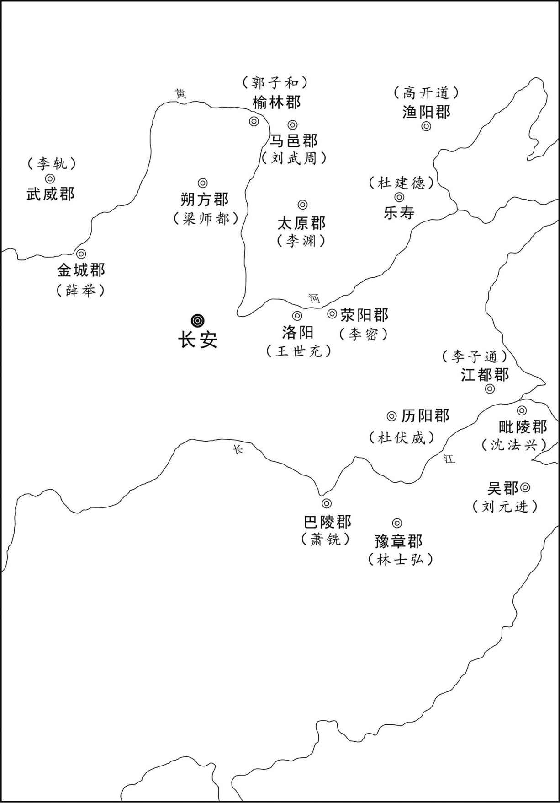 
隋末农民起义及割据势力分布示意图

## 【原文】

**素恃功骄倨，朝宴之际，或失臣礼，帝心衔而不言，素亦觉之[1]。及素薨，帝谓近臣曰：“使素不死，终当族灭[2]。”玄感颇知之，且自以累世贵显，在朝文武多父之故吏，见朝政日紊，而帝多猜忌，内不自安，乃与诸弟潜谋作乱[3]。帝方事征伐，玄感自言：“世荷国恩，愿为将领[4]。”帝喜曰：“将门必有将，相门必有相，固不虚也[5]。”由是宠遇日隆，颇预朝政[6]。**

## 【注文】

[1]恃（shì）功：自负功高。　　骄倨（jù）：傲慢不恭。　　朝宴：朝廷的宴会。　　臣礼：君臣之间应有的礼节。　　心衔（xián）：放在心里。

[2]薨（hōng）：中国古代称诸侯或有爵位的大官死去。

[3]颇（pō）：相当，非常。　　累世：历代，前辈。　　紊（wěn）：乱。　　潜（qián）谋：暗中筹划。

[4]方：当时，正当。　　征伐：讨伐，出兵攻打。　　世：家族几代人。　　荷（hè）：承受，享受。　　国恩：国家的恩典。

[5]将（jiàng）：将军。武官名。春秋时诸侯以卿统率军队，故称卿为将军，以后历代相沿。

[6]日隆（lóng）：日益加深。　　预：参与。

## 【译文】

杨素居功自傲，在朝廷宴会时，往往不遵守做臣子的礼节，炀帝怀恨在心，却不讲出来，杨素也觉察到了。杨素死后，炀帝告诉亲近的大臣说：“假使杨素不死，终究要被灭族。”杨玄感也知道这件事，但自以为他家历代都是高官显宦，朝廷中的文武大臣多数又是他父亲的老部下，眼看着朝政日趋混乱，炀帝又特别猜疑妒忌，心中总是恐惧不安，于是就与他的弟弟们暗中筹划叛乱。当时隋炀帝正忙于战事，杨玄感便向炀帝自荐说：“我家几代承受国家恩典，这次我愿意率领。”炀帝高兴地说：“将军门中必定出将军，宰相门中必定出宰相，确实不假啊。”从此，皇帝对他的宠信恩遇日益加深，他也时时参与朝廷政事。

## 【原文】

**帝伐高丽，命玄感于黎阳督运，遂与虎贲郎将王仲伯、汲郡赞治赵怀义等谋，故逗遛漕运，不时进发，欲令渡辽诸军乏食[1]。帝遣使者促之，玄感扬言水路多盗，不可前后而发[2]。玄感弟虎贲郎将玄纵、鹰扬郎将万石，并从幸辽东，玄感潜遣人召之，二人皆亡还[3]。万石至高阳，为监事许华所执，斩于涿郡[4]。**

## 【注文】

[1]高丽（lí）：高句丽的简称。是西汉到隋唐时期东北地区出现的一个有重要影响的边疆民族。周秦时期，高句丽的先人一直生活在东北地区。公元前37年，夫余人朱蒙在此建立政权。高句丽鼎盛时期其势力范围包括今吉林东南部、辽河以东和朝鲜半岛北部。公元668年，高句丽被唐王朝联合朝鲜半岛东南部的新罗所灭。　　黎阳：地名，河南省浚（xùn）县的古称，西汉高祖时置县，称黎阳县，北魏时期改黎阳县为黎阳郡。　　虎贲（bēn）郎将：皇帝的侍卫武官。北魏置，统率虎贲郎护卫皇帝，从五品上。隋炀帝大业三年（607年）为十二卫护军改称，每卫四人，正四品。　　王仲伯：隋炀帝时朝廷大臣，任虎贲郎将。　　汲（jí）郡：地名。今河南卫辉。西晋泰始二年（266年），设汲郡，郡治卫县（今河南浚县），唐高祖武德元年（618年）废，地属为义州、卫州分领。　　赞治：古官名。西周时始置，隋唐主要指州府长官的行政助理，负责文书的草拟工作。　　赵怀义：隋炀帝时朝廷大臣，任汲郡赞治。　　逗遛（liù）：延误，耽误。　　漕运：中国历史上一项重要的经济制度。是利用水道（河道和海道）调运粮食（主要是公粮）的一种专业运输。中国古代历代封建王朝将征自田赋的部分粮食经水路解往京师或其他指定地点的运输方式。水路不通处辅以陆运，多用车载（山路或用人畜驮运），故又合称“转漕”或“漕辇”。运送粮食的目的是供宫廷消费、百官俸禄、军饷支付和民食调剂。

[2]使者：受命出使的人，泛指奉命办事的人。

[3]玄纵：指杨玄纵，杨玄感弟弟。隋炀帝时朝廷大臣，任虎贲郎将。　　鹰扬郎将：鹰扬府为官署名，隋开皇中府兵制军府名为骠骑将军府，每府置骠骑将军、车骑将军。隋大业三年（607年），改骠骑府为鹰扬府。改二将军为鹰扬郎将、鹰扬副郎将。鹰扬郎将为鹰扬府长官，隋炀帝大业三年（607年）改骠骑将军设置，正五品。唐高祖武德元年（618年）改称军头。　　万石：杨万石，隋炀帝时朝廷大臣，任鹰扬郎将。　　幸：前往。　　辽东：指辽河以东地区，今辽宁省的东部和南部及吉林省的东南部地区。

[4]高阳：古地名，今河北保定东，西汉置，唐贞观元年（627年）先后属瀛州、鄚州、范阳郡。　　监事：掌管具体事务的低级官吏。隋朝门下省御府局置，从九品。唐、五代于卫尉、太仆、司农、太府等寺及将作监所统部分官署设置，无定员。　　许华：隋炀帝时朝廷大臣，任高阳郡监事。　　涿郡：地名，西汉始置，治所在涿县，今河北涿州，隋开皇三年（583年），撤涿郡，所辖区域并入幽州。隋大业三年（607年）改幽州为涿郡，治所在蓟县，今北京城西南隅。辖境相当于北京市及河北霸州市和天津市海河以北、蓟运河以西，河北赤城、涿鹿以东地区。

## 【译文】

炀帝讨伐高丽，命令杨玄感在黎阳督运粮草。杨玄感便和虎贲郎将王仲伯、汲郡赞治赵怀义等人密谋，故意延迟水路的运输，不按时进发，想让远渡辽河的部队缺乏粮食。炀帝派使者催促，杨玄感声称水路盗匪很多，不能连续进发。杨玄感的弟弟虎贲郎将杨玄纵、鹰扬郎将杨万石，都跟从炀帝前往辽东，杨玄感偷偷派人召唤他们，二人都逃了回来。杨万石逃到高阳，被监事许华抓获，在涿郡斩首。

## 【原文】

**时右骁卫大将军来护儿以舟师自东莱将入海趣平壤，玄感遣家奴伪为使者从东方来，诈称护儿反[1]。六月乙巳，玄感入黎阳县，闭城，大索男夫，取帆布为牟甲，署官属，皆准开皇之旧[2]。移书傍郡，以讨护儿为名，各令发兵会于仓所[3]。郡县官有干用者，玄感皆以运粮追集之，以赵怀义为卫州刺史，东光尉元务本为黎州刺史，河内郡主簿唐祎为怀州刺史[4]。**

## 【注文】

[1]右骁卫大将军：右骁卫为官署名，汉代开始设置，隋、唐为军队十六卫中的一卫。隋开皇十八年（598年），置左右备身府。大业三年（607年），改左右备身府为左右骁骑卫，所领名豹骑。唐武德五年（622年），改称左右骁卫府。后去“府”字，为左右骁卫。右骁卫大将军为右骁卫长官，武官正三品。　　来护儿（？—618年）：字崇善，隋江都（今江苏江都）人，隋朝大将，平陈有功，进位上开府，仁寿三年（603年）出任瀛州（今河北河间）刺史，赐爵黄县公，加上柱国，出任右御卫将军，炀帝即位后迁右骁卫大将军，三度领兵击高丽，大业十三年（617年）转为左翊卫大将军，进位开府仪同三司，为炀帝所信任，宇文化及杀炀帝时，因嫉妒杀死他。　　舟师：水军。　　东莱（lái）：地名，山东龙口市（黄县）的古称。现也作为烟台市的古称，或作为地理名词泛指烟台地区。　　趣：赶往。　　平壤：地名。今朝鲜首都平壤，位于朝鲜半岛西北部。

[2]闭城：关闭城门。　　大索：大肆搜索、索取。　　男夫：可以当兵的男子。　　牟（móu）甲：即盔甲。牟，通“鍪（móu）”。　　署：委任。　　官属：主要官员的属吏。　　开皇：隋文帝杨坚在位时所用的年号，共计20年，即公元581年至公元600年。

[3]移：下达。　　仓所：粮仓。

[4]卫州：古地名，在今豫北境内，地理位置主要包括今河南新乡、鹤壁等地。因地处春秋古卫国地，故名卫州，治所长期在汲县（今河南卫辉），历代稍有变更。隋炀帝大业三年（607年），改卫州为汲郡。唐高祖武德元年（618年），复为卫州。贞观元年（627年），州治移汲县（河南卫辉）。辖汲县、卫县、共城、新乡、黎阳五县。　　刺史：职官名，中国古代州一级地方长官。始置于秦汉，秦时名监御使，汉武帝时改称刺史，掌地方监察。汉成帝时改为牧；汉哀帝时为刺史。东汉末，天下渐乱，刺史权重，渐为地方军政长官，后世沿袭。　　东光：地名，今河北沧州东光县。　　尉：指县尉。官名，秦、汉制度，与县丞同为县令佐官，掌治安捕盗之事。一般大县二人，小县一人。　　元务本：隋炀帝时东光县尉。　　黎州：地名。今四川汉源北，北周天和三年（568年）置州，隋废。武周大足元年（701年）又复置。治所在汉源，辖大渡河两岸三县十一城，领五十五羁縻州，为剑南西部边防要地。　　河内郡：中国古代地名、行政区划。汉置，今河南、河北大部分地方。　　主簿（bù）：官名。各级主官属下掌管文书的佐吏。隋、唐以前，因是长官的亲吏，权势很重。魏、晋以后统兵开府的大臣幕府中，主簿常参机要，总领府事。隋、唐以后，主簿是部分官署与地方政府的事务官。隋、唐三省六部不设主簿，只有御史台、诸寺等署设置。唐诸州以录事参军取代主簿。　　唐祎（yī）：隋炀帝时河内郡主簿。　　怀州：地名。今河南沁阳。北魏置，炀帝大业三年（607年）废怀州改置河内郡。

## 【译文】

当时，右骁卫大将军来护儿率领水军从东莱准备入海去平壤，杨玄感派家奴伪装成从东方来的使者，谎称来护儿反叛。大业九年（613年）六月乙巳（初三日），杨玄感进入黎阳县，关闭城门，大肆搜索可以当兵的男子，用帆布制成盔甲，委任官属，都以隋开皇年间的旧制为标准。向临近的郡县下达公文，以讨伐来护儿为借口，命令各郡发兵到黎阳的粮仓处会合。郡县官员中有才干可以任用的，杨玄感都以运粮的名义把他们集中到一起，任命赵怀义为卫州刺史，东光县尉元务本为黎州刺史，河内郡主簿唐祎为怀州刺史。

## 【原文】

**治书侍御史游元督运在黎阳，玄感谓曰：“独夫肆虐，陷身绝域，此天亡之时也。我今亲帅义兵以诛无道，卿意如何[1]？”元正色曰：“尊公荷国宠灵，近古无比，公之弟兄青紫交映，当谓竭诚尽节，上答鸿恩[2]。岂意坟土未干，亲图反噬[3]。仆有死而已，不敢闻命[4]。”玄感怒而囚之，屡胁以兵，不能屈，乃杀之[5]。元，明根之孙也[6]。**

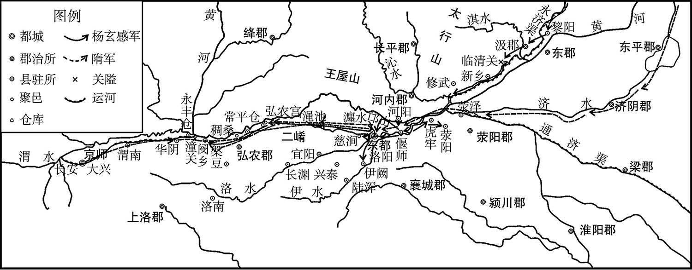 
杨玄感起兵示意图

## 【注文】

[1]治书侍御史：官名，中国古代监察文武官吏的官员，西汉设置，掌图籍文书。东汉属御史台，掌审理疑难案件。魏晋南北朝为御史中丞副贰，监察较高级官员，分领侍御史诸曹，南朝威望较轻，北朝渐重。隋朝置为御史台次官，副贰御史大夫实际主持台务，从五品。唐朝改置御史中丞。　　游元（？—613年）：字楚客，少年时聪敏，开皇中，为殿内侍御史。晋王杨广为扬州总管时，他为法曹参军，后为内直监。炀帝嗣位后，迁为尚书度支郎。辽东之役时担任左骁卫长史、朝请大夫，兼治书侍御史。宇文述等九军遭败绩后，隋炀帝将他下狱治罪。　　独夫：独裁者，专制者。　　肆虐：不顾一切地任意残杀或迫害。

[2]尊公：令尊大人，父亲。　　青紫：青色紫色的官服，隋唐时三品以上官员的官服。　　竭（jié）诚尽节：表现出最大限度的忠诚与节操。　　鸿（hóng）恩：大恩大德。多指皇恩。

[3]岂（qǐ）：表示估计、推测。　　反噬（shì）：比喻背叛。

[4]仆（pú）：旧时对“我”的谦称。

[5]而：连词，表因果关系。　　胁：威胁。

[6]明根（417—498年）：指游明根，字志远，广平任（今河北任县）人。幼为奴牧羊，北魏献文帝时，封新泰侯，后迁大鸿胪，北魏高祖继位后，为都曹主书，又任员外散骑常侍冠将军，进爵为安乐侯。先后出使宋国（南朝）三次，很受宋国人的敬重，还朝升任给事中，再升议曹长，后授予尚书，参定律令。太和二十二年（498年），卒于家乡。孝文帝派特使吊祭，赠光禄大夫，加金章紫绶，追谥为靖侯。

## 【译文】

治书侍御史游元，在黎阳督运粮草，杨玄感对他说：“隋炀帝这个独夫任意残杀迫害，虐害百姓，现今被困在荒远地区，这正是苍天灭亡他的时候。我现在率领正义的军队去消灭那无道的昏君，您认为怎样？”游元严肃地回答说：“你父亲蒙受国家的宠幸，是古今无可比拟的，您的弟兄们身着青色紫色官服交相辉映，应当竭诚尽忠尽节，以报答皇上的大恩大德。没想到你父亲坟墓的新土未干，你就图谋反叛，我现在只有死而已，绝不敢听从你们的命令。”杨玄感大怒，把游元囚禁起来，多次用武力威胁他，都无法让他屈服，最后把他杀了。游元是游明根的孙子。

## 【原文】

**玄感选运夫少壮者得五千余人，丹杨、宣城篙梢三千余人，刑三牲誓众，且谕之曰：“主上无道，不以百姓为念，天下搔扰，死辽东者以万计[1]。今与君等起兵以救兆民之弊，何如[2]？”众皆踊跃称万岁[3]。乃勒兵部分[4]。唐袆自玄感所逃归河内[5]。**

## 【注文】

[1]丹杨：地名，今江苏丹阳，公元前221年秦朝设置的十五个县份之一，当时称曲阿，后改名丹杨。　　宣城：地名，今安徽宣城，秦初正式置县，晋太康二年（281年）析丹阳郡置宣城郡，隋初废郡，改南豫州为宣州，不久又改称宣城郡，唐初置宣州，中间一度改称宣城郡，以后复称宣州。　　篙梢（shāo）：熟练的船工。　　刑：宰杀。　　三牲：指牛、羊、猪，祭祀时的祭品。　　谕（yù）：告诉，使人知道。　　百姓：古代庶民无姓，有土有官爵者才有姓，遂以“百姓”作贵族的通称。战国后，逐渐失去贵族的意义，社会地位与庶民相似。　　天下：古时多指中国范围内的全部土地。　　搔（sāo）扰：动乱不安，骚动扰乱。　　辽东：指辽河以东地区，今辽宁省的东部和南部及吉林省的东南部地区。战国、秦、汉至南北朝设辽东郡。　

[2]兆（zhào）民：古称天子之民，后泛指众民、百姓。　　弊：困苦灾难。

[3]踊跃：形容情绪激烈，积极，争先恐后。

[4]勒（lè）兵：部署或者是操练军队。　　部分：部署，安排。

[5]河内：古地区名，泛指黄河以北的地区，约相当于今河南省。

## 【译文】

杨玄感挑选出年轻力壮的运粮民夫五千多人，丹杨、宣城的撑船好手三千多人，又杀牛、羊、猪三牲聚众誓师，向众人宣布说：“皇上不行仁道，不把百姓的苦难放在心头，天下骚动不安，死在辽东的战士成千上万。现在我与大家起兵，解救亿万民众的困苦，怎么样啊？”大家都欢喜跳跃，高呼万岁。于是他就部署军队。唐袆从杨玄感处逃回河内。

## 【原文】

**先是，玄感阴遣家僮至长安，召李密及弟玄挺赴黎阳[1]。及举兵，密适至，玄感大喜，以为谋主[2]。谓密曰：“子常以济物为己任，今其时矣。计将安出[3]？”密曰：“天子出征，远在辽外，去幽州犹隔千里[4]。南有巨海，北有强胡，中间一道，理极艰危[5]。公拥兵出其不意，长驱入蓟，据临渝之险，扼其咽喉[6]。归路既绝，高丽闻之，必蹑其后，不过旬月，资粮皆尽，其众不降则溃，可不战而擒，此上计也[7]。”玄感曰：“更言其次[8]。”密曰：“关中四塞，天府之国，虽有卫文升，不足为意[9]。今帅众鼓行而西，经城勿攻，直取长安，收其豪杰，抚其士民，据险而守之[10]。天子虽还，失其根本，可徐图也[11]。”玄感曰：“更言其次。”密曰：“简精锐，昼夜倍道，袭取东都，以号令四方[12]。但恐唐祎告之，先已固守。若引兵攻之，百日不克，天下之兵四面而至，非仆所知也。”玄感曰：“不然。今百官家口并在东都，若先取之，足以动其心。且经城不拔，何以示威？公之下计，乃上策也[13]。”遂引兵向洛阳，遣杨玄挺将骁勇千人为前锋，先取河内[14]。唐祎据城拒守，玄挺无所获。祎又使人告东都越王侗与樊子盖等勒兵为备[15]。**

## 【注文】

[1]阴：悄悄地，偷偷地。　　家僮（tóng）：亦作“家童”。旧时对私家奴仆的统称。　　长安：隋唐时都城，是中国历史上一座著名都城，其地点由于历史原因有过迁徙，但大致都位于现在陕西的西安和咸阳附近。

[2]谋主：出谋划策的人。

[3]济物：救国救民，拯救天下苍生。

[4]去：距离。　　幽州：地名，古九州及汉十三刺史部之一，隋唐时北方的军事重镇、交通中心和商业都会，治所在蓟县，今北京市、河北北部、辽宁南部及朝鲜西北部。

[5]胡：胡人，这里是指突厥。

[6]蓟（jì）：地名，今北京西南，战国时燕国都城。　　临渝：地名，指山海关。　　扼（è）：把守，控制。

[7]蹑（niè）：紧跟，追随。　　旬月：十天半月。　　溃（kuì）：溃散，散乱，垮台。　　擒（qín）：捉拿。

[8]更：再，再一次。

[9]关中：指陕西省秦岭北麓渭河冲积平原，其北部为陕北黄土高原，向南则是陕南盆地、秦巴山脉。关中之名，始于战国时期，一般认为西有大散关，东有函谷关，南有武关，北有萧关，取意四关之中。四方的关隘，再加上陕北高原和秦岭两道天然屏障，使关中成为自古以来的兵家必争之地。　　卫文升（？—618年）：名玄，字文升，隋朝大将，河南洛阳人。周武帝时为记室，曾单骑说降山獠，参与炀帝讨伐高句丽的战争，全军而还。杨玄感反隋，文升誓师苦战，竭力阻挡，不久与宇文述等平定杨玄感的叛乱。后任西京留守，李渊攻长安时忧惧不能理事，长安城破前病死。

[10]鼓：击鼓。　　士民：群众百姓。

[11]徐：慢慢地。　　图：谋取。

[12]倍道：兼程而行，指一日走两日的路程。　　东都：地名，指今河南洛阳。是隋后期的首都。隋炀帝大业元年（605年）营建，唐朝时高宗、中宗、睿宗、武则天、玄宗、昭宗、哀帝定都洛阳近50年，时称为东都、神都或东京。城内有隋唐时代面积最大的宫殿群——洛阳宫，中国历史上最高大的宫殿建筑——万象神宫。东都洛阳是当时全国政治、经济中心，同时也是东南通江都、太湖、浙江，东北通山东、涿郡，西通关中长安的大运河交通中心。

[13]百官家口：朝廷官员的家人内眷。

[14]骁勇：彪悍勇猛的战士。　　前锋：前头部队。

[15]越王侗（dòng）（？—619年）：杨侗，隋炀帝之孙，从小聪明过人，宽厚仁爱，公元618年东都洛阳群臣拥立他为帝，改元皇泰，史称“皇泰主”。在位十一个月，被王世充所杀，王世充谥他为恭皇帝。　　樊子盖（544—615年）：字华宗，庐江（今安徽合肥人）。历任民部尚书、东都留守等职，为官清廉谨慎，治军严，平叛乱有功，封建安侯，隋大业十年（614年），进爵为济公，后卒于京。

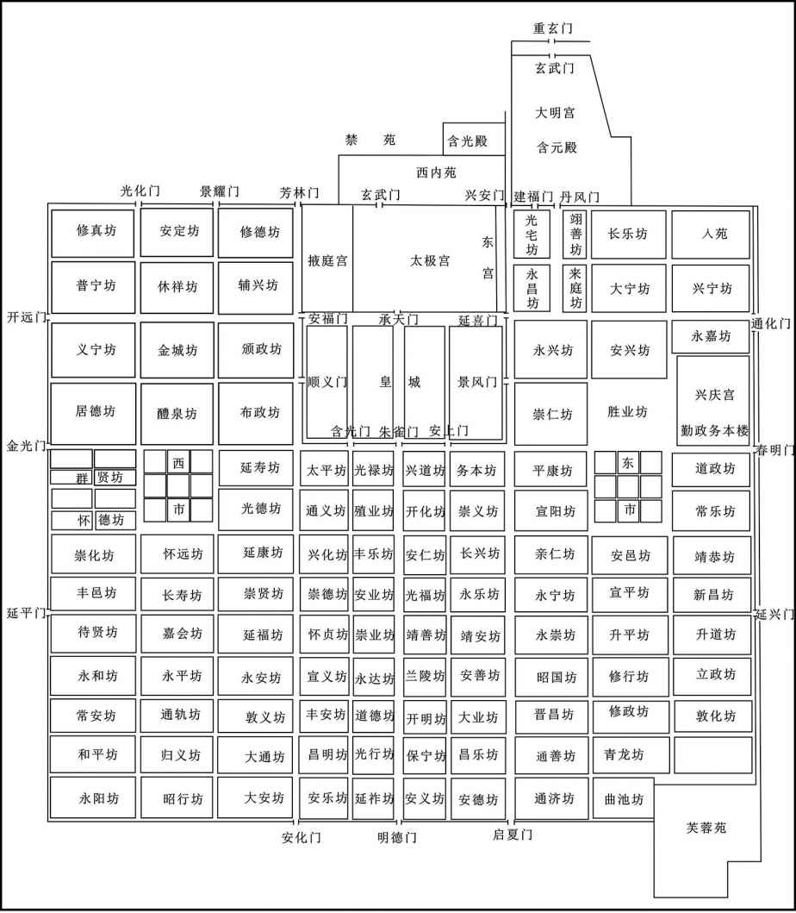 
隋唐长安城示意图

## 【译文】

起先，杨玄感悄悄派家奴到长安，召李密和弟弟杨玄挺赶赴黎阳。到起兵的时候，李密正好赶来，杨玄感非常高兴，就让李密做自己的谋主，他对李密说：“先生您常把救国救民当作自己的责任，现在是时候了，您有什么计谋？”李密说：“天子出征，远在辽东之外，距离幽州隔有一千里。南有大海，北有强盛的胡人，中间只有一条道路，按理说是极其艰难危险的。您率领大军出其不意，长驱直入蓟县，占据临渝的险要位置，扼住通道的咽喉。他的退路断绝，高丽听到这个消息，必定紧随其后追杀，用不了一个月，物资和粮食全部用光，他的军队不是投降就是溃散，这样不用打仗即可把他擒获，这是上策。”杨玄感说：“请再讲讲中策。”李密说：“关中四面阻塞，是天府之国，虽然那里有卫文升留守，但不值得顾虑。现在率军击鼓向西进发，经过城市都不要攻打，直接去取长安，在那里招收当地的豪杰，安抚当地的士兵民众，占据险要的地理位置而加以防守。即使天子回来，他也失去了根本，可以慢慢再想进取的计策。”杨玄感说：“请再讲讲下策。”李密说：“挑选精锐士兵，向东昼夜兼程，用偷袭的办法占领东都洛阳，以此号令四方。只是恐怕唐祎告密后，那里已经抢先严加防守了。如果带兵攻打，百日之内攻不下来，天下的军队就会从四面赶来，其结局就不是我所能预料的了。”杨玄感说：“不对。现在百官的家属都在东都，如果能先取得洛阳，足以动摇人心。再说，经过的城池不攻取，怎能显示我们的军威？您认为的下策，实际才是上策。”于是率兵向洛阳进发，派杨玄挺率领强悍勇敢的士兵一千人作前锋，先攻打河内。唐祎据城坚守，杨玄挺没有什么收获。唐祎又派人告诉在东都的越王杨侗和樊子盖等人，部署军队加以防备。

## 【原文】

**修武民相帅守临清关，玄感不得渡，乃于汲郡南渡河，从之者如市[1]。使弟积善将兵三千自偃师南缘洛水西入，玄挺自白司马坂逾邙山南入，玄感将三千余人随其后，相去十里许，自称大军[2]。其兵皆执单刀柳楯，无弓矢甲胄[3]。东都遣河南令达奚善意将精兵五千人拒积善，将作监河南赞治裴弘策将八千人拒玄挺[4]。善意渡洛南，营于汉王寺[5]。明日，积善兵至，不战自溃，铠仗皆为积善所取[6]。弘策出，至白司马坂，一战败走，弃铠仗者太半，玄挺亦不追[7]。弘策退三四里，收散兵，复结陈以待之[8]。玄挺徐至，坐息良久，忽起击之，弘策又败[9]。如是五战[10]。丙辰，玄挺直抵太阳门，弘策将十余骑驰入宫城，自余无一人返者，皆归玄感[11]。**

## 【注文】

[1]修武：地名，今河南修武，古为宁邑，周代改名“修武”，公元前221年，秦设修武县，隋唐因袭。　　相帅：相继；一个接一个。　　汲（jí）郡：地名，今河南浚县东部。炀帝大业三年（607年），改卫州为汲郡，郡治卫县（今河南浚县），唐高祖武德元年（618年），废，地属为义州、卫州分领。　　市：赶集。

[2]积善：指杨积善。隋炀帝时朝廷大臣，杨玄感弟弟，跟随杨玄感反隋。　　偃（yǎn）师：地名。今河南洛阳偃师。　　缘：顺着。　　洛水：通常指的是洛阳市的洛河，是黄河下游南岸大支流。主河段位于河南省洛阳市。洛水源出陕西省洛南县洛源乡的木岔沟，东流入河南境，经卢氏县、洛宁县、宜阳县、洛阳市，到偃师县杨村附近纳伊河后称伊洛河，到巩义市洛口以北入黄河。　　白司马坂：地名，今河南洛阳北邙山北麓。　　逾（yú）：越过，翻过。　　邙（máng）山：位于河南洛阳北，黄河南岸，是秦岭山脉的余脉，崤山支脉。

[3]柳楯（dùn）：楯，通“盾”，盾牌。柳楯，就是指木盾牌。　　弓矢（shǐ）：弓箭。　　甲胄（zhòu）：铠甲。

[4]达奚善意：隋炀帝时任河南令。　　将作监：古代官署名，掌管宫室建筑、金玉珠翠犀象宝贝器皿的制作、纱罗缎匹的刺绣、各种异样器用打造的官署。　　裴弘策：隋炀帝时任将作监河南赞治。

[5]营：扎营。　　于：在。

[6]自溃：自行溃散。　　铠（kǎi）仗：铠甲兵器。

[7]败走：失败逃跑。　　太半：一多半。

[8]散（sàn）兵：四散或者溃散的士兵。　　结陈：集结队伍，布列阵势。

[9]良久：很久。

[10]如是：就这样。

[11]驰（chí）：奔逃，快跑。　　返者：返回来的人。

## 【译文】

修武的老百姓聚集起来把守临清关，杨玄感无法渡过，就从汲郡的南边渡过黄河，各地人民纷纷随从。杨玄感派他弟弟杨积善带领三千士兵，从偃师南面顺着洛水向西开进，杨玄挺从白司马坂翻过邙山向南开进，杨玄感带着三千多人紧跟在后，相距十里左右，自称主力军，士兵们都手执单刀柳楯，不带弓箭和铠甲。东都派河南县令达奚善意率精兵五千人抗击杨积善，将作监、河南赞治裴弘策率八千人抵抗杨玄挺。达奚善意渡过洛水，在南岸汉王寺扎营。第二天，杨积善带兵攻打，达奚善意的士兵还没有交战就自行溃散了，铠甲兵器等都被杨积善收取。裴弘策出兵到白司马坂，一交战就失败逃跑，丢弃铠甲兵器的人有一多半，杨玄挺也没有追击。裴弘策撤退了三四里，收集四散的士兵，重新组建列阵，等待杨玄挺。杨玄挺慢悠悠地到达，坐下来休息了好久，突然发起攻击，裴弘策又溃败。就这样打了五仗。大业九年（613年）六月丙辰（十四日），杨玄挺直达太阳门，裴弘策仅带了十几个骑兵奔逃进宫城，其余没有一个人返回，都归附了杨玄感。

## 【原文】

**玄感屯上春门，每誓众曰：“我身为上柱国，家累巨万金，至于富贵，无所求也[1]。今不顾灭族者，但为天下解倒悬之急耳。”众皆悦[2]。父老争献牛酒，子弟诣军门请自效者，日以千数[3]。**

## 【注文】

[1]屯：驻军。　　上春门：即隋洛阳城（今河南洛阳市）东城最北门。　　每：常常，总是。　　上柱国：官名。柱国始见于战国时期的楚国，后代屡有设置，十六国后燕始置柱国大将军，北魏末又置，位在丞相之上，西魏建立后，设置柱国，共任命八人，称“八柱国”，北周后期，成为没有具体执掌的勋官。隋置，是对作战有功之人的特别表彰，为散官。

[2]灭族：灭亡家族。　　倒悬：头向下、脚向上悬挂着，比喻极其艰难、危险的困境。　　耳：文言助词，而已，罢了。

[3]诣（yì）：到，旧时特指到尊长那里去。

## 【译文】

杨玄感驻军在上春门，总是在众人面前发誓说：“我作为上柱国，家中积累有数万的金银，对于富贵，再没有什么可求的了。今天我所以不顾灭族之祸而起兵，只不过是要为天下的黎民百姓解除困苦危难罢了。”众人听了都很高兴。地方上的父老乡亲争先恐后奉献牛肉美酒，他们的子弟到军门请求效力的，每天都有上千人。

## 【原文】

**内史舍人韦福嗣，洸之兄子也，从军出拒玄感，为玄感所获[1]。玄感厚礼之，使与其党胡师耽共掌文翰[2]。玄感令福嗣为书遗樊子盖，数帝罪恶，云：“今欲废昏立明，愿勿拘小礼，自贻伊戚[3]。”樊子盖新自外藩入为京官，东都旧官多慢之，至于部分军事，未甚承禀[4]。裴弘策与子盖同班，前出讨贼失利，子盖更使出战，不肯行，子盖命引出斩之以徇[5]。国子祭酒河东杨汪小有不恭，子盖又将斩之，汪顿首流血乃得免[6]。于是将吏震肃，无敢仰视，令行禁止[7]。玄感尽锐攻城，子盖随方拒守，玄感不能克[8]。然达官子弟应募从军者，闻弘策死，皆不敢入城[9]。韩擒虎子世咢、观王雄子恭道、虞世基子柔、来护儿子渊、裴蕴子爽、大理卿郑善果子俨、周罗睺子仲等四十余人皆降于玄感，玄感悉以亲要重任委之[10]。善果，译之兄子也[11]。**

## 【注文】

[1]内史：职官名，西周时开始设置，又称册内史、作命内史。汉初沿置，治所在长安县（今西安市北）。汉高帝时掌全国财经事务与京师地区，汉景帝二年（前155年）时分左、右内史。太初元年（前104），改右内史分为京兆尹、右扶风，左内史为左冯翊。隋代改中书省为内史省，改中书令为内史令。唐沿隋制，设内史，为正二品，执掌中书省，即宰相。　　内史舍（shè）人：内史省长官。　　韦福嗣（sì）（？—613年）：京兆杜陵人，位居内史舍人，后因为犯罪被贬黜，杨玄感之乱，随军与之作战，败于城北，被杨玄感俘获。不久背着杨玄感还东都，隋炀帝将其车裂。　　洸（guāng）：韦洸（？—590年），隋朝将领，字世穆。京兆杜陵（今西安东南）人。北周做官时，多次跟从征伐，因有功升任柱国，封襄阳郡公。入隋后，力挫突厥，平定南陈之役时，为行军总管，文帝开皇十年（590年），在作战时中流矢卒。

[2]礼：名词用作动词，以礼相待，礼遇。　　胡师耽：生平事迹不详，活动于隋末。　　文翰（hàn）：指文书工作。文，指文字、文章，泛指才华、文采。翰，原指羽毛，后借指毛笔、文字、书信。

[3]遗（wèi）：给。　　数：述说，列举。　　自贻（yí）伊戚：贻：遗留；伊：此；戚：忧愁，悲哀。比喻自寻烦恼，自招忧患。

[4]外藩（fān）：封建时代称属国属地或分封的土地，借指边防重镇。　　承禀（bǐng）：请示，禀告，奉命。

[5]同班：级别相当。　　徇：对众宣示。

[6]国子祭酒：古代学官名。晋武帝时设，以后历代多沿用。为国子学或国子监的主管官。国子监是中国古代国立最高学府和官府名，传授儒家思想，其中最重要的礼仪就是祭祀，所以国子监的主管被命名为祭酒。　　河东：代指山西。因黄河流经山西省的西南境，山西在黄河以东，故这块地方古称河东。秦汉时指河东郡地，在今山西运城、临汾一带，唐代以后泛指山西。　　杨汪（？—620年）：字元度，隋大业中，为银青光禄大夫，后李密逼东都，杨汪率兵抵抗。炀帝驾崩，王世充推越王杨侗为主，拜杨汪为吏部尚书，王世充被平定后，唐以凶党的罪名把他诛杀。　　小：稍微。　　顿首：磕头，叩头下拜。

[7]将吏：将军和官吏。　　震肃：因慑于威猛之政而风气肃然。

[8]随：根据。　　方：情况。

[9]达官：旧指显贵的官吏。　　子弟：泛指子侄辈。

[10]韩擒虎（538—592年）：原名擒豹，字子通，河南东垣（今河南新安东）人，隋朝名将。继承父亲的爵出仕北周，入隋后，隋文帝委任他平定陈朝的重任，伐陈时为先锋，执陈后主，进位上柱国，终于凉州刺史。　　观王雄（542—612年）：杨雄，隋朝皇族，本名惠，隋文帝杨坚族子。　　恭道（？—614年）：杨恭道，是隋文帝族侄观王杨雄的儿子，大业九年（613年），杨玄感反隋，进攻洛阳城，杨恭道归降了杨玄感，杨玄感将亲信要职授予他们。杨玄感失败后，杨恭道不知所终。　　虞（yú）世基（？—618年）：隋代书法家，文学家。字茂世，一作懋世，会稽余姚（今慈溪市观海卫镇鸣鹤场）人。　　裴蕴（yùn）（？—618年）：隋朝大臣，河东闻喜（今属山西）人。裴蕴开始在陈朝做官，任过直阁将军，陈朝被隋灭掉后，隋文帝杨坚时破格提拔为仪同之职。隋炀帝杨广即位后，任裴蕴为太常少卿（专掌宗教礼仪，兼掌试选博士的九卿之一），后任民部侍郎。大业十四年（618年），右屯卫将军宇文化及与司马德戡在江都（今江苏扬州）发动兵变，裴蕴在这次兵变中被杀。　　大理卿：职官名，也称大理寺卿，大理寺长官，掌邦国狱刑的事情。北齐置一人，三品。隋炀帝大业三年（607年）改从三品。唐朝沿置，曾改为详刑正卿、司刑卿。　　郑善果（572—629年）：唐时，任职为检校大理卿兼民部尚书，正身奉法，非常有政绩。历任礼部、刑部尚书。　　周罗睺（hóu）（540—604年）：字公布，南朝陈、隋朝将领。九江浔阳人（今江西九江）人。开始是南朝军人，以战功授为开远将军。后来与北齐军队作战，被流矢射中左目，勇冠三军，官至散骑常侍。后归降隋朝。隋文帝授他统帅海军，攻打高句丽。隋炀帝即位，命他帮助杨素讨伐汉王杨谅。被流矢射中，在京师病逝，赠柱国，右翊卫大将军，谥号壮。

[11]译（540—591年）：指郑译，字正义，隋朝大臣，荥阳开封（河南开封）人。幼聪颖，博览群书，在北周以给事中士起家，官至内史上大夫，封沛国公。入隋后参定律令、礼乐，位至上柱国。

## 【译文】

内史舍人韦福嗣，是韦洸哥哥的儿子，随从官军出战抵抗杨玄感，被杨玄感俘虏。杨玄感用优厚的礼遇接待他，让他和他的同伙胡师耽共同掌管文书工作。杨玄感还让韦福嗣写信给樊子盖，述说炀帝的罪恶，说：“现在我们想废掉昏君，拥立贤明的君主，希望你不要拘泥于小的节义，给自己造成烦恼。”樊子盖刚从地方调入京城做官，洛阳的旧官僚们都很怠慢他，至于布置军队的事情，都不怎么请示他。裴弘策与樊子盖在朝中级别相当，以前裴弘策讨伐叛逆失利，樊子盖让他再去作战，他不肯去，樊子盖下令把他拉出去斩首示众。国子祭酒、河东人杨汪对樊子盖稍微有点不恭敬，樊子盖又要杀他，杨汪叩头直到头破血流，才得免于一死。从此，将军和官吏们才被震慑住，纪律严肃，对樊子盖不敢仰视，有令即行，有禁则止。杨玄感出动全部精锐部队攻城，樊子盖根据情势加以抵抗防守，杨玄感无法攻下。但那些达官贵人的子弟应征从军的，听说裴弘策被杀死，都不敢进城。韩擒虎的儿子韩世咢、观王杨雄的儿子杨恭道、虞世基的儿子虞世柔、来护儿的儿子来源、裴蕴的儿子裴爽、大理卿郑善果的儿子郑俨、周罗睺的儿子周仲等四十多人全投降了杨玄感，杨玄感对他们都委任了显要的官职。郑善果是郑译哥哥的儿子。

## 【原文】

**玄感收兵得五万余人，分五千人守慈磵道，五千守伊阙道，遣韩世咢将三千人围荥阳，顾觉将五千人取虎牢[1]。虎牢降，以觉为郑州刺史，镇虎牢[2]。**

## 【注文】

[1]慈磵（jiàn）道：河南洛阳西面。　　伊阙（què）：今河南洛阳南龙门。　　韩世咢（è）：生卒年不详，隋朝末年将领，跟随杨玄感起兵反隋。　　荥（xíng）阳：地名，今河南荥阳。秦在荥阳设置三川郡，西汉时改三川郡为河南郡，辖荥阳、成皋（今荥阳汜水镇）、故市（今郑州西北）等县。西晋泰始元年（265年），改河南郡为荥阳郡，郡治仍在荥阳。北魏时，在武牢（即虎牢关）设北豫州部，置荥阳郡。北周灭北齐后，将荥阳及其附近地区组成的北豫州改为荥州，州治所设在成皋（即武牢关、虎牢关）。公元581年，隋文帝杨坚建立隋朝后，将北周时的荥州改名为郑州，郑州州府治所仍设在成皋（即虎牢）。唐朝时，郑州的行政建置有所变化，其辖区变为密县、汜水、荥阳、荥泽、成皋等县，直到唐太宗贞观七年（633年），郑州州府治所才从成皋移至管城（今郑州管城区）。　　顾觉：生卒年不详，隋朝末年将领，跟随杨玄感起兵反隋。　　虎牢：地名，春秋在郑国境内，今河南荥阳汜水镇。相传周穆王捕获虎关押在此，故名。城筑在大伾山上，形势险要，为军事重镇。汉置成皋（gāo）县，隋唐因袭。

[2]郑州：州名，今河南郑州。

## 【译文】

杨玄感征集兵马，得到五万多人，分出五千人防守慈磵道，五千人防守伊阙道，派韩世咢率领三千人包围荥阳，顾觉带领五千人攻打虎牢。虎牢守将投降后，任命顾觉为郑州刺史，镇守虎牢。

## 【原文】

**代王侑使刑部尚书卫文升帅兵四万救东都[1]。文升至华阴，掘杨素冢，焚其骸骨，示士卒以必死，遂鼓行出淆、渑，直趋东都城北[2]。玄感逆拒之，文升且战且行，屯于金谷[3]。**

## 【注文】

[1]代王侑（yòu）：即隋恭帝杨侑（605—619年），隋炀帝孙，杨昭第三子，初封陈王，后改封代王。李渊攻入长安后拥立他为帝。在位半年，武德二年去世，年仅15岁，葬于陕西省乾县。　　刑部尚书：中国古代官署刑部的主官，掌管全国司法和刑狱。

[2]冢：坟墓。　　焚（fén）：焚烧。　　示：向……展示。　　淆（xiáo）：淆谷关，今河南境内。　　渑（miǎn）：渑池，地名。今河南渑池。

[3]拒：迎击。

## 【译文】

代王杨侑派刑部尚书卫文升率兵四万救援东都。卫文升到了华阴，刨开杨素的坟墓，焚烧了他的骸骨，向士兵表示必死的决心，于是擂起战鼓，出淆谷、渑池，一直赶往东都城北。杨玄感出兵迎击，卫文升一边还击一边前进，屯兵驻扎在金谷。

## 【原文】

**辽东城久不拔，帝遣造布囊百余万口，满贮土，欲积为鱼梁大道，阔三十步，高与城齐，使战士登而攻之[1]。又作八轮楼车，高出于城，夹鱼梁道，欲俯射城内[2]。指期将攻，城内危蹙[3]。会杨玄感反书至，帝大惧，引纳言苏威入帐中，谓曰：“此儿聪明，得无为患[4]？”威曰：“夫识是非，审成败，乃谓之聪明。玄感粗疏，必无所虑，但恐因此寖成乱阶耳[5]。”帝又闻达官子弟皆在玄感所，益忧之[6]。帝问太史令庾质曰：“玄感其有成乎[7]？”质曰：“玄感地势虽隆，素非人望，因百姓之劳，冀幸成功[8]。今天下一家，未易可动。”**

## 【注文】

[1]不拔：攻不下来。　　布囊（náng）：布口袋。　　鱼梁：在溪流、河汊或浅滩处，用石块或竹、木等材料筑成坝堰横截水流，中留缺口，使捕捞对象随水流入网内或鱼篓内进行捕捞的设施。

[2]俯：向下。

[3]指期：拟定好日子。　　蹙（cù）：恐慌，紧迫。

[4]会：适逢。　　纳言：古官名。主出纳王命。王莽时，依古制，改大司农为纳言，隋避文帝父杨忠讳，改侍中为纳言，隋炀帝又改纳言为侍内。唐又改为侍中。　　苏威（534—623年）：隋代宰相，字无畏，京兆武功（今陕西武功西北）大族。隋代建立，隋文帝杨坚任他为太子少保，兼纳言、民部尚书。他建议减轻赋役，被采纳。后又兼任大理卿、京兆尹、御史大夫。苏威很有才能，历任要职，与高颎参掌朝政，齐心协力辅佐隋文帝。政刑大小，都参与筹划。文帝修订隋代典制，律令格式多为苏威所定。开皇九年（589年）被任为尚书右仆射。后有人告发他和主持选举的吏部官员结为朋党，任用私人，于是被免除官爵。此后，屡次起用，屡被免官。大业元年（605年），他继杨素为左仆射。后又以太常卿、纳言参掌朝政，加开府仪同三司，颇受尊重，不久又被罢免。他对隋炀帝不敢直言进谏，遇事多承望风旨。隋末，宇文化及弑炀帝，以苏威为光禄大夫。宇文化及失败后，苏威降李密；李密败，苏威又归王世充。世充称帝，任命苏威为太师。唐平王世充后，苏威求见秦王李世民和唐高祖李渊，均遭拒绝。武德六年（623年）病死于长安。

[5]寖（qìn）：渐渐。　　乱阶：叛乱阶梯。

[6]所：地方，住所。　　益：更加。　　忧：忧虑。

[7]太史令：官职名，掌管天文历法的长官。秦汉属太常，隋属秘书省，官署为太史监，长官为太史令，唐属秘书省，官署为太史局，时长官为太史令。　　庾（yǔ）质（？—614年）：字行修，隋朝官员，八岁时拜为童子郎，仕北周齐炀王宇文宪记室。公元581年，任官为奉朝请。大业初年，官居太史令。

[8]隆：高贵，势力。　　冀：希望。

## 【译文】

辽东城很久攻不下来，隋炀帝杨广派人做了一百多万个布口袋，装满泥土，想堆积成一条鱼脊梁似的大道，宽三十步，与城墙一般高，让战士登上去攻打。又制造了装有八个轮子的楼车，比城墙还高，放置在鱼梁道两旁，计划居高临下向城中射箭。指定好日期进行攻城，城中人人自危，十分恐慌。适逢杨玄感反叛的文书送到，炀帝杨广非常害怕，传令让纳言苏威进入营帐，对他说：“这小子很聪明，会否成为祸患？”苏威说：“能明白是非，审度成败，才叫作聪明。杨玄感粗心疏忽，不必有什么顾虑，只是恐怕因此酿成叛乱的阶梯。”炀帝又听说达官子弟都在杨玄感手中，更加忧虑，问太史令庾质说：“杨玄感有成功的可能吗？”庾质道：“杨玄感地位虽高，势力虽大，平时在人们心中却没什么威望，他只不过利用百姓的困苦，希望侥幸成功。现在天下依然是杨家的天下，并不是轻易就能动摇的。”

## 【原文】

**帝遣虎贲郎将陈稜攻元务本于黎阳，又遣左翊卫大将军宇文述、左候卫将军屈突通乘传发兵以讨玄感[1]。来护儿至东莱，闻玄感围东都，召诸将议旋军救之[2]。诸将咸以无敕，不宜擅还，固执不从[3]。护儿厉声曰：“洛阳被围，心腹之疾。高丽逆命，犹疥癣耳。公家之事，知无不为，专擅在吾，不关诸人。有沮议者，军法从事[4]。”即日回军，令子弘、整驰驿奏闻[5]。帝时还至涿郡，已敕护儿救东都，见弘整，甚悦，赐护儿玺书曰：“公旋师之时，是朕敕公之日，君臣意合，远同符契[6]。”**

## 【注文】

[1]陈稜（líng）（？—619年）：字长威，庐江襄安（今安徽巢湖）人。隋炀帝大业三年（607年），任虎贲郎将。大业六年（610年）与张镇周率万余人，由义安（今广东省潮州市）进入琉球（今属台湾）。炀帝大业十三年（617年）任右御将军，率军进攻杜伏威起义军，被击败。炀帝死后，据江都（今江苏省江都，位扬州市东北）。唐高祖武德二年（619年），为李氏所攻，投奔杜伏威，后被杀。　　左翊卫大将军：隋朝十二卫将军之一。　　左候卫将军：隋朝十二卫将军之一，设置同“右候卫将军”。掌车驾出营卫，分领府兵。　　屈突通（557—628年）：长安人，隋唐时期名将领，凌烟阁二十四功臣之一，先世依附鲜卑慕容氏。大业年间曾平定杨玄感叛乱，数次镇压农民起义。隋炀帝南巡，委其镇守长安。高祖起兵入关，屈突通坚守潼关，兵败被俘，后降唐，任兵部尚书，封蒋国公。后随李世民平定王世充，拜陕东大行台右仆射，镇守洛阳，后回朝拜为工部尚书。玄武门之变后，又为检校行台仆射，镇守洛阳。贞观元年（627年），改封洛州都督，进左光禄大夫。不久病故，赠尚书左仆射，谥号为忠。

[2]东莱（lái）：地名，山东龙口市（黄县）的古称。现也作为烟台市的古称，或作为地理名词泛指烟台地区。　　旋军：回师。

[3]咸：都，全部。　　敕（chì）：帝王的诏书、命令。

[4]逆命：对抗朝命。　　犹：好像，似乎。　　疥癣（jiè xuǎn）：皮肤表面的疾病，人们常用来比喻有关痛痒，但无碍生命的小问题。　　公家：指朝廷、国家或官府。

[5]回军：军队转调回来。　　弘、整：来弘、来整，隋朝大将来护儿的儿子。

[6]甚悦：非常喜悦。　　旋师：带领军队凯旋。　　符契：古代的一种信物。在一个木板上写着约定叫符，若从当中劈开，双方各执一块叫契。

## 【译文】

隋炀帝杨广派虎贲郎将陈稜去黎阳攻打元务本，又派左翊卫大将军宇文述、左候卫将军屈突通乘驿站的马车发兵讨伐杨玄感。来护儿到东莱，听到杨玄感围困东都的消息，召集众将领商议回军救援，众将领都认为没有炀帝的命令，不能擅自回军，坚持不听他的意见。来护儿严厉地说：“洛阳被包围，这是心腹大病。高丽对抗朝命，好似皮肤上的疥癣。国家大事，明白了道理就应当赶快执行，擅自专权的是我，不关你们的事。再有阻止回军的，依军法行事！”当日就把军队调转回来，命令他的儿子来弘整，驾乘驿马疾行上奏皇帝。这时，隋炀帝返回涿郡，已经下令来护儿援救东都，看到弘整，十分高兴，赐给来护儿的盖着皇帝印章的信中说：“您回军的时间，正是我向您下回军命令的日子，我们君臣心意如此一致，距离虽远，却像符契一般相合。”

## 【原文】

**先是，右武候大将军李子雄坐事除名，令从军自效，从来护儿在东莱，帝疑之，诏锁子雄送行在所[1]。子雄杀使者，逃奔玄感[2]。卫文升以步骑二万渡水与玄感战，玄感屡破之[3]。玄感每战，身先士卒，所向摧陷[4]。又善抚悦其下，皆乐为致死[5]。由是每战多捷，众益盛，至十万人[6]。文升众寡不敌，死伤太半且尽，乃更进屯邙山之阳，与玄感决战，一日十余合[7]。会杨玄挺中流矢死，玄感军乃稍却[8]。**

## 【注文】

[1]右武候大将军：官名，隋朝十二卫大将军之一，与左武候大将军同掌车驾护从，分领府兵。置一人，正三品。隋炀帝大业三年（607年）改为右候卫大将军。　　李子雄（？—614年）：渤海蓨县（今河北景县）人，跟从周武帝平齐，以功授帅都督；跟从韦孝宽破尉迟迥，拜上开府，赐爵建昌县公。隋文帝即位后，任骠骑将军，伐陈有功，进位大将军；仁寿中，平汉王杨谅有功，迁幽州（今北京）总管，征拜民部尚书，后转右武候大将军。杨玄感起兵，炀帝怀疑他参与，下诏拘禁他，后归附杨玄感，杨玄感败后被杀。　　坐事：因事获罪。　　锁：名词用作动词，带上枷锁。

[2]逃：逃走。　　奔：投奔。

[3]步骑：骑兵和步兵。　　渡水：渡过澧水。

[4]所向：所到的地方。　　摧陷：摧垮。

[5]乐：心悦诚服。　　致死：拼命。

[6]捷：取胜。　　众：兵力。

[7]乃：只好。　　更：再次。　　屯：驻守。

[8]会：恰逢。　　流矢：流箭。　　稍：稍微。

## 【译文】

在这以前，右武候大将军李子雄因故被革去官职，隋炀帝杨广让他随军效力，跟随来护儿在东莱。炀帝对他很怀疑，下令给李子雄带上枷锁，押送到皇帝巡行的地方。李子雄杀死使者逃走，投奔了杨玄感。卫文升带着两万骑兵和步兵，渡过澧水，迎战杨玄感，屡次被杨玄感打败。杨玄感每次作战，总是身先士卒，所到之处都能摧垮敌人。他又善于安抚取悦部下，使部下心悦诚服地为他效命。因此，每次作战都能取胜，军队日益增多，达到十万人。卫文升与杨玄感作战寡不敌众，死伤大半，几乎全军覆没，只好再次进兵屯守邙山南麓，和杨玄感决战，一天十几个回合。恰逢杨玄挺中流箭死了，杨玄感的部队才稍微退却了一些。

## 【原文】

**秋七月癸未，余杭民刘元进起兵以应玄感，众至数万[1]。始，杨玄感至东都，自谓天下响应，功在朝夕[2]。得韦福嗣委以心膂，不复专任李密[3]。福嗣每画策，皆持两端[4]。密揣知其意，谓玄感曰：“福嗣元非同盟，实怀观望[5]。明公初起大事，而奸人在侧，听其是非，必为所误，请斩之。”玄感曰：“何至于此？”密退谓所亲曰：“杨公好反而不欲胜，吾属今为虏矣。”**

## 【注文】

[1]余杭：地名，今浙江杭州。　　刘元进（？—613年）：余杭人。隋末江南农民起义领袖。少年时就仗义行侠，为乡里所尊崇。隋大业九年（613年），杨玄感兵变反隋，刘元进起兵响应杨玄感，逃避兵役者纷纷前来参加。刘元进正拟渡江北进，杨玄感已告失败。此时其他义军并共推刘元进为天子，隋廷派大将军吐万绪、王世充镇压。王世充渡江后，频战皆捷。在吐万绪和王世充的镇压下，刘元进兵败战死。

[2]自谓：自称。

[3]心膂（lǚ）：喻主要的辅佐人员。也以喻亲信得力之人。

[4]画策：出谋划策。

[5]揣：猜测。　　元：原本。

## 【译文】

隋炀帝大业九年（613年）秋七月癸未（十一日），余杭平民刘元进起兵响应杨玄感，人数多达好几万。开始，杨玄感到达东都，自以为天下响应，旦夕之间即可取得成功。得到韦福嗣后，便以他做心腹骨干，不再专门信任李密。韦福嗣每次出谋划策，都态度暧昧，迟疑不决。李密猜测到他的心意，告诉杨玄感说：“韦福嗣原本不是我们的同盟，实际上总是保持观望态度。您刚起大事，却把坏人放在身边，任其说三道四，势必被他误事，请把他杀掉。”杨玄感说：“哪里就到了这种地步？”李密退下后对亲近的人说：“杨公喜欢造反，却不想着如何取得最后成功，我们这些人就要全被俘虏了。”

## 【原文】

**李子雄劝玄感速称尊号，玄感以问密[1]。密曰：“昔陈胜自欲称王，张耳谏而被外；魏武将求九锡，荀彧止而见诛[2]。今者密欲正言，还恐追踪二子，阿谀顺意，又非密之本图[3]。何者？兵起以来，虽复频捷，至于郡县，未有从者[4]。东都守御尚强，天下救兵益至，公当挺身力战，早定关中，乃急欲自尊，何示人不广也[5]！”玄感笑而止[6]。**

## 【注文】

[1]速：赶快，急忙。

[2]昔：从前。　　陈胜（？—前208年）：秦末农民起义领袖，字涉，阳城（今河南登封）人。公元前209年，在蕲县大泽乡发动同行戍卒九百人起义。起义军迅速发展到数万人，攻下蕲、谯（qiáo）（均在今安徽境内），占领陈县（今河南淮阳），建立了我国历史上第一个农民政权，国号张楚，他被推为王。后被叛徒庄贾所害。　　张耳（前264—前202年）：大梁（今河南开封西北）人。秦末汉初人物，曾参加秦末农民起义军，楚汉战争时被项羽封为常山王，后归汉成为刘邦部属，被加封为赵王。薨后谥号景王，称赵景王。　　谏：劝谏。　　魏武：魏武帝曹操（155—220年），三国时政治家、军事家、文学家。字孟德，沛国谯（今安徽亳县）人，东汉末，在镇压黄巾起义中，逐步积蓄军事力量。公元200年官渡之战消灭了世族军阀袁绍。又陆续削平了其他割据势力，统一了北方。公元208年任丞相，率军南下，被孙权、刘备联军击败于赤壁。后封魏王。死后其子曹丕称帝，追尊为武帝。他曾发布抑制兼并令，惩治豪强；组织军民屯田，兴修水利，发展农业生产；实行盐铁官营，使所统治的地区社会经济得到恢复和发展。善用兵，作散文、乐府诗，是建安文学的代表人物。　　九锡：中国古代皇帝赐给有殊勋之诸侯、大臣的九种礼器，是最高礼遇的表示。这些礼器通常是天子才能使用，赏赐形式上的意义远大于使用价值。　　荀彧（yù）（163—212年）：字文若，颍川颍阴（今河南许昌）人。东汉末年曹操帐下首席谋臣，杰出的战略家，官至侍中，守尚书令，谥曰敬侯。因其任尚书令，居中持重达十数年，被人敬称为“荀令君”。

[3]正言：直说出来。　　阿（ē）谀（yú）：阿谀奉承，说别人爱听的话迎合奉承。

[4]郡县：郡县是我国古代的一种制度。在春秋战国时期，就有一些诸侯国陆续在新兼并的地区设郡县，秦统一后，统治区域空前扩大，经过朝廷的激烈辩论，秦始皇采纳李斯的建议，在全国实行郡县制。秦把全国分为三十六郡，由中央直接管辖，一郡之内又分若干县。通过郡县制，秦始皇加强了统治。郡县制和行省制一样，对我国产生了深远影响。

[5]益：不断。　　自尊：自称尊号。

[6]止：停止，作罢。

## 【译文】

李子雄劝说杨玄感赶快称帝，杨玄感询问李密，李密说：“从前陈胜自己想要称王，张耳劝谏却被排斥；魏武帝准备求取皇位，荀彧阻止就被杀死。现在，我想把心里的话直说出来，只怕步以上二位先生的后尘，但顺着您的心意阿谀奉承，又违背我的本意。为什么呢？自从我们起兵以来，虽然不断取得胜利，但郡县地方还没有附从响应的。东都的防守力量仍然很强，天下赶来的救兵还在不断增加，您应当挺身奋力作战，早日平定关中，却急于要自称尊号，为什么表现出见识不广呢！”杨玄感一笑作罢。

## 【原文】

**屈突通引军屯河阳，宇文述继之[1]。玄感问计于李子雄，子雄曰：“通晓习兵事，若一得渡河，则胜负难决[2]。不如分兵拒之，通不能济，则樊、卫失援。”玄感然之，将拒通[3]。樊子盖知其谋，数击其营，玄感不得往[4]。通济河，军于破陵[5]。玄感分为两军，西抗文升，东拒通[6]。子盖复出兵大战，玄感军屡败[7]。与其党谋之，李子雄曰：“东都援军益至，我军数败，不可久留。不如直入关中，开永丰仓以赈贫乏，三辅可指麾而定，据有府库，东面而争天下，亦霸王之业也[8]。”李密曰：“弘化留守元弘嗣握强兵在陇右，可声言其反，遣使迎公，因此入关，可以绐众[9]。”**

## 【注文】

[1]河阳：黄河北岸地区。

[2]习：熟悉。　　一得：一旦。　　河：黄河。

[3]然：以为……对。

[4]数：多次。

[5]军：驻扎。　　于：在。

[6]抗：抵抗。

[7]复：再次。

[8]永丰仓：隋朝开皇三年（583年），隋文帝在华州华阴县东北渭水岸南的广通渠口设置广通仓，同时设置的有卫州黎阳仓、洛州河阳仓、陕州常平仓。隋炀帝大业初年，广通仓改名永丰仓。大业十三年（617年），李渊起兵，攻占永丰仓，开仓放粮。后来渭河河道南移，永丰仓址被隔在渭北，今陕西大荔境内。　　赈（zhèn）：救济。　　三辅：汉景帝二年（前155年）分内史为左、右内史，与主爵中尉（不久改为主爵都尉）同治长安城中，所辖京畿之地，故合称“三辅”。武帝太初元年（前104年）改左、右内史、主爵都尉为京兆尹、左冯翊、右扶风。辖境相当于今陕西中部地区。后世政区分划虽时有更改，但直至唐，习惯上仍称这一地区为“三辅”。　　指麾（huī）：指挥。　　府库：国库。

[9]弘化：地名，隋大业三年（607年）改庆州置，治合水县（今甘肃庆城）。辖境相当于今甘肃省合水、庆阳、华池、环县及陕西吴起等县地。唐武德元年（618年）复改置为庆州。　　留守：隋唐以后，皇帝出巡或亲征时指定亲王或大臣留守京城，得便宜行事，称“京城留守”；其陪京和行都亦常设“留守”，以地方行政长官兼任，总理军民、钱谷、守卫事务。　　元弘嗣（564—613年）：隋河南洛阳人。袭父爵为北周渔阳郡公，任左亲卫。随晋王杨广平陈，以功授上仪同，为政苛酷。炀帝征辽东，他负责监造战船。役毕，晋位金紫光禄大夫。　　陇右：古人以西为右，故称陇山以西为陇右。古时也称陇西。陇右地区位处黄土高原西部，介于青藏、蒙古、黄土三大高原接合部。　　声言：扬言说。　　绐（dài）：骗过，欺骗。

## 【译文】

屈突通带兵驻守河阳，宇文述继后赶到。杨玄感问李子雄该怎么对付，李子雄说：“屈突通很熟悉军事，如果一旦渡过黄河，谁胜谁负就很难说了。不如派兵阻击，只要屈突通过不了黄河，樊子盖和卫文升就失掉了援助。”杨玄感认为说得很对，将要出兵抵抗屈突通。樊子盖知道了他们的计谋，几次攻击他们的军营，杨玄感无法派兵前往。屈突通过了黄河，驻扎在破陵。杨玄感只好兵分两路，西面抵挡卫文升，东面抗拒屈突通。樊子盖又出兵大战，杨玄感的军队一再失败。杨玄感与他的同党商议，李子雄说：“东都的援军大量涌入，我军多次失利，不能在此地久留。不如直接攻入关中，打开永丰仓赈济贫民，三辅一带就可以随我们的到达而平定下来。我们占据了国库，再回首东向，争夺天下，也是霸王的基业。”李密说：“弘化留守元弘嗣在陇右掌握着强大的军队，可以扬言他造反了，派人迎接您，乘机进入关中，能够借此骗过众人。”

## 【原文】

**会华阴诸杨请为乡导，壬辰，玄感解东都围，引兵西趣潼关，宣言“我已破东都，取关西矣[1]”。宇文述等诸军蹑之[2]。至弘农宫，父老遮说玄感曰：“宫城空虚，又多积粟，攻之易下[3]。”玄感以为然[4]。弘农太守蔡王智积谓官属曰：“玄感闻大军将至，欲西图关中[5]。若成其计，则难克也。当以计縻之，使不得进，不出一旬，可以成擒[6]。”及玄感军至城下，智积登陴詈之，玄感怒，留攻之[7]。李密谏曰：“公今诈众西入，军事贵速，况乃追兵将至，安可稽留[8]。若前不得据关，退无所守，大众一散，何以自全？”玄感不从，遂攻之，烧其城门。智积于内益火，玄感兵不得入。三日不拔，乃引而西，至閺乡，宇文述、卫文升、来护儿、屈突通等军追及之于皇天原[9]。玄感上槃豆，布陈亘五十里，且战且行，玄感一日三败[10]。八月壬寅，玄感陈于董杜原，诸军击之，玄感大败，独与十余骑奔上洛[11]。追骑至，玄感叱之，皆反走[12]。至葭芦戍，独与弟积善徒步走。自度不免，谓积善曰：“我不能受人戮辱，汝可杀我[13]。”积善抽刀斫杀之，因自刺，不死，为追兵所执，与玄感首俱送行在所[14]。磔玄感尸于东都市，三日，复脔而焚之[15]。玄感弟玄奖为义阳太守，将赴玄感，为郡丞周旋玉所杀；仁行为朝请大夫，伏诛于长安[16]。**

## 【注文】

[1]华阴：地名，隋开皇三年（583年）废华山郡，华阴县直属华州。隋大业三年（607年）废州，属京兆郡。隋大业五年（609年）移治今华阴市区，仍属京兆郡。隋义宁元年（617年）割京兆郡，设置华山郡。华阴县属华山郡。唐武德元年（618年）华山郡改置华州。　　乡导：向导。　　趣（qù）：趋向。　　潼关：地名。位于陕西渭南潼关北，北临黄河，南踞山腰，为军事要地。　　关西：指陕西秦岭北麓渭河冲积平原的西部地区。

[2]蹑（niè）：追踪，跟随，轻步行走的样子。

[3]粟：古代泛指谷类食物。

[4]然：正确的。

[5]弘农：地名，汉朝至北宋期间长期设置的一个县级行政区划，始终是弘农郡的治所，但是其所在地有迁移。汉武帝置弘农郡时，位置在今天河南灵宝东北黄河沿岸。隋朝时，弘农郡范围缩小，失去了黄河沿岸的辖区，弘农县名称虽然保留，却也因此向西南迁移到了今天灵宝市中心地区。此后，弘农县曾有恒农、常农等名称，直到公元997年因虢州之名而改称虢略，从此失去弘农之名。　　太守：官名。原为战国时代郡守的尊称。西汉景帝时，郡守改称为太守，为一郡最高行政长官。历代沿置不改。南北朝时期，新增州渐多，郡之辖境缩小，郡守权为州刺史所夺，州郡区别不大，至隋初存州废郡，以州刺史代郡守之任。此后太守不再是正式官名，仅用作刺史或知府的别称。　　蔡王智积：生卒年不详。隋文帝杨坚之弟，曾任同州刺史。持身甚严，生活简素。有五个儿子，只教其读《论语》《孝经》，不让其结交宾客，生怕他们因有才能而致祸。

[6]縻（mí）：捆，拴。

[7]陴（pī）：城上的矮墙。　　詈（lì）：谩骂，责骂。

[8]谏（jiàn）：进谏，旧时称规劝君主或尊长，使改正错误。　　稽（jī）留：停留。

[9]拔：攻下。　　閺（wén）：“闅”的讹字。

[10]布阵：布置阵势。

[11]上洛：西晋至隋初指商洛，其名上洛郡；北周至清代，又名为商州。辖区与今商洛大致相当，治所均在上洛城（今商州城）。

[12]叱（chì）：大声呵斥。　　走：逃跑。

[13]度（duó）：推测，揣摩。　　戮（lù）辱：受刑侮辱。　　汝（rǔ）：你。

[14]自刺：自杀。

[15]磔（zhé）：古代一种酷刑，把肢体分裂。　　脔（luán）：切成小块的肉。

[16]玄奖：杨玄奖，生卒年不详。隋朝末年大臣杨素的儿子，跟随兄长杨玄感起兵反隋，兵败被杀。　　义阳：地名。在今河南信阳。从古至今，是江淮河汉之间的战略要地，又是南北经济文化交流的重要通道。　　郡丞：官名。郡守的佐官。秦置。汉朝，郡守下设丞及长史。东晋成帝咸康七年（341年），省诸郡丞。南朝宋文帝元嘉四年（427年）复置。北朝各郡也都设丞。隋文帝废郡级行政区划，郡丞随之而废。隋炀帝改州为郡，置赞治，实即郡丞，后又复原名。唐高祖武德元年（618年），改郡守为“州刺史”，下设“别驾”“长史”等官，不设“丞”。　　朝请大夫：文散官名，隋始置，唐为从五品上，文官第十二阶。　　伏诛：被处死。

## 【译文】

正巧华阴杨玄感的宗党请求做向导，大业九年（613年）七月壬辰（二十日），杨玄感解除对东都的包围，率军向西赶往潼关，宣称“我军已攻破东都，来取关西了”。宇文述等人的军队在后面追赶。到达弘农宫时，当地父老拦在路上，劝杨玄感说：“城里空虚，又贮存着很多粮食，很容易攻下。”杨玄感认为说得很对。弘农太守、蔡王杨智积对所属官员说：“杨玄感听到我们大军就要赶到，企图西进谋取关中。如果让他们的计谋成功，就难以打败他了。应当用计把他牵制在这里，让他无法西进，不出十天，就能抓住他。”等到杨玄感的部队到达城下的时候，杨智积登上城垛斥骂他，杨玄感很生气，停下来要进攻。李密劝谏说：“您现在蒙骗大家西进潼关，兵贵神速，何况追兵就要赶来，怎么能在这里停留！如果我们向前不能占据潼关，后退又没有防守的地方，大军一旦溃散，如何能够保全自己！”杨玄感不听，便开始攻城，放火烧城门。杨智积在城里加大火势，杨玄感的军队无法攻入城内。攻打了三天都没有攻下，才领兵西进。到达閺乡时，宇文述、卫文升、来护儿、屈突通等人的追兵已经追到了皇天原。杨玄感登上槃豆，布置阵势，绵亘五十里，边打边走，一天之内打了三次败仗。八月壬寅（初一日），杨玄感在董杜原摆下阵势，各路官军发起攻击，杨玄感大败，最后仅与十几名骑兵逃到上洛。官军骑兵赶到，杨玄感大声喝叱，都返身走了。杨玄感到了葭芦戍，只剩下他自己和弟弟杨积善徒步行走。自己推测不能免于死运，对杨积善说：“我不能受别人的杀戮和污辱，你现在可以杀掉我。”杨积善便抽刀把他砍死了，然后自杀而没死，被追来的官兵抓获，与杨玄感的首级一并送到炀帝的驻地。炀帝下令在东都大街上把杨玄感尸体用车撕裂，三天以后，又剁成肉块焚烧了。杨玄感的弟弟杨玄奖任义阳太守，将要投奔杨玄感，被郡丞周旋玉杀死；杨仁行任朝请大夫，也在长安被杀。

## 【原文】

**玄感之围东都也，梁郡民韩相国举兵应之，玄感以为河南道元帅，旬月间众十余万[1]。攻剽郡县，至襄城，闻玄感败，众稍散，为吏所获，传首东都[2]。**

## 【注文】

[1]梁郡：地名，今安徽寿县城区。　　韩相国：生卒年不详，隋朝末年梁郡人，跟随杨玄感起兵反隋，兵败被杀。　　河南道：是唐代地方河南行政区的名称，在隋唐属于监察区，唐前期是监察机构而非正式行政机构。　　元帅：军衔，军队的首领。　　旬日：十天半月。

[2]攻剽（piāo）：侵扰劫夺。　　襄城：地名，今河南省襄城县，为许昌市属县。

## 【译文】

杨玄感围攻东都的时候，梁郡的平民韩相国起兵响应，杨玄感任命他为河南道元帅，十天半月的时间，就拥有十多万人。他们攻掠郡县，到襄城时，听到杨玄感失败的消息，部众渐渐逃散，韩相国本人被郡吏抓获，其首级被递送到东都。

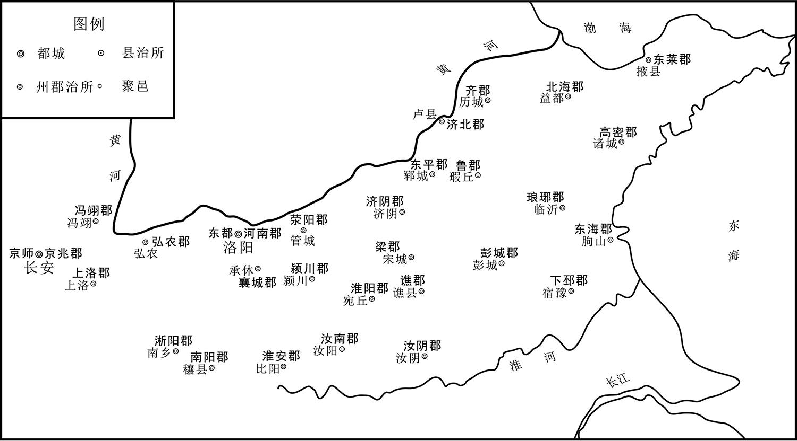 
隋朝河南诸郡示意图

## 【原文】

**杨玄感之西也，韦福嗣亡诣东都归首，是时如其比者皆不问[1]。樊子盖收玄感文簿，得其书草，封以呈帝，帝命执送行在[2]。李密亡命，为人所获，亦送东都[3]。樊子盖锁送福嗣、密及杨积善、王仲伯等十余人诣高阳，密与王仲伯等窃谋亡去，悉使出其所赍金以示使者曰：“吾等死日，此金并留付公，幸用相瘗，其余即皆报德[4]。”使者利其金，许诺，防禁渐弛[5]。密请通市酒食，每宴饮，喧哗竟夕，使者不以为意[6]。行至魏郡石梁驿，饮防守者皆醉，穿墙而逸[7]。密呼韦福嗣同去，福嗣曰：“我无罪，天子不过一面责我耳[8]。”至高阳，帝以书草示福嗣，收付大理[9]。诸应刑者支体糜碎，积善、福嗣仍加车裂[10]。**

## 【注文】

[1]诣：前往。　　归首：归降；自首。

[2]文簿（bù）：文册簿籍。　　书草：文稿。　　封：密封。

[3]为：被。

[4]高阳：地名，今河北保定东部高阳。战国时为燕的高阳邑，以邑名县，故称高阳，隋唐因袭。　　窃（qiè）：私自，暗中。　　赍（jī）金：携带的金银财宝。　　幸：希望，期望。　　瘗（yì）：掩埋，埋葬。

[5]许诺：应允，答应。

[6]请：敬辞，用于希望对方做某事。　　喧哗：声音大而杂乱。　　竟夕：终夜；通宵。

[7]魏郡：地名，是中国古代西汉至唐朝期间的一个郡级行政区划，最大范围包括今天河北南部邯郸以南，以及河南北部安阳一带，其中心在邺城。　　石梁驿：地名，今河南安阳。　　逸（yì）：跑，逃跑。

[8]责：责备，责骂。

[9]收付：拘捕罪犯，交付案办。　　大理：大理寺，官署名，掌刑狱案件审理。秦汉为廷尉，北齐为大理寺，历代沿袭，隋初为正三品，炀帝改从三品，唐代沿袭。

[10]糜（mí）碎：粉碎。　　车裂：中国古代的一种酷刑。把人的头和四肢分别绑在五辆车上，套上马匹，分别向不同的方向拉，把人的身体撕裂为五块，所以名为车裂。有时，执行这种刑罚时不用车，而直接用五头牛或马来拉，所以车裂俗称五牛分尸或五马分尸。

## 【译文】

杨玄感西进的时候，韦福嗣逃到东都自首，当时像他这种情况的人都不加责问。樊子盖收拾杨玄感的文书簿记，得到韦福嗣替杨玄感草拟的书信原件，密封呈送给炀帝，炀帝命令逮捕韦福嗣送到他巡行到达的地方。李密逃命被人抓获，也被送到东都。樊子盖锁住韦福嗣、李密及杨积善、王仲伯等十余人，往高阳押送，李密和王仲伯密谋逃跑，把所携带的金银全部拿出来给押解的使者看，说：“我们死了之后，这些金银全部留给您，希望您用这些钱把我们埋葬了，剩余的算是我们对您大恩大德的报答。”使者贪图他们的钱财，答应了，防范逐渐松弛。李密请求使者通融，允许他们买酒食，常常大吃大喝，整夜喧闹，使者也不当一回事。走到魏郡的石梁驿，看守都喝醉了，李密等人穿墙逃跑了。李密招呼韦福嗣一起逃走，韦福嗣说：“我没有罪，皇上不过当面指责我一顿罢了。”到高阳后，炀帝拿出韦福嗣草拟的书信给他自己看，把他交付大理寺处理。所有受刑的人，肢体都被砍剁得支离破碎，杨积善和韦福嗣照例被车裂。

## 【原文】

**十二年[1]。李密之亡也，往依郝孝德，孝德不礼之[2]。又入王薄，薄亦不之奇也[3]。密困乏，至削树皮而食之，匿于淮阳村舍，变姓名，聚徒教授[4]。郡县疑而捕之，密亡去，抵其妹夫雍丘令丘君明[5]。君明不敢舍，匿转寄密于游侠王秀才家，秀才以女妻之[6]。君明从侄怀义告其事，帝令怀义自赍敕书与梁郡通守杨汪相知收捕[7]。汪遣兵围秀才宅，适值密出外，由是获免[8]。君明、秀才皆死。**

## 【注文】

[1]十二年：大业十二年，即公元616年。

[2]郝孝德：隋末农民起义军首领。平原（今山东平原）人。大业九年（613年）聚众数万人起义，进攻章丘（今山东章丘），被隋将张须陀击败，后活动于黄河以北，公元617年归瓦岗军后被封为平原公，曾配合徐世等攻占粮仓黎阳仓（位今河南浚县），后不详。　　礼：动词。以礼相待。

[3]王薄（？—622年）：齐郡邹平人，隋炀帝大业七年（611年）十月，因兵役繁重首先起兵反隋，他不仅多次率军抗击前来镇压的官军，而且还作《无向辽东浪死歌》，号召农民就地反抗争活路，不到辽东去送死。这支义军曾一度攻打章丘，队伍迅速发展到数万人，后因遭到官府的重兵围剿，被隋将张须陀接连击败。之后，王薄先后投靠宇文化及和窦建德，窦建德败亡后，王薄又改投奔李唐，曾出兵参与镇压徐圆朗，直到武德五年（622年）被仇家所杀。　　奇：稀罕。

[4]食：吃。　　匿（nì）：躲藏，隐藏。　　淮阳：地名，古称宛丘、陈、陈州，位于河南东部周口。

[5]雍丘：古地名，今河南杞县。　　丘君明（？—613年）：隋朝官吏，曾任雍丘令。大业九年（613年）李密参加杨玄感起兵，兵败，投君明处藏匿，受他侄子丘怀义告发，李密逃去，丘君明被处死。

[6]舍：留。　　寄：托付。　　王秀才：生平事迹不详，活动于隋末。

[7]怀义：丘怀义，隋朝人，李密妹夫丘君明堂侄，曾告发李密匿于丘君明家，李密逃去，丘君明被处死。　　自赍（jī）：自己带着。　　敕（chì）书：是皇帝任官封爵和告诫臣僚的文书。敕最早是由西汉的戒书发展而来的，后经魏晋南北朝继承沿用，至唐宋元代敕书的种类有所增加。　　梁郡：地名，即今商丘以南一带。东晋义熙九年（413年），南梁郡改名梁郡（治寿阳，今安徽寿县城区），属豫州。北周建德七年（578年），废梁郡，隋唐因袭。　　通守：官名，隋炀帝置，职位次于太守，佐理郡务。

[8]由是：因此。　　获免：获得避免。

## 【译文】

隋炀帝大业十二年（616年）。李密逃亡后，前去投靠郝孝德，郝孝德不加礼遇。后来又投奔王薄，王薄也不稀罕他。李密穷困潦倒，以至于削树皮充饥，躲藏在淮阳乡村里，隐姓埋名，收徒教书。郡县的官员因对他怀疑而抓他，他又逃到妹夫雍丘县令丘君明那里。丘君明也不敢收留他，把他转藏在侠士王秀才家，王秀才把女儿嫁给李密为妻。丘君明的堂侄丘怀义告发了这件事，隋炀帝杨广让丘怀义自己带着敕书告知梁郡通守杨汪前去逮捕。杨汪派兵包围了王秀才家，正巧李密外出，因此没被逮住。丘君明、王秀才全被杀死。

## 【原文】

**韦城翟让为东都法曹，坐事当斩[1]。狱吏黄君汉奇其骁勇，夜中潜谓让曰：“翟法司，天时人事，抑亦可知，岂能守死狱中乎[2]！”让惊喜，叩头曰：“让，圈牢之豕，死生唯黄曹主所命[3]。”君汉即破械出之[4]。让再拜曰：“让蒙再生之恩则幸矣，奈黄曹主何！”因泣下[5]。君汉怒曰：“本以公为大丈夫，可救生民之命，故不顾其死以奉脱，奈何反效儿女子涕泣相谢乎[6]！君但努力自免，勿忧吾也[7]。”让遂亡命于瓦岗，为群盗[8]。同郡单雄信，骁健，善用马槊，聚少年往从之[9]。离狐徐世家于卫南，年十七，有勇略，说让曰：“东郡于公与皆为乡里，人多相识，不宜侵掠[10]。荥阳、梁郡，汴水所经，剽行舟商旅，足以自资[11]。”让然之，引众入二郡界，掠公私船，资用丰给，附者益众，聚徒至万余人[12]。时又有外黄王当仁、济阳王伯当、韦城周文举、雍丘李公逸等，皆拥众为盗[13]。李密自雍丘亡命，往来诸帅间，说以取天下之策[14]。始皆不信，久之，稍以为然[15]。相谓曰：“斯人公卿子孙，志气若是[16]。今人人皆云‘杨氏将灭，李氏将兴’[17]。吾闻王者不死，斯人再三获济，岂非其人乎[18]？”由是渐敬密[19]。**

## 【注文】

[1]韦城：地名，今河南滑县东南。　　翟让（？—617年）：隋末瓦岗起义军领袖，韦城人。公元615年翟让在瓦岗带领部众起义，第二年，李密来投降，帮助翟让谋划，联合附近各支起义军斩隋将。他重用李密，最后被李密所害。　　法曹：官名。古代司法机关或司法官员的称谓。汉朝郡县设置，主管司法事务。晋、北齐诸州及近畿郡县，隋诸州郡县，唐诸府州都设置，长官为从事或参军。

[2]狱吏：旧时掌管讼案、刑狱的官吏。　　黄君汉（581—632年）：唐朝开国功臣。先救瓦岗首领翟让，后投奔瓦岗，武德二年（619年）归唐，拜行军总管，参加李世民灭王世充、窦建德的战役，李孝恭统领的水陆十二总管灭萧铣梁国的战役，以及灭江东辅公祏的战役。封夔州都督、虢（guó）国公。　　法司：司法官吏。

[3]圈牢：关养家畜的地方。　　豕（shǐ）：猪。

[4]械（xiè）：木枷和镣铐之类的刑具。

[5]拜：拜谢。　　蒙（méng）：受。

[6]涕泣：哭泣，流泪。　　相谢：表示感谢。

[7]自免：求得脱身，自求避灾免患。

[8]瓦岗：地名，今河南滑县一带。

[9]单雄信（？—621年）：曹州济阴（曹县）人，少勇健，隋末入瓦岗起义军，公元617年，任左武候大将军。公元618年，率军投降王世充。公元620年，李世民率军包围东都，单雄信与尉迟敬德交战，被刺坠马。次年，李世民克东都，王世充降唐，单雄信被杀。　　骁（xiāo）健：勇猛强健。　　马槊（shuò）：古代在马上使用的长矛。

[10]离狐：地名，今山东菏泽南。　　徐世（594—669年）：也叫李，字懋功（亦作茂公）。唐初名将，唐高祖李渊赐其姓李，后避唐太宗李世民讳改名为李，曹州离狐（今山东菏泽东南）人，曾破东突厥、高句丽，与李靖并称。后被封为英国公，为凌烟阁二十四功臣之一。李一生历事唐高祖、唐太宗、唐高宗三朝，出将入相，深得朝廷信任和重任，被朝廷倚为长城。

[11]汴水：古水名，晋后隋以前指始于河南荥阳汴渠，东循狼汤渠、获水，流至今江苏徐州时注入泗水的水运干道。　　剽（piāo）：抢劫，掠夺。　　商旅：来往各地做买卖的商人。

[12]丰给：丰裕富足。　　附者：依从的人们。　　益（yì）：增加。

[13]外黄：县名。春秋时宋邑。秦置县，属陈留郡。因魏郡有内黄，故前加“外”字。秦末农民起义，刘邦、项羽攻外黄，即此地。北魏废县，隋复置。唐废。今河南杞县东。　　王当仁：隋朝末年反朝廷聚众起义者。　　济阳：地名，今河南兰考东北。　　王伯当（？—618年）：隋末瓦岗军将领，瓦岗寨的神射手，初于济阳（今河南兰考东北）率众起义，曾推荐李密到翟让那里，对李密忠心耿耿，一直陪伴其左右，最后和李密一起被唐军射死。　　韦城：地名，隋开皇六年（586年）置，属汴州。治所在今河南滑县东南。大业初属东郡。唐属滑州。　　周文举：隋朝末年反朝廷聚众起义者。　　雍丘：县名，县治在今河南杞县。　　李公逸（？—615年）：唐大臣，汴州雍丘（今杞县）人。隋末，以义勇为人所附。初归王世充，后降于唐，拜为杞州总管，封阳夏县公。王世充派兵攻打，公逸派人求援，又自行前往求援，行至襄城，为王世充部将所逮，押至洛阳，不屈而死。

[14]取：拿，得到。

[15]稍（shāo）：本义为禾末，引申为略微。

[16]相谓：互相告诉。　　公卿：三公九卿的简称，古代特指贵族官宦。

[17]兴（xīng）：起来。

[18]获济：获得解脱。

[19]敬：尊敬，敬佩。

## 【译文】

韦城人翟让在东都做法曹，犯了罪被判处死刑，监狱长黄君汉很赏识他的勇敢，夜里偷偷告诉翟让说：“翟法司，现在的天时人事您可能都清楚了，您怎能在狱中等死？”翟让十分惊喜，向黄君汉叩头拜谢说：“我翟让像是牢圈里的猪，死活听黄曹主的命令。”黄君汉当即打开枷锁放他出狱。翟让再三拜谢说：“翟让蒙受您的再生恩德实在是万幸，可我走了黄曹主您怎么办呢？”说着就流下眼泪。黄君汉气恼地说：“我本来觉得你是一个大丈夫，能够解救人民的生命，所以顾不得杀头危险帮了你，你怎么反而学儿女之情哭泣道谢呢！你只管竭力逃命，不必为我担心。”翟让于是逃到瓦岗，当了盗匪。同郡的单雄信，健壮勇敢，善于在马上使用长矛，聚集了许多青年前往跟从他。离狐人徐世，家住卫南，年方十七，勇敢而有才略，劝翟让说：“东郡对你和我来说都是同乡，很多人都认识，不应在这里侵扰抢掠。荥阳、梁郡是汴水流经的地方，抢劫过往的船只和商人，足够我们用了。”翟让同意他的看法，便率领众人进入荥阳和梁郡地面，抢劫过往的船只，有了足够的资财，跟从的人越来越多，聚集有一万多人。当时还有外黄人王当仁、济阳人王伯当、韦城人周文举、雍丘人李公逸等人，都率领众人做盗匪。李密从雍丘逃出后，往来于各首领之间，向他们游说夺取天下的计谋。开始他们都不信任他，时间久了，逐渐觉得他的话很对，相互告诉说：“这个人是朝廷公卿的子孙，才有这样的志气。现在人人都说‘杨氏将要灭亡，李氏即将兴起’。听说能称为王的人命大不会死，这个人能再三得以解脱逃命，难道不就是要为王的人吗？”从此渐渐对李密尊敬起来。

## 【原文】

**密察诸帅唯翟让最强，乃因王伯当以见让，为让画策，往说诸小盗，皆下之[1]。让说，稍亲近密，与之计事[2]。密因说让曰：“刘、项皆起布衣，为帝王[3]。今主昏于上，民怨于下，锐兵尽于辽东，和亲绝于突厥，方乃巡游扬、越，委弃东都，此亦刘、项奋起之会也[4]。以足下雄才大略，士马精锐，席卷二京，诛灭暴虐，隋氏不足亡也[5]。”让谢曰：“吾侪群盗，日夕偷生草间，君之言者，非吾所及也[6]。”**

## 【注文】

[1]说（shuì）：游说，劝说。

[2]亲：亲近。

[3]刘：指刘邦（前256—前195年），汉朝开国皇帝，参与秦末的推翻暴秦行动。公元前206年刘邦首先进入关中要地，秦朝灭亡。楚汉之争后，统一中国，建立汉朝。前202年即皇帝位，建都长安。登基后，一面平定诸侯王的叛乱，一面建章立制并采用休养生息之宽松政策治理天下，迅速恢复生产发展经济，不仅安抚了人民，也促成了汉代雍容大度的文化基础。他对汉民族的统一、中国的统一强大，以及汉文化的保护发扬有决定性的贡献。　　项：指项羽（前232—前202年），秦末起义军领袖。汉族，下相（今江苏省宿迁市）人。秦末随项梁发动会稽起义，在公元前207年的决定性战役巨鹿之战中大破秦军主力。秦亡后自立为西楚霸王，统治梁、楚九郡，后在楚汉战争中为汉王刘邦所败，在乌江（今安徽和县乌江镇）自刎而死。　　布衣：指平民百姓的最普通的廉价衣服，借指平民。

[4]辽东：地名。指辽河以东地区，今辽宁省的东部和南部及吉林省的东南部地区。战国、秦、汉至南北朝、隋唐设辽东郡，又为军镇名，辖境相当于今辽宁省大部分和吉林省一部分。　　和亲：封建君主为了免于战争，与边疆异族统治者通婚和好。　　突厥：是北亚游牧民族，最先生活在咸海西边，后东走至叶尼塞河南方，公元5世纪中归附于柔然，为其炼铁奴。徙于金山南麓（今阿尔泰山），因金山形似战盔“兜鍪”，俗称突厥，因以名其部落。公元6世纪时突厥首领阿史那土门遣使向西魏献方物。公元546年合并铁勒部5万余户，势力逐渐强盛。公元552年又大败柔然，以漠北为中心在鄂尔浑河流域建立突厥奴隶制政权。最盛时疆域东至辽海（辽河上游），西濒西海（今咸海），北至北海（今贝加尔湖），南临阿姆河南。“可汗”为最高首领，其子弟称“特勤”，将领称“设”。分辖地为“突利”（东部）、“达头”（西部）。在隋唐时期与中原汉族政治经济联系密切。公元582年分裂为东突厥和西突厥，其中东突厥可汗汗室为原统一突厥可汗正支嫡系之后，故东突厥仍经常被直呼为“突厥”。公元638、659年，东西突厥先后统一于唐。公元680年，南迁的东突厥之后北返复国，建立后突厥汗国，745年亡于回纥。突厥各部乃大多附于回纥，一部西迁中亚，另部南下附唐。　　方：正在，正当。　　巡游：到处游历，尤指巡回游历。　　扬、越：指扬州和越州。今江苏扬州和浙江绍兴。　　委弃：抛弃。

[5]足下：古代下称上或同辈相称的敬词。　　二京：指长安和洛阳。　　暴虐：指凶恶残暴之君。

[6]谢：辞谢，道谢。　　侪（chái）：等辈，同类的人们。　　草间：草莽中。

## 【译文】

李密观察各首领，只有翟让的实力最强大，于是靠王伯当的关系拜见翟让，给翟让出谋划策，并游说其他的小股盗匪，使他们都归顺了翟让。翟让很高兴，逐渐亲近李密，和他谋划军事。李密便劝翟让说：“刘邦、项羽都从平民起家，做了帝王。现在，上有昏庸的君主，下有怨愤的百姓，精锐官兵都战死在辽东，与突厥的和亲关系也已断绝，在这个时候，皇帝还到扬州、越州一带巡游，抛弃东都不顾，这也正与刘邦、项羽当年奋起的大好时机相似。以您的雄才大略，兵士和战马又如此精锐，横扫长安、洛阳二京，消灭暴虐的国君，灭亡隋朝是不困难的。”翟让辞谢说：“我们这些人不过是一群盗匪，日夜藏在草莽中苟且偷生，你说的这些，不是我所能做到的呀！”

## 【原文】

**会有李玄英者，自东都逃来，经历诸贼，求访李密，曰：“斯人当代隋家[1]。”人问其故，玄英言：“比来民间谣歌，有《桃李章》，曰：‘桃李子，皇后绕扬州，宛转花园里，勿浪语，谁道许[2]！’桃李子，谓逃亡者李氏之子也。皇与后，皆君也。宛转花园里，谓天子在扬州无还日，将转于沟壑也[3]。莫浪语，谁道许者，密也[4]。”既与密遇，遂委身事之[5]。前宋城尉齐郡房彦藻自负其才，恨不为时用，预于杨玄感之谋，变姓名亡命，遇密于梁、宋之间，遂与之俱游汉、沔，遍入诸贼，说其豪杰[6]。还日，从者数百人，仍为游客，处于让营[7]。让见密为豪杰所归，欲从其计，犹豫未决。**

## 【注文】

[1]李玄英：生平事迹不详，活动于隋末。　　求访：寻找拜访。

[2]比来：这一向，向来。　　《桃李章》：民间歌谣名称。　　绕（rào）：围着转。　　扬州：地名。范围相当于淮河以南的东南地区。春秋时称“邗”，秦、汉时称“广陵”“江都”等，东晋、南朝置“南兖州”，周时称“吴州”。汉武帝时，在全国设十三刺史部，其中有扬州刺史部，东汉时治所在历阳（今安徽和县），末年治所迁至寿春（今安徽寿县）、合肥（今安徽合肥西北）。三国时魏、吴各置扬州，魏的治所在寿春，吴的治所在建业（今江苏南京）。西晋灭吴后，治所仍在建邺（曾改名建业，后又改名建康，今南京）。唐高祖武德八年（625年），将扬州治所从丹阳移到江北，从此广陵才享有扬州的专名。　　宛转：委婉曲折。　　浪语：妄说，乱说。

[3]沟壑（hè）：山沟，困厄之境。

[4]莫：不要。

[5]委身：全心全意。　　事：侍奉。

[6]宋城：地名，今河南商丘。　　齐郡：郡名，相当于今山东北部、中部、胶东半岛和东南沿海地区。　　房彦藻（zǎo）（？—618年）：隋末瓦岗军将领。　　游：活动。　　汉：指汉水，为长江最长的支流。　　沔（miǎn）：水名，是汉水的上流，主要流经陕西省。

[7]从者：跟从的人，服从的人。　　为：以……的身份。

## 【译文】

恰好有一个叫李玄英的人，从东都逃出来，走访了许多盗贼聚集的地方，寻找李密，说：“这个人必将取代隋朝的天下。”人们问他为什么，李玄英回答说：“近来民间相传一首《桃李章》的歌谣，歌词说：‘桃李子，皇后绕扬州，宛转花园里。勿浪语，谁道许！’‘桃李子’，是指正在逃命的李家儿子。‘皇’与‘后’，都是指君主。‘宛转花园里’，是说天子在扬州没有回来的日子，将要辗转在沟壑中。‘勿浪语，谁道许’的意思，正是一个‘密’字。”李玄英见到李密后，便全心全意地侍奉他。以前，宋城县尉、齐郡人房彦藻对自己的才能很自负，恼恨炀帝不重用他，曾参与杨玄感的反叛，后来改名换姓，四处逃命。他和李密在梁、宋之间相遇，于是一起在汉、沔一带活动，走遍了盗贼积聚的地方，游说那些豪杰。回来的时候跟从的人有好几百，而李密仍然以游客的身份，居住在翟让的营中。翟让看到豪杰都被李密说服归依，想听从他的计议，但仍犹豫不决。

## 【原文】

**有贾雄者，晓阴阳占候，为让军师，言无不用[1]。密深结于雄，使之托术数以说让[2]。雄许诺，怀之未发[3]。会让召雄，告以密所言，问其可否[4]。对曰：“吉不可言[5]。”又曰：“公自立，恐未必成[6]。若立斯人，事无不济[7]。”让曰：“如卿言，蒲山公当自立，何来从我[8]？”对曰：“事有相因[9]。所以来者，将军姓翟，翟者，泽也，蒲非泽不生，故须将军也[10]。”让然之，与密情好日笃[11]。**

## 【注文】

[1]贾雄：隋末瓦岗军中的军师。　　阴阳占候：阴阳学和占卜术。　　军师：官名。主帅的左右手，为主帅出谋划策。

[2]托：假借。　　术数：又称数术，是古代道教五术中的重要内容。术数以阴阳五行的生克制化，来推测自然、社会、人事。

[3]发：表露，展现。

[4]召：召见，接见。

[5]不可言：难以用语言来形容。

[6]自立：自己称王。

[7]斯人：这个人，这里指代李密。　　济：成功。

[8]如：像，正如。　　卿（qīng）：古代上级对下级、长辈对晚辈的敬称。

[9]因：依存，依赖。

[10]泽：水。　　蒲：蒲草。

[11]然：认为……有道理。　　日笃（dǔ）：日益深厚。

## 【译文】

有一个叫贾雄的人，通晓阴阳占卜之术，给翟让当军师，他的话翟让没有不听的。李密与他深交，教他假借阴阳术数劝说翟让。贾雄答应了，藏在心中没有表露出来。正巧翟让召见贾雄，贾雄就按李密所讲的相告，翟让问他是否可行。贾雄回答说：“吉利不可以言说。”接着又说：“您自立为王，恐怕未必成功。如果拥立李密，事情没有不成功的。”翟让说：“像您说的这样，蒲山公自立为王就可以了，何必还来跟从我？”贾雄说：“事情是相互依存的。他之所以来，是因为将军您姓翟，翟字的读音与泽相同，蒲草没有水泽就不能生存，所以必须靠将军您辅佐。”翟让认为他的话有道理，与李密的交情便日益深厚了。

## 【原文】

**密因说让曰：“今四海糜沸，不得耕耘[1]。公士众虽多，食无仓廪，唯资野掠，常苦不给[2]。若旷日持久，加以大敌临之，必涣然离散[3]。未若先取荥阳，休兵馆谷，待士马肥充，然后与人争利[4]。”让从之，于是破金堤关，攻荥阳诸县，多下之[5]。**

## 【注文】

[1]四海糜（mí）沸：比喻世事混乱之甚，像糜粥在釡（fǔ）中煮沸。

[2]公：敬辞，尊称男子。　　仓廪（lǐn）：贮藏米谷的仓库。　　野掠：疯狂的掠夺。　　给（jǐ）：供给，供应。

[3]涣（huàn）然离散：散漫溃散。

[4]未若：不如。　　馆（guǎn）谷：指驻军就食。

[5]金堤关：隋代关名，今河南荥阳北黄河道中。

## 【译文】

李密趁机劝翟让说：“现在四海沸腾，人们无法耕耘播种。您的人马虽多，却没有库存的粮食，只能靠在外面掠夺，经常有供给不足的困境。如果时间拖延久了，再加上大敌压境，人马势必会散漫溃散。不如先攻下荥阳，按兵休整，就地取粮，等待兵强马壮后，再和别人争利。”翟让采纳了他的建议，于是攻破金堤关，攻打荥阳各县，多数都攻下来了。

## 【原文】

**荥阳太守郇王庆，弘之子也，不能讨，帝徙张须陁为荥阳通守以讨之[1]。庚戌，须陁引兵击让，让向数为须陁所败，闻其来，大惧，将避之。密曰：“须陁勇而无谋，兵又骤胜，既骄且很，可一战擒也[2]。公但列陈以待，密保为公破之。”让不得已，勒兵将战，密分兵千余人伏于大海寺北林间[3]。须陁素轻让，方陈而前，让与战，不利，须陁乘之，逐北十余里，密发伏掩之，须陁兵败[4]。密与让及徐世、王伯当合军围之，须陁溃围出[5]。左右不能尽出，须陁跃马复入救之，来往数四，遂战死。所部兵昼夜号哭，数日不止，河南郡县为之丧气。鹰扬郎将河东贾务本为须陁之副，亦被伤，帅余众五千余人奔梁郡[6]。务本寻卒，诏以光禄大夫裴仁基为河南道讨捕大使，代领其众，徙镇虎牢[7]。**

## 【注文】

[1]徙（xǐ）：古代称流放的刑罚。　　张须陁（tuó）（565—616年）：弘农阌（wén）乡（今河南灵宝）人，隋朝大将。仁寿四年（604年），隋炀帝继位，汉王杨谅因不满其兄即位，于晋阳（今太原市西南）起兵反炀帝。张须陀随并州道行军总管杨素平定叛乱，因功加开府。后多次率军平定各地的叛乱，威震东夏，被认为是隋朝柱石。公元616年，张须陀为瓦岗军所败，下马战死。　　通守：官名。隋炀帝置。职位次于太守，佐理郡务。

[2]骤胜：屡次胜利。　　很：同“狠”。　　擒（qín）：捉拿。

[3]大海寺：地名，今河南荥阳大海寺。

[4]掩：乘人不备而袭击或捉拿。

[5]溃（kuì）：冲破。

[6]鹰扬郎将：官名。隋炀帝大业三年（607年），改府兵制的军府名称，以骠骑府为鹰扬府，主官骠骑将军改称鹰扬郎将，正五品；副职车骑将军改称鹰扬副郎将，从五品。大业五年（609年），又改鹰扬副郎将为鹰击郎将。　　贾务本：隋炀帝时将领，任鹰扬郎将。　　奔（bēn）：急走，跑。

[7]光禄大夫：官名。战国时代置中大夫，汉武帝时始改为光禄大夫，秩二千石，掌顾问应对。隶属于光禄勋。魏晋以后无定员，都为加官或褒赠之官：加金章紫绶者，称金紫光禄大夫；加银章紫绶者，称银青光禄大夫。唐以后用作散官文阶的称号，光禄大夫为从二品，紫金光禄大夫为正三品，银青光禄大夫为从三品。　　裴仁基（？—619年）：字德本，河东郡（今山西永济）人，隋末大将。平陈之战，以亲卫兵的身份跟随出征，任命为仪同。以本官兼任汉王杨谅府亲信。杨谅反叛，仁基苦苦劝谏而被囚禁。杨谅失败，破格任命为护军。后来改任武贲郎将，跟随将军李景在黔安讨伐叛乱的蛮族，因为军功升为银青光禄大夫。进攻打败吐谷浑，加授金紫光禄大夫。杀败俘获了来侵犯的靺鞨，任命为左光禄大夫。跟随征讨高丽，晋升为光禄大夫。后投奔瓦岗军，瓦岗军失败后投降了王世充。由于威望太重，遭到王世充的猜忌。裴仁基内心不安，谋划推翻王世充，重新拥立被王世充废掉的皇泰主杨侗为君，事情泄漏后被诛灭三族。

## 【译文】

荥阳太守、郇（huán）王杨庆，是杨弘的儿子，不能出兵征讨，炀帝调张须陁任荥阳通守去讨伐。庚戌日，张须陁领兵攻打翟让，翟让过去有好几次都败在张须陁的手下，听到他来了，非常害怕，准备逃避。李密说：“张须陁有勇无谋，军队刚打了几次胜仗，既骄傲又凶狠，可以一战就把他捉住。您只需排好阵势等待，我保证替您打败他。”翟让不得已，领兵准备作战，李密分派一千多人埋伏在大海寺北面的树林中。张须陁一向看不起翟让，排成方阵前进，翟让与他交战，没有取胜，张须陁乘胜追击，追了十几里，李密突然发动伏兵猛扑过来，张须陁的部队被打得大败。李密和翟让以及徐世、王伯当联兵合围，张须陁突围而出，见左右的人没有全出来，又跃马冲进阵去救援，往返了四五次，于是战死。他的士兵们昼夜号哭，好几天都没有停止，河南各郡县因此大丧士气。鹰扬郎将、河东人贾务本是张须陁的副将，也受了伤，带着剩下的五千多人逃奔梁郡，不久就死了。朝廷下令任命光禄大夫裴仁基为河南道讨捕大使，代替贾务本统帅剩下的士兵，移兵镇守虎牢。

## 【原文】

**让乃令密建牙，别统所部，号“蒲山公营”[1]。密部分严整，凡号令士卒，虽盛夏，皆如背负霜雪[2]。躬服俭素，所得金宝悉颁赐麾下，由是人为之用[3]。麾下士卒多为让士卒所陵辱，以威约有素，不敢报也[4]。让谓密曰：“今资粮粗足，意欲还向瓦岗[5]。公若不往，唯公所适，让从此别矣[6]。”让帅辎重东引，密亦西行至康城，说下数城，大获资储[7]。让寻悔，复引兵从密。**

## 【注文】

[1]建牙：古谓出师前树立军旗。

[2]部分：部署，布置。

[3]俭素：俭省朴素。　　悉：全；尽。　　颁赐：赏赐，分赏。　　麾（huī）下：指将帅的部下。

[4]陵：古同“凌”，侵犯，欺侮。　　威约：谓威势为人制约。

[5]资粮：战资、粮草。

[6]适：去；往。

[7]帅：同“率”。指率领，带领。　　辎（zī）重：行军时由运输部队携带的军械、粮草、被服等物资。　　说（shuì）：说服，劝说。　　资储：积蓄，贮备。

## 【译文】

翟让于是命令李密建立牙帐，独立统帅一部分军队，号称“蒲山公营”。李密治军严厉整肃，凡是向士兵下达号令，即使在盛夏，他们也像背负着霜雪一样时时寒栗而提高警惕。他自己也很勤俭朴素，得到的金银财宝全部颁发给部下，因此人人都愿意为他效力。他部下的士兵经常受到翟让士兵的凌辱，但因为平时纪律威严，不敢进行报复。翟让对李密说：“现今物资粮草大致丰足，我想重回瓦岗。你如果不去，可以随便到哪里，翟让就此和你分别了。”翟让带着大量军需物资向东而去，李密向西到了康城，经过游说取得几座城池，获得大量物资储备。翟让不久后悔了，又带兵随从李密。

## 【原文】

**恭帝义宁元年春二月，李密说翟让曰：“今东都空虚，兵不素练，越王冲幼，越王，太子昭之子侗，炀帝命留守东都。留守诸官政令不壹，士民离心[1]。段达、元文都暗而无谋，以仆料之，彼非将军之敌[2]。若将军能用仆计，天下可指麾而定也[3]。”乃遣其党裴叔方觇东都虚实[4]。留守官司觉之，始为守御之备，且驰表告江都[5]。密谓让曰：“事势如此，不可不发[6]。兵法曰‘先则制于己，后则制于人’[7]。今百姓饥馑，洛口仓多积粟，去都百里有余，将军若亲帅大众，轻行掩袭，彼远未能救，又先无预备，取之如拾遗耳[8]。比其闻知，吾已获之[9]。发粟以赈穷乏，远近孰不归附[10]？百万之众，一朝可集，枕威养锐，以逸待劳，纵彼能来，吾有备矣[11]。然后檄召四方，引贤豪而资计策，选骁悍而授兵柄，除亡隋之社稷，布将军之政令，岂不盛哉[12]！”让曰：“此英雄之略，非仆所堪[13]。惟君之命，尽力从事，请君先发，仆为后殿[14]。”庚寅，密、让将精兵七千人出阳城北，逾方山，自罗口袭兴洛仓，破之[15]。开仓恣民所取，老弱襁负，道路相属[16]。**

## 【注文】

[1]空虚：百无聊赖、闲散寂寞的消极心态。　　素练：平时训练。　　政令：泛指政府发布的有关施政的命令。　　不壹（yī）：不统一。

[2]段达（？—621年）：隋朝武将，姑臧（今甘肃武威）人。善于骑射，他在隋文帝即位前就跟随隋文帝左右，隋朝建立后，被封为车骑将军。隋炀帝即位后被封为左卫将军，征伐吐谷浑有功，封光禄大夫。隋炀帝进攻高丽时，段达留守涿郡。隋炀帝临幸江都，留段达和元文都守洛阳。当时瓦岗军首领李密正率兵与隋朝将军王世充在洛阳附近交战，段达率兵援助王世充，将李密击败。隋炀帝在江都被宇文化及弑后，段达以在洛阳的越王杨侗为帝，被封为陈国公。后来，段达与王世充联合发动政变，王世充夺取了帝位。段达效命于王世充，王世充任他为司徒。唐朝武德四年（621年），李世民率兵进攻洛阳，段达率兵抵抗。洛阳城破后，段达被俘，押到长安后唐高祖将其斩首。　　元文都（？—621年）：隋朝武将，开皇初，授内史舍人，后升为尚书左丞，转太府少卿。炀帝即位后，转司农少卿、司隶大夫，不久任御史大夫，隋炀帝巡幸江都，诏元文都为东都留守。隋炀帝崩后，他推越王杨侗为帝，被任命为内史令、开府仪同三司、光禄大夫、左骁卫大将军、摄右翊卫将军、鲁国公，后降唐。　　暗（àn）：糊涂；不明白。　　仆（pú）：旧谦称“我”。

[3]指麾（huī）而定：直意为举旗一指，局势可定。指一经调度安排，不须多久，局势即可平定。

[4]裴叔方：隋朝末年瓦岗军军士。　　觇（chān）：偷偷地察看。　　虚实：虚假和真实；多指对方的内部情况或势力。

[5]官司：官府。多指政府的主管部门。　　江都：地区名。位于江苏中部，南濒长江，西傍扬州市广陵区、邗江区，东与泰州市接壤，北与高邮市毗连。

[6]事势：指事情的趋势，形势。

[7]兵法：用兵作战的方法、策略。

[8]饥馑（jǐn）：是饥荒的书面用法。　　洛口仓：也叫兴洛仓，位于今郑州巩义河洛镇七里铺村以东的黄土岭上。这里地处丘陵，形势险要，土层坚硬、干燥，又有水路运输之便。自洛河逆水而上可达东都洛阳，逆黄河而上可达陕西潼关和京城长安，顺水而下可达山东至海口，同时与大运河相通，还能南到江苏、浙江，北到河北等。

[9]比：等到。

[10]赈：救济。　　孰（shú）：谁，哪个。

[11]纵（zòng）：即使。　　矣（yǐ）：文言助词。

[12]檄（xí）：古代官府用以征召或声讨的文书。　　兵柄（bǐng）：兵权，军权。　　社稷（jì）：旧时亦用为国家的代称。　　哉（zāi）：文言语气助词。表疑问或反诘（jié），相当于“吗”“呢”。

[13]堪：能，可以。

[14]惟（wéi）：单，只。　　后殿（diàn）：后卫。行军时居于尾部者。

[15]阳城：古县名。春秋郑国城邑，秦代置县，故城在今河南登封东南，因境内阳城山得名，唐改告成县，五代后周废为镇。　　逾（yú）：越过。　　方山：今山西寿阳境内。　　兴洛仓：即洛口粮仓。

[16]恣（zī）：无拘束，任意。　　老弱襁（qiǎng）负：年老与年轻的人用襁褓背负。

## 【译文】

隋恭帝杨侑义宁元年（617年）春二月，李密劝翟让说：“现今东都空虚，军队平时不加训练，越王年纪还小，越王是太子杨昭的儿子，名字叫杨侗，隋炀帝命令他留守东都。留守的众官员政令不统一，士民离心离德。段达、元文都愚昧无知，没有谋略，依我的分析，他们都不是将军您的对手。如果将军能用我的计策，天下就可以挥师而定。”于是派他的同党裴叔方窥探东都的虚实。东都的留守官员发觉了，开始加强防御的准备，而且飞马上报巡游江都的炀帝。李密对翟让说：“形势已经如此，不能不发起进攻了。兵法说：‘先动手的，就会由自己控制；后动手的，就会被别人控制’。现在老百姓闹饥荒，洛口仓积蓄很多米粮，距离东都只有一百多里，将军如能亲自率领大军，轻装前进，迅速袭击，他们在远处无法救援，事前又没有防备，攻取洛口仓就像从地上拾东西一样容易啊！等他们听到消息，我们已经攻取了。打开粮仓救济贫民，远近的人还有谁不归附我们呢？上百万的军队，只有一时就能征集起来，凭着我们的威势，养精蓄锐，以逸待劳，纵然他们来进攻，我们也有防备。然后发布战书号召四方，接引贤良豪杰出谋划策，选拔英勇强悍的人授予兵权，消灭隋朝的政权，发布将军的政令，岂不是很伟大的事业吗？”翟让说：“这是英雄人物的策略，不是我能胜任的。我听从你的命令，尽力去做，请你先出发，我做后卫。”庚寅（初九日），李密、翟让率精兵七千人从阳城北面出发，翻过方山，由罗口袭击兴洛仓，获得成功。打开粮仓，任凭百姓去领取，背粮的男女老少，沿途络绎不绝。

## 【原文】

**朝散大夫时德叡以尉氏应密，前宿城令祖君彦自昌平往归之[1]。君彦，珽之子也，博学强记，文辞赡敏，著名海内[2]。吏部侍郎薛道衡尝荐之于高祖，高祖曰：“是歌杀斛律明月人儿邪[3]？朕不须此辈[4]。”炀帝即位，尤疾其名，依常调选东平郡书佐，检校宿城令[5]。君彦自负其才，恒郁郁思乱[6]。密素闻其名，得之，大喜，引为上客，军中书檄，悉以委之[7]。**

## 【注文】

[1]朝散大夫：文散官名，隋始置，唐为从五品下，文官第十三阶，明以后废除。　　时德叡（ruì）：生卒年不详，隋朝末年朝廷大臣，任朝散大夫。　　宿城：地名，今江苏宿迁宿城区。　　祖君彦（？—618年）：隋末唐初大臣，隋大业十三年（617年）官至东平郡书佐，后投靠李密，李密任命他为记室。李密失败后，被王世充所杀，被戮尸示众。　　昌平：地名，为北京辖区，位于北京西北部。

[2]珽（tǐng）：祖珽，字孝征，猷县（今河北定县）人。自幼天资过人，工音律，懂四夷之语，擅阴阳占候之术，而医术尤为所长，为当时名医，南北朝时的一大奇才，机警能断事，少有美名，为时人所推崇。　　博学强记：知识丰富，记忆力强。　　文辞：亦作“文词”，即文章。　　赡（shàn）敏：形容词语丰富，文思敏捷。　　海内：国境之内，全国。

[3]吏部侍郎：吏部，中国古代官署名，西汉尚书有常侍曹，主管丞相、御史、公卿之事。东汉改尚书常侍曹为吏曹，又改为选部，魏晋以后称吏部，置尚书等官。隋唐列为六部之首。长官为吏部尚书（一称大宰、冢宰），副长官称侍郎。历代相沿。吏部掌管全国官吏的任免、考核、升降、调动等事务。　　薛道衡（540—609年）：隋代诗人，字玄卿，河东汾阴（今山西万荣）人。历仕北齐、北周。隋朝建立后，任内史侍郎，加开府仪同三司。炀帝时，出任为番州刺史，改任司隶大夫。他和卢思道齐名，在隋代诗人中艺术成就最高。　　荐（jiàn）：推举，介绍。　　高祖：指隋文帝杨坚（541—604年），隋朝开国皇帝。弘农郡华阴（今陕西华阴）人。他在位期间成功地统一了百年严重分裂的中国，开创先进的选官制度，发展文化经济，使得中国成为盛世之国。文帝在位的隋朝开皇年间疆域辽阔，人口达到700余万户，是人类历史上农耕文明的巅峰时期。　　斛律明月（515—572年）：斛律光，北齐名将，朔州（今山西朔州）人，高车族，出身将门，斛律金之子，初任都督，善骑射，后拜大将军、太傅、右丞相、左丞相，封咸阳王。他骁勇善战，在与北周近20年的争战中，多次指挥作战，均获胜利。他治军严明，身先士卒，不营私利，为部下所敬重。

[4]朕（zhèn）：我。秦始皇时起专用作皇帝自称。

[5]东平郡：地名，汉甘露二年（前52年）改大河郡为东平国。治所在无盐（今山东东平东）。辖境相当今山东济宁市、汶上、东平等地。南朝宋改为郡，北齐废。隋大业及唐天宝、至德时又曾改郓州为东平郡。西汉在此置铁官。　　书佐（zuǒ）：官名。汉公府、郡各曹都有书佐，地位在掾、史之下，主文书缮写等事。历代沿设，唐武德时改名为“参军事”。　　检校（jiào）：古代官名。勾稽查核之意，加于官名之上。隋时入衔。唐中前期，加“检校”官职虽非正式拜授，但有权行使该职位，相当于“代理”官职。唐中后期，“检校”官职均为散官或加官，不具有事职权，主要表示深受恩宠。安史之乱后，“检校”官职盛行，使用范围扩大。

[6]恒（héng）：经常。　　郁（yù）郁思乱：郁郁寡欢，想着作乱。

[7]上客：上等贵宾，贵客。　　书檄（xí）：文书机密。

## 【译文】

朝散大夫时德叡在尉氏县起兵响应李密，前任宿城县令祖君彦也从昌平前往归附李密。祖君彦是祖珽的儿子，学识渊博，记忆力强，文章写得华美精敏，名闻四海。吏部侍郎薛道衡曾经把他推荐给隋文帝，隋文帝说：“就是使用歌谣害死斛律明月那个人的儿子吗？我不需要这种人。”炀帝即位后更是记恨他的名声，按照常规选任他为东平郡书佐，代理宿城县令。祖君彦对自己的才学很自负，时常郁郁寡欢，想着作乱。李密平素知道他的名声，得到他后十分高兴，待他为上宾，军中的军事文书机密，全都交给他办理。

## 【原文】

**越王侗遣虎贲郎将刘长恭、光禄少卿房崱帅步骑三万五千讨密[1]。时东都人皆以密为饥贼盗米，乌合易破，争来应募，国子三馆学士及贵胜亲戚皆来从军，器械修整，衣服鲜华，旌旗钲鼓甚盛[2]。长恭等当其前，使河南讨捕使裴仁基等将所部兵自汜水西入以掩其后，约十一日会于仓城南[3]。密、让具知其计[4]。东都兵先至，士卒未朝食，长恭等驱之渡洛水，陈于石子河西，南北十余里[5]。密、让选骁雄分为十队，令四队伏横岭下以待仁基，以六队陈于石子河东[6]。长恭等见密兵少，轻之[7]。让先接战，不利，密帅麾下横冲之[8]。隋兵饥疲，遂大败，长恭等解衣潜窜得免，奔还东都，士卒死者什五六[9]。越王侗释长恭等罪，慰抚之[10]。密、让尽收其辎重、器甲，威声大振[11]。**

## 【注文】

[1]刘长恭：隋朝末年朝廷将领，任虎贲郎将。　　光禄少卿：官名，掌宫廷宿卫及侍从，北齐以后掌膳食帐幕，唐以后始专司膳食。　　房崱（zé）：隋朝末年朝廷大臣，任光禄少卿。

[2]乌合：形容人群没有严密组织而临时凑合，如群乌暂时聚合。　　应募：响应招募。　　国子三馆学士：国子学，是中国封建时代的教育管理机关和最高学府。三馆学士指国子学中的学员。　　旌（jīng）旗：旗帜的总称。　　钲（zhēng）鼓：钲和鼓。古代行军或歌舞时用以指挥进退、动静的两种乐器。

[3]汜（sì）水：汜水镇，古称“雄镇”，今河南荥阳汜水镇。　　掩：乘人不备而袭击。

[4]具：完全，都。

[5]朝（zhāo）食：早饭，早餐。　　洛水：通常指洛阳市的洛河。洛水是黄河下游南岸大支流，源出陕西省洛南县洛源乡的木岔沟，主河段位于河南洛阳。

[6]骁雄：勇猛雄武之士。

[7]轻：轻视，轻敌。

[8]帅：指挥，带领。　　横冲：奋勇冲击。

[9]潜窜（cuàn）：偷偷地逃走。

[10]慰抚：慰问安抚。

[11]器甲：铠甲器械。

## 【译文】

越王杨侗派虎贲郎将刘长恭和光禄少卿房崱，率领步兵骑兵三万五千人讨伐李密。当时，东都的人都把李密当成因饥饿而抢粮的盗贼，是一群乌合之众，很容易攻破，所以争着应募参军，国子三馆学士、贵族豪门以及皇亲国戚都来参军，兵器军械讲究整齐，衣服穿戴鲜艳华美，旌旗锣鼓十分盛大。刘长恭等人率兵打前锋，派河南讨捕使裴仁基等人率领所属士兵从汜水向西进发，从后面袭击李密，约定十一日在仓城南面会合。李密、翟让完全知道他们的计划。东都兵先到，战士们还没有吃早饭，刘长恭等人就驱赶他们渡过洛水，在石子河西岸布下阵势，南北长十多里。李密、翟让挑选强悍的士兵分成十队，令四队埋伏在横岭下等待裴仁基，六队在石子河东岸排开阵势。刘长恭等人见李密的兵少，很轻视他。翟让先与官军交战，战况不利。李密指挥部下奋勇冲击，隋兵又饿又乏，被打得大败。刘长恭等人脱下官服，偷偷逃走才免于一死，逃回东都，士兵死了十分之五六。越王杨侗赦免了刘长恭等人的罪过，慰问并安抚了他们一番。李密、翟让全部收缴了他们的物资装备和铠甲器械，声威大振。

## 【原文】

**让于是推密为主，上密号为魏公[1]。庚子，设坛场，即位，称元年，大赦[2]。其文书行下称行军元帅府[3]。其魏公府置三司六卫，元帅府置长史以下官属[4]。拜翟让为上柱国、司徒、东郡公，亦置长史以下官，减元帅府之半[5]。以单雄信为左武候大将军，徐世为右武候大将军，各领所部[6]。房彦藻为元帅左长史，东郡邴元真为右长史，杨德方为左司马，郑德韬为右司马，祖君彦为记室，其余封拜各有差[7]。于是赵、魏以南，江、淮以北，群盗莫不响应，孟让、郝孝德、王德仁及济阴房献伯、上谷王君廓、长平李士才、淮阳魏六儿、李德谦、谯郡张迁、魏郡李文相、谯郡黑社、白社、济北张青特、上洛周比洮、胡驴贼等皆归密[8]。密悉拜官爵，使各领其众，置百营簿以领之[9]。道路降者，不绝如流，众至数十万[10]。乃命其护军田茂广筑洛口城，周四十里而居之[11]。密遣房彦藻将兵东略地，取安陆、汝南、淮安、济阳，河南郡县多陷于密[12]。**

## 【注文】

[1]上：动词。尊。

[2]坛场：古代设坛举行祭祀、继位、盟会、拜将等大典的场所。　　大赦（shè）：赦免的一种。以国家命令的方式对某个时期的特定罪犯或一般罪犯实行免除或减轻罪责或刑罚。

[3]文书：指公文、书信、契约等。　　行下：向下级下达。

[4]三司：指三公，即太尉（大司马）、司徒、司空。唐代以御史大夫、中书、门下为三司，主理刑狱。　　长（zhǎng）史：官名，掌兵马，也帮助太守掌兵。秦置，汉相国、丞相，后汉太尉、司徒、司空、将军府各有长史。其后，为郡府官，掌兵马。唐制，州刺史别驾下有长史一人，从五品。

[5]拜：授予。　　司徒：官名。相传少昊始置，唐虞因之。周时为六卿之一，曰地官大司徒。掌管国家的土地和人民的教化。汉哀帝元寿二年（前1年），改丞相为大司徒，与大司马、大司空并列三公。东汉时改称司徒。明废。后别称户部尚书为大司徒。

[6]部：部队。

[7]邴（bǐng）元真（？—620年）：隋朝大臣，早年担任过小吏。隋炀帝时，追随翟让、单雄信等人于瓦岗城起义，逐渐成为瓦岗军中的一名核心将领。李密成为瓦岗军的首领之后，邴元真被任命为书记，并镇守洛仓。后暗中归降了王世充。王世充优待邴元真，任命其为滑州行台仆射，后被李密旧将袭杀。　　杨德方：隋末瓦岗军将领，李密即位后封为左司马。　　郑德韬：隋末瓦岗军将领，李密即位后封为右司马。　　记室：官名。东汉置，诸王、三公及大将军都设记室令史，掌章表书记文檄。　　差（chāi）：差事，职务。

[8]孟让：隋末农民起义军首领。齐郡（今山东济南）人。隋炀帝大业九年（613年）起义，曾一度与王薄联合，占有长白山（今山东邹平南）。因隋将张须陀进逼，转战于江淮地区。次年占盱眙（今江苏盱眙），以都梁山为根据地，后分兵南攻，被王世充击败，北走归附瓦岗军，任总管，封齐郡公。大业十三年（617年）破东都外廊、烧丰都，并与裴仁基攻克回洛仓（今河南洛阳北），后因入都城掠夺居民财产，隋军乘机攻击，失败北逃，后不详。　　王德仁（？—621年）：隋末农民军领袖。据林虑山（今河南林县西），活动于魏郡（今河南漳县西南）、上党郡（治今山西长治）一带。后归附王世充，兵败被李世民诛杀。　　济阴：地名，在今山西荣河境。　　上谷：地名，今北京密云一带。　　王君廓（kuò）（？—627年）：并州石艾（今山西平定）人，自幼家贫，牙行出身，精于骑射。是唐朝开国功臣之一。隋末，在晋南聚兵千余，初投李密，后归顺李渊。随秦王李世民征讨王世充，屡立战功，擢升右武卫将军。后王世充、窦建德合兵抗唐，王君廓奉秦王命，挫敌锐气，进爵彭国公，后随军平定刘黑闼，受命镇守幽州。突厥入侵，君廓反击。玄武门之变后，王君廓挑拨庐江王李瑗谋反，然后，再诛杀，以平叛英雄自居。唐太宗拜王君廓左领军大将军，兼幽州都督，加左光禄大夫，但他在任职中，骄纵越法。帝诏他入朝，途中惧祸逃亡，被野人杀害。　　长平：地名，今山西高平境内。　　李士才：隋末起兵反隋者，后归附李密。　　淮阳：地名，今河南东部周口。　　魏六儿、李德谦：隋末起兵反隋者，李密即位后归附。　　谯（qiáo）郡：地名，今安徽亳州。　　张迁：隋末起兵反隋者，李密即位后归附。　　李文相、黑社、白社：隋末起兵反隋者，李密即位后归附。　　济北：地名，今山东境内。　　上洛：地名，今陕西商洛。　　张青特、周比洮、胡驴贼：隋末起兵反隋者，李密即位后归附。

[9]百营簿：职官名，隋末李密设置以总领前来归降之人。

[10]不绝如流：如流水络绎不绝。

[11]护军：中国古代高级军事长官的官名，掌管禁军，主持选拔武官，监督管制诸武将。　　田茂广：隋末瓦岗军将领，李密时为护军。

[12]略地：侵略扩张土地。　　安陆：地名，今湖北孝感安陆。　　汝南：地名，今河南汝南县。　　淮安：地名，今江苏淮安。　　济阳：地名，今山东西北部济阳。

## 【译文】

翟让于是推举李密为领袖，尊李密为魏公。义宁元年（617年）二月庚子（十九日），设立坛场，李密即魏公位，改年号为元年，大赦天下。凡向下级下达的文书都称行军元帅府。在魏公府设置三司、六卫，元帅府设置长史以下的官属。授予翟让为上柱国、司徒、东郡公，也设置长史以下的官属，但比元帅府减少一半。任命单雄信为左武候大将军，徐世为右武候大将军，各自领导自己的部队。房彦藻为元师左长史，东郡邴元真为右长史，杨德方为左司马，郑德韬为右司马，祖君彦为记室，其余的人都授予不同等级的职务。于是赵、魏以南，江、淮以北，所有的盗贼没有不响应的。孟让、郝孝德、王德仁，以及济阴的房献伯，上谷的王君廊，长平的李士才，淮阳的魏六儿、李德谦，谯郡的张迁，魏郡的李文相，谯郡的黑社、白社，济北的张青特，上洛的周比洮、胡驴贼等人，都归附了李密。李密全都给他们授了官爵，让他们各自领着自己的军队，设置百营簿加以总管。前来归降的人络绎不绝，如同流水一般，聚众达到好几十万。于是命令他的护军田茂广修筑洛口城，周围四十里长，用以居住。李密派房彦藻带着部队向东扩展土地，攻取了安陆、汝南、淮安、济阳，河南的郡县多半陷落在李密手中。

## 【原文】

**夏四月，李密以孟让为总管、齐郡公[1]。己丑夜，让帅步骑二千入东都外郭，烧掠丰都市，比晓而去[2]。于是东都居民悉迁入宫城，台省府寺皆满[3]。巩县长柴孝和、监察御史郑颋以城降密，密以孝和为护军，颋为右长史[4]。**

## 【注文】

[1]总管：中国古代官名，为地方高级军政长官、军事长官或管理专门事务的行政长官的总称。

[2]丰都市：隋唐时东都洛阳城的街市之一。

[3]台省：唐高宗时以尚书省为中台，门下省为东台，中书省为西台，总称为台省，也有合三省及御史台总称为台省者。　　府寺：古代公卿的官舍。

[4]巩县：地名，今河南巩义市。　　柴孝和：隋末巩县县长，后投降李密，任护军。　　监察御史：官名，隋开皇二年（582年）改检校御史为监察御史，始设，唐御史台分为三院，监察御史属察院，品秩不高而权限广。掌管监察百官，巡按州县，纠视狱讼，肃整朝仪。　　郑颋（tǐng）（？—621年）：瓦岗军将领，为王世充御史大夫。李世民围洛阳城时，郑颋向王世充请求允许其当和尚，王世充厌恶他，后将其杀死。

## 【译文】

隋恭帝义宁元年（617年）夏四月，李密任命孟让为总管、齐郡公。己丑（初九日）夜，孟让率领步兵骑兵二千人攻入东都的外城，火烧并抢掠了丰都市，赶天明才离去。于是东都的居民全部迁进宫城，台、省、府、寺各衙门都住满了人。巩县县长柴孝和、监察御史郑颋率领全城投降李密，李密任命柴孝和为护军，郑颋为右长史。

## 【原文】

**裴仁基每破贼得军资，悉以赏士卒，监军御史萧怀静不许，士卒怨之[1]。怀静又屡求仁基长短劾奏之[2]。仓城之战，仁基失期不至，闻刘长恭等败，惧不敢进，屯百花谷，固垒自守，又恐获罪于朝[3]。李密知其狼狈，使人说之，啖以厚利[4]。贾务本之子闰甫在军中，劝仁基降密[5]。仁基曰：“如萧御史何[6]？”闰甫曰：“萧君如栖上鸡，若不知机变，在明公一刀耳。”仁基从之，遣闰甫诣密请降[7]。密大喜，以闰甫为元帅府司兵参军兼直记室事，使之复命，遗仁基书，慰纳之，仁基还屯虎牢[8]。萧怀静密表其事，仁基知之，遂杀怀静，帅其众以虎牢降密[9]。密以仁基为上柱国、河东公[10]。仁基子行俨骁勇善战，密亦以为上柱国、绛郡公[11]。**

## 【注文】

[1]军资：军队所需的物资和器材、军需。　　监军御史：官名，负责监察军队情况。　　萧怀静：生卒年不详，隋末李密部下，任监军御史。

[2]劾（hé）奏：向皇帝检举官吏的过失或罪行。

[3]屯：动词。驻军。　　固垒（lěi）：加固营垒。指坚守。

[4]啖（dàn）：拿利益引诱人。

[5]闰甫：即贾闰甫，隋末李密部下贾务本的儿子，后也在李密军中，任元帅府司兵参军兼直记室事。

[6]何：怎么办。

[7]请：请求。

[8]司兵参军：官名，汉司隶校尉属官，北齐各州有中兵、外兵、骑兵等参军，郡有兵曹掾佐，隋各州及左右卫等军府有兵曹参军。唐代诸卫府、东宫诸率府、王府、京府、都督府、都护府均称兵曹参军，诸州称司兵参军，掌军防、烽驿、门禁、田猎、仪仗等事。　　慰纳：抚慰与接纳。

[9]密表：秘密告发。

[10]以：授予，赐给。　　上柱国：自春秋起为军事武装的高级统帅。汉废，五代复立为将军名号。北魏、西魏时设柱国大将军、上柱国大将军等，北周时增置上柱国大将军。隋代有上柱国、柱国，用来封勋臣。唐以后作为勋官的称号。唐以后正式确立隋朝的六部制度，兵权归中央机构，上柱国逐渐成为功勋的荣誉称号。

[11]行俨：裴行俨，生卒年不详，隋末将领裴仁基的儿子，投降李密后，任上柱国、绛郡公。　　绛：读音“jiàng”。

## 【译文】

裴仁基每次都把打败叛贼所得到的军用物资全部赏给士兵，监军御史萧怀静反对这样做，引起士兵们的怨恨。萧怀静又多次找裴仁基的毛病，向炀帝奏报弹劾他。仓城战役，裴仁基没有按期到达，听到刘长恭等人战败后，吓得不敢前进，屯兵百花谷，加固壁垒自行防守，却又害怕朝廷怪罪。李密知道他的处境十分狼狈，派人去劝降，用厚利引诱他。贾务本的儿子贾闰甫在军营中，也劝说裴仁基投降李密。裴仁基说：“像萧御史那样的结果怎么办？”贾闰甫说：“姓萧的就像上了架的鸡，如果还不知道随机应变，在李密那里只能给他一刀。”裴仁基听了他的话，派他去向李密请求投降，李密非常高兴，任命贾闰甫为元帅府司兵参军兼直记室事，让他回报，并给裴仁基写了一封信，表示抚慰和接纳的意思，裴仁基回到虎牢驻扎下来。萧怀静秘密向朝廷告发此事，裴仁基发觉后，便把他杀了，带着军队把虎牢献给了李密。李密授予裴仁基上柱国、河东公。裴仁基的儿子裴行俨英勇善战，李密也授予他上柱国、绛郡公。

## 【原文】

**密得秦叔宝及东阿程齩金，皆用为骠骑[1]。选军中尤骁勇者八千人，分隶四骠骑以自卫，号曰“内军”[2]。常曰：“此八千人足当百万[3]。”齩金后更名知节[4]。罗士信、赵仁基皆帅众归密，密署为总管，使各统所部[5]。**

## 【注文】

[1]秦叔宝（？—638年）：齐州历城（今山东济南）人。唐初著名大将，勇武威名震慑一时，曾追随唐高祖李渊为大唐王朝的稳固南北征战，立下了汗马功劳。因其功居于凌烟阁二十四功臣之一。最初是隋朝来护儿部将，后随张须陀讨伐李密。兵败，张须陀战死，秦叔宝归裴仁基部下，又随裴投降李密，得到重用，被任用为帐内骠骑。李密失败后，投降王世充，因不满王的为人，于公元619年，同程知节等人一起投唐，被分配到秦王李世民帐下。参加了李世民的历次征战，每战必先，常于万军之中取敌将首级。公元626年，被封为左武卫大将军。贞观十二年（638年）去世，陪葬昭陵。　　东阿：地名，今山东东阿。　　程齩（yǎo）金（589—665年）：字义贞，原名咬金，后更名知节。济州东阿斑鸠店人（今属山东东平）。唐朝开国名将，封卢国公，位列凌烟阁二十四功臣。隋炀帝大业年间，程咬金组织了一支数百人的武装，护卫乡里。后来投奔李密，得到重用，为内军骠骑之一。公元618年，王世充与李密决战，李密战败，王世充俘获程知节，任命他为将军。公元619年因鄙夷王世充为人多诈，程知节与秦叔宝等一起投唐，被任命为秦王府左三统军。此后，程知节追随秦王李世民，先后击败宋金刚、窦建德、王世充，屡立战功，被封为宿国公。玄武门之变，程知节亦参与其事。贞观中，改封卢国公。唐高宗显庆年间，以葱山道行军总管领兵出征西域。公元665年程知节去世，陪葬昭陵。　　骠（piào）骑：古代将军的名号。汉武帝元狩二年（前121年）始置。隋文帝置骠骑将军府，每府置骠骑、车骑二将军。骠骑将军为府兵制度的基层军府主官，正四品，与汉以来的骠骑将军不同。炀帝改为鹰扬郎将，地位降低。唐初尚有骠骑府及骠骑、车骑将军之制，武德七年（624年），改骠骑将军为统军。显庆元年（656年）置骠骑大将军为武散官，从一品。

[2]尤：特别，非常。　　内军：随身的亲军。

[3]当：抵挡，阻挡。

[4]更：改变。

[5]赵仁基：隋末将领，后投降李密。　　署（shǔ）：代理、暂任或试充官职。

## 【译文】

李密得到秦叔宝和东阿人程齩金，都任用为骠骑将军，挑选出部队中特别英勇强悍的士兵八千人，分别隶属四个骠骑将军统领，作为自己的卫队，称作“内军”。他常对人说：“这八千人足以抵挡一百万军队。”程齩金后来改名为程知节。罗士信、赵仁基也都率领着人马归附了李密，李密都暂任他们为总管，让他们仍然各自统领自己的部队。

## 【原文】

**癸巳，密遣裴仁基、孟让帅二万余人袭回洛东仓，破之，遂烧天津桥，纵兵大掠[1]。东都出兵击之，仁基等败走，密自帅众屯回洛仓[2]。东都兵尚二十余万人，乘城击柝，昼夜不解甲[3]。密攻偃师、金墉，皆不克，乙未，还洛口[4]。**

## 【注文】

[1]天津桥：始建于隋，废于元代。初为浮桥，后为石桥。隋唐时，为连接洛河两岸的交通要道，十分繁华。该遗址已经考古发现，在今洛阳桥附近。　　纵（zòng）兵：放任士兵。

[2]走：逃跑。

[3]柝（tuò）：古代打更用的梆子。　　解（jiě）甲：脱下作战时穿的铠甲。

[4]偃师：地名，今河南偃师。　　金墉：古城名。三国魏明帝时筑，为当时洛阳城，今河南洛阳西北。

## 【译文】

隋恭帝义宁元年（617年）四月癸巳（十三日），李密派裴仁基、孟让率领二万多人偷袭回洛东仓，攻破后，放火烧毁了天津桥，放任士兵大肆抢掠。东都出兵攻击，裴仁基等人被击败逃走，李密自己带领人马驻扎回洛仓。东都的官兵还有二十余万人，登上城墙，敲着木梆巡防，昼夜不脱铠甲。李密攻打偃师、金墉，都没有攻下，乙未（十五日），回到洛口。

## 【原文】

**东都城内乏粮，而布帛山积，至以绢为汲绠，然布以爨[1]。越王侗使人运回洛仓米入城，遣兵五千屯丰都市，五千屯上春门，五千屯北邙山，为九营，首尾相应，以备密[2]。**

## 【注文】

[1]汲绠（gěng）：汲水用的绳子。　　然：同“燃”，燃烧。　　爨（cuàn）：烧火做饭。

[2]屯：驻军。　　北邙山：又名北芒、邙山、北山、平逢山、太平山、郏山。位于河南洛阳北，黄河南岸，是秦岭山脉的余脉，崤（xiáo）山支脉。

## 【译文】

东都城里的粮食紧张，而绢帛布匹却堆积如山，甚至于用细绢来做打水的绳子，点燃布匹煮饭。越王杨侗派人运送回洛仓的粮食进城，又派五千人驻扎丰都市，五千人驻扎上春门，五千人驻扎北邙山，编为九个营，首尾相互照应，以防李密袭击。

## 【原文】

**丁酉，房献伯陷汝阴，淮阳太守赵陁举郡降密[1]。**

## 【注文】

[1]房献伯：生平事迹不详，隋末李密部下大将。　　汝阴：地名，三国魏景初二年（238年）置。治所在汝阴，今安徽阜阳。西晋辖境相当于今安徽颍河流域以西和河南新蔡、淮滨等县地。其后渐小，隋开皇时废，唐又曾改颍州为汝阴郡。　　淮阳：地名，今安徽阜阳，三国后历为汝阴郡、颍州、顺昌府治所。　　赵陁（tuó）：隋末淮阳太守，后投降李密。　　举：率领。

## 【译文】

隋恭帝义宁元年（617年）四月丁酉（十七日），房献伯攻陷汝阴，淮阳太守赵陁率领全军投降李密。

## 【原文】

**己亥，密帅众三万复据回洛仓，大修营堑，以逼东都[1]。段达等出兵七万拒之[2]。辛丑，战于仓北，隋兵败走。丁未，密使其幕府移檄郡县，数炀帝十罪，且曰：“罄南山之竹，书罪无穷；决东海之波，流恶难尽[3]。”祖君彦之辞也[4]。**

## 【注文】

[1]营堑（qiàn）：营垒壕堑。防御用的壕沟，护城河。　

[2]段达：隋朝武将，姑臧（今甘肃武威）人。父亲段严是北朝的朔州刺史，爵位襄垣郡公。段达三岁袭爵位。隋朝建立后，被封为车骑将军。隋炀帝临幸江都，留段达守洛阳。当时李密正与王世充在洛阳附近交战，段达率兵援助王世充，将李密击败。段达因功封左骁卫将军。隋炀帝在江都被宇文化及弑后，段达等立在洛阳的越王杨侗为帝，段达被封为陈国公。后来，段达与王世充联合发动政变，王世充夺取了帝位。段达效命于王世充，王世充任他为司徒。唐朝武德年间，李世民率兵进攻洛阳，段达率兵抵抗。洛阳城破后，段达被俘。押到长安后唐高祖将其斩首。　　拒：抵抗。

[3]幕府：设在帐幕内的军队主将府署。　　移檄（xí）：发布文告晓示。　　罄（qìng）：尽，空。　　书：书写。

[4]辞：文辞，文笔。

## 【译文】

隋恭帝义宁元年（617年）四月己亥（十九日），李密率领三万人再次占据回洛仓，大加修筑营垒壕堑，以逼迫东都。段达等人出兵七万进行抵抗。辛丑（二十一日），在回洛仓北交战，隋兵战败溃逃。丁未（二十七日），李密让他的幕府给各郡县下达檄文，历数炀帝杨广十大罪恶，并且说：“砍尽南山翠竹，写不完他的罪孽；决开东海波涛，流不完他的暴行。”这是祖君彦的文笔。

## 【原文】

**五月，炀帝命监门将军泾阳庞玉、虎贲郎将霍世举将关内兵援东都[1]。柴孝和说李密曰：“秦地山川之固，秦、汉所凭以成王业者也。今不若使翟司徒守洛口，裴柱国守回洛，明公自简精锐西袭长安[2]。既克京邑，业固兵强，然后东向，以平河、洛，传檄而天下定矣[3]。方今隋失其鹿，豪杰竞逐，不早为之，必有先我者，悔无及矣[4]。”密曰：“此诚上策，吾亦思之久矣[5]。但昏主尚存，从兵犹众，我所部皆山东人，见洛阳未下，谁肯从我西入[6]？诸将出于群盗，留之各竞雌雄，如此则大业隳矣[7]。”孝和曰：“然则大军既未可西上，仆请间行观衅。”密许之[8]。孝和与数十骑至陕县，山贼归之者万余人[9]。时密兵锋甚锐，每入苑与隋兵连战[10]。会密为流矢所中，卧营中，丁丑，越王侗使段达与庞玉等夜出兵，陈于回洛仓西北[11]。密与裴仁基出战，达等大破之，杀伤太半，密乃弃回洛，奔洛口[12]。庞玉、霍世举军于偃师，柴孝和之众闻密退，各散去，孝和轻骑归密[13]。杨德方、郑德韬皆死。密以郑颋为左司马，荥阳郑乾象为右司马[14]。**

## 【注文】

[1]监门将军：隋唐时期中央十六卫之一左右监门府（卫）主官，正四品，左、右各一人，掌管宫殿门禁以及守卫。隋炀帝大业三年（607年）改称监门郎将。唐代监门卫设有左右上将军各一人，从二品，左右大将军各一人，正三品，左右将军各二人，从三品，属官有监门校尉、中郎将等。　　泾（jīng）阳：地名，位于陕西咸阳中部。　　庞玉：生卒年不详，隋炀帝杨广时朝廷将领，任监门将军。　　霍世举：生卒年不详，隋炀帝杨广时朝廷将领，任虎贲狼将。

[2]不若：不如，不然。　　自简：亲自率领。　　长安：中国历史上一座著名都城。其地点由于历史原因有过迁徙，但大致都位于现在的西安和咸阳附近。先后有十七个朝代及政权建都于长安，总计建都时间超过1200年。它是中国历史上建都朝代最多和影响力最大的都城。列中国四大古都之首，同时也是与雅典、罗马和开罗齐名的世界四大文明古都之一。隋唐定都于此。

[3]京邑：地名，今河南荥阳东南。

[4]竞逐：竞争，争逐。

[5]亦：副词，也。

[6]所部：所带领的士兵。

[7]雌雄：比喻胜败、高下。　　隳（huī）：毁坏；崩毁。

[8]观衅（xìn）：窥伺敌人的间隙以便行动。

[9]陕县：地名，今河南三门峡陕州区。

[10]苑（yuàn）：指帝王的花园。

[11]流矢：乱飞的或无端飞来的箭。

[12]乃：于是，就。

[13]散去：解散离开。

[14]左司马：司马是古代的军官，分左右司马，执掌军政。　　郑乾象：生卒年不详，隋朝末年李密部下将领，任右司马。　　右司马：古代官名，西周时期始置。掌管军政和军赋等与战争相关的事务。春秋战国时代沿用，由于当时战争频繁，在楚国等国家开始设置左司马和右司马的职务，来划分在战争中的具体分工。

## 【译文】

隋恭帝义宁元年（617年）五月，炀帝命令监门将军、泾阳人庞玉，虎贲郎将霍世举率领关内的军队救援东都。柴孝和劝李密说：“关中地区有坚固的高山大川，秦朝和汉朝凭借它成就了帝王业绩。现今不如让翟司徒防守洛口，裴柱国守回洛，您亲自率领精锐部队向西袭击长安。京城长安攻取之后，我们的基础就巩固了，兵力也强大了，然后回师向东，平定黄河、洛水流域，只需要传送一纸檄文，天下就可安定了。现今隋朝已不能控制全国，天下的英雄豪杰竞相争斗，如不及早动手，必定会有人抢在我们面前，到那时后悔就来不及了。”李密说：“这确实是上策，我也想了很久。但是昏君还在位，跟从他的军队还很多，我的部下全是山东人，他们看到洛阳还没有攻下，谁肯跟我西攻长安呢？各将领都是盗贼出身，让他们留下，就会各自逞强，互争高低，这样，我们的大业就败坏了。”柴孝和说：“既然大军现在不可以西上，我请求趁现在先行观察一下动静，看有无空隙可乘。”李密同意了。柴孝和与几十名骑兵来到陕县，山野草寇归顺他的达到一万多人。当时，李密的部队很有锐气，常常进入西苑与官军交战。适逢李密被流箭射中，卧病在军营里，丁丑（二十八日），越王杨侗派段达和庞玉等人夜里出兵，在回洛仓西北列阵。李密和裴仁基出战，被段达等打得大败，死伤过半，李密便放弃回洛，逃奔洛口。庞玉、霍世举驻军偃师，柴孝和的部众听说李密败退，各自逃散离去，柴孝和只带了几个骑兵回到李密处。杨德方、郑德韬都战死。李密任命郑颋为左司马，荥阳人郑乾象为右司马。

## 【原文】

**六月，李密复帅众向东都，丙申，大战于平乐园。密左骑右步，中列强弩，鸣千鼓以冲之，东都兵大败，密复取回洛仓[1]。**

## 【注文】

[1]强弩（nǔ）：指能开硬弓的射手。　　鸣：敲击战鼓。　　回洛仓：隋大业二年（606年）筑，故址在今河南洛阳隋洛阳故城北七里。仓城周围十里，穿三百窖，储积粮谷。瓦岗农民起义军一再攻破此仓，并以此为据点向洛阳进攻。

## 【译文】

隋恭帝义宁元年（617年）六月，李密又率领部众向东都进发，丙申（十七日），大战于平乐园。李密把骑兵排列在左边，把步兵排列在右边，中间排列着强弓手，敲击一千面战鼓向前冲锋。东都的官军大败，李密又一次攻占了回洛仓。

## 【原文】

**秋七月，炀帝遣江都通守王世充将江、淮劲卒，将军王隆帅邛黄蛮，河北大使太常少卿韦霁、河南大使虎牙郎将王辩等各帅所领同赴东都，相知讨李密[1]。霁，世康之子也[2]。**

## 【注文】

[1]江都：古地名，今江苏扬州。汉武帝元封五年（前106年），江都和广陵两县各划分部分地域建县。公元502年以后，江都县历北齐、陈、北周，时废时置。北齐、北周复立江都县时，均隶属江阳郡。隋开皇初年（581年）后，江都县属吴州；隋开皇九年（589年）直属扬州；隋大业元年（605年），隶属江都郡；唐武德三年（620年）江阳县并入，江都县又划分至兖州；唐天宝元年（742年）后，江都县又先后隶属广陵郡、江都府。　　通守：官名，隋炀帝置，职位次于太守，佐理郡务。　　王世充（？—621年）：隋末割据者之一。隋新丰（今陕西临潼东北）人，字行满。祖籍西域，本姓支。隋时为江都郡丞，大业九年（613年）起，以镇压江南农民起义军，升江都通守。十三年（617年），被调北援东都洛阳，为李密所败，于是占据洛阳，等到炀帝被弑，他拥越王杨侗为帝，得以专权。不久废杨侗，自立称帝，国号郑，年号开明，后降唐，被仇家所杀。　　江、淮：江，即今长江中下游江南地带；淮，即今淮河地区。　　王隆：生卒年不详，隋朝开皇初年，凭国子博士被任用为将军。　　邛（qióng）：地名，今四川西昌。　　黄蛮：隋末四川一带的少数民族。　　太常少卿：官名，太常寺副长官，正四品。太常寺属于五寺（大理寺、太常寺、光禄寺、太仆寺、鸿胪寺）之一。秦署奉常，汉改太常，掌宗庙礼仪。　　韦霁（jì）：生卒年不详，隋末朝廷将领，任河北大使、太常少卿。　　虎牙郎将：隋朝军队十二卫虎贲郎将副贰，隋炀帝大业三年（607年）后置，各六人，从四品。　　王辩（562—618年）：隋末王世充的将领。字警略，开皇初，任大都督。仁寿中，任车骑将军。汉王谅作乱时，他跟随杨素讨伐，赐爵武宁县男，后任尚舍奉御。从征吐谷浑，拜朝请大夫，转为鹰扬郎将。辽东之役后，因为军功任通议大夫。李密屯据洛口仓时，王辩与王世充讨伐李密，王辩到达洛水，桥已坏不能渡过去，于是进入水中，被溺死。

[2]世康（531—597年）：即韦世康，隋朝官员，出身于名门望族，隋朝时，先后担任过礼部尚书、吏部尚书。之后，在任所病故。

## 【译文】

隋恭帝义宁元年（617年）秋七月，炀帝派江都通守王世充率领江、淮的强兵，将军王隆率领邛地的黄蛮，河北大使、太常少卿韦霁，河南大使、虎牙郎将王辩等人各自率领所属部队同时赶赴东都，相互联系，讨伐李密。韦霁是韦世康的儿子。

## 【原文】

**炀帝诏左御卫大将军涿郡留守薛世雄将燕地精兵三万讨李密，命王世充等诸将皆受世雄节度[1]。军所过，盗贼随便诛翦[2]。**

## 【注文】

[1]左御卫大将军：隋朝军队十二卫将军之一。隋炀帝大业三年（607年）与右御卫将军同置，佐大将军总其府事，置二人，从三品。唐高祖武德五年（622年）改为左领军卫将军。　　涿郡：地名，今河北涿州。　　薛世雄（554—617年）：字世英，河东汾阴人（今山西汾阳），隋朝将领。先后参加对吐谷浑、突厥、高句丽的战争。后来率军讨伐李密、窦建德失败，只和左右几十名骑兵逃回涿郡，因而惭愧忧愤，发病而死。　　节度：调度，指挥。

[2]随便：根据情况。　　诛（zhū）翦（jiǎn）：剪除，铲除。

## 【译文】

炀帝命令左御卫大将军、涿郡留守薛世雄率领燕地的精兵三万人讨伐李密，命令王世充等各将领都接受薛世雄的调度指挥。大军经过的地方，遇到盗贼就根据情况加以消灭。

## 【原文】

**九月，武阳郡丞元宝藏以郡降李密，甲寅，密以宝藏为上柱国、武阳公[1]。宝藏使其客巨鹿魏徵为启谢密，且请改武阳为魏州，又请帅所部西取魏郡，南会诸将取黎阳仓[2]。密喜，即以宝藏为魏州总管，召魏徵为元帅府文学参军，掌记室[3]。徵少孤贫，好读书，有大志，落拓不事生业。始为道士，宝藏召典书记[4]。密爱其文辞，故召之。**

## 【注文】

[1]武阳：地名，今河北大名、馆陶一带。　　元宝藏：生卒年不详，隋末武阳郡丞，后投降李密，任上柱国、武阳公。

[2]巨鹿：地名，今河北邢台巨鹿县。传说唐尧禅位虞舜即于此，是秦始皇当年册封的三十六郡之一。汉置县，是历代兵家必争之地。　　魏徵（580—643年）：字玄成，巨鹿人（今河北邢台巨鹿）人，隋唐政治家。曾任谏议大夫、左光禄大夫，封郑国公，以直谏敢言著称，是中国史上最负盛名的谏臣，享有崇高的声誉。著有《隋书》序论，《梁书》《陈书》《齐书》的总论等。其言论多见于《贞观政要》中。　　启：书信。　　魏州：地名，今河北大名东北。　　魏郡：是中国古代西汉至唐朝期间的一个郡级行政区划，最大范围包括今天河北南部邯郸以南，以及河南北部安阳一带，其中心在邺城。　　黎阳仓：粮仓名。建立于隋朝文帝时期并一直沿用至北宋，位于卫州黎阳县西南大伾山麓（今河南浚县东），为国家官仓。黎阳仓历来地位重要，有“黎阳收，九州固”的说法。

[3]文学参军：官名，隋唐时在大都督府、都督府设置文学参军一职，掌管军事文书等。

[4]孤贫：孤苦贫寒。　　好（hào）：喜欢，喜爱。　　落拓（tuò）：穷困潦倒，寂寞冷落。　　道士：道教的神职人员。

## 【译文】

隋恭帝义宁元年（617年）九月，武阳郡丞元宝藏带领全郡投降李密。甲寅（初六日），李密封元宝藏为上柱国、武阳公。元宝藏派他的门客、巨鹿人魏徵带着信函向李密道谢，并且请求把武阳改为魏州，又请求允许他率领所属部队向西攻取魏郡，会合南边的将领攻取黎阳仓。李密很高兴，立即任命元宝藏为魏州总管，征调魏徵为元帅府文学参军，掌管记室。魏徵少年时，孤苦贫寒，喜欢读书，有远大的志向，但潦倒失意，没有正当的职业。起初当道士，元宝藏召他主管书记。李密喜欢魏徵的文学辞采，所以也把他召来。

## 【原文】

**初，贵乡长弘农魏德深，为政清静，不严而治[1]。辽东之役，征税百端，使者旁午，责成郡县，民不堪命，唯贵乡闾里不扰，有无相通，不竭其力，所求皆给[2]。元宝藏受诏捕贼，数调器械，动以军法从事[3]。其邻城营造，皆聚于听事，官吏递相督责，昼夜喧嚣，犹不能济[4]。德深听随便修营，官府寂然，恒若无事，唯戒吏以不须过胜余县，使百姓劳苦[5]。然民各自竭心，常为诸县之最，县民爱之如父母[6]。宝藏深（喜）［害］其能，遣将千兵赴东都[7]。所领兵闻宝藏降密，思其亲戚，辄出都门东向恸哭而返[8]。或劝之降密，皆泣曰：“我与魏明府同来，何忍弃去[9]！”**

## 【注文】

[1]贵乡：地名，今河北邯郸东南大名。　　弘农：是中国汉朝至北宋期间长期设置的一个县级行政区划，始终是弘农郡的治所，但是其所在地有迁移。汉武帝置弘农郡时，在秦国函谷关边置县为郡治，也叫弘农，是弘农县之始，位置在今天河南灵宝东北黄河沿岸。　　魏德深（？—616年）：隋朝巨鹿（今属河北）人，初为隋文帝挽郎，后任贵乡长。为政清廉。隋炀帝出兵辽东，赋役苛重，加上官吏贪赃，民不聊生，而贵乡则较安定，后与李密军交战时阵亡。

[2]辽东：地名，指辽河以东地区，今辽宁东部和南部及吉林的东南部地区。　　百端：各种各样。　　旁午：亦作“旁迕”。交错，纷繁。　　闾（lǘ）里：民间，乡里，借指平民。　　有无相通：互通有无，互相接济。　　竭（jié）：尽，用尽。

[3]从事：处置，惩处。

[4]听事：处理政事。　　督责：督察责罚。　　喧嚣（xiāo）：声音杂乱，不清楚。　　犹：仍然。　　济：满足要求。

[5]寂然：安安静静。　　戒：告诫。

[6]然：然而。

[7]赴：去，赶赴。

[8]辄（zhé）：总是，就。　　恸（tòng）哭：放声痛哭，号哭。

[9]或：有的，有人。

## 【译文】

起初，贵乡县长、弘农人魏德深为政清廉静穆，不用严刑，却治理得很好。辽东战役时，征收各种名目的杂税，收税的使者接连不断，责令郡县收税，老百姓难以忍受，只有贵乡的民间不受骚扰，大家互通有无，互相帮助，不使资财枯竭，上面的征求也都能完成。元宝藏奉命捕拿盗贼，多次征调兵器物资，动不动就以军法处置。邻城的营造工作都集中在官府，官吏们互相催促指责，日夜吵吵闹闹，仍然不能按期完成。魏德深听任百姓根据自己的方便进行修造，官府安安静静，常像没有事情一样，只告诫吏属不要超过其他郡县，以免百姓太劳苦。然而百姓各自尽心竭力，缴纳器械常居各县之首，县民像对父母一样热爱魏德深。元宝藏对魏德深的才干十分嫉恨，派他带一千名士兵去东都。魏德深率领的士兵听说元宝藏投降了李密，都想念自己的亲戚，就走出都城的城门向东痛哭一阵，然后再返回城里。有人劝他们投降李密，他们都流着眼泪说：“我们和魏县长一起来，怎么忍心丢开他呢！”

## 【原文】

**河南、山东大水，饿殍满野[1]。炀帝诏开黎阳仓赈之，吏不时给，死者日数万人[2]。徐世言于李密曰：“天下大乱，本为饥馑。今更得黎阳仓，大事济矣[3]。”密遣世帅麾下五千人自原武济河，会元宝藏、郝孝德、李文相及洹水贼帅张升、清河贼帅赵君德共袭破黎阳仓，据之，开仓恣民就食，浃旬间，得胜兵二十余万[4]。武安、永安、义阳、弋阳、齐郡相继降密[5]。窦建德、朱粲之徒亦遣使附密，密以粲为扬州总管、邓公[6]。泰山道士徐洪客献书于密，以为：“大众久聚，恐米尽人散，师老厌战，难可成功[7]。”劝密“乘进取之机，因士马之锐，沿流东指，直向江都，执取独夫，号令天下[8]”。密壮其言，以书招之，洪客竟不出，莫知所之[9]。**

## 【注文】

[1]河南：古地区名，指黄河以南地区。　　山东：古地区名，指太行山以东地区。　　饿殍（piǎo）满野：饿死的人到处都是。

[2]赈（zhèn）：赈济。　　吏：周朝百官通称，相对于民而言。战国后期指秩位较低的官员。秦汉沿称，又分长吏、少吏。隋、唐以后，官、吏已有区别，界限渐趋严格。　　时：按时。　　给（jǐ）：供给。

[3]大济：很成功。

[4]原武：地名，今河南原阳。西汉置，其后屡有废置，隋移治县西，大业初属荥阳郡，后改为原陵县，唐属郑州。　　济河：渡过黄河。　　洹（huán）水：今名安阳河，又名洹河，主要流经河南省。　　张升、赵君德：生卒年不详，隋末起兵反抗朝廷者。　　清河：地名，位于河北东南部、隶属于河北邢台。　　浃（jiā）旬：一旬，十天。

[5]武安：地名，今河北永年东南。　　永安：地名，今山西灵石东。　　义阳：地名，今河南信阳。　　弋阳：地名，今河南光山。　　齐郡：地名，今山东济南。

[6]窦建德（573—621年）：隋末河北地区农民军领袖，隋朝贝州漳南（今山东武城漳南镇）人。世代务农，曾任里长，尚豪侠，为乡里所敬重。隋炀帝募兵伐辽东时，窦建德在军中任二百人长，抗拒东征，并助同县人孙安祖率数百人举兵抗隋。后窦建德家人被隋军杀害，他率部起事，称雄河北，建立夏国，公元621年五月为救王世充，在虎牢关一役被李世民击败并被俘，同年七月十一日，被唐高祖处死于长安。　　朱粲（càn）（？—621年）：隋末乱世狂贼，年轻时曾是县佐吏，后来趁乱为祸，自称楼罗王，为人非常残暴，公元621年，被李世民所擒，杀于洛阳。

[7]泰山：山名，是我国的“五岳”之首，有“中华国山”“天下第一山”之美誉，又称东岳，列中华十大名山之首，位于山东省泰安。　　徐洪客：隋末居于泰山的道士。　　献书：奉上书札，上书，多指向有地位者陈述意见。　　师老：部队老化。

[8]因：凭借。　　号令：发号施令。

[9]书：书信。

## 【译文】

河南、山东发大水，饿死的尸体到处可见。炀帝下令打开黎阳仓赈济灾民，官吏却不按时供给，饿死的人每天都有好几万。徐世对李密说：“天下大乱，本来是因为闹饥荒的缘故。如果我们能得到黎阳仓，大事就成功了。”李密派徐世率领所属五千人从原武渡过黄河，会合元宝藏、郝孝德、李文相以及洹水的盗贼首领张升、清河的盗贼首领赵君德共同袭击黎阳仓，攻占以后，开仓放任百姓取粮，十天之间，得到能作战的士兵二十余万。武安、永安、义阳、弋阳、齐郡相继投降李密。窦建德、朱粲等人也派使者向李密请求归附，李密封朱粲为扬州总管、邓公。泰山道士徐洪客向李密呈献了一封书信，认为“大量的军队长期聚集在一起，恐怕粮食一吃完，人马就散了，士马疲惫厌战，难以成功”。信中劝李密“利用现在进兵攻取的大好机会，凭借人马的英勇精锐，顺流东进，直攻江都，捉拿独夫民贼隋炀帝，向全国发号施令”。李密觉得他的话很有气魄，写信召他前来，徐洪客没有出山，后来也不知道去了哪里。

## 【原文】

**王世充、韦霁、王辩及河内通守孟善谊、河阳郡尉独孤武都各帅所领会东都，唯王隆后期不至[1]。己未，越王侗使虎贲郎将刘长恭等帅留守兵，庞玉等帅偃师兵，与世充等合十余万众，击李密于洛口，与密夹洛水相守。炀帝诏诸军皆受世充节度[2]。**

## 【注文】

[1]河阳：地名，今河南孟州西。　　孟善谊、独孤武都、王隆：皆为隋末朝廷将领，奉命出击李密。　　郡尉：官名，秦、汉郡守佐官，掌军事。秦始置，汉景帝中元二年（前148年），改称都尉。当时有的郡不置太守而仅置都尉，东汉光武帝建武六年（30年），裁撤各郡都尉，用兵时临时设置，事情完毕就废除，但是边郡仍有设置，隋唐因袭。

[2]节度：调度指挥。

## 【译文】

王世充、韦霁、王辩以及河内通守孟善谊、河阳郡尉独孤武都各自率领部队到东都会师，只有王隆落后，没有按期到达。义宁元年（617年）九月己未（十一日），越王杨侗派虎贲郎将刘长恭等人率领留守的部队，庞玉等人率领偃师的部队，与王世充等人汇集为十几万人，在洛口向李密发动攻击，与李密隔着洛水相持。炀帝命令各部队都受王世充调度。

## 【原文】

**帝遣摄江都郡丞冯慈明向东都，为密所获，密素闻其名，延坐劳问，礼意甚厚[1]。因谓曰：“隋祚已尽，公能与孤共立大功乎[2]？”慈明曰：“公家历事先朝，荣禄兼备[3]。不能善守门阀，乃与玄感举兵，偶脱网罗，得有今日，唯图反噬，未谕高旨[4]。莽、卓、敦、玄，非不强盛，一朝夷灭，罪及祖宗[5]。仆死而后已，不敢闻命。”密怒，囚之[6]。慈明说防人席务本，使亡走[7]。奉表江都及致书东都，论贼形势，至雍丘，为密将李公逸所获，密又义而释之，出至营门，翟让杀之[8]。慈明，子琮之子也[9]。**

## 【注文】

[1]摄（shè）：代理。　　江都郡：中国古代行政区划名。隋大业初改扬州置，治江阳县（今江苏扬州）。辖境相当于今江苏淮南、江北地区及镇江、丹阳、句容，安徽天长、全椒、滁州等地。唐武德三年（620年）改南兖州。　　冯慈明（？—616年）：字无佚，信都长乐（今河北衡水）人。北齐皇室，历仕北齐、北周，为淮南王参军，到隋朝时，官至朝请大夫，摄江都郡丞事。李密兵围东都时，奉旨追击被抓，不屈被杀。　　延坐劳问：请坐下慰劳。

[2]隋祚（zuò）：隋朝的运数。　　孤：古代帝王的自称。

[3]历事：历代事奉。　　荣禄：尊荣和福禄。

[4]门阀：门第和阀阅的合称，指世代为官的名门望族，又称门第、衣冠、世族、士族、势族、世家、巨室等。门阀制度是中国历史上从两汉到隋唐最为显著的选拔官员的系统，其实际影响造成国家重要的官职往往被少数姓氏家族所垄断，个人的出身背景对于其仕途的影响要远远大于其本身的才能特长。直到唐代，门阀制度才逐渐被以个人文化水平考试为依据的科举制度所取代。　　偶：侥幸。　　网罗：天罗地网。　　反噬（shì）：比喻受人之惠，反加陷害。　　谕（yù）：告诉，使人知道。　　高旨：高明的打算。

[5]莽（前45—23年）：指王莽，字巨君，魏郡元城（今河北大名）人，中国历史上新朝的建立者，即新始祖，公元8年到公元23年在位。王莽为西汉外戚王氏家族的重要成员，其人谦恭俭让，礼贤下士，在朝野素有威名。西汉末年，社会矛盾空前激化，王莽则被朝野视为能挽危局的不二人选，公元8年，王莽代汉建新，宣布推行新政，史称“王莽改制”。王莽统治的末期，天下大乱，农民起义军更始军攻入长安，王莽死于乱军之中。王莽在位共15年，新朝也成了中国历史上最短命的朝代之一。　　卓（？—192年）：指董卓，字仲颖，陇西临洮（今甘肃岷县）人。东汉末年少帝、献帝时的权臣，西凉军阀。官至太师、郿（méi）侯。原本屯兵凉州，于灵帝末年受大将军何进之召率军进京，不久掌控朝中大权。其为人残忍嗜杀，倒行逆施，招致群雄联合讨伐，但联合军在董卓迁都长安不久后瓦解。后被其亲信吕布所杀。　　敦（266—324年）：指王敦，字处仲，琅邪临沂（今山东临沂北）人。为东晋丞相王导的堂兄。王敦出身琅琊王氏，曾与王导一同协助司马睿建立东晋政权，成为当时权臣，但一直有夺权之心，最后亦因而发动政变，史称“王敦之乱”。　　玄（369—404年）：指桓玄，字敬道，一名灵宝，谯（qiáo）国龙亢（今安徽怀远）人，桓温之子。东晋杰出将领、权臣。历任侍中、都督中外诸军事、丞相、录尚书事、扬州牧、徐州刺史、相国、大将军、楚王等职。曾占据荆江广大土地，后消灭掌握朝政之司马道子父子，掌握朝权。篡位建立桓楚，改元“永始”，三个月后刘裕举义兵反抗桓玄，桓玄不敌而逃奔江陵重整军力，被西讨义军击败，试图入蜀，途中遭益州督护冯迁杀害。

[6]囚：囚禁。

[7]说（shuì）：说服，劝说。　　防人：看守的侍卫。

[8]李公逸：生卒年不详，隋末割据者李密手下大将。　　释：释放。

[9]子琮：冯子琮（cóng），生卒年不详，信都人，曾在北燕朝任职殿中郎、东宫管记等职。

## 【译文】

炀帝派遣代理江都郡丞冯慈明去东都，被李密俘获，李密平素就听过他的名声，便请他就座，慰劳探问，礼遇的心意诚恳深厚，对他说：“隋朝的气数已经完了，你能与我共同建立大功吗？”冯慈明说：“你家历代侍奉先朝，尊荣和福禄全都具备。你不能很好地保持门第，却与杨玄感起兵反叛，侥幸逃脱了天罗地网，才能有今天。您只想靠叛乱苟且偷生，并不是高明的打算。王莽、董卓、王敦、桓玄，都不是不强盛，一旦失败，叛乱的罪恶就会牵连祖宗。我只有一死而已，不敢听从你的命令。”李密十分恼怒，把他囚禁起来。冯慈明说服看守他的席务本，放他逃走了。他上表禀报江都，又写信给东都，分析贼兵的形势，逃到雍丘，被李密的将领李公逸俘获。李密认为他很忠义，就把他放了，走出营门后，被翟让杀死。冯慈明是冯子琮的儿子。

## 【原文】

**密之克洛口也，箕山府郎将张季珣固守不下，密以其寡弱，遣人呼之[1]。季珣骂密极口，密怒，遣兵攻之，不能克[2]。时密众数十万在其城下，季珣四面阻绝，所领不过数百人，而执志弥固，誓以必死[3]。久之，粮尽水竭，士卒羸病，季珣抚循之，一无离散，自三月至于是月，城遂陷[4]。季珣见密不肯拜，曰：“天子爪牙，何容拜贼[5]！”密犹欲降之，诱谕终不屈，乃杀之[6]。季珣，祥之子也[7]。**

## 【注文】

[1]箕（jī）山：属河南伏牛山系余脉的一支。在河南登封境内，与嵩山山脉隔登封城和颍河相望。　　郎将：武官名，秦置，主宿卫、车骑，即郎中令所辖三署的五官中郎将、左中郎将、右中郎将。汉袭秦制，属光禄勋。隋唐时在中郎将之外，又设置郎将。　　张季珣（？—615年）：京兆（今陕西西安）人，大业末，为鹰击郎将，李密、翟让攻陷仓城时，与李密交战，粮尽后，被李密杀死。

[2]极口：竭尽口舌。

[3]执志：坚持战斗意志。　　弥（mí）：更，更加。　　固：坚定不移。

[4]羸（léi）病：衰弱生病。　　抚循（xún）：安抚，慰问；安抚存恤。

[5]拜：跪拜。　　爪牙：亲信。

[6]犹：仍然。　　诱谕：引诱劝导。

[7]祥：张祥，生平事迹不详，活动于南北朝时期。

## 【译文】

李密攻克洛口的时候，箕山府郎将张季珣坚守不降，李密因为他人少力弱，派人召见他。张季珣用很难听的话咒骂李密，李密大怒，派兵攻打，但攻不下来。当时，李密有几十万人在城下，张季珣四面被阻，与外界断了联系，所属士兵不过几百人，但战斗意志更加坚定，发誓要决一死战。时间久了，粮尽水干，士兵瘦弱多病，张季珣一一抚慰，没有一个逃散的。从三月到九月，城才被攻陷，张季珣见到李密，不肯跪拜，说：“我是天子的武将，怎么能向叛贼跪拜！”李密仍然想使他投降，引诱劝导，但他始终不屈服，这才杀了他。张季珣是张祥的儿子。

## 【原文】

**冬十月壬寅，王世充夜渡洛水，营于黑石，明日，分兵守营，自将精兵陈于洛北[1]。李密闻之，引兵渡洛逆战，密兵大败，柴孝和溺死[2]。密帅麾下精骑渡洛南，余众东走月城，世充追围之[3]。密自洛南策马直趣黑石，营中惧，连举六烽，世充释月城之围，狼狈自救[4]。密还与战，大破之，斩首三千余级[5]。**

## 【注文】

[1]营：动词，扎下营地。

[2]逆战：迎战。

[3]洛南：洛水南岸。　　走：跑。　　月城：地名，今江苏洪泽南。

[4]策马：指用马鞭驱马，使马快跑。　　狼狈：形容困苦或受窘的样子。

[5]还：回过头，转方向。

## 【译文】

隋恭帝义宁元年（617年）冬十月壬寅（二十五日），王世充在夜里渡过洛水，在黑石扎下营盘。第二天，分兵守营，自己带领精兵在洛水北岸布阵。李密听说后，率军渡过洛水迎战，被王世充打得大败，柴孝和也淹死了。李密带着手下的精锐骑兵渡过洛水到南岸，剩下的士兵向东跑到月城，王世充追击包围。李密从洛南飞马直奔黑石，官军营中恐惧，连着点燃了六堆烽火告急，王世充解除月城的包围，慌乱返回援救。李密回过头和他交战，把他打得大败，杀了三千多人。

## 【原文】

**王世充自洛北之败，坚壁不出[1]。越王侗遣使劳之，世充惭惧，请战于密[2]。［十一月］丙辰，世充与密夹石子河而陈，密布陈南北十余里[3]。翟让先与世充战，不利而退[4]。世充逐之，王伯当、裴仁基从旁横断其后，密勒中军击之，世充大败，西走[5]。**

## 【注文】

[1]坚壁：坚守壁垒。

[2]惭惧：惭愧害怕。

[3]夹：隔着，夹着。

[4]不利：失利。

[5]横断：截断，阻断。　　勒（lè）：统领。

## 【译文】

王世充自从洛北战败后，坚守壁垒，不出来作战。越王杨侗派使者慰劳他，他又惭愧又害怕，就又向李密挑战。义宁元年（617年）十一月丙辰（初九），王世充和李密隔着石子河布阵，李密的阵地南北有十几里长。翟让先和王世充交战，失利退回。王世充追赶他，王伯当、裴仁基从侧翼截断王世充的后路，李密带领中军迎击，王世充大败，向西逃走。

## 【原文】

**翟让司马王儒信劝让自为大冢宰，总统众（军）［务］，以夺密权，让不从[1]。让兄柱国荥阳公弘，粗愚人也，谓让曰：“天子汝当自为，奈何与人[2]？汝不为者，我当为之[3]。”让但大笑，不以为意，密闻而恶之[4]。总管崔世枢自鄢陵初附于密，让囚之私府，责其货，世枢营（钱）［求］未办，遽欲加刑[5]。让召元帅府记室邢义期博，逡巡未就，杖之八十[6]。让谓左长史房彦藻曰：“君前破汝南，大得宝货，独与魏公，全不与我[7]。魏公我之所立，事未可知[8]。”彦藻惧，以状告密，因与左司马郑颋共说密曰：“让贪愎不仁，有无君之心，宜早图之[9]。”密曰：“今安危未定，遽相诛杀，何以示远[10]！”颋曰：“毒虵螫手，壮夫解腕，所全者大故也。彼先得志，悔无所及[11]。”密乃从之，置酒召让[12]。戊午，让与兄弘及兄子司徒府长史摩侯同诣密，密与让、弘、裴仁基、郝孝德共坐，单雄信等皆立侍，房彦藻、郑颋往来检校[13]。密曰：“今日与达官饮，不须多人，左右止留数人给使而已[14]。”密左右皆引去，让左右犹在[15]。彦藻白密曰：“今方为乐，天时甚寒，司徒左右请给酒食[16]。”密曰：“听司徒进止[17]。”让应曰：“甚佳[18]。”乃引让左右尽出，独密下壮士蔡建德持刀立侍[19]。食未进，密出良弓，与让习射，让方引满，建德自后斫之，踣于床前，声若牛吼，并弘、摩侯、儒信皆杀之[20]。徐世走出，门者斫之，伤颈，王伯当遥诃止之[21]。单雄信叩头请命，密释之[22]。左右惊扰，莫知所为[23]。密大言曰：“与君等同起义兵，本除暴乱[24]。司徒专行贪虐，陵辱群僚，无复上下[25]。今所诛止其一家，诸君无预也[26]。”命扶徐世置幕下，亲为传创[27]。让麾下欲散，密使单雄信前往宣慰，密寻独骑入其营，历加抚谕，令世、雄信、伯当分领其众，中外遂定[28]。让残忍，摩侯猜忌，儒信贪纵，故死之日，所部无哀之者[29]。然密之将佐，始有自疑之心矣[30]。始，王世充知让与密必不久睦，冀其相图，得从而乘之[31]。及闻让死，大失望，叹曰：“李密天资明决，为龙为蛇，固不可测也[32]！”**

## 【注文】

[1]司马：官名。殷商时代开始设置，仅次于三公，与六卿相当，与司徒、司空、司士、司寇并称五官，掌管军政和军赋。汉武帝时设置大司马，作为大将军的加号，后来又加于骠骑将军上，后汉单独设置，都开府设置官署。隋唐以后为兵部尚书的别称。　　王儒信：隋末瓦岗军首领翟让部下，任司马。　　大冢（zhǒng）宰：官名，《周礼》有天官冢宰，与其他五官（地、春、夏、秋、冬）并列，则称太宰；称冢宰则总领百官，在大五官之上。北周依《周礼》置六官，设天官府，以大冢宰卿作为主官，正七品。北周大冢宰有“五府总于天官”的意思，与《周礼》的冢宰执掌相同，执掌国政。　　总统：总揽一切事务。

[2]弘：指翟弘，隋末瓦岗军将领翟让的兄长。

[3]汝：你。

[4]但：只是。

[5]总管：中国古代官名，为地方高级军政长官、军事长官或管理专门事务的行政长官。　　崔世枢：生卒年不详，隋末割据者李密手下大将。　　鄢（yān）陵：地名，今河南鄢陵。　　私府：自己的家里。　　遽（jù）：遂，就。

[6]记室：官名，东汉置，诸王、三公及大将军都设记室，掌章表书记文檄。　　邢义期：生卒年不详，隋末割据者李密部下，任元帅府记室。　　逡（qūn）巡：有所顾虑而徘徊不前。

[7]左长史：官名，长史之一，战国末年秦已置，如丞相、国尉和御史大夫的属官中都有长史，汉代，丞相、太尉、大将军、骠骑将军、车骑将军、卫将军、前后左右将军，以及建三公后的大司徒、大司马、大司空都设置左长史，秩千石，南北朝带将军号开府的刺史，属官也有长史。至唐代州刺史下亦设立长史官，名为刺史佐官，却无实职。但大都督府的长史则地位较高，甚至会充任节度使。唐亲王府、都护府、都督府、将帅（诸卫与出征将帅，不包括节度使）、州府（限于上、中州）设长史。品级高下视所属机构而异，从三品至七品不等。

[8]事：结果。

[9]左司马：官名，春秋开始设置，战国齐、楚、燕等国沿置，掌握军政，领兵征战。刘邦及新莽都设置，使掌管武职。唐宋朝为大都督府属官，无职掌。　　贪愎（bì）不仁：刚愎贪财，不仁不义。

[10]示：展示，示范。

[11]毒虵（shé）螫（shì）手：毒虫咬手。　　解腕：断腕。

[12]置酒：摆置酒席请客。

[13]司徒：是我国古代的一个重要官职名，由《周礼》地方官司徒演变而来。西汉末至东汉初，以大司马、大司徒、大司空为三公。三国时期，太尉、司徒、司空为三公。这一职务到隋朝改为民部尚书。唐朝为避李世民讳改称户部尚书。显庆元年（656年）改户部为度支，咸亨元年（670年），又改为户部尚书。　　长史：司徒僚佐之长。管理司徒府诸曹事务。东汉置，秩千石。三国魏以后分置左、右长史。　　摩侯：隋末瓦岗军首领翟让的侄子，任司徒府长史。

[14]达官：旧指显贵的官吏。　　给使：让使唤。

[15]引去：退了出去。

[16]白：对……说。

[17]进止：安排。

[18]甚佳：很好。

[19]蔡建德：隋末割据者李密手下壮士。

[20]引满：拉满弓弦。　　踣（bó）：倒毙。

[21]徐世（594—669年）：唐初名将，字懋功（亦作茂公）。唐高祖李渊赐其姓李，后避唐太宗李世民讳改名为李。曹州离狐（今山东菏泽东南）人，曾破东突厥、高句丽，与李靖并称。后被封为英国公，为凌烟阁二十四功臣之一。李一生历事唐高祖、唐太宗、唐高宗三朝，出将入相，深得朝廷信任和重任，被朝廷倚为长城。　　斫（zhuó）：用刀、斧等砍。　　颈（jǐng）：脖子。　　诃（hē）：同“呵”，呵斥。

[22]请命：旧时下级向上司请示。

[23]惊扰：惊慌骚乱。

[24]除：清除，除去。

[25]贪虐（nüè）：贪婪暴虐。　　群僚（liáo）：百官。

[26]无预：没有关系；不用担忧。

[27]幕：营帐，帐幕。　　传创：敷药。

[28]宣慰：开导抚慰。　　历加抚谕：一个一个加以安抚慰问。

[29]贪纵：贪财纵欲。

[30]将佐：辅佐的将领。

[31]冀：希望。　　相图：相互残杀。

[32]天资明决：天资聪明果断。　　固：仍然。

## 【译文】

翟让的司马王儒信劝翟让自己当大冢宰，统管所有的事务，以夺取李密的权力，翟让不答应。翟让的哥哥、柱国、荥阳公翟弘，是一个粗俗愚蠢的人，对翟让说：“天子应当你自己做，为什么送给别人？你不做的话，也应该我做。”翟让只是大笑，没放在心上，李密听说后很厌恶他们。总管崔世枢刚从鄢陵归附李密，翟让把他囚禁在自己的府第，向他索取钱财，崔世枢没有满足他的要求，翟让就要给崔世枢加刑。翟让召元帅府记室邢义期赌博，邢义期顾虑迟疑没有来，翟让就打了他八十棍。翟让又对左长史房彦藻说：“你先前攻破汝南时，得到大量财宝，只给魏公一个人，一点也不给我。魏公是我拥立的，这事你怎么不知道呢？”房彦藻很害怕，把这个情况告诉了李密，趁机和左司马郑颋一起劝李密说：“翟让刚愎贪财，不仁不义，心里不把您当君主看待，应当早点想办法除掉。”李密说：“现今安危尚未决定，互相间就急着残杀起来，让别的地方的人怎么看呢？”郑颋说：“毒蛇咬了手，好汉就只好把手腕砍掉，这是为了顾全大局的缘故啊！如果让他先得手，后悔就来不及了。”李密于是听了他们的话，摆酒宴请翟让。义宁元年（617年）十一月戊午（十一日），翟让与他的哥哥翟弘以及侄子、司徒府长史翟摩侯一同到李密处，李密和翟让、翟弘、裴仁基、郝孝德同座，单雄信等人都站立一旁伺候，房彦藻、郑颋来回检点宴席的情况。李密说：“今天和达官贵人饮酒，不必这么多人，左右只留下几个人使唤就行了。”李密左右的人都退了出去，翟让左右的人仍然在。房彦藻对李密说：“今天正好快乐，天气很冷，请允许给司徒左右的人酒饭。”李密说：“听司徒安排。”翟让应声说：“很好。”于是把翟让左右的人全带了出去，只有李密手下的壮士蔡建德持刀侍立。还没有吃饭，李密拿出良弓和翟让练习射箭，翟让刚拉满弓，蔡建德就从后面砍了他一刀，翟让栽倒在座席前，声音像牛吼一声，接着蔡建德连同翟弘、翟摩侯、王儒信一起杀死。徐世向门走去，门卫用刀砍他，脖子上受了伤。王伯当在远处喝止门卫。单雄信叩头请求饶命，李密放过了他。左右的人惊慌失措，乱作一团，不知道该怎么办。李密大声说：“我与大家同起义兵，本来是要消除暴乱。翟司徒一意孤行贪财暴敛，欺凌侮辱一般僚属，不再有上下的礼数。今天只杀他一家，与你们各位没有关系。”命令搀扶徐世，安置在帐幕下，亲自为他敷药。翟让的部众要溃散，李密派单雄信前往开导抚慰。不一会，李密独自骑马到翟让的大营，对其部下加以安抚慰问，他又命令徐世、单雄信、王伯当分别统领翟让的部众，于是李密军队内外才安定下来。翟让残忍，翟摩侯猜忌，王儒信又贪财纵欲，所以死了以后，他们的部下没有人感到悲哀。然而李密的将佐们开始对自己的安全产生了疑惑。起初，王世充知道翟让与李密肯定不能长久和睦相处，希望他们相互残杀，然后乘机攻打。当他听到翟让已经死了，便大失所望，叹息说：“李密天资聪明果断，将来是龙是蛇，仍然难以预测啊！”

## 【原文】

**十二月庚子，王世充军士有亡降李密者，密问：“世充军中何所为？”军士曰：“比见益募兵，再飨将士，不知其故[1]。”密谓裴仁基曰：“吾几落奴度中，光禄知之乎[2]？吾久不出兵，世充刍粮将竭，求战不得，故募兵、飨士，欲乘月晦以袭仓城耳，宜速备之[3]。”乃命平原公郝孝德、琅邪公王伯当、齐郡公孟让勒兵分屯仓城之侧以待之[4]。其夕三鼓，世充兵果至，伯当先遇之，与战不利[5]。世充兵即陵城，总管鲁儒拒却之[6]。伯当更收兵击之，世充大败，斩其骁将费青奴，士卒战、溺死者千余人[7]。世充屡与密战不胜，越王侗遣使劳之[8]。世充诉以兵少，数战疲弊，侗以兵七万益之[9]。**

## 【注文】

[1]军士：低于军官、高于士兵的军衔称号。　　飨（xiǎng）：用酒食招待客人，泛指请人受用。

[2]度：圈套，陷阱。

[3]刍（chú）粮：粮草。多指供军队用的饲料和粮食。　　月晦（huì）：夜晚。　　仓城：地名，今陕西周至附近。

[4]琅（láng）邪（yá）：地名，今山东诸城东南。

[5]三鼓：古时计时法，三更时分。

[6]陵城：地名，今山东曲阜陵城镇。

[7]溺（nì）：淹没在水里。

[8]屡：多次。

[9]疲弊：疲惫不堪。

## 【译文】

隋恭帝义宁元年（617年）十二月庚子（二十四日），王世充的军士有逃走投降李密的，李密问他们：“王世充目前在军中做什么？”军士回答说：“最近看见他大量招募军队，一再犒赏将士，不知道为了什么。”李密告裴仁基说：“我几乎落在王世充这个奴才的圈套里，您知道吗？我很长时间没有出兵，王世充的粮草快完了，求战不能，所以招兵买马，犒劳战士，想乘月色晦暗的时候偷袭仓城，应当赶快防备。”于是命令平原公郝孝德、琅琊公王伯当、齐郡公孟让带兵分别驻扎在仓城的两边等待。这天晚上三更，王世充的部队果然来了，王伯当先遇到，与之交战，但失利。王世充的部队到了陵城，总管鲁儒把他们打退了。王伯当又收集兵力再次攻击，王世充大败。王世充的一员骁将费青奴被杀，士兵战死淹死的有一千多人。王世充几次与李密交战都失败了，越王杨侗派使者慰劳他，王世充便向使者诉说兵力太少，经过多次战斗，士兵们疲惫不堪，杨侗又给他增加了七万人。

## 【原文】

**唐高祖武德元年春正月，王世充既得东都兵，进击李密于洛北，败之，遂屯巩北[1]。辛酉，世充命诸军各造浮桥渡洛击密，桥先成者先进，前后不一。虎贲郎将王辩破密外栅，密营中惊扰[2]。将溃，世充不知，鸣角收众，密因帅敢死士乘之，世充大败，争桥溺死者万余人[3]。王辩死，世充仅自免，洛北诸军皆溃[4]。世充不敢入东都，北趣河阳[5]。是夜，疾风寒雨，军士涉水沾湿，道路冻死者又以万数[6]。世充独与数千人至河阳，自系狱请罪，越王侗遣使赦之，召还东都，赐金帛、美女以安其意[7]。世充收合亡散，复得万余人，屯含嘉城，不敢复出[8]。**

## 【注文】

[1]唐：朝代名（618—907年）。李渊于公元618年建立，以长安（今陕西西安）为首都。公元690年，武则天改国号“唐”为“周”，迁都洛阳，史称武周。公元705年唐中宗李显恢复大唐国号，恢复唐朝旧制，还都长安。唐朝在天宝十四载（755年）“安史之乱”后日渐衰落，至天祐四年（907年）梁王朱温篡位灭亡。唐在政治、经济、文化、外交等方面都有辉煌的成就，是当时世界上最强大的国家之一。　　高祖：即唐第一位皇帝李渊（566—635年），字叔德，唐朝开国皇帝，出身于北朝的关陇贵族，隋末天下大乱时，李渊乘势从太原起兵，攻占长安。公元618年五月，李渊称帝，改国号唐，定都长安，不久之后便统一了全国。玄武门之变后，李渊退位成为太上皇。　　武德：唐高祖李渊的年号，也是唐朝的第一个年号，公元618年至626年。　　巩：巩县。今河南巩义市东。

[2]栅（zhà）：栅栏。军营外部构筑的防御工事。

[3]角：古代军旅中使用的号角，用兽角做成，用以发号施令或振气壮威。

[4]自免：己身脱难。

[5]趣：动词，跑。

[6]疾风寒雨：狂风夹着冰冷的雨。

[7]河阳：地名，今河南孟州。　　自系狱请罪：自己绑缚入狱请求治罪。　　金帛：金银丝帛。

[8]含嘉城：隋仓城名。遗址在今河南洛阳东北。

## 【译文】

唐高祖武德元年（618年）春正月，王世充得到东都的增兵后，便在洛水北岸进攻李密，打败了他，于是又驻兵在巩县北面。辛酉（十五日），王世充命令部队各自建造浮桥渡过洛水，攻击李密，桥先造好的先进兵，前后不统一。虎贲郎将王辩攻破李密军营的外栅栏，李密军营一片慌乱，眼看就要溃散了，王世充却不了解情况，鸣号收兵。李密趁机率领敢死队袭击，王世充大败，士兵们因争着过桥淹死的有一万多人。王辩也死了，王世充仅免于一死，洛北的各部都溃散了。王世充不敢去东都，向北跑到河阳。当天夜里，大风夹着冷雨，军士们涉水湿透了衣服，在路上冻死的又有一万多人。王世充仅与几千人来到河阳，自己把自己关到监狱里请罪，越王杨侗派使者赦免了他，召他回到东都，赏赐给金银、绢帛和美女，用以安抚他。王世充收集逃亡溃散的人马，又得到一万多人，驻扎在含嘉城，再不敢出战。

## 【原文】

**密乘胜进据金墉城，修其门堞、庐舍而居之，钲鼓声闻于东都[1]。未几，拥兵三十余万，陈于北邙，南逼上春门[2]。乙丑，金紫光禄大夫段达、民部尚书韦津出兵拒之[3]。达望见密兵盛，惧而先还，密纵兵乘之，军遂溃，韦津死[4]。于是偃师、柏谷及河阳都尉独孤武都、检校河内郡丞柳燮、职方郎柳续等各举所部降于密[5]。窦建德、朱粲、孟海公、徐圆朗等并遣使奉表劝进，密官属裴仁基等亦上表请正位号[6]。密曰：“东都未平，不可议此[7]。”**

## 【注文】

[1]进据：进攻占领。　　金墉城：城名。三国魏明帝时筑，遗址在今河南洛阳东北，即汉、魏洛阳故城西北隅。　　堞（dié）：又称女墙，城上的矮墙。　　庐舍：房屋。

[2]北邙：邙山的东段，即北邙山，在今河南洛阳北。

[3]金紫光禄大夫：官名。汉设置，光禄大夫带银印青绶，魏晋以后，有特加金印紫绶的，称金紫光禄大夫。掌顾问应对，后为加官或褒奖的官职。　　民部尚书：官名，尚书省民部曹长官。西魏设置。隋恭帝建六官府后，改为民部中大夫。隋文帝杨坚开皇三年（583年）又改度支尚书，为尚书省六部长官之一，正三品。唐朝改名为户部尚书。　　韦津：生卒年不详，隋末朝廷大臣，任民部尚书。

[4]乘：追逐。

[5]柏谷：古坞名，又名钩锁坞。今河南偃师东南。　　都尉：官名。是秦汉时代重要的中高级武官。东汉时代，都尉的地位不断下降，魏晋以后，都尉的地位主要在第五品至第七品，总体地位呈下降趋势，而且职务虚化。　　独孤武都（？—618年）：《两唐书·窦琮传》作“独孤武”。隋氏外戚。姑母为文帝皇后。暗中谋划投降唐，事情败露，被王世充杀害。　　河内：郡名，治所在今河南沁阳。　　郡丞：官名。郡守佐官，掌握兵马。　　柳燮（xiè）：隋朝地方官，河东解县（今山西运城）人。投降李密后，又劝说李密投降唐，仕唐至都官郎中。　　柳续：隋官出身，河东解县人。投降唐后，任仪曹郎中。

[6]孟海公（？—621年）：隋末农民军领袖。公元613年，孟海公聚众起事，公元618年隋炀帝被杀后，孟海公自称宋义王。公元620年，窦建德自河北率军渡过黄河南下，孟海公不敌战败后，归附了窦建德。窦建德留部将范愿守曹州，孟海公随窦军西进洛阳救援王世充，但因为士卒疲惫，屡战不利。窦建德又不听凌敬提出的改道攻入关中，结果在成皋一战被李世民击败，全军覆没，孟海公被俘，押解到长安，在公元621年时被李渊下令处死。　　徐圆朗（？—623年）：兖州人（今属山东），隋末农民起义军首领。大业十三年（617年）起兵反隋，攻占东平（今山东鄂城东），分兵略地。后归附李密，又降王世充。后降唐，封鲁郡公，武德四年（621年），与窦建德旧部共推刘黑闼为主，起兵反唐，据地自称鲁王。武德六年（623年），败死。　　请正位号：劝请即位称帝。

[7]议：谈论，商议。

## 【译文】

李密乘胜攻占金墉城，修理城门、城墙和房屋驻扎下来，锣鼓声在东都都能听到。不久，已拥有三十多万军队，在北邙山下设阵，向南逼近上春门。武德元年（618年）正月乙丑（十九日），金紫光禄大夫段达、民部尚书韦津出兵抵抗李密。段达远远看到李密的兵势盛大，吓得先跑回来，李密放开军队乘机追杀，官军溃不成军，韦津战死。于是，偃师、柏谷以及河阳都尉独孤武都、检校河内郡丞柳燮、职方郎柳续等人，各自带着所属部队投降了李密。窦建德、朱粲、孟海公、徐圆朗等人都派使者上表拥戴李密做皇帝，李密的属官裴仁基等人也上表请他正位称帝。李密说：“东都还没有平定，不可谈论这事。”

## 【原文】

**戊辰，唐王以世子建成为左元帅，秦公世民为右元帅，督诸军十余万人救东都[1]。东都乏食，太府卿元文都等募守城者不食公粮进散官二品，于是商贾执象而朝者不可胜数[2]。**

## 【注文】

[1]以：任命。　　世子：太子。　　建成（589—626年）：李建成，唐高祖李渊长子。陇西成纪（今甘肃天水）人。对唐朝的建立颇有贡献，曾统兵平定河北的刘黑闼。他的弟弟李世民发动玄武门之变，将他一箭射死，他的儿子们也被世民全数处决。李世民继位后，追封他为息王，谥“隐”。后又追赠“隐太子”。　　元帅：唐代作战时的最高统帅，多以皇子、亲王担任。　　秦公世民：唐朝第二位皇帝李世民（599—649年），政治家、军事家、书法家、诗人。陇西成纪（今甘肃天水）人，唐朝建立初期，封秦王，立下赫赫战功。即帝位后，积极听取群臣的意见，努力学习文治天下，成功转型为中国史上最出名的政治家与明君之一。他经过主动消灭各地割据势力，虚心纳谏，在国内厉行节约，使百姓休养生息，终于使得社会出现了国泰民安的局面，开创了历史上著名的“贞观之治”，将中国传统农业社会推向鼎盛时期。

[2]太府卿：官名。太府寺长官。掌管京都四市及供官市易、国家财库。　　元文都：生卒年不详，隋末朝廷大臣，任太府卿。　　散官：表示有阶品但无职事的官员。　　商贾（gǔ）：古代称行走贩卖货物为商，住着出售货物为贾。二字连用，泛指做买卖的人。　　象：象牙制作的朝笏的略称。

## 【译文】

唐高祖武德元年（618年）正月戊辰（二十二日），唐王（唐高祖李渊）任命长子李建成为左元帅，秦公李世民为右元帅。督帅各路部队十几万人救援东都。东都缺乏粮食，太府卿元文都等人号召守城的人，不吃公粮的，都可晋升为二品散官。于是商人手执象牙笏版上朝做官的，多得数不过来。

## 【原文】

**二月，李密遣房彦藻、郑颋等东出黎阳，分道招慰州县[1]。以梁郡太守杨汪为上柱国、宋州总管，又以手书与之，曰：“昔在雍丘，曾相追捕，射钩、斩袂，不敢庶几[2]。”汪遣使往来通意，密亦羁縻待之[3]。彦藻以书招窦建德，使来见密[4]。建德复书，卑辞厚礼，托以罗艺南侵，请捍御北垂[5]。彦藻还，至卫州，贼帅王德仁邀杀之[6]。德仁有众数万，据林虑山，四出抄掠，为数州之患[7]。**

## 【注文】

[1]招慰：招安抚慰。

[2]杨汪（？—621年）：字元度，祖籍弘农华阴，出身名门望族，一说隋皇宗室，杨玉环曾祖父，官至隋朝的吏部尚书，后为李世民所杀。　　手书：亲手写的信。　　射钩斩袂（mèi）：历史典故，春秋时，管仲曾射中齐桓公衣带钩，但是桓公不念旧恶，用以为相；晋寺人披曾斩断晋文公的衣袖，但是文公不怨。袂，衣袖。射钩斩袂即来源于上述故事。　　不敢庶（shù）几：不，不当；敢，自谦词；庶几，妄起邪意。

[3]通意：表达意愿。　　羁（jī）縻（mí）：笼络使人不生异心。

[4]招：招安。　　见：拜见。

[5]卑辞：言辞谦恭卑顺。　　罗艺（？—627年）：隋末割据者。字子延，襄州襄阳（今湖北襄樊）人。投降唐后封燕王，赐李姓。贞观年初，因叛唐被诛杀。　　捍御：捍卫保护。　　北垂：北方边境。“垂”同“陲”，即边陲。

[6]卫州：郡名，治所在今河南淇县东。　　王德仁（？—621年）：隋末农民军领袖。据林虑山（今河南林县西），活动于魏郡（今河南漳县西南）、上党郡（今山西长治）一带。降唐后又叛唐归附王世充，兵败被李世民诛杀。　　邀：拦住，阻截。

[7]四出：到处，各方面。

## 【译文】

唐高祖武德元年（618年）二月，李密派房彦藻、郑頲等人从黎阳出发前往东边，分路招安抚慰各州县。任命梁郡太守杨汪为上柱国、宋州总管，又亲手给他写了一封信，信中说：“过去在雍丘的时候，你曾奉命追捕我，但是，管仲也曾射中齐桓公的带钩，齐桓公仍用他做宰相而不记前仇；寺人披也曾奉命刺杀晋文公，斩断了他的衣袖，晋文公不以为怨。我不敢不效仿前人的这种做法。”杨汪派使者来向李密致意，李密也暗中笼络他。房彦藻用信件招安窦建德，让他来拜见李密。窦建德回信，言辞谦恭卑顺，又送来厚礼，但推托说罗艺南侵，请求允许他保卫北方边境。房彦藻回来，到卫州时，被盗匪首领王德仁拦住杀死。王德仁有好几万人马，占据林虑山到处抢劫，成为好几个州的祸患。

## 【原文】

**夏四月，世子建成等至东都，军于芳华苑[1]。东都闭门不出，遣人招谕，不应[2]。李密出军争之，小战，各引去[3]。城中人多欲为内应者，赵公世民曰：“吾新定关中，根本未固，悬军远来，虽得东都，不能守也[4]。”遂不受[5]。戊寅，引军还。**

## 【注文】

[1]芳华苑：即东都西苑。又名会通苑、东都苑、上林苑、神都苑。故址在今洛阳市涧西工业区西苑路。

[2]应：回答，相应。

[3]出军：出兵，出战。

[4]根本：根基。　　虽：即使，即便。

[5]遂：于是。

## 【译文】

唐高祖武德元年（618年）夏四月，唐王长子李建成等人来到东都，驻扎在芳花苑。东都守军关闭了城门，不敢出战，派了人招降开导，也不回答。李密出兵与唐军争夺，只打了一小仗，就各自收兵。城中有很多想做内应的人，赵公李世民说：“我们新近才平定关中，根基还不稳固，远道而来，长期滞留，即使得到东都，也守不住。”于是不接受城中人的建议。戊寅（初四日），率军东归。

## 【原文】

**东都号令不出四门，人无固志，朝议郎段世弘等谋应西师，会西师已还，乃遣人招李密，期以己亥夜纳之[1]。事觉，越王命王世充讨诛之[2]。密闻城中已定，乃还[3]。**

## 【注文】

[1]固志：坚守的勇气意志。　　朝议郎：官名，隋、唐正六品上散官。隋文帝开皇六年（586年）吏部置，隋炀帝大业三年（607年）废除。唐朝又重新设置。　　段世弘：隋末朝廷大臣，任朝议郎。　　会：适逢。　　西师：这里是指唐军，李建成等所统军旅。　　纳：迎接。

[2]事觉：事情暴露。

[3]定：平定，安定。

## 【译文】

东都的号令出不了城门，人们没有固守的志气，朝议郎段世弘等人商量响应唐军，而唐军已经返回去了，于是派人招请李密，约定己亥（二十五日）夜间迎接他进城。不料事情暴露，越王杨侗命令王世充杀了段世弘等人。李密听说城中已平定，便退兵回营。

## 【原文】

**五月，王德仁既杀房彦藻，李密遣徐世讨之[1]。德仁兵败，甲寅，与武安通守袁子干皆来降，诏以德仁为邺郡太守[2]。**

## 【注文】

[1]遣：派。　　讨：讨伐。

[2]武安：地名，今河北武安。　　通守：官名，隋炀帝置。职位次于太守，佐理郡务，京兆郡与河南郡称内史。　　袁子干：隋末朝廷官员，任武安通守。　　邺郡：郡名，治所在今河南安阳。

## 【译文】

唐高祖武德元年（618年）五月，王德仁杀了房彦藻以后，李密派徐世去讨伐他。王德仁战败，甲寅（初十日），与武安通守袁子干都来投降，唐王下令任命王德仁为邺郡太守。

## 【原文】

**隋炀帝凶闻至东都，戊辰，留守官奉越王即皇帝位，大赦，改元皇泰[1]。以段达为纳言、陈国公，王世充为纳言、郑国公，元文都为内史令、鲁国公，皇甫无逸为兵部尚书、杞国公；又以卢楚为内史令，郭文懿为内史侍郎，赵长文为黄门侍郎，共掌朝政，时人号“七贵”[2]。皇泰主眉目如画，温厚仁爱，风格俨然[3]。**

## 【注文】

[1]凶闻：被杀害的凶讯。　　留守：官名。自隋唐开始设置，天子离京时指定大臣留守京城，可以依据事情的发展变化决定处置，称京城留守。陪京和行都也常以地方行政官兼任留守。　　奉：拥戴，尊奉。　　改元：更改年号。　　皇泰：隋朝政权杨侗的年号，历时近一年，皇泰元年（618年）五月到皇泰二年（619年）四月。

[2]纳言：官名。即“侍中”。相传舜时有此官，掌管出纳君命，后便成为侍中的别称。隋朝因避讳改名，为门下省长官，正三品。隋炀帝改称侍内。唐又设置。　　皇甫无逸：生卒年不详，隋末唐初大臣，唐封滑国公。字仁俭，唐初廉吏。祖籍安定乌氏（今甘肃平凉西北），约十六国时期迁居京兆万年（今陕西西安）。皇甫无逸在各职任所，一律不受请，不收礼物。他处理政务非常小心谨慎，其母有病，他急于回长安探视，途中过分焦急和忧伤，行至半路猝死。赠礼部尚书。　　兵部尚书：官名，西魏为尚书省兵部曹长官，管理军政事务。恭帝三年（556年）改置兵部中大夫。隋、唐为尚书省六部长官之一，掌管武官筛选、军政行政，正三品。　　卢楚（？—618年）：隋大臣，有才学，口吃，言语涩难。大业中，为尚书右司郎，隋炀帝巡幸江都，东都官僚多不遵守法纪，卢楚常常纠举，无所回避。越王侗称尊号，以卢楚为内史令、左备身将军、摄尚书左丞、右光禄大夫，封涿郡公，与元文都等同心以辅幼主。王充作乱，兵攻太阳门，死于阵中。　　郭文懿（yì）（？—619年）：隋末大臣，公元618年，隋炀帝死后，越王杨侗称帝，郭文懿为内史侍郎，致力于辅佐幼主。他和元文都、卢楚、赵长文招抚李密攻打宇文化及，引起王世充的不满。元文都等人想除掉王世充，被段达告密，王世充发难，捕获郭文懿将他杀害。　　内史侍郎：官名，内史令佐官。　　赵长文（？—619年）：隋末大臣，与郭文懿等人一起被王世充杀害。　　黄门侍郎：官名，秦汉置，也称黄门郎。为中朝官员，给事于宫门之内，侍从皇帝、顾问应对，出则陪乘。东汉与给事黄门郎省称。魏晋到隋沿用。隋炀帝设置为门下省次官，正四品上。唐朝沿置，玄宗以后侍中逐渐成为空衔，门下省事务实由其主持。

[3]俨（yǎn）然：庄严。

## 【译文】

隋炀帝杨广被杀的凶讯传到东都，武德元年（618年）五月戊辰（二十四日），留守官员拥戴越王杨侗即皇帝位，大赦天下，改年号为黄泰。任命段达为纳言、陈国公，王世充为纳言、郑国公，元文都为内史令、鲁国公，皇甫无逸为兵部尚书、杞国公。又任命卢楚为内史令，郭文懿为内史侍郎，赵长文为黄门侍郎，一同掌管朝政，当时被人称作“七贵”。黄太主（杨侗）的眉目如画，对人温厚仁爱，风度格调庄严可敬。

## 【原文】

**东都闻宇文化及西来，上下震惧[1]。有盖琮者，上疏请说李密与之合势拒化及[2]。［元］文都谓卢楚等曰：“今雠耻未雪，而兵力不足，若赦密罪，使击化及，两贼自斗，吾徐承其弊[3]。化及既破，密兵亦疲，又其将士利吾官赏，易可离间，并密亦可擒也[4]。”楚等皆以为然，即以琮为通直散骑常侍，赍敕书赐密[5]。**

## 【注文】

[1]宇文化及（？—619年）：为隋炀帝近臣，公元618年禁卫军兵变，弑隋炀帝，他自称大丞相，后率军北归，被李密击败，自立为帝，国号“许”，年号“天寿”，立国半年，第二年被窦建德击败，被杀。

[2]盖琮：生平事迹不详，活动于隋末唐初。　　疏（shū）：奏章。　　合势：势力联合。

[3]雠（chóu）耻未雪：仇恨耻辱还没有洗掉。　

[4]利：动词，贪图。　　官赏：官爵赏赐。

[5]通直散骑常侍：官名。隶属门下省，陪从天子，侍奉规讽，并备顾问应对。　　赍（jī）：带。

## 【译文】

东都听说宇文化及向西赶来，上下都很震惊。有一个叫盖琮的人，上书请求前往劝说李密与隋军联合抵抗宇文化及。元文都告诉卢楚等人说：“如今宇文化及弑主的仇恨耻辱还没有洗掉，兵力也不足，如果能赦免李密的罪恶，让他去攻打宇文化及，两个叛贼自相残杀，我们就可以慢慢等待他们两败俱伤。宇文化及被打败后，李密的兵力也消耗得差不多了，加上他的将士贪图我们的官爵赏赐，很容易挑拨他们的关系，就连李密，也能捉拿到了。”卢楚等人认为可以这样，就任命盖琮为通直散骑常侍，带着诏书送给李密。

## 【原文】

**时密与东都相持日久，又东拒化及，常畏东都议其后[1]。见盖琮至，大喜，遂上表乞降，请讨灭化及以赎罪，送所获凶党雄武郎将于洪建，遣元帅府记室参军李俭、上开府徐师誉等入见[2]。皇泰主命戮洪建于左掖门外[3]。元文都等以密降为诚实，盛饰宾馆于宣仁门东[4]。皇泰主引见俭等，以俭为司农卿，师誉为尚书右丞，册拜密太尉、尚书令、东南道大行台行军元帅、魏国公，令先平化及，然后入朝辅政[5]。以徐世为右武候大将军[6]。仍下诏称密忠款，且曰：“其用兵机略，一禀魏公节度[7]。”**

## 【注文】

[1]相持：相互对峙。　　议：图谋。

[2]雄武郎将：官名，隋炀帝大业九年（613年），募民为“骁果”，为新的禁卫兵，在左右备身府中设折冲郎将、果毅郎将（均左右各三人）以统领。又按府兵制的办法，军人分属军府。骁果是招募所得新兵，原无所属，建立左右雄武府来统领。以雄武郎将为主官，相当于一般军府（鹰扬府）的鹰扬郎将；以武勇郎将为副职，相当于鹰击郎将。　　于洪建：宇文化及的亲信。据《隋书·李密传》，“于洪建”作“于洪达”。　　记室参军：官名。诸王府、元帅府属官。掌管书记并参与军事。　　李俭：生卒年不详，隋末割据者李密手下将领，任元帅府记室参军。　　上开府：官名。全称为上开府仪同三司，隋从三品文散官。　　徐师誉：生卒年不详，隋末割据者李密手下将领，任上开府。

[3]戮（lù）：杀。　　左掖（yè）门：东都皇城南面三门之一。

[4]宣仁门：东都东城东门。

[5]司农卿：官名。秦置，掌谷货，汉沿袭。景帝更名为大农令，武帝更名大司农。隋唐因袭。掌管仓储、农林园苑、管理等事务。　　尚书右丞：官名，汉成帝建始四年（前29年）置尚书，员五人，丞四人，光武帝减二人，分为左右丞。尚书左丞佐尚书令，总领纲纪；右丞佐仆射，掌钱谷等事，秩均四百石。历代沿置，为尚书令及仆射的属官，品级逐渐提高，隋、唐时至正四品。　　册拜：以册书授官。　　太尉：官名。秦汉时中央掌军事的最高官员，秦朝以“丞相”“太尉”“御史大夫”并为“三公”，隋唐时为加官，地位崇高，但是没有实权。　　大行台：在大行政区代表中央的机构称行台，若任职的人权位特重，则称大行台。

[6]为：担任。

[7]忠款：忠诚。　　禀：动词。承受；接受。

## 【译文】

当时李密和东都相持的日子已经很长了，东边又要抗拒宇文化及，常常害怕东都袭击他的后方。看到盖琮到来，十分高兴，于是上表乞求投降，请求消灭宇文化及以将功赎罪，并把俘获的叛党雄武郎将于洪建送往东都，派元帅府记室参军李俭、上开府徐师誉等人去拜见皇泰主。皇泰主命令将于洪建杀死在左掖门外。元文都等人认为李密是诚心投降，在宣仁门东面修饰很豪华的宾馆接待他派来的人。皇泰主接见李俭等人，任命李俭为司农卿，徐师誉为尚书右丞，册封李密为太尉、尚书令、东南道大行台行军元帅、魏国公，命令他首先扫平宇文化及，然后入朝辅佐政事。任命徐世为右武候大将军。又下诏书称赞李密的忠诚，并且说：“用兵的策略，全由魏公调度控制。”

## 【原文】

**元文都等喜于和解，谓天下可定，置酒作乐[1]。王世充作色曰：“朝廷官爵，乃以与贼，志欲何为耶[2]！”文都等亦疑世充，由是有隙[3]。**

## 【注文】

[1]置酒作乐：大摆宴席，饮酒作乐。

[2]作色：脸色严肃。　　贼：对农民军的侮称。　　耶（yé）：文言疑问词，相当于“呢”或“吗”。

[3]有隙：产生裂痕。

## 【译文】

元文都等人对双方和解很高兴，觉得天下可以平定了，大摆宴席，饮酒作乐。王世充变了脸色严肃地说：“朝廷的官职爵位，却送给反贼，你们想干什么！”元文都等人也怀疑王世充，从此他们产生了裂痕。

## 【原文】

**秋七月，皇泰主遣大理卿张权、鸿胪卿崔善福赐李密书曰：“今日以前，咸共刷荡，使至以后，彼此通怀，七政之重，伫公匡弼，九伐之利，委公指挥[1]。”权等既至，密北面拜受诏书[2]。既无西虑，悉以精兵东击化及[3]。密知化及军粮且尽，因伪与和[4]。化及大喜，恣其兵食，冀密馈之[5]。会密下有人获罪，亡抵化及，具言其情，化及大怒，其食又尽，乃渡永济渠，与密战于童山之下[6]。自辰达酉，密为流矢所中，堕马闷绝，左右奔散，追兵且至，唯秦叔宝独捍卫之，密由是获免[7]。叔宝复收兵与之力战，化及乃退[8]。化及入汲郡求军粮，又遣使拷掠东郡吏民以责米粟[9]。王轨等不堪其弊，遣通事舍人许敬宗诣密请降[10]。密以轨为滑州总管，以敬宗为元帅府记室，与魏徵共掌文翰[11]。房公苏威在东都，随众降密[12]。［化及闻］王轨叛，大惧，自汲郡引兵欲取以北诸郡[13]。其将陈智略帅岭南骁果万余人，樊文超帅江、淮排，张童儿率江东骁果数千人，皆降于密[14]。化及犹有众二万，北趣魏县[15]。密知其无能为，西还巩、洛，留徐世以备之[16]。**

## 【注文】

[1]大理卿：官名。大理寺长官，大理寺是封建朝廷最高审判机关之一。秦时称为廷尉，汉因袭。汉景帝中更名大理，其后时称大理，时称廷尉。北齐置大理寺。隋承北齐之制置大理寺，唐以后的各个朝代均承前朝之制设大理寺。唐高宗、武则天时也曾一度改名详刑寺、司刑寺。　　张权：生卒年不详，隋末皇泰主时朝廷大臣，任大理卿。　　鸿胪卿：官名，鸿胪寺长官，鸿胪寺秦称典客，汉改为大行令，武帝时又改名大鸿胪。鸿胪，本为大声传赞，引导仪节的意思。大鸿胪主外宾之事。至北齐，置鸿胪寺，后代沿置。掌外事接待、少数民族事务及凶丧的仪式。　　崔善福：生卒年不详，隋末皇泰主时朝廷大臣，任鸿胪卿。　　咸共刷荡：全部洗雪，既往不咎。　　通怀：敞开胸怀。　　七政：日、月、五星（金、木、水、火、土）总称。　　伫（zhù）公匡弼（bì）：侍奉公（指李密）匡正辅佐。　　九伐：惩罚九种罪恶的讨伐。

[2]拜受：跪拜接受。

[3]虑：顾虑，忧虑。

[4]伪：伪装，假装。

[5]恣（zì）其兵食：任凭他的军士食用军粮。　　冀密馈之：希望李密接济他军粮。　　

[6]亡抵：逃到。　　永济渠：大业四年（608年），隋炀帝调发军民百余万，引沁水南达黄河，北通涿郡，全长二千余里，称永济渠。　　童山：山名，又名同山，在今河南浚县西南。

[7]自辰达酉：从上午一直到傍晚。中国古时把一天划分为十二个时辰，每个时辰相等于现在的两小时。辰时为早上7点到9点，酉时为下午5时正至下午7时正。　　堕（duò）马：从马上掉下来，坠落。　　闷绝：晕倒。　　秦叔宝（？—638年）：名琼，齐州历城（今山东济南）人。唐初著名大将，勇武威名震慑一时，曾追随唐高祖李渊父子为大唐王朝的稳固南北征战，立下了汗马功劳。因其功居于凌烟阁二十四功臣之一。民间以其与尉迟恭为传统门神。

[8]力战：奋力拼杀。

[9]拷（kǎo）掠（lüè）：拷打、掠夺。　　吏民：官吏与庶民。　　米粟（sù）：米和粟，泛指粮食。

[10]王轨（？—619年）：原为宇文化及所署刑部尚书，留守东都。后投降李密，武德二年（619年）被他的奴仆所杀。　　堪：忍受，承受。　　弊：暴行。　　通事舍人：官名，唐制，隶中书省，掌朝见引纳、承旨劳问等事。　　许敬宗（592—672年）：唐初大臣，杭州新城（今浙江富阳）人，自幼善属文，考中秀才，授淮阳郡司法书佐，不久任通事舍人。江都之难时，投靠李密，李密任命他为元帅府记室，与魏徵同为管记。著述很多，有文集八十卷。

[11]滑州：州名。治所在今河南滑县东。　　文翰：文章；公文信札。

[12]苏威（542—623年）：隋代宰相。字无畏。出身于京兆武功（今陕西武功西北）大族。北周时，苏威袭爵美阳县公。隋建立，隋文帝杨坚任他为太子少保，兼纳言、民部尚书。他建议减轻赋役，被采纳。后又兼任大理卿、京兆尹、御史大夫。苏威很有才能，历任要职，与高颎参掌朝政，齐心协力辅佐隋文帝。政刑大小，均参与筹划。文帝修订隋代典制，律令格式多为苏威所定。开皇九年（589年）被任为尚书右仆射。十二年，有人告发他和主持选举的吏部官员结为朋党，任用私人，遂被免除官爵。此后，屡次起用，屡被免官。大业元年（605年），他继杨素为左仆射。三年，因事罢免，后又以太常卿、纳言参掌朝政，加开府仪同三司，颇受尊重，不久又被罢免。他对隋炀帝不敢直言进谏，遇事多承望风旨。隋末，反贼宇文化及弑炀帝，以苏威为光禄大夫。化及败，苏威降李密；李密败，苏威又归王世充。世充称帝，署苏威为太师。唐平王世充后，苏威求见秦王李世民和唐高祖李渊，均遭拒绝。武德六年（623年）病死于长安。

[13]诸郡：各郡。

[14]陈智略：生卒年不详，隋末大将宇文化及手下将领。　　岭南：指中国南方的五岭之南的地区，相当于现在广东、广西、海南全境，以及湖南、江西等省的部分地区。　　骁果：大业九年（613年），炀帝为了扩充军队，除征发府兵外，又招募新军。这批新军多是关中人，他们身强力壮，骁勇善战，称为骁果。　　排（cuán）：矛类兵器。　　张童儿：《隋书·李密传》作“张童仁”。张童儿与陈智略等后来又投降王世充。

[15]魏县：县名，县治在今河北大名西南。

[16]西：向西。

## 【译文】

唐高祖武德元年（618年）秋七月，皇泰主派大理卿张权、鸿胪卿崔善福赐给李密书信说：“今天以前的事情，全部一笔勾销，使者到达以后，我们彼此间真诚相待。国家政策，等待着您匡正辅佐；军事攻伐，委托您指挥调度。”张权等人到达后，李密面朝北方跪拜接受诏书。消除了西面的顾虑，李密便把全部精兵向东攻打宇文化及。李密知道宇文化及的军粮快用完了，就假装与他和解。宇文化及非常高兴，就不再限制士兵吃粮，希望李密赠给他军粮。碰巧李密手下有人犯罪，逃到宇文化及那里，把情况全部告诉了宇文化及。宇文化及大怒，粮食又吃完了，于是渡过永济渠，与李密在童山下展开战斗。从上午一直打到傍晚，李密被流箭射中，从马上掉下昏迷过去，身旁的人各自逃散，追兵眼看就到了，只有秦叔宝一个人保护他，李密因此才免于一死。秦叔宝又收罗兵力，奋力拼杀，才把宇文化及打退。宇文化及进入汲郡索求军粮，又派人拷打和掠夺东郡的官吏百姓，索取粮食。王轨等人不能忍受他的暴行，派通事舍人许敬宗到李密处请求投降。李密任命王轨为滑州总管，许敬宗为元帅府记室，与魏徵共同掌管文书。房公苏威在东都，也随众人投降李密。宇文化及听说王轨叛变，非常害怕，从汲郡带兵出发准备夺取北方各郡。他的部将陈智略率领岭南骁果一万多人，樊文超率领江、淮排，张童儿率领江东骁果几千人，都投降了李密。宇文化及还有二万人马，向北赶到魏县。李密知道他不会有什么作为，便向西返回巩、洛，留下徐世防备。

## 【原文】

**李密每战胜，辄遣使告捷于皇泰主，隋人皆喜[1]。王世充独谓其麾下曰：“元文都辈，刀笔吏耳，吾观其势，必为李密所擒[2]。且吾军士屡与密战，没其父兄子弟前后已多，一旦为之下，吾属无类矣[3]。”欲以激怒其众[4]。文都闻之，大惧，与卢楚等谋因世充入朝，伏甲诛之[5]。段达性庸懦，恐事不就，遣其壻张志以楚等谋告世充[6]。戊午夜三鼓，世充勒兵袭含嘉门[7]。元文都闻变，入奉皇泰主御乾阳殿，陈兵自卫，命诸将闭门拒守[8]。将军跋野纲将兵遇世充，下马降之[9]。将军费曜、田闇战于门外，不利[10]。文都自将宿卫兵欲出玄武门以袭其后，长秋监段瑜称求门钥不获，稽留遂久[11]。天且曙，文都引兵复欲出太阳门逆战，还至乾阳殿，世充已攻太阳门得入[12]。皇甫无逸弃母及妻子，斫右掖门，西奔长安[13]。卢楚匿于太官署，世充之党擒之，至兴教门，见世充，世充令乱斩杀之[14]。进攻紫微宫门，皇泰主使人登紫微观，问：“称兵欲何为[15]？”世充下马谢曰：“元文都、卢楚等横见规图，请杀文都，甘从刑典[16]。”段达乃令将军黄桃树执送文都[17]。文都顾谓皇泰主曰：“臣今朝死，陛下夕及矣[18]。”皇泰主恸哭遣之，出兴教门，乱斩如卢楚，并杀卢、元诸子[19]。段达又以皇泰主命开门纳世充，世充悉遣人代宿卫者，然后入见皇泰主于乾阳殿[20]。皇泰主谓世充曰：“擅相诛杀，曾不闻奏，岂为臣之道乎[21]？公欲肆其强力，敢及我邪[22]！”世充拜伏流涕谢曰：“臣蒙先皇采拔，粉骨非报[23]。文都等包藏祸心，欲召李密以危社稷，疾臣违异，深积猜嫌[24]。臣迫于救死，不暇闻奏。若内怀不臧，违负陛下，天地日月，实所照临，使臣阖门殄灭，无复遗类[25]。”词泪俱发[26]。皇泰主以为诚，引令升殿与语，久之，因与俱入见皇太后，世充被发为誓，不敢有贰心[27]。乃以世充为左仆射，总督内外诸军事[28]。比及日中，捕获赵长文、郭文懿杀之[29]。然后巡城，告谕以诛元、卢之意[30]。世充自含嘉城移居尚书省，渐结党援，恣行威福[31]。用兄世恽为内史令，入居禁中，子弟咸典兵马，分政事为十头，悉以其党主之，势震内外，莫不趋赴，皇泰主拱手而已[32]。**

## 【注文】

[1]辄（zhé）：总是，就。　　告捷（jié）：报告战胜的消息。

[2]麾（huī）下：指将帅的部下。　　刀笔吏：简称“刀笔”，指办理文书的小吏。

[3]没：杀死，杀害。　　吾属无类：我辈无一幸免。

[4]激怒：刺激使发怒。

[5]伏甲：埋伏士兵。

[6]庸（yōng）懦（nuò）：平庸懦弱。　　壻（xù）：同“婿”。　　张志：生平事迹不详，活动于隋末唐初。

[7]含嘉门：含嘉仓城（城址在今洛阳市老城北）南门。

[8]乾阳殿：隋东都宫正殿。

[9]跋（bá）野纲：跋野，复姓，出于铁勒族拔野古部落。隋末皇泰帝时朝廷大将。

[10]费曜、田闇（àn）：《隋书·王世充》作“田闇世”，当时因避讳省“世”。皆为隋末皇泰帝时朝廷大将。

[11]宿卫兵：值守保卫的士兵。　　长秋监：官署名。大业三年（607年）隋炀帝改内侍省为长秋监，置令一人，领掖庭等署。　　段瑜：生卒年不详，隋末皇泰帝时朝廷大臣。

[12]曙（shǔ）：破晓的时候。　　太阳门：东都宫城东门。

[13]皇甫无逸：生卒年不详，字仁俭。隋旧臣，入唐为御史大夫、益州大都督。　　及：和，与。　　妻子：这里是指妻子儿女。　　右掖门：东都皇城南面三门的右门。

[14]匿（nì）：隐藏，躲藏。　　太官署：官署名，掌供祠宴朝会膳食。　　兴教门：东都宫城南面三门之左门，后改称明德门。

[15]紫微宫门：即东都皇城北宫城。隋称紫微宫，唐太宗改名洛阳宫，武则天称其宫为太初宫。　　紫微观：紫微宫门阙。　　称兵：动用军队。

[16]横见规图：横行霸道，图谋不轨。

[17]黄桃树：生卒年不详，隋末将领段达手下大将。

[18]朝：早上。

[19]遣：遣散。

[20]纳：接纳。

[21]擅：擅自。

[22]肆：不顾一切，任意妄为。　　及：连累，牵连。　　邪（yé）：古同“耶”，疑问词。

[23]拜伏：跪拜俯伏。表示恭敬的一种礼节。　　流涕：流泪。　　采拔：选拔，拔擢任用。

[24]社稷：社，中国古代指土地之神，稷，指五谷之神，用为国家的代称。　　违异：违拗；离绝。　　猜嫌：猜忌嫌怨。

[25]不臧（zāng）：不善。　　照临：从上面照察。　　阖（hé）门：满门，全家。　　殄（tiǎn）灭：灭绝。

[26]词泪俱发：声泪俱下。

[27]皇太后：杨侗生母刘良娣。

[28]左仆射（yè）：官名。尚书省长官之一。职位低于尚书令，但也为宰相。秦始置，汉以后因袭。汉成帝时初置尚书五人，一人为仆射，位仅次尚书令，职权渐重。汉献帝时，置左右仆射，唐宋左右仆射为宰相之职，宋以后废除。　　总督内外诸军事：总领全国军政事务。内外，京城和地方。

[29]比及日中：等到中午。

[30]告谕（yù）：明白告诉，使公众晓谕。

[31]渐结党援：慢慢纠结党羽。

[32]世恽（yùn）（？—621年）：王世恽，隋末唐初起义军首领，唐初中原割据势力王世充的兄长。王世充杀死元文都、赵长文、卢楚、郭文懿之后，以王世恽为内史令。武德二年（619年），王世充废除隋皇泰主杨侗，自立称帝，王世充封兄王世恽为齐王、尚书令。后来，秦王李世民率军攻打洛阳，王世充派王世恽镇守洛阳南城。公元621年，王世充投降后，王世恽和他一起被仇家独孤修德所杀。　　禁中：指帝王所居宫内。　　咸典兵马：皆掌管军队。　　趋赴：巴结逢迎。　　拱手而已：大权旁落，只有敛手向人致敬的份。

## 【译文】

李密每次打了胜仗，总要派使者向黄泰主报捷，隋朝的人都很高兴。只有王世充对部下说：“元文都这些人，不过是玩弄笔杆子的小吏罢了。我观察形势，他们迟早会被李密擒获。再说我们的战士多次和李密作战，前后杀死李密士兵的父兄子弟很多，一旦成为他们的下属，我们这些人还能活吗？”想用这些话激怒众人。元文都听说后，十分害怕，与卢楚等人商量，准备乘王世充入朝的时候，用伏兵杀了他。段达禀性平庸懦弱，恐怕事情不能成功，派他的女婿张志把卢楚等人的计划报告了王世充。武德元年（618年）七月戊午（十五日）半夜三更时分，王世充率兵袭击含嘉门。元文都听到发生变乱，便入朝奉请皇泰主驾临乾阳殿，布置兵力自卫，命令各将领闭门坚守。将军跋野纲带兵和王世充相遇，下马投降了王世充。将军费曜、田闇在门外抵抗失利。元文都亲自带着皇宫卫兵想出玄武门袭击王世充的后方，长秋监段瑜声称找不着门上的钥匙，拖延了很长时间。天快亮的时候，元文都又带兵想出太阳门迎战，回到乾阳殿，王世充已经攻开太阳门进来。皇甫无逸扔下母亲和妻子儿女，砍开右掖门，向西逃奔长安。卢楚躲藏在太官署，被王世充的党羽抓获，送到兴教门，见了王世充，王世充命令用乱刀把他砍死。王世充攻打紫薇宫门，皇泰主派人登上紫薇观，问道：“动用军队想干什么？”王世充下马请罪说：“元文都、卢楚等人横行霸道，图谋不轨，请允许我杀了元文都，甘愿受刑罚制裁。”段达于是命令将军黄桃树抓住元文都送了过去。元文都回过头来对皇泰主说：“臣今天早上死，晚上也就临到陛下了。”皇泰主大声哭着送走了他。出了兴教门，像卢楚一样被乱刀砍死，卢楚、元文都的儿子们也一同被杀。段达又传达皇泰主的命令，开门让王世充进来。王世充派自己的人把卫兵全部替换，然后进乾阳殿拜见皇泰主。皇泰主对王世充说：“你擅自杀人，事前一点不奏报，这是做臣子的道理吗？你想显示自己的威力，胆敢刺杀我吗！”王世充趴在地上叩头流泪，向皇泰主请罪说：“臣承蒙先帝的提拔，粉身碎骨，都不能报答。元文都等人包藏祸心，企图召来李密颠覆国家，他们记恨臣不合作，于是倍加猜嫌。臣迫于求生，所以来不及奏明皇上。如果臣存心不良，辜负了陛下，天地日月为证，让臣满门遭斩，不再留下后代。”他说得声泪俱下，皇泰主认为他是诚心的，让他上殿谈话，谈了很久，又与他一同入宫拜见太后。王世充披头散发，赌咒发誓，表示不敢怀有二心。于是任命王世充为左仆射，总管内外所有的军事。到了中午，捕获赵文长、郭文懿，把他们杀了。然后巡查全城，公告处死元文都、卢楚的原因。王世充从含嘉城移居尚书省，慢慢纠结党羽，恣意作威作福。任命他哥哥王世恽为内史令，住在宫中，他的子弟全都掌管兵马，把政事分为十部分，全让他的党羽主管，威势震动京城内外，没有人不趋附他的，皇泰主也只能拱手听命而已。

## 【原文】

**李密将入朝，至温，闻元文都等死，乃还金墉[1]。东都大饥，私钱滥恶，太半杂以锡镮，其细如线，米斛直钱八九万[2]。**

## 【注文】

[1]温：温县，今河南温县。

[2]私钱滥恶：私铸铜钱非常多，但是薄恶。　　太半：多半。　　锡镮（huán）：以锡铅合金做成，用来滥充铜钱。　　斛（hú）：量器名。古代十斗为一斛。　　直：同“值”，值得，价值。

## 【译文】

李密将要入朝，到了温县，听到元文都等人已被杀死，便返回金墉。东都大闹饥荒，私钱泛滥成灾，大半都掺杂着锡箔，钱薄得像丝线一般，一石米值八九万钱。

## 【原文】

**初，李密尝受业于儒生徐文远，文远为皇泰主国子祭酒，自出樵采，为密军所执[1]。密令文远南面坐，备弟子礼，北面拜之[2]。文远曰：“老夫既荷厚礼，敢不尽言[3]。未审将军之志欲为伊、霍以继绝扶倾乎[4]？则老夫虽迟暮，犹愿尽力；若为莽、卓乘危邀利，则无所用老夫矣[5]。”密顿首曰：“昨奉朝命，备位上公，冀竭庸虚，匡济国难，此密之本志也[6]。”文远曰：“将军名臣之子，失涂至此，若能不远而复，犹不失为忠义之臣[7]。”及王世充杀元文都等，密复问计于文远[8]。文远曰：“世充亦门人也，其为人残忍褊隘，既乘此势，必有异图，将军前计为不谐矣[9]。非破世充，不得入朝也[10]。”密曰：“始谓先生儒者，不达时事，今乃坐决大计，何其明也[11]！”文远，孝嗣之玄孙也[12]。**

## 【注文】

[1]徐文远（587—638年）：隋末唐初大儒，开皇中，任太学博士，为汉王杨谅讲《孝经》《礼记》。杨谅反叛后，被除名。大业初被授为国子博士，后越王杨侗时为国子祭酒，王世充称帝后，任命他为国子博士，武德六年（623年），高祖封他为东莞县男，卒于任上。撰《左传音》三卷、《义疏》六十卷。　　樵采：即砍柴、扫树叶等，堆积储藏起来。

[2]南面坐：古代以坐北朝南为尊位，故帝王诸侯见群臣，或卿大夫见僚属，都面向南而坐，用以指居帝王或诸侯、卿大夫之位。　　北面：方位词，指面朝北方。古代君主面朝南坐，臣子朝见君主则面朝北。

[3]荷（hè）：承受，承蒙。

[4]未审：不知。　　伊（前1630—前1550年）：指商初大臣伊尹，洛阳人，商初大臣。生于伊洛流域古有莘国的空桑涧（今洛阳市嵩县莘乐沟）。因为其母亲在伊水居住，以伊为氏。尹为官名，甲骨卜辞中称他为伊，金文则称为伊小臣。伊尹一生对中国古代的政治、军事、文化、教育等方面都作出过卓越贡献，是杰出的思想家、政治家，中国历史上著名的贤能相国，也是中华厨祖。　　霍（？—前68年）：指西汉大臣霍光，字子孟，河东平阳（今山西省临汾市）人。是汉昭帝的辅政大臣，执掌汉室最高权力近20年，为汉室的安定和中兴建立了功勋，成为西汉历史发展中的重要政治人物。　　继绝：“继绝世”的简称。恢复已经断绝的宗祀，承续已断绝的后代。

[5]迟暮：暮年；晚年。　　乘危邀利：乘着危机的情况谋求私利。

[6]顿首：叩头。　　庸虚：自谦之词。指才能低下，学识浅薄。　　匡济：“匡时济世”的略语。即挽救艰难时势，救助当今人世。

[7]失涂：迷路；走错道路。涂通“途”。

[8]及：趁着，乘。

[9]褊（biǎn）隘：心胸、气量、见识等不宽广。

[10]非：除非。

[11]不达时事：不通晓时势世事。

[12]孝嗣（453—499年）：徐孝嗣，南齐宰相，字始昌，八岁时，袭爵枝江县公，宋孝武帝时任驸马都尉、著作郎。不久又拜太尉。齐时为吴兴太守，官至尚书令。爱好文学，器量弘雅，不以权势自居。

## 【译文】

当初，李密曾在读书人徐文远门下学习，徐文远当上皇泰主的国子祭酒，自己外出打柴，被李密的部下捉住。李密请徐文远面向南坐，自己按学生的礼节，面朝北向他跪拜。徐文远说：“老夫已经蒙受了隆重的礼遇，怎敢不把心里的话全说出来。不知将军的志向是否像伊尹、霍光一样，要做继绝世、扶倾危的事情？那么，老夫虽然年迈，仍然愿意尽自己的力量。如果像王莽、董卓那样，趁国家的危难以求一己之利，那就用不上老夫了。”李密叩头说：“不久前接到皇上命令，让我位居上公，我只希望竭尽全力，拯救国难，这正是李密的本心啊！”徐文远说：“将军是名臣的儿子，走错了路才这样，如能及早回头，仍然不失为忠义的臣子。”等王世充杀了元文都等人以后，李密又向徐文远问计。徐文远说：“王世充也是我的门生，他的为人残忍狭隘，既然已经造成这种形势，就一定有叛逆的野心，将军先前的计策不适合了。不先打败王世充，是不能入朝的。”李密说：“开始我认为先生不过是一个读书人，不通达时事，如今竟然能安坐着决定天下大计，多么英明啊！”徐文远是徐孝嗣的玄孙。

## 【原文】

**初，李密既杀翟让，颇自骄矜，不恤士众[1]。仓粟虽多，无府库钱帛，战士有功，无以为赏[2]。又厚抚初附之人，众心颇怨[3]。徐世尝因宴会刺讥其短，密不怿，使世出镇黎阳，虽名委任，实亦疏之[4]。**

## 【注文】

[1]骄矜（jīn）：骄傲自大，傲慢。　　不恤（xù）：不顾及；不忧虑。

[2]仓粟：仓库中贮藏的米谷。

[3]初附：刚刚归附。

[4]刺讥：讥刺。　　怿（yì）：喜悦，欢喜。

## 【译文】

当初，李密杀了翟让之后，渐渐骄傲自大，摆起架子，对士兵不加体恤。仓内虽有很多粮食，但国库却没有钱帛，战士有功，没有什么赏赐的东西。他又厚待刚刚归附的人，众人有很多怨气。徐世曾趁宴会的时候讥讽他的短处，李密不高兴，就派徐世去镇守黎阳，虽然名为委以重任，但实际却是疏远他。

## 【原文】

**密开洛口仓散米，无防守典当者，又无文券，取之者随意多少[1]。或离仓之后，力不能致，委弃衢路，自仓城至郭门，米厚数寸，为车马所躏践[2]。群盗来就食者并家属近百万口，无瓮盎，织荆筐淘米，洛水两岸十里之间，望之皆如白沙[3]。密喜，谓贾闰甫曰：“此可谓足食矣[4]。”闰甫对曰：“国以民为本，民以食为天。今民所以襁负如流而至者，以所天在此故也[5]。而有司曾无爱吝，屑越如此，窃恐一旦米尽民散，明公孰与成大业哉[6]？”密谢之，即以闰甫判司仓参军事[7]。**

## 【注文】

[1]洛口仓：一名兴洛仓。隋大业二年（606年）筑，在今河南巩义市东北。　　散米：散发米粮。　　无防守典当者：没有防守掌管的负责人。　　文券（quàn）：凭证、凭据。

[2]衢（qú）路：歧路，岔道。　　仓城、郭门：“城”与“郭”并称时，“城”指内城，“郭”指外城。这里“仓城”指洛口仓。　　躏（lìn）践：碾压，践踏。

[3]瓮（wèng）盎（àng）：瓦器。　　织荆筐：用木、竹等编的筐子。

[4]足食：食粮丰足。

[5]襁（qiǎng）负如流：背着婴儿像流水般汹涌而来。

[6]爱吝（lìn）：爱惜。　　屑越：形容遍地狼藉。　　窃恐：我担心。窃，谦辞“我”。　　明公：对于位尊者的敬称，这里特指李密。　　孰：疑问代词，谁。

[7]判司仓参军事：判，高位兼职低位或者出任地方官员。司仓参军事，官名，掌管度量、庖厨、仓库、租赋征收、田园、市肆等事。汉时有仓曹史，主管仓库。北齐以后，为曹参军。唐于诸卫府、东宫诸率府、王府、京府、都护府、都督府称仓曹参军，在州就称司仓参军，县称司仓佐。诸卫府仓曹参军事兼管文官勋考。宋不设置此职务，职务归于户曹。

## 【译文】

李密开洛口仓散发米粮，没有防守和主管的人，又没有领取的凭券文据，随便想拿多少就拿多少。有人取米离开粮仓之后，拿不动便把米扔在路上，从仓城直到外城门，地上丢弃的米就有好几寸厚，被车马碾压践踏。来这里吃饭的盗贼及其家属众多，将近一百万口，没有盛米的瓮缸，就编织荆条筐子淘米，洛水两岸十里之间，冲漏流走的米远远看上去就像白沙子一般。李密心里很高兴，对贾闰甫说：“这真可以说是足食了。”贾闰甫回答说：“国以民为本，民以食为天。现在老百姓之所以拖儿带女像流水一样涌来，是因为他们的‘天’在这里。而主管官员却一点也不爱惜，糟蹋得这样严重，恐怕一旦米粮吃完，百姓散尽，谁与您去完成大业呢？”李密感谢他的提醒，随即让贾闰甫担任司仓参军事。

## 【原文】

**密以东都兵数败微弱，而将相自相屠灭，谓朝夕可平[1]。王世充既专大权，厚赏将士，缮治器械，亦阴图取密[2]。时隋军乏食，密军少衣，世充请交易，密难之[3]。长史邴元真等各求私利，劝密许之[4]。先是，东都人归密者日以百数，既得食，降者益少，密悔而止[5]。**

## 【注文】

[1]东都：隋大业五年（609年）改东京洛阳为东都。　　朝夕：比喻时间短。

[2]缮（shàn）治：整理；修补。

[3]乏食：缺乏粮食。

[4]长史：官名，秦置，西汉时丞相、太尉、御史大夫属官均设长史，后历代相沿。

[5]先是：在此以前。

## 【译文】

李密认为东都的军队多次战败，力量微弱，而将相又自相残杀，认为很快就能攻取东都。王世充独揽大权以后，重赏将士，修治军械兵器，暗中也想攻取李密。当时，隋军缺粮，李密部队的军士缺少衣服，王世充希望互相交换，李密感到为难。长史邴元真等人为了从中求利，劝李密答应王世充。先前，东都每天都有好几百人投降李密，得到粮食以后，投降的人越来越少，李密后悔了，停止与王世充交易。

## 【原文】

**密破宇文化及还，其劲卒良马多死，士卒疲病[1]。世充欲乘其弊击之，恐人心不一，乃诈称左军卫士张永通三梦周公，令宣意于世充，当勒兵相助击贼[2]。乃为周公立庙，每出兵辄先祈祷[3]。世充令巫宣言：“周公欲令仆射急讨李密，当有大功，不即兵皆疫死[4]。”世充兵多楚人，信妖言，皆请战[5]。世充简练精锐得二万余人，马二千余匹[6]。［九月］壬子，出师击密，旗幡之上，皆书“永通”字，军容甚盛[7]。癸丑，至偃师，营于通济渠南，作三桥于渠上[8]。密留王伯当守金墉，自引精兵出偃师北，阻邙山以待之[9]。**

## 【注文】

[1]劲卒：强兵。

[2]诈（zhà）称：假称，谎说。　　张永通：生卒年不详，隋末割据者王世充手下左军卫士。　　周公：生卒年不详，姓姬名旦，亦称叔旦，周文王姬昌第四子。因封地在周（今陕西岐山北），故称周公或周公旦。是西周初期杰出的政治家、军事家和思想家，被尊为儒学奠基人，孔子一生最崇敬的古代圣人之一。　　宣意：传达意思。　　当勒兵相助：谓周公会率兵相助。

[3]祈祷：信仰宗教的人向神默告自己的愿望，祈求免祸降福。

[4]仆（pú）射（yè）：官名。魏晋南北朝至宋尚书省的长官。仆射起源较早，秦律中有仆射称谓。汉代仆射是个广泛的官号，自侍中、尚书、博士、谒者、郎以至于军屯吏、驺、宰、水巷宫人都有仆射。仆是“主管”的意思，古代重武，主射者掌事，所以诸官之长称仆射。后来只有尚书仆射相承不改，至于宋代。其他仆射的名称大都废除。故魏晋南北朝至宋的仆射，专指尚书仆射而言。　　不即：不然的话。　　疫：传染病。

[5]楚人：楚在西周时都丹阳（今湖北秭归东南）。此处的楚人，当指湖南人。

[6]简练：挑选训练。

[7]旗幡：旌旗。　　书“永通”字：以张永通宣周公之意，故旗幡书写“永通”两字，以表神助。　　军容：本指军队的武器、装备。后用以指军队的气象威仪和军人的仪容、纪律等。

[8]通济渠：隋大业元年（605年）开凿，唐改名广济渠。时习又通称其西段为漕渠和洛水，东段为汴水或者汴渠。

[9]邙山：山名。在今河南洛阳北。

## 【译文】

李密打败宇文化及回来，他的勇士良马多数都死了，战士们也疲惫多病。王世充想乘李密疲惫之机攻击他，又恐怕人心不一，就谎称左军卫士张永通三次梦见周公，周公让他向王世充传达自己的意思，说他会率兵帮助王世充攻打贼寇。于是给周公立庙，每次出兵都要先到庙里祈祷一番。王世充又令巫师宣称：“周公想让仆射（王世充）赶快讨伐李密，将会取得很大的胜利，否则，兵士都将得瘟疫而死。”王世充的兵多数都是楚地人，迷信妖言，都请求战斗。王世充从精锐部队中挑选训练了二万多人，马两千多匹。武德元年（618年）九月壬子（初十日），出兵袭击李密，旗帜上都书写“永通”二字，军容十分盛大。癸丑（十一日），到达偃师，在通济渠南扎营，在渠上架起了三座桥。李密留王伯当防守金墉，自己率领精兵从偃师北面出发，背靠邙山等待王世充军。

## 【原文】

**密召诸将会议，裴仁基曰：“世充悉众而至，洛下必虚，可分兵守其要路，令不得东[1]。简精兵三万，傍河西出以逼东都[2]。世充还，我且按甲；世充再出，我又逼之[3]。如此，则我有余力，彼劳奔命，破之必矣[4]。”密曰：“公言大善[5]。今东都兵有三不可当，兵仗精锐，一也；决计深入，二也；食尽求战，三也[6]。我但乘城固守，蓄力以待之，彼欲斗不得，求走无路，不过十日，世充之头可致麾下[7]。”陈智略、樊文超、单雄信皆曰：“计世充战卒甚少，屡经摧破，悉已丧胆[8]。兵法曰‘倍则战’，况不啻倍哉[9]？且江、淮新附之士，望因此机展其勋效，及其锋而用之，可以得志[10]。”于是诸将喧然，欲战者什七八，密惑于众议而从之[11]。仁基苦争不得，击地叹曰：“公后必悔之[12]。”魏徵言于长史郑颋曰：“魏公虽骤胜，而骁将锐卒多死，战士心怠，此二者难以应敌[13]。且世充乏食，志在死战，难与争锋，未若深沟高垒以拒之，不过旬月，世充粮尽必自退，追而击之，蔑不胜矣[14]。”颋曰：“此老生之常谈耳[15]。”徵曰：“此乃奇策，何谓常谈[16]！”拂衣而起[17]。**

## 【注文】

[1]洛：州名，唐初改河南郡置，治所在洛阳县（今河南洛阳东北）。

[2]傍河：位于今四川甘孜稻城桑堆乡一带。

[3]按甲：按兵不动。

[4]如此：这样，那样。

[5]言：这里指所说的话。

[6]兵仗：即“兵杖”，兵器。

[7]乘城：凭借城池。　　麾下：旗下。

[8]摧（cuī）：破坏，折断。　　丧胆：形容极为恐惧。

[9]倍则战：超过一倍的军力就可以攻战。　　不啻（chì）：不只。

[10]展其勋效：表现他的功绩。

[11]喧然：哗然。

[12]击地：敲打地面。

[13]骤（zhòu）：快速。　　心怠（dài）：懒惰，松懈。

[14]深沟高垒：深挖壕沟，高筑壁垒。谓构筑坚固的防御工事。　　旬月：十天以至一个月。　　蔑：无。

[15]耳：文言助词，而已，罢了。

[16]策：计策，计谋。

[17]拂衣而起：指拂袖而去。

## 【译文】

李密召集将领们开会商议，裴仁基说：“王世充带着全部人马前来，洛下必定空虚，我们可以分兵守住重要的通道，让他们不得东进。然后挑选三万精兵，沿着黄河向西出兵逼近东都。王世充返回，我们就暂时按兵不动；他再出来，我们就又向东逼近。这样，我们就会有剩余的精力，而敌人则疲于奔命，攻破王世充就没问题了。”李密说：“你说得很好，但现在东都兵有三个不可抵挡：一是他们的武器装备都很精锐；二是他们下决心要深入我方决战；三是他们没有粮食吃急于攻战。我们只要据城固守，积蓄力量，耐心等待，他们想战不能，想逃无路，不出十天，王世充的脑袋就送到我的军旗下了。”陈智略、樊文超、单雄信都说：“估算王世充能作战的士兵很少，经过数次挫败，全都吓破了胆。兵法上说‘比敌人多一倍的力量就能作战’，何况不止一倍呢？况且江、淮新归附的人，都希望趁这个机会一展威力，报效立功，利用他们的锐气作战，正可以实现我们的愿望。”于是将领们喧哗争执，主战的占了十分之七八，李密受大家的影响决定作战。裴仁基苦苦劝阻无效，便跺脚长叹说：“你以后肯定会后悔的。”魏徵对长史郑颋说：“魏公（李密）虽然取得了快速胜利，但是勇将锐卒却死了许多，军心倦怠，有这两种情况，是很难对付敌人的。况且王世充缺乏粮食，一心决一死战，很难与他相争，不如深挖壕沟，高筑营垒，与他相持，过不了一月，他们粮尽必退，我们乘胜追击，一定能获胜。”郑颋说：“这不过是老生常谈罢了。”魏徵说：“这是奇策，怎么是常谈！”说罢拂袖而去。

## 【原文】

**程知节将内马军与密同营在北邙山上，单雄信将外马军营于偃师城北[1]。世充遣数百骑渡通济渠攻雄信营，密遣裴行俨与知节助之[2]。行俨先驰赴敌，中流矢坠于地[3]。知节救之，杀数人，世充军披靡，乃抱行俨重骑而还[4]。为世充骑所逐，刺槊洞过，知节回身捩折其槊，兼斩追者，与行俨俱免[5]。会日暮，各敛兵还营[6]。密骁将孙长乐等十许人皆被重创[7]。**

## 【注文】

[1]内马军：官名，李密在军中挑选勇士特别是奇异的人八千，隶属四骠骑，分为左右以自卫，号为“内军”。　　外马军：官名，李密在军中挑选勇士特别是奇异的人，分为左右在城外自卫，号为“外马军”。

[2]裴行俨（？—619年）：隋将裴仁基的儿子，是隋将张须陀部下，骁勇善战。后投靠李密。唐高祖武德元年（618年）王世充军攻击单雄信部，为王世充所俘。王世充割据洛阳独立，待裴行俨甚厚，但又害怕其威名。武德二年（619年）裴仁基、裴行俨父子联合宇文儒童、宇文温，谋立越王杨侗，事情外泄，与父亲一起死在洛阳。

[3]驰：驱马追逐。　　坠（zhuì）：落，掉下。

[4]披靡（mǐ）：喻军队溃败。　　重骑：二人共同骑一马。

[5]槊（shuò）：古代兵器，杆比较长的矛。　　洞过：通过。　　捩（liè）折：拗而折之。

[6]日暮：指太阳快落山的时候，傍晚。　　敛兵：收起兵器。

[7]骁将：勇猛善战的将军。　　孙长乐：生卒年不详，隋末割据者李密手下将领。

## 【译文】

程知节率领内马军和李密军同在北邙山扎营，单雄信率领外马军在偃师城北扎营。王世充派几百骑兵渡过通济渠攻打单雄信的营垒，李密派裴行俨与程知节帮助单雄信。裴行俨首先飞马奔向敌人，被流箭射中，栽下马来。程知节赶去救护，杀死几个人，王世充军所向披靡，程知节抱起裴行俨，与他骑马往回跑，王世充的骑兵追赶，用长矛刺穿了他的身体，程知节转身折断了长矛，并杀死了追赶他们的人，才与裴行俨免于死难。正赶上太阳落山的时候，双方各自收兵回营。李密手下的勇将孙长乐等十几个人都受了重伤。

## 【原文】

**密新破宇文化及，有轻世充之心，不设壁垒[1]。世充夜遣二百余骑潜入北山，伏溪谷中，命军士皆秣马蓐食[2]。甲寅旦，将战，世充誓众曰：“今日之战，非直争胜负，死生之分，在此一举[3]。若其捷也，富贵固所不论；若其不捷，必无一人获免[4]。所争者死，非独为国，各宜勉之[5]。”迟明，引兵薄密[6]。密出兵应之，未及成列，世充纵兵击之[7]。世充士卒皆江、淮剽勇，出入如飞[8]。世充先索得一人，貌类密者，缚而匿之，战方酣，使牵以过陈前，噪曰：“已获李密矣[9]。”士卒皆呼万岁[10]。其伏兵发，乘高而下，驰压密营，纵火焚其庐舍[11]。密众大溃，其将张童仁、陈智略皆降，密与万余人驰向洛口[12]。**

## 【注文】

[1]壁垒：古时军营的围墙，泛指防御工事。

[2]北山：即北邙山。　　溪谷：地面上向一定方向倾斜的低凹地。　　秣（mò）马蓐（rù）食：秣马，喂马；蓐食，坐在草地上吃饭。

[3]旦：早晨。

[4]捷：胜利。

[5]勉：力量不够而尽力做。

[6]迟明：天刚亮，黎明。　　薄：靠近，逼近。

[7]成列：摆开阵势。　　纵兵：发兵，出兵。

[8]剽（piāo）勇：轻捷勇猛。

[9]缚（fù）：绑住，捆着。　　匿（nì）：藏，隐避。　　战方酣（hān）：战斗正激烈。　　噪：许多人大喊大叫。

[10]呼：喊。

[11]驰压：快马迫近。

[12]张童仁（？—621年）：原为宇文化及的部将，后归附李密。武德四年（621年）被李世民所杀。　　陈智略（？—621年）：原为宇文化及部将，宇文化及失败，归顺李密，后被李世民所擒。

## 【译文】

李密刚打败宇文化及，心里轻视王世充，军营外没有设置壁垒。王世充夜间派二百多骑兵潜入北山，埋伏在溪谷之中，命令全体军士喂好马，吃饱饭。武德元年（618年）九月甲寅（十二日）拂晓，准备出战。王世充向军队宣誓说：“今天这一仗，不仅是一个争胜负的问题。我们的死活，就要看这一仗了。如果打胜，富贵就不用说了；如果失败，肯定不会有一个人能活着回来。大家争取的是个人的生死，不只是为了国家，希望各位勉力！”天刚亮，王世充带着军队向李密迫近。李密出兵应战，没等到摆开阵势，王世充已纵兵杀来。这些士兵都是江、淮地区轻捷勇敢之人，杀进杀出像飞一样。王世充先找到一个长得很像李密的人，捆住藏起来，仗打到最激烈的时候，拉着这个人从阵前走过大声叫嚷说：“已经抓住李密了。”士兵们都高呼万岁。这时，埋伏在山里的士兵突然出现，居高临下，冲向李密营中，放火焚烧营房。李密的人马四处溃散，将领张童仁、陈智略都投降了，李密带了一万多人向洛口奔逃而去。

## 【原文】

**世充夜围偃师，郑颋守偃师，其部下翻城纳世充[1]。初，世充家属在江都，随宇文化及至滑台，又随王轨入李密，密留于偃师，欲以招世充[2]。及偃师破，世充得其兄世伟、子玄应、（虔）［玄］恕、琼等，又获密将佐裴仁基、郑颋、祖君彦等数十人[3]。世充于是整兵向洛口，得邴元真妻子、郑虔象母及密诸将子弟，皆抚慰之，令潜呼其父兄[4]。**

## 【注文】

[1]偃师：地名，今河南洛阳偃师。　　翻城纳世充：倒转而以城迎纳王世充。

[2]滑台：地名，今河南滑县。

[3]世伟：即王世伟，生卒年不详，隋末割据者王世充的兄长。　　玄应：指王玄应，隋末唐初郑国皇帝王世充的大儿子，开明元年（619年），被封为太子，开明二年（620年），被派驻守洛阳东城。先后败于唐军大将罗士信、黄君汉、史万宝、李世、李君羡之手。　　玄恕：即王玄恕（？—621年），王世充次子。唐武德二年（619）四月，王世充废隋皇泰主，称帝即位，改元开明，国号大郑，定都洛阳。同年，立长子王玄应为皇太子，封次子王玄恕为汉王。唐武德四年（621年）五月，唐秦王李世民攻破洛阳，王世充投降。七月，王世充及王玄恕等被唐高祖李渊贬为庶民，全家发配四川，王世充一家被关押在长安附近的雍州时，父子皆被仇家所杀。　　琼：即王琼，为隋末割据者王世充的儿子。　　将佐：部将。武官的通称。

[4]整兵：整顿调整军队。　　潜：暗地里。

## 【译文】

王世充夜间包围了偃师，郑颋在这里防守，他的部下倒转过来放王世充入城。先前，王世充的家属在江都，又跟着宇文化及到了滑台，以后跟随王轨来到李密营中，李密把他们留在偃师，想借此招引王世充。偃师被攻破后，王世充找到了他的哥哥王世伟及儿子王玄应、王玄恕、王琼等，又俘获了李密的将佐裴仁基、郑颋、祖君彦等几十人。王世充于是整顿军队向洛口进发，俘获了邴元真的妻子、郑虔象的母亲以及李密手下各将领的子弟，全都加以安抚慰问，让他们暗中招呼他们的父兄。

## 【原文】

**初，邴元真为县吏，坐赃亡命，从翟让于瓦岗[1]。让以其尝为吏，使掌书记[2]。及密开幕府，妙选时英，让荐元真为长史，密不得已用之，行军谋画，未尝参预[3]。密西拒世充，留元真守洛口仓[4]。元真性贪鄙，宇文温谓密曰：“不杀元真，必为公患[5]。”密不应[6]。元真知之，阴谋叛密[7]。杨庆闻之以告密，密固疑焉[8]。至是，密将入洛口城，元真已遣人潜引世充矣[9]。密知而不发，因与众谋，待世充兵半济洛水，然后击之[10]。世充军至，密候骑不时觉，比将出战，世充军悉已济矣[11]。单雄信等又勒兵自据，密自度不能支，帅麾下轻骑奔虎牢，元真遂以城降[12]。**

## 【注文】

[1]坐赃亡命：因犯贪赃罪而出奔逃命。　　瓦岗：瓦岗寨，在今河南滑县南。

[2]掌书记：全名节度掌书记，唐代官制，景龙元年（707年）设置，七品官，类似汉代至南北朝时期的记室参军，为掌管一路军政、民政机关的机要秘书。

[3]幕府：军队主将的府署设在帐幕内，因此称幕府。后也称军政大官僚的府署。　　妙选时英：精选当时的才俊。

[4]西：动词，向西。

[5]贪鄙（bǐ）：贪婪卑鄙。　　宇文温：生卒年不详，隋末割据者李密的部将。

[6]应：回答。

[7]阴谋：暗地里策划害人的坏主意。

[8]杨庆：生卒年不详，字伯悦，擅长文学，郡察孝廉，以孝顺父母出名，齐文宣帝旌表其门闾。隋文帝时，屡加褒赏，擢授仪同三司，授平阳太守。后终老于家。

[9]至是：到这个时候。

[10]半济：渡到河中间。

[11]比将：即将。

[12]虎牢：地名，今河南荥阳西北汜水镇西面。

## 【译文】

当初，邴元真当县吏的时候，因犯贪赃罪逃亡在外，跟随翟让在瓦岗军中。翟让因为他曾经做过县吏，让他掌管文书。李密设置元帅府以后，选用当时的英才，翟让推荐他为长史，李密不得已只好用他，但谋划军事行动的事情，并没让他参与。李密西进抵抗王世充时，留下邴元真防守洛口仓。邴元真天性贪婪卑鄙，宇文温告诉李密说：“不杀了邴元真，以后肯定会成为你的后患。”李密没有答应。邴元真知道了这事，阴谋背叛李密。杨庆听说后报告了李密，李密才真的怀疑邴元真。到这时候，李密打算进入洛口城，邴元真事先派人暗中领来王世充的军队。李密知道了却不动声色，仍然和众人谋划，想等王世充的士兵渡洛水的中途，然后出兵攻击。王世充的军队到来后，李密的侦察兵没有及时发觉，等到就要出战时，王世充的军队已经全过了河。单雄信等人又带兵各自据守，李密估计自己难以支持，便率领轻骑兵奔向虎牢，邴元真就领全城投降了王世充。

## 【原文】

**初，雄信骁捷，善用马槊，名冠诸军，军中号曰“飞将”[1]。彦藻以雄信轻于去就，劝密除之，密爱其才，不忍也[2]。及密失利，雄信遂以所部降世充[3]。**

## 【注文】

[1]名冠诸军：在各个军中名气最大。

[2]轻：容易，轻易。

[3]及：等到，及至。

## 【译文】

当初，单雄信勇敢敏捷，善于骑马使用长枪，名声在各军之中居于首位，军中号称“飞将军”。房彦藻认为他容易背叛，劝李密除掉他，李密爱惜他的才能，不忍心那样做。等到李密战败，单雄信就带着自己的部队投降了王世充。

## 【原文】

**密将如黎阳，或曰：“杀翟让之际，徐世几死[1]。今失利而就之，安可保乎[2]？”时王伯当弃金墉保河阳，密自虎牢归之[3]。引诸将共议，密欲南阻河，北守太行，东连黎阳，以图进取[4]。诸将皆曰：“今兵新失利，众心危惧，若更停留，恐叛亡不日而尽[5]。又人情不愿，难以成功[6]。”密曰：“孤所恃者众也，众既不愿，孤道穷矣[7]。”欲自刎以谢众，伯当抱密号绝，众皆悲泣[8]。密复曰：“诸君幸不相弃，当共归关中[9]。密身虽无功，诸君必保富贵[10]。”府掾柳燮曰：“明公与唐公同族，兼有畴昔之好[11]。虽不陪起兵，然阻东都，断隋归路，使唐公不战而据长安，此亦公之功也[12]。”众咸曰：“然[13]。”密又谓王伯当曰：“将军室家重大，岂复与孤俱行哉[14]？”伯当曰：“昔萧何尽帅子弟以从汉王，伯当恨不兄弟俱从，岂以公今日失利，遂轻去就乎[15]！纵分身原野，亦所甘心[16]。”左右莫不感激，从密入关者凡二万人[17]。于是密之将帅、州县多降于隋[18]。**

## 【注文】

[1]将如黎阳：打算前往黎阳。黎阳，郡名，在今河南浚县东北。

[2]安：怎么能。

[3]河阳：地名，今河南孟州。

[4]引：请。　　南阻河：南面以黄河为阻。　　太行：即今山西、河北、河南三省交界处的太行山。

[5]更：再。

[6]又：再，再说。

[7]恃（shì）：依赖，仗着。　　孤：我。王公自谦之称。　　道穷：没有办法。

[8]自刎（wěn）：自杀。　　号绝：因痛哭而昏过去。　　悲泣：悲伤痛哭。

[9]关中：地区名。相当于今陕西中部。关中之名，始于战国时期，一般认为西有大散关，东有函谷关，南有武关，北有萧关，取意四关之中。四方的关隘，再加上陕北高原和秦岭两道天然屏障，使关中成为自古以来的兵家必争之地。古人习惯上将函谷关以西地区称为关中。

[10]功：功劳。

[11]府掾（yuàn）：府内属官。　　柳燮：隋末割据者李密部下，任府内属官。　　畴（chóu）昔：从前。

[12]阻：阻截，阻止。

[13]咸：全，都。　　然：的确如此，确实这样。

[14]将军：官名。高级军事长官。春秋时代以卿统军，故称卿为将军；一军之帅称将军。到战国时代为正式官名，而卿仍称将军。汉置大将军、骠骑将军，位次丞相；车骑将军、卫将军、前后左右将军，位次上卿。晋朝有骠骑、车骑、卫将军，有伏波、抚军、都护、镇军、中军、四征、四镇、龙骧、典军、上军、辅国等大将军，开府者位从公，不开府者秩二品。三品将军秩二千石。南北朝时将军名号极多，权位不一。自唐以后，上将军、大将军、将军，或为环卫官，或为武散官。在此是对王伯当的尊称。　　室家重大：家室庞大。　　哉（zāi）：文言语气助词。

[15]昔：古时，曾经。　　萧何（前257—前193年）：早年任秦沛县狱吏，秦末辅佐刘邦起义。攻克咸阳后，他接收了秦丞相、御史府所藏的律令、图书，掌握了全国的山川险要、郡县户口，对日后制定政策和取得楚汉战争胜利起了重要作用。楚汉战争时，他留守关中，使关中成为汉军的巩固后方，不断地输送士卒粮饷支援作战，对刘邦战胜项羽，建立汉朝起了重要作用。萧何采摭秦六法，重新制定律令制度。在法律思想上，主张“无为”，喜好“黄老之术”。高帝十一年（前196年）又协助高祖消灭韩信、英布等异姓诸侯王。高祖死后，他辅佐惠帝。惠帝二年（前193年）卒，谥号“文终侯”。　　汉王：指汉高祖刘邦（前256—前195年），汉朝开国皇帝，汉民族和汉文化伟大的开拓者。中国历史上杰出的政治家、战略家、指挥家。参与秦末的推翻暴秦行动。公元前206年刘邦首先进入关中要地，秦朝灭亡。楚汉之争后，统一中国，建立汉朝。公元前202年即皇帝位，建都长安。登基后，一面平定诸侯王的叛乱，一面建章立制并采用休养生息之宽松政策治理天下，迅速恢复生产发展经济，不仅安抚了人民，也促成了汉代雍容大度的文化基础。他对汉民族的统一、中国的统一强大，以及汉文化的保护发扬有决定性的贡献

[16]分身原野：分尸野外。

[17]感激：感动。

[18]于是：从此。

## 【译文】

李密将要前往黎阳，有人说：“你杀翟让的时候，徐世差点死了。现今我们失利，反而去他那里，怎能保险呢？”当时王伯当放弃金墉守卫河阳，李密从虎牢到他那里。和各位将领共同商量，李密想借南边的黄河为险阻，以北边的太行山作屏障，向东连接黎阳，再图谋进取。各位将领都说：“我军刚刚失利，大家心中恐惧，如果再停留，恐怕不几天部众就都叛变逃跑了。再说人们不情愿这样做，怕是难以成功。”李密说：“我依靠的就是大家，众人既然不愿意这样，我就没有办法了。”说着就要用自杀来向众人谢罪，王伯当抱住李密嚎啕大哭，众人都悲伤哭泣。李密又说：“承蒙诸君不抛弃我，我们应当一同回关中去。我李密虽然没有什么功劳，但诸君肯定可以保住富贵。”府掾柳燮说：“明公与唐公同一宗族，而且过去还有过一段交情。虽然没有陪同唐公起兵，但阻止东都的军队，截断隋人的归路，使唐公不须作战就据有了长安，这也是你的功劳啊！”众人都说：“确实如此。”李密又对王伯当说：“将军的家室庞大，难道也愿意与我同行吗？”王伯当说：“古时萧何率领所有子弟跟随汉王，我王伯当只恨兄弟们不能全部跟随您，怎能因为您今日失利，就轻率地离开呢？即使我被分尸原野，也是心甘情愿的。”左右的人没有不感动的，跟从李密入关的有二万人。从此，李密的将帅、州县大多投降了隋朝。

## 【原文】

**冬十月，李密将至，上遣使迎劳，相望于道[1]。密大喜，谓其徒曰：“我拥众百万，一朝解甲归唐，山东连城数百，知我在北，遣使招之，亦当尽至[2]。比于窦融，功亦不细，岂不以一台司见处乎[3]？”己卯，至长安，有司供待稍薄，所部兵累日不得食，众心颇怨[4]。既而以密为光禄卿、上柱国，赐爵邢国公[5]。密既不满望，朝臣又多轻之，执政者或来求贿，意甚不平[6]。独上亲礼之，常呼为弟，以舅子独孤氏妻之[7]。**

## 【注文】

[1]迎劳：迎接慰劳。　　相望于道：在道上可以互相看见，形容络绎不绝。

[2]徒：士兵。　　解甲：脱去铠甲而不事武职。　　连城：毗邻的诸城。

[3]窦融（前16—62年）：东汉初大将，字周公，扶风平陵（今陕西咸阳西北）人。新莽末曾跟从王匡镇压绿林、赤眉，拜波水将军。后归刘玄，为张掖属国都尉。刘玄失败后，被推行河西五郡大将军事。光武帝即位后，窦融以河西归汉光武帝，被授凉州牧，封安丰侯，历任大司空、将作大匠，掌管卫尉。　　台司：唐代尚书省为中台，门下省为东台，中书省为西台，总称台省。台司即指这三省的长官令卿。　　见处：见为助词，处为处置、安排。此特指待遇。

[4]累（lěi）日：数日。

[5]既而：副词，表转折。不久。　　光禄卿：官名。隋开皇三年（583年）废光禄寺入司农，十二年（592年）再置，仍设卿、少卿等官，专门掌管皇室祭品、膳食及招待酒宴。唐沿隋制，高宗一度改光禄寺卿为司宰寺卿，武则天又一度改为司膳寺卿，后均恢复旧制，历代沿置，清末废除。　　上柱国：自春秋起为军事武装的高级统帅。汉废。五代又立为将军名号。北魏、西魏时设柱国大将军、上柱国大将军等，北周时增置上柱国大将军。隋代有上柱国、柱国，以封勋臣。唐以后作为勋官的称号。　　赐爵：赏赐爵位。

[6]求贿：求索财货。

[7]舅子：子，古代兼指男女而言。此处为舅父之女。

## 【译文】

唐高祖武德元年（618年）冬十月，李密将到长安，高祖派遣迎接慰劳他的使者，一路上络绎不绝。李密大喜，对他的部众说：“我拥兵百万，一旦解甲归顺唐，山东几百座城镇，知道我在这里，派人去招降他们，肯定也会都来。与窦融降汉相比，我的功劳也不小，唐朝廷怎能不以一个台司的位子给我呢？”己卯（初八日），到达长安。有关负责部门给他们的招待逐渐差了，李密率领的部下好几天得不到食物，大家的心里很有怨气。不久，唐拜李密为光禄卿、上柱国，赐爵邢国公。李密原来的希望没有得到满足，朝中大臣又大都轻视他，有些掌权的人还向他索要贿赂，李密心中很是不痛快。只有高祖对他以礼相待，经常称他为弟，并以舅舅的女儿独孤氏嫁给他为妻。

## 【原文】

**癸未，王世充收李密美人、珍宝及将卒十余万人还东都，陈于阙下[1]。乙酉，皇泰主大赦[2]。丙戌，以世充为太尉、尚书令、［总督］内外诸军事，仍使之开太尉府，备置官属，妙选人物[3]。**

## 【注文】

[1]阙（què）：宫门前边供瞭望的楼，泛指帝王的住所。

[2]大赦（shè）：赦免的一种。以国家命令的方式对某个时期的特定罪犯或一般罪犯实行免除或减轻罪责或刑罚。

[3]太尉：官名，秦汉时中央掌军事的最高官员，秦朝以“丞相”“太尉”“御史大夫”并为“三公”。自隋撤销府与僚佐，太尉便成为赏授功臣的赠官。　　尚书令：官名，始于秦，西汉沿置，本为少府的属官，掌文书及群臣的奏章。汉武帝时，以宦官担任（又称中书令），汉成帝时改用士人。东汉政务归尚书，尚书令成为对君主负责总揽一切政令的首脑。南北朝时，尚书台改称尚书省，尚书令日益尊贵。隋、唐以三省（中书、门下、尚书）长官为宰相，尚书令与中书令、侍中并为宰相。后不置，改以尚书仆射为尚书省长官。

## 【译文】

唐高祖武德元年（618年）十月癸未（十二日），王世充收取李密的美人、珍宝及兵将十多万人回到东都，列阵在皇宫的高台下。乙酉（十四日），皇泰主宣布大赦。丙戌（十五日），任命王世充为太尉、尚书令、总督内外诸军事，又让他开太尉府，备设官署，选拔优秀人才。

## 【原文】

**李密总管李育德以武陟来降，拜陟州刺史[1]。其余将佐刘德威、贾闰甫、高季辅等相继来降[2]。**

## 【注文】

[1]李育德：生卒年不详，赵州（今河北赵县）人，隋末地方豪富，后投降于唐，被王世充所杀。　　武陟（zhì）：县名，今河南武陟南。　　陟州：州名，治所在今河南获嘉。　　刺史：官名，汉武帝元封五年（前106年）始置。“刺”，检核问事之意。刺史巡行郡县，分全国为十三部（州），各置部刺史一人，后通称为刺史。刺史制度在西汉中后期得到进一步发展，对维护皇权，澄清吏治，促使昭宣中兴局面的形成起着积极的作用。王莽称帝时期刺史改称州牧，职权进一步扩大，由监察官变为地方军事行政长官。隋文帝撤销郡，州长官除雍州牧外，均为刺史名。炀帝改州为郡，改刺史为太守。又设司隶台，掌巡察，有刺史十四人，为司隶大夫属员，正六品，任巡察各地之职，其地位品秩，均与汉武帝时的部刺史相同。唐改郡为州，以太守为刺史。玄宗又改州为郡，以刺史为太守。肃宗又恢复旧制。

[2]刘德威（582—652年）：徐州彭城（今江苏徐州）人，唐代将领。睿宗肃明皇后的祖父。大业末年，刘德威随裴仁基镇压江淮起义军。后来与裴仁基一起归顺李密，奉命镇守怀州。武德元年（618年），李密在与王世充交战中兵败，刘德威率部随李密归降唐朝，授左武候将军，封滕县公。后来，刘德威任并州总管府司马，被刘武周虏获，不久逃归，并向高祖报告敌军虚实，改封彭城县公，检校大理少卿。武德四年（621年），刘德威随秦王李世民平定洛阳，转刑部侍郎，加散骑常侍。贞观年间，刘德威历任大理卿、刑部尚书等，以廉洁平直闻名。永徽三年（652年），刘德威去世，赠礼部尚书、幽州都督，谥曰襄，陪葬献陵。　　高季辅（596—654年）：名冯，德州蓚县（今河北景县）人，唐朝宰相。隋末曾参加农民起义。公元618年，率众降唐。贞观时任监察御史，不避权贵，敢于纠劾。不久转任中书舍人，曾上书指陈时政，太宗称善。公元643年，授太子右庶子兼吏部侍郎。公元648年，迁中书令，兼检校吏部尚书，监修国史，赐爵蓚县公。公元651年，迁侍中。公元652年，兼太子少保。公元654年，因病逝世，赠开府仪同三司、荆州都督，谥号宪。

## 【译文】

李密的总管李育德献武陟城来投降唐，高祖李渊拜他为陟州刺史。李密其余的将佐刘德威、贾闰甫、高季辅等人也相继来降唐。

## 【原文】

**上使李密迎秦王世民于豳州[1]。密自恃智略功名，见上犹有傲色，及见世民，不觉惊服[2]。私谓殷开山曰：“真英主也，不如是，何以定祸乱乎[3]！”**

## 【注文】

[1]豳（bīn）州：州名，治所在今陕西旬邑西南。

[2]智略：才智与谋略。　　犹（yóu）：仍然，还。

[3]殷开山（？—622年）：名峤，字开山，京兆鄠县（今陕西西安鄠邑区）人，唐朝名将，凌烟阁二十四功臣之一。隋秘书丞殷僧首之子。仕隋为太谷长。高祖起兵后，召补大将军掾。后为渭北道元帅长史，招抚关中流民群盗，与刘弘基攻破长安，赐爵陈郡公，迁丞相府掾。后随太宗平薛仁杲、王世充，拜陕东道行台兵部尚书，进爵郧国公。征刘黑闼时病死军中，赠陕东道大行台右仆射，谥号节。

## 【译文】

高祖李渊派李密到豳州迎接秦王李世民。李密自恃自己的智略和功名，在高祖李渊面前都有些傲慢，等见了李世民，不觉惊讶心服。私下对殷开山说：“真是一个英明杰出的君主，不是这样的人，怎么能平息祸乱呢！”

## 【原文】

**徐世据李密旧境，未有所属[1]。魏徵随密至长安，久不为朝廷所知，乃自请安集山东，上以为秘书丞，乘传至黎阳，遗徐世书，劝之早降[2]。世遂决计西向，谓长史阳翟郭孝恪曰：“此民众土地皆魏公有也，吾若上表献之，是利主之败，自为功以邀富贵也，吾实耻之[3]。今宜籍郡县户口、士马之数以启魏公，使自献之[4]。”乃遣孝恪诣长安，又运粮以饷淮安王神通[5]。上闻世使者至，无表，止有启与密，甚怪之[6]。孝恪具言世意，上乃叹曰：“徐世不背德，不邀功，真纯臣也[7]。”赐姓李氏[8]。以孝恪为宋州刺史，使与世经营虎牢以东，所得州郡，委之选补[9]。**

## 【注文】

[1]所属：归属。

[2]秘书丞：官名，秘书省的副长官，从五品上，掌判省事。魏武帝开始设置，唐一度改为兰台大夫，咸亨年间又恢复旧制度。　　乘传：乘驿车。　　遗（wèi）：赠送、给予。

[3]阳翟（dí）：县名，县治在今河南禹县。　　郭孝恪（kè）（？—648年）：许州阳翟（今河南禹州）人，唐初名将。隋末归附瓦岗军。李密败亡后，归降唐朝，经略虎牢以东，后迁上柱国，左骁卫将军，累加金紫光禄大夫。公元642年，拜凉州都督，又改安西都护。公元644年，拜西州道行军总管，率三千步骑出银山道，俘虏焉耆王龙突骑支。公元648年，拜昆丘道副大总管，随阿史那社尔进讨龟兹（今新疆库车），攻破国都，遣余军分道追击国相那利，在城外中流矢而亡。　　利主之败：以主人的失败当自己的利益。

[4]宜籍：应编算。　　启：陈述。

[5]诣：到。　　饷（xiǎng）：同“飨”。　　神通（？—630年）：姓李名寿，字神通，唐朝宗室。李虎之孙，高祖李渊从弟。高祖起兵后，与柳崇礼等人举兵响应，自称关中道行军总管，高祖授其为光禄大夫。攻克长安后，拜宗正卿。武德元年（618年），拜右翊卫大将军，封永康王，任山东道安抚大使。武德四年（621年），授河北行台左仆射。武德五年（622年），参与平定刘黑闼，迁左武卫大将军。太宗即位后，拜开府仪同三司，实封五百户。贞观四年（630年），薨，赠司空，谥号靖。

[6]无表：没有上天子的表疏。

[7]具言：备言。　　不背德：不违背有恩德的人，即不忘恩。　　纯臣：忠臣的臣子。

[8]赐：赏赐。

[9]宋州：州名，治所在今河南商丘。　　委之选补：指委任选派官吏。

## 【译文】

徐世占据有李密的旧地，没有归附任何人。魏徵跟随李密到达长安后，很久都不被朝廷了解任用，于是就自己请求去潼关以东地区进行招抚。高祖任命他为秘书丞，乘传车到黎阳，给徐世送信，劝他及早投降。徐世于是决定西向投唐，告诉长史阳翟人郭孝恪说：“这里的民众土地过去都属魏公李密所有，我如果上表献出，是乘主人的失败而取利，当作自己的功劳来求取富贵，我实在感到可耻。如今只有将郡县的户口、士兵和马匹的数目登记造册，上报魏公，让他自己献出。”于是派郭孝恪到长安，又运粮饷给淮安王李神通。高祖听说徐世的使者来长安但没有表章，只有文书给李密，感到奇怪。郭孝恪向高祖李渊陈述徐世的意思，高祖李渊于是叹息说：“徐世不忘恩德，不要功劳，真是忠贞纯洁的臣子啊！”于是恩赐他姓李氏。任命郭孝恪为宋州刺史，派他与李世治理虎牢以东，所取得的州郡，委任他选拔补充官吏。

## 【原文】

**李密骄贵日久，又自负归国之功，朝廷待之不副本望，郁郁不乐[1]。尝遇大朝会，密为光禄卿，当进食，深以为耻，退以告左武卫大将军王伯当[2]。伯当心亦怏怏，因谓密曰：“天下事在公度内耳[3]。今东海公在黎阳，襄阳公在罗口，河南兵马，屈指可计，岂得久如此也[4]！”密大喜，乃献策于上曰：“臣虚蒙荣宠，安坐京师，曾无报效[5]。山东之众，皆臣故时麾下，请往收而抚之，凭借国威，取王世充如拾地芥耳[6]。”上闻密故将士多不附世充，亦欲遣密往收之[7]。群臣多谏曰：“李密狡猾好反，今遣之，如投鱼于泉，放虎于山，必不反矣[8]。”上曰：“帝王自有天命，非小子所能取[9]。借使叛去，如以蒿箭射蒿中耳[10]。今使二贼交斗，吾可以坐收其弊[11]。”［十一月］辛未，遣密诣山东，收其余众之未下者。密请与贾闰甫偕行，上许之，命密及闰甫同升御榻，赐食，传饮卮酒，曰：“吾三人同饮是酒，以明同心，善建功名，以副朕意[12]。丈夫一言许人，千金不易[13]。有人确执不欲弟行，朕推赤心于弟，非他人所能间也[14]。”密、闰甫再拜受命[15]。上又以王伯当为密副而遣之[16]。**

## 【注文】

[1]自负：自恃。　　不副本望：不符合本来的愿望。

[2]光禄卿：隋开皇三年（583年）废光禄寺入司农，十二年（592年）再置，仍设卿、少卿等官，负责皇室膳食，辖太官、肴藏、良酝、掌醢四署。唐沿隋制。高宗一度改光禄寺卿为司宰寺卿，武则天又一度改为司膳寺卿，后均复旧。历代沿置，清末废。　　当进食：依职掌当供给膳馐。　　退：罢宴之后。　　左武卫大将军：武官名。隋朝十二卫大将军之一，置一员，正三品，总府事，并统鹰扬府。唐朝沿置，掌宫禁宿卫。

[3]心亦怏怏（yàng）：心里也不高兴，不满意。　　度：预料，计划中。

[4]东海公：李密封徐世的爵位为东海公。　　罗口：即罗口城。在今河南省巩义市西南。　　屈指可计：弯着指头可以计算出来。

[5]虚蒙荣宠：空蒙陛下疼爱。

[6]拾地芥：地芥，指横在地上的草芥。拾地芥，谓俯而拾之，非常容易得到。

[7]附：依从，归附。

[8]谏（jiàn）：旧时称规劝君主或尊长，使改正错误。　　反：通“返”。

[9]小子：对人的贬称。

[10]蒿（hāo）箭：以蓬蒿制作的箭。用以比喻无用而不足惜之物。

[11]交斗：相斗。

[12]偕（xié）行：相伴而行。　　御榻：天子所用的床，礼遇稍重，每次引见，即升御榻。　　卮（zhī）：古代一种盛酒的器物。

[13]易：改变。

[14]赤心：忠肝义胆之心。　　间（jiàn）：间隔，挑拨。

[15]受命：接受命令。

[16]副：副手，副将。

## 【译文】

李密过惯了地位高贵的生活，又自以为有归附国家的大功，朝廷对他的待遇不合自己的期望，心中郁郁不乐。有一次国宴大典，李密作为光禄卿，依职应当供给膳食，他觉得十分耻辱，罢宴之后，把心事告诉了左武卫大将军王伯当。王伯当的心中也是怏怏不乐，于是对李密说：“天下的事情都在您的掌握之中。现今东海公在黎阳，襄阳公在罗口，黄河以南的兵马，屈指可计，难道就永远这样下去不成？”李密十分高兴，于是向高祖李渊献计说：“臣空蒙陛下宠爱，安坐京师，没有任何报效。山东的那些人，都是臣过去的部下，请陛下让我去收降安抚他们，凭借国家的威力，攻取王世充会像从地上捡取一棵小草那样容易。”高祖李渊听说李密原来的将士多数都不归附王世充，也想派李密前去收抚。群臣多谏阻说：“李密狡猾，反复无常，现在派他去，就好像放鱼入泉水，放虎归山，肯定不会回来了。”高祖李渊说：“帝王自有天命，不是一般人可以取代的。即使他叛变离去，就像蒿箭射进蒿中一样，不足为惜。倒可以让二贼交斗，我可以乘他们的困弊而坐收其利。”武德元年（618年）十一月辛未（初一日），派李密前往山东，收抚他那些尚未投降的余部。李密请求与贾闰甫同行，高祖李渊答应了，让李密和贾闰甫一起坐在皇帝的御榻上，赐给他们膳食，传饮同杯酒，说：“我们三人同饮这杯中酒，以表明同心。希望你们能建立功名，不辜负我的心意。大丈夫答应别人一句话，千金也不能更改。有的人坚决反对让弟前往山东，我对弟推心置腹，不是别人能离间的。”李密、贾闰甫再一次跪拜接受命令。高祖李渊又让王伯当做李密的副手，让他们一同前往。

## 【原文】

**十二月，上遣李密分其麾下之半留华州，将其半出关[1]。长史张宝德预在行中，恐密亡去，罪相及，上封事，言其必叛[2]。上意乃中变，又恐密惊骇，乃降敕书劳来，令密留所部徐行，单骑入朝，更受节度[3]。**

## 【注文】

[1]华州：州名，治所在今陕西华县。　　关：关名，此指潼关。

[2]张宝德：唐初朝廷大臣，任长史。　　封事：古时臣下上书奏事，防有泄露，以袋封缄，称为封事。上封事，即奏上密表。

[3]上意乃中变：皇上的心意才中途改变。　　惊骇（hài）：惊慌害怕。　　徐行：缓缓前行。

## 【译文】

唐高祖武德元年（618年）十二月，高祖李渊命令李密分出一半部队留在华州，率领另一半出关。长史张宝德也参与此行，害怕李密逃走，自己受到牵连，便向高祖李渊上密表，说李密肯定要叛变。高祖李渊也想中途改变计划，又怕李密受惊动，于是降了一道敕书慰劳，命李密留下部队缓缓行进，他自己单骑入朝，重新接受调度。

## 【原文】

**密至稠桑，得敕，谓贾闰甫曰：“敕遣我去，无故复召我还，天子向云‘有人确执不许’，此谮行矣[1]。吾今若还，无复生理，不若破桃林县，收其兵粮，北走渡河[2]。比信达熊州，吾已远矣[3]。苟得至黎阳，大事必成[4]。公意如何[5]？”闰甫曰：“主上待明公甚厚，况国家姓名，著在图谶，天下终当一统[6]。明公既已委质，复生异图[7]。任环、史万宝据熊、穀二州，此事朝举，彼兵夕至，虽克桃林，兵岂暇集，一称叛逆，谁复容人[8]？为明公计，不若且应朝命，以明元无异心，自然浸润不行[9]。更欲出就山东，徐思其便可也[10]。”密怒曰：“唐使吾与绛、灌同列，何以堪之[11]！且谶文之应，彼我所共[12]。今不杀我，听使东行，足明王者不死[13]。纵使唐遂定关中，山东终为我有[14]。天与不取，乃欲束手投人[15]！公，吾之心腹，何意如是[16]？若不同心，当斩而后行[17]。”闰甫泣曰：“明公虽云应谶，近察天人，稍已相违[18]。今海内分崩，人思自擅，强者为雄[19]。明公奔亡甫尔，谁相听受[20]？且自翟让受戮之后，人皆谓明公弃恩忘本，今日谁肯复以所有之兵束手委公乎[21]？彼必虑公见夺，逆相拒抗，一朝失势，岂有容足之地哉[22]！自非荷恩殊厚者，讵能深言不讳乎[23]。愿明公熟思之，但恐大福不再。苟明公有所措身，闰甫亦何辞就戮[24]。”密大怒，挥刃欲击之，王伯当等固请，乃释之[25]。闰甫奔熊州，伯当亦止密，以为未可，密不从[26]。伯当乃曰：“义士之志，不以存亡易心[27]。公必不听，伯当与公同死耳，然终恐无益也[28]。”**

## 【注文】

[1]稠桑：驿名，今河南灵宝北黄河南岸。　　此谮（zèn）行矣：这表示已听到了诬陷的话。谮，说坏话诬陷别人。

[2]桃林县：县名，县治在今河南灵宝北。

[3]比：等到，等待。　　熊州：州名，治所在今河南宜阳西。

[4]得至：能够到达。

[5]如何：怎么样。

[6]图谶（chèn）：方士、巫师编造的隐语或预言叫谶。他们宣扬，这些隐语或者预言都是出自“天意”，必将应验。谶附有图，因此叫“图谶”。

[7]委质：本谓初次拜见尊长时送礼。引申为臣服、归顺。

[8]任环：唐初朝廷武将，负责镇守熊州。　　史万宝：生卒年不详，唐朝初期的将领，原本是长安豪侠，与唐宗室李神通共同在户县起兵，担任李神通的副职，聚集了一万兵马，与平阳公主所部七万人共同迎接李渊围攻长安，参加统一战争，守卫关中东面的宜阳地区，与盛彦师平定李密叛乱。在唐太宗攻打洛阳战役中，负责封锁洛阳南面的龙门，切断洛阳与王世充山南地区联系。担任过民部尚书等职位，封原国公。　　朝举：早上反叛。　　兵岂暇集：哪里有时间聚集士兵。

[9]浸润：谮人之言，如水之浸润，渐以成之。

[10]出就：前往任职。　　徐思其便：慢慢找适当的机会。

[11]绛（？—169年）：指周勃，沛县（今江苏沛县）人，秦二世元年（前209年）随刘邦起兵反秦，以军功拜为将军，赐爵武威侯。在跟随刘邦由汉中进取关中时，击赵贲，败章平，围章邯，屡建战功。楚汉成皋之战中周勃先留镇关（今陕西商县西北）重地，后率军投入成皋（今河南荥阳汜水镇）主要战场作战，与项羽正面对峙。先后攻取曲逆（今河北顺平县东南）等地，占领泗水、东海两郡（今皖北、苏北一带）。汉高帝六年（前201年），受封绛侯。继因讨平韩信叛乱有功，升为太尉。刘邦死后，吕后专权，吕后死后，周勃与陈平等合谋智夺吕禄军权，一举谋灭吕氏诸王，拥立文帝，后官至右丞相。去世后谥号为武侯汉初大臣。　　灌（前250—前176年）：指灌婴，睢阳（今河南商丘睢阳区）人，原为商贩。秦二世二年（前208年）参加刘邦军，以骁勇著称。在随刘邦由汉中进取关中时，参与攻塞王司马欣，围雍王章邯。楚汉彭城之战后，被刘邦选为骑兵将领。此后，率领骑兵，参加破魏；接着出击楚军侧后，绝其粮道；又跟随韩信攻占齐地，复深入楚地，迭克城邑，攻下彭城（今江苏徐州）；参加垓下（今安徽灵璧南）决战，穷追楚军，攻取江淮数郡。汉高帝六年（前201年），受封颍阴侯。后以车骑将军相继参加平定臧荼、韩信、陈豨、英布叛汉的作战。吕后死，因与周勃等拥立文帝有功，升为太尉。文帝前元三年（前177年），继周勃为相，次年卒。被追谥为“懿侯”。　　堪：忍受，能支持。

[12]谶文之应：与说姓李的应当是天子的谶文相吻合的。

[13]王者不死：为王的，绝不会中途就死去。

[14]终：最终。

[15]束手投人：束缚双手而投降于人。

[16]何意如是：怎么能料想到竟然是如此。

[17]行：行动。

[18]天人：天道人心。　　稍：渐渐。

[19]海内：四海之内，泛指国中。　　分崩（bēng）：分裂；离散。　　自擅（shàn）：擅自。

[20]奔亡甫尔：如此奔亡。

[21]受戮（lù）：被杀害。

[22]必虑：一定担心。　　逆相拒抗：逆势反抗。

[23]荷恩殊厚：蒙受特殊恩惠。　　讵（jù）：副词。表示反问，相当于现代汉语的“难道”“哪里”。　　

[24]苟（gǒu）：假如。　　有所措身：有安身的地方。　　就戮（lù）：被杀。

[25]挥刃：举刀。

[26]止：阻止。

[27]不以存亡易心：不以存亡的原因就轻易改变自己的心志。

[28]然：但是，不过。

## 【译文】

李密行军到稠桑，接到高祖李渊敕书，对贾闰甫说：“皇上派遣我去山东，无故又召我还京，天子以前说过‘有人坚决反对我去’的话，现在召我，说明已经听信了谗言。我现在如果回去，必无生存的道理，不如攻破桃林县，收取那里的士兵和粮食，向北渡过黄河。等消息传到熊州，我们已经走远了。假如能到黎阳，大事一定能成功。你意下如何？”贾闰甫说：“主上对明公很好，况且国家的李姓，与图谶所著相吻合，天下最终要归一统。明公你已经委身做了唐臣，又生叛离之心。任环、史万宝据守熊、穀二州，我们如果早晨在这里起事，他们的军队晚上便可赶来，即使我们攻下桃林，哪里来得及集结兵力，一旦被人称作叛臣，谁还肯容留我们？为您着想，不如暂且接受朝命，以表明您原本就没有不轨之心，谗言自然不能得逞。再想前往山东，慢慢再找机会就可以了。”李密发怒说：“唐天子把我当作周勃、灌婴一类的人来看待，这怎么能够让人忍受！再说谶文说姓李的当为天子，唐与我都姓李。今天没有杀我，听任我向东去，这足以证明当为王的人命大不死。纵然唐最后平定了关中，山东最终还是我的。上天给的不去取，却想让我束手送给他人！你是我的心腹，如何竟有这种想法？如与我不同心，我就先杀了你然后行动。”贾闰甫哭着说：“明公你虽说也与谶语相应，但近来观察天道人心，已逐渐有所违背。如今天下分离崩溃，人人都想独断专行，强大的人才能称雄。您又开始奔走逃命，谁还听受你的指挥？况且自从翟让被杀之后，人们都说你弃恩忘本，现在谁还愿意再把手里的兵权束手交给您呢？他们肯定担心您强夺，要加以抗拒，一旦失利，哪里还有您容身的地方！如果不是蒙受您特殊恩惠的人，怎么能这样直言不讳！希望您深思熟虑，只怕不会再有现在这样的福分。如果明公有安身之处，我又怎么会怕死！”李密大怒，挥刀想杀了他，王伯当等人苦苦劝说求情，才放了他。贾闰甫逃往熊州。王伯当也劝阻李密，认为不可妄动，李密不听他的建议。王伯当于是说：“义士的志向，不会因为生死而改变。您一定不听，我王伯当只有与您一起去死了，不过恐怕终究也没有用。”

## 【原文】

**密因执使者，斩之[1]。庚子旦，密绐桃林县官曰：“奉诏暂还京师，家人请寄县舍[2]。”乃简骁勇数十人，着妇人衣，戴幂罩，藏刀裙下，诈为妻妾，自帅之入县舍，须臾，变服突出，因据县城[3]。驱掠徒众，直趣南山，乘险而东，遣人驰告故将伊州刺史襄城张善相，令以兵应接[4]。**

## 【注文】

[1]执：拘捕，扣留。

[2]绐（dài）：哄骗，欺骗。

[3]幂（mì）罩：是古代的一种头巾。用以遮盖头脸，不使人看到。　　妾（qiàn）：指一夫多妻制结构中，地位低于正妻的女性配偶。是中国传统一夫多妻制下的产物，在其他东方国家（如东亚、印度、阿拉伯世界）也有或曾有过类似存在。也作为女子对自己的谦称。　　须臾（yú）：极短的时间，片刻。

[4]趣：趋向，奔赴。　　伊州：州名，治所在今河南嵩县东北。　　襄城：地名，一作新城。即今河南襄城。　　张善相：生卒年不详，大业末年，为里长，众人争相归附，于是占据本郡，归附李密。李密失败后，投降唐，王世充数次攻打他，他遣使请救，兵马不到，城中粮尽，后城陷被擒，不久，被王世充杀害。

## 【译文】

李密于是拘捕并斩杀了使者。武德元年（618年）十二月庚子（三十日）天刚亮，李密欺骗桃林县令说：“我奉诏命暂时返回京师，请让我的家人暂时寄宿在县衙内。”于是挑选出精悍的勇士数十人，穿上妇女的衣服，头戴面罩，把刀子暗藏在裙子下，装成李密妻妾的样子，亲自带着他们进入县城，不一会，改换衣服突然冲出，乘机占据了县城。驱逐县里的百姓，直奔南山，凭借着险要地形，向东行进。派人驰马告诉他过去的部将伊州刺史、襄城人张善相，让他出兵接应。

## 【原文】

**右翊卫将军史万宝镇熊州，谓行军总管盛彦师曰：“李密骁贼也，又辅以王伯当，今决策而叛，殆不可当也[1]。”彦师笑曰：“请以数千之众邀之，必枭其首[2]。”万宝曰：“公以何策能尔[3]？”彦师曰：“兵法尚诈，不可为公言之[4]。”即帅众逾熊耳山南，据要道，令弓弩夹路乘高，刀楯伏于溪谷，令之曰：“俟贼半渡，一时俱发[5]。”或问曰：“闻李密欲向洛州，而公入山，何也[6]？”彦师曰：“密声言向洛，实欲出人不意，走襄城就张善相耳[7]。若贼入谷口，我自后追之，山路险隘，无所施力，一夫殿后，必不能制[8]。今吾先得入谷，擒之必矣。”**

## 【注文】

[1]右翊（yì）卫将军：官名，侍卫之官，隋始置，唐延用。　　盛彦师（？—623年）：隋唐时期人，因斩李密有功，被封为葛国公，授武卫将军，后来平定徐圆朗还朝，被唐高祖李渊以其他罪名诛杀。　　骁贼：骁勇的贼寇。　　殆（dài）：副词。大概，恐怕。

[2]邀：拦截。　　枭（xiāo）：古代刑罚，把头割下来悬挂在木上。

[3]能尔：能这样。

[4]兵法：用兵作战的方法、策略。

[5]逾（yú）：越过，超过。　　熊耳山：山名。在河南省卢氏县南。　　弓弩（nǔ）：弓箭手。　　楯（dùn）：通“盾”，盾牌。　　俟（sì）：等待。

[6]洛州：州名，治所在今河南洛阳东北。

[7]声言：声称。　　出人不意：行动出乎别人的预料。

[8]险隘（ài）：地势险要的关口、通道。　　殿后：行军走在最后的。

## 【译文】

右翊卫将军史万宝镇守熊州，对行军总管盛彦师说：“李密是一个骁勇的贼寇，又有王伯当辅助，现在决心反叛，恐怕不易抵挡。”盛彦师笑着说：“请允许我用几千人马截击他，一定能够砍下他的脑袋。”史万宝说：“你用什么计策能办到呢？”盛彦师说：“兵法讲究虚虚实实，不可提前告诉你。”于是立即率领众人，翻越到达熊耳山的南边，占据要道，让弓弩手占领道路两旁的高地，拿刀和盾的士卒埋伏在溪谷之中，下令说：“等贼人渡河过一半时，同时攻击。”有人问：“听说李密计划去洛州，而你却跑到山里，这是为什么呢？”盛彦师说：“李密放风声说要去洛州，实际上是想出人意料，要跑到襄城张善相那里。如果贼人进入谷口，我们从后面追赶，山路狭隘险峻，不好施展力量，只要有一个人殿后抵挡，就不能取胜。现在我们抢先进入谷口，肯定能捉拿李密。”

## 【原文】

**李密既渡陕，以为余不足虑，遂拥众徐行，果逾山南出[1]。彦师击之，密众首尾断绝，不得相救，遂斩密及伯当，俱传首长安[2]。盛彦师以功赐爵葛国公，拜武卫将军，仍领熊州[3]。李世在黎阳，上遣使以密首示之，告以反状[4]。世北面拜伏号恸，表请收葬，诏归其尸[5]。世为之行服，备君臣之礼，大具仪卫，举军缟素，葬密于黎阳山[6]。**

## 【注文】

[1]逾山：翻过熊耳山。

[2]俱：全，都。

[3]爵：周代爵位有五等：公、侯、伯、子、男。三国以后历代封爵制度不尽相同，但是同姓封王却是一致的。异姓的一般分公、侯、伯、子、男。　　武卫将军：汉朝末年设立，许褚随曹操大破马超等，立了大功，迁为武卫中郎将。武卫这个称号，就是从这个时候开始的。曹丕登基后，许褚被晋封为万岁亭侯，迁为武卫将军，都督中军宿卫禁兵。隋唐沿袭。

[4]反状：反叛的情况。

[5]拜伏：伏地跪拜。　　号恸（tòng）：号哭哀痛。

[6]行服：穿着丧服。　　备：按照。　　大具仪卫：备办盛大隆重的仪仗队。　　缟（gǎo）素：白色的丧服。

## 【译文】

李密通过陕州后，认为剩余的路程不值得担心，于是和众人慢慢行走，果然翻过熊耳山，向南出发。盛彦师发起攻击，李密的人马首尾断开，不能互相援救，因此斩了李密和王伯当，把首级一同递送到长安。盛彦师因功赐爵葛国公，拜为武卫将军，依旧统领熊州。李世在黎阳，高祖李渊派使者拿着李密的首级给他看，告诉他李密反叛的情况。李世向北伏地跪拜，悲号恸哭，上表请求收葬李密，高祖李渊下诏把李密的尸体交给李世处理。李世为李密穿着丧服，按照君臣的礼节，备办盛大的仪仗，全军都穿白色丧服，把李密埋葬在黎阳山。

## 【原文】

**二年春正月壬寅，王世充悉取隋朝显官名士为太尉府官属，杜淹、戴胄皆预焉[1]。**

## 【注文】

[1]太尉府官属：以王世充为太尉，因此，太尉府官属即王世充的僚属。　　杜淹（？—628年）：字执礼，京兆杜陵（今陕西长安）人，官宦之家，北周豫州刺史杜业孙、河内太守杜征之子。隋时隐居太白山，唐时太宗任命他为天策府曹参军，文学馆学士，侍宴，赋诗尤工，赐金钟。后又拜为御史大夫，检校吏部尚书，参与朝政。卒后赠尚书右仆射。　　戴胄（zhòu）（？—633年）：字玄胤，谥号忠，相州安阳（今属河南）人。隋末入仕，归唐为秦王府曹参军，太宗时任大理少卿，历迁尚书左丞、民部尚书、以检校吏部尚书主选事。

## 【译文】

唐高祖武德二年（619年）春正月壬寅（初二日），王世充把隋朝的显官和名士全部作为太尉府的官属，杜淹、戴胄都在其中。

## 【原文】

**王世充专总朝政，事无大小，悉关太尉府，台省监署，莫不阒然[1]。世充立三牌于府门外，一求文学才识堪济时务者，一求武勇智略能推锋陷敌者，一求身有冤滞拥抑不申者[2]。于是上书陈事者日有数百，世充悉引见，躬自省览，殷勤慰谕，人人自喜，以为言听计从，然终无所施行[3]。下至士卒厮养，世充皆以甘言悦之，而实无恩施[4]。隋马军总管独孤武都为世充所亲任[5]。其从弟司隶大夫机与虞部郎杨恭慎、前勃海郡主簿孙师孝、步军总管刘孝元、李俭、崔孝仁谋召唐兵[6]。使孝仁说武都曰：“王公徒为儿女之态以悦下愚，而鄙隘贪忍，不顾亲旧，岂能成大业哉[7]！图谶之文，应归李氏，人皆知之[8]。唐起晋阳，奄有关内，兵不留行，英雄景附[9]。且坦怀待物，举善贵功，不念旧恶，据胜势以争天下，谁能敌之[10]！吾属托身非所，坐待夷灭[11]。今任管公兵近在新安，又吾之故人也，若遣间使召之，使夜造城下，吾曹共为内应，开门纳之，事无不集矣[12]。”武都从之[13]。事泄，世充皆杀之[14]。恭慎，达之子也[15]。**

## 【注文】

[1]悉关：都要报告。　　台省：汉代尚书台在宫禁之中，元帝时为避开皇后父王禁的讳，改禁中为省中，故称台省。唐代一度称尚书省为中台，门下省为东台，中书省为西台，总称台省。　　阒（qù）：寂静。

[2]堪济：能够救济。　　时务：当前的重大事情或者客观形势。　　拥抑不申：受压抑不能申诉。

[3]躬自省览：亲自察看。　　慰谕：抚慰；宽慰。

[4]厮（sī）养：析薪为厮，炊烹为养。厮养指伙夫。　　甘言：动听的话。

[5]亲任：亲自担任。

[6]从弟：堂弟。　　司隶大夫：官名。隋炀帝置，为司隶台长官，职掌为巡察京畿内外。类似于司隶校尉。主官有司隶大夫一人，正四品。属官有别驾二人，从五品，分察畿内，一人管东都洛阳，一人管京师长安。有刺史十四人，其职责是若遇贪渎的郡守则有权免职，有功则上报其事迹。　　虞部郎：官名。隋初为虞部侍郎，属工部，隋炀帝改为虞部郎。唐于工部置虞部司，虞部郎中是长官，从五品上，掌山泽、草木和薪炭的供顿等事情。　　杨恭慎：隋末唐初割据者王世充部下，任司隶大夫。　　勃海郡：郡名，治所在今河北沧州东南。　　主簿：官名，为中央和地方郡县署主管文书簿籍和印鉴的官吏。　　孙师孝：隋末朝廷大臣，任勃海郡主簿，后投降王世充。　　刘孝元、李俭、崔孝仁：皆为隋末王世充部下。

[7]鄙隘贪忍：卑鄙、狭隘、贪婪、残忍。

[8]应：应当，应该。

[9]晋阳：地名。即中国古代北方著名的大都会之一，故址在今山西太原晋源区。　　奄有：全部占有。　　关内：秦、汉、隋、唐等王朝定都今西安市，通称古函谷关（今河南灵宝东北）或今潼关以西王畿附近地区为关内，又称关中。　　兵不留行：军队行进中毫无停留。此处指军队所到的地方，没有不受欢迎的。　　英雄景附：各路英雄景仰归附。

[10]坦怀待物：坦诚待人。　　举善贵功：奖善重功。

[11]托身非所：投靠错了地方。　　夷灭：诛灭。

[12]任管公：任环以穀州刺史镇守新安，封管国公。　　新安：县名。治所在今河南新安。　　间使：非正式的使者。　　吾曹：我辈。　　集：成功。

[13]从：听从。

[14]泄：泄密，败露。

[15]达：指杨达（551—612年），隋朝皇族。公元581年，隋朝建国，为给事黄门侍郎、进爵位子爵。吐谷浑侵隋西部，上柱国元谐为元帅征讨，杨达为属下司马。还军后，杨达兼吏部侍郎，位受开府仪同三司。开皇十五年（595年），被提拔为工部尚书，加上开府位。仁寿二年（602年），黄河沿岸诸州发生洪水，杨达奉命救援，转任纳言。大业元年（605年），与杨素、宇文恺负责东都洛阳的建设，为营东都副监。大业八年（612年），隋炀帝远征高句丽，杨达为右武卫将军，进位左光禄大夫。五月，在军中去世，追赠吏部尚书、始安侯，谥号恭。

## 【译文】

王世充总揽朝政，事情无论大小，都得向太尉府报告，台省、监署各官府都寂然无事可做。王世充在太尉府门外立了三个牌子：一个征求有文学才识，能救济时务的人，一个征求有勇有谋，可以冲锋陷阵的人，一个征求身有冤情，一直未能申诉的人。于是上书陈情的人每天都有好几百，王世充都一一接见，亲自审阅，殷勤地加以慰问，因而人人都很高兴，认为王世充言听计从，但结果王世充什么实事也没有做。甚至一般的士兵和伙夫，王世充都用好听的话取悦他们，而实际上又不给他们一点恩惠。隋马军总管独孤武都是王世充的亲信，他的堂弟司隶大夫独孤机与虞部郎杨恭慎、前任渤海郡的主簿孙师孝、步兵总管刘孝元、李俭、崔孝仁谋划着招引唐兵前来。他们派崔孝仁劝独孤武都说：“王公只是用儿女情长的样子，来讨下属的欢心，但骨子里却卑鄙狭隘，贪婪残忍，对亲信故旧全不照顾，这哪里能成就什么大业！图谶上说，天下应归姓李的，人人都知道这一说法。唐从晋阳起兵，很快就全部占有了关内之地，军队所到之处，并不滞留，英雄都景慕归附。况且唐天子待人接物，磊落坦诚，奖善论功，不念旧恶，凭着胜利的形势来争夺天下，有谁能够抵挡！我们这些人投靠错了地方，只有等着被诛灭。现在，任管公的军队近在新安，又是我的老朋友，如果派遣密使召见他，让他乘夜带兵到城下，我们这些人一起作为他的内应，开门放他进来，事情没有不成功的。”独孤武都听从了这一建议。结果，事情泄露，王世充全部斩杀了他们。杨恭慎是杨达的儿子。

## 【原文】

**初，王世充既杀元、卢，虑人情未服，犹媚事皇泰主，礼甚谦敬[1]。又请为刘太后假子，尊号曰圣感皇太后[2]。既而渐骄横，尝赐食于宫中，还家大吐，疑遇毒，自是不复朝谒[3]。皇泰主知其终不为臣，而力不能制，唯取内库彩物大造幡花[4]。又出诸服玩，令僧散施贫乏以求福[5]。世充使其党张绩、董浚守章善、显福二门，宫内杂物，毫厘不得出[6]。是月，世充使人献印及剑[7]。又言河水清，欲以耀众，为己符瑞云[8]。**

## 【注文】

[1]元、卢：指元文都、卢楚。武德二年（619年）被王世充所杀。

[2]假子：干儿子，义子。假子之风俗，隋唐时期非常流行。　　尊号：尊称。

[3]朝谒（yè）：朝见上谒。谒，拜见。

[4]彩物：各种绫罗绸缎。　　幡花：用绵帛做成的花。

[5]服：服饰。

[6]章善、显福二门：东都宫城南面有三门：中为应天，左为兴教，右为光政。兴教门内有会昌门，它的北面是章善门；光政门内有广运门，北面是显福门。　　毫厘：一丝一毫。

[7]是月：这个月。

[8]河水：指黄河。　　耀众：夸耀于民。　　符瑞：符应祥瑞。

## 【译文】

当初，王世充杀了元文都、卢楚以后，还担心人心不服，极力讨好皇泰主，礼节非常谦敬。又请求做刘太后的干儿子，尊称刘太后为圣感皇太后。后来逐渐骄横起来，有一次在宫中吃了受赐的酒食，回到家里大吐，怀疑食物中毒，从此不再上朝拜谒。皇泰主知道他最终也不会甘心为臣，但又无力控制他，只好拿内库的绫罗绸缎，大造佛幡彩花，又拿出各种服饰古玩，让僧人散施给贫穷的人，以求福佑。王世充派他的党羽张绩、董浚把守章善、显福两宫大门，宫内的杂物，一丝一毫不准拿出去。当月，王世充派人献给自己印玺和剑。又说黄河水变清，想以此在众人面前夸耀，为自己制造符应祥瑞。

## 【原文】

**闰二月丁巳，骠骑将军张孝珉以劲卒百人袭王世充汜水城，入其郛，沉米船百五十艘[1]。**

## 【注文】

[1]骠（piào）骑将军：汉武帝元狩二年（前121年）始置，俸禄等同大将军，金印紫绶，位同三公，东汉以后各代沿置，或加“大”字，隋唐沿袭。　　张孝珉：唐朝初年朝廷大将，任骠骑将军。　　汜（sì）水城：县名，县治在今河南荥阳西北汜水镇。　　郛（fú）：即郭，城郭。

## 【译文】

唐高祖武德二年（619年）闰二月丁巳（十七日），骠骑将军张孝珉率领精兵一百人，偷袭王世充的汜水城，攻入外城，沉掉一百五十艘运米船。

## 【原文】

**己未，世充寇穀州[1]。世充以秦叔宝为龙骧大将军，程知节为将军，待之皆厚[2]。然二人疾世充多诈，知节谓叔宝曰：“王公器度浅狭而多妄语，好为咒誓，此乃老巫妪耳，岂拨乱之主乎[3]！”世充与唐兵战于九曲，叔宝、知节皆将兵在陈，与其徒数十骑西驰百许步，下马拜世充曰：“仆荷公殊礼，深思报效[4]。公性猜忌，喜信谗言，非仆托身之所，今不能仰事，请从此辞[5]。”遂跃马来降，世充不敢逼[6]。上使事秦王世民，世民素闻其名，厚礼之，以叔宝为马军总管，知节为左三统军[7]。时世充骁将又有骠骑武安李君羡、征南将军临邑田留安，亦恶世充之为人，帅众来降[8]。世民引君羡置左右，以留安为右四统军[9]。**

## 【注文】

[1]穀（gǔ）州：地名，今河南新安。

[2]龙骧大将军：武官名，大将军的一种。

[3]器度：度量。　　浅狭：见识贫乏或心胸狭窄。　　妄语：谎言，虚妄不实的话。　　咒誓：宗教迷信或者巫术中的密语。　　老巫妪（yù）：老巫婆。　　拨乱：平乱。

[4]九曲：城名。北齐时筑，在今河南宜阳西北。　　陈：同“阵”，阵地。　　西驰：向西奔驰。　　仆荷公殊礼：我承蒙您的特殊礼遇。仆，自谦的词。

[5]托身：寄身，安身。　　仰事：向上而侍奉，逢迎。仰，谦恭之词。　　辞：告辞。

[6]跃马：跃上马背。

[7]左三统军：官名。唐北衙禁军有左右龙武军、左右神武军、左右神策军，号六军，各置统军一人，位次于大将军。左三统军即左龙武军、左神武军和左神策军的统军。

[8]武安：郡名，治所在今河北永年东南。　　李君羡（？—648年）：唐朝将领，开始在李密属下，后来成为王世充的骠骑。因他厌恶王世充的为人，率领他的部属归附唐高祖，唐朝授他上轻车都尉。秦王李世民以他为左右，他跟随秦王破宋金刚，讨王世充，为马军副总管。王玄应自武牢运粮入洛阳，李君羡俘获他的军队，王玄应逃走。又随军破窦建德、刘黑闼。唐太宗即位，授他为左卫府中郎将。突厥大军至渭桥，李君羡与尉迟敬德将他们击破。改为左武候中郎将，封武连县公，驻守在玄武门。公元648年，御史弹劾李君羡将图谋不轨，唐太宗下诏诛杀了他。　　征南将军：官名，三国时，魏武官设置四征将军：征东将军、征西将军、征南将军、征北将军。其中征南将军统领荆豫二州，屯驻新野（今河南新野）。东汉末年曹操因战乱经常征伐四方，常置四征将军，秩二千石。魏文帝时将官职制定九品，四征将军为第二品，地位次于三公，晋朝时则为第三品，加大并开府则位同诸公，乃成为常设的高级将军官名。南北朝时亦为次于大将军的高级将军。唐朝之后废除。　　临邑：县名，县治在今山东临邑。　　田留安：隋末王世充部下，任征南将军，后降唐，任右四统军。

[9]左右：亲信身边的事。　　统军：官名。北魏末军职有统军。所领约三千人。唐高祖初起兵时，置左、右三军，领兵官称左一府统军。统军所领兵数，因时因事而异，武德七年（624年），又以统军府为折冲都尉府，统军为折冲都尉。唐后期，龙武、神武、神策各军，大将军之下，各置统军一或二人，正三品。

## 【译文】

唐高祖武德二年（619年）闰二月己未（十九日），王世充进攻穀州。他任命秦叔宝为龙骧大将军，程知节为将军，很厚待他们。但这两人讨厌王世充狡猾奸诈，程知节对秦叔宝说：“王公器度浮浅狭窄，又爱说空话，动不动就起誓诅咒，这是老巫婆惯用的一套，哪里像个拨乱反正的君主！”王世充与唐兵在九曲交战，秦叔宝和程知节都在阵中统兵，与手下的几十名骑兵向西奔跑了一百多步，下马向王世充叩拜说：“在下承蒙您的特殊礼遇，常常想着报效。但您的性情猜疑多忌，爱听信谗言，并不是我们托身的地方。现在我们不能再像过去那样侍奉您，请允许我们就此向您辞行。”于是飞身上马向唐投降，王世充不敢追逼。高祖让他二人侍奉秦王李世民，李世民平素就听说他们的大名，对他们很优厚尊重，任命秦叔宝为马军总管，程知节为左三统军。当时，王世充的猛将又有骠骑将军、武安人李君羡，征南将军、临邑人田留安，也讨厌王世充的为人，率军来投降。李世民将李君羡安置在身边，任命田留安为右四统军。

## 【原文】

**王世充囚李育德之兄厚德于获嘉，厚德与其守将赵君颖逐殷州刺史段大师以城来降[1]。以厚德为殷州刺史。**

## 【注文】

[1]厚德：指李厚德，隋末将领李育德兄长。　　获嘉：县名，县治今河南获嘉。　　殷州：州名，治所在今河南新乡西南。　　赵君颖：唐朝初年获嘉守将。　　段大师：隋末唐初王世充部下，任殷州刺史。

## 【译文】

王世充在获嘉囚禁了李育德的哥哥李厚德，李厚德与守将赵君颖赶走了殷州刺史段大师，举城降唐。高祖任命李厚德为殷州刺史。

## 【原文】

**癸亥，陟州刺史李育德攻下王世充河内堡聚三十一所[1]。乙丑，世充遣其兄子君廓侵陟州，李育德击走之，斩首千余级。李厚德归省亲疾，使李育德守获嘉，世充并兵攻之，丁卯，城陷，育德及弟三人皆战死[2]。**

## 【注文】

[1]陟（zhì）州：地名，今河南武陟。　　河内：郡名，治所在今河南沁阳。

[2]省亲疾：探视父母的病。

## 【译文】

唐高祖武德二年（619年）闰二月癸亥（二十三日），陟州刺史李育德攻下王世充在河内一带的堡垒三十一所。乙丑（二十五日），王世充派他哥哥的儿子王君廓入侵陟州，李育德打跑了王君廓，斩首一千多个人。李厚德回家看望生病的亲人，派李育德防守获嘉，王世充集中兵力攻打他。丁卯（二十七日），城被攻陷，李育德和他的弟弟三人都在战斗中牺牲了。

## 【原文】

**三月壬申，王世充寇穀州，刺史史万宝战不利[1]。**

## 【注文】

[1]不利：失败。

## 【译文】

唐高祖武德二年（619年）三月壬申（初三日），王世充攻打穀州，刺史史万宝迎战失利。

## 【原文】

**王世充之寇新安也，外示攻取，实召文武之附己者议受禅[1]。李世英深以为不可，曰：“四方所以奔驰归附东都者，以公能中兴隋室故也[2]。今九州之地，未清其一，遽正位号，恐远人皆思叛去矣[3]。”世充曰：“公言是也[4]。”长史韦节、杨续等曰：“隋氏数穷，在理昭然[5]。夫非常之事，固不可与常人议之[6]。”太史令乐德融曰：“昔岁长星出，乃除旧布新之征[7]。今岁星在角、亢，亢，郑之分野，若不亟顺天道，恐王气衰息[8]。”世充从之[9]。外兵曹参军戴胄言于世充曰：“君臣犹父子也，休戚同之[10]。明公莫若竭忠徇国，则家国俱安矣[11]。”世充诡辞称善而遣之[12]。世充议受九锡，胄复固谏，世充怒，出为郑州长史，使与兄子行本镇虎牢[13]。乃使段达等言于皇泰主，请加世充九锡[14]。皇泰主曰：“郑公近平李密，已拜太尉，自是以来，未有殊绩，俟天下稍平，议之未晚[15]。”段达曰：“太尉欲之。”皇泰主熟视达曰：“任公[16]。”辛巳，达等以皇泰主之诏命世充为相国，假黄钺，总百揆，进爵郑王，加九锡，郑国置丞相以下官[17]。甲午，王世充遣其将高毗寇义州[18]。**

## 【注文】

[1]新安：地名，今河南新安。　　受禅（shàn）：也叫禅让，是中国上古时期推举部落首领的一种方式，即部落各个人表决，以多数决定。相传尧为部落联盟领袖时，四岳推举舜为继承人，尧对舜进行三年考核后，使帮助办事。尧死后，舜继位，用同样推举方式，经过治水考验，以禹为继承人。禹继位后，又举皋陶为继承人，皋陶早死，又以伯益为继承人。这是部落联盟推选领袖的制度，史称“禅让”。据说首领要躲在树林中，然后由族人拥戴他出来。但另一种说法是，禅让制只是到禹就终止了，他建立第一个朝代——夏朝。

[2]李世英：隋末割据者王世充部下。　　深：坚决。　　中兴：振兴。

[3]九州：是中国的别称之一。古代中国人将全国划分为九个区域，即所谓的“九州”。根据《尚书·禹贡》的记载，九州分别是：冀州、兖州、青州、徐州、扬州、荆州、梁州、雍州和豫州。　　未清其一：连一州都尚未肃清。　　遽（jù）：急于。

[4]是：判断词，正确，对。

[5]韦节：生卒年不详，隋炀帝时侍御史。被派与杜行满同使西域，曾至罽宾（今阿富汗加兹尼一带）、王舍城（今阿富汗瓦齐拉巴德）、史国（今乌兹别克斯坦东南部沙赫里夏勃兹一带）等地。归后撰有《西蓄记》，今佚，《通典》第一百九十三卷曾引用其文。　　杨续（？—627年）：弘农华阴人，颇有辞学，贞观中，为郸州刺史，有文集十卷。　　数穷：气数已尽。　　昭然：清楚，明白。

[6]固：本来，原本。

[7]太史令：也称太史，官职名，传夏代末已有此职。西周、春秋时太史掌管起草文书，策命诸侯卿大夫，记载史事，编写史书，兼管国家典籍、天文历法、祭祀等，为朝廷大臣。秦汉设太史令，职位渐低。魏晋以后修史的任务划归著作郎，太史仅掌管推算历法。隋改称太史监，唐改称太史局，肃宗时又改为司天台。　　乐德融：隋末割据者王世充部下，任太史令。　　岁长星出：岁长星出现。岁星，我国古代指木星。因为木星每十二年在空中绕行一周，每年移动周天的十二分之一，古代以木星所在的位置作为纪年标准，所以叫岁星。　　除旧布新：清除旧的，建立新的。布，安排，开展。

[8]角、亢：星宿名。又称角宿、亢宿，均为二十八宿之一。分别为青龙七宿的第一宿和第二宿。　　郑之分野：指兖州，今山东兖州。　　亟（jí）：赶紧。

[9]从：顺从，听从。

[10]外兵曹：官名。三国魏置。又分左外兵、右外兵。左外兵掌河南及潼关以东诸州；右外兵掌河北及潼关以西诸州。王世充也按照这一制度设置军队职务。　　休戚：甘苦。

[11]竭忠徇国：精忠报国。徇（xùn）通“殉”。　　俱安：都平安无事。

[12]诡辞：虚情假意之辞。

[13]九锡（cì）：是中国古代皇帝赐给诸侯、大臣中有殊勋者的九种礼器，是最高礼遇的表示。这些礼器通常是天子才能使用，赏赐形式上的意义远大于使用价值。　　郑州：州名，治所在今河南荥阳西北汜水镇。

[14]加：加封。

[15]太尉：中国秦汉时中央掌军事的最高官员，秦朝以“丞相”“太尉”“御史大夫”并为“三公”。后逐渐成为虚衔或加官。

[16]熟视：仔细端详。　　任：随……的便，任由。

[17]相国：官名。即宰相。唐以后多用作实际任宰相者的尊称。　　假黄钺（yuè）：黄钺，以黄金做的斧，古代帝王所专用。帝王特赐给专主征伐战争的重臣，称为假黄钺。　　总百揆（kuí）：总理国家大事。　　丞相：官名。即宰相。

[18]高毗（pí）：隋末割据者王世充部下将领。　　义州：州名，治所在今河南卫辉西南。

## 【译文】

王世充侵犯新安的时候，表面上做出攻打的样子，实际上是召集归附自己的文武大臣商议接受禅让帝位的事。李世英表示坚决反对，他说：“四方的群雄之所以奔驰归附东都，是认为你能中兴隋室。如今九州的地方，连一处都没有肃清，就急着称帝，恐怕不亲近你的人都想反叛离去。”王世充说：“你说得很对。”长史韦节、杨续等人说：“隋朝气数已尽，这一点天下人都很清楚。不平常的事情，本来就不可以和常人商议。”太史令乐德融说：“去年长星出现，这是除旧布新的征兆。如今岁星在角、亢二宿，亢宿是郑的分野，如果不赶快顺应天道，恐怕王气就会衰减息灭。”王世充听从了他的话。外兵曹参军戴胄对王世充说：“君臣就像父子，甘苦与共。明公不如尽忠报国，那么国和家就能平安无事。”王世充虚情假意地称赞了他一番，然后打发了他。王世充商议接受九锡，戴胄又坚决谏阻，王世充很恼怒，把他调出朝外做了郑州长史，让他与自己的侄子王行本去镇守虎牢。于是，王世充让段达等人传话给皇泰主，请求为王世充加封九锡。皇泰主说：“郑公新近平定李密后，已被任命为太尉，从此以后，没有再建什么特殊的功劳，等待天下略微平定，再讨论这个问题不晚。”段达说：“太尉想要这样做。”皇泰主仔细看着段达说：“那就随你的便吧！”武德二年（619年）三月辛巳（十二日），段达等人用皇泰主的诏书任命王世充为相国，总理百官政务，进爵为郑王，加九锡，让郑国设置丞相以下的官员。甲午（二十五日），王世充派他的将领高毗侵犯义州。

## 【原文】

**东都道士桓法嗣献《孔子闭房记》于王世充，言相国当代隋为天子[1]。世充大悦，以法嗣为谏议大夫[2]。世充又罗取杂鸟，书帛系颈，自言符命而纵之[3]。有得鸟来献者，亦拜官爵[4]。于是段达以皇泰主命，加世充殊礼[5]。世充奉表三让，百官劝进，设位于都堂[6]。纳言苏威年老，不任朝谒，世充以威隋氏重臣，欲以眩耀士民，每劝进必冠威名[7]。及受殊礼之日，扶威置百官之上，然后南面正坐受之[8]。**

## 【注文】

[1]道士：道教的神职人员。　　桓法嗣：隋末唐初江湖术士，为接近王世充，不惜冒死进言，终获得王世充信任，并且成为谋士。从此以后，他积极贡献智力，帮王世充夺取天下；王世充篡位之后，封桓法嗣为“国师”。

[2]谏议大夫：官名。秦代置，专掌议论。为郎中令的属官，有数十人之多。汉初不置。元狩五年（前118年）初置，属光禄勋（郎中令改名）。东汉改称谏议大夫，仍属光禄勋，秩六百石。三国魏沿置，晋朝罢。南朝梁、陈亦置。北魏置，隶属集书省，掌谏诤议论，从四品，北齐沿置。隋初隶属门下省，从四品。炀帝大业三年（607年）废。唐初复置，正五品上。

[3]书帛系颈：在锦帛上写编造的符命，系在鸟的脖颈之上。　　纵：放出去。

[4]献：恭敬庄严地送给。　　官爵：官职爵位。

[5]殊礼：特殊礼遇。

[6]三让：再三退让，推辞。　　都堂：唐的政事堂，为宰相办理政事的地方。

[7]纳言：官名。王莽依古制，改大司农为纳言，掌出入侍从。隋避文帝杨忠讳，改侍中为纳言，炀帝又改纳言为侍内。唐初为纳言，唐武德四年（621年）改为侍中，主出纳王命。　　苏威（534—623年）：隋代宰相。字无畏。其家是京兆武功（今陕西武功西北）大族。父苏绰，西魏名臣。北周时，苏威袭爵美阳县公。大业元年（605年），他继杨素为左仆射。三年，因事罢免，后又以太常卿、纳言参掌朝政，加开府仪同三司，颇受尊重，不久又被罢免。他对隋炀帝不敢直言进谏，遇事多承望风旨。隋末，宇文化及弑炀帝，以苏威为光禄大夫。化及败，苏威降李密；李密败，苏威又归王世充。世充称帝，署苏威为太师。唐平王世充后，苏威求见秦王李世民和唐高祖李渊，均遭拒绝。武德六年（623年）病死于长安。　　必冠威名：总是将苏威的大名列在最前面。

[8]扶：搀扶。

## 【译文】

东都道士桓法嗣向王世充进献《孔子闭房记》一书，说相国当代替隋做天子。王世充十分高兴，任命桓法嗣为谏议大夫。王世充又网罗各种杂鸟，在锦帛上书写自己编造的符命，系在鸟颈上放出去。有人得到这些鸟献给王世充，也拜授官爵。段达等人于是假借皇泰主的诏命，给王世充特殊礼遇。王世充奉表后也假意再三辞让，百官劝进，便在朝堂上设置座位。纳言苏威年老，不能再上朝拜见，王世充因为苏威是隋朝的重臣，想借此在士民面前炫耀，所以每次百官劝进的时候，总要以苏威的名字为首。等到他接受特殊礼遇那天，亲自扶苏威坐在百官的上位，然后才南面正坐接受参拜。

## 【原文】

**夏四月，王世充令长史韦节、杨续等及太常博士衡水孔颖达造禅代仪，遣段达、云定兴等十余人入奏皇泰主曰：“天命不常，郑王功德甚盛，愿陛下遵唐、虞之迹[1]。”皇泰主敛膝据桉，怒曰：“天下，高祖之天下，若隋祚未亡，此言不应辄发[2]。必天命已改，何烦禅让[3]？公等或祖祢旧臣，或台鼎高位，既有斯言，朕复何望[4]。”颜色凛冽，在廷者皆流汗[5]。退朝，泣对太后[6]。世充更使人谓之曰：“今海内未宁，须立长君，俟四方安集，当复子明辟，必如前誓[7]。”癸卯，世充称皇泰主命，禅位于郑，遣其兄世恽幽皇泰主于含凉殿，虽有三表陈让及敕书敦劝，皇泰主皆不知也[8]。遣诸将引兵入清宫城，又遣术人以桃汤苇火祓除禁省[9]。乙巳，王世充备法驾入宫，即皇帝位[10]。丙午，大赦，改元开明[11]。**

## 【注文】

[1]太常博士：官名。太常寺属官，掌教弟子，分经任职，如《诗》，分鲁、齐、韩三家，各置一人；国有疑事，则备咨询，秩四百石，汉宣帝增为比六百石。其职相当于后世的国子博士。三国魏文帝初置太常博士，掌引导乘舆，撰定五礼（吉、嘉、宾、军、凶）仪注，监视仪物，议定王公大臣谥法等事。晋以后沿置，职称清要，而品级不高，唐从七品上。　　衡水：县名，县治在今河北衡水西。　　孔颖达（574—648年）：唐初大儒，善于词章，隋大业初，选为“明经”，授河内郡博士，补太学助教。隋末大乱，避地虎牢（今河南荥阳汜水镇西北）。入唐，任国子监祭酒。曾奉唐太宗命编纂《五经正义》，融合南北经学家的见解，是集魏晋南北朝以来经学大成的著作。　　造禅代仪：造作禅位代理的仪式。　　云定兴：生卒年不详，隋末唐初大臣，大业中，因为宇文述荐举，擢授少府丞，不久转卫尉少卿，迁左御卫将军，进左屯卫大将军。大业末年，天下大乱，王世充篡位自立，云定兴因为是隋室旧臣而被封为太尉。　　唐、虞之迹：指唐尧、虞舜让位的故事。唐尧，为帝喾（kù）次妃陈锋氏女庆都所生，祁姓，名放勋，号陶唐，谥曰尧，因曾为陶唐氏首领，故史称唐尧。尧有圣德，有如天之涵养，如神之微妙，如日之光照临天下。这位德化广大的尧深受人们的爱戴。传说尧曾设官掌管天地时令，观测天象，制定历法，敬授民时，咨询四岳，用鲧治水，征伐苗民，推行公平的刑法。尧实行上述措施，使得万邦和睦共处，友好交往，共同组成了中原部落大联盟，出现了国家雏形。尧选择舜为其继任人，死后由舜继位，就是禅让。

[2]敛膝据桉：把腿弯起来，把手据在案上。　　祚（zuò）：国运。　　辄发：随便发出。

[3]改：改变，更改。

[4]祖祢（mí）：先祖，借指朝廷。祢，生称父，死称考，入庙称祢。　　台鼎高位：官居宰辅的高位。

[5]凛冽：严厉。

[6]泣：小声哭。

[7]海内：国境之内，全国。　　复子明辟：恢复您的君位。　　如：履行，实行。

[8]含凉殿：东都紫宸殿北有横街，街北即后妃居住的寝殿区，主殿在紫宸殿北，为蓬莱殿，殿后又有含凉殿，北临太液池。　　敦劝：笃劝。

[9]祓（fú）除：扫除。

[10]法驾：天子的车驾。

[11]开明：隋末王世充的年号，从619年到621年，历时三年。

## 【译文】

唐高祖武德二年（619年）夏四月，王世充命令长史韦节、杨续等人及太常博士衡水人孔颖达拟定禅代仪式，派段达、云定兴等十几人入宫奏请皇泰主说：“天命不是永久不变的，如今郑王功高德重，希望陛下遵循唐、虞禅让的故事去做。”皇泰主并拢双膝，撑着桌子大怒道：“天下是高祖的天下，如果隋朝国祚未亡，你们就不应随便说这种话；如果天命已改变，也用不着什么禅让？你们这些人，有的是先皇的老臣，有的官居宰辅高位，既然你们说出这样的话，我还有什么期望！”他脸色严厉冰冷，在朝的大臣都紧张得汗流满面。退朝后，皇泰主面对太后哭泣。王世充又派人告诉皇泰主说：“如今天下尚未得安定，需要立年长人为君主。等四方安定统一后，就恢复您的君位，我一定履行以前的誓言。”癸卯（初五日），王世充说皇泰主有令，要禅位给郑王，派他的哥哥王世恽将皇泰主幽禁在含凉殿内，虽然王世充有三次上表辞让和用皇泰主名义下敕书敦促劝进，实际上皇泰主什么也不知道。王世充派各位将领领兵入禁中清理宫城，又派遣术士用桃枝水和苇火祓除禁省中的邪气。乙巳（初七日），王世充用全套的天子车驾仪仗入宫，即皇帝位。丙午（初八日），大赦天下，改年号为开明。

## 【原文】

**戊申，王世充立子玄应为太子，玄恕为汉王，余兄弟宗族十九人皆为王[1]。奉皇泰主为潞国公。以苏威为太师，段达为司徒，云定兴为太尉，张仅为司空，杨续为纳言，韦节为内史，王隆为左仆射，韦霁为右仆射，齐王世恽为尚书令，杨汪为吏部尚书，杜淹为少吏部，郑颋为御史大夫[2]。世恽，世充之兄也[3]。又以国子助教吴人陆德明为汉王师，令玄恕就其家行束修礼，德明耻之，故服巴豆散，卧称病，玄恕入跪床下，对之遗利，竟不与语[4]。德明名朗，以字行[5]。**

## 【注文】

[1]宗族：指同宗同族的人。

[2]太师：官名，西周始置，原为军队的最高统帅。春秋时成为辅弼国君的官。历代相沿以太师、太傅、太保为“三公”，多为大官加衔，表示恩宠，无实际职务。　　司徒：中国古代的一个重要官职名。《周礼》以大司徒为地官之长，司徒即由此演变而来。三国时期，太尉、司徒、司空为三公，魏文帝时，置度支尚书，专掌军国支计。隋唐时期置太尉、司徒、司空为三公，正一品。其职到隋朝改为民部。唐朝为避李世民讳改称户部尚书。显庆元年（656年）改户部为度支。　　张仅：生卒年不详，隋末唐初王世充部下，任司空。　　司空：是中国古代官名，西周始置，位次于三公，与六卿相当，与司马、司寇、司士、司徒并称五官，掌水利、营建之事，金文都称作司工。春秋、战国时沿置。汉朝本无此官，成帝时改御史大夫为大司空。隋唐虽设司空，为三公之一，但仅是一种崇高的虚衔。　　内史：官名，西周时开始设置，又称作册内史、作命内史，隋代改中书省为内史省，改中书令为内史令。唐沿隋制，设内史，为正二品，执掌中书省，即宰相，负责政务。　　王隆：生卒年不详，隋末唐初王世充部下，任左仆射。　　韦霁（jì）：生卒年不详，隋末唐初王世充部下，任右仆射。　　少吏部：即吏部侍郎。吏部，中国古代官署。西汉尚书有常侍曹，主管丞相、御史、公卿之事。东汉改尚书常侍曹为吏曹，又改为选部，魏晋以后称吏部，置尚书等官。隋唐列为六部之首。长官为吏部尚书（一称大宰、冢宰），副长官称侍郎。历代相沿，掌管全国官吏的任免、考核、升降、调动等事务。　　御史大夫：官名。秦代始置，负责监察百官，代表皇帝接受百官奏事，管理国家重要图册、典籍，代朝廷起草诏命文书等。西汉沿置，御史大夫与丞相、太尉合称三公，秩中二千石，御史中丞为其主管。晋以后多不置御史大夫，唐复置，专掌监察执法。

[3]兄：兄长。

[4]国子助教：学官名，晋武帝立国子学，置博士助教。唐朝制度，国子监分设六馆，每馆均设博士及助教。　　陆德明（550—630年）：名元朗，苏州吴人（今江苏苏州），经学家、训诂学家。隋炀帝嗣位后召为秘书学士，授国子助教。王世充让他教儿子们读书，遭到拒绝。唐初，秦王辟为文学馆学士，以经授中山王承乾，补太学博士。贞观初迁国子博士，不久去世。　　束修礼：弟子事师的礼仪。修，干肉。古时初次拜见长辈必拿此作礼，后人引为致送塾师的礼金。　　巴豆散：一种有毒性的药，能使人拉痢。　　遗利：即拉痢。“利”通“痢”。

[5]行：被世人所知，出名。

## 【译文】

唐高祖武德二年（619年）四月戊申（初十日），王世充立儿子王玄应为太子，王玄恕为汉王，其余兄弟和宗族十九人都封为王。封皇泰主为潞国公。以苏威为太师，段达为司徒，云定兴为太尉，张仅为司空，杨续为纳言，韦节为内史，王隆为左仆射，韦霁为右仆射，齐王王世恽为尚书令，杨汪为吏部尚书，杜淹为少吏部，郑颋为御史大夫。王世恽就是王世充的哥哥。又以国子助教吴人陆德明为汉王的老师，命令汉王玄恕到陆德明家里行拜师之礼。陆德明觉得羞耻，故意服了巴豆散，卧床称病，王玄恕进入房内跪在床下，陆德明对他排泄，始终没与他讲话。陆德明，名朗，以字为世人所知。

## 【原文】

**世充于阙下及玄武门等处皆设榻，坐无常所，亲受章表[1]。或轻骑游历衢市，亦不清道，民但避路而已[2]。世充按辔徐行，语之曰：“昔时天子深居九重，在下事情无由闻彻[3]。今世充非贪天位，但欲救恤时危，正如一州刺史，亲览庶务，当与士庶共评朝政，尚恐门有禁限，令于门外设坐听朝，宜各尽情[4]。”又令西朝堂纳冤抑，东朝堂纳直谏[5]。于是献书上策者日有数百，条流既烦，省览难遍，数日后，不复更出[6]。**

## 【注文】

[1]玄武门：是洛阳宫城北门。　　常所：固定的地方。

[2]轻骑：单骑。　　游历：到远地游览、考察。　　衢（qú）市：街市。　　清道：帝王或大官外出，清除道路，驱逐行人。

[3]按辔（pèi）徐行：拉着缰绳慢慢行进。　　昔时：过去。　　九重：古代传说天有九重，这里比喻皇宫之中。　　彻：通达。

[4]天位：天子的位子。　　救恤：救助和体恤别人，多用于上级对下级。　　门有禁限：被门禁所阻。

[5]西朝堂：唐代的中书省，官署名。封建政权执政中枢部门，汉朝始设中书令，魏国建秘书监，有监、令，魏曹丕改称中书监、令。晋朝以后称中书省，为秉承君主意旨，掌管机要、发布政令的机构。沿至隋唐，遂成为全国政务中枢。　　冤抑：冤屈。　　东朝堂：唐代的门下省。官署名，秦汉初，置侍中，无台省之名。至晋，始置门下省。南北朝因袭。南北朝时权力逐渐扩大，北朝政出门下，成为中央政权机构的重心。隋唐时与中书省同掌机要，共议国政，并负责审查诏令，签署章奏，有封驳之权。其长官称侍中，或称纳言、左相、黄门监，皆因时而异。其下有黄门侍郎、给事中、散骑常侍、谏议大夫、起居郎等官。　　直谏：直言规谏。

[6]条流既烦：条疏很烦杂。　　省览：阅读。

## 【译文】

王世充在宫阙下及玄武门等几处都设有坐卧的床榻，他行坐没有固定的场所，亲自接受奏章上表。有时单骑游历街道市场，也不清道，老百姓只是让路而已。王世充出行时拉着马缰绳慢慢行走，对道路上的百姓说：“过去太子身居九重宫内，对于民间的事情无法清楚地了解。现今我王世充并不是贪求天子的位子，只不过是想拯救时事的危机，就像一州的刺史，亲自处理事情，并要与官吏百姓一起商量朝政，又怕大家被门禁所阻，如今就在门外设座听朝，希望大家尽情发表意见。”又命令西朝堂受理冤抑的事，东朝堂接受直谏的人。于是，献书上策的人每天都有好几百，分类很麻烦，无法一一阅读，几天以后，他就不再出来了。

## 【原文】

**王世充将军丘怀义居门下内省，召越王君度、汉王玄恕、将军郭士衡杂妓妾饮博，侍御史张蕴古弹之[1]。世充大怒，令散手执君度、玄恕批其耳数十，又命引入东上，杖之各四十[2]。怀义、士衡不问，赏蕴古帛百段，迁太子舍人[3]。君度，世充之兄子也[4]。**

## 【注文】

[1]丘怀义：生卒年不详，隋末割据者王世充部下将军。　　君度：生卒年不详，指王君度，王世充侄子。　　杂妓妾饮博：与妓女婢妾一起饮酒博戏。　　张蕴古（？—631年）：相州（今河南安阳）人，通晓事务，唐初文坛名士，太宗即位，因讽谏，后被诛杀。　　弹：弹劾。

[2]散手：即散手仗，隋时衙门内五卫之一。　　东上：即东上阁，东都皇宫正殿叫乾阳殿，殿左边叫东上阁，右边叫西上阁，阁各有门。

[3]迁：古代称调动官职，一般指升职。　　太子舍人：官名。太子官属，掌管文书。

[4]兄子：兄长的侄子。

## 【译文】

王世充的将军邱怀义，在门下内省召请越王王君度、汉王王玄恕、将军郭士衡与妓女婢妾一起饮酒博戏，侍御史张蕴古弹劾他们。王世充大怒，命令亲近卫士捉起王君度、王玄恕，打了他们几十个耳光，又命令他们到东上阁，各杖打四十。对邱怀义、郭士衡则不问罪。赏赐张蕴古锦帛一百段，升迁为太子舍人。王君度，是王世充的侄子。

## 【原文】

**世充每听朝，殷勤诲谕，言词重复，千端万绪，侍卫之人不胜倦弊[1]。百司奏事，疲于听受[2]。御史大夫苏良谏曰：“陛下语太多而无领要，计云尔即可，何烦许辞也[3]。”世充默然良久，亦不罪良，然性如是，终不能改也[4]。**

## 【注文】

[1]殷勤诲谕：教诲不厌其详。　　千端万绪：头绪繁多。　　侍卫之人：在帝王左右卫护的武官。　　不胜倦弊：疲惫不堪。

[2]百司奏事：百官上奏政事。

[3]苏良：隋末王世充部下，任御史大夫。　　领要：要领。　　计云尔：指出计策应如何。　　何烦许辞：怎么用得着讲那么多话。

[4]默然良久：沉默了很长时间。　　罪：怪罪。

## 【译文】

王世充每次上朝听政，都要殷勤训谕，言词重复，千头万绪，侍卫的人疲倦不堪。百官奏事，疲于听他的训导。御史大夫苏良劝谏说：“陛下的话说得太多，但没有要领，只要说明事情应该如何办即可，何必烦琐，说那么多话。”王世充沉默了许久，也不怪罪苏良，但他的秉性就是这样，始终不能改正。

## 【原文】

**王世充数攻伊州，总管张善相拒之[1]。粮尽，援兵不至，癸亥，城陷，善相骂世充极口而死[2]。帝闻，叹曰：“吾负善相，善相不负吾也[3]。”赐其子爵襄城郡公[4]。**

## 【注文】

[1]伊州：州名，治所在今河南洛阳东。

[2]援兵：救援的军队。

[3]负：辜负。

[4]襄城：县名，今河南许昌。

## 【译文】

王世充几次攻打伊州，总管张善相抵抗。以后粮草没了，援兵又没赶到，癸亥（二十五日），城被攻陷，张善相极口大骂王世充而死。高祖听说后，感叹说：“是我辜负了张善相，张善相没有辜负我啊！”赐张善相儿子襄城郡公的爵位。

## 【原文】

**五月，王世充陷义州，复寇西济州[1]。遣右骁卫大将军刘弘基将兵救之[2]。**

## 【注文】

[1]西济州：州名，治所在今河南济源。

[2]右骁卫大将军：右骁卫，官署名，魏置为中军，有营兵。晋骁骑与领军、护军、左右卫、游击六将军为六军。南朝梁、陈以旧骁骑将军为云骑将军，又另置左右骁骑将军。北朝魏、齐都置骁骑将军。北周也有左右骁骑率上士、倅长中士、倅长下士，掌骁骑之士。隋、唐为十六卫的两卫。隋开皇十八年（598年），置左右备身府。大业三年（607年），改左右备身府为左右骁骑卫，所领名豹骑。唐武德五年（622年），改称左右骁卫府。后去“府”字，为左右骁卫。唐每卫置上将军、大将军，有长史、录事参军，仓、兵、骑、胄等曹参军。职掌同左右卫。　　刘弘基（582—650年）：唐代名将，以父荫为右勋侍。大业末年，为躲避从征高句丽，故意私宰耕牛，被关进监狱。后投奔太原，追随李渊父子，与李世民友善。后随高祖起兵，引兵先渡河，入长安，破卫文升，以功授右骁卫大将军。讨伐薛举时，力战被擒，不屈。至薛仁杲平，才回归。玄武门之变拥立有功，贞观年间授卫尉卿，封夔国公。贞观十八年（644年），随征高句丽，为前军大总管，力战有功。永徽元年（650年）病死，赠开府仪同三司，谥曰襄，陪葬昭陵。

## 【译文】

唐高祖武德二年（619年）五月，王世充攻陷义州，又侵犯西济州。高祖李渊派遣右骁卫大将军刘弘基带兵救援。

## 【原文】

**癸巳，梁州总管山东道安抚副使陈政为麾下所杀，携其首奔王世充[1]。政，茂之子也[2]。**

## 【注文】

[1]陈政：生卒年不详，唐初将领，任梁州总管、山东道安抚副使。　　携：携带，带着。

[2]茂：陈茂，生卒年不详，河东猗氏（今山西临猗）人。家世寒微，但为州里所敬。隋文帝时为隋国公，引为僚佐，唐高祖时为丞相，后拜给事黄门侍郎，封魏城县男，在官十余年，迁太府卿，进爵为伯。几年后，卒于任上。

## 【译文】

唐高祖武德二年（619年）五月癸巳（二十六日），梁州总管山东道安抚副使陈政被部下所杀，部下带着陈政的首级投奔了王世充。陈政是陈茂的儿子。

## 【原文】

**王世充以礼部尚书裴仁基、左辅大将军裴行俨有威名，忌之[1]。仁基父子知之，亦不自安，乃与尚书左丞宇文儒童、儒童弟尚食直长温、散骑常侍崔德本谋杀世充及其党，复尊立皇泰主[2]。事泄，皆夷三族[3]。齐王世恽言于世充曰：“儒童等谋反，正为皇泰主尚在故也，不如早除之[4]。”世充从之，遣兄子唐王仁则及家奴梁百年酖皇泰主[5]。皇泰主曰：“更为请太尉，以往者之言，未应至此[6]。”百年欲为启陈，世恽不许[7]。又请与太后辞诀，亦不许[8]。乃布席焚香礼佛：“愿自今已往，不复生帝王家[9]。”饮药不能绝，以帛缢杀之，谥曰恭皇帝[10]。世充以其兄楚王世伟为太保，齐王世恽为太傅、领尚书令[11]。**

## 【注文】

[1]礼部尚书：礼部，为中国古代官署。南北朝北周始设。隋唐为六部之一。历代相沿。长官为礼部尚书，考核吉、嘉、军、宾、凶五礼；管理全国学校事务及科举考试及与藩属和外国之往来事。

[2]尚书左丞：官名。汉成帝建始四年（前29年）置尚书，成员五人，丞四人。汉光武帝时，减二人，始分左右丞。尚书左丞佐尚书令，总领纲纪；右丞佐仆射，掌钱谷等事，秩均四百石。历代沿置，为尚书令及仆射的属官，品级逐渐提高，隋、唐时至正四品。　　宇文儒童：生卒年不详，隋末割据者王世充部下，任尚书左丞。　　尚食直长：官名，隋制，尚食局属殿中省，有奉御，有直长，掌膳馐的事情。　　温：指宇文温，隋末割据者王世充部下，任尚食直长。　　散骑常侍：官名，在皇帝左右规谏过失，以备顾问。唐代分隶门下省和中书省。在门下省下称左散骑常侍，在中书省下称右散骑常侍。　　崔德本：隋末割据者王世充部下，任散骑常侍。

[3]三族：指父族、母族、妻族。

[4]谋反：图谋反叛。　　尚：还，仍然。

[5]仁则：王仁则，生卒年不详，隋末唐初郑国皇帝王世充的哥哥齐王王世恽的儿子。公元619年，被王世充封为唐王。王世恽劝说王世充杀死隋朝的皇泰主杨侗，王世充派王仁则及家奴梁百年毒死皇泰主。公元620年，唐朝秦王李世民攻打洛阳，王仁则驻守辕州，被生擒。　　酖（zhèn）：用毒酒害人。

[6]更为请：替我请求。　　以往者之言：指武德二年（619年）王世充对皇泰主所许下的诺言。

[7]启陈：启禀；陈述。

[8]辞诀：诀别。

[9]布席：把席子铺在地上。　　焚香礼佛：烧香向佛行礼。

[10]帛缢（yì）：用布帛勒死。　　谥（shì）：古代帝王或大官死后所给的称号。

[11]太保：官名。周代三公之一，位次于太傅，与太师、太傅合称三公，共当宰相之任。隋唐沿用，没有实权，只是作为大臣的最高荣誉。　　太傅：官名，位列三公，正一品，处于专制统治者的核心位置，直接参与军国大事的拟定和决策，是皇帝统治四方的高级代言人。周代设置，为辅弼天子之任。汉代复置，次于太师，掌管礼法的制定和颁行，三公之一；齐国和楚国设太傅。秦朝废止。西汉曾两度短暂复置该职位；东汉则长期设立。历代沿置，多用为大官加衔，无实职。

## 【译文】

王世充因礼部尚书裴仁基、左辅大将军裴行俨有威望，内心对他们很是猜忌。裴仁基父子知道后，也恐慌不安，于是和尚书左丞宇文儒童、儒童的弟弟尚食直长宇文温、散骑常侍崔德本谋划杀掉王世充及其党羽，重新尊立皇泰主。事情泄露，都被灭了三族。齐王王世恽对王世充说：“儒童等人谋反，正因为皇泰主还活着的缘故，不如及早把他除掉。”王世充听从了这一建议，派侄子唐王王仁则及家奴梁百年去毒死皇泰主。皇泰主说：“麻烦你们替我请问太尉，按他过去说过的话，不应逼迫到如此地步。”梁百年打算替他启奏王世充，王世恽不许。皇泰主又请求与太后诀别，王世恽也不许。皇泰主于是把席子铺在地上焚香拜佛，祈祷说：“希望从今以后，不要再生在帝王之家。”喝毒药后不能绝气，就用绢帛勒死了他，死后谥为恭皇帝。王世充任命他的哥哥王世伟为太保，齐王王世恽为太傅，兼尚书令。

## 【原文】

**秋七月，王世充遣其将罗士信寇穀州，士信帅其众千余人来降[1]。先是，士信从李密击世充，兵败，为世充所得，世充厚礼之，与同寝食[2]。既而得邴元真等，待之如士信，士信耻之[3]。士信有骏马，世充兄子赵王道询欲之，不与，世充夺之以赐道询[4]。士信怒，故来降[5]。上闻其来，甚喜，遣使迎劳，赐帛五千段，廪食其所部，以士信为陕州道行军总管[6]。世充左龙骧将军临泾席辩与同列杨虔安、李君义皆帅所部来降[7]。丙子，王世充遣其将郭士衡寇穀州，刺史任环大破之，俘斩且尽。甲申，行军总管刘弘基遣其将种如愿袭王世充河阳城，毁其河桥而还。**

## 【注文】

[1]罗士信（594—622年）：唐初齐州历城人。大业年间，罗士信为齐郡（即齐州）通守张须陀属下一员战将，勇武过人，很受张须陀器重。后随张须陀镇压李密领导的瓦岗军，兵败，张须陀被杀，罗士信随同裴仁基等归降瓦岗军，被授以总管之职。在率部征讨王世充时，重伤被俘。王世充爱惜其才，以礼待之，但他耻与王世充为伍，不久，率所部千余人降唐，被拜为陕州道行军总管。武德五年（622年）在洺水城（今河北曲周东南）的防御战中，罗士信陷于河东军重围，城破被俘拒降，为刘黑闼河东军所杀。谥号“勇”。葬于北邙山（在今河南洛阳齐州历城）。　　穀州：地名，今河南新安。

[2]先是：起先。

[3]既而：副词，表转折。

[4]道询：指王道询，隋末割据者王世充侄子。

[5]故：因此，所以。

[6]廪（lǐn）食：官府供给粮食。　　陕州：州名。治所在今河南省三门峡市陕州区。

[7]龙骧将军：将军名号，三国魏置，魏晋南朝都是三品，梁武帝大通三年（529年）定为武职三十四班中的十二班，陈改为拟七品、比秩六百石，北魏从三品，隋唐因袭。　　临泾：县名，县治在今甘肃镇原。　　席辩、杨虔安、李君义：皆为隋末割据者王世充部下，后降唐。

## 【译文】

唐高祖武德二年（619年）秋七月，王世充派他的将领罗士信进犯穀州，罗士信带着部下一千多人向唐投降。起先，罗士信跟随李密攻打王世充，兵败后被王世充俘虏，王世充用优厚的礼遇待他，与他同睡同吃。不久王世充又得到邴元真等人，对他们也像原来待罗士信那样，罗士信对此感到耻辱。罗士信有匹骏马，王世充的侄子赵王王道询想要，罗士信没有给。王世充就强夺去赐给了王道询。罗士信很恼怒，所以来降唐。高祖听说罗士信来投降，十分高兴，派使者迎接慰劳，赐给他锦帛五千段，拿国库的粮食供给他的部下，任命罗士信为陕州道行军总管。王世充的左龙骧将军、临泾人席辩与同僚杨虔安、李君义都率领部下向唐投降。丙子（初十日），王世充派将领郭士衡寇犯穀州，唐刺史任环大败郭士衡军，郭士衡兵士几乎全部被俘虏或歼灭。甲申（十八日），行军总管刘弘基派大将种如愿偷袭王世充的河阳城，捣毁他的河桥后收兵回营。

## 【原文】

**八月丙午，将军秦武通军至洛阳，败世充将葛彦璋[1]。冬十月，王世充自将兵徇地至滑台，临黎阳[2]。尉氏城主时德叡、汴州刺史王要汉、亳州刺史丁叔则遣使降之，以德叡为尉州刺史[3]。要汉，伯当之兄也。**

## 【注文】

[1]秦武通：生卒年不详，唐初朝廷大将，奉高祖之命攻打王世充等。　　洛阳：地名。即今河南洛阳市。　　葛彦璋：隋末割据者王世充部下大将。

[2]徇地：攻取土地。率军队巡行各地，使之降服。

[3]尉氏：县名，县治在今河南尉氏。　　汴（biàn）州：州名，治所在今河南开封西北。　　王要汉：唐朝初年任汴州刺史，后投降王世充。　　亳州：州名。治所在今安徽省谯县。　　丁叔则：唐朝初年任亳州刺史，后投降王世充。

## 【译文】

唐高祖武德二年（619年）八月丙午（初十日），将军秦武通的部队到达洛阳，打败王世充的大将葛彦璋。冬十月，王世充亲自率兵争夺土地到滑台，逼近黎阳。唐尉氏城主时德叡、汴州刺史王要汉、亳州刺史丁叔则派使者投降王世充。王世充任命时德叡为尉州刺史。王要汉是王伯当的哥哥。

## 【原文】

**王世充遣其从弟世辨以徐、亳之兵攻雍丘，李公逸遣使求救，上以隔贼境，不能救[1]。公逸乃留其属李善行守雍丘，身帅轻骑入朝，至襄城，为世充伊州刺史张殷所获[2]。世充谓曰：“卿越郑臣唐，其说安在[3]？”公逸曰：“我于天下唯知有唐，不知有郑[4]。”世充怒，斩之。善行亦没[5]。上以公逸子为襄邑公[6]。**

## 【注文】

[1]徐：地名，今江苏徐州。　　雍丘：地名，今河南杞县。　　李公逸（？—619年）：唐大臣，汴州雍丘（今杞县）人，隋末，与族弟李善行因为义勇被人所归附。初归王世充，后降于唐。高祖以雍丘为杞州，拜他为总管，封阳夏县公。后来王世充派兵攻打，被王世充部将所逮，押至洛阳，不屈而死。

[2]李善行：隋末唐初朝廷将领。　　伊州：隋文帝开皇四年（584年）置伊州，隋炀帝大业初改伊州为汝州，治梁县城。大业八年（612年），移承休县至汝原县，废汝原县。改汝州为襄城郡，治河南省承休县城，领承休、梁、阳翟、东汝原、汝南、鲁、郏城等县。　　张殷：隋末割据者王世充部下，任伊州刺史。　　襄城：地名，今河南襄城。

[3]越郑：逾越郑国领地。

[4]郑：此指王世充的年号。

[5]没（mò）：同“殁”，战死。

[6]襄邑公：爵位。

## 【译文】

王世充派他的堂弟王世辨率徐、亳二州出身的士卒攻打雍丘，李公逸派使者请求救援，高祖因为雍丘与关中被王世充的领地隔绝，无法援救。李公逸于是留他的属下李善行守雍丘，自己率一支轻骑入朝，到襄城时，被王世充的伊州刺史张殷俘获。王世充对他说：“你越过郑地而向唐称臣，哪有这种道理？”李公逸说：“我对于天下，只知道有唐不知道有郑。”世充大怒，斩了李公逸。李善行也战死了。高祖李渊任命李公逸的儿子为襄邑公。

## 【原文】

**三年[1]。王世充将帅、州县来降者，时月相继[2]。世充乃峻其法，一人亡叛，举家无少长就戮，父子、兄弟、夫妇许相告而免之[3]。又使五家为保，有举家亡者，四邻不觉，皆坐诛[4]。杀人益多而亡者益甚，至于樵采之人，出入皆有限数，公私愁窘，人不聊生矣[5]。以宫城为大狱，意所忌者，并其家属收系宫中，诸将出讨，亦质其家属于宫中[6]。禁止者常不减万口，馁死者日有数十[7]。世充又以台省官为司、郑、管、原、伊、殷、梁、凑、嵩、谷、怀、德等十二州营田使，丞、郎得为此行者，喜若登仙[8]。**

## 【注文】

[1]三年：武德三年，公元620年。

[2]时月相继：每季每月相继不绝。

[3]峻（jùn）其法：从严执法。　　戮（lù）：杀。

[4]保：旧时户口的一种编制，若干甲为一保。　　坐诛：牵连被杀。

[5]樵采：砍柴采薪。　　限数：限定的数额。　　愁窘（jiǒng）：愁苦困窘。

[6]意所忌者：心中有猜忌的。　　质：用……作为人质。

[7]馁（něi）：饥饿。

[8]营田：指经营屯田的一切事务。　　丞、郎：尚书左右丞相以及诸曹郎。

## 【译文】

唐高祖武德三年（620年）。王世充的将帅、州县投降唐的，每季每月络绎不绝。世充于是执行更加严厉的律法，如有一人叛逃，家中无论老少全部都诛杀，父子、兄弟、夫妇相互告发的可免去死罪。又让五家相互连结为保，有一家逃亡，四邻没有发觉，全部连坐受诛。结果是杀的人越多，逃亡的也就更厉害，甚至于打柴的人，出入都有限制，公私因此愁苦困窘，民不聊生。王世充把宫城作为大狱，凡是他心里猜忌的，连家属一起囚禁到宫中，各将领出战征讨，也把他们的家属留在宫中做人质。监禁起来的人常常不下一万口，饿死的每天不下几十人。王世充又以台省的官员为司、郑、管、原、伊、殷、梁、凑、嵩、谷、怀、德等十二州的营田使，尚书左右丞及诸曹的郎官能得到这种差事的，欢喜得如同羽化成仙一般。

## 【原文】

**夏四月，罗士信围慈涧，王世充使太子玄应拒之[1]。士信刺玄应坠马，人救之得免。庚申，怀州总管黄君汉击王世充太子玄应于西济州，大破之[2]。熊州行军总管史万宝邀之于九曲，又破之[3]。辛酉，世充陷邓州[4]。**

## 【注文】

[1]慈涧（jiàn）：地名，今河南新安东三十里。

[2]怀州：州名，治所在今河南沁阳。　　黄君汉：生卒年不详，唐开国功臣，夔州都督、虢国公。先投奔瓦岗，李密时期镇守重镇柏崖，武德二年（619年）献城归唐，拜怀州刺史、行军总管。以怀州总管率军参加李世民灭王世充、窦建德的战役，参加李孝恭统领的水陆十二总管灭萧铣梁国的战役，参加灭江东辅公祏的战役。黄君汉由于战功卓著，被封为上柱国、河内总管，汾阴公等。

[3]熊州：州名，治所在今河南宜阳西面。　　邀：截击。

[4]邓州：州名，治所在今河南邓州。

## 【译文】

唐高祖武德三年（620年）夏四月，罗士信领兵围攻慈涧，王世充派太子王玄应抵抗。王玄应被罗士信刺伤落下马，幸被人救起才没有死。庚申（二十七日），怀州总管黄君汉在西济州攻打王世充太子王玄应，大破他的军马。熊州行军总管史万宝在九曲截击王玄应，又打败了他。辛酉（二十八日），王世充攻陷邓州。

## 【原文】

**五月，突厥遣阿史那揭多献马千匹于王世充，且求婚[1]。世充以宗女妻之，并与之互市[2]。显州行台尚书令楚王杨士林虽受唐官爵，而北结王世充，南通萧铣[3]。诏庐江王瑗与安抚使李弘敏讨之[4]。兵未行，长史田瓒为士林所忌，［六月］甲寅，瓒杀士林降于世充，世充以瓒为显州总管[5]。**

## 【注文】

[1]阿史那揭多：唐朝初年突厥大臣。

[2]互市：相互通市，做买卖。

[3]显州：州名，治所在今河南泌阳。　　行台：魏晋始有，为出征时随其所驻之地设立的代表中央的政务机构，北朝后期，称尚书大行台，设置官属无异于中央，自成行政系统。唐贞观以后渐废。金元时，因辖境辽阔，又按中央制度分设于各地区，有行中书省（行省）、行枢密院（行院）、行御史台（行台），分别执掌行政、军事及监察权。行省实即继承前代的行台制度。　　尚书令：官名，始于秦，西汉沿置，本为少府的属官，掌文书及群臣的奏章。汉武帝时以宦官担任（又称中书令），汉成帝时改用士人，东汉政务归尚书，尚书令成为对君主负责总揽一切政令的首脑。隋、唐以三省（中书、门下、尚书）长官为宰相，尚书令与中书令、侍中并为宰相。　　杨士林：生卒年不详，隋朝宗室，隋末任显州行台尚书令。　　北结：北面结合、联合。　　萧铣（583—621年）：隋末唐初地方割据势力首领，南朝梁宗室，为西梁宣帝曾孙，祖父萧岩为西梁明帝萧岿之弟。大业十三年（617年），萧铣起兵，自称梁公。十月，称梁王，年号鸣凤。唐朝武德元年（618年）四月，称帝，国号梁，建元鸣凤，置百官，均循梁故制。其势力范围东至九江，西至三峡，南至交趾（越南河内），北至汉水，拥有精兵40万，雄踞南方。唐朝武德四年（621年）兵败降唐，被押往长安斩杀。

[4]诏：诏命。　　庐江：县名，今安徽合肥庐江。　　瑗（？—626年）：李瑗，高祖的堂侄。字德圭，封庐江王，任山南东道行台右仆射，后因叛乱罪被诛杀。　　安抚使：官名，为由中央派遣处理地方事务的官员。　　李弘敏：唐朝初年朝廷将领，任安抚使。

[5]田瓒（zàn）：唐朝初年显州长史，后投降王世充。

## 【译文】

唐高祖武德三年（620年）五月，突厥派阿史那揭多给王世充进献马匹一千匹，并向他求婚。王世充把宗族的女子嫁给阿史那揭多为妻，并答应与突厥相互贸易。显州行台尚书令、楚王杨士林，虽然接受了唐朝的官爵，却又北与王世充结好，南与萧铣通好。唐下诏命庐江王李瑗与安抚使李弘敏讨伐杨士林。军队还没有成行，长史田瓒因为遭杨士林猜忌，在六月甲寅（二十三日），杀了杨士林向王世充投降，王世充任命田瓒为显州总管。

## 【原文】

**上议击世充，世充闻之，选诸州镇骁勇皆集洛阳，置四镇将军，募人分守四城[1]。秋七月壬戌，诏秦王世民督诸军击世充[2]。陕东道行台屈突通二子在洛阳，上谓通曰：“今欲使卿东征，如卿二儿何[3]？”通曰：“臣昔为俘囚，分当就死，陛下释缚，加以恩礼[4]。当是之时，臣心口相誓，期以更生余年，为陛下尽节，但恐不获死所耳[5]。今得备先驱，二儿何足顾乎[6]！”上叹曰：“徇义之士，一至此乎[7]！”**

## 【注文】

[1]上：代指唐高祖李渊。　　四镇将军：指镇东、镇南、镇西、镇北四将军。

[2]督：察看，监管。

[3]陕东道：唐朝初年设置的战时行政区划，负责经略洛阳，进攻王世充。武德元年（618年）﹐以刘文静为户部尚书，领陕东道行台左仆射，十二月，唐高祖下诏以秦王李世民为太尉、使持节、陕东道大行台，总部在蒲州，总领河北、河东军马。武德四年（621年），平定王世充后，将陕东道大行台置于洛阳﹐以秦王李世民为尚书令，地位在其余行台之上，以屈突通为陕东道大行台右仆射，镇洛阳。武德九年（626年），诸道行台并废，陕东道废除后，其地设置河南道。　　屈突通（557—628年）：长安（今陕西西安）人，隋唐时期名将，凌烟阁二十四功臣之一，北周邛州刺史屈突长卿之子。先世依附鲜卑慕容氏。大业年间曾平定杨玄感叛乱，数次镇压农民起义。隋炀帝南巡江都，委其镇守长安。高祖起兵入关，屈突通坚守潼关，兵败被俘，后降唐，任兵部尚书，封蒋国公。后随李世民平定王世充，拜陕东大行台右仆射，镇守洛阳，后回朝拜为工部尚书。玄武门之变后，复为检校行台仆射，镇守洛阳。贞观元年（627年），改封洛州都督，进左光禄大夫。不久病故，赠尚书左仆射，谥曰忠。永徽年间，重赠司空。

[4]分当就死：本来就该杀。　　释缚：解开捆绑的绳索。

[5]更生：再生。　　尽节：尽自己的节操。

[6]先驱：前行开路。　　顾：顾及，顾惜。

[7]一至：竟至。

## 【译文】

唐高祖李渊计划出兵攻打王世充，王世充听到消息，从各州镇选拔骁壮勇士，全部集中在洛阳，设置四镇将军，又招募人分别守卫洛阳四城。武德三年（620年）秋七月壬戌（初一日），高祖李渊下诏命秦王李世民督率各路军队攻打王世充。唐陕东道行台屈突通的两个儿子都在洛阳，高祖李渊对屈突通说：“如今想让你东征洛阳，你的两个儿子怎么办？”屈突通说：“臣过去作为俘虏囚犯，本当处死，陛下不仅释放了我，而且以恩礼待我。在那个时候，我就心口发誓，希望在有生之年，为陛下尽忠尽节，只恐怕没有效忠尽节的机会。如今能够充当先驱，两个儿子何足顾惜！”高祖李渊叹息说：“义士不徇私情，竟能达到这样的地步！”

## 【原文】

**癸亥，突厥遣使潜诣[1]王世充，潞州总管李袭誉邀击，败之，虏牛羊万计。**

## 【注文】

[1]潜诣（yì）：暗中勾结。诣，到达。　　潞州：地名，今山西长治。　　李袭誉：生卒年不详，唐大臣李袭志的弟弟，字茂实，唐高祖李渊平定长安后，召授他为太府少卿，封安康郡公。太宗时历任光禄卿、扬州大都督府长史、江南道巡察大使等，不久加金紫光禄大夫，后因罪被流放，不久去世。　　虏（lǔ）：俘获。

## 【译文】

唐高祖武德三年（620年）七月癸亥（初二日），突厥派使者偷偷去见王世充，唐潞州总管李袭誉出兵截击，打败突厥，缴获牛羊数以万计。

## 【原文】

**壬午，秦王世民至新安[1]。王世充遣魏王弘烈镇襄阳，荆王行本镇虎牢，宋王泰镇怀州，齐王世恽检校南城，楚王世伟守宝城，太子玄应守东城，汉王玄恕守含嘉城，鲁王道徇守曜仪城，世充自将战兵，左辅大将军杨公卿帅左龙骧二十八府骑兵，右游击大将军郭善才帅内军二十八府步兵，左游击大将军跋野纲帅外军二十八府步兵，总三万人，以备唐[2]。弘烈、行本，世伟之子；泰，世充之兄子也[3]。**

## 【注文】

[1]新安：地名，今河南新安。

[2]襄阳：郡名，治所在今湖北襄樊。　　虎牢：地名，今河南荥阳汜水镇。　　怀州：地名，今河南焦作沁阳。　　南城：以洛阳皇城为中心，南城在洛阳皇城的南边。　　宝城：即皇城，洛阳皇城在都城的西北隅。　　曜（yào）仪城：洛阳东城以东的地方。　　游击大将军：官名。汉代设游击将军，统兵专征战，职权颇重。唐代为武散官。　　内军：随身的亲军。　　外军：作战的军队，与近卫军相对而言。

[3]行本（？—620年）：指王行本，隋末武将，隋朝河东通守尧君素的部将。尧君素坚守河东郡抗唐，最后被部下杀害，河东郡落入唐军之手。随即王行本又杀哗变将领，继续固守。刘武周南下，王行本依附刘武周。公元620年初，面对唐军猛烈的攻势和部将的反叛，王行本投降唐军，被杀。

## 【译文】

唐高祖武德三年（620年）七月壬午（二十一日），秦王李世民督军至新安。王世充派遣魏王王弘烈镇守襄阳，荆王王行本镇守虎牢，宋王王泰镇守怀州，齐王王世恽负责洛阳南城，楚王王世伟守卫宝城，太子王玄应守卫洛阳东城，汉王王玄恕守卫含嘉城，鲁王王道徇守卫曜仪城，王世充亲自率领作战部队，左辅大将军杨公卿督率左龙骧二十八府骑兵，右游击大将军郭善才督率内军二十八府步兵，左游击大将军跋野纲督率外军二十八府步兵，共三万人，以防备唐军。王弘烈、王行本，是王世伟的儿子；王泰是王世充哥哥的儿子。

## 【原文】

**罗士信将前锋围慈涧，王世充自将兵三万救之[1]。己丑，秦王世民将轻骑前觇世充，猝与之遇，众寡不敌，道路险阨，为世充所围[2]。世民左右驰射，皆应弦而毙，获其左建威将军燕琪，世充乃退[3]。世民还营，埃尘覆面，军不复识，欲拒之，世民免胄自言，乃得入[4]。旦日，帅步骑五万进军慈涧，世充拔慈涧之戍，归于洛阳[5]。世民遣行军总管史万宝自宜阳南据龙门，将军刘德威自太行东围河内，上谷公王君廓自洛口断其饷道，怀州总管黄君汉自河阴攻回洛城，大军屯于北邙，连营以逼之[6]。世充洧州长史繁水张公谨与刺史崔枢以州城来降[7]。**

## 【注文】

[1]前锋：走在军队前面的部队。

[2]觇（chān）：窥视，观察。　　猝（cù）：突然。　　险阨（è）：险阻困厄。

[3]驰射：骑马射箭。　　毙（bì）：死。　　燕琪：隋末割据者王世充部下，任左建威将军。

[4]埃尘覆面：尘土满面。　　军不复识：军士都认不出他。　　免胄（zhòu）：脱下头盔。

[5]旦日：第二天一早。　　戍（shù）：军队防守。

[6]宜阳：县名，治所在今河南宜阳。　　龙门：在今河南洛阳南。　　刘德威（582—652年）：大业末年，参与镇压江淮起义军。后来归顺李密。武德元年（618年），率部随归降唐朝，授左武候将军，封滕县公。后任并州总管府司马，被刘武周虏获，不久逃归，并向高祖报告敌军虚实，改封彭城县公，检校大理少卿。武德四年（621年），随秦王李世民平定洛阳，转刑部侍郎，加散骑常侍，并尚平寿县主。贞观年间，历任大理寺卿、刑部尚书等职，以廉洁平直闻名。永徽三年（652年），刘德威去世，年七十一，赠礼部尚书、幽州都督，谥曰襄，陪葬献陵。　　河内：郡名，郡治在今河南沁阳。　　饷道：运粮饷的道路。　　河阴：县名，县治在今河南洛阳东北。

[7]洧（wěi）州：州名，治所在今河南鄢陵西北。　　繁水：县名，县治在今河南南乐西北。　　张公谨（594—632年）：开始在王世充手下为官，高祖李渊建唐，张公谨归国，后为尉迟敬德等人荐于李世民，引入幕府。参与宣武门之变，成为李世民日后登基的关键人物之一。后助李靖伐突厥，擒颉利，屡有战功，封邹国公。不久，在襄州都督任上病死，谥曰襄。贞观十三年（639年），改封郯国公。贞观十七年二月，唐太宗李世民在凌烟阁内描绘了二十四位功臣的图像，张公谨位列第十八位。　　崔枢：隋末割据者王世充部下，任洧州刺史，后降唐。

## 【译文】

罗士信率前锋部队包围慈涧，王世充亲自率兵三万援救。武德三年（620年）七月己丑（二十八日），秦王李世民率领轻骑兵前去观察王世充的阵营，突然与王世充的军队遭遇，两军交战，寡不敌众，道路又险恶，被王世充包围。李世民驰马左右开弓射击，王世充的人应弦倒毙，俘虏了王世充的左建威将军燕琪，王世充才退兵。李世民回到营中，尘土满面，军卒竟认不出他了，不让他进入军中，李世民脱下头盔讲话，才得以进入营中。第二天一早，李世民率领步兵骑兵五万进军慈涧，王世充攻克唐在慈涧的防卫返回洛阳。李世民派行军总管史万宝从宜阳向南占据龙门，将军刘德威从太行山向东包围河内，上谷公王君廓在洛口截断王世充的粮道，怀州总管黄君汉从河阴攻打回洛城，大军屯驻在北邙，连营逼近王世充，王世充的洧州长史繁水人张公谨与刺史崔枢以州城来投降。

## 【原文】

**八月，邓州土豪执王世充所署刺史来降[1]。甲辰，黄君汉遣校尉张夜叉以舟师袭回洛城，克之，获其将达奚善定，断河阳南桥而还，降其堡聚二十余[2]。世充使太子玄应帅杨公卿等攻回洛，不克，乃筑月城于其西，留兵戍之[3]。**

## 【注文】

[1]邓州：地名，今河南邓州。

[2]校尉：是中国历史上重要的武官官职。校，军事编制单位。尉，军官。校尉为部队长之意。战国末已有此官。秦朝为中级军官。汉朝时达到鼎盛时期，其地位仅次于各将军。隋唐时期定例为武散官低品官号。　　张夜叉：唐朝初年朝廷将领，任校尉。　　回洛城：地名，今河南孟津东。　　达奚善定：隋末割据者王世充部下将领，后被唐军俘获。　　河阳南桥：一名河桥。在今河南孟州西南，是大河南北的交通要津。　　堡聚：城堡聚落。

[3]太子玄应（？—621年）：王玄应，王世充的儿子。王世充称帝，立为太子。武德四年（621年）王世充失败，归附唐。玄应谋叛，被杀。　　杨公卿：隋末割据者王世充部下将领。

## 【译文】

唐高祖武德三年（620年）八月，邓州当地的豪杰捉了王世充所任命的刺史来投降。甲辰（十四日），黄君汉派校尉张夜叉率水军乘船偷袭回洛城，攻克后，俘虏了王世充的军将达奚善定，割断河阳南桥后还营，使二十多个城堡聚落降唐。王世充派太子王玄应统率杨公卿等人攻夺回洛城，没有攻下，于是在回洛的西边又修筑月城，留兵戍守。

## 【原文】

**世充陈于青城宫，秦王世民亦置陈当之[1]。世充隔水谓世民曰：“隋室倾覆，唐帝关中，郑帝河南，世充未尝西侵，王忽举兵东来，何也[2]？”世民使宇文士及应之曰：“四海皆仰皇风，唯公独阻声教，为此而来[3]。”世充曰：“相与息兵讲好，不亦善乎[4]？”又应之曰：“奉诏取东都，不令讲好[5]。”至暮，各引兵还[6]。**

## 【注文】

[1]青城宫：宫殿名，在东都洛阳城西禁苑之中。

[2]关中：始于战国时期，一般认为西有大散关，东有函谷关，南有武关，北有萧关，取意四关之中（后增东方的潼关和北方的金锁两座）。四方的关隘，再加上陕北高原和秦岭两道天然屏障，使关中成为自古以来的兵家必争之地。古人习惯上将函谷关以西地区称为关中。　　河南：黄河以南地区。

[3]宇文士及（？—642年）：字仁人，隋朝右卫大将军宇文述之子，宇文化及之弟，京兆长安（今陕西西安）人，隋文帝诏尚隋炀帝女南阳公主，封尚辇奉御。宇文化及兵败后，投靠唐朝，随秦王李世民征讨王世充、窦建德有功，封新城县公、郢国公，唐高祖以宗室女妻之。后颇受宠而历任中书令、殿中监。贞观十六年（642年）卒，赠左卫大将军、凉州都督，陪葬昭陵。　　皇风：指唐天子的风俗教化。　　声教：声威与教化。

[4]善：很好。

[5]应：回答。　　不令：不让。

[6]至暮：到傍晚时刻。

## 【译文】

王世充在青城宫布阵，秦王李世民也布阵与他相对。王世充隔水对李世民说：“隋室覆灭，唐在关中称帝，郑在河南称帝，我王世充没有向西侵犯，秦王你忽然举兵东犯，这是为了什么？”李世民让宇文士及回答说：“四海之内，都仰望唐皇帝的声势教化，只有你不讲声教，就为这个我们才来征讨。”王世充说：“互相息兵讲和，不是很好吗？”宇文士及又回答说：“是奉诏令攻取东都，没有命令来讲和。”到太阳落山，各自退兵还营。

## 【原文】

**九月癸酉，王世充显州总管田瓒以所部二十五州来降，自是襄阳声问与世充绝[1]。**

## 【注文】

[1]显州：州名，治所在今河南泌阳。　　田瓒（zàn）：生卒年不详，隋朝将领，淮安郡（今河南泌阳）人，原为朱粲部将，后背叛归附王世充，武德三年（620年）投降唐。　　襄阳：地名，今湖北襄阳。　　声问：音信。

## 【译文】

唐高祖武德三年（620年）九月癸酉（十三日），王世充的显州总管田瓒以所辖二十五州来降唐，从此，襄阳与王世充断绝了联络。

## 【原文】

**史万宝进军甘泉宫[1]。丁丑，秦王世民遣右武卫将军王君廓攻辕，拔之[2]。王世充遣其将魏隐等击君廓，君廓伪遁，设伏，大破之，遂东徇地，至管城而还[3]。先是，王世充将郭士衡、许罗汉掠唐境，君廓以策击却之，诏劳之曰：“卿以十三人破贼一万，自古以少制众，未之有也[4]。”**

## 【注文】

[1]史万宝（？—620年）：唐朝初期的将领，原本是长安豪侠，与唐宗室李神通共同起兵，担任李神通的副职，会同平阳公主所部七万人共同迎接李渊围攻长安，参加统一战争，守卫关中东面的宜阳地区，与盛彦师平定李密叛乱。在唐太宗攻打洛阳战役中，负责封锁洛阳南面的龙门，切断洛阳与王世充的襄樊、山南地区联系，在平定徐圆朗战役中收复了陈州等地，担任过民部尚书等职位，封原国公。与李道玄统三万人攻刘黑闼时战死。　　甘泉宫：又名林光宫、云阳宫。秦置，在今陕西淳化县西北甘泉山上。

[2]（huán）辕（yuān）：关名，在今河南偃师东南辕山上。

[3]魏隐：隋末割据者王世充部将。　　伪遁（dùn）：假装逃跑。　　管城：县名，县治在今河南郑州。

[4]郭士衡（？—621年）：隋末地方割据者王世充的部将。武德四年（621年）王世充失败，被杀。　　许罗汉：隋末地方割据者王世充的部将。　　诏劳：下诏慰劳。

## 【译文】

唐军总管史万宝向甘泉宫进军。武德三年（620年）九月丁丑（十七日），秦王李世民派右武卫将军王君廓攻打辕，并攻取了这个城池。王世充派他的军将魏隐等袭击王君廓，王君廓假装逃跑，设下埋伏，打败魏隐兵，于是向东，攻击至管城才返回。起先，王世充的将领郭士衡、许罗汉抄掠唐境，王君廓设计打退了他们，高祖下诏慰劳说：“你用十三人打败贼兵一万，自古以少胜多的战例中，从未有过这种情况。”

## 【原文】

**世充尉州刺史时德叡帅所部杞、夏、陈、随、许、颍、尉七州来降[1]。秦王世民以便宜命州县官并依世充所署，无所变易，改尉州为南汴州[2]。于是河南州县相继来降[3]。**

## 【注文】

[1]时德叡（ruì）：生卒年不详，隋末群雄之一，起兵尉氏（今河南尉氏）。归王世充，武德三年（620年）八月降唐。　　杞、夏、陈、随、许、颍、尉七州：据胡三省为《资治通鉴》所作注，王世充置杞州于雍丘（今河南杞县），置夏州于阳夏（今河南太康），置陈州于宛丘（今河南淮阳），置随州没有考证，置许州于长社（今河南长葛东北），置颍州于汝阴（今安徽阜阳），置尉州于尉氏（今河南尉氏）。

[2]南汴州：州名，治所在今河南尉氏。

[3]相继：一个接着一个。

## 【译文】

王世充的尉州刺史时德叡率领他所管辖的杞、夏、陈、随、许、颍、尉七州来投降。秦王李世民见机行事，命令投降的州县官员按照王世充原来的任命，不作变动，只改尉州为南汴州。于是，河南的州县一个接一个来投降。

## 【原文】

**辛巳，世民以五百骑行战地，登魏宣武陵[1]。王世充帅步骑万余猝至，围之，单雄信引槊直趋世民，尉迟敬德跃马大呼，横刺雄信坠马，世充兵稍却，敬德翼世民出围[2]。世民、敬德更帅骑兵还战，出入世充陈，往返无所碍[3]。屈突通引大兵继至，世充大败，仅以身免[4]。擒其冠军大将军陈智略，斩首千余级，获排矟兵六千[5]。**

## 【注文】

[1]行战地：巡视战地。　　魏宣武陵：在河南洛阳北邙山。魏世宗，谥宣武帝。

[2]猝（cù）：突然。　　槊（shuò）：古代兵器，即长杆矛，同“矟”。类似于红缨枪、斧头的攻击武器。硬木制成，分槊柄和槊头两部分。槊柄一般长六尺。槊头呈圆锤状，有的头上装有铁钉若干。其主要技法有劈、盖、截、拦、撩、冲、带、挑、刺、挥等。　　尉迟敬德（585—658年）：鲜卑族，朔州鄯阳（今山西朔州）人。唐朝名将，封鄂国公，是凌烟阁二十四功臣之一，赠司徒兼并州都督，谥忠武，赐陪葬昭陵。　　翼：帮助，辅佐。

[3]无所碍（ài）：没有什么阻碍。

[4]仅：仅仅，单，只。

[5]冠军：将军的名号。唐置冠军大将军，为武散官。　　排矟兵：是指持盾执矟（shuò）的士兵。

## 【译文】

唐高祖武德三年（620年）九月辛巳（二十一日），秦王李世民以五百骑兵巡行战地，登上魏宣武帝陵。王世充率领步兵和骑兵一万多人突然到来，包围了李世民。单雄信使长枪直奔李世民，这时，尉迟敬德跃马大喊一声，把单雄信横刺下马。王世充的兵有所退却，尉迟敬德保护李世民突出包围。李世民、尉迟敬德又重新率领骑兵折回战斗，出入王世充兵阵，往返无所阻碍。屈突通又带大兵赶来，王世充兵大败，他只身逃脱。唐活捉了王世充的冠军大将军陈智略，斩杀一千多人，俘虏了手持盾牌和长矛的士兵六千人。

## 【原文】

**冬十月甲午，王世充大将军张镇周来降[1]。甲辰，行军总管罗士信袭王世充硖石堡，拔之[2]。士信又围千金堡，堡中人骂之[3]。士信夜遣百余人，抱婴儿数十至堡下，使儿啼呼，诈云：“从东都来归罗总管[4]。”既而相谓曰：“此千金堡也，吾属误矣。”即去[5]。堡中以为士信已去，来者洛阳亡人，出兵追之[6]。士信伏兵于道，伺其门开，突入，屠之[7]。**

## 【注文】

[1]张镇周：生卒年不详，本是隋朝大将，唐武德三年（620年）十月降唐，授左武候将军。

[2]硖（xiá）石堡：地名，在今河南孟津西面。

[3]千金堡：地名，在今河南洛阳东北。

[4]啼呼：哭叫。

[5]误：搞错，弄错。

[6]亡人：逃亡的人。

[7]伺（sì）：守候。

## 【译文】

唐高祖武德三年（620年）冬十月甲午（初五日），王世充的大将军张镇周前来降唐。甲辰（十五日），行军总管罗士信袭击并攻取了王世充的硖石堡。罗士信又围攻千金堡，堡中的人骂他。罗士信夜里派一百多人抱着几十个婴儿到堡下，让婴儿哭叫，假装说：“我们是从东都来投奔罗总管的。”一会儿又互相说：“这是千金堡，我们搞错了。”然后就离开。堡中的人以为罗士信已经离开了，来的人是从洛阳逃亡出来的，就出兵追赶。罗士信在路上设下伏兵，等堡中门开，突然冲进去，屠戮了堡中的人。

## 【原文】

**李密之败也，杨庆归洛阳，世充以为管州总管，妻以兄女[1]。秦王世民逼洛阳，杨庆潜遣人请降[2]。世民遣总管李世将兵往据其城，庆来降，拜上柱国、郇国公[3]。**

## 【注文】

[1]杨庆：生卒年不详，字伯悦，河间人。以至孝知名。高祖即位后，屡加褒赏，擢授仪同三司，后终老于家。　　管州：州名，治所在今河南郑州。

[2]潜：暗中。

[3]往据：前去据守。

## 【译文】

李密失败时，杨庆归附洛阳，王世充任命他为管州总管，把哥哥的女儿嫁给了他。秦王李世民兵逼洛阳，杨庆暗中派人来请求投降。李世民派总管李世率兵前去占据杨庆的城池，杨庆来投降，唐拜他为上柱国、郇国公。

## 【原文】

**时世充太子玄应镇虎牢，军于荥、汴之间，闻之，引兵趣管城，李世击却之[1]。使郭孝恪为书说荥州刺史魏陆，陆密请降[2]。玄应遣大将军张志就陆征兵，丙辰，陆擒志等四将，举州来降[3]。阳城令王雄帅诸堡来降，秦王世民使李世引兵应之，以雄为嵩州刺史，嵩南之路始通[4]。魏陆使张志诈为玄应书，停其东道之兵，令其将张慈宝且还汴州，又密告汴州刺史王要汉使图慈宝，要汉斩慈宝以降[5]。玄应闻诸州皆叛，大惧，奔还洛阳[6]。诏以要汉为汴州总管，赐郳国公[7]。**

## 【注文】

[1]荥（xíng）、汴（biàn）之间：指荥泽、汴水之间。荥泽，在今河南郑州西北。

[2]荥州：州名，治所在今荥阳西北的汜水镇。　　魏陆：隋末割据者王世充部下将领，时任荥州刺史，后降唐。

[3]张志：隋末割据者王世充部下大将军，后降唐。

[4]阳城：县名。县治在今河南登封东南告成镇。　　王雄：隋末割据者王世充部下大将，时任阳城县令，后降唐。　　嵩（sōng）州：州名。治所在今河南登封东南告成镇。　　嵩南：嵩山以南地方。

[5]张慈宝：隋末割据者王世充部下将领。

[6]闻：听说，听闻。

[7]郳（ní）：周代诸侯国名，在今山东滕州东。

## 【译文】

当时，王世充的太子王玄应镇守虎牢，驻军在荥泽和汴水之间，听说杨庆投降的消息后，便率兵赶往管城，李世击退了他。李世让郭孝恪写信劝说荥州刺史魏陆，魏陆秘密请求投降。王玄应派大将军张志到魏陆那里征兵，武德三年（620年）十月丙辰（二十七日），魏陆活捉张志等四位将领，举州降唐。阳城县令王雄也率各堡来投降，秦王李世民让李世带兵接应，任命王雄为嵩州刺史，嵩山以南的道路才打通。魏陆让张志伪造王玄应的亲笔信，下令停止东道军队前进，命令其将领张慈宝暂且回汴州，又秘密告诉汴州刺史王要汉，让他趁机除掉张慈宝，王要汉斩了张慈宝投降唐。王玄应听说各州都叛变了，大为恐惧，逃奔回洛阳。高祖李渊下诏任命王要汉为汴州总管，赐爵郳国公。

## 【原文】

**十一月戊子，安抚大使李大亮取王世充沮、华二州[1]。**

## 【注文】

[1]李大亮（586—644年）：泾阳（今陕西泾阳县）人，唐朝开国功臣。原为隋将庞玉部下行军兵曹，与瓦岗军作战被俘，随即获释。李渊兵进长安，李大亮投归辅助李渊。在贞观年间，出任过西北道安抚大使、剑南道巡省大使、左卫大将军、工部尚书，晋封武阳县公。后李大亮领兵征伐吐谷浑，击败薛延陀，受封为行军总管。唐太宗东征高句丽，留李大亮协助房玄龄驻守长安，不久去世。　　沮、华：沮州，治所在今湖北南漳。华州，治所在今湖北宜城。

## 【译文】

唐高祖武德三年（620年）十一月戊子（二十九日），安抚大使李大亮攻取了王世充的沮州和华州。

## 【原文】

**唐兵逼洛阳，王世充遣使求救于窦建德，建德遣使诣世充，许以赴援。事见《唐平河朔》。**

## 【译文】

唐兵进逼洛阳，王世充派使者向窦建德求救，建德派使者去见王世充，许诺派兵赶来援救。这事情可以看《唐平河朔》。

## 【原文】

**十二月辛卯，王世充许、亳等十一州皆请降[1]。辛丑，王世充随州总管徐毅举州降[2]。王世充遣其兄子代王琬、长孙安世诣窦建德报聘，且乞师[3]。**

## 【注文】

[1]许、亳：均为州名。许州治所在今河南许昌；亳州治所在今安徽亳县。

[2]随州：州名，治所在今湖北随县。　　徐毅：隋末割据者王世充部下，时任随州总管，后降唐。

[3]长孙安世：生卒年不详，河南洛阳人。先世乃鲜卑族拓跋氏，北魏皇族支系，后改姓为长孙氏。仕王世充为内史令，唐平世充后卒于狱中。　　报聘：派使臣回访他国。　　乞师：请求派军队支援。

## 【译文】

唐高祖武德三年（620年）十二月辛卯（初三日），王世充的许、亳等十一州都请求投降唐。辛丑（十三日），王世充的随州总管徐毅举州来降唐。王世充派他哥哥的儿子代王王琬与长孙王安世到窦建德处回访修好，并乞求出兵援救。

## 【原文】

**四年春正月，王世充梁州总管程嘉会以所部来降[1]。杜伏威遣其将陈正通、徐绍宗帅精兵二千来，会秦王世民击王世充，甲申，攻梁，克之[2]。秦王世民选精锐千余骑，皆皂衣玄甲，分为左右队，使秦叔宝、程知节、尉迟敬德、翟长孙分将之[3]。每战，世民亲被玄甲帅之为前锋，乘机进击，所向无不摧破，敌人畏之[4]。行台仆射屈突通、赞皇公窦轨将兵按行营屯，猝与王世充遇，战不利[5]。秦王世民帅玄甲救之，世充大败，获其骑将葛彦璋，俘斩六千余人，世充遁归[6]。王世充太子玄应将兵数千人自虎牢运粮入洛阳，秦王世民遣将军李君羡邀击，大破之，玄应仅以身免[7]。**

## 【注文】

[1]四年：武德四年，即公元621年。　　程嘉会：隋末割据者王世充部下，时任梁州总管，后降唐。　　梁州：古代行政区划名，曾是古九州之一；三国时始设梁州，治所在陕西汉中。

[2]杜伏威（598—624年）：齐州章丘（今山东济南）相公庄镇河滩村人，隋末农民起义首领，曾率起义军建立农民政权。后降唐，被毒杀。　　陈正通、徐绍宗：隋末割据者杜伏威部下将领。

[3]皂衣玄甲：皂、玄都是黑色的。即穿黑衣黑甲。　　翟长孙：生卒年不详，唐初名将，早年跟随薛举在金城（今甘肃兰州）建立西秦，任内史令，唐军大败薛仁杲后，戍守西秦都城的翟长孙果断率部归降李唐，结束了陇地的割据局面。李世民只带数位随从亲往营寨安抚翟长孙，翟长孙颇为感动，此后跟随李世民东征西讨，和张士贵共同组建了在唐初历史上著名的玄甲军，成为一代有赫赫战功的战将。

[4]被：披。

[5]赞皇公：爵位。唐窦轨被封为赞皇县公。　　窦轨（？—630年）：字士则，唐朝大将。隋大业中，窦轨为资阳郡东曹（今四川资阳、资中、内江范围）掾，后辞官回家。义宁元年（617年）五月，李渊起兵反隋。窦轨趁机招募千余人，于九月前往长春宫归附李渊。窦轨先攻克永丰仓（今陕西华阴东北渭河入黄河口处），得兵5000人。又随李渊攻取长安。因功封赞皇县公，拜大丞相咨议参军。贞观四年（630年），窦轨死于任上，唐廷追赠他为并州都督。

[6]葛彦璋：隋末割据者王世充部下将领。　　遁：悄悄地溜走。

[7]李君羡（？—648年）：唐朝将领，开始在李密属下，后来成为王世充的骠骑。因他厌恶王世充的为人，率领他的部属归附唐高祖，唐朝授他上轻车都尉。秦王李世民以他为左右，他跟随秦王破宋金刚，从讨王世充，为马军副总管。王玄应自武牢运粮入洛阳，李君羡俘获他的军队，王玄应逃走。又随军破窦建德、刘黑闼，唐太宗即位，授他为左卫府中郎将。突厥大军至渭桥，李君羡与尉迟敬德将他们击破。改为左武候中郎将，封武连县公，驻守在玄武门。公元648年，御史弹劾李君羡将图谋不轨，唐太宗下诏诛杀了他。　　邀击：半路截击。

## 【译文】

唐高祖武德四年（621年）春正月，王世充的梁州总管程嘉会带领他属下的部队来唐投降。杜伏威派他的将领陈正通、徐绍宗率领二千精兵赶来与秦王李世民汇合攻打王世充，甲申（二十六日），攻破梁县。秦王李世民选精锐一千多骑兵，全部黑衣黑甲，分成左右队，让秦叔宝、程知节、尉迟敬德、翟长孙分别率领。每次打仗，李世民都亲自身披黑甲，率领他们作为前锋，乘机进攻，所到之处无不摧破，敌人十分害怕。行台仆射屈突通、赞皇公窦轨带兵巡行军营，突然与王世充遭遇，战斗不利。秦王李世民率黑甲兵救援，大败王世充，俘虏了他的将领葛彦璋，俘获、斩首六千多人，王世充逃跑回城。王世充太子王玄应率兵好几千从虎牢向洛阳运粮，秦王李世民派将军李君羡半路截击，大破玄应军，王玄应只保住了自己的性命。

## 【原文】

**世民使宇文士及奏请进围东都，上谓士及曰：“归语尔王，今取洛阳，止欲息兵，克城之日，乘舆、法物、图籍、器械非私家所须者，委汝收之，其余子女、玉帛并以分赐将士[1]。”**

## 【注文】

[1]宇文士及（？—642年）：字仁人，隋朝右卫大将军宇文述之子，宇文化及之弟，京兆长安（今陕西西安）人。隋文帝诏尚隋炀帝女南阳公主，封尚辇奉御。宇文化及兵败后，投靠唐朝，随秦王李世民征讨王世充、窦建德有功，封新城县公、郢国公，唐高祖以宗室女妻之。后颇受宠而历任中书令、殿中监。贞观十六年（642年）卒，赠左卫大将军、凉州都督，陪葬昭陵。　　归语尔王：回去报告你们的君王。　　乘舆（yú）、法物：车马大驾和用于仪仗、祭祀的器物。　　委汝收之：委任你负责收封。

## 【译文】

李世民派宇文士及奏请进军围攻东都，高祖对宇文士及说：“回到军中告诉你们秦王，这次攻取洛阳，不攻克绝不收兵，攻陷东都的时候，隋朝皇室的车驾、法物、图书内籍、各种器械等不是私家所用的，就委派你收藏起来，其余的子女、玉器、布帛等全部分赏给将士们。”

## 【原文】

**［二月］辛丑，世民移军青城宫，壁垒未立，王世充帅众二万自方诸门出，凭故马坊垣堑，临谷水以拒唐兵，诸将皆惧[1]。世民以精骑陈于北邙，［登］魏宣武陵以望之，谓左右曰：“贼势窘矣。悉众而出，徼幸一战，今日破之，后不敢复出矣[2]。”命屈突通帅步卒五千渡水击之，戒通曰：“兵交则纵烟[3]。”烟作，世民引骑南下，身先士卒，与通合势力战[4]。世民欲知世充陈厚薄，与精骑数十冲之，直出其背，众皆披靡，杀伤甚众[5]。既而限以长堤，与诸骑相失，将军丘行恭独从世民，世充数骑追及之，世民马中流矢而毙[6]。行恭回骑射追者，发无不中，追者不敢前。乃下马以授世民，行恭于马前步执长刀，距跃大呼，斩数人，突陈而出，得入大军[7]。世充亦帅众殊死战，散而复合者数四。自辰至午，世充兵始退[8]。世民纵兵乘之，直抵城下，俘斩七千人，遂围之[9]。骠骑将军段志玄与世充兵力战，深入，马倒，为世充兵所擒，两骑夹持其髻，将渡洛水，志玄踊身而奋，二人俱坠马，志玄驰归，追者数百骑，不敢逼[10]。**

## 【注文】

[1]青城宫：在洛阳城西禁苑之中。　　方诸门：东都城西连禁苑，方诸门是自都城出至禁苑的门。　　凭故马坊垣堑：依凭旧马坊的墙堑。　　谷水：流经河南陕县渑池县，至洛阳西南流入洛水。

[2]徼（jiǎo）幸：侥幸。

[3]戒：告诫，劝诫。

[4]身先士卒：作战时将领亲自带头，冲在士兵前面。

[5]厚薄：这里形容军队阵容强弱。　　披靡（mí）：比喻军队溃散。

[6]限以长堤：用长堤阻隔。　　丘行恭（586—665年）：唐初将军。河南洛阳人。有勇，善骑射。隋炀帝大业末年，聚众于长安（今陕西西安）西部一带，收其兵众。李渊进据关中，他率众会李世民于渭北，随入长安。后跟从世民灭薛举、刘武周、王世充、窦建德等，频立战功。贞观中，又从侯君集平高昌，进右武候将军。高宗（650年）立，迁大将军，冀（今河北高邑西南）、陕（今河南三门峡西）二州刺史。在剿灭王世充战斗中，与李世民突入敌阵，世民坐骑中箭，他下马拔箭，并以己之骑与世民，步行马前，执长刀大呼突围。唐太宗陵前，存有其拔箭之石刻。麟德二年（665年）卒，谥“襄”。

[7]步执长刀：手持长刀步行。　　距（jù）跃大呼：跳跃着大喊。

[8]辰：旧式计时法指上午七点到九点钟的时间段。　　午：指中午十一点到下午一点。

[9]直抵：一直到达，直接到达。

[10]骠（piào）骑将军：汉武帝元狩二年（前121年）始置。隋文帝置骠骑将军府，每府置骠骑、车骑二将军。此骠骑将军为府兵制度的基层军府主官，秩正四品，与汉以来的骠骑将军相去甚远。炀帝改为鹰扬郎将，地位降低。唐初尚有骠骑府及骠骑、车骑将军之制，武德七年（624年），改骠骑将军为统军。显庆元年（656年）置骠骑大将军为武散官，从一品。　　段志玄（579—642年）：齐州临淄（今山东济南）人，唐代名将。大业十三年（617年），随高祖起兵，授右领大都督府军头。后在潼关击败隋将屈突通，以功授乐游府骠骑将军，封临淄郡公。武德九年（626年），参与玄武门之变。太宗即位后，迁左骁卫大将军，封樊国公。贞观十一年（637年），改封褒国公。贞观十二年（638年），拜右卫大将军。贞观十四年（640年），加镇军大将军。贞观十六年（642年）病卒，赠辅国大将军、扬州都督。谥号庄肃，陪葬昭陵。贞观十七年（643年），图形于凌烟阁。　　髻（jì）：在头顶或脑后盘成各种形状的头发。　　踊（yǒng）身而奋：身躯一挺而奋力抗拒。

## 【译文】

唐高祖武德四年（621年）二月辛丑（十三日），李世民把军营转移至青城宫，还没有筑起壁垒，王世充率领部众二万从方诸门出击，凭借着原有的马坊墙堑，靠近谷水来抵御唐军，唐各将领都很恐慌。李世民让精锐的骑兵在北邙列阵，登上魏宣武帝陵向王世充阵中望去，告诉左右说：“敌人的情势已经十分困难了。他们倾巢出动，企图侥幸一战取胜，今天打败他们，以后他们再不敢出来了。”于是命令屈突通率五千步兵渡水进击王世充，并告诫屈突通说：“双方一交战就放起烟幕。”等到烟雾升起，李世民率骑兵南下，身先士卒，与屈突通合并奋力拼杀。李世民想了解王世充战阵的实际情况，便与几十个精锐骑兵冲过敌阵，直插敌阵的背后，敌众都扑倒四散，死伤很多。不久李世民被长堤阻挡，与其他的骑兵失去联络，只有将军丘行恭跟着他，王世充的几个骑兵追赶上来，李世民的马被流箭射中倒毙。丘行恭回过头射击追来的人，每发箭没有不打中敌人的，追兵不敢近前。丘行恭于是下马，把自己的坐骑交给李世民，丘行恭在马前执长刀步行，跳跃起来大声喊叫，斩了几个人，冲过敌阵，才返回自己的大军中。王世充也率领部众拼命作战，军队几次溃散后又集合在一起。自早晨一直到中午，王世充的兵才退去。李世民乘胜追击，直达城下，俘虏斩杀了七千人，于是把洛阳城包围起来。唐骠骑将军段志玄与王世充的部队拼命作战，深入敌中，战马跌倒，被王世充的士兵捉住，两个骑手夹持他的发髻，将要渡过洛水时，段志玄奋力跃起，那两个骑兵都掉下马来，段志玄骑上快马返回唐营，追赶的有几百骑兵，但都不敢逼近他。

## 【原文】

**初，骠骑将军王怀文为唐军斥候，为世充所获，世充欲慰悦之，引置左右[1]。壬寅，世充出右掖门，临洛水为陈，怀文忽引槊刺世充，世充衷甲，槊折不能入，左右猝出不意，皆愕眙不知所为[2]。怀文走趣唐军，至写口，追获，杀之[3]。世充归，解去衷甲，袒示群臣曰：“怀文以槊刺我，卒不能伤，岂非天所命乎[4]？”**

## 【注文】

[1]王怀文：唐朝朝廷将领，任骠骑将军，后为王世充所俘获。　　斥候：侦察敌情者。　　慰悦：使高兴。

[2]右掖门：东都城南面右边的门称为右掖门。中门叫端门。左门叫左掖门。　　衷甲：内穿着铠甲。　　愕眙（yí）：惊愕相顾而视。

[3]走趣：奔往。趣，趋向，奔赴。　　写口：地名，位于今河南洛阳，因为洛阳城中水到达此处突然倾泻而得名。

[4]袒（tǎn）示：裸露着身子给别人看。　　卒：副词，终于。

## 【译文】

起初，骠骑将军王怀文是唐军中侦察敌情的斥候，被王世充俘获，王世充想笼络说服他，把他安置在身边。武德四年（621年）二月壬寅（十四日），王世充出右掖门，临近洛水设阵，王怀文突然举起长矛向王世充刺去，王世充衣内穿着铁甲，长矛折断没有刺入，左右的人没料到会突然发生这样的事，都愕然睁大眼睛不知该怎么办。王怀文向唐军跑去，到写口时，被追捕的人抓住杀死。王世充回来，脱去内甲，袒露着身子让群臣看，并说：“怀文用长矛刺我，但我却没有受伤，这难道不是天命吗？”

## 【原文】

**先是，御史大夫郑颋不乐仕世充，多称疾，不预事[1]。至是谓世充曰：“臣闻佛有金刚不坏身，陛下真是也。臣实多幸，得生佛世，愿弃官削发为沙门，服勤精进，以资陛下之神武[2]。”世充曰：“国之大臣，声望素重，一旦入道，将骇物听[3]。俟兵革休息，当从心志[4]。”颋固请，不许[5]。退谓其妻曰：“吾束发从官，志慕名节，不幸遭遇乱世，流离至此，侧身猜忌之朝，累足危亡之地，智力浅薄，无以自全[6]。人生会当有死，早晚何殊，姑从吾所好，死亦无憾。”遂削发被僧服[7]。世充闻之，大怒曰：“尔以我为必败，欲苟免邪[8]？不诛之，何以制众！”遂斩颋于市[9]。颋言笑自若，观者壮之。诏赠王怀文上柱国、朔州刺史[10]。庚戌，王泰弃河阳走，其将赵敻等以城来降[11]。别将单雄信、裴孝达与总管王君廓相持于洛口，秦王世民帅步骑五千援之，至辕，雄信等遁去，君廓追败之[12]。乙卯，王世充怀州刺史陆善宗以城降[13]。**

## 【注文】

[1]郑颋（tǐng）（？—620年）：隋末王世充御史大夫。唐太宗围城时，乞为浮屠，王世充厌恶而将他杀死。　　不乐仕：不愿意出任官员。　　不预事：不参与朝廷政事。

[2]得生佛世：能生在佛的世界。　　沙门：又作娑门、桑门，意为勤息、息心、净志。　　服勤精进：努力服务。

[3]入道：皈依佛门。　　将骇物听：将会惊骇人们的视听。

[4]兵革休息：战争停止。

[5]固：坚持，执着。

[6]束发从官：从十五六岁起就做官。束发，古代男孩15岁时束发为髻，所以就成为成童的代称。　　侧身：置身于。　　累足：即重足。两足相迭，不敢正立。

[7]僧服：和尚的服饰。

[8]欲苟免邪：想要免去灾祸吗。

[9]市：街市，市井。

[10]朔州：地名，今山西朔州。

[11]王泰、赵敻（xiòng）：生平事迹不详，活动于唐代初期。

[12]裴孝达：生平事迹不详，活动于唐代初期。

[13]陆善宗：隋末割据者王世充部下，担任怀州刺史，后降唐。

## 【译文】

起先，御史大夫郑颋不乐意在王世充朝内做官，总说有病而不参与政事。这时对王世充说：“我听说佛有金刚不坏的身子，陛下真是如此。我实在很幸运，能得以生在佛世，我希望不再做官，削发去当和尚，勤恳精进佛理，以助陛下神武。”王世充说：“你是国家的大臣，向来声望很高，一旦皈依空门，让人听了会感到惊骇。等到战争结束，一定尊重你的志向。”郑颋坚持请求，没得到批准。回到家中，对他的妻子说：“我自十五六岁起为官，一心向往名节，不幸遭遇乱世，落到如此地步，身处在相互猜忌、危机四伏的朝廷，我智浅力薄，没有能力保全自己。人生在世总有一死，迟早有什么区别，姑且顺从了我的心愿，就是死了也没什么遗憾的。”于是剃了头发，身穿僧人衣服。王世充听说后，大怒说：“你以为我一定要失败，想借此逃脱一死吗？不杀你，怎能制服众人！”于是在街市上斩了郑颋。郑颋谈笑自若，观看的人都佩服他的胆识。唐高祖李渊下诏追赠王怀文为上柱国、朔州刺史。武德四年（621年）二月庚戌（十二日）日，王泰放弃河阳逃走，他的将领赵夐等人举城降唐。王世充另外的将领单雄信、裴孝达与总管王君廓在洛口相对峙，秦王李世民率步骑兵五千人赶来援救，到辕，单雄信等人逃去，王君廓追击打败了他们。乙卯（二十七日），王世充的怀州刺史陆善宗举城投降唐朝。

## 【原文】

**秦王世民围洛阳宫城，城中守御甚严，大礮飞石重五十斤，掷二百步，八弓弩箭如车辐，镞如巨斧，射五百步[1]。世民四面攻之，昼夜不息，旬余不克[2]。城中欲翻城者凡十三辈，皆不果发而死[3]。唐将士皆疲弊思归，总管刘弘基等请班师[4]。世民曰：“今大举而来，当一劳永逸[5]。东方诸州已望风款服，唯洛阳孤城，势不能久，功在垂成，奈何弃之而去[6]！”乃下令军中曰：“洛阳未破，师必不还，敢言班师者斩[7]。”众乃不敢复言[8]。上闻之，亦密敕世民使还[9]。世民表称洛阳必可克，又遣参谋军事封德彝入朝面论形势[10]。德彝言于上曰：“世充得地虽多，率皆羁属，号令所行，唯洛阳一城而已[11]。智尽力穷，克在朝夕[12]。今若旋师，贼势复振，更相连结，后必难图[13]。”上乃从之[14]。世民遗世充书，谕以祸福，世充不报[15]。戊午，王世充郑州司兵沈悦遣使诣左武候大将军李世请降[16]。左卫将军王君廓夜引兵袭虎牢，悦为内应，遂拔之，获其荆王行本及长史戴胄[17]。悦，君理之孙也[18]。**

## 【注文】

[1]礮（pào）：古同“炮”。　　八弓弩箭如车辐：八张弓箭围连一起，如车的辐辏一样。　　镞（zú）：箭头。

[2]旬余：十多天。

[3]辈：放在数字后面，表示同类的人或物的多数。

[4]总管：古代官名，为地方高级军政长官、军事长官或管理专门事务的行政长官。　　班师：调回出去打仗的军队，也指出征的军队胜利归来。

[5]一劳永逸：一举平息，求永远安逸。

[6]款服：纳城降服。

[7]师：部队。

[8]乃：于是，就。

[9]使还：让他回师。

[10]封德彝（yí）（568—627年）：名伦，在隋朝做杨素的行军记室，因善计谋被引为亲信，荐为内史舍人。大修仁寿宫就是封德彝的谋划。隋炀帝杨广时，暗助虞世基弄权，败坏朝政。宇文化及发动政变后，他又投靠宇文化及，官拜内史令。宇文化及兵败后，封德彝与宇文士及归附唐朝，唐高祖李渊拜封德彝内史舍人、内史侍郎。封德彝从秦王李世民东征王世充，王世充败亡，受封平原县公，判天策府司马，武德三年（620年）三月，拜中书侍郎兼中书令，登上相位。同年四月，拜检校吏部尚书，进封赵国公。太宗即位后改任尚书右仆射。

[11]羁（jī）属：一方面，用军事手段和政治压力加以控制；另一方面以经济和物质的利益给予抚慰，使他们附属。

[12]智尽力穷：智力穷尽。　　克在朝夕：攻克就在一朝一夕之间。

[13]旋师：还师。

[14]乃：于是，就。

[15]谕以祸福：告诉其利害。此处为劝其投降。

[16]郑州：地名，今河南郑州。　　司兵：官名。唐制，主管军防、门禁、田猎、驿传、仪仗等事情。在府称兵曹参军，在州称司兵参军，在县称司兵。　　沈悦：生平事迹不详，活动于唐代初期。

[17]内应：隐藏在对方内部做策应工作。　　王行本（？—620年）：隋末武将，隋朝河东通守尧君素的部将。尧君素坚守河东郡抗唐，最后被部下杀害，河东郡落入唐军之手。随即王行本又杀哗变将领，继续固守。刘武周南下，王行本依附刘武周。公元620年初，面对唐军猛烈的攻势和部将的反叛，王行本投降唐军，被杀。

[18]君理（？—573年）：指沈君理，字仲伦，南朝陈吴兴武康（今浙江德清）人。博涉经史，父亲沈巡。梁太清中为东阳太守。侯景被平定后，梁元帝征他为少府卿。荆州陷落后，被任命为金紫光禄大夫。

## 【译文】

秦王李世民包围洛阳宫城，城中防守十分严密，大炮射出的飞石重达五十斤，能掷二百步远，八弓弩箭像车辐，箭镞像巨斧，能射五百步。李世民从四面围攻，昼夜不停，十多天没有攻下。城中想翻城投降的有十三批，但都没有成功就被杀。唐军将士也都疲惫不堪，想回关中，总管刘弘基等人请求班师回朝。李世民说：“如今大举前来，应当一劳永逸。东边的各州都已闻风投降，只有洛阳一座孤城，必定不能坚持很久，大功很快即可告成，怎能丢下它离开？”于是在军中下令说：“洛阳不破，部队决不班师，敢有再谈班师的定斩不饶。”人们才不敢再谈班师的话题。高祖李渊听说后，也密令李世民班师，李世民上表，说洛阳一定能够攻克，又派参谋军事封德彝入朝向高祖李渊当面陈述军中的形势，封德彝对高祖李渊说：“王世充得到的地方虽多，都不过是笼络有联系的部属，他的号令实际能够通行的，只有洛阳一个城罢了。如今王世充是智力穷尽，攻克洛阳不过是朝夕之间的事。如果现在回师，他的势力又会振作起来，还会和各地相互连结起来，以后想消灭就难了。”高祖李渊于是听从了这个意见。李世民给王世充送去一封信，晓谕他利害祸福，王世充没有回信。武德四年（621年）二月戊午（三十日），王世充的郑州司兵沈悦派使者见左武候大将军李世，请求投降。左卫将军王君廓夜里率兵偷袭虎牢，沈悦做内应，于是唐攻克了虎牢，俘虏了王世充的荆王王行本及长史戴胄。沈悦是沈君理的孙子。

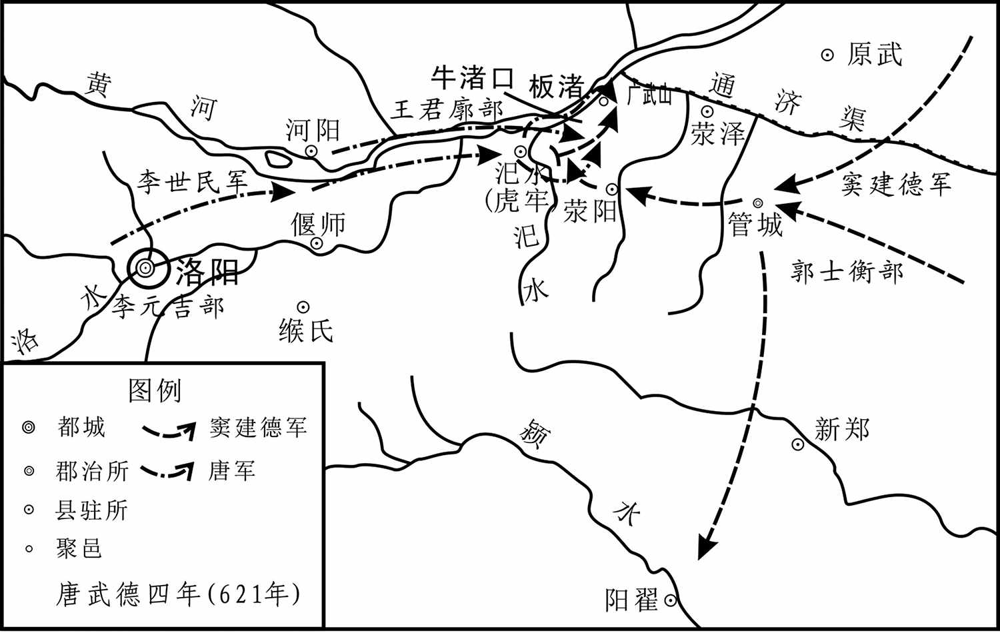 
虎牢之战示意图

## 【原文】

**唐兵围洛阳，掘堑筑垒而守之[1]。城中乏食，绢一匹直粟三升，布十匹直盐一斤，服饰珍玩贱如土芥[2]。民食草根木叶皆尽，相与澄取浮泥，投米屑作饼食之，皆病身肿、脚弱，死者相枕倚于道[3]。皇泰主之迁民入宫城也，凡三万家，至是无三千家[4]。虽贵为公卿，糠覈不充，尚书郎以下，躬自负戴，往往馁死[5]。窦建德使其将范愿守曹州，悉发孟海公、徐圆朗之众西救洛阳[6]。至滑州，王世充行台仆射韩洪开门纳之[7]。己卯，军于酸枣[8]。**

## 【注文】

[1]掘堑筑垒：挖沟堑筑墙垒。

[2]土芥：泥土草芥。

[3]浮泥：浮在水上的泥土。　　枕倚：相依枕藉。

[4]迁民入宫城：隋义宁元年（617年）四月，皇泰主迁民入宫城。

[5]糠覈（hé）：麦糠中的粗屑。　　尚书郎：官名，东汉始置，选拔孝廉中有才能者入尚书台，在皇帝左右处理政务，初从尚书台令史中选拔，后从孝廉中选取。初入台称“守尚书郎中”，满一年称“尚书郎”，三年称“侍郎”。魏晋以后，尚书省分曹，各曹有侍郎、郎中等官，综理政务，通称为尚书郎。晋时为清要之职，尚书省各曹的侍郎、郎中等官通称为尚书郎。隋唐因袭。　　负戴：负，用肩膀背；戴，用头顶。　　馁（něi）死：饥饿而死。

[6]范愿：活动于隋末唐初，窦建德的将领。

[7]韩洪（？—613年）：字叔明，骁勇，善于骑射。北周时以军功拜大都督。隋文帝为丞相，跟从韦孝宽破尉迟迥，加上开府，封甘棠县侯。平陈之后，授行军总管。不久因功加柱国，之后归附王世充，担任行台仆射。后与突厥交战而死。

[8]酸枣：县名，县治在今河南延津。

## 【译文】

唐兵包围洛阳，挖掘壕沟构筑营垒加以防守。城中缺粮，一匹绢能换三升米，十匹布能买一斤盐，服饰珍玩，就像泥土和草芥一样不值钱。老百姓把草根和树叶吃光了，又澄取泥土混合米屑做饼吃，食后生病，浑身浮肿，脚软无力，饿死的人交错倒在路上，满道都是。当初皇泰主迁移百姓入宫城时，共有三万家，这时剩下不到三千家。即使贵为公卿大官，也连糠麸都吃不饱，尚书郎以下的官员，需要亲自去背负粮食，还常常被饿死。窦建德派他的将领范愿守卫曹州，调孟海公、徐圆朗的全部人马向西援救洛阳。到滑州，王世充的行台仆射韩洪开门迎接他们。己卯三月（二十一日），在酸枣驻军。

## 【原文】

**秦王世民中分麾下，使屈突通副齐王元吉围守东都，世民将骁勇三千五百人东趣武（平）［牢］[1]。事见《唐平河朔》。**

## 【注文】

[1]中分麾（huī）下：平分部下。麾下，将帅的部下。　　齐王元吉（603—626年）：即李元吉，唐高祖李渊第四子。高祖李渊太原起兵时，留守太原。唐朝建立后，封为齐王。武德二年（619年），刘武周南侵并州，他弃太原归长安。后与长兄建成合谋杀李世民。武德九年（公元626年）六月初四，李世民发动“玄武门之变”，与太子李建成同时遇害，五子一同被诛杀，终年二十四岁。　　武牢：地名，今河南荥阳西北。

## 【译文】

秦王李世民把部队平分两部分，让屈突通作为齐王李元吉的副手围守东都，李世民率领骁壮勇士三千五百人向东赶往武牢。事可见《唐平河朔》。

## 【原文】

**夏四月壬寅，王世充骑将杨公卿、单雄信引兵出战，齐王元吉击之，不利，行军总管卢君谔战死。王世充平州刺史周仲隐以城来降[1]。**

## 【注文】

[1]杨公卿、周仲隐：生平事迹不详，活动于隋末唐初，王世充部下大将。　　平州：州名，治所在今河南洛阳东北。

## 【译文】

唐高祖武德四年（621年）夏四月壬寅（十五日），王世充的骑将杨公卿、单雄信带兵出战，齐王李元吉带兵迎战，失利，行军总管卢君谔战死。王世充的平州刺史周仲隐举城降唐。

## 【原文】

**五月，擒窦建德[1]。甲子，王世充偃师、巩县皆降[2]。乙丑，以太子左庶子郑善果为山东道抚慰大使[3]。世充将王德仁弃故洛阳城而遁，亚将赵季卿以城降[4]。秦王世民囚窦建德、王琬、长孙安世、郭士衡等至洛阳城下，以示世充[5]。世充与建德语而泣[6]。仍遣安世等入城言败状[7]。世充召诸将议突围，走襄阳，诸将皆曰：“吾所恃者夏王，夏王今已为擒，虽得出，终必无成[8]。”丙寅，世充素服帅其太子、群臣二千余人诣军门降[9]。世民礼接之，世充俯伏流汗[10]。世民曰：“卿常以童子见处，今见童子，何恭之甚邪[11]？”世充顿首谢罪[12]。于是部分诸军，先入洛阳，分守市肆，禁止侵掠，无敢犯者[13]。**

## 【注文】

[1]擒（qín）：擒拿，抓住。

[2]偃师：地名，今河南偃师。　　巩县：地名，今河南巩义市。

[3]太子：中国古代已确定继承帝位或王位的帝王的儿子。　　左庶子：官名，掌教戒诸侯卿大夫，汉太子侍从官有太子庶子、太子中庶子，前者秩四百石，后者六百石。历代相沿。　　抚慰大使：官名，帝王特派的临时使节，唐贞观初，特派巡视各地的使节也称大使。

[4]王德仁、赵季卿：生平事迹不详，活动于隋末唐初，王世充部下大将。　　故洛阳城：指汉魏故都之城，在今河南省洛阳白马寺东。　　亚将：副将。

[5]王琬（？—621年）：王世充兄长的儿子。王世充称帝，封为代王。武德四年（621年）被李世民所杀。　　长孙安世（？—621年）：长孙无忌的堂兄，仕王世充，署为内史令。东都平定，在狱中死去。　　郭士衡：活动于隋末唐初，王世充部下将领。

[6]语：说着，讲着。

[7]仍遣：因而派遣。

[8]襄阳：地名，今湖北襄阳。　　夏王：指窦建德。武德元年（618年）称夏王，改年号为五凤，国号夏。

[9]军门：军营的大门。

[10]俯伏流汗：低头伏地，满头大汗。

[11]常以童子见处：经常以童子相待。童子，指幼稚无知的儿童。　　恭：恭谦，尊敬。

[12]顿首：叩头。古代九拜之一。

[13]市肆：市中店铺。

## 【译文】

唐高祖武德四年（621年）五月，活捉了窦建德。甲子（初七日），王世充的偃师、巩县都投降了。乙丑（初八日），任命太子左庶子郑善果为山东道抚慰大使。王世充的将领王德仁放弃旧洛阳城逃跑了，副将赵季卿举城降唐。秦王李世民押解着窦建德、王琬、长孙安世、郭士衡等人来到洛阳城下，让王世充看。王世充与窦建德讲话，伤心地哭了。李世民又派长孙安世等人进城说明失败的状况。王世充召集将领商议突围的事，想逃跑到襄阳，各位将领都说：“我们所依靠的是夏王窦建德，夏王如今已被生擒，即使能突围出去，最终也一定不能成功。”丙寅（初九日），王世充身穿素衣，带着他的太子、群臣二千多人到军门投降。李世民以礼接待他们，王世充趴在地上汗流满面。李世民说：“您曾经把我当作小孩子，如今见到小孩子，为何这样恭敬？”王世充叩头谢罪。于是李世民部署各部，一部分先进入洛阳，分军防守市场商店，禁止侵扰掠夺，没有人敢违反禁令。

## 【原文】

**丁卯，世民入宫城，命记室房玄龄先入中书、门下省，收隋图籍、制诏，已为世充所毁，无所获[1]。命萧瑀、窦轨等封库，收其金帛，班赐将士[2]。收世充之党罪尤大者段达、王隆、崔洪丹、薛德音、杨汪、孟孝义、单雄信、杨公卿、郭什柱、郭士衡、董叡、张童儿、王德仁、朱粲、郭善才等十余人，斩于洛水之上[3]。士民疾朱粲残忍，竞投瓦砾击其尸，须臾如冢[4]。囚韦节、杨续、长孙安世等十余人送长安[5]。士民无罪为世充所囚者，皆释之，所杀者祭而诔之[6]。**

## 【注文】

[1]记室：东汉开始设置，诸王、三公及大将军都设记室令史，掌章表书记文檄。后代沿袭。　　房玄龄（579—648年）：唐代初年名相。名乔，字玄龄（一说名玄龄，字乔），齐州临淄（今山东淄博东北）人。大唐贞观之治的主要缔造者之一。玄龄去世后，谥号“文昭”，配享太宗庙廷。

[2]萧瑀（yǔ）（575—648年）：隋炀帝时萧皇后之弟。萧瑀自幼以孝行闻名天下，且善学能书，骨鲠（gěng）正直，并深精佛理。被隋炀帝疏斥，唐朝时深得李渊信任。武德元年（618年）六月，拜内史令。贞观二十二年（648年），病卒，追赠为司空、荆州都督。

[3]王隆（？—621年）：曾于隋开皇初以国子博士待诏向隋文帝奏《兴衰要论》七篇，为隋文帝所称道。后归附王世充，王世充称帝后，任命他为淮阳王。后唐高祖将其斩首。　　薛德音（？—621年）：以文学知名。仕隋为著作佐郎。王世充称帝，署为黄门侍郎。后唐高祖将其斩首。　　孟孝义：隋末割据者王世充部下大将，后被李唐诛杀。　　单（shàn）雄信（？—621）：曹州济阴（今山东曹县）人。少勇健。隋末入瓦岗起义军。公元617年，任左武候大将军。公元618年，率军投降王世充。公元620年，李世民率军包围东都。单雄信与尉迟敬德交战，被刺坠马。次年，李世民克东都，王世充降唐，单雄信被杀。　　崔洪丹、杨公卿、郭什柱、郭士衡、董叡、张童儿、王德仁、郭善才：活动于隋末唐初，王世充部下大将。　　朱粲（càn）：隋末乱世狂贼。年轻时曾是县佐吏，后来趁乱为祸，自称楼罗王，为人非常残暴，他攻打下来的城市，多是被抢劫一空，连人都不放过，公元621年，被高祖李渊所杀。

[4]疾：痛恨。　　须臾如冢：转眼间砖石堆积像坟墓。

[5]杨续：生卒年不详，杨恭仁弟弟。贞观年间，为郓州刺史，弘农华阴人，有辞学，贞观中，为郸州刺史。

[6]祭而诔（lěi）之：祭奠并为文哀悼。诔，本来指叙述死者生前事迹，表示哀悼。这里的诔，意为哀其无罪而死。

## 【译文】

唐高祖武德四年（621年）五月丁卯（初十日），李世民进入洛阳宫城，命令记室房玄龄先进入中书、门下省，收取隋朝的图书典籍、制令诏书，但已经被王世充毁掉，没有获得什么。命令萧瑀、窦轨等人封查府库，收集金钱布帛，颁赐给将士。拘捕王世充同党中罪恶尤其重大的段达、王隆、崔洪丹、薛德音、杨汪、孟孝义、单雄信、杨公卿、郭什柱、郭士衡、董叡、张童儿、王德仁、朱粲、郭善才等十多人，把他们在洛水岸边斩首。百姓都痛恨朱粲残忍，大家争着向他的尸体投掷瓦砾，不一会瓦砾就堆积得像坟丘一样。囚起韦节、杨续、长孙安世等十多人送往长安。凡是无罪而被王世充所囚禁的百姓，全部释放，已经杀死的，也都为他们举哀祭奠。

## 【原文】

**戊寅，王世充徐州行台杞王世辩以徐、宋等三十八州诣河南道安抚大使任环请降[1]。世充故地悉平[2]。秋七月庚申，王世充行台王弘烈、王泰、左仆射豆卢行褒、右仆射苏世长以襄州来降[3]。上与行褒、世长皆有旧，先是，屡以书招之，行褒辄杀使者[4]。既至长安，上诛行褒而责世长[5]。世长曰：“隋失其鹿，天下共逐之[6]。陛下既得之矣，岂可复忿同猎之徒，问争肉之罪乎[7]？”上笑而释之，以为谏议大夫[8]。**

## 【注文】

[1]徐州：地名，今江苏徐州。　　王世辩：王世充弟弟，后降唐。　　任环（？—629年）：字玮，庐州合肥（今安徽合肥）人，在隋任韩城尉，唐时为穀州刺史。王世充多次攻打新安，都被任环击败，因此立功封管国公。后平定徐圆郎、辅公祏都多次立功。

[2]故地悉平：旧有辖地全部平定。

[3]王弘烈、王泰、豆卢行褒：活动于隋末唐初，原为王世充部下将领，后降唐。　　苏世长（？—648年）：武功（今陕西武功）人。年少时，上书北周武帝，武帝惊异，特召见他。世袭父爵，隋时为长安令，大业末年为都水少监。唐开国，历任天策府军咨祭酒等职。苏世长机辩博学，敢于直言，多次劝说太祖李渊以隋为鉴，惩其奢淫，不忘俭约。拜谏议大夫。太宗年间，与杜如晦、房玄龄等齐名，画像立于秦王府文学馆内，是唐太宗智囊团的“十八学士”之一。

[4]辄杀使者：总是杀死使者。

[5]责：责备。

[6]共逐：共同追逐。这里是指大家一起分裂割据。

[7]同猎之徒：一同打猎的人。　　争肉：指相互争鹿，为了避免重复，改鹿为肉。

[8]谏议大夫：官名。秦代置谏议大夫之官，专掌议论。为郎中令的属官，有数十人之多。汉初不置。元狩五年（前118年）初置，属光禄勋（郎中令改名）。东汉改称谏议大夫，仍属光禄勋，秩六百石。三国魏沿置，晋朝罢。南朝梁、陈亦置。北魏置，隶属集书省，掌谏诤议论，从四品，北齐沿置。隋初隶属门下省，从四品。炀帝大业三年（607年）废。唐初复置，正五品上。高宗龙朔二年（662年）改正谏大夫，中宗神龙元年（705年）复旧。

## 【译文】

唐高祖武德四年（621年）五月戊寅（二十一日），王世充的徐州行台、杞王王世辩举徐、宋等三十八州到河南道安抚大使任环那里请求投降。王世充旧有辖地全部平定。秋七月庚申（初五日），王世充的行台王弘烈、王泰、左仆射豆卢行褒、右仆射苏世长举襄州来投降。高祖与豆卢行褒、苏世长过去都有交情，起先，曾多次写信招降他们，豆卢行褒往往杀死使者。等到他们来到长安，高祖杀了豆卢行褒而责备苏世长。苏世长说：“隋失去其政权，天下人都想追逐得到它。陛下已经得到了，怎能愤恨同时追逐的人，要判争夺政权人的罪呢？”高祖笑了笑，释放了他，任命他做谏议大夫。

## 【原文】

**甲子，俘王世充于太庙[1]。上见王世充而数之，王世充曰：“臣罪固当诛，然秦王许臣不死[2]。”丙寅，诏赦世充为庶人，与兄弟子侄徙处蜀[3]。王世充以防夫未备，置雍州廨舍[4]。独孤机之子定州刺史修德帅兄弟至其所，矫称敕呼郑王，世充与兄世恽趋出，修德等杀之[5]。诏免修德官[6]。其余兄弟子侄等于道亦以谋反诛[7]。**

## 【注文】

[1]太庙：帝王的祖庙。

[2]固：本，原来。

[3]庶（shù）人：泛指无官爵的平民百姓。　　蜀：地名，泛指今成都平原。

[4]防夫：防监的役夫。　　雍州廨（xiè）舍：在长安外郭城朱雀街西边的光德坊，后改为京兆府廨。

[5]独孤机（？—616年）：隋末大臣，曾经仕越王侗。王世充称帝，趁机谋反归附唐，被王世充所杀。　　定州：州名，治所在今河北定县。　　修德：独孤修德，生卒年不详，独孤机的儿子，唐羽林军将军。　　矫称敕呼：诈称诏命召呼。

[6]免：免除，罢免。

[7]其余：剩下的。

## 【译文】

唐高祖武德四年（621年）五月甲子（初九日），将王世充捉到太庙。高祖李渊见了王世充，数落了他的罪行，王世充说：“臣的罪行的确该杀，但是秦王曾许诺不杀我。”丙寅（十一日），诏命赦免王世充死罪，贬为庶人，与他的兄弟子侄迁居蜀地。因为监送王世充的役夫没有安排好，暂时安顿在雍州廨舍，被王世充所杀的独孤机的儿子定州刺史独孤修德，带领兄弟们到王世充住所，假称有诏传呼郑王，王世充与他的哥哥王世恽急忙赶出，独孤修德等人便杀了他们。诏命免除独孤修德的官。王世充其余的兄弟侄子等人，也在半路上以谋反罪而被处死。

# 唐平河朔**  
****窦建德**

## 【内容摘要】

《唐平河朔》叙述了唐朝平定河朔窦建德军的战争过程。

河朔，中国古代泛指黄河以北地区。隋朝末年，阶级矛盾激化，各地发生了农民大起义，同时也出现隋官隋将们反隋的斗争。窦建德就是在反隋的浪潮中形成的一支农民起义力量。窦建德是隋朝贝州漳南（今山东武城漳南镇）人，世代务农，曾任里长，尚豪侠，为乡里敬重。当时，炀帝募兵伐辽东，窦建德在军中任二百人长。目睹兵民困苦，义愤不平，遂抗拒东征，并帮助同县人孙安祖率数百人入漳南东境高鸡泊，举兵抗隋。后来，窦建德家人被隋军杀害，建德于是率部众二百人投清河人高士达的起事军队。由于起义农民的纷纷争附和各地隋官的归顺，窦建德很快成为雄踞一方的势力。在唐武德元年（618年）隋炀帝死后，在饶阳令宋正本的支持下和景城丞孙德绍等拥戴下，在乐寿定都，建立夏政权。之后，宇文化及引军西归，至山东聊城被建德击败，窦建德除杀宇文化及一伙外，又将俘获的大批隋皇室、宫人、官员、士兵等放散，录用其中有才学者。裴矩被任命为右仆射，定朝仪、制律令、兴文教。后建德迁都州，至武德二年（619年），大夏政权已占据了河朔的大部分地区。当时和窦建德敌对的力量有两个，一个是废隋皇泰主自立的王世充占据洛阳建的郑，另一个是占据陇西关中的李渊所建立的唐。这三个政权，都想扩大地盘，消灭对方，巩固自己的统治地位。窦建德南与洛阳的王世充抗衡，西与关中的唐李渊对峙。武德四年（621年）三月，唐军进攻王世充，建德率军十余万援王世充，与唐李世民军相遇于虎牢（今河南荥阳汜水镇）一带。五月，夏军溃败，窦建德被俘，裴矩以州降唐。七月，窦建德在长安被杀。

唐平河朔虽然是统一战争的局部胜利，但是河南河北是中国的心脏，这次战争为唐的全面统一中国打下了良好的基础。

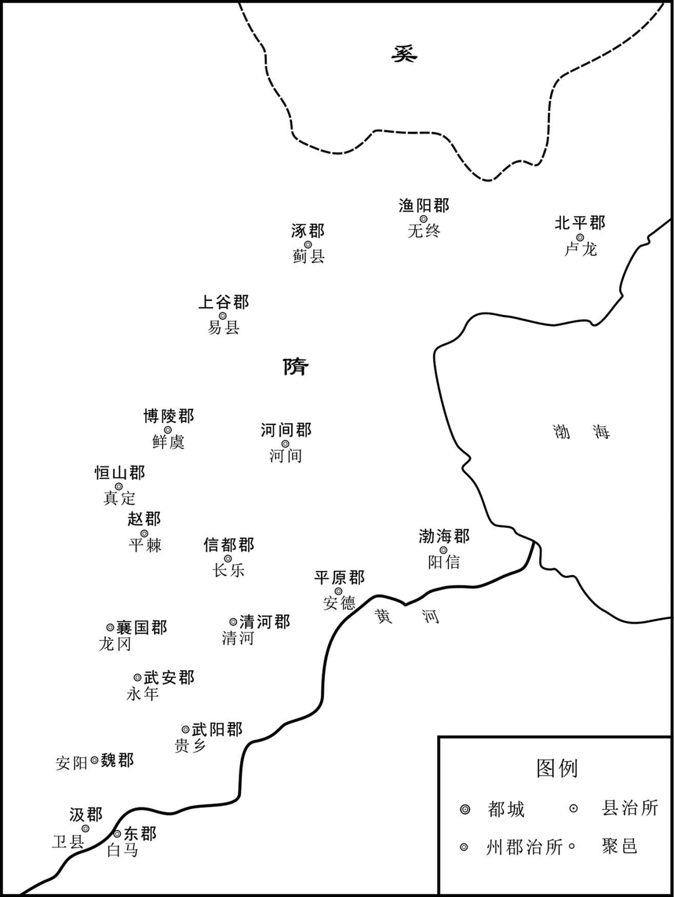 
隋河北诸郡示意图

## 【原文】

**隋炀帝大业七年[1]。漳南人窦建德少尚气侠，胆力过人，为乡党所归附[2]。会募人征高丽，建德以勇敢选为二百人长[3]。同县孙安祖亦以骁勇选为征士[4]。安祖辞以家为水所漂，妻子馁死，县令怒，笞之[5]。安祖刺杀令，亡抵建德，建德匿之[6]。官司逐捕，踪迹至建德家，建德谓安祖曰：“文皇帝时天下殷盛，发百万之众以伐高丽，尚为所败[7]。今水潦为灾，百姓困穷，加之往岁西征，行者不归，疮痍未复[8]。主上不恤，乃更发兵亲击高丽，天下必大乱[9]。丈夫不死，当立大功，岂可但为亡虏邪[10]！”乃集无赖少年，得数百人，使安祖将之，入高鸡泊中为群盗，安祖自号将军[11]。时鄃人张金称聚众河曲，蓚人高士达聚众于清河境内为盗，郡县疑建德与贼通，悉收其家属，杀之[12]。建德帅麾下二百人亡归士达，士达自称东海公，以建德为司兵[13]。顷之，孙安祖为张金称所杀，其众悉归建德，建德兵至万余人[14]。建德能倾身接物，与士卒均劳逸，由是人争附之，为之致死。**

## 【注文】

[1]大业七年：公元611年。

[2]漳南：地名，今山东武城东北。　　窦建德（573—621年）：隋末河北地区农民军领袖，清河漳南（今山东武城东北）人。公元618年于乐寿建立国号为夏的地方政权。后为李世民所败，俘虏到长安被杀。　　乡党：泛指乡里。

[3]高丽：即高句丽，是西汉到隋唐时期东北和朝鲜地区出现的一个有重要影响的边疆民族政权。

[4]孙安祖（？—611年）：隋末农民起义首领。隋末清河漳南（今山东武城东北）人。隋炀帝大业七年（611年），农村遭受水灾，妻子和儿女饿死，官府仍迫其服兵役，愤而击杀县令，逃匿窦建德家。因官府追捕甚急，建德助其起义，入高鸡泊（今河北故城西南）自号将军、摸羊公。后被张金称所杀。其余部归窦建德统帅。

[5]漂：淹没。　　妻子：妻子和儿女。　　馁（něi）：饥饿。　　笞（chī）：古代用竹板或荆条打人脊背或臀腿的刑罚。

[6]匿（nì）：隐藏，躲藏。

[7]官司：官府。　　文皇帝：指隋文帝杨坚（541—604年），隋朝开国皇帝。汉族，弘农郡华阴（今陕西华阴）人。他在位期间成功统一了百年严重分裂的中国，开创先进的选官制度，发展文化经济。文帝在位期间，隋朝开皇年间疆域辽阔，人口达到700余万户。　　殷盛：非常繁盛。

[8]困穷：穷困潦倒。　　疮痍：创伤，比喻遭受破坏或灾害后的景象。

[9]恤（xù）：忧虑。

[10]岂：怎么，怎能。　　亡虏：逃犯。　　邪：疑问词，呢。

[11]高鸡泊：地名，今河北故城西南。

[12]鄃（Shū）：县名，今山东平原、夏津二县之间。　　张金称（？—616年）：隋末清河鄃县（今山东夏津）人。隋末山东农民起义首领。炀帝大业七年（611年）率众起义。后于清河（今河北清河）击毙隋军将领冯孝慈。炀帝大业十二年（616年）连克平恩（今河北邱县西）、武安（今河北武安）、钜鹿（今河北巨鹿）、清河（今河北清河）等地。后因轻敌，为隋将杨义臣所败，与亲信逃到清河，又为杨善会俘获而被杀，余部归由窦建德率领。　　河曲：地名，今山西忻州西北河曲。　　蓚（tiáo）：同“蓨”。地名，今河北景县。　　高士达（？—616年）：隋末山东农民起义首领。蓨（今河北景县）人。大业七年（611年）率千余人在清河（今属河北）起义。以高鸡泊（今河北故城西南）为根据地。不久，得窦建德部会合，自称东海公。十二年击杀隋涿郡通守郭绚，后因未接受窦建德机动作战、避锋间击的策略，小胜后又轻敌，为隋将杨义臣所败，战死。

[13]麾（huī）下：指将帅的部下。　　司兵：官名。《周礼》谓夏官司马所属有司兵，设中士四人及府、史、胥、徒等人员。掌兵器，作战前颁发兵器，祭祀时发给舞者兵器，大丧时制作埋葬用兵器。唐州郡所属有司兵书佐、司兵参军，掌军防、门禁、田猎、烽候、驿传诸事。

[14]顷之：不久。

## 【译文】

隋炀帝大业七年（611年）。漳南人窦建德从小就崇尚侠气，为人讲义气，胆量和力气都超过一般的人，乡党里的人都愿归附他。正赶上朝廷征募攻打高丽的兵丁，窦建德因为勇敢被选为二百人长。同县的孙安祖也因为骁勇被选为征士。孙安祖由于家里发水灾被淹没，妻子儿女都饿死了，推辞不愿应征，县令生气，就毒打他。孙安祖刺杀了县令，逃到窦建德那里，窦建德把他藏起来。官府派人缉捕孙安祖，跟踪到窦建德家里，窦建德对孙安祖说：“隋文帝时天下殷富强盛，征发了一百多万人攻打高丽，尚且都被打败了。如今大水成灾，老百姓穷困潦倒，加上往年西征，去的人都没有活着回来，国家的疮痍还没有抚平，皇上不体恤人民疾苦，又要亲自发兵攻打高丽，天下必定要大乱。大丈夫不死，就要建立大功，怎能就这样做逃犯呢？”于是聚集没有职业的青年，有几百人，让孙安祖率领，进入高鸡泊中结伙当了盗匪，孙安祖自己号称将军。当时鄃地人张金称聚集徒众在河曲起事，蓚地人高士达在清河境内聚众为盗匪，郡县官员们怀疑窦建德与盗贼勾结，就把他的家属全部收捕杀了。窦建德带着他的部下二百人归附了高士达，高士达自称东海公，任命窦建德为司兵。不久，孙安祖被张金称杀了，孙安祖的徒众全归附了窦建德，窦建德的士卒达到了一万多人。窦建德待人接物诚恳老实，能与士兵同甘共苦，因此人们都争先恐后归附他，甘心为他效命。

## 【原文】

**十二年冬十二月，涿郡通守郭绚，将兵万余人讨高士达[1]。士达自以才略不及窦建德，乃进建德为军司马，悉以兵授之[2]。建德请士达守辎重，自简精兵七千人拒绚，诈为与士达有隙而叛，遣人请降于绚，愿为前驱击士达以自效[3]。绚信之，引兵随建德至长河，不复设备[4]。建德袭之，杀虏数千人，斩绚首，献士达，张金称余众皆归建德[5]。杨义臣乘胜至平原，欲入高鸡泊讨之[6]。建德谓士达曰：“历观隋将，善用兵者无如义臣，今灭张金称而来，其锋不可当。请引兵避之，使其欲战不得，坐费岁月，将士疲倦，然后乘间击之，乃可破也。不然，恐非公之敌[7]。”士达不从，留建德守营，自帅精兵逆击义臣，战小胜，因纵酒高宴[8]。建德闻之曰：“东海公未能破敌，遽自矜大，祸至不久矣[9]。”后五日，义臣大破士达，于陈斩之[10]。乘胜逐北趣其营，营中守兵皆溃[11]。建德与百余骑亡去，至饶阳，乘其无备，攻陷之，收兵，得三千余人[12]。义臣既杀士达，以为建德不足忧，引去[13]。建德还平原，收士达散兵，收葬死者，为士达发丧，军复大振，自称将军[14]。先是，群盗得隋官及士族子弟皆杀之，独建德善遇之[15]。由是隋官稍以城降之，声势日甚，胜兵至十余万人[16]。**

## 【注文】

[1]涿郡：隋大业三年（607年）改幽州，治所在蓟县（今北京西南）。辖境相当于今北京及河北霸州和天津海河以北，蓟运河以西，河北赤城、涿鹿以东地区。　　郭绚（？—616年）：隋大业初，刑部尚书宇文弼引他为副将。炀帝征伐辽东，拜他涿郡丞。后迁为通守，兼领留守。将兵击窦建德时战死。

[2]才略：才能和谋略。　　军司马：官职，相当于兵部郎中，兵部副长官。

[3]辎（zī）重：最开始是古代军事中的用语，表示运输部队携带的军械、粮草、被服等物资，后扩用于社会方面。　　简：挑选。　　隙：矛盾，缝隙。　　前驱：前锋部队。

[4]长河：地名，今山东德州。　　设备：设置防备。

[5]归：归顺，归附。

[6]杨义臣（？—617年）：隋朝将领。隋末代（今山西代县）人。本姓尉迟，后赐姓杨，为隋末将领。袭父爵，拜陕州刺史。从炀帝征吐谷浑于覆袁川，又从炀帝征高句丽。大业九年（613年）率部镇压叛军，公元616年败张金称，灭高士达，入豆子航（今山东惠民境内），是隋末镇压叛军的主将之一。后炀帝恶其威名，调入朝，遣散兵众，叛军因而复盛，以功授礼部尚书，不久病死。　　平原：地名，今山东德州平原。

[7]坐费：浪费。　　岁月：时间。

[8]逆击：迎击。

[9]遽（jù）：遂，就。　　矜（jīn）：自尊自大。

[10]陈：是“阵”的本字。

[11]趣：通“趋”，快步急行。

[12]饶阳：地名，今河北饶阳东南。

[13]引去：退走。

[14]收：收留，收罗。

[15]士族：又称门第、衣冠、世族、势族、世家、巨室、门阀等。指在官职爵位不能世袭的社会中那些长期为官、控制朝政的家族。

[16]稍：逐渐，稍稍。

## 【译文】

隋大业十二年（616年）冬十二月，涿郡通守郭绚率领一万多军队讨伐高士达。高士达自认为才能和谋略都不如窦建德，就提升窦建德为军司马，把军权都交给了他。窦建德请高士达守卫军用物资，自己挑选精兵七千人抵抗郭绚，装作与高士达有矛盾要叛变他，派人向郭绚请求投降，希望作为郭绚的前锋部队攻击高士达，为他效力。郭绚相信了，领兵跟随窦建德到了长河，也不再防备他。窦建德乘机袭击他，杀死和俘虏了几千人，割下郭绚首级，献给高士达，张金称剩余的人也都归附了窦建德。杨义臣乘胜来到平原，打算进入高鸡泊讨伐窦建德。窦建德告诉高士达说：“我看隋将领中，善于用兵的没有人能与杨义臣相比，如今他消灭了张金称又来这里，士气正高，难以抵挡。请你领着部队避开他，让他想战不能，空费时间，等他的将士疲倦不堪，然后乘机向他进攻，才能将他打败。不这样，恐怕你不是他的对手。”高士达不听，把建德留下防守军营，自己带着精锐部队迎击杨义臣。刚获得很小的胜利，就放开喝酒庆祝。窦建德听到后说：“东海公还没有打败敌人，就这样妄自矜大，灾祸不久就会降临。”过了五天，杨义臣打败高士达，在阵前把高士达杀了，并乘胜追击到他的军营中，营中的守兵全溃散奔逃。窦建德与一百多骑兵逃出，到了饶阳县，乘饶阳县没有防备，攻陷饶阳城，收集了三千多人。杨义臣杀了高士达后，以为窦建德不值得担心，就率兵走了。窦建德返回平原，收罗高士达的散兵，埋葬死了的士兵，并为高士达发丧，部队的士气又大振，窦建德自称为将军。以前，群盗抓住隋朝的官员和士族子弟都全部杀掉，只有窦建德对他们很好。因此，有些隋官逐渐举城投降建德，他的声势一天比一天大，部队兵力发展到十几万人。

## 【原文】

**恭帝义宁元年春正月丙辰，窦建德为坛于乐寿，自称长乐王，置百官，改元丁丑[1]。**

## 【注文】

[1]乐寿：地名，今河北献县西南一里。　　置：设置，设立。　　丁丑：隋末农民起义领袖窦建德的年号，历时近两年。

## 【译文】

隋恭帝义宁元年（617年）春正月丙辰（初五日），窦建德在乐寿筑坛，自称长乐王，设置各官属，改年号为丁丑。

## 【原文】

**秋七月，炀帝诏左御卫大将军涿郡留守薛世雄将燕地精兵三万讨李密，命王世充等诸将皆受世雄节度，军所过，盗贼随便诛翦[1]。世雄行至河间，军于七里井，窦建德士众惶惧，悉拔诸城南遁，声言还入豆子港[2]。世雄以为畏己，不复设备，建德谋还袭之[3]。其处去世雄营百四十里，建德帅敢死士二百八十人先行，令余众续发[4]。建德与其士众约曰：“夜至则击其营，已明则降之。”未至二里所，天欲明，建德惶惑，议降[5]。会天大雾，人咫尺不相辨，建德喜曰：“天赞我也[6]。”遂突入其营击之，世雄士卒大乱，皆腾栅走[7]。世雄不能禁，与左右数十骑遁归涿郡，惭恚发病卒[8]。建德遂围河间[9]。**

## 【注文】

[1]薛世雄（554—617年）：字世英，河东汾阴（今山西万荣）人，跟从周武帝平齐，以功拜帅都督。隋开皇时，因有战功，迁仪同三司、右亲卫车骑将军。炀帝即位，迁右监门郎将，先后参加了对吐谷浑、突厥、高句丽的战争。李密逼东都，世雄率幽、蓟精兵将击之。后又讨伐窦建德，大败。回到涿郡，不久去世。　　燕地：今河北北部。　　李密（582—618年）：隋末瓦岗起义军领袖。隋末天下大乱时，李密成为瓦岗军首领，称魏公，率军屡破隋军，威震天下。后因杀瓦岗寨旧主翟让，引发内部不稳，又因在与宇文化及的拼杀中损失惨重，不久被王世充击败，率残部投降李唐，没过多久，李密又叛唐自立，最终被唐将盛彦师斩杀于熊耳山。　　王世充（？—621年）：隋末割据者。字行满，新丰（今陕西临潼东北）人。炀帝初，为民部侍郎，出任江都郡丞。炀帝末，镇压农民起义升江都通守。因瓦岗李密逼都，派其援救。炀帝被杀拥立越王侗，击败李密自立为帝。其后降于唐被杀。　　节度：管辖，管理。　　诛翦（jiǎn）：亦作“诛剪”。

[2]河间：地名，今河北河间。　　七里井：地名，今河北河间南。　　声：放风，放声。

[3]设备：设防，防备。

[4]敢死士：敢死队。　　续发：在后出发。

[5]约：约定。

[6]咫（zhǐ）尺：形容距离近。古代称八寸为咫。

[7]腾：翻越，攀越。

[8]恚（huì）：恨，怒。

[9]遂：于是，就。

## 【译文】

隋恭帝义宁元年（617年）秋七月，隋炀帝杨广诏令左御卫大将军、涿郡留守薛世雄，统帅燕地的精锐部队三万人讨伐李密，命令王世充等各将领都接受薛世雄调节指挥，大军所经过的地方，遇到盗匪贼寇，可以趁机诛杀歼灭。薛世雄行军到河间，驻扎在七里井，窦建德的部队惶恐不安，全都放弃了各城池向南逃避，放风说要返回豆子港。薛世雄以为是害怕自己攻击，就不再设防，窦建德打算回军偷袭。距薛世雄的军营还有一百四十里，窦建德率领敢死队二百八十人先走，让剩下的人后面出发。窦建德与他的士兵约定说：“天亮前赶到就攻击敌营，天亮后到达就投降。”率军走到距敌营还有二里左右的地方时，天蒙蒙亮，窦建德惶恐，不知如何是好，正和大家商量投降事宜时，适逢天降大雾，人相隔咫尺都无法辨认，窦建德高兴地说：“天助我哪！”于是下令冲进敌营攻击，薛世雄的军队大乱，全都翻越营栅逃散。薛世雄无法阻止，与左右几十个骑兵逃回涿郡，惭愧生气，发病而死。窦建德于是包围了河间。

## 【原文】

**唐高祖武德元年[1]。隋河间郡丞王琮守郡城以拒群盗，窦建德攻之，岁余不下[2]。闻炀帝凶问，帅吏士发丧，乘城者皆哭[3]。建德遣使吊之，琮因使者请降，建德退舍具馔以待之[4]。琮言及隋亡，俯伏流涕，建德亦为之泣[5]。诸将曰：“琮久拒我军，杀伤甚众，力尽乃降，请烹之[6]。”建德曰：“琮忠臣也，吾方赏之以劝事君，奈何杀之？往在高鸡泊为盗，容可妄杀人[7]。今欲安百姓，定天下，岂得害忠良乎！”乃徇军中曰：“先与王琮有怨敢妄动者，夷三族[8]。”以琮为瀛州刺史[9]。于是河北郡县闻之，争附于建德[10]。**

## 【注文】

[1]武德元年：公元618年。

[2]王琮（cóng）：生平事迹不详，活动于隋末唐初。

[3]问：消息，信息。　　吏士：官属和士兵。

[4]吊：追悼，慰问。　　馔（zhuàn）：饭食。

[5]俯伏：弯腰伏地。

[6]烹（pēng）：煮。

[7]往：过去，曾经。

[8]妄：胡乱。　　夷：消灭，除掉。

[9]瀛（yíng）州：地名，隋置河间县，即今河北河间。　　刺史：职官名，是中国古代州一级地方长官。

[10]河北：泛指今黄河以北地区。

## 【译文】

唐高祖李渊武德元年（618年）。隋河间郡丞王琮坚守郡城，抵抗各路盗匪，窦建德围攻了一年多，不能攻下。听到隋炀帝杨广被杀的消息，王琮率领官吏和士兵发丧，城上的人全都哭了。窦建德派遣使者慰问，王琮便通过使者请求投降，建德退兵准备好宴席招待他。王琮谈到隋的灭亡，弯腰伏地痛哭流涕，窦建德也随他哭泣。各将领都说：“王琮长期抵抗我军，杀伤了很多人，现在没有力量了才来投降，请允许煮了他。”窦建德说：“王琮是忠臣，我正要赏赐他，来劝勉那些事君的人，为什么要杀他？过去我们在高鸡泊做盗匪，还可以胡乱杀人。而今要安抚百姓，平定天下，怎可杀害忠良呢！”于是向军中宣布说：“以前与王琮有怨仇的人，如胆敢轻举妄动，我就灭他的三族。”又任命王琮为瀛洲刺史。从此，河北的各郡县知道了这件事，都争先恐后投降窦建德。

## 【原文】

**先是，建德陷景城，执户曹河东张玄素，将杀之，县民千余人号泣，请代其死，曰：“户曹清慎无比，大王杀之，何以劝善[1]？”建德乃释之，以为治书侍御史，固辞[2]。及江都败，复以为黄门侍郎，玄素乃起[3]。饶阳令宋正本，博学有才气，说建德以定河北之策，建德引为谋主[4]。建德定都乐寿，命所居曰金城宫，备置百官[5]。**

## 【注文】

[1]景城：隋开皇十八年（598年）改成平县置，属瀛洲，今河北沧州西。　　执：抓住，捉住。　　河东：古地区名。战国、秦、汉时指今山西西南部，唐以后泛指今山西全省。因黄河自北而南流经本区西界，故有河东之称。　　张玄素（？—664年）：唐太宗时著名谏臣。早在隋末，就以清廉著称。隋末窦建德攻陷景城，任命他为治书侍御史和黄门侍郎。唐朝平定窦建德后，张玄素成为唐朝官吏。唐太宗闻其清名，特召见垂询政事。他建议唐太宗吸取历史成败经验教训，受到太宗的重用。到唐高宗永徽年间（650—655年），他以年老致仕，龙朔三年（663年），加授银青光禄大夫，麟德元年（664年）去世。

[2]治书侍御史：官名。也称持书侍御史。汉宣帝始置，东汉沿置，员二人，秩六百石，挑选通晓法律者充任。凡遇疑事，按律定其是非。魏、晋以后，分掌侍御史所统各曹。南朝宋时，不为时人重视，梁武帝始重其人选。北魏掌纠察朝会失时、服章违错等事。北齐沿袭。北周改称司宪上士。隋以治书侍御史为御史大夫之事，专管御史台中各事，从五品，炀帝时改正五品。唐初沿隋称，仍为御史大夫之副，正四品下。高宗即位，以“治”为帝讳，改名为御史中丞。

[3]及：等到……之后。　　江都：地名，今江苏扬州江都。　　黄门侍郎：官名。又称黄门郎，秦初置，即给事于宫门之内的郎官，是皇帝近侍之臣，可传达诏令，汉代以降沿用此官职。秦汉时，宫门多油漆成黄色，故称黄门。东汉始设为专官，或称之为给事黄门侍郎。隋唐时，黄门侍郎隶属门下省，成为门下省的副官，唐玄宗天宝元年（742年）改称门下侍郎。

[4]宋正本（？—614年）：农民军领袖。窦建德起义初期时任隋朝饶阳令，博学有才气，向窦建德献定河北之策，窦建德于是将其引为谋主。宋正本好直谏，建德又听信谗言将其杀死。

[5]百官：各种属官。

## 【译文】

早先，建德攻陷景城，捉住了户曹、河东人张玄素，将要杀了他，县里一千多老百姓大声哭喊，请求代他去死，他们说：“户曹清廉谨慎，无人可比，大王杀了他，怎么劝人为善？”窦建德于是放了他，任命他做治书侍御史，张玄素坚决推辞。等到江都隋炀帝死后，又任命他为黄门侍郎，玄素才接受做官。饶阳令宋正本，学问渊博，很有才气，向窦建德进献安定河北的策略，窦建德让他做了谋主。建德定都乐寿，称自己居住的地方为金城宫，设置百官。

## 【原文】

**冬十一月，有大鸟五集于乐寿，群鸟数万从之，经日乃去[1]。窦建德以为己瑞，改元五凤[2]。宗城人有得玄圭献于建德者，宋正本及景城丞会稽孔德绍皆曰：“此天所以赐大禹也，请改国号曰夏[3]。”建德从之[4]。以正本为纳言，德绍为内史侍郎[5]。**

## 【注文】

[1]集：聚集，集合。

[2]瑞：吉祥瑞兆。

[3]宗城：隋仁寿元年（601年）改广宗县置，属贝州，在今河北威县东南二十里古城。　　玄圭：黑色的玉，古代帝王举行典礼所用的一种玉器。　　景城：地名，开皇十八年（598年），改成平县为景城县（今河北沧州境内），隶景州。大业三年（607年），废州复郡，景城改隶河间郡。唐武德元年（618年）景城改隶沧州。武德四年（621年），景城改隶瀛州。贞观元年（627年），景城又复隶于沧州。　　会（kuài）稽：地名，今浙江绍兴。　　孔德绍（？—621年）：隋末大臣，初事窦建德，后为内史侍郎，典书檄。建德失败后，唐太宗将他杀死。　　大禹：姒（sì）姓夏后氏，名文命，号禹，后世尊称大禹，夏后氏首领，他的父亲名鲧。相传禹治黄河水患有功，受舜禅让继帝位。禹是夏朝的第一位天子，因此后人也称他为夏禹。他是我国传说时代与尧、舜齐名的贤圣帝王，他最卓著的功绩，就是历来被传颂的治理滔天洪水，又划定中国国土为九州。大禹，也就是伟大的禹的意思。禹死后安葬于浙江绍兴市南的会稽山上，现存禹庙、禹陵、禹祠。

[4]从：听从，采纳。

[5]纳言：官名，主出纳王命。王莽依古制，改大司农为纳言，掌出入侍从。宣帝末又置侍中。隋避文帝杨忠讳，改侍中为纳言，炀帝大业改纳言为侍内。唐初为纳言，后改为侍中。　　内史侍郎：官名。内史令佐官。隋代改中书省为内史省，改中书令为内史令。唐沿隋制，设内史，为正二品，执掌中书省，即宰相。侍郎为其副职。

## 【译文】

唐高祖武德元年（618年）冬十一月，有五只大鸟飞落在乐寿，数万只鸟跟随着而来，几天后才离去。窦建德认为是自己的吉祥瑞兆，便改年号为五凤。宗城有人得到一块黑色玉石，进献给窦建德，宋正本和景城丞会稽人孔德绍都说：“这原是苍天赐给大禹的东西，请允许把国号改称为夏。”建德采纳了他们的建议。任命宋正本为纳言，孔德绍为内侍郎。

## 【原文】

**初，王须拔掠幽州，中流矢死，其将魏刀儿代领其众，据深泽，掠冀、定之间，众至十万，自称魏帝[1]。建德伪与连和，刀儿弛备，建德袭击，破之，遂围深泽[2]。其徒执刀儿降，建德斩之，尽并其众[3]。易、定等州皆降，唯冀州刺史曲稜不下[4]。稜壻崔履行，暹之孙也，自言有奇术，可使攻者自败，稜信之[5]。履行命守城者皆坐，毋得妄斗，曰：“贼虽登城，汝曹勿怖，吾将使贼自缚[6]。”于是为坛，夜设章醮，然后自衣衰绖，杖行登北楼恸哭，又令妇女升屋四向振裙[7]。建德攻之急，稜将战，履行固止之[8]。俄而城陷，履行哭犹未已[9]。建德见稜曰：“卿忠臣也[10]。”厚礼之，以为内史令[11]。**

## 【注文】

[1]王须拔：生卒年不详，隋末河北农民起义军首领。上谷（今河北易县）人。大业十一年（615年）起义，自称漫天王，国号燕。转战于河北、山西一带，曾克高阳（今河北高阳东），在攻幽州（今北京）时，不幸身中流矢死亡。部众归亚帅魏刀儿统领。　　幽州：地名，今北京西南。　　魏刀儿（？—618年）：隋末河北农民起义军首领。隋炀帝大业十一年（615年）起义，自称“历山飞”。遣将甄翟儿率军攻太原（今山西太原），杀隋将潘长文。王须拔死，余众归他统率，后据深泽（今河北深泽），活动于冀、定二州之间，称魏帝。公元618年，窦建德假装与他联合，他麻痹无备，为窦建德所袭击，部将将他执送建德，被杀。余众由窦建德统率。　　深泽：地名，今河北深泽东南。　　冀：冀州，在今河北中南部、山东西端及河南北端。　　定：定州，今河北定州。

[2]弛备：放松戒备。

[3]执：抓住，捉住。

[4]曲稜：唐初地方官吏，任冀州刺史。

[5]崔履行：生平事迹不详，活动于隋末唐初。　　暹（xiān）：崔暹（503—562年），北齐官员，字季伦。高祖（即高欢）很欣赏他，任命他为丞相长史。高祖驾崩，还没有发丧，世宗（高欢长子高澄）就任命崔暹为度支尚书，兼仆射，委以重任。世宗驾崩，鲜卑武将诬陷崔暹，文宣帝高洋（高欢次子）治其罪，流放马城服苦役，不久以谋反罪锁赴晋阳。后又释放，复官为太常卿、中书监。

[6]自缚：自己捆绑。

[7]章醮（jiào）：拜表设祭。　　衣：动词，穿着。　　衰绖（cuī dié）：丧服。古人丧服胸前当心处缀有长六寸、广四寸的麻布，此布名衰，故名此衣为衰；围在头上的散麻绳为首绖，缠在腰间的为腰绖。衰、绖两者是丧服的主要部分。　　杖行：拄着棍子走。　　恸（tòng）哭：悲痛地哭。

[8]止：阻止。

[9]俄而：不一会。　　犹：依然，还。

[10]卿：古代君对臣、长辈对晚辈的称谓，朋友之间、夫妇之间也以“卿”互称。

[11]内史令：官名。隋代改中书省为内史省，改中书令为内史令。唐沿隋制，设内史，为正二品，执掌中书省，即宰相。

## 【译文】

起初，王须拔抢掠幽州，被流箭射中致死，他的将领魏刀儿代他率领军队，占据了深泽，在冀、定一带抢掠，部众多达十万人，自称魏帝。窦建德假意和魏刀儿联合，魏刀儿于是放松了戒备，窦建德乘机袭击，大破他的军队，于是包围深泽。魏刀儿的部下捉了魏刀儿来投降，窦建德杀了魏刀儿，合并了他的全部人马。易、定等州都投降了，只有冀州刺史曲稜不降。曲稜的女婿崔履行，是崔暹的孙子，说他自己有奇特的法术，能使围攻的人自败，曲稜相信了他。崔履行让守城的人都坐下，不得随便乱动，说：“贼人即使登城，你们也不要恐惧，我将让贼人自己把自己捆起来。”于是筑坛，夜里设置醮坛祈祷，然后他自己穿上丧服，拄着棍子登上北楼恸哭，又让妇女登上房顶向四方提起裙子抖动。窦建德围攻得很急，曲稜想迎战，崔履行坚决阻止。不一会城被攻陷，崔履行还哭个不停。窦建德见到曲稜说：“你是忠臣哪！”用优厚的礼遇待他，任命他为内史令。

## 【原文】

**建德既克冀州，兵威益盛，帅众十万寇幽州[1]。总管罗艺将逆战，薛万均曰：“彼众我寡，出战必败[2]。不若使羸兵背城阻水为陈，彼必渡水击我。万均请以精骑百人伏于城旁，俟其半渡击之，蔑不胜矣[3]。”艺从之。建德果引兵渡水，万均邀击，大破之[4]。建德竟不能至其城下，乃分兵掠霍堡及雍奴等县，艺复邀击，败之[5]。凡相拒百余日，建德不能克，乃还乐寿[6]。万均，世雄之子也。**

## 【注文】

[1]既：……以后。　　冀州：地名，今河北冀州。

[2]罗艺（？—627年）：字子延，隋襄州襄阳（今属湖北）人，唐朝初期将领，寓居京兆云阳（今陕西泾阳）。隋末任虎贲郎将，驻守涿郡。公元619年归唐后，赐其姓李，初封燕公，后晋封燕郡王，助唐击败刘黑闼，统领天节军，镇守泾州。唐太宗登基后，进封开府仪同三司，位比三公。贞观元年（627年），率军反唐，进据豳州，后被击败，逃往甘肃乌氏，为其部下所杀。　　逆战：迎战。　　薛万均（？—641年）：唐朝将领。本敦煌人，后徙京兆咸阳，隋朝名将薛世雄之子。大业末年与弟薛万彻客居幽州，后随罗艺归唐，授为上柱国、永安郡公。贞观初年，随柴绍讨梁师都，任行军副总管，击走突厥，围歼其军，升任左屯卫将军。贞观八年（634年），随李靖讨吐谷浑，任沃沮道行军副总管，在青海遇敌，单骑冲阵，诸将随之，斩数千人，升左屯卫大将军。贞观十三年（639年），以交河道行军副大总管与侯君集击高昌，进封潞国公。贞观十五年（641年），坐事下狱，忧愤而死，陪葬昭陵。

[3]羸（léi）兵：疲弱的士兵。　　俟（sì）：等待。

[4]果：果然，确实。

[5]雍奴：古县名，西汉置，治所在今天津市武清东北，北魏移治今武清东，为渔阳郡治所。唐天宝初改名武清。

[6]凡：共。

## 【译文】

窦建德攻克冀州以后，兵力更加强盛威武，率领十万人侵犯幽州。总管罗艺准备迎战，薛万均说：“敌众我寡，出战必然失败。不如让疲弱的战士背城临水列开阵势，敌人必定渡水攻击我们。我薛万均请求率领一百精锐骑兵埋伏在城边，等他们的人一半下水再迎头攻击，没有打不胜的。”罗艺采纳他的建议。窦建德果然引兵渡水，薛万均拦腰袭击，大败窦建德。窦建德始终无法到达城下，于是分兵抢掠霍堡及雍奴等县，罗艺又出其不意袭击，打败了窦建德。共相持了一百多天，窦建德无法取胜，就返回乐寿。薛万均是薛世雄的儿子。

## 【原文】

**二年春闰二月，宇文化及保聊城，窦建德纵兵攻之，生擒化及[1]。建德每战胜克城，所得资财，悉以分将士，身无所取[2]。又不啖肉，常食蔬，茹粟饭[3]。妻曹氏不衣纨绮，所役婢妾才十许人[4]。及破化及，得隋宫人千数，即时散遣之[5]。以隋黄门侍郎裴矩为左仆射，掌选事，兵部侍郎崔君肃为侍中，少府令何稠为工部尚书，右司郎中柳调为左丞，虞世南为黄门侍郎，欧阳询为太常卿[6]。询，纥之子也[7]。自余随才授职，委以政事[8]。其不愿留欲诣关中及东都者，亦听之，仍给资粮，以兵援之出境[9]。隋骁果尚近万人，亦各纵遣，任其所之[10]。又与王世充结好，遣使奉表于隋皇泰主，皇泰主封为夏王[11]。建德起于群盗，虽建国，未有文物法度，裴矩为之定朝仪，制律令，建德甚悦，每从之谘访典礼[12]。**

## 【注文】

[1]闰二月：公历每四年出现一次二月29天，为闰二月。农历如一年内出现两个二月，第二个二月为闰二月。都是因为太阳、月亮相对地球转动的周期不是整天数造成的。　　宇文化及（？—619年）：为隋炀帝近臣，公元618年禁卫军兵变，弑隋炀帝，他自称大丞相，后率军北归，被李密击败，退走魏县，自立为帝，国号“许”，年号“天寿”，立国半年，第二年被窦建德击败，遭擒被杀。　　聊城：地名，今山东聊城。

[2]每：每次。　　悉：全部。

[3]啖（dàn）：吃。　　茹（rú）：吃。

[4]衣：穿。　　纨（wán）绮：精美的丝织品。　　婢妾：使女与妾。

[5]散：驱散，打发。

[6]裴矩（548—627年）：杨坚代周，建立隋朝，他为近臣，参与平陈之役，经略岭南，北抚突厥族启民可汗。又参定隋礼。隋炀帝即位后，受到重用，参掌朝政。裴矩一生最重要的活动是为炀帝经营西域。大业元年（605年）至九年（614年）间，他多次来往于甘州、凉州（今甘肃武威）、沙州（今甘肃敦煌），大力招徕胡商。裴矩尽力搜集西域各国山川险易、君长姓族、风土物产等资料，绘画各国王公庶人服饰仪形，撰成《西域图记》3卷，并别造地图，注记各地险要，献于炀帝。宇文化及弑炀帝，任裴矩为尚书右仆射。化及败，矩转事窦建德。建德败，矩降唐，官至民部尚书。太宗贞观元年（627年）卒，谥号“敬”。　　左仆（pú）射（yè）：官名，秦始置，汉以后因之。汉成帝初置尚书五人，一人为仆射，位仅次尚书令，职权渐重。汉献帝置左右仆射。唐宋左右仆射为宰相之职。　　兵部侍郎：官名，兵部是隋唐时尚书省下属六部之一，掌管全国武官选用和兵籍、军械、军令之政，长官为兵部尚书，统兵部、职方侍郎各二人，驾部、库部侍郎各一人。　　崔君肃：生卒年不详，唐郑州新郑人。隋炀帝朝，任兵部侍郎。唐高祖武德二年（619年），被窦建德起义政权所俘，任为侍中。后归唐，历任黄门侍郎、鸿胪卿。　　侍中：官名，秦始置，是列侯以下至郎中的加官，没有定员，为丞相之史（属员），以其往来东厢奏事，故谓之侍中；西汉时又为正规官职外的加官之一，文武大臣加上侍中之类名号可入禁中受事。西汉武帝以降，地位渐高，等级超过侍郎。魏晋以后，侍中往往成为事实上的宰相。唐宋以至元该职得以沿置。　　少府令：少府，官署名，西汉时诸侯王设有少府，郡守也设有少府。东汉仍为九卿之一，掌宫中御衣、宝货、珍膳等。魏晋以后沿置，北朝有太府而无少府。隋置少府监、领尚方、织染等署。少府令为其长官。　　何稠：生卒年不详，北周至唐初著名工艺家、建筑家。善制工艺品。主要成就是设计制造“行殿”及“六合城”。　　工部尚书：官名，尚书省工部长官，掌管工程、工匠、屯田、水利、交通等政令。　　右司郎中：官名，唐宋时左司郎中、右司郎中、左司员外郎、右司员外郎掌受六曹之事，而举正文书之稽失，分治省事。左司治吏、户、礼奏抄班簿房，右司治兵、刑、工案抄房。　　柳调：生卒年不详，北齐时历任秘书郎、侍御史等。后入隋，任尚书左司郎中，后归附窦建德。　　左丞：即尚书左丞，官名。汉成帝建始四年（前29年）置尚书，员五人，丞四人。汉光武帝时，减二人，始分左右丞。尚书左丞佐尚书令，总领纲纪；右丞佐仆射，掌钱谷等事，秩均四百石。历代沿置，为尚书令及仆射的属官，品级逐渐提高，隋、唐时至正四品。　　虞世南（558—638年）：唐初大臣，封永兴县公，凌烟阁二十四功臣之一。字伯施，余姚人，唐初政治家、书法家、文学家。隋炀帝时官起居舍人，唐时历任秘书监、弘文馆学士等。唐太宗称他德行、忠直、博学、文词、书翰五绝。　　欧阳询（557—641年）：潭州临湘（今长沙）人，字信本，楷书四大家（欧阳询、颜真卿、柳公权、赵孟）之一。公元557年出生于衡州（今湖南衡阳），祖籍潭州临湘（今湖南长沙）。欧阳询祖父欧阳颁（498—563年）曾为南梁直阁将军。欧阳询聪敏勤学，涉猎经史，博闻强记。隋朝时，欧阳询曾官至太常博士。因与李渊交好，在大唐盛世累迁银青光禄大夫、给事中、太子率更令、弘文馆学士，封渤海县男，也称“欧阳率更”。与同代另三位（虞世南、褚遂良、薛稷），并称初唐四大家。　　太常卿：官名。太常，“掌陵庙群祀，礼乐仪制，天文术数衣冠之属”（《隋书·百官志》）。太常的主管官员称太常卿。

[7]纥：指欧阳纥，生平事迹不详。

[8]授：授予，任命。

[9]给（jǐ）：供给。　　资粮：路费和粮食。　　援：把……护送。

[10]尚：还有。

[11]使：名词，使者。

[12]起：由……起家。　　谘（zī）访：商议。　　典礼：典章礼制。

## 【译文】

唐高祖武德二年（619年）春，闰二月，宇文化及守卫聊城，窦建德纵兵攻打，活捉了宇文化及。建德每次攻克城池打了胜仗，得到的资财，全都分给将士，自己什么也不取。又不吃肉，常常只吃些蔬菜和米饭。他的妻子曹氏不穿绸缎，使用的婢妾只有十个左右。攻破宇文化及后，得到隋宫人一千多，当时就打发她们各自回家。任命隋朝的黄门侍郎裴矩为左仆射，掌管官吏选拔的事情，任命隋兵部侍郎崔君肃为侍中，少府令何稠为工部尚书，右司郎中柳调为左丞，虞世南为黄门侍郎，欧阳询为太常卿。欧阳询是欧阳纥的儿子。其余的人根据各自的才能授予一定的职务，把政事委派给他们。其中有不愿意留下来，想到关中或东都去做事的，也听任其便，并供给他们路费和粮食，用部队把他们护送出境。隋朝的骁果部队还有将近万人，也都各自遣放，去留听便。又和王世充结为友好，派遣使者向隋朝皇泰主上表称臣，皇泰主封他为夏王。窦建德盗匪出身，虽然建立起了国号，但却还没有文物法度，裴矩为他制定朝拜的礼仪和制度律令，窦建德十分高兴，常常向裴矩咨询典章礼制。

## 【原文】

**窦建德陷邢州，执总管陈君宾[1]。**

## 【注文】

[1]邢州：地名，今河北邢台。　　陈君宾：生卒年不详，仕隋为襄国太守。武德初，以郡归附唐，封东阳公，拜邢州刺史。贞观元年（627年），任邓州刺史。后入为太府少卿、少府少监，不久卒。

## 【译文】

窦建德攻陷邢州，俘虏了总管陈君宾。

## 【原文】

**初，宇文化及以隋大理卿郑善果为民部尚书，从至聊城，为化及督战，中流矢[1]。窦建德克聊城，王琮获善果，责之曰：“公名臣之家，隋室大臣，奈何为弑君之贼效命，苦战伤痍至此乎[2]！”善果大惭，欲自杀，宋正本驰往救止之[3]。建德复不为礼，乃奔相州，淮安王神通送之长安[4]。［三月］庚午，善果至，上优礼之，拜左庶子、检校内史侍郎[5]。**

## 【注文】

[1]大理卿：大理寺是封建朝廷最高审判机关之一。秦时称为廷尉，汉因之。汉景帝中更名大理，其后时称大理，时称廷尉。北齐置大理寺。隋承北齐之制置大理寺，唐以后的各个朝代均承前朝之制设大理寺。唐高宗、武则天时也曾一度改名详刑寺、司刑寺。大理卿是其长官。　　郑善果（572—629年）：历任隋刺史、郡太守等职。归唐，迁检校大理卿兼民部尚书，正身奉法，很有善绩。历任礼部、刑部尚书。　　民部尚书：民部，即户部，官署名。西汉成帝初置尚书四人，分四曹办事，民曹为四曹之一，主吏民上书事。东汉增至六曹，民曹改主缮修功作盐池园苑事。魏、晋有左民、右民二曹，但尚书分曹日多。至唐初，民部因避讳而改为户部。

[2]伤痍（yí）：创伤。

[3]欲：想要，希望。

[4]相州：地名，今河南安阳。　　神通（？—630年）：李神通，名寿，字神通，唐朝宗室。李虎之孙，高祖李渊从弟。高祖起兵后，与柳崇礼等人举兵响应，自称关中道行军总管，高祖授其为光禄大夫。攻克长安后，拜宗正卿。武德元年（618年），拜右翊卫大将军，封永康王，寻改封淮安王，任山东道安抚大使。武德四年（621年），授河北行台左仆射。武德五年（622年），从平刘黑闼，迁左武卫大将军。太宗即位后，拜开府仪同三司，实封五百户。贞观四年（630年）逝，赠司空，谥曰靖。　　长安：是中国历史上一座著名都城。其地点由于历史原因有过迁徙，但大致都位于现在中国陕西的西安和咸阳附近，隋唐都城。

[5]拜：用一定的礼节授予某种名义或职位，或结成某种关系。　　左庶子：官名。战国时，庶子为国君、太子、列侯、相国、县令的侍从之臣，有御庶子、中庶子、少庶子等名称，也称门庭庶子。秦有中庶子、庶子。隋二坊以左右庶子分领。唐以左右庶子分统左右春坊。　　检校：官名。北朝以他官派办某事，加“检校”，如检校秘书等，非正式官衔。唐中前期，加“检校”官职虽非正式拜授，相当于“代理”官职，但有权行使该职权。　　内史：隋代改中省为内史省，改中书令为内史令。唐沿隋制，设内史，为正二品，执掌中书省，即宰相。　　侍郎：官名。汉代郎官的一种，本为宫廷的近侍。东汉以后，尚书的属官，初任称郎中，满一年称尚书郎，三年称侍郎。自唐以后，中书、门下二省及尚书省所属各部均以侍郎为长官之副，官位渐高。

## 【译文】

当初，宇文化及任用隋大理卿郑善果为民部尚书，郑善果随军到聊城，为宇文化及督战，被流箭射伤。窦建德攻克聊城后，王琮俘虏了郑善果，责问他说：“你出身名臣之家，是隋朝的大臣，为什么要替犯上作乱、杀害君主的贼子卖命，苦战受伤到这种地步呢！”郑善果大为惭愧，想要自杀，宋正本飞马向前相救，制止了他。窦建德也不以礼对待郑善果，他于是逃奔到相州，淮安王李神通把他送到长安。武德二年（619年）三月庚午（初一日），郑善果到达长安，高祖用优厚的礼遇待他，拜他为左庶子、检校内侍郎。

## 【原文】

**夏四月，窦建德闻王世充废皇泰主自立，乃绝之，始建天子旌旗，出警入跸，下书称诏，追谥隋炀帝为闵帝[1]。齐王暕之死也，有遗腹子政道，建德立以为郧公，然犹依倚突厥以壮其兵势[2]。隋义成公主遣使迎萧皇后及南阳公主，建德遣千余骑送之，又传宇文化及首以献义成公主[3]。**

## 【注文】

[1]跸（bì）：泛指帝王出行的车驾。

[2]暕、政道：指杨暕和杨政道，隋朝宗室，生平事迹不详。　　突厥：是历史上活跃于蒙古高原和中亚地区的民族集团统称，也是中国西北与北方草原地区继匈奴、鲜卑、柔然之后又一个重要的游牧民族。对突厥源流说法很多，莫能统一。540年，“突厥”一词始见于中国史册。583年，突厥汗国分裂成东突厥、西突厥两部。公元638、659年，东西突厥先后统一于唐。

[3]义成公主（？—630年）：隋宗室女。和亲东突厥启民可汗的安义公主卒，为发展与突厥和好关系，隋文帝以宗室女（即义成公主）嫁于启民可汗。有隋一代，突厥首领连娶两位公主者，唯启民可汗一人。义成公主在突厥生活近30年，先后为启民可汗、始毕可汗、处罗可汗、颉利可汗之可敦（后妃）。后被唐将李靖所杀。　　萧皇后（？—648年）：梁朝昭明太子萧统曾孙女，西梁孝明帝萧岿之女，萧皇后出生便由萧岿的堂弟萧岌收养，萧岌过世后，辗转由舅父张轲收养。由于张轲家境贫寒，因此本贵为公主的萧氏亦随之操劳农务，被选入宫为隋炀帝的皇后。　　南阳公主（587—？年）：隋炀帝杨广长女，出生于开皇六年（586年），母萧皇后。南阳公主于开皇十九年（599年）嫁给宇文述第二子大文学家宇文士及，子宇文禅师。后南阳公主剃发为尼。

## 【译文】

唐高祖武德二年（619年）夏四月，窦建德听说王世充废了皇泰主自立为帝，就与王世充断绝了往来，也开始建起天子旌旗，出入实行警戒和清道，下达公文称诏书，追谥隋炀帝为闵帝。齐王杨暕死的时候，有遗腹子，生下后取名政道，窦建德立他为郧公，但仍然依靠突厥来加强他的兵势。隋义成公主派使者来迎萧皇后和南阳公主，窦建德派了一千多骑兵护送，又用传车把宇文化及的首级献给义成公主。

## 【原文】

**六月庚子，窦建德陷沧州[1]。秋八月，窦建德将兵十余万趣洺州，淮安王神通帅诸军退保相州[2]。己亥，建德兵至洺州城下。丁未，窦建德陷洺州，总管袁子干降之[3]。乙卯，引兵趣相州，淮安王神通闻之，帅诸军就李世于黎阳[4]。［九月］己巳，窦建德陷相州，杀刺史吕珉[5]。**

## 【注文】

[1]沧州：地名，今河北沧州。

[2]趣：赶往。　　洺州：地名，今河北永年东南。　　诸军：各路军队。　　相州：地名，今河北临漳西南邺镇。

[3]袁子干：生平事迹不详，活动于唐代初期。

[4]李世（594—669年）：也称李，字懋功（亦作茂公）。唐高祖李渊赐其姓李，后避唐太宗李世民讳改名为李。曹州离狐（今山东菏泽东明东南）人，唐初名将，曾破东突厥、高句丽，与李靖并称。后被封为英国公，为凌烟阁二十四功臣之一。李一生历事唐高祖李渊、唐太宗李世民、唐高宗李治三朝，出将入相，深得朝廷信任和重任，被朝廷倚为长城。　　黎阳：地名，今河南浚县境内。

[5]吕珉（mín）：唐代初期相州刺史。

## 【译文】

唐高祖武德二年（619年）六月庚子（初三日），窦建德攻陷沧州。秋八月，窦建德率领十多万军队赶往洺州，淮安王李神通率领各路部队退保相州。己亥（初三日），窦建德兵临洺州城下。丁未（十一日），窦建德攻陷洺州，总管袁子干投降了建德。乙卯（十九日），窦建德又率兵赶往相州，淮安王李神通听说后，率各部队退到黎阳李世处。九月己巳（初四日），窦建德攻陷相州，杀了刺史吕珉。

## 【原文】

**淮安王神通使慰抚使张道源镇赵州[1]。庚寅，窦建德陷赵州，执总管张志昂及道源[2]。建德以二人及邢州刺史陈君宾不早下，欲杀之，国子祭酒凌敬谏曰：“人臣各为其主用，彼坚守不下，乃忠臣也[3]。今大王杀之，何以励群下乎[4]？”建德怒曰：“吾至城下，彼犹不降，力屈就擒，何可舍也[5]。”敬曰：“今大王使大将高士兴拒罗艺于易水，艺才至，兴即降，大王之意以为如何[6]？”建德乃悟，即命释之[7]。**

## 【注文】

[1]慰抚使：差遣官名，朝廷为安抚某处而临时遣派的官名。　　张道源（？—625年）：并州祁（今山西祁县）人。唐高祖李渊举义兵时，召授大将军府户曹参军。封范阳郡公，后拜大理卿。不久转太仆卿，后任相州都督。卒于官，赠工部尚书，谥曰节。　　赵州：地名，今河北隆尧东。

[2]张志昂：唐代初期赵州总管。

[3]邢州：地名，今河北邢台。　　陈君宾：生卒年不详，仕隋为襄国太守。武德初，以郡归唐，封东阳公。贞观元年（627年），转邓州刺史。　　国子祭酒：古代学官名。晋武帝时设，以后历代多沿用。为国子学或国子监的主管官。　　凌敬：生卒年不详，隋唐时期人物，为人足智多谋，有大志，原为窦建德帐下主簿，由于屡献其策，窦建德让他担任国子祭酒，成为重要谋士之一。　　谏：劝谏，进谏。

[4]何：怎能。　　励：勉励，鼓励。

[5]犹：仍然。

[6]高士兴：隋末唐初割据者窦建德部下将领。　　易水：河流名，流经今河北西部。

[7]即：就，便。

## 【译文】

淮安王李神通派慰抚使张道源镇守赵州。武德二年（619年）九月庚寅（二十五日），窦建德攻陷赵州，捉住总管张志昂和张道源。窦建德因他们二人和刑州刺史陈君宝不早投降，想杀了他们，国子祭酒凌敬劝谏说：“做人臣的各为自己的主人效力，他们坚守不降，是忠于主子的臣子。今日大王杀了他们，怎能勉励自己的部下？”窦建德愤怒地说：“我已来到城下，他们仍然不降，实在没有力量了才被我们俘获，怎能放过他们！”凌敬说：“如今大王派大将高士兴在易水抵抗罗艺，如果罗艺刚到，高士兴就去投降，大王以为这样做怎么样？”窦建德猛然省悟，就命令释放了他们。

## 【原文】

**冬十月己亥，赐幽州总管燕公罗艺姓李氏，封燕郡王。辛丑，李艺破建德于衡水[1]。窦建德引兵趣卫州[2]。建德每行军，常为三道，辎重细弱居中央，步骑夹左右，相去三里许[3]。建德以千骑前行，过黎阳三十里，李世遣骑将丘孝刚将二百骑侦之[4]。孝刚骁勇，善马槊，与建德遇，遂击之，建德败走，右方兵救之，击斩孝刚[5]。建德怒，还攻黎阳，克之，虏淮安王神通、李世父盖、魏徵及帝妹同安公主[6]。唯李世以数百骑走渡河，数日，以其父故，还诣建德降[7]。卫州闻黎阳陷，亦降[8]。建德以李世为左骁卫将军，使守黎阳，常以其父盖自随为质[9]。以魏徵为起居舍人[10]。滑州刺史王轨奴杀轨，携其首诣建德降[11]。建德曰：“奴杀主，大逆，吾何为受之[12]！”立命斩奴，返其首于滑州[13]。吏民感悦，即日请降[14]。于是其旁州县及徐圆朗等皆望风归附[15]。己未，建德还洺州，筑万春宫徙都之[16]。置淮安王神通于下博，待以客礼[17]。**

## 【注文】

[1]衡水：隋开皇十六年置县，属冀州，大业初属信都郡。治所在今河北衡水西南十五里旧城。

[2]卫州：古地名，在今豫北境内，主要包括今河南新乡、鹤壁等地。因地处春秋古卫国地，故名卫州，治所长期在汲县（今河南卫辉），历代稍有变更。

[3]去：距离，相距。

[4]丘孝刚：唐代初期朝廷将领，李世部下骑将。

[5]槊（shuò）：亦作矟。

[6]魏徵（580—643年）：字玄成。汉族，巨鹿人（今河北巨鹿）人，唐朝政治家。曾任谏议大夫、左光禄大夫，封郑国公，以直谏敢言著称，是中国史上最负盛名的谏臣，享有崇高的声誉。著有《隋书》序论，《梁书》《陈书》《齐书》的总论等。其言论多见于《贞观政要》。　　同安公主：生卒年不详，唐世祖元皇帝李昞女，生母元贞皇后独孤氏。嫁太原王氏（祈县王氏），同安在大唐开国后即封长公主。武德二年（619年）十月，窦建德攻克黎阳，俘虏了正在那里的李神通、李世父李盖、魏徵及同安。武德三年（620年）八月，同安和使者一起回长安。到了贞观年间，进大长公主。在高宗年间去世，具体时间不详。

[7]唯：只有。

[8]陷：陷落。

[9]左骁卫将军：唐代军职，左、右骁卫设大将军各一人，正三品；设将军各二人，从三品。左、右骁卫（府）皆为皇帝护卫部队。

[10]起居舍人：官名。隋炀帝时始置，属内史省。唐贞观初于门下省置起居郎，废舍人，掌记录皇帝日常行动与国家大事。唐显庆三年（658年），另置起居舍人于中书省，掌记录皇帝所发命令。唐龙朔二年（662年）改起居郎为左史，起居舍人为右史，咸亨元年（670年）复旧。天授元年（690年）又改为左、右史，神龙元年（705年）再复旧，皇帝御殿时，郎左、舍人右，对立于殿中，记载皇帝言行，季终送史馆。

[11]滑州：地名，今河南滑州东南。　　王轨：唐代初期滑州刺史。　　携：带着，拿着。

[12]奴：家奴，奴婢。

[13]命：下令，命令。

[14]即日：当天。

[15]徐圆朗（？—623年）：兖州人（今山东兖州），隋末农民起义军首领。大业十三年（617年）起兵反隋，攻占东平（今山东鄂城东），分兵略地，后归附李密，又降王世充。后降唐，封鲁郡公。武德四年（621年），与窦建德旧部共推刘黑闼为主，起兵反唐，不久据地自称鲁王。武德六年（623年），败死。

[16]徙：迁移，迁到。

[17]置：安置。

## 【译文】

唐高祖武德二年（619年）冬十月己亥（初四日），唐高祖恩赐幽州总管燕公罗艺姓李，封他为燕郡王。辛丑（初六日），李艺在衡水打败窦建德。窦建德率兵赶往卫州。窦建德每次行军，常把部队分作三路，军用物资和老弱兵士居中央，步兵和骑兵夹卫左右，相距大约三里。窦建德带着一千骑兵在前行军，过黎阳三十里，李世派骑兵将领丘孝刚带二百骑士侦查窦建德军情。丘孝刚勇敢果断，擅长马上使枪，与窦建德相遇，就发动攻击。窦建德失败逃跑，右方的部队救援，攻击并斩杀了丘孝刚。窦建德十分生气，回兵攻打黎阳，俘虏了淮安王李神通、李世的父亲李盖、魏徵以及高祖的妹妹同安公主。只有李世带了几百骑兵逃跑渡过黄河，过了几天，又因他的父亲被俘的缘故，回来投降了窦建德。卫州听说黎阳被攻陷，便也投降了。窦建德任命李世为左骁卫将军，让他镇守黎阳，而常让李世的父亲李盖随从自己做人质。任命魏徵为起居舍人。唐滑州刺史王轨的家奴杀了王轨，带着首级到窦建德军投降。窦建德说：“家奴杀主人，大逆不道，我怎能接受他！”立刻下令斩了那个家奴，把他的首级送回滑州。官吏和人民都很感动和喜悦，当天就请求投降窦建德。从此，滑州周围的州县以及徐圆朗等都望风归附。己未（二十四日），窦建德返回洺州，建筑万春宫，把都城迁到那里。安置淮安王李神通在下博，以宾客的礼节对待他。

## 【原文】

**十一月，李世欲归唐，恐祸及其父，谋于郭孝恪[1]。孝恪曰：“吾新事窦氏，动则见疑，宜先立效以取信，然后可图也[2]。”世从之。袭王世充获嘉，破之，多所俘获，以献建德，建德由是亲之[3]。**

## 【注文】

[1]郭孝恪（？—648年）：许州阳翟（今河南禹州）人，唐初名将。隋末归附瓦岗，李密败亡后，归降唐朝，封宋州刺史，阳翟郡公，经略虎牢以东。后迁上柱国，左骁卫将军，加金紫光禄大夫。公元642年，拜凉州都督，又改安西都护。公元644年，拜西州道行军总管，率三千步骑出银山道，俘虏焉耆王龙突骑支。公元648年，拜昆丘道副大总管，随阿史那社尔进讨龟兹（今新疆库车），攻破国都，遣余军分道追击国相那利，在城外中流矢而亡，被剥夺官爵。高宗即位，追还官爵。

[2]见：受到。　　图：想办法。

[3]由是：从此。

## 【译文】

唐高祖武德二年（619年）十一月，李世想归顺唐朝，又害怕给他的父亲带来灾祸，便与郭孝恪商量。郭孝恪说：“我们刚刚投降姓窦的，处处都受到怀疑，应当先立功劳，使他信任我们，然后才可想办法。”李世听从他的建议，李世出兵偷袭王世充的获嘉，攻陷这座城，俘获很多人和东西，把战利品献给窦建德，窦建德从此对李世亲近起来。

## 【原文】

**十二月，李世复遣人说窦建德曰：“曹、戴二州户口完实，孟海公窃有其地，与郑人外合内离[1]。若以大军临之，指期可取[2]。既得海公，［以］临徐、兖，河南可不战而定也[3]。”建德以为然，欲自将徇河南，先遣其行台曹旦等将兵五万济河，世引兵三千会之[4]。**

## 【注文】

[1]曹、戴：指曹州和戴州。地名，今山东菏泽。　　户口：居住的人口户数。　　孟海公（？—621年）：隋末群雄之一，公元613年，孟海公在周桥聚众起事，公元618年隋炀帝被杀后，孟海公自称宋义王。公元620年，窦建德自河北率军渡过黄河南下，孟海公不敌战败后，归附了窦建德，屡战不利，被唐所俘，押解到长安，在公元621年时被李渊下令处死。　　外合内离：貌合心离。

[2]若：如果。

[3]临：临近，压境。　　徐：指徐州，地名，古九州之一，范围大致在今天山东东南和江苏长江以北的地区。　　兖（yǎn）：兖州，地名，今山东兖州。

[4]河南：指黄河以南地区。　　曹旦：窦建德妻子的哥哥，生平事迹不详，活动于唐代初期。

## 【译文】

唐高祖武德二年（619年）十二月，李世又派人给窦建德提建议说：“曹、戴两州，户口充实，孟海公私自占有那里，与郑人貌合心离，如果大军压境，用不了多久就可取得。攻取孟海公后，兵临徐、兖二州，河南不用打仗就能平定。”窦建德觉得很好，计划亲自率领军队去河南，先派遣行台曹旦等领兵五万渡黄河，李世带三千人与他会合。

## 【原文】

**三年春正月，李世谋俟窦建德至河南，掩袭其营，杀之，冀得其父并建德土地以归唐[1]。会建德妻产，久之不至[2]。**

## 【注文】

[1]掩袭：突然袭击。

[2]会：正巧，巧遇。

## 【译文】

唐高祖武德三年（620年）春正月，李世计划等窦建德到达河南后，偷袭他的军营，然后杀掉窦建德，夺回他的父亲和建德的地盘归依唐朝。正巧窦建德妻子生小孩，很久都没等到窦建德。

## 【原文】

**曹旦，建德之妻兄也，在河南，多所侵扰，诸贼羁属者皆怨之[1]。贼帅魏郡李文相号李商胡，聚众五千余人据孟津中潬[2]。母霍氏亦善骑射，自称霍总管[3]。世结商胡为昆弟，入拜商胡之母[4]。母泣谓世曰：“窦氏无道，如何事之[5]？”世曰：“母无忧，不过一月，当杀之，相与归唐耳[6]。”世辞去，母谓商胡曰：“东海公许我共图此贼[7]。事久变生，何必待其来？不如速决。”是夜，商胡召曹旦偏裨二十三人饮之酒，尽杀之[8]。旦别将高雅贤、阮君明尚在河北未济，商胡以巨舟四艘济河北之兵三百人，至中流，悉杀之[9]。有兽医游水得免，至南岸告曹旦，旦严警为备[10]。商胡既举事，始遣人告李世[11]。世与曹旦连营，郭孝恪劝世袭旦，世未决，闻旦已有备，遂与孝恪帅数十骑来奔[12]。商胡复引精兵二千北袭阮君明，破之[13]。高雅贤收众去，商胡追之，不及而还[14]。建德群臣请诛李盖，建德曰：“世唐臣，为我所虏，不忘本朝，乃忠臣也。其父何罪[15]？”遂赦之[16]。甲午，世、孝恪至长安[17]。曹旦遂取济州，复还洺州[18]。二月，窦建德攻李商胡，杀之[19]。建德［至］洺州，劝课农桑，境内无盗，商旅野宿[20]。**

## 【注文】

[1]羁（jī）属：羁縻从属。

[2]魏郡：地名，今河北临漳西南邺镇。　　李文相：隋末唐初起兵反抗隋朝的将领。　　据：动词，占据。　　孟津：地名，今河南洛阳孟津。　　潬（tān）：古同“滩”，水中沙堆。

[3]善：擅长，善于。

[4]昆弟：同昆仲，指兄和弟，比喻亲密友好。　　拜：动词，跪拜，拜见。

[5]道：仁道。

[6]过：超，用。

[7]辞：辞别，告辞。

[8]偏裨（pí）：偏将，裨将。将佐的通称。古代佐助大将的将领称偏裨，亦称副将。

[9]高雅贤、阮君明：隋末唐初割据者窦建德部下将领。　　河北：黄河以北地区。

[10]严警：严厉警惕。

[11]遣：动词，派。

[12]遂：于是，就。

[13]北：动词，向北。

[14]及：赶上。

[15]李盖：李世的父亲。

[16]赦：免除，赦免。

[17]长安：地名，今陕西西安西北，隋唐都城。

[18]济州：地名，今山东济宁以及巨野、金乡等县地。

[19]攻：攻克，攻下。

[20]劝课农桑：督劝百姓抓紧种田养蚕。　　野宿：野外露宿。

## 【译文】

曹旦是窦建德妻子的哥哥，在河南做了许多侵扰百姓的事情，各路归属窦建德的部属都很怨恨他。起义首领魏郡人李文相外号李商胡，聚集了五千多部众占据着孟津中潬。商胡的母亲霍氏也善于马上射箭，自称霍总管。李世与李商胡结拜为兄弟，入室拜见李商胡的母亲。霍氏哭着对李世说：“姓窦的不行仁道，你怎么侍奉他？”李世说：“母亲不用担忧，不过一个月，我一定杀了他，我们一起归降唐朝。”李世告辞后，霍氏告诉李商胡：“东海公允诺与我们一起想办法消灭窦建德这个贼人，时间长了容易生变，何必要等姓窦的来了才动手？不如马上就解决这件事情。”这天夜里，李商胡召来曹旦的偏将二十三人喝酒，灌醉后把他们全杀了。曹旦的别将高雅贤、阮君明还在黄河北面没有过来，李商胡用四艘大船运渡黄河北岸的三百名士兵渡河，船到中游，把三百人全部杀掉；有一个兽医会游泳而逃脱，到南岸报告了曹旦，曹旦立刻加强警戒。李商胡起事以后，才派人去告诉李世。李世与曹旦军营相连接，郭孝恪劝李世偷袭曹旦，李世犹豫不决，听说曹旦已有戒备，就与郭孝恪带着几十名骑兵向唐逃奔。李商胡又带领二千精兵向北袭击攻破了阮君明。高雅贤收兵离去，李商胡带人追赶不及，于是才返回。窦建德的大臣请求杀了李盖，窦建德说：“李世本是唐臣，被我俘虏，却不忘本朝，这是忠臣。他的父亲又有什么罪？”于是赦免了李盖。武德三年（620年）正月甲午（三十日），李世、郭孝恪到达长安，曹旦于是攻取济州，以后又回到洺州。二月，窦建德向李商胡进攻，杀了他。窦建德到了洺州，督劝百姓抓紧种田养蚕，境内没有盗匪，商旅在野外露宿。

## 【原文】

**夏五月，窦建德遣高士兴击李艺于幽州，不克，退军笼火城[1]。艺袭击，大破之，斩首五千级[2]。建德大将军王伏宝勇略冠军中，诸将疾之，言其谋反，建德杀之，伏宝曰：“大王奈何听谗言，自斩左右手乎[3]！”**

## 【注文】

[1]幽州：地名，其范围大致包括今河北北部及辽宁一带。隋炀帝大业初罢州置郡，故改幽州为涿郡。唐武德元年（618年）复为幽州，天宝元年（742年）改为范阳郡，乾元元年（758年）又为幽州。州治蓟县。　　笼火城：地名，今北京西南。

[2]袭击：动词，偷袭。

[3]王伏宝（？—619年）：隋末起义军首领窦建德手下大将，随窦建德征战多年，勇冠三军，功绩在诸将之上，结果遭到诸将的忌妒，说其谋反，窦建德不问清楚便将王伏宝杀死。

## 【译文】

唐高祖武德三年（620年）夏五月，窦建德派高士兴到幽州袭击李艺，没有攻下，退军笼火城。李艺趁机偷袭，大败高士兴，斩首五千级。窦建德的大将军王伏宝，英勇又有谋略，在军中数第一，其他将领嫉妒他，就造谣说他谋反，窦建德杀了他，王伏宝临死前说：“大王为什么要听信谗言，自己砍下自己的左右手呢！”

## 【原文】

**秋八月，窦建德共州县令唐纲杀刺史，以州来降[1]。上遣使与窦建德连和，建德遣同安公主随使者俱还[2]。**

## 【注文】

[1]共州：武德元年（618年）置，治所在共城县，今河南辉县。　　唐纲：隋末唐初割据者窦建德部下将领，任共州县令，后降唐。

[2]使：名词，使者。

## 【译文】

唐高祖武德三年（620年）秋八月，窦建德的共州县令唐纲杀了刺史，举州投降唐朝。高祖李渊派使者来和窦建德联合，窦建德打发同安公主随同使者一起回到长安。

## 【原文】

**冬十月，窦建德帅众二十万复攻幽州[1]。建德兵已攀堞，薛万均、薛万彻帅敢死士百人从地道出其背，掩击之，建德兵溃走，斩首千余级[2]。李艺兵乘胜薄其营，建德陈于营中，填堑而出，奋击，大破之，建德逐北至其城下，攻之不克而还[3]。**

## 【注文】

[1]攻：攻打，攻击。

[2]堞（dié）：城上如齿状的矮墙。　　薛万均（？—641年）：唐朝将领。隋朝名将薛世雄之子。大业末年与弟薛万彻客居幽州，后随罗艺归唐，授为上柱国、永安郡公。贞观初年，随柴绍讨梁师都，任行军副总管，击走突厥，围歼其军，升任左屯卫将军。贞观八年（634年），随李靖讨吐谷浑，任沃沮道行军副总管，升左屯卫大将军。贞观十三年（639年），以交河道行军副大总管与侯君集击高昌，进封潞国公。贞观十五年（641年），坐事下狱，忧愤而死，命陪葬昭陵。　　薛万彻（？—652年）：唐朝名将，原籍敦煌（今属甘肃）。隋朝名将薛世雄之子。本为隋将，后与兄长薛万均同自幽州降唐，因征讨梁师都有功，授车骑将军，随罗艺四处转战其他起义军，投入太子李建成幕府，受其赏识。玄武门之变时，率东宫兵马力战，甚至反扑秦王府，直到李世民派人出示太子首级，他才放下武器带领数十骑逃入南山。后来唐太宗赏识其武勇，屡次遣使招谕，才复出拜将。在平突厥、薛延陁部，征高句丽时屡立大功，后因参与谋立李恪为帝，被长孙无忌所杀。

[3]薄：攻占，侵占。　　堑（zàn）：防御壕沟。

## 【译文】

唐高祖武德三年（620年）冬十月，窦建德率领二十万军队又一次攻打幽州。建德的士兵已经攀上了城堞，薛万钧、薛万彻率领一百人的敢死队从地道出来，由其背后进行袭击，窦建德的军队四散奔跑，被斩一千多人。李艺又乘机袭击窦建德的大营，建德在营中布阵，填掉防御壕沟，奋力出击，打败了李艺，窦建德的军队追到城下，没有攻下城池又返回去了。

## 【原文】

**十一月，窦建德济河击孟海公[1]。初，王世充侵建德黎阳，建德袭破殷州以报之[2]。自是二国交恶，信使不通[3]。及唐兵逼洛阳，世充遣使求救于建德[4]。建德中书侍郎刘彬说建德曰：“天下大乱，唐得关西，郑得河南，夏得河北，共成鼎足之势[5]。今唐举兵临郑，自秋涉冬，唐兵日增，郑地日蹙，唐强郑弱，势必不支[6]。郑亡，则夏不能独立矣，不如解仇除忿，发兵救之[7]。夏击其外，郑攻其内，破唐必矣[8]。唐师既退，徐观其变，若郑可取则取之，并二国之兵，乘唐师之老，天下可取也[9]。”建德从之，遣使诣世充，许以赴援[10]。又遣其礼部侍郎李大师等诣唐，请罢洛阳之兵，秦王世民留之，不答[11]。**

## 【注文】

[1]济：渡过。

[2]殷州：地名，今河北隆尧东。

[3]交恶：产生怨恨。

[4]洛阳：古城名，今河南洛阳洛水南北。

[5]中书侍郎：唐初为内史侍郎，武德三年（620年），复称中书侍郎。中书侍郎是中书省的副官，帮助中书令管理中书省的事务。中书侍郎在汉朝开始设置。　　刘彬：隋末唐初割据者窦建德部下将领，任其夏政权中书侍郎。　　关西：汉唐时，泛指函谷关或者潼关以西的地区。　　河南：泛指黄河以南地区。

[6]涉：到。　　蹙（cù）：紧迫。

[7]忿（fèn）：生气。

[8]必：必然的事情。

[9]老：疲劳。

[10]使：名词，使者。

[11]礼部侍郎：礼部副长官。礼部为中国古代官署。南北朝北周始设。隋唐为六部之一。历代相沿。长官为礼部尚书。考吉、嘉、军、宾、凶五礼之用；管理全国学校事务、科举考试及外事活动。　　李大师（570—628年）：字君威，相州（今河南安阳）人，隋唐之际人士。曾任窦建德夏政权的礼部侍郎。李延寿是他的儿子。

## 【译文】

唐高祖武德三年（620年）十一月，窦建德渡过黄河攻击孟海公。起初，王世充侵犯窦建德的黎阳，窦建德偷袭王世充的殷州来报复他。从此两国生了怨仇，不再互通信使。到唐兵逼近洛阳的时候，王世充派人来向窦建德求援，窦建德的中书侍郎刘彬劝窦建德说：“天下大乱，唐得关西，郑得河南，夏得河北，形成鼎足的形势。如今唐发兵逼郑，从秋到冬，唐兵与日俱增，郑的地域一天比一天狭小，唐兵力量强郑兵力量弱，形势肯定不能支撑多久。郑国亡了，我们夏国就不能独立存在，不如与郑解决了前仇，除却旧恨，发兵援救。夏兵在外攻击，郑兵从内攻打，破唐也就成了必然的事情。唐兵退了以后，我们再慢慢等待形势变化，如果能攻打郑我们就攻取它，然后再合并两个国家的军队，乘唐军疲惫的时候攻打它，天下就能掌握在我们手里了。”窦建德采纳了这一建议，派使者到王世充处，许诺赶去救援。又派他的礼部侍郎李大师等人到唐，请求停止进兵洛阳，秦王李世民扣留了他的使者，没有向窦建德回复。

## 【原文】

**十二月壬辰，燕郡王李艺又击窦建德于笼火城，破之[1]。**

## 【注文】

[1]破：攻克。

## 【译文】

唐高祖武德三年（620年）十二月壬辰（初四日），燕郡王李艺又在笼火城攻破窦建德。

## 【原文】

**张道源从窦建德在河南，密遣人诣长安请出兵攻洺州以震山东[1]。丙午，诏刘世让为行军总管，使将兵出土门趣洺州，［是岁］，窦建德行台尚书令恒山胡大恩请降[2]。**

## 【注文】

[1]山东：指太行山以东地区。

[2]刘世让（？—623年）：唐初将领。字元钦，京兆醴泉（今陕西礼泉北）人。初仕隋，为征仕郎。李渊军入长安后归唐，被授予安州道行军总管，率军拒薛举，为薛举所俘。薛仁杲被唐军平灭后得归，历任陕东道行军总管、检校并州总管等职。后受命经略马邑（今山西朔州），防备突厥。突厥惧其威名，使人反间。武德六年（623年），传其与突厥可汗通谋，将行作乱，被高祖冤杀。　　尚书令：官名。始于秦，西汉沿置，本为少府的属官，掌文书及群臣的奏章。汉武帝时以宦官担任（又称中书令），汉成帝时改用士人，东汉政务归尚书，尚书令成为对君主负责总揽一切政令的首脑官名。后历代沿袭。　　恒山：在今河北曲阳西北。　　胡大恩：隋末唐初窦建德夏政权内官员，任行台尚书令。

## 【译文】

张道源跟随窦建德在河南，秘密派人到长安，请求攻打洺州，以震慑山东地区。武德三年（620年）十二月丙午（十八日），唐下诏命刘世让为行军总管，让他带兵从土门出发赶赴洺州，这一年，窦建德的行台尚书令恒山人胡大恩向唐请求投降。

## 【原文】

**四年春二月，窦建德克周桥，虏孟海公[1]。三月，行军总管刘世让攻窦建德黄州，拔之[2]。洺州严备，世让不得进[3]。会突厥将入寇，上召世让还[4]。窦建德所署普乐令平恩程名振来降[5]。**

## 【注文】

[1]虏：动词，俘虏。

[2]行军总管：行军元帅。按隋制，领军出征者称行军总管或者是大总管，是出征时的军队主帅。　　黄州：窦建德所设州，具体地点不详。

[3]严备：戒备森严。

[4]将：即将，将要。

[5]署：委任，任命。　　普乐：中国古代行政区划名。北魏置，治回乐县，今宁夏吴忠北。辖境约今宁夏青铜峡、吴忠、灵武一带。　　程名振（？—662年）：早年在窦建德麾下，后投李渊，经略河北。程名振在与刘黑闼作战中颇多建树，封东平郡公。唐太宗继位后，议征辽东，他出任右骁卫将军，平壤道行军总管，在征高丽之战中，常常出奇制胜，以少胜多，威震辽东，一时被誉为唐朝名将，后又升任营州（今辽宁朝阳）都督兼东夷都护。死后，赠右卫大将军，谥号“烈”。

## 【译文】

唐高祖武德四年（621年）春二月，窦建德攻下周桥，俘虏了孟海公。三月，唐行军总管刘世让攻下窦建德的黄州。洺州戒备森严，刘世让无法进兵。正巧突厥进犯北边，高祖命令刘世让回京。窦建德所委任的普乐县令、平恩人程名振投降唐朝。

## 【原文】

**窦建德陷管州，杀刺史郭士安[1]。又陷荥阳、阳翟等县，水陆并进，泛舟运粮，泝河西上[2]。王世充之弟徐州行台世辩遣其将郭士衡将兵数千会之，合十余万，号三十万，军于成皋之东原，筑宫板渚，遣使与王世充相闻[3]。**

## 【注文】

[1]管州：隋开皇十六年（596年）置，治所在管城县，今河南郑州。　　郭士安：生卒年不详，唐代初期管州刺史，为窦建德所杀。

[2]荥阳：地名，今河南荥阳东北。　　阳翟（dí）：地名，今河南禹州，传说为夏王大禹之都。　　泝：即溯，追溯，逆流。

[3]徐州：战国时鲁地。在今山东滕州南。　　成皋：即春秋郑虎牢邑，战国属韩。在今河南荥阳西北汜水西。　　相闻：相互联系，沟通。

## 【译文】

窦建德攻陷管州，杀了刺史郭士安。又攻陷荥阳、阳翟等县，水陆并进，用船运粮，逆黄河水西上。王世充的弟弟徐州行台王世辩派将军郭士衡率领几千人与他会师，合起来有十多万，号称三十万，驻军在成皋东面的平原，在板渚修筑宫室，派使者与王世充互通消息。

## 【原文】

**先是，建德遗秦王世民书，请退军潼关，返郑侵地，复修前好[1]。世民集将佐议之，皆请避其锋[2]。郭孝恪曰：“世充穷蹙，垂将面缚，建德远来助之，此天意欲两亡之也[3]。宜据武牢之险以拒之，伺间而动，破之必矣[4]。”记室薛收曰：“世充保据东都，府库充实，所将之兵，皆江、淮精锐，即日之患，但乏粮食耳[5]。以是之故，为我所持，求战不得，守则难久[6]。建德亲帅大众，远来赴援，亦当极其精锐，致死于我[7]。若纵之至此，两寇合从，转河北之粟以馈洛阳，则战争方始，偃兵无日，混一之期，殊未有涯也[8]。今宜分兵守洛阳，深沟高垒，世充出兵，慎勿与战[9]。大王亲帅骁锐，先据成皋，厉兵训士，以待其至，以逸待劳，决可克也[10]。建德既破，世充自下，不过二旬，两主就缚矣[11]。”世民善之[12]。收，道衡之子也[13]。**

## 【注文】

[1]遗（wèi）：给。　　秦王世民：即唐太宗李世民（599—649年），唐朝第二位皇帝，政治家、军事家、书法家、诗人。他名字的意思是“济世安民”。陇西成纪（今甘肃天水）人，祖籍赵郡隆庆（今河北邢台隆尧）。唐朝建立初期，封秦王，立下赫赫战功。即帝位后，积极听取群臣的意见，努力学习文治天下，成功转型为中国史上最出名的政治家与明君之一。他经过主动消灭各地割据势力，虚心纳谏，在国内厉行节约，使百姓休养生息，终于使得社会出现了国泰民安的局面，开创了历史上著名的“贞观之治”，为后来实现“开元盛世”奠定了重要的基础，将中国传统农业社会推向鼎盛时期。　　潼关：地名，今陕西潼关东北。

[2]锋：先锋，精锐。

[3]垂：眼看，眼前。

[4]武牢：地名，今河南荥阳汜水镇。　　伺间：乘机。

[5]记室：官名。东汉置，诸王、三公及大将军都设记室令史，掌章表书记文檄。　　薛收（591—624年）：字伯褒，蒲州汾阴（今山西万荣西南）人，秦王府十八学士之一，隋内史侍郎薛道衡之子。因父亲被隋炀帝缢死，遂不仕隋。后被房玄龄荐入秦王府，授为主簿。武德四年（621年），随李世民讨王世充，力排众议，建议分兵围困洛阳，另外派兵狙击窦建德。最终王世充与窦建德同时被擒。后以平刘黑闼之功封汾阴县男。武德七年（624年），授天策府记室参军，不久卒。贞观七年（633年），追赠定州刺史。高宗即位后，陪葬昭陵。　　东都：洛阳，与西都长安对称。　　府库：官府的收藏文书和财物的地方。　　江、淮：指江（长江）、淮（淮河）一带，广义上指江南、淮南地区。

[6]为：被。

[7]赴：赶来。

[8]寇：敌人。　　馈：救济。

[9]高垒：筑高墙。

[10]成皋：地名，今河南荥阳西北。

[11]二旬：二十天。

[12]善：好。

[13]道衡（540—609年）：薛道衡，隋代诗人。字玄卿。汉族，河东汾阴（今山西万荣）人。历仕北齐、北周。隋朝建立后，任内史侍郎，加开府仪同三司。炀帝时，改任司隶大夫。他和卢思道齐名，在隋代诗人中艺术成就最高。

## 【译文】

起先，窦建德写信给秦王李世民，请求唐军退到潼关，把占领的郑国土地归还给王世充，大家像过去那样和好。李世民集中将佐商议这件事，大家都说应该避开敌人的锋芒。郭孝恪说：“王世充被困危急，马上就要成为阶下囚，窦建德远来救助他，这是老天要郑夏两国都灭亡啊。我们应该占据武劳之险阻挡他们，乘机而动，必定能打败他们。”记室薛收说：“王世充保守占据东都，府库充实，他带的都是江、淮一带的精兵锐士，眼下的困难，只是粮食罢了。因为这一原因，才被我们牵制，使他求战不能，固守也难以长久。如今窦建德亲率大军，自远方赶来救援，也一定是带了他所有的精锐士卒，想置我们于死地。如果放任他到达这里，两方面的敌人会合在一起，把河北的粮食运来接济洛阳，那么这场战争就刚刚开始，停战还不知道要到什么时候，统一天下的日子，就遥遥无期了。现今应当分兵包围洛阳，深挖沟，高筑墙，王世充如果出兵，我们多加小心，不与他交战。大王你亲自率领勇敢善战的士兵，首先占据成皋，训练部队，等待窦建德到来。以逸待劳，一定能够克敌制胜。打败窦建德后，王世充自然失败，不过二十天，这两个人就会被我们擒获了。”李世民认为这一建议好。薛收是薛道衡的儿子。

## 【原文】

**萧瑀、屈突通、封德彝皆曰：“吾兵疲老，世充凭守坚城，未易猝拔[1]。建德席胜而来，锋锐气盛，吾腹背受敌，非完策也[2]。不若退保新安，以承其弊[3]。”世民曰：“世充兵摧食尽，上下离心，不烦力攻，可以坐克。[4]。建德新破海公，将骄卒惰[5]。吾据武牢，扼其咽喉，彼若冒险争锋，吾取之甚易[6]。若狐疑不战，旬月之间，世充自溃[7]。城破兵强，气势自倍，一举两克，在此行矣[8]。若不速进，贼入武牢，诸城新附，必不能守[9]。两贼并力，其势必强，何弊之承[10]？吾计决矣[11]。”通等又请解围据险以观其变，世民不许[12]。中分麾下，使通等副齐王元吉围守东都，世民将骁勇三千五百人东趣武牢[13]。时正昼出兵，历北邙，抵河阳，趋巩而去[14]。王世充登城望见，莫之测也，竟不敢出[15]。**

## 【注文】

[1]萧瑀（yǔ）（575—648年）：自幼以孝行闻名天下，且善学能书，骨鲠正直，并深精佛理。被隋炀帝疏斥，唐朝时深得李渊信任。武德元年（618年），拜内史令。贞观二十二年（648年）病卒，遗命以单衣简朴安葬。追赠为司空、荆州都督。　　屈突通（557—628年）：长安人，隋唐时期名将，凌烟阁二十四功臣之一，北周邛州刺史屈突长卿之子。先世依附鲜卑慕容氏。大业年间曾平定杨玄感叛乱，数次镇压农民起义。隋炀帝南巡江都，委其镇守长安。高祖起兵入关，屈突通坚守潼关，兵败被俘，后降唐，任兵部尚书，封蒋国公。后随李世民平定王世充，论功第一，拜陕东大行台右仆射，镇守洛阳，后回朝拜为工部尚书。玄武门之变后，复为检校行台仆射，镇守洛阳。贞观元年（627年），进左光禄大夫。不久病故，赠尚书左仆射，谥曰忠。永徽年间，重赠司空。　　封德彝（568—627年）：名伦，最初在隋朝任内史舍人，被重臣杨素所器重，常跟他议论天下事。入唐后，官至尚书右仆射。贞观元年（627年）卒。　　猝（cù）：很快，短时间。

[2]席：动词，席卷。

[3]新安：地名，今河北新安。

[4]上下：指全体将领士兵。

[5]将骄卒惰：将领骄纵士兵懒惰。

[6]武牢：通常叫作虎牢，唐时避李渊的爷爷李虎的讳，称武牢，在今河南荥阳汜水镇。　　扼（è）：用力掐着，抓住。　　咽喉：喻指重要的地理位置。

[7]旬月之间：十天到一个月之间。

[8]克：攻克。

[9]诸城：各个城市。

[10]弊：弊端。

[11]计：计策，计谋。

[12]许：动词，答应。

[13]麾下：部下。

[14]北邙（mánɡ）：在今河南洛阳北。　　河阳：地名，今河南孟州市西。　　趋：朝着……去。

[15]竟：于是，终究。

## 【译文】

萧瑀、屈突通、封德彝都说：“我们的部队疲惫劳乏，王世充凭借坚固的城池防守，不容易很快攻破。窦建德乘胜席卷而来，锋芒锐利，气势强盛，我们腹背受敌，这并不是完美的策略。不如撤退保新安，找他们的漏洞攻打。”李世民说：“王世充损兵折将，粮食又吃尽，上下离心离德，不需多少力量，就能打败他。窦建德刚打败孟海公，将领骄傲，士兵疲惫懒惰。我们占据武牢，等于扼制他的咽喉，他如果冒险与我们争锋，我们攻取他也十分容易。如果他犹豫不决不与我们争战，十天半月间，王世充首先就会溃败。东都城破，我们兵强马壮，气势自然倍增，一举两得，就在这次行动了。如果不尽快进兵，敌人一旦进入武牢，其他各城又都是不久前才降附我们的，必定难以坚守。两贼合力拼争，气势自然强大，哪里还有什么漏洞可找？我的决心已定了。”屈突通等人又请求解除洛阳之围，占据险要地势，等待形势的变化，李世民不答应。于是分开兵力，让屈突通等人作为齐王李元吉的副手坚持包围东都，李世民率领精兵勇士三千五百人向东赶往武牢。从正午时出兵，经过北邙，抵达河阳，向巩县的方向赶去。王世充在城上远远看见，但不知唐军的意图，也不敢出去交战。

## 【原文】

**癸未，世民入武牢。甲申，将骁骑五百出武牢东二十余里，觇建德之营。缘道分留从骑，使李世、程知节、秦叔宝将之，伏于道旁，才余四骑，与之偕进[1]。世民谓尉迟敬德曰：“吾执弓矢，公执槊相随，虽百万众，若我何[2]！”又曰：“贼见我而还，上策也[3]。”去建德营三里所，建德游兵遇之，以为斥候也[4]。世民大呼曰：“我秦王也[5]。”引弓射之，毙其一将[6]。建德军中大惊，出五六千骑逐之，从者咸失色[7]。世民曰：“汝第前行，吾自与敬德为殿[8]。”于是按辔徐行，追骑将至，则引弓射之，辄毙一人[9]。追者惧而止，止而复来，如是再三，每来必有毙者[10]。世民前后射杀数人，敬德杀十许人，追者不敢复逼[11]。世民逡巡稍却以诱之，入于伏内，世等奋击，大破之，斩首三百余级，获其骁将殷秋、石瓒以归[12]。乃为书报建德，谕以“赵、魏之地，久为我有，为足下所侵夺[13]。但以淮安见礼，公主得归，故相与坦怀释怨[14]。世充顷与足下修好，已尝反复，今亡在朝夕，更饰辞相诱，足下乃以三军之众仰哺他人，千金之资坐供外费，良非上策。今前茅相遇，彼遽崩摧，郊劳未通，能无怀愧[15]！故抑止锋锐，冀闻择善，若不获命，恐虽悔难追[16]。”窦建德迫于武牢不得进，留屯累月，战数不利，将士思归[17]。**

## 【注文】

[1]缘道：沿路。　　程知节（589—665年）：字义贞，原名咬金，后更名知节。济州东阿斑鸠店人（今山东东平）。唐朝开国名将，封卢国公，位列凌烟阁二十四功臣。麟德二年（665年）去世，追赠骠骑大将军、益州大都督，谥号“襄”。　　秦叔宝（？—638年）：齐州历城（今山东济南）人。唐初将领。名琼，始属隋将来护儿等，后来降李密，李密败投唐，官至左武卫大将军。勇武威名震慑一时，追随唐高祖李渊父子，为大唐王朝的稳固南北征战，立下了汗马功劳。因其功位列凌烟阁二十四功臣。

[2]执：拿。　　虽：即使。

[3]而：转折连词。

[4]去：距离。　　所：左右。

[5]呼：叫，喊。

[6]引：拉。

[7]从：跟从，跟随。

[8]第：辈。

[9]徐：慢慢，逐渐。

[10]惧：惧怕，害怕。

[11]逼：靠近，逼近。

[12]殷秋、石瓒：隋末唐初割据者窦建德部下将领。

[13]谕：晓谕，说明。

[14]淮安：地名，今河南桐柏固县镇。　　礼：以礼相待。

[15]前茅：先头部队，先行者。

[16]冀：希望。　　获命：获得应允。

[17]屯：驻守。

## 【译文】

唐高祖武德四年（621年）三月癸未（二十五日），李世民进入武牢。甲申（二十六日），率骁勇的骑兵五百人出武牢向东行二十多里，侦察窦建德的兵营。沿路分别留下一些跟随的骑兵，让李世、程知节、秦叔宝率领，埋伏在路旁，只带四个骑兵，与他一起前行。李世民告诉尉迟敬德说：“我拿弓箭在前，您拿长枪跟在后面，即使有百万敌军，又能把我们怎样？”一会又说：“敌人遇到我们就返回逃跑，才是识时务的上策。”走到距离窦建德军营三里左右时，与窦建德的游兵相遇，那些游兵还以为是他们的侦察兵呢。李世民大声叫喊说：“我是秦王。”便拉弓射箭，射死敌人的一个将领。窦建德军营大为震惊，跑出五六千骑兵追赶，李世民的随从人员脸色都变白了。李世民说：“你们只管前面撤退，我和敬德在后压阵。”于是按住马缰绳慢慢前行。追来的骑兵快到跟前时，李世民就拉弓射箭，应声倒下一人。追赶的人惧怕不敢向前，停一阵追一段，追一段又停一阵，这样好几次，每次追来总有被射死的。李世民前后射死好几人，敬德杀了十多人，追兵不敢再向前靠近。李世民故意迟疑慢慢退却，引诱他们进入埋伏圈，李世等人奋起攻击，大败追兵，斩首三百余级，并俘虏了窦建德骁将殷秋、石瓒，胜利返回。于是给窦建德写了一封信，信中向他晓谕：“赵、魏的土地，早已归我们所有，但被你侵占掠夺。只是看在你对淮安王礼遇，放公主回长安的面子上，我们才原谅你，不记前怨。王世充与你和好的时间并不长，中间就曾出现反复，而今他是早晚之间就要灭亡，却又伪辞巧饰诱惑你。你率领三军之众来援助他，白白耗费军费浪费自己的财物，这实在算不得什么上策。今天仅与我军前锋相遇，你军就溃败不堪，大军在郊外的战斗还没有正式开始，你对此能不惭愧吗？所以，我稍挫你的锐气，是希望你择善而从。如果你不听，恐怕会后悔莫及。”窦建德迫于无法进据武牢，滞留屯驻了将近一月，多次战斗不能取胜，将士们都希望回去。

## 【原文】

**夏四月丁巳，秦王世民遣王君廓将轻骑千余抄其粮运，又破之，获其大将军张青特[1]。凌敬言于建德曰：“大王悉兵济河，攻取怀州、河阳，使重将守之，更鸣鼓建旗，逾太行，入上党，徇汾、晋，趣蒲津，如此有三利：一则蹈无人之境，取胜可以万全；二则拓地收众，形势益强；三则关中震骇，郑围自解[2]。为今之策，无以易此[3]。”建德将从之，而王世充遣使告急，相继于道，王琬、长孙安世朝夕涕泣，请救洛阳，又阴以金玉啖建德诸将，以挠其谋[4]。诸将皆曰：“凌敬书生，安知战事，其言岂可用也[5]！”建德乃谢敬曰：“今众心甚锐，天赞我也，因之决战，必将大捷，不得从公言[6]。”敬固争之，建德怒，令扶出[7]。其妻曹氏谓建德曰：“祭酒之言，不可违也[8]。今大王自滏口乘唐国之虚，连营渐进，以取山北，又因突厥西抄关中，唐必还师自救，郑围何忧不解[9]？若顿兵于此，老师费财，欲求成功，在于何日[10]？”建德曰：“此非女子所知[11]。吾来救郑，郑今倒悬，亡在朝夕，吾乃舍之而去，是畏敌而弃信也，不可[12]。”**

## 【注文】

[1]抄：包抄，袭击。　　王君廓（kuò）（？—627年）：并州石艾（今山西平定）人。自幼家贫，牙行出身，精于骑射。王君廓是唐朝开国功臣之一。　　张青特：隋末唐初割据者窦建德部下将领。

[2]凌敬：生卒年不详，隋唐时期人物，足智多谋，有大志，原为窦建德帐下主簿，由于屡献其策，窦建德让他担任国子祭酒，成为窦军重要谋士之一。在后来的虎牢关之战中，向窦建德献策，使李世民不得不退兵，窦建德已打算采纳凌敬的建议，但王世充的使者相继于道，在窦建德面前痛哭哀求，同时又贿赂窦建德左右大将，让他们帮忙。窦建德最后没有采纳凌敬的建议，继续与李世民相持，结果导致败亡。　　怀州：地名，今河南沁阳。　　河阳：地名，今河南孟州。　　逾：跨越。　　太行：在今河南、山西、河北三省交界处。　　上党：在今山西屯留西。　　蒲津：即蒲阪津，在今山西永济蒲州镇与陕西大荔朝邑镇之间。

[3]易：更换。

[4]啖（dàn）：动词，贿赂。　　王琬：王世充兄长的儿子。王世充称帝，封为代王。武德四年（621年）被李世民所擒。　　长孙安世：生卒年不详，河南洛阳人。先世乃鲜卑族拓跋氏，北魏皇族支系，后改为长孙氏。名仁，字安世。长孙炽的嫡长子，长孙无忌和长孙皇后的嫡亲堂兄。仕王世充为内史令，唐平世充后卒于狱中。

[5]安：疑问词，怎么。

[6]赞：动词，助。　　捷：胜利。

[7]固：坚决。

[8]谓：对……说。　　祭酒：汉魏以后官名。汉代有博士祭酒，为博士之首。西晋改设国子祭酒。隋唐以后称国子监祭酒，为国子监的主管官。

[9]滏（fǔ）口：中国古隘道。即滏口陉，太行八陉之一。位于今河北邯郸峰峰矿区。隘道中因有滏水（今滏阳河）源地，泉涌如釜扬汤，故名。

[10]老师：士兵疲劳。

[11]知：懂得。

[12]倒悬：倒挂着，比喻极其艰难、危险的困境。

## 【译文】

唐高祖武德四年（621年）夏四月丁巳（三十日），秦王李世民派王君廓率轻骑兵一千多人抄袭窦建德的运粮队，再次打败了他，俘虏了他的大将军张青特。凌敬对窦建德说：“大王如果率领全部人马渡过黄河，攻取怀州、河阳，派重要将领坚守，再鸣起战鼓挥动战旗，跨越太行山，进入上党，攻略汾、晋二州，直赴蒲津，这样做有三个有利处：第一，踏进无人占领的地域，可以百分之百保证取胜；第二，能开拓领地，征兵买马，实力更加强大；第三，能让关中胆战心惊，郑国被包围的形势自然也就解开了。如今的形势，没有比这更好的策略了。”窦建德准备采纳这一策略，但王世充连续不断派来告急的使者，王琬、长孙安世从早到晚痛哭不止，请求解救洛阳，又私下用金银宝玉贿赂窦建德的各位将领，让他们阻挠凌敬的策略。各将领都说：“凌敬是一介书生，哪里懂什么打仗，他的话怎么能听！”窦建德于是向凌敬道歉说：“现在大家士气旺盛，这真是天助我，借此机会与敌人决战，一定能取得胜利，很遗憾我不能照你的话做了。”凌敬坚决力争，窦建德很生气，命令人把他扶出去。窦建德的妻子曹氏说：“凌祭酒的话不可违背。现今大王从滏口出兵，乘唐国势力空虚之处，连营渐进，攻取山北等地，再加上突厥向西包抄关中，唐军必然回头自救，郑国之围还发愁不能解吗？如果部队停在这里，兵士疲劳，空耗资产，想取得大胜，要到何年何月？”窦建德说：“这不是你们妇道人家所能懂得的。我来是为了救郑的，郑国现今危在旦夕，我们却放下他们离开，这是害怕敌人、背信弃义的行为，不能这样做。”

## 【原文】

**谍者告曰：“建德伺唐军刍尽，牧马于河北，将袭武牢[1]。”五月戊午，秦王世民北济河，南临广武，察敌形势，因留马十余匹，牧于河渚以诱之，夕还武牢[2]。己未，建德果悉众而至，自板渚出牛口置陈，北距大河，西薄汜水，南属鹊山，亘二十里，鼓行而进[3]。诸将皆惧，世民将数骑升高丘以望之，谓诸将曰：“贼起山东，未尝见大敌[4]。今度险而嚣，是无纪律；逼城而陈，有轻我心[5]。我按兵不出，彼勇气自衰，陈久卒饥，势将自退，追而击之，无不克者。与公等约，甫过日中，必破之矣[6]。”建德意轻唐军，遣三百骑涉汜水，距唐营一里所止[7]。遣使与世民相闻，曰：“请选锐士数百与之剧[8]。”世民遣王君廓将长槊二百以应之，相与交战，乍进乍退，两无胜负，各引还[9]。王琬乘隋炀帝骢马，铠仗甚鲜，迥出陈前以夸众[10]。世民曰：“彼所乘真良马也。”尉迟敬德请往取之，世民止之曰：“岂可以一马丧猛士[11]。”敬德不从，与高甑生、梁建方三骑直入其陈，擒琬，引其马以归，众无敢当者[12]。世民使召河北马，待其至乃出战[13]。**

## 【注文】

[1]谍（dié）者：间谍，暗探。　　刍（chú）：喂牲畜的草。　　河北：黄河北面。

[2]济：动词，渡。　　广武：城名，今河南荥阳东北广武山上。　　河渚：河中小块陆地。

[3]板渚（zhǔ）：地名，黄河津渡名，在今河南荥阳北邙乡牛口峪附近。　　牛口：隋唐时期地名。在今河南荥阳北邙乡秦王寨西北和高村乡北部。地处古代自板渚（今荥阳北邙乡刘沟村北黄河道中）越广武山南行之交通要道，常为兵家所用。　　汜（sì）水：源出今河南巩义东南，北流经荥阳市汜水镇西，北入黄河。　　鹊山：又名蓬山，在今河北内丘西。

[4]山东：太行山以东。

[5]嚣：嚣张。

[6]约：约定。

[7]涉：渡过。

[8]相闻：互通信息。　　剧：戏耍。

[9]乍进乍退：一会进攻一会后退。

[10]王琬：王世充兄长的儿子。王世充称帝，封为代王。武德四年（621年）被李世民所擒。　　骢（cōng）马：青白色的马。　　铠仗：甲胄和作战兵器。　　夸：夸耀。

[11]尉迟敬德（585—658年）：名恭，字敬德，鲜卑族，朔州鄯阳（今山西朔州）人。唐朝名将，封鄂国公，是凌烟阁二十四功臣之一，赠司徒兼并州都督，谥忠武，赐陪葬昭陵。尉迟恭纯朴忠厚，勇武善战，一生戎马倥偬，征战南北，驰骋疆场，屡立战功。玄武门之变助李世民夺取帝位。后尉迟恭被民间尊为驱鬼避邪、祈福求安的门神。　　往：前去。

[12]高甑（zèng）生：生卒年不详，唐初武将。武德年间为秦王府裨将。作战勇猛，曾与尉迟敬德一起在洛阳城外生擒王琬。后因功封为利州刺史。随李靖讨伐吐谷浑。他率部首先进入青海，攻破了当地的羌族部落。后来由于违反了李靖的节度，受到惩罚，于是他恨李靖。回师后他诬告李靖谋反，未遂，以诬告罪被流放。　　梁建方：生卒年不详，初唐勇将，活跃于唐高祖武德元年（618年）至唐高宗显庆四年（659年）间。在唐朝统一战争和对外战争中均立下汗马功劳，官至右武候将军（从三品）、右卫将军（从三品）、候卫大将军（正三品）、左武卫大将军（正三品）、弓月道总管。

[13]召：赶回，召回。

## 【译文】

唐军间谍报告说：“窦建德想等唐军粮草用尽，在黄河北边放马的时候，偷袭武牢。”武德四年（621年）五月戊午（初一日），秦王李世民北渡黄河，向南逼近广武，观察敌人的形势，故意留下十多匹马，在河里的小块陆地上放牧，用来引诱敌人，晚上返回武牢。己未（初二日），窦建德果然倾巢而出，从板渚出发，在牛口布置阵势，北靠黄河，西近汜水，南连鹊山，绵亘二十里，擂起战鼓前进。各位将军都很害怕，李世民带几个骑兵登上高丘观望，对众将说：“敌人从山东兴起，没有遇过大敌。今天通过险地，却吵吵嚷嚷，这是没有纪律；逼近城池布阵，有轻视我们的意思。我们只要按兵不出，他们的勇气自然衰减，列阵时间长了，士兵们饥饿，势必自己撤退，那时再追击，必然会取胜。我与你们打赌，中午一过，必定能够攻破他们。”窦建德轻视唐军，派三百骑兵蹚水过汜水，在距唐军大约一里的地方停下，派使者与李世民联系说：“请你挑选几百名精锐的士兵与他们这些士兵玩玩。”李世民派王君廓带二百使用长枪的战士去应付，相互交战，一会前进，一会后退，双方不分胜负，各自回营。王琬骑着隋炀帝的青骢马，铠甲兵器都很鲜艳，突然跑到阵前耀武扬威。李世民说：“他骑的真是一匹好马。”尉迟敬德请求前去把马牵来，李世民阻止他说：“怎么能因为一匹马丧失一员勇士。”尉迟敬德不听，与高甑生、梁建方三人驱马闯入敌阵活捉了王琬，牵着他的马回到阵营，敌军中没有敢阻挡的人。李世民让人把放在黄河北面的马匹赶回，等他返回才出战。

## 【原文】

**建德列陈，自辰至午，士卒饥倦，皆坐列，又争饮水，逡巡欲退[1]。世民命宇文士及将三百骑经建德陈西，驰而南上，戒之曰：“贼若不动，尔宜引归，动则引兵东出[2]。”士及至陈前，陈果动，世民曰：“可击矣[3]。”时河渚马亦至，乃命出战[4]。世民帅轻骑先进，大军继之，东涉汜水，直薄其陈[5]。建德群臣方朝谒，唐骑猝来，朝臣趋就建德[6]。建德召骑兵使拒唐兵，骑兵阻朝臣不得过，建德挥朝臣令却，进退之间，唐兵已至，建德窘迫，退依东陂[7]。窦抗引兵击之，战小不利[8]。世民帅骑赴之，所向皆靡[9]。淮阳王道玄挺身陷陈，直出其后，复突陈而归，再入再出，飞矢集其身如猬毛，勇气不衰，射人，皆应玄而仆[10]。世民给以副马，使从己[11]。于是诸军大战，尘埃涨天[12]。世民帅史大奈、程知节、秦叔宝、宇文歆等卷旆而入，出其陈后，张唐旗帜，建德将士顾见之，大溃，追奔三十里，斩首三千余级[13]。建德中槊，窜匿于牛口渚[14]。车骑将军白士让、杨武威逐之，建德堕马[15]。士让援槊欲刺之，建德曰：“勿杀我，我夏王也，能富贵汝。”武威下擒之，载以从马，来见世民[16]。世民让之曰：“我自讨王世充，何预汝事，而来越境，犯我兵锋[17]？”建德曰：“今不自来，恐烦远取[18]。”建德将士皆溃去，所俘获五万人，世民即日散遣之，使还乡里[19]。封德彝入贺，世民笑曰：“不用公言，得有今日[20]。智者千虑，不免一失乎[21]？”德彝甚惭[22]。建德妻曹氏与左仆射齐善行将数百骑遁归洺州[23]。**

## 【注文】

[1]列陈：布置阵势。

[2]宇文士及（？—642年）：字仁人，隋朝右卫大将军宇文述子，宇文化及弟，京兆长安（今陕西西安）人。隋文帝诏尚隋炀帝女南阳公主，封尚辇奉御。宇文化及兵败后，投靠唐朝，随秦王李世民征讨王世充、窦建德有功，封新城县公、郢国公，唐高祖以宗室女妻之。后颇受宠而历任中书令、殿中监。贞观十六年（642年）卒，赠左卫大将军、凉州都督，陪葬昭陵。　　尔：你们。

[3]动：改变原来位置。

[4]时：这时，当时。

[5]继：跟着。

[6]朝谒：拜见帝王。　　猝：突然。

[7]依：依附。

[8]窦抗（？—618年）：陈国公窦荣定子，扶风平陵（今陕西咸阳西北）人。隋文帝的外甥，高祖太穆皇后的兄弟，少入太学，略涉书史。父亲死后袭爵陈国公，迁凉州刺史，后任幽州总管。高祖即位后前赴长安，拜将作大匠，高祖武德元年（618年）拜相，以将作大匠兼纳言参与朝政。为人审慎，不以外戚参与朝政。武德元年（618年）免相授左右千牛备身大将军。后从李世民平定薛举、王世充皆有功。同年卒，赠司徒。

[9]靡（mí）：顺风倒下。

[10]道玄：即李道玄，生卒年不详，唐宗室，唐高祖从父兄子。封淮阳王，授右千牛。跟从唐太宗击宋金刚于介州。后参与讨伐王世充，频战皆捷。东都平定后，拜为洛州总管，后卒于郓州刺史任上。

[11]副：备用的。

[12]涨：遮蔽。

[13]史大奈：生卒年不详，突厥人，阿史那氏，唐代武将。原为西突厥特勤，随处罗可汗入隋，后以功拜金紫光禄大夫。李渊太原起兵后，史大奈率部归顺。后与隋将桑显和对峙于饮马泉，史大奈率骑兵数百攻击敌背部，大破隋军。跟从李渊平定长安，赐史姓。之后随秦王李世民征讨薛举、王世充、窦建德、刘黑闼，立下汗马功劳。太宗即位后，累进右武卫大将军、检校丰州都督，封窦国公。死后，赠位辅国大将军。　　宇文歆：生平事迹不详，活动于唐代初期。

[14]窜：逃跑。　　匿：躲藏，隐藏。

[15]车骑将军：官名，为重号将军，西汉置，掌领车骑士。东汉时位在大将军、骠骑将军下，在卫将军上，位比公，秩万石。其后，魏晋南北朝多沿置，隋车骑将军属骠骑府，唐废。　　白士让、杨武威：唐朝初年朝廷大将，参与平定窦建德等战役。

[16]载：驮。

[17]犯：冒犯，阻挡。

[18]自：亲自。

[19]散：驱散。

[20]贺：祝贺。

[21]不免：不可避免。

[22]惭：惭愧。

[23]左仆射：官名，秦始置，汉以后因之。汉成帝建始四年，初置尚书五人，一人为仆射，位仅次尚书令，职权渐重。汉献帝时置左右仆射。唐宋左右仆射为宰相之职。　　齐善行：隋末唐初割据者窦建德部下，任其夏政权的左仆射。　　洺州：中国古代行政区划名，治所在今河北永年广府镇。

## 【译文】

窦建德列开阵势，自辰时到中午时分，战士们又饿又累，都在队列中坐了下来，又争着喝水，踌躇着想退兵。李世民命令宇文士及带三百骑兵经过窦建德兵阵的西面，奔驰向南，告诫他说：“敌人如果没有动静，你就退回本阵，如敌人有动静，你就领兵向东出发。”宇文士及到了建德阵前，阵中果然动起来，李世民说：“可以攻击了。”这时在河渚放牧的马也到达，于是下令出战。李世民率领轻骑在前，大军随后，从东边涉过汜水，直逼敌阵。窦建德的群臣正在朝谒，唐骑兵猝然而来，朝臣们都趋向窦建德那里。窦建德召唤骑兵让他们抵挡唐军，朝臣们挡道使骑兵不能够过来。窦建德挥手让朝臣们后退，正在进退之间，唐兵已到面前。窦建德手忙脚乱，被逼到东边一个土坡上。窦抗带兵攻击，受到一点损失。李世民率骑兵赶来，所向披靡。淮阳王李道玄挺身陷阵，直闯到敌人的后方，又突破阵线回来，几进几出，飞箭射在他的身上就像刺猬一样，但他的勇气一点也不减小，用弓箭射人，都应声倒毙。李世民把自己备用的战马给他，让他跟着自己。于是各路部队奋勇战斗，尘土蔽天遮日。李世民率领史大奈、程知节、秦叔宝、宇文歆等人卷起旗子直入敌阵，从阵后突出，张开唐旗，窦建德的将士回头看见唐旗在阵后飘扬，四下溃逃，唐军追杀了三十里，斩杀三千多人。窦建德被长矛刺伤，抱头鼠窜，逃向牛口渚躲藏。唐车骑将军白士让、杨武威追赶，建德掉下马来。白士让举枪就要刺他，窦建德说：“不要杀我，我是夏王，献上我能使你得到富贵。”杨武威下马活捉了窦建德，把他驮在跟从的马上来见李世民。李世民斥责窦建德说：“我来讨伐王世充，与你有什么关系，你却跑出自己的地盘，阻挡我的兵锋？”窦建德说：“我今天不自己来，恐怕将来还要麻烦你跑老远攻取啊！”窦建德的将士都溃散逃去，被俘虏的有五万人，李世民当天就遣散了他们，让他们各自回乡。封德彝入帐祝贺，李世民笑着说：“没有听你的话，才有今天胜利。智者千虑，看来也不免会有一失吧？”封德彝十分惭愧。窦建德的妻子曹氏与左仆射齐善行带了几百骑兵逃回洺州。

## 【原文】

**壬申，齐善行以洺、相、魏等州来降[1]。时建德余众走至洺州，欲立建德养子为主，征兵以拒唐[2]。又欲剽掠［居］民，还向海隅为盗[3]。善行独以为不可，曰：“隋末丧乱，故吾属相聚草野，苟求生耳[4]。以夏王之英武，平定河朔，士马精强，一朝为擒，易如反掌，岂非天命有所属，非人力所能争邪[5]？今丧败如此，守亦无成，逃亦不免，等为亡国，岂可复遗毒于民[6]！不若委心请命于唐，必欲得缯帛者，当尽散府库之物，勿复残民也[7]。”于是运府库之帛数十万段，置万春宫东街，以散将卒，凡三昼夜乃毕[8]。仍布兵守坊巷，得物者即出，无得更入人家[9]。士卒散尽，然后与右仆射裴矩、行台曹旦帅其百官，奉建德妻曹氏及传国八玺并破宇文化及所得珍宝请降于唐[10]。上以善行为秦王左二护军，仍厚赐之[11]。窦建德博州刺史冯士羡复推淮安王神通为慰抚山东使，徇下三十余州，建德之地悉平[12]。**

## 【注文】

[1]相、魏：指相州和魏州，地名，分别在今河北临漳西和河北大名东北。

[2]余众：残余士兵。

[3]剽掠：剽窃掠夺。

[4]故：所以。

[5]英武：英勇果断。　　河朔：泛指黄河以北的地区。

[6]遗毒：加害。

[7]委心：倾心。　　请命：愿意听命。　　缯（zēng）帛：丝绸的总称。

[8]毕：完，结束。

[9]更：再。

[10]右仆射：官名。为宰相之职，同左仆射。　　曹旦：窦建德之妻曹氏的哥哥，窦建德的大将，被窦建德封为行台。

[11]左二护军：护军的一种。护军是中国古代的高级军事长官的官名，其中中护军、中领军、中都护等职位掌管禁军、主持选拔武官、监督管制诸武将。秦置护军都尉，汉因之，陈平曾任此职，尽护诸将。汉武帝时属大司马，建安十二年（207年）改护军为中护军。魏亦置护军，主武官选，隶领军。资重者为护军将军，资轻者为中护军。在三国、西晋时期发展到重要性的顶峰，唐宋以后逐渐消失。

[12]博州：地名，今山东聊城东北。　　冯士羡：隋末唐初割据者窦建德部下将领，任博州刺史。　　推：推介，拥戴。

## 【译文】

唐高祖武德四年（621年）五月壬申（十五日），齐善行举洺、相、魏等州投降唐军。当时，窦建德的残兵逃到了洺州，想立窦建德的养子为主，征兵抵抗唐兵。又有人想抢掠居民，逃向沿海做盗贼。只有齐善行认为这样做不妥，说：“隋末丧乱，所以我们这些人才聚集在草野之间，姑息求得生存罢了。夏王这样英明威武的人，平定了河朔，兵马精良强盛，如今一旦被擒，竟然像翻一下手掌那样容易，这难道不是天命有所归属，并非人力所能争取的吗？如今失败成这样子，守无可守，逃跑也难免被擒，与亡国没有什么两样，怎么能再毒害老百姓呢！不如诚心诚意投降唐朝，那些一心想得到钱财的人，就把府库里所有的东西，全散给他们，不要再残害百姓了。”于是，运出府库的布帛几十万段，放在万春宫东街上，散给将士们，整整三天三夜才散完。又布置兵力守住街坊巷口，得到财物的人马上让出去，不得再进入百姓家。士兵走散完以后，才与右仆射裴矩、行台曹旦带领着窦建德的百官，偕同窦建德的妻子曹氏和传国的八个玉玺，以及攻破宇文化及后得到的珍宝，向唐朝请求投降。高祖任命齐善行为秦王李世民的左二护军，并赏赐给他优厚的礼物。窦建德博州刺史冯士羡又拥戴淮安王李神通为慰抚山东使，三十多个州闻风都投降了，窦建德原先占领的地盘全部平定下来。

## 【原文】

**秋七月甲子，秦王世民至长安。世民被黄金甲，齐王元吉、李世二十五将从其后，铁骑万匹，甲士三万人，前后部鼓吹，俘王世充、窦建德及隋乘舆、御物献于太庙，行饮至之礼以飨之[1]。丙寅，斩建德于市[2]。**

## 【注文】

[1]御物：皇上用的专门用品。　　太庙：祭祀帝王祖先之地。

[2]市：街市，市场。

## 【译文】

唐高祖武德四年（621年）秋七月甲子（初九日），秦王李世民回到长安。李世民身披黄金盔甲，齐王李元吉、李世等二十五位将军跟随在他的后面，铁骑一万匹，穿盔甲的士兵三万人，前后都布置了乐队鼓吹，把俘虏王世充、窦建德以及隋朝皇帝乘坐的车驾和御用的物品供献于太庙，举行“饮至礼”来祭奠祖先。丙寅（十一日），在街市上斩了窦建德。

# 唐平陇右**  
****薛举**

## 【内容摘要】

《唐平陇右》叙述了唐太宗李世民平定薛举的战争经过。

隋朝末年，隋恭帝义宁元年（617年），整个社会陷入战乱、灾难之中，汾阴人薛举是以家资和武力雄踞金城的武夫，他趁天下混乱、群雄割据的时机，以金城府校尉的身份杀了地方官而起事，招兵买马，割据陇西。在起事当初，便自称西秦霸王，随后称帝，立妻子为皇后，立儿子薛仁果（一作薛仁杲）为太子，妄图建立帝王大业。之后，他攻城略地，扩充自己的势力。当时，钟利俗和宗罗睺等大量的盗贼匪徒归顺了薛举，他的势力越来越壮大，最终扩充为十三万大军。但是薛举的儿子薛仁果是一个本性贪婪、喜好杀人、残忍无度的人。薛仁果继承皇位后，与将领们大多数都有矛盾，离心离德。高祖任命李世民为元帅，攻打陇右。李世民命令行军总管梁实在浅水原筑营诱敌深入。宗罗睺知道后十分高兴，出动全部精锐去攻打，梁实守住险要不出战。军营中没有水，人马有好几天都没有水喝，宗罗睺进攻得更加激烈。李世民估计敌军已经疲乏，下令应战。天快亮时，战斗开始，李世民带领大军出其不意地从浅水原北出击，宗罗睺领兵迎战，李世民带着几十名骁勇善战的骑兵首先冲入敌阵，唐兵里外夹击，喊杀声惊天动地，宗罗睺的人马四散奔逃，被杀死几千人。李世民带着两千多骑兵追击，部队前进。薛仁果在城下列开阵势，李世民据泾水向敌逼近，薛仁果的骁将浑干等几人临阵投降。薛仁果十分害怕，撤回城中拒守。太阳快落山时，大部队赶来，把城包围起来。半夜里，守城的人都急匆匆从城上跳下去投降。薛仁果无计可施，出城投降，李世民获得薛仁果精兵一万多，男女五万口。回到长安，薛仁果被在街市斩首，唐平定了陇右。

唐和薛举等势力之战，是统一和割据的斗争，薛举在政治、经济和军事方面远逊于唐，因此它的失败也是历史的必然，这种失败，是有利于统一形势的发展的。

## 【原文】

**隋恭帝义宁元年[1]。汾阴薛举侨居金城，骁勇绝伦，家赀巨万，交结豪杰，雄于西边，为金城府校尉[2]。时陇右盗起，金城令郝瑗募兵得数千人，使举将而讨之[3]。夏四月癸未，方授甲，置酒飨士，举与其子仁果及同党十三人于座劫瑗发兵，囚郡县官，开仓赈施[4]。自称西秦霸王，改元秦兴[5]。以仁果为齐公，少子仁越为晋公，招集群盗，掠官牧马[6]。贼帅宗罗睺帅众归之，以为义兴公[7]。将军皇甫绾将兵一万屯枹罕，举选精锐二千人袭之，遂克枹罕[8]。岷山羌酋锺利俗拥众二万归之，举兵大振[9]。更以仁果为齐王，领东道行军元帅，仁越为晋王，兼河州刺史，罗睺为兴王，以副仁果，分兵略地，取西平、浇河二郡[10]。未几，尽有陇西之地，众至十三万[11]。**

## 【注文】

[1]义宁元年：公元617年。

[2]汾阴：古县名。战国时期魏邑境，汉朝时设置县。今山西万荣西南。　　薛举（？—618年）：隋末群雄之一，凶悍善射，骁武绝伦。大业末天下大乱，薛举先后自称西秦霸王、秦帝。武德元年（618年），薛举率兵与唐兵大战，在浅水原大破李世民，正欲乘胜直取长安，却突然暴卒。　　侨居：寄居他乡。　　金城：郡名，隋文帝开皇三年（583年），改金城郡为兰州，置总管府。治所在今甘肃兰州。　　骁（xiāo）勇：勇猛。　　赀（zī）：古通“资”。　　交结：是指与人交际往来，联络感情。　　雄：一般指强有力的，在这里是动词，称雄称霸。　　西边：西部边境，也泛指西面。　　校尉：中国历史上重要的武官官职。校，军事编制单位。尉，军官。战国末亦有此官。秦朝为中级军官。汉朝时达到鼎盛时期，其地位仅次于各将军。

[3]陇右：最早约出现在汉末魏初，但溯其渊源，“陇右”一词则由陕甘界山的陇山（六盘山）而来。古人以西为右，古称陇山以西为陇右。唐太宗贞观元年（627年），分全国为十道，以东起陇山，西达沙洲的地域始设陇右道。其地域包括今甘肃、新疆大部分地区和青海湖以东地区。唐睿宗时，以黄河为界，东设陇右道，西设河西道。至此，“陇右”作为地域范围就有了广义、狭义之分。广义的陇右等同于“十道”时期的陇右道辖域，狭义的陇右指今甘肃省黄河以东、青海省青海湖以东至陇山的地区。陇山以东的平凉、庆阳二市，习称陇东，就其隶属关系和历史文化传统而言，与陇右地区颇多相似，故也属“陇右”。　　盗：盗贼。　　郝瑗：隋恭帝义宁年间金城县令。　　募兵：招募兵丁。　　将（jiàng）：带领士兵，率领。

[4]授（shòu）：给，与。　　甲：古代军人打仗穿的护身衣服，用皮革或金属叶片制成。　　飨（xiǎng）：用酒食招待客人，泛指请人受用。　　仁果（？—618年）：指薛举的儿子薛仁果。隋大业十三年（617年），薛仁果与其父薛举起兵。据陇西之地，扼丝路交通。唐高祖武德元年（618年），薛举入泾州泾川（今甘肃泾川北），纵兵掳掠，直至豳（bīn）州（今陕西彬州）、岐州（今陕西凤翔）一带。李世民以西讨元帅的名义前往抗击，唐军皆败，后秦王李世民率军坚守高墌（今陕西长武北），相持六十余日，薛军粮尽，其将梁胡郎降唐，后大败薛仁果于浅水原（今陕西长武东北）。薛仁果被斩于市。　　赈施：救济布施。

[5]改元：改换年号。

[6]掠：抢劫，夺取。　　牧：放养牲口。　　仁越：薛仁越，生平事迹不详，隋末唐初割据者薛举之子。薛举称帝，封薛仁越为晋王。

[7]宗罗睺（hóu）：生平事迹不详，隋末起兵反抗朝廷的首领。　　帅：同“率”，率领，带领。

[8]皇甫绾（wǎn）：隋朝末年朝廷将军。　　屯（tún）：戍守，驻扎。　　枹（fú）罕：在今甘肃临夏。

[9]岷山：中国西部大山。位于甘肃省西南、四川省北部。　　羌（qiāng）：当时中原民族对西部游牧民族的泛称。　　酋（qiú）：长官，（盗匪、侵略者的）首领。　　锺（zhōng）利俗：生平事迹不详，隋末西北少数民族首领。　　拥（yōng）：聚集，带领。

[10]刺史：官名。是中国古代州一级地方长官。始置于秦汉，秦时名监御使，汉武帝时改称刺史，掌管地方监察。汉成帝时，改称牧，汉哀帝时复为刺史。东汉末，天下渐乱，刺史权重，成为地方军政长官，后世沿置。隋唐因袭。　　略地：占领土地；侵占土地。　　西平：位于河南省中南部，北接漯河源汇，南望驻马店，东临上蔡，西部与平顶山舞钢毗邻。　　浇河：郡名。东晋末吐谷浑筑城，故址在今青海黄河南岸贵德。后凉吕光得其地置郡。西魏移置黄河北岸今化隆西，北周还治河南故城。隋开皇初郡废。大业初复改廓州为浇河郡，治所在河津（今贵德），辖境约当今贵德、同仁及甘肃夏河一带。唐武德初改为廓州。

[11]陇西：在古代指陇山（六盘山）以西的地方。又称陇右（古人以西为右），陇右在很多情况下也指甘肃。秦穆公用由余之谋称霸西戎，今甘肃天水、甘谷、武山、岷县、陇西、临洮等地在当时纳入秦国版图，公元前280年（秦昭王二十七年）在以上地区设陇西郡，后为天下三十六郡之一。西晋曾设过陇西国。秦汉时陇西郡治在狄道（今甘肃临洮）。陇西郡是甘肃最早的行政建制。

## 【译文】

隋恭帝杨侑义宁元年（617年），汾阴人薛举在金城（今甘肃兰州）寄居，骁壮勇敢无人能比，家里财产很多。他喜欢结交天下英雄豪杰，在西部边境称雄，担任金城府的校尉。当时，陇右一带盗贼蜂起，金城令郝瑗招募了几千士兵，让薛举率领着去讨伐。夏四月癸未（初三日），刚授给军服，设置酒宴犒劳兵士，薛举与他的儿子薛仁果及他的同党十三个人，在酒宴上劫持郝瑗，发兵囚禁了郡县的官员，打开粮仓，赈济百姓。薛举自称西秦霸王，改年号为秦兴。封薛仁果为齐公，封他的小儿子薛仁越为晋公，招集各路匪盗，抢掠官府放牧的马匹。盗贼首领宗罗睺率领属下前来归顺，薛举封他为义兴公。将军皇甫绾率领一万人驻守在枹罕，薛举挑选出二千精锐去偷袭，攻下了枹罕。珉山的羌族酋长钟利俗也率领二万人归顺了他，从此，薛举的兵威大振。又改封薛仁果为齐王，兼领东道行军元帅，薛仁越为晋王，兼河州刺史，宗罗睺为兴王，作为薛仁果的副手，分兵攻略，扩大地盘，攻取了西平、浇河二郡。不久，陇西的地盘完全被薛举占有，部众达到十三万人。

## 【原文】

**秋七月，薛举自称秦帝，立其妻鞠氏为皇后，子仁果为皇太子[1]。遣仁将兵围天水，克之，举自金城徙都之[2]。仁果多力，善骑射，军中号万人敌[3]。然性贪而好杀，尝获庾信子立，怒其不降，磔于火上，稍割以啖军士[4]。及克天水，悉召富人倒悬之，以醋灌鼻，责其金宝[5]。举每戒之曰：“汝之才略足以办事，然苛虐无恩，终当覆我国家[6]。”举遣晋王仁越将兵趋剑口，至河池郡，太守萧瑀拒却之[7]。**

## 【注文】

[1]皇太子：是中国皇帝正式继承人的封号，是储君的一种，通常被授予的对象是皇帝之子。类似的皇帝继承人封号，依受封者与皇帝的关系不同，还有皇太弟、皇太孙、皇太叔等。“太”者，大也。

[2]遣（qiǎn）：派，打发。　　天水：地名，今甘肃天水。　　徙：迁移，移动。

[3]号（hào）：宣称。

[4]庾（yǔ）信（513—581年）：字子山，南阳新野（今属河南）人。自幼随父亲庾肩吾出入于萧纲的宫廷，后来又与徐陵一起任萧纲的东宫学士，成为宫体文学的代表作家；他们的文学风格，也被称为“徐庾体”。侯景叛乱时，庾信逃往江陵，辅佐梁元帝。后奉命出使西魏，在此期间，梁为西魏所灭。北朝君臣一向倾慕南方文学，庾信又久负盛名，因而他留在了北方，官至车骑大将军、开府仪同三司；北周代魏后，更迁为骠骑大将军、开府仪同三司，死于隋文帝开皇元年。有《庾子山集》。　　立：庾立，是庾信的儿子，生平事迹不详。　　磔（zhé）：古代一种酷刑，把肢体分裂。　　稍：一会，慢慢地。　　啖（dàn）：吃或给人吃。

[5]倒悬：倒着挂起来。　　灌（guàn）：注入液体等。

[6]苛虐：苛刻虐待。

[7]趋（qū）：赶赴，归向。　　河池郡：隋大业三年（607年），改凤州为河池郡，治梁泉县（陕西凤县凤州镇），辖梁泉、河池、思安、两当、同谷五县。唐武德元年（618年），河池郡为凤州。天宝元年（742年），复改为河池郡，辖梁泉、黄花、两当和河池四县。乾元元年（758年），又改为凤州。　　太守：原为战国时期郡守的尊称。秦时设郡守，西汉景帝时，郡守改称为太守，为一郡最高行政长官。历代沿置不改。南北朝时期，新增州渐多。郡之辖境缩小，郡守权为州刺史所夺，州郡区别不大，至隋初遂存州废郡，以州刺史代郡守之任。此后太守不再是正式官名，仅用作刺史或知府的别称。明清则专称知府。　　萧瑀（yǔ）（575—648年）：字时文，自幼以孝行闻名天下，且善学能书，骨鲠正直，并深精佛理。被隋炀帝疏斥，唐朝时深得李渊信任。刚刚进京定位，就遣书招致，授光禄大夫，封宋国公，拜民部尚书。　　拒却：坚决打退。

## 【译文】

隋恭帝义宁元年（617年）秋七月，薛举自称秦帝，立他的妻子鞠氏为皇后，儿子薛仁果为皇太子。派薛仁果率兵包围天水，攻克以后，薛举从金城迁来，把天水作为首都。薛仁果力气很大，善于马上射箭，军中号称万人敌。但他本性贪婪，又喜好杀人，曾经俘虏了庾信的儿子庾立，对他不投降十分恼怒，就把他放在烧红的石板上，慢慢割他的肉让士兵吃。攻克天水以后，把富有的人全部召集后，倒吊起来，用醋灌他们的鼻子，逼迫他们拿出金银珠宝。薛举常常提醒他说：“你的才略足以办好事情，但对人苛刻虐待，不施恩义，终究会颠覆我们的国和家。”薛举派晋王薛仁越带兵赶赴剑口，走到河池郡，太守萧瑀打退了他。

## 【原文】

**冬十二月，薛举遣其子仁果寇扶风，唐弼据汧源拒之[1]。举遣使招弼，弼乃杀李弘芝，请降于举[2]。仁果乘其无备，袭破之，悉并其众[3]。弼以数百骑走诣扶风请降，扶风太守窦琎杀之[4]。举势益张，众号三十万，谋取长安[5]。闻丞相渊已定长安，进围扶风[6]。渊使李世民将兵击之，又使姜謩、窦轨俱出散关，安抚陇右[7]。**

## 【注文】

[1]扶风：地名，今陕西凤翔。　　唐弼（bì）：隋朝时镇守汧源的将领。　　汧（qiān）源：今千河的古称，源出中国甘肃，流经陕西入渭河。

[2]招：招降。　　李弘芝：生平事迹不详，活动于隋末唐初。

[3]破：打败。　　悉：尽，全。

[4]诣（yì）：到某人所在的地方。　　窦琎（jīn）（？—633年）：隋唐音乐家、书法家。字之推，扶风平陵（今陕西咸阳西）人。隋大业末为扶风（今陕西凤翔）太守。唐兵起以郡归，历礼部、民部尚书，镇益州（今四川成都）时，因事免职，不久起为秘书监，封邓国公。贞观时，以将作大匠修复洛阳宫，因过于华丽罢官，后复位。通晓音律，所撰《正声调》行于世。谥曰安。

[5]张：嚣张，飞扬跋扈。　　谋取：谋求取得。

[6]围：包围，围困。

[7]姜謩（mó）（？—627年）：唐大臣，隋大业末为晋阳长。高祖建议，引为司功参军。参与李渊太原起兵，以功封长道县公。受命安抚陇右，临行劝李渊称帝。后以老病去职。贞观元年卒，赠岷州都督，谥曰安。　　窦轨（？—630年）：字士则，唐朝大将。隋大业中，窦轨为资阳郡东曹（今四川资阳、资中、内江范围）掾，后辞官回家。义宁元年（617年）五月，李渊起兵反隋。窦轨趁机招募千余人，先攻克永丰仓（今陕西华阴东北），又跟随李渊攻取长安。因功封赞皇县公，拜大丞相咨议参军。贞观四年（630年），窦轨死于任上，唐廷追赠他为并州都督。　　散关：即大散关，在陕西宝鸡西南大散岭上。

## 【译文】

隋恭帝义宁元年（618年）冬十二月，薛举派他的儿子薛仁果侵犯扶风，唐弼据守汧源抵抗。薛举派使者招降唐弼，唐弼于是杀了李弘芝，请求向薛举投降。薛仁果乘唐弼没有准备，偷袭打败了他，收编了唐弼的全部人马。唐弼只带了几百骑兵逃出，到扶风请求投降，扶风太守窦琎杀了他。薛举的气焰更加嚣张，号称拥有三十万军队，谋求攻取长安。听说丞相李渊已经平定了长安，就进兵包围了扶风。李渊派李世民率兵迎敌，又派姜謩、窦轨一同出使散关，安抚陇右一带的百姓。

## 【原文】

**癸巳，世民击薛仁果于扶风，大破之，追奔至陇坻而还[1]。薛举大惧，问其群臣曰：“自古天子有降者乎？[2]”黄门侍郎钱唐褚亮曰：“赵佗归汉，刘禅仕晋，近世萧琮，至今犹贵[3]。转祸为福，自古有之[4]。”卫尉卿郝瑗趋进曰：“陛下失问，褚亮之言又何悖也[5]！昔汉高祖屡经奔败，蜀先主亟亡妻子，卒成大业[6]。陛下奈何以一战不利，遽为亡国之计乎[7]？”举亦悔之，曰：“聊以此试君等耳[8]。”乃厚赏瑗，引为谋主[9]。**

## 【注文】

[1]陇坻：陇山的关隘。

[2]乎：文言助词，表示疑问。

[3]黄门侍郎：又称黄门郎，秦代初置，即给事于宫门之内的郎官，是皇帝近侍之臣，可传达诏令，汉代以降沿用此官职。隋唐时，黄门侍郎隶属门下省，成为门下省的副官，唐玄宗天宝元年（742年）改称门下侍郎。　　钱唐：地名，今浙江杭州。　　褚亮（560—647年）：字希明，唐大臣，杭州钱塘人。善诗文，博览图史，陈、隋时即以诗才显名。曾仕陈、隋及薛举。入唐，太宗授为秦王府文学。设文学馆，与杜如晦等并为学士，命阎立本画像，他为之作赞文，号十八学士。常侍从太宗征战，多有进谏。官至通直散骑常侍。卒陪葬昭陵。　　赵佗（约前240—前137年）：秦朝恒山郡真定县（今河北正定）人，秦朝著名将领，南越国创建者。赵佗是南越国第一代王和皇帝，公元前203年至前137年在位，号称“南越武王”或“南越武帝”。　　汉：汉朝是中国历史上继短暂的秦朝之后出现的朝代，分为“西汉”（前202—9年）与“东汉”（25—220年）两个历史时期，后世史学家亦称两汉。西汉为汉高祖刘邦所建立，建都长安；东汉为汉光武帝刘秀所建立，建都洛阳。其间曾有王莽代汉自立的短暂新朝（9—23年）。另外，部分学者亦将蜀汉列入汉朝的延续而将其归入汉朝的一部分，认为蜀汉作为地方割据政权延续汉室，如此汉朝灭亡则是在公元263年，但大部分学者将由蜀汉昭烈帝刘备建立的蜀汉政权归入三国史中。　　刘禅（chán）：即蜀汉后主（207—271年），字公嗣，小名阿斗。刘备的长子，母亲是昭烈皇后甘氏。三国时期蜀汉第二位皇帝，公元223年到263年在位。公元263年蜀汉被曹魏所灭，刘禅投降曹魏，被封为安乐公。　　仕（shì）：做官。　　晋：朝代名。公元265年，司马炎取代曹魏政权建立了晋朝，这就是历史上的西晋。公元311年，刘聪领匈奴军队攻占了西晋的都城洛阳，俘获晋怀帝，西晋军队则在长安拥立愍帝，延续西晋政权。公元316年，刘曜又率领匈奴军攻破长安，愍帝献城投降，西晋结束。第二年，司马睿在建康称帝，续建了晋朝，史称东晋。　　萧琮（558—607年）：最早封东阳王，后被立为皇太子。博学有才，善于弓马，个性倜傥不羁。公元585年即位为西梁皇帝，改年号为广运。萧琮即位之后，隋文帝设立江陵总管监视萧琮的行为；公元587年，隋文帝征召萧琮入朝，废除西梁国，萧琮亦被废为莒国公。萧琮的叔父萧岩等人带了一部分居民逃入陈朝。萧琮在隋朝时仍然受到器重，隋炀帝即位后又封萧琮为梁公、内史令，萧琮的亲族也有不少被提拔入朝廷为官。

[4]祸：灾难，祸患。　　自古：从古代。

[5]趋：快走。　　陛下：对君主的尊称，秦朝以后只用以称皇帝。　　悖（bèi）：违背道理，谬误。

[6]汉高祖：即刘邦（前256—前195年），字季（一说原名季），沛郡丰邑中阳里（今江苏丰县）人。出身平民，秦朝时曾担任泗水亭长，起兵于沛（今江苏沛县），称沛公。秦亡后被封为汉王。后于楚汉战争中打败西楚霸王项羽，成为汉朝（西汉）开国皇帝，庙号为高祖，汉景帝时改为太祖。自汉武帝时期司马迁开始，多以最初的庙号“高祖”称之，谥号为高皇帝，所以史称汉高祖、太祖高皇帝或汉高帝。他对汉民族的统一、中国的统一强大、汉文化的保护发扬有决定性的贡献。　　蜀先主：即刘备（161—223年），字玄德，涿郡涿县（今河北涿州）人，汉中山靖王刘胜的后代，三国时期蜀汉开国皇帝。他为人谦和，礼贤下士，宽以待人，志向远大，知人善用，素以仁德为世人称赞，是三国时期著名的政治家，221年到223年在位。谥号昭烈帝，庙号烈祖，史家又称他为先主。　　亟（qì）：屡次。　　亡：丧失。　　妻子：指妻子儿女。　　卒（cù）：最终。

[7]遽（jù）：急，仓猝。

[8]试：试探。

[9]引：提升，引为。

## 【译文】

隋恭帝义宁元年（617年）十二月癸巳（十七日），李世民在扶风攻击薛仁果，大败敌军，一直追赶到陇坻才回来。薛举十分害怕，问他的群臣说：“自古以来，天子有投降的吗？”黄门侍郎、钱塘人褚亮说：“越王赵佗向汉朝投降，西蜀刘禅在晋代做官，近世的萧琮，至今仍然很显贵。转祸为福的例子自古以来不在少数。”卫尉卿郝瑗抢前几步说：“陛下不应该这样问，褚亮的回答更不像话！昔日汉高祖曾屡次经历逃亡和失败，蜀先主刘备屡次丧失妻子儿子，但最终成就了大业。陛下怎么能因为一次战争失利，就急着做亡国的打算呢？”薛举也很后悔失言，不好意思地说：“我不过是用这话试探你们罢了。”于是赏赐给郝瑗很多东西，并提升他为谋主。

## 【原文】

**姜謩、窦轨进至长道，为薛举所败，引还[1]。渊使通议大夫醴泉刘世让安集唐弼余党，与举相遇，战败，为举所虏[2]。**

## 【注文】

[1]引：率领，带领。

[2]通议大夫：文散官名，隋始置，唐为文官第七阶，正四品下。　　醴（lǐ）泉：地名，今陕西礼泉。　　刘世让（？—623年）：唐初将领。字元钦，京兆醴泉（今陕西礼泉北）人。初仕隋，为征仕郎。李渊军入长安后归唐，被授予安州道行军总管，率军拒薛举，为薛举所俘。薛仁果被唐军平灭后得归，历任陕东道行军总管、弘农郡公、检校并州总管等职。后受命经略马邑（今山西朔州），防备突厥。突厥惧其威名，使人反间。武德六年（623年），传其与突厥可汗通谋，将行作乱，被高祖冤杀。　　安集：招安收集。

## 【译文】

姜謩、窦轨走到长道，被薛举打败，率军撤回长安。李渊派通议大夫、醴泉人刘世让招集安收唐弼的余党，与薛举遭遇，战斗失败，被薛举俘虏。

## 【原文】

**唐高祖武德元年[1]。郝瑗说薛举与梁师都及突厥连兵以取长安，举从之[2]。突厥拒举、师都等，不纳其使[3]。夏六月癸未，薛举寇泾州[4]。以秦王世民为元帅，将八总管兵以拒之[5]。**

## 【注文】

[1]武德元年：公元618年。

[2]梁师都（？—628年）：隋末地方割据者，仕隋为鹰扬郎将。隋炀帝大业十三年（617年）称大丞相，又联兵突厥共同反隋，据雕阴（今陕西绥德）、弘化（今甘肃庆阳）、延安（今陕西延安）等郡，自称皇帝，国号梁，建元“永隆”。突厥始华可汗封他为大度毗伽可汗，解事天子。他不断勾结和怂恿突厥南侵，太宗李世民贞观初，突厥日趋衰微，唐太宗遣使告谕，他不从，公元628年唐军压境，被堂弟梁洛仁所杀。　　突厥：是北亚游牧民族，最先生活在咸海西边，后东走至叶尼塞河南方，受铁勒同化。公元6世纪初年突厥部落游牧于金山（今阿尔泰山），公元5世纪中归附于柔然，为其炼铁奴。徙于金山南麓（今阿尔泰山）。公元6世纪时突厥首领阿史那土门遣使向西魏献方物。公元546年合并铁勒部5万余户，势力逐渐强盛。公元552年又大败柔然，以漠北为中心在鄂尔浑河流域建立突厥奴隶制政权。最盛时疆域东至辽海（辽河上游），西濒西海（今咸海），北至北海（今贝加尔湖），南临阿姆河南。“可汗”为最高首领，其子弟称“特勤”，将领称“设”。分辖地为“突利”（东部）、“达头”（西部）。在隋唐时期与中原汉族政治经济联系密切。公元582年分裂为东突厥和西突厥，其中东突厥可汗汗室为原统一突厥可汗正支嫡系之后，故东突厥仍经常被直呼为“突厥”。公元638年、659年，东西突厥先后统一于唐。公元680年之后，南迁的东突厥北返复国，建立后突厥汗国，745年亡于回纥。突厥各部乃大多附于回纥，一部西迁中亚，另部南下附唐。

[3]使：使者。

[4]寇：侵犯，攻打。　　泾州：地名，今甘肃泾川北。

[5]将：率领，带领。　　拒：抵抗，迎敌。

## 【译文】

唐高祖武德元年（618年）。郝瑗劝说薛举与梁师都以及突厥联合兵力，攻取长安，薛举采纳了他的建议。但是突厥拒绝了薛举和梁师都等人的要求，不接见派去的使者。夏六月癸未（初十日），薛举侵犯泾州。唐高祖李渊任命秦王李世民为元帅，率领八个总管的兵力迎敌。

## 【原文】

**秋七月，薛举进逼高墌，游兵至于豳、岐，秦王世民深沟高垒不与战[1]。会世民得疟疾，委军事于长史纳言刘文静、司马殷开山，且戒之曰：“薛举悬军深入，食少兵疲，若来挑战，慎勿应也[2]。俟吾疾愈，为君等破之[3]。”开山退谓文静曰：“王虑公不能办，故有此言耳[4]。且贼闻王有疾，必轻我，宜曜武以威之[5]。”乃陈于高墌西南，恃众而不设备[6]。举潜师掩其后，壬子，战于浅水原，八总管皆败，士卒死者什五六，大将军慕容罗睺、李安远、刘弘基皆没[7]。世民引兵还长安，举遂拔高墌，收唐兵死者为京观[8]。文静等皆坐除名[9]。**

## 【注文】

[1]进逼：军队向目标逼近。　　高墌（zhǐ）：地名，今甘肃宁县南。　　游兵：小股部队。　　至：到。　　豳（bīn）：古地名，在今陕西旬邑西南。　　岐（qí）：今陕西凤翔。　　深沟高垒（lěi）：加深沟壕，筑高营垒。

[2]疟（nuè）疾：以疟蚊为媒介，由疟原虫引起的周期性发作的急性传染病。　　委：委任，托付。　　长史：官名，秦置。汉相国﹑丞相﹐后汉太尉﹑司徒﹑司空﹑将军府各有长史。隋以后，三师、三公无幕僚，三省长官的属员亦无长史。至唐代，州刺史下亦设立长史官，名为刺史佐官，却无实职。亦称为别驾。　　纳言：官名。主出纳王命。王莽依古制，改大司农为纳言，隋避文帝父杨忠讳，改侍中为纳言，隋炀帝又改纳言为侍内。唐初为纳言，后改为侍中。　　刘文静（568—619年）：唐初大臣。彭城（今江苏徐州）人。字肇仁。是李渊太原起兵的三个元功谋臣之一，世居京兆武功（今陕西武县）。隋末，任晋阳（今山西太原）令，与晋阳宫监裴寂结交。李渊时为太原（今山西太原）留守。他联络裴寂与李世民，协助李渊出兵反隋，并奉李渊命出使突厥。李渊在太原起兵，他亦随军南下，俘隋大将屈突通。唐立，任纳言，助修律令，并助李世民击灭薛仁果，任民部尚书、陕东道行台左仆射，封鲁国公。公元619年，因裴寂更受李渊亲信，这让刘文静不平，为此在议论朝政时常常与裴寂对立，彼此矛盾极深，后被李渊冤杀。　　司马：官名，殷商时代始置，位次三公，与六卿相当，与司徒、司空、司士、司寇并称五官，掌军政和军赋，春秋、战国沿置。汉武帝时置大司马，作为大将军的加号，后亦加于骠骑将军，后汉单独设置，皆开府。隋唐以后为兵部尚书的别称。　　殷开山（？—622年）：名峤，字开山，以字行，京兆鄠县（今陕西西安鄠邑区）人，唐朝名将，凌烟阁二十四功臣之一。隋秘书丞殷僧首之子。仕隋为太谷长。高祖起兵后，召补大将军掾。后为渭北道元帅长史，招抚关中流民群盗，与刘弘基攻破长安，赐爵陈郡公，迁丞相府掾。后随太宗平薛仁果、王世充，拜陕东道行台兵部尚书，进爵郧国公。征刘黑闼时病死军中，赠陕东道大行台右仆射，谥曰节。　　戒：告诫，劝说。　　悬军：孤军。　　慎勿：千万不要。

[3]俟（sì）：等待。

[4]公：代词，你。　　故：因此。

[5]曜（yào）：炫耀。

[6]陈：布阵。　　恃：凭借。　　设备：慎重设防。

[7]掩：乘人不备而袭击。　　什五六：十分之五六。　　慕容罗睺（hóu）：唐朝初年朝廷大将。　　李安远（？—633年）：唐初功臣，大业初，为正平令。武德元年（618年），授右武卫大将军。跟从李世民征伐，战功卓著，封广德郡公。又出使吐谷浑。贞观初，历潞州都督、怀州刺史。历任颇有声绩，谥曰密。　　刘弘基（582—650年）：唐初大将，跟从李渊举兵太原，引兵先渡河，入长安，以功授右骁卫大将军，讨薛举，被捕不屈。太宗贞观年间召授卫尉卿，封夔国公。这里讲他战死，有误。

[8]拔：占领。　　京观：为炫耀武功，聚集敌尸，封土而成的高冢。

[9]坐：获罪，受到处分。

## 【译文】

唐高祖武德元年（618年）秋七月，薛举进逼高墌，小股部队到达豳、岐一带，秦王李世民加深沟壕、高筑壁垒进行防守，不出去迎战。这时李世民正患疟疾，军务大事全权委托给长史纳言刘文静和司马殷开山办理，并告诫他们说：“薛举孤军深入，粮少兵疲，如果来向我们挑战，千万慎重，不可应战。等我病好以后，和你们共同破敌。”司马殷开山退出后对刘文静说：“秦王是担心你不能退敌，所以才说这样的话。再说，敌人如果听到秦王有病，必然轻视我们，我们应当显示强大的武力威震敌人。”于是在高墌西南布下阵势，凭着人多势众，因而没有慎重设防。薛举派部队偷偷绕到后边掩杀，壬子（初九日），在浅水原发生激战，唐八总管的部队全都战败，战死的士兵有十分之五六。大将军慕容罗睺、李安远、刘弘基都阵亡了。李世民退兵回到长安，薛举于是攻占了高墌，把唐兵的死尸集中起来堆成高丘，夸耀自己的威力。刘文静等人都获罪被罢官。

## 【原文】

**八月，薛举遣其子仁果进围宁州，刺史胡演击却之[1]。郝瑗言于举曰：“今唐兵新破，关中骚动，宜乘胜直取长安[2]。”举然之，会有疾而止[3]。辛巳，举卒[4]。太子仁果立，居于折墌城，谥举曰武帝[5]。**

## 【注文】

[1]宁州：地名，今甘肃宁县。　　胡演：唐朝初年宁州刺史。

[2]关中：始于战国时期，一般认为西有大散关，东有函谷关，南有武关，北有萧关，取意四关之中（后增东方的潼关和北方的金锁两座）。四方的关隘，再加上陕北高原和秦岭两道天然屏障，使关中成为自古以来的兵家必争之地。古人习惯上将函谷关以西地区称为关中。　　骚（sāo）动：动乱，不安。　　宜：应当。　　直取：一直攻打取得。

[3]然：以为对。

[4]卒：去世。

[5]折墌（zhǐ）城：地名，今甘肃泾川。

## 【译文】

唐高祖武德元年（618年）八月，薛举派儿子薛仁果进兵包围宁州，被唐宁州刺史胡演击退。郝瑗对薛举说：“现在唐兵刚打了败仗，关中骚动不安，应当乘胜直捣长安。”薛举也觉得应当这样做，但因为生病才停止了这项计划。辛巳（初九日），薛举去世。太子薛仁果继承皇位，住在折墌城，追谥薛举为武帝。

## 【原文】

**己丑，以秦王世民为元帅，击薛仁果[1]。九月甲寅，秦州总管窦轨击薛仁果，不利[2]。骠骑将军刘感镇泾州，仁果围之[3]。城中粮尽，感杀所乘马以分将士，感一无所啖，唯煮马骨取汁和木屑食之[4]。城垂陷者数矣，会长平王叔良将兵至泾州，仁果乃扬言食尽，引兵南去[5]。乙卯，又遣高墌人伪以城降，叔良遣感帅众赴之。己未，至城下，叩门，城中人曰：“贼已去，可逾城入[6]。”感命烧其门，城上下水灌之。感知其诈，遣步兵先还，自帅精兵为殿[7]。俄而城上举三烽，仁果兵自南原大下，战于百里细川，唐军大败，感为仁果所擒[8]。仁果复围泾州，令感语城中，云“援军已败，不如早降”。感许之，至城下大呼曰：“逆贼饥馁，亡在朝夕[9]。秦王帅数十万众，四面俱集，城中勿忧，勉之[10]。”仁果怒，执感于城旁，埋之至膝，驰骑射之，至死，声色逾厉。叔良婴城固守，仅能自全[11]。感，丰生之孙也。**

## 【注文】

[1]击：攻击。

[2]秦州：在今甘肃天水。

[3]骠（piào）骑将军：汉武帝元狩二年（前121年）始置，元狩四年（前119年）下诏骠骑将军秩禄（俸禄）同大将军，金印紫绶，位同三公，东汉以后各代沿置，或加“大”字。隋文帝置骠骑将军府，每府置骠骑、车骑二将军。此骠骑将军为府兵制度的基层军府主官，秩正四品，与汉以来的骠骑将军不同。炀帝改为鹰扬郎将，地位降低。唐初尚有骠骑府及骠骑、车骑将军之制，武德七年（624年），改骠骑将军为统军。显庆元年（656年）置骠骑大将军为武散官，从一品。　　刘感：生卒年不详，岐州凤泉人，后魏司徒高昌王丰生之孙。武德初，以骠骑将军镇泾州。

[4]啖（dàn）：吃。

[5]垂陷：就要沦陷。　　叔良（？—621年）：长平王李叔良，唐高祖从父弟。义宁中授左光禄大夫，封长平郡公。武德元年（618年），拜刑部侍郎，进爵为王。武德四年（621年），突厥入寇，命叔良率五军击之。叔良中流矢而薨，赠左翊卫大将军、灵州总管，谥曰肃。　　扬言：对外宣扬或故意散布某种言论。

[6]逾：翻过。

[7]殿：断后。

[8]俄而：不一会儿。　　三烽：三堆烽火。

[9]饥馁（něi）：饥饿。　　朝夕：早晚，指非常短的时间。

[10]俱集：都聚集起来。

[11]自全：保全自己。

## 【译文】

唐高祖武德元年（618年）八月己丑（十七日），高祖任命秦王李世民为元帅，攻击薛仁果。九月甲寅（十二日），秦州总管窦轨攻打薛仁果不利。骠骑将军刘感镇守泾州，被薛仁果包围，城中粮食吃完了，刘感杀了自己的坐骑分给将士们，自己连一口肉都没有吃，只用马骨头煮了一些汤汁，拌了些木渣充饥。城有好几次都险些被攻破，正在危急关头，长平王李叔良率兵赶到泾州，薛仁果于是扬言粮食吃完了，率军向南离去。乙卯（十三日），薛仁果又派高墌人假称要举城投降，李叔良派刘感率军赶赴高墌接管。己未（十七日），赶到城下，叫门，城里的人说：“盗贼已经离去，你们可以翻越城墙进来。”刘感下令放火烧城门，城上向下灌水。刘感知道其中有诈，派步兵先撤走，自己率领精锐骑兵断后。不一会，城上点燃起三堆烽火，薛仁果的部队从南面的平原上铺天盖地杀来，在百里细川展开恶战，唐军惨败，刘感也被俘虏了。薛仁果回头又包围了泾州，命令刘感向城中喊话，要他说：“救援的部队已经被打败了，不如早点投降了吧！”刘感答应了，来到城下，大声喊道：“反贼缺少粮食，饿得要死，很快就会灭亡。秦王率领几十万人，从四面赶来，城里的人不要担心，要互相勉励。”薛仁果大怒，把刘感绑在城边，用土埋到膝下，然后跑马向他射箭。刘感一直到死，正气凛然，骂声越来越高。李叔良坚守孤城，仅仅能够自保，无法救护刘感。刘感是刘丰生的孙子。

## 【原文】

**庚申，陇州刺史陕人常达击薛仁果于宜禄川，斩首千余级[1]。薛仁果屡攻常达，不能克，乃遣其将仵士政以数百人诈降，达厚抚之[2]。乙丑，士政伺隙，以其徒劫达，拥城中二千人降于仁果[3]。达见仁果，词色不屈，仁果壮而释之[4]。奴贼帅张贵谓达曰：“汝识我乎[5]？”达曰：“汝逃死奴贼耳。”贵怒，欲杀之，人救之获免[6]。**

## 【注文】

[1]陇州：地名，今陕西陇县。　　常达：生卒年不详，初仕隋为鹰扬郎将，跟从高祖李渊征伐，武德初，拜陇州刺史，不久卒。

[2]仵士政：隋末唐初割据者薛举部下将领。

[3]伺隙：乘机。

[4]词色：言语和神态。

[5]张贵：活动于隋末唐初，原为唐初大将常达家奴，后投降薛举，成为将军。　　汝：你。

[6]获免：获得赦免。

## 【译文】

唐高祖武德元年（618年）九月庚申（十八日），陇州刺史、陕县人常达在宜禄川向薛仁果发起进攻，斩杀一千多人。薛仁果多次攻打常达，都无法取胜，就派他的战将仵士政带了几百人来诈降，常达对他们抚慰十分优厚。乙丑（二十三日），仵士政乘机带着他的部下劫持了常达，迫使城中的二千人投降薛仁果。常达见了薛仁果，威武不屈，没有一点害怕的样子，薛仁果认为他气概豪壮，又放了他。常达过去的一个奴隶叫张贵，现在已经身为将军，对常达说：“你认识我吗？”常达说：“你不就是从我那里逃走没死的奴贼吗。”张贵大怒，想杀死常达，幸亏被人救护，才避免死难。

## 【原文】

**［十一月］薛仁果之为太子也，与诸将多有隙，及即位，众心猜惧[1]。郝瑗哭举得疾，遂不起，由是国势浸弱[2]。秦王世民至高墌，仁果使宗罗睺将兵拒之。罗睺数挑战，世民坚壁不出[3]。诸将咸请战，世民曰：“我军新败，士气沮丧，贼恃胜而骄，有轻我心，宜闭垒以待之[4]。彼骄我奋，可一战而克也[5]。”乃令军中曰：“敢言战者斩[6]。”相持六十余日，仁果粮尽，其将梁胡郎等帅所部来降[7]。世民知仁果将士离心，命行军总管梁实营于浅水原以诱之[8]。罗睺大喜，尽锐攻之，梁实守险不出，营中无水，人马不饮者数日，罗睺攻之甚急[9]。世民度贼已疲，谓诸将曰：“可以战矣[10]。”迟明，使右武候大将军庞玉陈于浅水原南[11]。罗睺并兵击之，玉战，几不能支，世民引大军自原北出其不意，罗睺引兵还战[12]。世民帅骁骑数十先陷陈，唐兵表里奋击，呼声动地，罗睺士卒大溃，斩首数千级[13]。世民帅二千余骑追之，窦轨叩马苦谏曰：“仁果犹据坚城，虽破罗睺，未可轻进，请且按兵以观之[14]。”世民曰：“吾虑之久矣，破竹之势，不可失也，舅勿复言[15]。”遂进[16]。仁果陈于城下，世民据泾水临之，仁果骁将浑干等数人临陈来降[17]。仁果惧，引兵入城拒守[18]。日向暮，大军继至，遂围之[19]。夜半，守城者争自投下[20]。仁果计穷，己酉，出降，得其精兵万余人，男女五万口。**

## 【注文】

[1]有隙：有感情上的裂痕。　　猜惧：猜疑害怕。

[2]浸弱：逐渐减弱。

[3]坚壁：紧闭营门。

[4]咸（xián）：全，都。

[5]彼：对方。

[6]斩：斩首。

[7]梁胡郎：隋末唐初割据者薛举部下，后降唐。

[8]行军总管：军事长官。　　梁实：唐朝初年朝廷大将，任行军总管。

[9]锐：精锐。

[10]矣（yǐ）：文言助词，用于句末，与“了”相同。

[11]庞玉：唐朝初年朝廷大将，任右武候大将军。

[12]出其不意：趁对方没有意料到就采取行动。其：代词，对方；不意：没有料到。

[13]陷陈：冲入阵中。　　呼声动地：呼喊声震动大地。

[14]叩马：拉住马缰绳。　　苦谏：苦苦谏言。

[15]勿：不要。

[16]遂：于是。

[17]浑干：生卒年不详，隋末唐初割据者薛举部下将领，后投降唐朝。

[18]拒守：坚持守卫。

[19]继至：赶到。

[20]投下：在城下投降。

## 【译文】

唐高祖武德元年（618年）十一月。薛仁果做太子的时候，与将领们大多数都有矛盾，即位以后，大家内心都有些猜疑惧怕。郝瑗在薛举死后痛哭得了病，从此再没有起来，国势也一天不如一天。秦王李世民到高墌，薛仁果派宗罗睺带兵抵御，宗罗睺几次挑战，李世民都紧闭营门，防守不战。各位将军都来请求出战，李世民说：“我军刚打了败仗，士气沮丧低落，敌人凭着胜利，骄傲自满，有轻视我们的心思，我们应当坚固壁垒，等待时机。敌人骄横，我们振奋，才能一战而胜。”于是在军中下令说：“有敢请战的斩首！”双方相持了六十多天，薛仁果粮尽，他的战将梁胡郎等人带着各自的人马向唐军投降。李世民知道薛仁果的将士离心离德，命令行军总管梁实在浅水原筑营诱敌深入。宗罗睺知道后十分高兴，出动全部精锐去攻打，梁实守住险要不出战，军营中没有水，人马有好几天都没有水喝，宗罗睺进攻得更加激烈。李世民估计敌军已经疲乏，对各位将领说：“可以应战了。”天快亮时，让右武候大将军庞玉在浅水原南面布阵。宗罗睺用所有的兵力攻击，庞玉奋力应战，几乎不能支持。李世民带领大军从浅水原北出敌不意出击，宗罗睺领兵迎战，李世民带着几十名骁勇善战的骑兵首先冲入敌阵，唐兵里外夹击，喊杀声惊天动地，宗罗睺的人马四散奔逃，被杀死几千人。李世民带着二千多骑兵追击，窦轨拉住马缰绳苦苦劝阻说：“薛仁果仍然占据着坚固的城池，虽然我们攻破了宗罗睺，但不可轻易进兵，请暂时按兵不动观察形势再说。”李世民说：“我考虑很久了，破竹之势，机不可失，舅舅不要再说。”部队于是前进。薛仁果在城下列开阵势，李世民据泾水向敌逼近，薛仁果的骁将浑干等几人临阵投降。薛仁果十分害怕，撤回城中拒守。太阳快落山时，大部队赶来，于是把城包围起来。半夜里，守城的人都急匆匆从城上跳下来投降。薛仁果无计可施，己酉（初八日），出城投降，李世民获得薛仁果精兵一万多，男女五万口。

## 【原文】

**诸将皆贺，因问曰：“大王一战而胜，遽舍步兵，又无攻具，轻骑直造城下，众皆以为不克，而卒取之，何也[1]？”世民曰：“罗睺所将皆陇外之人，将骁卒悍，吾特出其不意而破之，斩获不多[2]。若缓之则皆入城，仁果抚而用之，未易克也，急之，则散归陇外[3]。折墌虚弱，仁果破胆，不暇为谋，此吾所以克也[4]。”众皆悦服[5]。世民所得降卒，悉使仁果兄弟及宗罗睺、翟长孙等将之，与之射猎，无所疑间[6]。贼畏威衔恩，皆愿效死[7]。世民闻褚亮名，求访获之，礼遇甚厚，引为王府文学[8]。上遣使谓世民曰：“薛举父子，多杀我士卒，必尽诛其党以谢冤魂[9]。”李密谏曰：“薛举虐杀不辜，此其所以亡也，陛下何怨焉[10]？怀服之民，不可不抚[11]。”乃命戮其谋首，余皆赦之[12]。**

## 【注文】

[1]大王：秦王。　　遽（jù）：遂，就。

[2]陇外：关陇以外。关陇指关中和甘肃东部一带地区。　　悍：勇猛强悍。　　特：因此，特此。

[3]急之：把他们逼得急了。

[4]破胆：胆战心惊。　　不暇：没有时间。

[5]悦服：心悦诚服。

[6]降卒：投降的士兵。　　翟长孙：生卒年不详，唐初名将，早年跟随薛举在金城（今甘肃兰州）建立西秦，任内史令，唐军在高墌大败薛仁果后，戍守西秦都城的翟长孙果断率部归降李唐，结束了陇地的割据局面。李世民只带数位随从亲往营寨安抚翟长孙，翟长孙很感动，此后翟长孙跟随李世民东征西讨，和张士贵共同组建了在唐初历史上著名的玄甲军，成为立下赫赫战功的一代战将。

[7]畏威：威严震慑。　　衔恩：实施恩德。　　效死：尽力并且不惜牺牲生命。

[8]王府：秦王府邸。　　文学：官名。指精通儒家经典之人。

[9]谢：祭奠。　　冤魂：战争中惨死的人。

[10]虐杀不辜：滥杀无辜。　　焉（yān）：文言助词。

[11]怀服：降服。

[12]谋首：谋反的首要分子。　　赦：赦免。

## 【译文】

将领们纷纷庆贺，问李世民说：“大王一战取胜，连步兵都没有用，又没有攻城设备，轻骑直抵城下，大家都认为无法克敌，但最后竟取得胜利，这是什么原因？”李世民说：“罗睺带领的全是陇外人，战将骁勇，兵士猛悍，我只是出其不意才攻破他们的，但斩杀、俘获的不多。如果稍一延缓，等他们都进入城中，薛仁果对他们加以安抚利用，就不易攻克了。如果我们急速掩杀，他们只能溃散逃回陇外。折墌城空虚，卫队又软弱，薛仁果胆战心惊，没有时间考虑，这就是我能破敌的原因。”大家听了，都心悦诚服。李世民把得到的降兵，全让薛仁果的兄弟们以及宗罗睺、翟长孙等人带领，与他们一起外出射击打猎，一点也不显得怀疑疏远他们。这些过去的敌人，一方面被他的威武所震慑，一方面又得到他的恩宠，都愿意为他不惜生命地效力。李世民听说褚亮名声很大，查访得到他，对他以礼相待，很尊重他，提升他为王府文学。高祖派使者告诉李世民说：“薛举父子杀了我们很多士兵，一定要杀光他的同党，给战死的人报仇。”李密进谏说：“薛举暴虐，滥杀无辜，这正是他灭亡的原因，陛下何必如此怨恨呢？被降服了的人，不能不安抚他们。”于是，命令只杀了主要谋划者，其余全部赦免。

## 【原文】

**癸亥，秦王世民至长安，斩薛仁果于市。上赐常达帛三百段[1]。赠刘感平原郡公，谥忠壮[2]。扑杀仵士政于殿庭[3]。以张贵尤淫暴，腰斩之[4]。上享劳将士，因谓群臣曰：“诸公共相翊戴以成帝业，若天下承平，可共保富贵[5]。使王世充得志，公辈岂有种乎[6]？如薛仁果君臣，岂可不以为前鉴也[7]！”**

## 【注文】

[1]赐：赏给。　　帛：丝绸。　　段：古代计量布匹的尺度。

[2]赠：赐封。　　谥：谥号。

[3]扑杀：乱棍打死。　　殿庭：大殿厅堂。

[4]淫暴：放纵暴戾。　　腰斩：古时酷刑，将犯人从腰部斩为两截。

[5]上：唐高祖李渊。　　享劳：犒劳。　　翊（yì）戴：辅佐拥戴。

[6]公辈：诸位。

[7]前鉴：前车之鉴。

## 【译文】

唐高祖武德元年（618年）十一月癸亥（二十二日），秦王李世民到长安，在街市上斩了薛仁果。高祖李渊赐给常达丝帛三百段。追赠刘感为平原郡公，谥号忠壮。在殿廷上乱棍打死了仵士政。因为张贵尤其放纵暴戾，腰斩了他。高祖犒劳将士，在酒宴上对群臣说：“诸公共同努力，辅助拥戴我，才使我成就了今天的帝业，如果天下太平了，一定能保证大家的富贵。假使让王世充这些人得志，诸位难道还能有身家性命吗？像薛仁果君臣，离心离德，不能不作为我们的前车之鉴啊！”

# 唐平河西**  
****李轨**

## 【内容摘要】

《唐平河西》叙述了唐政权对武威割据势力李轨的平定过程。

唐代河西是指今甘肃、青海以及宁夏的部分地区。李轨是隋朝武威郡鹰扬府司马，在隋恭帝义宁元年（617年），薛举金城起事后，为了防止薛举对武威的进犯，便和同郡一些豪强组成一个军事集团，李轨被推举为首领，自称河西大凉王，设官置吏，集结突厥等胡人打退了薛举的进攻，把势力扩大到敦煌、西平等郡，形成雄踞河西的割据势力。

唐高祖武德元年（618年）秋八月，高祖派使节秘密到凉州，对李轨进行招抚，并写信给李轨，李轨见信非常高兴，派遣他的弟弟李懋到唐入贡。高祖任命李懋为大将军，命鸿胪少卿张俟德册拜李轨为凉州总管，封为凉王。但是到冬十一月凉王李轨即皇帝位，改元安乐。李轨称帝后，其政权内部却出现了众叛亲离的局面，在与户部尚书安修仁产生隔阂的同时又用鸩酒杀了亲信梁硕，加上黄河以西饥荒，其政权的救助措施又不及时到位，百姓和官员都对李轨产生了离心和怨恨。安修仁的兄长安兴贵在长安做官，上表给唐高祖愿以祸福利害关系去说服李轨，高祖李渊派他前往凉州，但劝说没有取得成功。于是和安修仁秘密联合各少数民族，起兵攻打李轨，李轨出战，打了败仗，于是环城自守。但城中的人争相出城投奔安兴贵。安兴贵捉住李轨上报唐廷，河西全部平定。

唐和李轨之战，是统一和割据的斗争，李轨在政治、经济和军事方面远逊于唐，因此它的失败也是历史的必然，这种失败，是有利于统一形势的发展的。

## 【原文】

**隋恭帝义宁元年[1]。武威鹰扬府司马李轨，家富，好任侠[2]。薛举作乱于金城，轨与同郡曹珍、关谨、梁硕、李赟、安修仁等谋曰：“薛举必来侵暴，郡官庸怯，势不能御，吾辈岂可束手幷妻孥为人所虏邪？不若相与幷力拒之，保据河右，以待天下之变[3]。”众皆以为然，欲推一人为主，各相让，莫肯当[4]。曹珍曰：“久闻图谶，李氏当王[5]。今轨在谋中，乃天命也。”遂相与拜轨，奉以为主[6]。秋七月丙辰，轨令修仁集诸胡，轨结民间豪杰共起兵，执虎贲郎将谢统师、郡丞韦士政[7]。轨自称河西大凉王，置官属，并拟开皇故事[8]。关谨等欲尽杀隋官，分其家资。轨曰：“诸人既逼以为主，当禀其号令[9]。今兴义兵以救生民，乃杀人取货，此群盗耳，将何以济[10]！”于是以统师为太仆卿，士政为太府卿[11]。西突厥阙达度设据会宁川，自称阙可汗，请降于轨[12]。**

## 【注文】

[1]隋恭帝：即隋炀帝的孙子杨侑（yòu）（605—619年），大业十三年（617年）十月，李渊攻入长安后拥立他为帝，改年号“义宁”。他只是一个傀儡皇帝，义宁二年（618年）三月，炀帝死于江都之变。五月李渊逼他退位。随后杨侑被降封为希国公，闲居长安。武德二年（619年）去世，年仅15岁，葬于陕西省乾县。　　义宁元年：义宁，隋朝政权隋恭帝杨侑的年号，历时7个月，即义宁元年（617年）十一月到义宁二年（618年）五月。元年，是指帝王即位或者是改换年号的第一年。

[2]武威：隋武威郡治姑臧（zāng）县（今甘肃武威），领姑臧、昌松（今甘肃武威凉州区东南）、番和（今甘肃永昌）、允吾（今甘肃永登和天祝）四县。开皇三年（583年），废郡，所属各县直隶凉州。大业三年（607年）改州为郡。唐武德二年（619年），唐拥有武威郡，改为凉州。天宝元年（742年）复为武威郡，属河西节度使管辖。乾元元年（758年）复为凉州。　　鹰扬府：官署名。隋开皇中置骠骑将军府。隋大业三年（607年），改骠骑将军府为鹰扬府。　　司马：官名，殷商时代始置，位置仅次于三公，与六卿相当，与司徒、司空、司士、司寇并称五官，掌军政和军赋，春秋、战国沿置，汉代成定制，掌管军事之职。魏晋南北朝，诸将军开府，府置司马一人，仅次于将军，掌本府军事，相当于后世的参谋长。隋唐以后为兵部尚书的别称。　　李轨（？—619年）：字处则，甘肃武威人。河西著名豪望，为人机智多谋，能言善辩，又能赈济贫穷，被乡里称道。隋大业末年任武威郡鹰扬府司马。隋唐年代甘肃河西地区割据者，曾称帝，后兵败于唐朝。武德二年（619年）五月，被杀于长安。好（hào）：喜欢。

[3]薛举（？—618年）：隋河东汾阴（今山西万荣西）人。大业十三年（617年）与其子仁果起兵，自称西秦霸王，年号秦兴。据陇西之地，不久称帝，迁都天水（今甘肃天水），后兵败降唐。　　金城：地名，甘肃兰州的别称。隋文帝开皇三年（583年），改金城郡为兰州，置总管府。因城南有皋兰山，故名兰州。大业三年（607年），改子城县为金城县，又改兰州为金城郡，领金城、狄道二县，郡治金城。唐于武德二年（619年）复置兰州。八年置都督府，管辖五泉、广武二县。　　曹珍、关谨、梁硕、李赟（yūn）：生卒年都不详，都为李轨同郡之豪强，随同李轨起兵割据称雄，后成为李轨政权的僚属。　　安修仁：唐初平定凉州功臣，世居武威姑臧（今甘肃武威），安兴贵之弟，后因功官拜左武候大将军。　　侵暴：侵扰暴虐。　　庸怯：昏庸胆怯。　　孥（nú）：儿女。　　河右：泛指黄河中游以西的地区，相当于今宁夏和甘肃一带。

[4]然：正确。

[5]图谶（chèn）：巫师、方士编造的预示吉凶的预言、隐语。

[6]相与：一起、共同。

[7]胡：泛指少数民族。　　执：逮捕。　　谢统师、韦士政：生平事迹不详，隋朝旧官，任职于武威。

[8]官属：官府僚属。　　拟：仿效。　　故事：旧制度。

[9]诸人：大家。　　逼：推举。　　禀（bǐng）：听从。

[10]生民：百姓。　　济：成功。

[11]太仆卿：太仆，中央官署名，以卿、少卿为正副主官。始置于春秋。秦、汉沿袭，为九卿之一，掌皇帝的车马。魏晋以后各代沿袭，职掌渐渐转为专管官府畜牧事务。　　太府卿：太府，中央官署名，以卿、少卿为正副主官，掌财物库藏。隋唐时秩从三品与从四品。

[12]西突厥：突厥汗国是6世纪中叶崛起于漠北的由突厥人建立的以游牧为主的部落联盟国家。公元583年突厥分裂，西突厥汗庭建在龟兹（今新疆轮台、库车、沙雅、拜城、阿克苏、新和）北面的三弥山。弟统叶护可汗把汗庭迁到石国（今乌兹别克斯坦塔什干）北面，这是西突厥最强盛的时期。贞观初年，统叶护被伯父所杀，西突厥内部变乱迭起，贵族争立。公元657年，唐朝派苏定方等对其进行征讨，西突厥灭亡。　　阙达度设：生平事迹不详，活动于唐初，突厥官员。　　会宁：地名，今甘肃靖远。隋属平凉郡会宁县，后改凉川县。唐属会州会宁郡，所辖会宁、乌兰二县。　　可（kè）汗（hán）：中国古代鲜卑、柔然、突厥、回纥、蒙古等北方少数民族中最高统治者的称号。

## 【译文】

隋恭帝义宁元年（617年），武威鹰扬府司马李轨，家中富有，喜好侠义之举。薛举在金城作乱，李轨和同郡的曹珍、关谨、梁硕、李赟、安修仁等人商议说：“薛举必定前来侵犯暴虐，郡官昏庸、怯懦，必定不能抵御，我们怎么能毫不抵抗就让自己和妻子儿女做人家的俘虏呢？不如大家同心协力共同抵抗，保有占据河右一带，以等待形势发生变化。”大家都认为这个意见很对，想推举一个人为首领，但都互相谦让，不肯出来为首。曹珍说：“我早听图谶上说李氏应当为王，现在李轨也参与了这一谋划，这是天命所定。”于是大家一同参拜李轨，奉戴他为主。七月丙辰（初八日）这天，李轨命令安修仁召集各部落的胡人，李轨结交民间的豪杰之士，共同起兵，抓捕了隋虎贲郎将谢统师、郡丞韦士政。李轨自称河西大凉王，设置官府僚属，全都仿效隋文帝开皇年间的成例。关谨等人想把隋官全部杀掉，分掉他们的家产。李轨说：“各位既然推举我为首领，就应当听从我的号令。如今兴义兵是为了拯救百姓，如杀人越货，这就成了群盗了！我们怎么能够成功呢？”于是他任命谢统师为太仆卿，韦士政为太府卿。西突厥的阙达度设占据会宁川，自称阙可汗，向李轨请求投降。

## 【原文】

**薛举选其将常仲兴济河击李轨，与轨将李赟战于昌松，仲兴举军败没[1]。轨欲纵遣之，赟曰：“力战获俘，复纵以资敌，将焉用之？不如尽坑之[2]。”轨曰：“天若祚我，当擒其主，此属终为我有[3]。若其无成，留此何益[4]？”乃纵之。未几，攻张掖、敦煌、西平、枹罕，皆克之，尽有河西五郡之地[5]。**

## 【注文】

[1]常仲兴：生平事迹不详，活动于唐初，薛举部下，大将军。　　济：渡过。　　河：黄河。　　李赟：生平事迹不详，活动于唐初，割据者李轨部下。　　昌松：地名，今甘肃古浪西北。　　举：全部。

[2]纵：放。　　遣：遣散。　　坑：活埋。

[3]祚（zuò）：护佑。　　此属：这些人。

[4]其：代指事业。

[5]张掖：地名，今甘肃张掖。　　敦煌：地名，今甘肃敦煌。　　西平：地名，今青海乐都。　　枹（fú）罕：地名，今甘肃临夏东北。　　河西五郡：中国古代“河西”泛指黄河中游以西之地，其地理范围大致为今陕北、宁夏、甘肃大部分地区。汉武帝设金城、武威、张掖、酒泉、敦煌五郡，史称“河西五郡”，其地理范围不出今甘肃中西部地区。

## 【译文】

薛举选派他的部将常仲兴渡过黄河攻击李轨，和李轨部将李赟在昌松交战，常仲兴全军覆没。李轨想把俘虏全部放走，李赟说：“奋力交战才获得的俘虏，却又把他们放回去帮助敌人，为什么这样做呢？不如把他们全部活埋了。”李轨说：“上天若是护佑我，就应当抓住他们的首领，这些人终归还要为我们所有。要是我们事业无成，留下这些人又有什么好处呢？”于是把俘虏放走。不久，便出兵攻打张掖、敦煌、西平、枹罕，并全部攻克，这样便据有河西五郡的地方。

## 【原文】

**唐高祖武德元年秋八月，上欲与李轨共图秦、陇，遣使潜诣凉州招抚之，与之书，谓之从弟[1]。轨大喜，遣其弟懋入贡，上以懋为大将军，命鸿胪少卿张俟德册拜轨为凉州总管，封凉王[2]。冬十一月乙巳，凉王李轨即皇帝位，改元安乐[3]。**

## 【注文】

[1]唐：朝代名。李渊于公元618年建立，以长安（今陕西西安）为首都。公元690年，武则天改国号“唐”为“周”，迁都洛阳，史称武周。公元705年唐中宗李显恢复大唐国号，恢复唐朝旧制，还都长安。唐朝在天宝十四载（755年）安史之乱后日渐衰落，至天祐四年（907年）梁王朱温篡位灭亡，共289年。唐在政治、经济、文化、外交等方面都有辉煌的成就，是当时世界上最强大的国家之一。　　唐高祖，即唐朝开国皇帝李渊（566—635年），出身于北朝的关陇贵族，隋末天下大乱时，乘势从太原起兵，攻占长安。义宁二年（618年）五月，李渊称帝，改国号唐，定都长安，不久之后便统一了全国。玄武门之变后，李渊退位成为太上皇。　　武德：唐高祖的年号，也是唐朝的第一个年号，武德元年（618年）五月至武德九年（626年）十二月使用。　　秦：地名，今甘肃天水。　　陇：地名，今陕西陇县。　　凉州：地名，今甘肃西北部的武威。　　从弟：同曾祖父而不同父亲，年幼于己者的同辈男性，即现在所称的堂弟。

[2]懋（mào）：李懋，生平事迹不详，活动于唐代初期。　　入贡：向朝廷进献财物土产。　　大将军：古代领兵之最高统帅。　　鸿胪少卿：古代中央职能部门鸿胪寺之副主官，主要掌朝会仪节等。　　张俟德：唐朝初期朝廷大臣，任鸿胪少卿。　　总管：官名，为地方高级军政长官、军事长官或管理专门事务的行政长官。

[3]改元：每个年号开始的一年称元年，新皇帝即位后，一般都要改变原纪年的年号，称为“改元”。同一皇帝在位时也可以改元。

## 【译文】

唐高祖武德元年（618年）秋八月，高祖打算和李轨共同谋取秦、陇间的薛举父子，便派使节秘密到凉州，对李轨进行招抚，并写信给李轨，称李轨为堂弟。李轨见信非常高兴，派遣他的弟弟李懋到唐入贡。高祖任命李懋为大将军，命鸿胪少卿张俟德册拜李轨为凉州总管，封为凉王。冬十一月乙巳（初四日），凉王李轨即皇帝位，改元安乐。

## 【原文】

**李轨吏部尚书梁硕有智略，轨常倚之，以为谋主[1]。硕见诸胡浸盛，阴劝轨宜加防察，由是与户部尚书安修仁有隙[2]。轨子仲琰尝诣硕，硕不为礼，乃与修仁共谮硕于轨，诬以谋反，轨酖硕，杀之[3]。有胡巫谓轨曰：“上帝当遣玉女自天而降[4]。”轨信之，发民筑台，以候玉女，劳费甚广[5]。河右饥，人相食，轨倾家财以赈之[6]。不足，欲发仓粟，召群臣议之[7]。曹珍等皆曰：“国以民为本，岂可爱仓粟而坐视其死乎[8]？”谢统师等皆故隋官，心终不服，密与群胡为党，排轨故人，乃诟珍曰：“百姓饿者，自是羸弱，勇壮之士，终不至此[9]。国家仓粟，以备不虞，岂可散之以饲羸弱[10]！仆射苟悦人情，不为国计，非忠臣也[11]。”轨以为然，由是士民离怨[12]。**

## 【注文】

[1]吏部尚书：中国古代官名，掌管全国官吏的任免、考课、升降、调动、封勋等事务，是吏部的最高长官，为中央六部尚书之首。唐宋是正三品。　　梁硕：隋末唐初割据者李轨部下，任其政权的吏部尚书。

[2]浸盛：逐渐强盛。　　防察：防备观察。　　户部尚书：中国古代官名，六部中户部的最高级长官。此职可追溯至汉朝，当时设有置尚书郎四人，其中一人主财帛委输，即国家的财政工作。曹魏时设置度支尚书寺，专掌军费统筹。经隋朝稍加改变称为民部尚书，至唐朝又改称户部尚书，在此后各朝代仍为常职。户部尚书主要掌管国家经济，包括户口、税收、统筹国家经费等等。　　隙：隔阂。

[3]仲琰：指李仲琰，活动于隋末唐初，李轨的儿子。　　谮（zèn）：诬陷。　　酖（zhèn）：用毒酒杀死。

[4]巫：中国古代所谓能以舞降神的人。　　上帝：上天当中最为尊贵的神。　　玉女：仙女。

[5]筑台：修筑高台。　　劳费：劳力和钱财。

[6]河右：河西的别称。古代泛指黄河以西的地区，相当于今宁夏回族自治区及甘肃省一带。

[7]仓粟：粮仓中的粮食。

[8]坐视：坐着观看。多指对该管的事漠不关心或故意不管。

[9]为党：结成伙。　　诟（gòu）：骂。　　自是：原本就是。　　羸（léi）弱：瘦弱。

[10]不虞（yú）：意外。　　饲：养活。

[11]仆（pú）射（yè）：官名，魏晋南北朝至宋尚书省的长官。仆射起源较早，秦律中有仆射的称谓。汉代仆射是个广泛的官号，自侍中、尚书、博士、谒者、郎以至于军屯吏、驺、宰、水巷宫人都有仆射。仆是“主管”的意思，古代重武，主射者掌事，所以诸官的首领被称为仆射，后来只有尚书仆射相承不改，隋唐左右仆射为宰相之职。　　苟悦：讨好。

[12]然：正确。　　士民：官员和百姓。　　离怨：离心和怨恨。

## 【译文】

李轨的吏部尚书梁硕很机智，有谋略，李轨常常依靠他，用他为出谋定计的人。梁硕见各少数民族逐渐强盛，便暗中劝李轨应多加观察防备，因此与户部尚书安修仁产生了隔阂。李轨的儿子李仲琰曾经去见梁硕，梁硕对他不太尊重，于是李仲琰和安修仁一起在李轨面前诬陷梁硕，说他想阴谋反叛，李轨用毒酒杀了梁硕。有胡人巫师对李轨说：“上帝要派遣玉女从天而降。”李轨相信了，征发百姓修筑高台，迎接玉女降临，花费了很多劳力和资财。黄河以西饥荒，人吃人，李轨用全部家财救济饥民。仍然不够，想发放粮仓中的粮食，召集群臣进行商议。曹珍等人都说：“国家以人民为根本，怎么可以爱惜仓中的粮食而眼看着老百姓饿死呢？”谢统师等人都是隋朝的旧官员，心里始终不服，秘密地与各胡人结为团伙，排挤李轨的旧部下，于是骂曹珍说：“饿死的百姓，是因为他自己瘦弱，健壮的人，怎么也饿不死。国家粮仓里的粮食，是用来防备意外的，怎么可以用来养活那些瘦弱的人！仆射如果要讨好人情，不为国家打算，就不是忠臣。”李轨认为谢统师说得对，从此百姓和官员都对李轨产生了离心和怨恨。

## 【原文】

**二年春二月，张俟德至凉，李轨召其群臣廷议曰：“唐天子吾之从兄，今已正位京邑[1]。一姓不可自争天下，吾欲去帝号，受其官爵，可乎[2]？”曹珍曰：“隋失其鹿，天下共逐之，称王称帝者，奚啻一人[3]！唐帝关中，凉帝河右，固不相妨[4]。且已为天子，奈何复自贬黜[5]？必欲以小事大，请依萧詧事魏故事[6]。”轨从之。戊戌，轨遣其尚书左丞邓晓入见，奉书称“皇从弟大凉皇帝臣轨”而不受官爵[7]。帝怒，拘晓不遣，始议兴师讨之[8]。上遣使与吐谷浑可汗伏允连和，使击李轨[9]。**

## 【注文】

[1]廷议：在朝廷上讨论。　　正位：当皇帝。　　京邑：都城，指长安，今陕西西安。

[2]帝号：皇帝称号。

[3]鹿：指政权。　　奚（xī）：难道。　　啻（chì）：仅仅。

[4]关中：关中之名，始于战国时期，一般认为西有大散关，东有函谷关，南有武关，北有萧关，取意四关之中（后增东方的潼关和北方的金锁两座）。四方的关隘，再加上陕北高原和秦岭两道天然屏障，使关中成为自古以来的兵家必争之地。古人习惯上将函谷关以西地区称为关中。

[5]贬黜（chù）：降低或罢免官职。

[6]萧詧事魏：萧詧（chá），西梁宣帝（519—562年），为西梁的开国皇帝，梁武帝之孙、昭明太子萧统之第三子。萧詧事魏指公元549年，萧詧与河东王萧誉联合攻打湘东王（之后的梁元帝）萧绎，结果萧詧兵败，逃往西魏。西魏于公元550年封其为梁王。公元554年西魏攻打江陵，梁元帝（萧詧之叔）开门投降，被萧詧以土袋闷死。之后西魏于公元555年立萧詧为梁皇帝，年号大定；而西魏除江陵附近八百里之地外，将襄阳等地皆并入西魏，并且将江陵一带民众的财产掳掠一空。即位八年后，公元562年，萧詧在抑郁中病故。　　故事：以前的做法。

[7]尚书左丞：官名。汉成帝建始四年（前29年）设置尚书，汉光武帝时，将其分为左右丞。尚书左丞佐尚书令，总领纲纪；右丞佐仆射，掌钱谷等事。后历代相沿，为尚书令及仆射的属官，品级逐渐提高，隋、唐时至正四品。　　邓晓：隋末唐初割据者李轨部下，任其政权的尚书左丞。

[8]帝：指唐高祖。　　兴师：发兵。

[9]上：此指唐高祖李渊。　　吐（tǔ）谷（yù）浑（hún）：也称吐浑，中国古代西北民族及其所建国名。本为辽东鲜卑慕容部的一支，西晋末，首领吐谷浑率部西迁到枹罕（今甘肃临夏）。后扩展，统治了今青海、甘南和四川西北地区的羌、氐部落，建立国家。至其孙叶延，始以祖名为族名、国号。南朝称之为河南国；邻族称之为阿柴虏或野虏；唐后期称之为退浑、吐浑。主要从事畜牧业，产良马，兼营农业。　　伏允（？—635年）：吐谷浑可汗，隋仁寿三年至唐贞观九年（603—635年）在位。大业五年（609年），隋炀帝大举进攻吐谷浑，伏允逃走，隋取其地设置西海（今青海湖西）、河源（今青海兴海东南）、鄯善（今新疆若羌）、且末（今新疆且末南）四郡。立其质子慕容顺为王。后伏允乘隋末中原战乱，又收复了故地。　　连和：联合。

## 【译文】

唐高祖武德二年（619年）春二月，张俟德到达凉州，李轨召集他的群臣在朝廷上议论说：“唐天子是我的堂兄，现在已在京城做了皇帝。同一姓之人不应自相争夺天下，我想去掉帝号，接受唐朝所封的官爵，大家认为是否合适？”曹珍说：“隋朝失去天下，天下人共争君位，称王称帝的，岂止一人！唐朝在关中称帝，凉朝在河右称帝，本来不相妨碍。况且您已经做了天子，何必又自己贬黜自己呢！如果您想以小事大的话，就请依照过去梁朝萧詧服从魏朝的那种做法吧。”李轨听从了曹珍的话。戊戌（二十八日），李轨派遣他的尚书左丞邓晓入京见唐朝皇帝，献书上自称“皇堂弟大凉国皇帝臣下李轨”，而不接受唐朝的官爵。高祖很生气，拘留了邓晓，不让他返回，同时开始商议出兵讨伐李轨。高祖派遣使者和吐谷浑可汗伏允联合，让他共同进攻李轨。

## 【原文】

**李轨将安修仁兄兴贵仕长安，表请说轨，谕以祸福[1]。上曰：“轨阻兵恃险，连结吐谷浑、突厥，吾兴兵击之，尚恐不克，岂口舌所能下乎[2]！”兴贵曰：“臣家在凉州，奕世豪望，为民夷所附[3]。弟修仁为轨所信任，子弟在机近者以十数。臣往说之，轨听臣固善，若其不听，图之肘腋易矣。”上乃遣之[4]。**

## 【注文】

[1]兴贵：指安兴贵。生卒年不详，隋末唐初在高祖李渊手下做官，唐王朝刚建立不久，即武德初（618年），因帮助唐王平息当时割据凉州的河西大凉王李轨有功，而被封为右武候大将军、凉国公，赐帛万段。　　仕：做官。　　表：上表。　　说（shuì）：说服。　　谕（yù）：本义指帝王直接通告人民，引申为告诉。

[2]恃险：凭借险要。

[3]奕（yì）世：累世。　　豪望：豪门望族。　　夷（yí）：东方之人。我囯古代对东部各民族的统称。殷代分布在今山东、江苏一带。后来泛指中原以外的各族。

[4]机近：机密亲近。　　肘（zhǒu）腋（yè）：胳膊肘与胳肢窝，比喻亲近、助手。

## 【译文】

李轨的将领安修仁的兄长安兴贵在长安做官，上表给皇帝，愿以祸福利害关系去说服李轨。高祖说：“李轨依仗军队凭借险要，我们联结吐谷浑、突厥，起兵去攻打他，还怕不能取胜，你岂能用一番口舌就可以把他拿下来？”安兴贵说：“臣下的家在凉州，累世豪门望族，为当地百姓和各族人所依附。弟弟安修仁受李轨信任，我家有几十名子弟是李轨的机密近要官员。臣前去说服李轨，李轨能听我的话固然好，如果不听，从他身边亲近人处着手图谋，也容易。”于是高祖李渊派他前往凉州。

## 【原文】

**兴贵至武威，轨以为左右卫大将军[1]。兴贵乘间说轨曰：“凉地不过千里，土薄民贫[2]。唐起太原，取函、秦，宰制中原，战必胜，攻必取，此殆天启，非人力也[3]。不若举河西归之，则窦融之功复见于今日矣[4]。”轨曰：“吾据山河之固，彼虽强大，若我何？汝自唐来，为唐游说耳[5]。”兴贵谢曰：“臣闻富贵不归故乡，如衣绣夜行。臣阖门受陛下荣禄，安肯附唐，但欲效其愚虑，可否在陛下耳[6]。”于是退与修仁阴结诸胡，起兵击轨[7]。轨出战而败，婴城自守[8]。兴贵徇曰：“大唐遣我来诛李轨，敢助之者夷三族[9]。”城中人争出就兴贵[10]。轨计穷，与妻子登玉女台，置酒为别[11]。夏五月庚辰，兴贵执之以闻，河西悉平。**

## 【注文】

[1]左右卫大将军：左右卫，官署名。汉始有卫将军，魏末置中卫将军，晋武帝分中卫为左右卫将军，隋唐为十六卫中的两卫，各设大将军一人为其首领。

[2]乘间：趁机会。　　薄：瘠薄。

[3]太原：地名，今山西省太原西南汾水东岸。　　函：指函谷关，是中国历史上建置最早的雄关要塞之一，因关在谷中，深险如函，故称函谷关。这里曾是战马嘶鸣的古战场，素有“一夫当关，万夫莫开”之称。　　宰制：控制。　　中原：广义的中原指黄河中下游一带，狭义指河南一带。　　殆：大概。　　天启：天意。

[4]窦融（前16—62年）：东汉初大将，新莽末年曾跟随王匡镇压绿林、赤眉起义，拜波水将军。后归附刘玄，刘玄兵败后，被推行河西五郡大将军事，光武帝即位后，决策归汉，授凉州牧，封安丰侯，历大司空、将作大匠，行卫尉事。　　见（xiàn）：出现。

[5]据：凭借。　　游说（shuì）：泛指多方活动陈述自己的建议、主张，希望自己的建议、主张被采纳、实施。

[6]阖（hé）门：全家。　　愚虑：谦辞，不成熟的考虑。

[7]阴：秘密。　　结：联合。

[8]婴：环绕。

[9]徇（xùn）：宣告。　　诛：诛灭。　　夷：杀。　　三族：指父族、母族和妻族。

[10]就：投奔。

[11]妻子：妻子和儿子。

## 【译文】

安兴贵到达武威，李轨任命他为左右卫大将军。安兴贵找机会劝李轨说：“凉的辖地不过千里，土地瘠薄百姓贫困。如今唐从太原兴起，夺取了函、秦之地，控制中原，战必胜，攻必取，这大概是天意，不是人力能做到的。您不如带整个河西归附唐，那么汉代窦融的功勋又可以在今天重现了！”李轨说：“我凭着山河的牢固，他们虽然强大，又能拿我怎么样？你从唐朝来，是为唐游说的吧。”安兴贵连忙谢罪道：“我听说富贵不回乡，就像穿着锦绣衣服在夜间行走不为人所知一样。臣下全家受陛下的荣禄，怎么肯归附唐？我只是想把自身的想法，对陛下说一说罢了，行不行在陛下您了。”于是退下，和安修仁秘密联合各少数民族，起兵攻打李轨。李轨出战，打了败仗，于是环城自守。安兴贵宣告说：“大唐派我来诛灭李轨，有胆敢援助他的，诛杀三族。”城中的人争相出城投奔安兴贵。李轨无计可施，和妻子儿女登上玉女台，摆酒话别。武德二年（619年）夏季五月庚辰（十三日），安兴贵捉住李轨上报唐廷，河西全部平定。

## 【原文】

**邓晓在长安，舞蹈称庆[1]。上曰：“汝为人使臣，闻国亡不戚而喜，以求媚于朕，不忠于李轨，肯为朕用乎[2]？”遂废之终身。**

## 【注文】

[1]舞蹈：古代臣子朝拜帝王时做出特定的舞蹈姿势，是一种礼节。　　称：表示。

[2]戚：悲哀。

## 【译文】

李轨所派使者邓晓在长安，向皇帝行礼对此表示庆贺，高祖说：“你身为李轨的使臣，得知国家灭亡，不悲伤反而欣喜，来讨好我，你不能忠于李轨，能够为我所用吗？”于是废黜他终身不得任用。

## 【原文】

**轨至长安，并其子弟皆伏诛[1]。以安兴贵为右武候大将军、上柱国、凉国公，赐帛万段；安修仁为左武候大将军、申国公[2]。**

## 【注文】

[1]子弟：儿子兄弟。　　伏：受到惩罚。

[2]右武候大将军：官名，中国古代大将军的一种。　　上柱国：自春秋起为军事武装的高级统帅。汉废。五代又被立为将军名号。北魏、西魏时设柱国大将军、上柱国大将军等，北周时增置上柱国大将军。隋代有上柱国、柱国，用来分封勋臣。唐以后作为勋官的称号。唐正式确立隋朝的六部制度，兵权归中央机构，上柱国逐渐成为功勋的荣誉称号。　　凉国公：爵位名。　　左武候大将军：职官名，中国古代大将军的一种。　　申国公：爵位名。

## 【译文】

李轨被押送到长安，与他的儿子兄弟等全部伏法。唐任命安兴贵为右武候大将军、上柱国、凉国公，赐一万段帛；任命安修仁为左武候大将军、申国公。

# 唐平河东**  
****刘武周**

## 【内容摘要】

《唐平河东》叙述了唐平定雄踞今山西一带的刘武周等割据势力的战争过程。

隋大业十三年（617年），刘武周趁隋末天下大乱之机，杀死马邑太守王仁恭，开仓赈贫，驰檄境内，得到万余人，自称太守。为了立稳脚跟，他派遣使者依附于突厥。隋雁门郡丞陈孝意、虎贲将王智辩合兵征讨刘武周，将他围困于桑乾镇。刘武周援引突厥骑兵共击隋军，王智辩兵败被杀，陈孝意奔还雁门。刘武周趁势攻破楼烦郡，进取汾阳宫。为了取得突厥进一步的扶持，刘武周将俘获的隋汾阳宫宫女献给突厥，突厥始毕可汗以战马赠给他。刘武周如虎添翼，兵威益振，攻陷定襄，又回军马邑。突厥为了扶植地方割据势力，册封刘武周为“定杨可汗”。刘武周自称皇帝，改元天兴，之后，引兵围攻雁门。陈孝意倾全力拒守，但是最后粮尽援绝，被部下张伦暗杀，张伦举城投降刘武周。当时易州叛军头领宋金刚也投奔刘武周，更壮大了其声势。刘武周封宋金刚为宋王，委以军事重任。唐武德二年（619年）三月，刘武周接受宋金刚的建议，率兵南侵并州，四月，联合突厥，驻扎黄蛇岭。并州总管、齐王李元吉派车骑将军张达率步卒抵御，全军覆没。刘武周趁势攻破榆次、攻陷平遥、占领介州。唐高祖派遣太常少卿李仲文为行营总管，与左卫大将军姜宝谊率兵救援并州，被刘武周的将领黄子英击败于雀鼠谷。唐高祖又派右仆射裴寂为晋州道行军总管，督军抗击刘武周。八月，裴寂到达介休，双方战于索原度，唐军全军溃败，裴寂逃回晋州。刘武周势如破竹，进逼晋阳；李元吉连夜携其妻妾奔还长安。刘武周在旦夕之间占据了晋阳。十月，刘武周又派遣宋金刚南下攻陷晋州，进逼绛州，占据龙门，攻占浍州。与此同时，夏县吕崇茂自号魏王，与刘武周相呼应；隋朝旧将王行本据蒲坂，与宋金刚联合。至此，山西大部分归刘武周统辖，唐在黄河东岸只剩晋西南之地，关中大震。之后，由于秦王李世民艰苦卓绝的战斗，终于扭转战局，使刘武周势力受挫，日趋衰落。秦王李世民以其军事才能和灵活的战术，连续攻破刘武周军队，收复失去的郡县。在武德三年（620年）四月，一举消灭了刘武周，平定了河东，使唐统一中国的战争前进了一步。

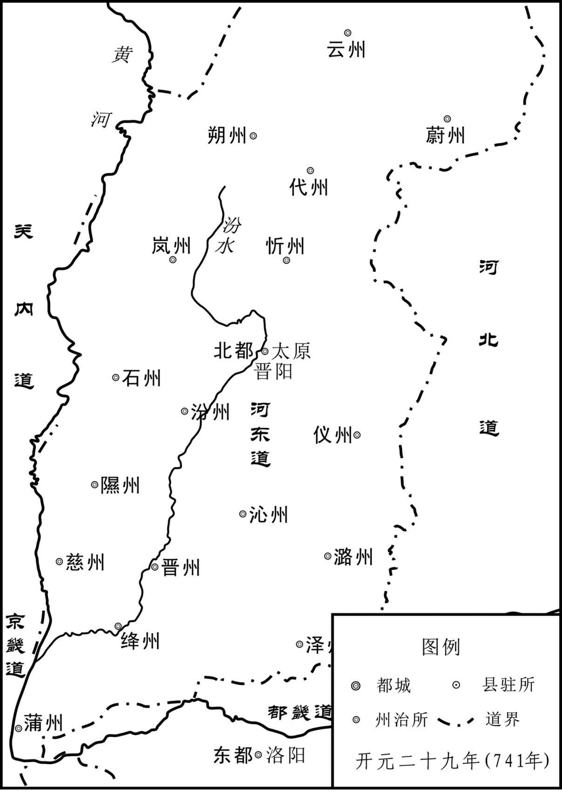 
唐河东地区示意图

唐平定河东刘武周的战争进一步加速了统一全国的步伐。

## 【原文】

**隋恭帝义宁元年[1]。马邑太守王仁恭，多受货赂，不能振施[2]。郡人刘武周，骁勇，喜任侠，为鹰扬府校尉[3]。仁恭以其土豪，甚亲厚之，令帅亲兵屯下[4]。武周与仁恭侍儿私通，恐事泄，谋作乱[5]。先宣言曰：“今百姓饥馑，僵尸满道，王府君闭仓不赈恤，岂为民父母之意乎[6]？”众皆愤怒。武周称疾卧家，豪杰来候问，武周椎牛纵酒，因大言曰：“壮士岂能坐待沟壑[7]！今仓粟烂积，谁敢与我共取之[8]？”豪杰皆许诺[9]。春二月己丑，仁恭坐听事，武周上谒，其党张万岁等随入，升阶斩仁恭，持其首出徇，郡中无敢动者[10]。于是开仓以赈饥民[11]。驰檄境内属城，皆下之，收兵得万余人，武周自称太守，遣使附于突厥[12]。**

## 【注文】

[1]义宁元年：义宁，隋恭帝杨侑的年号。义宁元年，即公元617年。

[2]马邑：地名，今山西朔州东北。　　太守：官名，是中国古代对郡守的尊称，掌管州郡一切事务。　　王仁恭（558—617年）：字元实，天水（今甘肃天水）人，隋朝大将。曾多次追随杨素征战，以军功闻名。早年质朴正直，刚毅谨慎，深得隋文帝、隋炀帝的信任和喜爱。位至大将军，历任骠骑将军、刺史、太守等职。后在马邑太守任上，恰逢饥荒，王仁恭因为坚闭粮仓，不赈济灾民，加上收受贿赂，民怨很大，被部将刘武周煽动部下杀害。王仁恭在世时，多次抗击突厥入侵，获得胜利，颇有战功。　　货赂：财货贿赂。　　振施：积粟赈济百姓。

[3]刘武周（？—622年）：祖籍河间景城（今河北交河东北），迁居马邑（今山西朔州）。在隋末群雄竞起的纷乱形势中，刘武周率先起兵，依附突厥，图谋帝业，进而占据了有充足食粮和库绢的晋阳，攻陷河东大部地区，威逼关中。后在与唐军的交战中失败，投奔突厥，被突厥杀死。　　骁勇：骁壮勇敢。　　任：以……为己任。　　侠：侠义。　　鹰扬府：官署名，隋开皇中置骠骑将军府，每府置骠骑将军、车骑将军。隋大业三年（607年），改骠骑府为鹰扬府。改二将军为鹰扬郎将、鹰扬副郎将，于各卫统领府兵。唐代改称折冲府，其主官改称折冲都尉﹑果毅都尉。府是隋朝的军队编制，相当于现在的军区，而每一个卫府之下都有一个鹰扬府。　　校尉：中国历史上重要的武官官职。校，军事编制单位。尉，军官。校尉为部队长之意。战国末已有此官。秦朝为中级军官。汉朝时达到鼎盛时期，其地位仅次于各将军。魏、晋、南朝及北朝魏、齐均置，属领军将军；北齐时属左、右卫府。隋唐时期为武散官低品官号。

[4]土豪：当地的豪杰。　　屯：驻守。

[5]侍儿：侍妾。

[6]饥馑（jǐn）：是饥荒的书面用法。　　赈恤（zhèn xù）：赈济抚恤。

[7]称：假称。　　椎（chuí）：敲打，用椎打击。　　纵酒：开怀畅饮。　　因：借机。

[8]烂：腐烂。

[9]许诺：答应承诺。

[10]上谒（yè）：谓通名进见尊长。　　张万岁：隋末唐初割据者刘武周部下将领。　　徇（xùn）：徇示众人。

[11]以：表示目的。　　赈：救济。

[12]驰檄（xí）：迅速传递檄文。　　突厥：突厥汗国是6世纪中叶崛起于漠北的由突厥人建立的以游牧为主的部落联盟国家。583年分裂为东突厥和西突厥，其中东突厥可汗汗室为原统一突厥可汗正支嫡系之后，故东突厥仍经常被直呼为“突厥”。638年、659年，东西突厥先后统一于唐。

## 【译文】

隋恭帝杨侑义宁元年（617年）。马邑太守王仁恭接受了很多贿赂财货，但不肯把仓中的积粟赈济百姓。郡中人刘武周骁壮勇敢，喜欢以侠义自任，担任鹰扬府校尉。王仁恭因为他是当地的豪杰，对他十分亲近，让他率领亲信士兵守卫太守府侧门。刘武周与王仁恭的侍女私通，恐怕事情败露，便阴谋作乱。先公开说：“如今老百姓闹饥荒，饿僵的尸体满道都是，王府君却关闭粮仓，不赈济抚恤，这哪里是为民父母应该做的？”众人都很愤怒。刘武周假称有病躺在家里，豪杰壮士都来问候他，他杀牛置酒大摆宴席，借机大声说：“壮士怎能坐着等待填尸沟壑！如今仓中粮食堆积着腐烂了，谁能和我一齐去取？”豪杰壮士都答应了。春二月己丑（初八日），王仁恭升堂理事，刘武周上前拜谒，他的党羽张万岁等人跟随进去，走上台阶，杀死王仁恭，拿着他的首级出来示众，郡中没有人敢动。于是打开粮仓，赈济饥民，又发布檄文告知境内所属各城，各城人都归附刘武周，共收得兵士一万多人，刘武周自称太守，派使者到突厥表示归附。

## 【原文】

**雁门郡丞河东陈孝意与虎贲郎将王智辩共讨刘武周，围其桑干镇[1]。壬寅，武周与突厥合兵击智辩，杀之，孝意奔还雁门。三月丁卯，武周袭破楼烦郡，进取汾阳宫，获隋宫人以赂突厥始毕可汗[2]。始毕以马报之，兵势益振[3]。又攻陷定襄[4]。突厥立武周为定杨可汗，遗以狼头纛[5]。武周即皇帝位，立妻沮氏为皇后，改元天兴[6]。以卫士杨伏念为尚书左仆射，妹婿同县苑君璋为内史令[7]。武周引兵围雁门，陈孝意悉力拒守，乘间出击武周，屡破之[8]。既而外无救援，遣间使诣江都，皆不报[9]。孝意誓以必死，旦暮向诏敕库俯伏流涕，悲动左右[10]。围城百余日，食尽，校尉张伦杀孝意以降[11]。**

## 【注文】

[1]雁门：位于今山西代县。东至平型关、紫荆关、倒马关，直抵幽燕，连接瀚海；西去轩岗口、宁武关、偏头关，至黄河边。　　郡丞：官名，郡守的佐官。秦初置，汉朝时，郡守下设丞及长史，都丞为太守的佐官，秩六百石（太守秩二千石）。都尉下也设丞，历代沿置。东晋成帝咸康七年（341年），省诸郡丞。南朝宋文帝元嘉四年（427年）又置。北朝各郡也都设丞。隋文帝废郡级行政区划，郡丞随之而废。炀帝改州为郡，置赞治，实际上是郡丞，后又复原名。唐高祖武德元年（618年），改郡守为“州刺史”，下设“别驾”“长史”等官，不设“丞”。　　河东：古地区名，战国、秦、汉时指今山西西南部，唐以后泛指今山西全省。因黄河自北而南流经本区西界，故有河东之称。　　陈孝意（？—617年）：隋河东（今山西永济）人，隋大业十二年（616年），隋炀帝巡幸江都，随即中原大乱。次年，马邑（今山西朔州）鹰扬府校尉刘武周杀太守王仁恭举兵反隋，陈孝意闻讯后与武贲郎将王智辩一起讨伐刘武周，与刘武周战于下馆城，但因众寡悬殊被刘武周击败。不久，刘武周引兵攻打雁门，城中粮尽，无力抵抗，雁门校尉张伦暗杀陈孝意，以城投降刘武周。　　虎贲郎将：武官名，即虎贲中郎将。公元3年前后置，统领虎贲禁兵，主宿卫，秩比二千石，隶属光禄勋。东汉沿袭。汉光武帝、明帝时常以侍中兼领之，其后多以贵戚充任，或领兵出征。下属有左右仆射、左右陛长各一人。三国魏、蜀、吴沿袭。东晋废置。南朝宋武帝复置，属领军。齐、梁、陈及北魏、北齐沿置。西晋时领有营兵，东晋后无营兵，只为侍从武官。北齐时属左右卫府，员十五人。唐时避讳，或称武贲郎将，统领虎贲禁兵，主宿卫。　　王智辩：隋朝末年朝廷大将，参与讨伐刘武周的战争。　　桑干镇：地名，位于今山西代县西南部。

[2]楼烦郡：隋大业四年（608年）置，治所在静乐，今山西静乐。　　汾阳宫：隋炀帝时建，在今山西宁武西南五十里管涔山上。　　始毕可汗（？—619年）：姓阿史那，名咄吉世（或咄吉），启民可汗之子，在公元609年至619年间为东突厥可汗。隋大业十一年（615年），隋臣裴矩设计诱杀始毕可汗宠臣史蜀胡悉，始毕率领数十万骑兵南下。隋炀帝在雁门被突厥军包围，派人向始毕之妻、隋义成公主求救，公主遣使告知始毕北边有急，加上隋朝援军相继抵达，始毕在九月撤围而去。始毕可汗在公元619年去世，其弟俟利发设继位，是为处罗可汗。阿史那社尔是他儿子。

[3]以：用。　　振：强大。

[4]定襄：地名，今山西忻州定襄。

[5]狼头纛（dào）：用狼头作标志的大旗。

[6]即：登基。　　妻：妻子，配偶。　　天兴：刘武周的年号，历时四年。

[7]以：任命。　　杨伏念：隋末唐初割据者刘武周部下卫士，后在其政权内任尚书左仆射。　　尚书左仆射（pú yè）：官名。秦始置，为少府属官，帮助尚书令管理少府档案和文书，是很低阶的官员。汉成帝建始四年（前29年），置尚书五人，其中一人为仆射，位仅次尚书令，职权渐重。汉献帝时分设左、右仆射，历代沿置。魏、晋后，尚书令、尚书仆射号为“朝端”“朝右”，居副相之位，成为贵官。唐初，因尚书令曾为李世民所任，其后避讳而不置，以仆射为尚书省长官，即为宰相。　　妹婿：妹夫。　　苑君璋：生卒年不详，朔州马邑（今山西朔州）人。出身豪族。隋大业十三年（617年），刘武周起事，以苑君璋为内史令。苑君璋劝刘武周依附突厥，刘武周不听。刘武周死后，苑君璋率余众依附突厥，为大行台。贞观初年（627年），降唐，任安州都督，封芮国公。　　内史令：官名。隋文帝改中书省为内史省，置内史监﹑令各一员。隋炀帝改为内书省。唐高祖武德初复为内史省，后改为中书省，也用以称中书省的官员。掌著作简册、策命及爵禄废置。

[8]屡：多次。　　破：攻破。

[9]既而：不久。　　江都：地名，今江苏扬州。

[10]旦暮：日夜。　　诏敕：帝王的命令。　　伏：跪拜。　　流涕：哭啼。

[11]校尉：中国历史上重要的武官官职。校，军事编制单位。尉，军官。

## 【译文】

雁门郡丞河东人陈孝意与虎贲郎将王智辩一起讨伐刘武周，包围了刘武周的桑干镇。义宁元年（617年）二月壬寅（二十一日），刘武周与突厥合兵攻打王智辩军，杀死了王智辩，陈孝意逃奔回雁门。三月丁卯（十七日），刘武周袭击并攻下楼烦郡，进兵攻取汾阳宫，获得隋朝的宫女，贿赂给突厥始毕可汗。始毕以马回报他，刘武周的兵势更加壮大。又攻陷定襄郡。突厥立刘武周为定杨可汗，送给他狼头大旗。刘武周继承皇帝位，立妻子沮氏为皇后，改年号为天兴。任命卫士杨伏念为尚书左仆射，任命他的妹夫同县人苑君璋为内史令。刘武周率兵围攻雁门，陈孝意全力拒守，乘机出击，屡屡打败刘武周军。不久因为外面没有援兵，派使者秘密到江都告急，但都没有回报。陈孝意发誓死守雁门，日夜向存放诏敕的库房跪拜哭泣，他的悲伤感动了左右的人。围城一百多天后，粮食吃尽了，校尉张伦杀了陈孝意举城投降了刘武周。

## 【原文】

**唐高祖武德二年春三月辛卯，刘武周寇并州[1]。**

## 【注文】

[1]寇：侵犯。　　并州：地名，今山西永济西南蒲州镇。

## 【译文】

唐高祖武德二年（619年）春三月辛卯（二十二日），刘武周侵犯并州。

## 【原文】

**夏四月，刘武周引突厥之众，军于黄蛇岭，兵锋甚盛[1]。齐王元吉使车骑将军张达以步卒百人尝寇，达辞以兵少，不可往，元吉强遣之，至则俱没[2]。达忿恨，庚子，引武周袭榆次，陷之[3]。丙辰，刘武周围并州，齐王元吉拒却之。戊午，诏太常卿李仲文将兵救并州[4]。五月丙戌，刘武周陷平遥[5]。**

## 【注文】

[1]黄蛇岭：地名，在今山西榆次北。

[2]齐王元吉（603—626年）：李元吉，唐高祖李渊第四子。高祖太原起兵时，留守太原。唐朝建立后，封为齐王。武德二年（619年），刘武周南侵并州，他弃太原归长安。后与长兄建成合谋杀李世民。武德九年（626年）六月初四，李世民发动“玄武门之变”，与太子李建成同时遇害，有五子一同被诛杀。　　车骑将军：官名，汉置，掌领车骑士。东汉时位在大将军、骠骑将军下，秩万石。魏晋南北朝多沿置，隋车骑将军属骠骑府，唐废。　　张达：唐朝初年朝廷大将，任车骑将军。　　步卒：步兵。　　寇：敌人。

[3]榆次：地名，今山西榆次。

[4]太常卿：官名，汉有太常，至南朝梁陈与北魏始称太常卿，北齐称太常寺卿，为太常寺的长官。历代沿置。唐制，太常寺卿一人，正三品。朝廷举行大礼时由太常寺卿赞引；皇帝派官摄行祭祀时，为亚献官；三公巡行园陵时，由其陪同。大祭祀前视察牺牲与器物是否洁净。　　李仲文：唐朝初年朝廷大将，任太常卿。

[5]平遥：地名，今山西平遥。

## 【译文】

唐高祖武德二年（619年）夏四月，刘武周带着突厥的人马，驻军黄蛇岭，兵威十分强盛。齐王李元吉派车骑将军张达以一百名步兵尝试着抵御敌人，张达因为兵少而推辞，李元吉强行派遣，结果全部覆没。张达心中气恨，庚子（初二日），带着刘武周偷袭榆次，攻陷榆次城。丙辰（十八日），刘武周围攻并州，齐王李元吉出兵抵抗。戊午（二十日），唐下诏命太常卿李仲文带兵援救并州。五月丙戌（十九日），刘武周攻陷平遥。

## 【原文】

**初，易州贼帅宋金刚有众万余，与魏刀儿连结[1]。刀儿为窦建德所灭，金刚救之，战败，帅众四千西奔刘武周[2]。武周闻其善用兵，得之甚喜，号曰宋王，委以军事，中分家赀以遗之[3]。金刚亦深自结，出其故妻，纳武周之妹[4]。因说武周图晋阳，南向争天下[5]。武周以金刚为西南道大行台，使将兵二万寇并州[6]。丁未，武周进逼介州，沙门道澄以佛幡缒之入城，遂陷介州[7]。诏左武卫大将军姜宝谊、行军总管李仲文击之[8]。武周将黄子英往来雀鼠谷，数以轻兵挑战，兵才接，子英阳不胜而走，如是再三，宝谊、仲文悉众逐之，伏兵发，唐兵大败，宝谊、仲文皆为所虏[9]。既而俱逃归，上复使二人将兵击武周[10]。上以刘武周入寇为忧，右仆射裴寂请自行[11]。癸亥，以寂为晋州道行军总管，讨刘武周，听以便宜从事[12]。**

## 【注文】

[1]易州：地名，今河北易县。　　宋金刚（？—620年）：隋朝末期农民起义军首领。上谷（现河北易县）人。先在上谷地区聚众反叛，之后，跟随山西的刘武周，南下与李世民交战，战败后逃亡到突厥，后被杀。　　魏刀儿（？—618年）：隋末河北农民起义军首领。公元615年与上谷（今河北易县）人王须拔同时起义，自称“历山飞”。遣将率军攻太原（今山西太原），杀隋将潘长文。王须拔死，余众归他统率，后据深泽（今河北深泽县），活动于冀、定二州之间，称魏帝。唐高祖武德元年（618年），窦建德假装与他联合，他麻痹无备，为窦建德所袭击，部将将他执送窦建德，被杀。

[2]奔：投奔，投靠。

[3]闻：听说。　　赀（zī）：财产。

[4]故妻：结发妻子。　　纳：娶。

[5]晋阳：地名，在今山西太原西南古城营。

[6]行台：魏晋始有，为出征时随其所驻地设立的代表中央的政务机构，北朝后期，称尚书大行台，设置官属无异于中央，自成行政系统。唐贞观以后渐废。

[7]介州：地名，今山西介休。　　沙门：和尚。　　道澄：隋末唐初沙门。　　缒（zhuì）：用绳索拴住人或物从上往下放。

[8]姜宝谊：生卒年不详，跟从唐高祖太原起兵，授左统军，攻下西河、霍邑后，授爵为永安县公，之后任右武卫大将军，后被宋金刚所杀。追赠左卫大将军、幽州总管，谥号为刚。　　总管：古代官名，为地方高级军政长官、军事长官或管理专门事务的行政长官。

[9]黄子英：隋末唐初割据者刘武周部下将领。　　往来：来回游击。　　雀鼠谷：在今山西介休西南、霍州以北的汾河河谷。　　阳：假装。　　发：攻打。

[10]逃归：逃回来。

[11]右仆射：官名。秦始置，汉以后沿袭。汉成帝建始四年（前29年），初置尚书五人，一人为仆射，地位仅次于尚书令，职权渐重。汉献帝建安四年（199年），置左、右仆射。唐宋左、右仆射都是宰相之职。　　裴寂（570—632年）：唐初大臣。蒲州桑泉（今山西临猗西南）人。隋末任晋阳宫副监。与李渊交谊深厚，为李渊太原起兵策划者之一。后李渊进兵至长安（今陕西西安），他又支持李渊称帝。唐建国后，他任尚书仆射，最为李渊所宠信。

[12]从事：处置；办事，处理事务。

## 【译文】

起初，易州起义首领宋金刚有人马一万多人，与魏刀儿联合。魏刀儿被窦建德消灭后，宋金刚前往援救，战败后，率领四千人马向西投奔了刘武周。刘武周听说他很会用兵，得到他十分高兴，称他为宋王，把军事委托给他，并把自己的家资分给他一半。宋金刚也想深结刘武周，休了自己的结发妻子，娶了武周的妹妹。他劝刘武周图取晋阳，向南发展，争夺天下。刘武周任命宋金刚为西南道大行台，派他率兵二万入侵并州。武德二年（619年）六月丁未（初十日），刘武周进兵逼近介州，和尚道澄用佛幡当绳索引他们入城中，于是攻陷介州。唐下诏命左武卫大将军姜宝谊、行军总管李仲文前去攻打，刘武周的战将黄子英在雀鼠谷往来游击，多次用少数兵力挑战，两军才交接，黄子英假装不能取胜转身便跑，几次三番这样，姜宝谊、李仲文出动全部兵力追逐，遭伏兵攻杀，唐兵大败，姜宝谊和李仲文都被黄子英俘虏。不久两人又都逃了回来，高祖李渊再次派他们二人率兵攻打刘武周。高祖李渊对刘武周的侵扰十分担心，右仆射裴寂请求亲自御敌。癸亥（二十六日），任命裴寂为晋州道行军总管，讨伐刘武周，让他根据情况，自行决定进退。

## 【原文】

**秋七月辛卯，宋金刚寇浩州，浃旬而退[1]。九月，裴寂至介休，宋金刚据城拒之[2]。寂军于度索原，营中饮涧水，金刚绝之，士卒渴乏[3]。寂欲移营就水，金刚纵兵击之，寂军遂溃，失亡略尽[4]。寂一日一夜驰至晋州[5]。先是，刘武周屡遣兵攻西河，浩州刺史刘赡拒之，李仲文引兵就之，与共守西河[6]。及裴寂败，自晋州以北城镇俱没，唯西河独存[7]。姜宝谊复为金刚所虏，谋逃归，金刚杀之。裴寂上表谢罪，上慰谕之，复使镇抚河东[8]。**

## 【注文】

[1]浩州：州名，治所在今山西汾阳，辖境相当于今山西汾阳、孝义、平遥等市县地。　　浃（jiā）旬：一旬，十天。

[2]拒：防守。

[3]度索原：地名，今山西介休东南介山下。　　涧水：在今山西洪洞南。

[4]溃：溃散。　　略：几乎。

[5]驰：骑马。　　晋州：地名，今山西临汾。

[6]西河：地名，今河北赤城西。　　刺史：官名。是中国古代州一级地方长官。始置于秦汉，秦时名监御使，汉武帝时改称刺史，掌管地方检查。汉成帝时，改称牧，汉哀帝时复为刺史。东汉末，天下渐乱，刺史权重，成为地方军政长官，后世沿置。隋唐因袭。　　刘赡：唐朝初年浩州刺史。

[7]唯：只有。　　独存：独自存在。

[8]上表：向皇帝上奏。　　谢罪：请罪。　　镇抚：镇守安抚。

## 【译文】

唐高祖武德二年（619年）秋七月辛卯（二十五日），宋金刚侵扰浩州，十天后才退兵。九月，裴寂到介休，宋金刚举城抵抗。裴寂驻军在度索原，营中饮用山涧中的水，宋金刚断绝水源，士兵都干渴疲乏。裴寂想迁移军营到有水的地方，宋金刚乘机攻击，裴寂的军队于是溃散，几乎全部丢失逃亡。裴寂一天一夜飞马逃回晋州。起先，刘武周多次派兵攻打西河，浩州刺史刘赡出兵抵御，李仲文领兵到那里，与刘赡共同守卫西河。等到裴寂失败，自晋州以北的城镇全部丢失，只有西河仍为唐所有。姜宝谊又被宋金刚俘虏，谋划逃回，宋金刚把他杀了。裴寂上表请罪，高祖安慰他，再次派他镇守安抚河东。

## 【原文】

**刘武周进逼并州[1]。齐王元吉绐其司马刘德威曰：“卿以老弱守城，吾以强兵出战[2]。”辛巳，元吉夜出兵，携其妻妾弃州奔还长安[3]。元吉始去，武周兵已至城下，晋阳土豪薛深以城纳武周[4]。上闻之大怒，谓礼部尚书李纲曰：“元吉幼弱，未习时事，故遣窦诞、宇文歆辅之[5]。晋阳强兵数万，食支十年，兴王之基，一旦弃之[6]！闻宇文歆首画此策，我当斩之[7]。”纲曰：“王年少骄逸，窦诞曾无规谏，又掩覆之，使士民愤怨[8]。今日之败，诞之罪也[9]。歆谏，王不悛，寻皆闻奏，乃忠臣也，岂可杀哉[10]。”明日，上召纲入，升御座，曰：“我得公，遂无滥刑[11]。元吉自为不善，非二人所能禁也。”并诞赦之。卫尉少卿刘政会在太原，为武周所虏，政会密遣人奉表论武周形势[12]。**

## 【注文】

[1]进：侵入。　　逼：逼近。

[2]绐（dài）：欺骗。　　司马：中国历史上职官名，其执掌事务不一，但多为幕僚性质的官员。部下属官的通称。　　刘德威（581—652年）：徐州彭城（今江苏徐州）人，唐代将领。大业末年，随裴仁基镇压江淮起义军。后来与裴仁基一起归顺李密。武德元年（618年），李密在与王世充交战中兵败，刘德威率部随李密归降唐朝，授左武候将军，封滕县公。后刘德威任并州总管府司马，被刘武周虏获，不久逃归，并向高祖报告敌军虚实，改封彭城县公，检校大理少卿。武德四年（621年），刘德威随秦王李世民平定洛阳，转刑部侍郎，加散骑常侍。贞观年间，刘德威历任大理卿、刑部尚书等职，以廉洁平直闻名。永徽三年（652年）去世，赠礼部尚书、幽州都督，谥曰襄，陪葬献陵。

[3]携：带着。　　长安：地名。即今陕西西安，隋唐都城。

[4]始：刚刚。　　薛深：隋末唐初晋阳土豪。　　纳：接受。

[5]礼部尚书：官名。主管朝廷中的礼仪、祭祀、宴餐、学校、科举和外事活动的大臣。　　李纲（547—631年）：字文纪，初名李瑗，观州蓨（今河北景县）人。隋唐名臣，当过隋唐两朝三个太子的师傅，李渊建唐称帝后，拜李纲为礼部尚书，兼太子詹事。后因李建成日渐骄纵，李纲愤而辞职。李世民即位后，李纲又出山担任李承乾的老师。　　习：熟悉。　　窦诞（581—648年）：隋唐时期大臣。隋仁寿中，担任朝请郎。义宁初年，为丞相府祭酒，后转为殿中监，被封为安丰郡公，娶高祖女襄阳公主。跟从唐太宗讨伐薛举，为元帅府司马。贞观初年，为右领军大将军。死后追赠工部尚书、荆州刺史，谥号为安。　　宇文歆：唐朝初年朝廷大臣，负责辅佐齐王李元吉。

[6]一旦：有朝一日。

[7]画：想出。　　策：计划。

[8]骄逸：骄傲放肆。　　规谏：规劝谏阻。　　士民：士大夫和普通人的并称，泛指人民。　　愤怨：愤怒怨恨。

[9]罪：罪过。

[10]谏：谏阻。　　悛（quān）：悔改。　　寻：马上。

[11]公：对人的尊称。

[12]卫尉少卿：中国古代官署。北齐设立卫尉寺，卫尉改称卫尉寺卿或卫尉卿，副官称卫尉少卿，掌管仪仗帐幕，一直延续到南宋被并入工部。　　刘政会（？—635年）：滑州胙城（今河南滑县）人，唐朝大臣，凌烟阁二十四功臣之一。北齐中书侍郎刘环隽之孙。隋时为太原鹰扬府司马，后率兵投靠李渊麾下，被派至太原告发王威、高君雅谋反。武德初年，留守太原，经营后方。刘武周进攻太原时被俘，忠心不屈，后获救。历任刑部尚书、光禄卿、洪州都督等职，封邢国公。贞观九年（635年），病故，赠民部尚书，谥曰襄，追改渝国公。

## 【译文】

刘武周进逼并州。齐王李元吉欺骗他的司马刘德威说：“你带着老弱守城，我带强兵出战。”武德二年（619年）七月辛巳（十六日），李元吉夜里出兵，带着他的妻妾老小丢弃并州逃回长安。李元吉刚离去，刘武周的军队就已经到达城下，晋阳当地的豪强薛深开城放进刘武周。高祖李渊听说后大怒，对礼部尚书李纲说：“元吉幼小懦弱，不熟悉时事，所以派窦诞和宇文歆辅助他。晋阳有强兵几万，粮食可以支持十年，是振兴王业的基础，竟然一下就放弃了！听说宇文歆首先想出这样的计划，我一定要斩了他。”李纲说：“齐王年少，骄傲放肆，窦诞一点也不规劝谏阻，反而替他掩饰，使百姓们都愤怒，今日的失败，是窦诞的罪过。宇文歆劝谏，齐王不改，所以才把情况上奏朝廷，这是忠臣，怎么能杀他呢？”第二天，高祖李渊召李纲上殿，登上御座，说：“我有了你，才避免了滥用刑罚。元吉自己做了不应当做的事，并不是窦诞、宇文歆二人能够禁止的。”于是，连同窦诞一齐赦免了。卫尉少卿刘政会在太原被刘武周俘虏，刘政会秘密派人上表论述刘武周的情况。

## 【原文】

**武周据太原，遣宋金刚攻晋州，拔之，虏右骁卫大将军刘弘基[1]。弘基逃归，金刚进逼绛州，陷龙门[2]。**

## 【注文】

[1]右骁卫大将军：唐朝官制武官名，正三品，为皇帝护卫部队的统领。　　刘弘基（582—650年）：唐代名将，以父荫为右勋侍。大业末年，为避免从征高句丽，故意私宰耕牛，被关进监狱。后投奔太原，追随李渊父子，随高祖起兵，引兵先渡河，入长安，破卫文升，以功授右骁卫大将军。讨伐薛举时，力战被擒，不屈。至薛仁果平，才回归长安。玄武门之变拥立有功，贞观年间授卫尉卿，封夔国公。贞观十八年（644年），随征高句丽，为前军大总管，力战有功。永徽元年（650年），病死，赠开府仪同三司，谥曰襄，陪葬昭陵。

[2]绛州：地名，今山西闻喜东北。　　龙门：地名，今山西河津西北。

## 【译文】

刘武周占据太原，派宋金刚攻晋州，攻下城后，俘虏了右骁卫大将军刘弘基。刘弘基逃回，宋金刚进逼绛州，攻陷龙门。

## 【原文】

**冬十月，刘武周将宋金刚进攻浍州，陷之，军势甚锐[1]。裴寂性怯，无将帅之略，唯发使骆驿，趣虞、泰二州收民入城堡，焚其积聚[2]。民惊扰愁怨，皆思为盗[3]。夏县民吕崇茂聚众自称魏王，以应武周，寂讨之，为所败[4]。诏永安王孝基、工部尚书独孤怀恩、陕州总管于筠、内史侍郎唐俭将兵讨之[5]。**

## 【注文】

[1]浍（kuài）州：地名，今山西翼城。

[2]趣：赶往。　　虞：指虞州，故治在山西运城安邑镇。　　泰：指泰州，故治在今山西永济。

[3]愁怨：忧愁怨恨。

[4]夏县：因夏朝在此建都而得名，号称“华夏第一都”。位于山西南部、运城东北。　　吕崇茂（？—620年）：隋末起义军首领之一，夏县人。武德二年（619年），聚众自称魏王起事，唐高祖李渊下诏讨伐，吕崇茂向刘武周大将宋金刚求援，宋金刚派遣尉迟敬德、寻相带兵救援。次年，唐再攻吕崇茂。尉迟敬德带兵帮吕崇茂守卫夏县，唐高祖暗中派人赦免吕崇茂之罪，拜他为夏州刺史，让他除掉尉迟敬德。事泄，尉迟敬德杀死吕崇茂。

[5]孝基（？—620年）：李孝基，唐高祖李渊从父弟。武德元年（618年）封为永安王，历任陕州总管、鸿胪卿，参与讨伐吕崇茂，后为刘武周所害，赠左卫大将军，谥曰壮。　　工部尚书：官名，掌管全国屯田、水利、土木、工程、交通运输、官办工业等的大臣。　　独孤怀恩（？—620年）：唐时为鄠县令，后擢拜为工部尚书。武德三年（620年），奉命攻打蒲坂，久攻不克，受到李渊责备，于是心生怨气，谋划反叛。事情败露，被捉伏诛。　　陕州：地名，在今河南三门峡市陕州区。　　于筠：生平事迹不详，活动于唐初。　　内史侍郎：隋初由中书侍郎改置，为中书省长官中书监、中书令之副职。中书令在汉朝开始设置，郎称为中书郎，魏由通事郎改置，晋朝加“侍”，正式称为中书侍郎，东晋又曾一度改为通事郎，其中一人职掌诏命。南北朝时，设置四人。隋初为内史侍郎，隋炀帝杨广时，员额由四人减为二人，又称内书侍郎，当内史令空缺时，内史侍郎开始参与朝政。唐初为内史侍郎，武德三年（620年），复称中书侍郎。唐高宗李治时曾改西台侍郎。武则天时曾改凤阁侍郎，唐玄宗李隆基时曾改紫微侍郎。唐中书令缺，侍郎即为长官，品级亦高于前代（南朝末为五品，隋正四品，唐正三品）。以后，同中书门下平章事成为最高的宰相，常常以门下侍郎和中书侍郎同平章事为首席宰相。　　唐俭（579—656年）：字茂约，并州晋阳（今山西太原）人。凌烟阁二十四功臣之一。经历三朝五帝。高宗登基后，年事已高的唐俭致仕于家，显庆初年（656年）病故，追赠开府仪同三司、并州都督，谥曰襄，陪葬昭陵。

## 【译文】

唐高祖武德二年（619年）冬十月，刘武周的大将宋金刚攻克浍州，军势更加逼人。裴寂禀性怯懦，没有做将帅的韬略，只是不断地派使者赶往虞、泰二州，催促百姓进入城堡，把积聚的东西全都烧掉。百姓受到惊扰，忧愁怨恨，都想当盗贼。夏县平民吕崇茂聚众自称魏王，来响应刘武周，裴寂去讨伐，被打败。唐下诏命永安王李孝基、工部尚书独孤怀恩、陕州总管于筠、内史侍郎唐俭率兵讨伐吕崇茂。

## 【原文】

**时王行本犹据蒲反未下，亦与武周相应，关中震骇[1]。上出手敕曰：“贼势如此，难与争锋，宜弃大河以东，谨守关西而已[2]。”秦王世民上表曰：“太原，王业所基，国之根本，河东殷实，京邑所资[3]。若举而弃之，臣窃愤恨[4]。愿假臣精兵三万，必冀平殄武周，克复汾、晋[5]。”上于是悉发关中兵以益世民所统，使击武周[6]。乙卯，幸华阴，至长春宫以送之[7]。十一月己卯，武周寇浩州。**

## 【注文】

[1]王行本（？—620年）：隋末武将，隋朝河东通守尧君素的部将。尧君素坚守河东郡抗唐，最后被部下杀害，河东郡落入唐军之手。随即王行本又杀哗变将领，继续固守。刘武周南下，王行本依附刘武周。公元620年初，面对唐军猛烈的攻势和部将的反叛，王行本投降唐军，被杀。　　蒲反：即蒲坂，地名，今山西永济东。

[2]敕：命令。　　大河：黄河。

[3]王业：帝王的事业。　　殷实：充满，众多。

[4]窃：私自，暗自。　　愤恨：愤怒痛恨。

[5]假：借。　　复：收复。

[6]益：增加。　　使：让。

[7]幸：指封建帝王到达某地。　　华阴：地名，今陕西华阴东南。　　长春宫：在今陕西大荔朝邑镇西北。

## 【译文】

当时，王行本仍然盘踞蒲反没有投降，也与刘武周相呼应，关中震惊。高祖下亲笔手谕说：“贼势如此嚣张，我们很难与他们争锋，应该放弃黄河以东地区，小心守卫关西。”秦王李世民上表说：“太原是王业的基础、国家的根本，河东地区殷实富足，是京城资给的依靠，如果全部放弃，臣内心愤怒怨恨不服。希望给臣精兵三万，一定有希望平灭刘武周，收复汾、晋这些地方。”高祖于是将关中兵力全部交给李世民以增加李世民的兵力，派他攻击刘武周。武德二年（619年）十月乙卯（二十日），高祖来到华阴，到长春宫为李世民送行。十一月己卯（十四日），刘武周进犯浩州。

## 【原文】

**秦王世民引兵自龙门乘冰坚渡河，屯柏壁，与宋金刚相持[1]。时河东州县俘掠之余，未有仓廪，人情恇扰，聚入城堡，征敛无所得，军中乏食[2]。世民发教谕民，民闻世民为帅而来，莫不归附，自近及远，至者日多，然后渐收其粮，军食以充[3]。乃休兵秣马，唯令偏裨乘间抄掠，大军坚壁不战，由是贼势日衰[4]。**

## 【注文】

[1]柏壁：地名，今山西新绛西南柏壁村。　　相持：双方对立、争持，互不相让。

[2]仓廪（lǐn）：贮藏米谷的仓库。　　人情：人心状况。　　恇（kuāng）扰：恐惧慌乱。　　征敛：征收聚集；征收赋税。

[3]谕：晓谕。

[4]休兵：休整军队。　　偏裨（pí）：副将。　　乘间：乘机。　　由是：因此。　　贼势：贼兵的势力。

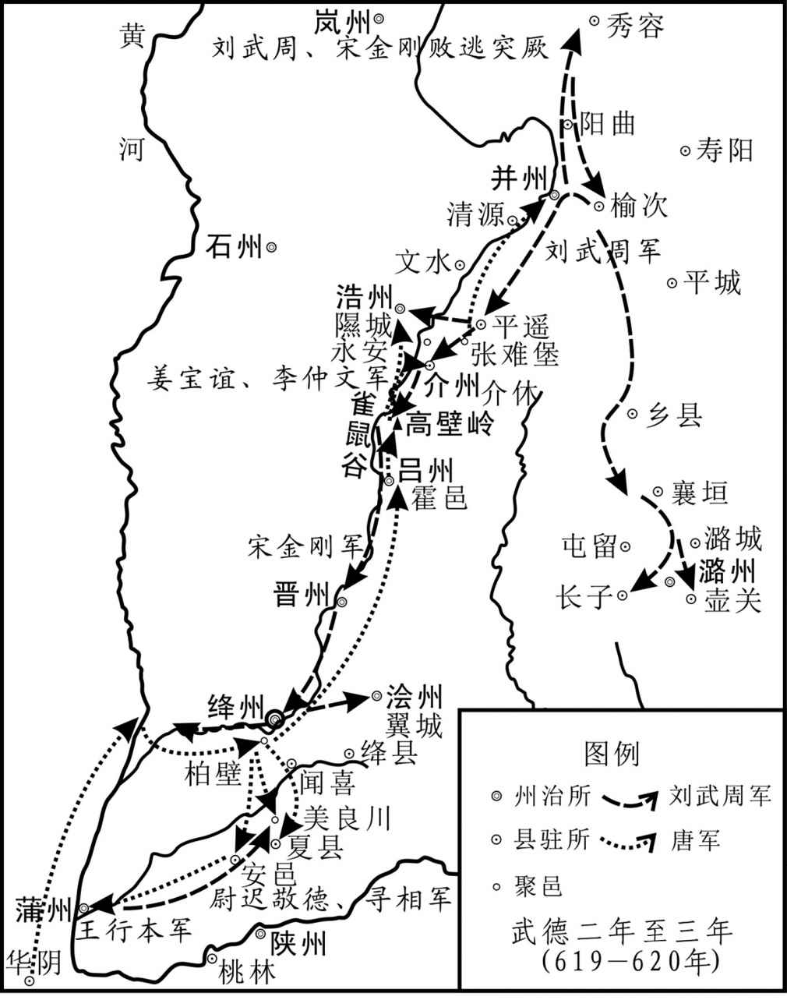 
李世民平定刘武周示意图

## 【译文】

秦王李世民率军从龙门踏着坚冰渡过黄河，屯兵柏壁，与宋金刚相持。当时河东的州县被敌人抄掠之后，没有粮仓，人心慌乱骚动，聚集起来进入城堡，征敛不到东西，军中缺乏粮食。李世民发布命令晓谕百姓，人们听说是李世民统帅来征讨，没有不来归附的，从近至远，来的人一天比一天多，然后逐渐收集他们的粮食，军粮才得以充实。于是休整军队，喂养战马，只让将佐们乘机抄掠敌人，大军坚壁不出战，因此，贼兵的气势一天天衰落下去。

## 【原文】

**世民尝自帅轻骑觇敌，骑皆四散，世民独与一甲士登丘而寝[1]。俄而贼兵四合，初不之觉，会有蛇逐鼠，触甲士之面，甲士惊寤，遽白世民，俱上马[2]。驰百余步，为贼所及，世民以大羽箭射殪其骁将，贼骑乃退[3]。**

## 【注文】

[1]觇（chān）：窥察。

[2]俄而：不一会。　　四合：四面包围。　　惊寤（wù）：受惊动而醒来。　　遽（jù）：匆忙。　　白：告诉。

[3]殪（yì）：动词，死。　　骁将：骁勇的将士。

## 【译文】

李世民曾亲自率领轻骑兵侦察敌情，随从的骑兵都向四方散去，李世民只与一位甲士登上高丘睡觉。不一会敌兵从四面包围过来，起初二人没有发觉，正巧有一条蛇追赶老鼠，碰到甲士的脸上，甲士惊醒，赶紧告诉李世民，二人都上了马。奔驰了一百多步，被敌兵赶上，世民用大羽箭射死敌兵骁将，敌人骑兵才退去。

## 【原文】

**十二月，于筠说永安王孝基急攻吕崇茂，独孤怀恩请先成攻具，然后进，孝基从之[1]。崇茂求救于宋金刚，金刚遣其将善阳尉迟敬德、寻相将兵奄至夏县，孝基表里受敌，军遂大败[2]。孝基、怀恩、筠、唐俭及行军总管刘世让皆为所虏[3]。敬德名恭，以字行。上征裴寂入朝，责其败军，下吏，既而释之，宠待弥厚[4]。**

## 【注文】

[1]具：用具。

[2]善阳：地名，今山西朔州城区。　　尉迟敬德（585—658年）：唐朝名将，鲜卑族，朔州善阳（今山西朔州）人。尉迟恭纯朴忠厚，勇武善战，一生戎马倥偬，征战南北，驰骋疆场，屡立战功。玄武门之变助李世民夺取帝位。封鄂国公，是凌烟阁二十四功臣之一，赠司徒兼并州都督，谥忠武，赐陪葬昭陵。后尉迟恭被尊为民间驱鬼避邪、祈福求安的门神。　　寻相：生平事迹不详，活动于唐初。　　奄：突然。　　表里：里外。

[3]刘世让（？—623年）：唐初将领。字元钦，京兆醴泉（今陕西礼泉北）人。初仕隋，为征仕郎。李渊军入长安后归唐，被授予安州道行军总管，率军拒薛举，为薛举所俘。薛仁果被唐军平灭后得归，历任陕东道行军总管、弘农郡公、检校并州总管等职。后受命经略马邑（今山西朔州东北），防备突厥。突厥惧其威名，使人反间。武德六年（623年），传其与突厥可汗通谋，将行作乱，被高祖冤杀。

[4]征：征召。　　责：追究……责任。　　既而：不久。　　弥：更加。

## 【译文】

唐高祖武德二年（619年）十二月，于筠劝说永安王李孝基急攻吕崇茂，独孤怀恩请求先准备好攻城用具，然后再进兵，李孝基听从了这一建议。吕崇茂向宋金刚求救，金刚派他的战将善阳人尉迟敬德和寻相率兵很快到达夏县，李孝基里外受敌，部队大败。李孝基、独孤怀恩、于筠、唐俭及行军总管刘世让全被俘虏。尉迟敬德名恭，平素只称他的字。高祖李渊征召裴寂入朝，追究他战败的责任，交官吏处罪，不久又释放了他，宠待更加优厚。

## 【原文】

**尉迟敬德、寻相将还浍州，秦王世民遣兵部尚书殷开山、总管秦叔宝等邀之于美良川，大破之，斩首二千余级[1]。顷之，敬德、相潜引精骑援王行本于蒲反，世民自将步骑三千从间道夜趋安邑，邀击，大破之，敬德、相仅以身免，悉俘其众，复归柏壁[2]。诸将咸请与宋金刚战，世民曰：“金刚悬军深入，精兵猛将咸聚于是[3]。武周据太原，倚金刚为扞蔽[4]。金刚军无蓄积，以虏掠为资，利在速战[5]。我闭营养锐，以挫其锋，分兵汾、隰，冲其心腹，彼粮尽计穷，自当遁走，当待此机，未宜速战[6]。”孝基谋逃归，武周杀之[7]。**

## 【注文】

[1]兵部尚书：别称为大司马，统管全国军事的行政长官。　　殷开山（？—622年）：名峤，字开山，京兆鄠县（今陕西西安鄠邑区）人，唐朝名将，凌烟阁二十四功臣之一。隋秘书丞殷僧首之子。仕隋为太谷长。高祖起兵后，召补大将军掾。后为渭北道元帅长史，招抚关中流民群盗，与刘弘基攻破长安，赐爵陈郡公，迁丞相府掾。后随太宗平薛仁果、王世充，拜陕东道行台兵部尚书，进爵郧国公。征刘黑闼时病死军中，赠陕东道大行台右仆射，谥曰节。　　秦叔宝（？—638年）：字叔宝，齐州历城（今山东济南）人。唐初著名大将，勇武威名震慑一时，曾追随唐高祖李渊父子为大唐王朝的稳固南北征战，立下汗马功劳。为凌烟阁二十四功臣之一。民间将他与尉迟恭当作门神。　　美良川：地名，今山西闻喜南。

[2]间道：小路。　　趋：赶往。　　安邑：古都邑名，故址在今山西夏县西北禹王城。

[3]咸：都。　　悬军：孤军。　　聚：聚集。　　于是：在此。

[4]倚：依靠。　　扞蔽：防卫遮蔽。

[5]蓄积：物品的积蓄。

[6]养锐：养精蓄锐。　　汾：指汾州，今山西汾阳。　　隰（xí）：指隰州，今山西平阳。　　遁：逃避，躲闪。　　走：跑。

[7]谋：谋划。　　逃：逃跑。

## 【译文】

尉迟敬德、寻相将要还军浍州，秦王李世民派兵部尚书殷开山、总管秦叔宝等人在美良川截击，大败尉迟敬德，斩首二千余。不久，尉迟敬德、寻相暗中领精锐骑兵到蒲反援救王行本，李世民亲率步兵、骑兵三千从小路乘夜赶往安邑截击，大败敌军，尉迟敬德、寻相仅能够保住性命，他们的人马全被俘虏，李世民又回军柏壁。各位将领都请求与宋金刚交战，李世民说：“宋金刚孤军深入，精兵猛将全集中在此。刘武周占据太原，依靠宋金刚作屏障。宋金刚的部队没有积蓄，以掳掠百姓为资本，速战对他有利。我们关闭营门，养精蓄锐，来挫伤他的锋芒，然后分兵进攻汾、隰二州，冲入他的心腹之地，等他粮食吃尽无计可施的时候，自然会逃跑，应当等待这个机会出战，不宜速战。”李孝基谋划逃归，被刘武周杀死。

## 【原文】

**三年春正月，将军秦武通攻王行本于蒲反[1]。行本出战而败，开门出降[2]。辛巳，斩行本。宋金刚围绛州[3]。二月，刘武周遣兵寇潞州，陷长子、壶关[4]。潞州刺史郭子武不能御，上以将军河东王行敏助之[5]。行敏与子武不叶，或言子武将叛，行敏斩子武以徇[6]。乙巳，武周复遣兵寇潞州，行敏击破之。三月乙丑，刘武周遣其将张万岁寇浩州，李仲文击走之，俘斩数千人[7]。甲申，行军副总管张纶败刘武周于浩州，斩俘千余人[8]。刘武周数攻浩州，为李仲文所败[9]。宋金刚军中食尽，夏四月丁未，金刚北走，秦王世民追之[10]。**

## 【注文】

[1]三年：武德三年，公元620年。　　秦武通：唐朝初年朝廷大将。

[2]而：转折连词。

[3]绛州：地名，今山西运城新绛。

[4]寇：侵略者来侵犯。　　潞州：地名，今山西襄垣。　　长子：地名，今山西长治长子。　　壶关：地名，今山西黎城东北东阳关镇。

[5]郭子武：唐朝初年潞州刺史。　　王行敏：唐朝初年朝廷大将。

[6]不叶：不和。　　徇：警示军中。

[7]俘斩：俘虏和斩杀。

[8]张纶：唐朝初年朝廷大将，任行军副总管。

[9]数：多次。

[10]北走：向北逃走。

## 【译文】

唐高祖武德三年（620年）春正月，唐将军秦武通在蒲反攻打王行本。王行本出战失败，开门投降。辛巳（十七日），斩了王行本。宋金刚围攻绛州。二月，刘武周派兵侵犯潞州，攻陷了长子、壶关。潞州刺史郭子武不能抵抗敌人，高祖派将军河东人王行敏帮助他。王行敏与郭子武不和，有人说郭子武将要叛变，王行敏斩了郭子武以示警诫。乙巳（十一日），刘武周又派兵侵犯潞州，王行敏出兵打败了敌人。三月乙丑（初二日），刘武周派他的战将张万岁侵犯浩州，李仲文打跑了他们，俘虏和斩杀了几千人。甲申（二十一日），行军副总管张纶在浩州打败刘武周，俘虏和斩杀一千多人。刘武周数次攻打浩州，都被李仲文打败。宋金刚军中粮食吃完了，夏四月丁未（十四日），宋金刚向北逃跑，秦王李世民派兵追赶。

## 【原文】

**秦王世民追及寻相于吕州，大破之，乘胜逐北，一昼夜行二百余里，战数十合[1]。至高壁岭，总管刘弘基执辔谏曰：“大王破贼，逐北至此，功亦足矣[2]。深入不已，不爱身乎[3]？且士卒饥疲，宜留壁于此，俟兵粮毕集，然后复进，未晚也[4]。”世民曰：“金刚计穷而走，众心离沮[5]。功难成而易败，机难得而易失，必乘此势取之[6]。若更淹留，使之计立备成，不可复攻矣[7]。吾竭忠徇国，岂顾身乎[8]！”遂策马而进，将士不敢复言饥[9]。追及金刚于雀鼠谷，一日八战，皆破之，俘斩数万人[10]。夜宿于雀鼠谷西原，世民不食二日，不解甲三日矣[11]。军中止有一羊，世民与将士分而食之[12]。丙辰，陕州总管于筠自金刚所逃来[13]。世民引兵趣介休[14]。金刚尚有众二万，戊午，出西门，背城布陈，南北七里[15]。世民遣总管李世等与战，小却，为贼所乘，世民帅精骑击之，出其陈后，金刚大败，斩首三千级[16]。金刚轻骑走，世民追之数十里，至张难堡[17]。浩州行军总管樊伯通、张德政据堡自守，世民免胄示之，堡中喜噪且泣，左右告以王不食，献浊酒、脱粟饭[18]。**

## 【注文】

[1]吕州：地名，今山西霍州。　　数十：几十。

[2]高壁岭：地名，今山西灵石东南二十五里。　　执：拉住。　　辔（pèi）：驾驭牲口的嚼子和缰绳。　　谏：谏阻。

[3]已：止。　　爱：爱惜，珍惜。

[4]且：再说。　　饥疲：饥饿疲劳。　　俟（sì）：等待。

[5]计穷：无计可施。　　而：递进连词，就。　　离沮：离散沮丧。

[6]乘：抓住。　　取：消灭。

[7]淹留：挽留，留住。

[8]顾：顾及珍惜。

[9]遂：于是。

[10]雀鼠谷：北起介休，中经灵石，南至霍州（介休、灵石、霍州均为山西省县市名称），长约70公里，自西而东由大体平行的雀鼠谷谷道、千里径山道和统军川间道等三道组成。雀鼠谷意谓其道路险峻，只有鸟雀、鼠类才能通过。古人为避雀鼠谷畏途——特别是夏秋汛期更加艰险，或为主军重兵设防而客军无法正面驰突时，不得不迂回改取近山山道，遂有“千里径”。“统军川”则是雀鼠谷、千里径都无法驰突时改取的远山间道。

[11]宿：宿营，驻扎。

[12]止：只，仅。

[13]自：从。

[14]引：带领，率领。　　趣：赶往。

[15]尚：还，尚且。

[16]遣：派遣。　　李世（594—669年）：唐初名将，也称李，字懋功（亦作茂公）。唐高祖李渊赐其姓李，后避唐太宗李世民讳改名为李。汉族，曹州离狐（今山东菏泽东南）人，曾破东突厥、高句丽，与李靖并称。后被封为英国公，为凌烟阁二十四功臣之一。李一生历事唐高祖、唐太宗、唐高宗三朝，出将入相，深得朝廷信任和重任，被朝廷倚为长城。　　小：稍微。　　乘：利用。　　陈：阵势。

[17]张难堡：地名，今山西介休东北四十里的张兰镇。

[18]樊伯通、张德政：唐初将领，任浩州行军总管。　　免胄（zhòu）：卸下头盔。　　示：辨认。　　喜噪：欢呼叫喊。

## 【译文】

秦王李世民在吕州追上了寻相，大败敌军，又乘胜追杀，一天一夜行军二百余里，打了几十仗。到了高壁岭，总管刘弘基拉住马缰绳谏阻说：“大王打败敌人，追赶败兵到这里，功劳够大了。再深入不止，难道不爱惜自己的生命吗？再说战士饥饿疲劳，应当停下来驻扎在这里，等军粮集中完毕，然后再前进也并不晚。”李世民说：“宋金刚无计可施才逃跑，他们军心离散沮丧。成功艰难而失败容易，机会难得容易失去，一定要抓住这个机会消灭他。如果再停留迟延，让敌人有时间考虑计策，做好准备，就无法再攻打了。我精忠为国，哪里顾惜自己的生命！”于是又策马前进，将士们也不敢再谈饥饿。到雀鼠谷追上了宋金刚，一天打了八仗，全都打败了敌人，俘虏和斩杀了好几万人。夜里在雀鼠谷西边的平原宿营，李世民两天没有吃东西，三天没有解甲休息。军中只有一只羊，李世民与将士们分了吃。丙辰（二十三日），陕州总管于筠从宋金刚处逃回来。李世民率兵赶往介休。宋金刚还有二万人，戊午（二十五日），从西门出来，背着城列成阵势，南北拉开七里长的战场。李世民派总管李世等人与宋金刚交战，稍微有些退却，就被宋金刚利用来反攻，李世民率领精锐骑兵出击，从敌阵后面出来，宋金刚大败，被斩首三千多人。宋金刚轻骑逃跑，李世民追了几十里，到张难堡。唐浩州行军总管樊伯通、张德政占据堡垒防守，李世民卸下头盔让他们辨认，堡中的人欢声呼叫，有人竟哭了起来，左右的人告诉他们说秦王还没有吃饭，于是献上浊酒和糙米饭。

## 【原文】

**尉迟敬德收余众守介休，世民遣任城王道宗、宇文士及往谕之，敬德与寻相举介休及永安降[1]。世民得敬德甚喜，以为右一府统军，使将其旧众八千，与诸营相参[2]。屈突通虑其变，骤以为言，世民不听[3]。**

## 【注文】

[1]道宗（600—653年）：即李道宗，为唐高祖李渊的堂侄。唐武德元年（618年）五月，李渊在长安称帝，建立唐朝。李道宗的父亲李韶，被追封东平王，赠户部尚书。李道宗则封为略阳郡公，起家左千牛备身。唐永徽四年（653年），房遗爱伏诛，长孙无忌、褚遂良素与道宗不和，上言道宗与遗爱交结，配流象州。道病卒。　　宇文士及（？—642年）：字仁人，隋朝右卫大将军宇文述子，宇文化及弟，京兆长安（今陕西西安）人。隋文帝诏娶隋炀帝女南阳公主，被封为尚辇奉御。宇文化及兵败后，投靠唐朝，随秦王李世民征讨王世充、窦建德有功，封新城县公、郢国公，唐高祖又以宗室女妻之。后很受宠爱，历任中书令、殿中监。贞观十六年（642年）卒，赠左卫大将军、凉州都督，陪葬昭陵。

[2]相参：掺杂在一起。

[3]屈突通（557—628年）：隋唐时期名将，凌烟阁二十四功臣之一，北周邛州刺史屈突长卿之子。先世依附鲜卑慕容氏。大业年间曾平定杨玄感叛乱，数次镇压农民起义。隋炀帝南巡江都，委其镇守长安。高祖起兵入关，屈突通坚守潼关，兵败被俘，后降唐，任兵部尚书，封蒋国公。后随李世民平定王世充，论功第一，拜陕东大行台右仆射，镇守洛阳，后回朝拜为工部尚书。玄武门之变后，复为检校行台仆射，镇守洛阳。贞观元年（627年），改封洛州都督，进左光禄大夫。不久病故，赠尚书左仆射，谥曰忠。永徽年间，重赠司空。

## 【译文】

尉迟敬德收拾残兵守卫介休，李世民派任城王李道宗、宇文士及前往晓谕他们，尉迟敬德与寻相献出介休和永安投降。李世民得到尉迟敬德十分高兴，任命他为右一府统军，让他带着他原有的八千士兵，与各营士兵掺杂在一起。屈突通担心他叛变，屡次把心里的想法告诉李世民，李世民不听。

## 【原文】

**刘武周闻金刚败，大惧，弃并州走突厥[1]。金刚收其余众欲复战，众莫肯从，亦与百余骑走突厥[2]。世民至晋阳，武周所署仆射杨伏念以城降[3]。唐俭封府库以待世民，武周所得州县皆入于唐[4]。**

## 【注文】

[1]大惧：非常害怕。　　走：逃跑。

[2]复战：再次作战。

[3]所署：所任命。　　仆射（yè）：官名。魏晋南北朝至宋尚书省的长官。仆射起源较早，秦律中就有仆射称谓。汉代仆射是个广泛的官号，自侍中、尚书、博士、谒者、郎以至于军屯吏、驺、宰、水巷宫人皆有仆射。仆是“主管”的意思，古代重武，主射者掌事，故诸官之长称仆射。后来只有尚书仆射相承不改，至于宋代。其他仆射的名称大都废除。故魏晋南北朝至宋的仆射，专指尚书仆射而言。　　杨伏念：隋末唐初割据者刘武周部下将领，后投降唐朝。

[4]封：封存。　　府库：旧指国家贮藏财物、兵甲的处所。

## 【译文】

刘武周听说宋金刚失败，十分惧怕，放弃并州逃奔到突厥。宋金刚收拾残兵想再战，众人都不肯跟从他，他也只好与一百多骑兵逃往突厥。李世民到达晋阳，刘武周任命的仆射杨伏念举城投降。唐俭封存府库等待世民到来，刘武周所取得的州县全归入唐。

## 【原文】

**未几，金刚谋走上谷，突厥追获，腰斩之[1]。岚州总管刘六儿从宋金刚在介休，秦王世民擒斩之[2]。其兄季真弃石州奔刘武周将马邑高满政，满政杀之[3]。**

## 【注文】

[1]上谷：地名，今北京延庆。　　获：擒拿住。　　腰斩：用重斧从腰部将犯人砍作两截。这种刑罚周代已经出现，直到雍正年间方被废除。

[2]岚州：地名，治所在今山西岚县北二十五里岚城镇。　　刘六儿：隋末唐初割据者刘武周部下将领，任岚州总管。

[3]季真：即刘季真，生平事迹不详，活动于唐初。　　石州：北周建德六年（577年）改西汾州县，治所在离石，即今山西离石。　　高满政：生卒年不详，隋朝将领，马邑镇将，后跟从刘武周。刘武周死后，突厥任命苑君璋为大行台，统帅其余众，并令突厥将领郁射设督兵助镇。苑君璋与高满政进攻代州（今山西代县），被唐军打败。唐高祖遣使劝他归附唐朝，但苑君璋拒绝，并再次进犯代州，仍被打败。高满政主张“尽杀突厥以归唐朝”，苑君璋不从。唐高祖武德六年（623年），高满政顺应人心，杀死守卫在马邑的突厥兵，并逼苑君璋归唐，苑君璋在内外叛离、置身无所的情势下逃奔突厥。高满政以朔州城投降唐朝，被唐任命为朔州总管，封为荣国公。

## 【译文】

不久，宋金刚谋划逃往上谷，被突厥追获，遭腰斩。岚州总管刘六儿跟随宋金刚在介休，秦王李世民俘虏并斩了他。他的哥哥刘季真放弃石州，逃奔到刘武周的将领马邑人高满政那里，高满政杀了他。

## 【原文】

**武周之南寇也，其内史令苑君璋谏曰：“唐主举一州之众，直取长安，所向无敌，此乃天授，非人力也[1]。晋阳以南，道路险隘，县军深入，无继于后，若进战不利，何以自还[2]？不如北连突厥，南结唐朝，南面称孤，足为长策[3]。”武周不听，留君璋守朔州，及败，泣谓君璋曰：“不用君言，以至于此[4]。”久之，武周谋亡归马邑，事泄，突厥杀之[5]。**

## 【注文】

[1]内史令：官名。隋文帝改中书省为内史省，置内史监﹑令各一员。隋炀帝改为内书省。唐高祖武德初复为内史省，三年改为中书省。后也用以称中书省的官员，掌著作简册、策命及爵禄废置。　　苑君璋：生卒年不详，隋唐之际朔州马邑（今山西朔州）人。隋大业十三年（617年），刘武周于隋末杀王仁恭起事，以君璋为内史令。刘武周死后，苑君璋率余众依附突厥，为大行台。后降唐，任安州都督，封芮国公。　　所向：所到的地方。　　天授：上天赋予。　　非：不是。

[2]若：如果。　　何以：拿什么。　　还：归来，返回。

[3]称孤：称王。　　足：才。　　长策：长久的计谋。

[4]朔州：地名，今山西朔州。　　用：听从。

[5]久之：过了很长的时间。　　事泄：事情败露。

## 【译文】

刘武周向南入侵时，他的内史令苑君璋劝谏他说：“唐主以一州的人马，直取长安，所向无敌，这是天授，不是人的力量能办到的。晋阳以南，道路险隘，孤军深入，没有后继，如果进军战斗不利，怎么回来？不如向北联合突厥，南边与唐交好，然后称王称霸，才是长久之计。”刘武周不听他的话，留苑君璋守卫朔州，等到失败，他哭着对苑君璋说：“不听您的话，才有今天这样的后果。”过了很长时间，刘武周谋划逃回马邑，事情泄露，突厥把他杀死。

## 【原文】

**上闻并州平，大悦，壬戌，宴群臣，赐缯帛，使自入御府尽力取之[1]。复唐俭官爵，仍以为并州道安抚大使，所籍独孤怀恩田宅资财，悉以赐之[2]。**

## 【注文】

[1]大悦：非常喜悦。　　缯（zēng）帛（bó）：丝绸的统称。

[2]以：任命。　　籍：没收。　　独孤怀恩（？—620年）：唐时为鄠（hù）县令，后为工部尚书。武德三年（620年），奉命攻打蒲反，久攻不克，受到李渊责备，于是心生怨气，谋划反叛。事情败露，被捉伏诛。　　悉：全。

## 【译文】

高祖李渊听说并州平定，十分高兴，武德三年（620年）四月壬戌（二十九日），宴请群臣，颁赐缯帛，让他们自己到御府随便携取。恢复唐俭的官爵，仍然任命他为并州道安抚大使，把没收的独孤怀恩的田宅资产全部赏赐给他。

## 【原文】

**世民留李仲文镇并州，刘武周数遣兵入寇，仲文辄击破之，下城堡百余所[1]。诏仲文检校并州总管[2]。**

## 【注文】

[1]镇：镇守。　　辄（zhé）：总是，就。　　下：攻下。

[2]检校：古代官名。南北朝以他官派办某事，加“检校”，如检校秘书等，非正式官衔。隋时入衔，唐中前期，加“检校”官职虽非正式拜授，但有权行使该事职权，相当于“代理”官职。

## 【译文】

李世民留李仲文镇守并州，刘武周数次派兵进犯，都被李仲文打败，李仲文攻下城堡一百余所。下诏命李仲文为代理并州总管。

# 唐平江陵**  
****萧铣**

## 【内容摘要】

《唐平江陵》叙述了唐军攻灭江南割据势力萧铣的战争过程。

萧铣原为隋罗川令，梁室后裔。隋大业十三年（617年）乘乱起兵反隋，第二年在江陵称梁帝，占据有东至九江，西抵三峡，北临汉水，南达岭南的广大地区，拥兵四十余万。唐高祖李渊占领长安后，派左光禄大夫李孝恭进入巴蜀，后又让李靖协助其筹划消灭萧铣。武德二年（619年）九月，萧铣遣水陆军攻峡州，为唐峡州刺史许绍所败，后两军在峡州对峙。三年（620年）冬，萧铣先后杀功臣董景珍、张绣，内部混乱，诸将离心。四年（621年）初，李靖向李孝恭献策乘机攻萧铣。之后，李渊任李孝恭为夔州总管，大造战舰，训练水军。令李靖为行军总管兼李孝恭长史，委以军事。九月，李渊发巴蜀兵，以李孝恭、李靖统兵自夔州顺江东下，以庐江王李瑗出襄州，黔州刺史田世康出辰州，黄州总管周法明出夏口，进击萧铣。当时江水上涨，萧铣认为唐军必定不能前进，休兵不设防。李孝恭接受李靖乘水涨敌懈、迅速进军江陵的建议，亲率战舰东下，首先攻克荆门等要地。萧铣部将文士弘率精兵数万屯清江，急来援救。李孝恭想出战，李靖认为宜先驻军南岸，待其气衰再行出击。李孝恭不听，留李靖守营，自率兵击文士弘，结果失利。文士弘乘胜纵兵抢掠，李靖乘其混乱挥军出击，大破文士弘军。李靖乘胜率轻兵直逼江陵城下，李孝恭率大军继进，将江陵包围。李靖认为，萧铣所占地域很广，现深入其腹地，如攻城不下，敌援兵四集，就会进退两难，因而将舟船散弃江中，任其漂流，以迷惑援兵。萧铣见援兵不至，武德四年（621年）十月乙巳（二十一日）被迫向唐军投降。数日后，南方救兵到达巴陵，见空船顺江而下，果然狐疑不敢前进；后知江陵已破，均投降了唐军。唐军进江陵后，李孝恭接受李靖和岑文本的建议，严明军纪，对萧铣的降将家眷予以保护。影响所及，南方州郡都望风归附。

此战，唐军善择战机，出敌不意，以水军顺江而下，直捣腹心，一举击灭萧铣，是中国古代一次著名的江河作战。唐由此取得江陵及其以南各地，扩大了疆域。唐灭萧铣也加速了其统一全国的历史进程。

## 【原文】

**隋恭帝义宁元年[1]［冬十月］。巴陵校尉鄱阳董景珍、雷世猛、旅帅郑文秀、许玄彻、万瓒、徐德基、郭华、沔阳张绣等谋据郡叛隋，推景珍为主[2]。景珍曰：“吾素寒贱，不为众所服[3]。罗川令萧铣，梁室之后，宽仁大度，请奉之以从众望[4]。”乃遣使报铣，铣喜从之[5]。声言讨贼，召募得数千人[6]。铣，岩之孙也[7]。**

## 【注文】

[1]隋恭帝义宁元年：公元617年。

[2]巴陵：地名，今湖南岳阳。　　校尉：中国历史上重要的武官官职。校，军事编制单位。尉，军官。　　鄱阳：地名，治所在今江西鄱阳古县渡。　　董景珍（？—620年）：原隋校尉，大业十三年（617年）时起兵反隋，武德三年（620年），董景珍以长沙降唐。唐高祖命峡州刺史许绍出兵接应。不久，萧铣派遣齐王张绣攻长沙，董景珍欲劝说张绣降唐，张绣不从，发兵围长沙，董景珍要突围逃走，被部下杀死。　　雷世猛、郑文秀、许玄彻、万瓒（zàn）、徐德基、郭华、张绣：隋恭帝义宁年间巴陵地区起兵反抗隋朝者。　　旅帅：官名，古代州郡地方军事散官名，后周改都督诸军事为总管。又有大都督、帅都督、都督的名号。至隋时，三都督都为散官。炀帝改大都督为校尉，帅都督为旅帅。　　沔（miǎn）阳：地名，今湖北仙桃。　　推：推举。

[3]寒：卑微。

[4]罗川：地名，今湖南汨罗西北。　　萧铣（xiǎn）（583—621年）：隋末唐初地方割据势力首领，南朝梁宗室，为西梁宣帝曾孙。大业十三年（617年），萧铣在罗县起兵，自称梁公。十月，称梁王，年号鸣凤。唐朝武德元年（618年）四月，在岳阳称帝，国号梁，建元鸣凤，置百官，均循梁故制。其势力范围东至九江，西至三峡，南至交趾（越南河内），北至汉水，拥有精兵40万，雄踞南方。唐朝武德四年（621年）兵败降唐，押往长安被斩。　　梁室：梁朝（502—557年），中国历史上南北朝时期南朝的第三个朝代。公元502年，南朝齐的最后一个皇帝和帝萧宝融将齐朝的统治权转交给他的同族梁王萧衍，萧衍正式在建康称帝，将国号定为大梁。萧衍是在齐东昏侯萧宝卷当政时，由荆州起兵反抗萧宝卷统治的，经过两年的战争，萧衍的军队攻入建康，杀掉萧宝卷，改立萧宝融为帝。当然，立萧宝融只是萧衍在代齐称帝前的一个必要的缓冲阶段。没过一年，萧衍就建立了梁。　　众望：众人的愿望。

[5]遣：派。　　从：答应。

[6]召募：召集，募集。

[7]岩：萧岩，生卒年不详，萧铣的祖父，开皇七年（587年）八月，隋帝杨坚征召西梁帝萧琮至长安朝见。萧琮叔父萧岩率众投奔陈帝国，被陈后主封为陈东扬州刺史，后萧岩以会稽降唐。

## 【译文】

隋恭帝义宁元年（617年）冬季十月。巴陵校尉鄱阳人董景珍、雷世猛、旅帅郑文秀、许玄彻、万瓒、徐德基、郭华、沔阳人张绣等谋划着占据巴陵郡反叛隋，大家推举董景珍为主。董景珍说：“我家一向寒微贫贱，不被众人所服。罗川令萧铣，是梁朝宗室的后代，宽仁大度，还是奉他为主，以顺从人们的愿望。”于是派使者向萧铣报告，萧铣十分高兴地答应了。他声明要讨伐叛贼，召募到几千人。萧铣是萧岩的孙子。

## 【原文】

**会颍川贼帅沈柳生寇罗川，铣与战，不利，因谓其众曰：“今天下皆叛，隋政不行，巴陵豪杰起兵，欲奉吾为主[1]。若从其请，以号令江南，可以中兴梁祚，以此召柳生，亦当从我矣[2]。”众皆悦，听命[3]。乃自称梁公，改隋服色旗帜皆如梁旧[4]。柳生即帅众归之，以柳生为车骑大将军[5]。起兵五日，远近归附者至数万人，遂帅众向巴陵[6]。景珍遣徐德基帅郡中豪杰数百人出迎，未及见铣，柳生与其党谋曰：“我先奉梁公，勋居第一[7]。今巴陵诸将皆位高兵多，我若入城，返出其下[8]。不如杀德基，质其首领，独挟梁公进取郡城，则无出我右者矣[9]。”遂杀德基，入白铣[10]。铣大惊曰：“今欲拨乱反正，忽自相杀，吾不能为若主矣[11]。”因步出军门[12]。柳生大惧，伏地请罪，铣责而赦之，陈兵入城[13]。景珍言于铣曰：“徐德基建义功臣，而柳生无故擅杀之[14]。此而不诛，何以为政[15]？且柳生为盗日久，今虽从义，凶悖不移，共处一城，势必为变[16]。失今不取，后悔无及[17]。”铣又从之[18]。景珍收柳生，斩之，其徒皆溃去[19]。丙申，铣筑坛燔燎，自称梁王，改元鸣凤[20]。**

## 【注文】

[1]颍川：郡名，治所在今河南禹州。　　贼帅：盗贼的首领。　　沈柳生：隋末唐初颍川地区起兵反抗隋朝者。

[2]江南：地区名，泛指长江以南地区。　　中兴：重新振兴。　　梁祚（zuò）：梁朝。　　召：招降。

[3]皆：都。　　悦：喜悦。

[4]旧：旧时的情况。

[5]车骑大将军：官名。将军中地位较高者。魏晋时以车骑将军中资深者为车骑大将军。金印紫绶，地位相当于上卿，位比三公。帅京师兵卫，掌宿卫宫中。隋唐因袭。

[6]遂：于是。　　帅：率领。　　向：朝。

[7]徐德基：隋末唐初割据者董景珍部下将领。　　奉：尊奉。　　勋：功劳。　　居：排。

[8]出：居于，处在。

[9]质：人质。　　挟：挟持。

[10]白：告诉。

[11]若：你们。　　主：领袖。

[12]因：于是，　　步：走。

[13]大惧：非常害怕，恐惧。　　伏地：趴在地上。

[14]建义：起义。

[15]诛：诛杀。　　为政：治理国家；执掌国政。

[16]凶悖（bèi）：凶暴悖逆。

[17]无及：来不及。

[18]从：听从。

[19]收：囚禁。　　徒：同伴。

[20]燔（fán）燎：烧柴祭天。　　改元：改换年号。　　鸣凤：年号。隋朝末期唐朝初期梁政权萧铣的年号，公元617年到公元618年，历时一年多。

## 【译文】

正巧颍川的贼兵首领沈柳生侵犯罗川，萧铣率军与沈柳生交战失利，于是对大家说：“现在天下的人都造反了，隋朝的政令不能贯彻执行，巴陵的豪杰起兵，想尊奉我做领袖。如果答应了他们的请求，借此在江南发号施令，可以重新振兴梁朝，以这个名义招降沈柳生，他一定会跟从我的。”众人都很高兴，愿听他的命令。于是萧铣就自称梁公，把隋朝的服色旗帜都恢复为梁朝旧时的情形。沈柳生于是率领人马归附了萧铣，萧铣任命他为车骑大将军。起兵才五天，远近归附的人就达到几万，于是萧铣率领人马向巴陵进军。董景珍派徐德基率领郡中的豪杰几百人出城迎接，还没有见到萧铣，沈柳生与他的党羽谋划说：“是我首先尊奉梁公为主的，功劳当居第一。如今巴陵各将都地位高，人马多，我如果入城，反而会居于他们之下。不如先杀了徐德基，以他们的首领为人质，我独自挟持梁公进取巴陵郡城，那么就没有人处在我之上了。”于是杀了徐德基，入军帐告诉萧铣。萧铣听了大为震惊，说：“如今本想拨乱反正，却突然自相残杀，我无法做你们的领袖了。”于是走出军门。沈柳生十分害怕，趴在地上请罪，萧铣责备了他一通后宽恕了他，然后列兵进入城中。董景珍对萧铣说：“徐德基是倡导起义的功臣，但沈柳生却无故擅自把他杀了。这种人不杀，怎么能施行政令？再说沈柳生做盗贼的时间很久了，现在虽然参与起义，但他凶狠悖逆的本性难改，大家同在一个城中，势必会生变乱。今天这个机会不杀了他，后悔就来不及了。”萧铣又听从了董景珍的话。董景珍囚禁起沈柳生，斩了他，他的部众全都溃散走了。义宁元年（617年）十月丙申（十九日），萧铣筑起神坛，把玉帛、牺牲放在柴上燔烧祭天，自称为梁王，改年号为鸣凤。

## 【原文】

**唐高祖武德元年夏四月，萧铣即皇帝位，置百官，准梁室故事，谥其从父琮为孝靖皇帝，祖岩为河间忠烈王，父璿为文宪王[1]。封董景珍等功臣七人皆为王[2]。遣宋王杨道生击南郡，下之[3]。徙都江陵，修复园庙[4]。引岑文本为中书侍郎，使典文翰，委以机密[5]。又使鲁王张绣徇岭南，隋将张镇周、王仁寿等拒之[6]。既而闻炀帝遇弑，皆降于铣[7]。钦州刺史甯长真亦以郁林、始安之地附于铣[8]。汉阳太守冯盎以苍梧、高凉、珠崖、番禺之地附于林士弘[9]。铣、士弘各遣人招交趾太守丘和，和不从，铣遣甯长真帅岭南兵自海道攻和[10]。和欲出迎之，司法书佐高士廉说和曰：“长真兵数虽多，悬军远至，不能持久，城中胜兵足以当之，奈何望风受制于人[11]！”和从之，以士廉为军司马，将水陆诸军逆击，破之，长真仅以身免，尽俘其众[12]。既而有骁果自江都至，得炀帝凶问，亦以郡附于铣[13]。士廉，劢之子也[14]。**

## 【注文】

[1]梁室：梁朝。　　故事：旧的制度。　　谥：追封谥号。　　琮（558—607年）：萧琮，西梁后主（惠宗孝靖皇帝），为西梁明帝萧岿之子，字温文。最早封东阳王，后被立为皇太子。博学有才，善于弓马，个性倜傥不羁。公元585年即位为西梁皇帝，改年号为广运。萧琮即位之后，隋文帝设立江陵总管监视萧琮的行为；公元587年，隋文帝征召萧琮入朝，并且吞并后梁。之后隋文帝废除西梁国，萧琮亦被废为莒国公。西梁也因此灭亡。萧琮的叔父萧岩等人带了一部分居民逃入陈朝。萧琮在隋朝时仍然受到器重，隋炀帝即位后又封萧琮为梁公、内史令，萧琮的亲族也有不少被提拔入朝廷为官。最后萧琮被免职，不久在家中过世。　　璿：萧璿，生平事迹不详，活动于梁末。

[2]封：加封。

[3]遣：派。　　杨道生：隋末唐初割据者萧铣部下将领。

[4]江陵：地名，今湖北荆州。　　修复：重新整修。　　园：陵园。　　庙：太庙。

[5]引：提拔。　　岑文本（595—645年）：字景仁，萧铣在江陵建立割据政权，任他为中书侍郎，专典文书。贞观年间授为秘书郎，兼直中书省。在对高句丽的作战中，他曾与唐太宗同行。在对辽东的战争中，一切后勤事宜，诸如粮草转运、铠甲武器等物资钱财，全部委任于他。因心血损耗，精力枯竭，操劳过度，至幽州暴病死于军中。　　中书侍郎：官名，中书省的长官，副中书令，帮助中书令管理中书省的事务。　　典：管理。　　文翰：文书工作。　　机密：重要的秘密事情。

[6]张绣：隋末唐初割据者萧铣部下将领。　　徇：巡查。　　岭南：指五岭以南地区，包括今广东、广西、海南三省区及越南北部地区。　　张镇周：生卒年不详。隋、唐交替时舒州同安郡（今潜山）人。本是隋朝大将，唐武德三年（620年）十月降唐，授左武候将军。　　王仁寿：隋朝末年朝廷大将。

[7]既而：不久。　　炀帝：即杨广（569—618年），是隋朝的第二任皇帝，隋文帝杨坚次子。开皇二十年（600年）十一月立为太子，仁寿四年（604年）七月继位。即位之后，对于国政有恢宏的抱负，并且勠力付诸实现。他在位期间修建大运河，营造东都洛阳城，开拓疆土畅通丝绸之路，推动大建设，开创科举，亲征吐谷浑，三征高句丽等。隋朝在炀帝前期发展到极盛。然而隋炀帝兴建了许多大型工程，又东征西讨，过度消耗国力，其中尤以三次东征高句丽耗费最巨，最后引发了隋末民变和贵族叛变，最终亡国。　　弑（shì）：臣杀君或子杀父母。

[8]钦州：隋开皇十八年（598年）改安州置，治所在钦江县，今广西钦州东北。　　刺史：职官名，是中国古代州一级地方长官。始置于秦汉，秦时名监御使，汉武帝时改称刺史，掌管地方检查。汉成帝时，改称牧，汉哀帝时复为刺史。东汉末，天下渐乱，刺史权重，成为地方军政长官，后世沿置，隋唐因袭。　　甯（nìng）长真：隋朝末年钦州刺史，后投降萧铣。　　郁林：地名，今广西贵港东南郁江南岸。　　始安：郡名。辖境相当今于广西桂林、平乐间漓水流域及永福县等地。南朝宋改名始建，南齐复旧。隋开皇初废。大业及唐天宝又曾改桂州为始安郡，唐至德二载（757年）改名建陵。

[9]汉阳：地名，今湖北武汉。　　太守：官名。原为战国时代郡守的尊称。西汉景帝时，郡守改称太守，为一郡最高行政长官。历代沿置不改。　　冯盎（àng）（571—646年）：隋末唐初地方大臣。唐初高州良德（今广东高州）人。字明远，为唐初地方大臣。隋文帝杨坚时，以战功官汉阴（今甘肃礼县）太守。后隋炀帝进攻辽东，迁左武卫大将军。隋亡，回归岭南（今广州），治二十余州，自号总管。　　苍梧：地名，今广西东部。　　高凉：地名，今广东高州长坡一带。　　珠崖：地名，今海南琼山东南。　　番（pān）禺：地名，今广东广州南郊。　　林士弘（？—622年）：隋末南方农民起义领袖。公元616年，率众起义，任为大将军，攻占豫章郡城（今江西南昌），大败隋军于鄱阳湖，占据虔州（今江西赣州），起初称“南越王”，后称帝，国号“楚”，定都豫章，年号太平。一度据有北起九江、南达番禺的广大地区。公元622年，战败投降，后又退守安成（今江西安福东南）山洞。不久病死。

[10]交趾：地名，今越南北部地区。　　丘和（552—637年）：生卒年不详，河南洛阳人。北周时为开府仪同三司。入隋，任右武卫将军，封平城郡公。汉王杨谅造反，以丘和为蒲州刺史，丘和因此遭免职，后因功拜代州刺史。

[11]司法书佐：官名，掌文书档案等。　　高士廉（575—647年）：唐代开国功臣，名俭，字士廉，渤海蓨县（今河北景县）人。唐太宗长孙皇后、长孙无忌的亲舅舅。二人之父早死，实际由高士廉抚养长大。因得罪隋炀帝，被发配岭南，随后中原大乱，被隔绝在外，直到李靖灭萧铣时才得以回归。善行政、文学，为李世民心腹，参与玄武门之变的策划。在贞观年间，任侍中、义兴郡公安州大都督（今湖北安陆）、益州大都督府长史、吏部尚书、尚书右仆射、同中书门下三品，封申国公。主持编撰《氏族志》。凌烟阁二十四功臣之一。　　悬军：孤军。　　制：控制。

[12]军司马：官名。汉有军司马，为大将军属官。大将军营（即大将军直属部队）分五部，每部校尉一人，秩比二千石；军司马一人，秩比千石。不置校尉之部，单设军司马一人。其余将军领兵征伐时，所属也由司马等官率领。北周置六官，其夏官大司马的属官有军司马中大夫、军司马上士、军司马中士、军司马旅下士。军司马中大夫约相当于兵部郎中。

[13]骁（xiāo）果：勇猛敢死之士。　　问：消息。

[14]劢（mài）：高劢，生卒年不详，字敬德，北齐高祖高欢从父弟清河王高岳之子，以清河地在畿内，被封为乐安王。

## 【译文】

唐高祖武德元年（618年）夏四月，萧铣即皇帝位，设置百官，按照梁朝旧制，追谥他的叔叔萧琮为孝靖皇帝，祖父萧岩为河间忠烈王，父亲萧璿为文宪王。封董景珍等功臣七人皆为王。派宋王杨道生攻打南郡，攻下后，迁都到江陵，修复原来梁的陵园太庙。提拔岑文本做中书侍郎，让他掌管文书，委托其负责高级机密。又派鲁王张绣攻占岭南，隋将张镇周、王仁寿等人抵抗，不久听到炀帝被杀的消息，就都投降了萧铣。钦州刺史甯长真也举郁林、始安的土地归附了萧铣。汉阳太守冯盎以苍梧、高凉、珠崖、番禺的土地归附了林士弘。萧铣和林士弘都派人去招降交趾太守丘和，丘和不跟从他们，萧铣派甯长真率领岭南的部队从海路攻打丘和。丘和想出城迎接，司法书佐高士廉劝丘和说：“甯长真的军队数量虽然多，但孤军远来，不可能坚持多久，我们城中的强兵足以抵挡他们，为什么听到一点风声就要受他们的挟制？”丘和听从了他的建议，任命高士廉为军司马，率领水陆各军迎击，打败了甯长真的军队，甯长真仅能保住性命，他的部下全部被俘虏了。不久又有骁果从江都来，丘和得到炀帝被杀的消息，也举郡归附了萧铣。高士廉是高劢的儿子。

## 【原文】

**始安郡丞李袭志，迁哲之孙也，隋末，散家财募士，得三千人，以保郡城[1]。萧铣、林士弘、曹武彻迭来攻之，皆不克[2]。闻炀帝遇弑，帅吏民临三日[3]。或说袭志曰：“公中州贵族，久临鄙郡，华夷悦服[4]。今隋室无主，海内鼎沸，以公威惠，号令岭表，尉佗之业可坐致也[5]。”袭志怒曰：“吾世继忠贞，今江都虽覆，宗社尚存，尉佗狂僭，何足慕也[6]。”欲斩说者，众乃不敢言。坚守二年，外无声援，城陷，为铣所虏，铣以为工部尚书，检校桂州总管[7]。于是东自九江，西抵三峡，南尽交趾，北距汉川，铣皆有之，胜兵四十余万[8]。**

## 【注文】

[1]始安郡：隋时改桂州为始安郡，治所在今广西桂林。　　李袭志：生卒年不详，唐代大臣，字重光，初任始安郡丞。大业末，江外盗贼盛行，他散掉家产，招募得三千人，守卫郡城。当时萧铣、林士弘、曹武彻等来攻击他，他长久固守，后卒于家。

[2]曹武彻：生卒年不详，桂阳（今湖南郴州）人。隋朝末年起事领袖。隋恭帝义宁元年（618年）十二月丁亥，曹武彻举兵反隋，建元“通圣”。不久，被称梁帝的萧铣所灭。　　迭（dié）：屡次，连着。

[3]帅：率领。　　吏民：官吏与庶民。

[4]中州：中原。　　鄙：边远。　　华夷：汉人和少数民族。　　悦服：心悦诚服。

[5]鼎沸：沸沸扬扬。　　威惠：威望和恩惠。　　岭表：岭南地区。　　尉佗（？—前137年）：真定（今河北石家庄东古城）人。公元前218年，奉秦始皇命令征岭南，略定南越后，任为南海郡龙川令。秦二世时，尉佗受南海尉任嚣托，行南海尉事。秦亡后，出兵击并桂林郡、象郡，自立为南越王，实行“和揖百越”的民族平等政策，采取一系列措施发展当地经济文化。汉高祖十一年（前196年）下诏赞誉尉佗的政绩，封其为南越王，并派大夫陆贾出使招抚。尉佗接受诏封，奉汉称臣。吕后当朝，对南越实行货物禁运，尉佗三次上书，无效，于高后五年（前183年）愤然独立，自号“南越武帝”。汉文帝元年（前179年），文帝下诏修葺尉佗先人墓（在今石家庄市郊区赵陵铺村东南），置守邑，岁时奉祀，对尉陀的从昆弟封官厚赐，还亲书《赐尉佗书》，派陆贾持书赴南越。尉佗遂取消帝号，写了《上文帝书》，表达臣服汉室、治理南越的心迹。尉佗卒于汉武帝建元四年（前137年），治越近80年，为开发岭南、维护多民族国家统一做出了贡献。

[6]忠宗社：宗庙社稷。　　狂僭（jiàn）：狂妄僭越。

[7]工部尚书：官名。掌管全国屯田、水利、土木、工程、交通运输、官办工业等的大臣。　　检校：官名，隋时入衔。唐中前期，加“检校”官职虽非正式拜授，但有权行使该事职权，相当于“代理”官职。　　桂州：地名，今广西桂林。隋唐为桂州始安郡。南宋升为静江府。　　总管：古代官名，为地方高级军政长官、军事长官或管理专门事务的行政长官的职称。

[8]九江：在今湖北武穴、黄梅一带。　　三峡：即长江三峡的简称。在今四川奉节东白城至湖北宜昌西南津关间。　　汉川：地名，今湖北汉川。

## 【译文】

始安郡丞李袭志，是李迁哲的孙子，隋朝末年，散去家财招募勇士，得到三千人，来保卫郡城。萧铣、林士弘、曹武彻轮番来攻打始安，都没有攻克。当他听说炀帝被杀后，率领吏民哀吊三天。有人劝李袭志说：“你是中州的贵族，长久在这个偏远的小郡做官，汉人和少数民族都心悦诚服。如今隋室没有君主，海内动荡不安，以你的威望和恩惠，号令岭表，尉佗的事业你也唾手可得。”李袭志发怒说：“我家世代忠贞，如今江都虽颠覆，但宗庙社稷都还在，尉佗是狂妄僭越的人，有什么可羡慕的！”想要斩杀劝说他的人，于是众人再不敢说这样的话。李袭志坚守了两年，外面没有救援，城陷落，被萧铣俘虏，萧铣任命他为工部尚书，检校桂州总管。于是东自九江，西至三峡，南到交趾，北达汉川，全部被萧铣占有，强兵有四十多万。

## 【原文】

**二年秋八月，萧铣遣其将杨道生寇峡州，刺史许绍击破之[1]。铣又遣其将陈普环帅舟师上峡规取巴、蜀，绍遣其子智仁及录事参军李弘节等追至西陵，大破之，擒普环[2]。铣遣兵戍安蜀城及荆门城[3]。**

## 【注文】

[1]二年：武德二年，公元619年。　　峡州：原称“硖（xiá）州”，古代行政区划名，北周改拓州置，唐宋延续，北宋元丰年间（1078—1085年）改“硖”为“峡”，而后称“峡州”。峡州之地，在长江三峡之口，治夷陵（今湖北宜昌）。　　许绍（？—621年）：字嗣宗，安州安陆（今湖北安陆）人，祖籍高阳（今河北高阳），唐朝大臣，大业末年，任夷陵郡通守。归唐后，被封为硖州刺史、安陆郡公，后进封谯（qiáo）国公。武德四年（621年），率军征讨荆州，不久病死军中。贞观年间，追赠荆州都督。

[2]陈普环：生卒年不详，隋末唐初割据者萧铣部下将领。　　舟师：水军。　　巴、蜀：地区名，今重庆和四川境内大部分地区。　　智仁：生卒年不详，唐代官员，唐谯国公许绍之子。以世勋封孝昌县公。升为温州（今浙江温州）刺史。后继其父守夷陵（今湖北宜昌），终于凉州刺史（治所在今甘肃武威）任上。　　录事参军：官名，晋始置，也称录事参军事。为王、公、大将军的属员，掌总录文簿，举弹善恶。以后刺史如掌军开府，也设置此官。北魏至唐，各州都设置。隋、唐各州、各卫府、东宫各率府，唐各都督府、都护府和羽林、龙武、神武各军府及王国，都有录事参军。　　李弘节：生卒年不详，隋朝末年朝廷将领，任录事参军。　　西陵：地名，在今湖北宜昌西陵山境内。

[3]戍：戍守。　　安蜀城：地区名，今湖北宜昌西北。　　荆门城：地名，今湖北荆门。

## 【译文】

唐高祖武德二年（619年）秋九月，萧铣派他的将领杨道生侵略峡州，唐刺史许绍打败了他。萧铣又派他的将领陈普环率领水军逆水到峡州，计划攻取巴、蜀，许绍派他的儿子许智仁及录事参军李弘节等追赶到西陵，打败萧铣的部队，活捉了陈普环。萧铣派兵戍守安蜀城和荆门城。

## 【原文】

**先是，上遣开府李靖诣夔州经略萧铣，靖至峡州，阻铣兵久不得进[1]。上怒其迟留，阴敕许绍斩之[2]。绍惜其才，为之奏请，获免[3]。**

## 【注文】

[1]开府：古代指高级官员建立府署并自选僚属，隋、唐以开府仪同三司为文散官的官阶。　　李靖（571—649年）：字药师，雍州三原（今陕西三原东北）人。隋末唐初将领，是唐朝文武兼备的著名军事家。后封卫国公，世称李卫公。李靖善于用兵，长于谋略，平定萧铣，安抚岭南，平定辅公祏，击灭东突厥，远征吐谷浑，后病卒。著有数种兵书。　　诣：到。　　夔州：地名，今四川奉节。　　经略：攻略。　　峡州：地名，今湖北宜昌。

[2]敕（chì）：帝王的诏书、命令。

[3]奏请：上奏求情。

## 【译文】

早先，高祖李渊派开府李靖到夔州攻略萧铣，李靖到峡州，被萧铣的部队阻挡住，很久无法前进。高祖对李靖迟留不前很恼怒，暗中命令许绍斩杀李靖。许绍爱惜李靖的才能，上表为他求情，才获得赦免。

## 【原文】

**三年。萧铣性褊狭，多猜忌[1]。诸将恃功恣横，好专诛杀，铣患之，乃宣言罢兵营农，［实］欲夺诸将之权[2]。大司马董景珍弟为将军，怨望，谋作乱，事泄，伏诛[3]。景珍时镇长沙，铣下诏赦之，召还江陵[4]。景珍惧，冬十一月甲子，以长沙来降，诏峡州刺史许绍出兵应之。十二月癸卯，峡州刺史许绍攻萧铣荆门镇，拔之[5]。**

## 【注文】

[1]三年：武德三年，公元620年。　　褊（biǎn）狭：狭隘。　　猜忌：猜疑嫉妒。

[2]恃（shì）：凭着。　　恣（zì）横：恣情骄横。

[3]大司马：官名，掌邦政。汉承秦制，置丞相、御史大夫、太尉。汉武帝罢太尉置大司马。西汉一朝，常以此授掌权的外戚，多与大将军、骠骑将军、车骑将军等联称，也有不兼将军号的。东汉初为三公之一，不久改为太尉，东汉末年又别置大司马，位在三公之上。魏晋为上公之一，位在三公之上，第一品。南北朝或置或不置，北朝魏、齐的大司马与大将军并为“二大”，典武事，也在三公之上。陈时变为赠官。隋唐沿袭。

[4]长沙：地名，今湖南长沙。　　江陵：地名，今湖北荆州。

[5]拔：夺取，占领。

## 【译文】

唐高祖武德三年（620年）。萧铣心胸狭窄，对人总是猜疑妒忌。各位将领凭着功劳，恣情骄横、喜欢滥杀人，萧铣心中担忧，于是公开宣称息兵务农，实际上是想夺回各位将领手中的兵权。大司马董景珍的弟弟是将军，对此怨恨失望，预谋作乱，事情泄露，被诛杀。董景珍当时镇守长沙，萧铣下诏免了他的罪，召他回江陵。董景珍害怕，冬十一月甲子（初五日），献出长沙降唐，唐下诏命峡州刺史许绍出兵接应。十二月癸卯（十五日），峡州刺史许绍攻打占领了萧铣的荆门镇。

## 【原文】

**萧铣遣其齐王张绣攻长沙，董景珍谓绣曰：“‘前年醢彭越，往年杀韩信’，卿不见之乎，何为相攻[1]？”绣不应，进兵围之，景珍欲溃围走，为麾下所杀[2]。铣以绣为尚书令，绣恃功骄横，铣又杀之[3]。由是功臣诸将皆有离心，兵势益弱[4]。**

## 【注文】

[1]醢（hǎi）：古代的一种酷刑，把人杀死后剁成肉酱。　　彭越（？—前196年）：昌邑人（今山东巨野），字仲，曾在巨野湖泽中打鱼，伙同一帮人做强盗。楚汉战争时汉军著名将领，西汉开国功臣，封梁王。后因被告发谋反，为刘邦所杀。　　韩信（约前231—前196年）：淮阴（今江苏淮安）人，西汉开国功臣，中国历史上杰出的军事家，“汉初三杰”之一。曾先后为齐王、楚王，后贬为淮阴侯。为汉朝的天下立下赫赫功劳，但后来却遭到刘邦的疑忌，最后被安上谋反的罪名而遭处死。

[2]溃围：突围。　　麾（huī）下：部下。

[3]尚书令：官名。始于秦，西汉沿置，本为少府的属官，掌文书及群臣的奏章。汉武帝时以宦官担任（又称中书令），汉成帝时改用士人，东汉政务归尚书。尚书令成为对君主负责总揽一切政令的首脑。

[4]离心：叛离的想法。　　益：越来越。

## 【译文】

萧铣派他的手下齐王张绣攻打长沙，董景珍对张绣说：“你不见汉高祖‘前年醢彭越，往年杀韩信’吗？为什么还要互相攻打！”张绣没有回答，进兵包围了长沙，董景珍想突围逃跑，被部下杀死。萧铣任命张绣为尚书令，张绣恃功骄恣横行，萧铣又杀了他。因此，功臣和各将领都有了叛离的想法，兵势越来越弱。

## 【原文】

**四年春正月丙戌，黔州刺史田世康攻萧铣五州、四镇，皆克之[1]。李靖说赵郡王孝恭以取萧铣十策，孝恭上之[2]。二月辛卯，改信州为夔州，以孝恭为总管，使大造舟舰，习水战[3]。以孝恭未更军旅，以靖为行军总管，兼孝恭长史，委以军事[4]。靖说孝恭悉召巴、蜀酋长子弟，量才授任，置之左右，外示引擢，实以为质[5]。夏六月，黄州总管周法明攻萧铣安州，拔之，获其总管马贵迁[6]。秋七月辛巳，（褒）［襄］州道安抚使郭行方攻萧铣鄀州，拔之[7]。**

## 【注文】

[1]四年：武德四年，公元621年。　　黔州：地名，北周建德三年（574年），废奉州置黔州，隋开皇十三年（593年），置彭水县（治今重庆彭水郁山镇）。　　田世康：生卒年不详，唐朝初年黔州刺史。

[2]赵郡：东汉建安十七年（212年），改赵国（治河北邯郸）置赵郡。三国魏太和六年（232年）复为赵国，治所由邯郸移房子（今河北高邑县西南）。西晋末，复为郡。　　孝恭（591—640年）：即李孝恭，陇西成纪（今甘肃秦安）人，唐凌烟阁二十四功臣之一。唐朝名将、宗室，唐高祖李渊的堂侄。李孝恭战功赫赫，西取巴蜀，攻占三十余州，俘获朱粲；南征萧梁，得李靖之助，灭萧铣；又招抚岭南诸州，擒辅公祏于武康。江南平定后，拜为扬州大都督。其后长江以南均受其统领，因军权过重受到猜忌，被召还。贞观初，任礼部尚书，以功封河间郡王，贞观十四年（640年），李孝恭暴病而死，时年五十岁。赠司空、扬州都督，谥元。

[3]信州：地名。今江西上饶。

[4]长史：官名，秦置。西汉相国﹑丞相，东汉太尉﹑司徒﹑司空﹑将军府都各有长史，其后，为郡的府官，掌兵马。

[5]酋长：部落的首领。　　擢（zhuó）：提拔。

[6]黄州：地名，今湖北黄冈。　　安州：地名，今四川剑阁。　　马贵迁：隋末唐初割据者萧铣部下将领。

[7]襄州：地名，今湖北襄阳。　　郭行方：生卒年不详，唐朝初年襄州道安抚使。　　鄀州：地名，辖境相当于今湖北宜城、钟祥。　　拔：攻取。

## 【译文】

唐高祖武德四年（621年）春正月丙戌（十八日），黔州刺史田世康攻打萧铣的五个州、四个镇，全部攻克。李靖用攻取萧铣的十个计策游说赵郡王李孝恭，孝恭上奏朝廷。二月辛卯（初三日），唐改信州为夔州，任命李孝恭为总管，派他大造船舰，演习水上作战。因为李孝恭不懂军事，任命李靖为行军总管，兼任李孝恭的长史，把军事委托给他。李靖劝李孝恭把巴蜀酋长的子弟全部召来，按他们的才能，授予一定的职务，安置在左右，对外显示是援引提拔，实际上却是用他们作为人质。夏六月，唐黄州总管周法明攻打萧铣的安州，攻下后，俘虏了他的总管马贵迁。秋七月辛巳（二十六日），襄州道安抚使郭行方攻取萧铣的鄀州。

## 【原文】

**九月，诏发巴、蜀兵，以赵郡王孝恭为荆湘道行军总管，李靖摄行军长史，统十二总管，自夔州顺流东下，以庐江王瑗为荆郢道行军元帅，出襄州道，黔州刺史田世康出辰州道，黄州总管周法明出夏口道，以击萧铣[1]。是月，孝恭发夔州[2]。时峡江方涨，诸将请俟水落进军[3]。李靖曰：“兵贵神速。今吾兵始集，铣尚未知，若乘江涨，倏忽抵其城下，掩其不备，此必成擒，不可失也[4]。”孝恭从之。冬十月辛卯，萧铣鄂州刺史雷长颖以鲁山来降[5]。赵郡王孝恭帅战舰二千余艘东下，萧铣以江水方涨，殊不为备[6]。孝恭等拔其荆门、宜都二镇，进至夷陵[7]。铣将文士弘将精兵数万屯清江，癸巳，孝恭击走之，获战舰三百余艘，杀溺死者万计，追奔至百里洲[8]。士弘收兵复战，又败之，进入北江[9]。铣江州总管盖彦举以五州来降[10]。**

## 【注文】

[1]荆湘：地区名，位于长江中游地区的江汉—洞庭湖平原，巫山、武陵山屏障其西境，东有幕阜、武功诸山与江西相隔，北以桐柏山、大别山与中原分野，南以五岭为界。　　瑗：即李瑗，生卒年不详，唐将领，宗室，封庐江王，唐高祖从父兄孙。武德元年（618年）任信州总管，封庐江王。后任幽州大都督。朝廷认为他懦弱，派右领军将军王君廓助典兵事，后被王君廓擒杀。　　襄州：地名，今湖北襄阳。　　黔州：地名，今重庆彭水。　　周法明（561—622年）：隋末大乱时先附李密后又以四州降唐，被封为黄州总管。辅公祏造反，周法明带兵讨伐，被张善安所拒。后周法明登战舰饮酒，张善安使人伪装成渔民将其暗杀。

[2]是：这。

[3]峡江：长江奉节至宜昌间的三峡河段。　　俟（sì）：等待。

[4]倏（shū）忽：突然。

[5]鄂州：地名，今湖北鄂州。　　雷长颖：生卒年不详，隋末唐初割据者萧铣部下，任鄂州刺史。

[6]东下：顺流向东。　　殊：非常。

[7]宜都：地名，今湖北宜都。　　夷陵：地名，今湖北宜昌。

[8]文士弘：生卒年不详，隋末唐初割据者萧铣部下将领。　　癸巳：初九。　　溺死：淹死。　　百里洲：位于长江中游荆江段首段，全国第二大冲积岛。

[9]北江：古水名。指长江下游。

[10]江州：地名，今江西九江。　　盖彦举：生卒年不详，隋末唐初割据者萧铣部下将领，任江州总管。

## 【译文】

唐高祖武德四年（621年）九月，唐下诏命征发巴、蜀的军队，任命赵郡王李孝恭为荆湘道行军总管，李靖兼任行军长史，统领十二总管，从蘷州顺江东下，任命庐江王李瑗为荆郢道行军元帅，出兵襄州道，黔州刺史田世康出兵辰州道，黄州总管周法明出兵夏口道，攻打萧铣。当月，李孝恭从夔州出发。当时峡江正在涨水，各将领请求等水回落后再进军。李靖说：“用兵贵在神速。如今我们的兵马才集结起来，萧铣还不知道，如若乘江水上涨的机会，突然抵达他的城下，乘其不备掩杀，萧铣一定会被捉住，机不可失。”李孝恭听从了他的建议。冬十月辛卯（初七日），萧铣的鄂州刺史雷长颖举鲁山来投降。赵郡王李孝恭率领二千余艘战舰顺流东下，萧铣以为江水刚刚上涨，根本没有防备。李孝恭等人攻拔了他的荆门、宜都两镇，进军到达夷陵。萧铣的将领文士弘率领数万精兵屯驻清江，癸巳（初九日），李孝恭攻击，文士弘败逃，俘获战舰三百多艘，斩杀并被淹死的士兵以万计，一直追击到百里洲。文士弘收拾残余兵力再战，又被打败，进入北江。萧铣的江州总管盖彦举献出五个州投降唐朝。

## 【原文】

**萧铣之罢兵营农也，才留宿卫数千人，闻唐兵至，文士弘败，大惧，仓猝征兵，皆在江、岭之外，道涂阻远，不能遽集，乃悉见兵出拒战[1]。孝恭将击之，李靖止之曰：“彼救败之师，策非素立，势不能久[2]。不若且（自）［泊］南岸，缓之一日，彼必分其兵，或留拒我，或归自守，兵分势弱，我乘其懈而击之，蔑不胜矣。今若急之，彼则并力死战，楚兵剽锐，未易当也[3]。”孝恭不从，留靖守营，自帅锐师出战，果败走，趣南岸[4]。铣众委舟收掠军资，人皆负重，靖见其众乱，纵兵奋击，大破之，乘胜直抵江陵，入其外郭[5]。又攻水城，拔之，大获舟舰，李靖使孝恭尽散之江中[6]。诸将皆曰：“破敌所获，当籍其用，奈何弃以资敌[7]？”靖曰：“萧铣之地，南出岭表，东距洞庭。吾悬军深入，若攻城未拔，援兵四集，吾表里受敌，进退不获，虽有舟楫，将安用之[8]？今弃舟舰，使塞江而下，援兵见之，必谓江陵已破，未敢轻进，往来觇伺，动淹旬月，吾取之必矣[9]。”铣援兵见舟舰，果疑不进[10]。其交州总管丘和、长史高士廉、司马杜之松等将朝江陵，闻铣败，悉诣孝恭降[11]。**

## 【注文】

[1]宿卫：皇帝的警卫人员、禁军。　　仓猝（cù）：匆忙急迫。　　涂：同“途”，路。　　阻远：险阻遥远。

[2]彼：那。　　师：部队，军队。

[3]并力：拼力。　　剽锐：剽悍骁勇。　　当：抵挡。

[4]走：逃。　　趣：奔向。

[5]委：扔掉。　　江陵：地名，今湖北荆州。　　外郭：外城。

[6]水城：泛指六盘水的钟山区和水城县。　　舟舰：战舰。

[7]籍：抄没。　　资：供给，送给。

[8]四集：四面八方聚集。

[9]觇（chān）伺：侦查窥探。　　淹：滞留，延迟。

[10]疑：疑惑。

[11]杜之松：生卒年均不详，隋时任起居舍人。唐太宗贞观中，任刺史。

## 【译文】

萧铣息兵营农以后，仅留有几千人宿卫，听说唐兵来到，文士弘又战败，大为恐惧，仓促征调军队，又都在江南、岭南，路途险远，不能很快集中，于是把现有的兵士全部带出来抵御。李孝恭将要攻打，李靖阻止说：“对方是挽救败局的军队，仓促应战，不是早就预定好的计谋，他们的势力一定不能坚持多久。不如暂且把战舰停泊在南岸，缓一天进攻，他们肯定要分开兵力，一部分留下来抵抗我们，一部分回去守卫。兵力分开力量就减弱了，我们乘他们松懈时再进攻必定取胜。现在急于出击，敌人会拼死力战，楚兵彪悍勇猛，不容易抵挡。”李孝恭不听，留李靖守卫军营，自己带领精锐出战，果然失败逃奔回南岸。萧铣的部队扔掉船只，只顾没收抢劫军事物资，人人都背了很重的东西，李靖看到他们混乱，出兵攻击，打败了他们，乘胜直抵江陵城下，进入外城。又攻占了水城，俘获了许多战舰，李靖让李孝恭把战舰全部漂散在江中。各将领都说：“打败敌人所获的战利品，应当利用，为什么丢弃再送给敌人？”李靖说：“萧铣的地盘，南面越过岭表，东边达到洞庭。我们孤军深入，如果攻不下城，萧铣的援兵从四面赶到，我们里外受敌人攻击，进退不能，即使有这么多的船只，怎么去用？如今丢弃船舰，让他们堵塞江面，漂浮而下，援兵看到，肯定认为江陵已经被攻破，就不敢轻易进军，一定来侦察窥探，这样行动就要迟缓十天半月，我们就必定可以攻下江陵。”萧铣的援兵看到船舰，果然疑惑不敢前进。他的交趾总管丘和、长史高士廉、司马杜之松等人将要到江陵朝见，听说萧铣失败，全都到李孝恭军中投降。

## 【原文】

**孝恭勒兵围江陵，铣内外阻绝，问策于中书侍郎岑文本[1]。文本劝铣降，铣乃谓群下曰：“天不祚梁，不可复支矣[2]。若必待力屈，则百姓蒙患，奈何以我一人之故，陷百姓于涂炭乎[3]！”乙巳，铣以太牢告于太庙，下令开门出降，守城者皆哭[4]。铣帅群臣缌缞布帻诣军门，曰：“当死者唯铣耳，百姓无罪，愿不杀掠[5]。”孝恭入据其城，诸将欲大掠，岑文本说孝恭曰：“江南之民，自隋末以来，困于虐政[6]。重以群雄虎争，今之存者，皆锋镝之余，跂踵延颈，以望真主[7]。是以萧氏君臣、江陵父老决计归命，庶几有所息肩[8]。今若纵兵俘掠，使士民失望，恐自此以南，无复向化之心矣[9]。”孝恭称善，遽禁止之[10]。诸将又言：“梁之将帅与官军拒斗死者，其罪既深，请籍没其家，以赏将士[11]。”李靖曰：“王者之师，宜使义声先路[12]。彼为其主斗死，乃忠臣也，岂可同叛逆之科籍其家乎[13]！”于是城中安堵，秋毫无犯[14]。南方州县闻之，皆望风款附[15]。铣降数日，援兵至者十余万，闻江陵不守，皆释甲而降[16]。孝恭送铣于长安，上数之，铣曰：“隋失其鹿，天下共逐之[17]。铣无天命，故至此[18]。若以为罪，无所逃死[19]。”竟斩于都市[20]。**

## 【注文】

[1]勒：部署。

[2]祚（zuò）：造福。　　梁：梁朝。

[3]屈：尽，完。　　涂炭：比喻极困苦的境遇。

[4]告：祭告。　　太庙：帝王的祖庙。

[5]缌（sī）：细的麻布。　　缞（cuī）：古代用粗麻布制成的丧服。　　帻（zé）：古代头巾。　　诣：到。

[6]虐政：暴虐的政治。

[7]锋镝（dí）：泛指兵器。　　跂（qǐ）踵（zhǒng）：踮起脚跟。　　真主：真正贤明的君主。

[8]庶几：希望。　　息肩：放下重担。

[9]向化：归顺。

[10]称善：称赞说得对。　　遽（jù）：遂，就。

[11]籍没：谓登记所有的财产，加以没收。　　赏：犒赏。

[12]师：军队。　　宜：应当。　　义声：仁义的名声。

[13]家：家人和财物。

[14]安堵：安定地生活。　　秋毫：一丝一毫。

[15]望风：听到风声；见到动静、气势。

[16]释：放下。

[17]鹿：比喻帝位、政权。

[18]天命：上天的意志。

[19]逃：逃避。

[20]都市：指长安街市。

## 【译文】

李孝恭部署军队围攻江陵，萧铣内外被阻隔，向中书侍郎岑文本询问对策，岑文本劝萧铣投降，萧铣于是对群臣说：“皇天不给梁朝福祚，我们不能再支持了。如果一定要等到无力才屈服，老百姓就会蒙受灾难，怎么能因为我一个人的缘故，使百姓遭受困苦不幸呢？”武德四年（621年）十月乙巳（二十一日），萧铣用太牢祭告太庙，下令开门出去投降，守城的人都哭了。萧铣带着群臣身穿麻布孝服，头裹布巾到唐军门前，说：“该死的只是萧铣罢了，老百姓没有罪，希望不要屠杀掠夺他们。”李孝恭进据江陵城，各将领想要大肆抢掠，岑文本劝李孝恭说：“江南的老百姓，自隋末以来，被暴虐的政权所困。加上群雄争逐，现今活下来的，全是刀箭下的余生，他们踮起脚跟延长脖子，盼望着贤明君主到来。因此，萧氏君臣和江陵父老才决计归顺，就是希望能得到安定和休养生息的机会。如果现在放纵士兵俘虏掠夺，让士民失望，恐怕从此向南的广大地方，再不会有归附顺从的人了。”李孝恭称赞他说得对，立即禁止抢掠。各将领又说：“梁朝的将帅抵抗官军拒绝投降战死的，他们的罪很深，请允许籍没他们的家产，犒赏将士。”李靖说：“王者的军队，应当让仁义的名声先传远方。他们为自己的主人战斗而死，是忠臣，怎么能以惩治叛逆的罪来籍没他们的家产！”于是，城中平安，一丝一毫都没有受到侵犯。南方的州县听说后，都纷纷衷心归附。萧铣投降几天后，赶来的援兵有十多万，听说江陵已陷，全都脱下盔甲投降。李孝恭送萧铣到长安，高祖李渊责备他，萧铣说：“隋朝残暴丢失天下，天下的人都来争夺。萧铣没有天命，所以才落到这个地步。如果陛下把这看成我的罪过，我就无法逃避死罪了。”最终在长安街市上被斩。

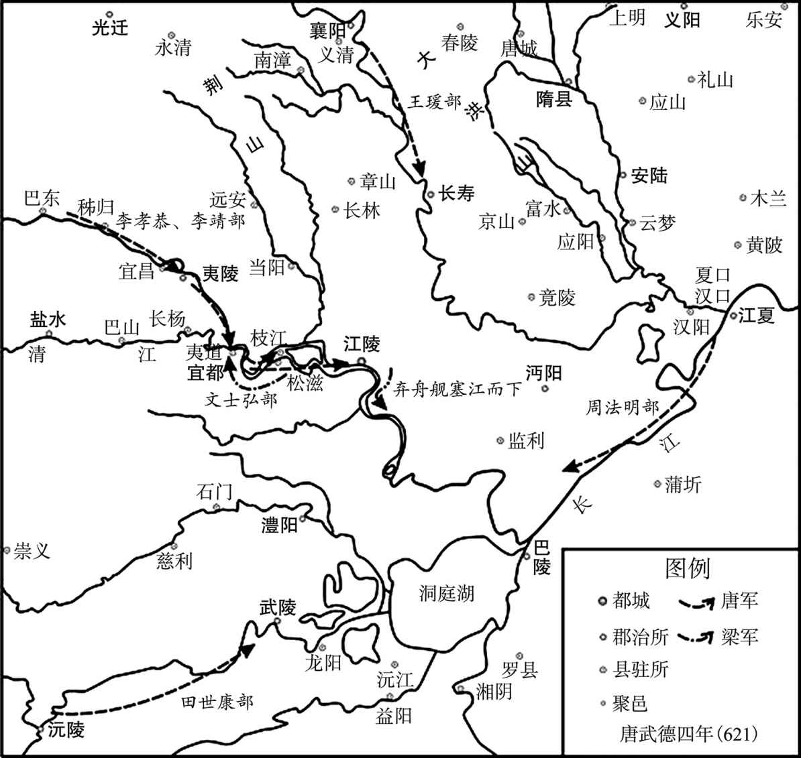 
唐平萧铣示意图

# 唐平江淮**  
****杜伏威　李子通　沈法兴　辅公**

## 【内容摘要】

《唐平江淮》叙述了唐平定杜伏威、李子通、沈法兴、辅公祏等的战争过程。

杜伏威，隋大业七年（611年），与辅公祏聚众起义，被推为主。他击败江都派来镇压的隋军，先后合并了下邳、海陵的反隋武装，兵威渐盛。十二年（616年），隋炀帝遣陈稜统精兵八千人进攻，杜伏威大败隋军。起义军乘胜破高邮，占领历阳，杜伏威自称总管。以辅公祏为长史，收取属县。江淮间小股反隋武装争来归附。十四年（618年），宇文化及弑杀炀帝，任杜伏威为历阳太守，杜伏威不受，上表接受皇泰主所封的东道大总管。唐武德二年（619年），降唐，任和州总管，淮南安抚大使；三年（620年），进使持节，总管江淮以南诸军事，扬州刺史，东南道行台尚书令，封吴王。七年（624年）二月，杜伏威在长安暴卒。

李子通，隋末江淮地区农民起义军领袖，起初参加长白山部义军，因待人宽厚，人多归附。后渡淮水，与杜伏威合兵，后据海陵自称将军。隋大业十一年（615年），自称楚王。唐武德二年（619年），攻克江都，称帝，国号吴，年号明政。唐武德三年（620年），击败沈法兴，占据京口、丹阳、毗陵等郡。后被辅公祏击败，弃守江都，渡江至余杭再次发展。唐武德四年（621年），被杜伏威击败，投降后送至长安，脱逃南返，在蓝田被捕杀。

沈法兴，隋朝末年任吴兴郡守。义宁二年（618年），宇文化及在江都弑炀帝，沈法兴以讨宇文化及为名，在丹阳起兵，直奔江都，攻据余杭、毗陵、丹阳等十余郡，称江南道大总管。不久，沈法兴听闻越王杨侗在东都称帝，于是修书上表称臣。次年，自称“梁王”，定都毗陵，改年号“延康”，置百官。当时，杜伏威、陈稜、李子通分别割据，各拥重兵，沈法兴三面受敌。后来，杜伏威使辅公祏以精卒数千人讨伐李子通。李子通被杜伏威击败后，东走太湖，又组织武装，袭击沈法兴。沈法兴大败弃城，率左右数百人投靠闻人遂安，闻人遂安派遣部将李孝辩前去迎接。沈法兴途中后悔，预谋杀李孝辩，在会稽被识破。李孝辩发兵将其包围，沈法兴走投无路，投江溺死。

辅公祏，隋大业九年（613年）与杜伏威率起义队伍反上长白山，由于得不到信任，二人不久又率部反出，其后不久，辅公祏奉杜伏威之命到下邳（今江苏邳州），劝说在这一带活动的苗海潮农民起义军合力抗隋，辅公祏在起义队伍中的威望日隆。慢慢地，引起杜伏威不满，辅公祏与杜伏威之间有了裂痕。大业十三年（617年），辅公祏、杜伏威率军打败了隋将陈稜八千精兵的讨伐，杜伏威自称大总管，任命辅公祏为长史。唐武德三年（620年），杜、辅军渡过长江，之后，杜伏威命辅公祏率精兵数千与李子通部激战，李子通大败，逃往京口。这一仗，使杜、辅军得以占据丹阳，并在这里建立吴国。武德二年（619年），杜伏威率部降唐，辅公祏被夺去兵权，唐高祖委任他为淮南道行台尚书左仆射，封舒国公。但辅公祏人降心不降，他依旧领兵在外，与左游仙共谋伺机起事。武德六年（623年），辅公祏叛变，在丹阳称帝。武德七年（624年）十二月，唐高祖派李孝恭、李靖围剿辅公祏，辅公祏连战连败，最后弃城出走，只与数十人逃至武康不幸被俘，由乡民执送丹阳斩首。

江淮的平定，是唐朝统一事业的重要组成部分。

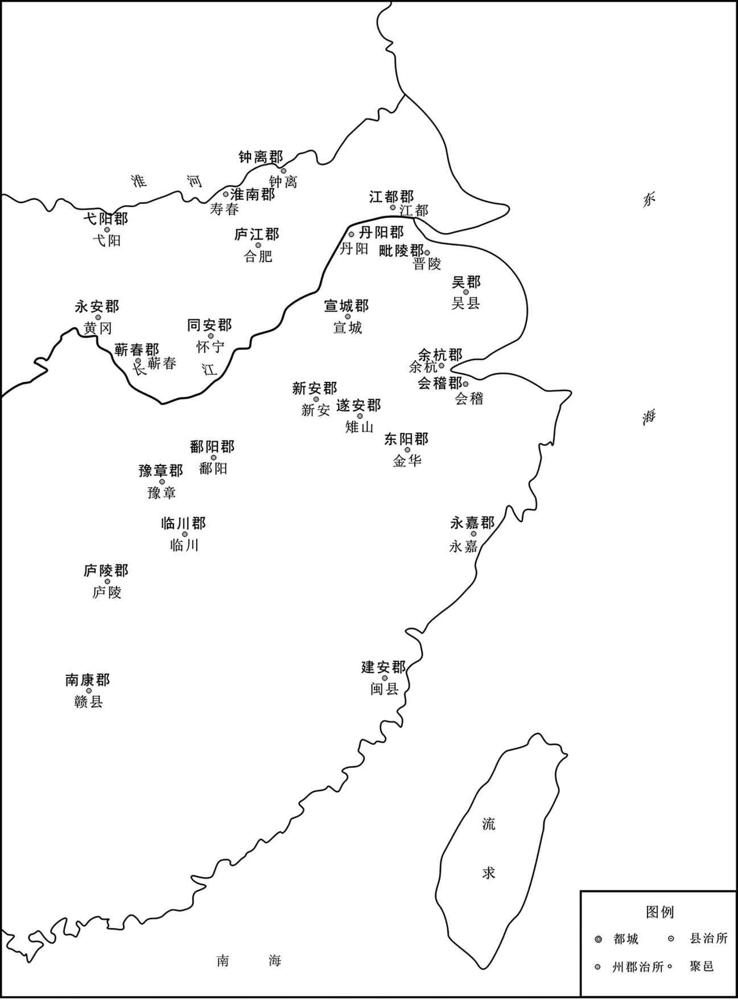 
隋淮南及以南诸郡示意图

## 【原文】

**隋炀帝大业九年[1]。章丘杜伏威与临济辅公祏为刎颈交，俱亡命为群盗[2]。伏威年十六，每出则居前，入则殿后，由是其徒推以为帅[3]。下邳苗海潮亦聚众为盗，伏威使公祏谓之曰：“今我与君，同苦隋政，各举大义，力分势弱，常恐被擒，若合而为一，则足以敌隋矣[4]。君能为主，吾当敬从，自揆不堪，宜来听命，不则一战，以决雌雄[5]。”海潮惧，即帅其众降之[6]。伏威转掠淮南，自称将军[7]。江都留守遣校尉宋颢讨之，伏威与战，阳为不胜，引颢众入葭苇中，因从上风纵火，颢众皆烧死[8]。海陵贼帅赵破陈以伏威兵少，轻之，召与并力[9]。伏威使公祏严兵居外，自与左右十人赍牛酒入谒，于座杀破陈，并其众[10]。**

## 【注文】

[1]隋炀帝大业九年：公元613年。

[2]章丘：地名，今山东济南以东。　　杜伏威（598—624年）：齐州章丘（今山东济南）人，隋末农民起义首领，建立了农民政权，后降唐，被毒杀。　　临济：地名，今山东济阳东章丘西北。　　辅公祏（shí）（？—624年）：齐州临济（今山东济南东南）人。大业七年（611年）与杜伏威一同聚众起事。后转战至淮南，势力逐渐壮大。又大破隋将陈稜，攻据历阳郡城（今安徽和县），伏威自称总管，公祏为长史，成为江淮间最大的起事队伍，威震长江两岸。隋亡后，杜伏威归降李渊，为东南道行台尚书令，封吴王，辅公祏为行台左仆射，封舒国公。公祏打败占据江都和丹阳自称楚王的李子通，于是尽有淮南及江南一带。公祏虽与伏威自幼友善，但拥有江淮之地以后矛盾渐深。唐武德五年（622年），杜伏威入朝长安不归。六年（623年），公祏于丹阳起兵称帝，建国号宋。李渊命李孝慕率唐军镇压。七年（624年）三月唐军破丹阳，公祏被杀。　　刎（wěn）颈交：同生死共患难的朋友。

[3]徒：党徒，这里指群盗。　　推：推举。　　帅：首领。

[4]下邳（pī）：地名，今江苏邳州西南。　　苗海潮：生卒年不详，隋末农民起义军首领。下邳人。大业九年（613年）聚众起义，不久并入杜伏威部，在江淮一带抗击隋军。大业十三年（617年），占领永嘉（今浙江温州）。唐武德六年（623年）降唐。

[5]揆（kuí）：揣度。　　堪：胜任。　　雌雄：胜负。

[6]即：就。

[7]淮南：地区名，今安徽南部地区。

[8]江都：地名，今江苏扬州。　　留守：古代官名。皇帝出巡或亲征时指定亲王或大臣留守京城，得便宜行事，称“京城留守”，其陪京和行都亦常设“留守”，以地方行政长官兼任，总理军民、钱谷、守卫事务。　　校尉：官名。是中国历史上重要的武官官职。校，军事编制单位。尉，军官。　　宋颢：隋朝末年江都留守。　　葭（jiā）苇：芦苇。

[9]海陵：地名，今江苏泰州。　　贼帅：盗贼的首领。　　赵破陈：生卒年不详，隋末唐初起兵反抗隋朝政权者。

[10]左右：亲信。　　赍（jī）：带着。　　谒（yè）：拜见。

## 【译文】

隋炀帝大业九年（613年）。章丘人杜伏威与临济人辅公祏为生死之交，都逃亡在外聚众为盗。杜伏威十六岁，每次出战都走在前面，撤退时在后面跟随，因此，群盗推举他为首领。下邳人苗海潮也聚众为盗贼，杜伏威派辅公祏告诉他说：“如今我与你都不堪忍受隋的暴政，各自举义旗造反，但势力弱小，经常害怕被捉拿，如果联合为一，就足够可以抵抗敌人隋朝了。你如果能做领袖，我就恭敬地听命于你，你如揣度自己不能胜任，就来听我指挥，否则咱们以决战的方法决定胜负。”苗海潮害怕，就率领他的人马投降杜伏威。杜伏威转战掠夺淮南，自称将军。江东留守派校尉宋颢讨伐，杜伏威与宋颢交战，假装不能取胜，引诱宋颢的人马进入芦苇中，从上顺风放火，宋颢的人全被烧死。海陵的贼首赵破陈认为杜伏威的兵力少，轻视他，召伏威与他合并，杜伏威派辅公祏带兵在外严守，自己与十个亲信带着牛酒入帐内去谒见赵破陈，在座席上杀了赵破陈，兼并了他的部众。

## 【原文】

**十一年[1]。东海李子通有勇力，先依长白山贼帅左才相[2]。群盗皆残忍，而子通独宽仁，由是人多归之，未半岁，有众万人[3]。才相忌之，子通引去，渡淮与杜伏威合[4]。伏威选军中壮士养为假子，凡三十余人，济阴王雄诞、临济阚稜为之冠[5]。既而李子通谋杀伏威，遣兵袭之[6]。伏威被重创坠马，雄诞负之逃葭苇中，收散兵复振[7]。将军来整击伏威，破之[8]。其将西门君仪之妻王氏，勇而多力，负伏威以逃，雄诞帅壮士十余人卫之，与隋兵力战，由是得免[9]。来整又击李子通，破之，子通帅其余众奔海陵，复收兵得二万人，自称将军[10]。**

## 【注文】

[1]十一年：大业十一年，公元615年。

[2]东海：地名，今山东枣庄。　　李子通（？—622年）：东海丞县（今山东枣庄峄城东）人，隋末江淮地区农民起义军领袖。初参加长白山部，因待人宽厚，人多归附，后与杜伏威合兵，占据海陵自称将军。公元615年，自称楚王。公元619年，击败陈稜，称帝，国号吴，年号明政。公元620年，击败沈法兴，后被辅公祏击败，渡江至余杭（今浙江杭州）再次发展；占地北起太湖，南至五岭，东自会稽，西至宣城。公元621年，被杜伏威击败，投降后被送至长安。公元622年，脱逃南返，在蓝田被捕杀。　　长白山：位于山东邹平、济南章丘、淄博周村交界处。　　左才相：生卒年不详，隋末唐初长白山地区起兵反抗隋朝政权者。

[3]由是：因此。

[4]淮：指淮河。

[5]假子：干儿子。　　济阴：地名，今山西荣河。　　王雄诞（？—623年）：隋末曹州济阳（今山东曹县西北）人。隋末农民起义军将领杜伏威部将。多次护卫杜伏威脱离险境，并担任前锋打击李子通及占据歙州（今安徽歙县）的汪华，后同杜伏威降唐，授歙州总管。杜伏威入长安（今西安市），留辅公祏镇江南，他掌兵马。公元623年，辅公祏胁他同叛唐，他坚决拒绝，被缢杀。　　临济：地名，今山东济阳。　　阚（kàn）稜（léng）（？—623年）：　隋末齐州临济（今山东济阳）人。隋末农民起义军将领，为杜伏威部将，多次立战功，军令严整，后随杜伏威入长安授左领军将军，迁越州都督，又随主帅李孝恭镇压辅公祏的暴动，功勋卓著。公祏被俘，污蔑他与自己通谋，李孝恭以私愤借故将他处死。

[6]既而：不久。

[7]重创：重伤。　　负：背着。

[8]来整（？—618年）：隋将领，广陵（今江苏扬州）人，荣国公、左翊卫大将军来护儿第六子，骁勇善战，位至左光禄大夫。江都之难，与来护儿同被宇文化及所杀。

[9]西门君仪：生卒年不详，隋末唐初割据者杜伏威部下将领。

[10]奔：逃奔。

## 【译文】

隋炀帝大业十一年（615年）。东海人李子通有勇力，先前投靠长白山贼盗首领左才相。群盗都很残忍，只有李子通宽厚仁义，因此，人们多归附他，不到半年，李子通就有部众一万人。左才相猜忌他，李子通便带着人马离去，渡过淮河与杜伏威汇合在一起。杜伏威挑选军中的勇猛士兵认作养子，共有三十多人，以济阴人王雄诞、临济人阚稜在其中最为勇壮。不久，李子通谋杀杜伏威，派兵袭击他。杜伏威受重伤落马，王雄诞背着他逃入芦苇中，收集溃散的兵马，重新振作。将军来整率官军袭击杜伏威，打败杜伏威。杜伏威的部将西门君仪的妻子王氏，勇敢又有力气，背起杜伏威逃走，王雄诞带领十来个壮士护卫他们，和隋兵奋力战斗，因此才得以免去灾祸。来整接着又攻打李子通，打败了他，李子通带着剩余的人逃往海陵，又收集得二万人，自称将军。

## 【原文】

**恭帝义宁元年春正月，右御卫将军陈稜讨杜伏威，伏威帅众拒之[1]。稜闭壁不战，伏威遗以妇人之服，谓之陈姥[2]。稜怒，出战，伏威奋击，大破之，稜仅以身免[3]。伏威乘胜破高邮，引兵据历阳，自称总管，以辅公祏为长史[4]。分遣诸将徇属县，所至辄下，江、淮间小盗争附之[5]。伏威常选敢死之士五千人，谓之“上募”，宠遇甚厚，有攻战，辄令上募先击之，战罢阅视，有伤在背者即杀之，以其退而被击故也[6]。所获资财，皆以赏军士，有战死者以妻妾殉葬[7]。故人自为战，所向无敌[8]。**

## 【注文】

[1]恭帝：即隋恭帝杨侑（yòu）（605—619年），隋炀帝孙，隋炀帝长子杨昭第三子，初封陈王，后改封代王。炀帝晚年出外巡游时，命他留守长安。隋大业十三年（617年）十月，李渊攻入长安，拥立为帝，改年号为“义宁”，遥尊炀帝为太上皇。在位半年。武德二年（619年）去世，年仅十五岁，葬于陕西省乾县阳洪乡乳台村南五百米处，谥号恭皇帝。　　义宁：隋恭帝在位时的年号，历时七个月。　　陈稜（líng）（？—619年）：字长威，隋炀帝大业三年（607年），任虎贲郎将。大业六年（610年）与张镇周率万余人，由义安（今广东湖州）进入琉球（今台湾）。炀帝大业十三年（617年）任右御将军，率军进攻杜伏威起义军，被击败。炀帝死后，据江都（今江苏江都）。唐高祖李渊武德二年（619年），投奔杜伏威，后被杀。

[2]壁：这里指营门。　　遗（wèi）：送交。

[3]身免：保住性命。

[4]高邮：地名，今江苏高邮。　　历阳：地名，今安徽和县。　　长史：官名，秦置，汉之相国、丞相、太尉、司徒、司马、司空、将军都置有长史。其后，成为郡的府官，掌兵马。唐代州刺史下亦设立长史官，亲王府、都护府、都督府等设长史，品级高下视所属机构而异。

[5]徇：攻打。　　辄（zhé）：就。

[6]宠：恩惠。　　阅视：检查。

[7]殉葬：又称陪葬，是指以器物、牲畜甚至活人陪同死者葬入墓穴，以保证死者亡魂的冥福。

[8]故：因而。

## 【译文】

隋恭帝杨侑义宁元年（617年）春正月，右御卫将军陈稜讨伐杜伏威，杜伏威率领部众抵抗。陈稜坚闭营门不战，杜伏威送给他女人的衣服，称他为“陈姥”。陈稜大怒，率兵出战。杜伏威奋起攻击，大败陈稜，陈稜仅仅保住性命。杜伏威乘胜攻破高邮，带兵进入历阳，自称总管，以辅公祏为长史。分派各位将领攻打所属各县，所到之处都打了下来。江、淮间的小股匪盗都争着归附他。杜伏威曾经挑选不怕死的士兵五千人，称之为“上募”，对这支队伍的恩惠十分丰厚，凡是攻战，往往命令上募先去攻打，战斗完毕后检查，有背上受伤的就杀掉，认为是因其后退而被击伤的。所获的资财，都用来犒赏军士，有战死的，以死者的妻妾殉葬。因而人人都愿意为他打仗，所向无人能敌。

## 【原文】

**唐高祖武德元年[1]。武康沈法兴，世为郡著姓，宗族数千家[2]。法兴为吴兴太守，闻宇文化及弑逆，举兵以讨化及为名[3]。比至乌程，得精卒六万，遂攻余杭、毗陵、丹阳皆下之[4]。据江表十余郡，自称江南道大总管，承制置百官[5]。**

## 【注文】

[1]唐高祖武德元年：即公元618年。

[2]武康：地名，今浙江德清。　　沈法兴（？—621年）：武康（今浙江德清）人，隋末唐初割据势力。隋朝末年，沈法兴任吴兴（今浙江湖州）郡守。后在丹阳（今江苏南京）起兵，称江南道大总管。不久，自称“梁王”，定都毗陵（今江苏常州），改年号“延康”。武德三年（620年），兵败投靠闻人遂安，闻人遂安派遣部将李孝辩前去迎接。沈法兴途中后悔，预谋杀李孝辩，在会稽被识破。李孝辩发兵将其包围，沈法兴走投无路，投江溺死。　　著姓：高门大姓。

[3]吴兴：地名，今浙江湖州。　　宇文化及（？—619年）：为隋炀帝近臣，公元618年禁卫军兵变，弑隋炀帝，他自称大丞相，后率军北归，被李密击败，退走魏县，自立为帝，国号“许”，年号“天寿”，立国半年，第二年被窦建德击败，被杀。　　弑（shì）：封建时代称臣杀君。　　逆：叛乱。

[4]乌程：古县名，在今浙江湖州。　　余杭：地名，今浙江杭州。　　毗陵：地名，今江苏常州。　　丹阳：地名，今江苏丹阳。

[5]承制：依照旧制度。

## 【译文】

唐高祖武德元年（618年）。武康人沈法兴，世代都是郡中的著名大姓，宗族有几千家。沈法兴做吴兴太守，听说宇文化及杀了炀帝反叛，以讨伐宇文化及为名起兵。等到了乌程，已有精兵六万，于是攻打余杭、毗陵、丹阳，都被攻下。占据了江表的十几个郡，自称江南道大总管，依照旧制设置百官。

## 【原文】

**宇文化及之发江都也，以杜伏威为历阳太守[1]。伏威不受，仍上表于隋，皇泰主拜伏威为东道大总管，封楚王[2]。沈法兴亦上表于皇泰主，自称大司马、录尚书事、天门公[3]。**

## 【注文】

[1]历阳：地名，今安徽和县。

[2]皇泰主：杨侗（604—619年），隋炀帝之孙，即位前为越王，隋炀帝杨广被宇文化及杀死之后，隋东都留守段达、王世充等人奉他为帝。在位不到一年，被王世充设计杀死，葬处不明。

[3]大司马：官名。是中国古代对中央政府中专司武职的最高长官的称呼。汉承秦制，置丞相、御史大夫、太尉。汉武帝罢太尉置大司马。西汉一朝，常以此授掌权的外戚，多与大将军、骠骑将军、车骑将军等联称，也有不兼将军号的。东汉初为三公之一，不久改太尉，东汉末年又置大司马，位在三公之上。魏晋为上公之一，位在三公之上，第一品。南北朝或置或不置，北朝魏、齐的大司马与大将军并为“二大”，执掌武事，也在三公之上。陈时为赠官。明清用作兵部尚书的别称。　　录尚书事：官名。汉初置时称“领尚书事”，魏、晋后，掌大权的大臣常带录尚书事名号。南朝宋孝武帝时曾停设，孝武帝死后又置，录尚书事通常以他官兼领，南齐始有单拜录尚书事的。北朝也有此官，北齐称录尚书，位在尚书令上，隋废官名。　　天门公：爵位名。

## 【译文】

宇文化及从江都出发时，任命杜伏威为历阳太守。杜伏威不接受，向隋皇泰主上表称臣，皇泰主拜杜伏威为东道大总管，封为楚王。沈法兴也向皇泰主上表，自称大司马、录尚书事、天门公。

## 【原文】

**二年[1]。沈法兴既克毗陵，谓江、淮之南指可定，自称梁王，都毗陵，改元延康，置百官[2]。性残忍，专尚威刑，将士小有过，即斩之，由是其下离怨[3]。时杜伏威据历阳，陈稜据江都，李子通据海陵，俱有窥江表之心[4]。法兴军数败[5]。会子通围稜于江都，稜送质求救于法兴及伏威，法兴使其子纶将兵数万与伏威共救之[6]。伏威军清流，纶军杨子，相去数十里[7]。子通纳言毛文深献策，募江南人诈为纶兵，夜袭伏威营，伏威怒，复遣兵袭纶[8]。由是二人相疑，莫敢先进[9]。子通得尽锐攻江都，克之，稜奔伏威[10]。子通入江都，因纵击纶，大破之，伏威亦引去。子通即皇帝位，国号吴，改元明政[11]。丹杨贼帅乐伯通帅众万余降之，子通以为左仆射[12]。**

## 【注文】

[1]二年：武德二年，公元619年。

[2]毗陵：地名，今江苏常州。　　都：动词，建都城。　　改元：指中国封建时期皇帝即位时或在位期间改换年号。每个年号开始的第一年称元年。新皇帝即位后，一般都要改变纪年的年号，称为“改元”。

[3]威刑：严厉的刑法。　　小：稍微。　　离怨：离心离德。

[4]窥：谋取。　　江表：江南地区。

[5]数（shuò）：屡次。

[6]会：恰逢，正巧。　　纶：即沈纶，生平事迹不详，隋末唐初割据者沈法兴儿子。

[7]军：动词，屯兵，驻扎。　　相去：相距。　　清流：县名，辖境相当于今天安徽滁州市琅琊区、南谯区、来安县、明光市张八岭镇和自来桥镇、江苏南京浦口区。　　杨子：地名，今江苏邗江南。

[8]纳言：古官名。主要出纳王命。王莽依古制，改大司农为纳言，隋避文帝父杨忠的讳，改侍中为纳言，炀帝又改纳言为侍内。唐初为纳言，唐武德四年（621年）改为侍中。　　毛文深：生卒年不详，隋末唐初割据者李子通部下，任纳言。　　诈：装扮。

[9]由是：因此。

[10]尽：全，都。

[11]即：登上。　　国号：即国家的称号，或一个朝代的名称。国家或朝代创建者办的第一件事就是确立国号。　　明政：唐朝初期领袖李子通的年号，历时2年余，即公元619年九月到公元621年十一月。

[12]丹杨：地名，今江苏丹阳。　　乐伯通：隋末唐初丹杨地区起兵反抗隋朝政权者。　　左仆射：官名。秦始置，汉以后因袭。汉成帝时，初置尚书五人，一人为仆射，位仅次于尚书令，职权渐重。汉献帝时，置左右仆射，唐宋左右仆射为宰相之职。

## 【译文】

唐高祖武德二年（619年）。沈法兴攻克毗陵后，认为江、淮以南地区发兵指挥便能平定，于是自称梁王，建都毗陵，改年号为延康，设置百官。他性情残忍，崇尚酷刑，将士们有点小过失就遭遇斩杀，因此，他的部下与他离心离德。当时杜伏威占据历阳，陈稜占据江都，李子通占据海陵，都有谋取江表的野心。沈法兴的军队数次被打败。正巧李子通在江都围攻陈稜，陈稜给沈法兴和杜伏威送去人质，请求他们援救。沈法兴派他的儿子沈纶率领几万兵与杜伏威共同去救陈稜。杜伏威驻军于清流，沈纶驻军在扬子，相距几十里。李子通的纳言毛文深向李子通献计招募江南人，装扮作沈纶的士兵，夜里袭击杜伏威的军营，杜伏威十分愤怒，又派兵袭击沈纶，因此二人相互怀疑，谁也不敢进兵。李子通用全部的精锐攻打江都，攻克了江都，陈稜逃奔到杜伏威处。李子通进入江都，乘胜纵兵攻打沈纶，大败沈伦军，杜伏威也领兵退去。李子通入江都，即皇帝位，国号吴，改年号为明政。丹杨的义军首领乐伯通率领着一万多人投降了李子通，李子通任命他为左仆射。

## 【原文】

**杜伏威请降，［秋九月］丁丑，以伏威为淮南安抚大使、和州总管[1]。**

## 【注文】

[1]安抚大使：是中国古代官名，为由中央派遣处理地方事务的官员。隋代曾设安抚大使，为行军主帅兼职。　　和州：地名，今安徽和县。　　总管：古代官名，为地方高级军政长官、军事长官或管理专门事务的行政长官的职称。

## 【译文】

杜伏威向唐请求投降，武德二年（619年）秋九月丁丑（十二日），高祖李渊任命杜伏威为淮南安抚大使、和州总管。

## 【原文】

**三年夏六月壬辰，诏以和州总管、东南道行台尚书令、楚王杜伏威为使持节、总管江淮以南诸军事、扬州刺史、东南道行台尚书令、淮南安抚使，封吴王，赐姓李氏[1]。以辅公祏为行台左仆射，封舒国公[2]。**

## 【注文】

[1]尚书令：官名。始于秦，西汉沿置，本为少府的属官，掌文书及群臣的奏章。汉武帝时以宦官担任，汉成帝时改用士人。东汉政务归尚书，尚书令成为对君主负责总揽一切政令的首脑，隋唐沿袭。　　使持节：魏晋南北朝时期直接代表皇帝行使地方军政权力的官职。

[2]行台：魏晋始有，为出征时随其所驻之地设立的代表中央的政务机构，北朝后期，称尚书大行台，设置官属无异于中央，自成行政系统。唐贞观以后渐废。　　左仆（pú）射（yè）：官名，秦始置，汉以后因袭。汉成帝建始四年（前29年），初置尚书五人，一人为仆射，地位仅次于尚书令，职权渐重。汉献帝建安四年（199年），置左右仆射。唐宋左右仆射为宰相之职。宋以后废。　　封：帝王把土地或爵位给予亲属或臣僚。

## 【译文】

唐高祖武德三年（620年）夏六月壬辰（初一日），高祖下诏委任和州总管、东南道行台尚书令、楚王杜伏威为使持节、总管江淮以南诸军事、扬州刺史、东南道行台尚书令、淮南安抚使，改封吴王，赐姓李氏。任命辅公祏为行台左仆射，封舒国公。

## 【原文】

**李子通渡江攻沈法兴，取京口[1]。法兴遣其仆射蒋元超拒之，战于庱亭，元超败死[2]。法兴弃毗陵奔吴郡[3]。于是丹杨、毗陵等郡皆降于子通。子通以法兴府掾李伯药为内史侍郎、国子祭酒[4]。**

## 【注文】

[1]京口：地名，今江苏镇江。

[2]仆射：魏晋南北朝至宋尚书省的长官。仆射起源较早，秦律中有仆射的称谓。汉代仆射是个广泛的官号，自侍中、尚书、博士、谒者、郎以至于军屯吏、驺、宰、水巷宫人都有仆射。仆是“主管”的意思，古代重武，主管射者为掌事，所以诸官的首领称仆射。后来只有尚书仆射相承不改。　　蒋元超：隋末唐初割据者沈法兴部下将领。　　庱（chěng）亭：地名，在今江苏丹阳。

[3]吴郡：郡名，东汉永建四年（129年），分原会稽郡的浙江（钱塘江）以西部分设吴郡，治所在原会稽郡的治所吴县，今江苏苏州。

[4]掾（yuàn）：原为佐助的意思，后为副官佐或官署属员的通称。　　李伯药：生卒年不详，隋末唐初割据者沈法兴部下将领。　　内史侍郎：官名。隋初由中书侍郎改置。炀帝改为内书侍郎。唐初仍称为内史侍郎。武德三年（620年），又称中书侍郎。中书侍郎，是中书省的长官，副中书令，帮助中书令管理中书省的事务，是中书省固定编制的宰相。　　国子祭酒：学官名。国子监是中国古代国立最高学府和官府名，传授儒家思想，其中最重要的礼仪就是祭祀，所以国子监的主管被命名为祭酒。

## 【译文】

李子通渡江攻打沈法兴，攻取了京口。沈法兴派他的仆射蒋元超抵抗，在庱亭交战，蒋元超战败而死。沈法兴放弃了毗陵逃奔吴郡。于是，丹杨、毗陵等郡都投降了李子通。李子通任命沈法兴的府掾李伯药为内史侍郎、国子祭酒。

## 【原文】

**杜伏威遣行台左仆射辅公祏将卒数千攻子通，以将军阚稜、王雄诞为之副[1]。公祏渡江攻丹阳，克之，进屯溧水，子通帅众数万拒之[2]。公祏简精甲千人，执长刀为前锋，（及）［又］使千人踵其后，曰：“有退者即斩之[3]。”自帅余众，复居其后。子通为方陈而前，公祏前锋千人殊死战[4]。公祏复张左右翼以击之，子通败走，公祏逐之，反为所败，还，闭壁不出[5]。王雄诞曰：“子通无壁垒，又狃于初胜，乘其无备，击之可破也[6]。”公祏不从[7]。雄诞以其私属数百人夜出击之，因风纵火，子通大败，降其卒数千人[8]。子通食尽，弃江都，保京口，江西之地尽入于伏威[9]。伏威徙居丹杨[10]。**

## 【注文】

[1]将卒：将领士兵。　　数千：虚数，几千人。　　副：副将，辅佐。

[2]屯：驻屯。　　溧（lì）水：地名，今江苏溧水。

[3]简：挑选。　　精：精悍。　　甲：甲士。

[4]前：前进。

[5]张：张开。　　还：返回。

[6]狃（niǔ）：因袭，拘泥。

[7]从：听从。

[8]私属：自己的部下。　　因：顺着。

[9]江西：地区名。位于江南的西部地区。

[10]徙：迁徙。

## 【译文】

杜伏威派他的行台左仆射辅公祏率领数千人攻打李子通，以将军阚稜、王雄诞为副将。辅公祏渡过长江攻取丹阳后，进兵屯驻在溧水，李子通率领数万人抵御。辅公祏挑选精悍的甲士一千人，手持长刀做前锋，又让一千人跟在他们的身后，说：“有后退的就斩首。”自己率领剩余的人，又跟随在督战兵士的后面。李子通列方阵前进，辅公祏的前锋一千人舍命拼杀，辅公祏又张开左右两翼攻击，李子通失败逃跑，公祏追逐，反而又被李子通打败，回来后坚壁不出。王雄诞说：“李子通没有壁垒，又刚刚取胜而会粗心大意，乘他不防备，攻打他一定可以获胜。”辅公祏不听从。王雄诞带着自己的属下数百人在夜里出击，顺风放火，李子通大败，兵士投降的有好几千人。李子通没有了军粮，放弃江都，退保京口，江西的地盘全部归了杜伏威。杜伏威徙居于丹阳。

## 【原文】

**子通复东走太湖，收合亡散，得二万人，袭沈法兴于吴郡，大破之[1]。法兴帅左右数百人弃城走，吴郡贼帅闻人遂安遣其将叶孝辩迎之[2]。法兴中途而悔，欲杀孝辩，更向会稽[3]。孝辩觉之，法兴窘迫，赴江溺死[4]。子通军势复振，帅其群臣徙都余杭，尽收法兴之地，北自太湖，南至岭，东包会稽，西距宣城皆有之[5]。**

## 【注文】

[1]太湖：中国五大淡水湖之一，位于长江三角洲的南缘。　　收合：收集合并。　　亡：逃亡。

[2]闻人遂安：生平事迹不详，活动于隋末唐初。　　叶孝辩：生平事迹不详，活动于隋末唐初，是李子通军队中的一个将领。

[3]会（kuài）稽：地名，今浙江绍兴。

[4]溺死：淹死。

[5]余杭：地名，今属浙江杭州。　　岭：南岭，横亘在江西、湖南、两广之间。　　宣城：地名，今安徽宣城。

## 【译文】

李子通又向东逃往太湖，收集逃亡溃散的士兵，得二万人，在吴郡偷袭沈法兴，大破沈法兴军队。沈法兴带着亲信数百人弃城逃走，吴郡贼盗首领闻人遂安派他的将领叶孝辩迎接沈法兴。法兴走到半道又反悔了，想杀死叶孝辩，改向会稽逃跑，被叶孝辩发觉，沈法兴窘迫惭愧，于是投江而死。李子通的兵力又振作起来，率领他的群臣移都余杭，全部收复了沈法兴的地盘，北自太湖，南至南岭，东包会稽，西达宣城，全被李子通占有。

## 【原文】

**四年冬十一月，杜伏威遣其将王雄诞击李子通，子通以精兵守独松岭[1]。雄诞遣其裨将陈当世将千余人，乘高据险以逼之，多张旗帜，夜则缚炬火于树，布满山泽[2]。子通惧，烧营走保杭州[3]。雄诞追击之，又败之于城下。庚寅，子通穷蹙请降[4]。伏威执子通，并其左仆射乐伯通送长安，上释之[5]。**

## 【注文】

[1]独松岭：地名，今浙江安吉南。东西有高山幽涧，南北有狭谷相通，为古代临安经广德通建康（今江苏南京）之咽喉要地，用兵出奇之道。

[2]裨（pí）将：副将，专任一方的将领。　　陈当世：生卒年不详，为辅公祏的将领，在战争中作指挥。　　缚：绑，束缚。

[3]杭州：地名，今浙江杭州。

[4]穷蹙（cù）：窘迫；困厄。

[5]长安：地名，今陕西西安附近，隋唐为都城。　　释：赦免。

## 【译文】

唐高祖武德四年（621年）冬十一月，杜伏威派他的将领王雄诞攻打李子通，李子通用精兵守卫独松岭。王雄诞派他的偏将陈当世率领一千余人，登高据险威迫敌人，张挂了许多旗帜，夜里就在树上绑上火炬，遍布山谷泽畔。李子通害怕，烧掉兵营退守杭州。王雄诞追击，又在城下打败了他。初七日，李子通穷途末路没有计策，请求投降。杜伏威捉绑了李子通，与他的左仆射乐伯通一起送往长安，高祖李渊赦免了他们。

## 【原文】

**先是，汪华据黟、歙，称王十余年，雄诞还军击之，华拒之于新安洞口，甲兵甚锐[1]。雄诞伏精兵于山谷，帅羸弱数千犯其陈，战才合，阳不胜，走还营，华进攻之，不能克[2]。会日暮，引还，伏兵已据其洞口，华不得入，窘迫请降[3]。闻人遂安据昆山，无所属，伏威使雄诞击之[4]。雄诞以昆山险隘，难以力胜，乃单骑造其城下，陈国威灵，示以祸福，遂安感悦，帅诸将出降[5]。于是伏威尽有淮南、江东之地，南至岭，东距海[6]。雄诞以功除歙州总管，赐爵宜春郡公[7]。**

## 【注文】

[1]汪华（587—649年）：原名汪世华（归唐后避李世民名讳，改名汪华），出生于歙县登源里（今属安徽绩溪），他在隋末天下大乱之际，为保境安民，起兵统领了歙州、宣州、杭州、饶州、睦州、婺州等六州，建吴国，称吴王，实施仁政，吴国境内百姓安居乐业。武德四年（621年），他率土归唐，被唐高祖李渊授予上柱国、越国公、歙州刺史、总管六州军政；贞观二年（628年），因忠君爱国，被唐太宗李世民授予执掌长安禁军大权，后又委以九宫留守，辅佐朝政，位极人臣。逝后，唐太宗赐其谥号“忠烈”。　　黟（yī）：地名，今安徽黟县。　　歙（shè）：地名，今安徽歙县。　　新安：地名，今安徽新安。　　甲兵：铠甲和兵器。

[2]陈：通“阵”。　　羸（léi）弱：瘦弱的兵士。

[3]窘（jiǒng）迫：处于困境。

[4]昆山：地处江苏东南部，上海与苏州之间。

[5]威灵：神灵。　　险隘（ài）：地势险要的地方。

[6]淮南：地名。位于中国华东腹地，淮河以南地区。　　江东：因长江在安徽境内向东北方向斜流，而以此段江为标准确定东西和左右。所指区域为长江下游江南一带。

[7]宜春郡公：爵位名。

## 【译文】

起先，汪华占据黟、歙二州，称王十多年，王雄诞回军时攻打他，汪华在新安洞口抵抗，军队装备非常精锐。王雄诞在山谷中埋伏了精兵，率领着老弱病残数千人攻击汪华阵地，才战了一个回合，就装作失败逃跑回营，汪华进军攻打，不能攻下。正赶上太阳落山，就引军还营，这时，伏兵已经占领了他的洞口，汪华无法进入，困顿无奈，请求投降。闻人遂安占据昆山，无所归属，杜伏威派王雄诞攻打。王雄诞觉得昆山险隘，以武力难以取胜，于是。独自骑马到他的城下，向他陈述唐军的威武和高祖的英明，晓以利害祸福，闻人遂安被深深感动，率领各将出城投降。于是，杜伏威完全占有了淮南、江东的地盘，南到南岭，东达大海。王雄诞因战功卓著，高祖拜他为歙州总管，赐爵宜春郡公。

## 【原文】

**五年秋七月，秦王世民击徐圆朗，下十余城，声震淮、泗[1]。杜伏威惧，请入朝[2]。丁亥，杜伏威入朝，延升御榻，拜太子太保，仍兼行台尚书令，留长安，位在齐王元吉上，以宠异之[3]。以阚稜为左领军将军[4]。李子通谓乐伯通曰：“伏威既来，江东未定，我往收旧兵，可以立大功[5]。”遂相与亡至蓝田关，为吏所获，俱伏诛[6]。**

## 【注文】

[1]徐圆朗（？—623年）：兖州人（今属山东），隋末农民起义军首领。大业十三年（617年）起兵反隋，攻占东平（今山东鄂城东），分兵略地。后归附李密，又降王世充。后降唐，封鲁郡公，拜兖州总管，出镇兖州。武德四年（621年），与窦建德旧部共推刘黑闼为主，起兵反唐，旋据地自称鲁王。武德六年（623年），败死。　　淮、泗（sì）：淮州、泗州。

[2]入朝：谒见天子。

[3]太子太保：太子太师、太子太傅、太子太保，都是东宫官职，均负责教习太子。太子太师教文，太子太傅教武，太子太保保护其安全。

[4]左领军将军：武官名，将军的一种。

[5]既来：已来。

[6]相与：一起。　　蓝田关：即在古都长安、咸阳东南的地方，为古代用兵要地。

## 【译文】

唐高祖武德五年（622年）秋七月，秦王李世民出击徐圆朗，攻取十余城，威震淮、泗一带。杜伏威害怕，请求谒见天子。丁亥（初八日），杜伏威入朝，高祖请他坐在御榻上，拜他为太子太保，仍兼行台尚书令，留在长安，位在齐王李元吉之上，特别优宠。任命阚稜为左领军将军。李子通对乐伯通说：“杜伏威已来长安，江东还没有平定，我去收罗旧兵，可以立大功。”于是和乐伯通一起逃到蓝田关，被当地官吏抓获，二人都伏罪被杀。

## 【原文】

**六年春正月庚子，以吴王杜伏威为太保[1]。**

## 【注文】

[1]太保：官名，西周始置，监护与辅弼国君之官。春秋后废，汉复置，位仅次于太傅。历代沿置，多为大官的加衔，并无实职。

## 【译文】

唐高祖武德六年（623年）春正月庚子（二十四日），任命吴王杜伏威为太保。

## 【原文】

**秋八月壬子，淮南道行台仆射辅公祏反。初，杜伏威与公祏相友善，公祏年长，伏威兄事之，军中谓之伯父，畏敬与伏威等[1]。伏威浸忌之，乃署其养子阚稜为左将军，王雄诞为右将军，潜夺其兵权[2]。公祏知之，怏怏不平，与其故人左游仙阳为学道、辟穀以自晦[3]。及伏威入朝，留公祏守丹杨，令雄诞典兵为之副，阴谓雄诞曰：“吾至长安，苟不失职，勿令公祏为变[4]。”伏威既行，左游仙说公祏谋反[5]。而雄诞握兵，公祏不得发[6]。乃诈称得伏威书，疑雄诞有贰心[7]。雄诞闻之不悦，称疾不视事[8]。公祏因夺其兵，使其党西门君仪谕以反计[9]。雄诞始寤而悔之，曰：“今天下方平定，吴王又在京师，大唐兵威，所向无敌，奈何无故自求灭族乎[10]！雄诞有死而已，不敢闻命[11]。今从公为逆，不过延百日之命耳，大丈夫安能爱斯须之死而自陷于不义乎[12]？”公祏知不可屈，缢杀之[13]。雄诞善抚士卒，得其死力，又约束严整，每破城邑，秋毫无犯，死之日，江南军中及民间皆为之流涕[14]。公祏又诈称伏威不得还江南，贻书令其起兵，大修铠仗，运粮储[15]。寻称帝于丹杨，国号宋，修陈故宫室而居之[16]。署置百官，以左游仙为兵部尚书、东南道大使、越州总管，与张善安连兵，以善安为西南道大行台[17]。五年二月，豫章贼帅张善安以虔、吉等五州来降，拜洪州总管[18]。是岁三月，善安反，遣舒州总管张镇周等击之。**

## 【注文】

[1]兄事：以兄长的方式对待。　　畏敬：畏惧敬重。

[2]阚（kàn）稜（léng）（？—623年）：齐州临济（今山东济阳）人，隋末农民起义军将领。为杜伏威部将，数立战功，军令严整，所辖“路不拾遗”，后随杜伏威入长安（今西安），授左领军将军，迁越州都督，又随主帅李孝恭镇压辅公祏的暴动，功勋卓著。公祏被俘，诬他与自己通谋，李孝恭以私愤借故将他处死。

[3]左游仙：生卒年不详，隋唐时期道士，后与割据者辅公祏合作。　　阳：假装。　　辟穀（gǔ）：指不食五谷。道教的一种修炼术。

[4]失职：丢失官职。

[5]说：劝说，劝诫。

[6]握兵：掌握兵权。

[7]书：书信。

[8]疾：大病。　　视：关注，管理。

[9]谕：向……说明。

[10]无故：无端。

[11]闻命：听从命令。

[12]爱：爱惜，珍惜。

[13]缢（yì）杀：用绳子勒死。

[14]城邑：即城市。　　民间：百姓之中。

[15]贻（yí）：赠给。　　铠（kǎi）：古代的战衣，可以保护身体。

[16]寻：不久。　　陈：南朝陈。

[17]署置：设置，部署。　　兵部尚书：官名，别称为大司马，统管全国军事的行政长官。　　越州：古地名，前身是夏朝的会稽、春秋的越国、秦汉的会稽郡，隋唐改名越州，今浙江绍兴。唐代的越州是江南最大的中心城市。　　张善安（？—624年）：隋末兖州（今山东济宁）人。早年亡命为盗，转掠淮南。萧铣夺取豫章，遣将把守。他夺取其地，占据后归唐朝，授洪州总管。公元623年反唐，唐安抚使李大亮设计捉了他，部众皆溃。送到京师。称与辅公祏并没有来往，高祖赦免他。公祏失败后，被处死。

[18]豫章：古郡名，即今江西省，这也是广义而言的豫章概念。狭义而言，豫章指今南昌地区一带。　　洪州：古地名，今江西南昌。

## 【译文】

唐高祖武德六年（623年）秋八月壬子（初九日），唐淮南道行台仆射辅公祏反叛。原先，杜伏威与辅公祏很要好，辅公祏比杜伏威年龄大，杜伏威把他当哥哥看待，军中的士兵称他为伯父，对他的畏惧敬重与杜伏威一样。杜伏威逐渐对他产生猜忌，于是任命自己的养子阚稜为左将军，王雄诞为右将军，暗中夺取他的兵权。辅公祏对此心知肚明，怏怏不平，与他的老朋友左游仙假装学道，不食五谷，用来掩饰自己的才能。等到杜伏威入朝，留下辅公祏守卫丹杨，命王雄诞掌兵权做他的副将，杜伏威暗中对王雄诞说：“我到长安后，如果不丢掉官职，就不要让辅公祏叛乱。”杜伏威走了以后，左游仙劝说辅公祏谋反，但是兵权掌握在王雄诞手中，辅公祏无法发兵。于是假称接到杜伏威的信，怀疑王雄诞有二心，王雄诞听到后很不高兴，称病不管事。辅公祏于是夺取了他的兵权，让他的党羽西门君仪向王雄诞说明造反的计策。王雄诞这才省悟过来，十分后悔，说：“如今天下刚刚平定，吴王又在京师，大唐的军队威武勇猛，所向无敌，为什么要无端自找灭族之祸！我王雄诞只有一死而已，不敢从命。今天如果随你叛变，也不过能再多活百十天罢了，大丈夫怎么能爱惜晚死几天，而使自己陷于不义之中呢？”辅公祏知道无法使他屈服，就勒死了他。王雄诞善于安抚士卒，士兵为他拼死卖命，又纪律严明，每次攻破城邑，秋毫没有冒犯，他死的那一天，江南军中以及民间百姓都为他落泪。辅公祏又诈称杜伏威不能返回江南，留下书信要他起兵，于是大量修造铠甲兵仗，运输粮食。不久，在丹杨称帝，国号宋，整修南朝陈的旧宫室，居住在那里。设置百官，任命左游仙为兵部尚书、东南道大使、越州总管，与张善安在军事上联合，任命张善安为西南道大行台。武德五年（622年）二月，豫章贼盗首领张善安以虔、吉等五州来投降，被封为洪州总管。当年三月，张善安又反叛，高祖派舒州总管张镇周等人攻打他。

## 【原文】

**乙丑，诏襄州道行台仆射赵郡王孝恭以舟师趣江州，岭南道大使李靖以交、广、泉、桂之众趣宣州，怀州总管黄君汉出谯、亳，齐州总管李世出淮、泗，以讨辅公祏[1]。孝恭将发，与诸将宴集，命取水，忽变为血，在坐皆失色[2]。孝恭举止自若，曰：“此乃公祏授首之征也[3]。”饮而尽之，众皆悦服[4]。九月戊子，辅公祏遣其将徐绍宗寇海州，陈政通寇寿阳[5]。**

## 【注文】

[1]襄州：地名，今湖北襄阳。　　李孝恭（591—640年）：陇西成纪（今甘肃秦安）人，唐凌烟阁二十四功臣之一。唐朝名将、宗室，唐高祖李渊的堂侄。父亲李安，隋朝时任领军大将军，唐初封为西安王。李孝恭战功赫赫，西取巴蜀，攻占三十余州，俘获朱粲；南征萧梁，得李靖之助，灭萧铣；又招抚岭南诸州，擒辅公祏于武康。江南平定后，拜扬州大都督。其后长江以南均受其统领，因军权过重受到猜忌，被召还。贞观初，任礼部尚书，以功封河间郡王，贞观十四年（640年），李孝恭暴病而死，时年五十岁。赠司空、扬州都督，谥元。　　江州：地名，今江西九江。　　李靖（571—649年）：字药师，雍州三原（今陕西三原东北）人。隋末唐初将领，是唐朝文武兼备的著名军事家。后封卫国公，世称李卫公。平定萧铣，安抚岭南，平定辅公祏，击灭东突厥，远征吐谷浑，贞观二十三年（649年）去世。唐太宗册赠司徒、并州都督，给班剑、羽葆、鼓吹，陪葬昭陵。谥曰景武。　　交：指交州，古地名，包括今天越南北、中部和中国广西的一部分。　　广：指广州，地名，今广东广州。　　泉：指泉州，今福建泉州。　　桂：指桂州，今广西桂林。　　宣州：地名，今安徽宣城。　　　怀州：地名，今河南焦作。　　黄君汉（581—632年）：唐开国功臣，夔州都督、虢国公。先救瓦岗首领翟让，后投奔瓦岗，李密时期镇守重镇柏崖，武德二年（619年）献城归唐，拜行军总管，三年（620年）以怀州总管率本军参加李世民灭王世充、窦建德的战役，四年（621年）参加李孝恭统领的水陆十二总管灭萧铣梁国的战役，七年（624年）参加灭江东辅公祏的战役。由于战功卓著，被封为上柱国、使持节、总管怀州诸军事、怀州刺史，封东郡开国公等。　　谯（qiáo）：地名，今安徽亳州谯县。　　亳（bó）：地名，今安徽亳州。　　齐州：地名，今山东济南。　　李世（594—669年）：原名徐世，字懋功（亦作茂公）。唐高祖李渊赐其姓李，后避唐太宗李世民讳改名为李。曹州离狐（今山东菏泽东明县东南）人，唐初名将，曾破东突厥、高句丽，与李靖并称。后被封为英国公，为凌烟阁二十四功臣之一。李一生历事唐高祖、唐太宗、唐高宗三朝，出将入相，深得朝廷信任和器重，被朝廷倚为长城。

[2]将：将要，就要。

[3]征：征兆，象征。

[4]悦服：心悦诚服。

[5]徐绍宗、陈政通：隋末唐初割据者辅公祏部下将领。　　海州：地名。今江苏连云港西南部。　　寿阳：地名，今安徽寿春。

## 【译文】

唐高祖武德六年（623年）八月乙丑（二十二日），唐高祖下诏命襄州道行台仆射赵郡王李孝恭率水军赶往江州，岭南道大使李靖率交、广、泉、桂等地军队赶往宣州，怀州总管黄君汉出兵谯州、亳州，齐州总管李世出兵淮州、泗州，共同讨伐辅公祏。李孝恭出发前，和各位将领宴会，命人取水，水忽然变为血，在座的人都大惊失色，而李孝恭举止镇定自若，说：“这是辅公祏献出首级的征兆。”一饮而尽，众人都心悦诚服。九月戊子（十五日），辅公祏派他的将领徐绍宗攻打海州，陈政通攻打寿阳。

## 【原文】

**冬十一月，黄州总管周法明将兵击辅公祏，张善安据夏口拒之[1]。法明屯荆口镇，壬午，法明登战舰饮酒，善安遣刺客数人诈乘渔艓而至，见者不以为虞，遂杀法明而去[2]。甲申，舒州总管张镇周等击辅公祏将陈当世于猷州之黄沙，大破之[3]。十二月癸卯，安抚使李大亮诱张善安执之[4]。大亮击善安于洪州，与善安隔水而陈，遥相与语[5]。大亮谕以祸福，善安曰：“善安初无反心，正为将士所误，欲降又恐不免[6]。”大亮曰：“张总管有降心，则与我一家耳[7]。”因单骑渡水入其陈，与善安执手共语，示无猜间[8]。善安大悦，遂许之降[9]。既而善安将数十骑诣大亮营，大亮止其骑于门外，引善安入，与语[10]。久之，善安辞去，大亮命武士执之，从骑皆走[11]。善安营中闻之，大怒，悉众而来，将攻大亮[12]。大亮使人谕之曰：“吾不留总管[13]。总管赤心归国，谓我曰‘若还营，恐将士或有异同，为其所制’，故自留不去耳。卿辈何怒于我[14]？”其党复大骂曰：“张总管卖我以自媚于人”，遂皆溃去[15]。大亮追击，多所虏获。送善安于长安，善安自称不与辅公祏交通，上赦其罪，善遇之[16]。及公祏败，得所与往还书，乃杀之。**

## 【注文】

[1]黄州：地名，今湖北黄冈。　　周法明（561—622年）：隋朝末年先附李密后又降唐，被封为黄州总管。攻萧铣安州，擒总管马贵迁。辅公祏造反，周法明带兵相讨，被人暗杀。　　夏口：古地名，位于汉水下游入长江处，由于汉水自沔阳以下古称夏水，故名。今湖北汉口。

[2]屯：驻扎，驻军。　　渔艓（dié）：小渔船。

[3]舒州：地名，今山东滕州。　　张镇周：生卒年不详，隋、唐交替时舒州同安郡（今潜山）人。本是隋朝大将，唐武德三年（620年）十月降唐，授左武候将军。四年八月，以淮南道行军总管镇抚南方，后改任舒州总管。六年三月、六月，先后在洪、宣两州击败反将张善安、陈当世。七年二月，改大总管为大都督。八年正月丙辰，又以寿州都督调为舒州都督。　　陈当世：隋末唐初割据者辅公祏部下将领。　　猷（yóu）州：地名，今安徽泾县。

[4]李大亮（586—644年）：唐朝开国功臣。原为隋将，与瓦岗军作战被俘，随即获释。李渊兵进长安，李大亮投归辅助李渊开国有功。在贞观年间，出任过西北道安抚大使、剑南道巡省大使、左卫大将军、工部尚书等职。后李大亮领兵征伐吐谷浑，击败薛延陀番将，受封为行军总管。后唐太宗东征高句丽，留李大亮协助房玄龄驻守长安，不久去世。

[5]洪州：地名，今江西南昌。

[6]谕（yù）：告诉，使人知道。

[7]则：就，便。

[8]因：于是。　　间：间隔，猜忌。

[9]大悦：非常高兴。

[10]语：说话。

[11]辞：告辞，辞别。　　执：抓住，逮捕。　　走：逃跑。

[12]悉：尽，全。

[13]使：派。　　总管：官名，为地方高级军政长官、军事长官或管理专门事务的行政长官。这里指张善安。

[14]卿辈：你们。

[15]媚：讨好。

[16]交通：交往。

## 【译文】

唐高祖武德六年（623年）冬十一月，黄州总管周法明率兵攻打辅公祏，张善安占据夏口抵抗。周法明屯兵荆口镇，壬午（初十日），周法明登上战舰饮酒，张善安派刺客数人装成渔民乘坐小鱼船来到荆口镇，看见的人没有放在心上，于是，刺客杀了周法明逃去。甲申（十二日），唐舒州总管张镇周等人在猷州的黄沙攻打辅公祏的将领陈当世，大破陈当世军。十二月癸卯（初二日），安抚使李大亮诱骗张善安并把他抓住。李大亮在洪州出击张善安，与张善安隔水对阵，从远处与他谈话，向他陈述祸福利害，张善安说：“我开始并不想反叛，只是被将士逼迫，想投降又恐怕不能免死。”李大亮说：“张总管有投降的心，就和我是一家人了。”于是，一个人骑马渡水进入张善安阵中，与张善安拉着手说话，以表示没有猜疑。张善安特别高兴，就许诺投降。不久，张善安率领数十名骑兵到李大亮营中，李大亮把他的骑兵阻止在军门外，带着张善安进入军帐，与他说话。说了很长时间，张善安要辞别离开，李大亮命令武士拘捕了他，跟从来的骑兵都逃走了。张善安军营里的兵众听说后，大为愤怒，全部士卒出动，准备攻打李大亮。李大亮派人对他们说：“我没有留张总管，是张总管忠心归降国家，对我说：‘如果回营，恐怕将士们有人不同意投降，被他们制约。’所以自己留下来不回去罢了。你们这些人为什么反而责怪我？”张善安的党羽听了大骂说“张总管出卖了我们去讨好人家”，于是都溃散离去。李大亮追击，俘获很多人。把张善安送到长安，张善安自说没有与辅公祏来往，高祖就赦免了他的罪，对他很好。等到辅公祏失败后，得到了他与张善安往来的书信，才杀了他。

## 【原文】

**七年春正月壬午，赵郡王孝恭击辅公祏别将于枞阳，破之[1]。二月辛丑，辅公祏遣兵围猷州，刺史左难当婴城自守[2]。安抚使李大亮引兵击公祏，破之[3]。赵郡王孝恭攻公祏鹊头镇，拔之[4]。壬子，行军副总管权文诞破辅公祏之党于猷州，拔其枚洄等四镇[5]。**

## 【注文】

[1]枞（zōng）阳：地名，今安徽枞阳。

[2]左难当（596—644年）：一名匡政。安徽泾县人。隋末，政治腐败，社会动乱，常有乱兵骚扰乡里，左难当勇敢率众保乡里，被地方推为总管。武德三年（620年）他入朝被授猷州刺史。后任宣州大都督，追赠左武卫大将军、戴国公。贞观十八年（644年）随张亮讨伐高丽，英勇作战，在班师凯旋之时，不幸阵亡。

[3]安抚使：官名，为由中央派遣处理地方事务的官员。隋代曾设安抚大使，为行军主帅兼职。唐代前期派大臣巡视经过战争或受灾地区，称安抚使。

[4]鹊头镇：地名，今安徽宣城西。　　拔（bá）：夺取军事据点。

[5]权文诞：唐朝初年平定江淮时的行军副总管。

## 【译文】

唐高祖武德七年（624年）春正月壬午（十一日），赵郡王李孝恭在枞阳攻打辅公祏的别将，打败了敌人。二月辛丑（初一日），辅公祏派兵围攻猷州，唐猷州刺史左难当据城防守。安抚使李大亮率兵攻打辅公祏并打败了他。赵郡王李孝恭攻取辅公祏的鹊头镇。壬子（十二日），唐行军副总管权文诞在猷州打败辅公祏的同党，并攻下他的枚洄等四镇。

## 【原文】

**太保吴王杜伏威薨。辅公祏之反也，诈称伏威之命以绐其众[1]。及公祏平，赵郡王孝恭不知其诈，以状闻，诏追除伏威名，籍没其妻子[2]。及太宗即位，知其冤，赦之，复其官爵[3]。**

## 【注文】

[1]绐（dài）：欺骗；欺诈。

[2]籍没：登记并没收（家产）。　　妻子：古时指妻子和儿女。

[3]官爵：官职爵位。

## 【译文】

太保吴王杜伏威去世。辅公祏造反时，诈称是杜伏威的命令来欺骗众人。等到辅公祏叛乱被平定后，赵郡王李孝恭不知道那是辅公祏使诈，就把辅公祏骗人的话上奏给了高祖，高祖下诏除去杜伏威的爵名，籍没他的妻子儿女。等到太宗即位，知道这是冤案后，就赦免了杜伏威的罪，恢复了他的官爵。

## 【原文】

**三月丙戌，赵郡王孝恭破辅公祏于芜湖，拔梁山等三镇[1]。辛卯，安抚使任环拔扬子城，广陵城主龙龛降[2]。戊戌，赵郡王孝恭克丹杨。**

## 【注文】

[1]芜湖：地名。位于安徽省东南部。

[2]扬子城：地名，今江苏扬州。　　广陵：地名，今江苏省扬州中心城区。　　龙龛（kān）：隋末唐初割据者辅公祏部下将领，后降唐。

## 【译文】

唐高祖武德七年（624年）三月丙戌（十六日），赵郡王李孝恭在芜湖打败了辅公祏，攻下梁山等三个镇。辛卯（二十一日），安抚使任环攻下扬子城，广陵城主帅龙龛投降。戊戌（二十八日），赵郡王李孝恭攻取了丹杨。

## 【原文】

**先是，辅公祏遣其将冯慧亮、陈当世将舟师三万屯博望山，陈正通、徐绍宗将步骑二万屯青林山，仍于梁山连铁锁以断江路，筑却月城，延袤十余里，又结垒江西以拒官军[1]。孝恭与李靖帅舟师次舒州，李世帅步卒一万渡淮，拔寿阳，次硖石[2]。慧亮等坚壁不战，孝恭遣奇兵绝其粮道，慧亮等军乏食，夜，遣兵薄孝恭营，孝恭安卧不动[3]。孝恭集诸将议军事，皆曰：“慧亮等拥强兵，据水陆之险，攻之不可猝拔[4]。不如直指丹杨，掩其巢穴，丹阳既溃，慧亮等自降矣[5]。”孝恭将从其议，李靖曰：“公祏精兵虽在此水陆二军，然所自将亦为不少，今博望诸栅尚不能拔，公祏保据石头，岂易取哉[6]！进攻丹杨，旬月不下，慧亮等蹑吾后，腹背受敌，此危道也[7]。慧亮、正通皆百战余贼，其心非不欲战，正以公祏立计使之持重，欲以老我师耳[8]。我今攻其城以挑之，一举可破也[9]。”孝恭然之，使羸兵先攻贼垒而勒精兵结陈以待之[10]。攻垒者不胜而走，贼出兵追之，行数里，遇大军，与战，大破之。阚稜免胄谓贼众曰：“汝曹不识我邪？何敢来与我战[11]？”贼众多稜故部曲，皆无斗志，或有拜者，由是遂败[12]。孝恭、靖乘胜逐北，转战百余里，博山、青林两戍皆溃，慧亮、正通等遁归，杀伤及溺死者万余人[13]。李靖兵先至丹杨，公祏大惧，拥兵数万弃城东走，欲就左游仙于会稽，李世追之[14]。公祏至句容，从兵能属者才五百人，夜宿常州，其将吴骚等谋执之[15]。公祏觉之，弃妻子，独将腹心数十人斩关走。至武康，为野人所攻，西门君仪战死，执公祏，送丹杨，枭首，分捕余党，悉诛之，江南皆平[16]。**

## 【注文】

[1]冯慧亮、陈当世、陈正通、徐绍宗：隋末唐初割据者辅公祏部下将领。　　屯（tún）：驻扎。　　博望山：山名，今安徽马鞍山境内。　　青林山：山名，今安徽马鞍山境内。　　延袤（mào）：绵亘；绵延伸展。　　结：动词，构造。　　垒：营垒。　　梁山：地名，在今安徽马鞍山和芜湖境内。

[2]次：行军所居止之处所。　　舒州：地名。今安徽安庆。　　寿阳、硖（xiá）石：古地名，今安徽淮南下辖地区。

[3]粮道：指军队运送军粮等补给的通路。　　薄：轻视。

[4]猝（cù）：突然。

[5]掩（yǎn）：乘人不备而袭击或捉拿。　　巢穴：盗匪等盘踞的地方。

[6]石头：石头城，今江苏南京。

[7]旬月：十天至一个月。　　蹑（niè）：追踪，跟随。

[8]持重：保持稳重。

[9]挑：挑战。

[10]然：认为……对。　　勒（lè）：统帅。

[11]胄（zhòu）：盔，古代战士戴的帽子。

[12]部曲：部属；部下。

[13]遁（dùn）：逃避，躲闪。

[14]东：向东。　　会稽：地名，今江苏东部及浙江西部。

[15]句容：地名，今江苏镇江。　　常州：地名。今江苏常州。　　吴骚：原为隋末唐初割据者辅公祏部下将领，后降唐。

[16]枭（xiāo）首：中国的一种刑法，即把人头砍下挂在城门上示众。

## 【译文】

在这之前，辅公祏派他的将领冯慧亮、陈当世率领三万水军驻扎博望山，陈正通、徐绍宗率领二万步兵屯驻在青林山，并在梁山连接铁锁阻断长江水路，又筑却月城，周长十多里，在长江西岸构造营垒，以抵抗官军。李孝恭与李靖率水军停泊在舒州，李世率领一万步兵渡过淮水，攻下寿阳，驻扎在硖石。冯慧亮等人坚壁不出战，李孝恭出奇兵断绝了他们的粮道，冯慧亮等人的军中缺乏粮食，夜晚，派兵逼近李孝恭军营，李孝恭仍然按兵不动。李孝恭召集各将领商议军事，大家都说：“冯慧亮等人拥有强兵，占据着水陆险要，我们攻打不能很快取下。不如直接进攻丹杨，攻取他的老巢，丹杨只要攻克，冯慧亮等人自然就会投降了。”李孝恭将要听从这个意见，李靖说：“辅公祏的强兵虽然是在这里的水陆二军，但是他自己带的人也不少，如今博望山各敌营尚且不能攻拔，辅公祏据守石头城，怎能那样容易攻取！进攻丹杨，十天半月如攻不下来，冯慧亮等人紧跟在我们后面，我们腹背受敌，这是十分危险的。冯慧亮、陈正通都是身经百战活下来的匪贼，他们的内心不是不想出战，而是因为辅公祏定下计策让他们按兵不动，想以此使我军疲劳罢了。我们如今攻打他的城池向他挑战，一举可以攻破敌人。”李孝恭认为很对，派老弱士兵先攻打敌人的营垒，而部署精兵严阵以待。攻打敌营的人没有打胜往回奔逃，敌人出兵追击，追了好几里，遇上唐大军，双方交战，唐军大败敌军。阚稜脱下头盔对敌人说：“你们这些人不认识我吗？怎么敢来与我交战？”敌兵多数都是阚稜过去的部下，见了他就没有了斗志，有的向阚稜叩拜，因此失败了。李孝恭、李靖乘胜追击，转战一百多里，敌人在博山、青林两地戍守的士兵也全都溃散了，冯慧亮、陈正通等人逃回，被杀伤及淹死的人有一万多。李靖的军队先到达丹杨，辅公祏大为恐惧，领兵数万放弃城池向东逃走，打算到会稽投靠左游仙，李世追赶。辅公祏到句容，跟随他能作战的士兵只有五百人，夜宿常州，他的将领吴骚等人打算拘捕他。辅公祏发觉了，丢弃了妻子儿女，只身带着心腹数十人，冲破关门夺路逃跑。到武康，受到老百姓攻打，西门君仪战死，辅公祏被活捉送往丹杨，被斩首示众。唐军分别搜捕他的余党，全部诛杀，江南全部平定。

## 【原文】

**己亥，以孝恭为东南道行台右仆射，李靖为兵部尚书。顷之，废行台，以孝恭为扬州大都督，靖为府长史[1]。上深美靖功，曰：“靖，萧、辅之膏肓也[2]。”阚稜功多，颇自矜伐。公祏诬稜与己通谋[3]。会赵郡王孝恭籍没贼党田宅，稜及杜伏威、王雄诞田宅在贼境者，孝恭并籍没之[4]。稜自诉理，忤孝恭，孝恭怒，以谋反诛之[5]。**

## 【注文】

[1]顷之：不久。　　大都督：魏晋南北朝称“都督中外诸军事”或“大都督”，即为全国最高之军事统帅。隋唐沿袭。

[2]深美：十分赞赏。　　膏肓：指人体心与膈间的部分。在此引申为克星之意。

[3]通谋：共同谋划。

[4]会：正赶上，刚好。

[5]诉理：辩解。　　忤（wǔ）：抵触，不顺从。

## 【译文】

唐高祖武德七年（624年）三月己亥（二十九日），任命李孝恭为东南道行台右仆射，李靖为兵部尚书。不久，朝廷废止行台，又任命李孝恭为扬州大都督，李靖为府长史。高祖十分赞赏李靖的功劳，说：“李靖是萧铣、辅公祏的克星！”阚稜功劳多，颇有骄傲的表现。辅公祏诬赖阚稜与自己同谋。正赶上赵郡王李孝恭没收贼党的田土房宅，阚稜以及杜伏威、王雄诞在贼境内的田宅，李孝恭一并没收了。阚稜自己去辩解，违逆了李孝恭，李孝恭发怒，以谋反的罪名杀了阚稜。

# 唐平山东**  
****刘黑闼**

## 【内容摘要】

《唐平山东》叙述了唐朝消灭割据河北山东一带刘黑闼的战争过程。

刘黑闼，贝州漳南县人，隋末，农民起义军纷起，刘黑闼投奔郝孝德，啸居山林，后来归顺李密，成为偏将。武德元年（618年），瓦岗军溃败，李密降唐，刘黑闼被王世充俘虏。王世充以刘黑闼为骑将，守新乡。刘黑闼看不起王世充，不久率部逃回河北，投奔好友窦建德。窦建德任刘黑闼为将军，封汉东郡公，武德四年（621年）五月，窦建德被唐军所败，夏政权灭亡，刘黑闼归乡里。同年七月，高祖下令将窦建德斩首，又强征窦建德旧将范愿、董康买、曹湛、高雅贤等人赴长安。范愿等人决定起兵反唐，他们找到刘黑闼为领袖。武德四年（621年）七月，刘黑闼自称大将军，正式大举起兵。九月，刘黑闼大败淮安王李神通、幽州总管罗艺联军，击走徐世，生擒薛万均兄弟，兵势大盛。窦建德故将旧吏纷纷杀死唐朝官吏，响应起义，突厥颉利可汗也派人马来援。半年之间，刘黑闼便全部恢复窦建德原先的地盘。武德五年（622年）正月，刘黑闼自称汉东王，改元“天造”，定都洺州。三月，刘黑闼与李世民决战于洺水，擒斩唐军大将罗士信。后来，刘黑闼军粮已尽，李世民派人掘开洺水，水淹汉东军，刘黑闼与范愿等亡奔突厥。同年六月，刘黑闼借突厥兵再起，袭定州，曹湛、董康买等聚兵响应。十月，刘黑闼在下博斩杀河北道行军大总管淮阳王李道玄，迫使洺州总管庐江王弃城西走，相州以北州县相继归附。唐朝又命太子李建成、齐王李元吉率军镇压。十二月，刘黑闼围魏州，与唐军相峙于昌乐。李建成采纳魏徵建议，释放俘虏以招诱。这时刘黑闼军粮尽，部分将士被诱，动摇叛变。刘黑闼兵败势竭，又恐魏州城中出兵攻击，表里受敌，于是率数百骑夜走馆陶，李建成命骑将刘弘基追击。武德六年（623年）正月，刘黑闼到达饶州，跟从者仅百余人，想入城求食。饶州刺史诸葛德威假意出迎，等到他们入城时以伏兵突袭，刘黑闼受创被擒。诸葛德威执刘黑闼举城降唐，李建成于洺州斩杀刘黑闼及其弟刘十善等，首级传送长安，山东平定。

山东的平定加速了唐统一全国的进程。

## 【原文】

**唐高祖武德二年[1]。初，漳南人刘黑闼，少骁勇狡狯，与窦建德善，后为群盗，转事郝孝德、李密、王世充[2]。世充以为骑将，每见世充所为，窃笑之[3]。世充使黑闼守新乡，李世击虏之，献于建德，建德署为将军，赐爵汉东公[4]。**

## 【注文】

[1]唐高祖武德二年：即公元619年。

[2]漳南：地名，今河北故城东北。　　刘黑闼（tà）（？—623年）：漳南县（今河北故城县东北）人，隋末唐初割据势力。隋末跟从郝孝德参加瓦岗军，李密败后，被王世充俘虏。后逃回河北，依附窦建德，封汉东郡公，以骁勇多谋著称。窦建德死后，召集其旧部起兵，后自称汉东王，改元“天造”，都于洺州。与唐朝多次交战，先败于秦王李世民，后死于太子李建成的讨伐。　　窦建德（573—621年）：隋末河北地区农民军领袖，清河漳南（今山东武城东北）人。公元618年于乐寿建立国号为夏的地方政权。后为李世民所败，俘虏到长安被杀。　　郝孝德：生卒年不详，隋末农民起义军首领。平原（今山东省平原县）人。公元613年聚众多达数万人。他和王簿、孙宣雅等起义部队联军十余万人，进攻章丘（今山东章丘），被隋将张须陀击败。后活动于黄河以北。公元617年归瓦岗军后被封为平原公。曾配合徐世等攻占粮仓黎阳仓（今河南浚县境），后不详。　　李密（582—619年）：隋唐时期的群雄之一，贵族家庭出身，隋末天下大乱时，李密成为瓦岗军首领，称“魏公”，率军屡破隋军，威震天下。后因杀瓦岗寨旧主翟让，引发内部不稳，又因在与宇文化及的拼杀中损失惨重，不久被王世充击败，率残部投降李唐，没过多久，李密又叛唐自立，最终被唐将盛彦师斩杀于熊耳山。　　王世充（？—621年）：隋末割据者之一。隋新丰（今陕西临潼东北）人，字行满。祖籍西域，本姓支。仕隋历为江都郡丞。大业九年（613年）起，以镇压江南刘元进等部农民起义军，坑杀降众三万余人，升江都通守。后被调北援东都洛阳，为李密所败，入据洛阳以自固。及炀帝被弑，他拥越王杨侗为帝，得以专权。不久废杨侗，自立称帝，国号“郑”，年号“开明”，后降唐，被仇家所杀。

[3]窃笑：偷偷地笑。

[4]新乡：地名，今河南新乡。　　李世（594—669年）：也称李，字懋功（亦作茂公）。唐高祖李渊赐其姓李，后避唐太宗李世民讳改名为李。汉族，曹州离狐（今山东菏泽东）人，唐初名将，曾破东突厥、高句丽，与李靖并称。后被封为英国公，为凌烟阁二十四功臣之一。李一生历事唐高祖、唐太宗、唐高宗三朝，出将入相，深得朝廷信任和重任，被朝廷倚为长城。　　献：恭敬庄严地送给。　　署（shǔ）：暂任。　　赐（cì）：赏给。　　爵：古代皇帝对贵戚功臣的封赐。

## 【译文】

唐高祖李渊武德二年（619年）。起初，漳南人刘黑闼，少年时骁勇果敢，生性诡诈，和窦建德友好，后来聚众做了盗贼，辗转侍奉郝孝德、李密、王世充。王世充任命他做骑将，他每次见到王世充的所作所为，就暗自发笑。王世充派刘黑闼镇守新乡，李世攻击并俘虏了他，把他献给窦建德，窦建德暂委他做将军，赐爵汉东公。

## 【原文】

**四年[1]。窦建德之败也，其诸将多盗匿库物，及居闾里，暴横为民患，唐官吏以法绳之，或加捶挞，建德故将皆惊惧不安[2]。高雅贤、王小胡家在洺州，欲窃其家以逃，官吏捕之，雅贤等亡命至贝州[3]。会上征建德故将范愿、董康买、曹湛及雅贤等，于是愿等相谓曰：“王世充以洛阳降唐，其将相大臣段达、单雄信等皆夷灭，吾属至长安，必不免矣[4]。吾属自十年以来，身经百战，当死久矣，今何惜余生，不以之立事[5]？且夏王得淮安王，遇以客礼，唐得夏王即杀之[6]。吾属皆为夏王所厚，今不为之报仇，将无以见天下之士[7]。”乃谋作乱，卜之，以刘氏为主吉，因相与之漳南，见建德故将刘雅，以其谋告之[8]。雅曰：“天下适安定，吾将老于耕桑，不愿复起兵[9]。”众怒，且恐泄其谋，遂杀之[10]。故汉东公刘黑闼时屏居漳南，诸将往诣之，告以其谋，黑闼欣然从之[11]。黑闼方种蔬，即杀耕牛与之共饮食定计，聚众得百人[12]。秋七月甲戌，袭漳南县据之。是时，诸道有事则置行台尚书省，无事则罢之[13]。朝廷闻黑闼作乱，乃置山东道行台于洺州，魏、冀、定、沧并置总管府[14]。丁丑，以淮安王神通为山东道行台右仆射[15]。**

## 【注文】

[1]四年：武德四年，公元621年。

[2]匿（nì）：隐藏。　　闾（lǘ）里：平民聚居处。　　暴横：横行霸道。　　绳：纠正；约束；制裁。　　捶挞（tà）：杖击，鞭打。

[3]高雅贤、王小胡：隋末唐初割据者窦建德部下将领。　　洺州：古代行政区划名，治所在今河北永年广府镇。　　贝州：古代行政区划名，治所在今河北邢台清河县。

[4]范愿、董康买、曹湛：都是隋末唐初割据者窦建德的将领。　　洛阳：地处古洛水北岸而得名，地处九州之中，即今河南洛阳。　　段达（？—621年）：隋朝武将，姑臧（今甘肃武威）人，三岁袭爵位。他在隋文帝即位前就跟随隋文帝左右。隋朝建立后，段达被封为车骑将军。隋炀帝在江都被宇文化及弑后，段达和元文都等立在洛阳的越王杨侗为帝。段达被封为陈国公。后来，段达与王世充联合发动政变，王世充夺取了帝位。段达效命于王世充，王世充任他为司徒。唐朝武德四年（621年），李世民率兵进攻洛阳，段达率兵抵抗。洛阳城破后，段达被俘。押到长安后唐高祖将其斩首。　　单（shàn）雄信（？—621年）：曹州济阴（今山东曹县）人，隋末入瓦岗起义军。公元617年，任左武候大将军。公元618年，率军投降王世充。公元620年，李世民率军包围东都。单雄信与尉迟敬德交战，被刺坠马。次年，李世民克东都，王世充降唐，单雄信被杀。　　夷灭：消灭，杀尽。

[5]立事：干一番大事业。

[6]客礼：招待宾客的礼节。

[7]厚：优待，厚待。

[8]卜：占卜，占卦。　　刘雅：隋末唐初割据者窦建德部下将领。

[9]适：刚刚，刚好。

[10]泄（xiè）：漏。

[11]屏（bǐng）居：屏客独居。　　诣（yì）：去到，前往。

[12]方：正，恰。

[13]行台：魏晋始有，为出征时随其所驻之地设立的代表中央的政务机构，北朝后期，称尚书大行台，设置官属无异于中央，自成行政系统。唐贞观以后渐废。　　尚书省：官僚机构。由汉代皇帝的秘书机关尚书发展而来。是魏晋至宋的中央最高政令机构，为中央政府最高权力机构之一。

[14]朝廷：君主接受朝见和处理政事的地方，也用作以君主为首的中央统治机构或君主的代称。　　魏：地名，今河北大名东北。　　冀：地名，今河北冀州。　　定：地名，今河北定州。　　沧：地名，今河北沧州。　　总管府：北周开始设置的区域性军事管理机构。其长官称都督，都督例兼所驻某州的刺史，兼治军民。

[15]神通（？—630年）：李神通，名寿，字神通，唐朝宗室。李虎之孙，高祖李渊从弟。高祖起兵后，举兵响应，自称关中道行军总管，高祖授其为光禄大夫。攻克长安后，拜宗正卿。武德元年（618年），拜右翊卫大将军，封永康王，不久改封为淮安王，任山东道安抚大使。武德四年（621年），授河北行台左仆射。太宗即位后，拜开府仪同三司，实封五百户。贞观四年（630年），薨逝，赠司空，谥曰靖。　　右仆射（yè）：官名。秦始置，汉以后因之。汉成帝建始四年（前29年），初置尚书五人，一人为仆射，地位仅次尚书令，职权渐重。汉献帝建安四年（199年）置左右仆射。唐宋左右仆射为宰相之职。

## 【译文】

唐高祖武德四年（621年）。窦建德失败以后，他的部将中很多人都盗窃了府库中的财物，居住闾里后，横行霸道，成了百姓的祸害，唐官吏依法处置他们，有时鞭打他们，所以窦建德过去的将领们都感到惊恐不安。高雅贤、王小胡家在洺州，想要携家眷潜逃，官吏搜捕他们，高雅贤等人逃到贝州。正赶上高祖征召窦建德过去的部将范愿、董康买、曹湛以及高雅贤等人，于是，范愿等人相互商议说：“王世充举洛阳降唐，他的将相大臣段达、单雄信等人都被夷灭，我们这些人到了长安，必定不能幸免。我们十年以来，身经百战，要死早就死了，如今还何必爱惜余生，而不用有生之年来干一番大事？再说，夏王俘虏淮安王李神通后，用宾客之礼对待他，而唐俘虏夏王后就把他杀了。夏王对我们这些人都不薄，今天不为他报仇，还有什么脸面见天下的仁人志士？”于是谋划作乱，占卜显示，以姓刘的做领袖最吉利，因而一同到漳南，去见窦建德过去的部将刘雅，把他们的谋划告诉了他。刘雅说：“天下刚刚安定下来，我打算在家农耕，了却余生，不想再起兵了。”众人愤怒，又怕他泄露了消息，于是就杀死了刘雅。窦建德过去赐封的汉东公刘黑闼当时正摒绝人事，在漳南隐居，各位将领前往见他，把谋划好的事情告诉他，刘黑闼欣然听从。刘黑闼正在种蔬菜，即刻把耕牛杀了与他们一起喝酒定计，聚集了一百人。秋七月甲戌（十九日），他们袭击并占据了漳南县。当时，各道如有战事，就设置行台尚书省，无事，就取消这个机构。朝廷听说刘黑闼作乱，便在洺州设置山东道行台，在魏、冀、定、沧各州同时设置总管府。丁丑（二十二日），任命淮安王李神通为山东道行台右仆射。

## 【原文】

**八月丁酉，刘黑闼陷鄃县，魏州刺史权威、贝州刺史戴元祥与战，皆败死，黑闼悉收其余众及器械[1]。窦建德旧党稍稍出归之，众至二千人，为坛于漳南，祭建德，告以举兵之意，自称大将军[2]。诏发关中步骑三千，使将军秦武通、定州总管蓝田李玄通击之[3]。又诏幽州总管李艺引兵会击黑闼[4]。**

## 【注文】

[1]鄃（shū）县：地名，隋开皇十六年（596年）于古鄃城西南建鄃县，今山东夏津附近。　　刺史：官名。是中国古代州一级地方长官。始置于秦汉，秦时名为监察御史，汉武帝时改称刺史，掌管地方检查。汉成帝时，改称牧，汉哀帝时复为刺史。东汉末，天下渐乱，刺史权重，成为地方军政长官，后世沿置，隋唐因袭。　　权威、戴元祥：分别为唐朝初年魏州、贝州刺史。

[2]稍稍：逐渐。　　祭：祭奠，祭祀。

[3]关中：关中之名，始于战国时期，一般认为西有大散关，东有函谷关，南有武关，北有萧关，取意四关之中（后增东方的潼关和北方的金锁两座）。四方的关隘，再加上陕北高原和秦岭两道天然屏障，使关中成为自古以来的兵家必争之地。古人习惯上将函谷关以西地区称为关中。　　秦武通：唐朝初年大将，参与讨伐窦建德等战役。　　蓝田：地名，今陕西蓝田。　　李玄通（？—621年）：雍州蓝田（今属陕西）人。隋时为鹰扬郎将。唐时任定州总管。刘黑闼反叛，城陷被擒。刘黑闼看重他的才华，想以他为大将，他拒不受，溃腹而死。

[4]幽州：古九州及汉十三刺史部之一；隋唐时北方的军事重镇、交通中心和商业都会。其范围大致包括今河北北部及辽宁一带。　　李艺：生卒年不详，唐朝初年朝廷大臣，任幽州总管。

## 【译文】

唐高祖武德四年（621年）八月丁酉（十二日），攻陷鄃县，唐魏州刺史权威、贝州刺史戴元祥与他交战，都战败而死，刘黑闼全部收缴了他们剩下的人马和军械。窦建德昔日的党羽逐渐出来归附了他，部众达到了二千人，于是在漳南设坛祭奠窦建德，向他的亡灵报告举兵的情况，刘黑闼自称大将军。高祖下诏征发关中步兵骑兵三千，命将军秦武通、定州总管蓝田人李玄通出兵攻击刘黑闼。又下诏命幽州总管李艺率兵合击刘黑闼。

## 【原文】

**丁未，刘黑闼陷历亭，执屯卫将军王行敏，使之拜，不可，遂杀之[1]。初，洛阳既平，徐圆朗请降，拜兖州总管，封鲁郡公[2]。刘黑闼作乱，阴与圆朗通谋[3]。上使葛公盛彦师安集河南，行至任城，辛亥，圆朗执彦师举兵反[4]。黑闼以圆朗为大行台元帅，兖、郓、陈、杞、伊、洛、曹、戴等八州豪右皆应之。**

## 【注文】

[1]历亭：地名，位于山东济南南。　　王行敏：生平事迹不详，活动于隋末唐初。

[2]洛阳：地名，今河南洛阳。　　徐圆朗（？—623年）：兖州人（今山东兖州），隋末农民起义军首领。大业十三年（617年）起兵反隋，攻占东平（今山东鄂城东），分兵略地，后归附李密，又降王世充。后降唐，封鲁郡公，拜兖州总管，出镇兖州。武德四年（621年），与窦建德旧部共推刘黑闼为主，起兵反唐，不久据地自称鲁王。武德六年（623年），败死。

[3]阴：暗中。

[4]盛彦师（？—620年）：宋州虞城（今河南省虞城县）人。隋末率千余人投唐军，任行军总管，与史万宝镇宜阳，听闻李密叛唐，料定其具体归路后，献计伏杀李密、王伯当。后被授为宋州总管，被徐圆朗所擒。徐圆朗下令招其弟投降，不从。平定徐圆朗后，被李渊赐死。　　河南：地名，位于中国中东部、黄河中下游，因大部分地区位于黄河以南，故称河南。　　任城：地名，今山东济宁。　　辛亥：二十六日。

## 【译文】

唐高祖武德四年（621年）八月丁未（二十二日），刘黑闼攻陷历亭，捉住了屯卫将军王行敏，让他跪拜，他不肯，于是就杀了他。起初，洛阳平定以后，徐圆朗请求投降，被朝廷任命为兖州总管，加封鲁郡公。刘黑闼作乱后，暗中与徐圆朗通谋。高祖派葛公盛彦师安抚河南，行到任城，辛亥（二十六日），徐圆朗逮捕了盛彦师，举兵造反。刘黑闼任命徐圆朗为大行台元帅，兖、郓、陈、杞、伊、洛、曹、戴等八州的豪杰都起来响应。

## 【原文】

**［九月］辛酉，徐圆朗自称鲁王。**

## 【译文】

唐高祖武德四年（621年）九月辛酉（初七日），徐圆朗自称鲁王。

## 【原文】

**淮安王神通将关内兵至冀州，与李艺兵合[1]。又发邢、洺、相、魏、恒、赵等州兵合五万余人，与刘黑闼战于饶阳城南，布陈十余里[2]。黑闼众少，依隄单行而陈以当之[3]。会风雪，神通乘风击之，既而风返，神通大败，士马、军资失亡三分之二[4]。李艺居西偏，击高雅贤，破之，逐奔数里，闻大军不利，退保藁城[5]。黑闼就击之，艺亦败，薛万均、万彻皆为所虏，截发驱之[6]。万均兄弟亡归，艺引兵归幽州[7]。黑闼兵势大振[8]。**

## 【注文】

[1]冀州：今河北衡水。

[2]邢：邢州，今河北邢台。　　洺（míng）：洺州，今河北永年。　　相：相州，治所在今安阳西郊。　　恒：恒州，治所在今河北获鹿。　　赵：赵州，今河北赵县。　　饶阳：地名，今河北饶阳。

[3]隄（dī）：用土石等材料修筑的挡水的高岸。　　当：通“挡”，抵挡。

[4]既而：不久。　　返：回，归。　　士马：士兵战马。

[5]藁（gǎo）城：地名，今河北藁城。

[6]薛万均（？—641年）：唐朝将领。敦煌（今甘肃敦煌）人，隋朝名将薛世雄之子。大业末年与弟薛万彻客居幽州，后随罗艺归唐，授为上柱国、永安郡公。贞观初年，随柴绍讨梁师都，任行军副总管，击走突厥，升任左屯卫将军。贞观八年（634年），随李靖讨吐谷浑，任沃沮道行军副总管，在青海遇敌，单骑冲阵，斩数千人，升左屯卫大将军。贞观十三年（639年），以交河道行军副大总管与侯君集击高昌，进封潞国公。贞观十五年（641年），坐事下狱，忧愤而死，陪葬昭陵。　　万彻（？—652年）：薛万彻，唐朝名将，隋朝名将薛世雄之子。本为隋将，后与兄长薛万均同自幽州降唐，因征讨梁师都有功，授车骑将军，随罗艺四处转战其他起义军，投入太子李建成幕府，受其赏识。玄武门之变时，率东宫兵马力战，甚至反扑秦王府，直到李世民派人出示以太子首级，他才放下武器带领数十骑逃入南山。后来唐太宗赏识其武勇，屡次遣使招谕才复出拜将。在平突厥和薛延陀部、征高句丽时屡立大功，尚太宗妹丹阳公主。后因参与谋立李恪为帝，被长孙无忌所杀。

[7]亡：逃。

[8]势：势力，威力。

## 【译文】

淮安王李神通率领关内兵到达冀州，与李艺的部队会合。又发动邢、洺、相、魏、恒、赵等州的军队合五万余人，与刘黑闼在饶阳城南交战，布阵达十余里。刘黑闼的兵少，沿着河堤单行布阵来抵挡。正巧刮风下雪，李神通乘风攻击，但不久风向转回，李神通大败，士兵战马和军用物资丢失了三分之二。李艺居西边，攻击高雅贤，攻破后，追赶了好几里，听说大军攻占不利，就退保藁城。刘黑闼就近攻击他，李艺也失败了，薛万钧、薛万彻都被刘黑闼俘虏，被截发驱逐。万钧兄弟逃回来，李艺带兵回幽州。刘黑闼的兵威大振。

## 【原文】

**［冬十月］庚寅，刘黑闼陷瀛州，杀刺史卢士叡[1]。观州人执刺史雷德备，以城降之[2]。毛州刺史赵元恺，性严急，下不堪命，丁卯，州民董灯明等作乱，杀元恺以应刘黑闼[3]。**

## 【注文】

[1]瀛（yíng）州：地名，今河北河间。　　卢士叡（ruì）：唐朝初年瀛州刺史。

[2]雷德备：生卒年不详，唐朝初年观州刺史。

[3]毛州：治所在今山东冠县东古城镇。　　赵元恺（kǎi）：唐朝初年毛州刺史。　　董灯明：生平事迹不详，活动于隋末唐初。

## 【译文】

唐高祖武德四年（621年）冬十月庚寅（初六日），刘黑闼攻陷瀛洲，杀了唐刺史卢士叡。观州百姓捉住刺史雷德备，举城投降刘黑闼。唐毛州刺史赵元恺，生性严厉急躁，手下的人不能忍受，丁卯（闰十月十四日），州民董灯明等人叛乱，杀了赵元恺以响应刘黑闼。

## 【原文】

**冬十一月壬寅，刘黑闼陷定州，执总管李玄通[1]。黑闼爱其才，欲以为大将，玄通不可[2]。故吏有以酒肉馈之者，玄通曰：“诸君哀吾幽辱，幸以酒肉来相开慰，当为诸君一醉[3]。”酒酣，谓守者曰：“吾能剑舞，愿假吾刀[4]。”守者与之，玄通舞竟，太息曰：“大丈夫受国厚恩，镇抚方面，不能保全所守，亦何面目视息世间哉[5]！”即引刀自刺，溃腹而死，上闻之，为之流涕，拜其子伏护为大将[6]。**

## 【注文】

[1]总管：古代官名，为地方高级军政长官、军事长官或管理专门事务的行政长官的职称。

[2]爱：喜欢，爱惜。

[3]馈（kuì）：进献。　　幽：幽禁，囚禁。　　开慰：劝慰。

[4]酒酣（hān）：比喻酒喝得正香的时候。

[5]镇抚：安抚。

[6]溃（kuì）：冲破。　　流涕（tì）：流泪。　　伏护：李伏护，生卒年不详，唐初大将李玄通的儿子。

## 【译文】

唐高祖武德四年（621年）冬十一月壬寅（十九日），刘黑闼攻陷定州，俘虏了总管李玄通。刘黑闼很赏识他的才能，想任命他做大将，李玄通不答应。他昔日的部下有人拿来酒肉让他吃，李玄通说：“各位可怜我被囚禁受辱，好意拿酒肉来开导劝慰我，我应当为各位一醉方休。”酒喝到半醉，对看守的人说：“我擅长舞剑，希望借刀给我。”守卫将刀给他，他舞刀完毕，叹息道：“大丈夫蒙受国家的厚遇，镇守一方，却不能保全守地，还有什么面目活在世上！”于是举刀自刺，破腹而死，高祖听到这一消息，为他掉下了眼泪，拜他的儿子李伏护为大将。

## 【原文】

**十二月乙卯，刘黑闼陷冀州，杀刺史麴稜[1]。黑闼既破淮安王神通，移书赵、魏，故窦建德将卒争杀唐官吏以应黑闼[2]。庚申，遣右屯卫大将军义安王孝常将兵讨黑闼[3]。黑闼将兵数万进逼宗城，黎州总管李世先屯宗城，弃城走保洺州[4]。甲子，黑闼追击世等，破之，杀步卒五千人，世仅以身免。丙寅，洺州土豪翻城应黑闼。黑闼筑坛（城）于城东南，告天及祭窦建德而后入[5]。后旬日，引兵攻拔相州，执刺史房晃，右武卫将军张士贵溃围走[6]。黑闼南取黎、卫二州，半岁之间尽复建德旧境[7]。又遣使北连突厥，颉利可汗遣俟斤宋邪那帅胡骑从之[8]。左武卫将军秦武通、洺州刺史陈君宾、永宁令程名振，皆自河北遁归长安[9]。丁卯，命秦王世民、齐王元吉讨黑闼[10]。己巳，刘黑闼陷邢州、赵州。庚午，陷魏州，杀总管潘道毅[11]。辛未，陷莘州[12]。**

## 【注文】

[1]麴（qū）稜（léng）：唐朝初年冀州刺史。

[2]移：传。　　书：书信，信件。

[3]孝常（？—627年）：即李孝常，隋朝大将李圆通的儿子，武德元年（618年）十二月丁丑，唐高祖封他为上柱国、义安王。贞观元年（627年）李孝常与右武卫将军刘德裕等人，密谋借助禁军反叛，事发后，李孝常等人被唐太宗处死。

[4]进逼：向目标逼近。　　黎州：唐武德初置，治所在黎阳（今河南浚县）。

[5]告：祭告。

[6]旬日：十日。　　房晃：生平事迹不详，活动于隋末唐初。　　张士贵（586—657年）：唐代名将，自幼学武，隋末聚众起义，后归顺李渊，屡立战功，先后任右光禄大夫、右屯卫大将军、左领军大将军等职，并被封为虢国公、勋国公。唐显庆初年（657年）病故，谥荆州都督，陪葬昭陵。

[7]卫：卫州，在今豫北境内，主要包括今河南新乡、鹤壁等地，治所在今河南淇县。

[8]俟（qí）斤：部落酋长。　　宋邪那：生平事迹不详，唐初突厥部落酋长。

[9]陈君宾（？—635年）：隋时为太守。武德初归附唐，封东阳公，拜邢州刺史。贞观年间任邓州刺史。贞观九年（635年），授虔州刺史，不久卒。　　程名振（？—662年）：早年在窦建德麾下，后投李渊，经略河北。任管州都督府长史，后又历任洺州刺史、右骁卫将军、平壤道行军总管、东夷都护、晋蒲二州刺史。龙朔二年（662年）去世，赠封右卫大将军，谥“烈”。　　遁（dùn）：逃避，躲闪。

[10]秦王世民：即唐太宗李世民（599—649年），唐朝第二位皇帝，政治家、军事家、书法家、诗人。唐朝建立初期，封秦王，立下赫赫战功。即帝位后，积极听取群臣的意见，努力学习文治天下，为中国史上最出名的政治家与明君之一。他经过主动消灭各地割据势力，虚心纳谏，在国内厉行节约、使百姓休养生息，终于使得社会出现了国泰民安的局面，开创了历史上著名的“贞观之治”，为后来实现“开元盛世”奠定了重要的基础，将中国传统农业社会推向鼎盛时期。　　元吉（603—626年）：即李元吉，唐高祖李渊第四子，窦皇后所生。高祖太原起兵时，留守太原。唐朝建立后，封为齐王。武德二年（619年），刘武周南侵并州，他弃太原归长安。后与长兄建成合谋杀李世民。武德九年（626年）六月初四，李世民发动“玄武门之变”，与太子李建成同时遇害，有五子一同被诛杀，终年二十四岁。

[11]潘道毅：唐朝初年魏州总管。

[12]莘（shēn）州：治所在今山东莘县。

## 【译文】

唐高祖武德四年（621年）十二月乙卯（初三日），刘黑闼攻陷冀州，杀死唐刺史麴稜。刘黑闼在打败淮安王李神通后，就布告赵、魏等地，窦建德过去的将士都争先杀唐官吏来响应刘黑闼。庚申（初八日），唐高祖派右屯卫大将军义安王李孝常带兵讨伐刘黑闼。刘黑闼率军数万进逼宗城，唐黎州总管李世先驻兵宗城，这时放弃城池逃往洺州防守。甲子（十二日），刘黑闼追击李世等人，攻破后，杀了五千步兵，李世仅自己脱身。丙寅（十四日），洺州的土豪翻越城墙响应刘黑闼。刘黑闼在城东南筑坛，祭告上天及窦建德，然后进入城里。十日后，率兵攻陷相州，活捉了刺史房晃，右武卫将军张士贵突围逃走。刘黑闼向南攻取黎、卫二州，半年之间完全恢复了窦建德原来的地盘。又派使者向北联络突厥，颉利可汗派遣俟斤宋邪那率领骑兵跟随刘黑闼。唐左武卫将军秦武通、洺州刺史陈君宾、永宁县令程名振，都从河北逃归长安。丁卯（十五日），唐高祖命令秦王李世民、齐王李元吉讨伐刘黑闼。己巳（十七日），刘黑闼攻陷邢州、赵州。庚午（十八日），攻陷魏州，杀了总管潘道毅。辛未（十九日），攻陷莘州。

## 【原文】

**五年春正月，刘黑闼自称汉东王，改元天造，定都洺州[1]。以范愿为左仆射，董康买为兵部尚书，高雅贤为右领军[2]。征王琮为中书令，刘斌为中书侍郎[3]。窦建德时文武悉复本位[4]。其设法行政，悉师建德，而攻战勇决过之[5]。庚寅，东盐州治中王才艺杀刺史田华，以城应刘黑闼[6]。**

## 【注文】

[1]都：都城。

[2]左仆射：官名，秦始置，汉以后因之。汉成帝建始四年（前29年），初置尚书五人，一人为仆射，位仅次于尚书令，职权渐重。汉献帝建安四年（199年），置左右仆射。唐宋左右仆射为宰相之职。　　兵部尚书：官名。别称为大司马，统管全国军事的行政长官。　　右领军：官名。汉末曹操置领军，为相府属官。建安十二年（207年），改为中领军，领禁兵。魏置领军将军，统五校、中垒、武卫三营。西晋初年废除，以中军将军任其职。西晋末，重置领军。东晋一度改为北军中候，不久又恢复原名。南朝宋以领军将军统领内军。齐、梁、陈都有领军将军、中领军。梁领军将军号为禁司。北魏或设领军将军，或设中领军。北齐有领军府，领军将军、中领军掌禁卫宫掖。隋左右领军府不置将军，仅设长史、司马等官，掌十二军籍账、差科、词讼等事。唐左、右领军卫在十六卫内，各设上将军、大将军、将军，宿卫宫禁。

[3]王琮、刘斌：隋末唐初割据者刘黑闼部下将领。　　中书令：官名。汉武帝时以宦官担任中书，称中书令，置令与仆射为其首领，掌传宣诏命等。中书令、尚书令在西汉都设置。中书令是帮助皇帝在宫廷处理政务的官员，中书令负责向皇帝上奏的密奏“封事”，责任重要。　　中书侍郎：中书省的副官，帮助中书令管理中书省的事务。汉朝开始设置中书郎，魏由通事郎改置，晋朝加“侍”，正式称为中书侍郎，东晋又曾一度改为通事郎，其中一人职掌诏命。

[4]本位：原来的官位。

[5]勇决：勇敢果断。

[6]东盐州：治所在今河北黄骅。　　治中：官名，汉代治中为州刺史的助理，隋代成为郡的佐官，至唐改为“司马”。　　王才艺：生卒年不详，唐朝初年东盐州治中，后投降刘黑闼。　　田华：生卒年不详，唐朝初年东盐州刺史。

## 【译文】

唐高祖武德五年（622年）春正月，刘黑闼自称汉东王，改年号为天造，定都洺州。任命范愿为左仆射，董康买为兵部尚书，高雅贤为右领军。征召王琮为中书令，刘斌为中书侍郎。窦建德时的文武官员都恢复了原职。刘黑闼的立法行政，全效法窦建德那时的样子，而攻占的勇敢果断又超过窦建德。庚寅（初八日），东盐州治中王才艺杀唐刺史田华，举城响应刘黑闼。

## 【原文】

**秦王世民军至获嘉，刘黑闼弃相州，退保洺州[1]。丙申，世民复取相州，进军肥乡，列营洺水之上以逼之[2]。**

## 【注文】

[1]获嘉：地名，今河南新乡西部。

[2]肥乡：地名，今河北肥乡。　　洺水：古水名，即洺河，在今河北南部。源出武安市西部，东流经永年北，自此以下，历代屡经迁改，今北流入北澧河。

## 【译文】

秦王李世民的大军到获嘉，刘黑闼放弃了相州，退保洺州。武德五年（622年）正月丙申（十四日），李世民再次取得相州，进军肥乡，在洺水附近列营威逼刘黑闼。

## 【原文】

**幽州总管李艺将所部兵数万会秦王世民讨刘黑闼[1]。黑闼闻之，留兵万人，使范愿守洺州，自将兵拒艺[2]。夜宿沙河，程名振载鼓六十具，于城西二里堤上急击之，城中地皆震动[3]。范愿惊惧，驰告黑闼[4]。黑闼遽还，遣其弟十善与行台张君立将精兵一万击艺于鼓城[5]。壬子，战于徐河，十善、君立大败，所［失］亡八千人[6]。**

## 【注文】

[1]幽州：治所在蓟县（今天津蓟州区）。

[2]闻：听到，听闻。　　拒：抵抗。

[3]沙河：地名，位于今河北南部。　　鼓：战鼓。

[4]驰：驰马。

[5]遽（jù）：急，仓猝。　　十善：即刘十善，隋末唐初割据者刘黑闼弟弟。　　行台：魏晋始有，为出征时随其所驻之地设立的代表中央的政务机构，北朝后期，称尚书大行台，设置官属无异于中央，自成行政系统，唐贞观以后渐废。　　张君立：隋末唐初割据者刘黑闼手下大将。　　鼓城：地名，今河北晋州市。

[6]徐河：地名，今河北徐水南。

## 【译文】

幽州总管李艺率领他的数万部队与秦王李世民会合，讨伐刘黑闼。刘黑闼听到消息后，留下一万人，命范愿守洺州，他自己则率兵抵抗李艺。夜宿沙河，程名振用车载了六十面战鼓，在城西二里的堤上使劲敲击，城中的地面都受到震动。范愿惊怕，派人飞马向刘黑闼告急。刘黑闼急忙返回，派他的弟弟刘十善与行台张君立率一万人在鼓城攻击李艺。武德五年（622年）正月壬子（三十日），在徐河激战，刘十善、张君立大败，死亡八千多人。

## 【原文】

**洺水人李去惑据城来降，秦王世民遣彭公王君廓将千五百骑赴之，入城共守[1]。二月，刘黑闼引兵还攻洺水，癸亥，行至列人，秦王世民使秦叔宝邀击，破之[2]。己巳，秦王世民复取邢州。辛未，并州人冯伯让以城来降[3]。丙子，李艺取刘黑闼定、栾、廉、赵四州，获黑闼尚书刘希道，引兵与秦王世民会洺州[4]。**

## 【注文】

[1]李去惑：生平事迹不详，活动于隋末唐初。　　王君廓（？—627年）：并州石艾（今山西平定）人。自幼家贫，精于骑射，是唐朝开国功臣之一。隋末，在晋南聚兵起义，初投降李密，后归顺李渊，任河内太守、常山郡公、辽州刺史。随秦王李世民征讨王世充，屡立战功，擢升右武卫将军。窦建德败灭后，随军平定刘黑闼，受命镇守幽州。突厥入侵，王君廓率军进行反击。玄武门之变后，王君廓挑拨庐江王李瑗谋反，然后，再诛杀，以平叛英雄自居。唐太宗拜王君廓为左领军大将军，兼幽州都督，加左光禄大夫。他在任职过程中，骄纵越法。太宗诏他入朝，他途中惧祸逃亡，被乡民杀死。唐太宗追其前功，将其安葬，后追削其封邑，将其贬为庶人。

[2]列人：地名，今河北肥乡东北。　　秦叔宝（？—638年）：即秦琼，唐初著名大将，齐州历城（今山东济南）人，勇武威名震慑一时，是一个于万马军中取人首级如探囊取物的传奇式人物，曾追随唐高祖李渊父子为大唐王朝的稳固南北征战，立下了汗马功劳，因其功居于凌烟阁二十四功臣之一。民间与尉迟恭为传统门神。　　邀（yāo）击：拦击；截击。

[3]并州：其地约相当于今河北保定和山西太原、大同一带。也是太原的旧称。　　冯伯让：生平事迹不详，活动于隋末唐初。

[4]定：定州，今河北定州。　　赵：赵州，今河北赵县。　　栾（luán）：栾州，治所在今赵县县城。　　廉（lián）：廉州，今河北藁城。　　尚书：战国时也作“掌书”，齐、秦均设置。秦属少府，为低级官员，汉武帝时，选拔尚书、中书、侍中组成“中朝”（或称内朝），成为实际上的中央决策机关，地位渐高，和御史、史书令史等都是由太史选拔。在汉宣帝时期权势就已经很高，东汉政务全归尚书台，各曹尚书地位更加重要。隋以后尚书为六部长官，正三品。　　刘希道：生卒年不详，隋末唐初割据者刘黑闼部下将领。

## 【译文】

洺水人李去惑占领了城池向唐投降，秦王李世民派彭公王君廓带了一千五百骑兵赶赴洺水，入城和李去惑共同防守。武德五年（622年）二月，刘黑闼率兵攻打洺水，癸亥（十三日），行军到列人，秦王李世民派秦叔宝截击，打败了刘黑闼。己巳（十七日），秦王李世民又取得邢州。辛未（十九日），并州人冯伯让举城投降唐。丙子（二十四日），李艺攻取了刘黑闼定、栾、廉、赵四州，俘虏了刘黑闼的尚书刘希道，率军与秦王李世民在洺州会师。

## 【原文】

**刘黑闼攻洺水甚急。城四旁皆有水，广五十余步，黑闼于城东北筑二甬道以攻之[1]。世民三引兵救之，黑闼拒之，不得进[2]。世民恐王君廓不能守，召诸将谋之。李世曰：“若甬道达城下，城必不守。”行军总管郯勇公罗士信请代君廓守之[3]。世民乃登城西南高冢，以旗招君廓，君廓帅其徒力战，溃围而出[4]。士信帅左右二百人乘之入城，代君廓固守[5]。黑闼昼夜急攻，会大雪，救兵不得往，凡八日，丁丑，城陷[6]。黑闼素闻其勇，欲生之，士信词色不屈，乃杀之，时年二十[7]。**

## 【注文】

[1]甬（yǒng）道：指通道。

[2]三：多次。

[3]罗士信（595—622年）：齐州历城（今山东济南）人，隋末唐初时期猛将。原为隋朝齐郡通守张须陀部将，随其征讨农民起义军，后归降瓦岗军，被授予总管之职，在与王世充交战时重伤被俘。后因不耻王世充，率部降唐，被拜为陕州道行军总管，枪刺王玄应，智取千金堡，随李世民平定洛阳，进封绛州总管、剡国公。武德五年（622年）在洺水城（今河北曲周东南）的防御战中，罗士信陷于河东军重围，城破被俘拒降，为刘黑闼河东军所杀。谥号“勇”，葬于北邙山（在今河南洛阳）。

[4]冢：坟墓。　　溃（kuì）围：突破包围。

[5]代：代替。

[6]凡：总共。

[7]词色：言语和神态。

## 【译文】

刘黑闼攻打洺水很紧急。城的四面都有水，宽五十多步，刘黑闼在城的东北筑起两条甬道来攻城，李世民三次率兵相救，都遭到刘黑闼抵抗，不能前进。李世民怕王君廓不能坚守，召集各位将领商议对策。李世说：“如果甬道到城下，城池一定守不住。”行军总管郯勇公罗士信请求代替王君廓去守城。李世民于是登上城西南的高坟，用旗子招示王君廓，王君廓率领士兵奋力战斗突围而出，罗士信率领左右二百人乘机入城，代替王君廓固守。刘黑闼昼夜加紧攻打，赶上下大雪，救兵无法赶来，前后八天，武德五年（622年）二月丁丑（二十五日），城被攻陷。刘黑闼平素就听说罗士信勇敢，想给他生路，但罗士信言语和神态表现得毫不屈服，于是被杀，当时才二十岁。

## 【原文】

**辛巳，秦王世民拔洺水[1]。三月，世民与李艺营于洺水之南，分兵屯水北[2]。黑闼数挑战，世民坚壁不应，别遣奇兵绝其粮道[3]。壬辰，黑闼以高雅贤为左仆射，军中高会[4]。李世引兵逼其营，雅贤乘醉单骑逐之，世部将潘毛刺之坠马，左右继至扶归，未至营而卒[5]。甲午，诸将复往逼其营，潘毛为王小胡所擒。黑闼运粮于冀、贝、沧、瀛诸州，水陆俱进，程名振以千余人邀之，沈其舟，焚其车[6]。**

## 【注文】

[1]拔：攻下，攻取。

[2]营：动词，扎营。

[3]坚壁：坚守营壁。

[4]高会：大排宴席。

[5]卒：死。

[6]沧：今河北沧州。　　沈：同“沉”，淹没。　　焚：烧。

## 【译文】

唐高祖武德五年（622年）二月辛巳（二十九日），秦王李世民攻下洺水。三月，李世民与李艺在洺水南扎营，并分出兵力屯驻在洺水北面。刘黑闼数次挑战，李世民坚守营壁，不予理睬，另外派遣奇兵截断刘黑闼的粮道。壬辰（十一日），刘黑闼以高雅贤为左仆射，在军中大排宴席。李世率兵逼近刘黑闼的军营，高雅贤乘醉单枪匹马追逐，李世的部将潘毛把他刺落马下，左右赶来扶他回军营，还没有回到军营就死了。甲午（十三日），唐军诸将又一次前往逼营，潘毛被王小胡捉住。刘黑闼从冀、贝、沧、瀛等州运粮，水陆并进，程名振率一千多人截击，沉了他的粮船，烧了粮车。

## 【原文】

**秦王世民与刘黑闼相持六十余日。黑闼潜师袭李世营，世民引兵掩其后以救之，为黑闼所围[1]。尉迟敬德帅壮士犯围而入，世民与略阳公道宗乘之得出[2]。道宗，帝之从子也[3]。世民度黑闼粮尽，必来决战，乃使人堰洺水上流，谓守吏曰：“待我与贼战，乃决之[4]。”丁未，黑闼帅步骑二万南渡洺水，压唐营而陈，世民自将精骑击其骑兵，破之，乘胜蹂其步兵。黑闼帅众殊死战，自午至昏，战数合，黑闼势不能支[5]。王小胡谓黑闼曰：“智力尽矣，宜早亡去[6]。”遂与黑闼先遁，余众不知，犹格战[7]。守吏决堰，洺水大至，深丈余，黑闼众大溃，斩首万余级，溺死数千人[8]。黑闼与范愿等二百骑奔突厥，山东悉平[9]。**

## 【注文】

[1]师：军队，部队。

[2]尉迟敬德（585—658年）：指尉迟恭，字敬德，鲜卑族，朔州鄯阳（今山西朔州）人。隋大业末，尉迟敬德从军于高阳，以武勇著称，被授官为朝散大夫。跟随刘武周起兵，与宋金刚南侵，攻陷晋、浍二州。武德三年（620年），唐太宗征讨刘武周，刘武周令尉迟敬德与宋金刚在介休抵御，尉迟敬德与寻相举城投降。太宗任命他为右一府统军。尉迟恭纯朴忠厚，勇武善战，一身戎马倥偬，征战南北，驰骋疆场，屡立战功。玄武门之变助李世民夺取帝位。晚年信方术，杜门不出。封鄂国公，凌烟阁二十四功臣之一，赠司徒兼并州都督，谥忠武，赐陪葬昭陵。　　略阳：地名，位于今陕西西南部。

[3]道宗（600—653年）：即李道宗，江夏王，道玄从父弟，为唐高祖李渊的堂侄。唐武德元年（618年）五月，李渊在长安称帝，建立唐朝。李道宗的父亲李韶，被追封东平王，赠户部尚书。李道宗则封为略阳郡公，起家左千牛备身。唐永徽四年（653年），房遗爱伏诛，长孙无忌、褚遂良素与道宗不和，上言道宗与遗爱交结，配流象州，其间病卒。　　从子：侄子，侄儿。

[4]堰（yàn）：是指修筑在内河上的既能蓄水又能排水的小型水利工程。

[5]合：回合。

[6]智力：智谋和力量。　　宜：应当，应该。

[7]格战：拼命作战。

[8]溺：淹死。

[9]山东：太行山以东地区。

## 【译文】

秦王李世民与刘黑闼相持了六十多天。刘黑闼派军队偷袭李世的兵营，李世民率兵从后面袭击刘黑闼相救，被刘黑闼包围。尉迟敬德率领壮士冲入包围中，李世民与略阳公李道宗乘机突围出去。李道宗是高祖的侄儿。李世民估计刘黑闼的粮草一完，势必要来决战，于是派人在洺水上流筑堤堰，对守卫的官吏说：“待我与反贼交战，你们就决堤。”武德五年（622年）三月丁未（二十六日），刘黑闼率步兵骑兵二万人南渡洺水，逼近唐营列阵，李世民亲自率精锐骑兵攻打刘黑闼，打破刘黑闼军。又乘胜用马蹂躏他的步兵。刘黑闼率领部队进行殊死战斗，自中午一直到黄昏，几次交锋，刘黑闼的军力不再能支持下去。王小胡对刘黑闼说：“现在我们智谋和力量都已用尽，应当及早逃离。”于是就与刘黑闼先逃走了，剩下的人不知道内情，仍然拼命厮杀。唐军守堤的士兵决开堤堰，洺水汹涌冲下，有一丈多深，刘黑闼的部众四散逃溃，被斩杀一万多人，淹死数千人。刘黑闼与范愿等二百骑兵逃奔突厥，太行山以东地区全部平定。

## 【原文】

**［夏四月］徐圆朗闻刘黑闼败，大惧，不知所出[1]。河间人刘复礼说圆朗曰：“有刘世彻者，其人才略不世出，名高东夏，且有非常之相，真帝王之器[2]。将军若自立，恐终无成，若迎世彻而奉之，天下指挥可定。”圆朗然之，使复礼迎世彻于浚仪[3]。或说圆朗曰：“将军为人所惑，欲迎刘世彻而奉之，世彻若得志，将军岂有全地乎[4]？仆不敢远引前古，将军独不见翟让之于李密乎[5]？”圆朗复以为然。世彻至，已有众数千人，顿于城外，以待圆朗出迎[6]。圆朗不出，使人召之[7]。世彻知事变，欲亡走，恐不免，乃入谒[8]。圆朗悉夺其兵，以为司马，使徇谯、杞二州，东人素闻其名，所向皆下，圆朗遂杀之[9]。**

## 【注文】

[1]所出：怎么办才好。

[2]河间：今河北河间。　　刘复礼：生平事迹不详，活动于隋末唐初。　　说（shuì）：劝说。　　刘世彻：生卒年不详，彭城丰（今属江苏）人。有豪侠之名，隋末曾遣使反隋，至兖州，被徐圆朗杀死。　　东夏：今山东、河北一带。

[3]然：认同。　　浚（xùn）仪：地名，今河南开封。

[4]或：有人。

[5]翟让（？—617年）：隋末瓦岗起义军领袖，韦城（今河南滑县东南）人。公元615年翟让在瓦岗起义，第二年，李密来投降，帮助翟让计谋策划，联合附近各支起义军，攻占荥阳等县，斩隋将。他重用李密，最后被李密所害。　　李密（582—619年）：隋唐时期的群雄之一，贵族家庭出身，隋末天下大乱时，李密成为瓦岗军首领，称魏公，率军屡破隋军，威震天下。后因杀瓦岗寨旧主翟让，引发内部不稳，又因在与宇文化及的拼杀中损失惨重，不久被王世充击败，率残部投降李唐。没过多久，李密又叛唐自立，最终被唐将盛彦师斩杀于熊耳山。

[6]顿：停。

[7]使：派，让。

[8]谒（yè）：进见。

[9]司马：武官名。部下属官的通称。　　徇（xùn）：巡行。　　谯（qiáo）：谯州，治所在今安徽蒙城。　　杞：杞州，今河南开封附近。　　所向：所到的地方。

## 【译文】

唐高祖武德五年（622年）夏季四月。徐圆朗听说刘黑闼被打败，十分害怕，不知怎么办才好。河间人刘复礼劝徐圆朗说：“有一个叫刘世彻的人，是很难得的人才，名扬山东、河北一带，并且有很不平常的相貌，大有帝王的气质。将军你如果自立为王，恐怕终不能成功，如果迎立刘世彻来侍奉他，天下轻而易举便可平定。”徐圆朗认为很好，派刘复礼到浚仪去迎接刘世彻。有人劝徐圆朗说：“将军你受了别人的迷惑，想迎立刘世彻，刘世彻如若得志，将军你难道还会有保全之地吗？在下不敢援引前代古人的事情，将军难道没有看到翟让是怎样死在李密手里的吗？”徐圆朗又认为这人的话也有道理。刘世彻来到时，已有部众数千人，停在城外，等待徐圆朗出城迎接。徐圆朗没有出城，只是派人去召他入城。刘世彻知道事情有变，想逃走，又怕生命难保，只得进城谒见。徐圆朗夺取了他的全部军队，只用他做司马，派他去攻打谯、杞二州，山东人平时风闻他的名声，所到之处，无不归附，徐圆朗于是杀了他。

## 【原文】

**秦王世民自河北引兵将击圆朗，会上召之，使驰传入朝，乃以兵属齐王元吉[1]。庚申，世民至长安，上迎之于长乐[2]。世民具陈取圆朗形势，上复遣之诣黎阳，会大军趋济阴[3]。丙子，行台民部尚书史万宝攻徐圆朗陈州，拔之[4]。**

## 【注文】

[1]会：正巧，刚好。　　驰：急驰。　　传：传车。

[2]长乐：长乐宫，

[3]黎阳：地名，今河南浚县境内。　　济阴：地名，今山西荣河。

[4]民部尚书：民部，即户部，官署名。西汉成帝初置尚书四人，民曹为四曹之一，主吏民上书事。东汉增至六曹，民曹主缮修功作盐池园苑事。魏、晋有左民、右民二曹。唐初，因避讳而改为户部。尚书为其长官。　　史万宝：生卒年不详，是唐朝初期的将领，原本是长安豪侠，与唐宗室李神通共同在户县起兵，担任李神通的副职，迎接李渊围攻长安。随后攻占了甘泉，参加统一战争，守卫关中东面的宜阳地区，与盛彦师平定李密叛乱。在唐太宗攻打洛阳战役中，负责封锁洛阳南面的龙门，切断洛阳与王世充的襄樊、山南地区联系，在平定徐圆朗战役中收复了陈州等地，担任过民部尚书等职位，封原国公。　　陈州：地名，今河南周口淮阳县。

## 【译文】

秦王李世民从河北率兵将要攻打徐圆朗时，正巧高祖召他，让他乘传车急驰入朝，于是李世民把他的军队归于齐王李元吉统率。武德五年（622年）四月庚申（初九日），李世民到达长安，高祖在长乐宫迎接他。李世民详细陈述了攻击徐圆朗的形势，高祖又派他前往黎阳，会合大军急忙赶赴济阴。丙子（二十五日），唐行台民部尚书史万宝攻下徐圆朗的陈州。

## 【原文】

**夏六月辛亥，刘黑闼引突厥寇山东，诏燕郡王李艺击之。乙卯，遣淮安王神通击徐圆朗。丁卯，刘黑闼引突厥寇定州[1]。**

## 【注文】

[1]定州：地名，今河北定州。

## 【译文】

唐高祖武德五年（622年）夏六月辛亥（初一日），刘黑闼率领突厥军寇犯山东，高祖下诏命燕郡王李艺出兵迎击。乙卯（初五日），高祖派淮安王李神通攻击徐圆朗。丁卯（十七日），刘黑闼率突厥军寇犯定州。

## 【原文】

**秋七月甲申，秦王世民以淮、济之间略定，使淮安王神通、行军总管任环、李世攻圆朗，乙酉，班师[1]。刘黑闼至定州，其故将曹湛、董康买亡命在鲜虞，复聚兵应之[2]。甲午，以淮阳王道玄为河北道行军总管以讨之[3]。九月，刘黑闼陷瀛州，杀刺史马匡武[4]。盐州人马君德以城叛附黑闼[5]。**

## 【注文】

[1]淮：水名，源于今河南南阳桐柏县桐柏山，流经安徽、江苏入洪泽湖。　　济：古水名，源于今河南济源，流经河南、山东入渤海。　　略：基本，大略。　　任环：生平事迹不详，唐初将领。　　班师：调回军队。

[2]曹湛：生平事迹不详，隋末唐初割据者刘黑闼部下将领。　　鲜（xiān）虞：今河北石家庄一带。

[3]河北道：唐代地方行政区名。道，在隋唐属于监察区名称，在唐前期是监察机构而非正式行政机构。安史之乱后，地方割据兴起，道成为事实上的地方行政机构，并伴随各地节度使，成为藩镇割据的开始。唐贞观元年（627年）置，辖境在黄河之北，故名，包括今河北大部和河南、山西、北京、天津的一部分，治魏州（在今河北省大名县东）。

[4]马匡武：生平事迹不详，活动于隋末唐初。

[5]盐州：地名，今陕西定边。　　马君德：生平事迹不详，活动于隋末唐初。

## 【译文】

唐高祖武德五年（622年）秋七月甲申（初五日），秦王李世民因为淮、济之间基本平定，便派淮安王李神通、行军总管任环、李世攻打徐圆朗，乙酉（初六日），班师回朝，刘黑闼到定州后，他的故将曹湛、董康买逃命到鲜虞，又聚集人马响应他。甲午日，唐派淮阳王李道玄为河北道行军总管来讨伐他。九月，刘黑闼攻陷瀛洲，杀了唐刺史马匡武。盐州人马君德举城叛变归附了刘黑闼。

## 【原文】

**冬十月己酉，诏齐王元吉讨刘黑闼于山东。壬子，以元吉为领军大将军、并州大总管。癸丑，贝州刺史许善护与黑闼弟十善战于鄃县，善护全军皆没[1]。甲寅，右武候将军桑显和击黑闼于晏城，破之[2]。观州刺史刘会以城叛附黑闼[3]。乙丑，行军总管淮阳壮王道玄与刘黑闼战于下博，军败，为黑闼所杀[4]。时道玄将兵三万，与副将史万宝不协[5]。道玄帅轻骑先出犯陈，使万宝将大军继之[6]。万宝拥兵不进，谓所亲曰：“我奉手敕，云淮阳小儿，军事皆委老夫[7]。今王轻锐妄进，若与之俱，必同败没[8]。不如以王饵贼，王败贼必争进，我坚陈以待之，破之必矣[9]。”由是道玄独进，败没[10]。万宝勒兵将战，士卒皆无斗志，军遂大溃，万宝逃归[11]。道玄数从秦王世民征伐，死时年十九，世民深惜之，谓人曰：“道玄常从吾征伐，见吾深入贼陈，心慕效之，以至于此[12]。”为之流涕[13]。世民自起兵以来，前后数十战。常身先士卒，轻骑深入，虽屡危殆，而未尝为矢刃所伤[14]。**

## 【注文】

[1]许善护：唐朝初年贝州刺史。　　鄃（shū）县：地名，今山东夏津。

[2]桑显和：唐朝初年朝廷大将，任右武候将军。　　晏城：州名，大致在今山东齐河。

[3]观州：州名，大致在今河北沧州东。　　刘会：唐朝初年观州刺史。

[4]下博：州名，今河北冀州。

[5]协：协调，一致，和。

[6]犯：侵害，进攻。

[7]手敕（chì）：手谕，手诏。　　老夫：德高望重、年长高龄男子的谦虚自称谓。

[8]轻锐：年轻气盛。　　妄（wàng）：非分的，不实的。　　俱（jù）：全，都。　　没：同“殁”（mò）。

[9]饵（ěr）：引诱。　　贼（zéi）：敌人，盗匪。

[10]由是：因此。

[11]将：准备。

[12]效：效仿，效法。

[13]流涕：流泪哭泣。

[14]身先士卒（zú）：作战时将领亲自带头，冲在士兵前面。现在也用来比喻领导带头，走在群众前面。　　危殆（dài）：危险。　　矢（shǐ）刃：箭和刀，泛指兵器。

## 【译文】

唐高祖武德五年（622年）冬十月己酉（初一日），高祖下诏令齐王李元吉在山东讨伐刘黑闼。壬子（初四日），任命李元吉为领军大将军、并州大总管。癸丑（初五日），唐贝州刺史许善护与刘黑闼弟弟刘十善在鄃县交战，许善护全军覆没。甲寅（初六日），唐右武候将军桑显和在晏城攻击刘黑闼，打败了刘黑闼。唐观州刺史刘会举城叛附了刘黑闼。乙丑（十七日），唐行军总管淮阳壮王李道玄与刘黑闼在下博交战，唐军大败，李道玄被刘黑闼所杀。当时，李道玄率兵三万，与副将史万宝不和。李道玄率轻骑先冲出阵，让史万宝带着大军随后赶来。史万宝却拥兵不进，告诉他的亲信说：“我奉天子手谕，说淮阳壮王是一个小孩子，军事权全委托给老夫。现在淮阳壮王年轻气盛，冒失进兵，如果与他一同前进，肯定会同时败亡。不如拿他作为诱饵，如果他失败，贼人就一定争相进攻，我们严阵以待，肯定能打败敌人。”因此李道玄独自进军，惨遭败亡。史万宝带兵准备作战，但士兵都没有斗志，军队于是大败，史万宝逃回。李道玄数次跟随秦王李世民出征讨伐，死时才十九岁，李世民很为他惋惜，对人说：“道玄经常随我征伐，见我深入贼阵，内心羡慕，想要效法，才会有这个下场。”为他痛哭流泪。李世民自起兵以来，前后数十战，经常身先士卒，轻骑深入敌阵，虽然屡次遇上危险，但都未曾被刀剑箭矢伤害。

## 【原文】

**淮阳王道玄之败也，山东震骇，洺州总管庐江王援弃城西走，州县皆叛附于刘黑闼，旬日间，黑闼尽复故地[1]。乙亥，进据洺州。十一月庚辰，沧州刺史程大买为黑闼所迫，弃城走[2]。齐王元吉畏黑闼兵强，不敢进。甲申，诏太子建成将兵讨黑闼，其陕东道大行台及山东道行军元帅、河南河北诸州并受建成处分，得以便宜从事[3]。己亥，齐王元吉遣兵击刘十善于魏州，破之。刘黑闼拥兵而南，自相州以北州县皆附之，唯魏州总管田留安勒兵拒守[4]。黑闼攻之不下，引兵南拔元城，复还攻之[5]。**

## 【注文】

[1]震骇（hài）：惊惧。　　援：李援，李唐宗室，唐朝初年任洺州总管。

[2]程大买：生卒年不详，唐朝初年沧州刺史。

[3]建成（589—626年）：即李建成，唐高祖李渊长子。陇西成纪（今甘肃省静宁县西南）人，曾统兵平定河北的刘黑闼。后其弟李世民发动玄武门之变，将他一箭射死，他的几个儿子也被李世民全数处决。李世民继位后，追封李建成为息王，谥“隐”。贞观十六年（642年）五月，又追赠“隐太子”。　　陕东道：唐朝初年设置的战时行政区划，负责经略洛阳，进攻王世充。　　大行台：是中央派至地方的最高一级行政机构。　　处分：调度。　　便宜：便利。

[4]田留安：唐朝初年魏州总管。

[5]元城：地名，今河北大名。

## 【译文】

淮阳王李道玄失败后，整个山东为之震骇，唐洺州总管庐江王李援弃城向西逃跑，所属州县全都叛变归附了刘黑闼，十日之间，刘黑闼完全收复了他过去的地盘。武德五年（622年）十月乙亥（二十七日），进兵占据洺州。十一月庚辰（初三日），唐沧州刺史程大买因为黑闼逼近，弃城逃走。齐王李元吉畏惧刘黑闼兵力强盛，不敢进兵。甲申（初七日），高祖下诏命太子李建成率兵讨伐刘黑闼，陕东道大行台及山东道行军元帅、河南河北各州都受李建成调度，他可以根据情况，便利从事。己亥（二十二日），齐王李元吉派兵到魏州攻打刘十善，打败了他。刘黑闼带领大军向南进攻，自相州以北的唐各州县都归附了他，只有魏州总管田留安率兵坚拒防守。刘黑闼攻打不下，便带兵南下攻取元城后，又回兵攻打田留安。

## 【原文】

**十二月戊午，刘黑闼陷恒州，杀刺史王公政[1]。癸亥，幽州大总管李艺复廉、定二州[2]。**

## 【注文】

[1]恒州：地名，今山西大同。　　王公政：唐朝初年恒州刺史。

[2]廉州：州名，今河北石家庄藁城。　　定州：州名，今河北定州。

## 【译文】

唐高祖武德五年（622年）十二月戊午（十一日），刘黑闼攻陷恒州，杀了唐刺史王公政。癸亥（十六日），幽州大总管李艺收复廉、定二州。

## 【原文】

**甲子，田留安击刘黑闼，破之，获其莘州刺史孟柱，降将卒六千人[1]。是时，山东豪杰多杀长吏以应黑闼，上下相猜，人益离怨[2]。留安待吏民独坦然无疑，白事者无问亲疏，皆听直入卧内[3]。每谓吏民曰：“吾与尔曹俱为国御贼，固宜同心协力，必欲弃顺从逆者，但自斩吾首去[4]。”吏民皆相戒曰：“田公推至诚以待人，当共竭死力报之，必不可负[5]。”有苑竹林者，本黑闼之党，潜有异志[6]。留安知之，不发其事，引置左右，委以管钥[7]。竹林感激，遂更归心，卒收其用，以功进封道国公[8]。乙丑，并州刺史成仁重击范愿，破之[9]。**

## 【注文】

[1]孟柱：隋末唐初割据者刘黑闼部下将领，任莘州刺史。

[2]豪杰：才能出众的人。　　长吏：地位较高的官员。

[3]吏民：官吏和民众。　　白事：报告事情。

[4]尔曹：你们。　　固：本来。

[5]戒：劝诫。

[6]苑竹林：隋末唐初割据者刘黑闼部下将领，后降唐。

[7]管钥：掌管钥匙。

[8]更：改变，悔过。

[9]成仁重：唐朝初年并州刺史。

## 【译文】

唐高祖武德五年（622年）十二月甲子（十七日），田留安打败刘黑闼，俘获了他的莘州刺史孟柱，投降的将士有六千人。当时，山东的豪杰有很多人杀了唐官吏来响应刘黑闼，因此上下猜疑，人心更加不齐，互相埋怨离心。只有田留安对下属官吏和百姓坦然无猜测之心，来报告事情的人不论亲疏远近，都随便直接进入他的卧室。他常对吏民说：“我与你们共同为国家抵御敌人，本来就应该同心协力，假如有人一定要放弃正道而跟随叛逆的人，那就只管砍下我的脑袋离开吧。”因此吏民都相互劝诫说：“田公推心置腹，至诚待人，我们应该竭尽全力来报答，千万不可辜负了他。”有一个叫苑竹林的人，本是刘黑闼的同党，暗中怀有异心。田留安知道了，也没有揭发，仍把他安置在左右，并委任他掌管钥匙。苑竹林很是感激，于是悔过归心，终于为田留安重用。后来田留安以功劳重大被进封为道国公。乙丑（十八日），唐并州刺史成仁重打败范愿。

## 【原文】

**刘黑闼攻魏州，未下[1]。太子建成、齐王元吉大军至昌乐，黑闼引兵拒之，再陈，皆不战而罢[2]。魏徵言于太子曰：“前破黑闼，其将卒皆悬名处死，妻子系虏，故齐王之来，虽有诏书赦其党与之罪，皆未之信[3]。今宜悉解其囚俘，慰谕遣之，则可坐视其离散矣[4]。”太子从之[5]。黑闼食尽，众多亡，或缚其渠帅以降[6]。黑闼恐城中兵出，与大军表里击之，遂夜遁[7]。至馆陶，永济桥未成，不得渡[8]。壬申，太子、齐王以大军至，黑闼使王小胡背水而陈，自视作桥成，即过桥西，众遂大溃，弃仗来降。大军渡桥追黑闼，渡者才千余骑，桥坏，由是黑闼得与数百骑亡去[9]。**

## 【注文】

[1]未下：没有攻下。

[2]昌乐：地名，今山东潍坊。

[3]魏徵（580—643年）：唐朝政治家，字玄成，巨鹿（今河北邢台巨鹿）人，曾任谏议大夫、左光禄大夫，封郑国公，以直谏敢言著称，是中国史上最负盛名的谏臣，享有崇高的声誉。著有《隋书》序论，《梁书》《陈书》《齐书》的总论等。其言论多见《贞观政要》。

[4]慰：安慰。　　则：于是，就。

[5]从：采纳，听从。

[6]缚（fù）：绑。

[7]表里：里外。

[8]馆陶：地名，今河北馆陶。

[9]得：才。

## 【译文】

刘黑闼攻打魏州，没有攻下。太子李建成、齐王李元吉大军到达昌乐，刘黑闼率兵抵抗，再次布阵，都不战而罢兵。魏徵对太子李建成说：“以前打败刘黑闼，都张榜公布他的将领和士兵的名字处死，妻子儿女变成俘虏，所以齐王到来，虽然有诏书赦免他们同党的罪行，他们都不相信。如今应当全部释放囚俘，安慰他们，然后遣送回去，我们就可以等待他们离析四散了。”太子采纳了这一建议。刘黑闼粮食已吃完，部众多有逃亡，有的缚了他们的长官来投降。刘黑闼害怕城中士兵出城，与唐大军里外攻击自己，于是乘夜逃去。到了馆陶，永济桥还没有造成，无法渡河。武德五年（622年）十二月壬申（二十五日），太子、齐王率领大军赶到，刘黑闼派王小胡背水列阵，亲自监视造桥。造成后，就过到了桥西，部众于是溃散，士兵放下兵仗来投降。唐大军渡桥追杀刘黑闼，才有一千多骑兵渡过，桥就坏了，刘黑闼因此才与数百骑兵逃掉。

## 【原文】

**六年春正月己卯，刘黑闼所署饶州刺史诸葛德威执黑闼举城降[1]。时太子遣骑将刘弘基追黑闼，黑闼为官军所迫，奔走不得休息，至饶阳，从者才百余人，馁甚[2]。德威出迎，延黑闼入城，黑闼不可，德威涕泣固请，黑闼乃从之[3]。至城旁市中憩止，德威馈之食，食未毕，德威勒兵执之，送诣太子，并其弟十善斩于洺州[4]。黑闼临刑叹曰：“我幸在家菜，为高雅贤辈所误至此[5]。”二月丙寅，徐圆朗穷蹙，与数骑弃城走，为野人所杀，其地悉平[6]。**

## 【注文】

[1]饶州：地名，今河北饶阳。　　诸葛德威：隋末唐初割据者刘黑闼手下饶州刺史，后出卖刘黑闼。　　执：捕捉。

[2]刘弘基（582—650年）：唐代名将，大业末年，为避从征高句丽，故意私宰耕牛，被关进监狱。后追随李渊父子，与李世民友善。随高祖起兵时，斩杀宋老生，攻破卫文升，围攻长安，以功授右骁卫大将军。讨伐薛举时，力战被擒不屈。至薛仁杲平定，才回归长安。玄武门之变拥立有功，贞观年间授卫尉卿，封夔国公。贞观十八年（644年），随征高句丽，为前军大总管，力战有功。永徽元年（650年），病死，赠开府仪同三司，谥曰襄，陪葬昭陵。　　饶阳：地名，今河北饶阳。　　馁（něi）：饥饿。

[3]固：坚持。

[4]勒（lè）：统率。

[5]幸：本来。　：同“锄”。

[6]野人：老百姓。

## 【译文】

唐高祖武德六年（623年）春正月己卯（初三日），刘黑闼所署的饶州刺史诸葛德威抓住刘黑闼举城投降。当时太子李建成派骑将刘弘基追杀刘黑闼，刘黑闼被官军逼迫，日夜奔逃不能休息，到达饶阳，跟从的只有一百余人，十分饥饿疲惫。诸葛德威出城迎接，请刘黑闼入城，刘黑闼不肯，诸葛德威哭泣着坚持请求，刘黑闼才听从了他。到城旁的街市中休息片刻，诸葛德威送给他食物，还没有吃完，诸葛德威布兵拘捕了他，把他送到太子李建成那里，刘黑闼与他的弟弟刘十善一起在洺州被斩。刘黑闼临刑前叹息说：“我本来在家好好种菜，被高雅贤等人诱上邪道，才落得如此下场。”二月丙寅（二十日），徐圆朗因形势困窘，与数名骑士弃城逃走，被老百姓杀死，山东全部平定。

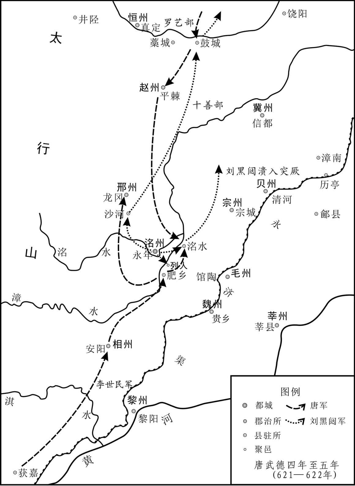 
唐平刘黑闼示意图

# 附录：

## 唐朝皇帝世系表

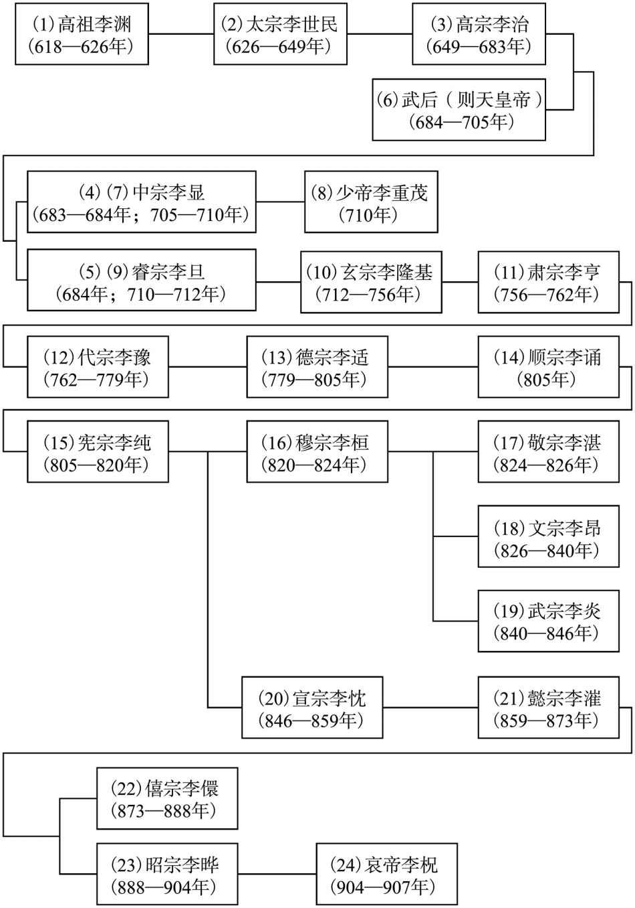

