# 目录

太宗平内难

太宗易太子

太宗平突厥

唐平铁勒

唐平西突厥

太宗讨龟兹

太宗平高昌

太宗平吐谷浑

附录： 
隋朝皇帝世系表

唐朝皇帝世系表

返回总目录

# 太宗平内难

## 【内容提要】

《太宗平内难》叙述了唐朝初年唐太宗李世民与他的哥哥太子李建成、齐王李元吉之间争夺皇位的斗争过程。

隋炀帝杨广大业十三年（617年），李渊在晋阳（今山西太原西南）起兵，攻占都城长安（今陕西西安）；次年（618年），称帝，定国号为唐，年号为武德，他就是唐高祖。

唐高祖李渊与元配夫人窦氏一共生了四个儿子：长子李建成、次子李世民、三子李玄霸和四子李元吉。除了李玄霸早逝之外，其余三兄弟都参加了晋阳起兵。李渊建唐称帝以后，立李建成为太子，封李世民为秦王，李元吉为齐王。

李世民智勇兼备，才能出众，在晋阳起兵、建立唐朝和统一全国的战争中，东征西讨，英勇善战，立下了赫赫战功，威望很高，无形中对他的哥哥李建成造成了很大的压力。李世民手下云集了一批猛将谋士，形成秦府集团，这更增加了李建成的不安。于是他便合齐王李元吉，结成太子东宫集团，一起对付李世民。由于唐高祖处理不当，造成了兄弟之间的矛盾越来越深。

在双方展开明争暗斗的过程中，彼此还都想方设法地采取各种手段削弱对手，壮大自己。在后宫，李建成利用自己的太子地位，极力讨好巴结后宫妃嫔，得到了她们的支持。李世民的妃子长孙氏也经常出入内宫，千方百计地拉拢贿赂后宫妃嫔，从中寻求支持力量。在外廷，支持太子和秦王的大臣也分成两派。宰相裴寂公开袒护太子，萧瑀（yǔ）、陈叔达则同情和倾向于李世民。在地方上寻找支持力量，发展和培植私人势力。山东、河北一带成为李建成在地方上的重要支持力量。李世民则在河南一带发展和争取地方势力。在双方的较量逐渐白热化的过程中，彼此还都采用收买、拉拢和排挤的手段，挖对方的墙角。太子李建成曾以重金收买李世民的铁杆心腹尉迟敬德和段志玄，但没有成功；李世民则成功策反东宫将领常何和太子率更丞王晊（zhì）。

唐高祖武德九年（626年）六月，突厥入侵。李建成推荐李元吉率军出征，同时建议征调秦府精锐猛将勇士，拨归元吉指挥。准备在为元吉饯行时，刺杀李世民。太子率更丞王晊将这一重要情报密告李世民。李世民马上召集长孙无忌、房玄龄、杜如晦、尉迟敬德等人商议，决定先发制人，诛杀李建成和李元吉。

六月三日，秦王李世民忽然秘密入朝，揭发太子李建成与齐王李元吉与后宫妃嫔张婕妤、尹德妃关系暧昧，还几次想谋害他。李渊觉得这件事情关系重大，决定第二天上朝亲自审理此事。

当天夜里，李世民调兵遣将，作好了部署。他亲自率领长孙无忌、尉迟敬德、侯君集、张公瑾等人，埋伏在上朝时的必经之路宫城北门玄武门。第二天，当李建成和李元吉两人并排骑着马，进入玄武门时，李世民指挥伏兵忽然杀出，一箭射死李建成，李元吉则被尉迟敬德射死。

东宫、齐府将士闻变，赶到玄武门救援。这时，尉迟敬德提着李建成和李元吉的人头出来示众，东宫、齐府将士眼看大势已去，就一哄而散。之后，尉迟敬德又迅速入宫控制了唐高祖。这就是历史上著名的玄武门之变。

玄武门之变后第三天，唐高祖李渊就宣布立秦王李世民为太子。不久，李渊宣告正式退位，李世民即位，改元“贞观”，他就是历史上著名的唐太宗。

玄武门之变是太子李建成和秦王李世民之间为了争夺皇位而展开的一场激烈的斗争。政变的结果是李世民取得了胜利，登上了皇位。他在位期间，励精图治，实行轻徭薄赋、与民休息的政策，出现了历史上难得的“贞观之治”大好局面。

## 【原文】

**唐高祖武德五年[1]。上之起兵晋阳也，皆秦王世民之谋[2]。上谓世民曰：“若事成，则天下皆汝所致，当以汝为太子[3]。”世民拜且辞[4]。及为唐王，将佐亦请以世民为世子，上将立之，世民固辞而止[5]。太子建成性宽简，喜酒色游畋，齐王元吉多过失，皆无宠于上[6]。世民功名日盛，上常有意以代建成[7]。建成内不自安，乃与元吉协谋，共倾世民，各引树党友[8]。**

## 【注文】

[1]唐（618—907年）：朝代名。李渊于公元618年建立，定都长安（今陕西西安）。690年，武则天改“唐”为“周”，迁都洛阳，史称武周。705年，唐中宗李显复辟，恢复大唐国号，还都长安。755年，爆发“安史之乱”，从此日渐衰落。至907年，朱温篡唐建梁，唐朝灭亡，共290年。唐朝在政治、经济、文化、外交等各方面都取得了辉煌的成就，是当时世界上最强大的国家之一。　　唐高祖，即唐朝开国皇帝李渊（566—635年），字叔德，陇西成纪（今甘肃静宁西南）人，迁陇西狄道（今甘肃临洮），又说是赵郡（今河北隆尧东）人。出身于关陇贵族，隋末天下大乱时，乘势从太原起兵，攻占长安。618年，称帝，改国号唐，定都长安，不久之后便统一了全国。玄武门之变后，退位为太上皇。　　武德：唐高祖的年号，也是唐朝的第一个年号，自武德元年（618年）五月至武德九年（626年）十二月使用。

[2]兵：军队。　　晋阳：地名，今山西太原西南。　　秦王：古代亲王的称号。　　世民：即唐朝第二位皇帝李世民（599—649年）。公元618年，李渊建立唐朝，并立世子李建成为太子。唐高祖武德九年（626年），李世民通过发动玄武门之变，登上皇位。在其统治时期开创了历史上“贞观之治”的大好局面，649年，逝世于长安含风殿，享年50岁，谥号为“文皇帝”。　　谋：计划，计策，主意。

[3]太子：古代君主的儿子中被预定为继承君位的人。

[4]拜：古代表示敬意的一种礼节。两手合于胸前,头低到手。

[5]将（jiàng）：将领。　　佐：处于辅助地位的人。　　世子：诸侯贵族指定的继承人，大多数情况下是嫡长子。

[6]建成（589—626年）：唐高祖李渊长子李建成，小名毗沙门。参加了李渊领导的晋阳起兵。李渊即位后，被立为太子，曾率军讨平窦建德部将刘黑闼（tà）叛乱。后与其弟李元吉联合，与秦王李世民展开激烈的争夺皇位的斗争。在李世民发动的玄武门之变中，被杀。李世民继位后，追封他为息王，谥“隐”，史称“隐太子”。　　宽简：不拘小节。　　畋（tián）：打猎。　　齐王：即唐高祖李渊第四子李元吉（603—626年），名劼（jié），小字三胡。参加了李渊领导的晋阳起兵。唐朝建立后，被封为齐王。后与其兄建成联合，与李世民展开激烈的争夺皇位的斗争。在“玄武门之变”中被杀，终年24岁。

[7]功名：功业和名声。　　盛：表程度深。

[8]倾：推翻。　　党：意见相合的人或由私人利害关系结成的团体。

## 【译文】

唐高祖武德五年（622年）。当年高祖李渊在晋阳起兵，都是秦王李世民的计谋。高祖曾对李世民说：“如果大事成功，那么天下都是由你得来的，应当立你为太子。”李世民拜谢并且推辞。等到李渊做了唐王后，将领们也请求把李世民立为继承人，唐高祖准备立他，因李世民坚决推辞才算了。太子李建成秉性散漫不拘小节，喜好酒色和游猎玩乐，齐王李元吉过失较多，因此都得不到高祖李渊的宠爱。李世民的功劳威望一天比一天大，高祖李渊曾经有意让他取代李建成为太子。李建成内心感到很不安，于是他和李元吉合谋，共同陷害李世民，他们各自拉拢、培植党羽。

## 【原文】

**上晚年多内宠，小王且二十人，其母竞交结诸长子以自固[1]。建成与元吉曲意事诸妃嫔，谄谀赂遗，无所不至，以求媚于上[2]。或言蒸于张婕妤、尹德妃，宫禁深秘，莫能明也[3]。是时，东宫、诸王公、妃主之家及后宫亲戚横长安中，夺人田宅，恣为非法，有司不敢诘[4]。世民居承乾殿，元吉居武德殿后院，与上台、东宫昼夜通行，无复禁限[5]。太子、二王出入上台，皆乘马携弓刀杂物，相遇如家人礼[6]。太子令、秦、齐王教与诏敕并行，有司莫知所从，唯据得之先后为定[7]。世民独不奉事诸妃嫔，诸妃嫔争誉建成、元吉而短世民[8]。**

## 【注文】

[1]内宠：帝王宠爱的人，指姬妾。　　小王：年幼封王者。　　竞：比赛，互相争胜。　　交结：交往，相互勾结。　　固：结实，牢靠。

[2]曲意：委曲己意而奉承别人。　　妃嫔（pín）：帝王的妾。妃，位次于后；嫔，位又次于妃。　　谄（chǎn）谀（yú）：奉承、巴结的意思。　　赂（lù）遗（wèi）：以财物赠送或买通他人。赂，贿赂；遗，赠送。　　无所不至：没有达不到的地方。凡能做的都做到了（用于坏事）。至，到。语出《论语·阳货》：“既得之，患失之，苟患失之，无所不至矣。”　　求媚：讨好。

[3]蒸：指与母辈淫乱。　　张婕（jié）妤（yú）：唐高祖李渊晚年最为宠幸的妃嫔之一。生卒年不详。传说与太子李建成和齐王李元吉相勾结以巩固自己的地位。　　尹德妃：唐高祖李渊晚年最为宠幸的嫔妃之一。生卒年不详。生酆（fēng）王李元亨。传说与太子李建成与齐王李元吉相勾结以巩固自己的地位。婕妤、德妃，都是古代宫中妃嫔的称号。唐制规定：贵妃、淑妃、贤妃、德妃、惠妃为夫人；昭仪、昭容、昭媛、修仪、修容、修媛、充仪、充容、充媛为九嫔（以上各一人）；婕妤、美人、才人各九人，为二十七世妇；宝林、御女、采女各二十七人，为八十一御妻。　　宫禁：帝王和王后居住的地方。　　深秘：幽深神秘。　　明：动词，分辨，区分。

[4]东宫：古代指太子所居住的宫殿。有时也指皇后居处。　　亲戚：古时指父母及兄弟等。　　妃主之家：后妃、公主之家。　　横（hèng）：蛮横，凶恶。　　长安：地名。唐朝都城，今陕西西安。　　田宅：田地和房屋。　　恣（zì）：放纵，无拘束。　　有司：指官吏。“有”即有……的权利；“司”即主管、管理。古代设官分职，各有专司，故称有司。　　诘（jié）：追问。

[5]承乾殿：宫殿名。位于隋唐皇宫太极宫，唐初李渊赐李世民居此。唐太宗的长子李承乾就生于此殿，故名。　　武德殿：宫殿名。位于隋唐皇宫太极宫，与东宫邻接。隋文帝废太子勇为庶人即在此殿宣诏；唐初李渊赐李元吉居此殿后院，这更方便了他与太子李建成的沟通往来。先天元年（712年），唐玄宗李隆基即位之初，还曾在此殿听政，可见其地位很不一般。　　上台：谓皇帝居住之处。

[6]礼：古代维持社会、政治秩序，巩固等级制度，调整人与人之间的各种社会关系和权利义务的规范和准则。既是中国古代法律的渊源之一，也是古代法律的重要组成部分。

[7]令、教、诏敕：都是上对下的训诫告谕，因身份不同，名称不一，太子称“令”，王称“教”，皇上称“诏敕”。

[8]誉：称扬，赞美。　　短：指摘缺点，揭发过失。

## 【译文】

唐高祖晚年宠幸的嫔妃很多，年幼被封为王的儿子就将近有二十人，他们的母亲争相结交各位年长的皇子来巩固自己的地位。李建成和李元吉也对各位妃嫔曲意奉承，谄媚阿谀、贿赂馈赠，无所不用，希望得到高祖李渊的宠爱。传说他们与张婕妤、尹德妃私通乱伦，但是宫禁中幽深神秘，这件事是无从证实的。当时，东宫太子、各王公、妃子公主之家以及后宫妃嫔的亲属，在长安城中横行霸道，抢夺百姓的土地和房宅，任意为非作歹，而有关的主管部门却不敢追究。李世民住在承乾殿，李元吉住在武德殿后院，他们的住处与高祖李渊的寝宫、太子东宫之间日夜通行，没有禁止和限制。太子与秦王、齐王出入高祖李渊的寝宫，都可以骑马、携带弓箭刀和杂物，彼此相遇时只行家人礼。太子下达的命令，秦王、齐王的命令与高祖李渊的诏敕并行，有关部门不知该听谁的，只能按照得令的先后次序来决定。只有李世民不去讨好诸位妃嫔，嫔妃们都争着在高祖李渊面前称赞李建成和李元吉，诋毁李世民。

## 【原文】

**世民平洛阳，上使贵妃等数人诣洛阳选阅隋宫人及收府库珍物，贵妃等私从世民求宝货及为其亲属求官[1]。世民曰：“宝货皆已籍奏，官当授贤才有功者[2]。”皆不许，由是益怨[3]。世民以淮安王神通有功，给田数十顷[4]。张婕妤之父因婕妤求之于上，上手敕赐之，神通以教给在先，不与[5]。婕妤诉于上曰：“敕赐妾父田，秦王夺之以与神通[6]。”上遂发怒，责世民曰：“我手敕不如汝教邪[7]！”他日，谓左仆射裴寂曰：“此儿久典兵在外，为书生所教，非昔日子也[8]。”尹德妃父阿鼠骄横，秦王府属杜如晦过其门，阿鼠家僮数人曳如晦坠马驱之，折一指，曰：“汝何人[9]？敢过我门而不下马[10]！”阿鼠恐世民诉于上，先使德妃奏，云：“秦王左右陵暴妾家[11]。”上复怒，责世民曰：“我妃嫔家犹为汝左右所陵，况小民乎！”世民深自辩析，上终不信[12]。**

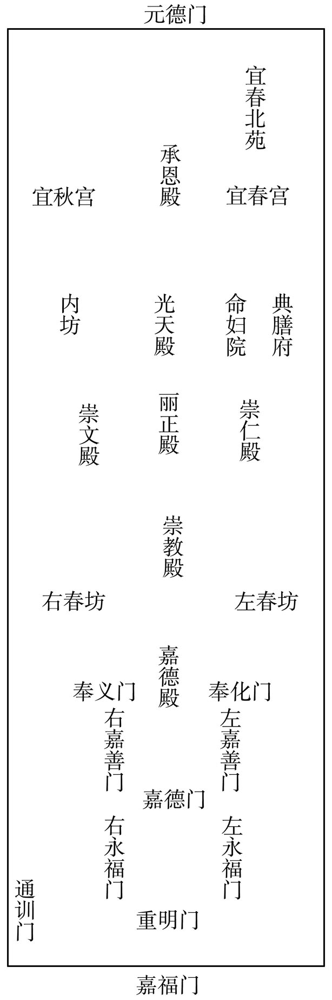 
唐东宫示意图

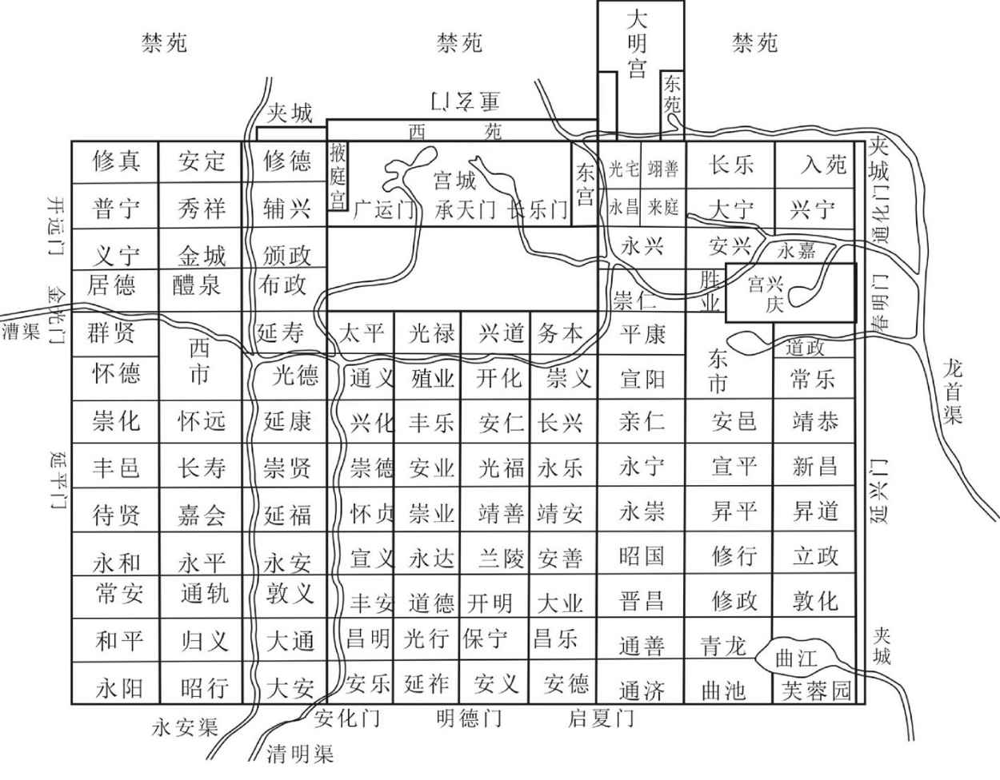 
唐长安城示意图

## 【注文】

[1]洛阳：地名，古都之一，隋唐时为东都。今河南洛阳。　　诣（yì）：到。　　选阅：拣选；挑选。　　隋（581—618年）：朝代名。隋文帝杨坚于581年取代北周建立。定都长安（今陕西西安）。589年，统一全国。开创了“开皇之治”的盛世局面。605年，隋炀帝杨广即位后，倒行逆施，滥用民力，导致隋朝走上衰亡。618年，隋炀帝在江都（今江苏扬州）兵变中，被杀。李渊拥立隋恭帝杨侑，后又逼迫其禅位，建立唐朝。隋朝灭亡，国祚三十八年。隋朝在政治、经济、文化、外交等各方面都取得了辉煌的成就，是当时世界上最强大的国家之一。　　宫人：妃嫔、宫女的通称。　　府库：旧指国家贮藏财物、兵甲的处所。　　珍物：珍贵的物品。　　宝货：泛指金银财宝。　　亲属：亲族。原指六世以内的血亲，后也指跟自己有血缘关系或婚姻关系的人。

[2]籍：登记隶属关系的簿册，这里用作动词，登记。　　奏：特指向帝王进言或上书。

[3]益：更加。　　怨：仇恨。

[4]神通：即李神通（？—630年），名寿，字神通。唐高祖李渊的族弟。唐高祖李渊晋阳起兵，李神通等人举兵响应，被任命为光禄大夫。李渊攻克长安后，改任宗正卿。唐高祖武德元年（618年），拜任右翊卫大将军，封淮安王，担任山东道安抚大使。武德四年（621年），任河北行台左仆射；次年，随军平定刘黑闼（tà），升任左武卫大将军。唐太宗即位后，拜任开府仪同三司，赐食封五百户。唐太宗贞观四年（630年），去世，追赠司空，谥曰“靖”。　　顷：田地面积的单位，等于一百亩。

[5]手敕：亦作“手勅”。手诏，帝王亲手写的诏书、命令。

[6]诉：控告。　　妾：谦辞，旧时女人自称。

[7]遂：于是，就。　　责：质问，诘问。

[8]左仆射（yè）：古代官名。秦始置，汉以后因之。汉成帝初置尚书五人，一人为仆射，位仅次尚书令，职权渐重。汉献帝建安四年（199年），置左右仆射。唐宋左右仆射为宰相之职。宋以后废。　　裴寂（570—629年，或573—632年）：字玄真，蒲州桑泉（今山西临猗西南）人，唐初大臣。隋末任晋阳（今山西太原西南）宫副监，与太原留守李渊交情深厚，为晋阳起兵的主要策划者之一。唐朝建立后，历任尚书右仆射、左仆射、司空等职，受到李渊的宠信。曾率军抵御宋金刚，大败而归；又曾出使突厥，达成和议。曾参与制定《唐律》。在太子与秦王的斗争中，倾向于李建成。在唐太宗即位后，他遭到疏远，最后被流放静州（今四川旺苍）而死，终年六十三岁。　　典兵：统领军队;掌管军事。

[9]阿鼠：即尹阿鼠。生卒年不详。唐高祖宠妃尹德妃之父。凭借外戚身份，骄横不法。　　属：官员。　　杜如晦（huì）（585—630年）：字克明，京兆杜陵（今陕西西安长安区西南）。唐初名相，凌烟阁二十四功臣之一。他是李世民夺取政权、开创贞观之治的主要谋臣之一，深受李世民的信任和重用，与房玄龄并称“房杜”。　　曳（yè）：拉，牵引。　　驱：殴打。

[10]敢：胆敢。

[11]陵暴：侵犯，欺侮。陵，古同“凌”。

[12]深：久，时间长。　　辩析：辨解分析。

## 【译文】

李世民平定洛阳，高祖李渊派贵妃等几人到洛阳挑选隋朝宫女并收取府库里的珍贵物品，贵妃等人私下向世民索要贵重物品并为自己的亲属求官。李世民说：“贵重物品都已经登记在册并上报朝廷了，官位应当授予贤德有才和有功劳的人。”没有答应她们的任何要求，因此妃嫔们更加恨他。李世民因为淮安王李神通有功劳，赏给他几十顷田地。张婕妤的父亲通过张婕妤向高祖李渊请求得到这些田地，高祖亲手书写诏令准备把这些田地赐给他，李神通因为秦王的教令在先，不让。张婕妤便向高祖告状说：“皇上敕令赐给我父亲的田地，被秦王夺去给了李神通。”高祖因此发怒，责备李世民说：“难道我亲手书写的敕令不如你的命令吗？”过了些天，高祖对左仆射裴寂说：“世民这孩子长期领兵在外，受那些读书人教唆，已经不是过去的那个儿子了。”尹德妃的父亲阿鼠骄横跋扈，秦王府的官员杜如晦路过他家门口，阿鼠的几名家仆把杜如晦拉下马，揍了一顿并打断了一根手指，说：“你是什么人？胆敢过我家的门而不下马！”阿鼠害怕李世民报告皇上，先让尹德妃对皇上说：“秦王李世民的亲信欺凌我的家人。”高祖又大怒，责备世民说：“我妃嫔的家人都被你的亲信欺凌，何况是一般老百姓呢！”李世民诚恳地为自己辩解，高祖始终不相信。

## 【原文】

**世民每侍宴宫中，对诸妃嫔，思太穆皇后早终，不得见上有天下，或歔欷流涕，上顾之不乐[1]。诸妃嫔因密共谮世民曰：“海内幸无事，陛下春秋高，唯宜相娱乐[2]。而秦王每独涕泣，正是憎疾妾等[3]。陛下万岁后，妾母子必不为秦王所容，无孑遗矣[4]。”因相与泣，且曰：“皇太子仁孝，陛下以妾母子属之，必能保全[5]。”上为之怆然，由是无易太子意，待世民浸疏，而建成、元吉日亲矣[6]。**

## 【注文】

[1]侍：伺候，在旁边陪着。　　太穆皇后（约569—约613年）：窦氏，唐高祖窦皇后，谥称太穆皇后。扶风平陵（今陕西咸阳西北）人。出身于关陇贵族。其父北周定州总管神武公窦毅，其母北周武帝的姐姐襄阳长公主（北周文帝宇文泰的第五女）。聪慧刚毅，颇有才华。唐朝还没有建立以前就去世了，生子建成、世民、玄霸、元吉，一女平阳公主。　　歔（xū）欷（xī）：悲泣；抽噎；叹息。　　流涕：流眼泪。　　顾：回头看，泛指看。

[2]谮（zèn）：说别人的坏话，诬陷，中伤。　　海内：国境之内，全国。古代传说我国疆土四周有大海环绕，故中国境以内为海内。　　陛下：古代对帝王的尊称。“陛”，指帝王宫殿的台阶。　　春秋：年岁、年寿。

[3]憎：恨，厌恶。　　疾：恨。

[4]万岁：帝王死亡的讳称。　　孑（jié）：单独，孤单。　　遗：漏掉。

[5]属（zhǔ）：通“嘱”。托付；委托。

[6]怆（chuàng）然：悲伤的样子。　　易：改变。　　浸：逐渐。

## 【译文】

李世民每次在宫中侍奉高祖李渊宴饮，面对诸位妃嫔，便思念母亲太穆皇后死得早，没能看到高祖李渊取得天下，有时不免叹息流泪，高祖看到后很不高兴。各位妃嫔乘机便向高祖李渊暗中诋毁世民说：“天下平安无事，陛下年寿已高，应当常常欢娱快乐。而秦王常常独自哭泣，这实际上是憎恨我们这些人，陛下万年以后，我们母子必定不为秦王所容，恐怕会被杀得一个不留！”因此相互对着流泪，并且说：“皇太子仁爱孝顺，陛下把我们母子托付给太子，必定能得到保全。”高祖李渊听了也感到很伤心，从此打消了改立太子的念头，对李世民逐渐疏远，而对李建成、李元吉却日益亲近了。

## 【原文】

**太子中允王珪、洗马魏徵说太子曰：“秦王功盖天下，中外归心[1]。殿下但以年长位居东宫，无大功以镇服海内[2]。今刘黑闼散亡之余，众不满万，资粮匮乏，以大军临之，势如拉朽[3]。殿下宜自击之以取功名，因结纳山东豪杰，庶可自安[4]。”太子乃请行于上，上许之[5]。珪，之兄子也[6]。**

## 【注文】

[1]太子中允：古代官职名。汉置，太子官属。太子属官有太子率更令、家令丞、仆、中盾。中盾后改称“中允”。魏晋以后多改称中舍人。唐制于左春坊左庶子之下置“中允”，于右春坊右庶子之下置中舍人，正五品下。中允约相当于朝廷之门下侍郎，中舍人约相当于朝廷之中书侍郎。唐高宗时曾改中允为左赞善大夫，中舍人为右赞善大夫。　　王珪（guī）（571—639年）：唐初名臣。字叔玠（jiè），祁县（今山西祁县）人，出身于世代官宦之家。隋文帝开皇十三年（593年），奉召入秘书省，从事图书校订工作。唐高祖武德元年（618年），任东宫舍人，迁中允，为人忠厚。玄武门之变后，继续得到唐太宗李世民的重用。贞观十三年（639年），病逝于长安。赠吏部尚书，谥曰“懿”。　　洗（xiǎn）马：古代官职名。东宫官属，是辅佐太子的官员，掌四库图集缮写刊辑之事，官居三品。　　魏徵（zhēng）（580—643年）：字玄成，魏郡内黄（今河南内黄西北）人，祖籍巨鹿下曲阳（今河北晋州西），一说馆陶（今属河北）人。唐初大臣、政治家。少家贫，出家为道士。后参加瓦岗军，随李密降唐，任太子洗马，为李建成心腹。玄武门之变后，继续得到唐太宗李世民的重用，擢任谏议大夫、左光禄大夫，历秘书监、侍中等职，封郑国公，以直谏闻名于世。是中国史上最负盛名的谏臣，享有崇高的声誉。著有《隋书》序论，《梁书》《陈书》《齐书》的总论等。其言论多见《贞观政要》。　　说（shuì）：劝说。

[2]镇：以武力维持安定。　　服：使……顺从。

[3]刘黑闼（tà）（？—623年）：贝州漳南县（今河北故城）人。年少时与窦建德为知己好友，常受其资助。窦建德死后，召集其旧部起兵，称汉东王，与李唐为敌，最终被李建成击灭。　　匮乏：缺乏；贫乏。　　拉朽：拉，摧折。朽，朽烂的木头。比喻腐朽势力或事物很容易被摧毁。

[4]山东：指华山（今属陕西）或崤（xiáo）山（今属河南）以东地区。　　豪杰：指才能出众的人。　　庶：表示希望发生或出现某事，进行推测，可译为也许可以，表示希望。　　安：使……没有危险或不受威胁。

[5]行（xíng）：这里指出征。

[6]（kuǐ）：即王（551—604年），字景文。隋文帝时，为国子博士。因罪被流放岭南。后为汉王杨谅府谘议参军。杨谅举兵造反，曾多次献上妙计，都没有被采纳，兵败自杀。

## 【译文】

太子中允王珪、洗马魏徵劝太子说：“秦王的功劳盖天下，朝野都归心拥戴。殿下不过是因为年长才位居东宫，没有什么大功可以镇服天下。现在刘黑闼的兵力都是分散逃亡的余众，人马不足一万，又缺乏物资和粮草，如果用大军征讨，势如摧枯拉朽。殿下应当亲自去攻打以获得功劳名望，趁机结交山东的豪杰之士，也许就可以稳定自己的地位。”太子于是向高祖请求带兵出征，高祖答应了他的请求。王珪是王哥哥的儿子。

## 【原文】

**七年。初，齐王元吉劝太子建成除秦王世民，曰：“当为兄手刃之[1]。”世民从上幸元吉第，元吉伏护军宇文宝于寝内，欲刺世民[2]。建成性颇仁厚，遽止之[3]。元吉愠曰：“为兄计耳，于我何有[4]？”**

## 【注文】

[1]手：名词做动词，亲自动手。　　刃：名词做动词，用刀杀。

[2]幸：指封建帝王到达某地。　　第：古代官僚贵族的大宅子。　　伏：隐藏。　　护军：古代武官名。唐初，秦王李世民、齐王李元吉府各置左、右六护军府，各设护军一人为长官。　　宇文宝（生卒年不详）：唐朝的将军，曾为李元吉的护军。

[3]遽（jù）：急，仓猝。

[4]愠（yùn）：怒，怨恨。

## 【译文】

唐高祖武德七年（624年）。当初，齐王李元吉劝太子李建成除掉秦王世民，他说：“我自当为哥哥亲手杀了他。”李世民随从高祖李渊前往李元吉的府中，李元吉把护军宇文宝埋伏在寝室里，准备刺杀李世民。李建成禀性颇为仁爱宽厚，急忙制止了这件事。李元吉生气地说：“我不过是为哥哥着想，对我自己有什么好处？”

## 【原文】

**建成擅募长安及四方骁勇二千余人为东宫卫士，分屯左右长林，号“长林兵”[1]。又密使右虞候率可达志从燕王李艺发幽州突骑三百置宫东诸坊，欲以补东宫长上[2]。为人所告，上召建成责之，流可达志于巂州[3]。**

## 【注文】

[1]擅：超越职权，自作主张。　　骁（xiāo）勇：指勇猛的士卒。　　长林：唐东宫宫门名，门分左右。

[2]右虞候率：古代官名。唐东宫设置十率府之一的右虞候率府长官。　　可达志（生卒年不详）：突厥人，奉颉（xié）利可汗之命依附于长林军。　　李艺（？—627年）：本姓罗，字子延，襄州襄阳（今属湖北襄樊）人，唐初将领，寓居京兆云阳（今陕西泾阳西北）。隋末任虎贲（bēn）郎将，驻守涿郡。619年，归唐后，赐姓李，初封燕公，后晋封燕郡王。助唐击败刘黑闼（tà），统领天节军，镇守泾州。唐太宗登基后，进封开府仪同三司，位比三公。唐太宗贞观元年（627年），率军反唐，进据豳州，后被击败，逃往甘肃乌氏，为其部下所杀。　　幽州：古州名。古九州之一。汉武帝时所设十三刺史部之一。其范围大致包括今北京市、河北北部及辽宁大部、山西小部、天津市海河以北及朝鲜大同江流域。魏晋以后，辖境日渐缩小。隋唐时期，为北方军事重镇、交通中心和商业都会。治所在今北京市城区西南。　　突骑：用于冲锋陷阵的精锐骑兵。　　坊：里巷（多用于街巷的名称）。　　长上：唐代低级武官名。位从九品下。唐中央南衙诸卫北衙诸军禁军机构设有此职。

[3]流：旧时的刑罚，把犯人送到荒远的地方去。　　巂（xī）州：古州名。南朝梁武帝大同三年（537年）置。北周武帝天和五年（570年）改为西宁州，不久又改严州。隋文帝开皇六年（586年）又为西宁州。今四川西昌。

## 【译文】

李建成擅自招募长安及各地的骁勇之士两千多人做东宫卫士，让他们分别驻扎在东宫左右长林门，号称“长林兵”。李建成还暗中让右虞候率可达志从燕王李艺那里征调幽州骁勇精锐的骑兵三百人，安置在东宫东面的各个坊中，准备用来扩充在东宫担任警卫的部队，结果被人告发，高祖召见李建成并责备他，将可达志流放到巂州。

## 【原文】

**庆州都督杨文干尝宿卫东宫，建成与之亲厚，私使募壮士送长安[1]。上将幸仁智宫，命建成居守，世民、元吉皆从，建成使元吉就图世民，曰：“安危之计，决在今岁[2]。”又使郎将尔朱焕、校尉桥公山以甲遗文干[3]。二人至豳州，上变，告太子使文干举兵，欲表里相应[4]。又有宁州人杜凤举亦诣宫言状[5]。上怒，托他事手诏召建成，令诣行在[6]。建成惧，不敢赴[7]。太子舍人徐师謩劝之据城举兵[8]。詹事主簿赵弘智劝之贬损车服，屏从者，诣上谢罪[9]。建成乃诣仁智宫。未至六十里，悉留官属于毛鸿宾堡，以十余骑往见上，叩头谢罪，奋身自掷，几至于绝，上怒不解[10]。是夜，置之幕下，饲以麦饭，使殿中监陈福防守，遣司农卿宇文颖驰召文干[11]。颖至庆州，以情告之，文干遂举兵反。上遣左武卫将军钱九陇与灵州都督杨师道击之[12]。夏六月甲子，上召秦王世民谋之[13]。世民曰：“文干竖子，敢为狂逆，计府僚已应擒戮，若不尔，正应遣一将讨之耳。[14]”上曰：“不然。文干事连建成。恐应之者众，汝宜自行，还，立汝为太子。吾不能效隋文帝自诛其子，当封建成为蜀王[15]。蜀兵脆弱，他日苟能事汝，汝宜全之，不能事汝，汝取之易耳。”**

## 【注文】

[1]庆州：古州名。隋文帝开皇十六年（596年）置，治合水（今甘肃庆成）。隋炀帝大业三年（607年），改为弘化郡，辖合水、马岭、华池、归德、洛源、弘化、弘德七县。唐高祖武德元年（618年），复为庆州。范围大致在今甘肃省庆阳和宁夏南部一带。　　都督：古代武官名。古代的军事长官名。最初是作为监督军队之官，临时设置。三国时大量出现，魏晋隋唐时发展成为中央或地方军事长官。　　杨文干（？—624年）：原是太子李建成的东宫宿卫，后来出任庆州都督，曾为太子私募壮士选送长安东宫。被人告发谋反，于唐高祖武德七年（624年）起兵，被打败，后为部下所杀。　　尝：曾经。　　募：招募。　　壮士：勇士。

[2]仁智宫：宫殿名。遗址位于陕西铜川境内，是唐高祖李渊的行宫。

[3]郎将：古代武官名。秦置，主宿卫、车骑，即郎中令所辖三署的五官中郎将，左、右中郎将。汉承秦制，属光禄勋。唐宋于中郎将之外，复置郎将。　　尔朱焕（生卒年不详）：唐初，曾任东宫郎将。　　校尉：古代官名。校，军事编制单位。尉，军官。战国已有此官。秦朝为中级军官。汉朝时地位仅次于将军。隋唐因袭。　　桥公山（生卒年不详）：唐初，曾任东宫校尉。　　甲：古代军人打仗穿的盔甲，用皮革或金属片制成。

[4]豳（bīn）州：古州名。北魏孝文帝太和二十年（496年），由邠州改。西魏废帝三年（554年），改为宁州。唐高祖武德元年（618年），从宁州析置。治彬县（今陕西彬县）。唐玄宗开元年间，又改称邠州。　　表里相应：内外互相应合。

[5]宁州：古州名。西魏废帝三年（554年），改豳州为宁州，取抚宁戎狄之意。治今甘肃宁县。　　杜凤举：唐初宁州人。曾告发太子李建成勾结庆州都督杨文干谋反，其他事迹不详。

[6]托：借口。　　行（xíng）在：指天子所在的地方。

[7]惧：害怕。　　赴：往，去。

[8]太子舍人：古代官职名。为太子东宫官。秦朝始置，汉沿置，秩二百石，选良家子充任，无员额，轮番宿卫。三国两晋南北朝沿置，魏晋为七品，北魏改从六品下。隋朝，定为从六品。唐朝，属右春坊，升为正六品，掌书令表启之事。宋辽皆置。　　徐师謩（mó）（生卒年不详）：唐初曾任太子舍人，曾劝太子李建成据城起兵。

[9]詹事主簿：古代官名。又称太子詹事主簿。主簿，晋始置，南北朝沿置。唐设太子詹事府，有主簿一人，从七品上，为掌管文书的佐吏。　　赵弘智（572—653年）：河南新安（今河南新安）人。少年丧母，事奉父亲以孝顺闻名。精通三礼（周礼、仪礼、礼记）、《史记》《汉书》。隋炀帝大业年间，任司隶从事。唐高祖武德初，授詹事府主簿。又参与修撰六代史（北魏、北周、北齐、梁、陈、隋）和《艺文类聚》。转任太子舍人。太宗贞观年间，累迁黄门侍郎，兼弘文馆学士。高宗时，任国子祭酒。死后，谥曰“宣”。有文集二十卷传于世。　　贬损：屈节；贬抑。　　车服：车舆礼服。

[10]毛鸿宾堡：地名，今陕西三原县故城北十五里。　　叩头：伏身跪拜，以头叩地。旧时为最郑重的一种礼节。　　掷：腾跃，将自身抛入空中。　　解（jiě）：缓解。

[11]幕：帷帐。　　饲：吃，喂。　　殿中监：古代官名。三国魏始置，两晋南北朝沿置品级极低。北齐为殿中局，设监四人，属门下省。隋炀帝置省，主官称殿内监，有二人。唐改为殿中省，主官为殿中监，从三品。北宋以后仅存虚名。　　陈福：生平事迹不详，活动于唐初。曾任殿中监。　　司农卿：古代官名。司农寺长官。其前身可以追寻到秦汉的治粟内史、大农令，汉武帝改称大司农。南朝梁始命名其官署为司农寺。北朝隋唐沿置。负责国家仓储及农林园苑管理事务，从三品。　　宇文颖（生卒年不详）：代州（今山西省代县）人。从李密那里来降，为农圃监，封化政郡公。与李元吉有交情，参与杨文干叛乱。事情败露后被杀。

[12]武卫将军：古代官名。魏文帝置武卫将军以主禁旅。隋唐时期为十六卫之一，分左、右，各置大将军一人、将军二人统领。　　钱九陇（573—645年）：字永业，一字贵章，湖州长城（今浙江长兴）人，唐初功臣。善骑射，曾参与晋阳起兵，在平定薛仁杲、刘武周、王世充、窦建德、刘黑闼（tà）的战争中，立有战功。历官右武卫将军、眉州刺史、右监门大将军、左武卫大将军、潭州都督，先后封郇（xún）国公、巢国公。死后，赠左武卫大将军、潭州都督，谥曰“勇”，陪葬献陵。　　灵州：古地名。西汉惠帝四年（前191年），置县。东汉改为州。今宁夏灵武西南。　　杨师道（？—647年）：字景猷（yóu），华阴（今陕西华阴）人。隋朝宗室，隋文帝族侄观王杨雄之子。为人机敏有才气，善于书法，精于作诗，风格清丽。隋末天下大乱，投奔唐朝。娶唐高祖的女儿桂阳公主，封安德郡公。历官灵州都督、侍中、中书令、工部尚书等职。在太宗朝，曾作为宰相，参与朝政。死后，赠吏部尚书、并州都督，陪葬昭陵，谥号“懿”。

[13]甲子：甲，天干的首位；子，地支的首位。古代以天干和地支递次相配，如甲子、乙丑、丙寅之类。从甲子起至癸亥止，共六十，故又称为六十甲子。古人用以纪日或纪年。

[14]竖子：小子，对人的蔑称。　　狂：气势猛烈，超出常度。　　逆：叛乱，谋反。　　府僚：王府或府署辟置的僚属。　　戮（lù）：杀。

[15]隋文帝：即杨坚（541—604年），鲜卑姓为普六茹，小名那罗延，自称弘农华阴（今陕西华阴）人。隋朝的建立者。581年，代周建隋；589年，统一全国。他在位期间，在政治、经济和军事方面实行了一系列改革，创立了三省六部制、科举制，改革了均田制和府兵制，降服突厥，使国家迅速富强起来，开创了“开皇盛世”的繁荣局面。　　自诛其子：指隋文帝废掉长子太子杨勇，剥夺三子秦王杨俊（软禁至死）、四子蜀王杨秀官爵的事件。　　蜀王：古代封爵。分封于蜀地，今四川地区。隋文帝杨坚的第四子杨秀曾被封为蜀王，唐高祖李渊的第十四子李元轨、唐太宗李世民的第三子李恪（kè）、第六子李愔（yīn）等人都曾被封为蜀王。

## 【译文】

庆州都督杨文干曾经在东宫担任值宿警卫，李建成与他的关系非常亲密，私下里让他募集勇士，送到长安。高祖准备前往仁智宫，命令李建成留守京城，李世民与李元吉一起随行。李建成让李元吉乘机谋杀李世民，他说：“安危大计，就在今年决定了。”李建成又指使郎将尔朱焕和校尉桥公山将盔甲送给杨文干。两人来到豳州的时候，向高祖上报发生了变故，告发太子指使杨文干起兵，想里应外合。又有宁州人杜凤举也前往仁智宫上奏这件事的内情。高祖大怒，借口有别的事情，亲笔写了诏书传召李建成，让他前往仁智宫。李建成非常惧怕，不敢前去。太子舍人徐师謩劝他占据京城，发兵起事。詹事主簿赵弘智劝他减少车驾服饰，屏退随从人员，到高祖李渊那里去谢罪。李建成于是到仁智宫，当距离仁智宫还有六十里的路程时，便将所属官员全部留在毛鸿宾堡，只带领十多个骑兵前去进见高祖，向高祖叩头谢罪，用身体撞击地面，几乎气绝，可高祖的怒气仍然没有消除。当天夜里，高祖将他安置在帷幕下面，给他麦饭吃，让殿中监陈福看守着他，派遣司农卿宇文颖快速传召杨文干。宇文颖来到庆州，将情况告诉了杨文干。于是，杨文干起兵造反。高祖派遣左武卫将军钱九陇和灵州都督杨师道攻击杨文干。武德七年（624年）夏六月甲子（二十六日），高祖传召秦王世民商量对策。李世民说：“杨文干这小子，竟敢狂妄叛逆，估计他幕府的僚属应当已将他擒获并杀掉了。如果事情发展不顺利，就应当派遣一员将领去讨伐他。”高祖说：“不能这样。杨文干的事情牵连着建成，恐怕响应他的人会很多。你应当亲自前往，回来以后，我便立你为太子。我不能效法隋文帝去诛杀自己的儿子，届时把建成封为蜀王。蜀地兵力薄弱，如果以后他能够臣服你，你就应该保全他的性命；如果他不肯臣服于你，你取他也容易啊。”

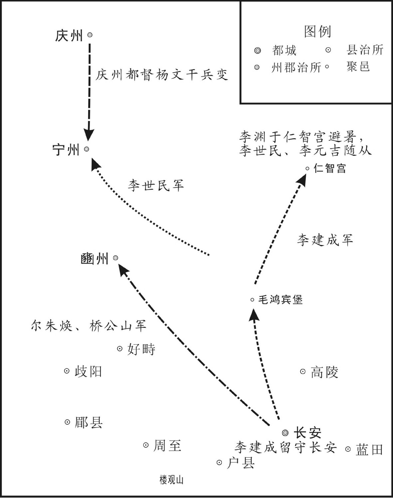 
杨文干事件示意图

## 【原文】

**上以仁智宫在山中，恐盗兵猝发，夜帅宿卫南出山外，行数十里，东宫官属将卒继至者，皆令三十人为队，分兵围守之[1]。明日，复还仁智宫[2]**

## 【注文】

[1]猝（cù）：突然。　　卒：泛指士兵。　　继：随后；跟着。

[2]明日：第二天。　　复：又，再。

## 【译文】

高祖李渊因为仁智宫在山中，怕有匪盗突然袭击，晚上率领宿卫部队从南面出发到山外，走了几十里，东宫的官属将士相继到来，高祖命令他们三十人为一队，分兵把他们包围看守起来。第二天，重新回到仁智宫。

## 【原文】

**世民既行，元吉与妃嫔更迭为建成请，封德彝复为之营解于外，上意遂变，复遣建成还京师居守[1]。惟责以兄弟不睦，归罪于太子中允王珪、左卫率韦挺、天策兵曹参军杜淹，并流于巂州[2]。挺，冲之子也[3]。初，洛阳既平，杜淹久不得调，欲求事建成[4]。房玄龄以淹多狡数，恐其教导建成，益为世民不利，乃言于世民，引入天策府[5]。**

## 【注文】

[1]更迭（dié）：交换，更替。　　封德彝（yí）（568—627年）：名伦，观州蓨（tiáo，今河北景县南）人。最初在隋朝为杨素幕僚，受到器重，把侄女嫁给了他，并举荐他担任了内史舍人。后来，投奔唐朝，曾随秦王李世民东征王世充。历官内史侍郎、中书令、尚书右仆射等职，封密国公。为人才思敏捷，但善于见风使舵。在太子李建成与秦王李世民争夺皇位的斗争中，首鼠两端。因此，在他病死后，追赠司空，初谥曰“明”，后改谥“缪”。　　营解（jiě）：特指调解，代人说情。　　京师：京城。

[2]左卫率：古代官职名。秦为卫率，汉有太子卫率一人，秩千石。晋分左、右，各领一军。隋唐沿置，设左右卫率府，各设率一人，正四品上。负责东宫禁卫、仪仗等事务。　　韦挺（589—646年）：雍州万年（今陕西西安）人，隋民部尚书韦冲之子。因从小就与李建成有交往，在李渊攻克长安后，被引荐为李建成陇西公府祭酒。受太子李建成与秦王李世民之间斗争的牵连，曾被流放巂（xī）州（今四川西昌）。太宗即位后，召回。历任尚书左丞、吏部侍郎、黄门侍郎、御史大夫等职，封扶阳县男，深得赏识和重用。后因延误军事，又被贬为象州（今广西象州）刺史，卒年五十八。　　天策兵曹参军：古代官名。即天策上将军府兵曹参军，正六品下，为参知军事的属官，掌管府中士兵名册、考勤。　　杜淹（？—628年）：字执礼，京兆杜陵（今陕西西安东南）人，出身于官僚之家。从小聪明，多才多艺，名声很好。隋时曾隐居太白山，被文帝流放江南。隋炀帝大业末年，官至御史中丞。唐初，受房玄龄推荐，秦王李世民任用他为天策府兵曹参军、文学馆学士。受太子李建成与秦王李世民之间斗争的牵连，曾被流放巂（xī）州（今四川西昌）。太宗召拜御史大夫，检校吏部尚书，参与朝政，封安吉郡公。死后，赠尚书右仆射，谥号“襄”。　　流：放逐，流放，古代五刑之一。

[3]冲：即韦冲（540—605年），雍州万年（今陕西西安）人。韦挺之父。初仕北周，迁汾州刺史。入隋，进位开府，兼散骑常侍，拜石州刺史。历任南宁州总管，检校括州事，镇压陶子定、罗慧方等叛军。隋文帝开皇十五年（595年），任营州总管，仁寿三年（603年），拜民部尚书。女嫁豫章王杨暕（jiǎn）为妃。

[4]调（diào）：提拔，升迁。

[5]房（fáng）玄龄（579—648年）：名乔，字玄龄（一说名玄龄，字乔松），以字行于世。齐州临淄（今山东淄博临淄区北）人，唐朝初年名相。博览经史，工书善文，18岁举进士，先后授羽骑尉、隰（xí）城尉。隋末大乱，李渊率兵入关，玄龄于渭北投李世民，屡从秦王出征，参谋划策，典管书记，任秦王府记室，成为秦王得力的谋士之一。唐高祖武德九年（626年），参与玄武门之变的策划，与杜如晦、长孙无忌、尉迟敬德、侯君集五人并列为功劳第一。唐太宗李世民即位后，先后任中书令、尚书左仆射，封梁国公。与杜如晦、魏徵等同为太宗朝的重要大臣。后世以他和杜如晦为良相的典范，合称“房杜”。病逝后谥号“文昭”，陪葬昭陵。　　狡数：狡诈的权术。　　天策府：古代官署名。唐高祖武德四年（621年），秦王李世民平定王世充、窦建德后，因其功高，特设天策上将位授予，准许开府。位在亲王、三公（太尉、司徒、司空）之上。天策府可以自行招募人才作为属官。

## 【译文】

李世民出发以后，李元吉和妃嫔们轮番为李建成说情，封德彝又为他在外面游说以解脱其罪行，高祖的想法于是变了，重新派李建成回京驻守。只是责备他兄弟间不和睦，把罪过归到了太子中允王珪、左卫率韦挺、天策兵曹参军杜淹三人头上，并把他们都流放到巂州。韦挺是韦冲的儿子。当初平定洛阳后，杜淹很久得不到升迁，想请求做李建成的部属。房玄龄认为杜淹狡猾多诈，恐怕他教导李建成，更加对李世民不利，于是劝说李世民，把他引荐到天策府任职。

## 【原文】

**秋七月，杨文干袭陷宁州，驱掠吏民出据百家堡[1]。秦王世民军至宁州，其党皆溃[2]。癸酉，文干为其麾下所杀，传首京师[3]。获宇文颖，诛之[4]。**

## 【注文】

[1]百家堡：地名，今甘肃庆阳境内。

[2]溃：散乱，垮台。

[3]麾（huī）下：即部下，麾指古代指挥军队的旗子。

[4]获：得到，取得。　　诛：把罪人杀死。

## 【译文】

唐高祖武德七年（624年）秋七月，杨文干袭击攻陷宁州，驱赶劫掠官吏和百姓出城据守百家堡。秦王李世民带兵到达宁州，杨文干的党羽全部溃散。癸酉（初五日），杨文干被他的部下所杀，首级被送到京城。李世民捕获了宇文颖，处死了他。

## 【原文】

**上欲徙都以避突厥，秦王世民谏止之[1]。建成与妃嫔因共谮世民曰：“突厥虽屡为边患，得赂则退[2]。秦王外托御寇之名，内欲总兵权，成其篡夺之谋耳[3]。”**

## 【注文】

[1]徙（xǐ）：迁移。　　都：都城，国都。　　突厥：古代北方游牧民族。最初生活在咸海西，后东移至叶尼塞河南，受铁勒同化。5世纪中叶，归附柔然，为其炼铁奴。徙居于金山南麓（今阿尔泰山），因其山形似战盔“兜（dōu）鍪（móu）”，俗称突厥，因以为名。6世纪时，突厥首领阿史那土门派遣使臣向西魏进贡。546年，合并铁勒部五万余落（户），势力逐渐强盛。552年，大败柔然，以漠北为中心，在鄂尔浑河流域建立政权。最盛时疆域东至辽海（辽河上游），西濒西海（今里海），北至北海（今贝加尔湖），南临阿姆河南。“可汗”为最高首领，其子弟称“特勤”，将领称“设”。分辖地为“突利”（东部）、“达头”（西部）。582年，分裂为东、西突厥。后于630年、657年先后为唐所灭。682年，后突厥汗国建立，745年灭亡。突厥人一部分内附唐朝，一部分西迁中亚，而大部分转入回纥汗国。　　谏（jiàn）：旧时称规劝君主或尊长，使改正错误。　　止：阻止，不让进行。

[2]屡：接连着，不止一次。

[3]御：抵挡。　　寇：盗匪，侵略者，亦指敌人。　　篡：泛指夺取。

## 【译文】

唐高祖想迁移都城，用来躲避突厥的进攻，秦王李世民劝阻了这件事。李建成和嫔妃们趁机一起诋毁李世民说：“突厥虽然屡次侵扰边境，但得到财物就退去了。秦王对外假托讨伐突厥的名义，实际上是想在朝内总揽兵权，以成就他篡位夺权的阴谋。”

## 【原文】

**上校猎城南，太子、秦、齐王皆从，上命三子驰射角胜[1]。建成有胡马，肥壮而喜蹶，以授世民曰：“此马甚骏，能超数丈涧，弟善骑，试乘之[2]。”世民乘以逐鹿，马蹶，世民跃立于数步之外，马起，复乘之，如是者三[3]。顾谓宇文士及曰：“彼欲以此见杀，死生有命，庸何伤乎[4]！”建成闻之，因令妃嫔谮之于上曰：“秦王自言，我有天命，方为天下主，岂有浪死[5]。”上大怒，先召建成、元吉，然后召世民入，责之曰：“天子自有天命，非智力可求，汝求之何急邪[6]？”世民免冠顿首，请下法司案验，上怒不解[7]。会有司奏突厥入寇，上乃改容劳勉世民，命之冠带，与谋突厥[8]。闰月己未，诏世民、元吉将兵出豳州以御突厥，上饯之于兰池上[9]。每有寇盗，辄命世民讨之，事平之后，猜嫌益甚[10]。**

## 【注文】

[1]校（jiào）猎：遮拦禽兽以猎取之。泛指打猎。校，栅栏，木栏。　　驰射：追逐射猎。　　角（jué）胜：较量胜负。角，较量，竞争。

[2]胡马：泛指产在西北民族地区的马。　　蹶（juě）：马尥（liào）后蹶，即马急奔中突然后脚蹬地，上下跳跃，使人从马上摔下以致伤残。　　骏：迅速。　　丈：我国市制长度单位，十尺。　　涧：山间流水的沟。　　善：善于，擅长。　　乘（chéng）：骑，坐。

[3]逐：追赶。　　跃：跳。

[4]宇文士及（？—642年）：字仁人，隋唐时期官员，隋朝右卫大将军宇文述之子，宇文化及之弟。京兆长安（今陕西西安）人。先娶隋炀帝女儿南阳公主，封尚辇奉御。宇文化及兵败后，投靠唐朝。随秦王李世民征讨王世充、窦建德有功，封新城县公、郢国公，唐高祖以宗室女妻之。后颇受宠，历任中书令、殿中监。唐太宗贞观十六年（642年）卒，赠左卫大将军、凉州都督，陪葬昭陵。　　死生有命：指人的生死都是命中注定。语出《论语·颜渊》：“子夏曰：‘商闻之矣，死生有命，富贵在天。’”　　庸：表示反问,可译为“难道”“岂”“哪里”。

[5]天命：上天意旨；由天主宰的命运。　　方：表示时间,相当于“正在”。　　浪：徒然；白白地。

[6]天子：古代统治者宣称“君权神（上天、天帝）授”，故称帝王为天子。

[7]免冠：脱帽。古人用以表示谢罪。冠，帽子。　　顿首：即叩首，磕头。旧时礼节之一。古人席地而坐，姿势和跪差不多，行顿首礼时，取跪姿，先拱手下至于地，然后引头至地，便立即举起。因为头触地时间很短，只是略做停顿，所以叫顿首。　　法司：指司法官吏。　　案验：也作按验。调查罪证；查询验证。

[8]容：面色，神色。　　勉：鼓励。　　冠：动词，戴上帽子。　　带：这里指穿上衣服。

[9]饯（jiàn）：设酒食送行。　　兰池：或称兰池陂。为秦始皇引水所造的池，秦在池之北侧造宫殿一座，名“兰池宫”，在今陕西咸阳东。

[10]盗：抢劫财物的人，强盗。　　辄（zhé）：立即；就。　　猜嫌：猜忌嫌怨。嫌，厌恶，不满意。

## 【译文】

高祖在城南设场围猎，太子、秦王、齐王都跟随，高祖让三个儿子骑马追逐射猎进行比赛。李建成有匹来自少数民族地区的马，膘肥体壮，但是喜欢尥蹶子，他把这匹马交给李世民说：“这匹马跑得很快，能跳过几丈宽的山涧，弟弟你善于骑马，骑上它试试看。”李世民乘这匹马去追逐野鹿，这马突然尥蹶子，李世民纵身跳下，站在数步之外，马站起来后，他又骑上这匹马，这样反复三次。李世民回头对宇文士及说：“他是想用这匹马来杀死我。死生有命运主宰，难道他用这种方法就能够伤害我吗？”李建成听说后，就让妃嫔们在高祖面前说世民的坏话道：“秦王自己说，上天授命于我，正是要让我当天下之主，怎么会白白地死去呢？”高祖非常生气，先召李建成、李元吉，然后召李世民入见，斥责他说：“天子自然有天命，不是靠智力能得到的，你谋求帝位怎么这样急切呢\!”李世民摘下帽子叩头谢罪，并请求移交法司查询证实，高祖仍然怒气不消。恰巧有关部门奏称突厥入侵，高祖于是改变了脸色，安慰勉励李世民，命他戴好帽子穿好衣服，与他商量攻打突厥的事情。唐高祖武德七年（624年）闰七月己未（二十一日），高祖李渊下诏让李世民、李元吉率兵出豳州以抵御突厥，高祖在兰池上为他们饯行。每次只要有敌情发生，就命李世民去征讨，但平定之后，高祖对李世民的猜忌和厌恶又更加厉害。

## 【原文】

**九年夏六月丁巳，太白经天[1]。**

## 【注文】

[1]太白经天：言太白星白天出现在午位上。古人占星认为日为阳，太白为少阴；经天，认为是阴强阳弱，也即强国弱、小国强的征兆。也是一种兵败、出现叛臣、更换统治者的征兆。此喻指玄武门之变。

## 【译文】

唐高祖武德九年（626年）夏六月丁巳（初一日），太白星白天出现。

## 【原文】

**秦王世民既与太子建成、齐王元吉有隙，以洛阳形胜之地，恐一朝有变，欲出保之，乃以行台工部尚书温大雅镇洛阳，遣秦府车骑将军荥阳张亮将左右王保等千余人之洛阳，阴结纳山东豪杰以俟变，多出金帛，恣其所用[1]。元吉告亮谋不轨，下吏考验，亮终无言，乃释之，使还洛阳[2]。**

## 【注文】

[1]隙：缝隙，这里指感情的裂痕。　　形胜：谓地理位置优越，地势险要。　　行（xíng）台：魏晋始有，为出征时随其所驻之地设立的代表中央的政务机构。北朝后期，称尚书大行台，设置官属无异于中央，自成行政系统。唐贞观以后渐废。　　工部尚书：古代职官名。工部，古代中央官署，为掌管营造工程事项的机关，六部之一，长官为工部尚书。　　温大雅（？—约627年）：隋末唐初大臣，本名彦弘，并州祁（今山西祁县）人。隋炀帝大业十三年（617年），李渊从太原起兵，聘为大将军府记室参军，专门典掌机要。唐朝建立以后，历任黄门侍郎、工部侍郎、陕东道大行台工部尚书等职。秦王李世民与太子李建成因争夺皇位展开激烈斗争时，李世民推荐他出镇洛阳，以为外应。唐太宗即位后，升任礼部尚书，封黎国公。翌年病卒，谥“孝”。　　车骑（jì）将军：古代武官名。西汉置，掌领车骑士。东汉时位在大将军、骠骑将军下，在卫将军上，位比公，秩万石。魏晋南北朝多沿置，隋车骑将军属骠骑府，唐废。　　荥（xíng）阳：古地名，今河南荥阳东北。　　张亮（？—646年）：郑州荥阳（今河南荥阳）人。唐初大臣，凌烟阁二十四功臣之一。早年以务农为业，后参加瓦岗军。降唐后，在房玄龄推荐下，任秦王府车骑将军。唐太宗贞观年间，历官御史大夫、工部尚书、刑部尚书等职，封郧（yún）国公。后以谋反罪被杀。　　左右：近臣；随从。　　王保：生平事迹不详，活动于唐初。　　俟（sì）：等待。　　帛（bó）：丝织品的总称。　　恣：肆意；尽情。

[2]不轨：指叛乱。　　下吏考验：交司法官吏审问治罪。审讯验实。

## 【译文】

秦王李世民与太子李建成、齐王李元吉有了矛盾以后，认为洛阳地势险要，担心有一天会发生变乱，所以想去洛阳镇守，就命行台工部尚书温大雅镇守洛阳，派秦府车骑将军荥阳人张亮率领亲信王保等一千多人到洛阳，暗中结交山东豪杰，以观察等待形势的变化。李世民拿出大量金银玉帛任他们使用。李元吉告发张亮图谋不轨，交给狱吏调查核实，张亮始终没有说出事情的真相，李元吉于是释放了他，让他回到了洛阳。

## 【原文】

**建成夜召世民，饮酒而鸩之，世民暴心痛，吐血数升，淮安王神通扶之还西宫[1]。上幸西宫问世民疾，敕建成曰：“秦王素不能饮，自今无得复夜饮[2]。”因谓世民曰：“首建大谋，削平海内，皆汝之功。吾欲立汝为嗣，汝固辞[3]。且建成年长，为嗣日久，吾不忍夺也[4]。观汝兄弟，似不相容，同处京邑，必有纷竞[5]。当遣汝还行台，居洛阳，自陕以东皆主之[6]。仍命汝建天子旌旗，如汉梁孝王故事[7]。”世民涕泣，辞以不欲远离膝下[8]。上曰：“天下一家，东西两都，道路甚迩，吾思汝即往，毋烦悲也[9]。”将行，建成、元吉相与谋曰：“秦王若至洛阳，有土地甲兵，不可复制[10]。不如留之长安，则一匹夫耳，取之易矣[11]。”乃密令数人上封事，言：“秦王左右闻往洛阳，无不喜跃，观其志趣，恐不复来[12]。”又遣近幸之臣以利害说上，上意遂移，事复中止[13]。**

## 【注文】

[1]鸩（zhèn）：毒酒，用毒酒害人。　　暴（bào）：突然；猝然。　　西宫：即弘义宫，在西内苑中。唐高祖武德五年（622年），高祖为秦王建；唐太宗贞观三年（629年），改名大安宫。

[2]疾：古代轻微的叫疾，泛指病。　　素：向来；从来就。

[3]嗣（sì）：本意为继承，此谓嗣君，帝位继承人。　　固：执意；坚决地。　　辞：躲避，推托。

[4]日久：时间较长。

[5]似：好像，表示不确定。　　京邑：京城。　　纷竞：纷争。

[6]陕：即陕州，今河南陕县。

[7]旌（jīng）旗：旗帜的总称。　　汉梁孝王故事：梁孝王刘武（？—前144年），西汉人。汉文帝次子、汉景帝之弟，母为窦太后。公元前178年，封太原王。公元前176年，改封淮阳王。公元前168年，又改封梁王，死后谥号为“孝”，故号梁孝王。葬于河南永城芒砀（máng dàng）山。　　故事：旧事，先例。这句话的意思是梁孝王以窦太后幼子的缘故，有宠，王四十余城，居天下膏腴之地，赏赐不可胜数，以至亲有功，得赐天子旌旗，从千乘万骑，出跸（bì）入警。

[8]涕泣：哭泣；流泪。

[9]迩（ěr）：近。　　毋（wú）：不要，不可以。

[10]复制：继续控制。

[11]匹夫：独夫。多指有勇无谋的人，含轻蔑意味。

[12]封事：臣下上书奏事，为防泄漏，用袋封缄（jiān），称为封事。　　喜跃：欢喜跳跃。

[13]近幸：指帝王宠爱的人。

## 【译文】

李建成在夜间召李世民与他饮酒，用毒酒害他，李世民突然心口剧烈疼痛，吐了几升血，淮安王李神通扶着他回到西宫。高祖驾临西宫询问李世民的病情，对李建成说：“秦王平素不善于饮酒，从今以后你再不得与他夜间饮酒。”又对李世民说：“第一次提出反隋的谋略，平定了海内的敌人，这都是你的功劳。我打算立你为太子，你却坚决推辞。再说建成年长，立为太子已经很久了，我不忍心再夺去他的地位。我看你们兄弟之间，似乎难以相容，同住在京城，必然发生纷争，应当派你返回行台去，让你居住在洛阳，陕州以东广大地区都由你统领，还让你建立天子的旌旗，像汉代的梁孝王一样。”李世民哭泣泪下，以不愿远离高祖膝下为推辞。高祖说：“天下都是一家，东都西都两地，路程相距很近，我想念你就去那里，不要烦恼悲伤。”李世民准备出发时，李建成、李元吉互相商议说：“如果秦王到了洛阳，拥有土地和军队，就再也控制不了他了。不如把他留在长安，那他只不过是一个独夫而已，想取他性命也是很容易的。”于是暗中让几个人秘密向高祖上奏说：“秦王身边的人得知前往洛阳的消息，无不欢喜雀跃，察看李世民的意向，恐怕是不会再回来了。”又派亲近宠信的大臣向高祖陈述利害，高祖于是改变了主意，让李世民去洛阳这件事也就半途而废了。

## 【原文】

**建成、元吉与后宫日夜谮诉世民于上，上信之，将罪世民[1]。陈叔达谏曰：“秦王有大功于天下，不可黜也[2]。且性刚烈，若加挫抑，恐不胜忧愤，或有不测之疾，陛下悔之何及[3]。”上乃止。元吉密请杀秦王，上曰：“彼有定天下之功，罪状未著，何以为辞[4]？”元吉曰：“秦王初平东都，顾望不还，散钱帛以树私恩，又违敕命，非反而何[5]？但应速杀，何患无辞[6]。”上不应。**

## 【注文】

[1]后宫：原指妃嫔所居宫室。此指同李建成等互相勾结的尹德妃、张婕妤等。

[2]陈叔达（？—635年）：字子聪，吴兴长城（今浙江长兴东）人，陈宣帝陈顼（xū）之子。有才学。在南朝陈时，封义阳王，任仁武将军、丹阳尹等职。隋炀帝大业年间，历任内史舍人、绛郡通守等职。后归李渊，任丞相府主簿，封汉东郡公，与温大雅同掌机密。唐朝建立后，历任侍中、礼部尚书等职，进封江国公。去世后，初谥“缪”，后改谥“忠”。有文集十五卷，传于世。　　黜（chù）：废免，贬斥。

[3]挫：挫伤，折伤。　　抑：压，压制。　　胜：能承担，能承受。　　悔之何及：后悔也来不及了。语出《孔子家语·致思》：“吾有三失，晚而自觉，悔之何及！”

[4]定：使安定。　　罪状：犯罪的事实。　　辞：借口，托词。

[5]东都：隋唐时指洛阳。

[6]何患无词：何患，哪怕；辞，言辞。哪里用得着担心没有话说呢？常与“欲加之罪”连用，表示坏人诬陷好人时，无端捏造罪名，还说得振振有词。语出《左传·僖公十年》：“不有废也，君何以兴？欲加之罪，其无辞乎？”

## 【译文】

李建成、李元吉和后宫妃嫔们，日夜不停地向高祖诬陷李世民，高祖相信了他们，将要治李世民的罪。陈叔达劝说道：“秦王对国家有大功，是不能废黜的。况且他性格刚烈，如果再加上挫折压抑，恐怕不能忍受心中的忧伤郁愤，一旦染上意想不到的疾病，陛下后悔就来不及了。”高祖于是才停止。李元吉暗中请求杀掉秦王李世民，高祖说：“他有平定天下的功劳，罪状不显著，拿什么作为借口呢？”李元吉说：“秦王最初平定东都洛阳后，观望形势不肯回来，散发钱和丝绸来树立他自己的威信，又违背陛下的命令，不是造反又是什么？应该赶紧把他杀掉，何必担心找不到借口。”高祖没有答应。

## 【原文】

**秦府僚属皆忧惧，不知所出[1]。行台考功郎中房玄龄谓比部郎中长孙无忌曰：“今嫌隙已成，一旦祸机窃发，岂惟府朝涂地，乃实社稷之忧[2]。莫若劝王行周公之事，以安家国[3]。存亡之机，间不容发，正在今日[4]。”无忌曰：“吾怀此久矣，不敢发口[5]。今吾子所言，正合吾心，谨当白之[6]。”乃入言世民，世民召玄龄谋之[7]。玄龄曰：“大王功盖天地，当承大业[8]。今日忧危，乃天赞也，愿大王勿疑[9]。”乃与府属杜如晦共劝世民诛建成、元吉。**

## 【注文】

[1]不知所出：不知道该如何脱离险境。出，脱离。

[2]考功郎中：古代官职名。吏部属官，从五品上，掌文武官吏的考核。　　比部郎中：古代官职名。刑部属官，从五品上。掌管和处理诸司百僚的俸料、经费等事。　　长孙无忌（？—659年）：字辅机，洛阳（今河南洛阳）人。唐初大臣，凌烟阁二十四功臣之首。先世为鲜卑拓跋氏，属北魏皇族支系，后改为长孙氏。长孙皇后的哥哥，唐太宗李世民的内兄，唐高宗李治的舅舅。李渊晋阳起兵后，前往投奔。为建唐功臣，以功第一，封齐国公，后改封赵国公。曾辅佐秦王李世民，发动玄武门之变，夺取帝位。历任尚书仆射、司空、司徒。唐高宗即位后，册封太尉，同中书门下三品。为人谨慎，奉命修订《贞观律》，撰成《唐律疏议》。因反对高宗立武则天为皇后，受到许敬宗诬陷，被削去官爵，流放黔州（今重庆彭水），自缢而死。　　机：事物发生的枢纽。　　窃：暗中。　　涂地：极端困苦的境地。　　社稷（jì）：旧时亦用为国家的代称。

[3]行（xíng）：实施。　　周公之事：周公（生卒年不详），西周初年杰出的政治家姬旦，周文王之子，周武王的同母弟。武王死后，其子成王年幼，由他摄政当国。在其摄政期间，曾两次东征，并平定管叔、蔡叔、霍叔同武庚发动的叛乱。他还制定国典，制礼作乐，整理典籍，完善周易，奠定了周朝长达八百多年的基础，其思想成为中华传统文化的重要源头。

[4]间（jiàn）不容发：间，空隙。空隙中容不下一根头发。比喻与灾祸相距极近或情势危急到极点。

[5]怀：心里存有。　　发口：开口。

[6]子：对男子的美称、敬称。　　谨：郑重，恭敬。　　白：禀告；报告。

[7]言：告知；告诉。

[8]盖：压倒，超过。　　承：接受；承受。

[9]赞：帮助，辅佐。

## 【译文】

秦府的僚属人人忧虑恐惧，不知所措。行台考功郎中房玄龄对比部郎中长孙无忌说：“如今矛盾已经形成，一旦祸患暗中发生，岂止是秦王府一败涂地，实际上是国家存亡的忧患。不如劝秦王施行周公平定管叔蔡叔的行动，以便安定皇室和国家。存亡的机运，已经到了间不容发的地步，行动就在今天。”长孙无忌说：“我有这种想法已经很久了，只是不敢讲出来，现在您所说的，正合我的心意，请让我禀告秦王。”于是长孙无忌进府告诉李世民他们的想法，李世民又召房玄龄商议这件事。房玄龄说：“大王的功劳可盖天地，应当继承皇帝的大业。今天的忧患危机之事，是上天赞助于您的，希望大王不要再迟疑不定了。”于是又和秦王府属吏杜如晦一起劝说李世民诛杀李建成和李元吉。

## 【原文】

**建成、元吉以秦府多骁将，欲诱之使为己用，密以金银器一车，赠左二副护军尉迟敬德，并以书招之曰：“愿迂长者之眷，以敦布衣之交[1]。”敬德辞曰：“敬德蓬户瓮牖之人，遭隋末乱离，久沦逆地，罪不容诛[2]。秦王赐以更生之恩，今又策名藩邸，唯当杀身以为报[3]。于殿下无功，不敢谬当重赐[4]。若私交殿下，乃是贰心，徇利忘忠，殿下亦何所用[5]？”建成怒，遂与之绝[6]。敬德以告世民，世民曰：“公心如山岳，虽积金至斗，知公不移[7]。相遗但受，何所嫌也[8]。且得以知其阴计，岂非良策[9]！不然，祸将及公[10]。”既而元吉使壮士夜刺敬德，敬德知之，洞开重门，安卧不动，刺客屡至其庭，终不敢入[11]。元吉乃谮敬德于上，下诏狱讯治，将杀之，世民固请得免[12]。又谮左一马军总管程知节，出为康州刺史[13]。知节谓世民曰：“大王股肱羽翼尽矣，身何能久[14]！知节以死不去，愿早决计[15]。”又以金帛诱右二护军段志玄，志玄不从[16]。建成谓元吉曰：“秦府智略之士，可惮者独房玄龄、杜如晦耳[17]。”皆谮之于上而逐之[18]。**

## 【注文】

[1]骁（xiāo）将：勇猛善战的将军，也作“枭将”。骁，勇健。　　左二副护军：古代武官名。唐初，秦王李世民、齐王李元吉府各置左、右六护军府，设护军和副护军。　　尉（yù）迟敬德（585—658年）：名恭，字敬德，以字行。朔州鄯阳（今山西朔州）人。唐初功臣，凌烟阁二十四功臣之一。为人纯朴忠厚，少年时以打铁为业。隋末，从军，以勇武善战著称，累授朝散大夫。唐初，为刘武周偏将，随宋金刚南侵，攻陷晋、浍（huì）二州。唐高祖武德三年（620年），秦王李世民率军征讨，被劝降，引为右一府统军。玄武门之变中，射杀齐王李元吉，入宫挟持唐高祖，迫请立李世民为太子。唐太宗即位后，出为襄州都督，迁同州刺史，鄜（fū）、夏二州都督，封鄂国公。晚年谢绝宾客，唯以服饵金石为事。去世后，赠司徒、并州都督，谥“忠武”，陪葬昭陵。民间尊其为驱鬼避邪、祈福求安的门神。　　迂：良久，或广大。　　眷：眷，顾念，照顾。　　敦：加强。　　布衣之交：平民之间的交往、友谊。也指显贵与无官职的人相交往。布衣：古代贫民的衣着。语出西汉·刘向《战国策·齐策三》：“卫君与文布衣交，请具车马皮币，愿君以此从卫君游。”鲍彪注：“言交于未贵时。”

[2]蓬户瓮（wèng）牖（yǒu）：蓬，多年生草本植物，花白色，中心黄色，叶似柳叶，子实有毛（亦称“飞蓬”）。户，门户。瓮，盛水或酒等的陶器。牖，窗户。意为用蓬草编门，用破瓮做窗。指贫苦人家。　　乱离：谓遭乱而流离。　　沦：流落，陷入不良的境地。　　逆地：险恶环境。　　罪不容诛：罪大恶极，杀了也抵不了所犯的罪恶。诛：把罪人杀死。语出《汉书·游侠传序》：“况于郭解之伦，以匹夫之细，窃杀生之权，其罪已不容于诛矣。”

[3]更生：新生；重新获得生命。　　策名藩（fán）邸（dǐ）：名书写在侯王府第的策簿上。言委质于王府。此王府指亲王府。　　报：报答；报酬。

[4]殿下：原指殿阶之下，后来成为中国古代对皇族成员的尊称，次于代表君主的陛下。汉朝开始称呼太子、诸王为殿下，三国开始皇太后、皇后也称殿下。唐代以后，唯太子、皇太后、皇后称“殿下”。　　谬：错误的，不合情理的。

[5]贰心：异心；不忠实。贰，变节，背叛。　　徇（xùn）利：不惜身以求利。徇，通“殉”。

[6]绝：断绝。

[7]公：敬辞，尊称男子。　　山岳：高大的山。　　积金至斗：堆积起来的金子能触到北斗星。比喻积累的财富极多。斗：星名，北斗星。二十八宿之一，亦泛指星。

[8]嫌：可疑之点。

[9]阴计：阴谋诡计。　　良策：善策，妙计。策，策略；计谋。

[10]然：这样，如此。

[11]刺：暗杀。　　洞开：敞开。　　重门：层层设门。

[12]诏狱：中国古代特有的一种由皇帝亲自下诏书审理的案子。主要是指高级官吏犯罪，由皇帝直接过问的案子。　　讯治：审理治罪。

[13]左一马军总管：古代武官名。唐初，秦王李世民、齐王李元吉府各置有掌统骑兵的左、右马军总管。　　程知节（？—665年）：即程金，字义贞，俗称咬金，后更名知节，济州东阿（今山东阳谷东北）人，唐朝开国功臣，凌烟阁二十四功臣之一。隋末天下大乱，参加瓦岗军，又投王世充，后降唐，成为秦王李世民心腹骨干。随李世民破宋金刚，擒窦建德，平王世充，以功封宿国公。参与玄武门之变，历泸州都督、左领军大将军，改封卢国公，授普州刺史。高宗朝去世，追赠骠骑大将军、益州大都督，陪葬昭陵。谥曰“襄”。其事迹常见于各种文学作品。　　康州：古州名，此指西康州，治所在今甘肃成县。　　刺史：古代官名，是中国古代州一级地方长官。始置于秦汉，秦时名监御使，汉武帝时改称刺史，掌管地方检查。汉成帝时，改称州牧，汉哀帝时复为刺史。东汉末，天下渐乱，刺史权重，成为地方军政长官，后世沿置。隋唐因袭。

[14]股肱（gōng）：大腿和胳膊。均为躯体的重要部分。引申为辅佐君主的大臣。又比喻左右辅助得力的人。　　羽翼：比喻辅佐的人或力量。

[15]决：断定，拿定主意。

[16]右二护军：古代武官名。唐初，秦王李世民、齐王李元吉府各置左、右六护军府，各设护军一人为长官。　　段志玄（598—642年）：名雄，字志玄，以字行，齐州临淄（今山东淄博东北）人，唐朝名将，凌烟阁二十四功臣之一。早年客居太原，参与晋阳起兵，隶属李世民部下。随平王世充，累升至秦王府右二护军。参加了玄武门之变，升任左骁卫大将军，封樊国公。历官右卫大将军、镇军大将军，改封褒国公。曾担任西海道行军总管，征讨吐谷浑。病逝后，追赠辅国大将军、扬州都督。谥号“忠壮”。

[17]智略：才智与谋略。　　惮（dàn）：怕，畏惧。

[18]逐：强迫离开。

## 【译文】

李建成、李元吉认为秦府有很多骁勇之将，就想引诱他们为己所用，暗中把一车金银器赠给左二副护军尉迟敬德，并且写信给他说：“希望能得到长者的眷顾，以加强我们之间的交情。”尉迟敬德辞谢说：“我原本是以蓬草编门，用破瓮片嵌墙做窗户的贫民，遭受隋末战乱离散，长久沦落在叛逆之地，罪大不赦，死有余辜。秦王赐给我重生的恩惠，如今又让我在王府中注册名籍为官，唯有以死相报。我对于殿下未曾立下什么功劳，不敢随便接受这么丰厚的赏赐，倘若我私下与殿下交往，就是对秦王怀有二心，见利而忘义，这样对殿下又有什么用处？”李建成大怒，于是和尉迟敬德断绝来往。尉迟敬德把这件事告诉了李世民，李世民说：“你的心像山岳一样厚实，即使他给你黄金堆至北斗，我知道你的心是不会动摇的，他赠送钱财给你，你就只管接受，这有什么嫌疑呢？况且这样做可以知道他的阴谋诡计，这难道不是一个很好的计策？不然的话，灾祸就会降临到你头上。”不久，李元吉派壮士在夜间刺杀尉迟敬德，尉迟敬德知道后，大开着每一道房门，安然躺在那里不动，刺客几次到他庭院中，终究不敢进去。李元吉于是就在高祖面前进谗言陷害尉迟敬德，高祖命令狱吏审讯处治敬德，准备杀他，因李世民坚决求情才得以免去死罪。李元吉又在高祖面前说左一马军总管程知节的坏话，结果程知节被贬为康州刺史。程知节对李世民说：“大王的亲信羽翼都被歼灭完了，大王自身还能保存多久呢！我誓死不离去，希望您早日谋划决断。”李元吉又用金帛引诱右二护军段志玄，段志玄也不肯顺从。李建成对李元吉说：“秦王府的智谋之士中，对我们构成威胁的只有房玄龄、杜如晦了。”于是又向高祖进谗言诬陷他们，他俩也被驱逐了。

## 【原文】

**世民腹心唯长孙无忌尚在府中，与其舅雍州治中高士廉、左候车骑将军三水侯君集及尉迟敬德等，日夜劝世民诛建成、元吉[1]。世民犹豫未决，问于灵州大都督李靖，靖辞[2]。问于行军总管李世，世辞[3]。世民由是重二人[4]。**

## 【注文】

[1]腹心：指心腹。左右亲信。　　雍（yōng）州：古九州之一。得名于陕西凤翔境内的雍山、雍水。东汉光武帝刘秀置。其地约包括今陕西、甘肃、青海和宁夏的部分地区。北魏以后，仅辖长安及其附近地区。　　治中：古代官名。汉代置治中从事史，为州刺史的助理。隋代成为郡的佐官，至唐改为“司马”。　　高士廉（577—647年）：名俭，字士廉，以字行，德州蓨（tiáo）县（今河北景县南）人。唐代开国功臣，凌烟阁二十四功臣之一。北齐清河王高岳之孙，隋朝洮州刺史高劢（mài）之子，唐太宗长孙皇后舅父。早年为隋朝治礼郎，因受牵连，被贬岭南。唐高祖武德五年（622年）归唐，被任命为雍州治中。后协助李世民发动玄武门之变，升任侍中，封义兴郡公。唐太宗贞观五年（631年），任吏部尚书，进封许国公。后奉命编撰《氏族志》，加封同中书门下三品，改封申国公，世袭申州刺史，不久又升任尚书右仆射、太子太傅。病逝后，追赠司徒、并州都督，陪葬昭陵，谥曰“文献”。　　三水：古地名，今陕西旬邑西。　　侯君集（？—643年）：豳（bīn）州三水（今陕西旬邑西）人，唐朝名将，凌烟阁二十四功臣之一。少年时就以勇武著称。隋末战乱中，跟随秦王李世民东征西讨，功勋卓著。累迁左虞候、车骑将军。参与玄武门之变，历任左卫将军、兵部尚书等职，参议朝政，先封潞国公，后封陈国公。曾负责对吐蕃、高昌的征伐，取得平定高昌的大捷。后因参与太子李承乾谋反，被杀。

[2]灵州：古州名。北魏置，治旧薄骨律镇（今宁夏灵武西南）。唐朔方节度使驻此。　　大都督：古代武官名。汉末开始设置。魏晋南北朝称“都督中外诸军事”或“大都督”者，即为全国最高军事统帅。唐代又恢复“都督”之称，唐太宗贞观中于各州按等级分别置上、中、下都督府，各设都督。唐开元以后，以节度使或观察使为地方最高长官，都督遂名存实亡。　　李靖（jìng）（571—649年）：字药师，雍州三原（今陕西三原县东北）人。唐朝著名的军事家、开国功臣，凌烟阁二十四功臣之一。出生于官宦之家，为隋将韩擒虎的外甥。在隋朝，历任长安县功曹、殿内直长、驾部员外郎、马邑郡（治今山西朔州东）丞等职。唐初，随秦王李世民，平定王世充。又南平萧铣（xiǎn）、辅公祏（shí），北灭东突厥，西破吐谷浑。历任刑部尚书、兵部尚书、尚书右仆射等职，封卫国公。病逝后，追赠司徒、并州都督，谥曰“景武”，陪葬昭陵。著有《李卫公兵法》等数种兵书，多已亡佚。

[3]行军总管：古代武官名。北周明帝武成元年（559年）改都督诸州军事为总管。隋唐时在各州设总管。边镇或大州设大总管。镇守一方，称为某州总管。出任征讨者，则称某道行军总管，作为军队的统帅。　　李世（jì）（594—669年）：原名徐世，字懋功（亦作茂公）。唐高祖李渊赐姓李，后避唐太宗李世民讳改名为李。曹州离狐（今山东菏泽市西北）人，唐初名将，凌烟阁二十四功臣之一。隋末，天下大乱，参加瓦岗军，屡败隋军。李密归唐后，他也投唐。被封为黎阳总管、上柱国、莱国公。不久加授右武候大将军，改封曹国公，赐姓李氏。曾随秦王李世民平定王世充、窦建德，打败刘黑闼（tà），消灭徐圆朗、辅公祏，升任左监门大将军。后又大破突厥、薛延陀，从征高丽，因功改封英国公。历任并州大都督府长史、兵部尚书、太子詹事兼左卫率、同中书门下三品、尚书左仆射等职。高宗朝，册拜司空，加封太子太师，又率军消灭高句丽。病逝后，追赠太尉、扬州大都督，赐谥号“贞武”，陪葬昭陵。

[4]重（zhòng）：重视；尊重。

## 【译文】

李世民的亲信只有长孙无忌仍留在秦王府中，另外还有他的舅舅雍州治中高士廉、左候车骑将军三水人侯君集以及尉迟敬德等人。他们日夜劝李世民诛杀李建成、李元吉。李世民犹豫不决，向灵州大都督李靖请教这件事情，李靖没有回答。又向行军总管李世请教，李世也没有回答。李世民由此很敬重他们二人。

## 【原文】

**会突厥郁射设将数万骑屯河南，入塞围乌城，建成荐元吉代世民督诸军北征[1]。上从之，命元吉督右武卫大将军李艺、天纪将军张瑾等救乌城[2]。元吉请尉迟敬德、程知节、段志玄及秦府右三统军秦叔宝等与之偕行，简阅秦王帐下精锐之士以益元吉军[3]。率更丞王晊密告世民曰：“太子语齐王：‘今汝得秦王骁将精兵，拥数万之众，吾与秦王饯汝于昆明池，使壮士拉杀之于幕下，奏云暴卒，主上宜无不信[4]。吾当使人进说，令授吾国事。敬德等既入汝手，宜悉坑之，孰敢不服？’”世民以晊言告长孙无忌等，无忌等劝世民先事图之。世民叹曰：“骨肉相残，古今大恶[5]。吾诚知祸在朝夕，欲俟其发，然后以义讨之，不亦可乎[6]？”敬德曰：“人情谁不爱其死。今众人以死奉王，乃天授也。祸机垂发，而王犹晏然不以为忧，大王纵自轻，如社稷宗庙何[7]！大王不用敬德之言，敬德将窜身草泽，不能留居大王左右，交手受戮也[8]。”无忌曰：“不从敬德之言，事今败矣。敬德等必不为王有，无忌亦当相随而去，不能复事大王矣。”世民曰：“吾所言亦未可全弃，公更图之。”敬德曰：“王今处事有疑，非智也。临难不决，非勇也。且大王素所畜养勇士八百余人，在外者今已入宫，擐甲执兵，事势已成，大王安得已乎[9]？”**

## 【注文】

[1]郁射设（生卒年不详）：东突厥处罗可汗之子。唐高祖武德三年（620年）为南面设，统管东突厥汗国南方数部落，并监护梁师都割据政权。唐太宗贞观二年（628年），领兵救援被唐军攻伐的梁师都，战败后，率部归降。　　屯：驻军防守。　　河南：古代地区名，指今黄河以南地区。此指今内蒙古河套地区。　　塞（sài）：要塞，边塞。　　乌城：古地名。在今陕西定边，或谓在今内蒙古乌审旗南。

[2]右武卫大将军：古代武官名。隋唐时期，禁军和府兵设十六卫，有左、右武卫，各设大将军一人，正三品。掌管宫禁宿卫，也统兵出征。　　李艺（？—627年）：即罗艺，字子延，襄州襄阳（今湖北襄樊）人。隋末唐初名将。隋末，任虎贲（bēn）郎将，驻守涿（zhuō）郡（今河北涿州）。唐初，归唐，赐姓李，封燕郡王。助唐击败刘黑闼（tà），拜左翊（yì）卫大将军，统领天节军，镇守泾州（治今甘肃泾川北）。成为太子李建成的党羽。唐太宗即位后，进封开府仪同三司。后率军反唐，进据幽州（今北京城区南）。兵败后，逃往甘肃乌氏，为其部下所杀。　　天纪将军：古代武官名。关内十二军泾州道谓天纪军，置将军一人，故名。　　张瑾（生卒年不详）：唐高祖时大将，任天纪将军。

[3]秦府右三统军：古代武官名。唐初，秦王李世民、齐王李元吉府各置左、右六护军府，每一护军府下辖三到五个统军府，设统军为其长官。　　秦叔宝（？—638年）：原名秦琼，字叔宝，齐州历城（今山东济南）人。唐初著名大将，凌烟阁二十四功臣之一。在隋朝，曾效力于隋将来护儿帐下，以勇猛受到器重。隋末天下大乱，又随隋将张须陀镇压叛军，战败后归降瓦岗军。李密归唐后，他也投在秦王李世民帐下，任右三统军。随征宋金刚、王世充、窦建德、刘黑闼（tà）等，战功赫赫。参加了玄武门之变，拥立唐太宗。拜左武卫大将军，封翼国公。去世后，追赠徐州都督，改封胡国公，陪葬昭陵。民间将他与尉迟恭尊为门神。　　简阅：简选；挑选。　　偕：一同；一起。

[4]率（lǜ）更丞：古代职官名。为太子率更寺官，寺设令一人，丞二人，从七品上。掌宗族次第、礼乐、刑罚及漏刻之政令。　　王晊（zhì）（生卒年不详）：唐朝初年太子（李建成）率更丞。在太子李建成与秦王李世民的斗争中，被秦王收买。唐高祖武德九年（626年），密告太子将谋害李世民，最终引发玄武门之变。

[5]骨肉相残：亲人间相互残杀。比喻自相残杀。语出南朝宋刘义庆《世说新语·政事》：“仲弓曰：‘盗杀财主，何如骨肉相残？’”

[6]祸在朝夕：指祸患来临在即。夕，晚上；朝夕，比喻短时间。

[7]垂发：即将发生。　　晏（yàn）然：闲居逸乐状。　　宗庙：朝廷和国家政权的代称。

[8]草泽：低洼积水野草丛生的地带。亦指荒郊。　　交手受戮（lù）：拱手让人杀害。

[9]处事有疑，临难不决：形容处事和面临危急关头犹豫不决。　　畜（xù）养：扶植培养。　　擐（huàn）甲执兵：擐，穿；兵，武器。身披铠甲，手拿武器。指准备战斗。

## 【译文】

正巧突厥郁射设率数万骑兵驻扎在黄河以南，进入边塞，包围乌城，李建成推荐李元吉代替李世民督军北征。高祖听从了他的意见，命令李元吉统率右武卫大将军李艺、天纪将军张瑾等前去解救乌城。李元吉请求让尉迟敬德、程知节、段志玄及秦王府右三统军秦叔宝等人与他一同前往，并挑选秦王府军中精锐的将士来增强李元吉的兵力。太子率更丞王晊秘密禀告李世民说：“太子告诉齐王：‘现在你得到秦王的骁将精兵，拥有数万大军，我和秦王在昆明池给你饯行，让壮士把他拉在帐幕里杀死，然后上奏皇帝说他突然死去，皇上该不会不相信。我就派人进宫游说，让皇上把国事交给我。尉迟敬德等人既然被你掌握，应当把他们全部活埋，谁敢不服？’”秦王李世民把王晊的话告诉了长孙无忌等人，长孙无忌等人劝李世民先下手谋取他们。李世民叹息说：“骨肉之间互相残杀，是古往今来最大的恶事。我虽然深知祸在旦夕，但总想等着他们先发动，然后以正义去讨伐他们，不是也可以吗？”尉迟敬德说：“爱惜生命是人之常情，但如今大家都以死来为大王效劳，这是上天授予您的好机会。祸患眼看就将要发生，而大王却安然不动不以为忧，纵使大王把自己的生命看得很轻，又怎么对得起社稷宗庙呢\!大王如果不听敬德的话，敬德将逃窜于江湖之中，不能留在大王的身边，拱手任人宰割。”长孙无忌说：“如果大王不听敬德的主张，事情马上就会失败，敬德等人肯定不再为大王做事，我也要跟着他们离开大王，不再侍奉大王了。”李世民说：“我所说的也不可全部舍弃，你们重新谋划一下。”敬德说:“大王如今处理事情总是有疑虑，这是不明智的。祸患临头而不决断，是不勇敢的。况且大王平时所蓄养的八百多名勇士，凡是在外边的都已入宫，他们穿好盔甲拿着兵器，起事的形势已经促成，大王还怎么能够停止呢？”

## 【原文】

**世民访之府僚，皆曰：“齐王凶戾，终不肯事其兄[1]。比闻护军薛实尝谓齐王曰：‘大王之名，合之成“唐”字，大王终主唐祀[2]。’齐王喜曰：‘但除秦王，取东宫如反掌耳[3]。’彼与太子谋乱未成，已有取太子之心，乱心无厌，何所不为[4]。若使二人得志，恐天下非复唐有[5]。以大王之贤，取二人如拾地芥耳，奈何徇匹夫之节，忘社稷之计乎[6]！”世民犹未决，众曰：“大王以舜为何如人[7]？”曰：“圣人也[8]。”众曰：“使舜浚井不出，则为井中之泥，涂廪不下，则为廪上之灰，安能泽被天下，法施后世乎[9]？是以小杖则受，大杖则走，盖所存者大故也[10]。”世民命卜之，幕僚张公谨自外来见之，取龟投地曰：“卜以决疑，今事在不疑，尚何卜乎？卜而不吉，庸得已乎？”于是定计[11]。**

## 【注文】

[1]访：向人询问，调查。　　凶戾（lì）：凶残暴戾。

[2]薛实：生平事迹不详，活动于唐初。为齐王府护军。　　大王之名，合之成“唐”字：“唐”字的小篆写法，是个左右对称的字形，恰好是上面一个“元”，下面一个“吉”，叠合在一起，正好是齐王李元吉的名字。

[3]如反掌：像翻一下手掌那样容易，比喻事情很简单，非常容易办成。反：翻转。

[4]无厌：不满足。　　所何不为（wéi）：还有什么事不能做出来呢？形容什么坏事都能干得出来做。语出《南史·孔琇之传》：“有小儿，年十岁，偷刈邻家稻一束，琇之付狱案罪，或谏之，琇之曰：‘十年便能为盗，长大何所不为？’”

[5]得志：指名利欲望得到满足。多含贬义。

[6]贤：有德行；多才能。　　如拾地芥（jiè）：拾，即捡，从地上拿起。芥指一年或二年生草本植物，种子黄色，味辛辣，磨成粉末，称“芥末”，做调味品。意为像从地下拾起一根芥。比喻非常容易得到（多指官职、名位）。　　奈何：怎么，为何。

[7]舜（shùn）：传说中的上古帝王，黄帝、颛顼（zhuān xū）、帝喾（kù）、尧、舜五帝之一。名重华，生于姚墟，故姚姓，冀州人，都城在蒲阪（今山西永济西南）。为部落联盟首领，以受尧“禅让”而称帝于天下，其国号为“有虞”，故号为“有虞氏帝舜”。帝舜、大舜、虞帝舜、舜帝，皆虞舜之帝王号，故后世以舜简称之。

[8]圣人：指品德高尚、智慧高超的人。

[9]使舜浚（jùn）井不出：这句话出自《孟子·万章》。讲的是：舜的父亲瞽（ɡǔ）瞍（sǒu）和他的同父异母弟弟想谋害他的故事。让他挖井，等他下到深处时，他的父亲和兄弟又将井填埋，想把他活埋。幸亏他在水井的侧壁预先凿出一条暗道，才得以活着出来。使：假若。浚：疏通，挖深。　　涂廪（lǐn）：修补粮仓。舜的父亲让他修谷仓，等舜上了屋顶，便抽去梯子，放火烧屋，舜举着两个斗笠，从屋顶跳下。事见《史记·五帝本纪》。　　泽被天下：意即恩惠遍及天下。泽：恩泽，恩惠。被：通“披”，覆盖。　　法施后世：法度、规则施行于后世。

[10]杖：杖刑。即用木棍打背、臀、腿等部位的刑罚。　　大故：大事，大理由，大前提。

[11]卜（bǔ）：一种推测行事吉凶的方法。古人迷信，用火烧灼龟甲，来预测吉凶。　　幕僚：古代称幕府中参谋、书记等的人员，后泛指文武官署中佐助人员。　　张公谨（584或594—632年）：字弘慎，魏州繁水（今河南南乐西北）人。唐朝将领，凌烟阁二十四功臣之一。隋末，效力于王世充，任洧（wěi）州（治今河南鄢陵县西北）长史。降唐后，任邹州（治今山东章丘临济镇）别驾、右武候长史。后成为秦王府幕僚，参加了玄武门之变。出任代州都督，封定远郡公。曾随李靖征讨东突厥，因功进封邹国公，改任襄州都督。病逝于任上，追赠左骁卫大将军，谥号“襄”，后改封郯（tán）国公。　　龟：龟甲。占卜吉凶的用具。　　庸：岂，怎么。　　已：止，罢了。

## 【译文】

李世民就此事向秦王府中的僚属请教，他们都说：“齐王凶暴乖戾，终究不会侍奉他的兄长。近来听说护军薛实曾对齐王说：‘大王的名字，合起来正好是一个“唐”字，大王最终是要主持唐的国祭的。’齐王高兴地说：‘只要能够除掉秦王，夺取东宫就易如反掌。’他与太子谋划叛乱还没有成功，就已有了夺取太子之位的野心，他作乱的心思没有得到满足，什么事情做不出来呢？如果让这两个人得逞，恐怕天下就不再为大唐所有了。凭着大王的贤明，取这两个人的性命就如同从地上拾起一棵小草那么容易，为什么要拘泥于匹夫的节操，而忘却了国家社稷的大计\!”李世民仍然犹豫不定，众人说：“大王认为舜是怎样的人？”李世民说：“圣人。”众人说：“假使舜在疏浚水井时被埋而不设法出来，就变成了井中的泥土；涂刷仓库被火烧而不赶快下来，就变成了仓库上的灰尘，他的恩泽怎么能普施天下，他确立的法度怎么能在后代施行呢？所以虞舜受父亲的小棍鞭打就忍受，待到被大杖打时就应逃走，这是因为保全性命的事情大啊\!”李世民命人占卜，幕僚张公谨从外面进来看见，拿起龟板扔在地上说：“占卜是为了决断疑难，现在实际情况是不容再有疑惑了，还占卜做什么？占卜的结果如果不吉利，还能停止吗？”于是李世民决定采取行动。

## 【原文】

**世民令无忌密召房玄龄等，曰：“敕旨不听复事王。今若私谒，必坐死，不敢奉教[1]。”世民怒，谓敬德曰：“玄龄、如晦岂叛我邪！”取所佩刀授敬德曰：“公往观之，若无来心，可断其首以来[2]。”敬德往，与无忌共谕之曰：“王已决计，公宜速入共谋之[3]。吾属四人，不可群行道中[4]。”乃令玄龄、如晦著道士服，与无忌俱入，敬德自他道亦至[5]。**

## 【注文】

[1]私谒（yè）：私自拜见。　　坐死：因罪而被处死。　　奉教：原意为接受教导。此处“教”指秦王的命令，也即接受秦王的命令。

[2]佩刀：佩在腰间的刀。古代男子服饰有佩刀，表示威武。

[3]谕（yù）：告诉，使人知道。

[4]属：类别。　　群：相聚成伙的，聚集在一起的。

[5]道士：道教的神职人员。据《太霄琅书经》称：“人行大道，号为道士。士者何也，理也事也。身心顺理，唯道是从，从道为事，故称道士。”也称男性为道士，女性则别称女冠、女道士。

## 【译文】

李世民让长孙无忌秘密召见房玄龄等人，房玄龄等人说：“不听从皇帝的敕旨而去侍奉大王，今天如果私自去谒见大王，一定会坐罪而死的，所以不敢接受秦王的命令。”李世民大怒，对尉迟敬德说：“房玄龄、杜如晦难道要背叛我了？”说着，摘下自己随身佩带的刀交给尉迟敬德说：“你再去看看他们，如果还没有来的意思，可以砍下他们的头来见我。”尉迟敬德去后，和长孙无忌一起对他们说：“秦王已经决定采取行动计划，你们应赶快进秦王府共同商议。我们四个人，不可以同时结伴在路上走。”于是让房玄龄、杜如晦穿上道士的服装，与长孙无忌一同进入秦王府，尉迟敬德从另外一条路也赶到秦王府。

## 【原文】

**己未，太白复经天。傅奕密奏：“太白见秦分，秦王当有天下[1]。”上以其状授世民，于是世民密奏建成、元吉淫乱后宫，且曰：“臣于兄弟无丝毫负，今欲杀臣，似为世充、建德报仇[2]。臣今枉死，永违君亲，魂归地下，实耻见诸贼[3]。”上省之，愕然，报曰：“明当鞫问，汝宜早参[4]。”**

## 【注文】

[1]傅奕（555—639年）：相州邺（今河南安阳西南）人。唐初学者，精于天文历法，是著名的反佛斗士。隋文帝开皇年间，曾在汉王杨谅手下任仪曹。唐初，任太史丞、太史令等职。撰成《漏刻新法》，上奏朝廷，颁行于世。曾上《请革隋制疏》，请求革新隋制。又曾数次上表请求废除佛教。在太子与秦王的斗争中，倾向于李世民。所以，太宗即位后，继续得到任用。他的反佛言论对后来韩愈等人的反佛斗争产生了很大影响。著有《老子注》《老子音义》，并辑有魏晋以来反佛人物言论，成《高识传》十卷，均佚。　　太白见（xiàn）秦分：太白星（即金星）出现于秦地（今陕西）上空。见：古同“现”，出现，显露。

[2]状：旧时叙述事件的文辞。　　淫乱：指性行为放纵，违反道德标准。　　负：违背，背弃。　　世充：即王世充（？—621年），字行满。本姓支，为西域胡人。寄居新丰（今陕西临潼东北）。隋末割据军阀之一。从小喜好经史和兵法。隋文帝开皇年间，因军功升至兵部员外郎。隋炀帝大业年间，曾任江都宫监、江都通守。参与平定杨玄感之乱以及河南、山东一带民变。617年，据洛阳，拥立越王杨侗为帝。大破李密率领的瓦岗军。619年，废杨侗，自立为帝，国号郑，年号开明。621年，被李世民击败，降唐，为仇家所杀。　　建德：即窦建德（573—621年），贝州漳南（今河北故城东北）人。隋末河北地区起义领袖。世代务农，曾任里长。为人重义气，为乡里所敬重。隋炀帝大业七年（611年），因抗拒东征高句丽，起兵反隋，称雄河北。大业十三年（617年），自称长乐王，建立政权；次年称帝，改国号为夏，年号五凤。唐高祖武德二年（619年），击败发动江都兵变后率军北归的宇文化及；武德四年（621年），因援助割据洛阳的军阀王世充，被李世民在虎牢击败，被俘后押解至长安处死，年仅四十九岁。

[3]枉死：冤死。　　违：不见面，离别。　　君亲：君王与父母。亦特指君主。

[4]省（xǐng）：知觉，觉悟。　　愕（è）：惊讶。　　鞫（jú）问：审讯，查问。　　参（cān）：弹劾。

## 【译文】

唐高祖武德九年（626年）六月己未（初三日），太白星再次在白天显现。傅奕秘密上奏高祖说：“太白星出现在秦地的分野上，这是秦王应当拥有天下的征兆。”高祖把傅奕的密奏交给了李世民，于是李世民暗中上奏说李建成、李元吉与后宫嫔妃淫乱，并说：“儿臣没有一点对不起兄弟们的地方，如今他们想杀死儿臣，似乎是要为王世充和窦建德报仇，儿臣如今含冤而死，永远离开父皇，魂归于地下，实在耻于见到王世充等那些贼人。”高祖醒悟，十分惊讶，回答说：“我明日就亲自审问这件事，你应早些来朝参。”

## 【原文】

**庚申，世民帅长孙无忌等入，伏兵于玄武门[1]。张婕妤窃知世民表意，驰语建成。建成召元吉谋之，元吉曰：“宜勒宫府兵，托疾不朝，以观形势[2]。”建成曰：“兵备已严，当与弟入参，自问消息[3]。”乃俱入，趣玄武门[4]。上时已召裴寂、萧瑀、陈叔达等，欲按其事[5]。**

## 【注文】

[1]伏：埋伏。　　玄武门：宫城北门。此指西京宫城（隋称大兴宫）北门。

[2]勒：统率。　　宫府：指东宫和齐王府。　　朝（cháo）：动词，上朝。

[3]参（cān）：旧指下级进见上级，即参拜。

[4]趣：通“趋”。趋向；奔向。

[5]萧瑀（yǔ）（575—648年）：字时文，唐初大臣，凌烟阁二十四功臣之一。他是南朝梁明帝萧岿（kuī）之子，隋炀帝萧皇后之弟，其妻为独孤皇后侄女，与隋唐两朝均有亲密的姻亲关第。从小以讲孝道而闻名天下，好学善书法。为人刚直，精通佛教理论。九岁时，被封为新安王。隋文帝开皇七年（587年），入隋，定居长安。隋炀帝以其为皇后之弟的缘故，委以机要事务，官至内史侍郎。唐朝建立以后，唐高祖李渊任命他为民部尚书，封宋国公。在太子与秦王的斗争中，倾向于李世民。唐太宗即位后，历任御史大夫、尚书左仆射、太子少傅、特进等职，曾五次拜相。病逝后，追赠司空、荆州都督，谥曰“贞褊公”，陪葬献陵（唐高祖陵）。　　按：审查。

## 【译文】

六月庚申（初四日），李世民率领长孙无忌等人入宫，在玄武门埋伏下士兵。张婕妤暗中得知李世民表奏中的内容，急忙前去告诉了李建成。李建成召来李元吉商议，李元吉说：“应当布置好东宫和齐王府的兵力，推托有病不上朝，以观察形势的变化。”李建成说：“兵备已经严密，弟弟应当与我一起入朝参见，亲自探问消息。”于是二人一同入朝，赶往玄武门。这时唐高祖已召见裴寂、萧瑀、陈叔达等人，准备调查李建成、李元吉所做的事情。

## 【原文】

**建成、元吉至临湖殿，觉变，即跋马东归宫府[1]。世民从而呼之，元吉张弓射世民，再三不彀，世民射建成，杀之[2]。尉迟敬德将七十骑继至，左右射元吉坠马[3]。世民马逸入林下，为木枝所，坠不能起[4]。元吉遽至，夺弓将扼之，敬德跃马叱之[5]。元吉步欲趣武德殿，敬德追射，杀之[6]。翊卫车骑将军冯翊冯立闻建成死，叹曰：“岂有生受其恩，而死逃其难乎[7]！”乃与副护军薛万彻、屈咥直府左车骑万年谢叔方帅东宫、齐府精兵二千驰趣玄武门[8]。张公谨多力，独闭关以拒之，不得入。云麾将军敬君弘掌宿卫兵，屯玄武门，挺身出战，所亲止之曰：“事未可知，且徐观变，俟兵集成列而战，未晚也。[9]”君弘不从，与中郎将吕世衡大呼而进，皆死之[10]。君弘，显隽之曾孙也[11]。守门兵与万彻等力战良久，万彻鼓噪欲攻秦府，将士大惧[12]。尉迟敬德持建成、元吉首示之，宫、府兵遂溃[13]。万彻与数十骑亡入终南山[14]。冯立既杀敬君弘，谓其徒曰：“亦足以少报太子矣[15]。”遂解兵，逃于野。**

## 【注文】

[1]临湖殿：在长安宫城（即西内太极宫）内北。　　跋（bá）马：回转马头急走。

[2]彀（gòu）：张满弓弩。

[3]坠：落，掉下。

[4]逸：奔跑。　　（guà）：绊住。

[5]扼：用力掐着，抓住。　　叱（chì）：大声呵斥。

[6]武德殿：在长安太极宫（即西内）正殿太极殿北。

[7]翊（yì）卫：太子左右率府所领，亦有亲、勋、翊三卫府。此指太子翊卫府。　　车骑将军：古代武官名，汉制，仅次于大将军、骠骑将军，金印紫绶，地位相当于上卿，或比三公，典京师兵卫，掌宫卫。二品，是战车部队的统帅，隋唐因袭。　　冯（píng）翊（yì）：古郡名。三国魏改左冯翊置，辖境相当今陕西韩城﹑黄龙以南，白水﹑蒲城以东和渭河以北地区。北周时废置。隋唐时曾改同州为冯翊郡。　　冯立（生卒年不详）：同州冯翊（今陕西大荔）人。李元吉亲信。兵败自首，太宗对其笼络，官至广州都督，颇有政绩。　　难（nàn）：灾祸，困苦。

[8]薛万彻（？—652年）：唐初名将。京兆咸阳（今陕西咸阳东北）人，原籍敦煌（今属甘肃）。隋朝大将薛世雄之子，薛万均之弟，父子三人均在幽州军阀罗艺手下为将。后与兄一起降唐，因讨梁师都有功，授车骑将军。事太子李建成，受到赏识。玄武门之变时，曾率东宫兵力战，兵败后逃往终南山。唐太宗因其忠勇，召拜为将。在平定突厥、吐谷浑、薛延陁，征战高句丽时，屡立大功。历任左卫将军、驸马都尉、右卫将军、杭州刺史、代州都督、右武卫大将军。娶太宗妹丹阳公主。高宗时，因为陷入房遗爱谋反案，被杀。　　屈咥直府：古代军府名。屈咥直即驱咥直，属帐内府。　　谢叔方（601—652年）：雍州万年（今陕西西安）人，祖籍陈郡阳夏（今河南太康）。隋末，李渊太原起兵，投入李元吉帐下为将，屡立战功。官至屈咥直府左车骑将军。唐高祖武德九年（626年），玄武门之变时，他率领李元吉部下，联合李建成部，合力奋战。战败后，归降唐太宗。历任左亲卫中郎将，西州（今新疆吐鲁番东南）、伊州（今新疆哈密）刺史，加银青光禄大夫，徙洪、广二州都督。在任上统驭有方，以德服人，关心百姓疾苦，断狱公平，深受当地民众的敬佩。　　帅：同“率”。

[9]云麾（huī）将军：古代武官名。南朝梁已有此号，位第十八班。唐、宋为武散官名，从三品上。　　敬君弘（？—626年）：绛州太平（山西襄汾西北）人。北齐右仆射敬显隽的曾孙。唐高祖武德中，为骠骑将军，封黔昌县侯，掌屯营兵于玄武门，加授云麾将军。玄武门之变时，为抵御东宫、齐王府兵的进攻，挺身出战而死。追赠左屯卫大将军。

[10]中郎将：古代武官名。秦置中郎，至西汉分五官、左、右三中郎署，各置中郎将以统领皇宫侍卫，属光禄勋。东汉以后，被广泛用于加官。唐代，恢复为各府卫的禁卫统领，品级大致在正、从四品之间，为高级武职。宋初曾用为虚衔，后废。　　吕世衡（？—626年），唐初禁军将领。率军驻守玄武门。玄武门之变时，为抵御东宫、齐王府兵的进攻，挺身出战而死。追赠右骁卫将军。

[11]显隽（juàn）：即敬显隽，仕北齐，官至尚书仆射。　　曾（zēng）孙：孙子的儿子。

[12]鼓噪（zào）：古代指战时擂鼓呐喊，以壮声势。泛指喧嚷。

[13]溃：散乱，垮台。

[14]终南山：山名。又名太乙山、地肺山、中南山、周南山，简称南山，是秦岭山脉的一段，西起陕西省宝鸡市眉县，东至西安市蓝田县，主峰在西安长安区。素有“仙都”“洞天之冠”和“天下第一福地”的美称。

[15]少（shǎo）：稍稍，稍微。

## 【译文】

李建成和李元吉来到临湖殿，发觉情况有变，即刻拨转马头向东准备逃回东宫和齐王府。李世民在后面呼喊他们，李元吉拉开弓向李世民射箭，连续拉了三次弓都未能满弓射箭，李世民用箭射死李建成。这时尉迟敬德带领七十多名骑兵相继赶来，把李元吉射下马。李世民的马受惊奔跑进入树林中，被树枝所绊，摔倒不能站起，李元吉急忙赶到，夺过弓来想扼死李世民，尉迟敬德跃马赶来大声叱喝他。李元吉想跑到武德殿，被尉迟敬德赶上，射死。翊卫车骑将军冯翊人冯立听说李建成的死讯，叹息说：“哪有活着时受人恩惠，人一死就逃避灾难的\!”于是和副护军薛万彻、屈咥直府左车骑万年人谢叔方率领东宫、齐府精兵二千人奔赴玄武门。张公谨力气大，他独自关闭了城门阻挡冯立等人，使他们无法进入。云麾将军敬君弘掌管宿卫士兵，驻扎在玄武门，他挺身而出准备参战，身边的人阻止他说:“事情还未见分晓，姑且慢慢观察事态的发展变化，等到兵力集中起来集合成队列再战也不晚。”敬君弘不听，与中郎将吕世衡大喊着向前冲，结果全都战死。敬君弘是北齐敬显隽的曾孙。守卫玄武门的士兵与薛万彻等人奋战了好久，薛万彻擂鼓呼喊着想攻打秦王府，将士们大为恐惧。这时尉迟敬德提着李建成和李元吉的首级展示给众人，东宫、齐王府的兵马这才溃散。薛万彻和数十名骑兵逃入终南山。冯立杀死敬君弘，对他的手下人说：“这也足以稍稍报答太子了。”于是他把兵器丢下，逃到村野中去了。

## 【原文】

**上方泛舟海池，世民使尉迟敬德入宿卫，敬德擐甲持矛，直至上所[1]。上大惊，问曰：“今日乱者谁邪？卿来此何为[2]？”对曰：“秦王以太子、齐王作乱，举兵诛之，恐惊动陛下，遣臣宿卫[3]。”上谓裴寂等曰：“不图今日乃见此事[4]！当如之何？”萧瑀、陈叔达曰：“建成、元吉本不豫义谋，又无功于天下，疾秦王功高望重，共为奸谋，今秦王已讨而诛之[5]。秦王功盖宇宙，率土归心，陛下若处以元良，委之国务，无复事矣[6]。”上曰：“善，此吾之夙心也[7]。”时宿卫及秦府兵与二宫左右战犹未已，敬德请降手敕，令诸军并受秦王处分，上从之[8]。天策府司马宇文士及自东上阁门出宣敕，众然后定[9]。上又使黄门侍郎裴矩至东宫，晓谕诸将卒，皆罢散[10]。上乃召世民，抚之曰：“近日以来，几有投杼之惑[11]。”世民跪而吮上乳，号恸久之[12]。**

## 【注文】

[1]泛舟：划船；坐船游玩。　　海池：唐都城长安皇宫太极宫中有三海池，东海池在玄武门内之东，近凝云阁；北海池在玄武门内之西；南海池，近咸池殿。　　矛：古代用来刺杀敌人的长柄兵器。

[2]卿：称谓。古代上级称下级、长辈称晚辈。

[3]作乱：制造叛乱；暴乱。　　惊动：举动影响别人；使吃惊或受干扰。　　宿卫：保卫，保护。

[4]图：预料，料想到。多用于否定。　　见（xiàn）：古同“现”，出现，显露。

[5]不豫：未参与，不曾预谋。　　疾：古同“嫉”，妒忌。　　功高望重：功劳大而名望高。望：名望，声望。　　奸：阴险的。

[6]率土归心：天下归心。率土：四海之内。　　处（chǔ）：决定，决断。　　元良：太子的代称。

[7]夙（sù）心：一贯的心愿。

[8]处分：管押，节制。

[9]天策府司马：古代职官名。天策府属官。一人，从第三品，管理府中各类事务。　　东上阁门：唐皇宫太极殿有东、西上阁门。

[10]黄门侍郎：古代职官名。又称黄门郎。秦汉时置，即给事于宫门之内的郎官，是皇帝近侍之臣，传达诏令。因宫门皆黄色，故号黄门。黄门侍郎因在黄门内供职而得名。隋唐时，黄门侍郎隶属门下省，成为门下省的副长官。唐玄宗天宝元年（742年），改称门下侍郎。　　裴矩（547—627年）：隋及唐初政治家，出色的外交家和战略家。字弘大，河东闻喜（今山西闻喜东北）人。原名世矩，因避唐太宗李世民讳而去世字。隋文帝杨坚时，引为近臣，参与平陈之役，经略岭南，北抚突厥启民可汗等重大事件。又与牛弘等参定隋礼。隋炀帝即位后，继续受到重用，参掌朝政，历任尚书左丞、吏部侍郎、黄门侍郎等职。他的一生最重要的活动是为炀帝经营西域。隋炀帝大业元年（605年）至九年（613年）间，他至少四次来往于甘州、凉州（今甘肃武威）、沙州（今甘肃敦煌）之间，大力招徕胡商。他还尽力搜集西域各国山川险易、君长姓族、风土物产等资料，图绘各国王公庶人服饰仪形，撰成《西域图记》三卷。他还为炀帝亲征吐谷浑积极策划，拓地数千里。江都之变，隋炀帝被杀后，宇文化及任用他为尚书右仆射。宇文化及失败后，转事窦建德。窦建德失败后，降唐，官至民部尚书。唐太宗贞观元年（627年）卒，谥号“敬”。　　晓谕（yù）：同“晓喻”，告知。

[11]抚：安抚；安慰。　　投杼（zhù）：曾母因听信有关“曾子”杀人的谣传，扔下正在织布的梭子而翻墙逃走。事见《战国策·秦策》。后以比喻谣言太多而动摇了对最亲近者的信心。

[12]吮（shǔn）：用嘴吸。　　号（háo）恸（tòng）：大声哭。形容极度悲伤。

## 【译文】

唐高祖正在宫中的海池中划船，李世民让尉迟敬德入宫保护皇上，尉迟敬德身穿铠甲，手持长矛，直接到高祖所在的地方。高祖大惊，问道：“今天作乱的人是谁？你来这里干什么？”尉迟敬德回答说：“秦王因为太子和齐王作乱，已经举兵杀了他们，担心惊动陛下，派臣前来保卫。”高祖对裴寂等人说：“不料今日却发生了这种事情，应当怎么办呢？”萧瑀、陈叔达说：“李建成、李元吉本来就没有参与举义和反隋的谋划，又对平定天下没有什么功劳，还嫉妒秦王功高望重，他们在一起策划阴谋，如今秦王已经讨伐并诛杀了他们。秦王的功劳盖过宇宙，天下人心所归，陛下如果决定立他为太子，委任他以国家大事，就不会再发生事端了。”高祖说：“好，这是我向来的心愿。”当时，宿卫兵、秦王府兵与两宫的亲信交战还没有结束，尉迟敬德请求高祖颁布亲笔敕令，命令各军一并由秦王来控制，高祖听从了这一建议。天策府司马宇文士及从太极殿东上阁门出来宣布敕令，众人这才安定下来。高祖又让黄门侍郎裴矩前往东宫，告谕各位将士，让他们都停止战斗散去。高祖于是召见李世民，安抚他说：“近日以来，差点像曾母投杼一样被谣言迷惑。”李世民跪了下来吮吸着高祖的乳头，放声痛哭了好久。

## 【原文】

**建成子安陆王承道、河东王承德、武安王承训、汝南王承明、巨鹿王承义，元吉子梁郡王承业、渔阳王承鸾、普安王承奖、江夏王承裕、义阳王承度皆坐诛，仍绝属籍[1]。**

## 【注文】

[1]安陆王承道、河东王承德、武安王承训、汝南王承明、巨鹿王承义：即李承道、李承德、李承训、李承明、李承义。都是隐太子李建成之子。唐高祖武德九年（626年），在玄武门之变后，除长子李承宗早死外，兄弟五人全都被杀。　　梁郡王承业、渔阳王承鸾、普安王承奖、江夏王承裕、义阳王承度：即李承业、李承鸾、李承奖、李承裕、李承度。都是齐王李元吉的儿子。玄武门之变后，全部被杀。　　属籍：由宗正寺所管宗室谱籍。

## 【译文】

李建成的儿子安陆王李承道、河东王李承德、武安王李承训、汝南王李承明、巨鹿王李承义，李元吉的儿子梁郡王李承业、渔阳王李承鸾、普安王李承奖、江夏王李承裕、义阳王李承度都获罪被杀，还取消他们在宗室谱籍上的名字。

## 【原文】

**初，建成许元吉以正位之后立为太弟，故元吉为之尽死[1]。诸将欲尽诛建成、元吉左右百余人，籍没其家[2]。尉迟敬德固争曰：“罪在二凶，既伏其诛，若及支党，非所以求安也[3]。”乃止。是日，下诏：“赦天下[4]。凶逆之罪，止于建成、元吉，自余党与，一无所问[5]。其僧尼、道士、女冠并宜依旧[6]。国家庶事，皆取秦王处分[7]。”**

## 【注文】

[1]正位：谓正式登位、就职。　　太弟：预定继承君位的皇弟。

[2]籍没（mò）：谓登记所有的财产，加以没收。籍，征收。没，没收。

[3]二凶：指太子李建成和齐王李元吉。　　伏：屈服，承认错误或受到惩罚。　　支党：党羽。

[4]赦：免除和减轻刑罚。

[5]凶逆：凶恶悖逆。　　党与：同党之人。

[6]僧尼：和尚和尼姑。　　女冠：女道士。唐代男女道士皆戴黄冠，因俗女子本无冠，唯女道士有冠，故名。

[7]庶事：众多的事务。　　处分：调度，指挥，决策，决断。

## 【译文】

当初，李建成答应在自己即位后立李元吉为皇太弟，所以李元吉效死为他尽力。各位将领准备把李建成和李元吉的一百多名亲信都杀掉，把他们的家产没收归公。尉迟敬德坚持说：“罪过都在他们两个元凶身上，既然他们已经伏法处死，如若再牵连他们的党羽，就不是争取安定的办法了。”于是才停止。当天，高祖下诏说：“大赦天下罪囚。元凶叛逆之罪，仅在于建成和元吉二人，对其余的党羽，一律不加究问。其他像僧尼、道士、女冠全都遵行旧章。国家的各项事务，全都由秦王处理。”

## 【原文】

**辛酉，冯立、谢叔方皆自出。薛万彻亡匿，世民屡使谕之，乃出[1]。世民曰：“此皆忠于所事，义士也。”释之[2]。**

## 【注文】

[1]亡匿（nì）：逃跑并躲藏起来。匿，隐藏，躲藏。

[2]所事：指某一件事，这件事。　　义士：指忠义之士。

## 【译文】

唐高祖武德九年（626年）六月辛酉（初五日），冯立、谢叔方都主动自首。薛万彻逃跑躲藏起来，李世民多次让人晓谕他，才自首。李世民说：“这些人都是忠于他们所干的事，是忠义之士啊\!”于是把他们都释放了。

## 【原文】

**癸亥，立世民为皇太子。又诏：“自今军国庶事，无大小悉委太子处决，然后闻奏[1]。”**

## 【注文】

[1]悉：全都，全部。　　处决：裁决；处置。　　闻奏：犹奏闻。特指向帝王进言或上书。

## 【译文】

六月癸亥（初七日），高祖立李世民为皇太子。又下诏说：“从今以后，军队和国家的日常事务，无论大小，全都交付太子处理决定，然后再上奏。”

## 【原文】

**臣光曰：立嫡以长，礼之正也[1]。然高祖所以有天下，皆太宗之功。隐太子以庸劣居其右，地嫌势逼，必不相容[2]。向使高祖有文王之明，隐太子有泰伯之贤，太宗有子臧之节，则乱何自而生矣[3]？既不能然，太宗始欲俟其先发，然后应之，如此则事非获已，犹为愈也[4]。既而为群下所迫，遂至蹀血禁门，推刃同气，贻讥千古，惜哉[5]！夫创业垂统之君，子孙之所仪刑也，彼中、明、肃、代之传继，得非有所指拟以为口实乎[6]！**

## 【注文】

[1]光：即司马光（1019—1086年），字公实，更字君实，号迂夫，晚号迂叟。陕州夏县（今属山西夏县）人，世称涑（sù）水先生。北宋政治家、文学家、史学家。宋仁宗时中进士，英宗时进龙图阁直学士。神宗时，因反对王安石变法，离开朝廷十五年，主持编纂了中国历史上第一部编年体通史《资治通鉴》。生平著作甚多，主要有《司马公文集》《稽古录》《涑水记闻》等。死后，追赠太师、温国公，谥“文正”。　　立嫡（dí）以长，礼之正也：在古代，王位或官位、爵位、财产等都会指定继承人，而指定继承人所要遵守的原则就是“以礼为先”。其中有两条原则，即“立嫡以长不以贤，立子以贵不以长”。所谓“立嫡以长不以贤”，即如果嫡子有好几个，那么在嫡子中，最有资格继承者就是长兄；“立子以贵不以长”，即在众多儿子中，正妻的儿子叫“嫡子”，身份为贵。除了正妻以外的其他妻妾的儿子叫“庶子”，身份次之。只有嫡子才有资格继承财产和世袭爵位，即使庶子比嫡子早出生也没有僭越或者窥伺的权利。除非嫡子死了，才轮得到庶子继承。

[2]庸劣：平庸低劣。　　右：古代以右为上。　　地嫌势逼：处在嫌疑之地，为形势所逼迫。嫌：嫌疑。逼：强迫，威胁。

[3]文王：即周文王姬昌。季历（周朝建立后，尊为王季）之子。殷商西伯（意即西方诸侯之长），又称周侯、西伯昌。在位期间，收附虞、芮两国，攻灭黎（今山西长治西南）、邗（今河南沁阳西北）、崇（今河南嵩县北）等国，建都丰邑（今陕西西安长安区沣河以西），为武王灭商奠定了基础。传说他被殷纣王囚禁在羑（yǒu）里（今河南汤阴北）时，演《周易》。死后葬于陕西咸阳周陵。　　泰伯：一作太伯。春秋时期吴国的第一代国君。姬姓，吴氏。商末岐山（今陕西）周部落首领古公亶父（即周太王）长子。太王想传位于三子季历及其子昌（即周文王），太伯与仲雍为了让位而出逃至江南荆蛮之地，被后世尊为吴文化的鼻祖。　　子臧（zāng）：即公子欣时，字子臧。春秋时期曹国公子，父亲曹宣公。公元前578年，曹宣公随晋国在外出征，去世。子臧送葬。公子负刍在国内杀太子，即位，就是曹成公。子臧安葬父亲后，要流亡外国，曹国人都跟从。曹成公告罪，请子臧回来。公元前576年，晋国扣留曹成公，诸侯想到周简王那里，立子臧为君，子臧推辞，逃奔宋国。公元前575年，曹国人请晋国出面，让子臧回国，晋国释放了被扣留的曹成公。

[4]愈：差，过错。

[5]既而：副词，不久，一会儿。　　蹀（dié）血禁门：指玄武门之变时，杀人很多，以至踏血而行，形容李世民兄弟互相残杀之状。蹀血，流血很多，踏血而行。形容杀人之多。　　推刃同气：兄弟相残杀。推刃，指拔刀指向；同气，同胞兄弟。　　贻（yí）讥千古：不光彩的行为，让千秋万代的人讥笑。贻讥，让人讥笑；千古，久远的年代。

[6]创业垂统：创立功业，传给子孙后代。语出《孟子·梁惠王下》：“君子创业垂统，为可继也。”创业，创建功业；垂，流传；统，指一脉相承的系统。　　仪刑：效法。刑，通“型”。法式，典范，榜样。　　中、明、肃、代之传继：中，指唐中宗；明，指唐明皇，庙号玄宗。肃，指唐肃宗；代，指唐代宗。指以上几位唐代皇帝都是通过宫廷政变即位的。　　拟：仿照。　　口实：指话柄；谈笑的资料。

## 【译文】

史臣司马光评论说：将嫡长子立为太子，这符合礼典的法则。然而高祖之所以拥有天下，完全是太宗的功劳。隐太子李建成平庸低劣却位居李世民之上，李世民所处的位置易生嫌猜，又加上情势的逼迫，兄弟之间，必不能相容。假使高祖有周文王舍伯邑考而立武王那样的明智，隐太子李建成有泰伯让国于弟季历的那种贤达，太宗有子臧辞让曹国而不受那样的节义，那么祸乱哪里能发生呢？既然不能做到这一步，太宗这才打算等待李建成和李元吉首先发难，然后再对付他们，这样说来，太宗也是出于迫不得已，尚且就算做得较好的了。但接着李世民被部下所逼迫，以致发生了宫廷门前的流血事件，对自己的兄弟白刃相加，被后世所讥笑，真是太可惜了！创立基业传给后世的君主，是子孙效法的榜样，唐朝以后的中宗、玄宗、肃宗、代宗的传位继承，难道不就是在对太宗的效法中找到借口吗？

# 太宗易太子

## 【内容提要】

《太宗易太子》叙述了唐太宗李世民废掉太子李承乾后，选立晋王李治（即唐高宗）为太子的历史过程。

唐太宗和长孙皇后一共生有三个儿子：李承乾、李泰和李治。唐太宗即位以后，李承乾被立为皇太子，当时他年仅八岁。由于太子自幼生长于深宫，逐渐沾染上了奢侈、好色、冶游过度、文过饰非等一些不良习气，甚至还得了脚病，连行走都变得有些困难。为了挽救李承乾，太宗先后指派于志宁、李百药、杜正伦、孔颖达、张玄素等当时的宿儒名臣匡正太子。可是承乾全都无动于衷，不是将他们气走赶跑，就是关系搞得特别紧张。

太子的行为让太宗感到失望，于是萌发了废掉承乾的念头。他最初看中了魏王李泰。李泰从小聪明好学，尤其是喜欢读经典名篇和天文地理方面的著作，写得一手好诗和好文章。加之他的爱好比较广泛，深得唐太宗欢心，受到宠爱。唐太宗贞观十年（636年），太宗仿照当年自己秦王府的样子，下令在魏王府另设文学馆，让他自由聘请文人学士。一时间，魏王府出现了门庭若市的热闹场面。

太宗厚此薄彼的做法，无形中起了怂恿李泰争夺太子之位的野心。李承乾为了保住太子的地位，密谋策划了暗杀魏王李泰、发动宫廷政变、胁迫太宗退位的计划。

唐太宗贞观十七年（643年）太子李承乾因阴谋发动政变被逮捕。唐太宗下令废掉李承乾的太子之位，流放黔州（今重庆彭水）。

太子李承乾被废之后，魏王李泰本来最有资格被立为储君。加之太宗原先就对李泰很有好感，于是就口头答应立他为皇位继承人。

但是晋王李治却深得舅舅长孙无忌的赏识。他虽然比哥哥李泰小九岁，但从小也很聪明稳重，待人宽厚，仁慈孝顺，所以长孙无忌力挺李治。

唐太宗面临两子争立，陷入犹豫不决之中。他认为李治过于胆小软弱，完全不像自己的风格，但却不得不考虑长孙无忌、褚遂良、李（jì）等元老大臣的意见，最终他还是选择立李治为太子。

事实证明，唐高宗李治基本上还算是一位比较称职的守成嗣君。他在长达三十多年的统治期间，初期在长孙无忌等元老重臣们的辅佐下，继续推行贞观年间制定的一系列政策，促进了社会的进一步发展，在贞观之治的基础之上取得了更大的成就，史称“永徽之治”；中后期，在武则天的帮助下，唐朝社会继续朝着更加繁荣昌盛的方向发展。

## 【原文】

**唐高祖武德九年秋八月，太宗即皇帝位[1]。冬十月癸亥，立皇子中山王承乾为太子，生八年矣[2]。**

## 【注文】

[1]即：登上；走上。

[2]承乾（qián）：即李承乾（619—645年），唐太宗李世民长子。生于承乾殿，所以取名“承乾”。唐高祖武德三年（620年）封为恒山王。唐太宗即位后立为皇太子，时年八岁。于唐太宗贞观十七年（643年）与汉王李元昌、侯君集、李安俨、杜荷（杜如晦之子）、赵节（长广公主之子）等密谋了自保计划，但还未实行就被纥干承基告发。事后李承乾被废为庶人，徙往黔州（现重庆彭水），两年后死在那里。死后，太宗专门为他罢朝，并以国公之礼葬之。唐玄宗开元年间，以孙李适之请，赠其王号和谥号，于公元738年陪葬昭陵。

## 【译文】

唐高祖武德九年（626年）秋八月，太宗李世民即位为皇帝。冬十月癸亥（初八日），立皇子中山王李承乾为太子，这年太子八岁。

## 【原文】

**太宗贞观七年[1]。帝谓左庶子于志宁、右庶子杜正伦曰：“朕年十八犹在民间，民之疾苦情伪，无不知之[2]。及居大位，区处世务，犹有差失[3]。况太子生长深宫，百姓艰难，耳目所未涉，能无骄逸乎[4]？卿等不可不极谏[5]。”太子好嬉戏，颇亏礼法，志宁与右庶子孔颖达数直谏，上闻而嘉之，各赐金一斤，帛五百匹[6]。**

## 【注文】

[1]贞观七年：公元633年。

[2]庶子：古代官名，太子官属。汉以后为太子侍从官的一种，南北朝时称中庶子，唐以后于太子官署中设左右春坊，以左右庶子分隶之，以比侍中、中书令。　　于志宁（588—665年）：唐初大臣。字仲谧（mì），雍州高陵（今陕西高陵）人。隋炀帝大业末为冠氏县长，时山东乱，弃官归里。唐高祖入关，授银青光禄大夫。历渭北道行军元帅府记室、天策府从事中郎、文学馆学士。唐太宗贞观年间，进中书侍郎，加散骑常侍、行太子左庶子。　　杜正伦（？—658年）：字不祥，隋文帝仁寿中，举秀才。唐太宗时，直秦王府文学馆。唐太宗贞观中，累进中书侍郎，唐高宗显庆初，进同中书门下三品。迁中书令，封襄阳县公。后与李义府同执政，不能居于其下，出补横州刺史，卒。　　情伪：情实诈伪。

[3]区处：区分处理。　　差（chā）：错误。　

[4]涉：入，进入。　　逸：放任，不受拘束。

[5]极谏：极言直谏，尽力谏诤。

[6]嬉戏：游戏；玩乐。　　颇：略微；稍。　　亏：违背。　　孔颖达（574—648年）：字冲远，冀州衡水（今河北衡水）人。隋唐间儒家学者、经学家。孔颖达出身官宦人家，自幼受到传统的儒学教育，曾从时之名儒刘焯问学，以精通五经称于世，对南北朝经学之“南学”“北学”均有颇深造诣。隋炀帝大业初年，举明经高第，授河内郡博士。隋末农民起义时，避居虎牢。入唐后，被李世民聘为秦王府文学馆学士，成为李世民智囊团中重要人物，是著名的“十八学士”之一。历任国子博士、国子司业、国子祭酒等职。曾助魏徵撰写《隋书》，参与修订“五礼”。　　嘉：夸奖，赞许。　　帛：丝织品的总称。

## 【译文】

唐太宗贞观七年（633年）。太宗对左庶子于志宁、右庶子杜正伦说：“朕十八岁时还在民间，百姓的疾苦和情感，没有不知道的。等到居于皇帝之位，处理日常事务，仍有差错失误，何况太子生长在深宫，百姓的艰难困苦，听不到也看不见，能不骄傲放纵吗？你们一定要尽力谏诤于他。”太子喜欢嬉闹玩耍，不遵从礼法，于志宁和右庶子孔颖达多次直言劝谏，太宗听说后赞扬他们，各赐给他们黄金一斤，布帛五百匹。

## 【原文】

**十三年[1]。太子承乾颇以游畋废学，右庶子张玄素谏，不听[2]。**

## 【注文】

[1]十三年：唐太宗贞观十三年，即公元639年。

[2]畋（tián）：打猎。　　废：荒芜，衰败。　　张玄素（？—664年）：唐太宗时著名谏臣。唐蒲州虞乡（今山西永济东北）人，早在隋末，就以清廉著称。隋末河北窦建德攻陷景城，窦建德任命他为治书侍御史和黄门侍郎。唐朝平定窦建德后，张玄素成为唐朝官吏。他建议唐太宗吸取历史成败经验教训，受到太宗的重用。

## 【译文】

唐太宗贞观十三年（639年），太宗李承乾因为游玩打猎而荒废学业，右庶子张玄素劝谏，他不听。

## 【原文】

**十四年[1]。上闻右庶子张玄素在东宫数谏争，擢为银青光禄大夫，行左庶子[2]。太子尝于禁中击鼓，玄素叩切谏，太子出其鼓，对玄素毁之[3]。太子久不出见官属，玄素谏曰：“朝廷选俊贤以辅至德，今动经时月，不见宫臣，将何以裨益万一[4]。且宫中唯有妇人，不知有能如樊姬者乎[5]？”太子不听。**

## 【注文】

[1]十四年：唐太宗贞观十四年，公元640年。

[2]右庶子：古代官名，太子侍从官的一种，唐时在太子官属中置左右春坊，以统众务，历代相承，属官时有增减。右庶子为右春坊长官。　　擢（zhuó）：提拔，提升。　　银青光禄大夫：古代散官名，从三品阶文散官。　　行（xíng）左庶子：兼代左春坊长官。大官兼管小官的事，称行某官。

[3]鼓：打击乐器，圆柱形，中空，两头蒙皮。　　叩：敲阁门。，即侧门和闺中小门。　　切：恳切；率直。

[4]至德：道德之最。此指太子。　　裨（bì）：增添，补助。

[5]樊姬：楚庄王的贤姬、内助，曾襄赞庄王称霸。在楚国称霸以前，楚庄王十分喜欢打猎。樊姬看在眼里，急在心上。因为她深知作为一国之君，常常喜欢打猎，就会因玩物丧志而荒于国事。所以，樊姬就多次劝阻他，而楚庄王始终不听。没有办法，樊姬就断绝肉食了。她的意志和行动终于感化了楚庄王，使他觉悟过来，并改过自新。

## 【译文】

唐太宗贞观十四年（640年）。太宗听说右庶子张玄素在东宫多次劝谏太子，就提拔他做了银青光禄大夫，兼管左庶子的事情。太子曾在宫中击鼓，张玄素叩门恳切地劝阻他，太子拿出他的鼓，当着张玄素的面把鼓毁坏了。太子很长时间不出来接见东宫的官属，张玄素劝谏说：“朝廷选拔俊秀贤能的人来辅助殿下，现在您长期不出去见宫中臣下，这怎能有利于您增长见识？况且宫中只有女人，不知有没有像楚庄王的樊姬那样贤惠的人呢？”太子不听劝谏。

## 【原文】

**十五年[1]。太子詹事于志宁遭母丧，寻起复就职[2]。太子治宫室，妨农功，又好郑、卫之乐，志宁谏，不听[3]。又宠昵宦官，常在左右，志宁上书，以为：“自易牙以来，宦官覆亡国家者非一[4]。今殿下亲宠此属，使陵易衣冠，不可长也[5]。”太子役使司驭等，半岁不许分番，又私引突厥达哥友入宫，志宁上书切谏，太子大怒，遣刺客张师政、纥干承基杀之[6]。二人入其第，见志宁寝处苫块，竟不忍杀而止[7]。**

## 【注文】

[1]十五年：唐太宗贞观十五年，公元641年。

[2]詹事：古代官名，詹，古时碑志亦作“瞻”。“詹，给也。”詹事即给事、执事。隋初置詹事；唐置詹事府詹事一人，掌内外众务，纠弹非违，总判府事；少詹事一人，为詹事之副。其后历代多沿置。　　起复：又称“夺情”，指官员为父母守丧未期满而应召任职。

[3]郑、卫之乐：又称“郑声”；指春秋战国时期郑、卫两国的民间音乐，因与儒家倡导的雅乐截然不同，故被孔子斥之为“淫”，后来成为淫靡之乐的代称。

[4]昵（nì）：亲近。　　易牙：春秋时期齐桓公的宠臣。雍（今陕西凤翔西南）人，名巫，也称雍巫。春秋时代一位著名的厨师，也有写成狄牙的。他是齐桓公宠幸的近臣，用为雍人。雍，古文作饔，是早餐、晚餐的意思。易牙作为雍人，就是专管料理齐桓公饮食的厨师。他擅长于调味，加上善于逢迎，所以很得齐桓公的欢心。　　覆亡：挽救败亡。

[5]属：类别。　　陵：古同“凌”，侵犯，欺侮。　　衣冠：士族，士绅。

[6]役：使唤。　　司驭（yù）：太子仆寺厩牧署吏翼驭，掌调马、执御事。　　番：更代。　　达哥友：据两《唐书·于志宁传》，“友”作“支”。唐时突厥将领。　　张师政（生卒年不详）：唐朝初年朝廷将领。　　纥（hé）干承基（604—656年）：唐太宗太子李承乾的卫士。太子暗中豢养刺客纥干承基等人及一百多名壮士，想要杀掉魏王李泰。因为于志宁上书直言进谏太子，太子派张思政、纥干承基二人去杀于志宁。唐太宗贞观十七年（643年）四月初一，纥干承基上书告发太子谋反。唐太宗任命纥干承基为祐川府折冲都尉，封爵平棘县公。唐高宗永徽之初，改授广州番禺府折冲都尉，唐高宗显庆元年（656年）终于广州。

[7]寝处苫（shān）块：即寝苫枕块。古礼居亲丧时，以苫（即草垫）为席，以块（土块）为枕。苫，草垫子；块，土块。

## 【译文】

唐太宗贞观十五年（641年）。太子詹事于志宁因母亲去世而离职，不久又重新就职。太子建造宫室，妨害农事，又喜欢听郑、卫那样淫靡的音乐，于志宁劝谏，太子不听。太子又宠信亲近宦官，让宦官常在他的身边左右。于志宁给太宗上书，认为：“自春秋时的易牙以来，宦官导致国家覆亡的事例很多，如今殿下宠爱这类人，使文明礼教遭到凌辱，这是不能滋长的风气。”太子所使用的车夫等人，半年不许他们分番轮值，又私自带引突厥人达哥友进入宫中。于志宁上书直言劝谏，太子勃然大怒，派刺客张师政、纥干承基二人去杀他。这两个人进入于志宁府第，看见于志宁在屋中睡在草上，枕着土块，来为母亲服丧，甚为感动，于是不忍杀他而罢休。

## 【原文】

**十六年春正月乙丑，魏王泰上《括地志》[1]。泰好学，司马苏勖说泰，以古之贤王皆招士著书，故泰奏请修之[2]。于是大开馆舍，广延时俊，人物辐凑，门庭如市[3]。泰月给逾于太子，谏议大夫褚遂良上疏，以为：“圣人制礼，尊嫡卑庶，世子用物不会，与王者共之[4]。庶子虽爱，不得逾嫡，所以塞嫌疑之渐，除祸乱之源也[5]。若当亲者疏，当尊者卑，则佞巧之奸，乘机而动矣[6]。昔汉窦太后宠梁孝王，卒以忧死，宣帝宠淮阳宪王，亦几至于败[7]。今魏王新出阁，宜示以礼则，训以谦俭，乃为良器，此所谓‘圣人之教不肃而成’者也[8]。”上从之。**

## 【注文】

[1]泰：即李泰（620—652年），字惠褒，唐太宗之子。始封宜都王，后改封魏王，为扬州（今江苏扬州）大都督，之后升任雍州（今陕西西安）牧，左武候大将军。好养士，善文辞，深得唐太宗喜爱，下诏让其府设置文学馆，自引学士。但他试图谋皇太子位，将驸马都尉柴令武、房遗爱引为心腹，并结交朝臣，广结朋党。事发后，囚于将作监。后改为顺阳王，居均州（今湖北丹江口），高宗即位后卒。　　《括地志》：唐初地理类著作，由唐初魏王李泰主编，实出于萧德言等手笔。全书正文五百五十卷。它吸收了《汉书·地理志》和顾野王《舆地志》两书编纂上的特点，创立了一种新的地理书体裁，为后来的《元和郡县志》《太平寰宇记》开了先河。书已散佚，仅存数卷辑本。

[2]司马：古代官名，殷商时代始置，位列三公，与六卿相当，与司徒、司空、司士、司寇并称五官，掌军政和军赋，春秋、战国沿置。汉武帝时置大司马，作为大将军的加号，后也加于骠骑将军，后汉单独设置，皆开府。隋唐以后为兵部尚书的别称。　　苏勖（xù）（生卒年不详）：字慎行，雍州武功人（今陕西武功西北）人。原为亲王府“十八学士”之一，尚高祖女南康公主，拜驸马都尉，官至太子左庶子。劝唐太宗四子李泰奏请撰《括地志》。　　士：旧时指读书人。

[3]延：引进，请。　　辐：连结车辋（wǎng）和车毂（gǔ）的直条。　　门庭如市：门前像市场一样。形容来的人很多。门，家门；庭，庭院；如，像；市。集市。

[4]逾：越过，超过。　　谏议大夫：古代官名。西汉武帝元狩五年（公元前118年）置谏大夫，掌议论，属光禄勋。无定员。东汉世祖时改称谏议大夫。唐左、右谏议大夫分属门下省与中书省，各四人，掌侍从规谏。　　褚（chǔ）遂良（596—659年）：字登善，浙江钱塘（今浙江杭州）人。他博通文史，唐太宗贞观十年（636年），由秘书郎迁起居郎。精于书法，以善书由魏徵推荐给太宗，受到赏识。后他劝谏太宗暂停封禅。同年由起居郎迁谏议大夫。唐高宗永徽元年（650年），遂良以低价强买土地被弹劾，出为同州刺史。之后召还，任吏部尚书、同中书门下三品，复为宰相，为尚书右仆射。高宗欲废王皇后，立武昭仪为皇后。他认为王皇后出自名家，并无过错，竭力反对废立，由此被贬为潭州（今湖南长沙）都督，转桂州（今广西桂林）都督，又贬爱州（今越南清化）刺史。唐高宗显庆三年（658年）死于任所。　　疏：奏章。亦指上奏章。　　世子：周代时，天子、诸侯的嫡子称“世子”。

[5]塞（sè）：遏止，禁止。　　渐：征兆，迹象。

[6]卑：轻视，小看。　　佞（nìng）：善辩，巧言谄媚。

[7]窦太后（？—前135年或前129年）：即窦漪房，西汉文帝皇后，景帝即位，尊为太后。她的少子梁孝王刘武，因太后宠爱，景帝被迫赐予天子旌旗，出入“拟于太子”。武由是觊觎帝位并派人朝中刺杀大臣。帝由此“怨望于梁王”。武终于因为忧郁而死。　　梁孝王（？—前144年）：即刘武，西汉人，与兄长汉景帝同为窦太后所出，汉文帝次子。西汉文帝时刘武被封为淮阳王。公元前168年梁怀王刘揖夭折，刘武又被改封梁王，死后谥号为“孝”，故号梁孝王。　　宣帝：即刘询（前92—前49年），本名病已，字次卿。他是汉武帝刘彻嫡曾孙、戾太子刘据孙。在公元前74年先被上官太后封为阳武侯，一个时辰后即被立为皇帝。刘询少遭不幸，流落民间，深知民间疾苦，即位之后，能躬行节俭，多次下令节省开支，改革吏治，稳定社会局势。对外大破匈奴和西羌，巩固了西汉的辽阔版图。刘询为人聪明刚毅，高才好学，为政励精图治，史称“中兴”。　　淮阳宪王：即刘钦（？—3年），为宣帝次子，聪达有才，皇帝非常喜爱他。刘钦于是自命不凡，于元帝刘奭（shì）时谋反，几至身败名裂。

[8]训：教导，教诲。　　器：人才。　　圣人之教不肃而成：《孝经·圣治章》载孔子的言论：“圣人之教不肃而成，其政不严而治，其所因者本也。”意为圣人的教化之所以不必严厉地推行就可以成功，圣人对国家的管理不必施以严厉粗暴的方式就可以治理好，是因为他们因循的是孝道这一天然的根本天性。

## 【译文】

唐太宗贞观十六年（642年）春正月乙丑（初九日），魏王李泰献上《括地志》一书。李泰勤勉好学，司马苏勖劝说李泰让他以古代的贤王招纳士人著书立说为榜样，所以李泰上奏请求修编《括地志》。于是便大开馆舍，广泛延请当时天下的俊才之士，有才能的人从四方辐辏到他的门下，门庭若市。李泰每月领到的俸禄超过了太子，谏议大夫褚遂良上疏，认为：“圣人制定礼仪，就是要使嫡长子尊贵庶子卑贱，世子所用的物品与庶子不同，而与君王的一样。对庶子虽然宠爱，但也不能越过嫡子，这样做是用来杜绝嫌疑猜测的萌芽，根除祸乱之源头。如果应当亲近的却被疏远，应当尊贵的反而卑贱，那么谗佞巧舌的奸人，就会乘机而动。过去汉代窦太后宠爱梁孝王，终使他忧郁而死，宣帝宠爱淮阳宪王，也几乎导致他败亡。如今魏王刚刚出阁任职，应当向他告示礼仪守则，用谦恭节俭来教导他，才能使他成为有用的人才，这就是所说的‘圣人的教导是自然而然地加以影响就可完成’的道理。”太宗听从了这个意见。

## 【原文】

**上又令泰徙居武德殿[1]。魏徵上疏，以为：“陛下爱魏王，常欲使之安全，宜每抑其骄奢，不处嫌疑之地[2]。今移居此殿，乃在东宫之西，海陵昔尝居之，时人不以为可，虽时异事异，然亦恐魏王之心不敢安息也[3]。”上曰：“几致此误。”遽遣泰归第[4]。**

## 【注文】

[1]徙（xǐ）：迁移。　　武德殿：武德殿是太极宫宫殿名，在隋即较有名，它与东宫邻接，隋文帝废太子杨勇为庶人即在此殿宣诏，唐初李渊赐李世民居承乾殿后，又赐李元吉居武德殿，这更方便了他与太子李建成的沟通往来。唐玄宗先天元年（712年）李隆基即位之初，还曾在此殿听政。

[2]奢：用钱没有节制，过分享受。

[3]海陵：即海陵剌王的简称，为李元吉的追封之号。

[4]遽（jù）：立刻；马上。

## 【译文】

唐太宗又让李泰迁到武德殿居住。魏徵上疏，认为：“陛下宠爱魏王，常常想让他更加安全，就应当时时抑制他骄傲奢侈的习气，使他不处于嫌疑的位置。如今让他移居武德殿，这殿在东宫西边，海陵剌王李元吉当年曾居住在这里，当时的人就认为那样做不妥当，现在虽然时间不同事情也不一样了，但是也担心魏王的心思不会安稳。”太宗说：“差一点又造成失误。”即刻让李泰回到原来的府第居住。

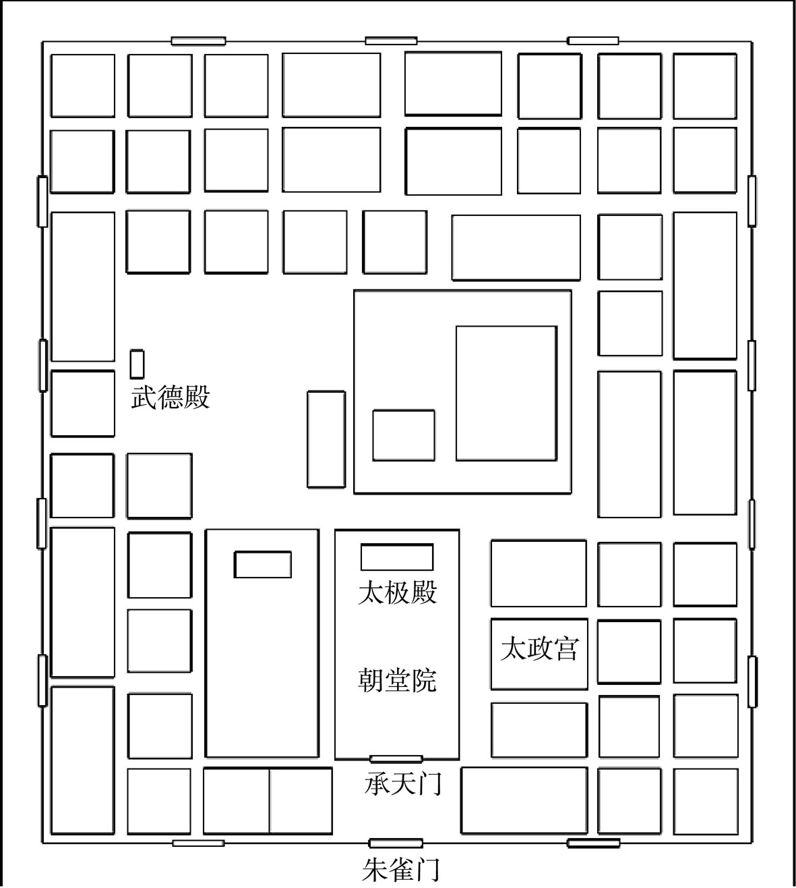 
唐武德殿示意图

## 【原文】

**夏六月甲辰，诏：“自今皇太子出用库物，所司勿为限制。”于是太子发取无度，左庶子张玄素上书，以为：“周武帝平定山东，隋文帝混一江南，勤俭爱民，皆为令主，有子不肖，卒亡宗祀[1]。圣上以殿下亲则父子，事兼家国，所应用物，不为节限，恩旨未逾六旬，用物已过七万，骄奢之极，孰云过此[2]。况宫臣正士，未尝在侧，群邪淫巧，昵近深宫，在外瞻仰，已有此失，居中隐密，宁可胜计[3]。苦药利病，苦言利行，伏惟居安思危，日慎一日[4]。”太子恶其书，令户奴伺玄素早朝，密以大马棰击之，几毙[5]。**

## 【注文】

[1]周武帝（543—578年）：即北周武帝宇文邕（yōng），汉化鲜卑人，小字祢罗突，公元560—578年在位。代郡武川（今内蒙古武川西）人。宇文泰第四子。曾用年号保定（561—565年）、天和（566—572年）、建德（572—578年）、宣政（578年），谥号武帝，庙号高祖，陵墓孝陵。　　隋文帝（541—604年）：隋朝开国皇帝杨坚，汉族，弘农郡华阴（今陕西华阴）人，他在位期间成功地统一了百年严重分裂的中国，开创先进的选官制度，发展文化经济。使得中国成为盛世之国。文帝在位期间，隋朝开皇年间疆域辽阔，人口达到700余万户，是人类历史上农耕文明的巅峰时期。　　混一：统一，也指统一天下。　　令主：好皇帝。令：美，善，佳。　　有子不肖：指北周武帝子宣帝宇文赟（yūn），公元578—579年在位；隋文帝子炀帝杨广，公元604—618年在位。　　祀（sì）：世，代。

[2]兼：同时具有或涉及几种事务或若干方面。　　旬：十日为一旬。

[3]淫：引申为骄纵。　　瞻仰：视；观览。

[4]伏惟：表示希望。　　居安思危：居，处于；思，想。虽然处在平安的环境里，也想到有出现危险的可能。指随时有应付意外事件的思想准备。　　慎：小心，当心。

[5]户奴：官奴，掌守门户。　　伺：观察，侦候。　　马棰（chuí）：马鞭。　　毙：死。

## 【译文】

唐太宗贞观十六年（642年）夏六月甲辰（二十日），唐太宗下诏说：“从今以后，皇太子支用府库中的器物，有关管理部门不要加以限制。”于是太子取用挥霍无度，左庶子张玄素上书，认为：“周武帝平定山东，隋文帝统一江南，勤俭爱民，都是好君主，但他们的儿子都不贤，最终亡国断绝了宗祀。圣上因为父子之情而爱殿下，但事情关系着国家，殿下所用的物品，无所节制和限度，诏旨下来还没有超过六十天，所用的物资已超过七万，骄傲奢侈达到了极点，谁还能再超过！况且宫中的官属和正直的人士，都没有在他身旁，一群邪佞淫乱巧诈之人，得到亲昵被安置在深宫之中，从外面看，已有这么些过失，那么其中不为人知之处，怎么可以数得过来呢！良药苦口利于病，忠言逆耳利于行。希望太子能居安思危，一天比一天谨慎。”太子对张玄素的上书非常厌恶，命令守门的小奴趁张玄素上早朝的机会，暗中用大马鞭袭击他，几乎把他打死。

## 【原文】

**秋八月丁酉，上曰：“当今国家何事为急？”谏议大夫褚遂良曰：“今四方无虞，唯太子、诸王宜有定分最急[1]。”上曰：“此言是也[2]。”时太子承乾失德，魏王泰有宠，群臣日有疑议，上闻而恶之，谓侍臣曰：“方今群臣，忠直无逾魏徵，我遣傅太子，用绝天下之疑[3]。”九月丁巳，以魏徵为太子太师[4]。徵疾小愈，诣朝堂表辞，上手诏谕以：“周幽、晋献，废嫡立庶，危国亡家[5]。汉高祖几废太子，赖四皓然后安[6]。我今赖公，即其义也[7]。知公疾病，可卧护之[8]。”徵乃受诏。**

## 【注文】

[1]谏议大夫：古代官名。秦代置，专掌议论。为郎中令的属官，掌论议，有数十人之多。汉初不置。汉武帝元狩五年（前118年）初置，属光禄勋（郎中令改名）。东汉改称谏议大夫，仍属光禄勋，秩六百石。三国魏沿置，晋朝罢。南朝梁、陈亦置。北魏置，隶属集书省，掌谏诤议论，从四品，北齐沿置。隋初隶属门下省，从四品。隋炀帝大业三年（607年）废。唐初复置，正五品上。唐高宗龙朔二年（662年）改正谏大夫，唐中宗神龙元年（705年）复旧。唐德宗贞元四年（788年）分置左、右，各四员，分隶门下、中书两省，升正四品下，掌谏议得失，侍从赞相。唐宪宗元和元年（806年）罢左、右之名，只称谏议大夫。唐武宗会昌二年（842年），复分置左、右。　　虞（yú）：忧虑。　

[2]是：对的，正确的。

[3]傅：教导人的人。　　绝：断绝。

[4]太子太师：古代官名。从一品，掌辅导皇太子。

[5]愈：病好了。　　表：启奏，上表章给皇帝。　　周幽（前795—前771年）：即西周末代君主姬宫湦（shēng），周宣王四十六年（前782年）即位。继位后，自然灾害严重，泾、渭、洛三川皆震。他贪婪腐败，不问政事，重用为人佞巧、善谀好利的虢（guó）石父，引起国人强烈不满。又废嫡立庶，废除申后及太子宜臼（jiù），立褒姒（sì）为后及其子伯服为太子，并加害太子宜臼，致使申侯、缯（zēng）侯和犬戎各部攻宗周。周幽王为取悦褒姒，数举骊山烽火，失信于诸侯。结果，被犬戎兵杀死于骊山之下，公元前771年，西周灭亡。　　晋献（？—前651年）：春秋时代的晋国君主，姬姓，名诡诸，在位二十六年。晋武公之子。因其父活捉戎狄首领诡诸而得名。即位后用士（wěi）之计，尽灭曲沃桓公、庄伯子孙，巩固君位。奉行尊王政策，提高声望。攻灭骊戎、耿、霍、魏等国，击败狄戎，复采纳荀息假道伐虢（guó）之计，消灭强敌虞、虢，史称其“并国十七，服国三十八”。

[6]汉高祖（前256或前247—前195年）：汉高祖刘邦，汉朝开国皇帝，汉民族和汉文化伟大的开拓者，中国历史上杰出的政治家、战略家、指挥家。秦末参与推翻暴秦行动。公元前206年刘邦首先进入关中要地，秦朝灭亡。楚汉之争后，统一中国，建立汉朝。前202年即皇帝位，建都长安。登基后，一面平定诸侯王的叛乱，一面建章立制并采用休养生息之宽松政策治理天下，迅速恢复生产发展经济，不仅安抚了人民，也促成了汉代雍容大度的文化基础。他对汉民族的统一、中国的统一强大，以及汉文化的保护发扬有决定性的贡献。　　赖：倚靠，仗恃。　　四皓：即秦末汉初隐于商山的东元公、甪（lù）里先生、绮里季、夏黄公四位八十余岁老人，时称“商山四皓”。因太子同四皓郊游，汉高祖遂以为太子为众望所归，改变了另立太子的初衷。

[7]义：意思。

[8]卧：睡倒，躺或趴。　　护：监督。

## 【译文】

唐太宗贞观十六年（642年）秋八月丁酉（十四日），唐太宗说:“当今国家什么事最为急迫？”谏议大夫褚（chǔ）遂良说：“如今四方安定无事，只有确定太子、诸王名分最为紧要。”太宗说：“这话说对了。”当时太子李承乾德行恶劣，魏王李泰受到太宗的宠爱，群臣每天都有怀疑的议论，太宗听说后十分厌恶，对身边的大臣说：“当今群臣中，忠心耿直的没有人能超过魏徵，我派他做太子的师傅，以此来杜绝天下人的疑虑。”九月丁巳（初四日），任命魏徵为太子太师。魏徵有病刚刚稍有痊愈，就到朝堂上表推辞，太宗亲笔写了诏书，告谕魏徵：“周幽王、晋献公，废嫡子而立庶子，造成国家危亡，汉高祖差一点废掉太子，幸赖商山四皓的辅翼才得以安稳。我现在信赖你派你去辅佐太子，也就是这个意思。我知道你有病在身，可以躺在床上辅佐太子。”魏徵于是接受了诏书。

## 【原文】

**十七年春正月丙寅，上谓群臣曰：“闻外间士民以太子有足疾，魏王颖悟，多从游幸，遽生异议，徼幸之徒，已有附会者[1]。太子虽病足，不废步履[2]。且礼，嫡子死，立嫡孙[3]。太子男已五岁，朕终不以孽代宗，启窥窬之源也[4]。”**

## 【注文】

[1]颖：才能出众。　　游幸：指帝王或后妃出游。　　徼（jiǎo）幸：徼，通“侥”。作非分企求。

[2]步履：步行；行走。履指鞋。

[3]礼：即《礼记》，中国儒家经典之一。是战国至汉初儒家礼仪论著的总集。内容包括礼制和儒家哲学两部分，为研究中国古代社会、文物制度、典礼、祭祀、教育、音乐和儒家学说的重要参考书。《汉书·艺文志》著录一百三十一篇,西汉戴德删为八十五篇，名《大戴礼记》。他的侄子戴圣又删为四十九篇，名《小戴礼记》，收入“十三经”中。其中《中庸》《大学》《礼运》等篇是儒家重要的哲学著作，对后世影响很大

[4]孽（niè）：庶子，妾所生的儿子。　　宗：宗子，即嫡长子。　　窥窬（yú）：窥伺可乘之隙。

## 【译文】

唐太宗贞观十七年（643年）春正月丙寅（十五日），太宗对群臣说；“听说外面士大夫们传言太子有脚病，魏王李泰聪颖有悟性，常随从我游幸，突然就生出了猜测议论，一些别有企图的人，也有附会其说的。太子虽然脚有毛病，但并不妨碍行走。况且按照《礼记》，嫡长子死，应立嫡长孙。太子的儿子已经五岁了，我终究不会以庶子来代替嫡子，开启非分夺取皇位的先河。”

## 【原文】

**初，太子承乾喜声色、畋猎，所为奢靡，畏上知之[1]。对宫臣常论忠孝，或至于涕泣；退归宫中，则与群小相亵狎[2]。宫臣有欲谏者，太子先揣知其意，辄迎拜，敛容危坐，引咎自责，言辞辩给，宫臣拜答不暇[3]。宫省秘密，外人莫知，故时论初皆称贤[4]。**

## 【注文】

[1]声色：指歌舞和女色。　　奢靡（mí）：指生活奢侈，挥霍无度。

[2]涕泣：哭泣；流泪。　　亵（xiè）狎（xiá）：亲近宠幸。

[3]揣（chuǎi）：估量，忖（cǔn）度。　　辄（zhé）：总是，就。　　拜：表示敬意的礼节。　　敛容：正容。显出端庄的脸色。　　危坐：端坐。　　引咎（jiù）自责：主动承担错误的责任并作自我批评。咎，罪责。　　辩（biàn）：说明是非或争论真假。　　给（jǐ）：敏捷。　　暇：空闲。

[4]省（shěng）：古代称王宫禁地。　

## 【译文】

当初，太子李承乾喜好声色、游猎，做事十分奢侈，却害怕太宗知道。于是对东宫下属臣僚常常谈论忠孝，有时甚至假装感动得流泪抽泣。等回到东宫，便和小太监们戏耍狎玩。宫中臣僚有想劝谏的，太子便先揣摩他的意思，然后迎上去行礼，面色凝重、正襟危坐，引咎自责，语言明辨敏捷，弄得那些想劝谏的人叩拜答对不暇。宫中的秘密，外边的人无法知道，所以当时的舆论开始时都称赞他贤能。

## 【原文】

**太子作八尺铜炉，六隔大鼎，募亡奴盗民间马牛，亲临烹煮，与所幸厮役共食之[1]。又好效突厥语及其服饰，选左右貌类突厥者五人为一落，辫发羊裘而牧羊，作五狼头纛及幡旗，设穹庐，太子自处其中，敛羊而烹之，抽佩刀割肉相啖[2]。又尝谓左右曰：“我试作可汗死，汝曹效其丧仪[3]。”因僵卧于地，众悉号哭，跨马环走，临其身，剺面[4]。良久，太子歘起，曰：“一朝有天下，当帅数万骑猎于金城西，然后解发为突厥，委身思摩，若当一设，不居人后矣[5]。”**

## 【注文】

[1]六隔：古代炊具，形状像鼎而足部中空。“隔”通“鬲（lì）”。“六隔”即有六条空足的鼎。　　募：广泛征求。　　亡奴：指亡命在逃的官奴。　　厮役：执贱役供使唤的人。

[2]落：即帐落，突厥等西北少数民族的帐落，相当于内地汉族的一户。　　辫发羊裘：辫发：西北少数民族的发式。羊裘：羊皮衣。　　狼头纛（dào）：绣有狼头的大旗，突厥以狼为“图腾”。　　幡（fān）：用竹竿等直着挂的长条形旗子。泛指旗帜。　　穹（qióng）庐：古代游牧民族所居住得一种形状中高周低圆形的毡帐。　　敛：征收。　　啖（dàn）：吃或给人吃。

[3]可（kè）汗（hán）：亦作“可罕”。中国古代鲜卑、柔然、突厥、回纥（hé）、蒙古等民族中最高统治者的称号。　　曹：辈，等于现代汉语中的“们”。

[4]僵：直挺挺，不灵活。　　剺（lí）面：割面。突厥、回纥等民族风俗。用剺面流血来表示忠诚信义，或寄托对刚死去的君亲的哀思。

[5]歘（xū）：快速。　　金城：古郡名。治所在今甘肃兰州西北。　　思摩：东突厥贵族阿史那思摩。处罗、颉利可汗在位为夹毕特勤。唐高祖武德初初，多次来唐，被封为和顺郡王。　　一设：或为一箭，突厥某一方面的典兵官。

## 【译文】

太子铸造了一个八尺高的铜炉，六隔的大鼎，招募逃亡的官奴去偷盗民间的牛马，亲自参加烹煮，和他所宠信的小厮役共同食用。又喜欢说突厥语并照突厥的服饰穿戴，挑选亲信中面貌像突厥的人，每五人编为一个部落，扎上辫子穿上羊皮衣来牧羊，又制作了五狼头的大旗及幡旗，架设穹庐，太子自己住在里面，把收敛来的羊烹煮，抽出佩刀割肉共同食用。又曾对左右的人说：“我试着装作可汗死的样子，你们按照他们办丧事的仪式去办。”于是僵直躺倒在地上，众人都号哭，骑上马绕着他转圈，靠近他的身边，用刀割脸。过了一会儿，太子跳起身说：“有朝一日我拥有了天下，要亲自率数万骑兵到金城西去狩猎，然后散开头发去做突厥人，委身在思摩的帐下，若能为思摩典兵，当一设之任，就不会甘居人后了。”

## 【原文】

**左庶子于志宁、右庶子孔颖达数谏太子，上嘉之，赐二人金帛以风励太子，仍迁志宁为詹事[1]。志宁与左庶子张玄素数上书切谏，太子阴使人杀之，不果[2]。**

## 【注文】

[1]风：古同“讽”，劝告。　　迁：晋升或调动。

[2]果：实现。

## 【译文】

左庶子于志宁、右庶子孔颖达多次劝谏太子，皇帝嘉奖他们，赐给他们金帛让他们讽谕激励太子，并且改任于志宁为太子詹事。于志宁和左庶子张玄素多次上书直谏，太子暗中派人去杀他们，结果未成。

## 【原文】

**汉王元昌所为多不法，上数谴责之，由是怨望[1]。太子与之亲善，朝夕同游戏，分左右为二队，太子与元昌各统其一，被毡甲，操竹矟，布陈大呼交战，击刺流血，以为娱乐[2]。有不用命者，披树挝之，至有死者[3]。且曰：“使我今日作天子，明日于苑中置万人营，与汉王分将，观其战斗，岂不乐哉[4]。”又曰：“我为天子，极情纵欲，有谏者辄杀之，不过杀数百人，众自定矣[5]。”**

## 【注文】

[1]元昌：即李元昌（？—643年），唐高祖李渊第七子。唐高祖武德三年（620年）封鲁王。唐太宗贞观十七年（643年），李元昌与杜荷、赵节、李安俨建议太子李承乾兵变。纥干承基告发太子谋反，杜荷、侯君集、李安俨等人因谋反罪被斩首。　　望：埋怨，责备。

[2]被（pī）：古同“披”，覆盖。　　毡（zhān）:用兽毛制成的片状物，可做防寒用品和工业上的垫衬材料。　　甲：古时战士的护身衣,用皮革或金属制成。　　矟（shuò）：即槊，长矛，古代的一种兵器。　　娱乐：欢娱快乐；使欢乐。

[3]披树挝（zhuā）之：将手足绑于树上鞭打。

[4]天子：古以君权为神所授，故称帝王为天子。　　苑：古代养禽兽植林木的地方，多指帝王的花园。　　营：军队驻扎的地方，借指按编制集体生活的地方。

[5]极情纵欲：竭力满足自己的情感和贪欲而不加节制。

## 【译文】

汉王李元昌的行为多不合法度，太宗多次责备他，从此他心怀怨恨。太子与他亲善友好，从早到晚在一起游乐嬉戏，把身边的人分成两队，太子和李元昌各领一队，身披毛毯甲胄，手持竹矛，布置战阵，大声叫喊，双方交战，互相攻击刺杀流血，作为娱乐。有不听从命令的，就把他们的手脚绑在树上打，竟然有人被打死。并且说：“假如我今天做了大唐天子，明天就在禁苑中布置一个万人的大营房，和汉王分别统领，观看他们争斗，岂不痛快。”又说：“我要做天子，必然狂情纵欲，有人劝谏就杀了他，也不过杀几百人，众人自然就安定了。”

## 【原文】

**魏王泰多艺能，有宠于上[1]。见太子有足疾，潜有夺嫡之志，折节下士以求声誉[2]。上命黄门侍郎韦挺摄泰府事，后命工部尚书杜楚客代之，二人俱为泰要结朝士[3]。楚客或怀金以赂权贵，因说以魏王聪明，宜为上嗣[4]。文武之士，各有附托，潜为朋党[5]。太子畏其逼，遣人诈为泰府典签上封事，其中皆言泰罪恶，敕捕之，不获[6]。**

## 【注文】

[1]艺：技能；才能。

[2]夺嫡：庶出者夺取嫡子承袭地位。　　折节下士：屈己下人，尊重有见识有能力的人。折节，屈己下人。

[3]黄门侍郎：又称黄门郎，秦代初置，即给事于宫门之内的郎官，是皇帝近侍之臣，可传达诏令，汉代以降沿用此官职。秦汉时，宫门多油漆成黄色，故称黄门。东汉始设为专官，或称之给事黄门侍郎。隋唐时，黄门侍郎隶属门下省，成为门下省的副官，唐玄宗天宝元年（742年）改称门下侍郎。　　韦挺（589—646年）：唐朝名臣。雍州万年（今陕西西安临潼区北）人，隋民部尚书韦冲之子，宰相韦待价父。高祖平京师，署陇西公府祭酒。太宗时任尚书左丞，历任吏部侍郎、黄门侍郎，拜御史大夫，封扶阳县男，颇得唐太宗的赏识和重用。后贬象州刺史，卒年五十八。　　摄：代理，兼管。　　工部尚书：掌管全国屯田、水利、土木、工程、交通运输、官办工业等的大臣。　　杜楚客（生卒年不详）：唐朝杜陵（陕西西安长安区）人，杜如晦的弟弟。杜楚客少年时代，崇尚奇异节操，长大成人后，负有才能名气。唐太宗贞观年间，杜楚客任蒲州刺史，声望显著，后来任魏王府长史，又升迁为工部尚书，办理王府政事，以威严正直，闻称当世。

[4]权贵：旧时指官高势大的人。　　嗣（sì）：君位或职位的继承人。

[5]朋党：指同类的人以恶相济而结成的集团。后指因政见不同而形成的相互倾轧的宗派。

[6]诈：假装。　　典签：南朝地方长官之下典掌机要的官。又称主帅﹑典签帅或签帅。当时府州部内论事,皆用签。前叙所论事,后书某官某签,府州皆置典签掌管。本为处理文书的小吏,权力不大。刘宋中叶以后,多以幼小皇子出任方镇,君主用寒人出身的亲近左右充当典签,代替诸王批阅公事,甚至照管诸王的饮食起居,职位虽低,权力渐重。

## 【译文】

魏王李泰多才多艺，得到太宗宠爱，他见太子的脚有毛病，暗中便产生了夺嫡而立的想法。他谦恭礼遇下人以求得很好的声誉。太宗命令黄门侍郎韦挺掌管魏王李泰府中的事情，后来又让工部尚书杜楚客来代替他，这两个人都为李泰笼络朝中的官员。杜楚客有时用黄金贿赂权贵，对他们游说魏王李泰如何聪明，应当被嗣立为太子。朝廷文臣武将，各自都有所依托，暗中结为朋党。太子害怕魏王威胁自己的位置，便派人装作魏王府中的典签上书言事，其中讲的全是李泰的罪过，太宗敕令逮捕这些告状的人，查无所获。

## 【原文】

**太子私幸太常乐童称心，与同卧起[1]。道士泰英、韦灵符挟左道，得幸太子[2]。上闻之，大怒，悉收称心等杀之，连坐死者数人，诮让太子甚至[3]。太子意泰告之，怨怒愈甚，思念称心不已，于宫中构室，立其像，朝夕奠祭，徘徊流涕[4]。又于苑中作冢，私赠官，树碑[5]。**

## 【注文】

[1]太常乐童：隶籍太常寺的执乐童子。

[2]道士：道教神职人员。　　泰英、韦灵符：唐初道士，生平事迹不详。　　挟（xié）：倚仗，依恃。　　左道：旁门邪道。

[3]诮（qiào）让：责问，批评。

[4]奠：向死者供献祭品致敬。　　徘徊：往返回旋；来回走动。

[5]冢（zhǒng）：坟墓。　　赠：追赠，赐死者以官爵或荣誉称号。

## 【译文】

太子私下宠幸太常寺乐童称心，和他同吃同住。道士泰英、韦灵符用旁门左道得到太子的欢心。太宗听说后大怒，把称心等人全部逮捕杀了，被牵连杀死的有好几人，并对太子大加斥责。太子认为这是李泰告发的，对他的怨恨愤怒更加厉害了。太子思念称心不已，便在宫中构筑了一间屋子，立起称心的画像，早晚奠祭，徘徊顾视，哭泣流泪。又在宫苑中为他堆了一个小坟，私自封赠称心官爵，还为他树了一座碑。

## 【原文】

**上意浸不怿，太子亦知之，称疾不朝谒者动涉数月[1]。阴养刺客纥干承基等及壮士百余人，谋杀魏王泰[2]。**

## 【注文】

[1]浸不怿（yì）：愈加不高兴。浸：渐渐。怿：喜悦，高兴。　　谒（yè）：拜见。

[2]纥（hé）干承基（604—656年）：唐太宗太子李承乾的卫士，太子谋反集团成员。后因告密、反戈一击有功，被太宗免死，并授以祐川府折冲都尉，封平棘县公。纥干，吐蕃人复姓。

## 【译文】

太宗心里渐渐不喜欢太子，太子也知道，于是装病不去朝见拜谒，动辄就是几个月。暗中豢养刺客纥干承基等以及壮士一百余人，阴谋刺杀魏王李泰。

## 【原文】

**吏部尚书侯君集之壻贺兰楚石为东宫千牛，太子知君集怨望，数令楚石引君集入东宫，问以自安之术[1]。君集以太子暗劣，欲乘衅图之，因劝之反[2]。举手谓太子曰:“此好手，当为殿下用之。”又曰：“魏王为上所爱，恐殿下有庶人勇之祸[3]。若有敕召，宜密为之备[4]。”太子大然之，厚赂君集及左屯卫中郎将顿丘李安俨，使诇上意，动静相语[5]。安俨先事隐太子，隐太子败，安俨为之力战，上以为忠，故亲任之，使典宿卫[6]。安俨深自托于太子[7]。**

## 【注文】

[1]吏部尚书：古代官名，六部中吏部的最高长官。掌管全国官吏的任免、考课、升降、调动、封勋等事务，为中央六部尚书之首。唐宋是正三品。　　侯君集（？—643年）：豳（bīn）州三水（今陕西旬邑西）人，唐朝名将，凌烟阁二十四功臣之一。隋末被李世民引入幕府，因作战有功，累迁左虞候、车骑将军。唐高祖武德九年（626年）玄武门之变间，他曾为李世民出谋划策。唐太宗贞观年间，任左卫将军、吏部尚书等职，先封潞国公，后封陈国公，贞观十七年（643年），因依附太子李承乾谋反，事败被诛。　　壻：古同“婿”。　　贺兰楚石（生卒年不详）：唐朝初年人物，吏部尚书侯君集的女婿，官居东宫府千牛。　　千牛：古代官名，东宫左右率府中掌管千牛刀的侍从武官。

[2]暗劣：愚昧不明，品行恶劣。　　衅：间隙，事端。

[3]庶人勇：即杨勇（？—604年），小名（xiàn）地伐，隋文帝杨坚的长子，母独孤皇后。原本是隋文帝的太子，后来被废为庶人。杨广即位后，立即假拟文帝诏书，赐死杨勇。死后追封为房陵王。

[4]备：防备；戒备。

[5]大然：深表同意。　　左：与右相对，古人常以右为上。　　屯卫：古代官署名。隋炀帝大业三年（607年）由领军卫改为此名。仍分左、右。隋唐时禁卫军的一种。隋文帝开皇中置十二府，统禁卫兵，后改置扩充为十六卫，左右屯卫即为其中二卫，唐高宗龙朔年间改称左右威卫。　　中郎将：古代官名。秦朝置，郎中令所属诸郎官之一，掌宿卫皇宫诸殿门户，皇帝外出时侍从护卫。汉朝沿置，仍属郎中令（光禄勋），由五官、左、右中郎将分统，职掌与秦同，位在侍郎、郎中上，秩比六百石。中郎将的省称。从事中郎的省称。唐代，中郎将又被恢复为各府卫的禁卫统领，品级大致在正、从四品之间，为低级武职。　　顿丘：古地名，今河南清丰西南。　　李安俨（yǎn）（？—643年）：唐朝魏州顿丘（今河南清丰西南）人。本来是隐太子李建成的属官，李建成在玄武门之变败亡后，李安俨为李建成拼死搏斗，唐太宗认为他非常忠诚，所以特别信任他，命他掌管宿卫，封左屯卫中郎将。　　诇（xiòng）：侦察；探听。

[6]典：主持；主管。　　宿卫：警卫宫禁。

[7]深：程度高的。　　托：交付委托。

## 【译文】

吏部尚书侯君集的女婿贺兰楚石担任东宫府千牛，太子知道侯君集心里一直有怨恨，便多次让贺兰楚石带侯君集入东宫，向他询问保全自己的方法。侯君集知道太子愚暗庸劣，便想借机为自己图谋利益，所以就趁机劝他造反。他把手举起来对太子说：“这是一双好手，应当让这双手为殿下出力。”又说：“魏王被皇上宠爱，恐怕殿下会招致隋故太子杨勇被废为庶人那样的灾祸。如有敕令宣召殿下进宫，应当暗中有所准备。”太子觉得他的话很有道理，便用丰厚的礼物贿赂侯君集和左屯卫中郎将顿丘人李安俨，让他们刺探太宗心中的想法，一有动静便告诉他。李安俨早先事奉隐太子，隐太子失败时，李安俨曾为他奋力作战，太宗认为他很忠诚，所以特别信任他，让他掌管宿卫之事。李安俨于是和太子深交，将自己的前途寄托于太子身上。

## 【原文】

**汉王元昌亦劝太子反，且曰：“比见上侧有美人，善弹琵琶，事成，愿以垂赐[1]。”太子许之。洋州刺史开化公赵节，慈景之子也，母曰长广公主，驸马都尉杜荷，如晦之子也，尚城阳公主，皆为太子所亲昵，预其反谋[2]。凡同谋者，皆割臂以帛拭血，烧灰和酒饮之，誓同生死[3]。潜谋引兵入西宫，杜荷谓太子曰：“天文有变，当速发以应之[4]。殿下但称暴疾危笃，主上必亲临视，因兹可以得志[5]。”太子闻齐王祐反于齐州，谓纥干承基等曰：“我宫西墙，去大内正可二十步耳，与卿为大事，岂比齐王乎[6]？”会治祐反事，连承基，承基坐系大理狱，当死[7]。**

## 【注文】

[1]琵琶：拨弦乐器。流行于秦汉至今。历史上中国琵琶的形制多种，统称胡琴。　　垂：敬辞，用于别人（多是长辈或上级）对自己的行动。

[2]洋州：西魏置，治所在今陕西西乡西。隋炀帝大业三年（607年）废。唐高祖武德元年（618年）复置。　　刺史：古代职官，是中国古代州一级地方长官。始置于秦汉，秦时名监察御史，汉武帝时改称刺史，掌管地方检查。汉成帝时，改称牧，汉哀帝时复为刺史。东汉末，天下渐乱，刺史权重，成为地方军政长官，后世沿置。隋唐因袭。　　赵节（？—643年）：赵慈景之子，以参与太子谋反集团罪伏诛。　　慈景：即赵慈景（？—618年），陇西（今甘肃陇西东南）人。尚李渊女长广公主。官至兵部侍郎、华州刺史，封开化郡公。慈景卒，公主改嫁杨师道。　　长广公主（？—648年）：唐高祖李渊第五女，初封桂阳公主。隋朝时嫁给赵慈景，赵慈景逝世后，长广公主改嫁杨师道。　　都尉：古代官名。战国始置。职位次于将军的武官。　　杜荷（？—643年）：杜如晦之子，娶唐太宗第十六女城阳公主，为驸马都尉，官至尚乘奉御，封襄阳郡公，后因谋反伏诛。　　尚：娶帝王之女为妻。　　城阳公主（约630—671年）：唐太宗李世民第十六女，母长孙皇后。城阳公主最初下嫁杜如晦之子杜荷。杜荷因太子李承乾之事被诛，又嫁薛瓘（guàn），生子薛（yǐ）、薛绍。

[3]拭：揩擦。　　誓：发誓；立誓。

[4]天文：日月星辰等天体在宇宙间分布运行等现象。古人把风、云、雨、露、霜、雪等地文现象也列入天文范围。

[5]暴：强大而突然来的。　　笃（dǔ）：病沉重。　　兹：这，这个，此。

[6]祐：唐太宗李世民第五子李祐（？—643年），阴妃所生，唐高祖武德八年（625年），封为宜阳王，当年又封为楚王。唐太宗贞观二年（628年），迁移后封为燕王，转为豳（bīn）州都督。又改封为齐王，被授予齐州都督。贞观十二年（638年），以病留长安，贞观十七年（643年），以“谋反罪”贬为庶人，赐死，葬以国公礼。　　齐州：古地名，唐高祖武德五年（622年）置，治所在今山东济南。辖境相当于今山东济南、章丘、禹城、济阳、齐河、临邑等地。唐太宗贞观元年（627年）废。　　大内：指太宗所居西宫。

[7]系（xì）：拘囚；关进牢狱。　　大理：即大理寺，古代官署名，掌刑狱案件审理。

## 【译文】

汉王李元昌也劝太子造反，并且说：“近来我看见皇上身边有个美人，很会弹琵琶，事成之后，希望把她赐给我。”太子答应了他。洋州刺史开化公赵节，是赵慈景的儿子，母亲是长广公主。驸马都尉杜荷，是杜如晦的儿子，娶城阳公主为妻。他们都受到了太子的亲信和宠爱，参与了太子造反的阴谋。凡参加预谋造反的人，都用刀割破胳膊，用绵帛擦拭血，然后烧成灰和在酒中饮下，发誓同生共死。又暗中谋划带兵进入西宫，杜荷对太子说：“天象有变化，应当赶快发兵以应天象。殿下只要假称得了暴病十分危重，皇上必定亲自来探视，乘此机会就可以取得成功。”太子听说齐王李祐在齐州造反，对纥（hé）干承基等人说：“我住的东宫西墙离大内只有二十步远，和你们谋划大事，条件便利，岂是齐王所能比的？”正赶上审理齐王李祐造反的事，纥干承基也被牵连，纥干承基被关押在大理寺大狱中，依律应当判处死罪。

## 【原文】

**夏四月庚辰朔，承基上变，告太子谋反[1]。敕长孙无忌、房玄龄、萧瑀、李世与大理、中书、门下参鞠之[2]。反形已具，上谓侍臣：“将何以处承乾[3]？”群臣莫敢对[4]。通事舍人来济进曰：“陛下不失为慈父，太子得尽天年，则善矣[5]。”上从之[6]。济，护儿之子也[7]。**

## 【注文】

[1]朔（shuò）：农历每月初一。　　上变：向朝廷告发非常事变，特指谋反。上，上告。变，事变。

[2]长孙无忌（？—659年）：字辅机，汉族，河南洛阳人。先世鲜卑族拓跋氏，北魏皇族支系，后改为长孙氏。是唐太宗李世民的内兄，文德顺圣皇后的哥哥。李治继位后，欲立武则天昭仪为皇后，无忌认为不可，高宗偏听许敬宗诬陷，于是削去其舅父长孙无忌的官爵，流放黔州，后令其自缢，籍没其家。　　萧瑀（yǔ）（575—648年）：隋萧皇后的弟弟。萧瑀自幼以孝行闻名天下，且善学能书，骨鲠正直，并深精佛理。被隋炀帝疏斥，唐朝时深得李渊信任。　　中书：古代官署名，是中国从隋朝和唐朝开始正式设立的三省六部制中的一省，负责草拟和颁发皇帝的诏令。封建政权执政中枢部门，汉朝始设中书令，魏国建秘书监，有监、令，魏曹丕改称中书监、令。晋朝以后称中书省，为秉承君主意旨，掌管机要、发布政令的机构。沿至隋唐，成为全国政务中枢。　　门下：是从隋朝和唐朝开始正式设立的三省六部制中的一省，负责执行国家的重要政令。唐曾改为东台、鸾台、黄门省等。门下省原为皇帝的侍从机构，南北朝时权力逐渐扩大，北朝政出门下，成为中央政权机构的重心。隋唐时与中书省同掌机要，共议国政，并负责审查诏令，签署章奏，有封驳之权。其长官称侍中，或称纳言、左相、黄门监，皆因时而异。其下有黄门侍郎、给事中、散骑常侍、谏议大夫、起居郎等官。　　参鞠：参与审讯。鞠，即鞫（jū），审讯。唐制，凡国家大狱，由三司详决，即由给事中、中书舍人与御史参鞫。而太宗令三省与大理参鞫，表明朝廷对此案异常重视。

[3]形：状况。　　具：具备，有。

[4]对：答，答话，回答。

[5]通事舍人：古代官名，中书省的属官。　　来济（610—662年）：隋左翊（yì）卫大将军、荣国公来护儿之子。扬州江都（今江苏扬州西南）人。唐初进士及第，唐高宗永徽二年（651年）任中书侍郎。永徽四年（653年），任同中书门下三品（即宰相）。撰有文集三十卷。　　天年：自然的寿数。

[6]从：听从。

[7]护儿：即隋朝大将来护儿（？—617年），字崇善，江都（今江苏扬州西南）人，隋朝大将。隋炀帝大业八年（612年）正月，隋炀帝攻打高丽，来护儿为平壤道行军总管。大业十三年（617年），来护儿代宇文述为左翊卫大将军，后被宇文化及杀死。

## 【译文】

唐太宗贞观十七年（643年）夏四月庚辰朔（初一日），纥干承基上诉，告发太子李承乾谋反。太宗敕令长孙无忌、房玄龄、萧瑀、李世与大理寺、中书省、门下省共同审问。谋反的情况已经清楚后，太宗对身边的大臣说：“应当怎样来处理李承乾？”众大臣不敢应对。通事舍人来济进谏说：“能处理得使陛下不失为一个慈祥的父亲，使太子得以终其天年，就算妥当了。”太宗听从了他的意见。来济，是来护儿的儿子。

## 【原文】

**乙酉，诏废太子承乾为庶人，幽于右领军府[1]。上欲免汉王元昌死，群臣固争，乃赐自尽于家，而宥其母、妻、子[2]。侯君集、李安俨、赵节、杜荷等皆伏诛[3]。左庶子张玄素、右庶子赵弘智、令狐德棻等，以不能谏争，皆坐免为庶人[4]。余当连坐者悉赦之[5]。詹事于志宁，以数谏，独蒙劳勉[6]。以纥干承基为祐川府折冲都尉，爵平棘县公[7]。**

## 【注文】

[1]右领军府：古代官属名。即中央十二卫领府之一。掌领军府和宫掖禁备。

[2]免：赦免，释放。　　宥（yòu）：赦免。

[3]伏诛：伏法被诛杀。

[4]赵弘智（572—653年）：唐初大臣。字不详，河南新安人。早年丧母，以孝敬父亲而名闻。学通三礼、史记、汉书。隋炀帝大业中，为司隶从事。唐高祖武德初，授詹事府主簿，初与令狐德棻、袁朗等十数人同修艺文类聚，唐太宗贞观中，任黄门侍郎，兼弘文馆学士。唐高宗初，讲孝经于德福殿，进国子祭酒，卒后谥号为“宣”。　　令狐德棻（fēn）（583—666年）：唐初政治家，史学家。宜州华原（今陕西铜川耀州区东南）人。多次参加官书的编写，最大贡献为编修《周书》。隋炀帝末年，德棻授官为药城（今安徽亳州利辛西）长。待李渊起兵反隋后，德棻就加入了这支反隋军队，在总管府任记室。李渊入据长安后，先为丞相，奉代王杨侑（yòu）为傀儡，德棻即任大丞相府记室。李渊称帝后，德棻随即转为起居舍人，又迁秘书丞。在唐太宗贞观年间德棻历任礼部侍郎，兼修国史，太子右庶子，雅州刺史，秘书少监；在唐高宗时，任过礼部侍郎兼弘文馆学士，监修国史，任过太常卿、国子祭酒，兼授崇贤馆学士。

[5]连坐：中国古代因他人犯罪而使与犯罪者有一定关系的人连带受刑的制度。又称相坐、随坐、从坐、缘坐。

[6]蒙：受。　　勉：劝人努力，鼓励。

[7]祐川府：古代军府名，在今甘肃岷县。　　折冲都尉：古代官名。唐府兵制军府称折冲府，长官为折冲都尉，上府正四品上，中府从四品下，下府正五品下。每冬率兵操练，按规定轮番宿卫京师，有事征发全府，则率兵出发。　　爵：授予官爵。　　平棘（jí）县：古县名，西汉置，属常山郡，以平棘山为名。三国魏属赵国。北魏移治今河北赵县西南，为赵郡治。隋文帝开皇十六年（596年）为栾州治，隋炀帝大业初复为赵郡治，唐为赵州治。

## 【译文】

四月乙酉（初六日），太宗下诏命废太子李承乾为平民，幽禁在右领军府。太宗想免去汉王李元昌的死罪，群臣们执意争辩坚决反对，于是赐他在家自尽，但赦免了他的母亲、妻子和儿女。侯君集、李安俨、赵节、杜荷等都伏法被处死。左庶子张玄素、右庶子赵弘智、令狐德棻等人，因为没能尽职劝谏太子，都坐罪被免为平民。其余应当受到牵连的人，全部赦免。詹事于志宁，因多次劝谏太子，单独受到慰劳嘉勉。任命纥干承基为祐川府折冲都尉，赐爵平棘县公。

## 【原文】

**侯君集被收，贺兰楚石复诣阙告其事[1]。上引君集谓曰：“朕不欲令刀笔吏辱公，故自鞫公耳[2]。”君集初不承，引楚石具陈始末，又以所与承乾往来启示之，君集辞穷，乃服[3]。上谓侍臣曰：“君集有功，欲乞其生，可乎[4]？”群臣以为不可[5]。上乃谓君集曰：“与公长诀矣[6]。”因泣下[7]。君集亦自投于地，遂斩之于市[8]。君集临刑，谓监刑将军曰：“君集蹉跌至此，然事陛下于藩邸，击取二国，乞全一子以奉祭祀[9]。”上乃原其妻及子，徙岭南[10]。籍没其家，得二美人，自幼饮人乳而不食[11]。**

## 【注文】

[1]收：逮捕，拘押。　　阙（què）：帝王居地的统称。

[2]刀笔吏：古人用简牍时，如有错讹，即以刀削之，所以古时的读书人及政客常常随身带着刀和笔，以便随时修改错误。因刀笔并用，历代的文职官员也就被称作“刀笔吏”。　　鞫（jū）：审问。

[3]始末：首尾经过；底细。　　启：书信。　　服：招认，承。

[4]乞：引申为请求，希望。

[5]以为：认为。

[6]长诀：永别。

[7]泣：哭泣。

[8]斩：砍断。

[9]蹉（cuō）跌（diē）：跌跤；失误。　　事陛下于藩（fān）邸（dǐ）：李世民为亲王时，引侯君集入幕府，曾多次从世民征讨，并预谋“玄武门之变”。

[10]原：赦免。　　子：古代指儿和女。　　岭南：指五岭之南地区，相当于现在广东、广西、海南全境。五岭由越城岭、都庞岭、萌渚岭、骑田岭、大庾岭五座山组成。

[11]食：吃。

## 【译文】

侯君集被拘押入狱，贺兰楚石又到朝廷上告发他谋反的事。太宗提审侯君集，对他说：“我不想让狱吏侮辱你，所以亲自审问你。”侯君集起初不认罪，太宗把贺兰楚石叫来，当面陈述事情始末原委，又拿出他和李承乾往来的书信给他看，侯君集理屈词穷，只得认罪。太宗对身边的人说：“侯君集有功于国，希望给他一条生路，可以不？”众大臣都认为不可以。太宗于是对侯君集说：“我要和你永别了。”说完伤心地流下了眼泪。侯君集也自己扑倒在地上，于是在街市上把他斩了。侯君集临刑前，对监刑的将军说：“君集自己失足至此，但是看在我当年在秦王府时就事奉陛下，跟随陛下征伐吐谷浑、高昌的一点功劳，请求保全一个儿子来为祖先祭祀。”太宗于是赦免了他的妻子和儿女，把他们发配到岭南。没收他的所有家产时，得到两个美人，她们从小喝人奶长大，不吃别的东西。

## 【原文】

**初，上使李靖教君集兵法[1]。君集言于上曰：“李靖将反矣[2]。”上问其故，对曰：“靖独教臣以粗而匿其精，以是知之[3]。”上以问靖，靖对曰：“此乃君集欲反耳[4]。今诸夏已定，臣之所教，足以制四夷，而君集固求尽臣之术，非反而何[5]？”江夏王道宗尝从容言于上曰：“君集志大而智小，自负微功，耻在房玄龄、李靖之下，虽为吏部尚书，未满其志[6]。以臣观之，必将为乱[7]。”上曰：“君集材器，亦何施不可[8]。朕岂惜重位，但次第未至耳，岂可亿度，妄生猜贰耶[9]！”及君集反诛，上乃谢道宗曰：“果如卿言[10]。”李安俨父年九十余，上愍之，赐奴婢以养之[11]。**

## 【注文】

[1]李靖（jìng）（571—649年）：字药师，雍州三原（今陕西三原西北）人。隋末唐初将领，是唐朝文武兼备的著名军事家。后封卫国公，世称李卫公。李靖善于用兵，长于谋略，曾平定萧铣（xiǎn），安抚岭南，平定辅公祏（shí），击灭东突厥，远征吐谷浑，卒后唐太宗册赠司徒、并州都督，给班剑、羽葆、鼓吹，陪葬昭陵。谥曰“景武”，著有多种兵书。

[2]反：反叛。

[3]匿（nì）：隐藏。

[4]欲：想。

[5]诸夏：古代中国的别称。　　四夷：四夷是古代华夏族对四方少数民族的统称，指东夷、西戎、南蛮、北狄。

[6]道宗：即李道宗（603—653年），字承范，陇西成纪（今甘肃静宁西南）人，唐朝宗室、名将。李道宗为唐高祖李渊的堂侄。唐高祖武德元年（618年）被封为略阳郡公。起家左千牛备身。唐高宗永徽四年（653年），房遗爱伏诛，长孙无忌、禇（chǔ）遂良素与道宗不和睦，说道宗与遗爱交结，配流象州，在道上病卒。

[7]观：观察。

[8]材：通“才”。才能，能力。

[9]亿度：预料；揣度。亿，通“臆”。臆测，预料。　　猜贰（èr）：猜疑且怀二心。

[10]谢：道歉。

[11]愍（mǐn）：同“悯”。怜悯；哀怜。　　奴婢（bì）：原指丧失自由、受人奴役的男女，后泛指男女仆人。

## 【译文】

起初，太宗让李靖教授侯君集兵法。侯君集对太宗说：“李靖将要谋反。”太宗问他是什么缘故？他回答说：“李靖教我兵法时只教粗浅的内容，却隐藏精华的部分，因此知道他要谋反。”太宗就以这件事去问李靖，李靖回答说：“这是侯君集想要谋反，如今中原已经平定，我所教他的兵法足以制服四方的蛮夷民族，而侯君集执意要求我把所有的用兵之术都教给他，这不是要造反是什么？”江夏王李道宗曾经很从容地对太宗说：“侯君集这人志大才疏，自以为有那么一点微小的功劳，就对于位居房玄龄、李靖之下感到羞耻，即使身为吏部尚书，还不满足。依我看来，将来他必定要作乱。”太宗说：“以侯君集的才略胆识，哪一个职位不能胜任呢？我哪里是舍不得重要位置不重用他，只是他的资历不够罢了，怎么可以随便猜测，乱生嫌疑啊！”等到侯君集因谋反被杀，太宗于是向李道宗称谢说：“果然像您说的那样。”李安俨的父亲已经九十多岁，太宗怜悯他，赐给他奴婢奉养他。

## 【原文】

**太子承乾既获罪，魏王泰自入侍奉，上面许立为太子[1]。岑文本、刘洎亦劝之[2]。长孙无忌固请立晋王治[3]。上谓侍臣曰：“昨青雀投我怀，云：‘臣今日始得为陛下子，乃更生之日也[4]。臣有一子，臣死之日，当为陛下杀之，传位晋王[5]。’人谁不爱其子，朕见如此，甚怜之[6]。”谏议大夫褚遂良曰：“陛下言大失，愿审思，勿误也[7]。安有陛下万岁后，魏王据天下，肯杀其爱子，传位晋王者乎[8]？陛下日者既立承乾为太子，复宠魏王，礼秩过于承乾，以成今日之祸[9]。前事不远，足以为鉴[10]。陛下今立魏王，愿先措置晋王，始得安全耳[11]。”上流涕曰：“我不能尔[12]。”因起入宫[13]。魏王泰恐上立晋王治，谓之曰：“汝与元昌善，元昌今败，得无忧乎[14]？”治由是忧形于色[15]。上怪，屡问其故，治乃以状告[16]。上怃然，始悔立泰之言矣[17]。上面责承乾，承乾曰：“臣为太子，复何所求[18]？但为泰所图，时与朝臣谋自安之术，不逞之人遂教臣为不轨耳[19]。今若泰为太子，所谓落其度内[20]。”**

## 【注文】

[1]面：当面。

[2]岑（cén）文本（595—645年）：字景仁，唐朝宰相，善于文辞。唐太宗贞观年间，授为秘书郎，兼直中书省。又任中书侍郎，曾与令狐德棻（fēn）撰修《北周书》，在对高句丽的作战中，他曾与唐太宗同行。在对辽东的战争中，一切后勤事宜，全部委任于他。因心血损耗，精力枯竭，操劳过度，染病而亡。　　刘洎（jì）（？—646年）：唐代大臣，字思道，荆州江陵（今湖北江陵）人。隋末，初仕萧铣（xiǎn）为黄门侍郎，归唐后授南康郡（今江西赣县）都督府长史。唐太宗贞观七年（633年）升给事中，封清苑县男，调任治书侍御史，授尚书右丞，加银青光禄大夫、散骑常侍，代黄门侍郎。他敢于谏诤。劝唐大宗宜少与臣下辩驳，对政事建议慎于取舍。太宗征辽东时，令他兼太子左庶子，辅佐皇太子李治监国，后被褚（chǔ）遂良诬陷而赐死。

[3]晋王治：唐朝第三任皇帝李治（628—683年），字为善，唐太宗李世民九子，其母为长孙皇后。唐太宗贞观五年（631年）封为晋王，为嫡三子，后因唐太宗嫡长子太子李承乾与嫡次子魏王李泰相继被废，他于贞观十七年（643年）被立为太子。贞观二十三年（649年）即位于长安太极殿。李治在位三十四年，于弘道元年（683年）驾崩，葬于乾陵，谥号“天皇大帝”，庙号高宗。

[4]青雀：魏王李泰小名。

[5]当：应当。

[6]怜：哀怜，怜悯。

[7]审：仔细思考。

[8]安：疑问词，哪里。　　万岁：帝王死之讳称。

[9]礼秩：等级待遇。

[10]鉴：借鉴。

[11]措：安放，安排。

[12]尔：如此。

[13]因：于是。

[14]忧：担心。

[15]形：表现。

[16]状：陈述。

[17]怃（wǔ）然：怅（chàng）然失意貌。

[18]太子：中国古代君主的儿子中被预定继承君位的人。周时天子及诸侯的嫡长子，或称太子，或称世子。秦因袭。汉天子号皇帝，所以其嫡子称皇太子。金元时，皇帝的庶子也称太子，如金有四太子兀术（zhú）。明以后皇帝的嫡子称皇太子，亲王的嫡子称世子。太子的地位仅次于皇帝本人，并且拥有自己的类似于朝廷的东宫。

[19]不逞（chěng）之人：不得志或作奸犯法图谋不轨者。

[20]度：算计，圈套。

## 【译文】

太子李承乾已经获罪，魏王李泰每天进宫侍奉太宗，太宗当面许诺立他为太子。岑文本、刘洎也劝太宗立魏王为太子。长孙无忌执意请求立晋王李治。太宗对身边的大臣说：“昨日青雀投到我怀里说：‘臣今天才真正成为陛下的儿子，就像重新获得了生命。臣有一个儿子，臣将来死的时候，就为陛下杀了他，把皇位传给晋王。’人谁不爱惜自己的儿子？我看见他这个样子，内心十分怜悯他。”谏议大夫褚遂良说：“陛下的话大大失误了，希望您深思熟虑，千万不要出现失误。哪里有陛下万岁之后，魏王占据天下，肯杀了自己的爱子，把皇位传给晋王的道理呢？以前陛下既已立承乾为太子，又宠爱魏王，对他的礼数品秩都超过了承乾，所以才酿成今天的祸患。前面的事才过了没有多久，足可以作为前车之鉴。陛下如今又想立魏王为太子，那就希望先安置好晋王，才能保证今后安宁无事。”太宗流着泪说：“我不能那么做。”于是站起来回到宫中。魏王李泰害怕太宗立晋王李治为太子，便对晋王说：“你和李元昌关系很好，元昌谋反未成已自尽，你能一点不担心吗？”李治听了后满脸愁容。太宗感到奇怪，多次问他原因，李治便把李泰对他说过的话告诉了太宗，太宗怅然，才后悔说过立李泰为太子的话。太宗当面责问李承乾，李承乾说：“我已身为太子，还有什么不满足？只是被李泰谋算，便常与朝廷大臣们谋求自保的策略，那些不法之人乘机教唆我做了不轨之事。如今如果立李泰为太子，正是落入了他的圈套之中。”

## 【原文】

**承乾既废，上御两仪殿，群臣俱出，独留长孙无忌、房玄龄、李世、褚遂良谓曰：“我三子一弟，所为如是，我心诚无聊赖[1]。”因自投于床，无忌等争前扶抱[2]。上又抽佩刀欲自刺，遂良夺刀以授晋王治[3]。无忌等请上所欲，上曰：“我欲立晋王[4]。”无忌曰：“谨奉诏[5]。有异议者，臣请斩之[6]。”上谓治曰：“汝舅许汝矣，宜拜谢[7]。”治因拜之[8]。上谓无忌等曰：“公等已同我意，未知外议如何[9]？”对曰：“晋王仁孝，天下属心久矣，乞陛下试召问百官，有不同者，臣负陛下万死[10]。”上乃御太极殿，召文武六品以上，谓曰：“承乾悖逆，泰亦凶险，皆不可立[11]。朕欲选诸子为嗣，谁可者[12]？卿辈明言之[13]。”众皆欢呼曰：“晋王仁孝，当为嗣。”上悦。是日，泰从百余骑至永安门，敕门司尽辟其骑，引泰入肃章门，幽于北苑[14]。**

## 【注文】

[1]御：特指皇帝驾临。　　两仪殿：宫殿名。在太极宫（即西内）正殿之后。唐太宗贞观五年（631年），改原隋中华殿为两仪殿，为“内朝”所在。唐中期后，帝后丧亦多殡于殿。　　三子一弟：三子，谓齐王李祐、太子李承乾、魏王李泰；一弟，指汉王李元昌。　　聊赖：寄托，依赖。

[2]床：坐榻；胡床。

[3]刺：杀。

[4]欲：想。

[5]谨：郑重，恭敬。

[6]异议：不同意见。

[7]许：准许。

[8]因：于是。

[9]外议：外面的议论。

[10]属心：属意归心。

[11]太极殿：唐宫殿名。即太极宫正殿，“中朝”所在。　　悖（bèi）逆：狂悖忤（wǔ）逆。一般指臣子对君亲的严重冒犯行为。　　凶险：谓行为凶狠险恶。

[12]嗣（sì）：君位或职位的继承人。

[13]明：明白，清楚。

[14]永安门：太极宫南面三门之一。在南城正门承天门之西。　　门司：门下省执掌宫城、皇城、宫殿诸门启闭的官员。　　辟（bì）：禁止，屏去。　　肃章门：在西京太极宫（即西内）正殿西北，为进入内宫的两门之一。　　北苑：太极宫之北的禁苑。

## 【译文】

李承乾被废以后，太宗到了两仪殿，让大臣们都出去，只留下长孙无忌、房玄龄、李世（jì）、褚（chǔ）遂良四人，对他们说：“我的三个儿子一个弟弟，竟然做出这样的事，我的心实在是苦闷失望，百无聊赖。”于是用身子撞在床榻上，长孙无忌等人急忙前去扶抱。太宗又抽出佩刀想自杀，褚遂良夺下刀交给晋王李治。长孙无忌等人询问太宗对立嗣的想法，太宗说：“我想立晋王为太子。”长孙无忌说：“谨遵诏令。如有不同意的人，请允许臣将他斩首。”太宗对李治说：“你舅舅许诺你做太子了，应该拜谢他。”李治于是叩谢长孙无忌。太宗对长孙无忌说：“你们已经与我的心意一致了，不知道外面其他人会有什么议论？”长孙无忌回答说：“晋王仁义孝顺，天下的人归心已经很久了，乞求陛下召集文武百官试探询问一下，如有不同意见的，算臣辜负陛下，臣罪该万死。”太宗于是亲临太极殿，召集文武六品以上的官员，对他们说：“承乾大逆不道，李泰也凶狠险恶，都不能立为太子。我想从其他儿子中选择一个立嗣，哪一个可以？你们要明白地说。”众人都欢呼说：“晋王仁义孝顺，应当为太子。”太宗十分高兴。这一天，李泰率领一百多骑兵来到永安门，太宗敕令守门人避开李泰带来的所有人，只带着李泰进入肃章门，在北苑将他幽禁起来。

## 【原文】

**丙戌，诏立晋王治为皇太子，御承天门楼，赦天下，酺三日[1]。上谓侍臣曰：“我若立泰，则是太子之位可经营而得[2]。自今太子失道，藩王窥伺者，两皆弃之，传诸子孙，永为后法[3]。且泰立则承乾与治皆不全，治立则承乾与泰皆无恙矣[4]。”**

## 【注文】

[1]酺（pú）：特指命令所允许的大聚饮。

[2]经营：筹划营造。

[3]窥伺：暗中观察或监视。　　弃：舍去。

[4]恙：担忧。

## 【译文】

唐太宗贞观十七年（643年）四月丙戌（初七日），太宗下诏立晋王李治为皇太子，太宗亲临承天门楼，大赦天下，下令宴会三天。太宗对身边大臣说：“我如果立李泰为太子，那就表明太子之位可以通过苦心经营而取得。从今以后，凡是太子失德背道，藩王企图谋取太子位的，都要弃之不用，这一条要在子子孙孙中相传，永远作为后世的法则。况且立了李泰为太子，承乾和李治都难以保全性命，立李治为太子，那么承乾和李泰就都安然无恙了。”

## 【原文】

**臣光曰：唐太宗不以天下大器私其所爱，以杜祸乱之原，可谓能远谋矣[1]。**

## 【注文】

[1]大器：喻重要的事物。　　私：偏爱。　　杜：杜绝。

## 【译文】

史臣司马光评论说：唐太宗不因为自己喜爱谁就把天下传给谁，杜绝了祸乱的根源，可称得上是深谋远虑了。

# 太宗平突厥

## 【内容提要】

《太宗平突厥》叙述了唐太宗李世民平定北方突厥族的侵扰，采取民族和解的政策，使突厥族成为唐朝封疆内臣民的历史过程。

突厥族是从南北朝末年就居住在金山（今阿尔泰山）一带的游牧民族，由于游牧经济，常以侵略为业，隋唐时期一直是北方的边患。隋朝末年，始毕可汗和颉利可汗时，突厥强盛，控制北方契丹、室韦、吐谷浑、高丽等各族，乘中原内乱，支持农民起义领袖和割据的隋官隋将，并屡次侵袭北部边境。李渊在太原起兵时，也得到突厥的武力支援。突厥随着势力的强大，不断地劫掠边境州郡，破坏了人民生产和生活，造成社会的不安定；突厥可汗的傲慢和夺取中原的野心，也破坏了国家的统一，构成对中央政权的直接威胁。唐高祖李渊，多次出兵征伐，始终解决不了北方的边患。唐太宗李世民即位后，前期致力于解决朝政的稳定与百姓生活的疾苦，对突厥仍采取优容的政策，之后便大力解决突厥造成的边患。

唐太宗贞观三年（629年）十一月，唐太宗以突厥进攻河西为借口，兵分六路出兵突厥。贞观四年正月，李靖夜袭定襄城（今内蒙古和林格尔西北土城子），颉利自觉已不是唐军对手，即派执失思力为特使，到长安向唐太宗谢罪请降，表示愿举国内附，实际上企图待草青马肥之时，再转移到漠北，伺机东山再起。之后，颉利可汗在阴山失败后被擒获。李世民没有杀死颉利可汗，而是封他为归义王、右卫大将军，让他在长安度过余生。突利可汗也随后归降，被封为北平郡王。突厥大将执失思力、阿史那杜尔、阿史那思摩以及契苾（bì）何力等悉数归降，都受到唐朝的重用。真珠可汗夷男也上表表示归顺。与此同时，唐太宗又采取民族团结的政策，安抚来归附的突厥突利可汗和各部酋长，安置其部众在幽州、灵州等各州郡，以其酋长为都督、刺史，使突厥族和汉族人民一样成为唐朝的臣民。他采纳温颜博的建议，拯救他们于危亡之际。授予他们生产资业，并以礼仪教导他们，把当时所有的少数民族看成是自己的人民加以团结，使当时出现了各民族亲为一家的大好局面。李世民作为一个封建帝王，能采取这样的民族和解政策，是难能可贵的，他不失为一个有作为的帝王，在他的民族政策指导下，唐朝多民族国家有了新的发展，这是他对历史作出的重大贡献。

中国自古就是一个多民族国家，在历史发展过程中，各民族之间，有矛盾斗争，也有友好融合，共同缔造多民族国家的历史。唐太宗李世民所采取的民族团结政策，对中国多民族国家的发展具有积极意义。

## 【原文】

**隋炀帝大业十一年秋八月，帝巡北塞[1]。初，裴矩以突厥始毕可汗部众渐盛，献策分其势，欲以宗女嫁其弟叱吉设，拜为南面可汗，叱吉不敢受，始毕闻而渐怨[2]。突厥之臣史蜀胡悉多谋略，为始毕所宠任，矩诈与为互市，诱至马邑下，杀之[3]。遣使诏始毕曰：“史蜀胡悉叛可汗来降，我已相为斩之[4]。”始毕知其状，由是不朝[5]。**

## 【注文】

[1]隋炀（yáng）帝：即隋第二位皇帝杨广（569—618年），隋文帝杨坚次子，开皇二十年（600年）十一月被立为太子，仁寿四年（604年）七月继位。即位之后，对于国政有恢宏的抱负，他在位期间修建大运河，营造东都洛阳城，开拓疆土畅通丝绸之路，开创科举，亲征吐谷浑，三征高句丽等。公元618年三月，宇文化及等煽动军士兵变谋反，炀帝死于江都之变。　　大业：隋炀帝杨广的年号，历时十四年，即大业元年（605年）到大业十四年（618年）。　　巡：到各地视察；巡行。　　塞（sài）：边界上险要地方。

[2]裴矩（547—627年）：隋及唐初政治家，隋末以经营西域而知名。原名裴世矩，因避唐太宗讳而去世字。字弘大，河东闻喜（今山西闻喜东北）人。初仕北齐，齐亡入周，北周末年杨坚执政时被召用。杨坚代周，建立隋朝，矩为近臣，参与平陈之役，继而经略岭南，北抚突厥，又参定隋礼。隋炀帝即位后，受重用，与苏威﹑宇文述﹑裴蕴﹑虞世基等参掌朝政，并称为“五贵”。　　突厥：是北亚游牧民族。最先生活在咸海西边，后东走至叶尼塞河南方，受铁勒同化，公元6世纪初年游牧于金山（今阿尔泰山），公元5世纪中归附于柔然，为其炼铁奴。徙于金山南麓（今阿尔泰山），因金山形似战盔“兜（dōu）鍪（móu）”，俗称突厥，“可汗”为最高首领，其子弟称“特勤”，将领称“设”。分辖地为“突利”（东部）、“达头”（西部）。可汗廷帐在东、西两部之间鄂尔浑河上游一带。在隋唐时期与中原汉族政治经济联系密切。公元582年分裂为东突厥和西突厥，其中东突厥可汗汗室为原统一可汗正支嫡系之后，故东突厥仍经常被直呼为“突厥”。公元638年、659年，东西先后统一于唐。　　始毕可汗（？—619年）：姓阿史那，名咄（duō）吉世（或咄吉），启民可汗之子，公元609年至公元619年间为东突厥可汗。隋臣裴矩设计诱杀其宠臣史蜀胡悉。隋大业十一年（615年），始毕率领数十万骑兵南下，隋炀帝在雁门被突厥军包围，炀帝派人向始毕之妻、隋义成公主求救，公主遣使告知始毕，加上隋朝援军相继抵达，始毕在九月撤围而去。在公元619年去世，其弟俟利弗设继位，是为处罗可汗。　　叱吉设（生卒年不详）：隋唐时期突厥始毕可汗的弟弟。　　渐：成长；滋长。

[3]史蜀胡悉（生卒年不详）：隋唐时期突厥始毕可汗朝的大臣，隋臣裴矩设计将其诱杀。　　诈：欺骗。　　马邑（yì）：古地名，今山西朔州东北。

[4]相：表对称。

[5]朝（cháo）：朝见。

## 【译文】

隋炀帝大业十一年（615年）秋八月，隋炀帝出巡北部边塞。当初，裴矩认为突厥始毕可汗部落的人马越来越多，给隋炀帝献策建议分散他的势力，打算把宗室的女子嫁给始毕可汗的弟弟叱吉设，拜他做南面可汗，叱吉设不敢接受，始毕可汗知道后对隋产生了怨恨。突厥的大臣史蜀胡悉很有谋略，被始毕可汗所宠信。裴矩骗他说要和他进行贸易，把史蜀胡悉引诱到马邑杀了，派使者下诏给始毕可汗说：“史蜀胡悉叛变了可汗来投降我，我已经替可汗杀了他。”始毕可汗知道其中的情况，从此不再朝见隋炀帝。

## 【原文】

**戊辰，始毕帅骑数十万谋袭乘舆，义成公主先遣使者告变[1]。壬申，车驾驰入雁门，齐王暕以后军保崞县[2]。癸酉，突厥围雁门，上下惶怖，撤民屋以为守御之具[3]。城中兵民十五万口，食仅可支二旬[4]。雁门四十一城，突厥克其三十九，唯雁门、崞不下[5]。突厥急攻雁门，矢及御前[6]。上大惧，抱赵王杲而泣，目尽肿[7]。**

## 【注文】

[1]袭：趁敌人不备时攻击。　　舆（yú）：车中装载东西的部分，后泛指车。　　义成公主（？—630年）：隋朝宗室女。文帝时以她嫁突厥启民可汗。启民死，又连嫁始毕、处罗、颉利可汗。唐太宗贞观四年（630年），李靖灭突厥，被杀。

[2]驾：车子，或帝王车乘的总称。　　雁门：古地名，今山西代县。　　暕（jián）：杨暕（585—618年），字世朏（fěi），弘农华阴（今陕西华阴）人，隋炀帝之子。初封豫章王，等到长大，工于骑射。炀帝即位后，封为齐王。骄恣不法，喜欢旁门左道，后为宇文化及所害。　　崞（guō）县：古地名，今山西原平。

[3]惶：恐惧。　　撤：拆毁。　　御：抵挡。

[4]旬：十日。

[5]克：战胜，攻下。

[6]矢：箭。　　御：对帝王所作所为及所用物的敬称，这里指皇帝。

[7]杲（gǎo）：杨广的小儿子杨杲（607—618年），父隋炀帝杨广，年七岁封赵王。不久授光禄大夫，拜河南尹。跟从巡幸淮南，诏行江都太守事。少小聪颖，在杨广巡游江南的过程中，杨杲一直陪侍左右。待到宇文化及谋反，杨杲和父亲杨广一起死于裴虔通之手。

## 【译文】

隋炀帝大业十一年（615年）八月戊辰（初八日），始毕可汗率领数十万骑兵谋算偷袭隋炀帝的车驾，义成公主事先派使者来告知此事。壬辰（十二日），隋炀帝的车驾急速进入雁门，齐王杨暕率领后军守卫崞县。癸酉（十三日），突厥围攻雁门，隋军上下都惊慌恐惧，拆毁老百姓的房屋来做御敌的工具，城中有军民十五万口，粮食只能支持二十天。雁门郡共有四十一座城，突厥攻克了三十九座，只有雁门和崞县没有攻下。突厥激烈地攻打雁门城，箭都射到了隋炀帝面前。隋炀帝十分惧怕，抱着赵王杨杲哭泣，眼睛都哭肿了。

## 【原文】

**左卫大将军宇文述劝帝简精锐数千骑溃围而出，纳言苏威曰：“城守则我有余力，轻骑乃彼之所长[1]。陛下万乘之主，岂宜轻动[2]。”民部尚书樊子盖曰：“陛下乘危徼幸，一朝狼狈，悔之何及[3]。不若据坚城以挫其锐，坐征四方兵使入援[4]。陛下亲抚循士卒，谕以不复征辽，厚为勋格，必人人自奋，何忧不济[5]？”内史侍郎萧瑀以为：“突厥之俗，可贺敦预知军谋[6]。且义成公主以帝女嫁外夷，必恃大国之援，若使一介告之，借使无益，庸有何损[7]。又将士之意，恐陛下既免突厥之患，还事高丽，若发明诏，谕以赦高丽专讨突厥，则众心皆安，人自为战矣[8]。”瑀，皇后之弟也。虞世基亦劝帝重为赏格，下诏停辽东之役，帝从之[9]。**

## 【注文】

[1]卫大将军：古代武官名。十六国时置，位在卫将军之上。南北朝不常置。隋代左右武卫各置大将军，为统率禁军之高级将领。唐代，大将军为十六卫长官之一，位居上将军下。唐代的府兵十二卫，每卫有上大将军一人，大将军一人，将军二人，为职事官，统领军队。　　宇文述（？—616年）：字伯通，鲜卑族，隋朝名将。北周末以军功拜上柱国，封褒国公。隋文帝开皇初，拜右卫大将军，平陈之役，任行军总管。炀帝即位后，宇文述参与朝政，与苏威并重。帝后以述为左卫大将军，封许国公，总领军事。　　简：通“柬”。选择。　　溃：冲破。　　纳言：古代官名，主出纳王命。王莽古制，改大司农为纳言，隋避文帝父杨忠讳，改侍中为纳言，炀帝又改纳言为侍内。唐初为纳言，后改为侍中。　　苏威（534—623年）：隋代宰相，字无畏，其家是京兆武功（今陕西武功西北）大族。父苏绰，西魏名臣。北周时，苏威袭爵美阳县公。隋代建立，隋文帝杨坚任他为太子少保，兼纳言、民部尚书。他建议减轻赋役，被采纳。后又兼任大理卿、京兆尹、御史大夫。苏威很有才能，历任要职，与高颎（jiǒng）参掌朝政，齐心协力辅佐隋文帝。政刑大小，均参与筹划。文帝修订隋代典制，律令格式多为苏威所定。隋文帝开皇九年（589年）被任为尚书右仆射。后有人告发他和主持选举的吏部官员结为朋党，任用私人，遂被免除官爵。此后，屡次起用，屡被免官。隋炀帝大业元年（605年），他继杨素为左仆射。三年后因事罢免，后又以太常卿、纳言参掌朝政，加开府仪同三司，颇受尊重，不久又被罢免。他对隋炀帝不敢直言进谏，遇事多承望风旨。隋末，宇文化及弑炀帝，以苏威为光禄大夫。化及败，苏威降李密；李密败，苏威又归王世充。世充称帝，署苏威为太师。唐平王世充后，苏威求见秦王李世民和唐高祖李渊，均遭拒绝。唐高祖武德六年（623年）病死于长安。

[2]万乘（shèng）之主：指大国的国君。乘，四匹马拉的车。

[3]民部尚书：民部即户部，古代官署名，其长官为民部尚书。西汉成帝初置尚书四人，分上曹办事，民曹为四曹之一，主吏民上书事。东汉增至六曹，民曹改主缮治功作，监池、苑囿、盗贼事。魏、晋有左民、右民二曹。至唐初，因避讳而改为户部。　　樊（fán）子盖（545—616年）：字华宗，庐江（今安徽合肥）人。历任隋枞（zōng）阳太守、辰州刺史、武威太守、金紫光禄大夫、民部尚书、东都留守等职，为官清廉谨慎，不纳贿，治军严，平叛乱有功，封建安侯。隋炀帝大业十年（614年）进爵为济公。卒于京。　　狼狈：二兽名，狈是传说中一种似狼的野兽。比喻艰难窘迫。

[4]挫：挫伤，折伤。

[5]循：安抚。　　辽：即辽东，指辽河以东地区。　　勋：功劳。　　格：法式，标准。

[6]内史侍郎：古代官名，隋初由中书侍郎改置，炀帝改为内书侍郎，唐初仍称内史侍郎。唐高祖武德三年（620年），复称中书侍郎。是中书省的长官，副中书令，帮助中书令管理中书省的事务，是中书省固定编制的宰相。　　可贺敦：回纥﹑蒙古等民族对可汗妻子的称呼。　　知：参与。

[7]夷（yí）：中国古代称东部的民族。　　恃（shì）：依赖，仗着。　　借使：即使，纵然。　　庸：怎么。

[8]事：这里意为攻打。　　高丽（lí）：高句（gōu）丽的别称，是西汉到隋唐时期东北地区出现的一个有重要影响的边疆民族。周秦时期，高句丽的先人一直生活在东北地区。公元前37年，夫余人朱蒙在此建立政权。高句丽鼎盛时期其势力范围包括今吉林东南部、辽河以东和朝鲜半岛北部。公元668年，高句丽被唐王朝联合朝鲜半岛东南部的新罗所灭。

[9]虞世基（？—618年）：隋代书法家、文学家。字茂世，一作懋世，会稽余姚（今浙江余姚）人。炀帝时为内史侍郎，专典机密，参掌朝政。又进位金紫光禄大夫。隋末大乱，为宇文化及杀于江都。　　役：战事。

## 【译文】

左卫大将军宇文述劝说隋炀帝挑选数千精锐骑兵突围，纳言苏威说：“据守城池我们还有余力，轻骑突走是突厥的长处。陛下是万乘之主，岂能轻举妄动。”民部尚书樊子盖说：“陛下在危急之中，想侥幸摆脱，一旦败北，狼狈不堪，则追悔莫及。不如据守坚固的城池，挫败敌人的锐气，等待征集全国各地的兵马前来救援。陛下亲自安抚士卒，宣布不再去征伐辽东，增加对功劳的赏赐规格，肯定人人会奋勇争先，还担心什么不能成功呢？”内史侍郎萧瑀认为：“突厥的风俗，可汗的妻子可以参与军事谋划。况且义成公主以皇帝女儿的身份嫁给夷人，也一定要靠国力强大，她才能得到援助，保证安全，如果派人告知公主，即使没什么用处，又有什么损失呢？而且将士现在的心里，是怕陛下免去突厥之难以后，还要去攻打高丽，如果陛下发布诏书，明确说明将赦免高丽，专事征讨突厥，那么大家就会安定下来，人人必奋力作战。”萧瑀是皇后的弟弟。虞世基也劝隋炀帝加重赏赐，下诏停止征伐辽东的军事，隋炀帝听从了他们的建议。

## 【原文】

**帝亲巡将士，谓之曰：“努力击贼，苟能保全，凡在行陈，勿忧富贵，必不使有司弄刀笔破汝勋劳[1]。”乃下令：“守城有功者，无官直除六品，赐物百段，有（司）［官］以次增益[2]。”使者慰劳，相望于道[3]。于是众皆踊跃，昼夜拒战，死伤甚众[4]。**

## 【注文】

[1]行（háng）陈：军队行列。陈，通“阵”。

[2]除：拜受官位。

[3]慰劳：慰问犒劳；慰安问候。

[4]踊跃：形容情绪高涨、热烈，争先恐后。

## 【译文】

皇帝亲自巡视将士，对他们说：“你们要努力攻击敌人，如果这次能够保全性命的话，凡是在军队中参加战斗的人，不要担心得不到富贵，决不允许有关官吏玩弄笔杆子，损毁你们的功劳。”于是下令：“守城有功的，没有官的直接授给六品官衔，赏赐给棉帛一百段，已有官职的，级别和官职依次升级。”慰劳将士的使者满道都是，于是，大家都踊跃杀敌昼夜奋战，死伤的人很多。

## 【原文】

**甲申，诏天下募兵[1]。守令竞来赴难，李渊之子世民，年十六，应募隶屯卫将军云定兴，说定兴多赍旗鼓为疑兵，曰：“始毕敢举兵围天子，必谓我仓猝不能赴援故也[2]。宜昼则引旌旗令数十里不绝，夜则钲鼓相应，虏必谓救兵大至，望风遁去[3]。不然，彼众我寡，若悉军来战，必不能支[4]。”定兴从之[5]。帝遣间使求救于义成公主，公主遣使告始毕，云：“北边有急[6]。”东都及诸郡援兵亦至忻口，九月甲辰，始毕解围去[7]。帝使人出侦，山谷皆空，无胡马，乃遣二千骑追蹑，至马邑，得突厥老弱二千余人而还[8]。**

## 【注文】

[1]募：广泛征求。

[2]守令：古代官职，郡太守和县令。　　屯卫将军：古代武官名，武卫下设将军。隋朝末年，隋炀帝对府兵制有所变革。隋炀帝大业三年（607年），改左右卫为左右翊（yì）卫，左右备身为左右骑卫，左右武卫依旧名，改领军为左右屯卫，加置左右御，改左右武候为左右候卫，是为十二卫，各置大将军一人、将军二人总府事，并统诸鹰扬府，唐因袭。　　云定兴（生卒年不详）：知音律，杨勇被废后，任职于少府。事宇文述，位至左屯卫大将军。唐高祖武德二年（619年），云定兴逼迫杨广的孙子越王杨侗（皇泰主）禅位于郑王王世充，王世充封他做了太尉。　　赍（jī）：携带；持。　　仓猝：匆忙急迫。

[3]钲（zhēng）：古代的一种乐器，用铜做的，形似钟而狭长，有长柄可执，口向上以物击之而鸣，在行军时敲打。　　虏：指敌人。　　遁：逃跑，逃走。

[4]寡：少。　　支：支持。

[5]从：听从。

[6]间（jiàn）：秘密，暗中。

[7]东都：隋唐时指洛阳，当时京都在长安。　　忻（xīn）口：古地名，今山西忻州北四十五里忻口村，两山相夹，滹（hū）沱（tuó）河流经其间。

[8]侦：探伺，暗中察看。　　蹑（niè）：追随；追赶。　　马邑：古地名，今山西朔州。

## 【译文】

隋炀帝大业十一年（615年）八月甲申（二十四日），隋炀帝下诏令全国招募军队，各郡守县令都竞相前来解救危难。李渊的儿子李世民，十六岁，响应征募，隶属于屯卫将军云定兴帐下，他劝说云定兴多携带旗帜军鼓作为疑兵，说：“始毕可汗敢举兵围困天子，一定认为我们仓促之间无法赶来救援。我们应当白天展开军旗几十里连绵不断，夜里就敲击钲鼓相应和，敌人一定以为是我们的救援部队大量赶来了，势必望风逃走。不然敌众我寡，如果敌军全军来作战，我们必然难以支持。”云定兴听从了他的建议。隋炀帝暗中派使臣向义成公主求救，公主派使臣告知始毕可汗，说：“北部边境有紧急情况。”东都和各郡的援兵也到了忻口，九月甲辰（十五日），始毕可汗解围而去。隋炀帝派人出去侦察，山谷里空无一人，没有胡人的兵马，于是派遣两千骑兵跟踪追击，追到马邑，俘获突厥的老弱两千多人回来。

## 【原文】

**十二年[1]。突厥数寇北边，诏晋阳留守李渊帅太原道兵与马邑太守王仁恭击之[2]。时突厥方强，两军众不满五千，仁恭患之[3]。渊选善骑射者二千人，使之饮食舍止一如突厥，或与突厥遇则伺便击之，前后屡捷，突厥颇惮之[4]。**

## 【注文】

[1]十二年：隋炀帝大业十二年，公元616年。

[2]寇：入侵；侵犯。　　晋阳：古地名，今山西太原晋源区。　　留守：古代官名，隋唐时期，皇帝出巡或亲征时指定亲王或大臣留守京城，便宜行事，称“京城留守”；其陪京和行都亦常设“留守”，以地方行政长官兼任，总理军民、钱谷、守卫事务。　　太守：古代官名，原为战国时对郡守的尊称。西汉景帝时，郡守改称为太守，为一郡最高行政长官。历代沿置不改。南北朝时期，新增州渐多。郡的辖境缩小，郡守权为州刺史所夺，州郡区别不大，至隋初遂存州废郡，以州刺史代郡守之任。此后太守不再是正式官名，仅用做刺史或知府的别称。　　王仁恭（558—617年）：字元实，隋朝大将。曾多次追随杨素征战，以军功闻名。早年质朴正直，刚毅谨慎，深得隋文帝、隋炀帝的信任和喜爱。位至大将军，历任骠骑将军、刺史、太守等职。后在马邑太守任上，恰逢饥荒，王仁恭因为坚闭粮仓，不赈济灾民，加上收受贿赂，民怨很大，被部将刘武周煽动部下杀害。王仁恭在世时，多次抗击突厥入侵，获得胜利，颇有战功。

[3]方：表示时间，相当于“正在”。

[4]舍：居住，休息。　　惮（dàn）：怕，畏惧。

## 【译文】

隋炀帝大业十二年（616年）。突厥屡次侵犯北部边境，隋炀帝下诏命晋阳留守李渊率领太原道的兵马和马邑太守王仁恭抗击突厥。当时突厥正处于强盛时期，而隋军的两支人马不满五千人，王仁恭很担心。李渊挑选了善于骑射的士卒二千人，让他们的饮食起居完全和突厥人一样，如果和突厥相遇就伺机袭击突厥人，这样前后几次屡屡获胜，突厥对此十分害怕。

## 【原文】

**恭帝义宁元年夏五月，突厥数万众寇晋阳[1]。唐公李渊举兵，［六月］，刘文静说渊结突厥为援，告突厥以尊立代王之意[2]。突厥使康鞘利送马千匹为互市[3]。**

## 【注文】

[1]恭帝：隋炀帝长子杨昭第三子杨侑（yòu）（605—619年），李渊攻入长安后拥立他为帝。在位半年，唐高祖武德二年（619年）去世，年仅十五岁，谥号为恭皇帝，葬于陕西省乾县。　　义宁：隋恭帝杨侑的年号，历时七个月，即义宁元年（617年）十一月至义宁二年（618年）五月。

[2]刘文静（568—619年）：唐初大臣。京兆武功（今陕西武功西北）人。字肇（zhào）仁。隋末，任晋阳（今山西太原晋源区）令，与晋阳宫监裴寂结交。李渊时为太原（今山西太原）留守。他联络裴寂与李世民，协助李渊出兵反隋，并奉渊命出使突厥。李渊在太原起兵，他也随军南下，俘隋大将屈突通。唐建立后，任他为纳言，助修律令，并助李世民击灭薛仁杲（gǎo），任民部尚书、陕东道行台左仆射，封鲁国公，后被李渊冤杀。　　代王：指在中国封建社会时代，替代正统王位继承者称王的皇帝，即名义上的皇帝，也可理解为代理皇位者。

[3]康鞘利：生平事迹不详，唐初突厥大臣。　　互市：中国历史上中央王朝与外国或异族之间贸易的通称。汉初曾同南越和匈奴通商。随着西域道路的通畅，得到不断发展。海上贸易也开始出现。隋唐以后，各王朝都设有专门的管理机构。唐朝外贸纳入正轨，出于国防及经济利益的考虑，对于陆上贸易限制相当严格。法律只许在官府监督下的互市，即在边境定点设置若干互市监官职，使中外商人在其监控下进行以物易物的互市，禁止中外商人其他方式的贸易，违者处刑。

## 【译文】

隋恭帝义宁元年（617年）夏五月，突厥数万人马寇犯晋阳。唐公李渊举兵起事。六月，刘文静劝说李渊结交突厥作为援助，并告诉突厥想尊他为代王的意思。突厥派使臣康鞘利送来千匹马进行互市贸易。

## 【原文】

**刘文静使突厥请兵[1]。秋八月，刘文静以突厥兵五百、马二千匹来至[2]。事并见《高祖兴唐》[3]。**

## 【注文】

[1]使：出使。

[2]至：到达。

[3]并见：一起见。

## 【译文】

刘文静出使突厥，请求出兵支持。义宁元年（617年）秋八月，刘文静率着突厥的五百人和二千匹马来到。这事也见《高祖兴唐》。

## 【原文】

**唐高祖武德元年。初，五原通守栎阳张长逊以中原大乱，举郡附突厥，突厥以为割利特勒[1]。郝瑗说薛举与梁师都及突厥连兵以取长安，举从之[2]。时启民可汗之子咄苾号莫贺咄设，建牙直五原之北，举遣使与莫贺咄设谋入寇，莫贺咄设许之[3]。唐王使都水监宇文歆赂莫贺咄设，且为陈利害，止其出兵[4]。又说莫贺咄设遣张长逊入朝，以五原之地归之中国[5]。莫贺咄设并从之[6]。夏四月己卯，武都、宕渠、五原等郡皆降，王即以长逊为五原太守[7]。长逊又诈为诏书与莫贺咄设，示知其谋[8]。莫贺咄设乃拒举、师都等，不纳其使[9]。**

## 【注文】

[1]五原：古郡名，治所在九原县（今内蒙古包头九原区）。　　通守：古代官名，隋炀帝时设置，佐理郡务，地位略低于太守的地方行政官员。　　栎（yuè）阳：古地名，今陕西西安东北。　　张长逊（？—637年）：唐初功臣。隋为里长，平陈有功，任五原郡通守。唐高祖武德元年（618年），任右武候骠骑将军。征讨薛举后，因功被授丰州总管，进封巴国公，赐以锦袍金甲，拜右武候将军。窦轨率巴蜀兵击王世充，张长逊任检校益州行台左仆射，后又历任遂、夔（kuí）二州总管，所在都有惠政。　　特勒：“特勤”之误。突厥语可汗子弟官衔；或王子称号。

[2]郝瑗（yuàn）（生卒年不详）：隋金城（今甘肃兰州西北）令，后被薛举引为谋主。　　薛举（？—618年）：隋末地方割据者。隋炀帝大业十三年（617年），与儿子薛仁杲（gǎo）劫兰州金城县令郝瑗起兵反隋，称秦帝，占有陇西之地，拥众十余万。与另一在陕甘称帝的梁师都及突厥连兵以取长安，后病死，传位其子仁杲。　　梁师都（？—628年）：夏州朔方（今陕西靖边北）人。隋时为鹰扬府郎将。隋炀帝大业末起兵杀郡丞，称大丞相，联兵突厥。打败隋军后，自为梁国，称帝，建元永隆。唐高祖武德二年（619年）为唐将段德操所败，引突厥南下。武德六年（623年），其部将贺遂、索周降唐，求救于突厥颉利可汗，屡导其南下。唐太宗贞观二年（628年）为唐将柴绍、薛万均所破，被堂弟梁洛仁所杀。　　长安：古地名，今陕西西安，隋唐都城。公元618年，李渊称帝，建立唐朝，改大兴为长安，此后进一步修建和完善。唐太宗和唐玄宗年间先后增建了大明宫和兴庆宫等宫殿。唐长安城是世界历史上第一个达到百万人口的大城市。唐长安的人口中，除居民、皇族、达官贵人、兵士、奴仆杂役、佛道僧尼、少数民族外，外国的商人、使者、留学生、留学僧等总数不下三万人。当时来长安与唐通使的国家、地区多达三百个。唐的科技文化、政治制度、饮食风尚等从长安传播至世界各地。另外，西方文化通过唐长安城消化再创造后又辗转传至周边的日本、朝鲜、缅甸等国家和地区。唐长安成为世界西方和东方商业、文化交流的汇集地，是当时世界上最大的国际大都会。

[3]启民可汗（？—609年）：东突厥可汗。姓阿史那，名染干。降隋后被册为意利珍豆启民可汗。　　咄苾（duō bì）（？—634年）：东突厥可汗，启民可汗之子，即后来的颉利可汗。　　莫贺咄（579—634年）：即咄苾，东突厥可汗，为启民可汗第三子，也被称为颉利可汗。公元620年继其兄处罗为颉利可汗。颉利初承父兄基业，兵马强盛，阻挠唐代统一。后又连年侵唐边地，杀掠吏民，劫夺财物。唐初定中原，无力征讨。公元626年再度入侵，唐太宗亲临渭水，与颉利隔水而语，结渭水便桥之盟，东突厥军队方始退还。公元629年，唐太宗派李靖、李出兵与薛延陀可汗夷男等夹攻颉利，次年大败颉利于阴山，颉利被擒送长安，东突厥前汗国亡。颉利至京，太宗赐以田宅，授右卫大将军，公元634年死于长安，赠归义王，谥号曰“荒”。　　设：又译“察”或“杀”，突厥、回纥（hé）典兵者官衔。　　牙直：武臣出镇称“建牙”。牙，牙旗，旗杆上饰以象牙，建于军门。

[4]都水监：古代官名。掌川泽、渠堰等水利事务。　　宇文歆（xīn）（生卒年不详）：唐初朝廷大臣。

[5]中国：上古时代，我国华夏族建国于黄河流域一带，以为居天下之中，故称中国，而把周围其他地区称为四方。后泛指中原地区。

[6]并：全，全都。

[7]武都：古郡名，治所在今甘肃陇南武都区东南。　　宕（dàng）渠：古郡名，治所在宕渠，今四川渠县东北。　　太守：古官职名，秦时设郡守，汉景帝更名为太守。为一郡之最高长官，除治民、进贤、决讼、检奸外，还可以自行任免所属掾史。

[8]示：表明。

[9]拒：不接受。　　纳：接纳；接受。

## 【译文】

唐高祖武德元年（618年）。当初，五原通守栎阳人张长逊因为中原大乱，举郡归附了突厥，突厥任命他为割利特勤。郝瑗劝说薛举让他和梁师都与突厥联合出兵攻取长安，薛举听从了这个意见。当时启民可汗的儿子咄苾号称莫贺咄设，在五原的北边建立牙帐值守，薛举派使者和莫贺咄设谋划入侵长安，莫贺咄设答应了。唐王派都水监宇文歆贿赂莫贺咄设，并且和他说明利害关系，阻止他出兵。又劝说莫贺咄设派张长逊入长安朝见，把五原的土地归还中国，莫贺咄设全都答应了。夏四月己卯（初五日），武都、宕渠、五原等郡全都归顺唐王，唐王便任命张长逊为五原太守。张长逊又用假诏书给莫贺咄设，表示已经知道莫贺咄设等人的阴谋。莫贺咄设于是拒绝薛举和梁师都等的请求，不接纳他们的使者。

## 【原文】

**五月辛未，突厥始毕可汗遣骨咄禄特勒来，宴之于太极殿，奏九部乐[1]。时中国人避乱者多入突厥，突厥强盛，东自契丹、室韦，西尽吐谷浑、高昌，诸国皆臣之，控弦百余万[2]。帝以初起资其兵马，前后饷遗，不可胜纪[3]。突厥恃功骄倨，每遣使者至长安，多暴横，帝优容之[4]。**

## 【注文】

[1]始毕可汗（？—619年）：东突厥可汗，姓名为阿史那咄（duō）吉世，公元609年至公元619年在位。　　骨咄禄特勒（？—691年）：一作骨笃禄。东突厥可汗。唐高宗、中宗时，屡扰并、岚、妫（guī）等州。　　九部乐：本隋乐九部，唐“因隋置，用九部之乐”。可称之为《炀帝九部乐》和《隋制九部乐》。隋文帝极重视音乐，文帝开皇初制七部乐：《国伎》《清商伎》《高丽伎》《天竺伎》《安国伎》《龟兹伎》《文康伎》。隋炀帝大业中，增《康国伎》《疏勒伎》成九部乐，并将《清商伎》列为首部，改《国伎》为《西凉伎》。

[2]契丹：中古出现在中国东北地区的一个民族。自北魏开始，契丹族就开始在辽河上游一带活动，唐末建立了强大的地方政权，唐灭亡的公元907年建立契丹国，后改称辽，统治中国北方。　　室韦：中国古族名。北魏以后分布于今嫩江流域及黑龙江北岸地区。见于汉文文献，始于5世纪（北魏），进入11世纪后（金前期），史书上才无室韦活动记事，凡历六个世纪左右。其间，约从9世纪末起，因累遭契丹袭击等原因，一些部落西迁南徙，采用了新的称号，走上新的发展道路，中世纪后期名震亚欧大陆的蒙古族，即是他的蒙兀部西迁后发展形成的。　　吐（tǔ）谷（yù）浑：亦称吐浑，中国古代西北民族及其所建国名。本为辽东鲜卑慕容部的一支。西晋末，首领吐谷浑率部西迁到枹罕（今甘肃临夏）。后扩展，统治了今青海、甘南和四川西北地区的羌、氐部落，建立国家。至其孙叶延，始以祖名为族名、国号。南朝称之为河南国；邻族称之为阿柴虏或野虏；唐后期称之为退浑、吐浑。　　高昌：西域古国，位于今新疆吐鲁番东南之哈拉和卓堡西南地方，是古时西域交通枢纽。　　控弦：拉弓；持弓。借指士兵。

[3]资：取，取用。　　饷（xiǎng）：赠送。　　遗（wèi）：给予；馈赠。　　纪：通“记”。记录，记载。

[4]倨（jù）：傲慢。　　容：宽容。

## 【译文】

唐高祖武德元年（618年）五月辛未（二十七日），突厥始毕可汗派遣骨咄禄特勤来到长安，唐王在太极殿设宴款待他们，奏九部乐。当时，中原人避乱的多逃入突厥，突厥因之强盛，东自契丹、室韦，西至吐谷浑、高昌各国都臣服于突厥，士兵就有一百余万。唐高祖因为刚起事时曾借用了他们的兵马，所以前后送给突厥的东西，无法计算。突厥也自认为他们有功，十分傲慢无礼，每次派遣使者来长安，大都蛮横不讲理，但高祖对他们总是优待宽容。

## 【原文】

**秋九月，上遣从子襄武公琛、太常卿郑元璹以女妓遗突厥始毕可汗[1]。壬戌，始毕复遣骨咄禄特勒来。冬十月戊寅，宴突厥骨咄禄，引骨咄禄升御坐以宠之[2]。**

## 【注文】

[1]从子：侄儿。　　襄武公：爵位名。　　琛（chēn）：李琛（生卒年不详），字仲宝，襄武郡王。隋恭帝义宁初，封襄武郡公，授刑部侍郎。唐高祖武德初，为襄武郡王，历利、蒲、绛三州总管。　　太常卿：古代官名，隋朝九寺之首。唐朝设置寺卿、少卿，掌礼乐郊庙社稷之事。　　郑元璹（shú）：荥阳开封（今河南开封）人。隋炀帝时，初为骠骑将军，后转武贲（bēn）郎将，以军功进位右光禄大夫，迁右候卫将军。隋炀帝大业末，出为文城太守。高祖李渊义兵起，以城归附。

[2]御坐：亦作“御座”，皇帝的宝座。

## 【译文】

唐高祖武德元年（618年）秋九月，唐高祖派遣侄子襄武公李琛、太常卿郑元璹把女妓送给突厥始毕可汗。壬戌（二十日），始毕可汗又派遣骨咄禄特勤来长安。冬十月戊寅（初七日），高祖宴请突厥骨咄禄，让骨咄禄登上皇帝御座以表示厚待。

## 【原文】

**二年闰二月，突厥始毕可汗将其众渡河至夏州，梁师都发兵会之，以五百骑授刘武周，欲自句注入寇太原[1]。会始毕卒，子什钵苾幼，未可立，立其弟俟利弗设为处罗可汗[2]。处罗以什钵苾为泥步设，使居东偏，直幽州之北[3]。先是，上遣右武候将军高静奉币使于始毕，至丰州，闻始毕卒，敕纳于所在之库[4]。突厥闻之，怒，欲入寇。丰州总管张长逊遣高静以币出塞为朝廷致赙，突厥乃还[5]。**

## 【注文】

[1]夏州：古州名，治所在今陕西靖边东北。　　刘武周（？—622年）：隋末割据者。河间景城（今河北沧县西）人，迁居马邑（今山西朔州），任马邑鹰扬府校尉。隋炀帝大业十三年（617年）杀太守王仁恭，自称太守，遣使附突厥，受封为定扬可汗，自称皇帝，年号天兴。唐高祖武德二年（619年），命秦王李世民率军征讨刘武周，不到两年，就将刘武周全军击溃。刘武周大势已去，率骑兵弃并州北走投奔突厥，不久，因谋归马邑，事情泄露，被突厥杀死。　　句注：山名。一名陉（xíng）岭、西陉山。在今山西代县西北。　　太原：古地名，别称并州，又称晋阳，也称龙城，今山西太原。

[2]什钵（bō）苾（bì）：生平事迹不详，唐初始毕可汗的儿子。　　俟利弗设（？—620年）：姓阿史那，名咄吉世，在公元619年至公元620年间任东突厥可汗，在位两年，被称为处罗可汗。是东突厥第三任君主。始毕可汗弟，颉利可汗兄。他的母亲向夫人是汉人，在隋朝开皇末年归顺了隋朝。隋炀帝大业六年（610年）西突厥内乱，处罗可汗逃到隋朝，隋炀帝在公元614年将宗室女信义公主嫁给了他。　　处罗可汗：即阿史那俟利弗设，为东突厥君主。

[3]幽州：古九州及汉十三刺史部之一。隋唐时北方的军事重镇、交通中心和商业都会，其范围大致包括今北京市，天津市武清区，河北永清、廊坊等地。

[4]武候将军：古代官名。隋置。属左、右武候府，位在大将军下。置员三人,官从三品。唐改为金吾卫将军,置员二人。　　高静：唐初大将，生平事迹不详。　　丰州：古州名。治所在今内蒙古五原西南黄河北岸。　　敕纳于所在之库：诏命纳于当地的财库。

[5]赙（fù）：用财物帮助别人办理丧事。

## 【译文】

唐高祖武德二年（619年）闰二月，突厥始毕可汗率领他的部众渡过黄河到夏州，梁师都发兵与他会合，把五百骑兵交给刘武周，准备从句注进入太原。恰巧始毕可汗去世，他的儿子什钵苾年幼，不能立为汗，突厥立始毕的弟弟俟利弗设为处罗可汗。处罗可汗任命什钵苾为泥步设，安置他在突厥东部，值守幽州以北的地方。起先，唐高祖派遣右武候将军高静携带币帛出使始毕可汗，到丰州，听说始毕可汗已去世，于是敕令把财物交到当地财库。突厥听说后大为恼怒，打算进犯。丰州总管张长逊派遣高静拿着币帛出塞献给突厥，说是朝廷给始毕可汗办丧事的礼物，突厥才还军。

## 【原文】

**夏六月己酉，突厥遣使来告始毕可汗之丧。上举哀于长乐门，废朝三日，诏百官就馆吊其使者[1]。又遣内史舍人郑德挺吊处罗可汗，赙帛三万段[2]。**

## 【注文】

[1]举哀：指办丧事时高声号哭,表示哀悼。　　吊：引申为慰问。

[2]内史：隋代改中书省为内史省，改中书令为内史令。唐沿隋制，设内史，为正二品，执掌中书省，即宰相。　　郑德挺（生卒年不详）：唐初朝廷内史舍人。

## 【译文】

夏六月己酉（十二日），突厥派遣使者来禀告始毕可汗去世的消息。高祖在长乐门举行哀悼仪式，三日不上朝，下诏命令百官到客馆向突厥使者表示吊唁。又派内史舍人郑德挺出使突厥向处罗可汗表示吊唁，并送去棉帛三万段。

## 【原文】

**秋八月，梁师都与突厥合数千骑寇延州，行军总管段德操兵少不敌，闭壁不战[1]。伺师都稍怠，九月丙寅，遣副总管梁礼将兵击之[2]。师都与礼战方酣，德操以轻骑多张旗帜，掩击其后，师都军溃，逐北二百余里，破其魏州，虏男女二千余口[3]。德操，孝先之子也[4]。**

## 【注文】

[1]延州：古州名。西魏废帝三年（554年）改东夏州置。治所在广武（今陕西延安东北）。唐时辖境相当今陕西延安、安塞、延长、延川、志丹等地。　　行军总管：古代官名。督军之官。隋唐时在各州设总管。边镇或大州设大总管。镇守一方者，称为某州总管，出任征讨者，则称某道行军总管。　　段德操（生卒年不详）：唐初大将。　　壁：军营的围墙，借指军营。

[2]怠：疲倦；倦怠。　　梁礼：唐初大将，生平事迹不详。

[3]酣（hān）：浓，盛。　　北：败逃的军队。　　魏州：古地名。北周静帝大象二年（580年）分相州置，治所在贵乡（今河北大名东北），隋炀帝大业三年（607年）为武阳郡。隋末，李密改武阳郡为魏州。不久为窦建德所据。唐高祖武德四年（621年），复为魏州置总管府，不久改为都督府。唐辖境相当今河北大名、馆陶、魏县，河南南乐、清丰、范县，山东冠县、莘（shēn）县等县市地。　　虏（lǔ）：俘获。

[4]孝先：即段孝先，北齐大将，生平事迹不详。

## 【译文】

唐高祖武德二年（619年）秋八月，梁师都与突厥联合出兵数千骑侵犯延州，唐行军总管段德操兵少，寡不敌众，紧闭城门不出应战。等到梁师都的军队逐渐懈怠，九月丙寅日，派遣副总管梁礼领兵出击。梁师都与梁礼等战斗到激烈时，段德操带轻骑张扬起很多旗帜，从背后突然袭击梁师都，梁师都的军队溃败，段德操等人乘胜追赶败兵二百多里，攻克了魏州，虏获男女二千多人。段德操是段孝先的儿子。

## 【原文】

**三年秋七月，梁师都引突厥、稽胡兵入寇，行军总管段德操击破之，斩首千余级[1]。九月，突厥莫贺咄设寇凉州，总管杨恭仁击之，为所败，掠男女数千人而去[2]。**

## 【注文】

[1]稽胡：古族名，匈奴的别种。一说源于南匈奴。南北朝时居住于今山西、陕西北部山谷间，部落繁盛，他们从事农业生产，辅以蚕桑，以麻布为衣，与汉人杂处。　　级：秦制,战争中斩敌首一，赐爵一级，称为首级。后以“级”为所斩之首的量词。

[2]凉州：古州名，治所姑臧（zāng），今甘肃武威。　　杨恭仁（？—639年）：隋文帝仁寿年间，为甘州刺史。隋炀帝大业初年，杨恭仁转任吏部侍郎。公元613年，杨玄感造反，炀帝命恭仁率兵经略，恭仁大败杨玄感。但因不阿附裴蕴，被排挤出朝廷，出任河南道大使，不久被朱粲打败，奔还江都。后降唐，被李渊任命为门下省黄门侍郎，封为观国公。李世民即位后，以杨恭仁为雍州牧，加左光禄大夫。公元631年，为洛州都督。公元639年，杨恭仁去世，陪葬昭陵，谥号“孝”。

## 【译文】

唐高祖武德三年（620年）秋七月，梁师都带领突厥、稽胡的部队入侵，唐行军总管段德操率兵打败了敌人，斩首一千多。九月，突厥莫贺咄（duō）设侵犯凉州，总管杨恭仁出击被打败，突厥俘虏了男女数千人离去。

## 【原文】

**冬十一月，梁师都遣其尚书陆季览说突厥处罗可汗曰：“比者中原丧乱，分为数国，势均力弱，故皆北面归附突厥[1]。今定杨可汗既亡，天下将悉为唐有[2]。师都不辞灰灭，亦恐次及可汗，不若及其未定，南取中原，如魏道武所为，师都请为乡导[3]。”处罗从之，谋使莫贺咄设入自原州，泥步设与师都入自延州，处罗入自并州，突利可汗与奚、霫、契丹、靺鞨入自幽州，会窦建德之师自滏口西入，会于晋、绛[4]。莫贺咄者，处罗之弟咄苾也。突利者，始毕之子什钵苾也。**

## 【注文】

[1]尚书：古代官职，隋以后尚书为六部长官，是古代中央政府部级长官。在隋、唐正三品。　　陆季览：生平事迹不详，唐初梁师都朝大臣。

[2]定杨可汗：生平事迹不详，突厥可汗之一。

[3]魏道武：即北魏开国皇帝道武帝拓跋珪（guī）（371—409年），字涉珪。公元386年拓跋珪趁乱重兴代国，在盛乐（今内蒙古和林格尔北）即位为王。又改国号“魏”，是为北魏，改元“登国”，公元398年，他将国都从盛乐迁到平城（今山西大同东北），并自称皇帝。刚愎自用，不团结兄弟，导致在公元409年的宫廷政变中遇刺身亡。　　乡导：向导，带路的人。乡，通“向”。

[4]原州：古地名，今宁夏固原。　　并（bīng）州：古州名，其地约当今山西大部和内蒙古、河北的一部。　　奚（xī）：中国北方古代民族名。本称库莫奚，隋唐简称为奚。　　霫（xí）：中国古代东北少数民族的一支，隋、唐时居于潢水（今西拉木伦河）以北，以射猎为生，后迁潢水以南，并于奚族。　　靺（mò）鞨（hé）：中国古代民族名，自古生息繁衍在东北地区，是满族的先祖。先世可追溯到商周时的肃慎。北魏称“勿吉”，唐时写作靺鞨。　　窦建德（573—621年）：隋朝贝州漳南（今河北故城东北）人。世代务农，曾任里长，尚豪侠，为乡里敬重。时炀帝募兵伐辽东，建德在军中任二百人长。目睹兵民困苦，义愤不平，于是抗拒东征，并助同县人孙安祖率数百人入漳南东境高鸡泊，举兵抗隋。及后窦建德家人被隋军杀害，建德乃率部众二百人投清河人高士达的起事军队。后称雄河北，建立夏国。公元621年为救王世充，在虎牢关一役被李世民击败并被俘，同年被唐高祖处死于长安。　　滏（fǔ）口：中国古隘道。即滏口陉（xíng），太行八陉之一，位于今河北邯郸。　　晋：即晋州，北魏建义元年（528年）改唐州置。治所在平阳（隋改名临汾，今山西临汾）。

## 【译文】

唐高祖武德三年（620年）冬十一月，梁师都派遣他的尚书陆季览游说突厥处罗可汗说：“过去中原丧乱，分裂成几个政权，势力都不强，所以都向北归附突厥。如今定杨可汗已亡，天下将全部被唐朝占有。即使梁师都不怕灰飞烟灭，恐怕也会接着危及可汗您了，可汗不如趁唐还未平定天下，像魏道武帝那样向南夺取中原，师都愿意做您的向导。”处罗可汗听从了他的建议，计划派莫贺咄设从原州进兵，泥步设和梁师都从延州进兵，处罗从并州进兵，突利可汗与奚、霫、契丹、靺鞨诸部从幽州南下进攻，正赶上窦建德的军队从滏口向西进军，相会于晋、绛两州。莫贺咄，就是处罗的弟弟咄苾（duō bì）。突利是始毕可汗的儿子什钵苾。

## 【原文】

**处罗又欲取并州以居杨政道，其群臣多谏，处罗曰：“我父失国，赖隋得立，此恩不可忘[1]。”将出师而卒[2]。义成公主以其子奥射设丑弱，废之，更立莫贺咄设，号颉利可汗[3]。乙酉，颉利遣使告处罗之丧，上礼之如始毕之丧[4]。**

## 【注文】

[1]杨政道（生卒年不详）：隋炀帝子齐王暕的遗腹子。宇文化及败后，与炀帝、萧皇后同入突厥。处罗可汗拥立他为隋王，中原人逃入突厥的，全部配给他以为部落，在定襄城居住。突厥灭后归唐，授员外散骑侍郎。

[2]师：军队。

[3]奥射设：生平事迹不详，唐初突厥王室子弟。　　颉利可汗（579—634年）：东突厥可汗。名咄（duō）苾（bì），为启民可汗之子。公元620年继其兄处罗为颉利可汗，复以其后母中国隋朝义成公主为妻。颉利初承父兄基业，兵马强盛，阻挠唐代统一。后又连年侵唐边地，杀掠吏民，劫夺财物。唐初定中原，无力征讨。公元626年再度入侵，唐太宗亲临渭水，与颉利隔水而语，结渭水便桥之盟，东突厥军队方始退还。公元629年，唐太宗派李靖、李（jì）出兵与薛延陀可汗夷男等夹攻颉利，次年大败颉利于阴山，颉利被擒送长安，东突厥前汗国亡。颉利至京，太宗赐以田宅，授右卫大将军，公元634年死于长安，赠归义王，谥曰“荒”，以突厥习俗火葬。

[4]礼：礼遇；厚待。

## 【译文】

处罗可汗又打算攻取并州让杨政道居住，他的群臣很多都劝谏阻止，处罗可汗说：“我父亲失去国家，依赖隋朝才又得立国，这个大恩不能忘记。”处罗将要出兵的时候去世了。义成公主因为处罗的儿子奥射设丑陋且身体虚弱，把他废掉，改立莫贺咄设，号为颉利可汗。武德三年（620年）十一月乙酉（二十六日），颉利可汗派遣使者向唐报告处罗可汗的丧讯，高祖用为始毕可汗做丧事的礼仪对待处罗。

## 【原文】

**十二月，突厥伦特勒在并州，大为民患，并州总管刘世让设策擒之[1]。上闻之，甚喜[2]。**

## 【注文】

[1]伦特勒：“特勒”应为“特勤”之误。唐初突厥人，生平事迹不详。　　总管：古代官名，为地方高级军政长官、军事长官或管理专门事务的行政长官。　　刘世让（？—623年）：唐初将领。字元钦，京兆醴泉（今陕西礼泉东北）人。初仕隋，为征仕郎。李渊军入长安后归唐，被授予安州道行军总管，率军两万拒薛举，被薛举所俘。薛仁杲（gǎo）被唐军平灭后得以回归，授彭州刺史。历任陕东道行军总管、弘农郡公、检校并州总管等职。后受命经略马邑（今山西朔州），防备突厥。突厥惧怕其威名，使人反间。唐高祖武德六年（623年），传其与突厥可汗通谋，将行作乱，被高祖冤杀。　　擒：捉拿。

[2]甚：非常。

## 【译文】

唐高祖武德三年（620年）十二月，突厥伦特勤在并州，成了老百姓的一大祸患，唐并州总管刘世让设计活捉了他。唐高祖听说后，非常高兴。

## 【原文】

**四年春三月庚申，以靺鞨渠帅突地稽为燕州总管[1]。突厥颉利可汗承父兄之资，士马雄盛，有凭陵中国之志[2]。妻隋义成公主，公主从弟善经避乱在突厥，与王世充使者王文素共说颉利曰：“昔启民为兄弟所逼，脱身奔隋，赖文皇帝之力，有此土宇，子孙享之[3]。今唐天子非文皇帝子孙，可汗宜奉杨政道以伐之，以报文皇帝之德[4]。”颉利然之。上以中国未宁，待突厥甚厚，而颉利求请无厌，言辞骄慢[5]。甲戌，突厥寇汾阴[6]。壬午，突厥寇石州，刺史王集击却之[7]。**

## 【注文】

[1]渠帅：魁首，旧时统治阶级称武装反抗者的首领或部落酋长。　　突地稽：生卒年不详，隋朝末年靺（mò）鞨（hé）首领。隋炀帝即位初，首领突地稽率部千余户降，移居营州（今辽宁朝阳）。隋炀帝授他为金紫光禄大夫、辽西太守。唐高祖武德初年，遣间使朝贡，唐高祖以其部落置燕州，以突地稽为燕州总管。刘黑闼（tà）叛唐，突地稽率所部赴定州，遣使到秦王李世民处请受节度。突地稽以战功，被封蓍（shī）国公。唐朝徙其部落于幽州的昌平城。在高开道引突厥攻幽州时，突地稽率兵大破高开道。唐太宗贞观初，拜突地稽为右卫将军，赐姓李氏，不久去世。有子李谨行。　　燕州：唐初置燕州，寄治幽州城内，今北京西南。

[2]士马雄盛：士兵战马非常强盛。　　凭陵：仗恃侵犯。“陵”古同“凌”，侵犯，欺侮。

[3]从弟：古人以同曾祖父，不同父亲，年幼于己者的同辈男性为从弟，即现在所谓的堂弟。　　善经：即杨善经，生平事迹不详，义成公主叔伯兄弟。　　王世充（？—621年）：隋末割据者之一。隋新丰（今陕西西安临潼区东北）人，字行满。祖籍西域，本姓支。仕隋历为江都郡丞。隋炀帝大业九年（613年）起，以镇压江南刘元进等部农民起义军，坑杀降众三万余人，升江都通守。十三年（617年），被调北援东都洛阳，为李密所败，于是入据洛阳以自固。炀帝被弑后，他拥越王杨侗为帝，得以专权。不久废杨侗，自立称帝，国号郑，年号开明。后降唐，被仇家所杀。　　王文素（生卒年不详）：王世充部属。曾被世充遣往突厥，怂恿突厥南侵。　　启民可汗（？—609年）：东突厥可汗。名染干。也称突利可汗，名阿史那什钵（bō）苾（bì），是始毕可汗之子，东突厥小可汗。突利可汗暗中与唐联络，并与颉利可汗决裂。公元630年，唐灭东突厥，五月，以突利为顺州都督。公元631年，突利可汗入朝，至并州病卒。　　土宇：疆土。

[4]奉：尊奉。

[5]求请无厌：贪求不足。厌：满足。　　慢：骄傲；傲慢。

[6]汾阴：古地名，今山西万荣西南。

[7]石州：古州名，治所在今山西吕梁离石区。　　刺史：古代职官名，是中国古代州一级地方长官。始置于汉武帝元封五年（106年），汉灵帝时改刺史为州牧，掌握一州军政大权，居郡守之上。魏晋南北朝，以刺史领州，多带持节、都督诸军事衔。隋初撤郡，设州县两级，州的长官，除雍州称牧，其余皆称刺史。　　王集：生平事迹不详，唐初石州刺史。

## 【译文】

唐高祖武德四年（621年）春三月庚申（初二日），唐任命靺（mò）鞨（hè）首领突地稽为燕州总管。突厥颉利可汗继承父兄的资业，兵马强壮，颇有侵凌中原的野心。他以隋义成公主为妻，公主的堂弟杨善经在突厥躲避战乱，和王世充使者王文素共同劝说颉利可汗：“昔日启民可汗被兄弟逼迫，脱身逃奔到隋，全靠文皇帝的力量，才有了这片疆土，子孙后代得以享用。现在唐朝天子并不是文皇帝的子孙，可汗应当请杨政道出兵伐唐，来报答昔日文皇帝的恩德。”颉利可汗认为说得对。唐高祖因为中原尚未平定，所以对待突厥十分优厚，而颉利可汗贪心不足，言语又很傲慢。甲戌（十六日），突厥侵犯汾阴。壬午（二十四日），突厥侵犯石州，刺史王集出兵打退了他们。

## 【原文】

**夏四月己亥，突厥颉利可汗寇雁门，李大恩击走之[1]。戊申，突厥寇并州。初，处罗可汗与刘武周相表里寇并州[2]。上遣太常卿郑元璹往谕以祸福，处罗不从。未几，处罗遇疾卒，国人疑元璹毒之，留不遣[3]。上又遣汉阳公环赂颉利可汗以金帛，颉利欲令环拜，环不从，亦留之[4]。又留左骁卫大将军长孙顺德。上怒，亦留其使者[5]。环，孝恭之弟也[6]。**

## 【注文】

[1]李大恩：生平事迹不详，唐初将领，后被突厥所杀。

[2]表：外部，外面。

[3]未几：不久。

[4]汉阳公：爵位。　　环：即李环。唐宗室，生平事迹不详。　　留：引申为扣留。

[5]左骁卫大将军：唐代军职，左、右骁卫，设大将军各一人。正三品。设将军各二人，从三品。　　长孙顺德（生卒年不详）：唐初大将，河南洛阳人，为李世民文德皇后的族叔。早年依附李渊。晋阳起兵时招募有功，拜统军。攻长安任先锋，擒隋主将屈突通。高祖即位，拜为左骁卫大将军，封薛国公。唐太宗贞观初，以玄武门之变有功，食邑千二百户。后坐事除名，复爵后折节为政，时称良牧。卒后赠荆州都督，谥曰“襄”。

[6]孝恭：即李孝恭（591—640年），唐凌烟阁二十四功臣之一。陇西成纪（今甘肃静宁西南）人，唐朝宗室、大将。唐高祖李渊的堂侄，唐初封为河间王。唐太宗贞观十四年（640年），暴病而死。

## 【译文】

唐高祖武德四年（621年）夏四月己亥（十二日），突厥颉利可汗侵犯雁门，李大恩把他们击退。戊申（二十一日），突厥又侵犯并州。当初，处罗可汗和刘武周内外呼应侵犯并州。高祖派遣太常卿郑元璹（shú）前去向他们陈述利害祸福，处罗可汗不听。不久，处罗可汗患病去世，突厥人怀疑是被郑元璹毒死的，就把郑元璹扣留下来不让回国。高祖又派遣汉阳公李环用金帛贿赂颉利可汗，颉利想让汉阳公李环跪拜，李环不拜，也被扣留了下来。还扣留了唐左骁卫大将军长孙顺德。唐高祖大怒，也扣留了突厥的使者。汉阳公李环是李孝恭的弟弟。

## 【原文】

**五月，突厥寇边，长平靖王叔良督五将击之[1]。叔良中流矢，师旋，六月戊子，卒于道[2]。**

## 【注文】

[1]叔良（？—621年）：即李叔良，唐高祖从父弟。武德元年拜刑部侍郎，进爵为王。率军攻打薛举，遭伏击而兵败。唐高祖武德四年（621年）在抵御突厥入侵时战死。

[2]旋：返回或归来。

## 【译文】

五月，突厥侵犯边境，长平靖王李叔良督率五位将领前往还击。李叔良被流箭射伤，于是回师，六月戊子（初二日），死在了半道。

## 【原文】

**秋八月癸卯，突厥寇代州，总管李大恩遣行军总管王孝基拒之，举军皆没[1]。甲辰，进围崞县[2]。乙巳，王孝基自突厥逃归。李大恩众少，据城自守，突厥不敢逼，月余引去[3]。九月，突厥寇并州，遣左屯卫大将军窦琮等击之[4]。戊午，突厥寇原州，遣行军总管尉迟敬德等击之[5]。甲申，灵州总管杨师道击突厥，破之[6]。师道，恭仁之弟也[7]。［冬十一月］，高开道与突厥连兵，数入为寇，恒、定、幽、易咸被其患[8]。**

## 【注文】

[1]代州：古州名。隋开皇五年（585年）改在肆州置，治所在广武（后改雁门，今山西代县）。　　王孝基：生平事迹不详，唐初将领。　　没（mò）：覆灭；败亡。

[2]崞（guō）县：古县名，今山西原平北。

[3]引去：退去。

[4]左屯卫大将军：古代官名，中央十二卫大将军之一，正三品。　　窦琮（cóng）（生卒年不详）：唐将领。岐州平陆（今山西平陆）人。隋炀帝大业末，犯法亡命太原，依附高祖李渊。秦王降礼接纳，引他为统军，封为扶风郡公。唐高祖武德初，为右屯卫大将军，受命留陕护饷道。东都平定后，检校晋州都督。征讨刘黑闼（tà），以功封为谯（qiáo）国公。

[5]原州：古地名，治今宁夏固原。　　尉（yù）迟敬德（585—658年）：即尉迟恭，字敬德，鲜卑族，朔州鄯阳（今山西朔州）人。唐朝名将，封鄂国公，是凌烟阁二十四功臣之一，赠司徒兼并州都督，谥“忠武”，赐陪葬昭陵。尉迟恭纯朴忠厚，勇武善战，一身戎马倥偬，征战南北，驰骋疆场，屡立战功。玄武门之变助李世民夺取帝位。后尉迟恭被尊为民间驱鬼避邪、祈福求安的中华门神。

[6]灵州：古地名，今宁夏吴忠。　　杨师道（？—647年）：唐弘农华阴（今陕西华阴）人，字景猷（yóu），早年被王世充所拘，逃归高祖后尚桂阳公主，官至太常卿，唐太宗贞观中拜侍中，参与朝政，迁中书令。后罢为吏部尚书，卒谥“懿”。

[7]恭仁：即杨恭仁（？—639年），本名杨纶，隋末唐初大臣。弘农华阴（今陕西华阴）人。他是隋朝观王杨雄之子。为唐高祖李渊、唐太宗李世民两朝的宰相。公元639年，杨恭仁去世，陪葬昭陵，谥号“孝”。

[8]高开道（？—624年）：隋末河北农民起义军领袖。沧州阳信（山东阳信东）人，盐户出身，骁勇善战。隋末参加豆子（gǎng）（山东惠民）格谦领导的起义军，任将军。公元618年底，克北平，攻取渔阳郡，称燕王，建都渔阳（天津蓟州区）。公元620年，接受唐北平郡王封爵，任蔚州总管。次年，复自称燕王，起兵反唐。公元623年，他第一次引突厥兵攻幽州，突地稽将兵击却之。第二次以奚兵攻幽州，州兵击却之。第三次又引突厥兵两万人两次攻扰幽州，唐军不能制。他后被叛将所杀。　　恒：即恒州，隋炀帝大业元年（605年），改恒州为恒山郡，治真定县（今河北正定）。唐高祖武德元年（618年），废恒山郡置恒州，治石邑县（今河北井陉西北）。武德四年（621年），恒州治迁还真定。　　定：即定州，今河北定州。　　幽：即幽州，汉武帝所置十三刺史部之一。唐时辖北京市，天津市武清区，河北永清、廊坊等地。　　易：即易州，古州名。隋文帝开皇元年（581年）改南营州置，因境有易水得名。治所在今河北易县。唐辖境相当今河北内长城以南，安新、满城以北，南拒马河以西。　　咸：全，都。

## 【译文】

唐高祖武德四年（621年）秋八月癸卯（十八日），突厥侵犯代州，唐代州总管李大恩派遣行军总管王孝基进行抵御，结果全军覆没。甲辰（十九日），突厥进攻包围崞县。乙巳（二十日），王孝基从突厥逃了回来。李大恩的兵马少，据城坚守，突厥不敢相逼，经过一个多月后才撤兵退去。九月，突厥侵犯并州，唐派遣左屯卫大将军窦琮等人迎击。戊午（24日），突厥侵犯原州，唐又派遣行军总管尉迟敬德等迎击。甲申（三十日），灵州总管杨师道出兵进击突厥，大破突厥军。杨师道是杨恭仁的弟弟。冬十一月，高开道与突厥联兵，屡次入侵边境，恒州、定州、幽州、易州都遭受侵扰。

## 【原文】

**五年春，（二）［三］月，上遣使赂突厥颉利可汗，且许结昏[1]。颉利乃遣汉阳公环、郑元璹、长孙顺德等还。庚子，复遣使来修好，上亦遣其使者特勒热寒、阿史那德等还[2]。并州总管刘世让屯雁门，颉利与高开道、苑君璋合众攻之，不克，月余乃还[3]。**

## 【注文】

[1]昏：古同“婚”，婚姻。

[2]特勒：“特勤”之误。古代北方民族突厥的官名。　　热寒、阿史那德：唐初突厥使者，生平事迹均不详。

[3]苑君璋（生卒年不详）：朔州马邑（今山西朔州）人。出生豪族，隋炀帝大业十三年（617年），刘武周趁隋末天下大乱之机起兵马邑，被突厥册封为“定杨可汗”后，自称皇帝，苑君璋被任命为内史令。唐太宗贞观初年，降唐，任安州都督，封芮（ruì）国公。

## 【译文】

唐高祖武德五年（622年）春三月，高祖派遣使者到突厥贿赂颉利可汗，并且答应与突厥通婚和亲。颉利可汗于是送汉阳公李环、郑元璹（shú）、长孙顺德回唐朝。庚子（十九日），又派遣使者来唐修好，高祖也把他的使者特勤热寒、阿史那德等遣回突厥。唐并州总管刘世让驻扎在雁门，颉利可汗和高开道、苑君璋合兵来攻打刘世让，没有攻下，一个多月后才退去。

## 【原文】

**夏四月壬申，代州总管定襄王李大恩为突厥所杀[1]。先是，大恩奏称“突厥饥馑，马邑可取”，诏殿内少监独孤晟将兵与大恩共击苑君璋，期以二月会马邑[2]。失期不至，大恩不能独进，顿兵新城[3]。颉利可汗遣数万骑与刘黑闼共围大恩，上遣右骁卫大将军李高迁救之[4]。未至，大恩粮尽，夜遁，突厥邀之，众溃而死[5]。上惜之[6]。独孤晟坐减死徙边。五月，突厥寇忻州，李高迁击破之[7]。**

## 【注文】

[1]定襄：古地名，今内蒙古和林格尔。

[2]饥馑（jǐn）：灾荒。庄稼收成很差或颗粒无收。　　马邑（yì）：古地名，今山西朔州。　　殿内少监：唐代官职名，殿中省副长官，从四品上，掌皇帝生活诸事。　　独孤晟（shèng）（生卒年不详）：唐高祖时的殿内少监，因在抗击突厥的战斗中贻误战机而获罪被流放。

[3]顿：止宿；屯驻。

[4]刘黑闼（tà）（？—623年）：贝州漳南县（今河北故城东北）人。隋时与窦建德为知己好友，窦建德常对其生计予以资助。窦建德死后，召集其旧部起兵，称汉东王，与李唐多次大战，最终被李建成击灭。　　右骁卫大将军：唐十六位大将军之一。正三品，掌宫禁宿卫。　　李高迁（？—654年）：唐初功臣。隋末，客游太原，唐高祖常引为左右。后授右三统军、左武卫大将军等职。卒后赠梁州都督。

[5]邀：阻拦；截击。

[6]惜：感到遗憾，哀痛。

[7]忻（xīn）州：古地名，今山西忻州，素有“晋北锁钥”之称。

## 【译文】

唐高祖武德五年（622年）夏四月壬申（二十一日），唐代州总管、定襄王李大恩被突厥杀害。在此之前，李大恩向高祖奏称“突厥发生饥荒，马邑可以夺取”。高祖下诏命殿内少监独孤晟带兵和李大恩共同出击苑君璋，约定二月在马邑会师。独孤晟未能按期到达，李大恩不能孤军挺进，只得在新城驻兵。颉利可汗派遣数万骑兵和刘黑闼一起围攻李大恩，高祖派右骁卫大将军李高迁前去救援。李高迁还没有到达，李大恩军中已经绝粮，夜里逃走，遭突厥阻截，军队被打散，李大恩战死。高祖对此十分痛惜。独孤晟获罪免死流放到边境。五月，突厥进犯忻州，李高迁出击打败他们。

## 【原文】

**秋八月乙卯，突厥颉利可汗寇边，遣左骁卫将军段德操、云州总管李子和将兵拒之[1]。丙辰，颉利十五万骑入雁门，己未，寇并州，别遣兵寇原州。庚申，命太子出（幽）［豳］州道，秦王世民出（秦）［泰］州道以御之[2]。李子和趋云中掩击可汗，段德操趋夏州邀其归路[3]。**

## 【注文】

[1]云州：古州名，治所在今山西大同。　　李子和（生卒年不详）：即郭子和。同州蒲城（今属陕西）人。隋炀帝大业十三年（617年）起兵，称永乐王，年号正平。唐高祖武德元年（618年）降唐，历任郡守、总管、都督等职，赐姓李，封夷国公。

[2]幽州道：“幽州”当作“豳（bīn）州”。因御原州（今宁夏固原市原州区）之敌，就应该兵出今甘肃宁县的豳州道。　　秦州道：“秦州”当作“泰州”。因御治今山西太原西南的并州之敌，不可能兵出今甘肃天水的秦州道，应兵出与并州同大方位的今山西河津东南的泰州道。

[3]趋：奔赴；趋向。　　云中：古县名，唐玄宗开元十八年（730年）置。治所在今山西大同西。

## 【译文】

秋八月乙卯（初六日），突厥颉利可汗侵犯边境，唐派左骁卫将军段德操、云州总管李子和带兵抵抗。丙辰（初七日），颉利可汗率十五万骑兵进入雁门，己未（初十日），侵犯并州，另外又派兵侵犯原州。庚申（十一日），唐高祖命太子出兵幽（豳）州道，秦王李世民从泰州道出兵抵御突厥。命李子和赴云中突然袭击颉利可汗，段德操赶赴夏州阻截他的退路。

## 【原文】

**辛酉，上谓群臣曰：“突厥入寇而复求和，和与战孰利[1]？”太常卿郑元璹曰：“战则怨深，不如和利[2]。”中书令封德彝曰：“突厥恃犬羊之众，有轻中国之意，若不战而和，示之以弱，明年将复来[3]。臣愚以为不如击之，既胜而复与和，则恩威兼著矣[4]。”上从之[5]。己巳，并州大总管襄邑王神符破突厥于汾东[6]。汾州刺史萧破突厥，斩首五千余级[7]。**

## 【注文】

[1]孰：谁，哪个。

[2]不如和利：不如议和有利。

[3]中书令：古代官名，汉武帝时以宦官担任中书，称中书令，置令与仆射为其长，掌传宣诏命等。中书令、尚书令在西汉并置，与谒庭令、内者令等宦官都是由士人担当。隋唐早期，任中书令为中书省之长官，属于宰相职。隋朝时因为隋文帝的父亲名叫杨忠，为忠避讳，改中书令为内史令，中书省为内史省。炀帝时一度改为内书令，开始与侍中成为宰相，在具体执政上超过尚书令，尚书令仅仅成为荣誉头衔，唐朝依然沿袭隋朝，唐太宗开始也加衔尚书令。唐高祖武德三年（620年），复为中书令。高宗曾改为右相。武则天时改中书令为“内史”，中书省为“凤阁”。玄宗开元初一度改为紫微令，天宝初又改为右相。后均复旧，唐中书令为三省长官。　　封德彝（yí）（568—627年）：唐初大臣。名伦，以字行。观州蓨（今河北景县）人。最初在隋朝任内史舍人，被重臣杨素所器重，常跟他议论天下事，官至尚书右仆射。唐太宗贞观元年（627年）卒。　　恃犬羊之众：可解作依恃犬羊众多；又可解作辱骂突厥的鄙称。

[4]恩威兼著：恩德与威势兼而有之。

[5]从：听从。

[6]襄邑王：爵位。　　神符（？—651年）：即李神符，唐高祖从父弟。唐高祖武德元年（618年），进封襄邑郡王。唐太宗贞观初，任宗正卿。后因为疾病辞职，唐高宗永徽二年（651年），赠司空、荆州都督，陪葬献陵，谥曰“恭”。　　汾（fén）：水名，即汾河。

[7]汾州：古州名。治所在今山西汾阳。　　萧（yǐ）：唐初将领，生平事迹不详。

## 【译文】

唐高祖武德五年（622年）八月辛酉（十二日），高祖对群臣说：“突厥入侵过一段又来求和，和与战哪个更有利？”太常卿郑元璹（shú）说：“交战则加深仇怨，不如讲和有利。”中书令封德彝说：“突厥依仗他的犬羊众多，有轻视中原大唐之心，如果不战而和，则表示我们弱小，明年还会来犯。臣私下认为不如攻打他们，取胜以后再与他讲和，那么就恩威相兼了。”高祖听从了他的建议。己巳（二十日），并州大总管襄邑王李神符在汾水之东大破突厥。汾州刺史萧大破突厥军，斩首五千多级。

## 【原文】

**丙子，突厥寇廉州，戊寅，陷大震关[1]。上遣郑元璹诣颉利[2]。是时突（利）［厥］精骑数十万，自介休至晋州，数百里间，填溢山谷[3]。元璹见颉利，责以负约，与相辩诘，颉利颇惭[4]。元璹因说颉利曰：“唐与突厥风俗不同，突厥虽得唐地，不能居也[5]。今虏掠所得皆入国人，于可汗何有[6]？不如旋师，复修和亲，可无跋涉之劳，坐受金币，又皆入可汗府库，孰与弃昆弟积年之欢，而结子孙无穷之怨乎[7]？”颉利悦，引兵还。元璹自义宁以来，五使突厥，几死者数焉[8]。**

## 【注文】

[1]廉州：古州名。隋文帝开皇十年（590年）置，治所在高城县（今河北盐山西南）。　　大震关：古地名，今甘肃清水东。

[2]诣（yì）：前往，去到。

[3]介休：古地名，今山西介休。　　晋州：古州名，治今山西临汾。　　溢：满，充塞。

[4]负约：违背约誓。　　辩诘（jié）：辩论诘难。

[5]风俗：风气习惯。

[6]于：对。

[7]跋涉：草行为跋，水行为涉。　　金币：黄金布帛。　　孰与：与……比，哪一个更……；哪里比得上。　　昆弟：同昆仲，指兄和弟。

[8]义宁：隋恭帝杨侑（yòu）年号，自义宁元年（617年）十一月至义宁二年（618年）五月。

## 【译文】

八月丙子（二十七日），突厥侵犯廉州，戊寅（二十九日），突厥攻陷了大震关。高祖派遣郑元璹（shú）去突厥颉利可汗处。当时突厥精锐骑兵数十万，从介休到晋州，数百里之间的山谷都是突厥人马。郑元璹见到颉利可汗，谴责他背叛盟约，与他辩论诘难，颉利可汗很是惭愧。郑元璹乘机劝说颉利可汗说：“唐和突厥风俗不同，突厥即使得到唐朝的土地，也不能长期居住。如今掳掠所得到的东西都进入了国人的私囊，可汗您能得到什么呢？不如把兵撤回，重新与大唐修好和亲，既可免除跋涉征战的劳苦，坐享金银布帛，又全部进了可汗的府库，这与放弃多年兄弟之间的友好，而给子孙后代留下无穷的怨恨相比，哪一个更好呢？”颉利听了很高兴，带兵撤回突厥。郑元璹自从义宁年间以来，五次出使突厥，差一点被杀的情况就有好几次。

## 【原文】

**九月癸巳，交州刺史权士通、弘州总管宇文歆、灵州总管杨师道击突厥于三观山，破之[1]。乙未，太子班师[2]。丙申，宇文歆邀突厥于崇冈镇，大破之，斩首千余级[3]。壬寅，定州总管双士洛等击突厥于恒山之南，丙午，领军将军安兴贵击突厥于甘州，皆破之[4]。**

## 【注文】

[1]交州：古州名，治安阳（今甘肃秦安北）。　　权士通：生平事迹不详，唐初交州刺史。　　弘州：古州名，隋文帝开皇十八年（598年）置,治所在弘化县（今甘肃省庆城县北）。隋炀帝大业三年（607年）废。　　灵州：古州名，治今宁夏灵武县西南。　　三观山：在今甘肃庆阳北。

[2]班师：调回军队，也指军队凯旋。

[3]崇冈镇：古地名，今宁夏平罗西。

[4]定州：古州名，治所在今河北定州。　　双士洛（生卒年不详）：唐高祖武德初定州总管，破突厥有功。　　恒山：山名，在今河北曲阳西北。　　领军：古代官名。隋有左右领军府，与十二府中的其他十府同掌禁卫兵。唐有左、右领军卫，与十六卫中的其他十四卫同掌禁卫兵，设上将军、大将军及将军。　　安兴贵（生卒年不详）：隋末唐初在唐高祖李渊手下做官，唐王朝刚建立不久，即唐高祖武德初，因帮助唐王平息当时割据凉州的河西大凉王李轨有功，而被封为右武候大将军，凉国公，赐帛万段。　　甘州：古地名，今甘肃张掖。

## 【译文】

唐高祖武德五年（622年）九月癸巳（十五日），唐交州刺史权士通、弘州总管宇文歆（xīn）、灵州总管杨师道在三观山攻击并打败了突厥。乙未（十七日），太子李建成班师回朝。丙申（十八日），宇文歆在崇冈镇阻截并大破突厥军，斩首一千多级。壬寅（二十四日），唐定州总管双士洛等人在恒山的南面攻打突厥，丙午（二十八日），唐领军将军安兴贵在甘州出击并打败了突厥。

## 【原文】

**冬十一月乙酉，封略阳公道宗为郡王[1]。道宗为灵州总管，梁师都遣弟洛儿引突厥数万围之，道宗乘间出击，大破之[2]。突厥与师都连结，遣其郁射设入居故五原，道宗逐出之，斥地千余里[3]。**

## 【注文】

[1]道宗：即李道宗（603—653年），字承范，陇西成纪（今甘肃静宁西南）人，唐朝宗室，名将。李道宗为唐高祖李渊的堂侄。唐高祖武德元年（618年），李渊在长安称帝，建立唐朝。李道宗的父亲李韶，被追封东平王，赠户部尚书。李道宗被封为略阳郡公。后因房遗爱伏诛，长孙无忌、褚（chǔ）遂良素与道宗不和，说道宗与遗爱交结，配流象州，道病卒。　　郡王：中国古代爵位名。

[2]洛儿：即梁洛儿，唐初梁师都的弟弟，生平事迹不详。

[3]五原：古郡名，今内蒙古包头西。　　斥：开拓。　　里：量词。长度单位，一里等于五百米。

## 【译文】

冬十一月乙酉（初八日），唐封略阳公李道宗为郡王。李道宗担任灵州总管，梁师都派遣其弟弟梁洛儿带几万突厥军包围灵州，李道宗乘机派兵出击并大破敌军。突厥与梁师都相互勾结，派郁射设入侵占据五原故地，李道宗派兵把他赶走，并开拓疆土一千多里。

## 【原文】

**六年夏五月丙申，梁师都将辛獠儿引突厥寇林川[1]。戊戌，苑君璋将高满政寇代州，骠骑将军李宝言击走之[2]。癸卯，高开道引突厥寇幽州，突地稽将兵邀击，破之。**

## 【注文】

[1]辛獠儿（生卒年不详）：原为梁师都部将，隋唐后官至中郎将等职。　　林川：古地名，疑为“林州”，今甘肃华池。

[2]高满政（生卒年不详）：隋将领,马邑镇将，后跟从刘武周。刘武周死后，突厥任命苑君璋为大行台，统帅其余众，并令突厥将领郁射设督兵助镇。苑君璋与高满政进攻代州（今山西代县），被唐军打败。唐高祖遣使劝他归附唐朝，但苑君璋拒绝，并再次进犯代州，仍被打败。唐高祖武德六年（623年）,高满政顺应人心，杀死守卫在马邑的突厥兵，并逼苑君璋归唐，苑君璋在内外叛离、置身无所的情势下亡奔突厥。高满政以朔州城投降唐朝，被唐任命为朔州总管，封为荣国公。　　骠（piào）骑将军：汉武帝元狩二年（前121年）始置，秩禄（俸禄）同大将军，金印紫绶，位同三公，东汉以后各代沿置，有时加“大”字。隋文帝置骠骑将军府，每府置骠骑、车骑二将军。此骠骑将军为府兵制度的基层军府主官，秩正四品，与汉以来的骠骑将军相去甚远。隋炀帝改为鹰扬郎将，地位降低。唐初有骠骑府及骠骑、车骑将军之制，唐高祖武德七年（624年），改骠骑将军为统军。唐高宗显庆元年（656年）置骠骑大将军为武散官，从一品。　　李宝言：唐初朝廷将领，生平事迹不详。

## 【译文】

唐高祖武德六年（623年）夏五月丙申（二十一日），梁师都指挥辛獠儿带领突厥侵犯林川。戊戌（二十三日），苑君璋率领高满政侵犯代州，唐骠骑将军李宝言击退了他们。癸卯（二十八日），高开道领突厥兵侵犯幽州，突地稽率军截击，打败了他们。

## 【原文】

**六月戊午，高满政以马邑来降。先是，前并州总管刘世让除广州总管，将之官，上问以备边之策，世让对曰：“突厥比数为寇，良以马邑为之中顿故也[1]。请以勇将戍崞城，多贮金帛，募有降者厚赏之，数出骑兵掠其城下，蹂其禾稼，败其生业，不出岁余，彼无所食，必降矣[2]。”上然其计，曰：“非公，谁为勇将[3]？”即命世让戍崞城，马邑病之[4]。是时马邑人多不愿属突厥，上复遣人招谕苑君璋[5]。高满政说君璋尽杀突厥戍兵降唐，君璋不从[6]。满政因众心所欲，夜袭君璋，君璋觉之，亡奔突厥，满政杀君璋之子及突厥戍兵二百人而降[7]。壬戌，梁师都以突厥寇匡州[8]。丁卯，苑君璋与突厥吐屯设寇马邑，高满政与战，破之[9]。以满政为朔州总管，封荣国公[10]。**

## 【注文】

[1]广州：古州名，今广东广州。　　顿：止宿；屯驻。

[2]戍（shù）：军队防守。　　崞（guō）城：古地名，今山西原平。　　贮（zhù）：储存。　　蹂（róu）：践踏。

[3]非：相当于“不”“不是”。

[4]病：损害，祸害。

[5]属：归属；隶属。

[6]说（shuì）：劝说。

[7]亡：逃离。

[8]匡（kuāng）州：古地名。唐高祖武德二年（619年）置，治今陕西吴堡西北。属绥州总管府。辖境约当今陕西米脂、吴堡等县部分地区。

[9]吐屯设（生卒年不详）：唐初突厥将领。

[10]朔（shuò）州：古地名，今山西朔州。

## 【译文】

唐高祖武德六年（623年）六月戊午（十四日），高满政以马邑来降唐。在此以前，前并州总管刘世让调任广州总管，即将赴任的时候，高祖向他询问防边策略，刘世让回答说：“突厥近来多次入侵，就是因为有马邑做他们的中转休息之地。希望陛下派勇将戍守崞城，多贮存些金帛，招募到突厥降唐的给予厚赏，再经常派骑兵到马邑城下抢掠，毁坏他们的庄稼，破坏他们的产业，不出一年，他们没有了吃的，一定就会投降。”高祖赞赏他的计策，说：“除了你，还有谁能称为勇将？”当即命令刘世让戍守崞城，马邑因此常受到祸害，当地人十分担心。当时马邑人多不愿意归属突厥，高祖又派人招谕苑君璋。高满政劝说苑君璋把所有突厥的守军全部杀掉降唐，苑君璋不听。高满政利用人心所向，夜里袭击苑君璋，苑君璋发觉后，逃奔到突厥，高满政杀了苑君璋的儿子及突厥的戍兵二百多人而投降唐朝。壬戌（十八日），梁师都利用突厥侵犯匡州。丁卯（二十三日），苑君璋与突厥吐屯设侵犯马邑，高满政和他交战，打败了他们。唐任命高满政为朔州总管，封他为荣国公。

## 【原文】

**秋七月丙子，苑君璋以突厥寇马邑，右武候大将军李高迁及高满政御之，战于腊河谷，破之[1]。癸未，突厥寇原州，乙酉，寇朔州[2]。李高迁为虏所败，行军总管尉迟敬德将兵救之[3]。己亥，遣太子将兵屯北边，秦王世民屯并州以备突厥[4]。八月甲辰，突厥寇真州，又寇马邑[5]。己未，突厥寇原州。辛未，突厥陷原州之善和镇，癸酉，又寇渭州[6]。九月庚寅，突厥寇幽州[7]。壬寅，高开道引突厥二万骑寇幽州。**

## 【注文】

[1]右武候大将军：隋朝十二位大将军之一。与左武候大将军同掌车驾出营卫，分领府兵。置一人,正三品。隋炀帝大业三年（607年）改为右候卫大将军。

[2]原州：古地名，今宁夏固原。

[3]将：率领。

[4]太子：中国古代封君主的儿子中被预定继承君位的人。周时天子及诸侯之嫡长子，或称太子，或称世子。秦因之。汉天子号皇帝，故其嫡子称皇太子。金元时，皇帝之庶子亦称太子，如金有四太子兀术。明以后皇帝之嫡子称皇太子，亲王之嫡子称世子。太子的地位仅次于皇帝本人，并且拥有自己的类似于朝廷的东宫。此处指李建成。

[5]真州：古州名，治所在真符县（今四川茂县西北）。

[6]渭（wèi）州：北魏孝庄帝永安三年（530年）置，治所在襄武（今甘肃陇西东南）。唐辖境相当于今甘肃陇西、定西、漳县、渭源、武山等县。

[7]幽州：古州名，汉武帝所置十三刺史部之一。东汉治蓟（jì）县（今北京城西南隅）。唐辖今北京市，天津市武清区，河北永清、廊坊等地。

## 【译文】

秋七月丙子（初二日），苑君璋带领突厥兵侵犯马邑，唐右武候大将军李高迁和高满政抵御，大战于腊河谷地，大败苑君璋。癸未（初九日），突厥侵犯原州，乙酉（十一日），又侵犯朔州。李高迁被突厥打败，行军总管尉迟敬德带兵救援。己亥（二十五日），唐派遣太子率军屯守北方边境，秦王李世民驻扎在并州以防备突厥。八月甲辰（初一日），突厥侵犯真州，又侵犯马邑。己未（十六日），又侵犯原州。辛未（二十八日），突厥攻陷原州的善和镇，癸酉（三十日），又侵犯渭州。九月庚寅（十七日），突厥又侵犯幽州。壬寅（二十九日），高开道带突厥二万骑兵侵犯幽州。

## 【原文】

**突厥恶弘农公刘世让为己患，遣其臣曹般陁来，言：“世让与可汗通谋，欲为乱[1]。”上信之，冬十月丙午，杀世让，籍没其家。秦王世民犹在并州，己未，诏世民引军还。**

## 【注文】

[1]曹般陁（tuó）（生卒年不详）：唐初突厥将领。

## 【译文】

突厥认为弘农公刘世让是他们的心腹大患，十分厌恶他，便派遣大臣曹般陁来长安，对高祖说：“刘世让和可汗通谋，想要叛乱。”高祖相信了这些话，于武德六年（623年）冬十月丙午（初四日），杀了刘世让，并没收他的家产。秦王李世民还留在并州，己未（十七日），下诏命令李世民率军回长安。

## 【原文】

**初，上遣右武候大将军李高迁助朔州总管高满政守马邑，苑君璋引突厥万余骑至城下，满政击破之[1]。颉利可汗怒，大兵攻马邑[2]。高迁惧，帅所部二千人斩关宵遁，虏邀之，失亡者半[3]。颉利自帅众攻城，满政出兵御之，或一日战十余合[4]。上命行军总管刘世让救之，至松子岭，不敢进，还保崞城[5]。会颉利遣使求婚，上曰：“释马邑之围，乃可议婚[6]。”颉利欲解兵，义成公主固请攻之[7]。颉利以高开道善为攻具，召开道，与之攻马邑甚急[8]。颉利诱满政使降，满政骂之[9]。粮且尽，救兵未至，满政欲溃围走朔州[10]。右虞候杜士远以虏兵盛，恐不免，壬戌，杀满政降于突厥[11]。苑君璋复杀城中豪杰与满政同谋者三十余人。上以满政子玄积为上柱国，袭爵[12]。丁卯，突厥复请和亲，以马邑归唐，上以将军秦武通为朔州总管[13]。**

## 【注文】

[1]助：帮助协同，辅佐。

[2]攻：攻打。

[3]斩关：砍断门闩，泛指攻破城门。　　宵：夜晚。

[4]或：有时候。　　合：古时打斗时双方攻防动作叫一合，也叫一回合。

[5]还（huán）：后退。

[6]释：解除；免除。

[7]解（jiě）：解除。

[8]为：制作；创作。

[9]诱：引诱。

[10]溃：冲破。　　走：逃跑。

[11]右：古代称等级高的。　　虞候：古官名，原为春秋时期掌管山泽的职官。宇文泰相西魏时始置虞候都督，后因设虞候之官，职掌不尽相同。隋为东宫禁卫官，掌侦察、巡逻。唐代后期有都虞候，为军中执法的长官，五代时都虞候为侍卫亲军的高级军官。　　杜士远（生卒年不详）：唐初大臣，后投降突厥。　　虏：指敌人。

[12]玄积：唐初高满政的儿子，生平事迹不详。　　上柱国：自春秋起为军事武装的高级统帅。汉废。五代复立为将军名号。北魏、西魏时设“柱国大将军”“上柱国大将军”等，北周时增置“上柱国大将军”。隋代有“上柱国”“柱国”，以封勋臣。唐以后作为勋官的荣誉称号。

[13]秦武通（生卒年不详）：唐初朝廷大将。

## 【译文】

当初，高祖派遣右武候大将军李高迁协助朔州总管高满政守卫马邑，苑君璋率突厥一万多骑兵到城下，高满政打败了他们。颉利可汗大怒，出动大量兵马攻打马邑。李高迁恐惧，率领所属部队二千余人夜里冲破关卡逃走，敌人在半道截击，失散死亡的士兵有半数。颉利可汗亲自率兵攻城，高满政出兵抵抗，有时一天要打十多仗。高祖命令行军总管刘世让救援，到松子岭，刘世让不敢再进兵，退军保卫崞（guō）城。恰好颉利可汗遣使节向唐求婚，高祖说：“解除了对马邑的包围，才可议婚。”颉利可汗想撤军，义成公主坚持要求进攻马邑。颉利可汗因为高开道善于制造攻城的器具，便召他来，和他一起猛攻马邑。颉利可汗诱劝高满政投降，高满政大骂他。马邑城中粮食将要吃尽，救兵还没有赶到，高满政想突围奔往朔州。右虞候杜士远认为敌人强大，恐怕难免一死，武德六年（623年）十月壬戌（二十日）杀了高满政，投降突厥。苑君璋又杀了城中与高满政同谋投唐的豪杰三十多人。高祖任命高满政的儿子高玄积为上柱国，承袭他父亲的爵位。丁卯（二十五日），突厥再次向唐请求和亲，以马邑归唐作为条件，高祖任命将军秦武通为朔州总管。

## 【原文】

**突厥数为边患，并州大总管府长史窦静表请于太原置屯田以省馈运，议者以为烦扰，不许[1]。静切论不已，敕征静入朝，使与裴寂、萧瑀、封德彝相论难于上前[2]。寂等不能屈，乃从静议，岁收谷数千斛，上善之，命检校并州大总管[3]。静，抗之子也[4]。十一月辛巳，秦王世民复请增置屯田于并州之境，从之[5]。十二月己巳，突厥寇定州，州兵击走之[6]。**

## 【注文】

[1]长史：古官名，秦置。汉相国、丞相，东汉太尉、司徒、司空、将军府各有长史。其后，为郡府官，掌兵马。唐制，上州刺史别驾下，有长史一人，从五品。　　窦静（？—635年）：唐代史官，字元休，唐高祖武德初任并州大总管府长史、检校并州大总管。太宗朝授司农卿，封信都县男，改夏州都督，再迁民部尚书。卒谥曰“肃”。　　屯田：利用戍卒或农民、商人垦殖荒地。　　馈（kuì）：赠送。

[2]裴寂（570—629年，或573—632年）:唐初大臣。蒲州桑泉（今山西临猗西南）人。隋末任晋阳（今山西太原）宫副监。与李渊交谊深厚，为李渊太原起兵策划者之一。并以晋阳宫米九百万斛、杂彩五万段、铠四十万枚支援出兵。后李渊进兵至长安（今陕西西安），他又支持李渊称帝，唐建国后，他任尚书仆射，最为李渊所宠信。　　萧瑀（yǔ）（575—648年）：隋朝炀帝萧皇后之弟。萧瑀自幼以孝行闻名天下，且善学能书，骨鲠正直，并深精佛理。被隋炀帝疏斥，唐朝时深得李渊信任。唐高祖武德元年（618年），拜内史令。病卒，遗命以单衣简朴安葬。追赠为司空、荆州都督。

[3]斛（hú）：中国旧量器名，亦是容量单位，一斛本为十斗，后来改为五斗。　　善：赞许。　　检校（jiào）：古代官名，南北朝以他官派办某事，加“检校”，如检校秘书等，非正式官衔。隋时入衔。唐中前期，加“检校”官职虽非正式拜授，但有权行使该是事职，相当于“代理”官职。

[4]抗：即窦抗（？—621年），字道生。因与隋唐皇帝是姻亲所以早贵，累迁幽州总管。高祖时曾为左武候大将军等。

[5]屯田：中国历代封建王朝组织劳动者在官地上进行开垦耕作的农业生产组织形式。

[6]定州：古州名。北魏天兴三年（400年）改安州置。治卢奴（北齐改名安喜，今河北定州）。辖境相当于今河北满城以南，安国、饶阳以西，井陉、藁城、辛集等地以北地区。

## 【译文】

突厥多次侵扰边境，并州大总管府长史窦静上表请求在太原驻屯军队开垦种田，以节省军粮运输费用，议政者都认为过于烦扰，没有得到批准。窦静恳切上表议论不休，高祖敕令窦静入朝，让他和裴寂、萧瑀、封德彝在皇帝面前互相辩论诘（jié）难。裴寂等人不能说服窦静，便依从了窦静的意见，每年收获粮谷数千斛，高祖很是赞赏他，命他检校并州大总管。窦静是窦抗的儿子。武德六年（623年）十一月辛巳（初九日），秦王李世民又请求在并州境内增加开垦种田的军队，高祖批准了他的请求。十二月己巳（二十八日），突厥入侵定州，定州军队击退了他们。

## 【原文】

**七年春三月丁酉，突厥寇原州[1]。夏五月辛未，寇朔州。六月，突厥寇代州之武周城，州兵击破之[2]。秋七月己巳，苑君璋以突厥寇朔州，总管秦武通击却之[3]。戊寅，突厥寇原州，遣宁州刺史鹿大师救之，又遣杨师道趋大木根山邀其归路[4]。庚辰，突厥寇陇州，遣护军尉迟敬德击之[5]。癸未，突厥寇阴盘[6]。己丑，突厥吐利设与苑君璋寇并州。**

## 【注文】

[1]原州：古地名，治今宁夏固原。

[2]武周城：古地名，武周县治，在今山西左云。

[3]总管：古代官名，地方高级军政长官。

[4]鹿大师（生卒年不详）：唐初宁州刺史。　　趋：步，行走。

[5]陇州：古州名。西魏废帝三年（554年）改东秦州置，以陇山得名。治所在杜阳（今陕西陇县东南）。唐高祖武德元年（618年）改陇东郡复置，辖境相当今陕西千水流域及甘肃华亭。

[6]阴盘：古县名。汉代始置，属安定郡，西魏改名宜禄，北周废，唐复置，属邠州。西汉治今陕西长武县西北，东汉灵帝迁治今西安临潼区。

## 【译文】

唐高祖武德七年（624年）春三月丁酉（二十七日），突厥侵犯原州。夏五月辛未（初二日），突厥侵入朔州。六月，突厥侵犯代州的武周城，代州兵打败了他们。秋七月己巳（初一日），苑君璋带领突厥侵犯朔州，总管秦武通出击打退他们。戊寅（初十日），突厥侵入原州，唐派遣宁州刺史鹿大师前去援救，又派遣杨师道去大木根山截击突厥的退路。庚辰（十二日），突厥侵犯陇州，唐派遣护军尉迟敬德进行出击。癸未（十五日），突厥侵入阴盘。己丑（二十一日），突厥吐利设与苑君璋侵入并州。

## 【原文】

**或说上曰：“突厥所以屡寇关中者，以子女玉帛皆在长安故也[1]。若焚长安而不都，则胡寇自息矣[2]。”上以为然，遣中书侍郎宇文士及逾南山至樊、邓，行可居之地，将徙都之[3]。太子建成、齐王元吉、裴寂皆赞成其策，萧瑀等虽知其不可而不敢谏[4]。秦王世民谏曰：“戎狄为患，自古有之[5]。陛下以圣武龙兴，光宅中夏，精兵百万，所征无敌，奈何以胡寇扰边，遽迁都以避之，贻四海之羞，为百世之笑乎[6]？彼霍去病汉廷一将，犹志灭匈奴，况臣忝备藩维，愿假数年之期，请系颉利之颈，致之阙下[7]。若其不效，迁都未晚[8]。”上曰：“善[9]。”建成曰：“昔樊哙欲以十万众横行匈奴中，秦王之言，得无似之[10]。”世民曰：“形势各异，用兵不同[11]。樊哙小竖，何足道乎[12]！不出十年，必定漠北，非敢虚言也[13]。”闰月己未，诏世民、元吉将兵出豳州以御突厥，上饯之于兰池[14]。苑君璋引突厥寇朔州[15]。八月戊辰，突厥寇原州。壬申，突厥寇忻州，丙子，寇并州，京师戒严。戊寅，寇绥州，刺史刘大俱击却之[16]。**

## 【注文】

[1]关中：古地区名，所指范围大小不一，一般认为秦以咸阳为首都，汉以长安为首都，因称函谷关以西为关中。

[2]胡：中国古代对北边的或西域的民族的称呼。

[3]中书侍郎：古代中书省的长官，副中书令，帮助中书令管理中书省的事务，是中书省固定编制的宰相。　　宇文士及（？—642年）：字仁人，隋朝右卫大将军宇文述之子，宇文化及之弟，京兆长安（今陕西西安）人。隋文帝诏尚隋炀帝女南阳公主，封尚辇奉御。宇文化及兵败后，投靠唐朝，随秦王李世民征讨王世充、窦建德有功，封新城县公、郢（yǐng）国公，唐高祖以宗室女妻之。后因受宠而历任中书令、殿中监。唐太宗贞观十六年（642年）卒，赠左卫大将军、凉州都督，陪葬昭陵。　　邓：即邓州，隋文帝开皇七年（587年）改荆州置，治所在穰（ráng）县（今河南邓州市）。隋炀帝大业初改为南阳郡。唐高祖武德二年（619年）复改邓州。辖境相当于今河南伏牛山以南的丹江、湍河、白河流域。

[4]谏：直言规劝。　　建成：即李建成（589—626年），唐高祖李渊长子。唐高祖武德元年（618年）立为太子。对唐朝的建立颇有贡献，曾统兵平定河北的刘黑闼（tà）。后其弟李世民发动玄武门之变，将李建成一箭射死，建成诸子也被李世民全数处决。李世民继位后，追封李建成为息王，谥“隐”，史称“隐太子”。　　元吉：即李元吉（603—626年），名劼（jié），小字三胡，唐高祖李渊之子，高祖太原起兵时，留守太原。唐朝建立后，封为齐王。唐高祖武德二年（619年），刘武周南侵并州，他弃太原归长安。后与长兄建成合谋杀李世民。武德九年（626年），李世民发动“玄武门之变”，元吉与太子李建成同时遇害，有五子一同被诛杀，终年二十四岁。

[5]戎（róng）：戎羌，中国古代称西部民族。　　狄（dí）：秦汉以后，中国对北方少数民族的统称。

[6]中夏：指中国。　　遽（jù）：立刻；马上。　　贻（yí）：遗留，留下。　　四海：犹言天下，全国各处。　　百世：世世代代。指久远的岁月，成百上千年。

[7]霍去病（前140—前117年）：河东郡平阳县（今山西临汾西南）人。西汉武帝时期的杰出军事家，是名将卫青的外甥，任大司马骠骑将军。好骑射，善于长途奔袭。霍去病多次率军与匈奴交战，在他的带领下，匈奴被汉军杀得节节败退。　　汉：朝代名，（前202—220年）共历四百零六年，分为西汉与东汉。公元前202年，刘邦称皇帝，国号汉。公元8年，王莽自立为皇帝，改国号为新，西汉灭亡。公元25年，刘秀在河北登基称帝，因刘秀系汉皇族的后裔，故国号仍为“汉”，刘秀就是汉世祖光武皇帝。因刘秀所建立的汉王朝首都在洛阳，刘邦所建立的汉王朝首都在长安，在地理位置上一东一西，故后世称刘邦所建汉朝为西汉，刘秀所建汉朝为东汉。　　匈奴：亦称“胡”。古族名。战国时活动于燕、赵、秦以北地区。汉初，不断南下侵扰，汉朝基本上采取防御政策。汉武帝时转攻势，多次进军漠北，匈奴受到打击，势力渐弱。至汉武帝元狩四年（前119年）匈奴国已经完全退出漠南地区。东汉时分裂，南匈奴进入中原内附，北匈奴从漠北西迁，中间经历了约三百年。内迁中原的南匈奴在五胡十六国时期在中原建立前赵、北凉和夏等国家；北匈奴西迁康居。　　忝（tiǎn）：辱，有愧于，常用做谦辞。　　藩（fān）维：指藩国。　　阙（què）：宫门的代称。

[8]效：成功。

[9]善：表示应诺，对，好。

[10]樊哙（kuài）（前242—前189年）：沛县（今江苏省沛县）人，西汉开国元勋，大将军，左丞相，著名军事统帅。为吕后妹夫，深得汉高祖刘邦和吕后信任。后随刘邦平定臧荼、卢绾（wǎn）、陈豯（xī）、韩信等，为大汉开国皇帝汉高祖刘邦第一心腹，楚汉时期仅次于项羽的第二猛将，是一位大汉名将。封舞阳侯，谥“武侯”。　　横行：犹言纵横驰骋。多指在征战中所向无敌。

[11]形势：局势；情况。

[12]竖：古时对人的蔑称、贱称。

[13]漠北：蒙古高原大沙漠以北地区。

[14]豳（bīn）州：古州名，西魏大统十四年（548年）置南豳州，废帝三年（554年）改豳州。辖境相当于今陕西彬县、旬邑、长武及甘肃洷川地。治白土（今彬县西南，隋初移至彬县）。　　饯（jiàn）：设酒食送行。

[15]寇：侵略。

[16]绥（suí）州：古州名，今陕西绥德。　　刘大俱（生卒年不详）：唐初绥州刺史。

## 【译文】

有人游说高祖说：“突厥之所以屡次侵犯关中，是因为我们的人口和财富等都集中在长安的缘故。如果烧毁长安，不在这里定都，那么胡人的侵犯自然就平息了。”高祖认为很对，便派遣中书侍郎宇文士及越过终南山到樊、邓二州一带，巡视可以居住的地方，准备把都城迁到那里去。太子李建成、齐王李元吉、裴寂等都赞成这种策略，萧瑀（yǔ）等人虽然知道这样做不应该，但也不敢谏阻。秦王李世民劝谏说：“戎狄造成的祸患，自古就有。陛下靠着圣明和威武夺取天下，统辖中国大地，拥有精兵百万，所向无敌，怎能因为胡寇的扰乱边境，就急忙迁都以躲避他们，为举国臣民留下羞辱，让后世讥笑陛下呢？那霍去病只是汉朝的一员大将，尚且立志灭掉匈奴，儿臣我还愧居于藩王之位呢\!希望陛下给我几年时间，请让我用绳索系了颉利的脖子，把他送到陛下面前。如果不能获得成功，那时再迁都也为时不晚。”高祖说：“好\!”李建成说：“当年樊哙打算率领十万兵马在匈奴国中纵横驰骋，秦王所说的，该不会是和樊哙一样的吧\!”李世民说：“面对的形势各不相同，用兵的方法也不一样。樊哙那个小子，有什么值得称道的呢！不出十年时间，我一定能平定漠北，绝不敢说空话。”武德七年（624年）闰七月己未（二十一日），高祖下诏让李世民、李元吉带兵出豳州以抵御突厥，高祖在兰池为他们饯行。苑君璋率突厥兵侵犯朔州。八月戊辰（初一日），突厥侵犯原州。壬申（初五日），突厥侵犯忻（xīn）州，丙子（初九日），侵犯并州，京城戒严。戊寅（十一日），突厥侵犯绥州，绥州刺史刘大俱把他们击退。

## 【原文】

**是时，颉利、突利二可汗举国入寇，连营南上，秦王世民引兵拒之[1]。会关中久雨，粮运阻绝，士卒疲于征役，器械顿弊，朝廷及军中咸以为忧[2]。世民与虏遇于豳州，勒兵将战[3]。己卯，可汗帅万余骑奄至城西，陈于五陇阪，将士震恐[4]。世民谓元吉曰：“今虏骑凭陵，不可示之以怯，当与之一战，汝能与我俱乎[5]？”元吉惧曰：“虏形势如此，奈何轻出，万一失利，悔可及乎[6]！”世民曰：“汝不敢出，吾当独往，汝留此观之[7]。”世民乃帅骑驰诣虏陈，告之曰：“国家与可汗和亲，何为负约，深入我地[8]？我秦王也，可汗能斗，独出与我斗，若以众来，我直以此百骑相当耳[9]。”颉利不之测，笑而不应[10]。世民又前，遣骑告突利曰：“尔往与我盟，有急相救，今乃引兵相攻，何无香火之情也[11]！”突利亦不应[12]。世民又前，将渡沟水，颉利见世民轻出，又闻香火之言，疑突利与世民有谋，乃遣止世民曰：“王不须渡，我无他意，更欲与王申固盟约耳[13]。”乃引兵稍却[14]。是后霖雨益甚，世民谓诸将曰：“虏所恃者弓矢耳，今积雨弥时，筋胶俱解，弓不可用，彼如飞鸟之折翼，吾屋居火食，刀槊犀利，以逸制劳，此而不乘，将何复待[15]？”乃潜师夜出，冒雨而进，突厥大惊[16]。世民又遣说突利以利害，突利悦，听命[17]。颉利欲战，突利不可，乃遣突利与其夹毕特勒阿史那思摩来见世民，请和亲，世民许之[18]。思摩，颉利之从叔也[19]。突利因自托于世民，请结为兄弟，世民亦以恩意抚之，与盟而去[20]。**

## 【注文】

[1]举：全。　　连营：扎营相连。

[2]顿：古同“钝”，不锋利。　　弊：通“敝”。破旧，破损。

[3]勒（lè）：统率。

[4]奄（yǎn）至：铺天盖地而来；急遽到来。　　五陇（lǒng）阪（bǎn）：山坡名，今陕西彬县南。

[5]凭陵：进迫；侵凌。　　怯：胆小，畏缩。

[6]轻：轻率。

[7]观：观看。

[8]诣（yì）：前往，去到。　　陈：“阵”的本字。

[9]相当：相抵。

[10]不之测：对方不可猜度。之，谓秦王。

[11]突利（603—631年）：即突利可汗，名阿史那什钵苾（bō bì），始毕可汗之嫡子，颉利之侄也。突利可汗暗中与唐联络，并与颉利可汗决裂。公元630年，唐灭东突厥，五月，以突利为顺州都督。公元631年，突利可汗入朝，至并州病卒。　　盟：发誓结盟。　　香火之情：指结盟之情。香火，誓约结盟时燃点香火。

[12]应：答应。

[13]渡：渡过，过水。　　申：重复地说，重申。

[14]稍却：小撤，渐退。

[15]霖（lín）雨：连阴久雨不止。　　弥时：长久。　　筋：像筋的东西。　　胶：黏性物质，有用动物的皮或角等熬成的，亦有植物分泌的和人工合成的。　　翼：翅膀。　　槊（shuò）：兵器名，即长矛。　　犀利：坚固锐利。多指兵器。

[16]潜：秘密地；暗中。　　师：出兵征伐，进军。

[17]听命：听从命令。

[18]夹毕特勒：东突厥可汗子弟官号。“特勒”应为“特勤”之误。　　阿史那思摩（？—655年）：东突厥贵族，唐太宗贞观四年（630年）降唐，拜右武候大将军、化州都督。贞观十三年（639年）被太宗册立为可汗，后因失众，入朝宿卫。卒后陪葬昭陵。

[19]从叔：堂叔父。

[20]因：趁着；乘便。　　恩意：情意，恩情。

## 【译文】

当时，颉利可汗、突利可汗倾全国兵马入侵唐境，兵营相互连接起来向南进军，秦王李世民带兵马抵御。适逢关中地区长期下雨，运输粮食被隔绝，士卒们行军跋涉非常疲劳，军用器械都钝损破坏，朝廷百官和军中将领都为此忧虑。李世民和敌人在豳州相遇，率兵准备交战。武德七年（624年）八月己卯（十二日），突厥可汗率领一万多骑兵突然向豳州城西扑来，在五陇阪布成阵势，唐军将士惊恐不安。李世民对李元吉说：“现在敌人进逼我军，我军不能够向他们显示畏缩不前的样子，应当和他们打一仗，你能和我一起去迎敌吗？”李元吉恐惧地说：“敌人的阵势这样盛大，怎么能轻易就出兵呢？万一打败了，后悔就来不及了。”李世民说：“既然你不敢前去，我就独自前往，你留在这里观战吧。”李世民于是率领骑兵急驰冲往敌人阵前，告诉他们说：“我国与可汗和亲，可汗为什么要违背盟约，深入我们的境内？我是秦王李世民，如果可汗能够比武，请出来独自与我决一胜负，倘若可汗让大家一起上，我只用这一百骑兵来抵挡了。”颉利可汗不知秦王的用意，笑了笑没有回答。李世民又向前推进，派遣骑兵告诉突利可汗说：“你往日和我们结盟，约定有急难时互相援助，现在你却率领兵马攻打我们，怎么没有一点香火结义的情分呢！”突利也不回答。李世民再次前进，将要渡过沟水，颉利见李世民轻装出战，又听说关于结盟立誓的话，怀疑李世民和突利可汗另有计谋，便派人阻止李世民说：“大王不必渡过河沟，我没有别的意思，只是打算和大王重申巩固盟约罢了。”于是率领兵马逐渐退去。此后雨下得更急了，李世民对各位将领说：“突厥所依仗的只不过是弓箭罢了，现在雨下得经久不息，筋弦松弛胶性失粘，弓不能用，他们就像飞鸟断了翅膀一样，我们的习惯是住在屋子里用火进食，刀枪都是锋利的，以逸待劳，相机制服疲乏的敌军，这个机会不利用，还等到什么时候？”于是李世民在晚上暗中出兵，冒着大雨前进，突厥大为震惊。李世民又派人向突利陈述利弊得失，突利心里喜悦，愿意听从命令。颉利可汗打算出战，突利可汗认为不可，颉利这才派遣突利可汗和他的夹毕特勤阿史那思摩前来见李世民，请求和亲通好，李世民答应了他们。阿史那思摩是颉利可汗的叔父。突利可汗借机投靠了李世民，请求结拜为兄弟，李世民也以恩义来安抚他，与他结盟后才离去。

## 【原文】

**庚寅，岐州刺史柴绍破突厥于杜阳［谷］[1]。壬申，突厥阿史那思摩入见，上引升御榻，慰劳之[2]。思摩貌类胡，不类突厥，故处罗疑其非阿史那种，历处罗、颉利世，常为夹毕特勒，终不得典兵为设[3]。既入朝，赐爵和顺王[4]。丁酉，遣左仆射裴寂使于突厥[5]。九月癸卯，突厥寇绥州，都督刘大俱击破之，获特勒三人。冬十月己巳，突厥寇甘州[6]。**

## 【注文】

[1]岐（qí）州：古州名。北魏太和十一年（487年）置，治所在雍县（今陕西凤翔南，隋朝移至凤翔）。辖境相当于今陕西周至、麟游、陇县、宝鸡、太白等市县地。　　柴绍（shào）（？—638年）：字嗣昌，晋州临汾（今山西临汾）人，唐朝大将，凌烟阁二十四功臣之一。幼时以任侠闻名，隋时为太子千牛备身。李渊起兵后，柴绍兼领马军总管。唐高祖武德初，跟从李世民征战，以功被封为霍国公。唐太宗贞观初，任左卫大将军、华州刺史，后加镇军大将军。　　杜阳谷：古地名，今陕西麟游县境。

[2]御：对帝王所作所为及所用物的敬称。　　榻：狭长而较矮的床，亦泛指床。　　慰劳：慰问犒劳。

[3]阿史那：复姓。古突厥姓氏。突厥有十姓，所生子皆以母族为姓，阿史那便是其中之一。突厥可汗多出于此姓。后归附隋唐者，有的改姓史。　　特勒：为“特勤”之误，为突厥官名。突厥三大显爵之一，地位仅在叶护、设之下。　　典：主持；主管。　　设：突厥别部典兵者之称。

[4]爵：爵位，爵号，官位。

[5]仆射（yè）：魏晋南北朝至宋尚书省的长官。仆射起源较早，秦律中有仆射称谓。汉代仆射是个广泛的官号，自侍中、尚书、博士、谒者、郎以至于军屯吏、驺、宰、水巷宫人皆有仆射。仆是“主管”的意思，古代重武，主射者掌事,所以诸官之长称仆射。后来只有尚书仆射相承不改，至于宋代。其他仆射的名称大都废除。故魏晋南北朝至宋的仆射，专指尚书仆射而言。

[6]甘州：古州名。西魏废帝改西凉州为甘州，治永平（隋改名张掖，今甘肃张掖）。因甘峻山为名。辖今甘肃嘉峪关市以东弱水上游。

## 【译文】

唐高祖武德七年（624年）八月庚寅（二十三日），岐州刺史柴绍在杜阳谷打败突厥。壬申（二十五日），突厥阿史那思摩入朝谒见，高祖带他坐在御座上，向他表示慰劳。阿史那思摩容貌很像胡人，不像突厥人，所以处罗怀疑他不是出于阿史那种族，阿史那思摩历经处罗、颉利两代，经常担任夹毕特勤，始终不能为设掌握军权。入朝以后，高祖赐给他和顺王的爵位。丁酉（三十日），派遣左仆射裴寂出使突厥。九月癸卯（初六日），突厥侵犯绥州，都督刘大俱出击并打败了他们，俘获特勤三人。冬十月己巳（初三日），突厥侵犯甘州。

## 【原文】

**八年。初，上以天下大定，罢十二军[1]。既而突厥为寇不已，辛亥，复置十二军，以太常卿窦诞等为将军，简练士马，议大举击突厥[2]。甲寅，凉州胡睦伽陀引突厥袭都督府，入子城，长史刘君杰击破之[3]。**

## 【注文】

[1]罢：废除；取消。　　十二军：指唐高祖武德初年于关中所置以参旗、鼓旗、玄戈、井钺（yuè）、羽林、骑官、折威、平道、招摇、苑游、天纪、天节为名号的十二支军队。

[2]太常卿：古代官名。秦置奉常，汉景帝时改称太常，为九卿之一，掌宗庙礼仪，兼掌选试博士。　　窦诞（生卒年不详）：窦抗第三子。隋文帝仁寿中，起家为朝请郎。隋恭帝义宁初，为丞相府祭酒、殿中监，封安丰郡公，跟从太宗征薛举，为元帅府司马。不久任刑部尚书，转太常卿。唐太宗贞观初，召拜右领军大将军，转大理卿、莘国公。

[3]凉州：古州名，治今甘肃武威。唐时辖境仅及今甘肃永昌以东、天祝以西一带。　　睦伽陀：唐初少数民族将领，生平事迹不详。　　子城：大城所属的小城，即内城及附郭的瓮城或月城。　　刘君杰：唐初将领，生平事迹不详。

## 【译文】

唐高祖武德八年（625年）。当初，高祖认为天下大局已定，废除了十二军的建制。但不久突厥不断前来骚扰，五月辛亥（十八日），又重新设置了十二军，任命太常卿窦诞等人为将军，挑选操练人马，商议大举出击突厥。甲寅（二十一日），凉州胡人睦伽陀带领突厥袭击都督府，攻入内城，长史刘君杰出击把他们打败。

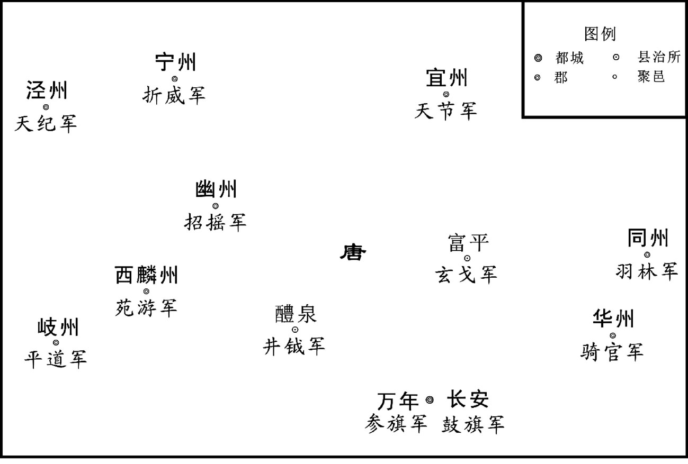 
唐高祖武德八年（625年）关中十二军示意图

## 【原文】

**夏六月丙子，遣燕郡王李艺屯华亭县及弹筝峡，水部郎中姜行本断石岭道以备突厥[1]。丙戌，颉利可汗寇灵州。丁亥，以右卫大将军张瑾为行军总管以御之，以中书侍郎温彦博为长史[2]。先是，上与突厥书用敌国礼，秋七月甲辰，上谓侍臣曰：“突厥贪婪无厌，朕将征之，自今勿复为书，皆用诏敕[3]。”己酉，突厥颉利可汗寇相州[4]。丙辰，代州都督蔺謩与突厥战于新城，不利，复命行军总管张瑾屯石岭，李高迁趋大谷以御之[5]。丁巳，命秦王屯蒲州以备突厥[6]。**

## 【注文】

[1]李艺（？—627年）：即罗艺。唐初将领，字子延，襄州襄阳（今湖北襄樊襄阳区）人。隋炀帝大业中，以军功官至虎贲（bēn）郎将。唐高祖武德元年（618年），以地归唐，赐姓李，封燕郡王。累建战功，后率兵反唐，兵败为部下所杀。　　华亭县：古县名，县治在今甘肃华亭。　　弹筝峡：古地名，今甘肃平凉西北。　　水部：中国古代中央官署名。西汉少府下设都水长及丞，掌管水利。三国魏置水部，掌航政与水利，主官为水部郎中。两晋、南北朝尚书有水部一曹，主官为尚书水部郎，掌有关水道政令。历晋、宋、齐、后魏、北齐并有水部郎中，梁、陈为侍郎。后周冬官府有司水中大夫。隋时以水部为工部四司之一，此制度一直沿用至宋。隋设都水台，置使者及丞。唐代工部内设水部郎中、员外郎各一人，掌管津济、船舻（lú）、渠梁、堤堰、沟洫、渔捕、运漕、碾硙（wèi）之事。　　郎中：古代官名，即帝王侍从官的通称。其职责原为护卫、陪从，随时建议，备顾问及差遣。战国始有，秦汉治置。后世以侍郎、郎中、员外郎为各部要职。　　姜行本（？—645年）：秦州上邽（今甘肃天水）人，唐代杰出的工程营造家。唐太宗贞观中为将作少匠（一说为将作大匠），后转左屯卫将军。卒后赠左卫大将军，郕（chéng）国公，陪葬昭陵。

[2]右卫大将军：右卫的长官。隋朝置一人，正三品，掌宫掖禁御，督摄仗卫。隋炀帝大业三年（607年）改为右翊卫大将军，总府事，并统诸鹰扬府。唐高祖武德五年（622年）复为右卫府大将军，唐高宗龙朔二年（662年）去府字，掌宫禁宿卫，总制五府及外府。唐德宗时改居上将军之下。　　张瑾（生卒年不详）：唐高祖时大将，并州道行军总管。　　中书侍郎：中书省的长官，副中书令，帮助中书令管理中书省的事务，是中书省固定编制的宰相。　　温彦博（575—637年）：字大临，唐初并州祁县（今山西祁县东南）人，温大雅之弟，唐初宰相。

[3]贪婪：贪得无厌，不知足。

[4]相州：古州名，北魏置。州治在邺，今河北临漳西南。

[5]蔺（lìn）謩（mó）（生卒年不详）：唐初将领。謩，“谟”的异体字。　　石岭：古地名，在今山西阳曲东北关城一带。　　大谷：古地名，今山西太谷。

[6]蒲（pú）州：古州名，今山西临猗（yī）县临晋镇。

## 【译文】

唐高祖武德八年（625年）夏六月丙子（十四日），唐派遣燕郡王李艺将军队驻扎在华亭县及弹筝峡，水部郎中姜行本切断石岭通道，以防备突厥。丙戌（二十四日），颉利可汗侵犯灵州。丁亥（二十五日），任命右卫大将军张瑾为行军总管，抵抗突厥，任命中书侍郎温彦博为长史。在此之前，高祖给突厥的书信全用与对方平等的礼节。秋七月甲辰（十二日），高祖对身边的大臣说：“突厥贪得无厌，我将征讨他们，从今以后不要再以书信的方式与他们交往，全部用诏书或敕令。”己酉（十七日），突厥颉利可汗侵犯相州。丙辰（二十四日），代州都督蔺謩与突厥在新城交战失利，高祖又命令行军总管张瑾在石岭驻兵，李高迁赶往大谷防御突厥。丁巳（二十五日），高祖命秦王李世民前往蒲州驻兵以防备突厥。

## 【原文】

**八月壬戌，突厥逾石岭寇并州，癸亥，寇灵州，丁卯，寇潞、沁、韩三州[1]。诏安州大都督李靖出潞州道，行军总管任瓌屯太行以御突厥[2]。颉利可汗将兵十余万大掠朔州[3]。壬申，并州道行军总管张瑾与突厥战于太谷，全军皆没，瑾脱身奔李靖[4]。行军长史温彦博为虏所执，虏以彦博职在机近，问以国家兵粮虚实，彦博不对，虏迁之阴山[5]。庚辰，突厥寇灵州，甲申，灵州都督任城王道宗击破之。丙戌，突厥寇绥州。丁亥，颉利可汗遣使请和而退。**

## 【注文】

[1]潞（lù）：即潞州，治今山西长治。　　沁（qìn）：即沁州，治今山西沁源。　　韩：即韩州，今山西襄垣北。

[2]安州：古州名，今河北定州。　　李靖（571—649年）：字药师，雍州三原（今陕西三原东北）人。隋末唐初将领，是唐朝文武兼备的著名军事家。后封卫国公，世称李卫公。李靖善于用兵，长于谋略，著有多种兵书，多亡佚。　　任瓌（guī）（？—629年）：唐开国功臣，字玮，庐州合肥（今安徽合肥）人，隋时任韩城尉，唐时任谷州刺史。王世充多次攻打新安，都被任瓌击败，因功被封为管国公。后平徐圆朗、辅公祏（shì）有功，终于通州都督。　　太行：即太行山；或太行关，在今山西晋城南。

[3]掠：抢劫，夺取。

[4]太谷：古地名，今山西太谷。

[5]机近：参与朝廷机要的大臣。　　阴山：山名，横亘于内蒙古中部和河北北部。

## 【译文】

唐高祖武德八年（625年）八月壬戌（初一日），突厥越过石岭侵犯并州，癸亥（初二日），突厥侵犯灵州，丁卯（初六日），突厥侵犯潞州、沁州、韩州等三州。高祖下诏命安州大都督李靖从潞州道出兵，行军总管任瓌驻军太行山以防御突厥。颉利可汗带兵十多万人大规模掠夺朔州。壬申（十一日），并州道行军总管张瑾在太谷和突厥交战，全军覆没，张瑾单独逃走投奔李靖。行军长史温彦博被突厥捉去，突厥以为温彦博的职务接近机要的官职，便向他询问国家的军队和粮食的虚实情况，温彦博不予回答，突厥便把他移送到阴山。庚辰（十九日），突厥侵犯灵州，甲申（二十三日），灵州都督任城王李道宗打败了突厥。丙戌（二十五日），突厥侵犯绥州。丁亥（二十六日），颉利可汗派遣使者请求和好后退兵。

## 【原文】

**九月癸巳，突厥没贺咄设陷并州一县，丙申，代州都督蔺謩击破之[1]。丙午，右领军将军王君廓破突厥于幽州，俘斩二千余人[2]。突厥寇蔺州[3]。冬十月，突厥寇鄯州，遣霍公柴绍救之[4]。十一月戊戌，突厥寇彭州[5]。**

## 【注文】

[1]没贺咄设：即“莫贺咄设”，颉利曾为此典兵官，但此非颉利。　　陷：攻破，占领。

[2]右领军：古代武官名，东汉献帝建安中曹操置，统领禁卫军。　　王君廓（kuò）（？—627年）：并州石艾（今山西平定）人。自幼家贫，牙行出身，精于骑射。是唐朝开国功臣之一，有勇有谋，但由于王君廓为人狡桀多变，最终被流放。

[3]蔺（lìn）州：古地名，今山西柳林西北。

[4]鄯（shàn）州：古地名，今青海乐都。

[5]彭（péng）州：古地名，即彭阳县，隋文帝开皇十八年（598年）改彭原县，今甘肃庆阳西峰区北。

## 【译文】

唐高祖武德八年（625年）九月癸巳（初二日），突厥没贺咄设攻陷并州的一个县，丙申（初五日），代州都督蔺謩（mó）打败了他的进攻。丙午（十五日），唐右领军将军王君廓在幽州打败突厥，俘虏斩首共二千余多人。突厥侵犯蔺州。冬十月，突厥侵犯鄯州，高祖派遣霍公柴绍救援。十一月戊戌（初八日），突厥侵犯彭州。

## 【原文】

**九年春二月丁亥，突厥寇原州，遣折威将军杨毛击之[1]。三月辛亥，突厥寇灵州。癸丑，南海公欧阳胤奉使在突厥，帅其徒五十人谋掩袭可汗牙帐，事泄，突厥囚之[2]。丁巳，突厥寇凉州，都督长乐王幼良击走之[3]。**

## 【注文】

[1]折威将军：关中十二道中的宁州（今甘肃宁县）道置有折威军，其中长官为折威将军，为关中十二将军之一。　　杨毛（生卒年不详）：唐初宁州折威将军。

[2]欧阳胤（yìn）（生卒年不详）：潭州（治今湖南长沙）人，唐初官至光州刺史，封南海郡公。　　牙帐：中国古代边境少数民族匈奴、鲜卑、羌、铁勒、柔然、回纥（hé）、突厥、沙陀的“首都”称为牙帐。　　泄：泄露。

[3]幼良：即李幼良（？—627年），唐宗室，官至凉州都督。朝廷疑其谋反，赐死。

## 【译文】

唐高祖武德九年（626年）春二月丁亥（二十八日），突厥侵犯原州，唐派遣折威将军杨毛出击。三月辛亥（二十三日），突厥侵犯灵州。癸丑（二十五日），南海公欧阳胤奉命出使突厥，率领他的随从属下五十人策划袭击可汗的牙帐，结果事情泄露，突厥囚禁了他。丁巳（二十九日），突厥侵犯凉州，都督长乐王李幼良打退了他们。

## 【原文】

**夏四月丁卯，突厥寇朔州，庚午，寇原州，癸酉，寇泾州[1]。戊寅，安州大都督李靖与突厥颉利可汗战于灵州之硖石，自旦至申，突厥乃退[2]。癸未，突厥寇西会州[3]。五月戊戌，突厥寇秦州[4]。突厥寇兰州[5]。六月，突厥寇陇州，辛未，寇渭州，遣右卫大将军柴绍击之[6]。秋七月己丑，柴绍破突厥于秦州，斩特勒一人，士卒首千余级[7]。八月丙辰，突厥遣使请和。**

## 【注文】

[1]泾（jīng）州：古州名。治今甘肃泾川县北。

[2]硖（xiá）石：三峡名，即今宁夏青铜峡西南黄河岸青铜峡。　　申：用以记时，即十五时至十七时为申时。

[3]西会州：古州名。唐武德二年（619年）改会州置西会州，治会宁（今甘肃靖远）。

[4]秦州：古州名，治所在今甘肃天水。

[5]兰州：古地名，今甘肃兰州。

[6]渭州：古州名，治所在今甘肃陇西东南。

[7]特勒：“特勤”之误。突厥的官名。　　卒：兵。

## 【译文】

夏四月丁卯（初九日），突厥侵犯朔州，庚午（十二日），侵犯原州，癸酉（十五日），侵犯泾州。戊寅（二十日），安州大都督李靖和突厥颉利可汗在灵州的硖石进行交战，从天亮直打到日落，突厥才退去。癸未（二十五日），突厥侵犯西会州。五月戊戌（十一日），突厥侵犯秦州。突厥侵犯兰州。六月，突厥侵犯陇州，辛未（十五日），侵犯渭州，朝廷派遣右卫大将军柴绍出击突厥。秋七月己丑（初三日），柴绍在秦州打败突厥，斩杀特勤一人，斩杀将士千余人。八月丙辰（初一日），突厥派遣使者来求和。

## 【原文】

**癸亥，诏传位于太子[1]。甲子，太宗即皇帝位于东宫显德殿[2]。**

## 【注文】

[1]诏：下诏书。

[2]即：登上；走上。

## 【译文】

唐高祖武德九年（626年）八月癸亥（初八日），高祖下诏把皇位传给太子李世民。甲子（初九日），太宗即皇帝位于东宫显德殿。

## 【原文】

**初，稽胡酋长刘屳成帅众降梁师都，师都信谗，杀之，由是所部猜惧，多来降者[1]。师都浸衰弱，乃朝于突厥，为之画策，劝令入寇[2]。于是颉利、突利二可汗合兵十余万骑寇泾州，进至武功，京师戒严[3]。**

## 【注文】

[1]稽胡：古族名，“匈奴”的别种。　　酋（qiú）长：部落的首领。　　刘屳（xiān）成：唐初少数民族酋长，生平事迹不详。　　谗：谗言，陷害别人的坏话。

[2]衰弱：事物由强转弱。　　画：谋划；策划。

[3]武功：古地名，今陕西武功西北。

## 【译文】

起初，稽胡酋长刘屳成率领部众投降梁师都，梁师都听信谗言，杀了他，从此他的部下有些猜疑和畏惧，很多人前来投降唐朝。梁师都势力逐渐衰弱，于是便向突厥称臣，替突厥出谋划策，劝突厥前来侵犯唐朝。因此颉利可汗、突利可汗合兵十余万骑侵犯泾州，进攻到武功，京师戒备森严。

## 【原文】

**己卯，突厥进寇高陵[1]。辛巳，泾州道行军总管尉迟敬德与突厥战于泾阳，大破之，获其俟斤阿史德乌没啜，斩首千余级[2]。癸未，颉利可汗进至渭水便桥之北，遣其腹心执失思力入见，以观虚实[3]。思力盛称：“颉利、突利二可汗将兵百万，今至矣[4]。”上让之曰：“吾与汝可汗面结和亲，赠遗金帛，前后无算[5]。汝可汗自负盟约，引兵深入，于我无愧[6]。汝虽戎狄，亦有人心，何得全忘大恩，自夸强盛，我今先斩汝矣[7]。”思力惧而请命[8]。萧瑀、封德彝请礼遣之，上曰：“我今遣还，虏谓我畏之，愈肆凭陵[9]。”乃囚思力于门下省[10]。**

## 【注文】

[1]高陵：古县名，县治在今陕西高陵西南。

[2]俟斤（sì jīn）：突厥部酋高级官称之一。　　阿史德乌没啜（chuò）（生卒年不详）：东突厥贵族。阿史德，突厥姓氏。

[3]渭水：水名，又称“渭河”，源出甘肃省，流入陕西省，会泾（jīng）水入黄河。　　便桥：又名便门桥、西渭桥、咸阳桥。在今陕西咸阳市南渭河上。　　腹心：比喻极亲近的人；心腹。　　执失思力（生卒年不详）：东突厥部酋。唐太宗贞观四年（630年）降唐，先后擢将军、大将军，尚九江公主，拜驸马都尉，封安国公，终归州刺史，卒于龙朔中（661—663年）。谥号为“景”。

[4]盛（shèng）：极力；表程度深。

[5]结：缔结。　　无算：形容数目巨大，难以算计。

[6]愧：惭愧。

[7]何得：怎能；怎会。

[8]请命：求告免死。

[9]礼遣：以礼遣送。　　肆：恣纵，放肆。

[10]门下省：古代官署名，与中书、尚书合称三省。其中心工作是审议和封驳，掌“出纳帝命”。

## 【译文】

八月己卯（二十四日），突厥出兵侵犯高陵。辛巳（二十六日），泾州道行军总管尉迟敬德与突厥在泾阳交战，大破突厥军，虏获他们的俟斤阿史德乌没啜，斩首一千多人。癸未（二十八日），颉利可汗进兵到渭水便桥北岸，派遣他的心腹执失思力入朝谒见，观察虚实。执失思力宣称：“颉利、突利二可汗率军百万，现在已经来到。”太宗斥责他说：“我和你们可汗当面缔结和亲，又赠送金帛，前前后后数量都无法计算。你们可汗自己违背盟约，率领兵马深入我国境内，对我没有任何惭愧之情。你虽是戎狄族人，也应当有人心，怎能把我们的恩惠全都忘了，还自夸你们强盛，我现在先杀了你。”执失思力恐惧请求饶命。萧瑀、封德彝也请求按礼节放他回去，太宗说：“如果我现在放他回去，突厥以为我惧怕他们，就会更加肆意侵凌我们。”于是把执失思力囚禁在门下省。

## 【原文】

**上自出玄武门，与高士廉、房玄龄等六骑径诣渭水上，与颉利隔水而语，责以负约[1]。突厥大惊，皆下马罗拜[2]。俄而诸军继至，旌甲蔽野，颉利见执失思力不返，而上挺身轻出，军容甚盛，有惧色[3]。上麾诸军使却而布陈，独留与颉利语[4]。萧瑀以上轻敌，叩马固谏[5]。上曰：“吾筹之已孰，非卿所知[6]。突厥所以敢倾国而来直抵郊甸者，以我国内有难，朕新即位，谓我不能抗御故也[7]。我若示之以弱，闭门拒守，虏必放兵大掠，不可复制[8]。故朕轻骑独出，示若轻之，又震曜军容，使知必战，出虏不意，使之失图[9]。虏入我地既深，必有惧心，故与战则克，与和则固矣[10]。制服突厥，在此一举，卿第观之[11]。”是日，颉利来请和，诏许之[12]。上即日还宫[13]。乙酉，又幸城西，斩白马，与颉利盟于便桥之上[14]。突厥引兵退[15]。**

## 【注文】

[1]上：指唐太宗。　　高士廉（575—647年）：名俭，字士廉，渤海蓨县（今河北景县）人。唐代开国功臣，他出身于官宦之家，因得罪隋炀帝，被发配岭南，随后中原大乱，被隔绝在外，直到李靖灭萧铣（xiǎn）时才得以回归。其人善行政、文学，为李世民心腹，参与玄武门之变的策划。在唐太宗贞观年间，任侍中，封义兴郡公，为安州（今湖北安陆西北）都督、益州大都督府长史、吏部尚书、尚书右仆射、同中书门下三品，封申国公。主持编撰《氏族志》。凌烟阁图像高士廉位列第六。　　径：径直；直接。

[2]罗拜：四面围绕着下拜。

[3]俄：短暂的时间，一会儿。　　旌（jīng）：古代用牦牛尾或兼五彩羽毛饰竿头的旗子。　　甲：古时战士的护身衣，用皮革或金属制成。也叫“铠（kǎi）”。　　蔽：遮住，遮掩。　　军容：指军队和军人的礼仪法度、风纪阵威和武器装备。

[4]麾（huī）：古代指挥军队的旗子，借用做指挥。　　布陈：分布陈列；陈列。

[5]叩（kòu）：通“扣”。拉住。

[6]筹：策划。　　孰：通“熟”。精审，仔细。

[7]抵（dǐ）：到达。　　郊甸（diàn）：城郭外称郊。郊外为甸。　　国内有难：指玄武门之变。

[8]复制：继续控制。

[9]曜（yào）：炫耀；显示。

[10]固：巩固；使坚固；加固。

[11]制服：用强力使之驯服。

[12]请和：请求讲和。

[13]即日：当天；当日。

[14]幸：指封建帝王到达某地。　　斩白马：又称“刑马”“刑白马”。古代大盟会，往往斩白马以为盟誓之礼仪。　　盟：结盟。

[15]引：带领。

## 【译文】

唐太宗亲自从玄武门出发，和高士廉、房玄龄等六人骑马来到渭水上，同颉利可汗隔着渭水谈话，谴责他违背盟约。突厥人大为吃惊，纷纷跳下马来围绕太宗跪拜。不久唐军相继赶到，旌旗盔甲遮遍原野，颉利可汗见执失思力没有回来，而太宗亲自挺身轻装出马，军队阵容整齐而盛大，脸上有些害怕的神色。太宗用旗子指挥各军退后布阵，独自留下来和颉利谈话。萧瑀等认为太宗有些轻敌，拽着马头坚决劝阻。太宗说：“我已经周密地筹划过了，你们还不了解其中用意。突厥之所以敢举国来犯，就是因为我们国内有内乱，我刚即位，认为我们不能抵御他们。如果我表现出软弱无力，关闭城门防守，突厥必然放纵他的兵马大规模抢掠，那就无法再制止他们了。所以我轻骑独自前来，做出看不起他们的样子，又可炫耀我们的军容震慑他们，让他们知道我肯定要与他们作战，出其不意，使敌人的企图落空。突厥已深入我们的腹地，必然产生恐惧心理，所以如果我军与他们交战必能取胜，和谈也一定能稳固了。制服突厥，就在此一举，你们等着看吧。”当天，颉利可汗来请求讲和，太宗下诏允许他的请求。太宗当日便回宫中。唐高祖武德九年（626年）八月乙酉（三十日），太宗李世民又驾临城西，杀白马歃（shà）血，和颉利在便桥之上结盟，突厥率领兵马回去。

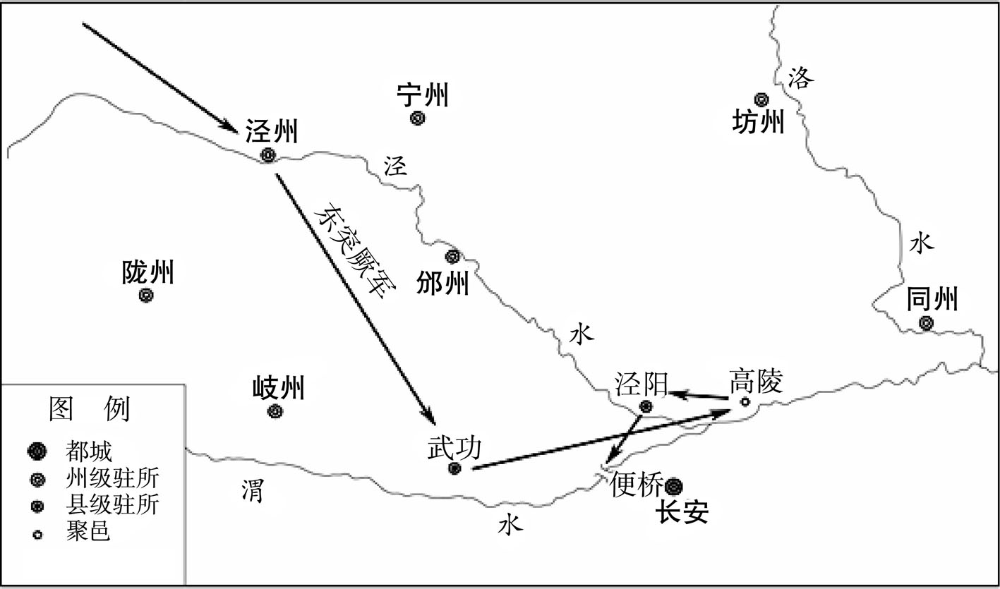 
渭水便桥之盟示意图

## 【原文】

**萧瑀请于上曰：“突厥未和之时，诸军争［请］战，陛下不许，臣等亦以为疑[1]。既而虏自退，其策安在[2]？”上曰：“吾观突厥之众虽多而不整，君臣之志唯贿是求[3]。当其请和之时，可汗独在水西，达官皆来谒我，我若醉而缚之，因袭击其众，势如拉朽[4]。又命长孙无忌、李靖伏兵于幽州以待之，虏若奔归，伏兵邀其前，大军窃其后，覆之如反掌耳[5]。所以不战者，吾即位日浅，国家未安，百姓未富，且当静以抚之[6]。一与虏战，所损甚多，虏结怨既深，惧而修备，则吾未可以得志矣[7]。故卷甲韬戈，啖以金帛，彼既得所欲，固当自退，志意骄堕，不复设备，然后养威俟衅，一举可灭也[8]。‘将欲取之，必固与之’，此之谓矣，卿知之乎[9]？”瑀再拜曰：“非所及也[10]。”**

## 【注文】

[1]和：求和。

[2]策：计谋，主意，办法。

[3]唯贿是求：一味追求贿赂。

[4]达官：泛指高官。　　谒（yè）：拜见。　　缚（fù）：捆绑。　　拉朽：形容极容易摧毁。拉：摧毁。朽：朽烂的木头。

[5]长孙无忌（？—659年）：字辅机，河南洛阳人。先世鲜卑族拓跋氏，北魏皇族支系，后改为长孙氏。是唐太宗李世民的内兄，文德顺圣皇后的哥哥。李治继位后，欲立武则天昭仪为皇后，无忌认为不可，高宗偏听许敬宗诬陷，去其舅父长孙无忌的官爵，流放黔州，后令自缢，籍没其家。　　邀：邀击；拦击。　　覆：翻，倾倒。

[6]浅：不久，时间短。　　静：恬淡；平和。

[7]得志：实现其志愿。

[8]卷甲韬（tāo）戈（gē）：收起甲胄军械以息战求和。卷：收藏。韬：隐藏，隐蔽。戈：古代的一种兵器，横刃，用青铜或铁制成，装有长柄。　　啖（dàn）：引诱，利诱。　　堕：堕落。　　俟（sì）衅（xìn）：等待间隙。衅，事端，破绽。

[9]将欲取之，必固与之：想要得到他，一定得给对方一些满足。唐太宗引《老子》的“柔弱胜刚强”的辩证思想作为他的战略原则。

[10]非所及：不是自己所能达到的。

## 【译文】

萧瑀向太宗请教说：“突厥没有准备言和的时候，诸军都争相请战，陛下不允许，臣等对陛下的做法很是疑惑。不久突厥自动退却，奥秘在哪里呢？”太宗说：“我观察突厥的兵马虽多，但却军容不整，他们君臣的意图只是贪图财物。当他们请和的时候，唯独可汗留在渭水的西岸，他们的高官都来拜见我，我如果把他们灌醉了再捆绑起来，乘机袭击他们的兵马，就像摧枯拉朽之势一样。再命长孙无忌、李靖在幽州埋伏兵力等待着他们，敌人如果逃回，伏兵在其前截击，大军跟踪追击于后，消灭他们易如反掌。我之所以不肯和他们交战，是因为我即位时间还短，国家尚未安定，老百姓还未富裕，应当休养生息，暂时安抚他们。一旦和突厥作战，就会有很多损失，与敌人结怨深了后，他们会害怕而更加防备，那么我们就无法如意行事了。所以我卷甲藏戈不战，给他们些金帛作引诱，他们的欲望得到满足以后，自然就退却，他们的意志也必然骄傲堕落，不再防备，我们可以养足威力，等待时机一举歼灭他们。‘想要得到，必得付出’，就是这个道理，你们明白了吧！”萧瑀一再拜谢说：“这不是我能想到的。”

## 【原文】

**九月，突厥颉利献马三千匹，羊万口[1]。上不受，但诏归所掠中国户口，征温彦博还朝[2]。丁未，上引诸卫将卒习射于显德殿庭，谕之曰：“戎狄侵盗，自古有之，患在边境小安，则人主逸游忘战，是以寇来莫之能御[3]。今朕不使汝曹穿池筑苑，专习弓矢，居闲无事，则为汝师，突厥入寇，则为汝将，庶几中国之民可以少安乎[4]！”于是日引数百人教射于殿庭，上亲临试，中多者赏以弓、刀、帛，其将帅亦加上考[5]。**

## 【注文】

[1]颉利：突厥颉利可汗。

[2]上：皇上。自武德九年八月甲子日后，凡称上者，皆指太宗。　　但诏归：只是诏命归还。　　户口：指人口。　　征温彦博还朝：唐高祖武德八年（625年）八月，温彦博被突厥所执。九月，太宗征召彦博还朝。

[3]显德殿：宫殿名。唐长安东宫第一大殿，位于东宫南面中部嘉德门内。建于隋，原称嘉德殿，唐初改名显德殿。此为东宫正殿，是皇太子举行政治活动处。唐高祖武德九年（626年），李世民在此即帝位，后常在此会见群臣，处理朝政。　　侵盗：侵凌盗窃。　　人主：旧时专指一国之主，即帝王。　　逸游：淫逸游乐。

[4]汝曹：你们。曹，辈，等于现代汉语中的“们”。　　穿池：犹凿池。　　筑：建造，修盖。　　矢：箭。　　庶几：表示在上述情况下才能实现某种希望。　　少：稍稍，稍微。

[5]亲临试：亲自莅临，加以验试。　　上考：上等考功。唐考功之法，上、中、下皆分三等。

## 【译文】

唐高祖武德九年（626年）九月，突厥颉利可汗向唐献马三千匹，羊一万只。太宗不接受，只是诏命让他归还掠去的中原人口，让温彦博回到朝廷。丁未（二十二日），太宗带领诸卫将士在显德殿庭院中练习射箭，告诉他们说：“戎狄侵扰掠夺，自古就有，值得忧虑的是边境稍微安定，人主就安逸游荡忘记战备，这样敌寇攻来了，无法抵御。现在我不让你们修池榭筑宫苑，专让你们练习射击，平时没有事情做的时候，我做你们的老师，一旦突厥来进犯，我就做你们的将军，只有这样，中原的百姓才能过上安定的日子。”于是太宗每日带领数百人在殿庭里教他们射箭，太宗亲自考核，射中多的赏赐给他们弓箭、短刀和布帛，对那些将帅，太宗也用上等考功考核他们。

## 【原文】

**太宗贞观元年夏五月，苑君璋帅众来降[1]。初，君璋引突厥陷马邑，杀高满政，退保恒安[2]。其众皆中国人，多弃君璋来降[3]。君璋惧，亦降，请捍北边以赎罪，上皇许之[4]。君璋请约契，上皇遣雁门人元普赐之金券[5]。颉利可汗复遣人招之，君璋犹豫未决[6]。恒安人郭子威说君璋，以：“恒安地险城坚，突厥方强，且当倚之以观变，未可束手于人[7]。”君璋乃执元普送突厥，复与之合，数与突厥入寇[8]。至是，见颉利政乱，知其不足恃，遂帅众来降[9]。上以君璋为隰州都督、芮国公[10]。**

## 【注文】

[1]贞观：唐太宗李世民的年号，自贞观元年（627年）正月到贞观二十三年（649年）十二月。李世民的英明执政也叫“贞观之治”。

[2]马邑：古县名，县治在今山西朔州。　　恒安：古地名，今山西大同附近。

[3]中国：中原。

[4]捍：保卫，抵御。　　赎罪：用某种实际表现抵销罪过。　　上皇：太上皇的简称，这里指唐高祖李渊。

[5]请约契（qì）：请求赐予金契。　　雁门：古地名，唐、五代方镇。治所在今山西代县。　　元普：生平事迹不详，雁门人，活动于唐初。　　金券（quàn）：即铁劵。是皇帝赐给功臣使其世代享受某些特权的铁契。

[6]招：邀请。　　犹豫未决：指拿不定主意，下不了决心。

[7]郭子威：生平事迹不详，恒安人，活动于唐初。　　倚（yǐ）：依靠；依赖。

[8]合：联合。

[9]恃：依赖，依靠。

[10]隰（xí）州：古州名，治所在今山西隰县。　　芮（ruì）：古国名。

## 【译文】

唐太宗贞观元年（627年）夏五月，苑君璋率领手下兵马前来投降。当初，苑君璋带领突厥攻陷马邑，杀了高满政，退兵守卫恒安。他的部下都是中原人，大多数人背弃苑君璋来投降唐朝。苑君璋十分恐惧，也主动来投降，请求捍卫北方边境来赎罪，太上皇答应了他。苑君璋请求订立契约，太上皇派遣雁门人元普送给他金券。颉利可汗又派人招他，君璋犹豫没有决定。恒安人郭子威劝苑君璋说：“恒安地势险要，城池坚固，突厥正在强盛之时，暂时应当依靠他们，再观察形势如何变化，不可轻易束手投降。”苑君璋于是捉住元普送往突厥，又一次与突厥联合，多次与突厥侵犯边境。到这时，看到颉利政治混乱，知道无法再靠他，于是率领人马来投降唐朝。太宗任命苑君璋为隰州都督、芮国公。

## 【原文】

**初，突厥性淳厚，政令质略[1]。颉利可汗得华人赵德言，委用之[2]。德言专其威福，多变更旧俗，政令烦苛，国人始不悦[3]。颉利又好信任诸胡而疏突厥，胡人贪冒，多反复，兵革岁动[4]。会大雪，深数尺，杂畜多死，连年饥馑，民皆冻馁[5]。颉利用度不给，重敛诸部，由是内外离怨，诸部多叛，兵浸弱[6]。言事者多请击之，上以问萧瑀、长孙无忌曰：“颉利君臣昏虐，危亡可必[7]。今击之则新与之盟，不击恐失机会，如何而可[8]？”瑀请击之[9]。无忌对曰：“虏不犯塞，而弃信劳民，非王者之师也[10]。”上乃止。**

## 【注文】

[1]淳厚：淳朴敦厚。　　略：简明、简洁；简略。

[2]赵德言（生卒年不详）：隋末唐初人。中原战乱，他北投突厥。被颉利可汗重用，本来突厥习俗简单，治理简便。颉利可汗听从赵德言的建议，加强可汗的权力，法令严苛，使突厥各部首领纷纷不满。突厥各部开始背叛颉利可汗，埋下了后来突厥败亡的种子。

[3]威福：原指统治者的赏罚之权，后多谓当权者妄自尊大，恃势弄权。

[4]贪：贪婪。多欲而不知满足。　　冒：贪求，不知满足地追求。　　兵革：指战争。

[5]馁（něi）：饥饿。

[6]不给：不能给予，亦即不充。　　敛（liǎn）：征收。　　离怨：离心怨恨。

[7]昏虐：昏昧暴虐。　　危亡可必：必定危亡。

[8]如何：怎样。

[9]击：打击。

[10]弃信劳民：废弃信约，烦劳士民。

## 【译文】

最初，突厥人性情淳朴敦厚，政令简朴疏略。颉利可汗得汉人赵德言，便加以重用。赵德言专权，作威作福，改变了突厥许多旧有的风俗，政策法令繁杂苛刻，突厥人民很不满意。颉利可汗又喜欢信任重用其他胡人而疏远突厥本族人，胡人贪得无厌，反复无常，年年发动战争，又赶上天下大雪，深达数尺，牲畜很多冻死，连年发生饥荒，百姓饥寒交迫，死者很多。颉利可汗挥霍无度难以补给，只有加重对各部落征收赋税，由此内外离心怨恨，各部落大都背叛了他，军事力量逐渐衰弱。大臣议事时多请求出兵进击突厥，太宗就这一问题询问萧瑀（yǔ）、长孙无忌说：“颉利君臣都昏庸暴虐，危亡是必然的，现在出兵讨伐，却刚刚与他们缔结了盟约，不打又怕失去了机会，怎样才好？”萧瑀请求出兵攻打。长孙无忌回答说：“突厥并没有侵犯边塞，我们背信劳民，不是正义之师的做法。”太宗于是停止出兵。

## 【原文】

**初，西突厥曷萨那可汗方强，敕勒诸部皆臣之，曷萨那征税无度，敕勒相帅叛之，附于颉利[1]。颉利政乱，薛延陁与回纥拔野古等叛之，颉利不能制[2]。事见《唐平铁勒》。**

## 【注文】

[1]曷（hé）萨那：即处罗可汗。　　敕（chì）勒：中国古代民族名，属于原始游牧部落，又称铁勒。隋时敕勒人分布于东至独洛河（今土拉河）以北、西至西海（今里海）的广大地区。匈奴人称其为丁零，鲜卑人因其使用车轮高大的车子，称之为高车。汉朝击溃北匈奴之后，敕勒的地域开始南移，与中原的汉人交往。公元4世纪末至6世纪中叶，继匈奴、鲜卑之后，敕勒人和柔然人活动于中国大漠南北和西北广大地区,是今天维吾尔族的主要族源。　　帅：同“率”。

[2]薛延陁（tuó）：敕勒部落之一，也称“薛延陀”，他们是部落联合体，由薛与延陀组成。是东部高车一部落。曾经随阿伏至罗到准噶尔盆地建高车国。南北朝时游牧于阿尔泰山西南、额尔齐斯河一带,少数留在于都斤山。他们的军力很大。曾经多次反叛。公元605年，他们的首领乙失钵驱逐突厥泥厥处罗可汗。后被射匮可汗重新征服。　　回纥（hé）：我国古代西北方少数民族名。后亦称“回鹘（hú）”。回鹘部落联盟驻牧在仙娥河（又名娑陵水，今蒙古色楞格河）和温昆河（今蒙古鄂尔浑河）流域。草原回鹘汗国于公元9世纪中期被黠戛斯灭亡后，分三支西迁。回纥是维吾尔族的先民。从公元646年回纥汗国建立，到公元840年汗国灭亡的近两百年里，助唐平定安史之乱，抵御吐蕃对西域的进攻，和唐王朝保持着相当密切的政治、经济和文化往来，促进了唐代的中外文化交流。　　拔野古：称拔野固，或者叫作拔曳古，漫散于漠北，方圆千里，在今克鲁伦、海拉尔两河北境，故处仆骨之东，西与黑龙江境内的靺（mò）鞨（hé）诸部相邻近。

## 【译文】

当初，西突厥曷萨那可汗正值强盛，敕勒各部都向他称臣，曷萨那横征暴敛，敕勒各部落相继背叛了他，归附了颉利可汗。颉利可汗政局混乱后，薛延陀和回纥拔野古等也叛变，颉利可汗不能控制他们。事见《唐平铁勒》。

## 【原文】

**颉利益衰，国人离散[1]。会大雪，平地数尺，羊马多死，民大饥。颉利恐唐乘其弊，引兵入朔州境上，扬言会猎，实设备焉[2]。鸿胪卿郑元璹使突厥还，言于上曰：“戎狄兴衰，专以羊马为候[3]。今突厥民饥畜瘦，此将亡之兆也，不过三年[4]。”上然之[5]。群臣多劝上乘间击突厥，上曰：“新与人盟而背之，不信；利人之灾，不仁；乘人之危以取胜，不武[6]。纵使其种落尽叛，六畜无余，朕终不击，必待有罪，然后讨之[7]。”**

## 【注文】

[1]离散：分离；分散。

[2]扬言：对外宣扬或故意散布某种言论。　　实设备焉：事实上在预设防备。

[3]鸿胪卿：古代官署名。掌宾客及凶仪之事的官。秦称典客，汉改为大行令，武帝时又改名大鸿胪。鸿胪，本为大声传赞，引导仪节之意。大鸿胪主外宾之事。至北齐，置鸿胪寺，后代沿置。　　以羊马为候：以羊马的多少当作占候的标准。

[4]兆：征兆，预兆。

[5]然：以为……对；同意。

[6]盟：结盟。　　利人之灾：乘人灾祸而取利。

[7]六畜：或称“六扰（驯服）”“六牲”，是六种家畜的合称，即马、牛、羊、猪、狗、鸡。

## 【译文】

颉利可汗日益衰落，国内的百姓离散。又赶上天下大雪，平地就有数尺深，羊马很多都冻死了，百姓饥寒交迫。颉利可汗担心唐军乘他衰弱之机进攻，就带兵马进入朔州境内，声称是会合狩猎，实际上是防御唐军。鸿胪卿郑元璹（shú）出使突厥回来，对太宗说：“戎狄的盛衰，以羊马的多少为标志。现在突厥百姓饥饿，牲畜瘦弱，这是将要灭亡的征兆，时间不过三年。”太宗认为他说得对。群臣多劝太宗乘此机会攻打突厥，太宗说：“刚与人家结盟就违背盟约，这是不讲信用；利用人家的灾难自己取利，这是不仁义；乘人之危来取胜，这是不勇武。即使是突厥的各部落都叛变了他，牲畜全都死光，我都始终不攻打他，一定要等他有罪过，然后再去征讨他。”

## 【原文】

**二年[1]。初，突厥突利可汗建牙直幽州之北，主东偏，奚、霫等数十部多叛突厥来降，颉利可汗以其失众，责之[2]。及薛延陀、回纥等败欲谷设，颉利遣突利讨之，突利兵又败，轻骑奔还[3]。颉利怒，拘之十余日而挞之，突利由是怨，阴欲叛颉利[4]。颉利数征兵于突利，突利不与，表请入朝[5]。上谓侍臣曰：“向者突厥之强，控弦百万，凭陵中夏，用是骄恣，以失其民[6]。今自请入朝，非困穷肯如是乎[7]？朕闻之，且喜且惧[8]。何则[9]？突厥衰则边境安矣，故喜。然朕或失道，他日亦将如突厥，能无惧乎[10]！卿曹宜不惜苦谏，以辅朕之不逮也[11]。”**

## 【注文】

[1]二年：指贞观二年，公元628年。

[2]建牙：古时出征建立军旗，叫作“建牙”，此为突厥的王庭所在。　　主东偏：主管东边的部落。　　奚（xī）、霫（xí）：古民族名，隋唐时居潢水（今西拉木伦河）以北，以射猎为生。

[3]欲谷设（生卒年不详）：唐初颉利可汗之子。　　轻骑：单骑。

[4]拘：逮捕或扣押。　　挞（tà）：用鞭子或棍子打。

[5]表请：上表请求。

[6]向：从前，旧时。　　控弦：能骑射者。指军队。　　凭陵中夏：凭势侵凌中华。　　用是骄恣（zī）：以此骄傲放恣。

[7]困穷：穷困；贫穷。　　肯如是乎：岂肯如此。

[8]且：连用以表示两件事同时并进。

[9]何则：为什么，多用于自问自答。

[10]朕或失道：我一旦有失君道。或：表示假设。犹倘若，假使。失道：违背道义；无道。

[11]卿曹：卿辈。　　辅：帮助，佐助。　　不逮：不及之处。

## 【译文】

唐太宗贞观二年（628年）。当初，突厥突利可汗建立牙帐值守幽州以北，主持东部事务，奚、霫等数十部大多数叛变突厥来降唐，颉利可汗责备他失去了这些部族。等到薛延陀、回纥等打败欲谷设，颉利可汗派遣突利可汗去征讨，结果突利的兵又被打败，单枪匹马跑回来。颉利可汗大怒，把他囚禁了十多天，并鞭打他，突利因此非常怨恨颉利，暗中想背叛他。颉利可汗几次向突利可汗征兵，突利可汗都不给他，突利可汗上表请求入朝。太宗对身边的大臣说：“以前突厥强盛，军队一百多万，侵扰中原，因此骄横恣肆，才失去了民心。现在自己请求归附，如果不是身陷困境能够这样吗？我听了又惊又喜，为什么呢？突厥衰弱了，那么大唐边境可以得到安宁，所以高兴。但是，如果我也失道，不用多久也会像突厥一样，能不令人恐惧吗？你们这些人应该不吝惜直言苦谏，以辅助和纠正我不到之处。”

## 【原文】

**颉利发兵攻突利，夏四月丁亥，突利遣使来求救。上谋于大臣曰：“朕与突利为兄弟，有急不可不救[1]。然颉利亦与之有盟，奈何[2]？”兵部尚书杜如晦曰：“戎狄无信，终当负约，今不因其乱而取之，后悔无及[3]。夫取乱侮亡，古之道也[4]。”**

## 【注文】

[1]与突利为兄弟：唐高祖武德七年（624年）八月，颉利、突利二可汗入寇。李世民大智大勇，利用二可汗之间的疑忌心理，与突利结为兄弟。

[2]颉利亦与之有盟：指唐高祖武德九年（626年）八月，颉利进至渭水便桥。刚即帝位的太宗与之隔水而语，责其负约。随即，与颉利盟于便桥之上。

[3]兵部尚书：古代官名，别称为大司马，统管全国军事的行政长官。曹魏时置五兵尚书，隋唐始设兵部，成为六部之一。　　杜如晦（585—630年）：字克明，汉族，京兆杜陵（今陕西西安长安区西南）人，唐朝名相。他是李世民夺取政权、开创贞观之治中的主要谋臣之一，深受唐太宗李世民的重用。凌烟阁二十四功臣之一，与房玄龄并称“房谋杜断”。

[4]取乱侮亡：古代国家的一种自视正义的对外策略。指夺取政治荒乱的国家，侵侮将亡的国家。

## 【译文】

颉利可汗举兵攻击突利可汗，夏四月丁亥（十一日），突利可汗派遣使者来唐请求救援。太宗和大臣们商议说：“我和突利可汗情同兄弟，他有急难不能不救。然而我和颉利可汗也有盟约，应该怎么办？”兵部尚书杜如晦说：“戎狄没有信义，最终必定负约，现在不乘他们内乱而攻取，后悔就来不及了。再说取乱攻亡，自古以来就是这样的道理。”

## 【原文】

**丙申，契丹酋长帅其部落来降。颉利遣使，请以梁师都易契丹[1]。上谓使者曰：“契丹与突厥异类，今来归附，何故索之[2]？师都中国之人，盗我土地，暴我百姓，突厥受而庇之[3]。我兴兵致讨，转来救之，彼如鱼游釜中，何患不为我有[4]。借使不得，亦终不以降附之民易之也[5]。”先是，上知突厥政乱，不能庇梁师都，以书谕之，师都不从[6]。上遣夏州都督长史刘旻、司马刘兰成图之[7]。旻等数遣轻骑践其禾稼，多纵反间，离其君臣，其国渐虚，降者相属[8]。其名将李正宝等谋执师都，事泄来奔，由是上下益相疑[9]。旻等知可取，上表请兵[10]。上遣右卫大将军柴绍、殿中少监薛万均击之，又遣旻等据朔方东城以逼之[11]。师都引突厥兵至城下，刘兰成偃旗卧鼓不出[12]。师都宵遁，兰成追击，破之[13]。突厥大发兵救师都，柴绍等未至朔方数十里，与突厥遇，奋击，大破之，遂围朔方[14]。突厥不敢救，城中食尽，壬寅，师都从父弟洛仁杀师都以城降，以其地为夏州[15]。**

## 【注文】

[1]易契丹：交换契丹酋长及其部落。

[2]异类：不同种类。　　索：讨取，要。

[3]中国：上古时代，我国华夏族建国于黄河流域一带，以为居天下之中，故称中国，而把周围其他地区称为四方。后泛指中原地区。　　庇（bì）：保护。

[4]致讨：征讨。　　釜（fǔ）：古代的一种锅。

[5]借使：假设连词，假使，即使。

[6]以书谕之：用书信晓谕劝解他。书：信。

[7]夏州：古地名，在今陕西靖边。　　刘旻（mín）（生卒年不详）：唐初夏州都督长史。　　司马：古代官名。殷商时代始置，地位次于三公，与六卿相当，与司徒、司空、司士、司寇并称五官，掌军政和军赋，春秋、战国沿置。汉武帝时置大司马，作为大将军的加号，后亦加于骠骑将军，后汉单独设置，皆开府。隋唐以后为兵部尚书的别称。　　刘兰成（生卒年不详）：隋末北海郡的明经，早年跟从李密，李密兵败后降唐。

[8]多纵反间：多次使用反间计。　　相属（zhǔ）：相继。

[9]李正宝（生卒年不详）：唐初将领。

[10]请：请求。

[11]柴绍（？—638年）：临汾（今山西临汾）人，字嗣昌。多次跟从唐高祖李渊征伐，以功封霍国公，拜右骁卫大将军，唐太宗贞观中为华州刺史。　　殿中少监：唐代官职名，殿中省副长官，从四品上，掌皇帝生活诸事。　　薛万均（？—641年）：唐朝将领。本敦煌人，后徙京兆咸阳（今陕西咸阳）。隋炀帝大业末，与弟薛万彻客居幽州（今北京）。唐高祖武德初，与罗艺归唐，高祖授其为上柱国、永安郡公。唐太宗贞观初，跟从柴绍讨梁师都，为行军副总管，击走突厥，以功升任左屯卫将军。贞观八年（634年），为行军副总管跟从李靖讨吐谷浑，军至青海遇敌，他单骑冲入敌阵，诸将随之，斩数千人，勇盖三军，升左屯卫大将军。贞观十三年（639年），以交河道行军副大总管与侯君集击高昌，进封潞国公。贞观十五年（641年），坐事下狱，忧愤而死，命陪葬昭陵。　　朔方：古县名，县治在今陕西靖边北。

[12]偃（yǎn）旗卧鼓：原指行军时隐蔽行踪，不让敌人觉察。现比喻事情终止或声势减弱。

[13]宵遁（dùn）：趁夜逃跑。

[14]奋击：奋力攻击；奋力搏击。

[15]从父弟：堂弟。　　洛仁：即梁洛仁（？—641年），梁师都的堂弟。唐太宗即位后，隋末割据政权只剩下受突厥庇护的梁师都，贞观二年（628年），突厥衰落，唐太宗派右卫大将军柴绍、殿中少监薛万均率军进攻梁师都占据的朔方。柴绍、薛万均和刘兰成打败梁师都，围困城池。后梁洛仁杀死师都，献城投降，唐朝以该地建夏州。

## 【译文】

唐太宗贞观二年（628年）四月丙申（二十日），契丹酋长率领他的部落来降。颉利可汗派遣使者来，请求用梁师都换回契丹。太宗对使者说：“契丹族和突厥并不是同一族，今契丹来归附大唐，你们有什么理由讨回他们？梁师都是中原汉人，但他侵占我们大唐的土地，欺压我们大唐的百姓，突厥接受他还庇护他。我们出兵进行讨伐，你们转过来救他，梁师都已像鱼游釜底，还怕他不被我捉住吗？即使一时得不到他，也终究不会用归顺的契丹百姓去交换。”在此之前，太宗知道知突厥发生内部争斗政局混乱，不能庇护梁师都，便用书信晓谕他，劝他归顺，梁师都执意不从。太宗派遣夏州都督长史刘旻、司马刘兰成寻机剿灭他。刘旻等人多次派遣轻骑践踏他的庄稼，又多次派人进行反间，离间他的君臣关系，他的国力渐渐衰弱，投降唐朝的人接踵而来。梁师都手下名将李正宝等密谋捉住梁师都，事情泄露，投奔唐朝，从此梁氏内部上下之间日益互相猜疑。刘旻等人知道可取，上表请求出兵。太宗派遣右卫大将军柴绍、殿中少监薛万均进攻梁师都，又让刘旻等据守朔方东城加以进逼。梁师都带领突厥兵到朔方城下，刘兰成偃旗息鼓按兵不出。梁师都夜间逃走，刘兰成追击，大败梁师都军。突厥征调大量兵力救援梁师都，柴绍等率兵马来到离朔方几十里的地方，和突厥兵相遇，奋力拼杀，大败突厥军，于是包围朔方城。突厥不敢前来救援，城中粮食吃光了。壬寅（二十六日），梁师都的堂弟梁洛仁杀了梁师都举城投降，太宗以梁师都的地盘作为夏州。

## 【原文】

**秋九月己未，突厥寇边，朝臣或请修古长城，发民乘堡鄣[1]。上曰：“突厥灾异相仍，颉利不惧而修德，暴虐滋甚，骨肉相攻，亡在朝夕[2]。朕方为公扫清沙漠，安用劳民远修鄣塞乎[3]！”**

## 【注文】

[1]乘：登，升。　　鄣（zhāng）：同“障”。阻塞，阻隔。

[2]修：（学问、品行方面）学习、锻炼和培养。　　暴虐（nüè）：凶狠残酷。　　滋：更加，愈益。　　朝夕：犹言一朝一夕。形容短时间。

[3]方：才，刚刚。　　公：朝廷；国家。

## 【译文】

唐太宗贞观二年（628年）秋九月己未（十六日），突厥侵犯边境，朝中大臣有人请求修古长城，征发百姓修筑堡垒屏障。太宗说：“突厥灾难频繁，颉利可汗不觉得恐惧而积德行善，反而暴虐愈发厉害，骨肉相残，灭亡就在旦夕之间。我刚刚为了国家扫荡了沙漠上的敌人，怎么能又辛劳百姓到远处去修筑城堡要塞呢？”

## 【原文】

**三年秋八月丙子，薛延陁毗伽可汗遣其弟统特勒入贡，上赐以宝刀及宝鞭，谓曰：“卿所部有大罪者斩之，小罪者鞭之[1]。”夷男甚喜[2]。突厥颉利可汗大惧，始遣使称臣，请尚公主，修婿礼[3]。**

## 【注文】

[1]毗（pí）伽（jiā）可汗（？—734年）：原名默棘连，后东突厥大汗。（毗伽是突厥和回鹘大汗常用的尊称之一，但由于毗伽可汗碑的发现，现多指后东突厥的此位可汗。）毗伽为后东突厥创立者骨咄（duō）禄之子，任突厥左贤王。公元716年，东突厥大汗默啜（chuò）可汗死，毗伽之弟右贤王阙特勤起兵杀默啜之子，于公元719年奉兄长默棘连即位，称毗伽可汗。毗伽继位后，任用老臣暾（tūn）欲谷为谋臣，招纳离散的部众，并于公元720年打败唐朝的征讨大军，重振突厥汗国。公元734年，毗伽为权臣梅录啜毒杀，在毒发之前成功复仇杀死梅录啜。　　统特勒：是唐朝初年薛延陁的贵族，真珠可汗的弟弟，公元629年，真珠可汗夷男派遣统特勒来朝见唐太宗，唐太宗厚加安抚，赐给他宝精刀及宝鞭，后协助唐太宗灭亡突厥颉利可汗。

[2]夷男（唐初）：唐初薛延陁部首领，姓一利咥氏，拥部帐七万余家，附于东突厥颉利可汗。唐太宗贞观二年（628年）反攻颉利，受唐册封，称真珠毗伽可汗，建牙郁督军山（今杭爱山），为漠北诸部共主。贞观四年（630年），因为颉利兵败，东还建牙于都尉揵山北，拥众二十万。多次遣使至长安献马、牛、羊、橐（tuó）驼，请婚，攻袭突厥李思摩于漠南，被唐兵所败。后仍朝献往来如故。

[3]尚：娶帝王之女为妻。

## 【译文】

唐太宗贞观三年（629年）秋八月丙子（初八日），薛延陁毗伽可汗派遣他的弟弟统特勒前来朝贡，太宗赐给他宝刀和宝鞭，对他说：“你的部下中有犯大罪的就用刀斩决，有小罪的就用鞭抽打他。”夷男非常高兴。突厥颉利可汗十分害怕，开始派遣使者前来臣服，请求迎娶公主，谨修做女婿之礼节。

## 【原文】

**代州都督张公瑾上言突厥可取之状，以为：“颉利纵欲逞暴，诛忠良，昵奸佞，一也[1]。薛延陁等诸部皆叛，二也[2]。突利、拓设、欲谷设皆得罪，无所自容，三也[3]。塞北霜旱，糇粮乏绝，四也[4]。颉利疏其俗类，亲委诸胡，胡人反覆，大军一临，必生内乱，五也[5]。华人入北，其众甚多，比闻所在啸聚，保据山险，大军出塞，自然响应，六也[6]。”上以颉利可汗既请和亲，复援梁师都，丁亥，命兵部尚书李靖为行军总管讨之，以张公谨为副。九月丙午，突厥俟斤九人帅三千骑来降[7]。戊午，拔野古、仆骨、同罗、奚酋长并帅众来降[8]。**

## 【注文】

[1]张公瑾（？—632年）：字弘慎，汉族，魏州繁水（今河南南乐西北）人。唐朝初期政治人物和军事将领，开始在王世充手下为官。唐高祖李渊建唐，张公瑾归国，后为尉迟敬德等人荐于李世民，引入幕府。参与玄武门之变，唐太宗贞观元年（627年），拜代州都督。后助李靖伐突厥，擒颉利，屡有战功，封邹国公。在襄州都督任上病死，谥曰“襄”。　　奸佞（nìng）：奸邪谄媚的人，多指奸臣。

[2]部：部落。

[3]拓设：即阿史那社尔（604—655年），唐初大将。东突厥处罗可汗之子。建牙碛（qì）北，与颉利可汗子欲谷设分统铁勒、回纥、仆骨、同罗诸部。唐太宗贞观十年（636年）归唐，授左骁卫大将军。

[4]糇（hóu）：干粮。　　乏：缺少。　　绝：缺乏。

[5]俗：平凡；普通；一般。　　临：到，来。

[6]啸：呼召，号召。　　山险：山势险要，难于攀登的地方。　　响应：回声相应。

[7]俟（sì）斤：西突厥官号，意为首领。

[8]仆骨：古代西北游牧民族铁勒部族之一。　　同罗：是铁勒人的一个部落。唐代在突厥人的打击下逐渐分裂，其中部分同罗部众逐渐迁入内地，在安史之乱时期同罗部是安禄山叛军的一部分。

## 【译文】

代州都督张公瑾上书陈述可取突厥的道理，认为：“颉利可汗奢华暴虐，杀害忠良，亲近奸佞之人，这是其一。薛延陁等各部落已背叛了他，这是其二。突利可汗、拓设、欲谷设都得罪颉利，无法容身，这是其三。塞北地区历经霜冻干旱，粮乏匮乏，这是其四。颉利可汗疏远他的同族人，亲近和重用胡人，胡人反复无常，大军一到，必然发生内乱，这是其五。中原的汉人早年到北方避乱人数很多，近来听说他们聚众武装，占据山隘险要之处，如果大军出塞，他们自然会响应，这是其六。”太宗认为颉利可汗在与唐和亲后，又出兵援助梁师都，于是在八月丁亥（十九日），命兵部尚书李靖为行军总管进行征讨，以张公谨为副总管。九月丙午（初九日），突厥的俟斤九人率领三千骑兵来投降唐朝。戊午（二十一日），拔野古、仆骨、同罗、奚等部酋长率领部众来投降唐朝。

## 【原文】

**冬十一月辛丑，突厥寇河西，肃州刺史公孙武达、甘州刺史成仁重与战，破之，捕虏千余口[1]。庚申，以行并州都督李世为通（汉）［漠］道行军总管，兵部尚书李靖为定襄道行军总管，华州刺史柴绍为金河道行军总管，灵州大都督薛万彻为畅武道行军总管，众合十余万，皆受李靖节度，分道出击突厥[2]。乙丑，任城王道宗击突厥于灵州，破之[3]。**

## 【注文】

[1]河西：指黄河以西的地区。　　肃州：古州名，隋文帝仁寿二年（602年）分甘州置，治所在福禄县（今甘肃酒泉）。隋炀帝大业初废。唐高祖武德二年（619年）复置。辖境相当于今甘肃疏勒河以东，高台以西地区。　　公孙武达（生卒年不详）：唐初将领。京兆栎阳（今陕西西安临潼区北）人。隋末从军，李渊父子兵进渭北，他前往长乐宫投奔李世民，成为秦王李世民部将。唐高祖武德初年，随从李世民多次征战立功，为秦王府右三军骠骑，封清水县公。李世民继皇帝位，为检校右监门将军。唐太宗贞观初年，出任肃州刺史，突厥数千骑兵骚扰，他率精兵两千与张掖河大败突厥，唐太宗玺羽褒奖，迁为左监门将军。后奉太宗命令率军进击灵州之突厥可逻拔扈部。以功封为东莱郡公。唐高宗永徽年中升为右卫大将军。卒赠荆州都督，陪葬于昭陵。　　成仁重（生卒年不详）：唐初甘州刺史。

[2]行：从事。　　华州：古州名，西魏废帝三年（554年）改东雍州置。治郑县（今陕西渭南华州区）。武则天圣历后辖境相当于今陕西渭南市华州区和华阴、潼关等市县及渭北下邽（guī）镇附近地。　　节度：调度；指挥。

[3]灵州：古州名，治今宁夏灵武西南。唐辖境相当于今宁夏中卫、中宁以北地区。

## 【译文】

唐太宗贞观三年（629年）冬十一月辛丑（初四日），突厥侵犯河西地区，肃州刺史公孙武达、甘州刺史成仁重和他们交战，大破突厥兵，俘虏一千多人。庚申（二十三日），派兼任并州都督的李世（jì）为通漠道行军总管，兵部尚书李靖为定襄道行军总管，华州刺史柴绍为金河道行军总管，灵州大都督薛万彻为畅武道行军总管，各军合在一起十多万人，全部接受李靖调度，分路出击突厥。乙丑（二十八日），任城王李道宗在灵州出击突厥，大破突厥兵。

## 【原文】

**十二月戊辰，突利可汗入朝。上谓侍臣曰：“往者太上皇以百姓之故，称臣于突厥，朕常痛心[1]。今单于稽颡，庶几可雪前耻[2]。”壬午，靺鞨遣使入贡[3]。上曰：“靺鞨远来，盖突厥已服之故也[4]。昔人谓御戎无上策，朕今治安中国，而四夷自服，岂非上策乎[5]？”庚寅，突厥都射设帅所部来降[6]。**

## 【注文】

[1]痛心：伤心。

[2] 单（chán）于：古代匈奴君主的称号。　　稽颡（sǎng）：古代一种跪拜礼，屈膝下拜，双手朝前，以额触地，表示极度的虔诚。

[3]靺（mò）鞨（hé）：中国古代民族名，自古生息繁衍在东北地区，是满族的先祖。先世可追溯到商周时的肃慎。北魏称“勿吉”。

[4]盖：表示推测，相当于“大约”“大概”。

[5]上策：高明的计策或办法。　　服：服从，顺服。

[6]都射设（生卒年不详）：唐初突厥将领。

## 【译文】

十二月戊辰（初二日），突利可汗入朝。太宗对侍臣说：“过去太上皇因为百姓的缘故，忍辱向突厥称臣，我常常因此感到痛心。现在突厥首领向我叩头，差不多可以昭雪以前的耻辱了。”壬午（十六日），靺鞨派遣使节来朝贡。太宗说：“靺鞨能远道而来，大概是因为突厥已臣服的缘故。古人说抵御北方戎狄没有什么好办法，现在我把中国治理安定了，四方的夷族自然来归服，难道这不是上策吗？”庚寅（二十四日），突厥的都射设率领他的部下来投降。

## 【原文】

**四年春正月，李靖帅骁骑三千自马邑进屯恶阳岭，夜袭定襄，破之[1]。突厥颉利可汗不意靖猝至，大惊曰：“唐不倾国而来，靖何敢孤军至此[2]！”其众一日数惊，乃徙牙于碛口[3]。靖复遣谍离其心腹，颉利所亲康苏密以隋萧后及炀帝之孙政道来降[4]。乙亥，至京师。先是，有降胡言中国人或潜通书启于萧后者，至是中书舍人杨文瓘请鞫之[5]。上曰：“天下未定，突厥方强，愚民无知，或有斯事[6]。今天下已安，既往之事，何须问也[7]。”李世出云中，与突厥战于白道，大破之[8]。**

## 【注文】

[1]骁（xiāo）骑：勇猛的骑兵。　　恶阳岭：在今内蒙古和林格尔境内。　　定襄：古地名，今内蒙古和林格尔。

[2]猝（cù）：突然。

[3]碛（qì）口：在今内蒙古二连浩特境内。

[4]康苏密（生卒年不详）：唐初突厥将领。　　萧后：隋炀帝皇后。后梁明帝萧岿的女儿，炀帝为晋王时选为王妃。炀帝即位时立为皇后。隋恭帝义宁二年（618年）炀帝被杀，宇文化及将其带至聊城（今山东聊城东北），化及败后又没于窦建德，为突厥处罗可汗遣使所迎。唐太宗贞观四年（630年）破突厥，接归长安（今陕西西安）。　　政道：即杨政道（生卒年不详），隋炀帝子齐王暕的遗腹子。宇文化及败后，与炀帝萧皇后同入突厥。处罗可汗号为隋王，中原人没入突厥者，全部配之以为部落，以定襄城（今内蒙古和林格尔）处之。突厥灭后归唐，授员外散骑侍郎。

[5]启：书信。　　中书舍人：古代官名。舍人始于先秦，本为国君、太子亲近属官，魏晋时于中书省内置中书通事舍人，掌传宣诏命。南朝沿置，至梁，除通事二字，称中书舍人，任起草诏令之职，参与机密，权力日重。隋唐时，中书舍人在中书省掌制诰。隋炀帝时曾改称内书舍人，武则天时称凤阁舍人，简称舍人。　　杨文瓘（guàn）（生卒年不详）：唐初任中书舍人。　　鞫（jū）：审问。

[6]斯：“斯”假借为“此”，这，这个。

[7]既：已经。

[8]云中：古地名，今内蒙古托克托东北。　　白道：古地名，今内蒙古呼和浩特西北通武川大道。

## 【译文】

唐太宗贞观四年（630年）春正月，李靖率领骁勇的骑士三千人从马邑进驻恶阳岭，夜里袭击定襄城，取得大胜。突厥颉利可汗没料到李靖出兵如此神速，大惊失色说：“唐军不是倾全国兵力而来，李靖怎敢孤军深入到此地。”突厥兵一日之内几次受惊，无奈便把牙帐迁到碛口。李靖又派遣间谍离间颉利可汗的心腹，颉利可汗的亲信康苏密押着隋炀帝的萧皇后及炀帝的孙子杨政道来投降唐朝。乙亥（初九日），到达京城。在此之前，有投降的胡人称唐朝有人私下与萧皇后通书信，这时中书舍人杨文瓘请求质讯此事。太宗说：“天下未定，突厥正强盛，百姓愚昧无知，或许会有这种事。现在天下已安定，过去了的事情，何必要追问！”李世从云中出兵，在白道和突厥大战，大破突厥兵。

## 【原文】

**二月甲辰，李靖破突厥颉利可汗于阴山[1]。先是，颉利既败，窜于铁山，余众尚数万，遣执失思力入见，谢罪，请举国内附，身自入朝[2]。上遣鸿胪卿唐俭等慰抚之，又诏李靖将兵迎颉利[3]。颉利外为卑辞，内实犹豫，欲俟草青马肥亡入漠北[4]。靖引兵与李世会白道，相与谋曰：“颉利虽败，其众犹盛，若走度碛北，保依九姓，道阻且远，追之难及[5]。今诏使至彼，虏必见宽，若选精骑一万，赍二十日粮往袭之，不战可擒矣[6]。”以其谋告张公谨，公谨曰：“诏书已许其降，使者在彼，奈何击之[7]。”靖曰：“此韩信所以破齐也[8]。唐俭辈何足惜[9]。”遂勒兵夜发，世继之，军至阴山，遇突厥千余帐，俘以随军[10]。颉利见使者，大喜，意自安[11]。靖使武邑苏定方帅二百骑为前锋，乘雾而行，去牙帐七里，虏乃觉之[12]。颉利乘千里马先走，靖军至，虏众遂溃[13]。唐俭脱身得归[14]。靖斩首万余级，俘男女十余万，获杂畜数十万，杀隋义成公主，擒其子叠罗施[15]。颉利帅万余人欲度碛，李世军于碛口，颉利至，不得度，其大酋长皆帅众降[16]。世虏五万余口而还[17]。斥地自阴山北至大漠，露布以闻[18]。甲寅，以克突厥，赦天下。**

## 【注文】

[1]阴山：山名，横亘于内蒙古中部，东段进入河北西北部，是黄河流域的北部界线，季风与非季风分界线，也是中国古代游牧文化与农耕文化的分界线，是中国十大山脉之一。

[2]铁山：古山名，在今内蒙古阴山北。　　执失思力（生卒年不详）：隋唐时期的武将，突厥人。原是突厥处罗可汗、颉利可汗属下的酋长。公元626年，出使唐朝，出言不逊，被唐太宗囚在门下省，不久放还。唐太宗贞观年间，护送隋朝萧皇后归唐，唐太宗任命他为左领军将军。颉利可汗被唐击败，太宗命执失思力说服浑、斛萨部落降伏。此后多次征战，先后参与征讨吐谷浑、吐蕃、薛延陁等战役。思力娶唐高祖李渊之女九江公主为妻，任驸马都尉，封安国公。后因房遗爱之乱，被唐高宗流放巂州（今四川西昌）。公主请求削封邑，与夫同行。九江公主先于执失思力去世。唐高宗龙朔年间，为归州刺史，不久去世。

[3]唐俭（579—656年）：字茂约，并州晋阳（今山西太原）人。凌烟阁二十四功臣之一。参与李渊太原起兵。唐高祖武德元年（618年），升为中书侍郎。唐初与永安王李孝基等人被刘武周俘获，狱中从元君实口中得知独孤怀恩要造反，当时独孤怀恩驻守蒲州，唐俭遣人揭发独孤怀恩谋反。李世民击破刘武周后，唐俭拜礼部尚书，授天策府长史，封莒（jǔ）国公，被特赐免死罪一次。唐太宗贞观初年（627年）一面派唐俭为使说降突厥，一面派李靖进军。李靖奇袭突厥，生擒颉利可汗，授民部尚书。因怠于政事贬官。唐高宗显庆元年（656年）病故，谥曰“襄”，陪葬昭陵。

[4]卑：谦恭。　　辞：言辞。

[5]九姓：指唐时回纥所分的九个部落：药罗葛、胡啜葛、咄罗勿、貊歌息讫、阿勿嘀、葛萨、斛嗢素、药勿葛、奚耶勿。

[6]赍（jī）：拿东西给人，送给。　　擒：捉拿。

[7]奈何：如何。

[8]韩信（约前231—前196年）：淮阴（今江苏淮安淮阴区）人，西汉开国功臣，中国历史上杰出的军事家，“汉初三杰”之一。曾先后为齐王、楚王，后贬为淮阴侯。为汉朝的天下立下赫赫功劳，但后来却遭到刘邦的疑忌，最后被安上谋反的罪名而遭处死。　　齐：中国古代诸侯国名，疆域在今山东省北部。

[9]惜：爱惜。

[10]帐：古代游牧民族计算人户的单位。

[11]意：内心。

[12]武邑：古地名，今河北衡水，位于河北东南部。　　苏定方（592—667年）：冀州武邑（今属河北省）人，后迁居始平（今陕西兴平）。历任唐朝左武候中郎将、左卫中郎将、左骁卫大将军、左卫大将军之职，封邢国公，加食邢州、巨鹿三百户，是唐初的一员得力干将。

[13]走：逃跑。

[14]归：回来。

[15]叠罗施（生卒年不详）：公元7世纪时突厥汗国颉利可汗的儿子，母亲是隋朝的义成公主。

[16]碛（qì）：沙漠。

[17]酋长：少数民族部落首领。

[18]斥：开拓。　　露布：公布文书。

## 【译文】

唐太宗贞观四年（630年）二月甲辰（初八日），李靖在阴山大破突厥颉利可汗。在这以前，颉利可汗既已战败，便逃窜到铁山，残余军士还有数万，派遣执失思力入朝向太宗谢罪，请求举国归附唐朝，自己亲自入朝。太宗派鸿胪卿唐俭等人安抚并慰问他，又下诏命令李靖领兵去迎接颉利可汗。颉利可汗表面上言辞卑逊，内心还是犹豫不决，想等草青马肥以后，再逃入大漠以北重整旗鼓。李靖率领兵马在白道和李世会合，两人谋划说：“颉利可汗虽然被打败，但他的兵马还很强大，若是逃过碛北一带，依靠回纥九姓，道路险阻而且遥远，恐怕难以追及。现在诏命使者到他那里，突厥颉利必然觉得宽慰，如果挑选精锐骑兵一万人，带二十日粮草前去袭击，可以不战就捉拿到颉利。”他们俩把这个计划告知张公谨，张公谨说：“诏书已经接受他们投降，大唐使者也在他那里，我们怎么还能袭击人家？”李靖说：“这就是当年韩信打败齐国的办法。唐俭等人不值得怜惜\!”于是率兵连夜出发，李世军作为后继，行军到阴山，遇见突厥一千多营帐，全部俘虏让他们随军前进。颉利可汗见到大唐使者唐俭后十分高兴，内心便安定下来。李靖派武邑人苏定方率领二百骑兵作为前锋，乘大雾向前行军，到距突厥牙帐七里，突厥兵才发现。颉利可汗乘快马先逃，等李靖大军赶到，突厥部众纷纷溃败。唐俭及时脱身回唐。李靖军队斩杀一万多人，俘虏男女十多万，获得牲畜数十万头，杀了隋义成公主，活捉了他的儿子叠罗施。颉利率领一万多人想度过沙漠北去，李世军守住碛口，颉利可汗带兵到此，过不去，他的大酋长率领士卒投降。李世俘获五万多口而回。把自阴山北到大漠的土地全部扩入了唐的版图，发布告示让天下人知道。甲寅日，因为战胜突厥，大赦天下。

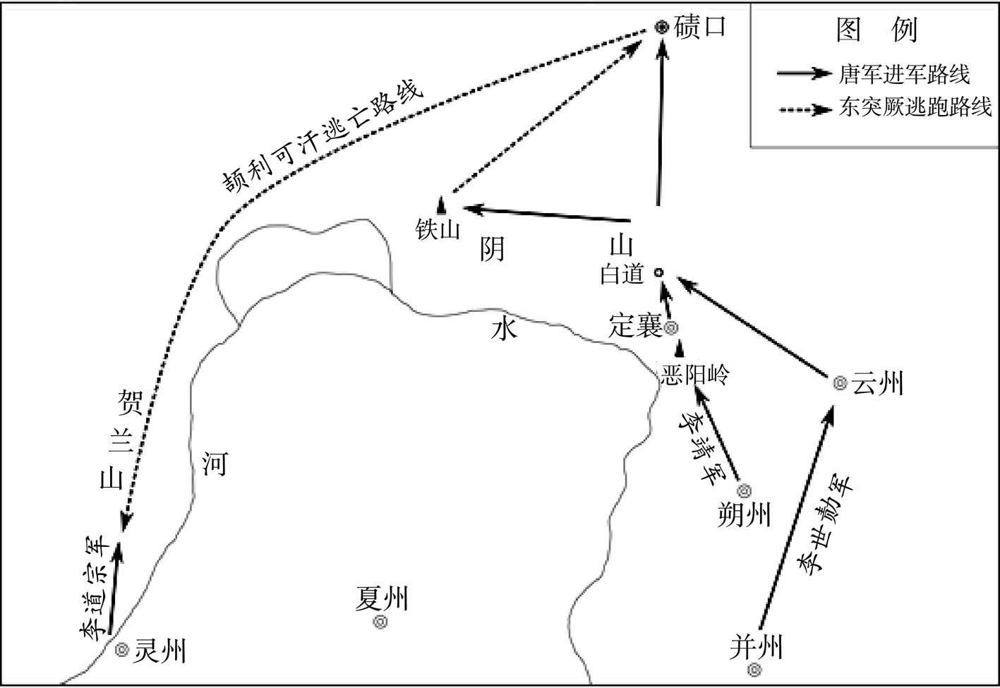 
李靖击灭东突厥汗国示意图

## 【原文】

**三月戊辰，以突厥夹毕特勒阿史那思摩为右武候大将军[1]。庚午，突厥思结俟斤帅众四万来降[2]。丙子，以突利可汗为右卫大将军、北平郡王[3]。**

## 【注文】

[1]右武候大将军：古代武官名。唐朝中央禁军的高级武官。

[2]思结：北方少数民族，铁勒九姓之一，隶属回纥。游牧于土拉河北。　　俟（sì）斤：西突厥官号。意为首领。

[3]右卫大将军：古代武官名。唐朝中央禁军的高级武官。　　北平：今北京。

## 【译文】

唐太宗贞观四年（630年）三月戊辰（初三日），唐任命突厥夹毕特勒阿史那思摩为右武候大将军。庚午（初五日），突厥思结俟斤率部下四万人来投降。丙子（十一日），任命突利可汗为右卫大将军，封为北平郡王。

## 【原文】

**初，始毕可汗以启民母弟苏尼失为沙钵罗设，督部落五万家，牙直灵州西北[1]。及颉利政乱，苏尼失所部独不携贰[2]。突利之来奔也，颉利立之为小可汗[3]。及颉利败走，往依之，将奔吐谷浑[4]。大同道行军总管任城王道宗引兵逼之，使苏尼失执送颉利[5]。颉利以数骑夜走，匿于荒谷[6]。苏尼失惧，驰追获之[7]。庚辰，行军副总管张宝相帅众奄至沙钵罗营，俘颉利送京师[8]。苏尼失举众来降，漠南之地遂空[9]。**

## 【注文】

[1]苏尼失（？—634年）：即阿史那苏尼失，社尔从祖，启民可汗弟。颉利内乱，独苏尼失不存二心，被立为小可汗。李靖打败颉利，苏尼失率众归唐，并将逃亡来本部的颉利奉献给朝廷，太宗大加赏赐，拜北宁州都督、右卫大将军，封怀德郡王。　　沙钵罗设：即阿史那苏尼失的官位。　　部落：由若干血缘相近的宗族、氏族结合而成的集体。

[2]携：拿着，持。

[3]之：助词，没有实际意义。

[4]吐谷（yù）浑：鲜卑慕容一支，东晋十六国时期控制了青海、甘肃等地，与南北朝各国都有友好关系。隋朝与之联姻。被唐朝征服，加封青海王。唐朝中期，被吐蕃驱赶至河东，五代时期开始受辽国统治。现已与各民族融合。

[5]大同：古地名，今山西大同。

[6]匿（nì）：隐藏，躲藏。

[7]驰：疾行。

[8]张宝相（生卒年不详）：唐初将领。　　奄：忽然，突然。

[9]漠南：沙漠以南地区。

## 【译文】

当初，始毕可汗重用启民的舅父苏尼失为沙钵罗设，统领部落五万家，牙帐建立在灵州西北。等到颉利可汗政局混乱后，只有苏尼失所率部落没有二心。突利投奔唐后，颉利可汗立苏尼失为小可汗。后来颉利可汗战败逃走，便去依附苏尼失，想要投奔吐谷浑。大同道行军总管任城王李道宗领兵追逼他，让苏尼失捉住颉利可汗送来。颉利可汗带着数名骑兵连夜逃走，隐藏在荒山野谷中。苏尼失害怕，急忙去追赶并捉住了他。三月庚辰（十五日），行军副总管张宝相率领大批兵力袭击沙钵罗营帐，俘获颉利可汗并将其送到京城。苏尼失举众投降，至此沙漠以南的地方从此没有了突厥政权。

## 【原文】

**突厥颉利可汗至长安[1]。夏四月戊戌，上御顺天楼，盛陈文物，引见颉利，数之曰：“汝借父兄之业，纵淫虐以取亡，罪一也[2]。数与我盟而背之，二也[3]。恃强好战，暴骨如莽，三也[4]。蹂我稼穑，掠我子女，四也[5]。我宥汝罪，存汝社稷，而迁延不来，五也[6]。然自便桥以来，不复大入为寇，以是得不死耳。”颉利哭谢而退，诏馆于大仆，厚廪食之[7]。**

## 【注文】

[1]长安：古地名，今陕西西安，当时唐朝都城。

[2]淫虐：淫乱暴虐。

[3]背：反叛；背弃。

[4]恃：依赖，仗着。　　莽：草。

[5]蹂（róu）：践踏。　　稼穑（sè）：指农作物；庄稼。

[6]宥（yòu）：宽容，饶恕，原谅。　　迁延：拖延，多指时间上的耽误。

[7]廪（lǐn）：泛指粮食仓库。

## 【译文】

突厥颉利可汗到长安。夏四月戊戌（初三日），太宗御临顺天门城楼，陈列了大量文物，召颉利可汗来见，责备他说：“你凭借着父兄立下的基业，骄奢淫逸自取灭亡，是第一条罪。几次和我订立盟约又都违背盟约，是第二条罪。你依恃强盛，喜好战争，尸骨遍野，是第三条罪。践踏我大唐的庄稼，掠夺我人民，是第四条罪。我宽大了你的罪恶，答应保存你的社稷江山，你却拖延不来朝见，是第五条罪。不过自从在渭水便桥订盟以来，还算没有大规模入侵寇掠，因为这一点才免你不死。”颉利可汗痛哭着谢罪退下，诏命让他住在大仆馆舍，以丰厚的食物招待他。

## 【原文】

**上皇闻擒颉利，叹曰：“汉高祖困白登不能报，今我子能灭突厥，吾托付得人，复何忧哉[1]。”上皇召上与贵臣十余人及诸王、妃主置酒凌烟阁，酒酣，上皇自弹琵琶，上起舞，公卿迭起为寿，逮夜而罢[2]。**

## 【注文】

[1]汉高祖：西汉的建立者刘邦（前256—前195年），字季，沛县（今江苏沛县）人，出身平民，秦朝时曾担任泗水亭长，起兵响应，称沛公。秦亡后被封为汉王。后于楚汉战争中打败西楚霸王项羽，成为汉朝（西汉）开国皇帝，庙号为高祖。　　白登：即白登山，在今山西大同东。

[2]凌烟阁：原本是皇宫内三清殿旁的一个不起眼的小楼，唐太宗贞观十七年（643年）二月，唐太宗李世民为怀念当初一同打天下的众位功臣（当时已有数位辞世，还活着的也多已老迈），命阎立本在凌烟阁内描绘了二十四位功臣的图像，褚（chǔ）遂良题字，都真人大小，时常前往怀旧。　　酣：酒喝得很畅快。　　迭：屡次，连着。

## 【译文】

太上皇李渊听说捉住了颉利可汗，便叹息说：“当年汉高祖被匈奴围困在白登山，不能报仇，现在我的儿子能灭掉突厥，说明我把天下托付给了妥当的人，还有什么可忧虑的呢？”太上皇召太宗皇帝与显贵大臣十多人以及诸王、妃子、公主等在凌烟阁设置酒席，酒饮到高兴处，太上皇亲自弹奏琵琶，太宗起舞，公卿大臣纷纷起身为他祝寿，到夜晚才散去。

## 【原文】

**突厥既亡，其部落或北附薛延陁，或西奔西域，其降唐者尚十万口，诏群臣议区处之宜[1]。朝士多言：“北狄自古为中国患，今幸而破亡，宜悉徙之河南兖、豫之间，分其种落，散居州县，教之耕织，可以化胡虏为农民，永空塞北之地[2]。”中书侍郎颜师古以为：“突厥、铁勒皆上古所不能臣，陛下既得而臣之，请皆置之河北，分立酋长，领其部落，则永永无患矣[3]。”礼部侍郎李百药以为：“突厥虽云一国，然其种类区分，各有酋帅[4]。今宜因其离散，各即本部署为君长，不相臣属[5]。纵欲存立阿史那氏，唯可使臣其本族而已[6]。国分则弱而易制，势敌则难相吞灭，各自保全，必不能抗衡中国[7]。仍请于定襄置都护府为其节度，此安边之长策也[8]。”夏州都督窦静以为：“戎狄之性，有如禽兽，不可以刑法威，不可以仁义教[9]。况彼首丘之情，未易忘也[10]。置之中国，有损无益，恐一旦变生，犯我王略[11]。莫若因其破亡之余，施以望外之恩，假之王侯之号，妻以宗室之女，分其土地，析其部落，使其权弱势分，易为羁制，可使常为藩臣，永保边塞[12]。”温彦博以为：“徙于兖、豫之间则乖违物性，非所以存养之也[13]。请准汉建武故事，置降匈奴于塞下，全其部落，顺其土俗，以实空虚之地，使为中国捍蔽，策之善者也[14]。”魏徵以为：“突厥世为寇盗，百姓之仇也。今幸而破亡，陛下以其降附，不忍尽杀，宜纵之使还故土，不可留之中国[15]。夫戎狄人面兽心，弱则请服，强则叛乱，固其常性[16]。今降者众近十万，数年之后，蕃息倍多，必为心腹之疾，不可悔也[17]。晋初诸胡与民杂居中国，郭钦、江统皆劝武帝驱出塞外，以绝乱阶[18]。武帝不从，后二十余年，伊、洛之间遂为毡裘之域[19]。此前事之明鉴也[20]。”彦博曰：“王者之于万物，天覆地载，靡有所遗[21]。今突厥穷来归我，奈何弃之而不受乎[22]？孔子曰‘有教无类’，若救其死亡，授以生业，教之礼义，数年之后，悉为吾民[23]。选其酋长，使入宿卫，畏威怀德，何后患之有[24]？”上卒用彦博策，处突厥降众东自幽州，西至灵州，分突利故所统之地置顺、（祐）、（北）［化］、长四州都督府[25]。又分颉利之地为六州，左置定襄都督府，右置云中都督府以统其众[26]。**

## 【注文】

[1]西域：汉以后对玉门关、阳关以西地区的总称。狭义的专指葱岭以东，广义的则是凡通过狭义西域所能到达的地区，包括亚洲中、西部，印度半岛，欧洲东部和非洲北部在内。汉武帝派张骞初通西域，汉宣帝始置西域都护。唐在西域设置安西、北庭二都护。以后各代，中原与狭义西域也在政治、经济、文化上有着不可分割的联系。　　区处：处理；筹划安排。

[2]幸：通“倖”。侥幸。　　河南：泛指黄河以南。　　兖（yǎn）：即兖州，治昌邑（今山东巨野南），唐辖今山东济宁、泰安、莱芜、泗水、邹城、金乡等地。　　豫：即豫州，汉武帝所置十三刺史部之一。其地包括今淮河以北伏牛山以东豫东、皖北地。

[3]中书侍郎：中书省的长官，副中书令，帮助中书令管理中书省的事务，是中书省固定编制的宰相，隋正四品，唐正三品。　　颜师古（581—645年）：字籀（zhòu），祖籍琅邪临沂（今属山东）人。后迁为京兆万年（今陕西西安）人，唐初儒家学者，经学家、语言文字学家、历史学家。　　铁勒：中国古代北方、西北方民族。又称狄历、丁零、敕勒、高车。隋代起作为除突厥以外的突厥系民族的通称。语言、习俗均与突厥同。后契丹人统有大漠南北，铁勒一族逐渐消失。　　河北：泛指黄河以北地区。

[4]礼部侍郎：古代官名，礼部副长官，隋文帝定制，以尚书省统六部，各部尚书下有侍郎多人，分掌本部下各部门，地位相当于后来的司官。门下省之给事黄门侍郎及内史省（唐改中书省）的侍郎，为主官之副手，诸曹侍郎都改称郎。唐沿其制。管理全国学校事务及科举考试及藩属和外国之往来事。　　李百药（565—648年）：字重规，定州安平（今属河北）人，唐朝史学家、诗人。其父李德林曾任隋内史令，预修国史，撰有《齐史》。隋文帝时李百药仕太子舍人、东宫学士。隋炀帝时仕桂州司马职，迁建安郡丞。后归唐，拜中书舍人、礼部侍郎、散骑常侍。人品耿直，曾直言上谏唐太宗取消诸侯，为太宗采纳。曾受命修订五礼、律令。　　酋帅：旧称部落或叛乱者的首领。

[5]署：代理、暂任或试充官职。　　臣属：以臣自属。

[6]阿史那氏：突厥可汗的姓氏。

[7]敌：相当。

[8]都护府：源自西汉宣帝神爵二年（前60年）设在乌垒的西域都护府，统领大宛及其以东城郭诸国，兼督察乌孙、康居等游牧行国。魏、西晋设有西域长史府，唐朝统一西域，设立安西、北庭（金山）、昆陵、濛池等都护府，疆域不仅包括今新疆在内的西域，更达里海之滨。　　节度：节制。

[9]窦静（？—635年）：唐代史官。字元休。唐高祖时擢并州大总管府长史检校并州大总管，唐太宗时迁夏州都督，再迁民部尚书。

[10]首丘之情：首丘，头向着狐穴所在的土丘。传说狐狸将死时，头必朝向出生的山丘。比喻不忘本。也比喻暮年思念故乡。

[11]王：朝廷。　　略：谋略。

[12]王侯：指天子与诸侯。后多指王爵与侯爵，或泛指显贵者。　　羁（jī）：束缚，拘束。　　藩（fān）臣：是指拥有封地或封国的亲王或郡王。一般拥有兵权，镇守一方。

[13]温彦博（575—637年）：字大临，隋朝至唐初并州祁县（今山西祁县东南）人，温大雅之弟，唐初宰相。　　乖：背离，违背。

[14]建武：是东汉皇帝汉光武帝刘秀的第一个年号，也是东汉的第一个年号。共计三十二年，即建武元年（25年）六月到建武三十二年（56年）四月。　　故事：旧事，先例。　　捍蔽：屏藩。

[15]降附：投降归附。

[16]人面兽心：面貌虽然是人，但心肠像野兽一样凶狠。形容为人凶残卑鄙。

[17]蕃（fán）：繁殖；增长。　　息：繁殖，滋生。

[18]晋：朝代名（266—420年），共历一百五十五年，分为西晋与东晋。公元266年司马炎取代魏帝自立为皇帝，国号“晋”，定都洛阳，史称西晋。公元280年，西晋灭吴，三国鼎立的局面完全结束，晋武帝司马炎终于统一全国，结束了长达近百年的分裂局面。时至316年，五胡乱华，西晋皇帝被俘。东晋元帝建武元年（317年）琅邪王司马睿在建业重建国家，史称东晋。　　郭钦（生卒年不详）：西晋时的大臣。　　江统（？—310年）：字应元，西晋陈留圉（yǔ）（今河南杞县南）人。初为县令，后升至太子洗马。西晋惠帝元康九年（299年）氐帅齐万反晋失败后，江统撰《徙戎论》，提出将氐、羌等族迁出关中的主张，并以并州的匈奴部落为隐患，发还其本域。永嘉之乱，洛阳危机，他在流亡中病死。　　武帝：指晋朝的开国君主司马炎（236年—290年），字安世，河内温（今河南温县）人。公元265年他继承父亲司马昭的晋王之位，数月后逼迫魏元帝曹奂将帝位禅让给自己，国号大晋，建都洛阳。公元279年他又命杜预、王濬等人分兵伐吴，于次年灭吴，统一全国。建国后采取一系列经济措施以发展生产，西晋武帝太康元年，颁行户调式，包括占田制、户调制和品官占田荫客制。太康年间出现一片繁荣景象，史称“太康之治”。但灭吴后，逐渐怠惰政事，奢侈腐化。公元290年病逝，谥号“武皇帝”，庙号世祖，葬峻阳陵。　　乱阶：祸端；祸根。

[19]伊：即伊河，发源于熊耳山南麓的栾川县，流经嵩县、伊川，穿伊阙而入洛阳，东北至偃师注入洛河。　　洛：即洛河，通常指的是洛阳市的洛河。　　毡（zhān）裘（qiú）：指代北方民族。

[20]明鉴：指能够引以为戒的明显的前例。

[21]靡（mǐ）：无；没有。　　遗：漏掉。

[22]穷：穷尽。

[23]孔子（前551—前479年）：子姓，孔氏，名丘，字仲尼，鲁国陬（zōu）邑（今山东曲阜）人，春秋末期的思想家和教育家，儒家的创始人。孔子集华夏上古文化之大成，在世时已被誉为“天纵之圣”“天之木铎”，是当时社会上最博学者之一，并且被后世统治者尊为孔圣人、至圣、至圣先师、万世师表。　　有教无类：不管什么人都可以受到教育。类，类别。

[24]宿卫：晚上值守保卫的人。

[25]卒：终于，最后。　　都督府：古代官署名。唐高祖改郡为州，太守为刺史，置都督府以治之。又太宗平突厥，西北诸蕃及蛮夷稍稍内属，将其部落列置州县。其大者为都督府，以其首领为都督、刺史，皆得世袭。

[26]统：管理；治理。

## 【译文】

突厥灭亡后，其部落有的向北归附了薛延陁，有的向西逃奔到西域，其中投降唐朝的仍有十万人，太宗下诏召集群臣讨论如何妥善安置他们。朝中大臣大都说：“北方狄人自古以来就是中国的祸患，现在有幸灭亡了他们，应该全都迁徙到河南兖州和豫州之间，分散开他们的种族部落，零散居住在各州县，教他们耕种织布，就可以使胡人转化成为农民，永远使塞北成为空地。”中书侍郎颜师古认为：“突厥、铁勒是自上古以来就很难臣服的民族，陛下既然已经使他们臣服，请把他们都安置在黄河以北地区，分别设立酋长，统领他们的部落，这样他们就永远不能成为祸患了。”礼部侍郎李百药认为：“突厥虽说是一国，然而他们的种类是有差别的，各有各的酋长和统帅。现在应趁他们离散的机会，让他们各归本部，选任酋长，使相互之间没有统属关系。纵然他们想立阿史那氏为首领，也只有让他统领本族人。国家分为几部分那么力量就弱了，而且容易制服，他们几部分势均力敌难以互相吞灭，让他们各自保全，必然不能和大唐相抗衡。请仍然在定襄设置都护府，节制他们，这是使边境安定的长远之策。”夏州都督窦静认为：“戎狄族的本性，就像禽兽一般，不能用刑罚法令去制裁，也不能用仁义道德去教化。何况他们思乡之情，未必容易忘记。把他们安置在中原一带，只有害处没有益处，恐怕一旦发生变乱，必然要对我们国家政权造成威胁。不如趁着他们破亡之机，施加意外的恩宠，假借给他们王侯的称号，让其首领以宗室之女为妻，分割他们的土地，分散他们的部落，使他们势分权弱，易于笼络和控制，就可让他们永为藩臣，使边塞永保安定。”温彦博认为：“把突厥人迁徙到兖州、豫州之间，违背了他们的风俗和天性，这不是让他们生存的妥善办法。请求仿照汉朝建武帝的做法，把投降的匈奴安置在塞外，保全其部落，顺应他们的风俗习惯，让他们充实空虚的土地，使他们成为中国的屏障，这是最好的策略。”魏徵认为：“突厥世代都是抢夺的盗贼，是百姓的仇敌。如今幸而灭亡，陛下因为他降附了，不忍心全部把他们杀掉，那就应该放归故土，不可把他们留在大唐境内。戎狄人是人面兽心，力量削弱时便请求归附，力量一强便想叛乱，这是他们的本性。现在投降的将近十万人，几年之后，繁殖生息会加倍增多，等到酿成心腹大患，后悔就来不及了。晋朝初年北方各种胡人与汉民族混居在中原，郭钦、江统都劝晋武帝把他们驱赶到塞外，以杜绝由此产生的祸乱。武帝没有听，以后二十多年，伊河、洛河之间于是成为北方戎狄聚居的地方。这是前代历史的教训啊。”温彦博说：“君主对于天地万物，就如天覆地载都要包容，没有遗弃的。现在突厥走投无路，都来归附我们，为什么要抛弃而不接受呢？孔子说‘有教无类’，如果拯救他们于将亡之际，教给他们生存的资业，以礼仪教导他们，几年以后，他们就会变成我们的臣民。然后选拔他们的酋长，让他们入朝充当宿卫官兵，使他们畏惧皇威，感怀皇恩，哪里有什么后患呢？”太宗最后采纳温彦博的策略，把突厥投降来的民众，安置在东自幽州，西到灵州的广大地区，在突利可汗原来所属之地设置顺、祐、化、长四州都督府。又把颉利可汗的地方划分为六个州，左置定襄都督府，右设置云中都督府，用以统辖这地方的民众。

## 【原文】

**五月辛未，以突利为顺州都督，使帅其部落之官。上戒之曰：“尔祖启民挺身奔隋，隋立以为大可汗，奄有北荒，尔父始毕反为隋患[1]。天道不容，故使尔今日乱亡如此[2]。我所以不立尔为可汗者，惩启民前事故也[3]。今命尔为都督，尔宜善守国法，勿相侵掠，非徒欲中国久安，亦使尔宗族永全也[4]。”**

## 【注文】

[1]戒：通“诫”。告诫。　　启民：指启民可汗。　　奄：覆盖。　　始毕：指始毕可汗。

[2]容：接受。

[3]惩：处罚，警戒。　　故：意外或不幸的事变。

[4]宗族：同宗同族之人。

## 【译文】

唐太宗贞观四年（630年）五月辛未（初七日），唐任命突利为顺州都督，让他统领各部落的官吏。太宗告诫他说：“你的祖父启民挺身投奔隋朝，隋立他为大可汗，全部统领北边的荒地，你父始毕反而成为隋的祸害。天理不容，所以才使你们今天这样混乱灭亡。我之所以不立你做可汗，就是为了惩戒启民以前做的事情。现在任命你为都督，你应该很好地遵守大唐法令，不要再肆意侵掠，这不只是为了使大唐长治久安，也是为了使你们的种族永久保存下去。”

## 【原文】

**壬申，以阿史那苏尼失为怀德郡王，阿史那思摩为怀化郡王[1]。颉利之亡也，诸部落酋长皆弃颉利来降，独思摩随之，竟与颉利俱擒[2]。上嘉其忠，拜右武候大将军，寻以为北开州都督，使统颉利旧众[3]。**

## 【注文】

[1]阿史那苏尼失（？—634年）:启民可汗之母弟，唐太宗贞观初年，他的父亲始毕可汗为沙钵罗设，督部落五万家，牙直灵州西北。颉利政乱，苏尼失携所部离弃。突利来奔，颉利立苏尼失为小可汗。颉利被李靖所破，独骑投降，苏尼失举众归国，令史忠擒颉利以献。太宗赏赐优厚。拜北宁州都督、右卫大将军，封怀德郡王。　　阿史那思摩（？—655年）：东突厥贵族，唐朝初期著名将领，唐高祖武德初，多次来唐朝，唐高祖李渊封他为和顺郡王。阿史那思摩以其忠心事主得到唐太宗赏识，除官右武候大将军、化州都督，受命统率颉利旧部。不久改封怀化郡王。

[2]俱：一起。

[3]北开州：古地名，今内蒙古鄂尔多斯一带。

## 【译文】

五月壬申（初八日），任命阿史那苏尼失为怀德郡王，阿史那思摩为怀化郡王。颉利败亡时，各部落首领纷纷背弃颉利而来投降唐朝，唯独阿史那思摩还跟随他，竟和颉利一起被捉住。太宗嘉奖他的忠诚，拜他为右武候大将军，不久又任命他为北开州都督，让他统领颉利的旧部众。

## 【原文】

**丁丑，以右武卫大将军史大柰为丰州都督，其余酋长至者皆拜将军、中郎将，布列朝廷，五品已上百余人，殆与朝士相半，因而入居长安者近万家[1]。**

## 【注文】

[1]史大柰（nài）（生卒年不详）：唐代楼烦（今山西娄烦）人，突厥族，隋时任金紫光禄大夫，李渊起兵时，率众归从，战功赫赫。唐太宗贞观初，迁右武卫大将军，封窦国公。　　中郎将：古代官名。唐代，中郎将被恢复为各府卫的禁卫统领，品级大致在正从四品之间，为低级武职。　　殆（dài）：表推测，相当于“大概”“几乎”。

## 【译文】

五月丁丑（十三日），任命右武卫大将军史大柰为丰州都督，投奔唐朝的其他酋长，均拜为将军、中郎将，列置于朝廷，五品以上的有一百多人，差不多与朝廷的官员各占一半，所以入居长安的有将近一万家。

## 【原文】

**六月丁酉，以阿史那苏尼失为北宁州都督，以中郎将史善应为北抚州都督[1]。壬寅，以右骁卫将军康苏为北安州都督[2]。**

## 【注文】

[1]北宁州：北宁州及下述北抚州、北安州，都为临时设置。　　史善应：唐初将领，生平事迹不详。

[2]北安州：古地名，今河北承德西南。

## 【译文】

唐太宗贞观四年（630年）六月丁酉（初四日），任命阿史那苏尼失为北宁州都督，以中郎将史善应为北抚州都督。壬寅（初九日），任命右骁卫将军康苏为北安州都督。

## 【原文】

**秋八月戊午，突厥欲谷设来降[1]。欲谷设，突利之弟也。颉利败，欲谷设奔高昌，闻突利为唐所礼，遂来降[2]。**

## 【注文】

[1]欲谷设（生卒年不详）：即乙毗咄陆可汗，颉利可汗之子。

[2]高昌：位于吐鲁番市东火焰山南麓木头沟河三角洲，始建于汉代。高昌是和交河齐名的丝路名城。公元前1世纪，西汉大将李广利率领部队在此屯田，设立高昌壁；公元327年设高昌郡。公元450年，北凉残余势力灭了车师前国后，高昌城一跃而为吐鲁番盆地的政治、经济、文化中心。公元460年成为高昌国都城。公元640年唐朝统一高昌，在此设立西州，辖高昌、交河、柳州、天山、蒲昌五县。公元9世纪后成为回鹘高昌国的首府。

## 【译文】

秋八月戊午（二十六日），突厥欲谷设来投降。欲谷设是突利可汗的弟弟。颉利可汗被打败后，欲谷设投奔高昌，听说突利受到唐的礼遇，于是也来投降。

## 【原文】

**九月戊辰，伊吾城主入朝[1]。隋末伊吾内属，置伊吾郡，隋乱，臣于突厥[2]。颉利既灭，举其属七城来降，因以其地置［西］伊（西）州[3]。**

## 【注文】

[1]伊吾：即伊吾卢，今新疆哈密。

[2]内属：是指归附朝廷为属国或属地。

[3]西伊州：唐在今新疆境内所置三州之一。领伊吾、柔远、纳职三县，治伊吾（今新疆哈密）。唐太宗贞观四年（630年）初置时名“西伊州”，六年（632年）去“西”字。唐玄宗天宝、唐肃宗至德时改名伊吾郡。

## 【译文】

九月戊辰（初五日），伊吾城主入朝。隋末伊吾内附中国，隋设置伊吾郡，隋朝发生战乱，伊吾便臣服于突厥。颉利可汗灭亡后，伊吾便举其所属七个城来投降唐朝，因此便在这个地方设置西伊州。

## 【原文】

**五年[1]。隋末，中国人多没于突厥，及突厥降，上遣使以金帛赎之[2]。五月乙丑，有司奏凡得男女八万口[3]。**

## 【注文】

[1]五年：唐太宗贞观五年，公元631年。

[2]没（mò）：沦没，落入。　　赎（shú）：用财物换回人或抵押品。

[3]凡：总共。

## 【译文】

唐太宗贞观五年（631年）。隋朝末年，中原的汉人很多沦落突厥，等到突厥投降时，唐太宗便派遣使者用金帛把他们赎回。五月乙丑（初七日），有关部门上奏称共赎回男女八万人。

## 【原文】

**六年[1]。突厥颉利可汗郁郁不得意，数与家人相对悲泣，容貌羸惫[2]。上见而怜之，以虢州地多麋鹿，可以游猎，乃以颉利为虢州刺史[3]。颉利辞，不愿往[4]。冬十月癸未(1)，复以为右卫大将军[5]。**

## 【注文】

[1]六年：唐太宗贞观六年，公元632年。

[2]郁郁：形容忧伤苦闷。　　羸（léi）：瘦弱。　　惫（bèi）：疲乏，困顿。

[3]虢（guó）州：隋文帝开皇三年（583年）废弘农郡及阌（wén）乡郡，置虢州,治弘农县（今河南灵宝北），领弘农、阌乡、湖城三县，隋炀帝大业三年（607年），复置弘农郡，移治所于鸿胪川（今河南灵宝虢略镇）。唐初又置，辖境相当于今河南西部灵宝、奕川以西，伏牛山以北地。　　麋（mí）鹿：原产于我国长江中下游沼泽地带，曾广布于东亚地区，但野生的早已灭绝，现存者都是北京南苑皇家猎苑的孑遗,特征是尾特别长，眉杈特别发达,形成主杈模样。

[4]往：去，到……去。

[5]右卫大将军：古代官名，禁军的高级武官。

## 【译文】

唐太宗贞观六年（632年）。突厥颉利可汗忧郁不得志，多次和家人相对哭泣，容貌瘦弱疲惫。太宗见到非常怜悯他，当时虢州一带麋鹿很多，可以游玩打猎，太宗便任命颉利为虢州刺史。颉利推辞，不愿意去。冬十月癸未日，又任命他为右卫大将军。

## 【原文】

**七年冬十二月，帝从上皇置酒故汉未央宫，上皇命突厥颉利可汗起舞，又命南蛮酋长冯智戴咏诗[1]。既而笑曰：“胡越一家，自古未有也[2]。”帝奉觞上寿曰：“今四夷入臣，皆陛下教诲，非臣智力所及[3]。昔汉高祖亦从大上皇置酒此宫，妄自矜大，臣所不取也[4]。”上皇大悦，殿上皆呼万岁[5]。**

## 【注文】

[1]起舞：起身舞蹈。　　南蛮：该称谓最早记载来自周代，周人自称“华夏”,便把华夏周围四方的人，分别称为东夷、南蛮、西戎、北狄，以区别于华夏，先秦时期居于我国南部的少数民族统称为“南蛮”。　　冯智戴（生卒年不详）：字天锡，号辅元，唐高州良德（今广东高州东北）人，冯盎之长子，冼夫人、冯宝的曾孙。　　咏：唱，声调有抑扬地念。

[2]越：古民族名，秦汉前分布于长江中下游以南，部落众多，故又有百越、百粤之称。秦汉后，在长期发展中，部分逐渐与汉人融合，部分与今壮、黎、傣、侗、水、布依等族有渊源关系。

[3]觞（shāng）：古代酒器。　　教诲：教导，训诲。　　智力：才智与勇力。

[4]妄：胡乱，荒诞不合理。　　矜（jīn）：自夸。

[5]殿：高大的房屋，特指帝王所居和朝会的地方，或供奉神佛的地方。

## 【译文】

唐太宗贞观七年（633年）冬十二月，太宗随从太上皇在汉的未央宫设置酒席，太上皇命令颉利可汗起身舞蹈，又命南蛮酋长冯智戴咏诗。接着笑着说：“胡越成为一家，这是自古以来也没有的事。”太宗举杯向太上皇献酒祝寿说：“现在四方夷族入朝为臣，这都是父皇你教诲的结果，并不是我的智力所能做到的事情。昔日汉高祖也曾随从大上皇在此宫摆酒宴，妄自尊大，这是我所不取的。”太上皇大为欢喜，殿上众人齐呼万岁。

## 【原文】

**八年春正月癸未，突厥颉利可汗卒，命国人从其俗，焚尸葬之。**

## 【译文】

唐太宗贞观八年（634年）春正月癸未（初十日），突厥颉利可汗去世，太宗命令国人遵从他们民族的习俗，焚烧尸首火葬掩埋。

## 【原文】

**十年春正月辛丑，以突厥拓设阿史那社尔为左骁卫大将军[1]。社尔，处罗可汗之子也，年十一，以智略闻[2]。可汗以为拓设，建牙于碛北，与欲谷设分统敕勒诸部，居官十年，未尝有所赋敛[3]。诸设或鄙其不能为富贵，社尔曰：“部落苟丰，于我足矣[4]。”诸设惭服[5]。及薛延陀叛，攻破欲谷设，社尔兵亦败，将其余众走保西陲[6]。颉利可汗既亡，西突厥亦乱，咄陆可汗兄弟争国[7]。社尔诈往降之，引兵袭破西突厥，取其地几半，有众十余万，自称答布可汗[8]。社尔乃谓诸部曰：“首为乱破我国者，薛延陀也，我当为先可汗报仇，击灭之[9]。”诸部皆谏曰：“新得西方，宜且留镇抚[10]。今遽舍之远去，西突厥必来取其故地[11]。”社尔不从，击薛延陀于碛北，连兵百余日[12]。会咥利失可汗立，社尔之众苦于久役，多弃社尔逃归[13]。薛延陀纵兵击之，社尔大败，走保高昌，其旧兵在者才万余家，又畏西突厥之逼，遂帅众来降[14]。敕处其部落于灵州之北，留社尔于长安，尚皇妹南阳长公主，典屯兵于苑内[15]。**

## 【注文】

[1]拓设：突厥官职名。　　阿史那社尔（604—655年）：唐初大将。东突厥处罗可汗之子。为拓设，建牙碛北，与颉利可汗子欲谷设分统铁勒、回纥、仆骨、同罗诸部。唐太宗贞观十年（636年）归唐，授左骁卫大将军。

[2]处罗可汗（？—620年）：原名阿史那俟利弗设，为东突厥君主之一。在位两年（619—620年）。始毕可汗弟，颉利可汗兄，他的母亲向夫人是汉人。在隋文帝开皇末年归顺了隋朝。隋炀帝大业六年（610年）西突厥内乱，处罗可汗逃到隋朝，隋炀帝在614年将宗室女信义公主嫁给了他。

[3]碛（qì）北：旧称蒙古高原大沙漠以北地区。　　敕勒：即铁勒，中国古代民族，属于原始游牧部落，又称赤勒、高车、狄历、丁零（丁灵）。

[4]诸设：“设”为突厥、回纥典兵者的官衔。诸设指诸位典兵者。

[5]惭：羞愧。

[6]陲（chuí）：边疆，国境。

[7]咄陆可汗：即乙毗咄陆可汗（生卒年不详），西突厥可汗,名欲谷设,阿史那氏，颉利可汗之子。公元630年东突厥汗国灭亡后奔西突厥，于公元638年后自立为乙毗咄陆可汗。欲谷设自立以来便与同时期的另外一部势力，即咥利失可汗阿史那同俄互相攻伐争夺对西域的控制权,公元639年阿史那同俄之臣与欲谷设勾结引兵攻同俄，同俄兵败逃往中亚后于同年卒。

[8]西突厥：原是突厥汗国西面可汗。突厥汗国被隋朝分裂成东西两部后，西突厥在西域称雄，以控制丝绸之路。最强盛时期领土面积东起伊吾（今新疆哈密），西到雷翥海（里海或咸海），北至阿尔泰山以北，南至于阗、疏勒。　　答布可汗：即阿史那社尔。

[9]先可汗：即其父处罗可汗。

[10]镇：安定；安抚。

[11]故：原来，旧时的。

[12]连兵：接连用兵。

[13]咥利失可汗（生卒年不详）：唐太宗贞观八年（634年）西突厥咄陆可汗卒，其弟同俄设立，为沙钵罗咥利失可汗。　　逃归：逃归咥利失。

[14]纵：发；放。

[15]敕处其部落：敕命安置其部落。　　灵州：古州名，治所在今宁夏灵武西南。辖境相当于今宁夏中卫、中宁以北地区。　　南阳长公主：两《唐书》皆作衡阳公主，唐太宗妹妹。

## 【译文】

唐太宗贞观十年（636年）春正月辛丑（初十日），任命突厥拓设阿史那社尔为左骁卫大将军。社尔，是处罗可汗的儿子，年仅十一岁，即因智慧谋略著称。处罗可汗任命社尔为拓设，建立牙帐在沙漠北边，和欲谷设分别统辖敕勒各部，做了十年官，未曾向部下征收赋敛。当时其他各设多鄙视他不能身致富贵，社尔说：“部落如能丰盈，对我来说就满足了。”诸设听了感到惭愧而佩服他。等到薛延陀叛变，打败了欲谷设，社尔的兵也战败，便率领其部众退保西部边境。颉利可汗灭亡后，西突厥也发生内乱，咄陆可汗兄弟争位。社尔假装前去投降，领兵打败西突厥，夺取了西突厥几乎一半的土地，拥兵十余万，自称为答布可汗。社尔对各部落说：“最先造成我国乱亡的是薛延陀，我应该为先可汗报仇，消灭他们。”各部落都劝阻说：“我们刚得到西边的土地，应该暂且留下来镇守和安抚人民才对。如果突然舍弃这地远去攻打薛延陀，西突厥必然来收复他们的旧地。”社尔不听，便出兵在沙漠北攻打薛延陀，战斗持续一百多天。适逢咥利失可汗即位，社尔的部下苦于长久的劳役，多离开社尔逃奔咥利失。薛延陀集中兵力追击，社尔大败，退保高昌，他的旧兵在他身边没有逃离的剩下一万多家，他又害怕西突厥来逼攻，于是率部下投降唐朝。太宗下令把他的部落安置在灵州北边，留社尔在长安，娶皇妹南阳长公主为妻，在禁苑内典掌屯兵。

## 【原文】

**十三年四月，上幸九成宫[1]。初，突厥突利可汗之弟结社率从突利入朝，历位中郎将[2]。居家无赖，怨突利斥之，乃诬告其谋反，上由是薄之，久不进秩[3]。结社率阴结故部落，得四十余人，谋因晋王治四鼓出宫，开门辟仗，驰入宫门，直指御帐，可有大功[4]。四月甲申，拥突利之子贺逻鹘夜伏于宫外[5]。会大风，晋王未出，结社率恐晓，遂犯行宫，逾四重幕，弓矢乱发，卫士死者数十人[6]。折冲孙武开等帅众奋击，久之乃退，驰入御厩，盗马二十余匹，北走渡渭，欲奔其部落[7]。追获，斩之。原贺逻鹘，投于岭表[8]。**

## 【注文】

[1]九成宫：本隋仁寿宫，宫址在今陕西麟游西。

[2]结社率（？—639年）：姓阿史那，突厥突利可汗的弟弟，跟从突利入朝，任中郎将。　　历位：指所任官职达到的地位或品阶。　　中郎将：古代官名。唐代，中郎将为各府卫的禁卫统领，品级大致在正从四品之间，为低级武职。

[3]诬告：无中生有地控告别人有犯罪行为。　　秩：俸禄；职位或品级。

[4]晋王：即后来的唐高宗李治（628—683年），649—683年在位。字为善。唐太宗第九子，母文德顺圣皇后长孙氏。唐太宗贞观五年（631年）封晋王。太宗晚年，太子李承乾和魏王李泰间发生了争夺皇位继承权的斗争。李承乾谋杀李泰未遂。事发，太宗废太子承乾，黜魏王李泰，改立晋王李治为太子。贞观二十三年（649年）五月，李治即位，是为唐高宗，时年二十二岁。次年（650年）改元永徽。弘道元年（683年）十二月，高宗去世。葬于乾陵。庙号高宗，谥号“天皇大帝”。　　鼓：古代夜间击鼓以报时，一鼓即一更。　　辟仗：卫士在驾前攘辟左右行人，这种为天子“陈兵清道”事宜称辟仗。

[5]贺逻鹘：唐初突利可汗的儿子，生平事迹不详。

[6]行宫：古代京城以外供帝王出行时居住的宫室，也指帝王出京后临时寓居的官署或住宅。

[7]折冲：古代武官名，即折冲都尉。唐府兵制军府称折冲府，长官为折冲都尉，上府正四品上，中府从四品下，下府正五品下，每冬率兵操练，按规定轮番宿卫京师，有事征发全府，则率兵出发。　　孙武开：唐初将领，生平事迹不详。　　厩（jiù）：马棚，泛指牲口棚。　　渭：即渭河，水名，源出甘肃省，流入陕西省，会泾水入黄河。

[8]原：谅解，宽容。　　岭表：地区名，即岭南。

## 【译文】

唐太宗贞观十三年（639年）四月，太宗驾临九成宫。起初，突厥突利可汗的弟弟结社率跟随突利入朝，官至中郎将。他平时品行恶劣，被突利斥责后他很是埋怨，于是诬告突利谋反，太宗从此轻视结社率，很久没有晋升他的官阶。结社率暗中交结过去部落中的人，得到四十多人，图谋乘晋王李治四鼓出宫时，开宫门避开戍卫的仪仗队，乘马驰奔进入宫门，直到太宗御帐前谋杀太宗，可建立夺位大功。四月甲申（十一日），结社率等簇拥着突利的儿子贺逻鹘夜间潜伏在宫门外。恰好这天刮大风，晋王没有出宫，结社率害怕别人知道这件事，于是带兵闯入行宫，越过了四重帐幕，胡乱射箭，射死卫士十多人。折冲都尉孙武开等率领众卫士奋力搏斗，战斗了很久，结社率终于被击退，奔走进入御马厩中，盗走二十多匹马，向北逃走渡过渭水，想要逃奔他本部落，结果被唐兵追捕斩杀。太宗宽恕了贺逻鹘的罪，把他放逐到岭外。

## 【原文】

**自结社率之反，言事者多云突厥留河南不便[1]。秋七月庚戌，诏右武候大将军化州都督怀化郡王李思摩为乙弥泥孰俟利苾可汗，赐之鼓纛[2]。突厥及胡在诸州安置者，并令渡河，还其旧部，俾世作藩屏，长保边塞[3]。突厥咸惮薛延陁，不肯出塞[4]。上遣司农卿郭嗣本赐薛延陁玺书，薛延陁奉诏[5]。于是遣思摩帅所部建牙于河北，上御齐政殿饯之[6]。思摩涕泣，奉觞上寿曰：“奴等破亡之余，分为灰壤，陛下存其骸骨，复立可汗，愿万世子孙恒事陛下[7]。”又遣礼部尚书赵郡王孝恭等赍册书，就其种落，筑坛于河上而立之[8]。上谓侍臣曰：“中国，根干也，四夷，枝叶也，割根干以奉枝叶，木安得滋荣[9]？朕不用魏徵言，几致狼狈[10]。”又以左屯卫将军阿史那忠为左贤王，左武卫将军阿史那泥熟为右贤王[11]。忠，苏尼失之子也，上遇之甚厚，妻以宗女[12]。及出塞，怀慕中国，见使者必泣涕，请入侍，诏许之[13]。**

## 【注文】

[1]河南：黄河以南地界。

[2]李思摩：（？—655年）：即阿史那思摩，也称乙弥泥孰俟利苾（bì）可汗。　　纛（dào）：古代军队里的大旗。

[3]俾（bǐ）：使，把。　　塞：塞外，指长城以北的地区。

[4]惮（dàn）：怕，畏惧。

[5]司农卿：古代官名。司农寺长官。掌劝农、仓储、农林园苑、供应宫廷膳馐等事务。　　郭嗣本（生卒年不详）：唐初司农卿，出使突厥。　　玺（xǐ）书：古代以泥封加印的文书。古代长途递送的文书易于破损，所以书于竹简木牍，两片合一，缚以绳，在绳结上用泥封固，钤（qián）以玺，故称玺书。秦以后专指皇帝的诏书。

[6]齐政殿：宫殿名。时太宗幸九成宫，齐政殿当在九成宫内。

[7]觞（shāng）：盛满酒的杯。　　壤：泛指泥土。　　骸（hái）骨：尸骨。

[8]孝恭：李孝恭（591—640年），唐凌烟阁二十四功臣之一，陇西成纪（今甘肃静宁西南）人，唐朝宗室，大将。李孝恭是唐高祖李渊的堂侄。唐太宗贞观十四年（640年），李孝恭暴病而死，时年五十岁。　　册书：古代帝王用于册立、封赠的诏书。　　坛：古代举行祭祀、誓师等大典用的土和石筑的高台。

[9]滋：通“孳”。滋生；繁殖。

[10]狼狈：窘迫状。

[11]左屯卫将军：古代武官名。唐代中央十二卫大将军之一，正三品。　　阿史那忠（610—675年）：东突厥贵族，尚宗室女定襄县主，累擢诸位大将军，封薛国公，陪葬昭陵。　　武卫将军：古代官名。武卫，军制名。汉末曹操任丞相，置武卫营。魏文帝（曹丕）置武卫将军以主禁旅。隋唐分左、右武卫，各置大将军一人、将军二人统领。　　阿史那泥熟：据《十七史商榷阿史那忠》等，忠与泥熟本为一人。

[12]甚：非常。

[13]慕：向往，敬仰。

## 【译文】

自从结社率反叛后，上书言事者多认为把突厥留在黄河以南有很多不便。秋七月庚戌（初九日），诏令右武候大将军、化州都督、怀化郡王李思摩为乙弥泥孰俟利苾可汗，赐给他鼓和旗。突厥及胡人在各州安置的，都让他们渡过黄河，回到原来的部落，使他们世代作为唐朝国家的藩臣屏障，长久保卫边塞。突厥人都惧怕薛延陁，不愿出塞。太宗派遣司农卿郭嗣本去赐给薛延陁玺书，薛延陁接受了诏书。于是便让思摩率领所有部下在黄河以北建立牙帐，太宗亲自到齐政殿给他饯行。思摩哭泣，举杯向太宗祝寿说：“我们这些亡国后活下来的人，本当化为灰壤，陛下让我存活下来，又立我为可汗，我愿千秋万世永远事奉陛下。”太宗又派遣礼部尚书赵郡王李孝恭等人携带册封文书，到他们的种族部落里，在黄河边筑坛册立。太宗对侍臣说：“中原王朝，是树木的根干，四夷民族是枝叶，割根干去奉养枝叶，树木哪里还能繁荣？我当初没有采纳魏徵的话，差一点狼狈不堪。”又任命左屯卫将军阿史那忠为左贤王，左武卫将军阿史那泥熟为右贤王。阿史那忠是苏尼失的儿子，太宗对他十分厚待，以宗室之女嫁给他为妻。等到出塞以后，仍然仰慕中原，看见使臣就哭泣流泪，请求入朝侍奉太宗，太宗下诏允许他的请求。

## 【原文】

**十四年春三月丙辰，置宁朔大使以护突厥[1]。**

## 【注文】

[1]宁朔：北周置，属化政郡。治所在今陕西靖边西北，唐高祖武德六年（623年）为南原州治，唐太宗贞观二年（628年）省入朔方县。贞观五年（631年）复置，武则天长安二年（702年）又废。唐玄宗开元四年（716年）复置，西夏废。　　大使：奉帝王之命行事的临时使节。后多指特派出巡的大臣。

## 【译文】

唐太宗贞观十四年（640年）春三月丙辰（十九日），设置宁朔大使来保护突厥。

## 【原文】

**十五年春正月乙亥，突厥俟利苾可汗始帅部落济河，建牙于故定襄城，有户三万，胜兵四万，马九万匹，仍奏言：“臣非分蒙恩，为部落之长，愿子子孙孙为国家一犬，守吠北门[1]。若薛延陁侵逼，请徙家属入长城。”诏许之。**

## 【注文】

[1]俟利苾可汗：即阿史那思摩。　　定襄城：今内蒙古和林格尔。　　吠（fèi）：狗叫。

## 【译文】

唐太宗贞观十五年（641年）春正月乙亥（十三日），突厥俟利苾可汗开始率领部落渡过黄河，在原定襄城建立牙帐，共有户三万，强兵四万，马九万匹，于是向太宗上书说：“臣蒙陛下过分的恩宠，成为部落的首领，只希望子子孙孙为国家效犬马之劳，守卫着北边大门，如果薛延陁来侵犯，请允许我把家属迁徙到长城以内。”太宗下诏允许了他的请求。

## 【原文】

**冬十月，并州大都督长史李世，在州十六年，令行禁止，民夷怀服[1]。上曰：“隋炀帝劳百姓筑长城以备突厥，卒无所益[2]。朕唯置李世于晋阳，而边尘不惊，其为长城，岂不壮哉[3]！”十一月庚申，以世为兵部尚书[4]。**

## 【注文】

[1]令行禁止：下令行动就立即行动，下令停止就立即停止。形容法令严正，纪律严明，执行认真。

[2]卒：终于。

[3]晋阳：秦置晋阳城，在今山西太原西南。　　边尘不惊：边境安定无战事。

[4]兵部尚书：古代官名，别称为大司马，统管全国军事的行政长官。

## 【译文】

唐太宗贞观十五年（641年）冬十月，并州大都督长史李世，在州任职十六年，令行禁止，百姓和四夷都怀德畏服。太宗说：“隋炀帝劳役百姓，修筑长城来防备突厥，终究没有什么成绩。我只安置李世在晋阳，就使边境不蒙受惊扰，把他比作长城，岂不是更壮美！”十一月庚申（初三日），任命李世为兵部尚书。

## 【原文】

**薛延陁合兵二十万击突厥，俟利苾可汗不能御，帅部落入长城，保朔州，遣使告急，上命发兵与李思摩共为掎角，唐兵纵击薛延陁，追至漠北[1]。事见《唐平铁勒》。**

## 【注文】

[1]朔州：古地名，治今山西朔州。　　掎（jǐ）角：分兵牵制或夹击敌人。

## 【译文】

薛延陁集合兵力二十万攻击突厥，俟利苾可汗不能抵御，率领部落进入长城以内，保卫朔州，并派遣使者向朝廷告急，太宗命令发兵支援，和李思摩形成掎角之势，唐兵进击薛延陁，一直追到沙漠以北。事见《唐平铁勒》。

## 【原文】

**十八年[1]。初，上遣突厥俟利苾北渡河，有众十万，胜兵四万人，俟利苾不能抚御，众不惬服[2]。十（一）［二］月戊午，悉弃俟利苾南渡河，请处于胜、夏之间[3]。上许之[4]。群臣皆以为：“陛下方远征辽左，而置突厥于河南，距京师不远，岂得不为后虑[5]。愿留镇洛阳，遣诸将东征[6]。”上曰：“夷狄亦人耳，其情与中夏不殊。人主患德泽不加，不必猜忌异类[7]。盖德泽洽则四夷可使如一家，猜忌多则骨肉不免为仇敌[8]。炀帝无道，失人已久，辽东之役，人皆断手足以避征役，玄感以运卒反于黎阳，非戎狄为患也[9]。朕今征高丽，皆取愿行者，募十得百，募百得千，其不得从军者皆愤叹郁邑，岂比隋之行怨民哉[10]！突厥贫弱，吾收而养之，计其感恩入于骨髓，岂肯为患[11]！且彼与薛延陁嗜欲略同，彼不北走薛延陁而南归我，其情可见矣[12]。”顾谓褚遂良曰：“尔知起居，为我志之，自今十五年，保无突厥之患[13]。”候利苾既失众，轻骑入朝，上以为右武卫将军[14]。**

## 【注文】

[1]十八年：唐太宗贞观十八年，公元644年。

[2]俟利苾：即俟利苾可汗，阿史那思摩。　　抚御：安抚和控制。　　惬（qiè）：快意，满足。

[3]胜：即胜州，隋文帝开皇二十年（600年）割云州之榆林、富昌、金河三县另置胜州，治所在榆林（今内蒙古准格尔旗东北）。隋炀帝大业三年（607年）将胜州改为榆林郡，辖区不变。唐初，仍置胜州，领榆林、河滨两县。唐末，胜州为党项所占。　　夏：古地名，即夏州，今陕西靖边。

[4]许：允许。

[5]虑：担忧。

[6]洛阳：唐东都，今河南洛阳。

[7]德泽：恩德；恩惠。　　忌：嫉妒。

[8]洽：周遍；广博。　　骨肉：比喻至亲，指父母兄弟子女等亲人。

[9]炀帝：即隋炀帝杨广（569—618年），是隋朝的第二任皇帝，一名英。隋文帝杨坚次子，母文献独孤皇后。隋文帝开皇二十年（600年）十一月立为太子，仁寿四年（604年）七月继位。即位之后，对于国政有恢宏的抱负，并且勠力付诸实现。他在位期间修建大运河，营造东都洛阳城，开拓疆土，畅通丝绸之路，推动大建设，开创科举，亲征吐谷浑，三征高句丽等。　　辽东：指辽河以东地区。　　玄感：即杨玄感（？—613年），隋末最先起兵反隋炀帝杨广的贵族首领，弘农华阴（今陕西华阴东）人。因隋炀帝猜忌大臣，使得杨玄感内心不安。于是开始策划谋反。隋炀帝大业九年（613年）春，炀帝第二次出征高句丽，命玄感在黎阳督粮。此时民变已经陆续爆发，玄感以为机不可失，遂反，被隋军大败，走投无路，让弟弟杨积善杀了自己。　　黎阳：西汉置，属魏郡。治所在今河南浚县东。因古为九黎之地，故名。

[10]愤叹：愤慨叹息。　　郁邑：忧愁，愁闷。

[11]骨髓：指内心深处。

[12]嗜（shì）欲：嗜好与欲望。

[13]褚（chǔ）遂良（596—659年）：字登善，浙江钱塘（今浙江杭州）人。秦王李世民文学馆十八学士之一。唐朝著名书法家。　　知：主管。　　志：记载，记录。

[14]候利苾：当为“俟利苾”之误。　　武卫将军：古代官名。武卫，军制名。汉末曹操任丞相，置武卫营。魏文帝（曹丕）置武卫将军以主禁旅。隋唐分左、右武卫，各置大将军一人、将军二人统领。

## 【译文】

唐太宗贞观十八年（644年）。起初，唐太宗派遣突厥俟利苾北渡黄河，拥兵十万，强兵四万人，俟利苾不能安抚和控制他们，众人心中不服。十二月戊午（十八日），众人都背弃俟利苾而南渡黄河，请求在胜、夏二州之间居住。太宗答应了他们。群臣都认为：“陛下正要远征辽东，却把突厥安排在黄河以南，距离京城不远，怎么能不成为后顾之忧。希望陛下留下来镇守洛阳，派其他将领东征。”太宗说：“夷狄也是人，他们的内心与中原华夏人没什么两样。作为君主应该担心的是恩德厚泽没有施加在他们的身上，不应当因为他们是异类而横加猜测。因为恩泽充足，就可使四夷亲如一家，猜忌太多，即使是亲骨肉也难免变成仇敌。隋炀帝暴虐无道，失去人心已经很久了，辽东之役，人们都自残手足来逃避兵役，杨玄感率领修运河的士卒在黎阳造反，并不是戎狄人造成的祸乱。我今天东征高丽，都取那些愿意从军的人，招募十个，却来了一百个，招募一百个，却来了一千个，那些不能从军的人都愤叹郁悒，怎么能和隋东征时使人民怨恨相比呢！突厥本是贫弱的民族，我收留养育了他们，料想他们从内心里感恩戴德，深入骨髓，怎么能成为祸患！况且他们和薛延陁的喜好差不多，他们不北投薛延陁而南来归附我，他们的真实情意是可以看出来的。”太宗回头看着褚遂良说：“你掌管记录起居，记下我说的话，从今以后十五年之内，保证不会有突厥之患。”俟利苾失去众人以后，轻骑入朝，太宗任命他为右武卫将军。

## 【原文】

**二十一年冬十一月，突厥车鼻可汗遣使入贡[1]。车鼻名斛勃，本突厥同族，世为小可汗[2]。颉利之败，突厥余众欲奉以为大可汗，时薛延陁方强，车鼻不敢当，帅其众归之[3]。或说薛延陁：“车鼻贵种，有勇略，为众所附，恐为后患，不如杀之。”车鼻知之，逃去。薛延陁遣数千骑追之，车鼻勒兵与战，大破之，乃建牙于金山之北，自称乙注车鼻可汗[4]。突厥余众稍稍归之，数年间，胜兵三万人，时出抄掠薛延陁[5]。及薛延陁败，车鼻势益张，遣其子沙钵罗特勒入见，又请身自入朝[6]。诏遣将军郭广敬征之，车鼻特为好言，初无来意，竟不至[7]。**

## 【注文】

[1]车鼻可汗（生卒年不详）：姓阿史那，名斛勃，东突厥突利部小可汗。颉利败，辗转窜金山（今阿尔泰山）以北，自称乙注车鼻可汗。唐高宗永徽元年（650年），为唐擒获，拜左武卫将军。

[2]世：世代。

[3]奉：奉侍。

[4]金山：今阿尔泰山。

[5]稍稍：逐渐。　　抄：掠取，抢掠。

[6]沙钵罗特勒：据《旧唐书·突厥传》，应为“沙钵罗特勤”。车鼻可汗的儿子。

[7]郭广敬（生卒年不详）：唐初大将。冯（píng）翊（yì）（今陕西大荔）人，官至左威卫大将军。

## 【译文】

唐太宗贞观二十一年（647年）冬十一月，突厥车鼻可汗派使者来唐朝贡。车鼻名斛勃，本为突厥同族人，世代为小可汗。颉利战败以后，突厥的余众都想拥护他当大可汗，当时薛延陁的力量正强盛，车鼻不敢承当可汗大位，就率领他的部众来归附薛延陁。有人劝说薛延陁说：“车鼻是贵族的后代，又有勇力智谋，众人都归附他，恐怕会成为后患，不如杀掉他。”车鼻知道后，急忙逃去。薛延陁派数千骑兵追赶他，车鼻领兵交战，大败薛延陁，在金山北麓建立牙帐，自称乙注车鼻可汗。突厥的残余部众渐渐归附，数年时间，拥有强兵三万人，时常出去抄掠薛延陁部。等到薛延陁败亡，车鼻的势力更加壮大，派遣他儿子沙钵罗特勤入朝见太宗，又请求允许亲自来朝见。太宗下诏派遣将军郭广敬前去征召他入朝，车鼻不过是说一些好听的话而已，并没有来的意思，最终没有入朝。

## 【原文】

**二十三年，上以突厥车鼻可汗不入朝，遣右骁卫郎将高侃发回纥、仆骨等兵袭击之[1]。兵入其境，诸部落相继来降[2]。拔悉密吐屯肥罗察降，以其地置新黎州[3]。冬十月，以突厥诸部置舍利等五州隶云中都督府，苏农等六州隶定襄都督府[4]。**

## 【注文】

[1]高侃（kǎn）（生卒年不详）：唐初大将。渤海蓨（tiáo）（今河北景县东）人。唐高宗时官至安东都护，封平原郡开国公。卒后陪葬昭陵。　　回纥（hé）：中国古代北方及西北的少数民族。唐德宗时改称回鹘（hū）。回纥部落联盟以药罗葛为首，驻牧在仙娥河（又名娑陵水，今蒙古色楞格河）和温昆河（今蒙古鄂尔浑河）流域。回纥人使用突厥卢尼文字，信仰原始宗教萨满教。回纥汗国从公元646年建立，到公元840年灭亡的近二百年里，助唐平定安史之乱、抵御吐蕃对西域的进攻，和唐王朝保持着相当密切的政治、经济和文化往来，促进了唐代的中外文化交流。　　仆骨：中国古代西北游牧民族铁勒部族之一。唐太宗贞观年间以仆骨部置金微都督府，隶燕然都护符，以仆固为姓。

[2]诸：各个。

[3]拔悉密：古民族名，也称拔悉弥、弊刺。铁勒诸部之一。唐后期其族并入回纥。　　吐屯：突厥号“御史”为吐屯。　　肥罗察：拔悉密酋帅达官。　　新黎州：唐羁縻州。州境在今蒙古唐努山以南地区。

[4]舍利等五州：唐羁縻州。五州为以舍利吐利部置舍利州，以阿史那部置阿史那州，以绰部置绰州，以突厥别部置思壁、白登二州。　　苏农等六州：以阿史德部置阿德州，以执失部置执失州，以苏农部置苏农州，以歌滥拔延部置拔延州，以郁射部置郁射州，以多地艺失部置艺失州。

## 【译文】

唐太宗贞观二十三年（649年），太宗因为突厥车鼻可汗不来朝见，派遣右骁卫郎将高侃征发回纥、仆骨等兵袭击他。军队进入突厥境内，各部落相继前来投降。拔悉密首领吐屯肥罗察投降，唐在他的地方设置新黎州。冬十月，以突厥各部所在地设置舍利等五州，隶属云中都督府，苏农等六州隶属定襄都督府。

## 【原文】

**高宗永徽元年夏六月，高侃击突厥，至阿息山[1]。车鼻可汗召诸部兵，皆不赴，与数百骑遁去[2]。侃帅精骑追至金山，擒之以归，其众皆降[3]。**

## 【注文】

[1]高宗：唐朝高宗李治的庙号。　　永徽：唐高宗李治在位时的年号，永徽元年（650年）正月到永徽六年（655年）十二月。　　阿息山：似为察斯图博格多峰，在蒙古国境内，距金山（今阿尔泰山）不远。

[2]赴：往，去。

[3]擒：擒拿。

## 【译文】

唐高宗李治永徽元年（650年）夏六月，高侃进击突厥到阿息山。车鼻可汗召集各部落的军队，但都没听他的命令赶到，车鼻可汗无奈只和数百骑兵逃走。高侃率领精锐骑兵追至金山，把车鼻可汗捉回来，他的部众全部投降。

## 【原文】

**秋九月庚子，高侃执车鼻可汗至京师，释之，拜左武卫将军，处其余众于郁督军山，置狼山都督府以统之，以高侃为卫将军[1]。于是突厥尽为封内之臣，分置单于、瀚海二都护府[2]。单于领狼山、云中、桑干三都督、苏农等一十四州，瀚海领瀚海、金徽、新梨等七都督、仙萼等八州，各以其酋长为都督、刺史[3]。**

## 【注文】

[1]武卫将军：古代官名，魏置，曹操置武卫中郎将。曹丕改为武卫将军，都督中军宿卫禁兵。吴也设置，典宿卫。隋唐因袭。　　郁督军山：今蒙古国杭爱山的东支。　　狼山都督府：羁縻府名，在今阿尔泰山北麓。　　卫将军：唐无卫将军，据《唐会要》卷二十一，“卫”字上当有脱字，高侃官至左武卫将军，疑“卫”字上脱“左武”二字。

[2]单（chán）于：匈奴人对他们部落联盟的首领的专称。　　瀚海：地名。其含义随时代而变。即今呼伦湖、贝尔湖，或今贝加尔湖，或为杭爱山的音译。唐代是蒙古高原大沙漠以北及其迤西（今准噶尔盆地一带）广大地区的泛称。　　都护府：是汉、唐等时代中原王朝为督察边境各民族而设置的军事机关。

[3]桑干：北魏置，治今山西山阴东。后废。　　瀚海、金徽、新梨等七都督：以突厥和铁勒诸部所置瀚海、金微、新黎、幽陵、龟林、坚昆、燕然（或卢山）为七羁縻都督府。“徽”应为“微”。金微：即金微都督府，唐太宗贞观二十一年（647年）以铁勒仆骨部置，属燕然都护府。其地在今蒙古国肯特山以北一带。唐高宗总章二年（669年）属安北都护府。后废。　　仙萼（è）等八州：以突厥和铁勒所置仙萼、浚稽、余吾等为八羁縻州。

## 【译文】

秋九月庚子（初四日），高侃押送车鼻可汗到京城，高宗释放了他，任命他为左武卫将军，将突厥余众安置在郁督军山，并设置狼山都督府进行统辖，任命高侃为卫将军。从此突厥人都成为大唐封疆内的臣民，分别设置单于、瀚海两个都护府。单于都护府统领狼山、云中、桑干三个都督府和苏农等十四个州，瀚海都护府管辖瀚海、金微、新梨等七都督府和仙萼等八州，分别任命他的部落酋长为都督、刺史。

* * *

(1)据陈垣《二十史朔闰表》，贞观六年十月辛亥朔，无癸未日。

# 唐平铁勒

## 【内容提要】

《唐平铁勒》叙述了唐太宗李世民平定铁勒的进犯，使铁勒诸部请求内属，多民族国家得到发展的历史过程。

铁勒原隶属于突厥，由于突厥颉利可汗对所属各族的繁重剥削，造成薛延陁（tuó）、回纥（hé）、拔野谷等各部叛离突厥。在铁勒各部中，最强的是薛延陁，唐太宗封其酋长夷男为可汗，回纥、拔野谷、阿跌、同罗、仆骨、白霫（xí）等都受薛延陁统治，成为漠北的大国。在此期间，薛延陁多次试图趁机叛乱，太宗派李世等大将率兵将其平定，之后薛延陁向唐求婚，太宗开始答应，继而反悔。夷男死后，他的两个儿子争位，发生战乱，唐太宗派李道宗等将领出兵灭了薛延陁，其残余部众投降，铁勒诸部请求内附，唐在回纥等地设立六都督府和七个州，使当时的多民族国家有了新的发展。之后又恃强弃信灭了薛延陁。司马光认为，作为国君，反悔是不慎重的，是失信的、可耻的。但从国家的发展和各族人民的利益着眼，唐太宗的策略，也无可厚非。

当时的突厥、铁勒各族上层统治者为了个人利益着想，想保持自己的独立政权，当这政权被消灭后，人民便愿加强和中原的联系，因而请求内附。多民族国家得以扩大，这是符合历史发展的。唐代对铁勒的经营，促进了边疆的经济开发和民族融合，对我国多民族国家的进一步发展产生了积极的影响。

## 【原文】

**唐太宗贞观元年[1]。初，突厥既强，敕勒诸部分散，有薛延陁、回纥、都播、骨利干、多滥葛、同罗、仆固、拔野古、思结、浑、斛薛、［奚］结、阿跌、契苾、白霫等十五部，皆居碛北，风俗大抵与突厥同[2]。薛延陁于诸部为最强。**

## 【注文】

[1]元年：第一年，指贞观元年，公元627年。

[2]薛延陁（tuó）：又称“薛延陀”。薛延陁是敕勒部落之一，他们是部落联合体，由薛与延陁组成。是东部高车一部落，曾经随阿伏至罗到准噶尔盆地建高车国。南北朝时游牧阿尔泰山西南,额尔齐斯河一带,少数留在于都斤山。他们的军力很大。曾经多次反叛，公元605年，他们的首领乙失钵驱逐突厥泥厥处罗可汗。直到公元618年才被射匮可汗重新征服。　　回纥（hé）：我国古代西北方少数民族名。后也称“回鹘（hū）”。回鹘部落联盟驻牧在仙娥河（又名娑陵水，今蒙古色楞格河）和温昆河（今蒙古鄂尔浑河）流域。回纥人使用突厥卢尼文字，信仰原始宗教萨满教。公元552年突厥汗国建立，不久分裂为东西两部分，草原回鹘汗国于公元9世纪中期被黠戛斯灭亡后，分三支西迁。回纥是维吾尔族的先民。从公元646年回纥汗国建立，到公元840年汗国灭亡的近二百年里，助唐平定安史之乱、抵御吐蕃对西域的进攻，和唐王朝保持着相当密切的政治、经济和文化往来，促进了唐代的中外文化交流。　　都播：铁勒族的分支，习俗是用草编制房子，不养牛羊，也不懂得耕种。他们国内百合很多，就以它作为粮食。穿的是貂皮和鹿皮衣服，贫穷的也编结鸟羽做衣服。国家不用刑处罚人，犯偷盗罪的加倍没收他的赃物。　　骨利干：古部族名。在瀚海（今贝加尔湖）北。有二俟斤统治。产良马和百合草。唐太宗贞观二十一年（647年）遣使来献马，唐以其地为玄阙州。　　多滥葛：唐时少数民族敕勒诸部中的一个部族。　　同罗：是铁勒人的一个部落。在突厥语中有豹的意思。唐代在突厥人的打击下逐渐分裂，其中部分同罗部众逐渐迁入内地，在安史之乱时期同罗部是安禄山叛军的一部分。　　仆固：又名仆骨，是九姓铁勒之一，其首领头衔是俟斤（或俟利发）。薛延陁汗国覆灭后，其首领娑（suō）匐俟利发歌滥拔延南下降唐朝，唐以其部置金微都督府，任命歌滥拔延为右武卫大将军、都督。　　拔野古：又称拔野固，或者叫作拔曳古，漫散于漠北，方圆千里，在今克鲁伦、海拉尔两河北境，故处仆骨之东，西与黑龙江境内的靺（mò）鞨（hé）诸部相邻近。　　思结：我国少数民族部族名。敕勒诸部之一。　　浑：中国古代少数民族吐谷（yù）浑的省称。是鲜卑慕容一支，东晋十六国时期控制了青海、甘肃等地，与南北朝各国都有友好关系。隋朝与之联姻。被唐朝征服，加封青海王。唐朝中期，被吐蕃驱赶至河东，五代时期开始受辽国统治。　　斛（hú）薛：部落名。北魏时属高车部，高车又名敕勒、铁勒，散处漠北。唐太宗贞观中铁勒十一部内附，太宗以其地置高阙州。　　奚结：唐时敕勒诸部之一。生活在今宁夏回族自治区东南境。　　阿跌：种族名，铁勒诸部之一，又名诃咥（xī）。　　契苾（bì）：古族名，敕勒诸部之一，隋唐时居焉（yān）耆（qí）西北。唐太宗贞观六年（公元632年）归唐。　　白霫（xí）：古部落名，铁勒别部，唐时游牧于拔野古东的独洛河（今图拉河）东北一带。　　大抵：大都，表示总括一般的情况。

## 【译文】

唐太宗贞观元年（627年）。起初，突厥已经强大，敕勒各部落分散,有薛延陁、回纥、都播、骨利干、多滥葛、同罗、仆固、拔野古、思结、浑、斛薛、奚结、阿跌、契苾、白霫等十五部，全部居住在沙漠北边，风俗习惯大致和突厥相同。薛延陁在各部落中实力是最强的。

## 【原文】

**西突厥曷萨那可汗方强，敕勒诸部皆臣之[1]。曷萨那征税无度，诸部皆怨[2]。曷萨那诛其渠帅百余人，敕勒相帅叛之，共推契苾哥楞为易勿真莫贺可汗，居贪于山北，又以薛延陁乙失钵为也咥小可汗，居燕末山北[3]。及射匮可汗兵复振，薛延陁、契苾二部并去可汗之号以臣之[4]。**

## 【注文】

[1]曷（hé）萨那（？—620年）：即处罗可汗，东突厥君主之一。在位两年（619—620年）。始毕可汗弟，颉利可汗兄。他的母亲向夫人是汉人。在隋文帝开皇末年归顺了隋朝。隋炀帝大业六年（610年）西突厥内乱，处罗可汗逃到隋朝，隋炀帝在公元614年将宗室女信义公主嫁给了他。因从隋炀帝征高丽，赐号为曷萨那可汗。隋炀帝被杀后，跟从宇文化及到河北，宇文化及失败后，归长安，高祖封他为归义王。

[2]怨：怨恨。

[3]相帅：相继；一个接一个。　　契苾（bì）哥楞（生卒年不详）：即易勿真莫贺可汗。唐初敕勒部首领。　　贪于山：今新疆境内博格多山。　　乙失钵（生卒年不详）：唐初薛延陁首领。

[4]射匮（kuì）可汗（？—618年）：西突厥可汗，达头可汗之孙、都六之子。公元603年，达头可汗败于隋朝，投奔吐谷（yù）浑，泥厥处罗可汗占据西突厥之地，之后射匮可汗反击。隋炀帝大业七年（611年）十二月，泥厥处罗可汗朝见隋炀帝，被扣留，射匮可汗重占西突厥之地。拓地东至阿尔泰山，西至里海，建牙帐于龟兹以北的三弥山，玉门以西各国纷纷称臣。公元618年前后，射匮可汗去世，其弟统叶护可汗即位。

## 【译文】

西突厥曷萨那可汗刚刚强盛时，敕勒各部落都臣属于他。曷萨那横征暴敛，各部落都很怨恨他。曷萨那诛杀各部的首领一百多人，敕勒各部相继背叛了他，一致推举契苾哥楞为易勿真莫贺可汗，居住在贪于山北麓，又推举薛延陁乙失钵为也咥小可汗，聚居在燕末山北边。等到射匮可汗的军队重新强大，薛延陁、契苾二部都去掉可汗称号再次臣属于他。

## 【原文】

**回纥等六部在郁督军山者，东属始毕可汗[1]。统叶护可汗势衰，乙失钵之孙夷男帅其部落七万余家，附于颉利可汗[2]。颉利政乱，薛延陁与回纥、拔野古等相帅叛之[3]。颉利遣其兄子欲谷设将十万骑讨之，回纥酋长菩萨将五千骑与战于马鬛山，大破之[4]。欲谷设走，菩萨追至天山，部众多为所虏，回纥由是大振[5]。薛延陁又破其四设，颉利不能制[6]。**

## 【注文】

[1]郁督军山：古山名，今蒙古杭爱山。7世纪初至9世纪中先后为突厥、薛延陁、回纥诸族的根据地。　　始毕可汗（？—619年）：姓阿史那，名咄吉世（或咄吉），启民可汗之子，公元609年至公元619年间为东突厥可汗。隋时裴矩设计诱杀始毕可汗宠臣史蜀胡悉，隋炀帝大业十一年（615年），始毕可汗率领数十万骑兵南下，隋炀帝在雁门被突厥军包围，派人向始毕可汗之妻、隋义成公主求救，公主遣使告知始毕可汗北方边境告急，加上隋朝援军相继抵达，始毕可汗遂在九月撤围而去。始毕可汗在公元619年去世，其弟俟利弗设继位，是为处罗可汗，他儿子是阿史那结社率。

[2]统叶护可汗（？—628年）：西突厥汗国鼎盛时期的最高统治者，约公元615—627年在位。当时他北并铁勒余部，西南逾阿姆河，占领吐火罗故地，拓境至罽（jì）宾（迦毕试）北界。公元619年，遣使入唐，联兵抗击东突厥。统治末期，自负强盛，用政苛猛，属部歌逻禄叛离。公元628年，被伯父所杀。　　夷男（？—645年）：唐初薛延陁部首领，姓一利咥，拥部帐七万余家，附于东突厥颉利可汗。唐太宗贞观二年（628年）反攻颉利，受唐册封，称真珠毗伽可汗，建牙郁督军山（今杭爱山），为漠北诸部共主。贞观四年（630年），以颉利已败，东还建牙于都尉揵山北，数遣使至长安献马、牛、羊、橐（tuó）驼，请婚，后攻袭突厥李思摩于漠南，被唐兵所败。

[3]相帅：相继。

[4]欲谷设（生卒年不详）：即乙毗咄陆可汗，西突厥可汗。　　菩萨（生卒年不详）：唐初回纥酋长。　　马鬛（liè）山：在今新疆境内。

[5]天山：亚洲内陆中部的大山系，横贯中国新疆的中部，西端伸入哈萨克斯坦和吉尔吉斯斯坦。

[6]设：突厥别部典兵者的称号，古突厥语的音译。

## 【译文】

聚居在郁督军山上的回纥等六部，东属始毕可汗统辖。统叶护可汗势力衰落，乙失钵的孙子夷男率领他的部落七万多家，归附了颉利可汗。颉利可汗政乱以后，薛延陁、回纥和拔野古等都相继叛离。颉利可汗派遣他哥哥的儿子欲谷设统领十万骑兵去征讨，回纥酋长菩萨率领五千骑兵和他在马鬛山进行大战，大败欲谷设。欲谷设逃跑，菩萨追击到天山，他的部众大都被俘虏，回纥从此大为强盛。薛延陁又打败了突厥的四个设，颉利可汗无力制敌。

## 【原文】

**二年[1]。突厥北边诸姓多叛颉利可汗归薛延陁，共推其俟斤夷男为可汗，夷男不敢当[2]。上方图颉利，遣游击将军乔师望间道赍册书，拜夷男为真珠毗伽可汗，赐以鼓纛[3]。夷男大喜，遣使入贡，建牙于大漠之郁督军山，东至靺鞨，西至西突厥，南接沙碛，北至俱伦水，回纥、拔野古、阿跌、同罗、仆骨、霫诸部落皆属焉[4]。**

## 【注文】

[1]二年：指唐太宗贞观二年，公元628年。

[2]俟（sì）斤：突厥授予属部首领的官名。

[3]游击将军：古代官名，汉代有游击将军，本为杂号将军之一，统兵专征。唐宋时代又成为武官的官阶。　　乔师望（生卒年不详）：唐朝大臣、将领，唐高祖女儿庐陵公主的驸马。唐太宗贞观二年（628年），唐太宗派时任游击将军的乔师望，册封夷男为薛延陁真珠毗伽可汗。贞观十四年（640年），唐太宗派侯君集灭高昌，建立安西都护府，第一任安西都护就是乔师望。贞观二十年（646年）春天，唐太宗派执失思力和乔师望，击败薛延陁多弥可汗拔灼，拔灼逃离，薛延陁陷入混乱。唐高宗朝封其为襄邑县子、驸马都尉。唐高宗显庆三年（658年）为凉州刺史，后改任益州、润州刺史。唐高宗上元二年（675年）为华州刺史。乔师望任内撰《华山西峰秦皇观基浮图铭》，卢照邻为他作《驸马都尉乔君集序》。　　间道：抄偏僻的小路。　　赍（jī）：把东西送给别人。此处意为携带。　　册书：皇帝对臣下封土授爵或免官的文书。　　真珠毗（pí）伽可汗（？—645年）：即夷男可汗，唐时薛延陁汗国创建者。薛延陁部首领，世代游牧于大漠之北。公元628年，乘西突厥统叶护可汗死之机，率部联合回纥、拔野古等部举行起义，击败颉利可汗。公元629年，遣使入唐朝贡，唐游击将军乔师望奉诏持节拜他为真珠毗伽可汗，设首府于郁督军山（今杭爱山东）。公元630年，助唐攻灭突厥，并建立薛延陁汗国，其势力逐渐强盛。公元639年，想击突厥阿史那思摩部，被唐王朝所阻挡，公元641年，乘唐太宗出巡之际，发兵讨突厥阿史那思摩部，又被唐将打败。遣使谢罪，献马三千匹。第二年，遣长子突利失入朝，唐以新兴公主下嫁之。公元645年病卒后，唐太宗为之发哀。　　纛（dào）：古代军队里的大旗。

[4]靺（mò）鞨（hé）：中国古代民族名，来源于肃慎。北魏时称勿吉，隋唐时称靺鞨，分布在松花江、牡丹江流域及黑龙江中下游，东至日本海。　　西突厥：原是突厥汗国西面可汗。突厥汗国被隋朝分裂成东西两部后，西突厥在西域称雄，并控制丝绸之路，最强盛时期曾经拥有今我国新疆和中亚诸国的大部分地区。　　沙碛（qì）：沙漠。　　俱伦水：古湖泊名。即今内蒙古新巴尔虎右旗东北呼伦池。　　阿跌：隋唐时铁勒诸部之一。　　焉：相当于“之”。

## 【译文】

唐太宗贞观二年（628年）。突厥北边的各姓部族大多都叛离颉利可汗归附薛延陁，共同推举他们的薛延陁首领夷男为可汗，夷男不敢担任可汗之职。这时太宗正想图谋颉利可汗，便派遣游击将军乔师望择小道带着册书前往薛延陁，封夷男为真珠毗伽可汗，并赐给他鼓和旗。夷男十分高兴，派遣使臣入朝进贡，在大沙漠的郁督军山建立牙帐，东至靺鞨，西到西突厥，南到沙漠，北临俱伦水，回纥、拔野古、阿跌、同罗、仆骨、霫（xí）各部落都臣属于他。

## 【原文】

**三年秋八月丙子，薛延陁遣其弟［统］特勒入贡。事见《唐平突厥》。**

## 【译文】

唐太宗贞观三年（629年）秋八月丙子（初八日），薛延陁派遣他的弟弟统特勒入贡。事见《唐平突厥》。

## 【原文】

**十二年[1]。初，突厥颉利既亡，北方空虚，薛延陁真珠可汗帅其部落建庭于都尉犍山北、独逻水南，胜兵二十万，立其二子拔酌、颉利苾主南、北部[2]。上以其强盛，恐后难制，秋九月癸亥，拜其二子皆为小可汗，各赐鼓纛，外示优崇，实分其势[3]。**

## 【注文】

[1]十二年：指贞观十二年，公元638年。

[2]真珠可汗（？—645年）：名乙失夷男，公元7世纪薛延陁可汗。公元605年，他的父亲乙失钵逐突厥泥厥处罗可汗。直到公元618年才被射匮可汗征服。　　庭：古代指少数民族所辖区域或所都之处。　　都尉犍山：古山名，亦作郁督军山、于都斤山、乌德犍山，即今蒙古国境内杭爱山。　　独逻水：也作独洛河、独乐河、毒乐河，今蒙古国境内土拉河。　　拔酌（zhuó）、颉利苾：拔酌或作拔灼，即多弥可汗，薛延陁真珠可汗少子，唐太宗贞观十九年（645年）杀长兄颉利苾（即突利失可汗）自立为颉利俱利薛沙多弥可汗，不久，被回纥所杀。

[3]崇：尊崇，推崇。

## 【译文】

唐太宗贞观十二年（638年）。起初，突厥颉利灭亡以后，北方地域空虚，薛延陁真珠可汗率领他的部落在都尉犍山北麓、独逻水南岸建立牙帐，有强兵二十万，立他两个二子拔酌、颉利苾分别统领南、北部。太宗因为他很强盛，恐怕以后难于控制，就于秋九月癸亥（十八日），立他的两个儿子为小可汗，各赐给鼓和旗帜，表面上表示优待和崇遇，实际是分散他的势力。

## 【原文】

**十三年秋七月，诏李思摩为乙弥泥孰俟利苾可汗，赐之鼓纛，突厥及胡在诸州安置者，并令渡河，还其旧部[1]。突厥惮薛延陁，不肯出塞[2]。上遣大农卿郭嗣本赐薛延陁玺书，言“颉利既败，其部落咸来归化，我略其旧过，嘉其后善，待其达官皆如吾百寮，部落皆如吾百姓[3]。中国贵尚礼义，不灭人国[4]。前破突厥，止为颉利一人为百姓害，实不贪其土地，利其人畜，恒欲更立可汗，故置所降部落于河南，任其畜牧[5]。今户口蕃滋，吾心甚喜[6]。既许立之，不可失信[7]。秋中将遣突厥渡河，复其故国[8]。尔薛延陁受册在前，突厥受册在后，后者为小，前者为大[9]。尔在碛北，突厥在碛南，各守土疆，镇抚部落[10]。其逾分故相抄掠，我则发兵各问其罪[11]”。薛延陁奉诏，于是遣思摩帅所部建牙于河北。**

## 【注文】

[1]李思摩（？—645）：本姓阿史那氏，名思摩，突厥人，被赐姓李氏。唐朝攻破颉利可汗以后，为招抚突厥人，允许他们迁入内地居住，并允许他们在朝为官。李思摩被封为乙弥泥孰俟利苾（bì）可汗，统治这些突厥人。

[2]惮（dàn）怕，畏惧。

[3]大农卿：秦汉时全国财政经济的主管官，后逐渐演变为专掌国家仓廪或劝课农桑之官。　　郭嗣本（生卒年不详）：唐初大农卿，出使突厥。　　百寮（liáo）：百官。

[4]贵：崇尚，重视。

[5]恒：经常，常常。

[6]蕃（fán）：繁殖；增长。

[7]失信：背约；不守信用。

[8]复：恢复。

[9]册：册封，封爵。

[10]土疆：领土；疆界。

[11]分：职分；本分。

## 【译文】

唐太宗贞观十三年（639年）秋七月，唐太宗下诏立李思摩为乙弥泥孰俟利苾可汗，赐给他鼓和旗帜，突厥和胡人在各州安置的，都让他们渡过黄河，回到他们的旧部。突厥人都惧怕薛延陁，不肯出塞。太宗派遣大农卿郭嗣本给薛延陁玺书说，“颉利可汗已经败亡，他的部落都来归附我并接受了教化，我不计较他们过去犯的错误，嘉奖他们以后的善举，对待他们的高官都像我的朝廷百僚一样，视其部落民众都像我的百姓一样。中国崇尚礼义，不灭亡别人的国家。以前打败突厥，只是因为颉利一人有害于百姓，实际上不是贪图他的土地，获取他的人民和牲畜，是一直想另立他们的可汗，所以才把投降的部落安置在河南一带，听任他们畜牧。如今人丁兴旺户口滋殖，我非常高兴。既然答应另立一个可汗，便不能失信。等到秋天时将让突厥渡过黄河，恢复他们的故国。你们薛延陁受封在前，突厥受封在后，后者为小，前者为大。你们在沙漠以北，突厥在沙漠以南，各自守卫自己的疆土，镇抚自己的部落。有超越自己的本分，故意互相侵犯的，我大唐就要发兵向他问罪”。薛延陁接受了诏书，于是太宗派思摩率领他的部落在黄河北岸建立牙帐。

## 【原文】

**十五年[1]。薛延陁真珠可汗闻上将东封，谓其下曰：“天子封泰山，士马皆从，边境必虚，我以此时取思摩，如拉朽耳[2]。”乃命其子大度设发同罗、仆骨、回纥、靺鞨、霫等兵，合三十万，度漠南，屯白道川，据善阳岭，以击突厥[3]。俟利苾可汗不能御，帅部落入长城，保朔州，遣使告急[4]。十一月癸酉，上命营州都督张俭帅所部精兵及奚、霫、契丹压其东境，以兵部尚书李世为朔州道行军总管，将兵六万骑千二百屯朔方；右卫大将军李大亮为灵州道行军总管，将兵四万骑五千屯灵武；右屯卫大将军张士贵将兵一万七千，为庆州道行军总管，出云中；凉州都督李袭誉为凉州道行军总管，出其西[5]。诸将辞行，上戒之曰：“薛延陁负其强盛，逾漠而南，行数千里，马已疲瘦[6]。凡用兵之道，见利速进，不利速退[7]。薛延陁不能掩思摩不备急击之，思摩入长城又不速退[8]。吾已敕思摩烧剃秋草，彼粮糗日尽，野无所获[9]。顷侦者来，云其马啮林木枝皮略尽[10]。卿等当与思摩共为掎角，不须速战，俟其将退，一时奋击，破之必矣[11]。”**

## 【注文】

[1]十五年：贞观十五年，公元641年。

[2]封：古代帝王打胜仗筑土坛以祭天叫封。　　泰山：今山东境内，它是政权的象征，成为一座神圣的山。古代帝王登基之初，太平之岁，多来泰山举行封禅大典，祭告天地。

[3]大度设：即薛延陁可汗嫡子一利咥拔灼（？—646年），后杀同父异母兄曳莽，自立为颉利俱利失薛沙多弥可汗。　　白道川：在今内蒙古呼和浩特市西北，为河套东北地区通往阴山以北的主要通道。　　善阳岭：古山名，在今山西朔州北。

[4]朔州：古地名，今山西朔州。

[5]营州：古地名，今辽宁朝阳。　　张俭（？—653年）：唐初大将。雍州新丰（今陕西西安临潼区）人，历任边州都督，封皖城郡公。　　兵部尚书：别称为大司马，统管全国军事的行政长官。　　李世（594—669年）：原名徐世，字懋功（亦作茂公）。唐高祖李渊赐其姓李，后避唐太宗李世民讳改名为李。曹州离狐（今山东菏泽市西北）人，唐初名将，曾破东突厥、高句丽，与李靖并称。后被封为英国公，为凌烟阁二十四功臣之一。李一生历事唐高祖、唐太宗、唐高宗三朝，出将入相，深得朝廷信任和重任，被朝廷倚为长城。　　朔方：古郡名，治在今内蒙古自治区杭锦旗北。　　李大亮（586—644年）：京兆泾阳人，唐朝开国功臣。原为隋将庞玉部下行军兵曹，与瓦岗军作战被俘，随即获释。李渊兵进长安，李大亮投归辅助李渊开国有功，被封为金州总管司马，不久擢升安州刺史。在唐太宗贞观年间，出任过交州都督、凉州都督、西北道安抚大使、剑南道巡省大使、左卫大将军、工部尚书，晋封武阳县公。贞观八年（634年），李大亮领兵征伐吐谷浑，贞观十五年（641年），击败薛延陁番将，受封为行军总管。后唐太宗东征高句丽，留李大亮协助房玄龄驻守长安，不久去世。　　灵武：古称灵州，今宁夏灵武。　　张士贵（586—657年）：唐代名将。本名忽峍（lù），隋末聚众揭竿起义，后归顺李渊。在完成唐朝统一大业和边境扩张的戎马生涯中屡立战功，先后任右光禄大夫、右屯卫大将军、左领军大将军等职，并被封为虢（guó）国公、勋国公。但在平定辽东时，因其婿何宗宪冒领大将薛仁贵之功而被连累，降职随军，平辽后官复原职。卒后谥“襄”，陪葬太宗昭陵。　　庆州：古地名，今内蒙古巴林左旗索布力嘎。　　云中：古地名，山西大同。　　凉州：古地名，今甘肃武威。　　李袭誉（生卒年不详）：隋末唐初陇西郡狄道（今甘肃临洮）人，字茂实。隋朝末年，担任冠军府司兵。唐朝初年为太府少卿，后来从蒲州刺史转任扬州大都督府长史、江南道巡察大使。后改任太府卿、凉州都督，在凉州杖杀番禾县丞刘武，当时有司议其当死，皇帝下制除名，流放泉州。

[6]辞行：远行前向人告别。　　负：依恃，凭仗。

[7]速：加速，加快。

[8]掩：乘其不备。

[9]糗（qiǔ）：干粮，炒熟的米或面等。

[10]顷：刚才，不久以前。　　侦：探伺，暗中察看。　　啮（niè）：咬。

[11]须：通“需”，需要。

## 【译文】

唐太宗贞观十五年（641年）。薛延陁真珠可汗听说太宗想要东去泰山行封禅礼，对其部下说：“大唐天子去泰山封禅，护卫兵马都要随从，边境地区必然空虚，我在这个时机攻取思摩，就像摧枯拉朽一样容易。”于是命令他儿子大度设征发同罗、仆骨、回纥（hé）、靺鞨（Mò hé）、霫（xí）等各部落的兵马，共有三十万，度过沙漠南边，屯驻在白道川，据守善阳岭来袭击突厥。俟利苾（bì）可汗抵挡不了，率领本部落进入长城以南，保卫朔州，派遣使者向唐朝告急。十一月癸酉（十六日），太宗命令营州都督张俭率领本部精兵和奚、霫、契丹等兵马威逼薛延陁的东部边境，任命兵部尚书李世为朔州道行军总管，率步兵六万、骑兵一千二百屯驻朔方；任命右卫大将军李大亮为灵州道行军总管，率步兵四万、骑兵五千屯驻灵武；任命右屯卫大将军张士贵领步兵一万七千，为庆州道行军总管，从云中出兵；凉州都督李袭誉为凉州道行军总管，出击薛延陁西部。众将领向太宗辞行，太宗告诫他们说：“薛延陁依仗他们强盛，越过沙漠南下，行程数千里，人马已经疲惫瘦弱。大凡用兵的道理，是见有利急速前进，见到不利局面就急速撤退。薛延陁不能乘思摩不防备而迅速进攻，思摩进入长城后又不赶快撤退。我已经敕令思摩烧除秋草，他们的粮草很快就吃尽了，野地里也毫无所获。不久前探马来报，说他们的马快把树皮木枝啃光了。你们应当和思摩的兵互成掎角之势，不必速战，等到敌人将要退却时，一鼓作气奋力出击，一定能够打败敌人。”

## 【原文】

**十二月己亥，薛延陁遣使入见，请与突厥和亲。甲辰，李世败薛延陁于诺真水[1]。初，薛延陁击西突厥沙钵罗及阿史那社尔，皆以步战取胜[2]。及将入寇，乃大教步战，使五人为伍，一人执马，四人前战，战胜则授以马追奔[3]。于是大度设将三万骑逼长城，欲击突厥，而思摩已走，知不可得，遣人登城骂之[4]。会李世引唐兵至，尘埃涨天，大度设惧，将其众自赤柯泺北走，世选麾下及突厥精骑六千自直道邀之，逾白道川，追及于青山[5]。大度设走累日，至诺真水，勒兵还战，陈亘十里[6]。突厥先与之战，不胜，还走，大度设乘胜追之，遇唐兵，薛延陁万矢俱发，唐马多死[7]。世命士卒皆下马，执长矟，直前冲之[8]。薛延陁众溃，副总管薛万彻以数千骑收其执马者[9]。薛延陁失马，不知所为，唐兵纵击，斩首二千余级，捕虏五万余人[10]。大度设脱身走，万彻追之，不及[11]。其众至漠北，值大雪，人畜冻死者什八九[12]。**

## 【注文】

[1]诺真水：今内蒙古的艾不盖河。

[2]沙钵罗：即阿史那贺鲁（？—659年），西突厥汗国大将，室点密可汗五世孙，后自立为西突厥沙钵罗可汗。早年为西突厥叶护，在多罗斯川（今额尔齐斯河源头）一带游牧。公元646年，乙毗射匮就任西突厥可汗，击败原可汗乙毗咄陆，将其逐入吐火罗。贺鲁原为乙毗咄陆一党，率部众畏罪逃奔唐朝。当时唐军正征讨龟兹，即封贺鲁为昆丘道行军总管，进军龟兹。之后，贺鲁又被封为瑶池都督府都督、沙钵罗叶护。　　步战：徒步作战。

[3]伍：古代民户编制单位。五家编为一伍。　　追奔：追击逃敌。

[4]欲：想。

[5]赤柯泺（luò）：沼泽名。在今山西大同西北。　　麾（huī）下：即部下。麾，古代指挥军队的旗子。　　白道川：今内蒙古呼和浩特北郊。　　青山：古代山名。今内蒙古呼和浩特北大青山。

[6]累日：连日，数日。　　亘（gèn）：横贯，在空间横过或伸过去。

[7]矢：箭。

[8]长矟（shuò）：矟，同“槊”。兵器名。即长矛，古代的一种兵器。

[9]收：收回；收缴。

[10]纵：放任；不拘束。

[11]及：追赶上，抓住。

[12]值：遇到，碰上。　　什（shí）：十成，十分，十分之几。

## 【译文】

唐太宗贞观十五年（641年）十二月己亥（十二日），薛延陁派遣使臣入朝进见，请求与突厥和亲。甲辰（十七日），李世（jì）在诺真水打败薛延陁。起初，薛延陁攻击西突厥沙钵罗和阿史那社尔，都是以步战而取胜。这次向中原侵犯前，便教习士卒大练步战，让五个人为一伍，其中一人牵马，四个人冲前作战，打胜后就授予马匹追赶。于是，大度设率三万骑兵逼近长城，想袭击突厥，但思摩已经先行逃走了，他们知道追不到突厥，就派人登上长城骂思摩。正赶上李世带领唐兵来到，尘土蔽天，大度设十分恐惧，率领他的部下从赤柯泺向北逃走，李世挑选部下和突厥精锐骑兵六千人抄近道进行截击，越过白道川，一直追到青山脚下。大度设奔走了几天，到了诺真水，调遣军队回头迎战，战阵绵延十里。突厥兵先和他们交战，失败退回来，大度设乘胜来追，遇着唐的兵马，薛延陁的人马万箭齐发，唐兵马匹大多被射死。李世命令士卒都下马，拿着长矛，一直向前冲。薛延陁士卒溃散，副总管薛万彻用数千骑兵俘获薛延陁军中牵马的人。薛延陁士卒失去马匹，不知所措，唐兵纵马追击，杀死二千余人，俘虏五万多人。大度设脱身逃走，薛万彻追赶，没有追上。薛延陁的部队回到沙漠以北，正值天下大雪，人畜冻死的有十分之八九。

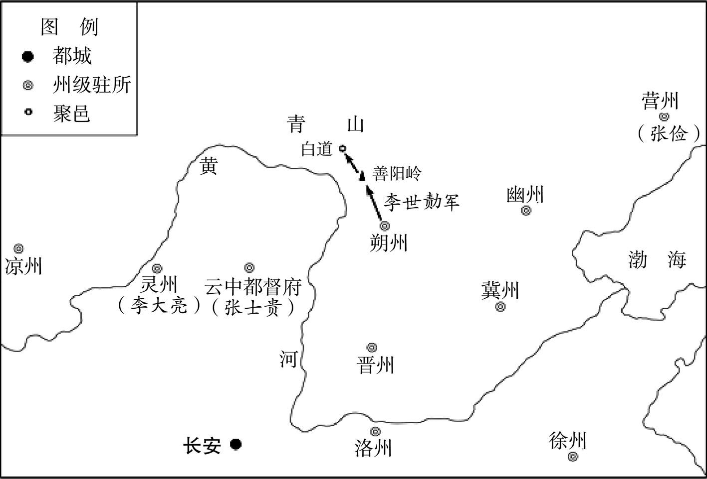 
李世击退薛延陁示意图

## 【原文】

**李世还军定襄[1]。突厥思结部居五台者叛走，州兵追之[2]。会世军还，夹击，悉诛之[3]。**

## 【注文】

[1]定襄：古地名，今内蒙古和林格尔北。

[2]思结：古部落名。又作斯结。铁勒之一部。游牧于土拉河北，始属突厥，后属薛延陁。唐太宗贞观二十年（646年），唐灭薛延陁；次年，以其地为卢山都督府，隶于燕然都护府。

　　五台：古县名，今山西忻州五台。　　州兵：春秋时晋国由各州自行组成的地方军队。

[3]夹击：夹攻。

## 【译文】

李世回军到定襄。突厥思结部居住在五台的纷纷叛逃，当地州兵追捕他们。正赶上李世的军队回来，两军互相夹击，全部诛杀了他们。

## 【原文】

**丙子(1)，薛延陁使者辞还，上谓之曰：“吾约汝与突厥以大漠为界，有相侵者，我则讨之[1]。汝自恃其强，逾漠攻突厥[2]。李世所将才数千骑耳，汝已狼狈如此，归语可汗，凡举措利害，可善择其宜[3]。”**

## 【注文】

[1]约：约定，以语言或文字订立共同应遵守的条件。

[2]恃：依赖，仗着。

[3]举措：举动，行为。

## 【译文】

唐太宗贞观十五年（641年）十二月丙子日，薛延陁的使者辞别朝廷北归，太宗对他说：“我和你们约定与突厥以大沙漠为界，有互相侵犯的，我大唐便予以讨伐。你们仗恃强大，越过沙漠进入突厥。李世仅仅率领数千骑兵，你们就这样狼狈不堪，回去告诉你们可汗，以后凡是有什么行动，要考虑利害，选择适当。”

## 【原文】

**十六年秋九月癸亥，薛延陁真珠可汗遣其叔父沙钵罗泥熟俟斤来请昏，献马三千，貂皮三万八千，马脑镜一[1]。**

## 【注文】

[1]沙钵罗泥熟（？—659年）：即阿史那贺鲁，唐初真珠可汗的叔父。　　俟（sì）斤：西突厥官号。意为首领。　　昏：古同“婚”，婚姻。　　貂（diāo）：哺乳动物的一属，种类很多，毛皮黄黑色或带紫色，是很珍贵的衣料，我国东北特产之一。

## 【译文】

唐太宗贞观十六年（642年）秋九月癸亥（初十日），薛延陁真珠可汗派遣他叔父沙钵罗泥熟俟斤前来唐朝请求通婚，并献马三千匹，貂皮三万八千张，玛瑙镜一个。

## 【原文】

**冬十月，上谓侍臣曰：“薛延陁屈强漠北，今御之止有二策：苟非发兵殄灭之，则与之婚姻以抚之耳[1]。二者何从[2]？”房玄龄对曰：“中国新定，兵凶战危，臣以为和亲便[3]。”上曰：“然[4]。朕为民父母，苟可利之，何爱一女[5]。”**

## 【注文】

[1]屈强：崛起强大。“屈”通“崛”。　　殄（tiǎn）：消灭。

[2]从：采取，按照。

[3]便：好。

[4]然：对，是。

[5]爱：爱惜，珍惜。

## 【译文】

唐太宗贞观十六年（642年）冬十月，太宗对侍臣说：“薛延陁在沙漠以北称雄，如今控制他们只有两个对策：如果不是发兵灭掉了他，就只好用和亲来安抚他们，这两个策略取哪一个好？”房玄龄回答说：“中原刚刚安定，出兵征战是凶险、危难的事情，臣以为还是和亲为好。”太宗说：“很对。我既然为天下百姓的父母，如果对百姓有利，何必爱惜一个女儿。”

## 【原文】

**先是，左领军将军契苾何力母姑臧夫人及弟贺兰州都督沙门皆在凉州，上遣何力归觐，且抚其部落[1]。时薛延陁方强，契苾部落皆欲归之，何力大惊，曰：“主上厚恩如是，奈何遽为叛逆[2]！”其徒曰：“夫人、都督先已诣彼，若之何不往[3]？”何力曰：“沙门孝于亲，我忠于君，必不汝从[4]”其徒执之诣薛延陁，置真珠牙帐前[5]。何力箕踞，拔佩刀东向大呼曰：“岂有唐烈士而受屈虏庭，天地日月，愿知我心[6]。”因割左耳以誓[7]。真珠欲杀之，其妻谏而止[8]。上闻契苾叛，曰：“必非何力之意[9]。”左右曰：“戎狄气类相亲，何力入薛延陁，犹鱼趋水耳[10]。”上曰：“不然[11]。何力心如铁石，必不叛我[12]。”会有使者自薛延陁来，具言其状，上为之下泣，谓左右曰：“何力果如何[13]？”即命兵部侍郎崔敦礼持节［谕］薛延陁，以新兴公主妻之，以求何力，何力由是得还，拜右骁卫大将军[14]。**

## 【注文】

[1]领军：古代官名，唐初禁军有左右领军卫，各置领军将军二人，秩从三品，掌宫禁宿卫。分守皇城、京城苑城诸门，以及管理翊府、翊卫、外府射士的兵籍。　　姑臧（zāng）夫人：唐时铁勒契苾部女酋长，唐太宗贞观六年（632年）率部内附，封姑臧夫人。　　沙门：姑臧夫人次子，拜羁縻州——贺兰州（今甘肃武威）都督。　　归觐（jìn）：归谒君王父母。

[2]叛逆：叛徒。

[3]若：你；你们。

[4]汝从：服从你们。

[5]真珠：薛延陁真珠毗伽可汗的简称。

[6]箕（jī）踞（jù）：两脚张开,两膝微曲地坐着，形状像箕，这是一种轻慢傲视对方的姿态。

[7]誓：发誓；立誓。

[8]谏：劝谏。

[9]意：本意。

[10]气：指人、物的属性或一地的天然特点。　　类：通“颣（lèi）”。缺点，毛病。　　趋：去往。

[11]然：这样。

[12]心如铁石：心像铁石一样坚硬。比喻心肠硬或意志十分坚决。

[13]如何：怎样。

[14]兵部侍郎：古代官名，兵部副长官。隋唐设立兵部，掌全国武官选用和兵籍、军械、军令之政，历代相沿，即今之国防部。　　崔敦礼（596—656年）：本名元礼，后被唐高祖改名为敦礼，雍州咸阳（今陕西咸阳）人，唐初大臣。唐高宗永徽四年（653年）至显庆元年（656年）为宰相。显庆元年（656年），拜太子少师，同中书门下三品。不久卒，年六十余。唐高宗举哀于东云龙门，赐东园秘器，赠开府仪同三司、并州大都督，陪葬昭陵，赙绢布八百段、米粟八百硕，谥曰“昭”。　　节：符节，古代使者所持以做凭证。　　新兴公主：唐太宗李世民之女，母不详。初嫁真珠可汗，后太宗毁婚，嫁公主于长孙曦。　　妻：以女嫁人。　　右骁卫大将军：唐十六位大将军之一，正三品，掌宫禁宿卫。

## 【译文】

先前，左领军将军契苾（bì）何力的母亲姑臧夫人和他弟弟贺兰州都督沙门都居住在凉州，唐太宗派遣契苾何力回家去省亲，并安抚他的部落。当时薛延陁势力正强盛，契苾部落都想归附薛延陁，何力十分惊奇地说：“大唐天子待我们如此厚恩，为什么这么快就要叛离呢！”部落的人说：“老夫人和都督都提前已经到达薛延陁那里，你为什么不去？”何力说：“沙门对母亲很孝顺，我要对皇上忠心，我坚决不跟你们去。”部落的人把他捆绑起来送到薛延陁，把他扔在真珠可汗牙帐前。何力两腿分开坐在地上，拔出佩刀向东大声呼喊说：“岂有大唐英烈之士在敌人庭前屈服的道理，天地日月，望你们知道我的真心。”于是将左耳割掉发誓不从。真珠可汗想杀死他，被妻子阻止。太宗听说契苾可汗叛逃，说：“绝不是何力的本意。”身边的人说：“戎狄之族臭味相投，何力加入薛延陁，就像鱼到了水里一样。”太宗说：“不对，何力的忠心如铁石一般坚定，绝对不会背叛我。”恰巧有使者从薛延陁那里回来，详细陈述了何力在薛延陁那里的情况，太宗听完后为他落下泪来，对身边的人说：“何力果然怎样？”即刻命令兵部侍郎崔敦礼持节告诉薛延陁，将新兴公主许配真珠可汗为妻，以求换回契苾何力，何力因此才得回来，官拜右骁卫大将军。

## 【原文】

**十七年闰六月，薛延陁真珠可汗使其侄突利设来纳币，献马五万匹，牛、橐驼万头，羊十万口[1]。庚申，突利设献馔，上御相思殿，大飨群臣，设十部乐，突利设再拜上寿，赐赉甚厚[2]。契苾何力上言：“薛延陁不可与昏[3]。”上曰：“吾已许之矣，岂可为天子而食言乎[4]？”何力对曰：“臣非欲陛下遽绝之也，愿且迁延其事[5]。臣闻古有亲迎之礼，若敕夷男使亲迎，虽不至京师，亦应至灵州[6]。彼必不敢来，则绝之有名矣[7]。夷男性刚戾，既不成昏，其下复携贰，不过一二年，必病死，两子争立，则可以坐制之矣[8]。”上从之，乃征真珠可汗使亲迎，仍发诏将幸灵州与之会[9]。真珠大喜，欲诣灵州，其臣谏曰：“脱为所留，悔之无及[10]。”真珠曰：“吾闻唐天子有圣德，我得身往见之，死无所恨[11]。且漠北必当有主，我行决矣，勿复多言[12]。”上发使三道，受其所献杂畜[13]。薛延陁先无库厩，真珠调敛诸部，往返万里，道涉沙碛，无水草，耗死将半，失期不至[14]。议者或以为：“聘财未备而与为昏，将使戎狄轻中国[15]。”上乃下诏绝其昏，停幸灵州，追还三使[16]。**

## 【注文】

[1]突利设：薛延陁求婚使者，其在本藩任典兵官。　　纳币：古代婚礼“六礼”之一，亦称纳证，即男家送聘礼给女家。　　橐（tuó）驼：骆驼。

[2]馔（zhuàn）：一般的食品、食物。　　相思殿：宫殿名。殿在太极宫玄武门内。　　飨（xiǎng）：设盛宴待宾客。　　十部乐：隋代开皇初（581—585年）制七部乐：《国伎》《清商伎》《高丽伎》《天竺伎》《安国伎》《龟兹伎》《文康伎》（即《礼毕》）。隋炀帝大业中，增《康国伎》《疏勒伎》成九部乐，并将《清商伎》列为首部，改《国伎》为《西凉伎》。后唐太宗宴百僚，加奏《高昌伎》，始成十部乐。

[3]昏：通“婚”。

[4]食言：违背诺言；失信。

[5]遽（jù）：急；突然。　　迁延：拖延，多指时间上的耽误。

[6]亲迎：古代汉族婚姻风俗。流行于全国许多地区。“六礼”中的第六礼。俗称“迎亲”。新婿亲往女家迎娶新娘的仪式。通常是男家将婚期通知女家后，到成婚日，由新郎亲自到女家迎接新娘，或由男家派遣迎亲队伍迎娶，新郎在家等候。

[7]名：借口。

[8]刚戾（lì）：刚直暴戾。　　携贰：叛离。　　坐制：坐观其败；无须动干戈，稳坐而制服之。

[9]会：会合。

[10]脱：同“倘”。倘若；倘或。　　留：扣留。

[11]圣：崇高的。　　恨：遗憾；后悔。

[12]漠北：沙漠以北。

[13]道：次，用于某些分程序的动作。

[14]库厩（jiù）：库藏和厩马。　　调敛：征调聚敛。　　耗：亏损；消耗。

[15]戎狄：中国古代对北部和西北部少数民族的称谓。　　中国：中原。

[16]幸：巡幸。

## 【译文】

唐太宗贞观十七年（643年）闰六月，薛延陁真珠可汗派他的侄子突利设前来缴税，献马五万匹，牛、骆驼一万头，羊十万只。庚申（十三日），突利设献上膳食感谢太宗，太宗亲临相思殿，大宴群臣，设十部乐曲，突利设再一次向太宗行礼拜寿，太宗给他的赏赐十分丰厚。契苾何力向太宗进言说：“不可以和薛延陁通婚。”太宗说：“我已经答应他们了，作为天子怎么可以自食其言呢？”何力回答说：“臣不是让陛下立刻回绝他们，只是希望暂且延缓一下这件事。臣听说古时有亲迎之礼，假如陛下让夷男亲自迎娶，即使他不到京城来，也应该到灵州。夷男必然不敢前来，那么回绝他就有了借口。夷男性情刚强暴戾，既不能成婚，他的部下又怀有二心，过不了一两年时间，必然会生病而死，他的两个儿子争当可汗，我们就可以不动兵戈制服他们。”太宗听从了他的建议，于是便征召真珠可汗让他亲自迎娶，并发布诏书说将驾临灵州与他相会。真珠可汗十分高兴，想亲自到灵州去，他的臣下劝谏说：“倘若被他们扣留，后悔就晚了。”真珠可汗说：“我听说唐朝天子是有圣德的，我能够亲自前往见他，死也无憾。再说漠北将来也一定要有所依靠，我此行已经决定了，不要再多说了。”太宗接连三次派使节，接受薛延陁所献的牲畜。薛延陁原来没有府库和马厩，真珠可汗向各部征调来马牛羊，要往返一万多里路程，路经沙漠地带，没有水草，调来的家畜损失将近一半，过了约定的时间没有赶到。议事的大臣说：“他聘礼没有准备齐就与他通婚，这会使北方戎狄轻视中国。”太宗于是下诏回绝了这门婚姻，停止巡幸灵州，又追回了三道使者。

## 【原文】

**褚遂良上疏，以为：“薛延陁本一俟斤，陛下荡平沙塞，万里萧条，余寇奔波，须有酋长，玺书鼓纛，立为可汗[1]。比者复降鸿私，许其婚媾，西告吐蕃，北谕思摩，中国童幼，靡不知之[2]。御幸北门，受其献食，群臣四夷，宴乐终日，咸言陛下欲安百姓，不爱一女，凡在含生，孰不怀德[3]。今一朝生进退之意，有改悔之心，臣为国家惜兹声听，所顾甚少，所失殊多，嫌隙既生，必构边患[4]。彼国蓄见欺之怒，此民怀负约之惭，恐非所以服远人、训戎士也[5]。陛下君临天下十有七载，以仁恩结庶类，以信义抚戎夷，莫不欣然，负之无力，何惜不使有始有卒乎[6]！夫龙沙以北，部落无算，中国诛之，终不能尽，当怀之以德，使为恶者在夷不在华，失信者在彼不在此，则尧、舜、禹、汤不及陛下远矣[7]。”上不听。**

## 【注文】

[1]荡平：扫荡平定。　　奔波：忙碌奔走。　　纛（dào）：军旗。

[2]鸿私：诏书；圣旨。　　婚媾（gòu）：婚姻；嫁娶。　　吐蕃（bō）：公元7—9世纪时藏族建立的政权，是一个位于青藏高原的古代王国，由松赞干布到达磨延续两百多年，是西藏历史上创立的第一个政权。　　靡不：无不。

[3]含生：亦称“含类”，泛指一切有生命者。　　孰：谁。

[4]朝：指短时间。　　兹（zī）：这个，此。

[5]见：表示被动，相当于“被”。　　戎士：兵士。

[6]有：通“又”。　　载：年（唐虞时代用于年名）。　　庶类：黎民百姓。　　欣然：愉快，高兴。　　力：本指制法成治之功，后泛指功劳。　　卒：终。

[7]龙沙：地区名，意谓处于沙碛地带的龙城，在今蒙古鄂尔浑河西侧和硕柴达木湖附近，原为西汉匈奴祭天、大会诸部处。　　尧（生卒年不详）：姓伊祁，名放勋，史称“唐尧”。传说公元前2377年，在唐地伊祁山诞生，随其母在庆都山一带度过幼年生活。十五岁时在唐县封山下受封为唐侯。二十岁时，其兄帝挚为形势所迫让位于他，成为我国原始社会末期的部落联盟长。他践帝位后，复封其兄挚于唐地为唐侯，他也在唐县伏城一带建第一个都城，以后因水患逐渐西迁山西，定都平阳。传说唐尧在帝位七十年，约公元前2259年去世。　　舜：是中国传说历史中的人物，是五帝之一。名重华；生于姚地（今天河南濮阳），故姚姓，其后子孙就以姚为氏，称为姚氏。舜为四部落联盟首领，以受尧的“禅让”而称帝于天下，其国号为“有虞”，都城在泺（luò）水（今山东济南），号为“有虞氏帝舜”。帝舜、大舜、虞帝舜、舜帝皆虞舜之帝王号，故后世以舜简称之。　　禹：姒姓，夏后氏首领，名文命，号禹，后世尊称大禹，是黄帝轩辕氏玄孙。通过禅让制得到帝位，死后其子启承继夏朝天子位，是子承父位、中国奴隶制的创始人。　　汤：即成汤，帝喾（传说中古代部族首领）之子契的十四世孙，姓子，名履，又名天乙。他在夏朝末年一举成为商族的首领，由于爱护百姓，施行仁政，深得民众的拥护，以至于周围的一些小国也前来慕名归附，其势力便迅速强大起来。他本居于亳（bó），是夏朝的方伯，专管征伐之事。夏末时，帝桀为君，残暴无道，国内日趋动荡不安，他见其形势，便产生了代夏的雄心。于是开始实行灭夏的计划。他先灭掉了商附近的一小国葛国，接着不久，经过十一次的出征，灭掉了夏王朝的三个重要同盟国家豕韦、顾、昆吾，之后再一举灭夏，历史上称之为“鸣条之战”。然后把夏桀放逐到南巢，这样，履就建立了中国历史上第二个奴隶制国家商朝，定都于亳，死后被谥为“成汤”。其后子孙中有一支以谥号命氏，成为汤氏。是为河南汤氏。　　远：深远；深奥。

## 【译文】

褚（chǔ）遂良向太宗上疏，认为：“薛延陁本是突厥的一个俟斤，陛下当年荡平沙漠塞外，万里萧条少有人烟，残余的敌寇四处奔波，必须要立一个酋长，以控制局面。于是赐给他玺书和鼓旗，立夷男为真珠可汗。近来又降下大恩，答应了他的婚事，并把此事向西边告知吐蕃，北边晓谕思摩，中原的人民连年幼的儿童都没有不知道的。陛下又亲临北门，接受他们进献的食物，群臣和四方夷人，整日宴饮庆贺，都说陛下为了安抚天下百姓，不惜自己的女儿远嫁戎狄，芸芸众生，谁不感恩戴德。如今您却忽然犹豫，有悔改之意，臣深为朝廷的声誉受损而惋惜，这样做顾全的实在太少，而失去的实在太多，猜疑和矛盾一旦产生，必然构成边疆的祸患。薛延陁深怀被欺骗的怨恨，百姓也感受到辜负盟约的惭愧，恐怕这不是臣服远人、训练士兵的办法。陛下即位治理天下已十七年，以仁义恩惠交结百姓，以诚信礼义安抚戎狄，天下人无不欣然愉悦，辜负对方没有益处，为什么不能善始善终呢？再说龙沙城以北，薛延陁的部落众多，中原要诛灭他们，终究不能消灭干净，应当待他们以德义，让作恶的在夷狄而不在华夏，失信的是对方而不是我们，这样尧、舜、禹、汤也不如陛下的影响深远。”太宗没有听从他的劝谏。

## 【原文】

**是时群臣多言：“国家既许其昏，受其聘币，不可失信戎狄，更生边患[1]。”上曰：“卿曹皆知古而不知今[2]。昔汉初匈奴强，中国弱，故饰子女捐金絮以饵之，得事之宜[3]。今中国强，戎狄弱，以我徒兵一千，可击胡骑数万，薛延陁所以匍匐稽颡，惟我所欲，不敢骄慢者，以新为君长，杂姓非其种族，欲假中国之势以威服之耳[4]。彼同罗、仆骨、回纥等十余部，兵各数万，并力攻之，立可破灭，所以不敢发者，畏中国所立故也[5]。今以女妻之，彼自恃大国之婿，杂姓谁敢不服[6]？戎狄人面兽心，一旦微不得意，必反噬为害[7]。今吾绝其昏，杀其礼，杂姓知我弃之，不日将瓜剖之矣[8]。卿曹第志之[9]。”**

## 【注文】

[1]更：又。

[2]曹：等，辈。

[3]汉：朝代名，公元前202—220年，分为西汉和东汉，是继秦朝之后强盛的大一统帝国。公元前202年高祖刘邦建国，六月定都长安。随后汉武帝刘彻进一步推动大一统事业。公元8年，王莽篡夺政权，西汉结束。公元25年，参加反抗王莽政权的皇族刘秀称帝，建立东汉，定都洛阳。开创了“光武中兴”。汉朝时期，民族融合空前发展，对外交流频繁，国力和经济较为强盛。并且文化的统一，为中华民族两千年的社会发展奠定了基础，为中华文明的延续和挺立千秋做出了巨大贡献。汉朝共历四百多年。公元220年被魏国曹丕篡权而灭亡。　　絮（xù）：粗丝绵。　　饵（ěr）：诱饵。　　得事之宜：与事体相合。宜：相称。

[4]徒兵：步兵。　　胡骑：藩胡骑兵。　　匍（pú）匐（fú）：以额触地爬行。　　稽颡（sǎng）：古代一种跪拜礼，屈膝下拜，双手朝前，以额触地，表示极度的虔诚。　　杂姓：以姓氏为部称的诸色藩人。

[5]畏：害怕。

[6]恃：凭借。

[7]微：稍微，稍稍。　　噬（shì）：咬。

[8]杀：减；降。　　瓜剖（pōu）：瓜分。

[9]第：但；只。　　志：记。

## 【译文】

当时，众位大臣都说：“国家既然已经答应了与他们通婚，又接受了聘礼，就不可以失信于戎狄，以免又发生边境祸患。”太宗说：“你们都是知古而不知今。古时汉初匈奴强大，而中原汉王朝弱小，所以才装扮了女子，陪送金银财帛，来引诱他们，在当时这是合乎时宜的。今天是中国强盛，戎狄力量弱小，用我们的步兵一千，就可以打败他胡骑数万，所以薛延陁夷男才会卑躬屈膝，满足我们的要求，而不敢稍有傲慢。他刚刚做了可汗，其他部族与他都不是同一种族，他是想借大唐的威信和势力来威慑制服他们。那同罗、仆骨、回纥等十多个部落，各有兵数万，合在一起用力攻打他，就可以立刻灭了他。他们之所以不敢轻举妄动，是害怕真珠是大唐所立的可汗。现在我如果再把大唐的女儿嫁给他，他自己仗恃是大国的女婿，杂姓部落谁还敢不服他？戎狄人是人面兽心，一旦稍不如意，必然反咬一口成为祸害。今天我回绝和他通婚，终止对他的礼遇，其他部族都知道我们抛弃了他，不久就会把它瓜分消灭。你们只要记着我这话就是了。”

## 【原文】

**臣光曰：孔子称去食、去兵，不可去信[1]。唐太宗审知薛延陁不可妻，则初勿许其昏可也[2]。既许之矣，乃复恃强弃信而绝之，虽灭薛延陁，犹可羞也[3]。王者发言出令，可不慎哉[4]。**

## 【注文】

[1]孔子（前551—前479年）：名丘，字仲尼，东周时期鲁国陬（zōu）邑（今山东曲阜南）人。春秋末期的思想家和教育家，儒家思想的创始人。孔子集华夏上古文化之大成，在世时已被誉为“天纵之圣”“天之木铎”，是当时社会上的最博学者之一，被后世统治者尊为孔圣人、至圣、至圣先师、万世师表，被联合国教科文组织评选为“世界十大文化名人”之首。孔子和儒家思想对中国和朝鲜半岛、日本、越南等地区有深远的影响，这些地区又被称为儒家文化圈。　　称去食、去兵，不可去信：语见《论语·颜渊》。子贡问政。子曰：“足食，足兵，民信之矣。”子贡曰：“必不得已而去，于斯三者何先？”曰：“去兵。”子贡曰：“必不得已而去，于斯二者何先？”曰：“去食。自古皆有死，民无信不立。”

[2]审知：明悉；详知。

[3]羞：羞耻。

[4]慎：谨慎；慎重。　　哉（zāi）：表示疑问或反问，相当于“呢”或“吗”。

## 【译文】

史臣司马光评论说：孔子声称宁可去掉食物和军队，也不可以丢弃信用。唐太宗深知不可把女儿许薛延陁为妻，那么当初就不要答应这门婚事。既然允许通婚，又依仗强大而背信弃义回绝婚姻，这样即使灭了薛延陁，也使人感到羞耻。君王发号施令，就能够不慎重吗？

## 【原文】

**十八年[1]。初，上遣突厥俟利苾可汗北渡河，薛延陁真珠可汗恐其部落翻动，意甚恶之，豫蓄轻骑于漠北，欲击之[2]。上遣使戒敕，无得相攻[3]。真珠可汗对曰：“至尊有命，安敢不从[4]。然突厥翻覆难期，当其未破之时，岁犯中国，杀人以千万计[5]。臣以为至尊克之，当翦为奴婢，以赐中国之人，乃反养之如子，其恩德至矣，而结社率竟反[6]。此属兽心，安可以人理待也[7]。臣荷恩深厚，请为至尊诛之[8]。”自是数相攻[9]。**

## 【注文】

[1]十八年：唐太宗贞观十八年，公元644年。

[2]翻动：闹事；反叛。　　恶（wù）：讨厌；憎恶。　　豫：预先，事先。通“预”。　　蓄：储备。

[3]无得：不许，不准。

[4]至尊：至高无上的皇帝的代称。

[5]翻覆：反复。　　期：预定的时间；选定的日子；期限。

[6]翦（jiǎn）：全部歼灭。　　奴婢（bì）：原指丧失自由、受人奴役的男女，后泛指男女仆人。　　乃：可是，然而。　　至：最；极。

[7]理：道理，义理。

[8]荷（hè）：承受；承蒙。

[9]数（shuò）：屡次，频数。

## 【译文】

唐太宗贞观十八年（644年）。起初，太宗派遣突厥俟利苾（bì）可汗北渡黄河，薛延陁真珠可汗担心他的部落叛归俟利苾，因此心中十分恨他。事先在漠北潜伏下轻骑兵，想要袭击俟利苾。太宗派遣使臣下敕书告诫他们，让他不要互相攻伐。真珠可汗回答说：“大唐天子有命令，怎敢不遵从。只是突厥人反复无常，当年他还没有亡国的时候，年年侵犯中原，杀死的人以千万计算。臣以为，大唐帝国既然打败了他们，应当全部降为奴婢，把他们赐给唐朝百姓，现在却反而养他们如自己的儿子，这样施恩德给他们，可以说是无以复加了，而结社率竟然还要反叛。这种人是禽兽之心，怎么能以对人的道理对待他们。臣受陛下恩德深厚，请求为陛下诛灭他。”从此屡次攻击突厥。

## 【原文】

**十九年[1]。上之将伐高丽也，薛延陁遣使入贡[2]。上谓之曰：“语尔可汗，今我父子东征高丽，汝能为寇，宜亟来[3]。”真珠可汗惶恐，遣使致谢，且请发兵助军，上不许[4]。及高丽败于驻跸山，莫离支使靺鞨说真珠，啖以厚利，真珠慑服，不敢动[5]。九月壬申，真珠卒，上为之发哀[6]。**

## 【注文】

[1]十九年：唐太宗贞观十九年，公元645年。

[2]高丽（lí）：高句（gōu）丽的别称，是西汉到隋唐时期东北地区出现的一个有重要影响的边疆民族。周秦时期，高句丽的先人一直生活在东北地区。公元前37年，夫余人朱蒙在此建立政权。高句丽鼎盛时期其势力范围包括今吉林东南部、辽河以东和朝鲜半岛北部。公元668年，高句丽被唐王朝联合朝鲜半岛东南部的新罗所灭。

[3]亟（jí）：急；快。

[4]惶（huáng）恐：恐惧，惊慌。　　致谢：表示谢罪。

[5]驻跸（bì）山：位于北京昌平西南。　　莫离支：高句丽后期出现的一种新官职，莫离支是自设的一种取代大对卢的新的最高官职，并非是旧有的任何一种官职，它的职能其实已超出了宰相的性质，而且具备了专制权臣为篡夺王位而自设的临时性特殊官职的特点。　　慑（shè）服：亦作“慑伏”。因畏惧而屈服。

[6]发哀：举行哀悼仪式。

## 【译文】

唐太宗贞观十九年（645年）。唐太宗将要征伐高丽的时候，薛延陁派遣使臣入贡。太宗对使者说：“告诉你们可汗，现在我父子要去讨伐高丽，你们如果有能力侵犯，就立刻来。”真珠可汗恐惧，派遣使臣前来谢罪，并且请求发兵协助征高丽，太宗没有答应。等到高丽战败于驻跸山，莫离支让靺（mò）鞨（hé）人劝说真珠可汗，用丰厚的利益加以引诱，真珠可汗慑服唐朝威力，不敢有所举动。九月壬申（初七日），真珠可汗去世，太宗为他举行哀悼仪式。

## 【原文】

**初，真珠请以其庶长子曳莽为突利失可汗，居东方，统杂种；嫡子拔灼为肆叶护可汗，居西方，统薛延陁[1]。诏许之，皆以礼册命[2]。曳莽性躁扰，轻用兵，与拔灼不协[3]。真珠卒，来会丧[4]。既葬，曳莽恐拔灼图己，先还所部，拔灼追袭杀之，自立为颉利俱利薛沙多弥可汗[5]。**

## 【注文】

[1]庶：庶子，非嫡配所生的孩子；宗族的旁支。　　曳（yè）莽（mǎng）：即突利失可汗（？—645年），是唐朝初年薛延陁的贵族，真珠可汗夷男的儿子。夷男的正妻所生的拔灼，管理薛延陁西部的薛延陁的本族，而曳莽不是夷男的正妻所生，被唐太宗册为突利莫贺咄叶护，管辖薛延陁东部的其他民族。人称曳莽暴虐，并与拔灼关系恶劣。公元645年，夷男死后，曳莽怕拔灼会害他，突然离开，回到汗国东部，拔灼追杀了他。　　杂种：谓铁勒诸部居薛延陁东部者。　　嫡（dí）子：正妻所生之子，多指嫡长子。　　拔灼（zhuó）：唐初薛延陁真珠可汗的儿子。　　肆叶护可汗（？—632年）：西突厥可汗，统叶护可汗之子，封为特勤，公元628年，统叶护可汗的伯父杀死统叶护可汗，自立为莫贺咄可汗。阿史那泥孰莫贺设迎立咥力特勤，是为乙毗钵罗肆叶护可汗。肆叶护和莫贺咄互相攻战不止。西突厥内乱，原先役属的西域诸国和铁勒各部纷纷叛离。公元630年，莫贺咄兵败，逃往阿尔泰山，被泥孰杀死。诸部共推肆叶护为西突厥大可汗。肆叶护可汗北征铁勒，被薛延陁真珠可汗打败。肆叶护可汗为人多疑，杀功臣乙利可汗，并诛灭其宗族。他又欲杀害拥立他的泥孰，泥孰逃往焉耆。公元632年秋，肆叶护可汗遭设卑达官与弩失毕部攻击，逃往康居，不久去世。

[2]册命：古代帝王封立继承人﹑后妃及诸王大臣的命令。

[3]躁扰：急躁不能容人。　　协：和睦；融洽。

[4]会：汇合。

[5]颉利俱利薛沙多弥可汗：即拔灼。

## 【译文】

起初，真珠可汗请求以他的庶长子曳莽做突利失可汗，居住在东部，统辖杂种部族；让嫡长子拔灼为肆叶护可汗，居住在西部，统辖薛延陁。太宗下诏答应了他的请求，并按照礼节进行了册封。曳莽性情暴躁好动，轻于用兵，与拔灼不和。真珠可汗死后，他们都来发丧。埋葬真珠可汗后，曳莽担心拔灼图谋自己，就先回所统的部落，拔灼追赶袭击曳莽，并杀了他，自立为颉利俱利薛沙多弥可汗。

## 【原文】

**上之征高丽也，使右领军大将军执失思力将突厥屯夏州之北以备薛延陁[1]。薛延陁多弥可汗既立，以上出征未还，引兵寇河南，上遣左武候中郎将长安田仁会与思力合兵击之[2]。思力羸形伪退，诱之深入，及夏州之境，整陈以待之[3]。薛延陁大败，追奔六百余里，耀威碛北而还[4]。多弥复发兵寇夏州，十二月己未，敕礼部尚书江夏王道宗发朔、并、汾、箕、岚、代、忻、蔚、云九州兵镇朔州，右卫大将军代州都督薛万彻、左骁卫大将军阿史那社尔发胜、夏、银、绥、丹、延、鄜、坊、石、隰十州兵镇胜州，胜州都督宋君明、左武候将军薛孤吴发灵、原、宁、盐、庆五州兵镇灵州，又令执失思力发灵、胜二州突厥兵与道宗等相应[5]。薛延陁至塞下，知有备，不敢进。**

## 【注文】

[1]执失思力（生卒年不详）：突厥人，唐朝将领。原是突厥处罗可汗、颉利可汗属下的酋长。唐高祖武德九年（626年），出使唐朝，因出言不逊被太宗囚于门下省，不久放还。唐太宗贞观年间，护送隋萧皇后归唐，被任命为左领军将军。颉利可汗被李靖击败后，奉命招降浑、斛萨等部族。唐太宗贞观五年（631年），尚高祖李渊第八女九江公主，任驸马都尉，封安国公。此后多次征战，先后征讨吐谷浑、吐蕃、薛延陁。唐高宗永徽四年（653年），受房遗爱谋反案牵连，被流放巂（xī）州，公主求削封邑，与夫同行。唐高宗龙朔年间，为归州刺史，不久去世。　　夏州：古地名，今陕西靖边。

[2]左武候：隋朝十二卫军之一。　　中郎将：古代武官名。唐代各卫有中郎将。中郎将正四品下。　　田仁会（？—679年）：唐初将领。雍州长安（今陕西西安）人。任胜州都督、金吾将军、太常正卿等职。

[3]羸（léi）：疲困。

[4]耀威：示威。

[5]并：即并州，古州名，治今山西太原西南。　　汾（fén）：即汾州，北魏孝文帝太和十二年（488年）置，北魏孝明帝孝昌年间治隰城（唐改西河），即今山西汾阳。　　箕（jī）：即箕州，唐高祖武德八年（625年）改辽州置，治所在辽山县，今山西左权。　　岚（lán）：即岚州，北魏孝庄帝建义元年（528年），分肆州之秀容县、肆卢县、平寇县，并州之阳曲县设置了广州，治所在秀容（山西岚县北）；孝武帝永熙二年（533年），撤销广州，在此新设岚州，属地基本未变。　　忻（xīn）：即忻州，治今山西忻州。　　蔚：即蔚州，治今山西灵丘。　　云：即云州，治今山西大同。　　代州：治今山西代县。　　薛万彻（？—652年）：唐朝名将，唐朝京兆咸阳（今陕西咸阳东北）人，原籍敦煌（今属甘肃）。隋朝名将薛世雄之子。本为隋将，后与兄长薛万均同自幽州降唐，因征讨梁师都有功，授车骑将军，随罗艺四处转战其他起义军，投入太子李建成幕府，受其赏识。玄武门之变时，率东宫兵马力战，甚至反扑秦王府，直到李世民派人出示以太子首级，他才放下武器带领数十骑逃入南山。后来唐太宗赏识其武勇，屡次遣使招谕才复出拜将。在平突厥、薛延陁部、征高句丽时屡立大功，尚太宗妹丹阳公主。后因参与谋立李恪为帝，被长孙无忌所杀。　　胜：即胜州，治今内蒙古准格尔旗东北。隋炀帝大业三年（607年）将胜州改为榆林郡，辖区不变。唐初，仍置胜州，领榆林、河滨两县。唐末，胜州为党项所占。　　银：即银州，治所在今陕西横山东党岔。　　绥：即绥州，治所在今陕西绥德。　　丹：即丹州，治所在今陕西宜川。　　延：即延州，唐时辖境相当于今陕西延安、安塞、延长、延川、志丹等具地。　　鄜（fū）：即鄜州，今陕西富县。　　坊：即坊州城，治所在今陕西黄陵县西南。　　石：即石州，今山西吕梁离石区。　　隰（xí）：即隰州，隋开皇五年（585）改西汾州置，治所在隰川（今山西隰县）。辖境相当于今山西石楼、永和、隰县、蒲县、大宁和孝义市西南部地区。　　宋君明（生卒年不详）：唐初胜州都督。　　薛孤吴（生卒年不详）：唐初大将。两《唐书》又作“萨孤吴仁”或“薛孤吴仁”。薛孤，原为少数民族复姓。吴仁有战功，官至左武候大将军。　　灵：即灵州。治所在今宁夏灵武西南。　　原：即原州，今宁夏固原市。　　宁：即宁州，治定安（今甘肃宁县），辖境包括甘肃宁县、正宁及陕西彬县、旬邑、长武、永寿等县地。　　盐：即盐州，治所在五原（今陕西定边）。　　庆：即庆州，今甘肃庆阳附近。

## 【译文】

唐太宗出征高丽，派右领军大将军执失思力领突厥兵驻扎在夏州之北，以防备薛延陁。薛延陁多弥可汗自即位后，乘着太宗出征还没有回来，便领兵侵犯黄河以南，太宗派遣左武候中郎将长安人田仁会和思力合兵出击。思力伪装兵士疲惫要退却的样子，引诱敌人深入，到夏州境内，严阵等待。交战后薛延陁被打得大败，唐军追赶了六百多里，在沙漠以北炫耀了一番后还军。多弥可汗又发兵进犯夏州，十二月己未（二十五日），太宗敕令礼部尚书江夏王李道宗征发朔、并、汾、箕、岚、代、忻、蔚、云九州兵力镇守朔州，右卫大将军代州都督薛万彻、左骁卫大将军阿史那社尔征发胜、夏、银、绥、丹、延、鄜、坊、石、隰十州兵力镇守胜州，胜州都督宋君明、左武候将军薛孤吴征发灵、原、宁、盐、庆五州兵力镇守灵州，又命令执失思力征发灵、胜二州突厥兵与李道宗等互相呼应。薛延陁兵到了塞下，知道唐朝有了防备，不敢前进。

## 【原文】

**二十年春正月辛未，夏州都督乔师望、右领军大将军执失思力等击薛延陁，大破之，虏获二千余人。多弥可汗轻骑遁走，部（曲）［内］骚然矣[1]。**

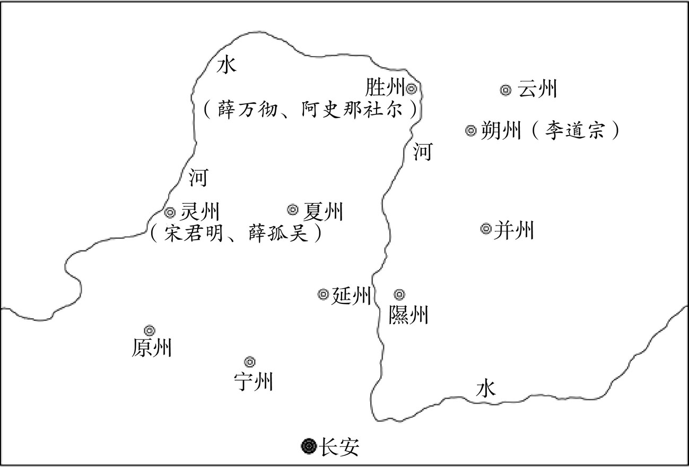 
唐朝防御薛延陁汗国示意图

## 【注文】

[1]多弥可汗（？—646年）：名拔灼，薛延陁真珠可汗夷男的长子。公元630年，东突厥汗国被唐朝灭亡后，薛延陁成为中国北方草原的主要力量。公元638年，唐太宗在夷男的同意下，册封夷男的儿子拔灼和颉利苾为夷男属下的可汗，表面上是对他们尊崇，其实是希望扩大拔灼和颉利苾之间的分歧。夷男死于公元645年，拔灼管理薛延陁西部的薛延陁本族；而夷男的另一个儿子曳莽，管辖薛延陁东部的其他民族。人称曳莽暴虐，并与拔灼关系恶劣。葬礼之后，曳莽怕拔灼会害他，突然离开，回到汗国东部。拔灼追杀了他，然后自称颉利俱利薛沙多弥可汗（简称多弥可汗）。　　部曲：在汉代本是军队编制的名称，大将军营有五部，部下有曲。联称泛指某人统率下的军队。　　骚：动乱，扰乱，不安定。

## 【译文】

唐太宗贞观二十年（646年）春正月辛未（初八日），夏州都督乔师望、右领军大将军执失思力等出击薛延陁，大败薛延陁军，俘获了二千多人。多弥可汗轻骑逃走，部落里骚然大乱。

## 【原文】

**薛延陁多弥可汗性褊急，猜忌无恩，废弃父时贵臣，专用己所亲昵，国人不附[1]。多弥多所诛杀，人不自安[2]。回纥酋长吐迷度与仆骨、同罗共击之，多弥大败[3]。夏六月乙亥，诏以江夏王道宗、左卫大将军阿史那社尔为瀚海安抚大使，又遣右领卫大将军执失思力将突厥兵，右骁卫大将军契苾何力将凉州及胡兵，代州都督薛万彻、营州都督张俭各将所部兵，分道并进，以击薛延陁[4]。**

## 【注文】

[1]褊（biǎn）：通“惼”。气量狭小；急躁。

[2]安：安定。

[3]吐迷度（？—648年）：回纥酋长，降唐后拜怀化大将军兼瀚海都督，后为其侄子所杀。

[4]右领卫大将军：唐高祖武德五年（622年）改右御卫为右领军卫长官，掌宫禁宿卫，正三品。　　安抚大使：隋唐宋临时职官名称，隋文帝仁寿四年（604年）始设，由行军主帅兼任。唐代为临时差遣官之一，以将帅充任。宋代正二品以上大臣充任安抚使时，称为安抚大使，以与安抚使相区别。　　张俭（生卒年不详）：字师约，京兆新丰人（今陕西西安新丰），唐高祖从外孙，累封皖城郡公，官至东夷都护，加金紫光禄大夫。唐高宗永徽初年去世，享年六十。谥号为“密”。

## 【译文】

薛延陁多弥可汗性格偏狭急躁，对部下猜忌而没有恩德，把他父亲时的旧臣都废弃，专门重用自己亲信的人，因此国中百姓都不愿意依附于他。多弥可汗又大肆杀戮，造成人人惶恐不安。回纥酋长吐迷度和仆骨、同罗共同攻击他，多弥大败。贞观二十年（646年）夏六月乙亥（十五日），太宗下诏以江夏王李道宗、左卫大将军阿史那社尔为瀚海安抚大使，又派遣右领卫大将军执失思力领突厥兵，右骁卫大将军契苾何力领凉州兵和胡兵，代州都督薛万彻、营州都督张俭各率领本部的兵马，分路并进，出击薛延陁。

## 【原文】

**上遣校尉宇文法诣乌罗护、靺鞨，遇薛延陁阿波设之兵于东境，法帅靺鞨击破之[1]。薛延陁国中惊扰，曰：“唐兵至矣[2]。”诸部大乱，多弥引数千骑奔阿史德时健部落，回纥攻而杀之，并其宗族殆尽，遂据其地[3]。诸俟斤互相攻击，争遣使来归命[4]。**

## 【注文】

[1]校尉：中国历史上重要的武官官职。校，军事编制单位。尉，军官。校尉为部队长之意。　　宇文法（生卒年不详）：唐初将领。　　乌罗护：古民族名，一称乌罗浑，北魏时称乌罗侯，游牧于今嫩江西部地区。　　阿波设（生卒年不详）：唐初薛延陁典兵官。　　帅：同“率”。

[2]惊扰：惊慌骚乱。

[3]阿史德时健：东突厥阿史德部酋长，阿史德部于东突厥破亡后徙居云中（今内蒙古托克托县东北）。　　殆：表推测，相当于“大概”“几乎”。

[4]归命：内附并接受朝命。

## 【译文】

唐太宗派遣校尉宇文法去乌罗护、靺鞨，在东部边境遇上了薛延陁阿波设的军队，宇文法率领靺鞨兵把他们打败。薛延陁国中惊慌扰乱起来，说：“唐朝大兵到了。”各部落大乱，多弥可汗带领数千骑兵逃奔到阿史德时健部落，回纥进攻该部落并杀死了多弥可汗，他的宗族也几乎被杀光，于是占据了薛延陁的土地。薛延陁各部首领又互相攻击，争着派使者来归降请命。

## 【原文】

**薛延陁余众西走，犹七万余口，共立真珠可汗兄子咄摩支为伊特勿失可汗，归其故地，寻去可汗之号，遣使奉表，请居郁督军山之北[1]。使兵部尚书崔敦礼就安集之[2]。**

## 【注文】

[1]咄摩支（生卒年不详）：即伊特勿失可汗。薛延陁真珠可汗夷男的侄子，末代可汗。多弥可汗拔灼入侵唐朝，被江夏王李道宗、左卫大将军阿史那社尔率领的唐军击败。拔灼逃到阿史德部落，薛延陁的附庸回纥，其首领药罗葛吐迷度，与仆骨和同罗反叛并袭杀了拔灼，在回纥接管了薛延陁的大部分领土后，向唐军投降。剩下的薛延陁人支持夷男的侄子咄摩支为伊特勿失可汗，以图恢复薛延陁。唐太宗派大臣崔敦礼安抚，但回纥等敕勒部落都不愿重建薛延陁，唐太宗派李世进攻咄摩支的驻地，薛延陁咄摩支南奔荒谷，李世派遣通事舍人萧嗣业前往招慰，咄摩支投降。七月，咄摩支至京师长安，拜右武卫大将军，薛延陁灭亡。咄摩支死在唐太宗之前，被厚葬。　　奉表：上表、上奏章。古时大臣向皇帝呈上奏事的本章，以供皇帝审阅、批准。

[2]兵部尚书：别称为大司马，统管全国军事的行政长官。　　崔敦礼（生卒年不详）：雍州咸阳（今陕西咸阳）人，本名元礼，高祖改名。唐太宗贞观年间，拜中书舍人，迁兵部侍郎，多次出使突厥。

## 【译文】

薛延陁余下的部众向西逃走，还有七万多人，共同立真珠可汗的侄子咄摩支为伊特勿失可汗，回到原来的土地上，不久自己去掉了可汗的称号，遣使臣来朝上表，请求居住在郁督军山北麓。太宗派兵部尚书崔敦礼前去那里安抚召集他们。

## 【原文】

**敕勒九姓酋长，以其部落素服薛延陁种，闻咄摩支来，皆恐惧[1]。朝议恐其为碛北之患，乃更遣李世与九姓敕勒共图之[2]。上戒世曰：“降则抚之，叛则讨之[3]。”己丑，上手诏以：“薛延陁破灭，其敕勒诸部或来降附，或未归服，今不乘机，恐贻后悔，朕当自诣灵州招抚[4]。其去岁征辽东兵皆不调发。”**

## 【注文】

[1]敕勒九姓：即漠北九姓铁勒。九姓为回纥、仆骨、浑、拔野古、同罗、思结、契苾、阿布思、葛逻禄等九大铁勒部落。姓，以姓氏为部落称号。

[2]碛（qì）北：沙漠以北。

[3]戒：训诫。

[4]贻（yí）：遗留，留下。　　招抚：招安，使归附。

## 【译文】

敕勒九姓的酋长，因为他们的部落一直臣服于薛延陁种族，听说咄摩支来到，都非常恐惧。朝廷商量议论，担心咄摩支将来成为漠北的后患，于是又派遣李世和九姓敕勒共同图取他。唐太宗告诫李世说：“咄摩支如果降服就进行安抚，反叛就进行讨伐。”贞观二十年（646年）六月己丑（二十九日），太宗亲手书写诏令说：“薛延陁被消灭后，敕勒各部落，有的前来归附，有的并未归顺，现在不利用这一有利时机解决，恐怕将来留下后患，我当亲自去灵州招抚他们。去年征伐辽东的部队，这次都不要再征集。”

## 【原文】

**李世至郁督军山，其酋长梯真达官帅众来降[1]。薛延陁咄摩支南奔荒谷，世遣通事舍人萧嗣业往招慰，咄摩支诣嗣业降[2]。其部落犹持两端，世纵兵追击，前后斩五千余级，虏男女三万余人[3]。秋七月，咄摩支至京师，拜右武卫大将军[4]。**

## 【注文】

[1]梯真（生卒年不详）：薛延陁部酋长。姓延陁，名梯真，于唐高宗显庆中官至左武候将军。

[2]通事舍人：古代官名，始置于东晋。通事最早是管理外交之事务，用于传达皇帝旨意。唐朝时，通事舍人隶属中书省。　　萧嗣业（生卒年不详）：唐朝将领，梁明帝萧岿曾孙。幼年时就跟随隋炀帝，后随萧皇后入东突厥，唐太宗贞观九年（635年）回国，领突厥部众。后转任鸿胪卿，兼单于都护府长史。曾招降薛延陁咄摩支，参与讨伐西突厥、高句丽、回纥。唐高宗调露元年（679年），突厥反叛，萧嗣业率兵讨伐，大败而回，被流放岭南。

[3]两端：指游移于两者之间的态度。

[4]武卫大将军：古代官名，武卫，军制名。汉末曹操任丞相，置武卫营。魏文帝（曹丕）置武卫将军以主掌禁旅。隋唐分左、右武卫，各置大将军一人、将军二人统领。

## 【译文】

李世到郁督军山，薛延陁酋长梯真达官率领部众来投降。薛延陁咄摩支向南逃奔到荒谷中，李世派通事舍人萧嗣业前往招抚慰问，咄摩支到萧嗣业处投降。他的部落仍然犹豫不定，李世带兵追击，前后共斩杀五千多人，虏获男女三万多人。唐太宗贞观二十年（646年）秋七月，咄摩支到达京城，官拜右武卫大将军。

## 【原文】

**八月己巳，上行幸灵州[1]。江夏王道宗兵既渡碛，遇薛延陁阿波达官众数万拒战，道宗击破之，斩首千余级，追奔二百里[2]。道宗与薛万彻各遣使招谕敕勒诸部，其酋长皆喜，顿首请入朝[3]。庚午，车驾至浮阳，回纥、拔野古、同罗、仆骨、多滥葛、思结、阿跌、契苾、跌结、浑、斛薛等十一姓各遣使入贡，称：“薛延陁不事大国，暴虐无道，不能与奴等为主，自取败死，部落鸟散，不知所之[4]。奴等各有分地，不从薛延陁去，归命天子[5]。愿赐哀怜，乞置官司，养育奴等[6]。”上大喜，辛未，诏回纥等使者宴乐，颁赉拜官，赐其酋长玺书，遣右领军中郎将安永寿报使[7]。壬申，上幸汉故甘泉宫，诏以：“戎狄与天地俱生，上皇并列，流殃构祸，乃自运初[8]。朕聊命偏师，遂擒颉利，始弘庙略，已灭延陁[9]。铁勒百余万户，散处北溟，远遣使人，委身内属，请同编列，并同州郡[10]。混元以降，殊未前闻，宜备礼告庙，仍颁示普天[11]。”九月，上至灵州，敕勒诸俟斤遣使相继诣灵州者数千人，咸云：“愿得天至尊为奴等为可汗，子子孙孙常为天至尊奴，死无所恨[12]。”甲辰，上为诗序其事曰：“雪耻酬百王，除凶报千古。”公卿请勒石于灵州，从之[13]。**

## 【注文】

[1]灵州：西汉惠帝四年（前191年）置灵州县，属北地郡，故址在今宁夏灵武北黄河中沙洲。北魏为灵州，治旧薄骨律镇（今宁夏灵武西南），唐辖境相当于今宁夏中卫、中宁以北地区。

[2]阿波达官（生卒年不详）：唐初薛延陁将领。　　拒战：抵御抗击。

[3]顿首：磕头。旧时礼节之一。以头叩地即举而不停留。

[4]浮阳：《旧唐书》卷三作“泾阳”，泾阳县治在今陕西泾阳。　　多滥葛、跌结、浑、斛薛：铁勒部族名。多滥葛分布于今蒙古乌兰巴托北。跌结，又称“奚结”，分布于今俄罗斯红契科伊以东地区。浑，分布于今蒙古土拉河东。斛薛在多滥葛北。　　暴虐无道：残暴狠毒，丧尽道义。　　之：往，到。

[5]分地：世袭领地。　　天子：古以君权为神所授，故称帝王为天子。

[6]官司：政府机构。

[7]颁赉（lài）：颁发赏赐。　　玺（xǐ）书：诏书。　　安永寿（生卒年不详）：唐高祖武德功臣安修仁儿子，凉州（治今甘肃武威）胡人出身，官至右领军将军。

[8]甘泉宫：又名林光宫、云阳宫，秦置，在今陕西淳化西北甘泉山上。

[9]庙略：谓帝王或朝廷在庙堂之上所规划的与军国大事攸关的谋略。

[10]北溟（míng）：亦作“北冥”，古人想象中的北方最远的大海。

[11]混元：开天辟地之初。　　告庙：帝王或诸侯出巡或遇有大事，按例须向祖庙祭告，称“告庙”。　　普天：普天之下。

[12]俟斤：部族首领之称,铁勒诸部酋长。

[13]勒石：“勒之金石”的略称。即刻石树碑以颂功。

## 【译文】

唐太宗贞观二十年（646年）八月己巳（初十日），太宗巡行灵州。江夏王李道宗的兵马已渡过沙漠，遇上薛延陁阿波达官数万士兵的抵抗，李道宗打败了他们，斩首一千多，追击二百多里。李道宗和薛万彻各自派使者招安晓谕敕勒各部，他们的酋长都十分高兴，叩头拜谢请求入京朝见。庚午（十一日），太宗车驾到达浮阳，回纥、拔野古、同罗、仆骨、多滥葛、思结、阿跌、契苾、跌结、浑、斛薛等十一姓部落各派使者入贡，并说：“薛延陁不事奉大国，暴虐无道，不能做我们的君主，他自取灭亡，致使部落像鸟雀一样四散，不知该何去何从。我们这些部落各有自己的分地，不愿意随从薛延陁离去，现在归顺大唐天子。希望可怜我们这些人，给我们设置官府，养育我们这些人。”唐太宗听了很是高兴，辛未（十二日），太宗诏令宴请回纥等族使者，赏赐物品，拜除官爵，赐给他们酋长玺书，派遣右领军中郎将安永寿传达旨意。壬申（十三日），唐太宗临幸汉代旧甘泉宫，下诏说：“戎狄等族从有天地以来就存在，与上古帝王并列，而他们招致灾难和灭亡，是从本朝承运之初开始的。我只派偏将，就生擒了颉利，才开始执行弘大宗庙的计划，就已经灭掉薛延陁。铁勒一百多万户，散居在北方沙漠，万里迢迢派使者来，请求委身内属，同列为国家的编户，如同我们的州郡。这是从盘古开天地以来，前所未闻的，应备礼仪告祭于宗庙，并颁发通告让普天下的人都知道。”九月，唐太宗到灵州，敕勒各部首领相继派使者数千人到灵州，都说：“非常希望大唐至尊天子做我等的大可汗，我们子子孙孙作为天子至尊的奴仆，即使死了也无所恨。”甲辰（十五日），唐太宗作诗记叙这件事，诗中说：“雪耻酬百王，除凶报千古。”公卿大臣们请求在灵州刻石记叙这件事，太宗采纳了他们的意见。

## 【原文】

**冬十二月戊寅，回纥俟利发吐迷度、仆骨俟利发歌滥拔延、多滥葛俟斤末、拔野古俟利发屈利失、同罗俟利发时健啜、思结酋长乌碎及浑、斛薛、奚结、阿跌、契苾、白霫酋长皆来朝[1]。庚辰，上赐宴于芳兰殿，命有司厚加给待，每五日一会[2]。**

## 【注文】

[1]俟利发：柔然、铁勒、突厥、回纥等族的官名。唐初诸外国酋长，多称颉利发或俟利发。　　歌滥拔延：唐初仆骨族首领。　　末：唐初多滥葛族首领。　　屈利失:唐初拔野古族首领。　　时健啜：唐初同罗族首领。　　乌碎：唐初思结族首领。　　白霫（xí）：铁勒部族之一，分布于今图拉河东北一带。

[2]芳兰殿：疑为“紫兰殿”误。紫兰殿在大明宫玄武殿西南。

## 【译文】

唐太宗贞观二十年（646年）冬十二月戊寅（二十日），回纥首领吐迷度、仆骨首领歌滥拔延、多滥葛首领末、拔野古首领屈利失、同罗首领时健啜、思结的酋长乌碎及浑、斛薛、奚结、阿跌、契苾、白霫酋长都来京朝见。庚辰（二十二日），唐太宗在芳兰殿赐宴，命令有关部门厚加礼遇，每五日宴会一次。

## 【原文】

**二十一年春正月丙申，诏以回纥部为瀚海府，仆骨为金微府，多滥葛为燕然府，拔野古为幽陵府，同罗为龟林府，思结为卢山府，浑为皋兰州，斛薛为高阙州，奚结为鸡鹿州，阿跌为鸡田州，契苾为榆溪州，思结别部为林州，白霫为寘颜州，各以其酋长为都督、刺史，各赐金银、缯帛及锦袍[1]。敕勒大喜，捧戴欢呼拜舞，宛转尘中[2]。及还，上御天成殿宴，设十部乐而遣之[3]。诸酋长奏称：“臣等既为唐民，往来天至尊所，如诣父母，请于回纥以南、突厥以北开一道，谓之参天可汗道，置六十八驿，各有马及酒肉，以供过使，岁贡貂皮以充租赋，仍请能属文人，使为表疏[4]。”上皆许之。于是北荒悉平，然回纥吐迷度已私自称可汗，官号皆如突厥故事[5]。**

## 【注文】

[1]瀚海府：治所在今蒙古国哈尔和林附近。　　金微府：治所在今蒙古国肯特省一带。　　燕然府：治所在西受降城（今内蒙古乌拉特中旗乌加河北岸）东北四十里。　　幽陵府：治所在今蒙古国鄂嫩河东一带。　　龟林府：治所在今蒙古国色楞格省。　　卢山府：治所在今蒙古国肯特省。　　皋（gāo）兰州：唐羁縻州。在今蒙古国图拉河东岸一带，后侨治凉州（今甘肃武威市）。　　高阙（què）州：疑置于高阙塞，今内蒙古乌拉特中后联合旗西南。　　鸡鹿州：在今俄国希洛克以南地带，后侨治于今宁夏境。　　鸡田州：在今蒙古国乌兰巴托西北，后侨治于今宁夏境。　　榆溪州：唐羁縻州。初在今内蒙古河套东北岸，后侨治今甘肃省河西走廊。　　（dài）林州：唐羁縻州。初在今蒙古境，后侨治凉州境。　　寘颜州：唐羁縻州。在今内蒙古呼盟贝尔湖南、大兴安岭西。　　缯（zēng）：古代对丝织品的总称。　　锦：比喻鲜艳华美的。

[2]宛转：形容声音抑扬动听。

[3]遣：发送；打发。

[4]参天可汗道：此道约自今河套地区北行至瀚海都督府以北地带。这条贯通大漠南北的道路在后来发展为中受降城，在今内蒙古包头市西南黄河北岸，为“入四夷”的七条大道之一。　　驿（yì）：驿站。　　租赋：田租，赋税；租税。　　属（zhǔ）文：撰写文章。

[5]故事：先例，旧日的典章制度。

## 【译文】

唐太宗贞观二十一年（647年）春正月丙申（初九日），太宗下诏以回纥部为瀚海都督府，仆骨为金微都督府，多滥葛为燕然都督府，拔野古为幽陵都督府，同罗为龟林府，思结为卢山府，浑部为皋兰州，斛薛为高阙州，奚结为鸡鹿州，阿跌为鸡田州，契苾为榆溪州，思结的另一部为林州，白霫为寘颜州，各以他们部落的酋长为都督、刺史，分别赐给他们金银、缯帛及锦袍。敕勒人大为欢喜，手捧着赏赐的金帛，穿戴整齐，欢呼万岁，跪拜舞蹈，声音宛转远近传播。等到各部落首领回去时，太宗亲临天成殿设宴款待，设十部音乐为他们送行。各酋长奏称：“我等既已做了大唐的臣民，往来天子至尊处，就像到父母身边一样，请求在回纥的南部、突厥以北地区开一条通道，名为参天可汗道，设置六十八个驿站，各驿站都有马匹和酒肉，以供给过往的使者，我们每年进贡貂皮以充作租赋，并聘请能写文章的人，让他们写上表奏疏。”太宗都答应了他们。从此北部边疆荒漠之地完全平定，然而只有回纥的吐迷度已私自称为可汗，设置官号一律依照突厥的旧制。

## 【原文】

**夏四月丙寅，置燕然都护府，统瀚海等六都督、皋兰等七州，以扬州都督府司马李素立为之[1]。素立抚以恩信，夷落怀之，共率马牛为献[2]。素立唯受其酒一杯，余悉还之[3]。**

## 【注文】

[1]燕然都护府：治所在今内蒙古乌拉特中旗乌加河北岸。后移治今蒙古国哈拉和林附近，改名瀚海都护府。　　扬州：隋文帝开皇九年（589年）改吴州置，治所在江都县（今江苏扬州）。唐辖今江苏南京市六合区和扬州、泰州、江都、高邮、兴化、泰兴、海安、如皋、姜堰及安徽天长等市县地。　　司马：殷商时代始置，位次三公，与六卿相当，与司徒、司空、司士、司寇并称五官，掌军政和军赋，春秋、战国沿置。汉武帝时置大司马，作为大将军的加号，后也加于骠骑将军，后汉单独设置，皆开府。后世为兵部尚书的别称。隋唐时州郡之官也称司马。　　李素立（生卒年不详）：唐初良吏。赵州高邑（今河北高邑）人。累擢侍御史、绵州和蒲州刺史、太仆和鸿胪卿等职，封高邑县侯。

[2]怀：想念，怀念。

[3]悉：全部。

## 【译文】

唐太宗贞观二十一年（647年）夏四月丙寅（初十日），唐朝设置燕然都护府，统辖瀚海等六都督、皋兰等七个州，任命扬州都督府司马李素立为督护。李素立以恩义诚信安抚他们，夷族各部落都很信任他，都驱赶着马牛等前来进献。李素立只接受他们的一杯酒，其余的东西又都归还给了他们。

## 【原文】

**六月丁丑，诏以：“隋末丧乱，边民为戎狄所掠，今铁勒归化，宜遣使诣燕然等州，与都督相知，访求没落之人，赎以货财，给粮递还本贯[1]。其室韦、乌罗护、靺鞨三部人为薛延陁所掠者，亦令赎还[2]。”**

## 【注文】

[1]丧乱：死亡祸乱。后多以形容时势或政局动乱。　　访求：探访寻求。　　递：顺次地；一个一个地。　　贯：祖籍；籍贯。

[2]室韦：中国古族名。又作“失韦”。分布于今嫩江流域和黑龙江南北岸地区。　　乌罗护：又作乌洛侯、乌罗浑，中国古族名，主要分布于嫩江西，其风俗为多养猪，有谷麦、好射猎，穿皮服、尚勇、不为奸窃，无寇盗，曾为北魏的拓跋鲜卑族守护祖庙石室（嘎仙洞）。

## 【译文】

六月丁丑（二十二日），太宗下诏称：“隋朝末年天下动荡不安，边境居民多被戎狄所劫掠，现在铁勒归顺，应派使者到燕然等州，通知都督，访求沦落在那里当奴婢的人，用钱物赎回他们，供给粮食让他们回归原籍。其他被薛延陁掠去的室韦、乌罗护、靺鞨三族的百姓，也将他们赎回。”

## 【原文】

**二十二年秋八月辛未，遣左领军大将军执失思力出金山道击薛延陁余寇[1]。**

## 【注文】

[1]寇：贼兵，敌军。

## 【译文】

唐太宗贞观二十二年（648年）秋八月辛未（二十三日），派遣左领军大将军执失思力从金山道出兵进击薛延陁残余势力。

## 【原文】

**回纥吐迷度兄子乌纥蒸其叔母[1]。乌纥与俱陆莫贺达官俱罗勃皆突厥车鼻可汗之婿也，相与谋杀吐迷度以归车鼻[2]。［冬十月］乌纥夜引十余骑袭吐迷度，杀之[3]。燕然副都护元礼臣使人诱乌纥，许奏以为瀚海都督，乌纥轻骑诣礼臣谢，礼臣执而斩之，以闻[4]。上恐回纥部落离散，遣兵部尚书崔敦礼往安抚之[5]。久之，俱罗勃入见，上留之不遣[6]。**

## 【注文】

[1]乌纥（371—405年）：即乌纥提，又名大孩，为公元4—6世纪建立吐谷浑的统治者之一，他为视罴弟，承袭视罴担任首领，在位期间为公元400—405年。　　蒸：通“烝”。指与母辈通奸。

[2]俱陆莫贺：疑为古部落名。　　俱罗勃（生卒年不详）：唐初突厥车鼻可汗的女婿。

[3]骑：骑兵。

[4]都护：古代官名，唐自太宗至武则天时，先后设置安西、安北、单于、安东、安南、北庭六个大都护府。每府设大都护、副大都护（或副都护），管理辖境的边防、行政和各族事务。　　元礼臣（生卒年不详）：唐初边将。　　闻：报告上级。

[5]往：去。

[6]遣：遣返。

## 【译文】

回纥吐迷度的侄子乌纥与吐迷度的妻子私通。乌纥和俱陆莫贺的达官俱罗勃都是突厥车鼻可汗的女婿，他们谋划杀了吐迷度去投降车鼻。冬十月，乌纥乘夜间带领十多个骑兵袭击吐迷度，杀了他。燕然副都护元礼臣派人诱降乌纥，答应他奏请太宗封他为瀚海都督，乌纥轻骑到元礼臣处致谢，元礼臣捉住他把他杀了，并把这事上报朝廷。唐太宗担心回纥部落离散，派遣兵部尚书崔敦礼前去安抚。过了很久，俱罗勃入朝拜见唐太宗，唐太宗留下他不让他回归本部。

## 【原文】

**（冬十月）甲戌，以回纥吐迷度子前左屯卫大将军婆闰为左骁卫大将军、大俟利发、瀚海都督[1]。**

## 【注文】

[1]婆闰（？—661年）：回纥酋长。唐高宗时曾参与平阿史那贺鲁之叛和征讨高丽等战争。官至右卫大将军。　　左骁卫大将军：唐十六位大将军之一，正三品，掌宫禁宿卫。

## 【译文】

唐太宗贞观二十二年（648年）冬十月甲戌（二十七日），任命回纥吐迷度的儿子前左屯卫大将军婆闰为左骁卫大将军、大俟利发、瀚海都督。

## 【原文】

**高宗龙朔元年冬十月，回纥酋长婆闰卒，侄比粟毒代领其众，与同罗、仆固犯边[1]。诏左武卫大将军郑仁泰为铁勒道行军大总管，燕然都护刘审礼、左武卫将军薛仁贵为副，鸿胪卿萧嗣业为仙萼道行军总管，右屯卫将军孙仁师为副，将兵讨之[2]。审礼，德威之子也[3]。**

## 【注文】

[1]龙朔：是唐高宗李治的年号，共近三年，即龙朔元年（661年）三月至龙朔三年（663年）十二月。　　比粟毒（？—680年）：回纥首领，婆闰之子。公元661年婆闰死，比粟毒继任为回纥首领，他不顾吐迷度、婆闰等前任首领与唐朝所保持的友好关系,竟然率同罗、仆固等部进犯唐边境。唐此次对回纥用兵导致回纥及其他九姓部落多有逃散,故唐又派出了契苾何力以安抚使的身份前往漠北安抚离散的九姓部众。公元680年，比粟毒死，其子独解支立。

[2]郑仁泰（生卒年不详）：唐朝功臣，秦府中人，是玄武门政变的先锋之一。曾任右武卫大将军、检校右卫、右领大将军事，后因讨平铁勒叛乱不利而被降职。　　刘审礼（？—681）：唐代大臣。徐州彭城（今江苏徐州）人。父德威，唐太宗贞观年间以廉平著称，深得民心。父卒，审礼袭封彭城郡公，官至工部尚书、兼检校左卫大将军，后为吐蕃所俘。　　薛仁贵（614—683年）：山西绛州龙门修村人（今山西河津市城东十里之遥的修村），唐朝名将，著名军事家、政治家。随唐太宗李世民、唐高宗李治创造了“三箭定天山”“神勇收辽东”“仁政高丽国”“爱民象州城”“脱帽退万敌”等诸多功绩，在军事、政治上功勋赫赫。　　右屯卫将军：古代官名，隋炀帝大业三年（607年）炀帝改左右领军为左右屯卫，置将军，领羽林兵，掌侍卫，唐因袭。　　孙仁师（生卒年不详）：唐初将领。

[3]德威：即刘德威（？—652年），唐代将领。徐州彭城（今江苏徐州）人。隋炀帝大业末跟从裴仁基镇压江淮义军，后归李密。入唐授左武候将军。为并州总管府司马，被刘武周虏获，不久逃归，改封彭城县公，检校大理少卿。唐太宗贞观时任绵州刺史，以廉洁平直闻名。卒于官，赠礼部尚书、幽州都督，谥曰“襄”，陪葬献陵。

## 【译文】

唐高宗龙朔元年（661年）冬十月，回纥酋长婆闰死，他的侄子比粟毒代他统领部众，和同罗、仆固一道侵犯边境。唐高宗下诏让左武卫大将军郑仁泰为铁勒道行军大总管，燕然都护刘审礼、左武卫将军薛仁贵为副职，鸿胪卿萧嗣业为仙萼道行军总管，右屯卫将军孙仁师为副职，带兵征讨。刘审礼，是刘德威的儿子。

## 【原文】

**二年春三月，郑仁泰等败铁勒于天山[1]。铁勒九姓闻唐兵将至，合众十余万以拒之，选骁健者数十人挑战[2]。薛仁贵发三矢杀三人，余皆下马请降。仁贵悉坑之，度碛北击其余众，获叶护兄弟三人而还[3]。军中歌之曰：“将军三箭定天山，战士长歌入汉关[4]。”**

## 【注文】

[1]铁勒：古代北方少数民族。其先可追至匈奴。北魏时称敕勒、高车。唐时诸部总称回纥。　　天山：一名郁督军山，即今杭爱山系，在蒙古国境内。

[2]铁勒九姓：指铁勒的九个部族。即：回纥、仆固、浑、拔野古、同罗、思结、契苾、阿布思、骨仑屋骨（或作葛逻禄）。回纥、仆固、拔野古、同罗、思结已见前注。浑部在今蒙古独乐河流域。契苾在今新疆焉耆西北开都河。阿布思在今新疆吉木萨尔。骨仑屋骨在今额尔齐斯河南岸。　　骁健：勇猛强健。　　挑战：激使敌方出战。

[3]坑：活埋。　　碛（qì）北：漠北。　　叶护：古代突厥、回纥等民族的官名，首领。

[4]汉关：在今河南新安东。

## 【译文】

唐高宗龙朔二年（662年）春三月，郑仁泰等在天山打败了铁勒。铁勒九姓听说唐兵将到达，集合部众十余万进行抵抗，选拔骁勇健壮的数十人上阵挑战。薛仁贵连发三箭射杀了三个人，其余的人都下马请求投降。薛仁贵把他们全部活埋，又越过沙漠以北攻击他们的余众，俘获叶护兄弟三人还军。军中歌颂说：“将军三箭定天山，战士长歌入汉关。”

## 【原文】

**思结、多滥葛等部落先保天山，闻仁泰等将至，皆迎降，仁泰等纵兵击之，掠其家以赏军士[1]。虏相帅远遁，将军杨志追之，为虏所败[2]。候骑告仁泰：“虏辎重在近，往可取也[3]。”仁泰将轻骑万四千，倍道赴之，遂逾大碛，至仙萼河，不见虏，粮尽而还[4]。值大雪，士卒饥冻，弃捐甲兵，杀马食之，马尽，人自相食，比入塞，余兵才八百人[5]。**

## 【注文】

[1]多滥葛：铁勒部族之一。在蒙古土拉河上游。

[2]杨志（生卒年不详）：唐初将领。

[3]候骑：探马。　　辎（zī）重：指随军运载的军用器械、粮秣等。

[4]倍道：昼夜兼行。　　仙萼（è）河：一名仙娥河，即今蒙古色楞格河。

[5]弃捐：抛弃。　　甲兵：铠甲兵器。　　比：及，等到。

## 【译文】

思结、多滥葛等部落原先守卫天山，听说郑仁泰等将要到达，纷纷出来迎接、投降，郑仁泰等纵兵进击，把抄掠俘获的铁勒家属赏给战士。敌人竞相向远处逃去，将军杨志一路追击，被他们打败。侦察的骑兵回报郑仁泰：“敌人的辎重就在附近，前往就可取得。”郑仁泰率领轻骑一万四千人，日夜不停地前进，于是跨过了大沙漠，到达仙萼河，没有见到敌人，粮食吃尽而回。正值天下大雪，士卒饥寒交迫，丢掉盔甲和兵器，杀马充饥，马被吃光，便人吃人，等到进入塞里，剩下的士卒只剩下八百多人。

## 【原文】

**军还，司宪大夫杨德裔劾奏：“仁泰等诛杀已降，使虏逃散，不抚士卒，不计资量，遂使骸骨蔽野，弃甲资寇[1]。自圣朝开创以来，未有如今日之丧败者[2]。仁贵于所监临，贪淫自恣，虽矜所得，不补所丧[3]。并请付法司推科[4]。”诏以功赎罪，皆释之[5]。**

## 【注文】

[1]司宪大夫：古代官名。即御史中丞，掌管刑宪典章，肃正朝列。　　杨德裔（yì）（生卒年不详）：唐初大臣，历任棣、曹、桓、常四州刺史。因徇私被流放庭州。　　劾（hé）：检举揭发罪状。　　骸（hái）骨：尸骨。　　资寇：资给敌寇。

[2]圣朝：指唐朝。

[3]于所监临：在实地监督临视。监临：自上而下地监督视察。　　贪淫：贪得无厌。　　恣（zī）：放纵，无拘束。　　矜（jīn）：自夸；自恃。　　丧：丧失。

[4]付：交，给。　　推科：推问科罪。

[5]诏：下诏书。

## 【译文】

军队回来以后，司宪大夫杨德裔上奏高宗弹劾说：“郑仁泰等把已降的敌人杀掉，因而使敌虏逃散，又不抚恤士卒，不核算军用物资和粮食是否够用，于是造成尸骨遍野，丢弃武器资助了敌人。自从圣朝开创以来，还没有像今天这样惨败过。薛仁贵在他统驭的军队中，贪婪无节制，为所欲为，虽自夸胜利，但得不偿失。请将他们交付执法部门进行审问和处罪。”高宗下诏让他们以功赎罪，都释放了他们。

## 【原文】

**以右骁卫大将军契苾何力为铁勒道安抚使，左卫将军姜恪副之，以安辑其余众[1]。何力简精骑五百，驰入九姓中，虏大惊，何力乃谓曰：“国家知汝皆胁从，赦汝之罪，罪在酋长，得之则已[2]。”其部落大喜，共执其叶护及误特勒等二百余人以授何力，何力数其罪而斩之，九姓遂定[3]。**

## 【注文】

[1]安抚使：古代官名，由中央派遣处理地方事务的官员。隋代曾设安抚大使，为行军主帅兼职。唐代前期派大臣巡视经过战争或受灾地区，此称安抚使。宋初沿袭，为诸路灾伤及用兵的特遣专使，后渐成为各路负责军务治安的长官，以知州、知府兼任。　　左卫将军：古代官名，从三品，职同左卫大将军，掌统领宫廷警卫之法令。　　姜恪（kè）（？—672年）：秦州上邽（今甘肃天水）人，唐高宗永徽年间因战功升为左相，阎立本因善绘事而为右相，时人评论说：“左相宣威沙漠，右相驰誉丹青。”　　辑（jí）：聚集。

[2]简：挑选。　　胁（xié）：威逼，用威力促使。　　赦（shè）：宽免罪过。

[3]执其叶护及误特勒：叶护、设、特勒皆铁勒官名，与突厥大体相同。叶护为部族首领。设为别部典兵之官。特勒，即特勤，或以为特勤之误；以宗室子弟充任，地位仅次于设。

## 【译文】

唐任命右骁卫大将军契苾何力为铁勒道安抚使，左卫将军姜恪为副安抚使，去安抚召集铁勒的余众。契苾何力挑选精骑五百人，快速进入九姓部落里，铁勒人大为惊慌，何力对他们说：“朝廷知道你们都是被胁迫随从反叛的，已经赦免了你们的罪过，罪责在于你们的酋长，逮捕了他们也就无事了。”部落群众都很高兴，共同捉住他们的叶护和误特勒等二百多人交给契苾何力，契苾何力列举他们的罪恶后便杀了他们，铁勒九姓于是安定下来。

## 【原文】

**三年春正月，左武卫将军郑仁泰讨铁勒叛者余种，悉平之[1]。二月，徙燕然都护府于回纥，更名瀚海都护，徙故瀚海都护于云中古城，更名云中都护，以碛为境，碛北州府皆隶瀚海，碛南隶云中[2]。**

## 【注文】

[1]余种：残余势力。

[2]燕然都护府：唐太宗贞观二十一年（647年）置，治所在西受降城，即今内蒙古乌拉特中旗乌加河北岸东北四十里。后移至回纥本部，即今杭爱山东端，统领漠北铁勒、突厥诸部，故地在今俄罗斯布里亚特东南部契科伊河以南及蒙古国伊罗河以东一带。　　故瀚海都护：唐太宗贞观二十年（646年）为统辖铁勒回纥部置，故址在今蒙古国哈尔和林一带。　　云中古城：即北魏云中郡治所盛乐城，在今内蒙古托克托东北。

## 【译文】

唐高宗龙朔三年（663年）春正月，左武卫将军郑仁泰讨伐铁勒叛变的残余势力，全部平定。二月，把燕然都护府迁到回纥，改名为瀚海都护，把原来的瀚海都护迁到云中古城，改名为云中都护，以沙漠为界限，沙漠北的州府都隶属瀚海都护，沙漠南的州府隶属云中都护。

## 【原文】

**总章二年秋八月甲戌，改瀚海都护府为安北都护府[1]。**

## 【注文】

[1]总章：唐高宗李治的年号，共两年余，从总章元年（668年）二月至总章三年（670年）二月。　　安北都护府：唐高宗总章二年（669年）改瀚海都护府置，治所在今蒙古国哈拉和林西北。统碛北铁勒诸部府州，辖境相当于今蒙古国及俄罗斯西伯利亚南部一带。

## 【译文】

唐高宗总章二年（669年）秋八月甲戌（二十八日），改瀚海都护府为安北都护府。

* * *

(1)据陈垣《二十史朔闰表》，贞观十五年十二月戊子朔，无丙子日。

# 唐平西突厥

## 【内容提要】

《唐平西突厥》叙述了唐朝廷平定西突厥族的侵扰，使其成为唐朝封疆内臣民的历史过程。

突厥在隋时就分裂成东西两部分，彼此怨恨，互相攻击。在唐同东突厥交锋的时期，西突厥控制着西域地区，并拥有高昌、焉耆、龟兹、于田、疏勒等附属国。唐消灭东突厥之后，这些西突厥的附属国与唐西部的疆域接壤，开始受到唐朝的影响跟唐进行交往。628年，西突厥发生分裂，原来十个主要部落（称十姓部落）分裂为西南方的弩失毕五部（称南庭）和东北方的咄陆五部（称北庭），统叶护可汗在内乱中被杀死。之后双方征战不断，削弱了西突厥的实力。637年，李靖率领侯君集、李道宗等大将及十万大军袭击了吐谷浑，其国王慕容伏允败走后身亡，从此吐谷浑王国一蹶不振，沦为吐蕃的附庸，后为吐蕃所灭。由此开始唐朝和西域之间没有了缓冲国。638年，侯君集率领驸马都尉执失思力和琅琊郡公牛进达等击败了吐蕃，随后唐朝将文成公主嫁给了吐蕃国王松赞干布，两国交好。唐朝因而更加牢固地控制了河西。640年，侯君集和牛进达率唐军灭亡了西域最强的高昌国，国王麹文泰被唐军吓死，王子麹智胜投降。至648年，唐军又陆续攻取了焉耆、龟兹等小国，原西突厥的附属国都脱离西突厥转而归附于唐。西突厥为阻挠这一趋势，开始对唐发动战争。北庭（咄陆部）乙毗咄陆可汗于642年发兵入侵大唐伊州（今新疆哈密），被安西都护阳翟郡公郭孝恪击败。644年，继位的乙毗射匮可汗开始与唐修好，646年其下的叶护阿史那贺鲁归附唐，被封为左卫将军，征讨其他不归附唐朝的西突厥各部。649年唐太宗逝世以后，唐瑶池都督阿史那贺鲁叛变，乙毗射匮所部被贺鲁并吞，沙钵罗也起兵，唐派大将苏定方将其击败后，西突厥汗国亡，唐朝廷在当地设置了昆陵、濛池两个都护府，大唐行政区划扩大至中亚。

战胜西突厥，是唐朝对外关系上的巨大成就，它不仅解除了北方边患，使中西交通畅通，也沟通了中国和西方国家在经济和文化上的交流，使中国和相邻国家都得到好处，也使唐朝拓展了疆域。西突厥如不分裂内乱，唐很难灭掉西突厥，因为唐朝本身不统一，也无力对突厥进行征伐；统一和分裂对一个国家的存在和发展是重要因素。

## 【原文】

**隋炀帝大业元年[1]。初，西突厥阿波可汗为叶护可汗所虏，国人立鞅素特勒之子，是为泥利可汗[2]。泥利卒，子达漫立，号处罗可汗[3]。其母向氏本中国人，更嫁泥利之弟婆实特勒[4]。开皇末，婆实与向氏入朝，遇达头之乱，遂留长安，舍于鸿胪寺[5]。处罗多居乌孙故地，抚御失道，国人多叛，复为铁勒所困[6]。铁勒者，匈奴之遗种，族类最多，有仆骨、同罗、契苾、薛延陁等部，其酋长皆号俟斤[7]。族姓虽殊，通谓之铁勒[8]。大抵与突厥同俗，以寇抄为生，无大君长，分属东西两突厥[9]。是岁，处罗引兵击铁勒诸部，厚税其物，又猜忌薛延陀，恐其为变，集其酋长数百人，尽杀之[10]。于是铁勒皆叛，立俟利发俟斤契苾歌楞为莫何可汗，又立薛延陁俟斤字也咥为小可汗，与处罗战，屡破之[11]。莫何勇毅绝伦，甚得众心，为邻国所惮，伊吾、高昌、焉耆皆附之[12]。**

## 【注文】

[1]隋：古朝代名（581—618年）。隋朝是中国历史上的朝代之一，上承南北朝，下启唐朝。公元581年杨坚（即隋文帝）代北周称帝，改国号为隋。公元589年灭南朝陈，结束了中国自魏晋南北朝以来的长期分裂局面。隋王朝总结历朝兴亡的原因，注重维护与农民的关系，并调和统治集团内部的关系，使社会矛盾趋于缓和，经济、文化得以迅速成长和繁荣，开创出开皇盛世的局面。隋文帝仁寿四年（604年）七月隋文帝去世，隋炀帝杨广继位，隋朝在炀帝前期发展到极盛。然而隋炀帝兴建了许多大型工程，又东征西讨，过度消耗国力，其中又以三次东征高句丽耗费最剧，最后引发了隋末民变和贵族叛变，最终亡国。隋朝在政治上确立了三省六部制，创建了影响深远的科举制度；在军事上继续推行和改革府兵制度；在经济上，实行均田制和租庸调制。隋朝还兴修了举世闻名的大运河，巩固了对东南地区的统治，加强了南北经济、文化的联系。　　炀（yáng）帝：即隋第二位皇帝杨广（569—618年），隋文帝杨坚次子，隋文帝开皇二十年（600年）十一月被立为太子，隋文帝仁寿四年（604年）七月继位。即位之后，对于国政有恢宏的抱负。他在位期间修建大运河，营造东都洛阳城，开拓疆土畅通丝绸之路，开创科举，亲征吐谷浑，三征高句丽等。隋炀帝大业十四年（618年）三月，宇文化及等煽动军士兵变谋反，炀帝死于江都之变。　　大业：隋炀帝杨广在位期间所用的年号，历时十三年余，从大业元年（605年）正月至大业十四年（618年）三月。

[2]西突厥：突厥汗国在隋朝分裂成东西两部后，西突厥在西域称雄，以控制丝绸之路，最强盛时期曾拥有今我国新疆和中亚诸国的大部分地区。　　阿波可汗（生卒年不详）：名阿史那大逻便，突厥可汗，木杆可汗之子。公元581年，佗钵可汗去世，佗钵可汗的汗位是继承哥哥木杆可汗而得，所以临死前嘱咐其子阿史那庵逻，一定要立木杆可汗的儿子阿史那大逻便为可汗。但是佗钵可汗死后，以乙息记可汗之子东面小可汗、尔伏可汗摄图为首的突厥贵族称大逻便的母亲出身低微，一致拥立庵逻为可汗。阿史那庵逻即位后，大逻便不服庵逻，经常遣人辱骂庵逻。庵逻不能制，便将汗位让给了摄图，摄图是沙钵略可汗。　　叶护可汗（？—628年）：即统叶护可汗，西突厥汗国鼎盛时期的最高统治者。射匮可汗弟，勇而有谋。并铁勒，征波斯、罽（jì）宾。有兵数十万，徙庭千泉。统治西域诸地，唐高祖武德年间来朝。公元628年，被伯父所杀。　　鞅素特勒（生卒年不详）：隋朝西突厥贵族。　　泥利可汗（？—603年）：隋代西突厥可汗。公元587到公元603年在位。阿波可汗大罗便被莫何可汗擒获后，他被部众拥为可汗。隋文帝开皇十三年（593年）联合沙钵略可汗妻大义公主谋攻隋边境，因大义公主被都兰可汗雍虞闾所杀，未遂。后被铁勒部击败而死。

[3]达漫：即处罗可汗（？—620年），原名阿史那俟利弗设，为东突厥君主之一，是东突厥第三任君主。在位两年（619—620年）。始毕可汗弟，颉利可汗兄。他的母亲向夫人是汉人，在隋文帝开皇末年归顺了隋朝。隋炀帝大业六年（610年）西突厥内乱，处罗可汗逃到隋朝，隋炀帝在公元614年将宗室女信义公主嫁给了他。

[4]婆实特勒：隋朝时泥利可汗的弟弟。

[5]开皇：隋朝政权隋文帝杨坚的年号，历时十九年余，从开皇元年（581年）二月至开皇二十年（600年）十二月。　　达头（？—610年）：即达头可汗（生卒年不详），北朝时期北方突厥族部落首领，一名玷厥，室点密可汗之子。隋文帝开皇元年（581年），隋文帝杨坚听从长孙晟计，遣太仆元晖拜访达头，赐予狼头纛（dào），以离间其与沙波略的关系。次年（582年）突厥王可汗率士四十万南侵，为隋军所败，沙波略更欲南入，达头不从，引兵北返。公元583年，沙波略袭阿波可汗，阿波奔达头，达头怒而举兵伐沙波略，并大破之。　　舍（shè）：住宿。　　鸿胪寺：古代官署名。秦称典客，汉改为大行令，武帝时又改名大鸿胪。鸿胪，本为大声传赞，引导仪节之意。大鸿胪主外宾之事，隋唐因袭。

[6]乌孙：中国汉代连接东西方草原交通的最重要民族之一。汉武帝初年西迁今伊犁河和伊塞克湖一带，其政治中心在赤谷城。

[7]铁勒：中国古代北方、西北方民族。又称狄历、丁零、敕勒、高车。隋代起作为除突厥以外的突厥系民族的通称。语言、习俗均与突厥同。隋时分布于东至独洛河（今土拉河）以北、西至西海（今里海）的广大地区，分属东、西突阙。其漠北十五部，以薛延陁与回纥为最著。唐太宗贞观末，于东部铁勒分设都督府、州，隶燕然都护府。唐玄宗天宝三载（744年），其回纥部强盛，建立“回纥汗国”。

[8]通：整个，全部。

[9]君长：部落的首领。

[10]税：征收或交纳赋税。

[11]契苾歌楞：即莫何可汗（？—588年）：名阿史那处罗侯，东突厥可汗，乙息记可汗阿史那科罗之子，沙钵略可汗阿史那摄图之弟。开皇七年（587年）四月，沙钵略可汗去世，处罗侯即位，当年，他出兵攻击阿波可汗，擒之。开皇八年（588年）十二月，莫何可汗西击邻国，中箭去世，其子阿史那染干在十一年后（599年）成为突厥的启民可汗。

[12]伊吾：古县名，唐太宗贞观四年（630年）置，治所在今新疆哈密，为伊州治所。安史之乱后地入吐蕃。　　高昌：位于新疆吐鲁番东。公元640年唐朝统一高昌，在此设立西州，辖高昌、交河、柳中、天山、蒲昌五县。公元9世纪后成为回鹘高昌国的首府。　　焉（yān）耆（qí）：又名乌耆国、乌缠国、阿耆尼国，汉西域三十六国之一，属西域都护府，都城在员渠城（今新疆焉耆西南）。唐置焉耆都督府。唐末为西州回鹘所并。

## 【译文】

隋炀帝大业元年（605年）。当初，西突厥阿波可汗被叶护可汗所俘虏，国人立鞅素特勒的儿子为泥利可汗。泥利死后，他的儿子达漫继位，号称处罗可汗。他的母亲向氏本是中原人，改嫁泥利的弟弟婆实特勒。开皇末年，婆实和向氏入朝，遇上达头可汗叛乱，于是留在长安，住在鸿胪寺。处罗的部众大多居住在乌孙过去的土地上，因他统治安抚部众失道，部众很多都叛变了他，又遭到铁勒人的围困。铁勒，是匈奴族的后裔，分为许多部族，有仆骨、同罗、契苾、薛延陁等部落，他们的酋长都称为俟斤。每个部落的族姓虽然不同，但都称作铁勒。他们大都和突厥风俗相同，以侵略掠夺来谋生，没有统一的大君长，分别隶属于东西两突厥。这一年，处罗领兵攻打铁勒各部落，对他们横征暴敛，又猜忌薛延陀部，害怕他们发生叛乱，便召集其酋长数百人，全都杀了他们。从此铁勒各部都叛变了他，立俟利发俟斤契苾歌楞为莫何可汗，又立薛延陁的俟斤字也咥为小可汗，和处罗部交战，屡次打败处罗。莫何勇猛刚毅果断，很得部众的心，各邻国也很畏惧他，伊吾、高昌、焉耆也都归附于他。

## 【原文】

**三年冬十月，铁勒寇边，帝遣将军冯孝慈出敦煌击之，不利[1]。铁勒寻遣使谢罪，请降，帝使裴矩慰抚之[2]。**

## 【注文】

[1]冯孝慈（？—613年）：隋朝将领，仕隋为将帅，多次跟从征讨，有名于当世。隋炀帝大业九年（613年），任右候卫将军，在清河（今属河北）被击毙。　　敦煌：地名，今甘肃敦煌。

[2]裴矩（547—627年）：隋及唐初政治家。原名世矩，因避唐太宗讳而去世字。字弘大。河东闻喜（今山西闻喜东北）人。杨坚代周，建立隋朝，矩为近臣，参与平陈之役，继而经略岭南，北抚突厥族启民可汗。又与牛弘等参定隋礼，隋炀帝即位后，矩很受重用，参掌朝政。隋炀帝将西域事宜都委任给他经营，宇文化及弑隋炀帝，任裴矩为尚书右仆射。化及失败后，矩转事窦建德。建德败，矩降唐，官至民部尚书。

## 【译文】

隋炀帝大业三年（607年）冬十月，铁勒侵犯边境，隋炀帝派遣将军冯孝慈从敦煌出兵进击，没有取胜。铁勒不久派使者入朝谢罪，请求投降，隋炀帝让裴矩前去慰问安抚。

## 【原文】

**四年（春正月）[1]。裴矩闻西突厥处罗可汗思其母，请遣使招怀之[2]。［春］二月己卯，帝遣司朝谒者崔君肃赍诏书慰谕之[3]。处罗见君肃甚踞，受诏不肯起，君肃谓之曰：“突厥本一国，中分为二，每岁交兵，积数十岁而莫能相灭者，明知其势敌耳[4]。然启民举其部落百万之众，卑躬折节入臣天子者，其故何也[5]？正以切恨可汗，不能独制，欲借兵于大国，共灭可汗耳[6]。群臣咸欲从启民之请，天子既许之，师出有日矣[7]。顾可汗母向夫人惧西国之灭，旦夕守阙，哭泣哀祈，匍匐谢罪，请发使召可汗，令入内属[8]。天子怜之，故复遣使至此。今可汗乃踞慢如是，则向夫人为诳天子，必伏尸都市，传首虏庭，发大隋之兵，资东国之众，左提右挈以击可汗，亡无日矣[9]。奈何爱两拜之礼，绝慈母之命，惜一语称臣，使社稷为墟乎[10]！”处罗矍然而起，流涕再拜，跪受诏书，因遣使者随君肃贡汗血马[11]。**

## 【注文】

[1]四年：隋炀帝大业四年，公元608年。

[2]怀：安；安抚。

[3]谒（yè）者：古代官名。春秋战国时国君左右掌传达等事的近侍，隋炀帝复置，主官改称谒者大夫，下设司朝谒者、通事谒者、将事谒者、谒者。唐代不设，中书省设通事舍人，实际上为隋的通事谒者。　　崔君肃（生卒年不详）：隋朝大臣。

[4]踞（jù）：同“倨”，傲慢。

[5]卑躬：低头弯腰。　　折节：降低自己身份。

[6]切恨：痛恨。

[7]师：泛指军队。

[8]顾：表示轻微的转折，相当于“而”“不过”。　　匍（pú）匐（fú）：谓倒仆伏地；趴伏。

[9]诳（kuáng）：欺骗。　　伏尸：倒在地上的尸体，多指杀死。　　庭：通“廷”。朝廷,君主受朝问政的地方。　　左提右挈（qiè）：挈：带领。比喻共相扶持。也形容父母对子女的照顾。

[10]爱：吝惜。　　墟（xū）：废址，废墟。

[11]矍（jué）：惊惶四顾或惊视。　　汗血马：一种古老的世界名马，因其奔跑时脖颈部位流出的汗中有红色物质，似血，因此我国史书中将其称为汗血马。

## 【译文】

隋炀帝大业四年（608年）。裴矩听说西突厥处罗可汗思念母亲，就请求隋炀帝派使者去招抚他。二月己卯（初六日），隋炀帝派司朝谒者崔君肃携带诏书慰问晓谕他。处罗见到崔君肃十分傲慢，接受诏书时都不肯起来，崔君肃对他说：“突厥本来是一个国家，中途分为两部，双方每年交战，打了数十年谁也不能灭了谁，很明显这是因为双方势均力敌的缘故。但是启民可汗率领他的部落百万之众，卑躬屈膝入朝臣服天子，是什么原因呢？就是因为对可汗你有切齿之恨，自己独自不能制服你，而想凭借大国的兵力，共同灭亡可汗你啊。朝中群臣都想答应启民可汗的请求，天子也答应了，很快将要出兵。只因可汗的母亲向夫人害怕灭了西突厥，每天早晚在宫门厮守，哭泣哀求，又伏地不起，叩头谢罪，请求皇帝派使者来召见可汗，让你入朝归附。天子怜悯向夫人，所以才派使臣到这里来。现在可汗却如此倨傲怠慢，那么向夫人就是在诳骗天子，一定会在集市上被诛灭暴尸，把首级送到你的王庭，然后征发大隋的兵马，借助东突厥的兵力，协力来夹击你，这样你的国家没有多久就会灭亡。为什么可汗要吝惜行两个跪拜礼节，而丢掉慈母的性命呢？不愿说一句称臣的话，而使社稷变为废墟呢？”处罗听后惊惶四顾，一跃而起，流泪再三拜谢，跪下接受诏书，于是便派使者随从崔君肃贡献汗血马。

## 【原文】

**七年[1]。初，帝西巡，遣侍御史韦节召西突厥处罗可汗，令与车驾会大斗拔谷[2]。国人不从，处罗谢使者，辞以他故[3]。帝大怒，无如之何[4]。会其酋长射匮遣使来求婚，裴矩因奏曰：“处罗不朝，恃强大耳[5]。臣请以计弱之，分裂其国，即易制也[6]。射匮者，都六之子，达头之孙，世为可汗，君临西面[7]。今闻其失职，附属处罗，故遣使来以结援耳[8]。愿厚礼其使，拜为大可汗，则突厥势分，两从我矣[9]。”帝曰：“公言是也[10]。”因遣矩朝夕至馆，微讽谕之[11]。帝于仁风殿召其使者，言处罗不顺之状，称射匮向善，吾将立为大可汗，令发兵诛处罗，然后为婚[12]。帝取桃竹白羽箭一枚以赐射匮，因谓之曰：“此事宜速，使疾如箭也[13]。”使者返，路经处罗，处罗爱箭，将留之，使者谲而得免[14]。射匮闻而大喜，兴兵袭处罗[15]。处罗大败，弃妻子，将左右数千骑东走，缘道被劫，寓于高昌，东保时罗漫山[16]。高昌王麹伯雅上状，帝遣裴矩与向氏亲要左右，驰至玉门关晋昌城，晓谕处罗，使入朝[17]。十二月己未，处罗来朝于临朔宫，帝大悦，接以殊礼[18]。帝与处罗宴，处罗稽首，谢入见之晚[19]。帝以温言慰劳之，备设天下珍膳，盛陈女乐，罗绮丝竹，眩曜耳目，然处罗终有怏怏之色[20]。**

## 【注文】

[1]七年：隋炀帝大业七年，公元611年。

[2]侍御史：古代官名。御史台官，从六品下。掌纠举百僚，推鞫（jū）狱讼。　　韦节（生卒年不详）：隋炀帝时侍御史。被派与杜行满同使西域，曾至罽（jì）宾（今阿富汗东北一带）、王舍城（今印度比哈尔邦巴特那之南）、史国（今乌兹别克东南部沙赫里萨布兹一带）等地。归后撰有《西蓄记》，今佚，《通典》第一百九十三卷曾引用其文。　　大斗拔谷：一作“达斗拔谷”或“大斗谷”。即今甘肃民乐东南甘、青两省交界处的扁都口隘路。自古为甘肃河西走廊通青海湟中的捷径。

[3]谢：用言辞委婉地推辞拒绝。

[4]无如之何：没有任何办法。

[5]射匮（kuì）（？—618年）：西突厥汗国可汗的称号。西突厥可汗，达头可汗之孙，都六之子。公元603年，达头可汗败于隋朝，投奔吐谷浑，泥厥处罗可汗占据西突厥之地，之后射匮可汗反击。隋炀帝大业七年（611年）十二月，泥厥处罗可汗朝见隋炀帝，被扣留。射匮可汗重占西突厥之地，拓地东至阿尔泰山，西至里海，建牙帐于龟兹以北的三弥山，玉门以西各国纷纷称臣。公元618年前后，射匮可汗去世，其弟统叶护可汗即位。

[6]计：计策；计谋。

[7]都六：隋朝西突厥射匮可汗的父亲。　　达头（生卒年不详）：公元576年至603年任西突厥可汗，名阿史那玷厥，号达头可汗。达头为室点密之子，公元576年继位西突厥可汗，初臣服于东突厥。东突厥他钵可汗去世后，国中内乱。公元583年达头同东突厥沙钵略可汗合兵进犯隋朝，中途擅自退兵，致使沙钵略为隋军所败，达头乘机联合东突厥西部的阿波可汗等反对沙钵略可汗，不再奉东突厥号令，是为东西突厥正式分裂之始。后达头又与东突厥都蓝可汗联盟，反对与隋朝结盟的染干可汗。公元599年与都蓝联军击溃染干，但不久即为隋朝援兵所败，都蓝被隋朝军队击杀，染干被隋朝立为启民可汗，达头遂自称步迦可汗，进军东突厥，一时成为整个突厥的共主。隋文帝仁寿元年（601年），隋文帝派杨素等人在启民的协助下进攻达头部属。公元603年，达头部下原东突厥各族大溃，纷纷投奔启民，达头无法控制局势，逃入吐谷浑，直至去世。

[8]结援：结交攀援。

[9]从：服从。

[10]是：对的，正确的。

[11]讽：婉言微辞或指责。

[12]向：从来，向来。

[13]疾：快速；急速。

[14]谲（jué）：欺骗；诈骗。

[15]闻：听说。

[16]妻子：妻子和儿女。　　缘：沿着；顺着。　　寓：寄居，寄住。　　时罗漫山：今天山。

[17]麹伯雅（？—619年）：为古高昌的君主之一，他于公元602年即位，改年号为延和，公元609年，至隋朝朝贡，隋炀帝封他为左光禄大夫、弁（biàn）国公、高昌王。公元612年，随炀帝征高句丽还，娶隋朝宗室女华容公主。　　亲要：亲信显要。亦谓居亲信显要之位。　　玉门关：隋唐时，玉门关关址由敦煌西北迁至敦煌以东的瓜州晋昌县境内。　　晋昌城：古地名，今甘肃瓜州东南。

[18]接：接见；接待。

[19]谢：向人认错道歉。

[20]备设：周到地安排。　　膳（shàn）：一般指肉食。　　罗绮（qǐ）：罗和绮。多借指丝绸衣裳。　　丝竹：弦乐器与竹管乐器之总称。亦泛指音乐。　　眩（xuàn）：通“炫”。光耀。　　曜（yào）：照耀。　　怏（yàng）怏：不服气或闷闷不乐的神情。

## 【译文】

隋炀帝大业七年（611年）。当初，隋炀帝西巡，派遣侍御史韦节召见西突厥处罗可汗，命令他和隋炀帝的车驾在大斗拔谷相会。西突厥人不听从，处罗就借口别的原因向使者婉言谢绝，隋炀帝听了大怒，然而也无可奈何。正赶上西突厥的酋长射匮派使者来求婚，裴矩于是奏请隋炀帝说：“处罗不来朝见，仗恃他势力强大。臣请求用计策削弱他，使西突厥分裂，就容易制服他们了。射匮，是都六可汗的儿子，达头可汗的孙子，他家世代为可汗，统治突厥西部。现在听说他失去可汗的职位，已附属于处罗可汗，所以派使者来结交求援。请陛下以厚礼招待他的使者，任命射匮为大可汗，这样突厥的力量就会分化，他们两部分都会服从我们了。”隋炀帝说：“你的话很对。”于是派裴矩早晚到馆驿，委婉暗示透露给使者这个意思。隋炀帝在仁风殿召见射匮的使者，向他陈说处罗不顺从的情形，称赞射匮一向亲善，并说将立他为大可汗，令他发兵诛灭处罗，然后再办婚事。隋炀帝取出一支桃竹白羽箭赐给射匮，并转告他说：“这件事应快办，就像飞箭那样快。”使者回去，路经处罗的驻地，处罗很喜爱这支箭，想把它留下，射匮使者以诡计才得幸免。射匮听说后大为高兴，便发兵袭击处罗。处罗大败，抛弃妻子儿女，率领左右数千骑向东逃走，在路上被劫持，只好寄居于高昌境内，向东据守时罗漫山。高昌王麹伯雅上书陈述情况，隋炀帝派遣裴矩和向氏夫人身边的人，飞马到玉门关晋昌城，晓谕处罗，让他入朝。十二月己未（初八日），处罗到临朔宫朝见隋炀帝，隋炀帝非常高兴，以特殊礼仪接待了他。隋炀帝设宴请处罗，处罗向隋炀帝跪拜叩头，对自己入见太晚表示谢罪。隋炀帝以好言加以安慰，宴席陈设天下的珍贵食品，陈列了盛大的女子乐队，耀眼的罗绮、美妙的音乐，使人耳目一新，可是处罗可汗始终有不高兴的神色。

## 【原文】

**八年春正月，帝分西突厥处罗可汗之众为三，使其弟阙达度设将羸弱万余口居于会宁，又使特勒大奈别将余众居于楼烦，命处罗将五百骑常从车驾巡幸，赐号曷娑那可汗，赏赐甚厚[1]。**

## 【注文】

[1]阙达度设：隋朝突厥处罗可汗的弟弟。　　羸（léi）弱：瘦弱。　　会宁：古地名，今甘肃会宁。　　特勒大奈：隋朝突厥将领。特勒为“特勤”之误。　　楼烦：古地名，今山西娄烦。　　曷娑那：即处罗可汗。因从隋炀帝征高丽，赐号为曷娑那可汗。隋炀帝被杀，从宇文化及至河北。化及败，归长安，唐高祖封其归义郡王。

## 【译文】

隋炀帝大业八年（612年）春正月，隋炀帝把西突厥处罗可汗的部众一分为三，让处罗的弟弟阙达度设率领老弱部众一万多口居住在会宁，又让特勤大奈率领其余的部众居住在楼烦，命处罗可汗率领五百骑跟随自己车驾巡幸，赐给他曷娑那可汗称号，赏赐物品十分优厚。

## 【原文】

**唐高祖武德元年冬十二月癸酉，西突厥曷娑那可汗自宇文化及所来降[1]。以西突厥曷娑那可汗为归义王，曷娑那献大珠，上曰：“珠诚至宝，然朕宝王赤心，珠无所用[2]。”竟还之[3]。**

## 【注文】

[1]宇文化及（？—619年）：隋炀帝近臣。公元618年禁卫军兵变，弑隋炀帝，自称大丞相，后率军北归，被李密击败，退走魏县，自立为帝，国号“许”，年号“天寿”。立国半年，第二年被窦建德击败，擒杀。

[2]赤：真诚，忠诚。

[3]竟：终于；到底。

## 【译文】

唐高祖武德元年（618年）冬十二月癸酉（初三日），西突厥曷娑那可汗从宇文化及那里来投降。高祖封西突厥曷娑那可汗为归义王，曷娑那献上大珍珠，高祖说：“珠子确实是最珍贵的宝物，但我认为可汗的赤心更为珍贵，宝珠对我来说没有用处。”最后又还给了他。

## 【原文】

**二年秋七月乙酉，西突厥统叶护可汗遣使入贡。初，西突厥曷娑那可汗入朝于隋，隋人留之，国人立其叔父，号射匮可汗。射匮者，达头可汗之孙也，既立，拓地东至金山，西至海，遂与北突厥为敌，建庭于龟兹北三弥山[1]。射匮卒，弟统叶护可汗立[2]。统叶护勇而有谋，北并铁勒，控弦数十万，据乌孙故地，又移庭于石国北千泉，西域诸国皆臣之，叶护各遣吐屯监之，督其征赋[3]。**

## 【注文】

[1]达头可汗：西突厥可汗。又称步迦可汗。　　金山：古地名。在今青海西宁西北。　　龟（qiū）兹（cí）：古代西域国名,在今新疆库车东。　　三弥山：今新疆库车北。

[2]卒：去世。

[3]控弦：谓能射之士。　　乌孙：古族名，西汉时，分布在今伊犁河和伊塞克湖一带，都赤谷城，故址在今伊塞克湖东南，从事游牧。汉武帝时张骞曾使乌孙，与汉关系密切，后属西域都护，南北朝时乌孙已西迁葱岭北，辽以后渐与邻族融合。　　石国：西域古国，位于中亚，现在的乌兹别克斯坦共和国首都塔什干市，唐代此地有九个君主均为姓昭武的国家，称昭武九国，石国为其中之一。　　千泉：故地名，今吉尔吉斯北部吉尔吉斯山脉北麓，库腊加特河上游一带。　　吐屯：古代突厥官名，职似唐御史，分驻各部任监察之职，均由阿史成员担任（可汗姓阿史那）。

## 【译文】

唐高祖武德二年（619年）秋七月乙酉（十九日），西突厥统叶护可汗遣使者入贡。当初，西突厥曷娑那可汗入隋朝拜，隋炀帝扣留了他。西突厥人又立他叔父，号称射匮可汗。射匮是达头可汗的孙子，立为可汗后，把疆土拓展东到金山，西至大海，因而和北突厥为敌，建王庭于龟兹北三弥山。射匮死后，他的弟弟统叶护可汗继位。统叶护勇敢有谋略，向北吞并铁勒，拥有数十万能控弦射箭的军队，据有乌孙旧地，又把王庭迁移到石国北边的千泉，西域各国都臣服他，叶护分别派遣吐屯监理各国，监督征收赋税。

## 【原文】

**九月，西突厥曷娑那可汗与北突厥有怨[1]。曷娑那在长安，北突厥遣使请杀之，上不许[2]。群臣皆曰：“保一人而失一国，后必为患[3]。”秦王世民曰：“人穷来归我，杀之不义[4]。”上迟回久之，不得已，丙戌，引曷娑那于内殿宴饮，既而送中书省，纵北突厥使者使杀之[5]。**

## 【注文】

[1]怨：仇恨。

[2]许：允许。

[3]患：祸患。

[4]穷：穷窘。

[5]中书省：古代官署名。在唐代，中书省与门下、尚书三省同为中央总汇，由中书决定政策，通过门下，然后交尚书省执行。

## 【译文】

唐高祖武德二年（619年）九月，西突厥曷娑那可汗和北突厥有怨恨。曷娑那在长安时，北突厥派使臣入朝请求杀了他，唐高祖不允许。群臣都说：“保护一个人却失去了一个国家，以后必然成为祸患。”秦王李世民说：“人家穷窘的时候来归我们，杀他是不义的。”唐高祖迟疑好久，不得已于丙戌（二十一日），带曷娑那到内殿进行宴饮，然后把他送至中书省，放任北突厥使者杀了他。

## 【原文】

**八年夏四月，西突厥统叶护可汗遣使请昏，上谓裴矩曰：“西突厥道远，缓急不能相助，今求昏，何如[1]？”对曰：“今北寇方强，为国家今日计，且当远交而近攻，臣谓宜许其昏以威颉利[2]。俟数年之后，中国完实，足抗北夷，然后徐思其宜[3]。”上从之[4]。遣高平王道立至其国，统叶护大喜[5]。道立，上之从子也[6]。**

## 【注文】

[1]缓急：指危急之事或发生变故之时。

[2]远交近攻：联络距离远的国家，进攻邻近的国家。这是战国时秦国采取的一种外交策略。后也指待人处世的一种手段。　　颉利（579—634年）：指颉利可汗。东突厥可汗。名咄苾，为启民可汗第三子。

[3]俟（sì）：等到。　　实：财物粮食充足，富有。　　徐：慢慢地。

[4]从：听从。

[5]道立：即李道立（生卒年不详），唐宗室。初封高平郡王，后降为县公。唐高宗永徽初，卒于陈州刺史。

[6]从子：侄子。

## 【译文】

唐高祖武德八年（625年）夏四月，西突厥统叶护可汗派遣使者来求婚，高祖对裴矩说：“西突厥道路遥远，有了急事不能来相助，现在来求婚，应当怎样对待？”裴矩回答说：“现在北边敌人正强盛，从国家今天的情况考虑，应当采取远交而近攻的策略，我认为应当答应与西突厥通婚以威慑颉利。等几年以后，中原力量完全充实，足以对抗北方夷人，然后再慢慢考虑适当对策。”高祖听从了这个意见。派遣高平王李道立前往西突厥国，统叶护可汗非常高兴。李道立是高祖的侄子。

## 【原文】

**太宗贞观元年[1]。西突厥统叶护可汗遣真珠统俟斤与高平王道立来，献万钉宝钿金带，马五千匹，以迎公主[2]。颉利不欲中国与之和亲，数遣兵入寇，又遣人谓统叶护曰：“汝迎唐公主，要须经我国中过[3]。”统叶护患之，未成昏[4]。**

## 【注文】

[1]贞观：唐太宗李世民的年号，一共二十三年，从贞观元年（627年）正月至贞观二十三年（649年）十二月。

[2]真珠统（生卒年不详）：唐初西突厥大臣。　　俟斤：古代突厥部酋高级官称之一。　　高平王道立：即唐宗室李道立。唐高祖之侄。永安王李孝基无子，以其侄道立为继嗣，封高平郡王。唐高祖武德九年（626年）降为县公。唐高宗初年，卒于陈州刺史。李道立于唐高祖武德八年（625年）出使西突厥。　　万钉宝钿（diàn）金带：万钉宝钿是马鞍上饰以多点的宝钿，金带则是以金所制的勒带。

[3]寇：侵略。

[4]昏：通“婚”。

## 【译文】

唐太宗贞观元年（627年）。西突厥统叶护可汗派遣真珠统俟斤和高平王李道立到长安，献上镶嵌有一万枚宝钿的金带，五千匹马，迎娶公主。颉利可汗不希望大唐和统叶护和亲，几次派兵侵犯西突厥，又遣人对统叶护可汗说：“你迎娶大唐公主，必须从我国中经过。”统叶护可汗深为忧虑，最后没能成婚。

## 【原文】

**二年冬十二月，西突厥统叶护可汗为其伯父所杀，伯父自立，是为莫贺咄侯屈利俟毗可汗[1]。国人不服，弩矢毕部推泥孰莫贺设为可汗，泥孰不可[2]。统叶护之子咥力特勒避莫贺咄之祸，亡在康居，泥孰迎而立之，是为乙毗钵罗肆叶护可汗，与莫贺咄相攻，连兵不息，俱遣使来请昏[3]。上不许，曰：“汝国方乱，君臣未定，何得言昏[4]。”且谕以各守部分，勿复相攻[5]。于是西域诸国及敕勒先没属西突厥者皆叛之[6]。**

## 【注文】

[1]莫贺咄侯屈利俟毗可汗（？—630年）：也称“莫贺咄可汗”，西突厥可汗，达头可汗之子，统叶护可汗的伯父。统治后期遭到许多部族的反抗，尤其是葛逻禄。公元628年，他暗杀统叶护，自立为莫贺咄侯屈利俟毗可汗，国中大乱，西突厥从此衰落。

[2]弩矢毕：又称“弩失毕”，西突厥汗国时的族群，称“南庭”，与保加尔人（也称“咄陆”）的“北庭”相对。　　泥孰莫贺设（？—634年）：即阿史那泥孰，西突厥可汗，达头可汗曾孙，世为莫贺设。阿史那泥孰在唐高祖武德年间，曾至长安，与秦王李世民结为兄弟。泥孰被推举为西突厥可汗后，即派遣使臣至唐朝表示内附。公元633年，唐朝的代表鸿胪少卿刘善因抵达西突厥，册封泥孰为吞阿娄拔奚利邲咄陆可汗，他是第一个被唐朝册封的西突厥可汗，这标志着西突厥亲唐势力的建立。公元634年，泥孰病死。

[3]咥（dié）力特勒（生卒年不详）：唐初统叶护可汗的儿子。特勒为“特勤”之误。　　康居：古西域国名。东界乌孙，西达奄蔡，南接大月氏，东南临大宛，约在今巴尔喀什湖和咸海之间，南及今阿姆河北，王都卑阗城，故址可能在今乌兹别克斯坦东境塔什干一带。　　乙毗钵罗肆叶护可汗（？—632年）：名阿史那咥力，西突厥可汗，统叶护可汗之子，封为特勤。公元628年，统叶护可汗的伯父杀死统叶护可汗，自立为莫贺咄可汗。阿史那泥孰莫贺设迎立咥力特勤，是为乙毗钵罗肆叶护可汗。肆叶护和莫贺咄互相攻战不止。原先役属的西域诸国和铁勒各部纷纷叛离。公元630年，莫贺咄兵败，逃往阿尔泰山，被泥孰杀死。诸部共推肆叶护为西突厥大可汗。肆叶护可汗北征铁勒，被薛延陁真珠可汗打败。肆叶护可汗为人多疑，杀功臣乙利可汗，并诛灭其宗族。他又欲杀害拥立他的泥孰，泥孰逃往焉耆。公元632年秋，肆叶护可汗遭设卑达官与弩失毕部攻击，逃往康居，不久去世。

[4]方：正在。

[5]各守部分：各自安守所部即疆域。

[6]没属：降附。

## 【译文】

唐太宗贞观二年（628年）冬十二月，西突厥统叶护可汗被他伯父所杀，他伯父自立为可汗，就是莫贺咄侯屈利俟毗可汗。国人对他不服从，弩矢毕部推举泥孰莫贺设为可汗，泥孰认为不妥。统叶护的儿子咥力特勤为了躲避莫贺咄的祸患，逃亡到康居，泥孰迎他回来立他为可汗，号称乙毗钵罗肆叶护可汗，和莫贺咄互相攻击，连年用兵不止，都派使者来请求和唐通婚。太宗不答应，说：“你们国家刚发生变乱，君臣尚未确定，怎么谈得上求婚。”并且告谕各自守卫自己的部落，不要再互相攻击。从此，西域各国及敕勒各部先前降附西突厥的都叛离了。

## 【原文】

**四年[1]。西突厥种落散在伊吾，诏以凉州都督李大亮为西北道安抚大使，于碛口贮粮，来者赈给，使者招慰，相望于道[2]。［秋七月］大亮上言：“欲怀远者必先安近[3]。中国如本根，四夷如根叶，疲中国以奉四夷，犹拔本根以益枝叶也[4]。臣远考秦、汉，近观隋室，外事戎狄，皆致疲弊[5]。今招致西突厥，但见劳费，未见其益[6]。况河西州县萧条，突厥微弱以来，始得耕获，今又供亿此役，民将不堪，不若且罢招慰为便[7]。伊吾之地，率皆沙碛，其人或自立君长，求称臣内属者，羁縻受之，使居塞外，为中国藩蔽，此乃施虚惠而收实利也[8]。”上从之[9]。**

## 【注文】

[1]四年：唐太宗贞观四年，公元630年。

[2]伊吾：古地名，即今新疆哈密。　　凉州：古地名，治今甘肃武威。　　李大亮（586—644年）：唐朝开国功臣。原为隋将庞玉部下行军兵曹，与瓦岗军作战被俘，随即获释。李渊兵进长安，李大亮投归辅助李渊开国有功，被封为金州总管司马，旋擢迁安州刺史。在唐太宗贞观年间，出任过交州都督、凉州都督、西北道安抚大使、剑南道巡省大使、左卫大将军、工部尚书，晋封武阳县公。唐太宗贞观八年（634年），李大亮领兵征伐从吐谷浑进犯而来的番兵番将。贞观十五年（641年），击败薛延陁番将，受封为行军总管。后唐太宗东征高句丽，留李大亮协助房玄龄驻守长安，不久去世。　　安抚大使：古代官名，隋文帝仁寿四年设置安抚大使，由行军主帅兼任。唐代各州如遇水旱灾害，就派遣巡查、安抚或存抚等使节巡视抚恤，倘由节度使兼任，另有副使。　　碛（qì）口：此碛口当在伊吾东。　　贮（zhù）：储存。　　来者赈（zhèn）给：来归者则赈给。　　使者招慰：遣使者来则招抚慰劳之。　　相望于道：意即络绎不绝。

[3]怀远者：安抚远方之人。

[4]犹：如同，好比。

[5]秦：朝代名（前221—前206年），是中国历史上一个极为重要的朝代，由战国时代后期的秦国发展起来的统一大国，它结束了自春秋起五百年来分裂割据的局面，成为中国历史上第一个统一的、多民族的中央集权制国家。　　汉：朝代名（前202—220年），分为西汉和东汉，是继秦朝之后强盛的大一统帝国。公元前202年高祖刘邦建国，定都长安。随后汉武帝刘彻进一步推动大一统事业。公元9年，王莽篡夺政权，西汉结束。公元25年，参加反抗王莽政权的皇族刘秀称帝，建立东汉，定都洛阳。开创了“光武中兴”。汉朝时期，民族融合空前发展，对外交流频繁，国力和经济较为强盛，并且文化统一，为中华民族两千年的社会发展奠定了基础，为中华文明的延续和挺立千秋作出了巨大贡献。汉朝共历四百多年。公元220年被魏国曹丕篡权而灭亡。

[6]费：钱财；费用。　　益：好处。

[7]河西州县：指甘、凉、瓜、沙、肃等州。甘州，治所在今甘肃张掖。凉州，治所在今甘肃武威。瓜州，治所在今甘肃瓜州东南。沙州，治所在今甘肃敦煌西。肃州，治所在今甘肃酒泉。　　供亿：供给。　　堪：忍受。

[8]羁（jī）縻（mí）：笼络（藩属等）。　　藩蔽：藩篱屏障。

[9]从：听从。

## 【译文】

唐太宗贞观四年（630年）。西突厥的种族部落散居在伊吾地区，唐太宗下诏任命凉州都督李大亮为西北道安抚大使，在碛口储备粮食，凡来投降的都给予赈给，又让使者进行招抚和慰劳，使者往来相望于道。秋七月，李大亮上书说：“要想怀柔远方的人，就必须先安抚近处的人。我大唐就像树木的根本，四方夷族像枝叶，倾尽大唐粮食来奉养四方夷族，如同拔掉树木的根来养枝叶。我远的考察秦、汉，近的观察隋朝，大凡对外事养戎狄，结果都招致国家疲弊。现在招抚西突厥，只是劳心费财，没有见到什么好处。况且河西州县萧条，自从突厥衰弱以来，才开始能耕种收获，现在又要供给这样大的赋役，百姓将不堪其苦，不如暂且停止招慰为好。伊吾地区，大都是沙漠，那里的人有的自立君长，要求称臣归附大唐，不如笼络接受他们，让他们居住在塞外，作为大唐的屏障，这才是施以小惠而坐收实利的办法。”唐太宗听从了这个建议。

## 【原文】

**西突厥肆叶护可汗既先可汗之子，为众所附，莫贺咄可汗所部酋长多归之[1]。肆叶护引兵击莫贺咄，莫贺咄兵败，逃于金山，为泥孰设所杀，诸部兵推肆叶护为大可汗[2]。**

## 【注文】

[1]酋长：少数民族首领的称谓。

[2]金山：即今阿尔泰山，突厥语“阿尔泰”就是金。

## 【译文】

西突厥肆叶护可汗是前可汗的儿子，被众人所拥戴，莫贺咄可汗部落的酋长也多归附他。肆叶护领兵攻击莫贺咄，莫贺咄被打败，逃到金山，被泥孰设所杀，各部落的士兵推举肆叶护为大可汗。

## 【原文】

**六年秋七月，西突厥肆叶护可汗发兵击薛延陁，为薛延陁所败[1]。肆叶护性猜很信谗[2]。有乙利可汗功最多，肆叶护以非其族类，诛灭之，由是诸部皆不自保[3]。肆叶护又忌莫贺设之子泥孰，阴欲图之，泥孰奔焉耆[4]。设卑达官与弩失毕二部攻之，肆叶护轻骑奔康居，寻卒[5]。国人迎泥孰于焉耆而立之，是为咄陆可汗，遣使内附[6]。丁酉，遣鸿胪少卿刘善因立咄陆为奚利邲咄陆可汗[7]。**

## 【注文】

[1]肆叶护可汗（？—632年）：西突厥主，统叶护之子。　　薛延陁：古民族名。铁勒诸部之一，由薛部与延陁部合并而成。初属于突厥，唐太宗贞观初年助唐灭突厥。后发生内乱，为唐所破。

[2]猜很信谗（chán）：猜忌狠戾，听信谗言。

[3]乙利可汗：西突厥小可汗。　　非其族类：不是同族的人。

[4]泥孰（？—634年）：即西突厥咄陆可汗，亦称大渡可汗。父为莫贺设。唐高祖武德中与秦王李世民结盟为兄弟。唐太宗贞观初册授咄陆可汗。

[5]设卑达官与弩失毕：皆为突厥诸部之一。　　康居：西域国名。其地约在今巴尔喀什湖与咸海之间。

[6]内附：归附唐朝。

[7]鸿胪少卿：古代官名。鸿胪寺的副长官，佐鸿胪卿掌宾客及凶仪之事。　　刘善因（生卒年不详）：唐初鸿胪少卿。　　奚利邲咄陆可汗（？—662年）：西突厥继往绝可汗，室点密可汗五世孙，莫贺咄叶护阿史那弥射的族兄。唐太宗贞观六年（632年），唐太宗册封弥射为奚利邲咄陆可汗，阿史那步真欲自立为可汗，遂谋杀弥射弟侄二十余人。贞观十三年（639年）阿史那弥射率所部处月、处密部落投靠唐朝，阿史那步真遂自立为咄陆叶护，但其部落多不服，步真无奈，也携家属投靠唐朝，授左屯卫大将军。唐高宗显庆二年（657年），唐发大兵，分南北两路讨伐西突厥，北路的主帅是苏定方，南路则由阿史那弥射和阿史那步真统领。西突厥汗国亡后，唐朝在当地设置了昆陵、濛池两个都护府，以阿史那步真为濛池都护，继往绝可汗兼右卫大将军，统辖弩失毕五部。公元662年，阿史那步真向安西都护苏海政诬告阿史那弥射谋反，弥射被杀。

## 【译文】

唐太宗贞观六年（632年）秋七月，西突厥肆叶护可汗发兵攻击薛延陁，被薛延陁打败。肆叶护性情多疑，听信谗言。有个乙利可汗功劳最大，肆叶护认为他不是本族人，便把他杀了，从此各部落都觉得难以自保。肆叶护又猜忌莫贺设的儿子泥孰，暗中想谋害他，泥孰得知后逃往焉耆。设卑达官和弩失毕二部落攻打肆叶护，肆叶护率轻骑兵逃奔康居，不久便死去。西突厥人到焉耆迎接泥孰，立他为可汗，这就是咄陆可汗，他派遣使者到唐朝请求内附。八月丁酉（十六日），唐派遣鸿胪少卿刘善因到西突厥立咄陆为奚利邲咄陆可汗。

## 【原文】

**八年[1]。西突厥咄陆可汗卒，其弟同娥设立，是为沙钵罗咥利失可汗[2]。**

## 【注文】

[1]八年：唐太宗贞观八年，公元634年。

[2]沙钵罗咥利失可汗：姓阿史那，名同娥，公元634至公元639年在位。

## 【译文】

唐太宗贞观八年（634年）。西突厥咄陆可汗去世，他的弟弟同娥即可汗位，这就是沙钵罗咥利失可汗。

## 【原文】

**九年冬十月乙亥，处月初遣使入贡[1]。处月、处密，皆西突厥之别部也[2]。**

## 【注文】

[1]处月：西突厥别部，本居金娑岭之阳，临大碛。后分成两支，西支徙碎叶水西，东支留故地，唐德宗贞元年间徙甘、灵二州。

[2]处密：西突厥别部。游牧于天山北部。

## 【译文】

唐太宗贞观九年（635年）冬十月乙亥（十二日），处月部初次派遣使者入贡。处月、处密都是西突厥的另一个部落。

## 【原文】

**十二年[1]。初，西突厥咥利失可汗分其国为十部，每部有酋长一人，仍各赐一箭，谓之十箭[2]。又分左右厢，左厢号五咄陆，置五大啜，居碎叶以东；右厢号五弩失毕，置五大俟斤，居碎叶以西：通谓之十姓[3]。咥利失失众心，为其臣统吐屯所袭[4]。咥利失兵败，与其弟步利设走保焉耆[5]。统吐屯等将立欲谷设为大可汗，会统吐屯为人所杀，欲谷设兵亦败，咥利失复得故地[6]。至是，西部竟立欲谷设为乙毗咄陆可汗。乙毗咄陆既立，与咥利失大战，杀伤甚众。因中分其地，自伊列水以西属乙毗咄陆，以东属咥利失[7]。**

## 【注文】

[1]十二年：唐太宗贞观十二年，公元638年。

[2]咥利失可汗：即沙钵罗咥利失可汗，姓阿史那，名同娥，公元634至公元639年在位。

[3]厢（xiāng）：靠近城的地方为厢。　　五咄（duō）陆：由西突厥处木昆等五姓部落组成。　　啜（chuò）：即屈律啜，突厥第二等官号。　　碎叶：古城名，城址在今吉尔吉斯斯坦北部托克马克西南。又水名，碎叶水即中亚楚河。　　五弩失毕：由西突厥阿悉结等五姓部落组成。

[4]统吐屯（生卒年不详）:唐初西突厥大臣。

[5]步利设（生卒年不详）：步利，名，姓阿史那；设，或作“察”“杀”，突厥、回纥典兵官衔。

[6]欲谷设：即西突厥乙毗咄陆可汗（生卒年不详）。公元630年东突厥汗国灭亡后奔西突厥，于公元638年后自立为乙毗咄陆可汗。欲谷设自立以来便与同时期的另外一部势力，也即咥利失可汗阿史那同娥互相攻伐争夺对西域的控制权。公元639年阿史那同娥之臣与欲谷设勾结引兵攻同娥，同娥兵败逃往中亚后于同年卒。

[7]据沙畹西突厥史料等考订，自伊列水（今伊犁河）以东属乙毗咄陆，以西属咥利失。　　伊列水：今伊犁河，西汉时被称为伊列水。

## 【译文】

唐太宗贞观十二年（638年）。最初，西突厥咥利失可汗把国家分为十部，每部设酋长一人，各赐给他们一支箭，称之为十箭。又分十部为左右厢，左厢号称五咄陆，设置五大啜，居住在碎叶河以东地区；右厢号称五弩失毕，设置五大俟斤，居住在碎叶以西，通称之为十姓。咥利失失去民心，被他的臣下统吐屯所袭击。咥利失兵被打败，和他弟弟步利设退保焉耆。统吐屯等人想要拥立欲谷设为大可汗，正值统吐屯被人所杀，欲谷设的军队也被打败，咥利失又收复了故地。到这时，西部就立欲谷设为乙毗咄陆可汗。乙毗咄陆立为可汗后，便和咥利失大战，双方死伤的人很多。于是只好把他们的领地分为两半，自伊列水以西属于乙毗咄陆，以东属于咥利失。

## 【原文】

**十三年[1]。西突厥咥利失可汗之臣俟利发与乙毗咄陆可汗通谋作乱，咥利失穷蹙，逃奔汗而死[2]。弩失毕部落迎其弟子薄布特勒立之，是为乙毗沙钵罗叶护可汗[3]。沙钵罗叶护既立，建庭于虽合水北，谓之南庭，自龟兹、鄯善、且末、吐火罗、焉耆、石、史、何、穆、康等国皆附之[4]。咄陆建庭于镞曷山西，谓之北庭，自厥越失、拔悉弥、驳马、结骨、火、触水昆等国皆附之，以伊列水为境[5]。**

## 【注文】

[1]十三年：唐太宗贞观十三年，公元639年。

[2]俟利发：本为突厥第四等官称，此以官名为人名；俟利发为世袭吐屯（第五等官称）的西突厥部酋。　　穷蹙（cù）：窘迫；困厄。　　（bō）汗：中亚国名，又称“拔汗那”“破洛那”“大宛”。在今吉尔吉斯斯坦费尔干那盆地。

[3]薄布特勒：《新唐书·突厥传》作毕贺咄叶护。特勒为“特勤”之误。　　乙毗沙钵罗叶护可汗（？—659年）：即阿史那贺鲁，西突厥汗国大将，室点密可汗五世孙，后自立为西突厥沙钵罗可汗。早年为西突厥叶护，在多罗斯川（今额尔齐斯河源头）一带游牧。公元646年，乙毗射匮就任西突厥可汗，击败原可汗乙毗咄陆，将其逐入吐火罗。贺鲁原为乙毗咄陆一党，于是率三千部众畏罪逃奔唐朝。当时唐军正征讨龟兹，即封贺鲁为昆丘道行军总管，进军龟兹。之后，贺鲁又被封为瑶池都督府都督、沙钵罗叶护。

[4]虽合水：即碎叶水（即今中亚楚河）。　　鄯（shàn）善：西域古国名，国都扜泥城（今新疆若羌附近）。　　且末：汉西域三十六国之一，属西域都护府，都城在且末城（今新疆且末西南），东汉初为鄯善所并，不久复立。北魏太平真君三年（442年），鄯善王比龙避沮安周之南，曾奔且末，北魏末，为吐谷浑所并。　　吐火罗：中亚古国，亦作“吐呼罗”“土壑宜”等，当即大夏。地处兴都库什山与阿姆河上游之间（今阿富汗北部）。8世纪为阿拉伯人所并。　　石：即石国，在今乌兹别克斯坦首都塔什干市。　　史：即史国，古国名，又名竭石国、羯霜那国。今乌兹别克斯坦撒马尔罕之南。　　何：即何国，今乌兹别克斯坦撒马尔罕西北。　　穆：即穆国，今土库曼斯坦纳巴特。　　康：即康国，今乌兹别克斯坦撒马尔罕一带。

[5]镞（zú）曷山：今中亚吉尔吉斯山。　　厥（jué）越失：中亚民族名，分布地不详。　　拔悉弥：又作“拔悉密”“弊剌”。铁勒诸部之一，分布于今新疆吉木萨尔破城子，后部分迁于今鄂尔浑河流域。　　驳马：铁勒诸部之一，地近北海（今贝加尔湖）。　　结骨：又称“坚昆”“黠戛斯”等，铁勒诸部之一，分布于今叶尼塞河上游一带。　　火（xún）：又称“货利习弥”“过利”，分布于今阿姆河下游。　　触水昆：又称“处木昆”，西突厥五咄部落之一。分布于今新疆塔尔巴哈台一带。　　伊列水：即今伊犁河。

## 【译文】

唐太宗贞观十三年（639年）。西突厥咥利失可汗的臣下俟利发和乙毗咄陆可汗合谋作乱，咥利失仓皇失措，逃奔到汗后死去。弩失毕部落迎接他的侄子薄布特勤立为可汗，就是乙毗沙钵罗叶护可汗。沙钵罗叶护即位后，便在虽合水北岸建立王庭，称之为南庭，龟兹、鄯善、且末、吐火罗、焉耆、石、史、何、穆、康等小国都归附他。咄陆在镞曷山西边建立王庭，称为北庭，厥越失、拔悉弥、驳马、结骨、火、触水昆等国都依附于他，以伊列水为界。

## 【原文】

**十四年[1]。侯君集之讨高昌也，西突厥可汗遣其叶护屯可汗浮图城，为高昌王文泰声援[2]。及君集至，可汗惧而西走千余里，叶护以城降。**

## 【注文】

[1]十四年：唐太宗贞观十四年，公元640年。

[2]侯君集（？—643年），唐朝名将，豳（bīn）州三水（今陕西旬邑西）人。自少年时代就勇武为人称颂，隋末被李世民引入幕府，因作战有功，累迁左虞候、车骑将军。唐高祖武德九年（626年）玄武门之变间，他曾为李世民出谋划策。唐太宗贞观年间，任左卫将军，先封潞国公，后封陈国公，作为唐二十四功臣之一，被唐太宗图形凌烟阁。唐太宗贞观十七年（643年）因依附太子李承乾谋反，事败被诛。　　叶护：古代突厥、回纥等民族的官名，地位仅次于可汗。　　可汗浮图城：突厥所建，在今新疆吉木萨尔北，唐庭州与北庭都护府治所在此。　　文泰：即麹（qǔ）文泰（？—640年），高昌国王，唐太宗贞观四年（630年）入朝，与唐建立臣隶关系，后妄自尊大，遏绝丝路，遂招致唐军讨伐，惊惧发病死。

## 【译文】

唐太宗贞观十四年（640年）。侯君集讨伐高昌时，西突厥可汗派遣他的叶护驻守于可汗浮图城，作为高昌王文泰的声援。等到侯君集兵临城下，可汗恐惧向西逃走一千多里，叶护举城投降。

## 【原文】

**十五年[1]。西突厥沙钵罗叶护可汗数遣使入贡，秋七月甲戌，命左领军将军张大师持节，即其所号立为可汗，赐以鼓纛[2]。上又命使者多赍金帛，历诸国市良马[3]。魏徵谏曰：“可汗位未定而先市马，彼必以为陛下志在市马，以立可汗为名耳[4]。使可汗得立，荷德必浅；若不得立，为怨实深[5]。诸国闻之，亦轻中国[6]。市或不得，得亦非美[7]。苟能使彼安宁，则诸国之马不求自至矣[8]。”上欣然止之[9]。**

## 【注文】

[1]十五年：唐太宗贞观十五年，公元641年。

[2]张大师（生卒年不详）：唐初名将张俭的兄长，雍州新丰（今陕西西安临潼区）人。以军功官至太仆卿、华州刺史，封武功县男。　　持节：汉末与魏晋南北朝时，掌地方军政的官往往加使持节、持节或假节的称号。使持节得诛杀中级以下官吏，持节得杀无官职的人，假节得杀犯军令者。隋唐因袭。

[3]市：购买。

[4]谏：劝谏。

[5]使：假如；如果。

[6]中国：中原。

[7]亦：也。

[8]至：到来，到达。

[9]欣然：非常愉快地。

## 【译文】

唐太宗贞观十五年（641年）。西突厥沙钵罗叶护可汗多次派遣使者入朝进贡，秋七月甲戌（十五日），太宗命令左领军将军张大师持节到他治所，按沙钵罗叶护本来的称号立他为可汗，并赐给鼓和旗。太宗又命令使者多带金银财帛，在沿途经过的各国购买良马。魏徵谏止说：“可汗的地位还没有定下来就先买马，他必然认为陛下的志趣只在于买马，册立可汗只是虚名。即使立他为可汗，他必感到所受恩德并不深；如果不立为可汗，他们的怨恨就更深。其他各国知道这件事，也会轻视大唐。甚至买不到马，就是买到马也不一定是好马。如果能使西突厥安定，那么各国的马匹不用买就会自己送上门来。”太宗听了很高兴，就停止了买马的事。

## 【原文】

**乙毗咄陆可汗与沙钵罗叶护互相攻，乙毗咄陆浸强大，西域诸国多附之[1]。未几，乙毗咄陆使石国吐屯击沙钵罗叶护，擒之以归，杀之[2]。**

## 【注文】

[1]浸：逐渐。

[2]擒（qín）：捉拿。

## 【译文】

乙毗咄陆可汗和沙钵罗叶护互相攻击，乙毗咄陆渐渐强大，西域的各国很多都依附他。不久，乙毗咄陆派石国的首领攻击沙钵罗叶护，把他捉住逮回来，杀了他。

## 【原文】

**十六年[1]。西突厥乙毗咄陆可汗既杀沙钵罗叶护，并其众，又击吐火罗，灭之[2]。自恃强大，遂骄倨，拘留唐使者，侵暴西域，遣兵寇伊州，郭孝恪将轻骑二千自乌骨邀击，败之[3]。乙毗咄陆又遣处月、处密二部围天山，孝恪击走之，乘胜进拔处月俟斤所居城，追奔至遏索山，降处密之众而归[4]。**

## 【注文】

[1]十六年：唐太宗贞观十六年，公元642年。

[2]吐火罗：中亚古国名。亦作“吐呼罗”“土壑宜”等，当即大夏。地处兴都库什山与阿姆河上游之间（今阿富汗北部）。8世纪为阿拉伯人所并。

[3]倨（jù）：傲慢。　　伊州：唐太宗贞观六年（632年），改西伊州置，治所在伊吾县（今新疆哈密）。辖境相当于今新疆哈密。　　郭孝恪（？—649年）：唐初将领。许州阳翟（今河南禹州）人。秦王李世民用其谋平窦建德，迁上柱国，历贝、赵、江、泾四州刺史，唐太宗贞观中拜昆丘道副大总管。

[4]天山：古县名。县治在今新疆吐鲁番西南。　　遏（è）索山：在今新疆乌鲁木齐西南。

## 【译文】

唐太宗贞观十六年（642年）。西突厥乙毗咄陆可汗杀了沙钵罗叶护后，吞并了他的部众，又出击灭掉了吐火罗。乙毗咄陆可汗仗恃自己强大，于是骄傲自满，拘留唐朝使臣，侵扰暴虐西域各国，派兵侵犯伊州，郭孝恪率轻骑二千从乌骨截击，把他打得大败。乙毗咄陆又派处月、处密二部落围困天山，郭孝恪把他击退，并乘胜追击，攻下处月所住的小城，一直追到遏索山，降服了处密的部众后才回军。

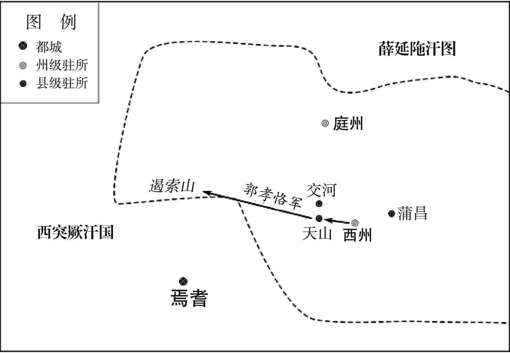 
郭孝恪击退西突厥示意图

## 【原文】

**初，高昌既平，岁发兵千余人戍守其地，褚遂良上疏，以为：“圣王为治，先华夏而后夷狄[1]。陛下兴兵取高昌，数郡萧然，累年不复[2]。岁调千余人屯戍，远去乡里，破产办装[3]。又谪徙罪人，皆无赖子弟，适足骚扰边鄙，岂能有益行陈[4]。所遣多复逃亡，徒烦追捕[5]。加以道途所经，沙碛千里，冬风如割，夏风如焚，行人往来，遇之多死[6]。设使张掖、酒泉有烽燧之警，陛下岂得高昌一夫斗粟之用，终当发陇右诸州兵食以赴之耳[7]。然则河西者，中国之心腹，高昌者，他人之手足，奈何糜弊本根以事无用之土乎[8]！且陛下得突厥、吐谷浑，皆不有其地，为之立君长以抚之，高昌独不得与为此乎[9]？叛而执之，服而封之，刑莫威焉，德莫厚焉[10]。愿更择高昌子弟可立者，使君其国，子子孙孙，负荷大恩，永为唐室藩辅，内安外宁，不亦善乎[11]？”上不听[12]。及西突厥入寇，上悔之曰：“魏徵、褚遂良劝我复立高昌，吾不用其言，今方自咎耳[13]。”**

## 【注文】

[1]戍守：驻守、守卫。　　高昌：维吾尔语称亦都护城，即“王城”之意，曾是高昌王国的都城，位于吐鲁番市东面，古时西域交通枢纽，地当天山南路的北道沿线，为东西交通往来的要冲，亦为古代新疆政治、经济、文化的中心地之一。

[2]萧然：空寂，萧条。

[3]屯戍：屯田戍守。

[4]谪（zhé）：降职并外放。　　行陈：巡行军阵。陈，通“阵”。

[5]徒：徒然，枉然。

[6]焚：烧。

[7]张掖（yè）：古郡治名。即今甘肃张掖，唐初甘州治所。　　酒泉：古县名，县治在今甘肃酒泉。　　烽燧（suì）：烽火。古代边防报警的两种信号。烽指夜间烽火台上的燃火，燧指白昼烽火台上的积薪燃烧时的浓烟。　　斗：容量单位。也做量词。十升等于一斗,十斗等于一石。　　粟（sù）：一年生草本植物，子实为圆形或椭圆小粒，北方通称“谷子”，去皮后称“小米”，泛指粮食。　　陇右：古人以西为右，故称陇山以西为陇右。古时也称陇西。约今甘肃陇山、六盘山以西，黄河以东一带。

[8]河西：古地区名。指今甘、青二省黄河以西地区，即河西走廊和湟水流域一带。　　糜（mí）：消耗,通“靡”。　　弊：通“敝”。破旧，破损。

[9]吐谷（yù）浑：亦称吐浑，中国古代西北民族及其所建国名。本为辽东鲜卑慕容部的一支。西晋末，首领吐谷浑率部西迁到枹罕。后扩展，鼎盛时统治了东起甘南，西领若羌、且末，南至青海南，北抵祁连山脉的广阔地区，建立国家。至其孙叶延，始以祖名为族名、国号。

[10]威：威严。

[11]君：动词，作为君主。

[12]听：听从。

[13]咎（jiù）：责备，追究罪过。

## 【译文】

起初，平定高昌以后，每年要发兵一千多人戍守那个地方，褚遂良上疏，认为：“英明的君主治理国家，应先中原而后夷狄。陛下派兵攻取高昌，造成当地多郡萧条，多年不能恢复。每年征发一千多人驻扎戍守，远离乡土，被征发的人破产才能置办行装。又把有罪的人贬谪发配到那里，这些人都是无赖子弟，正好骚扰边境，怎么能有益于军队。派去的多数又都逃跑，只是增加了追捕他们的麻烦。又加上路途所经过的地区，沙漠千里，冬天冷风割面，夏天热气焚蒸，往来的战士，遇上这种情况往往都难逃一死。假使张掖、酒泉有烽火报警，陛下哪里能得到高昌一个人的斗米粮食来用？最终还得征发陇右各州的兵马粮草去援助罢了。这样看来，河西这个地方，才是我大唐的心腹，而高昌不过是他人的手足，为什么要荒废根本而去照顾无用的土地呢？况且陛下得到突厥、吐谷浑，都没有占据他们的土地，只是为他们设立君长而后安抚，唯独高昌不得与他们相比吗？叛离我们的就捉住他，服从的就赐封官职，刑罚没有比这更威严的，恩德没有比这更优厚的了。希望陛下另外选择高昌子弟中可立为可汗的人，使他成为高昌的君主，他们的子子孙孙，蒙受陛下的大恩大德，永远作为唐朝的屏障，内外都得到安宁，这不是很好的事吗？”太宗没有听从这个意见。等到西突厥进犯，太宗后悔说：“魏徵、褚遂良劝我重新立高昌的君长，我没有采纳他们的建议，现在才知道我是咎由自取。”

## 【原文】

**乙毗咄陆西击康居，道过米国，破之[1]。虏获甚多，不分与其下，其将泥孰啜辄夺取之，乙毗咄陆怒，斩泥孰啜以徇，众皆愤怨[2]。泥孰啜部将胡禄屋袭击之，乙毗咄陆众散走，保白水胡城[3]。于是弩失毕诸部及乙毗咄陆所部屋利啜等遣使诣阙，请废乙毗咄陆，更立可汗[4]。上遣使赍玺书，立莫贺咄之子为乙毗射匮可汗[5]。乙毗射匮既立，悉礼遣乙毗咄陆所留唐使者，帅诸部击乙毗咄陆于白水胡城[6]。乙毗咄陆出兵击之，乙毗射匮大败[7]。乙毗咄陆遣使招其故部落，故部落皆曰：“使我千人战死，一人独存，亦不汝从[8]。”乙毗咄陆自知不为众所附，乃西奔吐火罗[9]。**

## 【注文】

[1]康居：西域古国。其地约在今巴尔喀什湖与咸海之间。　　米国：西域古国名。在今乌兹别克斯坦撒马尔罕以东。

[2]辄（zhé）：专擅,独断专行,专权。　　泥孰啜（chuò）（生卒年不详）：西突厥阿悉结部酋长。　　徇（xùn）：对众宣示。

[3]胡禄屋（生卒年不详）：西突厥五咄陆胡禄屋部酋长。　　白水胡城：在今哈萨克斯坦奇姆肯特东。

[4]弩失毕：即居碎叶（今楚河）以西的西突厥十姓中五个弩失毕部落。

[5]莫贺咄：即杀统叶护可汗自立的莫贺咄侯屈利俟毗可汗，公元628年至公元630年在位。　　乙毗射匮可汗：西突厥可汗，公元642年至公元651年在位，阿史那泥孰之侄孙。公元642年，乙毗咄陆可汗发兵入侵唐朝伊州（今新疆哈密），被安西都护郭孝恪击败，西突厥属部处密降唐。弩失毕及乙毗咄陆所部屋利啜等派代表至长安，请唐朝废黜乙毗咄陆，另立西突厥可汗。唐太宗遣使册立乙毗射匮可汗。

[6]礼：按照礼节。

[7]击：打击。

[8]汝从：服从你。

[9]附：归附。

## 【译文】

乙毗咄陆向西进攻康居，路经米国，也打败了这个国家。掳掠了很多人财物资，却不分给部下，他的部将泥孰啜于是抢夺来使用，乙毗咄陆大怒，把泥孰啜斩首示众，部众都愤怒怨恨他。泥孰啜部将胡禄屋袭击他，乙毗咄陆的部众纷纷离散逃走，退守在白水胡城。于是弩失毕各部和乙毗咄陆部落的屋利啜等派使者到京城，请求废弃乙毗咄陆，另立可汗。唐太宗派遣使者带着玺书，立莫贺咄的儿子为乙毗射匮可汗。乙毗射匮被立为可汗后，按照礼节全部遣送回被乙毗咄陆所扣留的唐朝使者，并亲自率领各部落出击在白水胡城的乙毗咄陆。乙毗咄陆出兵迎击，把乙毗射匮打得大败。乙毗咄陆派人招集他原有的部落，可他们都说：“就是我们有千人战死，只剩下一个人，也不会服从你。”乙毗咄陆知道自己不被部众所信服，便向西逃奔到吐火罗。

## 【原文】

**二十年夏六月丁卯，西突厥乙毗射匮可汗遣使入贡，且请昏。上许之，且使割龟兹、于阗、疏勒、朱俱波、葱岭五国以为聘礼[1]。**

## 【注文】

[1]龟（qiū）兹（cí）：西域古国名，唐代安西四镇之一。又称丘慈、邱兹、丘兹。龟兹国以库车绿洲为中心。在极长的历史时期内，是丝绸之路新疆段塔克拉玛干沙漠北道的重镇，宗教、文化、经济等极为发达，此外尚有冶铁业，名闻遐迩，西域许多国家的铁器多仰给于龟兹。　　于阗（tián）：西域古王国名。即今新疆和田县。　　朱俱波：古西域国名，又名朱居槃，都今新疆叶城。　　葱岭：帕米尔高原，中国古代称葱岭。　　聘礼：订婚之礼，也指订婚时所备的财礼。

## 【译文】

唐太宗贞观二十年（646年）夏六月丁卯（初七日），西突厥乙毗射匮可汗派遣使者入朝进贡，并且求婚。太宗答应了他的请求，并且让西突厥割让龟兹、于阗、疏勒、朱俱波、葱岭五国作为聘礼。

## 【原文】

**二十二年[1]。初，西突厥乙毗咄陆可汗以阿史那贺鲁为叶护，居多逻斯水，在西州北千五百里，统处月、处密、始苏、歌逻禄、失毕五姓之众[2]。乙毗咄陆奔吐火罗，乙毗射匮可汗遣兵迫逐之，部落亡散[3]。夏四月乙亥，贺鲁帅其余众数千帐内属，诏处之于庭州莫贺城，拜左骁卫将军[4]。贺鲁闻唐兵讨龟兹，请为乡导，仍从数十骑入朝[5]。上以为昆丘道行军总管，厚宴赐而遣之[6]。**

## 【注文】

[1]二十二年：唐太宗贞观二十二年，公元648年。

[2]阿史那贺鲁（？—659年）：西突厥可汗，初为叶护，属咄陆可汗。咄陆败走，贺鲁遂率部落内属，授瑶池都督。唐高宗永徽年间率众叛遁，据咄陆可汗之地，占有西域诸部，建牙帐于双河及千泉，自号沙钵罗可汗。数侵扰西蕃诸部。唐高宗显庆中与苏定方战，失败奔走石国被执，献俘京师，诏免死，后卒。　　多逻（luó）斯水：又作“多逻斯川”“都罗斯河”“曳嘎河”，今新疆额尔齐斯河。　　西州：唐太宗贞观十四年（640年）灭麹（qǔ）氏高昌始置，为安西都护府治。治所在高昌（今新疆吐鲁番东南）。唐代宗宝应元年（762年）改高昌县为前庭县，为西州治。辖境相当于今新疆吐鲁番盆地一带。唐德宗贞元七年（791年）后属吐蕃。　　处月：西突厥别部。本居金娑岭之阳，临大碛。后分成两支，西支徙碎叶水西，东支留故地，唐德宗贞元年间徙甘、灵二州。　　处密、始苏、歌逻禄、失毕：西突厥部落。始苏，两《唐书》作“姑苏”；歌逻禄，又作“葛逻禄”，唐时居于今新疆准噶尔盆地；失毕，即“弩失毕”的略称。

[3]迫：硬逼，逼迫。　　逐：追赶。

[4]庭州：唐太宗贞观十四年（640年）置，治所在金满县，今新疆吉木萨尔北二十五破城子。武则天长安二年（702年）改置北庭都护府。　　莫贺城：古城名，故址在今新疆阜康东，唐太宗贞观二十三年（649年）在此置瑶池都督府，不久又改置沙钵镇。

[5]乡导：向导，带路的人。乡，通“向”。

[6]昆丘：即昆仑山。

## 【译文】

唐太宗贞观二十二年（648年）。起初，西突厥乙毗咄陆可汗以阿史那贺鲁为叶护，居住在多逻斯水，在西州北一千五百里，统辖处月、处密、始苏、歌逻禄、失毕五姓的部众。乙毗咄陆逃奔吐火罗，乙毗射匮可汗派兵追赶，部落逃亡离散。夏四月乙亥（二十五日），贺鲁率领他的残余部众数千帐内属，唐太宗下诏让他们居住在庭州的莫贺城，封贺鲁为左骁卫将军。贺鲁听说唐兵讨伐龟兹，请求作为向导，于是率领数十骑入朝。唐太宗任命他为昆丘道行军总管，设宴招待又给予丰厚的赏赐，而后派他前往。

## 【原文】

**冬十二月戊寅，以昆丘道行军总管、左骁卫将军阿史那贺鲁为泥伏沙钵罗叶护，赐以鼓纛，使招讨西突厥之未服者[1]。**

## 【注文】

[1]泥伏沙钵罗叶护：即阿史那贺鲁。

## 【译文】

唐太宗贞观二十二年（648年）冬十二月戊寅（初二日），唐任命昆丘道行军总管、左骁卫将军阿史那贺鲁为泥伏沙钵罗叶护，赐给他鼓和大旗，让他招抚和讨伐西突厥还没有臣服的部落。

## 【原文】

**二十三年春二月丙戌，置瑶池都督府，隶安西都护，戊子，以左卫将军阿史那贺鲁为瑶池都督[1]。**

## 【注文】

[1]瑶（yáo）池都督府：唐羁縻州名，治所在今中亚巴尔喀什湖一带。　　安西都护：即安西都护府，唐六都护府之一。唐太宗贞观十四年（640年）置，治所在西州（今新疆吐鲁番东南）。二十二年（648年）徙治龟兹（今新疆库车东）。

## 【译文】

唐太宗贞观二十三年（649年）春二月丙戌（十一日），设置瑶池都督府，隶属于安西都护，戊子（十三日），任命左卫将军阿史那贺鲁为瑶池都督。

## 【原文】

**高宗永徽二年[1]。左骁卫将军、瑶池都督阿史那贺鲁招集离散，庐帐渐盛，闻太宗崩，谋袭取西、庭二州[2]。庭州刺史骆弘义知其谋，表言之，上遣通事舍人桥宝明驰往慰抚[3]。宝明说贺鲁，令长子咥运入宿卫，授右骁卫中郎将，寻复遣归[4]。咥运乃说其父拥众西走，击破乙毗射匮可汗，并其众，建牙于双河及千泉，自号沙钵罗可汗，咄陆五啜、弩失毕五俟斤皆归之，胜兵数十万，与乙毗咄陆可汗连兵，处月、处密及西域诸国多附之[5]。以咥运为莫贺咄叶护[6]。**

## 【注文】

[1]永徽：唐高宗李治的年号，共六年，从永徽元年（650年）正月至永徽六年（655年）十二月。

[2]庐帐：帐篷。　　崩：君主时代称帝王死。　　西：即西州，治今新疆吐鲁番东南。　　庭：即庭州，治今新疆吉木萨尔北破城子。

[3]骆弘义（生卒年不详）：唐初庭州刺史。　　通事舍人：古代官名，唐制，通事舍人隶中书省，选拔能通识文字，能宣赞的人来担任，掌殿庭传宣赞谒。　　桥宝明（生卒年不详）：唐初通事舍人。

[4]咥运（生卒年不详）：唐初突厥酋长阿史那贺鲁的长子。

[5]乙毗射匮可汗：西突厥弩失毕部请唐册立为可汗，公元642至651年在位。　　双河及千泉：西突厥牙帐所在地。双河在今新疆博尔塔拉河流域。千泉在今吉尔吉斯斯坦北部吉尔吉斯山北，库腊加特河上游。　　咄（duō）陆五啜（chuò）、弩失毕五俟斤：即西突厥五咄陆部和五弩失毕部的十大首领官称。“努”，他书均作“弩”。　　乙毗（pí）咄（duō）陆可汗（生卒年不详）：西突厥东部可汗，名欲谷设。

[6]莫贺咄叶护：即咥运。

## 【译文】

唐高宗永徽二年（651年）。左骁卫将军、瑶池都督阿史那贺鲁招集离散的部众，拥有的穹庐和军帐越来越多。他听说唐太宗去世后，谋划偷袭夺取西、庭两个州。庭州刺史骆弘义知道他的阴谋，上表告知高宗，高宗派遣通事舍人桥宝明急速前去安抚和慰劳。桥宝明劝说贺鲁，让他长子咥运入朝当宿卫官，授官为右骁卫中郎将，不久又遣送咥运回去。咥运于是劝说他父亲率领部众向西去，打败乙毗射匮可汗，兼并他的部众，在双河和千泉建立牙帐，自称沙钵罗可汗，乙毗咄陆的五啜、弩失毕的五俟斤都归附了他，拥有强兵数十万，和乙毗咄陆可汗军队联合，处月、处密和西域各国多依附于他。高宗封咥运为莫贺咄叶护。

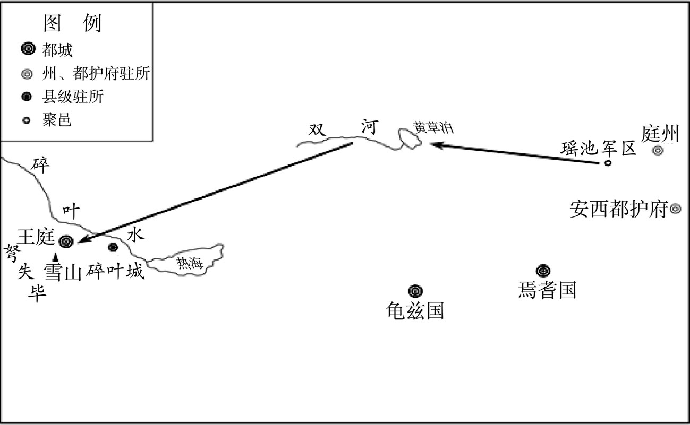 
阿史那贺鲁兼并西部示意图

## 【原文】

**焉耆王婆伽利卒，国人表请复立故王突骑支[1]。夏四月，诏加突骑支右武卫将军，遣还国[2]。**

## 【注文】

[1]婆伽利（生卒年不详）：唐初焉耆（qí）的首领。　　突骑支：龙姓，公元7世纪西域焉耆国王。

[2]加：增加。

## 【译文】

焉耆王婆伽利去世，国人上表请求再立原来的王突骑支。夏四月，高宗下诏加封突骑支右武卫将军之职，派他回国。

## 【原文】

**秋七月，西突厥沙钵罗可汗寇庭州，攻陷金岭城及蒲类县，杀略数千人[1]。诏左武候大将军梁建方、右骁卫大将军契苾何力为弓月道行军总管，右骁卫将军高德逸、右武候将军薛孤、吴仁为副，发秦、成、岐、雍府兵三万人及回纥五万骑以讨之[2]。**

## 【注文】

[1]金岭城及蒲类县：金岭城在今新疆博格达山一带；蒲类县治约当今新疆奇台东南。

[2]梁建方（生卒年不详）：初唐勇将，活跃于唐高祖武德元年（618年）至唐高宗显庆四年（659年）间。在唐朝统一战争和对外战争中均立下汗马功劳，官至右武候将军（从三品）、右卫将军（从三品）、候卫大将军（正三品）、左武卫大将军（正三品）、弓月道总管（弓月道临时最高指挥官）。　　弓月道：弓月城（今新疆伊宁）一带的行军路线。　　高德逸（生卒年不详）：唐初朝廷大将。　　右武候：“候”，据《新唐书》卷二百一十五下，应作“卫”。　　薛孤、吴仁（生卒年皆不详）：唐初朝廷大将。　　秦：即秦州，治所在今甘肃天水。　　成：即成州，唐高祖武德元年（168年）改汉阳郡置，治所在上禄县，今甘肃成县西南。辖境相当于今甘肃礼县、西和、成县等地。　　岐：即岐州，今陕西凤翔南。　　雍（yōng）：即雍州，古九州之一。唐高祖武德年间治所在今陕西西安。

## 【译文】

唐高宗永徽二年（651年）秋七月，西突厥沙钵罗可汗侵犯庭州，攻陷金岭城及蒲类县，杀死大约几千人。唐高宗下诏任命左武候大将军梁建方、右骁卫大将军契苾何力为弓月道行军总管，右骁卫将军高德逸、右武候将军薛孤、吴仁为副总管，征发秦、成、岐、雍四州府兵三万人及回纥五万骑兵进行讨伐。

## 【原文】

**冬十二月壬子，处月朱邪孤注杀招抚使单道惠，与突厥贺鲁相结[1]。**

## 【注文】

[1]朱邪孤注（？—652年）：唐初西突厥处月部酋长。　　单道惠（？—651年）：唐初朝廷招抚使。

## 【译文】

冬十二月壬子（二十四日），处月朱邪孤注杀死招抚使单道惠，与突厥阿史那贺鲁联合。

## 【原文】

**三年春正月癸亥，梁建方、契苾何力等大破处月朱邪孤注于牢山[1]。孤注夜遁，建方使副总管高德逸轻骑追之，行五百余里，生擒孤注，斩首九千级。**

## 【注文】

[1]契苾何力（？—677年）：铁勒族契苾部人，契苾氏，唐朝名将。出身铁勒可汗世家，后率部归唐。在对吐谷浑的战争中，力俘吐谷浑王，以功尚宗室女。被反叛的部众绑架至薛延陁，唐太宗不惜以公主下嫁为条件换回契苾何力。后作为唐军前军指挥官参加了对高句丽的战争。唐太宗逝世后，契苾何力欲以身殉葬，为唐高宗所止。唐高宗显庆、龙朔年中，与苏定方等人屡征高句丽。后为辽东道大总管，作为李副手攻克平壤。死后，陪葬昭陵，谥号“毅”。　　牢山：亦名赌蒲，在今蒙古国杭爱山西南。

## 【译文】

唐高宗永徽三年（652年）春正月癸亥（初五日），梁建方、契苾何力等人在牢山大破处月朱邪孤注。朱邪孤注夜里逃走，梁建方派副总管高德逸率轻骑追赶，前行五百多里，活捉了朱邪孤注，斩杀九千人。

## 【原文】

**四年[1]。西突厥乙毗咄陆可汗卒，其子颉苾达度设号真珠叶护，始与沙钵罗可汗有隙，与五弩失毕共击沙钵罗，破之，斩首千余级[2]。**

## 【注文】

[1]四年：唐高宗永徽四年，公元653年。

[2]颉苾达度设（？—659年）：乙毗咄陆可汗之子，号真珠叶护。　　沙钵罗可汗（？—659年）：名阿史那贺鲁。曾任瑶池都督等职。唐高宗永徽初反叛，建牙帐于千泉（今吉尔吉斯斯坦北部吉尔吉斯山脉北麓，库腊加特河上游一带），自号可汗，拥兵数十万，控制西突厥全境。　　五弩失毕：由西突厥阿悉结等五姓部落组成。

## 【译文】

唐高宗永徽四年（653年）。西突厥乙毗咄陆可汗去世，他的儿子颉苾达度设号称真珠叶护，开始和沙钵罗可汗有隔阂，于是就和五弩失毕共同出击沙钵罗，大破沙钵罗，斩首一千多级。

## 【原文】

**五年闰四月丙子，以处月部置金满州[1]。**

## 【注文】

[1]金满州：即金满州都督府，唐高宗永徽五年（654年）以处月部置，属北庭都护府。治所在今新疆吉木萨尔境内。后废。

## 【译文】

唐高宗永徽五年（654年）闰四月丙子（初二日），在处月部设置金满州。

## 【原文】

**六年夏，（六）［五］月癸未，以左屯卫大将军程知节为葱山道行军大总管，以讨西突厥沙钵罗可汗[1]。**

## 【注文】

[1]程知节（589—665年）：字义贞，原名金，俗作咬金，后更名知节，济州东阿（今山东阳谷东北）人。唐朝开国名将，封卢国公，位列凌烟阁二十四功臣。唐玄宗开元年间，官拜左金吾大将军。　　葱山：即葱岭。北起南天山、西天山，往南绵亘，包括帕米尔高原、西昆仑山、喀喇昆仑山和兴都库什山。历代为中西交通要道。

## 【译文】

唐高宗永徽六年（655年）夏五月癸未（十四日），任命左屯卫大将军程知节为葱山道行军大总管，讨伐西突厥沙钵罗可汗。

## 【原文】

**西突厥颉苾达度设数遣使请兵讨沙钵罗可汗[1]。冬十一月甲戌，遣丰州都督元礼臣册拜颉苾达度设为可汗[2]。礼臣至碎叶城，沙钵罗发兵拒之，不得前[3]。颉苾达度设部落多为沙钵罗所并，余众寡弱，不为诸姓所附，礼臣竟不册拜而归[4]。**

## 【注文】

[1]颉苾达度设（？—659年）：乙毗咄陆可汗之子，号真珠叶护。

[2]丰州：唐渤海国置，属鸭渌。治所在安丰县（在今朝鲜惠山），辖境相当于今吉林抚松、安图、长白朝鲜自治县及朝鲜惠山一带，辽移治今吉林抚松县东北，金废。　　元礼臣（生卒年不详）：唐初丰州都督。

[3]碎叶城：唐代西北重镇之一。又名素叶城、索虏城、素叶水城。在今吉尔吉斯斯坦楚河南岸托克马克城附近。

[4]寡（guǎ）：少；缺少。　　册拜：以册书授官。

## 【译文】

西突厥颉苾达度设多次派使者请求唐朝出兵讨伐沙钵罗可汗。冬十一月甲戌（初八日），唐派遣丰州都督元礼臣册封颉苾达度设为可汗。元礼臣到达碎叶城，沙钵罗发兵抵抗，无法前进。颉苾达度设部落多半被沙钵罗兼并，剩下的部众很少而且弱小，其他各姓都不归附他，元礼臣终于没能授予他可汗称号就回来了。

## 【原文】

**显庆元年秋八月辛丑，葱山道行军总管程知节击西突厥，与歌逻禄、处月二部战于榆慕谷，大破之，斩首千余级[1]。副总管周智度攻突骑施、处木昆等部于咽城，拔之，斩首三万级[2]。**

## 【注文】

[1]显庆：唐高宗李治的年号，共五年余。从显庆元年（656年）正月至显庆六年（661年）二月。　　歌逻禄：古族名，又称“葛逻禄”，突厥族的一支。唐时居北庭西北，金山之阳（今新疆准噶尔盆地）。　　处月：古部落名。西突厥别部。本居金娑岭之阳，临大碛，后分成两支，留故地的东支臣于唐，后迁于甘、灵二州，西支与歌逻禄等构成哈剌汗朝。　　榆慕谷：亦作榆幕谷。在今新疆吉木萨尔北。

[2]周智度（生卒年不详）：唐初大将。　　突骑施：古族名，原屯碎叶城西北。唐玄宗开元四年（716年），首领苏禄称汗，唐封之为顺国公、金方道经略大使、忠顺可汗。开元二十六年（738年）苏禄被杀，后臣服于葛逻禄。　　处木昆：古部落名，原居碎叶川东，后徙居碎叶川西。　　咽城：据《新唐书》，咽城即处木昆所居。具体位置不详。

## 【译文】

唐高宗显庆元年（656年）秋八月辛丑（初九日），葱山道行军总管程知节攻打西突厥，和歌逻禄、处月二部落在榆慕谷交战，大破西突厥军，斩杀一千多人。副总管周智度进攻突骑施、处木昆等部，攻下咽城，斩首三万级。

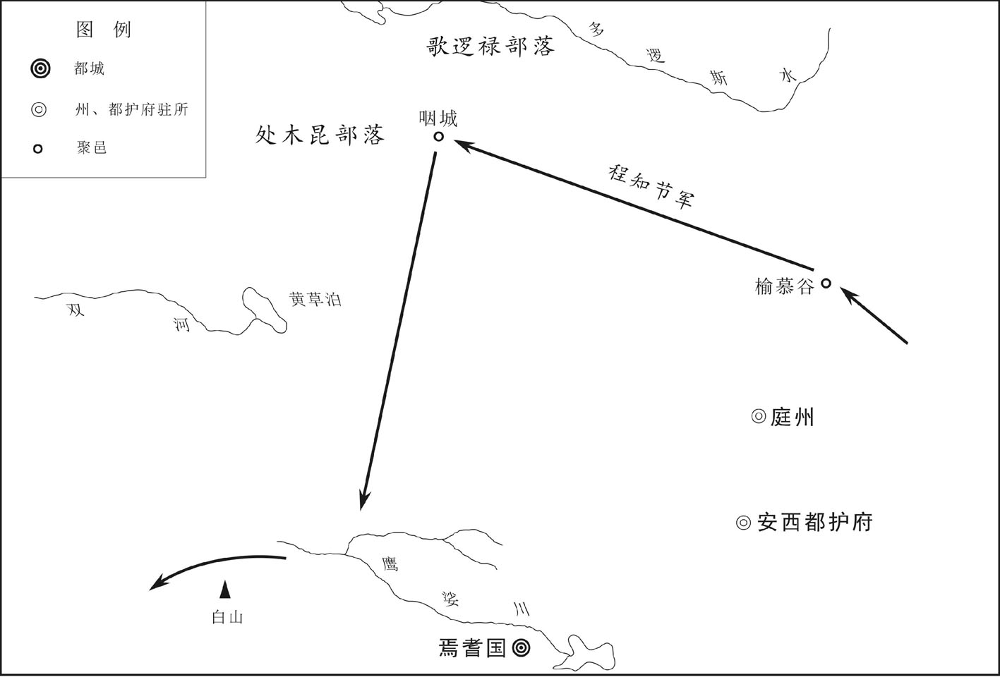 
程知节攻西突厥示意图

## 【原文】

**冬十二月，程知节引军至鹰娑川，遇西突厥二万骑，别部鼠尼施等二万余骑继至，前军总管苏定方帅五百骑驰往击之，西突厥大败，追奔二十里，杀获千五百余人，获马及器械绵亘山野，不可胜计[1]。副大总管王文度害其功，言于知节曰：“今兹虽云破贼，官军亦有死伤，乘危轻脱，乃成败之法耳，何急而为此[2]。自今常结方陈，置辎重在内，遇贼则战，此万全策也[3]。”又矫称别得旨，以知节恃勇轻敌，委文度为之节制，遂收军不许深入[4]。士卒终日跨马，被甲结阵，不胜疲顿，马多瘦死[5]。定方言于知节曰：“出师欲以讨贼，今乃自守，坐自困敝，若遇贼必败[6]。懦怯如此，何以立功[7]！且主上以公为大将，岂可更遣军副专其号令，事必不然[8]。请囚文度，飞表以闻[9]。”知节不从[10]。至恒笃城，有群胡归附，文度曰：“此属伺我旋师，还复为贼，不如尽杀之，取其资财[11]。”定方曰：“如此乃自为贼耳，何名伐叛[12]！”文度竟杀之，分其财，独定方不受[13]。师旋，文度坐矫诏当死，特除名[14]。知节亦坐逗遛追贼不及，减死免官[15]。**

## 【注文】

[1]鹰娑川：即今新疆焉耆西北小裕勒都斯河。　　鼠尼施：西突厥部落名称，游牧于今新疆裕勒都斯河一带。　　苏定方：（592—667年）：冀州武邑（今河北武邑）人，名烈。历任唐朝左武候中郎将、左卫中郎将、左骁卫大将军、左卫大将军之职，封邢国公，加食邢州、巨鹿三百户。深受唐太宗和唐高宗的赏识与信任，屡委以重任，是唐初的一员得力干将。　　绵亘（gèn）：连接；连续不绝。

[2]王文度（？—660年）：唐初名将，曾在唐太宗贞观十九年（645年），以水军行军副总管跟从程名振征高句丽，攻卑沙城有功。唐高宗永徽六年（655年），唐以程知节为葱山道行军大总管，王文度任副大总管，讨伐贺鲁，以矫诏及指挥不善获罪，应当诛杀，后除名为民。唐高宗显庆五年（660年），苏定方平百济，承命总兵留镇熊津，渡海，卒。　　害：妒忌。　　兹（zī）：这个，此。　　轻脱：轻佻。　　成败之法：导致失败的战术。

[3]方陈（zhèn）：方阵。“陈”同“阵”，战阵。　　辎（zī）重：军用物资。

[4]矫（jiǎo）：假托；诈称。　　节制：指挥，管辖。

[5]被（pī）甲：穿着甲胄。“被”通“披”。　　疲顿：疲乏劳累。

[6]困敝：困顿疲惫。

[7]懦（nuò）怯：软弱胆小。

[8]号令：发布的号召或命令。

[9]囚：拘禁、囚禁。

[10]从：听从。

[11]恒笃（dǔ）城：《册府元龟》卷四、五、六及《新唐书》有关传、纪，均作“怛笃城”。今哈萨克斯坦东南。　　旋：返回或归来。

[12]名：说。

[13]竟：终于。

[14]坐：定罪，由……而获罪。　　除名：除去名籍。

[15]逗遛（liú）：停留，暂时不继续前进。遛，通“留”。

## 【译文】

唐高宗显庆元年（656年）冬十二月，程知节领兵到鹰娑川，遭遇西突厥二万骑兵，西突厥另一部落鼠尼施等二万多骑兵也相继到达，唐前军总管苏定方率领五百骑兵冲入敌阵攻击，西突厥大败，追赶二十里，杀死和俘虏一千五百多人，缴获来的马和器械满山遍野，不可胜计。副大总管王文度嫉妒他的功劳，对程知节说：“今天虽说打败敌人，官军也有伤亡，处于危险的环境中而不稳重，这是将要失败的做法，怎么能在关键的时候这样做呢！从今以后，应经常摆成方阵，把辎重放在方阵内，遇着敌人就战，这才是万全之策。”他又假称另外接到圣旨，说因为程知节仗恃勇力而轻敌，委派王文度全面负责节制，于是收拢军队不许深入敌境。士卒们整天骑马披带盔甲结成方阵练习，疲劳难忍，很多马匹瘦弱而死。苏定方对程知节说：“出兵就是为了讨伐敌人，如今却自守不出，坐等自己疲弊，若是遇上敌人必然失败。懦弱胆小到如此地步，怎么能立功！况且皇上既任命你为大将，哪里可能另外又派副大总管发号施令，事情一定不是这样的。请求囚禁王文度，飞速上表报知皇上。”程知节没有同意。唐军到达恒笃城，有众多胡人归附，王文度说：“这些人等我们回师，一定会再成为贼人，不如杀了他们，夺取他们的资财。”苏定方说：“这样做就是自己当了贼人，还说什么讨伐反叛！”王文度终于杀了他们，分了他们的财物，唯独苏定方不肯接受。回师以后，王文度因假传圣旨应当处死，但只处以削除官爵。程知节也因为停留不前，没有追上敌人，减去死罪，免去官职。

## 【原文】

**二年春闰正月庚戌，以右屯卫将军苏定方为伊丽道行军总管，帅燕然都护渭南任雅相、副都护萧嗣业发回纥等兵，自北道讨西突厥沙钵罗可汗。嗣业，钜之子也[1]。初，右卫大将军阿史那弥射及族兄左屯卫大将军步真，皆西突厥首长，太宗之世，帅众来降，至是诏以弥射、步真为流沙安抚大使，自南道招集旧众[2]。**

## 【注文】

[1]行军总管：出征时的军队主帅。　　燕然：古山名，今蒙古国境内的杭爱山。　　渭南：古地名，今陕西渭南。　　任雅相（？—662年）：唐朝将官，在位时间不长，曾为浿（pèi）江道行军总管、燕然都护等。唐高宗显庆四年（659年），以兵部尚书同中书门下三品，封安乐县公，龙朔二年（662年）卒于军中。　　萧嗣业（生卒年不详）：梁明帝曾孙，唐朝将领。他少从隋炀帝，后随姑奶奶萧皇后入东突厥，唐太宗贞观九年（635年）归国。唐太宗以其知突厥的情况，下诏让他领突厥部众。任鸿胪卿，兼单于都护府长史。公元679年，单于都护府辖区内的突厥首领阿史德温傅、奉职二部落相继反叛唐朝，立阿史那泥孰匐为可汗，得到二十四州响应。高宗遣鸿胪卿萧嗣业、右千牛将军李景嘉率兵讨伐，被温傅打败，唐军兵士战死了一万余人。萧嗣业免除死罪，流放桂州。　　回纥：古代北方少数民族，由韦纥、仆固、同罗、拔野古等部联合而成，生活在鄂尔浑河和色楞格河流域。

[2]右卫大将军：古代官名。正三品，掌统领宫廷警卫。　　阿史那弥射（？—662年）：西突厥室点密五世孙，入唐后拜右监门卫大将军。　　步真：即阿史那步真。西突厥继往绝可汗，室点密可汗五世孙，莫贺咄叶护阿史那弥射的族兄。唐太宗贞观六年（632年），唐太宗册封弥射为奚利邲咄陆可汗，阿史那步真欲自立为可汗，遂谋杀弥射弟侄二十余人。贞观十三年（639年），阿史那弥射率所部处月、处密部落投靠唐朝，阿史那步真遂自立为咄陆叶护，但其部落多不服，步真无奈，也携家属投靠唐朝，授左屯卫大将军。唐高宗显庆二年（657年）闰正月二十一日，唐高宗发大兵，分南北两路讨伐西突厥，北路的主帅是苏定方，南路则由阿史那弥射和阿史那步真统领。西突厥汗国亡后，唐朝在当地设置了昆陵、濛池两个都护府，以阿史那步真为濛池都护、继往绝可汗兼右卫大将军，统辖弩失毕五部。公元662年，阿史那步真向安西都护苏海政诬告阿史那弥射谋反，弥射被杀。　　流沙：指西域地区。

## 【译文】

唐高宗显庆二年（657年）春闰正月庚戌（二十一日），唐任命右屯卫将军苏定方为伊丽道行军总管，率领燕然都护渭南人任雅相、副都护萧嗣业征发回纥等兵力，从北道讨伐西突厥沙钵罗可汗。萧嗣业是萧钜的儿子。当初，右卫大将军阿史那弥射和他族兄左屯卫大将军步真，都是西突厥的酋长，唐太宗在世的时候，率部众来投降，到此时，皇上下诏任命弥射、步真为流沙安抚大使，从南道招集原来的部众。

## 【原文】

**冬十二月，苏定方击西突厥沙钵罗可汗，至金山北，先击处木昆部，大破之，其俟斤懒独禄等帅万余帐来降，定方抚之，发其千骑与俱[1]。右领军郎将薛仁贵上言：“泥孰部素不伏贺鲁，为贺鲁所破，虏其妻子[2]。今唐兵有破贺鲁诸部得泥孰妻子者，宜归之，仍加赐赉，使彼明知贺鲁为贼而大唐为之父母，则人致其死，不遗力矣[3]。”上从之[4]。泥孰喜，请从军共击贺鲁[5]。**

## 【注文】

[1]金山：即阿尔泰山。　　俟斤：西突厥官号，意为首领。　　处木昆：古部落名，原居碎叶川东，后徙居碎叶川西。俱属五咄陆。　　懒独禄（生卒年不详）：唐初西突厥大将。

[2]薛仁贵（614—683年）：名礼，字仁贵，绛州龙门（今山西河津）人，唐代名将，著名军事家、政治家。随唐太宗李世民、唐高宗李治创造了“良策息干戈”“三箭定天山”“神勇收辽东”“仁政高丽国”“爱民象州城”“脱帽退万敌”等诸方面在军事、政治上的赫赫功勋。　　泥孰部：即阿悉结泥孰部。西突厥右厢五弩失毕之一。　　伏（fú）：通“服”。屈服,顺从。

[3]致：造成；导致。

[4]从：听从。

[5]从：随行，跟随。

## 【译文】

唐高宗显庆二年（657年）冬十二月，苏定方出击西突厥沙钵罗可汗，到达金山北面，先攻击处木昆部，把他们打得大败，他的俟斤懒独禄等人率万余帐来投降，苏定方对他们进行安抚，征发他们千余骑兵一同前进。右领军郎将薛仁贵上书说：“泥孰部平素就不服从贺鲁，被贺鲁打败，俘虏了他们的妻子儿女。如今唐兵中，凡有在攻破贺鲁各部落时获得泥孰人妻子儿女的，应该归还他们，并给予赏赐，使他们知道贺鲁是贼人，而大唐是他们的父母，这样即使让他们去牺牲，他们也会不遗余力。”唐高宗采纳了这个意见。泥孰部很高兴，请求随唐军共同攻打阿史那贺鲁。

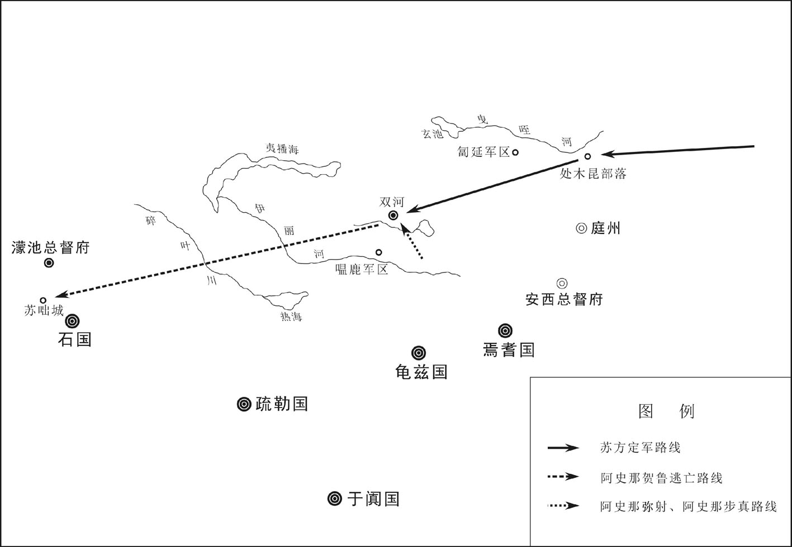 
苏定方灭西突厥示意图

## 【原文】

**定方至曳咥河西，沙钵罗帅十姓兵且十万，来拒战[1]。定方将唐兵及回纥万余人击之[2]。沙钵罗轻定方兵少，直进围之[3]。定方令步兵据南原，攒矟外向，自将骑兵陈于北原[4]。沙钵罗先攻步军，三冲不动，定方引骑兵击之，沙钵罗大败，追奔三十里，斩获数万人[5]。明日，勒兵复进[6]。于是胡禄屋等五弩失毕悉众来降，沙钵罗独与处木昆屈律啜数百骑西走[7]。时阿史那步真出南道，五咄陆部落闻沙钵罗败，皆诣步真降[8]。定方乃命萧嗣业、回纥婆闰将胡兵趋邪罗斯川，追沙钵罗，定方与任雅相将新附之众继之[9]。会大雪，平地二尺，军中咸请俟晴而行[10]。定方曰：“虏恃雪深，谓我不能进，必休息士马[11]。亟追之可及，若缓之，彼遁逃浸远，不可复追[12]。省日兼功，在此时矣[13]。”乃蹋雪昼夜兼行[14]。所过收其部众，至双河与弥射、步真兵合，去沙钵罗所居二百里，布陈长驱，径至其牙帐[15]。沙钵罗与其徒将猎，定方掩其不备，纵兵击之，斩获数万人，得其鼓纛[16]。沙钵罗与其子咥运、婿阎啜等脱走，趣石国[17]。定方于是息兵，诸部各归所居，通道路，置邮驿，掩骸骨，问疾苦，画疆场，复生业，凡为沙钵罗所掠者，悉括还之，十姓安堵如故[18]。乃命萧嗣业将兵追沙钵罗，定方引军还[19]。**

## 【注文】

[1]曳（yè）咥（dié）河：一作多逻斯川，一说指今额尔齐斯河，一说指今玛纳斯河。　　十姓兵：即五咄陆及五弩失毕之兵。五咄陆指处木昆律、胡禄屋阙、摄舍提暾、突骑施贺逻施、鼠尼施处半。五弩失毕指阿悉结阙、哥舒阙、拔塞干暾沙钵、阿悉结尼孰、哥舒处半。

[2]击：打击。

[3]进：前进。

[4]攒（zǎn）：簇拥；围聚；聚集。

[5]冲：冲锋。

[6]勒：部署部队。

[7]胡禄屋等五弩失毕悉众来降：胡禄屋系五咄陆之一，非弩失毕。五弩失毕当为五咄陆。　　屈律啜（生卒年不详）：唐初西突厥将领。

[8]五咄陆部落闻沙钵罗败：五咄陆当为五弩失毕之误。五弩失毕分布在今中亚楚河、锡尔河流域，位于五咄陆西南。　　诣（yì）：前往,去到。

[9]婆闰（生卒年不详）：父亲是吐迷度，是第一位归附唐朝的回纥可汗，唐朝拜其为怀化大将军、瀚海都督。公元648年，吐迷度被侄子乌纥杀害。乌纥企图率众叛唐投奔突厥车鼻可汗，唐燕然副都护元礼臣及时发现和平定了这场叛乱。之后，唐朝政府任命吐迷度之子婆闰为左骁卫大将军、大俟利发，瀚海都督。　　邪罗斯川：古河名，在今伊犁河西。

[10]俟（sì）：等待。

[11]休息：暂停活动，以恢复精神体力。

[12]亟（jí）：快速；迅速。

[13]兼：表示另一方面,可译为“还”“同时”“再加上”之类。

[14]昼夜兼行：兼，加倍。白天黑夜不停地行走。形容急速赶路。亦作“昼夜兼程”。

[15]双河：即今新疆博乐市西部的博尔塔拉河与精河。　　驱：奔驰；疾行。　　径：径直；直接。　　牙帐：首府。贺鲁牙帐在金牙山。

[16]徒：步兵,兵卒（周代盛行车战,车上的兵称“甲士”,车后跟着步行的兵叫“徒”）。　　掩其不备：掩：掩袭。备：防备。趁敌人毫无防备时进行突然袭击。亦作“掩其无备”。　　鼓纛（dào）：战鼓和帅旗。

[17]阎啜（生卒年不详）：唐初西突厥沙钵罗可汗的女婿，西突厥将领。　　趣：通“趋”。趋向；奔向。　　石国：西域国名，位于今乌兹别克斯坦首府塔什干一带。

[18]邮驿（yì）：驿馆。驿，古代供传递公文或传送消息用的马。　　安堵如故：像原来一样相安无事。堵，墙壁，居所。故，原来的。

[19]还：返回。

## 【译文】

苏定方到曳咥河以西，沙钵罗率领十姓的兵将近十万来抵抗。苏定方率领唐兵及回纥兵一万多人出击。沙钵罗轻视苏定方兵少，直接前进来把他包围。苏定方命令步兵占据南边平原，集中长矛向外，自己率领骑兵列阵于北边原野。沙钵罗先向步兵进攻，冲锋三次都没有冲入，苏定方率领骑兵攻击他们，沙钵罗大败，追赶了三十里，斩杀和俘获数万人。第二天，苏定方部署部队继续前进。于是胡禄屋等五弩失毕带领全部人马来投降唐军，沙钵罗独自与处木昆屈律啜的几百骑兵向西逃走。当时阿史那步真从南道进兵，五咄陆部落听说沙钵罗战败，都向阿史那步真投降。苏定方于是命令萧嗣业、回纥婆闰率领胡兵向邪罗斯川进发，追赶沙钵罗，苏定方和任雅相率领新归附的部众作为后继。当时正遇上天下大雪，平地有积雪二尺深，军中将士都请求等天晴后再行军。苏定方说：“敌人依仗雪深，认为我们不能前进，必定休息士卒和马匹。我们若急速追赶就可以追上，如果稍微缓慢，他们逃跑渐渐远了，就可能追不上。我们抓紧时间，可以取得大的成功，就看这次行动了。”于是踏雪昼夜兼程行进。所经过的地方收容沙钵罗的部众，来到双河，弥射和步真的兵合在一起，离沙钵罗的驻地二百里，摆开阵势长驱直进，径直到他的牙帐前。沙钵罗和他的士卒正准备出去打猎，苏定方乘其不备，纵兵出击，斩杀俘获数万人，缴获他的战鼓和大旗。沙钵罗和他儿子咥运、女婿阎啜等人脱身逃走，投奔石国。苏定方于是休息部队，让各部落都返回到住所，修通道路，设置邮亭驿站，掩埋死人的骸骨，慰问疾苦，划定疆界，恢复生产，凡是被沙钵罗掠夺的人，全都搜寻送还，西突厥十姓部众安居如旧。苏定方于是命萧嗣业率领兵士追赶沙钵罗，自己领兵返还。

## 【原文】

**沙钵罗至石国西北苏咄城，人马饥乏，遣人赍珍宝入城市马[1]。城主伊沮达官诈以酒食出迎，诱之入，闭门执之，送于石国[2]。萧嗣业至石国，石国人以沙钵罗授之[3]。**

## 【注文】

[1]赍（jī）：携；带。

[2]伊沮：两《唐书·西突厥传》作“伊涅”。唐初苏咄城的城主。　　诈（zhà）：假装。

[3]授：给予；交给。

## 【译文】

沙钵罗到达石国西北的苏咄城，人饥马乏，派人带着珍宝进城买马。城主伊沮达官假装带着酒和食品出城迎接，引诱他进城，然后关上城门把他捉住，送到石国。萧嗣业到达石国后，石国便把沙钵罗交给了他。

## 【原文】

**乙丑，分西突厥地置濛池、昆陵二都护府[1]。以阿史那弥射为左卫大将军、昆陵都护、兴昔亡可汗，押五咄陆部落；阿史那步真为右卫大将军、濛池都护，继往绝可汗，押五弩失毕部落[2]。遣光禄卿卢承庆持节册命，仍命弥射、步真与承庆据诸姓降者，准其部落大小，位望高下，授刺史以下官[3]。**

## 【注文】

[1]濛池、昆陵二都护府：濛池都护府，管辖今中亚楚河以西至咸海（一说里海）一带地区。昆陵都护符辖境约当今哈萨克斯坦巴尔喀什湖以东、新疆准噶尔盆地和伊犁河流域一带。濛池、昆陵二都护府均隶属于安西都护府。

[2]都护：古代官名，都护府最高长官，管理辖境以内的边防、行政及各族事务。　　兴昔亡可汗（生卒年不详）：唐帝国册封西突厥王室后裔的封号。公元657年，唐朝与西突厥战事告终，西突厥可汗阿史那贺鲁被俘，西突厥灭亡。公元658年，唐朝在西突厥故地设置羁縻都护府，仍依西突厥两厢分治的历史传统，以右厢五弩失毕部设置濛池都护府，以左厢五咄陆部落设置昆陵都护府；任命早已投降唐朝的原西突厥贵族、室点密可汗五世孙阿史那弥射为昆陵都护，赐爵名兴昔亡可汗，统辖五咄陆部。　　右卫大将军：古代官名。掌统领宫廷警卫等。　　继往绝可汗：即右卫大将军、濛池都护阿史那步真。

[3]光禄卿：古代官名，隋文帝开皇三年（583年）废光禄寺入司农，开皇十二年（592年）再置，仍设卿、少卿等官，专司皇室膳食，辖太官、肴藏、良酝、掌醢四署。唐沿隋制。唐高宗一度改光禄寺卿为司宰寺卿，武则天又一度改为司膳寺卿，后均复旧。历代沿置，清末废。　　卢承庆（595—670年）：字子馀，幽州范阳（今河北涿州）人，博学多才，唐初拜行台兵部郎中。　　刺史以下官：指州别驾、长史、司马、诸参军事及县令、丞、主簿等。

## 【译文】

唐高宗显庆二年（657年）十二月乙丑（十一日），唐在西突厥地分设濛池、昆陵两个都护府。任命阿史那弥射为左卫大将军、昆陵都护、兴昔亡可汗，统辖五咄陆部落；阿史那步真为右卫大将军、濛池都护，继往绝可汗，统辖五弩失毕部落。派遣光禄卿卢承庆带着符节前去册命，仍命令阿史那弥射、阿史那步真和卢承庆根据各姓投降的人，依据他们部落的大小，地位和威望的高低，授给刺史以下的官职。

## 【原文】

**三年[1]。阿史那贺鲁既被擒，谓萧嗣业曰：“我本亡虏，为先帝所存，先帝遇我厚而我负之，今日之败，天所怒也[2]。吾闻中国刑人必于市，愿刑我于昭陵之前，以谢先帝[3]。”上闻而怜之[4]。贺鲁至京师，冬十一月甲午，献于昭陵。敕免其死，分其种落为六都督府，其所役属诸国皆置州府，西尽波斯，并隶安西都护府[5]。贺鲁寻死，葬于颉利墓侧[6]。**

## 【注文】

[1] 三年：唐高宗显庆三年，公元658年。

[2]先帝：指唐太宗。

[3]昭陵：唐太宗与文德皇后合葬墓，在今陕西礼泉东北二十公里的九峻山上，是唐“关中十八陵”中规模最大的一座。

[4]怜：哀怜。

[5]分其种落为六都督府：以处木昆部置匐延都督府，治所在今新疆和布克赛尔蒙古自治县一带；以突骑施索葛莫贺部置咀鹿都督府，在今新疆伊宁西；以胡禄屋阙部置盐泊都督府，在今新疆克拉玛依市附近；以摄舍提暾部置双河都督府，在今新疆博乐塔拉河一带；以鼠尼施处半部置鹰娑都督府，在今开都河上游；以突骑施阿利施部置洁山都督府，在今哈萨克斯坦阿拉木图一带。　　波斯：古国名，今伊朗。　　安西都护府：唐朝管理碛西的一个军政机构，其统辖安西四镇，最大管辖范围曾一度完全包括天山南北，并至葱岭以西到波斯，在武周时代北庭都护府分立之后，安西都护府分管天山以南的西域地区。

[6]寻：旋；不久。　　颉利：突厥可汗，唐初屡犯边，后为李靖所俘。

## 【译文】

唐高宗显庆三年（658年）。阿史那贺鲁被捉住后，对萧嗣业说：“我本是亡国的夷族，被先帝收留，先帝待我宽厚而我却辜负了他，今天被打败，是苍天愤怒啊。我听说中原杀人都在市上，我希望能在昭陵前受死，以向先帝谢罪。”高宗听说后怜悯他。阿史那贺鲁到了京城，冬十一月甲午（十五日），把他献于昭陵。高宗下令赦免了他的死罪，把他的种族部落分为六个都督府，被他役属的各国也都设置州府，西边一直到波斯，都隶属于安西都护府。阿史那贺鲁不久就死了，埋葬在颉利的墓旁。

## 【原文】

**四年春三月壬午，西突厥兴昔亡可汗与其真珠［叶］护（叶）战于双河，斩真珠［叶］护（叶）[1]。**

## 【注文】

[1]真珠叶护（？—659年）：西突厥乙毗咄陆可汗之子，名颉苾达度设。　　双河：今新疆境内，精河和博尔塔拉河。　　斩：古代死刑的一种。斩首或腰斩；杀。

## 【译文】

唐高宗显庆四年（659年）春三月壬午（初五日），西突厥兴昔亡可汗和真珠叶护在双河交战，杀了真珠叶护。

## 【原文】

**龙朔二年冬十二月，海道总管苏海政受诏讨龟兹，敕兴昔亡、继往绝二可汗发兵与之俱[1]。至兴昔亡之境，继往绝素与兴昔亡有怨，密谓海政曰：“弥射谋反，请诛之[2]。”时海政兵才数千，集军吏谋曰：“弥射若反，我辈无噍类，不如先事诛之[3]。”乃矫称敕令大总管赍帛数万段赐可汗及诸酋长，兴昔亡帅其徒受赐，海政悉收斩之[4]。其鼠尼施、拔塞干两部亡走，海政与继往绝追讨，平之[5]。军还，至疏勒南，弓月部复引吐蕃之众来，欲与唐兵战，海政以师老不敢战，以军资赂吐蕃，约和而还[6]。由是诸部落皆以与兴昔亡为冤，各有离心[7]。继往绝寻卒，十姓无主，有阿史那都支及李遮匐收其余众，附于吐蕃[8]。**

## 【注文】

[1]（yù）海道：行军路线。　　苏海政（生卒年不详）：唐初高宗时大将。　　兴昔亡可汗：指左卫大将军、昆陵都护阿史那弥射。　　继往绝可汗：即右卫大将军、濛池都护阿史那步真。

[2]兴昔亡之境：昆陵都护府辖区。　　继往绝素与兴昔亡有怨：据《新唐书·突厥传》，阿史那步真在归唐以前曾谋杀阿史那弥射。

[3]噍（jiào）类：在此指能够活着的人。

[4]赐：赏赐。

[5]鼠尼施：西突厥部落名称，游牧在今新疆裕勒都斯河一带。　　拔塞干：西突厥右厢五弩失毕部落之一。系继往绝可汗部众，而非兴昔亡可汗所统。唐时游牧于今中亚楚河流域或其以西地区。唐灭西突厥之后,其地属濛池都护府。

[6]疏勒：古地名，今新疆疏勒。　　弓月：一般认为是西突厥别部，约在今新疆霍城之西。　　吐蕃（bō）：公元7—9世纪时藏族建立的政权，是一个位于青藏高原的古代王国，由松赞干布到达磨延续两百多年，是西藏历史上创立的第一个政权。　　师老：师旅疲惫。

[7]冤（yuān）：枉曲，冤屈。

[8]十姓无主：西突厥五咄陆和五弩失毕分别由兴昔亡、继往绝可汗统领。兴昔亡既为苏海政所杀，继往绝又死，故有这样的说法。　　阿史那都支（？—679年）：西突厥人。曾被唐拜为左骁卫大将军兼匐延都督。后自称十姓可汗，与吐蕃叛乱。　　李遮匐（fú）：西突厥十姓可汗阿史那都支的别帅。本是一部酋长，唐高宗调露元年（679年），他和都支与吐蕃联合，攻打安西都护府。唐高宗诏命吏部侍郎裴行俭讨伐。裴行俭遂献计要智擒。裴行俭在西州（今新疆吐鲁番），找安西四镇的国王去打猎，阿史那都支没有怀疑，率子弟谒见。裴行俭遂擒都支，然后挑选精锐骑兵，轻装前进，突袭李遮匐。途中，俘获阿史那都支从李遮匐处返回的使者以及与他同行的李遮匐的使者。裴行俭释放李遮匐的使者，让他先去通知李遮匐，说阿史那都支已经就擒，李遮匐也只好投降。裴行俭拘押阿史那都支和李遮匐回长安，留王方翼于安西修筑碎叶城。

## 【译文】

唐高宗龙朔二年（662年）冬十二月，海道总管苏海政受高宗诏命讨伐龟兹。唐高宗又命令兴昔亡、继往绝二可汗发兵与苏海政一起出征。唐军到达兴昔亡可汗境内，继往绝可汗平素一直和兴昔亡可汗有怨仇，于是秘密对苏海政说：“阿史那弥射要谋反，请杀了他。”当时苏海政只有数千人，召集军中官吏商议说：“阿史那弥射如果造反，我们谁也活不成，不如先杀了他。”于是假称皇帝命令，让大总管带布帛数万段赐给可汗和各位酋长们，兴昔亡便率领他的部下来受赏，苏海政全部捉拿他们并斩首。其中鼠尼施、拔塞干两部落逃跑，苏海政和继往绝可汗追击，平定了他们。唐军返还途中到疏勒南边，弓月部又领着吐蕃兵前来，想要和唐兵交战，苏海政因为军队已经疲劳不敢和他交战，便以军中物资贿赂吐蕃军，约定讲和而回。从此各部落都认为兴昔亡是冤枉的，各有了叛离之心。继往绝可汗不久死去，西突厥十姓无主，由阿史那都支和李遮匐收集他们余众，依附于吐蕃。

## 【原文】

**咸亨二年夏四月甲申，以西突厥阿史那都支为左骁卫大将军兼匐延都督，以安集五咄陆之众[1]。**

## 【注文】

[1]咸亨（hēng）：唐高宗李治的年号，共四年余，从咸亨元年（670年）三月至咸亨五年（674年）八月。　　阿史那都支：西突厥部落酋长，曾被唐拜为左骁卫大将军兼匐延都督。后自称十姓可汗。　　匐（fú）延都督：唐高宗显庆二年（657年）以西突厥处木昆部置，治所在今新疆维吾尔自治区和布克赛尔蒙古自治县一带。匐延都督为匐延都督府最高长官。　　安集五咄陆之众：五咄陆即处木昆律、胡禄屋阙、摄舍提暾、突骑施贺罗施、鼠尼施处半。自唐高宗龙朔二年（662年）兴昔亡可汗阿史那弥射被杀后，五咄陆部落逐渐亡散。

## 【译文】

唐高宗咸亨二年（671年）夏四月甲申（十八日），任命西突厥阿史那都支为左骁卫大将军兼匐延都督，安抚召集五咄陆的部众。

## 【原文】

**四年冬十二月丙午，弓月、疏勒二王来降。西突厥兴昔亡可汗之世，诸部离散，弓月及阿悉吉皆叛[1]。苏定方之西讨也，擒阿悉吉以归[2]。弓月南结吐蕃，北招咽面，共攻疏勒，降之[3]。上遣鸿胪卿萧嗣业发兵讨之，嗣业兵未至，弓月惧，与疏勒皆入朝[4]。上赦其罪，遣归国[5]**

## 【注文】

[1]阿悉吉：古代少数民族名称。据《旧唐书》卷八十三及《册府元龟》卷四百二十，阿悉吉当即思结。

[2]苏定方之西讨：指唐高宗显庆二年（657年），唐军攻击西突厥事。

[3]咽面：古代少数民族名称，属铁勒，活动在今哈萨克斯坦巴尔喀什湖以东地区。

[4]讨:征讨。

[5]赦：赦免。

## 【译文】

唐高宗咸亨四年（673年）冬十二月丙午（二十五日），弓月、疏勒二王来投降唐朝。西突厥兴昔亡可汗在世的时候，各部落离散，弓月和阿悉吉都叛离。后来苏定方领兵西征讨伐西突厥，活捉阿悉吉返回唐朝。弓月便勾结南边的吐蕃，北边招来咽面，共同进攻并降服了疏勒。唐高宗派遣鸿胪卿萧嗣业发兵征讨弓月，萧嗣业的兵马还没有到达，弓月恐惧，便和疏勒一起入朝。高宗赦免他们的罪过，让他们回国。

## 【原文】

**调露元年[1]。初，西突厥十姓可汗阿史那都支及其别帅李遮匐与吐蕃连和，侵逼安西[2]。［夏六月］朝议欲发兵讨之，吏部侍郎裴行俭曰：“吐蕃为寇，审礼覆没，干戈未息，岂可复出师西方[3]。今波斯王卒，其子泥洹师为质在京师，宜遣使者送归国，道过二虏，以便宜取之，可不血刃而擒也[4]。”上从之，命行俭册立波斯王仍为安抚大食使[5]。行俭奏肃州刺史王方翼以为己副，仍令检校安西都护[6]。**

## 【注文】

[1]调露：唐高宗李治的年号，共一年余，从调露元年（679年）六月至调露二年（680年）七月。

[2]别帅：偏军之统帅。　　安西：唐方镇名。唐睿宗景云元年（710年）以安西都护兼四镇经略大使，唐玄宗开元六年（718年）始称四镇节度使。其后以治安西都护府（治今新疆库车），节度使例兼安西都护，故亦称安西或安西四镇，统辖龟兹、于阗、疏勒、焉耆四镇。唐肃宗至德二载（757年）改为镇西，唐代宗大历二年（767年）复为安西。唐德宗贞元六年（790年）后，以地入吐蕃，废。

[3]吏部侍郎：吏部副长官，主管官吏任免、考课、升降、调动等事，班列次序，在其他各部之上。　　裴行俭（619—682年）：唐高宗时名臣，绛州闻喜（今山西闻喜东北）人，裴仁基之子，著有《选谱》十卷，以及《草字杂体》，今均佚。　　审礼：即刘审礼（？—681年），唐代大臣，刑部尚书刘德威子，彭城（今江苏徐州）人。唐太宗贞观中任左骑卫郎将，迁工部尚书、检校左卫大将军。唐高宗仪凤三年（678年）担任中书令李敬元的副手讨吐蕃，兵败被执，卒于吐蕃，赠工部尚书，谥曰“僖”。　　覆没：覆灭；全部被消灭。　　干戈（gē）：指战争。

[4]泥洹（huán）师：波斯王卑路斯的儿子。《新唐书》卷一百零八《裴行俭传》及卷二百二十一下《波斯传》俱作“泥涅师”。　　道过二虏：途经阿史那都支及李遮匐辖区。

[5]命行俭册立波斯王：即命裴行俭护送泥涅师归国，册立为波斯王。　　大食：古国名。唐代以后，称阿拉伯帝国为大食。

[6]肃州：古地名，今甘肃酒泉。　　王方翼（623—685年）：并州祁（今山西祁县东南）人。唐高宗永徽元年（650年），王方翼被授为安定县令。仪凤二年（677年），李遮匐勾结西突厥贵族进攻安西都护府（今新疆库车）。唐高宗诏裴行俭举兵平乱，以方翼为副，兼检校安西都护，负责修筑了安西四镇之一的碎叶城（今吉尔吉斯斯坦北部托克马克附近）。唐高宗永淳元年（682年），王方翼调任庭州（今新疆吉木萨尔）刺史。后以功迁夏州（今陕西靖边东北）都督。武则天临朝执政，方翼以王皇后氏族受株连，被捕下狱，流放崖州（今海南），忧愤而逝于途。　　检校（jiào）：勾稽查核之意，加于官名之上。南北朝以他官派办某事，加“检校”，非正式官衔。隋时入衔。唐中前期，加“检校”官职虽非正式拜授，但有权行使该事职，相当于“代理”官职。唐中后期，“检校”官职均为散官或加官，不具有事职权，主要表达深受恩宠。安史之乱后，“检校”官职盛行，使用范围扩大，连节度使的幕府参谋都采用“检校”官职。

## 【译文】

唐高宗调露元年（679年）。当初，西突厥十姓可汗阿史那都支和他的别帅李遮匐与吐蕃联合，侵犯安西。夏六月朝廷议论发兵征讨他们，吏部侍郎裴行俭说：“吐蕃入寇，刘审礼的兵又全军覆没，现在战事还没有停息，怎么能再出兵西方！现在波斯王已去世，他的儿子泥洹师在京城做人质，应当派遣使臣送他回国，路经阿史那都支和李遮匐统治区时，见机行事袭取他们，可以不使兵刃染血而生擒敌人首领。”唐高宗听从了这个意见，命裴行俭册立波斯王，并兼任安抚大食的使者。裴行俭奏请以肃州刺史王方翼为自己的副职，并担任检校安西都护。

## 【原文】

**永淳元年春二月，西突厥阿史那车薄帅十姓反[1]。（三）［夏四］月［辛未］，以裴行俭帅右金吾将军阎怀旦等三总管分道讨西突厥，师未行，行俭薨[2]。（夏四月），阿史那车薄围弓月城，安西都护王方翼引军救之，破虏众于伊丽水，斩首千余级[3]。俄而三姓咽面与车薄合兵拒方翼，方翼与战于热海[4]。流矢贯方翼臂，方翼以佩刀截之，左右不知[5]。所将胡兵谋执方翼以应车薄，方翼知之，悉召会议，阳出军资赐之，以次引出斩之[6]。会大风，方翼振金鼓以乱其声，诛七十余人，其徒莫之觉[7]。既而分遣裨将袭车薄、咽面，大破之，擒其酋长三百人，西突厥遂平[8]。阎怀旦等竟不行[9]。方翼寻迁夏州都督，征入，议边事[10]。上见方翼衣有血渍，问之，方翼具对热海苦战之状，上视疮叹息。竟以废后近属，不得用而归[11]。**

## 【注文】

[1]永淳（chún）：唐高宗李治的年号，共计两年，从永淳元年（682年）二月至永淳二年（683年）十二月。　　阿史那车薄：又作阿史那车薄啜。唐高宗时自称突厥可汗。

[2]右金吾将军：唐置，分左、右,掌昼夜巡警之法,纠察不法。　　阎怀旦（生卒年不详）：唐高宗时朝廷将领。　　总管：古代官名,为地方高级军政长官、军事长官或管理专门事务的行政长官的职称。　　薨（hōng）：古代称诸侯或有爵位的大官死去。

[3]伊丽水：今新疆伊犁河。

[4]俄而：不久；一会儿。　　热海：今吉尔吉斯斯坦境内的伊塞克湖。

[5]贯：穿过。　　截：割断，弄断。

[6]阳出：佯出。

[7]振金鼓以乱其声：鸣金击鼓以乱斩杀之声。

[8]裨将：副将。

[9]竟：终于。

[10]迁：升官。

[11]竟以废后近属，不得用而归：王方翼是王皇后的从祖堂兄。归，指归夏州。

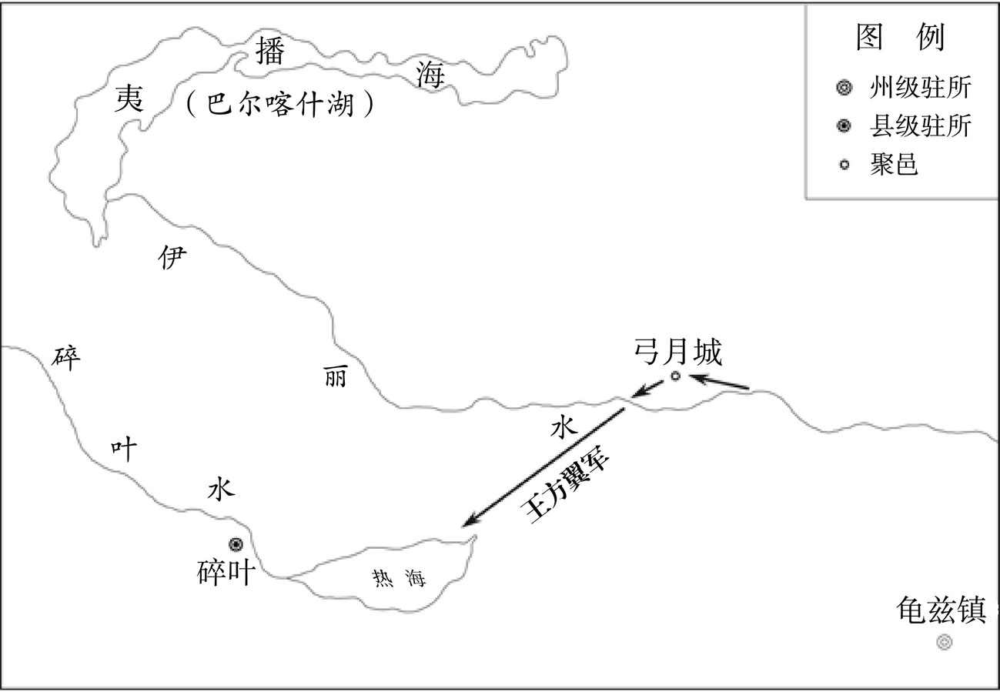 
王方翼热海之役示意图

## 【译文】

唐高宗永淳元年（682年）春二月，西突厥阿史那车薄率领十姓反抗唐朝。夏四月辛未（初八日），唐任命裴行俭率领右金吾将军阎怀旦等三总管分道讨伐西突厥，军队还没有出发，裴行俭就去世了。夏四月，阿史那车薄包围弓月城，安西都护王方翼领兵救援，在伊丽水大败敌人，斩首一千多人。不久三姓咽面和车薄合兵抵抗王方翼，王方翼在热海与敌人展开大战。流矢箭射穿王方翼的胳膊，王方翼用佩刀截断箭杆，身边的人都不知道。他所率领的胡兵阴谋捉住他来响应车薄，王方翼得知这情况后，把他们全部召集起来商议军事，表面上是要用军中物资赏赐他们，一个一个把他们带出去斩了。正巧天刮大风，王方翼让人敲起金鼓来扰乱他们的喊叫声，杀了七十多人，他们的同伴都没有发觉。接着王方翼又分别派遣副将袭击车薄、咽面，把他们打得大败，擒住他们的酋长三百人，西突厥才被平定。阎怀旦等人最后都没有出征。王方翼不久被调任为夏州都督，征召入朝商议边防的事情。唐高宗见王方翼衣服上有血渍，问他怎么了，王方翼把在热海苦战的情况全部告诉高宗，唐高宗看着疮疤叹息。但最终因为王方翼是已废皇后的近支亲属而得不到重用，回到夏州。

## 【原文】

**则天皇后垂拱元年[1]。初，西突厥兴昔亡、继往绝可汗既死，十姓无主，部落多散亡，太后乃擢兴昔亡之子左豹韬卫翊府中郎将元庆为左玉钤卫将军兼昆陵都护，袭兴昔亡可汗，押五咄部落[2]。**

## 【注文】

[1]则天：即武则天（624—705年），唐高宗时为皇后（655—683年）、唐中宗和唐睿宗时为皇太后（683—690年），后自立为武周皇帝（690—705年），改国号“唐”为“周”，定都洛阳，并号其为“神都”。史称“武周”，公元705年退位，退位后中宗上尊号“则天大圣皇帝”。武则天也是一位女诗人和政治家。　　垂拱：是唐睿宗李旦的年号，从垂拱元年（685年）正月至垂拱四年（688年）十二月。

[2]擢（zhuó）：提拔，提升。　　左豹韬卫：古代官署名，武则天光宅元年（684年）至中宗神龙元年（705年）为左威卫改称。　　元庆：唐朝时西突厥兴昔亡可汗的儿子。　　左玉钤卫：古代官署名，武则天光宅元年（684年）至中宗神龙元年（705年）为左领军改称。

## 【译文】

则天皇后垂拱元年（685年）。当初，西突厥兴昔亡、继往绝可汗死后，十姓无主，部落多离散逃亡，太后便提拔兴昔亡的儿子左豹韬卫翊府中郎将元庆为左玉钤卫将军兼昆陵都护，承袭兴昔亡可汗，统辖五咄部落。

## 【原文】

**二年秋九月丁未，以西突厥继往绝可汗之子斛瑟罗为右玉钤卫将军，袭继往绝可汗，押五弩失毕部落[1]。**

## 【注文】

[1]斛瑟罗（生卒年不详）：即阿史那斛瑟罗，西突厥贵族，阿史那步真子。初为步利设，垂拱初，授右玉钤卫将军，兼濛池都护，袭继往绝可汗，押五弩失毕部落。武周天授元年（690年），拜左卫大将军，改封竭忠事主可汗，仍赐濛池都护。寻卒。　　右玉钤卫：古代官署名，唐武则天光宅元年（684年）至中宗神龙元年（705年）为右领军卫改称。

## 【译文】

则天皇后垂拱二年（686年）秋九月丁未（初十日），唐任命西突厥继往绝可汗的儿子斛瑟罗为右玉钤卫将军，承袭继往绝可汗，统领五弩失毕部落。

## 【原文】

**天授元年[1]。西突厥十姓自垂拱以来为东突厥所侵掠，散亡略尽。［冬十月］，濛池都护继往绝可汗斛瑟罗收其余众六七万人入居内地，拜左卫大将军，改号竭忠事主可汗[2]。**

## 【注文】

[1]天授：武则天朝的年号，从天授元年（690年）九月至天授三年（692年）三月。　　东突厥：突厥汗国被隋朝分裂以后，成为东西突厥两部，东突厥大体上以金山（今阿尔泰山脉）为界，与西突厥划分汗国原来的疆域。但是，随着两国势力的消长，所辖范围也时有伸缩。在东突厥汗国内，突厥分布在南部，铁勒诸部则在北方。强盛时疆域囊括阿尔泰山到大兴安岭之间的整个蒙古高原及附近地区。

[2]濛池：濛池都护府，唐羁縻都护府名。唐高宗显庆二年（657年）平西突厥阿史那贺鲁，分其西部地区置都护府，领五弩失毕部落，治所碎叶，下辖十一都督府。辖境相当于今中亚楚河以西至咸海（一说里海）一带地区。

## 【译文】

则天皇后天授元年（690年）。西突厥十姓自垂拱年间以来被东突厥侵扰掠夺，几乎全逃散了。冬十月，濛池都护继往绝可汗斛瑟罗收集西突厥的余众六七万人进入内地居住，唐拜他为左卫大将军，改称竭忠事主可汗。

## 【原文】

**圣历二年秋八月癸巳，突骑施乌质勒遣其子遮弩入见[1]。遣侍御史元城解琬安抚乌质勒及十姓部落[2]。**

## 【注文】

[1]圣历：武则天朝的年号，共计三年，从圣历元年（698年）正月至圣历三年（700年）五月。　　突骑施：西突厥别部。西突厥有十姓部落，分为五弩失毕部，置五大俟斤；五咄陆部，置五大啜。突骑施贺逻施啜即五大啜之一。突骑施散居伊犁河流域。唐高宗显庆三年（658年），唐朝在中亚广设羁縻都督府州，于突骑施部落设置过嗢鹿州和洁山两个都督府。　　乌质勒：人名。初隶斛瑟罗，官任莫贺达，斛瑟罗入朝后，建大牙于碎叶川，建小牙于弓月城及伊丽水，尽有斛色罗之地。　　遮弩：唐朝时西突厥突骑施部将领乌质勒的儿子。

[2]侍御史：古代官名。秦置，汉沿设，在御史大夫之下。受命御史中丞，接受公卿奏事，举劾非法；有时受命执行办案、镇压起义等任务。魏、晋、南北朝时，曹数时有增减，但均不止五曹，治书侍御史也分掌各曹，与汉制不同。北朝魏、齐必对策高第者方能补御史官。唐侍御史属台院，殿中侍御史属殿院，监察御史属监院，三者并列。侍御史掌纠兴举百官、入阁承诏、知推（推鞫）弹（弹举）公廨（知公廨事）、杂事（御史台中其他各事）等，以知杂事最忙。宋、元及明初侍御史只设一二人，作为御史大夫、御史中丞的佐贰。　　元城：即元城县，西汉置，属魏郡，治所在沙鹿旁（今河北大名东），三国魏为阳平郡置，北魏属魏郡，北齐废。隋文帝开皇六年（586年）复置，属魏州。移治古殷城，今山东莘县西南，大业初属武阳郡。唐太宗贞观十七年（643年）并入贵乡县。武则天圣历二年（699年）复置。　　解琬（？—718年）：唐魏州元城（今河北大名东北）人，长期带兵戍边，官至右武卫大将军，终同州刺史。

## 【译文】

武则天圣历二年（699年）秋八月癸巳（初十日），突骑施乌质勒派遣他儿子遮弩入朝觐见。朝廷派遣侍御史元城人解琬去安抚乌质勒和十姓部落。

## 【原文】

**久视元年[1]。以西突厥竭忠事主可汗斛瑟罗为平西军大总管，镇碎叶[2]。**

## 【注文】

[1]久视：武则天朝的年号，共计八个月，从久视元年（700年）五月至久视元年（700）年十二月。

[2]碎叶：古地名，今吉尔吉斯斯坦首都比什凯克以东的托克马克市附近，曾经多次修筑城墙，唐代碎叶城就是仿长安城而建。

## 【译文】

武则天久视元年（700年）。唐任命西突厥竭忠事主可汗斛瑟罗为平西军大总管，镇守碎叶。

## 【原文】

**长安三年[1]。西突厥可汗斛瑟罗用刑残酷，诸部不服[2]。乌质勒本隶斛瑟罗，号莫贺达干，能抚其众，诸部归之，斛瑟罗不能制[3]。乌质勒置都督二十员，各将兵七千人，屯碎叶西北[4]。后攻陷碎叶，徙其牙帐居之[5]。斛瑟罗部众离散，因入朝，不敢复还，乌质勒悉并其地[6]。**

## 【注文】

[1]长安：武则天朝的第十三个年号（最后一个年号），共计三年余，从长安元年（701年）十月至长安四年（704年）十二月。

[2]斛瑟罗用刑残酷：这段话系追述往事，容易使人产生误解，斛瑟罗天授元年（690年）入朝后，其地已渐为乌质勒所并。武则天圣历二年（699年），以斛瑟罗为左卫大将军兼平西军大总管，令抚镇故土。时乌质勒强盛，斛瑟罗不敢归，复返长安。

[3]莫贺达干（？—744年）：西突厥突骑施黄姓的首领。唐玄宗开元二十六年（738年），莫贺达干杀死苏禄可汗，都摩度拥立苏禄可汗的儿子骨啜为吐火仙可汗，攻打莫贺达干，莫贺达干求救于唐朝碛西节度使、北庭都护。次年八月十五，盖嘉运攻克碎叶城，在贺逻岭擒获吐火仙。开元二十八年（740年）三月廿八，盖嘉运带吐火仙到长安献捷，唐玄宗赦免吐火仙，封他为左金吾大将军，以阿史那昕为十姓可汗。莫贺达干为突骑施可汗。莫贺达干不服阿史那昕，起兵叛乱。在盖嘉运安抚下，十一月初三，莫贺达干表示接受。唐玄宗天宝元年（742年），阿史那昕在俱兰城（今吉尔吉斯斯坦境内）被莫贺达干所杀。天宝三载（744年）五月，河西节度使夫蒙灵察讨伐莫贺达干，将他斩杀。

[4]屯：驻兵。

[5]攻陷：攻下，攻取。

[6]并：兼并；并吞。

## 【译文】

武则天长安三年（703年）。西突厥可汗斛瑟罗用刑残酷，他属下各部落都不服从他。乌质勒本隶属斛瑟罗，号称莫贺达干，因他善于安抚部下，各部落都纷纷归附他，以至于斛瑟罗无法控制。乌质勒设置都督二十员，各自领兵七千人，驻扎在碎叶城的西北。后来攻陷碎叶城，并把牙帐迁到那里住下。斛瑟罗各部落的部众离散，于是只好入朝臣服，不敢再回西北边境，乌质勒全部吞并了斛瑟罗的原有土地。

## 【原文】

**四年春正月，册拜阿史那怀道为西突厥十姓可汗[1]。怀道，斛瑟罗子也[2]。**

## 【注文】

[1]阿史那怀道（生卒年不详）：西突厥继往绝可汗，阿史那斛瑟罗之子。公元704年，武则天以阿史那怀道为濛池都护、十姓可汗，统辖十姓。

[2]斛瑟罗（生卒年不详）：即阿史那斛瑟罗，西突厥贵族，阿史那步真子。初为步利设，武则天垂拱初，授右卫大将军，兼濛池都护，袭继往绝可汗，押五驽失毕部落。武则天天授元年（690年），拜右屯卫大将军，改封竭忠事主可汗，仍赐濛池都护。久视元年（700年）腊月，为左屯卫将军。后来因为突骑施乌质勒兴起，入朝后不敢再回西域。

## 【译文】

武则天长安四年（704年）春正月，武后下诏册拜阿史那怀道为西突厥十姓可汗。怀道就是斛瑟罗的儿子。

## 【原文】

**中宗神龙二年闰正月甲戌，以突骑［施］酋长乌质勒为怀德郡王[1]。冬十二月，安西大都护郭元振诣突骑施乌质勒牙帐议军事，天大风雪，元振立于帐前与乌质勒语，久之，雪深，元振不移足，乌质勒老，不胜寒，会罢而卒[2]。其子娑葛勒兵将攻元振，副侍御史中丞解琬知之，劝元振夜逃去[3]。元振曰：“吾以诚心待人，何所疑惧[4]？且深在寇庭，逃将安适[5]？”安卧不动[6]。明旦，入哭，甚哀，娑葛感其义，待元振如初[7]。戊戌，以娑葛袭嗢鹿州都督、怀德王[8]。**

## 【注文】

[1]中宗：即唐中宗李显（656—710年），两次在位，共在位七年，分别为684年和705年至710年。原名李哲，唐高宗李治第七子，武则天第三子。公元710年猝死，终年五十五岁，葬于定陵（今陕西省富平县西北十五里的凤凰山）。　　神龙：武则天和唐中宗李显的年号，神龙元年二月中宗复国号唐，沿用武则天“神龙”年号不改。从神龙元年（705年）正月至神龙三年（707年）八月。

[2]郭元振（656—713年）：唐魏州贵乡（今河北大名西北）人。唐高宗咸亨年间进士，武则天时曾出使吐蕃。武则天大足元年（701年）任凉州都督，于凉州北境置白亭军，南境置和戎城，从此凉州得以安全，又广辟屯田，使河西走廊数年丰稔。唐中宗时，迁左骁卫将军，安西太都护。唐睿宗年间拜太仆，进同中书门下三品。唐玄宗先天元年（712年），为朔方军大总管，筑丰安、定远城。唐玄宗讲武骊山，因军容不整而配流，后起为饶州司马，病卒于途。

[3]中丞：秦汉文官，三国有置，有“二丞相”之称。是古代文官的最高爵位。　　解琬（？—718年）：魏州元城人（今河北大名东北人）。官至右武卫大将军。在边二十年，务农习战，有一定成绩。终同州刺史。

[4]诚心：诚恳的心意。

[5]寇庭：敌人的牙帐。　　适：往，到。

[6]安：安静。

[7]哀：悲痛；悲伤。

[8]嗢（wà）鹿州都督：唐高宗显庆元年（656年），以突骑施索葛莫贺部置嗢鹿州都督府，治所在今新疆伊宁市西伊犁河附近，约公元8世纪前期废。

## 【译文】

唐中宗神龙二年（706年）闰正月甲戌（二十九日），唐封突骑施酋长乌质勒为怀德郡王。冬十二月，安西大都护郭元振到突骑施乌质勒牙帐商议军事时，赶上天气变化，刮起大风，下起大雪，郭元振站立在帐前和乌质勒谈话，过了很长时间，雪已下了很深，郭元振没有移动脚，乌质勒却因年老体弱，经不住寒冷，会开完后就去世了。他的儿子娑葛带兵打算攻击郭元振，副侍御史中丞解琬知道后，劝郭元振连夜逃离此地。郭元振说：“我以诚心对待他们，又有什么可疑虑和惧怕呢？而且我们深入在他们的王庭之中，想逃走又能逃到哪里去呢？”于是安静地躺在那里不动。第二天早晨，进入牙帐内大哭，十分悲伤，娑葛被他的仁义感动，对待郭元振和以前一样。戊戌（二十八日），唐中宗册命娑葛承袭嗢鹿州都督的职务，封怀德王。

## 【原文】

**景龙二年冬十一月庚申，突骑施酋长娑葛自立为可汗，杀唐使者御史中丞冯嘉宾，遣其弟遮弩等帅众犯塞[1]。初，娑葛既代乌质勒统众，父时故将阙啜忠节不服，数相攻击[2]。忠节众弱不能支，金山道行军总管郭元振奏追忠节入朝宿卫[3]。忠节行至播仙城，经略使、右威卫将军周以悌说之曰：“国家不爱高官显爵以待君者，以君有部落之众故也[4]。今脱身入朝，一老胡耳，岂惟不保宠禄，死生亦制于人手[5]。方今宰相宗楚客、纪处讷用事，不若厚赂二公，请留不行，发安西兵及引吐蕃以击娑葛，求阿史那献为可汗以招十姓，使郭虔瓘发拔汗那兵以自助[6]。既不失部落，又得报仇，比于入朝，岂可同日语哉[7]。”郭虔瓘者，历城人，时为西边将[8]。忠节然其言，遣间使赂楚客、处讷请如以悌之策[9]。**

## 【注文】

[1]景龙：唐中宗李显的年号，共计四年，从景龙元年（707年）九月至景龙四年（710年）六月。　　娑葛（生卒年不详）：乌质勒长子。　　御史中丞：秦始置。汉朝为御史大夫的次官，或称御史中执法，秩千石。汉哀帝废御史大夫，以御史中丞为御史台长官，后历代相沿，唯官名时有变动，曹操曾改御史中丞为宫正，取其纠弹百官朝仪的职掌而言；北魏亦曾改称中尉。南北朝，御史大夫时置时废，即令置大夫亦往往缺位。中丞实为御史台长官无疑。隋置御史大夫，不置御史中丞，这是因为避讳的缘故。唐朝、五代、宋均大夫与中丞并置，唯大夫极少除授，仍以中丞为长官。　　冯嘉宾（生卒年不详）：唐朝时御史中臣。　　遮弩：唐朝时突骑施酋长娑葛的弟弟。

[2]阙啜忠节：又称阿史那阙啜忠节、阿史那忠节。阿史那，姓。阙，部落名。啜，官名。忠节，人名。

[3]支：支持。

[4]播仙城：今新疆且末西南。　　经略使：古代官名。为边防军事长官。　　周以悌（生卒年不详）：唐朝时播仙城经略使、右威卫将军。

[5]脱身入朝：脱离部落，独身入朝。　　宠禄：荣宠与禄位。

[6]宰相：辅助帝王掌管国事的最高官员的通称。　　宗楚客（生卒年不详）：武则天从姊子，史称蒲州（今山西永济）人。伟岸白净，明达聪慧。武后时举进士，累迁户部侍郎，官至宰相。　　纪处讷（生卒年不详）：娶武三思妻之姊，于是升任太府卿，不久，进拜侍中，与宗楚客等同时伏诛。　　阿史那献：西突厥族，弥射之孙，元庆之子。武则天如意元年（692年）元庆为来俊臣诬谋反被害，献配流崖州（今海南琼山东南），长安三年（703年）召还。被授为右骁卫大将军，袭父兴昔亡可汗，充安抚招慰十姓大使。唐玄宗开元中，任右金吾大将军，卒于长安（今西安市）。　　郭虔（qián）瓘（guàn）（生卒年不详）：唐朝将领，齐州历城（今山东济南）人，曾任右骁卫将军、北庭都护、安西副大都护等职。官至右威卫大将军。　　拔汗那：又称破洛那、钹汗、跋贺那。西域古国。在今塔吉克斯坦费尔干纳盆地一带。

[7]岂:怎么能。

[8]历城：今山东济南，秦置历城县于此，故称历城。

[9]然其言：认为他说的对。　　间使：负有伺机行事使命的使者。

## 【译文】

唐中宗景龙二年（708年）冬十一月庚申（初二日），突骑施酋长娑葛自立为可汗，杀死唐朝使者御史中丞冯嘉宾，又派他的弟弟遮弩等人率领部众进犯唐朝边塞。当初，娑葛代替乌质勒统领部众以后，他父亲时的旧将领阙啜忠节不服从，并与他几次互相攻打。阙啜忠节部众弱小，不能坚持，唐金山道行军总管郭元振上奏征召阙啜忠节入朝宿卫。阙啜忠节行军到播仙城时，经略使、右威卫将军周以悌劝他说：“朝廷不惜以高官显爵优待你，是因为你掌握部落的全部人马。现在你脱离部落只身入朝，只不过是一个年老的胡人而已，不但不能保持皇上对你的宠幸和官爵俸禄，恐怕连生死也操纵在别人手中。当今宰相宗楚客、纪处讷执掌朝中大权，不如给他两人丰厚的贿赂，让他们请皇上留你在西域不入朝，同时调集安西都护府的兵马和借用吐蕃的兵攻打娑葛，再请求册封阿史那献为可汗用以招十姓人马，派郭虔瓘调集拔汗那的兵相援助。这样既不会失去你对各部落的控制，又得以报仇，比起你入朝宿卫，简直是不可同日而语呢。”郭虔瓘，历城人，当时是西部边将。阙啜忠节同意周以悌的话，便暗地里派使者贿赂宗楚客和纪处讷，按照周以悌的计策向他们求情。

## 【原文】

**元振闻其谋，上疏，以为：“往岁吐蕃所以犯边，正为求十姓、四镇之地不获故耳[1]。比者息兵请和，非能慕悦中国之礼义也，直以国多内难，人畜疫疠，恐中国乘其弊，故且屈志求自昵[2]。使其国小安，岂能忘取十姓、四镇之地哉[3]！今忠节不论国家大计，直欲为吐蕃乡导，恐四镇危机，将从此始[4]。顷缘默啜凭陵，所应者多，兼四镇兵疲弊，势未能为忠节经略，非怜突骑施也[5]。忠节不体国家中外之意而更求吐蕃，吐蕃得志，则忠节在其掌握，岂得复事唐也[6]！往年吐蕃无恩于中国，犹欲求十姓、四镇之地，今若破娑葛有功，请分于阗、疏勒，不知以何理抑之[7]？又，其所部诸蛮及娑罗门等方不服，若借唐兵助讨之，亦不知以何词拒之[8]？是以古之智者皆不愿受夷狄之惠，盖豫忧其求请无厌，终为后患故也[9]。又彼请阿史那献者，岂非以献为可汗子孙，欲依之以招怀十姓乎[10]？按献父元庆、叔父仆罗、兄俀子及斛瑟罗、怀道等，皆可汗子孙也，往者唐及吐蕃遍曾立之以为可汗，欲以招抚十姓，皆不能致，寻自破灭[11]。何则[12]？此属非有过人之才，恩威不足以动众，虽复可汗旧种，众心终不亲附，况献又疏远于其父兄乎[13]？若使忠节兵力自能诱胁十姓，则不必求立可汗子孙也[14]。又，欲令郭虔瓘入拔汗那，发其兵[15]。虔瓘前此已尝与忠节擅入拔汗那发兵，不能得其片甲匹马，而拔汗那不胜侵扰，南引吐蕃，奉俀子，还侵四镇[16]。时拔汗那四旁无强寇为援，虔瓘等恣为侵掠，如独行无人之境，犹引俀子为患[17]。今北有娑葛，急则与之并力，内则诸胡坚壁拒守，外则突厥伺隙邀遮[18]。臣料虔瓘等此行，必不能如往年之得志，内外受敌，自陷危亡，徒与虏结隙，令四镇不安[19]。以臣愚揣之，实为非计[20]。”**

## 【注文】

[1]四镇：唐代称朔方、泾原、陇右、河东四节度为四镇。

[2]慕悦：向往喜爱。　　疫（yì）：流行性急性传染病。　　疠（lì）：瘟疫。　　屈志：曲意迁就，抑制意愿。　　昵（nì）：亲近。

[3]小：稍，略。

[4]不论：不考虑。

[5]默啜（chuò）（？—716年）：唐时可汗，姓阿史那氏，名环。骨咄禄弟。武则天天授二年（691年）立，称阿波干可汗。武则天证圣元年（695年），受封为迁善可汗。武则天万岁通天元年（696年），助唐平契丹，受封为立功报国可汗。

[6]体：设身处地为人着想。

[7]欲求十姓、四镇之地：时在武则天万岁通天元年。　　抑（yì）：抑制。

[8]娑罗门：指古印度。

[9]豫忧：预先忧虑。“豫”通“预”。　　厌：足。

[10]阿史那献（生卒年不详）：突厥兴昔亡可汗，阿史那元庆之子。公元692年，阿史那元庆被酷吏来俊臣诬杀，阿史那献配流崖州。公元703年，才被召还。唐中宗为了抵制突骑施对西域的侵蚀，公元708年册封阿史那献为右骁骑大将军、昆陵都护、兴昔亡可汗，统辖咄陆五部，镇守庭州，十二月，为招慰十姓使、碛西节度使。公元715年，又加定远道行军大总管，抵御大食和拔汗那。公元717年，苏禄可汗兴起后，阿史那献返唐，迁左金吾大将军，终老长安。　　招怀：招抚，怀柔。

[11]元庆：即阿史那元庆（？—692年），西突厥兴昔亡可汗，阿史那弥射之子。武则天为了加强对西域的控制，公元685年册封元庆为左玉钤卫将军、昆陵都护、兴昔亡可汗，统辖咄陆五部。又加封为镇国大将军、左威卫大将军。公元692年，阿史那元庆被酷吏来俊臣诬杀。其子阿史那俀子被吐蕃立为十姓可汗，阿史那献流放崖州。　　仆罗（生卒年不详）：即阿史那仆罗，公元7世纪末，吐蕃拥立的西突厥傀儡可汗。阿史那弥射之子，阿史那元庆的弟弟。阿史那弥射与唐朝关系不浅，却在唐高宗时代，被苏海政和阿史那步真陷害致死。阿史那元庆在武则天时代被酷吏来俊臣所杀。阿史那仆罗和弟弟阿史那拔布、元庆的儿子阿史那俀子投奔吐蕃。吐蕃大败唐朝宰相韦待价后，占领安西四镇。立阿史那俀子为十姓可汗。之后，唐朝大将王孝杰收复安西四镇，吐蕃又立阿史那仆罗为可汗。　　俀（tuǐ）子（生卒年不详）：即阿史那俀子，西突厥二世兴昔亡可汗阿史那元庆之子，公元692年，阿史那元庆被酷吏来俊臣诬杀，阿史那俀子逃亡吐蕃。公元693年，被吐蕃立为十姓可汗。武则天长寿三年（694年）二月，唐朝武威道总管王孝杰在冷泉及大岭打败吐蕃论赞刃、突厥可汗阿史那俀子等各三万多人。　　斛瑟罗（生卒年不详）：即阿史那斛瑟罗，西突厥继往绝可汗，阿史那步真之子。公元685年，武则天为了加强对西域的控制，册封为濛池都护、继往绝可汗兼右卫大将军，统辖弩失毕五部。公元690年，由于后突厥和吐蕃的攻击，阿史那斛瑟罗率所部投靠内地，拜右屯卫大将军，改号竭忠事主可汗。久视元年（700年）腊月，武则天再次任命司礼卿兼濛池州都护、竭忠事主可汗阿史那斛瑟罗为左屯卫将军，仍立平西军大总管，还镇碎叶。不过，突骑施乌质勒兴起，公元703年，斛瑟罗入朝后，不敢再回到西域。乌质勒于是全部吞并了斛瑟罗原有的领地。　　怀道（生卒年不详）：西突厥继往绝可汗，阿史那斛瑟罗之子。公元704年，武则天以阿史那怀道为濛池都护、十姓可汗，统辖十姓。　　遍曾立之以为可汗：唐立元庆、斛瑟罗、怀道为可汗；仆罗、俀子系吐蕃所立。　　皆不能致：都不能达到招怀十姓的目的。

[12]何则：为什么。多用于自问自答。

[13]旧种：旧族。　　于：介词，表比较。

[14]胁：威逼,用威力促使。

[15]拔汗那：中亚古国，在锡尔河中游谷地，今吉尔吉斯斯坦费尔干纳地区。汉代称大宛，中国古籍又作破洛那或钹汗，都西鞬城（今乌兹别克斯坦纳曼干）。

[16]擅（shàn）：自作主张；随意。　　片甲匹马：犹一兵一卒。　　奉：辅助，拥戴。

[17]侵掠：侵夺骚扰。　　无人之境：没有人居住的地方。

[18]邀：阻拦；截击。

[19]徒：白白地。

[20]揣（chuǎi）：猜想，推测；估量。

## 【译文】

郭元振听说阙啜忠节的计谋以后，便上疏，认为：“往年吐蕃所以侵犯边境，正是因为十姓、安西四镇的土地没有得到的缘故。最近几年休兵停战又入关请求和好，也并非因为吐蕃真心向往和羡慕中原的礼义教化，只不过是因为吐蕃国内多次发生内乱，人口和牲畜又发生病疫，担心中原乘他国贫民弱的时机去攻他，所以才委曲求全向大唐献媚求和。假使吐蕃国内稍稍安定，怎么能够忘了夺取十姓、安西四镇呢？如今阙啜忠节不顾国家大计，只是想做吐蕃军队的向导，恐怕安西四镇危机将从此开始。前一段时间，因为默啜的侵凌，响应他的人很多，又加上四镇的兵力疲弱，所以我们没能考虑忠节的事情，并不是可怜突骑施。阙啜忠节不去设身处地为朝廷经营中外的大业着想，反而求救于吐蕃，吐蕃在西域得志，则阙啜忠节在他的掌握下怎么能再事奉大唐！往年吐蕃无恩于大唐时，尚且想索取十姓、四镇之地，如果现在帮助大唐攻破娑葛立下功劳，就会请求朝廷把于阗、疏勒割让给他，不知道到那时朝廷以什么理由来拒绝他的要求？又有吐蕃所属的各个蛮族部落及娑罗门等方不服从他们的统治，如果他们要求借唐兵帮助讨伐，也不知朝廷用什么借口来拒绝他们。所以自古以来聪明有才智的君主都不愿意接受夷狄的恩惠，大概是担心他们贪得无厌，终究会造成麻烦和祸患。再有他又请立阿史那献为可汗，还不是因为阿史那献是可汗的子孙，想依靠他来招怀十姓吗？按理，阿史那献的父亲阿史那元庆、叔父阿史那仆罗、兄阿史那俀子及阿史那斛瑟罗、阿史那怀道等人，也全都是可汗的子孙，过去唐和吐蕃都曾将他们一一册封为可汗，都希望他们能招抚十姓，但都不能达到目的，这些人在位不久便破族灭家。这是什么原因？因为这些人都没有过人的才能，恩德与威名都不足以打动部众，虽然他们仍然是可汗的嫡系子孙，众人之心始终都不能亲近归附他们，何况阿史那献的血缘比他的父兄还疏远呢？倘若阙啜忠节自己的兵力能诱使十姓部落归附的话，就没有必要请求可汗的子孙阿史那献来做可汗了。还有，阙啜忠节想派郭虔瓘前往征调拔汗那的兵马。但郭虔瓘在此以前就曾经和阙啜忠节擅自入拔汗那调集兵马，不能得到他们的片甲匹马，反而使拔汗那部落不胜侵扰，从南方引来吐蕃兵自卫，奉戴吐蕃所册立的可汗阿史那俀子，回兵还侵犯安西四镇。当时拔汗那四周没有强大的敌寇可以援助他，郭虔瓘等人肆意侵扰掠夺，如进入无人之境，还仍然引来阿史那俀子的侵扰。现在北有娑葛，紧急的时候，他们可以联合起来，内部有诸胡坚壁拒守，外边有突厥伺机阻截遏止。依我所料，郭虔瓘等这次前去拔汗那调兵，必不能像往年那样如意，内外交困，自陷危亡，还白白和各部落结仇，令安西四镇不得安宁。所以依我的愚见，这样做实在是不妥当的。”

## 【原文】

**楚客等不从，建议遣冯嘉宾持节安抚忠节，侍御史吕守素处置四镇，以将军牛师奖为安西副都护，发甘、凉以西兵兼征吐蕃以讨娑葛[1]。娑葛遣使娑腊献马在京师，闻其谋，驰还报娑葛[2]。于是娑葛发五千骑出安西，五千骑出拨换，五千骑出焉耆，五千骑出疏勒，入寇[3]。元振在疏勒，栅于河口，不敢出[4]。忠节逆嘉宾于计舒河口，娑葛遣兵袭之，生擒忠节，杀嘉宾[5]。擒吕守素于僻城，缚于驿柱，冎而杀之[6]。**

## 【注文】

[1]吕守素（生卒年不详）：唐朝时任侍御史。　　牛师奖（生卒年不详）：唐朝时任安西副都护。　　甘：即甘州，西魏废帝三年（554年）改西凉州置，治所在永平，隋改名张掖，今甘肃张掖西北。唐时或称甘州，或称张掖。

[2]娑腊：唐朝时西突厥使者。

[3]拨换：即钵换城。故址在今新疆阿克苏。　　疏勒：古地名，今新疆喀什西北。

[4]栅（zhà）：动词，建栅。

[5]逆：迎接。　　计舒河：亦作计戍水、计式水，即今新疆天山以南之塔里木河。

[6]缚（fù）：捆绑。　　冎（guǎ）：古同“剐”。

## 【译文】

宗楚客等没有听从郭元振的意见，建议派冯嘉宾持节前去安抚阙啜忠节，派侍御史吕守素去处理安西四镇的军阵事务，任命将军牛师奖为安西副都护，调集甘、凉二州以西的兵马，兼征吐蕃兵来共同讨伐娑葛。当时娑葛派使者娑腊向朝廷献马，得知这个消息后，立即派人报告了娑葛。娑葛于是发五千骑兵出安西，五千骑兵出拨换，五千骑兵出焉耆，五千骑兵出疏勒，分路进行入侵。郭元振正好在疏勒，在河口扎下营寨，不敢出城抗击娑葛。阙啜忠节到计舒河口迎接冯嘉宾，娑葛派兵袭击他们，活捉阙啜忠节，杀死了冯嘉宾，又在僻城捉住了吕守素，并把他绑在驿站柱上，把他一刀一刀地剐死。

## 【原文】

**癸未，牛师奖与突骑施娑葛战于火烧城，师奖兵败没[1]。娑葛遂陷安西，断四镇路，遣使上表求宗楚客头[2]。楚客又奏以周以悌代郭元振统众，征元振入朝[3]。以阿史那献为十姓可汗，置军焉耆以讨娑葛[4]。娑葛遗元振书，称：“我与唐初无恶，但仇阙啜[5]。宗尚书受阙啜金，欲枉破奴部落，冯中丞、牛都护相继而来，奴岂得坐而待死[6]。又闻史献欲来，徒扰军州，恐未有宁日[7]。乞大使商量处置[8]。”元振奏娑葛书[9]。楚客怒，奏言元振有异图，召，将罪之[10]。元振使其子鸿间道具奏其状，乞留定西土，不敢归[11]。周以悌竟坐流白州，复以元振代以悌，赦娑葛罪，册为十四姓可汗[12]。**

## 【注文】

[1]火烧城：在今新疆库车县西北。

[2]安西：安西都护府。治所即今新疆库车。

[3]征：征调。

[4]置：安排。

[5]遗（wèi）：给予；馈赠。

[6]宗尚书：宗楚客。　　枉（wǎng）：违背。　　奴：自卑之词。犹清代大臣对皇帝自称奴才。　　冯中丞：冯嘉宾。　　牛都护：牛师奖。

[7]史献：阿史那献。　　军州：设有军府的州县。

[8]乞：请求，希望。

[9]奏：上奏。

[10]罪：惩罚；治罪。

[11]鸿：即郭鸿，唐朝时大将郭元振的儿子。

[12]流：放逐，流放，古代五刑之一。　　白州：唐高祖武德六年（623年）改南州置，治所在博白县（今广西博白）。辖境相当于今广西博白及陆川部分地。南宋绍兴六年（1136年）废。　　册为十四姓可汗：胡三省说，西突厥原有十姓，现合咽面、葛逻禄、莫贺达干、都摩支为十四姓。岑仲勉认为“四”字误衍，当作十姓可汗。

## 【译文】

唐中宗景龙二年（708年）十一月癸未（二十五日），牛师奖和突骑施娑葛在火烧城交战，牛师奖兵大败，全军覆没。突骑施娑葛于是攻陷了安西，断绝四镇之间的通路，派遣使者入朝上表，向唐中宗要宗楚客的头颅。宗楚客向唐中宗上奏，请求任命周以悌取代郭元振统领安西各路兵马，征召郭元振入朝。同时册立阿史那献为十姓可汗，在焉耆布置军队以讨伐突骑施娑葛。娑葛给郭元振信说：“我和唐开始并没有任何矛盾，只是和阙啜忠节有仇怨。宗尚书接受阙啜的金银贿赂，想昧着良心发兵攻打我的部落，冯中丞、牛都护相继领命而来，我又岂能坐以待毙？另外又听说阿史那献也要来此地，徒然扰动军队和州县，恐怕不再会有安宁的日子。乞求大使商量处理。”郭元振把娑葛的书信上奏给唐中宗。宗楚客知道后大怒，上奏唐中宗说郭元振图谋不轨，唐中宗召他回朝，将要给他治罪。郭元振派他儿子郭鸿从小路加速进京向唐中宗详细说明了情况，请求留在西域稳定局势，不敢回到朝中。周以悌最后因罪流放到白州，唐中宗下诏又任命郭元振代替周以悌的职务，下诏赦免突骑施娑葛的罪行，册封他为十四姓可汗。

## 【原文】

**三年秋七月，突骑施娑葛遣使请降，庚辰，拜钦化可汗，赐名守忠[1]。**

## 【注文】

[1]钦化可汗（？—711年）：即突骑施乌质勒之子娑葛。景龙二年（708年），自立为可汗，攻陷安西。唐不得已册为十四姓可汗。景龙三年（709年）请降，被唐册封为钦化可汗，并赐名守忠。后为其弟遮弩所引默啜兵击败，被俘杀。

## 【译文】

唐中宗景龙三年（709年）秋七月，突骑施娑葛派使者请求归降，庚辰（二十六日），被封为钦化可汗，赐名守忠。

## 【原文】

**睿宗景云二年冬十二月癸卯，以兴昔亡可汗阿史那献为招慰十姓使[1]。**

## 【注文】

[1]睿（ruì）宗：李旦（662—716年），又名旭轮，唐高宗第八子，武则天幼子，唐中宗为其兄长。他一生两度登基，两让天下，在位时间文明元年至载初二年（684—690年）和景云元年至延和元年（710—712年），共在位八年。公元712年禅位于子李隆基（唐玄宗），称太上皇，居五年，崩，享年五十五，葬于桥陵。谥号玄真大圣大兴皇帝。　　景云：唐睿宗李旦的年号，从景云元年（710年）七月至景云二年（711年）十二月。　　十姓：即指五咄陆和五弩失毕。

## 【译文】

唐睿宗景云二年（711年）冬十二月癸卯（初三日），睿宗任命兴昔亡可汗阿史那献为招慰十姓使。

## 【原文】

**玄宗开元二年[1]。西突厥十姓酋长都担叛[2]。三月己亥，碛西节度使阿史那献克碎叶等镇，擒都担，降其部落二万余帐[3]。**

## 【注文】

[1]玄宗：即唐玄宗李隆基（685—762年），睿宗李旦第三子，母窦德妃。庙号“玄宗”，又因其谥号为“至道大圣大明孝皇帝”，故亦称为唐明皇。清朝为避讳康熙皇帝之名“玄烨”，多称其为唐明皇。另有尊号“开元圣文神武皇帝”。李隆基在位期间开创了唐朝乃至中国历史上的最为鼎盛的时期，史称“开元盛世”。但是唐玄宗在位后期爆发“安史之乱”，使得唐朝国势逐渐走向衰落。　　开元：唐朝皇帝唐玄宗李隆基的年号，共计二十九年，从开元元年（713年）十二月至开元二十九年（741年）十二月。

[2]都担：唐朝时西突厥十姓酋长。

[3]碛（qì）西：是唐朝对西域的称呼，碛指莫贺延碛，即位于今哈密和敦煌之间的哈顺沙漠，唐朝在此设立碛西节度使，是当时的八大节度使之一，统辖安西、北庭两大都护府。　　节度使：中国古代的军事将领，后成为治理地方的地方官。唐代驻守各道的武将称为都督，都督带使持节的称节度使，不带者不称。

## 【译文】

唐玄宗开元二年（714年）。西突厥十姓酋长都担叛变。三月己亥（十二日），碛西节度使阿史那献攻克碎叶等镇，生擒都担，降服他的部众二万多帐。

## 【原文】

**突骑施可汗守忠之弟遮弩恨所分部落少于其兄，遂叛入突厥，请为乡道，以伐守忠[1]。默啜遣兵二万击守忠，虏之而还[2]。谓遮弩曰：“汝叛其兄，何有于我[3]。”遂并杀之[4]。**

## 【注文】

[1]守忠：即突厥首领娑葛。唐中宗景龙三年（709年）七月，娑葛遣使请降，拜钦化可汗，赐名守忠。　　遮弩：唐朝时突骑施可汗守忠的弟弟。

[2]虏（lǔ）：俘获。

[3]何有于我：怎能忠诚于我。

[4]遂：于是。

## 【译文】

突骑施可汗守忠的弟弟遮弩怨恨自己分到的部落比他哥哥少，便率领自己的部众叛变进入突厥，并请求作为突厥兵的向导，来讨伐守忠。突厥可汗默啜派兵二万攻击守忠，俘虏守忠而回到突厥，对遮弩说：“你背叛你哥哥，怎么能忠诚于我！”于是把他和他哥哥一起杀死。

## 【原文】

**三年[1]。突骑施守忠既死，默啜兵还，守忠部将苏禄鸠集余众，为之酋长[2]。苏禄颇善绥抚，十姓部落稍稍归之，有众二十万，遂据有西方，寻遣使入见[3]。是岁，以苏禄为左羽林大将军、金方道经略大使[4]。**

## 【注文】

[1]三年：唐玄宗开元三年，公元715年。

[2]苏禄（？—738年）：又称车鼻施啜苏禄，守忠死后自立为可汗。唐玄宗开元年间授右武卫大将军、突骑施都督，进号忠顺可汗。　　鸠（jiū）集：聚集，使聚在一起。

[3]绥（suí）抚：安抚。

[4]左羽林大将军：唐朝禁军统兵官。　　经略大使：古代官名。南北朝时曾设经略之职，唐初边州置经略使，为边州军事长官。

## 【译文】

唐玄宗开元三年（715年）。突骑施守忠被杀以后，默啜的兵马撤回去，守忠的部将苏禄聚集他的余众，自己做了酋长。苏禄很善于安抚，十姓部落渐渐归附了他，部众达到二十万，于是占有西方，不久派使者入朝觐见唐玄宗。这年，玄宗任命苏禄为左羽林大将军、金方道经略大使。

## 【原文】

**四年[1]。突骑施苏禄复自立为可汗[2]。**

## 【注文】

[1]四年：唐玄宗开元四年，公元716年。

[2]突骑施：古代西北民族，原属西突厥五咄陆部，唐武则天时渐盛，公元7世纪末以碎叶川（在今中亚楚河流域）为“大牙”,以伊丽水（今伊犁河流域）的弓月城为“小牙”,下分二十都督,统辖原四突厥所领地区。以游牧为业，有文字。突骑施各汗曾屡遣使朝唐，唐常册封其可汗。百姓分为黄、黑二姓，互相争斗。约公元8世纪前半期，突骑施别部车鼻部首领苏禄为首的黑姓取代黄姓的统治地位。唐玄宗开元二十六年（738年）苏禄为大首领莫贺达干、都摩支所杀，势衰。于公元8世纪中期臣属于葛逻禄。　　苏禄：又称车鼻施啜苏禄，守忠死后自立为可汗，唐玄宗开元年间授右武卫大将军、突骑施都督，进号忠顺可汗。

## 【译文】

唐玄宗开元四年（716年）。突骑施苏禄又自立为可汗。

## 【原文】

**五年[1]。突骑施酋长左羽林大将军苏禄部众浸（博）［强］，虽职贡不乏，阴有窥边之志[2]。五月，十姓可汗阿史那献欲发葛逻禄兵击之，上不许[3]。**

## 【注文】

[1]五年：唐玄宗开元五年，公元717年。

[2]职贡：各地方的贡物。此处指纳贡。　　窥（kuī）：伺机图谋；觊觎。

[3]葛逻禄：是公元7—13世纪间的西突厥别部，亦称葛罗禄，地处北庭西北，金山（今阿尔泰山）之阳（今新疆准噶尔盆地）。

## 【译文】

唐玄宗开元五年（717年）。突骑施酋长左羽林大将军苏禄的部众日益强大，虽然对朝廷守职进贡并不缺乏，但暗中却有窥伺边境的想法。五月，十姓可汗阿史那献请求征发葛逻禄的军队攻击他，唐玄宗不允许。

## 【原文】

**秋七月，安西副大都护汤嘉惠奏，突骑施引大食、吐蕃谋取四镇，围钵换及大石城，已发三姓葛逻禄兵与阿史那献击之[1]。**

## 【注文】

[1]汤嘉惠（生卒年不详）：唐朝时安西副大都护。　　钵换：即钵换城。故址在今新疆阿克苏。　　大石城：即温肃州治所。在今新疆乌什。

## 【译文】

秋七月，安西副大都护汤嘉惠上奏，突骑施勾结大食、吐蕃，策划夺取安西四镇，并包围钵换和大石城，已经发三姓葛逻禄的兵马和阿史那献一起出击。

## 【原文】

**六年夏五月辛亥，以突骑施都督苏禄为左羽林大将军、顺国公，充金方道经略大使[1]。**

## 【注文】

[1]左羽林大将军：唐朝禁军统兵官。

## 【译文】

唐玄宗开元六年（718年）夏五月辛亥（十八日），唐玄宗任命突骑施都督苏禄为左羽林大将军，封为顺国公，派他出任金方道经略大使。

## 【原文】

**七年冬十月壬子，册拜突骑施苏禄为忠顺可汗。**

## 【译文】

唐玄宗开元七年（719年）冬十月壬子（二十八日），唐玄宗册拜突骑施苏禄为忠顺可汗。

## 【原文】

**十年冬十二月庚子，以十姓可汗阿史那怀道女为交河公主，嫁突骑施可汗苏禄。**

## 【译文】

唐玄宗开元十年（722年）冬十二月庚子（初三日），封十姓可汗阿史那怀道的女儿为交河公主，把她嫁给突骑施可汗苏禄。

## 【原文】

**十四年[1]。杜暹为安西都护，突骑施交河公主遣牙官以马千匹诣安西互市[2]。使者宣公主教，暹怒曰：“阿史那女何得宣教于我[3]！”杖其使者，留不遣，马经雪死尽[4]。突骑施可汗苏禄大怒，发兵寇四镇[5]。会暹入朝，赵颐贞代为安西都护，婴城自守[6]。四镇人畜储积，皆为苏禄所掠，安西仅存[7]。既而苏禄闻暹入相，稍引退，寻遣使入贡[8]。**

## 【注文】

[1]十四年：唐玄宗开元十四年，公元726年。

[2]杜暹（xiān）（？—740年）：唐玄宗宰相。濮州濮阳（今河南濮阳）人，后官至宰相，以孝友清正著称。　　牙官：副武官，也泛指下属小官。

[3]教：文体的一种，为上对下的告谕。　　阿史那女：该公主系阿史那怀道之女。

[4]杖（zhàng）：用棍子打；拷打。　　经雪：经过雪季。

[5]寇：侵略。

[6]赵颐贞（生卒年不详）：定州鼓城（今河北晋州）人。唐玄宗朝将领，两破吐蕃，任安西都护。　　婴城自守：环城固守。婴：缠绕，围绕。

[7]储积：积蓄的财物。

[8]相：动词，做宰相。

## 【译文】

唐玄宗开元十四年（726年）。杜暹任安西都护时，突骑施交河公主派遣牙官以一千匹马到安西互市交易。使者向杜暹宣读公主文告教令，杜暹恼怒说：“阿史那怀道的女儿怎么可以向我宣布文书！”于是杖打使者，把他扣留不让他回去，马匹经过一场大雪都被冻死。突骑施可汗苏禄大怒，派兵进犯安西四镇。这时恰值杜暹入朝，由赵颐贞代理安西都护，他据城坚守。四镇百姓人畜和储存的物资，都被苏禄掠夺，仅剩下一座安西城。不久苏禄听说杜暹入朝为相，才逐渐带领兵马撤退，不久又派使者入朝进贡。

## 【原文】

**十八年[1]。突骑施遣使入贡，上宴之于丹凤楼，突厥使者豫焉[2]。二使争长，突厥曰：“突骑施小国，本突厥之臣，不可居我上[3]。”突骑施曰：“今日之宴，为我设也，我不可以居其下[4]。”上乃命设东西幕，突厥在东，突骑施在西[5]。**

## 【注文】

[1]十八年：唐玄宗开元十八年，公元730年。

[2]丹凤楼：即丹凤门楼，在大明宫正南门上。　　豫焉：参加这次宴会。

[3]争长：争夺上座。

[4]设：设置。

[5]幕：帐幕。

## 【译文】

唐玄宗开元十八年（730年）。突骑施派使者到唐朝进贡，唐玄宗在丹凤楼设宴款待，突厥使者也出席了这次宴会。两个使者争夺座次高下，突厥使者说：“突骑施只是个小国，原来是突厥的臣民，不能位居我之上。”突骑施使者说：“今日的宴会，是为我而设的，我不能位居你之下。”唐玄宗便命令设东西两个帐幕，突厥使者坐在东面，突骑施使者坐在西面。

## 【原文】

**二十三年冬十月戊申，突骑施寇北庭及安西拨换城[1]。**

## 【注文】

[1]北庭：唐方镇名。唐玄宗先天元年（712年）始设，辖境在伊州以西，故称伊西。治所在北庭都护府，节度使例兼北庭都护，故通称北庭，亦称伊西北庭。统辖伊、西、庭三州以及北庭都护府境内诸军、镇、守捉。唐玄宗开元后与碛西四镇节度使时分时合。唐德宗贞元六年（790年）地入吐蕃。

## 【译文】

唐玄宗开元二十三年（735年）冬十月戊寅（二十六日），突骑施进犯北庭和安西拨换城。

## 【原文】

**二十四年春正月，北庭都护盖嘉运击突骑施，大破之[1]。秋八月甲寅，突骑施遣其大臣胡禄达干（求）［来］请降，许之[2]。**

## 【注文】

[1]盖嘉运（生卒年不详）：唐玄宗开元中，官至北庭都护，统辖西突厥十姓部落诸羁縻府州。唐玄宗先天元年（712年），设北庭伊西节度使，由北庭都护兼领，统瀚海、天山、伊吾三军共两万人，用以防制突骑施等部落。

[2]胡禄达干（生卒年不详）：唐玄宗时突骑施大臣。

## 【译文】

唐玄宗开元二十四（736年）年春正月，北庭都护盖嘉运出击突骑施，打败他的军队。秋八月甲寅（初七日），突骑施派遣其大臣胡禄达干来请求投降，唐玄宗接受了他们。

## 【原文】

**二十六年[1]。突骑施可汗苏禄素廉俭，每攻战所得，辄与诸部分之，不留私蓄，由是众乐为用[2]。既尚唐公主，又潜通突厥及吐蕃，突厥、吐蕃各以女妻之[3]。苏禄以三国女为可敦，又立数子为叶护，用度浸广，由是攻战所得，不复更分[4]。晚年病风，一手挛缩，诸部离心[5]。酋长莫贺达干、都摩度两部最强，其部落又分为黄姓、黑姓，互相乖阻[6]。于是莫贺达干勒兵夜袭苏禄，杀之[7]。都摩度初与莫贺达干连谋，既而复与之异，立苏禄之子骨啜为吐火仙可汗以收其余众，与莫贺达干相攻[8]。莫贺达干遣使告碛西节度使盖嘉运，上命嘉运招集突骑施拔汗那以西诸国[9]。吐火仙与都摩度据碎叶城，黑姓可汗尔微特勒据怛逻斯城，相与连兵以拒唐[10]。**

## 【注文】

[1]二十六年：唐玄宗开元二十六年，公元738年。

[2]辄（zhé）：总是，每次。　　蓄（xù）：积蓄。

[3]尚：娶。

[4]可敦：我国古代鲜卑、蠕蠕（亦称柔然）、突厥、回纥、蒙古等族的最高统治者叫可汗，其妻叫可敦。　　叶护：突厥官名。

[5]挛（luán）缩：蜷曲不能伸。

[6]都摩度：唐玄宗时突骑施酋长。　　黄姓：古代西域部落群体，为突骑施部落集团之一，突骑施首领乌质勒在7世纪后半期逐渐称雄西域,被唐封为瑶池都督、怀德郡王，以其氏族为首的突骑施统治部落，构成突骑施部落联盟的统治部落集团，称为黄姓。　　黑姓：源于突厥族，出自汉唐之际突厥族突骑施部黑氏氏族，属于以部族名称汉化改姓为氏。　　乖：背离，违背，不和谐。

[7]勒：率领。

[8]异：区别；分开。

[9]盖嘉运（生卒年不详）：唐玄宗开元中，官至北庭都护，统辖西突厥十姓部落诸羁縻府州。唐玄宗先天元年（712年），设北庭伊西节度使，由北庭都护兼领，统瀚海、天山、伊吾三军共两万人，用以防制突骑施、处木昆等部落。

[10]尔微特勒（？—740年）：突骑施黑姓可汗。特勒当为“特勤”之误。　　怛（dá）逻斯城：古地名，即今哈萨克斯坦的奥利阿塔，今名江布尔城。

## 【译文】

唐玄宗开元二十六年（738年）。突骑施可汗苏禄素来廉洁节俭，每次攻战所得的东西，总是和各部落共同分享，不留私人积蓄，因此部众都乐于为他效命。娶唐公主后，又暗中与突厥和吐蕃勾结，突厥、吐蕃各自都把女儿嫁给他。苏禄以三国女子为可敦，又立几个儿子为叶护，用度花销日益增多，因此出战攻战所得不再和部众均分。到晚年又得了风湿病，一只手痉挛萎缩，各部落对他都有叛离之心。酋长莫贺达干、都摩度两部落最强，其部落又分为黄姓、黑姓，互相猜忌不和。于是莫贺达干领兵夜里袭击苏禄，把他杀死。都摩度最初和莫贺达干合谋，以后又与他不和，立苏禄的儿子骨啜为吐火仙可汗以收集苏禄的余众，和莫贺达干互相攻击。莫贺达干派使者告知碛西节度使盖嘉运，唐玄宗命盖嘉运招集突骑施拔汗那以西各国。吐火仙与都摩度占据碎叶城，黑姓可汗尔微特勤占据怛逻斯城，相互连合兵马抵抗唐朝。

## 【原文】

**二十七年秋八月乙亥，碛西节度使盖嘉运擒突骑施可汗吐火仙[1]。嘉运攻碎叶城，吐火仙出战，败走，擒之于贺逻岭[2]。分遣疏勒镇守使夫蒙灵詧与拔汗那王阿悉烂达干潜引兵突入怛逻斯城，擒黑姓可汗尔微，遂入曳建城，取交河公主，悉收散发之民数万以与拔汗那王，威震西陲[3]。**

## 【注文】

[1]二十七年：唐玄宗开元二十七年，公元739年。

[2]贺逻岭：在今吉尔吉斯斯坦伊塞克湖北与哈萨克斯坦阿拉木图南之昆格山。

[3]夫蒙灵詧（chá）（？—756年）：同州（治冯翊，今陕西大荔）、蒲州（治河东，今永济西南蒲州镇）一带人，羌族，夫蒙氏，唐朝大将。　　阿悉烂达干：拔汗那王。　　曳建城：在今哈萨克斯坦江布尔西北。　　取：通“娶”。娶妻。　　陲（chuí）：边疆。

## 【译文】

唐玄宗开元二十七年（739年）秋八月乙亥（十五日），碛西节度使盖嘉运活捉突骑施可汗吐火仙。盖嘉运进攻碎叶城，吐火仙出战，战败逃走，在贺逻岭被捉住。盖嘉运又分别派遣疏勒镇守使夫蒙灵詧与拔汗那王阿悉烂达干暗中带兵冲入怛逻斯城，活捉黑姓可汗尔微，于是进入曳建城，娶交河公主，俘虏了那些散发的民众数万，把他们全部交给拔汗那王，军威震动西部边疆。

## 【原文】

**九月戊午，处木昆、鼠尼施、弓月等诸部先隶突骑施者皆帅众内附，仍请徙居安西管内。**

## 【译文】

九月戊午（二十九日），处木昆、鼠尼施、弓月等各部先前隶属于突骑施的，都带着部众内附，请求把他们迁移到安西都护府管辖区以内居住。

## 【原文】

**二十八年春三月甲寅，盖嘉运入献捷[1]。上赦吐火仙罪，以为左金吾大将军[2]。嘉运请立阿史那怀道之子昕为十姓可汗，从之。夏四月辛未，以昕妻李氏为交河公主[3]。**

## 【注文】

[1]捷（jié）：胜利。

[2]左金吾大将军：与右金吾卫大将军同。右金吾卫大将军即唐高宗龙朔二年（662年）改右候卫、右金吾卫而置。掌宫中、京城巡警，烽候、道路、水草之宜；管辖所有翊府之翊卫及外府佽（cì）飞番上，正三品。唐德宗时改居上将军之下。

[3]昕（xīn）：即阿史那昕（？—742年），西突厥继往绝可汗，阿史那怀道之子。公元739年，唐朝碛西节度使盖嘉运率唐军助突骑施黄姓部落莫贺达干，消灭了黑姓二可汗——杀尔微特勤，俘吐火仙。公元740年，册拜阿史那昕为十姓可汗，四月，又册拜了阿史那昕妻李氏为交河公主。莫贺达干大怒，率部叛唐。唐朝只是册立莫贺达干为突骑施一部可汗，而不是十姓可汗。天宝元年（742年）四月，唐朝护送阿史那昕赴碎叶川西，至俱兰城受到莫贺达干攻击，阿史那昕被杀，西突厥阿史那王朝完全灭亡。

## 【译文】

唐玄宗开元二十八年（740年）春三月甲寅（二十八日），盖嘉运入朝献俘报捷。唐玄宗赦免吐火仙的罪过，任命他为左金吾大将军。盖嘉运请求立阿史那怀道的儿子阿史那昕为十姓可汗，唐玄宗听从他的请求。夏四月辛未（十五日），封阿史那昕的妻子李氏为交河公主。

## 【原文】

**冬十一月，突骑施莫贺达干闻阿史那昕为可汗，怒曰：“首诛苏禄，我之谋也[1]。今立史昕，何以赏我[2]！”遂帅诸部叛[3]。上乃立莫贺达干为可汗，使统突骑施之众，命盖嘉运招谕之[4]。十二月乙卯，莫贺达干降。**

## 【注文】

[1]谋：计划，计策，主意。

[2]何以：用什么。

[3]遂：于是。

[4]统：主管；率领。

## 【译文】

冬十一月，突骑施莫贺达干听说阿史那昕为可汗，大怒，说：“开始诛杀苏禄，是我的主意。如今却封立阿史那昕，用什么来奖赏我？”于是率领所属各部落反叛，唐玄宗才立莫贺达干为可汗，让他统领突骑施的部众，命令盖嘉运招抚晓谕他。十二月乙卯（二十七日），莫贺达干投降。

## 【原文】

**天宝元年夏四月，上发兵纳十姓可汗阿史那昕于突骑施，至俱兰城，为莫贺达干所杀[1]。突骑施大纛官都摩度来降，六月乙未，册都摩度为三姓叶护。**

## 【注文】

[1]天宝：唐玄宗李隆基的年号，共计十五年，从天宝元年（742年）正月至天宝十五年（756年）七月。　　俱兰城：今阿富汗东北境。

## 【译文】

唐玄宗天宝元年（742年）夏四月，唐玄宗征发兵马在突骑施接纳十姓可汗阿史那昕，到达俱兰城，阿史那昕被莫贺达干杀死。突骑施大纛（dào）官都摩度来投降，六月乙未（二十二日），唐朝册封都摩度为三姓叶护。

## 【原文】

**三载夏五月，河西节度使夫蒙灵詧讨突骑施莫贺达干，斩之，更请立黑姓伊里底密施骨咄禄毗伽[1]。六月甲辰，册拜骨咄禄毗伽为十姓可汗。**

## 【注文】

[1]三载：唐玄宗天宝三载（744年），改“年”为“载”，原因为政治上效法尧舜（唐虞时代将载用于年名）及与道教神秘事件——老君赐灵符有关。

## 【译文】

唐玄宗天宝三载（744年）夏五月，唐河西节度使夫蒙灵詧讨伐突骑施莫贺达干，把他斩首，另请求立黑姓伊里底密施骨咄禄毗伽。六月甲辰（十二日），唐玄宗册封骨咄禄毗伽为十姓可汗。

## 【原文】

**八载秋七月，册突骑施移拨为十姓可汗[1]。**

## 【注文】

[1]移拨：唐玄宗时突骑施十姓可汗。

## 【译文】

唐玄宗天宝八载（749年）秋七月，唐册封突骑施移拨为十姓可汗。

## 【原文】

**十二载秋九月甲辰，以突骑施黑姓可汗登里伊罗密施为突骑施可汗[1]。**

## 【注文】

[1]登里伊罗密施：唐玄宗时突骑施可汗。

## 【译文】

唐玄宗天宝十二载（753年）秋九月甲辰（初六日），册封突骑施黑姓可汗登里伊罗密施为突骑施可汗。

# 太宗讨龟兹

## 【内容提要】

《太宗讨龟兹》叙述了唐太宗贞观二十二年（648年），唐太宗李世民派兵攻灭西域反唐政权龟（qiū）兹（cí）（今新疆库车）的战争过程。

龟兹是天山南路的城邦国家，是中西交通要道上的重镇，从西汉汉武帝时起，就臣属于中国。随着中国内部统一和分裂形势的变化，龟兹时降时叛。龟兹的降与叛，不仅影响西域地区的稳定，也影响中国与西方各国的交往。

唐朝建立后，龟兹王苏伐叠遣使朝唐。唐太宗贞观四年（630年）又遣使献马。太宗赐其以玺书，抚慰非常丰厚。后龟兹臣属于西突厥，并在唐军攻焉耆（qí）（今新疆焉耆西南）时，派兵增援焉耆，从此不再朝贡唐朝。苏伐叠死后，其弟诃（hē）黎布失毕继立，继续有失臣礼，进犯邻国。太宗为打通西域通道，决定发兵攻灭龟兹。贞观二十二年（648年）十月，阿史那社尔率军首先击败西突厥处月、处密二部，消除进军龟兹的侧后威胁。接着，自焉耆以西，分兵五道，出其不意地向龟兹北境进兵。焉耆王薛婆阿那支弃城奔龟兹，保其东境。阿史那社尔派兵追击，将其捕获斩首，另立其堂弟先那准为焉耆国王。龟兹大为震动，守将多弃城逃走。唐军进至离龟兹都城伊逻卢城（今新疆库车北）不远的碛口（今新疆轮台地区），龟兹王诃黎布失毕聚众抗拒，唐军大败龟兹军，诃黎布失毕率余部退保都城。贞观二十二年（648年）十二月，阿史那社尔率军进逼龟兹都城，诃黎布失毕轻骑西逃，于是攻克其城。随后，阿史那社尔以郭孝恪、曹继叔、韩威各部留守该城，自率精骑追击诃黎布失毕，至闰十二月初一，诃黎布失毕被俘，城中得以安定。此战，唐军先后攻破龟兹大城五座，又派左卫郎将权祗甫等到各城告知以祸福，使各城相继请降。阿史那社尔向龟兹人宣示唐朝伐罪之意，另立龟兹王弟叶护为王，龟兹人大喜。

唐对龟兹的征讨，既保持了西域地区的安定，也维护了中西交通，推进了中国和西方国家的经济文化交流，也对西域地区的行政管辖，拓展国家疆土，促进民族融合，都具有重要的历史意义。

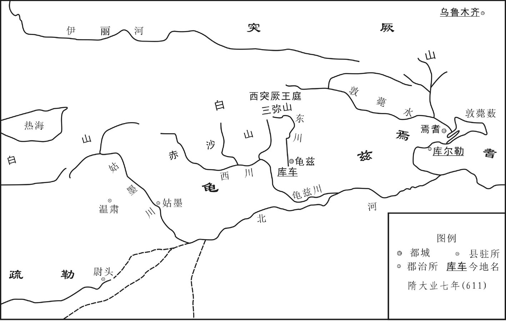 
龟兹位置示意图

## 【原文】

**唐太宗贞观二十一年冬十二月，龟兹王伐叠卒，弟诃黎布失毕立，浸失臣礼，侵渔邻国[1]。上怒，戊寅，诏使持节崑丘道行军大总管左骁卫大将军阿史那社尔、副大总管左骁卫大将军契苾何力、安西都护郭孝恪等将兵击之，仍命铁勒十三州、突厥、吐蕃、吐谷浑连兵进讨[2]。**

## 【注文】

[1]龟兹（Qiūcí）：西域古国名，唐代安西四镇之一。又称丘慈、鸠兹、屈茨。古代居民属印欧种，回鹘人到来后，人种和语言均逐渐回鹘化。龟兹国以库车绿洲为中心，与于阗、疏勒、碎叶号为安西四镇。在极长的历史时期内，是丝绸之路新疆段塔克拉玛干沙漠北道的重镇，宗教、文化、经济等极为发达，此外尚有冶铁业名闻遐迩，西域许多国家的铁器多仰给于龟兹。　　伐叠（生卒年不详）：姓白，世袭龟兹王。号时健莫贺俟利发，白苏伐勃之子。唐太宗贞观四年（630年）向唐朝献马，唐太宗赐玺书，抚慰加等。后来臣服西突厥，不再向唐朝朝贡。苏伐叠死后，弟白诃黎布失毕继位。　　诃黎布失毕：唐朝时龟兹王伐叠的弟弟。　　渔：掠夺。

[2]使持节：加官名，魏晋以后，地方军政长官加“使持节”的，拥有诛杀地方中下级官吏的大权。　　阿史那社尔（604—655年）：突厥人，唐初名将，东突厥处罗可汗的次子。公元634年，自立为都布可汗。公元635年，率部投唐，封左骁卫大将军，尚衡阳公主。公元640年，以攻灭高昌之功封毕国公。其后，参与对高句丽、薛延陁的战争，屡立军功，并有清廉之名。公元647年，同契苾何力率铁勒、突厥部众十万人击败龟兹，并迫使于阗国王臣服。去世后赠辅国大将军、并州都督，陪葬昭陵，谥曰“元”。　　契苾何力（？—677年）：铁勒族契苾部人，契苾氏，唐朝名将。出身铁勒可汗世家，后率部归唐。在对吐谷浑的战争中，力俘吐谷浑王，以功尚宗室女。后被反叛的部众绑架至薛延陁，唐太宗不惜以公主下嫁为条件换回，作为唐军前军指挥官参加了对高句丽的战争。唐太宗逝世后，契苾何力欲以身殉葬，为高宗所止。唐高宗显庆、龙朔年中，与苏定方等人屡征高句丽。后为辽东道大总管，作为李副手攻克平壤。死后，陪葬昭陵，谥号“毅”。　　郭孝恪（kè）（？—649年）：许州阳翟（今河南禹州）人，唐初名将。隋末归附瓦岗，与徐世守黎阳。李密败亡后，归降唐朝，封宋州刺史，阳翟郡公，经略虎牢以东。后迁上柱国。历任贝、赵、江、泾四州刺史，左骁卫将军，累加金紫光禄大夫。公元642年，拜凉州都督，又改安西都护、西州刺史。公元644年，拜西州道行军总管，率三千步骑出银山道，俘虏焉耆王龙突骑支。公元648年，拜昆丘道副大总管，随阿史那社尔进讨龟兹（今新疆库车），攻破国都，遣余军分道追击国相那利，在城外中流矢而亡，被剥夺官爵。高宗即位，追还官爵。　　铁勒：古族名，南北朝隋唐时期北方突厥语游牧部落的泛称。

## 【译文】

唐太宗贞观二十一年（647年）冬十二月，龟兹王伐叠去世后，他的弟弟诃黎布失毕即位，逐渐失去臣属国的礼节，侵犯掠夺邻国。唐太宗大怒，戊寅（二十六日），下诏派遣使持节崑丘道行军大总管左骁卫大将军阿史那社尔、副大总管左骁卫大将军契苾何力、安西都护郭孝恪等人领兵进攻龟兹，还命令铁勒族十三州、突厥、吐蕃、吐谷浑联合出兵进行讨伐。

## 【原文】

**二十二年春三月甲午，上谓侍臣曰：“朕少长兵间，颇能料敌[1]。今崑丘行师，处月、处密二部及龟兹用事者羯猎颠那利每怀首鼠，必先授首，（弩）［布］失毕其次也[2]。”**

## 【注文】

[1]料：估量；揣度；料想。

[2]行师：用兵；出兵。　　处月：古部落名。西突厥别部。本居金娑岭之阳，临大碛。后分成两支，西支徙碎叶水西，东支留故地，唐德宗贞元年间徙甘、灵二州。　　处密：唐朝时西域少数民族名。　　羯猎颠那利（生卒年不详）：唐朝时龟兹将相。　　首鼠：踌躇；迟疑不决。　　授首：指投降或被杀。　　弩失毕：即西突厥十姓部落中的五弩失毕部。

## 【译文】

唐太宗贞观二十二年（648年）春三月甲午（十四日），太宗对侍臣说：“我年轻时在军中长大，对敌情的预料还是有把握的。这次崑丘出兵，处月、处密两个部落和龟兹的执政者羯猎颠那利总是怀有二心，一定要先斩杀他们，弩失毕是其次。”

## 【原文】

**秋七月庚寅，西突厥相屈利啜请帅所部从讨龟兹[1]。**

## 【注文】

[1]屈利啜：唐朝时西突厥宰相。

## 【译文】

秋七月庚寅（十一日），西突厥丞相屈利啜请求率领部队随从唐军讨伐龟兹。

## 【原文】

**［冬十月］，阿史那社尔引兵自焉耆之西趋龟兹北境，分兵为五道，出其不意，焉耆王薛婆阿那支弃城奔龟兹，保其东境[1]。社尔遣兵追击，擒而斩之，立其从父弟先那准为焉耆王，使修职贡[2]。龟兹大震，守将多弃城走[3]。社尔进屯碛台，去其都城三百里，遣伊州刺史韩威帅千余骑为前锋，左卫将军曹继叔次之[4]。至多褐城，龟兹王诃利布失毕、其相那利、羯猎颠师众五万拒战[5]。锋刃甫接，威引兵伪遁，龟兹悉众追之，行三十里，与继叔军合[6]。龟兹惧，将却，继叔乘之，龟兹大败，逐北八十里[7]。**

## 【注文】

[1]焉耆（qí）：今新疆焉耆西南，位于新疆维吾尔自治区中部，隶属巴音郭楞蒙古自治州。　　薛婆阿那支：唐朝时焉耆王。

[2]先那准（？—651年）：龙姓，唐太宗贞观二十二年（648年）唐朝拥立的西域焉耆国王，龙突骑支、龙栗婆准的弟弟。公元648年，唐太宗派阿史那社尔、契苾何力、郭孝恪率军攻焉耆。西突厥拥立的焉耆国王薛婆阿那支放弃焉耆，逃到龟兹东部，阿史那社尔擒杀之。社尔拥立薛婆阿那支的堂兄先那准为焉耆国王，以其地为焉耆都督府。

[3]震：震惊；惊惧；使惊惧。

[4]伊（yī）州：唐太宗贞观六年（632年）改西伊州置，治所在伊吾县（今新疆哈密）。安史之乱后属吐蕃，唐宣宗大中五年（851年）为沙洲刺史张义潮收复，北宋时仍称伊州。　　都城：指龟兹王都伊罗卢城（今新疆库车）。　　韩威（生卒年不详）：唐朝时伊州刺史。　　左卫将军：隋十二禁卫军长官之一。　　曹继叔（生卒年不详）：唐将领。曾参与对高丽、龟兹、后突厥等的征讨。

[5]多褐（hè）城：在龟兹（今新疆库车）东。　　那利、羯猎颠（生卒年不详）：唐朝时龟兹宰相。

[6]甫（fǔ）：刚刚，才。　　伪（wěi）：伪装；假装。

[7]北：败逃的军队。

## 【译文】

唐太宗贞观二十二年（648年）冬十月，阿史那社尔领兵从焉耆西面赶赴龟兹的北部边境，分兵为五路，出其不意，焉耆国王薛婆阿那支弃城逃奔到龟兹，保守他的东部边境。阿史那社尔派兵追击，活捉并斩杀了他，立他的堂弟先那准为焉耆国王，让他继续向唐朝述职与进贡。龟兹大为震惊，守城将士很多弃城逃走。阿史那社尔进驻碛台，距离龟兹都城三百里，派遣伊州刺史韩威率一千多骑兵做前锋，左卫将军曹继叔跟随在后面。到了多褐城，龟兹国王诃利布失毕、他的丞相那利、羯猎颠率领部众五万抵抗。刚刚接阵交战，韩威领兵假装逃走，龟兹出动全部人马追赶，跑了三十里，韩威和曹继叔兵马会合。龟兹兵恐惧，想要退却，曹继叔乘机反击，龟兹兵大败，乘胜追杀了八十里。

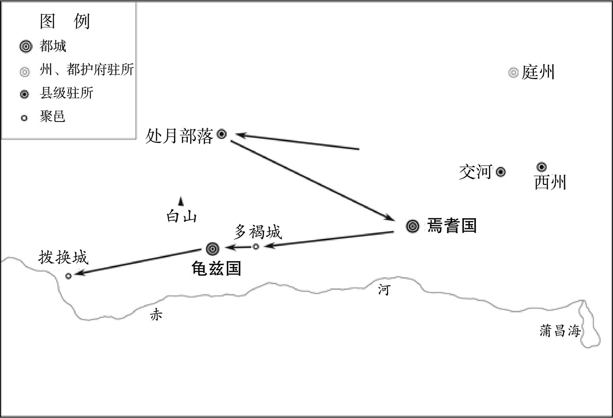 
阿史那社尔败焉耆、龟兹示意图

## 【原文】

**龟兹王布失毕既败，走保都城，阿史那社尔进军逼之，布失毕轻骑西走[1]。［十二月］，社尔拔其城，使安西都护郭孝恪守之[2]。沙州刺史苏海政、尚辇奉御薛万备帅精骑追布失毕，行六百里，布失毕窘急，保拨换城[3]。社尔进军攻之四旬，闰月丁丑，拔之，擒布失毕及羯猎颠[4]。那利脱身走，潜引西突厥之众并其国兵万余人袭击孝恪[5]。孝恪营于城外，龟兹人或告之，孝恪不以为意[6]。那利奄至，孝恪帅所部千余人将入城，那利之众已登城矣，城中降胡与之相应，共击孝恪，矢刃如雨，孝恪不能敌，将复出，死于西门[7]。城中大扰，仓部郎中崔义超召募得二百人，卫军资财物，与龟兹战于城中，曹继叔、韩威亦营于城外，自城西北隅击之[8]。那利经宿乃退，斩首三千余级，城中始定[9]。后旬余日，那利复引山北龟兹万余人趣都城，继叔逆击，大破之，斩首八千级[10]。那利单骑走，龟兹人执之，以诣军门[11]。**

## 【注文】

[1]布失毕：即原龟兹王伐叠的弟弟诃黎布失毕，后成为龟兹王。

[2]安西都护：安西都护府和安西大都护府是唐朝管理碛西的一个军政机构的不同时期的名称，其统辖安西四镇，管辖范围东起今阿尔泰山，西至咸海（一说里海），包括葱岭东西和阿姆河两岸诸城国，在武周时代北庭都护府分立之后，安西都护府分管天山以南、葱岭东西的西域地区。

[3]沙州：唐太宗贞观七年（633年）改西沙洲置，治所在敦煌（今甘肃敦煌西）。天宝元年（742年）改为敦煌郡，乾元元年（758年）复为沙洲。辖境相当于今甘肃敦煌、肃北、阿克塞及新疆若羌、且末地。　　苏海政（生卒年不详）：唐初大将。曾参与太宗、高宗时对高丽、龟兹、西突厥等的征讨，官至（yù）海道行军大总管。　　尚辇奉御：古代官名。为殿中省尚辇局长官，从五品上。　　薛万备（生卒年不详）：本敦煌（今甘肃敦煌）人，后徙京兆咸阳（今陕西咸阳）。为母守孝，筑庐舍于墓前而居，唐太宗下诏表彰其行。以尚辇奉御跟从太宗伐高丽，围白岩城（今辽宁辽阳）时，敌万余援兵为唐将契苾何力所阻，何力重伤，单骑救何力。因仕至左卫将军。　　窘（jiǒng）：处境困迫。　　拨换城：又名威戎城，即今新疆阿克苏。

[4]旬（xún）：十日。古代天干纪日,每十日周而复始,称一旬。

[5]潜：暗中。

[6]营：扎营。

[7]奄（yǎn）：忽然，突然。

[8]仓部郎中：古代官名，户部仓部司长官，掌天下仓储之政令。　　仓部：古代官署名。魏时尚书设有仓部郎，后代沿置其职，唐代曾改为司庾、司储，后恢复旧称。唐以后均为户部所属四司之一，掌管全国仓储出纳之政令，至明代于户部设十三司，其职掌遂隶属各司。　　崔义超（生卒年不详）：唐朝时仓部郎中。　　曹继叔、韩威（生卒年不详）：唐朝时将领。　　隅（yú）：角落。

[9]宿（xiǔ）：夜。

[10]山北：今白山（在新疆库车北）之北。白山又名阿羯田山。　　趣：通“趋”。趋向；奔向。

[11]诣（yì）：前往，去到。

## 【译文】

龟兹王布失毕被打败后，逃走守卫他的都城，阿史那社尔进兵追逼，布失毕率领轻骑出城向西逃走。贞观二十二年（648年）十二月，阿史那社尔攻克布失毕的都城，派安西都护郭孝恪守卫。沙州刺史苏海政、尚辇奉御薛万备率领精锐骑兵追击布失毕，行军六百里，布失毕窘迫惊慌，保卫拨换城。阿史那社尔领兵攻打了四十天，闰十二月丁丑日，攻陷城池，生擒布失毕和羯猎颠。那利脱身逃走，暗中带着西突厥的人马和自己国中的部队一万余人来袭击郭孝恪。郭孝恪把兵营安扎在城外，龟兹有人把这一情况告诉了他，郭孝恪不以为然。那利忽然大兵袭来，郭孝恪率领部下千余人将要进城，那利的兵已经登上城墙，城中投降的胡兵和那利里应外合，共同夹击郭孝恪，箭如雨下，郭孝恪抵挡不住，想再出城，被射死在西门下。城中大为混乱，仓部郎中崔义超招募到二百人，保卫军资和财物，并与龟兹在城中展开激战，曹继叔、韩威也扎营在城外，从城西北角攻击龟兹兵。那利经过一夜激战才退却，杀死龟兹兵三千多人，城中才安定下来。十多天以后，那利又带领山北的龟兹人一万多赶奔都城，曹继叔迎战，将他打败，斩杀八千多人。那利单骑逃走，被龟兹人捉住，送往军中。

## 【原文】

**阿史那社尔前后破其大城五，遣左卫郎将权祗甫诣［诸］城开示祸福，皆相帅请降，凡得七百余城，虏男女数万口[1]。社尔乃召其父老，宣国威灵，谕以伐罪之意，立其王之弟叶护为主，龟兹人大喜[2]。西域震骇，西突厥、于阗、安国争馈驼马军粮，社尔勒石纪功而还[3]。**

## 【注文】

[1]郎将：古代武官名。秦置，主宿卫、车骑，即郎中令所辖三署的五官中郎将、左中郎将、右中郎将。汉袭秦制，属光禄勋。唐宋设官，于中郎将之外，又置郎将。　　权祗（zhī）甫（生卒年不详）：唐初边将。　　开示：开导，启发。

[2]叶护：龟兹王诃黎布失毕弟之官号，或为王弟以官称为名。

[3]骇（hài）：惊骇；惊诧；惊动。　　于阗（tián）：是古代西域王国，中国唐代安西四镇之一。都西城（今新疆和田约特干遗址）。　　安国：古国名。故地在今乌兹别克斯坦布哈拉一带。　　馈（kuì）：赠送。　　勒：雕刻。　　纪：通“记”。记录,记载。

## 【译文】

阿史那社尔前后共攻下五座大城，派遣左卫郎将权祗甫到各城对他们说明祸福厉害，各城全都请求投降，共得七百多城，虏获男女几万口。阿史那社尔于是召集他们的父老，向他们宣传大唐的国威，讲明这次征伐有罪之国的原因，并立龟兹国王的弟弟叶护为国王，龟兹人非常高兴。西域地区震骇，西突厥、于阗、安国争相馈送骆驼马匹和军粮，阿史那社尔刻石碑记功后还军。

## 【原文】

**二十三年春正月辛亥，龟兹王布失毕及其相那利等至京师，上责让而释之，以布失毕为左武卫中郎将[1]。**

## 【注文】

[1]左武卫中郎将：据胡注等，“左武卫”下应有“翊卫”二字。左武卫翊卫中郎将为左武卫翊卫中郎将府长官，正四品下，掌宿卫宫禁。

## 【译文】

唐太宗贞观二十三年（649年）春正月辛亥（初六日），龟兹王布失毕和他的宰相那利等人被押到了京城。唐太宗叱责了他们后释放了他们，任命布失毕为左武卫中郎将。

## 【原文】

**高宗永徽元年[1]。初，阿史那社尔虏龟兹王布失毕，立其弟为王[2]。唐兵既还，其酋长争立，更相攻击[3]。秋八月壬午，诏复以布失毕为龟兹王，遣归国抚其众。**

## 【注文】

[1]永徽：唐高宗李治的年号，共六年，从永徽元年（650年）正月至永徽六年（655年）十二月。

[2]虏：俘虏。

[3]酋长：中国古代少数民族首领的称谓。

## 【译文】

唐高宗永徽元年（650年）。当初，阿史那社尔俘虏了龟兹王布失毕，立他弟弟为国王。唐朝的兵回朝以后，各部落的酋长争夺王位，互相攻击。秋八月壬午（十六日），高宗下诏还是让布失毕重新做龟兹王，派遣他回国，安抚他的民众。

## 【原文】

**显庆元年秋八月乙巳，龟兹王布失毕入朝[1]。**

## 【注文】

[1]显庆：唐高宗李治的年号，共五年余，从显庆元年（656年）正月至显庆六年（661年）二月。

## 【译文】

唐高宗显庆元年（656年）秋八月乙巳（十三日），龟兹王布失毕入朝觐见。

## 【原文】

**三年[1]。初，龟兹王布失毕妻阿史那氏与其相那利私通，布失毕不能禁，由是君臣猜阻，各有党与，互来告难[2]。上两召之，既至，囚那利，遣左领军郎将雷文成送布失毕归国[3]。至龟兹东境泥师城，龟兹大将羯猎颠发众拒之，仍遣使降于西突厥沙钵罗可汗[4]。布失毕据城自守，不敢进[5]。诏左屯卫大将军杨胄发兵讨之[6]。会布失毕病卒，胄与羯猎颠战，大破之，擒羯猎颠及其党，尽诛之，乃以其地为龟兹都督府[7]。春正月戊申，立布失毕之子素稽为龟兹王，兼都督[8]。**

## 【注文】

[1]三年：唐高宗显庆三年，公元658年。

[2]猜阻：猜忌阻挠。　　党与：党羽。　　告难：犹攻讦（jié），责难。

[3]左领军郎将：古代武官名号。三国吴大帝黄龙元年（229年）置，统领禁军。　　雷文成（生卒年不详）：唐朝时左领军郎将。

[4]泥师城：古地名，今新疆库车东。　　沙钵罗可汗（？—659年）：即阿史那贺鲁，西突厥汗国大将，室点密可汗五世孙，后自立为西突厥沙钵罗可汗。早年为西突厥叶护，在多罗斯川（今额尔齐斯河源头）一带游牧。公元646年，乙毗射匮就任西突厥可汗，击败原可汗乙毗咄陆，将其逐入吐火罗。贺鲁原为乙毗咄陆一党，遂率三千部众畏罪逃奔唐朝。时唐军正征讨龟兹，封贺鲁为昆丘道行军总管，进军龟兹。之后，贺鲁又被封为瑶池都督府都督、沙钵罗叶护。唐高宗永徽元年（650年），贺鲁乘唐太宗新丧之机，自立为沙钵罗可汗，夺取西州、庭州等地，统一西突厥部众，同唐朝对抗。后为吐蕃压迫，放弃天山以南，将王廷迁往天山以北。永徽三年（652年），唐将梁建方、契苾何力击败贺鲁别部处月部。永徽六年（655年），唐将程知节又击败贺鲁各部。唐高宗显庆三年（658年），唐将苏定方彻底击溃贺鲁本部，副将萧嗣业追擒贺鲁于石国（今乌兹别克斯坦塔什干）。西突厥汗国至此灭亡。

[5]据城：守城。

[6]左屯卫大将军：古代官名。中央十二卫大将军之一，正三品。　　杨胄（生卒年不详）：唐朝时左屯卫大将军，后任安西都护。

[7]龟兹都督府：治所伊罗卢城，在今新疆库车东。

[8]素稽（生卒年不详）：唐朝时龟兹王布失毕的儿子，后为龟兹王。

## 【译文】

唐高宗显庆三年（658年）。当初，龟兹王布失毕的妻子阿史那氏和他的宰相那利私通，布失毕不能制止，因此君臣之间互相猜忌，各有党羽，互相来朝控诉和责难对方。唐高宗李治把两人都召来，到长安以后，把那利囚禁起来，派遣左领军郎将雷文成送布失毕回国。他们到达龟兹东部边境泥师城，龟兹大将羯猎颠发动部众抗拒，又派遣使者向西突厥沙钵罗可汗投降。布失毕占据泥师城固守，不敢前进。高宗下诏命左屯卫大将军杨胄发兵征讨羯猎颠。恰值布失毕病死，杨胄和羯猎颠交战，把他打得大败，把羯猎颠和他的党羽捉住后，全都杀掉，于是就在其地设置龟兹都督府。春正月戊申（二十五日），唐朝封布失毕的儿子素稽为龟兹王，兼任都督。

## 【原文】

**夏五月癸未，徙安西都护府于龟兹，以旧安西复为西州都督府，镇高昌故地[1]。**

## 【注文】

[1]徙：迁移。　　安西都护府：唐太宗贞观十四年（640年）置。治所西州，在今新疆吐鲁番东南高昌故城遗址。　　西州都督府：唐高宗显庆三年（658年），以原安西都护府故地西州置西州都护府，统伊、西、庭三州之地。唐高宗龙朔二年（663年）十二月，改西州都督府为金山都护府。唐睿宗永昌元年（689年），复置西州都督府。武则天长安二年（702年）十二月六日，罢废西州都督府。　　高昌：古城国名。公元443年由沮渠无讳建立，经阚氏、张氏、马氏、麹氏统治，至公元640年为唐所灭。麹氏盛时，其辖境以吐鲁番为中心，东接敦煌，西达龟兹（今新疆库车），南邻吐谷浑（今罗布泊以南），北迄敕勒（天山北麓）。

## 【译文】

唐高宗显庆三年（658年）夏五月癸未（初二日），唐迁徙安西都护府到龟兹，将原安西恢复为西州都督府，镇守高昌原来的地方。

# 太宗平高昌

## 【内容提要】

《太宗平高昌》叙述了唐太宗贞观十四年（640年），交河道行军大总管、吏部尚书侯君集率兵击灭高昌国（今新疆吐鲁番东南）的作战过程。

高昌原为中国一个郡，南北朝以后，自立为国，历代都臣属于中原王朝。高昌王麹（qū）文泰早在唐太宗贞观四年（630年）就曾亲自到长安觐见唐太宗李世民，贡献方物。后麹文泰依附西突厥，阻遏西域各国通过其境向唐入贡，并发兵袭扰内附的伊吾（今新疆哈密）、焉耆（今新疆焉耆西南）等国。由于高昌位于唐王朝通往西域各国的交通要道，地理位置重要，故唐太宗决心出兵打通交通要道。唐太宗贞观十三年（639年），征召麹文泰入朝，文泰称疾不至。十二月初四日，诏令侯君集为交河道行军大总管，左屯卫大将军薛万均为副总管，率步骑数万及突厥、契苾之众征讨高昌。麹文泰以为唐距离高昌遥远，且地无水草，气候异常，唐朝不会以大兵相加。等到唐军在熟悉当地地形的契苾何力引领下抵达碛口时，麹文泰忧惧而死，其子智盛即位。贞观十四年（640年）八月，唐军攻下田地城（今新疆鄯善西南鲁克沁）。侯君集命中郎将辛獠儿为前锋，直趋高昌城。麹智盛率军迎战，被击败后退保都城。侯君集命将士填堑攻城，奉命前来救援高昌的西突厥军畏惧唐军威势，也在可汗浮图城（今新疆吉木萨尔北破城子）投降。麹智盛见大势已去，被迫于初八开门出城投降。侯君集俘虏高昌王智盛及他的群臣豪杰回到京城。于是唐的疆域东到大海，西至焉耆，南达林邑，北抵大漠，都设置州县，总共东西九千五百一十里，南北一万九百一十八里。

高昌地处天山南路，是中西交通的要道。平定高昌，不仅有利于中西交通，促进中国和西方国家经济、文化的交流，也有利于扩大疆域，保持国家版图的完整。

## 【原文】

**唐高祖武德二年[1]。高昌王麹伯雅遣使入贡[2]。六年，麹伯雅卒，子文泰立[3]。**

## 【注文】

[1]武德二年：公元619年。

[2]麹伯雅（？—623年）：中国古高昌的君主之一，属麹氏高昌之列，他于公元602年即位，改年号“延和”。公元609年，至隋朝朝贡，隋炀帝封麹伯雅为光禄大夫、弁国公、高昌王。公元612年，隋炀帝征高句丽，麹伯雅随行至高句丽。隋朝将华容公主宇文氏嫁给麹伯雅。公元613年，发生政变，麹伯雅失去王位。公元620年，麹伯雅复位，改年号“重光”。

[3]文泰：即麹文泰（？—640年），祖籍金城（今甘肃兰州）。唐时高昌国主，高昌延和二十二年（623年）嗣位。唐太宗贞观四年（630年）偕妻宇文氏朝唐，太宗赐其妻李姓，封常乐公主。贞观十三年（639年）乙毗咄陆可汗统一西突厥，遣吐屯阿史那矩领高昌冠军大将军，监督其国。他于是不复朝唐。又与西突厥联兵犯伊吾，掠焉耆，壅绝西域商道。太宗下书责怪，并向他索要中原逃亡到其地的人，征阿史那矩入朝，都不应。于是遣侯君集为交河道大总管率军出讨。贞观十四年（640年）唐军临碛（qì）口，西突厥援军不至，他惊惧无计，病发而死。子智盛立，不久唐军至，智盛降，高昌灭亡。

## 【译文】

唐高祖李渊武德二年（619年）。高昌王麹伯雅派使入贡。武德六年（623年），高昌王麹伯雅去世，他儿子麹文泰继立为王。

## 【原文】

**太宗贞观四年冬十二月甲寅，高昌王麹文泰入朝。西域诸国咸欲因文泰遣使入贡，上遣文泰之臣厌怛纥干往迎之[1]。魏徵谏曰：“昔光武不听西域送侍子、置都护，以为不以蛮夷劳中国[2]。今天下初定，前者文泰之来，所过劳费已甚，今借使十国入贡，其徒旅不减千人[3]。边民荒耗，将不胜其弊[4]。若听其商贾往来，与边民交市，则可矣，傥以宾客遇之，非中国之利也[5]。”时厌怛纥干已行，上遂令止之[6]。**

## 【注文】

[1]厌怛（dá）纥（hé）干：唐朝时高昌王麹文泰的使臣。

[2]光武：汉世祖光武帝刘秀（前5—57年），东汉开国皇帝，史上著名的中兴之主，有“允冠百王”之称。新末天下大乱，刘秀与兄在舂陵（今湖北枣阳）以“复兴汉室”为号召起兵，与众豪杰并争天下。在昆阳之战中一举摧垮新莽四十二万大军，成为灭亡新朝的关键人物。后刘秀受更始帝派遣而“单车空节”巡河北，趁机一举平定河北，并于更始三年（25年）于河北称帝，国号“汉”，史称“东汉”，此后平灭绿林、赤眉、隗（wěi）嚣等割据政权，天下得以再次一统。　　西域：狭义上是指葱岭即今帕米尔高原以东。而广义的西域则是指凡是通过狭义西域所能到达的地区，包括亚洲中、西部，印度半岛、欧洲东部和非洲北部在内的地区等。　　侍子：指送入朝侍奉天子其实是做人质的儿子。　　蛮夷：古代泛指华夏中原民族以外的少数民族。

[3]借使：假使。　　徒旅：随同的人。

[4]荒耗：荒废作业消耗财物。

[5]商贾（gǔ）：商人。　　傥（tǎng）：表示假设，相当于“倘若”“如果”。

[6]行：出行；出动。

## 【译文】

唐太宗贞观四年（630年）冬十二月甲寅（二十四日），高昌王麹文泰入朝。西域各国都想通过麹文泰入朝的机会，派遣使者到长安朝贡。太宗派遣麹文泰的手下大臣厌怛纥干前往迎接。魏徵劝谏说：“过去汉光武帝不允许西域国家送儿子入朝做人质，也不设置都护府，认为不应当因为蛮夷而劳顿中原。如今天下刚刚平定，先前麹文泰来朝，所用的财物和劳役已经很多，如今假使有十国入贡，他们的随从不下一千人。边境民众耗费时间和财力，将无法承受这样的困弊。如果允许商人随便相互往来，和边境百姓进行互市贸易，这就可以了，如果以宾客之礼来接待他们，对我大唐是没有好处的。”这时厌怛纥干已经出发，唐太宗急速下令阻止。

## 【原文】

**五年春正月癸酉，上大猎于昆明池，四夷君长咸从[1]。甲戌，宴高昌王文泰及群臣。丙子，还宫，亲献禽于大安宫[2]。**

## 【注文】

[1]昆明池：池名，位于唐长安城西南，在今陕西西安长安区。

[2]献：下对上、卑对尊的进献。　　大安宫：古代宫名，唐高祖武德五年（622年）于长安城西侧建弘义宫，令秦王居之。唐太宗贞观三年（629年），高祖从太极殿迁至弘义宫，更名为大安宫，取太上皇安居之意。

## 【译文】

唐太宗贞观五年（631年）春正月癸酉（十三日），唐太宗在昆明池举行盛大的畋猎活动，四夷的君长都跟从。甲戌（十四日），太宗宴请高昌王麹文泰和群臣。丙子（十六日），太宗回到宫中，亲自到大安宫向太上皇李渊献上野禽。

## 【原文】

**六年秋七月丙辰，焉耆王突骑支遣使入贡[1]。初，焉耆入中国由碛路，隋末闭塞，道由高昌[2]。突骑支请复开碛路以便往来，上许之[3]。由是高昌恨之，遣兵袭焉耆，大掠而去[4]。**

## 【注文】

[1]焉耆（qí）：古代西域国名，国都在今新疆焉耆西南。

[2]碛（qì）路：沙漠道路。碛，沙漠，沙堆。　　高昌：古国名。故址在今新疆吐鲁番东。

[3]复：再。

[4]是：这，这个。

## 【译文】

唐太宗贞观六年（632年）秋七月丙辰（初四日），焉耆王突骑支派使臣入贡。起初，焉耆从沙漠道路到达中原王朝，隋朝末年此路闭塞，改道由高昌进入。突骑支请求重新开辟沙漠道路以便往来，唐太宗允许了。高昌由此对焉耆怀恨在心，派兵袭击焉耆，大肆劫掠后回去。

## 【原文】

**十三年[1]。高昌王麹文泰多遏绝西域朝贡，伊吾先臣西突厥，既而内属，文泰与西突厥共击之[2]。上下书切责，征其大臣阿史那矩，欲与议事[3]。文泰不遣，遣其长史麹雍来谢罪[4]。颉利之亡也，中国人在突厥者或奔高昌，诏文泰归之，文泰蔽匿不遣[5]。又与西突厥共击破焉耆，焉耆诉之[6]。上遣虞部郎中李道裕往问状，且谓其使者曰：“高昌数年以来，朝贡脱略，无藩臣礼，所置官号，皆准天朝，筑城掘沟，预备攻讨[7]。我使者至彼，文泰语之云：‘鹰飞于天，雉伏于蒿，猫游于堂，鼠噍于穴，各得其所，岂不能自生邪！[8]’又遣使谓薛延陁云：‘既为可汗，则与天子匹敌，何为拜其使者[9]？’事人无礼，又间邻国为恶，不诛，善何以劝[10]？明年当发兵击汝[11]。”三月，薛延陁可汗遣使上言：“奴受恩思报，请发所部为军导以击高昌[12]。”上遣民部尚书唐俭、右领军大将军执失思力赍缯帛赐薛延陁，与谋进取[13]。**

## 【注文】

[1]十三年：即唐太宗贞观十三年，公元639年。

[2]遏（è）：阻止。　　伊吾：原隋郡名，治所在今新疆哈密西，唐为伊州。　　西突厥：原是突厥汗国西面可汗。突厥汗国被隋朝分裂成东西两部后，西突厥在西域称雄，以控制丝绸之路。最强盛时期曾经拥有我国新疆和中亚诸国的大部分地区。

[3]切：严厉。　　阿史那矩：突厥人，高昌国大臣。阿史那，姓；矩，名。

[4]长史：古代官名，秦置。为郡府官，掌兵马。唐制，上州刺史别驾下，有长史一人，从五品。　　麹雍（生卒年不详）：唐朝时高昌长史。

[5]中国人：此谓流落蕃区的中原汉人。　　蔽（bì）：隐藏。

[6]诉：告状；控告。

[7]虞（yú）部郎中：古代官名，唐、宋工部有虞部郎中、员外郎，掌京城街巷、苑圃、山泽草木及百官、蕃客菜蔬、薪炭供应及畋猎等事，并供应殿中省、太仆寺所管马匹刍料。　　李道裕（生卒年不详）：唐朝大臣。雍州泾阳（今陕西泾阳）人。右卫大将军兼工部尚书李大亮之侄。唐太宗贞观二十年（646年）时，李道裕为将作少匠，后来官至大理寺卿，成为中央最高审判机关的长官。　　脱略：放任，不拘束。　　准：以……为标准。　　天朝：指唐朝廷。

[8]雉（zhì）：野鸡。　　蒿（hāo）：二年生草本植物，叶如丝状，有特殊的气味，开黄绿色小花，可入药。亦称“青蒿”“香蒿”。　　噍（jiào）：鸣叫声，或咬、咀嚼。　　各得其所：原指各人都得到满足，后指每个人或事物都得到恰当的位置或安排。

[9]薛延陁（tuó）：亦名“薛延陀”，是敕勒部落之一，他们是部落联合体，由薛与延陁组成。初属突厥，唐太宗贞观二年（628年）太宗封其首领夷男为真珠毗伽可汗，建牙于郁督军山（今杭爱山）。贞观四年（630年），助唐灭突厥。贞观二十年（646年）发生内乱，为唐所破。　　匹敌：相比；相当；对等。

[10]事：服侍。　　间（jiàn）：离间，挑拨。　　劝：倡导。

[11]当：会。

[12]报：报答，报酬。

[13]民部：即户部，古代官署名。西汉成帝初置尚书四人，分上曹办事，民曹为四曹之一，主吏民上书事。东汉增至六曹，民曹改主缮修功作、盐池园苑事。魏、晋有左民、右民二曹。至唐初，因避讳而改为户部。　　尚书：战国时亦作“掌书”，齐、秦均置。秦属少府，秩六百石，为低级官员，在殿中主发布文书。秦及汉初与尚冠、尚衣、尚食、尚浴、尚席，称“六尚”。魏有五曹，晋增为六曹。后尚书台改名尚书省，曹改称部，列曹（各部）尚书遂为贵官。隋以后尚书为六部长官，是古代中央政府部级长官。尚书在隋、唐正三品。　　唐俭（579—656年）：字茂约，并州晋阳（今山西太原）人。凌烟阁二十四功臣之一。经历三朝五帝。　　领军：古代官名。东汉建安中曹操置，统领禁卫军。唐初禁军有左右领军卫，各置领军将军二人，秩从三品，掌宫禁宿卫。　　执失思力（生卒年不详）：突厥人，唐朝将领。原是突厥处罗可汗、颉利可汗属下的酋长。唐高祖武德九年（626年），出使唐朝，因出言不逊被太宗囚于门下省，不久放还。唐太宗贞观年间，护送隋萧皇后归唐，被任命为左领军将军。颉利可汗被李靖击败后，奉命招降浑、斛萨等部族。唐太宗贞观五年（631年），尚高祖第八女九江公主，任驸马都尉，封安国公。此后多次征战，先后征讨吐谷浑、吐蕃、薛延陁。唐高宗永徽四年（653年），受房遗爱谋反案牵连，被流放巂（xī）州，公主求削封邑，与夫同行。唐高宗龙朔年间，为归州刺史，不久去世。唐高宗麟德元年（664年），追赠胜州都督，谥号“景”，并恢复公主封邑。

## 【译文】

唐太宗贞观十三年（639年）。高昌王麹文泰多次阻止西域各国入朝进贡，伊吾早先向西突厥称臣，不久又归附唐朝，麹文泰联合西突厥共同进攻伊吾。唐太宗给他下诏书严厉斥责，又征召他的大臣阿史那矩，想和他商议此事。麹文泰不让阿史那矩入朝，派他的长史麹雍来谢罪。颉利可汗被打败灭亡时，在突厥的中原人有的逃奔到高昌，太宗下诏让麹文泰放他们回到唐朝，麹文泰把他们隐藏起来不放。这次又和西突厥共同进攻焉耆，焉耆向唐上诉此事。太宗派遣虞部郎中李道裕前往询问情况，并且对高昌使者说：“高昌这几年以来，不向我大唐进献贡品，不行藩臣之礼，所设的官职称号，都和我大唐相同，修筑城池，挖掘城沟，准备进攻。我们大唐使者到那里，麹文泰对他说：‘鹰飞翔在天空，野鸡伏在蒿草中，猫游戏于庭堂，老鼠嚼食于洞穴，各得其所，难道还有自己不能生存的吗？’又派使者对薛延陁说：‘你既身为可汗，就应和大唐天子相匹敌，为什么要拜他的使者？’事奉人而又如此不守臣礼，又离间周围邻国作恶，不杀掉他，怎么能劝别人为善？明年，我就发兵讨伐你们高昌。”三月，薛延陁可汗派遣使臣向太宗上言说：“我蒙受皇上的恩遇，总想着报答天朝，请允许我发派我的军队作为向导进攻高昌。”太宗派遣民部尚书唐俭、右领军大将军执失思力携带缯帛等物赐给薛延陁，和他共同商议攻取高昌的策略。

## 【原文】

**上犹冀高昌王文泰悔过，复下玺书，示以祸福，征之入朝，文泰竟称疾不至[1]。十二月壬申，遣交河行军大总管、吏部尚书侯君集，副总管兼左屯卫大将军薛万均等将兵击之[2]。**

## 【注文】

[1]冀（jì）：希望，期望。

[2]交河：指交河古城，在今新疆吐鲁番西北。　　吏部：中国古代官署。西汉尚书有常侍曹，主管丞相、御史、公卿之事。东汉改尚书常侍曹为吏曹，又改为选部，魏晋以后称吏部，置尚书等官。隋唐列为六部之首。长官为吏部尚书（一称大宰、冢宰），副长官称侍郎。历代相沿。吏部掌管全国官吏的任免、考核、升降、调动等事务。　　左屯卫大将军：古代官名。隋炀帝大业三年（607年）改左领军府为左屯卫，置一人，正三品，总府事，统诸鹰扬府。唐高宗龙朔二年（662年）改为左威卫大将军。　　侯君集（？—643年）：唐朝名将，豳州三水（今陕西旬邑）人，凌烟阁二十四功臣之一。隋末被李世民引入幕府，因作战有功，累迁左虞候、车骑将军。唐高祖武德九年（626年）玄武门之变间，他曾为李世民出谋划策。唐太宗贞观年间，任左卫将军等职，先封潞国公，后封陈国公。唐太宗贞观十七年（643年），因依附太子李承乾谋反，事败被诛。　　薛万均（？—641年）：唐朝将领。本敦煌人，后徙京兆咸阳，隋朝名将薛世雄之子。隋炀帝大业末年与弟薛万彻客居幽州，后随罗艺归唐，授为上柱国、永安郡公。唐太宗贞观初年，随柴绍讨梁师都，任行军副总管，击走突厥，围歼其军，升任左屯卫将军。贞观八年（634年），随李靖讨吐谷浑，任沃沮道行军副总管，在青海遇敌，单骑冲阵，诸将随之，斩数千人，升左屯卫大将军。贞观十三年（639年），以交河道行军副大总管与侯君集击高昌，进封潞国公。贞观十五年（641年），坐事下狱，忧愤而死。太宗为之举哀，命陪葬昭陵。

## 【译文】

太宗仍然希望高昌王麹文泰能够悔过，又下玺书，对他晓示祸福厉害，征召他入朝，麹文泰竟称病不来。贞观十三年（639年）十二月壬申（初四日），太宗派遣交河行军大总管、吏部尚书侯君集，副总管兼左屯卫大将军薛万均等领兵进攻高昌。

## 【原文】

**十四年［秋八月］，高昌王文泰闻唐兵起，谓其国人曰：“唐去我七千里，沙碛居其二千里，地无水草，寒风如刀，热风如烧，安能致大军乎[1]！往吾入朝，见秦、陇之北城邑萧条，非复有隋之比[2]。今来伐我，发兵则粮运不给，三万以下，吾力能制之[3]。当以逸待劳，坐收其弊[4]。若顿兵城下，不过二十日，食尽必走，然后从而虏之，何足忧也[5]。”及闻唐兵临碛口，忧惧不知所为，发疾卒[6]。子智盛立[7]。**

## 【注文】

[1]致：通“至”，到达。

[2]秦：中国周代诸侯国名，在今陕西和甘肃一带。　　陇：即陇山。绵延于陕西、甘肃交界的地方。　　城邑：城市。

[3]给（jǐ）：供应。

[4]以逸待劳：指在战争中做好充分准备，养精蓄锐，等疲乏的敌人来犯时给以迎头痛击。逸，安闲；劳，疲劳。

[5]顿：止宿；屯驻。

[6]临：到，至。

[7]智盛：即麹智盛，高昌王麹文泰嗣子。降唐后拜左卫将军，封金城郡公。

## 【译文】

唐太宗贞观十四年（640年）秋八月，高昌王麹文泰听说唐朝发兵前来讨伐他，对国人说：“唐朝距离我们七千里，沙漠就有二千里，地无水草，寒风刮起来如同刀割一样，热风如同火烧一样，大军怎么能到达呢？以前我去唐朝，看见秦、陇以北城邑都很萧条，不能和隋朝时相比。如今唐朝派兵来讨伐我们，发兵多则粮草供给不上，三万兵力以下，我们的兵力足能制胜于他。我们应当以逸待劳，坐等着他们战败。如果他们把军队停留在城下，用不了二十天，粮食吃完了必然撤退，然后我们可以追上去俘虏他们，有什么可忧虑的。”等到听说唐兵已临近碛（qì）口，他又忧愁恐惧不知如何是好，最后发病死去。他的儿子智盛即可汗位。

## 【原文】

**军至柳谷，诇者言文泰刻日将葬，国人咸集于彼[1]。诸将请袭之，侯君集曰：“不可[2]。天子以高昌无礼，故使吾讨之[3]。今袭人于墟墓之间，非问罪之师也[4]。”于是鼓行而进，至田城，谕之不下，诘朝攻之，及午而克，虏男女七千余口[5]。以中郎将辛獠儿为前锋，夜趋其都城，高昌逆战而败，大军继至，抵其城下[6]。**

## 【注文】

[1]柳谷：即柳谷渡。故址在今新疆吐鲁番北约一百公里处。　　诇（xiòng）：侦察。　　刻日：限定的日期。

[2]袭：袭击。

[3]以：因为。

[4]墟墓：丘墓；墓地。　　问罪：宣布对方罪状，加以谴责、声讨。

[5]田城：即高昌田地郡，治所在今新疆鄯善县西南鲁克沁。　　诘（jié）朝（zhāo）：早晨。　　午：十一时至十三时。

[6]辛獠儿（生卒年不详）：原为梁师都部将，隋唐后官至中郎将等职。

## 【译文】

唐兵到达柳谷，探马来报告说麹文泰不日将要安葬，国内的人都集中在那里。各位将领请求袭击，侯君集说：“不能这样做。大唐天子认为高昌王怠慢无礼，所以才派我们征讨他。如今我们在文泰的墓地上偷袭人家，这怎么是兴师问罪之师干的事情呢？”于是便命击鼓进军，到达田城，向城中告知利害，他们不投降，便于第二天清晨发动攻城，到午间，城池被攻破，俘虏男女七千多口。又以中郎将辛獠儿为前锋，夜晚赶往高昌的都城，高昌人出兵迎战被打败，唐大军紧跟着赶到，抵达城下。

## 【原文】

**智盛致书于君集曰：“得罪于天子者，先王也[1]。天罚所加，身已物故[2]。智盛袭位未几，惟尚书怜察[3]。”君集报曰：“苟能悔过，当束手军门[4]。”智盛犹不出，君集命填堑攻之，飞石雨下，城中人皆室处[5]。又为巢车，高十丈，俯瞰城中，有行人及飞石所中，皆唱言之[6]。先是，文泰与西突厥可汗相结，约有急相助，可汗遣其叶护屯可汗浮图城，为文泰声援[7]。及君集至，可汗惧而西走千余里，叶护以城降。智盛穷蹙，秋八月癸酉，开门出降[8]。君集分兵略地，下其二十二城，户八千四十六，口一万七千七百，地东西八百里，南北五百里[9]。**

## 【注文】

[1]得罪：冒犯，触怒。

[2]物故：故；亡故。

[3]未几：没有多久；很快。　　惟：愿，希望。

[4]束手：捆绑双手。

[5]填：充塞。　　堑（qiàn）：护城河，壕沟。　　室处：躲在房屋里。

[6]巢车：中国古代一种设有望楼，用以登高观察敌情的车辆。车上高悬望楼如鸟之巢，故名。　　俯瞰（kàn）：从高处往下看。　　唱：高呼，大声叫。

[7]叶护：突厥二十八等官级之首。　　可汗浮图城：古城名，因突厥可汗曾于此建立浮图（即佛塔）而得名。故址在今新疆吉木萨尔县北破城子。

[8]穷蹙（cù）：窘迫；困厄。

[9]略：通“掠”。抢劫。

## 【译文】

麹智盛送信给侯君集说：“得罪大唐天子的是先王。由于上天的惩罚，他已经身亡。智盛刚刚承袭王位不久，希望尚书您可怜明察。”侯君集回信对他说：“如果你真的悔过，应当束缚双手到军门来。”智盛还是不出来，君集命令填沟攻城，城上飞石像下雨一般，城中的人都躲在房屋里。侯君集又命士卒做巢车，高十丈，可以俯瞰城里，只要有行人出来或被飞石打中者，都拉长嗓音高声报告。起先，麹文泰和西突厥可汗互相勾结，约定一方有急难时互相援助，西突厥可汗派遣他的叶护屯守可汗浮图城，作为麹文泰的援助力量。等到侯君集来到，西突厥可汗恐惧向西逃走一千多里，叶护举城投降。麹智盛窘急无奈，秋八月癸酉（初八日），开城门出来投降。侯君集分兵占据各地，共攻下二十二个城邑，获得八千四十六户，共有一万七千七百口人，土地东西八百里，南北五百里。

## 【原文】

**上欲以高昌为州县，魏徵谏曰：“陛下初即位，文泰夫妇首朝，其后稍骄倨，故王诛加之[1]。罪止文泰可矣，宜抚其百姓，存其社稷，复立其子，则威德被于遐荒，四夷皆悦服矣[2]。今若利其土地以为州县，则常须千余人镇守，数年一易，往来死者什有三四，供办衣资，违离亲戚，十年之后，陇右虚耗矣[3]。陛下终不得高昌撮粟尺帛以佐中国，所谓散有用以事无用，臣未见其可[4]。”上不从[5]。九月，以其地为西州，以可汗浮图城为庭州，各置属县[6]。乙卯，置安西都护府于交河城，留兵镇之[7]。**

## 【注文】

[1]骄：骄傲。　　倨：傲慢。

[2]被（pī）：古同“披”，覆盖。　　遐（xiá）荒：指边远蕃区。　　悦服：亦作“悦伏”。心悦诚服。

[3]利：占；谋利。　　什：十成,十分,十分之几（古人称“什几”）。　　违：离开；背离。　　陇右：古地区名。泛指陇山以西地区。　　虚耗：消耗一空。

[4]撮（cuō）：容量单位，等于一升的千分之一。　　佐：辅助，帮助。

[5]从：听从。

[6]西州：古州名，治所在今新疆吐鲁番高昌废址。

[7]交河城：古地名。在今新疆吐鲁番市西北，高昌国交河郡治和唐交河县治所在。

## 【译文】

太宗想把高昌改为州县建制，魏徵谏止说：“陛下刚即位时，麹文泰夫妇第一个入朝拜谒，以后就逐渐骄傲和怠慢，所以陛下对他加以诛伐。只问罪文泰一人就可以了，应当安抚高昌的百姓，存留他的社稷，重新立他的儿子为可汗，那么圣上的威德传播于荒远之地，四夷各族都会心悦诚服。如果现在贪图他的土地，把它作为州县，还要经常有一千多人镇守，几年一换，往来死在路上的人就有十分之三四，还要置备衣物和资财，他们又远离亲戚，十年以后，陇右地区就会消耗殆尽。陛下最终还是不能使高昌以一撮米粟和一尺布帛来帮助大唐，这就是所谓散去有用的资财来做无用的事情，我以为这是不可行的。”太宗不听他的意见。九月，将高昌所在地改置西州，改可汗浮图城为庭州，并各设所属的县。乙卯（二十一日），又在交河城设置安西都护府，留兵镇守。

## 【原文】

**君集虏高昌王智盛及其群臣豪杰而还[1]。于是唐地东极于海，西至焉耆，南尽林邑，北抵大漠，皆为州县，凡东西九千五百一十里，南北一万九百一十八里[2]。**

## 【注文】

[1]还:回来。

[2]林邑：即占（zhān）城。古国名、隋郡名。在今越南中南部，隋林邑郡治所在今越南广南省维川县南茶荞。　　大漠：今蒙古高原大沙漠。

## 【译文】

侯君集俘虏高昌王智盛及他的群臣豪杰回到京城。于是唐的疆域东到大海，西至焉耆，南达林邑，北抵大漠，都设置州县，总共东西九千五百一十里，南北一万九百一十八里。

## 【原文】

**侯君集之讨高昌也，遣使约焉耆与之合势，焉耆喜，听命[1]。及高昌王破，焉耆王诣军门谒见君集，且言焉耆三城先为高昌所夺，君集奏并高昌所掠焉耆民悉归之[2]。**

## 【注文】

[1]合势：合力；协力。

[2]谒（yè）见：通名刺进见。后泛指进见地位或辈分高的人。

## 【译文】

侯君集征讨高昌时，派使者与焉耆相约与他合谋，焉耆很高兴，听从了他的命令。等到打败了高昌王后，焉耆王到军门来拜见侯君集，而且说焉耆有三座城先被高昌王夺取，侯君集上奏朝廷并把被高昌所掠去的焉耆百姓全部归还。

## 【原文】

**冬十二月丁酉，侯君集献俘于观德殿，行饮至礼，大酺三日[1]。寻以智盛为左武卫将军、金城郡公[2]。上得高昌乐工，以付太常，增九部乐为十部[3]。**

## 【注文】

[1]观德殿：宫殿名。在长安宫城宜春门北。　　饮至礼：上古诸侯朝会盟伐完毕，祭告宗庙并饮酒庆祝的典礼。后代指出征奏凯，至宗庙祭祀宴饮庆功之礼。　　酺（pú）：聚饮，古指国有喜庆，特赐臣民聚会饮酒。

[2]左武卫将军：隋朝置二人，从三品，佐大将军总其府事。唐朝沿置，凡翊府之翊卫、外府熊渠番上者，分配之。　　金城：古地名，今甘肃兰州。

[3]乐工：歌舞演奏艺人。　　太常：是掌建邦之天地、神祇、人鬼之礼，吉凶宾军嘉礼，以及玉帛钟鼓等的官员，即唐虞的秩宗、周朝的宗伯、秦朝的奉常，位列汉朝九卿之首，地位十分崇高，兼管文化教育、陵县行政，也统辖博士和太学。　　十部：即十部乐，唐初宫廷宴乐，用于朝会大典。

## 【译文】

唐太宗贞观十四年（640年）冬十二月丁酉（初五日），侯君集在观德殿献俘虏，举行饮至的礼仪，天下大宴三天。不久任命智盛为左武卫将军、金城郡公。唐太宗得到高昌的乐工，让他们供职于太常寺，并把九部乐增加为十部乐。

## 【原文】

**君集之破高昌也，私取其珍宝，将士知之，竞为盗窃，君集不能禁，为有司所劾，诏下君集［等］狱[1]。中书侍郎岑文本上疏，以为：“高昌昏迷，陛下命君集等讨而克之，不逾旬日，并付大理[2]。虽君集等自挂网罗，恐海内之人疑陛下唯录其过而遗其功也[3]。臣闻命将出师，主于克敌，苟能克敌，虽贪可赏；若其败绩，虽廉可诛[4]。是以汉之李广利、陈汤，晋之王濬，隋之韩擒虎，皆负罪谴，人主以其有功，咸受封赏[5]。由是观之，将帅之臣，廉慎者寡，贪求者众，是以黄石公《军势》曰：‘使智，使勇，使贪，使愚，故智者乐立其功，勇者好行其志，贪者急趋其利，愚者不计其死[6]。’伏愿录其微劳，忘其大过，使君集重升朝列，复备驱驰，虽非清贞之臣，犹得贪愚之将，斯则陛下虽屈法而德弥显，君集等虽蒙宥而过更彰矣[7]。”上乃释之[8]。**

## 【注文】

[1]竞：比赛，互相争胜。　　盗窃：劫掠，偷窃。后专指偷窃。　　劾（hé）：检举揭发罪状。

[2]中书侍郎：古代中书省的长官，副中书令，帮助中书令管理中书省的事务，是中书省固定编制的宰相。中书令在汉朝开始设置，郎称之为中书郎，魏由通事郎改置，晋朝加“侍”，正式称为中书侍郎，东晋又曾一度改为通事郎，其中一人职掌诏命。南北朝时，设置四人。隋初为内史侍郎，炀帝时，员额由四人减为二人，又称内书侍郎，当内史令空缺时，内史侍郎开始参与朝政。唐初为内史侍郎，唐高祖武德三年（620年），复称中书侍郎。唐高宗曾改西台侍郎。武则天曾改凤阁侍郎，唐玄宗曾改紫微侍郎。唐中书令缺，侍郎即为长官，品级亦高于前代（南朝末为五品，隋正四品，唐正三品）。唐代宗以后，同中书门下平章事成为最高的宰相，常常以门下侍郎和中书侍郎同平章事为首席宰相。　　岑（cén）文本（595—645年）：字景仁，唐朝宰相，聪慧敏捷，博通经史。他善于文辞，《新唐书·艺文志》著录其文集六十卷，已散佚。《全唐文》录存其文二十篇，《全唐诗》录存其诗四首。　　大理：即大理寺，古代官署名。掌刑狱案件审理。秦汉为廷尉，北齐为大理寺，历代因袭。

[3]网罗：比喻法网。

[4]虽：即使……也；纵使。　　败绩：指军队溃败。

[5]李广利（？—前88年）：汉武帝时大将。曾远征大宛和讨击匈奴。李广利出征匈奴前与丞相刘屈氂（máo）密谋推立刘髆为太子，后事发，刘屈氂（máo）被杀，李广利投降匈奴。李广利投降匈奴后，亦被杀。　　陈汤（？—约前6年）：字子公，汉族，山阳瑕丘（今山东兖州北）人，西汉元帝时边将。因攻杀匈奴郅（zhì）支单于，封关内侯。　　王濬（jùn）（206—286年）：字士治，弘农湖（今河南灵宝西北）人。西晋大将。曾受命出兵灭吴。　　韩擒虎（538—592年）：原名擒豹，字子通，河南东垣（今河南新安东）人，隋朝大将。以灭陈功，进位上柱国。　　罪谴：犯罪而受谴；罪责。

[6]慎（shèn）：谨慎；慎重。　　寡（guǎ）：少；缺少。　　黄石公：（？—前195年），秦汉时人，后被道教纳入神谱。据传黄石公是秦末汉初的五大隐士之一，排名第五。《史记·留侯世家》称其避秦世之乱，隐居东海下邳。张良因谋刺秦始皇不成，亡匿下邳。于下邳桥上遇到黄石公。黄石公三试张良后，授予《素书》，张良后来以黄石公所授兵书助汉高祖刘邦夺得天下，并于十三年后，在济北谷城下找到了黄石，取而葆祠之。后世流传有黄石公《素书》和《黄石公三略》。　　《军势》：黄石公有关军事的著作。

[7]伏愿：俯伏地希望，为表示愿望的敬辞。多做奏疏用语。　　驱驰：比喻奔走效劳。　　斯：假借为“此”，这，这个。　　弥：更加。　　宥（yòu）：宽恕。　　彰（zhāng）：明显，显著。

[8]释：释放。

## 【译文】

侯君集攻破高昌，私自掠夺大量珍奇宝物，将士们知道后，争相偷窃，侯君集无法禁止，被有关官属弹劾，唐太宗下诏把侯君集等人下狱。中书侍郎岑文本上疏说：“高昌王昏庸腐败，陛下命侯君集等人讨伐而攻克他们，不过十日，就把他们交付大理寺受审。虽然是侯君集等自陷法网，但只怕天下人疑惑陛下只看到他们的过错，而忘了他们的功劳。臣听说，命令将士出兵打战，主要是在于克敌制胜，如果能战胜敌人，即使贪婪一些也可赏赐；如果打了败仗，即使廉洁也应受惩罚。所以汉朝的李广利、陈汤，晋朝的王濬，隋朝的韩擒虎，都身负罪责，但君主还都认为他们有功于当朝，都给予封赏。由此看来，作为将帅的臣子，廉洁谨慎的少，贪求利益的多，所以黄石公在《军势》中说：‘任用聪明的人，任用勇敢的人，任用贪求的人，任用愚钝的人。因为聪明的人乐于建功立业，勇敢的人喜欢实现自己的志向，贪求的人急于得到他的利益，愚钝的人不管死活。’希望陛下能记住他们微小的功劳，忘了他们大的过错，使侯君集重新升列朝堂，再次供陛下驱使，即使他不是清廉贞洁的大臣，也还算是一个贪婪愚钝的将领，这样陛下虽然违背法令，但恩德更加明显，侯君集等人虽蒙受宽宥，但他的过失就更加昭著了。”太宗于是释放了他们。

## 【原文】

**又有告薛万均私通高昌妇女者，万均不服，内出高昌妇女付大理，与万均对辩[1]。魏徵谏曰：“臣闻君使臣以礼，臣事君以忠[2]。今遣大将军与亡国妇女对辩帷箔之私，实则所得者轻，虚则所失者重[3]。昔秦穆饮盗马之士，楚庄赦绝缨之罪，况陛下道高尧、舜，而曾二君之不逮乎[4]？”上遽释之。**

## 【注文】

[1]私通：通奸。　　辩：口头上争论。

[2]臣闻君使臣以礼，臣事君以忠：言君主要以礼节驱使臣下，臣下要用忠心来侍奉君主。

[3]帷箔（bó）之私：隐喻男女关系。帷，幔；箔，通“簿”，帘。帷箔，为帐隔内外的用品。

[4]秦穆：即秦穆公（？—前621年）。春秋时代秦国国君。嬴姓，名任好。前659年到前621年在位，谥号“穆”，在部分史料中被认定为春秋五霸之一。秦穆公非常重视人才，其任内获得了百里奚、蹇（jiǎn）叔、丕豹、公孙支等贤臣的辅佐，曾协助晋文公回到晋国夺取君位。周襄王时出兵攻打蜀国和其他位于函谷关以西的国家，开地千里，因而周襄王任命他为西方诸侯之伯，遂称霸西戎。　　秦穆饮盗马之士：秦穆公的马为人盗食，穆公非但不治罪，反赐以酒，后来这些盗马人为报答不罪之恩，救穆公于晋军重围之中。　　楚庄：即楚庄王（？—前591年），又称荆庄王，出土的战国楚简文写作“臧王”，汉族，芈（mǐ）姓，熊氏，名侣（一作吕、旅，先秦时期男子称氏不称姓，所以应该称为熊侣而不是芈旅），谥号“庄”。楚穆王之子，春秋时期楚国最有成就的君主，春秋五霸之一。庄王之前，楚国一直被排除在中原文化之外，庄王自称霸中原，不仅使楚国强大，威名远扬，也为华夏的统一、民族精神的形成发挥了一定的作用。楚庄王自公元前613年至公元前591年在位，后世对其多给予较高评价，有关他的一些典故，如“一鸣惊人”等也成为固定的成语，对后世有深远的影响。　　楚庄赦绝缨（yīng）之罪：据《韩诗外传》卷七记载，楚庄王在一次宴饮群臣时，有人乘烛骤灭之际，暗中牵王后衣服，王后扯下调戏她的人的帽带，要庄王查办。庄王则令大家全扯去冠缨，以此使“绝缨之罪”无从追究。　　逮（dài）：赶上；及；到。

## 【译文】

又有人告发薛万均和高昌妇女私通，薛万均不服，唐太宗下令将高昌妇女交给大理寺，和薛万均当面对质。魏徵劝谏说：“臣听说做君主的以礼来对待臣子，臣下便会忠诚侍奉君主。如今陛下让大将军与亡国的妇女来对质帷幕私情的事，如其属实，所得到的也微不足道；如属子虚乌有，所失去的却非常大。古时秦穆公给偷马的人喝酒，楚庄王赦免了调戏王后的罪过，况且陛下恩德高于尧、舜，难道还不如这二位君主吗？”唐太宗急忙赦免了薛万均。

## 【原文】

**侯君集马病蚛颡，行军总管赵元楷亲以指沾其脓而嗅之，御史劾奏其谄，左迁括州刺史[1]。**

## 【注文】

[1]蚛（zhòng）：被虫咬。　　颡（sǎng）：额头。　　赵元楷（生卒年不详）：隋唐的政治人物，天水郡（治今属甘肃天水）人。隋朝宰相赵芬的幼子，有才干。隋炀帝时为历阳郡丞。竭百姓财，贡上用。超拜江都郡丞，兼领江都宫使。　　脓（nóng）：从疮口流出的黄绿色黏液。　　左迁：降低官职调动。　　括州：古州名，隋文帝开皇十二年（592）改处州置，治所在今浙江丽水东南。

## 【译文】

侯君集的马前额被虫子咬伤，行军总管赵元楷亲自用手指沾脓血来嗅它的味，御史弹劾他有意谄媚，把他降职为括州刺史。

## 【原文】

**高昌之平也，诸将皆即受赏，行军总管阿史那社尔以无敕旨，独不受[1]。及别敕既下，乃受之，所取唯老弱故弊而已[2]。上嘉其廉慎，以高昌所得宝刀及杂彩千段赐之。**

## 【注文】

[1]以:认为。

[2]故弊：指破旧之物。

## 【译文】

高昌平定以后，各将领都受到封赏，行军总管阿史那社尔认为没有敕旨，而不接受封赏。等到另有敕文下来才接受了，所取的只是一些老弱仆户和破旧物品而已。唐太宗夸奖他的廉洁谨慎，把在高昌得到的宝刀和各色的彩绸一千段赏赐给了他。

# 太宗平吐谷浑

## 【内容提要】

《太宗平吐谷浑》叙述了唐太宗贞观九年（635年）唐派大将征讨吐谷（yù）浑的历史过程。

吐谷浑是鲜卑族所建的政权，原居辽东，魏晋时期西迁至阴山一带，后又迁徙到青海北部和新疆东南部。隋炀帝灭吐谷浑，设置郡县。隋末，吐谷浑伏允可汗收复故地，攻扰隋边境。唐初伏允可汗曾遣使入贡，但由于他的臣下天柱王的鼓动，不断侵犯西北边境，执唐使者。唐太宗屡次诏谕，终无悔改。公元635年，唐派李靖、侯君集等分兵六路征讨吐谷浑。在战斗过程中，李靖把部队分为两路，李靖和薛万均、李大亮从北路，侯君集和任城王李道宗从南路打击敌人。李靖的部将薛孤儿在曼头山打败吐谷浑，斩杀他的名王，获得大量牲畜。侯君集、李道宗带兵在乌海和伏允交战，大败伏允军，俘获了他的首领。薛万均、薛万彻又在赤海打败了天柱王。李大亮在蜀浑山打败吐谷浑，俘获他的首领二十人。将军执失思力在合茹川打败吐谷浑军。李靖督率各路军队经过碛石山黄河之源，到达且末，一直走到了吐谷浑西部边境。听说伏允逃往突伦川，就亲自挑选骁勇的骑兵一千多人赶往那里，薛万均率领部下跟随后边。唐军攻破了伏允的牙帐，斩杀数千人，获取的牲畜二十多万。伏允脱身逃走，唐军俘虏了他的妻子和儿女。侯君集等人进军越过星宿川，到了柏海，返回和李靖会师。

大宁王慕容顺，是伏允的嫡长子，曾经在隋朝做人质，很久不能回吐谷浑，伏允立别的儿子为太子。等到慕容顺回吐谷浑后，他顺应民心，杀掉天柱王，举国请求投降。伏允率领一千多骑兵逃到沙漠，十多天后，被身边的人杀死。吐谷浑人拥立慕容顺为可汗。李靖上奏已经平定吐谷浑。唐太宗下诏恢复吐谷浑国，任命慕容顺为西平郡王、趉故吕乌甘豆可汗。帮助平定内乱，安抚其民众。

游牧民族以畜牧为生，往往都以掠夺从事农业经济的中原作为其经济上的补充，因而寇掠成性，成为中原的边患。唐太宗平定吐谷浑，不仅促进了这一地区的开发，也有利于国家政权的统一。

## 【原文】

**唐高祖武德二年[1]。初，隋炀帝自征吐谷浑，吐谷浑可汗伏允以数千骑奔党项，炀帝立其质子顺为主，使统余众，不果入而还[2]。会中国丧乱，伏允复还收其故地[3]。上受禅，顺自江都还长安，上遣使与伏允连和，使击李轨，［许］以顺还之[4]。伏允喜，起兵击轨，数遣使入请顺，上遣之。**

## 【注文】

[1]武德二年：公元619年。

[2]吐谷（yù）浑：亦作吐浑。我国古代西北部的一个民族，是鲜卑族的一支。公元4世纪建国，立国三百余年。东晋十六国时期控制了青海、甘肃等地，与南北朝各国都有友好关系。隋朝与之联姻。被唐朝征服，加封青海王。唐朝中期，被吐蕃驱赶至河东，五代时期开始受辽国统治。现已与各民族融合。　　伏允（？—635年）：吐谷浑可汗，隋文帝仁寿三年（603年）至唐太宗贞观九年（635年）在位。隋炀帝大业五年（609年），大举进攻吐谷浑，伏允遁走，隋取其地置西海（今青海湖西）、河源（今青海兴海东南）、鄯善（今新疆若羌）、且末（今新疆且末）四郡。立其质子慕容顺为王。后伏允乘隋末中原战乱，收复故地。　　党项：我国古代民族名。羌人的一支。南北朝时，分布在今青海省东南部河曲和四川松潘以西山谷地带。唐前期，大部分党项人迁徙到今甘肃、宁夏、陕北一带。　　质子：作为人质的儿子。　　顺：隋朝时吐谷浑国王伏允的儿子慕容顺（？—635年），以质子的身份留在长安。公元607年，伏允派慕容顺向隋朝朝贡。这时，隋朝大臣裴矩建议隋炀帝控制西域，首先要消灭吐谷浑。慕容顺被隋炀帝扣留。公元608年到公元609年，隋击吐谷浑，伏允败走，隋朝在吐谷浑故地设置西海、河源、鄯善、且末四郡。隋炀帝封慕容顺为可汗，其大宝王尼洛周为辅。可是，慕容顺刚到达西平郡，尼洛周被部下所杀，慕容顺不果而还，一直留在隋炀帝身边。之后，隋朝在公元615年之后陷入崩溃局面，伏允又恢复了吐谷浑汗国。公元618年隋炀帝被宇文化及所杀，慕容顺从江都逃回长安。唐朝建立后，唐高祖联合伏允夹击河西的李轨。唐高祖作为回报，将慕容顺送归吐谷浑。这时，伏允已经立了新的太子，慕容顺非常不高兴。公元622年之后，伏允听信其天柱王的建议，屡次侵犯唐朝的西部边境。公元634年到635年，唐击吐谷浑之战，伏允败走，被部下所杀。慕容顺杀死天柱王，自立为可汗，投降唐朝，唐太宗以慕容顺为西平郡王、趉故吕乌甘豆可汗。唐太宗忧虑慕容顺不能服众，命凉州都督李大亮将精兵数千为其声援。吐谷浑甘豆可汗久在唐朝为质，国人不附，竟被部下所杀，其子燕王诺曷钵继位。

[3]丧乱：死亡祸乱。后多用以形容时势或政局动乱。

[4]禅（shàn）：帝王让位给他姓。　　江都：隋炀帝大业初改扬州置，治今江苏省扬州市西南。　　长安：隋唐都城。是中国历史上一座著名都城。其地点由于历史原因有过迁徙，但大致都位于现在陕西的西安和咸阳附近。　　李轨（？—619年）：字处则，甘肃武威人。河西著名豪望，为人机智多谋，能言善辩，又能赈济贫穷，被乡里称道。隋炀帝大业末年被任为武威郡鹰扬府司马。曾称帝，后兵败于唐。

## 【译文】

唐高祖李渊武德二年（619年）。当初，隋炀帝亲自征讨吐谷浑，吐谷浑可汗伏允带领数千骑兵逃奔党项，隋炀帝立他在朝廷做质子的儿子慕容顺为君主，让慕容顺统率余众，但慕容顺没有进入吐谷浑而又回到中原。正赶上中原发生内乱，伏允又回到吐谷浑收复了他的旧地。唐高祖即位后，慕容顺从江都回到长安，高祖派使者与伏允联系和好，让他发兵进攻李轨，许诺让他的儿子慕容顺回国。伏允很高兴，起兵攻击李轨，数次派使者入朝，请求让慕容顺回国，高祖于是遣返慕容顺回去。

## 【原文】

**太宗贞观八年[1]。初，吐谷浑可汗伏允遣使入贡，未返，大掠鄯州而去[2]。上遣使让之，征伏允入朝，称疾不至，仍为其子尊王求昏[3]。上许之，令其亲迎，尊王又不至，乃绝昏[4]。伏允复遣兵寇兰、廓二州[5]。伏允年老，信其臣天柱王之谋，数犯边[6]。又执唐使者赵德楷，上遣使谕之，十返[7]。又引其使者，临轩亲谕以祸福[8]。伏允终无悛心[9]。六月，遣左骁卫大将军段志玄为西海道行军总管，左骁卫将军樊兴为赤水道行军总管，将边兵及契苾、党项之众以击之[10]。**

## 【注文】

[1]贞观八年：公元634年。

[2]鄯（shàn）州：古郡名，治所在今青海乐都。

[3]让：责备、责怪。

[4]昏：通“婚”。

[5]兰：即兰州，隋文帝开皇元年（581年）置，治所在子城县（今甘肃兰州）。辖境相当于甘肃兰州及临洮等地。隋炀帝大业初改为金城郡。唐高祖武德二年（619年）复名兰州，治五泉县（今兰州市），后改名金城县。　　廓（kuò）：即廓州，北周建德五年（576年）于浇河故城置，治所在今青海省贵德县南。

[6]天柱王（生卒年不详）：唐朝时吐谷浑大臣。

[7]赵德楷（生卒年不详）：唐朝时出使吐谷浑的使者。　　谕：告诉。　　十返：前后往返十次。

[8]临轩（xuān）：皇帝在殿前平台上接见臣属，叫临轩。

[9]悛（quān）：悔改。

[10]骁卫：禁军名称之一，分左、右置，有上将军、大将军、将军。　　段志玄（xuán）（598—642年）：唐初将领，齐州临淄（今山东淄博东北）人。李渊起兵时，授右领大都督府军头。隋炀帝大业十三年（617年），于潼关之战击败隋将屈突通，后以功授乐游府骠骑将军。唐高祖武德九年（626年）玄武门之变中，与尉迟敬德等讨杀李建成和李元吉。唐太宗贞观十一年（637年），改封为褒国公。贞观十二年（638年），拜右卫大将军。贞观十四年（640年），加镇军大将军。贞观十六年（642年）病卒，赠辅国大将军、扬州都督。谥号“庄肃”。　　西海：古郡名，隋置，管辖青海湖附近一带，治青海西岸伏俟城（今青海共和西北）。　　樊（fán）兴（生卒年不详）：安陆（今湖北安陆）人，唐初将领。　　赤水：古县名，治今青海兴海东南。　　将：带领。　　契苾：古族名，敕勒诸部之一，隋唐时居焉耆西北。唐太宗贞观六年（632年）归唐，徙甘、凉间，后北徙乌特勤山（今杭爱山东支）。

## 【译文】

唐太宗贞观八年（634年）。当初，吐谷浑可汗伏允派使臣到唐入贡，使臣还没有返回吐谷浑，就在鄯州大肆抢掠而去。太宗派使者指责他，并征召伏允入朝，伏允称有病不来朝，还为他的儿子尊王求婚。太宗答应了，让他亲自来唐迎娶，尊王又没有来，于是与吐谷浑断绝了婚约。伏允又派兵侵犯兰州、廓州。伏允年老，听信他的臣下天柱王的计谋，屡次侵犯边境。又捉了唐朝使者赵德楷，唐太宗派使者晓谕他，来回往返了十次。又接见他们的使者，在宫殿上亲自晓谕他们以祸福。但伏允终究没有悔改的心思。六月，唐朝派遣左骁卫大将军段志玄为西海道行军总管，左骁卫将军樊兴为赤水道行军总管，统帅边境的部队和契苾、党项的人马进攻吐谷浑。

## 【原文】

**冬十月辛丑，段志玄击吐谷浑，破之，追奔八百余里。去青海三十余里，吐谷浑驱牧马而遁[1]。**

## 【注文】

[1]青海：即今青海湖。　　遁（dùn）：逃跑，逃走。

## 【译文】

冬十月辛丑（初二日），段志玄出击吐谷浑，打败了他们，追击了八百多里。离青海只有三十余里，吐谷浑驱赶牧马逃走。

## 【原文】

**十一月丁亥，吐谷浑寇凉州[1]。己丑，下诏大举讨吐谷浑[2]。上欲得李靖为将，为其老，重劳之[3]。靖闻之，请行[4]。上大悦[5]。十二月辛丑，以靖为西海道行军大总管，节度诸军[6]。兵部尚书侯君集为碛石道、刑部尚书任城王道宗为鄯善道、凉州都督李大亮为且末道、岷州都督李道彦为赤水道、利州刺史高甑生为盐泽道行军总管，并突厥、契苾之众击吐谷浑[7]。**

## 【注文】

[1]寇：骚扰、侵犯。　　凉州：古郡名，治所在今甘肃武威。

[2]大举：泛指进行大规模活动。

[3]李靖（571—649年），字药师，雍州三原（今陕西三原东北）人，隋末唐初将领，是唐朝文武兼备的著名军事家。后封卫国公，世称李卫公。跟随太宗平定江陵萧铣，安抚岭南，平定辅公祏（shí），击灭东突厥，远征吐谷浑，卒后陪葬昭陵。谥曰“景武”。　　重劳：难以劳驾。重：难。

[4]行：出发；出动。

[5]悦：高兴，愉快。

[6]西海：古郡名，治所在今青海共和县西北。

[7]兵部：中国古代官署名，六部之一，其长官为兵部尚书。兵部又称夏官、武部，兵部尚书又称夏卿。　　侯君集（？—643年）：唐初大将，豳州三水（今陕西旬邑县）人。唐朝名将，凌烟阁二十四功臣之一。隋末被李世民引入幕府，因作战有功，累迁左虞候、车骑将军。唐高祖武德九年（626年）玄武门之变间，他曾为李世民出谋划策。唐太宗贞观年间，任左卫将军、礼部尚书等职，先封潞国公，后封陈国公。贞观十七年（643年），因依附太子李承乾谋反，事败被诛。　　碛石：古山名，即今青海东南部碛石山脉。　　刑部尚书：古代官名，尚书省所属六部之一刑部的长官。主管法律、刑狱等事务。　　道宗：即李道宗（603—653年），江夏王，道玄从父弟，为唐高祖李渊的堂侄。唐高祖武德元年（618年）五月，李渊在长安称帝，建立唐朝。李道宗的父亲李韶，被追封东平王，赠户部尚书。李道宗则被封为略阳郡公，起家左千牛备身。唐高宗永徽四年（654年），房遗爱伏诛，长孙无忌、褚遂良素与道宗不和，上言道宗与遗爱交结，配流象州。于道中病卒，年五十四。　　鄯善：古郡名，治所在今新疆若羌。　　凉州：古地名，今甘肃西北部的武威。　　且末：古郡名，治所在今新疆且末。　　岷（mín）州：治所在今甘肃岷县。　　李道彦（生卒年不详）：唐朝宗室，高祖即位后，封义兴郡公，进封胶东王，授陇州刺史。唐太宗贞观初年为相州都督，例降爵为公，拜岷州都督。李靖击吐谷浑，诏道彦为赤水道行军总管，后起为凉州都督，不久卒，赠礼部尚书。　　利州：古地名，今四川广元。　　高甑（zèng）生（生卒年不详）：唐初武将。唐高祖武德年间为秦王府裨将。其人作战勇猛，曾与尉迟敬德一起在洛阳城外生擒王琬（wǎn）。后因功封为利州刺史。唐太宗贞观九年（635年），任盐泽道行军总管，随李靖讨伐吐谷浑。他率部首先进入青海，攻破了当地的羌族部落。后来由于违反了李靖的节度，受到惩罚，于是恨李靖。回师后他诬告李靖谋反，未遂，以诬告罪被流放。　　盐泽：泽名，即新疆罗布泊。

## 【译文】

唐太宗贞观八年（634年）十一月丁亥（十九日），吐谷浑侵犯凉州。己丑（二十一日），唐太宗下诏大举讨伐吐谷浑。想派李靖做主帅，因为他年老，难以烦劳。李靖听说后，主动请求出征。唐太宗非常高兴。十二月辛丑（初三日），任命李靖为西海道行军大总管，节制管辖各路大军。兵部尚书侯君集为碛石道、刑部尚书任城王李道宗为鄯善道、凉州都督李大亮为且末道、岷州都督李道彦为赤水道、利州刺史高甑生为盐泽道行军总管，联合突厥、契苾的兵力攻打吐谷浑。

## 【原文】

**九年春正月，党项先内属者，皆叛归吐谷浑[1]。三月庚辰，洮州羌叛入吐谷浑，杀刺史孔长秀[2]。**

## 【注文】

[1]内属：归属朝廷。

[2]洮（táo）州：古郡名。治所在今甘肃临潭。　　羌（qiāng）：中国古代少数民族名。主要分布在今甘、青、川一带。　　孔长秀（生卒年不详）：唐朝初年洮州刺史。

## 【译文】

唐太宗贞观九年（635年）春正月，党项原来已降附内属的各部，都归附了吐谷浑。三月庚辰（十四日），洮州的羌族人也叛变逃到吐谷浑，杀了刺史孔长秀。

## 【原文】

**夏闰四月癸酉，任城王道宗败吐谷浑于库山，吐谷浑可汗伏允悉烧野草，轻兵走入碛[1]。诸将以为：“马无草，疲瘦，未可深入[2]。”侯君集曰：“不然[3]。曏者段志玄军还，才及鄯州，虏已至其城下[4]。盖虏犹完实，众为之用故也[5]。今一败之后，鼠逃鸟散，斥候亦绝，君臣携离，父子相失，取之易于拾芥[6]。此而不乘，后必悔之[7]。”李靖从之，中分其军为两道，靖与薛万均、李大亮由北道，君集与任城王道宗由南道[8]。戊子，靖部将薛孤儿败吐谷浑于曼头山，斩其名王，大获杂畜以充军食[9]。癸巳，靖等败吐谷浑于牛心堆，又败诸赤水原[10]。侯君集、任城王道宗引兵行无人之境二千余里，盛夏降霜，经破逻真谷，其地无水，人龁冰，马噉雪[11]。五月，追及伏允于乌海，与战，大破之，获其名王[12]。薛万均、薛万彻又败天柱王于赤海[13]。**

## 【注文】

[1]库山：今青海天峻南库若尔岭。　　碛（qì）：沙漠。

[2]疲：衰老；衰弱。

[3]然：如此,这样,那样。

[4]曏（xiàng）：同“向”。从前，旧时。　　至其城下：谓至鄯州城下。

[5]完实：完整充实。

[6]鼠逃鸟散：如鼠之逃，如鸟之散。　　斥候：指侦察敌情的士兵。　　携（xié）：通“胁”。离；背离；背叛。　　芥（jiè）：小草。

[7]乘：趁着；利用。

[8]薛万均（？—641年）：唐朝将领，本敦煌（今甘肃敦煌）人，后徙京兆咸阳（今陕西咸阳），隋朝名将薛世雄之子。隋炀帝大业末年与弟薛万彻客居幽州，后随罗艺归唐，授为上柱国、永安郡公。唐太宗贞观初年，随柴绍讨梁师都，任行军副总管，击走突厥，围歼其军，升任左屯卫将军。贞观八年（634年），随李靖讨吐谷浑，任沃沮道行军副总管，在青海遇敌，单骑冲阵，诸将随之，斩数千人，升左屯卫大将军。贞观十三年（639年），以交河道行军副大总管与侯君集击高昌，进封潞国公。贞观十五年（641年），坐事下狱，忧愤而死。唐太宗为之举哀，命陪葬昭陵。

[9]薛孤儿（生卒年不详）：唐初李靖部下的大将，参与征讨吐谷浑。　　曼头山：古山名，今青海省共和西南一带。　　名王：匈奴诸王中名位尊贵者。

[10]牛心堆：古山名，在今青海西宁西南。　　赤水原：古县名，在今青海南境。吐谷浑置赤水城，隋置赤水。唐太宗讨吐谷浑，分军出赤水道，即此。

[11]破逻（luó）真谷：古地名，在今青海都兰东南一带。　　龁（hé）：咬。　　噉（dàn）：同“啖”，吃。

[12]乌海：在青海东境。

[13]薛万彻（？—652年）：本敦煌（今甘肃敦煌）人，后徙京兆咸阳（今陕西咸阳）。薛万均之弟，与万均一同归唐，授车骑将军、武安县公。为李建成部下。玄武门之变中率兵欲攻秦王李世民府，见建成的首级后逃跑。唐太宗招之后，跟从李靖招突厥颉利可汗，以功授统军，进爵郡公。又为李靖副将击薛延陁。改左卫将军，娶丹杨公主，加驸马都尉。迁代州（今山西代县）都督、右武卫大将军。唐太宗贞观二十二年（648年）以青丘道行军总管伐高丽，唐高宗永徽二年（651年）授宁州（今甘肃宁县）刺史。与房遗爱谋立荆王，事泄被诛。　　赤海：即赤水深广处。

## 【译文】

唐太宗贞观九年（635年）夏闰四月癸酉（初八日），任城王李道宗在库山打败吐谷浑兵，吐谷浑可汗伏允把野草全烧了，率轻骑逃入沙漠。唐诸将领都认为：“马没有草，疲弊瘦弱，不可深入。”侯君集说：“不是这样。以前段志玄军队回师，才到鄯州，吐谷浑士兵就已到城下。因为当时敌人仍然完整充实，他们部众愿意为他效力。现在被打败以后，他的士兵都如鼠逃鸟散，连探听消息的侦察兵都没有了，君臣离散，父子失散，攻取他们如同拾取草芥那样容易。不抓住这个机会，以后是要后悔的。”李靖听从了他的意见，把部队分为两路，李靖和薛万均、李大亮从北路，侯君集和任城王李道宗从南路追赶敌人。戊子（二十三日），李靖的部将薛孤儿在曼头山打败吐谷浑，斩杀他的名王，获得大量牲畜，来充实军中食物。癸巳（二十八日），李靖等在牛心堆打败吐谷浑，又在赤水原打败了他们。侯君集、任城王李道宗带兵在没有人烟的地区行军二千多里，盛夏时节，这里却降了霜，经过破逻真谷，没有水，士兵们只好吃冰块，马吃雪。五月，在乌海追赶上了伏允，和他交战，大败伏允军，俘获了他的名王。薛万均、薛万彻又在赤海打败了天柱王。

## 【原文】

**赤水之战，薛万均、薛万彻轻骑先进，为吐谷浑所围，兄弟皆中枪，失马步斗，从骑死者什六七[1]。左领军将军契苾何力将数百骑救之，竭力奋击，所向披靡，万均、万彻由是得免[2]。李大亮败吐谷浑于蜀浑山，获其名王二十人[3]。将军执失思力败吐谷浑于合茹川[4]。李靖督诸军经碛石山河源，至且末，穷其西境[5]。闻伏允在突伦川，将奔于阗，契苾何力欲追袭之，薛万均惩其前败，固言不可[6]。何力曰：“虏非有城郭，随水草迁徙，若不因其聚居袭取之，一朝云散，岂得复倾其巢穴邪[7]？”自选骁骑千余直趣突伦川，万均乃引兵从之[8]。碛中乏水，将士刺马血饮之。袭破伏允牙帐，斩首数千级，获杂畜二十余万[9]。伏允脱身走，俘其妻子[10]。侯君集等进逾星宿川，至柏海，还与李靖军合[11]。**

## 【注文】

[1]失马步斗：即亡马，徒步而斗。　　什六七：十分之六七。

[2]左领军将军：古代禁军官名，唐采用前朝领军之名置领军卫，分左、右，各以大将军一人统之，将军二人为副，掌宿卫宫廷。　　竭力：竭尽力量。　　所向披靡（mǐ）：所向：指力所到达的地方；披靡：溃败。比喻力量所达到的地方，一切障碍全被扫除。

[3]蜀浑山：古山名，在今青海东北境内。

[4]执失思力（生卒年不详）：突厥人，唐朝将领。原是突厥处罗可汗、颉利可汗属下的酋长。唐高祖武德九年（626年），出使唐朝，因出言不逊被太宗囚于门下省，不久放还。唐太宗贞观年间，护送隋萧皇后归唐，被任命为左领军将军。颉利可汗被李靖击败后，奉命招降浑、斛萨等部族。贞观五年（631年），尚高祖第八女九江公主，任驸马都尉，封安国公。此后多次征战，先后征讨吐谷浑、吐蕃、薛延陁。唐高宗永徽四年（653年），受房遗爱谋反案牵连，被流放巂（xī）州，公主求削封邑，与夫同行。唐高宗龙朔年间，为归州刺史，不久去世。唐高宗麟德元年（664年），追赠胜州都督，谥号“景”，并恢复公主封邑。

[5]碛石山：古山名，即今青海省东南部碛石山脉。　　且末：古地名，治所在今新疆且末县附近。　　穷：达到极点。

[6]突伦川：又称图伦碛（qì），今新疆塔克拉玛干沙漠。　　于阗（tián）：西域城国。国都在西域，即新疆和田县境。　　惩（chéng）：警戒；惩戒。

[7]城郭：旧时在都邑四周筑有城垣，一般有两重，里面的称城，外面的称郭。　　岂得复倾：哪能再倾覆。

[8]直：直接。

[9]牙帐：军营之帐，指军营。

[10]妻子：妻和子。

[11]逾（yú）：越过，经过。　　星宿川：即今青海黄河上游星宿海。　　柏海：古湖泊名，近黄河源。今青海鄂陵湖或札陵湖。

## 【译文】

赤水一战，薛万均、薛万彻率轻骑在前行进，被吐谷浑包围，兄弟都中枪受伤，失去了马匹，与敌人步战，随从的骑兵也死了十分之六七。左领军将军契苾何力率领数百骑兵前去救援，拼力奋勇出击，所向披靡，薛万均、薛万彻因此免于战死。李大亮在蜀浑山打败吐谷浑，俘获他的首领二十人。将军执失思力在合茹川打败吐谷浑军。李靖督率各路军队经过碛石山黄河之源，到达且末，一直走到了吐谷浑西部边境。听说伏允在突伦川，将要逃往于阗，契苾何力想要追上去袭击，薛万均总结先前失败的教训，坚持说不可。契苾何力说：“敌人不是定居有城郭，而是随水草迁移，如果不乘他们聚居在一起时攻取他们，一旦四散开后，哪里还能一窝端掉呢？”于是亲自挑选骁勇的骑兵一千多人直接赶往突伦川，薛万均率领部下跟随后边。沙漠中缺水，将士们刺伤马喝马血。唐军攻破了伏允的牙帐，斩杀数千人，获取的牲畜二十多万。伏允脱身逃走，唐军俘虏了他的妻子和子女。侯君集等人进军越过星宿川，到了柏海，返回和李靖会师。

## 【原文】

**大宁王顺，隋氏之甥，伏允之嫡子也，为侍子于隋，久不得归，伏允立他子为太子[1]。及归，意常怏怏[2]。会李靖破其国，国人穷蹙，怨天柱王[3]。顺因众心，斩天柱王，举国请降[4]。伏允帅千余骑逃碛中，十余日，众散稍尽，为左右所杀[5]。国人立顺为可汗[6]。壬子，李靖奏平吐谷浑。乙卯，诏复其国，以慕容顺为西平郡王、趉故吕乌甘豆可汗[7]。上虑顺未能服其众，仍命李大亮将精兵数千为其声援[8]。**

## 【注文】

[1]嫡（dí）子：旧指正妻所生的儿子，也指正妻所生的长子。　　侍子：古代诸侯或属国之王遣子入侍天子之称。

[2]及归：指太子顺于唐高祖武德二年（619年）回归。　　怏（yàng）怏：不服气或闷闷不乐的神情。

[3]蹙（cù）：紧迫，迫促。

[4]因：顺；顺应。

[5]稍尽：渐尽。

[6]立:拥立。

[7]西平郡：古郡名，东汉建安中分金城郡置，治西都（今青海西宁）。辖境相当于今青海湟源、乐都间湟水流域地。隋炀帝大业年间、唐玄宗天宝年间、唐肃宗至德年间都曾改鄯州为西平郡。　　趉（jué）故吕乌甘豆可汗：即慕容顺。

[8]声援：遥作支援。本用于军事。

## 【译文】

大宁王慕容顺，是隋炀帝的外甥，伏允的嫡长子，曾经在隋朝做人质，很久不能回吐谷浑，伏允立别的儿子为太子。等到回吐谷浑后，慕容顺心情常闷闷不乐。恰好李靖攻破他的国家，国人穷迫困蹙，怨恨天柱王。慕容顺顺应民心，杀掉天柱王，举国请求投降。伏允率领一千多骑兵逃到沙漠，十多天后，部众逃散渐尽，伏允被身边的人杀死。吐谷浑人拥立慕容顺为可汗。贞观九年（635年）五月壬子（十八日），李靖上奏已经平定吐谷浑。乙卯（二十一日），太宗下诏恢复吐谷浑国，任命慕容顺为西平郡王、趉（jué）故吕乌甘豆可汗。太宗考虑慕容顺不能制服他的民众，又命李大亮领精兵数千作为他的声援。

## 【原文】

**吐谷浑甘豆可汗久质中国，国人不附，竟为其下所杀，子燕王诺曷钵立[1]。诺曷钵幼，大臣争权，国中大乱[2]。十二月，诏兵部尚书侯君集等将兵援之[3]。先遣使者谕解，有不奉诏者，随宜讨之[4]。**

## 【注文】

[1]甘豆可汗：即慕容顺。　　久质中国：作为人质久留中国。　　诺曷（hé）钵（bō）（？—688年）：吐谷浑王，年幼嗣位。大臣争权，国中大乱。唐太宗遣军援助，封为河源郡王，授乌地也拔勤豆可汗。唐太宗贞观十四年（640年），以弘化公主妻之。贞观十五年（641年），其丞相宣王专权，想劫其奔吐蕃，于是逃奔鄯善城。唐鄯州刺史杜凤祥与其威信王合军击破宣王。唐高宗时，拜驸马都尉。唐高宗龙朔三年（664年），为吐蕃所袭，遂与弘化公主奔凉州，吐蕃并其地。唐徙其部众于灵州之地，置安乐州，以其为刺史。唐睿宗垂拱四年（688年）卒。子忠嗣立。

[2]国中：指吐谷浑国内。

[3]援：援助。

[4]谕解：晓谕解劝。　　随宜：视情形方便。

## 【译文】

吐谷浑甘豆可汗长久在中原做人质，国人不愿归附他，最后被他的部下杀死，立他儿子燕王诺曷钵为可汗。诺曷钵年幼，大臣们争权夺势，国中一片大乱。十二月，太宗下诏命兵部尚书侯君集等人率兵支援诺曷钵。事先派使者前去告谕劝解，有不奉诏从命的，根据情况，讨伐他们。

## 【原文】

**十年春三月丁酉，吐谷浑王诺曷钵遣使请颁历行年号，遣子弟入侍，并从之。丁未，以诺曷钵为河源郡王、乌地也拔（勒）［勤］豆可汗[1]。**

## 【注文】

[1]河源：古郡名，治所在赤水城（今青海兴海东南）。　　乌地也拔勤豆可汗（？—688年）：即吐谷浑王诺曷钵。

## 【译文】

唐太宗贞观十年（636年）春三月丁酉（初七日），吐谷浑王诺曷钵派遣使者请求颁行唐人的历法和年号，并派子弟入朝侍奉皇上，太宗都答应了。丁未（十七日），任命诺曷钵为河源郡王、乌地也拔勤豆可汗。

## 【原文】

**十三年冬十二月己丑，吐谷浑王诺曷钵来朝，以宗女为弘化公主妻之[1]。**

## 【注文】

[1]弘化公主（623—698年）：唐宗室女，唐太宗贞观十四年（640年），嫁吐谷浑王诺曷钵。唐高宗龙朔三年（663年），吐谷浑被吐蕃击败，她与诺曷钵奔凉州（今甘肃武威），归附于唐。武则天时赐姓武，改封西平大长公主。

## 【译文】

唐太宗贞观十三年（639年）冬十二月己丑（二十一日），吐谷浑王诺曷钵入朝谒见，太宗册封宗室女子为弘化公主，下嫁给他为妻。

## 【原文】

**十五年夏四月丁巳，果毅都尉席君买帅精兵百二十袭击吐谷浑丞相宣王，破之，斩其兄弟三人[1]。初，丞相宣王专国政，阴谋袭弘化公主，劫其王诺曷钵奔吐蕃[2]。诺曷钵闻之，轻骑奔鄯善城，其臣威信王以兵逆之，故君买为之讨诛宣王[3]。国人犹惊扰，遣户部尚书唐俭等慰抚之[4]。**

## 【注文】

[1]果毅都尉：隋唐时武官名。折冲府长官折冲都尉的副官。　　席君买（生卒年不详）：初唐著名将领。善使枪棒，弓马娴熟。唐太宗贞观十五年（641年），席君买领兵以一百二十人平定了吐谷浑之乱。　　宣王（？—641年）：唐朝时吐谷浑丞相。

[2]劫（jié）：抢夺；强取。　　吐蕃（bō）：公元7—9世纪时藏族建立的政权，是一个位于青藏高原的古代王国，由松赞干布到达磨延续两百多年，是西藏历史上创立的第一个政权。

[3]鄯（shàn）善城：今新疆若羌县。　　威信王（生卒年不详）：唐朝时吐谷浑大臣。

[4]户部：中国古代官署名，为掌管户籍财经的机关，六部之一，长官为户部尚书，曾称地官、大司徒、计相、大司农等。

## 【译文】

唐太宗贞观十五年（641年）夏四月丁巳（二十七日），果毅都尉席君买率领精兵一百二十人袭击吐谷浑的丞相宣王，打败了他，杀了他兄弟三人。起初，丞相宣王专权把持国政，密谋袭击弘化公主，劫持他的君王诺曷钵逃奔吐蕃。诺曷钵听到消息后，便率轻骑逃到鄯善城，他手下大臣威信王领兵迎接，所以席君买为他讨伐诛杀了宣王。吐谷浑人还在惊扰骚动，唐派户部尚书唐俭等前去安抚慰问。

# 附录：

## 隋朝皇帝世系表

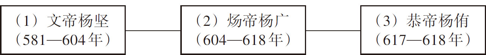 

## 唐朝皇帝世系表

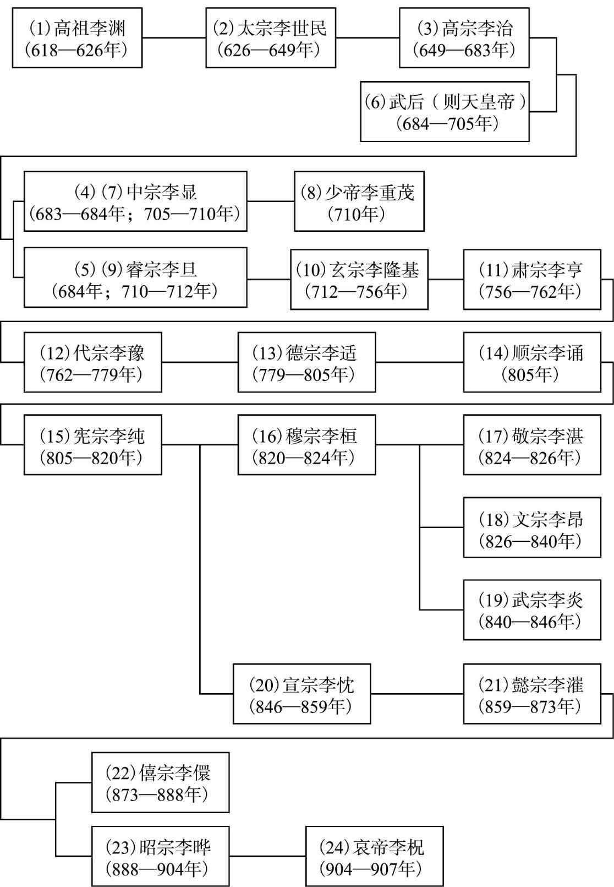

