# 目录

贞观君臣论治

唐平辽东

吐蕃请和

突厥叛唐

唐平奚契丹

附录： 
唐朝皇帝世系表

返回总目录

# 贞观君臣论治

## 【内容提要】

《贞观君臣论治》叙述了唐太宗李世民和臣下议论治理国家、赏罚、用人、纳谏等方面的言论，从中能够看出他的为君之道、施政方针和经国理民的思想。

唐太宗不信祥瑞，不行封禅，不迷信释道。他认为，百姓安宁富足，即使没有祥瑞，帝王也像尧舜那样圣明；百姓愁苦怨恨即使有很多祥瑞显现，帝王也和桀纣相差不大。

唐太宗认为，帝王应该大公无私，这样，才能使天下人信服。在定功绩爵邑时，淮安王神通因为位居房玄龄、杜如晦之后而不满，但太宗却认为，不可以因为是近亲就私下赏赐，那样对有功之臣不公平。正因为这样，群臣悦服。

唐高祖李渊想通过推行分封制来使宗室强大，李世民认为，天子养育百姓，怎么可以又劳累百姓让他们来养育自己的宗室，于是把宗室的郡王都降为县公。唐宗室人才之盛，历代没有能比得上的；唐朝保全宗室支庶而无猜忌诛杀之事，历代也都不如唐。这与唐太宗行大公废私恩不无关系。唐太宗不用周代分封制，对宗室也实施节禄位劝贤能的办法，使宗室中有才能的人、朝官的将相和地方的守牧，都能孜孜不倦而求上进，没有发生像汉代的七国之乱、西晋的八王之乱那样的祸乱。

司马光认为，裴矩在隋是佞臣，到唐为忠臣，原因在于君主圣明臣下正直。其中的深刻根源是君主不愿意听到他的过失，那么忠臣也就变为佞臣；君主乐于听到直言，那么佞臣也化为忠臣。人臣的忠奸，和人主的明暗有着密切的关系。唐太宗不掩过，不饰非，不拒谏，因而才有魏徵、房玄龄、杜如晦等敢于冒颜力诤的忠直之臣。因为有敢于规谏和刚正的大臣，唐太宗在位得纳忠言，少犯过失，治得其理。他曾说，君主很想知道自己的过失，这一定得依赖于忠臣。他善于纳谏，也懂得纳谏的重要性，这是作为帝王难能可贵之处。

唐太宗深知人民和君主的关系，因此采取轻徭薄赋，取奢从简的政策。他曾说，君主依靠的是国家，国家依靠的是百姓，使百姓劳顿来侍奉国君，就像割自己的肉来充实腹中，腹饱了身体也死了，君主富了而国家却灭亡了。他曾经为救民而吞食蝗虫，结果蝗虫没有成灾。为了慎重处死刑，实行三复奏、五复奏的执法程序，说明重法而不滥用，这与那些草菅人命、乱杀无辜的暴君，形成鲜明对比。

## 【原文】

**唐高祖武德九年秋八月甲子，太宗即皇帝位于东宫显德殿[1]。九月己酉，上面定勋臣长孙无忌等爵邑，命陈叔达于殿下唱名示之，且曰：“朕叙卿等勋赏或未当，宜各自言[2]。”于是诸将争功，纷纭不已[3]。淮安王神通曰：“臣举兵关西，首应义旗，今房玄龄、杜如晦等专弄刀笔，功居臣上，臣窃不服[4]。”上曰：“义旗初起，叔父虽首唱举兵，盖亦自营脱祸[5]。及窦建德吞噬山东，叔父全军覆没[6]。刘黑闼再合余烬，叔父望风奔北[7]。玄龄等运筹帷幄，坐安社稷，论功行赏，固宜居叔父之先[8]。叔父国之至亲，朕诚无所爱，但不可以私恩滥与勋臣同赏耳[9]。”诸将乃相谓曰：“陛下至公，虽淮安王尚无所私，吾侪何敢不安其分[10]。”遂皆悦服[11]。房玄龄尝言：“秦府旧人未迁官者，皆嗟怨曰：‘吾属奉事左右，几何年矣，今除官，返出前宫、齐府人之后[12]。’”上曰：“王者至公无私，故能服天下之心[13]。朕与卿辈日所衣食，皆取诸民者也[14]。故设官分职，以为民也，当择贤才而用之，岂以新旧为先后哉[15]！必也新而贤，旧而不肖，安可舍新而取旧乎[16]？今不论其贤不肖，而直言嗟怨，岂为政之体乎[17]？”**

## 【注文】

[1]唐：朝代名（618—907年）。李渊于公元618年建立，以长安（今陕西西安）为首都。公元690年，武则天改国号“唐”为“周”，迁都洛阳，史称武周。公元705年唐中宗李显恢复大唐国号，恢复唐朝旧制，还都长安。唐朝在唐玄宗天宝十四载（755年）“安史之乱”后日渐衰落，至唐昭宗天祐四年（907年）梁王朱温篡位灭亡，共289年。唐在政治、经济、文化、外交等方面都有辉煌的成就，是当时世界上最强大的国家之一。　　唐高祖（566—635年）：字叔德，陇西成纪（今甘肃静宁西南）人（一说是陇西狄道人，又说是赵郡昭庆人），唐朝开国皇帝。出身于北周的贵族家庭，七岁袭封唐国公。隋炀帝即位后，李渊任荥阳（今河南郑州）、楼烦（今山西静乐）二郡太守。后被召为殿内少监，又升职为卫尉少卿。隋炀帝大业十一年（615年），李渊官拜山西河东慰抚大使；大业十三年（617年），官拜太原留守。隋末天下大乱时，李渊乘势从太原起兵，攻占长安。隋恭帝义宁二年（618年）农历五月，李渊接受其所立的隋恭帝的禅让称帝，建立唐朝，定都长安，并逐步消灭各地割据势力，统治全国。唐高祖武德九年（626年），玄武门之变后，李渊退位称太上皇，禅位于儿子李世民。唐太宗贞观九年（635年），李渊病逝。谥号太武皇帝，庙号高祖，葬在献陵。唐高宗上元元年（674年）农历八月，改上尊号为神尧皇帝。唐玄宗天宝十三载（754年）农历二月，上尊号神尧大圣大光孝皇帝。　　武德：唐高祖的年号，也是唐朝的第一个年号，武德元年（618年）五月至武德九年（626年）十二月。　　甲子：为干支之一。干支纪日法始于商朝，到清宣统三年（1911年）止。干支是天干、地支的合称，它与干支纪年法一样，用干支相匹配的六十甲子来记录日序，从甲子开始到癸亥结束，六十天为一周，循环记录。　　太宗：指唐太宗李世民（599—649年）。是唐朝第二位皇帝，李渊的次子，在位二十三年（626—649年）。在反隋和平定天下过程中，立下汗马功劳，被封为秦王。公元626年发动玄武门之变，杀死太子李建成、齐王李元吉，被立为太子，八月，高祖李渊禅位于李世民，八月八日在显德殿登基，为唐太宗，次年改元贞观元年。即位后，唐太宗开创了历史上的“贞观之治”。　　皇帝：我国古代最高统治者的专称。　　东宫：指封建时代太子所居住的宫殿阁。　　显德殿：又名嘉德殿，东宫正殿。

[2]上：这里指唐太宗。　　勋臣：有特殊功劳的大臣。　　长孙无忌（？—659年）：字辅机，河南洛阳人，先世鲜卑族拓跋氏，北魏皇族支系，后改为长孙氏。长孙无忌是唐太宗李世民的内兄，文德顺圣皇后的哥哥。隋恭帝义宁元年（617年），李渊起兵太原，长孙无忌授任渭北道行军典签，自此辅佐李世民，建立了唐朝政权，是唐朝的开国功臣，封齐国公。公元626年，参与发动玄武门之变，帮助李世民夺取帝位。历任尚书右仆射、司空。唐高宗即位，册封太尉。因反对高宗立武则天为皇后，被许敬宗诬告，削爵流黔州（今重庆彭水），自缢而死。　　爵邑：爵位和封邑。　　陈叔达（？—635年）：字子聪，吴兴长城（今浙江长兴）人，陈宣帝顼之子，陈宣帝太建十四年（582年），封义阳王。隋炀帝大业中，任内史舍人，官至绛郡通守。隋末，归顺李渊，授丞相府主簿，唐建立后任侍中。唐太宗贞观中，拜礼部尚书。　　殿下：这里指殿阶下面。　　唱名：大声读。　　朕：秦始皇起专用做皇帝自称。　　卿：古代君对臣的称谓。

[3]将：将领。　　纷纭：言论众多而杂乱。

[4]淮安王神通（？—631年）：即李神通，名寿，唐高祖李渊族弟。隋末在鄠县（今陕西户县）南山举兵以应李渊，自称关中道行军总管。唐高祖武德元年（618年），封永康王，后改封为淮南王。　　关西：古地区名。汉唐时代指函谷关或潼关以西的地区。　　义旗：为正义而战或起义的军队的旗帜。　　房玄龄（579—648年）：字乔（一说名乔，字玄龄），齐州临淄人（今山东淄博市临淄区北）人，是唐朝开国宰相。房玄龄跟随秦王李世民征战十年，李世民即位后又辅佐二十多年，是唐初著名良相、杰出谋臣，大唐“贞观之治”的主要缔造者之一。他参与玄武门之变的策划，助唐太宗李世民即位后，任中书令。　　杜如晦（585—630年）：字克明，京兆杜陵（今陕西西安东南）人，唐朝初期名相。他是李世民夺取政权、开创贞观之治中的主要谋臣之一，深受李世民的重用。是凌烟阁二十四功臣之一。　　刀笔：古代在竹简上刻字记事，用刀子刮去错字，因此把有关案牍的事叫作刀笔。　　窃：谦词。私自，私下。

[5]唱：带头，倡导。　　营：谋求。

[6]窦（dòu）建德（573—621年）：隋末河北农民起义首领。清河漳南（今河北故城东北）人。隋末农民起义，河北义军首领。隋炀帝大业十三年（617年），在乐寿县（今河北献县东南）称长乐王，建立农民政权。唐高祖武德元年（618年），改国号夏，建立夏国，称夏王。武德四年（621年）三月，唐军进攻王世充，建德率军十余万援王世充，与唐李世民军相遇于虎牢（今河南荥阳汜水镇）一带。五月，夏军溃败，窦建德被俘，七月，在长安被杀。　　山东：古地区名。秦汉时指华山或崤（xiáo）山以东地区。以后多指太行山以东地区。

[7]刘黑闼（tà）（？—623年）：隋末清河漳南（今河北故城东北）人。年少时与窦建德为知己好友，窦建德常对其生计予以资助。窦建德死后，召集其旧部起兵，称汉东王，与唐多次大战，最终被李建成击灭。　　烬：残余的人。　　风：势头。　　北：打败了往回跑。

[8]社稷：旧时为国家的代称。社，指土地神；稷，指谷神。古代帝王都祭祀社稷，以后社稷就成了国家的代称。

[9]朕（zhèn）：我，我的，秦始皇时起专用作皇帝自称。

[10]陛下：“陛”指帝王宫殿的台阶。“陛下”原指站在台阶下的侍者。臣子向天子进言时，不能直呼天子，必须先呼台下的侍者而告之。后来“陛下”就成为与帝王面对面应对的敬称。　　侪（chái）：同类的人。

[11]遂：于是，就。

[12]秦府：唐太宗李世民为秦王时的府邸。　　前宫：这里指前太子李建成的太子府。　　齐府：唐高祖李渊的三子李元吉的府邸。　　迁：调动官职，一般指升官。　　除：任命。

[13]故：所以。

[14]辈：某一等级、某一类别的人。

[15]为（wèi）：为了。　　岂：副词，表示反问。

[16]不肖：不贤。　　安：怎么。

[17]直：副词。仅，只是。　　嗟怨：嗟叹怨恨。　　体：根本。

## 【译文】

唐高祖武德九年（626年）秋八月甲子（初九日），太宗李世民在东宫显德殿即皇帝位。九月己酉（初四日），皇上当面决定开国勋臣长孙无忌等人的爵位和封地，命令陈叔达在殿下高声宣读明示，并且说：“我授予众卿功勋赏赐如果有不恰当的地方，你们可以各自说说。”于是各位将领争功，争论不休。淮安王李神通说：“臣从关西起兵，首先响应义旗，现在房玄龄、杜如晦等只是玩弄笔杆子，功劳却在臣之上，臣心中不服。”皇上说：“起义之初，叔父首先响应义旗，大概是为了使自己免祸。等到窦建德吞并山东，叔父您全军覆没。刘黑闼重新纠集残余，叔父您又望风逃跑。房玄龄等运筹帷幄，决胜千里，国家因而才得以安定，论功行赏，所以应当在叔父之前。叔父是皇族至亲，我对您的爱无以复加，但不可以徇私情而与勋臣同等赏赐。”各位将领也互相说：“陛下极为公正，即使淮安王这样的皇室宗亲都不偏私，我等哪敢不安分守己。”于是都心悦诚服。房玄龄曾说：“秦王府老部下没有升官的，都感叹抱恨说：‘我们这些人侍奉皇上左右，已经多少年了，现在拜官授职，反而落到前东宫、齐王府属僚后面。’”太宗说：“做君主的大公无私，所以能使天下人信服。我和你们每日所穿的衣服、吃的东西都是从百姓那里来的。所以设官分职，都要为了百姓，应当选择使用德才兼备的人，怎么可以以新人旧人作为选拔人才的次序呢！如果新人贤能，旧人无能，难道可以舍弃新人而选用旧人吗？现在你们不论其是否贤能，而只是感叹埋怨，这难道是为政之道吗？”

## 【原文】

**冬十月甲申，民部尚书裴矩奏“民遭突厥暴践者，请户给绢一匹”[1]。上曰：“朕以诚信御下，不欲虚有存恤之名而无其实[2]。户有大小，岂得雷同给赐乎[3]？”于是计口为率[4]。**

## 【注文】

[1]民部：即户部，官署名，管理全国户口和赋税。隋唐时期尚书省下设吏、户、礼、兵、刑、工六部。隋初名为度支，后称民部，唐太宗李世民即位后，为避其名讳，改为户部。　　尚书：是中国古代官职名之一。最初是指掌管文书奏章的官员。隋代始设六部，唐代确定六部各部以尚书、侍郎为正副长官。　　裴矩（547—627年）：隋及唐初政治家。原名世矩，因避唐太宗讳而去“世”字，字弘大，河东闻喜（今山西闻喜）人。隋炀帝时任尚书左丞、吏部侍郎等职。隋炀帝被宇文化及弑，裴矩被任命为河北道安抚大使，为窦建德俘获。窦建德兵败被杀，裴矩率余部降唐，授左庶子，转詹事、民部尚书。　　突厥：古族名。广义包括突厥、铁勒各部落，狭义专指突厥汗国。公元6世纪时，游牧于金山（今阿尔泰山）以南。首领姓阿史那。因金山形似兜鍪（古代战盔），其俗称兜鍪为“突厥”，故名。初属柔然，成为柔然的锻工。公元552年，突厥人打败柔然，建立突厥汗国，之后不断向东西扩展领土，疆域最广时，东至辽海，西抵西海（今里海），北越贝加尔湖，南接阿姆河南。隋初，派兵打败突厥，突厥分裂为东西两部。唐太宗贞观四年（630年）攻灭东突厥，唐高宗显庆二年（657年）十二月唐又灭西突厥，余部西迁中亚。唐高宗永淳元年（682年），突厥再度建立后东突厥帝国。唐玄宗天宝四年（745年），回纥击败突厥，后突厥至此灭亡。突厥人一部分内附唐朝，一部分西迁中亚，大部分转入回纥汗国。　　给（jǐ）：供给。　　绢：丝织成的丝织品。　　匹：量词。计量布和绸缎的长度单位。

[2]御：治理。　　下：天下。　　存恤：体恤。

[3]雷同：一样，相同。

[4]率：标准。

## 【译文】

冬十月甲申（二十九日），民部尚书裴矩上奏说：“遭受突厥暴虐践踏的平民，朝廷应赐给每户一匹绢。”太宗说：“我用诚实信用治理天下，不想徒有抚恤百姓的虚名而没有实际恩德。户有大小，怎么能每户给一样的赏赐？”于是以人口数目作为赏赐的标准。

## 【原文】

**初，上皇欲强宗室以镇天下，故皇再从三从弟及兄弟之子，虽童孺皆为王，王者数十人[1]。上从容问群臣：“遍封宗子，于天下利乎[2]？”封德彝对曰：“前世唯皇子及兄弟乃为王，自余非有大功无为王者[3]。上皇敦睦九族，大封宗室，自两汉以来未有如今之多者[4]。爵命既崇，多给力役，恐非示天下以至公也[5]。”上曰：“然[6]。朕为天子，所以养百姓也，岂可劳百姓以养己之宗族乎[7]！”十一月庚寅，降宗室郡王皆为县公，惟有功者数人不降[8]。**

## 【注文】

[1]上皇：即唐高祖李渊。　　宗室：同一祖宗的贵族。即国君或皇帝的宗族。中国又称皇族、帝宗、天潢。中国古代也称大宗的庙为宗室。　　再从三从：同曾祖为再从兄弟，同高祖为三从兄弟。　　王：在夏商周时期是天子的称号。战国时期周室衰微，诸侯纷纷僭号称王。秦始皇统一天下后，将“皇帝”作为天子的称号。汉朝建立后，汉高祖刘邦分封功臣及皇子为王，这时的“王”正式成为爵位名，此时的“王”只有一个等级。西晋时期，晋武帝封宣帝孙永为东莞郡王，从此开始，王爵分为亲王和郡王两级。唐制，皇太子之子封郡王，大臣、节度使也得封郡王，郡王与国公并为从一品。以后各朝代郡王也多为二等。

[2]宗子：指宗法制度中身承大宗的嫡长子。

[3]封德彝（yí）（568—627年）：名伦，字德彝，以字行，观州蓨（tiáo）县（今河北景县）人，唐朝宰相。出身于渤海封氏，早年曾为杨素幕僚，后负责督建仁寿宫，升任内史舍人。隋炀帝年间，封德彝受到虞世基倚重，使得朝政逐渐败坏。江都之变后，又投靠宇文化及，任内史令。宇文化及兵败后，封德彝投降唐朝，逐渐获得唐高祖的信任，官至中书令，封密国公。他是唐太宗的天策府属官，又暗中维护太子李建成，在二人之间摇摆不定，但唐太宗对此毫不知情。唐太宗继位后，封德彝升任尚书右仆射。贞观元年（627年），病逝，追赠司空，谥号“明”。贞观十七年（643年），唐太宗得知封德彝阴持两端之事，追夺封赠，改谥为“缪”。

[4]敦：督促。　　九族：泛指亲属。但“九族”所指，诸说不同。一说是上自高祖、下至玄孙，即玄孙、曾孙、孙、子、身、父、祖父、曾祖父、高祖父；一说是父族四、母族三、妻族二，父族四是指姑之子（姑姑的子女）、姊妹之子（外甥）、女儿之子（外孙）、己之同族（父母、兄弟、姐妹、儿女）；母族三是指母之父（外祖父）、母之母（外祖母）、从母子（娘舅）；妻族二是指岳父、岳母。　　两汉：朝代名（前206—220年）。两汉时期包括两个朝代——东汉王朝和西汉王朝。公元前207年，秦朝灭亡，公元前206年刘邦被封为汉王，公元前202年，刘邦即皇帝位，是为汉高祖，建立了统一的汉王朝。公元9年，外戚王莽自立为皇帝，改国号为“新”。公元25年，刘姓王族的刘秀建立东汉王朝，建都洛阳，故史学家称之为东汉王朝。经过光武帝的多年努力，社会经济得到恢复，史称“光武中兴”。公元184年爆发黄巾起义，虽然黄巾军被镇压下去，但东汉政权名存实亡。汉献帝建安二十五年（220年）曹丕废汉献帝，自立为帝，国号魏，定都洛阳，东汉灭亡。中国由此经历了三国两晋南北朝，进入三百多年的分裂时期。

[5]力役：劳力，仆役。

[6]然：是的，对的。

[7]天子：中国古代臣民对帝王的称谓。天子，顾名思义，为天之嫡长子。中国古代社会最高统治者为了巩固自己的地位和政权，自称其权力出于神授，是秉承天意治理天下，故称天子。

[8]郡王：中国古代爵位名。西晋时期，晋武帝封宣帝孙永为东莞郡王，从此开始，王爵分为亲王和郡王两级。唐制，皇太子之子封郡王，大臣、节度使也得封郡王，郡王与国公并为从一品。以后各朝代郡王也多为二等。　　县公：古代爵名。晋始置，历代多沿置，元以后废。

## 【译文】

当初，高祖想加强皇室宗亲的力量来威震天下，所以高祖的叔伯兄弟、远房叔伯兄弟以及他们的子弟，即使幼子童孺都被封为王，这样的王有几十人。太宗语气和缓地问群臣说：“把皇室子弟通通封为王，对于国家有利吗？”封德彝回答说：“以前只有皇子和其兄弟才能封为王，其他皇室子弟没有大功的就不封王。太上皇为了促使九族和睦，便大封皇室，自两汉以来没有像今天这样多的。既尊崇爵位，又赐给大量仆役，这恐怕不能向天下昭示公正。”太宗说：“有道理。我作为天子，理应养育百姓，怎么可以劳累百姓来奉养自己的宗族呢！”十一月庚寅（初五日），把皇族郡王都降为县公，只有几位有功的没有降低爵位。

## 【原文】

**丙午，上与群臣论止盗[1]。或请重法以禁之，上哂之曰：“民之所以为盗者，由赋繁役重，官吏贪求，饥寒切身，故不暇顾廉耻耳[2]。朕当去奢省费，轻徭薄赋，选用廉吏，使民衣食有余，则自不为盗，安用重法邪[3]！”自是数年之后，海内升平，路不拾遗，外户不闭，商旅野宿焉[4]。上又尝谓侍臣曰：“君依于国，国依于民[5]。刻民以奉君，犹割肉以充腹，腹饱而身毙，君富而国亡[6]。故人君之患不自外来，常由身出[7]。夫欲盛则费广，费广则赋重，赋重则民愁，民愁则国危，国危则君丧矣[8]。朕常以此思之，故不敢纵欲也[9]。”**

## 【注文】

[1]止：阻止，禁止。

[2]或：有的人。　　哂（shěn）：讥笑。　　不暇：顾不上。暇，空闲。

[3]省（shěng）：减少。　　薄：减轻。

[4]是：指示代词。这，这样。　　海内：古人认为我国疆土四面濒海，因此称全国、国内为“四海”。

[5]侍臣：古代侍奉帝王的廷臣。

[6]奉：供给，供养。　　毙（bì）：死。

[7]患：忧患，灾祸。

[8]盛：旺盛。

[9]以：因为。

## 【译文】

十一月丙午（二十一日），太宗和群臣讨论禁止盗匪的问题。有的人请求以重刑来止盗，太宗笑他说：“百姓成为盗匪的缘故，是因为赋税繁多，徭役沉重，官吏又贪欲勒索，百姓饥寒交迫，因此顾不上廉耻罢了。我要放弃奢华节省费用，减轻徭役减少赋税，选用清廉官吏，使百姓衣食有余，那么百姓就自然不偷盗了，又何必严刑重法呢！”从此几年以后，天下太平，路不拾遗，外门不闭，商贩行旅也敢露宿野外。太宗曾对身边近臣说：“君主依靠国家，国家依靠人民。剥削百姓来奉养君主，就像割自己的肉来填饱自己的肚子，肚子饱了，自己也死了，君主富有，而国家灭亡。所以君主的忧患不是来自外部，常常是来自自身。欲望强大那么费用就要多，费用多百姓的赋税就重，赋税重百姓就愁苦，百姓愁苦那么国家就危险，国家危险那么君王也就灭亡了。我常常思考这个问题，所以不敢放纵自己的欲望。”

## 【原文】

**十二月己巳，益州大都督窦轨奏称獠反，请发兵讨之，上曰：“獠依阻山林，时出鼠窃，乃其常俗[1]。牧守苟能抚以恩信，自然帅服，安可轻动干戈[2]。渔猎其民，比之禽兽，岂为民父母之意邪[3]！”竟不许[4]。**

## 【注文】

[1]益州：中国古地名，指蜀汉，现在四川一带。殷商时期是巴人和蜀人生活的地方。战国末期秦国灭了巴蜀在原巴蜀地区设置了巴郡和蜀郡。汉武帝元封五年（前106年），四川地区为益州部。三国时期，刘备占领此地并建立蜀汉政权。唐太宗贞观元年（627年），改益州等州为剑南道。唐玄宗天宝元年（742年），益州改为蜀郡。　　大都督：中国古代官职名。“都督”一职出现于汉末，北周及隋，改称“总管”。唐代又恢复“都督”之称，于各州按等级分别置大、中、小都督府，各设都督。唐中期以后，以节度使或观察使为地方最高长官，都督名存实亡。　　窦轨（？—630年）：字士则，扶风平陵（今陕西咸阳西北）人，唐朝大将，隋炀帝大业中，为资阳郡东曹（今四川资阳、资中、内江范围），后辞官回家。义宁元年（617年）五月，李渊起兵反隋，窦轨归附李渊，后因功封赞皇县公，拜大丞相谘议参军。唐太宗贞观四年（630年），窦轨死于任上，唐追赠他为并州都督。　　獠（liáo）：中国古代少数民族，分布在今广东、广西、湖南、四川、云南、贵州等地区。亦泛指南方各少数民族。

[2]牧守：中国古代官职名，州郡的长官。州官称牧，郡官称守。　　苟（gǒu）：如果。　　干戈：泛指兵器，多用来比喻战争。

[3]比：比拟，认为和……一样。

[4]竟：终于，最后。

## 【译文】

十二月己巳（十五日），益州大都督窦轨上奏称獠民造反，请求发兵讨伐他们，唐太宗说：“獠民依靠山林的险阻，时常像老鼠一样出来偷点东西，这是他们的习俗。州牧、太守如果能用恩德信义安抚他们，他们自然就会相率而归服，怎么可以轻率动用武力呢。像捕鱼猎兽似的捕杀他们，把他们当作禽兽一样，这难道是作为百姓父母官的做事宗旨？”最终不许讨伐。

## 【原文】

**上谓裴寂曰：“比多上书言事者，朕皆粘之屋壁，得出入省览[1]。每思治道，或深夜方寝[2]。公辈亦当恪勤职业，副朕此意[3]。”**

## 【注文】

[1]裴寂（570—629年，或573—632年）：唐初大臣，蒲州桑泉（今山西临猗西南）人。隋末任晋阳（今山西太原）宫副监。唐建国后，他任尚书左仆射，唐太宗贞观三年（629年）因罪放归原籍，曾参与制定《唐律》。后流放静州（今广西昭平），贞观六年（632年）卒。　　者：代词。这里代指奏章。　　省（xǐng）：查看，检查。

[2]或：有时。　　方：才。

[3]公：对人的尊称。　　恪（kè）：谨慎。　　职业：职责。　　副：相称，符合。

## 【译文】

唐太宗对裴寂说：“近来很多上书言事的奏章，我都把他们贴在寝宫的墙壁上，得以出入时观看。每当我思考治国的道理，有时到深夜才能入睡。你们也应当恪尽职守不辜负朕的苦心。”

## 【原文】

**上厉精求治，数引魏徵入卧内，访以得失[1]。徵知无不言，上皆欣然嘉纳[2]。上遣使点兵，封德彝奏“中男虽未十八，其躯干壮大者，亦可并点”[3]。上从之[4]。敕出，魏徵固执以为不可，不肯署敕，至于数四[5]。上怒，召而让之曰：“中男壮大者，乃奸民诈妄，以避征役[6]。取之何害，而卿固执至此[7]！”对曰：“夫兵在御之得其道，不在众多[8]。陛下取其壮健，以道御之，足以无敌于天下，何必多取细弱以增虚数乎[9]！且陛下每云‘吾以诚信御天下，欲使臣民皆无欺诈’，今即位未几，失信者数矣[10]。”上愕然曰：“朕何为失信[11]？”对曰：“陛下初即位，下诏云：‘逋负官物，悉令蠲免。’[12]有司以为负秦府国司者非官物，征督如故[13]。陛下以秦王升为天子，国司之物，非官物而何[14]？又曰：‘关中免二年租调，关外给复一年，’既而继有敕，云：‘已役已输者，以来年为始。’[15]散还之后，方复更征，百姓固已不能无怪[16]。今既征得物，复点为兵，何谓来年为始乎[17]？又陛下所与共治天下者在于守宰，居常简阅，咸以委之[18]。至于点兵，独疑其诈，岂所谓以诚信为治乎[19]？”上悦，曰：“向者朕以卿固执，疑卿不达政事，今卿论国家大体，诚尽其精要[20]。夫号令不信则民不知所从，天下何由而治乎，朕过深矣[21]！”乃不点中男，赐征金瓮一[22]。**

## 【注文】

[1]数（shuò）：屡次。　　魏徵（zhēng）（580—643年）：字玄成。巨鹿人（今属河北）人，后移居相州内黄（今河南内黄西），唐朝政治家。隋末曾投瓦岗起义军，后入唐跟随太子李建成。太宗即位，任他为谏议大夫、左光禄大夫，封郑国公。魏徵以直谏敢言著称，是中国史上最负盛名的谏臣，劝诫唐太宗以历史的教训为鉴，励精图治，任贤纳谏，本着“仁义”行事，无一不得到采纳。　　访：询问。

[2]徵：这里指魏徵。

[3]中男：唐制，民十六岁以上，不满十八岁者为中男，满十八岁为成丁，二十一岁为丁。　　躯干：身体。

[4]从：听从。

[5]敕（chì）：皇帝的诏书或命令。　　署敕：唐制，中书舍人署敕，即连署签发。当时魏徵为谏议大夫，或者太宗也使他连署。

[6]让：责怪，责备。

[7]何：什么。

[8]御：统领。

[9]细：微小。

[10]云：说。

[11]愕然：吃惊的样子。

[12]逋（bū）：拖欠，欠交。　　蠲（juān）：除去，免除。

[13]有司：指官吏。古代设官分职，各有专司，故称有司。

[14]秦王：唐高祖武德元年（618年），李世民被封为秦王。

[15]关中：长安所在处的渭河平原区。因为东有潼关，西有大散关，南有武关，北有萧关，居四关之内，故称关中。　　租调（diào）：唐朝的一种赋税。成年男子每年向官府缴纳一定的谷物叫作“租”；缴纳定量的绢或布，叫作“调”。　　关外：这里指函谷关或潼关以东地区。　　复：免除赋税徭役。　　输：缴纳。

[16]更：调换，交替。

[17]既：已经。

[18]守宰：地方长官。　　简阅：考察，查看。　　咸：全，都。

[19]岂：难道。

[20]向：从前，过去。　　达：通晓。

[21]过：过失，错误。

[22]金瓮：金制的盛酒器。

## 【译文】

唐太宗励精求治，多次把魏徵引进寝室，向他询问治理国家的得失。魏徵知无不言，太宗都高兴地加以采纳。太宗派遣官员征兵，封德彝奏请“没到十八岁的中男，其中身体强壮高大的，也可以一并征召”。太宗听从了封德彝的奏请。敕令发出，魏徵坚持认为不可以，不肯签署敕令，四次把敕令退回去。太宗愤怒，召见并责备魏徵说：“身体健壮高大的中男，是奸民欺骗官府，虚报年龄以逃避兵役。征召他们又有什么害处，而你却如此固执！”魏徵回答说：“统率军队，在于统率是否得当，不在于兵员数量的众多。陛下征召身体健壮的中男，用正确的办法统率他们，便足以无敌于天下，何必多征召幼弱以充虚数呢？况且陛下经常说‘我以诚信治天下，想使臣民都不要欺诈’，现在继位还没多久，已经失信多次了。”太宗惊愕地说：“我怎么失信呢？”魏徵回答说：“陛下刚继位时，下诏说：‘拖欠公家财物的，全部免除。’有关官员认为拖欠秦王府的财物不属于官物，照旧征收督促。陛下从秦王升为天子，秦王府的财物不属于官物，那属于什么呢？又说：‘关中免两年租调，关外免除一年。’此后不久又下诏说：‘已经出徭役和交纳租调的，从来年开始免除。’遣散劳工之后，又再次征调，百姓不能不埋怨。现在既征收了赋税，又征调兵役，什么叫从来年开始呢？再说和陛下共同治理天下的是那些地方官，平常选拔检阅等事情，陛下都委托给他们了。至于征发兵役，又怀疑他们欺诈，这难道是所谓的以诚信治理天下吗？”太宗听了高兴地说：“以前我认为你很固执，怀疑你办事不通达，现在听了你的治国之道，确实全都说得很精准。大凡号令没有信用，民众就不知所从，天下又如何能治理好呢，我的过失严重啊！”于是没有征召不满十八岁的中男，并赏赐魏徵一口金瓮。

## 【原文】

**上闻景州录事参军张玄素名，召见，问以政道[1]。对曰：“隋主好自专庶务，不任群臣，群臣恐惧，唯知禀受奉行而已，莫之敢违[2]。以一人之智决天下之务，借使得失相半，乖谬已多，下谀上蔽，不亡何待[3]！陛下诚能谨择群臣而分任以事，高拱穆清而考其成败，以施刑赏，何忧不治[4]！又，臣观隋末乱离，其欲争天下者不过十余人而已，其余皆保乡党全妻子，以待有道而归之耳[5]。乃知百姓好乱者亦鲜，但人主不能安之耳[6]。”上善其言，擢为侍御史[7]。**

## 【注文】

[1]景州：古代地名，今河北景县。　　录事参军：中国古代官名，也称录事参军事，为王、公、大将军的属员，掌总录众曹文簿，举弹善恶。隋唐各州、卫府，东宫各率府，唐各都督府、都护府、羽林、龙武、神武各军府及王国，都有录事参军。京府的录事参军则改称司录参军。　　张玄素（？—664年）：唐蒲州虞乡（今山西永济东北）人。初仕于隋朝。隋末，窦建德委任为黄门侍郎。唐灭窦建德，张玄素归唐，被授为景城都督录事参军。唐太宗李世民提拔张玄素为侍御史，后任东宫少詹事兼右庶子辅佐太子。到唐高宗永徽年间，加授银青光禄大夫，唐高宗麟德元年（664年）去世。

[2]隋：朝代名（581—618年），上承南北朝，下启唐朝。公元581年，隋文帝杨坚代北周称帝，改国号为隋。公元589年，灭南朝陈，结束了中国自魏晋南北朝以来的长期分裂局面。隋王朝总结历朝兴亡的原因，注重维护与农民的关系，并调和统治集团内部的关系，使社会矛盾趋于缓和，经济、文化得以迅速成长和繁荣，开创出开皇盛世的局面。604年七月，隋文帝去世，隋炀（yáng）帝杨广继位，隋朝在炀帝前期发展到极盛。然而隋炀帝兴建了许多大型工程，又东征西讨，过度消耗国力，其中又以三次东征高句丽耗费最巨，最后引发了隋末民变和贵族叛变，最终亡国。隋朝在政治上确立了三省六部制，创建了影响深远的科举制度；在军事上继续推行和改革府兵制度；在经济上，实行均田制和租庸调制。隋朝还兴修了举世闻名的大运河，巩固了对东南地区的统治，加强了南北经济、文化的联系。　　好（hào）：喜好，喜爱。　　庶务：指各种政务。

[3]借使：假使。　　乖：违背，不协调。　　谬（miù）：错误，荒谬。　　谀（yú）：奉承，讨好。　　蔽：蒙蔽。

[4]诚：确实。　　高拱：两手相抱，高抬于胸前。安坐时的姿势。　　穆（mù）：和睦。　　清：太平。

[5]乡党：家乡，乡里。古代五百家为党，一万两千五百家为乡，合而成为乡党。　　妻子：妻子和孩子。

[6]鲜（xiǎn）：少。

[7]善：认为是好的。　　擢：提拔，选拔。　　侍御史：古代官名。监察文武官吏的官员。亦称御史、侍御。西汉属御史大夫，由御史中丞统领；东汉沿置，属御史台。魏晋南北朝略同。唐朝掌监察百官，从六品下。中唐以后职权渐轻。

## 【译文】

唐太宗听说景州录事参军张玄素的大名，便召见他，向他询问治国之道。张玄素回答说：“隋朝君主喜好自己打理平常事务，不委任群臣，群臣内心恐惧，只知道接受命令去执行而已，没人敢违背君主的意思。以一个人的智力决断全国的繁杂事务，即使得失各半，错误弊病也不少，臣下阿谀奉承，君上被蒙蔽，不亡国还等什么！陛下如果真能细心选择群臣，分别委任他们处理国家事务，自己安坐帝位，清静平和，考察群臣执事的成败得失，以此来施刑罚赏赐，何愁国家不能得到很好的治理呢！另外，臣观察隋末天下混乱，其中真的想争夺天下的人也不过十多个而已，其余的不过是想保全乡党妻儿，等待出现有道的明君而归附。由此可知，百姓希望天下大乱的很少，只是君主不能使他们安居乐业罢了。”太宗很赞许他说的话，升他为侍御史。

## 【原文】

**前幽州记室直中书省张蕴古上《大宝箴》，其略曰：“圣人受命，拯溺亨屯，故以一人治天下，不以天下奉一人[1]。”又曰：“壮九重于内，所居不过容膝，彼昏不知，瑶其台而琼其室；罗八珍于前，所食不过适口，惟狂罔念，丘其糟而池其酒[2]”。又曰：“勿没没而暗，勿察察而明，虽冕旒蔽目而视于未形，虽黈纩塞耳而听于无声[3]。”上嘉之，赐以束帛，除大理丞[4]。**

## 【注文】

[1]幽州：古代地名，古九州及汉十三刺史部之一；隋唐时为北方的军事重镇、交通中心和商业都会，其范围大致包括今河北北部及辽宁一带。　　记室：古代官署名。东汉始设，诸王、三公及大将军都设记室，秉承君主意旨，掌管机要、发布政令的机构。沿至隋唐，成为全国政务中枢。　　直：值班，值勤（后起之意）。特指在殿中值班侍奉君主。　　中书省：三国魏文帝分秘书另设中书，与尚书并称为省，典纳奏章，并草拟皇帝诏令。晋朝、南北朝沿置。魏、晋权力扩大，长官多为实际宰相。隋朝因避讳改称内史省、内书省，唐高祖复旧，与门下省、尚书省共理军国大政，为最高制令决策机关。掌草拟诏敕，尚书省颁下执行；中央各部门及地方州府进奏表章，也可由中书省呈给皇帝，并草拟答复。以中书令为长官，中书侍郎为次官。　　张蕴古（？—638年左右）：唐初为幽州总管府记室，直中书省。太宗即位，任他为大理丞。　　箴（zhēn）：为文体的一种，主题为规劝告诫性质的文字。　　圣人：这里尊称皇帝。　　溺（nì）：淹没。　　亨：通达顺利。　　屯（zhūn）：艰难。

[2]九重：多重，指宫禁。　　八珍：原指八种珍贵的食物，后指八种稀有而珍贵的烹饪原料，具体所指因时代地域而不同。

[3]冕旒（liú）：古代皇帝的帽子叫冕，帽顶有个版，版前悬挂穿上的玉珠叫做旒。　　黈（tǒu）纩（kuàng）：黄绵，古代冕制，黄绵所制的小球。悬挂在冠冕的两旁，表示不听无意之言。

[4]束帛：古代用为聘问、馈赠的礼物。　　大理丞：古代官名，唐从六品上，丞一般为主官副职，大理寺的主官为大理寺卿，其次才是大理寺少卿、大理寺寺正、大理寺丞，大理寺丞之职在正刑之轻重。

## 【译文】

前幽州记室张蕴古在中书省当值，向唐太宗进献《大宝箴》，书的大意是说：“君主受命于上天，是为了济助危难，扶持困顿，所以是以一人治理天下，不是让天下奉养一人。”又说：“修建九重壮丽的宫殿，居住的也只不过是能容纳两条腿的地方，那些昏庸的人不知道这些道理，却用琼玉装饰亭台居室；面前陈列着山珍海味，也只不过吃几口合口味的东西，只有那种狂妄迷乱的人，才让酒糟像山丘那样地堆积，用大池贮存美酒。”又说：“既不要什么事都默默不闻，黯然无知，也不要对什么事情都过问得十分细致，即使冕旒遮蔽眼睛，却能在事情没有发生之前看到，即使黈纩堵塞耳朵，却能在无声的世界里听到声音。”太宗极为赞赏他，赐给张蕴古丝绸，任命他为大理丞。

## 【原文】

**上召傅奕，赐之食，谓曰：“汝前所奏，几为吾祸[1]。然凡有天变，卿宜尽言皆如此，勿以前事为惩也[2]。”上尝谓奕曰：“佛之为教，玄妙可师，卿何独不悟其理[3]？”对曰：“佛乃胡中桀黠，诳耀彼土[4]。中国邪僻之人，取庄、老玄谈，辅以妖幻之语，用欺愚俗，无益于民，有害于国[5]。臣非不悟，鄙不学也[6]。”上颇然之[7]。**

## 【注文】

[1]傅奕（555—639年）：唐初学者，唐相州邺（今河南安阳）人，精于天文历数，著名的反佛斗士。　　汝前所奏：指傅奕六月所奏，太白秦分，秦王当有天下。

[2]然：不过，但是。　　天：天体，天象。　　惩：因受打击而引起的警戒或不再干。

[3]佛（fó）：这里指佛教，世界三大宗教（基督教、伊斯兰教、佛教）之一，由公元前6世纪年古印度乔达摩·悉达多所创立，因为他属于释迦族，人们又称他为释迦牟尼。佛教广泛流传于亚洲的许多国家，汉末经丝绸之路传入中国，之后，不断与中国的儒道思想相融合，隋唐时期，佛教兴盛，并且逐渐中国化。佛教对于中国的政治、经济、文化都产生了深远影响。

[4]胡：中国古代对除了汉人以外部族的称呼，通常是指中国北方以及西方的游牧民族。　　桀（jié）黠（xiá）：凶悍，狡黠。　　诳（kuáng）：欺骗，迷惑。

[5]中国：我国古代指华夏族、汉族地区（以其在四夷之中）。而华夏族、汉族多建都于黄河南、北，故称其地为“中国”。初时本指今河南省及其附近地区，后来华夏族、汉族活动范围扩大至黄河中下游一带，也称为“中国”。　　庄子（约前365—前286年）：战国时哲学家，庄氏，名周。宋国蒙（今河南商丘东北）人。是我国先秦（战国）时期伟大的思想家、哲学家和文学家。他是老子哲学思想的继承者和发展者，道家学说的主要创始人，与老子并称为“老庄”，他们的哲学思想体系，被思想学术界尊为“老庄哲学”。庄子主张“天人合一”和“清静无为”。在唐玄宗开元年间，庄子被诏号为“南华真人”，被道教隐宗妙真道奉为开宗祖师。　　老子（生卒年不详）：又称老聃、李耳，楚国苦县厉乡（今河南鹿邑）曲仁里（一说今安徽涡阳）人，是我国古代伟大的哲学家和思想家，道家学派创始人，在道教中老子被尊为道祖。其被唐皇武后封为太上老君，存世有《道德经》（又称《老子》）。其作品的精华是朴素的辩证法，主张无为而治，他的哲学思想和由他创立的道家学派，不但对我国古代思想文化的发展作出了重要贡献，而且对我国两千多年来思想文化的发展产生了深远的影响。

[6]鄙：轻视，看不起。

[7]颇：非常。

## 【译文】

太宗召见傅奕，赐给他食物，对他说：“你以前所奏的言论，几乎给我造成祸患。但是今后凡有天象变化，你应当像以前那样知无不言，不要因为以前的事而受到影响。”太宗曾经对傅奕说：“佛教作为一种宗教，其学理很玄妙，值得学习。你为何不领悟其中的道理？”傅奕回答说：“佛教是那些狡诈的蛮夷弄出来的，欺诳辉耀于他们自己的领土。我国那些邪僻的人，择取庄子、老子的玄幻之谈，又用妖幻的语言加以修饰，用来欺骗愚昧庸俗之人，既不利于百姓，更有害于国家。臣不是不明白，而是鄙视它而不想学。”太宗很赞同他的话。

## 【原文】

**上患吏多受赇，密使左右试赂之[1]。有司门令史受绢一匹，上欲杀之，民部尚书裴矩谏曰：“为吏受赂，罪诚当死[2]。但陛下使人遗之而受，乃陷人于法也，恐非所谓‘道之以德，齐之以礼’[3]。”上悦，召文武五品已上告之曰：“裴矩能当官力争，不为面从，傥每事皆然，何忧不治[4]？”**

## 【注文】

[1]吏：官员，春秋之前大小官都可以称吏，战国以后一般称低级的官。　　赇（qiú）：贿赂。　　左右：在身旁侍候的近侍、近臣。

[2]司门令史：古代官名，掌天下门关出入往来籍赋并且审理其政务，有令史六人。　　谏：规劝君主或长辈、朋友，使之改正错误或过失。

[3]遗（wèi）：赠送。

[4]已：即“以”。　　文武：这里指文臣武将。

## 【译文】

唐太宗担心官吏中多有接受贿赂的，暗中安排身边的人试着行贿。有位管理门卫的令史接受了一匹绢，太宗想杀了他，民部尚书裴矩劝谏说：“作为官吏而接受贿赂，他的罪诚然应当处死。只是陛下派人送给他而引诱他接受贿赂，这是陷害，让人犯法，恐怕不符合孔子所说的‘用道德去引导，用礼仪去规范的古训’。”太宗听了很高兴，召集文武五品以上的大臣告诉他们说：“裴矩作为官员据理力争，不因为在我面前就顺从，倘若每件事都这样，何愁国家不能大治？”

## 【原文】

**臣光曰：古人有言：“君明臣直[1]。”裴矩佞于隋而忠于唐，非其性之有变也，君恶闻其过则忠化为佞，君乐闻直言则佞化为忠[2]。是知君者表也，臣者景也，表动则景随矣[3]。**

## 【注文】

[1]臣光曰：“臣光曰”是《资治通鉴》作者司马光对书中所记载的史事发表的品论，即“史论”。它是《通鉴》的重要内容，表明司马光的政治意识、历史观点。司马光（1019—1086年）：北宋政治家、文学家、史学家。字君实，号迂叟。陕州夏县（今属山西夏县）涑水乡人，世称涑水先生。历仕仁宗、英宗、神宗、哲宗四朝，卒赠太师、温国公，谥“文正”，主持编纂了中国历史上第一部编年体通史《资治通鉴》，为人温良谦恭、刚正不阿，其人格堪称儒学教化下的典范，历来受人景仰。

[2]佞（nìng）：巧言谄媚。　　恶（wù）：讨厌、不喜欢。

[3]表：古代测量日影、时刻的标杆。　　景（yǐng）：同“影”，影子。

## 【译文】

史臣司马光评论说：古人有句话：“君主明察则臣下多直言。”裴矩在隋朝阿谀奉承是位佞臣，在唐朝却很忠诚，并不是他的本性发生了变化，君主不愿听自己的过错，那么忠诚就变为谄媚，君主喜欢听直言劝谏，那么谄媚变为忠诚。由此可知，君主如同测影的表，臣下就像影子，表动影子也随着动。

## 【原文】

**太宗贞观元年春正月丁亥，上宴群臣，奏《秦王破陈乐》[1]。上曰：“朕昔受委专征，民间遂有此曲，虽非文德之雍容，然功业由兹而成，不敢忘本[2]。”封德彝曰：“陛下以神武平海内，岂文德之足比[3]。”上曰：“戡乱以武，守成以文，文武之用，各随其时[4]。卿谓文不及武，斯言过矣[5]。”德彝顿首谢[6]。**

## 【注文】

[1]贞观：唐太宗李世民在位期间所用年号，共计二十三年，即公元627年至649年。　　元年：指帝王改换年号的第一年，这里指公元627年。　　《秦王破陈乐》：陈，通“阵”。唐宫廷舞名。又名《七德舞》。李世民为秦王时，征战四方，破刘武周后，军中即有《秦王破陈乐》歌曲流传。

[2]雍容：举止大方，从容不迫的样子。　　兹：指示代词。此，这里。

[3]海内：指国境之内，全国。古代传说我国疆土四面环海，故称国境之内为海内。

[4]戡（kān）：攻克，平定。

[5]斯：指示代词。此。

[6]顿首：叩头。

## 【译文】

唐太宗贞观元年（627年）春正月丁亥（初三日），太宗大宴群臣，演奏《秦王破陈乐》。太宗说：“我先前接受委派专行征伐，民间便有了这首乐曲。虽然不具备雍容高雅的文德，然而立国的功业由此而成，不敢忘本。”封德彝说：“陛下以神武平定天下，哪里是文德足以能比的。”太宗说：“平定乱世依靠武力，保守基业依靠文德，文与武的用处，全在于各因时制宜。你说文才不如武功，这话有些过分。”封德彝叩头谢罪。

## 【原文】

**上以兵部郎中戴胄忠清公直，擢为大理少卿[1]。上以选人多诈冒资荫，敕令自首，不首者死[2]。未几有诈冒事觉者，上欲杀之[3]。胄奏：“据法应流[4]。”上怒曰：“卿欲守法，而使朕失信乎[5]？”对曰：“敕者出于一时之喜怒，法者国家所以布大信于天下也[6]。陛下忿选人之多诈，故欲杀之，而既知其不可，复断之以法，此乃忍小忿而存大信也[7]。”上曰：“卿能执法，朕复何忧[8]。”胄前后犯颜执法，言如涌泉，上皆从之，天下无冤狱[9]。**

## 【注文】

[1]兵部：古代官署名，隋唐时六部之一，其长官为兵部尚书。唐朝兵部，尚书一人，正三品；侍郎二人，正四品下。掌武选、地图、车马、甲械之政。唐武则天时依周礼改兵部为夏官；唐玄宗天宝十一年（752年）改兵部为武部。　　郎中：古代官名，始于战国，秦汉沿置，掌管门户、车骑等事；内充侍卫，外跟从作战。隋唐时各部都设郎中，分掌各司事务，为尚书、侍郎之下的高级官员。　　戴胄（？—633年）：唐初大臣。字玄胤，谥号“忠”，相州安阳（今属河南）人。隋末入仕，后归降唐为秦王府曹参军，唐太宗升为大理少卿，历任尚书左丞、民部尚书。　　大理少卿：大理寺次官，北齐始置。隋朝沿置。唐高宗永徽六年（655年）复置一人，从四品上。

[2]选人：此指候选官员。　　资：资望，资历。　　荫：庇（bì）荫。指封建时代子孙因先代官爵或功勋而受到封赏。

[3]未几：没多久。

[4]流：流放。古代的一种刑法。

[5]欲：想。

[6]所以：用来……的。

[7]断：判断，决断。

[8]何：什么。

[9]犯颜：冒犯君上或尊长。

## 【译文】

唐太宗认为兵部郎中戴胄忠诚清廉、公正无私，所以提升他为大理少卿。太宗因为很多候选官假冒资历和门荫，所以发布赦令，让他们自首，否则就处死。不久，有假冒者被发觉，太宗想杀了他们。戴胄上奏说“按照法律这些人应该流放”。太宗大怒说：“你想守法，而让我失信于天下吗？”戴胄说：“赦令出于君主一时的喜怒变化，法律则是国家用来向天下昭示诚信的。陛下愤恨候选官多有欺诈，所以想杀了他们，但是既然知道不能这样处置，又依照法律裁断，这是忍小的愤恨而存大诚信的做法。”太宗说：“你执法，我还有什么可担忧的。”戴胄先后多次冒犯皇上执法，奏答时如泉水一样滔滔不绝，太宗都听从他的意见，从此国家很少有冤案。

## 【原文】

**上令封德彝举贤，久无所举[1]。上诘之，对曰：“非不尽心，但于今未有奇才耳[2]！”上曰：“君子用人如器，各取所长，古之致治者，岂借才于异代乎[3]？正患己不能知，安可诬一世之人[4]。”德彝惭而退[5]。**

## 【注文】

[1]举：推举，推荐。　　贤：有道德有才能的人。

[2]诘（jié）：责问，追问。

[3]君子：特指有学问有修养的人。　　致治：达到大治。治，治理得好，太平。

[4]安：怎么。

[5]惭：惭愧。

## 【译文】

唐太宗命令封德彝推举有贤德的人才，但很久没有举荐一人。太宗责问封德彝，封德彝回答说：“不是我不尽心，只是现今没有奇才！”太宗说：“君子用人如用器物，各取所长，古代使国家达到大治的君主，难道是向其他朝代借用人才了？只能怪自己不能识别人才罢了，怎么能诬蔑现在没有人才呢。”封德彝惭愧地退下。

## 【原文】

**御史大夫杜淹奏：“诸司文案，恐有稽失，请令御史就司检校[1]。”上以问封德彝，对曰：“设官分职，各有所司[2]。果有愆违，御史自应纠举[3]。若遍历诸司，搜擿疵颣，太为烦碎[4]。”淹默然[5]。上问淹：“何故不复论执[6]？”对曰：“天下之务，当尽至公，善则从之[7]。德彝所言，真得大体，臣诚心服，不敢遂非[8]。”上悦，曰：“公等各能如是，朕复何忧[9]。”**

## 【注文】

[1]御史大夫：古代官名，秦代始置，御史大夫与丞相、太尉合称“三公”，晋以后多不置御史大夫。唐又置，专掌监察执法。　　杜淹（？—628年）：字执礼，京兆杜陵（今陕西西安长安区）人，唐初任天策府兵曹参军，文学馆学士。李世民为太子时任御史大夫。唐太宗贞观元年（627年），任检校吏部尚书，参与朝政。　　文案：官署中的公文、书信等。　　稽：拖延，停留。　　检校：审查，核定。

[2]司：掌管。

[3]愆（qiān）违：过失。　　纠举：揭发检举。

[4]擿（tī）：揭发。　　疵颣（lèi）：毛病，缺点。

[5]淹：这里指杜淹。　　默然：沉默不语。

[6]执：坚持。

[7]从：顺从，听从。

[8]大体：重要的义理，有关大局的道理。

[9]如是：像这样。

## 【译文】

御史大夫杜淹上奏说：“各部门的公文，恐怕有滞留丢失的。请求让御史到各部门检查核定。”唐太宗就此事问封德彝，封德彝回答说：“设官分职，各有分工。如果真有过失，御史自然应该揭发检举，但是如果让御史到每个部门检查，寻找毛病缺点，这实在太繁琐了。”杜淹沉默不语。太宗问杜淹：“怎么不再争论了？”杜淹回答说：“天下的事务应当尽量公正无私，对的就听从。封德彝所说的，实在很有道理，臣心悦诚服，不敢再坚持错误的观点了。”太宗高兴地说：“如果你们都能这样，我还有什么忧虑呢。”

## 【原文】

**右骁卫大将军长孙顺德受人馈绢，事觉，上曰：“顺德果能有益国家，朕与之共有府库耳，何至贪冒如是乎[1]？”犹惜其有功，不之罪，但于殿庭赐绢数十匹[2]。大理少卿胡演曰：“顺德枉法受财，罪不可赦，奈何复赐之绢[3]！”上曰：“彼有人性，得绢之辱，甚于受刑[4]。如不知愧，一禽兽耳，杀之何益[5]。”**

## 【注文】

[1]右骁卫大将军：古代官名，隋炀帝大业三年（607年），改右备身府为右骁卫而设置。并统帅诸鹰扬府，正三品。唐朝沿置，武则天光宅元年（684年）至中宗神龙元年（705年）改为右武威卫大将军，掌宫禁宿卫。　　长孙顺德（生卒年不详）：唐初大将，河南洛阳人，为李世民文德皇后的族叔。早年跟随李渊起兵，唐高祖即位，拜左骁卫大将军，封薛国公。唐太宗贞观初，以玄武门之变有功，封食邑一千二百户。死后赠荆州都督，谥号“襄”。　　馈：赠送。　　府库：国家储藏财物、兵甲的地方。

[2]殿庭：宫殿阶前平地。

[3]胡演（生卒年不详）：唐初任大理少卿。　　枉（wǎng）法：贪赃枉法。

[4]甚于：超过。

[5]愧：羞愧。

## 【译文】

右骁卫大将军长孙顺德接受别人赠送的绢帛，事情暴露以后，唐太宗说：“长孙顺德做的如果能有益于国家，我愿意与他共享府库的财物，何至贪污腐败到如此地步呢？”太宗念他是有功之臣，没有处罚他，反倒在朝廷上赐给他几十匹绢。大理少卿胡演说：“长孙顺德贪赃枉法，罪不可赦，不加罪于他，为什么还赐他绢帛呢！”太宗说：“他如果有人性，得到赐绢所受的羞辱，就会比受到刑罚厉害得多。他如果不知道羞耻，那么就是一个禽兽罢了，杀他又有什么用。”

## 【原文】

**闰三月壬申，上谓太子少师萧瑀曰：“朕少好弓矢，得良弓十数，自谓无以加[1]。近以示弓工，乃曰‘皆非良材[2]’。朕问其故，工曰：‘木心不直则脉理皆邪，弓虽劲而发矢不直[3]。’朕始寤向者辨之未精也[4]。朕以弓矢定四方，识之犹未能尽，况天下之务，其能遍知乎[5]”！乃命京官五品以上更宿中书内省，数延见，问以民间疾苦及政事得失[6]。**

## 【注文】

[1]太子少师：古代官名，与太子少保、少傅，合称太子三少或东宫三少。西晋始置，隋、唐沿置，隋为正三品，唐为从二品，主要职责是教太子读书。　　萧瑀（yǔ）（575—648年）：字时文，祖籍南兰陵（治今江苏常州西北），其祖父是后梁宣帝萧詧（chá），隋炀帝皇后萧氏的弟弟。萧瑀在隋朝官至银青光禄大夫，隋炀帝时被贬放为河池郡守。唐高祖时，授光禄大夫，封宋国公，拜民部尚书，深得李渊信任。唐太宗继位，拜为尚书左仆射。　　无以加：没有更好的了。

[2]弓工：制作弓的工匠。　　乃：却，竟然。

[3]邪：歪斜。

[4]寤（wù）：通“悟”，觉悟，醒悟。　　向者：指以前，从前。

[5]四方：天下，各处。

[6]京官：古代一般称中央系统的官员为京官。　　更（gēng）宿（sù）：轮流值班。　　延见：邀请，觐见。　　中书内省：古代官署名，即中书省或中书门下省的简称。

## 【译文】

唐太宗贞观元年（627年）闰三月壬申（二十日）。唐太宗对太子少师萧瑀说：“我年轻的时候喜爱弓箭，得到了十几张优良的弓，自认为没有比这些弓更好的了。近来，把它们拿给做弓的工匠看，工匠竟然说‘都不是好弓’。我追问他原因，工匠说：‘木头中心不直，那么木的纹理就是斜的，造出来的弓虽然有劲，但射出去的箭却不精准。’我才明白以前对弓的辨别也不够精通。我以前靠弓箭平定天下，对它的认识还不能全面，更何况天下的事务，哪能完全通晓。”于是命令五品以上的京官轮流在中书内省值班，并且多次让他们觐见，询问民间百姓的疾苦和国家政事的得失。

## 【原文】

**夏五月，有上书请去佞臣者，上问：“佞臣为谁[1]？”对曰：“臣居草泽，不能的知其人[2]。愿陛下与群臣言，或阳怒以试之，彼执理不屈者，直臣也，畏威顺旨者，佞臣也[3]。”上曰：“君，源也。臣，流也[4]。浊其源而求其流之清，不可得矣[5]。君自为诈，何以责臣下之直乎[6]？朕方以至诚治天下，见前世帝王好以权谲小数接其臣下者，常窃耻之[7]。卿策虽善，朕不取也[8]。”**

## 【注文】

[1]上书：向君主进呈书面意见。　　佞（nìng）臣：奸邪谄媚的臣子。

[2]草泽：在野之士，平民。　　的：确切。

[3]阳怒：假装发怒。阳，通“佯”，假装。　　执理：坚持真理、道理。　　旨：帝王的诏书、命令。

[4]源：源泉，水源。

[5]浊：使浑浊。

[6]责：要求。

[7]方：正在。　　好（hào）：喜好。　　权谲（jué）：权谋诡诈。　　小数：小伎俩。

[8]善：好。

## 【译文】

夏五月，有人向唐太宗上书请求除去奸佞的大臣。太宗问：“谁是佞臣？”这人回答说：“我居住在乡村草泽，不能确切知道谁是佞臣。但希望陛下和群臣说明这件事，或假装恼怒试探他们，如果坚持真理而不屈服的，就是正直的忠臣，如果害怕陛下的威严而顺从旨意的，就是佞臣。”太宗说：“君主，就像河流的源泉。大臣就像支流。使源泉浑浊而要求支流清澈，这是不可能的。君主自己做欺诈之事，怎么能要求臣下正直呢？我现在要以诚信治理天下，看见前代有喜好用权谋诡诈来对待他的臣下的帝王，我心里常常以他们为耻。你的计策虽然很好，但我不能采用。”

## 【原文】

**六月戊申，上与侍臣论周、秦修短[1]。萧瑀对曰：“纣为不道，武王征之，周及六国无罪，始皇灭之[2]。得天下虽同，人心则异[3]。”上曰：“公知其一，未知其二[4]。周得天下，增修仁义，秦得天下，益尚诈力，此修短之所以殊也[5]。盖取之或可以逆得，而守之不可以不顺故也[6]。”瑀谢不及[7]。**

## 【注文】

[1]周：朝代名，指周朝（前1046—前256年），中国历史上继商朝之后的又一个奴隶制王朝，分为西周（前1046—前771年）与东周（前770—前256年）两个时期。公元前1046年，牧野之战，商军溃退，商纣王自焚而死，商朝灭亡。武王建立周朝，定都镐京（今陕西西安附近）；公元前771年周幽王被杀，西周灭亡。第二年，周平王迁都洛邑（今河南洛阳），史称东周。其中东周时期又分为春秋和战国两个时期。共计存在约为七百九十一年。周朝实行分封制、宗法制、井田制，创立了礼乐制。周朝的政治、礼法、文化对以后两千余年的中国社会产生了深远的影响。　　秦：朝代名（前221—前206年），由战国时代后期的秦国发展起来的统一大国。自秦始皇至秦王子婴，共传三帝，十五年。从公元前230年至前221年，秦国先灭掉六国，从此结束了自春秋战国以来诸侯分裂割据的局面。公元前221年，秦王嬴政以咸阳（今陕西咸阳）为都，建立了中国历史上第一个统一的多民族的中央集权的封建国家。秦朝确立了至高无上的皇权，建立了三公九卿制，推行郡县制，统一度量衡货币、文字，为我国统一多民族国家的建立与发展奠定了基础。　　修短：长短。

[2]纣：这里指商纣王帝辛（？—前1046年），亦作“受”，前1075—前1046年在位。商纣王是历史上有名的暴君，他在位期间大修离宫别馆，大肆搜刮百姓，滥施酷刑，肆意屠杀。他的残暴统治使商朝的统治危机日益加深，各地诸侯纷纷叛离，公元前1046年周武王兴兵伐纣，纣王兵败自焚，商朝灭亡。　　不道：无道。　　武王：周武王（？—前1043年），姓姬，名发，西周王朝开国君主，周文王之子。约公元前1050年周文王死，姬发继承王位，是为武王。他继承父亲遗志，公元前1046年灭商，建立了西周王朝，成为中国历史上的一代明君，死后谥号“武”，史称周武王。　　六国：战国时期的齐、楚、燕、赵、魏、韩六个诸侯国。　　始皇：即秦始皇（前259—前210年），名政，嬴姓秦氏，又名赵政。秦庄襄王之子，杰出的政治家、军事统帅。战国末期秦国君主、首位完成中国统一的秦王朝的开国皇帝。公元前247年，即王位；公元前238年，开始“亲理朝政”；自公元前230年至前221年，先后灭韩、赵、燕、魏、楚、齐六国，完成了统一中国大业，建立秦朝。秦始皇是中国历史上第一个使用“皇帝”称号的君主，自称“始皇帝”。秦始皇对中国和世界的历史均产生了深远而重大的影响。

[3]异：不同。

[4]公：您，敬称。

[5]增修：加强。　　诈力：诡诈暴力。　　殊：不同，区别。

[6]盖：大凡。　　或：有时。

[7]不及：比不上，不如。

## 【译文】

六月戊申（二十八日），唐太宗与侍臣们讨论周朝长久和秦朝短促的政治问题。萧瑀说：“商纣王无道，周武王征伐他，周朝和六国都无罪，秦朝灭掉了它们。周朝和秦朝取得天下虽相同，但人心向背却不同。”太宗说：“你只知其一，不知其二。周朝取得天下后，注重加强道德仁义的修为，秦朝取得天下后却更加崇尚诡诈和暴力，这正是周朝长久秦朝短促的根本原因。是大凡取天下或许可以通过抗争而取得，而治理天下就不能不顺应民意的缘故。”萧瑀敬谢表示不如太宗想得深刻。

## 【原文】

**上问公卿以享国久长之策[1]。萧瑀言：“三代封建而久长，秦孤立而速亡[2]。”上以为然，于是始有封建之议[3]。**

## 【注文】

[1]策：方法，方略。

[2]三代：这里指夏、商、周三个朝代。　　封建：指分封的政治制度。古代帝王把爵位、土地分赐亲戚或功臣，让他们在各区域内建立邦国。

[3]议：讨论。

## 【译文】

唐太宗向公卿大臣询问使国运长久的策略。萧瑀说：“夏商周三代实行分封制而长久，秦朝实行专制集权，因而很快灭亡。”太宗认为说得很对，于是才开始有了分封的讨论。

## 【原文】

**秋九月辛酉，中书令宇文士及罢为殿中监，御史大夫杜淹参豫朝政[1]。他官参豫政事自此始[2]。淹荐刑部员外郎邸怀道，上问其行能，对曰：“炀帝将幸江都，召百官问行留之计，怀道为吏部主事，独言不可[3]。臣亲见之[4]。”上曰：“卿称怀道为是，何为自不正谏[5]？”对曰：“臣尔日不居重任，又知谏不从，徒死无益[6]。”上曰：“卿知炀帝不可谏，何为立其朝[7]？既立其朝，何得不谏[8]？卿仕隋，容可云位卑，后仕王世充，尊显矣，何得亦不谏[9]？”对曰：“臣于世充非不谏，但不从耳[10]。”上曰：“世充若贤而纳谏，不应亡国；若暴而拒谏，卿何得免祸[11]？”淹不能对。上曰：“今日可谓尊任矣，可以谏未[12]？”对曰：“愿尽死。”上笑[13]。**

## 【注文】

[1]中书令：古代官名。西汉武帝设中书谒者令，掌传达政令，简称中书令。三国魏文帝分秘书另设中书，置中书监与中书令为长官，掌中书省。隋朝改称内史令。唐高祖又称中书令，五代沿置，正三品。内参机密，决议朝政，居宰相之任。　　宇文士及（？—642年）：字仁人，隋朝右卫大将军宇文述之子，宇文化及之弟，雍州长安（今陕西西安）人。宇文化及兵败后，投靠唐朝，封新城县公、郢（yǐnɡ）国公，历任中书令、殿中监。唐太宗贞观十六年（642年）卒，赠左卫大将军、凉州都督。　　殿中监：古代官名，三国魏置，晋、南北朝沿置。掌管帝王食、药、衣、舍、乘、辇的御用官员。隋称殿内局，唐改为殿中省，从三品。　　参豫朝政：参与朝廷大政。此多为宰相职事。豫，通“与”，参加的意思。

[2]他官：其他的官。

[3]邸怀道（生卒年不详）：定州上曲阳（今河北曲阳）人。隋唐间著名官吏，隋炀帝时为吏部主事，唐太宗时，任刑部员外郎，后升为左司郎中。　　幸：特指皇帝到某处。　　炀帝：指隋炀帝杨广（569—618年）是隋朝的第二任皇帝，隋文帝杨坚次子，母文献独孤皇后。隋文帝开皇二十年（600年）十一月立为太子，隋文帝仁寿四年（604年）七月继位。即位之后，对于国政有恢宏的抱负，并且勠力付诸实现。他在位期间修建大运河，营造东都洛阳城，开拓疆土，畅通丝绸之路，推动大建设，开创科举，亲征吐谷浑，三征高句丽等。　　江都：古地名，今江苏扬州。　　吏部主事：不在吏部正规职官的雇员，主管具体事务。　　主事：古代官职名，汉朝始置，唐为中央部分官府掌管文书案牍的下级官员，常擅权。

[4]亲：亲自。

[5]称（chēng）：称赞，赞许。　　为（wéi）是：做得对。　　何为：为何。　　正谏：直言劝谏。

[6]尔日：那时。　　居：处在某种地位。　　重任：重要官职。　　徒：白白地。

[7]何：为什么。

[8]既：既然。

[9]仕：做官。　　容：或许，可能。　　王世充（？—621年）：隋末割据者之一。隋朝新丰（今陕西西安临潼区东北）人，字行满。祖籍西域，本姓支。隋时任江都（今江苏扬州）郡丞、江都通守等职。隋炀帝被弑，王世充拥越王杨侗为帝，次年世充废皇泰主，称帝即位，建元开明，国号郑。唐高祖武德四年（621年）五月，王世充降唐，后为仇家所杀。

[10]从：听从。

[11]暴（bào）：暴虐。

[12]尊任：高贵的职位。

[13]尽：全部。

## 【译文】

秋九月辛酉（十二日），中书令宇文士及被降职为殿中监，御史大夫杜淹参与朝政。宰相以外的官员参与朝政从此开始。杜淹推荐刑部员外郎邸怀道，唐太宗询问邸怀道的品行才能。杜淹回答说：“隋炀帝将要巡幸江都，召集百官询问行留的计划，当时邸怀道担任吏部主事，只有他认为不可。这是臣亲眼所见的。”太宗说：“你既然称赞怀道做得对，为什么自己不直言劝谏？”杜淹说：“臣当时不担任重要官职，又知道即使上谏炀帝也不会听从，白白地死了也没什么益处。”太宗说：“卿既然知道炀帝不可以劝谏，那为什么还在隋朝为官？既然在朝为官，为何不劝谏？你在隋朝为官还可以说职位低下，那么后来辅佐王世充，很是尊荣显贵了，为何又不上谏呢？”杜淹回答说：“臣对王世充不是不谏，只是他不听罢了。”太宗说：“如果王世充贤能而且善于纳谏，就不应该亡国；如果王世充暴虐而拒绝劝谏，你怎么能避免灾祸？”杜淹不能回答。太宗说：“今日可以说你的职位很高了，可以劝谏了吗？”杜淹说：“臣愿冒死而谏。”太宗笑了。

## 【原文】

**冬十二月，或告右丞魏徵私其亲戚，上使御史大夫温彦博按之，无状[1]。彦博言于上曰：“徵不存形迹，远避嫌疑，心虽无私，亦有可责[2]。”上令彦博让徵，且曰：“自今宜存形迹[3]。”他日，徵入见，言于上曰：“臣闻君臣同体，宜相与尽诚[4]。若上下但存形迹，则国之兴丧尚未可知，臣不敢奉诏[5]。”上瞿然曰：“吾已悔之[6]。”徵再拜曰：“臣幸得奉事陛下，愿使臣为良臣，勿为忠臣[7]。”上曰：“忠良有以异乎[8]？”对曰：“稷、契、皋陶，君臣协心，俱享尊荣，所谓良臣[9]。龙逄、比干，面折廷争，身诛国亡，所谓忠臣[10]。”上悦，赐绢五百匹[11]。**

## 【注文】

[1]右丞：古代官名。指尚书右丞，尚书台（省）佐官。东汉位次诸曹尚书，管理尚书台财用库藏，魏晋南朝沿置。隋、唐领右司郎中、员外郎，监督稽核兵、刑、工三部，隋从四品，唐正四品下。唐玄宗开元以后，与左丞实际主持尚书省日常事务，实权在尚书仆射、六部尚书之上。　　温彦博（574—637年）：字大临。隋乱，幽州总管罗艺引他为司马。入唐后，唐高祖时为中书侍郎，与突厥战于太谷，军败被执。太宗即位才得回还。唐太宗时任中书令、尚书右仆射，封虞国公，卒后谥号为“恭”。　　按：审查。　　无状：无结果。

[2]责：责备，责罚。

[3]让：责备，责怪。　　徵：这里指魏徵。

[4]尽诚：竭诚相待。

[5]但：只是。

[6]瞿（qú）然：吃惊的样子。

[7]幸：幸运。

[8]异：不同。

[9]稷（jì）：这里指后稷，周的始祖名弃，曾经被尧举为“农师”，被舜命为后稷。　　契（xiè）：中国商朝的祖先，传说是舜的臣，助禹治水有功而封于商。　　皋（gāo）陶（yáo）：上古传说中的人物。传说他是虞舜时的司法官，后常为狱官或狱神的代称。　　协心：同心。

[10]龙逄（páng）（生卒年不详）：指关龙逄，夏朝末年大臣。夏桀王荒淫无道，不理朝政，他为官正派，刚直不阿，敢于犯颜直谏，被夏桀王以“妖言犯上”为罪，将他囚禁杀死。后世常以龙逄与商朝的比干并称，被誉为“死谏开先第一人”。　　比干（生卒年不详）：商氏贵族。帝辛（即纣王）的叔父，官少师（丞相）。他受其兄帝乙的嘱托，忠心辅佐侄儿——幼主纣王。因屡次劝谏纣王，被纣王残杀。　　面折廷争：指直言敢谏。面折：当面指责别人的过失；廷争：在朝廷上争论。

[11]赐：赏赐。

## 【译文】

冬十二月，有人报告说右丞相魏徵袒护他的亲戚，唐太宗派御史大夫温彦博调查此事，但查无所获。温彦博对太宗说：“魏徵做事没有留下痕迹，远远避开嫌疑之事，内心即使没有私心，也有可以责备之处。”太宗命令温彦博责备魏徵，并且指出：“以后做事要有所保留。”有一天，魏徵入朝觐见，对太宗说：“臣听说君主和臣下应该是上下一心，互相竭诚相待。如果上下都有所保留，那么国家兴亡就难以预料了，臣不敢奉诏。”太宗惊讶地说：“我已经后悔了。”魏徵再次跪拜说：“臣有幸能侍奉陛下，愿陛下能使臣成为良臣，不要成为忠臣。”太宗说：“忠臣和良臣有差别吗？”魏徵回答说：“稷、契、皋陶，君臣同心，共享尊荣，这就是所谓的良臣。龙逄、比干在朝廷上和君主当面争论，自己被杀，国家也灭亡了，这就是所谓的忠臣。”太宗很高兴，赐给魏徵五百匹绢。

## 【原文】

**上神采英毅，群臣进见者皆失举措[1]。上知之，每见人奏事，必假以辞色，冀闻规谏[2]。尝谓公卿曰：“人欲自见其形，必资明镜[3]。君欲自知其过，必待忠臣[4]。苟其君愎谏自贤，其臣阿谀顺旨，君既失国，臣岂能独全[5]。如虞世基等谄事炀帝以保富贵，炀帝既弑，世基等亦诛[6]。公辈宜用此为戒，事有得失，无惜尽言[7]。”**

## 【注文】

[1]失：失控。　　举措：举止，行动。

[2]辞色：温和的语言、态度。　　冀：希望。　　规谏：规劝诤谏。

[3]资：借助。

[4]待：依靠。

[5]苟：如果。

[6]虞（yú）世基（？—618年）：隋代书法家，文学家。字茂世，会稽余姚（今浙江慈溪）人。南北朝时，虞世基在陈朝为官，后陈朝灭亡，隋炀帝时为内史侍郎，参掌朝政，隋末，被宇文化及诛杀。　　弑（shì）：指臣杀君、子杀父母等行径。

[7]戒：借鉴。

## 【译文】

唐太宗神采奕奕，英伟刚毅，大臣们觐见时都手足失措。太宗知道这种情况，每次有人奏事，总是尽量和颜悦色，希望听到规谏的话。太宗曾对公卿们说：“人想要看见自己的形体，必须借助明镜。君主如果想知道自己的过错，必须依靠忠臣。假如君主刚愎自用，那么他的臣子就会阿谀奉承，屈从旨意，君主失去了国家，臣子怎么能独自保全。像虞世基等人谄媚奉事隋炀帝以保持自己的富贵，炀帝被杀，虞世基等人也被诛杀了。你们应以此为戒，政事如有过失，一定要无所保留畅所欲言。”

## 【原文】

**或上言秦府旧兵宜尽除武职，追入宿卫[1]。上谓之曰：“朕以天下为家，惟贤是与，岂旧兵之外皆无可信者乎[2]？汝之此意，非所以广朕德于天下也[3]。”上谓公卿曰：“昔禹凿山治水而民无谤者，与人同利故也[4]。秦始皇营宫室而民怨叛者，病人以利己故也[5]。夫靡丽珍奇，固人之所欲，若纵之不已，则危亡立至[6]。朕欲营一殿，材用已具，鉴秦而止。王公已下，宜体朕此意[7]。”由是二十年间，风俗素朴，衣无锦绣，公私富给[8]。**

## 【注文】

[1]上言：进呈言辞。　　除：授予。　　追入：补进。　　宿卫：在宫禁中值宿，担任警卫。

[2]与：亲近，亲附。

[3]广：扩大。

[4]禹：这里指大禹，夏代的建立者。鲧之子。原为夏后氏部落领袖，奉舜命治理洪水，有功，被舜选为继承人。　　谤：指责；说别人坏话。　　（dú）：怨言。

[5]病人：使百姓困苦。

[6]靡（mǐ）丽：华丽，奢华。

[7]已：即“以”。具：具备，完备。

[8]富给（jǐ）：富足。

## 【译文】

有人向唐太宗进言主张秦王府原来的士兵都应授予军职，补进御林军中。太宗对他说：“我以天下为一家，只要是贤良之士我都亲近、任用，怎么能认为旧属士兵之外就没有可以信赖的人呢？你的这种意思，不是让我的德行广布于天下。”太宗对公卿说：“从前大禹凿山治水而百姓没有指责的怨言，原因在于他能与民同利。秦始皇修建宫殿而百姓怨怒反叛，是因为他害民而利己。奢华珍奇的东西，固然都是人们想拥有的，但如果无止境地放纵欲望，那么国家的危亡很快就会到来。我曾想修建一座宫殿，材料已准备好了，鉴于秦朝灭亡的教训又停止了。王公及以下的群臣，应该体会我的此番用意。”从此二十年间，社会风气朴素，没有锦绣的衣服，官府百姓都很富足。

## 【原文】

**上谓黄门侍郎王珪曰：“国家本置中书、门下以相检察，中书诏敕或有差失，则门下当行驳正[1]。人心所见，互有不同，苟论难往来，务求至当，舍己从人，亦复何伤[2]。比来或护己之短，遂成怨隙，或苟避私怨，知非不正，顺一人之颜情，为兆民之深患，此乃亡国之政也[3]。炀帝之世，内外庶官务相顺从，当是之时，皆自谓有智，祸不及身[4]。及天下大乱，国家两亡，虽其间万一有得免者，亦为时论所贬，终古不磨[5]。卿曹各当徇公忘私，勿雷同也[6]。”**

## 【注文】

[1]黄门侍郎：古代官名，秦、西汉为郎官“加事黄门”的省称，也称黄门郎，东汉与给事黄门合为一官，变成“给事黄门侍郎”。魏晋至隋沿设，隋炀帝大业（607年）去“给事”，正四品上。唐沿设，主要职责为侍从皇帝，顾问应对。　　王珪（guī）（571—639年）：唐太原祁县（今山西祁县）人。隋开皇末为太常奉礼郎；唐初侍奉太子李建成；太宗继位，召为谏议大夫。唐太宗贞观二年（628年），任侍中，后任礼部尚书，兼魏王李泰的老师。　　中书：古代官署名，指中书省，封建政权执政中枢部门，汉朝始设中书令，晋以后称中书省，为秉承君主意旨，掌管机要、发布政令的机构。沿至隋唐，成为全国政务中枢。　　门下：古代官署名，指门下省，魏晋时泛指门下三省（散骑省、侍中省、西省），南朝梁、陈始专指侍中省。隋朝与内史、尚书、秘书、殿内并称五省。唐沿隋置，与中书省、尚书省同为中枢政务机构，专掌封驳制诏章表。凡中书省所拟诏令文书及臣下表奏均经门下省验复，查有不妥即封还驳回。

[2]难（nàn）：反驳，质问对方。　　至当：准确合理。

[3]比来：近来。　　或：有人。　　怨隙：怨恨隔阂。　　兆民：原指天子之民，后泛指众民，百姓。

[4]内外：宫廷内外。

[5]时论：当时的舆论。

[6]曹：分科办事的官署。

## 【译文】

唐太宗对黄门侍郎王珪说：“国家原本设置中书省、门下省就是为了它们之间能相互监督检察，中书省草拟的诏书敕令如果有不恰当的地方，门下省应当驳误改正。人的意见，各有不同，如果发生争论辩驳，务必要求准确合理，舍弃自己的意见而听从他人的意见，又有什么损害呢？近来，有的人为了掩饰自己的缺点，于是造成了怨恨隔阂；有的人为了避开私人恩怨，明知道错误而不予纠正，以照顾某个人情面，不惜给万民造成严重祸患，这是亡国的政治。隋炀帝在位时，宫廷内外的大臣们都互相奉承附和，那时候都自以为很聪明，祸患没有落到自己身上。等到天下大乱，国家和家庭两者都灭亡了，虽然其中也有一些能够幸免的人，但也被当时的舆论所贬斥，永世不得抬头。你们每个人都要徇公忘私，不要犯同样的错误。”

## 【原文】

**上谓侍臣曰：“吾闻西域贾胡得美珠，剖身以藏之，有诸[1]？”侍臣曰：“有之[2]。”上曰：“人皆知笑彼之爱珠，而不爱其身也[3]。吏受赇扺法，与帝王徇奢欲而亡国者，何以异于彼胡之可笑邪[4]？”魏徵曰：“昔鲁哀公谓孔子曰：‘人有好忘者，徙宅而忘其妻[5]。’孔子曰：‘又有甚者，桀纣乃忘其身[6]。’亦犹是也[7]。”上曰：“然[8]。朕与公辈宜戮力相辅，庶免为人所笑也[9]。”**

## 【注文】

[1]西域：汉朝以后，对玉门关、阳关以西地区的总称。有二义：狭义专指葱岭以东而言，广义则凡通过狭义西域所能到达的地区，包括亚洲中、西部，印度半岛，欧洲东部和非洲北部在内。　　贾（gǔ）胡：胡商。贾，指商人。　　有诸：有这样的事。

[2]之：助词，没有实际意义。

[3]爱：爱惜。

[4]赇（qiú）：贿赂。　　抵法：犯法。　　徇（xùn）：通“殉”，为了达到某种目的而死。

[5]鲁哀公（？—前468年）：姬姓，名将，为春秋诸侯国鲁国君主之一。公元前494年至公元前468年在位。　　孔子（前551—前479年）：名丘，字仲尼，汉族，东周时期鲁国陬邑（今山东曲阜东南）人。春秋末期的思想家和教育家，儒家思想的创始人。孔子集华夏上古文化之大成，在世时已被誉为“天纵之圣”“天之木铎”，是当时社会上的最博学者之一，被后世统治者尊为孔圣人、至圣、至圣先师、万世师表，被联合国教科文组织评选为“世界十大文化名人”之首。孔子和儒家思想对中国和朝鲜半岛、日本、越南等地区有深远的影响，这些地区又被称为儒家文化圈。

[6]桀纣：这里指夏桀和商纣王。夏桀，夏代国君，生卒年不详，又名履癸。履癸文武双全，但荒淫无度，暴虐无道。商汤在名相伊尹谋划下，起兵伐桀。公元前1600年，被商汤所败，出奔南巢（今安徽巢湖市西南）死，夏亡。商纣王（？—前1046年），帝辛，亦作“受”，后世人称殷纣王。帝辛于公元前1075年即位，公元前1046年去世。帝辛天资聪颖，继位后，重视农桑，社会生产力发展，国力强盛。发起对东夷用兵，打退了东夷向中原扩张，把商朝势力扩展到江淮一带，国土扩大到山东、安徽、江苏、浙江、福建沿海。后期好酒淫乐，暴敛酷刑，统治失控。周武王联合西南各族伐纣，在牧野（今河南淇县西南）大败商军，纣兵败自焚而死，商亡。

[7]犹：犹如。

[8]然：对。

[9]公辈：你们。　　戮（lù）力：合力，并力。　　庶：副词。表示可能或期望。

## 【译文】

唐太宗对侍臣说：“我听说西域的胡商得到美珠，就剖开身体来收藏它，有这样的事情吗？”侍臣说：“有。”太宗说：“人们都知道嘲笑胡商爱珠，却不知道爱惜自己的身体。然而，接受贿赂而触犯法律的官吏和穷奢极欲而亡国的帝王，和那些胡商的可笑之处有什么差别呢？”魏徵说：“过去鲁哀公对孔子说：‘有个非常健忘的人，搬家却把自己的妻子给忘掉了。’孔子说：‘还有比这更严重的，夏桀和商纣贪恋身外之物，竟然把自己都忘掉了。’也像这样的人。”太宗说：“对。我与你们同心合力相互辅助治理国政，希望可以避免被人所耻笑。”

## 【原文】

**鄃令裴仁轨私役门夫，上怒，欲斩之[1]。殿中侍御史长安李乾祐谏曰：“法者，陛下所与天下共也，非陛下所独有也[2]。今仁轨坐轻罪而抵极刑，臣恐人无所措手足[3]。”上悦，免仁轨死，以乾祐为侍御史[4]。**

## 【注文】

[1]鄃（shū）：指鄃县。隋文帝开皇十六年（596年）置，属贝州。治所在今山东夏津县。　　裴仁轨（生卒年不详）：唐初鄃县县令。　　门夫：守卫城门的人。

[2]殿中侍御史：古代官名，也称殿中御史。三国魏始置，两晋南北朝沿置，隋改称殿内侍御史，炀帝时省，唐复置殿中侍御史，掌纠察朝仪，兼知库藏出纳及宫门内事，及京畿纠察事宜，从七品下。　　长安：是中国历史上一座著名都城。其地点由于历史原因有过迁徙，但大致都位于现在陕西的西安和咸阳附近。隋、唐定都于此。　　李乾祐（生卒年不详）：雍州长安（今陕西西安北）人。唐太宗贞观年间，历任殿中侍御史，侍御史，又历治书侍御史。唐高宗永徽中，任御史大夫，后因罪被免官。

[3]坐：因犯……罪或错误。

[4]免：免除。

## 【译文】

鄃县县令裴仁轨私自役使看门的人，唐太宗非常生气，想杀了他。殿中侍御史、长安人李乾祐劝谏说：“法律是陛下和天下臣民所共有的，而不是陛下一人独有的。现在裴仁轨犯了轻罪而要处他以重刑，臣恐怕天下人会手足无措。”太宗很高兴，免去裴仁轨的死罪，任命李乾祐为侍御史。

## 【原文】

**上尝语及关中、山东人，意有同异[1]。殿中侍御史义丰张行成跪奏曰：“天子以四海为家，不当有东西之异，恐示人以隘[2]。”上善其言，厚赐之[3]。自是每有大政，常使预议[4]。**

## 【注文】

[1]山东：指太行山以东地区。

[2]义丰：指义丰县。隋朝置，治所在今河北安国东南。　　张行成（587—653年）：字德立，定州义丰（今河北安国东南）人，唐高宗时宰相。曾在隋朝为官，隋朝灭亡，在王世充建立的郑国任职。公元621年，王世充被唐朝击灭后，补宋州谷熟（今河南商丘虞城西南）县尉。唐太宗时，任殿中侍御史，弹劾不避权戚。公元643年为太子少詹事，让他辅佐太子李治。唐高宗继位后，任宰相。　　东西：指函谷关或潼关的东部和西部。汉唐时期以函谷关或潼关为界分为关东、关西。

[3]善：赞成。

[4]预：参与。

## 【译文】

唐太宗曾经谈到关中人和山东人，意思是说他们有相同和不同的地方。殿中侍御史、义丰人张行成跪着向皇帝上奏说：“天子以四海为家，不应当有东部和西部的差异，恐怕会让人觉得陛下心胸狭窄。”太宗很赞成张行成的话，就给他丰厚的赏赐。以后每次朝廷有重大的政事，经常让他参与讨论。

## 【原文】

**二年春正月，上问魏徵曰：“人主何为而明？何为而暗[1]？”对曰：“兼听则明，偏信则暗[2]。昔尧清问下民，故有苖之恶得以上闻[3]。舜明四目，达四聪，故共、鲧、兜不能蔽也[4]。秦二世偏信赵高，以成望夷之祸[5]。梁武帝偏信朱异，以取台城之辱[6]。隋炀帝偏信虞世基，以致彭城阁之变[7]。是故人君兼听广纳，则贵臣不得壅蔽，而下情得以上通也[8]。”上曰：“善[9]。”上谓黄门侍郎王珪曰：“开皇十四年大旱，隋文帝不许赈给，而令百姓就食山东[10]。比至末年，天下储积可供五十年[11]。炀帝恃其富饶，侈心无厌，卒亡天下[12]。但使仓庾之积足以备凶年，其余何用哉[13]！”**

## 【注文】

[1]二年：唐太宗贞观二年，公元628年。

[2]兼听：听取各方面意见。

[3]尧：（生卒年不详）：号陶唐氏，名放勋，史称“唐尧”。传说中父系氏族社会后期部落联盟领袖。相传曾命羲和掌管时令，制定历法。选舜为其继任人，死后禅让于舜。　　有苗：即三苗。亦称有苗、苗民。古族名。尧舜禹时南方较强大的氏族部落集团。据《史记》载其活动范围在今河南南部至湖南洞庭湖、江西鄱阳湖一带。传说禹时被迁至三危（今甘肃敦煌一带）。

[4]舜：中国传说中的人物，五帝之一。名重华；姚姓，一作妫姓。舜为四部落联盟首领，以受尧的“禅让”而称帝于天下，其国号为“有虞”，故号为“有虞氏帝舜”。帝舜、大舜、虞帝舜、舜帝皆虞舜之帝王号，故后世以舜简称之。　　四目：能观察四方的眼睛。　　四聪：能远闻四方的听觉。　　共：指共工。传说炎帝后裔的一支，皇帝时为水官。　　鲧（gǔn）：传说中原始时代部落首领。禹的父亲。被尧任命去治水，采用堵塞的方法，徒劳无功，死于羽山。一说与禹同为治水有功的人物。　　（huān）兜（dōu）：传说中三苗族首领，因与共工、鲧一起作乱被舜流放。

[5]秦二世：即秦朝第二位皇帝胡亥（前230—前207年），公元前210年至前207年在位。秦二世在位期间，赵高专权。公元前207年，赵高遣人在望夷宫逼秦二世自杀，立子婴为帝。　　赵高（？—前207年）：秦朝大臣。入秦宫后，管事二十余年。秦始皇死，赵高与丞相李斯合谋，逼迫扶苏自杀，私立太子胡亥为帝，后杀丞相李斯，自任丞相。又杀秦二世，立子婴为秦王，后为子婴所杀。　　望夷之祸：在望夷宫的灾祸。秦二世胡亥在位，偏信赵高，导致赵高派其婿在望夷宫威逼他自杀的灾祸。

[6]梁武帝：南朝梁的开国皇帝萧衍（464—549年），公元502年至549年在位。公元501年，萧衍攻入建康（今江苏南京），杀南齐帝萧宝融，自立为帝，建立梁朝。　　朱异（483—549年）：南朝梁吴郡钱唐（今浙江杭州）人。朱异在梁朝为官，深得梁武帝赏识，太清元年（547年）赞同梁武帝纳降侯景，后来侯景谋反，以讨朱异为名，起兵攻建康（今江苏南京）围台城，朱异惭愤发病而死。　　台城之辱：南朝梁武帝萧衍，偏信朱异，接受反复无常的北魏大将侯景归降，导致被侯景围攻，在台城饥饿而死。

[7]彭城阁之变：隋炀帝刚愎自用，偏信欺上瞒下的虞世基，导致宇文化及兵变，被威逼自杀于彭城阁。

[8]壅（yōng）蔽：蒙蔽。

[9]善：好的。

[10]开皇：隋文帝的年号，共二十年，即公元581年至601年。开皇十四年，公元594年。　　隋文帝：隋朝开国皇帝杨坚（541—604年），公元581年至604年在位。北周贵族杨忠之子，袭父爵位为隋国公。南朝陈宣帝太建十三年（581年）代周自立为帝。隋文帝在位期间，统一全国，建立三省六部制；废九品中正制，开始用考试选拔人才，社会经济得到恢复和发展。公元604年，为其次子杨广所杀。

[11]比至：等到。　　供（gōng）：供给，供应。

[12]无厌：不满足。　　卒（zú）：终于。

[13]仓庾（yǔ）：仓库。庾，谷仓。

## 【译文】

唐太宗贞观二年（628年）春正月，太宗问魏徵说：“国君怎么做才称为贤明，怎么做就称为昏暗呢？”魏徵回答说：“听取各方面意见才能明辨是非，偏信一方面的意见就会昏暗。从前尧帝明智，向四方百姓询问民情，所以三苗的恶行才能够上传到他的耳内。舜帝耳聪目明，所以共工、鲧、兜不能隐蔽他们的罪行。秦二世偏信赵高，从而酿成在望夷宫被杀的祸患。梁武帝偏信朱异，因此招致饿死在台城的羞辱。隋炀帝偏信虞世基，从而导致在彭城阁被杀。所以，国君要广泛听取各方意见，那么有权贵的大臣就不能掩匿罪行，下情就能上达了。”太宗说：“很对。”太宗对黄门侍郎王珪说：“开皇十四年，天下大旱，隋文帝不允许开仓赈济百姓，反而让百姓到崤山以东地区谋生。到文帝末年，天下储备的粮食可以供给五十年。隋炀帝依仗国家富饶，奢侈无度，终于导致王朝灭亡。其实只要仓库里的粮食足以防备灾年，多余的储备又有什么用呢。”

## 【原文】

**二月，上谓侍臣曰：“人言天子至尊，无所畏惮[1]。朕则不然，上畏皇天之监临，下惮群臣之瞻仰，兢兢业业，犹恐不合天意，未副人望[2]。”魏徵曰：“此诚致治之要，愿陛下慎终如始则善矣[3]。”**

## 【注文】

[1]惮：畏惧，害怕。

[2]皇天：上天。

[3]致治：实现天下大治。

## 【译文】

二月，唐太宗对侍臣们说：“人们都说天子至高无上，没有什么畏惧的。我却不是这样的，我上害怕皇天的监察监督，下畏惧群臣的瞻仰，兢兢业业，仍然还是恐怕不合天意和臣民的期望。”魏徵说：“这正是天下大治的关键，希望陛下慎始慎终那就好了。”

## 【原文】

**上谓房玄龄等曰：“为政莫若至公[1]。昔诸葛亮窜廖立、李严于南夷，亮卒而立、严皆悲泣，有死者，非至公能如是乎[2]？又高颎为隋相，公平识治体，隋之兴亡，系颎之存没[3]。朕既慕前世之明君，卿等不可不法前世之贤相也[4]。”**

## 【注文】

[1]莫若：不如，比不上。

[2]诸葛亮（181—234年）：字孔明，号卧龙，琅邪阳都（今山东沂南南）人，三国时期蜀汉丞相，杰出的政治家、军事家、发明家、文学家。诸葛亮为匡扶蜀汉政权，呕心沥血、鞠躬尽瘁、死而后已，在世时被封为武乡侯，死后追谥忠武侯。后来的东晋政权为了推崇诸葛亮的军事才能，特追封他为武兴王。诸葛亮在后世受到极大的尊崇，成为后世忠臣的楷模，智慧的化身。　　窜：放逐，贬官。　　廖立（生卒年不详）：字公渊，三国时期蜀汉重要谋臣。在得知诸葛亮的死讯时，郁郁而终。　　李严（？—234年）：后改名李平，南阳（今河南南阳）人。三国时期蜀汉重臣，与诸葛亮同为刘备临终前的托孤之臣。公元231年，蜀军北伐，李严延误押运粮草，因而获罪，被废为平民。公元234年，诸葛亮病逝，李严心怀激愤而病死。　　南夷：指江南一带，当时这些地方的人多未开化，所以称为南夷。　　卒（zú）：死。

[3]高颎（jiǒng）（？—607年）：隋朝大臣。曾在北周为官，杨坚执政，召致相府；隋朝建立，任尚书左仆射，执掌朝政。隋炀帝继位，高颎任太常卿，后因议论炀帝荒淫奢靡，被诬陷杀死。　　相：辅助君主掌管国事的最高官吏。后来称作宰相、丞相、相国。隋唐称宰相。　　存没（mò）：生死。

[4]法：效法。

## 【译文】

唐太宗对房玄龄等人说：“治理国家的道理没有比至公无私更好的了。从前，诸葛亮把廖立、李严贬到南夷之地，诸葛亮死了之后，廖立悲伤万分，李严伤痛而死，如果不是公正无私能这样吗？还有，隋朝宰相高颎，治理国家公正无私又懂得治国的道理，隋朝的兴亡，与高颎的生死休戚相关。我既羡慕前世的明君，你们也不能不效法前代的贤相啊。”

## 【原文】

**夏四月，太常少卿祖孝孙以为“梁、陈之音多吴、楚，周、齐之音多胡、夷”，于是斟酌南北，考以古声，作《唐雅乐》，凡八十四调，三十一曲，十二和[1]。诏协律郎张文收与孝孙同修定[2]。六月乙酉，孝孙等奏新乐，上曰：“礼乐者，盖圣人缘物以设教耳，治之隆替，岂由于此[3]？”御史大夫杜淹曰：“齐之将亡，作《伴侣曲》，陈之将亡，作《玉树后庭花》，其声哀思，行路闻之皆悲泣，何得言治之隆替不在乐也[4]？”上曰：“不然[5]。夫乐能感人[6]，故乐者闻之则喜[7]，忧者闻之则悲，悲喜在人心，非由乐也[8]。将亡之政，民必愁苦，故闻乐而悲耳[9]。今二曲具存，朕为公奏之，公岂悲乎[10]？”右丞魏徵曰：“古人称‘礼云，礼云，玉帛云乎哉[11]。乐云，乐云，钟鼓云乎哉[12]’。乐诚在人和，不在声音也[13]。”**

## 【注文】

[1]太常少卿：古代官名。北魏置，北齐为太常寺次官，历代沿设，也称太常寺少卿。唐太宗贞观年间置员二人，从四品上。　　祖孝孙（生卒年不详）：隋唐间乐律学家。祖氏家族律历算数学的传人之一。隋文帝开皇年间，任协律郎，参定雅乐。入唐后，历任著作郎、吏部郎、太常少卿等职。　　梁：指南朝梁（502—557年），中国历史上南北朝时期南朝的第三个朝代。公元502年，由萧衍代齐称帝，建立梁朝。　　陈：指南朝陈（557—589年），是我国历史上南北朝时期南朝最后一个朝代，为陈霸先所创建，都建康（今江苏南京），控制长江下游和珠江流域各省。亡国君为陈后主陈叔宝，最后被隋文帝所灭。历五帝，共三十三年。　　吴：古代地名。泛指我国东南（江苏南部和浙江北部）一带。　　楚：指湖北和湖南，特指湖北。　　周：指南北朝时期北朝的北周（557—581年）。公元556年，实际掌握西魏政权的宇文泰死后，长子宇文觉继任大冢宰，自称周公。次年初，他废西魏恭帝自立（孝闵帝），国号周，都长安（今陕西西安市西北），史称北周，历五帝，共二十五年。　　齐：指南北朝时期北朝的北齐（550—577年），由文宣帝高洋取代东魏建立，国号齐，建元天保，建都邺（今河北临漳西南），史称北齐。公元577年被宿敌北周消灭，共二十八年。　　夷：中囯古代对东部各民族的统称。殷代分布在今山东省、江苏省一带。

[2]协律郎：古代官名。北魏始设，北齐为太常寺属官。隋、唐沿设，正八品上，掌校正乐律。　　张文收（生卒年不详）：善音律，唐太宗创制礼乐，召文收于太常，令他参定雅乐，不久授协律郎。

[3]礼乐：礼节和音乐。古代帝王常用兴礼乐为手段以求达到尊卑有序、远近和合的统治目的。西周时期，周天子分封诸侯，为维护其以周天子为中心的有秩序的统治，周公旦开始制礼作乐，即周礼。周礼作为各级贵族的政治和生活准则，成为维护宗法制度必不可少的工具。礼乐制度在这一时期得到完善，奠定了中国传统文化的基调。　　缘：凭借。

[4]《伴侣曲》：古曲调名。《旧唐书·音乐志一》：“齐将亡也，而为《伴侣曲》。”　　陈：指南朝陈。　　《玉树后庭花》：南朝陈后主陈叔宝所著宫体诗。传说陈灭亡的时候，陈后主正在宫中与爱姬张丽华玩乐。陈朝灭亡的过程也正是此诗在宫中盛行的过程，《玉树后庭花》遂被称为“亡国之音”。

[5]然：这样。

[6]乐（yuè）：音乐。

[7]乐（lè）：快乐，高兴。

[8]乐（yuè）：音乐。

[9]闻：听到。

[10]岂：难道。

[11]玉帛：玉器和丝绸。古代典礼所用，泛指礼器。

[12]钟鼓：钟和鼓，古代礼乐器。

[13]诚：确实。

## 【译文】

唐太宗贞观二年（628年）夏四月，太常少卿祖孝孙认为，南朝梁、陈的音乐杂入很多吴、楚的音调，北朝周、齐的音乐杂入很多胡、夷的音调。于是斟酌审定南北的音乐，在考定古代的音乐的基础上，制作了《唐雅乐》，总共有八十四调，三十一曲，十二和。唐太宗下诏命协律郎张文收和祖孝孙共同修定。六月乙酉（初十日）。祖孝孙等人演奏新修定的音乐，太宗说：“礼乐，不过是圣人根据事物的特点而设立的教化的工具，国家政治的兴衰，难道也由此而发生变化？”御史大夫杜淹说：“北齐将要灭亡时，产生了《伴侣曲》，陈朝将要灭亡时，产生了《玉树后庭花》，它的声调哀思缠绵，路过的人听到都悲哀哭泣，怎么能说政治的兴衰和音乐无关呢？”太宗说：“不对。音乐能够感染人，所以心情高兴的人听到音乐就喜悦，心情忧愁的人听到音乐就很悲痛，悲痛与喜悦全在人的内心，而不是由于音乐引起的。即将灭亡的政治，百姓都必然感到愁苦，所以听到音乐很悲伤。现在两个曲子都还在，我为你演奏，你会悲伤吗？”右丞相魏徵说：“古人说：‘礼仪难道仅指玉器和丝绸吗？音乐难道仅指鼓乐铿锵的吗？’乐调的根本在于人内心的和睦，而不在于声音本身。”

## 【原文】

**臣光曰：臣闻垂能目制方圆，心度曲直，然不能以教人，其所以教人者，必规矩而已矣[1]。圣人不勉而中，不思而得，然不能以授人，其所以授人者，必礼乐而已矣[2]。礼者圣人之所履也，乐者圣人之所乐也[3]。圣人履中正而乐和平，又思与四海共之，百世传之，于是乎作礼乐焉[4]。故工人执垂之规矩而施之器，是亦垂之功已[5]。王者执五帝、三王之礼乐而施之世，是亦五帝、三王之治已[6]。五帝、三王，其违世已久，后之人见其礼知其所履，闻其乐知其所乐，炳然若犹存于世焉，此非礼乐之功邪[7]？**

## 【注文】

[1]垂：人名，传说中尧禹时的工官。　　制：测制。　　度（duó）：度量，揣度。　　规：圆规，画圆形的工具。　　矩：画直角或方形的工具。

[2]不勉：不费力。

[3]履（lǚ）：实行，做。　　乐（lè）：喜欢。

[4]和平：和谐平静。

[5]工人：工匠。

[6]五帝：传说中的上古帝王。根据不同史料记载，有以下六种说法：（1）黄帝、颛（zhuān）顼（xū）、帝喾（kù）、尧、舜（《大戴礼记》《史记》）；（2）伏羲、神农、黄帝、尧、舜（《易·系辞下》）；（3）太皞（hào）（伏羲）、炎帝（神农）、黄帝、少皞、颛顼（《礼记·朎》）；（4）少皞、颛顼、帝喾、尧、舜（《帝王世纪》）；（5）黄帝、少皞、帝喾、帝挚、帝尧（《道藏·洞神部·谱录类·混元圣纪》引梁武帝说）；（6）黄帝（轩辕）、青帝（伏羲）、赤帝又叫炎帝（神农）、白帝（少皞）、黑帝（颛顼）（五方上帝）。　　三王：指夏禹、商汤、周武王。

[7]炳然：光耀、明显的样子。

## 【译文】

史臣司马光评论说：我听说古代巧匠垂这个人能用眼睛测制方圆，用心度量曲直，然而不能把这种能力传授给别人，他能教给别人的只有使用圆规和矩尺而已。圣人不需要费力就能切中事物的道理，不必太过思虑就能知道事物的因果关系，但却不能传授给别人，圣人能传授给别人的只能是礼和乐而已。礼是圣人躬亲实践的，乐是圣人所喜好的。圣人做事中正，喜好和谐平静，又想与天下人共享，并使之流传百世，于是制作了礼和乐。所以，工匠用垂发明的圆规和矩尺制作器具，这也是垂的功劳。帝王按照五帝、三王的礼乐治理社会，这也是五帝、三王的治国之道的功劳。五帝、三王虽然去世很久了，然而后人见到他们制定的礼制就知道他们的行为，听到他们的音乐，就知道他们的喜好，昭然如同他们还存在世上一样，这难道不是礼乐的功劳吗？

## 【原文】

**夫礼乐有本有末，中和者本也，容声者末也，二者不可偏废[1]。先王守礼乐之本，未尝须臾去于心，行礼乐之文，未尝须臾远于身[2]。兴于闺门，著于朝廷，被于乡遂比邻，达于诸侯，流于四海，自祭祀军旅至于饮食起居，未尝不在礼乐之中[3]。如此数十百年，然后治化周浃，凤凰来仪也[4]。苟无其本而徒有其末，一日行之而百日舍之，求以移风易俗，诚亦难矣[5]。是以汉武帝置协律，歌天瑞，非不美也，不能免哀痛之诏[6]。王莽建羲和，考律吕，非不精也，而不能救渐台之祸[7]。晋武帝制笛尺，调金石，非不详也，不能弭平阳之灾[8]。梁武帝立四器，调八音，非不察也，不能免台城之辱[9]。然则虽《韶》《夏》《濩》《武》之音具存于世，苟其余不足以称之，曾不能化一夫，况四海乎[10]！是犹执垂之规矩而无工与材，坐而待器之成，终不可得也[11]。况齐、陈淫昏之主，亡国之音，暂奏于庭，乌能变一世之哀乐乎[12]？而太宗遽云治之隆替不由于乐，何发言之易，而果于非圣人也如此[13]。**

## 【注文】

[1]中和：中正和谐。　　容声：容仪声音。

[2]须臾：片刻。　　文：文饰。

[3]闺门：宫苑，内室的门，借指宫廷，家庭。　　被：施及，加于……之上。

[4]周浃（jiā）：普遍深入。　　凤凰来仪：凤凰来舞，仪表非凡。古代指吉祥的征兆。

[5]徒：白白地。

[6]汉武帝：即刘彻（前156—前87年），西汉皇帝。汉景帝之子。前141年—前87年在位，在位期间数次大破匈奴，吞并朝鲜，遣使出使西域。他开拓汉朝最大版图，功业辉煌。政治上接受董仲舒建议，独尊儒术；颁行推恩令；设置十三部刺史等。晚年的汉武帝政治失策，致使百姓流离，起义频发。他痛定思痛，下罪己诏，将注意力转向“富民”。公元前87年刘彻崩于五柞宫，庙号世宗，谥号孝武皇帝，葬于茂陵。　　协律：古代官名。掌和协声律的官。　　哀痛之诏：指哀悼戾太子刘据之诏。

[7]王莽（前45—23年）：新朝建立者。公元8年至23年在位。西汉末，以外戚身份掌握政权。后改国号为新。在位期间，实行“改制”，阶级矛盾激化，爆发全国性的农民起义。　　羲和：古代官名。为掌管声律的官。　　律吕：有一定音高标准和相应名称的中国音律体系。律吕是十二律的又称，是一个八度内的十二个半音。各律从低到高依次为黄钟、大吕、太簇、夹钟、姑洗、仲吕、蕤宾、林钟、夷则、南吕、无射、应钟。又，奇数各律称“律”，偶数各律称“吕”，总称“六律、六吕”，或“律吕”。　　渐台之祸：渐台，指汉武帝作建章宫，太液池中有渐台。汉末刘玄兵从平宣门入，王莽逃至渐台上，为众兵所杀，称为渐台之祸。

[8]晋武帝：即司马炎（236—290年），晋朝的开国君主，公元265年至290年在位。河内温（今河南温县西南）人。公元265年，他继承父亲司马昭的晋王之位，数月后逼迫魏元帝曹奂将帝位禅让给自己，国号大晋，建都洛阳。公元279年，他又命杜预、王濬等人分兵伐吴，于次年灭吴，统一全国。　　笛尺：笛长一尺。　　金石：指钟磬一类的乐器。　　弭（mǐ）：消除，停止。　　平阳之灾：指晋怀、愍二帝平阳（今山西临汾西南）蒙尘之灾。汉赵君主刘聪令刘曜攻进洛阳，晋怀帝被俘至平阳，刘聪大宴群臣让怀帝青衣行酒，晋旧臣多哭泣。随后怀帝被杀。数年后刘曜又攻进长安，晋愍帝又被俘至平阳，不久被杀。

[9]梁武帝：南朝梁的开国皇帝萧衍（464—549年），公元502年至549年在位。公元502年，萧衍代齐称帝，建立梁朝。　　四器：古代作为聘礼的四种玉器。即圭（ɡuī）、璋、璧、琮（cónɡ）。　　台城之辱：指梁武帝在位晚年爆发的“侯景之乱”。梁武帝萧衍偏信朱异，接受反复无常的北魏大将侯景归降，导致都城陷落，被侯景囚禁，死于台城。

[10]《韶》《夏》《濩（huò）》《武》：舜、禹、汤、周武王时的乐曲名称。舜乐曰《韶》，禹乐曰《夏》、汤乐曰《濩》，周武王乐曰《武》。

[11]待：等待。

[12]庭：朝廷。

[13]隆替：兴盛衰亡。

## 【译文】

礼和乐有本源也有形式，中正和谐是它的本源，容貌声音是它的形式，二者不可偏废。先王坚持礼乐的本质，没有一刻不记在心里，推行礼乐的文饰，没有一刻不身体力行。礼乐兴起于内宫，显名于朝廷，遍及乡村邻里，远达诸侯藩国，流传于普天之下，从祭祀军旅到饮食起居，没有不包含在礼乐之中。这样经过几十、几百年之后，文治教化普遍深入每个领域，天下大治，出现凤凰来仪的祥瑞。假使失去礼乐的本源而徒有其形式，一日实行它而百日丢弃，想用礼乐来移风易俗，实在是难以办到的。因此，汉武帝虽然设置协律，讴歌祥瑞，不是不美妙，但仍不能避免下哀伤的罪己诏。王莽设置执掌天地四时的羲和之官，考定音乐的宫调和节奏，不是不精准，却仍不能挽救渐台之祸。晋武帝制定笛尺，调和金石乐器，不是不详细，却仍不能消除平阳的灾异。梁武帝设立四器，调和八音，不是不详审，却仍不能避免台城之辱。如此看来，即使《韶》《夏》《濩》《武》之音全都流行于世，假如其他政事不能与此相称，竟也不能感化一个人，何况是四海民众呢！这就像拿着垂的规矩而没有其他技术和材料，坐等着器具的制成，终究是不可能的。况且，齐、陈淫荡昏庸的君主，所作的亡国之音，暂时在朝廷演奏一时，怎么能改变其成为一代哀乐的本质呢？而唐太宗轻率地说政治的兴衰和音乐无关，怎能说话这样轻率，如此武断地非难圣人呢！

## 【原文】

**夫礼非威仪之谓也，然无威仪则礼不可得而行矣[1]。乐非声音之谓也，然无声音则乐不可得而见矣[2]。譬诸山，取其一土一石而谓之山则不可，然土石皆去，山于何在哉[3]？故曰：“无本不立，无文不行[4]。”奈何以齐、陈之音不验于今世，而谓乐无益于治乱，何异睹拳石而轻泰山乎[5]？必若所言，则是五帝、三王之乐皆妄也[6]。“君子于其所不知，盖阙如也”，惜哉[7]！**

## 【注文】

[1]威仪：指古代典礼中的仪式及待人接物的礼仪。

[2]见（xiàn）：出现。

[3]譬（pì）：比喻，比方。

[4]故：所以。

[5]拳石：拳头大的石头。

[6]妄：虚妄。

[7]阙如：因缺而不言。

## 【译文】

礼不等于威仪，然而没有威仪那么礼就难以实行。乐不等于声音，然而没有声音那么乐就难以听到。譬如一座山，取它的一石一土就不能称为山，然而把土和石都去掉，山又在哪里呢？所以说：“没有本源就不能立足，没有文饰就不能推行。”为什么不用齐、陈的音乐来验证当朝，而却说音乐无益于治乱兴衰？这和看见拳头大的石头便轻视泰山有何不同？真如所说的那样，那么五帝、三王所制定的音乐都是虚妄的了。“君子对他所不了解的，宁可不言语”，可惜啊，唐太宗不能如此。

## 【原文】

**六月戊子，上谓侍臣曰：“朕观《隋炀帝集》，文辞奥博，亦知是尧、舜而非桀、纣，然行事何其反也？”魏徵对曰：“人君虽圣哲，犹当虚己以受人，故智者献其谋，勇者竭其力。炀帝恃其俊才，骄矜自用，故口诵尧、舜之言，而身为桀、纣之行，曾不自知，以至覆亡也[1]。”上曰：“前事不远，吾属之师也[2]。”**

## 【注文】

[1]恃：依靠，依赖。　　俊才：出众的才智。　　骄矜：骄傲，夸耀。

[2]吾属：我们。

## 【译文】

唐太宗贞观二年（628年）六月戊子（十三日），唐太宗对侍臣们说：“我翻阅《隋炀帝集》，看到这本书文辞深奥渊博，隋炀帝也知道肯定尧、舜，否定桀、纣，然而他做事为什么就相反了？”魏徵回答说：“君主虽然是圣明聪慧的人，但也应当虚心接受他人的意见，那么，有智慧的人就会贡献他的谋略，勇敢的人就会竭尽他的力量。隋炀帝依仗他出众的才智，骄傲自大，刚愎自用，所以他嘴里说的是尧、舜说的话，而做的是桀、纣所做的事，又没有自知之明，以致国家灭亡。”太宗说：“前事不远，我们要以此为借鉴。”

## 【原文】

**畿内有蝗[1]。辛卯，上入苑中，见蝗，掇数枚，祝之曰：“民以谷为命，而汝食之，宁食吾之肺肠[2]。”举手欲吞之，左右谏曰：“恶物或成疾[3]。”上曰：“朕为民受灾，何疾之避[4]。”遂吞之[5]。是岁，蝗不为灾[6]。**

## 【注文】

[1]畿（jī）内：京城所管辖的地区。

[2]苑：帝王打猎游乐的场所。　　掇（dúo）：拾取，捡取。　　谷：庄稼和粮食的总称。

[3]疾：疾病。

[4]避：回避。

[5]遂：于是。

[6]是岁：这年。

## 【译文】

京城有蝗虫。六月辛卯（十六日），唐太宗进入玄武门北面的花苑中，看见蝗虫，捡了几只，祈祷说：“百姓把庄稼视为生命，而你们却吃庄稼，宁愿让你们吃我的肺肠。”举起手要吞掉蝗虫，左右连忙劝阻到：“吃这肮脏的东西可能生病。”太宗说：“我替百姓承受灾难，还躲避什么病呢。”于是把蝗虫吃了。这年，蝗虫没有成灾。

## 【原文】

**上曰：“朕每临朝，欲发一言，未尝不三思，恐为民害，是以不多言[1]。”给事中知起居事杜正伦曰：“臣职在记言，陛下之言失，臣必书之，岂徒有害于今，亦恐贻讥于后[2]。”上悦，赐绢二百段[3]。**

## 【注文】

[1]临朝：上朝。

[2]给事中知起居事：给事中，为唐门下省的要职，掌驳正政令之违失。知起居事，兼起居事，掌侍从皇帝，记录皇帝言行事。　　杜正伦（？—658年）：相州洹水（今河北魏县西南）人。隋朝时，举秀才。唐太宗时，任职于秦王府文学馆，不久迁中书侍郎。唐高宗时，同中书门下三品、迁中书令，封襄阳县公，后出补横州刺史，不久卒。　　书：记载，书写。　　贻：遗留。

[3]段：通“缎”。

## 【译文】

唐太宗说：“我每次上朝，想要说每一句话，无不再三思考，担心说出去的话给百姓造成伤害，因此不多说话。”给事中知起居事杜正伦说：“臣的职责就是记录陛下的话，陛下的话若有失误，臣一定会记录下来，陛下的过失岂止对现在有害，恐怕也会让后人讥笑。”太宗很高兴，赐给杜正伦二百缎绢。

## 【原文】

**上曰：“梁武帝君臣惟谈苦空，侯景之乱，百官不能乘马[1]。元帝为周师所围，犹讲《老子》，百官戎服以听[2]。此深足为戒[3]。朕所好者，唯尧、舜、周、孔之道，以为如鸟有翼，如鱼有水，失之则死，不可暂无耳[4]。”**

## 【注文】

[1]惟：只，只有。　　谈苦空：齐、梁风气，清谈，不务实。　　侯景之乱：南北朝时期的梁武帝太清二年（548年）八月，东魏降将侯景以“清君侧”的名义，举兵谋反。

[2]元帝：指梁元帝萧绎（508—554年），南北朝时期梁代皇帝，梁武帝萧衍第七子，在位三年，即公元552年至554年。　　周：指北周。　　《老子》：又称《道德经》《老子五千文》，道家的主要经典，传说是春秋时期的老子李耳（似是作者、注释者、传抄者的集合体）所撰写，是道家哲学思想的重要来源。分上、下两篇，原文上篇《德经》，下篇《道经》，不分章，后改为《道经》三十七章在前，第三十八章之后为《德经》，共八十一章。是中国历史上首部完整的哲学著作。

[3]戒：教训。

[4]周：这里指周公。周公是西周初期杰出的政治家、军事家和思想家。周公姓姬名旦，亦称“叔旦”，周文王姬昌之子。因封地在周（今陕西岐山北），故称“周公”或“周公旦”。周公辅助武王翦灭殷商；东征叛国，平定三监；大行封建，以屏周室；营建洛邑，制礼作乐。周公被尊为儒学奠基人，为孔子最崇敬的古代圣人之一。

## 【译文】

唐太宗说：“梁武帝君臣只谈苦行和色空之类的佛理，侯景作乱的时候，百官竟然不会骑马。梁元帝被北周的军队包围的时候，还在讲《老子》，百官身穿军装听讲。这些我们应该很好地作为教训。我所喜好的只是尧、舜、周公、孔子的治国道理，认为这些道理就像鸟有翅膀，鱼有水一样，失去就会死亡，不能片刻离开。”

## 【原文】

**秋七月，上谓侍臣曰：“古语有之：‘赦者小人之幸，君子之不幸[1]。’‘一岁再赦，善人喑哑[2]。’夫养稂莠者害嘉谷，赦有罪者贼良民[3]。故朕即位以来，不欲数赦，恐小人恃之轻犯宪章故也[4]。”**

## 【注文】

[1]赦：赦免。君主发布减免刑罚或赋役的命令。

[2]喑（yīn）哑：沉默不语。

[3]稂（láng）莠（yǒu）：稂和莠。都是形状像禾苗而妨害禾苗生长的杂草。　　嘉谷：生长得好的庄稼。

[4]数（shuò）：屡次，多次。　　宪章：法令规章。

## 【译文】

唐太宗贞观二年（628年）秋七月，唐太宗对侍臣说：“古语有这样的话：‘赦令对于小人是幸事，对于君子是坏事。’‘一年两次赦免，善良的人就会沉默不语。’养恶草就会伤害庄稼，赦免有罪的人就会使善良的百姓遭殃。所以我继位以来，不想过多地赦免，是担心小人依靠赦免而轻易触犯法令。”

## 【原文】

**九月，上曰：“比见群臣屡上表贺祥瑞。夫家给人足而无瑞，不害为尧、舜；百姓愁怨而多瑞，不害为桀、纣[1]。后魏之世，吏焚连理木，煮白雉而食之，岂足为至治乎[2]？”丁未，诏：“自今大瑞听表闻，自外诸瑞申所司而已[3]。”尝有白鹊构巢于寝殿槐上，合欢如腰鼓，左右称贺[4]。上曰：“我常笑隋炀帝好祥瑞[5]。瑞在得贤，此何足贺[6]。”命毁其巢，纵鹊于野外[7]。**

## 【注文】

[1]比：近来。　　表：文章的一种，臣下给君主的奏章。　　祥瑞：吉祥的征兆。又称“福瑞”，被儒学认为是表达天意的对人有益的自然现象。　　给（jǐ）：足，丰足。

[2]后魏：即北魏（386—534年）：是南北朝时期北方的第一个王朝，鲜卑族拓跋氏建立，建都平城（今山西大同）。公元439年，统一北方。公元493年起迁都洛阳（今河南洛阳东），皇帝改姓元。公元534年，分裂为东魏与西魏。　　连理木：枝条连在一起的两棵树。比喻恩爱的夫妇。　　白雉：一种白色羽毛的野鸟。古时认为是瑞鸟。　　至治：实现天下大治。

[3]自外：别的，其他的。　　申：下级向上级行文。　　所司：主管部门。

[4]称贺：表示庆贺。

[5]好（hào）：喜欢。

[6]何：哪里。

[7]纵：放，发。

## 【译文】

九月，唐太宗说：“近来看到群臣屡次上表庆贺祥瑞。如果百姓家家富足，即使没有祥瑞，也不影响我成为尧、舜一样的君王；如果百姓愁苦怨恨，即使有很多祥瑞，也不妨碍我会成为和桀、纣一样的昏君。后魏的时候，官吏焚烧连理木，煮白雉吃，难道就达到天下大治了吗？”丁未（初四日），太宗下令：“从今以后，有大的祥瑞可以上表奏闻，其他各种祥瑞申报有关部门就可以了。”曾有白喜鹊在寝殿庭院的槐树上构巢，交配后肚子圆圆的就像腰鼓一样，左右表示庆贺。太宗却说：“我常笑隋炀帝喜好祥瑞。祥瑞的关键在于得到贤才，这有什么值得庆贺的。”派人把白喜鹊的巢毁掉，把它驱逐到野外。

## 【原文】

**上问王珪曰：“近世为国者益不及前古，何也[1]？”对曰：“汉世尚儒术，宰相多用经术士，故风俗淳厚[2]。近世重文轻儒，参以法律，此治化之所以益衰也[3]。”上然之[4]。**

## 【注文】

[1]为（wéi）国者：治理国家的君王。

[2]儒术：先秦儒家的学说、原则、思想。　　宰相：古代官名。初为相国、丞相等辅政大臣的泛称。秦汉以后专指辅佐皇帝综理行政的最高国务长官。具体职衔、官称、职权范围历朝不同。秦、西汉以相国、丞相当之，上承皇帝，助理万机。西汉后置大司徒、大司马、大司空三公，都称丞相，三分相权。唐初以三省长官尚书左右仆射、侍中、中书令为真宰相，在政事堂共参朝政。　　经术士：精通经学的儒士。汉代汉武帝独尊儒术之后特指研究儒家经典、解释其字面含义，阐明其蕴含义理的学问为经学。

[3]重（zhòng）：重视。

[4]然：认为……是对的。

## 【译文】

唐太宗问王珪：“近世的君王越来越不如古代的了，这是为什么呢？”王珪回答说：“汉朝崇尚儒术，宰相大多任用精通经术的人，所以风俗淳厚。近世重视文辞轻视儒术，又辅以法律，这是治理和教化越来越衰败的原因。”太宗认为他说得对。

## 【原文】

**冬十二月壬午，以黄门侍郎王珪为守侍中[1]。上尝闲居，与珪语，有美人侍侧，上指示珪曰：“此庐江王瑗之姬也[2]。瑗杀其夫而纳之[3]。”珪避席曰：“陛下以庐江纳之为是邪，非邪[4]？”上曰：“杀人而取其妻，何问是非[5]！”对曰：“昔齐桓公知郭公之所以亡，由善善而不能用，然弃其所言之人，管仲以为无异于郭公[6]。今此美人尚在左右，臣以为圣心是之也[7]。”上悦，即出之，还其亲族[8]。**

## 【注文】

[1]守：代理，兼理。　　侍中：古代官职名。秦始置。因往来于殿内奏事，故名。隋改称纳言、侍内，唐高祖复改侍中，正三品，为门下省次官。掌封驳斥制敕，与中书令共同参议军国大政，居宰相之任。唐代宗后成为优崇将帅大臣的荣衔。高宗、武则天、玄宗时曾改名东台左相、纳言、黄门监、左相等，后复旧。

[2]闲：清闲，空闲。　　居：坐。　　珪：指王珪。　　侍侧：在身旁侍候。　　指示：指给人看。　　庐江王瑗（生卒年不详）：唐朝将领、宗室，封庐江王，唐高祖的堂侄。

[3]夫：丈夫。

[4]避席：离开席子。

[5]取：通“娶”。

[6]齐桓公（？—前643年）：春秋齐国国君。齐桓公在位期间，任用管仲进行改革，奋发图强，齐国国力增强。他“九合诸侯”，不断树立盟主地位，首开春秋时代大国争霸的局面。　　管仲（？—前645年）：名夷吾，亦称“敬仲”，颍上（颍水之滨）人，史称管子。春秋时期齐国著名政治家、军事家。管仲经鲍叔牙力荐，为齐国上卿（即丞相），被称为“春秋第一相”，辅佐齐桓公成为春秋时期的第一霸主。管仲的言论见于《国语·齐语》，另有《管子》一书传世。

[7]尚：还。

[8]亲族：是由家庭扩展成的社会集团。血缘关系发展出血亲，姻缘关系发展出姻亲。

## 【译文】

唐太宗贞观二年（628年）冬十二月壬午（初十日），任命黄门侍郎王珪担任侍中。唐太宗曾在闲坐的时候，和王珪交谈，有一个美人在旁边侍奉，太宗指给王珪看说：“这是庐江王李媛的妾。李媛杀了她的丈夫而收纳了她。”王珪离开座席说：“陛下以为庐江王收纳她是对的还是错的？”太宗说：“杀人夺妻，还问什么是非！”王珪说：“从前齐桓公明白郭公灭亡的原因，是由于郭公知道什么是对的但不采用，然而齐桓公本人也摈弃了进良言的人，管仲认为这和郭公没什么差别。今天这个美人还在陛下身边，臣以为圣上和齐桓公一样。”太宗很高兴，立即放美人出宫，让她回到自己亲人身边。

## 【原文】

**上使太常少卿祖孝孙教宫人音乐，不称旨，上责之[1]。温彦博、王珪谏曰：“孝孙雅士，今乃使之教宫人，又从而谴之，臣窃以为不可[2]。”上怒曰：“朕置卿等于腹心，当竭忠直以事我，乃附下罔上，为孝孙游说邪[3]！”彦博拜谢[4]。珪不拜，曰：“陛下责臣以忠直，今臣所言岂私曲邪[5]？此乃陛下负臣，非臣负陛下[6]。”上默然而罢[7]。明日，上谓房玄龄曰：“自古帝王纳谏诚难[8]。朕昨责温彦博、王珪，至今悔之[9]。公等勿为此不尽言也[10]。”**

## 【注文】

[1]宫人：嫔妃、宫女的统称。西汉成帝制定的后宫制度规定，在皇帝整个后宫九等级中，宫人排名第八位，受五品官俸禄。北宋年间，宫人被废。自南宋便称作宫女。　　称（chèn）旨：符合圣意。

[2]谴：责备。

[3]罔上：欺骗君上。　　游说（shuì）：劝别人采纳或听从其意见或主张。

[4]拜谢：行礼表示谢罪。

[5]私曲：偏私不正直。

[6]负：辜负。

[7]罢：作罢。

[8]诚难（nán）：实在很难。

[9]悔：后悔。

[10]勿：不要。

## 【译文】

唐太宗派太常少卿祖孝孙教宫人音乐，结果没让太宗满意，太宗便责备祖孝孙。温彦博、王珪劝谏说：“祖孝孙是位雅士，现在您却派他教宫人音乐，又因此责备他，臣私下认为这样不可以。”太宗气愤地说：“我把你们当作心腹，你们本应当竭尽忠直来侍奉我，现在却附和臣下而欺骗君上，为祖孝孙游说！”温彦博跪拜谢罪。王珪不拜，说：“陛下要求臣忠直，今天臣所说的话难道有私情吗？这是陛下有负于臣，而不是臣辜负了陛下。”太宗沉默不语，就此作罢。第二天，太宗对房玄龄说：“自古以来帝王接纳臣下的劝谏实在很难。我昨天责备了温彦博和王珪，至今还后悔。你们不要因为这件事而不能畅所欲言。”

## 【原文】

**上曰：“为朕养民者，唯在都督、刺史，朕常疏其名于屏风，坐卧观之，得其在官善恶之迹，皆注于名下，以备黜陟[1]。县令尤为亲民，不可不择[2]。”乃命内外五品已上，各举堪为县令者，以名闻[3]。**

## 【注文】

[1]都督：古代地方行政长官，三国魏文帝初置，都督诸州军事，领州刺史，兼理民政。南北朝成为地方军政长官。北周改称总管。唐初复设，总理一州事物。唐太宗贞观时，分上、中、下都督府，各置一人，上为从二品，中为正三品，下为从三品。　　刺史：古代官名。汉武帝始设，本为监察郡县的官员，在郡守管辖之下。东汉灵帝改刺史为州牧，位居郡守之上，掌握一州军政大权，成为郡一级地方行政长官。隋唐时，为一州行政长官。品级依州等级而有不同。“刺”为检核问事之意，即监察之职。　　疏：分条陈述，陈列。　　屏风：室内陈设。用以挡风或遮蔽的器具，上面常有字画。　　黜：废，贬。　　陟（zhì）：提升，提拔。

[2]县令：古代官名，战国时始置，县级行政机构长官，掌一县的政令。秦、汉时，人口万户以上的县称令，万户以下的称长。唐代之县分上、中、下各级，故不再分令、长。

[3]闻：使上级听见，向上级报告。　　已：即“以”。

## 【译文】

唐太宗说：“替我养育百姓的，只是都督和刺史，我经常把他们的名字写在屏风上，坐卧的时候留心察看，得知他们在任时善的或恶的事迹，都写在他们的名字下面，以备升迁或降职时参考。县令尤其与百姓接近，不能不认真选择。”于是命京城内外五品以上的官员，各自举荐可以胜任县令的人，把他们的名字都呈报上来。

## 【原文】

**上曰：“比有奴告其主反者，此弊事[1]。夫谋反不能独为，必与人共之，何患不发，何必使奴告邪[2]？自今有奴告主者皆勿受，仍斩之[3]。”**

## 【注文】

[1]比有：近来有。

[2]患：担心。

[3]仍：仍旧，仍然。

## 【译文】

唐太宗说：“近来有奴仆告发他的主人谋反的，这是个弊端。谋反不是一个人能干的事，一定还有同伙，还担心事情不会暴露吗？何必让他的奴仆告发呢？今后，有奴仆告发主人的，都不要受理，仍旧斩首。”

## 【原文】

**三年春二月戊寅，以房玄龄为左仆射，杜如晦为右仆射，以尚书右丞魏徵守秘书监，参预朝政[1]。**

## 【注文】

[1]左仆（pú）射（yè）、右仆射：古代官职名，指尚书仆射。秦、西汉为尚书令副官，东汉为尚书台次官，东汉末分置左、右，历朝沿置。隋、唐尚书令形同虚设，左右仆射实为尚书省长官，总领尚书省事务，与中书省、门下省长官并称宰相，在政事堂共议朝政，从二品。　　秘书监：东汉桓帝时始置，掌典图书秘记，后省。晋、南北朝为秘书署、秘书寺或秘书省长官。掌图书著作等事。隋改称秘书令。唐高祖武德初复旧。唐高宗龙朔二年（662年），改称兰台太史，武则天时改称麟台监，中宗时复旧。掌邦国经籍之事，从三品。

## 【译文】

唐太宗贞观三年（629年）春二月戊寅（初六日），任房玄龄为左仆射，杜如晦为右仆射，任尚书右丞魏徵监管秘书监，共同参与朝政。

## 【原文】

**三月丁巳，上谓房玄龄、杜如晦曰：“公为仆射，当广求贤人，随才授任，此宰相之职也。比闻听受辞讼，日不暇给，安能助朕求贤乎[1]？”因敕尚书细务属左右丞，唯大事应奏者乃关仆射[2]。玄龄明达吏事，辅以文学，夙夜尽心，恐一物失所[3]。用法宽平，闻人有善，若己有之[4]。不以求备取人，不以己长格物[5]。与如晦引拔士类，常如不及[6]。至于台阁规模，皆二人所定[7]。上每与玄龄谋事，必曰：“非如晦不能决[8]。”及如晦至，卒用玄龄之策[9]。盖玄龄善谋，如晦能断故也[10]。二人深相得，同心徇国，故唐世称贤相者推房、杜焉[11]。玄龄虽蒙宠待，或以事被谴，辄累日诣朝堂，稽颡请罪，恐惧若无所容[12]。**

## 【注文】

[1]辞讼：这里指官司、案件。　　不暇：没有空闲。

[2]细务：细小、琐碎的事务。　　属（shǔ）：委托，交付。　　左右丞：古代官职名。指尚书省左右丞。　　关：关联，涉及。

[3]吏事：指政务。　　文学：文献经典，法律制度。　　夙夜：昼夜。

[4]善：长处。

[5]格物：纠正人的行为。

[6]引拔：引荐提拔。　　士类：读书人，文人。

[7]台阁：尚书省的别称。东汉以尚书直接辅佐皇帝以处理政事，因汉尚书在宫禁内，称台阁。　　模（mó）：标准，模型。

[8]谋：商量，谋划。

[9]卒：最终。

[10]故：原因。

[11]相得：互相配合。

[12]累（lěi）日：连日。　　诣：到……去。　　稽（qǐ）颡（sǎng）：古代的一种跪拜礼，屈膝下拜，额头至地，表示极度的虔诚。

## 【译文】

三月丁巳（十六日），唐太宗对房玄龄、杜如晦说：“你们身为仆射，应当广求贤才，按照才能授予官职，这是宰相的职责。最近，听说你们审理案件，天天没有空闲，这怎么能辅佐我求得贤才呢？”因此下令尚书省把琐碎事务交付左右丞，只有大事需要上奏的才向仆射禀告。房玄龄通晓政事，又精通文献经典和法律制度，昼夜尽心，唯恐有事情处理不当。他使用法律宽松平正，听说他人有长处，就好像自己也有一样高兴。选举人才不求全责备，不以自己的长处强求他人。和杜如晦一起引荐选拔官员，不遗余力。太宗朝的政治格局，都是他们二人设定的。太宗每次与房玄龄商量事情时，必定会说：“没有杜如晦就不能决断。”等杜如晦到了，最终又会采用房玄龄的策略。这是因为房玄龄善于谋划，杜如晦善于决断。二人相得益彰，同心为国出力，所以唐朝称为贤相的首推房玄龄、杜如晦。房玄龄虽然承蒙太宗的宠信，有时因事被太宗责备，就连续几天到朝堂上叩头请罪，惶恐得就像无地自容似的。

## 【原文】

**玄龄监修国史，上语之曰：“比见《汉书》载《子虚》、《上林赋》，浮华无用[1]。其上书论事词理切直者，朕从与不从，皆当载之[2]。”**

## 【注文】

[1]《汉书》：书名，由我国东汉时期的历史学家班固编撰。全书主要记述了上起西汉的汉高祖元年（公元前206年），下至新朝的王莽地皇四年（公元23年），共二百三十年的史事。是继《史记》之后我国古代又一部重要史书，是中国第一部纪传体断代史，“二十四史”之一，与《史记》《后汉书》《三国志》并称为“前四史”。　　《子虚》：指《子虚赋》，是西汉辞赋家司马相如早期客游梁时所作。总的来看都是张扬大国风采、帝王气象，与《上林赋》构成姊妹篇，都是汉代文学正式确立的标志性作品。　　《上林赋》：《子虚赋》的姊妹篇，是汉赋大家司马相如的代表作品。作品描绘了上林苑宏大的规模，进而描写天子率众臣在上林狩猎的场面。作者在赋中倾注了昂扬的气势，构造了具有恢宏巨丽之美的文学意象。此赋是表现盛世王朝气象的第一篇鸿文。

[2]其：第三人称代词。这里指群臣。

## 【译文】

房玄龄监管编修国史，唐太宗对他说：“近来翻看《汉书》记载的《子虚赋》《上林赋》，感觉辞藻浮华不实。群臣有上书议论国事用词恳切直爽的，不管我听从与否，国史都要记载下来。”

## 【原文】

**夏四月乙亥，上皇徙居弘义宫，更名大安宫[1]。甲午，上始御太极殿，谓侍臣曰：“中书、门下，机要之司，诏敕有不便者皆应论执[2]。比来唯睹顺从，不闻违异[3]。若但行文书，则谁不可为，何必择才也[4]。”房玄龄等皆顿首谢[5]。故事，凡军国大事，则中书舍人各执所见，杂署其名，谓之“五花判事”[6]。中书侍郎、中书令省审之，给事中、黄门侍郎驳正之[7]。上始申明旧制，由是鲜有败事[8]。**

## 【注文】

[1]上皇：太上皇的简称。这里指唐高祖李渊。　　大安宫：弘义宫更名，在古长安城西。

[2]御：指与皇帝有关的事物，这里可译为驾临。　　太极殿：太极殿为古之中朝，为朔望视朝的地方。唐高祖传位，唐太宗继位显德殿，高祖居大安宫，太宗始御太极殿。

[3]违异：不同意见。

[4]文书：公文，案牍。

[5]顿首：叩头。　　谢：谢罪。

[6]故事：原有的惯例。

[7]中书侍郎：中书省的长官，副中书令，帮助中书令管理中书省的事务，是中书省固定编制的宰相。　　省（xǐng）：检查，察看。

[8]鲜（xiǎn）：少。

## 【译文】

唐太宗贞观三年（629年）夏四月乙亥（初四日），太上皇迁居弘义宫，改名为大安宫。甲午（二十三日），唐太宗开始在太极殿办公，他对侍臣说：“中书、门下二省是机要部门，诏敕有不合适的，都应讨论。近来只见到顺从旨意，听不到不同意见。如果只是做公文的事，谁不能干，何必择才任用呢。”房玄龄等都叩头谢罪。按照旧例，凡军国大事，中书舍人都要各执己见，大家都要署名，叫作“五花判事”。中书侍郎、中书令加以审核，由给事中、黄门侍郎辩驳纠正。太宗开始申明旧的制度，于是很少有错事。

## 【原文】

**冬十二月乙酉，上问给事中孔颖达曰：“《论语》‘以能问于不能，以多问于寡，有若无，实若虚’，何谓也[1]？”颖达具释其义以对，且曰：“非独匹夫如是，帝王亦然[2]。帝王内蕴神明，外当玄默，故《易》称‘以蒙养正，以明夷莅众[3]’。若位居尊极，炫耀聪明，以才陵人，饰非拒谏，则下情不通，取亡之道也[4]。”上深善其言[5]。**

## 【注文】

[1]给事中：古代官名，秦、西汉时为加官，常侍皇帝左右，平决尚书奏事。东汉省。魏、晋或为加官，或单授，属散骑省，南北朝都设置。唐朝为门下省要职，负责审议封驳诏敕章奏，正五品上。　　孔颖达（574—648年）：唐朝经学家。字冲远，冀州衡水（今属河北）人。是一个对中国经学具有总结和统一之功的大经学家，奉唐太宗命编纂《五经正义》，排除经学内部的家法师说等门户之见，从而结束了自西汉以来的各种纷争。　　《论语》：是儒家学派的经典著作之一，由孔子的弟子及其再传弟子编撰而成。记录了孔子及其弟子言行，集中体现了孔子的政治主张、伦理思想、道德观念及教育原则等。与《大学》《中庸》《孟子》《诗经》《尚书》《礼记》《易经》《春秋》并称“四书五经”。

[2]匹夫：平民。

[3]玄：深奥，玄妙。　　《易》：古书名，《周易》的简称（亦称“易经”），是中国最古老的文献之一，被儒家尊为“五经”之首，上古三大奇书之一（《黄帝内经》《易经》《山海经》）。普遍认为《易经》最初是占卜用的书，但它的影响遍及中国的哲学、宗教、医学、天文、算术、文学、音乐、艺术、军事和武术。　　莅（lì）：临。从上统治着，监视着。

[4]陵：即“凌”，凌驾。　　饰非：掩饰过错。

[5]善：赞赏。

## 【译文】

冬十二月乙酉（十九日），唐太宗问给事中孔颖达说：“《论语》上说‘有能力的人向无能力的人请教，知识渊博的人向知识少的人请教，有学问像没学问一样，满腹知识像空无所有一样’，这如何解释？”孔颖达回答的时候具体解释了它的本意，并且说：“不仅平民是这样，帝王也应这样。帝王内心蕴含丰富，思想清晰，外表却应该表现得深沉静默，所以《周易》说‘貌似愚昧以掩盖内心能成大业，管理民众用韬晦以掩盖内心的聪明，这样才能成为圣明’。如果身居至高无上的地位，而炫耀自己的聪明，恃才凌人，掩饰错误，拒绝劝谏，那么下情不能上达，这是自取灭亡之路。”太宗很赞赏他的话。

## 【原文】

**房玄龄、王珪掌内外官考，治书侍御史万年权万纪奏其不平，上命侯君集推之[1]。魏徵谏曰：“玄龄、珪皆朝廷旧臣，素以忠直为陛下所委，所考既多，其间能无一二人不当[2]！察其情，终非阿私[3]。若推得其事，则皆不可信，岂得复当重任[4]？且万纪比来恒在考堂，曾无驳正，及身不得考，乃始陈论[5]。此正欲激陛下之怒，非竭诚徇国也[6]。使推之得实，未足裨益朝廷；若其本虚，徒失陛下委任大臣之意[7]。臣所爱者治体，非敢苟私二臣[8]。”上乃释不问[9]。**

## 【注文】

[1]内外官考：即百官考。指朝廷年末时考校百官的功绩，共分为九等，在中央任职的官员和在地方任职的地方官都参与。　　治书侍御史：古代官名。监察文武官吏的官员。西汉宣帝时令侍御史二人治书（管理图籍文书），遂有其名。东汉署御史台，掌审理疑难案件。魏晋南北朝为御史中丞次官。隋朝为御史台次官，辅佐御史大夫。唐朝改称御史中丞。　　万年：古代地名，今陕西西安东北。　　权万纪（？—643年）：祖籍甘肃天水，后迁居京兆万年（今陕西西安市东北）。唐武德末年自潮州刺史擢任为治书侍御史。唐太宗皇子吴王李恪的老师，敢于犯颜直谏。

[2]珪：指王珪。　　素：向来，一向。

[3]阿私：偏私。

[4]复：又。

[5]恒：经常，平常。

[6]徇（xùn）国：为国家奉献。徇，同“殉”。

[7]使：连词。假使，假若。　　裨（bì）：弥补。

[8]治体：治国的大体。

[9]释：放下。

## 【译文】

房玄龄、王珪掌管朝廷内外官吏的考核，治书侍御史、万年人权万纪上奏说考核有不公平的地方，唐太宗命令侯君集查究此事。魏徵劝谏说：“房玄龄、王珪都是朝廷旧臣，向来以忠直被陛下所信任，他们考察的官员很多，这中间岂能没有一二人考核不当的！体察其实情，他们终究不是偏私。如果重新追究这件事，那么他们所考核的都不可信了，怎么能重新担当重任呢？况且权万纪向来在考堂述职，并没有任何驳正，等到自己考核没通过，才开始陈述意见。这正是想激怒陛下，而不是竭诚为国家奉献。假使推究得到实情，也不能弥补朝廷的损失；如果不属实，只能白白地损害陛下委任大臣的本意。臣所爱惜的是治国的大体，而不敢偏袒这两位大臣。”于是太宗放下此事，不再追究。

## 【原文】

**四年春二月（甲寅），以御史大夫温彦博为中书令，守侍中王珪为侍中，守户部尚书戴胄为户部尚书，参预朝政，太常少卿萧瑀为御史大夫，与宰臣参议朝政[1]。**

## 【注文】

[1]中书令：三国魏文帝黄初初年置。为中书省长官之一，掌收纳章奏，草拟发布皇帝诏令，权任甚重。西晋沿置。东晋成闲职，南朝复掌原职，然权归中书舍人。隋唐早期，中书令为中书省之长官，属于宰相职。隋朝时改中书令为内史令，中书省为内史省，在具体执政上超过尚书令，尚书令仅仅成为荣誉头衔。唐朝依然沿袭隋朝，武则天时改中书令为“内史”，中书省为“凤阁”。唐中书令为三省长官，三品，大历中升至正二品。其后演化至未授同中书门下三品或同中书门下平章事衔者不是真宰相，不能主导全国政务。中书令为大将荣衔，并不预政事。　　守：代理。　　侍中：古代官名。秦朝始置。因往来殿内，故名。西汉为加官，侍奉皇上，逐渐参与国事。隋朝改称纳言、侍内，唐高祖复改为侍中，正三品，为门下省长官。掌封驳制敕，与中书令共参议朝政，居宰相之任。　　宰臣：辅佐君主管理国家的高级官吏。

## 【译文】

唐太宗贞观四年（630年）春二月甲寅（十八日），任命御史大夫温彦博为中书令，代理侍中王珪为侍中，代理户部尚书戴胄为户部尚书，参与朝政，太常少卿萧瑀为御史大夫，与宰臣一起参议朝政。

## 【原文】

**三月甲申，蔡成公杜如晦薨[1]。**

## 【注文】

[1]蔡成公：指杜如晦，封蔡国公。　　薨（hōng）：古代称诸侯死为“薨”。唐代以后二品以上的官员死也叫“薨”。

## 【译文】

三月甲申（十九日），蔡成公杜如晦去世。

## 【原文】

**夏六月乙卯，发卒修洛阳宫以备巡幸[1]。给事中张玄素上书谏，以为：“洛阳未有巡幸之期，而预修宫室，非今日之急务[2]。昔汉高祖纳娄敬之说，自洛阳迁长安，岂非洛阳之地不及关中之形胜邪[3]？景帝用晁错之言而七国构祸，陛下今处突厥于中国，突厥之亲何如七国[4]？岂得不先为忧，而宫室可遽兴，乘舆可轻动哉[5]。臣见隋氏初营宫室，近山无大木，皆致之远方，二千人曳一柱，以木为轮，则戛摩火出，乃铸铁为毂，行一二里，铁毂辄破，别使数百人赍铁毂随而易之，尽日不过行二三十里[6]。计一柱之费，已用数十万功，则其余可知矣[7]。陛下初平洛阳，凡隋氏宫室之宏侈者皆令毁之，曾未十年，复加营缮，何前日恶之而今日效之也？且以今日财力，何如隋世[8]？陛下役疮痍之人，袭亡隋之弊，恐又甚于炀帝矣[9]。”上谓玄素曰：“卿谓我不如炀帝，何如桀、纣[10]？”对曰：“若此役不息，亦同归于乱耳[11]。”上叹曰：“吾思之不熟，乃至于是[12]。”顾谓房玄龄曰：“朕以洛阳土中，朝贡道均，意欲便民，故使营之[13]。今玄素所言诚有理，宜即为之罢役[14]。后日或以事至洛阳，虽露居亦无伤也[15]。”仍赐玄素彩二百匹[16]。**

## 【注文】

[1]发：调遣。　　卒（zú）：步兵。　　洛阳宫：洛阳皇宫，隋时称紫微城；唐太宗贞观元年（627年），号洛阳宫；唐高宗显庆二年（657年）正式称洛阳为东都；武则天光宅元年（684年），定为太初宫。随着唐朝政治、经济、文化的东移，太初宫也不断得到扩建和修整，规模宏大，华美壮丽达到顶峰。　　巡幸：特指皇帝到某处巡视。

[2]给事中：古代官名，秦始置。西汉因袭，为加官。隋炀帝大业三年（607年）于门下省置给事郎，位仅次于黄门侍郎，掌省读奏案。唐高祖武德三年（620年）改名给事中，正五品上，为门下重职，分判本省日常事务，具体负责审议封驳诏敕奏章，有异议可直接批改驳还诏敕，事权很重。　　张玄素（？—664年）：唐蒲州虞乡（今山西永济）人，唐太宗时著名谏臣。早在隋末，就以清廉著称。隋末河北窦建德攻陷景城，窦建德任命他为治书侍御史和黄门侍郎。唐朝平定窦建德后，张玄素成为唐朝官吏。唐太宗闻其清名，特召见垂询政事。他建议唐太宗吸取历史成败经验，受到太宗的重用。

[3]汉高祖：即刘邦（前256—前195年），沛（今江苏沛县）人，秦末农民起义领袖，西汉开国皇帝。公元前202年至前195年在位。秦末，刘邦响应陈胜、吴广起义，称沛公，公元前206年率军进入咸阳，推翻秦朝，被项羽封为汉王，与项羽开始展开长达四年的楚汉之争。公元202年，刘邦击败项羽，即皇帝位，建立西汉。　　娄敬（生卒年不详）：汉初齐国卢（今山东济南长清）人。是汉高祖刘邦的重要谋士之一，对于汉初政策的制定及西汉政权的稳定起过很大作用。　　洛阳：古代地名，今河南洛阳。

[4]景帝：指汉景帝刘启（前188—前141年），西汉皇帝，汉文帝之子，公元前157年至前141年在位。在位期间，继续采取与民生息的政策，重视农业，农业生产得到恢复和发展；平定七国之乱，加强中央集权，社会经济呈现繁荣景象，政治相对稳定。　　晁（cháo）错（前200—前154年）：西汉大臣，颍川（今河南禹州）人。景帝时，晁错任御史大夫，建议逐步削夺削弱诸侯王国封地，得到汉景帝采纳晁错的“削藩”的建议。不久吴楚七国以“请诛晁错，以清君侧”为名，发动叛乱，景帝被迫杀晁错。　　七国构祸：指汉景帝时期的吴楚“七国之乱”。汉景帝采用晁错的削藩建议，造成吴楚七国的祸乱。参与叛乱的七国的国王是吴王刘濞、楚王刘戊、赵王刘遂、济南王刘辟光、淄川王刘贤、胶西王刘昂、胶东王刘雄渠。汉景帝平定了叛乱，七国都被废除，为后来汉武帝继续清除地方王国的势力奠定了良好的基础。　　突厥：古族名，公元5世纪中归附于柔然，为其炼铁奴，公元6世纪初突厥部落游牧于金山（今阿尔泰山）以南。公元6世纪时突厥首领阿史那土门遣使向西魏献方物。公元546年合并铁勒部五万余落（户），势力逐渐强盛。公元552年又大败柔然，以漠北为中心在鄂尔浑河流域建立突厥奴隶制政权。最盛时疆域东至辽海（辽河上游），西濒西海（今里海），北至北海（今贝加尔湖），南临阿姆河南。“可汗”为最高首领，其子弟称“特勤”，将领称“设”。分辖地为“突利”（东部）、“达头”（西部）。可汗廷帐在东、西两部之间鄂尔浑河上游一带。汗国官制有二十八级。突厥在隋唐时期与中原汉族政治经济联系密切。公元582年分裂为东突厥和西突厥，其中东突厥可汗汗室为原统一突厥可汗正支嫡系之后，故东突厥仍经常被直呼为“突厥”。公元630年、658年，东、西突厥先后统一于唐。

[5]遽（jù）：匆忙。　　乘（shèng）舆：帝王乘坐的车子。

[6]毂（gǔ）：古代车轮中心的圆木。　　赍（jī）：携带。　　易：更换。

[7]计：计算。

[8]隋世：隋朝。

[9]役：役使。　　袭：因循，沿袭。

[10]何如：怎么样。

[11]归：归趋，归宿。

[12]至于是：到这地步。

[13]顾：回头。　　朝贡：古时谓藩属国或外国使臣入朝，贡献财物。　　道均：路程均等。

[14]诚：确实。

[15]露（lù）居：露宿。

[16]彩：彩色的丝织品。

## 【译文】

唐太宗贞观四年（630年）夏六月乙卯（二十二日），唐太宗征伐士卒修缮洛阳宫以备巡幸之用。给事中张玄素上书劝谏，认为：“还没有确定巡幸洛阳的日期，就预先修缮宫室，这不是当前的急务。过去汉高祖采纳娄敬的意见，从洛阳迁都长安，难道不是因为洛阳的地势不如关中吗？景帝采用晁错的话，而造成七国叛乱的祸患，陛下现在将突厥杂处在中原汉民族中间，唐与突厥的亲近程度能比得上七国与汉朝？怎么能不事先忧虑而仓促兴修宫室，轻易移动圣驾呢。我知道隋初修建宫室，近处的山上没有大的木材，都从远处运来，两千人拉一根柱子，用木头做轮子，木轮都摩擦起火了，于是铸造铁轮子，行进一二百里路，铁轮也磨损了，另外差使几百人带着铁轮跟随着轮换，一天不过行走二三十里。算起来，一根柱子需花数十万的劳力，其他的费用就可想而知了。陛下刚平定洛阳的时候，只要是隋朝宏大奢华的宫室都命令拆毁，怎么连十年都不到，又要重新加以修缮了，为何以前厌恶的东西而现在却效仿呢？况且，以现在的财力，能比得上隋朝？陛下役使饱受灾难的人民，沿袭隋朝灭亡的弊病，恐怕比隋炀帝还要严重。”太宗对玄素说：“你说我不如炀帝，那么比桀、纣如何？”玄素回答说：“如果这项工程不停止，那么也和桀、纣一样会造成天下大乱。”太宗叹息说：“我考虑得不成熟，以至于这样。”回头对房玄龄说：“我认为洛阳居国土的中心，四方朝贡的路程远近相等，本想方便百姓，所以派人营建洛阳宫室。现在玄素所说的确实很有道理，应该立即停止这项工程。日后如果因事去洛阳，即使露宿野外也没有什么关系。”于是赏赐给玄素彩绸二百匹。

## 【原文】

**秋七月乙丑，上问房玄龄、萧瑀曰：“隋文帝何如主也[1]？”对曰：“文帝勤于为治，每临朝，或至日昃，五品已上引坐论事，卫士传餐而食[2]。虽性非仁厚，亦励精之主也[3]。”上曰：“公得其一，未知其二[4]。文帝不明而喜察[5]。不明则照有不通，喜察则多疑于物，事皆自决，不任群臣[6]。天下至广，一日万机，虽复劳神苦形，岂能一一中理[7]？群臣既知主意，唯取决受成，虽有愆违，莫敢谏争，此所以二世而亡也[8]。朕则不然[9]。择天下贤才置之百官，使思天下之事，关由宰相，审熟便安，然后奏闻[10]。有功则赏，有罪则刑，谁敢不竭心力以修职业，何忧天下之不治乎[11]！”因敕百司：“自今诏敕行下有未便者，皆应执奏，毋得阿从，不尽己意[12]。”**

## 【注文】

[1]隋文帝：即隋朝开国皇帝杨坚（541—604年），公元581年至604年在位。北周贵族杨忠之子，袭父爵位为隋国公。南朝陈宣帝太建十三年（581年）代周自立为帝。隋文帝在位期间，统一全国，建立三省六部制；废九品中正制，开始考试选拔人才。公元604年，为其次子杨广所杀。

[2]日昃（zè）：太阳西斜。　　引坐：赐座。　　卫士传餐而食：指日昃论事未完，众官不得下衙，由卫士传餐而食。

[3]性：性格，性情。

[4]得：知道。

[5]察：苛察，考察。

[6]照：了解。　　任：委任。

[7]劳神苦形：指疲劳战术，耗费精神，伤害身体。　　中（zhòng）理：符合道理。

[8]主意：君主的旨意。　　二世：两代。

[9]然：这样。

[10]关由：经过。　　便（biàn）安：就定下了。

[11]职业：职责。

[12]百司：众官署。　　执奏：据理禀奏。

## 【译文】

秋季七月乙丑（初二日），唐太宗问房玄龄、萧瑀说：“隋文帝是一位什么样的君主？”回答说：“隋文帝勤于政事，每次临朝议政，有时到太阳西斜，五品以上的官员，都赐座论事，由卫士传送餐饭。文帝虽然性情算不上仁慈忠厚，但也是位励精图治的君主。”太宗说：“你只知其一，不知其二。文帝不贤明而喜欢苛察，不贤明就上下不通气，喜好苛察就对事物多有疑心，事事都自己决断，不信任群臣。天下如此之大，日理万机，即使劳神苦形，怎么能保证事事做得都合理呢？群臣既然知道了君主的圣意，只有接受君主的决断，即使知道有错误，也不敢劝谏争执，这是隋两代而亡的原因。我却不是这样。我选拔天下贤才之士担任官员，让他们思考天下的事情，再经过宰相审查研究后定下来，然后上奏给我。有功的就给予奖赏，有罪的给予处罚，有谁敢不尽心竭力尽职尽责，还担忧什么天下治理不好呢！”于是下令各部门：“从今以后，诏令有不妥当的，都应该据理禀奏，不得阿谀顺从，保留自己的意见。”

## 【原文】

**冬十二月，诸宰相侍宴，上谓王珪曰：“卿识鉴精通，复善谈论，玄龄以下，卿宜悉加品藻，且自谓与数子何如[1]。”对曰：“孜孜奉国，知无不为，臣不如玄龄[2]。才兼文武，出将入相，臣不如李靖[3]。敷奏详明，出纳惟允，臣不如温彦博[4]。处繁治剧，众务毕举，臣不如戴胄[5]。耻君不及尧、舜，以谏争为己任，臣不如魏徵[6]。至于激浊掦清，嫉恶好善，臣于数子亦有微长[7]。”上深以为然，众亦服其确论[8]。**

## 【注文】

[1]鉴：鉴别能力。　　悉：全，都。　　品藻：品评，鉴定。　　子：古代对人的尊称，多指男子。

[2]孜孜：勤勤恳恳的样子。

[3]李靖（571—649年）：隋末唐初名将，是唐朝文武兼备的著名军事家。字药师，雍州三原（今陕西三原东北）人。封卫国公，世称李卫公。李靖善于用兵，长于谋略，著有数种兵书，多亡佚。

[4]敷：陈述。　　出纳：上传下达。

[5]剧：繁杂，繁难。

[6]耻：以……为耻。　　长（cháng）：长。

[7]亦：也。

[8]以为然：认为……是对的。

## 【译文】

冬十二月，各位宰相陪侍宴会，唐太宗对王珪说：“您见识高明，辨别能力强，又善于言谈议论，玄龄以下的各位大臣，您都品评一下，说说您和他们几位相比怎么样。”王珪回答说：“勤勤恳恳为国奉献，尽心竭力无所保留，臣不如房玄龄。文武双全，出将入相，臣比不上李靖。陈述奏章详尽明确，意见上传下达中肯允当，臣不如温彦博。处理繁琐艰难的事务，各项事情都做得井井有条，臣不如戴胄。以君主赶不上尧、禹为耻，专以苦言进行劝谏，臣不如魏徵。至于激浊扬清，嫉恶好善，臣与这几位相比倒是略有所长。”太宗认为王珪说得很好，各位宰相也佩服他精确的评论。

## 【原文】

**上之初即位也，尝与群臣语及教化，上曰：“今承大乱之后，恐斯民未易化也[1]。”魏徵对曰：“不然[2]。久安之民骄佚，骄佚则难教，经乱之民愁苦，愁苦则易化[3]。譬犹饥者易为食，渴者易为饮也[4]。”上深然之[5]。封德彝非之曰：“三代以还，人渐浇讹，故秦任法律，汉杂霸道，盖欲化而不能，岂能之而不欲邪[6]？魏徵书生，未识时务，若信其虚论，必败国家[7]。”徵曰：“五帝、三王不易民而化[8]。昔黄帝征蚩尤，颛顼诛九黎，汤放桀，武王代纣，皆能身致太平，岂非承大乱之后邪[9]？若谓古人淳朴，渐至浇讹，则至于今日，当悉化为鬼魅矣，人主安得而治之[10]！”上卒从徵言[11]。**

## 【注文】

[1]教化：指儒家所提倡的政教风化，教育感化。　　斯：指示代词。此。

[2]然：这样。

[3]佚：通“逸”。安逸，安闲。

[4]譬：譬如。

[5]深：非常。

[6]三代以还：三代以来。三代，指夏、商、周三个朝代。　　浇讹（é）：浮薄诡诈。浇，不淳厚。　　霸道：指君主凭借武力、刑法、权势等进行统治。与“王道”相对。

[7]书生：泛指读书人，古时多指儒生。

[8]易：换。

[9]黄帝（生卒年不详）：指轩辕黄帝，为中华民族始祖，人文初祖，中国远古时期部落联盟首领。黄帝居五帝之首，因有土德之瑞，故号黄帝，又称有熊氏。他因首先统一中华民族的伟绩而被载入史册。他播百谷草木，大力发展生产，在此期间有了文字。　　蚩（chī）尤：传说中制造兵器之人，又传为主兵之神。一说为东方九黎族首领。有兄弟八十一人，相传以金属（铜）做兵器。后与黄帝战于涿鹿（今河北涿鹿东南），失败被杀。　　颛（zhuān）顼（xū）：传说中古代部族首领。号高阳氏。昌意之子。生于若水，居于帝丘（今河南濮阳西南）。曾命重任南正之官，掌管祭祀天神；命黎任火正（一作北正）之官，掌管民事。　　九黎：在远古时代是一个部落联盟，居住在长江流域的今湖北、湖南及江西一带。蚩尤是他们的大酋长。　　汤（？—前1588年）：即商汤，子姓，名履。商人部落首领，在位期间展开对夏王朝的攻势，最终打败夏朝，正式建立商王朝。

[10]鬼魅（meì）：鬼怪。魅，迷信传说中的精怪。

[11]卒（zú）：最终。

## 【译文】

唐太宗刚继位时，曾经和群臣谈到民众的教化问题，太宗说：“现在天下刚遭受大乱，我担心百姓不好教化。”魏徵说：“不是这样。长期享受安定生活的百姓容易骄横安逸，骄横安逸的人就难以教化，经过战乱的百姓忧愁困苦，忧愁困苦就容易教化。就像饥饿的人容易对吃的东西满足，口渴的人容易对喝的东西满足。”太宗认为他说得很对。封德彝反对说：“夏、商、周三代以来，人心渐渐地变得浇薄狡诈，所以秦朝使用法律，汉朝兼用霸道，想教化百姓而不能奏效，否则怎么能起效而不用呢？魏徵是一个书生，不识时务，如果相信他的虚论，一定会使国家败坏。”魏徵说：“五帝、三王都不更换百姓却能达到教化他们的目的。过去皇帝征伐蚩尤，颛顼诛杀九黎，商汤放逐夏桀，周武王讨伐商纣王，都能在有生之年达到天下太平，难道这不是遭受大乱之后吗？如果说上古人淳朴，后世渐渐变得浇薄狡诈，那么到现在都成了鬼怪了，君主怎么能统治他们！”太宗最终听从了魏徵的话。

## 【原文】

**元年关中饥，米斗直绢一匹[1]。二年天下蝗，三年大水[2]。上勤而抚之，民虽东西就食，未尝嗟怨[3]。是岁天下大稔，流散者咸归乡里，米斗不过三四钱，终岁断死刑才二十九人[4]。东至于海，南及五岭，皆外户不闭，行旅不赍粮，取给于道路焉[5]。上谓长孙无忌曰：“贞观之初，上书者皆云：‘人主当独运威权，不可委之臣下[6]。’又云：‘宜震耀威武，征讨四夷[7]。’唯魏徵劝朕偃武修文，中国既安，四夷自服[8]。朕用其言[9]。今颉利成擒，其酋长并带刀宿卫，部落皆袭衣冠，徵之力也，但恨不使封德彝见之耳[10]。”徵再拜谢曰：“突厥破灭，海内康宁，皆陛下威德，臣何力焉[11]。”上曰：“朕能任公，公能称所任，则其功岂独在朕乎[12]？”**

## 【注文】

[1]元年：指帝王改换年号的第一年。此指唐太宗贞观元年，即公元627年。　　米斗：一斗米。斗，容量单位。一升为一斗。

[2]水：水灾。

[3]抚：抚慰。

[4]大稔（rěn）：大丰收。　　咸：全，都。　　断：判决。

[5]五岭：由越城岭、都庞岭、萌渚岭、骑田岭、大庾岭五座山组成，故又称“五岭”，或称南岭，地处广东、广西、湖南、江西等省区交界处。五岭山脉以南的地区称作岭南，长期以来，是天然屏障，五岭山脉阻碍了岭南地区与中原的交通与经济联系。　　赍（jī）粮：携带干粮。

[6]长孙无忌（？—659年）：字辅机，河南洛阳人。是唐太宗李世民的内兄，文德顺圣皇后的哥哥。隋恭帝义宁元年（617年），李渊起兵太原，授任渭北行军典签。自此辅佐李世民建立了唐朝政权，是唐朝的开国功臣，以功第一封齐国公，后徙赵国公。唐高祖武德九年（626年），参与发动玄武门之变，帮助李世民夺取帝位。历任尚书右仆射、司空。为人谨慎，改任司徒。唐太宗贞观十一年（637年）奉命与房玄龄等修《贞观律》。贞观十七年，图功臣二十四人于凌烟阁，长孙无忌居第一。唐高宗即位，册封太尉，同中书门下三品。唐高宗永徽二年（651年）奉命与律学士对唐律逐条解释，撰成《律疏》（宋以后称《唐律疏议》）三十卷。因反对高宗立武则天为皇后，为许敬宗诬构，削爵流黔州（今重庆彭水），自缢而死。

[7]四夷：古代中国，东夷和北狄、西戎、南蛮并称四夷。

[8]偃：停止。　　中国：本意为居中之国，得天地之正。古代“中国”在地理意义上是指中原一带，也就是黄河中下游地区。

[9]用：采纳。

[10]颉利：即颉利可汗（579—634年），唐朝东突厥可汗。名咄苾，为启民可汗之子。公元620年继其兄处罗为颉利可汗。颉利初承父兄基业，兵马强盛，阻挠唐代统一。后又连年侵唐边地，杀掠吏民，劫夺财物。公元626年与唐朝结渭水便桥之盟。公元630年，唐军大败颉利，东突厥前汗国亡，颉利被擒送长安，太宗赐以田宅，授右卫大将军，公元634年死于长安，赠归义王。　　酋长：是一个部落的首领。　　宿卫：在宫中值宿，担任警卫。　　冠（guàn）：戴帽子。

[11]再：第二次。

[12]任：任用。

## 【译文】

唐太宗贞观元年（627年）关中发生饥荒，一斗米竟值一匹绢。贞观二年（628年），天下发生蝗灾，贞观三年（629年）又遭受水灾。唐太宗勤政安民，百姓虽在关东、关西奔走寻找食物，却不曾有怨恨。这一年天下大丰收，流散的人都返回故乡，一斗米不过三四钱，一年下来，被判决死刑的人才二十九个人。东到大海，南到五岭，都夜晚不关闭外门，出外旅行的人都不携带干粮，在路上可以得到。太宗对长孙无忌说：“贞观之初，上书的人都说：‘君主应当独自运用皇威和皇权，不可以委托给臣下。’又有人说：‘应该显耀国威和武力，征讨四方的蛮夷。’只有魏徵劝我放下武器勤修文教，中原安定之后，四方的蛮夷就会主动降服。我采纳了他的意见。现在颉利可汗成了俘虏，他们的部落首领成了宿卫官，各部落承袭贵族的爵位，这是魏徵的功劳，只是遗憾封德彝不能看到这些。”魏徵第二次拜谢说：“突厥破灭，海内安定，都是靠陛下的威德，臣有什么功劳了。”太宗说：“我能够任用你，你十分称职，功劳怎么能只是我一个人的呢？”

## 【原文】

**房玄龄奏“阅府库甲兵，远胜隋世[1]”。上曰：“甲兵武备，诚不可阙[2]。然炀帝甲兵岂不足邪，卒亡天下[3]。若公等尽力，使百姓乂安，此乃朕之甲兵也[4]。”**

## 【注文】

[1]府库：国家贮藏财物、兵器的地方。　　甲兵：铠甲和兵器。

[2]阙：通“缺”。缺少，空缺。

[3]岂：难道。　　卒（zú）：最终。

[4]乂（yì）安：安定。

## 【译文】

房玄龄上奏说“我看过府库里的铠甲兵器，远远超过了隋朝”。唐太宗说：“军事武备，确实是不可缺少的。然而隋炀帝难道铠甲兵器不足吗？最终还是丢了天下。如果各位能尽心尽力使百姓安居乐业，这才是我最好的甲兵。”

## 【原文】

**五年秋九月，上修仁寿宫，更命曰九成宫[1]。又将修洛阳宫，民部尚书戴胄表谏，以“乱离甫尔，百姓雕弊，帑藏空虚，若营造不已，公私劳费，殆不能堪”[2]。上嘉之，曰：“戴胄于我非亲，但以忠直体国，知无不言，故以官爵酬之耳[3]。”久之，竟命将作大匠窦琎修洛阳宫，琎凿池筑山，雕饰华靡，上怒，遽命毁之，免琎官[4]。**

## 【注文】

[1]仁寿宫：古代宫殿名，在今陕西麟游。

[2]乱离：政治动荡给国家带来忧患。　　甫尔：刚刚结束。　　雕弊：同“凋敝”，（生活）困苦，（事业）衰败。　　帤（rú）：国家收藏钱财的府库。　　殆（dài）：副词。恐怕，大概。　　堪：忍受。

[3]嘉：赞许。

[4]将作大匠：古代主管土木建筑工程的官员。西汉景帝中元六年（前144年）由将作少府改名。掌宫室、宗庙、陵寝等。三国沿置。两晋、南朝不常设，常以他官监领，梁、陈改称大匠卿。北魏仍置。北齐为将作寺长官。隋朝改称将作大监。唐朝沿袭，从三品。　　窦琎（jìn）（？—633）：隋唐音乐家、书法家。字之推，扶风平陵（今陕西咸阳西北）人。窦威从侄窦抗与窦庆之弟。隋炀帝大业末为扶风太守。唐兵起以郡归附，历任民部尚书，死后赠礼部尚书。

## 【译文】

唐太宗贞观五年（631年）秋九月，唐太宗修建仁寿宫，改名为九成宫。又要修建洛阳宫，民部尚书戴胄上表劝谏说“战乱刚刚结束，百姓生活凋敝，府库空虚，如果不停止宫殿修建，公私耗费恐怕不能承受”。太宗赞许戴胄，说：“戴胄和我非亲非故，却以忠直体察国情，知无不言，所以厚加官爵予以酬谢他。”过了很久，还是命令将作大匠窦琎修缮洛阳宫，窦琎凿池筑山，雕饰华丽奢靡，太宗大怒，立刻命令拆毁，免去窦琎的官职。

## 【原文】

**初，上令群臣议封建[1]。魏徵议，以为：“若封建诸侯，则卿大夫咸资俸禄，必致厚敛[2]。又，京畿赋税不多，所资畿外，若尽以封国邑，经费顿阙[3]。又，燕、秦、赵、代俱带外夷，若有警急，追兵内地，难以奔赴[4]。”礼部侍郎李百药以为：“运祚修短，定命自天，尧、舜大圣，守之而不能固，汉、魏微贱，拒之而不能却[5]。今使勋戚子孙皆有民有社，易世之后，将骄淫自恣，攻战相残，害民尤深，不若守令之迭居也[6]。”中书侍郎颜师古以为：“不若分王宗子，勿令过大，间以州县，杂错而居，互相维持，使各守其境，协力同心，足扶京室[7]。为置官寮，皆省司选用，法令之外，不得擅作威刑，朝贡礼仪，具为条式[8]。一定此制，万代无虞[9]。”十一月丙辰，诏：“皇家宗室及勋贤之臣，宜令作镇藩部，贻厥子孙，非有大故无或黜免，所司明为条例，定等级以闻[10]。”**

## 【注文】

[1]封建：是古代一种分封的政治制度，即封邦建国。古代帝王把爵位、土地分赐亲戚或功臣，使之在各区域内建立邦国。

[2]诸侯：是古代中央政权所分封的各国国君的统称。周代分公、侯、伯、子、男五等，汉朝分王、侯二等。周制，诸侯名义上须服从王室的政令，向王室朝贡、述职、服役，以及出兵勤王等。汉时诸侯国由皇帝派相或长吏治理，王、侯仅食赋税。　　卿大夫：西周、春秋时国王及诸侯所分封的臣属。规定要服从君命，担任重要官职，辅助国君进行统治，并对国君有纳贡赋与服役的义务。但在其“家”内，为一“家”之主，世代掌握所属都邑的军政大权。一般情况下，卿的地位较大夫为高，卿的田邑较大夫为多，并掌握国政和统兵之权。在西周时期，属于第三等级的贵族。　　俸禄：古代皇朝政府按规定给予各级官吏的报酬。主要形式有土地、实物、钱币等。分封制下，官职同爵位相一致，并且世代相袭，俸禄实际上是封地内的经济收入（不包括上缴给政府的部分）。即俸禄表现为土地形式，封地的大小是各级官吏的俸禄标准。

[3]京畿（jī）：国都及其附近的地区。　　国邑：诸侯的封地。　　阙：通“缺”。缺乏，缺少。

[4]燕（yān）：指燕国，西周到春秋战国时期在中国北方的一个诸侯国，是战国时的七雄之一，公元前222年被秦国消灭。　　秦：指秦国，是中国春秋战国时期的一个诸侯国，也是战国时的七雄之一。公元前246年秦王赵政登基，公元前238年掌权，开始了他对六国的征服。从公元前230年起先后消灭六国统一中国，建立秦朝。　　赵：指赵国，是战国时期的一个诸侯，战国七雄之一。公元前403年，韩、赵、魏三家分晋，周威烈王封赵烈侯赵籍为诸侯立国。公元前222年，灭于秦国。　　代：指代国，中国古代春秋时期北方一小诸侯国，在今河北蔚县东北。后被赵所灭。　　警急：紧急的情况或消息。

[5]礼部：古代官署名。北魏始设。隋朝始为六部之一，掌礼乐、学校、宗教、民族及外交政务，长官为礼部尚书，其后历代相沿不改。隋唐设尚书、侍郎各一人。唐玄宗开元二十四年（736年）后并掌贡举，并成礼部最重要的职掌。　　礼部侍郎：古代官名。隋朝以后礼部副长官。辅佐礼部尚书掌事。隋炀帝大业三年（607年）始置。唐高祖武德七年（624年）罢，唐太宗贞观二年（628年）复置，正四品下。中唐以后，诸部尚书多为外官兼职，礼部事务多由侍郎主管。　　李百药（565—648年）：字重规，定州安平（今属河北）人，唐朝史学家、诗人。曾在隋为官，后归唐，拜中书舍人、礼部侍郎、散骑常侍。　　运祚（zuò）：国家命运。祚，指封建王朝的国统。　　魏：指三国时期的魏朝（220—265年），多称曹魏，是三国之中最强大的一国。东汉末年，天下扰乱，群雄逐鹿，曹操在军阀混战中，势力逐渐增强，并且控制了东汉朝廷，为曹魏的建立奠定了基础。公元220年，曹操死后，曹操之子曹丕逼汉献帝退位，篡夺汉室政权，曹魏始建。至魏元帝咸熙二年（265年）十二月，司马炎篡魏，改国号为晋，曹魏灭亡。由于曹魏在三国之中占据长江以北的广大中原地区，人口稠密，经济发达，实力远胜蜀汉和东吴。曹魏一朝，最重要的改革有陈群的九品中正制，对魏晋时代之政治产生深远影响。

[6]社：土地神。指土地。　　守：古代官名。郡州一级的最高行政长官。战国始置，称太守，秦、汉沿置。后为太守、郡守的简称。　　令：县令。古代县级行政机构长官。自秦、汉历朝相沿。明清时改称知县。

[7]颜师古（581—645年）：名籀，京兆万年（今陕西西安市）人，唐初儒家学者，经学家、语言文字学家、历史学家。　　间（jiàn）：间隔。

[8]官寮（liáo）：官僚。寮，通“僚”；官，官职。　　省司：中国古代国家中央级官署名。　　朝贡：古时谓藩属国或外国使臣入朝，贡献财物。　　条式：标准，法式。

[9]无虞：无忧患。

[10]藩：封建王朝分给诸侯王的封国。　　贻（yí）：遗留。　　厥：代词。他的。　　黜（chù）：废，贬退。

## 【译文】

当初，唐太宗让群臣讨论分封诸侯的问题。魏徵发表意见，认为：“如果分封诸侯，那么卿大夫都依靠俸禄生活，一定会导致大量敛财。再者，京郊地区的赋税不多，依靠的是京郊以外的地方。如果都分封给诸侯国，国家经费就会困顿缺乏。此外，燕、秦、赵、代这些地区都管辖有外夷，如果有紧急情况，再从内地调兵，恐怕难以赶到。”礼部侍郎李百药认为：“国家命运的长短，由上天决定，尧、舜是圣明之君，守卫国家却不能稳固，汉、魏的开国君主虽然地位低微，想拒绝王位却推辞不掉。现在让功勋、亲戚的子孙都有自己的臣民和百姓，几代以后，将会骄横淫逸，放纵无度，互相攻伐残害，祸害百姓更为深重，不如太守、县令可以替换任用。”中书侍郎颜师古认为：“不如分封亲王的嫡长子，不要让他们过于强大，藩国之间用州县间隔，错杂相居，互相牵制，使他们各自守卫自己的地方，同心协力就足以扶助京师。并且给诸侯国设置的官僚，都由中央机构选用，除国家法律之外，不得擅自制定严刑峻法，朝贡的礼仪，要作具体的条文规定。一旦制定了这样的制度，就可保万世无忧。”贞观五年（631年）十一月丙辰（初一日），颁布诏令：“皇家宗室以及功勋贤臣，都可成为地方藩镇，并传给他们的子孙，没有大的缘故不得随意罢免，有关部门要明文规定条例，定出不同等级，上报朝廷。”

## 【原文】

**冬十二月，上谓侍臣曰：“朕以死刑至重，故令三覆奏，盖欲思之详熟故也[1]。而有司须臾之间，三覆已讫[2]。又，古刑人，君为之彻乐减膳[3]。朕庭无常设之乐，然常为之不啖酒肉，但未有著令[4]。又，百司断狱，唯据律文，虽情在可矜，而不敢违法，其间岂能尽无冤乎[5]？”丁亥，制：“决死囚者，二日中五覆奏，下诸州者三覆奏[6]。行刑之日，尚食勿进酒肉，内教坊及太常不举乐[7]。皆令门下覆视，有据法当死而情可矜者，录状以闻[8]。”由是全活甚众[9]。其五覆奏者以决前一二日，至决日又三覆奏[10]。惟犯恶逆者一覆奏而已[11]。**

## 【注文】

[1]三覆奏：三次审查奏请。

[2]讫（qì）：完结，终了。

[3]彻：通“撤”。撤去。

[4]啖（dàn）：吃。　　著令：明文规定。

[5]断狱：审理案件。　　矜：怜悯，同情。

[6]制：皇帝的命令。

[7]尚食：指尚食局。古代官署名。北齐门下省总管御膳事的官署。隋朝门下省沿置，隋炀帝大业三年（607年）改隶殿内省。唐朝殿中省沿置，掌储供。　　内教坊：唐朝教习雅音的地方。　　太常：古代官名。秦置奉常，汉景帝时改称太常。掌宗庙礼仪，兼掌选试博士。历代沿置，专司祭祀礼乐。

[8]门下：指门下省。古代官署名称，魏晋至宋的中央最高政府机构之一。隋唐时与中书省、尚书省同掌机要，共议国政，并负责审查诏令，签署章奏，有封驳之权。其长官称侍中，或称纳言、左相、黄门监。其下有黄门侍郎、给事中、散骑常侍、谏议大夫、起居郎等官。　　状：文体的一种，用于下对上叙述事情。

[9]全活：保全救活。

[10]决：处决。

[11]恶逆者：殴打或谋杀亲戚长辈和夫、兄、姊的人。

## 【译文】

冬十二月，唐太宗对侍臣说：“我认为判定死刑是极其重大的事情，所以要求三次审查后再上奏，希望能够思考得成熟详细。但有关部门在很短的时间内，就完成了三次审查。再者，古代处决犯人，君主常为此而撤去音乐、减少膳食。我的宫院没有常设的乐舞，然而经常为处决犯人而不吃酒肉，只是没有明文规定。还有，各部门审理案件，只能根据法律条文，即使案情令人同情也不能违法减轻刑罚，这中间怎么能没有冤案呢？”丁亥（初二日），下诏：“判决死刑犯，两日之内要五次审查上奏，下达到州县的死刑要三次审查上奏。行刑的这一天，尚食局不要进奉酒肉，内教坊及太常寺不要演奏舞乐。这些规定都要经过门下省审查，如有根据法律应该判决死刑而情节令人可怜的，记录下案情，上报朝廷。”因此最后免于死罪的人很多。在处决前一二日五次审查的，到处决之日又要三次审查奏请。只有犯恶逆罪的案件，一次审查奏请就可以了。

## 【原文】

**上谓执政曰：“朕常恐因喜怒妄行赏罚，故欲公等极谏[1]。公等亦宜受人谏，不可以己之所欲，恶人违之[2]。苟自不能受谏，安能谏人[3]。”**

## 【注文】

[1]执政：主持政事者。　　妄行（xíng）：胡乱实行。

[2]恶（wù）人：讨厌别人。

[3]苟：如果，假使。

## 【译文】

唐太宗对主持政事的大臣说：“我常常担心因自己的喜怒胡乱实行赏罚，所以希望各位能够极力上谏。你们也应当接受别人的劝谏，不可以以自己的私欲，而讨厌别人违背自己。如果自己都不能接受劝谏，怎么能去劝谏别人呢？”

## 【原文】

**康国求内附，上曰：“前代帝王好招求绝域，以求服远之名，无益于用而糜弊百姓[1]。今康国内附，傥有急难，于义不得不救[2]。师行万里，岂不疲劳[3]。劳百姓以取虚名，朕不为也[4]。”遂不受[5]。谓侍臣曰：“治国如治病，病虽愈，尤宜将护，傥遽自放纵，病复作，则不可救矣[6]。今中国幸安，四夷俱服，诚自古所希，然朕日慎一日，唯惧不终，故欲数闻卿辈谏争也[7]。”魏徵曰：“内外治安，臣不以为喜，唯喜陛下居安思危耳[8]。”**

## 【注文】

[1]康国：古国名。故地在今乌兹别克斯坦的撒马尔罕一带。唐太宗时，曾遣使来求内附。公元658年，唐高宗置康居都督府，任命康居国王为都督。康国为昭武九国之首（康国、安国、曹国、石国、米国、何国、火寻国、戊地国、史国），在这些国家中，康国最大，又是诸国的宗主，康国内附，其他诸国也就相随内附唐朝。　　绝域：很远的地方。

[2]义：合宜的道德、行为或道理。

[3]师：军队。

[4]劳：使……劳累。

[5]遂：于是。

[6]遽（jù）：迅速，急速。

[7]争（zhèng）：规劝。

[8]治安：太平安定。

## 【译文】

康国请求归附唐朝，唐太宗说：“前代的帝王喜好招抚地处远方的国家，以求得降服远方的名声，这样做对国家没什么好处反而使百姓费力破财。现在康国要归附，倘若有危急或灾难，从道义上讲不能不去相救。士兵万里行军，怎么能不疲惫？通过使百姓疲劳而取得虚名，我不能这样做。”于是没有接受康国的请求。太宗对侍臣说：“治国就像治病一样，病虽然痊愈了，还应继续保养身体，倘若立即放纵自己，病再次发作，就无法救治了。现在幸好国家安定，四夷全都降服，这确实是自古以来少有的局面，然而我却一天比一天谨慎，只害怕不能善始善终，所以希望经常听到你们的劝谏。”魏徵说：“国家内外太平安定，臣不因此而高兴，高兴的只是陛下能居安思危而已。”

## 【原文】

**上尝与侍臣论狱[1]。魏徵曰：“炀帝时尝有盗发，帝令於士澄捕之，少涉疑似，皆拷讯取服，凡二千余人，帝悉令斩之[2]。大理丞张元济怪其多，试寻其状，内五人尝为盗，余皆平民[3]。竟不敢执奏，尽杀之[4]。”上曰：“此岂唯炀帝无道，其臣亦不尽忠[5]。君臣如此，何得不亡[6]？公等宜戒之[7]。”**

## 【注文】

[1]论狱：讨论审理案件。

[2]盗发：偷盗发生。　　於士澄（生卒年不详）：活动于隋末。

[3]张元济（生卒年不详）：唐初任大理丞。

[4]尽：全部。

[5]岂：难道。

[6]何得：怎么能。

[7]戒：警戒，戒备。

## 【译文】

唐太宗曾经与侍臣讨论案件审理问题。魏徵说：“隋炀帝时曾发生一起偷盗案件，炀帝命令於士澄逮捕盗贼，只要稍微与案情有牵涉而被怀疑为盗贼的人，都通过拷打刑讯使他们屈服来取证，总共有两千多人，炀帝命令都杀掉。大理丞张元济奇怪有这么多犯人，试着探查情况，发现两千多人中只有五人曾经为盗，其余的都是平民。张元济却竟然不敢向炀帝奏明，还是全部杀掉了。”太宗说：“这怎么能只是炀帝无道，他的臣子也不尽忠尽责。君臣都这样，国家怎么能不灭亡呢？你们应当以此为戒。”

## 【原文】

**六年春正月，文武官请封禅，上曰：“卿辈皆以封禅为帝王盛事，朕意不然[1]。若天下乂安，家给人足，虽不封禅，庸何伤乎[2]？昔秦始皇封禅，而汉文帝不封禅，后世岂以文帝之贤不及始皇邪[3]？且事天扫地而祭，何必登泰山之巅，封数尺之土，然后可以展其诚敬乎[4]。”群臣犹请之不已，上亦欲从之，魏徵独以为不可[5]。上曰：“公不欲朕封禅者，以功未高邪[6]？”曰：“高矣。”“德未厚邪[7]？”曰：“厚矣。”“中国未安邪[8]？”曰：“安矣。”“四夷未服邪[9]？”曰：“服矣。”“年谷未丰邪[10]？”曰：“丰矣。”“符瑞未至邪[11]？”曰：“至矣。”“然则何为不可封禅[12]？”对曰：“陛下虽有此六者，然承隋末大乱之后，户口未复，仓廪尚虚，而车驾东巡，千乘万骑，其供顿劳费，未易任也[13]。且陛下封禅，则万国咸集，远夷君长，皆当扈从[14]。今自伊、洛以东至于海、岱，烟火尚希，灌莽极目，此乃引戎［狄］入腹中，示之以虚弱也[15]。况赏赉不赀，未厌远人之望，给复连年，不偿百姓之劳，崇虚名而受实害，陛下将焉用之[16]。”会河南北数州大水，事遂寝[17]。**

## 【注文】

[1]封禅（shàn）：指中国古代帝王在太平盛世或天降祥瑞之时为祭拜天地而举行的活动。封为“祭天”（多指天子登上泰山筑坛祭天），禅为“祭地”（多指在泰山下的小丘除地祭地）。

[2]乂（yì）：治理，安定。　　庸：副词。难道。

[3]秦始皇：即嬴政（前259—前210年）。中国历史上伟大的政治家、战略家、改革家、军事家。秦朝开国皇帝，秦庄襄王之子，十三岁即王位，三十九岁称皇帝，公元前247—前210年在位。秦始皇创立皇帝制度，在中央实施三公九卿制，地方废除分封制，实行郡县制，统一文字、货币和度量衡等，北击匈奴，南服百越，修筑万里长城，奠定了今日中国版图的基本格局，把中国推向了大一统，为建立专制主义中央集权制度开创了新局面，对中国和世界历史产生了深远影响，奠定了中国两千多年政治制度的基本格局。　　汉文帝：刘恒（前202—前157年），汉高祖刘邦之子。汉文帝在位期间，是汉朝从国家初定走向繁荣昌盛的过渡时期。汉文帝和汉景帝统治时期，政治稳定，经济生产得到显著发展，历来被视为封建社会的“治世”，被史家誉为“文景之治”。

[4]事天扫地：敬奉上天清扫土地。为祭祀天地的前奏。　　泰山：位于山东省中部。是我国的“五岳”（东岳泰山、南岳衡山、西岳华山、北岳恒山、中岳嵩山）之首，有“天下第一山”之美誉。古人认为群山中泰山最高，因此人间的帝王应到最高的泰山去祭过天帝，才算受命于天。　　封数尺之土：封土为坛，为祭祀之所，是古时祭祀天地的必备礼仪形式。故有天坛地坛之称，为祭祀天地的场所。

[5]已：停止。

[6]功：功业。

[7]德：德行。

[8]中国：中原。　　安：安定。

[9]四夷：中国古代对周边少数民族的称谓。　　服：服从。

[10]谷：谷物。泛指粮食。　　丰：丰收。

[11]符瑞：吉祥的象征。　　至：达到。

[12]何为：为什么。

[13]仓廪：储藏米谷的地方。　　千乘（shèng）万骑：形容车马之盛。

[14]君长（zhǎng）：部落首领。　　扈（hù）从：皇帝出巡时的侍从、护卫人员。

[15]伊：指伊水。洛水支流。　　洛：指洛水。即今陕西省洛河。　　海、岱：大海、泰山。　　烟火：指炊烟。亦泛指人烟。　　灌莽：灌木草丛。　　腹中：指唐朝的中心地方。

[16]赏赉（lài）：赏赐。　　赀（zī）：计算，估量。　　未厌：没有满足。

[17]河：黄河。　　寝：息，止。

## 【译文】

唐太宗贞观六年（632年）春正月，文武百官请求唐太宗封禅，太宗说：“你们都认为封禅是帝王的大事，我认为不是。如果天下安定，百姓家家富足，即使不封禅，难道会有什么损害吗？过去秦始皇封禅，而汉文帝没有封禅，后世难道认为汉文帝不如秦始皇贤明吗？况且祭天祭地何必登上泰山之巅，在数尺之土上祭天，就可以显示自己的诚心和敬意了。”群臣还是不断地请求，太宗也想听从他们的意见，只有魏徵认为不可以。太宗说：“你不想让我封禅的原因，是认为我的功业还不够高吗？”回答说：“够高了。”“恩德不够厚吗？”回答说：“够厚了。”“国家还不安定吗？”回答说：“安定了。”“四夷还没有臣服吗？”回答说：“臣服了。”“粮食还没有丰收吗？”回答说：“丰收了。”“祥瑞还没有降临吗？”回答说：“降临了。”“那为什么还不能封禅呢？”魏徵回答说：“陛下虽然有这六项条件了，但国家承接隋末大乱，人口还没有恢复，国库空虚，而陛下却要启程东巡，千乘车万匹马，需要劳役、费用的供应和安排，以现在的国力很难承受。况且陛下封禅，则各国的君主云集，远方国家的首领都应当随从。现在从伊水、洛水以东到海边、泰山，人烟稀少，灌木杂草丛生，这是把外夷引入大唐的腹地，给他们看大唐的虚弱状况。何况赏赐不计其数，仍不能满足远方之人的欲望，即使几年免除徭役，也无法补偿百姓的劳苦，崇尚虚名而遭受实祸，陛下这样做又有什么好处呢。”恰逢黄河南北几个州发生洪灾，封禅的事情就停止了。

## 【原文】

**三月，长乐公主将出降，上以公主，皇后所生，特爱之，敕有司资送倍于永嘉长公主[1]。魏徵谏曰：“昔汉明帝欲封皇子，曰：‘我子岂得与先帝子比，’皆令半楚、淮阳[2]。今资送公主倍于长主，得无异于明帝之意乎[3]？”上然其言，入告皇后[4]。后叹曰：“妾亟闻陛下称重魏徵，不知其故，今观其引礼义以抑人主之情，乃知真社稷之臣也[5]。妾与陛下结发为夫妇，曲承恩礼，每言必先候颜色，不敢轻犯威严[6]。况以人臣之疏远，乃能抗言如是[7]！陛下不可不从也[8]。”因请遣中使赍钱四百缗、绢四百匹以赐徵，且语之曰：“闻公正直，乃今见之，故以相赏[9]。公宜常秉此心，勿转移也[10]。”上尝罢朝，怒曰：“会须杀此田舍翁[11]！”后问为谁，上曰：“魏徵每廷辱我[12]。”后退，具朝服立于庭，上惊问其故，后曰：“妾闻主明臣直[13]。今魏徵直，由陛下之明故也，妾敢不贺[14]。”上乃悦[15]。**

## 【注文】

[1]长乐公主（621—643年）：唐太宗嫡长女，母长孙皇后。　　出降（jiànɡ）：出阁下嫁。　　公主：帝王、诸侯之女的称号。周称王姬，战国始称公主。自汉朝以后，皇帝的女儿称为公主，皇帝的姐妹称为长公主，姑母为大长公主。　　皇后：皇帝的正妻。周代以前天子的妻子都称为“妃”，周开始称为“后”。秦始皇改天子为皇帝，并制定皇帝的正妻为皇后的后妃制度。皇后在后宫的地位如同天子，是众妃子之主。这里指长孙皇后。　　永嘉长公主：永嘉为公主的号，唐高祖之女，称长（zhǎnɡ）公主。

[2]汉明帝：即刘庄（28—75年），汉光武帝刘秀之子，中元二年（公元57年）继皇帝位，公元57—75年在位。汉明帝在位时，吏治非常清明，境内安定，户口滋殖。汉明帝和汉章帝在位期间，出现了繁荣的盛世局面，史称“明章之治”。　　封：帝王授予臣子封号或土地。

[3]长（zhǎng）主：指永嘉长公主。

[4]然：认为是对的。

[5]后：指皇后。　　妾：古代女子表示谦卑的自称。　　亟（qì）：屡次。　　称（chēng）重（zhòng）：称赞，称颂。

[6]结发：指成婚。古代人新婚之夜要男女左右共髻束发。

[7]抗言：直言上谏。

[8]从：听从。

[9]中使：是中国古代皇帝自皇宫中派出的使者，多由宦官担任。　　缗（mín）：成串的铜钱。古代一千文为一缗。　　相（xiāng）：表示动作偏指一方。

[10]秉：秉承。

[11]田舍翁：年老的庄稼汉。

[12]每：常常。　　廷：朝廷，封建时代君主接受朝拜或处理政事的地方。

[13]朝服：古时君臣朝会或举行隆重典礼时所穿的衣服，尊卑异制，男女异制。　　庭：厅堂。

[14]由：因为。

[15]悦：高兴。

## 【译文】

三月，长乐公主将要出阁下嫁，唐太宗因为长乐公主是长孙皇后所生，特别怜爱她，命令有关部门给公主的嫁妆要比永嘉长公主多一倍。魏徵劝谏说：“过去汉明帝想要封皇子采邑，说：‘我的儿子怎么能与先帝的儿子相比。’令封给他儿子的领地比分给楚王、淮阳王的封地少一半。现在陛下给长乐公主的嫁妆比永嘉长公主的多一倍，这和汉明帝的想法不同了吧？”太宗认为魏徵说得对，入宫告诉了皇后。皇后感叹道：“妾屡次听到陛下赞赏魏徵，不知道其中的原因，现在看到他援引礼义来抑制君主的私情，才知道魏徵真的是辅佐陛下的忠臣。妾和陛下结发为夫妇，承蒙陛下的恩情和礼遇，每次说话都要先观察陛下的脸色，不敢轻易冒犯威严。而魏徵以臣子的疏远地位，仍能如此直言上谏！陛下不可以不听从。”于是请求派遣宫中宦官赏赐魏徵四百缗钱、四百匹绢，并且对他说：“听说您很正直，今天终于见到了，所以赏赐这些财物。希望您始终保持这份忠心，不要改变。”太宗有一次罢朝回宫，愤怒地说：“我一定要杀了这个乡巴佬！”皇后问是谁，太宗说：“魏徵常在朝堂上让我难堪。”皇后听了退进内室，穿好朝服立于厅堂，太宗惊奇地问她缘故，皇后说：“妾听说君主贤明臣子就正直。现在魏徵忠直，是由于陛下的贤明。妾怎能不祝贺。”太宗才高兴起来。

## 【原文】

**秋七月辛未，宴三品已上于丹霄殿，上从容言曰：“中外乂安，皆公卿之力[1]。然隋炀帝威加夷夏，颉利跨有北荒，统叶护雄据西域，今皆覆亡，此乃朕与公等所亲见，勿矜强盛以自满也[2]。”**

## 【注文】

[1]已：通“以”。和“上”“下”“东”“西”等连用，表示方位、时间、数量的界限。

[2]夷夏：指少数民族地区与内地。　　颉利（579—634年）：即颉利可汗，东突厥可汗。名咄苾，为启民可汗之子。620年继其兄处罗为颉利可汗，复以其后母中国隋朝义成公主为妻。颉利初承父兄基业，兵马强盛，阻挠唐代统一。后又连年侵唐边地，杀掠吏民，劫夺财物。唐初定中原，无力征讨。626年再度入侵，唐太宗亲临渭水，与颉利隔水而语，结渭水便桥之盟，东突厥军队方始退还。629年，唐太宗派李靖、李绩出兵与薛延陀可汗夷男等夹攻颉利，次年大败颉利于阴山，颉利被擒送长安，东突厥前汗国亡。颉利至京，太宗赐以田宅，授右卫大将军，634年死于长安，赠归义王，谥曰“荒”，以突厥习俗火葬。　　统叶护（？—628年）：即统叶护可汗，西突厥汗国鼎盛时期的最高统治者。在位期间，北并铁勒余部，西南逾阿姆河，占领吐火罗故地，拓境至罽（jì）宾（迦毕试）北界。619年，遣使入唐，联兵抗击东突厥。统治末期，自负强盛，用政苛猛，属部歌逻禄叛离。627年，被伯父所杀。

## 【译文】

唐太宗贞观六年（632年）秋七月辛未（十九日），唐太宗在丹霄殿宴请三品以上的官员，太宗从容地说：“现在国内外安定，这都是你们的功劳。然而隋炀帝威震八方夷夏，颉利可汗横跨北部荒原，统叶护雄踞西域，现在都已灭亡了，这些都是我与各位亲眼看见的事，我们一定不要依仗国家强盛而骄傲自满。”

## 【原文】

**闰月乙卯，上宴近臣于丹霄殿，长孙无忌曰：“王珪、魏徵昔为仇雠，不谓今日得同此宴[1]。”上曰：“徵珪尽心所事，故我用之[2]。然徵每谏我不从，我与之言辄不应，何也[3]？”魏徵对曰：“臣以事为不可，故谏，若陛下不从而臣应之，则事遂施行，故不敢应[4]。”上曰：“且应而复谏，庸何伤[5]？”对曰：“昔舜戒群臣：‘尔无面从，退有后言[6]。’臣心知其非而口应陛下，乃面从也，岂稷、契事舜之意邪[7]！”上大笑曰：“人言魏徵举止疏慢，我视之更觉妩媚，正为此耳[8]。”徵起，拜谢曰：“陛下开臣使言，故臣得尽其愚[9]。若陛下拒而不受，臣何敢数犯颜色乎[10]！”**

## 【注文】

[1]闰月：是一种历法置闰方式。在我国，闰月特指农历每逢闰年增加的一个月。　　近臣：君主所亲近的臣子。　　王珪、魏徵昔为仇雠（chóu）：指王珪、魏徵侍奉隐太子李建成，劝其图帝。仇雠指仇敌。

[2]徵珪：魏徵、王珪。

[3]辄（zhé）：总是，就。

[4]遂：于是，就。

[5]庸：难道。

[6]戒：告诫。

[7]稷：指后稷，周的始祖名弃，曾经被尧举为“农师”，被舜命为后稷。　　契：古代人物，子姓，传说中商的始祖，帝喾之子，唐尧的异母弟，生母为简狄。相传曾助舜治水，被舜任为司徒，掌管教化。

[8]妩媚：形容姿态美好。

[9]开：开放。

[10]数（shuò）：屡次。

## 【译文】

闰八月乙卯（初四日），唐太宗在丹霄殿宴请近臣，长孙无忌说：“王珪、魏徵先前侍奉太子李建成，与陛下是仇敌，没想到今日能够同席。”太宗说：“魏徵、王珪，尽心侍奉自己的主人，所以我任用他们。然而魏徵常常劝谏而我不接受，之后我和他说话，他总是不答应，这是为什么？”魏徵回答说：“臣认为事情不可行，所以劝谏，如果陛下不听从而臣答应了，那么事情就会实行，所以臣不敢答应。”太宗说：“暂且先答应再劝谏又何妨呢？”魏徵回答说：“过去舜告诫群臣：‘你们不要当面听从，退下之后又有话说。’臣心里知道事情不对而嘴上答应陛下，就是表面听从，怎会和稷、契侍奉舜的做法一样！”太宗大笑说：“人们都说魏徵举止疏懒傲慢，我看他却觉得可亲可敬，正是因为这个原因。”魏徵站起来，拜谢说：“陛下让臣畅所欲言，所以臣能够尽我的愚忠。如果陛下拒绝而不接受，臣怎么敢犯颜直谏！”

## 【原文】

**戊辰，秘书少监虞世南上《圣德论》，上赐手诏，称：“卿论太高[1]。朕何敢拟上古，但比近世差胜耳[2]。然卿适睹其始，未知其终[3]。若朕能慎终如始，则此论可传，如或不然，恐徒使后世笑卿也[4]。”**

## 【注文】

[1]秘书少监：古代官名，掌管秘书事务的官员。隋炀帝大业三年（607年）置，为秘书省次官，后改为秘书少令，唐高祖武德七年（624年）废，唐太宗贞观四年（（630年）复置，从四品上。　　虞世南（558—638年）：唐初政治家、书法家、文学家，凌烟阁二十四功臣之一。隋炀帝时官起居舍人，唐时历任秘书监、弘文馆学士等。　　《圣德论》：赞颂功德的论述。　　手诏：皇帝亲手写的诏书。　　称（chēng）：声称，声言。

[2]拟：比。　　上古：较早的时代。多指商、周、秦、汉时期。

[3]适：刚刚。

[4]传（chuán）：流传。

## 【译文】

闰八月戊辰（十七日），秘书少监虞世南进献《圣德论》，唐太宗赐给虞世南手诏，称道：“你对我的评论太高了。我怎么敢和上古贤君相比，就是和近世的君主相比也差得远呢。而且你只看到了我的开始，还不知道我最终的结果。如果我能够善始善终，那么这个评论可以传世，如若不然，恐怕只会让后世嘲笑你了。”

## 【原文】

**冬十二月癸丑，帝与侍臣论安危之本。中书令温彦博曰：“伏愿陛下常如贞观初，则善矣[1]。”帝曰：“朕比来怠于为政乎[2]？”魏徵曰：“贞观之初，陛下志在节俭，求谏不倦[3]。比来营缮微多，谏者颇有忤旨，此其所以异耳[4]。”帝拊掌大笑曰：“诚有是事[5]。”**

## 【注文】

[1]伏愿：俯伏的希望，为表示愿望的敬辞。多作奏疏用语。

[2]怠：懈怠。

[3]不倦：不厌倦。

[4]营缮：营建修缮。　　忤旨：触犯圣意。

[5]拊掌：拍掌。　　诚：确实。

## 【译文】

冬十二月癸丑（初四日），唐太宗与侍臣讨论国家安危之本。中书令温彦博说：“臣希望陛下常能像贞观之初，那就好了。”太宗说：“我近来为政有所懈怠了吗？”魏徵说：“贞观之初，陛下一心节俭，征求意见不倦怠。近来营建修缮之类的工程较多，上谏的人多触犯圣意，这正是不同的地方。”太宗拍掌大笑说：“确实有这样的事。”

## 【原文】

**上谓侍臣曰：“朕比来决事或不能皆如律令，公辈以为事小，不复执奏[1]。夫事无不由小以致大，此乃危亡之端也[2]。昔关龙逄忠谏而死，朕每痛之[3]。炀帝骄暴而亡，公辈所亲见也[4]。公辈常宜为朕思炀帝之亡，朕常为公辈念关龙逄之死，何患君臣不相保乎[5]？”**

## 【注文】

[1]或：有时。　　如：按照，符合。

[2]端：开端。

[3]关龙逄（pánɡ）（生卒年不详）：夏代末年大臣。夏桀王荒淫无道，不理朝政，关龙逄常直谏，立而不去，夏桀将他囚禁杀死。

[4]骄暴：骄横暴虐。

[5]念：想，惦念。

## 【译文】

唐太宗对侍臣说：“我近来有时决断事情不合律令，你们认为事小，不再坚持奏请。凡事无不是由小到大的，这正是危亡的开端。从前关龙逄因忠谏而被杀，我常常觉得痛惜。隋炀帝因骄横暴虐而亡国，这是你们亲眼所见。你们应当常常替我想想隋炀帝的灭亡，我也常常为你们想想关龙逄的死，这样还用担心君臣不能相保全吗？”

## 【原文】

**上谓魏征曰：“为官择人，不可造次[1]。用一君子则君子皆至，用一小人则小人竞进矣[2]。”对曰：“然[3]。天下未定，则专取其才，不考其行[4]。丧乱既平，则非才行兼备，不可用也[5]。”**

## 【注文】

[1]为（wèi）：为了。　　造次：轻率，随便。

[2]竞：竞相。

[3]然：对。

[4]行：品行。

[5]丧乱：死亡灾难。

## 【译文】

唐太宗对魏徵说：“选择官员，不可轻率。用一个君子会招来许多君子，用一个小人，会有更多小人竞相争进。”魏徵说：“很对。天下还没有平定的时候，任用有专门才能的人，而不考查他的品行。天下太平了，如果不是才德兼备，就不可任用。”

## 【原文】

**七年冬十二月，上问魏徵曰：“群臣上书可采，及召对多失次，何也[1]？”对曰：“臣观百司奏（常）事，［常］数日思之，及至上前，三分不能道一[2]。况谏者怫意触忌，非陛下借之辞色，岂敢尽其情哉[3]。”上由是接群臣辞色愈温，尝曰：“炀帝多猜忌，临朝对群臣多不语[4]。朕则不然，与群臣相亲如一体耳[5]。”**

## 【注文】

[1]失次：语无伦次。

[2]百司：有关部门。

[3]怫（fèi）意：违背圣意。怫，通“悖”，违背。

[4]由是：因此。　　辞色：言辞和声色。

[5]不然：不是这样。

## 【译文】

唐太宗贞观七年（633年）冬十二月，唐太宗问魏徵说：“很多大臣上书奏事，有许多可以采纳，等到召来当面对答就语无伦次，这是为什么呢？”魏徵回答说：“臣观察官员奏事，经常要思考好几天，等来到陛下面前，三分话不能说出一分。何况上谏的人害怕违背圣意触犯禁忌，陛下不对他们和颜悦色，他们怎么敢尽情说话。”因此太宗接见群臣脸色言辞更加温和，曾经说：“隋炀帝多猜忌，上朝对群臣很多时候不说话。我却不是这样，我与群臣相互亲近如同一个人。”

## 【原文】

**八年冬十二月，中牟丞皇甫德参上言：“修洛阳宫，劳人[1]。收地租，厚敛[2]。俗好高髻，盖宫中所化[3]。”上怒，谓房玄龄等曰：“德参欲国家不役一人，不收斗租，宫人皆无发，乃可其意邪[4]！”欲治其谤讪之罪[5]。魏徵谏曰：“贾谊当汉文帝时上书，云‘可为痛哭者一，可为流涕者二[6]’。自古上书不激切，不能动人主之心，所谓狂夫之言，圣人择焉，唯陛下裁察[7]。”上曰：“朕罪斯人，则谁复敢言[8]？”乃赐绢二十匹[9]。他日，徵奏言：“陛下近日不好直言，虽勉强含容，非曩时之豁如[10]。”上乃更加优赐，拜监察御史[11]。**

## 【注文】

[1]中牟：古地名，今河南中牟。　　丞：古代官名。官署辅佐官的统称。战国县丞省称丞，汉朝沿用为各官署长官副佐的统称。自中央到郡县都置。唐朝也置，为处理本官署日常事务的佐官。　　皇甫德参（生卒年不详）：唐初任中牟丞。

[2]厚：沉重。

[3]化：教化。

[4]役：役使。

[5]谤讪（shàn）：诽谤。

[6]贾谊（前200—前168年）：洛阳（今河南洛阳东）人，西汉初年著名政论家、文学家，世称贾生。贾谊少有才名，十八岁时，以善文为郡人所称。文帝时任博士，迁太中大夫，受大臣周勃、灌婴排挤，谪为长沙王太傅，故后世亦称贾长沙、贾太傅。三年后被召回长安，为梁怀王太傅。梁怀王坠马而死，贾谊深自歉疚，抑郁而亡。

[7]裁察：考察裁决。

[8]罪：判处，判罪。

[9]赐：赏赐。

[10]曩（nǎng）时：以往，过去。

[11]优赐：优厚的赏赐。　　监察御史：古代官名。监察文武官员的官吏，简称御史。隋文帝开皇二年（582年）始设，改检校御史为监察御史。唐朝属御史台下设察院，正八品下。监察中央机构、州县长官及祭祀、库藏、军旅等事。

## 【译文】

唐太宗贞观八年（634年）冬十二月，中牟县丞皇甫德参上书说：“修筑洛阳宫，劳顿百姓。收取地租，厚敛民财。民间风俗女子喜好梳高髻发式，这是受宫中的影响。”唐太宗大怒，对房玄龄等说：“德参想使国家不役使一个人，不收取一斗地租，宫中的人不留头发，这就顺他的意了！”太宗想治皇甫德参诽谤罪，魏徵说：“贾谊在汉文帝的时候上书，说‘有可以为之痛哭的事情排第一，有可以为之流涕的事情排第二’。自古以来臣下上书不激切不能够打动君主的心，这就是所说的狂夫的话，圣明的人要加以选择，希望陛下明察裁决。”太宗说：“我要治了这个人的罪，那么还有谁敢再说话？”于是赏赐他二十匹绢。过了一些天，魏徵上奏说：“陛下近些天不喜好听直言，即使勉强听了，也不如过去那样豁达。”太宗于是更加给予魏徵优厚的赏赐，任命他为监察御史。

## 【原文】

**九年春三月，上谓魏徵曰：“齐后主、周天元皆重敛百姓，厚自奉养，力竭而亡[1]。譬如馋人自啖其肉，肉尽而毙，何其愚也[2]。然二主孰为优劣[3]？”对曰：“齐后主懦弱，政出多门[4]。周天元骄暴，威福在己[5]。虽同为亡国，齐主尤劣也[6]。”**

## 【注文】

[1]齐后主：指北齐后主高纬（556—577年），字仁纲，南北朝时期北齐第五位皇帝，公元565年至577年在位。他即位时，腐朽的北齐政权已经摇摇欲坠，他仍然荒淫无道，导致北齐军队衰弱，政治腐败。　　周天元：即北周宣帝宇文赟（yūn）（559—580年），字乾伯，北周第四代皇帝，公元578年至579年在位。其在位期间荒淫无道，北周国势日渐衰落。　　力竭：国力枯竭。

[2]啖（dàn）：吃。

[3]孰：疑问代词。哪一个。

[4]门：家，家族。

[5]骄暴：骄横暴力。　　威福：统治者的赏罚之权。

[6]尤：更加。

## 【译文】

唐太宗贞观九年（635年）春三月，唐太宗对魏徵说：“齐后主、北周天元皇帝，都是因为重敛百姓，奉养自己，直到民力衰竭而亡国。这就像馋嘴的人自己吃自己的肉，肉吃光而死，多么愚蠢。然而两位君主相比谁优谁劣呢？”魏徵回答说：“齐后主懦弱无能，政出多门。周天元骄横暴虐，赏罚之权在于自己一人。虽然都是亡国之君，齐后主更为恶劣。”

## 【原文】

**十年秋八月丙子，上谓群臣曰：“朕开直言之路，以利国也，而比来上封事者多讦人细事[1]。自今复有为是者，朕当以谗人罪之[2]。”**

## 【注文】

[1]封事：密封上奏事情。　　讦（jié）：攻击或揭发别人的短处。

[2]罪：判罪，判决。

## 【译文】

唐太宗贞观十年（636年）秋八月丙子（十九日），唐太宗对群臣说：“我开启直言上谏的路，正是为了有利于国家，然而近来上书言事的很多是揭发别人的琐碎之事。从今以后再有这样做的，我会以说别人坏话的罪来制裁他。”

## 【原文】

**冬十二月，魏王泰有宠于上，或言三品以上多轻魏王[1]。上怒，引三品以上，作色让之曰：“隋文帝时，一品以下皆为诸王所顿踬，彼岂非天子儿邪[2]！朕但不听诸子纵横耳，闻三品以上皆轻之，我若纵之，岂不能折辱公辈乎[3]！”房玄龄等皆惶惧，流汗拜谢[4]。魏徵独正色曰：“臣窃计当今群臣，必无敢轻魏王者[5]。在礼，臣子一也[6]。《春秋》，王人虽微，序于诸侯之上[7]。三品以上皆公卿，陛下所尊礼[8]。若纪纲大坏，固所不论[9]。圣明在上，魏王必无顿辱群臣之理。隋文帝骄其诸子，使多行无礼，卒皆夷灭，又足法乎[10]！”上悦，曰：“理到之语，不得不服[11]。朕以私爱忘公义，向者之忿，自谓不疑，及闻徵言，方知理屈[12]。人主发言，何得容易乎[13]！”**

## 【注文】

[1]魏王泰（620—652年）：字惠褒，小字青雀，唐太宗之子，母长孙皇后。喜好文学，是当时的书画鉴赏家。才华横溢，为唐太宗最宠爱的儿子。按惯例皇子成年后都应去封地，不得长驻京畿，但因太宗偏爱，特许李泰留在宫中。太宗让他在府邸设置文学馆，任他自行引召学士，由于宠禄过骄，屡次遭到大臣的进谏阻挠。后因涉嫌与太子争位，太宗为了达到让嫡子们共存，只好采取隔离政策，改封其为顺阳王，徙居均州之郧（yún）乡县，后进封濮王。高宗接位后，优惠有加，永徽三年（652年）死于郧乡。

[2]引：召见。　　作色：脸上现出怒色，发怒。　　让：责备。　　诸王：各位亲王。这里指隋文帝的儿子。　　顿踬（zhì）：使受挫折侮辱。

[3]纵横（hèng）：放纵蛮横。　　折辱：同“顿踬”。

[4]惶惧：惊慌恐惧。

[5]正色：严肃的声色。　　窃计：私下估计。

[6]礼：礼仪。

[7]《春秋》：古代中国的儒家典籍，被列为“五经”（《周易》《尚书》《诗经》《礼记》《春秋》）之一。《春秋》是鲁国的编年史，据传是由孔子修订的。　　王人：这里指东周王室子弟。

[8]尊礼：尊重礼遇。

[9]纪纲：法度，制度。　　固：本来。

[10]卒（zú）：终于。

[11]服：服从。

[12]方知：才知道。

[13]容易：轻率，随便。

## 【译文】

唐太宗贞观十年（636年）冬十二月，魏王李泰深得唐太宗宠爱，有人禀奏说三品以上的官员大多轻视魏王。太宗大怒，召见三品以上的文武官员，满面怒色地责备他们说：“隋文帝时，一品以下的官员都被隋文帝的几位皇子所羞辱操纵，魏王难道不是天子的儿子！我只是不想听任各位皇子放任蛮横，听说三品以上的官员都轻视魏王，我如果放纵他，难道他不会折辱你们！”房玄龄等都很恐慌，汗流满面，行礼请罪。只有魏徵严肃地说：“臣私下估计当今群臣，一定没有敢轻视魏王的。从礼仪方面说，大臣和皇子都一样是臣子。《春秋》记载说，虽然东周王室子弟衰微，但在位列上还是排在诸侯之上。三品以上的官员都是公卿，是陛下所尊重礼遇的人。假如纲纪被破坏，就不用再讨论了。现在有圣明的君主在，魏王定然没有侮辱群臣的道理。隋文帝娇纵他的皇子，使他们大多行为无礼，最终都灭亡了，又何足效法他们呢！”太宗听了很高兴，说：“很有道理的话，不能不使人信服。我以私情溺爱忘记公义，以前的愤恨，自己觉得很有理，听了魏徵的话，才知道自己理屈。君主说话，哪能轻率随便！”

## 【原文】

**上曰：“法令不可数变，数变则烦，官长不能尽记[1]。又前后差违，吏得以为奸[2]。自今变法，皆宜详慎而行之[3]。”**

## 【注文】

[1]官长：行政单位的主管官吏。

[2]差违：冲突。　　吏：职位较低的官员。

[3]详慎：详细谨慎。

## 【译文】

唐太宗说：“国家法令不可以经常变更，经常变更就会繁杂琐碎，官员不能全部记清楚。法令前后相互冲突，官吏就能玩法弄奸。从现在开始变更法律，应该详加审慎再施行。”

## 【原文】

**治书侍御史权万纪上言：“宣、饶二州银大发采之，岁可得数百万缗[1]。”上曰：“朕贵为天子，所乏者非财也，但恨无嘉言可以利民耳[2]。与其多得数百万缗，何如得一贤才[3]。卿未尝进一贤，退一不肖，而专言税银之利，昔尧、舜抵璧于山，投珠于谷，汉之桓、灵乃聚钱为私藏，卿欲以桓、灵俟我邪[4]？”是日，黜万纪，使还家[5]。**

## 【注文】

[1]权万纪（？—643年）：唐太宗皇子吴王李恪的老师，敢于犯颜直谏。　　宣：即宣州。隋开皇九年（589年）改南豫州置，治宣城（今安徽宣城），唐辖境相当于今安徽长江以南，黄山、九华山以北，及江苏溧水、溧阳等地。　　饶：即饶州。隋开皇九年（589年）置。治所在鄱阳（今属江西）。唐辖境相当于今江西鄱江、信江两流域（婺源、玉山两县除外）。

[2]嘉言：好的建议。

[3]何如：哪里比得上。

[4]退：撤销或降低职务。　　昔尧、舜抵璧于山，投珠于谷：历史典故，抵璧投珠，事见陆贾《新语》：“圣人不用珠玉而宝其身，故舜弃黄金于巉岩之山，捐珠玉于五湖之川，以杜淫邪之欲也。”　　桓：指汉桓帝刘志（132—167年），公元146年至167年在位。汉桓帝崇尚佛、道，沉湎女色，信任宦官，察举非人，在位期间先后由外戚、宦官执掌朝政，并发生了“党锢之祸”。东汉王朝自此濒于灭亡。　　灵：指汉灵帝刘宏（157—189年），汉章帝的玄孙。公元168年到189年在位。灵帝中平元年（184年）爆发了张角领导的黄巾起义。中平六年（189年）卒，谥号为孝灵皇帝，葬于文陵。　　私藏：私人库藏。　　俟：期待，期望。

[5]是日：这天。

## 【译文】

治书侍御史权万纪进言说：“宣、饶二州的银矿如果大规模开采，一年可以获得数百万缗。”唐太宗说：“我贵为天子，所缺乏的不是钱财，只是遗憾没有可以利民的好建议。与其多得数百万缗，哪能比得上得到一位贤才。您没有向我举荐过一位贤才，辞退过一个庸人，却只讲税银之利，从前尧、舜把玉璧丢到山上，把珍珠扔进山谷，汉桓帝和汉灵帝聚集钱财作为私藏，你难道希望我和汉桓帝、汉灵帝一样吗？”这一天，太宗罢免了权万纪的官职，让他回家赋闲。

## 【原文】

**十一年春正月，上作飞山宫[1]。庚子，特进魏徵上疏，以为：“炀帝恃其富强，不虞后患，穷奢极欲，使百姓困穷，以至身死人手，社稷为墟[2]。陛下拨乱反正，宜思隋之所以失，我之所以得，撤其峻宇，安于卑宫[3]。若因基而增广，袭旧而加饰，此则以乱易乱，殃咎必至[4]。难得易失，可不念哉[5]！”**

## 【注文】

[1]作：兴建。

[2]特进：古代官名。始置于西汉末。授予列侯中有特殊地位的人，东汉至南北朝为加官，无实职。隋唐以后为散官。　　疏：给皇帝的奏议。　　不虞：不考虑。

[3]峻宇：雄伟的房屋。　　卑宫：破败的宫室。

[4]殃咎：灾祸。

[5]念：想，惦念。

## 【译文】

唐太宗贞观十一年（637年）春正月，兴建飞山宫。庚子日（十四日），特进魏徵进言，认为：“隋炀帝依仗国家的富强，不考虑后患，穷奢极欲，使百姓生活困苦，以致被人杀死，国家灭亡。陛下您拨乱反正，应当思考隋朝为什么会失去天下，我们为什么能够取得天下，拆除雄伟的房屋，安居于低小的宫室。如果沿袭原有的宫殿而加以扩建营修，沿袭旧的而加以华丽的装饰，这正是以乱来代乱，必然招致祸患。好不容易得到的天下又将轻易失去，能不考虑吗！”

## 【原文】

**上尝问大理卿刘德威曰：“近日刑网稍密，何也[1]？”对曰：“此在主上，不在群臣[2]。人主好宽则宽，好急则急[3]。律文，失入减三等，失出减五等[4]。今失入无辜，失出更获大罪，是以吏各自免，竞就深文，非有教使之然，畏罪故耳[5]。陛下傥一断以律，则此风立变矣[6]。”上悦，从之，由是断狱平允[7]。**

## 【注文】

[1]大理卿：也称大理寺卿。大理寺长官，掌邦国折狱详刑之事。北齐置一人，三品。隋朝改从三品。唐朝沿置。　　刘德威（？—652年）：唐朝将领，徐州彭城（今江苏徐州）人。唐初任左武候将军，唐太宗贞观时任绵州刺史，以廉洁平直闻名。

[2]主上：指皇帝。

[3]急：紧，紧缩。

[4]失入：判断错误，或罪轻罚重。《新唐书·刑法志》：“律失入减三等，失出减五等。今失入无辜，而失出为大罪。”　　失出：判断错误，或罪重罚轻。

[5]更（gēng）：改变。

[6]断：判断，决断。

[7]断狱：审理案件。

## 【译文】

唐太宗曾问大理卿刘德威说：“近来被判刑的比较多，量刑也比较重，这是为什么呢？”刘德威回答说：“这关键在于君主，责任不在于臣下。君主喜欢宽大那么刑罚就宽大，喜好严苛刑罚就严苛。律文规定，罪轻但处罚重的，臣子要被减官三等，罪重但处罚轻的，臣子要被减官五等。现在罪轻处罚重的无罪，罪重处罚轻却获重罪，所以官吏自求免祸，争着援用法律条文，宁重毋轻，不是有人教他们这样做，是因为害怕犯罪的缘故。陛下如果能一律依法决断，那么这种风气马上就会改变了。”太宗听了很高兴，采纳了他的意见，从此断案大都平允公正。

## 【原文】

**二月，上至显仁宫，官吏以阙储偫，有被谴者[1]。魏徵谏曰：“陛下以储偫谴官吏，臣恐承风相扇，异日民不聊生，殆非行幸之本意也[2]。昔炀帝讽郡县献食，视其丰俭以为赏罚，故海内叛之[3]。此陛下所亲见，奈何欲效之乎[4]！”上惊曰：“非公，不闻此言[5]。”因谓长孙无忌等曰：“朕昔过此，买饭而食，僦舍而宿，今供顿如此，岂得犹嫌不足乎[6]。”**

## 【注文】

[1]阙：通“缺”。缺少，缺乏。　　偫（zhì）：积储；储备。　　谴：贬谪。

[2]殆：大概，恐怕。　　行幸：皇帝到某处。

[3]讽：用含蓄的话暗示或劝告。

[4]效：效仿，效法。

[5]闻：听到。

[6]僦（jiù）舍：租赁房子。　　顿：住宿的地方。

## 【译文】

唐太宗贞观十一年（637年）二月，唐太宗到显仁宫，当地官吏因为接待皇上的储备不足，有的被降职。魏徵上谏说：“陛下因为储备不足而处罚官员，臣恐怕这会煽动曲意奉承的风气，将会造成民不聊生，恐怕这不是陛下巡察的本意吧！以前隋炀帝让各郡县官员进献食物，依据他们贡品的多少来赏罚官员，所以天下反叛了他。这是陛下亲眼所见的，怎么又效仿隋炀帝呢！”太宗吃惊地说：“如果不是你，我听不到这样的话。”于是对长孙无忌等说：“我过去路过此地，花钱买饭吃，租赁房子住，现在供奉我的食宿条件如此好，怎么还嫌不够。”

## 【原文】

**三月庚子，上宴洛阳宫西苑，泛积翠池，顾谓侍臣曰：“炀帝作此宫苑，结怨于民，今悉为我有，正由宇文述、虞世基、裴蕴之徒内为谄谀，外蔽聪明故也，可不戒哉[1]！”**

## 【注文】

[1]裴蕴（？—618年）：隋朝大臣。河东闻喜（今属山西）人。裴蕴初在陈朝做官，陈朝被隋灭掉后，入隋为官。　　宇文述（？—616年）：字伯通，鲜卑族，隋朝名将。北周末以军功拜上柱国，封褒国公。隋文帝开皇初，拜右卫大将军，宇文述和杨素二人谋立杨广为太子。炀帝即位后，授左卫大将军，封许国公，总领军事。

## 【译文】

三月庚子（十五日）。唐太宗在洛阳宫西苑设宴，在积翠池划船，回过头来对侍臣说：“隋炀帝修建了这座宫殿苑林，百姓积怨，现在全都归我所有，这正是由于宇文述、虞世基、裴蕴这样的人对内谄媚君主，对外蒙蔽君主耳目的缘故，怎么能不引以为戒呢！”

## 【原文】

**夏四月己卯，魏徵上疏，以为：“人主善始者多，克终者寡，岂取之易而守之难乎？盖以殷忧则竭诚以尽下，安逸则骄恣而轻物[1]。尽下则胡越同心，轻物则六亲离德，虽震之以威怒，亦皆貌从而心不服故也[2]。人主诚能见可欲则思知足，将兴缮则思知止，处高危则思谦降，临满盈则思挹损，遇逸乐则思撙节，在宴安则思后患，防拥蔽则思延纳，疾谗邪则思正己，行爵赏则思因喜而僭，施刑罚则思因怒而滥，兼是十思，而选贤任能，固可以无为而治，又何必劳神苦体，以代百司之任哉[3]。”**

## 【注文】

[1]殷忧：忧患。

[2]胡越：胡泛指北方和西方的少数民族。越，泛指南部的少数民族。　　六亲：历代说法不一，大致有以下几种：1．指父子、兄弟、从父兄弟、从祖兄弟、曾祖兄弟、同族兄弟。2．指父子、兄弟、姑姊、甥舅、婚媾、姻亚。3．指父母、兄弟、妻子。4．指父子、兄弟、夫妇。5．指外祖父母、父母、姊妹、妻兄弟之子、从母之子、女之子。

[3]兴缮：兴建修缮。　　谦降：谦卑。　　盈：圆满。　　挹（yì）损：退让。挹，通“抑”，抑制。　　撙（zūn）节：节约。　　拥蔽：蒙蔽。　　延纳：接受采纳。　　僭（jiàn）：过分。　　无为而治：是道家的基本思想，也是其修行的基本方法。无为而治的思想首先是由老子提出来的。对待事物应该顺其自然，无为而治，让事物按照自身的必然性自由发展，使其处于符合道的自然状态，不对它横加干涉，不以有为去影响事物的自然进程。　　劳神苦体：劳费精神和身体。

## 【译文】

夏四月己卯（二十五日），魏徵上书，认为：“君主善始者多，能善终的少，难道是取天下容易，守天下难吗？大凡君主心怀忧患就会竭诚待下，生活安逸就会骄傲放纵而轻视一切。竭诚待下，那么北胡、南越也会同心，轻视一切，即使是至亲骨肉也会离德，虽然用皇帝的威严愤怒来震慑民众，也都是貌从而心不从。君主如果见到想要的东西就能想到知足，将要营建工程就想到应该停止，身居高位而知道应该谦卑，面对生活的富足而想到应该抑制欲求，过着安逸快乐的生活而想到应该节俭，处于安逸的生活而有忧患的意识，防备受蒙蔽就应虚心纳谏，厌恶谗言就应端正自己，实行授爵赏赐就应想到因为高兴而会过分赏赐，实行刑罚就应想到会因为愤怒而滥施刑罚，具备这‘十思’，并且选贤任能，本来就可以达到无为而治，又何必劳神费力，以代行百官的职责呢？”

## 【原文】

**五月壬申(1)，魏徵上疏，以为：“陛下欲善之志不及于昔时，闻过必改少亏于曩日，谴罚积多，威怒微厉[1]。乃知贵不期骄，富不期侈，非虚言也[2]。且以隋之府库、仓廪、户口、甲兵之盛，考之今日，安得拟伦[3]。然隋以富强动之而危，我以寡弱静之而安；安危之理，皎然在目[4]。昔隋之未乱也，自谓必无乱，其未亡也，自谓必无亡[5]。故赋役无穷，征伐不息，以至祸将及身而尚未之寤也[6]。夫鉴形莫如止水，鉴败莫如亡国[7]。伏愿取鉴于隋，去奢从约，亲忠远佞，以当今之无事，行畴昔之恭俭，则尽善尽美，固无得而称焉[8]。夫取之实难，守之甚易，陛下能得其所难，岂不能保其所易乎[9]？”**

## 【注文】

[1]欲善：向善。　　曩（nánɡ）日：过去，以前。　　谴罚：指责惩罚。

[2]不期：不确定的时间。

[3]拟伦：相比。

[4]皎然：清楚的样子。

[5]自谓：自认为。

[6]寤：通“悟”。醒悟，清醒。

[7]鉴形：观察形体。　　鉴败：借鉴失败的教训。

[8]畴昔：过去，往昔。

[9]保：保护。

## 【译文】

唐太宗贞观十一年（637年）五月壬申日，魏徵上书，认为：“陛下一心向上的志向不如以前了，闻过就改的精神不像过去了，指责惩罚越来越多，威怒也越来越严厉。由此可知高贵的人不知道什么时候就变得骄傲了，富足的人不知道什么时候就变得奢侈了，这绝不是空话。况且以隋朝的府库、粮仓、人口和兵器的充足，考察我们的现在，哪能比得上。然而隋朝自恃富强就随意扰民生事，招致国家危亡，我们国力微弱却天下安定；安危的道理，清楚地摆在眼前。以前隋朝还没有动乱时，自认为肯定不会有动乱，没有灭亡时，自认为肯定不会灭亡。因此赋税劳役无穷无尽，征伐无休无止，以至祸乱将要降临还没有醒悟。所以想要看自己的形体，最好在静止的水里观看；想要吸取灭亡的教训，最好从灭亡的国家中吸取。希望陛下能吸取隋朝灭亡的教训，去奢从简，亲近忠臣，远离奸佞，凭借现在国家的太平无事，像过去那样勤勉节约，那就尽善尽美，肯定没有什么不好的了。取得天下确实很难，保守天下比较容易，陛下能取得难以获取的，难道不能保全较容易获取的？”

## 【原文】

**秋七月，魏徵上疏，以为：“《文子》曰：‘同言而信，信在言前，同令而行，诚在令外[1]。’自王道休明，十有余年，然而德化未洽者，由待下之情未尽诚信故也[2]。今立政致治，必委之君子，事有得失，或访之小人[3]。其待君子也敬而疏，遇小人也轻而狎[4]。狎则言无不尽，疏则情不上通[5]。夫中智之人，岂无小慧[6]。然才非经国，虑不及远，虽竭力尽诚，犹未免有败[7]。况内怀奸宄，其祸岂不深乎[8]！夫虽君子不能无小过，苟不害于正道，斯可略矣[9]。既谓之君子而复疑其不信，何异立直木而疑其影之曲乎[10]！陛下诚能慎选君子，以礼信用之，何忧不治[11]！不然，危亡之期，未可保也[12]。”上赐手诏褒美曰：“昔晋武帝平吴之后，志意骄怠，何曾位极台司，不能直谏，乃私语子孙，自矜明智，此不忠之大者也[13]。得公之谏，朕知过矣[14]。当置之几案，以比弦韦[15]。”**

## 【注文】

[1]《文子》：先秦时的道家书，后来唐代时成为道教的经典之一。唐天宝元年（742年）唐玄宗诏封文子为“通玄真人”，诏改《文子》为《通玄真经》，与《老子》《庄子》《列子》并列为道教四部经典。列入唐代科举教育体系。

[2]王道：王道一词最早出自孟子学说。儒家认为圣人成了君王，其统治即为王道，也可以说成“圣王之道”。这里指唐朝的统治。　　休明：用以赞美明君或盛世。　　德化：道德教化。　　未洽：未普及，未普遍。

[3]立政：制定政策。　　致治：实现天下大治。　　访：询问。

[4]狎（xiá）：亲近而不庄重。

[5]尽：全部。

[6]中智之人：中等智慧的人。

[7]经国：治理国家。

[8]宄（guǐ）：犯法作乱的人。

[9]略：计较。

[10]异：不一样。

[11]信用：信任任用。

[12]保：保证。

[13]褒美：称赞。　　晋武帝：司马炎（236—290年），晋朝的开国君主，公元266年至290年在位。河内温（今河南温县）人。公元265年他继承父亲司马昭的晋王之位，266年初逼迫魏元帝曹奂将帝位禅让给自己，国号大晋，建都洛阳。279年他又命杜预、王濬等人分兵伐吴，于次年灭吴，统一全国。　　吴：即三国时代的吴国，也称孙吴。首都开始建于吴（今苏州），后来孙权筑石头城建业（今江苏南京）。公元222年，孙权称吴王。229年四月，孙权称帝，国号吴，改元黄龙。公元280年，亡于西晋，三国结束。　　何曾（199—278年）：曹魏太仆何夔之子，西晋大臣，开国元勋。　　台司：三公等宰辅大臣。　　自矜：自己夸耀自己。

[14]过：过失。

[15]几（jī）案：几和案的并称，因为二者在形式和用途上难以划出截然不同的界限。几是古代人坐时依凭的家具，案是人们进食、读书、写字时使用的家具。　　弦韦：古人常将柔丝与韧革佩于身上，以示刚柔并济或缓急。语出《韩非子·观行》：“西门豹之性急故佩韦以自缓。董安于之心缓，故佩弦以自急。”

## 【译文】

秋七月，魏徵上书，认为：“《文子》说：‘众人的言论一致就使人信任，因为在说话前就有信任了，众人统一命令那么行动就一致，因为真诚在命令之外。’大唐统治天下，已有十多年了，然而道德教化的成效还不尽如人意，原因就在于君主对待臣下没有做到竭尽真诚和信任。现在制定政策要实现天下大治，必定要委任于君子，治理的得失，有时要询问小人。对待君子恭敬而疏远，对待小人轻视而亲昵。亲昵就会言无不尽，疏远就不会下情上达。中等智慧的人怎么能没有小的智慧，然而他们不是经世之才，思虑不深远，虽然尽心竭力，但不免会把事情办坏。况且他们心怀奸邪不轨，他们造成的祸害怎么能不严重！虽然君子不可能没有小的过错，但如果对正道没有很大危害，就可以忽略。既然认为是君子而又对其怀疑不信任，那和立了直木又怀疑它的影子歪斜有什么不同呢！陛下如果真的能谨慎地选取君子，礼遇信任并任用他们，还用担心天下不会大治吗！如果不这样做，就很难保证国家的危亡不会到来。”唐太宗赐给亲笔诏书称赞魏徵说：“以前晋武帝平定东吴之后，志向和心意骄傲懈怠，何曾身居御史台最高长官，却不能直言上谏，和子孙谈论朝政，自认为很明智，这是最大的不忠。看到你的谏言，我知道自己的过错了。应当把你的谏书放到我的桌子上，像古人一样佩戴弓弦以戒性缓，佩戴兽皮以戒性急一样来警示自己。”

## 【原文】

**乙未，车驾还洛阳，诏：“洛阳宫为水所毁者，少加修缮，才令可居[1]。自外众材，给城中坏庐舍者[2]。令百官各上封事，极言朕过[3]。”壬寅，废明德宫及飞山宫之玄圃院，给遭水者[4]。**

## 【注文】

[1]少加：稍加。

[2]自外：其余的。　　庐舍：房屋。

[3]封事：密封奏事。汉代的奏章都不封口，只有奏陈秘密事项，防止泄漏，采用黑色口袋，贴上双重封条呈进，称为封事。唐代仍用于秘密的进谏。

[4]给（jǐ）：供给，供应。

## 【译文】

七月乙未（十三日），唐太宗回到洛阳，下诏：“洛阳宫被水灾毁坏的房屋，稍加修缮，只要能住就可以了。其余的材料供给城中房屋损坏的百姓。命令百官各上秘密奏章奏事，极力指出我的过失。”壬寅（二十日），废弃了明德宫和飞山宫的玄圃院，供应给遭受水灾的人居住。

## 【原文】

**八月甲子，上谓侍臣曰：“上封事者，皆言朕游猎太频[1]。今天下无事，武备不可忘，朕时与左右猎于后苑，无一事烦民，夫亦何伤[2]。”魏徵曰：“先王惟恐不闻其过[3]。陛下既使之上封事，止得恣其陈述[4]。苟其言可取，固有益于国，若其无取，亦无所损[5]。”上曰：“公言是也[6]。”皆劳而遣之[7]。**

## 【注文】

[1]上：进呈。　　游猎：出游打猎。

[2]苑：多指帝王游乐打猎的场所。　　左右：在身旁侍奉的人，近臣。

[3]先王：指唐高祖李渊。

[4]恣：任凭。

[5]苟：如果。

[6]是：正确的。

[7]劳：慰劳。

## 【译文】

唐太宗贞观十一年（637年）八月甲子（十二日），唐太宗对侍臣说：“上秘密奏章奏事的大臣们，都说我游猎太频繁。现在天下太平无事，但武艺不能丢，我时常和近臣们在后苑打猎，没有一件事烦扰百姓，这又有什么损害了。”魏徵说：“先王只害怕听不到他的过失。陛下既然让他们上密章奏事，只能任凭他们陈述意见。如果他们的话可以采纳，固然对国家有利，如果不可以采纳，也没有什么损害。”太宗说：“你的话很对。”于是慰劳上书奏事的人并让他们回去。

## 【原文】

**侍御史马周上疏，以为：“三代及汉，历年多者八百，少者不减四百，良以恩结人心，人不能忘故也[1]。自是以降，多者六十年，少者才二十余年，皆无恩于人，本根不固故也[2]。陛下当隆禹、汤、文、武之业，为子孙立万代之基，岂得但持当年而已[3]。今之户口不及隋之什一，而给役者兄去弟还，道路相继[4]。陛下虽加恩诏，使之裁损，然营缮不休，民安得息[5]。故有司徒行文书，曾无事实[6]。昔汉之文、景，恭俭养民，武帝承其丰富之资，故能穷奢极欲，而不至于乱[7]。向使高祖之后即传武帝，汉室安得久存乎[8]？又，京师及四方所造乘舆器用及诸王、妃、主服饰，议者皆不以为俭[9]。夫昧旦丕显，后世犹怠[10]。陛下少居民间，知民疾苦，尚复如此，况皇太子生长深宫，不更外事，万岁之后，固圣虑所当忧也[11]。臣观自古以来，百姓愁怨，聚为盗贼，其国未有不亡者[12]。人主虽欲追改，不能复全[13]。故当修于可修之时，不可悔之于既失之后也[14]。盖幽、厉尝笑桀、纣矣，炀帝亦笑周、齐矣，不可使后之笑今，如今之笑炀帝也[15]。贞观之初，天下饥歉，斗米直匹绢，而百姓不怨者，知陛下忧念不忘故也[16]。今比年丰穰，匹绢得粟十余斛，而百姓怨咨者，知陛下不复念之，多营不急之务故也[17]。自古以来，国之兴亡，不以畜积多少，在于百姓苦乐[18]。且以近事验之，隋贮洛口仓而李密因之，东都积布帛而世充资之，西京府库亦为国家之用，至今未尽[19]。夫蓄积固不可无，要当人有余力，然后收之，不可强敛以资寇敌也[20]。夫俭以息人，陛下已于贞观之初亲所履行，在于今日为之，固不难也[21]。陛下必欲为久长之谋，不必远求上古，但如贞观之初，则天下幸甚[22]。陛下宠遇诸王，颇有过厚者，万代之后，不可不深思也[23]。且魏武帝爱陈思王，及文帝即位，囚禁诸王，但无缧绁耳[24]。然则武帝爱之，适所以苦之也[25]。又百姓所以治安，唯在刺史、县令，苟选用得人，则陛下可以端拱无为[26]。今朝廷唯重内官而轻州县之选，刺史多用武人，或京官不称职始补外任，边远之处，用人更轻[27]。所以百姓未安，殆由于此[28]。”疏奏，上称善久之，谓侍臣曰：“刺史朕当自选；县令宜诏京官五品已上各举一人[29]。”**

## 【注文】

[1]侍御史：古代官名。秦置，汉沿设，在御史大夫之下。唐侍御史属台院，殿中侍御史属殿院，监察御史属监院，三者并列。侍御史掌纠兴举百官、承诏、推鞫（jū）、弹举等事。　　马周（601—648年）：唐初大臣。字宾王，博州茌平（今山东茌平）人。勤读博学，官至中书令。曾直谏唐太宗以隋为鉴，少兴徭赋，提倡节俭，反对实行世封制。

[2]降：下面。

[3]但持：仅维持，仅保持。

[4]什（shí）一：十分之一。　　给（jǐ）役者：提供劳役的人。

[5]裁损：裁减，减少。

[6]徒：只，仅仅。

[7]文：指汉文帝刘恒（前202—前157年），汉高祖之子。公元前196年，刘邦镇压陈豨（xī）叛乱后，封刘恒为代王。高祖死后，吕后专权，诸吕掌握了朝廷军政大权。公元前180年，吕后一死，太尉周勃、丞相陈平等大臣把诸吕一网打尽，迎立代王刘恒入京为帝，是为汉文帝。文帝以俭约节欲自持，是个谦逊克己的君主。他好黄老之学，在位期间，对稳定汉初封建统治秩序，恢复发展经济，起了重要作用。文帝与其子景帝的两代统治，历来被视为盛世，史称“文景之治”。其庙号太宗，谥号孝文皇帝，葬于霸陵。　　景：指汉景帝刘启（前188—前141年），是汉文帝刘恒的长子，公元前157—前141年在位。刘启在位期间，削诸侯封地，平定七国之乱，巩固中央集权，勤俭治国，发展生产，他统治时期与其父汉文帝统治时期合称为“文景之治”。　　武帝：这里指汉武帝刘彻（前156—前87年），汉景帝刘启之子。公元前141—前87年在位。在位期间数次大破匈奴，吞并朝鲜，遣使出使西域。他开拓汉朝最大版图，功业辉煌。政治上接受董仲舒建议，独尊儒术，颁行推恩令；设置十三部刺史等。晚年的汉武帝政治失策，致使百姓流离，起义频发。他痛定思痛，下罪己诏，将注意力转向“富民”。公元前87年，刘彻崩于五柞宫，庙号世宗，谥号孝武皇帝，葬于茂陵。

[8]向使：假使，如果。　　高祖：这里指汉高祖刘邦。

[9]京师：指封建王朝的国都地区，这里指长安。　　乘（shèng）舆：帝王的车驾。　　妃：或称皇妃、宫妃、帝妃等，是中国古代皇帝侧室的一种，上古时期，妃是用来称呼君主之正室；秦汉时期将皇太子正室称为妃，如太子妃，后世沿用。亲王的正室亦称妃，唐宋两朝时，贵妃、淑妃、德妃、贤妃等为正一品，位在皇后之下。

[10]昧旦：黎明，拂晓。

[11]少（shào）：年少，年轻。　　皇太子：是中国皇帝正式继承人的封号，是储君的一种，通常被授予的对象是皇帝之子。

[12]聚：聚集。

[13]追：紧跟着。

[14]修：治理。

[15]幽：指周幽王（？—前771年），周宣王之子，西周末代君主。姬姓，名宫湦（shēng）（湦一作涅）。公元前781年至前771年在位。在位期间施政暴虐，宠爱褒姒（sì），烽火戏诸侯，废除申后及太子宜臼，立伯服为太子，引起统治集团内乱，申侯联合犬戎攻杀周幽王于骊山。其子周平王东迁，遂为东周。　　厉：指周厉王（？—前828），周夷王的儿子，名胡。公元前877年至前841年在位。他在位期间，横征暴敛，任用卫巫监视口出怨言的人，发现就立即杀死，这些引得国内各项矛盾愈来愈尖锐。公元前841年，发生了国人暴动，他仓皇而逃，后于公元前828年死于彘（zhì）（今山西霍州）。他出逃后，召公、周公二人管理朝政，号为共和。　　周：这里指南北朝时期的北周。　　齐：指南北朝时期的北齐。

[16]饥歉：饥荒歉收。歉，年岁歉收，收成不好。

[17]丰穰（ráng）：庄稼丰收。　　斛（hú）：古代量器名，也是容量单位，十斗为一斛，南宋末年五斗为一斛。

[18]畜积：积蓄的东西。

[19]洛口仓：也叫兴洛仓，位于今河南郑州巩义河洛镇七里铺村以东的黄土岭上。这里地处丘陵，形势险要，土层坚硬、干燥，又有水路运输之便。自洛河逆水而上可达东都洛阳，逆黄河而上可达陕西潼关和京城长安，顺水而下可达山东至海口，同时与大运河相通，还能南到江苏、浙江，北到河北等省。　　李密（582—619年）：隋末农民起义领袖，长安人（今陕西西安），曾祖父为西魏八柱国将军之一的李弼。隋炀帝大业九年（613年），杨玄感起兵反叛，李密参与其事。玄感失败后，李密投转瓦岗农民起义军，因有谋略，很快成为瓦岗军主要首领，后称魏公，因与宇文化及交战中损失惨重，不久被王世充击败，率残部投降李唐，不久李密又叛唐自立，最终被唐将盛彦师斩杀。　　东都：唐高宗显庆二年（657年），以洛阳为东都。　　世充（？—621年）：指王世充，隋末割据者之一。隋新丰（今陕西临潼东北）人，字行满。祖籍西域，本姓支。仕隋历为江都郡丞。隋炀帝大业九年（613年）起，以镇压江南刘元进等部农民起义军，坑杀降众三万余人，升江都通守。后为李密所败，据洛阳自固。炀帝被弑后，他拥越王杨侗为帝，得以专权。不久废杨侗，自立称帝，国号郑，年号开明。后降唐，被仇家所杀。　　西京：唐高宗显庆二年（657年），以洛阳为东都，因此称长安为西都，一称西京；唐玄宗天宝元年，定称西京。

[20]敛：聚敛。

[21]履行：做到了。

[22]上古：较早的古代。《易·系辞》《礼记·礼运》中称伏羲时代为上古，亦有称上古为夏以前的时代。有时亦兼指史前时代。

[23]宠遇：宠爱。

[24]魏武帝：曹操（155—220年），字孟德，小名阿瞒，汉族，沛国谯县（今安徽亳州）人。东汉末年著名政治家、军事家、文学家、书法家。三国中曹魏政权的主要缔造者，先为东汉大将军、丞相，后为魏王。其子曹丕称帝后，追尊其为魏武帝。一生以汉朝丞相的名义征讨四方，为统一中原作出重大贡献，同时在北方广泛屯田，对当时的农业生产恢复起到一定作用。曹操的诗作具有创新精神，开启并繁荣了建安文学，给后人留下了宝贵的精神财富。　　陈思王：曹植（192—232年）的别称，三国时魏国诗人。曹操之子。曹植在魏文帝、魏明帝期间，曾被迁封过多次，最后的封地在陈郡，公元232年，曹植逝世，卒谥“思”，故后人称之为“陈王”或“陈思王”。　　文帝：指曹魏文皇帝曹丕（187—226年），字子桓，曹操次子，三国时期著名的政治家、文学家，曹魏的开国皇帝，公元220年至226年在位。公元220年废汉献帝，自立为帝，定都洛阳，国号魏。在位时期实行“九品中正制”，为士族门阀的形成打下了基础。由于文学方面的成就而与其父曹操、其弟曹植并称为“三曹”。　　缧（léi）绁（xiè）：缚犯人的绳索，这里借指监狱。

[25]然则：这样……那么。　　适：恰好。

[26]治安：安定。

[27]内官：中央的官员。

[28]殆：副词，恐怕，大概。

[29]已：即“以”。　　举：推荐，推举。

## 【译文】

侍御史马周上书，认为：“夏、商、周以及汉朝，经历的时间长的有八百年，短的也不少于四百年，这样长久的原因在于帝王的恩惠凝聚了人心，人们不能忘记的缘故。汉朝以后，王朝时间长的六十年，短的仅二十多年，这是因为没有给予百姓恩德，立国的根基不牢固的缘故。陛下应当发扬夏禹、商汤、周文王、周武王的功业，为子孙奠定千秋万代的基业，怎么能只管维持陛下有生之年的安定呢！我朝现在的户口还不及隋朝的十分之一，而提供劳役的人兄去弟还，道路上络绎不绝。陛下虽然开恩下令要求减少劳役，却不断地营建修缮，百姓怎么能休养生息呢。所以官府只能徒劳地发放减少劳役的文书，却并没有减少劳役。以前汉文帝、汉景帝谦恭节俭养护百姓，汉武帝继承了文景之治之后丰富的资财，所以能穷奢极欲，而不至于天下大乱。假使汉高祖刘邦之后就传位给汉武帝刘彻，汉朝怎么会那么长久呢？再者，京城长安和其他各地制造的皇帝车驾和器物用具以及诸王、嫔妃、公主的服饰，议论的人都认为不够节俭。君王日夜处理国家大政，后人仍然有懈怠的。陛下年少时居住在民间，了解百姓的疾苦，现在尚且如此，何况皇太子生长在深宫，没有经历过皇宫外的世事，陛下应当忧虑您千秋万岁之后的事。臣观察，自古以来百姓愁怨，便聚集起来为盗贼，这样的国家没有不灭亡的。君主虽然想后来补救改正，也不能再保全国家。所以应当在能够修治的时候修治国家，不能等到国家已经灭亡了再悔恨。当年周幽王、周厉王还嘲笑夏桀、商纣王，隋炀帝杨广也嘲笑北周、北齐，不可以再使后世嘲笑现在，如同现在的人嘲笑隋炀帝杨广。贞观之初，天下歉收闹饥荒，一斗米值一匹绢，而百姓没有怨恨，因为他们知道陛下为他们忧虑，为他们着想。现在连年丰收，一匹绢可以换得十多斛粟米，而百姓忧怨叹息，这是因为他们知道陛下不再为他们着想了，而经常做一些不是当务之急的事。自古以来，国家的兴亡，不在于积蓄的多少，而在于百姓的苦乐。就以近代的事作验证，隋朝在洛口仓储藏大量粮食却被李密利用了，在东都洛阳积蓄了大量布帛却让王世充占有，西京长安国库的物资却为我朝使用，至今还没有用完。因此国家的积蓄不可以没有，但只能百姓有了富余，然后才收集起来，不可以强行聚敛而资助了敌寇。节俭可以使百姓休养生息，这在贞观之初陛下做到了，所以现在再实行不是很困难。陛下必须要为国家的长久考虑谋划，不必远求上古，只要能像贞观之初一样就是天下的大幸。陛下对于诸王子的宠爱，颇有太过分的地方，万代以后的事情陛下不可以不深思。魏武帝曹操宠爱陈思王曹植，等到魏文王曹丕继位之后，便囚禁了诸王，陈思王曹植也只是免于下狱而已。这样看来魏武帝曹操的宠爱恰好苦了曹植。再有，百姓生活是否能够安定，全在于刺史、县令，如果对他们选用得当，那么陛下就可以拱手端坐，无为而治了。现在朝廷只重视中央官员的选用，而轻视州县官员的选定，刺史多任用武职官员，有时京官不称职才选补调任到地方，边远的地方，用人就更轻率了。所以百姓生活不安定，大概是由于这个原因。”奏疏上奏之后，唐太宗称赞了很长时间，对侍臣说：“刺史应当由我亲自选定；县令应当命令五品以上的京官各推荐一人。”

## 【原文】

**冬十月，上猎于洛阳苑，有群豕突出林中，上引弓，四发殪四豕[1]。有豕突前，及马镫[2]。民部尚书唐俭投马搏之，上拔剑斩豕，顾笑曰：“天策长史不见上将击贼邪，何惧之甚[3]！”对曰：“汉祖以马上得之，不以马上治之[4]。陛下以神武定四方，岂复逞雄心于一兽[5]。”上悦，为之罢猎，寻加光禄大夫[6]。**

## 【注文】

[1]豕（shǐ）：猪。　　殪（yì）：杀死。

[2]及：到。

[3]唐俭（579—656年）：字茂约，并州晋阳（今山西太原）人，唐初大臣，凌烟阁二十四功臣之一。　　搏：搏斗。　　天策长史：古代职官名，唐高祖武德中，曾开天策上将府，以唐俭为长史，故称。长史：古代职官名。战国秦置。隋、唐长史分三类，即诸都护府、诸都督府、诸州长史，中央南衙诸卫、北衙诸军、诸折府（隋为鹰扬府）、东宫诸率府长史及诸王府长史。品秩有所不同，都为幕僚之长。

[4]汉祖：即汉高祖刘邦（前256—前195年），沛县（今属江苏）人，汉朝开国皇帝。

[5]岂：难道。

[6]光禄大夫：古代官职名。西汉武帝改中大夫而设置，是在皇帝身边顾问应对之臣，在大夫中地位最为尊显。东汉渐成为闲散之职。三国魏之后，地位提高，位在诸卿之上，分银青光禄大夫，金紫光禄大夫。唐初，分设左、右，太宗贞观以后，不分左、右，只有光禄大夫、金紫光禄大夫、银青光禄大夫，为文散官，从二品。

## 【译文】

唐太宗贞观十一年（637年）冬十月，唐太宗在洛阳苑打猎，有一群野猪突然从树林中冲出，太宗拉弓射箭，四箭射死四只野猪。有一只野猪突然冲到太宗跟前，触到马镫。民部尚书唐俭跳下马和野猪搏斗，太宗拔剑杀死野猪，回过头笑着说：“天策府长史没有看见我将要杀野兽吗？何必如此害怕！”唐俭回答说：“汉高祖在马上得天下，却不在马上治天下。陛下以神武平定天下，怎么能对一只野猪逞雄心呢。”太宗听了很高兴，结束了狩猎，不久加封唐俭光禄大夫。

## 【原文】

**十二年春三月辛亥，著作佐郎邓世隆表请集上文章[1]。上曰：“朕之辞令，有益于民者，史皆书之，足为不朽[2]。若其无益，集之何用[3]。梁武帝父子、陈后主、隋炀帝皆有文集行于世，何救于亡[4]。为人主患无德政，文章何为[5]？”遂不许[6]。**

## 【注文】

[1]著作佐郎：古代官名，协助修撰国史及编修日历的官员。东晋由佐著作郎改称，隋朝秘书省著作，唐朝沿置。　　邓世隆（生卒年不详）：字号“隐玄先生”。相州（今河南安阳）人。隋炀帝大业末，为王世充兄子的宾客。唐太宗贞观初，授国子主簿，为修史学士。又授著作佐郎。贞观十三年（639年）任著作郎，不久卒。

[2]辞令：言辞，文辞。　　书：记载。

[3]若：如果。

[4]梁武帝父子：指梁武帝萧衍及其子昭明太子萧统。梁武帝萧衍（464—549年），字叔达，小字练儿。南兰陵（治今江苏常州西北）人。南梁政权的建立者，庙号高祖。南齐中兴二年（502年），齐和帝被迫“禅位”于萧衍，南梁建立。萧衍在位颇有政绩，晚年爆发“侯景之乱”，都城陷落，被侯景囚禁，死于台城，葬于修陵。萧统（501—531年），字德施，南朝梁文学家，梁武帝萧衍长子，未及即位即于公元531年去世，死后谥号“昭明”，故后世又称“昭明太子”。　　陈后主：指南北朝时期陈朝末代皇帝陈叔宝（553—604年），公元582年至589年在位。在位时大建宫室，生活奢侈，不理朝政。隋军南下时，自恃长江天险，不以为意。589年，隋军入建康，陈叔宝被俘。后在洛阳城病死，追赠大将军、长城县公，谥曰“炀”。

[5]患：担心。

[6]遂：于是。

## 【译文】

唐太宗贞观十二年（638年）春三月辛亥（初二日），著作佐郎邓世隆上表请求把唐太宗的文章收集成集。太宗说：“我的辞令对百姓有利的，史官都已经记载下了，足可以作为不朽的文字了。如果对百姓没有益的，收集它们又有什么用。梁武帝父子、齐后主、隋炀帝都有文集流传于世，哪能挽救他们的灭亡呢。作为君主忧患的是没有德政，文章有什么用？”于是没有允许。

## 【原文】

**丙子，以皇孙生，宴五品以上于东宫。上曰：“贞观之前，从朕经营天下，玄龄之功也[1]。贞观以来，绳愆纠缪，魏徵之功也[2]。”皆赐之佩刀[3]。上谓徵曰：“朕政事何如往年[4]？”对曰：“威德所加，比贞观之初则远矣，人悦服则不逮也[5]。”上曰：“远方畏威慕德故来服，若其不逮，何以致之[6]？”对曰：“陛下往以未治为忧，故德义日新[7]。今以既治为安，故不逮[8]。”上曰：“今所为犹往年也，何以异[9]？”对曰：“陛下贞观之初，恐人不谏，常导之使言，中间悦而从之[10]。今则不然，虽勉从之，犹有难色[11]。所以异也[12]。”上曰：“其事可闻欤[13]？”对曰：“陛下昔欲杀元律师，孙伏伽以为法不当死，陛下赐以兰陵公主园，直百万[14]。或云：‘赏太厚，’陛下云：‘朕即位以来，未有谏者，故赏之[15]。’此导之使言也[16]。司户柳雄妄诉隋资，陛下欲诛之，纳戴胄之谏而止[17]。是悦而从之也[18]。近皇甫德参上书谏修洛阳宫，陛下恚之，虽以臣言而罢，勉从之也[19]。”上曰：“非公不能及此，人苦不自知耳[20]。”**

## 【注文】

[1]从：跟随。

[2]绳愆（qiān）：纠正过失。绳，按一定标准衡量、纠正。

[3]佩刀：装饰品，佩在腰间的刀，古代男子用佩刀表示威武。

[4]如：比。

[5]不逮：不及，达不到。

[6]致：取得，达到。

[7]未治：没有达到大治。

[8]安：安逸，安乐。

[9]犹：一样。

[10]中间：内心，心里。

[11]难色：为难的表情。

[12]异：不同。

[13]欤（yú）：句末语气词表示疑问或感叹。

[14]元律师（生卒年不详）：活动于唐初。　　孙伏伽（？—658年）：贝州武城（河北清河西）人士。隋末任万年县（今陕西西安东北）法曹，后降唐。唐高祖武德四年（621年），进士第一名。历任御史、谏议大夫、大理寺卿、陕州刺史等。　　兰陵公主：唐太宗之女，下嫁窦怀愆。

[15]谏：劝谏。

[16]言：说话。

[17]司户：古代官名，参军事的简称，也称参军。东汉末始设，隋唐诸州府、王府、十二卫及太子率府置参军、行参军。　　柳雄（生卒年不详）：唐初任司户。　　隋资：隋朝所授官资。

[18]悦：高兴。

[19]皇甫德参（生卒年不详）：活动于唐初。　　恚（huì）：恼怒，发怒。

[20]及：达到。

## 【译文】

三月丙子（二十七日）。因为皇孙出生，唐太宗在东宫宴请五品以上的官员。太宗说：“贞观之前，跟随我经营天下，主要是房玄龄的功劳。贞观以来，约束和纠正我的过失，主要是魏徵的功劳。”于是赏赐给他们二人各一把佩刀。太宗对魏徵说：“我处理政事跟以前相比怎么样？”魏徵回答说：“威德施加的地方，跟贞观初年比差远了，人心悦服也不如从前。”太宗说：“远方民族畏惧威严，羡慕恩德，所以臣服于大唐，如果说不及从前，怎么能使他们来？”魏徵回答说：“陛下过去因为没有实现天下大治而忧愁，所以注意道德恩义的修养，每日有所增新。现在天下已经大治，就变得安逸了，所以不如以前了。”太宗说：“现在和以前所做的一样，怎么就说不同呢？”魏徵说：“陛下在贞观之初的时候，害怕群臣不劝谏，经常引导让他们进言，内心高兴而且听从他们。现在就不是这样了，虽然勉强听从，还是面有难色。所以有不同。”太宗说：“这样的事可以具体说给我听吗？”魏徵说：“陛下以前想要杀元律师，孙伏伽认为按照法律不应当处死，于是陛下赏赐给孙伏伽兰陵公主的花园，价值百万。有人说：‘赏赐太重。’陛下说：‘我继位以来，没有谏诤的人，所以要赏赐他。’这是引导使大臣进言的事例。司户柳雄虚报隋朝所授的官资，陛下想杀了他，后来采纳了戴胄的劝谏而没有杀他。这是陛下喜欢听从进言的例子。最近皇甫德参上书劝谏停止修缮洛阳宫，陛下心中有些愤恨，虽然因为我的话而停止修缮，但也是勉强听从。”太宗说：“不是您不能有这样的见解，人苦于不能自知啊！”

## 【原文】

**秋九月甲寅，上问侍臣：“帝王创业与守成孰难？”房玄龄曰：“草昧之初，与群雄并起，角力而后臣之，创业难矣[1]。”魏徵曰：“自古帝王莫不得之于艰难，失之于安逸，守成难矣[2]。”上曰：“玄龄与吾共取天下，出百死得一生，故知创业之难[3]。徵与吾共安天下，常恐骄奢生于富贵，祸乱生于所忽，故知守成之难[4]。然创业之难既已往矣，守成之难方当与诸公慎之[5]。”玄龄等拜曰：“陛下及此言，四海之福也[6]。”**

## 【注文】

[1]草昧之初：此指在战争混乱中开创王业之初。　　臣：统治，使臣服。

[2]莫：没有。

[3]取：取得，获取。

[4]忽：疏忽，不重视。

[5]慎：谨慎，慎重。

[6]拜：拜谢。

## 【译文】

秋九月甲寅（初九日），唐太宗问侍臣：“帝王创业与守成哪个更难？”房玄龄回答说：“草创的初期，群雄并起，经过激烈的武力较量才使他们降服，创业难啊。”魏徵说：“自古帝王没有不是在艰难中得天下，在安逸中失天下，还是守成难啊。”太宗说：“房玄龄和我一同夺取天下，出百死才得一生，所以深知创业的艰难。魏徵和我共同安定天下，常怕富贵后滋生骄奢，疏忽后产生祸乱，所以深知守成的艰难。然而创业的艰难已成往事，守成的艰难正应当与诸位谨慎对待。”房玄龄等拜贺说：“陛下能说这番话，是天下人的洪福啊。”

## 【原文】

**十三年春二月，上既诏宗室群臣袭封刺史，左庶子于志宁以为古今事殊，恐非久安之道，上疏争之[1]。侍御史马周亦上疏，以为：“尧、舜之父犹有朱、均之子[2]。傥有孩童嗣职，万一骄愚，兆庶被其殃，而国家受其败[3]。正欲绝之也，则子文之治犹在，正欲留之也，而栾黡之恶已彰[4]。与其毒害于见存之百姓，则宁使割恩于已亡之一臣，明矣[5]。然则向所谓爱之者，乃适所以伤之也[6]。臣谓宜赋以茅土，畴其户邑，必有材行，随器授官，使其人得奉大恩，而子孙终其福禄[7]。”会司空、赵州刺史长孙无忌等皆不愿之国，上表固让，称：“承恩以来，形影相吊，若履春冰，宗戚忧虞，如置汤火[8]。缅惟三代封建，盖由力不能制，因而利之，礼乐节文，多非己出[9]。两汉罢侯置守，蠲除曩弊，深协事宜[10]。今因臣等复有变更，恐紊圣朝纲纪[11]。且后世愚幼不肖之嗣，或抵冒邦宪，自取诛夷，更因延世之赏，致成剿绝之祸，良可哀愍[12]。愿停涣汗之旨，赐其性命之恩[13]。”无忌又因子妇长乐公主固请于上，且言：“臣披荆棘事陛下，今海内宁一，奈何弃之外州，与迁徙何异[14]。”上曰：“割地以封功臣，古今通义，意欲公之后嗣辅朕子孙，共传永久[15]。而公等乃复发言怨望，朕岂强公等以茅土邪[16]！”庚子，诏停世封刺史。**

## 【注文】

[1]既：副词，已经。　　封：帝王授予臣子土地或封号。　　左庶子：古代东宫属官，太子左庶子的简称，西晋始置。隋朝为太子门下长官。唐初沿置，掌侍从，赞相驳正启奏。　　于志宁（588—665年）：唐初大臣，字仲谧，京兆高陵（今属陕西）人，初为隋官，唐高祖入关，投奔唐朝。历任渭北道行军元帅府记室、天策府从事中郎、文学馆学士。唐太宗贞观年间，进中书侍郎，加散骑常侍、行太子左庶子等职。　　争（zhèng）：规劝。

[2]马周（601—648年）：唐初大臣，字宾王，博州茌平（今山东茌平）人。勤读博学，深得唐太宗赏识，授监察御史，后官至中书令，曾直谏太宗以隋为鉴，少兴徭赋，提倡节俭，反对实行世封制。　　朱：指丹朱，尧的儿子。《史记·五帝本纪》：“尧知子丹朱之不肖，不足授天下，於是乃权授舜。”　　均：指商均，传说是舜的儿子。

[3]嗣：继承。　　兆庶：古称天子之民，后泛指众民，百姓。　　被：蒙受，遭受。

[4]子文：名谷於菟，春秋时代楚国令尹。他清正廉明，执法如山，以身许国，毁家纾难，辅佐国君楚成王开拓了国家的疆域，壮大了楚国的国力，是历史上少有的良臣名相。　　栾黡（yǎn）（？—前556年）：春秋时期晋国政治人物、将军。

[5]见（xiàn）：出现。

[6]适：恰好。

[7]茅土：王、侯的封爵。古代天子分封王、侯时，用代表方位的五色土筑坛，按封地所在方向取一色土以白茅而授之，作为受封者得以有国建社的象征。　　户邑：户口和县邑。汉代以后户口和县邑为封建单位。　　必：假使，倘若。　　材：通“才”。才能。

[8]司空：古代官名，东汉由大司空改名，与太尉、司徒同为宰相，掌土木工程，并参议大政。魏、晋、南北朝多作为大臣加官，无实际执掌，皆一品。隋、唐沿袭，正一品。　　赵州：古州名，北齐改殷州置，治广阿（今河北隆尧县东旧城）。唐高祖武德元年（618年）移至柏乡县（今河北柏乡县），后又移至平棘县（今河北赵县）。唐玄宗天宝初，改为赵郡，辖境相当于今河北宁晋、赵县、元氏、赞皇、高邑、栾城、柏乡等县及隆尧县一部分。　　国：周代指诸侯国，汉代以后侯王的封地。

[9]三代：指夏、商、周三代。

[10]侯：秦汉以后仅次于王的爵位。　　守：这里指太守。　　蠲（juān）除：去除，消除。　　曩（nǎng）弊：以前的弊端。　　协：适宜，和谐。

[11]紊：紊乱。

[12]嗣：子孙。　　抵冒：违反，触犯。　　邦宪：国家法令。　　愍（mǐn）：怜悯，爱怜。

[13]涣汗：比喻帝王发布旨意，如汗出于身，不能收回。

[14]迁徙：流放，放逐。

[15]欲：想。

[16]望：埋怨，责怪。

## 【译文】

唐太宗贞观十三年（639年）春二月，唐太宗下诏封皇室和勋臣的子孙世袭为刺史，左庶子于志宁认为古今情况不同，这样做恐怕不是使国家长治久安的策略，上书劝谏此事。侍御史马周也上书，认为：“尧、舜那样的父亲尚且还有丹朱、商均那样的儿子，倘若让孩童继承父职，万一骄傲愚昧，百姓就要遭受灾殃了，国家也因此被他败坏。如果想杜绝这类事情，那么就有像子文治理楚国的事例，如果想保留袭封的事，就有像晋国栾黡那样罪恶昭彰的事例。与其留下它毒害现在的百姓，不如对已亡的一个大臣忍痛割爱，这是很明显的道理。以往所谓的爱护，却恰好成了对他们的伤害。我认为只应该授予他们土地和土地上的人口，如果真有才能，再根据才能授予官职，这样做可以使他们得以尊奉皇恩，子孙后代永远享受福禄。”恰好司空、赵州刺史长孙无忌等人也不愿去封地，上表坚决辞让，说：“臣秉承皇恩以来，形影相吊，如履薄冰，家人和亲戚也都忧愁思虑，就像处在水深火热之中。追溯夏商周三代实行封邦建国，是因为国君无力控制诸侯，因势利导，礼乐制度都不是由封国自己制定。两汉废除诸侯设置太守，去除了以前那种弊端，很适合时事。如今因为我们这些人又有所改变，恐怕会使圣朝的纲纪紊乱。况且以后愚昧幼稚的不肖子孙，有的可能触犯国家法令，自取灭亡，更因为袭封的赏赐而造成剿家灭族的灾祸，实在令人哀痛怜惜。希望陛下收回这个让我们诚惶诚恐的诏令，赐给保全性命的恩德。”长孙无忌又凭借儿媳长乐公主坚持向太宗请求，并且说：“臣披荆斩棘侍奉陛下，现在天下安定统一，为什么要把我们弃置外州，这和流放有什么区别呢？”太宗说：“割地以封功臣，这是古今通义，是想让诸位的后代辅佐我的子孙，共同把天下永久传下去。既然你们又说了埋怨我的话，我难道还要用土地强人所难吗！”庚子（二十七日），下令停止分封世袭刺史。

## 【原文】

**夏五月，旱[1]。甲寅，诏五品以上上封事。魏徵上疏，以为：“陛下志业，比贞观之初，渐不克终者凡十条[2]。”其间一条，以为：“顷年以来，轻用民力，乃云：‘百姓无事则骄逸，劳役则易使[3]。’自古未有因百姓逸而败，劳而安者也，此恐非兴邦之至言[4]。”上深加奖叹，云：“已列诸屏障，朝夕瞻仰，并录付史官[5]。”仍赐徵黄金十斤，厩马二匹[6]。**

## 【注文】

[1]旱：干旱。

[2]克：能够。

[3]顷：近来。

[4]逸：安逸。

[5]屏障：屏风。　　史官：古代官职名。中国历代都设置专门记录和编纂历史的官职统称史官。有专门负责记录皇帝的言行与政务得失的史官，也有专门编纂前代王朝官方历史的史官。夏代已开始设置史官。唐初于门下省设置起居郎，后又在中书省设置起居舍人，分为左右，掌起居之事，其所纂起居注送交史馆，以备修史用。

[6]厩（jiù）：马圈。

## 【译文】

夏五月，天旱。甲寅（十二日），下令五品以上的大臣上密奏言事。魏徵上书，认为：“陛下的志向和业绩，比起贞观之初，逐渐不能善始善终的约有十条。”其中一条，认为：“近年来，轻率使用民力，竟然说：‘百姓无事就会骄奢淫逸，使他们服劳役就容易控制。’自古以来没有因为百姓安逸而国家败坏的，因为使百姓劳苦而使国家安定的，这恐怕不是国家兴盛的至理名言。”唐太宗很赞赏他的话，并且说：“我已经把你的奏章挂在屏风上了，每天早晚品读，并且抄录交付给史官了。”因此赐给魏徵黄金十斤，御厩马两匹。

## 【原文】

**冬十一月戊辰，尚书左丞刘洎为黄门侍郎，参知政事[1]。**

## 【注文】

[1]刘洎（jì）（？—646年）：唐代大臣，字思道，荆州江陵（今湖北江陵）人。隋末，初仕萧铣为黄门侍郎，归唐后授南康州（治今江西赣州市西南）都督府长史。唐太宗贞观七年（633年）历任给事中、治书侍御史、尚书右丞，加银青光禄大夫、散骑常侍、黄门侍郎。他敢于谏诤。　　参知政事：古代官名。原来是临时差遣名目，唐太宗贞观十三年（639）十一月，以李洎为黄门侍郎、参知政事，参知政事始正式作为宰相官名。到宋代，演变成一个常设官职。

## 【译文】

冬十一月戊辰（三十日），任命尚书左丞刘洎为黄门侍郎，参知政事。

## 【原文】

**十四年冬十二月，魏徴上疏，以为：“在朝群臣，当枢机之寄者，任之虽重，信之未笃，是以人或自疑，心怀苟且[1]。陛下宽于大事，急于小罪，临时责怒，未免爱憎[2]。夫委大臣以大体，责小臣以小事，为治之道也[3]。今委之以职，则重大臣而轻小臣，至于有事，则信小臣而疑大臣[4]。信其所轻，疑其所重，将求致治，其可得乎[5]？若任以大官，求其细过，刀笔之吏，顺旨承风，舞文弄法，曲成其罪[6]。自陈也则以为心不伏辜，不言也则以为所犯皆实[7]。进退惟谷，莫能自明，则苟求免祸，矫伪成俗矣[8]。”上纳之[9]。**

## 【注文】

[1]枢机：朝廷的重要机构或职位。　　寄：委任，委托。

[2]急：紧，紧缩。

[3]为：治理。

[4]重：重用，重视。

[5]致治：达到天下大治。

[6]刀笔之吏：古时用笔在竹简上写字，写错了，用刀刮去重写。后指撰写公文或状词的人。

[7]伏辜：认罪。辜，罪。

[8]苟：姑且，暂且。

[9]纳：采纳。

## 【译文】

唐太宗贞观十四年（640年）冬十二月，魏徵上书，认为：“在朝的群臣，担任掌管枢密机要职位的官员，他们的职责虽然很重，但对他们的信任还不够诚笃，所以有的人心存猜疑，内心有苟且度日的想法。陛下对大事宽容，却对于小的过失不轻易放过，当时责备发怒，未免带有个人爱憎的偏激感情。委任给大臣操持大事，责成小臣办小事，是为政之道。现在，陛下委任他们职位时，不免重用大臣而轻慢小臣，遇到出了事，就相信小臣，怀疑大臣。信任所轻慢的小臣，怀疑所重视的大臣，又想实现国家的大治，这怎么可能呢？如果委任他做大的官职，又苛求他的细小过失，必然导致那些舞文弄墨的官吏顺旨承风，使他们含冤获罪。如果自己陈述辩解，就被认为是不认罪，如果不加说明，就会被认为所犯的罪属实。他们进退两难，不能自证清白。那么，他们就苟且行事以求免祸，弄虚作假、矫饰虚伪就成为风气了。”唐太宗采纳了他的意见。

## 【原文】

**上谓侍臣曰：“朕虽平定天下，其守之甚难[1]。”魏徵对曰：“臣闻战胜易，守胜难[2]。陛下之及此言，宗庙社稷之福也[3]。”**

## 【注文】

[1]守：保有，保持。

[2]难：困难。

[3]宗庙：这里是王室、国家的代称。

## 【译文】

唐太宗对侍臣说：“我虽然平定了天下，但守成却很艰难。”魏徵说：“臣听说取得胜利容易，守住胜利成果困难。陛下能说这样的话，是国家的福气啊。”

## 【原文】

**右庶子张玄素少为刑部令史，上尝对朝臣问之曰：“卿在隋何官[1]？”对曰：“县尉[2]。”又问：“未为尉时何官[3]？”对曰：“流外[4]。”又问：“何曹[5]？”玄素耻之，出阁殆不能步，色如死灰[6]。谏议大夫褚遂良上疏，以为：“君能礼其臣，乃能尽其力[7]。玄素虽出寒微，陛下重其才，擢至三品，翼赞皇储，岂可复对群臣穷其门户[8]！弃宿昔之恩，成一朝之耻，使之郁结于怀，何以责其伏节死义乎[9]？”上曰：“朕亦悔此问，卿疏深会我心[10]。”遂良，亮之子也[11]。孙伏伽与玄素在隋皆为令史，伏伽或于广坐自陈往事，一无所隐[12]。**

## 【注文】

[1]右庶子：古代东宫属官，称太子右庶子，西晋已置，隋朝为太子典书坊长官，唐初沿置，高宗时改典书坊为右春坊，右庶子，掌侍从、献纳、启奏。　　张玄素（？—664年）：唐太宗时著名谏臣，早在隋末，就以清廉著称。隋末河北窦建德攻陷景城，窦建德任命他为黄门侍郎。唐朝平定窦建德后，张玄素成为唐朝官吏。唐太宗闻其清名，召见他垂询政事。他建议唐太宗吸取历史成败经验，受到太宗的重用。　　刑部：古代官署，西魏恭帝三年（556年）始置，隋文帝定六部制度，初沿用北齐的都官制度，开皇三年（583）改称刑部，主官为尚书。后代均以刑部掌法律刑狱，与最高法院性质的大理寺并列。　　令史：古代官名，战国秦置，为县府属吏，指地位较低的官吏。历朝沿置。秦汉时，执掌文书，隋、唐以后无品秩，成为三省六部及御史台的低级事务员。

[2]县尉：古代官名，战国时置，为县级行政机构佐官，掌一县军事。秦、汉沿置，由中央任命。隋、唐、五代掌课调征收，判司户、司法等曹事务。唐朝时员额品秩因县的级别而异，阶从八品下至从九品下不等。

[3]未：没有。

[4]流：品类，等级。

[5]曹：分科办事的官署。

[6]殆：几乎。

[7]谏议大夫：古代官名，秦朝置，专掌议论。西汉置谏大夫，东汉改称“谏议大夫”。三国两晋南北朝时期，有的王朝废，有的置。唐初隶门下省，掌侍从规谏。　　褚遂良（596—658或659年）：唐朝大臣、著名书法家。字登善，浙江钱塘（今浙江杭州）人，一说阳翟（今河南禹州）人。秦王李世民文学馆十八学士之一。唐太宗时期，历任谏议大夫、起居郎、中书令，太宗临终时他与无忌同被召为顾命大臣。唐高宗年间，官至吏部尚书、左仆射、知政事，封河南郡公，因反对立武昭仪为皇后被贬。

[8]微：地位低下。　　擢（zhuó）：提拔。　　翼赞：辅佐，扶持。　　皇储：已确定的皇位继承人。

[9]宿（sù）昔：过去。

[10]会：符合，相合。

[11]亮：指褚亮（560—647年），唐大臣，字希明，杭州钱塘（今浙江杭州）人，祖籍阳翟（今河南禹州），善诗文，博览图史，陈、隋时即以诗才显名。曾仕陈、隋及薛举。入唐后，唐太宗授为秦王府文学，设文学馆，与杜如晦等并为学士。常侍从太宗征战，多有进谏。官至通直散骑常侍。

[12]或：有时。　　广坐：亦称“广座”，众人聚坐的地方。

## 【译文】

右庶子张玄素年轻时为刑部令史，唐太宗曾当着朝臣的面问他：“你在隋朝时做的是什么官？”张玄素回答说：“县尉。”太宗又问：“没有当县尉时又是什么官职？”回答说：“九品之外不入流的官。”太宗又问：“什么部门的官吏？”张玄素耻于回答，出门时几乎不能迈步，面如死灰。谏议大夫褚遂良上书，认为：“君主如果能够对臣下以礼相待，那么他们就会尽心竭力。张玄素虽然出身寒微，但陛下看重的是他的才能，提拔到三品官，辅佐太子，怎么能又当着群臣的面穷追不舍揭他的老底！抛开往昔的恩德，使他受一时的羞辱，使不安郁结在他的心里，怎么要求他尽忠效节呢？”太宗说：“我也悔恨那样问他，你的奏章很符合我的心思。”褚遂良是褚亮的儿子。孙伏伽与张玄素在隋朝都是令史，孙伏伽有时在大庭广众之下诉说自己的往事，没有什么隐瞒的。

## 【原文】

**言事者多请上亲览表奏，以防壅蔽[1]。上以问魏徵，对曰：“斯人不知大体，必使陛下一一亲之，岂惟朝堂，州县之事亦当亲之矣[2]。”**

## 【注文】

[1]壅蔽：遮蔽，阻塞，多指用不正当手段有意隔绝别人的视听，使不明白真相。

[2]斯：指示代词。此。

## 【译文】

议论政事的官员大多请求唐太宗亲自御览表章奏折，以防止被蒙蔽。唐太宗就此事问及魏徵，魏徵回答说：“这些人不识大体，一定要让陛下一一亲自御览，那么岂止朝堂奏章，各州县的事也要亲自过问了。”

## 【原文】

**十五年秋七月丙子，上指殿屋谓侍臣曰：“治天下如建此屋，营构既成，勿数改移。苟易一榱，正一瓦，践履动摇，必有所损[1]。若慕奇功，变法度，不恒其德，劳扰实多[2]。”**

## 【注文】

[1]践履：践，踩。　　榱（cuī）：古代指椽子。

[2]扰：打扰，侵扰。

## 【译文】

唐太宗贞观十五年（641年）秋七月丙子（十七日），唐太宗指着殿宇对侍臣说：“治理天下如同建造这间屋子，营造建成以后，不要屡次改变移动它。如果换一根椽子，改正一块瓦，践踏使房屋动摇，房屋一定有所损坏。如果贪慕奇功，变更法度，不坚持固有的政策，劳民扰民的事就多了。”

## 【原文】

**冬十二月，上问魏徵：“比来朝臣何殊不论事[1]？”对曰：“陛下虚心采纳，必有言者[2]。凡臣徇国者寡，爱身者多，彼畏罪，故不言耳[3]。”上曰：“然[4]。人臣关说忤旨，动及刑诛，与夫蹈汤火冒白刃者亦何异哉[5]！是以禹拜昌言，良为此也[6]。”**

## 【注文】

[1]比来：近来。

[2]言：言论。

[3]徇：通“殉”，为达到某种目的而死。

[4]然：表示肯定回答。

[5]关说：代人陈说，从中给人说好话。　　忤（wǔ）旨：触犯圣意。

[6]禹：姒（sì）姓，名文命，夏后氏首领，传说为帝颛顼的曾孙。他的父亲名鲧。相传禹治黄河水患有功，受舜禅让继承帝位。他是我国传说时代与尧、舜齐名的贤圣帝王，他最卓著的功绩，就是历来被传颂的治理滔天洪水，又划定中国国土为九州。禹之子启是夏朝的第一位天子。　　昌言：善言，正当的言论。

## 【译文】

唐太宗贞观十五年（641年）冬十二月，唐太宗问魏徵：“近年朝臣为什么很少有议论政事的呢？”魏徵回答说：“如果陛下虚心采纳，一定会有人上书议事。大凡臣子以身许国的少，爱惜自身的多，他们害怕得罪陛下，所以就不说话了。”太宗说：“是的。人臣向君主进言，一旦触犯了君主的旨意，动不动就被判刑甚至处死，那和赴汤蹈火、冒犯刀刃有什么不同呢！因此夏禹给提意见的人行礼，正是因为这个缘故。”

## 【原文】

**房玄龄、高士廉遇少府少监窦德素于路，问：“北门近何营缮[1]？”德素奏之[2]。上怒，让玄龄等曰：“君但知南牙政事[3]。北门小营缮，何预君事[4]？”玄龄等拜谢[5]。魏徵进曰：“臣不知陛下何以责玄龄等，而玄龄等亦何所谢[6]？玄龄等为陛下股肱耳目，于中外事皆无不应知者[7]。使所营为是，当助陛下成之，为非，当请陛下罢之[8]。问于有司，理则宜然[9]。不知何罪而责，亦何罪而谢也[10]？”上甚愧之[11]。**

## 【注文】

[1]高士廉（575—647年）：唐代开国功臣，名俭，字士廉，渤海蓨（tiáo）县（今河北景县）人。长孙皇后和长孙无忌的亲舅舅。唐太宗贞观年间，任侍中、义兴郡公、安州（今湖北安陆西北）都督、益州大都督府长史、吏部尚书、尚书右仆射、同中书门下三品，封申国公。　　少府少监：古代官名，隋炀帝时始置，为少府监次官，掌百工技巧之事，从四品，后改少府少令，唐初废，唐太宗贞观年又置。　　窦德素（生卒年不详）：唐初任少府少监。

[2]奏：向君主进言或上书。

[3]让：责备。　　南牙：即南衙，唐代皇宫在长安城北面，中央的省、台、寺、监各官署都设在宫城之南，故称南衙或南司。

[4]预：干预。

[5]拜谢：下拜请罪。

[6]谢：谢罪。

[7]股肱（gōng）：大腿和胳膊，比喻左右辅佐之臣。　　中外：这里指宫廷内外。

[8]是：正确。

[9]有司：指官吏。

[10]亦：也。

[11]愧：惭愧。

## 【译文】

房玄龄、高士廉在路上碰到少府少监窦德素，问他说：“北门近来有什么建筑工程？”窦德素把这件事上奏，唐太宗大怒，责备房玄龄等人说：“你们只管南衙政事就行了，北门小小的营建修缮，关你们什么事？”房玄龄等人下拜请罪。魏征上前说：“臣不知陛下为什么要责备玄龄等人，而玄龄等人也不知为什么要请罪。玄龄等人是陛下的股肱耳目之臣，对于宫内宫外的事情都应知道。假使所营建的工程是对的，应当帮助陛下完成它；不对的话，应当请求陛下停止。向有关人员询问，是理所当然的。不知道有什么罪过要责备他，也不知道有什么罪过要谢罪？”唐太宗很是惭愧。

## 【原文】

**上尝临朝谓侍臣曰：“朕为人主，常兼将相之事[1]。”给事中张行成退而上书，以为：“禹不矜伐而天下莫与之争[2]。陛下拨乱反正，群臣诚不足望清光，然不必临朝言之[3]。以万乘之尊，乃与群臣校功争能，臣窃为陛下不取[4]。”上甚善之[5]。**

## 【注文】

[1]相（xiàng）：辅佐君主管理国事的最高官吏。

[2]给事中：古代官名，秦始置。西汉沿袭，为加官。隋炀帝大业三年（607年）于门下省置给事郎，仅次于黄门侍郎，掌省读奏案。唐高祖武德三年（620年）改名给事中，正五品上，为门下重职，分判本省日常事务，具体负责审议封驳诏敕奏章，有异议可直接批改驳还诏敕。百司奏章，得驳正其违失，事权很重。唐高宗龙朔二年（662年）改名东台舍人。　　张行成（587—653年）：唐朝唐高宗时期的宰相，字德立，定州义丰（今河北安国）人。　　矜伐：恃才夸功，夸耀。

[3]清光：清美的风采，多指帝王的容颜。

[4]万乘（shèng）：指帝王，王位。　　校（jiǎo）：对抗，较量。

[5]善：赞赏，认为是好的。

## 【译文】

唐太宗曾在朝堂上对侍臣说：“我作为万民之主，常常兼管将相的事。”给事中张行成退朝后上书，认为：“夏禹不自大自夸，天下没有人和他争功争能。陛下拨乱反正，群臣确实望尘莫及，但陛下不必在朝堂上谈及此事。以陛下的尊贵身份，竟然和群臣比功争能，臣私下认为陛下这样不可取。”太宗很赞赏他的话。

## 【原文】

**十六年夏四月壬子，上谓谏议大夫褚遂良曰：“卿犹知起居注，所书可得观乎[1]？”对曰：“史官书人君言动，备记善恶，庶几人君不敢为非，未闻自取而观之也[2]。”上曰：“朕有不善，卿亦记之邪[3]？”对曰：“臣职当载笔，不敢不记[4]。”黄门侍郎刘洎曰：“借使遂良不记，天下亦皆记之[5]。”上曰：“诚然[6]。”**

## 【注文】

[1]知起居注：专记皇上起居言行以交史官，将酌情载入史册。　　起居注：负责修起居注的官员，在皇帝公开的各种活动中均随侍在旁，记录礼仪方面的事或是行踪，皇帝的言行、圣旨，中央各部重要的奏折、题本，地方大官的奏折等内容。起居注多为中国宫廷内部自行编撰。

[2]庶几：表示可能或期望。

[3]善：好的，对的。

[4]载（zǎi）笔：记载，书写。

[5]借使：假使。

[6]诚：确实。

## 【译文】

唐太宗贞观十六年（642年）夏四月壬子（二十七日），唐太宗对谏议大夫褚遂良说：“您还在兼管起居注的工作，我能看看都记载了些什么吗？”褚遂良回答说：“史官记录君主的言论行动，善恶都要全部记录，这样做或许就是期望君主不要胡作非为，没有听说过君主自己拿来看的。”太宗说：“我有不好的地方，您也记录？”褚遂良回答说：“臣的职责就是如实记录，不敢不记。”黄门侍郎刘洎说：“假使褚遂良不记录，天下的人也会记的。”太宗说：“确实如此。”

## 【原文】

**秋七月戊午，以长孙无忌为司徒，房玄龄为司空[1]。**

## 【注文】

[1]司徒：古代官名。三公之一。东汉由大司徒改名，与太尉、司空同为宰相，掌州郡民政，并参议大政。魏、晋、南北朝多作为大臣加官，无实际执掌，都为一品。其府属官仍办理日常行政事务，掌全国户口，督课州郡官吏。隋、唐为大臣加官，正一品。　　司空：古代官名。三公之一。东汉由大司空改名，与太尉、司徒同为宰相，掌土木工程，并参议大政。魏、晋、南北朝多作为大臣加官，无实际执掌，皆一品。隋、唐沿袭，正一品。

## 【译文】

秋七月戊午（初五日），任命长孙无忌为司徒，房玄龄为司空。

## 【原文】

**特进魏徵有疾，上手诏问之，且言：“不见数日，朕过多矣[1]。今欲自往，恐益为劳[2]。若有闻见，可封状进来[3]。”徵上言：“比者弟子陵师，奴婢忽主，下多轻上，皆有为而然，渐不可长[4]。”又言：“陛下临朝，尝以至公为言，退而行之，未免私僻[5]。或畏人知，横加威怒，欲盖弥彰，竟有何益[6]。”徵宅无堂，上命辍小殿之材以构之，五日而成，仍赐以素屏风、素褥、几、杖等以遂其所尚[7]。徵上表谢，上手诏，称：“处卿至此，盖为黎元与国家，岂为一人，何事过谢[8]！”**

## 【注文】

[1]特进：古代官名，始置于西汉末，授予列侯中有特殊地位的人，东汉至南北朝为加官，无实职。隋唐以后为散官。

[2]为劳：使……劳累。

[3]封：密封。　　状：文体的一种，用于下级向上级陈述事情。

[4]陵：欺凌，欺压。　　渐：端倪，兆头。

[5]私僻：偏私，偏袒。

[6]彰：彰显。

[7]辍：停止，废止。　　遂：顺从。

[8]盖：承接上句，表推论原因。　　黎元：指百姓。

## 【译文】

特进魏徵生病，唐太宗亲笔下诏慰问他，并且说：“几天不见，我的过失多了。现在想亲自前往慰问，又恐怕给你增添烦恼。你如果有听到什么，或看到什么，可密封上书送进宫来。”魏徵上书说：“近来徒弟欺凌师傅，奴婢怠慢主人，下级轻慢上级，都是有原因才如此，这种风气不可以让它滋长。”又说：“陛下上朝时，常常说要公正无私，退朝行事，不免有所偏私。有时担心被人知道，横加威怒，欲盖弥彰，这样究竟有什么好处。”魏徵家没有厅堂，太宗命令停止正在修建的小殿，用小殿的材料给魏徵修建了一座厅堂，五天就完成了，还赐给魏徵朴素的屏风、褥子、几案、手杖等，以顺应魏徵崇尚简朴的作风。魏徵上表谢恩，太宗下手诏，说：“这样对待你，都是为了百姓和国家，岂止为了你一人，何必过于称谢！”

## 【原文】

**冬十一月壬申，上曰：“朕为兆民之主，皆欲使之富贵[1]。若教以礼义，使之少敬长，妇敬夫，则皆贵矣[2]。轻徭薄敛，使之各治生业，则皆富矣[3]。若家给人足，朕虽不听管弦，乐在其中矣[4]。”**

## 【注文】

[1]兆民：古称天子之民，后泛指众民，百姓。

[2]妇：妻子。

[3]敛：征收。

[4]管弦：管弦乐，泛指音乐。

## 【译文】

冬十一月壬申（二十日），唐太宗说：“我作为万民之主，想让他们都富贵。如果用礼义教育他们，使年少的尊敬年长的，妻子尊重丈夫，那么就都显贵了。减轻徭役，减少赋税，使他们各治生业，这样都可以富足了。如果百姓家给人足，我即使不听音乐，也乐在其中了。”

## 【原文】

**高祖之入关也，隋武勇郎将冯翊党仁弘将兵二千余人归高祖于蒲坂，从平京城[1]。寻除陕州总管[2]。大军东讨，仁弘转饷不绝，历南宁、戎、广州都督[3]。仁弘有才略，所至著声迹，上甚器之[4]。然性贪，罢广州，为人所讼，赃百余万，罪当死[5]。上谓侍臣曰：“吾昨见大理五奏诛仁弘，哀其白首就戮，方晡食，遂命撤案[6]。然为之求生理，终不可得[7]。今欲曲法，就公等乞之[8]。”十二月壬午朔，上复召五品已上就太极殿前，谓曰：“法者，人君所受于天，不可以私而失信[9]。今朕私党仁弘而欲赦之，是乱其法，上负于天，欲席藁于南郊，日一进蔬食，以谢罪于天三日[10]。”房玄龄等皆曰：“生杀之柄，人主所得专也，何至自贬责如此[11]？”上不许[12]。群臣顿首固请于庭，自旦至日昃，上乃降手诏，自称：“朕有三罪：知人不明，一也；以私乱法，二也；善善未赏，恶恶未诛，三也[13]。以公等固谏，且依来请[14]。”于是黜仁弘为庶人，徙钦州[15]。**

## 【注文】

[1]高祖：这里指唐高祖李渊。　　入关：指进入关中地区，即函谷关以西地区。　　武勇郎将：古代官名。隋朝左右备身府下属，左右雄武府次官。辅佐长官雄武郎将掌管骁果禁兵，隋炀帝大业三年（607年）置，从五品。　　冯（píng）翊（yì）：古代郡、县名。三国魏改左冯翊，置冯翊郡，长官称冯翊太守，治临晋（今陕西大荔），辖境相当于今陕西韩城、黄龙以南，白水、蒲城以东和渭河以北地区。隋唐时曾改同州为冯翊郡。　　党仁弘：同州冯翊（治今陕西大荔）人，唐初大臣，隋末为武勇郎将，唐高祖起兵后，仁弘率领两千多人，在蒲州（今山西永济）归附，跟从高祖平定长安，不久任陕州总管，后改为瀛州刺史，封广都公，唐太宗贞观初年，为南宁州都督，之后任戎州都督、窦州道州行军总管、广州都督，后因罪贬为庶人。　　蒲坂：古地名，今山西永济西南。　　京城：这里指长安，今陕西西安。

[2]寻：副词，随即，不久。　　除：任命，授职。　　陕州：古州名。北魏置，治所在陕县，今河南三门峡市西，辖境相当于今河南三门峡、陕县、洛宁、渑池、灵宝等县市及山西运城、芮城、平陆等县市东北地区。　　总管：地方高级军政长官，北周由都督诸州军事改名，兼治军、民，辖数州及数十州，隋、唐沿置。

[3]南宁：指南宁州，北周以宁州改名，唐朝时治所在味县（今云南曲靖），辖境约当今云南抚仙湖东岸的南盘江上游和寻甸县地，弥勒以北地区。　　戎：戎州，南朝梁置，唐初治所在今四川宜宾，辖境相当于今四川宜宾、南溪及云南东部及贵州威宁、普安、兴仁、兴义一带。　　广州：古州名。三国时吴国置，治所在番禺（今广东广州），辖境相当于今广东、广西两省除广东廉江以西、广西桂江中上游、容县、北流市以南、宜州市西北以外的大部分地区。

[4]声迹：声名事迹。　　器：认为有才能，器重。

[5]讼：控告。　　赃：贪赃。

[6]大理：这里指大理寺，掌刑狱案件审理，长官名为大理寺卿，位九卿之列。秦汉为廷尉，北齐为大理寺，历代沿袭。　　戮（lù）：斩、杀。　　晡（bǔ）食：晚餐。晡，申时，相当于现在下午三时至五时。

[7]生理：存活的理由。

[8]曲：变通。

[9]朔：农历每月初一。　　已：同“以”。

[10]席藁（gǎo）：坐卧藁上是古人请罪的一种方式，因以指请罪。藁，指用禾秆编成的席子。　　蔬食：粗食，以蔬菜为主。

[11]贬：给予较低的评价。

[12]许：允许。

[13]顿首：磕头。　　昃（zè）：太阳西斜。

[14]固：执着。

[15]黜（chù）：废，贬低。　　钦州：古州名。隋朝改安州置，治所在钦江（今广西钦州东北），辖境相当于今广西钦州及灵山等地。

## 【译文】

唐高祖起兵入关时，隋朝武勇郎将、冯翊人党仁弘率兵两千多人在蒲坂归顺高祖，跟从高祖平定京城长安。不久被任命为陕州总管。唐朝大军东征时，党仁弘转运粮饷从不间断，后历任南宁州、戎州、广州都督。党仁弘有才智谋略，所到之处声名卓著，唐太宗很器重他。然而党仁弘性情贪婪，罢任广州，被人控告贪赃一百多万，按罪应当处死。太宗对侍臣说：“我昨天看见大理寺五次奏请处死党仁弘，我怜悯他头发白了还要被杀，当时正在申时，于是命令撤掉刑案。然而为他寻求生存的理由，最终没有找到。如今只想乞求你们在法令上可否变通一下，免他一死。”十二月壬午朔（初一日），太宗又召见五品以上的官员到太极殿前，对他们说：“法律是君主从上天那里接受的，不可以因为偏私而失信。现在我偏私党仁弘想赦免他，这是扰乱法律，对上辜负了上天，我想携带草席到南郊，每天只吃一顿素食，以此向上天谢罪三天。”房玄龄等都说：“生杀大权，是君主所独有的，何至于这样贬责自己呢？”太宗不答应。群臣在殿前庭院跪拜磕头，从天亮到太阳西斜，太宗才下诏，自称：“我有三条罪状：知人不明，是其一；以私乱法，是其二；认为是好人但没有给予奖赏，恶人没有给予惩处，是其三。因为大家坚持劝阻，暂且依照大家的请求。”于是黜免党仁弘为平民，流放钦州。

## 【原文】

**上问侍臣曰：“自古或君乱而臣治，或君治而臣乱，二者孰愈[1]？”魏徵对曰：“君治则善恶赏罚当，臣安得而乱之[2]。苟为不治，纵暴愎谏，虽有良臣，将安所施[3]！”上曰：“齐文宣得杨遵彦，非君乱而臣治乎[4]？”对曰：“彼才能救亡耳，乌足为治哉[5]。”**

## 【注文】

[1]治：太平，治理得好。

[2]当（dàng）：得当。

[3]苟：连词，如果，假设。　　愎（bì）：任性，固执。

[4]齐文宣：指北齐文宣帝高洋（529—559年），南北朝时期北齐开国皇帝，公元550年至559年在位，以淫乱残暴著称。　　杨遵彦（511—560年）：名愔（yīn），北齐弘农华阴（今陕西华阴南）人，北齐时任尚书令。

[5]乌：副词。哪，怎么。　　足：够得上，值得。

## 【译文】

唐太宗问侍臣说：“自古以来，有的君主昏庸而臣下竭诚治国，有的君主贤明而臣下作乱，这两种情况哪一种较好？”魏徵回答说：“君主贤明，那么善恶赏罚得当，臣子怎么能乱国。假使君主昏庸，放纵暴虐，拒绝劝谏，即使有良臣，又怎么能有作为！”太宗说：“齐文宣得杨遵彦，不是君主昏庸而臣子贤明吗？”魏徵回答说：“杨遵彦仅仅能延缓国家灭亡而已，怎么能说得上是治理朝政呢。”

## 【原文】

**十七年春正月［戊辰］，郑文贞公魏徵薨[1]。上思徵（之）不已，谓侍臣曰：“人以铜为镜，可以正衣冠[2]。以古为镜，可以见兴替[3]。以人为镜，可以知得失[4]。魏徵没，朕亡一镜矣[5]。”**

## 【注文】

[1]郑文贞公：魏徵封郑国公，谥号“文贞”。　　薨（hōng）：古代侯王死叫“薨”，唐代以后二品以上的官员死也叫“薨”。

[2]冠：帽子。

[3]替：衰落，衰弱。

[4]知：知道。

[5]没（mò）：死。

## 【译文】

唐太宗贞观十七年（643年）春正月戊辰（十七日），郑文贞公魏徵去世。唐太宗思念魏徵，对侍臣说：“人以铜为镜，可以端正衣服和帽子。以古代为鉴，可以明白朝代的兴盛和衰亡。以人为鉴，可以知道自己的得失。魏徵死了，我失去了一面镜子。”

## 【原文】

**二月壬午，上问谏议大夫褚遂良曰：“舜造漆器，谏者十余人。此何足谏[1]？”对曰：“奢侈者危亡之本[2]。漆器不已，将以金玉为之[3]。忠臣爱君，必防其渐，若祸乱已成，无所复谏矣[4]。”上曰：“然[5]。朕有过，卿亦当谏其渐[6]。朕见前世帝王拒谏者，多云‘业已为之’，或云‘业已许之’，终不为改[7]。如此欲无危亡，得乎[8]？”**

## 【注文】

[1]谏：劝谏。

[2]本：本源。

[3]已：停止，完毕。

[4]渐：端倪，兆头。

[5]然：表示肯定的回答。

[6]过：过失，过错。

[7]业已：已经。

[8]得：做到。

## 【译文】

二月壬午（初二日），唐太宗问谏议大夫褚遂良说：“禹王制造漆器，劝谏的就有十多人，这有什么值得劝谏的呢？”褚遂良回答说：“奢侈是国家危亡的根源。漆器不能满足，将会进一步用金玉制造器物。忠臣爱护他的君主，一定要防止奢侈的苗头，如果已造成祸乱，就没有什么可再劝谏的了。”太宗说：“是的。我有过失，您也应当在其初开始时就劝谏。我看到前代帝王拒绝劝谏，大多说‘已经做了’，有的说‘已经答应了’，终究不肯改正。这样做却想要国家不灭亡，能做到吗？”

## 【原文】

**时皇子为都督、刺史者多幼稚，遂良上疏，以为：“汉宣帝云：‘与我共治天下者，其惟良二千石乎[1]？’今皇子幼稚，未知从政，不若或留京师，教以经术，俟其长而遣之[2]。”上以为然[3]。**

## 【注文】

[1]稚：幼，幼小。　　汉宣帝（前92—前49年）：即西汉皇帝刘询，本名刘病已，字次卿，公元前74年至公元前49年在位，在位期间使匈奴归顺汉朝，设立西域都护。　　二千石（dàn）：汉官秩，又为郡守（太守）的通称。《汉书·百官公卿表》颜师古注云：“二千石者，（月各）百二十斛。”郡守官秩正为二千石，故用为代称。石，在古书中读shí。

[2]俟（sì）：等候，等待。

[3]然：认为是对的。

## 【译文】

当时皇子被封为都督、刺史的大多还幼小，褚遂良上书，认为：“汉宣帝说：‘和我共同治理天下的，难道不是那些两千石的官员吗？’现在皇子年龄还小，还不知道如何从政，不如把他们留在京城，教给他们经学，等到他们长大了再派遣到各地去。”唐太宗认为说得很对。

## 【原文】

**丁未，上曰：“人主惟有一心，而攻之者甚众。或以勇力，或以辩口，或以谄谀，或以奸诈，或以嗜欲[1]。辐凑攻之，各求自售，以取宠禄[2]。人主少懈而受其一，则危亡随之，此其所以难也[3]。”**

## 【注文】

[1]或：有的人。　　嗜：贪婪。

[2]辐凑：形容如同车辐一样聚集到中心。　　售：实现。

[3]少（shāo）：稍微。

## 【译文】

二月丁未（二十七日），唐太宗说：“君主只有一颗心，然而攻击他的人却很多。有的以武力，有的以口才，有的以献媚，有的以奸诈，有的以贪欲。从四面八方聚集起来攻击，都希望达到自己的目的，以取得宠爱和俸禄。君主稍微松懈就会遭受其中一种攻击，危亡就跟着到来，这就是君主行事的难处。”

## 【原文】

**初，上谓监修国史房玄龄曰：“前世史官所记，皆不令人主见之，何也[1]？”对曰：“史官不虚美，不隐恶，若人主见之，必怒，故不敢献也[2]。”上曰：“朕之为心，异于前世帝王[3]。欲自观国史，知前日之恶，为后来之戒，公可撰次以闻[4]。”谏议大夫朱子奢上言：“陛下圣德在躬，举无过事，史官所述，义归尽善[5]。陛下独览《起居》，于事无失，若以此法传示子孙，窃恐曾玄之后，或非上智，饰非护短，史官必不免刑诛[6]。如此，则莫不希风顺旨，全身远害，悠悠千载，何所信乎[7]？所以前代不观，盖谓此也[8]。”上不从，玄龄乃与给事中许敬宗等删为《高祖》、《今上实录》[9]。癸巳，书成，上之。上见书六月四日事，语多微隐，谓玄龄曰：“昔周公诛管、蔡以安周，季友鸩叔牙以存鲁，朕之所为，亦类是耳，史官何讳焉[10]！”即命削去浮辞，直书其事[11]。**

## 【注文】

[1]监修国史：古代官名，东晋以大臣领史局，至唐太宗贞观三年（629年）移史馆于禁中，宰相监修国史，著作郎罢史职，监修国史成为官职。

[2]恶（è）：不良的行为，罪恶。

[3]异：不同。

[4]次：编排。

[5]谏议大夫：古代官名，秦代始置，专掌议论。西汉置谏大夫，东汉改称谏议大夫，秩六百石，掌侍从顾问，参与谋议。名义上属光禄勋。隋、唐隶门下省，掌侍从规谏。　　朱子奢（？—641年）：苏州吴（今江苏苏州）人，善文辞，隋炀帝大业中，为直秘书学士，唐高祖武德四年（621年）随杜伏威入唐，授国子助教。唐太宗贞观时，任官谏议大夫，弘文馆学士。

[6]《起居》：指《起居注》，是我国古代记录帝王的言行录，从汉以后，几乎历代帝王都有起居注，但流传下来的很少。主要因其一般不外传，仅作为撰修国史的基本材料之一。　　曾玄：曾孙和玄孙。

[7]希：迎合。

[8]盖：大概。

[9]许敬宗（592—672年）：字延族，杭州新城（今浙江杭州富阳人）。隋炀帝大业中任淮阳郡司法书佐，隋末参加李密瓦岗起义军，瓦岗军失败后降唐；唐太宗召他为秦王府文学馆学士，任著作郎，兼修国史，不久改任中书舍人。

[10]周公（生卒年不详）：指周朝的周公旦，姬姓，名旦，亦称“叔旦”，周文王姬昌之子。因封地在周（今陕西岐山北），故称“周公”或“周公旦”。是西周初期杰出的政治家、军事家和思想家，被尊为儒学奠基人，孔子一生最崇敬的古代圣人之一。　　管：指管叔（生卒年不详），姓姬，名鲜，又称管叔鲜、关叔。周武王的弟弟。西周初年管国君主。管叔和蔡叔、霍叔并称周初三监，后发动三监之乱，反对周公，被杀。　　蔡：指蔡叔（生卒年不详），姬姓，名度，是周武王的弟弟。他是西周诸侯国蔡国国君。在周成王时，蔡叔因不满周公旦专擅朝政，与管叔、霍叔、武庚发动了著名的三监之乱，声讨周公。周公起兵东征，蔡叔度兵败后被流放。　　周：指西周（前1046―前771年），是由周文王之子周武王灭商后所建立，至公元前771年周幽王被申侯和犬戎所杀为止。定都于镐（今陕西西安市长安区沣河以东）。　　季友（？—前644年）：又称公子友、成季友、成季、季子，是鲁桓公之子，鲁庄公的同母弟弟。鲁僖公元年（前659年），季友担任正卿司徒，以齐国为依托，在鲁国执政长达十六年之久。　　叔牙（？—前662年）：春秋鲁国大夫，鲁桓公之子。姬姓，名牙，谥号“僖”。叔孙氏之始祖，称僖叔。公元前662年，鲁庄公死之前，叔牙想拥立庆父为君，被弟弟季友和鲁庄公赐毒酒毒死。　　鲁：指鲁国，周朝的同姓诸侯国之一。开国君主为周公旦之子伯禽。国都曲阜（今山东曲阜），疆域主要在今山东西南部。　　讳：避忌。

[11]浮辞：虚浮的言辞。

## 【译文】

当初，唐太宗对监修国史的房玄龄说：“前代史官所记载的史事，都不让君主看，为什么呢？”房玄龄回答说：“史官不虚饰美化，不隐讳过错，若君主看了一定会发怒，所以不敢进献。”太宗说：“我的志向和前代帝王不同。我想阅览国史，知道以前的过失，作为以后的警戒，希望您撰写完成后呈给我看。”谏议大夫朱子奢上书说：“陛下的圣德在于行动，行动没有过失，史官所记载的，理应尽善尽美。陛下独自翻看《起居》，对于史官所记的事没什么损害，但如果这种做法传给子孙，恐怕到曾孙、玄孙之后，他们如果没有上等的智慧，掩饰自己的过失和短处，史官不免会受刑甚至被杀。如果这样，史官没有人不顺从旨意，保全自身，躲避祸害的，悠悠千年的历史，还有什么可以相信的？所以说前代帝王不阅览《起居》，就是因为这个原因。”太宗不听，房玄龄和许敬宗等把《起居》删节整理为《高祖》《今上实录》。癸巳（十六日），书稿整理完成，进献给太宗。太宗看到书中所记武德九年六月四日关于玄武门事变的事情，用词多有隐讳，对房玄龄说：“以前周公消灭管叔、蔡叔使西周安定，季友毒死叔牙而保存了鲁国，我的行为也和他们类似，史官何必隐讳！”随即命令删去虚浮的言辞，真实记载那件事。

## 【原文】

**十八年夏四月，上谓侍臣曰：“人臣顺旨者多，犯颜则少[1]。今朕欲自闻其失，诸公其直言无隐[2]。”长孙无忌等皆曰：“陛下无失[3]。”刘洎曰：“顷有上书不称旨者，陛下皆面加穷诘，无不惭惧而退，恐非所以广言路[4]。”马周曰：“陛下比来赏罚，微以喜怒有所高下，此外不见其失[5]。”上皆纳之[6]。**

## 【注文】

[1]犯颜：冒犯君主的威严。

[2]隐：隐瞒。

[3]皆：都。

[4]刘洎（jì）（？—646）：唐代大臣。字思道，荆州江陵（今湖北江陵）人。隋末，初仕萧铣为黄门侍郎，归唐后授南康州（治所在今江西赣州西南）都督府长史。唐太宗贞观七年（633年）升任给事中，封清苑县男，不久任治书侍御史，授尚书右丞，加银青光禄大夫、散骑常侍。他敢于谏诤，劝唐太宗少与臣下辩驳，对政事建议慎于取舍。　　顷：副词。近来。　　称（chèn）：符合，相称。　　诘（jié）：责问，追问。

[5]比来：近来。　　微：稍微。

[6]纳：采纳。

## 【译文】

唐太宗贞观十八年（644年）夏四月，唐太宗对侍臣说：“人臣顺从君主旨意的多，冒犯君主脸面、直谏的少。现在我想听听自己的过失，各位一定要直说，不要隐瞒。”长孙无忌等都说：“陛下没有什么过失。”刘洎说：“近来，有人上书论事，不合陛下旨意的，陛下当面责备，没有一个不是羞愧畏惧而退的，恐怕这不是广开言路的做法。”马周说：“陛下近来的赏罚，稍因个人的喜怒而有所高下的不同，此外没什么过失。”太宗都予以接受。

## 【原文】

**上好文学而辩敏，群臣言事者，上引古今以折之，多不能对[1]。刘洎上书谏曰：“帝王之与凡庶，圣哲之与庸愚，上下相悬，拟伦斯绝[2]。是知以至愚而对至圣，以极卑而对至尊，徒思自强，不可得也[3]。陛下降恩旨，假慈颜，凝旒以听其言，虚襟以纳其说，犹恐群下未敢对扬[4]。况动神机，纵天辩，饰辞以折其理，引古以排其议，欲令凡庶何阶应答[5]。且多记则损心，多语则损气，心气内损，形神外劳，初虽不觉，后必为累[6]。须为社稷自爱，岂为性好自伤乎[7]。至如秦政强辩，失人心于自矜；魏文宏才，亏众望于虚说[8]。此才辩之累，较然可知矣[9]。”上飞白答之曰：“非虑无以临下，非言无以述虑，比有谈论，遂至烦多[10]。轻物骄人，恐由兹道，形神心气，非此为劳[11]。今闻谠言，虚怀以改[12]。”**

## 【注文】

[1]折：使对方屈服。

[2]凡庶：普通平民。　　圣哲：具有高超道德才智的人。　　拟伦：比拟，伦比。

[3]徒：空。

[4]旒（liú）：古代帝王礼帽前后悬挂的礼珠。　　虚襟：虚怀，虚心。　　对扬：面君奏对。

[5]阶：凭借。

[6]累（lèi）：带累，牵累。

[7]性好（hào）：性情爱好。

[8]秦政：指秦始皇嬴政（前259—前210年），嬴姓，赵氏，名政。秦庄襄王之子。十三岁继承王位，是中国历史上著名的政治家、战略家、改革家，建立首个多民族的中央集权国家，是古今中外第一个称皇帝的封建王朝君主。秦始皇在中央创建皇帝制度，实行三公九卿，管理国家大事。地方上废除分封制，代以郡县制，同时书同文，车同轨，统一度量衡。对外北击匈奴，南征百越，修筑万里长城。修筑灵渠，沟通水系。还把中国推向大一统时代，为建立专制主义中央集权制度开创新局面。对中国和世界历史产生深远影响，奠定中国两千余年政治制度基本格局，他被明代思想家李贽誉为“千古一帝”。　　自矜：自我夸耀。　　魏文：曹魏高祖文皇帝曹丕（187—226年），三国时期著名的文学家，曹魏的开国皇帝，公元220年至226年在位。公元220年，曹操去世，曹丕继位为魏王，逼迫汉献帝禅位，登基为大魏皇帝，定国号为大魏，改元黄初，改雒阳为“洛阳”。曹丕设立中书省，推行九品中正制后，用人权从地方收归了中央。由于文学方面的成就而与其父曹操、其弟曹植并称为“三曹”。

[9]较：明显。

[10]飞白：书法中一种特殊的笔法，相传是东汉灵帝时书法家蔡邕（yōng）受了修鸿都门的工匠用帚子蘸白粉刷字的启发而创造的。它的笔画有的部分呈枯丝平行，丝丝露白，像枯笔写成的模样。　　临：从上监视，统治。

[11]道：道理。　　劳：劳累。

[12]谠（dǎng）：正直。　　虚怀：虚心。

## 【译文】

唐太宗喜好文学，而且口才好，聪明机敏，群臣议论政事，太宗援引古今事例来使他们折服，群臣大多无言以对。刘洎上书劝谏说：“帝王与普通平民，圣哲与庸人愚夫，上下悬殊，无法相提并论。因此应该知道以最愚昧的人对最高尚的人，以地位最低的人对最尊贵的人，空想自强是不可能的。陛下下了恩慈的圣旨，表现出慈祥的脸色，集中注意力听他们说话，虚心接受他们的意见，还担心群臣不敢在陛下面前尽情说话。何况陛下运用高超的机智，施展雄辩的口才，修饰言辞来驳斥他们的道理，引用古事来排斥他们的言论，这让普通人拿什么来应答。况且记得多就会损害大脑，话说得多就会损害气力，内损内脏，外劳身体精神，起初虽然感觉不到，以后一定会受到伤害的。望陛下为社稷江山而爱惜自己的身体，岂能因为性情爱好伤害身体呢。至于像秦始皇嬴政那样喜欢强辩，因自我夸耀而失去民心；魏文帝宏才大略，由于夸夸其谈而有负众望。这些因为辩才而受到伤害的事例，还历历在目。”太宗用飞白字体书写回答说：“没有思考就无法治理天下，没有言语就无法表达思虑，近来议论国事，过分烦苛。对事物轻蔑，待人傲慢，恐怕是由此产生的。至于我的身心，也因此而劳累。现在听到你们正直的言论，应当虚心改正。”

## 【原文】

**秋八月壬子，上谓司徒无忌等曰：“人苦不自知其过，卿可为朕明言之[1]。”对曰：“陛下武功文德，臣等顺之不暇，又何过之可言[2]。”上曰：“朕问公以己过，公等乃曲相谀悦[3]。朕欲面举公等得失，以相戒而改之，何如[4]？”皆拜谢[5]。上曰：“长孙无忌善避嫌疑，应物敏速，决断事理，古人不过，而总兵攻战，非其所长[6]。高士廉涉猎古今，心术明达，临难不改节，当官无朋党，所乏者骨鲠规谏耳[7]。唐俭言辞辩捷，善和解人，事朕三十年，遂无言及于献替[8]。杨师道性行纯和，自无愆违，而情实怯懦，缓急不可得力[9]。岑文本性质敦厚，文章华赡，而持论恒据经远，自当不负于物[10]。刘洎性最坚贞，有利益，然其意尚然诺，私于朋友[11]。马周见事敏速，性甚贞正，论量人物，直道而言，朕比任使，多能称意[12]。褚遂良学问稍长，性亦坚正，每写忠诚，亲附于朕，譬如飞鸟依人，人自怜之[13]。”**

## 【注文】

[1]无忌：即长孙无忌（？—659年），字辅机，洛阳（今河南洛阳）人，唐初大臣，凌烟阁二十四功臣之首。先世为鲜卑族拓跋氏。从小“赅博文史”。617年，李渊起兵太原，无忌进见，李渊爱其才，授任渭北行军典签。自此辅佐李世民建立了唐朝政权，是开国功臣，以功第一，封齐国公，后徙赵国公。651年，奉命与律学士对唐律逐条解释，撰成《律疏》（宋以后称《唐律疏议》）三十卷。因反对高宗立武则天为皇后，受许敬宗诬陷，削爵流黔州（治今重庆彭水苗族土家族自治县），终自刎而死。

[2]武功文德：指从事征战的功劳和实行政教的功德。　　暇：空闲。

[3]曲：婉转。

[4]举：举出。

[5]皆：都。

[6]总兵：统领军队。

[7]朋党：一些人为自私的目的而相互勾结，朋比为奸。泛指士大夫结党，即结成利益集团。　　规：告诫。

[8]遂：终，竟。

[9]杨师道（？—647年）：字景猷，唐太宗时期的宰相。隋末大乱，杨师道在东都洛阳曾一度被王世充扣留，后投奔李渊。公元621年，杨师道为灵州总管，击破东突厥的进攻。唐太宗贞观十年（636年），杨师道接替魏徵任门下省的侍中，成为宰相。公元639年，任中书省的中书令。　　愆（qiān）违：过失，过错。

[10]岑文本（595—645年）：字景仁，唐朝宰相，聪慧敏捷，博通经史，善于文辞，《新唐书·艺文志》著录文集六十卷，已散佚。《全唐文》存文二十篇，《全唐诗》录诗四首。　　华赡：华丽多彩。赡，充足。　　经：经典，我国古代以《诗》《书》《礼》《易》《乐》《春秋》为六经。

[11]尚：崇尚。

[12]量（liáng）：衡量。

[13]写：倾泻，倾注。

## 【译文】

唐太宗贞观十八年（644年）秋八月壬子（十一日），唐太宗对司徒长孙无忌等人说：“人们苦于不能知道自己的过错，你们给我明确地说明。”长孙无忌回答说：“陛下文治武功，臣等承顺都来不及，还有什么过失可说。”太宗说：“我问你们我的过失，你们都曲意奉承取悦于我，我想当面举出各位的优缺点，让你们警惕并加以改正，怎么样？”群臣都下拜表示感谢。太宗说：“长孙无忌善于躲避嫌疑，对事情反应敏捷迅速，决断事情超过古人，然而领兵打仗，不是他的长处。高士廉涉猎古今，心胸明正豁达，面临危难不改变气节，做官不结党营私，所缺乏的是刚直的规谏。唐俭言辞善辩敏捷，和善可亲又善解人意，侍奉我三十年了，却很少讲到朝政得失。杨师道品性纯正平和，自己很少有过失，然而性格实在怯懦，遇到紧急事情不可托付。岑文本性情品质温良敦厚，文章华丽多彩，然而议论事理常常引经据典说得太远，自然不切合事理。刘洎的性格最坚贞，有利于国，然而他崇尚言诺，偏私朋友。马周看问题敏捷迅速，品性很坚贞纯正，评论人和事，说得都合乎道理。我以前任用他做事，大多能做得让我称心如意。褚遂良学问比较广博，品性也坚贞纯正，每每表现出忠诚，亲近依附于我，就像飞鸟依人，让人自然喜爱。”

## 【原文】

**九月，以谏议大夫褚遂良为黄门侍郎，参预朝政[1]。**

## 【注文】

[1]褚遂良（596—658或659年）：唐朝大臣、著名书法家。字登善，浙江钱塘（今浙江杭州）人，一说阳翟（今河南禹州）人。李世民秦王府文学馆十八学士之一。唐太宗时期，历任谏议大夫、中书令，太宗临终时他与长孙无忌同被召为顾命大臣。唐高宗年间，官至吏部尚书、左仆射，因反对立武昭仪为皇后被贬。

## 【译文】

九月，任命谏议大夫褚遂良为黄门侍郎，参与朝政。

## 【原文】

**二十年秋九月，特进同中书门下三品宋公萧瑀，性狷介，与同僚多不合[1]。尝言于上曰：“房玄龄与中书门下众臣，朋党不忠，执权胶固，陛下不详知，但未反耳[2]。”上曰：“卿言得无太甚[3]。人君选贤才以为股肱心膂，当推诚任之人[4]。不可以求备，必舍其所短，取其所长[5]。朕虽不能聪明，何至顿迷臧否乃至于是[6]！”瑀内不自得，既数忤旨，上亦衔之，但以其忠言居多，未忍废也[7]。**

## 【注文】

[1]同中书门下三品：唐朝中书、门下两省长官都为三品，宰相。唐太宗贞观十七年（643年），不是两省长官但参知政事者都加此名，能够入政事堂议政，后成为副相职衔。　　宋公：萧瑀的封号。萧瑀（575—648年），字时文，南朝梁宗室后裔，萧皇后之弟。官至大唐尚书左仆射，凌烟阁二十四功臣之一。因与同僚房玄龄等人议事多不合，忤逆唐太宗而被贬为商州刺史。　　狷（juàn）：急躁，心胸狭窄。　　介：耿介。　　同僚：同朝或同官署做官的人。

[2]中书：指中书省。中国古代皇帝直属的中枢官署之名。汉朝始设中书令，魏建秘书监，有监、令，魏曹丕改称中书监、令。晋朝以后称中书省，为秉承君主意旨，掌管机要，发布皇帝诏书、中央政令的最高机构。沿至隋唐，遂成为全国政务中枢（三省六部制）。　　门下：指门下省。“门下省”为官署名称，魏晋至宋的中央最高政府机构之一。门下即黄门之下，其署设于宫禁，其官得以出入宫禁，侍奉皇帝。三国魏、西晋门下设侍中省，东晋时设西省，遂有“门下三省”之称。隋朝和唐朝开始正式设立三省六部制，成为与尚书省、中书省并称的三省之一。

[3]甚：过分。

[4]股肱心膂（lǚ）：股、肱、心、膂都是人体身上的重要部分。比喻亲近得力的人。

[5]备：完备，齐全。

[6]臧（zānɡ）否（pǐ）：善恶，得失。

[7]忤（wǔ）旨：冒犯圣意。　　衔：怀恨。　　废：废黜，罢官。

## 【译文】

唐太宗贞观二十年（646年）秋九月，特进、同中书门下三品、宋公萧瑀，心胸狭窄，与同僚大多不合。他曾对唐太宗说：“房玄龄与中书省、门下省的许多官员结党营私，对陛下不忠诚，牢牢把持朝廷大权，陛下不知道详情，只是没有造反罢了。”太宗说：“你说得太过分了。君主选择贤良有才的人作为肱骨心腹，应当推心置腹，信任他们。对人不能求全责备，一定要舍其所短取其所长。我虽然不能做到耳聪目明，也不至于愚钝昏迷到不分好坏的地步！”萧瑀内心很不自在，又多次冒犯太宗旨意，太宗也心怀不满，只是念及他的忠直之处居多，不忍废他的官。

## 【原文】

**上尝谓张亮曰：“卿既事佛，何不出家[1]？”瑀因自请出家[2]。上曰：“亦知公雅好桑门，今不违公意[3]。”瑀须臾复进曰：“臣适思之，不能出家[4]。”上以瑀对群臣发言反覆，尤不能平，会称足疾不朝，或至朝堂而不入见[5]。上知瑀意终怏怏，冬十月，手诏数其罪曰：“朕于佛教，非意所遵[6]。求其道者未验福于将来，修其教者翻受辜于既往[7]。至若梁武穷心于释氏，简文锐意于法门，倾帑藏以给僧祇，殚人力以供塔庙[8]。及乎三淮沸浪，五岭腾烟，假余息于熊蹯，引残魂于雀，子孙覆亡而不暇，社稷俄顷而为墟，报施之征，何其谬也[9]！瑀践覆车之余轨，袭亡国之遗风，弃公就私，未明隐显之际，身俗口道，莫辩邪正之心[10]。修累叶之殃源，祈一躬之福本，上以违忤君主，下则扇习浮华[11]。自请出家，寻复违异[12]。一回一惑，在于瞬息之间；自可自否，变于帷扆之所[13]。乖栋梁之体，岂具瞻之量乎[14]？朕隐忍至今，瑀全无悛改[15]。可商州刺史，仍除其封[16]。”**

## 【注文】

[1]张亮（？—646）：唐朝大臣，凌烟阁二十四功臣之一。出身寒贱，原为李密部下，隶属李世，随其降唐。后被房玄龄推荐入天策府。唐太宗即位后，封长平郡公，授怀州总管。唐太宗贞观年间，因善于行政而得到信任，又揭发侯君集谋反、随征高丽而立功。但其后因好巫术而逐渐名声败坏，被告谋反，被诛。

[2]瑀：这里指萧瑀。

[3]桑门：僧侣。“沙门”的异译。

[4]适：副词。刚刚，刚才。

[5]称（chēng）：声称，声言。　　朝堂：汉代正朝左右官议政之处。亦泛指朝廷。　　见：觐见，拜见。

[6]数（shù）：一一列举。　　遵：遵从。

[7]辜：罪。

[8]梁武穷心于释氏：梁武指南朝梁武帝萧衍。梁武帝大力提倡尊儒崇佛，建造寺院，多次舍身同泰寺。释氏，指佛教鼻祖释迦牟尼，借以代表佛教。　　简文锐意于法门：简文指南朝梁简文帝萧纲（503—551年），字世缵，梁武帝萧衍第三子。简文帝也倾心于法门，无心治国，后被叛将侯景所杀。法门，指佛教修行者入道的门径，泛指佛门，即佛教。　　帑（tǎng）藏：国库里的钱财。　　僧祇：指僧人。　　殚：竭尽。

[9]雀（kòu）：幼小待母喂食的雀，雏雀。此引赵武灵王赵雍的事。赵武灵王让位给少子何，自称主父，引起内讧。他退据沙丘宫（今河北广宗），为乱军所围困，像雏雀一样活活饿死。　　俄顷：顷刻，片刻。　　报：迷信的人所称的“天”或“鬼神”的报应。

[10]覆：翻。

[11]累叶：累世。

[12]寻：副词，随即，不久。

[13]帷扆（yǐ）：帷幔与屏风。指君主朝群臣之所。

[14]乖：违背，不协调。　　瞻：瞻仰，恭敬地看。

[15]悛（quān）：悔改。

[16]商州：古州名。北周改洛州置，治所在上洛县（今陕西商洛市商州区），辖境相当于今陕西秦岭以南，柞水、镇安二县以东，商南以西和湖北郧西上津镇地。

## 【译文】

唐太宗曾对张亮说：“你既然信佛，为什么不出家？”萧瑀于是就请求恩准自己出家。太宗说：“也知道你向来喜好佛教沙门，现在就不违背你的意愿了。”萧瑀一会儿又上前说：“臣刚刚又思考了这件事，不能出家。”太宗因为萧瑀当着大臣的面说话反复无常，心中很是愤愤不平。恰好萧瑀自称有脚病不来上朝，有时到朝堂却不入殿拜见太宗。太宗也知道萧瑀心中终究怏怏不乐，冬十月，太宗亲笔诏书列举他的罪过说：“我对于佛教，内心并不遵从。因为那些求道的人还没有验证出将来是否得福，研究佛教义理的人反而在过去遭受了苦难。至于像梁武帝潜心佛教，梁简文帝执意于修行，他们拿出全部财物供给僧人，竭尽全国人力修建寺庙。直至侯景三淮叛乱，萧勃、元兰五岭之乱不断发生，最后落得和楚成王一样把残余一息寄托在吃熊蹯上，赵武灵王以雀维持余生的同样悲惨下场，以至子孙灭亡而无暇顾及，江山社稷顷刻化为废墟，佛教报应施恩的征兆，是何等荒谬！萧瑀重蹈梁朝的覆辙，承袭亡国遗风，抛弃公义而曲就私情，处于似隐似官之间模糊不明，身为俗人而口说佛义，没人说得清他的心思是正是邪。想修去累世之孽，祈求一己的福根，对上违背君王，对下煽动浮华风气。自己请求出家，不久又反悔。于瞬息万变之间反复无常，在朝廷议政的地方，自我肯定又自我否定，违反了作为国家栋梁的根本，这难道是宰相之才的度量吗？我一直隐忍到今天，萧瑀全无悔改之意。可以降他的商州刺史，再免去他的封爵。”

## 【原文】

**冬十二月，房玄龄尝以微谴归第，褚遂良上疏，以为：“玄龄自义旗之始，翼赞圣功，武德之季，冒死决策，贞观之初，选贤立政，人臣之勤，玄龄为最[1]。自非有罪在不赦，搢绅同尤，不可遐弃[2]。陛下若以其衰老，亦当讽谕使之致仕，退之以礼[3]。不可以浅鲜之过，弃数十年之勋旧[4]。”上遽召出之[5]。顷之，玄龄复避位还家[6]。久之，上幸芙蓉园，玄龄敕子弟汛扫门庭，曰：“乘舆且至[7]。”有顷，上果幸其第，因载玄龄还宫[8]。**

## 【注文】

[1]谴：责备。　　第：官僚、贵族的大宅院。　　义旗：为正义而战或起义的军队的旗帜。　　翼赞：辅佐。

[2]自非：假使不是。　　搢绅：有官职或做过官的人的代称。　　尤：指责，归罪。　　遐：疏远。

[3]讽：用含蓄的话暗示或劝告。　　谕：告诉，使知道。

[4]勋：功勋。

[5]遽（jù）：迅速，急速。

[6]顷之：不久。

[7]幸：特指皇帝到某处。　　芙蓉园：今陕西西安市东南，即曲江池。　　敕：命令。　　乘舆：古代帝王坐的车子。

[8]有顷：过了一会儿。

## 【译文】

冬十二月，房玄龄曾因轻微过失被唐太宗责备而回家赋闲，褚遂良上书，认为：“房玄龄自从高祖举义旗，辅佐圣上建功立业，武德末年，冒死与太宗决策发动玄武门之变，贞观之初，帮助陛下选拔贤能，建立国政大体，在群臣中，他是最勤劳的一位。假使没有不可赦免的罪行，朝廷大臣共同反对的话，不可以疏远抛弃他。陛下如果是因为他衰老，也应当婉言暗示让他退休回家，按照礼仪让他离开。不可以因为微小的过错，就抛弃几十年的老功臣。”太宗很快下诏使他回朝。过了几天，房玄龄又离开职位回到家中。不久，太宗到芙蓉园，玄龄命令他的子弟洒水打扫门庭，说：“皇上车驾将要到了。”过了一会儿，太宗果然到他的宅邸，于是和他同车回宫。

## 【原文】

**二十一年夏五月庚辰(2)，上御翠微殿，问侍臣曰：“自古帝王虽平定中夏，不能服戎狄[1]。朕才不逮古人，而成功过之，自不谕其故，诸公各帅意以实言之[2]。”群臣皆称：“陛下功德如天地，万物不得而名言[3]。”上曰：“不然[4]。朕所以能及此者，止由五事耳[5]。自古帝王各疾胜己者，朕见人之善若己有之[6]。人之行能不能兼备，朕常弃其所短，取其所长[7]。人主往往进贤则欲置诸怀，退不肖则欲推诸壑，朕见贤者则敬之，不肖者则怜之，贤不肖各得其所[8]。人主多恶正直，阴诛显戮，无代无之[9]。朕践阼以来，正直之士，比肩于朝，未尝黜责一人[10]。自古皆贵中华，贱夷狄，朕独爱之如一，故其种落皆依朕如父母[11]。此五者，朕所以成今日之功也[12]。”顾谓褚遂良曰：“公尝为史官，如朕言，得其实乎[13]？”对曰：“陛下盛德不可胜载，独以此五者自与，盖谦谦之志耳[14]。”**

## 【注文】

[1]御：这里指皇帝到某处。　　中夏：指黄河流域，与广义的“中原”同义。

[2]逮：到达，及。　　帅：直率。

[3]名言：说明，表达。

[4]然：这样。

[5]止：副词。只是，仅仅。

[6]胜：超过，超越。

[7]行：品行。

[8]置：放置，安置。　　不肖：不贤。

[9]恶（wù）：讨厌，不喜欢。

[10]践阼（zuò）：指皇帝继位、登基。　　比肩：形容一个接一个。

[11]中华：这里是古时对华夏族、汉族的称谓。　　夷狄：中国古代对周边少数民族的称谓。

[12]成：成就。

[13]顾：回头看。

[14]胜：尽，全都。

## 【译文】

唐太宗贞观二十一年（647年）夏五月庚辰日，唐太宗到翠微殿，对侍臣说：“自古帝王虽然能平定中原，却不能降服戎狄。我的才能比不上古人，然而成就的功业却超过了他们，我不明白其中的原因，各位可以痛快地实话实说。”群臣都说：“陛下的功德如同天地，不能用言语说明。”唐太宗说：“不是这样。我能取得这样的功业，只是由于五个方面的原因。自古帝王都嫉妒超过自己的人，我看到别人的长处就如同自己也拥有一样。人的品行才能不能兼备，我常常舍弃他们的短处，取用他们的长处。君主往往选拔贤才就想将其放置到自己怀抱，抛弃无能的人恨不得将其推进沟壑，我看到贤才就尊敬他们，看到无能的人就可怜他们，使有才能的人和无才的人各得其所。君主大多讨厌正直的人，或明或暗地杀害他们，没有一个朝代不是这样。我继位以来，正直之士一个接一个地来到朝廷，没有罢免责备过一个人。自古以来，帝王都尊贵中原，轻视夷狄，唯独我爱他们如同一家，所以他们的种族部落都像对待父母一样依赖我。这五项是我能够成就现在功业的原因。”回头看着褚遂良说：“您曾经做过史官，像我刚才说的话，符合事实吗？”褚遂良回答说：“陛下的圣德，不能全部都记载下来，只说这五种圣德，是陛下过于谦逊了。”

## 【原文】

**秋八月己丑，齐州人段志冲上封事，请上致政于皇太子[1]。太子闻之，忧形于色，发言流涕[2]。长孙无忌等请诛志冲，上手诏曰：“五岳陵霄，四海亘地，纳污藏疾，无损高深[3]。志冲欲以匹夫解位天子，朕若有罪，是其直也；若其无罪，是其狂也[4]。譬如尺雾障天，不亏于大，寸云点日，何损于明[5]。”**

## 【注文】

[1]齐州：古州名，北魏皇兴三年（469年）改冀州置，治所在历城（今山东济南）。辖境相当于今天山东济南、章丘、禹城、济阳、齐河、临邑等县市。　　段志冲（生卒年不详）：唐初齐州人。

[2]涕：眼泪。

[3]五岳：中国古代五大名山的总称。东岳泰山（位于今山东）、南岳衡山（位于今湖南）、西岳华山（位于今陕西）、北岳恒山（位于今山西）、中岳嵩山（位于今河南）。　　四海：古人认为中国四境有海环绕，各按方位为“东海”“南海”“西海”和“北海”。泛指海内之地，也泛指全国各地。

[4]解位：解除位置。

[5]点：遮蔽。

## 【译文】

秋八月己丑（初六日），齐州人段志冲上密奏言事，请求唐太宗把政权交给皇太子。太子听说后，神情忧虑，一说话就流眼泪。长孙无忌等请求诛杀段志冲，唐太宗下手诏说：“五岳高耸云霄，四海横亘在大地，藏污纳垢，无损山海的高深。段志冲想以一介匹夫之言解除我的职位，我如果真有罪，那是他耿直；如果我没有罪，那是他狂妄。就像一尺长的云雾想遮蔽天空，并不损害天空的广大，一寸云想遮蔽太阳，却无损于太阳的光明一样。”

## 【原文】

**二十二年春正月己丑，上作《帝范》十二篇以赐太子，曰《君体》、《建亲》、《求贤》、《审官》、《纳谏》、《去谗》、《戒盈》、《崇俭》、《赏罚》、《务农》、《阅武》、《崇文》[1]。且曰：“修身治国，备在其中[2]。一旦不违，更无所言矣[3]。”又曰：“汝当更求古之哲王以为师，如吾，不足法也[4]。夫取法于上，仅得其中；取法于中，不免为下[5]。吾居位已来，不善多矣[6]。锦绣珠玉不绝于前，宫室台榭屡有兴作，犬马鹰隼无远不致，行游四方，供顿烦劳，此皆吾之深过，勿以为是而法之[7]。顾我弘济苍生，其益多；肇造区夏，其功大[8]。益多损少，故人不怨，功大过微，故业不堕[9]。然比之尽美尽善，固多愧矣[10]。汝无我之功勤，而承我之富贵，竭力为善，则国家仅安；骄惰奢纵，则一身不保[11]。且成迟败速者，国也；失易得难者，位也，可不惜哉！可不慎哉[12]！”**

## 【注文】

[1]《帝范》：书名。是李世民一生执政经验的高度浓缩。共十二篇：《君体》《建亲》《求贤》《审官》《纳谏》《去谗》《戒盈》《崇俭》《赏罚》《务农》《阅武》《崇文》。在本书中，唐玄宗对为政者的个人修养、选任和统御下属的学问，乃至经济民生、教育军事等家国事务都作出了非常有见地的解答。

[2]备：全、都。

[3]更（gèng）：再。

[4]哲：聪明、有才能的人。

[5]法：效法。

[6]善：好。

[7]兴作：兴修。

[8]肇（zhào）造：始建。肇，开始。　　区夏：我国古代指中原地区的称呼。

[9]堕：败坏。

[10]愧：惭愧。

[11]保：保全。

[12]慎：谨慎。

## 【译文】

唐太宗贞观二十二年（648年）春正月己丑日，太宗写了《帝范》十二篇赐给太子，篇目分别是《君体》《建亲》《求贤》《审官》《纳谏》《去谗》《戒盈》《崇俭》《赏罚》《务农》《阅武》《崇文》。并且说：“修身治国的道理，全部在这里面。一旦依从，就不用再说别的了。”又说：“你更应当以古代贤哲圣王作为自己的老师，像我，就不值得效法了。取一个上等的标准去效法，只能达到中等水平；取一个中等水平去效法，就不免只能到达下等水平。我继位以来，不好的地方很多。锦绣玉珠不断于身前，经常兴建宫室台榭，犬马鹰隼再远也要弄来，行游四方，供应停顿非常烦劳百姓，这都是我大的过失，不要认为这是对的而去效法。回顾起来我广济苍生，做的好事众多；开创天下，功劳大。得益多损失少，所以百姓不怨恨，功劳大过失少，所以王业稳固。然而要与尽善尽美相比，肯定有许多愧疚。你没有我那样的功业勤劳，而继承了我的富贵，要尽力行善举，国家才能安宁；如果骄傲懒惰、奢侈放纵，就会连自身也保不住。况且成功来之不易败亡可迅速招致，是指国家而言；失去容易取得艰难，是指皇位。能不珍惜！能不谨慎！”

## 【原文】

**秋七月，司空梁文昭公房玄龄留守京师，疾笃，上征赴玉华宫，肩舆入殿，至御座侧乃下，相对流涕，因留宫下[1]。闻其小愈则喜形于色，加剧则忧悴[2]。玄龄谓诸子曰：“吾受主上厚恩，今天下无事，惟东征未已，群臣莫敢谏，吾知而不言，死有余责[3]。”乃上表谏[4]。语见《唐平辽东》。玄龄子遗爱尚上女高阳公主，上谓公主曰：“彼病笃如此，尚能忧我国家[5]。”上自临视，握手与诀，悲不自胜[6]。癸卯，薨。**

## 【注文】

[1]疾笃：病重。　　玉华宫：在今陕西铜川西北。　　肩舆：即轿子。起初只是作为山行的工具，后来走平路也以它为代步工具。初期的肩舆为二长竿，中置椅子以坐人，后来，椅子上下及四周增加覆盖遮蔽物，并加种种装饰，乘坐舒适。这种轿子就是“轿舆”，唐宋以后盛行的就是这一种。　　御座：特指皇帝坐的。

[2]愈：病情转好。

[3]东征：指的是唐太宗东征高丽。唐太宗贞观十六年（642年），高丽西部大人渊盖苏文发动政变，杀死国王及大臣，号莫离支，专擅国政，对唐“不奉正朔”，并进攻新罗，新罗求救于唐。唐太宗为收复辽东，亲自出征，对高丽进行了一次大规模的战争。　　未已：还没有结束。

[4]谏：劝谏。

[5]遗爱：指房遗爱，名俊，字遗爱，唐代名臣房玄龄次子。妻子为唐太宗第十七女高阳公主（后封合浦公主）。娶高阳公主后，房遗爱官至太府卿、散骑常侍，又封右卫将军。　　尚：中国古代指臣民娶公主为妻称“尚”。　　高阳公主：这里指唐太宗爱女。《新唐书》称唐太宗第十七女。约贞观中期下嫁房玄龄次子房遗爱，唐高宗永徽初年晋封高阳长公主，后因谋反罪赐自尽。唐高宗显庆年间追封合浦公主。

[6]悲不自胜：悲痛得忍不住，止不住。

## 【译文】

秋七月，司空梁文昭公房玄龄留守京师，病情加重，唐太宗召他到玉华宫，准他坐着轿子进入殿中，直到御座旁边才下来，君臣相对流泪，于是留他在宫中住下。太宗听说房玄龄病情稍好，就眉开眼笑，病情加重就忧愁焦虑。房玄龄对儿子们说：“我蒙受主上的厚恩，现在天下太平无事，只有东征高丽还没有停止，群臣不敢劝谏，我明知这件事不应该而不进言，就是死了也有责任。”于是上表劝谏。语见《唐平辽东》。房玄龄的儿子房遗爱娶太宗的女儿高阳公主为妻，太宗对高阳公主说：“他病重成这个样子，还能为国家忧虑。”太宗亲自前往探视，握着手和他诀别，悲伤得止不住。癸卯（二十四日），房玄龄逝世。

## 【原文】

**柳芳曰：玄龄佐太宗定天下，及终相位，凡三十二年，天下号为贤相[1]。然无迹可寻，德亦至矣[2]。故太宗定祸乱而房、杜不言功，王、魏善谏诤而房、杜让其贤，英、卫善将兵而房、杜行其道，理致太平，善归人主，为唐宗臣，宜哉[3]。**

## 【注文】

[1]柳芳（生卒年不详）：唐蒲州河东（今山西永济西南）人，约在唐玄宗后期出仕，初为永宁县尉，到唐肃宗时迁转史官。　　相：辅佐君主掌管国事的最高官吏。后来称作“宰相”“丞相”“相国”。

[2]迹：事迹。

[3]房、杜：这里指房玄龄、杜如晦。房玄龄（579—648年），字乔（一说名乔，字玄龄），齐州临淄（今山东淄博市临淄区北）人。唐朝初年名相。房玄龄隋末举进士，任隰城尉。投秦王李世民后，任秦王府记室，为秦王参谋划策，典管书记，是秦王得力的谋士之一。他参与玄武门之变，与杜如晦、长孙无忌、尉迟敬德、侯君集五人并功第一。李世民即位后，房玄龄为中书令，后为尚书左仆射，封梁国公，进位司空，仍综理朝政。病逝后谥“文昭”。杜如晦（585—630年），字克明，京兆杜陵（今陕西西安东南）人，为隋唐时期李世民帐下重要参谋。李世民征薛仁杲、刘武周、王世充、窦建德、杜如晦为其筹谋划策，运筹帷幄，深为时人所敬服。李世民与太子李建成积怨颇深，杜如晦与房玄龄一起参与策划玄武门事变，事成之后二人功居首位。李世民承帝位后，杜如晦与房玄龄为左右宰相，为唐选拔人才，制定法度等。杜如晦病逝，李世民为此废朝三天，追封为司空，蔡国公，谥“成公”，被列入凌烟阁。　　王、魏：指王珪、魏徵。王珪（571—639年），字叔玠，太原祁县（今山西祁县）人，唐初大臣。隋文帝开皇末为奉礼郎，因受叔父牵连，逃遁终南山。唐高祖武德年间，为太子中允。唐太宗贞观年间，王珪被征召回朝，历任谏议大夫、黄门侍郎、侍中、同州刺史、礼部尚书、魏王师，封永宁郡公。贞观十三年（639年），王珪病逝，追赠吏部尚书，谥号为“懿”。　　英、卫：英国公李世、卫国公李靖。李世（594—669年），本姓徐，名世，字懋功。隋炀帝大业末，投奔翟让。唐高祖武德初年降唐，授黎州总管，封“莱国公”，赐姓李。后又避太宗讳，改名李。唐太宗贞观年间，任通漠道行军总管，击败突厥军，拜光禄大夫，领并州都督府长史。唐高宗时，任尚书左仆射。以太子太师致仕。谥“忠武”。李靖（571—649年），字药师，雍州三原（今陕西三原东北）人。隋末唐初将领，是唐朝文武兼备的著名军事家。后封卫国公，世称李卫公。李靖善于用兵，长于谋略，原为隋将，后效力李唐，为唐王朝的建立发展立下赫赫战功，南平萧铣、辅公祏，北灭东突厥，西破吐谷浑。去世后谥曰“景武”，陪葬昭陵。著有数种兵书，多亡佚。

## 【译文】

史臣柳芳评论说：房玄龄辅佐唐太宗平定天下，直到在相位上去世，总共三十二年，天下称他为贤相。可是找不到他成就功业的事迹，他的品德也达到了顶点。因此唐太宗平定祸乱，而房玄龄、杜如晦不谈自己的功劳，王珪、魏徵善于谏诤，而房玄龄、杜如晦谦逊让贤，李世、李靖善于领兵打仗，而房玄龄、杜如晦推行他们的文道，把国家治理太平，把功劳归于君主，称他为大唐一代功臣，是完全合适的。

* * *

(1) 据陈垣《二十史朔闰表》，贞观十一年五月丁亥朔，无壬申日。

(2) 据陈垣《二十史朔闰表》，唐太宗贞观二十一年五月丙戌朔，无庚辰日。

# 唐平辽东

## 【内容提要】

《唐平辽东》叙述了唐太宗和唐高宗平定高丽、新罗和百济的战争过程。

高丽、百济和新罗长期臣服于中国。高丽、新罗和百济三国的国王都接受唐朝的册封，和唐朝保持友好关系。唐初，高丽王曾遣使入贡，并遣回流亡在高丽的一万多中国人。但三国间有宿仇，相互攻击，唐朝曾遣使进行调和，三国都上表谢罪。

唐朝对高丽用兵两次。一次是公元642年，高丽泉盖苏文杀死高丽王高建武后立高宝藏为王并自封为“莫离支”摄政。泉盖苏文专权跋扈，暴虐人民，又侵略新罗。唐太宗遣使调解，泉盖苏文不从，唐太宗决意亲征。公元644年，唐太宗率军十万亲征高丽。公元645年，唐太宗冲破高丽的防线准备攻打平壤，遭到安市城城主的抵抗，唐太宗再也无法前行。由于寒冬恶劣天气和薛延陀入侵唐朝，唐军被迫返回。在这之后，唐太宗对高丽的进攻仅维持在一些小规模的突袭上。公元647年，唐太宗令牛进达率兵从海上，李世率兵从陆路攻打辽东半岛。公元648年，唐太宗再派薛万彻率军从海上攻打鸭绿江口。公元649年，唐太宗去世后，唐高宗李治暂停了征讨高丽。之后，对高丽发动过多次小规模的战争。

唐朝对高丽第二次用兵发生在公元666年。泉盖苏文去世，高丽内乱，泉盖苏文的三个儿子发生争斗，长子男生走投无路，只好投靠唐朝。男生投靠唐朝成为唐与高丽战争的重要转折点。由于男生为唐朝提供了可靠的高丽军事信息，唐朝于是大幅增加了攻打高丽的兵力。李世、契苾何力等率十五万兵力攻击高丽。李世攻下高丽新城；薛仁贵攻下南苏、木底、苍岩三城，与领路的男生顺利在鸭绿江附近会合；李世等攻取扶余城后，又攻下大行城。公元668年春夏，各路唐朝兵力在鸭绿江边会师。高丽发动最后的反击，唐军攻击平壤城，高丽僧人信诚打开平壤城门，唐军攻入平壤，泉盖苏文的另一儿子男建被俘虏投降。就这样高丽最终灭亡了。

唐平高丽后，分其境为九都督府、四十二州、一百县，并于平壤设安东都护府进行统辖，任命薛仁贵为检校安东都护，领兵二万镇守。新罗试图控制朝鲜半岛，引发新罗与唐朝的战争。新罗最终控制朝鲜半岛大同江以南地区。大同江以北则由唐和渤海国占据。

## 【原文】

**唐高祖武德四年秋七月乙丑，高句丽王建武遣使入贡[1]。建武，元之弟也[2]。**

## 【注文】

[1]高句（gōu）丽（lí）：简称高丽，源于中国东北濊貊族。周秦时期，高句丽的先人一直生活在东北地区。公元前37年，夫馀人朱蒙在此建立政权。公元668年，高句丽被唐王朝联合朝鲜半岛东南部的新罗所灭。　　建武（？—642年）：指唐朝时高丽王高建武，高丽王高元异母弟。公元618年至公元642年在位。唐高祖武德七年（624年），唐册为辽东郡王、高丽王，后被泉盖苏文所杀。

[2]元：指高元，高丽国王。隋文帝开皇十七年（597年）嗣位，隋文帝使人拜其为上开府，仪同三司，袭爵辽东郡公，后册封为王。

## 【译文】

唐高祖武德四年（621年）秋七月乙丑（初十日），高句丽王高建武派使臣前来进贡。高建武是高元的弟弟。

## 【原文】

**五年[1]。上以隋末战士多没于高丽，是岁，赐高丽王建武书，使悉遣还[2]。亦使州县索高丽人在中土者，遣归其国[3]。建武奉诏，遣还中国民前后以万数[4]。**

## 【注文】

[1]五年：唐高祖武德五年，公元622年。

[2]上：帝王，此指唐高祖。　　隋末战士多没于高丽：隋炀帝远征高丽而士兵沦落高丽。没（mò），沦落，陷落。

[3]索：寻找，搜索。　　中土：此指中原。

[4]奉：奉行。

## 【译文】

唐高祖武德五年（622年）。高祖因隋末士卒很多沦落在高丽，这年，给高丽国王高建武一封信，让他把中原士卒全部遣返。同时也让州县搜寻滞留在中原的高丽人，遣送他们回国。高建武接到诏书，奉命前后遣返中原民众共约一万人。

## 【原文】

**七年春二月丁未，高丽王建武遣使来请班历[1]。遣使册建武为辽东郡王、高丽王，以百济王夫余璋为带方郡王，新罗王金真平为乐浪郡王[2]。**

## 【注文】

[1]班历：颁赐历法。班，颁布；历指历数、历法，推算日月星辰运行及季节时令的方法，此指唐朝的历法。

[2]辽东郡：古代地方政区名。始置于燕，秦汉时治襄平（今辽宁辽阳），辖今辽宁大凌河以东地区。西晋时称辽东国。隋炀帝大业八年（612年），征高丽，又置辽东郡，治通定镇（今辽宁新民东北）。　　百济：朝鲜古国，约公元1世纪兴起于汉江流域，建都于今汉江南岸慰礼城，后成为朝鲜半岛西南部的强国，与新罗、高句丽鼎足而立。公元7世纪中叶统一于新罗。　　夫余璋（？—641年）：百济国王，后受唐册封，贞观时与唐交往密切。　　带方郡：是东汉末年至东晋十六国时期的郡级行政区划之一，属于幽州，为东汉末年的辽东太守公孙康分乐浪郡所置，治所带方县（今朝鲜黄海北道）。带方郡后来被百济占领，于公元475年被高句丽吞并。　　新罗：朝鲜古国名。相传公元前57年朴赫居世建国。至4世纪中叶成为朝鲜半岛东南部的强国，公元7世纪中叶统一半岛大部，为最鼎盛时期。　　金真平（？—630年）：新罗国王，先后受隋、唐两朝册封，唐高祖、太宗时多次遣使朝贡。　　乐浪郡：是西汉汉武帝于公元前108年在朝鲜半岛设置的汉四郡之一。治所在朝鲜县（今平壤大同江南岸），管辖朝鲜半岛北部，对朝鲜、日本诸部落有很大的影响力。东汉、西晋时辖境有所变化。公元313年，被高句丽吞并。

## 【译文】

唐高祖武德七年（624年）春二月丁未（初七日），高丽国王高建武派使臣来请求颁赐大唐历法。高祖派使臣册封高建武为辽东郡王、高丽王，同时封百济国王夫余璋为带方郡王，新罗国王金真平为乐浪郡王。

## 【原文】

**九年。新罗、百济、高丽三国有宿仇，迭相攻击，上遣国子助教朱子奢往谕指，三国皆上表谢罪[1]。**

## 【注文】

[1]迭（dié）相：互相。迭，交替地，轮流地。　　国子助教：古代学官名，是国子监或太学的学官，协助国子祭酒和国子博士教授生徒。　　朱子奢（？—641年）：苏州吴（今江苏苏州）人。善写文辞。隋炀帝大业中，任秘书学士，唐高祖武德四年（621年）随杜伏威入唐，授国子助教。唐太宗贞观时，官至谏议大夫、弘文馆学士。　　谕指：晓谕帝旨。指，通“旨”，旨意、意图。　　表：文章的一种，臣下给皇帝的奏章。

## 【译文】

唐高祖武德九年（626年）。新罗、百济、高丽三国之间有旧怨宿仇，不断互相攻击。高祖派国子助教朱子奢前往阐明帝旨、劝说调节，三国都上表请罪。

## 【原文】

**太宗贞观五年。新罗王真平卒，无嗣，国人立其女善德为王[1]。**

## 【注文】

[1]嗣：子孙。此指儿子。　　国人：指新罗国国人。　　善德（生卒年不详）：即金善德，新罗女王。公元631年至公元647年在位。卒后其妹真德袭王位。

## 【译文】

唐太宗贞观五年（631年）。新罗王金真平逝世，因为没有儿子，国人立他的女儿善德为王。

## 【原文】

**十五年秋七月，上遣职方郎中陈大德使高丽[1]。八月己亥，自高丽还[2]。大德初入其境，欲知山川风俗，所至城邑，以绫绮遗其守者曰：“吾雅好山水，此有胜处，吾欲观之[3]。”守者喜，导之游历，无所不至[4]。往往见中国人，自云：“家在某郡，隋末从军，没于高丽，高丽妻以游女，与高丽错居，殆将半矣[5]。”因问亲戚存没，大德绐之曰“皆无恙”，咸涕泣相告[6]。数日后，隋人望之而哭者遍于郊野[7]。大德言于上曰：“其国闻高昌亡，大惧，馆候之勤，加于常数[8]。”上曰：“高丽本四郡地耳，吾发卒数万攻辽东，彼必倾国救之，别遣舟师出东莱，自海道趋平壤，水陆合势，取之不难[9]。但山东州县，雕瘵未复，吾不欲劳之耳[10]。”**

## 【注文】

[1]职方郎中：古代官名，隋尚书省兵部有职方侍郎，唐、宋、明、清兵部有职方郎中与员外郎，掌天下地图及城隍、镇戍、堡寨、烽候，及沿边少数民族内附等事。　　陈大德（生卒年不详）：唐初任职方郎中。

[2]自：从。

[3]绫绮（qǐ）：均为有花纹的丝织品。　　遗（wèi）：给予、赠送。

[4]导：引导。

[5]妻：名词的意动用法，即“以……为妻”之意。　　游女：此指流浪女。游，流动。　　殆（dài）：副词，大概、恐怕。

[6]亲戚：内外亲属，包括父母和兄弟，区别今意。　　没（mò）：死。　　绐（dài）：同“诒”，哄骗、欺骗。　　无恙：平安无事。　　咸：全、都。

[7]望之：探望他。

[8]高昌：西域古国。公元442年，沮渠无讳率北凉余众逐高昌太守据有此地，次年自立为凉王，为高昌地区建国之始。460年，柔然灭沮渠氏，立阙伯周为高昌王，此后遂以高昌为国号，640年为唐朝所灭。至麹氏鼎盛时，疆域南接河南（指罗布泊以南的吐谷浑境内），东连敦煌，西至龟兹（今库车一带），北邻敕勒（天山北麓）。为东西交通往来的要冲，也是古代新疆政治、经济、文化的中心地之一。　　馆候：即候馆，供瞭望用的小楼，此处引申为侦查、监视。　　勤：努力，尽力。

[9]四郡：汉武帝在朝鲜置临屯、真番、乐浪、玄菟四郡。　　卒：士兵。　　辽东：古代地区名。泛指辽河以东地区。　　舟师：水军。　　东莱：古郡、国名。西汉高帝置郡，治掖县（今山东莱州）。辖境相当于今山东胶莱河以东，平度市北部和招远、栖霞、乳山等市以北、以东至海地区。西晋改为国，南朝宋仍为郡。隋初废。隋炀帝大业及唐玄宗天宝、唐肃宗至德时又曾改莱州为东莱郡。　　平壤：今平壤，为高丽王朝的王城所在地。

[10]山东：太行山以东地区。　　雕：同“凋”，形容草木衰败。　　雕瘵（zhài）：凋残病困。瘵，指病，痛苦。

## 【译文】

唐太宗贞观十五年（641年）秋七月，派遣职方郎中陈大德出使高丽。八月己亥（初十日），陈大德从高丽回国。陈大德初入高丽国境内，想了解高丽的山川形势和风俗人情，每到一处城镇，就赠送守城的长官一些精美的丝绸，说：“我向来很喜欢游览山水，这里如有景色优美的地方，我想去看看。”守城的长官很高兴，引导他游览山川，没有不去的地方。常常看到中原人，他们自己说：“家在某郡，隋末从军，沦落到高丽，娶高丽女子为妻，现在和高丽人杂居的，恐怕有一半中国人了。”于是询问亲戚还在世不在世，陈大德骗他们说“都平安无事”，那些人都哭着相互转告。几天后，城郊野外都是哭着来看望陈大德的隋朝时留在高丽的中原人。陈大德对太宗说：“高丽人听说高昌国已经灭亡了，非常害怕，频繁地到使馆中询问，超过了以往。”太宗说：“高丽本身就只有四个郡的地盘，我大唐如果发兵几万攻打辽东，他们一定会竭尽全国的兵力援救，我另外派水军从东莱出发，从海路直奔平壤，水陆两军联合势力攻取并不困难。只是太行山以东的州县，经济凋敝的情况还没有恢复到以前的情况，我不想再劳烦百姓罢了。”

## 【原文】

**十六年冬十一月丁巳，营州都督张俭奏高丽东部大人泉盖苏文弑其王武[1]。盖苏文凶暴，多不法，其王及大臣议诛之[2]。盖苏文密知之，悉集部兵若校阅者，并盛陈酒馔于城南，召诸大臣共临视，勒兵尽杀之，死者百余人[3]。因驰入宫，手弑其王，断为数段，弃沟中，立王弟子藏为王[4]。自为莫离支，其官如中国吏部兼兵部尚书也[5]。于是号令远近，专制国事[6]。盖苏文状貌雄伟，意气豪逸，身佩五刀，左右莫敢仰视[7]。每上下马，常令贵人、武将伏地而履之[8]。出行必整队伍，前导者长呼，则人皆奔迸，不避坑谷，路绝行者，国人甚苦之[9]。**

## 【注文】

[1]营州：古州名，北魏置，治所在今辽宁朝阳，辖境相当于今辽宁大、小凌河流域，六股河流域，女儿河流域一带。　　都督：古代地方军政长官。三国魏置。唐朝时总管一州事务，太宗贞观中分上、中、下都督府。唐玄宗开元后，地方军政大权掌握于节度使手中，都督成为虚职。　　张俭（生卒年不详）：字师约，京兆新丰人（今陕西西安临潼区东北）。唐高祖从外孙，封皖城郡公，官至东夷都护，加金紫光禄大夫。　　泉盖苏文（603—666年）：又名渊盖苏文，高句丽权臣，军事统帅。泉盖苏文在高句丽与唐的冲突中扮演着重要角色，也是战争的导火索。　　弑（shì）：古代称子杀父、臣杀君为弑。　　武：即高句丽王高建武。

[2]不法：不遵守法规制度。

[3]校（jiào）阅：检阅。　　盛（shèng）：丰盛的。　　馔（zhuàn）：食物，多指美食。　　勒：统帅、统领。

[4]藏（？—682年）：即高藏。原高句丽王高建武弟之子，泉盖苏文弑建武后，立藏为王。公元624年至公元668年在位。

[5]莫离支：高丽后期的一种新官职，是自设的一种取代大对卢的新的最高官职，它的职能其实已超出了宰相的性质，而且具备了专制权臣为篡夺王位而自设的临时性特殊官职的特点。　　吏部：中国古代官署名。隋唐时位列六部之首，掌管全国官吏的任免、考核、升降、调动等事务。　　兵部：中国古代官署名，六部之一。掌管全国军队的调动、管理等事务。其长官为兵部尚书。　　尚书：隋以后尚书为六部长官，是古代中央政府部级长官，在隋、唐为正三品。

[6]专制：专行独治。

[7]莫敢：不敢。

[8]伏地：趴在地上。　　履：踩踏。

[9]迸（bèng）：奔散、走散。　　坑谷：坑，山谷，土坑。谷，两山之间的小道或夹道。

## 【译文】

唐太宗贞观十六年（642年）冬十一月丁巳（初五日），营州都督张俭奏报称高丽东部大人泉盖苏文杀了国王高建武。泉盖苏文凶狠残暴，做了很多违法的事情，国王和大臣商议要杀了他。泉盖苏文暗中探知此事，集合自己的将士，做出检阅的样子，并在城南大摆酒宴，召请大臣们共同观看，率兵把他们都杀掉，被杀的一共有一百多人。接着便奔赴宫中，亲手杀死了国王，把他砍成几段，扔在了水沟中，立国王弟弟的儿子高藏为新国王。他自任莫离支，这个官职类似中国的吏部尚书兼兵部尚书。于是号令远近各地，独揽国家大事。泉盖苏文相貌雄伟高大，神气豪迈俊朗，身上佩戴五把刀子，左右侍从无人敢抬头仰视。每次上下马，常常令贵族、武将趴在地上，踩着他们当垫脚石用。出门巡行一定要整顿队伍，在前面引路的拉长声音喊叫，于是路人都奔逃，哪怕是深沟也要跳下去逃藏，路上行人断绝，高丽百姓对此叫苦连天。

## 【原文】

**亳州刺史裴思庄奏请伐高丽，上曰：“高丽王武职贡不绝，为贼臣所弑，朕哀之甚深，固不忘也[1]。但因丧乘乱而取之，虽得之不贵[2]。且山东凋弊，吾未忍言用兵也[3]。”**

## 【注文】

[1]亳（bó）州：古地名，今安徽亳州。　　刺史：古代职官名，是中国古代州一级地方长官。汉武帝元封五年（公元前106年）始置。全国设十三部，部置刺史，掌握一州军政大权，成为州一级地方行政长官。魏晋南北朝，以刺史领州，多带持节、都督诸军事衔。隋唐时，刺史仍设置为一州行政长官。品级依州等级而有不同。　　裴思庄（生卒年不详）：唐初任亳州刺史。　　职贡：亦称“常贡”。从夏商周三代时始各地诸侯和四周弱小民族定时期、定内容以各种土产、珍宝贡献给三代中央王朝的献贡方式。

[2]因：介词，趁着。

[3]弊：通“敝”，疲惫，衰败。

## 【译文】

亳州刺史裴思庄上奏请求讨伐高丽，唐太宗说：“高丽王高建武缴纳供物从来没有断过，现在被叛臣杀死，我很为他哀伤，绝不会忘记此事。只是因为趁人家丧乱之机出兵攻取，即使取得胜利也不足为贵。况且山东地区仍然凋敝贫困，我不忍心提用兵的事。”

## 【原文】

**十七年夏六月丁亥，太常丞邓素使高丽还，请于怀远镇增戍兵以逼高丽[1]。上曰：“远人不服，则修文德以来之，未闻一二百戍兵能威绝域者也[2]。”**

## 【注文】

[1]太常丞：古代官名，太常寺卿的属官，从五品下，掌寺内日常事务及宗庙礼仪等。　　邓素（生卒年不详）：唐初任太常丞。　　怀远镇：古代军镇名，今辽宁辽中县附近。

[2]绝域：极远的地方。

## 【译文】

唐太宗贞观十七年（643年）夏六月丁亥（初九日），太常丞邓素出使高丽回国，请求在怀远镇增兵威逼高丽。唐太宗说：“远方的人不臣服，就应该加强文治教化招徕他们，没听说派出一二百守边战士就能使遥远的边陲臣服的。”

## 【原文】

**上曰：“盖苏文弑其君而专国政，诚不可忍[1]。以今日兵力，取之不难，但不欲劳百姓[2]。吾欲且使契丹、靺鞨扰之，何如[3]？”长孙无忌曰：“盖苏文自知罪大，畏大国之讨，必严设守备[4]。陛下姑为之隐忍，彼得以自安，必更骄惰，愈肆其恶，然后讨之未晚也[5]。”上曰：“善[6]。”戊辰，诏以高丽王藏为上柱国、辽东郡王、高丽王，遣使持节册命[7]。**

## 【注文】

[1]弑（shì）：古代称子杀父、臣杀君为弑。

[2]但：只是。

[3]契丹：我国东北地区的一个古老的少数民族。自北魏开始，契丹族就开始在辽河上游一带活动，唐末建立了强大的地方政权，唐灭亡的公元907年建立契丹国，后改称辽，统治中国北方。辽朝先与北宋交战，“澶渊之盟”后，双方维持了一百多年的和平。辽末，女真族起事，辽帝国迅速走向灭亡，公元1125年为金所灭，其余部建立了西辽王国。　　靺（mò）鞨（hé）：中国古代民族名。北魏称“勿吉”，唐时称靺鞨。分布在松花江、牡丹江流域及黑龙江中下游，东至日本海。靺鞨初有数十部，后逐渐发展为七大部，以粟末靺鞨和黑水靺鞨最强大。公元7世纪末，粟末靺鞨统一各部，建立政权，后来唐玄宗在那里设州，以其首领为都督，封渤海郡王，此后辖区即以渤海为号。公元926年为辽太祖耶律阿保机攻灭，改称东丹。粟末靺鞨是现代鄂温克、鄂伦春人的祖先，黑水靺鞨是现代满族的祖先。

[4]长孙无忌（？—659年）：字辅机，河南洛阳人。先世为鲜卑族拓跋氏。长孙无忌是唐太宗李世民的内兄，文德顺圣皇后的哥哥。隋恭帝义宁元年（617年），李渊起兵太原，长孙无忌任渭北行军典签，自此辅佐李世民建立了唐朝政权，是唐朝的开国功臣，封齐国公，后徙赵国公。公元626年，参与发动玄武门之变，帮助李世民夺取帝位。历任尚书仆射、司空。唐高宗即位，册封太尉。因反对高宗立武则天为皇后，为许敬宗诬构，削爵流黔州（今重庆彭水），自缢而死。

[5]肆：穷，尽。

[6]善：好。

[7]上柱国：古代勋官，是对作战有功之人的特别表彰。唐代勋级分十二等，最高等级是“上柱国”。“上柱国”勋级的人，不论官职多大，都可以享受正二品的待遇。　　节：符节。古代符信的一种。以金、玉、竹、木等制成，上刻文字，分为两半，使用时以两半相合为验。

## 【译文】

唐太宗说：“泉盖苏文杀了国君而独揽国政，实在不能容忍。以现在的兵力，攻取他并不困难，只是不想劳烦百姓。我想暂且让契丹、靺鞨人先去骚扰他们，怎么样？”长孙无忌说：“泉盖苏文自己也知道罪行重大，害怕大国讨伐他，一定会严加防备。陛下姑且忍耐一下，他得以自我保全，不然会更加骄横怠惰，更加放纵作恶，然后再讨伐他也不晚。”太宗说：“好。”戊辰（二十一日），下令任命高丽王高藏为上柱国、辽东郡王、高丽王，派使臣持朝廷符节前往册命。

## 【原文】

**秋九月庚辰，新罗遣使言：“百济攻取其国四十余城，复与高丽连兵，谋绝新罗入朝之路，乞兵救援[1]。”上命司农丞相里玄奖赍玺书赐高丽曰：“新罗委质国家，朝贡不乏，尔与百济各宜戢兵，若更攻之，明年发兵击尔国矣[2]。”**

## 【注文】

[1]连兵：联合军队。　　绝：断绝。

[2]司农丞：古代官名，司农寺官员，唐朝为司农寺丞的省称，为专职的财务官吏。唐高祖武德中置四人，唐太宗贞观中加置六人，从六品上。掌管司农寺事务以及租税、折造转运等事务。　　相里玄奖（生卒年不详）：相里，复姓；玄奖，名。唐初任司农丞，出使高丽。　　赍（jī）：携带。　　委质国家：遣派质子入京，以取信朝廷。此指新罗与唐建立臣隶关系。委质，指初次见尊长时送礼。引申为“归顺，臣服”。　　戢（jí）兵：收兵息战。戢，指收藏武器，引申为“止息”。

## 【译文】

唐太宗贞观十七年（643年）秋九月庚辰（初四日），新罗派使臣来说：“百济攻占了我们国家的四十多座城池，又与高丽连兵，企图截断新罗入朝进贡的道路，乞求朝廷派兵救援。”唐太宗命令司农丞相里玄奖带着诏书给高丽王，信中说：“新罗归顺中国，朝贡不断，你们与百济应该各自息兵停战，如果再进攻新罗，明年我就要发兵攻打你们国家。”

## 【原文】

**十八年春正月，相里玄奖至平壤，莫离支已将兵击新罗，破其两城[1]。高丽王使召之，乃还[2]。玄奖谕使勿攻新罗，莫离支曰：“昔隋人入寇，新罗乘衅侵我地五百里，自非归我侵地，恐兵未能已[3]。”玄奖曰：“既往之事，焉可追论[4]。至于辽东诸城，本皆中国郡县，中国尚且不言，高丽岂得必求故地[5]。”莫离支竟不从[6]。二月乙巳朔，玄奖还，具言其状[7]。上曰：“盖苏文弑其君，贼其大臣，残虐其民，今又违我诏命，侵暴邻国，不可以不讨[8]。”谏议大夫褚遂良曰：“陛下指麾则中原清晏，顾眄则四夷詟服，威望大矣[9]。今乃渡海远征小夷，若指期克捷犹可也，万一蹉跌，伤威损望，更兴忿兵，则安危难测矣[10]。”李世曰：“间者薛延陁入寇，陛下欲发兵穷讨，魏徵谏而止，使至今为患[11]。向用陛下之策，北鄙安矣[12]。”上曰：“然。此诚徵之失，朕寻悔之而不欲言，恐塞良谋故也[13]。”**

## 【注文】

[1]平壤：隋唐时高丽国首都，即今朝鲜首都平壤市。

[2]乃：才。

[3]昔隋人入寇：指隋炀帝征讨高丽。　　衅（xìn）：间隙，破绽。

[4]既：副词，已经。　　焉：表示反问，怎么。

[5]郡县：是我国古代的一种行政区划制度，春秋战国时期，就有一些诸侯国陆续在新兼并的地区设郡县。秦统一后，秦始皇采纳李斯的建议，在全国实行郡县制，秦把全国分为三十六郡，由中央直接管辖，一郡之内又分若干县。通过郡县制，秦始皇加强了他的统治，对我国产生了深远影响。

[6]竟：终究。

[7]朔：阴历的每月初一。　　状：情形。

[8]贼：杀。

[9]谏议大夫：古代官名。秦朝置，专掌议论。西汉初废，东汉光武帝复置。三国两晋南北朝时期，有的王朝废，有的置。唐初复置，正五品上。唐德宗贞元四年（788年）分置左、右，各四员，分属门下、中书两省，正四品下，掌谏议得失，侍从赞相。　　褚（chǔ）遂良（596—658或659年）：唐朝大臣、书法家。字登善，浙江钱塘（今浙江杭州）人，一说阳翟（今河南禹州）人。秦王李世民文学馆十八学士之一。唐太宗时期，历任谏议大夫、黄门侍郎、中书令，太宗临终时他与无忌同被召为顾命大臣。唐高宗年间，官至吏部尚书、左仆射，因反对立武昭仪为皇后被贬。　　麾（huī）：指挥战争时用的旗子。　　晏（yàn）：平静安定。　　顾眄（miǎn）：顾，回头看。眄，斜着眼睛看。顾眄引申为“环顾”。　　詟（zhé）：恐惧。

[10]蹉跌：失足跌倒，比喻失误。

[11]李世（jì）（594—669年）：本姓徐，名世，字懋功。曹州离狐人。隋炀帝大业末，投翟让军。唐高祖武德初降唐，授黎州总管，封“莱国公”，赐姓李。后又避太宗讳，改名李。唐太宗贞观年间，任通漠道行军总管，打败突厥军后，拜光禄大夫，领并州都督府长史，后授太子詹事，同中书门下三品。唐高宗即位后，任尚书左仆射，谥“忠武”。　　薛延陁（tuó）：中国古代北方的一个游牧民族，居于漠北。本为匈奴别种铁勒的一部，初与薛族杂居，后灭并延陁族，称为薛延陁，官制和风俗，与突厥相同。　　魏徵（zhēng）（580—643年）：字玄成。巨鹿（今属河北）人，后移居相州内黄（今河南内黄西）。唐朝政治家。隋末，魏徵曾投瓦岗起义军，后入唐跟随太子李建成。唐太宗即位，任他为谏议大夫、左光禄大夫，封郑国公。魏徵以直谏敢言著称，是中国史上最负盛名的谏臣。

[12]向：先前，往日。　　鄙：边境，边远的地方。

[13]寻：时间副词，随即，不久。　　塞：阻塞，堵塞。

## 【译文】

唐太宗贞观十八年（644年）春正月，相里玄奖到达平壤，莫离支（泉盖苏文）已经率兵攻打新罗，攻破了两座城池。高丽王派人召他，他才回兵。相里玄奖劝告他不要攻打新罗，莫离支说：“先前隋朝人入侵高丽，新罗趁机侵占了我们五百里国土，如果他们不归还侵占的土地，恐怕战争就不能停止。”相里玄奖说：“以往的事何必追究。至于辽东的很多城池，本来都是中原帝国的郡县，中国尚且没有过问，高丽怎么能要求要回很久以前的土地？”莫离支竟然不听劝说。二月己巳朔（初一日），相里玄奖回到京城，详细报告了出使高丽的具体情况。唐太宗说：“泉盖苏文杀了国君，屠杀大臣，残害虐待百姓，现在又违抗我的命令，侵扰掠夺邻国，不能不讨伐。”谏议大夫褚遂良说：“陛下令旗一挥则中原大地就清平安乐，四处一望则四邻慑服，雄威无与伦比。如今却要渡海远征一个小小的蛮国，如果指日克敌还可以，万一失误，伤损陛下的威望，一气之下再大举出兵，那安危就难以预料了。”李世说：“不久前薛延陁入侵时，陛下想发兵彻底讨伐，因魏徵谏阻而停止，到今天仍为遗患。假如先前用陛下的策略，北方边疆早已经安定了。”太宗说：“是的。这实在是魏徵的过失，我不久就后悔了而不想再提这件事，是害怕以后没有人再敢进献良策的缘故。”

## 【原文】

**上欲自征高丽，褚遂良上疏，以为：“天下譬犹一身，两京，心腹也，州县，四支也，四夷，身外之物也[1]。高丽罪大，诚当致讨，但命二三猛将，将四五万众，仗陛下威灵，取之如反掌耳[2]。今太子新立，年尚幼稚，自余藩屏，陛下所知，一旦弃金汤之全，逾辽海之险，以天下之君，轻行远举，皆愚臣之所甚忧也[3]。”上不听[4]。时群臣多谏征高丽者，上曰：“八尧、九舜，不能冬种，野夫、童子，春种而生，得时故也[5]。夫天有其时，人有其功[6]。盖苏文陵上虐下，民延颈待救，此正高丽可亡之时也，议者纷纭，但不见此耳[7]。”**

## 【注文】

[1]疏：分条陈述，引申为“给皇帝的奏议”。　　譬（pì）：打比方，比如。　　支：通“肢”，四肢。

[2]诚：确实。

[3]太子：是中国皇帝正式继承人的封号，是储君的一种，通常被授予的对象是皇帝之子。　　稚：幼稚，不成熟。　　藩屏：藩，封建王朝分给诸侯王的封地。屏，屏障。藩屏引申为诸侯王。　　金汤：金汤是“金城汤池”的略语，是指金属造的城，沸水流淌的护城河。形容城池险固。　　逾（yú）：越过。　　辽海：古代地区名。泛指辽河流域以东至海地区。

[4]听：听从。

[5]尧（生卒年不详）：传说中父系氏族社会后期部落联盟领袖。号陶唐氏，名放勋，史称“唐尧”。曾命羲和掌管时令，制定历法。选舜为其继承人。死后由舜继位，史称“禅让”。　　舜：传说中父系氏族社会后期部落联盟领袖。姚姓，一作妫姓，名重华。以受尧的“禅让”而称帝于天下，其国号为“有虞”，故号为“有虞氏帝舜”。　　野夫：山野之人，或粗野之人。

[6]功：功效。

[7]陵：侵犯，欺辱。

## 【译文】

唐太宗想亲自征伐高丽，褚遂良上书，认为：“天下就好比人的身体，两京是心脏，州县是四肢，四方外族只是身外之物。高丽罪恶很大，确实应当讨伐，只需命二三员大将率领四五万战士，仰仗陛下的威武神灵，攻取它是易如反掌的。现在太子刚刚封立，年纪还小，其余诸位亲王的情况，陛下是知道的。一旦放弃固若金汤的心腹之地，越过辽海去冒风险，陛下以天下的君主，轻率地进行远征，这都是愚臣很担忧的。”太宗不听。当时群臣中有许多的人谏阻征伐高丽，太宗说：“八个尧、九个舜不能在冬天播种，一个村夫、一个孩童在春天播种就能生长，这就是得天时的缘故。大凡有了天时，人就会发挥效用。泉盖苏文欺凌君上，暴虐臣下，百姓翘首盼望我们去拯救。这正是灭亡高丽的时机，议论者众说纷纭，只是看不到这一点罢了。”

## 【原文】

**上将征高丽，秋七月辛卯，敕将作大匠阎立德等诣洪、饶、江三州，造船四百艘以载军粮[1]。甲午，下诏遣营州都督张俭等帅幽、营二都督兵及契丹、奚、靺鞨先击辽东，以观其势[2]。以太常卿韦挺为馈运使，以民部侍郎崔仁师副之，自河北诸州皆受挺节度，听以便宜从事[3]。又命太仆少卿萧锐运河南诸州粮入海[4]。锐，瑀之子也[5]。**

## 【注文】

[1]敕（chì）：皇帝的命令或者诏书。　　将作大匠：古代官名。古代主管土木建筑工程的官员。西汉景帝中元六年（前144年）由将作少府改名而置。掌宫室、宗庙、陵寝及重大土木营建。东汉、魏、晋沿置。北齐为将作寺大匠。隋朝改称将作大监，唐朝又改称将作大匠，唐玄宗天宝年间定名为将作大监。　　阎立德（？—656年）：名让，字立德，雍州万年（今陕西西安）人，唐代建筑家、工艺美术家、画家。阎立德出身于工程世家，唐高祖武德至唐太宗贞观年间任尚衣奉御、将作少匠、将作大匠、工部尚书等。他曾受命营造唐高祖山陵，督造翠微、玉华两宫，营建昭陵，主持修筑唐长安城外郭和城楼等。　　诣（yì）：到……去。　　洪：古州名，即洪州。唐辖境相当于今江西修水、锦江流域和南昌、丰城、进贤等市县地。　　饶：即饶州，隋平陈后置，州治为鄱阳县（今江西南昌）。　　江：即江州，治所在德化，今江西九江。

[2]幽：指幽州。古九州及汉十三刺史部之一；隋唐时北方的军事重镇、交通中心和商业都会，其范围大致包括今北京市、天津市海河以北及朝鲜大同江流域。　　奚（xī）：与契丹同源，或谓出自鲜卑宇文部的一支，南北朝时称库莫奚，分布于饶乐水（今内蒙古西拉木伦河）流域，以游牧为生，唐玄宗开元初奚部首领李大酺被封为饶乐郡王。

[3]太常卿：太常寺的主管官员。唐制，太常寺卿一人，正三品。掌宗庙陵园、祭祀礼乐、天文术数、学校等。　　韦挺（589—646年）：雍州万年（今陕西西安）人，隋民部尚书韦冲之子，唐高祖平京师后任陇西公府祭酒。唐太宗时历任尚书左丞、吏部侍郎、黄门侍郎，拜御史大夫，封扶阳县男，很得唐太宗的赏识和重用。　　馈运使：古代官名，即民部侍郎。民部即户部，民部侍郎为其副长官。户部，中国古代官署名，为掌管户籍财经的机关，六部之一，长官为户部尚书。　　崔仁师（生卒年不详）：唐朝定州安喜（今河北定州）人。唐高祖武德五年（622年），授右武卫录事参军，参与修撰南朝梁、北魏等史。唐太宗贞观年间，历任殿中侍御史、度支郎中、给事中等职，随从太宗攻高丽。唐高宗永徽初，授简州刺史。　　河北：指河北道，为贞观十道、开元十五道之一。因在黄河以北，故名。辖境相当于今北京、天津及河北、辽宁大部，河南、山东古黄河以北地区。　　节度：指挥。　　便（biàn）宜：不需请示，灵活处理。

[4]太仆少卿：古代官名。太仆寺属官，太仆寺掌车辂、厩牧之令，总乘黄、典厩、典牧、车府四署及诸监牧。其长官为太仆卿。　　萧锐（生卒年不详）：萧瑀之子，唐太宗时尚太宗长女襄城公主，袭父爵为宋公，参与唐太宗征高丽，负责粮食督运等事宜。

[5]瑀（yǔ）：指萧瑀（575—648年），字时文，祖籍南兰陵（治今江苏常州市西北），隋朝时官至银青光禄大夫，后来被隋炀帝贬放为河池郡守。唐高祖时，任内史令，深得李渊信任。唐太宗继位，拜为尚书左仆射。

## 【译文】

唐太宗将要亲征高丽，秋七月辛卯（二十日），命令匠作大将阎立德等人到洪、饶、江三州，造四百艘船用来装运粮食。甲午（二十三日），下令派遣营州都督张俭等人统率幽州和营州都督的军队及契丹、奚、靺鞨人先行袭击辽东，用以试探、观察对方的形势。任命太常卿韦挺为馈运使，民部侍郎崔仁师为副使，自黄河以北各州都受韦挺指挥，听从他随时调遣。又任命太仆少卿萧锐督运黄河以南各州的粮食由海路进发。萧锐是萧瑀的儿子。

## 【原文】

**九月乙未，鸿胪奏高丽莫离支贡白金[1]。褚遂良曰：“莫离支弑其君，九夷所不容[2]。今将讨之，而纳其金，此郜鼎之类也，臣谓不可受[3]。”上从之[4]。上谓高丽使者曰：“汝曹皆事高武，有官爵，莫离支弑逆，汝曾不能复仇，今更为之游说以欺大国，罪孰大焉[5]！”悉以属大理[6]。**

## 【注文】

[1]鸿胪：指鸿胪寺，唐代的鸿胪寺是朝廷主管外事接待、民族事务及凶丧之仪的机关。　　白金：白银。

[2]九夷：具体指畎夷、于夷、方夷、黄夷、白夷、赤夷、玄夷、风夷、阳夷。泛指东方各少数民族。

[3]郜（gào）鼎：春秋郜国造的宗庙祭器，以为国宝。后被宋国取去。宋又将此鼎贿赂鲁桓公，桓公献于太庙。亦称“郜大鼎”。

[4]从：听从。

[5]曹：辈，可译为“们”。　　说（shuì）：说服。

[6]属：通“嘱”，交给大臣治罪。　　大理：即大理寺，官署名，掌刑狱案件审理。

## 【译文】

九月乙未（二十五日），鸿胪寺奏报高丽莫离支进贡白金。褚遂良说：“莫离支杀了他的国君，普天之下都不能容忍。现在就要讨伐他了，却接受他的贡金，这就像是齐桓公把郜国的大鼎收藏到太庙中一样，我认为不能接受。”唐太宗听从了他的意见。太宗对高丽的使者说：“你们都侍奉过高建武，有官职和爵位，莫离支是杀害国君的叛逆之臣，你们不能报仇，现在又替他游说欺骗大国，还有什么比这个罪过更大的吗！”全部交由大理寺治罪。

## 【原文】

**冬十月甲寅，车驾行幸洛阳[1]。十一月壬申，至洛阳[2]。前宜州刺史郑元璹已致仕，上以其常从隋炀帝伐高丽，召诣行在，问之[3]。对曰：“辽东道远，粮运艰阻[4]。东夷善守城，攻之不可猝下[5]。”上曰：“今日非隋之比，公但听之[6]。”张俭等值辽水涨，久不得济，上以为畏懦，召俭诣洛阳[7]。至，具陈山川险易，水草美恶，上悦[8]。上闻洺州刺史程名振善用兵，召问方略，嘉其才敏，即日拜右骁卫将军[9]。**

## 【注文】

[1]幸：特指皇帝到某处。

[2]洛阳：古地名，今河南洛阳，唐东都。

[3]宜州：古州名。南朝梁大宝初置。治夷陵（今湖北宜昌西北）。辖今湖北宜昌、长阳、宜都等市县地。西魏改拓州。　　郑元璹（shú）（？—646年）：隋末唐初大臣。汴州开封（今河南开封西南）人。隋时任右卫将军，曾从隋炀帝讨伐高丽。入唐官至左武候大将军，封沛国公。　　致仕：古代官员正常退休。源于周代，汉以后成为定制。　　隋炀帝（569—618年）：隋朝的第二任皇帝杨广，隋文帝杨坚次子，母文献独孤皇后，唐时谥炀皇帝。隋文帝开皇二十年（600年）十一月立为太子，仁寿四年（604年）七月继位。他在位期间修建大运河，营造东都洛阳城，开拓疆土畅通丝绸之路，推动大建设，开创科举，亲征吐谷浑，三征高句丽等。　　行在：专指天子巡行所到之处。

[4]辽东：指辽河以东地区。

[5]东夷：此指高丽。　　猝（cù）：突然。

[6]但：只。

[7]值：恰逢。　　济：过河。

[8]悦：高兴。

[9]程名振（？—662年）：唐初名将。早年在窦建德麾下，后投李渊，经略河北。曾为营州都督府长史，后又历任洺（mínɡ）州刺史、右骁卫将军、平壤道行军总管、东夷都护，晋、蒲二州刺史。唐高宗龙朔二年（662年）去世，赠封右卫大将军，谥曰“烈”。　　嘉：嘉奖。　　拜：授予官职。　　右骁卫将军：古代官名。隋炀帝大业三年（607年）改左备身府为左骁卫而置，置二员，从三品，佐大将军总府事。唐朝沿置，掌宫禁宿卫，分兵守卫诸门，在皇城四面、宫城内外，与左卫将军分别助辅。

## 【译文】

冬十月甲寅（十四日），唐太宗车驾行幸洛阳。十一月壬申（初二日），到达洛阳。前任宜州刺史郑元璹已退休，太宗因为他以前曾跟随隋炀帝征讨高丽，召他到驻地，询问征伐高丽的有关事情。郑元璹回答说：“辽东道路遥远，运输军粮非常困难。高丽人善于守城，攻城不可过于急促。”太宗说：“现在的情形不是隋朝能相比的，您就等着听消息吧。”正好赶上辽河水涨，张俭等人很久过不了河，太宗认为他们畏惧怯懦，召张俭到洛阳。张俭到达后，详细陈述了那里山川形势的险夷和水草的好坏情况，太宗很高兴。太宗听说洛阳刺史程名振善于用兵，就召见他询问军事策略，很赞赏他的才思敏捷，当天认命他为右骁卫将军。

## 【原文】

**甲午，以刑部尚书张亮为平壤道行军大总管，帅江、淮、岭、硖兵四万，长安、洛阳募士三千，战舰五百艘，自莱州泛海趋平壤，又以太子詹事、左卫率李世为辽东道行军大总管，帅步骑六万及兰、河二州降胡趣辽东，两军合势并进[1]。庚子，诸军大集于幽州，遣行军总管姜行本、少府少监丘行淹先督众工造梯冲于安萝山[2]。时远近勇士应募及献攻城器械者不可胜数，上皆亲加损益，取其便易[3]。又手诏谕天下，以“高丽盖苏文弑主虐民，情何可忍[4]？今欲巡幸幽、蓟，问罪辽、碣，所过营顿，无为劳费[5]”。且言：“昔隋炀帝残暴其下，高丽王仁爱其民，以思乱之军，击安和之众，故不能成功。今略言必胜之道有五，一曰以大击小，二曰以顺讨逆，三曰以治乘乱，四曰以逸敌劳，五曰以悦当怨，何忧不克[6]！布告元元，勿为疑惧[7]。”于是凡顿舍供费之具，减者太半[8]。**

## 【注文】

[1]刑部：古代官署，在唐代一般设有尚书一人，正三品；侍郎一人，正四品下，掌律令、刑法之政。　　张亮（？—646年）：唐朝初期将领，凌烟阁二十四功臣之一。原为李密部下，经房玄龄、李世推荐入李世民幕府。唐太宗继位，封长平郡公，授怀州总管。唐太宗贞观年间，因善于行政而得到信任，随征高丽而立功。但其后因好巫术而逐渐名声败坏，后被告谋反，被诛。　　江、淮、岭、硖（xiá）：古代地区名。江指江州，治所在今江西九江。淮指淮河流域。岭指五岭地区，今湘、赣与桂粤交界处。硖指硖州，治夷陵（今湖北宜昌）。　　长安：今陕西西安，唐朝的国都。　　莱州：古代州名，治掖县（今山东莱州）。　　太子詹事：古代官名，战国秦时始置，秦、西汉沿置，唐置詹事府詹事一人，掌内外众务，纠弹非违，总判府事。　　左卫率：古代军官名。掌统领护卫太子府禁卫官兵。　　道：为中国古代行政区划单位之一，在汉朝开始出现，起初跟县同级别，专门使用于少数民族聚居的偏远地区。到了隋唐时代，出兵征战经常以方位路向加以命名，为“某某道”。　　降胡：唐西北地区内降蕃人总称。　　骑（jì）：骑兵。　　兰、河二州：兰州，今甘肃兰州；河州，今甘肃临夏回族自治州。　　趣（qū）：趋向，奔赴。

[2]姜行本（？—645年）：唐代大臣，唐太宗贞观中为将作大匠。跟从太宗征高丽至盖牟城，中流矢卒。赠左卫大将军，谥曰“襄”，陪葬昭陵。　　少府少监：古代官名。隋炀帝时始置。为少府监次官，与少府监同掌百工技巧之事，从四品，后改称少府少令。　　丘行淹（生卒年不详）：唐初大将丘和之子，工部侍郎，唐高宗时任少府少监。

[3]损益：增减，引申为选择。

[4]虐：虐待。

[5]幽、蓟（jì）：古州名。幽州，治今北京城西南；蓟州，治渔阳（今天津蓟县）。　　辽、碣：指辽东、碣石一带。辽东，今辽河以东地区；碣石，即碣石山，今河北昌黎县西北仙台山，由碣石可入海。　　营顿：行军中的营寨。

[6]以：用。

[7]布告：官方或是群众团体张贴的告示。　　元元：民众，百姓。

[8]顿舍：安顿住宿。　　具：用为动词，准备饭食或酒席。

## 【译文】

十一月甲午（二十四日），任命刑部尚书张亮为平壤道行军大总管，统帅江、淮、岭、硖等地的四万军队，以及从长安、洛阳招募的士兵三千，战舰五百艘，从莱州渡海直奔平壤。又任命太子詹事、左卫率李世为辽东道行军大总管，统率步兵骑兵共六万以及兰州、河州归降的胡兵赶奔辽东，两军形成联合进军的形势。庚子（三十日），各路军大规模集中到幽州，派行军总管姜行本、少府少监丘行淹在安萝山督促工匠制造云梯冲车。当时远近各地应募的勇士和捐献攻城器械的人多得无法计算，唐太宗都亲自选择，采用其中最勇猛的战士和最方便的器械。又亲笔写了诏书通告天下：“高丽泉盖苏文杀害君主，虐待人民，怎能容忍？现在我要巡查幽州、蓟州，到辽东、碣石问罪，所过之处的供应接待，不能劳烦百姓铺张浪费。”又说：“以前隋炀帝以残暴的手段对待他的百姓，高丽王以仁爱之心对待他的民众，用想作乱的军队去进攻安定和顺的民众，所以不会成功。现在大略说一说征讨高丽有五条必胜的理由：一是以大国攻击小国；二是以正义之师讨伐叛逆军队；三是以大治之国向动乱之国进攻；四是以安逸的军队对抗疲惫的军队；五是以百姓悦服的国家去攻打百姓积怨的国家，还怕不能取胜！布告全国人民，不要怀疑畏惧。”于是把各种行军征伐的物资费用，都减少大半。

## 【原文】

**十二月辛丑，武阳懿公李大亮卒于长安，遗表请罢高丽之师[1]。甲寅，诏诸军及新罗、百济、奚、契丹分道击高丽[2]。**

## 【注文】

[1]李大亮（586—644年）：唐初将领。唐朝开国功臣，李渊兵进长安，李大亮投归，辅助李渊开国有功，被封为金州总管司马，擢升安州刺史。在唐太宗贞观年间，出任交州都督、凉州都督、西北道安抚大使、剑南道巡省大使、左卫大将军、工部尚书，晋封武阳县公。李大亮领兵征伐吐谷浑，击败薛延陁番将，受封为行军总管。后唐太宗东征高句丽，留李大亮协助房玄龄驻守长安，不久去世。

[2]百济：（前18—660年）又称南扶余，是古代扶余人南下在朝鲜半岛西南部原马韩地区建立起的国家，百济的统治阶层与高句丽人同属于中国的扶余人。公元660年，百济被新罗和唐朝的联军灭亡。　　奚：中国北方古代民族名。南北朝时自号库莫奚﹐隋唐简称为奚。与契丹同源，或谓出自鲜卑宇文部的一支，分布在饶乐水（今内蒙古西拉木伦河）流域，以游牧业为主。唐太宗贞观二十二年（648年），首领可度者率部归唐，太宗置饶乐都督府。　　契丹：中古出现在中国东北地区的一个民族。自北魏开始，契丹族就开始在辽河上游一带活动，唐末建立了强大的地方政权，唐灭亡的公元907年建立契丹国，后改称辽，统治中国北方。辽朝先与北宋交战，“澶渊之盟”后，双方维持了一百多年的和平。辽末，女真族起事，辽帝国迅速走向灭亡，公元1125年为金所灭，其余部建立了西辽王国。

## 【译文】

十二月辛丑（初一日），武阳懿公李大亮在长安去世，遗留表章请求停止征讨高丽。甲寅日，唐太宗命令各路军队以及新罗、百济、奚、契丹军队分为几路进攻高丽。

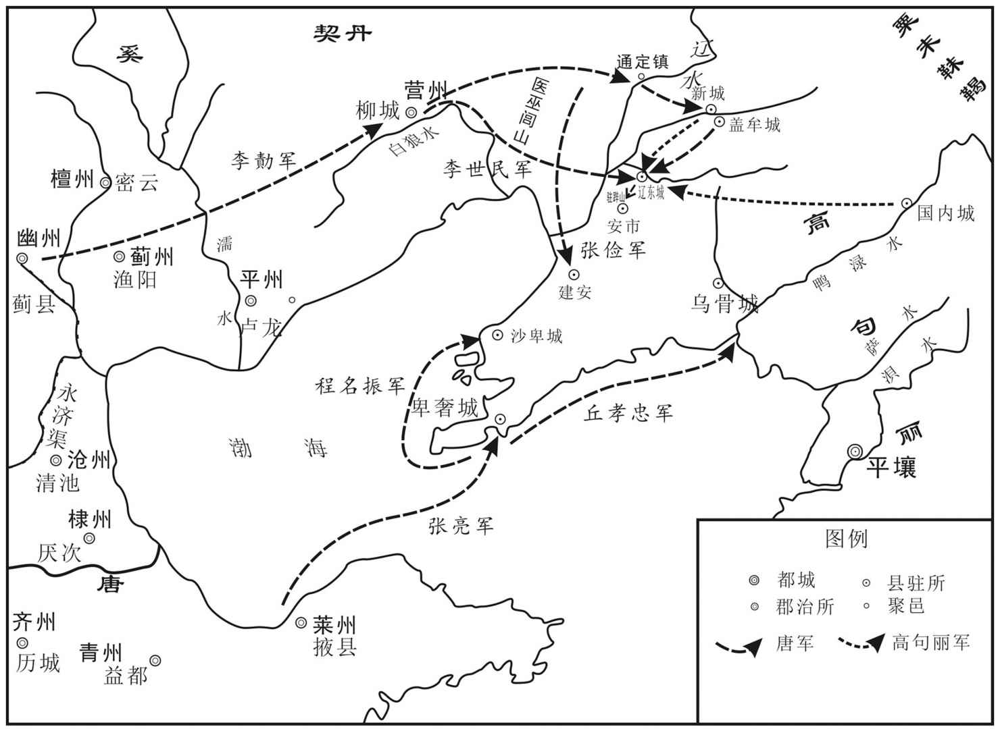 
贞观十九年（645年）唐太宗一征高句丽示意图

## 【原文】

**十九年春二月庚戌，上自将诸军发洛阳，以特进萧瑀为洛阳宫留守[1]。乙卯，诏：“朕发定州后，宜令皇太子监国[2]。”开府仪同三司致仕尉迟敬德上言：“陛下亲征辽东，太子在定州，长安、洛阳心腹空虚，恐有玄感之变[3]。且边隅小夷，不足以勤万乘，愿遣偏师征之，指期可殄[4]。”上不从，以敬德为左一马军总管，使从行[5]。癸亥，上至邺，自为文祭魏太祖，曰：“临危制变，料敌设奇，一将之智有余，万乘之才不足[6]。”是月，李世军至幽州[7]。**

## 【注文】

[1]特进：古代官名。始设于西汉末。授予列侯中有特殊地位的人，位在三公下。东汉至南北朝仅为加官，无实职。隋唐以后为散官。　　留守：隋唐以后，皇帝出巡或亲征时指定亲王或大臣留守京城，方便行事，称“京城留守”；其陪京和行都亦常设“留守”，以地方行政长官兼任，总理军民、钱谷、守卫事务。唐、宋皇帝亲征或出巡时，以亲王或大臣留守京师，称京城留守，其陪都与行都亦置留守，常以地方行政长官兼任，或以重臣担任。

[2]定州：古代地名，今河北定州，唐时称博陵郡，辖安喜、唐昌二县。　　监国：是中国古代的一种政治制度，通常是指皇帝外出时，由一重要人物（例如太子）留守宫廷处理国事。也指君主未能亲政，由他人代理朝政。

[3]开府仪同三司：魏晋南北朝时期的一种高级官位，隋唐至元为文散官的最高官阶，从一品。　　尉（yù）迟敬德（585—658年）：即尉迟恭，字敬德，鲜卑族，朔州鄯阳（今山西朔州）人。唐朝名将，封鄂国公，是凌烟阁二十四功臣之一，赠司徒兼并州都督，谥忠武，赐陪葬昭陵。　　玄感之变：在隋炀帝第二次征伐高丽之际，杨玄感乘机起兵，后失败。

[4]万乘（shèng）：本指兵车万辆，后专指帝位。周制，只有天子可拥有兵车万乘，后世遂称天子为“万乘之尊”。　　偏师：主力军以外的部分军队。　　殄（tiǎn）：消灭、灭绝。

[5]左一马军总管：武官名，统帅骑兵的左、右军总管。

[6]邺（yè）：邺县，县治在今河北临漳西南邺镇。　　魏太祖：即曹操（155—220年）。中国东汉末年著名的军事家、政治家和诗人，三国时代魏国的奠基人和主要缔造者，后为魏王。其子曹丕称帝后，追尊他为魏武帝，庙号太祖。曹操一生征战，为尽快统一全国，在北方广泛屯田，兴修水利，对当时的农业生产恢复有一定作用。　　临危制变：面临危机而能掌控局面。　　万乘（shèng）：指能出兵万乘的大国，亦泛指国家。

[7]至：到达。

## 【译文】

唐太宗贞观十九年（645年）春二月庚戌（十二日），太宗亲自统率各部军队从洛阳出发，任命特进萧瑀为洛阳宫留守。乙卯（十七日），下诏说：“我从定州出发后，便由皇太子监理国事。”退休闲居的开府仪同三司尉迟敬德进言：“陛下亲征辽东，太子又在定州，长安、洛阳心腹之地就空虚了，恐怕会发生像隋末杨玄感那样的变乱。况且高丽只是边境上的一个小国家，不值得劳动大国君去远征。希望派一部分军队去讨伐它，就可以按期歼灭。”太宗不听从，并任命尉迟敬德为左一马军总管，叫他随从前行。癸亥（二十五日），太宗到达邺郡，亲自撰文祭祀魏太祖，祭文说：“面临危机而能控制事变，明察敌情而能设置奇技，作为一个将军智谋有余，作为一位帝王却才能不足。”当月，李世率军到达幽州。

## 【原文】

**三月丁丑，车驾至定州[1]。丁亥，上谓侍臣曰：“辽东本中国之地，隋氏四出师而不能得[2]。朕今东征，欲为中国报子弟之仇，高丽雪君父之耻耳[3]。且方隅大定，惟此未平，故及朕之未老，用士大夫余力以取之[4]。朕自发洛阳，惟啖肉饭，虽春蔬亦不之进，惧其烦扰故也[5]。”上见病卒，召至御榻前存慰，付州县疗之，士卒莫不感悦[6]。有不预征名，自愿以私装从军，动以千计，皆曰：“不求县官勋赏，惟愿效死辽东[7]。”上不许[8]。**

## 【注文】

[1]车驾：帝王所乘的马车，也借指帝王。　　定州：州名。北魏改安州置，治所在卢奴县（今河北定州）、辖境相当于今河北满城县以南，安国市、饶阳县以西，井陉县及辛集二市以北地区。

[2]隋氏四出师而不能得：指隋文帝杨坚和隋炀帝杨广四伐高丽，皆不成。

[3]欲为中国报子弟之仇：指为国人随隋朝皇帝四次出师高丽而死难的子弟报仇。　　高丽雪君父之耻耳：指盖苏文弑其君父不能讨伐，今讨其罪，为高丽雪耻。

[4]方隅（yú）：四方边境。

[5]啖（dàn）：吃。

[6]御榻：皇帝的卧榻。榻，床。　　存慰：抚恤慰问。

[7]不预征名：没有列入东征名籍。　　县官：指皇帝。　　效死：效力而死。

[8]许：允许。

## 【译文】

三月丁丑（初十日），唐太宗到达定州。丁亥（二十日），太宗对侍臣说：“辽东本是中国的土地，隋朝四次出兵而不能收回。我现在东征，就是想替中国牺牲的子弟报仇，替高丽人洗刷君父被杀的耻辱罢了。况且四方边陲已经大体安定，只有这儿还没有平定，所以趁我还没有老，动用大家的余力来夺取它。我从洛阳出发后，只吃肉和饭，即使有新鲜蔬菜也别进上来，因为怕劳烦老百姓。”太宗碰到生病的士兵，就召到御榻前加以抚慰，让他到州县治疗，士兵们没有不感动喜悦的。有的人本来不在征兵名单里，却自愿个人置办军备从军，动不动就有上千人来，都说：“不求皇上的功勋赏赐，只愿能效力战死辽东。”太宗不同意。

## 【原文】

**上将发，太子悲泣数日，上曰：“今留汝镇守，辅以俊贤，欲使天下识汝风采[1]。夫为国之要，在于进贤退不肖，赏善罚恶，至公无私，汝当努力行此，悲泣何为[2]？”命开府仪同三司高士廉摄太子太傅，与刘洎、马周、少詹事张行成、右庶子高季辅同掌机务，辅太子[3]。长孙无忌、岑文本与吏部尚书杨师道从行[4]。壬辰，车驾发定州，亲佩弓矢，手结雨衣于鞍后[5]。命长孙无忌摄侍中，杨师道摄中书令[6]。**

## 【注文】

[1]将发：将要出发。

[2]为（wéi）国：治理国家。

[3]高士廉（575—647年）：唐代开国功臣。名俭，字士廉，渤海蓨（tiáo）县（今河北景县）人。李世民长孙皇后、长孙无忌的亲舅舅。唐太宗贞观年间，任侍中、义兴郡公、安州都督、益州大都督府长史、吏部尚书、尚书右仆射、同中书门下三品，封申国公。　　摄：兼任。　　太子太傅：古代官职，太子的师傅。汉置。太子对其执弟子之礼，后世因袭。　　刘洎（jì）（？—646年）：唐代大臣。字思道，荆州江陵（今湖北江陵）人。隋末，初仕萧铣为黄门侍郎，归唐后授南康州（今江西赣县）都督府长史。唐太宗贞观七年（633年）历任给事中，转治书侍御史、尚书右丞，加银青光禄大夫、散骑常侍，拜黄门侍郎。他敢于谏诤。　　马周（601—648年）：唐初大臣。字宾王，清河茌平（今山东茌平）人。勤读博学，官至中书令。曾直谏太宗以隋为鉴，少兴徭赋，提倡节俭，反对实行世封制。　　少詹事：古代官名，秦汉置詹事，秩二千石，掌皇后、太子家事。东汉废，魏晋复置。唐建詹事府，设太子詹事一人、少詹事一人，总东宫内外庶务。历朝沿袭。　　张行成（587—653年）：字德立，唐高宗时期宰相。曾在隋朝为官，隋朝灭亡，在王世充建立的郑国任职；621年，王世充被唐朝击灭后，补宋州谷熟县尉。唐太宗时，补殿中侍御史，弹劾不避权戚。公元643年后，为太子少詹事，让他辅佐太子李治。高宗继位后任宰相。　　右庶子：东宫属官，称太子右庶子。隋置，为太子典书坊的长官。唐初沿置，高宗时改典书坊为右春坊，右庶子为右中护，唐高宗咸亨元年（670年）复旧。掌侍从、献纳、启奏。　　高季辅（596—654年）：唐大臣，德州蓨县（今河北景县）人。唐高祖武德初，任陟（zhì）州总管府户曹参军。唐太宗贞观时任监察御史，不避权贵，敢于纠劾，曾上书指陈时政，后任太子右庶子、吏部侍郎等职。后因风疾而卒，谥曰“宪”。

[4]岑（cén）文本（595—645年）：字景仁，唐朝宰相，唐太宗贞观元年（627年），他被任命为秘书郎，同时在中书省兼职。后太宗任命他为中书侍郎，专门掌管朝中的机密文件。在对高句丽的作战中，他曾与唐太宗同行。在对辽东的战争中，一切后勤事宜，全部委任于他。因操劳过度，染病身亡。　　杨师道（？—647年）：字景猷，封爵安德郡公，是唐太宗时期的宰相。隋末大乱，杨师道在东都洛阳曾一度被王世充扣留，后投奔李渊。621年为灵州总管，击破东突厥的进攻。唐太宗贞观十年（636年），接替魏徵任侍中，成为宰相。639年任中书令。

[5]鞍：马鞍。

[6]侍中：古代官名。秦始置。因往来于殿内，故名。隋改称纳言、侍内，唐高祖复改侍中，正三品，为门下省次官。掌封驳斥制敕，与中书令共参议军国大政，居宰相之任。唐代宗后成为优崇将帅大臣的荣衔。　　中书令：古代官名。西汉武帝以宦者任中书令，掌传达政令，简称中书令。汉成帝时废。三国魏文帝分秘书另设中书，置中书监与中书令为长官，掌中书省。隋朝废监，置令二人，随省改称内史令、内书令。唐高祖又称中书令，五代沿置，正三品。内参机密，决议朝政，居宰相之任。

## 【译文】

唐太宗将要出发，太子悲伤哭泣了好几天，太宗说：“现在留下你镇守国内，以贤俊大夫辅佐你，想让天下人看看你的风采。治理国家的关键，在于提拔贤能，贬斥坏人，奖励善良，惩罚邪恶，大公无私，你应当努力这样做，哭什么呢？”命令开府仪同三司高士廉兼任太子太傅，与刘洎、马周、少詹事张行成、右庶子高季辅共同掌管机要事务，辅佐太子。长孙无忌、岑文本与吏部尚书杨师道随太宗东征。贞观十九年（645年）三月壬辰（二十四日），太宗从定州出发，身佩弓箭，亲手把雨衣系在马鞍后。命长孙无忌代理侍中，杨师道代理中书令。

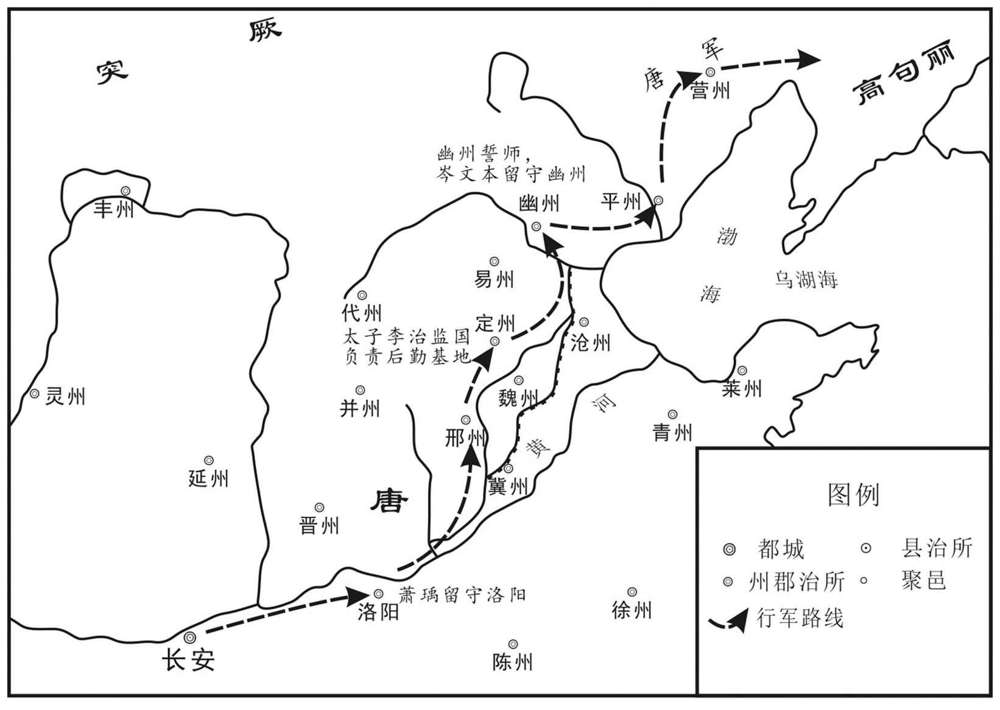 
贞观十九年（645年）唐太宗第一次出征高句丽行军路线示意图

## 【原文】

**李世军发柳城，多张形势，若出怀远镇者，而潜师北趣甬道，出高丽不意[1]。夏四月戊戌朔，世自通定济辽水，至玄莬[2]。高丽大骇，城邑皆闭门自守[3]。壬寅，辽东道副大总管江夏王道宗将兵数千至新城，折冲都尉曹三良引十余骑直压城门，城中惊扰，无敢出者[4]。营州都督张俭将胡兵为前锋，进渡辽水，趋建安城，破高丽兵，斩首数千级[5]。**

## 【注文】

[1]柳城：古县名，县治在今辽宁朝阳西南。　　甬（yǒng）道：两旁有墙的驰道或通道。

[2]通定：古城镇名，今辽宁新民西北辽西岸。　　玄菟（tú）：古郡名。汉武帝置。辖境相当于我国辽宁东部至朝鲜咸镜南道和咸镜北道一带。

[3]大骇：大为惊骇。

[4]江夏王道宗：指李道宗（600—653年），为唐高祖李渊的堂侄。唐高祖武德元年（618年）五月，被封为略阳郡公。唐高宗永徽四年（653年），房遗爱伏诛，长孙无忌、褚遂良素与道宗不和，上言道宗与遗爱交结，流配象州，病卒。　　新城：古城名，高句丽置，今辽宁新宾满族自治县。　　折冲都尉：古代官名，唐折冲府长官，唐前期沿袭前朝府兵制，唐太宗贞观十年（636年）改军府为折冲府，其主官为折冲都尉，掌府兵的训练、调度、戍边和宿卫京师等。以左右果毅都尉为其副贰。　　曹三良（生卒年不详）：唐初任折冲都尉。

[5]建安城：今辽宁盖州东北青石岭古城。

## 【译文】

李世的军队从柳城出发时，大肆虚张声势，做出要从怀远镇行军的假象，实际上却悄悄向北直趋甬道，出乎高丽意料。夏四月戊戌朔（初一日），李世从通定渡过辽河，到达玄菟。高丽大为惊骇，城镇都闭门自守。壬寅（初五日），辽东道副大总管、江夏王李道宗率兵数千到达新城，折冲府都尉曹三良率领十几个骑兵一直逼近城门，城中惊慌不安，没有敢出城迎战的。营州都督张俭率胡兵做前锋，渡过辽水，直奔建安城，打败高丽军队，杀敌数千人。

## 【原文】

**丁未，车驾发幽州[1]。上悉以军中资粮、器械、簿书委岑文本，文本夙夜勤力，躬自料配，筹笔不去手，精神耗竭，言辞举措，颇异平日[2]。上见而忧之，谓左右曰：“文本与我同行，恐不与我同返[3]。”是日，遇暴疾而薨[4]。其夕，上闻严鼓声，曰：“文本殒没，所不忍闻[5]。”命撤之[6]。时右庶子许敬宗在定州，与高士廉等共知机要，文本薨，上召敬宗，以本官检校中书侍郎[7]。**

## 【注文】

[1]发：出发。

[2]簿（bù）书：官署中的文书簿册。　　夙（sù）：早晨。　　料配：料理分配。　　筹：筹码、筹策。记数和计算的竹制用具。

[3]忧：忧虑。

[4]暴：突然。　　薨（hōng）：死。古代称王侯死为“薨”，唐代以后称二品以上的官员死为“薨”。

[5]严鼓：急促的鼓声。一般用紧锣密鼓传递紧急情报。　　殒：死。

[6]撤：撤去。

[7]许敬宗（592—672年）：字延族，隋炀帝大业中，举秀才，授淮阳郡司法书佐，不久任通事舍人。隋末，参加李密瓦岗军，瓦岗军失败后降唐。唐太宗闻其名，召为文学馆学士。634年任著作郎，兼修国史，不久改为中书舍人。　　知：主持。　　检校（jiào）：通过皇帝下诏而非经过人事部门正式任命的“加官”，即“兼领”“代理”。　　中书侍郎：古代官名。中书省的长官，副中书令，帮助中书令管理中书省的事务，是中书省固定编制的宰相。

## 【译文】

丁未（初十日），唐太宗从幽州出发。太宗把军中的物资、军粮、装备及财务会计等后勤事宜全部交给岑文本管理。岑文本日夜辛劳，亲自筹划分配，计算用的筹码笔札从不离手，累得筋疲力尽，言辞举止和平时不太一样了。太宗见他这样很是担忧，对随从人员说：“文本与我一同来，恐怕不能与我一同回去了。”当天，岑文本就得急病去世了。这天晚上，太宗听到营中戒严的鼓声，说：“文本去世，我不忍心听到这鼓声。”命令取消击鼓。当时右庶子许敬宗在定州，和高士廉等人共同掌管机要事务。岑文本去世后，太宗召来许敬宗，让他以原官职代理中书侍郎。

## 【原文】

**壬子，李世、江夏王道宗攻高丽盖牟城[1]。丁巳，车驾至北平[2]。癸亥，李世等拔盖牟城，获二万余口，粮十余万石[3]。**

## 【注文】

[1]盖牟城：古地名，今辽宁盖州。

[2]车驾：帝王所乘的马车，也借指帝王。此指唐太宗李世民。　　北平：古地名，今北京。

[3]石（dàn）：容量单位，十斗为一石；重量单位，一百二十斤为一石。

## 【译文】

四月壬子（十五日），李世、江夏王李道宗攻打高丽盖牟城。丁巳（二十日），唐太宗达到北平。癸亥（二十六日），李世等人攻克盖牟城，俘获二万多人口，十万多石粮食。

## 【原文】

**张亮帅舟师自东莱渡海袭毕沙城，其城四面悬绝，惟西门可上[1]。程名振引兵夜至，副总管王大度先登，五月己巳，拔之，获男女八千口[2]。分遣总管丘孝忠等曜兵于鸭绿水[3]。**

## 【注文】

[1]东莱：古州名，治所在今山东掖县。　　毕沙城：即卑沙城，卑沙城坐落于辽宁大连金州区大黑山南峰的山脊上，又名毕奢城。　　悬绝：险峻峭绝。

[2]王大度：疑为“王文度”。王文度（？—660年），唐初大将，曾参加征讨西突厥、高丽、百济等重大军事活动，官至熊津都督，驻守百济。

[3]丘孝忠（生卒年不详）：官至卫尉卿、广州都督、安南公。　　曜（yào）：显示、炫耀。　　鸭绿水：今称之为鸭绿江。在平壤城四百五十里。

## 【译文】

张亮率领水军从东莱渡海袭击毕沙城。毕沙城四面悬崖绝壁，只有西门可登上去。程名振领兵夜晚到达，副总管王大度首先登上西门，五月己巳（初二日），攻克毕沙城，俘获男女八千口。另派总管丘孝忠等人在鸭绿江边炫耀武力。

## 【原文】

**李世进至辽东城下[1]。庚午，车驾至辽泽，泥淖二百余里，人马不可通，将作大匠阎立德布土作桥，军不留行[2]。壬申，渡泽东[3]。乙亥，高丽步骑四万救辽东，江夏王道宗将四千骑逆击之[4]。军中皆以为“众寡悬绝，不若深沟高垒，以俟车驾之至[5]”。道宗曰：“贼恃众有轻我心，远来疲顿，击之必败[6]。且吾属为前军，当清道以待乘舆，乃更以贼遗君父乎[7]？”李世以为然[8]。果毅都尉马文举曰：“不遇勍敌，何以显壮士[9]！”策马赴敌，所向皆靡，众心稍安[10]。既合战，行军总管张君义退走，唐兵不利[11]。道宗收散卒，登高而望，见高丽阵乱，与骁骑数十冲之，左右出入[12]。李世引兵助之，高丽大败，斩首千余级[13]。丁丑，车驾渡辽水，撤桥，以坚士卒之心，军于马首山[14]。劳赐江夏王道宗，超拜马文举中郎将，斩张君义[15]。上自将数百骑至辽东城下，见士卒负土填堑，上分其尤重者于马上持之，从官争负土致城下[16]。李世攻辽东城，昼夜不息，旬有二日，上引精兵会之，围其城数百重，鼓噪声震天地[17]。甲申，南风急，上遣锐卒登冲竿之末，爇其西南楼，火延烧城中，因麾将士登城[18]。高丽力战，不能敌，遂克之，所杀万余人，得胜兵万余人，男女四万口，以其城为辽州[19]。**

## 【注文】

[1]辽东城：隋朝辽东郡治所，今辽宁辽阳老城区。

[2]辽泽：即辽河。

[3]渡：渡过。

[4]逆：迎头。

[5]悬绝：相差极远。　　深沟高垒：挖深沟，筑高垒。深、高均为使动用法。

[6]疲顿：疲惫劳累。

[7]舆：车厢。　　君父：特称天子。

[8]然：正确。

[9]果毅都尉：唐军事职官名，是唐折冲都尉的副职，每折冲府二人，分左、右，上府从五品下，中府正六品下，下府正六品下。　　马文举（生卒年不详）：唐初任果毅都尉。　　勍（qíng）：强劲。　　显：显露。

[10]策：鞭打，鞭策。　　靡（mí）：倒下。

[11]行军总管：古代官名，督军之官，北周置，在战时临时任命，事完即罢。在重大军事行动中，隶属于行军大元帅。隋、唐行军征讨也设置，各州设总管，边镇或大州设大总管，出征时，则称行军大总管。　　张君义（？—645年）：唐初将领。参与征讨辽东的战役，因作战中失利败退被唐太宗斩杀。

[12]骁：勇猛，矫健。

[13]助：帮助。

[14]马首山：今辽宁辽阳西南首山。

[15]劳赐：慰劳赏赐。　　超拜：超级升授官职。　　中郎将：古代官名。秦汉为管理宫禁警卫的高级武官，后历朝沿置。唐朝为统领府兵的军事长官，分属十六卫、东宫十率府。

[16]堑：护城河。

[17]旬有二日：一旬又两天，即十二日。

[18]冲竿：以撑杆登城的工具。　　爇（ruò）：烧，点燃。

[19]辽州：唐太宗贞观十九年（645年）在辽东城（今辽宁辽阳）置。

## 【译文】

李世进军到辽东城下。五月庚午（初三日），唐太宗到达辽泽，泥泞沼泽地带有二百多里，人马不能通行，匠作大将阎立德用土垫成桥，没有耽搁行军。壬申（初五日），渡过沼泽到达沼泽地东面。乙亥（初八日），高丽步兵骑兵四万援救辽东，江夏王李道宗率四千骑兵迎头拦击。军中都认为“敌我众寡悬殊，不如坚守深沟高垒，等待皇上到来”。李道宗说：“敌军依仗人多，有轻视我们的心思，他们从老远处赶来，疲惫劳顿，我军一定会打败他们。何况我们是先头部队，应当扫清道路等待皇上，却反而把敌人留给皇上吗？”李世认为李道宗说的对。果毅都尉马文举说：“遇不到劲敌，怎能显示出好汉！”于是鞭打战马，直奔敌军，所过之处，敌人纷纷溃退，唐军的军心才稍微安定了。两军混战中，行军总管张君义退兵逃跑，唐军失利。李道宗收拾溃散的士卒，登上高处眺望，看见高丽兵阵地混乱，就和几十个骁勇骑兵冲入敌阵，左右拼杀，冲入冲出。李世率兵援助他，高丽兵大败，杀敌一千余人。丁丑（初十日），太宗渡过辽河，拆去渡桥，借以坚定士兵们的必胜信心，驻扎在马首山。太宗慰劳并赏赐江夏王李道宗，越级提拔了马文举为中郎将，斩了张君义。太宗亲自率领几百骑兵到辽东城下，看见士兵们在运土填护城河，就从负担最重的人手中分出一些在马上帮着运，随从官员争着把土运到城下。李世攻打辽东城，昼夜不停，过了十二天，太宗又率精兵和他会合，把辽东城围了几百层，鼓噪呐喊声震天动地。甲申（十七日），南风刮得很猛烈，太宗派精锐士兵登上冲竿顶，放火焚烧辽东城西南楼，大伙蔓延到城中，趁机指挥将士登城。高丽兵拼全力迎战，也抵挡不住，于是攻克辽东城，杀敌一万多人，俘虏剩余士兵一万多人，以及城中男女百姓四万口，改辽东城为辽州。

## 【原文】

**乙未，进军白岩城[1]。丙申，右卫大将军李思摩中弩矢，上亲为之吮血，将士闻之，莫不感动[2]。乌骨城遣兵万余为白岩声援，将军契苾何力以劲骑八百击之[3]。何力挺身陷陈，槊中其腰，尚辇奉御薛万备单骑往救之，拔何力于万众之中而还[4]。何力气益愤，束疮而战，从骑奋击，遂破高丽兵，追奔数十里，斩首千余级，会暝而罢[5]。万备，万彻之弟也[6]。**

## 【注文】

[1]白岩城：燕州城原称白岩城，是东晋元兴二年（403年），高句丽占据辽东城（今辽宁辽阳）后建筑的。位于辽宁辽阳灯塔市的石城山上。

[2]右卫大将军：唐前期，军队以府兵为主体，中央统领府兵的十二卫和东宫六率。十二卫即左右卫、左右骁卫、左右武卫、左右威卫、左右领军卫、左右金吾卫。诸卫置大将军各一人、将军各二人。　　李思摩（？—655年）：本姓阿史那氏，名思摩，突厥人，被赐姓李氏。唐朝招抚突厥人后，李思摩被封为乙弥泥熟俟利苾可汗，统治突厥。　　弩：一种利用机械力量发射箭的工具。　　吮：聚拢嘴唇吸。

[3]乌骨城：乌骨城位于辽宁凤城边门镇，是高句丽时期的著名山城。　　契苾（bì）何力（？—677年）：铁勒族契苾部人，契苾氏，唐朝名将。出身铁勒可汗世家，后率部归唐。在对吐谷浑的战争中，力俘吐谷浑王，以功尚宗室女。后被反叛的部众绑架至薛延陁，唐太宗不惜以公主下嫁为条件换回契苾何力。作为唐军前军指挥官参加了对高句丽的战争。太宗逝世后，契苾何力欲以身殉葬，为高宗所止。唐高宗显庆、龙朔年中，与苏定方等人屡征高句丽。后为辽东道大总管，作为李世副手攻克平壤。死后，陪葬昭陵，谥号“毅”。

[4]陈（zhèn）：通“阵”。古时两军交战时的战斗队列。　　槊（shuò）：长矛。　　尚辇（niǎn）奉御：古代官名。殿中省尚辇局长官，掌朝会、祭祀时的舆辇、伞扇陈设。　　薛万备（生卒年不详）：唐朝将领。雍州咸阳（今陕西咸阳）人。薛万均之弟。曾先后出征龟兹和于阗，都获胜。官至左卫将军。

[5]疮：疮口　　暝：日落，天黑。

[6]万彻：指薛万彻（？—652年），唐初名将。雍州咸阳（今陕西咸阳）人。唐太宗贞观初，跟从李靖击突厥，以功授统军。贞观八年（634年）随李靖击吐谷浑，授右卫将军、蒲州刺史。贞观十五年（641年）为行军副总管，随李世击薛延陁。贞观十八年（644年）授左卫将军，娶丹阳公主，为驸马都尉。唐高宗永徽二年（651年）授宁州刺史。永徽四年（653年）因与房遗爱谋反事有牵连，被杀。

## 【译文】

五月乙未（二十八日），进军白岩城。丙申（二十九日），右卫大将军李思摩中箭，唐太宗亲自替他吮吸伤口的血，将士们听说后，无不感动。乌骨城派出一万多士兵声援白岩，唐将军契苾何力用八百精锐骑兵袭击乌骨城援兵。契苾何力挺身冲入敌阵，腰上被长矛刺中，尚辇奉御薛万备单枪匹马前往救援，从万人之中把契苾何力抢救回来。契苾何力更加气愤，包扎好伤口又投入战斗，跟随他的骑兵奋力攻击，终于打败了高丽援军，追击几十里，杀敌一千余人，因为天黑才停止追杀。薛万备是薛万彻的弟弟。

## 【原文】

**六月丁酉，李世攻白岩城西南，上临其西北[1]。城主孙代音潜遣腹心请降，临城投刀钺为信，且曰：“奴愿降，城中有不从者[2]。”上以唐帜与其使曰：“必降者，宜建之城上[3]。”代音建帜，城中人以为唐兵已登城，皆从之[4]。**

## 【注文】

[1]临：光临，来到。

[2]孙代音（生卒年不详）：唐初高丽白岩城城主。　　钺（yuè）：古代一种像斧头的武器，是权力的象征。

[3]必：倘若，假如。

[4]皆：全部。

## 【译文】

六月丁酉（初一日），李世进攻白岩城西南，唐太宗亲临白岩城西北。守城首领孙代音暗中派心腹之人请求投降，从城墙上投下刀斧作为信物，并且说：“我本人愿意投降，只是城中有不服从我的人。”太宗把唐军的旗帜交给来使，说：“真是投降的话，就把它插在城墙上。”孙代音竖起唐旗，城中人以为唐军已经登城，都跟着投降了。

## 【原文】

**上之克辽东也，白岩城请降，既而中悔[1]。上怒其反复，令军中曰：“得城当悉以人物赏战士[2]。”李世见上将受其降，帅甲士数十人请曰：“士卒所以争冒矢石，不顾其死者，贪虏获耳[3]。今城垂拔，奈何更受其降，孤战士之心[4]？”上下马谢曰：“将军言是也[5]。然纵兵杀人而虏其妻孥，朕所不忍[6]。将军麾下有功者，朕以库物赏之，庶因将军赎此一城[7]。”世乃退[8]。得城中男女万余口，上临水设幄，受其降，仍赐之食，八十以上赐帛有差[9]。他城之兵在白岩者悉慰谕，给粮仗，任其所之[10]。**

## 【注文】

[1]中悔：中途反悔。

[2]反复：反复无常。

[3]矢石：箭和垒石，守城武器。　　虏获：俘虏和缴获物资。

[4]垂：临近。　　拔：攻取。　　孤：同“辜”，辜负。

[5]是：正确。

[6]妻孥（nú）：妻子儿女。孥，子女。

[7]庶：或许，可以，表示推测。　　因：依靠，凭借。　　赎：救赎。

[8]乃：才。

[9]幄（wò）：帐幕。

[10]慰谕：慰问开导。　　仗：兵器的总称。

## 【译文】

唐太宗攻下辽东后，白岩城守军请求投降，不久又中途反悔了。太宗很愤怒，传令军中说：“攻进白岩城后，要把财物和人口全部赏给士兵们。”李世见太宗将要接受白岩城的投降，领着几十个带甲士兵请求说：“士兵们之所以争相冒着箭石的射击，不顾个人死活，就是为了贪求一些俘虏和战利品罢了。现在白岩城即将攻克，为什么还要接受投降，辜负战士们的心呢？”太宗下马道歉说：“将军的话是对的。然而放纵士兵杀人，又抢夺人家的妻子儿女，我不忍心这样做。将军部下有功的将士，我用国库里的东西赏赐他们，或许可以依靠将军保全这一城的百姓。”李世这才退下。获得城中男女一万余口，太宗在水边架设帐篷，接受他们投降，还赐给他们食品，赐给八十岁以上老人的绢帛多少不等。其他城的士兵驻扎在白岩的一律加以慰问，发给粮食兵器，听任他们去留。

## 【原文】

**先是，辽东城长史为部下所杀，其省事奉其妻子奔白岩[1]。上怜其有义，赐帛五匹[2]。为长史造灵舆，归之平壤[3]。以白岩城为岩州，以孙代音为刺史[4]。**

## 【注文】

[1]长（zhǎng）史：古代官名。战国秦置，掌顾问参谋。唐朝长史分三类，即诸都护府、都督府、诸州长史，中央南衙诸卫、北衙诸军、诸折冲府、东宫诸率府长史及诸王府长史，皆为幕僚之长，有“元僚”之称。　　省（xǐng）事：古代吏职名称。属尚书省低级官员，多办理具体事务。

[2]怜：怜惜。

[3]灵舆（yú）：载运灵柩的车舆。

[4]岩州：古州名。唐太宗贞观十九年（645年）置，治所在白崖城，今辽宁灯塔。后废。

## 【译文】

在此之前，辽东城长史被部下杀死，他的同事保护着他的妻子儿女逃到白岩。唐太宗怜悯这个人的义气，赐给他五匹绢帛。还给长史造了灵车，让他们回平壤。改白岩城为岩州，任命孙代音为刺史。

## 【原文】

**契苾何力疮重，上自为傅药，推求得刺何力者高突勃，付何力使自杀之[1]。何力奏称：“彼为其主冒白刃刺臣，乃忠勇之士也，与之初不相识，非有怨仇[2]。”遂舍之[3]。**

## 【注文】

[1]傅药：傅，通“敷”。　　推求：寻求，探索。　　高突勃（生卒年不详）：活动于唐初。

[2]怨仇：仇怨。

[3]遂：于是。

## 【译文】

契苾何力枪伤恶化，唐太宗亲自给他敷药，查出并抓到刺伤他的人高突勃，交给契苾何力，让他亲手杀死高突勃。契苾何力奏称：“他为了他的主子冒着刀枪的危险刺我，是一个忠勇之士，我和他从来不认识，并没有怨恨。”于是放了他。

## 【原文】

**初，莫离支遣加尸城七百人戍盖牟城，李世尽虏之[1]。其人请从军自效，上曰：“汝家皆在加尸，汝为我战，莫离支必杀汝妻子[2]。得一人之力而灭一家，吾不忍也[3]。”戊戌，皆廪赐遣之[4]。己亥，以盖牟城为盖州[5]。**

## 【注文】

[1]加尸城：又作“嘉尸城”。在今朝鲜平壤市西南。

[2]效：效力。

[3]忍：忍心。

[4]廪（lǐn）赐：赏赐粮食。廪，公家发给的粮米。

[5]盖州：又作“盖牟州”，治所在今辽宁盖州。

## 【译文】

当初，莫离支派遣加尸城的七百人守卫盖牟城，李世把他们全部俘虏了。这些人请求从军效力，唐太宗说：“你们的家人都在加尸，你们替我打仗，莫离支必然会杀掉你们的妻子儿女。得到你们一个人的力量，却毁灭了你们一家人，我不忍心这样做。”六月戊戌（初二日），都赏赐并遣散他们回去。己亥（初三日），改盖牟城为盖州。

## 【原文】

**丁未，车驾发辽东，丙辰，至安市城，进兵攻之[1]。丁巳，高丽北部耨萨延寿、惠真帅高丽、靺鞨兵十五万救安市[2]。上谓侍臣曰：“今为延寿策有三：引兵直前，连安市城为垒，据高山之险，食城中之粟，纵靺鞨掠吾牛马，攻之不可猝下，欲归则泥潦为阻，坐困吾军，上策也；拔城中之众，与之宵遁，中策也；不度智能，来与吾战，下策也[3]。卿曹观之，彼必出下策，成擒在吾目中矣[4]。”**

## 【注文】

[1]安市城：古地名，今辽宁海城东南营城子。唐高宗总章元年（668年）唐亡高丽国后，置有安市州，州治设此城。

[2]北部耨（nòu）萨：耨萨，高丽官名。相当于唐朝都督。高丽分五部，内部、北部、东部、前部、西部。各部各设有耨萨。　　延寿：指高延寿（？—645年）。唐朝时高丽北部耨萨（都督）。唐太宗贞观十九年（645年），征高丽，围安市。他与高惠真（贞）率兵来援，兵败，与惠真一起降唐，被授为鸿胪卿。　　惠真：指高惠真。唐时高丽南部耨萨（都督）。唐太宗贞观十九年（645年），与高延寿一起兵败降唐。授官司农卿，入长安。

[3]垒：军营四周所筑堡寨。　　宵遁（dùn）：夜逃。遁，逃跑。　　度（duó）：考虑、思考

[4]卿曹：你们。卿，古时对人的敬称。曹，辈。

## 【译文】

六月丁未（十一日），唐太宗从辽东出发，丙辰（二十日），到达安市城，发兵进攻。丁巳（二十一日），高丽北部耨萨高延寿、高惠真率领高丽、靺鞨兵十五万援救安市。太宗对侍臣说：“如今高延寿有三条计策：率兵直往前进，连接安市城作为堡垒，据守高山险要地形，吃城中贮存的粮食，放纵靺鞨兵抢夺我们的牛马，我们攻他不能很快拿下，想回师却又泥泞积水阻断道路，坐等我军疲困，这是上策；率领城中的士兵民众，和他们连夜逃走，这是中策；不考虑他们的智力和能力，来和我们决战，这是下策。你们看着吧，他一定会采取下策，活捉他就在眼前。”

## 【原文】

**高丽有对卢，年老习事，谓延寿曰：“秦王内芟群雄，外服戎狄，独立为帝，此命世之材[1]。今举海内之众而来，不可敌也[2]。为吾计者，莫若顿兵不战，旷日持久，分遣奇兵断其运道，粮食既尽，求战不得，欲归无路，乃可胜也[3]。”延寿不从，引军直进，去安市城四十里[4]。上犹恐其低徊不至，命左卫大将军阿史那社尔将突厥千骑以诱之[5]。兵始交而伪走[6]。高丽相谓曰：“易与耳[7]。”竞进乘之，至安市城东南八里，依山而陈[8]。**

## 【注文】

[1]对卢：高丽官职名。大对卢相当于唐一品官员。　　秦王：指唐太宗李世民，其未称帝前被封为秦王。　　芟（shān）：割草，引申为除去、消灭。　　命世：著名于当时，多用于称赞治国之才。

[2]举：发动。

[3]旷日持久：拖很长时间，用很长时间。旷：荒废，耽误。

[4]去：距离。

[5]低徊：徘徊不前。　　左卫大将军：古代官名，隋朝置一人，正三品，掌宫掖禁御，督摄仗卫。隋炀帝大业三年（607年）改为左翊卫大将军。唐高祖武德五年（622年）复为左卫府大将军。唐高宗龙朔二年（662年）去“府”字，置一人，正三品。唐德宗贞元二年（786）置上将军前为长官，掌宫禁宿卫，总制五府及外府。　　阿史那社尔（604—655年）：突厥人，唐初名将，东突厥处罗可汗之子。十一岁即设牙旗于漠北，统帅铁勒、薛延陁等部族。635年，率部投唐，封左骁卫大将军，尚衡阳长公主。以攻灭高昌之功封毕国公。其后，参与对高句丽、薛延陁的战争，屡立军功，并有清廉之名。公元647年，同契苾何力率铁勒、突厥部众十万人击败龟兹，并迫使于阗国王臣服。去世后赠辅国大将军、并州都督，陪葬昭陵，谥曰“元”。

[6]伪走：佯装逃跑。

[7]与：对付。

[8]乘：趁机。

## 【译文】

高丽有一位对庐，年纪大见识广，对高延寿说：“唐太宗对内消灭了群雄，对外征服了外族，成为出类拔萃的帝王，这是能够指挥天下的人才。现在发动全国的军队前来，是不可能战胜的。依我的考虑，最好是按兵不战，旷日持久地拖延，另外派军队出其不意地截断他们的运输要道，等粮食吃完了，他们求战不得，欲归无路，这才能取胜。”高延寿不听，率兵直进，到了离安市城四十里的地方。唐太宗还怕他们徘徊不前，命令左卫大将军阿史那社尔率领突厥骑兵一千人引诱他们。军队刚开始交战，就伪装失败逃跑。高丽兵相互说：“唐军也容易对付嘛。”争相趁机进攻，到了安市城东南八里的地方，依山布阵。

## 【原文】

**上悉召诸将问计，长孙无忌对曰：“臣闻临敌将战，必先观士卒之情[1]。臣适行经诸营，见士卒闻高丽至，皆拔刀结旆，喜形于色，此必胜之兵也[2]。陛下未冠，身亲行陈，凡出奇制胜，皆上禀圣谋，诸将奉成算而已[3]。今日之事，乞陛下指踪[4]。”上笑曰：“诸公以此见让，朕当为诸公商度[5]。”乃与无忌等从数百骑乘高望之，观山川形势，可以伏兵及出入之所[6]。高丽、靺鞨合兵为陈，长四十里[7]。江夏王道宗曰：“高丽倾国以拒王师，平壤之守必弱，愿假臣精卒五千，覆其本根，则数十万之众，可不战而降[8]。”上不应[9]。遣使绐延寿曰：“我以尔国强臣弑其主，故来问罪，至于交战，非吾本心[10]。入尔境，刍粟不给，故取尔数城，俟尔国修臣礼，则所失必复矣[11]。”延寿信之，不复设备[12]。**

## 【注文】

[1]悉：全部。

[2]旆（pèi）：古代旗边上下垂的装饰品，泛指旌旗。

[3]未冠：未成年。古代男子年二十加冠，故未冠谓未成年的男子。　　行陈：陈即“阵”，行军布阵。　　禀：秉承，承受。

[4]踪：谓野兽留下的踪迹。比喻对敌如打猎，先得掌握敌人的行踪。

[5]见让：见，放于动词之前，表示对自己怎么样，见让即“让我”，译为推让给我。

[6]从：使动用法，使……从。

[7]陈：通“阵”。

[8]假：借。

[9]应：答应。

[10]弑（shì）：杀。

[11]刍（chú）粟：粮草。　　俟（sì）：等待。

[12]设备：陈设防备。

## 【译文】

唐太宗召集全体将领征询对付高丽的计策，长孙无忌回答说：“我听说面对敌人将要战斗时，一定要先观察战士们的情绪。我刚刚到各营走了走，见战士们听说高丽援兵来了，都拔出战刀，整理战旗，喜形于色，这是肯定能打胜仗的军队。陛下不满二十岁时就经历了行军布阵的战斗生涯，大凡出奇制胜的策略，都是按照您的英明决策进行的，诸位将领只是接受现成的计策而已。今天的战斗，还请陛下指挥。”太宗笑着说：“各位把指挥权推让给我，我应当和各位商讨一番。”于是和长孙无忌等人带着几百骑兵登高望远，观察山川地理形势，看哪里可以埋伏部队，哪里可以进退。高丽、靺鞨合兵列阵，长达四十里。江夏王李道宗说；“高丽动用全国军队来抗拒我们，平壤的守备一定虚弱，我希望借精兵五千，把高丽的老窝端掉，这样几十万高丽军队不用攻打就自己投降了。”太宗不答应，派使者欺骗高延寿说：“我因为你国的强臣杀死了君主，所以来问罪，至于交战，不是我的本意。进入你们的国境后，粮草供应不上，因而才攻取了你们几座城池，等你国重新臣服我国，失去的城池一定会归还你们。”高延寿相信了这番话，不再设置防备。

## 【原文】

**上夜召文武计事，命李世将步骑万五千陈于西岭；长孙无忌将精兵万一千为奇兵，自山北出于狭谷，以冲其后；上自将步骑四千，挟鼓角，偃旗帜，登北山上，敕诸军闻鼓角齐出奋击[1]。因命有司张受降幕于朝堂之侧[2]。戊午，延寿等独见李世布陈，勒兵欲战[3]。上望见无忌军尘起，命作鼓角，举旗帜，诸军鼓噪并进[4]。延寿等大惧，欲分兵御之，而其陈已乱[5]。会有雷电，龙门人薛仁贵著奇服，大呼陷陈，所向无敌[6]。高丽兵披靡，大军乘之，高丽兵大溃，斩首二万余级[7]。上望见仁贵，召见，拜游击将军[8]。仁贵，安都之六世孙，名礼，以字行[9]。**

## 【注文】

[1]奇兵：指出奇制胜的军队。　　挟：用胳膊夹住，引申为携带。　　鼓角：战鼓和号角的总称，古代军队中为了发号施令而制定的吹擂之物。　　偃：倒下。

[2]有司：有关部门。　　朝堂：行营各宫省之制，故也有朝堂。

[3]勒：统领，率领。

[4]鼓噪：擂鼓呐喊。

[5]御：抵御。

[6]龙门：古地名，今山西河津和陕西韩城之间。　　薛仁贵（613—683年）：即薛礼，字仁贵，汉族，山西绛州（今山西新绛）人，唐朝名将，著名军事家、政治家。随唐太宗李世民、唐高宗李治创造了“良策息干戈”“三箭定天山”“神勇收辽东”“仁政高丽国”“爱民象州城”“脱帽退万敌”等诸方面在军事、政治上的赫赫功勋。

[7]披靡：草木倒伏，形容军队溃败。

[8]游击将军：古代官名。汉朝置，魏、晋为禁军将领。梁武帝天监六年（507年）改游骑将军，另置左、右游击将军。北齐、北魏置为侍卫牙职。唐高祖武德七年（624年），为从五品下，武散官。

[9]安都：即薛安都（410—469年），河东汾阴（山西万荣西南）人，北魏时名将，以骁勇闻名。封河东公。

## 【译文】

晚上，唐太宗召集文武官员商量战事，命令李世率领步兵骑兵一万五千人在西岭布阵；长孙无忌率领精兵一万一千人作为奇袭部队，从山北峡谷出兵，冲击敌人后方；太宗自己率领步兵骑兵四千人，拿着战鼓号角，藏着旗帜，登上北山，命令各部队听到鼓角声便一起奋力进击。并命令有关人员在朝堂旁边设置受降幕帐。六月戊午（二十二日），高延寿等高丽将领看到只有李世在布阵，就想率兵出战。太宗望见长孙无忌率领的部队尘土飞扬，就下令擂鼓吹号，高举旗帜，各部队呐喊擂鼓一起进攻。高延寿等人大为惊慌，想分兵抵抗，但他的阵脚已乱。正好雷电大作，龙门人薛仁贵穿着奇装异服，大喊大叫冲入敌阵，所向无敌。薛仁贵是薛安都的六世孙，名礼，以字流传于世。

## 【原文】

**延寿等将余众依山自固，上命诸军围之[1]。长孙无忌悉撤桥梁，断其归路[2]。己未，延寿、惠真帅其众三万六千八百人请降，入军门，膝行而前，拜伏请命[3]。上语之曰：“东夷少年，跳梁海曲，至于摧坚决胜，故当不及老人，自今复敢与天子战乎[4]？”皆伏地不能对[5]。上简耨萨已下酋长三千五百人，授以戎秩，迁之内地，余皆纵之，使还平壤[6]。皆双举手以颡顿地，欢呼闻数十里外[7]。收靺鞨三千三百人，悉坑之[8]。获马五万匹，牛五万头，铁甲万领，他器械称是[9]。高丽举国大骇，后黄城、银城皆自拔遁去，数百里无复人烟[10]。**

## 【注文】

[1]依：凭借。

[2]悉：全部。

[3]膝行：跪着前进。　　拜伏：伏地叩头。

[4]跳梁：即“跳踉”，跳窜，跳跃。此为逞强横行之意。　　海曲：海隅，指沿海偏僻的地方。　　摧坚：挫败坚强的军队。

[5]伏：爬。

[6]已：同“以”。　　戎秩：武职。

[7]颡（sǎng）：额头。

[8]坑：活埋。

[9]称是：名称数量同上述一样，都有定数定量。

[10]后黄城、银城：高丽所置城池。

## 【译文】

高延寿等人率领残余部队依山自守，唐太宗命令各军把他包围起来。长孙无忌拆毁全部桥梁，截断敌人的退路。六月己未（二十三日），高延寿、高惠真率领三万六千八百人请求投降，进入唐军营门，跪着前进，伏地叩头，请求饶命。太宗对他们说：“你们这些东方蛮族的少年，只能在大海的一角蹦跶，至于摧垮精兵强将，决定战争胜负，本来就比不上长者，从今以后还敢和天子打仗吗？”高延寿等人趴在地上说不出话来。太宗选择耨萨以下的酋长三千五百人，授予他们军职，迁入内地，其余的降卒全部释放，让他们回平壤去。这些人都举起双手叩响头，欢呼声在几十里外都能听到。俘虏到靺鞨兵三千三百人，全部活埋。缴获战马五万匹，牛五万头，铠甲一万副，其他器械大约也有一万余件。高丽全国大为惊骇，后黄城、银城的人都弃城逃离，几百里内再没有人烟。

## 【原文】

**上驿书报太子，仍与高士廉等书曰：“朕为将如此，何如[1]？”更名所幸山曰驻跸山[2]。秋七月辛未，上徙营安市城东岭[3]。己卯，诏标识战死者尸，俟军还与之俱归[4]。戊子，以高延寿为鸿胪卿，高惠真为司农卿[5]。**

## 【注文】

[1]驿书：经驿站传递文书。　　高士廉（575—647年），唐初大臣。因得罪隋炀帝，被发配岭南，随后中原大乱，被隔绝在外，直到李靖灭萧铣时才得以回归。善行政、文学，为李世民心腹，参与玄武门之变的策划。在唐太宗贞观年间，任侍中、义兴郡公、安州都督、益州大都督府长史、吏部尚书、尚书右仆射、同中书门下三品，封申国公。主持编撰《氏族志》。凌烟阁二十四功臣之一。

[2]驻跸（bì）山：驻跸，泛指帝王出行的车驾。唐太宗曾驻跸于今辽宁辽阳市西南马首山、北宁市西北依巫闾山及海城县西南平顶山，因称以上诸山为“驻跸山”。

[3]安市：古地名，今辽宁海城南营城子，中国的辽东故土，短时期内曾为高句丽所有。

[4]标识（zhì）：做出标志。

[5]鸿胪卿：古代官名。南朝梁、陈掌朝会司仪的高级官员。北齐为鸿胪寺长官，主管宾客、朝会、宗教等事务。历朝沿设，亦称鸿胪寺卿。隋炀帝改从三品，唐朝沿袭。　　司农卿：古代官名。管理国家农业、仓储、宫廷百官供应事务的高级官员。南朝梁改大司农置，为十二卿之一。北齐置为司农寺长官。历朝沿置，也称司农寺卿。隋唐从三品。

## 【译文】

唐太宗通过驿路给太子传信报捷，并给高士廉等人写信说：“我这样当将军，怎么样？”把自己所去的山改名为驻跸山。秋七月辛未（初五日），太宗把军营迁到安市城东岭。己卯（十三日），下令给战死者的尸体做标记，等回师时一起带回去。戊子（二十二日），任命高延寿为鸿胪卿，高惠真为司农卿。

## 【原文】

**张亮军过建安城下，壁垒未固，士卒多出樵牧，高丽兵奄至，军中骇扰[1]。亮素怯，踞胡床，直视不言，将士见之，更以为勇[2]。总管张金树等鸣鼓勒兵击高丽，破之[3]。**

## 【注文】

[1]张亮（？—646年）：唐朝大臣，凌烟阁二十四功臣之一。出身寒贱，务农为业。原为李密部下，隶属李世，随其降唐。后被房玄龄推荐入天策府。唐太宗即位后，封长平郡公，授怀州总管。唐太宗贞观年间，因善于行政而颇得信任，又因揭发侯君集谋反、随征高丽而立功。但其后因好巫术而逐渐名声败坏，被告谋反，受诛。　　建安城：古地名，今辽宁盖州。　　樵牧：砍柴牧马的人。　　奄：突然。

[2]踞：依靠。　　胡床：亦称“交床”“交椅”“绳床”。是古代一种可以折叠的轻便坐具，似小马扎。

[3]张金树（生卒年不详）：原为隋末农民义军领袖高开道的部将，唐高祖武德七年（624年）杀高开道降唐，任北燕州都督。

## 【译文】

张亮的部队经过建安城下，作战工事还不坚固，许多士兵就出营打柴放马，高丽兵突然来到，军中惊骇慌乱。张亮历来就怯懦，坐在胡椅上，两眼直瞪，一句话也不说，将士们见他这样，还以为他很勇敢。总管张金树等将领擂起战鼓，率领部队攻击高丽兵，打败了敌人。

## 【原文】

**八月甲辰，候骑获莫离支谍者高竹离，反接诣军门[1]。上召见，解缚问曰：“何瘦之甚[2]？”对曰：“窃道间行，不食数日矣[3]。”命赐之食，谓曰：“尔为谍，宜速反命[4]。为我寄语莫离支，欲知军中消息，可遣人径诣吾所，何必间行辛苦也[5]。”竹离徒跣，上赐而遣之[6]。**

## 【注文】

[1]候骑（jì）：担任侦察巡逻任务的骑兵。　　高竹离（生卒年不详）：唐初高丽人。　　反接：反绑两手。

[2]甚：非常。

[3]窃：偷偷地。

[4]反命：返回交复命令。反，通“返”。

[5]诣（yì）：去。

[6]徒跣（xiǎn）：光着脚行走。　　（jué）：草鞋。

## 【译文】

八月甲辰（初八日），侦察骑兵俘获了莫离支的间谍高竹离，反绑双臂将他带到唐军营门。唐太宗召见高竹离，给他松了绑，问他说：“为什么瘦得这么厉害？”他回答说：“偷偷出入山野小道，好几天没吃饭了。”太宗赐给他饭吃，对他说：“你当间谍，应当赶快回去报告。替我带个口信给莫离支，想知道我军的消息，可派人直接到我这儿来，何必走小路受苦呢。”高竹离赤着脚，太宗赐给他一双草鞋，打发他走了。

## 【原文】

**丙午，徙营于安市城南[1]。上在辽外，凡置营，但明斥候，不为堑垒，虽逼其城，高丽终不敢出为寇抄，军士单行野宿如中国焉[2]。**

## 【注文】

[1]徙：迁徙。

[2]斥候：古代的侦察兵。　　堑垒：深壕高垒的防御工事，即战壕和堡垒。　　寇抄：亦作“寇钞”，劫掠之意。　　中国：中原，此指唐境。

## 【译文】

八月丙午（初十日），把军营迁到安市城南。唐太宗在辽外一带，凡是设置军营，只安排公开的侦察兵，不挖战壕，不筑壁垒，即使逼近敌人城下安营扎寨，高丽人也不敢出来骚扰，唐朝士兵单人在野外行走住宿就像在国内一样。

## 【原文】

**上之克白岩也，谓李世曰：“吾闻安市城险而兵精，其城主材勇，莫离支之乱，城守不服，莫离支击之，不能下，因而与之[1]。建安兵弱而粮少，若出其不意，攻之必克[2]。公可先攻建安，建安下则安市在吾腹中，此兵法所谓‘城有所不攻’者也[3]。”对曰：“建安在南，安市在北，吾军粮皆在辽东，今逾安市而攻建安，若贼断吾运道，将若之何[4]？不如先攻安市，安市下则鼓行而取建安耳[5]。”上曰：“以公为将，安得不用公策[6]。勿误吾事[7]。”世遂攻安市[8]。**

## 【注文】

[1]白岩：古城名，故址在今辽宁辽阳东北。本高丽白岩城，唐太宗贞观十九年（645年）在此置岩州，次年州废。辽置白岩县，为岩州治所。　　材勇：有才而且勇武。

[2]若：如果。

[3]城有所不攻：语出《孙子·九变》，为“城有所不攻，地有所不争”。

[4]逾：越过，穿过。

[5]取：攻取，夺取。

[6]安：怎么。

[7]勿：不要。

[8]遂：于是。

## 【译文】

唐太宗攻克白岩城时，对李世说：“我听说安市城地形险要守兵精锐，守城首领有智谋有胆略，莫离支作乱时，安市首领不服，莫离支攻击安市，攻不下，便把安市给了他。建安城兵弱粮少，如果出其不意地攻击它，一定会取胜。您可以先攻建安，攻下建安后安市也就在我们的手里了，这就是兵法所说的‘有些城用不着硬攻’的意思。”李世回答说：“建安在南面，安市在北面，我军的军粮都在辽东，现在越过安市攻击建安，如果敌人截断我军运输线，将如何对付呢？不如先攻安市，安市攻下后就可以大张旗鼓地攻取建安了。”太宗说：“用你做将军，哪能不用你的计策。只是不要误了我的事。”李世便攻打安市。

## 【原文】

**安市人望见上旗盖，辄乘城鼓噪[1]。上怒，世请克城之日，男子皆坑之[2]。安市人闻之，益坚守，攻久不下[3]。高延寿、高惠真请于上曰：“奴既委身大国，不敢不献其诚，欲天子早成大功，奴得与妻子相见[4]。安市人顾惜其家，人自为战，未易猝拔[5]。今奴以高丽十余万望旗沮溃，国人胆破，乌骨城耨萨老耄，不能坚守，移兵临之，朝至夕克，其余当道小城，必望风奔溃[6]。然后收其资粮，鼓行而前，平壤必不守矣[7]。”群臣亦言：“张亮兵在沙城，召之信宿可至，乘高丽凶惧，并力拔乌骨城，渡鸭绿水，直取平壤，在此举矣[8]。”上将从之，独长孙无忌以为：“天子亲征，异于诸将，不可乘危侥幸[9]。今建安、新城之虏，众犹十万，若向乌骨，皆蹑吾后[10]。不如先破安市，取建安，然后长驱而进，此万全之策也[11]。”上乃止[12]。**

## 【注文】

[1]旗盖：古代仪仗中的旗与伞。　　辄（zhé）：于是，就。　　鼓噪：古代战时擂鼓呐喊，以壮声势。

[2]坑：坑杀。

[3]益：更加。

[4]奴：对自己的卑称。　　委身：托身，以身事人。

[5]猝拔：很快攻克。

[6]沮溃：败逃溃散。　　耄（mào）：八十、九十的人称耄。老耄，即年老之人。

[7]鼓行：大张旗鼓地进军。

[8]沙城：即卑沙城。今辽宁大连金州区大黑山南峰的山脊上，又名毕奢城。　　信宿：连宿两夜。

[9]侥幸：由于偶然的原因得到成功或免去不幸的事情。

[10]蹑：跟踪，追随。

[11]策：策略。

[12]止：停止。

## 【译文】

安市人远远望见唐太宗的旗帜和伞盖，就登上城墙擂鼓叫骂。太宗很生气，李世请求在攻下安市之日，把城中男子全部活埋。安市人听到这个消息，更加坚守，唐军久攻不下。高延寿、高惠真向太宗请求说：“奴才既然把自己交给了大唐，不敢不献上我们的忠诚，让天子早成大功，奴才也好早日与妻子儿女相见。安市人顾惜家庭，人人都各自为战，不容易很快攻克。现在奴才带着高丽十几万军队，望见唐军旗帜就全军溃败，高丽国人已经吓破了胆，乌骨城的耨萨都是老年人，不能坚守。如果移兵到乌骨，早上到，晚上就能攻克，其余进军途中的小城，一定会望风逃奔。然后收取乌骨城的物资粮食，大张旗鼓地进军，平壤就必然守不住了。”群臣也说：“张亮的军队现在沙城，召他来两天就能赶到，趁现在高丽人非常纷乱恐慌，合力攻克乌骨城，横渡鸭绿江，直取平壤，胜利就在此一举了。”太宗将要听从大家的意见，只有长孙无忌认为：“天子亲征，与将领们作战不同，不能冒险行事，侥幸取胜。现在建安、新城的敌军还有十万人，如果我军向乌骨挺进，他们一定会尾随在后。不如先攻破安市，再攻取建安，然后长驱直入，这才是万全之策。”太宗这才停止向乌骨进军。

## 【原文】

**诸军急攻安市，上闻城中鸡彘声，谓李世曰：“围城积久，城中烟火日微，今鸡彘甚喧，此必飨士，欲夜出袭我，宜严兵备之[1]。”是夜，高丽数百人缒城而下[2]。上闻之，自至城下召兵急击，斩首数十级，高丽退走[3]。**

## 【注文】

[1]日：一日日，一天天。　　彘（zhì）：猪。　　飨（xiǎng）士：以酒食款待士卒。

[2]缒（zhuì）：用绳子拴着人、物从高往下送。

[3]闻：听说。

## 【译文】

各路部队加紧攻击安市，唐太宗听到城中鸡叫猪嚎，对李世说：“围城时间长了，城里烟火一天天稀少，现在鸡猪喧叫，这一定是杀鸡宰猪款待将士，想在夜间出城偷袭我军，我们应该严加防备。”这天晚上，高丽几百人果然顺着绳子爬下城来。太宗听说后，亲自到城下指挥军队猛烈攻击，砍下几十颗脑袋，其余高丽兵退回城中。

## 【原文】

**江夏王道宗督众筑土山于城东南隅，浸逼其城，城中亦增高其城以拒之[1]。士卒分番交战，日六七合，冲车炮石坏其楼堞，城中随立木栅以塞其缺[2]。道宗伤足，上亲为之针[3]。筑山昼夜不息，凡六旬，用功五十万，山顶去城数丈，下临城中，道宗使果毅傅伏爱将兵屯山顶以备敌[4]。山颓压城，城崩，会伏爱私离所部，高丽数百人从城缺出战，遂夺据土山，堑而守之[5]。上怒，斩伏爱以徇，命诸将攻之，三日不能克[6]。道宗徒跣诣旗下请罪，上曰：“汝罪当死，但朕以汉武杀王恢，不如秦穆用孟明，且有破盖牟、辽东之功，故特赦汝耳[7]。”**

## 【注文】

[1]隅（yú）：角落。　　浸：渐渐。

[2]番：轮流更代。　　冲车：用以冲击敌城的战车。

[3]针：名词用以动词，扎针。

[4]果毅：隋唐时武官名。隋时统骁果之兵，唐时统府兵。　　傅伏爱（？—645年）：唐初朝廷武官。

[5]堑：名词用以动词，填堑。

[6]徇（xùn）：示众。

[7]汉武：指汉武帝刘彻（前156—前87年），汉朝皇帝，汉景帝刘启之子。前141年—前87年在位，在位期间数次大破匈奴、吞并朝鲜、遣使出使西域。他开拓汉朝最大版图，功业辉煌。晚年的汉武帝政治失策，致使百姓流离，起义频发。他痛定思痛，下罪己诏，将注意力转向“富民”。公元前87年，崩于五柞宫，庙号世宗，谥号孝武皇帝，葬于茂陵。　　王恢（？—前133年）：西汉武帝时大臣。曾力主用兵匈奴，汉武帝任命王恢讨伐，未果。坐首谋不进，下狱死。　　秦穆：指秦穆公（？—前621年），春秋时代秦国国君。汉族，嬴姓，名任好。前659年—前621年在位。谥号“穆”。秦穆公非常重视人才，其任内获得了百里奚、蹇叔、丕豹、公孙支等贤臣的辅佐，曾协助晋文公回到晋国夺取君位。周襄王时出兵攻打蜀国和其他位于函谷关以西的国家，开地千里，因而周襄王任命他为西方诸侯之伯，遂称霸西戎。　　孟明（生卒年不详）：春秋时秦国大将孟明东伐，为晋军所败。秦穆公复重用孟明，遂使秦国争霸西戎。

## 【译文】

江夏王李道宗监督士兵在安市城东南角运土筑山，渐渐与城墙一般高了，城中守敌也增高城墙来抗拒唐军。士卒轮番交战，每天有六七回合，冲车和炮石打坏了城门楼和堞墙，城中守敌随即竖起木栅来堵缺口。李道宗伤了脚，太宗亲自为他针灸。修筑土山昼夜不停，一共花了六十天时间用工五十万个。山顶离城头几丈远，可以居高临下俯视城中，李道宗派果毅傅伏爱领兵驻守山顶来防备敌军。不料山滑坡了，压塌了城墙，正巧傅伏爱私自离开部队，高丽数百人从城墙缺口杀出，抢占了土山，挖掘战壕，坚守阵地。唐太宗大怒，把傅伏爱斩首示众，命令各位将领夺回土山，三天过去了还没有攻下。李道宗赤着脚到军旗下请罪，太宗说：“你的罪应该处以死刑，只是我认为像汉武帝杀王恢，不如秦穆公用孟明，况且你还有攻克盖牟、辽东的功劳，所以特赦你不死。”

## 【原文】

**上以辽左早寒，草枯水冻，士马难久留，且粮食将尽，癸未，敕班师[1]。先拔辽、盖二州户口渡辽，乃耀兵于安市城下而旋，城中皆屏迹不出[2]。城主登城拜辞，上嘉其固守，赐缣百匹，以励事君[3]。命李世、江夏王道宗将步骑四万为殿[4]。**

## 【注文】

[1]辽左：地理上以东为左，故“辽左”为“辽东”。　　班师：班，返回。军队返回原地。

[2]耀兵：炫耀军事武力。　　屏迹：隐藏踪迹。

[3]拜辞：拜谢辞去。　　缣（jiān）：双丝的细绢。

[4]殿：行军走在最后的人，指后卫。

## 【译文】

唐太宗因为辽东天冷得早，草木干枯水结冰，兵马难以久留，而且粮食即将用尽，九月癸未（十八）日，下令班师。先让辽、盖二州的百姓渡过辽河，于是在安市城下炫耀兵威，然后撤军，城中守军不敢出来追击。安市首领登上城墙拜谢辞别唐军，太宗称赞他的坚守精神，赐给他细绢一百匹，以鼓励他忠于君主。命令李世、江夏王李道宗率领步兵骑兵四万做后卫。

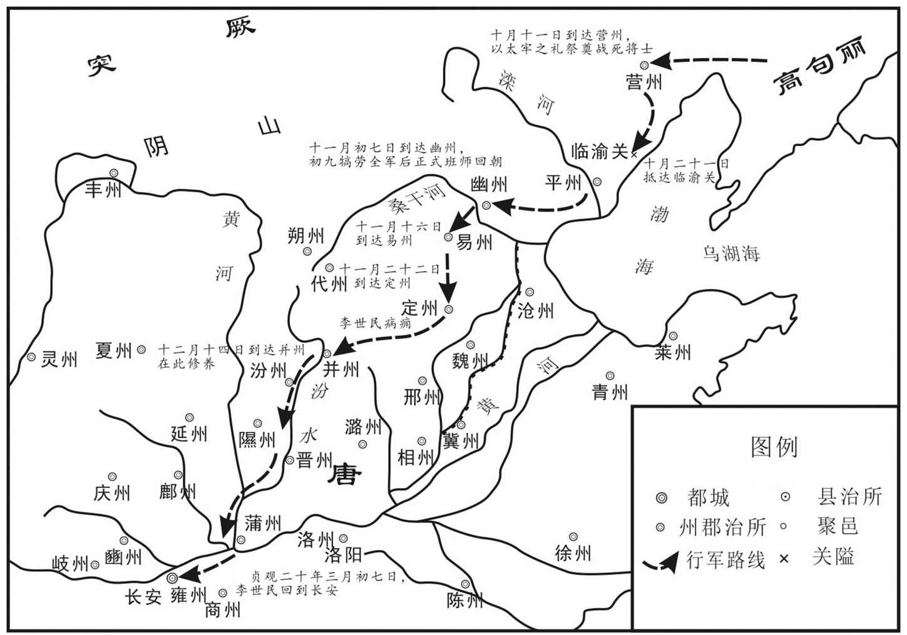 
唐太宗第一次征高句丽班师路线示意图

## 【原文】

**乙酉，至辽东[1]。丙戌，渡辽水[2]。辽泽泥潦，车马不通，命长孙无忌将万人翦草填道，水深处以车为梁，上自系薪于马鞘以助役[3]。冬十月丙申朔，上至蒲沟，驻马督填道诸军度渤错水[4]。暴风雪，士卒沾湿多死者，敕然火于道以待之[5]。**

## 【注文】

[1]辽东：指辽河以东地区。

[2]辽水：今辽河。

[3]潦（lǎo）：积水。　　翦：剪断。　　马鞘：马鞍头。

[4]蒲沟、渤错水：在辽泽之中。

[5]然：通“燃”。燃烧。

## 【译文】

九月乙酉（二十日），唐军到达辽东。丙戌（二十一日），渡过辽河。辽河两岸沼泽泥水阻路，车马不通，唐太宗命令长孙无忌率领一万人割草垫道，水深处用车做桥梁，太宗亲自把柴草捆在马鞘上来帮助铺路。冬十月丙申（初一日），太宗到达蒲沟，停下马督促垫道，指挥军队渡过渤错河。当时遇到暴风雪，许多士兵被雪水沾湿而冻死，太宗命令在道旁燃起火堆来等待士兵通过。

## 【原文】

**凡征高丽，拔玄菟、横山、盖牟、磨米、辽东、白岩、卑沙、麦谷、银山、后黄十城，徙辽、盖、岩三州户口入中国者七万人[1]。新城、建安、驻跸三大战，斩首四万余级，战士死者几二千人，战马死者什七八[2]。上以不能成功，深悔之，叹曰：“魏徵若在，不使我有是行也[3]！”命驰驿祀徵以少牢，复立所制碑，召其妻子诣行在，劳赐之[4]。**

## 【注文】

[1]横山：在今辽宁辽阳东。　　磨米：约今辽宁本溪边牛村山城。　　卑沙：属高丽国。即今辽宁大连金州区东大黑山古城。　　麦谷、银山、后黄等城：辽宁辽阳市附近。　　辽、盖、岩：古州名。辽州，唐太宗以辽东城置，治所在今辽宁辽阳。盖州，治所在今辽宁盖州。岩州，太宗以白岩城置，治所在今辽宁辽阳东燕州城。

[2]什七八：十分之七八。

[3]叹：叹息。

[4]驰驿：驾乘驿马急行。　　少牢：古代祭祀宴享单用羊、猪称少牢。　　行在：皇帝巡行临时所在处所。因亦指皇上。　　劳：慰劳。

## 【译文】

征讨高丽以来，先后攻取玄菟、横山、盖牟、磨米、辽东、白岩、卑沙、麦谷、银山、后黄等十座城池，把辽州、盖州、岩州的人口迁到国内的共七万人。新城、建安、驻跸山三大战役，杀敌四万余人，唐军战死的接近二千人，战马死了十之七八。唐太宗因为东征没能达到最后胜利，深深后悔，感叹说：“如果魏徵活着，就不会让我有这次行动！”派人骑驿马急驰回去，用少牢（羊、猪）之礼祭祀魏徵，又重新立起太宗御制石碑，在行军住所召见魏徵的妻子和儿子，慰问并赏赐他们。

## 【原文】

**丙午，至营州，诏辽东战亡士卒骸骨并集柳城东南，命有司设太牢，上自作文以祭之，临哭尽哀[1]。其父母闻之曰：“吾儿死而天子哭之，死何所恨[2]！”上谓薛仁贵曰：“朕诸将皆老，思得新进骁勇者将之，无如卿者，朕不喜得辽东，喜得卿也[3]。”**

## 【注文】

[1]营州：古州名，今辽宁朝阳。　　柳城：县名，治所在今辽宁朝阳西南。　　太牢：用牛、羊、猪三牲盛于食器宴享或祭祀。

[2]何：什么。

[3]骁勇：勇敢善战。

## 【译文】

十月丙午（十一日），唐军回到营州，命令把在辽东阵亡将士的骸骨集中到柳城东南，让有关部门设置太牢（牛、羊、猪）之礼，唐太宗亲自撰文祭奠，亲临哭丧极尽悲哀。阵亡将士的父母听到后，说：“我儿子死了天子来为他们哭泣，死有什么遗憾！”太宗对薛仁贵说：“我的将军们都老了，想得到骁勇善战的后起之秀来统帅军队，没人能比得上你，我不喜欢得到辽东，喜欢的是得到了你。”

## 【原文】

**丙辰，上闻太子奉迎将至，从飞骑三千人驰入临渝关，道逢太子[1]。上之发定州也，指所御褐袍谓太子曰：“俟见汝，乃易此袍耳[2]。”在辽左，虽盛暑流汗，弗之易[3]。及秋，穿败，左右请易之，上曰：“军士衣多弊，吾独御新衣可乎[4]！”至是太子进新衣，乃易之[5]。**

## 【注文】

[1]飞骑：唐皇帝侍卫军士。唐太宗贞观年间，始置左右屯营于玄武门，领诸卫将军，选骁勇敏捷善于骑射者充任，号“飞骑”。　　临渝关：又作临榆关、临闾关。古地名。今河北抚宁东榆关镇。一说即山海关。

[2]褐袍：褐色的袍子。此指黄袍。

[3]弗：不。

[4]穿败：指衣服穿破。败，毁坏。

[5]易：换，更换，换取。

## 【译文】

十月丙辰（二十一日），唐太宗听说太子即将前来迎接，就领着三千飞骑飞奔进入临渝关，中途遇见太子。当初太宗从定州出发时，指着自己穿的褐色皇袍对太子说：“等再见到你，再换这袍子。”在辽东战场上，即使在盛夏时汗流浃背，也没有替换过。到秋天，袍子穿破了，左右侍从请求替换，太宗说，“战士们的衣服大多破烂不堪了，只有我穿新衣行吗？”到这时太子进献新衣，才换下来。

## 【原文】

**诸军所虏高丽民万四千口，先集幽州，将以赏军士[1]。上愍其父子夫妇离散，命有司平其直，悉以钱布赎为民，欢呼之声，三日不息[2]。十一月辛未，车驾至幽州，高丽民迎于城东，拜舞号呼，宛转于地，尘埃弥望[3]。丙戌，车驾至定州[4]。壬辰，车驾发定州。戊申，至并州[5]。**

## 【注文】

[1]幽州：古州名，其范围大致包括今北京市、河北北部、山西小部、辽宁大部、天津市海河以北及朝鲜大同江流域。

[2]愍（mǐn）：同“悯”，忧患，痛心。　　平：通“评”，评估。

[3]拜舞：跪拜与舞蹈，古代朝拜的礼节。　　宛转：可译为“打滚”。　　弥望：弥，满。弥望，充满视野，满眼。

[4]定州：古州名，北魏改安州置，治卢奴（北齐改名安喜，今河北定州）。

[5]并州：古州名。西汉武帝置，为十三刺史部之一，唐代辖境相当于今山西阳曲以南、文水以北的汾水中游地区。唐玄宗开元十一年（723年）升为太原府。

## 【译文】

各部队所虏获的高丽民众一万四千口，先都集中在幽州，准备用来赏给战士。唐太宗怜悯他们父子夫妇四散分离，命令有关部门给他们估价，全用朝廷府库的钱把他们赎身为百姓，高丽民众的欢呼之声，三天没有间断。十一月辛未（初七日），太宗到达幽州，高丽民众在城东迎接，欢呼跳跃，连绵不断，扬起的尘土遮天蔽日。丙戌（二十二日），太宗到达定州。壬辰（二十七日），从定州出发。（十二月）戊申（十四日），到达并州。

## 【原文】

**二十年春二月乙未，上发并州[1]。三月己巳，车驾还京师[2]。上谓李靖曰：“吾以天下之众，困于小夷，何也[3]？”靖曰：“此道宗所解[4]。”上顾问江夏王道宗，具陈在驻跸时乘虚取平壤之言[5]。上怅然曰：“当时匆匆，吾不忆也[6]。”闰月戊戌，罢辽州都督府及岩州[7]。夏五月甲寅，高丽王藏及莫离支盖金遣使谢罪，并献二美女，上还之[8]。金即苏文也[9]。**

## 【注文】

[1]发：出发。

[2]京师：指长安。

[3]李靖（jìng）（571—649年）：隋末唐初名将，是唐朝文武兼备的著名军事家。字药师，雍州三原（今陕西三原东北）人。封卫国公，世称李卫公。李靖善于用兵，长于谋略，著有数种兵书，多亡佚。参与平定萧铣、安抚岭南、平定辅公祏、击灭东突厥、远征吐谷浑等历史事件。唐太宗贞观二十三年（649年），李靖逝去。唐太宗册赠司徒、并州都督，陪葬昭陵，谥曰“景武”。

[4]解：解释。

[5]陈：称述。

[6]怅然：懊恼恍惚的样子。

[7]辽州：古地名，唐太宗贞观年间以辽东城（今辽宁辽阳）置。

[8]还：退还。

[9]盖苏文（603—666年）：原名渊盖苏文，又名渊盖金，是高句丽末期非常具有争议性的铁腕军事独裁者。在中国史书上通常避唐高祖李渊讳而称为泉盖苏文。一方面渊盖苏文的英勇成功地抵御了唐朝想灭掉高句丽的企图，因此被许多人认为是朝鲜半岛的民族英雄。另一方面，许多人认为他残暴弑君，铁腕统治导致了高句丽后来的灭亡。

## 【译文】

唐太宗贞观二十年（646年）春二月乙未（初二日），唐太宗从并州出发。三月己巳（初七日），太宗回到京城长安。太宗对李靖说：“我以全国的兵力，却困在高丽小国，为什么呢？”李靖回答说：“这道理李道宗能解释。”太宗回头问李道宗，李道宗详细陈述了在驻跸山时曾请求乘虚袭击平壤的话。太宗听后怅然若失，说：“当时匆匆忙忙，我记不得了。”闰三月戊戌（初六日），废除辽州都督府及岩州。夏五月甲寅（二十三日），高丽国王高藏以及莫离支盖金，派使者前来请罪，并献上两个美女，太宗退还给高丽。盖金就是盖苏文。

## 【原文】

**上自高丽还，盖苏文益骄恣，虽遣使奉表，其言率皆诡诞，又待唐使者倨慢，常窥伺边隙[1]。屡敕令勿攻新罗，而侵陵不止[2]。壬申，诏勿受其朝贡，更议讨之[3]。［冬十月］丙戌，车驾至京师[4]。**

## 【注文】

[1]骄恣（zì）：骄纵。　　率：大致，一般。　　诡诞：虚妄荒诞。　　倨（jū）慢：傲慢。　　窥伺：暗中观察或监视。

[2]侵陵：侵略骚乱。

[3]更：又。

[4]至：到达。

## 【译文】

（八月）自从唐太宗东征回师后，盖苏文更加骄横恣肆，虽然派使者上表，但表文语言大多是诡秘荒诞的话，又对唐朝使者傲慢无礼，常常窥探边境的虚实。太宗多次命令让他不要攻击新罗，他却不停地侵略骚乱。壬申（十三日），命令不要接受高丽的朝贺和贡品，又商议征讨高丽的事。冬十月丙戌（二十八日），太宗回到京城长安。

## 【原文】

**二十一年[1]。上将复伐高丽，朝议以为：“高丽依山为城，攻之不可猝拔[2]。前大驾亲征，国人不得耕种，所克之城，悉收其谷，继以旱灾，民太半乏食[3]。今若数遣偏师，更迭扰其疆埸，使彼疲于奔命，释耒入堡，数年之间，千里萧条，则人心自离，鸭绿之北可不战而取矣[4]。”上从之[5]。三月，以左武卫大将军牛进达为青丘道行军大总管，右武候将军李海岸副之，发兵万余人，乘楼船自莱州泛海而入[6]。又以太子詹事李世为辽东道行军大总管，右武卫将军孙贰郎等副之，将兵三千人，因营州都督府兵自新城道入[7]。两军皆选习水善战者配之。［夏五月］，李世军既渡辽，历南苏等数城，高丽多背城拒战，世击破其兵，焚其罗郭而还[8]。**

## 【注文】

[1]二十一年：指公元647年。

[2]朝议：分为廷议和集议，均为臣子向皇帝提供意见。

[3]太半：大半。

[4]疆埸（yì）：国界，边界。　　耒（lěi）：古代的一种农具，形状似木叉；农具的总称。

[5]从：听从。

[6]左武卫大将军：古代官名，隋唐十二卫将军之一，正三品。　　牛进达（595—651年）：唐初功臣。名秀，字进达，濮阳雷泽（今属山东鄄城）人。早年先后隶于瓦岗军和王世充。降唐后任将军、大将军，封琅邪郡公。　　李海岸（生卒年不详）：唐初任右武候将军。　　楼船：有楼的大船。　　泛：漂浮。

[7]右武卫：唐朝十六卫之一。与左武卫同掌领外军宿卫，都置大将军一人，将军两人。　　孙贰郎（生卒年不详）：唐初任右武卫将军。

[8]南苏：古地名，今辽宁铁岭县东南催阵堡山城。　　背城：背靠自己的城墙，多指进行最后的决战。　　拒战：抵御抗击。　　罗郭：即罗城（大城）和郭城（外城）。

## 【译文】

唐太宗贞观二十一年（647年）。太宗又将讨伐高丽，朝臣议论认为：“高丽依山筑城，不可能很快攻下。先前大驾亲征，高丽百姓不能耕种，所有被攻克的城中的粮食，又被全部收走，再加上旱灾，半数以上百姓缺少粮食。现在如果多次派遣军队，轮番扰乱高丽边疆，使他们疲于奔命，扔掉农具进入城堡，几年之内，一定会千里萧条，那样就会人心离散，鸭绿江以北可以不战而取得了。”太宗听从了这个建议。三月，任命左武卫大将军牛进达为青丘道行军大总管，右武候将军李海岸做副手，发兵一万多人，乘坐楼船从莱州渡海进军高丽。又任命太子詹事李世为辽东道行军大总管，右武卫将军孙贰郎等人做副手，率兵三千人，凭借营州都督府的部队帮助，从新城道进军高丽。两路部队都挑选习水性能打仗的人配合作战。夏五月，李世的部队渡过辽河后，经过南苏等几座城镇，高丽人大多据城抵抗，李世击败敌军，烧毁了外城，然后撤军。

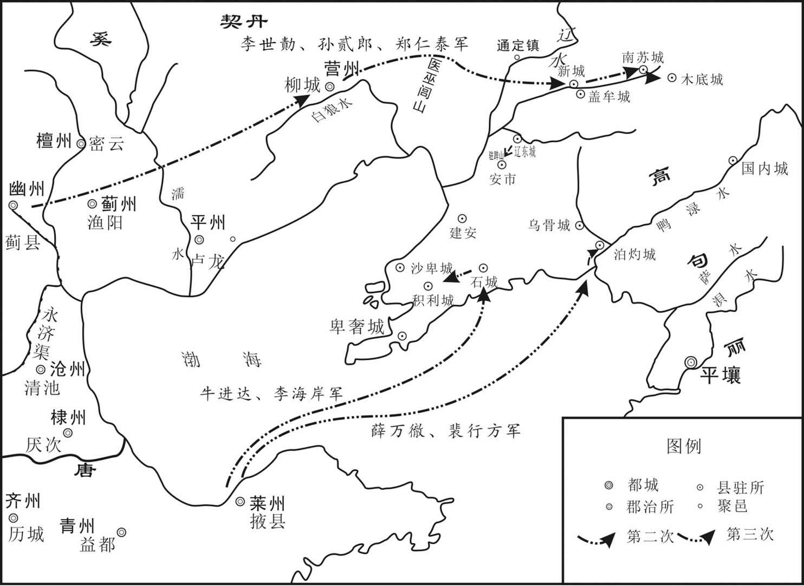 
贞观二十一年至二十二年（647—648年）唐太宗二征、三征高句丽示意图

## 【原文】

**秋七月，牛进达、［李］海岸入高丽境，凡百余战，无不捷，攻石城，拔之[1]。进至积利城下，高丽兵万余人出战，海岸击破之，斩首二千级[2]。（八）［九］月戊戌，敕宋州刺史王波利等发江南十二州工人，造大船数百艘，欲以征高丽[3]。冬十二月，高丽王使其子莫离支任武入谢罪，上许之[4]。**

## 【注文】

[1]石城：古地名，今辽宁庄河西北。

[2]积利城：古地名，今辽宁瓦房店。

[3]宋州：古州名。隋文帝开皇十六年（596年）置，治睢阳（后改宋城，今河南商丘南）。唐辖境相当今河南商丘、虞城、宁陵、睢县、柘城、夏邑，安徽砀山及山东曹县、单县等市县地。　　王波利（生卒年不详）：唐初任宋州刺史。　　江南十二州：即宣、润、常、苏、湖、杭、越、台、婺、括、江、洪等十二州。

[4]任武：即高任武（生卒年不详），唐初高丽王儿子。

## 【译文】

秋七月，牛进达、李海岸进入高丽境内，共发生一百多次战斗，都取得了胜利，进攻石城，攻克了。进军到积利城下，高丽军队一万多人出城迎战，李海岸打败了敌军，杀敌二千人。九月戊戌（十五日），命令宋州刺史王波利等人调发江南十二州的工匠，建造大船几百艘，计划用来讨伐高丽。冬十二月，高丽王高藏派他的儿子、莫离支高任武入朝请罪，太宗接受了。

## 【原文】

**二十二年春正月，新罗王金善德卒[1]。以善德妹真德为柱国，封乐浪郡王，遣使册命[2]。丙午，诏以右武卫大将军薛万彻为青丘道行军大总管，右卫将军裴行方副之，将兵三万余人及楼船战舰，自莱州泛海以击高丽[3]。**

## 【注文】

[1]金善德（生卒年不详）：唐初新罗女王。

[2]真德：指金真德（？—652），新罗国女王。新罗王金真平之女，金善德之妹。唐太宗贞观二十一年（647年），嗣位为新罗王，加授柱国，封乐浪郡王。

[3]薛万彻（chè）（？—653年）：唐初名将。雍州咸阳（今属陕西）人。唐太宗贞观初，从李靖击突厥颉利可汗于塞北，以功授统军。贞观八年（634年）随李靖击吐谷浑时，授右卫将军、蒲州刺史。贞观十五年（641年）为行军副总管，随李世击薛延陁。贞观十八年（644年）授左卫将军，娶丹阳公主，为驸马都尉。唐高宗永徽二年（651年）授宁州刺史。永徽四年（653年）因与房遗爱谋反事有牵连，被杀。　　裴行方（619—682年）：绛州闻喜（今山西闻喜东北）人。唐高宗时名臣，裴仁基之子。

## 【译文】

唐太宗贞观二十二年（648年）春正月，新罗王金善德逝世。唐朝任命他妹妹金真德为柱国，封为乐浪郡王，并派使者前往宣布册命。丙午（二十五日），任命右武卫大将军薛万彻为青丘道行军大总管，右卫将军裴行方做副手，领兵三万多人乘楼船战舰，从莱州渡海攻击高丽。

## 【原文】

**三月，充容长城徐惠以上东征高丽，西讨龟兹，上疏谏，其略曰：“以有尽之农功，填无穷之巨浪，图未获之他众，丧已成之我军[1]。昔秦皇并吞六国，反速危亡之基，晋武奄有三方，翻成覆败之业[2]。岂非矜功恃大，弃德轻邦，图利忘危，肆情纵欲之所致乎[3]！是知地广非常安之术，人劳乃易乱之源也[4]。”上善其言[5]。**

## 【注文】

[1]充容：古代官名。为九嫔之一，正二品。　　长城：古县名，今浙江长兴。　　徐惠（627—650年）：湖州长城人（今浙江长兴）。被太宗纳为才人后，任婕妤、充容。于妃嫔中以好学敢于谏诤著称，卒赠贤妃。　　龟（qiū）兹（cí）：古西域国名。在今新疆库车。隋唐时，附西突厥。唐高宗灭西突厥（659年）后，以其地置龟兹都督府，属安西都护府，为安西四镇之一。

[2]晋武：即晋武帝司马炎（236—290年），字安世，河内温（今河南温县西南）人。晋朝的开国君主，公元266—290年在位。公元265年他继承父亲司马昭的晋王之位，数月后逼迫魏元帝曹奂将帝位禅让给自己，国号大晋，建都洛阳。公元279年他又命杜预、王濬等人分兵伐吴，于次年灭吴，统一全国。建国后采取一系列经济措施以发展生产，颁行户调式，包括占田制、户调制和品官占田荫客制。晋武帝太康年间出现一片繁荣景象，史称“太康之治”。但灭吴后，逐渐怠惰政事，奢侈腐化。公元290年病逝，谥号武皇帝，庙号世祖，葬峻阳陵。　　奄有三方：指晋武帝司马炎时统一了魏、蜀、吴三方，拥有三方土地。　　翻：副词，反而。

[3]矜：骄傲。　　肆：放肆，放纵。

[4]易乱：易主大乱。

[5]善：认为是正确的。

## 【译文】

三月，后宫充容、长城人徐惠因为太宗东征高丽，西讨龟兹，上书谏阻，大意说：“用有限的收成，去填无穷的大海，谋取没有得到的外国民众，损失已成劲旅的我国军队。从前秦始皇吞并六国，反而加速了自己的灭亡，晋武帝囊括三方，反而使事业颠覆失败。难道不是因为自夸功高，自恃国大，轻视德政，抛弃国家，贪图小利，忘却危亡，放纵情欲所导致的吗！因此可知土地广大不是长治久安的办法，百姓烦劳才是天下大乱的根源呀。”太宗很赞赏她的话。

## 【原文】

**夏四月甲子，乌胡镇将古神感将兵浮海击高丽，遇高丽步骑五千，战于易山，破之[1]。其夜，高丽万余人袭神感船，神感设伏，又破之而还[2]。**

## 【注文】

[1]乌胡：亦作乌湖。岛名，位于蓬莱东北二百五十里海中，与大谢戍俱为伐东夷之要道。　　古神感（生卒年不详）：唐初任乌胡镇将。　　浮海：渡海。

[2]伏：伏兵。

## 【译文】

夏四月甲子（十四日），乌胡镇守将领古神感率兵渡海进攻高丽，与高丽步兵骑兵五千人遭遇，在易山展开激战，打败了敌军。当天晚上，高丽一万多人偷袭古神感的战船，古神感设下伏兵，又打败高丽兵，返回乌胡。

## 【原文】

**六月，上以高丽困弊，议以明年发三十万众一举灭之[1]。或以为“大军东征，须备经岁之粮，非畜乘所能载，宜具舟舰为水运[2]。隋末剑南独无寇盗，属者辽东之役，剑南复不预及，其百姓富庶，宜使之造舟舰[3]”。上从之[4]。秋七月，遣右领左右府长史强伟于剑南道伐木造舟舰，大者或长百尺，其广半之[5]。别遣使行水道，自巫峡抵江、扬，趣莱州[6]。**

## 【注文】

[1]困弊：穷困凋敝。

[2]经岁之粮：够一年用的粮食。　　畜乘：牲畜和车辆。

[3]剑南：指今四川剑阁以南至云贵高原一带。以在剑阁之南而得名。　　属者：指以往。　　预及：波及，参与其事。

[4]从：听从。

[5]右领左右府长史：中国古代官名。领左右府，各有长史，掌左右千牛府内务。　　强伟（生卒年不详）：唐初任右领左右府长史。　　剑南道：古道名。唐太宗贞观元年（627年）置，以在剑阁之南得名。唐玄宗开元以后治益州（今成都市）。辖今四川涪江流域以西，大渡河流域和雅江下游以东；云南澜沧江、哀牢山以东，曲江、南盘江以北；及贵州水城、普安以西和甘肃文县一带。

[6]巫峡：长江三峡之一。西起四川巫山，东至湖北巴东。　　江：即江州。治所在今江西九江。　　扬：即扬州。治所在今江苏扬州。

## 【译文】

唐太宗贞观二十二年（648年）六月，太宗因高丽国势困穷凋敝，商议要在来年调动三十万军队一举消灭高丽。有人认为“大军东征，必须预备一年的军粮，这不是牲口、车辆所能运输的，应当制造舰船进行水运。隋朝末期，只有剑南地区没有战争，上次辽东之战，剑南又没有参与，那里的百姓很富庶，应该让他们制造舰船”。太宗采纳了这个建议。秋七月，派右领左右府长史强伟到剑南道伐木造船，有的大船长一百尺，宽五十尺。另派人巡视水路，从巫峡到江州、扬州，直达莱州。

## 【原文】

**司空梁文昭公房玄龄疾笃，谓诸子曰：“吾受主上厚恩，今天下无事，惟东征未已，群臣莫敢谏，吾知而不言，死有余责[1]。”乃上表谏，以为：“《老子》曰：‘知足不辱，知止不殆[2]。’陛下威名功德亦可足矣，拓地开疆亦可止矣[3]。且陛下每决一重囚，必令三覆五奏，进素膳，止音乐者，重人命也[4]。今驱无罪之士卒，委之锋刃之下，使肝脑涂地，独不足愍乎[5]？向使高丽违失臣节，诛之可也；侵扰百姓，灭之可也；他日能为中国患，除之可也[6]。今无此三条，而坐烦中国，内为前代雪耻，外为新罗报仇，岂非所存者小，所损者大乎[7]？愿陛下许高丽自新，焚陵波之船，罢应募之众，自然华夷庆赖，远肃迩安[8]。臣旦夕入地，傥蒙录此哀鸣，死且不朽[9]。”玄龄子遗爱尚上女高阳公主，上谓公主曰：“彼病笃如此，尚能忧我国家[10]。”上自临视，握手与诀，悲不自胜[11]。癸卯，薨[12]。**

## 【注文】

[1]司空：古代官名。三公之一，东汉由大司空改名，与太尉、司徒同为宰相，掌土木工程，并参议大政。魏、晋、南北朝多作为大臣加官，无实际执掌，皆一品。隋、唐因袭，正一品。　　房玄龄（579—648年）：字乔（一说名乔，字玄龄），齐州临淄（今山东淄博临淄区北）人，是唐朝时的开国宰相。房玄龄跟随秦王李世民征战十年，李世民即位后又辅佐二十多年，是唐初著名良相、杰出谋臣，大唐“贞观之治”的主要缔造者之一。他参与玄武门之变的策划。唐太宗李世民即位后，房玄龄任中书令。

[2]《老子》：指《道德经》，又称《老子五千文》，是中国古代先秦诸子分家前的一部著作，为其时诸子所共仰，传说是春秋时期的老子（即李耳，河南鹿邑东人）所撰写，是道家哲学思想的重要来源。道德经分上下两篇，原文上篇《德经》，下篇《道经》，不分章，后改为《道经》三十七章在前，后四十四章为《德经》。是中国历史上首部完整的哲学著作。

[3]止：停止。

[4]重囚：死刑囚犯。

[5]愍：怜悯。

[6]向使：假使。

[7]坐烦：白白地劳烦。

[8]庆赖：庆幸得到依靠。　　迩：近。

[9]傥（tǎng）：如果。

[10]遗爱：即房遗爱（？—653年）。名俊，字遗爱，唐代名臣房玄龄次子。妻子为唐太宗女高阳公主（后封合浦公主）。娶高阳公主后，房遗爱官至太府卿、散骑常侍，又封右卫中郎将。其兄房遗直在父亲死后应当以嫡长子的身份拜为梁国公，以高阳公主故，房遗爱“礼异他婿”谋罢房遗直封爵继承爵位。唐高宗年间，房遗爱因谋反事件被捕杀，高阳公主亦被赐死，诸子配流岭表。　　尚：中国古代指臣民娶公主为妻称“尚”。

[11]临视：亲自前往探视。

[12]薨（hōng）：古代称诸侯或有爵位的大官死去。

## 【译文】

司空、梁文昭公房玄龄病重，对他的儿子们说：“我受主上厚恩，现在天下平安无事，只是东征还没有停止，群臣无人敢劝谏，我知道这样做不对却不说，死了也不能推卸责任。”于是上表谏阻东征，认为：“《老子》说：‘知道满足就不会受到侮辱，知道止步就不会遇到危险。’陛下的威名功德也该满足了，拓地开疆也该停止了。况且陛下每处决一名死囚，命令一定要经过三次五次复审，吃素食，停止歌舞音乐，原因在于重视人命。现在却驱赶无罪的士兵，把他们置于刀锋之下，使他们肝脑涂地，难道他们就不值得怜悯吗？假如过去高丽人违反做臣子的节操，杀掉他是可以的；侵扰百姓，消灭他也是可以的；以后能成为我国的后患，剪除他也是可以的。现在这三条一条也没有，而白白烦劳国家百姓，对内要洗雪隋朝东征无功的耻辱，对外为新罗报仇，岂不是得到的小，损失的大吗？希望陛下允许高丽人悔过自新，焚毁下水的船舰，解散应募的士兵，自然会得到华夏和外族的欢迎和依赖，远近各地也就整肃安宁。我马上就要入土了，如果能蒙恩记住我的哀鸣，我死去也就不朽了。”房玄龄的儿子房遗爱是唐太宗女儿高阳公主的丈夫，太宗对公主说：“他病势这么沉重，还能为国家忧虑。”太宗亲临探视房玄龄，握着手与他诀别，悲伤得不能自制。六月癸卯（二十四日），房玄龄逝世。

## 【原文】

**八月丁丑，敕越州都督府及婺、洪等州造海船及双舫千一百艘[1]。九月己丑，新罗奏为百济所攻，破其十三城[2]。冬十二月癸未，新罗相金春秋及其子文王入见[3]。春秋，真德之弟也[4]。上以春秋为特进，文王为左武卫将军[5]。春秋请改章服从中国，内出冬服赐之[6]。**

## 【注文】

[1]越州都督府：治所在今浙江绍兴。　　婺（wù）、洪：古州名，婺州治所在今浙江金华。洪州治所在今江西南昌。　　双舫（fǎng）：双船体船只，即两个并列的瘦长船体，在上部合成一个整体的船。其结构复杂，但稳定性好。

[2]破：攻取，攻占。

[3]金春秋（生卒年不详）：新罗国王。朝鲜新罗国女王真德之弟。公元648年，与其子文王奉命入唐，唐太宗诏授特进。公元652年真德卒，唐高宗又册立春秋为新罗王，加授开府仪同三司、封乐浪郡王。

[4]真德：指金真德（？—652年）。唐太宗时金真德被封为柱国、乐浪郡王、新罗王。她送其弟妹到长安留学，唐太宗赐《晋书》给他们。金真德作五言诗，并织于锦上送给唐高宗。金真德死亡，唐朝设灵堂致哀。

[5]左武卫将军：古代官名。隋朝置二人，从三品，佐大将军总其府事。唐朝沿置，凡翊府卫、外府卫熊渠番上者，分配之。

[6]章服：古代官员礼服。服上分别绣以日月星辰、龙蟒鸟兽等图文，以作为官员等级的标志。

## 【译文】

八月丁丑（二十九日），命令越州都督府以及婺州、洪州等地制造海船和双舫船一千一百艘。九月己丑（十一日），新罗奏报受到百济的攻击，百济攻下了他的十三座城。冬季（闰）十二月癸未（初七日），新罗丞相金春秋和他的儿子文王入朝觐见。金春秋是金真德的弟弟。唐太宗任命金春秋为特进，文王为左武卫将军。金春秋请求改穿中国的官服，于是从宫廷拿出冬服赐给他。

## 【原文】

**二十三年夏五月己巳，上崩[1]。壬申，遗诏太子即位，罢辽东之役[2]。**

## 【注文】

[1]崩：古代帝王或王后死曰崩。此指唐太宗李世民去世。

[2]太子：已确定继承帝位或王位的帝王的儿子称为太子。此指李治。

## 【译文】

唐太宗贞观二十三年（649年）夏五月己巳（二十六日），唐太宗逝世。壬申（二十八日），宣布遗诏，太子即位，停止发动辽东战役。

## 【原文】

**高宗永徽二年[1]。百济遣使入贡，上戒之，使“勿与新罗、高丽相攻，不然，吾将发兵讨汝矣[2]”。**

## 【注文】

[1]高宗：指唐高宗李治（628—683年），唐朝皇帝，公元649年至公元683年在位。唐太宗李世民九子，其母为长孙皇后。　　永徽：唐高宗李治在位期间所用年号，共计六年，即公元650年至公元655年。

[2]戒：告诫，警告。

## 【译文】

唐高宗永徽二年（651年）。百济派使臣入朝进贡，高宗告诫百济，让百济“不要和新罗、高丽相互攻击，不然的话，我就要发兵讨伐你国了”。

## 【原文】

**三年春正月己未朔，吐谷浑、新罗、高丽、百济并遣使入贡[1]。**

## 【注文】

[1]吐谷（yù）浑：中国古代西北民族，亦指其所建立的政权。本为辽东鲜卑慕容部的一支，3世纪末4世纪初，迁居并控制了青海、甘肃等地，与南北朝各国都有友好关系。被唐朝征服，加封青海王。

## 【译文】

唐高宗永徽三年（652年）春正月己未朔（初一日），吐谷浑、新罗、高丽、百济都派使臣入朝进贡。

## 【原文】

**五年夏闰（四）［五］月壬辰，新罗女王金真德卒，诏立其弟春秋为新罗王[1]。**

## 【注文】

[1]金真德（？—652年）：新罗国女王。新罗王金真平之女，金善德之妹。让太宗贞观二十一年（647年），嗣位为新罗王，加授柱国，封乐浪郡王。　　春秋：即金春秋（生卒年不详），新罗国王。朝鲜新罗国女王真德之弟。

## 【译文】

唐高宗永徽五年（654年）夏闰五月壬辰（十八日），新罗女王金真德去世，唐朝诏命册立金真德弟弟金春秋为新罗国王。

## 【原文】

**六年[1]。高丽与百济、靺鞨连兵侵新罗北境，取三十三城[2]。新罗王春秋遣使求援[3]。二月乙丑，遣营州都督程名振、左卫中郎将苏定方发兵击高丽[4]。夏五月壬午，名振等渡辽水，高丽见其兵少，开门渡贵端水逆战，名振等奋击，大破之，杀获千余人，焚其外郭及村落而还[5]。**

## 【注文】

[1]六年：指唐高宗永徽六年，公元655年。

[2]靺（mò）鞨（hé）：中国古代民族名，自古生息繁衍在东北地区，是满族的先祖。先世可追溯到商周时的肃慎。北魏称“勿吉”。

[3]遣：派遣。

[4]程名振（？—662年）：早年在窦建德麾下，后投李渊，经略河北。唐太宗继位后，议征辽东，他出任右骁卫将军、平壤道行军总管，在征高丽之战中，常常出奇制胜，以少胜多，威震辽东，一时被誉为唐朝名将，后又升任营州（今辽宁省朝阳）都督兼东夷都护。死后，赠右卫大将军，谥号为“烈”。　　苏定方（592—667年）：唐朝名将，冀州武邑（今属河北）人，名烈，字定方，以字行于世。唐高宗显庆二年（657年）被擢升为伊丽道行军大总管，率军击败阿史那贺鲁主力，擒阿史那贺鲁，平定西突厥。显庆四年（659年），苏定方率军平定铁勒和疏勒反叛。显庆五年（660年），苏定方率军从水路进攻百济，擒其王。唐高宗乾封二年（667年），病死，谥号“庄”。

[5]贵端水：即今辽宁浑河。　　逆战：迎战。

## 【译文】

唐高宗永徽六年（655年）。高丽与百济、靺鞨联合出兵入侵新罗北部边境，攻取了三十三座城池。新罗王金春秋派使臣前来求援。二月乙丑（二十五日），唐朝派营州都督程名振、左卫中郎将苏定方出兵进击高丽。夏五月壬午（十三日），程名振等人率军渡过辽河，高丽见他们军队人马少，打开城门，渡过贵端河迎战，程名振等人奋力作战，大破敌军，俘歼敌一千多人，放火烧毁外城和周围村庄后回师国内。

## 【原文】

**显庆三年夏六月，营州都督兼东夷都护程名振、右领军中郎将薛仁贵将兵攻高丽之赤烽镇，拔之，斩首四百余级，捕虏百余人[1]。高丽遣其大将豆方娄帅众三万拒之，名振以契丹逆击，大破之，斩首二千五百级[2]。**

## 【注文】

[1]显庆：唐高宗李治在位期间所用年号，即公元656年至公元661年。　　都护：西汉有西域都护；东汉、魏、晋分别置都护、都护将军，为统率诸将之官。唐朝自太宗至武则天时，先后设置安西、安北、单于、北庭等六个大都护府。每府设大都护、副大都护（或副都护），掌辖区军政及民族事务。　　赤烽镇：古地名，今内蒙古赤峰。

[2]豆方娄（生卒年不详）：唐初高丽大将。　　逆击：迎击。

## 【译文】

唐高宗显庆三年（658年）夏六月，营州都督兼东夷都护程名振、右领军中郎将薛仁贵率兵攻打高丽的赤烽镇，攻克了这座城镇，杀敌四百多人，俘虏一百多人。高丽派大将豆方娄率兵三万人抵抗唐军，程名振用契丹兵迎击，大败敌军，杀敌二千五百人。

## 【原文】

**四年冬十一月，右领军中郎将薛仁贵等与高丽将温沙门战于横山，破之[1]。**

## 【注文】

[1]温沙门（生卒年不详）：唐初高丽大将。　　横山：古山名，今辽宁辽阳华表山。

## 【译文】

唐高宗显庆四年（659年）冬十一月，右领军中郎将薛仁贵等与高丽将领温沙门在横山进行战斗，打败了敌军。

## 【原文】

**五年[1]。百济恃高丽之援，数侵新罗，新罗王春秋上表求救[2]。［春三月］辛亥，以左武卫大将军苏定方为神丘道行军大总管，帅左骁卫将军刘伯英等水陆十万以伐百济[3]。以春秋为嵎夷道行军总管，将新罗之众，与之合势[4]。**

## 【注文】

[1]五年：指唐高宗显庆五年，公元660年。

[2]恃：依靠。

[3]左武卫大将军：古代官名。隋朝十二卫之一，正三品。　　左骁卫将军：古代官名。隋炀帝大业三年（607年）改左备身府为左骁卫，置二员，从三品，辅佐大将军管理军事。唐朝沿置，掌宫禁宿卫。分兵守诸门，在皇城四面、宫城内外，与左卫将军分别助铺。武则天光宅元年（684年）改左武威将军，唐中宗神龙元年（705年）复名左骁卫将军。　　刘伯英：唐朝官员，嶲（xī）州都督，曾上书唐太宗，请求出兵讨伐松外蛮（四川西南），以通西洱（大理）、天竺（印度）之道。

[4]将：率领。

## 【译文】

唐高宗显庆五年（660年）。百济依仗有高丽支援，多次入侵新罗，新罗王金春秋上表求救。春三月辛亥（初十日），任命左武卫大将军苏定方为神丘道行军大总管，统帅左骁卫将军刘伯英等人的水陆军十万人讨伐百济。任命金春秋为嵎夷道行军总管，率领新罗军队，与唐军形成合击之势进攻。

## 【原文】

**秋八月，苏定方引军自成山济海，百济据熊津江口以拒之[1]。定方进击，破之，百济死者数千人，余皆溃走[2]。定方水陆齐进，直趣其都城[3]。未至二十余里，百济倾国来战，大破之，杀万余人，追奔，入其郭，百济王义慈及太子隆逃于北境[4]。定方进围其城，义慈次子泰自立为王，帅众固守[5]。隆子文思曰：“王与太子皆在，而叔遽拥兵自王，借使能却唐兵，我父子必不全矣[6]。”遂帅左右逾城来降，百姓皆从之，泰不能止[7]。定方命军士登城立帜，泰窘迫，开门请命，于是义慈、隆及诸城主皆降[8]。百济故有五部，分统三十七郡，二百城，七十六万户，诏以其地置熊津等五都督府，以其酋长为都督、刺史[9]。冬十一月戊戌朔，上御则天门楼，受百济俘，自其王义慈以下皆释之[10]。**

## 【注文】

[1]成山：古山名，在今山东荣成东。　　济海：渡海。　　熊津江：即今朝鲜半岛西南部的锦江。

[2]溃：溃败。

[3]趣：奔。

[4]郭：在城外筑的一道城墙。　　义慈（生卒年不详）：指义慈王，百济国王，在位时与高丽联合，攻击与唐关系密切的新罗。被唐将苏定方所破，俘至长安后即卒。　　隆：即扶余隆（615—682年），为百济义慈王之子，是百济的末代世子。

[5]泰：指李泰。唐初百济王李义慈的次子。

[6]遽（jù）：逐，竟。　　王（wàng）：称王。

[7]遂：于是。

[8]请命：请求保全性命。

[9]五都督府：即熊津、马韩、东明、金涟、德安五都督府。公元660年唐朝灭亡百济，并在百济故地建立设置了五都督府，665年又把五个都督府统一合并为熊津都督府。

[10]则天门楼：东都宫城南面中门。

## 【译文】

秋八月，苏定方率军从成山渡海，百济据守熊津江口抵抗唐军。苏定方发起进攻，打败了百济守军，敌军死亡了几千人，其余的都溃败逃走了。苏定方水陆并进，直奔百济都城。离都城二十多里时，百济动用全国兵力出城作战，被唐军打得大败，死亡一万多人。唐军追击敌军，进入都城外城，百济王义慈及其太子隆逃往百济北部边境。苏定方进而包围了百济都城，义慈的次子泰自立为王，率军固守。太子隆的儿子文思说：“国王和太子都还在，而叔父却急忙拥兵自立为王，即使能打退唐军，我父子也肯定不能保全了。”于是率左右侍从越过城墙投降唐军，百姓也都跟着来投降，泰不能制止。苏定方命令战士登上城墙竖起唐军旗帜，泰窘迫无奈，开门投降请求宽恕，于是义慈、隆及其他各城的首领都投降了。百济原来分为五部，分别统领着三十七郡，二百座城镇，七十六万户，唐高宗命令把百济分设为熊津等五个都督府，用原来的首领做都督、刺史。冬十一月戊戌朔（初一日），高宗登上则天门楼，接受百济俘虏的投降，自百济国王义慈以下的人都释放了。

## 【原文】

**十二月壬午，以左骁卫大将军契苾何力为江道行军大总管，左武卫大将军苏定方为辽东道行军大总管，左骁卫将军刘伯英为平壤道行军大总管，蒲州刺史程名振为镂方道总管，将兵分道击高丽[1]。青州刺史刘仁轨坐督海运覆船，以白衣从军自效[2]。**

## 【注文】

[1]左骁卫大将军：古代官名。隋炀帝大业三年（607年）改左备身府为左骁卫，置为十二卫大将军之一，正三品，并统诸鹰扬府。唐朝沿置，武则天光宅元年（684年）改左武威大将军，唐中宗神龙元年（705）复名左骁卫大将军。　　蒲州：古地名，治所蒲坂，今山西永济西南面蒲州镇。

[2]青州：西汉武帝置，为“十三刺史部”之一。隋炀帝大业三年（607）改为北海郡。唐初复为青州。唐玄宗天宝初改为北海郡，唐肃宗乾元初复为青州，辖境相当于今山东潍坊、青州、临朐、广饶、博兴、寿光、昌乐、昌邑等市县地。　　刘仁轨（601或602—685年）：唐朝将领，字正则，汴州尉氏（今属河南）人。唐高宗显庆五年（660年），因督海运遇风覆船被免职。唐平百济后，留其镇守。唐高宗龙朔三年（663年），唐又派孙仁师增援，协同刘仁轨连克数城，大败百济王。他任带方州刺史，驻百济。唐高宗咸亨五年（674年），他率军攻新罗。后率军归还，进爵为公。任尚书左仆射、太子太傅、专知京都留守等职。　　坐：因……而犯罪。　　白衣：古代平民服。因指无功名或无官职的士人。

## 【译文】

十二月壬午（十六日），任命左骁卫大将军契苾何力为江道行军大总管，左武卫大将军苏定方为辽东道行军大总管，左骁卫将军刘伯英为平壤道行军大总管，蒲州刺史程名振为镂方道总管，率军分道进击高丽。青州刺史刘仁轨因督察海运发生翻船事故而犯罪，以平民身份从军东征以效力赎罪。

## 【原文】

**龙朔元年春正月乙卯，募河南北、淮南六十七州兵，得四万四千余人，诣平壤、镂方行营[1]。戊午，以鸿胪卿萧嗣业为扶余道行军总管，帅回纥等诸部兵诣平壤[2]。**

## 【注文】

[1]龙朔：唐高宗李治在位期间所用年号，即公元661年至公元663年。　　元年：指帝王改年号的第一年。　　河南北、淮南：河南道，辖境相当于现在的山东、河南两省黄河故道以南（唐河、白河流域除外），江苏、安徽两省淮河以北地区。唐玄宗开元以后治汴州（今河南开封）。河北道，唐玄宗开元后治魏州（今河北大名东）。辖今北京市、天津市、河北、辽宁大部，河南、山东古黄河以北地区。淮南道，唐贞观年间置。相当于现在的江苏中部、安徽中部、湖北东北部和河南东南角，即淮河以南，长江以北，湖北应山、汉阳以东的江淮地区，治所在扬州（今江苏扬州市）。　　行营：出征时的军营，亦指军事长官的驻地办事处。

[2]萧嗣业（生卒年不详）：梁明帝曾孙，唐朝将领。　　回纥（hé）：中国古代北方及西北民族，游牧于仙娥河（又名娑陵水，今蒙古色楞格河）和温昆河（今蒙古鄂尔浑河）流域。唐玄宗天宝三年（744年），回纥首领骨力裴罗统一了回纥各部，建立了汗国；唐德宗时改称回鹘；9世纪中期回鹘内部发生变乱，公元840年汗国灭亡。

## 【译文】

唐高宗龙朔元年（661年）春正月乙卯（十九日），在黄河南北、淮南地区六十七个州招募士兵，招到四万四千多人，分配到平壤、镂方唐军大本营。戊午（二十二日），任命鸿胪卿萧嗣业为扶余道行军总管，率领回纥等各部军队开赴平壤。

## 【原文】

**三月丙申朔，上与群臣及外夷宴于洛城门，观屯营新教之舞，谓之《一戎大定乐》[1]。时上欲亲征高丽，以象用武之势也[2]。**

## 【注文】

[1]洛城门：唐东都洛阳宫城西墙北门为洛城西门，宫城南墙西门为洛城南门。　　屯营：军营。　　《一戎大定乐》：根据《旧唐书·音乐志》记载，大定乐处在破阵乐，舞者一百四十人，被五彩文甲，持槊歌舞，声震百里，以象征平辽东而边隅大定之意。

[2]象：模仿，效法。

## 【译文】

三月丙申朔（初一日），唐高宗在洛城门宴请群臣和外宾，观看驻军新演练的舞蹈，名叫《一戎大定乐》。当时高宗想亲征高丽，所以用这个舞蹈来象征用武的气势。

## 【原文】

**初，苏定方既平百济，留郎将刘仁愿镇守百济府城，又以左卫中郎将王文度为熊津都督，抚其余众[1]。文度济海而卒，百济僧道琛、故将福信聚众据周留城，迎故王子丰于倭国而立之，引兵围仁愿于府城[2]。诏起刘仁轨检校带方州刺史，将王文度之众，便道发新罗兵以救仁愿[3]。仁轨喜曰：“天将富贵此翁矣[4]。”于州司请唐历及庙讳而行，曰：“吾欲扫平东夷，颁大唐正朔于海表[5]。”仁轨御军严整，转斗而前，所向皆下[6]。百济立两栅于熊津江口，仁轨与新罗兵合击，破之，杀、溺死者万余人[7]。道琛等乃释府城之围，退保任存城[8]。新罗粮尽，引还[9]。道琛自称领军将军，福信自称霜岑将军，招集徒众，其势益张[10]。仁轨众少，与仁愿合军，休息士卒[11]。上诏新罗出兵，新罗王春秋奉诏，遣其将金钦将兵救仁轨等，至古泗，福信邀击，败之[12]。钦自葛岭道遁还新罗，不敢复出[13]。福信寻杀道琛，专总国兵[14]。**

## 【注文】

[1]郎将：古代武官名，秦置，主宿卫、车骑，即郎中令所辖三署的五官中郎将、左中郎将、右中郎将。汉袭秦制，属光禄勋。唐宋设官，于中郎将之外，又置郎将。　　刘仁愿（生卒年不详）：唐初将领。唐太宗贞观中期为弘文馆学生，随后被选为右亲卫，受到唐太宗的赏识，后参与贞观十九年（645年）的征伐高句丽战争，因战功受到唐太宗的嘉奖，拜上柱国，封黎阳县开国公，受右武卫凤鸣府左果毅都尉，押领飞骑于北门长上，贞观二十一年（647年），任行军总管，随英国公李经略薛延陁，并迎接车鼻可汗，安抚九姓铁勒。唐高宗永徽五年（654年），任葱山道行军子总管，数次前往回纥铁勒抚慰，奔赴吐谷浑、吐蕃宣敕，均圆满完成使命。　　百济府城：即泗沘（bǐ），是百济末期的首都，位于今韩国忠清南道西南部的锦江流域。　　左卫中郎将：唐朝武官名。　　王文度（生卒年不详）：唐初大将，曾讨伐西突厥。

[2]道琛（chēn）（生卒年不详）：唐初百济僧人。　　福信：即扶余福信（生卒年不详）。朝鲜半岛三国时代晚期的百济将军，曾致力抵抗唐朝及新罗的联军，拥立扶余丰为国君，后被扶余丰所诛。　　周留城：位于锦江入海口处不远的海岸山地上，三面环山，一面临水，易守难攻。　　倭国：中国和朝鲜对古代日本的称谓。

[3]检校（jiào）：初指代理官职。隋朝、唐朝已有此称。唐朝中期以后，以称使职、外官带三公、仆射、尚书等高级官衔。　　带方州：治所约在今韩国首尔一带。以带水为名。带水，今韩国首尔一带的汉江。

[4]富贵：使……富贵。

[5]唐历：历指历数、历法，推算日月星辰运行及季节时令的方法，此指唐朝的历法。　　庙讳：古代皇帝父祖的名讳。有时指已故皇帝之名。　　正朔：古代历法。古代历法，年始曰正，月初曰朔，一年的第一天称正朔。改定正朔，表示王者受命于天，与前代不相袭。汉武帝太初元年（前104年），制定新历法，改以建寅之月即正月为岁首。其后一直沿用到清代。　　海表：海外。表，与“里”相对。

[6]转斗：战斗。

[7]熊津江：朝鲜南部的锦江。唐高宗龙朔元年（661年）攻百济，曾大战于此江口。

[8]释：解除。　　任存城：在今韩国忠清南道清阳郡大兴地区。

[9]引：引退。

[10]领军将军：古代官名。中央禁卫军官名。三国曹魏时始置。唐设左右领军卫，与十六卫中的其他十四卫共掌禁军，并置领军上将军、领军大将军和领军将军。

[11]士卒：士兵。

[12]金钦（生卒年不详）：唐初新罗大将。　　古泗：在今韩国泗川。　　邀击：半路截击。

[13]遁：逃跑。

[14]总：总领。

## 【译文】

当初，苏定方平定百济后，留下郎将刘仁愿镇守百济府城，又任命左卫中郎将王文度为熊津都督，安抚百济的残军和百姓。王文度渡过渤海就去世了，百济僧人道琛、旧将领福信聚众据守周留城，把原来的王子丰从日本接回立为国王，领兵把刘仁愿包围在府城。唐高宗下诏起用刘仁轨代理带方州刺史，统帅王文度的部队，顺路调发新罗兵援救刘仁愿。刘仁轨高兴地说：“苍天要让我这个老汉富贵了。”向州府请领了唐朝历法和已故皇帝的庙号后出发，说：“我要扫平东部外族，把唐朝历法在海外颁布施行！”刘仁轨管理部队严肃整齐，辗转战斗向前挺进，所过之处全部攻克。百济在熊津江口竖起两道栅栏，刘仁轨和新罗兵合力攻击，打败了敌军，杀死、淹死敌军一万多人。道琛等人这才解除了对府城的包围，退守任存城。新罗军粮用尽，只好带兵回国。道琛自称领军将军，福信自称霜岑将军，召集人马，气焰更加嚣张。刘仁轨的部队人少，就和刘仁愿合并，让部队暂时休整。高宗命令新罗出兵，新罗王金春秋接受诏命后，派他的将军金钦率军援救刘仁轨等人。部队到达古泗，福信进行拦击，打败了新罗部队。金钦从葛岭道逃回新罗，不敢再出兵。福信不久就杀了道琛，一人总领百济的军权。

## 【原文】

**夏四月庚辰，以任雅相为江道行军总管，契苾何力为辽东道行军总管，苏定方为平壤道行军总管，与萧嗣业及诸胡兵凡三十五军，水陆分道并进[1]。上欲自将大军继之，癸巳，皇后抗表谏亲征高丽，诏从之[2]。**

## 【注文】

[1]任雅相（？—662年）：唐朝大臣。渭南（今陕西渭南东南）人。唐高宗显庆二年（657年），为行军副总管，与苏定方率兵击灭西突厥，俘其可汗阿史那贺鲁，使唐朝势力伸入中亚。显庆四年（659年）拜相，任兵部尚书、同中书门下三品，封乐安县公。唐高宗龙朔元年（661年），为江道大总管，率兵出征高丽。次年，病卒于军中。　　胡兵：指少数民族士兵。

[2]皇后：皇帝的正妻。在周朝以前，天子之妻皆称为“妃”，周朝开始则称为“后”。到了秦始皇统一六国之后，改天子为皇帝，并订定皇帝的正妻为皇后的后妃制度。皇后在后宫的地位就如同天子，是众妃子之主。　　抗表：向皇帝上表劝阻。

## 【译文】

夏四月庚辰（十六日），任命任雅相为江道行军总管，契苾何力为辽东道行军总管，苏定方为平壤道行军总管，与萧嗣业以及各少数民族军共三十五支部队，从水陆两路分道进军。唐高宗要亲自统帅大军作为后援，癸巳（二十九日），皇后上表极力谏阻亲征高丽，高宗下令听从皇后劝谏。

## 【原文】

**秋七月甲戌(1)，苏定方破高丽于江，屡战皆捷，遂围平壤城[1]。九月癸巳朔，特进新罗王春秋卒[2]。以其子法敏为乐浪郡王、新罗王[3]。高丽盖苏文遣其子男生以精兵数万守鸭绿水，诸军不得渡[4]。契苾何力至，值冰大合，何力引众乘冰渡水，鼓噪而进[5]。高丽大溃，追奔数十里，斩首三万级，余众悉降，男生仅以身免[6]。会有诏班师，乃还[7]。**

## 【注文】

[1]（pèi）江：今朝鲜大同江。　　平壤城：今朝鲜首都平壤，为高丽王朝的王城所在地。

[2]卒：去世。

[3]法敏（？—681年）：唐朝时新罗王，被封为乐浪郡王。

[4]男生：即泉男生（634—679年），唐朝时高丽人，字元德，泉盖苏文长子。善于辞令。唐高宗乾封元年（666年），泉盖苏文卒，代立为莫离支，因与二弟不和，率众与契丹、靺鞨归附唐朝，唐授以平壤道行军大总管兼持节安抚大使，入朝升辽东大都督、玄菟（tú）郡公。　　鸭绿水：即鸭绿江。

[5]鼓噪：古代战时擂鼓呐喊，以壮声势。

[6]以身免：因身份而豁免罪行。身指身份，地位。

[7]诏：诏书。

## 【译文】

秋七月甲戌日，苏定方在江击败高丽，屡战屡胜，于是包围平壤城。九月癸巳朔（初一日），特进新罗王金春秋去世。唐朝封他的儿子金法敏为乐浪郡王、新罗王。高丽泉盖苏文派他的儿子男生率领几万精兵守卫鸭绿江，唐军各路部队不能渡江。契苾何力到达时，正遇江面冰冻，契苾何力率领部队从冰上渡江，擂鼓呐喊向前挺进。高丽军大败，唐军追击了数十里，杀敌三万多人，残余部队全部投降，只有男生一人逃走。正好唐高宗颁布诏书令班师，契苾何力便撤军回国。

## 【原文】

**二年春二月甲戌，江道大总管任雅相薨于军[1]。戊寅，左骁卫将军白州刺史、沃沮道总管庞孝泰与高丽战于蛇水之上，军败，与其子十三人皆战死[2]。苏定方围平壤，久不下，会大雪，解围而还[3]。**

## 【注文】

[1]薨（hōng）：古代称侯王死为“薨”。唐代以后二品以上的官员死也叫“薨”。

[2]左骁卫将军：古代官名。从三品，执掌与大将军相同。　　白州：唐高祖武德四年（621年）置南州，武德六年（623年）改为白州，治博白县（今广西博白），辖境相当于今广西博白。　　庞孝泰（601—662年）：唐朝初年著名边塞将军，原籍白州（今广西博白），以巩固边疆，平定边乱而被白州人誉为民族英雄。　　蛇水：今朝鲜平壤合掌江。

[3]会：恰逢。

## 【译文】

唐高宗龙朔二年（662年）春二月甲戌（十四日），江道大总管任雅相在军中逝世。戊寅（十八日）左骁卫将军、白州刺史、沃沮道总管庞孝泰与高丽在蛇水激战，唐军失败，庞孝泰与他的儿子共十三人全部战死。苏定方包围平壤，很久攻不下，正好遇上天下大雪，便解围返回。

## 【原文】

**秋七月丁巳，熊津都督刘仁愿、带方州刺史刘仁轨大破百济于熊津之东，拔真岘城[1]。初，仁愿，仁轨等屯熊津城，上与之敕书，以“平壤军回，一城不可独固，宜拔就新罗[2]。若金法敏藉卿留镇，宜且停彼；若其不须，即宜泛海还也[3]”。将士咸欲西归[4]。仁轨曰：“人臣徇公家之利，有死无贰，岂得先念其私[5]！主上欲灭高丽，故先诛百济，留兵守之，制其心腹[6]。虽余寇充斥而守备甚严，宜砺兵秣马，击其不意，理无不克[7]。既捷之后，士卒心安，然后分兵据险，开张形势，飞表以闻，更求益兵[8]。朝廷知其有成，必命将出师，声援才接，凶丑自歼[9]。非直不弃成功，实亦永清海表[10]。今平壤之军既还，熊津又拔，则百济余烬不日更兴，高丽逋寇何时可灭[11]？且今以一城之地，居敌中央，苟或动足，即为擒虏[12]。纵入新罗，亦为羁客，脱不如意，悔不可追[13]。况福信凶悖残虐，君臣猜离，行相屠戮[14]。正宜坚守观变，乘便取之，不可动也[15]。”众从之[16]。时百济王丰与福信等以仁愿等孤城无援，遣使谓之曰：“大使等何时西还[17]？当遣相送[18]。”仁愿、仁轨知其无备，忽出击之，拔其支罗城及尹城、大山、沙并等栅，杀获甚众，分兵守之[19]。福信等以真岘城险要，加兵守之[20]。仁轨伺其稍懈，引新罗兵夜傅城下，攀草而上，比明，入据其城，遂通新罗运粮之路[21]。仁愿乃奏请益兵，诏发淄、青、莱、海之兵七千人以赴熊津[22]。**

## 【注文】

[1]熊津都督府：是唐朝联合新罗灭亡百济后，在百济故地设立的羁縻府州。　　刘仁轨（601—685年）：字正则，汴州尉氏（今河南尉氏）人，唐朝大臣，著名军事将领、海军统帅。出身隋末的平民之家，博涉文史。唐高祖、唐高宗年间，历任给事中、青州刺史，因征战百济而屡立战功。　　真岘（xiàn）城：唐朝时新罗的一个城市。

[2]敕书：文书名。也称敕谕。属敕之一种，为皇帝专用的命令文书。　　独固：单独固守。　　拔就：转移到。拔指动摇，变动。就指接近，靠近，转移到。

[3]法敏（？—681年）：即新罗文武王，661年至681年在位，在位期间达成了朝鲜半岛三国的统一。　　藉：借给，供给。

[4]咸：都。

[5]公家：指朝廷、国家或官府。

[6]心腹：指中心地区。

[7]余寇：剩下的敌人。

[8]据险：占据险要的地方。

[9]凶丑：对于敌人或叛乱者的蔑称。

[10]清：使安定。　　海表：海外。

[11]更：又。

[12]动足：有行动。

[13]羁（jī）客：寄居在外的人。

[14]屠戮（lù）：杀害。

[15]正宜：正好适宜。

[16]从：听从。

[17]遣：派遣。

[18]当：应当。

[19]支罗城：唐朝时新罗的一个城市。　　尹城、大山、沙并：唐朝时新罗的一些寨子。

[20]守：防守。

[21]稍懈：稍微懈怠。　　傅：通“附”，靠近。　　比明：指天将明。

[22]淄（zī）、青、莱、海：皆古代州名。淄州治所在今山东淄博市淄川区。青州治所在今山东青州。莱州治所在今山东莱州。海州治所在今江苏连云港西南。

## 【译文】

秋七月丁巳（三十日），熊津都督刘仁愿、带方州刺史刘仁轨在熊津东面大败百济军，攻克真岘城。当初，刘仁愿、刘仁轨等人驻扎在熊津城，唐高宗在给他们的敕令中指出：“平壤苏定方军已撤回，你们不可固守一城，应该转移到新罗境内。如果金法敏借你们的力量留兵镇守，就暂且留在那里，如果他们不需要你们留下，就渡海回国。”将士们都想回国。刘仁轨说：“人臣为国家的利益而献身，只有死节不能有二心，怎么能先顾念个人的私事！皇上想消灭高丽，所以先征伐百济，留下军队镇守熊津，以控制敌人的心腹重地。即便是敌人充斥在周围，而且守备很严密，我们也要磨快刀锋，喂好战马，出其不意地袭击敌人，没有不能取胜的道理。取得胜利后，我军将士就会安心，然后分兵据守险要地点，扩展进攻形势，飞表报告朝廷，再要求向这里增兵。朝廷知道能够取得成功，一定会命令将领们率师出征，援兵一到，凶恶的敌人就会自行灭亡。这样一来，不仅已有的成果不会丧失，而且可以使海外长久安定下来。现在平壤的部队已经回国，假如熊津的兵又转移，那百济用不了几天就会死灰复燃，高丽败逃的敌寇何时才能歼灭呢？况且，现在我们这座孤城，地处敌军四面包围之中，如果一有行动，立刻就会被打败俘虏。纵然进入新罗境内，也是寄人篱下的客人，一旦有不如意的情况，后悔也来不及了。何况福信此人凶残暴虐，乖张悖理，君臣之间互相猜忌，离心离德，不久就会发生互相屠杀的事。我们正应该坚守待变，乘机攻取百济，不能弃城轻动。”大家听从了刘仁轨的意见。当时，百济国王丰和福信等人认为刘仁愿等人固守孤城，没有援兵，便派人对他们说：“大国使者什么时候回国？我们会派人送行。”刘仁愿、刘仁轨知道敌军没有防备，突然出城袭击，攻克百济的支罗城以及尹城、大山、沙并等栅寨，杀死俘虏了很多人，分兵固守新得到的地盘。福信等人认为真岘城地势险要，增兵固守。刘仁轨等他们稍微松懈的时候，引导新罗兵在黑夜悄悄靠近真岘城下，攀缘草木爬上城墙，等天亮时，就占据了真岘城，于是打通了新罗的运粮道路。刘仁愿这才奏请朝廷增兵，唐高宗下令调发淄、青、莱、海四州军队共七千人奔赴熊津。

## 【原文】

**福信专权，与百济王丰浸相猜忌[1]。福信称疾，卧于窟室，欲俟丰问疾而杀之[2]。丰知之，帅亲信袭杀福信，遣使诣高丽、倭国乞师以拒唐兵[3]。**

## 【注文】

[1]福信：即扶余福信。朝鲜半岛三国时代晚期的百济将军，曾致力于抵抗唐朝及新罗的联军，拥立扶余丰为国君，后被扶余丰所诛，百济国不久也覆亡。　　丰：即扶余丰，百济王，义慈王之子，唐平百济后为僧道琛及王族福信拥立为王。

[2]窟室：地下室。

[3]乞师：请求出兵。　　拒：抵御。

## 【译文】

福信专权独断，与百济国王丰日益相互猜忌。福信声称有病，躺在地下室中，想等丰来探病时杀掉他。丰知道后，率领亲信袭击福信，杀了他，又派使者去高丽、日本请求出兵来抗拒唐军。

## 【原文】

**三年秋八月戊申，上以海东累岁用兵，百姓困于征调，士卒战溺死者甚众，诏罢三十六州所造船，遣司元太常伯窦德玄等分诣十道，问人疾苦，黜陟官吏[1]。德玄，毅之曾孙也[2]。**

## 【注文】

[1]海东：大海以东。此指高丽、百济。　　征调（diào）：政府征集调用人员或物资；征调粮食，征调兵马。　　司元太常伯：古代官名。即户部尚书。唐高宗龙朔二年（662年）改户部名为司元，改六部尚书为太常伯。　　窦（dòu）德玄（598—666年）：唐扶风平陵（今陕西咸阳西北）人。初为隋丞相府千牛。入唐后，历任殿中少监、御史大夫。唐高宗麟德元年（664年），以司元太常伯检校左相。　　分诣：分别到某地去。　　十道：指唐太宗贞观年间所置的关内道、河南道、河北道、河东道、山南道、陇右道、淮南道、江南道、剑南道和岭南道。　　黜（chù）：罢官。　　陟（zhì）：升官。

[2]毅：即窦毅（519—582年）。北周大将，曾任定州总管。窦毅的妻子是北周文帝宇文泰第五女、北周武帝之姐襄阳长公主。窦毅第二女窦氏嫁给唐高祖李渊，生子李建成、李世民、李玄霸、李元吉和女平阳公主，追封为太穆皇后。

## 【译文】

唐高宗龙朔三年（663年）秋八月戊申（二十七日），唐高宗因为东海一带连年战争，百姓遭受征调之苦，士兵战死淹死的很多，便命令三十六州停止制造战船，并派司元太常伯窦德玄等人分别去十道巡视，慰问百姓的疾苦，罢免或提升官吏。窦德玄是窦毅的曾孙。

## 【原文】

**九月戊午，熊津道行军总管、右威卫将军孙仁师等破百济余众及倭兵于白江，拔其周留城[1]。初，刘仁愿、刘仁轨既克真岘城，诏孙仁师将兵浮海助之[2]。百济王丰南引倭人以拒唐兵，仁师与仁愿、仁轨合军，势大振[3]。诸将以加林城水陆之冲，欲先攻之[4]。仁轨曰：“加林险固，急攻则伤士卒，缓之则旷日持久[5]。周留城，虏之巢穴，群凶所聚，除恶务本，宜先攻之[6]。若克周留，诸城自下[7]。”于是仁师、仁愿与新罗王法敏将陆军以进，仁轨与别将杜爽、扶余隆将水军及粮船自熊津入白江，以会陆军，同趣周留城[8]。遇倭兵于白江口，四战皆捷，焚其舟四百艘，烟炎灼天，海水皆赤[9]。百济王丰脱身奔高丽，王子忠胜、忠志等帅众降，百济尽平，唯别帅迟受信据任存城不下[10]。**

## 【注文】

[1]右威卫将军：古代官名。唐朝十六卫将军之一，唐高宗龙朔二年（662年）改右屯卫将军置，二人，从三品，辅佐右威卫大将军掌宫禁宿卫。　　孙仁师（生卒年不详）：唐初任右威卫将军。　　白江：今韩国锦江。　　周留城：位于锦江入海口处不远的海岸山地上，三面环山，一面临水，易守难攻。

[2]浮：渡过。

[3]势：声势。

[4]加林城：在今韩国忠清南道扶余郡林川面。

[5]则：就。

[6]务：务必。

[7]诸：其他的。

[8]别将：与主力军配合作战的部队将领的泛称。　　杜爽（生卒年不详）：唐初将领。

[9]赤：红色。

[10]忠胜、忠志：唐朝时新罗王扶余丰的儿子。　　迟受信（生卒年不详）：唐朝时新罗大将。　　任存城：韩国忠清南道清阳郡大兴一带。

## 【译文】

九月戊午（初八日），熊津道行军总管、右威卫将军孙仁师等人在白江打败百济残余部队和日本援军，攻克了周留城。当初，刘仁愿、刘仁轨攻克真岘城后，唐高宗命令孙仁师率军渡海援助。百济国王丰从南方引来日本军抵抗唐军，孙仁师与刘仁愿、刘仁轨会合后，军势大振。将领们认为加林城是水陆冲要之地，想先攻加林。刘仁轨说：“加林城险要坚固，急攻就会损伤士兵，缓攻就会旷日持久。周留城是敌人的巢穴，各路敌人的首领都聚集在那里，消灭敌人务须连根拔掉，应该先攻周留。如果攻下周留，其他城镇就会不战自破。”于是孙仁师、刘仁愿和新罗国王金法敏率领陆军进发，刘仁轨与另外两位将领杜爽、扶余隆率领水军和运粮船从熊津进入白江，与陆军会师，一同挺进周留。在白江口遭遇日本兵，四次战斗都打胜了，烧毁日本船只四百艘，浓烟烈火直冲天空，海水都映红了。百济国王丰脱身逃往高丽，国王的儿子忠胜、忠志等率军投降，百济全部平定，只有另一个将领迟受信据守任存城，没有攻下。

## 【原文】

**初，百济西部人黑齿常之长七尺余，骁勇有谋略，仕百济为达率兼郡将，犹中国刺史也[1]。苏定方克百济，常之帅所部随众降[2]。定方絷其王及太子，纵兵劫掠，壮者多死[3]。常之惧，与左右十余人遁归本部，收集亡散，保任存山，结栅以自固，旬日间归附者三万余人[4]。定方遣兵攻之，常之拒战，唐兵不利[5]。常之复取二百余城，定方不能克而还[6]。常之与别部将沙吒相如各据险以应福信，百济既败，皆帅其众降[7]。刘仁轨使常之、相如自将其众取任存城，仍以粮仗助之[8]。孙仁师曰：“此属兽心，何可信也[9]！”仁轨曰：“吾观二人皆忠勇有谋，敦信重义，但向者所托未得其人，今正是其感激立效之时，不用疑也[10]。”遂给其粮仗，分兵随之，攻拔任存城，迟受信弃妻子奔高丽[11]。**

## 【注文】

[1]黑齿常之（630—689年）：百济（位朝鲜半岛西南部）西部人，唐朝著名军事将领。其早年事迹不详，长大以后，善于用兵，史称其骁勇有谋略。后来黑齿常之在百济国任达率（百济官名）兼郡将，相当于唐朝刺史一职。降唐后数十年，黑齿常之屡建战功，纵横青藏所向披靡，数破突厥威震天下，进爵燕国公，成为大唐的封疆大吏。后受酷吏周兴诬陷，含冤自缢而死。　　达率（shuài）：百济官名。宰执佐官。新罗官有十六品，左平一品，达率二品。　　郡将：汉、三国、南北朝时为郡太守别称。唐朝为州刺史别称。

[2]苏定方（592—667年）：冀州武邑（今属河北）人，历任唐朝左武候中郎将（一作左卫中郎将）、左骁卫大将军、左武卫大将军之职，封邢国公。

[3]絷（zhí）：拘禁，束缚。

[4]遁（dùn）：逃跑。

[5]拒战：进行抵抗。

[6]克：攻克。

[7]沙吒相如（？—707）：唐朝时百济将领。

[8]仗：武器。

[9]兽心：禽兽之心，人面兽心。

[10]敦：厚道。

[11]遂：于是。

## 【译文】

当初，百济西部人黑齿常之身高七尺多，骁勇善战又有谋略，在百济做官，任达率兼郡将，相当于中国的刺史。苏定方攻克百济，黑齿常之率领部下和百姓投降。苏定方囚禁百济国王和太子，纵容士兵抢劫，健壮的百济人多被杀死。黑齿常之害怕，就和左右亲信十几个人潜逃回原地，收集逃亡流散人员，守卫任存山，在山上修筑栅寨坚守，十来天之间，归附他的有三万多人。苏定方派兵进攻，黑齿常之进行抵抗，唐军失利。黑齿常之又夺回二百多座城池，苏定方不能取胜而撤军回国。黑齿常之与另一部落将领沙吒相如各自据守险要之地来响应福信，百济失败后，二人都率众投降。刘仁轨派黑齿常之和沙吒相如率领他们的部队攻取任存城，还用粮食兵器帮助他们。孙仁师说：“这些人长着兽心，哪能相信他们！”仁轨说：“我看这两人都忠诚勇敢又有谋略，很看重信义，只是以前所投靠的人不好，现在正是感恩立功的时候，不用怀疑。”于是供给他们粮食兵器，分兵尾随他们，攻克了任存城，迟受信抛弃妻子儿女投奔高丽去了。

## 【原文】

**诏留刘仁轨将兵镇百济，召孙仁师、刘仁愿还[1]。百济兵火之余，比屋凋残，僵尸满野[2]。仁轨始命瘗骸骨，籍户口，理村聚，署官长，通道途，立桥梁，补堤堰，复陂塘，课耕桑，赈贫乏，养孤老，立唐社稷，颁正朔及庙讳，百济大悦，阖境各安其业[3]。然后修屯田，储糗粮，训士卒，以图高丽[4]。**

## 【注文】

[1]诏：下诏书。

[2]比：一家接一家。

[3]瘗（yì）：掩埋，埋葬。　　陂（bēi）：池塘。　　课：督促完成你指定的工作。　　社稷：土、谷之神。土地神和谷神是以农为本的汉民族最重要的原始崇拜物，前者代表土地，后者代表血缘，同为国家的象征。　　阖（hé）境：全境。

[4]屯田：中国古代封建王朝利用戍卒、农民、商人垦殖荒地屯田。汉武帝击败匈奴后，在西北大规模屯田，以给养边防军。汉代以后，历代王朝沿用此措施取得军饷和税粮。有军屯、民屯、商屯之分。　　糗（qiǔ）粮：干粮。

## 【译文】

唐高宗命令刘仁轨率军镇守百济，召回孙仁师、刘仁愿。百济经过这次战火，家家凋零残破，僵尸布满原野。刘仁轨开始命令埋葬骸骨，统计户口，整顿村庄，安排各级官长，修通道路，建设桥梁，修补堤堰，修复水利设施，督促农业生产，赈济贫苦人家，抚养孤儿老人，建立唐朝的社稷坛，颁行唐朝的历法和帝王庙号，百济民众非常高兴，全境百姓各自安居乐业。这之后又实行屯田，储备粮食，训练军队，准备讨伐高丽。

## 【原文】

**刘仁愿至京师，上问之曰：“卿在海东，前后奏事皆合机宜，复有文理[1]。卿本武人，何能如是[2]？”仁愿曰：“此皆刘仁轨所为，非臣所及也[3]。”上悦，加仁轨六阶，正除带方州刺史，为筑第长安，厚赐其妻子，遣使赍玺书劳勉之[4]。上官仪曰：“仁轨遭黜削而能尽忠，仁愿秉节制而能推贤，皆可谓君子矣[5]。”**

## 【注文】

[1]机宜：依照当时的情况处理事务的方针、办法等。　　文理：文辞义理，文章条理。

[2]何能：怎么能。

[3]及：达到。

[4]阶：旧时官员的品级。唐制，文官二十九散阶，武官三十一散阶。　　正除：正式任命。

[5]上官仪（约605—665年）：初唐诗人。字游韶，陕州陕县（今河南三门峡市陕州区）人。唐太宗贞观元年（627年）举进士，授弘文馆直学士，任秘书郎。参与修撰《晋书》，书成后转起居郎。唐高宗嗣位，迁秘书少监。唐高宗龙朔二年（662年），加银青光禄大夫、西台侍郎、同东西台三品。唐高宗麟德元年（664年），被构与废太子梁王李忠谋逆罪，下狱而死。　　削（xuē）：削减，引申为削职。　　秉：手拿着，持着。　　节制：指挥，管辖。

## 【译文】

刘仁愿到达京城后，唐高宗问他说：“您在海东时，前后奏请的事都很合适，能抓住时机，又很有文理。您本是武人，怎能这样？”刘仁愿说：“这都是刘仁轨撰写的，不是我能办到的。”高宗很高兴，给刘仁轨提升了六级，正式任命他为带方州刺史，在长安给他修建了宅第，给他的妻子儿女很优厚的赏赐，派使者带着国书前往慰问勉励他。上官仪说：“刘仁轨受到罢官的处分，仍然能为国尽忠，刘仁愿作为他的上级而能推举贤能，可以说都是正人君子。”

## 【原文】

**麟德元年冬十月庚辰，检校熊津都督刘仁轨上言：“臣伏睹所存戍兵，疲羸者多，勇健者少，衣服贫弊，唯思西归，无心展效[1]。臣问以：‘往在海西，见百姓人人应募，争欲从军，或请自办衣粮，谓之“义征”，何为今日士卒如此[2]？’咸言：‘今日官府与曩时不同，人心亦殊[3]。曩时东西征役，身没王事，并蒙敕使吊祭，追赠官爵，或以死者官爵回授子弟，凡渡辽海者皆赐勋一转[4]。自显庆五年以来，征人屡经渡海，官不记录，其死者亦无人谁何[5]。州县每发百姓为兵，其壮而富者行钱参逐，皆亡匿得免[6]。贫者身虽老弱，被发即行[7]。顷者破百济及平壤苦战，当是时将帅号令，许以勋赏，无所不至[8]。及达西岸，唯闻枷锁推禁，夺赐破勋，州县追呼，无以自存，公私困弊，不可悉言[9]。以是昨发海西之日，已有逃亡自残者，非独至海外而然也[10]。又，本因征役授勋级以为荣宠，而比年出征，皆使勋官挽引，劳苦与白丁无殊[11]。百姓不愿从军，率皆由此[12]。’臣又问：‘曩日士卒留镇五年，尚得支济，今尔等始经一年，何为如此单露[13]？’咸言：‘初发家日，惟令备一年资装，今已二年，未有还期[14]。’臣检校军士所留衣，今冬仅可充事，来秋以往全无准拟[15]。陛下留兵海外，欲殄灭高丽、百济，高丽旧相党援，倭人虽远，亦共为影响，若无镇兵，还成一国[16]。今既资戍守，又置屯田，所藉士卒，同心同德，而众有此议，何望成功[17]？自非有所更张，厚加慰劳，明赏重罚，以起士心[18]。若止如今日已前处置，恐师众疲老，立效无日[19]。逆耳之事，或无人为陛下尽言，故臣披露肝胆，昧死奏陈[20]。”**

## 【注文】

[1]麟德：唐高宗李治在位期间所用年号，共计两年，即公元664年至公元665年。　　检校：初指代理官职。隋朝、唐朝已有此称。唐朝中期以后，以称使职、外官带三公、仆射、尚书等高级官衔。　　疲羸（léi）：疲劳瘦弱。

[2]海西：大海以西，此指中原本土。　　义征：唐初募兵名称，是对府兵的补充。义征兵自办衣粮，自愿从军，往往以博取功名为入军目的。义征兵身份较高，规定不列入募人营伍。唐高宗以后，勋爵渐滥，仅存虚名，义征应募之兵渐少。

[3]曩（nǎng）时：过去，以前。

[4]王事：为国君服劳役之事。即国家之事。　　敕使：天子所派的使节。　　转：古代军功每加一等，则官爵随升一级叫一转。唐制勋官自武骑尉至上柱国共十二转。转数越多品级越高。

[5]显庆：唐高宗李治在位期间所用年号，即公元656年至公元661年。

[6]行钱参逐：用钱行贿。　　亡匿：逃走躲避起来。

[7]发：征伐。

[8]顷者：过去，以往。

[9]枷锁推禁：逮捕、推问、囚禁。推禁即“禁推”，拘禁犯人加以推究审问。

[10]以是：因为这样。

[11]勋级：又称勋阶。职官所授功勋的等级。据《唐六典·吏部》规定：吏部始设司勋郎中与员外郎，专掌官吏勋级，有上柱国、柱国、上护军、护军、上轻车都尉、轻车都尉、上骑都尉、骑都尉、骁骑尉、飞骑尉、云骑尉、武骑尉十二阶。　　比年：连年。　　勋官：官吏的一种，有荣誉称号而无实职。　　白丁：无官职的平民。　　无殊：没有区别。

[12]率：大概。

[13]支济：支持。

[14]惟：只是。

[15]准拟：准备安排。

[16]殄（tiǎn）灭：消灭。

[17]藉：凭借。

[18]更张：同“改弦更张”，比喻更改制度或是变更计划。

[19]立效：建立功效。

[20]奏陈：陈奏，上奏。

## 【译文】

唐高宗麟德元年（664年）冬十月庚辰（初六日），代理熊津都督刘仁轨向高宗进言：“我看现存的守边部队，疲劳瘦弱的多，勇敢健壮的少，衣服既少又烂，只想回家团聚，无心报效国家。我问将士：‘先前在国内时，看到百姓人人应募，争着要从军，有的还自己准备衣服粮食，叫作“义征”，为什么现在的士兵们变成这样子呢？’他们都说：‘现在的官府和以前不同了，人心也不同了。以前东征西讨，为国家牺牲后，都会承蒙皇恩派人吊唁祭奠，追赠官爵，有的还把死者的官爵授给他的子弟，凡是渡辽河渤海作战的，都赐给一级勋爵。自从显庆五年以来，出征将士多次渡海，官府并不记录，战死的也无人过问。州县每次征发百姓从军，那些身体健壮而家庭富裕的，就用钱活动行贿，都躲藏起来，逃避了兵役。贫困的即使年老体弱，一被征兵，就得出发。不久前攻打百济和平壤的那一场苦战，当时将帅下令，答应给将士们立功授奖，什么好话都说到了。等回到鸭绿江西岸，只听到官府给战士们戴枷上锁，审讯拘禁，剥夺赏赐，废除功勋，州县迫捕呼喝，士卒无法生存，公私所受到的困扰，真是一言难尽。因此，昨天从国内出发的时候，已经有逃亡、自伤的，不只是到了海外才这样。还有，将士们本来把通过征战得到功勋官级当作荣耀尊宠，而近年来出征，都要已有功勋的官员挽舟拉车，受到的辛苦和平民相比没有什么不同。百姓不愿从军，大都是因为这些。’我又问：‘以前士兵留下来镇守五年，还可以支持，现在你们才过了一年，为什么服装这样单薄破旧？’他们都说：‘当初离家出发时，只让准备一年的行资衣装，现在已经两年了，还没有回家的日期。’我查看了士兵们所剩的衣服，今年冬天仅仅可以凑合，明年秋天全无一点准备。陛下在海外驻军，想彻底消灭高丽、百济，而高丽向来与百济结盟互援，日本人虽然离得远，也互相声援，如果没有镇守的唐军，必然还会再成为一个国家。现靠战士们守边，又让他们屯田，所凭借的是战士们的同心同德，然而现在大家有这些议论，哪能希望成功？自然非得有所改变，重重地慰劳将士们，明确奖赏标准，严惩违法乱纪，才能振奋战士们的精神。如果仍旧像过去那样处理，恐怕战士们日益疲惫衰老，建功立业也就没有指望了。这些不顺耳的事情，或许没有人为陛下详细说明，所以我披肝沥胆，冒死上奏。”

## 【原文】

**上深纳其言，遣右威卫将军刘仁愿将兵渡海以代旧镇之兵，仍敕仁轨俱还[1]。仁轨谓仁愿曰：“国家悬军海外，欲以经略高丽，其事非易[2]。今收获未毕，而军吏与士卒一时代去，军将又归，夷人新服，众心未安，必将生变[3]。不如且留旧兵，渐令收获，办具资粮，节级遣还，军将且留镇抚，未可还也[4]。”仁愿曰：“吾前还海西，大遭谗谤，云吾多留兵众，谋据海东，几不免祸[5]。今日惟知准敕，岂敢擅有所为[6]。”仁轨曰：“人臣苟利于国，知无不为，岂恤其私[7]。”乃上表陈便宜，自请留镇海东，上从之[8]。仍以扶余隆为熊津都尉，使招辑其余众[9]。**

## 【注文】

[1]右威卫将军：古代官名，唐朝十六卫将军之一，高宗龙朔二年（662年）改右屯卫将军置，二人，从三品，掌宫禁宿卫，督查下属。　　旧镇之兵：原来镇守的士兵。

[2]悬军：孤军深入敌方。

[3]夷人：中国古代对四方少数民族的泛称，旧时也往往用以指称外国人。

[4]节级：次第，分批。

[5]海西：渤海之西，指本土。

[6]准敕：依敕行事。

[7]恤：担忧，怜悯。

[8]表：文章的一种，臣下给君主的奏章。　　便（biàn）宜：合乎时势要求的处理事宜。

[9]扶余隆（生卒年不详）：为百济义慈王之子，是百济的末代世子。公元644年，扶余隆被义慈王立为王世子，又称后来扶余孝为世子。　　招辑：召集。

## 【译文】

唐高宗采纳了刘仁轨的意见，派右威卫将军刘仁愿率兵渡海，替换原来镇守熊津的部队，还命令刘仁轨随部队一同回国。刘仁轨对刘仁愿说：“国家在海外驻扎军队，想要治理高丽，这不是一件容易的事。现在秋收还没有完毕，就把军官和士兵一下子全替换回国，军队将领也一同回国，百济人新近臣服，人心还没有安定，一定会发生变乱。不如暂且留下旧部队，继续收获粮食，准备物资军粮，逐步分批遣返，军队将领暂且留下镇守安抚，不能回国。”刘仁愿说：“我前次回国，遭到很多诽谤，说我多留军队，是图谋占据海东，几乎遭到杀身之祸。现在我只知道执行命令，哪敢擅自行动。”刘仁轨说：“假如对国家有利，人臣就该知无不为，怎能顾及个人安危。”于是上表陈述形势利害，请求留下他镇守海东，高宗听从了他的意见。又任命扶余隆为熊津都尉，让他收编剩余的部队。

## 【原文】

**二年。（秋七月）上命熊津都尉扶余隆与新罗王法敏释去旧怨，［秋］八月壬子，同盟于熊津城[1]。刘仁轨以新罗、百济、耽罗、倭国使者浮海西还，会祠泰山，高丽亦遣太子福男来侍祠[2]。**

## 【注文】

[1]熊津城：百济中期的首都名字，在今韩国公州市。

[2]耽（dān）罗：朝鲜半岛上的古国名。位于济州岛上。　　倭（wō）国：中国和朝鲜对古代日本的称谓。　　会祠：一同去祭祀。祠，祭祀。　　福男（生卒年不详）：唐朝时高丽国太子。

## 【译文】

唐高宗麟德二年（665年）。高宗命令熊津都尉扶余隆和新罗王金法敏解开旧日的怨仇，秋八月壬子（十三日），他们在熊津城订立盟约。刘仁轨同新罗、百济、耽罗和日本的使者渡海到中国，一起祭祀泰山，高丽也派太子福男来陪祭。

## 【原文】

**乾封元年夏五月，高丽（王）盖苏文卒，长子男生代为莫离支，初知国政，出巡诸城，使其弟男建、男产留知后事[1]。或谓二弟曰：“男生恶二弟之逼，意欲除之，不如先为计[2]。”二弟初未之信[3]。又有告男生者曰：“二弟恐兄还夺其权，欲拒兄不纳[4]。”男生潜遣所亲往平壤伺之，二弟收掩得之，乃以王命召男生[5]。男生惧，不敢归，男建自为莫离支，发兵讨之[6]。男生走保别城，使其子献诚诣阙求救[7]。六月壬寅，以右骁卫大将军契苾何力为辽东道安抚大使，将兵救之[8]。以献诚为右武卫将军，使为乡导[9]。又以左金吾卫将军庞同善、营州都督高侃为行军总管，同讨高丽[10]。秋九月，庞同善大破高丽兵，泉男生帅众与同善合[11]。诏以男生为特进、辽东大都督兼平壤道安抚大使，封玄菟郡公[12]。**

## 【注文】

[1]乾封：唐高宗李治在位期间所用年号，即公元666年至公元668年。　　知：主持。　　男建：即泉男建（636—？），唐朝时期高丽人，泉盖苏文次子。唐高宗总章元年（668年），唐军攻高丽，泉男建发兵抵抗，为薛仁贵所破，退守平壤，城破自刺不死，被唐流放于黔州。　　男产：泉男产（639—701年），唐高句丽人，泉盖苏文子。拥立男建为莫离支，李攻打高丽，受王命请降，于是入唐，被授为司宰少卿，仍加金紫光禄大夫员外置同正员。　　留知后事：留守处理国家大事。

[2]二弟：此指男建和男产。　　恶（wù）：讨厌，不喜欢。

[3]之：助词，无实意。

[4]拒：拒绝。

[5]潜遣：暗中派遣。潜，指偷偷地，私密地。　　伺：窥查，探查。　　收掩：收捕。

[6]莫离支：是高句丽后期出现的一种新官职，莫离支是自设的一种取代大对卢的新的最高官职，并非旧有的任何一种官职，它的职能其实已超出了宰相的性质，而且具备了专制权臣为篡夺王位而自设的临时性特殊官职的特点。

[7]走：逃跑。　　献诚（生卒年不详）：唐朝时高丽贵族泉男生的儿子。　　诣（yì）：到。　　阙：宫殿，引申为朝廷，此指唐朝。

[8]右骁卫大将军：古代官名，隋炀帝大业三年（607年），改右备身府为右骁卫而置，并统诸鹰扬府，正三品。唐朝沿置，武则天光宅元年（684年）至唐中宗神龙元年（705年）改为右武威大将军。掌宫禁宿卫。　　安抚大使：古代官名，隋朝置安抚大使，由行军主帅兼任。唐朝前期派大臣巡视经战争或受灾地区，以安定社会秩序，称安抚大使或安抚使。

[9]右武卫将军：古代军官名，辅佐大将军掌右武卫军令。　　乡（xiàng）导：向导。乡，同“向”。

[10]庞同善（生卒年不详）：并州（今山西太原）人，唐朝右骁卫将军，官至右金吾大将军。其子庞承宗，唐玄宗开元初年，为太子宾客。　　高侃（kǎn）（生卒年不详）：渤海蓨（tiáo）（今河北景县）人，唐朝名将，唐太宗贞观二十三年（649年），奉命出征突厥。

[11]合：汇合。

[12]特进：始设于西汉末年，授予列侯中有特殊地位的人，位于三公下。东汉至南北朝仅为加官，无实职，隋唐以后为散官。　　郡公：古代爵名。晋始定郡公制度。唐代郡公为正二品。

## 【译文】

唐高宗乾封元年（666年）夏五月，高丽泉盖苏文去世，他的长子泉男生继任莫离支，刚刚掌管国政，就外出巡视各城，让他的弟弟泉男建、泉男产留下处理事务。有人对男建、男产说：“男生讨厌你们对他的威胁，想要除掉你们，不如先发制人。”他们起初不相信。又有人告诉男生说：“你两个弟弟怕你这个哥哥回去夺了他们的权，想把你拒于城外不让进。”男生暗中派亲信去平壤观察动静，男建、男产搜捕了此人，就用国王名义召男生回平壤。男生害怕了，不敢回去，男建就自封为莫离支，发兵讨伐男生。男生逃到别的城镇以求自保，派他的儿子泉献诚到唐朝求救。六月壬寅（初七日），唐任命右骁卫大将军契苾何力为辽东道安抚大使，率军前往援救。任命献诚为右武威将军，让他做唐军的向导。又任命左金吾卫将军庞同善、营州都督高侃为行军总管，一同讨伐高丽。秋九月，庞同善大败高丽军，泉男生率领军民与庞同善会合。唐高宗下令任命泉男生为特进、辽东道大都督兼平壤道安抚大使，封为玄菟郡公。

## 【原文】

**冬十二月己酉，以李为辽东道行军大总管兼安抚大使，以司列少常伯安陆郝处俊副之，以击高丽[1]。庞同善、契苾何力并为辽东道行军副大总管，兼安抚大使如故[2]。其水陆诸军总管，并运粮使窦义积、独孤卿云、郭待封等，并受处分[3]。河北诸州租赋悉诣辽东给军用[4]。**

## 【注文】

[1]司列少常伯：古代官名，即吏部侍郎，吏部副长官，掌管全国官吏的任免、考核、升降、调动等事务。　　安陆：古县名，治所在今湖北安陆。　　郝（hǎo）处俊（607—681年）：安州安陆（今湖北安陆）人，唐太宗贞观年间进士，唐高宗乾封时随李征高丽，拜东台侍郎，他曾反对唐高宗逊位于武后。为官期间，数次进谏，于政多有匡补。

[2]故：原来的。

[3]窦义积、独孤卿云（生卒年不详）：唐初任运粮使。　　郭待封（生卒年不详）：唐初名将郭孝恪次子，唐高宗时，官至左豹韬卫将军。唐高宗咸亨中，与薛仁贵率兵讨吐蕃，于大非川之战战败，减死除名。　　处分：处置，安排，此处可理解为“节度”。

[4]河北诸州：指河北道诸州。河北道辖怀、卫、相、洺（mínɡ）等二十余州。　　诣：送到。　　辽东：古地区名。泛指辽河以东地区。　　给（jǐ）：补给，供给。

## 【译文】

冬十二月己酉（十八日），任命李为辽东道行军大总管兼安抚大使，以司列少常伯、安陆人郝处俊作为副手进攻高丽。庞同善、契苾何力同为辽东道行军副大总管，仍旧兼安抚大使。水陆各军的总管以及运粮使窦义积、独孤卿云、郭待封等人，都受李调度。黄河以北各州的租税全部送到辽东供给军队使用。

## 【原文】

**二年秋九月辛未，李拔高丽之新城，使契苾何力守之[1]。初渡辽，谓诸将曰：“新城，高丽西边要害，不先得之，余城未易取也[2]。”遂攻之，城人师夫仇等缚城主开门降[3]。引兵进击，一十六城皆下之[4]。**

## 【注文】

[1]新城：古城名。高句丽置，今辽宁抚顺。

[2]辽：即辽河。有东、西两源，东、西辽河在辽宁省昌图县古榆树附近汇合后始称辽河。是我国东北地区南部河流，流经河北、内蒙古、吉林和辽宁四省（自治区）。

[3]师夫仇（618—681年）：是高句丽新城人，公元667年九月，唐朝李攻打新城，师夫仇将城主绑起来，献城投降。

[4]下：攻克。

## 【译文】

唐高宗乾封二年（667年）秋九月辛未（十四日），李攻克高丽的新城，派契苾何力镇守。李刚渡过辽河时，对将领们说：“新城是高丽西部边境的要冲，不先攻下来，其他城镇就不容易攻下了。”便决定进攻，新城人师夫仇等捆住城主开门投降。李又率军挺进，十六座城池都攻下了。

## 【原文】

**庞同善、高侃尚在新城，泉男建遣兵袭其营，左武卫将军薛仁贵击破之[1]。侃进至金山，与高丽战，不利，高丽乘胜逐北，仁贵引兵横击之，大破高丽，斩首五万余级，拔南苏、木底、苍岩三城，与泉男生军合[2]。**

## 【注文】

[1]左武卫将军：古代官名，隋朝置二人，从三品，佐大将军总管其府事。唐朝沿置。

[2]侃：即高侃（生卒年不详），唐朝名将，高适的祖父，是唐高宗时期一个重要的将领，为大唐边疆的安定作出过很大的贡献，是一位“俭素自处，忠果有谋”的名将。　　金山：在今辽宁铁岭昌图西。　　逐北：追剿败兵。　　南苏：古地名，因在南苏水流域得名，在今吉林辽源西南。　　木底：古地名，在辽宁抚顺和通化之间。　　苍岩：古地名，在今吉林集安。

## 【译文】

庞同善、高侃还在新城，泉男建派兵偷袭他们的军营，左武卫将军薛仁贵击败敌军。高侃进军到金山，与高丽兵交战，形势对唐军不利。高丽乘胜追击，薛仁贵率军从侧面截击，大败高丽兵，杀敌五万多人，攻克南苏、木底和苍岩三座城池，与泉男生的军队会合。

## 【原文】

**郭待封以水军自别道趣平壤，遣别将冯师本载粮仗以资之[1]。师本船破，失期[2]。待封军中饥窘，欲作书与，恐为虏所得，知其虚实，乃作离合诗以与[3]。怒曰：“军事方急，何以诗为[4]？必斩之[5]！”行军管记通事舍人河南元万顷为释其义，乃更遣粮仗赴之[6]。万顷作《檄高丽文》，曰：“不知守鸭绿之险，”泉男建报曰：“谨间命矣，”即移兵据鸭绿津，唐兵不得渡[7]。上闻之，流万顷于岭南[8]。郝处俊在高丽城下，未及成列，高丽奄至，军中大骇，处俊据胡床方食干糒，潜简精锐击败之，将士服其胆略[9]。**

## 【注文】

[1]郭待封（生卒年不详）：唐初名将郭孝恪次子，唐高宗时，官至左豹韬卫将军。唐高宗咸亨中，与薛仁贵率兵讨吐蕃，于大非川之战战败，减死除名。　　冯师本（生卒年不详）：唐初将领。

[2]失期：延误了日期。

[3]作书：写信。　　离合诗：诗歌体裁之一。离合字划成文，寓真意于诗外。

[4]何以：干什么。

[5]必：必定。

[6]管记：古代对书记、记室参军等文翰职官的通称。　　通事舍人：古代官名，中书省属官，从六品上，由通事谒者改名而来。掌朝见、引纳、殿庭通奏等。　　元万顷（？—689年）：唐朝官员，“北门学士”之一。鲜卑元氏，河南洛阳人。唐高宗乾封元年（666年），跟从李征高丽，为辽东道总管记室。后为著作郎。奉诏与左史范履冰、苗神客等入修撰史书。武则天光宅元年（684年），任凤阁舍人、侍郎。唐睿宗永昌元年（689年），为酷吏所陷，配流岭南而死。

[7]谨间命：恭敬地接受命令。　　鸭绿津：鸭绿江渡口。

[8]岭南：是指中国南方的五岭之南的地区。

[9]胡床：又名交椅、交床，是一种可以折叠的坐具。　　干糒（bèi）：干粮。　　潜简：暗中挑选。

## 【译文】

郭待封率领水军从另一条路进军平壤，李派偏将冯师本运送军粮武器补充他的部队。冯师本的船破了，延误了日期。郭待封军队缺粮挨饿，处境困窘，想给李写信，又怕被敌军截获，掌握了唐军的虚实，就写了一首离合诗给李。李生气地说：“军事正紧急，写诗干什么？一定要杀了他！”行军管记、通事舍人、河南人元万顷给他解释了诗的意义，李才又调运军粮军械赶赴郭待封军中。元万顷写了《檄高丽文》，其中有一句“不知道把守鸭绿江的险要地段”，泉男建回报说：“恭敬地接受你的指教。”随即移兵据守鸭绿江渡口，唐军无法渡过。唐高宗听说此事后，把元万顷流放到岭南。郝处俊在高丽城下，队列还没有整顿好，高丽兵突然到来，唐军大为惊骇，郝处俊当时正坐在交椅上吃干粮，暗中选拔精兵击败了敌军，将士们都很佩服他的胆略。

## 【原文】

**总章元年春二月壬午，李等拔高丽扶余城[1]。薛仁贵既破高丽于金山，乘胜将三千人将攻扶余城，诸将以其兵少，止之[2]。仁贵曰：“兵不必多，顾用之何如耳[3]。”遂为前锋以进，与高丽战，大破之，杀获万余人，遂拔扶余城[4]。扶余川中四十余城皆望风请服[5]。**

## 【注文】

[1]总章：唐高宗在位期间所用的年号，即公元668年至公元670年。　　扶余城：古城名，治所在今吉林农安。公元346年为扶余国都。公元493年，入高句丽为扶余府治所。公元926年，辽太祖耶律阿保机回师扶余时病故。辽将扶余府改为黄龙府。

[2]金山：今阿尔泰山。

[3]顾用：使用。

[4]拔：攻克。

[5]扶余川：古水名，今哨子河，位于辽宁省南部，辽东半岛东北部。

## 【译文】

唐高宗总章元年（668年）春二月壬午（二十八日），李等人攻克高丽的扶余城。薛仁贵在金山打败高丽兵后，乘胜率领三千人准备攻打扶余城，将领们认为部队人数太少，劝他停止进军。薛仁贵说：“兵员不一定要很多，看怎么使用罢了。”于是作为先锋部队向前挺进，与高丽兵交战，大败敌军，杀死和俘获了一万多人，于是攻下扶余城。扶余川中的四十多座城池都望风请降。

## 【原文】

**侍御史洛阳贾言忠奉使自辽东还，上问以军事，言忠对曰：“高丽必平[1]。”上曰：“卿何以知之[2]？”对曰：“隋炀帝东征而不克者，人心离怨故也[3]。先帝东征而不克者，高丽未有衅也[4]。今高藏微弱，权臣擅命，盖苏文死，男建兄弟内相攻夺，男生倾心内附，为我乡导，彼之情伪，靡不知之[5]。以陛下明圣，国家富强，将士尽力，以乘高丽之乱，其势必克，不俟再举矣[6]。且高丽连年饥馑，妖异屡降，人心危骇，其亡可翘足待也[7]。”上又问：“辽东诸将孰贤[8]？”对曰：“薛仁贵勇冠三军[9]。庞同善虽不善斗，而持军严整[10]。高侃勤俭自处，忠果有谋[11]。契苾何力沈毅能断，虽颇忌刻，而有统御之才，然夙夜小心，忘身忧国，皆莫及李也[12]。”上深然其言[13]。泉男建复遣兵五万人救扶余城，与李等遇于薛贺水，合战，大破之，斩获三万余人[14]。进攻大行城，拔之[15]。**

## 【注文】

[1]侍御史：古代监察文武官吏的官员。也称御史、侍御。西汉属御史大夫，由御史中丞统领；新莽时改名为执法；东汉复旧，属御史台。魏晋南北朝略同。唐朝时主要负责掌监察百官、入阁承诏、受制出使、分判御史台事，从六品下。中唐以后职权渐轻。　　贾言忠（生卒年不详）：唐朝大臣。洛阳人，初为万年（今陕西西安东北）主簿，唐高宗乾封中迁侍御史，后任监察御史、吏部员外郎。

[2]上：指唐高宗李治。

[3]隋炀帝：即杨广（569—618年），是隋朝的第二任皇帝。一名英，小字阿（mó）。隋文帝杨坚次子，母文献独孤皇后。开皇二十年（600年）十一月立为太子，隋文帝仁寿四年（604年）七月继位。即位之后，对于国政有恢宏的抱负，并且勠力付诸实现。他在位期间修建大运河，营造东都洛阳城，开拓疆土畅通丝绸之路，推动大建设，开创科举，亲征吐谷浑，三征高句丽等。

[4]先帝：此指唐太宗李世民。　　衅（xìn）：缝隙，争端。

[5]高藏（？—682年）：高句丽第二十八位王，公元642年建武被害后，盖苏文扶立高藏即位。即位二年高藏为其父封王，同时遣使入唐朝贡。唐朝军队于公元668年攻破平壤，高藏等被擒，高句丽至此灭亡。同年十二月，唐高宗诏以高藏政不由己，授司平太伯常。公元677年，唐以工部尚书高藏为辽东州都督，封朝鲜王，派往东北。公元682年去世，无谥号。　　情伪：情况的虚实真伪。　　靡：不。

[6]俟（sì）：等待，等候。

[7]饥馑：饥荒。

[8]贤：贤能。

[9]薛仁贵：（614—683年），字仁贵，河东道绛州龙门修村人（今山西河津城东），唐朝名将，著名军事家、政治家。随唐太宗李世民、唐高宗李治创造了“良策息干戈”“三箭定天山”“神勇收辽东”“仁政高丽国”“爱民象州城”“脱帽退万敌”等诸方面在军事、政治上的赫赫功勋。

[10]严整：严肃整齐。

[11]谋：谋略。

[12]沈毅能断：坚毅沉稳，处事果断。

[13]深：非常。

[14]薛贺水：古水名，今辽宁丹东西南。

[15]大行城：古地名，为重要军事城堡，故址在今辽宁丹东西南。

## 【译文】

侍御史、洛阳人贾言忠奉命出使辽东回京城后，唐高宗问他军事情况，贾言忠回答说：“高丽一定会平定。”高宗说：“您怎么知道？”回答说：“隋炀帝东征而不能取胜的原因，在于人心背离怨恨。先帝东征而不能取胜的原因，在于高丽内部没有裂痕。现在高丽王高藏权位微弱，权臣擅作主张，泉盖苏文死后，泉男建弟兄之间互相攻夺，泉男生一心内附，给我军做向导，他们国家的虚实真假，我们没有不知道的。以陛下的英明神圣，国家的富足强大，将士们尽力作战，乘高丽内乱的时机，势必会征服高丽，不必等下次举兵了。况且高丽连年闹饥荒，妖异怪诞的事多次出现，人心惊慌纷乱，高丽的灭亡是可以翘足而待的了。”高宗又问他：“辽东的将领们哪个称得上德才兼备？”回答说：“薛仁贵的勇敢居三军之首。庞同善虽然不善于战斗，但管理军队严肃整齐。高侃以勤劳节俭处世，忠诚果敢又有谋略。契苾何力坚毅沉稳，处事果断，虽然对人有些猜忌刻薄，却有统帅部队的才能。然而，要说日夜小心从事，忘我地为国担忧，都比不上李。”高宗很赞同他的评论。泉男建又派军队五万人援救扶余城，与李等人的部队在薛贺水遭遇，两军会战，唐军大败高丽，杀死和俘虏三万多人。唐军进攻大行城，攻克此城。

## 【原文】

**秋九月癸巳，李拔平壤[1]。既克大行城，诸军出他道者皆与会[2]。进至鸭绿栅，高丽发兵拒战，等奋击，大破之，追奔二百余里，拔辱夷城，诸城遁逃及降者相继[3]。契苾何力先引兵至平壤城下，军继之，围平壤月余，高丽王藏遣泉男产帅首领九十八人，持白幡诣降，以礼接之[4]。泉男建犹闭门拒守，频遣兵出战，皆败[5]。男建以军事委僧信诚，信诚密遣人诣，请为内应[6]。后五日，信诚开门，纵兵登城鼓噪，焚城四（月）［角］，男建自刺，不死，遂擒之，高丽悉平[7]。**

## 【注文】

[1]拔：攻克。

[2]大行城：古地名，为重要军事城堡，故址在今辽宁丹东西南。

[3]鸭绿栅：高丽设在鸭绿江边的据点。　　辱夷城：古地名，今朝鲜永柔境内。

[4]白幡（fān）：即白旗。

[5]频：频繁。

[6]信诚（生卒年不详）：唐朝时高丽僧人。

[7]悉：全部。

## 【译文】

秋九月癸巳（十一日），李攻克平壤。李攻克大行城后，其他各路部队都和李军会师。进军到达鸭绿江高丽军栅时，高丽出兵抵抗，李等人奋勇进击，大败高丽兵，追击了二百多里，攻克辱夷城，其他各城守军逃跑和投降的接连不断。契苾何力先率军到达平壤城下，李军跟着赶来，把平壤包围了一个多月。高丽王高藏派泉男产领着首领九十八人，手持白旗到李军中投降，李以礼接待了他们。泉男建还紧闭城门固守抵抗，多次派兵出城作战，都失败了。泉男建把军务交给僧人信诚，信诚却派人秘密和李联络，请求做内应。五天后信诚打开城门，李纵兵登城擂鼓呐喊，烧毁城墙四角，泉男建自杀未遂，被唐军擒获，高丽全部平定了。

## 【原文】

**（冬十月）李将至，上命先以高藏等献于昭陵，具军容，奏凯歌入京师，献于太庙[1]。［冬］十二月丁巳，上受俘于含元殿，以高藏政非己出，赦以为司平太常伯、员外同正[2]。以泉男产为司宰少卿，僧信诚为银青光禄大夫，泉男生为右卫大将军[3]。李以下封赏有差[4]。泉男建流黔州，扶余丰流岭南[5]。分高丽五部、百七十六城、六十九万余户，为九都督府、四十二州，百县，置安东都护府于平壤以统之，擢其酋帅有功者为都督、刺史、县令，与华人参理[6]。以右威卫大将军薛仁贵检校安东都护，总兵二万人以镇抚之[7]。**

## 【注文】

[1]昭陵：唐太宗李世民与文德皇后长孙氏的合葬陵墓，位于今陕西礼泉东北的九嵕（zōnɡ）山。　　具：整理，整顿。　　太庙：又称大庙，祭祀帝王祖宗之庙，省称祖庙。

[2]含元殿：古代宫殿名，唐长安大明宫正殿。位于丹凤门正北，居于大明宫的中轴部位。　　司平太常伯：古代官名，即工部尚书。唐高宗龙朔二年（662年）改百官名，工部改称司平，尚书改称太常伯，则工部尚书称司平太常伯。唐高宗咸亨元年（670年）复称工部尚书。　　员外同正：属正员之外，但职权一同正员。

[3]司宰少卿：古代官名，即光禄少卿。唐高宗龙朔二年（662）改，唐高玄宗咸亨元年（670）复名光禄少卿。　　银青光禄大夫：古代散官名，唐始以银青光禄大夫为文散官，从三品。

[4]差：差别。

[5]流：流放，是中国古代将罪犯放逐到边远地区进行惩罚的一种刑罚。它的主要功能是通过将已定刑的人押解到荒僻或远离乡土的地方，以对案犯进行惩治，并以此维护社会和统治秩序。　　黔（qián）州：古州名，北周建置，治所在今重庆彭水东北郁山镇。后有改复。唐太宗贞观四年（630年）徙治今彭水县。辖境约当今重庆彭水、黔江区等地。

[6]安东都护府：唐代六大都护府之一。公元668年置，辖高丽各州府。治所常迁动。　　参（sān）理：共同管理。参，配合成三的意思。

[7]右威卫大将军：古代官名。唐十六卫大将军之一。唐高宗龙朔二年（662年）改右屯卫大将军而置，一员，正三品。唐德宗贞元二年（786年）置上将军以为右威卫长官，与左威卫大将军同掌宫禁宿卫。

## 【译文】

李即将返回京城长安，唐高宗命令先将高藏等进献昭陵，然后整顿军容，高奏凯歌，进入京城，向太庙献俘。冬十二月丁巳（初七日），高宗在含元殿接受李献俘，因为高藏决定不了政令，赦免他无罪，任命他为司平太常伯，员外同正。任命泉男产为司宰少卿，僧人信诚为银青光禄大夫，泉男生为右卫大将军。李以下的封爵赏赐，各有等级。泉男建流放黔州，扶余丰流放岭南。把高丽的五部、一百七十六城、六十九万余户，分成九个都督府、四十二个州，一百个县，在平壤设置安东都护府来统领它们，提拔原高丽有功首领为都督、刺史和县令，和中国人共同治理。任命右威卫大将军薛仁贵代理安东都护，统领二万军队镇守安抚高丽。

## 【原文】

**丁卯，上祀南郊，告平高丽，以李为亚献[1]。己巳，谒太庙[2]。**

## 【注文】

[1]南郊：古代王朝在都城南门之外举行祭祀仪式。秦汉以后，历代王朝在每年的冬至日要举行圜丘祭天大典，地点在南郊，所以后来圜丘祭天又称“南郊”，或“南郊大祀”。　　亚献：古代祭祀时，要举行三次供祭物品的仪式，首次叫初献（由主祭人执行）。第二次叫亚献，第三次叫终献或三献，均由助祭人执行。

[2]谒（yè）：拜谒。

## 【译文】

十二月丁卯（十七日），唐高宗在京城南祭祀天地，敬告已平定高丽，由李进行第二次献礼。己巳（十九日），拜谒太庙。

## 【原文】

**二年[1]。高丽之民多离叛者，［夏四月］，敕徙高丽户三万八千二百于江淮之南及山南、京西诸州空旷之地，留其贫弱者使守安东[2]。**

## 【注文】

[1]二年：指唐高宗总章二年，即公元669年

[2]山南：道名，唐太宗贞观十道之一，辖境相当今嘉陵江流域以东，陕西秦岭、甘肃嶓冢山以南，河南伏牛山西南，湖北涢水以西，自重庆市至湖南岳阳之间的长江以北地区。唐玄宗开元时分为山南东道、山南西道。　　京西：古地区名。泛指唐长安城以西的今陕西关中平原西部及甘肃东部地区。

## 【译文】

唐高宗总章二年（669年）。高丽有许多人叛离了朝廷。夏四月，唐高宗命令把三万八千二百户高丽人迁移到江淮以南以及山南、京西各州空旷少人的地区，贫穷体弱的留在安东守家。

## 【原文】

**咸亨元年夏四月，高丽酋长剑牟岑反，立高藏外孙安舜为主[1]。以左监门大将军高侃为东州道行军总管，发兵讨之[2]。安舜杀剑牟岑，奔新罗[3]。**

## 【注文】

[1]咸亨：唐高宗李治在位期间所用年号，即公元670年至公元674年。　　剑牟岑（？—672年）：高句丽将领，公元668年，唐朝与新罗的联军灭了高句丽后，剑牟岑开始在大同江流域开展高句丽复兴运动。公元670年，立高句丽宝藏王的外孙安舜为王，定都今朝鲜黄海南道载宁郡。　　安舜：高句丽宝藏王高藏外孙，高句丽大臣渊净土（渊盖苏文之弟）之子。　　主：首领。此指高丽国国王。

[2]左监门：唐朝十六卫之一，与右监门卫掌诸门禁军及门籍。唐高宗龙朔二年（662年）改左监门府为之，置大将军一人、将军二人。

[3]奔：投奔。

## 【译文】

唐高宗咸亨元年（670年）夏四月，高丽酋长剑牟岑反叛，立高藏的外孙安舜为国王。任命左监门大将军高侃为东州道行军总管，调兵讨伐剑牟岑。安舜杀了剑牟岑，投奔新罗。

## 【原文】

**二年秋七月乙未朔，高侃破高丽余众于安市城[1]。**

## 【注文】

[1]安市城：古地名，今辽宁海城南。

## 【译文】

唐高宗咸亨二年（671年）秋七月乙未朔（初一日），高侃在安市城打败了高丽残余叛军。

## 【原文】

**三年冬十二月，高侃与高丽余众战于白水山，破之[1]。新罗遣兵救高丽，侃击破之[2]。**

## 【注文】

[1]白水山：即泉山，今辽宁瓦房店复州城镇南五十里。

[2]遣：派遣。

## 【译文】

唐高宗咸亨三年（672年）十二月，高侃和高丽残余叛军在白水山交战，打败了敌人。新罗派兵援救高丽，高侃又击败援军。

## 【原文】

**四年夏闰五月，燕山道总管、右领军大将军李谨行大破高丽叛者于瓠芦河之西，俘获数千人，余众皆奔新罗[1]。时谨行妻刘氏留伐奴城，高丽引靺鞨攻之，刘氏擐甲帅众守城，久之，虏退[2]。上嘉其功，封燕国夫人[3]。谨行，靺鞨人，突地稽之子也，武力绝人，为众夷所惮[4]。**

## 【注文】

[1]李谨行（？—682年）：唐代将领，靺鞨族酋长突地稽之子，营州都督，因功被封燕国公。　　瓠（hù）芦河：此河当在高丽南界、新罗七重城之北。今临津江。

[2]伐奴城：古地名，今朝鲜首都平壤附近。　　擐（huàn）甲：穿上铠甲。

[3]嘉：嘉奖。

[4]突地稽（生卒年不详）：隋唐时期靺鞨族酋长。隋末，率部千余家内属置于营州（治今辽宁朝阳），隋炀帝授金紫光禄大夫、辽西太守。唐高祖武德年间，遣使朝贡，以其部置燕州，为总管。唐太宗封他为蓍（shī）国公，徙其部于幽州之昌平，拜右卫将军，赐姓李。　　惮（dàn）：害怕。

## 【译文】

唐高宗咸亨四年（673年）闰五月，燕山道总管、右领军大将军李谨行在瓠芦河西面大败高丽叛军，俘虏了几千人，残余叛军都逃奔新罗。当时李谨行的妻子刘氏留在伐奴城，高丽引导靺鞨人进攻伐奴城，刘氏披甲戴盔率众守城，相持很久，敌军才退走。高宗嘉奖她的功劳，封为燕国夫人。李谨行本是靺鞨人，突地稽的儿子，有超人的武力，是各少数民族害怕的人物。

## 【原文】

**上元元年春正月壬午，以左庶子同中书门下三品刘仁轨为鸡林道大总管，卫尉卿李弼、右领军大将军李谨行副之，发兵讨新罗[1]。时新罗王法敏既纳高丽叛众，又据百济故地，使人守之[2]。上大怒，诏削法敏官爵，其弟右骁卫员外大将军、临海郡公仁问在京师，立以为新罗王，使归国[3]。**

## 【注文】

[1]上元：唐高宗李治在位期间所用年号，即公元674年至公元676年。　　左庶子：东宫属官，太子左庶子的简称，西晋置。隋朝为太子门下长官。唐初沿置，掌侍从，赞相驳正启奏。　　同中书门下三品：唐朝中书、门下两省长官都为三品，知政事，为宰相。唐太宗贞观十七年（643年）非两省长官参知政事者都加此名，可以进入政事堂议政，后为副相职衔。　　鸡林道：唐置，治所在鸡林州，今韩国庆州市。　　卫尉卿：古代官名。战国置卫尉，汉时为九卿之一。掌管宫门警卫，主南军。唐代为卫尉卿，职务迥异，仅掌仪仗帐幕等。　　李弼（生卒年不详）：唐初大将，任卫尉卿。

[2]纳：收纳。

[3]仁问（629—694年）：指金仁问。是新罗武烈王之子，新罗文武王的弟弟，曾在公元674年被唐高宗封为新罗王。公元651年，其父将他派到中国唐朝，并得到唐高宗的信任和赏识。公元653年，武烈王通过金仁问取得唐朝联合攻打百济的支持。金仁问与唐朝和新罗的联军一起灭了百济。在此之后的大多时间，金仁问都留在长安，并一直都是新罗与唐朝之间的协调人。金仁问公元694年病故于长安。唐朝在他死后将其遗体送回新罗。金仁问在新罗被授谥号“太大角干”，葬于新罗首都庆州的西部。

## 【译文】

唐高宗上元元年（674年）春正月壬午（初二日），任命左庶子、同中书门下三品刘仁轨为鸡林道大总管，卫尉卿李弼、右领军大将军李谨行为副大总管，发兵讨伐新罗。当时新罗国王金法敏在收留了高丽叛乱者之后，又占领了百济的原有土地，派人镇守。高宗大怒，下令削去金法敏的官爵，他的弟弟右骁卫员外大将军、临海郡公金仁问在长安，被立为新罗国王，派他回国。

## 【原文】

**二年春二月，刘仁轨大破新罗之众于七重城，又使靺鞨浮海，略新罗之南境，斩获甚众[1]。仁轨引兵还，诏以李谨行为安东镇抚大使，屯新罗之买肖城以经略之[2]。三战皆捷，新罗乃遣使入贡，且谢罪[3]。上赦之，复新罗王法敏官爵。金仁问中道而还，改封临海郡公[4]。**

## 【注文】

[1]七重城：古地名，在韩国京畿道坡州郡。

[2]屯：驻扎。　　买肖城：古地名，今韩国陕川县境内。

[3]谢罪：请罪。

[4]中道：半路上。　　郡公：古代爵名，曹魏始定郡公制度，唐代郡公为正二品。

## 【译文】

唐高宗上元二年（675年）春二月，刘仁轨在七重城大败新罗军，又派靺鞨兵渡海，攻占新罗南部边境，杀死和俘虏了很多敌人。刘仁轨率军回国，高宗任命李谨行为安东镇抚大使，驻军新罗买肖城进行治理。唐军三次战斗都取得胜利，新罗才派使臣入朝进贡，并向朝廷请罪。高宗赦免了他们，恢复了新罗王金法敏的官爵。金仁问中途返回长安，改封为临海郡公。

## 【原文】

**仪凤元年春二月甲戌，徙安东都护府于辽东故城[1]。先有华人任安东官者，悉罢之[2]。徙熊津都督府于建安故城，其百济户口先徙徐、兖等州者，皆置于建安[3]。**

## 【注文】

[1]仪凤：唐高宗李治在位期间所用年号，即公元676年至公元679年。　　安东都护府：（668—761年），是唐朝六个主要都护府之一，原为唐朝和新罗联军在灭亡高句丽之后，建立的管理高句丽故地的机构。新罗与唐战争后，安东都护府从平壤搬到辽东，成为唐朝管理辽东，以及高句丽、勃海国等地的一个军政机构。

[2]罢：罢免。

[3]建安故城：在今辽宁盖州市。　　徐、兖（yǎn）：即徐州、兖州，古州名。徐州，南朝宋永初二年（421年）改北徐州置，治所在彭城县（今江苏徐州）。隋炀帝大业初改为彭城郡，唐高祖武德四年（621年）复为徐州。兖州，汉武帝所置十三刺史部之一。东汉治昌邑（今山东巨野南），南朝宋移治瑕丘城（今山东兖州），唐辖今山东济宁、泰安、莱芜、泗水、邹城、金乡等市县间地。

## 【译文】

唐高宗仪凤元年（676年）春二月甲戌（初六日），把安东都护府迁到辽东旧城。原先在安东当官的中国人，全部罢免。把熊津都督府迁到原来的建安城，原来迁入徐州、兖州的百济人，都重新安置在建安。

## 【原文】

**二年[1]。初，刘仁轨引兵自熊津还，扶余隆畏新罗之逼，不敢留，寻亦还朝[2]。二月丁巳，以工部尚书高藏为辽东州都督，封朝鲜王，遣归辽东，安辑高丽余众[3]。高丽先在诸州者，皆遣与藏俱归[4]。又以司农卿扶余隆为熊津都督，封带方王，亦遣归安辑百济余众[5]。仍移安东都护府于新城以统之[6]。时百济荒残，命隆寓居高丽之境[7]。藏至辽东，谋叛，潜与靺鞨通，召还，徙邛州而死，散徙其人于河南、陇右诸州，贫者留安东城傍[8]。高丽旧城没于新罗，余众散入靺鞨及突厥，隆亦竟不敢还故地，高氏、扶余氏遂亡[9]。**

## 【注文】

[1]二年：指唐高宗仪凤二年，即公元677年。

[2]熊津：古地名，今韩国公州。　　扶余隆（615—682年）：为百济义慈王之子，是百济的末代太子。公元644年，扶余隆被义慈王立为王太子。公元660年，新罗及唐朝联军攻陷百济国都泗沘城，扶余隆和父亲扶余义慈向唐军投降，被唐军带到东都洛阳。百济遗臣鬼室福信及僧侣道琛等人拥立扶余丰为王的百济复国运动失败后，公元664年，扶余隆被唐高宗任命为熊津都督府都督，管理百济故地和遗民。扶余隆因为百济、新罗是世仇，害怕受到新罗国的侵略，未敢赴任，最后在洛阳去世。

[3]工部尚书：古代官职名，隋朝置为尚书省长官，掌百工、屯田、山泽之政令，正三品。唐朝沿置，武则天光宅元年（684年）至唐中宗神龙元年（705年）改称冬宫尚书，后复旧。　　高藏（？—682年）：高句丽第二十八位王，公元642年建武被害后，盖苏文扶立高藏即位。即位两年高藏为其父封王，同时遣使入唐朝贡。唐朝军队于公元668年秋攻破平壤，高藏等被擒，高句丽至此灭亡。同年十二月，唐高宗诏以高藏政不由己，授司平太伯常。公元677年，唐以工部尚书高藏为辽东州都督，封朝鲜王，派往东北。公元682年去世，无谥号。　　安辑：安抚整顿。

[4]俱：一起。

[5]司农卿：古代官名。秦置理粟内史，掌谷货，汉沿袭。汉景帝时更名为大农令，汉武帝时更名大司农。王莽改大司农为羲和，后又改为纳言；东汉复为大司农。隋唐因袭。

[6]仍移安东都护府于新城：自辽东故城迁至新城，今辽宁铁岭。

[7]隆：即扶余隆。　　寓居：寄居。

[8]邛（qióng）州：治所在今四川邛崃。唐朝时辖境相当今四川邛崃、大邑、蒲江等市县地。　　陇右：唐太宗贞观十道、唐玄宗开元十五道之一。唐玄宗开元后治鄯州（今青海乐都），其地域包括今甘肃六盘山以西、新疆东部地区和青海湖以东地区。　　傍：临近，靠。

[9]高氏、扶余氏遂亡：高氏、扶余氏分别指的是高丽、百济王室。

## 【译文】

唐高宗仪凤二年（677年）。当初，刘仁轨率军从熊津撤回时，扶余隆害怕新罗的压力，不敢留守，不久也回到长安。二月丁巳（二十五日），任命工部尚书高藏为辽东州都督，封为朝鲜王，派他回辽东，以安抚整顿高丽军民。原先在中国各州居住的高丽人，全部与高藏一起遣返。又任命司农卿扶余隆为熊津都督，封为带方王，也派他回去安抚整顿百济军民，仍旧把安东都护府迁移到新城以便统治。当时百济荒凉残破，便让扶余隆寄居高丽境内。高藏到达辽东后，密谋反叛，暗自与靺鞨通合。于是将高藏召回，把他流放到邛州而死，把其他人分别流放到河南、陇右等州，贫困者留在了安东城附近。高丽原来的城池被新罗占领，余下的部众散入靺鞨和突厥，扶余隆也不敢回到家乡，高氏、扶余氏于是灭亡了。

## 【原文】

**开耀元年冬十月丁亥，新罗王法敏卒，遣使立其子政明[1]。**

## 【注文】

[1]开耀：唐高宗李治在位期间所用年号，即公元681年至公元682年。　　政明：即金政明（？—692年），字日照，是新罗第三十一代君主，文武王子，死后谥“神文”。

## 【译文】

唐高宗开耀元年（681年）冬十月丁亥（二十二日），新罗王金法敏去世，高宗派人册立法敏的儿子政明为王。

* * *

(1) 据陈垣《二十史朔闰表》，龙朔元年七月甲午朔，无甲戌日。

# 吐蕃请和

## 【内容提要】

《吐蕃（bō）请和》叙述了唐朝初期与吐蕃战争和友好的历史过程。

吐蕃是中国历史上藏族建立的王朝，藏族是中国古代羌族的一支，最早居于越巂（xī）一带，也称越巂羌，以后向西发展，进入西藏高原，统一西藏各部，建立了吐蕃王朝。到唐初吐蕃势力逐渐壮大。

唐太宗初年吐蕃曾遣使入贡，向唐求婚，唐太宗以文成公主下嫁吐蕃赞普弃宗弄赞，长期和唐朝保持友好关系。唐高宗以后，时战时和。唐高宗显庆五年（660年），吐蕃率兵进攻吐谷浑，原因是吐谷浑归附了唐朝。高宗任命郑文泰、苏定方等人指挥各路军队，作为吐谷浑的援军。唐高宗咸亨元年（670年）夏，吐蕃攻陷西域十八州，又和于阗联合袭击龟兹拨换城。朝廷撤销了龟兹、于阗、焉耆和疏勒四镇，讨伐吐蕃，并且援助吐谷浑回到原来的地方。唐高宗仪凤元年（676年），吐蕃入侵鄯、廓、河、芳等州，高宗命令令狐智通发兵防御。唐高宗永淳元年（682年），吐蕃将领论钦陵侵犯拓、松、翼等州，朝廷任命李孝逸等人分道抗击吐蕃。武则天垂拱元年（685年）冬，任命韦待价讨伐吐蕃。秋九月，吐蕃派遣使者请求和亲。武则天长安二年（702年）秋，吐蕃派大臣论弥萨来唐朝请和。唐中宗李显景龙元年（707年）春，吐蕃派大臣入贡。夏四月把金城公主嫁给吐蕃赞普。唐玄宗李隆基开元元年（713年）冬，吐蕃派大臣前来请和。开元六年（718年）十一月，吐蕃上表请和。开元十八年（730年）夏，吐蕃派使者送信到边境求和。九月，吐蕃因多次交战失败而害怕，于是请求和亲。自此吐蕃又归附了唐朝。

唐和吐蕃都是中国境内的政权，两个政权间，势力有盛有衰。因而有时和有时战。这种关系的变化，往往归之于双方所采取的政策。由于生产方式不同，政治制度、风俗习惯有差异，以及民族矛盾等种种因素，造成利益的不一致，这些往往成为两个政权间矛盾冲突的原因。

唐的文成公主、金城公主都出嫁吐蕃，这是唐和吐蕃友好的象征。和亲政策可以减少民族间的冲突，有利于经济文化的交流，使两个民族互相学习，心理上互相沟通，推动民族融合和历史的发展。

## 【原文】

**唐太宗贞观八年冬十一月甲申，吐蕃赞普弃宗弄赞遣使入贡，仍请婚[1]。吐蕃在吐谷浑西南，近世浸强，蚕食他国，土宇广大，胜兵数十万，然未尝通中国[2]。其王称赞普，俗不言姓，王族皆曰论，宦族皆曰尚[3]。弃宗弄赞有勇略，四邻畏之[4]。上遣使者冯德遐往慰抚之[5]。**

## 【注文】

[1]唐太宗贞观八年：即公元634年。　　吐蕃（bō）：公元7至9世纪时古代藏族建立的政权，是一个位于青藏高原的古代王国，由松赞干布到达磨延续两百多年，是西藏历史上创立的第一个政权。　　赞普：吐蕃王号。赞，雄强之意，普，男子。在政治制度上，松赞干布仿唐朝的官制，赞普是最高统治者。赞普之下设大相、副相各一人，总管全国政事。其下又设都护一人，主持管理属部、军事征讨等事务。设内大相、内副相、内下相各一人，主管王朝内部政事。主管王朝司法事务的官员是刑部尚书、整事大相、副整事、小整事各一人。这些官员都是父死子继，无子则由近亲承袭。担任官职的人，通常在其名字前面冠以“论”或“尚”的字样。“论”是与王室有直接亲属关系的大臣；“尚”是和王室通婚的大贵族出身的官员，原义是舅舅。由赞普及赞普以下三部分组成的统治机构，藏语称“尚论掣逋突瞿”，意思是由王室和贵族掌握着的吐蕃全部政权。赞普与群臣每年举行一次小盟，三年举行一次大盟，通过盟誓，使臣下保证世代无条件地效忠王室。吐蕃分裂后，吐蕃各部的酋长也称赞普。　　弃宗弄赞（约617—650年）：即松赞干布。在《新唐书》等汉文史籍中名为弃宗弄赞、弃苏农等。按照藏族的传统，他是吐蕃王朝第三十三任赞普，实际上是吐蕃王朝立国之君。即位后，他统一各部，定都逻些（今西藏拉萨），建立了吐蕃奴隶制政权。建立了完备的、以赞普为中心、高度集权的政治和军事机构。同时，还制定法律、税制，任用贤明的大臣，采取许多措施鼓励百姓学习和运用先进生产技术，发展农牧业生产，使吐蕃的社会经济和人民生活迅速呈现中兴之势。他派出大臣到印度求学，终于创制出本民族的文字——藏文。唐太宗贞观八年（634年），他遣使赴唐沟通关系。同时，与南部泥婆罗（今尼泊尔）通好。贞观十五年（641年），松赞干布迎娶唐朝文成公主。贞观二十三年（649年），松赞干布被唐高宗封为驸马都尉、西海郡王，后又进封为（cónɡ）王，并镌其像于石，列于太宗昭陵。永徽元年（650年）五月，松赞干布病逝。唐朝遣使吊祭。

[2]吐谷（yù）浑：中国古代西北民族，也指其所建立的政权。本为辽东鲜卑慕容部的一支，3世纪末迁至青海、甘肃南部等地，东晋十六国时期控制了青海、甘肃等地，与南北朝各国都有友好关系。隋朝与之联姻。被唐朝征服，加封青海王。唐高宗龙朔三年（663年），为吐蕃所灭，散处青海一带。　　浸：逐渐，渐渐。　　土宇：疆土，国土。　　通：交往。

[3]论、尚：吐蕃的王族称为“论”，宦族称为“尚”。论和尚构成统治阶级的核心。

[4]畏：害怕。

[5]冯德遐（生卒年不详）：唐初大臣，出使吐蕃。

## 【译文】

唐太宗贞观八年（634年）冬十一月甲申（十六日），吐蕃赞普弃宗弄赞派使者入唐朝进贡，并请求通婚和亲。吐蕃在吐谷浑西南，近世逐渐强大，蚕食其他国家的土地，疆土广大，拥有强兵数十万，但还没和唐朝有往来。吐蕃的国王称赞普，习惯上不称姓，王室家族都称“论”，官宦人家都称“尚”。弃宗弄赞很有勇气胆略，四周邻国都害怕他。唐太宗派使者冯德遐前往吐蕃慰问安抚。

## 【原文】

**十二年[1]。初，上遣使者冯德遐抚慰吐蕃，吐蕃闻突厥、吐谷浑皆尚公主，遣使随德遐入朝，多赍金宝，奉表求婚，上未之许[2]。使者还，言于赞普弃宗弄赞曰：“臣初至唐，唐待我甚厚，许尚公主[3]。会吐谷浑王入朝，相离间，唐礼遂衰，亦不许婚[4]。”弄赞遂发兵击吐谷浑，吐谷浑不能支，遁于青海之北，民畜多为吐蕃所掠[5]。**

## 【注文】

[1]十二年：指唐太宗贞观十二年，即公元638年。

[2]突厥：古族名。广义包括突厥、铁勒各部落，狭义专指突厥汗国。公元6世纪初年突厥部落游牧于金山（今阿尔泰山）以南，归附于柔然，为其炼铁奴。公元546年合并铁勒部五万余落（户），势力逐渐强盛。公元552年又大败柔然，以漠北为中心在鄂尔浑河流域建立突厥奴隶制政权。最盛时疆域东至辽海（辽河上游），西濒西海（今咸海），北过北海（今贝加尔湖），南临阿姆河南。“可汗”为最高首领，其子弟称“特勤”，将领称“设”。分辖地为“突利”（东部）、“达头”（西部）。可汗廷帐在东、西两部之间鄂尔浑河上游一带。突厥在隋唐时期与中原汉族政治经济联系密切。公元582年分裂为东突厥和西突厥，其中东突厥可汗汗室为原统一突厥可汗正支嫡系之后，故东突厥仍经常被直呼为“突厥”。公元630、658年，东西突厥先后归属唐朝。　　尚：特指娶公主为妻。　　赍（jī）：携带。　　奉：双手捧着。

[3]还（huán）：返回。

[4]会：副词，恰好，正好。　　衰：减少。

[5]遁（dùn）：逃跑。　　青海：即今青海东北之青海湖。古称西海、鲜水海、仙海。北魏始名青海。

## 【译文】

唐太宗贞观十二年（638年）。当初，唐太宗派使者冯德遐安抚慰问吐蕃，吐蕃听说突厥、吐谷浑都娶唐公主为妻，就派使者跟随冯德遐入朝，携带了很多金银财宝，上表请求通婚，唐太宗没有答应。使者返回吐蕃，对赞普弃宗弄赞说：“臣刚到唐朝时，唐朝对我热情优待，并答应把公主嫁给我们。正碰上吐谷浑王也去了，从中挑拨离间，唐朝的礼节就疏远了，也不答应通婚了。”于是弃宗弄赞出兵进攻吐谷浑，吐谷浑不能招架，逃到青海北部，百姓和牲畜多半被吐蕃抢掠。

## 【原文】

**吐蕃进破党项、白兰诸羌，帅众二十余万屯松州西境，遣使贡金帛，云来迎公主[1]。寻进攻松州，败都督韩威[2]。羌酋阎州刺史别丛卧施、诺州刺史把利步利并以州叛归之[3]。连兵不息，其大臣谏不听而自缢者凡八辈[4]。［秋八月］壬寅，以吏部尚书侯君集为当弥道行军大总管，甲辰，以右领军大将军执失思力为白兰道、左武卫将军牛进达为阔水道、左领军将军刘简为洮河道行军总管，督步骑五万击之[5]。吐蕃攻城十余日，进达为先锋，九月辛亥，掩其不备，败吐蕃于松州城下，斩首千余级。弄赞惧，引兵退，遣使谢罪，因复请婚，上许之[6]。**

## 【注文】

[1]党项：我国古代北方少数民族之一，属西羌族的一支，有“党项羌”的称谓。南北朝末期，开始活动于今青海省东南部河曲和四川松潘以西山谷地带。唐朝受吐蕃压迫迁居甘肃、宁夏及陕北地区。唐朝赐给其部落首领拓跋氏李姓，受封为夏州定难军节度使。　　白兰：古族名，西羌族的一支，因居地有白兰山而得名。分布在今青海湖西南一带。公元4世纪初到5世纪初依附于吐谷浑王国。北周时始兴盛。唐高宗显庆年间为吐蕃所并。　　羌：古族名，主要分布在甘、青、川一带。　　松州：古州名。唐置，治所在今四川松潘。

[2]都督：古代地方军政长官。唐朝总管一州事务，唐太宗贞观年间于上、中、下都督府各置一人，上为从二品，中为正三品，下为从三品。唐玄宗开元后，地方军政大权掌于节度使，都督成为虚职。　　韩威（生卒年不详）：唐初边将，担任松州都督、伊州刺史。

[3]酋：部落首长。　　阎州：疑为“阔州”，治所在今四川松潘北。　　刺史：古代官名，汉初设置，掌管巡察各地之职，隋唐沿袭。　　别丛卧施（生卒年不详）：唐朝时党项羌部酋长。　　诺州：古地名，唐太宗贞观五年（631年）置，为羁縻之州，属松州都护府，治所在诺川县，今四川松潘西北。　　把利步利（生卒年不详）：唐朝时党项羌部酋长，世袭诺州刺史。

[4]自缢：引绳缢颈而自尽，俗称上吊。

[5]吏部：古代官署。唐朝时吏部设有尚书一人，正三品；侍郎二人，正四品上；郎中二人，正五品上；员外郎二人，从六品上，掌管全国官吏的任免、考核、升降、调动等事务。　　吏部尚书：古代官名，六部中吏部的最高级长官，相当于今日的人事部部长。　　侯君集（？—643年）：汉族，豳州三水（今陕西旬邑）人，唐朝名将，凌烟阁二十四功臣之一。隋末被李世民引入幕府，因作战有功，累迁左虞候、车骑将军。唐高祖武德九年（626年）玄武门之变间，他曾为李世民出谋划策。唐太宗贞观年间，任左卫将军、吏部尚书等职，先封潞国公，后封陈国公。唐太宗贞观十七年（643年），因依附太子李承乾谋反，事败被诛。　　行军大总管：古代军事长官，唐初设置以监督军事，唐中宗以后渐变为节度使。　　执失思力（生卒年不详）：隋唐时期的武将，突厥人。原是突厥处罗可汗、颉利可汗属下的酋长。唐太宗贞观年间归附唐朝，唐太宗任命他为左领军将军。此后多次征战，先后参与征讨吐谷浑、吐蕃、薛延陁等战役。思力娶唐高祖李渊之女九江公主为妻，任驸马都尉，封安国公。后因房遗爱之乱，被唐高宗改流放巂（xī）州。　　左武卫将军：古代官名，隋朝设置，从三品，辅佐大将军总揽军事，唐朝沿置。　　牛进达（595—651年）：名秀，字进达，濮阳雷泽（今属山东鄄城）人，唐朝大将。早年投奔王世充，降唐后，成为李世民的心腹，参与平定高昌、吐蕃和高丽等战争。最后官拜右武卫大将军、琅邪郡公，死后，追赠左骁卫大将军、幽州都督，谥曰“壮”，并陪葬昭陵。　　刘简（生卒年不详）：字文郁，青州北海（今山东潍坊）人，封平原郡公。唐太宗贞观末，因谋反被斩。

[6]引兵：率军。

## 【译文】

吐蕃进军打败党项、白兰各羌族部落，率领二十多万军队驻扎在松州西部边境，派使者向唐朝进献金银丝绢，扬言来迎娶公主。不久吐蕃进攻松州，打败了都督韩威。羌族酋长、阎州刺史别丛卧施、诺州刺史把利步利一起率领本州军民叛唐，归附吐蕃。吐蕃接连发动战争，他的大臣因赞普不听劝谏先后有八批上吊自杀的。秋八月壬寅（二十七日），唐太宗任命吏部尚书侯君集为当弥道行军大总管，甲辰（二十九日）任命右领军大将军执失思力为白兰道行军总管，左武卫将军牛进达为阔水道行军总管，左领军将军刘简为洮河道行军总管，率领步兵、骑兵五万人攻打吐蕃。吐蕃进攻松州已有十多天，牛进达为唐军先锋，九月辛亥（初六日），出其不意地猛烈攻击吐蕃，在城下打败吐蕃，杀敌一千多人。弃宗弄赞害怕了，率军撤兵，并派使者请罪，乘机请求许婚，唐太宗这次答应了。

## 【原文】

**十四年冬闰十月丙辰，吐蕃赞普遣其相禄东赞献金五千两及珍玩数百以请婚，上许以文成公主妻之[1]。**

## 【注文】

[1]禄东赞（？—667年）：唐时吐蕃大相。世代为吐蕃贵族，多智谋，善用兵。　　文成公主（625—680年）：唐朝皇室女，吐蕃赞普松赞干布之妻。吐蕃赞普松赞干布的第二位皇后。公元640年奉唐太宗之命和亲吐蕃。文成公主带去谷物、蔬菜等种子，药材，各种书籍及各种技艺，推动藏族地区经济、文化发展和民族间的文化交流。

## 【译文】

唐太宗贞观十四年（640年）冬闰月十月丙辰（二十三日），吐蕃赞普派他的丞相禄东赞进献金五千两，以及珍宝玩物数百件请求通婚，唐太宗答应把文成公主嫁给他。

## 【原文】

**十五年春正月甲戌，以吐蕃禄东赞为右卫大将军[1]。上嘉禄东赞善应对，以琅邪公主外孙段氏妻之[2]。辞曰：“臣国中自有妇，父母所聘，不可弃也[3]。且赞普未得谒公主，陪臣何敢先娶[4]！”上益贤之，然欲抚以厚恩，竟不从其志[5]。**

## 【注文】

[1]右卫大将军：古代官名，右卫长官。隋朝设置，掌宫掖禁御，督摄杖卫。隋大业三年（607年）改为右翊卫大将军，总揽军府事宜。唐高祖武德五年（622年）又改为右卫府大将军，唐高宗龙朔二年（662年）去府字，掌宫禁宿卫，总制五府及外府。唐德宗时改居上将军之下。

[2]嘉：赞赏。　　琅邪公主：《旧唐书·吐蕃传》作“琅邪长公主”。

[3]聘：用礼物订婚。

[4]谒：拜见，进见。

[5]益：更加。

## 【译文】

唐太宗贞观十五年（641年）正月甲戌（十二日），唐太宗任命吐蕃的禄东赞为右卫大将军。唐太宗赞赏禄东赞善于应对，把琅邪公主的外孙女段氏嫁给他。禄东赞推辞说：“我在国中有妻子，是父母聘定，不可以抛弃。况且赞普还没有拜见公主，陪臣怎么敢先娶呢！”唐太宗更加赞赏他，但想给予厚恩安抚，他竟然没有从命。

## 【原文】

**丁丑，命礼部尚书江夏王道宗持节送文成公主于吐蕃[1]。赞普大喜，见道宗，尽子婿礼，慕中国衣服仪卫之美，为公主别筑城郭宫室而处之，自服纨绮以见公主[2]。其国人皆以赭涂面，公主恶之，赞普下令禁之[3]。亦渐革其猜暴之性，遣子弟入国学，受《诗》、《书》[4]。**

## 【注文】

[1]礼部：古代官署，北魏始设，隋代始为六部之一，后历代相沿。长官为礼部尚书，考吉、嘉、军、宾、凶五礼之用；管理全国学校事务及科举考试及藩属和外国之往来事，长官为礼部尚书。　　江夏王道宗：指李道宗（600—653年），为唐高祖李渊的堂侄。唐武德元年（618年）被封为略阳郡公，起家左千牛备身。唐高宗永徽四年（653年），因涉嫌参与房遗爱谋反案，配流象州。道病卒。　　持节：古代官员或使臣外出时持有皇帝授予的节仗，以示其威权。魏晋以后军事长官出征、出镇时持节即可杀无官位之人，在军事行动中享有诛杀二千石以下的官员的权力。大臣出使、出巡或代表皇帝参加祭吊时，亦持节。后演变为一种官名。唐高祖武德元年（618年）规定，刺史加号持节，后渐有名无实。

[2]仪卫：仪仗与卫士的统称。　　为公主别筑城郭宫室：今西藏拉萨布达拉宫的最早宫室，即为文成公主而建。　　纨（wán）绮（qǐ）：汉族服饰，指华美的帛衣。

[3]赭（zhě）：红褐色。

[4]《诗》：指《诗经》。是中国最早的诗歌总集。收录自西周初年至春秋中叶的诗歌，先秦称为《诗》，或取其整数称《诗三百》。西汉时被尊为儒家经典，始称《诗经》，并沿用至今。汉朝毛亨、毛苌曾加以注释，因此又称《毛诗》。《诗经》中的诗的作者，绝大部分已经无法考证。产生的地域，主要在今陕西、山西、河南、山东及湖北等地。　　《书》：指《尚书》。儒家经典之一，为一部多体裁文献汇编，是中国现存最早的史书，保存商周特别是西周初期的一些重要史料。因是儒家“五经”之一，又称《书经》。

## 【译文】

唐太宗贞观十五年（641年）正月丁丑（十五日），唐太宗命令礼部尚书江夏王李道宗持旌节送文成公主去吐蕃。赞普非常高兴，见到李道宗时按照女婿的礼节来接待他，他羡慕唐朝服饰和仪仗的美丽，为文成公主另外修建了城郭宫室来安顿她，自己穿着绸缎衣服去见公主。他的国人都用褐红色涂脸，文成公主不喜欢，赞普就下令禁止涂脸。也渐渐改掉猜忌暴虐的性格，派遣子弟到唐朝的学校学习，接受《诗》《书》等汉文化。

## 【原文】

**二十三年[1]。上以吐蕃赞普弄赞为驸马都尉，封西海郡王[2]。赞普致书于长孙无忌等，云：“天子初即位，臣下有不忠者，当勒兵赴国讨除之[3]。”**

## 【注文】

[1]二十三年：指唐太宗贞观二十三年，即公元649年。

[2]驸马都尉：古代加官名号，汉朝为侍从官员，魏、晋、南北朝也设置，娶公主的多加此号。梁、陈及北魏、北齐渐成定制专加帝婿。隋炀帝时废，唐朝复置，以加帝婿，从五品，历朝沿置。　　郡王：古代爵位，隋朝置为封爵，位在王下，唐朝封皇太子和异姓功臣为九等爵第二等，从一品。

[3]长孙无忌（？—659年）：字辅机，河南洛阳人。唐太宗李世民的内兄，文德顺圣皇后的哥哥。唐高宗李治继位后，想立武昭仪为皇后，无忌屡言不可，高宗偏听许敬宗诬陷，削去长孙无忌的官爵，流放黔州（今重庆彭水），后令自缢，籍没其家。

## 【译文】

唐太宗贞观二十三年（649年）。唐太宗任命吐蕃赞普弄赞为驸马都尉，封为西海郡王。赞普写信给长孙无忌等，说：“天子刚刚继皇位，臣下如有不忠的，我应当率兵赶赴国内讨伐消灭他们。”

## 【原文】

**高宗永徽元年夏五月壬戌，吐蕃赞普弄赞卒，其嫡子早死，立其孙为赞普。[1]赞普幼弱，政事皆决于国相禄东赞[2]。禄东赞性明达严重，行兵有法，吐蕃所以强大，威服氐羌，皆其谋也[3]。**

## 【注文】

[1]高宗：指唐高宗李治（628—683年），唐太宗李世民之子，其母为长孙皇后。公元649年至683年在位。死后葬于乾陵，谥号天皇大帝，庙号高宗。　　永徽：唐高宗李治在位期间所用年号，即公元650年至655年。　　卒：死。　　嫡子：中国封建社会中，正妻所生之子，若为正妻所生的第一个儿子，则称为嫡长子。嫡子的地位高于庶子，嫡长子往往享有优先继承爵位和财产的权利。

[2]决：决断。

[3]行（xíng）兵：治军。　　氐（dī）羌：氐族和羌族。氐族，古族名。处陕、甘、川交边地区。汉魏后，长期与汉人杂居，大量吸收汉文化。两晋十六国间，曾建立仇池、前秦、后凉等政权。至隋多渐融合于汉。

## 【译文】

唐高宗永徽元年（650年）夏五月壬戌（二十四日），吐蕃赞普弄赞去世，他的嫡子死得早，就立了他的孙子为赞普。赞普年幼弱小，政事都由国相禄东赞决断。禄东赞性情开明通达，严肃稳重，治军有法，吐蕃因此强大，并使氐族、羌族顺服，都是靠他的谋略。

## 【原文】

**显庆三年冬十月庚申，吐蕃赞普来请婚[1]。**

## 【注文】

[1]显庆：唐高宗李治在位期间所用年号，即公元656年至661年。

## 【译文】

唐高宗显庆三年（658年）冬十月庚申（十一日），吐蕃赞普前来请求通婚。

## 【原文】

**五年八月，吐蕃禄东赞遣其子起政将兵击吐谷浑，以吐谷浑内附故也[1]。**

## 【注文】

[1]起政：即论钦陵（？—699年），又称噶尔钦陵赞卓。禄东赞次子。吐蕃大臣。

## 【译文】

唐高宗显庆五年（660年）八月，吐蕃禄东赞派他的儿子起政率兵进攻吐谷浑，原因是吐谷浑归附了唐朝。

## 【原文】

**龙朔三年夏五月，吐蕃与吐谷浑互相攻，各遣使上表论曲直，更来求援，上皆不许[1]。吐谷浑之臣素和贵有罪，逃奔吐蕃，具言吐谷浑虚实[2]。吐蕃发兵击吐谷浑，大破之，吐谷浑可汗曷钵与弘化公主帅数千帐弃国走依凉州，请徙居内地[3]。上以凉州都督郑仁泰为青海道行军大总管，帅右武卫将军独孤卿云、辛文陵等分屯凉、鄯二州，以备吐蕃[4]。六月戊申，又以左武卫大将军苏定方为安集大使，节度诸军，为吐谷浑之援[5]。吐蕃禄东赞屯青海，遣使者论仲琮入见，表陈吐谷浑之罪，且请和亲[6]。上不许，遣左卫郎将刘文祥使于吐蕃，降玺书责让之[7]。**

## 【注文】

[1]龙朔：唐高宗李治在位期间所用年号，即公元661年至663年。

[2]素和贵（生卒年不详）：唐朝初期吐谷浑大臣。

[3]可（kè）汗：又称大汗，或简称为汗。古代鲜卑、回纥、柔然、高车、突厥、吐谷浑、铁勒、女真等建立汗国，其君主或首领称可汗。　　曷（hé）钵（bō）：当为“诺曷钵”。诺曷钵，姓慕容，吐谷浑汗国的末代统治者。唐太宗贞观十年（636年）封河源郡王。娶唐宗室女弘化公主。　　弘化公主（623—698年）：唐太宗时宗室女。唐太宗贞观十四年（640年），嫁吐谷浑王诺曷钵。唐高宗龙朔三年（663年），吐谷浑被吐蕃击败，她与诺曷钵奔凉州（今甘肃武威），归附于唐。武则天时赐姓武，改封西平大长公主。　　帐：古代游牧民族计算人户的单位。因其逐水草而居，每户一顶帐篷，故按帐计算人口户数。　　凉州：古地名，今甘肃西北部的武威。汉武帝十三刺史部之一。东汉治陇县（今甘肃张家川回族自治县）。辖今宁夏、甘肃及青海湟水流域，陕西定边、吴起、凤县、略阳和内蒙古额济纳旗一带。曹魏移治姑臧（今甘肃武威），乃仅辖河西地区。曾属吐蕃。

[4]郑仁泰（生卒年不详）：唐朝功臣，是玄武门政变的先锋之一。曾入右武卫大将军、检校右卫、右领大将军事。后讨平铁勒叛乱不利而被降职。　　独孤卿云、辛文陵（生卒年不详）：唐初大将，参与征伐吐蕃。　　鄯：指鄯州，北魏孝昌二年（526年）改鄯善镇置，治所在西都县（今青海乐都）。辖境相当今青海西宁及湟中、乐都等县地。曾为唐陇右道采访使及陇右节度使治所。

[5]左武卫：唐朝十六卫之一，与右武卫同掌领外军宿卫，皆置大将军一人、将军两人。　　苏定方（592—667年）：唐朝名将，冀州武邑（今属河北）人，名烈，唐高宗显庆二年（657年）被擢升为伊丽道行军大总管，率军击败阿史那贺鲁主力，擒阿史那贺鲁，平定西突厥。显庆四年（659年），苏定方率军平定铁勒和疏勒反叛。显庆五年（660年），苏定方率军从水路进攻百济，擒其义慈王。唐高宗乾封二年（667年），苏病死，谥号“庄”。　　大使：古代官名，帝王特派的临时使节。唐太宗贞观初，特派巡视各地的使节也称大使。　　节度：指挥。

[6]论仲琮：吐蕃大臣，分别于唐高宗龙朔三年（663）和咸亨二年（671）就读长安太学，颇知书。　　和亲：通常是中国君主将自己或宗室的女儿以和亲公主的身份嫁给别国君主以示两国友好，是政治婚姻。唐朝是中原王朝和亲最多的朝代，其中以唐玄宗时期为最。

[7]左卫：两晋、南北朝宫禁宿卫机构之一。设将军，领禁军，隋朝十二卫，唐朝十六卫之一，皆领内外府兵。隋炀帝大业三年（607年）改为左翊府，唐高祖武德五年（622年），又改为左卫府，唐高宗龙朔二年（662年）去府字，称左卫。　　郎将：古代官名。府兵将领。隋朝置为诸卫府府贰，皆冠以卫名。唐朝置为诸卫亲、勋、翊府中郎将副贰，分左、右。　　刘文祥（生卒年不详）：唐初任左卫郎将，出使吐蕃。　　玺书：原本指用泥封加印的文书。秦以后专指皇帝的诏书。

## 【译文】

唐高宗龙朔三年（663年）夏五月，吐蕃和吐谷浑互相攻击，各派使者向高宗上表争论是非曲直，请求援助，高宗都不答应。吐谷浑官员素和贵因为有罪，逃亡到吐蕃，把吐谷浑的虚实情况详尽地告诉了吐蕃。吐蕃出兵进攻，打败吐谷浑。吐谷浑可汗和弘化公主领着几千户人丢弃国家跑到凉州，请求迁居内地。高宗任命郑仁泰为青海道行军大总管，率领右武卫将军独孤卿云、辛文陵等将领分别驻扎在凉州、鄯州，以防备吐蕃。六月戊申（二十六日），又任命左武卫大将军苏定方为安集大使，指挥各路军队，作为吐谷浑的援军。吐蕃宰相禄东赞驻军青海，派使者论仲琮入朝觐见高宗，上表陈述吐谷浑的罪行，并且请求和亲。高宗不答应，派左卫郎将刘文祥出使吐蕃，颁布皇帝玺书谴责他。

## 【原文】

**麟德二年春（二）［正］月丁卯，吐蕃遣使入见，请复与吐谷浑和亲，仍求赤水地畜牧，上不许[1]。**

## 【注文】

[1]麟德：唐高宗李治在位期间所用年号，即公元664年至665年。　　赤水：古县名。今青海兴海东南。当时为吐谷浑辖地。

## 【译文】

唐高宗麟德二年（665年）春正月丁卯（二十四日），吐蕃派使者入朝觐见，请求再次和吐谷浑和亲，还请求把赤水这块地方给吐蕃放牧牲畜，高宗没有答应。

## 【原文】

**咸亨元年夏四月，吐蕃陷西域十八州，又与于阗袭龟兹拨换城，陷之[1]。罢龟兹、于阗、焉耆、疏勒四镇[2]。辛亥，以右卫大将军薛仁贵为逻娑道行军大总管，左卫员外大将军阿史那道真、左卫将军郭待封副之，以讨吐蕃，且援送吐谷浑还故地[3]。**

## 【注文】

[1]咸亨：唐高宗李治在位期间所用年号，即公元670年至674年。　　西域：汉以后对玉门关、阳关以西地区的总称，狭义专指葱岭以东而言，广义则凡通过狭义西域所能到达的地区，包括亚洲中西部、印度半岛，欧洲东部和非洲北部在内。　　于阗（tián）：这里指于阗镇。唐贞观二十二年（648年）置，属于安西四镇之一。治所在今新疆和田西南。　　龟（qíu）兹：这里指龟兹镇。唐安西四镇之一。唐太宗贞观二十二年（648年）置，在今新疆库车。　　拨换城：又称大拨换城。即今新疆温宿东札木台乡喀什艾日克村古城。唐太宗贞观二十二年（648年），在此置姑墨州。

[2]焉（yān）耆（qí）：这里指焉耆镇。唐代为安西四镇之一，治所在今新疆焉耆西南。　　疏勒：这里指疏勒镇。唐安西四镇之一。唐太宗贞观二十二年（648年）置，治所在今新疆喀什。

[3]薛仁贵：即薛礼（614—683年），字仁贵，汉族，绛州龙门人（今山西河津），唐朝名将，著名军事家、政治家。随唐太宗李世民、唐高宗李治创造了“良策息干戈”“三箭定天山”“神勇收辽东”“仁政高丽国”“爱民象州城”“脱帽退万敌”等诸方面在军事、政治上的赫赫功勋。　　阿史那道真（生卒年不详）：突厥处罗可汗之孙，唐初名将阿史那社尔之子，官至左屯卫大将军。　　左卫将军：古代将军名号，三国魏元帝时司马炎分中卫将军置。后沿置，隋初为十二卫中左卫的次官，隋炀帝时改为左翊卫将军，唐初复旧。统宫廷禁卫，从三品。　　郭待封（生卒年不详）：唐初名将郭孝恪次子，唐高宗时，官至左豹韬卫将军。咸亨中，与薛仁贵率兵讨吐蕃，于大非川之战战败而死。　　送吐谷浑还故地：吐谷浑本居于青海、新疆东南及四川松潘一带。唐高宗龙朔三年（663年）为吐蕃所破，投奔凉州。

## 【译文】

唐高宗咸亨元年（670年）夏四月，吐蕃攻陷西域十八州，又和于阗联合袭击龟兹拨换城，攻陷了这座城。朝廷撤销了龟兹、于阗、焉耆和疏勒四镇。辛亥（初九日），任命右卫大将军薛仁贵为逻娑道行军大总管，左卫员外大将军阿史那道真和左卫将军郭待封为副大总管，讨伐吐蕃，并且帮助吐谷浑，把他们送回原来的地方。

## 【原文】

**秋八月，郭待封先与薛仁贵并列，及征吐蕃，耻居其下，仁贵所言，待封多违之[1]。军至大非川，将趣乌海，仁贵曰：“乌海险远，车行甚难，辎重自随，难以趋利[2]。宜留二万人，为两栅于大非岭上，辎重悉置栅内，吾属帅轻锐，倍道兼行，掩其未备，破之必矣[3]。”仁贵帅所部前行，击吐蕃于河口，大破之，斩获甚众，进屯乌海，以俟待封[4]。待封不用仁贵策，将辎重徐进，未至乌海，遇吐蕃二十余万，待封军大败，还走，悉弃辎重[5]。仁贵退屯大非川，吐蕃相论钦陵将兵四十余万就击之[6]。唐兵大败，死伤略尽[7]。仁贵、待封与阿史那道真并脱身免，与钦陵约和而还[8]。敕大司宪乐彦玮即军中按其败状，械送京师，三人皆免死除名[9]。钦陵，禄东赞之子也，与弟赞婆、悉多、于勃论皆有才略[10]。禄东赞卒，钦陵代之秉政，三弟将兵居外，邻国畏之[11]。闰九月甲寅，以左相姜恪为凉州道行军大总管，以御吐蕃[12]。**

## 【注文】

[1]并列：这里指官职相等。

[2]大非川：在今青海共和县西南切吉平原，一说为今青海湖以西的布哈河。唐薛仁贵等在此为吐蕃所败。　　乌海：指乌海城。在今青海玛多县东北黑海乡。　　辎重：古代行军时运输部队携带的军械、粮草、被服等物资。

[3]栅：军营外部构筑的防御工事。　　大非岭：在今青海兴海西北鄂拉山口。　　吾属：我们。

[4]河口：即积石河口，在青海省南境大雪山下。　　俟（sì）：等待，等候。

[5]徐进：缓慢前进。

[6]论钦陵（？—698年）：唐时吐蕃大臣，禄东赞之子。袭父爵任大相，掌握朝政，与兄弟赞婆等分据各地。赞普成年后，恶其专擅，率兵讨之，他兵溃自杀。

[7]死伤略尽：几乎全军覆没。

[8]免：免于祸。

[9]大司宪：古代官名。唐高宗龙朔二年（662年）至咸亨元年（670年）为御史大夫改称。　　乐彦玮（？—676年）：唐雍州长安（今陕西西安）人，字德珪。唐高宗显庆元年（656年），为给事中。唐高宗麟德元年（664年），以西台侍郎同东西台三品。武则天时官至鸾台侍郎，兼检校天官尚书、同凤阁鸾台三品，后被酷吏所杀。　　械：桎梧，手铐、脚镣。

[10]赞婆（生卒年不详）：也作论赞婆，吐蕃人，禄东赞之子。赞婆掌管吐蕃东部边境事务，常常进犯唐朝。武则天圣历二年（699年）降唐，授辅国大将军，封归德郡王。　　悉多、于勃论：皆为唐朝时吐蕃贵族，禄东赞儿子。

[11]秉政：主持政事。　　三弟：指论钦陵的三个弟弟。

[12]左相：古代官名。相传商汤、周成王都置。唐高宗龙朔二年（662年）至咸亨元年（670年）改侍中为左相，武则天光宅元年（684年）至唐中宗神龙元年（705年）以尚书左仆射为文昌左相，唐玄宗天宝元年（742年）至唐肃宗至德二年（757年）又称侍中为左相。　　姜恪（？—672年）：唐朝时期秦州上邽（今甘肃天水）人。因战功升为左相。公元665年任司戎太常伯，封永安郡公。

## 【译文】

秋八月，郭待封原先与薛仁贵官位相等，征讨吐蕃的时候，耻于居于薛仁贵之下，薛仁贵所说的话，郭待封大多违背。军队到达大非川，将要去往乌海时，薛仁贵说：“乌海路途艰险遥远，军队行进艰难，辎重随军携带，难以掌握有利时机。应该留下两万人，在大非岭修筑两个栅寨，辎重全都存放在栏栅内，我们率领轻锐部队，加倍速度前行，乘他们没有防备，一定可以打败他们。”薛仁贵率领所部前行，在河口攻击吐蕃，大败其兵，斩杀俘获很多，进驻乌海，等待郭待封。郭待封不采用薛仁贵的策略，携带辎重缓慢前进，还没有到乌海，路上遇到了吐蕃军队二十多万，郭待封的军队大败，往回逃跑，把辎重全都丢弃。薛仁贵退守大非川，吐蕃的丞相论钦陵率领四十多万军队前来攻击他们。唐军大败，几乎全军覆没。薛仁贵、郭待封、阿史那道真都逃脱，和钦陵相约讲和后撤军。唐高宗命令大司宪乐彦玮到军中调查大军失败的情况，把他们三人押送京师，三人全都免除死罪，革去官职。钦陵，禄东赞的儿子，和弟弟赞婆、悉多、于勃论都有才干谋略。禄东赞死后，钦陵代替禄东赞执掌政事，三个弟弟率领军队驻扎在外地，邻国都害怕他们。闰九月甲寅（十四日），任命左相姜恪为凉州道行军大总管，以防御吐蕃。

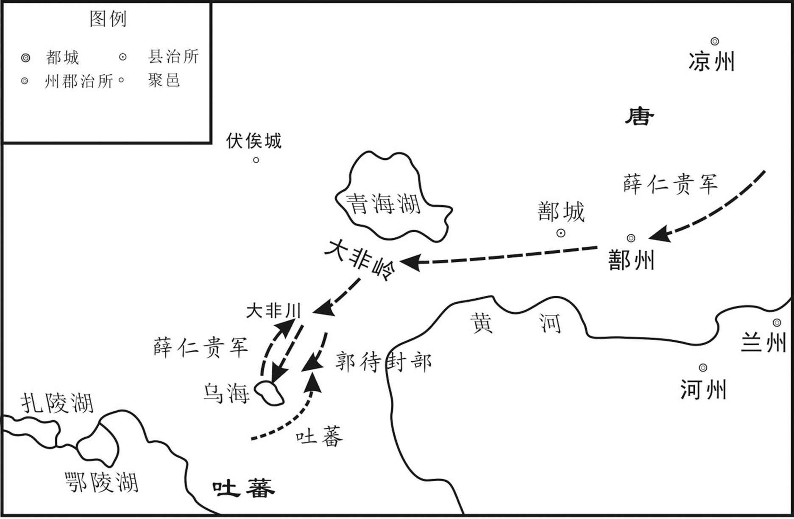 
唐高宗咸亨元年（670年）唐、吐蕃大非川之战示意图

## 【原文】

**三年夏四月，吐蕃遣其大臣仲琮入贡，上问以吐蕃风俗，对曰：“吐蕃地薄气寒，风俗朴鲁，然法令严整，上下一心，议事常自下而起，因人所利而行之，斯所以能持久也[1]。”上诘以吞灭吐谷浑，败薛仁贵，寇逼凉州事，对曰：“臣受命贡献而已，军旅之事非所闻也[2]。”上厚赐而遣之[3]。癸未，遣都水使者黄仁素使于吐蕃[4]。**

## 【注文】

[1]仲琮：即论仲琮（生卒年不详），唐朝时吐蕃大臣，曾入太学读书，文化水平较高。　　朴鲁：朴素粗鲁。　　严整：严明完整。

[2]诘：责问，追问。　　吞灭吐谷浑，败薛仁贵，寇逼凉州事：吐蕃于唐高宗龙朔三年（663年）灭吐谷浑，咸亨元年（670年）败薛仁贵于大非川，后尽有吐谷浑之地，并渐渐入逼凉州。

[3]遣：派遣，差遣。

[4]都水使者：古代官名，管理河渠水位事务的官员，隋唐为都水监长官，唐朝正五品上。　　黄仁素（生卒年不详）：唐朝初期任都水使者，出使吐蕃。

## 【译文】

唐高宗咸亨三年（672年）夏四月，吐蕃派大臣仲琮入朝进贡，唐高宗向他询问吐蕃的风俗，他回答说：“吐蕃土地贫瘠，气候寒冷，风俗质朴粗鲁，但是法令严明完备，上下一心，商议国事常常从下往上讨论，根据百姓的利益实施，这就是吐蕃能够持久的原因。”高宗又追问吐蕃吞并吐谷浑、打败薛仁贵、侵犯凉州等事情，仲琮回答说：“我只是奉命进献物品，军队之事不是我所知道的。”高宗优厚地赏赐了他，打发他返回吐蕃。癸未（二十二日），派都水使者黄仁素出使吐蕃。

## 【原文】

**上元二年春正月辛未，吐蕃遣其大臣论吐浑弥来请和，且请与吐谷浑复修邻好，上不许[1]。**

## 【注文】

[1]上元：唐高宗李治在位期间所用年号，即公元674年至676年。　　论吐浑弥（生卒年不详）：唐朝初期吐蕃大臣。

## 【译文】

唐高宗上元二年（675年）春正月辛未（二十六日），吐蕃派大臣论吐浑弥前来请和，并且请求与吐谷浑重修睦邻友好关系，高宗不答应。

## 【原文】

**仪凤元年春闰三月，吐蕃寇鄯、廓、河、芳等州，敕左监门卫中郎将令狐智通发兴、凤等州兵以御之[1]。己卯，诏以吐蕃犯塞，停封中岳[2]。乙酉，以洛州牧周王显为洮州道行军元帅，将工部尚书刘审礼等十二总管，并州大都督相王轮为凉州道行军元帅，将左卫大将军契苾何力等以讨吐蕃，二王皆不行[3]。秋八月乙未，吐蕃寇叠州[4]。**

## 【注文】

[1]仪凤：唐高宗李治在位期间所用年号，即公元676年至679年。　　鄯：指鄯州。北魏孝昌二年（526年）设置，治所在西都（隋朝改名湟水县，今青海乐都）。唐朝时辖境包括今天的青海乐都、西宁、湟中。　　廓（kuò）：指廓州。北周建德五年（576年）于浇河故城置，治所在今青海贵德南。唐辖境相当于今青海化隆和尖扎县等地。　　河：指河州。十六国前凉置，治所在枹罕县（今甘肃临夏）。唐时辖今洮河、大夏中、下游流域，湟水下游及桑园峡、积石峡间黄河流域地。　　芳：指芳州。唐武德元年（618年）置，治所在常芬县，今甘肃省迭部东南。　　左监门卫：唐朝十六卫之一，与右监门卫掌诸门禁军及门籍。置大将军一人、将军二人。　　中郎将：古代武职，秦、汉为管理宫禁警卫的高级武职，唐朝则为统领府兵的军事长官，分属十六卫、东宫十率府。　　令狐智通（生卒年不详）：唐朝初年将领，任左监门卫中郎将。　　兴：指兴州，今陕西省略阳。　　凤：指凤州，今陕西凤县凤州镇。

[2]塞（sài）：边境上险要的地方。　　中岳：五岳中的中岳嵩山位于河南省登封市西北面。

[3]洛州：唐朝初年将河南郡改名为洛州，治所在洛阳县，今河南洛阳东北。　　牧：古代官名，古代以九州之长为“牧”，“牧”是管理人民之意。汉武帝时设十三州部，每部设一刺史。汉成帝时，改刺史为州牧。后废置无常。唐宋时只有京师或陪都地方最高长官以亲王充任者，才称为“牧”，其他州牧之名都废。　　周王显：指唐中宗李显（656—710年）。起初，李显被封为周王。原名李哲，唐高宗李治和武则天之子。唐中宗前后两次当政，公元710年猝死，葬于定陵。　　行军元帅：古代武官名，军队大规模出征时所置主帅。北周置位在行军总管之上，不常设，兵罢则罢。　　工部尚书：古代官职名，隋朝置为尚书省长官，掌百工、屯田、山泽之政令，正三品。唐朝沿置，武则天光宅元年（684年）至唐中宗神龙元年（705年）改称冬宫尚书，后复旧。　　刘审礼（？—681）：唐代大臣，刘德威子，彭城（今江苏徐州）人。唐太宗时历任左骑卫郎将，工部尚书、检校左卫大将军。唐高宗仪凤三年（678年）讨伐吐蕃，战败被擒，死于吐蕃。　　并州：西汉武帝置，为十三刺史部之一。辖境相当于今山西大部及内蒙古、河北的一部。唐代辖境相当于今山西阳曲以南、文水以北的汾水中游地区。唐玄宗开元十一年（723年）改为太原府。　　大都督：古代官名，唐朝前期地方最高行政长官称都督。唐代在重要地区设置大都督。各州按等级分别置上、中、下都督府，各设都督。唐中叶以后，节度使、观察使为地方最高长官。　　相王轮：指唐睿宗（662—716年），名旦，又名旭轮，唐高宗和武则天之子，唐中宗为其兄长。他一生两度登基，两让天下，在位时间是公元684年和710年至712年，公元712年禅位于子李隆基（唐玄宗），称太上皇。　　契苾何力（？—677年）：铁勒族契苾部人，契苾氏，唐朝名将。出身铁勒可汗世家，后率部归唐。在对吐谷浑的战争中，力俘吐谷浑王，以功娶宗室女。后被反叛的部众绑架至薛延陁，唐太宗不惜以公主下嫁为条件换回契苾何力。后作为唐军前军指挥官参加了对高句丽的战争。太宗逝世后，契苾何力欲以身殉葬，为高宗所止。唐高宗显庆、龙朔年中，与苏定方等人屡征高句丽。后为辽东道大总管，作为李副手攻克平壤。死后陪葬昭陵，谥号“毅”。

[4]叠州：古地名，北周置，唐朝治所在合川县，今甘肃迭部西北。

## 【译文】

唐高宗仪凤元年（676年）春闰三月，吐蕃入侵鄯、廓、河、芳等州，高宗命令左监门卫中郎将令狐智通发兵防御。己卯（十一日），因吐蕃进犯边塞，高宗下令停止举行祭中岳的大典。乙酉（十七日），任命洛州刺史、周王李显为洮州道行军元帅，率领工部尚书刘审礼等十二总管，任命并州大都督、相王李轮为凉州行军元帅，率左卫大将军契苾何力等人，讨伐吐蕃，两位亲王都没有随军前行。秋八月乙未（二十九日），吐蕃又侵犯叠州。

## 【原文】

**二年夏五月，吐蕃寇扶州之临河镇，擒镇将杜孝昇，令赍书说松州都督武居寂使降，孝昇固执不从[1]。吐蕃军还，舍孝昇而去，孝昇复帅余众拒守[2]。诏以孝昇为游击将军[3]。冬十二月乙卯，诏大发兵讨吐蕃。**

## 【注文】

[1]扶州：隋文帝开皇七年（587年）改邓州置，治所在同昌（今四川九寨沟县东北）。隋炀帝大业三年（607年）改为同昌郡，唐武德元年（618年）复为扶州，辖地相当于今四川九寨沟县一带。　　临河镇：地名，在今四川南坪松潘。　　杜孝昇（生卒年不详）：唐朝初期任扶州临河镇将。　　赍（jī）：携带。　　说（shuì）：劝说，说服。　　松州：古州名，唐置，治所在今四川松潘。　　武居寂（生卒年不详）：唐朝初期任松州都督。

[2]拒守：抵御镇守。

[3]游击将军：古代官名，汉朝设置，魏、晋为禁军将领。梁武帝天监六年（507年）改称游骑将军，另置左、右游击将军，北齐、北魏置为侍卫牙职。唐高祖武德七年（624年），改为从五品下武散官。

## 【译文】

唐高宗仪凤二年（677年）夏五月，吐蕃侵犯扶州的临河镇，擒拿了镇守的将领杜孝昇，命令他携带书信劝说松州都督武居寂投降，杜孝昇坚决不服从。吐蕃军队返回，舍弃孝昇离开，孝昇重新率领残余的部队镇守临河镇。高宗下令任命孝昇为游击将军。冬十二月乙卯（二十七日），下令大规模发兵讨伐吐蕃。

## 【原文】

**三年秋七月，李敬玄奏破吐蕃于龙支[1]。九月丙寅，李敬玄将兵十八万与吐蕃将论钦陵战于青海之上，兵败，工部尚书、左卫大将军彭城僖公刘审礼为吐蕃所虏[2]。时审礼将前军深入，顿于濠所，为虏所攻，敬玄懦怯，按兵不救[3]。闻审礼战没，狼狈还走，顿于承风岭，阻泥沟以自固，虏屯兵高岗以压之[4]。左领军员外将军黑齿常之，夜帅敢死之士五百人袭击虏营，虏众溃乱，其将跋地设引兵遁去，敬玄乃收余众还鄯州[5]。审礼诸子自缚诣阙，请入吐蕃赎其父，敕听次子易从诣吐蕃省之[6]。比至，审礼已病卒，易从昼夜号哭不绝声[7]。吐蕃哀之，还其尸，易从徒跣负之以归[8]。上嘉黑齿常之之功，擢拜左武卫将军，充河源军副使[9]。**

## 【注文】

[1]李敬玄（615—682年）：唐朝大臣，亳州（今安徽亳州）人。博览群书，唐高宗时历任弘文馆学士，太子右庶子、同中书门下三品，监修国史。唐高宗仪凤年间，迁洮河道大总管，与吐蕃战于青海，大败。被贬衡州刺史。后升为扬州长史。　　龙支：古县名。今青海民和东南。

[2]彭城：古地名，今江苏徐州。

[3]顿：驻扎。　　虏：对敌人的蔑称。

[4]战没（mò）：战败。　　承风岭：古地名，今青海贵德北。

[5]左领军：古代武官名号。三国始设，统领禁军，隋唐因袭。　　员外将军：指正员限额以外的将军。南北朝时期为殿中员外将军的省称，隋朝为殿内员外将军的省称。　　黑齿常之（630—689年）：百济（位于朝鲜半岛西南部）西部人，唐朝著名军事将领，早年事迹不详，长大以后，善于用兵，史称其骁勇有谋略。后来黑齿常之在百济国任达率（百济官名）兼郡将，相当于唐朝刺史一职。降唐后数十年，黑齿常之屡建战功，纵横青藏所向披靡，数破突厥威震天下，进爵燕国公，成为大唐的封疆大吏。后受酷吏周兴诬陷，含冤自缢而死。　　跋地设（生卒年不详）：唐朝初期将领。　　引兵遁去：率兵逃走。

[6]诣阙：到朝廷去。诣，到……去。　　易从（生卒年不详）：唐朝初期将领刘审礼的儿子。　　省（xǐng）：探视，问候。

[7]比至：等到赶到。

[8]跣（xiǎn）：赤脚。

[9]擢拜：提升，升调。　　河源军：古代军镇名，今青海西宁东南。

## 【译文】

唐高宗仪凤三年（678年）七月，李敬玄奏报在龙支打败吐蕃。九月丙寅（十二日），李敬玄率领十八万军队和吐蕃将领论钦陵在青海交战，唐军失败，工部尚书、左卫大将军、彭城僖公刘审礼被吐蕃俘虏。当时审礼率领先头部队深入敌境，驻扎在濠所，受到吐蕃军队攻击，李敬玄怯懦，按兵不救。李敬玄听说审礼战败，狼狈逃跑，驻扎在承风岭，四周挖泥沟来固守，吐蕃占据高岗压制李敬玄。左领军员外将军黑齿常之，在黑夜率领敢死队五百人偷袭吐蕃军营，吐蕃军队溃乱，将领跋地设率军逃走，李敬玄这才收集残余部队回到鄯州。刘审礼的几个儿子们，把自己捆绑起来，去朝廷请求准许他们到吐蕃赎回父亲，唐高宗命令刘审礼次子刘易从到吐蕃看望他父亲。等他赶到时，刘审礼已病逝，刘易从昼夜哭泣不绝。吐蕃人同情他，归还了刘审礼的遗体，刘易从赤脚把父亲的尸体背回国内。高宗嘉奖黑齿常之的功劳，提升他为左武卫将军，充任河源军副使。

## 【原文】

**李敬玄之西征也，监察御史原武娄师德应猛士诏从军，及败，敕师德收集散亡，军乃复振[1]。因命使于吐蕃，吐蕃将论赞婆迎之赤岭[2]。师德宣导上意，谕以祸福，赞婆甚悦，为之数年不犯边[3]。师德迁殿中侍御史，充河源军司马，兼知营田事[4]。**

## 【注文】

[1]监察御史：古代监察文武官吏的官员，简称御史。隋文帝开皇二年（582年）改检校御史置，唐朝属御史台下设察院，正八品下。监察中央机构、州县长官及祭祀、库藏、军旅等事。　　原武：指原武县，西汉置，治所在今河南原阳。　　娄师德（630—699年）：字宗仁，郑州原武（今河南原阳）人，唐高宗、武则天两朝大臣。去世后唐廷追赠他为凉州（今甘肃武威）都督，谥曰“贞”。

[2]论赞婆（生卒年不详）：唐朝时吐蕃将领，吐蕃相禄东赞之子。掌管吐蕃东部边境事务，常常进犯唐朝。武则天圣历二年（699年）降唐，授辅国大将军，封归德郡王。　　赤岭：今名日月山，以土石皆赤得名，在青海省湟源西。

[3]上意：指唐高宗的旨意。　　谕：告诉，使知道。

[4]迁：调动官职。一般多指升官。　　司马：古代官名，殷商时代始置，位次三公，与六卿相当，与司徒、司空、司士、司寇并称五官，掌军政和军赋，春秋、战国沿置。汉武帝时置大司马，作为大将军的加号，后也加于骠骑将军，后汉单独设置，皆开府。隋唐以后为兵部尚书的别称。　　兼知：兼任，兼管。　　营田：即营田使，古代职官名，唐朝在有屯田的州设置，专管营田事宜。

## 【译文】

李敬玄西征时，监察御史、原武人娄师德响应朝廷的猛士诏从军，李敬玄失败后，唐高宗命令娄师德收集流亡的士兵，唐军士气重振。于是命令娄师德出使吐蕃，吐蕃将领论赞婆在赤岭迎接他，娄师德向他宣读解释了高宗的旨意，用福祸利害的道理劝导他，论赞婆很高兴，因此好几年没有侵犯唐朝边境。娄师德升为殿中侍御史，任河源军司马，兼管营田事务。

## 【原文】

**上以吐蕃为忧，悉召侍臣谋之[1]。或欲和亲以息民，或欲严设守备，俟公私富实而讨之，或欲亟发兵击之[2]。议竟不决，赐食而遣之[3]。太学生宋城魏元忠上封事言御吐蕃之策，以为：“理国之要，在文与武[4]。今言文者则以辞华为首而不及经纶，言武者则以骑射为先而不知方略，是皆何益于理乱哉[5]！故陆机著《辨亡》之论，无救河梁之败，养由基射穿七札，不济鄢陵之师，此已然之明效也[6]。古语有之：‘人无常俗，政有理乱，兵无强弱，将有巧拙[7]。’故选将当以智略为本，勇力为末[8]。今朝廷用人，类取将门子弟及死事之家，彼皆庸人，岂足当阃外之任[9]。李左车、陈汤、吕蒙、孟观皆出贫贱而立殊功，未闻其家代为将也[10]。夫赏罚者，军国之切务，苟有功不赏，有罪不诛，虽尧舜不能以致理[11]。议者皆云：‘近日征伐，虚有赏格，而无事实[12]。’盖由小才之吏，不知大体，徒惜勋庸，恐虚仓库[13]。不知士不用命，所损几何，黔首虽微，不可欺罔[14]。岂得悬不信之令，设虚赏之科，而望其立功乎[15]！自苏定方征辽东，李破平壤，赏绝不行，勋仍淹滞，不闻斩一台郎，戮一令史，以谢勋人[16]。大非川之败，薛仁贵、郭待封等不即重诛，向使早诛仁贵等，则自余诸将岂敢失利于后哉[17]！臣恐吐蕃之平，非旦夕可冀也[18]。又，出师之要，全资马力[19]。臣请开畜马之禁，使百姓皆得畜马，若官军大举，委州县长吏以官钱增价市之，则皆为官有[20]。彼胡虏恃马力以为强，若听人间市而畜之，乃是损彼之强，为中国之利也[21]。”先是，禁百姓畜马，故元忠言之[22]。上善其言，召见，令直中书省，仗内供奉[23]。**

## 【注文】

[1]悉：副词。全，都。

[2]息民：使百姓得到休养生息。

[3]遣：送，送走。

[4]太学生：中国封建时代国立大学的贵族学生，由五品以上官员子孙充任。　　宋城：隋文帝开皇十八年（598年）改睢阳县置，为宋州治。治所在今河南商丘南。　　魏元忠（？—707年）：本名真宰，宋州宋城（今河南商丘）人，唐代政治家，他历仕高宗、武后、中宗三朝，两次出任宰相，并兼具一定的军事才能，为贞观之治向开元盛世的顺利过渡起了一定的积极作用。

[5]经纶：整理丝缕、理出丝绪和编丝成绳，统称经纶。引申为筹划治理国家大事。

[6]陆机（261—303年）：字士衡，吴郡吴县（今江苏苏州）人，西晋文学家、书法家，与其弟陆云合称“二陆”。曾历任平原内史、祭酒、著作郎等职，世称“陆平原”。后死于“八王之乱”，被夷三族。　　《辨亡》：指《辨亡论》，是三国时期陆机谈东吴为何灭亡的一篇文章。收录于《三国志·吴书·三嗣主传》裴松之的引注当中。　　养由基：一作繇基，春秋时期楚国平舆邑（今安徽临泉）人，《战国策·西周策》中记载：“楚有养由基者，善射，去柳叶百步而射之，百发百中。”百发百中、百步穿杨都出自这里。此人号“养一箭”，一箭就足以制胜了。　　七扎：七层铠甲。扎，古时铠甲上的金属叶片。　　不济鄢陵之师：指公元前575年鄢陵之战，楚军被晋军打败，养由基不能改变战局。

[7]理：治理得好。

[8]智略：智慧与谋略。

[9]死事之家：为国而死的将士的家属。　　阃（kǔn）外：统兵在外。阃，统兵在外的将帅。

[10]李左车（jū）（生卒年不详）：西汉初人。赵国名将李牧之孙，秦汉之际谋士。秦末，六国并起，李左车辅佐赵王歇，为赵国立下了赫赫战功，被封为广武君。赵亡后，辅佐韩信，留下“智者千虑必有一失，愚者千虑必有一得”的名言。　　陈汤（？—约前6年）：字子公，山阳瑕丘（今山东兖州北）人，西汉大将。汉元帝时，他任西域副校尉，曾和西域都护甘延寿一起出奇兵攻杀匈奴郅支单于，为安定边疆作出了很大贡献。　　吕蒙（178—220年）：汉末三国时期东吴名将。汝南富陂（今安徽阜南东南）人。曾经乘名将关羽北伐曹魏、荆州空虚之时，偷袭荆州成功，使东吴国土面积大增。　　孟观（？—301年）：今河北东光东人，字叔时。晋惠帝时为殿中侍郎、黄门侍郎。氐羌齐万年反叛，命孟观征讨，生擒齐万年，拜右将军，赵王司马伦夺位，任他为安南将军，司马伦败后被杀。

[11]致理：实现国家大治。

[12]格：法律条文。

[13]庸：功勋，功劳。

[14]黔首：百姓，平民。

[15]科：法律条文。

[16]苏定方（592—667年）：冀州武邑（今属河北省）人。历任唐朝左武候中郎将、左卫中郎将、左骁卫大将军、左卫大将军之职，封邢国公，加食邢州、巨鹿三百户。他从一员普通战将，靠战功累迁为禁军高级将领，深受唐太宗和唐高宗的赏识与信任，屡委以重任，是唐初的一员干将。　　辽东：辽河以东地区。　　李（594—669年）：原名徐世，字懋功（亦作茂公）。唐高祖李渊赐其姓李，后避唐太宗李世民讳改名为李。汉族，曹州离狐（今山东菏泽东）人，唐初名将，曾破东突厥、高句丽，与李靖并称。后被封为英国公，为凌烟阁二十四功臣之一。李一生历事唐高祖、唐太宗、唐高宗三朝，出将入相，深得朝廷信任和重任，被朝廷倚之为长城。　　平壤：今朝鲜首都平壤。　　淹滞：延迟，停滞。　　台郎：①指尚书郎。②指御史。　　谢：道歉，谢罪。

[17]向使：假使以前。

[18]冀：希望。

[19]资：凭借。

[20]长吏：地位较高的官吏。　　官钱：指官府的钱财。

[21]胡虏：秦汉时称匈奴为胡虏，后世用为与中原敌对的北方部族的统称。

[22]先是：在此之前。

[23]直：值班。　　中书省：古代官署名。封建政权执政中枢部门，汉朝始设中书令，魏国建秘书监，有监、令，魏曹丕改称中书监、令。晋朝以后称中书省，为秉承君主意旨，掌管机要、发布政令的机构。沿至隋唐，成为全国政务中枢。　　仗：兵卫。　　供奉：在皇帝左右供职者的称号。

## 【译文】

唐高宗因为吐蕃的事而担忧，召集所有的侍臣来商议对策。有的人想用和亲政策来使百姓休养生息，有的人想要严加防备，等到国家和百姓都富裕充实后再讨伐，有的人想立刻发兵讨伐。商议到最终仍没有结果，高宗赐给他们饮食之后，让他们回去了。太学生、宋城人魏元忠上书奏事谈论防御吐蕃的策略，认为：“治理国家的关键，在于文武兼备。现在主张文治的认为文辞华丽是最主要的而不顾及治理国家的大事，主张武力的则认为骑射是最主要的而不知道计谋策略，这些对治理国家有什么益处！所以陆机虽然写了《辨亡》，但救不了河梁之战的失败，养由基能射穿七层铠甲，但救不了鄢陵之战的军队，这已经是很明白的事理了。古语有这样的话：‘人没有一成不变的习俗，政事却有治和乱，兵没有强弱之分，将帅却有巧与拙的区别。’所以选用将领应当以智慧谋略为根本，勇武力气为末节。现在朝廷用人，大多选用那些将门子弟以及为国战死的家属，他们都是平庸的人，怎么能担当领兵在外的重任。李左车、陈汤、吕蒙、孟观都出身贫寒低贱却建立了特殊的功勋，没有听说他们家是世代为将的。赏罚是军国要务，假如有功不赏，有罪不诛，即使尧舜也不能实现国家大治。议论政事的人都说：‘近来的征伐中，只空有赏格，而没有实际的奖赏。’大概是因为一些才能低下的官吏，不懂治国的根本道理，只是吝惜赏赐功勋的费用，害怕使国库空虚。不知道将士们如不尽力，损失会有多少，平民虽然地位卑微，但也不可以欺骗瞒哄。怎么能发布没有信用的法令，设定不会兑现的奖赏条文，而希望他们在疆场立功！自从苏定方征辽东，李攻破平壤后，奖赏制度就没有执行过，授勋封爵的赏赐搁置不动，没有听说斩过一名管论功行赏的台郎、令史，来向有功的人谢罪。大非川的失败，薛仁贵、郭待封等人没有立即因重罚被严惩，假使原先早点杀掉薛仁贵等人，那么其他将领哪敢在以后的战争中失败呢！我担心吐蕃的平定，不是短时间可以实现的。另外，出兵的重要条件，全靠马力。我请求废除不准养马的禁令，让百姓可以养马。如果官军大举出兵，命令州县官吏用府库的钱高价买马，那么马就全都为国家所有。外族人打仗是依仗马力称强的，如果任由百姓买他们的马来养，便削弱了他们的有利条件，这是对我们有利的事。”在此之前，朝廷禁止百姓养马，所以魏元忠这样说。高宗认为他的话说得对，召见了他，让他在中书省值班，朝会时能够随百官朝见皇帝。

## 【原文】

**调露元年春二月壬戌，吐蕃赞普卒，子器弩悉弄立，生八年矣[1]。时器弩悉弄与其舅麹萨若诣羊同发兵，有弟生六年，在论钦陵军中[2]。国人畏钦陵之强，欲立之，钦陵不可，与萨若共立器弩悉弄[3]。上闻赞普卒，嗣主未定，命裴行俭乘间图之[4]。行俭曰：“钦陵为政，大臣辑睦，未可图也[5]。”乃止[6]。**

## 【注文】

[1]调（diào）露：唐高宗李治在位期间所用年号，即公元679年至680年。　　器弩悉弄（生卒年不详）：唐朝时吐蕃赞普儿子。　　立：这里指登上赞普的位置。

[2]麹萨若（生卒年不详）：唐朝时吐蕃大臣，吐蕃赞普儿子器弩悉弄的舅舅。　　羊同：西藏古代族名。亦作“扬同”。即象雄。分布于今西藏西北部。分为大羊同、小羊同两部。

[3]可：许可，同意。

[4]嗣主：指继位的赞普。　　裴行俭（619—682年）：绛州闻喜（今山西闻喜东北）人。唐高宗时名臣，隋朝礼部尚书裴仁基之子。唐高宗时官至礼部尚书，兼检校右卫大将军，封闻喜县公。唐高宗麟德二年（665）任安西大都护，后来领兵出征东、西突厥，善于料敌决胜。他诚恳待人，获得士兵爱戴，战多取胜。　　乘间（jiàn）：乘机。

[5]辑：和睦。

[6]止：停止。

## 【译文】

唐高宗调露元年（679年）春二月壬戌（十一日），吐蕃赞普去世，他的儿子器弩悉弄被立为赞普，当时年龄是八岁。器弩悉弄和他的舅舅麹萨若去羊同发兵，器弩悉弄有个弟弟六岁，在论钦陵军中。国人害怕论钦陵的强大，想立器弩悉弄的弟弟为新赞普，钦陵不同意，与萨若一同立器弩悉弄为赞普。高宗听说老赞普去世，新赞普还没确立，命令裴行俭乘机图谋进攻吐蕃。行俭说：“钦陵执掌政权，大臣和睦团结，不可以图谋。”这件事就停止了。

## 【原文】

**冬十月癸亥，吐蕃文成公主遣其大臣论塞调傍来告丧，并请和亲[1]。上遣郎将宋令文诣吐蕃会赞普之葬[2]。**

## 【注文】

[1]论塞调傍（生卒年不详）：唐朝时吐蕃大臣。　　告丧（sàng）：报丧。人死后，停柩一段时间之后，诸事准备就绪，亲属和子孙要选日子报丧。

[2]郎将：古代官名，府兵将领。隋朝设置为诸卫府辅佐之官，唐沿袭。　　宋令文（生卒年不详）：唐虢州弘农（今河南卢氏）人，一作汾州（在今山西）人。唐高宗时为骁卫郎将，东台详正学士。有勇力，善于写作。

## 【译文】

冬十月癸亥（十六日），吐蕃文成公主派大臣论塞调傍来长安报丧，并且请求和亲。唐高宗派郎将宋令文到吐蕃参加赞普的葬礼。

## 【原文】

**永隆元年秋七月，吐蕃寇河源，左武卫将军黑齿常之击却之[1]。擢常之为河源军经略大使[2]。常之以河源冲要，欲加兵戍之，而转输险远，乃广置烽戍七十余所，开屯田五千余顷，岁收五百余万石，由是战守有备焉[3]。**

## 【注文】

[1]永隆：唐高宗李治在位期间所用年号，即公元680年至681年。　　击却：击退。

[2]擢：提拔，选拔。　　经略大使：古代官名。即经略使。经略使是重要地区军政长官名称。唐太宗贞观二年（公元628年）始于沿边重要地区设置，是边防军事长官，后多由节度使兼任。

[3]冲要：军事或交通等方面的要地。　　戍：军队驻防、守卫。　　烽戍：设置烽燧，驻兵防守之处。烽指古代边防报警的烟火。　　屯田：中国古代封建王朝利用戍卒、农民、商人垦殖荒地屯田。汉武帝击败匈奴后，在西北大规模屯田，以给养边防军，汉代以后，历代王朝沿用此措施取得军饷和税粮。有军屯、民屯、商屯之分。　　岁：年。　　石（dàn）：①中国市制容量单位，十斗为一石。②重量单位，一百二十市斤为一石。

## 【译文】

唐高宗永隆元年（680年）秋七月，吐蕃侵犯河源，左武卫将军黑齿常之击退吐蕃军队。黑齿常之被提升为河源经略大使。黑齿常之认为河源是战略要冲，想增加兵力戍守，但道路险远，运输困难，于是设置了烽火戍守台七十多处，开垦屯田五千多顷，每年收成五百多万石粮食，从此作战和防守有了足够的储备。

## 【原文】

**先是，剑南募兵于茂州，西南筑安戎城，以断吐蕃通蛮之路[1]。吐蕃以生羌为乡导，攻陷其城，以兵据之，由是西洱诸蛮皆降于吐蕃[2]。吐蕃尽据羊同、党项及诸羌之地，东接凉、松、茂、巂等州，南邻天竺，西陷龟兹、疏勒等四镇，北抵突厥，地方万余里，诸胡之盛，莫与为比[3]。冬十月丙午，文成公主薨于吐蕃。**

## 【注文】

[1]剑南：道名。唐太宗贞观元年（627年）置，以在剑阁之南而得名。　　茂州：唐太宗贞观八年（634年）改南会州置，治所在汶县（今四川茂县）。辖境相当于今四川省茂县、汶川、北川等县。　　安戎城：唐仪凤二年（677年）筑，属维州。在今四川理县西。　　蛮：我国古代对南部民族的统称。

[2]西洱诸蛮：生活在今云南西部洱海一带的少数民族。

[3]党项：是我国古代北方少数民族之一，属西羌族的一支。南北朝时，分布在今青海省东南部河曲和四川省松潘以西山谷地带。主要有八个部落，其中以拓跋氏最为强盛。唐朝前期，受吐蕃压迫，大部分党项人被迫迁到甘肃、宁夏、陕北一带。　　凉：即凉州。今甘肃武威一带。　　巂（xī）：指巂州。隋开皇十八年（598年）改西宁州置，唐治所在越巂县（今四川西昌）。唐高祖武德四年（621年）升为中都都督府。辖境相当于今四川越西、美姑以南，金沙江以西、以北，锦屏山、盐井河以东地区。　　天竺：古印度的别称。　　四镇：即安西四镇（龟兹、于阗、焉耆、疏勒）。　　方：古代面积的用语。方十里即纵横十里。

## 【译文】

在此之前，剑南在茂州招募士兵，在西南修筑了安戎城，以截断吐蕃通往诸蛮族的道路，吐蕃用羌族人做向导，攻陷安戎城，派兵驻守，因此西洱各少数民族都投降了吐蕃。吐蕃占据了羊同、党项以及羌族各部落的全部领地。东与凉、松、茂、巂等州相连接，南与天竺国相邻，西面攻陷龟兹、疏勒等四镇，北面与突厥接连，占地方圆一万多里，少数民族政权中最强盛的，也不能与吐蕃相比。冬十月丙午（初五日），文成公主在吐蕃去世。

## 【原文】

**开耀元年夏五月己丑，河源道经略大使黑齿常之将兵击吐蕃论赞婆于良非川，破之，收其粮畜而还[1]。常之在军七年，吐蕃深畏之，不敢犯边[2]。**

## 【注文】

[1]开耀：唐高宗李治在位期间所用年号，即公元681年至682年。　　良非川：古地名，在今青海共和西南。

[2]军：指河源军。

## 【译文】

唐高宗开耀元年（681年）夏五月己丑（二十一日），河源道经略大使黑齿常之率军在良非川攻击吐蕃论赞婆，击败了他们的军队，缴获了他们的粮食和牲畜返回。黑齿常之在河源军中七年，吐蕃很害怕他，不敢侵犯边境。

## 【原文】

**永淳元年秋七月，吐蕃将论钦陵寇拓、松、翼等州，诏左骁卫郎将李孝逸、右卫郎将卫蒲山发秦、渭等州兵分道御之[1]。（冬十月）［是岁］，吐蕃入寇河源军，军使娄师德将兵击之于白水涧，八战八捷[2]。上以师德为比部员外郎、左骁卫郎将、河源军经略副使，曰：“卿有文武材，勿辞也[3]。”**

## 【注文】

[1]永淳：唐高宗李治在位期间所用年号，即公元682年至683年。　　拓：指拓州。西魏改宜州置，治所在夷陵县（今湖北宜昌西北）。辖境相当于今湖北宜昌、枝城等地。　　松：指松州，唐高祖武德元年（618年）置，治所在嘉诚县（今四川松潘）。地处岷江上游，循江西北上有山道通青海，为四川西北门户。　　翼：指翼州，北周置，治所在翼针县（今四川茂县西北），唐时辖境相当于今四川茂县北部一带。　　左骁卫：隋朝十二卫，唐朝十六卫之一。　　李孝逸（生卒年不详）：唐朝宗室。陇西成纪（今甘肃静宁西南）人。淮安王李神通之子，自幼聪明好学，被封为梁郡公。唐高宗末年，历任给事中，四迁益州（治今四川成都）大都督府长史。李孝逸后遭武承嗣等人的构陷，被发配儋（dān）州不久，含恨而死。唐睿宗李旦复位后，追赠李孝逸为益州大都督。　　卫蒲山（生卒年不详）：唐初将领，任右卫郎将。　　秦：指秦州。西晋分雍、凉、梁三州置。辖境相当于今甘肃兰州市、永登、定西、静宁以南，清水两当以西，陕西凤县、略阳和四川平武及青海黄河以南贵德以东地区。　　渭：指渭州。北魏置，治所在陇西郡襄武县（今甘肃陇西东南）。因渭水而得名。唐辖境相当于今甘肃陇西、渭源、定西、武山等地。

[2]军使：古代军职名。唐高宗仪凤年间置，或以所在州刺史充任。掌领本军军务，或兼理地方政务。　　白水涧：在今青海大通回族土族自治县西北。

[3]比部：古代官署名。魏、晋、南北朝为尚书郎曹之一，掌拟定、修改法律，收藏稽核法令。隋、唐以来称比部司，为中央审计机构，掌审核内外赋敛、官府经费等账籍，隶属刑部。唐设郎中。　　比部员外郎：古代官名。比部司次官。隋文帝时始置，炀帝罢。唐朝复置，从六品。　　材：通“才”。才能。

## 【译文】

唐高宗永淳元年（682年）秋七月，吐蕃将领论钦陵侵犯拓、松、翼等州，朝廷任命左骁卫郎将李孝逸、右卫郎将卫蒲山调集秦、渭等州的部队分道抗击吐蕃。这一年，吐蕃入侵河源军，军使娄师德率兵在白水涧与吐蕃交战，八战八捷。高宗任命娄师德为比部员外郎、左骁卫郎将、河源军经略副使，并说：“你兼备文武之才，不要推辞。”

## 【原文】

**则天皇后垂拱元年冬十一月癸卯，命天官尚书韦待价为燕然道行军大总管，以讨吐蕃[1]。**

## 【注文】

[1]则天：指武则天（624—705年），唐朝并州文水（今山西文水东）人，是中国历史上唯一一个正统的女皇帝，公元690年至705年在位。唐高宗时年为皇后（655年至683年），唐中宗和唐睿宗时为皇太后，公元690年，自立为武周皇帝，改国号“唐”为“周”，定都洛阳。史称“武周”，公元705年退位。在位期间，严厉镇压政敌，大开告密之门，众多唐宗室及旧臣惨遭冤杀；开创殿试，初设武举，重视农业，经济有所发展。　　皇后：皇帝的正妻。在周朝以前，天子之妻皆称为“妃”，周朝开始则称为“后”。到了秦始皇统一六国之后，改天子为皇帝，并订定皇帝的正妻为皇后的后妃制度。皇后在后宫的地位就如同天子，是众妃子之主。　　垂拱：唐睿宗李旦在位期间所用年号，但实际上是武则天操纵政权，睿宗毫无实权。一般算作武则天的年号，即公元685年至688年。　　天官尚书：中国古代官名，唐武则天光宅元年（684年）改吏部为天官置，唐中宗神龙元年（705年）复称吏部尚书。　　韦待价（？—689年）：唐雍州万年（今陕西西安市）人，江夏王李道宗的女婿。唐高宗时，任肃州刺史、右武卫将军。武后临朝，为燕然道行军大总管，抵御突厥。唐睿宗永昌元年（689年），任安息道行军大总管，进封扶阳县男，督三十六总管攻吐蕃，败于弓月城（今新疆伊宁）西的寅识迦河，被流放绣州（今广西桂平南）而死。

## 【译文】

武则天皇后垂拱元年（685年）冬十一月癸卯（初一日），任命天官尚书韦待价为燕然道行军大总管，讨伐吐蕃。

## 【原文】

**三年冬十一月，太后欲遣韦待价将兵击吐蕃，凤阁侍郎韦方质奏，请如旧制遣御史监军[1]。太后曰：“古者明君遣将，阃外之事悉以委之[2]。比闻御史监军，军中事无大小皆须承禀[3]。以下制上，非令典也，且何以责其有功[4]。”遂罢之[5]。**

## 【注文】

[1]太后：指武则天。唐中宗和唐睿宗时，武则天为皇太后。　　凤阁侍郎：古代官名。唐武则天光宅元年（684年）至唐中宗神龙元年（705年）为中书侍郎改称。　　韦方质（？—690年）：雍州万年（今陕西西安）人。武则天执政初为凤阁侍郎、同凤阁鸾台平章事，迁地官尚书。为酷吏周兴、来子珣所陷，流死儋（dān）州。　　御史监军：中国古代差遣官员代表朝廷协理军务、监督将帅，东汉武帝置监军使者，隋末以御史监军，唐玄宗始以宦官监军。

[2]阃（kǔn）：特指城郭的门槛。

[3]承禀：禀报。

[4]非令典：不是合理的法令制度。

[5]罢：停止。

## 【译文】

武则天皇后垂拱三年（687年）冬十一月，太后武则天想派韦待价率兵进攻吐蕃，凤阁侍郎韦方质上书，请依照旧制派御史监军。太后说：“古代明君派遣大将，在外领兵的军事全部交给他处理。听说近来御史监军，军中的事不论大小都必须向他禀报。以职位低的牵制职位高的，这并不是合理的制度，这样做，怎么能要求将领有功呢？”于是作罢。

## 【原文】

**永昌元年夏五月丙辰，命文昌右相韦待价为安息道行军大总管，击吐蕃[1]。韦待价军至寅识迦河，与吐蕃战，大败[2]。会大雪，粮运不继[3]。待价既无将领之才，狼狈失据，士卒冻馁，死亡甚众，乃引军还[4]。太后大怒，丙子，待价除名，流绣州，斩副大总管安西大都护阎温古[5]。安西副都护唐休璟收其余众，抚安西土，太后以休璟为西州都督[6]。**

## 【注文】

[1]永昌：唐睿宗李旦在位期间所用年号，但实际上是武则天操纵政权，睿宗毫无实权。一般算作武则天的年号。即公元689年至690年。　　文昌右相：武则天光宅元年（684年）至唐中宗神龙元年（705年）以尚书右仆射为文昌右相。

[2]寅识迦河：当在弓月西南，弓月城在今新疆伊宁。

[3]继：跟上。

[4]馁：饥饿。

[5]绣州：唐高祖武德六年（623年）改林州置，治所在常林县（今广西桂平南），辖境相当于今广西桂平、平南南部地区。　　安西大都护：古代官名，都护府长官，唐高宗永徽年间，以亲王遥领都护，称为大都护，由副大都护兼王府长史，掌府事。　　阎温古（？—689年）：唐朝初期任安西大都护。

[6]唐休璟（627—712年）：名唐璿，字休璟，京兆始平（今陕西兴平西）人。唐朝大臣和名将，爵位宋国公，历任武则天和唐中宗、唐睿宗时的宰相。历任安西副都护、西州都督、凉州都督等职。公元700年，因打败吐蕃之功拜右武威、右金吾二卫大将军。公元703年，拜同凤阁鸾台三品、太子右庶子。公元704年，出为幽、营等州都督，安东都护。公元705年，加封辅国大将军、同中书门下三品，酒泉郡公，升尚书右仆射，累封宋国公。公元710年，充朔方道行军大总管，防备突厥。公元712年病逝，赠荆州大都督，谥号“忠”。　　西州：唐为安西都护府治，治所在高昌县（今新疆吐鲁番东南），辖境相当于今新疆吐鲁番盆地一带。

## 【译文】

武则天皇后永昌元年（689年）夏五月丙辰（初五日），任命文昌右相韦待价为安息道行军大总管，进攻吐蕃。韦待价率领军队到达寅识迦河，与吐蕃交战，大败。正巧碰上天降大雪，粮食运输跟不上。韦待价又没有做将领的才能，狼狈逃跑，士兵又冻又饿，死亡很多，就率军返回。太后大怒，丙子（二十五日），把韦待价除名并流放绣州，杀了副大总管、安西大都护阎温古。安西副都护唐休璟收集残余士兵，镇抚安西疆土，太后任命唐休璟为西州都督。

## 【原文】

**天授二年夏五月，以岑长倩为武威道行军大总管，击吐蕃，中道召还，军竟不出[1]。**

## 【注文】

[1]天授：武则天在位期间所用年号。公元690年武则天废唐睿宗，改唐为周，自称皇帝，改元天授，即公元690年至692年。　　岑长倩（？—691年）：唐朝宰相，早年曾任兵部侍郎。唐高宗永淳元年（682年），进同中书门下平章事，参与朝政。武则天天授元年（690年），拜文昌右相，封邓国公。天授二年（691年），加特进、辅国大将军。因不同意立武承嗣为皇太子，被罢相，出任武威道行军大总管，远征吐蕃。后被诬陷谋反，下狱诛杀。

## 【译文】

武则天天授二年（691年）夏五月，任命岑长倩为武威道行军大总管，进攻吐蕃，中途被召还，军队最终没有出发。

## 【原文】

**长寿元年春二月己亥，吐蕃、党项部落万余人内附，分置十州[1]。**

## 【注文】

[1]长寿：武则天在位期间所用年号。即公元692年至694年。

## 【译文】

武则天长寿元年（692）春二月己亥（初三日），吐蕃、党项部落一万多人归附朝廷，分别安置在十个州。

## 【原文】

**夏五月，吐蕃酋长曷苏帅部落请内附，以右玉钤卫将军张玄遇为安抚使，将精卒二万迎之[1]。六月，军至大渡水西，曷苏事泄，为国人所擒[2]。别部酋长昝捶帅羌蛮八千余人内附，玄遇以其部落置莱川州而还[3]。**

## 【注文】

[1]曷苏（生卒年不详）：唐朝时吐蕃大首领。　　右玉钤卫将军：武则天时武官名。　　张玄遇（生卒年不详）：武则天朝任右玉钤卫将军。　　安抚使：古代官名。唐太宗时置，掌巡天下诸州水旱。后有时以节度使兼任。

[2]大渡水：指青衣水，在今四川西部。　　事泄：指曷苏归附的事情泄露。

[3]昝（zǎn）捶（生卒年不详）：唐朝时吐蕃首领。　　羌蛮：指羌族。　　莱川州：《新唐书·吐蕃传》作“吐州”。

## 【译文】

武则天长寿元年（692）夏五月，吐蕃酋长曷苏率领部落请求归附朝廷，任命右玉钤卫将军张玄遇为安抚使，率领精锐部队两万人迎接曷苏。六月，军队到达大渡水西岸，曷苏归附的事情泄露，被吐蕃国人擒拿。另一部落酋长昝捶率领羌族八千多人归附，张玄遇把他们安置在莱川州后返回。

## 【原文】

**初，新丰王孝杰从刘审礼击吐蕃，为副总管，与审礼皆没于吐蕃[1]。赞普见孝杰泣曰：“貌类吾父[2]。”厚礼之，后竟得归，累迁右鹰扬卫将军[3]。孝杰久在吐蕃，知其虚实[4]。会西州都督唐休璟请复取龟兹、于阗、疏勒、碎叶四镇，敕以孝杰为武威军总管，与左武卫大将军阿史那忠节将兵击吐蕃[5]。冬十月丙戌，大破吐蕃，复取四镇。置安西都护于龟兹，发兵戍之[6]。**

## 【注文】

[1]新丰：古县名。县治在今陕西西安临潼区。　　王孝杰（？—697年）：唐朝名将，参加对吐蕃、后突厥、契丹的战争。在武则天时一度为相，在讨伐契丹可汗孙万荣的战斗中阵亡。

[2]类：类似，像。

[3]右鹰扬卫：唐武则天光宅元年（684年）至唐中宗神龙元年（705年）为右武卫改称。　　右鹰扬卫将军：即右武卫将军。

[4]虚实：实际情况。

[5]于阗（tián）：古代西域王国，唐代安西四镇之一。在今新疆和田西南。　　疏勒：唐军镇名，故地在今新疆喀什。　　碎叶：唐朝在西域设的重镇，是中国历代王朝在西部地区设防最远的一座边陲城市，也是丝路上一重要城镇。在今吉尔吉斯斯坦的托克马克市附近。　　阿史那忠节（生卒年不详）：西突厥族，元庆子。武则天如意元年（692年），被流配崖州（今琼山县东南），长安三年（703年）召还。授右骁卫大将军，袭父兴昔亡可汗，充安抚招慰十姓大使。唐玄宗开元中，任右金吾大将军。

[6]安西都护：即安西都护府。安西都护府和安西大都护府是唐朝管理碛西的一个军政机构的不同时期的名称，其统辖安西四镇，最大管辖范围曾一度完全包括天山南北，并至葱岭以西达波斯，在武周时代北庭都护府分立之后，安西都护府分管天山以南的西域地区。

## 【译文】

当初，新丰人王孝杰跟随刘审礼进攻吐蕃，任副总管，和刘审礼一起被俘到吐蕃。赞普看到王孝杰就哭了，说：“你面貌很像我的父亲。”因此得到优厚的礼遇，后来终于回国，一直升任为右鹰扬卫将军。王孝杰在吐蕃待了很久，深知吐蕃的虚实。后来西州都督唐休璟请求再次攻取龟兹、于阗、疏勒、碎叶四镇，王孝杰被任命为威武军总管，与左武卫大将军阿史那忠节率军进攻吐蕃。冬十月丙戌（二十五日），大败吐蕃，夺取了四镇。朝廷在龟兹设置安西都护府，调部队前往镇守。

## 【原文】

**延载元年春二月，武威道总管王孝杰破吐蕃勃论赞（刃）［兴］突厥可汗俀子等于冷泉及大岭，各三万余人[1]。碎叶镇守使韩思忠破泥熟俟斤等万余人[2]。**

## 【注文】

[1]延载：武则天在位期间所用年号。延载元年，即694年。　　俀（tuǐ）子（生卒年不详）：西突厥部新立之可汗，姓阿史那氏。　　勃论赞（生卒年不详）：武则天朝吐蕃将领。　　冷泉：古地名，今山西闻喜县东。　　大岭：今吉林公主岭东北

[2]镇守使：古代官名。唐武则天垂拱二年（686年）至圣历元年（698年）为单于都护府都护改称，后改为安北都护。　　韩思忠（生卒年不详）：唐朝将领。武则天长寿元年（692年）任武威道行军大总管，重收安西四镇，拜碎叶镇守使。武则天长安年间转朔方军副大总管，统兵守石岭要塞。　　泥熟俟斤（生卒年不详）：唐朝时突厥将领。

## 【译文】

武则天延载元年（694年）春二月，武威道总管王孝杰在冷泉和大岭地方，击败吐蕃勃论赞兴和突厥可汗俀子的军队各三万多人。碎叶镇守使韩思忠也打败泥熟俟斤等人的军队一万多人。

## 【原文】

**天册万岁元年秋七月辛酉，吐蕃寇临洮，以王孝杰为肃边道行军大总管以讨之[1]。**

## 【注文】

[1]天册万岁：武则天在位期间所用年号。天册万岁元年，即695年。　　临洮：古地名，今甘肃岷县，秦置，西魏与隋末都曾暂改溢乐。秦长城西端在此。

## 【译文】

武则天天册万岁元年（695年）秋七月辛酉（十五日），吐蕃侵犯临洮，任命王孝杰为肃边道行军大总管讨伐吐蕃。

## 【原文】

**万岁通天元年春（正）［一］月甲寅，以娄师德为肃边道行军副总管，击吐蕃[1]。三月壬寅，王孝杰、娄师德与吐蕃将论钦陵、赞婆战于素罗汗山，唐兵大败[2]。孝杰坐免为庶人，师德贬原州员外司马[3]。师德因署移牒，惊曰：“官爵尽无邪[4]！”既而曰：“亦善，亦善[5]。”不复介意[6]。**

## 【注文】

[1]万岁通天：武则天在位期间所用年号。万岁通天元年，即696年。

[2]素罗汗山：山名。今甘肃临洮境内。

[3]原州：古州名，治今宁夏固原。　　员外：古指正员以外的官员。

[4]移牒：以正式公文通知平行机关或人。牒，公文，文书。

[5]善：好。

[6]介意：放在心上。

## 【译文】

武则天万岁通天元年（696年）春一月甲寅（十一日），任命娄师德为肃边道行军副总管，攻击吐蕃。三月壬寅（初一日），王孝杰、娄师德与吐蕃将领论钦陵、赞婆在素罗汗山交战，唐军大败。王孝杰被免为平民，娄师德被贬为原州员外司马。娄师德在签署文书时，惊讶地说：“官爵全没了！”继而又说：“也好，也好。”不再把这事放在心上。

## 【原文】

**秋九月，吐蕃复遣使请和亲，太后遣右武卫胄曹参军贵乡郭元振往察其宜[1]。吐蕃将论钦陵请罢安西四镇戍兵，并求分十姓突厥之地[2]。元振曰：“四镇、十姓，与吐蕃种类本殊，今请罢唐兵，岂非有兼并之志乎[3]？”钦陵曰：“吐蕃苟贪土地，欲为边患，则东侵甘、凉，岂肯规利于万里之外邪[4]！”乃遣使者随元振入请之[5]。**

## 【注文】

[1]胄曹参军：古代官名，又称胄曹参军事。武则天时改铠曹参军事为胄曹参军事，掌兵械甲仗、公廨兴缮、罚谪。正、从八品不等。　　贵乡：古代县名。东魏置，治所在赵城，今河北大名。唐为魏州治。　　郭元振（656—713年）：名震，字元振，魏州贵乡（今河北大名北）人，唐朝将领。任通泉县尉。因参与平息皇室内乱有功，封代国公，兼御史大夫，持节为朔方道行军大总管。时唐玄宗于骊山讲武，郭元振因军容不整而被治罪，免死流放新州（今广东新兴）。随即又被起用为饶州司马，抑郁病逝途中。

[2]十姓突厥：十姓突厥，即五咄陆、五弩失毕。

[3]殊：区别，不同。

[4]甘：指甘州。西魏改西凉州置，治所在永平县（今甘肃张掖）。辖境相当于今甘肃嘉峪关市以东弱水上游地区。　　凉：即凉州，今甘肃西北部的武威。

[5]入请：入朝请求。

## 【译文】

秋九月，吐蕃又派遣使者请求和亲，太后派右武卫胄曹参军、贵乡人郭元振前往吐蕃考察情况。吐蕃将领论钦陵请求撤掉安西四镇的守备部队，并要求把突厥十姓的领地分给吐蕃。元振说：“四镇、十姓和吐蕃本不是同一种族，现在请求撤去唐军，岂不是有兼并的企图吗？”论钦陵说：“吐蕃如果贪求土地，想侵扰边境，就会向东入侵甘、凉等州，怎么会到万里之外去谋求利益！”于是派使者跟随郭元振入朝请求。

## 【原文】

**朝廷疑未决，元振上疏，以为：“钦陵求罢兵割地，此乃利害之机，诚不可轻举措也[1]。今若直拒其善意，则为边患必深[2]。四镇之利远，甘、凉之害近，不可不深图也[3]。宜以计缓之，使其和望未绝则善矣[4]。彼四镇、十姓，吐蕃之所甚欲也，而青海、吐谷浑，亦国家之要地也[5]。今报之宜曰：‘四镇、十姓之地，本无用于中国，所以遣兵戍之，欲以镇抚西域，分吐蕃之势，使不得并力东侵也[6]。今若果无东侵之志，当归我吐谷浑诸部及青海故地，则五俟斤部亦当以归吐蕃[7]。’如此则足以塞钦陵之口，而亦未与之绝也[8]。若钦陵小有乖违，则曲在彼矣[9]。且四镇、十姓款附岁久，今未察其情之向背，事之利害，遥割而弃之，恐伤诸国之心，非所以御四夷也[10]。”太后从之[11]。**

## 【注文】

[1]上疏：古代在朝官员专门上奏皇帝的一种文书形式。　　机：关键。

[2]直拒：直接拒绝。

[3]图：谋求。

[4]和望：讨好的希望。

[5]四镇、十姓：武则天长寿元年（692年）置四镇戍兵。十姓突厥，即五咄陆、五弩失毕。

[6]西域：汉以后对玉门关、阳关以西地区的总称。狭义专指葱岭以东而言，广义则凡通过狭义西域所能到达的地区，包括亚洲中、西部，印度半岛，欧洲东部和非洲北部在内。

[7]吐谷浑诸部及青海故地：指唐高宗咸亨三年（672年），吐谷浑诸部内迁，故地被吐蕃所占，以及唐高宗咸亨元年（670年），因薛仁贵兵败大非川，青海沦为吐蕃所有。　　五俟斤：西突厥五弩失毕部，各有酋长，名为五俟斤。

[8]塞（sè）：堵住。

[9]小：稍微，略微。　　乖违：违背，背离。　　曲：理屈，理亏。

[10]款附：诚心归附。款，诚恳，恳切。　　四夷：中国古代华夏族对四方少数民族的统称，即东夷、北狄、西戎和南蛮。

[11]从：听从。

## 【译文】

朝廷对吐蕃的请求犹豫不决，郭元振上书，认为：“钦陵请求停战割地，这是利害的关键，确实不能轻率处理。现在如果直接拒绝他的善意，会加深边境忧患。四镇对于国家的利益很远，而甘、凉被攻击的危害很近，不可不深加考虑。应该先用缓兵之计，让吐蕃对和好的要求不要绝望就可以了。四镇、十姓是吐蕃很想得到的，而青海、吐谷浑也是我们的军事要地。现在最好回复他说：‘四镇、十姓之地本来对我们无用，之所以要派兵戍守，是想用来镇抚西域，牵制吐蕃的势力，使他们不能合力东侵。现在如果吐蕃确实没有东侵的意图，那就应当归还我们吐谷浑各部落的故地以及原属我们的青海之地。那样，五俟斤部落的土地也就归还给吐蕃。’这样回答吐蕃，足以堵住论钦陵的口，也不会与吐蕃决裂。如果论钦陵稍有违背的意思，那他就理屈了。况且四镇、十姓归附我们多年了，现在不体察他们人心向背的情况，就割地给吐蕃，把他们抛得远远的，恐怕会伤害各国的心，这不是统御四邻的做法。”太后听从了他的建议。

## 【原文】

**元振又上言：“吐蕃百姓疲于徭戍，早愿和亲[1]。钦陵利于统兵专制，独不欲归款[2]。若国家岁发和亲使，而钦陵常不从命，则彼国之人怨钦陵日深，望国恩日甚，设欲大举其徒固亦难矣[3]。斯亦离间之渐，可使其上下猜阻，祸乱内兴矣[4]。”太后深然之[5]。元振名震，以字行[6]。**

## 【注文】

[1]徭戍：徭役戍边。

[2]归款：投诚，归附。

[3]和亲使：古代使职名。中原汉族与少数民族首领之间进行有政治目的的联姻，称为和亲。和亲使是为和亲而专门派遣的使臣。　　设：如果，假设。

[4]渐：端倪，开始。

[5]深：非常。

[6]字：表字，人的别名，古人字和名常有意义上的联系。自称用名，表示谦虚，称人用字，表示尊敬。

## 【译文】

郭元振又进言：“吐蕃百姓因为劳役戍边非常疲惫，早就希望和亲，只是论钦陵觉得统兵专权对自己有利，不愿归附和好。如果我们每年派和亲使者，而钦陵却不从命，那么吐蕃人就会日甚一日地怨恨他，希望得到我们恩惠也就会日益迫切，假使他想大举进攻我们也就难了。这也是离间吐蕃的开端，可以使他们上下互相猜忌，内部就会发生祸乱了。”太后很赞同郭元振的看法。郭元振，名震，元振是他的字。

## 【原文】

**圣历二年[1]。初，吐蕃赞普器弩悉弄尚幼，论钦陵兄弟用事，皆有勇略，诸胡畏之[2]。钦陵居中秉政，诸弟握兵分据方面，赞婆常居东边，为中国患者三十余年[3]。器弩悉弄浸长，阴与大臣论岩谋诛之[4]。会钦陵出外，赞普诈云出畋，集兵执钦陵亲党二千余人，杀之，遣使召钦陵兄弟，钦陵等举兵不受命[5]。赞普将兵讨之，钦陵兵溃自杀[6]。夏四月，赞婆帅所部千余人来降，太后命右武卫铠曹参军郭元振与河源军大使（不）［夫］蒙令卿将骑迎之，以赞婆为特进、归德王[7]。钦陵子弓仁以所统吐谷浑七千帐来降，拜左玉钤卫将军、酒泉郡公[8]。**

## 【注文】

[1]圣历：武则天在位期间所用年号，即公元698年至700年。

[2]用事：掌权。

[3]居中：指在朝中。

[4]论岩（生卒年不详）：唐朝时吐蕃大臣。

[5]诈云：谎称。　　畋（tián）：打猎。

[6]兵溃：军队溃败。

[7]铠（kǎi）曹参军：铠曹，唐初王府设置，掌仪卫兵杖。　　夫蒙令卿（生卒年不详）：夫蒙，羌复姓，后秦有建威将军夫蒙大姜。　　骑（jì）：骑兵。

[8]弓仁（生卒年不详）：唐朝将军，吐蕃人。　　酒泉：古地名，今甘肃省酒泉。　　郡公：古代爵名，晋始定郡公制度，唐代郡公为正二品。

## 【译文】

武则天圣历二年（699年）。当初，吐蕃赞普器弩悉弄还年幼，论钦陵兄弟掌权，都有勇有谋，各少数民族都害怕他们。论钦陵兄弟在吐蕃朝中执掌政权，他的几个弟弟掌握兵权分据各地，赞婆常据守吐蕃东边，给唐朝造成三十多年的祸患。器弩悉弄渐渐长大，暗中和大臣论岩谋划诛杀论钦陵。正好论钦陵外出，赞普假称外出打猎，召集军队捉拿论钦陵的亲信党羽两千多人，全部杀掉。派使者召见论钦陵兄弟，论钦陵等人起兵不听从命令。赞普率军讨伐他们，论钦陵兵败自杀。夏四月，赞婆率领他的军队一千多人投降唐朝，太后武则天命令右武卫铠曹参军郭元振与河源军大使夫蒙令卿率骑兵迎接，任命赞婆为特进、归德王。论钦陵的儿子弓仁率领他统辖的吐谷浑七千帐投降唐朝，被任命为左玉钤卫将军、酒泉郡公。

## 【原文】

**冬十月丁亥，论赞婆至都，太后宠待赏赐甚厚，以为右卫大将军，使将其众守洪源谷[1]。**

## 【注文】

[1]都（dū）：指国都洛阳（今河南洛阳）。　　洪源谷：古地名，今甘肃武威东南境内。

## 【译文】

冬十月丁亥（初六日），论赞婆到达国都洛阳，太后武则天对他优待赏赐很丰厚，任命他为右卫大将军，率领他的所属部队守卫洪源谷。

## 【原文】

**久视元年秋闰七月丁酉，吐蕃将麹莽布支寇凉州，围昌松，陇右诸军大使唐休璟与战于洪源谷[1]。麹莽布支兵甲鲜华，休璟谓诸将曰：“诸论既死，麹莽布支新为将，不习军事，诸贵臣子弟皆从之，望之虽如精锐，实易与耳，请为诸君破之[2]。”乃被甲先陷陈，六战皆捷，吐蕃大奔，斩首二千五百级，获二裨将而还[3]。庚戌，以魏元忠为陇右诸军大使，击吐蕃[4]。**

## 【注文】

[1]久视：武则天在位期间的年号，久视元年，即700年。　　麹莽布支（生卒年不详）：唐朝时吐蕃大将。　　昌松：古县名，今甘肃武威东南。　　陇右：古地名，指陇山以西地区。约当今甘肃六盘山以西、黄河以东一带。又以为方镇名，节度使治鄯州（今青海乐都）。安史之乱后，被吐蕃攻占。

[2]兵甲：兵器和铠甲。　　诸论：指吐蕃王室贵族。

[3]被（pī）甲：穿上或披上铠甲。　　裨（pí）将：副将。

[4]魏元忠（？—707年）：本名真宰，宋州宋城（今河南商丘市睢阳区）人，唐代著名的政治家，他历仕高宗、武后、中宗三朝，两次出任宰相，并兼具一定的军事才能，为贞观之治向开元盛世的顺利过渡起了一定的积极作用，在唐代众多的宰相中是比较有作为的一位。武则天晚年时，受张昌宗、张易之陷害，贬高要尉。唐中宗复位时任宰相，随波逐流，不再直言。后因牵涉节愍太子起兵反韦后及杀武三思事，贬思州务川尉，行至涪陵而死。

## 【译文】

武则天久视元年秋闰七月丁酉（二十一日），吐蕃将领麹莽布支侵犯凉州，围攻昌松，陇右各军大使唐休璟与他在洪源谷交战。麹莽布支军队的兵器铠甲鲜艳华丽，唐休璟对各位将领说：“王室贵族都死了，麹莽布支刚刚做了将领，不熟悉军事，贵族子弟都跟从他，看上去像精锐部队，实际上很容易对付，请让我为各位打败他。”于是穿上铠甲率先冲入敌阵，六战六捷，吐蕃军队大败溃逃，杀敌两千五百人，俘获两位副将而返回。（八月）庚戌（初五日），任命魏元忠为陇右各军大使，进攻吐蕃。

## 【原文】

**长安二年秋九月己卯，吐蕃遣其臣论弥萨来求和[1]。癸未，宴论弥萨于麟德殿[2]。时凉州都督唐休璟入朝，亦预宴，弥萨屡窥之[3]。太后问其故，对曰：“洪源之战，此将军猛厉无敌，故欲识之[4]。”太后擢休璟为右武威、金吾二卫大将军[5]。休璟练习边事，自碣石以西逾四镇，绵亘万里，山川要害皆能记之[6]。**

## 【注文】

[1]长安：武则天在位期间的年号，即公元701年至705年。　　论弥萨（生卒年不详）：唐朝时吐蕃大臣。

[2]麟德殿：宫殿名，在大明宫太液池西侧。唐代帝王常宴蕃臣、外宾于此。

[3]预：参加。

[4]猛厉：勇猛。

[5]右武威卫大将军：武则天朝武官名，隋唐十二卫属下将军之一。　　金吾卫：古代职官名，隋唐时皇帝出行先驱后殿，日夜巡察，负责警戒事宜。隋炀帝改为左右候卫，所领军士称佽（cì）飞，唐初未改。唐高宗龙朔二年，采用汉执金吾旧名，改称左右金吾卫，设大将军、将军及长史、诸曹参军。

[6]碣石：古地名，今河北省昌黎。　　逾：到。

## 【译文】

武则天长安二年（702年）秋九月己卯（十五日），吐蕃派大臣论弥萨来唐朝请和。癸未（十九日），太后武则天在麟德殿宴请论弥萨。当时凉州都督唐休璟入朝，也参加宴会，论弥萨屡屡窥视唐休璟。太后问其原因，回答说：“洪源之战，这位将军勇猛无敌，所以想认识他。”太后提拔唐休璟为右武威、金吾二卫大将军。唐休璟熟悉边境事务，从碣石以西到西域四镇，连绵万里，山川要地都能记住。

## 【原文】

**冬十月戊申，吐蕃赞普将万余人寇茂州，都督陈大慈与之四战，皆破之，斩首千余级[1]。**

## 【注文】

[1]茂州：唐贞观八年（634年）改南会州置，治所在汶山（今四川茂县）。辖境相当今四川北川、汶川及茂县等地。　　陈大慈（生卒年不详）：唐朝时任茂州都督。

## 【译文】

冬十月戊申（十四日），吐蕃赞普率领一万多人侵犯茂州，都督陈大慈和他四次交战都打败他，杀敌一千多人。

## 【原文】

**三年夏四月，吐蕃遣使献马千匹、金二千两以求婚[1]。**

## 【注文】

[1]遣使：派使者。

## 【译文】

武则天长安三年（703年）夏四月，吐蕃派使者进献马一千匹，黄金两千两，请求通婚。

## 【原文】

**吐蕃南境诸部皆叛，赞普器弩悉弄自将击之，卒于军中[1]。诸子争立，久之，国人立其子弃隶蹜赞为赞普，生七年矣[2]。**

## 【注文】

[1]自将：亲自率领。

[2]诸子争立：器弩悉弄的几位儿子争夺赞普的位置。　　弃隶蹜（sù）赞（698—755年）：唐朝时吐蕃第四代赞普。公元704年至755年在位。唐中宗神龙三年（707年），许以金城公主。唐玄宗开元二十一年（733年），遣使请和。唐朝与吐蕃在赤岭立界碑。

## 【译文】

吐蕃南境各部落都反叛，赞普器弩悉弄亲自率兵攻击叛军，死在军中。他的几个儿子都争夺赞普的位置，过了很久，吐蕃国人立他的儿子弃隶蹜赞为赞普，当时七岁。

## 【原文】

**中宗景龙元年春三月庚子，吐蕃遣其大臣悉薰热入贡[1]。夏四月辛巳，以上所养雍王守礼女金城公主妻吐蕃赞普[2]。**

## 【注文】

[1]中宗：指唐中宗李显（656—710年），唐高宗李治和武则天之子。唐中宗前后两次当政（683年至684年、705年至710年在位）。　　景龙：唐中宗李显在位期间所用年号，即公元707年至710年。　　悉薰热（生卒年不详）：唐朝时吐蕃大臣。

[2]上：指帝王。这里指唐中宗李显。　　雍王守礼（672—741年）：本名李光仁，唐高宗李治之孙，章怀太子李贤次子。唐高宗咸亨三年（672年）出生于王府，唐高宗调露二年（680年）李贤犯下谋逆罪，李光仁与父母同被废为平民，流放到偏僻的巴州。唐睿宗文明元年（684年），李贤在流放地被迫自尽。武则天皇后垂拱元年（685年），诏令恢复李贤雍王爵位，家人得以返还长安。李光仁更名李守礼，封为嗣雍王，授太子洗马官职，但仍与李旦家人幽禁宫中。武则天圣历元年（698年），李旦自皇嗣降封为相王，家人得以外出居住。李守礼也重获自由，改授司议郎中。唐中宗神龙元年（705年）复辟，授予李守礼光禄卿。唐隆元年（710年），唐殇帝遵照中宗遗嘱，视李守礼如同皇子，进封邠王。不久唐睿宗复辟，改授李守礼为左金吾卫大将军、幽州刺史、单于大都护。唐玄宗开元二十九年（741年），李守礼逝世。唐玄宗恩制加赠太尉官衔，以亲王身份陪葬乾陵。　　金城公主（？—739年）：唐朝雍王李守礼之女，唐中宗神龙三年（707年），吐蕃遣使请婚，中宗把金城公主许给吐蕃。金城公主力促唐朝与吐蕃和盟，促进了唐朝与吐蕃的交流和吐蕃的发展。

## 【译文】

唐中宗李显景龙元年（707年）春三月庚子（初二日），吐蕃派大臣悉薰热入贡。夏四月辛巳（十四日）把中宗抚养的雍王李守礼的女儿金城公主嫁给吐蕃赞普。

## 【原文】

**三年冬十一月乙亥，吐蕃赞普遣其大臣尚赞咄等千余人迎金城公主[1]。**

## 【注文】

[1]尚赞咄（生卒年不详）：《旧唐书》作“尚赞吐”，唐朝时吐蕃大臣。

## 【译文】

唐中宗景龙三年（709年）冬十一月乙亥（二十三日），吐蕃派大臣尚赞咄等一千多人前来迎娶金城公主。

## 【原文】

**睿宗景云元年春正月，上命纪处讷送金城公主适吐蕃，处讷辞，又命赵彦昭，彦昭亦辞[1]。丁丑，命左骁卫大将军杨矩送之[2]。己卯，上自送公主至始平，二月癸未，还宫[3]。公主至吐蕃，赞普为之别筑城以居之[4]。**

## 【注文】

[1]睿宗：指唐睿宗李旦（662—716年）。唐高宗和武则天之子，唐中宗为其兄长。他一生两度登基，两让天下，在位时间684年和710年至712年。公元712年禅位于子李隆基（唐玄宗），称太上皇。　　景云：唐睿宗李旦在位期间所用年号，即公元710年至711年。　　纪处讷（？—710年）：秦州上邽（今甘肃天水）人，武周时任太府卿，进侍中。　　上：指帝王。这里指唐睿宗李旦。　　赵彦昭（？—714年）：字奂然，甘州张掖人（今属甘肃）。及进士第，历左台监察御史。唐中宗时，任中书侍郎，同中书门下平章事。唐睿宗时，出为宋州刺史。后入为吏部侍郎，迁刑部尚书，封耿国公。寻贬江州别驾，后卒。

[2]骁卫大将军：古代将军名号，隋唐置左右骁卫府，置上将军各一人，大将军各一人，将军各二人。　　杨矩（？—714年）：唐代将领。唐中宗时为左骁卫大将军。唐玄宗开元元年（713年），杨矩建议以河西九曲之地为金城公主汤沐邑，朝廷同意赐予吐蕃。之后，吐蕃又反叛，进犯唐朝，开元二年（714年）秋，吐蕃进攻临洮等州。杨矩恐惧，服毒自尽。

[3]始平：指始平县。三国魏改平陵县置，属扶风郡。治所在今陕西咸阳西北。隋移置兴平，唐中宗景龙二年（708年）改名金城县。

[4]别：另外。

## 【译文】

唐睿宗景云元年（710年）春正月，睿宗命令纪处讷护送金城公主到吐蕃，纪处讷推辞不去，又命令赵彦昭去，赵彦昭也推辞。丁丑（二十五日），命令左骁卫大将军杨矩护送金城公主。己卯（二十七日），睿宗亲自送公主到始平，二月癸未（初二日），回到宫中。金城公主到了吐蕃，赞普为她另外修建了一座城池供她居住。

## 【原文】

**玄宗开元元年冬十二月甲午，吐蕃遣其大臣来求和[1]。**

## 【注文】

[1]玄宗：指唐玄宗李隆基（685—762年），亦称唐明皇。公元712年至756年在位。唐睿宗李旦之子。李隆基在位期间开创了唐朝乃至中国历史上的最为鼎盛的时期，史称“开元盛世”。但是唐明皇在位后期，爆发安史之乱，使得唐朝国势逐渐走向衰落。　　开元：唐玄宗李隆基在位期间所用年号，即公元713年至741年。

## 【译文】

唐玄宗开元元年（713年）冬十二月甲午（初五日），吐蕃派大臣前来请和。

## 【原文】

**二年夏五月己酉，吐蕃相坌达延遗宰相书，请先遣解琬至河源正二国封疆，然后结盟[1]。琬尝为朔方大总管，故吐蕃请之[2]。前此琬以金紫光禄大夫致仕，复召拜左散骑常侍而遣之[3]。又命宰相复坌达延书，招怀之[4]。琬上言：“吐蕃必阴怀叛计，请预屯兵十万于秦、渭等州以备之[5]。”六月丙寅，吐蕃使其宰相尚（饮）［钦］藏来献盟书[6]。**

## 【注文】

[1]相：这里指吐蕃宰相。　　坌（bèn）达延（生卒年不详）：唐朝时吐蕃大臣。　　遗（wèi）：送。　　解琬（？—718年）：魏州元城（今河北大名东）人。武则天圣历初年任侍御史，安抚乌质勒及十姓部落。后任御史中丞，监北庭都护、西域安抚使。历沧州刺史，朔方行军大总管。封济南县男。

[2]朔方：唐方镇有朔方，唐玄宗开元时置，治灵州，今宁夏灵武西南。

[3]金紫光禄大夫：两晋、南北朝为加官、赠官及退休大臣荣衔。唐太宗贞观十一年（637年）置为正三品文散官。　　致仕：古代官员正常退休称“致仕”。源于周代，汉以后成为定制。　　拜：授给官职。　　左散骑常侍：古代官职名。门下省属官，掌侍奉规讽，备皇帝顾问应对。

[4]怀：安抚。

[5]阴怀叛计：暗中怀有反叛的谋划。　　秦、渭：指秦州、渭州。秦州，今甘肃省天水市秦州区。渭州，北魏永安三年（530年）置，治所在襄武，今甘肃陇西东南。唐辖境相当今甘肃陇西、定西、漳县、渭源、武山等县地。唐代宗广德元年（763年）地属吐蕃。

[6]尚饮（钦）藏（生卒年不详）：唐朝时吐蕃宰相。

## 【译文】

唐玄宗开元二年（714年）夏五月己酉（二十三日），吐蕃宰相坌达延送信给唐朝宰相，请求先派解琬到河源修正两国的边界，然后结盟。解琬曾任朔方大总管，所以吐蕃请他去。在此之前，解琬以金紫光禄大夫之职退休，现在又以授予他散骑常侍之职召他出山，派他到河源。玄宗又让宰相给坌达延回信，招抚怀柔他。解琬上书说：“吐蕃一定暗中怀有反叛的阴谋，请预先在秦、渭等州驻扎十万大军来防备吐蕃。”六月丙寅（十一日），吐蕃派宰相尚钦藏入朝来献盟书。

## 【原文】

**秋八月乙亥，吐蕃将坌达延、乞力徐帅众十万寇临洮军兰州，至于渭源，掠取牧马[1]。命薛讷白衣摄左羽林将军，为陇右防御使，以右骁卫将军常乐郭知运为副使，与太仆少卿王晙帅兵击之[2]。辛巳，大募勇士诣河、陇就讷教习[3]。初，鄯州都督杨矩以九曲之地与吐蕃，其地肥饶，吐蕃就之畜牧，因以入寇[4]。矩悔惧自杀。**

## 【注文】

[1]乞力徐（生卒年不详）：一作“论乞力徐”。唐朝时吐蕃大相，领兵统帅。　　临洮：古县名，今甘肃岷县，秦置，秦长城西端在此。　　军：驻扎。　　兰州：隋开皇元年（581年）置，治子城（今甘肃兰州）。唐辖境有今兰州市及临洮、榆中、皋兰、永登等县地。安史之乱后地属吐蕃。　　渭源：指渭源县。西魏始置，为渭源郡治。治所在今甘肃渭源县东北。

[2]薛讷（649—720年）：唐朝将领，名将薛仁贵之子。绛州万泉人（今山西万荣西南）人。武周至唐玄宗时期，曾多次击败突厥，吐蕃等部。节度使之名即由他开始。　　白衣：古代平民服，因此指平民，也泛指无功名、无官职的士人。　　摄：代理。　　陇右：古地区名。泛指陇山以西地区，古代以西为右，故名。相当于今甘肃六盘山以西、黄河以东一带。　　防御使：古代官名，武则天圣历年间始置，其后大郡要害之地都设置。或称防御守捉使，掌本区军事防务。　　右骁卫将军：隋炀帝大业三年（607年）改右备身府为右骁卫而置。佐大将军总府事，从三品。唐朝沿置，掌宫禁宿卫，武则天时曾改为右武威将军。　　常乐：指常乐县。唐武德五年（622年）于隋常乐镇置，属瓜州，治所在今甘肃安西西南。后陷于吐蕃。　　郭知运（667—721年）：瓜州常乐（今甘肃安西西南）人。唐朝时官至鸿胪卿、代理御史中丞，封太原郡公。　　副使：部分官署副长官。唐朝节度使、观察使、团练使、防御使等均置。唐朝各州诸军，刺史领使五千人以上置，万人以上有营田副使一人。　　太仆少卿：古代官名。太仆副官。北魏始置。北齐置为太仆少寺次官。历朝沿置，亦称太仆寺少卿。唐高宗、武则天时曾改名司驭大夫、司仆少卿，后复旧。　　王晙（jùn）（？—732）：唐景城（今河北沧州西）人，历任殿中侍御史，唐中宗景龙末被贬为桂州都督。后吐蕃寇临洮（今甘肃岷县），率部迎击，大败吐蕃，任并州（今太原西南）都督长史，后征讨突厥有功，迁朔方军节度大使。

[3]募：招兵。　　诣：到……去。　　河：指河源。

[4]杨矩（生卒年不详）：唐朝时任鄯州都督。

## 【译文】

秋八月乙亥（二十日），吐蕃将领坌达延、乞力徐率领十万人侵犯临洮军驻地兰州，到达渭源，抢掠了放牧的马。朝廷任命薛讷以平民身份代理左羽林将军职位，任陇右防御使，任命右骁卫将军、常乐人郭知运为副使，与太仆少卿王晙一同率军出击。辛巳（二十六日），大量招募勇士，送到河源、陇右让薛讷训练。当初，鄯州都督杨矩把九曲之地给了吐蕃，那块土地肥沃，吐蕃在那里放牧，并凭借这块土地入侵唐朝，杨矩又后悔又害怕，自杀了。

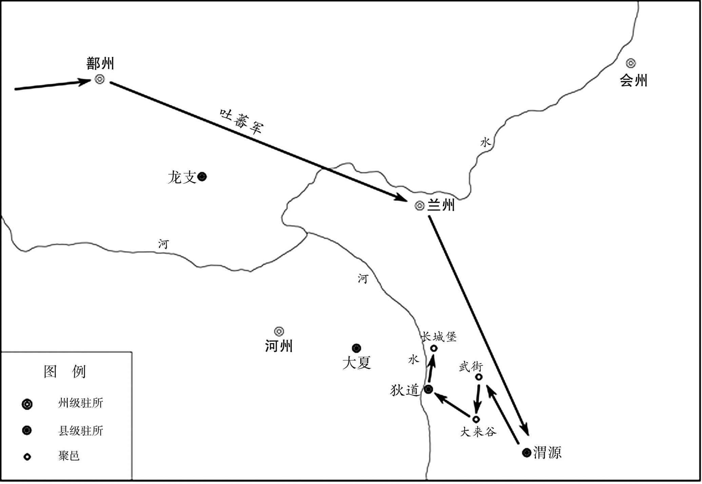 
唐开元二年（714年）吐蕃攻唐陇右示意图

## 【原文】

**冬十月，吐蕃复寇渭源[1]。丙辰，上下诏欲亲征，发兵十余万人，马四万匹[2]。甲子，薛讷与吐蕃战于武街，大破之[3]。时太仆少卿陇右群牧使王晙帅所部二千人与讷会击吐蕃[4]。坌达延将吐蕃十万屯大来谷，晙选勇士七百，衣胡服，夜袭之，多置鼓角于其后五里，前军遇敌大呼，后人鸣鼓角以应之[5]。虏以为大军至，惊惧，自相杀伤，死者万计[6]。讷时在武街，去大来谷二十里，虏军塞其中间，晙复夜出兵袭之，虏大溃，始得与讷军合[7]。同追奔至洮水，复战于长城堡，又败之，前后杀获数万人[8]。丰安军使王海宾战死[9]。乙丑，敕罢亲征。**

## 【注文】

[1]复：又。

[2]上：指唐玄宗李隆基。

[3]武街：指武街城，在今甘肃省临洮县东。

[4]群牧使：古代差使名，唐置，是临时差使而不是正式官名。唐高宗麟德三年（666年）命大臣检校陇右（今青海乐都）诸牧监，此后置群牧都使，监陇右诸牧场。北宋置群牧使。

[5]坌（bèn）达延（生卒年不详）：唐朝时吐蕃将领。　　大来谷：古地名，今甘肃渭源西北。　　胡服：这里指吐蕃的服饰。　　鼓角：战鼓和号角的总称。古代军队中用于报时、警报发号施令等。

[6]虏：对敌人的蔑称。这里指吐蕃军队。

[7]去：距离。

[8]洮水：黄河上游支流。发源于甘肃省西斜山东麓，在刘家峡附近入黄河。　　长城堡：在今甘肃省临洮县西北。

[9]丰安军：在今宁夏灵武西南。　　王海宾（？—714年）：唐代将领。太原祁（今山西祁县南）人。初为太子右卫率、丰安军使、太谷男。唐玄宗开元二年（714年），吐蕃犯边，战死于吐蕃松州保卫战中，追赠为左金吾大将军。

## 【译文】

冬十月，吐蕃又侵犯渭源。丙辰（初二日），唐玄宗下令要亲征，调动十几万军队，战马四万匹。甲子（初十日），薛讷和吐蕃在武街交战，大败吐蕃。当时，太仆少卿、陇右群牧使王晙率领部下两千人与薛讷合击吐蕃。坌达延率领吐蕃军队十万人驻扎在大来谷，王晙挑选七百勇士，穿着吐蕃服装，夜间偷袭敌军，在勇士队伍后五里处安置鼓角，前面的军队遇到敌军就大声呼喊，后面的士兵擂鼓吹号来响应前面的军队。吐蕃以为唐军主力到了，惊慌恐惧，自相残杀，死了上万人。薛讷当时在武街，距大来谷二十里，敌军堵塞在中间，王晙又在夜间出兵偷袭，吐蕃溃败，王晙这才得以和薛讷会师。二人一同率军追击吐蕃，追到洮水，在长城堡再次交战，又打败吐蕃军队，前后杀死和俘虏了几万人。丰安军使王海宾战死。乙丑（十一日），玄宗下令停止亲征。

## 【原文】

**戊辰，姚崇、卢怀慎等奏：“顷者吐蕃以河为境，神龙中尚公主，遂逾河筑城，置独山、九曲两军，去积石三百里，又于河上造桥[1]。今吐蕃既叛，宜毁桥拔城[2]。”从之[3]。以王海宾之子忠嗣为朝散大夫、尚辇奉御，养之宫中[4]。**

## 【注文】

[1]姚崇（650—721年）：原名“元崇”，字元之，避唐玄宗“开元”年号讳，改名姚崇。历任武则天、唐睿宗、唐玄宗三朝宰相，有“救时宰相”之称，是中国历史上的著名宰相。　　卢怀慎（？—716年）：滑州灵昌（今河南滑县西南）人，武则天时任监察御史，后历任侍御史、御史大夫，玄宗开元元年（713年）为宰相。景龙中，任右御史台中丞、黄门侍郎，封渔阳县伯。唐玄宗开元三年（715年）任黄门监，与姚崇对掌枢密。之后兼任吏部尚书，因疾病恳请退休，被批准。去世后追赠荆州大都督，谥号为“文成”。　　顷者：以前。　　神龙：唐中宗李显在位期间所用年号，即公元705年至707年。　　尚：娶公主为妻。　　逾：越过。　　九曲：指九曲军。唐置，在今青海化隆回族自治县。　　积石：指积石军。唐高宗仪凤二年（677年）置，属陇右节度使。驻地在今青海贵德西。

[2]毁桥拔城：毁掉黄河上的桥梁，拔去独山、九曲两城。

[3]从：听从。

[4]忠嗣：指王忠嗣（705—749年），初名训，祖籍山西太原祁县，后移居华州郑县（今陕西华县）。唐朝名将。王忠嗣九岁时，父亲王海宾战死于吐蕃松州保卫战中，王忠嗣被接入宫中抚养，玄宗收为假子，赐名忠嗣。　　朝散大夫：古代官名，隋文帝置，文散官。唐朝为从五品下。　　尚辇奉御：中国古代官名，隋炀帝大业三年（607年）置为殿内省尚辇局长官，掌宫廷舆辇、伞扇。唐朝殿中省尚辇局沿设，从五品上。唐高宗龙朔二年（662年）至咸亨元年（670年）曾改为奉舆大夫。

## 【译文】

十月戊辰（十四日），姚崇、卢怀慎等上奏：“以前吐蕃与大唐以黄河为界，神龙年间娶了我朝公主为妻，于是越过黄河修筑了城堡，设置了独山、九曲两处驻军，离积石三百里，又在黄河上修造桥梁。现在吐蕃既然反叛朝廷，应该毁掉桥梁和城堡。”玄宗听从了他们的意见。任命王海宾的儿子王忠嗣为朝散大夫、尚辇奉御，在宫中抚养。

## 【原文】

**乙酉，命左骁卫郎将［尉迟瓌使于吐蕃，宣］慰金城公主[1]。吐蕃遣其大臣宗俄因（矛）［子］至洮水请和，用敌国礼[2]。上不许，自是连岁犯边[3]。**

## 【注文】

[1]尉迟瓌（ɡuī）（生卒年不详）：唐朝时大臣，任左骁卫郎将。

[2]宗俄因子（生卒年不详）：唐朝时吐蕃大臣。　　洮（táo）水：黄河上游支流。发源于甘肃省西斜山东麓，在刘家峡附近入黄河。　　用敌国礼：用对等国的礼仪。　　敌：相当，相匹。

[3]连岁：连年。

## 【译文】

十一乙酉（一日），唐玄宗命令左骁卫郎将尉迟瓌出使吐蕃，宣扬政令，慰问金城公主。吐蕃派大臣宗俄因子到洮水请求和解，并且要求使用两国对等的礼节。玄宗不准，从此吐蕃连年侵犯边境。

## 【原文】

**四年春二月，吐蕃围松州[1]。癸酉，松州都督孙仁献袭击吐蕃于城下，大破之[2]。秋（七）［八］月，吐蕃复请和，上许之[3]。**

## 【注文】

[1]围：包围。

[2]孙仁献（生卒年不详）：唐朝时松州都督。

[3]许：允许。

## 【译文】

唐玄宗开元四年（716年）春二月，吐蕃围攻松州。癸酉（二十六日），松州都督孙仁献在松州城下袭击吐蕃，大败吐蕃。秋八月，吐蕃又来请和，玄宗答应了。

## 【原文】

**五年秋七月壬寅，陇右节度使郭知运大破吐蕃于九曲[1]。**

## 【注文】

[1]节度使：古代官名。唐睿宗景云年间薛讷为幽州镇守经略节度大使，贺拔延嗣为凉州都督充河西节度使，始有此称。唐玄宗天宝年初，沿边有九节度使。总揽一区军、民、财政。　　陇右节度使：古代使职名。为陇右方镇的差遣长官，唐玄宗开元元年（713年）始置，其目的是抵御吐蕃，治所在今青海乐都。

## 【译文】

唐玄宗开元五年（717年）秋七月壬寅（初五日），陇右节度使郭知运在九曲大败吐蕃。

## 【原文】

**六年冬十一月戊辰(1)，吐蕃奉表请和，乞舅甥亲署誓文，及令彼此宰相皆著名于其上[1]。**

## 【注文】

[1]亲署：亲自签署。　　舅甥：当时因吐蕃赞普娶文成公主为妻，故为舅甥之国关系。　　著（zhuó）名：在上面签名。

## 【译文】

唐玄宗开元六年（718年）十一月戊辰日，吐蕃上表请和，请求舅舅和外甥亲自签署誓文，并令双方宰相都在上面签名。

## 【原文】

**七年夏六月戊辰，吐蕃复遣使请上亲署誓文，上不许，曰：“昔岁誓约已定，苟信不由衷，亟誓何益[1]？”**

## 【注文】

[1]亟（qì）：屡次。

## 【译文】

唐玄宗开元七年（719年）六月戊辰（十一日），吐蕃又派使者请求玄宗在誓文上亲自签名，玄宗不答应，说：“去年已经签好了誓约，假如不是由衷地信守誓约，屡次签署又有什么用？”

## 【原文】

**十年秋（八）［九］月癸未，吐蕃围小勃律王没谨忙，谨忙求救于北庭节度使张嵩曰：“勃律，唐之西门，勃律亡则西域皆为吐蕃矣[1]。”嵩乃遣疏勒副使张思礼将蕃、汉步骑四千人救之，昼夜倍道，与谨忙合击吐蕃，大破之，斩获数万[2]。自是累岁吐蕃不敢犯边[3]。**

## 【注文】

[1]小勃律王：勃律，西域城邦名，有大勃律和小勃律。大勃律在今克什米尔东北部巴尔提斯坦；小勃律在其西北，今克什米尔吉尔吉特的雅辛河流域。唐玄宗开元中，先后册封为王。小勃律王入朝于唐，以其地为绥远军，隶安西都护府。　　没谨忙（生卒年不详）：小勃律王。唐玄宗开元初来朝，玄宗收为养子，以其国置绥远军。　　北庭节度使：古代使职名。为北庭方镇的差遣长官，唐玄宗先天元年（712年）始置，其目的是防止西北的突骑施、坚昆、突厥等族入侵，治所在今新疆吉木萨尔北破城子。节度使例兼北庭都护。唐玄宗开元后与安西四镇节度使时有分合。　　张嵩（生卒年不详）：一作张孝嵩。郭虔瓘死代为安西都护，务农重战，在位期间安西府库充实。

[2]张思礼（生卒年不详）：唐朝时疏勒的使臣。　　蕃（fān）：指少数民族。

[3]累（lěi）岁：连续几年。

## 【译文】

唐玄宗开元十年（722年）秋九月癸未（十五日），吐蕃围攻小勃律王没谨忙，没谨忙向北庭节度使张嵩求救，说：“勃律是唐朝的西门，勃律灭亡那么西域就成了吐蕃的地方了。”于是张嵩派疏勒副使张思礼率领少数民族和汉人组成的步兵、骑兵四千多人援救勃律，昼夜兼程，和没谨忙一起攻击吐蕃，大败吐蕃，杀死和俘虏了几万人。从此连续几年吐蕃不敢侵犯边境。

## 【原文】

**十五年春正月辛丑，凉州都督王君破吐蕃于青海之西[1]。初，吐蕃自恃其强，致书用敌国礼，辞指悖慢，上意常怒之[2]。张说言于上曰：“吐蕃无礼，诚宜诛夷，但连兵十余年，甘、凉、河、鄯不胜其弊，虽师屡捷，所得不偿所亡[3]。闻其悔过求和，愿听其款服，以纾边人[4]。”上曰：“俟吾与王君议之[5]。”说退，谓源乾曜曰：“君勇而无谋，常思侥幸，若二国和亲，何以为功[6]！吾言必不用矣[7]。”及君入朝，果请深入讨之[8]。**

## 【注文】

[1]王君（huàn）（？—727年）：字威明，瓜州常乐（今甘肃安西南）人，唐朝大将，为河西、陇右节度使，后任右羽林军将军，凉州都督。唐玄宗开元十四年（726年），大破吐蕃，以功升任右羽林大将军，摄御史中丞，封晋昌伯。

[2]悖（bèi）慢：悖逆傲慢。

[3]张说（yuè）（667—730年）：字道济，河南洛阳人，唐代文学家、诗人、政治家。武则天时，历任太子校书、凤阁舍人、黄门侍郎、中书侍郎等职。唐睿宗时，进同中书门下平章事。曾劝唐玄宗除太平公主及其党羽。太平公主被除，召为中书令，封燕国公。　　诛夷：消灭。夷，铲除，消灭。　　甘、凉、河、鄯：皆古州名。相当于今甘肃张掖、武威、临夏及青海西宁、乐都一带。

[4]款服：诚心臣服。　　纾（shū）：解除，排除。

[5]俟（sì）：等待，等候。

[6]源乾曜（？—713年）：唐代相州临漳人（今河北临漳），封安阳郡公，唐朝大臣，唐玄宗开元年间两度担任宰相。开元四年（716年），任黄门侍郎、同平章事，逾月而罢。开元八年（720年），为黄门侍郎、同中书门下三品，不久进侍中。政绩显赫，后迁太子少傅。卒，赠幽州大都督。

[7]必：必定。

[8]讨：讨伐，征讨。

## 【译文】

唐玄宗开元十五年（727年）春正月辛丑（二十八日），凉州都督王君在青海西面打败吐蕃。当初，吐蕃自恃强盛，在书信中要求使用对等的国家礼节，言辞悖逆傲慢，玄宗常常因此发怒。张说对玄宗说：“吐蕃无礼，确实应该把他们铲除，只是连续十多年战乱，甘、凉、河、鄯等州承受不了战乱的伤害，我军虽然多次获胜，却是得不偿失。听说吐蕃悔过求和，希望陛下接受他们的臣服，以减除边境百姓的苦难。”玄宗说：“等我和王君商量一下。”张说退下，对源乾曜说：“王君有勇而无谋，经常想侥幸取胜，如果两国和亲，他还怎么立功！我的话一定不被皇上采用。”等到王君入朝时，果然请求率军深入吐蕃境内讨伐。

## 【原文】

**去冬吐蕃大将悉诺逻寇大斗谷，进攻甘州，焚掠而去[1]。君度其兵疲，勒兵蹑其后，会大雪，虏冻死者甚众，自积石军西归[2]。君先遣人间道入虏境，烧道旁草，悉诺逻至大非川，欲休士马，而野草皆尽，马死过半[3]。君与秦州都督张景顺追之，及于青海之西，乘冰而渡，悉诺逻已去，破其后军，获其辎重羊马万计而还[4]。君以功迁左羽林大将军，拜其父寿为少府监致仕[5]。上由是益事边功[6]。**

## 【注文】

[1]悉诺逻（生卒年不详）：唐朝时吐蕃苏毗（pí）王子，唐封为怀义王，赐名李忠信。　　大斗谷：古地名，一作“达斗拔谷”。即今甘肃民乐东南甘、青两省交界处的扁都口隘路。自古为甘肃河西走廊通青海湟中的捷径。　　甘州：古地名，今甘肃张掖。

[2]度（duó）：揣度，推测。　　勒：强制。　　蹑：跟随。　　虏：对敌人的蔑称。

[3]间道：偏僻小道。　　虏境：这里指吐蕃境内。

[4]张景顺（生卒年不详）：唐朝将领，任泰州都督。

[5]寿：即王寿（生卒年不详），唐朝人，朝廷大将王君父亲。　　少府监：古代官名。隋朝置。唐朝管辖左尚、右尚、内尚、织染、掌冶五署及诸冶、铸钱、互市等监。

[6]益事：更加积极，更加重视。

## 【译文】

去年冬天吐蕃大将悉诺逻侵犯大斗谷，进攻甘州，焚烧抢掠而离开。王君估计吐蕃军队疲惫，命令军队尾随其后，正好天下大雪，吐蕃士兵冻死的很多，从积石军向西返回。王君先派人从偏僻小道进入吐蕃境内，烧掉道路两旁的野草，悉诺逻到了大非川，想让士兵和战马休息，但野草都被烧完，战马死了大半。王君和秦州都督张景顺追击吐蕃军队，在青海西面追上敌军，乘着湖面结冰渡过，而悉诺逻已经走了，只打败了他后面的军队，缴获了众多辎重羊马后回师。王君因军功升为左羽林大将军，并让他的父亲王寿以少府监的身份退休。从此，唐玄宗对边境战争更加积极。

## 【原文】

**秋九月丙子，吐蕃大将悉诺逻恭禄及烛龙莽布支攻瓜州，执刺史田元献及河西节度使王君之父，进攻玉门军[1]。纵所虏俘使归凉州，谓君曰：“将军常以忠勇许国，何不一战[2]！”君登城西望而泣，竟不敢出兵[3]。莽布支别攻常乐县，县令贾师顺帅众拒守[4]。及瓜州陷，悉诺逻悉兵会攻之，旬余日，吐蕃力尽，不能克，使人说降之，不从[5]。吐蕃曰：“明府既不降，宜敛城中财相赠，吾当退[6]。”师顺请脱士卒衣，悉诺逻知无财，乃引去，毁瓜州城[7]。师顺遽开门，收器械，修守备[8]。虏果复遣精骑还，视城中，知有备，乃去[9]。师顺，岐州人也[10]。**

## 【注文】

[1]悉诺逻恭禄（生卒年不详）：唐时吐蕃大将，骁勇善战，威望素著。　　烛龙莽布支（生卒年不详）：唐朝时吐蕃大将。　　瓜州：古地名。敦煌一带，北魏孝明帝置瓜州，治敦煌（今甘肃敦煌西），辖酒泉以西。唐高祖武德五年（622年）改为西沙州。　　执：捉拿。　　田元献（生卒年不详）：唐朝时瓜州刺史。　　河西节度使：古代使职名。为河西方镇的差遣长官，唐睿宗景云元年（710年）置，其目的是阻隔吐蕃与突厥。治所在今甘肃武威。　　玉门军：唐置，在今甘肃玉门赤金镇东。

[2]纵：释放。

[3]泣：哭泣。

[4]贾师顺（生卒年不详）：岐州（今陕西凤翔）人，为常乐县令时，率众坚守县城，抗击了吐蕃的多日围攻。后迁鄯州都督、陇右节度使，官至左领军将军。

[5]说（shuì）降：劝说投降。

[6]明府：明府君的略称。汉人用为对太守的尊称，唐代称县令为明府，以后历代沿用。

[7]引去：退去，离开。

[8]遽（jù）：急速。

[9]虏：对敌人的蔑称。这里指吐蕃军队。

[10]岐州：古地名。北魏置，治所在雍（今陕西凤翔南，隋移治今凤翔）。辖境相当于今陕西周至、麟游、陇县、宝鸡、太白等市县。

## 【译文】

秋九月丙子（初七日），吐蕃大将悉诺逻恭禄与烛龙莽布支攻击瓜州，俘获了刺史田元献和河西节度使王君的父亲王寿，并进攻玉门军。释放所虏去的使者让他们回到凉州，对王君说：“将军以忠勇报国要求自己，为什么不打一战！”王君登上城墙向西遥望而哭泣，最终不敢出兵。莽布支另行攻击常乐县，县令贾师顺率领城中军民坚守抵抗。等瓜州城陷落之后，悉诺逻和烛龙莽布支带领全部军队一同攻击常乐，十几天后，吐蕃军队筋疲力尽，仍攻不下常乐，派人劝说贾师顺投降，贾师顺不听从。吐蕃人说：“县令既然不投降，就把城中的财物收集起来赠送给我们，我们就撤军。”贾师顺请士兵脱掉衣服让他们拿去，悉诺逻知道城中没有财物才撤兵，毁掉了瓜州城。贾师顺立刻打开城门，收拾刀兵器械，修缮防守工事。吐蕃军队果然又派精锐骑兵返回，看到城中有了防备，才撤走。贾师顺是岐州人。

## 【原文】

**闰月庚子，吐蕃赞普与突骑施苏禄围安西城，安西副大都护赵颐贞击破之[1]。**

## 【注文】

[1]闰月：这里指闰九月。　　突骑施：古族名。西突厥的别部，牙帐在碎叶川（今吉尔吉斯斯坦楚河流域）。　　苏禄（？—738年）：本为突骑施首领娑葛部的将领，娑葛为突厥默啜杀后，自立为可汗。势力渐强，称雄西域，唐封为左羽林大将军、金方道经略大使，册立为忠顺可汗。　　安西城：即安西都护府龟兹城。在今新疆库车。　　赵颐贞（生卒年不详）：唐朝将领，唐玄宗开元十四年（726年）至十六年（728年）任安西副大都护。

## 【译文】

闰九月庚子（初二日），吐蕃赞普和突骑施苏禄围攻安西城，安西副大都护赵颐贞击败了他们。

## 【原文】

**王君帅精骑邀吐蕃使者于肃州，还至甘州南巩笔驿，回纥司马护输伏兵突起，杀君[1]。辛巳，以左金吾卫大将军信安王祎为朔方节度等副大使[2]。祎，恪之孙也[3]。以朔方节度使萧嵩为河西节度等副大使[4]。时王君新败，河、陇震骇[5]。嵩引刑部员外郎裴宽为判官，与君判官牛仙客俱掌军政，人心浸安[6]。宽，漼之从弟也[7]。仙客本鹑觚小吏，以才干军功累迁至河西节度判官，为君腹心[8]。**

## 【注文】

[1]精骑（jì）：精锐骑兵。　　邀：半路拦截。　　肃州：古地名，今甘肃酒泉。　　巩笔驿：古地名。唐置，在今甘肃张掖市西南。　　驿：传驿，古时供应递送公文的人或来往官员暂住、换马的处所。唐代传驿归兵部驾部司管辖，三十里设一驿。乘驿者必须持有门下省或诸州发给的证券。　　回纥：中国古代北方及西北民族，游牧于仙娥河（又名娑陵水，今蒙古色楞格河）和温昆河（今蒙古鄂尔浑河）流域。唐初，回纥受东突厥的统治，东突厥灭亡之后，回纥和唐的接触密切。唐玄宗天宝三年（744年），回纥首领骨力裴罗统一了回纥各部，建立了汗国，唐玄宗册封其首领为怀人可汗；唐德宗时改称回鹘；9世纪中期回鹘内部发生变乱，840年汗国灭亡。　　护输：唐朝时少数民族回纥将领，任司马。

[2]左金吾卫大将军：唐高宗龙朔二年（662年）改左候卫为左金吾卫而置。掌宫中、京城巡警，烽候、道路、水草等事宜。正三品。　　信安王祎（yī）：指李祎（？—702年），唐宗室，吴王李恪的孙子。历任州刺史，政号清严。升任礼部尚书，充朔方军节度使。唐玄宗开元十七年（729年）拔吐蕃石堡城。任兵部尚书，为朔方节度大使。唐玄宗天宝初，以太子少师致仕。拜太子少师后卒。　　朔方节度使：古代使职名。使职是唐朝职事官以因事为名、无品秩无定员的差遣官。节度使为方镇的差遣长官。朔方差遣长官节度使，始置于唐玄宗开元九年（721年），其目的是抵御北方的突厥，治所在今宁夏灵武西南，为玄宗时御边十节度经略使之一。

[3]恪：指李恪（619—653年），唐太宗李世民的第三子。李世民曾打算立其为太子，但遭到长孙无忌的强烈反对而作罢。唐高宗李治即位后，李恪被长孙无忌以谋反的罪名陷害至死。

[4]萧嵩（？—749年）：著名唐朝丞相、军事家。唐玄宗朝任宰相，封徐国公。

[5]新败：刚刚失败。

[6]引：引荐，推荐。　　刑部：古代官署。掌管刑狱。隋文帝开皇三年（583年）改称刑部，主官为尚书；次官，炀帝定为侍郎。后代均以刑部掌法律刑狱，与最高法院性质的大理寺并列，唐代因袭。　　员外郎：隋文帝开皇年间，于尚书省各司置员外郎一人，为各司的次官。唐宋沿置，与郎中通称郎官，都为中央官吏中的要职。　　裴宽（681—755年）：绛州闻喜（今山西闻喜东北）人。唐玄宗开元二十一年（733年），为户部侍郎、左金吾卫大将军。唐玄宗天宝三载（744年），为户部尚书，后为礼部尚书。　　判官：唐朝采访、节度、观察、招讨、经略防御、团练、支度、营田等使都设置，为幕府上佐，综理本使日常事务。　　牛仙客（675—742年）：泾州鹑觚（今甘肃灵台）人，唐代名臣。牛仙客佐助河西节度使萧嵩，不久，升任太仆少卿、河西节度使、殿中监、朔方行军大总管。唐玄宗天宝元年（742年），牛仙客任左相，兼任尚书。　　浸安：渐渐安定。

[7]漼：指裴漼（？—736年），绛州闻喜（今山西闻喜）人。历任监察御史、中书舍人。后转兵部侍郎。唐玄宗开元五年（717年），迁吏部侍郎。再转黄门侍郎，为御史大夫。

[8]鹑（chún）觚（gū）：指鹑觚县，治所在今甘肃灵台。唐玄宗天宝元年（742年）改名灵台县。　　腹心：心腹，亲信。

## 【译文】

王君率领精锐骑兵在肃州拦截了吐蕃的使者，回到甘州城南的巩笔驿时，回纥司马护输的伏兵突然出现，王君被杀。辛巳（十三日），任命左金吾卫大将军信安王李祎为朔方节度副大使等职。李祎是李恪的孙子。任命朔方节度使萧嵩为河西节度副大使等职。当时王君刚刚战败，河、陇地区大为震惊。萧嵩引荐刑部员外郎裴宽为判官，与王君的判官牛仙客共同掌管军政大事，人心才渐渐安定下来。裴宽是裴漼的堂弟。牛仙客本是鹑觚县的小官吏，因才干和军功连续升至河西节度判官，是王君的心腹。

## 【原文】

**嵩又奏以建康军使河北张守珪为瓜州刺史，帅余众筑故城[1]。板干裁立，吐蕃猝至，城中相顾失色，莫有斗志[2]。守珪曰：“彼众我寡，又疮痍之余，不可以矢刃相持，当以奇计取胜[3]。”乃于城上置酒作乐[4]。虏疑其有备，不敢攻而退[5]。守珪纵兵击之，虏败走[6]。守珪乃修复城市，收合流散，皆复旧业[7]。朝廷嘉其功，以瓜州为都督府，以守珪为都督[8]。**

## 【注文】

[1]建康军：地名。唐置，今甘肃张掖。　　河北：指河北县。北周改大阳县置，为河北郡治。治所在今山西平陆西南。唐属陕州。唐玄宗天宝三年（744年）改为平陆县。　　张守珪（？—739年）：唐朝名将，陕州河北（今山西平陆西南）人，在唐中宗、睿宗和玄宗时期为官。历任鄯州都督、陇右节度使、河北节度副大使等职，曾大败契丹。　　故城：旧城，指被吐蕃毁掉的瓜州城。

[2]裁：通“才”。刚刚，仅仅。　　猝（cù）：突然，出乎意料。　　相顾失色：相互看着，脸色大变。

[3]疮（chuāng）痍（yí）：创伤，也用于比喻遭受破坏或遭受灾害后的景象。　　矢刃：箭和刀。泛指兵器。

[4]置：放置。

[5]备：防备。

[6]纵：放开。

[7]城市：城邑和市场。市，交易物品的场所。

[8]都督府：掌管军政的机构。魏、晋、南北朝置，统掌诸州军事，全称都督诸州军事府，设官都督。又有都督中外诸军事府，为最高军事机构。

## 【译文】

萧嵩又奏请任命建康军使、河北人张守珪为瓜州刺史，率领余众修筑旧城。刚刚立起筑城的板干架杆，吐蕃军队就突然到来，城里的人相顾失色，没有斗志。张守珪说：“敌众我寡，而且刚刚经历战争创伤，不能用武力和敌人对抗，应当用奇谋取胜。”于是在城墙上设置酒席舞乐。吐蕃怀疑城中有防备，不敢进攻便撤退了。张守珪纵兵追击，吐蕃败逃。张守珪这才修复城池，收集流散人员，一律恢复旧业。朝廷嘉奖他的功劳，在瓜州设置都督府，任命张守珪为都督。

## 【原文】

**悉诺逻威名甚盛，萧嵩纵反间于吐蕃，云与中国通谋，赞普召而诛之，吐蕃由是少衰[1]。**

## 【注文】

[1]反间：离间。　　少：逐渐。

## 【译文】

悉诺逻威名很高，萧嵩对吐蕃人使用反间计，说悉诺逻和唐朝暗通，赞普召回悉诺逻并杀了他，吐蕃由此渐渐衰落。

## 【原文】

**冬十二月戊寅，制以吐蕃为边患，令陇右道及诸军团兵五万六千人，河西道及诸军团兵四万人，又征关中兵万人集临洮，朔方兵二万人集会州防秋，至冬初，无寇而罢[1]。伺虏入寇，互出兵腹背击之[2]。**

## 【注文】

[1]制：指帝王的命令。　　陇右道：唐贞观十道之一。因在陇山之右（西），故名。辖境相当今甘肃陇山六盘山以西、青海省青海湖以东及新疆东部地区。　　团兵：即团结兵。唐府兵制度破坏后，政府挑选家境较好、身体健壮的丁男，免除徭役赋税，定期训练征集，作为一种武装力量，称之为“团兵”。　　关中：关中之名，始于战国时期，一般认为西有大散关，东有函谷关，南有武关，北有萧关，取意四关之中（后增东方的潼关和北方的金锁两座）。四方的关隘，再加上陕北高原和秦岭两道天然屏障，使关中成为自古以来的兵家必争之地。古人习惯上将函谷关以西地区称为关中。　　会州：古州名，治所在会宁县，今甘肃省靖远。唐辖境相当于今甘肃靖远、景泰、会宁及宁夏海原等县地。　　防秋：古代北方每到秋天，边塞经常发生战事，届时边防军特别加以警卫，称为防秋。

[2]伺：窥察，查探。

## 【译文】

冬十二月戊寅（十一日），由于吐蕃成为边患，唐玄宗命令陇右道及各军团兵五万六千人，河西道及各军团兵四万人，又征调关中部队一万人聚集在临洮，朔方兵二万人集中在会州保护秋收，等到了初冬，没有敌人入侵而罢兵。如发现敌人入侵，就交替出兵，腹背夹击敌人。

## 【原文】

**十六年秋七月，吐蕃大将悉末朗寇瓜州，都督张守珪击走之[1]。乙巳，河西节度使萧嵩、陇右节度使张忠亮大破吐蕃于渴波谷，忠亮追之，拔其大莫门城，擒获甚众，焚其骆驼桥而还[2]。**

## 【注文】

[1]悉末朗（生卒年不详）：唐朝时吐蕃大将。　　击走：击退。

[2]张忠亮（生卒年不详）：唐朝时将领，任陇右节度使。　　渴波谷：古地名，在今青海共和县西北。　　大莫门城：亦作大漠门城。唐时吐蕃筑，在今青海省共和县东南。　　骆驼桥：在今青海省共和县黄河上。

## 【译文】

唐玄宗开元十六年（728年）秋七月，吐蕃大将悉末朗侵犯瓜州，都督张守珪击退了他们。乙巳（十一日），河西道节度使萧嵩、陇右节度使张忠亮在渴波谷大败吐蕃，张忠亮追击敌人，攻克吐蕃的大莫门城，俘获了很多敌人和物资，烧毁他们的骆驼桥后回师。

## 【原文】

**八月辛卯，右金吾将军杜宾客破吐蕃于祁连城下[1]。时吐蕃复入寇，萧嵩遣宾客将强弩四千击之[2]。战自辰至暮，吐蕃大溃，获其大将一人[3]。虏散走投山，哭声四合[4]。**

## 【注文】

[1]杜宾客（生卒年不详）：唐朝时武臣，玄宗时为薛讷副将。　　祁连城：古地名，在今甘肃民乐县南。

[2]强弩：强弩手。弩，一种用机械力量射箭的弓。

[3]辰：通“晨”，早晨。

[4]四合：四面。合指全，满。

## 【译文】

八月辛卯（二十八日），右金吾将军杜宾客在祁连城下大败吐蕃军。当时，吐蕃再次入侵，萧嵩派遣杜宾客率领强弩手四千人攻击吐蕃军队。战斗从早上一直到晚上，吐蕃大败，俘获其一位将军。敌人分散逃到山中，哭声四处回荡。

## 【原文】

**十七年春三月，瓜州都督张守珪、沙州刺史贾思顺击吐蕃大同军，大破之[1]。甲寅，朔方节度使信安王祎攻吐蕃石堡城，拔之[2]。初，吐蕃陷石堡城，留兵据之，侵扰河右，上命祎与河西、陇右同议攻取[3]。诸将咸以为石堡据险而道远，攻之不克，将无以自还，且宜按兵观衅[4]。祎不听，引兵深入，急攻拔之，仍分兵据守要害，令虏不得前[5]。自是河、陇诸军游弈，拓境千余里[6]。上闻，大悦，更命石堡城曰振武军[7]。**

## 【注文】

[1]沙州：古地名。唐贞观七年（633年）改西沙州置，治所在敦煌，今甘肃敦煌西。唐玄宗天宝元年（742年）改为敦煌郡，唐肃宗乾元元年（758年）复置为沙州。辖境相当于今甘肃敦煌市和肃北、阿克赛及新疆若羌、且末地。安史之乱后地属吐蕃。　　贾思顺（生卒年不详）：岐州（今陕西凤翔）人。唐时吐蕃入侵瓜州，分立守城进攻，任鄯州都督、陇右节度使。　　大同军：军镇名，在今山西代县。

[2]石堡城：古地名。在今青海西宁西南。唐曾置振武军、神武军、天威军。唐与吐蕃争此城，屡得屡失。　　拔：攻取。

[3]河右：河西的别称。古代泛指黄河以西的地区，相当今宁夏和甘肃一带。　　河西：此指河西节度使，是唐朝在凉州设置的节度使。唐玄宗时，作为十大节度使之一。晚唐以后复置的河西军，是作为唐末五代时凉州一带的官军残余势力。

[4]咸：全，都。　　衅（xìn）：争端。

[5]前：先前。

[6]游弈：游弋，巡逻。

[7]振武军：地名，在鄯州西北。

## 【译文】

唐玄宗开元十七年（729年）春三月，瓜州都督张守珪、沙州刺史贾思顺袭击吐蕃大同军，大败吐蕃军队。甲寅（二十四日），朔方节度使、信安王李祎攻击吐蕃的石堡城，攻破了该城。当初，吐蕃攻陷石堡城，留兵据守，侵扰河右地区，玄宗命令李祎与河西、陇右二道共同商议如何攻取。将领们都认为石堡城地形险要道路遥远，如果攻不下，将无法返回，应当暂且按兵不动观察时机。李祎不听，率军深入敌境，迅速攻下石堡城，同时分兵据守战略要地，致使吐蕃军队无法前进。自此河西、陇右各军四处巡逻，开拓了一千多里疆域。玄宗听到这些消息，非常高兴，改石堡城为振武军。

## 【原文】

**十八年夏五月，吐蕃遣使致书于境上求和[1]。秋九月，吐蕃兵数败而惧，乃求和亲[2]。忠王友皇甫惟明因奏事从容言和亲之利[3]。上曰：“赞普尝遗吾书，悖慢，此何可舍[4]！”对曰：“赞普当开元年之初，年尚幼稚，安能为此书？殆边将诈为之，欲以激怒陛下耳[5]。夫边境有事，则将吏得以因缘盗匿官物，妄述功状以取勋爵，此皆奸臣之利，非国家之福也[6]。兵连不解，日费千金，河西、陇右由兹困敝[7]。陛下诚命一使往视公主，因与赞普面相约结，使之稽颡称臣，永息边患，岂非御夷狄之长策乎[8]？”上悦，命惟明与内侍张元方使于吐蕃[9]。赞普大喜，悉出贞观以来所得敕书以示惟明[10]。冬十月，遣其大臣论名悉猎，随惟明入贡，表称：“甥世尚公主，义同一家[11]。中间张玄表等先兴兵寇钞，遂使二境交恶[12]。甥深识尊卑，安敢失礼，正为边将交构，致获罪于舅[13]。屡遣使者入朝，皆为边将所遏[14]。今蒙远降使臣，来视公主，甥不胜喜荷[15]。傥使复修旧好，死无所恨[16]。”自是吐蕃复款附[17]。**

## 【注文】

[1]境上：边境上。

[2]数：多次。

[3]忠王：指李浚（711—762年），玄宗第三子，元献皇后所生。初名嗣昇，封陕王。唐玄宗开元年间封忠王，改名浚，后继帝位，即肃宗。　　皇甫惟明（？—747年）：唐朝大将，唐玄宗天宝元年（742年）任陇右节度使，后兼任河西节度使。公元747年，为李林甫谗言所害而死。

[4]遗（wèi）：送。　　悖慢：悖逆，傲慢。

[5]殆：大概，恐怕。

[6]因缘：依靠，凭借。

[7]困敝：贫困凋敝。

[8]稽颡（sǎng）：古代一种跪拜礼，屈膝下拜，以额触地，表示极度的虔诚。　　岂非：难道不是。表示反问。　　御：驾驭，控制。

[9]内侍：古代官名。北魏内官，为皇帝的侍从人员，多由亲贵子弟充任。隋朝为内侍省长官。隋炀帝时改为长秋令，唐高祖时复为内侍省长官，从四品上；唐玄宗天宝年间置内侍监为长官，于是改为少监，后更置内侍四人，与少监同为内侍省次官。　　张元方（生卒年不详）：唐朝时大臣，任内侍。

[10]敕（chì）书：帝王的诏书。是皇帝任官封爵和告诫臣僚的文书。敕最早是由西汉的戒书发展而来的，后经魏晋南北朝继承沿用，至唐宋元代敕书的种类有所增加。明清时期，敕的用途更为广泛，规格形式也更为完备。

[11]论名悉猎（生卒年不详）：唐朝时吐蕃大臣。

[12]张玄表（生卒年不详）：唐朝将领，唐睿宗景云元年（710年）任安西都护。　　寇钞：抢掠。　　交恶（wù）：关系变坏，互相憎恨。

[13]交构：互相构陷。

[14]遏（è）：阻止。

[15]蒙：承蒙。　　荷：承受。

[16]傥使：倘使。　　恨：遗憾。

[17]款附：诚心臣服。

## 【译文】

唐玄宗开元十八年（730年）夏五月，吐蕃派使者送信到边境求和。秋九月，吐蕃军队因多次失败而害怕，于是请求和亲。忠王的朋友皇甫惟明借上奏机会从容地说明和亲的好处。玄宗说：“赞普曾经在给我的书信中，表现得十分悖逆傲慢，这次怎么能放弃对他的打击呢！”皇甫惟明回答说：“赞普在开元初年，年纪幼小，怎么能写出这样的书信呢？恐怕是边疆将领假托赞普的名义写的，想以此来激怒陛下。如果边境有事，将领官吏就可以因此盗匿国家的财物，胡乱报请战功以获取功勋爵位，这些都是对奸臣有利，不是国家的好事。战争连年不息，每天耗费千金，河西、陇右因此贫困凋敝。假如陛下应该任命一位使者前往吐蕃看望公主，借此和赞普当面约定和约，让他们俯首称臣，永息边患，这难道不是驾驭夷狄的长久之策？”玄宗很高兴，命令皇甫惟明和内侍张元方出使吐蕃。赞普大喜，把唐太宗贞观以来的皇帝敕令全都拿出来让皇甫惟明看。冬十月，赞普派他的大臣论名悉猎，跟随皇甫惟明入朝进贡，上表称：“外甥世代娶公主为妻，两国情义如同一家人。其间由于张玄表等人先兴兵入侵抢掠，于是两国关系恶化。外甥深知尊卑之礼，怎么敢失礼，正是因为边疆将领挑拨离间，才使我得罪了舅父。我屡次派使者入朝，都被边境将领阻挡。现在承蒙您远派使者，前来看望公主，外甥不胜欢喜。倘使两国能重修旧好，我就死而无憾。”自此吐蕃又归附。

## 【原文】

**十九年春正月辛未，遣鸿胪卿崔琳使于吐蕃[1]。琳，神庆之子也[2]。吐蕃使者称公主求《毛诗》、《春秋》、《礼记》[3]。正字于休烈上疏，以为：“东平王汉之懿亲，求《史记》、诸子，汉犹不与[4]。况吐蕃，国之寇仇，今资之以书，使知用兵权略，愈生变诈，非中国之利也[5]。”事下中书门下议之，裴光庭等奏：“吐蕃聋昧顽嚚，久叛新服，因其有请，赐以《诗》、《书》，庶使之渐陶声教，化流无外[6]。休烈徒知书有权略变诈之语，不知忠信礼义皆从书出也[7]。”上曰：“善[8]。”遂与之[9]。休烈，志宁之玄孙也[10]。秋九月辛未，吐蕃遣其相论尚它硉入见[11]。**

## 【注文】

[1]鸿胪卿：古代官名，晋、南朝宋时为大鸿胪别称。南朝梁、陈改称鸿胪卿，是掌朝会司仪的高级官员。北齐为鸿胪寺长官，历朝沿设，也称鸿胪寺卿。隋炀帝改从三品，唐朝沿袭。　　崔琳（生卒年不详）：贝州武城（今河北清河西）人，唐朝官员，唐玄宗开元中，任中书舍人、太子少保。

[2]神庆（生卒年不详）：即唐朝官员崔神庆，今河北清河西北人。武后时历莱州刺史、并州长史、礼部侍郎、太子右庶子、司刑卿。唐中宗神龙初，被流放钦州，卒。

[3]《毛诗》：指西汉时鲁国毛亨和赵国毛苌所辑和注的古文《诗》，也就是现在流行于世的《诗经》，是中国最早的诗歌总集，收入自西周初年至春秋中叶大约五百多年的诗歌（公元前11世纪至前6世纪）。　　《春秋》：是古代中国的儒家典籍，被列为“五经”之一。《春秋》是鲁国的编年史，据传是由孔子修订的。书中用于记事的语言极为简练，然而几乎每个句子都暗含褒贬之意，被后人称为“春秋笔法”。由于《春秋》的记事过于简略，因而后来出现了很多对《春秋》所记载的历史进行详细记录的“传”，较为有名的是被称为“春秋三传”的《左传》《公羊传》和《谷粱传》。　　《礼记》：是中国古代一部重要的典章制度书籍。该书编定是西汉礼学家戴德和他的侄子戴圣。戴德选编的八十五篇本叫《大戴礼记》，在后来的流传过程中若断若续，到唐代只剩下了三十九篇。戴圣选编的四十九篇本叫《小戴礼记》，即我们今天见到的《礼记》。

[4]正字：古代官名。北齐始置于秘书省，隋、唐、宋沿置。与校书郎同掌校雠典籍，订正讹误，辽属秘书监著作局。隋、唐并有太子正字，其地位略次于校书郎，亦掌管校勘典籍之事。明代于翰林院设“正字”一官。　　于休烈（692—772年）：京兆高陵（今陕西高陵）人。唐玄宗开元初，中进士，官至集贤殿学士。唐肃宗时，为太常少卿，兼修国史。唐代宗时，任工部尚书，封东海郡公。　　东平王：指刘宇（？—前20年），西汉宣帝的第四子。汉宣帝甘露二年（公元前52年）受封为东平王。求战国诸子及《太史公书》，王凤因其书有战国纵横权谲之谋而不予。　　懿亲：特指皇室宗亲、外戚。　　《史记》：是由司马迁撰写的中国第一部纪传体通史。记载了上自上古传说中的黄帝时代，下至汉武帝元狩元年间共三千多年的历史。《史记》最初没有固定书名，或称“太史公书”，或称“太史公传”，也省称“太史公”。“史记”本是古代史书通称，从三国时期开始，“史记”由史书的通称逐渐成为“太史公书”的专称。　　诸子：中国春秋战国时学术流派的代表人物和著作。《汉书·艺文志》著录有儒、道、阴阳、法、名、墨、纵横、农、杂、小说等十家。其中最有代表性的是儒、墨、道、法四家。代表他们政治和学术观点的著作分别是《论语》《墨子》《老子》《庄子》《列子》《韩非子》等。

[5]寇：盗匪。

[6]裴光庭（678—733年）：字连城，唐玄宗开元晚期宰相。开元十七年（729年），裴光庭升任中书侍郎。同中书门下平章事，不久，又兼任御史大夫。开元十八年（730年），裴光庭又升侍中，兼吏部尚书，弘文馆学士，依旧同中书门下平章事。　　聋昧顽嚚（yín）：愚昧顽劣。　　《诗》：指《毛诗》。　　《书》：指《尚书》。《尚书》又称《书》《书经》，为一部多体裁文献汇编，是中国现存最早的史书，主要记录虞夏商周各代一部分帝王的言行。分为《虞书》《夏书》《商书》《周书》。战国时期总称《书》，汉朝改称《尚书》，即“上古之书”。因是儒家五经之一，又称《书经》。　　庶：副词。表示期望或可能。　　陶：造就，培养。　　声教：声威教化。　　化流无外：教化不分内外。

[7]徒：仅仅。

[8]善：应答之词。表示同意。

[9]与：给予。

[10]志宁：指于志宁（588—665年），唐初大臣。字仲谧，雍州高陵（今属陕西）人。唐高祖入关，授银青光禄大夫。历任北道行军元帅府记室、天策府从事中郎、文学馆学士。唐太宗时，进中书侍郎，加散骑常侍、行太子左庶子。唐高宗永徽中任宰相。曾参与编撰各种律令、礼典。

[11]论尚它硉（lù）（生卒年不详）：唐朝时吐蕃大臣。

## 【译文】

唐玄宗开元十九年（731年）正月辛未（二十二日），唐派鸿胪卿崔琳出使吐蕃。崔琳，是崔神庆的儿子。吐蕃使者称公主向唐朝求取《毛诗》《春秋》《礼记》。正字于休烈上书，认为：“东平王是汉室宗亲，他请求《史记》、诸子，汉朝都不给。何况吐蕃是国家的仇敌，如今给他们这些书，使他们知道了用兵权谋，会变得更加诡诈，这对我们不是好事。”玄宗命令中书省和门下省讨论此事，裴光庭等上奏：“吐蕃愚昧顽劣，长久叛乱刚刚臣服，应该趁着他们请求的机会，赐给《诗》《书》，或许他们会渐渐受到教化的陶冶，教化本来就没有内外之分。于休烈只知道书中有权谋诡诈的语言，不知道忠信礼义也都出自书中。”玄宗说：“对。”就把书赐给吐蕃。于休烈，于志宁的玄孙。秋九月辛未（二十五日），吐蕃派宰相论尚它硉入朝觐见。

## 【原文】

**二十一年春二月丁酉，金城公主请立碑于赤岭，以分唐与吐蕃之境，许之[1]。**

## 【注文】

[1]赤岭：今青海境内的日月山，初唐时名赤岭。

## 【译文】

唐玄宗开元二十一年（733年）二月丁酉（二十九日），金城公主请求在赤岭立碑，划分唐朝与吐蕃的边境，玄宗同意了。

* * *

(1) 据陈垣《二十史朔闰表》，开元六年十一月辛卯朔，无戊辰日。

# 突厥叛唐

## 【内容提要】

《突厥叛唐》叙述了唐高宗以后突厥反叛唐朝，最后被唐所灭的战争过程。是唐太宗平突厥的继续。

突厥是当时中国北方少数民族的大国，一直是北方的边患。自从唐太宗灭了突厥，境外各族纷纷前来归附，使唐朝建立了无上的声威。然而，到了唐高宗以后，突厥又起兵反唐，进犯边境。他们侵犯定州，并煽动引诱奚、契丹抢掠营州，唐高宗任命裴行俭、程务挺等人讨伐。唐高宗永淳元年（682年），突厥余党占据黑沙城反叛，进入并州和单于府的北部边境抢掠，杀了岚州刺史，薛仁贵奋勇出击，大败敌军。武则天垂拱元年（685年），突厥屡次进犯边境，朝廷任命将淳于处平率军攻打他们。夏四月，突厥进犯代州，垂拱三年（687年），突厥进犯昌平。秋七月，突厥进犯朔州，朝廷命令黑齿常之等将领攻击他们，之后，又任命僧人怀义向北讨伐突厥。突厥派使者请求归降。武则天长安四年（704年），突厥与朝廷和亲。唐中宗景龙元年（707年）春，突厥默啜进犯边境，朔方道大总管张仁愿在黄河岸边修筑三座受降城。唐睿宗景云二年（711年）春，突厥可汗派使节请和，唐睿宗在安福门设宴款待突厥。唐玄宗开元元年（713年）秋，突厥来唐求婚。唐玄宗把蜀王的女儿南和县主嫁给他。开元二年（714年）春，突厥派遣大臣率军围攻北庭都护府，冬十一月，进犯甘、凉等州，开元九年（721年）春，突厥又派使者来朝请和。开元十四年（726年），唐朝在定、恒、莫、易、沧五州设置军队，以防备突厥。唐玄宗天宝四年（745年）春，回纥进攻突厥，唐玄宗乘突厥内乱之机，派王忠嗣等出兵灭了突厥，终使北方边境得以安宁。

突厥是中国西北的强悍民族，隋唐时一直是中国北方的强敌。唐对突厥的用兵是保卫边境和人民的自卫战争。唐能战胜突厥，就是由于中原出现了统一的王朝，而突厥的灭亡，是由于分裂和内乱。由此可以看出民族团结，确实是关系民族兴旺和国家发展的大事。

## 【原文】

**唐高宗麟德元年春正月甲子，改云中都护府为单于大都护府，以殷王旭轮为单于大都护[1]。初，李靖破突厥，迁三百帐于云中城，阿史德氏为其长[2]。至是，部落渐众，阿史德氏诣阙请如胡法，立亲王为可汗以统之[3]。上召见，谓曰：“今之可汗，古之单于也[4]。”故更为单于都护府，而使殷王遥领之[5]。**

## 【注文】

[1]唐高宗（628—683年）：指唐高宗李治，唐朝皇帝（649—683年在位），唐太宗之子，其母为长孙皇后。唐太宗贞观五年（631年）封为晋王，贞观十七年（643年）被册立为皇太子。贞观二十三年（649年）即位于长安太极殿，于弘道元年（683年）驾崩，葬于乾陵，谥号天皇大帝，庙号高宗。　　麟德：唐高宗李治在位期间所用年号，即公元664至665年。　　云中都护府：唐高宗龙朔三年（663年）置，治云中古城（今内蒙古和林格尔西北土城子），统辖南突厥部落诸府州，辖境相当今内蒙古阴山河套一带。麟德元年（664年）改名单于都护府。　　单于大都护府：唐高宗麟德元年（664年）由云中都护府改名为单于都护府。　　殷王旭轮：指唐睿宗李旦（662—716年），曾名旭轮，唐高宗和武则天之子。他一生两度登基，两让天下，在位时间为文明元年（684年）和景云元年至延和元年（710年至712年）。公元712年禅位于子李隆基（唐玄宗），称太上皇，谥号玄真大圣大兴皇帝。

[2]初：当初。这里指唐太宗贞观四年（630年）。　　李靖（571—649年）：字药师，雍州三原（今陕西三原东北）人。隋末唐初将领，是唐朝文武兼备的著名军事家。后封卫国公，世称李卫公。李靖善于用兵，长于谋略，在平定萧铣，安抚岭南，击灭东突厥，远征吐谷浑等历史事件中立下赫赫战功。　　突厥（jué）：古族名，广义包括突厥、铁勒各部落，狭义专指突厥汗国。公元6世纪初年突厥部落游牧于金山（今阿尔泰山）以南，初归附于柔然，为其炼铁奴。徙于金山南麓（今阿尔泰山）。公元546年合并铁勒部五万余落（户），势力逐渐强盛。公元552年又大败柔然，以漠北为中心在鄂尔浑河流域建立突厥奴隶制政权。最盛时疆域东至辽海（辽河上游），西濒西海（今里海），北过北海（今贝加尔湖），南临阿姆河南。“可汗”为最高首领，其子弟称“特勤”，将领称“设”。分辖地为“突利”（东部）、“达头”（西部）。可汗廷帐在东、西两部之间鄂尔浑河上游一带。突厥在隋唐时期与中原汉族政治经济联系密切。公元582年分裂为东突厥和西突厥，其中东突厥可汗汗室为原统一突厥可汗正支嫡系之后，故东突厥仍经常被直呼为“突厥”。公元630、658年，东西突厥先后归属唐朝。公元680年，南迁的东突厥之后北返复国，建立后突厥汗国，公元745年亡于回纥。　　云中城：遗址位于今内蒙古自治区托克托县的古城乡。　　阿史德：突厥大姓之一。

[3]诣阙（què）：赴京。阙，指皇帝所居宫殿，也指宫门。　　亲王：是我国古代爵位制度中王爵的第一等。汉朝开始，封皇子、皇帝兄弟为王。魏晋开始，王爵分为亲王、郡王两等，亲王专封皇子、皇帝兄弟；郡王初为皇太子之子的封号，后多用于分封节度使等武臣，文官也有受封郡王者。隋炀帝定制，以皇帝伯、叔、兄弟及皇子为亲王，唐以皇帝兄弟及皇子为亲王。　　可汗：又称“可寒”“合罕”，古代鲜卑、回纥、柔然、高车、突厥、吐谷浑、铁勒、女真等建立的汗国，其君主或政治首领皆称可汗。这个称呼始见于3世纪的鲜卑族，是部落里部众对首领的尊称。

[4]单（chán）于（yú）：是匈奴人对他们部落联盟首领的专称，意为广大之貌。

[5]遥领：担任职务而不赴职。

## 【译文】

唐高宗麟德元年（664年）春正月甲子（十六日），改云中都护府为单于大都护府，任命殷王李旭轮为单于大都护。当初，李靖打败突厥，把突厥的三百帐迁到云中城，阿史德氏担任他们的长官。至此，部落的人逐渐增多，阿史德氏到朝廷请求依照胡人的法令制度，立亲王为可汗来统领部落。唐高宗召见阿史德氏，对他说：“现在的可汗就是以前的单于。”因此更名为单于都护府，并使殷王在京城遥控指挥单于都护府。

## 【原文】

**调露元年冬十月，单于大都护府突厥阿史德温傅、奉职二部俱反，立阿史那泥熟匐为可汗，二十四州酋长皆叛应之，众数十万[1]。遣鸿胪卿单于大都护府长史萧嗣业、左领军卫将军花大智、右千牛卫将军李景嘉等将兵讨之[2]。嗣业等先战屡捷，因不设备，会大雪，突厥夜袭其营，嗣业狼狈拔营走，众遂大乱，为虏所败，死者不可胜数[3]。大智、景嘉引步兵且行且战，得入单于都护府[4]。嗣业减死，流桂州，大智、景嘉等并免官[5]。**

## 【注文】

[1]调（diào）露：唐高宗李治在位期间所用年号，即公元679年至680年。　　阿史德温傅、奉职：唐朝时突厥族两个部落的酋长。　　阿史那泥熟匐（？—679年）：是唐初突厥人，公元679年被拥立为可汗，在唐军大举进攻时被部下杀害。　　酋（qiú）长：部落首领。

[2]鸿胪（lú）卿：古代官职名。南朝梁、陈改大鸿胪置，是掌朝会司仪的高级官员，为十二卿之一。北齐为鸿胪寺长官，主管宾客、朝会宗教等事务，为九卿之一，历朝沿置，亦称鸿胪寺卿。唐朝从三品。唐高宗、武则天曾改称同文正卿、司宾卿，后复旧。　　长史：古代官名，战国秦置，掌顾问参谋。唐朝长史分三类，即诸都护府、都督府、诸州长史，中央南衙诸卫、北衙诸军、诸折冲府、东宫诸率府长史及诸王府长史都为幕僚之长，有“元僚”之称。　　萧嗣业（生卒年不详）：唐朝将领，梁明帝萧岿曾孙。幼年跟随隋炀帝，后随萧皇后入东突厥，唐太宗贞观九年（635年）回国，领突厥部众。累转鸿胪卿，兼单于都护府长史。曾招降薛延陁咄摩支，参与讨伐西突厥、高句丽、回纥。调露元年（679年），突厥反叛，萧嗣业率兵讨伐，大败而回，被流放岭南。　　左领军卫将军：古代官名，唐高祖改右御卫为右领军卫时置。协掌宫禁宿卫，掌皇城西面助铺及京城、苑城诸门，从三品。　　花大智（生卒年不详）：唐朝时朝廷将领，任左领军卫将军。　　右千牛卫将军：唐高宗龙朔二年（662年）置，掌侍卫及供御兵仗，从三品。　　李景嘉（生卒年不详）：唐朝时朝廷将领，任右千牛卫将军。

[3]设备：设防。

[4]且……且……：一边……一边……。

[5]桂州：古地名，南朝梁置，置桂州于苍梧、郁林之境，因桂江得名。公元504年移治始安县，唐改名临桂，今广西桂林市。辖境相当于今广西龙胜、永福以东和荔浦以北地区。

## 【译文】

唐高宗调露元年（679年）冬十月，单于大都护府的突厥阿史德温傅和奉职两个部族都反叛了朝廷，他们立阿史那泥熟匐为可汗，二十四州的酋长也都反叛响应他们，拥兵数十万。朝廷派遣鸿胪卿单于大都护府长史萧嗣业、左领军卫将军花大智、右千牛卫将军李景嘉等率军讨伐他们。萧嗣业等在刚开始的战斗中多次取胜，因而没有注意设立防备，恰巧天下大雪，夜晚突厥偷袭他们的军营，萧嗣业狼狈地拔营逃跑，于是唐军大乱，被敌军打败，死者不计其数。花大智、李景嘉率兵边战边退，得以退到单于都护府。唐高宗减免了萧嗣业的死罪，把他流放到桂州，花大智、李景嘉一同被免去官职。

## 【原文】

**突厥寇定州，刺史霍王元轨命开门偃旗，虏疑有伏，惧而宵遁[1]。州人李嘉运与虏通谋，事泄，上令元轨穷其党与[2]。元轨曰：“强寇在境，人心不安，若多所逮系，是驱之使叛也[3]。”乃独杀嘉运，余无所问，因自劾违制[4]。上览表大喜，谓使者曰：“朕亦悔之，向无王，失定州矣[5]。”自是朝廷有大事，上多密敕问之[6]。**

## 【注文】

[1]定州：古地名。北魏改安州设置，治所在卢奴县，今河北定州，辖境相当于今河北满城以南，安国、饶阳以西，井陉、藁城及辛集二市以北地区。　　刺史：古代官名，汉代始置，正六品，任巡察各地之职，隋唐时其地位品秩，均与汉武帝时相同。　　霍王元轨：指李元轨（？—688年），唐高祖李渊第十四子。李元轨年少多才艺，唐高祖武德六年（623年），封蜀王。武德八年（625年），徙封吴王。武则天垂拱四年（688年），参与越王李贞谋反起兵，被贬黔州，行至陈仓而死。　　偃旗：放倒旗帜。　　虏：对敌人的蔑称。这里指突厥军队。　　宵遁（dùn）：夜里逃跑。

[2]李嘉运（生卒年不详）：唐朝时定州人，生平事迹不详。

[3]逮系：逮捕。系，拘囚。

[4]自劾：自己揭发自己的罪状。　　制：指帝王的命令。

[5]向：假如。

[6]密敕：指皇帝的密令、密诏。

## 【译文】

突厥人侵犯定州，刺史霍王李元轨命令打开城门、放倒旗帜，敌军怀疑有埋伏，惧怕而连夜撤走。定州人李嘉运与敌军勾结谋划，事情泄露，唐高宗命李元轨彻底追查其党羽。李元轨说：“强敌在境，人心不安，如果拘捕很多人，是驱使他们反叛朝廷。”于是只杀了李嘉运，其余的人没有再追究，于是上书说自己违犯君命。高宗看了很高兴，对使者说：“我也悔恨，如果没有霍王，就要丢失定州。”自此，朝廷有了大事，高宗多私下征询他的意见。

## 【原文】

**壬子，遣左金吾卫将军曹怀舜屯井陉，右武卫将军崔献屯龙门，以备突厥[1]。突厥扇诱奚、契丹侵掠营州，都督周道务遣户曹始平唐休璟将兵击破之[2]。**

## 【注文】

[1]左金吾卫：唐朝十六卫之一，同右金吾卫同掌宫中、京城巡警，烽候、道路，以执御非违。高宗时改为右候卫为之，置大将军一人、将军二人。　　曹怀舜（生卒年不详）：唐朝武臣。唐高宗调露元年（679年）率兵往恒州，以防备突厥。唐高宗永隆二年（681年）为右武卫将军与突厥阿史那伏念战于横水，大败，减死配流岭南。　　井陉（xíng）：古关名，在今河北井陉北。太行山进入华北平原的关隘。　　崔献：据《新唐书》二百一十五上“崔献”当为“霍献可”之误。唐朝时朝廷将领，任右武卫将军。　　龙门：古地名，今山西河津西北和陕西韩城东北之间。

[2]扇：煽动。　　奚：与契丹同源，或谓出自鲜卑宇文部的一支。南北朝时称库莫奚。分布在饶乐水（今内蒙古西拉木伦河）流域。以游牧为生。隋唐时称奚，唐玄宗开元初奚部首领李大酺（pú）被封为饶乐郡王。　　契丹：我国东北地区的一个古老的少数民族。自北魏开始，契丹族就开始在辽河上游一带活动，在唐灭亡的公元907年建立契丹国，后改称辽，统治中国北方。辽朝先与北宋交战，“澶渊之盟”后，双方长期维持了一百多年的和平。辽末，女真族起事，辽帝国迅速走向灭亡，公元1125年为金所灭，其余部建立了西辽王国。　　营州：古州名。治所在今辽宁朝阳。　　都督：古代军事长官。兴于三国，其后发展成为地方军事长官。　　周道务（生卒年不详）：汝南安城人，自小以功臣子的身份养在宫中，承袭父亲封谯国公。尚唐太宗之女临川公主。当过营州都督，检校右骁卫将军，死后谥号为“襄”。　　户曹：古代官名。王府、公府、将军府属僚诸曹之一。汉朝三公府始置，掌民户、农桑、祠祀，长官为掾。唐朝王府置，掌封户、僮仆等，诸都护府亦置，长官为参军事。　　始平：古地名，指始平郡，秦置，属雍州，治今陕西兴平。　　唐休璟（627—712年）：名璿（xuán），京兆始平（今陕西兴平）人，唐朝名将。历任营州户曹、丰州司马、安西副都护、西州都督、司卫卿、凉州都督、持节陇右诸军州大使。公元700年，以败吐蕃之功拜右武威、右金吾二卫大将军。公元703年，拜同凤阁鸾台三品，不久任太子右庶子。公元704年，为幽、营二州都督，安东都护府都护。公元705年，加封辅国大将军、同中书门下三品，酒泉郡公，升尚书右仆射，累封宋国公。公元706年，致仕。后起复为太子少师、同中书门下三品。公元710年，充朔方道行军大总管，防备突厥。公元712年病逝，赠荆州大都督，谥号“忠”。

## 【译文】

冬十月壬子（初五日），朝廷派遣左金吾卫将军曹怀舜驻扎井陉，右武卫将军霍献可驻扎龙门，以防备突厥进犯。突厥煽动引诱奚、契丹抢掠营州，都督周道务派遣户曹、始平人唐休璟率兵击败了敌军。

## 【原文】

**十一月癸未，上宴裴行俭，谓之曰：“卿有文武兼资，今授卿二职[1]”。乃除礼部尚书兼检校右卫大将军[2]。甲辰，以行俭为定襄道行军大总管，将兵十八万，并西军检校丰州都督程务挺、东军幽州都督李文暕，总三十余万以讨突厥，并受行俭节度[3]。务挺，名振之子也[4]。**

## 【注文】

[1]裴行俭（619—682年）：字守约，绛州闻喜（今山西闻喜东北）人。唐高宗时名臣。隋朝光禄大夫裴仁基之子。唐高宗时官至礼部尚书，兼检校右卫大将军，封闻喜县公。高宗立武昭仪（武则天），行俭私下和长孙无忌、褚遂良议论，被贬为西州都督府长史。唐高宗麟德二年（665年）拜安西大都护，在西域时，诸部多慕义归附。与李敬玄、马载同掌选事十余年，甚有能名，时称裴李、裴马。

[2]除：拜官。　　礼部：古代官署名。北魏隋唐为六部之一，历代相沿，长官为礼部尚书，考吉、嘉、军、宾、凶五礼之用，管理全国学校事务、科举考试及藩属和外国之往来事。　　尚书：古代官名。战国齐、秦均置。为管理文书的小吏。秦属少府，秩六百石，为低级官员，在殿中主发布文书。秦及汉初与尚冠、尚衣、尚食、尚浴、尚席，称“六尚”。武帝时，选拔尚书、中书、侍中组成“中朝”（或称内朝），成为实际上的中央决策机关，因系近臣，地位渐高。和御史、史书令史等都是由太史选拔。后尚书台改名尚书省，曹改称部，列曹（各部）尚书遂为贵官。隋以后尚书为六部长官，是古代中央政府部级长官（相当于现代的中央政府的部长）。尚书在隋、唐正三品。　　检校：初指代理官职。隋朝、唐朝已有此称。唐朝中期以后，以称使职、外官带三公、仆射、尚书等高级官衔。

[3]丰州：古州名。治所在今内蒙古五原西南。　　程务挺（？—684年）：洺（míng）州平恩（今河北邱县东南）人。父程名振为初唐名将。程务挺少随父作战，以勇力闻名。唐高宗调露二年（680年），随裴行俭击破西突厥阿史那伏念，迁右武卫将军。唐中宗嗣圣元年（684年），任单于道安抚大使，同年冬十二月，内史裴炎被斩于洛阳都亭，程务挺上书为裴炎辩冤，触怒武则天，被杀。　　幽州：古九州；汉十三刺史部之一；隋唐时北方的军事重镇、交通中心和商业都会。唐辖今北京市，天津市武清区，河北永清、廊坊等市区县地。　　李文暕（jiǎn）（？—684年）：唐宗室李神符子。历任幽州都督，封魏郡公。武周时，因连罪为藤州别驾，不久被诛。　　节度：节制调度。

[4]名振：指程名振（？—662年），洺州平恩（今河北邱县东南）人，唐朝大臣。早年在窦建德麾下，后投李渊，经略河北，在与刘黑闼（tà）作战中颇多建树。唐太宗继位后，征辽东，出任右骁卫将军、平壤道行军总管，在征高丽之战中，常常出奇制胜，以少胜多，威震辽东，一时被誉为唐朝名将，后又升任营州（今辽宁朝阳）都督兼东夷都护。死后，赠右卫大将军，谥号为“烈”。

## 【译文】

十一月癸未（初六日），唐高宗设宴款待裴行俭，对他说：“你文武兼备，现在授你两个职务。”于是任命裴行俭为礼部尚书兼检校右卫大将军。甲辰（二十七日），任命裴行俭为定襄道行军大总管，率领十八万军队，连同西军检校丰州都督程务挺、东军幽州都督李文暕的部队，统领三十万军队讨伐突厥，并命令他们都由裴行俭节制调度。程务挺，是程名振的儿子。

## 【原文】

**永隆元年春三月，裴行俭大破突厥于黑山，擒其酋长奉职[1]。可汗泥熟匐为其下所杀，以其首来降[2]。初，行俭行至朔川，谓其下曰：“用兵之道，抚士贵诚，制敌尚诈[3]。前日萧嗣业粮运为突厥所掠，士卒冻馁，故败[4]。今突厥必复为此谋，宜有以诈之[5]。”乃诈为粮车三百乘，每车伏壮士五人，各持陌刀劲弩，以羸兵数百为之援，且伏精兵于险要以待之[6]。虏果至，羸兵弃车散走，虏驱车就水草，解鞍牧马，欲取粮，壮士自车中跃出，击之，虏惊走，复为伏兵所邀，杀获殆尽[7]。自是粮运行者，虏莫敢近[8]。军至单于府北，抵暮，下营，掘堑已周，行俭遽命移就高冈[9]。诸将皆言“士卒已安堵，不可复动”[10]。行俭不从，趣使移[11]。是夜，风雨暴至，前所营地水深丈余，诸将惊服[12]。问其故，行俭笑曰：“自今但从我命，不必问其所由知也[13]。”**

## 【注文】

[1]永隆：唐高宗李治在位期间所用年号，即公元680年至681年。　　黑山：今内蒙古包头市西北。

[2]首：头。

[3]朔川：作“朔州”，今山西朔州。

[4]馁（něi）：饥饿。

[5]诈：欺骗。

[6]乘（shèng）：量词。古时一车四马叫乘。　　陌刀：一种步兵所持的长刀，古代又称作斩马剑。　　羸（léi）：瘦弱。　　伏：藏匿，埋伏。

[7]邀：半路拦截。

[8]自是：从此后。

[9]单于府：指单于都护府。唐朝安置东突厥降部的都护府。630年三月，唐朝军队俘颉利可汗，东突厥亡。唐朝设置顺、祐、化、长四州都督府，以及定襄都督府、云州都督府。唐高宗设瀚海都护府，治所在云中故城（今内蒙古和林格尔西北土城子），领狼山、云中、桑干三都督，苏农等二十四州。663年，改称云中都护府；664年，改称单于大都护府。后突厥建立后，698年废除，并入安北都护府。720年，重新设立。845年，改称安北都护府（原安北都护府于780年废除）。五代初年，契丹入侵，916年，契丹占领云中故城，都护府废除。　　堑：护城河，战壕。

[10]安堵：安居。

[11]趣（cù）：通“促”。催促。

[12]惊服：非常佩服。

[13]命：命令。

## 【译文】

唐高宗永隆元年（680年）春三月，裴行俭在黑山大败突厥，擒获突厥酋长奉职。可汗泥熟匐被他的部下杀害，部下拿着他的人头向唐朝投降。当初，裴行俭行军到朔州，对他的部下说：“用兵之道，抚慰士兵贵在诚心，对付敌人重在诡诈。前些天，萧嗣业运粮被突厥抢掠，士兵挨冻受饿，所以失败了。现在突厥一定会再用这个办法，我们应用此法欺骗他们。”于是伪装运粮车三百辆，每辆车中隐匿壮士五人，各持陌刀劲弩，让瘦弱的士兵数百人作支援，又在险要的地方埋伏了精锐的部队等待敌人。敌军果然出现，瘦弱的士兵丢弃粮车散开逃跑，敌军驱赶粮车到了有水草的地方，解下马鞍牧马，想取下粮食，壮士从车中一跃而出，攻击敌军，敌军仓皇逃跑，又被埋伏的唐军拦截，敌军几乎都被杀死或俘虏。从此运粮车行进，敌军不敢再靠近。唐军行军到单于府之北，已到晚上，安营扎寨，在四周挖战壕，就命令军队转移到高冈上。众将领都说“士兵已经安顿好，不可以再转移了”。裴行俭不听，催促军队行动。这晚，风雨突然到来，以前建营寨的地方水深一丈多，各位将领都很佩服裴行俭。问他如何知道，裴行俭笑着说：“从今以后，你们只管服从我的命令，不必再问我是怎么知道的。”

## 【原文】

**奉职既就擒，余党走保狼山，诏户部尚书崔知悌驰传诣定襄宣慰将士，且区处余寇[1]。行俭引军还[2]。**

## 【注文】

[1]狼山：位于内蒙古自治区西北部，属阴山山脉西段。　　户部：古代官署名，为掌管户籍财经的机关，六部之一。长官为户部尚书，曾称地官、大司徒、计相、大司农等。唐代户部一般设有尚书一人，正三品；侍郎二人，正四品下。　　崔知悌（615—？年）：许州鄢陵（今河南鄢陵）人，出身宦族。历任洛州（今河南）司马、度支郎中、户部员外郎，唐高宗时升殿中少监，后任中书侍郎、尚书右丞，公元679年官至户部尚书。他喜欢医疗，研究医药书籍，集合众长，提高技术，临床诊治药到病除。　　驰传：驾驭驿站车马疾行。传，指驿车，传达命令的马车。　　宣慰：指大臣代表皇帝视察某一地方，宣言政令，安抚百姓。　　区处：处理，筹划安排。

[2]引：带领。

## 【译文】

奉职被唐军擒获后，他的残余部队逃到狼山自守。唐高宗命令户部尚书崔知悌乘着驿站的车到定襄安抚慰问将士，并且负责处理残余敌军。裴行俭带领军队回师。

## 【原文】

**秋七月，突厥余众围云州，代州都督窦怀悊、右领军中郎将程务挺将兵击破之[1]。**

## 【注文】

[1]云州：古地名。唐太宗贞观十四年（640年）置，治所在定襄县（后改名云中，今山西大同南）。辖境相当于今山西长城以南、桑干河以北。　　代州：古州名。隋文帝开皇五年（585年）改肆州置。治广武（后改雁门，今代县）。辖境相当于今山西代县、繁峙、五台、原平四市县地。　　窦怀悊（zhé）（生卒年不详）：出身唐朝外戚，唐朝驸马，娶唐太宗女兰陵公主为妻，历任庆州、云州、兖州、武威都督。　　中郎将：古代官名。秦汉为管理宫禁警卫的高级武官，后历朝沿置。唐朝为统领府兵的军事长官，分属十六卫、东宫十率府。

## 【译文】

秋七月，突厥残余力量围攻云州，代州都督窦怀悊、右领军中郎将程务挺率领军队击败了敌军。

## 【原文】

**开耀元年春正月，突厥寇原、庆等州，乙亥，遣右卫将军李知十等将兵屯泾、庆二州以备突厥[1]。**

## 【注文】

[1]开耀：唐高宗李治在位期间所用年号，即公元681年至682年。　　原：指原州，古州名。北魏置，治所在高平（今宁夏固原）。辖境相当于今宁夏固原县至甘肃平凉市一带。　　庆：庆州，古州名。隋开皇十六年（596年）置，治所在合水县（唐改名安化，今甘肃庆城）。辖境相当于今甘肃庆城、庆阳、环县、合水、华池等市县。　　李知十（生卒年不详）：唐高宗时朝廷将领，任右卫将军。　　泾：指泾州，古州名。治所在今甘肃泾川北。

## 【译文】

唐高宗开耀元年（681年）春正月，突厥进犯原、庆等州，乙亥（初五日），派遣右卫将军李知十等率军队驻扎在泾、庆二州，以防备突厥进犯。

## 【原文】

**裴行俭军既还，突厥阿史那伏念复自立为可汗，与阿史德温傅连兵为寇[1]。癸巳，以行俭为定襄道大总管，以右武卫将军曹怀舜、幽州都督李文暕为副，将兵讨之。**

## 【注文】

[1]阿史那伏念（生卒年不详）：唐初突厥人，东突厥可汗，东突厥末代可汗颉利从兄之子。公元680年，突厥温傅部在夏州迎接伏念，渡过黄河后立伏念为可汗，得到诸部落响应。唐朝诏裴行俭率兵讨伐伏念，伏念最终因形势不利，得到裴行俭承诺不杀后，执送温傅请降。可是伏念被带到长安后被处斩。

## 【译文】

裴行俭的军队已经返回，突厥的阿史那伏念又自立为可汗，与阿史德温傅联合军队进犯唐朝。正月癸巳（二十三日），唐高宗任命裴行俭为定襄道大总管，任命右武卫将军曹怀舜、幽州都督李文暕为副将，率军讨伐他们。

## 【原文】

**三月，曹怀舜与裨将窦义昭将前军击突厥[1]。或告：“阿史那伏念与阿史德温傅在黑沙北，左右才二十骑以下，可径往取也[2]。”怀舜等信之，留老弱于瓠卢泊，帅轻锐倍道进至黑沙，无所见，人马疲顿，乃引兵还[3]。会薛延陁部落欲西诣伏念，遇怀舜军，因请降[4]。怀舜等引兵徐还，至长城北，遇温傅，小战，各引去[5]。至横水，遇伏念，怀舜、义昭与李文暕及裨将刘敬同四军合为方陈，且战且行，经一日，伏念乘便风击之，军中扰乱，怀舜等弃军走，军遂大败，死者不可胜数[6]。怀舜等收散卒，敛金帛以赂伏念，与之约和，杀牛为盟[7]。伏念北去，怀舜等乃得还[8]。夏五月丙戌，怀舜免死，流岭南[9]。**

## 【注文】

[1]裨（pí）将：副将。　　窦义昭（生卒年不详）：唐朝时朝廷将领。

[2]黑沙：黑沙城，今内蒙古呼和浩特西北。　　左右：在旁边侍候的人，近侍。　　径往：直接前往。

[3]瓠（hù）卢泊：在今内蒙古呼和浩特东北。　　倍道：兼程而行，指一日走两日的路程。

[4]薛延陁（tuó）：北方古代民族。原为铁勒诸部之一，由薛、延陁两部合并而成。初属于突厥。唐太宗贞观三年（629年），太宗封其首领夷男为真珠毗伽可汗。次年，助唐灭突厥。二十年发生内乱，为唐所破。

[5]徐还：缓慢地返回。

[6]横水：即潢水，今内蒙古西拉木伦河。　　刘敬同（生卒年不详）：唐朝时朝廷将领。　　便（biàn）风：乘风，顺风。

[7]敛：收集，聚集。

[8]乃：才。

[9]岭南：中国南方的五岭之南的地区，相当于现在广东、广西及海南全境，以及湖南及江西等省的部分地区。历史上，唐朝岭南道，也包括曾经属于中国皇朝统治的越南红河三角洲一带。

## 【译文】

三月，曹怀舜与副将窦义昭率先头部队攻打突厥。有人告诉他：“阿史那伏念与阿史德温傅在黑沙的北面，他们的随从只有不到二十个骑兵，可以直接前往那里俘获他们。怀舜等人相信了这个情报，留下老弱士兵在瓠卢泊，率领轻锐部队加速前行到黑沙，没有看到任何敌人，但人马疲顿，于是领兵返回。恰巧薛延陁部落想向西到阿史那伏念那里去，遇到了怀舜的军队，于是就投降了怀舜。怀舜等率兵缓慢地返回，到长城北面，遇到阿史德温傅，两军进行了小规模战争，各自领兵离去。怀舜等人到了横水，遇到阿史那伏念，怀舜、义昭与李文暕及其副将刘敬同一共四支军队组成方阵，边战边退，经过一天的时间，阿史那伏念乘着顺风进攻，唐军大乱，曹怀舜等弃军逃走，于是唐军大败，死者不计其数。怀舜等收集散失的士兵，拿了金帛贿赂阿史那伏念，与之约定讲和，杀牛盟誓。阿史那伏念向北离去，怀舜等才得以返回。夏五月丙戌（十八日），曹怀舜免去死罪，流放岭南。

## 【原文】

**秋闰七月，裴行俭军于代州之陉口，多纵反间，由是阿史那伏念与阿史德温傅浸相猜贰[1]。伏念留妻子辎重于金牙山，以轻骑袭曹怀舜[2]。行俭遣裨将何迦密自通漠道，程务挺自石地道掩取之[3]。伏念与曹怀舜等约和而还，比至金牙山，失其妻子辎重，士卒多疾疫，乃引兵北走保细沙，行俭又使副总管刘敬同、程务挺等将单于府兵追蹑之[4]。伏念请执温傅以自效，然尚犹豫，又自恃道远，唐兵必不能至，不复设备[5]。敬同等军到，伏念狼狈，不能整其众，遂执温傅从间道诣行俭降[6]。候骑告以烟尘涨天而至，将士皆震恐，行俭曰：“此乃伏念执温傅来降，非他盗也[7]。然受降如受敌，不可无备[8]。”乃命严备，遣单（于）使迎前劳之[9]。少选，伏念果帅酋长缚温傅诣军门请罪[10]。行俭尽平突厥余党，以伏念、温傅归京师[11]。**

## 【注文】

[1]陉（xíng）口：即陉岭关口，今山西代县西北。　　纵反间：使用反间计。　　浸相猜贰：渐渐互相猜忌、离心。贰，离心、背叛。

[2]妻子：妻子和儿女。　　金牙山：在今新疆霍城县西北。

[3]何迦密（生卒年不详）：唐朝初期朝廷武将。　　掩：趁其不备。

[4]细沙：古地名，今山西省代县附近。　　刘敬同（生卒年不详）：唐朝初期朝廷武将。　　追蹑：追击。蹑，跟着。

[5]执：捉拿。

[6]间道：偏僻的小道。

[7]候骑（jì）：骑马的侦察兵，担任侦查、巡逻任务的骑兵。　　涨：弥漫。

[8]如：如同。

[9]单使：单身使者。　　劳：慰劳。

[10]少选：一会儿，不多久。　　军门：领兵将领的营门，亦称辕门。

[11]京师：帝王的都城，这里指唐朝国都长安。

## 【译文】

秋闰七月，裴行俭的军队驻扎在代州的陉口，多次使用反间计，于是阿史那伏念与阿史德温傅渐渐地互相猜忌、背离。阿史那伏念留妻子、儿女和辎重物品于金牙山，率轻锐骑兵偷袭曹怀舜。裴行俭派何迦密从通漠道、程务挺从石地道趁其不备而攻击。阿史那伏念与曹怀舜等约和后返回，快到金牙山，他的妻子、儿女和辎重都丢失，士兵大多得了疾病，于是领兵向北逃到细沙自保，裴行俭又派副总管刘敬同、程务挺等率单于府军队追击阿史那伏念。阿史那伏念请求亲自捉拿阿史德温傅来为唐朝效力，但还是犹豫不决，同时自认为路途遥远，唐军不能到达，于是不再设立防备。刘敬同等人的军队一到，阿史那伏念狼狈不堪，不能集合自己的军队，于是捉拿住阿史德温傅，从小路到裴行俭的军营投降。侦查骑兵报告说漫天的烟尘滚滚而来，唐军将士都震惊了，裴行俭说：“那是阿史那伏念押着阿史德温傅来投降，不是其他盗贼。然而接受投降如同面对敌人，不可以不防备。”于是命令严密防备，派遣一个使者前往迎接慰劳阿史那伏念。过了不久，阿史那伏念果然带领酋长押着阿史德温傅来到军门前请罪。裴行俭彻底平定了突厥残余势力，带着阿史那伏念和阿史德温傅回到京师长安。

## 【原文】

**冬十月壬戌，裴行俭等献定襄之俘[1]。乙丑，改元[2]。丙寅，斩阿史那伏念、阿史德温傅等五十四人于都市。初，行俭许伏念以不死，故降[3]。裴炎疾行俭之功，奏言：“伏念为副将张虔勗、程务挺所逼，又回纥等自碛北南向逼之，穷窘而降耳[4]。”遂诛之[5]。行俭叹曰：“浑、濬争功，古今所耻，但恐杀降，无复来者[6]。”因称疾不出[7]。**

## 【注文】

[1]献：祭献。

[2]改元：指中国封建时期皇帝即位时或在位期间改换年号。每个年号开始的第一年称元年。

[3]许：答应，允许。

[4]裴炎（？—684年）：字子隆。绛州闻喜（今山西闻喜）人，唐朝宰相。唐高宗调露二年（680年），裴炎入相为同中书门下三品；唐高宗永隆二年（681年），迁侍中，掌门下省；唐中宗即位，迁中书令。裴炎支持太后武则天废中宗，改立中宗之弟唐睿宗，后嗣圣元年（684年），裴炎因主张武则天归政睿宗而被杀。　　张虔勗（xù）（生卒年不详）：唐朝时朝廷武将。　　回纥：古代北方及西北民族。北魏时，游牧于仙娥河（又名娑陵水，今蒙古色楞格河）和温昆河（今蒙古鄂尔浑河）流域。唐初，回纥受东突厥的统治，东突厥灭亡之后，回纥和唐的接触密切。天宝三载（744年），回纥首领骨力裴罗统一了回纥各部，建立了汗国，唐玄宗册封其首领为怀人可汗；唐德宗时改称回鹘；公元9世纪中期回鹘内部发生变乱，公元840年汗国灭亡。　　碛（qì）北：旧称蒙古高原大沙漠以北地区。

[5]遂：于是。

[6]浑：指王浑（223—297年），字玄冲，太原晋阳（今山西太原）人，三国至西晋时期的大臣，西晋时期将领。王浑曾辅佐晋武帝司马炎和晋惠帝司马衷两代君主，在晋初的军事和政治上作出了—定贡献，特别是在对吴作战方面功绩显著。　　濬：指王濬（252—314年），字彭祖，西晋重要将领。太原晋阳人西晋骠骑将军王沈之子。王濬长驻北方疆土并与北方边族交往频繁，但永嘉之乱后生不臣之心，与鲜卑交恶，最终被石勒所败。　　浑、濬争功：王濬在晋武帝咸宁五年（279年）率军攻入吴都，官至抚军大将军。王浑和王濬协同作战，在横江打败吴军，及王濬凯旋，又怀恨不平。

[7]疾：病。

## 【译文】

冬十月壬戌（二十七日），裴行俭等进献定襄道俘获的战俘。乙丑（三十日），改元。丙寅（初一日），在都市斩了阿史那伏念、阿史德温傅等五十四人。当初，裴行俭答应阿史那伏念不处死他，所以阿史那伏念才投降。裴炎嫉妒裴行俭的功劳，上奏说：“阿史那伏念被副将张虔勗、程务挺逼迫，而且回纥等也从碛北向南进逼，阿史那伏念是在穷途末路的情况下才投降的。”于是处死了阿史那伏念。裴行俭感叹道：“晋王浑、王濬争夺功劳，古今的人都认为是耻辱，只是怕杀了投降的人，今后再不会有人来投降。”因此假称有病不再出来。

## 【原文】

**永淳元年[1]。突厥余党阿史那骨笃禄、阿史德元珍等招集亡散，据黑沙城反，入寇并州及单于府之北境，杀岚州刺史王德茂[2]。右领军卫将军、检校代州都督薛仁贵将兵击元珍于云州，虏问：“唐大将为谁[3]？”应之曰：“薛仁贵。”虏曰：“吾闻仁贵流象州，死久矣，何以绐我[4]！”仁贵免胄示之面，虏相顾失色，下马列拜，稍稍引去[5]。仁贵因奋击，大破之，斩首万余级，捕虏二万余人[6]。**

## 【注文】

[1]永淳：唐高宗李治在位期间所用年号，即公元682年至683年。

[2]阿史那骨笃禄（？—691年）：唐朝时期突厥人，亦称骨咄禄、不卒禄、颉跌利施可汗。阿史那骨笃禄是后突厥汗国（公元682至744年）的创立者，公元682至691年为汗。　　阿史德元珍（？—711年）：唐朝时期突厥人。本为单于都护府检校降户之官。降骨笃禄，被委任为阿波达干，掌握兵权。　　黑沙城：今内蒙古呼和浩特西北。　　并州：古州名，汉武帝所置十三刺史部之一。唐辖今山西阳曲以南、文水以北的汾水中游地区。　　岚州：古地名，唐武德六年（623年）改东会州置，治所在宜芳县（今山西岚县），辖境相当于今山西岢岚、兴县、岚县、静乐等县地区。　　王德茂（生卒年不详）：唐朝时岚州刺史。

[3]右领军卫：唐朝十六卫之一。唐高祖改右御卫为右领军卫，与左领军卫同掌宫禁宿卫、督摄队仗，分兵主守，掌皇城西面助铺及京城、苑城诸门。领翊府卫及诸折冲府。置大将军一人，将军二人、长史等。唐高宗龙朔二年（662年）至咸亨元年（670年）改称右戎卫，武则天光宅元年（684年）至唐中宗神龙元年（705年）改为右玉钤卫。　　右领军卫将军：古代官名，唐高祖改右御卫为右领军卫时置。协掌宫禁宿卫，凡翊府卫、外府射声番上者，分配之；分兵主守，掌皇城西面助铺及京城、苑城诸门。置二人，从三品。　　薛仁贵（614—683年）：山西绛州（今山西新绛）人，唐朝名将，著名军事家、政治家，随唐太宗李世民、唐高宗李治立下了“良策息干戈”“三箭定天山”“神勇收辽东”“仁政高丽国”“爱民象州城”“脱帽退万敌”等赫赫功勋。　　元珍：即阿史德元珍（？—711年），唐朝时突厥将领。　　云州：古地名，今内蒙古托克托东北。

[4]仁贵流象州：薛仁贵于唐高宗上元中坐事流象州，后被赦归。象州在今广西象州。　　绐（dài）：欺骗，哄骗。

[5]免胄：脱去头盔。　　列拜：依次叩拜。

[6]因：于是。

## 【译文】

唐高宗永淳元年（682年）。突厥余党阿史那骨笃禄、阿史德元珍等召集逃散的士兵，占据黑沙城反叛，入侵并州和单于府的北部边境，杀了岚州刺史王德茂。右领军卫将军、检校代州都督薛仁贵率兵在云州攻打阿史德元珍，敌军问：“唐军大将是谁？”回答说：“薛仁贵。”敌军说：“我们听说薛仁贵早已被流放象州，死了很久了，为何还欺骗我！”薛仁贵脱下头盔让他们看自己的脸，敌军互相看着惊慌失措，下马依次跪拜，逐渐离去。薛仁贵于是奋勇出击，大败敌军，斩杀一万多人，俘获俘虏两万多人。

## 【原文】

**弘道元年春二月庚午，突厥寇定州，刺史霍王元轨击却之[1]。乙亥，复寇妫州[2]。三月庚寅，阿史那骨笃禄、阿史德元珍围单于都护府，执司马张行师，杀之[3]。遣胜州都督王本立、夏州都督李崇义将兵分道救之[4]。**

## 【注文】

[1]弘道：唐高宗李治在位期间所用年号，即公元683年至684年。　　定州：古州名，今河北定州。

[2]妫（guī）州：古州名，唐太宗贞观八年（634年）改北燕州置，治所在怀戎县（今河北涿鹿西南）。武则天长安初移治今河北怀来县。辖境相当于今河北省张家口市、宣化、怀来、怀安、涿鹿及北京市延庆等地。

[3]张行师（生卒年不详）：唐朝时单于都护府司马。

[4]胜州：古地名，隋文帝开皇二十年（600年）置，治所在榆林县（今内蒙古准格尔旗东北十二连城），辖境相当于今内蒙古准格尔旗、达阿特旗、伊金霍洛旗、鄂尔多斯市及黄河东岸托克托一带。　　王本立（？—690年）：唐朝官员，唐睿宗第一次登基年间任宰相，多行不法，欺压同僚，遭到侍御史狄仁杰弹劾。公元683年，东突厥可汗袭击邻近的单于总督府，高宗命他防御东突厥进攻。公元688年，王本立任夏官侍郎，授同凤阁鸾台平章事，为实质宰相。次年，又被升为同凤阁鸾台三品。公元690年春罢相改任地官尚书时，被称作“宰相、左肃政大夫”。仅一个月后，去世。《资治通鉴》没有记载他的死因，但《新唐书·本纪第四·则天皇后》称他是被处决的。　　夏州：古地名，北魏置。唐治所在朔方（今陕西靖边东北），辖境相当于今陕西大理河以北的红柳河流域和内蒙古杭锦旗、乌审旗等地。　　李崇义（生卒年不详）：唐宗室。河间王孝恭孙。封谯国公。历任蒲、同二州刺史，益州大都督长史。

## 【译文】

唐高宗弘道元年（683年）春二月庚午（十二日），突厥人侵犯定州，刺史霍王李元轨击败了他们。乙亥（十七日），突厥人又侵犯妫州。三月庚寅（初二日），阿史那骨笃禄、阿史德元珍围攻单于都护府，捉拿司马张行师，并杀了他。朝廷派胜州都督王本立、夏州都督李崇义率军分路救援。

## 【原文】

**夏五月乙巳，突厥阿史那骨笃禄等寇蔚州，杀刺史李思俭[1]。丰州都督崔智辩将兵邀之于朝那山北，兵败，为虏所擒[2]。朝议欲废丰州，迁其百姓于灵、夏[3]。丰州司马唐休璟上言，以为：“丰州阻河为固，居贼冲要，自秦、汉已来列为郡县，土宜耕牧[4]。隋季丧乱，迁百姓于宁、庆二州，致胡虏深侵，以灵、夏为边境[5]。贞观之末，募人实之，西北始安[6]。今废之，则河滨之地复为贼有，灵、夏等州人不安业，非国家之利也[7]。”乃止[8]。**

## 【注文】

[1]蔚州：古地名，北魏置。唐太宗贞观五年（631年）治灵丘县（今山西灵丘），唐玄宗开元初移治安边县（今河北蔚县），辖境相当于今河北阳原、蔚县、涞源县及山西阳高、广灵、灵丘等县地。　　李思俭（生卒年不详）：唐朝时蔚州刺史。

[2]丰州：古地名，今内蒙古包头市西（一说在乌拉特前旗东南）。　　崔智辩（？—683年）：亦作崔智辨、崔知辩。唐高宗麟德二年（665年）为西州都督。唐高宗永淳二年（683年）为丰州都督。　　朝那山：即牛头朝那山。在今内蒙古固阳县东。

[3]灵：古地名，指灵州。北魏置，治所在今宁夏灵武西南。北周移治回乐县。唐时辖境相当于今宁夏中卫、中宁以北地区。　　夏：古地名，指夏州，今陕西靖边东北。

[4]河：指黄河。　　秦：朝代名（前221—前206年），是中国历史上一个极为重要的朝代，由战国时代后期的秦国发展起来的统一大国，它结束了自春秋起五百年来分裂割据的局面，成为中国历史上第一个统一的、多民族的、中央集权制国家。自秦始皇至秦王子婴，共传三帝。　　汉：朝代名（前202—220年），分为西汉和东汉，是继秦朝之后强盛的大一统帝国。公元前202年高祖刘邦建国，定都长安。文景之治后，一代雄主汉武帝刘彻进一步推动大一统事业，汉朝达到极盛时期。公元9年，王莽篡夺政权，西汉结束。公元25年，皇族刘秀称帝，建立东汉，定都洛阳，开创了“光武中兴”。汉朝时期，民族融合空前发展，对外交流频繁，国力和经济较为强盛。并且，文化的统一为中华民族两千年的社会发展奠定了基础，为中华文明的延续和挺立千秋作出了巨大贡献。汉朝共历四百多年。公元220年被迫禅位于魏王曹丕，东汉结束。

[5]隋：朝代名（581—618年），是中国历史上经历了魏晋南北朝三百多年分裂之后的大一统王朝。它由出身于军事贵族的杨坚于公元581年篡夺北周政权建立。公元589年灭陈，完成统一。隋朝之初，与突厥进行了两次大规模战争，击溃了突厥的军事威胁，还统一了青海地区。隋文帝励精图治，开创了著名的“开皇之治”。经济迅速发展，国力大幅上升。隋炀帝时期开凿了大运河，沟通了南北交通。当时门阀势力衰微，科举制被创立和初步完善，三省六部制也运行顺畅，成为中华帝国长期保持繁荣的制度保障之一。后期统治腐朽，618年亡于农民起义。　　季：一个朝代的后期。　　宁：指宁州，古地名。西魏改豳州置，治定安县，金改名安定县，今甘肃宁县。　　庆：古地名，指庆州，今甘肃庆城县。

[6]贞观：是唐太宗李世民的年号，公元627年到649年，李世民的英明执政也叫“贞观之治”。

[7]安业：安居乐业。

[8]乃：于是。

## 【译文】

夏五月乙巳（十八日），突厥阿史那骨笃禄等进犯蔚州，杀死刺史李思俭。丰州都督崔智辩率军在朝那山北部半路拦截，被打败，为敌军俘虏。朝廷议论想废除丰州，迁徙丰州的百姓到灵州、夏州。丰州司马唐休璟上书，认为：“丰州依靠黄河为屏障，位于敌人的要冲，从秦、汉以来就设为郡县，那里的土地适宜耕种和放牧。隋末天下大乱，把百姓迁到宁州、庆州，致使胡人深入进犯，只能把灵州、夏州作为边境。唐太宗贞观末年，招募人民充实丰州，西北才得以安宁。现在废除丰州，那么黄河沿岸地区就会重新被敌人占有，灵州、夏州等百姓也不能安居乐业，这对国家没有好处。”于是停止这种议论。

## 【原文】

**六月，突厥别部寇掠岚州，偏将杨玄基击走之[1]。冬十一月戊戌，以右武卫将军程务挺为单于道安抚大使，招讨阿史那骨笃禄等[2]。**

## 【注文】

[1]偏将：古代一种军衔。偏将则是偏将军，是最低等级的杂号将军。　　杨玄基（生卒年不详）：唐朝高宗时朝廷武将。

[2]安抚大使：古代官名。隋朝置安抚大使，由行军主帅兼任。唐朝前期派大臣巡视经战争或受灾地区，以安定社会秩序，称安抚大使或安抚使。

## 【译文】

唐高宗弘道元年（683年）六月，另外一部突厥进入岚州抢掠，偏将杨玄基把他们击退。冬十一月戊戌（十五日），朝廷任命右武卫将军程务挺为单于道安抚大使，讨伐阿史那骨笃禄等。

## 【原文】

**则天皇后光宅元年秋七月，突厥阿史那骨笃禄等寇朔州[1]。九月，以左武卫大将军程务挺为单于道安抚大使，以备突厥。**

## 【注文】

[1]则天皇后：指武则天（624—705年），名曌，是中国历史上唯一一个正统的女皇帝。唐高宗时为皇后（655—683年），唐中宗和唐睿宗时为皇太后（683—690年），后自立为武周皇帝（690—705年），改国号“唐”为“周”，定都洛阳，并号其为“神都”。史称“武周”，公元705年退位。　　光宅：唐睿宗李旦的年号，但是实际上武则天操纵朝政，睿宗毫无实权。一般算作武则天的年号。光宅元年，即684年。　　朔州：古地名。北齐置，治所在今山西朔州西南，辖境相当于今山西朔州及应县、山阴、神池、五寨、偏关、河曲等县地。

## 【译文】

武则天光宅元年（684年）秋七月，突厥人阿史那骨笃禄等进犯朔州。九月，朝廷任命左武卫大将军程务挺为单于道安抚大使，以防备突厥。

## 【原文】

**垂拱元年春二月，突厥阿史那骨笃禄等数寇边，以左玉钤卫中郎将淳于处平为阳曲道行军总管，击之[1]。夏四月癸未，突厥寇代州，淳于处平引兵救之。至忻州，为突厥所败，死者五千余人[2]。**

## 【注文】

[1]垂拱：唐睿宗李旦的年号，即公元685年至688年，但实际上武则天操纵朝政，睿宗毫无实权。一般算作武则天的年号。　　中郎将：古代官名。秦置中郎，至西汉分五官、左、右三中郎署，各置中郎将以统领皇帝的侍卫，属光禄勋。东汉以后，中郎将的名号被各割据势力广泛加于武官，不再限于禁卫统领等职，成为一个大致介于将军和校尉之间的阶层，其职位、品秩、权力差异很大，统兵将领亦多用此名，其上再加称号。唐代，中郎将又被恢复为各府卫的禁卫统领，品级大致在正从四品之间，为低级武职。　　淳于处平（生卒年不详）：淳于为复姓，唐朝武则天时任左玉钤卫中郎将。　　行军总管：古代官名，督军之官。北周置，在战时临时任命，事讫即罢。在重大军事行动中，隶属于行军大元帅。隋、唐行军征讨亦置，各州设总管，边镇或大州设大总管，出征者，则称行军大总管。

[2]忻（xīn）州：古地名。隋文帝开皇十八年（598年）置，治所在秀荣县（今山西忻州）。唐时辖境相当于今山西忻州及定襄等地。

## 【译文】

武则天垂拱元年（685年）春二月，突厥人阿史那骨笃禄等屡次进犯边境，朝廷任命左玉钤卫中郎将淳于处平为阳曲道行军总管，攻打他们。夏四月癸未（初八日），突厥进犯代州，淳于处平率军救援。淳于处平行军到忻州，被突厥打败，死了五千多人。

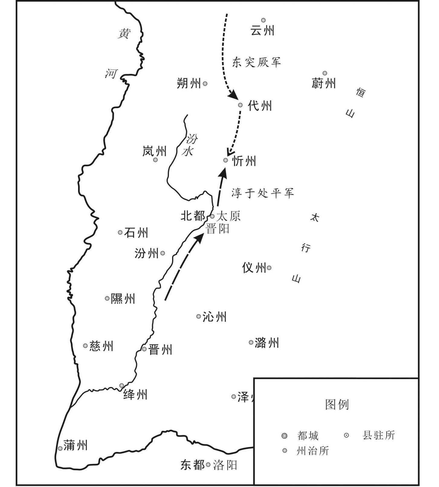 
武则天垂拱元年（685年）东突厥攻代州、忻州示意图

## 【原文】

**二年秋九月，突厥入寇，左鹰扬卫大将军黑齿常之拒之[1]。至两井，遇突厥三千余人，见唐兵，皆下马擐甲，常之以二百余骑冲之，皆弃甲走[2]。日暮，突厥大至，常之令营中然火，东南又有火起，虏疑有兵相应，遂夜遁[3]。**

## 【注文】

[1]二年：指武则天垂拱二年，即公元686年。　　左鹰扬卫大将军：古代官名，即左武卫大将军。唐武则天光宅元年（684年）改称，唐中宗神龙元年（705年）复名左武卫大将军。　　黑齿常之（630—689年）：百济（位朝鲜半岛西南部）西部人，唐朝著名军事将领。黑齿常之的早年事迹不详，长大以后，善于用兵，史称其“骁勇有谋略”。后来黑齿常之在百济国任达率（百济官名）兼郡将，相当于唐朝刺史一职。降唐后数十年，黑齿常之屡建战功，纵横青藏所向披靡，数破突厥威震天下，进爵燕国公，成为大唐的封疆大吏。唐睿宗永昌元年（689年），受酷吏周兴诬陷，含冤自缢而死。

[2]两井：古地名，今山西北部地区。　　擐（huàn）甲：穿上铠甲。

[3]日暮：傍晚。　　然：燃烧。

## 【译文】

武则天垂拱二年（686年），突厥入侵唐朝，左鹰扬卫大将军黑齿常之进行抵抗。行军到两井地方，遇到突厥三千人，突厥军见到唐兵，都下马穿上铠甲，黑齿常之率领二百多骑兵冲入突厥军队，突厥军都弃甲逃走。到夜晚，突厥大批人马到来，黑齿常之命令在军营中燃火，东南方向又有火起，突厥军怀疑唐军的接应部队到了，于是连夜逃跑。

## 【原文】

**三年春二月丙辰，突厥骨笃禄等寇昌平，命左鹰扬大将军黑齿常之帅诸军讨之[1]。秋七月，突厥骨笃禄、元珍寇朔州，遣燕然道大总管黑齿常之击之，以右鹰扬大将军李多祚为之副，大破突厥于黄花堆，追奔四十余里，突厥皆散走碛北[2]。多祚世为靺鞨酋长，以军功得入宿卫[3]。黑齿常之每得赏赐，皆分将士[4]。有善马为军士所损，官属请笞之，常之曰：“奈何以私马笞官兵乎[5]！”卒不问[6]。**

## 【注文】

[1]三年：指武则天垂拱三年，即公元687年。　　骨笃禄（？—691年）：亦称骨咄禄、不卒禄、颉跌利施可汗。阿史那·骨笃禄是后突厥汗国（公元682至744年）的创立者，公元682至691年为汗。　　昌平：古地名，指昌平县，西汉置。治所在今北京昌平区东南。唐属幽州。

[2]元珍（？—711年）：即阿史德元珍，后突厥汗国的重臣。原为唐朝单于都护府检校降户部落，曾经被都护府长史王本立拘禁。骨咄禄起兵后，阿史德元珍为阿波达干。他帮助骨咄禄击败铁勒九姓，得到漠北。武则天垂拱三年（687年）在漠北大败唐朝。武则天神功元年（697年）默啜可汗要杀田归道，阿史德元珍力止。唐睿宗景云二年（711年），阿史德元珍攻打突骑施时战死，一说阿史德元珍就是暾欲谷。　　李多祚（zuò）（654—707年）：唐朝时期东北靺鞨族酋长，唐朝和武周时期任右羽林军大将军。他曾两次参与李氏和武氏之间宫廷政变。第一次是唐中宗神龙元年（705年）正月，李多祚参与由张柬之等人发动的宫廷政变，逼武则天让位于中宗李显。第二次是神龙三年（707年）七月，李多祚参与以太子李重俊为首发动的宫廷政变。　　黄花堆：即黄瓜堆，今山西应县西北的黄花岭。

[3]靺（mò）鞨（hé）：古代民族名。北魏称“勿吉”，唐时写作靺鞨，分布在松花江、牡丹江流域及黑龙江中下游，东至日本海。靺鞨初有数十部，后逐渐发展为七大部，以粟末靺鞨和黑水靺鞨最强大。公元7世纪末，粟末靺鞨统一各部，建立政权，后来唐玄宗在那里设州，以其首领为都督，封渤海郡王，此后辖区即以渤海为号。

[4]皆：都。

[5]笞（chī）：鞭笞。古代用竹板或荆条拷打犯人脊背或臀腿的刑罚。《唐律疏议·名例》载：“笞者，击也。又训为耻，言人有小愆，法须惩戒，故加捶挞以耻之。”说明笞是对犯有轻微过错所使用的惩罚手段。笞，在中国奴隶社会已广泛使用。

[6]问：追究。

## 【译文】

武则天垂拱三年（687年）春季二月丙辰（二十二日），突厥阿史那骨笃禄进犯昌平，朝廷命令左鹰扬大将军黑齿常之率领各路军队讨伐他们。秋七月，突厥阿史那骨笃禄、阿史德元珍进犯朔州，朝廷命令燕然道大总管黑齿常之攻击他们，任命左鹰扬大将军李多祚为他的副将，在黄花堆大败突厥，追击了四十多里，突厥军都四散逃往漠北。李多祚先世为靺鞨酋长，因为军功得以进入朝廷为宿卫。黑齿常之每次得到赏赐，都分给将士。黑齿常之有一匹喜爱的战马被军士损伤，他的部下请求鞭笞那个军士，常之说：“怎么可以因为私人的马而鞭笞官兵呢！”于是不再追究此事。

## 【原文】

**冬十月庚子，右监门卫中郎将爨宝璧与突厥骨笃禄、元珍战，全军皆没，宝璧轻骑遁归[1]。宝璧见黑齿常之有功，表请穷追余寇，诏与常之计议，遥为声援[2]。宝璧欲专其功，不待常之，引精兵万三千人先行，出塞二千余里，掩击其部落[3]。既至，又先遣人告之，使得严备，与战，遂败[4]。太后诛宝璧，改骨笃禄曰不卒禄。**

## 【注文】

[1]右监门卫：古代官名。隋唐卫府之一。与左监门府同掌宫殿门禁及守卫，置将军一人、郎将二人，校尉、直长三十人，还有长史、司马等。　　爨（cuàn）宝璧（？—687年）：唐朝武则天专政时的将领。　　没（mò）：覆没。　　遁归：逃跑回来。

[2]表：上表。

[3]塞（sài）：边境上的险要的地方。

[4]既：已经。

## 【译文】

冬十月庚子（初九日），右监门卫中郎将爨宝璧与突厥阿史那骨笃禄、阿史德元珍交战，全军覆没，爨宝璧轻骑逃回来。宝壁看到黑齿常之有功劳，上表请求穷追余寇，太后下诏让他和黑齿常之商议，遥相声援。宝壁想要独占这个功，不等待黑齿常之，便亲自率领一万三千精兵先行出发，出塞两千多里，攻击突厥部落。到达以后，又先派人告诉突厥，使得突厥做好准备，与之交战，于是战败。太后处死爨宝璧，改称骨笃禄为不卒禄。

## 【原文】

**永昌元年夏五月己巳，以僧怀义为新平军大总管，北讨突厥[1]。行至紫河，不见虏，于单于台刻石纪功而还[2]。秋九月壬子，以僧怀义为新平道行军大总管，将兵二十万以讨突厥骨笃禄。**

## 【注文】

[1]永昌：唐睿宗李旦的年号，即公元689年，但实际上武则天操纵朝政，睿宗毫无实权。一般算作武则天的年号。　　怀义（？—695年）：俗姓冯，名小宝，京兆鄠（hù）县（今陕西户县）人，武则天朝的重臣。怀义出家前在洛阳市以卖药为业，偶然得识唐高祖李渊之女千金公主，千金公主将他介绍给皇太后武则天，从此他便成为武则天近侍。武则天垂拱初，怀义建议重修白马寺，得到武则天的支持。武则天永昌元年（689年），任命怀义为清平道大总管，率师征讨突厥。后被武则天杀死。

[2]紫河：又作紫乾河。即今内蒙古南部、山西西北长城外之浑河，为黄河支流。　　单于台：在今内蒙古呼和浩特市西。

## 【译文】

武则天永昌元年（689年）五月己巳（十八日），朝廷任命僧人怀义为新平军大总管，向北讨伐突厥。进军到紫河，不见突厥军，便在单于台刻石碑纪功后返回。秋九月壬子（初三日），朝廷任命僧人怀义为新平道行军大总管，率兵二十万讨伐突厥阿史那骨笃禄。

## 【原文】

**延载元年（春）正月，突厥可汗骨笃禄卒，其子幼，弟默啜自立为可汗[1]。腊月甲戌，默啜寇灵州。［春］二月庚午，以僧怀义为代北道行军大总管，以讨默啜。**

## 【注文】

[1]延载：武则天的年号，延载元年即694年。　　默啜（chuò）（？—716年）：唐时东突厥可汗，姓阿史那氏，名环，骨咄禄的弟弟。武则天天授二年（691年）立，称阿波干可汗；武则天证圣元年（695年），受封为迁善可汗；武则天万岁通天元年（696年），助唐平契丹，受封为立功报国可汗，死后其子小可汗匐俱继位。

## 【译文】

武则天延载元年（694年）春正月，突厥可汗阿史那骨笃禄去世，他的儿子年幼，他的弟弟默啜自立为可汗。十二月甲戌（十九日），默啜进犯灵州。春二月庚午（十六日），朝廷任命僧人怀义为代北道行军大总管，讨伐默啜。

## 【原文】

**三月甲申，以凤阁舍人苏味道为凤阁侍郎、同平章事，李昭德检校内史[1]。更以僧怀义为朔方道行军大总管，以李昭德为长史，苏味道为司马，帅契苾明、曹仁师、沙吒忠义等十八将军以讨默啜[2]。未行，虏退而止。昭德尝与怀义议事，失其旨，怀义挞之，昭德惶惧请罪[3]。**

## 【注文】

[1]凤阁舍人：古代官名。唐武则天光宅元年（684年）至唐中宗神龙元年（705年），为中书舍人的改称。　　苏味道（648—705年）：唐代政治家、文学家，赵州栾城（今河北石家庄市栾城区）人。在武则天时居相位数年，唐中宗时贬郿州刺史，死于任所。他与杜审言、崔融、李峤并称“文章四友”，与李峤并称“苏李”，对唐代律诗发展有推动作用。　　凤阁侍郎：唐武则天光宅元年（684年）至唐中宗神龙元年（705年）为中书侍郎改称。　　同平章事：同中书门下平章事的简称，同平章事初用于唐太宗时，自唐高宗永淳元年（682年）始，实际担任宰相者，有的加以同中书门下平章事的名义，也省称同平章事。　　李昭德（？—697年）：京兆长安（今陕西西安西北）人，武则天朝大臣。他力图维护李唐宗室对皇位的继承权，是保护皇嗣派的骨干人物，因遭酷吏来俊臣的诬陷被杀。　　内史：唐武则天光宅元年（684年）至唐中宗神龙元年（705年），改中书省为凤阁，长官中书令改称内史。

[2]朔方道：开元时置，治灵州，今宁夏灵武西南。　　契苾（bì）明（生卒年不详）：又作契苾承明，字若水。唐代铁勒族契苾部将领。凉国公契苾何力子，唐高宗麟德年间拜左武卫大将军。调露元年（679年），授左骁卫大将军，袭封凉国公。武则天为帝时，转右豹韬卫大将军、怀德军经略大使，升镇军大将军，行左鹰卫大将军。　　曹仁师（生卒年不详）：武则天时为鹰扬将军。武则天万岁通天元年（696年），松漠都督李尽忠和归城州刺史孙万容反，曹仁师等率军征讨。　　沙吒忠义（？—707年）：武则天执政年间百济将领。武则天神功元年（697年）以右武威卫大将军，为清边道前军总管，击契丹。武则天圣历元年（698年）天兵西道大总管，击突厥。唐中宗神龙二年（706年）为灵武军大总管，在鸣沙战败。

[3]失：通“佚”，轻忽，忽视。　　挞（tà）：用鞭子或棍子打。

## 【译文】

武则天延载元年（694年）三月甲申（初一日），任命凤阁舍人苏味道为凤阁侍郎、同平章事，李昭德为检校内史。又任命僧人怀义为朔方道行军大总管，李昭德为长史，苏味道为司马，率契苾明、曹仁师、沙吒忠义等十八位将军讨伐默啜。还没有出发，敌军就撤退了，于是停止了出兵。李昭德曾经与怀义商议事情，不符合怀义的意思，怀义便鞭挞他，李昭德惧怕，向怀义请罪。

## 【原文】

**天册万岁元年正月丙午，以王孝杰为朔方道行军总管，击突厥[1]。冬十月，突厥默啜遣使请降，太后喜，册授左卫大将军、归国公[2]。**

## 【注文】

[1]天册万岁：武则天在位期间所用年号，天册万岁元年，即695年。　　王孝杰（？—697年）：唐朝、武周时的名将，参加对吐蕃、后突厥、契丹的战争，在讨伐契丹可汗孙万荣的战斗中阵亡。

[2]册授：唐制，三品以上职事官，文武散官二品以上及都督、都护，上州刺史在京师者，由皇帝亲自授册拜官，称册授。册，用竹简漆书。　　国公：封爵名。古代五等爵中有公，位第一。

## 【译文】

武则天天册万岁元年（695年）正月丙午（二十七日），任命王孝杰为朔方道行军总管，攻击突厥。冬十月，突厥默啜派使者请求归降，太后大喜，册授默啜为左卫大将军、归国公。

## 【原文】

**万岁通天元年秋九月丁巳，突厥寇凉州，执都督许钦明[1]。钦明，绍之曾孙也，时出按部，突厥数万奄至城下，钦明拒战，为所虏[2]。**

## 【注文】

[1]万岁通天：武则天在位期间所用年号，万岁通天元年，即696年。　　凉州：古州名，西汉置，为十三州刺史部之一。东汉治陇县（今甘肃张家川），三国魏文帝复置，移治姑藏（今甘肃武威）。唐时辖境相当于今甘肃永昌以东、天祝藏族自治县以西一带。　　许钦明（生卒年不详）：唐朝将领，以军功历任左玉钤卫将军、安西大都护，封盐山郡公；武则天朝，授金紫光禄大夫、凉州都督。

[2]绍：指许绍（？—621年），字嗣宗，安州安陆（今湖北安陆）人，祖籍高阳（今河北高阳），唐朝大臣，隋楚州刺史许法光之子。少年时与高祖为同学。隋炀帝大业末年，任夷陵郡通守。归唐后，被封为硖（xiá）州刺史、安陆郡公，后进封谯国公。唐高祖武德四年（621年），率军征讨荆州，不久病死军中。唐太宗贞观年间，追赠荆州都督。　　按部：巡视部下。　　奄（yǎn）至：突然到了。

## 【译文】

武则天万岁通天元年（696年）秋九月丁巳（十八日），突厥进犯凉州，捉拿都督许钦明。许钦明，是许绍的曾孙，当时他正外出巡查所属地区，突厥数万军队突然赶到城门下，许钦明坚决抵抗，被敌人俘虏。

## 【原文】

**突厥默啜请为太后子，并为其女求婚，悉归河西降户，帅其部众为国讨契丹[1]。太后遣豹韬卫大将军阎知微、左卫郎将摄司宾卿田归道册授默啜左卫大将军、迁善可汗[2]。知微，立德之孙；归道，仁会之子也[3]。**

## 【注文】

[1]太后：指武则天。　　河西：指甘肃、青海两省黄河以西的地区，即河西走廊与潢水流域。　　降户：投降归附者。

[2]豹韬卫：古代官署名，分左右豹韬卫，魏文帝置武卫将军，统率禁旅。隋置左右威卫府，领外军宿卫，所领军士称豹韬，有大将军等官。武则天光宅元年（684年），改左右威卫为左右豹韬卫。唐中宗神龙元年（705年），复原名。　　阎知微（？—698年）：雍州万年（今陕西西安市临潼区）人，唐朝著名建筑学家阎立德之子。唐代大臣，官至右豹韬卫将军。　　摄：掌管，管辖。　　司宾卿：唐武则天光宅元年（684年）至唐中宗神龙元年（705年）为鸿胪卿改称，主外宾之事。　　田归道（？—706年）：唐代大臣，雍州长安（今陕西西安）人。任通事舍人内供奉、左卫郎将。出使突厥有功，官拜左金吾将军。在神龙之变后，田归道被解职。唐中宗即帝位，又赞赏田归道忠君精神，将他召拜为太仆少卿，不久除殿中少监、右金吾将军。后病卒。

[3]立德（？—656年）：指阎立德，名让，雍州万年（今陕西西安）人，唐代建筑家、工艺美术家、画家。阎立德出身于工程世家，唐高祖武德至唐太宗贞观年间任尚衣奉御、将作少匠、将作大匠、工部尚书等。他曾受命营造唐高祖山陵，督造翠微、玉华两宫，营建昭陵，主持修筑唐长安城外郭和城楼等。　　仁会：指田仁会（601—679年），雍州长安（今陕西西安）人，唐初著名良吏。唐高祖武德初年，他应制举授左卫兵曹；唐太宗贞观后期为左武候中郎将。田仁会为武将，荣立战功，担任地方行政官员，体恤民情，多有政绩。

## 【译文】

突厥默啜请求做太后的儿子，并且给他的女儿求婚，全部归还了河西的降户，率领他的部下为朝廷讨伐契丹。太后派遣豹韬卫大将军阎知微、左卫郎将兼司宾卿田归道册授默啜为左卫大将军、迁善可汗。阎知微是阎立德的孙子；田归道是田仁会的儿子。

## 【原文】

**冬十月辛卯，契丹李尽忠卒，孙万荣代领其众[1]。突厥默啜乘间袭松漠，虏尽忠、万荣妻子而去[2]。太后进拜默啜为颉跌利施大单于、立功报国可汗[3]。**

## 【注文】

[1]李尽忠（？—696年）：唐朝契丹首领，袭封松漠都督府都督。公元696年，他反抗武周，自称无上可汗，侵略河北，武则天把他的名字改为李尽灭。遣左鹰扬卫将军曹仁师、右金吾卫大将军张玄遇、左威卫大将军李多祚、司农少卿麻仁节等二十八将讨伐契丹，黄獐谷之战，几乎全军覆没，李尽忠病死。　　孙万荣（？—697年）：唐时契丹首领，军事统帅。受唐封为玉钤卫将军、归诚州刺史。武则天万岁通天年间，与李尽忠联合起兵反。李尽忠败死，代领其众。唐兵反击，败走潞河，被家奴杀死。

[2]乘间：利用机会，乘机。　　松漠：指松漠都督府。唐太宗贞观二十二年（648年）以契丹部落置，属营州都督府。治所在今内蒙古巴林右旗南。统辖今内蒙古西拉木伦河流域及其支流老哈河中下游一带。

[3]进拜：进封，按一定的礼节给人加官晋爵。

## 【译文】

冬十月辛卯（二十二日），契丹李尽忠去世，孙万荣代替他率领部众。突厥默啜乘机偷袭松漠，俘虏了李尽忠、孙万荣的妻子儿女后离去。太后进封默啜为颉跌利施大单于、立功报国可汗。

## 【原文】

**神功元年（春）正月，突厥默啜寇灵州，以许钦明自随[1]。钦明至城下，大呼求美酱、粱米及墨，意欲城中选良将，引精兵，夜袭虏营，而城中无谕其意者[2]。**

## 【注文】

[1]神功：武则天在位期间所用年号，公元697年共使用四个月。

[2]谕：知道，明白。

## 【译文】

武则天神功元年（697年）春正月，突厥默啜进犯灵州，把许钦明带在身边。许钦明到灵州城下，大声呼喊要求给美酱、粱米和墨，意思是让城中选取良将，带领精兵，夜袭敌营，但城中没有人理解他的意思。

## 【原文】

**癸亥，突厥默啜寇胜州，平狄军副使安道买击破之[1]。［春］三月，阎知微、田归道同使突厥，册默啜为可汗[2]。知微中道遇默啜使者，辄与之绯袍、银带，且上言：“虏使至都，宜大为供张[3]。”归道上言：“突厥背诞积年，今方悔过，宜待圣恩宽宥[4]。今知微擅与之袍、带，使朝廷无以复加，宜令反初服以俟朝恩[5]。又，小虏使臣，不足大为供张[6]。”太后然之[7]。知微见默啜，舞蹈，吮其靴鼻[8]。归道长揖不拜[9]。默啜囚归道，将杀之，归道辞色不挠，责其无厌，为陈祸福[10]。阿波达干元珍曰：“大国使者，不可杀也[11]。”默啜怒稍解，但拘留不遣[12]。**

## 【注文】

[1]胜州：古地名，今内蒙古准格尔旗东北十二连城。　　平狄军：武则天天授二年（691年）改神武军置，属朔州。治所在今山西朔州。武则天大足元年（701年）改为大同军。　　安道买（生卒年不详）：唐朝武则天时将领，任平狄军副使。

[2]册：册封。

[3]辄：立即，就。　　与之绯袍、银带：即给突厥使者四品以下服饰。绯袍、银带，古代官员正式场合穿的官服制度。官服分颜色从唐朝开始。唐代官吏服饰制度：文官官员三品以上服紫袍，皆金带；四品服深绯袍，五品服浅绯袍，皆金带；五品以上服绯袍，皆银带；六品以下服绿袍，无带。　　供张：供应陈设。

[4]背诞：背叛欺诈。　　宽宥：宽恕，饶恕。

[5]擅：擅自。

[6]足：值得。

[7]然：正确的。

[8]舞蹈：古代臣子朝拜君王时做出特定的舞蹈姿势，是一种礼节。　　吮其靴鼻：即吻其靴尖。嗅靴鼻是突厥最卑逊的礼节。

[9]揖（yī）：古代的拱手礼。

[10]辞色不挠：指面不改色。　　无厌：不满足，没有限止。

[11]阿波达干元珍：即阿史德元珍，阿波达干是他的官名，突厥的官分十二等，从“设”直到“达干”，都是世袭的，阿史德元珍投降骨咄禄后被封为“阿波达干”，专统兵马。

[12]稍：渐渐。

## 【译文】

武则天神功元年（697年）正月癸亥（二十六日），突厥默啜进犯胜州，唐平狄军副使安道买击败了他们。春三月，阎知微、田归道一同出使突厥，册封默啜为可汗。阎知微在半路上遇到默啜的使者，就送给了他们绯袍、银带，并且向太后上言：“突厥使者到了国都，应该大设帐帷接待。”田归道上言：“突厥背叛、欺诈唐朝多年，现在刚刚悔过，应该等待圣恩的宽恕。现在阎知微擅自给他们绯袍、银带，使朝廷没有什么再能给他们的，应该令他们还回先给的服装等待我朝的施恩。再说，小小的突厥侍臣，不值得为他们大为铺张接待。”太后认为说得很对。阎知微见到默啜，向他行叩拜天子的礼节，亲吻他的靴子。田归道只是拱手为礼而不跪拜。默啜囚禁了田归道，要处死他。田归道面不改色，怒斥默啜贪得无厌，向默啜陈说了福祸利害。阿波达干元珍说：“大国的使臣，不能杀。”默啜的怒气才渐渐消解，只是拘留了田归道不遣送他回国。

## 【原文】

**初，咸亨中，突厥有降者皆处之丰、胜、灵、夏、朔、代六州[1]。至是默啜求六州降户及单于都护府之地，并谷种、缯帛、农器、铁，太后不许[2]。默啜怒，言辞悖慢[3]。姚璹、杨再思以契丹未平，请依默啜所求给之[4]。麟台少监、知凤阁侍郎赞皇李峤曰：“戎狄贪而无信，此所谓‘借寇兵资盗粮’也，不如治兵以备之[5]。”璹、再思固请与之，乃悉驱六州降户数千帐以与默啜，并给谷种四万斛，杂彩五万段，农器三千事，铁数万斤，并许其婚[6]。默啜由是益强[7]。田归道始得还，与阎知微争论于太后前[8]。归道以为默啜必负约，不可恃和亲，宜为之备[9]。知微以为和亲必可保[10]。**

## 【注文】

[1]咸亨：唐高宗李治在位期间所用年号，即公元670年至674年。

[2]降户：投降归附者。

[3]悖慢：悖逆傲慢。

[4]姚璹（shú）（632—705年）：字令璋，唐初太常卿姚思廉孙。唐高宗永徽中明经擢第，调露中任中书舍人，封吴兴县男。武后临朝称帝，历夏官、天官侍郎，因受其堂弟姚敬节反叛罪牵连，贬为桂州（今广西桂林）长史。武则天长寿元年（692年），任文昌左丞、同凤阁鸾台平章事，向武则天提出由宰相自撰《时政记》建议，得准许，成惯例。武则天延载初（694年），任纳言。唐中宗神龙元年（705年）卒，遗命薄葬，赠越州都督，谥曰“成”。　　杨再思（？—709年）：唐武则天当政时期宰相。历任天官员外郎（吏部官员）、左肃政台御史大夫，官至鸾台侍郎、同凤阁鸾台平章事，凤阁侍郎同凤阁鸾台平章事，兼太子右庶子（东宫职官）。唐中宗时，官拜户部尚书，兼中书令，被封为郑国公。后复为中书令、吏部尚书、尚书右仆射（尚书省长官）。

[5]麟台少监：古代官名，即秘书少监。从四品上。协助麟台监掌邦国经籍图书之事。　　赞皇：古地名，指赞皇县。隋朝置，治所即今河北赞皇。　　李峤（644—713年）：唐代诗人、政治家，字巨山，赵州赞皇（今属河北）人。李峤擢进士第，武后、中宗朝，屡居相位，封赵国公。唐玄宗即位，贬滁州别驾，改庐州别驾。　　治兵：训练军队。

[6]固：坚持。

[7]益：更加。

[8]于：在。

[9]恃：依靠，依赖。

[10]必：一定。

## 【译文】

当初，咸亨中期，突厥有投降归附的都安排在丰、胜、灵、夏、朔、代六州。因此，默啜请求给予这六州的降户和单于都护府所属的地方，并且还要谷种、缯帛、农器、铁，太后没有答应。默啜大怒，言辞悖逆傲慢。姚璹、杨再思认为契丹还没有平定，请求满足默啜的要求。麟台少监、知凤阁侍郎赞皇人李峤说：“戎狄贪婪而没有信用，这样做就是‘借给敌人武器供给盗贼粮食’，不如训练军队来防备他们。姚璹、杨再思坚持请求给予，朝廷于是把六州的数千帐降户都给了默啜，并且给了谷种四万斛，杂彩五万段，农器三千件，铁数万斤，并且答应通婚。默啜因此更加强盛。田归道刚得以返回唐朝，和阎知微在太后面前争论。田归道认为默啜必定会违背誓约，不可以依靠和亲，应该对默啜做好防备。阎知微认为和亲可以保证良好的关系。

## 【原文】

**冬闰十月甲寅，以幽州都督狄仁杰为鸾台侍郎、同平章事[1]。仁杰上疏，以为：“天生四夷，皆在先王封略之外，故东拒沧海，西阻流沙，北横大漠，南阻五岭，此天所以限夷狄而隔中外也[2]。自典籍所记，声教所及，三代不能至者，国家尽兼之矣[3]。诗人矜薄伐于太原，美化行于江、汉，则三代之远裔，皆国家之域中也[4]。若乃用武荒外，邀功绝域，竭府库之实，以争不毛之地，得其人不足增赋，获其土不可耕织，苟求冠带远夷之称，不务固本安人之术，此秦皇、汉武之所行，非五帝、三王之事业也[5]。始皇穷兵极武，务求广地，死者如麻，致天下溃叛[6]。汉武征伐四夷，百姓困穷，盗贼蜂起；末年悔悟，息兵罢役，故能为天所祐[7]。近者国家频岁出师，所费滋广，西戍四镇，东戍安东，调发日加，百姓虚弊[8]。今关东饥馑，蜀、汉逃亡，江、淮已南，征求不息，人不复业，相率为盗，本根一摇，忧患不浅[9]。其所以然者，皆以争蛮貊不毛之地，乖子养苍生之道也[10]。昔汉元纳贾捐之之谋而罢朱崖郡，宣帝用魏相之策而弃车师之田，岂不欲慕尚虚名，盖惮劳人力也[11]。近贞观年中克平九姓，立李思摩为可汗，使统诸部者，盖以夷狄叛则伐之，降则抚之，得推亡固存之义，无远戍劳人之役，此近日之令典，经边之故事也[12]。窃谓宜立阿史那斛瑟罗为可汗，委之四镇，继高氏绝国，使守安东[13]。省军费于远方，并甲兵于塞上，使夷狄无侵侮之患则可矣，何必穷其窟穴，与蝼蚁校长短哉[14]！但当敕边兵，谨守备，远斥候，聚资粮，待其自致，然后击之[15]。以逸待劳则战士力倍，以主御客则我得其便，坚壁清野则寇无所得[16]。自然贼深入则有颠踬之虑，浅入必无虏获之益[17]。如此数年，可使二虏不击而服矣[18]。”事虽不行，识者是之[19]。**

## 【注文】

[1]狄仁杰（630—700年）：字怀英，唐代并州太原（今山西太原南）人；武则天当政时期宰相，杰出的政治家。早年举明经，历官并州都督府法曹、大理丞、侍御史，宁州、豫州刺史。武则天即位，任地官侍郎、同凤阁鸾台平章事，后为来俊臣诬害下狱，贬彭泽令、魏州刺史，武则天神功初复相，后入为内史，后又封为梁国公。在武则天当政时，以不畏权贵著称。　　鸾台侍郎：唐武则天光宅元年（684年）至唐中宗神龙元年（705年）为门下侍郎改称。

[2]先王：对已故的先朝帝王别称，非先朝亲王之意。　　封略：封界，边界。

[3]声教：声威和教化。　　三代：指夏、商、周三代。

[4]矜薄伐于太原，美化行于江、汉：《资治通鉴》注“《诗·六月》，宣王北伐也。其诗云：‘薄伐猃狁，至于太原。’又《广汉》之诗，美文王之道被于南国，美化行乎江、汉之城。”美化，美好的教化。

[5]冠带远夷：指使远方的民族像汉族人一样服用冠带，归附认同。　　秦皇：指秦始皇（前259—前210年），即嬴政。秦朝开国皇帝，秦庄襄王之子，公元前247—前210年在位。公元前230年至公元前221年，灭六国，完成统一大业。秦始皇建立了中国历史上第一个中央集权的封建国家，创立皇帝制度，在中央实施三公九卿制，地方废除分封制，实行郡县制，统一文字、货币和度量衡等，北击匈奴，南服百越，修筑万里长城，奠定了今日中国版图的基本格局，把中国推向了大一统时代，为建立专制主义中央集权制度开创了新局面，对中国和世界历史产生了深远影响，奠定了中国两千多年政治制度的基本格局。　　汉武：指汉武帝刘彻（前156—前87年），汉景帝之子。公元前141—前87年在位。在位期间数次大破匈奴、吞并朝鲜、遣使出使西域，开拓汉朝最大版图，功业辉煌。政治上接受董仲舒的建议，独尊儒术；颁行推恩令；设置十三部刺史等。晚年政治失策，致使百姓流离，起义频发。他痛定思痛，下罪己诏，将注意力转向“富民”。公元前87年刘彻崩于五柞宫，庙号世宗，谥号孝武皇帝，葬于茂陵。　　五帝：根据不同史料记载，有以下六种说法：（1）黄帝、颛顼（Zhuānxū）、帝喾（kù）、尧、舜（《大戴礼记》《史记》）；（2）伏羲、神农、黄帝、尧、舜（《易·系辞下》）；（3）太皞（hào）（伏羲）、炎帝（神农）、黄帝、少皞、颛顼（《礼记·月令》）；（4）少皞、颛顼、帝喾、尧、舜（《帝王世纪》）；（5）黄帝、少皞、帝喾、帝挚、帝尧（《道藏·洞神部·谱录类·混元圣纪》引梁武帝说）；（6）黄帝（轩辕）、青帝（伏羲）、赤帝又叫炎帝（神农）、白帝（少皞）、黑帝（颛顼）。　　三王：指夏、商、周三代之君。

[6]溃叛：离散背叛。

[7]蜂起：蜂拥而起。

[8]四镇：指安西四镇，最初设在龟兹（今新疆库车）、焉耆（今新疆焉耆）、于阗（今新疆和田）和疏勒（今新疆喀什）四个设置都督府的地方，是唐朝前期在西北地区设置，由安西都护府统辖的四个军镇。唐安西四镇在历史上存在了一个半世纪，它们对于唐朝政府抚慰西突厥，保护中西陆上交通要道，巩固唐的西北边防，都起过十分重要的作用。　　安东：即安东都护府，唐代六大都护府之一。公元668年置，辖高丽各州府。治所常迁。

[9]关东：指函谷关、潼关以东地区。　　已：即“以”。

[10]所以然：成为这样的原因。　　蛮貊（mò）：古代称南方和北方落后部族。亦泛指四方落后部族。

[11]汉元：指汉元帝刘奭（shì）（前75—前33年），是汉宣帝刘询的儿子。公元前49年至公元前33年在位。在位时期，多次出兵击溃匈奴，竟宁元年（前33年），匈奴呼韩邪单于入朝求亲，汉元帝以宫女王嫱（王昭君）嫁之，保持了边境地区的长期安定。汉元帝时期的汉朝比较强盛，但也是衰落的起点，豪强大地主兼并之风盛行，中央集权逐渐削弱，社会危机日益加深。　　贾捐之（？—前43年）：字君房，西汉著名政治家、文学家，洛阳（今属河南）人，贾谊的曾孙。其代表作有《弃珠崖议》《荐石显奏》《荐杨兴奏》等。　　朱崖郡：亦称“珠崖郡”，西汉郡名，西汉元封元年（前110年）置，治所在曋（shěn）都，今海南海口市琼山区东南。　　宣帝：即汉宣帝刘询（前92—前49年），本名刘病已，字次卿，即位后改名询，公元前74年至前49年在位。他在位期间，励精图治，注意减轻人民负担，任用贤能，全国政治清明，社会和谐，经济繁荣，“吏称其职，民安其业”，史称“宣帝中兴”。汉宣帝在位期间设立西域都护府，监护西域诸城郭国，使天山南北这一广袤地区正式归属于西汉中央政权，具有划时代的重大意义。　　魏相（？—前59年）：字弱翁，济阴定陶（今山东菏泽市定陶区）人，古代政治家，西汉著名大臣，官至丞相，封高平侯。魏相整顿吏治，扼制外戚势力，抑制豪强，选贤任能，平昭冤狱，并要求各地官吏省诸用，宽赋税，奖励百姓开荒种田，积粮解困，为西汉的强盛作出了贡献。　　车师：今新疆吐鲁番一带。

[12]李思摩（生卒年不详）：本姓阿史那氏，名思摩，突厥人，被赐姓李氏。唐朝攻破颉利可汗以后，在朝为官，后被封为乙弥泥孰俟利苾可汗，统治这些突厥人。　　令典：典章制度。　　经边：经略边疆。　　故事：先例，旧时的典章制度。

[13]阿史那斛瑟罗（生卒年不详）：西突厥继往绝可汗，阿史那步真之子。公元685年，武则天为了加强对西域的控制，册封他为蒙池都护、继往绝可汗兼右卫大将军，统辖弩失毕五部。公元690年，阿史那斛瑟罗率所部投靠内地，拜右屯卫大将军，改号竭忠事主可汗。　　继高氏绝国：恢复高丽国号，使高藏子孙继承王位。高丽王室姓高，其国唐高宗总章元年（668年）被灭。

[14]校：比较。

[15]斥候：古代的侦察兵，起源与汉代，并因直属于候王而得名，是一种重要的兵种。

[16]坚壁清野：作战时采用的一种策略。加固壁垒，转移或隐藏人口物资，清除野外可以资敌的各种东西，使敌人攻不下据点，又得不到任何东西的措施。

[17]颠踬（zhì）：败亡，覆没。

[18]服：归附。

[19]识者：有见识的人，明白的人。

## 【译文】

冬闰十月甲寅（二十一日），任命幽州都督狄仁杰为鸾台侍郎、同平章事。狄仁杰上疏，认为：“上天生下来四夷，都在先王的封疆之外，所以东有沧海的分隔，西有流沙的阻拦，北有大漠横亘，南有五岭阻隔，这是上天用来限制夷狄，分隔中外的。自从有了典籍记载，教化所能达到的，夏、商、周三代不能达到的地方，现在我朝都把这些地方兼有了。诗人夸耀周宣王北伐太原、周文王美好的教化推行于江、汉地区，那么夏、商、周三代边远的地方，现在都在我们的疆土之内。如果向四方以外用武，向极远的地方求取战功，耗竭充实的国库，来争夺不毛之地，得到那里的人民也不足以增加赋税，获得那里的土地也不可以耕织，如果只求使远方夷人臣服的称誉，而不致力于巩固国家、安定人民，这是秦始皇和汉武帝的行为，而不是五帝和三王的事业。秦始皇穷兵黩武，一心追求扩展土地，不计其数的人死去，致使天下离散背叛。汉武帝征伐四夷，百姓困苦贫穷，盗贼蜂起，到晚年悔悟，停止战争，免除劳役，所以能得到上天的保佑。近来国家连年征战，所用费用日益巨大，西面戍守四镇，东面戍守安东，征发越来越多，百姓贫穷困苦。现在关东遇到饥荒，蜀、汉地区百姓逃亡，江、淮以南，征敛不断，人民不从事生产，相继成为盗贼，国家的根本一动摇，那么忧患就不浅了。造成这种后果的原因，都是因为争夺蛮貊不毛之地，背离了安抚百姓的道理。以前，汉元帝采纳贾捐之的谋略撤销了朱崖郡，汉宣帝采用魏相的策略放弃了车师屯田，这难道是不想追求虚名，只不过是害怕劳费民力。近世贞观年间，攻克平定突厥九姓，册立李思摩为可汗，让他统领各个部落，只是当夷狄反叛就征伐他们，归降就安抚他们，这是符合摧毁应亡者、保留应存者的道理的，没有在遥远地方戍守、劳累的劳役，这是近世的典章制度，也是经略边疆的先例。我私下认为应该立阿史那斛瑟罗为可汗，把四镇委托给他管理；继承已没亡的高丽国，让他戍守安东。这样做，可以节省戍守远方的军费，合并军队在塞上驻扎，使夷狄不再有侵犯的祸患就可以了，何必要捣毁他们的窟穴，和这些蝼蚁一样的人争长短呢！但是，应当敕令边境上的部队，要他们谨慎守备，向远处侦查，聚集物资粮食，等敌人自己送上门来，然后予以还击。以逸待劳，战士们就会力量倍增，以主御客，我朝军队就可以获得便利，坚壁清野，敌人势必一无所获。敌军深入自然就有覆没的担忧，浅入又肯定不会得到什么收获。这样几年以后，不用进攻就可以使两个敌国俯首称臣。”狄仁杰的计策虽然没有实行，但有识之士却很赞许。

## 【原文】

**圣历元年夏六月甲午，命淮阳王武延秀入突厥，纳默啜女为妃[1]。豹韬卫大将军阎知微摄春官尚书，右武卫郎将杨齐庄摄司宾卿，赍金帛巨亿以送之[2]。延秀，承嗣之子也[3]。凤阁舍人襄阳张柬之谏曰：“自古未有中国亲王娶狄夷女者[4]。”由是忤旨，出为合州刺史[5]。**

## 【注文】

[1]圣历：武则天在位期间所用年号，即圣历元年（698年）至圣历三年（700年）五月。　　淮阳王武延秀（？—710年）：并州文水（今山西文水）人，武承嗣之子，武则天的侄孙。武延秀曾被囚禁突厥，武则天长安四年（704年），武延秀还朝，封桓国公、左卫中郎将。唐睿宗景云元年（710年），武延秀在李隆基（唐玄宗）发动的宫廷政变中被斩。　　妃：或称皇妃、宫妃、帝妃等，是中国古代皇帝侧室的一种。古时期，妃是用来称呼君主之正室（如正妃），在后字用于称呼君主正室后，妃的使用等级下降。秦汉时期将皇太子正室称为妃，如太子妃，后世沿用。亲王的正室亦称妃。唐朝时，贵妃、淑妃、德妃、贤妃等为正一品，位在皇后之下。

[2]春官尚书：唐武则天光宅元年（684年）至唐中宗神龙元年（705年），为礼部尚书的改称。　　杨齐庄（生卒年不详）：唐朝武则天朝时大臣，任右武卫郎将。

[3]承嗣：指武承嗣（649—698年），并州文水（今山西文水）人，武则天的侄子。武承嗣历官秘书监，袭周国公；武则天光宅元年（684年），授礼部尚书、同中书门下三品；武则天天授元年（690年）进文昌左相。武则天专权，他建议诛杀皇室及大臣中不附者，立武氏宗庙，并要求武则天立他为太子，遭到狄仁杰等人反对。

[4]襄阳：指襄阳县，西汉置，治所在今湖北襄樊市襄阳区。　　张柬之（625—706年）：字孟将，唐朝名相。唐中宗神龙元年（705年），张柬之与桓彦范、敬晖等乘武则天病发动政变，复辟唐朝国号，因功擢天官尚书，封汉阳郡公，后升为汉阳王。

[5]合州：西魏置，治所在石镜（北宋初改石照，今重庆合川区），辖境相当于今重庆合川区、铜梁、大足，四川武胜等市县地。

## 【译文】

武则天圣历元年（698年）夏五月甲午（初六日），命令淮阳王武延秀到突厥，娶默啜的女儿为妃子。豹韬卫大将军阎知微代理春官尚书，右武卫郎将杨齐庄兼任司宾卿，携带大量金帛送给默啜。武延秀，是武承嗣的儿子。凤阁舍人襄阳人张柬之劝谏说：“自古以来没有中原亲王娶夷狄女子为妻的。”因此事触犯了武则天的旨意，被贬为合州刺史。

## 【原文】

**秋八月戊子，武延秀至黑沙南庭。突厥默啜谓阎知微等曰：“我欲以女嫁李氏，安用武氏儿邪[1]！此岂天子之子乎[2]？我突厥世受李氏恩，闻李氏尽灭，唯两儿在，我今将兵辅立之[3]。”乃拘延秀于别所，以知微为南面可汗，言欲使之主唐民也[4]。遂发兵袭静难、平狄、清夷等军[5]。静难军使慕容玄崱以兵五千降之[6]。虏势大振，进寇妫、檀等州[7]。前从阎知微入突厥者，默啜皆赐之五品、三品之服，太后悉夺之[8]。**

## 【注文】

[1]李氏：即李唐子孙。

[2]天子：中国自周朝以来对最高君主的尊称，其原意：君主即上天的儿子，自认其权力来源于上天。自秦始皇始，天子被称为皇帝。

[3]唯：只有。

[4]主：管理。

[5]静难军：唐方镇名，唐武则天光宅元年（684年）赐号邠州节度使为静难军，治所在邠州（今陕西彬县）。

[6]慕容玄崱（zè）（生卒年不详）：唐朝武则天时将领，官至左玉钤卫将军。

[7]妫（guī）：妫州，唐朝州名，治怀戎（今河北涿鹿西南）。　　檀：檀州，今北京密云东北。

[8]夺：剥夺。

## 【译文】

秋八月戊子（初一日），武延秀到了黑沙南王庭。突厥默啜对阎知微等说：“我想把女儿嫁给李氏，怎能嫁给武氏的儿子！这个武延秀难道是天子的儿子吗？我突厥世代享受李氏的恩惠，听说李氏都要断绝了，只有两个儿子还幸存，我现在将率兵辅佐他做皇帝。”于是把武延秀拘留到其他地方，任命阎知微为南面可汗，说想让他主管唐朝的百姓。于是发兵攻击静难、平狄、清夷等唐军。静难军使慕容玄崱带领五千人投降。突厥势力大振，进犯妫、檀等州。以前跟从阎知微到突厥的人，默啜赐给他们五品、三品的官服，太后都剥夺了。

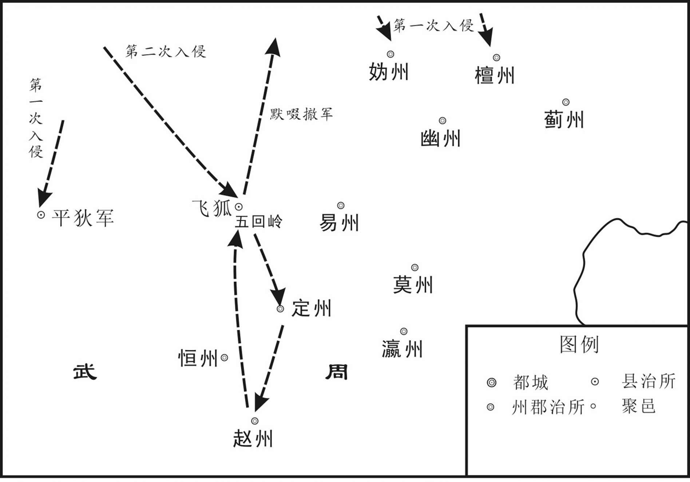 
武则天圣历元年（698年）突厥默啜掠河北道示意图

## 【原文】

**默啜移书数朝廷曰：“与我蒸谷种，种之不生，一也[1]。金银器皆行滥，非真物，二也[2]。我与使者绯紫，皆夺之，三也[3]。缯帛皆疏恶，四也[4]。我可汗女当嫁天子儿，武氏小姓，门户不敌，罔冒为婚，五也[5]。我为此起兵，欲取河北耳[6]。”**

## 【注文】

[1]移书：古时官员通书信往来称为遗书，后称作移书。　　数：列举罪状并加以指责。

[2]行滥：《唐律》对伪劣商品分别从质和量两个方面鉴定为“行滥”和“短狭”。《唐律疏义》解释行滥是指商品“不牢不真”，短狭指丝织品尺寸短窄。

[3]皆：全部。

[4]疏恶：指粗劣。

[5]不敌：不相称。

[6]河北：这里指黄河以北地区。

## 【译文】

默啜写信列举朝廷的罪状说：“给我们蒸过的谷种，种上不能生长，这是第一条罪状。金银器都是粗制品，不是真东西，这是第二条罪状。我给你们使者绯紫的衣服，都被没收，这是第三条罪状。你们给我们的缯帛都是粗制品，这是第四条罪状。我可汗的女儿应当嫁给天子的儿子，武氏小姓，与可汗门户不相当，你们是骗婚，这是第五条罪状。我默啜因此起兵，要攻取河北地区。”

## 【原文】

**监察御史裴怀古从阎知微入突厥，默啜欲官之，不受，囚，将杀之，逃归抵晋阳，形容羸瘁[1]。突骑噪聚，以为间谍，欲取其首以求功[2]。有果毅尝为人所枉，怀古按直之，大呼曰：“裴御史也[3]。”救之，得全[4]。至都，引见，迁祠部员外郎[5]。**

## 【注文】

[1]监察御史：古代官名，监察文武官吏的官员，简称御史。隋朝属御史台，唐朝属御史台下设察院，正八品下。监察中央机构、州县长官及祭祀、库藏、军旅等事，唐中期以后，也作为外官所带闲衔。　　裴怀古（？—712年）：寿州寿春（今安徽寿县）人。武周时期著名廉吏。历任监察御史、姚州都督、并州大都督长史、幽州都督等职。　　晋阳：这里指晋阳县。秦庄襄王二年（前248年）取赵晋阳邑置，治所在晋阳城，今山西太原西南。　　羸瘁（léi cuì）：憔悴。

[2]突骑（jì）：能够冲锋陷阵的精锐部队。

[3]果毅：隋唐时武官名。隋时统骁果之兵，唐时统府兵。　　按直：审理平反。

[4]全：保全。

[5]祠部员外郎：礼部祠部司次官。隋文帝时始置。唐朝，从六品，协助郎中掌管祠祀、享祭、天文、庙讳等。

## 【译文】

监察御史裴怀古跟从阎知微去突厥，默啜想封他为官，裴怀古不接受，被囚禁，将要杀了他，他逃到了晋阳，形体面容憔悴。突骑兵喧哗吵嚷聚集起来，认为他是间谍，想取他的人头来获取功劳。有一位勇敢的武官曾经被人冤枉，裴怀古为他审理平反，这时大声说：“这是裴御史。”这个武官救了他，才得以保全下来。裴怀古到了国都，太后接见他，升任为祠部员外郎。

## 【原文】

**时诸州闻突厥入寇，方秋，争发民修城[1]。卫州刺史太平敬晖谓僚属曰：“吾闻金汤非粟不守，奈何舍收获而事城郭乎[2]！”悉罢之，使归田，百姓大悦[3]。**

## 【注文】

[1]发：派遣。

[2]卫州：古地名，北周置，治所在枋头城（今河南浚县）。唐太宗贞观元年（627年）移治汲县（今卫辉市），唐辖境相当于今河南新乡、卫辉、辉县、浚县及淇县等县市地。　　太平：古地名，今山东邹城西。　　敬晖（？—706年）：字仲晔，绛州平阳（今山西临汾）人。他与张柬之、崔玄等人，乘武则天重病，发动神龙政变，迎立唐中宗，封郡王。后遭到韦皇后贬谪谋杀而死，谥“肃愍”，赠太尉。　　金汤：是“金城汤池”的略称，指金属造城，沸水流淌的护城河，形容城池坚固。

[3]悉：全，都。

## 【译文】

当时各州听说突厥要进犯，正是秋收季节，争相派遣百姓修补城池。卫州刺史太平人敬晖对部下说：“我听说坚固的城池如果没有粮食也不能坚守，怎么能舍弃秋收粮食而从事修筑城池呢！”于是下令全部停工，让百姓回到田间劳动，百姓非常高兴。

## 【原文】

**以司属卿武重规为天兵中道大总管，右武卫将军沙吒忠义为天兵西道总管，幽州都督下邽张仁愿为天兵东道总管，将兵三十万以讨突厥默啜[1]。又以左羽林卫大将军阎敬容为天兵西道后军总管，将兵十五万为后援[2]。癸丑，默啜寇飞狐[3]。乙卯，陷定州，杀刺史孙彦高及吏民数千人[4]。**

## 【注文】

[1]司属卿：唐武则天光宅元年（684年）至唐中宗神龙元年（705年）为宗正卿改称，掌宗室外戚属籍。　　武重规（生卒年不详）：蜀节王武士逸之孙，武则天侄子，官至左金吾卫大将军。　　沙吒忠义（生卒年不详）：唐武则天朝武将，任右武卫将军。　　下邽：指下邽县。秦置，治所在今陕西省渭南东北。　　张仁愿（？—714年）：本名仁亶，避睿宗名讳，华州下邽（今陕西渭南）人。有文才武略，出将入相。武则天时期任殿中侍御史、检校幽州都督。公元707年，大败东突厥可汗阿史那默啜，并沿黄河北岸筑三受降城，向北拓地三百余里。公元708年，拜左卫大将军、同中书门下三品，封韩国公。公元710年，加兵部尚书，致仕。公元714年，因病去世，赠太子少傅。

[2]阎敬容（生卒年不详）：唐武则天朝武将，任左羽林卫大将军。

[3]飞狐：古县名，治所在今河北涞源。

[4]孙彦高（？—698年）：杭州富阳（今浙江杭州市富阳区）人。武则天朝曾任尚书左丞。

## 【译文】

朝廷任命司属卿武重规为天兵中道大总管，右武卫将军沙吒忠义为天兵西道总管，幽州都督下邽人张仁愿为天兵东道总管，率兵三十万讨伐突厥默啜。又任命左羽林卫大将军阎敬容为天兵西道后军总管，率兵十五万为后援。八月癸丑（二十六日），默啜进犯飞狐。乙卯（二十八日），突厥军队攻陷定州，杀死刺史孙彦高和官吏及百姓数千人。

## 【原文】

**九月，改突厥默啜为斩啜[1]。默啜使阎知微招谕赵州，知微与虏连手蹋《万岁乐》于城下[2]。将军陈令英在城上谓曰：“尚书位任非轻，乃为虏蹋歌，独无惭乎[3]？”知微微吟曰：“不得已，《万岁乐》[4]。”戊辰，默啜围赵州，长史唐般若翻城应之[5]。刺史高叡与妻秦氏仰药诈死，虏舆之诣默啜[6]。默啜以金师子带紫袍示之曰：“降则拜官，不降则死[7]。”叡顾其妻，妻曰：“酬报国恩，正在今日[8]。”遂俱闭目不言[9]。经再宿，虏知不可屈，乃杀之[10]。虏退，唐般若族诛，赠叡冬官尚书，谥曰节[11]。叡，颎之孙也[12]。**

## 【注文】

[1]改：改称。

[2]招谕：指帝、王招抚敌对势力的谕旨，亦指以帝、王名义对敌对势力进行招抚。　　蹋（tà）：即踏歌。汉民族传统舞蹈。这一古老的舞蹈形式源自民间，远在两千多年前的汉代就已兴起，到了唐代更是风靡盛行。所谓“丰年人乐业，陇上踏歌行”，它的母题是民间的“达欢”意识，而古典舞《踏歌》虽准确无误地承袭了“民间”的风情，但其偏守仍为“古典”之气韵。

[3]陈令英：唐武则天朝大臣，京兆万年（今陕西西安东北）人。曾任左卫将军，奉安道总管。　　独：表反问，相当于“难道”。

[4]微吟：很小的声音说。

[5]唐般若（？—698年）：武则天朝任赵州长史。

[6]高叡（ruì）（？—698年）：隋朝尚书左仆射高颎（jiǒng）之孙。唐朝官员。早年举明经科，授通义县（治所在今四川眉山）令，政绩卓著，官至赵州（今河北赵县）刺史。　　仰药：服毒药。　　舆：用车运载。

[7]金师子带紫袍：系三品以上章服。

[8]顾：回头看。

[9]俱：一起。

[10]再宿（sù）：又一晚上。

[11]冬官尚书：唐武则天光宅元年（684年）至唐中宗神龙元年（705年）为工部尚书改称。　　谥曰：谥号。谥号为东亚古代君主、诸侯、大臣、后妃等具有一定地位的人死去之后，根据他们的生平事迹与品德修养，评定褒贬，而给予一个寓含善意评价、带有评判性质的称号。根据对西周时期青铜器铭文的研究表明，周穆王前后，给地位较高或较有身份的死者加以谥号的做法已比较多。

[12]颎：指隋朝大臣高颎（541—607年）。一名敏，字昭玄。渤海蓨（tiáo）（今河北景县东）人，隋朝杰出的政治家，著名的战略家、谋臣，隋代名相。

## 【译文】

武则天圣历元年（698年）九月，朝廷改称突厥默啜为斩啜。默啜让阎知微到赵州招抚百姓，阎知微与突厥人在城下手拉手用脚踏地唱《万岁乐》。将军陈令英在城上对阎知微说：“尚书的地位和责任不轻，给突厥人拉手跳舞唱歌，难道就不感到惭愧吗？”阎知微低声说：“这是不得已，《万岁乐》。”戊辰（十一日），默啜围攻赵州，长史唐般若翻过城墙响应默啜。刺史高叡与妻子秦氏服毒药诈死，突厥人用车子把他们送到默啜面前。默啜把金师子带紫袍给高叡看说：“投降就给你官职，不投降就杀死你。”高叡回头看妻子，妻子说：“报答国恩，正在今天。”于是都闭上眼睛不说话了。又过了一夜，突厥人知道高叡不可能屈服，于是杀了他。突厥人退去后，朝廷把唐般若全族杀死，又追赠高叡为冬官尚书，谥号“节”。高叡，是高颎的孙子。

## 【原文】

**甲戌，命太子为河北道元帅，以讨突厥[1]。先是，募人月余不满千人，及闻太子为帅，应募者云集，未几，数盈五万[2]。戊寅，以狄仁杰为河北道行军副元帅，右丞宋玄爽为长史，右台中丞崔献为司马，左台中丞吉顼为监军使[3]。时太子不行，命仁杰知元帅事，太后亲送之[4]。**

## 【注文】

[1]河北道：唐代地方行政区名。唐太宗贞观元年（627年）置，辖境在黄河之北，故名。辖今北京市、天津市、河北、辽宁大部，河南、山东古黄河以北地区，唐玄宗开元后治魏州，在今河北大名东。　　元帅：古代官名。春秋战国始置，为三军中军主将。北周始设行军元师和元帅作为军事职官名称。唐高祖入关后设左、右元帅。后代都设有各种名称的元帅。

[2]募：招兵。　　盈：超过。

[3]宋玄爽（生卒年不详）：武则天朝曾任洛州长史，官至秋官侍郎。　　右台：即右肃政台，唐武则天光宅元年（684年）分肃政台（御史台）而置。按察京城文武官员。唐中宗神龙元年（705年）改为右御史台。　　中丞：即御史台中丞。西汉始置，为御史大夫的次官，或称御史中执法，秩千石。汉哀帝废御史大夫，以御史中丞为御史台长官，后历代相沿。唐、五代、宋均大夫与中丞并置，唯大夫极少除授，仍以中丞为长官。　　崔献（生卒年不详）：唐武则天朝大臣，曾任右台中丞。　　司马：古代官名。殷商时代始置，位次三公，与六卿相当，与司徒、司空、司士、司寇并称五官，掌军政和军赋，春秋、战国沿置。汉武帝时置大司马，作为大将军的加号，后亦加于骠骑将军，后汉单独设置，皆开府。　　吉顼（xū）（生卒年不详）：洛州河南（今河南洛阳西）人，曾任武后时宰相，以残忍著称，是著名的酷吏。他奏请诛杀著名酷吏来俊臣，规劝张易之、张昌宗，与武懿宗争功被贬。　　监军使：古代官名，诸道方镇监军使院长官，掌监视刑赏，奏察违谬。唐玄宗时始置，以宦官充任，有副使、判官等掌握部分军队，平时出征。唐昭宗天复三年（903年）废。

[4]知：主持。

## 【译文】

九月甲戌（十七日），太后武则天命令太子为河北道元帅，讨伐突厥。在此之前，朝廷招募了一个月的兵，还不满一千人，等到听说太子任元帅，应招的人云集而来，没多久，人数就超过了五万。戊寅（二十一日），朝廷任命狄仁杰为河北道行军副元帅，右丞宋玄爽为长史，右台中丞崔献为司马，左台中丞吉顼为监军使。当时太子没有随军行，命令狄仁杰主持元帅事务，太后亲自为他送行。

## 【原文】

**癸未，突厥默啜尽杀所掠赵、定等州男女万余人，自五回道去，所过杀掠，不可胜纪[1]。沙吒忠义等但引兵蹑之，不敢逼[2]。狄仁杰将兵一万追之，无所及[3]。默啜还漠北，拥兵四十万，据地万里，西北诸夷皆附之，甚有轻中国之心[4]。**

## 【注文】

[1]赵、定：指赵州和定州，分别指今河北赵县和河北定州。　　五回道：自五回山通往突厥的道路。五回山在今河北易县的广昌岭。岭高四十余里，二十里中曲折五回，才能登其主峰，故岭有五回之名。　　过：经过。　　不可胜纪：不计其数。纪，通“记”。

[2]蹑：跟随。

[3]及：达到。

[4]漠北：指蒙古高原大沙漠以北。

## 【译文】

九月癸未（二十六日），突厥默啜把从赵州、定州抢掠的男女一万多人全都杀了，从五回道撤退，所经的地方杀的人和抢掠的东西不计其数。沙吒忠义等只是领兵跟踪，不敢逼近。狄仁杰率领一万军队追击，没有赶上。默啜回到漠北，拥兵四十万，占据土地方圆一万里，西北其他少数民族都归附他，默啜很有轻视中原的野心。

## 【原文】

**冬十月癸卯，以狄仁杰为河北道安抚大使。时河北人为突厥所驱逼者，虏退惧诛，往往亡匿[1]。仁杰上疏，以为：“朝廷议者皆罪契丹、突厥所胁从之人，言其迹虽不同，心则无别[2]。诚以山东近缘军机调发伤重，家道悉破，或至逃亡[3]。重以官典侵渔，因事而起，枷杖之下，痛切肌肤[4]。事迫情危，不循礼义，愁苦之地，不乐其生，有利则归，且图赊死，此乃君子之愧辱，小人之常行也[5]。又诸城入伪，或待天兵，将士求功，皆云攻得，臣忧滥赏，亦恐非辜[6]。以经与贼同，是为恶地，至有污辱妻子，劫掠货财，兵士信知不仁，簪笏未能以免，乃是贼平之后，为恶更深[7]。且贼务招携，秋毫不犯，今之归正，即是平人，翻被破伤，岂不悲痛[8]！夫人犹水也，壅之则为泉，疏之则为川，通塞随流，岂有常性[9]！今负罪之伍，必不在家，露宿草行，潜窜山泽，赦之则出，不赦则狂，山东群盗，缘兹聚结[10]。臣以边尘暂起，不足为忧，中土不安，此为大事[11]。罪之则众情恐惧，恕之则反侧自安[12]。伏愿曲赦河北诸州，一无所问[13]。”制从之[14]。仁杰于是抚慰百姓，得突厥所驱掠者悉递还本贯，散粮运以赈贫乏，修邮驿以济旋师[15]。恐诸将所及使者妄求供顿，乃自食疏粝，禁其下无得侵扰百姓，犯者必斩[16]。河北遂安[17]。**

## 【注文】

[1]亡匿：逃亡，隐匿。

[2]迹：行为。

[3]缘：靠近，接近。　　军机：指军事，战争。

[4]官典：指低级官员。　　枷杖：上枷并受杖刑。枷，一种套在犯人脖子上的刑具。

[5]赊（shē）死：暂且不死。　　愧（kuì）辱：惭愧羞辱。

[6]入伪：指降附契丹、突厥。　　天兵：古代统治者把自己的军队说成秉承天意之兵，称天兵。

[7]簪（zān）笏（hù）：冠簪和手板，为士大夫所用之物。古代笏以书事，笏笔以备书。臣僚奏事，执笏簪笔即谓簪笏。此处是官吏的代称。

[8]招携：招引尚未归心的人。

[9]壅（yōng）：堵塞。

[10]伍：同类，一伙。

[11]边尘：本意边境的尘土，代指边境的战事。

[12]恕：宽恕。

[13]曲：不是很公正，婉转的说法。　　问：追究。

[14]制：帝王的诏令。

[15]邮驿：传递文书、供应食宿的驿馆。　　旋师：回归的部队。

[16]疏粝：粗糙的饭食。粝，指粗粮。

[17]遂：于是。

## 【译文】

冬十月癸卯（十七日），朝廷任命狄仁杰为河北道安抚大使。当时河北被突厥驱赶逼迫的百姓，在突厥撤退后害怕被朝廷处死，往往都逃亡躲避起来。狄仁杰上书，认为：“朝廷中议事的官员都认为被契丹、突厥胁迫的人有罪，说他们的行为虽然有所不同，但背叛的心思却没有什么区别。确实在崤山以东地区因为战事和调遣征发频繁，百姓伤亡很重，家道都衰败了，有的百姓才被迫逃亡。加上官员的侵夺吞没，因而起来抗争，在严刑拷打之下，百姓就会痛彻肌肤，为情势所迫他们才不遵循礼义，在愁苦的环境中，不乐于生存，只要有利就归附那里，暂且求个不死，这是君子所不耻和感到惭愧的，却是小人的平常行为。还有，各城投降敌人，有的期待朝廷出兵，将士为了求取战功，都说城池是他们攻打下来的，臣担心对将士的滥行奖赏，也对那些无辜的人受到惩罚感到担心。因为各城曾经沦为敌手，就认为是坏地方，导致军队污辱妇女孩子、劫掠财物的事情发生，将士确实也知道这样做不仁，但官员也无法阻止，于是平定贼寇之后，该地受到的摧残更加严重。而且，贼人务求招抚人心，所以秋毫不犯，现在已经归正，既是普通老百姓，反而遭受破坏伤害，怎能不悲痛！人就像是水一样，堵塞它就会成为泉水，疏通它就会成为河流，或通或塞或顺流，哪有固定的性质！现在被认为有罪的人，一定都不在自己家里，他们露宿野外，潜藏流窜到山林沼泽，赦免他们就会出来，不赦免他们就会起来作乱，崤山以东地区的盗贼，就是因为这样才聚集起来的。臣认为边境的战事暂时不足为虑，中原地区不安定，这才是大事。如果治他们的罪，那么就会人心恐惧，宽恕他们就会使那些心怀疑虑的人安定下来。臣希望特别赦免河北地区的各州百姓，一律不加追究。”太后听从了狄仁杰的请求。狄仁杰于是安抚百姓，使得被突厥驱赶抢掠的百姓都陆续返回到原籍，发放粮食赈济贫困的人，修缮驿馆来接济回归的部队。狄仁杰害怕将领和使者不加节制地索求供应，就自己吃一些粗疏的饭菜，制约部下让他们不得侵扰百姓，违反命令的一律处斩。河北地区于是安定下来了。

## 【原文】

**突厥默啜离赵州，乃纵阎知微使还[1]。太后命磔于天津桥南，使百官共射之，既乃冎其肉，剉其骨，夷其三族，疏亲有先未相识而同死者[2]。褒公段瓒，志玄之子也，先没于突厥[3]。突厥在赵州，瓒邀杨齐庄与之俱逃，齐庄畏怯，不敢发[4]。瓒先归，太后赏之[5]。齐庄寻至，敕河内王武懿宗鞫之[6]。懿宗以为齐庄意怀犹豫，遂与阎知微同诛[7]。既射之如猬，气殜殜未死，乃决其腹，割心投于地，犹趌趌然跃不止[8]。擢田归道为夏官侍郎，甚见亲委[9]。**

## 【注文】

[1]纵：发，放。

[2]磔（zhé）：古代一种分裂肢体的刑罚。　　天津桥：古桥名，洛水架设的一座以船相连的浮桥。故址在今河南洛阳旧城西南。　　冎（guǎ）：“剐”的古字。古代的一种刑罚，指割肉离骨。　　剉（cuò）：用锉磨东西。　　夷：灭族。　　三族：古代指有血缘关系的同姓亲属。“三族”解释有四种：①指父、子、孙。②指父族、母族、妻族。③指父母、兄弟、妻子。④指父昆弟、己昆弟、子昆弟。　　疏亲：关系疏远的亲戚。

[3]段瓒（生卒年不详）：齐州临淄（今山东济南）人，唐朝开国名将、褒国公段志玄之子。承袭其父褒国公的爵位，武则天时，官至左屯卫大将军。死后其子段怀简袭爵，唐玄宗开元年间，官至太子詹事。　　志玄：指段志玄（598—642年），唐初齐州临淄（今山东济南）人，唐初大将。李渊起兵时，授右领大都督府军头。唐高祖武德九年（626年）玄武门之变中，与尉迟敬德等讨杀李建成和李元吉。唐太宗贞观十一年（637年），被改封为褒国公；贞观十二年（638年），拜右卫大将军；贞观十四年（640年），加镇军大将军。贞观十六年（642年）病卒，赠辅国大将军、扬州都督。　　没（mò）：沦落。

[4]发：这里指逃跑。

[5]赏：赏赐。

[6]河内王武懿宗（641—706年）：并州文水（今山西文水东）人，武则天的侄子。武则天称帝，武懿宗被封为河内郡王，之后任济州长史、左金吾大将军。　　鞫（jū）：审讯，审问。

[7]犹豫：犹豫不定。

[8]殜殜（dié）：形容微弱。　　决：通“抉”。剔出，挖出。　　趌趌（jí）然：形容跳动的样子。

[9]夏官侍郎：唐武则天光宅元年（684年）至唐中宗神龙元年（705年），为兵部侍郎改称。　　见：表示被动，相当于“被”。　　亲委：亲信委任。

## 【译文】

突厥默啜离开赵州时，放了阎知微让他回来。太后命令在天津桥南施刑把他车裂，让百官一起用箭射他，然后又剐了他的肉，碎了他的骨头，夷灭了他的三族，远亲中有先前与他互不相识的人也被一同处死。褒公段瓒，是段志玄的儿子，先前沦落到突厥人的手里。突厥占领赵州时，段瓒让杨齐庄和他一起逃跑，杨齐庄畏惧胆怯不敢逃跑。段瓒先逃回来，太后奖赏了他。不久杨齐庄也逃回来了，太后任命河内王武懿宗审讯他。武懿宗认为杨齐庄内心犹豫不决，于是就把他和阎知微一同处死。杨齐庄身上中的箭像刺猬一样，还有微气没有死，于是就剖腹挖出他的心扔在地上，他的心却怦怦地跳个不停。朝廷提升田归道为夏官侍郎，很被太后信任和重用。

## 【原文】

**二年腊月，河南北置武骑团，以备突厥[1]。春二月壬辰，以魏元忠检校并州长史，充天兵军大总管，以备突厥[2]。是岁，突厥默啜立其弟咄悉匐为左厢察，骨笃禄子默矩为右厢察，各主兵二万余人[3]。其子匐俱为小可汗，位在两察上，主处木昆等十姓兵四万余人，又号为拓西可汗[4]。**

## 【注文】

[1]腊月：指农历十二月。　　河南北：指黄河南北。河，指黄河。　　武骑团：地方武装。《唐会要》卷八十七载：每一百五十户出兵十五人，马一匹；三百人为一团。

[2]魏元忠（？—707年）：宋州宋城（今河南商丘南）人，原名真宰，唐高宗仪凤三年（678年）上书言唐屡被吐蕃所败的原因。任殿中侍御史。武则天光宅元年（684年），监李孝逸军击徐敬业，任洛阳令。不久被酷吏周兴所诬，临刑前被免死远贬。后又被来俊臣、侯思止陷害，前后流放四次。武则天圣历二年（699年），升任凤阁侍郎、同凤阁鸾台平章事。武则天晚年时，又受张昌宗、张易之陷害，贬高要尉。唐中宗复位时任宰相，随波逐流，不再直言。后因牵涉节愍太子起兵反韦后及杀武三思事，贬思州务川尉，行至涪陵而死。　　并州：西汉武帝置，为十三刺史部之一。辖境相当于今山西大部及内蒙古、河北的一部。唐代辖境相当于今山西阳曲以南、文水以北的汾水中游地区。唐玄宗开元十一年（723年）改为太原府。　　天兵军：古代军镇名。在今山西太原西南。

[3]咄悉匐（生卒年不详）：后东突厥汗国首领。颉跌利施可汗阿史那骨咄禄之弟。武则天圣历二年（699年）任默啜的左厢察即突利设，与默矩分主东、西兵。　　左厢察：左厢，指左杀统领的兵马。突厥左右杀所统领的兵马称为左右厢。察，突厥官名。为“杀”“设”之异译，指别部统兵之官。　　默矩（684—734年）：即默棘连。颉跌利施可汗骨咄禄子，阙特勤兄。号苾伽可汗，又作毗伽可汗。唐代后突厥可汗。公元716至734年在位。　　右厢察：右厢，指右杀统领的兵马。

[4]匐俱（？—716年）：突厥可汗，名阿史那匐俱，阿史那默啜之子。公元699年，默啜立阿史那匐俱为小可汗，地位在左、右厢察之上，主管处木昆等十姓，又号称拓西可汗。公元716年默啜被杀，拓西小可汗继立大可汗，默啜之兄骨咄禄的儿子阙特勒将其击杀。　　处木昆：古部落名。西突厥十部之一，属左厢五咄陆部，原居碎叶川东，唐高宗年间迁至碎叶川西。　　十姓：突厥十姓，即五咄陆和五弩失毕。

## 【译文】

武则天圣历二年（699年）腊月，在黄河南北设置武骑团，以防备突厥。春二月壬辰（初七日），任命魏元忠检校并州长史，担任天兵军大总管，以防备突厥。这一年，突厥默啜立他的弟弟咄悉匐为左厢察，骨笃禄的儿子默矩为右厢察，各统领两万多人。默啜立他的儿子匐俱为小可汗，权位在左右厢察之上，统领处木昆等十姓军队四万多人，又号称拓西可汗。

## 【原文】

**久视元年冬十月辛亥，以魏元忠为萧关道大总管，以备突厥[1]。十二月甲寅，突厥掠陇右诸监马万余匹而去[2]。**

## 【注文】

[1]久视：武则天在位期间的年号，久视元年，即700年。

[2]陇右：泛指陇山以西地区。古人以西为右，故称陇山以西为陇右。古时也称陇西。唐贞观年间置陇右道，辖今甘肃六盘山以西、青海省青海湖以东及新疆东部。

## 【译文】

武则天久视元年（700年）冬十月辛亥（初七日），朝廷任命魏元忠为萧关道大总管，以防备突厥。十二月甲寅（初十日），突厥抢掠陇右诸监一万多匹马后离开。

## 【原文】

**长安元年夏五月，以魏元忠为灵武道行军大总管，以备突厥[1]。秋八月，突厥默啜寇边，命安北大都护相王为天兵道元帅，统诸军击之，未行而虏退[2]。**

## 【注文】

[1]长安：武则天在位期间的年号，即公元701年至705年。

[2]相王（662—716年）：指李旦，唐睿宗，唐高宗和武则天之子，唐中宗为其兄长。他一生两度登基，两让天下，在位时间文明元年（684年）和景云元年至延和元年（710—712年）。712年禅位于子李隆基（唐玄宗），称太上皇，居五年，崩，葬于桥陵。谥号玄真大圣大兴皇帝。

## 【译文】

武则天长安元年（701年），朝廷任命魏元忠为灵武道行军大总管，以防备突厥。秋八月，突厥默啜进犯边境，朝廷命令安北大都护相王为天兵道元帅，统领各路军马攻击突厥，还没有出发，突厥军队已撤退了。

## 【原文】

**二年春正月，突厥寇盐、夏二州[1]。三月庚寅，突厥破石岭，寇并州[2]。以雍州长史薛季昶摄右台大夫，充山东防御军大使，沧、瀛、幽、易、恒、定等州诸军皆受季昶节度[3]。夏四月，以幽州刺史张仁愿专知幽、平、妫、檀防御，仍与季昶相知，以拒突厥[4]。秋七月甲午，突厥寇代州[5]。九月壬申，突厥寇忻州。**

## 【注文】

[1]盐：指盐州，西魏置，治所在五原县，今陕西定边。　　夏：指夏州，今陕西靖边东北。

[2]石岭：古地名，今山西阳曲东北。

[3]雍州：东汉置，治所在长安县（今陕西西安西北）。唐辖境相当于今陕西秦岭以北、乾县以东、铜川市以南、渭南以西地区。　　薛季昶（chǎng）（？—706年）：唐绛州龙门（今山西河津西北），武则天时大臣。武则天万岁通天元年（696年）为河北道按察使。唐中宗神龙初年，加银青光禄大夫，拜户部侍郎。　　沧：沧州，北魏置，唐时治在清池（今河北沧县东南），辖境相当于今河北海河以南，天津静海县及河北青县、泊头市以东，东光及山东宁津、乐陵、无棣以北地区。　　瀛（yíng）：古地名，指瀛州。北魏分定、翼二州置，治赵都军城（今河北河间）。辖境相当于今河北保定市、博野以东，肃宁、泊头、沧州、盐山以北，大清河以南地区。　　幽：古地名，指幽州，唐辖今北京市，天津市武清区，河北永清、廊坊等市区县地。　　易：指易州。隋开皇元年（581年）置，治所在今河北易县。唐辖境相当于今河北内长城以南，安新、满城以北，南据马河以西。　　恒：古地名，指恒州。北周置，治所在镇定县（今河北石家庄），唐高祖武德四年（621年）移治真定县（今河北正定）。辖境相当于今河北石家庄及正定、藁城、灵寿、行唐、井陉、鹿泉、平山、阜平等县市地。　　定：指定州。治今河北定州。　　节度：指挥，调度。

[4]张仁愿（？—714年）：本名仁亶，华州下邽（今陕西渭南东北）人，唐朝名将。武则天时期任殿中侍御史、检校幽州都督。公元706年，任左屯卫大将军，兼检校洛州长史。公元707年，任朔方道大总管，大败东突厥可汗阿史那默啜，并沿黄河北岸筑三受降城，向北拓地三百余里。公元708年，拜左卫大将军、同中书门下三品，封韩国公，寻迁镇军大将军。公元710年，加兵部尚书，致仕。公元714年，因病去世，赠太子少傅。　　专知：专门管理。　　平：古地名，指平州，汉末辽东即有平州之名。北魏以旧平州为营州，另设平州。唐时治所在卢龙（今属河北）。　　檀：指檀州，今北京密云东北。　　相知：相互配合。

[5]代州：古地名，今山西代县。

## 【译文】

武则天长安二年（702年）春正月，突厥进犯盐、夏二州。三月庚寅（二十三日），突厥攻下石岭，进犯并州。朝廷任命雍州长史薛季昶兼任右台大夫，充任山东防御军大使，沧、瀛、幽、易、恒、定等州的诸军都受薛季昶的指挥。夏四月，任命幽州刺史张仁愿专门管理幽、平、妫、檀四州的防御，仍与薛季昶相互配合，来抵御突厥。秋七月甲午（二十九日），突厥进犯代州。九月壬申（初八日），突厥进犯忻州。

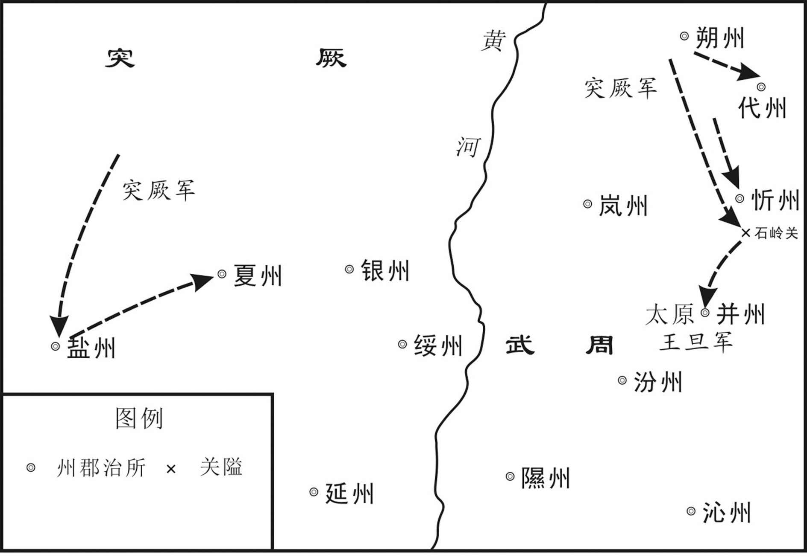 
武则天长安二年（702年）突厥攻唐示意图

## 【原文】

**三年夏六月辛酉，突厥默啜遣其臣莫贺干来，请以女妻皇太子之子[1]。冬十一月己丑，突厥遣使谢许婚。丙申，宴于宿羽台，太子预焉[2]。**

## 【注文】

[1]莫贺干（生卒年不详）：唐武则天时期的突厥大臣。　　妻：嫁给。

[2]宿羽台：唐高宗调露元年（679年）造，在东都宿羽宫中。　　预：参与。

## 【译文】

武则天长安三年（703年）夏季六月辛酉（初一日），突厥默啜派遣他的臣子莫贺干来长安，请求把他的女儿嫁给皇太子的儿子。冬十一月己丑（初二日），突厥派使者感谢朝廷许婚。丙申（初九日），朝廷在宿羽台设宴，太子也参加了宴会。

## 【原文】

**四年。突厥默啜既和亲，秋八月戊寅，始遣淮阳王武延秀还[1]。**

## 【注文】

[1]既：副词。已经。　　始遣淮阳王武延秀还：武则天圣历元年（698年）七月，武延秀奉命前往突厥，纳默啜女为妻，八月被拘禁。　　武延秀（？—710年）：并州文水（今山西文水东）人，武承嗣子，在突厥多年，通晓少数民族语言。武则天长安四年（704年）还朝后被封为桓国公、左卫中郎将。唐中宗景龙二年（708年），尚安乐公主。唐中宗死后，在李隆基（唐玄宗）发动的宫廷政变中被斩杀。

## 【译文】

武则天长安四年（704年）。突厥默啜与朝廷和亲以后，秋八月戊寅（二十五日），才让淮阳王武延秀回来。

## 【原文】

**中宗神龙元年夏六月壬子，以左骁卫大将军裴思说充灵武军大总管，以备突厥[1]。**

## 【注文】

[1]中宗：指唐中宗李显（656年—710年），原名李哲，唐高宗与武则天之子。唐中宗前后两次当政，公元710年猝死，葬于定陵（今陕西富平北）。　　神龙：唐中宗李显的年号，神龙元年（705年）正月到神龙三年（707年）九月。神龙元年（705年）二月太平公主等人发动政变，迎唐中宗复位，史称“神龙政变”。复国号唐，沿用武则天“神龙”年号不改。　　骁卫大将军：古代将军名号。隋唐置左右骁卫府，置上将军各一人，大将军各一人，将军各二人。　　裴思说：《新唐书》作“裴思谅”。裴思谅为裴思超之子，官至灵武军大总管，封河东郡公。

## 【译文】

唐中宗神龙元年（705年）夏季六月壬子（初四日），朝廷任命左骁卫大将军裴思谅担任灵武军大总管，以防备突厥。

## 【原文】

**二年冬十二月己卯，突厥默啜寇鸣沙，灵武军大总管沙吒忠义与战，军败，死者六千余人[1]。丁巳，突厥进寇原、会等州，掠陇右牧马万余匹而去[2]。免忠义官[3]。**

## 【注文】

[1]鸣沙：古县名，治今宁夏中宁东北。

[2]原：指原州，治今宁夏固原市。　　会：指会州，西魏置，治所在会宁（今甘肃靖远）。唐高祖武德二年（619年）改置西会州，唐太宗贞观八年（634年）改曰粟州，同年又改为会州。辖境相当于今甘肃靖远、景泰、会宁及宁夏海原等县地。

[3]免：罢免。

## 【译文】

唐中宗神龙二年（706年）十二月己卯（初九日），突厥默啜进犯鸣沙，灵武军大总管沙吒忠义与之交战，战败，死了六千多人。丁巳（十一日），突厥进犯原、会等州，抢掠陇右的牧马一万多匹后离去。朝廷免去了沙吒忠义的官职。

## 【原文】

**景龙元年春正月庚戌，制以突厥默啜寇边，命内外官各进平突厥之策[1]。右补阙卢俌上疏，以为：“郤縠悦礼乐，敦《诗》、《书》，为晋元帅；杜预射不穿札，建平吴之勋[2]。是知中权制谋，不取一夫之勇[3]。如沙吒忠义，骁将之材，本不足以当大任[4]。又，鸣沙之役，主将先逃，宜正邦宪，赏罚既明，敌无不服[5]。又，边州刺史宜精择其人，使之搜卒乘，积资粮，来则御之，去则备之[6]。去岁四方旱灾，未易兴师[7]。当理内以及外，绥近以来远，俟仓廪实，士卒练，然后大举以讨之[8]。”上善之[9]。夏五月戊戌，以右屯卫大将军张仁愿为朔方道大总管，以备突厥[10]。冬十月丁丑，命左屯卫将军张仁愿充朔方道大总管，以击突厥。比至，虏已退，追击，大破之[11]。**

## 【注文】

[1]制：指帝王的命令。

[2]补阙：唐垂拱元年（685年）置，左、右各二人，从七品上，掌供奉讽谏，分隶属门下、中书两省。　　卢俌（fǔ）（生卒年不详）：唐中宗时大臣，官至秘书少监。　　郤（xì）縠（hú）（？—前632年）：姬姓，郤氏，名縠，春秋时代晋国公族，也是晋国第一任中军将。公元前633年，楚成王包围了宋国，宋国向晋国求救。晋国在被庐举行蒐礼阅兵，建立了三个军，晋文公问赵衰谁能担任中军将，赵衰推荐郤縠，因为郤縠即便五十岁了，还坚持学习，而且更加重视学习。郤縠喜爱礼乐重视《诗》《书》。先王制定的《诗》《书》这些法规典籍，是道德信义的宝库；礼乐则是道德的表率；道德信义，是人民的根本，利益的基础。重视这些的人，是不会忘记百姓的。晋文公采纳了赵衰的建议，以郤縠为中军将。　　敦：推崇，注重。　　《诗》《书》：指《诗经》和《尚书》。　　晋：周代春秋时期诸侯国名，出自周成王弟唐叔虞。疆域约为今山西西南部。公元前403年，晋国卿大夫韩虔、赵籍、魏斯三家自立为诸侯，分裂晋国。周威烈王赐三家为诸侯，于是韩国、赵国、魏国三国分晋，晋国灭亡。　　杜预（222—285年）：字元凯，京兆杜陵（今陕西西安东南）人，西晋时期著名的政治家、军事家和学者，灭吴统一战争的统帅之一。历官三国魏尚书郎、西晋河南尹、度支尚书、镇南大将军、当阳县侯，官至司隶校尉。功成之后，耽思经籍，博学多通，多有建树，被誉为“杜武库”。　　札：古时写字的小木简。　　勋：功勋。

[3]中权制谋：在军中制定战略决策。

[4]当：担当。

[5]邦宪：指国家大法。

[6]边州：这里指边疆上的州。　　搜：选择，寻找。　　卒乘：士卒和车。

[7]去岁：去年。

[8]绥：安，安抚。　　俟：等到。

[9]善：赞许。

[10]右屯卫大将军：隋炀帝大业三年（607年）改右领军府为右屯卫，正三品总府事，统诸鹰扬府。唐高宗龙朔二年（662年）改为右武威大将军。

[11]破：打败。

## 【译文】

唐中宗景龙元年（707年）春正月庚戌（十一日），因为突厥默啜进犯边境，中宗命令朝廷内外的官员各自进献平定突厥的策略。右补阙卢俌上疏认为：“郤縠喜欢礼乐，推崇《诗》《书》，后来被任为晋国的元帅；西晋大臣杜预连木简都射不穿，却建立了平定吴国的功业。由此可知，制定军事策略时不能只取用有匹夫之勇的人。比如沙吒忠义，他只有做勇将的才能，本来就不足以担当大任。再如，鸣沙战役，沙吒忠义作为主将首先逃跑，陛下应该对他严加处罚以正国法，赏罚一旦分明，敌人就不敢不屈服了。再说，边疆地区的刺史朝廷应该精心选择合适的人，应该选那些善于整治兵马，积蓄物资粮食，既能成功地抵御敌人的进犯，敌人离开了又可以加以防备的人。去年全国各地遭受了旱灾，本不应该出动军队。应当治理好内部再处理外部，安抚近处再招揽远方，等到国家仓库中的粮食充实了，士兵训练好了，然后再大规模出兵讨伐他们。”中宗认为卢俌说得很对。夏五月戊戌（初一日），任命右屯卫大将军张仁愿为朔方道大总管，以防备突厥。冬十月丁丑（十三日），命令左屯卫将军张仁愿充任朔方道大总管，以攻击突厥。等到张仁愿率军赶到，敌军已经撤退了，唐军奋起追击，大败敌军。

## 【原文】

**二年春三月丙辰，朔方道大总管张仁愿筑三受降城于河上[1]。初，朔方军与突厥以河为境，河北有拂云祠，突厥将入寇，必先诣祠祈祷，牧马料兵，而后渡河[2]。时默啜悉众西击突骑施，仁愿请乘虚夺取漠南地，于河北筑三受降城，首尾相应，以绝其南寇之路[3]。太子少师唐休璟以为：“两汉以来皆北阻大河，今筑城寇境，恐劳人费功，终为虏有[4]。”仁愿固请不已，上竟从之[5]。仁愿表留岁满镇兵以助其功，咸阳兵二百余人逃归，仁愿悉擒之，斩于城下，军中股栗，六旬而成[6]。以拂云祠为中城，距东西两城各四百余里，皆据津要，拓地三百余里[7]。于牛头朝那山北置烽候千八百所[8]。以左玉铃卫将军论弓仁为朔方军前锋游奕使，戍诺真水为逻卫[9]。自是突厥不敢度山畋牧，朔方无复寇掠，减镇兵数万人[10]。**

## 【注文】

[1]受降城：唐时也称河外三城，位于黄河河套北岸及漠南草原。中城在今内蒙古包头市西；东城在今托克托南，黄河北大黑河东岸，西去中城三百里；西城在今乌拉特中旗西南乌加河北岸、狼山口南，东去中城三百八十里。初以接受匈奴贵族投降而建，后因后突厥汗国的兴起，成为黄河外侧驻防城群体，与周边军镇、州形成中晚唐时期河套内外的防御体系，带有突出的军事驻防性质，对边疆防御起到了积极作用。同时兼具多种其他功能，如军政中心，交通枢纽和经济中心。

[2]拂云祠：指拂云堆神祠。在今内蒙古包头市西南敖陶窑子古城。　　河北：这里指黄河以北地区。

[3]突骑施：古族名，原属于西突厥，武则天圣历年间徙牙帐于碎叶川（今吉尔吉斯斯坦楚河流域）以为“大牙”，以伊丽水（今伊犁河）的牙帐为“小牙”。唐代宗大历年后，属葛逻禄。

[4]太子少师：皇太子辅臣。太子三少（东宫三少）之一。西晋始置，协掌辅导太子。隋、唐用作加官、赠官或安置退免大臣，从二品。

[5]固：坚决。

[6]岁满镇兵：戍边期限已满的士兵。　　咸阳兵：从咸阳去的镇兵。　　股栗：两腿发抖。形容十分恐惧。

[7]津要：水路交通要冲。

[8]牛头朝那山：在今内蒙古固阳县东。　　烽候：指烽火台。

[9]论弓仁（663—723年）：唐代高级将领，出身于吐蕃噶氏家族，论钦陵之子。武则天圣历二年（699年）归附，封酒泉郡公。长期镇守边疆，屡立战功。官至左骁卫大将军、朔方副大使。　　游奕使：犹巡逻使。巡逻于亭障之外，刺探敌情。　　诺真水：在今内蒙古达尔罕茂明安联合旗。在门口中受降城东北数百里处。　　逻卫：巡逻保卫。

[10]畋（tián）牧：打猎放牧。

## 【译文】

唐中宗景龙二年（708年）三月丙辰（二十三日），朔方道大总管张仁愿在黄河岸边修筑三座受降城。当初，唐朔方军与突厥以黄河为界，黄河的北面有座拂云祠，突厥将要进犯朔方军时，一定先到拂云祠祈祷、放牧和点校军队，然后渡河。当时默啜率领士兵西去攻打突骑施，张仁愿请求乘他后方空虚的时候夺取漠南地区，在黄河以北地区修筑三座受降城，首尾相应，以断绝突厥南侵的道路。太子少师唐休璟认为：“两汉以来都是利用黄河天险阻挡北方敌人，现在在敌人的境内修筑城池，恐怕劳民伤财，最终仍被突厥占有。”张仁愿坚持己见，不停地向朝廷请求修城，中宗听从了他的建议。张仁愿上表请求留下戍边满一年的士兵协助修城，从咸阳来的士兵二百多人想逃回去，张仁愿把他们全部抓住，在城下斩首，军中士兵都很害怕，用了六十多天就修好了受降城。以拂云祠为中城，中城距离东西两城各四百多里，都占据交通要道，开拓疆土三百多里。此外，又在牛头朝那山以北设置烽火台一千八百多所。任命左玉铃卫将军论弓仁为朔方军前锋游奕使，戍守诺真水进行巡逻守卫。从此，突厥再不敢翻过山来打猎放牧，朔方再没被进犯抢掠，因此减少镇守军队几万人。

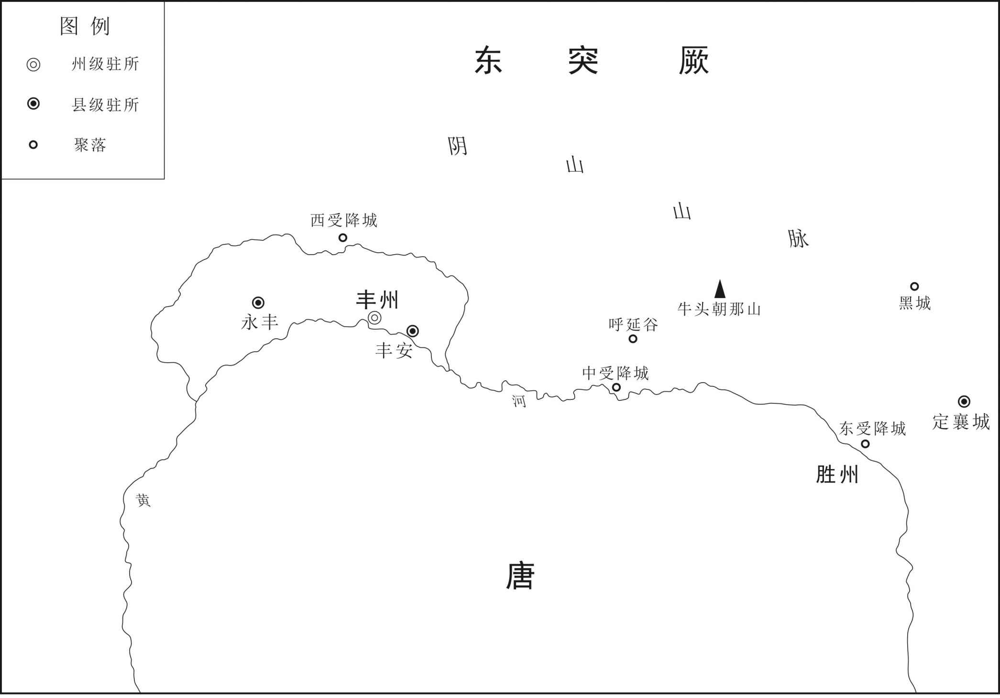 
三受降城位置示意图

## 【原文】

**仁愿建三城，不置壅门及备守之具[1]。或问之，仁愿曰：“兵贵进取，不利退守[2]。寇至此，当并力出战，回首望城者犹应斩之，安用守备，生其退恧之心也[3]。”其后常元楷为朔方军总管，始筑壅门，人以是重仁愿而轻元楷[4]。**

## 【注文】

[1]壅门：大城门外的小城，用以增强城池的防御力量。

[2]或：有人。

[3]退恧（nǜ）：退缩，胆怯。

[4]常元楷（？—713年）：唐朝武臣。唐中宗时为朔方军总管，唐睿宗时为左羽林大将军。唐玄宗先天二年（713年）与窦怀贞等参与太平公主谋反事宜，后被杀。

## 【译文】

张仁愿修建了三座城，不在城上设置壅门及其他防守设备。有人问张仁愿为什么这样做，他说：“用兵之道，贵在进取，不利于退守。敌人到了就应合力出击，回头望城的人就应杀掉，哪里还需要守备城池的设施，让他们产生胆怯退守的想法。”后来常元楷为朔方军总管，开始修筑壅门，人们都因这个缘故推重张仁愿而轻视常元楷。

## 【原文】

**睿宗景云二年春正月癸丑，突厥可汗默啜遣使请和，许之[1]。三月，以宋王成器女为金山公主，许嫁突厥默啜[2]。御史中丞和逢尧摄鸿胪卿，使于突厥，说默啜曰：“处密、坚昆闻可汗结婚于唐，皆当归附[3]。可汗何不袭唐冠带，使诸胡知之，岂不美哉[4]！”默啜许诺，明日，朴头衣紫衫，南面再拜，称臣[5]。遣其子杨我支及国相随逢尧入朝，十一月戊寅，至京师[6]。逢尧以奉使功迁水部侍郎[7]。**

## 【注文】

[1]景云：唐睿宗李旦的年号，景云元年（710年）七月到景云三年（712年）正月。

[2]宋王成器（679—742年）：指李成器，后改名李宪。唐朝宗室，睿宗李旦长子。本为太子，后让与李隆基。历任太子太师、太尉，封宁王。　　金山公主：唐有两位金山公主。一位是唐太宗之女，一位是宋王李成器之女。此指唐睿宗李旦孙女，宋王李成器之女，公元711年成议下嫁后突厥可汗默啜，不久下诏绝婚。

[3]御史中丞：古代官名，秦始置。汉朝为御史大夫的次官，或称御史中执法，秩千石。汉哀帝废御史大夫，以御史中丞为御史台长官，后历代相沿。隋置御史大夫，不置御史中丞，唐朝、五代、宋均大夫与中丞并置，仍以中丞为长官。　　和逢尧（生卒年不详）：岐州岐山（今陕西岐山东北）人。唐睿宗时，出使突厥说服默啜，擢升户部侍郎。玄宗开元时，卒于拓州刺史。　　鸿胪卿：古代官名。鸿胪寺最高长官。秦曰典客，汉改为大行令，汉武帝时又改名大鸿胪，北齐置为鸿胪寺长官，主管宾客、朝会、宗教等事务，为九卿之一，历朝沿置，也称鸿胪寺卿。唐朝从三品。唐高宗、武则天时曾改称同文正卿、司宾卿，后复旧。掌宾客及凶仪之事。　　说（shuì）：劝说。　　处密：又作“处蜜”，古部落名。西突厥别部，游牧于天山之北。　　坚昆：古族名。又称鬲昆、隔昆。在今叶泥塞河上游。

[4]袭：穿。　　冠带：古时冠指帽子；带指衣服上的佩戴品。

[5]朴头衣紫衫：戴朴头，穿紫色的衣衫。此为三品以上的官服。

[6]杨我支（生卒年不详）：系默啜之子，唐睿宗景云二年（711年）奉使到长安。　　京师：指国都。这里指唐朝国都长安。

[7]水部：管理水道工程舟楫桥梁漕运政令的机构。魏晋南北朝为尚书省郎曹之一。隋朝置为工部四司之一，历朝沿置。唐高宗、玄宗时曾改名司川、司水，后都复旧。

## 【译文】

唐睿宗景云二年（711年）春正月癸丑（初七日），突厥可汗默啜派使节请和，睿宗答应了突厥的请求。三月，封宋王李成器的女儿为金山公主，把她许配给突厥默啜。御史中丞和逢尧兼任鸿胪卿，出使突厥，劝默啜说：“处密、坚昆听说可汗和唐朝通婚，都会归附您。可汗为什么不穿戴唐朝的衣服和帽子，让其他各民族知道这件事，难道不是很好吗！”默啜答应了，第二天，默啜头裹朴巾身穿紫衫，朝南叩拜两次，向唐称臣。又派他的儿子杨我支及国相随和逢尧入朝，十一月戊寅（初八日），到达京城长安。和逢尧因为奉命出使有功，被提升为水部侍郎。

## 【原文】

**玄宗先天元年春正月乙未，上御安福门宴突厥杨我支，以金山公主示之[1]。既而会上传位，婚竟不成[2]。**

## 【注文】

[1]玄宗：指唐玄宗李隆基（685—762年），亦称唐明皇。公元712年至756年在位。唐睿宗李旦之子。李隆基在位期间开创了唐朝乃至中国历史的最为鼎盛的时期，史称“开元盛世”。但是在位后期爆发安史之乱，使得唐朝国势逐渐走向衰落。　　先天：唐玄宗李隆基在位期间所用年号，即公元712年至713年。　　御：特指皇帝到某处。　　安福门：唐长安皇城西面二门中之北门，故址在今陕西西安市。

[2]既而：不久。　　会：副词。恰好，正巧。

## 【译文】

唐玄宗先天元年（712年）春正月乙未（二十五日），睿宗在安福门设宴款待突厥杨我支，把金山公主引出来让他看。不久正逢睿宗传位给太子李隆基，婚事最终没办成。

## 【原文】

**开元元年秋八月丙辰，突厥可汗默啜遣其子杨我支来求婚[1]。丁巳，许以蜀王女南和县主妻之[2]。**

## 【注文】

[1]开元：唐玄宗李隆基在位期间所用年号，即公元713年至741年。

[2]蜀王：指李褕，唐宗室。　　南和县主：为蜀王李褕之女。唐制，皇帝的女儿为公主，亲王女儿为县主。

## 【译文】

唐玄宗开元元年（713年）秋八月丙辰（二十五日），突厥可汗默啜遣他的儿子杨我支来唐求婚。丁巳（二十六日），唐玄宗把蜀王的女儿南和县主嫁给他。

## 【原文】

**二年春二月乙未，突厥可汗默啜遣其子同俄特勒及妹夫火拔颉利发、石阿失毕将兵围北庭都护府，都护郭虔瓘击败之[1]。同俄单骑逼城下，虔瓘伏壮士于道侧，突起斩之[2]。突厥请悉军中资粮以赎同俄，闻其已死，恸哭而去[3]。闰月，突厥石阿失毕既失同俄，不敢归[4]。癸未，与其妻来奔，以为右卫大将军，封燕北郡王，命其妻曰金山公主。**

## 【注文】

[1]同俄特勒（？—714年）：突厥默啜之子。唐玄宗开元二年（714年），率众寇北庭，被唐右骁卫将军郭虔瓘（guàn）所败，斩于城下。勒为“勤”之误。　　火拔颉利发（生卒年不详）：唐玄宗时突厥大臣。　　石阿失毕（生卒年不详）：突厥人，唐玄宗先天二年（713年），率精兵攻北庭，为郭虔瓘击败。后归附唐朝，拜为右卫大将军、燕北郡王。　　北庭都护府：武则天长安二年（702年）改庭州置，治所在金满县（今新疆吉木萨尔北）。辖境东起于今阿尔泰山、巴里坤湖，西达今咸海（一说今里海）西突厥诸部族。唐德宗贞元六年（790年）陷于吐蕃，后废。　　郭虔瓘（生卒年不详）：初唐武将，齐州历城（今山东济南）人，唐玄宗开元初，任右骁卫将军，兼北庭都护。开元二年（714年），破突厥，任冠军大将军，行右骁卫大将军。拜上国柱、太原郡开国公。后转任安西副大都护、四镇经略安抚使，进封潞国公。

[2]单骑（jì）：指一人一马。

[3]赎（shú）：用钱物或其他代价换回人身或抵押品。

[4]既：已经。

## 【译文】

唐玄宗开元二年（714年）春二月乙未（初七日），突厥可汗默啜派遣他的儿子同俄特勤及妹夫火拔颉利发、石阿失毕率军围攻北庭都护府，都护郭虔瓘击败敌军。同俄单人独马跑到城下，郭虔瓘在道路两旁埋伏了壮士，一跃而起斩杀了同俄。突厥请求用军中全部物资和粮食来赎救同俄，听说他已死，大声哭着退走了。闰二月，突厥石阿失毕因为失去同俄，不敢回突厥，癸未（二十五日），石阿失毕与他的妻子向唐投降，玄宗任命石阿失毕为右卫大将军，封燕北郡王，封他的妻子为金山公主。

## 【原文】

**夏四月辛巳，突厥可汗默啜复遣使求婚，自称“乾和永清太驸马、天上得果报天男、突厥圣天骨咄禄可汗”。突厥可汗默啜衰老，昏虐愈甚[1]。［秋九月］壬子，葛逻禄等部落诣凉州降[2]。冬十月己巳，突厥可汗默啜又遣使求婚，上许以来岁迎公主[3]。**

## 【注文】

[1]愈：更加。

[2]葛逻禄：古族名，是西突厥别部，亦称葛罗禄，地处金山（今阿尔泰山）之西。

[3]来岁：来年，第二年。

## 【译文】

夏四月辛巳（二十五日），突厥可汗默啜又派使者来唐请求通婚，他自称为“乾和永清太驸马、天上得果报天男、突厥圣天骨咄禄可汗”。突厥可汗默啜衰老，更加昏庸暴虐。秋九月壬子（二十八日），葛逻禄等部落到凉州来投降。冬十月己巳（十五日），突厥可汗默啜又派使者求婚，玄宗答应让他第二年来迎娶公主。

## 【原文】

**突厥十姓胡禄屋等诸部诣北庭请降，命都护郭虔瓘抚存之[1]。十一月丙申，遣左散骑常侍解琬诣北庭宣慰突厥降者，随便宜区处[2]。**

## 【注文】

[1]突厥十姓：即五咄陆、五弩失毕。　　胡禄屋：西突厥左厢五咄陆之一。　　北庭：指北庭都护府。武则天长安二年（702年），于庭州置北庭都护府（治今新疆吉木萨尔北），取代金山都护府，管理西突厥故地，仍隶属于安西都护府。辖境东起于今阿尔泰山、巴里坤湖，西达今咸海（一说今里海）西突厥诸部族。唐德宗贞元六年（790年）陷于吐蕃，后废。

[2]散骑常侍：古代官名，汉有散骑，为皇帝侍从，又有中常侍，性质相同。魏文帝并散骑与中常侍为一官，如称散骑常侍，以士人任职。入则规谏过失，备皇帝顾问，出则骑马散从。资深者称祭酒散骑常侍。多是显职。隋属门下省。唐太宗曾以散骑常侍为散官。唐高宗显庆二年（657年），分为左右，左散骑常侍二人，正三品下，属门下省；右散骑常侍二人属中书省。职掌同为规谏过失，侍从顾问，并无实权，而为尊贵之官，常作为将相大臣的加官。　　解琬（？—718年）：魏州元城（今河北大名）人，武则天圣历初，迁侍御史，安抚乌质勒及十姓部落。迁御史中丞，监北庭都护、西域安抚使。历沧州刺史、朔方行军大总管，封济南县男。　　区处：区分处置。

## 【译文】

突厥十姓胡禄屋等诸部落到北庭都护府投降，朝廷命令都护郭虔瓘安抚挽留他们。十一月丙申（十二日），派遣左散骑常侍解琬到北庭安抚慰问来投降的突厥部落，让他按照情况区分处置。

## 【原文】

**三年[1]。（春正月）突厥十姓降者前后万余帐[2]。高丽莫离支文简，十姓之婿也[3]。二月，与跌都思（奉）［泰］等亦自突厥帅众来降，制皆以河南地处之。三月，胡禄屋酋长支匐忌等入朝[4]。上以十姓降者浸多，夏四月庚申，以右羽林大将军薛讷为凉州镇大总管，赤水等军并受节度，居凉州；左卫大将军郭虔瓘为朔川镇大总管，和戎等军并受节度，居并州，勒兵以备默啜[5]。默啜发兵击葛逻禄、胡禄屋、鼠尼施等，屡破之，敕北庭都护汤嘉惠、左散骑常侍解琬等发兵救之[6]。五月壬辰，敕嘉惠等与葛逻禄、胡禄屋、鼠尼施及定边道大总管阿史那献互相庆援[7]。秋七月壬戌，以凉州大总管薛讷为朔方道行军大总管，太仆卿吕延祚、灵州刺史杜宾客副之，以讨突厥[8]。**

## 【注文】

[1]三年：即唐玄宗开元三年，公元715年。

[2]帐：古代游牧民族计算人户的单位，因他们逐水草而居，每户住一顶帐篷，故按帐计人户数。

[3]高丽：（918—1392年），又称高丽王朝、王氏高丽，是朝鲜封建王朝。王建建立，国号高丽，都开京（今朝鲜开城）。公元936年统一朝鲜半岛。1392年为李氏朝鲜（李朝）所取代。　　莫离支：是古代高句丽后期出现的一种新的高级官职，它的职能其实已超出了宰相的性质，而且具备了专制权臣为篡夺王位而自设的临时性特殊官职的特点。　　文简：即高文简（生卒年不详），唐朝时高丽王朝大臣。　　十姓之婿：《新唐书·突厥传》载：“虏势浸削，其婿高丽莫离支高文简，与跌都督思太，吐谷浑大酋慕容道奴，郁射施大酋鹘屈颉介、苾悉颉力，高丽大酋高拱毅，合万余帐相踵款边。”据此，高文简应为默啜的女婿。

[4]支匐忌（生卒年不详）：唐朝时突厥部落胡禄屋的酋长。

[5]薛讷（649—720年）：字慎言，绛州万泉（今山西万荣西南）人，名将薛仁贵之子，唐代武将。曾多次击败突厥、吐蕃等部。节度使之名即由他开始。　　赤水：这里指赤水军。在凉州（今甘肃武威）城内。　　并受节度：一并受指挥。　　凉州：古地名，今甘肃武威。　　勒兵：率领军队。勒指统领，统率。

[6]鼠尼施：唐朝时西突厥的部落名称，又译作苏尼鼠、苏尼失。游牧在今焉耆以西的巴音布鲁克草原。公元657年，唐朝平定西突厥汗国，在鼠尼施游牧之地设鹰娑都督府，归昆陵都护府管辖，由兴昔亡可汗统领。　　汤嘉惠（生卒年不详）：唐朝将领。唐中宗景龙四年（710年）任玉门军使、肃州刺史。唐玄宗开元三年（715年）任北庭都护。开元五年（717年）继郭虔瓘任安西都护。开元六年（718年）加安西四镇节度经略使。

[7]阿史那献：唐朝时西突厥兴昔亡可汗，阿史那元庆之子。唐中宗为了抵制突骑施对西域的侵蚀，公元708年册封阿史那献为右骁骑大将军、昆陵都护、兴昔亡可汗，统辖咄陆五部，镇守庭州。公元715年，又加定远道行军大总管，抵御大食和拔汗那。

[8]太仆卿：古代官职名。初为太仆的尊称。南朝梁正式定为官称，为十二卿之一，管理畜牧事务。北齐置为太仆寺长官，管理皇帝车马、全国畜牧事务。历朝沿置，也称太仆寺卿，唐朝从三品。　　吕延祚（生卒年不详）：唐代人，曾任太仆卿、紫薇舍人、工部侍郎。其在文坛最重要的贡献就是负责编纂了《进五臣集注文选表》。　　杜宾客（生卒年不详）：唐朝武臣，唐玄宗时为薛讷副将。

## 【译文】

唐玄宗开元三年（715年）。突厥十姓先后来归降的有一万多帐。高丽莫离支文简是突厥十姓的女婿。二月，也与跌都督思泰等从突厥率领部众来投降，玄宗命令把他们安置在黄河以南的地区。三月，胡禄屋酋长支匐忌等入朝。因为突厥十姓来归降的人越来越多，夏季四月庚申（初九日），玄宗任命右羽林大将军薛讷为凉州镇大总管，赤水等军也一并受他指挥，大总管府设在凉州；任命左卫大将军郭虔瓘为朔川镇大总管，和戎等军也一并受他指挥，治所设在并州，统领军队防备默啜。默啜出动军队攻击葛逻禄、胡禄屋、鼠尼施等部落，多次击败他们，玄宗命令北庭都护汤嘉惠、左散骑常侍解琬等出兵救援。五月壬辰（十二日），玄宗任命汤嘉惠等与葛逻禄、胡禄屋、鼠尼施及定边道大总管阿史那献互相接应援助。秋季七月壬戌（十四日），玄宗任命凉州大总管薛讷为朔方道行军大总管，太仆卿吕延祚、灵州刺史杜宾客为副将，以讨伐突厥。

## 【原文】

**四年夏六月癸酉，拔曳固斩突厥可汗默啜首来献[1]。时默啜北击拔曳固，大破之于独乐水，恃胜轻归，不复设备，遇拔曳固迸卒颉质略自柳林突出，斩之[2]。时大武军子将郝灵荃奉使在突厥，颉质略以其首归之，与偕诣阙，悬其首于广街[3]。拔曳固、回纥、同罗、霫、仆固五部皆来降，置于大武军北[4]。**

## 【注文】

[1]拔曳固：即拔野固、拔野古，是隋唐时部落名称。漫散于漠北，方圆千里，在今克鲁伦、海拉尔两河北境，故处仆骨之东，西与黑龙江境内的靺鞨诸部相邻近。帐户六万，士兵万余人。他们居住的地方有茂盛的牧草，多产良马和精铁。

[2]独乐水：即独洛河。今内蒙古土拉河。　　迸卒：逃散的士兵。　　颉质略（生卒年不详）：唐朝时少数民族拔曳固将领，后官至拔曳固都督。

[3]子将：古代武职名。唐朝横河、高阳、唐兴、恒阳北平等五军的千人之长，以果毅都尉充任。　　郝灵荃（生卒年不详）：唐玄宗时朝廷武将，任子将。　　偕：副词。一同，一起。

[4]同罗：是铁勒人的一个部落。唐代在突厥人的打击下逐渐分裂，其中部分同罗部众逐渐迁入内地，在安史之乱时期同罗部是安禄山叛军的一部分。　　霫（xí）：古族名。一说匈奴之别种。隋、唐时居于潢水（今西拉木伦河）以北，后迁潢水以南，并于奚族。　　仆固：铁勒部之一，又作仆骨、仆古等。先臣属于突厥汗国，后属薛延陁汗国。唐太宗贞观二十年（646年），臣属于唐朝，在其地设金微州都督府。　　大武军：在朔州城，即今山西朔州。

## 【译文】

唐玄宗开元四年（716年）夏六月癸酉（二十九日），拔曳固斩了突厥可汗默啜的首级来献。当时默啜向北攻击拔曳固，在独乐水大败拔曳固，默啜依仗着胜利骄傲而归，不再设防，路上遇到拔曳固逃散的士兵颉质略从柳树林里突然出来，斩了默啜。当时大武军小将郝灵荃正好出使突厥，颉质略拿着默啜的首级投降了郝灵荃，与郝灵荃一同回到朝廷，把默啜的人头悬挂在广阔的街道上。拔曳固、回纥、同罗、霫、仆固五部都来投降，玄宗把他们安置在大武军的北面。

## 【原文】

**默啜之子小可汗立，骨咄禄之子阙特勒击杀之，及默啜诸子、亲信略尽[1]。立其兄左贤王默棘连，是为毗伽可汗，国人谓之小杀[2]。毗伽以国固让阙特勒，阙特勒不受，乃以为左贤王，专典兵马[3]。**

## 【注文】

[1]立：登上可汗之位。　　阙特勒：“勒”为“勤”之误。东突厥大臣。东突厥创立者骨咄禄之子，毗伽可汗之弟。姓阿史那氏，名阙，善将兵。唐玄宗开元四年（716年），默啜死，阙特勤拥立兄默棘连为可汗，自为突利设（左贤王），专掌兵马，与暾欲谷同心协力，主对唐和好。

[2]左贤王：为匈奴单于之下最高官职，常以太子任之。一般统率万余骑，居单于东方，最为大国。下各置千长、百长、仆长、裨小王、相都尉、当户等官属，以官理辖地军政事务。　　默棘连（？—734年）：骨咄禄之子，即毗伽可汗后东突厥大汗。（毗伽是突厥和回鹘大汗常用的尊称之一。）公元716年至723年在位。毗伽继位后，重振突厥汗国。公元727年，吐蕃约毗伽合攻唐朝，毗伽不但拒绝，还将这一情报及时通知唐朝，得到唐玄宗的赞赏，两国于是建立良好关系，互相开展贸易。

[3]专典：掌门管理。

## 【译文】

默啜的儿子小可汗继立为可汗，骨咄禄的儿子阙特勤把他杀了，默啜的儿子们、亲信几乎都被杀光。阙特勤立他的兄长左贤王默棘连为可汗，就是毗伽可汗，国人都叫他小杀。毗伽坚决要把可汗位让给阙特勤，阙特勤不接受，于是就让他做了左贤王，专门管理军队。

## 【原文】

**秋八月，突厥默啜既死，奚、契丹、拔曳固等诸部皆内附，突骑施苏禄复自立为可汗[1]。突厥部落多离散，毗伽可汗患之，乃召默啜时牙官暾欲谷以为谋主[2]。暾欲谷年七十余，多智略，国人信服之[3]。突厥降户处河曲者，闻毗伽立，多复叛归之[4]。并州长史王晙上言：“此属徒以其国丧乱，故相帅来降[5]。若彼安宁，必复叛去[6]。今置之河曲，此属桀黠，实难制御，往往不受军州约束，兴兵剽掠[7]。闻其逃者已多与虏声问往来，通传委曲[8]。乃是畜养此属使为间谍，日月滋久，奸诈逾深，窥伺边隙，将成大患[9]。虏骑南牧，必为内应，来逼军州，表里受敌，虽有韩、彭，不能取胜矣[10]。愿以秋冬之交，大集兵众，谕以利害，给其资粮，徙之内地[11]。二十年外，渐变旧俗，皆成劲兵[12]。虽一时暂劳，然永久安靖[13]。比者守边将吏及出境使人，多为谀辞，皆非事实[14]。或云北虏破灭，或云降户妥帖，皆欲自炫其功，非能尽忠徇国[15]。愿察斯利口，勿忘远虑[16]。议者必曰国家向时已尝置降户于河曲，皆获安宁，今何所疑[17]？此则事同时异，不可不察[18]。向者颉利既亡，降者无复异心，故得久安无变[19]。今北虏尚存，此属或畏其威，或怀其惠，或其亲属，岂乐南来[20]。校之彼时，固不侔矣[21]。以臣愚虑，徙之内地，上也[22]。多屯士马，大为之备，华夷相参，人劳费广，次也[23]。正如今日，下也[24]。愿审兹三策，择利而行[25]。纵使因徙逃亡，得者皆为唐有，若留至河冰，恐必有变[26]。”疏奏未报[27]。降户跌思泰、阿悉烂等果叛[28]。冬十月甲辰，命朔方大总管薛讷发兵追讨之。王晙引并州兵西济河，昼夜兼行，追击叛者，破之，斩获三千级[29]。**

## 【注文】

[1]奚：古族名。南北朝时称库莫奚，隋唐简称为奚。与契丹同源，或谓出自鲜卑宇文部的一支。分布在饶乐水（今内蒙古西拉木伦河）流域。唐太宗贞观二十二年（公元648年）归唐，置饶乐都督府。　　突骑施苏禄（？—738年）：西突厥突骑施部首领。唐玄宗开元四年（716年），唐朝制授苏禄左羽林大将军、金方道经略大使，拜为忠顺可汗。

[2]牙官：副武官。亦泛称下属小官。　　暾欲谷（646—724年）：后突厥汗国的贵族，历事骨咄禄、默啜及毗伽可汗三朝，为毗伽可汗的岳父、谋主。反对毗伽可汗对唐用兵，通晓唐朝政治，认为汉化会减弱突厥的战斗力。帮助毗伽和阙特勤振兴了突厥。

[3]国人：这里突厥人。

[4]河曲：黄河之曲。此处特指黄河以南突厥故地。

[5]王晙（jùn）（653—732年）：沧州景城人（今河北沧县），后徙居河南府陕州洛阳县（今河南洛阳），唐朝大臣。

[6]若：假如。

[7]桀（jié）黠（xiá）：凶悍狡黠。　　军州：古行政区划的名称，多指战略上的军事要地。

[8]委曲：事情的底细和原委。

[9]边隙：边防的疏漏薄弱之处。

[10]南牧：南侵。　　韩：指韩信（？—前196年），淮阴（今江苏淮安市淮阴区西南）人，西汉开国功臣，中国历史上杰出的军事家，“汉初三杰”之一。曾先后为齐王、楚王，后贬为淮阴侯。为汉朝的天下立下赫赫功劳，但后来却遭到刘邦的疑忌，最后以谋反的罪名被处死。韩信是中国军事思想“谋战”派代表人物，被后人奉为“兵仙”“战神”。　　彭：指彭越（？—前196年），昌邑人（今山东巨野东南），字仲。楚汉战争时汉军著名将领，西汉开国功臣，封梁王。与韩信、英布并称汉初三大名将，后因被告发谋反，为刘邦所杀。

[11]谕：使知道。

[12]外：以后。

[13]安靖：安定，平定。

[14]谀辞：谄媚之辞。

[15]炫：炫耀，自夸。

[16]利口：动听的言语。

[17]置：放置，安置。

[18]异：不同。

[19]向者：以前。

[20]南来：这里指向南归附唐朝。

[21]侔（móu）：相同，等同。

[22]上：上策。

[23]华夷：汉族和少数民族。

[24]下：下策。

[25]兹：这。

[26]河冰：黄河结冰。

[27]疏奏：呈给帝王的上疏和奏折。

[28]（xié）跌思泰（生卒年不详）：九姓铁勒跌部首领。唐玄宗开元三年（715年）率先起兵反抗默啜可汗，兵败降唐。封楼烦公，拜跌都督，置之河曲地。后又反叛唐朝战败，率部返归漠北，重新附于突厥。　　阿悉烂（生卒年不详）：唐朝玄宗时九姓铁勒跌部首领。

[29]济河：渡过黄河。　　级：首级。

## 【译文】

唐玄宗开元四年（716年）秋八月，突厥默啜死后，奚、契丹、拔曳固等部落都归附了唐朝，突骑施苏禄又自立为可汗。由于突厥各部落已四分五裂，毗伽可汗对此十分忧虑，于是召来默啜时牙官暾欲谷做自己的参谋。暾欲谷年纪有七十多岁了，很有谋略，国人都信服他。被安置在河曲的突厥降户听闻毗伽立为可汗，很多人又反叛朝廷回到突厥归附毗伽可汗。并州长史王晙上言：“这些人都是因为突厥发生动乱，所以才相率来投降朝廷。一旦他们国内安定了，一定又会反叛离去。现在把他们安置在河曲，这些人桀骜不驯又很狡猾，难以制服，他们往往不受军州的约束，兴兵抢掠。听说他们中逃跑的人大多已经和突厥有书信往来，相互通风报信。这是养活他们给敌人当间谍，时间长了，就变得更加奸诈，他们窥视边疆防务的空隙，将来必成为国家大患。如果突厥的骑兵向南进犯，这些人一定会成为内应，前来逼迫军州，使我们内外受敌，那时即使有韩信、彭越那样的名将也不能取得胜利。希望陛下在秋冬之交，把突厥的兵丁都集合起来，让他们知道利害关系，给他们粮食物资，把他们迁徙到内地。二十年后，他们逐渐改变了旧俗，都成为我们强劲的军队。这样虽然暂时费力，然而可以求得长久的安定。近来，守边的将士官吏以及出使突厥的人，大多都说谄媚之辞，并没有多少事实根据。有的说北边的敌人已经破灭，有的说归降的人户都很安稳，他们都是想自己吹嘘自己的功劳，不是为国家尽忠报国。希望陛下察清这些动听言语背后的实际情况，不要忘记国家长远的考虑。议论事情的人一定会说贞观年间国家把降户都安置在河曲，都得到了安宁，现在又有什么可疑虑的？这是因为虽然事情相同但时间不一样了，不可不多加考虑。昔日颉利可汗死了，归降的人再没起异心，因而当地的局势得以安定不变。现在突厥还存在，这些归降的人或者害怕突厥的势力，或者怀念突厥的恩惠，或者是突厥亲近的人，怎么能乐意归附我们。与过去相比较，本来就不能相提并论。按照臣的意见，把突厥归降的人迁徙到内地，这是上策。大量屯驻兵马，对敌人进犯作大规模的防备，使汉人和突厥人混杂而居，这样劳民伤财，是中策。像现在一样，把突厥归降的人安置在河曲，这是下策。希望陛下考虑这三个计策，选择最有利于的去执行。即使这些人中有不愿意迁徙而逃跑的，但服从迁徙命令的人毕竟可以成为大唐的子民，如果迟疑不决，等到黄河结冰，恐怕会发生变故。”王晙的奏疏还没有等到玄宗作出答复，突厥降户跌思泰、阿悉烂等果然反叛。冬十月甲辰（初二日），玄宗下诏命令朔方大总管薛讷出兵追讨这些反叛的降户。王晙率领并州的军队向西渡过黄河，日夜兼程，追击反叛的降户，打败了他们，杀死三千多人。

## 【原文】

**先是，单于副都护张知运悉收降户兵仗，令渡河而南，降户怨怒[1]。御史中丞姜晦为巡边使，降户诉无弓矢，不得射猎，晦悉还之[2]。降户得之，遂叛[3]。张知运不设备，与之战于青刚岭，为虏所擒，欲送突厥[4]。至绥州境，将军郭知运以朔方兵邀击之，大破其众于黑山呼延谷，虏释张知运而去[5]。上以张知运丧师，斩之以徇[6]。**

## 【注文】

[1]张知运（？—716年）：唐玄宗朝任单于副都护。

[2]姜晦（683—752年）：字本孙，秦州上邽（今甘肃天水）人，曾任唐高陵县令，唐玄宗开元中历御史中丞、吏部侍郎，主选公正。后因罪贬徙，卒于海州刺史任上。

[3]遂：于是。

[4]青刚岭：山名。在今甘肃会宁北。

[5]绥州：唐高祖武德三年（620年）置，唐太宗贞观二年（628年）治所在上县（今陕西绥德）。辖境相当于今陕西绥德、吴堡、清涧、子洲等县及子长县部分地区。　　邀击：在半路上袭击。　　黑山呼延谷：在今陕西榆林西南。

[6]丧师：损失了军队。　　徇：示众。

## 【译文】

先前，单于副都护张知运把突厥降户的兵器全都收缴，命令他们渡过黄河向南迁徙，这些降户因此怨恨愤怒。御史中丞姜晦为巡边使，降户向他诉说没有弓箭，不能够射猎，姜晦把他们的兵器都还给他们。降户得到了兵器，就都反叛了。张知运事先没有设防，和反叛的降户在青刚岭战斗，被敌人擒获，敌人想要把他送到突厥。到了绥州境内，将军郭知运带领朔方军在半路上袭击他们，在黑山呼延谷大败敌军，敌人放了张知运后逃走了。唐玄宗因为张知运损兵折将，把他斩首示众。

## 【原文】

**毗伽可汗既得思泰等，欲南入为寇[1]。暾欲谷曰：“唐主英武，民和年丰，未有间隙，不可动也[2]。我众新集，力尚疲羸，且当息养数年，始可观变而举[3]。”毗伽又欲筑城，并立寺观[4]。暾欲谷曰：“不可。突厥人徒稀少，不及唐家百分之一，所以能与为敌者，正以随逐水草，居处无常，射猎为业，人皆习武，强则进兵抄掠，弱则窜伏山林，唐兵虽多，无所施用[5]。若筑城而居，变更旧俗，一朝失利，必为所灭[6]。释、老之法，教人仁弱，非用武事胜之术，不可崇也[7]。”毗伽乃止。**

## 【注文】

[1]思泰：指跌思泰（生卒年不详）。

[2]间隙：可乘的机会。

[3]羸（léi）：弱小。

[4]寺观：佛寺和道观，泛指庙宇。僧人所居曰寺，道士所居曰观。

[5]窜伏：流窜。

[6]一朝：一时。

[7]释：指佛教，世界三大宗教之一，由距今三千多年的古印度的迦毗罗卫国（今尼泊尔境内）王子所创，他的名字是悉达多，他的姓是乔答摩，即释迦牟尼。广泛流传于亚洲的许多国家。西汉末年（一说东汉）经丝绸之路传入我国。　　老：指道教。是中国固有的一种宗教，创立于东汉时期。道教奉老子为教祖，以《道德经》为主要经典。道家学说以老庄自然天道观为主，强调人们在思想上、行为上应效法“道”的“生而不为，为而不恃，长而不宰”。政治上主张“无为而治”“不尚贤，使民不争”。伦理上主张“绝仁弃义”，以为“夫礼者忠信之薄而乱之首”，与儒墨形成明显对立。

## 【译文】

毗伽可汗收编了思泰等部众以后，便想向南进入唐朝境内抢掠。暾欲谷说：“唐朝君王圣明英武，人民和睦，粮食丰收，没有机会可乘，不可以轻举妄动。我们的民众刚刚集合起来，军力还很弱，应当修整几年，才可以乘机而发动战争。”毗伽可汗又想修筑城池，并且修建寺观。暾欲谷说：“不可以。突厥人口稀少，不到唐朝的百分之一，我们所以能与他们抗衡，正是因为我们常年逐水草而居，居处无常，以狩猎为生，人人都习武，力量强大了就进兵抢掠，力量弱小了就潜伏流窜在山林里面，唐朝军队虽然很多，但没有办法施展他们的力量。如果我们修筑城池居住在里面，变更了旧俗，一旦战败，整个国家就一定会被唐朝消灭。释迦牟尼、老子的教义，都是教育人仁德忍让，不是讲求武力取胜的战术，因此不能推崇。”毗伽可汗停止了修筑城池和建立寺观。

## 【原文】

**六年春正月辛丑，突厥毗伽可汗来请和，许之。**

## 【译文】

唐玄宗开元六年（718年）正月辛丑（初六日），突厥毗伽可汗来朝请和，玄宗答应了他的请求。

## 【原文】

**八年夏六月，突厥降户仆固都督勺磨及跌部落散居受降城侧，朔方大使王晙言其阴引突厥谋陷军城，密奏请诛之[1]。诱勺磨等宴于受降城，伏兵悉杀之，河曲降户殆尽[2]。拔曳固、同罗诸部在大同、横野军之侧者，闻之皆恟惧[3]。秋，并州长史天兵节度大使张说引二十骑，持节即其部落慰抚之，因宿其帐下[4]。副使李宪以虏情难信，驰书止之[5]。说复书曰：“吾肉非黄羊，必不畏食，血非野马，必不畏刺[6]。士见危致命，此吾效死之秋也[7]”。拔曳固、同罗由是遂安[8]。**

## 【注文】

[1]勺磨（？—720年）：唐玄宗时突厥族仆固部酋长。　　王晙（653—732年）：沧州景城（今河北沧县）人，后徙居河南府陕州洛阳县（今河南洛阳）。出身于官宦世家，历官殿中侍御史、渭南令、桂州都督、太仆少卿、陇右群牧使，后加银青光禄大夫，进并州长史，拜兵部尚书、朔方军大总管，后又代张说为兵部尚书、同中书门下三品，充朔方军节度大使，终户部尚书。　　阴引：暗中勾引。

[2]殆尽：基本没有。

[3]大同军：军镇名。武则天大足元年（701年）改平狄军置，治所在今山西大同。

[4]节度大使：古代官名。唐玄宗开元十五年（727年）始以亲王遥领节度使，其留京师者则称大使，以副大使知节度事。　　张说（yuè）（667—730年）：唐代文学家、诗人、政治家。字道济，一字说之。河南洛阳人。武后策贤良方正，张说对策第一，授太子校书郎。累官至凤阁舍人。后因忤旨流配钦州，唐中宗朝召还。唐睿宗朝同中书门下平章事。唐玄宗开元初，因不附太平公主，罢知政事。后又拜中书令，封燕国公。中与张嘉贞有过权力争斗，最后扳倒张嘉贞，自任首席宰相。卒，谥号“文贞”。

[5]李宪（679—742年）：唐睿宗长子，本名成器。以皇位让于玄宗，史称让皇帝，封宁王。

[6]畏：畏惧。

[7]秋：时候。

[8]由是：从此后。

## 【译文】

唐玄宗开元八年（720年）夏六月，突厥降户仆固都督勺磨及跌部落分散居住在受降城旁边，朔方大使王晙说他们暗中勾结突厥想图谋攻陷城池，上密奏请求诛杀他们。王晙引诱勺磨等来受降城宴会，埋伏士兵全部杀死了他们，河曲降户差不多被杀光了。拔曳固、同罗诸部落散居在大同、横野军两旁的人，听说这个情况后都很害怕。秋，并州长史、天兵节度大使张说率领二十个骑兵，持皇帝的节符到拔曳固、同罗诸部落安抚慰问他们，就便住宿在这些部落的帐下。副使李宪认为胡虏难以相信，传送书信制止张说。张说回信给李宪，说：“我们长的不是黄羊肉，肯定不怕被他们吃掉；我们的血不是野马血，肯定不怕被他们刺破喝掉。士大夫临危受命，这是我报效国家的时候。”拔曳固、同罗从此就安定了。

## 【原文】

**冬十一月辛未，突厥寇甘、凉等州，败河西节度使杨敬述，掠契苾部落而去[1]。先是，朔方大总管王晙奏请西发拔悉密，东发奚、契丹，期以今秋掩毗伽牙帐于稽落水上[2]。毗伽闻之，大惧[3]。暾欲谷曰：“不足畏也[4]。拔悉密在北庭，与奚、契丹相去绝远，势不相及，朔方兵计亦不能来此[5]。必若能来，俟其垂至，徙牙帐北行三日，唐兵食尽自去矣[6]。且拔悉密轻而好利，得王晙之约，必喜而先至[7]。晙与张嘉贞不相悦，奏请多不相应，必不敢出兵[8]。晙兵不出，拔悉密独至，击而取之，势甚易耳[9]。”既而拔悉密果发兵逼突厥牙帐，而朔方及奚、契丹兵不至，拔悉密惧，引退[10]。毗伽欲击之，暾欲谷曰：“此属去家千里，将死战，未可击也[11]。不如以兵蹑之[12]。”去北庭二百里，暾欲谷分兵间道先围北庭，因纵兵击拔悉密，大破之[13]。拔悉密众溃，走趋北庭，不得入，尽为突厥所虏[14]。**

## 【注文】

[1]甘：古地名，指甘州，今甘肃张掖。　　河西节度使：唐朝在凉州设置的节度使。唐玄宗时，作为十大节度使之一。　　杨敬述（生卒年不详）：唐玄宗时河西节度使。　　契苾部落：古族名，铁勒诸部之一，隋唐时居焉耆西北。唐太宗贞观六年（632年）归唐。徙甘、凉间。后北徙乌特勤山（今杭爱山东支）。

[2]拔悉密：亦作“拔悉蜜”，突厥部落名。酋长阿史那氏，初在北庭（今新疆吉木萨尔北），后迁于嗢昆河（今蒙古国的鄂尔浑河）流域。　　牙帐：古代少数民族匈奴、鲜卑、羌、柔然、回纥、突厥、铁勒的“首都”称为牙帐。　　稽落水：古水名。在贝加尔湖以南。

[3]大惧：非常害怕。

[4]足：值得。

[5]相去：相距。

[6]垂至：快到时。

[7]轻：轻率，轻浮。

[8]张嘉贞（665—729年）：唐蒲州猗氏（今山西临猗）人。他历仕武则天、唐睿宗、中宗和玄宗四朝，官至中书令，累封河东侯，是唐朝颇有影响的大臣。

[9]势：形势。

[10]引退：引兵撤退。

[11]去：距离。

[12]蹑（niè）：追踪。

[13]间道：走小路。

[14]溃：溃败。　　趋：奔向。

## 【译文】

冬十一月辛未（二十三日），突厥进犯甘、凉等州，打败河西节度使杨敬述，抢掠契苾部落后离去。在这之前，唐朔方道大总管王晙奏请从西派遣拔悉密的军队，从东调遣奚、契丹的军队，约定在这年秋天将兵集合一处，在稽落水一带掩杀毗伽的牙帐。毗伽听到这个消息后非常害怕。暾欲谷说：“不必害怕。拔悉密在北庭，与奚、契丹相距很远，双方不能合兵相应，朔方军估计也无法到达这里。如果唐军真的来这里，等到他们快要到时，我们只要迁徙牙帐向北走三天，唐军粮食吃完自然就会撤退。况且拔悉密轻浮好利，得到王晙的约定，一定得意忘形先赶到我们这里。王晙与张嘉贞关系不好，王晙的奏请张嘉贞多数不配合，王晙一定不敢出兵。王晙的军队不出发，拔悉密单独赶到，我们攻击并消灭他，就很容易取得成功。”不久，拔悉密果然发兵逼近突厥牙帐，但朔方及奚、契丹的军队都没有来，拔悉密害怕，带上军队退走。毗伽想攻击拔悉密的军队，暾欲谷说：“这些人距家千里，将会拼死战斗，不可以攻击他们。不如让军队跟着他们。”距离北庭二百里，暾欲谷分兵走小道先包围北庭，乘势派兵追击拔悉密的军队，打败了他们。拔悉密的军队溃散，向北庭方向逃跑，进不了城内，全部被突厥俘虏。

## 【原文】

**暾欲谷引兵还，出赤亭，掠凉州羊马，杨敬述遣裨将卢公利、判官元澄将兵邀击之[1]。暾欲谷谓其众曰：“吾乘胜而来，敬述出兵，破之必矣[2]。”公利等至删丹，与暾欲谷遇，唐兵大败，公利、澄脱身走[3]。毗伽由是大振，尽有默啜之众[4]。**

## 【注文】

[1]赤亭：古地名，在今甘肃山丹、陇西和成县一带。　　裨（pí）将：副将。　　卢公利（生卒年不详）：唐玄宗时朝廷武将。　　判官：古代官名，隋使府始置判官。唐制，特派担任临时职务的大臣可自选中级官员奏请充任判官。唐睿宗以后，节度、观察、防御、团练等使都有判官辅助处理事务，也由本使选充，非正官而为僚佐。　　元澄（？—519年）：北魏宗室，字道镜，任城王拓跋云长子。

[2]必：一定。

[3]删丹：指删丹县。西汉置，治所在今甘肃山丹。唐属甘州，后陷于吐蕃。

[4]毗伽：指毗伽可汗。原名默棘连，后东突厥大汗，毗伽为后东突厥创立者骨咄禄之子，任突厥左贤王。716年，东突厥大汗默啜可汗死，毗伽之弟右贤王阙特勤起兵杀默啜之子，于719年奉兄长默棘连即位，称毗伽可汗。毗伽继位后，任用老臣暾欲谷为谋臣，招纳离散的部众，并于720年打败中国唐朝的征讨大军，重振突厥汗国。暾欲谷认为“唐主英武，民和年丰”，不可为敌，毗伽遂在大胜之后向唐求和，“请父事天子”。727年，吐蕃约毗伽合攻唐朝，毗伽不但拒绝，还将这一情报及时通知唐朝，得到唐玄宗的赞赏，两国遂建立良好关系，互相开展贸易。

## 【译文】

暾欲谷率兵返回，由赤亭出兵，抢掠了凉州的羊马，杨敬述派副将卢公利、判官元澄率兵半路截击他们。暾欲谷对他的部属说：“我们乘胜而来，假如杨敬述出兵，我们一定可以打败他们。”卢公利等人到了删丹，与暾欲谷相遇，唐军大败，公利、元澄脱身逃跑了。毗伽因此声威大振，完全拥有了默啜的部属。

## 【原文】

**九年春二月丙戌，突厥毗伽复使来求和。上赐书，谕以：“曩昔国家与突厥和亲，华夷安逸，甲兵休息[1]。国家买突厥羊马，突厥受国家缯帛，彼此丰给[2]。自数十年来，不复如旧，正由默啜无信，口和心叛，数出盗兵，寇抄边鄙，人怨神怒，陨身丧元，吉凶之验，皆可汗所见[3]。今复蹈前迹，掩袭甘、凉，随遣使人，更来求好[4]。国家如天之覆，如海之容，但取来情，不追往咎[5]。可汗果有诚心，则共保遐福，不然，无烦使者徒尔往来[6]。若其侵边，亦有以待。可汗其审图之[7]。”**

## 【注文】

[1]曩（nǎng）昔：过去，以前。　　甲兵休息：战事停止。休，停止。

[2]国家：指中原王朝。　　缯（zēng）帛（bó）：丝绸的统称。

[3]数（shuò）：屡次。　　边鄙：靠近边界的地方；边远的地方。　　丧元：丢掉脑袋。　　验：应验。

[4]更（gēng）：改变。

[5]往咎（jiù）：以前的罪行。

[6]遐福：久远之福。

[7]审图：仔细考虑。

## 【译文】

唐玄宗开元九年（721年）春二月丙戌（初九日），突厥毗伽又派使者来朝请和。玄宗赐给毗伽书信，晓谕他说：“过去唐朝与突厥和亲，华夏人和突厥人和平相处，没有战争，大唐购买突厥的羊和马，突厥购买我朝的缯帛，彼此都丰衣足食。近几十年来，两国关系不再像以前了，正是由于默啜没有信用，口中说的是和亲，但内心却想反叛，屡次出兵抢掠，进犯边境，使得人怨天谴，自己也被杀了，善恶吉凶的报应，可汗都是亲眼见到的。现在你们又重蹈前辙，偷袭甘州、凉州，随后又派使者前来请和。我唐朝对待夷狄万邦像天一般宽阔无垠，像大海一般广纳百川，只要你们真心修好求和，就不追究你们以前的罪行。可汗果真有诚心，就可以保长久的和平，不然的话，就再不要劳烦使者徒然往来。如果你们再侵犯我们的边疆，我大唐也早有准备。可汗你可以仔细考虑。”

## 【原文】

**十二年秋七月，突厥可汗遣其臣哥解颉利发来求婚[1]。八月丙申，突厥哥解颉利发还其国，以其使者轻，礼数不备，未许婚[2]。**

## 【注文】

[1]哥解颉利发（生卒年不详）：唐玄宗时突厥大臣。

[2]使者轻：使者的职位低。

## 【译文】

唐玄宗开元十二年（724年）秋七月，突厥可汗派他的臣子哥解颉利发来唐朝求婚。八月丙申（初九日），哥解颉利发返回突厥，玄宗因为突厥的使臣职位低，礼数不完备，没有答应通婚。

## 【原文】

**十三年[1]。张说以大驾东巡，恐突厥乘间入寇，议加兵守边[2]。夏四月，召兵部郎中裴光庭谋之[3]。光庭曰：“封禅者，告成功也[4]。今将升中于天，而戎狄是惧，非所以昭盛德也[5]。”说曰：“然则若之何[6]？”光庭曰：“四夷之中，突厥为大，比屡求和亲，而朝廷羁縻，未决许也[7]。今遣一使，征其大臣从封泰山，彼必欣然承命[8]。突厥来，则戎狄君长无不皆来[9]。可以偃旗卧鼓，高枕有余矣[10]。”说曰：“善[11]。说所不及[12]。”即奏行之[13]。光庭，行俭之子也[14]。**

## 【注文】

[1]十三年：指唐玄宗开元十三年，即公元725年。

[2]大驾：皇帝的代称。

[3]兵部郎中：兵部次官，隋炀帝始置。唐朝正四品下。当时尚书多做兼官，兵部实际上由侍郎主持。

[4]封禅（shàn）：封为“祭天”，禅为“祭地”，是指中国古代帝王在太平盛世或天降祥瑞之时的祭祀天地的大型典礼。远古暨夏商周三代，已有封禅的传说。古人认为群山中泰山最高，为“天下第一山”，因此人间的帝王应到最高的泰山去祭过天帝，才算受命于天。

[5]升中于天：取《礼记》“因名山升中于天”之语，指封禅泰山。

[6]若之何：怎么办。

[7]比：近来。　　羁（jī）縻（mí）：多指专制王朝对西南少数民族采用羁縻政策。羁縻的意思是来去任便，彼此不相干涉。所谓“羁縻”，就是一方面要“羁”，用军事手段和政治压力加以控制；另一方面用“縻”，以经济和物质的利益给予抚慰。

[8]承命：接受命令。

[9]则：那么。

[10]偃旗卧鼓：偃，仰卧，引申为倒下。放倒旗子，停止敲鼓。原指行军时隐蔽行踪，不让敌人觉察。现比喻事情终止或声势减弱。

[11]善：应答之词。表示同意。

[12]不及：达不到。

[13]行：施行。

[14]行俭：指裴行俭（619—682年），唐高宗时大臣。高宗时官至礼部尚书，兼检校右卫大将军，封闻喜县公。高宗立武昭仪（武则天），行俭私下有异议，被贬为西州都督府长史。唐高宗麟德二年（665年）拜安西都护，在西域时，诸部多慕义归附。甚有能名，他诚恳待人，获得士兵爱戴，故战多取胜。

## 【译文】

唐玄宗开元十三年（725年），张说因为玄宗要东巡封禅，害怕突厥乘机进犯，讨论增加军队防守边疆。夏四月，召见兵部郎中裴光庭商量对策。裴光庭说：“封禅盛典，是皇帝向天地报告成功，现在皇上正要借泰山向上天表达衷情，然而却又惧怕戎狄，这不是昭示盛德的办法。”张说问道：“那应当怎么办呢？”裴光庭说：“四夷当中，要数突厥最为强大，近来他们屡次请求和亲通婚，只是朝廷出于羁縻政策的考虑，没有答应他们。现在如果派一个使者，到突厥征召其大臣跟随皇上到泰山封禅，突厥一定会很高兴接受皇上的命令。突厥一来，那么其他夷狄的君长没有一个不来的。我们就可以偃旗息鼓，高枕无忧了。”张说说：“好。我比不上你。”于是张说立即奏请玄宗付诸实行。裴光庭是裴行俭的儿子。

## 【原文】

**上遣中书直省袁振摄鸿胪卿，谕旨于突厥[1]。小杀与阙特勒、暾欲谷环坐帐中，置酒，谓振曰：“吐蕃狗种，奚、契丹本突厥奴也，皆得尚主[2]。突厥前后求婚独不许，何也[3]？且吾亦知入蕃公主皆非天子女，今岂问真伪，但屡请不获，愧见诸蕃耳[4]。”振许为之奏请，小杀乃遣其大臣阿史德颉利发入贡，因扈从东巡[5]。冬十二月，突厥颉利发辞归，上厚赐而遣之，竟不许婚[6]。**

## 【注文】

[1]中书直省：古代职官名，以他官值中书省，称作直省。　　袁振（生卒年不详）：唐玄宗朝时朝廷大臣。　　摄：代理。　　谕旨：让……知道皇帝的旨意。

[2]小杀：指毗伽可汗。　　阙特勒：“勒”是勤之误。　　尚主：娶公主为妻。

[3]独：唯独。

[4]蕃：同“番”，泛指域外或外族。

[5]入贡：向朝廷进献土特产。　　扈从：皇帝出巡时的侍从、护卫人员。

[6]竟：最终，最后。

## 【译文】

唐玄宗派遣中书直省袁振代理鸿胪寺卿，向突厥晓谕皇上的旨意。小杀与阙特勤、暾欲谷围成一圈坐在帐中，设置酒席款待袁振，并对袁振说：“吐蕃是狗种，奚、契丹本就是突厥的奴隶，他们都娶了唐朝公主为妻。突厥先后多次请求通婚，独得不到允许，这是为什么？况且我们也知道嫁给各番的公主都不是天子的女儿，现在我们难道还关心是真假公主吗，只是屡次请求却都没得到允许，去见其他番邦感到羞愧罢了。”袁振答应他们向玄宗奏请求婚，小杀就派大臣阿史德颉利发入贡，阿史德颉利发便跟随车驾东巡。冬十二月，突厥大臣阿史德颉利发告辞返回突厥，玄宗重赏并遣送他回去，最终没有答应婚事。

## 【原文】

**十四年夏四月辛丑，于定、恒、莫、易、沧五州置军，以备突厥[1]。**

## 【注文】

[1]于定、恒、莫、易、沧五州置军：据《唐会要》卷七十八等，当时在定州置北平军，在恒州置恒阳军，在莫州置唐兴军，在易州置高阳军，在沧州置横海军。　　定州：古地名，今河北定州。　　恒州：古地名，今山西大同。　　莫州：古地名，今河北任丘北。　　易州：古地名，今河北易县。　　沧州：古地名，今河北沧州。

## 【译文】

唐玄宗开元十四年（726年）四月辛丑（二十四日），唐朝在定、恒、莫、易、沧五州设置军队，以防备突厥。

## 【原文】

**十五年秋九月丙戌，突厥毗伽可汗遣其大臣梅录啜入贡[1]。吐蕃之寇瓜州也，遗毗伽书，欲与之俱入寇，毗伽并献其书[2]。上嘉之，听于西受降城为互市，每岁赍缣帛数十万匹就市戎马，以助军旅，且为监牧之种，由是国马益壮焉[3]。**

## 【注文】

[1]梅录啜（生卒年不详）：后东突厥汗国大臣。后因欲谋杀可汗，被诛。

[2]瓜州：古地名。唐高祖武德五年（622年）置，治晋昌（今甘肃瓜州东南）。辖境相当今瓜州附近一带。

[3]听：允许。　　戎马：战马。

## 【译文】

唐玄宗开元十五年（727年）九月丙戌（十七日），突厥毗伽可汗派大臣梅录啜到唐朝入贡。吐蕃进犯瓜州，派使者送信给毗伽可汗，想与他共同出兵进犯唐朝，毗伽可汗把书信也一并献给玄宗。玄宗嘉奖了他，并允许在西受降城互市交易，每年派人送给他缣帛数十万匹到市场上和他们换战马，以增加唐军的战斗力，并且作为监牧的种马，从此国产马也越来越强壮了。

## 【原文】

**十九年春三月，突厥左贤王阙特勒卒，赐书吊之[1]。**

## 【注文】

[1]左贤王：匈奴贵族封号。在匈奴诸王侯中，地位最高，常以太子为之。后被其他少数民族所沿袭。　　阙特勒：“勒”为勤之误。　　吊：祭奠死者。

## 【译文】

唐玄宗开元十九年（731年）春三月，突厥左贤王阙特勤去世，玄宗赐书信凭吊他。

## 【原文】

**二十二年冬十二月，突厥毗伽可汗为其大臣梅录啜所毒，未死，讨诛梅录啜及其族党[1]。既卒，子伊然可汗立[2]。寻卒，弟登利可汗立[3]。庚戌，来告丧。**

## 【注文】

[1]讨：讨伐。

[2]既：不久。　　伊然可汗（？—734年）：突厥可汗，毗伽可汗之子。公元734年，伊然可汗继位，然而不久就去世了，弟登利可汗继位。

[3]登利可汗（？—741年）：突厥可汗，毗伽可汗之子。734年，毗伽为权臣梅录啜毒杀，在毒发之前成功复仇杀死梅录啜。其子伊然可汗继位。伊然可汗不久卒，弟登利可汗继位。登利可汗从叔二人，分典兵马，号左、右杀。登利可汗患两杀专权，与其母合谋，诱斩右杀，自统其众。741年七月，左杀判阙特勤兵攻杀登利可汗，突厥进入全面崩溃阶段。

## 【译文】

唐玄宗开元二十二年（734年）冬十二月，突厥毗伽可汗被他的大臣梅录啜用毒药谋害，但没有死。毗伽可汗讨伐梅录啜和他的家族党羽。毗伽可汗死后，他的儿子伊然可汗继位。伊然可汗不久又死了，他的弟弟登利可汗继位，庚戌（二十三日），突厥派人来告丧。

## 【原文】

**二十九年秋七月丙寅，突厥遣使来告登利可汗之丧。初，登利从叔二人分典兵马，号左右杀[1]。登利患两杀之专，与其母谋，诱右杀，斩之，自将其众[2]。左杀判阙特勒勒兵攻登利，杀之，立毗伽可汗之子为可汗[3]。俄为骨咄叶护所杀，更立其弟[4]。寻又杀之，骨咄叶护自立为可汗[5]。上以突厥内乱，癸酉，命左羽林将军孙老奴招谕回纥、葛逻禄、拔悉密等部落[6]。**

## 【注文】

[1]从叔：父亲的伯父叔父之子，年幼于父称从叔。　　典：掌管。　　左右杀：杀，又称设、察，为突厥可汗的兄弟或非继位子而掌兵马者，即谓之“别部领兵者”。杀或分左右厢，称左、右杀。登利即为年幼，叔父二人分掌兵马，在东者为左杀，在西者为右杀。

[2]将：率领。

[3]判阙特勒：判阙，突厥苾伽可汗之子。特勒，应为特勤，突厥可汗子弟的称呼。

[4]俄：不久。　　骨咄叶护（生卒年不详）：突厥判阙特勤之子，后自立为可汗。

[5]寻：不久。

[6]孙老奴（生卒年不详）：唐玄宗朝时任左羽林将军。　　回纥（hé）：古代北方及西北的少数民族。北魏时，东部铁勒的袁纥部落游牧于鄂尔浑河和色楞格河流域，隋称韦纥。隋炀帝大业元年（605年），与仆固、同罗、拔野古等成立联盟，总称回纥。唐玄宗天宝三载（744年），建政权于今鄂尔浑河流域。辖境东起兴安岭、西至阿尔泰山，最盛时曾达费尔干纳盆地。唐德宗贞元四年（788年）改称回鹘。

## 【译文】

唐玄宗开元二十九年（742年）七月丙寅（十八日），突厥派使者来报告登利可汗去世的消息。当初，登利的两个堂叔分别掌管军队，号称左右杀。登利担心两杀的独断专行，与他的母亲商量，诱骗右杀，斩了他，登利亲自统领他的部下。左杀判阙特勤率领军队攻击登利，并杀了登利，立毗伽可汗的儿子为可汗。不久毗伽可汗的儿子又被骨咄叶护杀死，改立他的弟弟为可汗。骨咄叶护不久又杀了他，自立为可汗。玄宗因为突厥内部发生内乱，癸酉（二十五日），命令左羽林将军孙老奴招抚并晓谕回纥、葛逻禄、拔悉密等部落。

## 【原文】

**天宝元年秋八月，突厥拔悉密、回纥、葛逻禄三部共攻骨咄叶护，杀之，推拔悉密酋长为颉跌伊施可汗，回纥、葛逻禄自为左右叶护[1]。突厥余众共立判阙特勒之子为乌苏米施可汗，以其子葛腊哆为西杀[2]。上遣使谕乌苏令内附，乌苏不从[3]。朔方节度使王忠嗣盛兵碛口以威之[4]。乌苏惧，请降，而迁延不至[5]。忠嗣知其诈，乃遣使说拔悉密、回纥、葛逻禄使攻之，乌苏遁去[6]。忠嗣因出兵击之，取其右厢以归[7]。丁亥，突厥西叶护阿布思及西杀葛腊哆、默啜之孙勃德支、伊然小妻、毗伽登利之女帅部众千余帐，相次来降，突厥遂微[8]。九月辛亥，上御花萼楼宴突厥降者，赏赐甚厚[9]。**

## 【注文】

[1]天宝：唐玄宗李隆基在位期间所用年号，即公元742年至756年。　　叶护：古时突厥、回纥等民族的官名。地位仅次于可汗。世袭，由可汗的子弟或宗族中的强者担任。　　颉跌伊施可汗（？—744年）：突厥可汗，本是拔悉密酋长。公元742年，阿史那骨咄叶护可汗被拔悉密、回纥、葛逻禄三部所杀，拔悉密酋长自立为颉跌伊施可汗，回纥、葛逻禄自为左、右叶护。突厥余众共立阙特勤之子为乌苏米施可汗，公元744年，乌苏米施可汗被拔悉密部所杀，此时，回纥、葛逻禄共杀拔悉密颉跌伊施可汗。

[2]阙特勒：“勒”为勤之误。　　乌苏米施可汗（？—744年）：突厥可汗，阙特勤之子。阿史那骨咄可汗被拔悉密、回纥、葛逻禄三部所杀，拔悉密酋长自立为颉跌伊施可汗，突厥余众共立乌苏米施可汗，公元744年，被拔悉密部所杀。　　葛腊哆（生卒年不详）：突厥人。乌苏米施可汗之子，受命辖西杀。唐玄宗天宝初，拔悉密、葛罗禄、回纥三部共攻后突厥，其父败亡，遂与西叶护阿布思率五千帐降唐，受封怀恩王。

[3]乌苏：指乌苏米施可汗。

[4]朔方节度使：使职名。使职是唐朝职事官以因事为名、无品秩无定员的差遣官。节度使为方镇的差遣长官。朔方差遣长官节度使，始置于唐玄宗开元九年（721年），其目的是抵御北方的突厥，治所在今宁夏灵武西南，为玄宗时御边十节度经略使之一。　　王忠嗣（705—749年）：初名训，祖籍山西祁县，后移居华州郑县（今陕西华县）。唐朝名将。父王海宾以骁勇闻名，官至太子右卫率、丰安军使。王忠嗣九岁时，王海宾战死于吐蕃松州保卫战中，追赠为左金吾大将军。忠嗣接入宫中抚养，玄宗收为假子，赐名忠嗣。　　盛兵：大量军队。　　碛（qì）口：在今内蒙古乌拉特拉中旗或达尔罕茂明安联合旗境。

[5]迁延：拖延。

[6]说（shuì）：劝说。　　遁去：逃跑。

[7]取：攻取。

[8]阿布思（？—753年）：原为九姓铁勒同罗部落首领，臣属于东突厥汗国。东突厥汗国灭亡，他率部投奔唐朝，唐玄宗册封他为奉信王，赐姓名为李献忠。后叛唐北归，唐玄宗天宝十二载（公元753年），押回长安被杀。　　勃德支（生卒年不详）：默啜可汗之孙，为突厥特勤。　　相次：相继，先后。

[9]花萼楼：唐代长安著名皇家建筑花萼相辉楼的简称，始建于唐玄宗开元八年（720年），位于长安兴庆宫（今西安市兴庆宫公园）内。盛唐时代，花萼相辉楼位列四大名楼之前（即江西的滕王阁、湖北的黄鹤楼、湖南的岳阳楼、山西的鹳雀楼），统称为“天下五大名楼”。是玄宗时代的外交接待、举办国宴的场所，相当于当时长安城内大型娱乐活动的文化艺术中心，也是盛唐天子唐玄宗、杨贵妃与万民同乐、交流共欢之处，有“天下第一名楼”的美誉。

## 【译文】

唐玄宗天宝元年（742年）秋八月，突厥拔悉密、回纥、葛逻禄三部共同出兵攻打骨咄叶护，把他杀死，推举拔悉密酋长为颉跌伊施可汗，回纥、葛逻禄自封为左右叶护。突厥残余部众共同立判阙特勤的儿子为乌苏米施可汗，以他儿子葛腊哆为西杀。玄宗派遣使者劝告乌苏，令他内附唐朝，乌苏不听从。于是朔方节度使王忠嗣陈兵在碛口威胁他。乌苏恐惧，请求投降，但拖延不来。王忠嗣知道这是欺诈，于是派遣使者说服拔悉密、回纥、葛逻禄，让他们联兵进攻乌苏，乌苏逃走。王忠嗣趁机出兵袭击，取得他右厢后返回。丁亥（十五日），突厥西叶护阿布思及西杀葛腊哆、默啜的孙子勃德支、伊然可汗的小妻、毗伽登利可汗的女儿率领部众一千多帐，陆续来降唐朝，突厥势力从此衰微。九月辛亥（初九日），玄宗在花萼楼宴请突厥归降的人，赏赐非常丰厚。

## 【原文】

**三载秋八月，拔悉密攻斩突厥乌苏可汗，传首京师[1]。国人立其弟鹘陇匐白眉特勒，是为白眉可汗[2]。于是突厥大乱，敕朔方节度使王忠嗣出兵乘之[3]。至萨河内山，破其左厢阿波连干等十一部，右厢未下[4]。会回纥、葛逻禄共攻拔悉密颉跌伊施可汗，杀之[5]。回纥骨力裴罗自立为骨咄禄毗伽阙可汗，遣使言状，上册拜裴罗为怀仁可汗[6]。于是怀仁南据突厥故地，立牙帐于乌德犍山，旧统药逻葛等九姓，其后又并拔悉密、葛逻禄，凡十一部，各置都督，每战，则以二客部为先[7]。**

## 【注文】

[1]载（zǎi）：年。

[2]国人：指突厥人。　　鹘陇匐白眉特勒（？—745年）：最后一任突厥可汗即白眉可汗，乌苏米施可汗之弟。公元744年八月，乌苏米施可汗被铁勒拔悉密部所杀，白眉可汗即位，唐玄宗派朔方节度使王忠嗣出兵进攻突厥。公元745年，回纥怀仁可汗击突厥白眉可汗，将他杀死，献于唐朝长安。后突厥灭亡，阿史那家族完全丧失了草原的统治。“勒”为勤之误。

[3]乘：趁着。

[4]萨河内山：今蒙古国境内。　　阿波连干：唐朝时后突厥汗国的一个部落。

[5]会：恰逢。

[6]骨力裴罗（？—747）：即怀仁可汗，唐时回纥可汗，姓药罗葛氏。唐玄宗天宝三载（744年）统一九姓诸部，与拔悉密、葛逻禄等部联合破后突厥，建立政权。唐玄宗册封为骨咄禄毗伽阙怀仁可汗。　　言状：说明情况。

[7]乌德犍山：又称“於都斤山”“郁都军山”，今鄂尔浑河上游杭爱山之北山。　　客部：外来的部落。

## 【译文】

唐玄宗天宝三载（744年）秋八月，拔悉密攻打并杀死了乌苏可汗，把他的首级送到京城。突厥人立他的弟弟鹘陇匐白眉特勤为可汗，这就是白眉可汗。于是突厥内部大乱，玄宗命令朔方节度使王忠嗣乘机出兵攻击突厥。王忠嗣到了萨河内山，打败了突厥左厢阿波连干等十一部，但右厢没有攻下。正好回纥、葛逻禄联合攻击拔悉密颉跌伊施可汗，并杀了他。回纥骨力裴罗自立为骨咄禄毗伽阙可汗，并派使者来朝廷说明情况，玄宗册封裴罗为怀仁可汗。从此怀仁可汗向南占据了突厥原来的地方，在乌德犍山设立牙帐，仍旧统治药逻葛等九姓，后来又兼并了拔悉密、葛逻禄，共有十一部，每部各设置都督，每当战斗时，都以拔悉密、葛逻禄两个客部为先锋。

## 【原文】

**四载春正月，回纥怀仁可汗击突厥白眉可汗，杀之，传首京师[1]。突厥毗伽可敦帅众来降[2]。于是北边晏然，烽燧无警矣[3]。**

## 【注文】

[1]击：攻击。

[2]可敦：我国古代鲜卑、突厥、回纥、蒙古等族最高统治者可汗的正妻。

[3]晏然：安宁，安定。　　烽燧：也称烽火台、烽台、烟墩、烟火台，是古代边防报警用的构筑物。如有敌情，白天燃烟，夜晚放火，是古代传递军事信息最快最有效的方法。

## 【译文】

唐玄宗天宝四载（745年）春正月，回纥怀仁可汗进攻突厥白眉可汗，并杀了他，把他的首级送到京城。突厥毗伽可敦率领部下来归降。从此唐朝的北部边境归于安宁，再没有烽烟警报了。

# 唐平奚契丹

## 【内容提要】

《唐平奚契丹》叙述了唐太宗贞观以后，唐与奚、契丹友好交往与战争的历史过程。

奚、契丹都是中国东北境内的游牧民族，居住在辽河上游和滦河流域。契丹酋长摩会，在唐玄宗贞观年间曾率部来降。贞观后期，奚、契丹酋长都请求内附，唐在其地设置松漠都督府、饶乐都督府，以契丹酋长、奚酋长分别为松漠、饶乐都督，并赐姓李氏。唐高宗时，奚、契丹反叛，高宗任命崔余庆等人讨伐他们。武则天万岁通天元年（696年）夏，契丹松漠府都督李尽忠、归诚州刺史孙万荣起兵造反，攻陷营州，杀死营州都督赵文翙。朝廷派曹仁师、张玄遇、李多祚等人讨伐叛军。又任命梁王武三思率军以防备契丹，把李尽忠改名为李尽灭，孙万荣改名为孙万斩。突厥首领默啜请求做太后的儿子，为唐朝讨伐契丹。突厥俘获了李尽忠、孙万荣的妻子及儿女后离开。朝廷又起用狄仁杰为魏州刺史防备契丹。唐睿宗景云元年（710年）冬，朝廷派遣薛讷防备契丹，薛讷镇守幽州二十多年，敌人不敢侵犯。唐玄宗开元四年（716年）秋，契丹李失活、奚族李大酺（pú）率领众部来归降。开元五年（717年），奚、契丹归附后，朝廷恢复修建营州。开元二十二年（734年），幽州节度使张守珪大败契丹，天宝四载（745）安禄山多次侵扰奚、契丹，打败了他们。天宝十四载（755年）夏四月，安禄山上奏平定了奚、契丹。之后，这两个少数民族归顺唐朝，聘使往来不绝，奚、契丹贵族有的入仕于唐。

唐与奚、契丹等游牧民族的战争，是唐朝整个安边之战的一部分。在周边作战对象多，战线广，各民族关系复杂多变的形势下，这两个少数民族的归顺无疑是具有进步意义的。

## 【原文】

**唐太宗贞观二年夏四月丙申，契丹酋长帅其部落来降[1]。**

## 【注文】

[1]贞观二年：即公元628年。　　契丹：古族名，古国名。自北魏开始，契丹族就在辽河上游一带活动，唐末建立了强大的地方政权，唐灭亡的公元907年建立契丹国，后改称辽，统治中国北方，辽朝先与北宋交战，“澶渊之盟”后，双方长期维持了一百多年的和平。辽末，女真族起事，辽帝国迅速走向灭亡，公元1125年为金所灭，其余部建立了西辽王国。　　酋长：部落首领。

## 【译文】

唐太宗贞观二年（628年）夏四月丙申（二十日），契丹酋长率领他的部落前来投降。

## 【原文】

**四年[1]。突厥既亡，营州都督薛万淑遣契丹酋长贪没折说谕东北诸夷，奚、霫、室韦等十余部皆内附[2]。万淑，万均之兄也[3]。**

## 【注文】

[1]四年：指唐太宗贞观四年，即公元630年。

[2]突厥：古族名，广义包括突厥、铁勒各部落，狭义专指突厥汗国。最先生活在咸海西边，后东走至叶尼塞河南方，初归附于柔然，为其炼铁奴。公元6世纪时徙于金山南麓（今阿尔泰山）。公元546年合并铁勒部5万余落（户），势力逐渐强盛。公元552年又大败柔然，以漠北为中心在鄂尔浑河流域建立突厥奴隶制政权。最盛时疆域东至辽海（今辽河上游），西濒西海（今里海），北至北海（今贝加尔湖），南临阿姆河南。“可汗”为最高首领，其子弟称“特勤”，将领称“设”。分辖地为“突利”（东部）、“达头”（西部）。突厥在隋唐时期与中原汉族政治经济联系密切。公元582年分裂为东突厥和西突厥，其中东突厥可汗汗室为原统一突厥可汗正支嫡系之后，故东突厥仍经常被直呼为“突厥”。公元630、公元658年，东西突厥先后归属唐朝。　　营州：北魏置，治所在龙城县（今辽宁朝阳）。辖境相当于今辽宁西南部大、小凌河、六股河、女儿河流域一带。　　都督：古代军事首长的官名。最初作为监督军队的官职，魏晋之后发展成为地方军事长官，明以后成为中央军事长官。　　薛万淑（生卒年不详）：唐朝武将，本敦煌人，后徙雍州咸阳（今陕西咸阳）。薛世雄之子，薛万均和薛万彻的哥哥，也以战功闻名。历任右领军将军、梁郡公、畅武道行军总管。公元630年，东突厥灭亡后，营州都督薛万淑派契丹族首领贪没折游说东北各少数族，奚、霫、室韦等十几个部族先后归顺唐朝。　　贪没折（生卒年不详）：唐朝初年契丹酋长。　　说（shuì）谕：劝说。　　夷：指少数民族。　　奚（xī）：古族名。南北朝时自号库莫奚，隋唐简称为奚。与契丹同源，或谓出鲜卑宇文部的一支。分布在饶乐水（今内蒙古西拉木伦河）流域。唐太宗贞观二十二年（648年），首领可度者率众归唐，唐置饶乐都督府。　　霫（xí）：古族名，一说匈奴的别种，隋唐时游牧于潢水（今西拉木伦河）以北。唐太宗贞观三年（629年），至唐朝贡。后迁于潢水以南，并于奚。　　室韦：亦称“失韦”。古族名。北魏始有记载，分布在今嫩江流域及黑龙江流域南北岸。

[3]万均：薛万均（？—641年），唐朝将领。本敦煌人，后徙京兆咸阳（今陕西咸阳），隋朝名将薛世雄之子。隋炀帝大业末年与弟薛万彻居幽州，后随罗艺归唐，授为上柱国、永安郡公。唐太宗贞观年间，随柴绍讨梁师都，任行军副总管，击走突厥，升任左屯卫将军。贞观八年（634年），随李靖讨吐谷浑，任行军副总管，升左屯卫大将军。贞观十三年（639年），与侯君集击高昌，进封潞国公。贞观十五年（641年），坐事下狱，忧愤而死，后陪葬昭陵。

## 【译文】

唐太宗贞观四年（630年）。突厥亡国后，营州都督薛万淑派遣契丹酋长贪没折劝说东北各少数民族奚、霫、室韦等十几个部落先后归附唐朝。薛万淑是薛万均的哥哥。

## 【原文】

**二十二年夏四月己未，契丹辱纥主曲据帅众内附，以其地置玄州，以曲据为刺史，隶营州都督府[1]。冬十一月庚子，契丹帅窋哥、奚帅可度者并帅所部内属，以契丹部为松漠府，以窋哥为都督[2]。又以其别帅达稽等部为峭落等九州，各以其辱纥主为刺史[3]。以奚部为饶乐府，以可度者为都督[4]。又以其别帅阿会等部为弱水等五州，亦各以其辱纥主为刺史[5]。辛丑，置东夷校尉官于营州[6]。**

## 【注文】

[1]辱纥主：唐朝初年契丹部落之一。　　曲据（生卒年不详）：唐朝时契丹大首领。隋文帝时曲据内附，此是再次内附。　　玄州：唐羁縻州之一。唐太宗贞观二十年（646年）以契丹辱纥主曲据部落置。初属营州，后属幽州。今天津市蓟（jì）县。　　刺史：古代职官名，汉武帝元封五年（前106年）始置。刺史制度在西汉中后期得到进一步发展，对维护皇权，澄清吏治起了积极的作用。王莽称帝时期刺史改称州牧，职权进一步扩大，由监察官变为地方军事行政长官。隋文帝撤销郡，州长官除雍州牧外，均为刺史名。隋炀帝改州为郡，改刺史为太守。又设司隶台，掌巡察，正六品，巡察各地，其地位品秩，均与汉武帝时的刺史相同。唐改郡为州，以太守为刺史。　　都督府：唐王朝在重要地区设置的地方行政机构。都督源于东汉初年临时设置的督军御史。曹魏文帝时都督设置制度化，后周改都督为总管。隋制从周，唐初沿袭隋制，也称总管。在唐初统一战争中，为加强对地方的管理，于各要地设总管府。唐高祖武德七年（624年），改总管府为都督府。

[2]帅：地方长官，统帅。　　窋（kū）哥（生卒年不详）：即大贺窋哥。契丹大贺氏早期的酋长，唐太宗征高句丽时，封他为左武卫将军。公元648年，窋哥率领所部内属唐朝。唐太宗以契丹部为松漠都督府，以窋哥为都督，窋哥是第一任松漠都督。　　可度者（生卒年不详）：奚部酋长。归附唐朝后赐姓李，官至右监门大将军。　　松漠府：唐羁縻府之一。唐太宗贞观二十二年（648年）以契丹部落置，属营州都督府。治所在今内蒙古林西县，辖地相当于今辽河上游，西拉木河（即湟水）、老哈河一带。

[3]达稽（生卒年不详）：唐朝初年契丹将领。　　峭落等九州：唐羁縻州。指峭落州、弹汗州、无逢州、羽陵州、日连州、徒河州、万丹州、匹黎州、赤山州九州。隶属于松漠府的契丹八部九州，散布于今辽河上游地带。

[4]饶乐府：唐羁縻府之一。唐太宗贞观二十二年（648年）以奚部置，属营州都督府。治所在今内蒙古宁城县西老哈河北。辖境相当于今内蒙古老哈河上游及滦河中上游地区。武则天万岁通天年间契丹叛后，废。唐玄宗开元三年（715年）复置，唐末被契丹兼并。

[5]阿会（生卒年不详）：唐朝初年契丹将领。　　弱水等五州：羁縻州。指弱水州、祁黎州、洛瑰州、太鲁州、渴野州五州。隶于饶乐府的奚五州，今西喇木伦河流域。

[6]东夷校尉：古代武官名。三国魏置。主管东北及华北东北部鲜卑慕容部、段部、宇文部、高丽等少数民族事务。隋唐沿袭。后来逐渐演变为高句丽国王的头衔之一。

## 【译文】

唐太宗贞观二十二年（648年）夏四月己未（初九日），契丹首领曲据率领部众归附唐朝，唐在其地设置玄州，任命曲据为刺史，隶属于营州都督府。冬十一月庚子（二十三日），契丹将领窋哥、奚族将领可度者一同率领部落内附，唐朝把契丹部落改为松漠府，任命窋哥为都督。又以他的另外一个将领达稽等人所统辖的地方设置为峭落等九个州，由各部落的首领为刺史。把奚族本部为饶乐府，任命可度者为都督。又把奚族另一个首领阿会等部落设置为弱水等五个州，也以各部落的首领任州刺史。辛丑（二十四日），在营州设置东夷校尉。

## 【原文】

**高宗显庆五年夏四月戊辰(1)，以定襄都督阿史德枢宾、左武候将军延陁梯真、居延州都督李合珠并为冷岍道行军总管，各将所部兵以讨叛奚，仍命尚书右丞崔余庆充使总护三部兵，奚寻遣使降[1]。更以枢宾等为沙砖道行军总管，以讨契丹，擒契丹松漠都督阿卜固送东都[2]。**

## 【注文】

[1]高宗：指唐高宗李治（628—683年），唐朝皇帝，字为善，唐太宗李世民之子，其母为长孙皇后。唐太宗贞观五年（631年）封为晋王，后因唐太宗时太子李承乾被废，他于贞观十七年（643年）被册立为皇太子。贞观二十三年（649年）即位于长安太极殿。李治在位三十四年，于弘道元年（683年）驾崩，葬于乾陵，谥号天皇大帝，庙号高宗。　　显庆：唐高宗李治的年号，即显庆元年（656年）正月到显庆六年（661年）二月，为避讳唐中宗李显的名字，唐人追称显庆年号多称明庆，又作光庆。　　定襄：地名，今山西定襄。　　阿史德枢宾（生卒年不详）：突厥人，唐朝初年任定襄都督。　　左武候将军：隋朝十二卫将军之一。与右武候将军为左右武候大将军副职，从三品。　　延陁梯真（生卒年不详）：唐朝初年朝廷大将，任左武候将军。　　居延州：古地名，今内蒙古巴林左旗东北。　　李合珠（生卒年不详）：唐朝初年任居延州都督。　　冷岍：即冷径山，潢水之南，黄龙之北。　　行军总管：古代官名。北周置，在战时临时任命，在重大军事行动中，隶属于行军大元帅。隋、唐行沿袭，各州设总管，边镇或大州设大总管，出征时则称行军大总管。　　尚书：古代官名。战国时亦作“掌书”，齐、秦均置。秦属少府，为低级官员，在殿中主发布文书。秦及汉初与尚冠、尚衣、尚食、尚浴、尚席，称“六尚”。汉武帝时，选拔尚书、中书、侍中组成“中朝”（或称内朝），成为实际上的中央决策机关，地位渐高。隋唐因袭，为六部长官，正三品。　　崔余庆（生卒年不详）：唐朝大臣。唐高宗显庆初，为定襄道都督府司马。显庆六年（661年），迁尚书右丞，征讨奚等民族。

[2]更（gèng）：另外。　　阿卜固：即大贺阿卜固，是契丹大贺氏首领，唐朝松漠都督府都督。唐高宗时他和奚族一起骚扰边境地区。唐高宗显庆五年（660年），被唐军讨伐，将其擒拿。　　东都：指洛阳，今河南洛阳。

## 【译文】

唐高宗显庆五年（660年）夏四月戊辰日，任命定襄都督阿史德枢宾、左武候将军延陁梯真、居延州都督李合珠一同为冷岍道行军总管，各自率领所属部队讨伐反叛的奚族，还任命尚书右丞崔余庆充当使者总领三支部队，奚族反叛者不久就派使者请求投降。另外任命阿史德枢宾等人为沙砖道行军总管，讨伐契丹，生擒契丹松漠都督阿卜固，把他押送到东都洛阳。

## 【原文】

**则天皇后万岁通天元年夏五月壬子，营州契丹松漠都督李尽忠、归诚州刺史孙万荣举兵反，攻陷营州，杀都督赵文翙[1]。尽忠，万荣之妹夫也，皆居于营州城侧[2]。文翙刚愎，契丹饥，不加赈给，视酋长如奴仆，故二人怨而反[3]。乙丑，遣左鹰扬卫将军曹仁师、金吾卫大将军张玄遇、左威卫大将军李多祚、司农少卿麻仁节等二十八将讨之[4]。秋七月辛亥，以春官尚书梁王武三思为榆关道安抚大使，姚璹副之，以备契丹[5]。改李尽忠为李尽灭，孙万荣为孙万斩[6]。尽忠寻自称无上可汗，据营州，以万荣为前锋，略地，所向皆下，旬日兵至数万，进围檀州，清边前军副总军张九节击却之[7]。**

## 【注文】

[1]则天皇后：指武则天（624—705年）是中国历史上唯一一个正统的女皇帝，唐高宗时为皇后（655—683年）、唐中宗和唐睿宗时为皇太后（683—690年），后自立为武周皇帝（690—705年），改国号“唐”为“周”，定都洛阳，史称“武周”。公元705年退位。退位后中宗上尊号“则天大圣皇帝”。武则天也是一位女诗人和政治家。　　万岁通天：武则天年号，万岁通天元年，即696年。　　李尽忠（？—696年）：唐朝时契丹大贺氏部落联盟首领，军事统帅，袭封松漠都督府都督。公元696年，他和契丹孙万荣反抗武周，同年病死。　　归诚州：唐羁縻州之一，唐太宗以归附的契丹部落置，今内蒙古巴林右旗一带。　　孙万荣（？—697年）：唐时契丹大贺氏部落联盟首领，军事统帅。武周时起兵反抗后被杀。　　赵文翙（huì）（？—696年）：武周时营州（今辽宁朝阳）都督，管理奚和契丹。在契丹饥荒时，他不赈济灾民，引起了契丹人的怨恨。在武则天万岁通天元年（696年）被契丹人杀死。

[2]居：驻扎。

[3]饥：饥荒。　　反：反叛。

[4]左鹰扬卫将军：左右鹰扬卫，为唐府兵十六卫之二，武则天光宅元年（684年），改左右武卫为左右鹰扬卫。唐中宗神龙元年（705年），复原名，为唐朝时卫将军之一。　　曹仁师（生卒年不详）：武周朝廷将领，任左鹰扬卫将军。　　金吾卫：古代武官名。隋有左右武候，皇帝出行时，日夜巡察，负责警戒任务。隋炀帝改为左右候卫。唐高宗龙朔年间，改称左右金吾卫，设大将军、将军及长史、诸曹参军，与其他各卫相同，掌宫中及京城日夜巡查警戒。　　张玄遇（生卒年不详）：武周时朝廷将领，任金吾卫将军。　　左威卫：隋唐时期府兵制之下设置的将军名号之一。　　李多祚（zuò）（654—707年）：唐朝将领，靺鞨族。以军功历任右羽林军大将军，先后掌握禁兵、北门宿卫二十余年。曾两次参与李武之间的斗争：第一次是在唐中宗神龙元年（705年）正月武则天生病期间，参与由张柬之等人发动的宫廷政变，剪除张易之、张昌宗兄弟，逼武则天让位于中宗；第二次是神龙三年（707年）七月，参与以太子李重俊为首发动的宫廷政变，杀了武三思父子及其党羽十余人。但李重俊不幸被拦阻于玄武门之外，士兵临阵倒戈，李多祚被杀。　　司农少卿：古代官职名。北魏为“大司农少卿”的省称，北齐为司农寺的副官。唐朝沿置，主管农业等事宜，从四品上。　　麻仁节（生卒年不详）：武周时朝廷将领，任司农少卿。

[5]春官尚书：古代官名。武则天光宅元年（684年），改礼部为春官，礼部尚书为春官尚书。唐中宗神龙元年（705年），复原名。后来春官也成了礼部的代名词。管理全国学校事务、科举考试及藩属和外国往来。　　武三思（？—707年）：并州文水（今山西文水东）人。武则天侄子。武则天临朝，拜夏官尚书，封梁王。武则天圣历元年（698年），拜天子宾客。后进同中书门下三品，拜左散骑常侍。唐中宗时太子李重俊于唐中宗景龙元年（707年）发羽林兵将其杀死。　　榆关：地名，今山海关。　　安抚大使：古代官名。隋朝置安抚大使，由行军主帅兼任。唐朝前期派大臣巡视经战争或受灾地区，以安定社会秩序，称安抚大使或安抚使。　　姚璹（shú）（632—705年）：字令璋，唐京兆万年（今陕西西安）人。唐高宗永徽中明经及第，任太子宫门郎，不久，迁至中书舍人。武后临朝称帝，历夏官侍郎，后因受其堂弟姚敬节反叛罪的牵连，贬为桂州（今广西桂林）长史。后再授检校天宫侍郎。武则天长寿元年（692年），迁文昌左丞、同凤阁鸾台平章事，向武则天提出由宰相自撰《时政记》建议，得到准许。唐中宗神龙元年（705年），进爵为伯，卒后赠越州都督，谥曰“成”。

[6]改：改称。

[7]旬日：十日。　　檀州：古地名，今北京密云。　　清边：古地名，檀州，今北京密云附近。　　张九节（生卒年不详）：武周时朝廷将领，任清边前军副总军。

## 【译文】

武则天万岁通天元年（696年）夏五月壬子（十二日），营州管辖的契丹松漠府都督李尽忠、归诚州刺史孙万荣起兵造反，攻陷营州，杀死营州都督赵文翙。李尽忠是孙万荣的妹夫，二人都率军驻扎在营州城旁边。赵文翙刚愎自用，契丹遇到饥荒，他不加赈济，还把契丹酋长当作奴仆，因此李、孙二人怨恨而反叛。乙丑（二十五日），朝廷派左鹰扬卫将军曹仁师、金吾卫大将军张玄遇、左威卫大将军李多祚、司农少卿麻仁节等二十八位将领讨伐李、孙叛军。秋七月辛亥（十一日），任命春官尚书梁王武三思为榆关道安抚大使，姚璹为武三思的副手，以防备契丹。把李尽忠改名为李尽灭，改孙万荣为孙万斩。李尽忠不久就自称无上可汗，占据营州，以孙万荣为前锋，攻占土地，兵锋所向，攻无不克，十天时间军队增加到数万，又进军围攻檀州，被清边前军副总管张九节击退了。

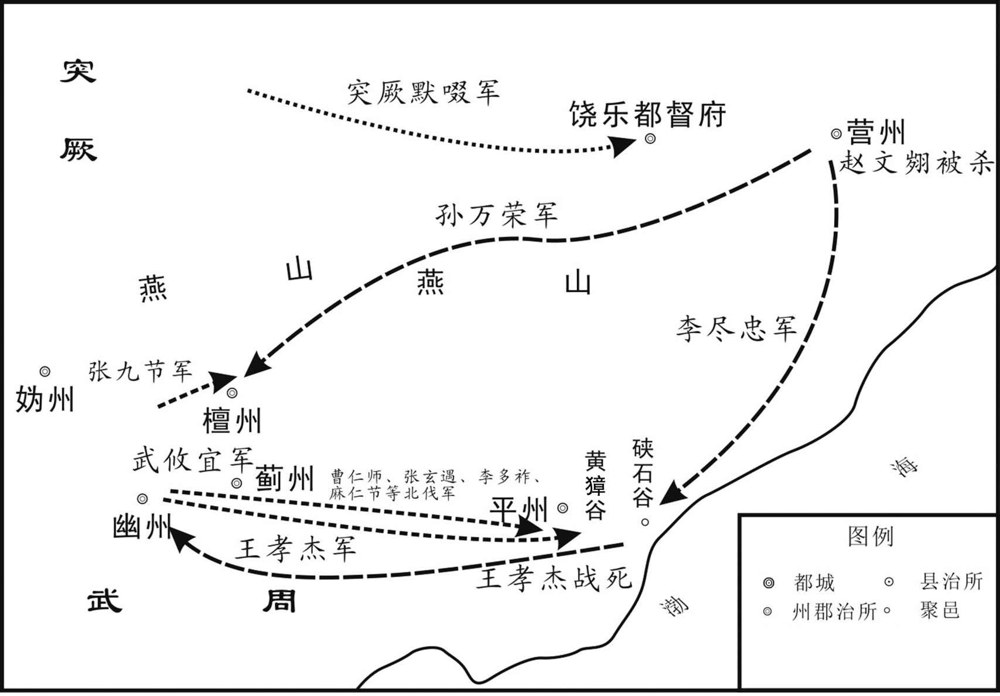 
武则天万岁通天元年（696年）契丹攻唐示意图

## 【原文】

**八月丁酉，曹仁师、张玄遇、麻仁节与契丹战于硖石谷，唐兵大败[1]。先是，契丹破营州，获唐俘数百，囚之地牢，闻唐兵将至，使守牢霫绐之曰：“吾辈家属饥寒，不能自存，唯俟官军至即降耳[2]。”既而契丹引出其俘，饲以糠粥，慰劳之曰：“吾养汝则无食，杀汝又不忍，今纵汝去[3]。”遂释之[4]。俘至幽州，具言其状，诸军闻之，争欲先入[5]。至黄獐谷，虏又遣老弱迎降，故遗老牛瘦马于道侧[6]。仁师等三军弃步卒将骑兵轻进，契丹设伏横击之，飞索以玄遇、仁节，获之，将卒死者填山谷，鲜有脱者[7]。契丹得军印，诈为牒，令玄遇等署之[8]。牒总管燕匪石、宗怀昌等云：“官军已破贼，若至营州，军将皆斩，兵不叙勋[9]。”匪石等得牒，昼夜兼行，不遑寝食以赴之，士马疲弊，契丹伏兵于中道邀之，全军皆没[10]。**

## 【注文】

[1]硖（xiá）石谷：今河北唐山附近。

[2]守牢霫（xī）：看守地牢的霫族人。霫，古族民。唐时居住在潢水以北。　　绐（dài）：哄骗，欺骗。

[3]引出：放出。

[4]释：释放。

[5]幽州：古九州及汉十三刺史部之一，隋唐时北方的军事重镇、交通中心和商业都会，其范围大致包括今河北北部及辽宁一带。

[6]黄獐（zhāng）谷：地名，今河北迁安东西硖石谷内。

[7]将：率领。　　轻进：轻装前进。　　横（hèng）：出乎意料地。　　（tā）：用绳索套住、捆住。

[8]牒：文书。　　署：签名。

[9]燕匪石、宗怀昌（生卒年不详）：武周时朝廷将领。　　叙勋：陈述功勋。

[10]遑（huáng）：闲暇，空闲。　　寝食：休息吃饭。　　中道：半路上。　　邀：半路截击。

## 【译文】

八月丁酉（二十八日），曹仁师、张玄遇、麻仁节与契丹在硖石谷交战，唐军大败。在此之前，契丹攻破营州后，俘虏了数百唐军士兵，把他们囚禁在地牢里，听说唐军快来了，契丹人让看守牢房的霫族人欺骗俘虏们说：“我们的家属饥寒交迫，不能依靠自己存活下去，只等官军来了就会投降。”不久契丹放出俘虏，给他们糠粥吃，并且慰劳他们说：“我们养活你们吧没有粮食，杀了你们吧又不忍心，现在放你们离开。”于是释放了他们。这些被俘虏的士兵回到幽州，详细说了敌军的情况，各路军队听说了，争着想先攻入敌军。唐军到了黄獐谷，敌军又派老弱军民来迎接投降，故意把老牛瘦马遗弃在路旁。曹仁师等军队留下步兵率领骑兵轻装加速前进，契丹设置埋伏突然攻击唐军，用飞索把张玄遇、曹仁节套住，抓获了他们，死了的将士被填在山谷里，几乎没有逃脱的。契丹得到唐军的军印，就伪造公文，让张玄遇等签署。通知总管燕匪石、宗怀昌等说：“官军已打败贼军，你们如果不赶到营州，就要处死所有将领，士兵不记功。”燕匪石等接到公文，昼夜兼行，顾不上休息吃饭，赶赴营州，将士马匹都疲惫，契丹在半路上设伏拦截他们，唐军全军覆没。

## 【原文】

**九月，制天下系囚及士庶家奴骁勇者官偿其直，发以击契丹[1]。初令山东近边诸州置武骑团兵，以同州刺史建安王武攸宜为右武威卫大将军，充清边道行军大总管，以讨契丹[2]。右拾遗陈子昂为攸宜府参谋，上疏曰：“恩制免天下罪人及募诸色奴充兵讨击契丹，此乃捷急之计，非天子之兵[3]。且比来刑狱久清，罪人全少，奴多怯弱，不惯征行，纵其募集，未足可用[4]。况当今天下忠臣勇士万分未用其一，契丹小孽，假命待诛，何劳免罪贱奴，损国大体[5]。臣恐此策不可威示天下[6]。”**

## 【注文】

[1]制：指帝王的诏令。　　系囚：被囚禁的人。　　士庶：指士族和庶族地主。士族又称门第、衣冠、世族、势族、世家、巨室、门阀等。门阀，是门第和阀阅的合称，指世代为官的名门望族，门阀制度是中国历史上从两汉到隋唐最为显著的选拔官员的系统，其实际影响造成朝廷重要的官职往往被少数氏族所垄断，个人的出身背景对于其仕途的影响，远大于其本身的才能与专长。直到唐代，门阀制度才逐渐被以个人文化水平考试为依据的科举制度所取代。庶族又称“寒门”“寒族”。魏、晋、南北朝时不属于士族的家族，大多为普通中小地主。由于士族长期拥有政治特权，生活奢侈腐化，逐渐失去了统治能力，这时，庶族地主便以武职为升官阶梯，立了军功，掌握军权之后，进而取得了政权，这样士族衰落，庶族兴起，魏晋及南朝的朝代更替也是士族与庶族势力消长的过程。　　直：通“值”。价值。

[2]武骑团兵：古代地方武装。唐朝组织当地居民加以训练，以保卫家乡，抵御契丹。　　同州：古州名，西魏置，治所在武乡县（今陕西大荔）。辖境相当于今陕西大荔、合阳、韩城、澄城、白水等。　　武攸宜（生卒年不详）：武则天的侄儿，在武则天称帝年间曾经讨伐过契丹，唐中宗复位前任右羽林大将军，控制禁军，中宗当政时被降为息国公。　　右武威卫：唐武则天光宅元年（684年）至唐中宗神龙元年（705年）为右骁卫改称，掌管宫禁宿卫。

[3]右拾遗：古代官名。拾遗，武则天垂拱元年（685年）置，分左、右，各二人，从八品上，掌供奉讽谏，左隶属门下省，右隶属中书省。　　陈子昂（659—700年）：唐代文学家，初唐诗文革新人物之一。字伯玉，梓州射洪（今属四川）人。因曾任右拾遗，后世称为陈拾遗。光宅进士，历仕武则天朝麟台正字、右拾遗。　　色：种类，类别。

[4]比来：近来。　　刑狱：刑罚案件。

[5]小孽（niè）：小妖孽。　　假：借。

[6]威示：向天下昭示威力。

## 【译文】

九月，武则天命令把全国的囚犯和官民的家奴中骁勇善战的，由官府出钱赎买，征发他们攻击契丹。朝廷开始命令山东靠近边境的各州设置武骑团兵，任命同州刺史建安王武攸宜为右武威卫大将军，担任清边道行军大总管，讨伐契丹。右拾遗陈子昂为攸宜府参谋，向皇帝上疏说：“皇帝诏令恩免天下罪人和招募各种家奴充军讨伐契丹，这是应急之策，不是天子之兵。况且近来刑狱案件减少，牢狱冷清，罪犯很少，家奴大多怯弱，不习惯征战和行军，纵使把他们募集起来，也不足以使用。何况当今天下忠臣勇士，被使用的不到万分之一，契丹是小妖孽，假如发布命令将要诛灭他们，也用不着赦免罪犯和卑贱的奴仆，这样做有损国家大体。我担心这种办法不能向天下昭示朝廷的威力。”

## 【原文】

**凉州都督许钦明之兄钦寂为龙山军讨击［副］使，与契丹战于崇州，军败，被擒[1]。虏将围安东，令钦寂说其属城未下者[2]。安东都护裴玄珪在城中，钦寂谓曰：“狂贼天殃，灭在朝夕，公但励兵谨守，以全忠节[3]。”虏杀之[4]。**

## 【注文】

[1]凉州：古地名，今甘肃武威。　　许钦明（生卒年不详）：唐时将领，以军功历任左玉钤卫将军、安西大都护，封盐山郡公。武则天万岁通天元年（696年），授金紫光禄大夫、凉州都督。　　钦寂：许钦寂（生卒年不详），唐朝武将，唐初功臣许绍之子许钦明之兄。　　龙山军：古代军镇名。龙山，即慕容氏和龙之山。　　崇州：唐羁縻州之一。唐高祖武德五年（622年）分饶乐郡都督府置，处奚可汗部落，属营州都督。治昌黎县，今河北三河西南。

[2]安东：指安东都护府。唐六大都护府之一。唐高宗总章元年（668年）置，治所在平壤城（今朝鲜平壤市）。辖境西起辽河以东，吉林松花江和头道江西南，南及今朝鲜北部和西部。唐高宗上元三年（676年）移治辽东城（今辽宁辽阳），唐高宗仪凤二年（677年）徙治新城（今辽宁抚顺北）。唐玄宗开元二年（714年）又移治平州（今河北卢龙）。

[3]安东都护：即安东都护府长官。　　裴玄珪（生卒年不详）：唐武则天朝武将，官至安东都护。　　公：对人的尊称。

[4]虏：敌人。

## 【译文】

凉州都督许钦明的哥哥许钦寂当时是龙山军讨击副使，在崇州与契丹交战，战败，许钦寂被俘。敌军将要包围安东，命令许钦寂劝说自己管辖的没有被攻下的城池投降。安东都护裴玄珪正在城中，许钦寂对他说：“契丹狂贼必遭天殃，早晚会灭亡，您只要鼓励士兵，谨慎防守，保全忠节。”敌军因此杀了许钦寂。

## 【原文】

**突厥默啜请为太［后］子，为国讨契丹[1]。册授默啜左卫将军[2]。冬十月辛卯，契丹李尽忠卒，孙万荣代领其众。突厥默啜乘间袭松漠[3]。虏尽忠、万荣妻子而去[4]。万荣收合余众，军势复振，遣别帅骆务整、何阿小为前锋，攻陷冀州，杀刺史陆宝积，屠吏民数千人[5]。又攻瀛州，河北震动[6]。制起彭泽令狄仁杰为魏州刺史[7]。前刺史独孤思庄畏契丹猝至，悉驱百姓入城，缮修守备[8]。仁杰至，悉遣还农，曰：“贼犹在远，何烦如是[9]！万一贼来，吾自当之[10]。”百姓大悦[11]。**

## 【注文】

[1]默啜（chuò）（？—716年）：一作墨啜。唐时东突厥可汗。姓阿史那氏。武则天天授二年（691年）立，称阿波干可汗。武则天证圣元年（695年），受封为迁善可汗。武则天万岁通天元年（696年），助唐平契丹，受封为立功报国可汗。又自唐取得河曲六州突厥降户及种子、农具、生铁等，势力日盛。自此屡扰唐境。唐玄宗开元三年（715年），北征九姓勅勒，次年，在独乐河（土拉河）大破拔曳固部，负胜轻归，中途为拔曳固溃卒所杀。死后其子小可汗匐俱继位。

[2]册授：唐制，三品以上职事官、文武散官、二品以上及都督、都护、上州刺史在京师者，由皇帝亲自授册拜官，称册授。　　左卫将军：古代将军名号，三国魏元帝时司马炎分中卫将军置。后沿置，隋初为十二卫中左卫的次官，隋炀帝时改为左翊卫将军，唐初复旧。统宫廷禁卫，从三品。

[3]乘间：乘机。

[4]妻子：妻子和儿女。

[5]骆务整（生卒年不详）：原契丹李尽忠部将，后降唐朝。武则天久视元年（700年），大败契丹，授右武威卫将军。　　何阿小（生卒年不详）：为契丹孙万荣部将，杀人如麻，后为杨玄基所擒。　　冀州：古地名，北魏治今河北冀州。　　陆宝积（？—696年）：唐武则天朝冀州刺史。

[6]瀛州：古州名。北魏分定、冀二州置，治赵都军城（今河北河间）。辖境相当于今河北保定、博野以东，肃宁、泊头、沧州、盐山以北，大清河以南地区。

[7]彭泽：古县名，治所在今江西彭泽东南。　　狄仁杰（630—700年）：字怀英，唐代并州太原（今山西太原南）人，唐（武周）时杰出的政治家，武则天当政时期宰相。历官并州都督府法曹、大理寺丞、侍御史，宁州、豫州刺史，武则天即位后，任地官侍郎、同凤阁鸾台平章事，后被来俊臣诬害下狱，贬彭泽令，转魏州刺史，武则天神功初年复相，后又封为梁国公。在武则天当政时，以不畏权贵著称。　　魏州：古州名。北周分相州置，治所在贵乡（今河北大名东北）。唐辖境相当于今河北大名、馆陶、魏县，河南南乐、清丰、范县，山东冠县、莘县等。

[8]独孤思庄（生卒年不详）：唐武则天朝威州刺史，官至右金吾卫大将军。　　猝（cù）至：突然到来。

[9]如是：像这样。

[10]当：挡住，抵挡。

[11]悦：高兴。

## 【译文】

突厥首领默啜请求做太后武则天的儿子，为唐朝讨伐契丹。于是朝廷册封他为左卫将军。万岁通天元年（696年）冬十月辛卯（二十二日），契丹李尽忠去世，孙万荣代替李尽忠统领他的部众。突厥默啜乘机袭击松漠，俘获了李尽忠、孙万荣的妻子及儿女后离开。孙万荣收集残余部众，军队势力又振作起来，派另一个部落的统帅骆务整、何阿小为前锋，攻陷冀州，杀了刺史陆宝积，屠杀官吏百姓数千人。又进攻瀛州，黄河以北为之震动。朝廷下令起用彭泽令狄仁杰为魏州刺史。前刺史独孤思庄害怕契丹突然到来，把百姓全部驱赶进城内，修缮守备。狄仁杰到了以后，让百姓全部回到农耕上去，说：“契丹军还在远方，何必这样劳烦百姓！万一敌人到来了，我自能抵挡。”百姓非常高兴。

## 【原文】

**时契丹入寇，军书填委，夏官郎中硖石姚元崇剖析如流，皆有条理，太后奇之，擢为夏官侍郎[1]。**

## 【注文】

[1]填委：诸事纷集的意思。　　夏官郎中：唐武则天光宅元年（684年）至唐中宗神龙元年（705年）为兵部侍郎的改称。　　硖石：指硖石县。唐太宗贞观十四年（640年）改崤县置，属陕州。治所在硖石坞，今河南陕县东南。　　姚元崇（650—721年）：字元之，避唐玄宗“开元”年号讳，改名姚崇。历任武则天、唐睿宗、唐玄宗三朝宰相，有“救时宰相”之称。

## 【译文】

当时契丹入侵，军事文书纷至沓来堆积很多，夏官郎中硖石人姚元崇解剖分析迅速，井井有条，太后认为他是个奇才，擢升他为夏官侍郎。

## 【原文】

**神功元年春三月戊申，清边道总管王孝杰、苏宏晖等将兵十七万与孙万荣战于东硖石谷，唐兵大败，孝杰死之[1]。孝杰遇契丹，帅精兵为前锋，力战，契丹引退[2]。孝杰追之，行背悬崖，契丹回兵薄之，宏晖先遁，孝杰坠崖死，将士死亡殆尽[3]。管记洛阳张说驰奏其事，太后赠孝杰官爵，遣使斩宏晖以徇[4]。使者未至，宏晖以立功得免[5]。武攸宜军渔阳，闻孝杰等败没，军中震恐，不敢进[6]。契丹乘胜寇幽州，攻陷城邑，剽掠吏民，攸宜遣将击之，不克[7]。**

## 【注文】

[1]神功：武则天在位期间的年号，神功元年，即697年。　　王孝杰（？—697年）：京兆新丰（今陕西潼关东北）人，唐朝名将。少年时从军入伍，屡立战功。武则天执政后，累迁右鹰扬卫将军。公元692年，任武威道总管，收复安西四镇。公元694年，在青海湖附近大败西突厥，因功拜夏官尚书、同凤阁鸾台三品，封清源县男。公元696年，任肃边道行军大总管，出击吐蕃，兵败免为庶人。公元697年，任清边道行军总管，率军讨伐契丹可汗，孤军深入，全军覆灭，坠谷而死。赠夏官尚书、耿国公。唐玄宗开元中，赠特进。　　苏宏晖（生卒年不详）：武周时任左羽林将军，在清边道总管王孝杰麾下效力，东硖石谷之战由于苏宏晖惧敌逃遁，导致王孝杰战死，唐军大败，武则天闻讯大怒，派使者到阵前斩杀苏宏晖，使者未到，苏宏晖又因为立了军功而得以赦免。　　硖石谷：今河北唐山附近。

[2]力战：奋力勇战。

[3]薄：迫近，逼近。　　遁：逃跑。

[4]管记：古代职官名。南朝梁、陈及北齐东宫、相府、王府等僚属，掌文书，常以文学之士担任。　　张说（yuè）（667—731年）：唐代文学家、诗人、政治家。字道济。武周时授太子校书，官至凤阁舍人。唐睿宗朝任同中书门下平章事。唐玄宗开元初，因不附太平公主，罢知政事。唐玄宗朝任首席宰相。卒，谥号“文贞”。　　驰奏：疾驰奏报。　　徇：示众。

[5]免：免罪。

[6]渔阳：古郡名，治今北京密云西南。

[7]克：攻克。

## 【译文】

武则天神功元年（697年）春三月戊申（十二日），清边道总管王孝杰、苏宏晖率领十七万军队与孙万荣在东硖石谷交战，唐兵大败，王孝杰战死。王孝杰与契丹军相遇，率领精兵为前锋，拼力战斗，契丹撤军。王孝杰追击，追到悬崖边，契丹调转军队逼近他，苏宏晖却先逃跑，王孝杰坠入悬崖而死，将士也大都死亡。军中管记洛阳人张说飞马京城奏报此事，太后追赠王孝杰官爵，派使者斩苏宏晖以示众。使者还没到，苏宏晖立了军功得以免除死罪。武攸宜在渔阳驻扎，听说王孝杰全军覆没，军中震惊恐惧，不敢进攻。契丹乘胜进攻幽州，攻陷城镇，抢掠官吏和百姓，武攸宜派将领率军攻击，没有能攻克。

## 【原文】

**夏四月癸未，以右金吾卫大将军武懿宗为神兵道行军大总管，与右豹韬卫将军何迦密将兵击契丹[1]。五月癸卯，又以娄师德为清边道副大总管，右武威卫将军沙吒忠义为前军总管，将兵二十万击契丹[2]。**

## 【注文】

[1]武懿宗（641—706年）：并州文水（今山西文水）人。武周天授元年（690年），武则天称帝，武懿宗被封为河内郡王，之后迁济州长史、左金吾大将军。武懿宗性情残暴，善于诬陷别人，加之其身材短小，腰背弯曲，相貌丑陋，为时人所不齿。　　何迦密（生卒年不详）：唐武则天朝将领，任右豹韬卫将军。

[2]娄师德（630—699年）：唐郑州原武（今河南原阳）人，进士出身。唐高宗时为监察御史。后官至凤阁侍郎、同凤阁鸾台平章事。武则天圣历二年（699年），突厥进犯，任天兵军大总管讨伐突厥。公元699年，娄师德于会州（今甘肃靖远）去世，唐廷追赠他为凉州（治姑臧，今甘肃武威）都督，谥曰“贞”。　　沙吒忠义（？—707年）：唐武则天朝将领，任右武威卫将军。

## 【译文】

夏四月癸未（十八日），朝廷任命右金吾卫大将军武懿宗为神兵道行军大总管，与右豹韬卫将军何迦密率军攻击契丹。五月癸卯（初八日），朝廷又任命娄师德为清边道副大总管，右武威卫将军沙吒忠义为前军总管，率军二十万攻击契丹。

## 【原文】

**六月，武懿宗军至赵州，闻契丹将骆务整数千骑将至冀州，懿宗惧，欲南遁[1]。或曰：“虏无辎重，以抄掠为资，若按兵拒守，势必离散，从而击之，可有大功[2]。”懿宗不从，退据相州，委弃军资器仗甚众，契丹遂屠赵州[3]。**

## 【注文】

[1]赵州：古地名，治今河北赵县。　　遁：逃跑。

[2]或：有人。

[3]相州：古州名。北魏分冀州置，治所在邺县（今河北临漳西南）。唐朝辖境相当于今河北成安、广平和魏县西南部，河南安阳、林州、汤阴、内黄等市县及濮阳西南部地。

## 【译文】

六月，武懿宗率军到达赵州，听说契丹将领骆务整的几千骑兵将要到达冀州，武懿宗害怕，想向南逃跑。有人说：“敌军没有辎重，把抢掠的物资当作军队供给，如果我们按兵不动，坚守抵抗，敌人势必离散，我军再乘机出击，可获得大功。”武懿宗不听，便退兵占据守卫相州，丢弃了很多军用物资和武器装备，于是契丹屠戮了赵州。

## 【原文】

**甲午，孙万荣为奴所杀。万荣之破王孝杰也，于柳城西北四百里依险筑城，留其老弱妇女，所获器仗资财使妹夫乙冤羽守之，引精兵寇幽州[1]。恐突厥默啜袭其后，遣五人至黑沙，语默啜曰：“我已破王孝杰百万之众，唐人破胆，请与可汗乘胜共取幽州[2]。”三人先至，默啜喜，赐以绯袍[3]。二人后至，默啜怒其稽缓，将杀之[4]。二人曰：“请一言而死[5]。”默啜问其故，二人以契丹之情告[6]。默啜乃杀前三人，而赐二人绯，使为乡导，发兵取契丹新城，杀所获凉州都督许钦明以祭天[7]。围新城三日，克之，尽俘以归[8]。使乙冤羽驰报万荣[9]。时万荣方与唐兵相持，军中闻之，恟惧[10]。奚人叛万荣，神兵道总管杨玄基击其前，奚兵击其后，获其将何阿小[11]。万荣军大溃，帅轻骑数千东走[12]。前军总管张九节遣兵邀之于道，万荣穷蹙，与其奴逃至潞水东，息于林下，叹曰：“今欲归唐，罪已大[13]。归突厥亦死，归新罗亦死[14]。将安之乎[15]？”奴斩其首以降，枭之四方馆门[16]。其余众及奚、霫皆降于突厥[17]。**

## 【注文】

[1]柳城：指柳城县。隋文帝开皇十八年（598年）改龙山县置，为营州治，治所在今辽宁朝阳西南。唐末废。　　乙冤羽（生卒年不详）：生平事迹不详，活动于唐武则天朝。

[2]黑沙：突厥汗庭，今址不详。

[3]绯袍：古代四五品朝官的红色品服。

[4]稽缓：迟缓。

[5]一言：说一句话。

[6]情：情况。

[7]乡导：向导，引路的人。乡，通“向”。　　杀所获凉州都督许钦明以祭天：武则天万岁通天元年（696年）许钦明为契丹所俘。

[8]克：攻克。

[9]驰报：飞马报告。

[10]恟（xiōng）：忧恐。

[11]杨玄基（生卒年不详）：唐武则天朝神兵道总管。

[12]大溃：大败。

[13]穷蹙（cù）：窘迫，困厄。　　潞水：即潞河，今北京通州北运河。

[14]新罗：朝鲜半岛国家之一。公元503年定国号为“新罗”。新罗最初由辰韩朴氏家族的朴赫居世居西干创建。公元660年和公元668年，新罗联合唐朝先后灭亡百济和高句丽。公元670年到676年唐朝新罗战争后，新罗统一了朝鲜半岛大同江以南地区，称为统一新罗。公元9世纪末期，统一新罗分裂成“后三国”。

[15]安：哪里。

[16]枭（xiāo）：斩首示众。　　四方馆：后魏置，梁武帝至隋炀帝时，置四方馆于建国门外，以待四方宾客，各掌方国及互市等事宜。唐四方馆隶属于中书省。此处指东都四方馆。

[17]降：投降。

## 【译文】

六月甲午（三十日），孙万荣被奴仆杀死。孙万荣打败王孝杰以后，在柳城西北四百里的地方依托险要地形修筑城池，把老弱病残和妇女留下，把缴获的兵器和物资交给妹夫乙冤羽看守，自己率领精兵进犯幽州。孙万荣害怕突厥默啜偷袭其后方，派遣五个人到黑沙，告诉默啜说：“我已打败王孝杰数百万军队，唐军已被吓破胆，请让我们一起乘胜攻取幽州。”其中有三个人先到，默啜很高兴，赐给他们绯袍。其余两人后到，默啜恼怒他们迟缓，要杀死他们。二人说：“请允许我们说一句话再死。”默啜问他们缘故，二人把契丹的情况告诉了默啜。默啜于是杀了前面三个人，而赏赐给后二人绯袍，让他们做向导，发兵攻取契丹的新城，杀了抓获的凉州都督许钦明以祭天。突厥围攻契丹的新城三天，破城后俘获城中的人而返回。让乙冤羽飞马报告孙万荣。当时孙万荣与唐军正相持不下，孙万荣的军队听说新城失守的消息后，忧虑害怕。奚族人也反叛了孙万荣，神兵道总管杨玄基攻击孙万荣的前方，奚族军队攻击他的后方，抓获他的将领何阿小。孙万荣的军队大败，他率领数千轻骑向东逃跑。前军总管张九节在半路上截击孙万荣，孙万荣走投无路与他的奴仆逃到潞水以东，在林中休息，长叹道：“现在想归附唐朝，罪过已很大，归附突厥也是死，归顺新罗也是死。往哪里去呢？”孙万荣的奴仆斩了孙万荣的人头向唐朝投降，朝廷把孙万荣的首级高悬在四方馆门前示众。他的部众及奚、霫都投降突厥。

## 【原文】

**辛卯，制以契丹初平，命河内王武懿宗、娄师德及魏州刺史狄仁杰分道安抚河北[1]。懿宗所至残酷，民有为契丹所胁从复来归者，懿宗皆以为反，生刳取其胆[2]。先是，何阿小嗜杀人，河北人为之语曰：“唯此两何，杀人最多[3]。”**

## 【注文】

[1]初平：刚刚平定。

[2]刳（kū）：剖开。

[3]两何：指何阿小和河内王武懿宗。

## 【译文】

六月辛卯（二十七日），因为刚刚平定契丹，朝廷任命河内王武懿宗、娄师德及魏州刺史狄仁杰分别到黄河以北的各道安抚。武懿宗所到之处，极为残酷，有曾经被契丹胁迫而又归降的百姓，武懿宗都认为他们是反叛，活活地剖腹取胆。在此之前，何阿小嗜好杀人，因此河北的人都说：“唯有这两何，杀人最多。”

## 【原文】

**秋七月庚午(2)，武攸宜自幽州凯旋[1]。武懿宗奏河北百姓从贼者请尽族之，左拾遗王求礼庭折之曰：“此属素无武备，力不胜贼，苟从之以求生，岂有叛国之心[2]！懿宗拥强兵数十万，望风退走，贼徒滋蔓，又欲移罪于草野诖误之人，为臣不忠，请先斩懿宗以谢河北[3]。”懿宗不能对[4]。司刑卿杜景俭亦奏：“此皆胁从之人，请悉原之[5]。”太后从之[6]。**

## 【注文】

[1]凯旋：泛指被派出去的军队、组织、机构或人圆满地完成所指派的任务后载誉归来。

[2]族：灭族。古代的一种刑罚，一人有罪，灭三族或九族。　　左拾遗：唐代谏官名。武则天垂拱元年（685年）置，置左右拾遗分属门下、中书两省，职掌与左右补阙相同，同掌供奉讽谏、荐举人才，位从八品上。　　王求礼（？—706年）：唐许州长社（今河南长葛东北）人。武周时为左拾遗，迁监察御史，性格刚正，无所畏避。　　庭折：在庭殿当面驳斥别人。

[3]诖（guà）误：耽误。

[4]对：应对。

[5]司刑卿：即大理卿。掌邦国折狱详刑之事。北齐置一人，三品。唐朝从三品，曾改名详刑正卿、司刑卿。　　杜景俭（？—700年）：唐冀州武邑（今河北武邑）人。唐时任殿中侍御史，益州录事参军。武则天天授年间，迁洛州司马、凤阁侍郎、同凤阁鸾台平章事。

[6]从：听从。

## 【译文】

秋七月庚午日，武攸宜从幽州凯旋。武懿宗奏请把黄河以北以前跟从契丹的百姓全部灭族，左拾遗王求礼在朝廷当面驳斥他说：“这些人向来没有武器装备，力量不能战胜敌军，苟且顺从敌人以求活命，哪有叛国之心！武懿宗拥有强兵数十万，却望风而跑，所以使敌人势力越发蔓延，他又想把罪过转移到乡村被连累的人身上，是做臣子的不忠，请求先斩了武懿宗以向黄河以北的人民谢罪。”武懿宗哑口无言。司刑卿杜景俭也上奏：“这些百姓都是被胁迫随从的人，请求全部原谅他们。”太后听从他的意见。

## 【原文】

**久视元年[1]。初，契丹将李楷固善用索及骑射、舞槊，每陷陈，如鹘入乌群，所向披靡[2]。黄獐之战，张玄遇、麻仁节皆为所[3]。又有骆务整者，亦为契丹将，屡败唐兵[4]。及孙万荣死，二人来降，有司责其后至，奏请族之[5]。狄仁杰曰：“楷固等并骁勇绝伦，能尽力于所事，必能尽力于我，若抚之以德，皆为我用矣[6]。”奏请赦之[7]。所亲皆止之，仁杰曰：“苟利于国，岂为身谋[8]！”太后用其言，赦之[9]。又请与之官，太后以楷固为左玉钤卫将军，务整为右武威卫将军，使将兵击契丹余党，悉平之[10]。秋七月，献俘于含枢殿[11]。太后以楷固为左玉钤卫大将军、燕国公，赐姓武氏[12]。召公卿合宴，举觞属仁杰曰：“公之功也[13]。”将赏之，对曰：“此乃陛下威灵，将帅尽力，臣何功之有[14]！”固辞不受[15]。**

## 【注文】

[1]久视：武则天在位期间的年号，久视元年即公元700年。

[2]李楷固（生卒年不详）：武则天时代的契丹族将领。公元697年，李楷固投降武周，得到武则天重用，李楷固平定了反周的契丹人。公元700年，武则天封李楷固为燕国公，赐姓武。　　槊（shuò）：古代兵器，即柄较长的矛。　　陈（zhèn）：通“阵”。古时两军交战时的战斗队列。　　鹘：鸟类的一种，性情凶猛，善于袭击其他鸟类。

[3]黄獐之战：亦称“黄獐谷之战”，武则天万岁通天元年（696年），契丹首领李尽忠举兵反唐，在西硖石黄獐谷（今河北迁安东北）大败唐军的一次伏击战。

[4]败：打败。

[5]有司：有关部门。

[6]德：恩德。

[7]赦：赦免。

[8]身：自己，自身。

[9]用：采用。

[10]悉：全部。

[11]俘：俘虏。　　含枢殿：位于唐东都上阳宫内，故址在今河南洛阳市西。

[12]赐：赏赐。

[13]觞：古时喝酒用的器具。

[14]陛（bì）下：对君主的尊称，秦朝以后只用来称皇帝。陛，为宫殿台阶。

[15]受：接受。

## 【译文】

武则天久视元年（700年）。当初，契丹将领李楷固善于使用绳索，还善于骑射、舞槊，每当冲锋陷阵时，就像鹰冲入乌鸦群，所向披靡。黄獐谷一战，张玄遇、麻仁节都被他用绳索套住。又有一个叫骆务整的人，也是契丹将领，多次打败唐军。等到孙万荣败死后，这两个人都来投降，有关官员责备他们来得太迟，奏请对他们处以灭族刑罚。狄仁杰说：“楷固等人都骁勇无与伦比，既能尽力于以前他所奉事的主人，也一定能尽力于我朝，如果用恩德安抚他们，他们都会为我们所用。”奏请赦免了他们。和狄仁杰亲近的人都劝他不要上奏，狄仁杰说：“假如对国有利，就不必考虑自己的安危。”太后听从了他的话，赦免了这两个人。狄仁杰又请朝廷给他们两人官职，太后任命李楷固为左玉钤卫将军，骆务整为右威武卫将军，命二人率军进攻契丹的残余力量，全部平定了。秋七月，李楷固、骆务整在含枢殿献俘虏。太后又封李楷固为左玉钤卫大将军、燕国公，赐姓武氏。召集公卿举行宴会，举起酒杯对狄仁杰说：“这是你的功劳啊。”要奖赏他，狄仁杰回答说：“这都是陛下的威灵和将帅尽力的结果，我有什么功劳呢！”坚决推辞不接受。

## 【原文】

**睿宗景云元年冬十月丁酉，以幽州镇守经略节度大使薛讷为左武卫大将军兼幽州都督[1]。节度使之名自讷始[2]。十二月壬辰，奚、霫犯塞，掠渔阳、雍奴，出卢龙塞而去[3]。幽州都督薛讷追击之，弗克。**

## 【注文】

[1]睿宗：唐睿宗李旦（662—716年），唐高宗李治和武则天之子。他一生两度登基，两让天下，在位时间为文明元年（684年）和景云元年至延和元年（710年至712年）。公元712年禅位于子李隆基（唐玄宗），称太上皇，葬于桥陵。谥号玄真大圣大兴皇帝。　　景云：唐睿宗李旦的年号，景云元年即710年。　　薛讷（649—720年）：字慎言，绛州万泉（今山西万荣西南）人，唐朝名将、左武卫大将军薛仁贵之子。薛讷初为城门郎，后任蓝田（今陕西蓝田）令。

[2]节度使：古代官名。唐初沿北周及隋朝旧制，重要地区置总管统兵，不久改称都督，只有朔方仍称总管，边州别置经略使，有屯田州置营田使。唐代开始设立的地方军政长官。因受职之时，朝廷赐予旌节，故称。

[3]雍奴：古县名。今属天津。　　卢龙塞：古塞名，在今河北西峰口附近。

## 【译文】

唐睿宗景云元年（710年）冬十月丁酉（初十日），朝廷任命幽州镇守经略节度大使薛讷为左武卫大将军兼幽州都督。节度使的官名从薛讷开始使用。十二月壬辰（十六日），奚、霫侵犯边塞，抢掠了渔阳、雍奴，出卢龙塞才退军离开。幽州都督薛讷追击他们，没有取胜。

## 【原文】

**玄宗元天元年[1]。幽州大都督薛讷镇幽州二十余年，吏民安之，未尝举兵出塞，虏亦不敢犯[2]。与燕州刺史李琎有隙，琎毁之于刘幽求，幽求荐左羽林将军孙佺代之[3]。三月丁丑，以佺为幽州大都督，徙讷为并州长史[4]。夏六月庚申，幽州大都督孙佺与奚酋李大酺战于冷陉，全军覆没[5]。是时佺帅左骁卫将军李楷洛、左威卫将军周以悌，发兵二万骑八千，分为三军以袭奚、契丹[6]。将军乌可利谏曰：“道险而天热，悬军远袭，往必败[7]。”佺曰：“薛讷在边积年，竟不能为国家复营州[8]。今乘其无备，往必有功[9]。”使楷洛将骑四千前驱，遇奚骑八千，楷洛战不利[10]。佺怯懦，不敢救，引军欲还，虏乘之，唐兵大败[11]。佺阻山为方陈以自固[12]。大酺使谓佺曰：“朝廷既与我和亲，今大军何为而来[13]？”佺曰：“吾奉敕来招慰耳[14]。楷洛不禀节度，辄与汝战，请斩以谢[15]。”大酺曰：“若然，国信安在[16]？”佺悉敛军中帛，得万余段，并紫袍、金带、鱼袋以赠之[17]。大酺曰：“请将军南还，勿相惊扰[18]。”将士惧，无复部伍，虏追击之，士卒皆溃[19]。佺、以悌为虏所擒，献于突厥，默啜皆杀之[20]。楷洛、可利脱归[21]。**

## 【注文】

[1]玄宗：唐玄宗李隆基（685—762年），又称唐明皇，唐睿宗李旦之子。李隆基与太平公主合谋发动政变，杀死韦皇后，拥其父李旦即位，李隆基被立为太子。唐睿宗延和元年（712年），受禅即位，改年开元。唐玄宗开元年间，社会安定，政治清明，经济空前繁荣，唐朝进入鼎盛时期，后人称这一时期为“开元盛世”。唐玄宗后期，他贪图享乐，宠信并重用杨国忠等奸臣，终于导致安史之乱发生，唐朝开始衰落。　　元天：应为“先天”，唐玄宗李隆基在位期间所用年号，即公元712年至713年。

[2]安：安定。

[3]燕州：古州名，今北京昌平区东南。　　李琎（jìn）（？—750年）：唐宗室。唐朝让皇帝李宪（唐玄宗李隆基长兄，谥“让皇帝”）长子，封为汝阳王，擅长于弓及羯鼓，深得唐玄宗喜爱。　　隙：隔阂。　　刘幽求（655—715年）：唐冀州武强（今河北武强）人。唐睿宗即位后，任尚书右丞、吏部尚书。唐玄宗开元初，改尚书左右仆射为左右丞相，刘幽求任左丞相。后被贬杭、郴（chēn）二州。　　孙佺（？—712年）：唐朝将领，汝州（今河南汝州）人。唐睿宗延和初为左羽林大将军、幽州都督。

[4]徙：调职。　　并（bīnɡ）州：古地名，唐辖今山西阳曲以南、文水以北的汾水中游地区。　　长史：古代官名。战国秦置，掌顾问参谋。唐朝长史分三类，即诸都护府、都督府、诸州长史，中央南衙诸卫、北衙诸军、诸折冲府、东宫诸率府长史及诸王府长史，都为幕僚之长，有“元僚”之称。

[5]李大酺（pú）（？—720年）：唐时奚族首领。唐玄宗开元三年（715年）附唐，被封为饶乐郡王，公元720年，李大酺在与契丹可突于争斗中死亡，其弟鲁苏嗣立。　　冷陉（xínɡ）：古地名，今内蒙古巴林左旗西北。

[6]李楷洛（生卒年不详）：唐营州柳城（今辽宁朝阳西南）人。契丹族，武则天时依附唐朝。官至左羽林将军同正，封蓟郡公。吐蕃侵河源，李楷洛率精兵将其击退。大军凯旋，李楷洛以暴病卒于道上。有子李光弼。

[7]乌可利（生卒年不详）：唐武则天时朝廷将领。

[8]边：边疆。　　积年：多年。

[9]往：去。

[10]不利：失利。

[11]欲：想。

[12]自固：自我固守。

[13]和亲：两个不同民族或同一种族的两个不同政权的首领之间，出于“为我所用”的目的所进行的联姻，尽管双方和亲的最初动机不完全一致，但总的来看，都是为了避战言和，保持长久的和好。

[14]敕（chì）：帝王的诏书、命令。

[15]禀：接受。　　节度：指挥。

[16]信：信用。

[17]紫袍、金带、鱼袋：唐朝官员正式的服饰。三品以上的穿紫袍、金玉带，佩银鱼袋。

[18]勿：不要。

[19]无复：不再有。

[20]擒：擒获。

[21]脱：脱身。

## 【译文】

唐玄宗先天元年（712年）。幽州大都督薛讷镇守幽州二十多年，官吏百姓安居乐业，不曾起兵出塞外，敌人也不敢侵犯。薛讷与燕州刺史李琎有隔阂，李琎在刘幽求面前诋毁薛讷，刘幽求就推荐左羽林将军孙佺代替了薛讷。三月丁丑（初八日），孙佺被任命为幽州大都督，把薛讷降为并州长史。夏六月庚申（二十二日），幽州大都督孙佺和奚族酋长李大酺在冷陉交战，结果唐全军覆没。当时孙佺率领左骁卫将军李楷洛、左威武将军周以悌，发兵两万八千骑兵，分为三军袭击奚、契丹。将军乌可利谏阻说：“道路遥远，天气又炎热，孤军深入远袭敌军，去了定会失败。”孙佺说：“薛讷在边防镇守多年，竟不能为国家收复营州。现在我们乘敌人没有准备，去了定会立功。”孙佺让李楷洛率领四千骑兵为先锋，遇到奚族骑兵八千，李楷洛战斗失利。孙佺怯懦，不敢援救，反而想引军退回，敌人趁机进攻，唐兵大败。孙佺只好依凭山势布成方阵固守。李大酺派人对孙佺说：“朝廷既然和我和亲，现在为什么大兵压境？”孙佺说：“我是奉朝廷命令来招抚慰问你们的，李楷洛不听我的命令，就和你交战，请允许我杀了他向你们谢罪。”李大酺说：“如果是这样，国家的信用在哪里？”孙佺把军中布帛全部收集起来，得到一万多段，连同将官的紫袍、金带、鱼袋赠给李大酺。李大酺说：“请将军向南回去，不要惊扰我们了。”唐军将士十分恐惧，列不成队形，敌军趁机追击，唐朝士兵都溃散逃跑。孙佺、周以悌被敌人俘获，李大酺把他们献给突厥，都被默啜杀了。李楷洛、乌可利脱身逃回。

## 【原文】

**冬十一月乙酉，奚、契丹二万骑寇渔阳，幽州都督宋璟闭城不出，虏大掠而去[1]。**

## 【注文】

[1]宋璟（663—737年）：唐邢州南和（今河北南和）人。武则天时官至监察御史、凤阁舍人。唐玄宗开元四年（716年），继姚崇为相。一生为振兴大唐励精图治，与姚崇同是开元名相，史称“姚宋”。

## 【译文】

冬十一月乙酉（二十日），奚、契丹两万骑兵进犯渔阳，幽州都督宋璟闭门不出城，敌人大肆掠夺而去。

## 【原文】

**开元二年[1]。初，营州都督治柳城，以镇抚奚、契丹[2]。则天之世，都督赵文翙失政，奚、契丹攻陷之，是后寄治于幽州东渔阳城[3]。或言：“靺鞨、奚、霫大欲降唐，正以唐不建营州，无所依投，为默啜所侵扰，故且附之[4]。若唐复建营州，则相帅归化矣[5]。”并州长史、和戎大武等军州节度大使薛讷信之，奏请击契丹，复置营州[6]。上亦以冷陉之役，欲讨契丹，群臣姚崇等多谏[7]。甲申，以讷同紫微黄门三品，将兵击契丹，群臣乃不敢言[8]。**

## 【注文】

[1]开元：唐玄宗李隆基的年号，即开元元年（713年）十二月到开元二十九年（741年）十二月。开元年间，唐朝国力强盛，史称“开元盛世”。

[2]柳城：古地名，今辽宁朝阳西南。

[3]寄治：寄居治所。

[4]靺（mò）鞨（hé）：古代民族名，来源于商周时的肃慎。北魏称“勿吉”，隋唐时称靺鞨。

[5]相帅：相跟着。

[6]和戎：古地名，今甘肃古浪。

[7]谏：劝谏。

[8]同紫微黄门三品：唐玄宗开元元年（713）至开元五年（717年）为同中书门下三品改称。唐朝中书、门下两省长官皆三品，知政事，为宰相。太宗贞观十七年（643年）非两省长官参知政事者都加此名，入政事堂议政，后为副相职位。

## 【译文】

唐玄宗开元二年（714年）。当初，营州都督府治所在柳城，为的是镇抚奚、契丹。武则天时期，都督赵文翙治理不当，奚、契丹攻陷柳城，从此以后，营州都督府治所寄居在幽州东面的渔阳城。有人说：“靺鞨、奚、霫很想投靠唐朝，只是因为朝廷不设营州，无处依附投奔，又被默啜侵扰，所以暂且依附突厥。如果唐重设营州，他们就会相继来归附。”并州长史、和戎大武等军州节度大使薛讷相信了这话，奏请进击契丹，再置营州。玄宗也因冷陉之战的耻辱，正想讨伐契丹，大臣中姚崇等很多人谏阻。正月甲申（二十五日），任命薛讷为同紫微黄门三品，率兵进攻契丹，群臣才不敢劝谏了。

## 【原文】

**秋七月，薛讷与左监门卫将军杜宾客、定州刺史崔宣道等将兵六万出檀州，击契丹[1]。宾客以为：“士卒盛夏负戈甲，赍资粮，深入寇境，难以成功[2]。”讷曰：“盛夏草肥，羔犊孳息，因粮于敌，正得天时，一举灭虏，不可失也[3]。”行至滦水山峡中，契丹伏兵遮其前后，从山上击之，唐兵大败，死者什八九[4]。讷与数十骑突围得免，虏中嗤之，谓之“薛婆”[5]。崔宣道将后军，闻讷败，亦走[6]。讷归罪于宣道及胡将李思敬等八人，制悉斩之于幽州[7]。庚子，敕免讷死，削除其官爵，独赦杜宾客之罪。**

## 【注文】

[1]左监门卫将军：唐高宗龙朔二年（662年）改左监门府将军而来，协掌宫城诸门禁卫及门籍，从三品。　　杜宾客（生卒年不详）：唐玄宗时将领，任左监门府将军。　　定州：古地名，今河北定州。　　崔宣道（生卒年不详）：唐玄宗时定州刺史。　　檀州：古地名，今北京密云。

[2]戈甲：戈和铠甲。亦泛指武器装备。　　赍（jī）：带着。

[3]犊（dú）：小牛。　　孳（zī）息：繁殖，生息。

[4]滦水：即滦河。在今河北省东北部。　　遮：拦截。　　什：十等份（之几）。

[5]嗤（chī）：讥笑。

[6]将：带领。

[7]李思敬（生卒年不详）：唐朝玄宗时朝廷将领。

## 【译文】

秋七月，薛讷和左监门卫将军杜宾客、定州刺史崔宣道等率兵六万从檀州出师，进攻契丹。杜宾客认为：“士兵们在盛夏背负干戈盔甲，带着物资粮饷，深入敌境，恐怕难以成功。”薛讷说：“盛夏草肥，羊羔牛犊繁殖生长很快，可以借取敌人的粮食，正是出兵的好时候，一举灭敌，不可坐失良机。”行军到滦水山峡中，契丹伏兵切断前后道路，从山上进攻唐军，唐军大败，将士战死了十之八九。薛讷和几十骑突围出来，才幸免一死，敌人嘲笑他，叫他“薛婆”。崔宣道率领着后面的军队，听说薛讷被打败，也逃走了。薛讷把战败的罪责推到崔宣道和胡将李思敬等八个人身上，朝廷命令在幽州把他们全部处斩。七月庚子（十五日），玄宗赦免了薛讷的死罪，削除了他的官爵，只有杜宾客一人得到赦免。

## 【原文】

**四年秋八月辛未，契丹李失活、奚李大酺帅所部来降[1]。制以失活为松漠郡王行左金吾大将军兼松漠都督，因其八部落酋长拜为刺史，又以将军薛泰督军镇抚之[2]。大酺为饶乐郡王行右金吾大将军兼饶乐都督[3]。失活，尽忠之从父弟也[4]。突厥默啜既死，奚、契丹、拔曳固等诸部皆内附[5]。**

## 【注文】

[1]李失活（？—718年）：唐朝契丹大贺氏首领，松漠都督府都督，大贺窟哥的孙子，李尽忠的堂弟。唐玄宗开元二年（714年），率部落与颉利发伊健啜归附唐朝。

[2]行：代理。　　薛泰（生卒年不详）：唐朝官员。唐玄宗开元十三年（725年），任职安东都护期间，奏准在黑水靺鞨地方设置黑水军。第二年，又奏准在黑水靺鞨联盟中最大部落建置黑水州都督府，以黑水靺鞨大首领为都督并统辖诸部刺史；唐廷派驻长史进行监控。

[3]饶乐（lè）：唐羁縻都督府名。唐太宗贞观二十二年（648年）在奚族地置。治所在今内蒙古宁城西。辖境约当今内蒙古老哈河上游及河北滦河中上游一带。唐玄宗开元二十三年（735年）改名奉诚都督府。

[4]从父：祖父亲兄弟的儿子称为从父。

[5]拔曳固：又称拔野古、拔野固，或者叫作拔曳古，古部落名称。地近黑龙江，与靺鞨为邻。唐太宗贞观三年（629年）遣使来唐。

## 【译文】

唐玄宗开元四年（716年）秋八月辛未（二十八日），契丹李失活、奚族李大酺率领众部来归降。朝廷任命李失活为松漠郡王代理左金吾大将军并兼任松漠都督，任用他的八个部落酋长为刺史，又派将军薛泰督率军队镇抚他们。李大酺被封为饶乐郡王代理右金吾大将军并兼任饶乐都督。李失活是李尽忠的叔伯弟弟。突厥默啜死后，奚、契丹、拔曳固等各部落都归附了朝廷。

## 【原文】

**五年。奚、契丹既内附，贝州刺史宋庆礼建议请复营州，三月庚戌，制复置营州都督于柳城，兼平卢军使，管内州、县、镇、戍皆如其旧[1]。以太子詹事姜师度为营田、支度使，与庆礼等筑之，三旬而毕[2]。庆礼清勤严肃，开屯田八十余所，招安流散，数年之间，仓廪充实，市邑浸繁[3]。冬十一月丙申(3)，契丹王李失活入朝。十二月壬午，以东平王外孙杨氏为永乐公主，妻之[4]。**

## 【注文】

[1]贝州：古州名。北周分相州清河郡置，治所在武城县（隋改清河县，今河北清河西北），唐辖境相当于今河北清河、威县、临西、故城和山东临清、武城、夏津等市县地。　　宋庆礼（？—719年）：洺州永年（今河北永年东）人。明经及第后授卫县尉，不久迁岭南采访使。唐玄宗开元中迁贝州刺史、河北支度营田使。　　平卢军使：古代使职名，幽州节度使所属平卢军的长官。　　戍：指边防区域的营垒、城堡。

[2]太子詹事：古代官职名。战国秦置。管理太子宫庶务、警卫、刑狱、食邑、车马诸事，与太子太傅、少傅分领东宫官署。唐朝正三品。位尊职闲，用以安置退免大臣。　　姜师度（？—723年）：魏（今河北大名）人，明经及第，唐中宗神龙初，任易州刺史兼御史中丞，为河北道巡察兼支度营田使。唐玄宗开元初，任陕州刺史。　　营田：即营田使。古代官职名。唐朝有屯田之州设置。　　支度使：古代官职名，唐朝边军掌军资粮仗的长官。

[3]屯（tún）田：中国历代封建王朝组织劳动者在官地上进行开垦耕作的农业生产组织形式。有军屯与民屯之分，以军屯为主。　　仓廪：贮藏米谷的仓库。

[4]永乐公主（生卒年不详）：父杨元嗣为东平王李继外孙。唐玄宗开元五年（717年），下嫁契丹松漠郡王李失活。第二年李失活死后，永乐公主又嫁其弟李娑固。

## 【译文】

唐玄宗开元五年（717年）。奚、契丹归附后，贝州刺史宋庆礼建议恢复营州的设置，三月庚戌（初十日），朝廷命令在柳城重新设置营州都督，兼任平卢军使，管辖范围内的州、县、镇、戍守都和以前一样。任命太子詹事姜师度为营田、支度使，和崔庆礼等人共同修筑营州城，三十天后完工。宋庆礼为官清勤严肃，共开屯田八十多处，招抚安置流散人员，几年之间，仓库充实，市场城邑逐渐繁荣起来。冬十一月丙申（二十日），契丹王李失活入朝。十二月壬午（十七日），封东平王的外孙女杨氏为永乐公主，嫁给李失活为妻。

## 【原文】

**六年夏五月，契丹王李失活卒，［七月］癸巳，以其弟婆固代之[1]。**

## 【注文】

[1]婆固：指李娑固（？—720年）是契丹大贺氏首领，唐朝松漠都督府都督，大贺窟哥的孙子，李失活的堂弟。唐玄宗开元六年（718年），李失活死，唐朝以中郎将李娑固袭封松漠府都督、松漠郡王。

## 【译文】

唐玄宗开元六年（718年）夏五月，契丹王李失活去世，七月癸巳（初一日），朝廷用李失活的弟弟李娑固代李失活为契丹王。

## 【原文】

**七年冬十一月壬申，契丹王李娑固与公主入朝[1]。**

## 【注文】

[1]公主：这里指永乐公主。李失活死后，永乐公主又嫁其弟李娑固。

## 【译文】

唐玄宗开元七年（719年）冬十一月壬申（十八日），契丹王李娑固和永乐公主一同入朝。

## 【原文】

**八年。契丹牙官可突干骁勇，得众心，李娑固猜畏，欲去之[1]。是岁，可突干举兵击娑固，娑固败奔营州[2]。营州都督许钦澹，遣安东都护薛泰帅骁勇五百与奚王李大酺奉娑固以讨之[3]。战败，娑固、李大酺皆为可突干所杀，生擒薛泰，营州震恐[4]。许钦澹移军入渝关[5]。可突干立娑固从父弟郁干为主，遣使请罪[6]。上赦可突干之罪，以郁干为松漠都督，以李大酺之弟鲁苏为饶乐都督[7]。**

## 【注文】

[1]牙官：副武官。　　可突干（？—734年）：唐朝契丹将领。一作“可突于”。初任静析军经略副使。归唐后拜左羽林卫将军。后又叛降突厥。唐玄宗开元二十二年（734年），幽州长史兼御史中丞张守圭进逼可突干，可突干先是诈降，然后又想投奔突厥。张守圭将其斩杀。

[2]奔：奔走。

[3]许钦澹（生卒年不详）：唐玄宗朝营州都督。　　安东都护：唐朝六个主要都护府之一，原为唐朝和新罗联军在灭亡高句丽之后，建立的管理高句丽故地的机构。罗唐战争后，安东都护府从平壤搬到辽东，成为唐朝管理辽东，以及高句丽、渤海国等地的一个军政机构。

[4]震恐：震动恐惧。

[5]渝关：即榆关。又称临闾关、临渝关。今河北秦皇岛东北山海关。隋文帝开皇三年（583年）筑。唐时为东北军事重镇。

[6]郁干：又作“郁于”，即李郁于（？—723年）：唐时契丹首领，归附唐后，唐玄宗开元十年（722年）将燕郡公主嫁他为妻。

[7]鲁苏（生卒年不详）：又作李鲁苏，唐代奚族部落联盟首领，唐玄宗开元八年（720年），李大酺去世，李鲁苏嗣立。开元十年（722年），入唐廷，受诏为饶乐郡王、右金吾员外大将军兼保塞军经略大使。开元十四年（726年），改封奉诚王（一作奉诚郡王）。

## 【译文】

唐玄宗开元八年（720年）。契丹牙官可突干骁勇善战，深得人心，李娑固猜忌畏惧他，想除掉他。这一年，可突干起兵攻击李娑固，李娑固兵败逃往营州。营州都督许钦澹派安东都护薛泰率骁勇士五百人和奚王李大酺辅助李娑固讨伐可突干。结果又战败，李娑固、李大酺被可突干杀死，还生擒了薛泰，营州震恐。许钦澹被迫移军进入渝关。可突干立李娑固的堂弟郁干为主，派使者向朝廷请罪。玄宗赦免了可突干的罪过，以郁干为松漠都督，以李大酺的弟弟鲁苏为饶乐都督。

## 【原文】

**十年夏闰五月壬申，张说如朔方巡边[1]。己丑，以余姚县主女慕容氏为燕郡公主，妻契丹王郁干[2]。**

## 【注文】

[1]朔方：唐方镇名，唐玄宗开元时置，治灵州，今宁夏灵武西南。　　如：到……去。

[2]余姚县：古地名，今浙江余姚。　　余姚县主：指唐玄宗之堂妹。县主是皇族女子的封号。东汉帝女皆封县公主。隋唐以来，诸王之女，亦封县主。　　燕郡公主（生卒年不详）：慕容氏，唐玄宗外甥女，唐朝和亲公主。母为唐玄宗的堂妹余姚县主，父为慕容嘉宾。公元722年，燕郡公主被唐玄宗许配给前来长安求亲的契丹首领李郁于。两年后，李郁于就去世了，燕郡公主再嫁他的弟弟李吐于。

## 【译文】

唐玄宗开元十年（722年）夏闰五月壬申（初二日），张说到朔方巡视边防。己丑（十九日），朝廷封余姚县主的女儿慕容氏为燕郡公主，嫁给契丹王郁干为妻。

## 【原文】

**十二年。契丹王李郁干卒，弟吐干袭位[1]。**

## 【注文】

[1]吐干：《资治通鉴》作李吐干，《辽史》作李咄于，是唐朝契丹大贺氏首领，松漠都督府都督，大贺窋哥的孙子，李郁于的弟弟。唐玄宗开元十一年（723年），郁于病死，弟李吐干袭爵，也娶燕郡公主为妻。吐干与可突干相猜忌。唐玄宗开元十三年（725年），携燕郡公主来奔唐朝内地，不敢还松漠，唐玄宗改封他为辽阳郡王，留于宫中宿卫。　　袭：继承。

## 【译文】

唐玄宗开元十二年（724年）。契丹王李郁干去世，他的弟弟吐干继承王位。

## 【原文】

**十三年。先是，契丹王李吐干与可突干复相猜忌，携公主来奔，不敢复还，更封辽阳王，留宿卫[1]。可突干立李尽忠之弟邵固为主[2]。车驾东巡，邵固诣行在，因从至泰山，拜左羽林大将军、静折军经略大使[3]。**

## 【注文】

[1]公主：这里指燕郡公主。　　宿卫：在宫中值宿，担任警卫。

[2]邵固：指李邵固（？—730年）：是契丹大贺氏首领，唐朝松漠都督府都督，大贺窟哥的孙子，李尽忠的弟弟。唐玄宗开元十三年（725年），可突干立李邵固为主。唐玄宗拜李邵固为左羽林军员外大将军、静析军经略大使，改封广化郡王。唐玄宗开元十八年（730年），可突干杀李邵固，立遥辇屈列为王。

[3]左羽林大将军：古代武官名，唐朝禁军统兵官，与右羽林大将军同领北衙羽林禁军，督摄左右厢飞骑仪仗。唐高宗龙朔二年（662年）置一人；唐肃宗乾元二年（759年）增为二人，正三品。　　静折军：《新唐书》作静析军。　　经略：经略是经略使或经略安抚使的简称。经略使是唐边州军事长官，唐太宗贞观二年（628年）始于沿边重要地区设置，掌管地方军队。其后常以节度使兼任。

## 【译文】

唐玄宗开元十三年（725年）。在此之前，契丹王李吐干与可突干又相互猜忌，李吐干就带着公主逃回长安，不敢再回松漠，玄宗改封他为辽阳王，留京担任宿卫。可突干立李尽忠的弟弟李邵固为主。玄宗驾车东巡封禅时，邵固也到玄宗住处朝见，并跟随车驾封禅泰山，被拜为左羽林大将军、静折军经略大使。

## 【原文】

**十四年春正月癸未，更立契丹松漠王李邵固为广化王，奚饶乐王李鲁苏为奉诚王[1]。以上从甥陈氏为东华公主，妻邵固；以成安公主之女韦氏为东光公主，妻鲁苏[2]。**

## 【注文】

[1]李鲁苏（生卒年不详）：唐朝时期奚人。唐玄宗开元八年（720年），其兄大酺死，代为带领其部众。开元十年（722年），袭授饶乐郡王、右金吾员外大将军兼保塞军经略大使。

[2]从甥：堂外甥女。　　东华公主（生卒年不详）：唐宗室外甥女。　　成安公主（生卒年不详）：字季姜，唐中宗李显女，母不详。始封新平公主。唐玄宗开元年间，被封为东光公主，下嫁奚的首领李鲁苏。

## 【译文】

唐玄宗开元十四年（726年）春正月癸未（初四日），改立契丹松漠王李邵固为广化王，奚人饶乐王李鲁苏为奉诚王。封玄宗的堂外甥女陈氏为东华公主，嫁给李邵固；封成安公主的女儿韦氏为东光公主，嫁给李鲁苏。

## 【原文】

**十八年。初，契丹王李邵固遣可突干入贡，同平章事李元纮不礼焉[1]。左丞相张说谓人曰：“奚、契丹必叛[2]。可突干狡而很，专其国政久矣，人心附之[3]。今失其心，必不来矣[4]。”己酉，可突干弑邵固，帅其国人并胁奚众叛降突厥。奚王李鲁苏及其妻韦氏、邵固妻陈氏皆来奔[5]。制幽州长史赵含章讨之，又命中书舍人裴宽、给事中薛侃等于关内、河东、河南、北分道募勇士[6]。六月丙子，以单于大都护忠王浚领河北道行军元帅，以御史大夫李朝隐、京兆尹裴伷先副之，帅十八总管以讨奚、契丹[7]。命浚与百官相见于光顺门[8]。张说退谓学士孙逖、韦述曰：“吾尝观太宗画像，雅类忠王，此社稷之福也[9]。”可突干寇平卢，先锋使张掖乌承玼破之于捺禄山[10]。**

## 【注文】

[1]同平章事：唐朝时为同中书门下平章事省称。同平章事初用于唐太宗时。自唐高宗永淳元年（682年）始，实际担任宰相者，或加以同中书门下平章事的名义。中书、门下二省本为政务中枢，同中书门下平章事即与中书、门下协商处理政务之意。　　李元纮（hóng）（？—733年）：本姓丙氏，唐高祖赐姓李，字大纲，京城兆万年（今陕西西安）人。历任京兆尹及工、兵、吏、户诸部官。

[2]谓：对人说。

[3]很：通“狠”，凶狠。

[4]必：必定。

[5]皆：全部。

[6]赵含章（？—732年）：唐玄宗时人，善于撰写文章，曾任幽州长史，知范阳节度使，因盗库物被处死。　　中书舍人：古代官名。三国魏置。中书省属官，与通事共掌收纳、转呈章奏。南朝沿置，至梁除通事二字，称中书舍人，任起草诏令之职，参与机密，权力日重。隋唐时，中书舍人在中书省掌制诰。隋炀帝时曾改称内书舍人，武则天时称凤阁舍人，简称舍人。　　裴宽（679—754年）：中唐时河东闻喜（今山西闻喜）人。唐玄宗天宝年间，由范阳节度使入为户部尚书，兼御史大夫。被李林甫所构而贬，后入礼部尚书卒。以廉明清正、刚直不阿、执法如山而名垂青史。　　给（jǐ）事中：官名，秦始置。西汉因之，为加官，常侍皇帝左右，备顾问应对，每日上朝谒见，负责实际政务，为中朝要职，多以名儒国亲充任。东汉时不置。魏、晋时，或为加官，或为正官，五品。南朝隶集书省，地位渐低。隋炀帝大业三年（607年）于门下省置给事郎，位仅次于黄门侍郎，员四人，掌省读奏案。唐高祖武德三年（620年）改名给事中，正五品上，为门下重职，分判本省日常事务，具体负责审议封驳诏敕奏章，有异议可直接批改驳还诏敕。百司奏章，得驳正其违失，事权甚重。唐高宗龙朔二年（662年）改名东台舍人，咸亨元年（670年）复旧。　　薛侃（生卒年不详）：唐玄宗朝大臣，任给事中。　　关内：指关内道。唐太宗贞观元年（627年）置，相当于今陕西秦岭以北，甘肃祖厉河以东，内蒙古呼和浩特市以西，阴山、狼山以南的河套等地和宁夏回族自治区。唐玄宗开元二十一年（733年）分置京畿道，与关内道同治长安，唐肃宗乾元元年（758年）废。　　河东：指河东道。为唐贞观十道，开元十五道之一。辖境相当于今山西全省及河北西北地内、外长城间地。唐玄宗开元以后治蒲州（今山西永济）。　　河南、北：指河南道、河北道。河南道，唐太宗贞观元年（627年）置，因在黄河之南而得名。辖境约相当于今山东、河南二省黄河故道以南（唐河、白河流域除外），江苏、安徽二省淮河以北地区。河北道，指唐贞观元年（627年）置，为贞观十道，开元十五道之一。因在黄河以北而得名。开元后治所在魏州（今河北大名），辖境相当于今北京、天津二市及河北、辽宁大部，河南、山东古黄河以北地区。

[7]单于大都护：统领漠南突厥族所住地区府州的首府，是漠南突厥族的政治、文化中心。唐高宗龙朔三年（663年），唐王朝在今和林格尔筑城，设立了云中都护府，位于今呼和浩特市和林格尔县土城子。　　忠王浚：指李浚（？—720年），唐睿宗时加银青光禄大夫，为太子中允。后出为麟州刺史。唐玄宗开元初，任虢（ɡuó）州刺史、潞州刺史、益州长史、剑南节度使、御史大夫。以诚信待人，被称为良吏。　　御史大夫：古代官名。秦代始置，负责监察百官，代表皇帝接受百官奏事，管理国家重要图册、典籍，代朝廷起草诏命文书等。唐时专掌监察执法。　　李朝隐（665—734年）：字光国。京兆三原（今陕西三原）人。唐玄宗开元二年（714年）任吏部侍郎、金城伯，历御史大夫。　　京兆尹：古代官名。京兆府长官，总掌本府行政大权。　　裴伷（zhòu）先（667—753年）：绛州闻喜（山西闻喜）人，唐代官吏，官至尚书。唐中宗时，任太子詹事丞、工部尚书。

[8]光顺门：唐代皇宫大明宫城门。

[9]学士：古代官职名。南北朝皆置，选文学之士充任。掌礼典、编纂、撰述、修史之事，为侍从之臣，隋唐因袭。　　孙逖（tì）（？—761年）：唐朝大臣、史学家。自幼能文，才思敏捷。曾任刑部侍郎、太子左庶子、少詹事等职。有作品《宿云门寺阁》《赠尚书右仆射》《晦日湖塘》等传世。　　韦述（？—757年）：京兆万年（今陕西西安）人。唐玄宗时应诏与诸儒编撰图书。任史职，充集贤学士。唐玄宗天宝初，历任太子右庶子、工部侍郎。居史职二十年，参与修《国史》。　　雅类：很相似，很像。

[10]平卢：唐方镇名，唐玄宗开元七年（719年）置镇，治营州（今辽宁朝阳）。　　张掖：指张掖县，隋朝置，为甘州（后改张掖郡）治，治所在今甘肃张掖。　　乌承玼（生卒年不详）：张掖人（今甘肃张掖），字德润，唐玄宗开元年间，奚、契丹南侵，参与平定战争，战功卓著。后曾谋刺叛将史思明未成，乌承玼投奔唐大将李光弼。　　捺禄山：在今辽宁省朝阳市境。

## 【译文】

唐玄宗开元十八年（730年）。当初，契丹王李邵固派可突干入朝进贡，同平章事李元纮不以礼相待。左丞相张说对人说：“奚、契丹一定会反叛。可突干狡猾而凶狠，专断契丹国政已经很久了，人心都依附于他。这次挫伤他的心，一定不会再来了。”己酉（二十六日），可突干杀了李邵固，率领国人并胁迫奚人一起叛变投降了突厥。奚王李鲁苏和他的妻子韦氏、李邵固的妻子陈氏都逃回了长安。玄宗命令幽州长使赵含章讨伐可突干，又命中书舍人裴宽、给事中薛侃等人从关内、河东、河南、河北分道招募勇士。六月丙子（二十三日），任命单于大都护忠王李浚兼任河北道行军元帅，任命御史大夫李朝隐、京兆尹裴伷先为副将，率领十八总管出师讨伐奚、契丹。命忠王李浚在光顺门和百官相见。张说回来后对学士孙逖、韦述说：“我曾经观察过太宗的画像，和忠王很像，这是社稷的洪福啊。”可突干进犯平卢，先锋使张掖人乌承玼在捺禄山打败了他。

## 【原文】

**二十年春正月乙卯，以朔方节度副大使信安王祎为河东、河北行军副大总管，将兵击奚、契丹[1]。壬申，以户部侍郎裴耀卿为副总管[2]。**

## 【注文】

[1]信安王祎：即李祎（生卒年不详），唐宗室，吴王李恪孙，封嗣江王，后改封信安王。任礼部尚书，充朔方军节度使。唐玄宗开元十七年（729年）拔吐蕃石堡城。迁兵部尚书，为朔方节度大使。唐玄宗天宝初，以太子少师治仕。

[2]户部侍郎：唐朝户部副长官，辅佐户部尚书。唐太宗贞观二十三年（649年），高宗登基，改民部侍郎设，正四品下。　　裴耀卿（681—743年）：字焕之。绛州稷山（今山西稷山）人。唐玄宗开元初任长安令。后讨伐契丹有功，迁京兆尹。后拜黄门侍郎、同中书门下省章事。唐玄宗天宝元年（742年），为尚书右仆射，不久转左仆射。一年后去世，谥曰“贞”。

## 【译文】

唐玄宗开元二十年（732年）春正月乙卯（十一日），朝廷任命朔方节度副大使信安王李祎为河东、河北行军副大总管，率军进击奚、契丹。壬申（二十八日），任命户部侍郎裴耀卿为副总管。

## 【原文】

**三月，信安王祎帅裴耀卿及幽州节度使赵含章分道击奚、契丹[1]。含章与虏遇，虏望风遁去[2]。平卢先锋将乌承玼言于含章曰：“二虏，剧贼也[3]。前日遁去，非畏我，乃诱我也，宜按兵以观其变[4]。”含章不从，与虏战于白山，果大败[5]。承玼别引兵出其右，击虏破之[6]。己巳，祎等大破奚、契丹，俘斩甚众，可突干帅麾下远遁，余党潜窜山谷[7]。奚酋李诗琐高帅五千余帐来降[8]。祎引兵还，赐李诗爵归义王，充归义州都督，徙其部落置幽州境内[9]。**

## 【注文】

[1]幽州节度使：古代使职名，又称范阳节度使，为幽州方镇的差遣长官，治所在今北京西南，为唐玄宗时御边十节度经略使之一。

[2]遁去：逃跑。

[3]剧贼：势力强大的盗寇。

[4]按兵：部署军队。

[5]白山：古地名。今河北易县西北。

[6]破之：打败。

[7]麾下：将帅的部下。

[8]李诗琐高（生卒年不详）：唐玄宗时奚族首领。又称李寺琐高。唐玄宗开元二十年（732年）降附唐朝，唐赐爵李诗琐高为归义王，充归义州都督。

[9]归义州：唐高宗总章年间以新罗降户置，治所在今河北涿州东北。

## 【译文】

三月，信安王李祎率领裴耀卿以及幽州节度使赵含章分几路袭击奚、契丹。赵含章率领军队和敌军相遇，敌军望风而逃。平卢先锋将领乌承玼对赵含章说：“这两个敌人都是势力强大的盗寇，前几天逃去，不是怕我们，是引诱我们中计，我们应该按兵不动观察他们的动向。”赵含章不听，和敌人在白山交战，果然大败。乌承玼另外带领一支部队从敌人的右侧出击，打败了敌军。己巳（二十六日），李祎等人大败奚、契丹，俘歼了很多敌人，可突干率领部下逃到了很远的地方，残余的敌人流窜在山谷之中。奚人酋长李诗琐高率领五千多帐来归降。李祎引兵回国，唐玄宗赐李诗琐高为归义王，让他担任归义州都督，把他的部落迁入幽州境内安置。

## 【原文】

**二十一年春闰三月癸酉，幽州道副总管郭英杰与契丹战于都山，败死[1]。时节度使薛楚玉遣英杰将精骑一万及降奚击契丹，屯于榆关之外[2]。可突干引突厥之众来合战，奚持两端，散走保险，唐兵不利，英杰战死[3]。余众六千余人犹力战不已，虏以英杰首示之，竟不降，尽为虏所杀[4]。楚玉，讷之弟也[5]。**

## 【注文】

[1]郭英杰（生卒年不详）：字孟武。瓜州晋昌（今甘肃瓜州）人。唐玄宗开元中，为左卫将军、幽州副总管。开元二十一年（733年）（一说开元二十三年），讨契丹亡于阵。　　都山：亦作乌都山，今河北青龙满族自治县西北都山。

[2]薛楚玉（生卒年不详）：唐朝绛州龙门人（今山西河津）人，任营口节度使、范阳节度使、幽州节度使。后来被人告发渎职，被免官。　　屯：驻扎。

[3]保险：保守险要的地方。

[4]犹：仍然。

[5]讷：这里指薛讷。

## 【译文】

唐玄宗开元二十一年（733）春闰三月癸酉（初六日），幽州道副总管郭英杰和契丹在都山交战，兵败战死。当时节度使薛楚玉派郭英杰率领一万精锐骑兵，以及归降的奚族兵，进击契丹，驻扎在榆关外。可突干率领突厥军队来交战，奚族兵采取观望的态度，分兵把守险要的地方，唐兵失败，郭英杰战死。其余六千多人仍然不停地拼命战斗，敌人把郭英杰的头给唐军看，战士们仍不投降，最后全部被敌人杀死。薛楚玉是薛讷的弟弟。

## 【原文】

**二十二年夏六月壬辰，幽州节度使张守珪大破契丹，遣使献捷[1]。冬十二月乙巳，幽州节度使张守珪斩契丹王屈烈及可突干，传首[2]。时可突干连年为边患，赵含章、薛楚玉皆不能讨，守珪到官，屡击破之[3]。可突干困迫，遣使诈降，守珪使管记王悔就抚之[4]。悔至其牙帐，察契丹上下初无降意，但稍徙营帐近西北，密遣人引突厥，谋杀悔以叛，悔知之[5]。牙官李过折与可突干分典兵马，争权不叶，悔说过折使图之[6]。过折夜勒兵，斩屈烈及可突干，尽诛其党，帅余众来降[7]。守珪出师紫蒙川大阅，以镇抚之[8]。枭屈烈、可突干首于天津之南[9]。**

## 【注文】

[1]张守珪（？—739年）：陕州河北（今山西平陆西南）人，唐朝名将。唐中宗末年，曾在轮台（今新疆米泉县境）大胜突厥军。公元714年，加封游击将军，升至左金吾员外将军、建康军使。公元727年，任瓜州刺史，兼墨离军使，不久因功加封银青光禄大夫、瓜州都督。公元733年，迁幽州长史、河北节度副大使，不久加采访处置使。公元735年，以降服契丹之功加封辅国大将军、右羽林大将军，兼御史大夫，仍镇幽州。晚年军纪废弛，兵骄将惰。公元738年，被贬为括州刺史。不久发背疽而死。　　献捷：犹如献俘。古代军礼的一种，战胜归来，将俘虏和战利品献于太庙。

[2]屈烈：有作“屈刺”，唐朝时契丹王，权臣可突干所立，公元730年至734年在位。　　传首：把首级传送到京师。

[3]官：官职，官位。

[4]管记：古代职官名。南朝梁、陈及北齐东宫、相府、王府等僚属，掌文书，常以文学之士担任。一说即记室参军别称。　　王悔（生卒年不详）：唐玄宗时朝廷将领，幽州节度使张守珪帐下管记。

[5]牙帐：中国古代边境少数民族匈奴、鲜卑、羌、铁勒、柔然、回纥、突厥、沙陀的“首都”称为牙帐。

[6]牙官：副武官。亦泛指下属小官。　　李过折（生卒年不详）：原为唐契丹松漠都督府牙官。唐玄宗开元二十二年（734年）归降唐，拜为左骁卫将军。　　分典：分管。

[7]勒兵：率军。勒，统领。

[8]紫蒙川：古水名，今辽宁老哈河上游支流，一说即今老哈河中下游。为东胡鲜卑族活动中心之一。

[9]枭：悬头示众。　　天津：指天津桥，古桥名。洛水上的一座浮桥。故址在今河南洛阳旧城西南。

## 【译文】

唐玄宗开元二十二年（734年）夏六月壬辰（初三日），幽州节度使张守珪大败契丹，派使者进京报送好消息。冬十二月乙巳（十八日），幽州节度使张守珪斩杀契丹王屈烈和可突干，把他们的首级送到京师。当时可突干连年在边境骚扰，赵含章、薛楚玉都不能讨平契丹。张守珪到任后，多次打败契丹。可突干困顿窘迫，派人诈降，张守珪派管记王悔到契丹营帐招抚他们。王悔到了契丹牙帐，察觉到契丹上下并没有投降的意思，只是把营帐慢慢迁到了西北，并秘密派人去联兵突厥，阴谋杀死王悔叛变，王悔知道了这些情况。契丹牙官李过折和可突干分别掌管军队，二人争权不和，王悔就劝说李过折杀了可突干。李过折就在夜里率兵斩了屈烈和可突干，把可突干的余党全部杀死，率领其余人马来投降。张守珪出师紫蒙川大肆显耀军威，来镇抚契丹。在天津桥南把屈烈、可突干的首级挂起来示众。

## 【原文】

**二十三年春正月，契丹知兵马中郎李过折来献捷，制以过折为北平王，检校松漠州都督[1]。是岁，契丹王过折为其臣涅礼所杀，并其诸子，一子刺乾奔安东得免[2]。涅礼上言：“过折用刑残虐，众情不安，故杀之[3]。”上赦其罪，因以涅礼为松漠都督，且赐书责之曰：“卿之蕃法多无义于君长，自昔如此，朕亦知之[4]。然过折是卿之王，有恶辄杀之，为此王者，不亦难乎[5]！但恐卿今为王，后人亦尔，常不自保，谁愿作王[6]！亦应防虑后事，岂得取快目前[7]。”突厥寻引兵东侵奚、契丹，涅礼与奚王李归国共击破之[8]。**

## 【注文】

[1]知兵马中郎：李过折的官衔。两《唐书·契丹传》作衙官，为突厥派到契丹的官员，与契丹大臣可突干分掌兵马。　　检校：诏除而非正式任命的官。初唐时，带检校的官表示任其事而未实授其官，中唐为虚职。

[2]涅礼（生卒年不详）：《旧唐书·契丹传》作泥礼，为唐玄宗朝契丹族首领可突干的余党。后唐封其为松漠都督。　　刺乾：指李刺乾（生卒年不详），唐玄宗朝契丹首领李过折的儿子，唐朝拜为左骁卫将军。

[3]情：情绪。

[4]蕃法：番邦的法规。　　君长：这里指部落首领。

[5]辄（zhé）：就。

[6]亦尔：也是这样。

[7]快：快活。

[8]李归国（生卒年不详）：唐玄宗朝奚族首领。

## 【译文】

唐玄宗开元二十三年（735年）春正月，契丹知兵马中郎李过折来朝报送好消息，玄宗命令以李过折为北平王，代理松漠州都督。这一年，契丹王李过折被他的臣下涅礼杀死，还杀了他的儿子们，只有一个儿子刺乾逃到了安东才得以免死。涅礼上表说：“李过折用刑残虐，民众激愤，所以杀了他。”玄宗赦免了涅礼的罪，于是便任命涅礼为松漠都督，并且写信责备他说：“你们番邦的法规大多对君长不忠，自古如此，我也知道。然而李过折是你的君王，一有过错就杀掉他，做这样的君王，也太难了吧！只怕你现在为王，以后有人也像你那样把你杀掉，这样生命常常不能自保，谁还愿意做王！你也应该预防思虑以后的事，哪能只图眼前一时痛快。”不久突厥引兵东侵奚、契丹，涅礼和奚王李归国共同打败了他们。

## 【原文】

**二十四年。张守珪使平卢讨击使、左骁卫将军安禄山讨奚、契丹叛者，禄山恃勇轻进，为虏所败[1]。**

## 【注文】

[1]讨击使：唐代军事使职官员名。为边镇武官，位军镇大使下。　　安禄山（703—757年）：本姓康，名轧荦山，营州柳城（今辽宁朝阳）人。唐玄宗时兼平卢、范阳、河东节三镇度使。唐玄宗天宝十四载（755年），在范阳举兵反叛，南下攻入洛阳，次年称帝，国号燕，年号圣武。唐肃宗至德二年（757年）为其子安庆绪所杀。

## 【译文】

唐玄宗开元二十四年（736年）。张守珪派遣平卢讨击使、左骁卫将军安禄山讨伐奚、契丹的反叛者，安禄山依仗勇敢冒险轻易进兵，结果被敌人打败。

## 【原文】

**二十五年春二月乙酉(4)，幽州节度使张守珪破契丹于捺禄山[1]。**

## 【注文】

[1]捺禄山：古山名，今辽宁朝阳境内。

## 【译文】

唐玄宗开元二十五年（737年）春二月乙酉日，幽州节度使张守珪在捺禄山打败契丹。

## 【原文】

**二十八年秋八月甲戌，幽州奏破奚、契丹[1]。**

## 【注文】

[1]奏：向君主上言或上书。

## 【译文】

唐玄宗开元二十八年（740年）秋八月甲戌（二十日），幽州奏报打败了奚、契丹。

## 【原文】

**天宝四载[1]。安禄山欲以边功市宠，数侵掠奚、契丹，奚、契丹各杀公主以叛，禄山讨破之[2]。**

## 【注文】

[1]天宝：唐玄宗李隆基在位期间所用年号，即公元742年至755年。　　载（zǎi）：年。

[2]市：交换，换取。

## 【译文】

唐玄宗天宝四载（745年）。安禄山想用在边境立战功讨得玄宗的宠信，多次侵扰奚、契丹，奚、契丹各自杀掉所娶的公主叛变，禄安山出兵讨伐并打败了奚、契丹。

## 【原文】

**五载夏四月癸未，立奚酋娑固为昭信王，契丹酋楷洛为恭仁王[1]。**

## 【注文】

[1]酋：酋长。

## 【译文】

唐玄宗天宝五载（746年）四月癸未（初一日），朝廷立奚酋长李娑固为昭信王，立契丹酋长李楷洛为恭仁王。

## 【原文】

**九载冬十月，安禄山屡诱奚、契丹，为设会，饮以莨菪酒，醉而坑之，动数千人[1]。函其酋长之首以献，前后数四[2]。**

## 【注文】

[1]会：宴会。　　莨（làng）菪（dàng）酒：莨菪籽所酿之酒，毒性较大。　　坑：活埋。

[2]函：用匣子装。

## 【译文】

唐玄宗天宝九载（750年）冬十月，安禄山屡次诱惑奚、契丹，为他们设宴会，让他们饮莨菪酒，等喝醉了就把他们活埋，一次就是数千人。把他们酋长的首级放在匣子里献给朝廷，前后有许多次。

## 【原文】

**十载。安禄山将三道兵六万以讨契丹，以奚骑二千为乡导[1]。过平卢千余里，至土护真水，遇雨[2]。禄山引兵昼夜兼行三百余里，至契丹牙帐，契丹大骇[3]。时久雨，弓弩筋胶皆弛，大将何思德言于禄山曰：“吾兵虽多，远来疲弊，实不可用，不如按甲息兵以临之，不过三日，虏必降[4]。”禄山怒，欲斩之，思德请前驱效死[5]。思德貌类禄山，虏争击杀之，以为已得禄山，勇气增倍[6]。奚复叛，与契丹合，夹击唐兵，杀伤殆尽，射禄山，中鞍，折冠簪，失屦，独与麾下二千骑走[7]。会夜，追骑解，得入师州[8]。归罪于左贤王哥解、河东兵马使鱼承仙而斩之[9]。平卢兵马使史思明惧，逃入山谷近二旬，收散卒得七百人[10]。平卢守将史定方将精兵二千救禄山，契丹引去，禄山乃得免[11]。至平卢，麾下皆亡，不知所出[12]。史思明出见禄山，禄山喜，起执其手曰：“吾得汝，复何忧[13]！”思明退，谓人曰：“向使早出，已与哥解并斩矣[14]。”契丹围师州，禄山使思明击却之[15]。**

## 【注文】

[1]三道兵：指范阳、河东、平卢三镇兵马。

[2]土护真水：在今内蒙古西部老哈河。

[3]大骇：非常恐惧。

[4]何思德（生卒年不详）：唐玄宗朝安禄山帐下大将。

[5]前驱：先锋。

[6]增：增加。

[7]中（zhòng）鞍：中，指射中目标。鞍，指马鞍。　　冠簪（zān）：使冠固定于发鬓上的簪子。　　屦（jù）：鞋。

[8]师州：古地名，唐贞观三年（629年）置，为羁縻州。领契丹、室韦部落，隶营州都督。唐中宗神龙初改隶幽州都督，治所在今北京房山区境。

[9]左贤王：为古代少数民族单于之下最高官职，常以太子充任。一般统率万余骑，管辖地方军政事务。　　哥解（生卒年不详）：唐玄宗朝突厥降将。　　河东：唐方镇名。唐玄宗开元十八年（730年）置河东节度使，治太原府（今山西太原西南）。为玄宗时十节度之一。领太原府和石、岚、汾、沁、代、忻、仪等州。　　兵马使：唐代军事职官名。唐代元帅府及各藩镇所属部队指挥官有兵马使。战时元帅府前军和后军各有兵马使一人。在藩镇节将属员中有兵马大使、兵马使、都知兵马使和先锋兵马使等军官　　鱼承仙（生卒年不详）：唐玄宗朝河东兵马使。

[10]史思明（703—761年）：唐朝叛将，唐玄宗天宝初，官至将军，知平卢军事。跟随安禄山讨契丹，任平卢兵马使。安禄山反，他略定河北，被任为范阳节度使。安庆绪杀安禄山自立为帝后，他降唐，被封为归义王，范阳长史、河北节度使。后又起兵反叛。唐肃宗乾元二年（759年）拔魏州（今河北大名），称大圣燕王，年号应天。后进兵解安庆绪邺城（今河南安阳）之围，杀安庆绪称帝，国号大燕，后被其子朝义所杀。

[11]史定方（生卒年不详）：唐玄宗朝平卢守将。

[12]麾（huī）下：部下。

[13]复：又。

[14]向使：假使，假如。

[15]围：围攻。

## 【译文】

唐玄宗天宝十载（751年），安禄山率领范阳、河东、平卢三镇兵马共六万人讨伐契丹，用奚人骑兵二千为向导。越过平卢一千多里，到土护真水，遇天下雨。安禄山领兵昼夜兼程三百多里，到契丹牙帐，契丹人大惊。当时大雨连绵，弓弩的筋胶都因淋雨而松弛，大将何思德对安禄山说：“我们的兵虽多，远来长途跋涉都很疲劳，实在不可用兵，不如按兵休息而不交战，只与他们对阵，不过三日敌人必降。”安禄山听了大怒，想杀了他，何思德请求做先锋以效死力。何思德面貌像安禄山，敌虏争着攻打，杀了他以为已经杀了安禄山，士气大盛。这时奚人又背叛唐军，和契丹人合在一起，夹击唐兵，唐军死伤殆尽，射安禄山，射中马鞍，折掉寇簪丢掉了鞋，仅和部下二千骑兵逃走。正值天黑，追骑撤退，安禄山才得以进入师州城。安禄山把这次战败归罪于左贤王哥解、河东兵马使鱼承仙而杀了他们。平卢兵马使史思明惧怕，逃到山谷中有二十日之久，收集散卒得到七百人。平卢守将史定方领精兵二千人救安禄山，契丹领兵退去，安禄山才免于死。到平卢城，部下士卒都战死，不知怎么办好。这时史思明从山谷中出来见安禄山，安禄山大喜，站起来握住他的手说：“我有了你，还有什么忧虑的！”史思明退出后，对人说：“如果我早一点出来，已和哥解一同被斩了。”契丹兵包围师州城，安禄山派史思明把他们打退。

## 【原文】

**十一载春三月，安禄山发蕃汉步骑二十万击契丹，欲以雪去秋之耻[1]。初，突厥阿布思来降，上厚礼之，赐姓名李献忠，累迁朔方节度副使，赐爵奉信王[2]。献忠有才略，不为安禄山下，禄山恨之[3]。至是，奏请献忠帅同罗数万骑与俱击契丹[4]。献忠恐为禄山所害，白留后张，请奏留不行[5]。不许，献忠乃帅所部大掠仓库，叛归漠北，禄山遂顿兵不进[6]。**

## 【注文】

[1]蕃汉：指少数民族和汉族。　　雪：洗刷。

[2]阿布思（？—753年）：原为唐九姓铁勒同罗部落首领，臣属于东突厥汗国。东突厥汗国灭亡，他率部投奔唐朝，唐玄宗册封他为奉信王，赐姓名为李献忠。后叛唐北归，唐玄宗天宝十二载（公元753年），押回长安被杀。

[3]下：屈尊，降低身份。

[4]同罗：唐时铁勒族的一个部落。在突厥人的打击下逐渐分裂，其中部分同罗部众逐渐迁入内地，在安史之乱时期同罗部是安禄山叛军的一部分。

[5]白：下对上告诉，陈述。　　留后：唐代节度使、观察使缺位时设置的代理职称。唐玄宗时，宰相或大臣遥领节度使，节度使出征或入朝，常置留后知节度事，以后成为惯例。其后，藩镇强大，皇帝力不能控制，节度使多以子侄或亲信担任，也有军士、叛将自立为留后。　　张（wěi）（生卒年不详）：唐中宗景龙初任宫门大夫、左台侍御史，后被太平公主流放岭南峰州，唐玄宗朝为大理卿，封邓国公，后迁京兆尹，荣宠至极。

[6]漠北：亦作“幕北”。蒙古高原大沙漠以北地区。　　顿兵：驻兵，驻扎军队。

## 【译文】

唐玄宗天宝十一载（752年）春三月，安禄山发蕃汉步兵骑兵二十万出击契丹，想昭雪去年秋天兵败的耻辱。当初，突厥阿布思来投降唐朝，玄宗厚礼相待，赐名为李献忠，后升任为朔方节度副使，赐爵为奉信王。李献忠有才能和谋略，不服安禄山，所以安禄山嫉恨他。到这时，安禄山上奏请求命李献忠率领同罗数万精兵和他一起进攻契丹。李献忠恐怕安禄山陷害他，告诉留后张，请张上奏把自己留下而不与安禄山一同作战。张不答应，于是李献忠率领他的部下大肆抢掠仓库中物资，叛变逃回沙漠以北，安禄山于是驻兵不前进。

## 【原文】

**十三载夏四月癸巳，安禄山奏击奚破之，虏其王李日越[1]。**

## 【注文】

[1]李日越（？—754年）：奚部落首领。安史之乱时史思明手下猛将，为范阳节度使安禄山所俘，被诛。

## 【译文】

唐玄宗天宝十三载（754年）夏四月癸巳（二十八日），安禄山上奏打败了奚族，俘虏奚王李日越。

## 【原文】

**十四载夏四月，安禄山奏破奚、契丹[1]。**

## 【注文】

[1]破：击败，打败。

## 【译文】

唐玄宗天宝十四载（755年）夏四月，安禄山上奏打败奚、契丹。

* * *

(1) 据陈垣《二十史朔闰表》，显庆五年四月辛未朔，无戊辰日。

(2) 据陈垣《二十史朔闰表》，神功元年七月乙未朔，无庚午日。

(3) 据陈垣《二十史朔闰表》，开元五年十一月丁酉朔，无丙申日。

(4) 据陈垣《二十史朔闰表》，开元二十五年二月乙巳朔，无乙酉日。

# 附录：

## 唐朝皇帝世系表

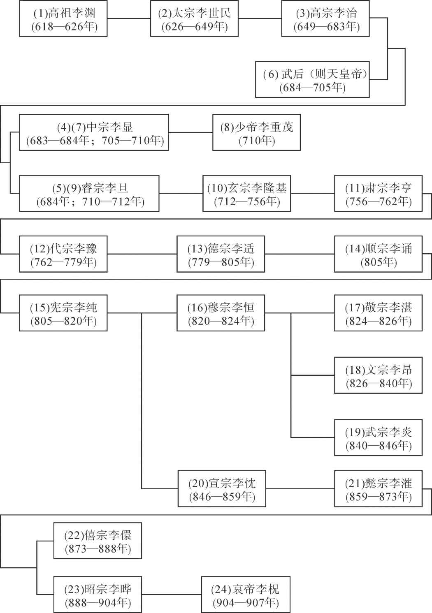

