# 目录

武韦之祸

太平公主谋逆

附录： 
唐朝皇帝世系表

返回总目录

# 武韦之祸

## 【内容提要】

《武韦之祸》叙述了唐高宗李治的皇后武曌（zhào）（即武则天）和唐中宗李显的皇后韦氏相继擅权之事，前者甚至以女主的身份短暂取代过李唐王朝。这在唐初政治史上留下了浓墨重彩的一笔。

唐高宗刚刚继承皇位，由于年轻和缺乏经验，被朝廷上一群年长且在他的父皇唐太宗的统治下已经树立了自己的势力的元老重臣所包围。高宗初期的统治受以三位年长权重的大臣——长孙无忌、褚遂良和李（jì）为首的宰相集团控制。这三位朝廷重臣均为唐太宗的忠实臣仆。在这样的情况下，高宗统治初年继承了唐太宗推行的政策，少有更革。高宗想施展自己的政治抱负、对国家进行真正的统治是非常困难的。

高宗即位不久，便立其元配王氏为皇后。但王皇后未生育子嗣，于是她与其舅父柳奭（shì）、长孙无忌等重臣劝皇帝立年岁最长的陈王李忠为太子。李忠的生母在宫中地位很低，王皇后及元老重臣希望控制他，进而确保本集团的利益。李忠便于唐高宗永徽三年（652年）被立为太子。

高宗即位之初，宠爱萧淑妃。王皇后为了打击萧淑妃，便将武曌迎入皇宫，封为昭仪（后宫妃嫔名号）。武曌进宫之后，以她的魅力和心计完全迷住了高宗，还为高宗生子。王皇后开始担忧，意识到自己招来了一个比萧淑妃更可怕的对手，于是又与萧淑妃联合起来诽谤武昭仪。

废立皇后绝非皇帝个人的私事，而是重大的政治决策。王皇后的家族极有权势，而且又有当时最有权势的元老重臣作为靠山。以长孙无忌为首的元老重臣强烈反对高宗废黜王皇后，立武曌为后。唯一鼓励高宗废后的重臣是老将李。有了以李为代表的一部分军事力量的支持，高宗可以不顾及元老重臣的反对进行废立皇后的行动。唐高宗永徽六年（655年），高宗废掉王皇后和萧淑妃，正式立武曌为皇后。李忠被废除太子之位，由武后的儿子李弘取而代之。高宗也通过废王立武的活动打击了元老重臣，为自己赢得了政治空间。

武曌被立为皇后不久，就展开打击报复其敌人的活动。她残酷害死了原来的王皇后和萧淑妃，将反对立她为皇后的大臣褚遂良、来济、韩瑗（yuàn）等贬逐，后来连长孙无忌也被诬谋反，被迫自杀。武后重用许敬宗、李义府，以巩固自身的权势。朝中反对派全被清除之后，武后的权势相当稳固，高宗的健康状况不好，而且优柔寡断，无法有效处理朝政，精明的武后趁此机会插手和逐步掌控朝政，开始“垂帘听政”，甚至监视高宗处理政务，在高宗在位的大部分时间施加了重要的政治影响。

唐高宗死后，李显继承皇位，是为唐中宗。李显刚刚登上帝位就急于扶植自己的势力，挑战其母后武则天的权威，结果被废黜。武则天又立了更为听话的李旦为皇帝，即唐睿宗，实权仍由武则天掌握。但是，武则天要正式登上皇位，还需要清除一些反对力量。

武则天派兵平定了徐敬业叛乱和李氏诸王之乱。她又重用周兴、来俊臣等酷吏残酷打击政敌，清除反对势力，但也制造了不少冤案。等局势稳定之后，为她当“枪手”的酷吏也像垃圾一样陆续被清除掉。

武则天天授元年（690年），改唐为周，正式称帝。她虽然滥赐官爵以收揽天下人心，但对不称职者也罢职或处罚。她手操刑赏之柄以驾驭天下，政由己出，明察善断，当时的英贤之才也竞相为之所用。

武则天统治晚期，过于宠幸张易之、张昌宗兄弟，纵容他们胡作非为，陷害忠良，甚至将朝政也委托二张处理。唐中宗神龙元年（705年），宰相张柬之乘武则天病重之机，纠集一帮朝臣和禁军发动政变，率军攻入皇宫，杀死张易之兄弟，并逼迫武则天退位，将帝位传给太子李显。李显重登皇位之后，封赏功臣，恢复李唐王朝。

但是，唐中宗的韦皇后却仿效武则天，公然干预朝政，培植个人势力。中宗也不想彻底清除武氏集团，反而重用这一集团中的武三思等人，拥立中宗重登皇位的功臣张柬之等也受到排斥和制约。最终，这帮功臣也没有逃脱“鸟尽弓藏”“兔死狗烹”的下场。在唐中宗统治后期，韦后与其女安乐公主毒杀中宗，妄图效法武则天成为女主。不久，相王李旦之子李隆基（后来的唐玄宗）联合其姑母太平公主发动政变，诛杀韦后及安乐公主，拥立李旦重登皇位。武氏和韦氏集团这才被逐出权力核心圈。

武则天和韦后专权被正统史家称为“武韦之祸”，因为她们的所作所为与传统的儒家思想对立，包括女人公开操纵朝政、残酷清除异己、漠视道德和原则。对于武则天和韦后的统治，正统史家的记载一直抱有敌意和偏见。对敢于像男人一样实行统治的武则天，尽管正统史家对她进行恶意攻击，但是，事实证明武则天具有突出的政治才能、坚毅的决心和驾驭局势的能力。武则天开启了女主执政的先例，后来的韦后、太平公主、安乐公主等女性也争相仿效，这一时期可被视为“后武则天时代”。

## 【原文】

**唐太宗贞观二十二年[1]。初，左武卫将军武连县公武安李君羡直玄武门，时太白屡昼见，太史占云“女主昌”[2]。民间又传《秘记》云：“唐三世之后，女主武王代有天下。”[3]上恶之[4]。会与诸武臣宴宫中，行酒令，使各言小名，君羡自言名五娘[5]。上愕然，因笑曰：“何物女子，乃尔勇健！”[6]又以君羡官称、封邑皆有“武”字，深恶之，后出为华州刺史[7]。有布衣员道信自言能绝粒，晓佛法，君羡深敬信之，数相从，屏人语[8]。御史奏君羡与妖人交通，谋不轨[9]。秋七月壬辰，君羡坐诛，籍没其家[10]。上密问太史令李淳风：“《秘记》所云，信有之乎？”[11]对曰：“臣仰稽天象，俯察历数，其人已在陛下宫中，为亲属，自今不过三十年，当王天下，杀唐子孙殆尽，其兆既成矣。”[12]上曰：“疑似者尽杀之，何如？”对曰：“天之所命，人不能违也。王者不死，徒多杀无辜。且自今以往三十年，其人已老，庶几颇有慈心，为祸或浅[13]。今借使得而杀之，天或生壮者肆其怨毒，恐陛下子孙，无遗类矣。”[14]上乃止。**

## 【注文】

[1]唐太宗：即唐朝第二代皇帝李世民（599—649年），公元626至649年在位。李世民为唐高祖李渊的次子，太穆顺皇后窦氏所生。在隋朝末年，他跟随父亲李渊在太原起兵反隋，率领军队攻克隋都大兴（今陕西西安）。唐高祖武德元年（618年），李渊称帝后，任命李世民为尚书令，封秦王。李世民继续率军击平其他割据势力窦建德、王世充、刘武周、刘黑闼（tà）等。他在建立军功的同时，开设文学馆招揽人才。随着李世民势力和威望的膨胀，他与其长兄太子李建成和弟弟李元吉的矛盾越来越尖锐。武德九年（626年），李世民发动“玄武门（唐朝皇宫的北门）之变”，杀死李建成及李元吉。李渊被迫册立李世民为太子。不久，李世民继承帝位，改年号为贞观，李渊退位为太上皇。李世民在位期间，任用房玄龄、杜如晦、魏徵等，以亡隋为戒，虚怀纳谏，任人唯贤，精简官员，注重吏治，体恤百姓，开边拓土，积极与外族、诸国交流，使唐王朝出现社会安定、经济复苏、武功强盛的局面，史称“贞观之治”。李世民死后葬昭陵（今陕西礼泉东北），庙号太宗，谥（shì）号文皇帝。　　贞观：唐太宗在位期间所用年号，即公元627至649年。贞观二十二年，即公元648年。唐太宗李世民在贞观时期的清明执政被世人誉为“贞观之治”。

[2]左武卫将军：唐朝禁军高级军官之衔。唐朝的禁军左、右武卫设大将军各一人，正三品，将军各二人，从三品，负责统领皇宫的禁军，大朝会时的仪仗。但在唐中期，左、右武卫的职事已经逐渐被使职差遣侵夺，左、右武卫大将军、将军也演变为仅仅表示官品、身份、地位的加官。　　武连：古县名。即武连县，隶属于剑州，位于今四川剑阁西。　　县公：唐朝爵位，从二品。按唐朝官制，爵位共有九等。第一等：王（或亲王），正一品。第二等：郡王，从一品。第三等：国公，从一品。第四等：郡公，正二品。第五等：县公，从二品。第六等：县侯，从三品。第七等：县伯，正四品上。第八等：县子，正五品上。第九等：县男，从五品上。皇帝的兄弟、皇子皆封亲王；亲王的嫡子（正妻所生的长子）为嗣王；皇太子的诸子并封为郡王；亲王的儿子承恩泽者也封郡王，亲王的诸子一般封郡公。　　武安：古县名。即武安县，隶属于洺（míng）州，相当于今河北武安。　　李君羡（？—648年）：唐朝前期将领。洺州武安（今河北武安）人，小名五娘。在隋朝末年，他开始跟随李密征战，后来成为王世充手下的勇将。他因为厌恶王世充的为人，于是率领他的部属归唐，唐朝授予他上轻车都尉，秦王李世民以他为左右。他跟随秦王平定各路军阀势力，每战必单骑先锋破阵，骁勇善战，为巩固唐朝政权立下汗马功劳。李世民即位（即唐太宗），授予他左武候中郎将、封武连县公，驻守唐朝皇宫的北门——玄武门。唐太宗统治末期，太白星屡屡出现，太史占卜此天象，认为是“女主昌”的征兆，又有传言“当有女武王者”。君羡的小名、官称、封爵、籍贯等皆有“武”字，这恰好与天象、传言相符，遭太宗厌恶，于是被贬为华州刺史。唐太宗贞观二十二年（648年），御史又弹劾李君羡将图谋不轨，太宗遂下诏诛杀他。武周天授年间，武则天正式称帝，改唐为周，尊崇武姓，恢复了李君羡的官爵。　　直：同“值”，当值，值班。　　玄武门：唐朝都城长安（今陕西西安）宫城北面的正门。这里指长安太极宫北面的玄武门。在唐朝的宫殿布局中，皇帝的居住地位于宫廷的北部，因此驻守宫廷北门——玄武门的北衙禁军的向背在历次宫廷政变中起决定性作用。唐高祖武德九年（626年）六月四日，李世民在玄武门发动宫廷政变，杀死太子李建成和齐王李元吉，唐高祖李渊被迫立李世民为太子，史称“玄武门之变”。　　太白：星名。即金星，又名启明星。因为在晚上出现时光亮照人，故名太白。古代星象学家以太白星主杀伐，用来喻指战争。　　见（xiàn）：同“现”，显露，出现。　　太史：古代官署名。唐朝设太史局，有长官太史令二人，从五品下，副官丞二人，从七品下。这一机构负责观察天文、考定历法、预测未来。　　占：即占卜，指用龟壳、铜钱、竹签、纸牌或星象等手段和征兆来推断未来的吉凶祸福。　　女主：古代非正式称谓。广义的女主多指临朝执政的太后或皇后；狭义的女主指主宰朝政、威盖君主的“女强人”。

[3]《秘记》：占验术数、预言未来的书籍。

[4]恶：厌恶，讨厌。

[5]会：适逢，正赶上。　　行酒令：宴会酒席中一种助兴的游戏。一般是指席间推举一人为令官，大家听令轮流说诗词、联语或其他类似游戏，违令者或输者都要罚酒，所以又称“行令饮酒”。

[6]愕（è）：惊讶，惊恐。　　何物：哪一个，什么。　　乃尔：竟然如此。

[7]官称：任官的官名。　　封邑：又称食邑、采（cài）邑、采地或封地。指古代君主赐予臣下、作为其家族世世代代享用的封地。封地的主人在食邑内有统治权，要对天子承担一定的义务，封地范围内的所有劳动者、所收取的租税均供主人享用。到秦汉时期，封地的主人在封地范围内的统治权逐渐丧失，只能征收封地内民户的赋税充当俸禄，亦为世袭。到了唐代，被赐予食邑的宗室或高级官员也只能收取封地内民户的赋税，作为俸禄，无统治权。到晚唐、五代、宋初，食邑也逐渐完全俸禄化。被赐予食邑的官员并无任何封地，只是将食邑多少户固定折算成相应的钱数，直接发给官员。　　华州：古地名。治郑县（今陕西渭南市华州区），武则天圣历后辖境相当于今华州区、华阴、潼关等市县及渭北下邽镇附近地。　　刺史：唐朝地方长官名。在唐前期，地方行政制度实行州（或郡）县二级制。州或郡的长官分别称为刺史或太守，负责管理地方。上州（户满四万以上的州）的刺史为从三品，中州（户满三万以上的州）为正四品上，下州（户不满三万的州）为正四品下。

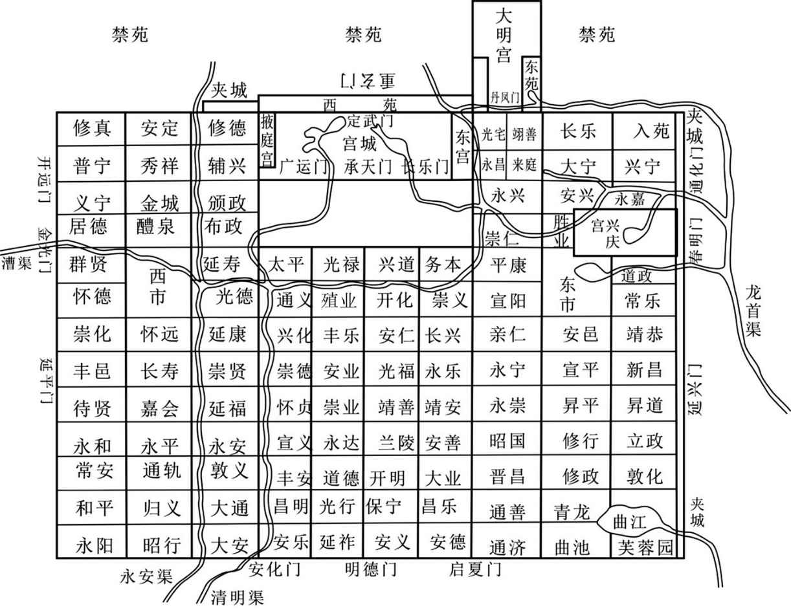 
唐长安城示意图

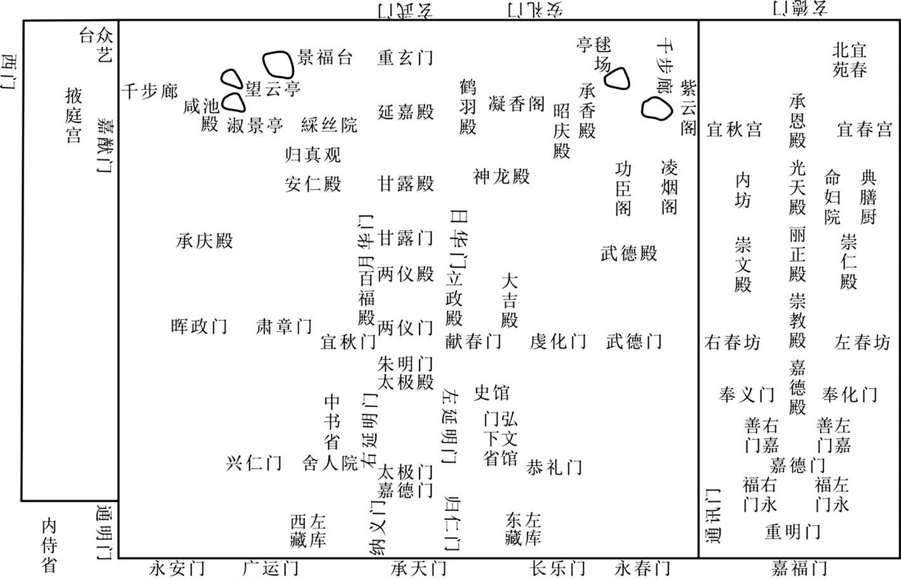 
唐长安宫城示意图

[8]布衣：指平民百姓所穿的最普通的廉价衣服。也借指平民，广大劳苦大众。古代“布”指麻、葛之类的织物，“帛”（bó）指丝织品。富贵人家穿绫罗绸缎与丝织物，平民穿麻、葛织物。后也以布衣称没有做官的读书人。　　绝粒：指不吃不喝，断绝饮食。这是道家以不进五谷求得延年益寿的修养术，又称“辟谷”。　　屏人语：避退外人而密语。

[9]御史：自隋唐以来，御史是对国家最高监察机构御史台下设三院（即台院、殿院、察院）的侍御史、治书侍御史、殿中侍御史、监察御史等官的统称。御史具体负责各类监察事务。　　交通：交往，往来。

[10]坐：因犯……罪或错误。　　籍没（mò）：籍，本指书册，引申为登记。登记并没收犯人家口、财产入官府，通称“籍没”。

[11]太史令：唐朝中央职事官名。太史局长官，员二人，从五品下，隶属于秘书省。负责观察天文、考定历法、预测未来。　　李淳风（602—670年）：唐代杰出的天文学家、数学家。岐州雍县（今陕西岐山东北）人。他博览群书，尤精天文、算术。唐太宗贞观初年，他对傅仁均编撰的历法《戊寅元历》进行重新修订，弥补了这部历法存在的缺陷，被唐太宗所采纳，他因此被授予将仕郎，进入太史局任职，成为官方天文学家。他制作浑天仪，评论前代浑天仪的得失，著成《法象志》七篇，升太常博士、太史丞。他还参与修撰《晋书》《文思博要》等。唐太宗贞观二十二年（648年），李淳风升任太史令，成为太史局长官。唐高宗时，淳风编订完成《麟德历》。此外，他为著名的数学教材《周髀（bì）算经》作过注解，还著有《典章文物志》《乙巳占》《秘阁录》等。

[12]稽（jī）：考核，考察。　　天象：古代对天空发生的各种自然现象的泛称，包括日月星辰的运行。　　历数：即历法。观测天象以推算年时节候的方法。　　陛下：陛本指宫殿的台阶。陛下成为对君主的尊称。秦朝以后，陛下只用于称呼皇帝。　　殆（dài）：大概，几乎。　　兆：古代占验吉凶时烧龟甲所成的裂纹。引申为远象、事态的远景。

[13]庶几（jī）：或许可以，表示希望或推测。

[14]借使：假设连词。假如，倘若。　　怨毒：怨恨，仇恨。　　遗类：残存的人。

## 【译文】

唐太宗贞观二十二年（648年）。当初，左武卫将军、武连县公、武安县人李君羡在玄武门当班，当时太白金星屡屡在白天出现，太史占卜说皇后将要昌盛。民间又流传着《秘记》，其中有记载说：“唐朝三代以后，女王武氏将要取而代之，拥有天下。”唐太宗非常讨厌这些言论。有一次，正赶上太宗和武臣们在宫中举行宴会，行酒令的时候，让每个人报出自己的小名，李君羡自报小名叫“五娘”。皇上惊愕不已，便笑着说：“哪个女子，竟然如此勇武强健！”又因为李君羡的官职“左武卫将军”和封邑名“武连县公”中都带有一个“武”字，所以太宗非常憎恨他，后来把他调离京城，去做华州刺史。有位百姓员道信自称能够不吃饭，又通晓佛法，李君羡非常敬重他、信服他，多次追随他，退避其他人后，和道信私下交谈。御史弹劾李君羡和妖人交往，要图谋叛乱。秋季七月壬辰（十三日），李君羡被杀，财产被没收，家人也被除去名籍成为官方的奴仆。太宗私下里询问李淳风：“《秘记》中的传言可信吗？”李淳风回答说：“作为臣子，我仰望天空，观察日月星辰，埋头审视岁时节候，发现这个人已经在陛下的宫里了，就是您的亲属。从今往后不超过三十年，此人应当称王天下，唐朝皇室的子孙将被杀戮殆尽。现在这种征兆已然形成了。”太宗问：“如果把可疑的相似之人都杀死，怎么样？”李淳风回应道：“上天的命令，人们是不能违背的。否则那个命中注定为王的人死不了，却白白多杀了无辜百姓。况且从今以后再过三十年，这个人已经年老了，或许此人能有一颗慈悲之心，可能只会造成较轻的祸患。假使现在就将此人抓住杀掉，上天可能再生出个强壮的人来，那人会不顾一切、任由自己的性子发泄自己的仇恨，那恐怕陛下的子孙就剩不下几个了。”太宗这才作罢。

## 【原文】

**高宗永徽三年秋七月丁巳，立陈王忠为皇太子[1]。**

## 【注文】

[1]高宗：即唐朝第三代皇帝唐高宗李治（628—683年），公元649至683年在位。字为善，小字稚奴，唐太宗李世民之子，长孙皇后所生。他性格懦弱，于唐太宗贞观五年（631年）封晋王。贞观十七年（643年），太宗的长子李承乾被废去太子之位后，李治被立为太子。贞观二十三年（649年），太宗去世，李治即皇帝位，改年号为永徽。永徽二年（651年），颁布新律（即永徽律）。高宗即位之初，尊礼大臣，关心百姓疾苦，继续执行太宗制订的各项政治经济制度，有贞观之遗风，史称“永徽之治”。永徽六年（655年），高宗废掉出自豪门贵族且与元老重臣关系甚密的王皇后，改立出身寒门地主家庭的武氏（即后来的女皇武则天）为皇后。之后，高宗纵容和默许武后打击、排挤、贬逐朝中的元老重臣，促使君主本人及皇后的权力大为膨胀。后来，高宗体弱多病，武后逐渐掌握朝廷大权。他在位期间，采取过促进经济发展、社会安定的措施，开边拓土，平定西北地区的西突厥和东北地区的高句（gòu）丽（朝鲜半岛北部建立的政权）。他死于弘道元年（683年），葬乾陵（今陕西乾县西北），谥号天皇大帝，庙号高宗。　　永徽：唐高宗李治在位期间所用年号，即公元650年至655年。永徽三年即652年。　　陈王忠：即李忠（643—665年），唐高宗李治的长子，后宫的宫人刘氏所生，字正本。李治还是太子之时，就有了李忠。李忠于唐太宗贞观二十年（646年），被封为陈王，唐高宗永徽元年（650年）拜官雍州牧。李忠的生母刘氏出身相当低贱，而王皇后已与高宗结婚多年，却没有生育。于是，王皇后的舅父柳奭（shì）便与其他元老重臣褚遂良、韩瑗（yuàn）、长孙无忌、于志宁等人相继向高宗请求立李忠为太子，目的是让李忠感激王皇后及元老重臣的恩德，以保持他们未来的家族利益。永徽三年（652年），李忠被立为太子。可是，永徽六年（655年），王皇后就被废，高宗改立得宠的武氏（即武则天）为皇后，李忠的太子之位已经岌岌可危。高宗显庆元年（656年），废太子李忠为梁王，立武后所生的长子李弘为太子。显庆五年（660年），李忠被废为庶人，囚禁于黔州（治今重庆彭水）。高宗麟德元年（664年），李忠被诬谋反罪，赐死。后追封为燕王。

## 【译文】

唐高宗永徽三年（652年）七月丁巳（初二日），册立陈王李忠为皇太子。

## 【原文】

**五年。初，王皇后无子，萧淑妃有宠，王后疾之[1]。上之为太子也，入侍太宗，见才人武氏而悦之[2]。太宗崩，武氏随众感业寺为尼[3]。忌日，上诣寺行香，见之，武氏泣，上亦泣[4]。王后闻之，阴令武氏长发，劝上内之后宫，欲以间淑妃之宠[5]。武氏巧慧，多权数，初入宫，卑辞屈体以事后[6]。后爱之，数称其美于上[7]。未几大幸，拜为昭仪[8]。后及淑妃宠皆衰，更相与共谮之，上皆不纳[9]。昭仪欲追赠其父而无名，故托以褒赏功臣，遍赠屈突通等，而武士彟预焉[10]。**

## 【注文】

[1]王皇后（？—655年）：唐高宗李治的元配、第一位皇后。唐并州祁县（今山西祁县）人。李治为晋王时纳王氏为妃。唐太宗贞观十七年（643年），李治被立为皇太子，王氏也成为皇太子妃。高宗即位后，永徽元年（650年）立王氏为皇后。然而王氏无宠于高宗，也没有儿子。当时，后宫的萧淑妃有宠，王皇后劝高宗接武氏入宫，欲利用武氏与萧淑妃争宠。武氏入宫后，深得高宗宠爱，地位迅速上升。王皇后与萧淑妃皆失宠。永徽六年（655年），王皇后被废，高宗改立武氏为皇后。王氏不久被武后害死。　　淑妃：唐朝皇宫中女官名，正一品。在唐朝的后宫，设皇后一名。皇后之下设内命妇（命妇指受帝王封号的妇女）：贵妃、淑妃、德妃、贤妃并为夫人，皆正一品。昭仪、昭容、昭媛、充仪、充容、充媛并为嫔，正二品。婕（jié）妤（yú）九员，正三品。美人九员，正四品。才人九员，正五品。宝林二十七员，正六品。御女二十七员，正七品。采女二十七员，正八品。　　萧淑妃（？—655年）：唐高宗李治的宠妃。萧氏为南朝士族兰陵萧氏族人。李治还是太子时，就十分宠爱萧氏。李治即皇帝位后，萧氏进为淑妃，仍然受宠。萧淑妃生下了许王李素节（高宗之第四子）、义阳公主和宣城公主。后来，淑妃在与武则天的宫廷斗争中失败，与王皇后同被废为庶人，关押在暗室。后来，李治思念萧淑妃，就去暗室看望王皇后和淑妃。武则天得知这一情况后，将这二人残忍地杀害。　　疾：厌恶，憎恨。

[2]才人：唐朝皇宫中女官名，正五品。参见注淑妃。　　武氏：即武则天（624—705年），名曌（zhào），唐高宗李治的皇后，后来建立周朝，自立为皇帝，为中国古代历史上唯一的女皇帝。她是并州文水（今山西文水东）人，唐朝开国功臣武士彟（huò）的女儿。她多智计，精通文史。十四岁时，被选入皇宫，成为唐太宗李世民的才人。太宗死后，她到感业寺为尼姑。唐高宗李治即皇帝位后不久，又将她召入宫中，封为昭仪，十分宠爱她。高宗永徽六年（655年），册立武则天为皇后。后来，高宗身体不佳，武则天开始逐渐参与朝政，渐渐掌握了朝廷大权。唐高宗上元元年（674年），高宗称天皇，武则天称天后。因为武则天本人有一直把持朝政的野心，因此与自己的亲生儿子也因争权而发生矛盾。她害死了自己所生的长子——太子李弘。她所生的第二个儿子李贤继立为太子后，也与她产生矛盾，最终被废去太子之位，遭到流放。高宗死后，唐中宗李显（武后所生的第三个儿子）即皇帝位，武则天成为皇太后，实际控制朝政。不久，她勾结朝中重臣废掉李显，立李旦（武后所生的第四个儿子）为皇帝，自己仍然总揽朝政。天授元年（690年），她改唐为周，称圣神皇帝，正式登上帝位。她在位期间，严厉镇压政敌，任用酷吏，大开告密之门，李唐宗室和不依附于她的旧臣惨遭冤杀者甚众。她采取一些打击旧贵族的政策，开创殿试（由皇帝亲自在大殿上面试参加科举考试的举人）以选拔人才。她大兴佛教、建立明堂（即古代帝王宣明政教、举行大典的地方，这是武周政权重要的标志性礼仪建筑）。她还大批任命员外官（在官僚正规编制之外所置之官）、试官（试任其职，尚未正式任命的官员），破格提拔了一批人才，加强了君主本人的用人权。她重视农业，户口大增，经济有所发展。在她晚年病重之时，一批朝廷重臣发动政变，拥立中宗李显重登皇位，恢复了李唐王朝。不久，武则天死，与高宗合葬乾陵（今陕西乾县西北），谥号为则天大圣皇后。

[3]崩：中国古代称帝王死亡。　　感业寺：唐都长安城内的佛寺，又称安业寺、济度寺。原址在今陕西西安西北角隋唐长安故城安业坊。当年的感业寺早已不复存在。感业寺遗址位于今陕西西安六村堡乡后所寨西南30米处，在丰产路北侧。现感业寺小学即建于寺内。

[4]忌日：死亡纪念日。　　诣：到……去。

[5]长（zhǎng）发：蓄发，留头发。　　内（nà）：通“纳”，纳入，收入，接受。　　间：离间。

[6]权数：掌握权力的术数，本领。　　卑辞屈体：言辞谦恭，降低身份。

[7]数（shuò）：屡次，多次。

[8]未几：不久。　　昭仪：唐朝皇宫中女官名，正二品。参见注淑妃。

[9]谮（zèn）：说坏话诬陷别人。

[10]追赠：授予已故官员或现任在职官员的已故直系亲属荣誉衔。　　无名：没有正当理由。　　屈突通（557—628年）：隋末唐初大将，凌烟阁二十四功臣之一。长安（今陕西西安）人，性格刚毅，好武略，善骑射。他在隋朝为虎贲（bēn）郎将，后升左武卫将军。他为官刚正。隋炀帝大业年间，他率兵平定反叛隋朝的杨玄感，因功升为左骁卫大将军。后又击败刘迦论的反隋军。隋炀帝杨广游览江都（今江苏扬州），命屈突通镇守都城长安。隋朝的太原（今山西太原）守将李渊（即唐高祖，唐朝的开国皇帝）起兵反隋，屈突通被擒而降。他跟随李渊的次子李世民（即唐太宗）四处征战，多有战功。唐高祖武德四年（621年），他跟从李世民击败军阀王世充，为唐朝清除割据势力、巩固江山立下重要战功，拜陕东道大行台右仆射（yè），镇守东都（今河南洛阳）。后来，屈突通到中央担任工部尚书，又任洛州（治今河南洛阳）都督，不久，死于任上。　　武士彟（huò）（577—635年）：唐朝开国功臣，女皇帝武则天之父。唐并州文水（今山西文水东）人，字信。他曾经经营木材，成为富商。隋朝末年，太原守将李渊引士彟为行军司铠参军。士彟跟随李渊起兵反隋，攻下都城长安。在唐朝，士彟被授予光禄大夫之衔。唐高祖武德年间，士彟升任工部尚书，封应国公。士彟的发妻相里氏死后，高祖为他做媒，续娶名门杨氏之女为妻。杨氏生武则天。唐太宗贞观年间，士彟历任利州（治今四川广元）都督、荆州（治今湖北江陵）都督，死于任上。　　预：参与其中。

## 【译文】

唐高宗永徽五年（654年）。起初，王皇后没有儿子，萧淑妃得到高宗的宠爱，所以王皇后嫉妒她。高宗还是太子的时候，入殿去侍奉太宗，见到了才人武氏，就喜欢上了她。太宗死后，武氏跟随大家到感业寺做了尼姑。在太宗的忌日，高宗到感业寺里去上香，见到武氏，武氏哭泣，高宗也哭了。王皇后听说此事后，就暗地里让武氏留头发，劝说高宗将武氏纳入后宫，想利用她来与萧淑妃争宠。武氏机灵聪明，懂得玩弄权术，刚刚入宫的时候，她对待王皇后言辞谦恭，尊敬奉迎。王皇后喜欢她，多次在高宗面前说她的好话。没过多久，武氏就得到高宗的盛宠，升为昭仪。高宗对王皇后和萧淑妃的宠爱都有所减少，两人便一起合谋，说武昭仪的坏话诬陷她，高宗都没有听进去。武昭仪想追赠她的父亲官爵，可是又没有合适的理由，就假托以褒奖和赏赐有功之臣，对他们普遍都加以赠官，包括屈突通等人，武昭仪的父亲武士彟也在被嘉奖的功臣之中。

## 【原文】

**王皇后、萧淑妃与武昭仪更相谮诉，上不信后、淑妃之语，独信昭仪。后不能曲事上左右，母魏国夫人柳氏及舅中书令柳奭入见六宫，又不为礼[1]。武昭仪伺后所不敬者，必倾心与相结，所得赏赐分与之[2]。由是后及淑妃动静昭仪必知之，皆以闻于上。后宠虽衰，然上未有意废也。会昭仪生女。后怜而弄之，后出，昭仪潜扼杀之，覆之以被[3]。上至，昭仪阳欢笑，发被观之，女已死矣，即惊啼。问左右，左右皆曰：“皇后适来此。”[4]上大怒曰：“后杀吾女！”昭仪因泣数其罪。后无以自明，上由是有废立之志[5]。又畏大臣不从，乃与昭仪幸太尉长孙无忌第，酣饮极欢，席上拜无忌宠姬子三人皆为朝散大夫，仍载金宝、缯锦十车以赐无忌[6]。上因从容言皇后无子以讽无忌，无忌对以他语，竟不顺旨，上及昭仪皆不悦而罢[7]。昭仪又令母杨氏诣无忌第，屡有祈请，无忌终不许[8]。礼部尚书许敬宗亦数劝无忌，无忌厉色折之[9]。**

## 【注文】

[1]曲事：曲意奉事。　　魏国夫人：国夫人，唐朝命妇封号，视其丈夫或儿子的官品来定品级，取其高者。　　中书令：唐前期职事官，正三品，中书省长官。掌管军国政令，辅佐天子执掌大政，奉皇帝旨意拟成文书，作为管理国家的准则。但唐中期以后，中书令已经演变为仅仅标志官品、身份、地位的加官，并无实际职掌。　　柳奭（shì）（？—659年）：唐朝初期重臣，唐高宗第一位皇后王氏的舅舅。唐蒲州解（xiè）县（今山西运城西南）人，字子邵。唐太宗贞观年间，柳奭担任中书舍人，负责草拟皇帝的诏书。唐高宗即皇帝位后，因为柳奭的外甥女王氏为皇后，于永徽二年（651年）升柳奭为中书侍郎、同中书门下三品，成为真正的宰相。第二年，进中书令。后因王皇后失宠、被废，柳奭辞去宰相之职，被贬出京城。后又被诬谋反，被杀。

唐中央机构三省长官、副官及其职掌简表
中央机构三省 中书省 门下省 尚书省   长官 中书令二人，正三品。 侍中二人，正三品。 尚书令一人，正二品。   副官 中书侍郎二人，正四品上。 黄门侍郎二人，正四品上。 左、右仆射（yè），从二品。   职掌 负责起草、发布皇帝的诏令。 负责对诏令的审议与封驳，拥有封还皇帝诏书和驳回臣下章奏的权力。 全国最高行政机构。其总办公机构为尚书都省，负责尚书省各类文书的审核、签发与存档，指导尚书省六部的工作。    
六宫：本义指古代皇后的寝宫。古代皇后的寝宫有正寝一，燕寝五，合为六宫。因为六宫为皇后居住之所，所以往往用六宫代指皇后，如同后世用中宫代指皇后一样。而六宫的概念至唐代已非专指皇后，而是泛指后妃或其所居之地。

[2]伺（sì）：侦察、探察。

[3]弄：玩耍，游戏。

[4]适：刚才。

[5]自明：自我表白。

[6]太尉：古代官名。唐朝三公（太尉、司徒、司空）之一，正一品。本是辅佐皇帝治理国家之重臣，无所不统。但在唐朝，太尉仅作为大臣的加官（只表示身份、官位的荣誉衔），无实际职掌。　　长（zhǎng）孙无忌（594—659年）：唐朝开国功臣，唐太宗长孙皇后之兄。字辅机，河南洛阳（今河南洛阳）人。其先世为北魏皇族拓跋氏，后改为长孙氏。在唐朝建国之初，他常常跟从秦王李世民四处征战，为唐王朝政权的巩固立下重要功劳。唐高祖武德九年（626年），他策划发动玄武门之变，助秦王李世民杀死太子李建成、齐王李元吉，帮助李世民夺得皇位。李世民即位后，升无忌为吏部尚书、尚书右仆射（yè），封赵国公。他曾经向唐太宗建议，不让诸位功臣世袭地方长官刺史之职。唐太宗贞观十七年（643年），太宗命图画功臣二十四人像于凌烟阁，无忌居首位。后升为同中书门下三品，成为宰相。唐太宗临死前，无忌与褚遂良受遗诏，辅立太子李治（即唐高宗）登基，进太尉，仍然领同中书门下三品。他奉命与于志宁等编成《唐律疏议》三十卷，这成为中国乃至东亚古代法律的典范。唐高宗永徽六年（655年），无忌多次反对高宗废王皇后、立武氏为后，招致武氏的怨恨。武氏被立为皇后之后，无忌被诬谋反，流放黔州（治今重庆彭水），后被逼自杀。　　酣（hān）：酒喝得很畅快。　　朝散大夫：唐朝文散阶，从五品下。　　金宝：黄金和珠宝。　　缯（zēng）：古代丝织品的总称。　　锦：有彩色花纹的丝织品。

[7]讽：用委婉的语言暗示、劝告或讥刺、指责。　　他语：其他的话，不直面回答，即环顾左右而言他。

[8]杨氏（579—670年）：武则天之母，出自名门弘农杨氏。她与武士彟（参见注武士彟）生了三个女儿。长女嫁贺兰越石，次女武则天，三女嫁郭氏。唐高宗年间，武则天被立为皇后，杨氏也被封为荣国夫人。

[9]礼部尚书：唐前期职事官，正三品。礼部是中央机构尚书省所属的六部之一。礼部尚书为长官，礼部侍郎为副职。礼部尚书、侍郎掌管天下礼仪、祭祀、宴会、科举考试。

唐尚书省所属六部长官、副官及其职掌简表
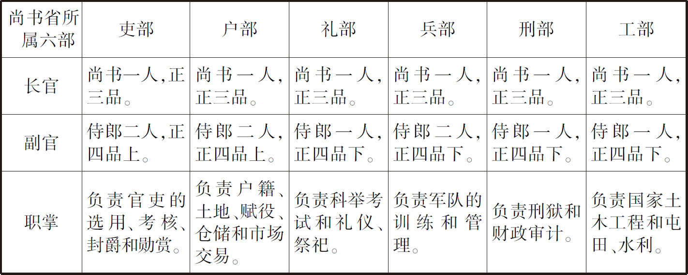 

（屯田：利用士兵在驻扎的地区种地或招募农民垦荒种地。）

许敬宗（592—672年）：唐朝初年大臣、高宗朝宰相。杭州新城（今浙江富阳）人，字延族，隋朝名臣许善心之子。隋炀帝大业年间，许敬宗考中秀才。隋朝末年，他投奔反隋的一支军队的领袖李密，任元帅府记室。后归附唐朝，秦王李世民（后来的唐太宗）将他召入秦王府中，成为著名的“十八学士”之一。唐太宗贞观年间，他历任著作郎、中书舍人、给事中，兼修国史。不久，他担任检校中书侍郎，专门掌管草拟皇帝的诏令。唐高宗时，他担任礼部尚书。他因助立武昭仪（即武则天）为皇后，得到高宗和武后的青睐，逐步跻身宰相之位。他与李义府诬陷原唐太宗朝的元老重臣长孙无忌等。唐高宗显庆二年（657年），他升为侍中（门下省长官，正三品，为宰相之衔）。第二年，为中书令（中书省长官，正三品），进爵高阳郡公。他曾经监修《武德实录》（唐高祖朝的实录）、《贞观实录》（唐太宗朝的实录）、《晋书》、《姓氏录》等，爱憎由己，虚美隐恶。唐高宗咸亨初年，他以特进（唐代文散阶号，正二品。仅标志身份、地位，没有实际职事）的身份退休。他留下文集八十卷，已经散佚。　　折：责难，指出别人的错误或缺点。

## 【译文】

王皇后、萧淑妃与武昭仪彼此之间都向高宗诉说告状，可是高宗不信皇后和淑妃的话，只相信武昭仪。皇后不能委曲自己在高宗身边以取悦侍奉高宗，她的母亲魏国夫人柳氏和舅舅、中书令柳奭入后宫，又不能礼遇六宫的妃嫔。武昭仪观察那些不为皇后礼遇和尊敬的人，一定尽心与他们交往，将自己所得到的赏赐分给他们。这样一来，王皇后和萧淑妃的一举一动，昭仪必然都知晓了，并且将这些都告诉了高宗。王皇后虽然渐渐失宠，但是高宗还没有要废掉她的打算。正赶上武昭仪生下女儿，王皇后喜欢小孩，逗孩子玩。王皇后走出去之后，武昭仪悄悄地掐死孩子，用被子盖好。等高宗来时，武昭仪假装欢笑，揭开被子时，女儿已经死亡，武昭仪立即受惊而哭泣。她向身边人询问，身边人都说：“皇后刚刚来过这里。”高宗大怒，说道：“皇后杀了我的女儿！”武昭仪便哭着历数皇后的罪状。皇后无言辩白来澄清自己，高宗从这时起，产生了废立皇后的意图。高宗又害怕大臣们不听从，就和武昭仪来到太尉长孙无忌的住处，尽兴地喝酒，极为欢畅。酒席间，高宗拜长孙无忌的三个宠爱的侍妾的儿子为朝散大夫，又赐给他十车的黄金珠宝和有漂亮花纹的丝绸。高宗从容委婉地暗示长孙无忌皇后没有后代，无忌却以其他无关的话来回应，最终没有顺着高宗的意思。高宗和武昭仪都不欢而返。武昭仪又让母亲杨氏到长孙无忌的家，屡次祈求恳请，长孙无忌最终也没有答应。礼部尚书许敬宗也多次劝说无忌，长孙无忌都以严厉的脸色堵住了他的嘴。

## 【原文】

**六年夏六月，武昭仪诬王后与其母魏国夫人柳氏为厌胜，敕禁后母柳氏不得入宫[1]。秋七月戊寅，贬吏部尚书柳奭为遂州刺史[2]。奭行至扶风，岐州长史于承素希旨，奏奭漏泄禁中语，复贬荣州刺史[3]。**

## 【注文】

[1]厌胜：古代一种巫术，谓能以诅咒制胜，压服人或物。　　敕：唐朝公文书之一。皇帝颁发的公文书称制、敕、册。

[2]贬：降职。　　吏部尚书：唐朝前期职事官，正三品。尚书省吏部的长官为尚书，副官为侍郎，掌管天下官吏的选授、封爵、策勋、考核。吏部尚书的班列次序，位于其他各部尚书之上。　　遂州：古地名。治方义（今四川遂宁），辖境相当于今四川遂宁、蓬溪和重庆潼南等市、县地。

[3]扶风：古县名。即扶风县，隶属于岐州，相当于今陕西扶风。　　岐州：地名。治雍县（今陕西凤翔南），辖境在今陕西周至、麟游、陇县、宝鸡、太白等市、县地。　　长史：古代官名。地方上州长官刺史的辅佐。上州（户满四万以上的州）的长史为从五品上；中州（户满三万以上的州）为正六品上；下州（户不满三万的州）为从六品上。“长史”与“别驾”“司马”并为州的上佐，名义上负责纪纲众务，协助地方长官管理当地事务，官品高、俸禄优厚，其实并无具体职事，多用以安置闲散及被贬的官员，或用作迁转之官阶。　　希旨：迎合在上者的意旨。　　禁中：也称省中，即宫禁之内、皇宫之内。　　荣州：古地名。治大牢（今四川荣县西），辖境相当于今四川自贡、威远、荣县等市、县和内江市部分地区。

## 【译文】

唐高宗永徽六年（655年）夏六月，武昭仪诬陷王皇后和她的母亲魏国夫人柳氏施巫术，高宗于是下敕书，禁止皇后的母亲柳氏入宫。秋天七月戊寅（初十日），吏部尚书柳奭被贬官为遂州刺史。柳奭走到扶风县时，岐州长史于承素迎合皇帝的旨意，上奏称柳奭泄露宫中的谈话，于是再贬柳奭为荣州刺史。

## 【原文】

**唐因隋制，后宫有贵妃、淑妃、德妃、贤妃，皆视一品[1]。上欲特置宸妃，以武昭仪为之，韩瑗、来济谏，以为故事无之，乃止[2]。**

## 【注文】

[1]隋（581—618年）：中国古代朝代名。581年，北周静帝被迫将皇帝之位让于掌握兵权的重臣杨坚（即隋文帝）。杨坚改元开皇，建立隋朝。因为杨坚原为随国公，但“随”字的“辶”意思有忽走忽停不稳定之意，于是他便弃了“辶”，创了“隋”这个新字作为王朝之名。开皇三年（583年），隋朝建都大兴城（今陕西西安）。开皇九年（589年），隋军攻灭南方的陈朝，统一全国。杨坚的次子隋炀帝杨广在位期间（大业元年至大业十三年，即605至617年），人口增加，社会经济繁荣。隋朝的统治区域东、南到海，西到今新疆东部，西南到云南、广西和越南北部，北到大漠，东北到辽河。但是隋炀帝滥用民力，又采取过度汉化的措施，激起民众和朝中部分胡化的关陇贵族的不满。从大业七年（611年）起，各地相继爆发反隋的农民起义，部分关陇贵族也起兵反隋。隋朝土崩瓦解，于618年灭亡。隋朝的统治时期虽短，但是它结束了国家长期分裂的局面，开启了后来繁荣的唐王朝。因此，隋朝是一个继往开来的朝代。　　贵妃：唐朝后宫妃嫔名号，正一品。　　德妃：唐朝后宫妃嫔名号，正一品。　　贤妃：唐朝后宫妃嫔名号，正一品。　　视一品：官品阶等同于一品。

[2]宸妃：古代后宫妃嫔名号。宸，北极星所在，常用以指宫殿、王位，也用做帝王的代称。宸妃名号自唐高宗李治始设，宋、明、清皆有之。　　韩瑗（yuàn）（606—659年）：唐前期大臣。雍州三原（今陕西三原西北）人，字伯玉。他少有节操，博学有才干。唐太宗贞观年间，他以兵部侍郎继承其父的爵位颍（yǐng）川县公。唐高宗永徽三年（652年），他升为黄门侍郎、同中书门下三品，监修国史，成为宰相。永徽六年（655年），唐高宗想废王皇后，立武昭仪为后，韩瑗极力向高宗进谏，反对废王立武，高宗都不听。不久，朝中另一位重臣褚遂良因为反对立武昭仪为后，被贬官，韩瑗向皇帝上书力救未成，于是忧愤请归田园，高宗不许。高宗仍然册立武氏为皇后。高宗显庆二年（657年），许敬宗、李义府迎合武后的旨意，诬告韩瑗与褚遂良图谋不轨。于是，贬韩瑗为振州（治今海南三亚）刺史，韩瑗死于任上。　　来济（610—662年）：唐前期大臣。扬州江都（治今江苏扬州）人。他考中了进士，在唐太宗贞观年间担任中书舍人，并与令狐德棻（fēn）共同修撰《晋书》。唐高宗永徽三年（652年），他以中书侍郎加同中书门下三品，兼弘文馆学士，监修国史，成为宰相。永徽六年（655年），他进为中书令。他曾经反对高宗立武昭仪为皇后。高宗显庆二年（657年），许敬宗、李义府诬告他与褚遂良谋反，于是贬来济为台州（今浙江临海）刺史，又迁至庭州（今新疆吉木萨尔北）。后来，来济与突厥作战，战死沙场。　　故事：先例，旧日的典章制度。

## 【译文】

唐代因袭隋代的制度，后宫中设有贵妃、淑妃、德妃、贤妃，都视为一品。高宗想要特置宸妃一职，让武昭仪为宸妃，韩瑗、来济都劝谏高宗，认为过去没有先例，这才作罢。

## 【原文】

**中书舍人饶阳李义府为长孙无忌所恶，左迁壁州司马[1]。敕未至门下，义府密知之，问计于中书舍人幽州王德俭[2]。德俭曰：“上欲立武昭仪为后，犹豫未决者，直恐宰臣异议耳[3]。君能建策立之，则转祸为福矣。”义府然之，是日，代德俭直宿，叩阁上表，请废皇后王氏，立武昭仪，以厌兆庶之心[4]。上说，召见与语，赐珠一斗，留居旧职[5]。昭仪又密遣使劳勉之，寻超拜中书侍郎[6]。于是卫尉卿许敬宗、御史大夫崔义玄、中丞袁公瑜皆潜布腹心于武昭仪矣[7]。**

## 【注文】

[1]中书舍人：古代中书省的属官，设六人，正五品上。负责侍从朝会，参议政务。皇帝的旨意由宰相负责传达后，交中书舍人草拟皇帝的诏书、敕书。中书舍人六员分押尚书省六部，协助宰相批复公文。唐玄宗开元以后，由翰林学士草拟皇帝的机密诏书，中书舍人唯草拟例行的、普通的诏书、敕书。后来皇帝又常常任命他官兼知制诰或知中书舍人事，必须兼这两种差遣使职方可负责草拟诏书、敕书。这样，中书舍人渐渐成为闲职。　　饶阳：古县名。即饶阳县，隶属于瀛州，后改属深州，相当于今河北饶阳。　　李义府（614—666年）：唐前期大臣、宰相。瀛州饶阳（今河北饶阳）人，后迁居永泰（今四川盐亭东）。唐太宗贞观年间，他以文辞而显，担任门下省典仪，迁太子舍人，崇贤馆直学士。他曾经献《承华箴》，表示对谄佞（nìng）的痛恨。唐高宗时，他迁中书舍人，负责草拟皇帝的诏书。但是，当时的权臣长孙无忌讨厌他，想将他贬官、逐出京城。他于是向高宗上表，迎合高宗的意思，请求册立得宠的武昭仪为皇后。他的这一举动得到高宗和武昭仪的厚赏，超越常规制度，升任中书侍郎。高宗永徽六年（655年），武昭仪被立为皇后，李义府升为同中书门下三品、监修国史，成为宰相，不久进为中书令。他善于吹拍武后，依仗武后的权势拉帮结派，培植自己的势力，并卖官爵。他为人表面上温顺嬉笑，态度和蔼，其实却猜忌阴险，别人稍微违背他的意思，即加以暗中陷害，被人称为“笑中有刀”。历史典故“笑里藏刀”即来源于上述史实。这一成语最初的记载见《旧唐书·李义府传》。李义府常以柔而害物，又被称为“李猫”。高宗龙朔三年（663年），李义府被人告发心怀异谋及收受贿赂，被除名，流放巂（xī）州（治今四川西昌），朝野称贺。高宗乾封元年（666年），朝廷大赦天下，唯独规定被流放之人不许返回。李义府忧愤而死。他曾经与许敬宗改修唐高祖、唐太宗的《实录》，又与许敬宗共撰《东殿新书》，著有个人文集三十卷，已经散佚。　　左迁：古人尊崇右，以右为尊。“左迁”即表示贬官、降职。　　壁州：古地名。治诺水（今四川通江），辖境相当于今四川通江及附近地区。　　司马：古代官名。唐朝地方州长官的佐官，与“别驾”“长史”并为州的上佐，名义上负责纪纲众务，协助地方长官管理当地事务，官品高、俸禄优厚，其实并无具体职事。多用于安置被贬官的大臣，或用作迁转之官阶。

[2]门下：即门下省，为唐中央机构三省之一。　　幽州：古地名。治蓟县（今北京城西南隅），唐辖境相当于今北京市、天津武清区，河北永清、廊坊等市区县地。

[3]异议：不同的意见。

[4]直宿：直通“值”；宿，夜间守卫。直宿，即值夜班。　　叩阁：国家重臣在皇帝非办公时间，要求向皇帝报告问题。　　表：古代的一种特殊文体，是臣子写给皇帝的呈文。　　厌：满足。　　兆庶：兆，数词，极为众多之意，又指百姓。庶，百姓之意。兆庶，即指百姓。

[5]说：通“悦”，高兴，愉快。

[6]中书侍郎：唐前期职事官，中央机构中书省的副官，正四品上，为中书令的副手，参议朝廷政事，传递诏书或接受外邦的表、疏。

[7]卫尉卿：古代官名。即卫尉寺卿，为唐中央机构九寺之一卫尉寺的长官，其副官称卫尉少卿。

唐中央机构九卿长官、副官及其具体职掌简表
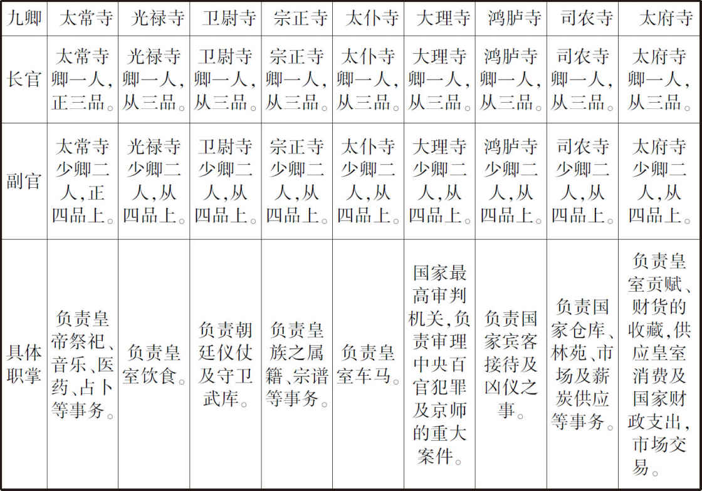 

（附：在唐中央衙署中，尚书省的六部是政务机构，九卿是事务机构。）

御史大夫：唐朝中央监察机构的官员。中央监察机构御史台中，御史大夫为长官，从三品；御史中丞为御史大夫的副职，正五品上。御史大夫掌管国家的监察，以肃正朝纲，中丞辅助他。　　崔义玄（约586—约656年）：唐前期大臣。贝州武城（今河北清河东北）人。隋朝末年，他投奔起兵反隋的瓦岗军领袖李密，不被任用，于是归附唐朝，任怀州（治今河南沁阳）总管府司马。他在唐朝平定群雄、统一全国的战争中立下战功，被封为清丘县公。唐太宗贞观初年，他担任左司郎中。唐高宗永徽初年，他担任婺（wù）州（治今浙江金华）刺史。永徽四年（653年），他平定了睦州（治今浙江建德东北）的陈硕真起义，迁御史大夫。他又奉皇帝的诏书，与博士详定儒家经典五经正义。永徽六年（655年），他赞同高宗册立武后的决策。武氏登上皇后之位后，他又秉承武后的旨意，与李义府等诬陷长孙无忌等元老重臣。高宗显庆元年（656年），他被贬为蒲州（治今山西永济西南）刺史，死于任上。　　中丞：即御史中丞，为唐朝中央监察机构的官员。　　袁公瑜（613—685年）：唐前期大臣。陈郡扶乐（今河南太康西北）人。唐高宗永徽六年（655年），高宗想废王皇后，立武昭仪为皇后。他身为御史中丞，暗中向武氏表达忠心。武氏被立为皇后，他继续巴结武后，升为中书舍人，负责草拟皇帝的诏书。高宗显庆四年（659年），许敬宗派袁公瑜到黔州（治今重庆彭水）逼长孙无忌自杀。　　腹心：腹，肚；腹心，心脏。二者皆为人体的重要器官。此处比喻贤智策谋之臣。

## 【译文】

中书舍人饶阳人李义府被长孙无忌所憎恶，贬官为壁州司马。皇帝的这项敕书还没有到达门下省，李义府就偷偷地得知这一任命，他就向中书舍人幽州人王德俭询问计策。王德俭说：“皇上想要册立武昭仪为皇后，正犹豫不决，只不过担心宰相大臣提出反对意见罢了。您如果能建言献策，提出册立武昭仪为皇后，就能将祸患转变为福气了。”李义府表示赞同，这一天，他代替王德俭值夜班时，叩阁向皇帝上表，请求废黜王皇后，立武昭仪为皇后，以满足老百姓的心愿。高宗非常高兴，召见了李义府，并和他交谈，赏赐他一斗珠宝，让他继续留在原来的职位上。昭仪也暗地里派人去慰劳和勉励他。不久，李义府就破格拜官中书侍郎。从这时候起，卫尉寺卿许敬宗、御史大夫崔义玄、御史中丞袁公瑜都暗中在武昭仪身边安插亲信。

## 【原文】

**秋八月，长安令裴行俭闻将立武昭仪为后，以国家之祸必由此始，与长孙无忌、褚遂良私议其事[1]。袁公瑜闻之，以告昭仪母杨氏，行俭坐左迁西州都督府长史[2]。行俭，仁基之子也[3]。**

## 【注文】

[1]长安：这里指长安县，是雍州（即唐都长安）的属县，在今陕西西安市内。　　令：古代官名。在唐代，县的行政长官称为县令。负责管理本县的地方事务。　　裴行俭（619—682年）：唐前期大臣，高宗朝名将。绛（jiàng）州闻喜（今山西闻喜东北）人，出自名门河东裴氏家族，字守约。他幼年因家世背景而成为弘文生。唐太宗贞观年间，他考中明经（科举考试科目，考察儒家经典的记诵），调左屯卫仓曹参军。裴行俭跟从名将苏定方学习用兵之术。唐高宗时期，行俭因为私下跟长孙无忌等非议高宗立武后之事，被贬为西州都督府（治今新疆吐鲁番东南高昌故城）长史。高宗麟德二年（665年），行俭升任安西都护，西域诸国多仰慕而归附于他。高宗总章二年（669年），他担任吏部侍郎，改革选官制度。他与李敬玄共同掌管职官选任十多年，甚有能名。高宗调露元年（679年），西突厥进攻安西都护，裴行俭以“安抚大食（唐时对阿拉伯帝国的称呼）使”的名义，率兵护送波斯王子泥涅师回国。他俘虏了西突厥十姓可汗阿史那都支，在碎叶城（今吉尔吉斯斯坦托克马克以南的阿克·贝希姆废城）刻石记功，升为礼部尚书。当时恰逢东突厥来攻，他又担任定襄道行军大总管，率兵平定突厥阿史德温傅等。他善于发现人才，他所推荐的部将王方翼、程务挺、李多祚（zuò）等，均成为一代名将。他擅长草书，著有《草字杂体》《选谱》，并撰有文集二十卷，均已经散佚。

唐代六大都护府简表
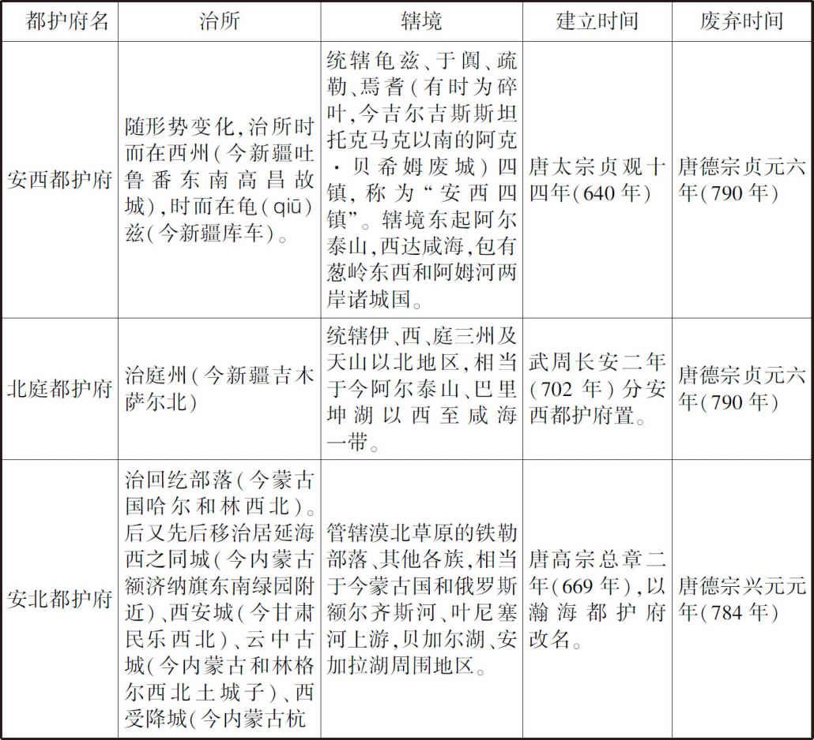 

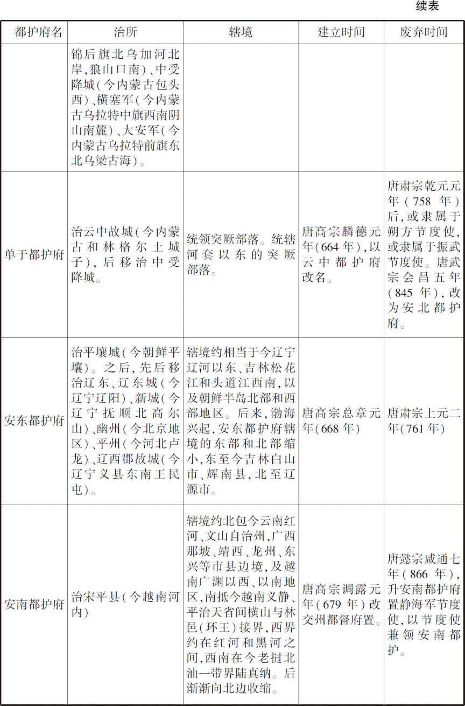 

褚遂良（596—658或659年）：唐前期大臣，著名书法家。钱塘（今浙江杭州）人，字登善。褚亮之子。遂良博览文史，擅长书法，尤精于隶书、楷书。唐太宗时期，他因为书法才能而被太宗看重，累迁谏议大夫，兼知起居事。他常常向唐太宗进谏，多被采纳。唐太宗贞观十五年（641年），遂良与长孙无忌等重臣说服太宗立晋王李治（即后来的唐高宗）为太子。贞观十八年（644年），他被任命为黄门侍郎，参与朝政。贞观二十二年（648年），他进为中书令，成为宰相。贞观二十三年（649年），太宗临终之时，遂良与长孙无忌同被召见，受太宗遗命，辅立李治登上皇位。褚遂良被封为河南郡公，世称“褚河南”。唐高宗永徽元年（650年），遂良被贬为同州（治今陕西大荔）刺史。永徽三年（652年），遂良被召还京城，担任吏部尚书、同中书门下三品，又成为宰相。永徽四年（653年），他担任尚书右仆射（yè），依旧参与政事。永徽六年（655年），他因为反对高宗废王皇后，立武昭仪为后，为武后所憎恨，屡次被贬官。他先被贬为潭州（治今湖南长沙）都督，转桂州（治今广西桂林）都督，又贬爱州（治今越南清化）刺史。高宗显庆三年（658年），他因忧愤而死于任所。褚遂良的书法自成一体，方整流美，对后世影响颇大。有《雁塔圣教序》《房玄龄碑》等刻石传世。

[2]西州：古地名。治高昌（今新疆吐鲁番东南），辖境相当于今新疆吐鲁番盆地一带。随形势变化，安西都护府的治所时而在西州，时而在龟（qiū）兹（今新疆库车）。　　都督府长史：古代官名。都督府，唐朝地方官署名。唐高祖李渊在全国各地（尤其是重要的城市、军事要地）置府，以统辖地方。唐太宗贞观年间，分都督府为大、中、下都督府，皆置都督一人。大都督府的都督为从二品，中都督府为正三品，下都督府为从三品，负责管理地方军政事务。西州都督府属于中都督府，长史为属官。

[3]仁基：即裴仁基（？—619年），隋朝大臣。河东闻喜（今山西闻喜）人，出自名门河东裴氏家族，字德本。他少年时擅长武艺，于隋文帝开皇初年，成为皇帝的侍卫亲军。他参与了隋朝攻灭南方的陈朝的战争，因战功被拜为仪同。后来，他领汉王杨谅府亲信。杨谅对其兄杨广（即隋炀帝）即皇帝位不满，起兵造反，仁基苦谏杨谅，被囚禁。杨谅失败后，仁基升为护军，改授武贲（bēn）郎将。他后来率兵征讨隋朝周边族群，立下战功，进为光禄大夫。隋炀帝大业十三年（617年），各地纷纷起兵反隋。仁基奉命征讨反隋的瓦岗军。不久，他率兵归附瓦岗军领袖李密。大业十四年（618年），李密兵败，仁基被王世充俘虏，被任命为礼部尚书。后来，裴仁基因为受到猜忌而谋刺王世充，事泄被杀。

## 【译文】

唐高宗永徽六年（655年）秋八月，长安县县令裴行俭听说将要册立武昭仪为皇后，认为国家的灾祸必将由此开始，他便和长孙无忌、褚遂良私下里讨论这件事。袁公瑜听说此事之后，将消息告诉了武昭仪的母亲杨氏，裴行俭因为这一过错而被贬官为西州都督府长史。裴行俭是裴仁基的儿子。

## 【原文】

**九月戊辰，以许敬宗为礼部尚书。上一日退朝，召长孙无忌、李、于志宁、褚遂良入内殿[1]。遂良曰：“今日之召，多为中宫，上意既决，逆之必死[2]。太尉元舅，司空功臣，不可使上有杀元舅及功臣之名[3]。遂良起于草茅，无汗马之劳，致位至此，且受顾托，不以死争之，何以下见先帝。”[4]称疾不入。无忌等至内殿，上顾谓无忌曰：“皇后无子，武昭仪有子，今欲立昭仪为后，何如？”遂良对曰：“皇后名家，先帝为陛下所娶。先帝临崩，执陛下手谓臣曰：‘朕佳儿佳妇，今以付卿。’[5]此陛下所闻，言犹在耳。皇后未闻有过，岂可轻废！臣不敢曲从陛下，上违先帝之命。”上不悦而罢。明日又言之，遂良曰：“陛下必欲易皇后，伏请妙择天下令族，何必武氏[6]。武氏经事先帝，众所共知，天下耳目，安可蔽也[7]。万代之后，谓陛下为如何，愿留三思！臣今忤陛下意，罪当死。[8]”因置笏于殿阶，解巾叩头流血曰：“还陛下笏，乞放归田里。”[9]上大怒，命引出[10]。昭仪在帘中大言曰：“何不扑杀此獠[11]！”无忌曰：“遂良受先朝顾命，有罪不可加刑。”[12]于志宁不敢言。**

## 【注文】

[1]李（jì）（594—669年）：唐朝开国功臣，唐高祖、太宗朝名将。曹州离狐（今山东菏泽西北）人，迁居滑州卫南，即今河南浚（jùn）县东南。本姓徐，名世，字懋（mào）功。唐高祖时，因军功被赐予皇室之姓，改名为李世。唐高宗永徽年间，为避唐太宗李世民之讳，改名为李。李家庭富裕，多积粮食。隋朝末年，他投奔反隋的瓦岗军，说服其首领翟让劫船运以聚集人群。他在瓦岗军中又倡推李密为主，袭取隋朝的重要粮仓黎阳仓。唐高祖武德初年，李投降唐朝，被授予黎阳（治今河南浚县东北）总管、右武候大将军，封曹国公。不久败降于另一支反隋势力——窦建德集团。然后又归唐。他跟随唐高祖李渊之子李世民征战，平定窦建德、王世充、刘黑闼（tà）等势力，皆有战功，为唐室扫平群雄、建立统一帝国作出重要贡献。唐太宗即皇帝位后，李任并州（今山西地区）都督。唐太宗贞观四年（630年），与李靖共同平定北方草原的突厥汗国。他在并州十六年，令行禁止，边塞安定，太宗将他比做长城。贞观十一年（637年），改封英国公。贞观十五年（641年），任兵部尚书，未赴京师长安，为朔州道行军总管，攻破北方草原的薛延陁，稳定了北部边境。贞观末年，太宗之第九子晋王李治（长孙皇后所生，后来的唐高宗）被立为太子，李被授予太子詹事、左卫率，不久被任命为同中书门下三品（皇帝指令其他官员参与朝政机密，则加“同中书门下三品”或“同中书门下平章事”的头衔，相当于宰相），参与军国大事的决策。他在贞观末年还跟随唐太宗亲征高丽（朝鲜半岛北部建立的政权），任辽东道行军大总管，攻克数城。唐高宗李治即皇帝位后，即被任命为宰相。高宗欲废王皇后，立武则天为后，遭到朝中一批重臣的强烈反对。高宗问李，他对以这是皇帝的家事，不必问外人，表面上中立，实则支持高宗的决定。有了以李为代表的元老重臣、军事力量的支持，高宗得以册立武则天为皇后。高宗总章元年（668年），李发兵攻破高丽，俘获其王而归。他死后，陪葬昭陵（唐太宗之陵墓）。李为将，有谋善断，从善如流。他打了胜仗则归功于臣下，所得金银、财物都散给将士。因此人人都愿意为他效命，打仗多取胜。　　于志宁（588—665年）：唐前期大臣。雍州高陵（今陕西高陵）人，字仲谧。他于隋朝末年辞官归乡，后投奔唐高祖李渊，授银青光禄大夫。他又担任天策府从事中郎、文学馆学士，实为当时的秦王李世民（后来的唐太宗）的谋士。唐太宗即皇帝位后，贞观三年（629年），于志宁迁中书侍郎，迁太子左庶子，负责教育和辅导太子李承乾（唐太宗的长子）。当时，李承乾行为不端，志宁上书规劝，差点被太子派人刺死。等到李治（后来的唐高宗）被立为太子，志宁迁侍中，参与朝政。唐高宗即皇帝位后，志宁被封为燕国公。高宗永徽二年（651年），升任尚书左仆射、同中书门下三品，成为宰相。不久，拜太子太师。他参与编撰法律、礼典，又参与修订《本草》并图。当时，高宗想废王皇后，立武昭仪为后。志宁保持沉默，手持两端，招致武后的怨恨，被贬为华州（治今陕西渭南市华州区）刺史，以年老为由而退休。

[2]中宫：皇后居住的宫殿。亦用以代称皇后。

[3]元舅：大舅。　　司空：古代官名。唐朝三公（太尉、司徒、司空）之一，正一品。本是辅佐皇帝治理国家之重臣，无所不统。但在唐朝，司空仅作为大臣的加官（只表示身份、官位的荣誉衔），无实际职掌。

[4]草茅：杂草，草野，比喻出身平民，地位卑微。

[5]朕：我，我的。从中国第一位皇帝秦始皇时起，朕专用做皇帝的自称。

[6]令族：令，善，美好。令族，指名门大族。

[7]蔽：遮盖，蒙蔽。

[8]忤（wǔ）：冒犯，触犯，不顺从，违反。

[9]笏（hù）：古代臣子朝见君王时所执的狭长板子，用玉、象牙、竹木制成，上面可以记事。也叫手板。后世只有品官执之。　　田里：指故乡。

[10]引出：拉出去。

[11]獠（liáo）：兽名；夜间打猎；指面貌凶恶；古代骂人的话。

[12]顾命：顾，为将去之意，顾命，临终之命，用以称帝王的遗诏。　　加刑：加，施以，加以。刑，特指死刑。加刑，即处以死刑。

## 【译文】

唐高宗永徽六年（655年）九月戊辰（初一日），皇帝任命许敬宗为礼部尚书。有一天，唐高宗退朝以后，召见长孙无忌、李、于志宁和褚遂良进入皇宫的内殿。褚遂良说：“今日皇上的召见，多半是为了中宫的事，既然皇上主意已定，背叛他必定得死。太尉（无忌）是皇上的大舅，司空（李）是功臣，我不能让皇上背上杀戮大舅和朝廷功臣的罪名。我褚遂良出身于平头百姓，也没有立下汗马功劳，如今能坐到这个位置，而且能受到皇上的顾惜和重托，如果不能以死力争的话，将以何颜面去见先帝太宗啊。”李称自己有病而不入内殿。长孙无忌等一行人到了内殿，高宗看着他们，对长孙无忌说：“皇后没有儿子，而武昭仪有儿子，现在我打算立昭仪为皇后，你们觉得怎么样？”褚遂良回答道：“皇后出身于名门，是先帝太宗皇帝给陛下所娶的。先帝临终之前，拉着陛下的手，对我们几位大臣说：‘我的好儿子、好儿媳，现在就托付给你们了。’这些都是陛下所听到的，太宗的话语仿佛还在耳边。没有听说皇后有什么过失，哪能轻易就废掉呢！作为臣子，我不敢委曲地顺从陛下的意旨，违背先帝的意愿。”高宗不高兴，于是，这场会议不欢而散。第二天，高宗又提及此事，褚遂良答道：“陛下一定要更换皇后的话，恳请您从普天下的名门大族中好好地选取，何必非要武氏呢。武氏曾经侍奉过先帝，这是大家都知道的事情，怎么能够去遮蔽天下人的耳目呢。万代以后，人们该怎么说陛下，请陛下三思而后行！我现在违逆陛下的旨意，该当死罪。”于是他将笏板放在大殿台阶之上，解下头巾，叩头流血，说道：“将笏板还给陛下，我乞求您放我回归故里。”高宗非常愤怒，命人将他拉出去。武昭仪在帘子里大声喊叫：“为什么不杀死这个家伙！”长孙无忌说：“褚遂良受先帝的顾命，即使有罪，也不能处以死刑。”于志宁始终不敢说话。

## 【原文】

**韩瑗因间奏事，涕泣极谏，上不纳。明日又谏，悲不自胜，上命引出[1]。瑗又上疏谏曰：“匹夫匹妇，犹相选择，况天子乎[2]？皇后母仪万国，善恶由之，故嫫母辅佐黄帝，妲己倾覆殷王，《诗》云：‘赫赫宗周，褒姒灭之。’[3]每览前古，常兴叹息，不谓今日尘黩圣代[4]。作而不法，后嗣何观，愿陛下详之，无为后人所笑。使臣有以益国，葅醢之戮，臣之分也[5]。昔吴王不用子胥之言而麋鹿游于姑苏，臣恐海内失望，棘荆生于阙庭，宗庙不血食，期有日矣。”[6]来济上表谏曰：“王者立后，上法乾坤，必择礼教名家，幽闲令淑，副四海之望，称神祇之意[7]。是故周文造舟以迎太姒，而兴《关雎》之化，百姓蒙祚[8]。孝成纵欲，以婢为后，使皇统亡绝，社稷倾沦[9]。有周之隆既如彼，大汉之祸又如此，惟陛下详察。”上皆不纳。他日，李入见，上问之曰：“朕欲立武昭仪为后，遂良固执以为不可。遂良既顾命大臣，事当且已乎？”对曰：“此陛下家事，何必更问外人。”[10]上意遂决。许敬宗宣言于朝曰：“田舍翁多收十斛麦，尚欲易妇，况天子立一后，何豫诸人事而妄生异议乎。”[11]昭仪令左右以闻。庚午，贬遂良为潭州都督[12]。**

## 【注文】

[1]自胜：克制自己。

[2]疏：古代臣子对皇帝陈述意见或说明事情所书写的一种文体。　　匹夫匹妇：匹，独个。古代指平民中的男子、女子，泛指平民百姓。

[3]母仪：人母的仪范，多用于皇后。　　嫫（mó）母（生卒年不详）：又名丑女。传说五千年前，华夏部落联盟首领黄帝为了制止部落“抢婚”事件，专门挑选了品德贤淑、性情温柔、面貌丑陋的丑女（封号嫫母）作为自己的第四妻室。嫫母是位贤内助，深受黄帝的敬重。黄帝的正室元妃嫘（léi）祖病逝后，黄帝令嫫母管理后宫。另外，嫫母因相貌极丑，可以扮相貌丑恶的驱鬼神以驱邪。　　黄帝（生卒年不详）：上古传说时代一位著名的华夏部落联盟首领，被尊为中华民族的共同祖先。姬姓，号轩辕（yuán）氏、有熊氏。传说黄帝是少典之子。相传黄帝与炎帝战于阪泉（今河北逐鹿东南），与蚩尤战于逐鹿（今河北逐鹿东南）。黄帝打败了炎帝和蚩尤，成为华夏部落联盟首领。黄帝以统一华夏部落、征服东夷而统一中华的伟绩载入史册。黄帝在位期间，播百谷草木，大力发展生产，始制衣冠，建舟车，发明指南车，定算数，制音律，创医学，并有了文字。传说黄帝有嫘祖、女节、彤鱼氏、嫫母等四位夫人。　　妲（dá）己（？—前1046年）：商王朝最后一位君主商纣（zhòu）王的宠妃。有苏氏之女。妲己有美色，又能歌善舞，深得商纣王的宠爱。纣王对她言听计从。纣王沉溺于酒色，荒于朝政，被周武王姬发攻灭。妲己也在周武王灭商时被杀。人们多把商朝的灭亡与妲己惑主联系起来，妲己因此被人称为一代妖姬。　　殷王（？—前1046年）：这里指商王朝的末代君主纣王，他是中国历史记载中残暴的君主。公元前1075—前1046年在位，后世称商纣王。名受，亦称“帝辛”。帝辛自幼聪敏过人，武艺高强。他继承王位后，重视农桑，社会生产力发展，国力强盛。他对东夷用兵，打退了东夷向中原扩张，把商朝的势力扩展到江淮一带。帝辛统一东南以后，把中原先进的生产技术和文化向东南传播，推动了社会进步和经济发展，促进了族群融合。但是他后来沉湎于酒色，耽于享乐，荒废朝政，残虐无道，导致众叛亲离，被西边强大起来的周国所灭，纣王自焚而死。　　《诗》：即《诗经》，为中国汉族文学史上最早的诗歌总集，收入自西周初年至春秋中叶大约五百多年的诗歌（公元前11世纪至前6世纪）。另外还有六篇有题目无内容，即有目无辞，称为笙诗。先秦称为《诗》，或取其整数称《诗三百》，流传至今的有三百零五篇，分为《风》《雅》《颂》三个部分。西汉时，《诗》被尊为儒家经典，始称《诗经》，并沿用至今。汉朝毛亨、毛苌（cháng）曾注释《诗经》，因此又称《毛诗》。《诗经》中的诗的作者，绝大部分已经无法考证。其所涉及的地域，主要是今陕西、山西、河南、山东及湖北等地。大部分是民歌，有少部分贵族作品。《风》为地方民歌，《雅》为贵族宴会乐歌，《颂》为乐章而兼有舞乐者。　　褒姒（sì）（生卒年不详）：西周幽王的宠妃。公元前779年，西周幽王征伐褒国，褒人献出褒姒这个大美女乞降。幽王非常宠爱褒姒。第二年，她生下一子，幽王对她更加宠爱，竟废去王后申氏和太子宜臼，册立褒姒为王后，立她所生的伯服（一作伯盘）为太子。相传褒姒平时很少露出笑容，偶露笑容，更加艳丽迷人。幽王为博她一笑，曾以“千金”之财征集能让美人欢笑的“金点子”。历史典故“千金难买一笑”即来源于上述史实，最初的记载见《史记·周本纪》。但耗去许多钱财，试了很多办法，褒姒就是不笑。于是，虢（guó）国石父献出“烽火戏诸侯”的奇计。周幽王同褒姒并驾巡游，燃起烽火，以此擂鼓报警。各路诸侯看见烽火，率领一队队兵马前来营救。结果发现平安无事，又退兵回去。褒姒看见一队队兵马，像走马灯一样来来往往，不觉启唇而笑，幽王大喜。可是，周幽王却因此失信于诸侯。历史典故“烽火戏诸侯”即来源于上述史实，最初的记载见《史记·周本纪》。公元前771年，幽王的废后申氏之父联合犬戎（西周西部的一个族群）等兵攻打西周，周幽王再燃烽火告急，诸侯有了上次被戏耍的经历，不再出兵救援。结果幽王被杀，褒姒被俘虏（一说被杀）。　　赫赫宗周，褒姒灭之：这句话出自《诗经·小雅》。这是将西周灭亡的责任全部推给褒姒，系典型的“女色祸国”论调。

[4]尘黩：犹玷污。尘，自谦之词。

[5]葅（zū）醢（hǎi）：古代把人剁成肉酱的酷刑。后亦用以泛指处死。　　戮（lù）：杀。

[6]吴王：这里指吴王夫差（chāi）（？—前473年），春秋末期吴国的国君，公元前495至公元前473年在位。夫差二年（前494年）为报父仇攻打邻近的越国，攻破其都城。越国国王勾践向夫差请和，请求做吴国的臣子。夫差不听伍子胥的乘胜灭越之言，允许越国的求和，囚禁勾践。夫差十二年（前484年）攻打北边的齐国，伍子胥又劝夫差，以越国为心腹之患，应该主要提防越国，夫差又不听。夫差联合鲁国攻破齐国。不久，夫差赐剑给伍子胥，令他自杀。两年之后，夫差在黄池（今河南封丘南）会盟诸侯，与晋国争得盟主地位。越王勾践被放回国后，励精图治，他乘着夫差北上会盟、吴国国内兵力空虚的机会，攻破吴都，俘虏太子友。夫差十八年（前478年），越国攻吴，大败吴军。夫差二十一年（前475年），越围吴。夫差二十三年（前473年），越国灭掉吴国，夫差自杀。　　子胥：即伍子胥（？—前484年），春秋时人，吴国的重臣。名员，字子胥，楚国大夫伍奢的次子。楚平王七年（前522年），伍奢被诬与太子叛乱，楚平王杀伍奢。伍子胥辗转逃入吴国，先在田野务农。后来，他被推荐，协助阖（hé）闾杀死吴王僚，夺取君位。阖闾非常信任伍子胥，伍子胥助阖闾整军练武，采用疲劳战术，分兵连续攻打楚国，终于攻破楚国。他因功被封于申，又称申胥。吴王夫差（阖闾之子）即位后，攻打越国。越国战败，伍子胥劝夫差杀掉越王勾践，以绝后患，夫差不听他的建议，而是接受越国的乞降，留下了勾践的命。夫差又北上攻打齐国，争夺中原地区的霸权。伍子胥又劝夫差不要北上，应集中精力先除掉心腹之患——越国，夫差又不听。后来，夫差渐渐疏远伍子胥。伍子胥终被夫差赐剑，被逼自杀。　　麋（mí）鹿：为世界珍稀动物，属于鹿科。因为它头脸像马、角像鹿、身似驴、蹄似牛，因此得名四不像。性温顺，以植物为食，野生种已绝迹。　　姑苏：地名，苏州的别称，相当于今江苏苏州。以西南有姑苏山而得名。　　阙庭：人体部位名。即“阙”与“庭”两个部位的合称，即眉之间和额部。这里借指朝廷。　　宗庙：亦称宗、宗室、祖庙。从周代开始，宗庙成为天子、诸侯祭祀祖先神的场所。按制度规定，天子的宗庙立七庙，诸侯的立五庙。天子、诸侯平时祭祀宗庙，凡是有大事，包括会盟、征伐、爵命、大婚等，都在宗庙进行。汉代宗庙之制与周代不同，每一个皇帝即位，则立一庙，其数目不止七。王莽代汉，又立九庙。东汉后期，权移臣下，宗庙制度也混乱不经。其后，历朝宗庙虽各有不同，但没有大的差异。　　血食：谓受享祭品。古代杀牲取血以祭，故称。　　期：预定的时间，一定的时间期限。

[7]乾坤：八卦中的两爻，乾代表天，坤代表地，衍生为阴阳、男女、国家等人生世界观。　　幽闲：清静闲适。　　神祇（qí）：神指天神，祇指地神。神祇泛指神灵。

[8]周文：即周文王姬昌（生卒年不详），又称周侯、姬伯、西伯，周武王姬发之父。周文王原为商朝的诸侯，封为西伯。周文王敬老慈少，礼贤下士，招揽了众多人才。当时，商纣王暴虐，他知而叹息。他曾经被纣王囚禁，通过贿赂而得以放出。回到封地之后，周文王日益得到各路诸侯的拥护，四处征伐，建立丰邑，即今陕西西安市长安区沣（fēng）河西，迁都居之。周国越来越强大，进一步对外扩张，前来归附的诸侯越来越多，占据天下的三分之二。周文王在位期间的经营为其子武王后来攻灭商朝奠定了基础。　　太姒（生卒年不详）：有莘氏之女，周文王之妻，周武王之母。姒姓。太姒有贤德，后成为贤母的典范。　　《关雎（jū）》：《诗·周南》篇名，为《诗经》著名诗篇，也为全书首篇，是十五国风的第一篇。后世用此篇名作典故，借指贤淑的后妃或后妃的美德，或借指夫妇、淑女等。　　祚（zuò）：通“阼”，指帝位。在中国古代，帝王登阼阶（大堂前东面的台阶）以主持祭祀，因此以“阼”指帝王之位。

[9]孝成：即西汉成帝刘骜（áo）（前51—前7年），公元前33年至前7年在位。汉成帝为汉元帝刘奭（shì）之子，皇后王政君所生。他即皇帝位之后，任用母舅王凤为大司马、大将军、领尚书事，总揽朝政。王氏诸舅皆封侯。他在位期间，生活荒淫，宠幸赵飞燕、赵合德姐妹，怠于政事，将朝政全委托给外家诸位舅舅，大权逐渐为王氏外戚掌握。汉成帝统治时期，政治腐败，耗费大量钱财，他纵情声色、淫欲无度，大地主、大官僚兼并土地，导致一些地区爆发农民起义，西汉从此衰落，病入膏肓。　　以婢为后：指西汉成帝册立出身卑微的赵飞燕（？—前1年）为皇后。赵飞燕原为阳阿公主家的歌女，身份等同于奴婢。她因善舞体轻，故号“飞燕”。汉成帝到阳阿公主家作乐，见到赵飞燕，非常喜欢，将她迎入后宫。飞燕入宫后，大受宠幸。飞燕的妹妹赵合德也被召入宫。姐妹二人均成为宠妃。汉成帝永始元年（前16年），赵飞燕被立为皇后。可是，赵飞燕姐妹二人均无法生小孩。于是，后宫凡是有产子者均被她们所害。这给西汉的皇位继承、后宫的秩序造成极大的危害。历史典故“燕飞来，啄皇孙”（或称“燕啄皇孙”）即来源于上述史实，最初的记载见《汉书·外戚传》。　　社稷：社，本指土地之神，按方位命名，东方青土，南方红土，西方白土，北方黑土，中央黄土。五种颜色的土覆于坛面，称五色土，实际象征国土。古代又将祭祀土地的地方、日子和祭礼都叫社。稷，本是五谷之神中特指原隰（xí）之祇，即能生长五谷的土地神祇，这是农业之神。社稷在古代指帝王、诸侯所祭祀的土神和谷神，亦用做国家的代称。历代王朝都非常重视祭祀社稷之礼，定为最高等级的祭典，由皇帝亲自祭祀。

[10]此陛下家事，何必更问外人：这是李所说的表面上中立，实则支持立武昭仪为后的话。皇帝册立皇后，绝对不是个人的家事，而是政治行为。李身为元老重臣，又握有兵权，具有很高的威望和不容小视的军事实力。有了军事力量的支持，因此唐高宗可以不顾及长孙无忌等重臣的强烈反对，册立武氏为皇后。

[11]田舍翁：庄稼汉。　　斛（hú）：古代量器名，亦是容量单位。一斛本为十斗，后来改为五斗。

[12]潭州：古地名。治长沙（今湖南长沙），唐辖长沙、株洲、湘潭、湘乡、益阳、醴（lǐ）陵、浏阳等市县地。　　都督：唐朝地方军政长官，总揽一州或郡的事务。唐太宗贞观年间，分为大、中、下都督府，皆置都督一人。大都督府的都督为从二品，中都督府正三品，下都督府从三品。潭州为中都督府，其都督为正三品。

## 【译文】

韩瑗抓住机会给皇帝上奏，流着眼泪极力劝阻高宗，高宗不采纳。第二天，韩瑗又再次劝谏皇帝，悲痛得不能控制自己。高宗命人把他拉出去。韩瑗又上疏规劝皇帝，称：“即使是平民百姓男女，还要互相挑选，更何况是天子啊？皇后是举国人母的典范，是好是坏都因她决定，所以嫫母能辅佐黄帝，而妲己则覆灭了殷王，《诗经》记载：‘赫赫宗周，褒姒灭之。’每次考察前代的历史，我常常不免叹气感慨，不是说玷污了当今盛世。如果做法不合法度，后人将怎么看待我们，还愿陛下审慎对待立后之事，不要被后人所讥笑。假使为臣这样做，能对国家有所益处，纵然是遭死刑被杀戮，也是为臣我的本分。往日吴王因为不采用伍子胥的意见而让麋鹿游于姑苏，我担心天下人丧失希望，朝廷上就会长出荆棘，国家的宗庙就不能享受杀牲取血的祭祀（暗示亡国），这一天就要到了。”来济上表劝谏说：“为王者确立王后，要效法天地之道，一定要选择有礼仪教化的名门大家，选择幽雅娴静、德行善美之人，以符合天下人的愿望，合乎神灵的意愿。所以周文王造船来迎娶太姒，以她贤淑的后妃的德化，开启百姓的福运造化。而西汉成帝则放纵私欲，纳婢女为皇后，造成统治灭亡，国家沦陷。既然有周朝那样的兴隆，又有大汉这样的灾祸，唯独希望陛下能够审慎地思考。”高宗都不肯采纳这些意见。另一天，李入宫觐见高宗，高宗问他：“我想要立武昭仪为皇后，褚遂良坚决认为不行。褚遂良既然是顾命大臣，此事应该就此结束吧？”李回答说：“这是陛下家里的事，何必再问外人。”高宗于是打定了主意。许敬宗在朝中公开发表议论：“庄稼汉多收了十斛麦子，尚且想要换娶媳妇，何况天子要立一个皇后，何必参与到这些人之常情的事情中而乱发议论呢。”武昭仪让身边的人将此事禀告给了皇帝。永徽六年（655年）九月庚午（初三日），高宗将褚遂良贬为潭州都督。

## 【原文】

**冬十月己酉，下诏称：“王皇后、萧淑妃谋行鸩毒，废为庶人[1]。母及兄弟并除名，流岭南。”[2]乙卯，百官上表请立中宫，乃下诏曰：“武氏门著勋庸，地华缨黻，往以才行选入后庭，誉重椒闱，德光兰掖[3]。朕昔在储贰，特荷先慈，常得侍从，弗离朝夕，宫壸之内，恒自饬躬，嫔嫱之间，未尝迕目，圣情鉴悉，毎垂赏叹，遂以武氏赐朕，事同政君，可立为皇后。”[4]丁巳，赦天下。是日，皇后上表，称：“陛下前以妾为宸妃，韩瑗、来济面折庭争，此既事之极难，岂非深情为国，乞加褒赏。”上以表示瑗等，瑗等弥忧惧，屡请去位，上不许。十一月丁卯朔，临轩命司空李赍玺绶册皇后武氏[5]。是日，百官朝皇后于肃义门。**

## 【注文】

[1]鸩（zhèn）毒：鸠，传说中的毒鸟，用它的羽毛浸的酒喝了能毒死人，一说从鸩鸟体内提取的一种毒药，类似孔雀胆、鹤顶红。有成语“饮鸩止渴”，指喝毒酒解渴，比喻用错误的办法来解决眼前的困难而不顾严重后果。　　庶（shù）人：泛指无官爵的平民百姓。

[2]除名：除去名籍，取消原有身份。唐律中对除名的适用范围是犯罪主体官员，根据他们特殊的身份和拥有的官品、功勋等，予以削夺，即消除犯罪官员的一切官职与爵位，并追夺告身（授官之符）的刑罚。　　流：即流刑。唐律定为“五刑”之一，指流放到边远地区。唐代五刑包括：（1）笞刑：以十为一等，分为五等（十到五十下）。（2）杖刑：以十为一等，分为五等（六十到一百下）。（3）徒刑：刑期分一年、一年半、二年、二年半、三年五等。（4）流刑：里程分二千里、二千五百里、三千里三等。（5）死刑：分绞和斩二等。　　岭南：地区名，即岭表、岭外，泛指五岭（又称南岭，系越城、都庞、萌渚、骑田、大庾五岭的总称）以南地区。在唐代，岭南地区处于五岭之外，属于边缘蛮荒之地。另外，根据自然山川形势，在贞观年间，唐太宗李世民将全国划分为十个监察区，称为十道。在此基础上，开元年间，唐玄宗李隆基又再细分为十五道。太宗、玄宗均在岭南地区设岭南道。

[3]勋庸：功勋。　　缨（yīng）黻（fú）：缨，用线或绳等做的装饰品，带子，这里指冠带。黻，古代礼服上黑与青相间的花纹。缨黻指官服，在这里亦借指官位。　　椒闱（wéi）：宫内后妃居处。　　兰掖（yè）：掖庭的美称。指后宫嫔妃所居之地。

[4]储贰：亦作储副，指太子。　　宫壸（kǔn）：同“宫阃”，犹言帝王后宫。　　饬（chì）：谨慎。　　嫔（pín）嫱（qiáng）：宫中女官，天子诸侯姬妾。　　迕（wǔ）：违背，相抵触。　　事同政君：这里指立武氏为皇后与西汉立王政君（前70—后13年）为皇后的情况相同。王政君为汉元帝刘奭（shì）的皇后。她于汉宣帝（刘奭之父）时选入后宫，本为宫女。后来，她被赐给太子刘奭，并被其所幸，生下刘骜（后来的汉成帝）。刘奭即皇帝位后，王政君“母以子贵”，得立为皇后。这份诏书所称“事同政君”，实在为武则天本为唐太宗的妃子，却被太宗之子高宗立为皇后寻找历史依据。

[5]临轩：皇帝不坐正殿而御前殿，殿前的屋檐下和台阶之间有平台，平台两边有栏杆，犹如车之轩（栏杆），故称。唐朝册立皇后、太子，以及册封重要的官员采用“临轩册命”的方式。　　赍（jī）：带着。　　玺绶（xǐ shòu）：古代印玺上所系的彩色丝带。借指印玺。印玺是权力的象征。　　册：册封，指帝王祭告天地宗庙，选立后妃和任命诸王大臣，以及向异姓王、宗族、嫔妃授予爵位及名号时，举行的典礼仪式。所用文书为封册或册书。

## 【译文】

唐高宗永徽六年（655年）冬十月己酉（十三日），高宗颁布诏书说：“王皇后、萧淑妃阴谋毒害人，现将她们废为庶人。她们的母亲和兄弟也一同除去名籍，流放到岭南道。”乙卯（十九日），文武百官都上表请皇帝定立中宫，高宗这才颁布诏书说：“武氏家族立有功勋，是官宦之家，武氏此前凭借着才行被选入后宫，她的名望和声誉在后妃中是出了名的。我以前在做太子的时候，就得到先皇的慈爱，常常能够侍候在身边，朝夕不离，在后宫当中，她一直都很谨慎自律，在嫔妃当中，也从来没有过不顺从。太宗皇上明鉴，每次都表示了对她的赞赏，所以将武氏赐给我，此事与王政君的情况相同，可立武氏为皇后。”丁巳（二十一日），高宗大赦天下。这一天，武皇后上表，称：“陛下先前想让我做宸妃的时候，韩瑗、来济就当面表示反对，这非常难得，难道不是他们深切地为国家着想吗？我祈求皇上对他们予以褒奖。”高宗把皇后的奏表给韩瑗、来济等人看，他们都更加担忧，多次请求辞职，高宗都不准许。十一月丁卯（初一日），高宗临轩，让司空李带着玺绶册封皇后武氏。这一天，文武百官到肃义门朝拜皇后。

## 【原文】

**故后王氏、淑妃萧氏，并囚于别院，上尝念之，间行至其所，见其室封闭极密，唯窍壁以通食器，恻然伤之，呼曰：“皇后、淑妃安在？”[1]王氏泣对曰：“妾等得罪为宫婢，何得更有尊称。”又曰：“至尊若念畴昔，使妾等再见日月，乞名此院为回心院。”[2]上曰：“朕即有处置。”[3]武后闻之，大怒，遣人杖王氏及萧氏各一百，断去手足，投酒瓮中，曰：“令二妪骨醉。”[4]数日而死，又斩之[5]。王氏初闻宣敕，再拜曰：“愿大家万岁[6]。昭仪承恩，死自吾分。”[7]淑妃骂曰：“阿武妖猾，乃至于此！愿他生我为猫，阿武为鼠，生生扼其喉。”由是宫中不畜猫[8]。寻又改王氏姓为蟒氏，萧氏为枭氏[9]。武后数见王、萧为祟，被发沥血，如死时状[10]。后徙居蓬莱宫，复见之，故多在洛阳，终身不归长安[11]。**

## 【注文】

[1]间（jiàn）行：从小路走。　　窍：贯通。　　恻（cè）然：哀怜貌；悲伤貌。

[2]至尊：大臣称皇帝为“至尊”。　　畴昔：往昔；日前；以前。　　名：取名，命名。

[3]即：马上。

[4]杖：杖刑，为五刑之一。杖刑以十为一等，分为五等（六十到一百下）。　　妪（yù）：年老的女人。

[5]斩：砍断，死刑之一。

[6]大家：宫中近侍对皇帝的称呼。

[7]承恩：蒙受恩泽。

[8]畜（xù）：养禽兽。

[9]蟒（mǎng）：一种无毒的大蛇。　　枭（xiāo）：主要进行夜间活动的攫禽。

[10]祟：指鬼神给人带来的灾祸，借指不正当的行动。

[11]蓬莱宫：唐朝皇宫名。原名大明宫，高宗时改为蓬莱宫。在唐代，因为大明宫位于长安城的东北部，因此被称为“东内”或“北内”。唐太宗贞观八年（634年），太宗李世民为了太上皇（唐高祖李渊）避暑的需要，取长安城东北龙首原高地修建一座新宫殿。始名永安宫，第二年改名大明宫。后改名蓬莱宫、含元宫。武周长安元年（701年）复名大明宫。大明宫东西三里，南北五里，略呈楔形。内有含元、宣政、麟德等殿，楼台亭池，还有中央官署。唐高宗年间，对大明宫进行过整修。龙朔三年（663年）开始，高宗移居大明宫。唐中期以后，诸帝几乎都在大明宫生活起居，处理政事。唐末军阀混战，大明宫毁于战火，渐渐成为废墟。现在，大明宫遗址已经被发现，位于今陕西西安市火车站北一公里处。现为全国重点文物保护单位。2010年10月，大明宫遗址入选国家文物局公布的首批国家考古遗址公园。　　洛阳：古地名。指唐朝的东都（即陪都）洛阳，相当于今河南洛阳。　　长安：古地名。指唐朝的西京（即首都）长安，相当于今陕西西安。

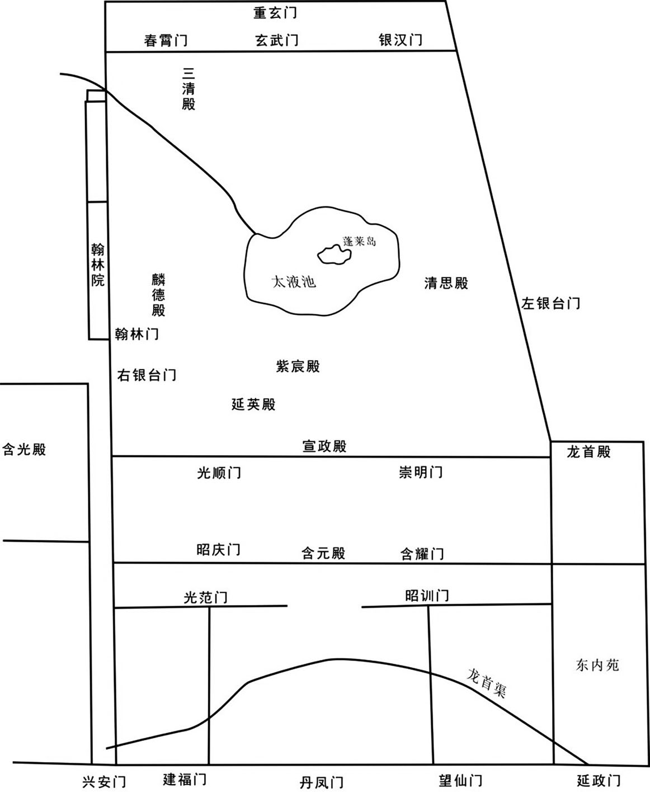 
唐大明宫示意图

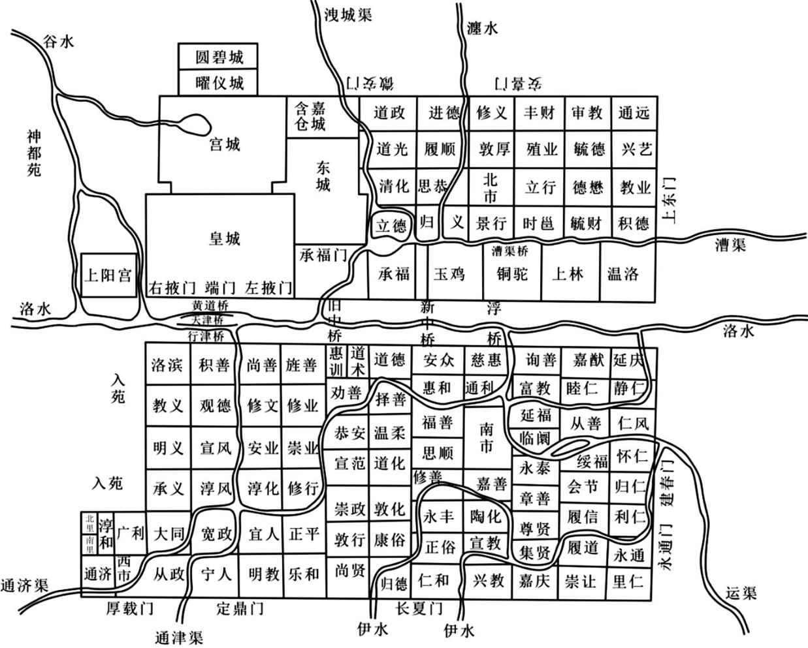 
唐东都洛阳城示意图

## 【译文】

原来的王皇后和萧淑妃被囚禁在其他院子。有一回，高宗思念她们，就从小路走到了囚禁她们的院子，见她们的房子封闭得非常严密，只有在墙壁上开的孔以递送吃饭的碗，不禁伤心，高宗呼唤着：“皇后、淑妃你们在吗？”王皇后哭着回答：“我们获罪沦为宫中的婢女，哪里还有什么尊称呢。”又说：“皇上您如果念惜从前的恩爱，让我们能再见天日的话，乞求皇上将这座院子命名为回心院。”高宗曰：“我这就办。”武后听说这件事情之后，非常愤怒，派人将王氏及萧氏各杖打一百下，砍掉她们的手足，投进盛酒的缸子当中，说：“让这两个老妇人的骨头醉掉。”几天后，两人死去，又再被砍去脑袋。王皇后最初听到宣布处置她们的敕文时，再拜说：“愿皇上万岁。武昭仪得到皇上的恩宠，死自然是我应得的。”淑妃则大骂道：“阿武妖孽奸猾，竟然到如此地步！但愿来生我做猫，阿武做鼠，我要活生生地掐断她的咽喉。”从此以后，宫中不再养猫。不久，武后又改王皇后一族姓氏为蟒氏，萧淑妃一族姓枭氏。武后多次见到王、萧两人作祟，披着头发，鲜血滴滴答答，像她们死时的样子。后来，武皇后迁移到蓬莱宫去居住，又看见她们，所以武皇后大多时间在洛阳，终身不回长安。

## 【原文】

**显庆元年春正月辛未，以皇太子忠为梁王，立皇后子代王弘为皇太子[1]。**

## 【注文】

[1]显庆：唐高宗李治在位期间所用年号，即显庆元年（656年）正月至显庆六年（661年）二月。为避讳唐中宗李显（李治之第七子，武后所生）的名字，因此唐朝人追称显庆年号时多称“明庆”，又作“光庆”。　　弘：即李弘（652—675年），唐高宗李治之第五子，武则天所生的长子。初封代王，高宗显庆元年（656年）立为皇太子。李弘性格宽厚，聪明，几次奉高宗之命监国（在古代，君王外出，由太子留守国都，代行处理国政，谓之监国）。他礼遇大臣，体恤士兵，非常受高宗的宠爱，但他处理政事常常不合武则天的心意。在高宗上元年间，李弘被武则天毒杀。谥号为孝敬皇帝。他曾经命令文士许敬宗、上官仪等采集古今文章中的佳句，进行分类，编成《瑶山玉彩》五百卷，已经散佚。

## 【译文】

唐高宗显庆元年（656年）春正月辛未（初六日），高宗降皇太子李忠为梁王，将皇后的儿子代王李弘立为皇太子。

## 【原文】

**李义府恃宠用事[1]。洛州妇人淳于氏，美色，系大理狱，义府属大理寺丞毕正义枉法出之，将纳为妾，大理卿段宝玄疑而奏之[2]。上命给事中刘仁轨等鞫之，义府恐事泄，逼正义自缢于狱中[3]。上知之，原义府罪不问[4]。侍御史涟水王义方欲奏弹之，先白其母曰：“义方为御史，视奸臣不纠则不忠，纠之则身危而忧及于亲为不孝，二者不能自决，奈何？”[5]母曰：“昔王陵之母，杀身以成子之名[6]。汝能尽忠以事君，吾死不恨[7]。”义方乃奏称：“义府于辇毂之下，擅杀六品寺丞，就云正义自杀，亦由畏义府威，杀身以灭口[8]。如此，则生杀之威，不由上出[9]。渐不可长，请更加勘当。”[10]于是对仗，叱义府令下，义府顾望不退[11]。义方三叱，上既无言，义府始趋出，义方乃读弹文[12]。上释义府不问，而谓义方毁辱大臣，言词不逊，贬莱州司户[13]。**

## 【注文】

[1]恃（shì）：依靠，依赖。　　用事：执掌大权，行事。

[2]洛州：古地名。北魏置，治洛阳（今河南洛阳东北），后多次改置改名。唐高祖武德四年（621年）又改洛州。唐高宗显庆二年（657年）建东都。　　大理：唐朝官署名，这里是大理寺的省称。大理寺是唐中央机构九卿之一，国家最高审判机关，负责审理中央百官犯罪及京师的重大案件。　　属（zhǔ）：同“嘱”，嘱咐。　　大理寺丞：唐中央机构大理寺的官员，从六品上，分掌管理本部门事和断刑之轻重。　　大理卿：即大理寺卿，唐中央机构大理寺的长官，从三品。　　段宝玄（生卒年不详）：唐高宗朝大臣。他参与编纂《永徽律疏》三十卷，于高宗永徽四年（653年）成书上奏，对《唐律》律文逐条进行解释。此书今存，是中国古代流传至今最早最完整的一部封建法典。该书记载《唐律》共有名例、卫禁、职制、户婚、厩库、擅兴、贼盗、斗讼、诈伪、杂律、捕亡、断狱等十二篇，笞、杖、徒、流、死五种二十等刑名，共五百零二条律文。这部律典被誉为中华法系的代表。当时领衔为长孙无忌，奉诏参与者有于志宁、唐临、刘燕客、贾敏行等人。

[3]给（jǐ）事中：唐朝职事官，正五品上。中央机构门下省重职，分判本省日常事务，具体负责审议封驳诏敕章奏。有异议可直接批改驳还，无异议则封下经门下省长官审复后，交尚书省执行。　　刘仁轨（601—685年）：唐前期大臣、军将。字正则，汴州尉氏（今河南尉氏）人。他幼年贫困好学，博涉文史。他历任新安县（今河南新安）县令、给事中、青州（今山东青州）刺史。高宗显庆五年（660年），唐军攻打高丽时，刘仁轨负责监督海运，因为船翻而被免官。高宗令他带罪随军作战。高宗龙朔元年（661年），百济（朝鲜半岛中部建立的政权）发生内乱，仁轨率军与新罗（朝鲜半岛南部建立的政权）夹攻百济，打败了百济。龙朔三年（663年），百济联合倭国（今日本）的军队进攻唐军。仁轨与孙仁师等破之于白江口（今朝鲜忠清南道锦江）。仁轨负责镇守百济，在当地设置官吏、开道路、恢复生产。他因功而升至右相（即中书省长官中书令，中书省位于唐代宫殿的右边，所以中书省长官又称“右相”）。高宗咸亨五年（674年），他担任鸡林道大总管，大破新罗兵，因功进爵为公。高宗仪凤二年（677年），他镇守临洮军（今青海乐都），负责防御吐蕃（bō）（隋唐时期在今青藏高原建立的王国）。唐高宗死后，武后掌握实权。仁轨为西京（唐都长安）留守，他上书以前朝女主掌权招致祸败之事规劝武后，武后发书慰勉。仁轨死后，陪葬乾陵（唐高宗的陵墓，今陕西乾县西北）。　　鞫（jū）：审讯，审问。　　缢（yì）：吊死，用绳子勒死。

[4]原：宽容。

[5]侍御史：唐代职事官。中央监察机构御史台的官员，从六品下。御史台分为台院、殿院和察院。侍御史居台院，居三院之首，掌管纠弹百官，入内宫接受诏书，受皇帝之命出使，分判御史台事务，与门下省的给事中、中书省的中书舍人共同受理词讼。遇重大案件则与刑部、大理寺会审。　　涟（lián）水：古县名。即涟水县，隶属于泗（sì）州，相当于今江苏涟水。　　王义方（615—669年）：唐前期大臣。泗州涟水（今江苏涟水）人。他幼年孤贫，博通五经，对母亲非常孝顺。他考中明经，成为晋王（唐高宗李治登基前的爵位）府的参军。唐太宗贞观年间的名臣魏徵对义方非常礼遇，把侄女嫁给他。后来，他因为犯错误被贬为儋（dān）州吉安（今海南昌江黎族自治县东北）丞，边民悦顺。唐高宗显庆元年（656年），义方升任侍御史。当时，宰相李义府纳罪女为妾，逼死大理寺丞毕正义，无人敢言。他独自弹劾李义府之罪。而高宗却袒护李义府，厌恶义方以孤士触犯宰相，将他贬为莱州（治今山东莱州）司户。后来，他居于昌乐（今河南南乐），聚徒教书，不再进入官场。义方撰有《笔海》《文集》各十卷，均已散佚。　　奏弹：御史台的职责，掌弹劾百官。　　纠：举发，惩治。

[6]王陵（？—前181年）：秦末汉初将领、大臣。他与刘邦同为沛县（今江苏沛县西）人，二人结拜为兄弟。刘邦起兵反秦后，他投奔刘邦。楚汉相争时，王陵率兵归附汉王刘邦。王陵的母亲被楚王项羽抓捕，项羽希望通过她去说服王陵前来投降。王陵的母亲答应了，但是随后，她让来谈判的使者回去转告儿子，要他好好辅佐刘邦，随后拔出利刃自刎，杀身取义。王陵帮助刘邦取得天下，封安国侯。汉惠帝六年（前189年），他官至右丞相。当时，汉惠帝的母亲吕太后（即汉高祖刘邦的皇后）掌握大权，想封吕家的人为王。王陵却表示反对，为吕后所恶，迁为太傅，实际上夺去了他的相权。他于是称病辞官，死于吕后七年（前181年）。

[7]汝：你。　　事：侍奉，服侍。　　恨：遗憾。

[8]辇（niǎn）毂（gǔ）：辇，古代用人拉着走的车子，后多指天子或王室坐的车子。毂，车轮中心，有洞可以插轴的部分，借指车轮或皇帝的车舆。辇毂代指京城或皇帝。　　六品寺丞：指大理寺丞毕正义，唐代大理寺丞官品为从六品上。

[9]威：显示使人畏惧慑服的力量，引申为权势，权力。

[10]渐不可长：谓刚露头的不好事物不能容许其发展滋长。　　勘当：审问核察。

[11]对仗：谓当廷奏事。古代皇帝坐朝听政，必设仪仗，百官当廷言事，没有任何隐秘，相反，有的则不必公开，仗下独奏。　　叱（chì）：责骂；呵斥。　　顾望：还视，观望。

[12]趋出：小步疾行退出。表示恭敬。　　弹文：文体名，为弹劾官员的奏疏。

[13]莱州：古地名。治掖县（今山东莱州），唐辖境相当于今山东莱州、莱阳、平度、即墨、莱西、海阳等地。　　司户：唐朝地方官名，即司户参军、司户参军事。负责掌管户籍、计账、道路、重要关口、徭役、婚姻、诉讼、表彰孝顺之人等事务。上州置二员，从七品下；中州置一员，正八品下；下州置一员，从八品下。

## 【译文】

李义府仗着皇后的宠信而掌管朝廷事务。洛州有个妇人淳于氏，长得很漂亮，被关在大理寺的监狱里，李义府命令大理寺丞毕正义破坏法律，把她弄出狱，准备纳她为妾，大理寺卿段宝玄对此事产生疑问而上奏皇帝。高宗让给事中刘仁轨等人来审理此事，李义府害怕事情败露，逼着毕正义在狱中上吊自杀了。高宗了解此事后，原谅了李义府而不问罪。侍御史涟水人王义方想向皇帝上奏，弹劾李义府的不法行为，他事先禀告他的母亲说：“义方作为御史，眼看着奸臣的不法勾当而不纠举就是不忠，纠举之后会危及自身的安危并且牵连到亲人那就是不孝，忠、孝之间不能选定，怎么办？”他母亲说：“过去王陵的母亲，以自杀来成全儿子的名声。你能为皇上尽忠，我就是死了也没有什么遗憾的。”义方这才向皇帝上奏说：“李义府在皇上跟前，擅自杀害六品的大理寺丞，就说是毕正义自杀，也是因为害怕李义府的淫威，担心泄密而自杀。如果这样下去，那么生杀的大权，就不是从皇上手中授出了。这样的苗头不可助长，请皇上再加以审查。”于是当面对质，呵斥李义府退下，李义府最初还四下张望而不肯退。义方再三呵斥，而高宗却没有发话，李义府才开始小步退出，义方这才宣读弹劾文书。高宗原谅了李义府而不问罪，反倒说义方诋毁和侮辱大臣，言词不恭顺，贬他为莱州司户。

## 【原文】

**韩瑗上疏为褚遂良讼冤曰：“遂良体国忘家，捐身徇物，风霜其操，铁石其心，社稷之旧臣，陛下之贤佐[1]。无闻罪状，斥去朝廷，内外氓黎，咸嗟举措[2]。臣闻晋武弘裕，不贻刘毅之诛；汉祖深仁，无恚周昌之直[3]。而遂良被迁，已经寒暑，违忤陛下，其罚塞焉[4]。伏愿缅鉴无辜，稍宽非罪，俯矜微款，以顺人情。”[5]上谓瑗曰：“遂良之情，朕亦知之。然其悖戾好犯上，故以此责之，卿何言之深也？”[6]对曰：“遂良社稷忠臣，为谗谀所毁[7]。昔微子去而殷国以亡，张华存而纲纪不乱[8]。陛下无故弃逐旧臣，恐非国家之福。”上不纳。瑗以言不用，乞归田里，上不许。**

## 【注文】

[1]徇（xùn）：通“殉”。为了某种目的而死。　　风霜：比喻艰难辛苦。　　铁石：铁和石，比喻坚定。

[2]氓（méng）黎（lí）：黎民百姓。　　嗟（jiē）：叹息。　　举措：举动，行为。

[3]晋武：晋武帝司马炎（236—290年），西晋王朝的开国君主，公元266年至290年在位。字安世，河内温县（今河南温县西南）人。曹魏元帝咸熙二年（265年），他继承父亲司马昭的晋王之位。司马昭死后数月，司马炎代魏称帝，建立晋朝，建都洛阳，改年号为泰始，是为晋武帝。建国之初，他大封宗室为王，并使统兵出镇。他提倡俭朴，并置谏官，刊修律令，鼓励农耕。晋武帝太康元年（280年），晋朝出兵灭掉东南地区的吴国，统一全国。他又采取一系列经济措施以发展生产，颁行户调式，行占田课田制，据此收取土地税、户税。武帝采取措施明定官僚、贵族各以高下占有田地及荫补（靠家庭背景做官），劝课农桑，兴修水利。在武帝统治时期，民和俗静，家给人足，牛马遍野，社会出现四海平一、天下康宁的升平景象，史称“太康之治”。但武帝统治晚期怠于政事，奢侈腐化。又因为亲贵当权，造成他死后宗室、权臣倾轧，政局混乱。　　弘裕：宽宏，宏大。　　贻（yí）：遗留，留下。　　刘毅（？—285年）：西晋大臣。字仲雄，西晋东莱掖县（今山东莱州）人。他幼有孝行，喜欢品评人物。曹魏末年，他被司马昭辟为相国掾（yuàn，官署属员）。晋武帝司马炎取代曹魏称帝后，任命刘毅为散骑常侍、国子祭酒。又因为他忠纯正直，被任命为谏官。后来，他因不避权贵，敢于大胆指斥朝政，拜授司隶校尉，执掌京城及附近地区的监察。他纠举当地的豪强，使京城及附近地区秩序井然。后来，他累官至尚书左仆射。刘毅常常直言向武帝进谏言，批评武帝卖官、钱入私门的做法。他年七十告老还乡。后来，他担任青州（今山东青州）大中正，负责当地的选官和监察。后病死。　　汉祖：即汉高祖刘邦（前256—前195年），西汉王朝的开国皇帝，庙号高祖，又称高皇帝，公元前202年至前195年在位。秦朝泗水郡沛县（今江苏沛县）人，字季。秦二世元年（前209年），刘邦在沛县聚众响应陈胜、吴广起义，称沛公，不久投奔项梁。刘邦乘着项羽在巨鹿（今河北平乡西南）与秦军主力决战之机，率兵直赴关中地区，占据秦都咸阳（今陕西咸阳东北）。秦王子婴投降，秦灭亡。因兵力不敌，刘邦被迫接受项羽的汉王封号，进驻汉中地区。刘邦不甘心亡秦的胜利果实被项羽独占，于是率军东出，与项羽展开长达四年的楚汉战争。结果，双方在垓下（今河南鹿邑东，一说今安徽灵璧南）决战，项羽战败自杀。刘邦于是称帝，国号汉，建都长安（今陕西西安）。为了和后来刘秀建都洛阳（今河南洛阳）的“汉”相区别，历史上称为“西汉”。刘邦在位期间，继续实行按军功授田宅的制度，又采取轻徭薄赋、招抚流亡、免奴婢为庶人（平民）的措施，以恢复经济、发展生产。他又翦除韩信、英布等功臣，大封刘姓宗室为王。他即皇帝位之前，鄙视儒生，不修文学，然而他豁达大度，善于用人。他死后，由刘盈（即汉惠帝，吕皇后所生）继承皇位。　　恚（huì）：怨、恨。　　周昌（？—前192年）：西汉初年大臣。秦末沛县（今江苏沛县）人。他和堂兄周苛都在秦时担任泗水卒史。等到汉高祖刘邦在沛县起兵反秦的时候，他们打败了泗水郡的郡守、郡监。这样，周昌、周苛二兄弟一直追随刘邦，攻入关中，推翻了秦朝的统治。周昌被任命为中尉，迁御史大夫。当时，拥有强大兵力的楚王项羽据有天下，而刘邦被封为汉王。在“楚汉之争”中，周昌常跟随刘邦攻打项羽，立下战功。周昌被封为汾阴侯。在刘邦击败项羽，建立汉朝后，周昌仍担任要职。他为人倔强，敢直言。刘邦想废太子刘盈（吕皇后所生，后来的汉惠帝），立其宠妃戚夫人所生的如意为太子，赖周昌力争而作罢。后来，刘邦为保全戚夫人及其子赵王如意，任命周昌为赵王之相。刘邦死后，吕后毒杀赵王。周昌于是称病，不到中央朝见，三年而死。

[4]塞：抵偿。

[5]缅鉴：远察。缅，远。　　矜：同情，怜悯。　　款：诚恳。

[6]悖（bèi）：混乱，相冲突，违背道理。　　戾（lì）：暴恶。

[7]谄（chǎn）谀（yú）：谄媚，巴结。

[8]微子：即微子启（生卒年不详），又称殷公，是商王帝乙的长子，商朝末代君主纣王的庶兄，名启。他出生时，其母尚未被立为正室，因此不得继承王位。纣王即位后，暴虐无道。微子曾多次亲谏纣王，见纣王不听，便谋于太师箕（jī）子、少师比干。微子从箕子之见，远离纣王，逃到微（今山西潞城东北，后微子又迁到山东梁山西北，所以那里也称为“微”）。周武王灭商后，复其位，仍为卿士。周公以周成王的命令封微子于宋（今河南商丘一带），微子成为宋国国君、始祖。微子为政贤能，为商朝遗民所爱戴。他死后葬于宋国故地，今河南商丘睢阳区，建有微子祠。微子墓立于微山上，后微山塌陷，山顶成为微山岛，附近成为微山湖。　　殷国：即商朝，又称殷商，约公元前16世纪成汤灭夏所建立的王朝，子姓，共传十七世、三十一王。成汤在建国之初，建都于亳（bó）（今地有河南商丘、山东曹县、河南偃师三种说法），曾多次迁移。至商王盘庚时，迁都于殷（今河南安阳西北小屯村），因此商朝又被称为殷朝、殷商。传至帝辛（即商纣王），暴虐无道，为周所灭。　　张华（232—300年）：西晋文学家、政治家。字茂先，范阳方城（今河北固安西南）人。他为西汉留侯张良十六世孙。张华幼年丧父，家贫勤学，知识渊博。曹魏末期，他因愤世嫉俗而作《鹪（jiāo）鹩（liáo）赋》，由是声名始著。司马昭当政时，他担任中书郎。司马氏取代曹魏、建立晋朝之后，他迁黄门侍郎，封关内侯，迁中书令。他力排众议，制定消灭割据东南一方的吴国的计策。晋朝出兵灭吴，张华为度支尚书，供应军粮。吴国灭亡后，张华被封为广武县侯，名重一时。朝廷的仪礼、典章均为张华草定。后来，张华被人诬陷，只得离开京城，到地方出任持节、都督幽州（今北京地区）诸军事（当地军政长官）。后又征为太常。晋惠帝即皇帝位，任命张华为太子少傅，又遭外戚杨骏的猜忌，无法参与朝政。楚王司马玮起兵造反，张华用计平定叛乱，因功拜右光禄大夫、侍中、中书监。晋惠帝元康元年（291年），张华任司空。当时，朝廷派系矛盾日深。张华受到晋惠帝贾皇后的信任。他对贾后也多方规劝，尽力匡辅晋朝。后来，他反对赵王司马伦和孙秀废贾后、夺帝位之谋，被司马伦杀害。张华博学多能，号称“博物洽闻，世无与比”。他的诗风华丽，诗今存三十二首，有《情诗》五首，描写夫妇离别思念的心情。他还著有《博物志》，今有辑本。文集今有《张华集》。

## 【译文】

韩瑗上疏替褚遂良诉冤，说：“遂良设身处地地为国家着想，而忘了自己小家的利益，置身物外，磨砺节操，坚定内心，是国家的老臣，也是陛下您贤良的辅佐。没有听说他有什么罪状，就被贬出朝廷，内外黎民百姓，无不为之叹息。我听说西晋武帝宽宏大量，不因刘毅的耿直而杀他；汉高祖非常仁爱，不因周昌的忠直而生气。而褚遂良被贬官职的时间已有年头，就算他对陛下违逆不恭，这样的惩罚也够了。希望您能够体察无辜者的境遇，宽恕无罪者，诚恳地表达您的怜悯，顺应人心。”高宗对韩瑗说：“遂良的性情，朕也是了解的。但是他桀骜不驯，喜欢犯上，所以要责罚他，你何必说得这么严重呢？”韩瑗回答：“遂良是国家的忠臣，被那些奉承和诋毁的人所诬陷。从前微子离开后殷国就亡了，有张华在西晋秩序就不乱。陛下您无缘无故地抛弃旧臣，恐怕不是国家的福气。”高宗不采纳韩瑗的意见。韩瑗因为自己的进言不被采用，乞求解职回家，高宗不答应。

## 【原文】

**二年春三月甲辰，以潭州都督褚遂良为桂州都督[1]。**

## 【注文】

[1]潭州：古地名。隋置，治长沙（今湖南长沙）。唐辖境相当于今湖南长沙、株洲、湘潭、益阳、浏阳、湘乡、醴陵等地。　　桂州：古地名。治临桂（今广西桂林），唐辖境相当于今广西龙胜、永福以东和荔浦以北地区。

## 【译文】

唐高宗显庆二年（657年）春三月甲辰（十六日），高宗任命潭州都督褚遂良为桂州都督。（潭州为中都督府，其都督为正三品。桂州属于下都督府，其都督为从三品。因此，对褚遂良的这次人事调动属于降职。）

## 【原文】

**癸丑，以李义府兼中书令。**

## 【译文】

唐高宗显庆二年（657年）春三月癸丑（二十五日），高宗以李义府兼任中书令之职。

## 【原文】

**秋七月，许敬宗、李义府希皇后旨，诬奏“侍中韩瑗、中书令来济与禇遂良潜谋不轨，以桂州用武之地，授遂良桂州都督，欲以为外援”[1]。八月丁卯，瑗坐贬振州刺史，济贬台州刺史，终身不听朝觐[2]。又贬褚遂良为爱州刺史，荣州刺史柳奭为象州刺史[3]。**

## 【注文】

[1]侍中：唐前期职事官。

[2]振州：古地名。唐高祖武德年间置，治宁远（今海南三亚西北崖城），辖境相当于今海南三亚和保亭、乐东两县部分地区。　　台州：古地名。唐高祖武德年间置，治临海（今浙江临海），辖境相当于今浙江临海、温岭、天台、黄岩区、仙居、宁海、象山，以境内有天台山而得名。　　朝觐（jìn）：谓臣子朝见君主。

[3]爱州：古地名。南朝梁置，隋代治九真（今越南清化西北），辖境相当于今越南清化及附近地区。　　象州：古地名。隋文帝开皇年间置，贞观年间移治武化（今广西象州东北），辖境相当于今广西象州、武宣两县地。

## 【译文】

唐高宗显庆二年（657年）秋七月，许敬宗和李义府揣摩皇后的意旨，上奏诬告说“侍中韩瑗、中书令来济和禇遂良暗中图谋不轨，因为桂州是用武之地，所以让禇遂良做桂州都督，是想要他来做外援”。八月丁卯（十一日），韩瑗受此事之累，被贬官为振州刺史，来济被降职为台州刺史，终身都不能进朝廷拜见皇上。再次将褚遂良降职为爱州刺史，让荣州刺史柳奭去做象州刺史。（荣州属于中州，荣州刺史为正四品上。象州属于下州，象州刺史为正四品下。因此，对柳奭的这次人事调动属于降职。）

## 【原文】

**遂良至爱州，上表自陈：“往者濮王、承乾交争之际，臣不顾死亡，归心陛下[1]。时岑文本、刘洎奏称‘承乾恶状已彰，身在别所，其于东宫，不可少时虚旷，请且遣濮王往居东宫’[2]。臣又抗言固争，皆陛下所见。卒与无忌等四人共定大策。及先朝大渐，独臣与无忌同受遗诏[3]。陛下在草土之辰，不胜哀恸，臣以社稷宽譬，陛下手抱臣颈[4]。臣与无忌区处众事，咸无废阙，数日之间，内外宁谧[5]。力小任重，动罹愆过，蝼蚁余齿，乞陛下哀怜[6]。”表奏，不省。**

## 【注文】

[1]濮（pú）王：即唐太宗第四子李泰（618—652年），长孙皇后所生，字惠褒，小字青雀。唐高祖武德三年（620年），封宣都王。后又封卫王、越王、魏王。他雅好文学，才华横溢，擅长草书、隶书，集书万卷，深为太宗宠爱。唐太宗即皇帝位后，允许李泰在府邸设置文学馆，任他自行引召学士。每月所给衣服、膳食，超过皇太子李承乾。由于太宗对李泰过于宠爱，屡次遭到大臣的进谏劝阻。唐太宗贞观十七年（643年），李泰因涉嫌与太子争位，被贬为东莱郡王，后迁顺阳王、濮王，被安排居住在均州郧乡（治今湖北郧县）。他曾编修《括地志》五百五十卷，均已散佚，著有《濮王泰集》二十卷。　　承乾：即唐太宗的嫡长子李承乾（？—645年），长孙皇后所生。字高明，唐高祖武德三年（620年）封恒山郡王，后又封中山王。唐太宗即皇帝位后，立为皇太子。承乾聪明伶俐，能识大体，颇得太宗喜爱。太宗选择德高望重的大臣做他的老师，严格教导。太宗不在京城时，常常让他代理政事。承乾生于深宫，长于妇人之手，养尊处优，喜好声色，日益荒唐颓废。当时，其弟魏王李泰有美名，谋夺太子之位。承乾惧怕李泰有宠，取代自己的太子之位，于是与一批朝臣结谋叛乱。唐太宗贞观十七年（643年），事情泄露，承乾被废为庶人，流放黔州（治今重庆彭水），后死去。

[2]岑文本（595—645年）：唐前期大臣。邓州棘阳（今河南南阳南）人，后迁居江陵（今湖北荆州），字景仁。隋末萧铣（xiǎn）在江陵建立地方政权时，即任岑文本为中书侍郎，专职管理典藏文书。后来，他跟随萧铣投降于唐，在唐朝平定各地群雄、统一全国的战争中立下功劳。唐太宗贞观初年，岑文本担任中书舍人，负责草拟皇帝的诏书。他撰写的诏书文辞优美。他与令狐德棻（fēn）共同修撰《周书》，史臣的议论多出其手。唐太宗贞观十六年（642年），岑文本迁中书侍郎，掌握机要之权。不久，升为中书令，成为真正的宰相。岑文本性格忠谨，口不言家事，也不经营产业。后来，他跟从唐太宗征伐高丽，在途中病死。他著有文集六十卷，均已散佚。　　刘洎（jì）（？—646年）：唐前期大臣。字思道，荆州江陵（今湖北荆州）人。隋末萧铣（xiǎn）在江陵建立地方政权时，任为黄门侍郎。后来，他跟随萧铣投降于唐。唐太宗即皇帝位后，贞观七年（633年），任给事中、治书侍御史，后拜尚书右丞。贞观十三年（639年），担任黄门侍郎、参知政事，成为宰相。贞观十八年（644年），进为侍中，仍为宰相。他勤于职守，以敢于谏诤而著称。贞观十九年（645年），太宗征伐高丽时，刘洎兼太子左庶子，辅佐皇太子李治（即后来的唐高宗）处理国政。太宗回来之后，他被褚遂良诬陷，被杀。他著有文集十卷，已散佚。　　东宫：在古代，太子在皇宫中的住处称为东宫。因此，又以东宫指代太子本人。

[3]大渐：病危，病重将死。用于帝王最多。

[4]草土之辰：居丧的日子。　　宽譬（pì）：宽慰，晓谕。

[5]区处：处理，筹划安排。　　宁谧（mì）：谧，安宁，平静。宁谧，安宁静谧。

[6]愆（qiān）：罪过，过失。　　蝼蚁余齿：蝼蚁即蝼蛄和蚂蚁，比喻力量弱小，无足轻重。最初的记载见《韩诗外传》和《韩非子·喻老》。

## 【译文】

禇遂良抵达爱州后，向皇帝上奏表来表白自己：“以前濮王（李泰）和李承乾你争我斗的时候，我不顾丢掉性命，忠于陛下。当时岑文本和刘洎上奏说‘承乾的罪恶已经很明显了，他已经身在别的地方，对于太子居住的东宫来说，一会儿也不能空着，请求让濮王进驻东宫’。我再次据理坚决抗争，这些陛下都看到了。最终我和长孙无忌等四个人共同谋定大计（指让李治成为皇太子）。等到太宗皇上病危的时候，只有我和长孙无忌一起接受遗诏。陛下在居丧的日子，极为悲痛，不能控制自己，我以国家来宽慰、晓谕您，陛下双手抱着我的脖子。我与无忌筹划安排各种事务，都没有任何不周，几天之内，就使得朝廷内外安定祥和。虽然我个人力量微不足道，但是却责任重大，动不动就罪过加身，而我微弱之身余年不多，恳求陛下怜悯。”褚遂良的表上奏给高宗后，高宗并没有理会。

## 【原文】

**三年冬十一月戊戌，以许敬宗为中书令。**

## 【译文】

唐高宗显庆三年（658年）冬十一月戊戌（十九日），高宗任命许敬宗为中书令。

## 【原文】

**是岁，爱州刺史褚遂良卒。**

## 【译文】

在这一年（显庆三年〔658年〕），爱州刺史褚遂良去世。

## 【原文】

**四年夏四月，武后以太尉赵公长孙无忌受重赐而不助己，深怨之[1]。及议废王后，燕公于志宁中立不言，武后亦不悦。许敬宗屡以利害说无忌，无忌每面折之，敬宗亦怨[2]。武后既立，无忌内不自安，后令敬宗伺其隙而陷之。**

## 【注文】

[1]赵公：即赵国公。国公为唐朝爵位，从一品。

[2]说（shuì）：用话劝说别人，使他听从自己的意见。

## 【译文】

唐高宗显庆四年（659年）夏四月，武后因为太尉赵国公长孙无忌接受了她赐给的厚礼却不帮忙，非常记恨他。等到讨论废掉王皇后的时候，燕国公于志宁又保持中立，不发言，武后也不高兴。许敬宗多次用利害关系去劝告长孙无忌，每一回无忌都当面驳斥他，许敬宗也怨恨他。等到武则天被立为皇后之后，长孙无忌感到心中不安，武后让许敬宗找茬（chá）子陷害他。

## 【原文】

**会洛阳人李奉节告太子洗马韦季方、监察御史李巢朋党事，敕敬宗与辛茂将鞫之[1]。敬宗按之急，季方自刺，不死[2]。敬宗因诬奏“季方欲与无忌构陷忠臣、近戚，使权归无忌，伺隙谋反，今事觉，故自杀”[3]。上惊曰：“岂有此邪[4]？舅为小人所间，小生疑阻则有之，何至于反！”[5]敬宗曰：“臣始末推究，反状已露，陛下犹以为疑，恐非社稷之福。”上泣曰：“我家不幸，亲戚间屡有异志[6]。往年髙阳公主与房遗爱谋反，今元舅复然，使朕惭见天下之人[7]。兹事若实，如之何？[8]”对曰：“遗爱乳臭儿，与一女子谋反，势何所成？无忌与先帝谋取天下，天下服其智，为宰相三十年，天下畏其威，若一旦窃发，陛下遣谁当之[9]！今赖宗庙之灵，皇天疾恶，因按小事，乃得大奸，实天下之庆也。臣窃恐无忌知季方自刺，窘急发谋，攘袂一呼，同恶云集，必为宗庙之忧[10]。臣昔见宇文化及父述为炀帝所亲任，结以昏姻，委以朝政[11]。述卒，化及复典禁兵，一夕于江都作乱，先杀不附己者，臣家亦豫其祸，于是大臣苏威、裴矩之徒皆舞蹈马首，惟恐不及，黎明遂倾隋室[12]。前事不远，愿陛下速决之。”上命敬宗更加审察。明日，敬宗复奏曰：“去夜季方已承与无忌同反，臣又问季方：‘无忌与国至亲，累朝宠任，何恨而反？’季方答云：‘韩瑗尝语无忌，云“柳奭、褚遂良劝公立梁王为太子，今梁王既废，上亦疑公，故出高履行于外”[13]。自此无忌忧恐，渐为自安之计。后见长孙祥又出，韩瑗得罪，日夜与季方等谋反[14]。’臣参验辞状，咸相符合，请收捕准法。”上又泣曰：“舅若果尔，朕决不忍杀之。若杀之，天下将谓朕何，后世将谓朕何！”敬宗对曰：“薄昭，汉文帝之舅也，文帝从代来，昭亦有功，所坐止于杀人，文帝遣百官素服哭而杀之，至今天下以文帝为明主[15]。今无忌忘两朝之大恩，谋移社稷，其罪与薄昭不可同年而语也。幸而奸状自发，逆徒引服，陛下何疑，犹不早决[16]。古人有言：‘当断不断，反受其乱。’[17]安危之机，间不容发。无忌今之奸雄，王莽、司马懿之流也[18]。陛下少更迁延，臣恐变生肘腋，悔无及矣。[19]”上以为然，竟不引问无忌。夏四月戊辰，下诏削无忌太尉及封邑，以为扬州都督，于黔州安置，准一品供给[20]。祥，无忌之从父兄子也，前此自工部尚书出为荆州长史，故敬宗以此诬之[21]。**

## 【注文】

[1]太子洗马：唐朝太子东宫官属，为太子的随从官。太子洗马最早设立于汉朝。洗，通假于“先”，洗（先）马，意思是在马前做先导、前驱。太子太傅、少傅属官有洗马，后世皆称洗马。梁代以洗马隶属典经局。隋唐于东宫的司经局置洗马，从五品下，为掌管书籍之官，教太子政事、文理。　　监察御史：唐朝中央监察机构御史台的官员，正八品上。掌管分察百官，巡按郡县，纠视刑狱，肃整朝仪。　　李巢（生卒年不详）：唐前期大臣。魏州昌乐（今河南南乐）人。他少年豪俊，善骑射。唐高宗显庆初年，他担任监察御史，与李义府一起，审理韩瑗案。后因违背皇帝的旨意，被贬为龙编（今越南河内东天德江北岸）主簿。　　朋党：指官员互相之间结成的小集团。历代皇帝都很忌讳朋党。　　辛茂将（？—660年）：唐前期大臣。陇西狄道（今甘肃临洮）人。历任大理少卿、中书侍郎、侍中等职。唐高宗显庆三年（658年），以大理寺卿升任门下省侍中，成为宰相。唐高宗显庆四年（659年），兼左庶子，与许敬宗共审长孙无忌案，不久死于任上。

[2]自刺：自杀。

[3]构陷：设计陷害人，制造罪名。

[4]邪（yé）：疑问语气词。相当于现代汉语的“吗”“呢”。

[5]间：离间。　　小生：小，稍，略；生，产生。　　疑阻：疑惑、隔阂。

[6]异志：二心，意指叛离之心。

[7]高阳公主（？—653年）：即合浦公主，唐太宗李世民之第十七女。她约生于唐太宗贞观初年，约贞观中期下嫁宰相房玄龄之子房遗爱。她仰仗着父亲的宠爱而骄横，与僧人辩机私通。唐高宗永徽初年，晋封高阳长公主。永徽四年（653年），她因谋反罪赐自尽，子女流放岭南地区。　　房遗爱（？—653年）：唐前期大臣、高阳公主的丈夫。齐州临淄（今山东淄博东北）人，唐太宗朝宰相房玄龄的次子。他有武艺，但不问学。他于唐太宗贞观年间娶唐太宗之女高阳公主，拜驸马都尉，官至太府卿。高阳公主骄横，教唆遗爱去与其兄遗直分家产，并谋求夺取遗直所继承的爵位。高阳公主的这些行为遭到太宗的责备。唐高宗即位后，房遗爱又与遗直相诉讼，被贬为房州（治今湖北房县）刺史。遗爱于是与驸马都尉薛万彻、柴令武图谋立荆王李元景（唐高祖李渊之第六子，莫嫔所生）为皇帝。事情泄露，遗爱与薛万彻、柴令武等被杀，高阳公主与李元景等一并被赐死。遗爱之父房玄龄本配祭唐太宗之昭陵，因其子遗爱谋反，这项殊荣也被停罢。

[8]兹：这。　　如之何：怎么办。

[9]窃发：暗中发动。

[10]攘（rǎng）袂（mèi）：捋起袖子。

[11]宇文化及（？—619年）：隋朝大臣。代郡武川（今内蒙古武川西）人，出自鲜卑，宇文述之子。他在隋文帝杨坚统治时期，担任太子仆。他屡次因为受贿罪而被免官，凭着太子的庇护而得以复职。隋炀帝杨广即皇帝位后，化及担任太仆少卿。他仗着皇帝的宠信，大肆贪污。隋炀帝大业初年，他跟从炀帝巡视北部边境，违禁与北边的突厥交易，因罪与其弟宇文智及同被贬为奴。后来，化及又被任命为右屯卫将军，跟随炀帝巡游江都（今江苏扬州）。隋炀帝大业十四年（618年），化及率领禁卫军发动兵变，勒死隋炀帝，立秦王杨浩为皇帝，自己担任丞相。然后，化及率兵北上，引向东都（今河南洛阳）。他与反隋的瓦岗军领袖李密交战，在童山（今河南浚县西南）被打败，向北逃往魏县（今河北大名西南）。化及毒杀杨浩，自己称帝，国号许，建年号天寿。第二年，他在聊城（今山东聊城东北）被另一支反隋军队的领袖窦建德擒杀。　　述：即宇文述（？—616年），北周、隋朝将领。字伯通，出自鲜卑，代郡武川（今内蒙古武川西）人，骁勇、善骑射。他在北周末年，以军功拜上柱国，封褒国公。隋文帝开皇初年，拜右卫大将军。在隋朝进攻南方的陈朝的战争中，宇文述担任行军总管，率兵三万渡过长江。他在隋朝统一全国的战争中立下战功。当时，晋王杨广（后来的隋炀帝）镇守扬州，拉拢宇文述，与他计谋夺取太子之位。宇文述建议杨广收买朝中宰相杨素等，于是宇文述、杨素二人共谋立杨广为太子。杨广即皇帝位后，宇文述拜左卫大将军，改封许国公，参与朝政。炀帝为了感谢宇文述的拥戴之功，将大女儿南阳公主许配给宇文述的次子宇文士及。宇文述巡视北部、西部边境，多次打退吐谷（yù）浑（隋朝西北的族群建立的政权）军的进攻。隋炀帝大业八年（612年），宇文述跟随炀帝征讨高丽，战败，被贬为民。第二年，他又恢复官爵，再攻高丽。不久，杨玄感起兵反隋，宇文述奉诏率兵讨伐，斩杨玄感。当时，北方情况危急，他跟随炀帝南下江都，病死。宇文述善于察言观色，广收贿赂，囤积财宝，有家仆一千多人。他很得隋炀帝的信任，贵宠一时无人能比。　　炀帝：即隋朝第二代皇帝杨广（569—618年），隋文帝杨坚的次子，独孤皇后所生，公元604至618年在位。隋文帝开皇元年（581年）封为晋王。历任武卫大将军、上柱国、雍州牧、内史令。开皇八年（587年），隋朝攻打南方的陈朝，杨广担任行军元帅，许多军将、重臣归他指挥。第二年，杨广率兵攻灭陈朝，为隋朝统一中国立下大功，进位太尉，迁扬州总管。杨广后与朝廷重臣杨素、宇文述等合谋，使其长兄杨勇被废去太子之位，自己取而代之。后来，在隋文帝病重期间，杨广杀死其父自立为皇帝。他在位期间，颁布《大业律》，整顿地方行政制度，改革科举考试制度，置明经（考察儒家经典的记诵）、进士（考察文章、诗赋）二科，以试策（即策论。策论在古时指议论当前政治问题、向朝廷献策的文章）取士。他又大力征发民力，开凿大运河，修筑长城，营造东都洛阳。他巡游无度，穷奢极欲，民不堪命，又大力对外扩张、征战，特别是攻打高丽（今朝鲜半岛北部的政权）使民力疲敝。杨广性猜忌，用法苛暴，诛杀功臣，对民众横征暴敛，导致各地爆发反隋的起义。东部地区的山东豪杰及一部分西北地区的关陇贵族也起兵反隋。隋炀帝被迫避地江都（今江苏扬州）。后来，江都发生兵变，炀帝被勒死。　　昏姻：婚姻。

[12]江都作乱：隋炀帝大业十四年（618年），宇文述向隋炀帝提议到江都游玩。隋炀帝至江都，尽情玩乐，为宇文述之子宇文化及发动兵变所杀。　　苏威（540—621年）：隋朝大臣。字无畏，京兆武功（今陕西武功西北）大族。苏威在北周时袭爵美阳县公。在隋朝，隋文帝杨坚任命他为太子少保，兼纳言（即门下省的长官侍中）、民部尚书（即户部尚书）。他建议减轻赋役，崇尚节俭，被隋文帝采纳。苏威渐渐得到文帝的信任，与高颎（jiǒng）参掌朝政。他后又兼任大理寺卿、京兆尹、御史大夫、刑部尚书、吏部尚书。他参与修订隋代典制，参定律令，世人称之为能。隋文帝开皇九年（589年），他被任命为尚书右仆射，成为宰相。开皇十二年（592年），他因为结党被免。开皇十四年（594年），他又复任纳言，再次出任宰相。他曾经代表皇帝巡抚江南，出使突厥。文帝离开京城时，常常命苏威留守京城，处理政事。隋炀帝杨广即皇帝位后，苏威与宇文述、裴矩、裴蕴、虞世基同掌朝政。时人称之为“五贵”。苏威跟随炀帝出征高丽，并平定反隋的杨玄感军，甚得尊重。隋炀帝大业末年，各地纷纷爆发反隋的武装斗争。苏威的上奏屡次违背皇帝的意思，又有人告发苏威畏惧突厥。苏威被罢官。等到隋炀帝被杀，苏威又投奔宇文化及、李密、王世充等。在唐朝，唐太宗认为他不能匡救隋朝，又投附过多名主子，非常鄙视他，不见也不用他。苏威后病死于家。　　裴矩（547—627年）：隋唐大臣。原名世矩，因避唐太宗李世民之讳而去世字。字弘大，河东闻喜（今山西闻喜东北）人。他幼年时成为孤儿，长大后好学，涉猎经史，有文才。他在北齐任官，担任兵曹从事。北周时，他参相府记室事。隋文帝杨坚建立隋朝，裴矩为近臣。他参与隋朝平定南方的陈朝的战争，收集陈朝的图籍。他继而经略岭南，北抚突厥，又与牛弘等参定隋朝礼仪。隋炀帝大业元年（605）至九年（613年）间，他受命经营西域（泛指玉门关、阳关以西广大地区），多次来往于甘州（治今甘肃张掖）、凉州（治今甘肃武威）、沙州（治今甘肃敦煌），大力招揽胡商。裴矩尽力搜集西域各国山川险易、君长姓族、风土物产等资料，绘画各国王公庶人的服饰仪形，撰成《西域图记》三卷，并别造地图，注记各地险要，献于炀帝。书中记录的西域各国地理资料，合四十四国，记述了自敦煌（治今甘肃敦煌）至西海（今地中海）的三条主要路线。这是关于西域历史地理、中西交通的重要文献，今已散佚，只有《隋书·裴矩传》收存有该书序言。裴矩招引西域诸国来朝见隋炀帝，因此升至银青光禄大夫。后又跟随炀帝北巡塞外，攻打高丽。裴矩为隋朝经略西部、北部边疆地区作出重要贡献。他又跟从炀帝巡游江都（今江苏扬州），宇文化及发动兵变，杀死炀帝，任命裴矩为尚书右仆射，相当于宰相。化及被杀，裴矩转事窦建德，负责选官，制定朝仪、律令。裴矩降唐后，官至民部尚书（即户部尚书）。他还著有《开业平陈记》十二卷、《邺都故事》十卷、《高丽风俗》一卷，与虞世南共撰《大唐书仪》十卷，均已散佚。他死于唐太宗贞观元年（627年），谥号为“敬”。　　舞蹈：臣子朝拜帝王时做出特定的舞蹈姿势的礼节。　　倾：倒塌，颠覆。

[13]梁王：即梁王李忠。　　高履行（生卒年不详）：唐朝初年大臣。高士廉（唐朝凌烟阁二十四功臣之一）长子，渤海蓨（tiáo）县（今河北景县）人。唐太宗贞观初年，担任祠部郎中，掌管国家的祭祀、天文、祠庙、占卜、医药、佛教、道教事务。他因为母亲去世，辞官守丧，十分哀痛，超越了礼制。后累迁滑州（治今河南滑县附近）刺史。他尚唐太宗第九女东阳公主，拜驸马都尉。贞观十九年（645年），他担任户部侍郎，加银青光禄大夫。没过多久，遭父丧。他在居丧期间又以孝而闻名，太宗手诏劝谕他。之后，太宗又任命他为卫尉寺卿，进加金紫光禄大夫，袭爵申国公。唐高宗永徽元年（650年），拜户部尚书、检校太子詹事、太常卿。高宗显庆元年（656年），武后的势力开始膨胀，排挤长孙无忌等元老重臣。履行因为是无忌的亲属，被贬出京城，担任益州（治今四川成都）大都督府长史。之前，其父高士廉曾经担任此职，颇著能名。高履行继之，亦有善政，大为人们所称道。显庆三年（658年），履行因为受长孙无忌之累，被贬洪州（治今江西南昌）都督，转永州（治今湖南永州）刺史，死于任上。

[14]长孙祥（599—659年）：唐朝前期大臣。洛阳（今河南洛阳）人，长孙无忌的族侄。其祖父长孙炽为隋民部尚书，父亲长孙安世为通事舍人。长孙祥起家为唐太宗朝太子李承乾的功曹，不久迁任尚舍直长，又改任雍州（治今陕西西安）司兵参军。历任驾部、兵部、吏部员外郎及中书舍人、太子率更令、户部侍郎、吏部侍郎、尚书左丞、御史大夫、刑部尚书、检校荆州（治今湖北荆州市荆州区江陵故城）长史、常州（治今江苏常州）刺史。显庆四年（659年），他因为与长孙无忌交通书信，被许敬宗诬陷，在雍州被杀。

[15]薄昭（？—前170年）：西汉文帝刘恒之母薄太后唯一的亲弟弟，文帝的娘舅。汉高帝七年（前200年），薄昭为郎。他从军十七年，后以中大夫迎接刘恒即皇帝位，是为文帝。薄昭拥立文帝即位有功，升任车（jū）骑将军，封轵（zhǐ）侯。周勃遭人诬告谋反，薄昭替他向薄太后进言，得以恢复他的爵位和封邑。他曾经奉命去劝诫淮南王刘长（汉高祖刘邦的小儿子）。汉文帝十年（前170年），薄昭杀了文帝的使者，文帝不忍心杀死母舅，又恐执法不一，于是想办法让公卿大臣去薄昭家里喝酒，劝其自杀未果，又派他们去薄昭家“吊孝”。大臣们穿上丧服向薄昭号丧。薄昭无奈而自杀。　　汉文帝：即西汉文帝刘恒（前202—前157年），汉高祖刘邦之子，公元前180年至前157年在位。公元前196年，刘邦镇压陈豨（xī）叛乱后，封刘恒为代王。高祖死后，吕后专权，诸吕掌握了朝廷军政大权。公元前180年，吕后死后，太尉周勃、丞相陈平等大臣将诸吕一网打尽，迎立代王刘恒入京城长安（今陕西西安）为帝，是为汉文帝。文帝俭约节欲，谦逊克己，好黄老之学，劝课农桑，减轻刑法。他在位期间，对稳定汉初统治秩序，恢复发展经济，起了重要作用。文帝与其子汉景帝刘启的两代统治，历来被视为盛世，史称“文景之治”。　　代：指汉文帝刘恒登上皇位之前的封地代国。辖境相当于今山西吕梁市、灵石、昔阳以北和河北蔚县、阳原、怀安等地。　　素服：居丧或遭到其他凶事时所穿的白色衣服。

[16]引服：认罪，服罪。

[17]当断不断，反受其乱：应该下决断的时候而犹豫不决，就要产生祸乱。这一成语最初的记载见《史记·齐悼惠王世家》。

[18]王莽（公元前45—公元23年）：西汉外戚、权臣，新朝皇帝，公元8至23年在位。字巨君，魏郡元城（今河北大名东）人。王莽为汉元帝的皇后王政君的侄子，初任黄门郎，后迁射声校尉。汉成帝永始元年（前16年），封新都侯，迁骑都尉、光禄大夫、给事中。他善于矫情伪饰，示人俭约，为自己博得正直的美名。成帝绥和元年（前8年），他担任大司马，掌握朝廷的军政大权。汉成帝死后，没有儿子，由其侄子刘欣即皇帝位，是为汉哀帝。哀帝时，因为外戚傅氏、丁氏用事，王莽被罢官。哀帝死，王莽的姑母王政君以太皇太后的身份临朝，掌握大权，王莽又复任大司马。二人立刘衎（kàn）为帝，是为汉平帝，王莽掌握实权。王莽为笼络人心，出钱献田赋给贫民，网罗儒生、士人。元始六年（6年），平帝死后，他选立年仅两岁的幼儿刘婴为皇帝，自己仿效周公辅政，称“假皇帝”。初始元年（8年），他自立为帝，改国号为新，改年号为始建国。建国后，王莽为了缓和社会矛盾，推行一系列的改革措施，史称“王莽改制”。他的改革措施包括土地改革、币制改革、商业改革和官名地名改革。但改革反而造成社会经济的极大混乱，民众生活困难，激化了社会矛盾，各地不断爆发反抗斗争。地皇四年（23年），起义军攻入长安，王莽被商人杜吴砍死，新朝灭亡。新朝也成为中国历史上的短命王朝之一。　　司马懿（179—251年）：曹魏权臣。字仲达，三国时河内郡温县（今河南温县）人。他少年聪明，东汉献帝建安十三年（208年），当时的权臣曹操听说他的美名而征召他，他以疾病为理由推托。后来，他被曹操所逼，乃就职，后转任丞相主簿。他多谋略，善权变，在曹操剪灭群雄、统一中原地区的战争中立下功劳。曹魏文帝黄初七年（226年），司马懿受文帝遗诏，与曹真、陈群辅佐幼主魏明帝曹睿。司马懿多次征伐有功，屡次与蜀汉丞相诸葛亮交战，成功对抗诸葛亮北伐和远征平定辽东。在经济上，开展屯田、兴修水利等。魏明帝死后，他与大将军曹爽辅立齐王曹芳为皇帝，遂加侍中，都督中外诸军事，录尚书事，掌握军政大权。曹爽想制约他，改授司马懿为太傅，夺去实权。司马懿称病不问政事。后来，司马懿借机会发动政变，诛杀曹爽及其党羽。司马懿成为丞相，专掌国政。曹魏的大权已经完全落入司马氏家族的手中。司马懿去世后，谥号“文贞”，后改为“文宣”。其次子司马昭封晋王后，追封司马懿为宣王。其孙晋武帝司马炎称帝后，追尊司马懿为宣皇帝。

[19]迁延：延后耽搁，延期。　　变生肘腋：肘腋，胳肢窝。比喻事变就发生在身边。

[20]扬州：古州、路、府名。治江都（今江苏扬州），唐辖境相当于今南京市六合、扬州、泰州、江都、高邮、兴化、泰兴、海安、如皋、姜堰及安徽天长等市县地。　　黔州：古州名。治彭水（今重庆彭水东北），辖境相当于今重庆彭水、黔江区等地。　　安置：对犯罪官员的一种处分。即指定地区居住，并在一定程度上限制其行动。

[21]从（zòng）父兄：同祖父但不同父亲、年长于己者。　　工部尚书：唐前期职事官。　　荆州：古州名。治江陵（今湖北荆州市荆州区），唐约有今湖北松滋至石首二市间的长江流域，北部兼有今荆门、当阳等市。

## 【译文】

正赶上洛阳人李奉节告发太子洗马韦季方、监察御史李巢结为朋党的事，高宗敕令许敬宗与辛茂将来审讯。敬宗审案急迫，韦季方被逼自杀，没有死成。敬宗于是就诬告说“韦季方想和长孙无忌一起定计陷害忠臣和皇帝近亲，使大权落入无忌之手，寻找机会谋反，现在事情被发现，所以自杀”。高宗惊异地说：“哪有这等事情？国舅受到小人的挑拨，稍稍产生些疑惑和隔阂倒是有的，哪至于谋反！”敬宗说：“我审查了整个过程，反叛的事实已经暴露，如果陛下还有疑虑的话，恐怕不是国家的福气啊。”高宗哭着说：“我家门不幸，亲戚中多次出现有二心要谋反的人。以前高阳公主和房遗爱谋反，现在大舅又这样，让我愧对天下百姓。如果此事属实，该怎么办呢？”许敬宗回答：“房遗爱年幼无知，和一个女子高阳公主谋反，怎么能形成气候？长孙无忌和先皇帝一起谋取天下，天下人都佩服他的智谋，他做了三十年宰相，老百姓敬畏他的权威，如果一旦暗中发动谋反，陛下能派谁去抵挡！现在仰赖宗庙之灵光，上天憎恨坏人，因为审理小事情，而挖出了大坏人，实在是天下值得庆贺的事。我私下里担心长孙无忌知道季方自杀的事后，在危难之际会仓促谋反。他带头振臂一呼，同伙响应，必定成为国家的忧患。以前我看到宇文化及的父亲宇文述得到隋炀帝的亲近和信任，两家联姻，炀帝委托宇文述掌管朝廷大权。宇文述死后，宇文化及又掌管皇宫的禁军，一夜之间便在扬州作乱，先杀掉不跟从自己的人，我家也被卷入其中，于是大臣苏威、裴矩等人纷纷拜倒称臣，惟恐迟一步，到黎明就颠覆了隋王室。这件事距今并不远，希望陛下快作决断。”高宗让许敬宗再加以审察。第二天，许敬宗又上奏说：“昨夜季方已经承认和无忌同谋造反，我又问季方说：‘无忌是皇上最亲近的人，历朝受到宠任，有什么仇恨要造反？’季方回答说：‘韩瑗曾经告诉无忌，说“柳奭和褚遂良劝您立梁王（李忠）为太子，现在梁王已经废掉，皇上也怀疑您，所以将高履行贬到外地去”。从此以后，长孙无忌就开始担忧害怕，逐渐地寻找让自己安全的办法。后来看到长孙祥又被贬了出去，韩瑗也获罪，就日夜和季方等人谋划造反。’我考察验证了他的供辞，都相符合，请求依法收捕长孙无忌。”高宗又哭泣着说：“舅舅如果真的谋反，我决不忍心杀他。如果杀了他，天下人将怎么说我，后代人又将怎么说我！”许敬宗回答：“薄昭是汉文帝的舅舅，文帝从代国来（登上皇位），薄昭也是有功的。可是他犯的仅仅是杀人罪，文帝于是派大臣们穿着丧服去他家哭丧，这样逼着他自杀。时至今日，天下都认为文帝是贤明的君主。现在无忌忘了两朝皇帝的大恩，阴谋撼动国家，他的罪过和薄昭相比，是不可相提并论的。幸亏他的罪行败露，同党服罪，陛下还疑虑什么，还不早下决定。古人有话说：‘应该下决断的时候而犹豫不决，就要产生祸乱。’现在已经到了千钧一发的危急时刻了。无忌是当今弄权欺世、窃取高位的人，是王莽、司马懿之流。如果陛下再稍作延迟，我担心危难就发生在陛下身边，到时候后悔都来不及了。”高宗认为许敬宗说得对，竟然不再把无忌找来问话。唐高宗显庆四年（659年）夏四月戊辰（二十二日），高宗下诏削去无忌的太尉官职以及所拥有的封邑，让他做扬州都督，到黔州安置，照准一品官员的待遇供给他吃、穿、住。长孙祥是无忌的堂兄的儿子，之前从工部尚书贬到外地，做荆州长史，所以许敬宗以这件事来诬陷长孙无忌。

## 【原文】

**敬宗又奏“无忌谋逆，由褚遂良、柳奭、韩瑗构扇而成[1]。奭仍潜通宫掖，谋行鸩毒，于志宁亦党附无忌”[2]。于是诏追削遂良官爵，除奭、瑗名，免志宁官。遣使发道，以兵援送无忌诣黔州。无忌子秘书监驸马都尉冲等皆除名，流岭表[3]。遂良子彦甫、彦冲流爱州，于道杀之。益州长史高履行累贬洪州都督[4]。**

## 【注文】

[1]谋逆：图谋叛逆。谋逆为中国古代法律规定的十种重大罪名之一，即所谓的“十恶”之一。十恶即谋反（企图推翻政府统治）、谋大逆（企图毁坏皇室宗庙、陵墓、宫殿）、谋叛（企图叛国投敌）、恶逆（殴打或谋杀祖父母、父母等）、不道（杀死一家非犯死罪者等）、大不敬（偷盗皇帝衣物、指斥皇帝等）、不孝（不供养或控告、咒骂祖父母和父母等）、不睦（殴打或控告丈夫等）、不义（杀死长官或师长等）、内乱（奸淫近亲等）。凡是犯其中任何一条，即为“十恶”之列。因其直接危及君主统治秩序和破坏封建伦常关系，属于重大犯罪，遇见皇帝或国家的大赦，均不能得到赦免或减刑。此处谋逆即指谋反。　　构扇：挑拨煽动。

[2]宫掖：掖指掖廷，宫内的旁舍，是妃嫔居住的地方。因称皇宫为宫掖。

[3]秘书监：唐前期职事官，秘书省的长官。秘书省设监一人，从三品，少监二人，从四品上。秘书监负责掌管国家的图书、典籍，副官少监辅助他。　　驸马都尉：古代官名。汉武帝时置驸马都尉，掌副车之马，俸禄二千石（dàn），多以宗室及外戚与诸公子孙任之。自魏晋以来，凡是娶公主皆拜驸马都尉，简称驸马，非握实权之官。后世因作为皇帝女婿的俗称。　　冲：即长孙冲（？—667年），唐前期大臣。先世乃鲜卑族拓跋氏，北魏皇族支系，后改为长孙氏。其父亲长孙无忌是唐太宗李世民的内兄，长孙皇后的哥哥。唐太宗生前，长孙冲极受帝宠，被任命为宗正少卿，驸马都尉，官至秘书监。唐太宗贞观七年（633年），长孙冲迎娶唐太宗的女儿长乐公主李丽质。长孙冲虽为名臣长孙无忌的长子，但是才学不很突出，对政治既没有什么能力，也没有什么野心。他爱好游玩和书画，时常喝得大醉。唐高宗显庆四年（659年），其父长孙无忌被诬陷谋反，被迫自杀，长孙冲忧郁成疾。乾封二年（667年）病死。　　岭表：即岭南。

[4]益州：古州名。治成都（今四川成都），汉武帝所置十三刺史部之一，约辖辖境相当于今四川折多山，云南怒山、哀牢山以东，甘肃陇南市、两当，陕西秦岭以南，湖北郧县、保康西北，贵州除东边以外地区。东汉以后辖境渐小。　　洪州：古地名。治钟陵（今江西南昌），辖钟陵、丰城、高安、建昌、新吴、武宁、分宁县，相当于今江西南昌、丰城、高安、永修及附近地区、奉新、武宁、修水。

## 【译文】

许敬宗又上奏说“长孙无忌图谋叛逆，是由褚遂良、柳奭、韩瑗挑拨煽动的。柳奭还秘密勾通宫中，阴谋以毒酒害人，于志宁也与无忌结党”。于是，高宗颁布诏书追究削夺褚遂良的官爵，除去柳奭、韩瑗的名籍，免去于志宁的官职。高宗派遣使者出发，以兵士押送无忌到黔州。无忌的儿子秘书监驸马都尉长孙冲等人都被除名籍，流放到岭南地区。褚遂良的儿子褚彦甫、褚彦冲流放爱州，在途中将他们杀死。益州长史高履行经多次贬官为洪州都督。

## 【原文】

**凉州刺史赵持满，多力善射，喜任侠，其从母为韩瑗妻，其舅驸马都尉长孙铨，无忌之族弟也，铨坐无忌，流巂州[1]。许敬宗恐持满作难，诬云无忌同反，驿召至京师，下狱，讯掠备至，终无异辞，曰：“身可杀也，辞不可更。”[2]吏无如之何，乃代为狱辞结奏[3]。夏五月戊戌，诛之，尸于城西，亲戚莫敢视。友人王方翼叹曰：“栾布哭彭越，义也[4]。文王葬枯骨，仁也[5]。下不失义，上不失仁，不亦可乎？”乃收而葬之，上闻之，不罪也。方翼，废后之从祖兄也[6]。长孙铨至流所，县令希旨杖杀之[7]。**

## 【注文】

[1]凉州：古州、卫、府名。西汉武帝置，三国魏文帝移治姑臧（zāng）（今甘肃武威），唐时辖境仅及今甘肃永昌以东、天祝以西一带。凉州是古代中原与西北地区经济、文化交流的重镇，“丝绸之路”的要隘，一度成为北方的佛教中心。隋唐时期，京城长安以西凉州最大，为河西都会，商旅往来，络绎不绝。凉州也是西北地区最为重要的军事重镇之一。　　赵持满（生卒年不详）：长孙无忌的堂弟长孙诠之甥。官至凉州刺史。他擅长书法，善骑射，力能搏虎，走能逐马，而对人仁厚，很得大家喜爱。唐高宗显庆年间，他因长孙无忌案受牵连，在狱中被杀。　　任侠：见义勇为。　　从（zòng）母：母亲的姐妹，即姨母。　　长孙铨：又作长孙诠（？—659年），唐前期大臣。他与唐太宗的长孙皇后是同一个高祖父（长孙稚），官居尚辇奉御。唐太宗贞观二十三年（649年），长孙诠娶唐太宗最幼女新城公主（长孙皇后所生）。长孙诠的姐姐嫁给了支持长孙无忌的韩瑗。随着长孙无忌获罪被贬、被迫自杀，长孙诠被流放巂（xī）州（治今四川西昌），在流放地被杀。　　族弟：共高祖不共曾祖的平辈为族兄弟，其中年幼者为族弟。　　巂（xī）州：古州名。唐治越巂（今四川西昌），辖境相当于今四川越西、美姑以南，金沙江以西、以北，锦屏山、盐井河以东地区。

[2]驿召：以驿马传召。古代设驿站，有驿马，供传递文书、官员来往及运输等使用。　　讯掠：拷打审问。　　异辞：不一样的说辞。

[3]狱辞：供词。　　结奏：结案上奏。

[4]王方翼（623—685年）：唐高宗王皇后族人，唐朝名将。并州祁县（今山西祁县）人，字仲翔。幼年即成为孤儿，以垦田植树、烧松制墨而致富。唐太宗时，入右千牛卫。唐高宗即位，立王氏为皇后。方翼因为是王皇后的亲戚而被授予定安县（今甘肃宁县）县令之职，诛豪族大姓世家，执法严峻。五迁肃州（今甘肃酒泉）刺史，筑城壕，建水利工程以救饥荒，当地民众立碑歌颂他。王皇后被废之后，高宗仍然重用他。唐高宗调露元年（679年），王方翼随裴行俭攻打西突厥，筑碎叶城（今吉尔吉斯斯坦楚河南岸托克玛克城西南的阿克·贝希姆废城），四面十二门，皆屈曲作隐伏出没之状，边民叹为奇观。又迁庭州（今新疆吉木萨尔）刺史。唐高宗永淳元年（682年），西突厥阿史那车薄围弓月城（今新疆霍城西北），方翼力战破之，西域于是安定下来。迁夏州（今陕西靖边北白城子）都督，与程务挺平绥州（今陕西绥德）稽胡白铁余。高宗死后，武则天临朝，以方翼为王皇后的亲属，暗中想除掉他。方翼后被流放崖州（今海南琼山东南），死于路途中。　　栾布（？—前145年）：西汉梁国（治今河南商丘市睢阳区）人，以义名传世。他少时家贫，曾被贩卖至燕地为奴隶，后为燕王臧（zāng）荼的部将，随其反叛汉朝，兵败被俘。西汉开国将领梁王彭越将其赎回，为梁大夫。他与彭越结为布衣之交，相随周游。彭越被杀，尸体被挂在洛阳（今河南洛阳），栾布违命前去收尸被捉拿。栾布据理力争，为彭越辩诬，被汉高祖刘邦看重，最终被释放，并被任命为都尉。汉文帝时，栾布为燕国国相，至将军。汉景帝时，吴楚七国叛乱，栾布以平定叛乱之功，封鄃（shū）侯，出任燕相。他在汉景帝中元五年（前145年）逝世。燕、齐的乡民祭拜栾布为土地神，都为他立社，号栾公社。　　彭越（？—前196年）：西汉开国功臣、著名将领。秦末昌邑（今山东巨野南）人。秦朝末年，他聚兵起义，初随项羽，后率兵归刘邦，助刘邦攻击项羽，立下重要战功。后来拜魏相国、建成侯，与韩信、英布并称汉初三大名将，西汉建立后封为梁王，以定陶（今山东定陶西北）为都城。汉高祖刘邦统治末期，彭越被告发谋反，被刘邦废为庶人，迁至蜀青衣（今四川青神）。高祖的皇后吕雉担心留下后患，劝高祖杀彭越。高祖于是以“反形已具”的罪名诛杀彭越的亲族，砍掉彭越的人头并示众。

[5]文王葬枯骨：这是指周文王仁爱天下，惠及枯骨，致使天下人都来归附他的故事。周文王姬昌在做西伯侯的时候，一次在野外见有死人的枯骨暴露于光天化日之下，就下令随行的官吏，妥善地加以掩埋。有人不以为然，认为都是些无人认领的枯骨。文王却认为：这些枯骨在我的领地上，我自然就是他们的主人，怎能忍心看着这些枯骨暴露于山野之中。百姓们闻听此事后，都说：“西伯侯的恩泽，既然能推及无主的枯骨，更何况是活着的人呢？”

[6]从（zòng）祖兄：同曾祖父但不同祖父不同父亲，年长于己者，称为“从祖兄”。

[7]流所：流放地。

## 【译文】

凉州刺史赵持满，力大无穷，善于射箭，为人仗义，他的姨妈是韩瑗的妻子，他的舅舅驸马都尉长孙铨是无忌家族中同辈的弟弟，长孙铨因为受无忌牵连，被流放到巂州。许敬宗担心赵持满从中阻挠，就诬告他和无忌一同谋反，以驿马召赵持满到达京城，投入大狱，刑讯逼供非常厉害，而赵持满始终没有改口，他说：“杀身可以，要我改口不行。”小吏没有办法，只有代他写供词结案上奏。显庆四年（659年）夏五月戊戌（二十二日），杀死赵持满，将他的尸首扔到长安城西，亲戚中没有人敢去看。赵持满的朋友王方翼感叹地说：“栾布哭彭越，是义。文王葬枯骨，是仁。做臣子的不失义，做皇上的不失仁，不也行吗？”于是王方翼为赵持满收尸安葬。高宗听说此事后，没有怪罪王方翼。王方翼是被废掉的王皇后的堂兄。长孙铨到达流放地巂州，当地的县令迎合揣摩上司的意思，施用杖刑将他杀死。

## 【原文】

**秋七月，命御史往高州追长孙恩，象州追柳奭，振州追韩瑗，并枷锁诣京师，仍命州县簿录其家[1]。恩，无忌之族弟也。**

## 【注文】

[1]高州：古州、路、府名。唐治良德（今广东高州东北），唐代宗大历年间辖境相当于今广东茂名、高州、电白等市县地。　　簿录：查抄、登记家产。

## 【译文】

唐高宗显庆四年（659年）秋季七月，高宗命令御史去高州追长孙恩，去象州追柳奭，去振州追韩瑗，一并把他们用枷锁押到京城，还命令所在州县抄没他们的家产。长孙恩是长孙无忌同族的堂弟。

## 【原文】

**壬寅，命李、许敬宗、辛茂将与任雅相、卢承庆更共覆按无忌事[1]。许敬宗又遣中书舍人袁公瑜等诣黔州，再鞫无忌反状，至则逼无忌令自缢。诏柳奭、韩瑗所至斩决。使者杀柳奭于象州。韩瑗已死，发验而还。籍没三家，近亲皆流岭南为奴婢。常州刺史长孙祥坐与无忌通书，处绞[2]。长孙恩流檀州[3]。**

## 【注文】

[1]任雅相（？—662年）：唐前期将领、宰相。渭南（今陕西渭南）人。唐高宗显庆二年（657年），高宗以右屯卫将军苏定方为伊丽道行军总管，讨伐西突厥沙钵罗可汗。任雅相时为燕然都护，以苏定方的副将随军征讨。两年后任兵部尚书，授参知政事，同中书门下三品，成为宰相，封安乐县公。同年，任雅相和李、许敬宗、辛茂将、卢承庆奉命调查长孙无忌、褚遂良谋反一案。最终，长孙无忌被逼自杀。高宗龙朔元年（661年），任雅相为（pèi）江道行军总管，与苏定方、萧嗣业、契苾何力、程名振、庞孝泰等将领一起东征高句丽。龙朔二年（662年）病逝于军中。　　卢承庆（595—670年）：唐前期大臣、宰相。幽州涿县（今河北涿州）人，字子馀，号幽忧子，封范阳郡公，卢赤松之子。他博学有才干。唐太宗贞观年间，他担任秦州（治今甘肃天水）参军，迁民部（即户部）侍郎。他能够叙述历代户口数，分析增损变化之因，皆有依据，深得太宗的赞赏。承庆后担任检校兵部侍郎，兼管五品官的选拔。唐高宗显庆四年（659年），他升任度支尚书、同中书门下三品，成为宰相。他又因对经济事务处理不当，被贬为润州（治今江苏镇江）刺史。后来，承庆又到中央担任刑部尚书，以年老退休。历史典故“宠辱不惊”即出自卢承庆的故事，见《新唐书·卢承庆传》。当时卢承庆任考功员外郎，负责考核官员。有一位监督粮食运输的官员因遇大风损失了粮食，卢承庆给他的政绩评分时定为中下等。这名官员神色自若，一言不发而退下。卢承庆很看重他的气量，就说“遭遇大风这样的事并不是你所能阻止的”，遂改评为中中。这名官员还是喜怒不形于色，没有任何悲喜表情。卢承庆对他的反应表示赞赏，说他是“宠辱不惊”，所以评级改为中上。　　覆按：审察核实。

[2]常州：古州、路、府名。治晋陵（今江苏常州），辖境相当于今江苏常州、江阴、宜兴、无锡等市地。

[3]檀州：古州名。唐高祖武德年间治密云（今北京市密云东北），辖境相当于今北京密云一带。

## 【译文】

唐高宗显庆四年（659年）七月壬寅（二十七日），唐高宗命令李、许敬宗、辛茂将和任雅相、卢承庆再次共同审理长孙无忌的案件。许敬宗又派中书舍人袁公瑜等人去黔州，再审讯无忌谋反的情况，到黔州后就逼着无忌自杀。高宗下诏，命令柳奭、韩瑗所流放的地方将他们斩首处决。使者在象州杀死柳奭。韩瑗已经死去，开棺验尸后返回。登记并没收三家的家口、财产入官府，他们的近亲都流放到岭南地区做奴婢。常州刺史长孙祥因为和无忌通信而获罪，被处以绞刑。长孙恩被流放到檀州。

## 【原文】

**八月乙卯，长孙氏、柳氏缘无忌、奭贬降者十三人。髙履行贬永州刺史[1]。于志宁贬荣州刺史，于氏贬者九人。自是政归中宫矣。**

## 【注文】

[1]永州：古州、路、府名。治零陵（今湖南永州），唐辖境相当于今湖南永州、东安、祁阳和广西全州、灌阳等市县地。

## 【译文】

唐高宗显庆四年（659年）八月乙卯（十一日），长孙氏和柳氏两家因为长孙无忌、柳奭遭到贬官降职的有十三人。髙履行被贬为永州刺史。于志宁被贬为荣州刺史，于氏一族遭到贬官的有九人。自此以后，大权便落入皇后之手了。

## 【原文】

**五年秋七月乙巳，废梁王忠为庶人，徙黔州，囚于承乾故宅。**

## 【译文】

唐高宗显庆五年（660年）秋七月乙巳（初六日），废黜梁王李忠为庶人，迁到黔州，囚禁在李承乾以前居住过的宅子中。

## 【原文】

**冬十月，上初苦风眩，头重，目不能视，百司奏事，上或使皇后决之[1]。后性明敏，涉猎文史，处事皆称旨[2]。由是始委以政事，权与人主侔矣[3]。**

## 【注文】

[1]苦：为某事而受苦。　　风眩（xuàn）：病名。又称风头眩。因风邪、风痰所致的眩晕。多由血气亏损，风邪上乘所致。分有风寒眩晕、风热眩晕、风痰眩晕等。　　百司：朝廷各政府机构。

[2]明敏：聪明机敏。　　涉猎：粗略地阅读，浏览而不深入钻研。　　称旨：符合皇上的意思。

[3]侔（móu）：相等，一样。

## 【译文】

唐高宗显庆五年（660年）冬十月，唐高宗开始遭受风邪导致的眩晕之苦，头沉重，眼睛不能看东西，各个部门上奏的事情，高宗有时候就让皇后来决断。皇后性情聪明机敏，浏览文史书籍，处理事务大都合乎高宗的旨意。从此，高宗开始把政务交给她办理，皇后的权力和皇帝一样了。

## 【原文】

**麟德元年[1]。初，武后能屈身忍辱，奉顺上意，故上排群议而立之[2]。及得志，专作威福，上欲有所为，动为后所制，上不胜其忿[3]。有道士郭行真出入禁中，尝为厌胜之术，宦者王伏胜发之。上大怒，密召西台侍郎、同东西台三品上官仪议之[4]。仪因言：“皇后专恣，海内所不与，请废之。”[5]上意亦以为然，即命仪草诏。左右奔告于后，后遽诣上自诉，诏草犹在上所，上羞缩不忍，复待之如初[6]。犹恐后怨怒，因绐之曰：“我初无此心，皆上官仪教我。”[7]仪先为陈王咨议，与王伏胜俱事故太子忠，后于是使许敬宗诬奏仪、伏胜与忠谋大逆[8]。十二月丙戌，仪下狱，与其子庭芝、王伏胜皆死，籍没其家[9]。戊子，赐忠死于流所。右相刘祥道坐与仪善，罢政事，为司礼太常伯，左肃机郑钦泰等朝士流贬者甚众，皆坐与仪交通故也[10]。**

## 【注文】

[1]麟德：唐高宗在位期间所用年号，即公元664至665年。麟德元年，即公元664年。

[2]屈身：委屈自己。　　奉顺：奉承顺应。

[3]忿（fèn）：生气，恨。

[4]西台侍郎：即中书侍郎，唐前期职事官。此时改称西台侍郎。唐朝中书令缺席时，侍郎即为长官。　　同东西台三品：即同中书门下三品，唐朝宰相称号。唐初，以中书、门下、尚书三省综理政务。中书、门下二省地处宫内，尤为机要。三省长官中书令、侍中、尚书左右仆射并为宰相。唐初，除三省长官为当然宰相外，皇帝又指令其他官员参与朝政机密，其官位、阶品较低者，则用“同中书门下三品”或“同中书门下平章事”（武周时改称为“同凤阁鸾台三品”或“同凤阁鸾台平章事”）的头衔，也成为宰相。“同三品”是因为中书令、侍中是中书省、门下省的正三品官，加此衔以表示其与中书令、侍中享有同等权力及待遇。唐太宗之后，以加“同中书门下三品”或“同中书门下平章事”（简称“同平章事”）之衔为参政标志。本官品级高于三品者也要加此衔才得为宰相。唐高宗龙朔二年（662年），门下省改称东台，中书省改称西台，同中书门下三品随之改为同东西台三品，至高宗咸亨（670—674年）初年恢复旧称。　　上官仪（约608—665年）：唐前期大臣，著名诗人。字游韶，陕州陕县（今河南三门峡西）人，有文才，擅长五言诗。上官仪的诗文词句婉丽工整，多为文化人推崇仿效，被称为“上官体”。唐太宗贞观初年，上官仪考中进士，召授弘文馆直学士。唐高宗时，他供职门下省，颇受高宗和武皇后的赏识，历官秘书少监、太子中舍人、同东西台三品、银青光禄大夫等。高宗龙朔二年（662年），他成为宰相。高宗不满武后跋扈，命上官仪草诏废后，此事因武后及时涕泣陈请、高宗后悔而不行。自此，武后深恶上官仪。高宗麟德元年（664年），上官仪被告与废太子梁王李忠通谋，上官仪及其子上官庭芝同时被处死，家产和人口被抄没，其孙女上官婉儿随母一同没入皇宫中。后来，上官婉儿凭借才干受到武后、唐中宗李显的重用。在李显重登皇位后，婉儿成为李显的妃嫔（实际工作相当于贴身秘书），益见宠信。这时，其祖父上官仪才得平冤，被追赠为中书令、秦州都督、楚国公，以国礼改葬，肖像列入凌烟阁。

[5]专恣（zì）：专横放肆，放纵。　　与：赞同。

[6]遽（jù）：慌忙，匆忙。　　羞缩不忍：羞愧退缩，下不了狠心。

[7]绐（dài）：哄骗、欺骗。

[8]咨议：指称备顾问的幕僚。　　谋大逆：指称损坏皇陵、宗庙、宫阙等级别的行为，是直接危害封建统治的严重犯罪行为。这与谋反、谋叛、恶逆、不道、大不敬、不孝、不睦、不义和内乱构成“十恶”。犯十恶之罪即使遇有大赦，仍然不能得到赦免。

[9]庭芝：即上官庭芝（？—665年），唐高宗时期宰相上官仪之子。高宗麟德元年（664年），其父上官仪因支持高宗废武后而撰写废后诏书得罪武后。武后和许敬宗构陷宦官王伏胜与梁王李忠、上官仪通谋谋反，上官仪和上官庭芝下狱而死。上官庭芝的女儿上官婉儿随母一同没入皇宫。上官婉儿在唐中宗时为妃嫔，才追赠上官仪为中书令、秦州都督、楚国公；上官庭芝为黄门侍郎、岐州（治今陕西凤翔）刺史、天水郡公，令以礼改葬。

[10]右相：即中书省的长官中书令。中书省位于唐代宫殿的右边，所以中书省长官又称“右相”。而门下省位于唐代宫殿的左边，所以门下省长官侍中又称“左相”。　　刘祥道（596—666年）：唐前期大臣、宰相。字同寿，魏州观城（今河南清丰）人。其父林甫，唐高祖武德初年为内史舍人（即中书舍人），与中书令萧瑀（yǔ）等撰定律令，后官拜中书侍郎。唐太宗贞观初年，林甫为吏部侍郎，掌管职官选拔。刘祥道幼年继承父亲的爵位。他在唐高宗永徽初年，历中书舍人、御史中丞、吏部侍郎。高宗显庆二年（657年），迁黄门侍郎，仍知吏部选官之事，并上书陈述选官制度的弊病。显庆四年（659年），迁刑部尚书，每次审察大案，必嘘唏感叹，有刑杀则不进食。高宗麟德元年（664年），他升任右相（即中书令），成为宰相，参与决策。他性格谨慎，多次以年老和疾病为由，请求辞去相位，担任闲职。后来，因上官仪起草废武后，招致武后的怨恨。祥道因为与上官仪关系好受到牵连，被罢去宰相之职，迁司礼太常伯，无实权。后来，他跟从高宗封禅（中国古代帝王在太平盛世或天降祥瑞之时的祭祀天地的大型典礼）泰山，进爵广平郡公。高宗乾封元年（666年），祥道退休。　　司礼太常伯：即礼部尚书，唐前期职事官。唐高宗龙朔二年（662年），改礼部尚书为司礼太常伯。　　左肃机：即尚书左丞，唐前期职事官。唐初正四品上，后升正三品上，又复为正四品上。负责具体监督尚书省所属的吏部、户部、礼部。唐高宗龙朔二年（662年），改称左肃机。

## 【译文】

唐高宗麟德元年（664年）。起初，武后能够委屈自己，忍受屈辱，奉承顺应皇帝的意思，所以高宗力排众议而立她为皇后。等到她达到目的以后，专擅用权，独断专横，高宗想有所作为，却动不动就受到皇后的限制，高宗忍不住心中的恼怒。有个道士郭行真出入皇宫中，曾经用法术诅咒的办法以达到制伏所厌恶的人的目的，宦官王伏胜揭发了他的举动。高宗大怒，秘密地召见西台侍郎、同东西台三品上官仪来商议。上官仪于是对高宗说：“皇后专横放肆，全国百姓都不赞成她，请求皇上废掉她吧。”高宗的本意也是如此，立即就命令上官仪起草诏书。高宗身边的人飞奔去给皇后报信，皇后立即赶到高宗那里去申诉，当时的诏书草稿还在高宗那里，高宗羞愧退缩，下不了狠心，又像从前一样对待皇后了。高宗还担心皇后怨恨，就哄骗她说：“我起初没有那份心，都是上官仪教我做的。”上官仪先前是陈王李忠（废太子）身边备顾问的幕僚，和王伏胜一起侍奉原来的太子李忠，皇后就让许敬宗上奏，诬告上官仪、王伏胜和李忠一道“谋大逆”。十二月丙戌（十三日），上官仪被捕入狱，和他的儿子上官庭芝、王伏胜一同被处死，并抄没了他们的家产。戊子（十五日），在流放地赐死李忠。右相刘祥道因为和上官仪关系好而被牵连，免去右相的职务，改任司礼太常伯，左肃机郑钦泰等中央官员被流放、贬官的很多，都是因为和上官仪往来的缘故。

## 【原文】

**自是，上每视事，则后垂帘于后，政无大小，皆预闻之[1]。天下大权，悉归中宫，黜陟生杀，决于其口，天子垂拱而已，中外谓之“二圣”[2]。**

## 【注文】

[1]视事：料理政务。　　垂帘：殿上用帘子遮隔，皇后或太后在帘后临朝听政，管理国家政事。垂帘始于武则天，但此制源自西汉。当时汉惠帝刘盈不理政事，其母后吕太后临朝。汉殇（shāng）帝刘隆出生不过百日就继汉和帝刘肇为帝，邓太后临朝听政。在南北朝时期，北魏冯太后也曾经临朝听政，辅佐幼主。此时武则天临朝，垂帘听政，其后甚至废唐建周，自己做了皇帝。此后还有清慈禧太后临朝听政。

[2]黜陟（zhì）生杀：人才的进退，官吏的升降，决定人的生死。　　垂拱：垂衣拱手，形容毫不费力。　

## 【译文】

从此以后，高宗每次上朝，皇后都在他后面垂着帘子听，政事无论大小，皇后都参与其中和高宗一块儿听。天下大权，尽归入中宫皇后之手，官职升降、生杀大权，都由她来决断，天子只是垂衣拱手听凭她处断而已，朝廷内外都称他们为“二圣”。

## 【原文】

**上元元年秋八月壬辰，皇帝称天皇，皇后称天后，以避先帝、先后之称[1]。改元，赦天下。**

## 【注文】

[1]上元：唐高宗李治在位期间所用年号，即公元674年至676年。上元元年，即公元674年。唐朝还有一次使用上元年号，即唐肃宗李亨在位期间使用，即公元760年至761年。　　天皇：在中国远古神话时代，“皇”的原始意义就是神，但神性稍次于盘古和玉皇大帝，可称之为第二级的神灵。天皇、地皇、泰皇（即人皇）被称为“三皇”，都是远古时期为人类作出过特别重大贡献的部落群体的首领。天皇是盘古后裔中第一位最有卓越成就的领袖，寿命一万八千岁，有十二个儿子，帮助他治理日益增多的人民。后来，天皇成为中国道教中的神灵北极星君，供人膜拜。唐朝皇室姓李，攀附为道教教祖老子（即李耳）的后代。在唐高宗统治时期，正是国家大规模推崇道教的高潮。因此，高宗称天皇，也有利用道教神化皇权的意图。

## 【译文】

唐高宗上元元年（674年）秋八月壬辰（十五日），皇帝称天皇，皇后称天后，为的是避开先皇帝、先皇后的称谓。改换纪元年号，大赦天下。

## 【原文】

**二年春三月，上苦风眩甚，议使天后摄知国政[1]。中书侍郎同三品郝处俊曰：“天子理外，后理内，天之道也[2]。昔魏文帝著令，虽有幼主，不许皇后临朝，所以杜祸乱之萌也[3]。陛下奈何以髙祖、太宗之天下，不传之子孙，而委之天后乎！”[4]中书侍郎昌乐李义琰曰：“处俊之言至忠，陛下宜听之。”[5]上乃止。**

## 【注文】

[1]摄知：代理，执掌。

[2]同三品：“同三品”是因为中书令、侍中是中书省、门下省的正三品官，加此衔以表示其与中书令、侍中享有同等权力及待遇。　　郝处俊（607—681年）：唐前期大臣、宰相。安州安陆（今湖北安陆西北）人。他早孤而好读书，在唐太宗贞观年间考中进士，很得吏部侍郎高士廉的赏识。郝处俊担任著作佐郎，累迁吏部侍郎。唐高宗总章二年（669年），他拜东台侍郎（即门下侍郎）、同东西台三品，成为宰相。高宗上元二年（675年），欲命武后代理政事，处俊极力反对，结果此事未成。不久，处俊进为中书令，拜侍中。处俊性格俭约，敢于直言，对国家多有匡益。后罢为太子少保，无实权。处俊著有文集十卷，已经散佚。

[3]魏文帝：即曹丕（187—226年），三国时曹魏的开国皇帝，公元220年至226年在位。字子桓，沛国谯县（今安徽亳州）人。东汉献帝建安十六年（211年），曹丕担任五官中郎将，为其父丞相曹操的副手。建安二十二年（217年）得立为其父的继承人。曹操死后，曹丕袭爵位为魏王，继任丞相。他励精图治，设立九品官人法，由国家选出的中正品评人物，以此为标准选拔官吏，缓和了中央与地方世家大族的矛盾。220年十月，曹丕代汉称帝，建都洛阳（今河南洛阳），国号魏，史称曹魏。曹丕曾三次征伐东南地区的吴国，但无功。曹丕去世后庙号高祖，谥为文皇帝，葬于首阳陵。曹丕还擅长文学，与其父曹操、其弟曹植并称为“三曹”。曹丕著有《典论》，为文学评论名作。他还作诗赋百余篇，撰有《魏文帝集》。　　杜：阻塞。　　萌：萌芽。

[4]高祖：即唐高祖李渊（566—635年），为唐朝的开国皇帝，公元618至626年在位。字叔德，陇西成纪（今甘肃静宁西南）人，后迁狄道（今甘肃临洮）。其祖父李虎为北周开国功臣八柱国之一。李渊七岁继承唐国公的爵位。在隋朝，他补千牛备身（皇帝的禁卫武官）。隋炀帝大业年间，他历任谯州（治今安徽濉（suī）溪临涣镇）、陇州（治今陕西陇县）、岐州（治今陕西凤翔南）刺史，荥（xíng）阳郡（治今河南郑州）、楼烦郡（治今山西静乐）太守，卫尉少卿。隋炀帝大业十一年（615年），李渊为山西河东抚慰大使，掌握一方的兵权。大业十三年（617年），他担任太原留守。当时，天下大乱，到处涌现反隋的势力。李渊与其次子李世民（后来的唐太宗）、刘文静、裴寂等起兵反隋，向北方草原强大的游牧帝国突厥称臣，引兵西进，攻占首都长安。李渊与民约法，废除隋朝的苛政。他立隋炀帝之孙代王杨侑（yòu）为帝，自己总揽大政。第二年，他废杨侑，自立为皇帝，改年号为武德，建立唐朝。武德七年（624年），唐朝平定全国的其他割据势力，完成统一。李渊在位期间，订立新法律，确定均田制度和租、庸、调法。他在全国设置军府，恢复地方上的州县制，发行“开元通宝”作为货币。他的这一系列措施从总体上确立了唐前期制度的框架和规模。但是，随着统一战争的结束，唐皇室内部的斗争却日益尖锐。太子李建成、齐王李元吉与战功显赫的秦王李世民为争夺皇位，矛盾趋向白热化。武德九年（626年），秦王集团发动“玄武门之变”，杀死李建成和李元吉。李渊被迫将皇位让给李世民，成为太上皇。他死于唐太宗贞观九年（635年），葬献陵（今陕西三原东），谥神尧皇帝，庙号高祖。

[5]昌乐：古县名。即昌乐县，隶属于魏州，相当于今河北南乐。　　李义琰（yǎn）（？—688年）：唐前期大臣、宰相。魏州昌乐（今河南南乐）人。唐高祖武德年间，他考中进士，累迁白水县令、司刑员外郎。唐高宗上元三年（676年），他升任中书侍郎、同中书门下三品，成为宰相。他反对高宗让武后代理朝政的提议。他学识广博，有智谋，高宗每次询问他的意见，他都分析中理。他虽位及宰相，但不营私第，生活俭朴。他于高宗永淳二年（683年）退休。

## 【译文】

唐高宗上元二年（675年）春季三月，高宗苦于风痛眩晕加重，和大臣们商议让天后代理国家政务。中书侍郎同三品郝处俊说：“天子处理外朝大事，皇后料理宫内事务，这是上天的法则。过去魏文帝曹丕编定的令典中规定，即使皇帝年幼，也不许皇后亲临朝廷处理政事，这样做是为了阻断引发祸乱的萌芽。陛下为什么不把髙祖、太宗的天下传给李家的后代，却要交给天后呢！”中书侍郎昌乐县人李义琰说：“郝处俊的话最是忠诚，陛下应该听从他的话。”高宗这才停止让天后代理朝政的做法。

## 【原文】

**天后多引文学之士著作郎元万顷、左史刘祎之等，使之撰《列女传》、《臣轨》、《百僚新戒》、《乐书》，凡千余卷[1]。朝廷奏议及百官表疏，时密令参决，以分宰相之权，时人谓之“北门学士”[2]。袆之，子翼之子也[3]。**

## 【注文】

[1]著作郎：唐朝职事官。中央秘书省著作局官员，从五品上。掌管修撰碑志、祝文、祭文。　　元万顷（？—689年）：唐前期大臣。河南洛阳（今河南洛阳）人，北魏皇族的后裔。他善属文，放达不羁。起家拜通事舍人。唐高宗乾封二年（667年），他以辽东总管记室随从李征讨高丽，作《檄（xí）高丽文》。他在檄文中讥高丽不知守鸭绿江之险，结果使高丽移兵固守鸭绿江，唐军不得入，元万顷获罪流放岭南地区。后来，万顷被赦免，拜著作郎。武后将他引入皇宫中，负责编修图书，并密令他参决政事，为“北门学士”之一。他参与修撰《列女传》《臣轨》《百僚新戒》《乐书》，总共一千多卷，均已散佚。后来，武后临朝听政，万顷迁凤阁舍人（即中书舍人），又升凤阁侍郎（即中书侍郎）。他因为与反叛武后的徐敬业兄弟友善，为酷吏所诬陷，被流放到岭南地区而死。　　左史：即起居郎，唐朝史官。中央机构门下省置起居郎二人，从六品上，掌管记录皇帝言行，并将这些内容修成起居注。隋代炀帝时置起居舍人，属内史省。唐太宗贞观二年（628年）始置起居郎，隶属于门下省。唐高宗显庆三年（658年），始与起居舍人（隶属于中书省的史官，从六品上）并置。高宗龙朔三年（663年）改名左史，咸亨元年（670年）复旧。武周天授元年（690年）又改名左史。神龙元年（705年）复旧。皇帝临朝，起居郎居左，起居舍人居右。唐太宗与宰相参议政事，则令起居郎一人执简记录。每季度末，则将这些记录整理、誊清成卷，送交史馆。唐高宗时，开始不让起居郎和起居舍人听机务之事。　　刘祎（yī）之（631—687年）：唐前期大臣。字希美，常州晋陵（今江苏常州）人。他以文藻而知名，累迁左史、弘文馆直学士。唐高宗上元二年（675年），武后将他召入皇宫，编撰书籍，又参决政事，分宰相之权，成为“北门学士”之一。唐睿宗文明元年（684年），武后立李旦（武后所生第四子）为皇帝，刘祎之升至凤阁侍郎（即中书侍郎）、同凤阁鸾台三品（即同中书门下三品），成为宰相。军国诏书，多出其手。后来，他因为私下议论武后当归政于皇帝，为人告发，被诬陷致死。他著有《魏文贞公故事》《英国贞武公故事》等，另有文集七十卷，已经散佚。　　《列女传》：表彰美善，歌颂古代妇女的高尚品德、聪明才智以及反抗精神的著述。武后命“北门学士”编撰的《列女传》现已散佚。　　《臣轨》：以儒家传统道德观念为基础，以为文武百官为官做人的标准之书。全书共两卷，分同体、至忠、守道、公正、匡谏、诚信、慎密、廉洁、良将、利人十章。该书也是士人贡举习业的读本。原书久佚，现有《粤雅堂丛书》本，据日本《佚存丛书》本刊行。　　《百僚新戒》：以做官的戒规编撰而成的书。

[2]北门学士：武则天物色才学俱佳的文人学士，名义上是修撰著作，实际上得以参决朝政，系武则天的智囊团。他们被特许从皇宫的北门玄武门出入皇宫，所以被称为“北门学士”。其中多数人被提拔至高官，予以重用，还有人做到宰相。

[3]子翼：即刘子翼（？—约650年），隋末唐初大臣。常州晋陵（今江苏常州）人，字小心。他擅长吟诗，有学行，孝敬母亲。隋炀帝大业初年，他担任秘书监。唐太宗贞观年间，他担任著作郎、弘文馆直学士，参与修撰《晋书》。

## 【译文】

天后更多地招徕文学之士如著作郎元万顷、左史刘祎之等人，让他们编撰《列女传》《臣轨》《百僚新戒》《乐书》，总共一千多卷。朝廷大臣们给皇帝所上的各类奏章和上疏，不时秘密地让他们参与审看定夺，以此来分夺宰相的权力，当时人称这些文学之士为“北门学士”。刘祎之是刘子翼的儿子。

## 【原文】

**初，左千牛将军长安赵瓌尚高祖女常乐公主，生女为周王显妃[1]。公主颇为上所厚，天后恶之。夏四月辛巳，妃坐废，幽闭于内侍省，食料给生者，防人候其突烟，而已数日烟不出，开视，死腐矣[2]。瓌自定州刺史贬括州刺史，令公主随之官，仍绝其朝谒[3]。**

## 【注文】

[1]左千牛将军：唐朝禁军的一支左、右千牛卫的将领。左、右千牛卫各设大将军一人，正三品；将军一人，从三品。左、右千牛卫大将军、将军负责宫殿侍卫及皇帝的仪仗。　　赵瓌（guī）（？—688年）：唐前期大臣。京兆长安（今陕西西安）人。父赵绰，唐高祖时以军功任右领军卫将军。赵瓌历任左千牛将军、定州（治今河北定州）刺史。唐高宗上元二年（675年），他因为其妻常乐公主得罪武后，被贬为括州（治今浙江丽水东南）刺史。其女本为周王李显（武后所生的第三子，后来的唐中宗）的妃子，也被废，被幽禁致死。武后垂拱四年（688年），越王李贞（唐太宗之第八子，燕妃所生）起兵反对武后，赵瓌时为寿州（治今安徽寿县）刺史，图谋率兵响应李贞，事败被杀。　　常乐公主（？—688年）：唐高祖李渊之第十九女，下嫁赵瓌，生有一女，为周王李显的正妃。常乐公主受到唐高宗的优待，为武后所嫉恨。于是，其女赵氏以对婆婆不敬为名，被废去周王妃之位，被幽禁致死。武后以教女无方为由，将常乐公主的丈夫赵瓌贬为括州刺史，命公主随行。武后垂拱四年（688年），越王李贞起兵反对武后，常乐公主与李贞通谋兵变，事败，被迫自杀。　　周王显：即唐中宗李显（656—710年），唐朝第五代皇帝，公元683至684年、705至710年在位。又名李哲，唐高宗李治之第七子，武后所生。初封周王、英王，高宗永隆元年（680年），被立为太子。高宗弘道元年（683年），高宗死后，李显即皇帝位，武后掌握朝政。第二年，武后勾结朝中重臣将李显废为庐陵王，流放到房州（治今湖北房县）。武周圣历元年（698年），武后改唐为周并正式称帝已经几年，便召回李显，复立为太子。武则天病重时，李显被宰相张柬之等人拥立，复登皇位，恢复唐朝。李显在位期间怠于政事，纵容其妻韦皇后、女儿安乐公主、朝臣武三思等擅权，诛杀功臣，滥封官爵，广建佛寺，任情享乐。后来，李显被韦皇后毒死。葬定陵（今陕西富平西北），谥为孝和皇帝，庙号中宗。　　周王显妃：即赵瓌与常乐公主所生之女赵氏（？—675年）。赵氏在唐中宗李显为英王时，被封为英王妃。唐高宗李治由此待常乐公主特别优厚。这招致武后的妒忌。武后于是废赵氏致其死，栽赃罪名将常乐公主及赵瓌贬逐出京。唐中宗李显复登皇位后，追封赵瓌为左卫大将军，赵氏为恭皇后。唐睿宗李旦即皇帝位后，追封赵氏为和思顺圣皇后。

[2]内侍省：唐朝宦官官署名，或称内侍监、司宫台，专用宦官，为皇帝之近侍机构，掌管宫廷内部事务。其属官有内侍监、内侍、内常侍等，负责传达皇帝的诏敕，守御宫门，洒扫皇宫，内库出纳和饮食起居等事。　　突烟：烟囱里的炊烟。

[3]定州：古州名。治安喜（今河北定州），辖境相当于今河北满城以南，安国、饶阳以西，井陉、藁城、辛集等市县以北地区。定州属于上州，其刺史为从三品。　　括州：古地名。唐高祖武德年间治丽水（今浙江丽水西），唐玄宗天宝年间辖境相当于今浙江好溪、松阳溪、龙泉溪、小溪等流域。　　朝谒（yè）：入朝觐（jìn）见皇帝。

## 【译文】

当初，左千牛将军长安人赵瓌娶唐髙祖的女儿常乐公主，所生的女儿成为周王李显的妃子。因为常乐公主很得高宗的厚爱，所以天后嫉恨她。上元二年（675年）夏四月辛巳（初七日），李显之妃因罪被废黜，囚禁在内侍省中，每天所给她的食料是生的，看守看她房子里的烟囱已经多日都没有冒烟了，打开房门一看，她已经死去多日，尸体腐烂了。赵瓌从定州刺史被贬为括州刺史，命令常乐公主和他一同去括州，而且拒绝他朝见皇帝。

## 【原文】

**太子弘仁孝谦谨，上甚爱之[1]。礼接士大夫，中外属心[2]。天后方逞其志，太子奏请，数迕旨，由是失爱于天后。义阳、宣城二公主，萧淑妃之女也，坐母得罪，幽于掖庭，年逾三十不嫁[3]。太子见之惊恻，遽奏请出降，上许之[4]。天后怒，即日以公主配当上翊卫权毅、王遂古[5]。己亥，太子薨于合璧宫，时人以为天后鸩之也[6]。六月戊寅，立雍王贤为皇太子[7]。**

## 【注文】

[1]太子弘：即李弘（652—675年），唐高宗李治之第五子，武则天的长子。初封代王，高宗显庆元年（656年）立为皇太子。　　谦谨：谦和谨慎。

[2]属心：人心归附。

[3]掖庭：又作掖廷、液廷，指皇宫中妃嫔居住的处所。

[4]出降：帝王之女出嫁。

[5]翊（yì）卫：唐朝禁军名。唐朝中郎将府（禁军的一支）所统的士兵分为亲卫、勋卫、翊卫三种，通称三卫，都以五品以上官员的子孙担任，负责宫廷内部宿卫，朝会时牵引仪仗。

[6]薨（hōng）：在唐朝，皇后、妃嫔、皇子、公主、王侯、三品以上官员的死叫“薨”。　　合璧宫：唐朝宫殿名，位于唐东都洛阳的东都苑（武后改称神都苑）之最西边。　　鸩（zhèn）：毒酒。

[7]雍王贤：即李贤（？—684年），唐高宗李治之第六子，武则天所生的第二个儿子。字明允，又称章怀太子，少聪敏好学。高宗永徽六年（655年）封潞王，后改封沛王、雍王。高宗上元二年（675年），在其兄李弘死后，继立为皇太子。他奉高宗之命代行处理国政，处事明审。高宗调露二年（680年），武则天宠信的术士明崇俨被杀，武则天怀疑是李贤指使。又在李贤居住的东宫搜得私藏的几百副铠甲。于是，武则天以谋反罪废李贤为庶人，软禁在别的地方，后流放巴州（治今四川巴中）。后来，武则天又派遣丘神（jī）到巴州去逼令李贤自杀。李贤后陪葬乾陵（唐高宗与武则天的合葬陵，位于今陕西乾县西北），谥号为章怀。他在世时，曾经召集儒士张大安等注释《后汉书》。

## 【译文】

太子李弘仁爱孝顺，谦和谨慎，高宗非常喜欢他。他以礼相待士大夫，天下人心都向着他。天后刚刚能够按自己的意愿办事，太子的奏请多次违背她的旨意，从此太子便失去了天后的宠爱。义阳公主和宣城公主都是萧淑妃的女儿，她们因为母亲的牵连而获罪，被囚禁在掖庭，年过三十还没有嫁人。太子李弘见到后，感到惊讶而悲伤，赶快奏请皇帝，让她们出嫁，高宗答应了。天后非常恼怒，当天就把两位公主配给了值班的府兵侍卫权毅和王遂古。上元二年（675年）四月己亥（二十五日），太子死于合璧宫，当时人认为是天后毒杀了他。六月戊寅（初五日），册立雍王李贤为皇太子。

## 【原文】

**天后恶慈州刺史杞王上金，有司希旨奏其罪，秋七月，上金坐解官，澧州安置[1]。**

## 【注文】

[1]慈州：古地名。唐贞观八年（634年）置，治吉昌（今山西吉县），辖境相当于今山西吉县、乡宁二县地。　　上金：即李上金（？—690年），唐高宗李治之第三子，母亲为宫人杨氏。高宗即皇帝位时，封上金为杞（qǐ）王。高宗永徽三年（652年），上金遥领益州（治今四川成都）大都督；后为寿州（治今安徽寿县）刺史、漉（lù）州（治今四川泸州）刺史。上金非武后所生，因此为武后所厌恶，被削去官位与封邑，安置在澧（lǐ）州（治今湖南澧县东南），后为沔（miǎn）州（治今湖北武汉）刺史。高宗死后，武后掌权，在嗣圣元年（684年），封上金为毕王，又改封为泽王，官拜苏州（治今江苏苏州）刺史、陈州（治今河南淮阳）刺史。武则天永昌元年（689年），授予上金太子左卫率，改为随州（治今湖北随州）刺史。武则天载初元年（690年），上金被酷吏周兴诬告与李素节（唐高宗之第四子，萧淑妃所生）谋反，上金恐惧而自杀。他死后，七个儿子皆遭流放。唐中宗重登皇位后，恢复上金的官爵，让他陪葬乾陵（唐高宗与武则天的合葬陵，位于今陕西乾县西北）。　　有司：官吏和官署的泛称。古代设官分职，各有专门的衙署，故称有司。　　澧（lǐ）州：古州、路、府名。隋文帝开皇年间置，治澧阳（今湖南澧县东南），唐辖境相当于今湖南澧水流域西起桑植、东至安乡各县。

## 【译文】

天后讨厌慈州刺史杞王李上金，有关部门便顺迎皇后的旨意上奏他的罪行。上元二年（675年）秋七月，上金因罪而被解除官职，安置在澧州。

## 【原文】

**仪凤元年[1]。郇王素节，萧淑妃之子也，警敏好学[2]。天后恶之，自岐州刺史左迁申州刺史[3]。乾封初，敕曰：“素节既有旧疾，不须入朝。”[4]而素节实无疾，自以久不得入觐，乃著《忠孝论》。王府仓曹参军张柬之因使潜封其论以进[5]。后见之，诬以赃贿，冬十月丙午，降封鄱阳王，袁州安置[6]。**

## 【注文】

[1]仪凤：唐高宗李治在位期间所用年号，即仪凤元年（676年）十一月至仪凤四年（679年）五月。仪凤元年即公元676年。

[2]素节：即李素节（648—690年），唐高宗之第四子，萧淑妃所生。他生性聪明，少年好学，高宗非常喜欢他。高宗永徽元年（650年），素节被封为雍王，不久授雍州（即唐都长安，今陕西西安）牧。后转岐州（治今陕西凤翔南）刺史。他十二岁时，被封为郇（xún）王。永徽六年（655年），其生母被武后害死之后，屡遭贬逐，且不得回京城朝见高宗。素节知道武后猜忌他，便作《忠孝论》来表明自己无罪。这更招致武后的愤怒，将他流放到更偏僻的袁州（治今江西宜春）。后为岳州（治今湖南岳阳）刺史，又多次迁徙。后来，武承嗣（武后之侄）指使酷吏周兴诬告素节谋反，素节被勒死，以平民之礼被埋葬。直到唐中宗李显重登皇位，才追封素节为许王，让他陪葬乾陵。

[3]申州：古地名。唐高祖武德年间置，治义阳（今河南信阳南），辖境相当于今河南信阳及罗山等县地。

[4]乾封：唐高宗李治在位期间所用年号，即乾封元年（666年）正月至乾封三年（668年）二月。　　入朝：指属国、外国使臣或地方官员到京城拜见天子。或谓进入中央朝廷做官。

[5]王府仓曹参军：又称仓曹参军事，为唐朝王府的属官，正七品上，负责掌管王府的仓库、财物、市场交易等事务。　　张柬之（625—706年）：唐前期大臣、宰相。字孟将，襄州襄阳（今湖北襄樊）人。他少年补太学生，后考中进士。他历任清源县（今山西清徐）县丞、郇王府仓曹参军等。唐睿宗永昌元年（689年），实际掌权的武则天举行制科考试（又称制举、特科，系皇帝临时开设的科举考试科目，具体考试科目与考试时间均不固定，目的在于选拔各种特殊人才），柬之对策第一，升为监察御史，累迁凤阁舍人（即中书舍人）。武则天称帝、建立周朝后，因狄仁杰向武则天举荐他，于是被拜为洛州（治今河南洛阳）司马，不久迁秋官侍郎（即刑部侍郎）。后来，姚崇再次力荐柬之，武周长安四年（704年），柬之任同凤阁鸾台平章事，成为宰相。唐中宗神龙元年（705），张柬之乘着武则天病重，与桓彦范、敬晖等发动政变，拥立唐中宗李显重登皇位，恢复唐朝国号。柬之因功升至天官尚书（即吏部尚书），封汉阳郡公，后升为汉阳王，仍然担任宰相，参与决策。不久，柬之进为中书令、监修国史。他后来得罪中宗的韦皇后、权臣武三思（武则天之侄），遭武三思排挤，被罢去宰相之职，流放到外地，忧愤而死。柬之著有文集十卷，已经散佚。

[6]袁州：古州、路、府名。隋文帝开皇年间置，治宜春（今江西宜春），唐辖境相当于今江西萍乡市和新余市以西的袁水流域。

## 【译文】

唐高宗仪凤元年（676年）。郇王李素节是萧淑妃的儿子，机警敏捷，喜欢学习。天后讨厌他，把他从岐州刺史降职为申州刺史。乾封初年，颁布敕书说：“素节早就有疾病，不用到京城拜见皇上。”但是素节其实并没有病，他自认为许久不能朝见父皇，就撰写了《忠孝论》。王府仓曹参军张柬之于是让人暗地里把《忠孝论》带给皇后。皇后见到后，以贪赃纳贿罪来诬告素节，冬十月丙午（十二日），降级封为鄱阳王，贬到袁州去安置。

## 【原文】

**永隆元年[1]［八月］。太子贤闻宫中窃议，以贤为天后姊韩国夫人所生，内自疑惧[2]。明崇俨以厌胜之术为天后所信，尝密称“太子不堪承继，英王貌类太宗”[3]。又言“相王相最贵”[4]。天后尝命北门学士撰《少阳正范》及《孝子传》以赐太子，又数作书诮让之，太子愈不自安[5]。**

## 【注文】

[1]永隆：唐高宗李治在位期间所用年号，即公元680年至681年。永隆元年，即公元680年。后因避讳唐玄宗李隆基的名字，唐人多称永崇。

[2]韩国夫人：即武则天的姐姐武顺（生卒年不详），字明则，并州文水（今山西文水）人。武顺嫁贺兰越石，育有一子贺兰敏之，一女贺兰敏月。因武则天成为皇后，故而武顺可以比较自由地出入后宫，被封为韩国夫人（国夫人，唐朝命妇封号，视其丈夫或儿子的官品来定品级，取其高者）。时间一长，她与唐高宗李治有染。当时宫廷中也有传闻武则天的次子李贤是韩国夫人所生。其女贺兰敏月也侍奉高宗，母女二人共事一主。贺兰氏被封为魏国夫人。关于韩国夫人之死，有说其因病去世，也有说因其与高宗的暧昧关系，而被武则天妒恨，从而下了杀手。武顺大约死于高宗乾封初年，追封郑国夫人。

[3]明崇俨（？—679年）：唐高宗时期的术士、政治人物。洛阳偃师（今河南偃师东）人，南朝梁国子祭酒明山宾的五世孙。父亲明恪，为豫州（治今河南汝南）刺史。明崇俨精通巫术、相术和医术，入仕途后，最初担任县丞一职。唐高宗因头疼病，听说明崇俨有奇术，遂召他至京城。崇俨由此深得唐高宗和武则天的喜爱，自由出入皇宫。他喜欢假借鬼神之言，唐高宗和武皇后对其言听计从。崇俨常私下说当时的太子李贤不能够继承帝位，英王李显的相貌像唐太宗，又说相王李轮（即李旦）相貌最显贵。高宗调露元年（679年），明崇俨被盗贼杀死。朝廷搜捕盗贼，竟没捕到。唐高宗追赠崇俨为侍中，谥号“庄”，拜其子明圭为秘书郎。　　英王：即唐中宗李显（原名李哲）。

[4]相王：即唐睿宗李旦（662—716年），唐高宗之第八子，武则天所生的第四个儿子。他好学，擅长草书、隶书，尤爱文字学。初封豫王，又封冀王。武则天光宅元年（684年），武则天勾结朝中重臣废去李显的皇帝之位，李旦继任为皇帝，但他并不参与朝政，仍由武则天掌握大权。武则天载初元年（690年），李旦也被废，武则天总揽朝政。不久，武则天自立为皇帝，改唐为周，李旦被降为皇嗣（皇位继承人），赐姓武。武周圣历元年（698年），武则天又立李显为太子，改封李旦为相王。神龙元年（705年），唐中宗李显复登皇位，李旦被立为皇太弟。中宗景龙四年（710年），韦皇后及安乐公主毒死中宗。中宗第四子温王李重茂被立为皇帝，韦后为皇太后临朝摄政，韦氏及其党羽垄断朝政。李旦的第三子临淄王李隆基（后来的唐玄宗）联合其姑母太平公主（唐高宗之女，武则天所生）发动宫廷政变，起兵杀死韦后及其党羽，拥立李旦为皇帝，李旦又重登皇位。但是，朝政仍然多决断于其子李隆基和其妹太平公主之手。唐玄宗先天二年（712年），李旦让位于其子隆基，自为太上皇，仍然处理国家大政。第二年，隆基诛杀太平公主及其党羽，李旦开始归政于隆基。李旦死后葬桥陵（今陕西蒲城西北），庙号睿宗，谥玄真皇帝。

[5]诮（qiào）让：责问。

## 【译文】

唐高宗永隆元年（680年）八月。太子李贤听说宫中的人私下议论，认为他是天后的姐姐韩国夫人所生，心中疑虑而恐惧。明崇俨以法术诅咒的办法为天后所信任，他曾经偷偷说“太子不能继承皇位，英王长得像太宗”。又说“相王的相貌最显贵”。天后曾经让北门学士撰写《少阳正范》（教导如何做太子的书）及《孝子传》，赐给太子，又多次写信责问他，太子心中更加不安。

## 【原文】

**及崇俨死，贼不得，天后疑太子所为。太子颇好声色，与户奴赵道生等狎昵，多赐之金帛，司议郎韦承庆上书谏，不听[1]。天后使人告其事。诏薛元超、裴炎与御史大夫高智周等杂鞫之，于东宫马坊搜得皂甲数百领，以为反具[2]。道生又款称太子使道生杀崇俨[3]。上素爱太子，迟回欲宥之，天后曰：“为人子怀逆谋，天地所不容[4]。大义灭亲，何可赦也！”[5]甲子，废太子贤为庶人，遣右监门中郎将令狐智通等送贤诣京师，幽于别所，党与皆伏诛，仍焚其甲于天津桥南以示民[6]。承庆，思谦之子也[7]。**

## 【注文】

[1]户奴：家奴。　　狎（xiá）昵（nì）：淫猥苟合。　　帛（bó）：丝织品的总称。在唐代，丝织品和贵金属金、银、铜都作为货币，具有一般等价物的功能。　　司议郎：唐前期太子东宫官。东宫置太子司议郎四人，正六品上，掌管侍从规谏，驳正启奏，凡皇太子行事有传于史册者，录为记注，于岁末送交史馆。　　韦承庆（639—705年）：唐前期大臣。字延休，唐郑州阳武（今河南原阳东南）人，韦思谦之子。他考中进士，补雍王府参军，以文辞而知名。他在唐高宗仪凤年间，担任太子司议郎。当时，太子李贤好声色，他上书切谏。后来，他掌管吏部选官之事，以公平而著称。武周长安四年（704年），他升任凤阁侍郎（即中书侍郎）、同平章事，成为宰相。唐中宗神龙元年（705年），唐中宗重登皇位，恢复李唐王朝。韦承庆因为依附武则天的男宠张易之而受牵累，流放岭南地区。不久，承庆又回到中央，担任秘书员外少监，兼修国史，不久死去。韦承庆著有文集六十卷，已经散佚。

[2]薛元超（622或624—683年）：唐前期大臣。蒲州汾阴（今山西万荣西南）人，薛收之子。他少年成为孤儿，好学善文辞。唐太宗令他娶李元吉（唐太宗之弟，在玄武门之变中被杀）之女和静县主为妻。唐太宗贞观年间，他担任太子舍人，参与编修《晋书》。唐高宗即皇帝位后，元超担任给事中，屡次上书论述时事得失。后来，他迁中书舍人、黄门侍郎。他因为与上官仪关系好，受到牵连，被流放到巂州（治今四川西昌）。高宗上元三年（676年），元超又回到朝廷，担任中书侍郎、同中书门下三品，成为宰相。高宗永隆二年（681年），进为中书令。当时，朝廷大权已经落入武则天之手，元超装聋作哑以避祸，乞求辞官。他著有文集三十卷，已经散佚。　　裴炎（？—684年）：唐前期大臣、宰相。绛州闻喜（今山西闻喜东北）人，字子隆。他精通《左氏春秋》《汉书》，考中明经，补濮州（治今山东甄（zhēn）城北旧城）司仓参军。他历任御史、起居舍人、黄门侍郎。唐高宗调露二年（680年），他以黄门侍郎兼同中书门下三品，成为宰相。第二年，裴炎拜侍中。高宗死，他受遗诏辅佐新皇帝李显。唐中宗李显即皇帝位后，他迁中书令。中宗欲任命韦皇后的父亲韦玄贞为宰相，裴炎固执不从。他又支持太后武则天废中宗，改立李旦为皇帝。不久，武则天临朝，总揽朝廷大权。裴炎反对立武氏七庙（按制度规定，天子的宗庙立七庙）及武则天追封其父祖的做法，还借用历史上女主掌权之事劝谏武则天，武则天十分恼怒。恰逢当时徐敬业在扬州起兵反对武则天，裴炎趁机主张武则天归政于皇帝，武则天大怒。裴炎被诬陷谋反，被杀。　　高智周（602—683年）：唐前期大臣。常州晋陵（今江苏常州）人。他少年好学，考中进士。他历任秘书郎、弘文馆直学士，参与修撰《瑶山玉彩》《文馆辞林》。唐高宗上元三年（676年），他以黄门侍郎同中书门下三品，成为宰相。高宗调露元年（679年），智周被罢去宰相之职，任御史大夫。第二年，他与薛元超、裴炎同治太子李贤之罪。后来，他坚决要求辞官，被授予右散骑常侍，退休。他著有文集五卷，已经散佚。　　东宫马坊：唐前期太子东宫官署。东宫为太子居处，其内部组织有相当于朝廷三省的詹事府、左右春坊，还有相当于九寺五监的三寺，其中的仆寺掌管车舆骑乘，有马坊饲养马匹。　　皂：黑色。

[3]款称：空说。

[4]宥（yòu）：宽容，饶恕，原谅。

[5]大义灭亲：大义，正义，正道。亲，亲属。大义灭亲指为了维护正义，对犯罪的亲属不徇私情，使受到应得的惩罚。这一成语最初的记载见《左传·隐公四年》。

[6]右监门：即右监门卫，唐朝禁军的一支。唐朝的禁军左、右监门卫设大将军各一人，正三品，将军各二人，从三品。左、右监门卫大将军、将军负责掌管皇宫诸门的禁卫、盘查出入宫门之人员、物品。　　中郎将：唐朝禁军将领之名。负责宫廷宿卫、扈（hù）从皇帝的禁军将领之名，位次将军之下。因为其所属军府不同，品级为正四品下至从四品上不等。各府中郎将负责统领各府禁卫的府兵。　　天津桥：唐东都洛阳城内的桥梁。天津桥始建于隋炀帝大业三年（607），为连接洛河两岸的交通要道，十分繁华。它实际是用木船相接为一座浮桥。唐改浮桥为石柱桥。古人把洛水誉为“天汉”，即天河（银河），而洛阳就是天帝的居所“紫微宫”，天津即天河的渡口，故名“天津桥”。天津桥北与皇城（中央各衙署的所在地）正门——端门相应，南与隋唐洛阳城南北主干道——定鼎门大街相接，桥上原有四角亭、栏杆、表柱，两端有酒楼、市集，行人车马繁忙。“天津晓月”是古“洛阳八景”之一。天津桥废于元代。该遗址在今洛阳桥附近。

[7]思谦：即韦思谦（？—689年），唐前期大臣。郑州阳武（今河南原阳）人，名仁约，字思谦。他考中进士，累授监察御史。他曾经弹劾宰相褚遂良，使其被罢为同州（治今陕西大荔）刺史。褚遂良再次出任宰相后，思谦被贬为清水县（今甘肃清水西北）县令。他忠于职守，不以为憾。唐高宗永淳（682—683年）初年，他历任尚书左丞、御史大夫。唐睿宗垂拱元年（685年），武则天掌握大权，思谦升任同凤阁鸾台三品（即同中书门下三品），成为宰相。第二年，他进为纳言（即侍中）。后以年老退休。

## 【译文】

等到明崇俨死后，杀他的人抓不到，天后怀疑是太子李贤干的。太子非常喜欢歌舞美女的奢靡生活，和户奴赵道生等人淫猥苟合，赐给他们许多黄金和丝绸，司议郎韦承庆上书规劝，可太子不听。天后让人告发太子的这些丑事。皇帝下诏让薛元超、裴炎与御史大夫高智周等多人审查，在东宫的马坊中搜到了几百副士兵的黑色铠甲，认为这些是太子谋反的用具。赵道生又平白无故说是太子让他杀了明崇俨。高宗平时很爱太子，迟迟不回应，就想着宽容他，天后却说：“他身为人子而心怀叛逆阴谋，为天地所不容。应该对犯罪的亲属不徇私情，使他受到应得的惩罚，哪能赦免啊！”永隆元年（680年）八月甲子（二十二日），废黜太子李贤为庶人，派遣右监门卫中郎将令狐智通等人押送李贤到京师长安，囚禁在另外的地方，太子的同党都被杀掉，还在天津桥南焚烧了那些铠甲，以此警示百姓。韦承庆是韦思谦的儿子。

## 【原文】

**乙丑，立左卫大将军、雍州牧英王哲为皇太子，改元，赦天下[1]。**

## 【注文】

[1]左卫大将军：唐朝禁军的一支左卫的将领。唐朝的禁军左、右卫各设大将军一人，正三品；将军二人，从三品。左、右卫大将军、将军负责统领宫廷警卫之法令，监督宫廷仪仗队，护卫皇帝。　　雍州牧：即唐都长安（又称雍州，今陕西西安）的长官。唐代往往以亲王领雍州长官雍州牧，而另设雍州长史，从三品，实际管理京城境内之事。

## 【译文】

唐高宗永隆元年（680年）八月乙丑（二十三日），册立左卫大将军、雍州牧英王李哲为皇太子，改纪元年号，大赦天下。

## 【原文】

**弘道元年冬十一月，上自奉天宫疾甚，宰相皆不得见[1]。丁未，还东都，百官见于天津桥南。**

## 【注文】

[1]弘道：唐高宗李治的年号，即癸未年（683年）十二月，仅一个月。　　奉天宫：唐代宫殿名。这座宫殿始建于唐高宗永淳元年（682年），位于河南嵩山之南。第二年，高宗驾幸此宫，准备第二年在此地封中岳嵩山，后因疾病而作罢。不久，这座宫殿被废弃。唐睿宗文明元年（684年），奉天宫改为嵩阳观。

## 【译文】

唐高宗弘道元年（683年）冬季十一月，高宗在奉天宫病得厉害，宰相都不得见面。丁未（二十四日），高宗返回东都洛阳，文武百官在天津桥南见到皇帝。

## 【原文】

**十二月丁巳，改元，赦天下。上欲御则天门楼宣赦，气逆不能乘马，乃召百姓入殿前宣之[1]。是夜，召裴炎入，受遗诏辅政。上崩于贞观殿[2]。遗诏太子柩前即位，军国大事有不决者，兼取天后进止[3]。废万泉、芳桂、奉天等宫[4]。**

## 【注文】

[1]则天门楼：唐代洛阳宫城的正南门。唐高宗显庆二年（657年）以洛阳为东都。高宗死，武则天称制（即代行皇帝职权）以后，洛阳被定为神都。洛阳宫城的则天门楼是当时朝廷举行重大国事庆典与外交活动的重要场所。武则天称帝以及后来唐玄宗李隆基接待日本遣唐使和其他四夷使节，举办国事活动，都在此地举行。　　气逆：病证名，指气上逆不顺而出现的病变证候。

[2]贞观殿：唐代宫殿名，位于洛阳宫区内，与应天门、乾元殿、徽猷（yóu）殿构成唐代洛阳宫区的中轴线。

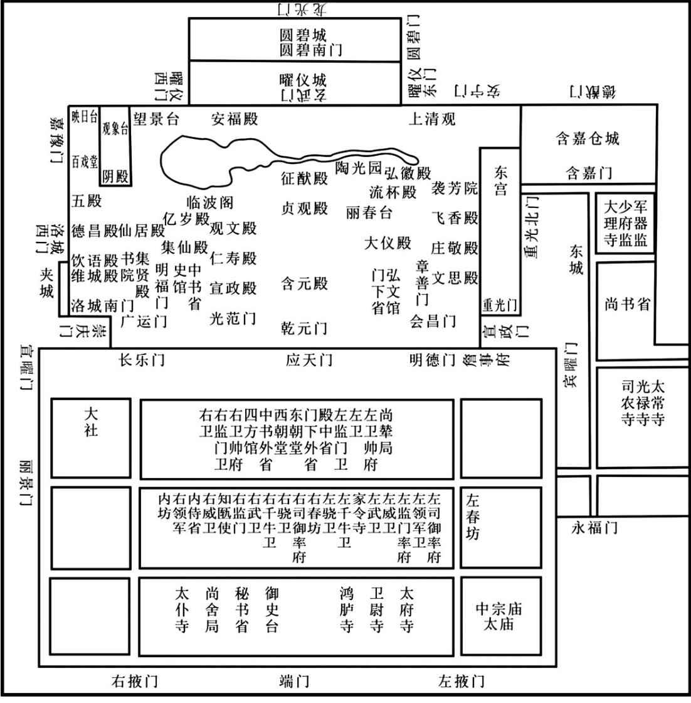 
唐东都宫城、皇城示意图

[3]柩（jiù）：装着尸体的棺材。

[4]万泉、芳桂、奉天等宫：皆为唐朝的行宫。唐高宗永淳元年（682年）二月，在蓝田（今陕西蓝田）营造万泉宫。又因渑（miǎn）池（今河南渑池）城西黄花村桂树景致可观，遂在此地建紫桂宫，后改为避暑宫、芳桂宫。奉天即奉天宫。

## 【译文】

唐高宗弘道元年（683年）十二月丁巳（初四日），改年号，大赦天下。唐高宗想要亲临则天门楼宣布赦书，因气逆向上冲而不能乘马，就召百姓入殿前宣布赦书。当夜，召裴炎入宫，接受遗诏辅佐治理朝政。高宗在贞观殿去世。遗诏让太子在灵柩前即位，统军治国的大事中有不能决断的，一并由天后定夺。废掉万泉、芳桂、奉天等行宫。

## 【原文】

**庚申，裴炎奏太子未即位，未应宣敕，有要速处分，望宣天后令于中书门下施行[1]。甲子，中宗即位，尊天后为皇太后，政事咸取决焉。太后以泽州刺史韩王元嘉等地尊望重，恐其为变，并加三公等官以慰其心[2]。**

## 【注文】

[1]中书门下：唐朝官署名，又称政事堂，为唐代宰相“共议国政”之所，即中央政府最高议政决策机构，直接对皇帝负责，承受皇帝旨意，提供决策，颁发诏令。在唐初，政事堂为真宰相三省（中书省、门下省、尚书省）长官“共议国政”之所，非三省长官不得入。后以他官加“同中书门下三品”（三省的长官都是三品官，故称同三品）、“同中书门下平章事”（简称同平章事）、“参知政事”为副相，也可入政事堂议政，以分三省长官之权。后来，任何官员（包括三省的长官）必须加“同中书门下三品”“同中书门下平章事”“参知政事”之衔，才是真正的宰相，才可入政事堂议事。唐高祖武德年间，常于门下省议事，门下省的衙署成为最高决策之地。唐太宗贞观年间，改门下省的议政会议为政事堂，并成为制度。唐睿宗文明元年（684年），中书令（中书省长官）裴炎迁政事堂于中书省。唐玄宗开元十一年（723年），中书令张说（yuè）改政事堂为中书门下，设置完备的机构分理各类事务，制度始备，总揽中书、门下二省的职权，辅佐天子统大政。政事堂初以中书令为秉笔宰相，即首相，称执笔，或称执政事笔。后改为轮流执笔，即实行轮值制度。有会则成为执行主席，无会则成为值班宰相，处理日常公务，秉承皇帝旨意。凡是皇帝的命令，必须由政事堂会议通过，并加盖政事印，方可颁布生效。唐玄宗之后，内廷的翰林学士作为皇帝亲近的顾问和秘书，开始掌管拟定皇帝诏书之事，称为“内制”。内制可以不经过外朝宰相的议政机构政事堂就直接颁布执行。这样，政事堂的决策权被翰林学士分割一部分。唐代宗永泰年间，在皇宫内置内枢密使，由宦官充任，掌管宫廷奔走，宣传机密诏奏，承受和进呈表文、奏书。如果皇帝有所处理，则由内枢密使宣付政事堂及翰林学士。到晚唐时期，内廷宦官势力进一步膨胀，枢密使指挥政事，进一步分割政事堂之权，逐渐形成“宰相、枢密，共参国政”的局面。

[2]泽州：古州、府名。隋文帝开皇年间改建州为泽州，唐治晋城（今山西晋城），辖境相当于今山西东南部沁水、陵川、阳城、高平等市县地。　　元嘉：即李元嘉（618—688年），唐高祖李渊之第十一子。他少年好学，工书画，收藏万卷图书。唐高祖武德四年（621年），封宋王，后改封徐王、韩王。唐高宗死后，武后临朝，掌握大权，授予元嘉太尉，表面上尊崇他，实际上图谋削夺元嘉的职权。元嘉心里愈发感到不安。于是，他与越王李贞父子等合谋发动兵变，事情不成，被迫自杀。　　三公：古代官名，指太尉、司徒、司空，正一品。三公本是辅佐皇帝治理国家之重臣，无所不统。但在唐朝，三公仅作为大臣的加官（只表示身份、官位的荣誉衔），无实际职掌。

## 【译文】

唐高宗弘道元年（683年）十二月庚申（初七日），裴炎上奏说太子尚未即帝位，不宜由他直接发布诏令，有急需处理的重要事情，希望宣布天后的令，由中书门下施行。甲子（十一日），唐中宗即皇帝位，尊天后为皇太后，政务都由太后决断。太后因为泽州刺史韩王李元嘉等人地位尊崇，担心他们生变，就给他们都加三公等官衔以安抚他们的心。

## 【原文】

**则天皇后光宅元年春正月甲申朔，改元嗣圣，赦天下[1]。立太子妃韦氏为皇后，擢后父玄贞自普州参军为豫州刺史[2]。**

## 【注文】

[1]光宅：武则天实际掌握朝政时所用年号，即光宅元年（684年）九月至十二月。　　嗣圣：唐中宗李显第一次在位期间（由武则天实际掌握朝政）所用年号，即嗣圣元年（684年）一月至二月。

[2]太子妃：皇太子的正妻。　　韦氏：即唐中宗李显的韦皇后（？—710年）。京兆万年（今陕西西安）人，出自名门。李显为太子时，被选为妃。唐高宗李治死后，李显即皇帝位，立韦氏为皇后。武则天以皇太后的身份把持朝政，勾结朝中的重臣废掉中宗，韦氏也失去了皇后的尊位，跟随中宗奔赴被流放之地。后来，武则天建立周朝、称帝，过了几年，又召李显回到京城，立为太子。韦氏也跟随丈夫回京，为太子妃。唐中宗神龙元年（705年），在武则天病重时，朝廷重臣拥立中宗重登皇位，韦氏得以再次成为皇后。她干预朝政，重用奸臣，又屠杀拥立中宗复登皇位的功臣，买卖官爵，在正规官僚体制外大置员外官，大力修建佛寺。韦皇后后来与其女安乐公主（唐中宗李显的幼女，韦皇后所生）毒死中宗，立中宗最小的儿子李重茂为傀儡皇帝，亲族皆把持军政要职。韦后母女想仿效武则天掌握朝政，成为女皇。在这种情况下，太平公主（武则天的幼女）和李旦（武则天的第四个儿子）之子临淄王李隆基（后来的唐玄宗）联手，率兵入宫，将韦后和安乐公主杀死，拥立李旦登上皇位，是为唐睿宗。　　擢（zhuó）：提拔、提升。　　玄贞：即韦玄贞（？—684年），唐中宗韦皇后之父，京兆万年（今陕西西安）人。他因唐中宗即位而升任为豫州（治今河南汝南）刺史。唐中宗想建立一支自己的力量，打算依靠妻族韦皇后的家族，想提升韦玄贞为侍中，遭到武则天及裴炎的反对。武则天和裴炎并以此为借口将中宗废黜。韦玄贞亦遭流放而死。至唐中宗神龙元年（705年），唐中宗重登皇位，韦氏再次成为皇后，韦玄贞被追赠为太师、益州都督，进而加赠为上洛王。　　普州：古地名。北周置，治安岳（今四川安岳北），唐辖境相当于今四川安岳、乐至、遂宁及重庆潼南地区。　　参军：即参军事，唐朝地方官名，官品为八品或九品，无固定职掌，供派遣出使。　　豫州：古州名。东汉治所在谯（今安徽亳州市），东晋、南朝时治所最北在悬瓠城（今河南汝南），最南在邾城（今湖北黄冈市西北），辖境最大时相当今江苏、安徽长江以西，安徽望江县以北的淮河南北地区。

## 【译文】

则天皇后光宅元年（684年）春季正月甲申朔（初一日），改纪元年号为嗣圣，大赦天下。立太子妃韦氏为皇后，把皇后的父亲韦玄贞从普州参军事提拔为豫州刺史。

## 【原文】

**中宗欲以韦玄贞为侍中，又欲授乳母之子五品官[1]。裴炎固争，中宗怒曰：“我以天下与韦玄贞何不可？而惜侍中邪！”炎惧，白太后，密谋废立。二月戊午，太后集百官于乾元殿，裴炎与中书侍郎刘祎之、羽林将军程务挺、张虔勖勒兵入宫，宣太后令，废中宗为庐陵王，扶下殿[2]。中宗曰：“我何罪？”太后曰：“汝欲以天下与韦玄贞，何得无罪！”乃幽于别所。**

## 【注文】

[1]五品官：唐代官僚制度中，五品官是一条杠。五品及五品以上的官为高级官僚，五品以下的官为低级官僚。

[2]乾元殿：唐朝宫殿名。乾元殿与贞观殿、徽猷（yóu）殿为唐洛阳皇宫的三大殿，其中乾元殿规模最大，为上朝之殿，每年元旦大朝会和新皇登基大典都在此举行。　　羽林将军：唐朝禁军将领。唐朝设左、右羽林军，都是唐朝驻守宫廷北门的禁军。在唐朝的宫殿布局中，皇帝的居住地在宫廷的北部，因此驻守宫廷北门的北衙禁军的向背在历次宫廷政变中起决定性作用。左、右羽林军各有大将军一人，正三品；将军二人，从三品。负责统领北衙禁军，宿卫朝会及扈从皇帝。　　程务挺（？—685年）：唐前期将领。洺（míng）州平恩（今河北曲周东南）人。其父程名振为初唐名将。务挺少随父作战，以勇力闻名。他担任右领军卫中郎将。唐高宗调露二年（680年），他随将军裴行俭击破西突厥阿史那伏念，迁右武卫将军。高宗永淳二年（683年），他与王方翼镇压绥州（治今陕西绥德）地区叛乱的部落，进左骁卫大将军、检校左羽林军。唐中宗嗣圣元年（684年），务挺率兵防御北部草原的突厥，突厥不敢侵犯唐朝。当年十二月，他因为上表言裴炎没有谋反，触怒武则天，被杀。　　张虔勗（xù）（生卒年不详）：唐朝将领。最初受宰相裴炎的推荐，官至大将军。助武则天废唐中宗。后被来俊臣诬告谋反，被乱刀砍死。　　勒兵：治军，操练或指挥军队。　　庐陵：地名。隋文帝开皇年间置吉州，唐高宗永淳年间治庐陵（今江西吉安），辖境相当于今江西永新、峡江、乐安、石城以南地区。

## 【译文】

唐中宗想让韦玄贞做侍中，又想要授予其奶妈的儿子五品官。裴炎不妥协地抗争，中宗生气地喝道：“我就是把天下给了韦玄贞有什么不行的？还吝惜个侍中吗！”裴炎害怕了，将此话告诉了太后，两人密谋废掉中宗另立新帝。二月戊午（初六日），太后召集百官到了乾元殿，裴炎与中书侍郎刘祎之、羽林将军程务挺、张虔勗带兵进入宫中，宣布太后的命令，将中宗废为庐陵王，扶他下殿。中宗问：“我犯了什么罪？”太后说：“你想把天下给韦玄贞，怎么能无罪！”于是将他囚禁在其他的地方。

## 【原文】

**己未，立雍州牧豫王旦为皇帝。政事决于太后，居睿宗于别殿，不得有所预。立豫王妃刘氏为皇后[1]。后，德威之孙也[2]。**

## 【注文】

[1]刘氏（？—692年）：即唐睿宗李旦的正妻。刘氏是刑部尚书刘德威的孙女，父亲刘延景任陕州（今河南三门峡西旧陕县）刺史。刘氏生下睿宗的长子李成器和寿昌公主、代国公主。武后光宅元年（684年），武则天掌权，扶持李旦登上皇位，立刘氏为皇后，立窦氏（唐玄宗李隆基的生母）为德妃。武周天授元年（690年），睿宗让位于武则天，武则天改唐为周，睿宗降为皇嗣，刘氏也降为皇嗣妃。武周长寿二年（692年），刘氏与窦氏被奴婢诬陷，于正月朝拜武则天后同时遇害，连尸体都找不到。景云元年（710年），唐睿宗重登皇位后，追谥刘氏为肃明皇后，招魂葬于东都城南。

[2]德威：即刘德威（581—652年），唐前期将领。徐州彭城（今江苏徐州）人，唐睿宗肃明皇后刘氏的祖父。隋炀帝大业末年，刘德威随裴仁基镇压江淮的反隋起义军。后来德威与裴仁基一起归顺反隋的瓦岗军领袖李密。唐高祖武德元年（618年），李密在与王世充交战中兵败，刘德威率部随李密归降唐朝，授左武候将军，封滕县公。后来，刘德威任并州（治今山西太原）总管府司马，被刘武周虏获，不久逃归，并向唐高祖报告敌军的虚实，改封彭城县公，检校大理少卿。唐高祖武德四年（621年），刘德威随秦王李世民平定洛阳，转刑部侍郎，加散骑常侍，并尚平寿县主。唐太宗贞观年间，刘德威历任大理寺卿、绵州（治今四川绵阳）刺史、益州（治今四川成都）大都督府长史、刑部尚书、检校雍州别驾、同州（治今陕西大荔）刺史，以廉洁平直而闻名。唐高宗永徽三年（652年），刘德威去世，赠礼部尚书、幽州（治今北京地区）都督，谥为“襄”，陪葬献陵（唐高祖的陵寝，位于陕西三原徐木乡永合村西）。

## 【译文】

唐中宗嗣圣元年（684）二月己未（初七日），太后立雍州牧豫王李旦为皇帝。朝政由太后决断，让唐睿宗李旦居住在别殿，对政事不得干预。立豫王妃刘氏为皇后。刘皇后是刘德威的孙女。

## 【原文】

**有飞骑十余人饮于坊曲，一人言“向知别无勋赏，不若奉庐陵”[1]。一人起出诣北门告之。座未散，皆捕得，系羽林狱[2]。言者斩，余以知反不告皆绞，告者除五品官[3]。告密之端自此兴矣。**

## 【注文】

[1]飞骑：唐朝北衙禁军中的一支。唐高祖时，于长安宫城的北门玄武门置北门屯营，负责守卫宫城北边的门户。后分为左、右屯营。唐太宗贞观十二年（638年），始于左、右屯营中置飞骑，隶属于左、右屯卫（后改为威卫）。唐高宗龙朔二年（662年），将飞骑从左、右屯卫中析出，别为左、右羽林军，故又称羽林飞骑。一般选取骁健、善骑射者充入飞骑。飞骑在历次宫廷政变中处于举足轻重的地位。飞骑早期从禁军的子弟和府兵卫士中选充，唐玄宗先天二年（713年）规定，一律从卫士中简补。次年，又从出征吐蕃的兵募中选拔壮勇之士为飞骑。随着府兵制的衰落，卫士不再上番宿卫，飞骑全部出于招募。飞骑的任务是宿卫宫禁，但有时亦奉命出征。按规定，飞骑的身高、体力、弓马技艺都有严格标准，合格的才能选充。实际上唐玄宗开元、天宝间的禁军多半来自长安市上的商人富户以及无赖游手。他们投充飞骑，是为了逃避徭役和获得庇护，平时很少训练，更少实战经验，因此战斗力非常弱。　　坊曲：泛指街巷。

[2]羽林狱：唐代专职保卫天子的亲军左、右羽林军设置的监狱。

[3]斩、绞：唐代的死刑法定刑为绞刑与斩刑。唐律死刑罪名条款共232条，其中斩刑89条，绞刑143条。　　除：任命官职。

## 【译文】

有十多个侍卫飞骑兵士在街巷中喝酒，其中一人说“要是早知道没有别的勋赏，还不如拥戴庐陵王（李显）呢”。有一人起身出去，到皇宫的北门告发了此事。酒席还没有散，在座的人就都被抓获，关进羽林军的大狱。说“拥戴庐陵王”的话的人被斩首，其他的人以知道有人造反而不告发被处以绞刑，告发的人官拜五品。告密之风气从此开了头。

## 【原文】

**壬子［己未］(1)，以永平郡王成器为皇太子，睿宗之长子也[1]。赦天下，改元文明[2]。**

## 【注文】

[1]郡王：唐朝爵位，从一品。　　成器：即李成器（679—742年），后改名李宪，唐睿宗李旦的长子，肃明刘皇后所生。成器恭谨自守，能诗歌，通晓音律，尤善击羯鼓、吹笛。他初封永平郡王。文明元年（684年），唐睿宗李旦即位为帝，李成器被立为皇太子。武则天天授元年（690年），武则天废唐建周后，睿宗降为皇嗣，李成器则降为皇孙。唐睿宗景云元年（710年），成器被封为宋王。不久，睿宗复登皇位，成器将太子之位让给其弟李隆基（即后来的唐玄宗）。后来，他历任尚书左仆射、岐州（治今陕西凤翔南）刺史、泽州（治今山西晋城）刺史，拜太尉。他与玄宗李隆基友爱，以不干预朝政、不与人结交而为玄宗所信赖。唐玄宗开元四年（716年），成器因避玄宗生母昭成窦皇后之讳，改名为宪，晋封为宁王。他死后葬惠陵（今陕西蒲城西北），谥号“让皇帝”，玄宗命令相关部门以皇帝之礼安葬成器。

[2]文明：唐睿宗李旦首次即皇帝位时所使用的第一个年号，即文明元年（684年）二月至九月。在这段时期内，皇太后武则天实际掌握大权，有些史书把“文明”作为武则天的年号。随后武则天以自己的名义发下敕令，改元光宅，并改革官制、旗帜、服色等，正式进入武则天统治时代。

## 【译文】

唐睿宗文明元年（684）二月己未（初七日），让永平郡王李成器做皇太子，他是唐睿宗的长子。大赦天下，改年号为文明。

## 【原文】

**庚申，废皇太孙重照为庶人[1]。命刘仁轨专知西京留守事[2]。流韦玄贞于钦州[3]。**

## 【注文】

[1]重照：即李重照（682—701年），唐中宗李显的嫡长子，韦皇后所生。后来为避武则天的名武曌（zhào）之讳，改名李重润。唐高宗永淳二年（682年），重照被立为皇太孙。唐中宗登上皇位后不久被废，重照也相应失去皇太孙之位。武周圣历初年，重照因为和异母妹妹永泰郡主李仙惠、妹夫武延基议论武则天的男宠张易之兄弟，被武则天诛杀。唐中宗神龙元年（705年），李显再次登上皇位后，追封重照为懿德太子，陪葬乾陵，特恩“号墓为陵”。

[2]知西京留守事：暂时负责管理西京（唐都长安）的军政事务。唐代的京城、陪都皆置留守、副留守，掌管京城、陪都的军政大事。皇帝不在京城长安时，则由留守京城的亲王或大臣临时担任，皇帝回京则罢之。陪都（包括东都洛阳、北都太原）也设留守，系常设官。武则天掌握大权、称帝的时代，常常驻洛阳，洛阳成为实际上的国都。这样，西京留守便成为常设官。

[3]钦州：古州、路名。隋文帝开皇年间改安州而置，治钦江（今广西钦州东北），唐辖境相当于今广西钦州、灵山等市县地。

## 【译文】

唐睿宗文明元年（684）二月庚申（初八日），废皇太孙李重照为庶人。任命刘仁轨专知西京留守事。将韦玄贞流放到钦州。

## 【原文】

**太后与刘仁轨书曰：“昔汉以关中之事委萧何，今托公亦犹是矣。”[1]仁轨上疏，辞以衰老不堪居守，因陈吕后祸败之事以申规戒[2]。太后使秘书监武承嗣赍玺书慰谕之，曰：“今以皇帝谅闇不言，眇身且代亲政[3]。远劳劝戒，复辞衰疾。又云‘吕氏见嗤于后代，禄、产移祸于汉朝’，引喻良深，愧慰交集[4]。公忠贞之操，终始不渝，劲直之风，古今罕比。初闻此语，能不罔然，静而思之，是为龟鉴[5]。况公先朝旧德，遐迩具瞻，愿以匡救为怀，无以暮年致请。”[6]**

## 【注文】

[1]关中：地区名，所指范围大小不一：（1）函谷关以西。（2）在秦岭以北范围内，时或专指今陕西关中盆地。（3）将关中解释为居众关之中。胡三省注《资治通鉴》“西有陇关，东有函谷关，南有武关，北有临晋关，西南有散关”。　　萧何（？—前193年）：西汉开国功臣、相国。秦末泗水沛县（今江苏沛县）人，早年任县主吏掾。秦二世元年（前209年），萧何跟随刘邦起兵反秦，负责监督诸事。攻克秦都咸阳（今陕西咸阳）后，萧何立即接收秦丞相御史所藏的图书，使刘邦知晓天下地理山川形势及户口数。萧何劝刘邦接受力量远胜于自己的项羽的分封，积蓄力量、等待时机。后来，西楚霸王项羽和汉王刘邦争夺天下，萧何向刘邦举荐韩信为大将军，自己担任丞相，留守关中，使关中成为汉军稳定的后方。萧何不断地给战场输送士卒粮饷支援作战，在刘邦战胜项羽建立汉朝的过程中发挥了重要作用。在汉朝，萧何创立各种规章制度，以功高封酂（zàn）侯，位次第一功臣，并恩及其父子兄弟。汉高祖十一年（前196年），萧何定计助吕后诛杀功臣韩信，进为相国。刘邦死后，萧何又辅佐其子汉惠帝刘盈（吕后所生）。他病危时，推荐曹参继任为相国。

[2]吕后：即吕雉（zhì）（前241—前180年），汉高祖刘邦的皇后，又称高皇后、高后。秦末汉初单（shàn）父（今山东单县）人，字娥姁（xū）。其父吕公因避仇家，移居沛县（今江苏沛县），与刘邦相识。刘邦起兵反秦，后来与西楚霸王项羽争夺天下，吕雉均大力相助。在刘邦与项羽争战时，吕雉与刘邦的父母均被项羽的楚军俘虏为人质，后被放还。刘邦击败项羽称帝后，立吕雉为皇后。吕后为人残忍而有谋略，她助刘邦铲除韩信、彭越等功臣。刘邦死后，其子刘盈即皇帝位，是为汉惠帝。吕雉以太后的身份独揽大权。惠帝死后，吕雉仍然掌握大权，大封吕氏子弟为王侯，提拔亲信，排斥功臣。但吕后统治期间，天下无事，人民生活较安定，残破的社会经济得到恢复。她病危期间，命其侄子吕禄、吕产控制南北军（驻守西汉都城长安城内的禁军），以巩固吕家的权力。吕后死后，诸吕阴谋作乱，为大臣周勃等平定。

[3]武承嗣（？—698年）：唐前期大臣，武则天之侄。并州文水（今山西文水东）人，继承祖先的爵位为周国公。唐睿宗文明元年（684年），其姑母武则天总揽朝政，承嗣也升任同中书门下三品，成为宰相，参掌朝政。他请武则天除去李氏子孙，诛杀不依附于武氏的大臣，立武氏的宗庙，追封武氏的先世。承嗣被封魏王，监修国史。他在武则天废唐建周、正式称帝的过程中出力颇多。后来，他密令凤阁舍人（即中书舍人）张嘉福上书，请求立自己为皇太子。因朝廷重臣狄仁杰、岑长倩等反对，此事未成。承嗣又被罢去知政事，亦即被逐出中央决策圈，忧愤而死。　　玺书：古代以泥封加印的文书。古代长途递送的文书易于破损，所以书于竹简木牍，两片合一，缚以绳，在绳结上用泥封固，钤以玺，故称玺书。秦以后专指皇帝的诏书。　　谅（liàng）闇（ān）：指居丧时所住的房子。也借指居丧，多用于皇帝。　　眇（miǎo）身：眇，原指瞎了一只眼，后亦指两眼俱瞎。身，身躯。眇身犹言微末之身，为古代帝后的自谦之词。

[4]嗤（chī）：讥笑。　　禄、产：即吕禄和吕产，汉高祖皇后吕雉的侄子。单父（今山东单县）人。汉惠帝七年（前188年），惠帝逝世，吕后临朝专权，大力重用其侄子吕产和吕禄。第二年，分封诸吕为王侯。吕后病重时，任命吕禄与吕产统领长安城内的禁军南北军。吕后死后，吕禄、吕产独揽兵权，后为太尉周勃捕杀，诸吕势力被铲除。　　愧慰交集：惭愧与欣慰的心情交织在一起。

[5]罔然：同“惘然”。失意的样子，心中若有所失。或犹茫然，恍惚不解之状。　　龟鉴：鉴，镜子。古镜中有一种名为“龟镜”，或“龟纽镜”，“龟纹镜”，是以龟为主纹，有的配十二生肖和八卦等纹。古人认为：龟能知吉凶，鉴别善恶，故以龟占卜吉凶，以镜明察秋毫。有以人或事为鉴的说法，为借鉴之意，比喻可供对照学习或引以为戒的教训，故称“龟鉴”。

[6]遐（xiá）迩（ěr）：远近。　　匡救：扶正挽救。

## 【译文】

武太后在给刘仁轨的信中说：“昔日汉朝将关中之事交给萧何，如今托付给你的也像这样。”刘仁轨上疏，以年老体衰不能胜任为由推辞，接着陈述汉朝吕后祸败的事，向太后表达规劝和告诫。太后让秘书监武承嗣带着加盖了太后的玺印的诏书来慰问他，说：“现在因为皇上居丧时期不说话，我暂且代替他亲理朝政。劳您从远道回信勉力劝诫，还以年老体衰作为推辞。又说‘吕氏为后代所讥笑，吕禄和吕产给汉朝带来了祸害’，引用的比喻很是深刻，让我既惭愧又欣慰。您忠贞的节操，始终不变，刚直的风骨，古今很少有人能比。刚开始听到您的话时，难免不感到迷惑不解，但是冷静思考后，觉得真是可以借鉴。况且您是前朝有德望的老臣，为远近百姓所敬仰，希望您能以匡扶挽救国家时政为怀，不要再以年老为由推托了。”

## 【原文】

**辛酉，太后命左金吾将军丘神诣巴州[1]，检校故太子贤宅以备外虞，其实风使杀之[2]。神，行恭之子也[3]。**

## 【注文】

[1]左金吾将军：唐朝禁军将领。唐初为左、右武候府，高宗时改为左、右金吾卫，各置大将军一人，正三品；将军二人，从三品。左、右金吾卫掌管皇宫与京城的巡警、抓捕奸盗等。　　丘神（jī）（？—691年）：唐前期将领。河南洛阳（今河南洛阳）人，后迁移至郿（méi）县（今陕西眉县），丘行恭之子。唐高宗永淳初年，丘神担任左金吾将军。唐睿宗文明元年（684年），他奉武则天之命，前往巴州（治今四川巴中市巴州区）监视废太子李贤，逼李贤自杀。既而武则天归罪于丘神，先贬为叠州（治今甘肃迭部）刺史，不久回洛阳恢复原职，深受武则天的信任。他受诏推审刑狱，与周兴、来俊臣俱被称为酷吏。武则天垂拱四年（688年），博州（治今山东聊城东北）刺史李冲起兵反对武则天，神为清平道大总管前往征讨，杀戮千家。李冲之父越王李贞起兵，神又前往镇压。神因功升为左金吾卫大将军。之后，武则天清除酷吏，神被人告发与周兴等阴谋造反，于武周天授二年（691）被杀。　　巴州：古地名。北魏置，北周治化城（今四川巴中），唐辖境相当于今四川巴中、平昌及南江部分地区。

[2]检校：代理，即尚未实际授任，该官已经掌管其职事。　　虞：忧虑。　　风使：借风使力。

[3]行恭：即丘行恭（586—665年），唐初功臣。隋末唐初官员、将领丘和之子，河南洛阳（今河南洛阳）人，后迁移至郿（méi）县（今陕西眉县）。他善于骑射，在隋炀帝大业末年聚众于长安（今陕西西安）西，率众会李世民于渭北，官拜光禄大夫。后来，他随李世民的军队攻入长安，又跟从秦王李世民灭薛举、刘武周、王世充、窦建德等，屡立战功，为唐王朝的巩固作出重要贡献，以功授左一府骠骑。唐高祖武德九年（626年），他参与李世民的秦王集团的政变，助李世民当上皇太子、登上皇位，他以功迁左卫将军。唐太宗贞观十四年（640年），他跟从侯君集灭高昌国（今新疆吐鲁番东南），封天水郡公。唐高宗时，他历任右武候大将军、冀州（治今河北冀州）刺史、陕州（治今河南三门峡西旧陕县）刺史。死后，陪葬唐太宗的昭陵。

## 【译文】

唐睿宗文明元年（684）二月辛酉（初九日），太后命令左金吾将军丘神到巴州去，负责审查原来的太子李贤的住宅以防备意外，实际上是暗示丘神杀死他。丘神是丘行恭的儿子。

## 【原文】

**甲子，太后御武成殿，皇帝帅王公以下上尊号[1]。丁卯，太后临轩，遣礼部尚书武承嗣册嗣皇帝。自是太后常御紫宸殿，施惨紫帐以视朝[2]。**

## 【注文】

[1]武成殿：唐朝宫殿名。位于洛阳宫中，是天子日常处理政务的地方。

[2]紫宸殿：唐朝宫殿名。唐西京长安大明宫内和东都洛阳皇宫内皆有，为内朝正殿，此处指洛阳皇宫内的紫宸殿。后来，在唐玄宗统治后期爆发“安史之乱”。安禄山率兵攻入洛阳，以大燕皇帝的名义，在洛阳的紫宸殿举行开国大朝。　　惨紫：浅紫色。

## 【译文】

唐睿宗文明元年（684）二月甲子（十二日），太后亲自驾临武成殿，皇帝率领王公以下官员给太后上尊号。丁卯（十五日），太后亲临殿前的平台，派礼部尚书武承嗣在殿前册封新继位的皇帝。从此，太后常常到紫宸殿，在浅紫色的帷帐后临朝听理朝政。

## 【原文】

**三月，丘神至巴州，幽故太子贤于别室，逼令自杀。太后乃归罪于神，戊戌，举哀于显福门，贬神为叠州刺史[1]。己亥，追封贤为雍王。神寻复入为左金吾将军。**

## 【注文】

[1]显福门：隋炀帝大业年间（605—617年）所建洛阳宫门。洛阳宫城南面为应天、兴教、光政三门。兴教门之内为全昌门，其北为章善门；光政门之内为广运门，其北为显福门。　　叠州：古地名。北周置，唐治合川（今甘肃迭部），辖境相当于今白龙江上游地区。

## 【译文】

唐睿宗文明元年（684）三月，丘神到达巴州，将原太子李贤幽禁在另外的屋子，逼迫他自杀。于是太后归罪于丘神，戊戌（十六日），在显福门行哭祭之礼，将丘神贬为叠州刺史。己亥（十七日），追封李贤为雍王。不久丘神又回到朝廷，再次担任左金吾将军。

## 【原文】

**夏闰五月，以礼部尚书武承嗣为太常卿、同中书门下三品[1]。**

## 【注文】

[1]太常卿：唐前期职事官，即太常寺卿。　　同中书门下三品：唐朝宰相。

## 【译文】

唐睿宗文明元年（684）夏季闰五月，朝廷任命礼部尚书武承嗣为太常卿、同中书门下三品。

## 【原文】

**［八月］初，尚书左丞冯元常为高宗所委，高宗晚年多疾，百司奏事，每曰：“朕体中不佳，可与元常平章以闻。”[1]元常尝密言“中宫威权太重，宜稍抑损”。高宗虽不能用，深以其言为然。及太后称制，四方争言符瑞[2]。嵩阳令樊文献瑞石，太后命于朝堂示百官，元常奏言“状涉谄诈，不可诬罔天下”[3]。太后不悦，出为陇州刺史[4]。元常，子琮之曾孙也[5]。**

## 【注文】

[1]尚书左丞：唐前期职事官。唐初正四品上，后升正三品上，又复为正四品。负责具体监督尚书省所属的吏部、户部、礼部。唐高宗龙朔二年（662年），改称左肃机。　　冯元常（生卒年不详）：唐前期大臣。相州安阳（今河南安阳）人，北齐右仆射冯子琮（cóng）的曾孙。元常的家族雅有礼度，甚为人所称道。唐高宗统治时期，他考中明经，累迁监察御史，为剑南道巡察使，兴利除害。唐高宗永淳年间，他担任尚书左丞，负责具体判中央尚书都省事，监察尚书省，监督尚书省所属的吏部、户部、礼部。元常有见识，处事果断，甚为高宗所欣赏。他曾经秘密向高宗上奏，请求抑制皇后武则天的权力，得到高宗的赞同，但也因此招致武则天的怨恨。高宗死后，武则天掌握朝廷大权，元常因为反对各方为迎合而多献符瑞，被贬出京。后来，元常又辗转担任地方官，颇有政绩，但武则天不让他回京城。元常又率兵讨伐安南地区（今越南）叛乱的部落有功，武则天竟然不赏他。不久，元常被酷吏周兴陷害，下狱致死。　　平章：商量处理。

[2]称制：在中国古代社会，后宫的皇后、妃嫔是不能上厅堂干预政事的，所以后妃要掌权就要“临朝”，即登上朝堂。从秦始皇开始，皇帝的命令专称“制”，布告公文称“诰”。后妃掌权、代行皇帝的职权，其命令自然也要上升到皇帝的级别，于是就叫“称制”。　　符瑞：吉祥的征兆。多指帝王受命的征兆。

[3]嵩阳：古县名。即嵩阳县，隋炀帝大业年间置，武周万岁登封年间改为登封县，隶属于河南府，治今河南登封西南。　　朝堂：唐长安太极宫、大明宫均置有东西朝堂。太极宫朝堂在承天门前，大明宫朝堂在含元殿前。每逢元正、冬至、大朝贺等朝会之前，百官先在朝堂序位，文官在东朝堂，武官在西朝堂，由监察御史传点之后，再分领百官入内。朝堂也是受理词讼审理冤狱的地方。唐太宗曾经敕中书令、侍中于朝堂受讼，自己也临幸朝堂览冤屈。唐德宗建中年间在朝堂别置三司决庶狱。

[4]陇州：古州名。西魏废帝年间置，北周治今陕西陇县，唐辖境相当于今陕西千河流域及甘肃华亭。

[5]子琮（cóng）：即冯子琮（？—571年），北齐大臣。北齐长乐信都（今河北冀州）人，为北燕国主冯跋之后。子琮初袭爵位为荥（xíng）阳县子，其妻为北齐武成帝高湛的胡皇后的妹妹。他又担任殿中郎，奉诏辅导太子。高湛死后，子琮受到权臣的猜疑，被贬为郑州（今河南郑州）刺史。后来，子琮又回到朝廷，担任吏部尚书，不久升为尚书右仆射。子琮又与琅邪（yá）王高俨图谋废掉皇帝，立高俨为帝。结果事情失败，子琮被杀。

## 【译文】

唐睿宗文明元年（684）［八月］当初，尚书左丞冯元常得到高宗的信任，高宗晚年多病，各部门奏事时，高宗常说：“朕身体不好，可以和冯元常商量以后再上奏给我。”冯元常曾经私下对唐高宗说过“皇后威权太重，应该稍加抑制”。高宗虽然不能采纳，但觉得他说得很对。等到武太后行使皇帝的权力，各地争相报告吉兆。嵩阳县令樊文进献一块吉祥的石头，太后命在朝堂向百官展示，冯元常上奏说“这种献石的行为涉嫌讨好和欺诈，不应当欺骗天下百姓”。太后因此不高兴，调冯元常出京去任陇州刺史。冯元常是冯子琮的曾孙。

## 【原文】

**丙午，太常卿、同中书门下三品武承嗣罢为礼部尚书。**

## 【译文】

唐睿宗文明元年（684）八月丙午（二十七日），太常卿、同中书门下三品武承嗣被免去宰相之职，改任礼部尚书。

## 【原文】

**［九月］武承嗣请太后追王其祖，立武氏七庙，太后从之[1]。裴炎谏曰：“太后母临天下，当示至公，不可私于所亲。独不见吕氏之败乎？”[2]太后曰：“吕氏以权委生者，故及于败。今吾追尊亡者，何伤乎？”对曰：“事当防微杜渐，不可长耳。”[3]太后不从。己巳，追尊太后五代祖克己为鲁靖公，妣为夫人；高祖居常为太尉、北平恭肃王，曾祖俭为太尉、金城义康王，祖华为太尉、太原安成王，考士彟为太师、魏定王；祖妣皆为妃[4]。裴炎由是得罪。又作五代祠室于文水[5]。**

## 【注文】

[1]七庙：在家族为祖先立的家庙中，供奉神位等，七庙为四亲（父、祖、曾祖、高祖）庙、二祧（tiāo）（高祖的父和祖父）庙和始祖庙，依时祭祀。按制度规定，天子的宗庙立七庙。

[2]至公：至，最，极。至公，最大的公心。　　吕氏：指西汉高祖时的吕后、吕产、吕禄。汉高祖死后，其皇后吕雉独揽大权，提拔亲信，排斥功臣。她病危期间，又命其侄吕产、吕禄控制军权。吕后死后，诸吕阴谋作乱，为大臣周勃等平定。

[3]防微杜渐：指在坏思想、坏事或错误刚冒头时，就加以防止、杜绝，不让其发展下去。这一成语最初的记载见《宋书·吴喜传》。

[4]太师：古代官名。天子的三师（太师、太傅、太保）之一，正一品。没有实际职事，为赠予元老重臣的荣誉衔。　　妣（bǐ）：原指母亲，后称已经死去的母亲。　　祖妣：包括高祖母、曾祖母、祖母和母亲。

[5]五代：立五庙，即父、祖、曾祖、高祖、始祖之庙。　　文水：古县名。即文水县，隶属于北京太原府，相当于今山西文水东旧城。

## 【译文】

武则天光宅元年（684）［九月］武承嗣请太后追封她的先祖为王，建立供奉武氏七代祖先的祖庙，太后同意了。裴炎进谏言说：“太后是天下人的母亲，应当表明自己最大的公心，不能偏私于自己的亲属。难道看不见吕氏的失败吗？”太后反驳道：“吕后将权力委托给活人，所以才导致失败。现在我追尊死者，有什么损害呢？”裴炎回答说：“凡事应当防微杜渐，不可助长这种现象发展。”太后不听他的劝告。九月己巳（十一日），追尊太后五世祖父武克己为鲁靖公，五世祖母为夫人；高祖父武居常为太尉、北平恭肃王，曾祖父武俭为太尉、金城义康王，祖父武华为太尉、太原安成王，父亲武士彟为太师、魏定王；高祖母、曾祖母、祖母、母亲都追尊为王妃。裴炎因此而得罪了太后。太后又在文水县营建起武家的五代祖先祠堂。

## 【原文】

**时诸武用事，唐宗室人人自危，众心愤惋[1]。会眉州刺史英公李敬业及弟盩厔令敬猷、给事中唐之奇、长安主簿骆宾王、詹事司直杜求仁皆坐事，敬业贬柳州司马，敬猷免官，之奇贬括苍令，宾王贬临海丞，求仁贬黟令[2]。求仁，正伦之侄也[3]。盩厔尉魏思温尝为御史，复被黜[4]。皆会于扬州，各自以失职怨望，乃谋作乱，以匡复庐陵王为辞[5]。**

## 【注文】

[1]用事：指当权。　　自危：自己感到处境危险。　　愤惋：怅恨，愤恨。

[2]眉州：古州名。西魏置，隋治通义（今四川眉山），唐辖境相当于今四川眉山、彭山、丹棱、洪雅、青神等市县地。　　李敬业（？—684年）：唐前期大臣，即唐朝开国功臣徐世（jì）（后赐名李世）的长孙徐敬业。因其父被赐姓李，故也称李敬业。他是曹州离狐（治今山东菏泽西北）人，继承了李世英国公的爵位。唐中宗嗣圣元年（684年），他因罪被贬为柳州（治今广西柳州）司马。时值唐高宗李治去世，武则天临朝，掌握大权。武则天将已经登基的皇帝唐中宗李显废为庐陵王。李敬业与一批失意的官僚联合，于当年起兵反对武则天的统治，以恢复中宗的皇位为名，聚集十万名士兵，向各个州县传播讨伐武则天的檄文。武则天下诏，命令李孝逸率领三十万大军去攻打李敬业军，李敬业很快失败，逃奔至海陵（今江苏泰州），后被部下所杀。　　盩（zhōu）厔（zhì）：古县名。即盩厔县，隶属于雍州，相当于今陕西周至。　　敬猷（yóu）（？—684年）：又叫李敬猷，是唐朝开国名将李之孙，李敬业之弟。李敬业发动反武则天的扬州之变，命敬猷驻军淮阴，大败。敬业与敬猷在逃至海陵（今江苏泰州）时，与骆宾王一起被部将王那相所杀。　　主簿：唐代县级行政体系中的重要官职。从七品上，具有勾检、监印及部分司法职能；县主簿的出身有科举、门荫、流外入流等途径，而其迁转去向主要为县政官员及言官、御史等。　　骆宾王（约638—？）：唐初著名文人。婺（wù）州义乌（今浙江义乌）人，他初为道王府属吏，历任武功（今陕西武功西北）、长安主簿，后到中央担任侍御史，又贬为临海县（今浙江临海）丞。他跟随李敬业起兵反对掌握朝廷大权的武则天，代作《讨武瞾（zhào）檄》（武瞾为武则天之名），一时被人传诵。武则天见到这篇檄文，欣赏骆宾王的文才，发出“宰相怎么失掉这种人才”的感叹。李敬业兵败后，骆宾王被杀，或云投江死，或云落发为僧。骆宾王长于七言诗，又善骈文。其诗文风骨凝练，代表作为《帝京篇》。　　詹事司直：唐朝太子东宫官名。为太子詹事府的属官，置二员，正七品上，掌管纠劾官僚。如果太子临时代理朝政，詹事司直还负责受理文书。　　柳州：古州、路、府名。唐太宗贞观年间置，治马平（今广西柳州），辖境相当于今广西柳州、柳城、柳江、鹿寨等县地。　　括苍：古县名。即括苍县，括州的治所，相当于今浙江丽水东南。　　临海：县名。即临海县，隶属于台州，相当于今浙江临海。　　丞：指县丞，古代官名。在唐代，县丞为县的长官县令之副手，正八品下，负责辅助县令管理当地。　　黟（yī）：古县名。即黟县，隶属于歙（shè）州，相当于今安徽黟县。

[3]正伦：即杜正伦（？—658年），唐前期大臣。相州洹（huán）水（今河北魏县西南）人。他擅长文辞，在隋文帝仁寿中考中秀才。隋代重视秀才，天下不超过十人，而正伦与其弟正玄、正藏一门三秀才，为当时所称道。后来，正伦调任武骑尉（《旧唐书》作“羽骑尉”）。在唐代，正伦进入秦王（即李世民）府的文学馆。唐太宗贞观年间，他累迁给事中，兼知起居注，很得太宗的赏识，升为中书侍郎兼太子左庶子，参与机密之事。唐太宗贞观十七年（643年），太子李承乾被废，正伦受到牵连，被贬为交州（治今越南河内西北）都督，又遭到流放。唐高宗显庆元年（656年），正伦又回到中央，升任黄门侍郎、同中书门下三品，成为宰相。显庆二年（657年），他又升中书令。显庆三年（658年），他与受到唐高宗和武后宠信的李义府共同执政，与李义府不和，被贬为横州（治今广西横县）刺史，不久死于贬所。杜正伦著有文集十卷，已经散佚。

[4]魏思温（？—684年）：唐前期大臣。他历任监察御史、盩（zhōu）厔（zhì）县尉，多次被贬。唐睿宗光宅元年（684年），徐敬业在扬州起兵反对武则天，魏思温担任军师。他劝徐敬业率兵渡过淮河，以恢复皇帝的权力为名攻取洛阳，徐敬业不听。徐敬业兵败后，魏思温被杀。

[5]匡复：挽救国家，使转危为安。

## 【译文】

当时武氏宗亲掌握大权，李氏皇族人人感到处境危险，大家心中愤恨惋惜。正逢眉州刺史英国公李敬业和他的弟弟盩厔县令李敬猷、给事中唐之奇、长安县主簿骆宾王、詹事府司直杜求仁都因事获罪，李敬业被降职为柳州司马，李敬猷被免官，唐之奇被降职为括苍县令，骆宾王被降职为临海县丞，杜求仁被降职为黟县令。杜求仁是杜正伦的侄子。盩厔县尉魏思温曾经担任御史，再次被罢黜。这批人都在扬州聚会，各自因失去官职而心中不满，就阴谋发动叛乱，以挽救和恢复庐陵王（李显）的帝位为借口。

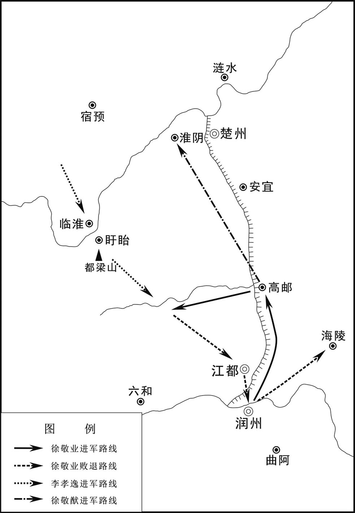 
唐睿宗文明元年（684年）李敬业（徐敬业）起兵及覆灭示意图

## 【原文】

**思温为之谋主，使其党监察御史薛仲璋求奉使江都，令雍州人韦超诣仲璋告变，云“扬州长史陈敬之谋反”，仲璋收敬之系狱[1]。居数日，敬业乘传而至，矫称扬州司马来之官，云“奉密旨，以高州酋长冯子猷谋反，发兵讨之”[2]。于是开府库，令士曹参军李宗臣就钱坊，驱囚徒、工匠数百，授以甲[3]。斩敬之于系所。录事参军孙处行拒之，亦斩以徇，僚吏无敢动者[4]。遂起一州之兵，复称嗣圣元年。开三府，一曰匡复府，二曰英公府，三曰扬州大都督府[5]。敬业自称匡复府上将，领扬州大都督。以之奇、求仁为左右长史，宗臣、仲璋为左右司马，思温为军师，宾王为记室，旬日间得胜兵十余万[6]。**

## 【注文】

[1]江都：古县名。即江都县，扬州的治所，相当于今江苏扬州市江都区。　　雍州：古州名。东汉置，治长安（今陕西西安西北），唐辖有今陕西秦岭以北、乾县以东、铜川以南、渭南以西地区。

[2]乘传：唐朝交通通信制度，按照公私、级别、事务缓急等分驿站传递。驿站既负责国家公文书信的传递，又传达紧急军事情报，还兼管接送官员、怀柔各族、平息内乱、追捕罪犯、押送犯人等各种事务，有时还管理贡品运输和其他小件物品的运输。驿站兼有通信机构和官方招待所的双重职能。驿马快，但是非紧急公务不得使用。

[3]府库：指国家贮藏财物、兵甲的处所。　　士曹参军：即士曹参军事，又称司士参军事，唐朝地方官名。唐于地方上的府称士曹参军，州称司士参军，官品从正七品下至从七品下不等，负责掌管河津及营造桥梁、官衙等事。　　钱坊：铸造钱币的作坊。隋炀帝大业二年（606年），在东都洛阳的皇城内设东、西钱坊，为管理铸钱的专门机构，被唐朝承袭。

[4]录事参军：即录事参军事，唐朝地方官名。上州置录事参军事一人，从七品上；中州置录事参军事一人，正八品上；下州置录事参军事一人，从八品上。负责付事勾稽，省署抄目，纠正非违，监守符印。　　徇（xùn）：对众人宣示。

[5]扬州大都督府：唐代地方军政机构。

[6]记室：即记室参军事，唐朝亲王府的官员。从六品上，负责掌管各种文书。

## 【译文】

魏思温担当他们的谋主，指派他的党羽监察御史薛仲璋要求奉命出使江都，然后让雍州人韦超到薛仲璋那里报告，说“扬州长史陈敬之阴谋造反”，薛仲璋逮捕陈敬之入狱。几天以后，李敬业乘传马到达，假装称自己是扬州司马前来赴任，说“奉太后密旨，因高州酋长冯子猷谋反，要发兵讨伐”。于是打开府库，命扬州士曹参军事李宗臣到铸造钱的作坊，驱赶囚徒、工匠几百人，发给他们兵甲。将陈敬之在监狱斩首。录事参军事孙处行抗拒，也被斩首示众，扬州官吏再没有敢轻举妄动的。于是征发扬州一州的兵马，重新使用中宗嗣圣元年的年号。李敬业的军队设立三个府级机构：第一个叫匡复府，第二个叫英公府，第三个叫扬州大都督府。李敬业自称是匡复府上将，领扬州大都督。他任命唐之奇、杜求仁为左、右长史，李宗臣、薛仲璋为左、右司马，魏思温为军师，骆宾王为记室参军事，十多天便聚集兵马十多万人。

## 【原文】

**移檄州县，略曰：“伪临朝武氏者，人非温顺，地实寒微[1]。昔充太宗下陈，尝以更衣入侍，洎乎晩节，秽乱春宫[2]。密隐先帝之私，阴图后庭之嬖，践元后于翚翟，陷吾君于聚麀。”[3]又曰：“杀姊、屠兄，弑君、鸩母，人神之所同嫉，天地之所不容。”[4]又曰：“包藏祸心，窃窥神器，君之爱子，幽之于别宫，贼之宗盟，委之以重任。”[5]又曰：“一抔之土未干，六尺之孤何在？”[6]又曰：“试观今日之域中，竟是谁家之天下！”太后见檄，问曰：“谁所为？”或对曰：“骆宾王。”太后曰：“宰相之过也。人有如此才，而使之流落不偶乎！”[7]**

## 【注文】

[1]移檄：文体名，古代官府用以征召或声讨的文书。移檄，“檄”与“移”的合称。檄文多用于声讨和征伐，移文多用于晓喻或责备。

[2]洎（jì）：到，及。　　春宫：古代太子居住的宫室，也借指太子。

[3]嬖（bì）：宠幸，爱。　　元后：帝王的嫡妻、元配。这里指唐高宗李治的元配王皇后。　　翚（huī）翟（dí）：翚，五色皆备的雉鸡。翟，长尾山鸡。翚翟泛指雉科鸟类。　　聚麀（yōu）：聚，共。麀，母鹿，泛指母兽。聚麀本指兽类父子共用一个母兽的行为。这里暗指武则天侍奉过唐太宗、唐高宗父子二人。

[4]弑（shì）：古代称臣杀君，子杀父母。

[5]神器：指代表国家政权的实物，如玉玺、宝鼎之类。这里借指帝位、政权。

[6]一抔（póu）之土：一抔，一捧。一抔之土，一捧黄土，借指坟墓。

[7]不偶：不遇；不合。引申为命运不好。

## 【译文】

李敬业传布檄文给各州县，檄文大致说：“窃取帝位而临朝的武氏，为人并不温顺，出身非常贫寒卑贱。她从前位居唐太宗的后宫的下列，曾以做宫女侍奉太宗的机会，得到宠幸，等到太宗晚年的时候，又和太子淫乱。她私下隐瞒了与先皇帝的私情，暗地里谋求在后宫的宠幸，终于登上皇后的宝座，使我们的君主陷于像禽兽父子共享一牝那样的乱伦境地。”又说：“武氏杀害姐姐，屠戮哥哥，杀死皇上，毒死母亲，为人和神所共同憎恨，为天地所不能容忍。”又说：“她包藏着祸心，图谋窃取帝位。君王的爱子，被幽禁于别殿；武氏的宗族、亲近党徒，都委以重任。”又说：“先帝坟墓上的黄土还没有干，成年的孤儿现在何处？”又说：“试看今日国家之内，究竟是谁家的天下！”太后看到这篇檄文以后，问道：“这是谁写的？”有人回答说：“骆宾王。”太后说：“这是宰相的过失。此人有这样的才华，却让他漂泊流落，命运不济，得不到重用啊！”

## 【原文】

**敬业求得人貎类故太子贤者，绐众云：“贤不死，亡在此城中，令吾属举兵。”[1]因奉以号令。**

## 【注文】

[1]亡：逃亡、流亡。　　吾属：我等。

## 【译文】

李敬业找到一个相貌与已故太子李贤相像的人，欺骗众人说：“李贤没有死，逃亡在这座城中，他命令我们起兵。”于是拥戴他以号令天下。

## 【原文】

**楚州司马李崇福，帅所部三县应敬业[1]。盱眙人刘行举独据县不从，敬业遣其将尉迟昭攻盱眙，行举拒却之[2]。诏以行举为游击将军，以其弟行实为楚州刺史[3]。**

## 【注文】

[1]楚州：古州名。隋文帝开皇年间置，开皇十二年（592年）移治山阳（今江苏淮安市楚州区），唐辖境相当于今江苏淮河以南，盱眙以东，宝应、盐城市以北地区。

[2]盱（xū）眙（yí）：古县名。即盱眙县，秦置，隶属于楚州，相当于今江苏盱眙。

[3]游击将军：唐代武散官号，从五品下。

## 【译文】

楚州司马李崇福率领所统属的三个县响应李敬业。盱眙县人刘行举独自一人占据县城，不肯从命，李敬业派他的将领尉迟昭进攻盱眙，刘行举抵抗并打退了尉迟昭。太后下诏任命刘行举为游击将军，任命他的弟弟刘行实为楚州刺史。

## 【原文】

**甲申，以左玉钤卫大将军李孝逸为扬州道大总管，将兵三十万，以将军李知十、马敬臣为之副，以讨李敬业[1]。**

## 【注文】

[1]左玉钤（qián）卫大将军：唐朝禁军将领。玉钤卫即领军卫，分为左右。唐睿宗光宅元年（684），武则天改称玉钤卫。唐中宗神龙元年（705年），恢复原名。设大将军各一人，正三品；将军各二人，从三品。左、右领军卫大将军、将军负责统领宫廷警卫之法令，监督宫廷仪仗队，护卫皇帝，朝会的仪仗。　　李孝逸（生卒年不详）：唐前期将领，李唐宗室。唐高祖李渊的八叔郑王李亮的孙子，淮安王李神通之子。孝逸好学而能属文，始封梁郡公。唐高宗时，他历任益州（治今四川成都）大都督府长史。高宗死后，武后掌权，孝逸在朝廷担任左卫将军，颇受倚重。唐睿宗光宅元年（684年），孝逸担任左玉钤卫大将军、扬州道行军大总管，率兵平定徐敬业的叛乱。孝逸因功进为镇军大将军，徙封吴国公。孝逸的战功遭到武承嗣等人的忌恨，他因谗言被降职为施州（治今湖北恩施）刺史。后来，武承嗣又诬告他谋反，因有功免死，流放儋（dān）州（今海南儋州西北）而死。唐睿宗景云初年，赠孝逸为金州（治今陕西安康）大都督。

## 【译文】

武则天光宅元年（684）十月甲申（初六日），太后任命左玉钤卫大将军李孝逸为扬州道大总管，领兵三十万，任命将军李知十、马敬臣为他的副职，以讨伐李敬业。

## 【原文】

**武承嗣与从父弟右卫将军三思，以韩王元嘉、鲁王灵夔属尊位重，屡劝太后因事诛之[1]。太后谋于执政，刘祎之、韦思谦皆无言，内史裴炎独固争，太后愈不悦[2]。三思，元庆之子也[3]。及李敬业举兵，薛仲璋，炎之甥也，炎欲示闲暇，不汲汲议诛讨[4]。太后问计于炎，对曰：“皇帝年长，不亲政事，故竖子得以为辞[5]。若太后返政，则不讨自平矣。”监察御史蓝田崔詧闻之，上言：“炎受顾托，大权在己，若无异图，何故请太后归政？”[6]太后命左肃政大夫金城骞味道、侍御史栎阳鱼承晔鞫之，收炎下狱[7]。炎被收，辞气不屈。或劝炎逊辞以免，炎曰：“宰相下狱，安有全理。”凤阁舍人李景谌证炎必反[8]。刘景先及凤阁侍郎义阳胡元范皆曰：“炎社稷元臣，有功于国，悉心奉上，天下所知，臣敢明其不反。”[9]太后曰：“炎反有端，顾卿不知耳。”对曰：“若裴炎为反，则臣等亦反也。”太后曰：“朕知裴炎反，知卿等不反。”文武间证炎不反者甚众，太后皆不听[10]。俄并景先、元范下狱。丁亥，以骞味道检校内史、同凤阁鸾台三品，李景谌同凤阁鸾台平章事[11]。**

## 【注文】

[1]从（zòng）父弟：古人以共曾祖父而不共父亲又年幼于己者的同辈男性为从弟，若不共祖父则为从祖弟，若共祖父则为从父弟。　　右卫将军：唐朝禁军的一支右卫的副长官，从三品，佐右卫大将军统领宫廷禁卫之法令，护卫皇帝。　　三思：即武三思（？—707年），武则天的异母兄武元庆之子，唐前期大臣。并州文水（今山西文水东）人。三思年少时因为系皇后的亲族而转右卫将军。唐高宗弘道元年（683年），唐高宗死，武则天掌握实权。为了巩固自己的权势，武则天大力起用武氏亲属。因此，武三思由右卫将军累进夏官（兵部）、春官（礼部）尚书，并监修国史。武则天天授元年（690年），武则天称帝，改唐为周，史称武周。为尊崇武氏，武则天追封其先世祖先为皇帝，大封其侄及侄孙们为王。武三思被封为梁王。武三思善揣人意，阿谀奉承，所以特受武则天信任。其子武崇训娶唐中宗的女儿安乐公主（韦皇后所生）。唐中宗重登皇位后，三思进拜司空、同中书门下三品，成为宰相。三思与中宗韦皇后私通，一步步地除掉拥立中宗重登皇位的功臣敬晖等，其威权日盛，并大力培植亲党的势力。后来，三思与韦后、安乐公主谋废太子李重俊。李重俊气愤之极，于中宗景龙元年（707年）发动兵变，杀死武三思。中宗追封三思为梁王，谥号“宣”。唐睿宗重登皇位后，下令将死去的武三思斩棺、暴尸，平其坟墓。　　鲁王灵夔（kuí）：即李灵夔（？—688年），唐高祖李渊之第十九子，唐太宗李世民的异母弟，宇文昭仪所生。灵夔自幼好学问，善草书、隶书，通音律，有美誉。他先后被封为魏王、燕王，任幽州（今北京地区）都督。后徙封鲁王，转任兖（yǎn）州（治今山东兖州）都督。唐高宗时，灵夔历任绛州（治今山西绛县）、滑州（治今河南滑县附近）、定州（治今河北定州）刺史，太子太师。武则天垂拱四年（688年），越王李贞起兵反对武则天，事泄，李灵夔被捕。他后来被流放，自杀。武则天改李灵夔的姓氏为虺（huǐ）（一种毒蛇）氏。直至唐中宗重新称帝，李灵夔才恢复生前爵位，并还复李姓。

[2]执政：掌握国家大权的人。　　韦思谦（？—689年）：唐郑州阳武（今河南原阳）人，名仁约，以字行。弱冠举进士。累授监察御史，曾劾罢中书令褚遂良为同州刺史，及遂良复相，出为清水令。唐高宗永淳初，历任尚书左丞、御史大夫。武则天垂拱元年（685年），同凤阁鸾台三品。次年，进纳言。后以年老致仕。　　内史：古代官名。隋代改中书省为内史省，改中书令为内史令。唐沿隋制，设内史，为正二品，执掌中书省，即宰相，相当于中书令。

[3]元庆：即武元庆（生卒年不详），武则天的异母哥哥，武三思之父。元庆为唐朝开国功臣武士彠（huò）之子，生母为士彟的元配相里氏。唐高宗时，元庆以门第关系官至宗正少卿。武则天被册封为皇后之后，因武元庆与武元爽（相里氏所生）待武后的亲生母亲杨氏甚薄，武后借机报复，贬元庆为龙州（今广西龙州）刺史。元庆到任即病逝。

[4]汲汲：形容急切的样子，表示想急于得到的意思。

[5]竖子：小子，对人的蔑称。

[6]蓝田：古县名。即蓝田县，隶属于雍州，相当于今陕西蓝田。　　崔詧（chá）（？—689年）：唐京兆蓝田人。唐睿宗文明元年（684年），任御史。武则天光宅元年（684年），以正谏议大夫、同凤阁鸾台平章事拜相。武则天永昌元年（689年），在夏官侍郎任上被杀。

[7]左肃政大夫：武周朝职事官名。武则天时改御史大夫名置，分左右二人，唐中宗时恢复原名，但仍为左、右二人。唐睿宗时废右御史大夫，依旧制设一人。参见注御史大夫。　　金城：古县名。即金城县，兰州的治所，相当于今甘肃兰州。　　骞：音qiān。　　栎（lì）阳：古县名。即栎阳县，隶属于雍州，相当于今陕西临潼东北栎阳镇。　　晔：音yè。

[8]凤阁舍人：官名。即中书舍人。　　谌：音shèn。

[9]凤阁侍郎：官名。即中书侍郎。　　义阳：古县名。即义阳县，申州的治所，相当于今河南信阳。

[10]间（jiàn）：交相，更迭。

[11]同凤阁鸾台三品：唐朝宰相，即同中书门下三品。　　同凤阁鸾台平章事：唐朝宰相，即同中书门下平章事，又简称同平章事。

## 【译文】

武承嗣和他的堂弟右卫将军武三思，因为韩王李元嘉、鲁王李灵夔在皇族当中的辈分尊崇，地位高，多次规劝太后借故杀掉他们。太后和执掌朝政的大臣商议此事，刘祎之、韦思谦都不说话，只有内史裴炎一人坚决不同意。太后更加不高兴。武三思是武元庆的儿子。等到李敬业起兵的时候，由于薛仲璋是裴炎的外甥，裴炎想要表示自己悠闲无事，不急于讨论讨伐李敬业的事。太后向裴炎询问对策，他回答说：“皇帝已经年长，却不能亲自处理政事，所以让小子们找到借口。如果太后将政权交还给皇帝，则无须讨伐，乱子就会自然平定了。”监察御史蓝田县人崔詧听说此事以后，上奏说：“裴炎受高宗临终托付，大权掌握在自己手里，如果没有不轨的企图，为什么要请太后交还大权呢？”太后命令左肃政大夫金城县人骞味道、侍御史栎阳县人鱼承晔审问裴炎，并将裴炎收捕入狱。裴炎被捕后，言词慷慨，不肯屈服。有人劝他用恭顺的词语以求免罪，裴炎说：“宰相入狱，哪里会有能够保全的道理！”凤阁舍人李景谌证明裴炎必定谋反。刘景先和凤阁侍郎义阳县人胡元范都说：“裴炎是国家的重臣，对国家有功，他全心侍奉皇帝，天下的人都知道，我们敢证明他不会谋反。”太后说：“裴炎谋反是事实，你们不知道罢了。”他们回答说：“如果说裴炎谋反，那么我们也谋反了。”太后说：“我知道裴炎谋反，知道你们并没有谋反。”文武官员中轮流证明裴炎不会谋反的人很多，太后都不听。不久连刘景先、胡元范都被捕入狱。光宅元年（684）十月丁亥（初九日），朝廷任命骞味道为检校内史、同凤阁鸾台三品，任命李景谌为同凤阁鸾台平章事。

## 【原文】

**魏思温说李敬业曰：“明公［以］匡复为辞，宜帅大众鼔行而进，直指洛阳，则天下知公志在勤王，四面响应矣。”[1]薛仲璋曰：“金陵有王气，且大江天险，足以为固，不如先取常、润，为定霸之基，然后北向以图中原，进无不利，退有所归，此良策也。”[2]思温曰：“山东豪杰以武氏专制，愤惋不平，闻公举事，皆自蒸麦饭为粮，伸锄为兵，以俟南军之至[3]。不乘此势以立大功，乃更蓄缩欲自谋巢穴，远近闻之，其谁不解体！”敬业不从，使唐之奇守江都，将兵渡江攻润州。思温谓杜求仁曰：“兵势合则强，分则弱。敬业不并力渡淮，收山东之众以取洛阳，败在眼中矣。”[4]**

## 【注文】

[1]明公：对有名位者的尊称。　　勤王：多指君主的统治受到威胁而动摇时，臣子起兵救援王朝。

[2]金陵：古地名。今江苏南京的别称。唐代《建康实录》中明确记有楚威王时“因山立号，置金陵邑”，即用山名为邑名。　　大江：水名，指长江。　　常：古地名，即常州。　　润：古州名，即润州，隋文帝开皇年间置，治丹徒（今江苏镇江），唐辖境相当于今江苏南京、镇江、丹阳、句容、金坛等市地。　　中原：又称中土、中州，为中华文明的发源地。在古代，中原被华夏民族视为天下的中心，以区别于边疆地区而言。夏朝和商朝曾建都于中原地区的商丘、安阳、郑州等。广义的中原指黄河中、下游地区，狭义的中原即指今河南一带。

[3]山东豪杰：山东指崤（xiáo）山（位于河南）以东。“山东豪杰”为崤山以东的胡汉杂糅、善战斗、务农业而有组织的集团，常为隋唐时期政治上敌对两方争取的对象。　　麦饭：磨碎的麦煮成的饭。一说是大麦粒和豆煮的饭。　　锄：锄头，为弄松土地及除草的工具。　　俟（sì）：等待。

[4]淮：水名，指淮河。　　眼中：即心目中。

## 【译文】

魏思温劝李敬业说：“您以恢复皇帝的权力为口号，应当率领大军大张旗鼓地前进，直向东都洛阳，那样天下的人都知道您是要以救援天子为志向，四面八方就都会响应的。”薛仲璋说：“金陵有帝王气象，而且有长江天险，足以用来固守，不如先夺取常州和润州，作为奠定霸业的基础，然后再向北以图夺取中原，这样进可以取胜，退又有归处，是好的策略。”魏思温说：“崤山以东的豪杰因武氏专制，愤怒惋惜，心中不平，听说您起兵，都自动蒸好麦饭做干粮，举起锄头做武器，以等待南军的到来。不趁此形势建立大功，反而退缩，自图建造巢穴，远近的人听到了，这支军队岂有不瓦解的！”李敬业不听从他的建议，派唐之奇守住江都，自己率兵渡过长江，攻打润州。魏思温对杜求仁说：“兵力合在一起就强大，分散则削弱，李敬业不聚集兵力渡过淮河，收拢山东的兵众以夺取洛阳，失败就是预料中的事！”

## 【原文】

**壬辰，陷润州，执刺史李思文，以李宗臣代之。思文，敬业之叔父也，知敬业之谋，先遣使间道上变，为敬业所攻，拒守久之，力屈而陷。思温请斩以徇，敬业不许，谓思文曰：“叔党于武氏，宜改姓武。”润州司马刘延嗣不降，敬业将斩之，思温救之，得免，与思文皆囚于狱中。延嗣，审礼从父弟也。曲阿令河间尹元贞引兵救润州，战败，为敬业所擒，临以白刃，不屈而死[1]。**

## 【注文】

[1]曲阿（ē）：古县名。即曲阿县，隶属于润州，治今江苏丹阳。　　河间：古县名。治今河北河间。

## 【译文】

武则天光宅元年（684）十月壬辰（十四日），李敬业攻陷润州，抓住了润州刺史李思文，让李宗臣取代他的位置。李思文是李敬业的叔父，知道李敬业的阴谋，就事先派遣使者从小路向朝廷报告李敬业要叛乱的事，遭到李敬业的进攻，李思文拒守了很长一段时间，力竭后城被攻陷。魏思温请求将他斩首示众，李敬业不同意，对李思文说：“叔父与武氏结党，应改姓为武。”润州司马刘延嗣不肯投降，李敬业要杀死他，魏思温救他，使之得以免死，和李思文一起被囚禁在狱中。刘延嗣是刘审礼的堂弟。曲阿县令河间县人尹元贞带兵救润州，战败后被李敬业所擒获，李敬业手持锋利的刀剑威胁他，尹元贞不肯屈服而被杀死。

## 【原文】

**丙申，斩裴炎于都亭[1]。炎将死，顾兄弟曰：“兄弟官皆自致，炎无分毫之力，今坐炎流窜，不亦悲乎！”籍没其家，无甔石之储[2]。刘景先贬普州刺史，又贬辰州刺史，胡元范流琼州而死[3]。裴炎弟子太仆寺丞伷先，年十七，上封事请见言事[4]。太后召见，诘之曰：“汝伯父谋反，尚何言？”[5]伷先对曰：“臣为陛下画计耳，安敢诉冤[6]。陛下为李氏妇，先帝弃天下，遽揽朝政，变易嗣子，疏斥李氏，封崇诸武。臣伯父忠于社稷，反诬以罪，戮及子孙。陛下所为如是，臣实惜之。陛下早宜复子明辟，高枕深宫，则宗族可全[7]。不然，天下一变，不可复救矣。”太后怒曰：“胡白，小子敢发此言！”[8]命引出，伷先反顾曰：“今用臣言，犹未晚。”如是者三，太后命于朝堂杖之一百，长流瀼州[9]。**

## 【注文】

[1]都亭：驿站名。驿站是中国古代供传递官府文书和军事情报的人或来往官员途中食宿、换马的场所。唐西京长安、东都洛阳、北都太原（今山西太原）均置都亭驿。

[2]甔（dān）石（dàn）：甔，坛子一类的瓦器。石，中国市制容量单位，十斗为一石。甔石指少量的粮食。

[3]辰州：古州、路、府名。隋文帝开皇年间置，治沅（yuán）陵（今湖南沅陵），辖境相当于今湖南沅陵以南的沅江流域以西地。　　琼州：古州、府名。唐太宗贞观年间置，治琼山（今海南海口市琼山区南），辖境相当今海南海口、定安、澄迈、临高、琼海等市县地。

[4]太仆寺丞：古代官名，始置于春秋。秦、汉沿袭，为九卿之一。掌皇帝舆马和马政。南北朝不常置。唐代太仆寺掌管全国马政、车舆、畜牧饲养以及宴会祭祀等。太仆寺设丞四人，从六品上，负责判太仆寺事务。　　伷（zhòu）先：即裴伷先（668—753年），唐前期大臣。绛州闻喜（今山西闻喜东北）人，宰相裴炎之侄。伷先因为家庭背景而补为太仆寺丞。武则天光宅元年（684年），他上书为裴炎申辩，劝武则天归政于皇帝，罢去武氏家族成员的权力，触怒了武则天，被杖打、流放瀼（ráng）州（治今广西上思西南）。不久，伷先逃归，又被流放到北庭（治今新疆吉木萨尔北）。伷先在边疆五年，积累财富成为富豪，娶胡女为妻，养几百名门客侦察朝廷之事。武周长寿二年（693年），武则天采纳酷吏的建议，想杀流放之人。伷先于是想逃奔突厥，没有成功，被捕入狱。唐睿宗景云元年（710年），睿宗召伷先为太子詹事丞，迁秦（治今甘肃天水）、桂（治今广西桂林）、广（治今广东广州）三州都督，又因罪被免官。唐玄宗开元年间，他升任幽州（治今北京地区）节度使、太原（今山西太原）尹、京兆（今陕西西安）尹。他向玄宗上书，请求罢除冗繁的官员，进为工部尚书。后死于东京留守（管理东都洛阳的长官）任上。

[5]诘（jié）：谴责，问罪。

[6]画计：谋画。亦指筹谋计策。

[7]明辟：明君，亦谓还政于君。　　宗族：父亲的亲属，通宗的亲属。一个宗族通常表现为一个姓氏，并构成居住聚落。一个宗族可以包括很多家族。

[8]胡白：胡说。

[9]三：表示多次或多数。　　瀼（ráng）州：古地名。唐太宗贞观年间置，治临江（今广西上思西南），辖境相当于今广西上思西南、宁明东南地区。

## 【译文】

武则天光宅元年（684）十月丙申（十八日），在都亭驿将裴炎斩首。裴炎临死时，回头看着兄弟说：“兄弟的官职都是自己争取得来的，我裴炎没有出一分一毫的力，现在你们却因我犯罪受连累而被流放，岂不令人悲痛！”朝廷没收了他的家产，竟连一点粮食的积蓄都没有。刘景先被降职为普州刺史，后来又被贬为辰州刺史，胡元范流放琼州而死。裴炎的弟弟的儿子太仆寺丞裴伷先，年十七岁，呈上密封的奏章，请求见太后当面陈述此事。太后召见他，责问他说：“你伯父谋反，还有什么可说的？”裴伷先回答：“我这是替陛下谋划计策，哪里敢诉说冤屈！陛下是李氏的媳妇，先帝逝世后马上就独揽朝政，变换继承帝位的太子，疏远排斥李氏宗亲，封赏尊崇武氏亲属。我的伯父忠于国家，反遭强加罪名诬陷，株连子孙惨遭杀戮。陛下这样所作所为，我实在惋惜！陛下应尽早让皇帝复位，自己引退，在深宫高枕无忧，这样武氏宗族可以保全。否则，一旦天下有变，就不能再挽救了！”太后大怒说：“胡说，小子竟敢发这样的言论！”下令将裴伷先拉出去，裴伷先回过头来说：“如果陛下现在采纳我的意见，还为时不晚。”他连续说了几次。太后命令在朝堂上杖打了他一百下，将他长期流放到瀼州。

## 【原文】

**炎之下狱也，郎将姜嗣宗使至长安，刘仁轨问以东都事，嗣宗曰：“嗣宗觉裴炎有异于常久矣。”[1]仁轨曰：“使人觉之邪？”[2]嗣宗曰：“然。”仁轨曰：“仁轨有奏事，愿附使者以闻。”[3]嗣宗曰：“诺。”明日，受仁轨表而还，表言“嗣宗知裴炎反不言”。太后览之，命拉嗣宗于殿庭，绞于都亭[4]。**

## 【注文】

[1]郎将：古代官名。唐代于亲卫、勋卫、翊卫三卫府置左、右郎将各一员，为中郎将的副官。

[2]使人：奉命出使的人，此处指称姜嗣宗。当时姜嗣宗自东都洛阳出使至西京长安，故而刘仁轨以使人称之。

[3]奏事：奏事有面奏和书奏的区分。面奏是大臣当廷向皇帝反映问题、咨询或请示。书奏是通过一定渠道呈递文书请皇帝裁定审批。奏事的文书主要有章、表、书、启、议、疏等。从下文可知，刘仁轨是以上表奏事的形式向武则天汇报的。

[4]殿庭：宫殿阶前的平地。

## 【译文】

裴炎被捕入狱之后，郎将姜嗣宗出使到了长安，刘仁轨问他东都洛阳的事情，姜嗣宗说：“我发觉裴炎反常的事已经很久了。”刘仁轨问：“裴炎的反常举动您觉察了吗？”姜嗣宗说：“是的。”刘仁轨说：“仁轨有事要上奏，希望让您带给皇上。”姜嗣宗说：“可以。”第二天，姜嗣宗接受刘仁轨的奏表返回洛阳，奏表中说“姜嗣宗知道裴炎谋反却不报告”。太后阅读后，命令在殿庭上拷打姜嗣宗，然后绞死于洛阳都亭驿。

## 【原文】

**丁酉，追削李敬业祖考官爵，发冢斫棺，复姓徐氏[1]。**

## 【注文】

[1]祖考：祖父和父亲。考，亡父。　　发冢斫（zhuó）棺：发掘坟墓、劈开棺材。

## 【译文】

武则天光宅元年（684）十月丁酉（十九日），下诏追削李敬业的祖父和父亲的官职封爵，掘墓劈棺，恢复他的本姓徐氏。

## 【原文】

**徐敬业闻李孝逸将至，自润州回军拒之，屯高邮之下阿溪，使徐敬猷逼淮阴，别将韦超、尉迟昭屯都梁山[1]。李孝逸军至临淮，偏将雷仁智与敬业战，不利，孝逸惧，按兵不进[2]。监军殿中侍御史魏元忠谓孝逸曰：“天下安危，在兹一举[3]。四方承平日久，忽闻狂狡，注心倾耳以俟其诛[4]。今大军久留不进，远近失望，万一朝廷更命他将以代将军，将军何辞以逃逗挠之罪乎！”[5]孝逸乃引军而前。壬寅，马敬臣击斩尉迟昭于都梁山。**

## 【注文】

[1]高邮：古县名。即高邮县，相当于今江苏高邮。　　下阿溪：地名。即今石梁河。　　淮阴：古县名。即淮阴县，相当于今江苏淮阴西南。　　都梁山：地名。位于今江苏盱眙县境，绵延甚广，为淮河流域的险要关口，县南为其主峰。

[2]临淮：古县名。即临淮县，泗州的治所，相当于今江苏盱眙西北淮水西岸。

[3]监军：唐代临时性差遣，置于军队中，负责监督带兵出征的将帅。唐初有时临时设置监军，非常规制度。唐中宗神龙元年（705年），开始任用宦官为监军。唐朝中期以后，各节度使统领的军队或出征的各种军队中普遍设置监军，例以宦官担任，有监军使、观军容使等名目，简称监军，成为常设的使职。监军的属官有副使、判官等，可自置亲兵，与节度使或统兵的将帅分庭抗礼，权势极重。　　殿中侍御史：唐朝职事官，为中央监察机构御史台下所设的殿院的主要官员，从七品下。掌管纠察朝会、朝仪、郊祀、维护朝廷秩序，巡察京师，监察太仓、左藏（zàng）（宫廷仓库）的出纳等。　　魏元忠（？—707年）：唐前期大臣。宋州宋城（今河南商丘西南）人，原名真宰。他初为太学生，累年不调，也不以为意，学设险用兵之道。唐高宗仪凤年间，吐蕃屡次侵扰边界，元忠上书阐述命将用兵之道，得到高宗的赞许，迁秘书省正字、监察御史。武则天光宅元年（684年），元忠监督李孝逸军平定徐敬业叛乱，以功升为司刑正、洛阳（今河南洛阳）令。他被酷吏周兴、来俊臣陷害，三次遭到流放。武周圣历二年（699年），元忠升任凤阁侍郎（即中书侍郎）、同凤阁鸾台平章事（即同中书门下平章事），跻身宰相之列。后来，他又迁左肃政台御史大夫，兼检校洛州（治今河南洛阳）长史，以清严而著称。当时，北方草原的突厥和西南的吐蕃屡次侵犯边境，元忠都为行军大总管率兵抵御。他因为奏请清除武则天的男宠张易之兄弟，引起张易之兄弟的愤恨，被诬陷贬为高要县（今广东肇庆）县尉。唐中宗重登皇位后，任命元忠为卫尉卿、同中书门下三品。他又重新当上宰相，后又进为中书令，封齐国公。不久迁左仆射。元忠不再向皇帝进谏言。中宗景龙元年（707年），太子李重俊起兵，杀武三思等。元忠被诬陷与太子通谋，贬务川县（今贵州沿河北）县尉，死于途中。　　兹：此，这。

[4]承平：太平。　　狂狡：狂妄狡诈。　　注心倾耳：注心，集中心意，专心；倾耳，侧耳倾听。

[5]逗（dòu）挠（náo）：逗，停留，逗留；挠，弯曲，喻屈服。逗挠指因为怯阵而避敌。

## 【译文】

徐敬业听说李孝逸就要到达，从润州回师抵抗，驻扎在高邮县境内的下阿溪，派徐敬猷进逼淮阴县，别将韦超和尉迟昭驻兵于都梁山。李孝逸的兵马到达临淮县，偏将雷仁智与李敬业交战失利，李孝逸害怕了，按兵不动。监军、殿中侍御史魏元忠对李孝逸说：“天下安危，在此一举。天下太平日子久了，忽然听说有狂妄狡诈的人，都全神贯注侧着耳朵倾听，以等待他们的灭亡。现在大军长时间逗留不进，令远近的百姓很失望，万一朝廷另外任命其他将领取代将军您，将军有什么理由可以逃避徘徊观望的罪责呢！”李孝逸这才领军前进。光宅元年（684）十月壬寅（二十四日），马敬臣率兵攻击尉迟昭，在都梁山将他斩杀。

## 【原文】

**十一月辛亥，以左鹰扬大将军黑齿常之为江南道大总管，讨敬业[1]。**

## 【注文】

[1]左鹰扬大将军：古代官名。隋朝的府兵分隶左右卫等十二卫与东宫率府，置大将军一人，将军二人。隋文帝开皇中增设骠骑、车骑二府。隋炀帝大业三年（607年）改为鹰扬府。唐初一度改回旧称，至唐太宗贞观十年（636年）改定为折冲府之称。　　黑齿常之（？—689年）：唐前期将领。百济（朝鲜半岛西南部建立的政权）人，善于用兵，骁勇有谋略。黑齿常之本在百济为官，唐高宗龙朔元年（661年）至龙朔三年（663年），唐将刘仁轨率军多次击败百济军，征服百济。唐高宗遣使招抚黑齿常之等人，黑齿常之率所部降唐，累迁左领军员外将军、洋州（治今陕西西乡）刺史。高宗仪凤三年（678年），他跟从将军李敬玄攻打吐蕃。他率领敢死士攻陷敌营取胜，升为右武卫将军。高宗永隆二年（681年），常之再次击败吐蕃。他在唐与吐蕃的边境设置烽火台七十余所，开垦农田五千多顷，兵食以足，吐蕃不敢前来进攻。高宗死后，武后掌握实权。武则天垂拱二年（686年），北方草原的突厥侵犯唐朝边境，被常之击退。常之进爵燕国公。第二年，常之为燕然道大总管，大破突厥，因其部将争功轻敌，导致全军覆没。后来，常之被酷吏诬陷谋反，被逮捕入狱，自杀而死。　　江南道：唐朝监察区。唐太宗贞观年间，根据自然山川形势，将全国划分为十个监察区，称为十道。江南道便是其中之一。江南道治越州（今浙江绍兴），辖境相当于今浙江、福建、江西、湖南及江苏、安徽的长江以南部分，湖北、四川、重庆江南的一部分和贵州东北部地区。唐玄宗开元二十一年（733年），又将全国再细分为十五道。江南道分作东、西二道。江南东道治苏州（今江苏苏州），辖境相当于今江苏南部和浙江、福建两省。江南西道治洪州（今江西南昌），辖境相当于今湖南洞庭湖、资水流域以东和东道以西地域。

## 【译文】

武则天光宅元年（684）十一月辛亥（初四日），朝廷任命左鹰扬大将军黑齿常之为江南道大总管，讨伐徐敬业。

## 【原文】

**韦超拥众据都梁山。诸将皆曰：“超凭险自固，士无所施其勇，骑无所展其足。且穷寇死战，攻之多杀士卒，不如分兵守之，大军直趣江都，覆其巢穴。”[1]支度使薛克构曰：“超虽据险，其众非多[2]。今多留兵则前军势分，少留兵则终为后患，不如先击之，其势必举，举都梁，则淮阴、高邮望风瓦解矣。”[3]魏元忠请先击徐敬猷，诸将曰：“不如先攻敬业，敬业败则敬猷不战自擒矣。若击敬猷，则敬业引兵救之，是腹背受敌也。”[4]元忠曰：“不然。贼之精兵，尽在下阿，乌合而来，利在一决，万一失计，大事去矣[5]。敬猷出于博徒，不习军事，其众单弱，人情易摇，大军临之，驻马可克[6]。敬业虽欲救之，计程必不能及[7]。我克敬猷，乘胜而进，虽有韩、白，不能当其锋矣[8]。今不先取弱者而遽攻其强，非计也。”孝逸从之，引兵击超，超夜遁，进击敬猷，敬猷脱身走[9]。**

## 【注文】

[1]趣（cù）：通“促”，催促，赶快，急促。

[2]支度使：唐朝使职。唐朝的边军中都置支度使，以计算军资、粮食、器仗等。

[3]举：攻克。　　望风瓦解：刚看到敌方的影子就溃不成军。形容军旅不堪一击。这一成语最初的记载见《周书·辛昂传》。

[4]腹背受敌：腹，指前面。背，指后面。腹背受敌指前后受到敌人的夹击，也指陷入困境。这一成语最初的记载见《魏书·崔浩传》。

[5]下阿：水名，即下阿溪，今石梁河。　　乌合：形容人群没有严密组织而临时凑合，如群乌暂时聚合。指暂时凑合的一群人。

[6]博徒：赌徒。　　习：对某事熟悉。　　驻马：马停下来不走。犹指驻扎军队。

[7]计程：计算路程。　　及：达到。

[8]韩、白：韩信、白起。将汉代名将韩信和秦代名将白起并称，因为二人皆以善用兵而著称。

[9]遁（dùn）：逃，隐去。　　脱身：抽身，指逃出险境、摆脱困境。

## 【译文】

韦超拥兵据守都梁山。唐军的各位将领都说：“韦超凭借险要地势自守，我军士卒无法施展勇力，骑兵无法大展拳脚。而且穷寇死战，进攻的话，我们的士卒伤亡大，不如分兵把守，大军急速奔赴江都，颠覆他们的巢穴。”支度使薛克构说：“韦超虽然据守险要，但兵却不多。现在多留兵围困则前军兵力分散，少留兵则终归是后患，不如先攻击他，看势头一定能攻下，攻下都梁山，则淮阴、高邮的敌人就会望风瓦解了！”魏元忠请求先进击徐敬猷，诸将说：“不如先进攻徐敬业，徐敬业一失败，那么徐敬猷可不战而擒。如果进攻徐敬猷，那么徐敬业领兵救他，我们就将腹背受敌。”魏元忠说：“不对。敌人的精兵全都集中在下阿，他们仓促地临时凑合到一处来，好处是一仗定胜负，万一我军失利，大事便无可挽回！徐敬猷出身赌徒，不熟习军事，兵力又单薄，军心容易动摇，大军来袭，马上就可以攻下。即使徐敬业想救他，从距离上计算必定是够不到。等我军战胜徐敬猷后，乘胜进军，即使有韩信、白起也不能抵挡兵锋。如今不先攻取弱者而急着去攻强者，不是办法啊。”李孝逸听从了他的意见，率兵进击韦超，韦超乘黑夜逃走，进攻徐敬猷，徐敬猷脱身逃走。

## 【原文】

**庚申，敬业勒兵阻溪拒守，后军总管苏孝祥夜将五千人，以小舟渡溪先击之，兵败，孝祥死，士卒赴溪溺死者过半[1]。左豹韬卫果毅渔阳成三朗为敬业所擒，唐之奇绐其众曰：“此李孝逸也。”[2]将斩之，三朗大呼曰：“我果毅成三朗，非李将军也。官军今大至矣，尔曹破在朝夕[3]。我死，妻子受荣，尔死，妻子籍没，尔终不及我也。”遂斩之。**

## 【注文】

[1]后军总管：唐朝临时性差遣，系在唐代前期，重大军事行动中由皇帝临时任命的军事将领，事毕则解职。苏孝祥时以右监门卫将军充任。

[2]左豹韬卫果毅：唐朝将领。左豹韬卫，官署名，隋、唐十六卫之中有左右威卫。武则天光宅元年（684年），改左、右威卫为左、右豹韬卫。唐中宗神龙元年（705年），恢复原名。唐前期，实行府兵制度。全国各主要地方设置大大小小的军府，称为折冲都尉府或折冲府。折冲都尉是长官，果毅都尉是折冲都尉的副职，每折冲府设二人，分左、右，上府从五品下，中府正六品上，下府正六品下。　　渔阳：古地名。隋炀帝大业末改无终县置，治渔阳（今天津蓟县）。

[3]尔曹：你们。

## 【译文】

武则天光宅元年（684）十一月庚申（十三日），徐敬业指挥士兵凭借下阿溪固守。后军总管苏孝祥趁夜间带领五千人，用小船渡过溪水先发起攻击，结果兵败，苏孝祥战死，士兵涉水时淹死的过半。左豹韬卫果毅渔阳县人成三朗被徐敬业抓获，唐之奇欺骗他的部众说：“这就是李孝逸！”准备将他斩首，成三朗大喊道：“我是果毅成三朗，不是李将军。官军现在已经大举到达，你们很快就要覆灭。我死后，妻子儿女蒙受荣耀，而你们死后，妻子儿女将被除名籍沦为奴婢，你们最终不如我。”于是唐之奇杀了他。

## 【原文】

**孝逸等诸军继至，战数不利。孝逸惧，欲引退，魏元忠与行军管记刘知柔言于孝逸曰：“风顺荻干，此火攻之利。”[1]固请决战。敬业置陈既久，士卒多疲倦顾望，陈不能整[2]。孝逸进击之，因风纵火，敬业大败，斩首七千级，溺死者不可胜纪[3]。敬业等轻骑走入江都，挈妻子奔润州，将入海奔高丽[4]。孝逸进屯江都，分遣诸将追之。乙丑，敬业至海陵界，阻风，其将王那相斩敬业、敬猷及骆宾王首来降[5]。余党唐之奇、魏思温等皆捕得，传首神都[6]。扬、润、楚三州平[7]。**

## 【注文】

[1]行军管记：唐代行军大总管府的僚佐。初称记室，后又名典书记、管书记等，掌奏记文檄。唐高宗、武后统治时期，逐渐以行军管记的职号取代记室名称。唐玄宗以后，随着藩镇权力的扩大，其辟署的僚属中记室改为掌书记，可出任地方官吏。　　刘知柔（生卒年不详）：唐前期大臣，刘子玄之兄，徐州彭城（今江苏徐州）人。他少以文学知名，历任荆扬曹益宋海唐等州长史、刺史、户部侍郎、国子司业、鸿胪寺卿、尚书右丞、工部尚书、东都留守。死后赠太子少保，谥号“文”。刘知柔家代传儒学之业，时人以述作名其家。　　荻（dí）：多年生草本植物，生在水边，叶子长形，似芦苇，秋天开紫花，茎可以编席箔（bó）。

[2]置陈（zhèn）：布阵。“陈”同阵，排列，摆设，交战时的战斗队列，排列为阵。　　顾望：环视，巡视，观看。指犹豫观望。

[3]胜（shēng）纪（jì）：胜，尽。纪，记载。

[4]走入：逃进。　　挈（qiè）：用手提着；带，领。　　高丽：古代族名、政权名。亦称高句（gòu）丽。相传朱蒙所建，都纥升骨城（今中国辽宁桓仁五女山山城）。427年迁都平壤（今朝鲜平壤），故地在今朝鲜半岛北部。公元4世纪后，高丽与百济、新罗在朝鲜半岛鼎足争雄。隋朝初年，高丽王遣使来进贡土特产，并受隋册封为大将军、高丽王，双方于是往来不断。隋文帝开皇十八年（598年），高丽王高元率兵攻辽西，隋文帝命汉王杨谅击之。隋末唐初，高丽与中原王朝时战时和。唐高宗总章元年（668年），高丽被唐朝所灭。唐朝在其地置九都督府、四十二州、一百县，复置安东都护府管辖这一区域。不久，此地被朝鲜半岛最南端的新罗所并。

[5]海陵：古县名。即海陵县，相当于今江苏泰州。

[6]神都：武周朝都城。684年九月，武则天改嗣圣元年为光宅元年，旗帜皆改为金色，改东都洛阳为神都。

[7]扬：即扬州。治今江苏扬州。　　楚：即楚州。参见注楚州。

## 【译文】

李孝逸等各军相继到达，与敌军交战屡次失利。李孝逸感到害怕，准备撤退，魏元忠与行军管记刘知柔对李孝逸说：“现在是顺风，芦荻干燥，是火攻的好机会。”坚决请求与敌军决战。徐敬业布阵已久，士兵们多疲倦观望，战阵不能整齐。李孝逸进击徐敬业，顺风纵火，徐敬业大败，斩杀七千名敌军的首级，淹死的无以计数。徐敬业等轻装骑马逃入江都，带着妻子儿女奔往润州，准备从海路逃往高丽。李孝逸进军驻守江都，分别派遣各将领追击徐敬业。光宅元年（684）十一月乙丑（十八日），徐敬业到达海陵县地界，被大风所阻止，他的部将王那相砍下徐敬业、徐敬猷和骆宾王的脑袋前来向官军投降。徐敬业的余党唐之奇、魏思温等都被抓到。这些人被斩首后，他们的首级被送往神都洛阳。扬州、润州、楚州三州被官军平定。

## 【原文】

**陈岳论曰：敬业苟能用魏思温之策，直指河、洛，专以匡复为事，纵军败身戮，亦忠义在焉[1]。而妄希金陵王气，是真为叛逆，不败何待。**

## 【注文】

[1]陈岳（生卒年不详）：唐末人。吉州庐陵（今江西吉安）人。他在唐僖宗、昭宗朝官至检校尚书屯田员外郎，江南西道观察判官。著有《春秋折衷论》《唐统纪》等。其中《唐统纪》百卷，材料多来源于实录，记录唐高祖武德至唐穆宗长庆十三朝之事。原书宋末元初亡佚。《资治通鉴考异》引用其中条目八十条，如“陈岳论”等史论，以补史正史。　　苟：连词。如果，假设。　　河：黄河。　　洛：这里指洛水，又作雒（luò）水，即河南洛河。这是流经唐东都洛阳城的主要河流。

## 【译文】

陈岳评论说：徐敬业如果能采纳魏思温的计策，兵锋直接指向黄河、洛河，专门以恢复皇帝的权力为目的，即使兵败身死，也还有忠义的精神在。然而他荒诞地希求金陵的帝王气象，是真正的叛逆，不败还等什么。

## 【原文】

**初，裴炎下狱，单于道安抚大使、左武卫大将军程务挺密表申理，由是忤旨[1]。务挺素与唐之奇、杜求仁善，或谮之曰：“务挺与裴炎、徐敬业通谋。”十二月癸卯，遣左鹰扬将军裴绍业即军中斩之，籍没其家[2]。突厥闻务挺死，所在宴饮相庆[3]。又为务挺立祠，每出师，必祷之[4]。太后以夏州都督王方翼与务挺连职，素相亲善，且废后近属，征下狱，流崖州而死[5]。**

## 【注文】

[1]单于道安抚大使：唐代军将名。负责统领单于都护府所辖地区的军队。　　左武卫大将军：唐朝禁军高级将领，负责统领皇宫禁军。

[2]左鹰扬将军：唐朝将领。参见左鹰扬大将军。　　裴绍业（621—687年）：唐前期将领。绛州闻喜（今山西闻喜东北）人。绍业起家左卫勋卫，历任果毅都尉、翊府郎将、亲府中郎将，检校左卫将军，遭贬官后复任右领军卫郎将、秦州（治今甘肃天水）刺史、左鹰扬将军。他曾经以佐职与高丽、吐蕃交战，任辽东副总管、河源军副使，深得武则天的优遇。

[3]突厥：古代北方草原族名，政权名。广义包括突厥、铁勒诸草原部落，狭义专指突厥汗国。6世纪时，突厥人游牧于金山（今阿尔泰山）以南。因金山形似兜鍪（战盔），其俗称兜鍪为“突厥”，遂以名其部落。突厥初臣属于北方草原的柔然汗国，为其锻打、冶炼金属的奴隶。后来，突厥强大，击破铁勒，收服其众。公元552年，突厥首领土门大破柔然，自称伊利可汗，建立突厥汗国，在郁督军山（今蒙古国杭爱山东段）建立可汗的王庭。突厥汗国有自己的官制、文字、刑法、税制等。最高统治者可汗均出自阿史那家族。可汗之下，有小可汗、叶护、设、特勤、俟（sì）利发、吐屯等二十八级官员，皆为世袭。突厥汗国全盛时，疆域东至辽海，西抵西海（今里海），南至阿姆河以南，北过贝加尔湖，控制中西交通及丝绸贸易之路，与中原的北齐、北周政权相抗衡。北齐和北周惧怕突厥汗国，争相与其通婚，拿出府库的财物以博其欢心。土门可汗的弟弟室点密远征西方，因立为西面可汗，分治突厥汗国的西境。隋文帝开皇二年（582年），西面的达头可汗（室点密可汗之子）与突厥汗国的大可汗沙钵略不睦，遂分裂为东突厥与西突厥两汗国。东突厥地处阿尔泰山以东，由沙钵略统领。因其地在漠北，故又称北突厥。东突厥汗国因内部争斗、又遭遇天灾，被西突厥所迫，向隋求婚，纳贡称臣，并迁居漠南。隋末中原大乱，汉人投附东突厥的非常多，东突厥国势复盛。唐初，东突厥常常骚扰边境。后来，因为内部叛乱，遭遇天灾，唐太宗贞观四年（630年），东突厥被唐军所灭。以其地置六州，设云中、定襄二都督府以统之。唐高宗永淳元年（682年），突厥首领骨咄禄复起，重建东突厥汗国，亦称后突厥汗国或突厥第二汗国。后经历几代可汗，与唐时有冲突，然双方贸易往来不绝，经济文化得到发展。唐玄宗天宝三载（744年），因内乱及生产破坏，后突厥汗国被铁勒之一部回纥所灭。西突厥汗国的疆域东起伊吾（今新疆哈密），西至雷翥（zhù）海（里海或咸海），北至阿尔泰山以北，南达今新疆和田一带。下分十部，号十姓，各部以一人统之，因此又称“十姓突厥”。西突厥汗国地处中西交通要道。首领阿史那贺鲁曾一度归唐，任唐朝的瑶池都督府都督，后叛唐扰边，自称沙钵罗可汗。唐高宗显庆二年（657年），西突厥汗国被唐所灭。唐廷在其地置都督府、州，又于其上设昆陵、濛（méng）池二都护府。原概属安西都护府统辖。武周长安二年（702年），北庭都护府建立，则分属安西、北庭二都护府。

[4]祠：供奉祖宗、鬼神或有功德的人的房屋，如祠堂或祠庙。

[5]夏州：古州名。北魏置，唐治朔方（今陕西靖边东北白城子），唐辖境相当于今陕西大理河以北的红柳河流域及内蒙古杭锦旗、乌审旗等地区。　　废后：指唐高宗李治的元配王皇后，于高宗永徽六年（655年）被废。　　崖州：古州名。南朝梁置，唐治舍城（今海南琼山东南），辖境相当于今海南海口、文昌、澄迈、定安、琼海等市县地。

## 【译文】

当初，裴炎入狱，单于道安抚大使、左武卫大将军程务挺秘密上表为他申明冤屈，因此违反了太后的旨意。程务挺平常与唐之奇、杜求仁等关系好，有人诬告说：“程务挺与裴炎、徐敬业串通谋反。”光宅元年（684）十二月癸卯（十五日），朝廷派遣左鹰扬将军裴绍业在军中将程务挺斩首，没收家产。突厥人听说程务挺死后，在当地设宴饮酒以示庆贺。又为程务挺建立祠堂，每次出兵前都必定要祷告他。太后因为夏州都督王方翼和程务挺共事，平常互相亲近友善，又是已经被废的王皇后的近亲，因此征召王方翼回来投入监狱，流放崖州而死。

## 【原文】

**垂拱元年春正月，太后以徐思文为忠，特免缘坐，拜司仆少卿，谓曰：“敬业改卿姓武，朕今不复夺也。”[1]**

## 【注文】

[1]垂拱：此时由武则天操纵朝政，一般算做武则天的年号，即垂拱元年（685年）正月至垂拱四年（688年）十二月。垂拱元年，即公元685年。　　徐思文（生卒年不详）：徐敬业的叔父。参见注李思文。　　缘坐：连坐。因一人犯罪而使一定关系的人包括亲属、邻里或主管者等连带受刑的制度。从狭义而言，又称族刑，即一人犯罪，株连家属，犯人与亲属对其犯罪行为承担罪责。　　司仆少卿：唐前期职事官名，为司仆卿的副官。司仆卿即太仆寺卿（太仆卿）。武则天光宅元年（684年），武则天改太仆卿为司仆卿。唐中宗神龙元年（705年），又恢复旧名。

## 【译文】

武则天垂拱元年（685年）春季正月，太后认为徐思文对朝廷忠诚，特地免去他因受徐敬业的牵连而所获之罪，官拜司仆少卿，对他说：“徐敬业改你的姓为武氏，现在我不再取消它。”

## 【原文】

**三月辛酉，武承嗣罢。**

## 【译文】

武则天垂拱元年（685年）三月辛酉（十日），武承嗣被罢职。

## 【原文】

**冬十一月，太后修故白马寺，以僧怀义为寺主[1]。怀义，鄠人，本姓冯，名小宝，卖药洛阳市，因千金公主以进，得幸于太后[2]。太后欲令出入禁中，乃度为僧，名怀义[3]。又以其家寒微，令与驸马都尉薛绍合族，命绍以季父事之[4]。出入乘御马，宦者十余人侍从。士民遇之皆奔避，有近之者，辄挝其首流血，委之而去，任其生死[5]。见道士则极意殴之，仍髡其发而去[6]。朝贵皆匍匐礼谒，武承嗣、武三思皆执僮仆之礼以事之，为之执辔，怀义视之若无人[7]。多聚无赖少年，度为僧，纵横犯法，人莫敢言。右台御史冯思勗屡以法绳之，怀义遇思勗于途，令从者殴之，几死[8]。**

## 【注文】

[1]白马寺：洛阳著名寺院。位于今河南洛阳东十公里，东汉、曹魏时期的洛阳故城西三里。白马寺为佛教传入中国后最早兴建的寺院之一。相传东汉明帝刘庄夜梦金人，顶有日光。明帝于是派遣使者西行求佛法，于明帝永平十年（67年）用白马驮着经像迎还洛阳。第二年，仿照印度半岛的样式建佛寺于洛阳城西，以“白马”命名。后世屡毁屡建，今寺址犹在原处。　　怀义：即薛怀义（？—695年），武则天的男宠。他为京兆鄠（hù）县（今陕西户县）人，本名冯小宝，在洛阳（今河南洛阳）市场卖药为生。他姿仪伟丽，得幸于唐高祖之女千金公主。后来，千金公主将他转荐给武则天，成为武则天的男宠。他度为僧人，法名怀义，赐姓薛，让他与太平公主（武则天的幼女）的丈夫薛绍合族。怀义出入皇宫，权势很大，朝廷大臣均对他卑躬屈膝。武则天垂拱元年（685年），怀义成为洛阳白马寺的寺主。垂拱四年（688年），他监督修建洛阳的明堂、天堂、巨型佛像，役使几万名工匠，花费亿万钱。后来，他封梁国公，屡次加行军大总管之号，以防御北方草原的突厥为名，却不出京城一步。武则天载初元年（690年），他累进右卫辅国大将军，改封鄂国公。怀义与僧人法明等上《大云经》，称武则天是弥勒下生，当代唐君为人世主，为武则天称帝作政治宣传。武则天当年即改年号为天授，改唐为周。后来，怀义因为骄横跋扈而为武则天厌恶。武则天秘密选取一百多名有力量的宫女将怀义杀死。　　寺主：佛教中的僧官。为一寺之主，负责寺院日常事务。

[2]鄠（hù）：古县名。即鄠县，相当于今陕西户县。　　洛阳市：隋代的洛阳城建有三个交易市场，唐代在此基础上建南、北、西三市，是进行商品贸易活动的场所。　　千金公主（生卒年不详）：唐高祖李渊之第十八女，又名定安公主。千金公主先后下嫁温挺、郑敬玄，两次成寡妇，加之生母身份低微，不受重视，在李氏宗族中孤立无援。她年轻时就对武后友好。千金公主私下养着不少男宠，冯小宝就是她最喜欢的男宠。经她引荐，冯小宝（即薛怀义）成了武则天的男宠。

[3]度：僧尼道士劝人出家，剃发出家为剃度。

[4]薛绍（？—689年）：唐前期大臣，唐高宗和武则天之女太平公主的第一任丈夫。薛绍出自大家族，河东汾阴（今山西万荣西南）人，父薛瓘（guàn），母为唐太宗和长孙皇后之女城阳公主。唐高宗永隆二年（681年）七月，他娶太平公主为妻。后来，在琅邪（yá）王李冲起兵反武则天时，薛绍招兵买马响应。李冲失败，事情泄露，薛绍下狱而死。　　季父：叔父。

[5]辄（zhé）：立即，就，总是，每次，则。　　挝（zhuā）：打，敲打。

[6]髡（kūn）：剃发。

[7]僮（tóng）仆：仆役。　　辔（pèi）：驾驭牲口用的缰绳。

[8]右台御史：唐前期职事官名。唐初沿袭隋制，置御史台。唐太宗贞观末年，因避太子李治讳，改治书侍御史为御史中丞。唐高宗龙朔二年（662年），改御史台为宪台。高宗咸亨元年（670年）复旧。武则天光宅元年（684年），武则天改御史台为肃政台，分为左右，各置肃政大夫（即御史大夫）、司宪大夫（即御史中丞），左台专门监督在京城的官僚及军旅，右台负责按察诸州文武百官。唐中宗神龙元年（705年），复名左、右御史台。唐睿宗延和元年（712年），又合而为一。

## 【译文】

武则天垂拱元年（685年）冬十一月，太后重修原来的白马寺，让和尚薛怀义当寺主。怀义是鄠县人，原本姓冯，名叫小宝，在洛阳街市上卖药，因千金公主的关系而进宫，得到太后的宠幸。太后想让冯小宝自由出入宫门，便命他剃度为和尚，取名怀义。又因为他家世出身寒微，便让他与驸马都尉薛绍认为同族，命令薛绍如叔父一般事奉他。他出入都乘皇帝用的马，有宦官十多人侍从。官民遇到他都得四处躲避，有走近他的，动辄就被打得头破血流，扔下离开，不管其死活。他见到道士则尽情殴打，还要剃光他们的头发才离去。朝廷亲贵都伏地行礼拜见怀义，武承嗣、武三思都行奴仆之礼以事奉他，出行时为他牵马，怀义全不把他们放在眼里。怀义还聚集不少无赖少年，剃度为和尚，肆意犯法，人们敢怒不敢言。右台御史冯思勗多次依法处治他们，后来怀义和思勗在途中相遇，就让随从殴打他，几乎把他打死。

## 【原文】

**二年春正月，太后下诏复政于皇帝。睿宗知太后非诚心，奉表固让，太后复临朝称制。辛酉，赦天下。**

## 【译文】

武则天垂拱二年（686年）春正月，太后下诏将朝政交还给皇帝。唐睿宗知道太后并非真心归还权力，上表坚决辞让，太后又临朝行使皇帝的权力。辛酉（二十日），大赦天下。

## 【原文】

**二月，右卫大将军李孝逸既克徐敬业，声望甚重，武承嗣等恶之，数谮于太后，左迁施州刺史[1]。**

## 【注文】

[1]右卫大将军：唐朝禁军高级将领。掌宫禁宿卫。　　施州：古州名。北周置，隋治清江（今湖北恩施），唐辖境相当于今湖北建始、五峰等县以西地。

## 【译文】

武则天垂拱二年（686年）二月，右卫大将军李孝逸平定徐敬业后，声望很高，武承嗣等人讨厌他，多次在太后面前诬陷他，将他降职为施州刺史。

## 【原文】

**三月戊申，太后命铸铜为匦，置之朝堂，以受天下表疏，铭其东曰“延恩”，献赋颂、求仕进者投之；南曰“招谏”，言朝政得失者投之；西曰“伸冤”，有冤抑者投之；北曰“通玄”，言天象灾变及军机秘计者投之[1]。命正谏、补阙、拾遗一人掌之，先责识官，乃听投表疏[2]。徐敬业之反也，侍御史鱼承晔之子保家教敬业作刀车及弩，敬业败，仅得免。太后欲周知人间事，保家上书，请铸铜为匦，以受天下密奏。其器共为一室，中有四隔，上各有窍以受表疏，可入不可出[3]。太后善之。未几，其怨家投匦告保家为敬业作兵器，杀伤官军甚众，遂伏诛。**

## 【注文】

[1]匦（guǐ）：箱子，匣子。

[2]正谏：即正谏大夫，唐朝谏官。唐高祖武德元年（618年）称谏议大夫，唐高宗龙朔二年（662年）改称正谏大夫。分左、右谏议大夫，正五品上，分别隶属于门下、中书两省。谏官有权规劝皇帝，向其进谏言。　　补阙：唐朝谏官。武则天在垂拱元年（685年）始置左、右补阙各二员，从七品上，分隶门下省（在宫殿左边）和中书省（在宫殿右边），掌供奉、讽谏。　　拾遗：唐代谏官。左、右拾遗为从八品上，分别隶属于门下、中书两省。负责研究国家决定的政策、法令及某些重大制度，如认为不妥，有权向皇帝规谏。

[3]窍：窟窿，孔洞。

## 【译文】

武则天垂拱二年（686年）三月戊申（初八日），太后命令铸造铜匦，放置在朝堂，来接收天下的表奏上疏，给东边的刻上名字叫“延恩”，进献赋颂文字和求官的人可将奏表投入；南边的名叫“招谏”，谈论朝政得失的奏表可投入其中；西边的名叫“伸冤”，有冤屈的人可将奏表投入；北边的名叫“通玄”，讲天象灾变灵异和军机秘谋之计的奏表可投入。太后命令正谏大夫、补缺、拾遗各一人掌管铜匦，要先找到认识自己的官员作保，然后才允许将表疏投入。徐敬业造反时，侍御史鱼承晔的儿子鱼保家教徐敬业制造刀、车和弩，徐敬业失败后，他仅得以免死。太后想遍知人间的事情，鱼保家便上书，请求铸造铜匦以接收天下人的秘密上奏。这个铜匦合为一室，中间隔成四小间，每间上面各有孔，以便接收表疏，只能进不能出。太后赞许他的建议。不久，与鱼保家有仇的人投表疏告发他曾为徐敬业制造兵器，杀伤很多官军，于是他被处死。

## 【原文】

**太后自徐敬业之反，疑天下人多图己，又自以久专国事，且内行不正，知宗室大臣怨望，心不服，欲大诛杀以威之。乃盛开告密之门，有告密者，臣下不得问，皆给驿马，供五品食，使诣行在[1]。虽农夫、樵人皆得召见，廪于客馆，所言或称旨，则不次除官，无实者不问[2]。于是四方告密者蜂起，人皆重足屏息[3]。**

## 【注文】

[1]行在：指天子所在的地方，或专指天子巡行所到之地。

[2]樵（qiáo）人：打柴人，樵夫。　　或：也许，有时。　　不次：不依寻常次序。犹言超升，破格。

[3]蜂起：像群蜂飞舞，一哄而起。　　重足屏息：叠足站立，屏住气，大气不敢出，形容非常恐惧。

## 【译文】

太后自从徐敬业造反后，怀疑天下人大多想算计自己，又因为自己长期专擅国家事务，而且操行不正，知道皇族大臣心中怨愤不满，心中不服，就想大加诛杀以威慑他们。于是太后大开告密的渠道，有告密的人，臣下不得过问，都提供驿站的马匹，供应五品官标准的伙食，把他们送达太后的住地。即使是农夫或打柴人，都得以被太后召见，由客馆供给食宿，所说的事如果符合旨意，就破格授官，如果所说的与事实不符，也不问罪。于是四方告密的人蜂拥而起，人们吓得都不敢迈步，大气不敢出。

## 【原文】

**有胡人索元礼知太后意，因告密召见，擢为游击将军，令案制狱[1]。元礼性残忍，推一人必令引数十百人，太后数召见赏赐以张其权。于是尚书都事长安周兴、万年人来俊臣之徒效之，纷纷继起[2]。兴累迁至秋官侍郎，俊臣累迁至御史中丞，相与私畜无赖数百人，专以告密为事[3]。欲陷一人，辄令数处俱告，事状如一。俊臣与司刑评事洛阳万国俊共撰《罗织经》数千言，教其徒网罗无辜，织成反状，构造布置，皆有支节[4]。太后得告密者，辄令元礼等推之，竞为讯囚酷法，作大枷，有“定百脉”、“突地吼”、“死猪愁”、“求破家”、“反是实”等名号。或以椽关手足而转之，谓之“凤皇晒趐”[5]。或以物绊其腰，引枷向前，谓之“驴驹拔橛”[6]。或使跪捧枷，累甓其上，谓之“仙人献果”[7]。或使立高木之上，引枷尾向后，谓之“玉女登梯”。或倒悬石缒其首，或以醋灌鼻，或以铁圈毂其首而加楔，至有脑裂髓出者[8]。每得囚，辄先陈其械具以示之，皆战栗流汗，望风自诬[9]。每有赦令，俊臣辄令狱卒先杀重囚，然后宣示[10]。太后以为忠，益宠任之。中外畏此数人，甚于虎狼。**

## 【注文】

[1]胡人：在唐朝，广义的“胡”指汉人之外的其他各族，狭义的“胡”一般指粟特人。粟特一作粟弋（yì）、窣（sū）利、速利等，是中世纪中亚地区讲东伊朗语的粟特人居住地区的名称。主要位于葱岭以西，阿姆河与锡尔河之间的泽拉夫善河流域。粟特人居住的地区出产马、牛、羊、瓜果、葡萄，经营农业、牧业。自公元前五世纪以来，这里相继出现了一些城镇和国家，如康国、安国、石国、米国、史国、何国、曹国等，又称“昭武九姓”。自汉代以后，粟特人与中国的经济、文化联系日益密切。在中世纪，粟特人的特点是擅长经商，其足迹遍及欧亚大陆许多地区。他们长期操纵着丝绸之路上的国际贸易，这使他们在四周邻国的政治生活、东西文化交流中发挥了重要作用。唐朝正是粟特人进入中原并深入影响中原社会的高潮。他们在中原地区经商，还做文职官员、充当外交使者或军事将领。　　索元礼（？—691年）：唐前期胡人、大臣。唐高宗死，徐敬业起兵反对武则天，武则天担心人心动摇，想兴起大狱以铲除异己。索元礼因告密而得到武则天的信任，升他为游击将军，命他在洛州（今河南洛阳及附近地区）主审案狱。元礼性残忍，以酷刑逼供，判一人必定牵连数十百人，朝廷内外对他非常恐惧。武则天却屡次召见和赏赐元礼，以张他的威权。周兴、来俊臣等酷吏也仿效索元礼。天下人称呼他们为“来索”。元礼还养薛怀义为义子，武则天对他越来越宠信。但是，元礼终因残酷太甚，又收受贿赂，被武则天所杀。　　制狱：由皇帝以诏书形式交办的案件审理，一般为身份特殊者或案件重大者。即由大理寺、刑部、御史台三大司法机关派员组成临时性联合审判机构，谓之“三司推事”。大理寺是国家最高审判机关，负责审理中央百官犯罪及京师的重大案件。刑部是最高司法行政机关，负责复核大理寺审理的流刑以下及州县审理的徒刑以上案件。御史台主要监督大理寺和刑部的司法审判活动，同时也参与审判。如遇特别重大案件，大理寺卿要会同刑部尚书、御史中丞共同审理，叫“三司推事”或“三司按鞫（jū）”。地方移送到中央的重大案件，往往由监察御史、刑部员外郎、大理评事充当“三司使”共同审判。“三司推事”是唐代司法制度中的创举。

[2]尚书都事：唐代职事官名。置六人，从七品上，掌管收发文书、稽察缺失及监印等事。　　周兴（？—691年）：唐前期酷吏。雍州长安（今陕西西安）人。他少年学习法律，初为尚书都事，后迁司刑少卿、秋官侍郎。他在武则天执政时期屡次审讯大狱，冤杀不少李唐宗室成员、武将。武则天天授元年（690年），武则天正式改唐为周，周兴上书请求铲除李唐宗室的属籍，被任命为尚书左丞。第二年，他被人告发谋反，由来俊臣审讯他。来俊臣用其本人之法，取来大瓮烧火，命周兴入内。周兴连忙叩头服罪。这就是“请君入瓮”的典故的由来。最初的记载见《资治通鉴·唐纪》。这一成语指以其人之道，还治其人之身。周兴其罪当杀，武则天特地免他一死，将他流放岭南地区。在路途中，周兴被仇家所杀。　　万年：古县名。即万年县，相当于今陕西西安市内。　　来俊臣（651—697年）：唐前期酷吏。雍州万年（今陕西西安）人。他为人凶险阴毒，不事生产。他因为告密而得到武则天的信任，升迁至侍御史。他审理案件均符合武则天的心意。武则天正式改唐为周后，天授二年（691年），他担任左台御史中丞。他召集一帮无赖之徒专掌刑狱，秘传罗织罪名之法，著有《罗织经》。他每次审讯囚徒，动用众多刑具，逼人自诬。他前后杀死千余家人。后来，他因为贪污被人弹劾下狱，武则天特地庇护他，又任命他为洛阳县（今河南洛阳）令、司刑少卿。后来，他因为得罪武氏诸王、武则天的爱女太平公主、武则天的男宠张易之等，被诛杀。人人争剐其肉。

[3]秋官侍郎：唐前期职事官，即刑部侍郎。　　御史中丞：唐朝中央监察机构御史台官员。为御史台长官御史大夫的副职，正五品上。辅助御史大夫掌管国家的监察，以肃正朝纲。

[4]司刑评事：唐前期职事官，为大理寺的属官。从八品下，负责掌管刑狱、司法大权。武则天在位时把大理寺的评事改称司刑评事。　　《罗织经》：唐朝酷吏来俊臣、万国俊所写的一部专讲如何罗织罪名、角谋斗智的书。酷吏周兴临死前看过后自叹不如，甘愿受死；宰相狄仁杰读得浑身冷汗直冒；武则天因为此中机心而动了杀机。　　支节：细碎，繁琐，此处指有细节内容，像真事一样详细。

[5]椽（chuán）：放在檩（lǐn）上架着屋顶的木条。

[6]橛（jué）：小木桩。

[7]累（lěi）：重叠，堆积。　　甓（pì）：砖。

[8]缒（zhuì）：用绳索拴住人或物从上往下放。　　毂（gǔ）：车轮中心，有洞可以插轴的部分，借指车轮或车。　　楔（xiē）：填充器物的空隙使其牢固的木橛、木片等。

[9]战栗：因恐惧、寒冷或激动而颤抖。　　自诬：自行承认妄加于己的不实之词。

[10]赦令：皇帝因生日、年节或重大事件而发布的减免罪刑或赋役的命令。

## 【译文】

有个叫索元礼的胡人了解太后的用意，因告密而被召见，被提拔为游击将军，太后命令他查办奉诏交办的大案的囚犯。索元礼性情残忍，审讯一个人必定让他牵连出数十人或上百人。太后多次召见、赏赐他，以扩大他的威权。于是尚书都事、长安县人周兴、万年县人来俊臣之流竞相仿效，纷纷步他的后尘而起。周兴连续升官至秋官侍郎，来俊臣连连升官至御史中丞。他们一起私下豢养无赖数百人，专门从事告密活动。想要诬陷一个人的话，就叫他们分别在几个地方同时告发，说的内容都一样。来俊臣与司刑评事洛阳人万国俊共同撰写《罗织经》数千字，教他们的手下如何搜罗无罪人的言行，编成谋反罪状，捏造安排得都像真有其事。太后得到告密的人，即命令索元礼等审讯被告，他们竞相制定审讯囚徒的残酷办法，制作多种大枷，有“定百脉”“突地吼”“死猪愁”“求破家”“反是实”等名号。有的用木椽串连人的手脚而旋转，叫做“凤凰晒翅”。有的用东西牵制住人的腰部，将颈上的枷向前拉，叫做“驴驹拔撅”。有的让人跪在捧枷上，在枷上叠垒砖块，叫做“仙人献果”。有的让人站立在高木桩上，将颈上的枷向后拉，叫做“玉女登梯”。还有的将人倒吊，在脑袋上挂石头。有的用醋灌鼻孔，有的用铁圈箍住头，在头与铁圈之间加楔子，以至于有脑袋裂开，脑浆外流的。每次抓来囚犯，即先陈列刑具给他们看，囚犯们没有不颤抖流汗的，看到一点动静便无罪而自认有罪。每当朝廷有赦令时，来俊臣就命令狱卒先杀死重罪犯，然后宣布赦令。太后认为他们忠诚，更加宠爱信任他们。朝廷内外害怕这几个人，超过害怕虎狼的程度。

## 【原文】

**麟台正字陈子昂上疏，以为：“执事者疾徐敬业首乱唱祸，将息奸源，穷其党与，遂使陛下大开诏狱，重设严刑，有迹涉嫌疑，辞相逮引，莫不穷捕考案[1]。至有奸人荧惑，乘险相诬，纠告疑似，冀图爵赏，恐非伐罪吊人之意也[2]。臣窃观当今天下，百姓思安久矣，故扬州构逆，殆有五旬，而海内晏然，纤尘不动[3]。陛下不务玄默以救疲人，而反任威刑以失其望，臣愚暗昧，窃有大惑[4]。伏见诸方告密，囚累百千辈，及其穷竟，百无一实[5]。陛下仁恕，又屈法容之，遂使奸恶之党，快意相仇，睚眦之嫌，即称有密，一人被讼，百人满狱，使者推捕，冠盖如市[6]。或谓陛下爱一人而害百人，天下喁喁，莫知宁所[7]。臣闻隋之末代，天下犹平，杨玄感作乱，不逾月而败[8]。天下之弊，未至土崩，蒸人之心，犹望乐业[9]。炀帝不悟，遂使兵部尚书樊子盖专行屠戮，大穷党与，海内豪士，无不罹殃，遂至杀人如麻，流血成泽，天下靡然，始思为乱，于是雄杰并起而隋族亡矣[10]。夫大狱一起，不能无滥，冤人吁嗟，感伤和气，群生疠疫，水旱随之，人既失业，则祸乱之心怵然而生矣[11]。古者明王重慎刑罚，盖惧此也[12]。昔汉武帝时巫蛊狱起，使太子奔走，兵交宫阙，无辜被害者以千万数，宗庙几覆[13]。赖武帝得壶关三老书，廓然感悟，夷江充三族，余狱不论，天下以安尔[14]。古人云：‘前事之不忘，后事之师。’[15]伏愿陛下念之。”太后不听。**

## 【注文】

[1]麟台：唐代官署名，负责掌管国家的图书、典籍。武则天天授年间（690—692年）曾改秘书省为麟台，唐中宗神龙元年（705年）恢复原名。　　正字：唐代秘书省属官。设四员，正九品下，负责详定典籍、校正文字。　　陈子昂（661—702年）：唐前期大臣、著名诗人。字伯玉，梓州射洪（今四川射洪西北）人。他家世代为豪族，他年少时以侠知名，后来发愤苦读，考中进士。他向武则天上《大周革命颂》，得到赏识，拜麟台正字，后转右拾遗。他上书言事，不畏权贵。他曾反对攻打蜀地西边的羌人，后来，他跟随建安王武攸宜征讨契丹（唐代东北的游牧族群）。后来，他被诬下狱，忧愤而死。子昂擅长诗文。其诗富于风雅、比兴，具有汉魏风骨。其文讽议时政，重视散体，反对浮艳。子昂崇尚老庄学说，主张人生无常，向往神仙隐逸世界，著有《陈伯玉集》。　　执事者：有职守之人；官员。　　逮引：牵连诬攀。

[2]荧惑：使人迷惑，炫惑。　　冀图：希图；希望。　　伐罪吊人：伐，讨伐。吊，慰问。伐罪吊人指讨伐有罪的人，拯救百姓。

[3]构逆：造反，发动叛乱。　　晏（yàn）然：安宁，安定。　　纤尘：微尘，细尘。

[4]玄默：清静无为。　　暗昧：愚昧，昏庸。　　大惑：十分迷惑。

[5]穷竟：彻底追究。

[6]屈法：放宽刑法，枉法。　　睚（yá）眦（zì）：本指传说中龙的第二子，其相貌似豺，性格刚烈，嗜杀好斗，总是嘴衔宝剑，怒目而视，所以常被刻镂于刀环、剑柄吞口，以增加自身的强大威力。睚眦的本意是怒目而视，所谓“一饭之德必偿，睚眦之怨必报”，报则不免腥杀。借指极小的仇恨。　　冠盖：冠，礼帽。盖，车盖。冠盖借官员的帽子和车盖，用以指代官吏。

[7]喁（yú）喁：形容人说话的声音，人声嘈杂。

[8]杨玄感（？—613年）：隋朝大臣。弘农华阴（今陕西华阴东）人，重臣杨素之子。玄感好读书，善骑射。他因军功而进入仕途，袭楚国公，拜礼部尚书。他广交天下名士，见天下将乱，隋炀帝猜忌大臣，玄感内心不安，担心受害，开始策划谋反，成为隋末最先起兵造反的贵族首领。隋炀帝大业九年（613年），炀帝第二次出征高丽，命玄感监督粮运。玄感遂滞留粮草，就地驻兵，举兵反隋。玄感的军队聚集了十多万人，几次击败隋军。不久，玄感率兵进围东都洛阳（今河南洛阳），久战不克，隋援军到来，攻势强烈，玄感军立刻不敌，被迫西撤，欲取关中。玄感的军队屡战屡败，然后又被宇文述诸军攻击，玄感大败窜逃，处境窘迫，为弟弟杨积善所杀。

[9]蒸人：民众；百姓。

[10]兵部尚书：隋朝官名。唐代的兵部尚书承袭隋代的制度。　　樊子盖（545—616年）：北周、隋朝大臣。字华宗，庐江（今安徽合肥）人。子盖在北周历任县令、太守、刺史等职。在隋朝，子盖被授予枞（zōng）阳（今安徽枞阳）太守。隋朝平定南方的陈朝，子盖因功加上开府，改封上蔡县伯，食邑七百户，赐物三千段，粟九千斛，拜嵩州（治今河南登封告成镇告成村）刺史，转循州（治今广东惠州东）总管。隋文帝开皇十八年（598年），子盖到中央，献上岭南地图，加统四州。隋炀帝即位，他历任凉州（治今甘肃武威）刺史、武威太守，以善政闻。隋炀帝大业三年（607年），他进为金紫光禄大夫，民部尚书（即户部尚书）。大业九年（613年），子盖为东都（今河南洛阳）留守。杨玄感起兵反隋，来攻东都，子盖坚守，玄感久不能克，子盖因功进为光禄大夫，封济公。他又镇压过今山西地区的农民起义军，尽焚村寨，坑杀老幼。后来，他死于家中。　　杀人如麻：杀死的人多得像乱麻。形容杀的人多得数不清。这一成语最初的记载见《汉书·天文志》。　　靡（mǐ）：倒下。

[11]吁（xū）嗟（jiē）：表示忧伤或有所触动。　　疠（lì）疫（yì）：瘟疫，流行性急性传染病。　　怵（chù）：害怕，恐惧，惊惧。

[12]重慎：犹指慎重。

[13]汉武帝：即西汉武帝刘彻（前156—前87年），公元前141年至前87年在位。汉景帝刘启之子，王皇后所生。刘彻初封胶东王，七岁立为皇太子。刘彻即皇帝位后，采取一系列措施励精图治。他为加强中央集权，析分地方上割据的王国，规定诸侯王只能衣食租税，不得参与政事。他又找借口削夺诸侯王的爵位。他不拘一格录用人才，裁抑丞相的职权，倚靠亲信和近臣参与决策。汉武帝又将全国划分为十三州部，设刺史监察，加强对地方的控制。汉武帝元朔二年（前127年）至元狩四年（前119年），武帝派遣将军卫青、霍去病多次出击匈奴（北方草原的游牧族群），迫使其向北迁徙。武帝又命张骞出使西域，沟通了西域与中原之间的联系。武帝又征服南方地区，经略西南夷（今西南地区），在其地设置郡县。武帝统一货币，实行盐铁官营，向商人征收重税，没收违法商人的财产。汉武帝元封二年（前109年），武帝征发数万人治理黄河决口。他还建立正规的察举制度，令地方举荐人才，表彰儒术，在中央和地方建立学校、学官，确立儒家思想的正统地位。武帝本人崇信神仙，热衷于祭祀。汉武帝的一系列措施将西汉王朝推向鼎盛。但是，武帝在位晚年，社会矛盾、皇室内部的矛盾激化，一些地方爆发反抗活动。武帝深感自己劳民伤财，于征和四年（前89年）下《轮台罪己诏》，反省自己的罪过。后元二年（前87年），武帝病死。谥号孝武皇帝，庙号世宗。　　巫蛊（gǔ）狱：巫蛊为一种巫术。古代人认为使巫师祠祭或以桐木偶人埋于地下，诅咒所怨者，被诅咒者即有灾难。西汉武帝刘彻最初宠爱卫子夫，立为皇后。卫皇后所生之子刘据被立为太子。随着时间推移，卫皇后色衰，逐渐失去汉武帝的宠爱。太子刘据的性格、作风又与武帝完全不同。汉武帝征和二年（前91年），善迎人意的江充见卫后宠衰，趁搜察巫蛊之机，说在太子宫中找到桐木人，诬陷太子行巫蛊之术。太子得知后，十分紧张，恐无法辩白，于是发兵捕杀江充。武帝派兵围捕太子，结果太子兵败自杀，其家人也多被杀。卫皇后被废，自杀。这次发生的皇室内部的大屠杀，史称“巫蛊之祸”。这对皇位继承人的确定及汉武帝晚年、汉昭帝、汉宣帝时期的政局都产生了深远影响。　　宫阙：指宫殿、皇宫。

[14]壶关三老：即令狐茂（生卒年不详），为西汉时期名臣。他为壶关县（今山西壶关）人，西汉武帝时，被封为壶关三老。西汉武帝征和年间，武帝的宠臣江充诬陷太子行巫蛊之术。皇太子刘据起而诛杀江充。武帝欲加罪于太子，太子遂举兵反。武帝益怒，发兵讨之，太子兵败逃亡。令狐茂仗义执言，作《上武帝讼太子冤书》，力陈是非。武帝读后始悟，但太子已经被杀。武帝悔恨不已，诛灭江充全族，作思子之宫，赐令狐茂所在村为“崇贤”，沿袭至今。　　廓：空阔，广阔。　　夷：消灭。　　江充（？—前91年）：西汉中期大臣。西汉赵国邯郸（今河北邯郸）人，字次倩，本名齐。他因为遭到赵国太子丹的疑忌，父兄皆被太子丹所害，遂改名江充。他到京城告发太子丹淫乱及交通地方豪侠，太子丹因此被废。汉武帝向他询问时政，他的回答非常符合武帝的心意。武帝任命他出使匈奴。江充采取过一些措施抑制权贵的奢靡之风及权势。武帝认为他执法刚正不阿，颇为信用，迁水衡都尉。后因犯法被免官。武帝年老多病，江充担心将来太子刘据即皇帝位对己不利，于是诈称武帝的病因在巫蛊，并声称在太子宫掘得行巫蛊之术的证据——桐木人。太子感到非常恐惧，于是起兵诛杀江充。不久，太子兵败自杀。后来，汉武帝开始醒悟，知道太子蒙冤，乃诛灭江充一家。　　三族：指父母、兄弟、妻子三族。

[15]前事之不忘，后事之师：师：借鉴。这一成语指牢记以前的经验教训，作为今后行事的借鉴。这一成语最初的记载见《战国策·赵策一》。常称为“前事不忘，后事之师”。

## 【译文】

麟台正字陈子昂向太后上疏，认为：“主管的官吏痛恨徐敬业带头造反，想除掉邪恶的源头，除尽徐敬业的党徒，就让陛下大开由皇上诏书敕交办的特种狱案，设立严酷的刑罚，发现有形迹涉及嫌疑的，口供相互牵连的，无不尽力追捕审讯。以至有邪恶之徒迷惑人，乘危险之机进行诬陷，举报状告那些似是而非的事情，寄希望于获得官职和赏赐，这恐怕不是惩罚罪人、慰问百姓的本意了。我私下观察如今的天下，百姓盼望时局安定已经很久了。所以扬州叛乱（指徐敬业之叛）将近五十天，而海内安定，没有丝毫的风吹草动。陛下不致力于清静无为以拯救疲惫的百姓，反而施用严刑令他们失望，我很愚昧，暗自大惑不解。我看见各个地方告密，囚禁了成百上千的人，等到穷追到底的时候，一百人之中却没有一个是能够坐实的。陛下仁爱宽恕，又枉法容忍那些诬告的人，便使奸诈邪恶之徒肆意报复他们仇恨的人，有极小的怨恨便声称有不可告人之事，一个人被告状，家里上百人被捕进监狱，使者外出抓人，多得像闹市一般。有人说陛下是爱一人而害百人，天下人议论纷纷，不知哪里是安宁之地。我听说隋朝末期，天下还算太平，杨玄感作乱，不出一个月就失败了。天下的弊病，还没到达土崩瓦解的程度，百姓的心里还期待着安居乐业。隋炀帝不能明白这一道理，于是让兵部尚书樊子盖专行屠杀，穷追杨玄感的党羽，天下豪侠义士无不遭殃，以至杀人如麻，血流成河，天下颓靡，人们开始想到作乱，于是豪杰群起隋朝便灭亡了。大狱一旦兴起，就不能保证没有滥施刑罚的，受冤屈的人忧愁叹息，触犯和损伤了阴阳调和之气，导致瘟疫流行，水旱灾害随之发生，百姓因此失业，则祸乱之心便令人恐惧地产生了。古代贤明的帝王慎重刑罚，大概就是因为畏惧这样的结果。从前汉武帝时发生以巫术害人的案件，致使太子逃走，武力冲突在皇宫之内发生，无罪被害的人数以千万计，国家几乎被颠覆。幸亏汉武帝得到壶关三老的上书，豁然醒悟，诛灭祸首江充三族，受这一案件牵连的其他狱案不再论罪，天下得以安宁。古人说：‘前事不忘，后事之师。’恳切希望陛下考虑！”太后没有采纳他的意见。

## 【原文】

**夏四月，以岑长倩为内史[1]。六月辛未，以苏良嗣为左相，同凤阁鸾台三品韦待价为右相，己卯，［以］韦思谦为纳言[2]。**

## 【注文】

[1]岑长倩（？—691年）：唐前期宰相。南阳棘阳（今河南南阳南）人，唐太宗贞观年间重臣岑文本之侄。唐高宗永淳元年（682年），长倩担任兵部侍郎、同中书门下平章事，参与决策。从此，四品以下官员知政事者（即实际任宰相之职）始以平章事为名。武则天垂拱初年，武则天实际掌权，长倩以夏官尚书（即兵部尚书）迁内史，不久，官至文昌右相，封邓国公。后加特进、辅国大将军。武则天改唐为周后，长倩因为反对立武则天的侄子武承嗣为皇太子，得罪了武氏家族，被罢为武威道行军大总管，远征吐蕃。他中途被召回，被诬陷谋反，下狱被杀。他的五个儿子同被杀死。

[2]苏良嗣（606—690年）：唐前期宰相。雍州武功（今陕西武功西北）人。唐高宗时，他担任周王府司马，多次劝谏周王李显。后迁荆州（治今湖北荆州市荆州区）长史。他在当地依法纠治一些违法的官吏。武则天垂拱元年（685年），他被拜为纳言（即侍中），封温国公。第二年，他迁文昌左相、同凤阁鸾台三品，成为宰相，参与决策。他曾经在朝堂遇见武则天的男宠薛怀义，怀义傲慢无礼，良嗣命左右击打怀义的脸颊。武则天听说此事，告诫怀义从北门出入皇宫，不要侵犯皇宫南衙的宰相。武则天载初元年（690年），加特进，不久死去。　　左相：古代官名。武则天光宅元年（684年）至唐中宗神龙元年（705年）改门下省为东台，侍中为左相。中书省为西台，中书令为右相。　　韦待价（？—689年）：唐前期宰相。雍州万年（今陕西西安）人，象州（治今广西象州）刺史韦挺之子，江夏王李道宗的女婿。韦待价初为左千牛备身，唐高宗时累迁兰州（治今甘肃兰州）、肃州（治今甘肃酒泉）刺史，检校凉州（治今甘肃武威）都督。唐高宗死后，武则天掌权，韦待价摄司空，护营乾陵（唐高宗的陵墓）。武则天垂拱元年（685年），他以天官尚书（即吏部尚书）任同凤阁鸾台三品，成为宰相。他无才识，选拔官吏失当，为时人所嗤笑。第二年，待价拜文昌右相，仍担任宰相之职。他多次上表请求辞职，武则天均不准。武则天永昌元年（689年），待价拜安息道行军大总管，进爵扶阳郡公。他率领军队攻打吐蕃。但是，他并无将领之才，遭到失败，被免官流放，不久死去。　　韦思谦（？—689年）：参见注思谦。　　纳言：古代官名。相传舜时设此官，掌承上启下，传宣上命，受纳奏言。新莽始建国元年（9年），更名大司农曰羲和，后改为纳言。以后几经更改，唐高祖武德元年（618年）复改为纳言，武德三年（620年）改名侍中。

## 【译文】

武则天垂拱二年（686年）夏四月，任命岑长倩为内史。六月辛未（初三日），任命苏良嗣为左相，同凤阁鸾台三品韦待价为右相。己卯（十一日），任命韦思谦为纳言。

## 【原文】

**苏良嗣遇僧怀义于朝堂，怀义偃蹇不为礼[1]。良嗣大怒，命左右捽曳，批其颊数十[2]。怀义诉于太后，太后曰：“阿师当于北门出入，南牙宰相所往来，勿犯也。”[3]**

## 【注文】

[1]偃（yǎn）蹇（jiǎn）：骄横，傲慢，盛气凌人。

[2]捽（zuó）曳（yè）：揪，拽。

[3]阿师：僧人。　　南牙：即南衙。在唐朝的宫殿布局中，皇帝的居住地（即宫城）在北部。而皇帝上朝、办公之地和中央各官衙署所在地（即皇城）在南面，故称南衙。因此用“南衙”代指宰相。

## 【译文】

苏良嗣在朝堂与和尚薛怀义相遇，怀义傲慢骄横而不行礼。苏良嗣大怒，命令身边的随从拽住他，抽了他几十个耳光。怀义向太后诉说此事，太后说：“阿师应当从皇宫的北门出入，南衙是宰相往来的地方，不要去冒犯他们。”

## 【原文】

**太后托言怀义有巧思，故使入禁营造[1]。补阙长社王求礼上表，以为：“太宗时，有罗黑黑善弹琵琶，太宗阉为给使，使教宫人[2]。陛下若以怀义有巧性，欲宫中驱使者，臣请阉之，庶不乱宫闱。”[3]表寝不出[4]。**

## 【注文】

[1]巧思：精巧的构思。　　入禁：进入禁止的地方，此处指宫内。　　营造：建造房舍宫殿。

[2]长社：古县名。即长社县，相当于今河南许昌。　　阉：割去男人的或雄性动物的生殖器。　　给使：供人驱使的人。这里指宦官。

[3]宫闱（wéi）：帝王后宫，后妃住所。

[4]寝：停止，平息，搁置。

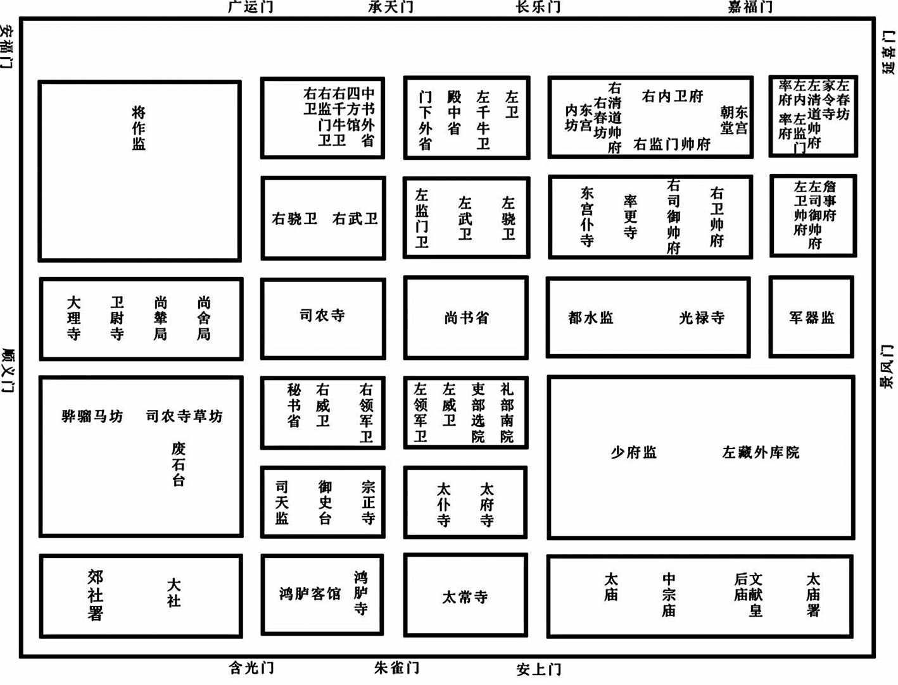 
唐长安皇城示意图

## 【译文】

太后借口薛怀义有巧妙的设计，所以让他进入宫中建造宫室。补阙长社县人王求礼上表，认为：“太宗的时候，有个叫罗黑黑的人擅长弹琵琶，太宗将他阉割后，充当内侍，让他教宫女弹琵琶。如果陛下认为怀义有灵巧的心性，想在宫中使用，臣请阉割他，希望他不会扰乱后宫。”王求礼的奏表被搁置起来，没了下文。

## 【原文】

**秋九月己巳(2)，雍州言新丰县东南有山踊出，改新丰为庆山县，四方毕贺[1]。江陵人俞文俊上书：“天气不和而寒暑并，人气不和而疣赘生，地气不和而塠阜出[2]。今陛下以女主处阳位，反易刚柔，故地气塞隔而山变为灾。陛下谓之‘庆山’，臣以为非庆也。臣愚以为宜侧身修德以答天谴，不然，殃祸至矣。”[3]太后怒，流于岭外，后为六道使所杀[4]。**

## 【注文】

[1]新丰县：古县名。相当于今陕西西安市临潼区。　　毕：全。

[2]江陵：古县名。即江陵县，相当于今湖北荆州市荆州区。　　疣（yóu）赘（zhuì）：痈疽疮毒。　　塠（duī）阜（fù）：小山丘。

[3]侧身：倾侧其身，表示戒惧不安。

[4]岭外：即岭南，指五岭以南地区。　　六道使：武周时代临时设置的使职。在武周长寿二年（693年）初，因有人告密说流放岭南的犯人谋反，武则天派酷吏万国俊以监察御史的身份去审理。万国俊到达后，把流放的犯人统统召集起来，假传圣旨叫他们自杀。然后万国俊伪造供词，回朝复命。他建议，其他地方被流放的犯人也必定有怨望谋反，不可不尽早除掉。武则天升了万国俊的官，同时又派五人监察御史，分头到各道巡查流放之人。这五人连同先前的万国俊，被称为“六道使”。六道使品级不高，但权力很大，负责监察百官、巡按州县。这五人眼看着万国俊杀人多升了官，到各地后都滥杀一通。多的达六七百人，最少的也在百人以上。等被流放之人已经被杀得差不多了，武则天又下令“六道流人没死的连同他们的家属都允许回到故乡”，并将万国俊等人处死或流放。

## 【译文】

武则天垂拱二年（686年）秋季九月己巳日，雍州报告新丰县东南有座山拔地而起，于是改新丰县为庆山县，四面八方都来庆贺。江陵县人俞文俊却上书说：“天气不调和的话，寒和暑就会并行；人气不调和的话，就会长痈疽疮毒；地气不调和的话，就会拱出小土山。现在陛下以太后之身处帝王之位，调换了刚和柔的位置，所以地气受到阻塞，而山脉发生灾变。陛下称它为‘庆山’，我以为这并不是喜事。我认为您应该谨慎修德以答复上天的谴责，不然灾祸将要降临了。”太后大怒，将他流放到岭南地区，后来被六道使所杀害。

## 【原文】

**三年夏五月，凤阁侍郎、同凤阁鸾台三品刘祎之窃谓凤阁舍人永年贾大隐曰：“太后既废昏立明，安用临朝称制，不如返政以安天下之心。”[1]大隐密奏之，太后不悦，谓左右曰：“祎之我所引，乃复叛我。”或诬祎之受归州都督孙万荣金，又与许敬宗妾有私，太后命肃州刺史王本立推之[2]。本立宣敕示之，祎之曰：“不经凤阁鸾台，何名为敕！”[3]太后大怒，以为拒捍制使，庚午，赐死于家[4]。祎之初下狱，睿宗为之上疏申理，亲友皆贺之。祎之曰：“此乃所以速吾死也。”临刑，沐浴，神色自若，自草谢表，立成数纸。麟台郎郭翰、太子文学周思钧称叹其文[5]。太后闻之，左迁翰巫州司法，思钧播州司仓[6]。**

## 【注文】

[1]永年：古县名。即永年县，相当于今河北永年东。　　临朝称制：指中国古代由皇后、皇太后或太皇太后等女性统治者代理皇帝（或国王、天皇）执掌国政。

[2]归州：古州、路名。归诚州的简称，治怀柔（今北京怀柔），辖怀柔县，相当于今北京怀柔。　　孙万荣（？—697年）：唐代东北地区的游牧族群契丹大贺氏部落联盟首领。其曾祖孙敖曹在隋朝为金紫光禄大夫。唐高祖武德四年（621年），孙敖曹归附于唐，其部落安置在营州城（今辽宁朝阳）边，孙敖曹被封为云麾将军，行辽州（今辽宁辽阳）总管。至孙万荣为部落首领后，主动与唐结好。武则天垂拱初年，武则天累授孙万荣为右玉钤（qián）卫将军、归诚州刺史，封永乐县公。武周万岁通天元年（696年）年初，契丹发生饥荒，营州都督赵文翙（huì）不予赈济，激起契丹人的强烈不满。孙万荣遂与其妹婿大贺氏联盟长、松漠都督李尽忠乘机举兵造反，占据营州。李尽忠自称“无上可汗”，孙万荣为主帅。李尽忠败死，万荣代领其众，领兵直入唐朝的河北地区，屠杀当地的官民。唐军反击，万荣败走，被家奴杀死。　　肃州：古州、路、卫名。隋置，治酒泉（今甘肃酒泉），辖境相当于今甘肃疏勒河以东、高台西南。

[3]不经凤阁鸾台，何名为敕：凤阁鸾台，即中书门下。按唐朝制度，凡属皇帝命令，必须经政事堂（即中书门下）会议正式议决通过，并加盖“中书门下之印”，而后方可颁行生效。即凡未经政事堂议决副署，加“中书门下之印”，而由皇帝直接发出的命令，在当时被认为是违制的，不能为国家各级机关所承认。所以“不经凤阁鸾台”，就不能叫敕。后来唐朝有的皇帝违反这一制度时，只得将其发诏敕的封袋改为斜封，所书“敕”字，不敢用朱笔，而改用墨笔，当时称为“斜封墨敕”，即表示此项命令未经政事堂研究，没有“中书门下之印”，请下面依照敕文照办。

[4]拒捍：抵挡抗拒。　　制使：皇帝派出的使者。

[5]麟台郎：古代官名，即秘书郎，武则天时改称麟台郎，为唐朝秘书省的职事官，置四员，从六品上，负责经、史、子、集四部图书的收藏、分类管理。　　太子文学：唐朝太子东宫的官员。东宫的司经局设文学三人，正六品下。负责掌管经籍，侍奉文章。

[6]巫州：古州名。治龙标（今湖南怀化），辖境相当于今湖南黔阳西南、会同西北、芷江。　　司法：古代官名，即司法参军事。在唐朝，上州置司法参军事二人，从七品下；中州置司法参军事一人，正八品下；下州置司法参军事一人，从八品上。负责掌管地方法律、刑狱。　　播州：古州名。唐置，治遵义（今贵州遵义），辖境相当于今贵州遵义及附近地区和桐梓等县地。　　司仓：古代官名，即司仓参军事、仓曹参军事。在唐朝，上州置司仓参军事一人，从七品下；中州置司仓参军事一人，正八品下；下州置司法参军事一人，从八品下。负责掌管地方官办公的场所，度量、仓库、租赋。同时，司仓参军事还管理地方的“义仓”，以备灾荒。

## 【译文】

武则天垂拱三年（687年）夏季五月，凤阁侍郎、同凤阁鸾台三品刘祎之私下里对凤阁舍人永年县人贾大隐说：“太后既然废昏庸立贤明，哪里还用得着临朝行使皇帝的权力！不如把大权交还给皇帝，以安定天下人心。”贾大隐将他的这番话密奏给太后，太后不高兴，对身边的人说：“刘祎之是我一手提拔起来的，竟然又背叛我。”有人诬告刘祎之接受了归州都督孙万荣的黄金，又和许敬宗的小妾私通，太后命令肃州刺史王本立审讯他。王本立向他宣告太后的敕令，刘祎之却反问道：“没有经过凤阁鸾台，怎么能叫做敕！”太后大怒，认为他是抵制皇帝的使者，五月庚午（初七日），太后命令他在家里自尽。刘祎之刚入狱时，唐睿宗曾替他上疏申辩，为此，亲友都向他祝贺。刘祎之却说：“这是加速我的死期。”临刑前，他先沐浴，神情安然自如，自己起草了给太后的谢表，很快就写了几页纸。麟台郎郭翰、太子文学周思钧都称赞叹赏他的文采。太后知道后，将郭翰降职为巫州司法参军事，周思钧降职为播州司仓参军事。

## 【原文】

**冬十月，武承嗣又使人诬李孝逸自云：“名中有兔，兔，月中物，当有天分。”太后以孝逸有功，十一月戊寅，减死，除名，流儋州而卒[1]。**

## 【注文】

[1]儋（dān）州：古州名。治义伦（今海南儋州西北），辖境相当于今海南儋州、昌江、东方等市、县。

## 【译文】

武则天垂拱三年（687年）冬季十月，武承嗣又指使人诬告李孝逸说自己是：“名字中有兔，兔是月亮中的东西，应当有天定的名分。”太后因李孝逸有功劳，十一月戊寅（十八日），减免他的死罪，将他削除名籍，流放儋州而死。

## 【原文】

**四年春正月甲子，于神都立高祖、太宗、高宗三庙，四时享祀，如西庙之仪[1]。又立崇先庙，以享武氏祖考[2]。太后命有司议崇先庙室数，司礼博士周悰请为七室，又减唐太庙为五室[3]。春官侍郎贾大隐奏：“礼，天子七庙，诸侯五庙，百王不易之义[4]。今周悰别引浮议，广述异文，直崇临朝权仪，不依国家常度[5]。皇太后亲承顾托，光显大猷，其崇先庙室应如诸侯之数，国家宗庙不应辄有变移。”[6]太后乃止。**

## 【注文】

[1]西庙：西京长安的太庙，即皇帝的宗庙。

[2]祖考：祖先，或指已故的祖父，或泛指父祖之辈。

[3]司礼博士：古代官名，即太常博士。太常寺的官员，从七品上，负责国家礼典、仪式。　　悰：音cóng。　　太庙：供奉本朝先代帝王之庙。历朝历代必立太庙以祭祀祖先。

[4]春官侍郎：唐前期职事官，即礼部侍郎。

[5]浮议：没有根据的议论。　　异文：指不同的版本和经说。

[6]大猷（yóu）：宏伟的计划。

## 【译文】

武则天垂拱四年（688年）春正月甲子（初五日），朝廷在神都洛阳建立高祖、太宗、高宗三座庙，并设立春夏秋冬四时祭祀的礼仪，和在西京长安的太庙的规格一样。又建立崇先庙，以祭祀武氏祖先。太后命令有关部门讨论崇先庙的庙室数量，司礼博士周悰请求设立七室，并将李唐皇室的太庙减为五室。春官侍郎贾大隐上奏说：“按照礼制，天子是七庙，诸侯是五庙，这是百代不能更改的道理。如今周悰另外引用没有根据的议论，广泛陈述不同的说法，只是尊崇太后临朝掌理国事的礼仪，而没有依从国家的常规法度。皇太后亲自承受先帝临终的托付，彰显帝王的大道，崇先庙的庙室数量应当如同诸侯的数目，国家宗庙不应动辄随意变更。”太后这才停止更改庙室数量的做法。

## 【原文】

**太宗、高宗之世，屡欲立明堂，诸儒议其制度，不决而止[1]。及太后称制，独与北门学士议其制，不问诸儒。诸儒以为明堂当在国阳丙己之地，三里之外，七里之内[2]。太后以为去宫太远。（二月）［正月］(3)庚午，毁乾元殿，于其地作明堂，以僧怀义为之使，凡役数万人。**

## 【注文】

[1]明堂：天子大庙，宣明政教的地方。朝会、祭祀、庆赏、选士等大典，在此举行。

[2]国阳丙己之地：都城南郊居中的地方，距离中心三里开外、七里之内的地方。

## 【译文】

太宗、高宗的时代，多次想要建立明堂，儒家学者们讨论它的制度，因没有最终结果而停止。等到太后临朝行使皇帝权力的时候，唯独和北门学士讨论明堂制度，而不征求儒士学者们的意见。儒士们认为明堂应当建在都城南郊居中的地方，在三里之外，七里之内。太后认为这离皇宫太远。垂拱四年（688年）正月庚午（十一日），拆毁乾元殿，在原地基上建造明堂，任命和尚薛怀义为营造明堂的使者，共役使几万人。

## 【原文】

**夏四月戊戌，杀太子通事舍人郝象贤[1]。象贤，处俊之孙也。初，太后有憾于处俊，会奴诬告象贤反，太后命周兴鞫之，致象贤族罪。象贤家人诣朝堂，讼冤于监察御史乐安任玄殖[2]。玄殖奏象贤无反状，玄殖坐免官。象贤临刑，极口骂太后，发扬宫中隐慝，夺市人柴以击刑者，金吾兵共格杀之[3]。太后命支解其尸，发其父、祖坟，毁棺焚尸。自是终太后之世，法官每刑人，先以木丸塞其口。**

## 【注文】

[1]太子通事舍人：唐前期职事官名。设八人，正七品下，属太子东宫官，负责导引东宫诸臣辞见之礼及承令劳问之事。

[2]乐安：古县名。即乐安县，相当于今浙江仙居。

[3]慝（tè）：奸邪，邪恶。　　金吾兵：金吾卫兵士，属于唐朝禁军。

## 【译文】

武则天垂拱四年（688年）夏四月戊戌（十一日），杀死太子通事舍人郝象贤。郝象贤是郝处俊的孙子。当初，太后对郝处俊不满意，正好有奴仆诬告郝象贤谋反，太后命令周兴审讯此案，造成郝象贤被灭族。郝象贤的家人来到朝堂，向监察御史乐安县人任玄殖诉冤。任玄殖上奏说郝象贤没有谋反，玄殖因此获罪被免官。郝象贤临刑前，破口大骂太后，揭发了宫中隐秘的丑事，夺过市上人的木柴击打行刑的人，金吾卫士兵一拥而上把他打死。太后命令支解他的尸体，挖掘他的父亲、祖父的坟墓，捣毁棺材焚烧尸骨。从此以后，直到太后在位终止，法官每次执行死刑时，都先用木丸塞住犯人的嘴。

## 【原文】

**武承嗣使凿白石为文曰：“圣母临人，永昌帝业。”末紫石杂药物填之[1]。庚午(4)，使雍州人唐同泰奉表献之，称获之于洛水[2]。太后喜，命其石曰“宝图”，擢同泰为游击将军。五月戊辰，诏当亲拜洛，受宝图；有事南郊，告谢昊天；礼毕，御明堂，朝群臣[3]。命诸州都督、刺史及宗室、外戚以拜洛前十日集神都。乙亥，太后加尊号为圣母神皇。**

## 【注文】

[1]末紫石：紫石即为紫石英，形色如石榴子，产于浙江绍兴诸暨（jì）乌带山。末，研磨成末，碎屑。

[2]洛水：古水名，即今河南洛河。

[3]有事南郊：在南郊举行祭祀活动。地点在国都南郊圜（yuán）丘举行，因在郊外，所以也称为“郊祀”。圜丘是一座圆形的祭坛，圆形正是天的形象，圜同圆。　　昊（hào）天：指昊天上帝，即主宰天地宇宙的神、超自然的最高神，代表天或者等同于天。

## 【译文】

武承嗣让人在白石上凿上文字：“圣母临人，永昌帝业。”然后用紫石捣成粉末掺上各种药物填在字上。垂拱四年（688年）四月庚午日，派雍州人唐同泰上表献石，声称石头是从洛水中获得的。太后欢喜，将石头命名为“宝图”，提升唐同泰为游击将军。五月戊辰（十一日），太后下诏要亲自祭拜洛水，接受宝图；在南郊祭祀，告谢昊天上帝；典礼结束后，太后亲临明堂，接受大臣们的朝见。太后命令各州都督、刺史以及皇族宗室、外戚在祭拜洛水前十天会集到神都洛阳。乙亥（十八日），太后加尊号为圣母神皇。

## 【原文】

**六月壬寅，作神皇三玺。**

## 【译文】

武则天垂拱四年（688年）六月壬寅（十六日），制作了神皇的三个玺印。

## 【原文】

**东阳大长公主削封邑，并二子徙巫州[1]。公主适高履行，太后以高氏长孙无忌之舅族，故恶之[2]。**

## 【注文】

[1]东阳大长公主（生卒年不详）：唐太宗李世民之第九女，生母不详，封东阳公主，下嫁高履行。唐高宗即位，进为长公主。韦正矩被诛杀，公主受牵连，斥徙集州（治今四川南江）。公主又因章怀太子李贤之故，被剥夺封邑。因高氏是长孙无忌的舅族，所以公主被武则天厌恶。唐高宗死，唐中宗李显即位，进为大长公主。武则天垂拱四年（688年），公主和两个儿子徙置巫州（治今湖南怀化）。大长公主：帝姑母为大长公主、帝姊妹为长公主、帝女为公主，皆为正一品。

[2]适：女子出嫁。

## 【译文】

东阳大长公主被削夺了封邑，和两个儿子一起迁移到巫州。东阳大长公主嫁给高履行，太后因高氏是长孙无忌的舅舅家族的人，所以讨厌东阳大长公主。

## 【原文】

**秋七月丁巳，赦天下，更命宝图为“天授圣图”，洛水为“永昌洛水”，封其神为显圣侯，加特进，禁渔钓，祭祀比四渎[1]。名图所出曰“圣图泉”，泉侧置永昌县[2]。又改嵩山为神岳，封其神为天中王，拜太师、使持节、神岳大都督，禁刍牧[3]。又以先于汜水得瑞石，改汜水为“广武”[4]。**

## 【注文】

[1]特进：唐代文散阶号，正二品。仅标志身份、地位，没有实际职事。　　四渎：指中国古代的江（长江）、河（黄河）、淮（淮河）、济（济水）四条入海的河流，为中国民间信仰的河流神的代表。唐代始称长江为南渎，黄河为西渎，淮河为东渎，济水为北渎。对四渎的祭祀属于唐代国家祭祀。

[2]永昌县：古县名。武则天垂拱四年（688年），分河南县、洛阳县置永昌县，治洛阳城之道德坊（今河南洛阳）。永昌县的设立带有很强的政治意义，为武则天改唐为周制造舆论。唐中宗神龙元年（705年），中宗李显重登皇位，恢复唐朝，废永昌县。

[3]嵩山：即中岳，又称嵩岳，为中国五大名山五岳（指中岳嵩山、北岳恒山、东岳泰山、南岳衡山、西岳华山）之一，位于今河南登封境内。传说五岳为群神所居住，历代王朝多有祭祀五岳之礼仪。在唐朝，五岳祭祀也是重要的国家祭祀活动。　　持节：以竹为竿，上缀以旄牛尾，是使者所持的信物（即凭证）。古代使臣奉命出行，必执符节以为凭证。　　刍（chú）牧：指割草、放牧。

[4]汜（sì）水：古水名，即今汜水，发源于今河南巩义东南，北流经荥阳汜水镇西，北入黄河。

## 【译文】

武则天垂拱四年（688年）秋季七月丁巳（初一日），太后大赦天下，改称“宝图”为“天授圣图”，洛水改名为“永昌洛水”，封洛水神为显圣侯，加特进，禁止在洛水上打鱼垂钓，祭洛水的礼仪和祭四渎一样。命名“天授圣图”出现的地点为“圣图泉”，在圣图泉的旁边设置永昌县。又改称嵩山为神岳，封嵩山神为天中王，拜授太师、使持节、神岳大都督的官衔，禁止在山上打柴放牧。又因为此前在汜水曾经获得过瑞石，于是改汜水名为“广武”。

## 【原文】

**太后潜谋革命，稍除宗室。绛州刺史韩王元嘉、青州刺史霍王元轨、邢州刺史鲁王灵夔、豫州刺史越王贞及元嘉子通州刺史黄公譔、元轨子全州刺史江都王绪、虢王凤子申州刺史东莞公融、灵夔子范阳王蔼、贞子博州刺史琅邪王冲，在宗室中皆以才行有美名，太后尤忌之[1]。元嘉等内不自安，密有匡复之志。**

## 【注文】

[1]绛（jiàng）州：古州名。唐治正平（今山西新绛），辖境相当于今山西曲沃、绛县、稷山、垣曲、新绛、闻喜等县及侯马市地。　　青州：古州名。汉置，北齐治益都（今山东青州），唐辖境相当于今山东青州、昌乐、昌邑、博兴、寿光、广饶、临朐、潍坊。　　霍王元轨：即李元轨（？—688年），初名元璹（shú），唐高祖李渊之第十四子，母张美人。李元轨少多才艺，高祖甚奇之。唐高祖武德六年（623年），封蜀王。武德八年（625年），徙封吴王。武则天垂拱四年（688年），他因为与越王李贞连谋起兵反对武则天，事觉，徙居黔州（治今重庆彭水），仍令载以用栅栏封闭的囚车，行至陈仓（治今陕西宝鸡市）而死。　　邢州：古州名。隋置，治龙冈（今河北邢台），唐辖境相当于今河北巨鹿、广宗以西，泜河以南，沙河以北地区。　　越王贞：即李贞（627—688年），唐太宗李世民之第八子，燕妃所生。唐太宗贞观五年（631年），李贞封汉王。贞观七年（633年），他任徐州（治今江苏徐州）都督。贞观十年（636年），改封原王，不久改封越王，任扬州（治今江苏扬州）都督。贞观十七年（643年），任相州（治今河南安阳）刺史。唐高宗永徽元年（650年），任左卫大将军。永徽四年（653年），徙任安州（治今湖北安陆西北）都督。后任相州刺史。李贞好武，长于骑射；好学，兼涉文史，有行政能力。但有才无行，侵渔百姓。后起兵反对武则天，兵败自尽。　　通州：古州名。西魏置，隋治通川（今四川达州市），唐辖境相当于今四川达州达川区、宣汉县、开江县、万源市及重庆城口等市县地。　　黄公譔（zhuàn）：即黄国公李譔（？—688年），唐朝宗室，唐高祖的孙子，韩王李元嘉之子，封黄国公。李譔工于辞章，贬为通州（治今四川达州）刺史，辞病而回。武则天垂拱四年（688年），黄国公李譔伪造唐睿宗李旦的诏书，诈称皇帝已经被武太后软禁，要宗室一起来营救。李贞起兵失败。李譔和父亲李元嘉一起被杀。武则天下旨削去李元嘉、李譔、李元轨、李贞、李冲等皇室属籍，改姓虺氏。唐中宗神龙元年（705年），唐中宗恢复了李譔的李姓和族籍。　　全州：古州、路、府名。相当于今广西全州。　　江都王绪：即李绪（生卒年不详），封江都王，霍王李元轨之子，唐太宗之侄。李绪多才艺，善书画，以画鞍马而著名。　　虢（guó）王凤：即李凤（生卒年不详），唐高祖李渊之第十五子。　　范阳：古郡名。唐置，治蓟县（今北京市西南），辖境相当于今北京市大部、天津市海河以北和河北保定地区小部。　　范阳王蔼（ǎi）：即李蔼（生卒年不详），鲁王李灵夔的次子。封范阳王，历任右散骑常侍。擅长书法。　　博州：古州、路名。治聊城（今山东聊城东北），唐辖境相当于今山东聊城、高唐、茌（chí）平等市县地。

## 【译文】

太后潜心图谋取代唐朝，逐渐清除李唐皇族。绛州刺史韩王李元嘉、青州刺史霍王李元轨、邢州刺史鲁王李灵夔、豫州刺史越王李贞和李元嘉的儿子通州刺史黄国公李譔、李元轨的儿子全州刺史江都王李绪、虢王李凤的儿子申州刺史东莞公李融、李灵夔的儿子范阳王李蔼、李贞的儿子博州刺史琅邪王李冲，在李唐皇族中都凭借着才能和操行享有美名，太后尤其忌恨他们。李元嘉等人内心不安，暗中有挽救恢复皇帝权位的志向。

## 【原文】

**譔谬为书与贞云：“内人病浸重，当速疗之，若至今冬，恐成痼疾。”[1]及太后召宗室朝明堂，诸王因递相惊曰：“神皇欲于大飨之际，使人告密，尽收宗室诛之，无遗类。”[2]譔诈为皇帝玺书与冲云：“朕遭幽絷，诸王宜各发兵救我。”[3]冲又诈为皇帝玺书云：“神皇欲移李氏社稷以授武氏。”八月壬寅，冲召长史萧德琮等令募兵，分告韩、霍、鲁、越及贝州刺史纪王慎，各令起兵共趣神都[4]。太后闻之，以左金吾将军丘神为清平道行军大总管以讨之[5]。**

## 【注文】

[1]内人：妻子。　　浸（jìn）：逐渐。　　痼（gù）疾：积久难以治愈的病。

[2]大飨（xiǎng）：天子宴饮诸侯来朝者。

[3]幽絷（zhí）：囚禁。

[4]贝州：古州名。北周置，隋治清河（今河北清河西北），唐辖境相当于今河北清河、威县、临西、故城和山东临清、武城、夏津等市县地。　　纪王慎：即李慎（？—689年），唐太宗李世民之第十子，韦贵妃所生。唐太宗贞观五年（631年）封申王，贞观十年（636年）改封纪王，赐食实封八百户。皇帝下诏勉励他在襄州（治今湖北襄樊）任官的政绩，百姓为他立石颂德。贞观二十三年（649年），赐食实封至千户。唐睿宗文明初年（684年），李慎累迁太子太师、贝州（治今河北清河西北）刺史。李慎少好学，善星步，与越王李贞齐名，当世称他们为“纪越”。李贞联合诸王起兵反对武则天，李慎知道不可，他不肯“同谋”。但武则天后来还是将他贬到巴州（治今四川巴中），改姓氏为“虺”。武后永昌元年（689年），李慎死于流放途中。

[5]行军大总管：古代官名。北周始置，为一路兵马的临时统帅。后渐过渡为地方行政军事长官。

## 【译文】

李譔写信给李贞谎称：“妻子的病越来越重，应当赶紧治疗，如果拖到今年冬天，恐怕就将成为顽症。”等到太后召集宗室到明堂朝见的时候，于是诸王惊慌地相互传话说：“神皇准备在接见群臣宴饮的时候，让人告密，尽数收捕皇族，全部杀光不留。”李譔假造皇帝的玺书给李冲说：“朕被幽禁，诸王应该各自发兵救我。”李冲又伪造皇帝的玺书说：“神皇要将李氏的国家交给武氏。”垂拱四年（688年）八月壬寅（十七日），李冲召集长史萧德琮等人，命令他们招募兵马，分别告知韩王、霍王、鲁王、越王，以及贝州刺史纪王李慎，让他们各自起兵，一同进军神都。太后得到消息后，命左金吾将军丘神为清平道行军大总管讨伐他们。

## 【原文】

**冲募兵得五千余人，欲渡河取济州，先击武水，武水令郭务悌诣魏州求救[1]。莘令马玄素将兵千七百人中道邀冲，恐力不敌，入武水，闭门拒守[2]。冲推草车塞其南门，因风纵火焚之，欲乘火突入，火作而风回，冲军不得进，由是气沮[3]。堂邑董玄寂为冲将兵击武水，谓人曰：“琅邪王与国家交战，此乃反也。”[4]冲闻之，斩玄寂以徇，众惧而散入草泽，不可禁止，惟家僮左右数十人在。冲还走博州，戊申，至城门，为守门者所杀，凡起兵七日而败。丘神至博州，官吏素服出迎，神挥刃尽杀之，凡破千余家。**

## 【注文】

[1]济州：古州名。治卢县（今山东茌（chí）平西南），辖卢县、长清、平阴、东阿（ē）、阳谷县，相当于今山东茌平西南、长清西南、平阴、东阿西南、阳谷东北。　　武水：古县名。即武水县，相当于今山东聊城西南。　　魏州：古州名。北周置，唐治元城（今河北大名东北），辖境相当于今河北大名、馆陶，山东冠县、莘县，河南南乐、清丰、范县等县地。

[2]莘（shēn）：古县名。即莘县，相当于今山东莘县。　　邀：阻留，拦击，拦截。

[3]气沮（jǔ）：气馁。

[4]堂邑：古县名。即堂邑县，相当于今山东冠县东。

## 【译文】

李冲募兵得到五千多人，想渡过黄河夺取济州，先进攻武水县，武水县令郭务悌到魏州求救。莘县令马玄素率领士兵一千七百人在中途截击李冲，担心兵力不足以抗敌，进入武水县城，关闭城门防守。李冲推草车堵住县城南门，趁风纵火焚烧城门，想要乘着火势冲入城中，结果火起之后风向逆转，李冲的军队不能前进，因此士气大落。堂邑县人董玄寂代替李冲率兵进攻武水县，对人说：“琅邪王与国家交战，这是造反啊。”李冲听说后，杀掉董玄寂示众，众人畏惧逃入草野，李冲无法禁止，只剩下自家的奴仆和身边的几十个人在。李冲往回逃奔博州，垂拱四年（688年）八月戊申（二十三日），李冲到达博州城城门时，被守城门的人杀死，从他起兵算起，共七日就失败了。丘神到达博州，官吏们身穿居丧时所穿的白色衣服出来迎接，丘神挥刀将他们全部杀死，共使一千多家破败。

## 【原文】

**越王贞闻冲起，亦举兵于豫州，遣兵陷上蔡[1]。九月丙辰，命左豹韬大将军麹崇裕为中军大总管，岑长倩为后军大总管，将兵十万以讨之，又命张光辅为诸军节度[2]。削贞、冲属籍，更姓虺氏[3]。贞闻冲败，欲自诣阙谢罪，会所署新蔡令傅延庆募得勇士二千余人，贞乃宣言于众曰：“琅邪已破魏、相数州，有兵二十万，朝夕至矣。”[4]发属县兵共得五千，分为五营，使汝阳县丞裴守德等将之，署九品以上官五百余人[5]。所署官皆受迫胁，莫有斗志，惟守德与之同谋，贞以其女妻之，署大将军，委以腹心。贞使道士及僧诵经以求事成，左右及战士皆带辟兵符[6]。鞫崇裕(5)等军至豫州城东四十里，贞遣少子规及裴守德拒战，兵溃而归。贞大惧，闭自守。崇裕等至城下，左右谓贞曰：“王岂可坐待戮辱！”贞、规、守德及其妻皆自杀，与冲皆枭首东都阙下[7]。**

## 【注文】

[1]上蔡：古县名。即上蔡县，相当于今河南上蔡西南。

[2]左豹韬大将军：即左威卫大将军，唐朝禁军将领。左、右威卫为唐朝禁军的一支，各置大将军一人，正三品；将军二人，从三品。负责统领宫廷警卫之法令，监督宫廷仪仗队，护卫皇帝。武则天光宅元年（684年），武则天改左、右威卫为左、右豹韬卫。唐中宗神龙元年（705年），复原名。　　张光辅（？—689年）：唐前期大臣。京兆（今陕西西安）人，明辨而有行政才干。累迁司农少卿、文昌右丞。武则天垂拱三年（687年），他升至凤阁侍郎、同平章事，成为宰相。第二年，他讨平越王李贞、琅邪王李冲的叛乱。武则天永昌元年（689年），他迁纳言，拜内史。不久被诬杀。

[3]虺（huǐ）：古书上说的一种毒蛇，比喻奸恶小人。

[4]（suǒ）：同“锁”。　　新蔡：古县名。即新蔡县，相当于今河南新蔡。　　魏：即魏州。参见注“魏州”。　　相：即相州，北魏置，隋移治安阳（今河南安阳），唐辖境相当于今河北成安、广平和魏县西南部，河南安阳、林州、汤阴、内黄等市县及濮阳西南部地。

[5]汝阳县：古县名。相当于今河南汝南。

[6]辟兵符：古人相信可以避免兵器伤害的符箓（lù）。

[7]枭首：把人头砍下挂在城门上示众。

## 【译文】

越王李贞听说李冲起兵后，也在豫州起兵，派兵攻陷上蔡县。垂拱四年（688年）九月丙辰（初一日），朝廷任命左豹韬大将军麹崇裕为中军大总管，岑长倩为后军大总管，率领兵士十万人讨伐李贞，又任命张光辅为诸军节度。朝廷削除李贞、李冲在皇族宗室名册中的名字，改姓虺氏。李贞听说李冲失败，本想自缚到皇宫前请罪，正遇上他所任命的新蔡县令傅延庆招募到勇士二千多人，李贞便向大家宣告说：“琅邪王已经攻破魏、相等州，拥有兵士二十万人，很快就要到达这里了。”李贞又征发豫州管辖下的各县，共得到兵士五千人，将他们分为五个营，派汝南县丞裴守德等人统领，任命九品以上官员五百多人。李贞所任命的官吏都是受胁迫的，没有斗志，只有裴守德与他同谋，李贞把自己的女儿嫁给他，任命他为大将军，作为亲近而信任的人。李贞让道士、和尚诵经以祈求事情成功，身边的人及战士们都佩带避免兵器伤害的神符。麹崇裕等军到达豫州城东四十里，李贞派遣小儿子李规及裴守德迎战，结果溃败而归。李贞大为惊恐，闭门自守。麹崇裕等到达城下，身边的人对李贞说：“您难道可以坐着等待被杀、被污辱！”于是李贞、李规、裴守德以及他们的妻子都自杀。他们与李冲的首级都在东都皇宫门前示众。

## 【原文】

**初，范阳王蔼遣使语贞及冲曰：“若四方诸王一时并起，事无不济。”[1]诸王往来相约结，未定而冲先发，惟贞狼狈应之，诸王皆不敢发，故败[2]。**

## 【注文】

[1]语（yù）：告诉。　　济：补益，成功。

[2]约结：结盟，订约。　　狼狈：传说狈是一种兽，前腿特别短，走路时要趴在狼身上，没有狼，它就不能行动，所以用“狼狈”形容困苦或受窘的样子。

## 【译文】

当初，范阳王李蔼派遣使者对李贞和李冲说：“如果各方李氏诸王同时起事，事情没有不能成功的。”于是诸王相互往来商量约定起事，还没有最终约定而李冲就首先发难，只有李贞匆忙响应，其他诸王都不敢起事，所以导致失败。

## 【原文】

**贞之将起兵也，遣使告寿州刺史赵瓌，瓌妻常乐长公主谓使者曰：“为我语越王，昔隋杨氏将簒周室，尉迟迥，周之甥也，犹能举兵匡救社稷，功虽不成，威震海内，足为忠烈[1]。况汝诸王，先帝之子，岂得不以社稷为心！今李氏危若朝露，汝诸王不舍生取义，尚犹豫不发，欲何须邪？[2]祸且至矣，大丈夫当为忠义鬼，无为徒死也。”[3]**

## 【注文】

[1]寿州：古州名。隋置，治寿春（今安徽寿县），唐辖境相当于今安徽淮南、寿县、霍山、六安、霍邱等市县地。　　常乐长公主（？—688年）：唐高祖之女，下嫁赵瓌。其女赵氏为唐中宗李显的结发妻。全家皆为武则天所害，李显复位后，为之平反。　　尉迟迥（516—580年）：北周将领。代（今山西大同东北）人，字薄居罗，鲜卑人。西魏王朝的权臣、北周政权的奠基者宇文泰之甥。尉迟迥能征善战，好施爱士，位望崇重。他初为宇文泰帐内都督，累有军功，任尚书右仆射、大将军。西魏废帝二年（553年）入蜀平定萧纪。尉迟迥以功为大都督，治益、潼等十八州诸军事，镇守蜀地。北周初年，拜柱国大将军。北周宣帝宇文赟（yūn）即位，尉迟迥为相州（治今河南安阳）总管。宣帝死，杨坚（后来的隋文帝）独揽天下兵马事，欲取代北周的统治。尉迟迥起兵讨伐杨坚，兵败自杀。

[2]危若朝露：危险得像清早的露水一样，太阳一出就要消失。形容面临灭亡，情况危急。这一成语最初的记载见西汉司马迁《史记·商君列传》。　　舍生取义：为了真理和正义而不惜牺牲生命。这一成语最初的记载见《孟子·告子上·鱼我所欲也》。

[3]且至：将要到来。

## 【译文】

李贞准备起兵时，派遣使者告诉寿州刺史赵瓌，赵瓌的妻子常乐长公主对使者说：“替我转告越王，从前隋文帝将要篡夺北周帝位时，尉迟迥是北周皇帝的外甥，还能起兵匡救国家，虽然没有成功，却威震天下，足以为忠诚壮烈之士。何况你们诸王还是先帝的儿子，难道还不把国家放在心上！现在李氏王朝的危险就像早晨的露水一样危在旦夕，你们诸王不舍生取义，还在犹豫而不发兵，打算等什么呢？大祸就要临头了，大丈夫应当做忠义之鬼，不应当白死啊。”

## 【原文】

**及贞败，太后欲悉诛韩、鲁等诸王，命监察御史蓝田苏珦按其密状[1]。珦讯问，皆无明验[2]。或告珦与韩、鲁通谋，太后召珦诘之，珦抗论不回。太后曰：“卿大雅之士，朕当别有任使，此狱不必卿也。”[3]乃命珦于河西监军，更使周兴等按之[4]。于是收韩王元嘉、鲁王灵夔、黄公譔、常乐公主于东都，迫胁皆自杀，更其姓曰虺，亲党皆诛。**

## 【注文】

[1]苏珦（xiàng）（635—715年）：唐前期大臣。雍州蓝田（今陕西蓝田）人。他考中明经，累授鄠（hù）县（今陕西户县）县尉。武则天垂拱初年，苏珦拜右台监察御史。当时武则天欲诛杀李唐宗室韩王李元嘉、鲁王李灵夔等诸王，命苏珦审理无征。苏珦被诬告与韩、鲁等王同谋，武则天改派他担任河西监军。后来，苏珦迁右司郎中、给事中，累授左肃政台御史大夫。武周长安四年（704年），武则天下诏在白司马坂营造大佛像，苏珦以妨农为理由，上疏切谏，被采纳。唐中宗神龙初年，武三思擅权，苏珦以时机不合不可行刑得罪三思，转为右御史大夫，贬出京城。唐中宗景龙元年（707年），太子李重俊谋反失败，事连相王李旦（即唐睿宗）。苏珦秘密为相王辩解，使相王免除猜疑。后来，苏珦迁户部尚书，封河内郡公。他以太子宾客、检校詹事退休。

[2]明验：明显的证验或应验。

[3]大雅：指代德高而有大才的人、学识渊博的人等。

[4]河西：古地区名，汉唐时指今甘肃、青海两省黄河以西，即河西走廊与湟水流域。

## 【译文】

等到李贞失败，太后想要全部处死韩王、鲁王等诸王，令监察御史蓝田县人苏珦审查他们秘密谋反的案情。苏珦经过审讯，都没有得到明确的罪证。有人密告苏珦与韩、鲁等诸王串通，太后召来苏珦，责问他，苏珦直言争论而不改变自己的看法。太后说：“您是才德高雅的人，朕将另有任用，这个案子不用您审理了。”就命令苏珦去河西监军，改让周兴等人审理。于是收捕韩王李元嘉、鲁王李灵夔、黄国公李譔、常乐公主等人到东都洛阳，逼迫他们都自杀了，改他们的姓为“虺”，他们的亲属、党羽都被处死。

## 【原文】

**以文昌左丞狄仁杰为豫州刺史[1]。时治越王贞党与，当坐者六七百家，籍没者五千口，司刑趣使行刑[2]。仁杰密奏：“彼皆诖误，臣欲显奏，似为逆人申理[3]。知而不言，恐乖陛下仁恤之旨。”[4]太后特原之，皆流丰州[5]。道过宁州，宁州父老迎劳之曰：“我狄使君活汝邪？”[6]相携哭于德政碑下，设斋三日而后行[7]。**

## 【注文】

[1]文昌左丞：唐前期职事官名，即尚书左丞。武则天光宅元年（684年），武则天改尚书左丞为文昌左丞。武周长安三年（703年）再改为中台左丞。唐中宗神龙元年（705年），恢复旧称。　　狄仁杰（630—700年）：唐前期宰相。字怀英，并州太原（今山西太原西南）人。唐高宗时，仁杰考中明经，任汴州（治今河南开封）参军。唐高宗仪凤年间，他担任大理丞，一年中断积案一万七千多件，被人称为平恕。他历官侍御史、度支郎中，以进谏言而著称。武则天垂拱二年（686年），他担任宁州（治今甘肃宁县）刺史，安抚当地的汉人、胡人，当地百姓刻碑纪念其功绩。后征为冬官侍郎（即工部侍郎），充江南巡抚使，毁当地淫祠一千七百多所。后来，他转为文昌左丞、豫州（治今河南汝南）刺史。武则天天授二年（691年），仁杰升任地官侍郎（即户部侍郎）、同凤阁鸾台平章事，成为宰相。不久，他被酷吏来俊臣诬害下狱。后来，仁杰转魏州（治今河北大名东北）刺史、幽州（治今北京）都督，负责防御东北地区的游牧族群契丹和奚。仁杰曾出任河北道行军元帅，抵御北方草原突厥的进攻。武则天神功元年（697年），仁杰又回到中央担任鸾台侍郎、同平章事，再次出任宰相。仁杰后又进纳言、内史。狄仁杰是以不畏权贵、廉洁勤政著称的清官。他担任宰相，屡次以“固本安人之术”向皇帝上书进谏，请求息兵役、宽赋税、轻刑罚、重耕织、停建佛像、抚绥周边各族。仁杰又注重推举贤人。他所推荐的张柬之、姚崇、桓彦范、敬晖等均为一代名臣。武则天欲立其侄子武三思为太子，仁杰力谏认为不可，每以母子亲于姑侄的道理劝武则天召还被流放的庐陵王李显（即唐中宗），立为太子。武则天最终听从了狄仁杰的建议。唐睿宗时代，追封狄仁杰为梁国公。狄仁杰著有文集十卷，皆已散失。

[2]司刑：唐代官署名，即司刑寺、大理寺。武则天光宅元年（684年），武则天改大理寺为司刑寺。唐中宗神龙元年（705年），恢复原名。　　趣（cù）使：驱使，促使，督促。

[3]诖（guà）误：欺骗、贻误。　　逆人：悖理之人，叛逆之人。

[4]乖：不顺，不和谐，违背。　　仁恤：仁爱体恤。

[5]丰州：地名。隋置，治九原（今内蒙古五原西南黄河北岸），辖境相当于今内蒙古河套西北部及其迤北一带。

[6]宁州：地名。治定安（今甘肃宁县）。　　使君：对地方上州或郡长官的通称。

[7]德政碑：凡为官者清正廉洁，造福一方，百姓为其刻石立碑以歌颂其政绩，作为永久的纪念，称为“德政碑”。　　设斋：备办素食，向僧尼施食。在唐代，斋僧法会极为盛行。

## 【译文】

朝廷任命文昌左丞狄仁杰为豫州刺史。当时正惩治越王李贞的党羽，应受牵连判罪的有六七百家，除掉户籍没入官府充当奴婢的有五千人，司刑寺催促豫州执行判决。狄仁杰给太后上密奏说：“他们都是受连累的，我想明白上奏，似乎是在为叛逆的人申辩。如果了解情况而不说，又恐怕违背了陛下仁爱怜悯的本意。”太后特意原谅了这些人，将他们都流放到丰州。当他们路过宁州时，宁州父老迎接慰劳说：“是我们的狄使君救活了你们吧？”大家互相搀扶着，在宁州百姓当年为狄仁杰立的德政碑下痛哭，斋戒三天后继续往前走。

## 【原文】

**时张光辅尚在豫州，将士恃功，多所求取，仁杰不之从[1]。光辅怒曰：“州将轻元帅邪？”仁杰曰：“乱河南者一越王贞耳，今一贞死，万贞生。”光辅诘其语，仁杰曰：“明公总兵三十万，所诛者止于越王贞。城中闻官军至，逾城出降者四面成蹊，明公纵将士暴掠，杀已降以为功，流血丹野，非万贞而何！[2]恨不得尚方斩马剑加于明公之颈，虽死如归耳！”[3]光辅不能诘，归奏仁杰不逊，左迁复州刺史[4]。**

## 【注文】

[1]恃功：自负功高。

[2]蹊（xī）：小路。

[3]尚方斩马剑：指中国古代皇帝收藏在“尚方”的剑，后称尚方剑，即皇帝御用的宝剑。持有尚方宝剑的大臣，具有先斩后奏等代表皇权的权力。

[4]复州：古州名。北周置，隋治沔（miǎn）阳（今湖北仙桃西南沔城），唐辖境相当于今湖北仙桃、天门、监利、洪湖。

## 【译文】

当时张光辅还在豫州，将士依仗有功，到处索取，狄仁杰不理会。张光辅大怒说：“州将敢轻视全军元帅吗？”狄仁杰说：“扰乱河南的只有一个越王李贞而已，现在一个李贞死了，却出了一万个李贞。”张光辅责问这话是什么意思，狄仁杰说：“您统兵三十万，所要杀的只限于越王李贞。城中人听说官军到来，翻越城墙出来投降的人很多，四面都踩踏成道路了，您放纵军士残暴地抢掠，杀掉已经投降的人来报功，流的血染红了郊野，这不是一万个李贞又是什么！我恨不能得到天子的尚方斩马剑架在您的脖子上，我虽死也视为回家一样！”张光辅无法反驳，回到京城后上奏说狄仁杰不恭顺，狄仁杰被贬官为复州刺史。

## 【原文】

**太后之召宗室朝明堂也，东莞公融密遣使问成均助教高子贡，子贡曰：“来必死。”[1]融乃称疾不赴。越王贞起兵，遣使约融，融苍猝不能应，为官属所逼，执使者以闻，擢拜右赞善大夫[2]。未几，为支党所引，冬十月己亥，戮于市，籍没其家[3]。高子贡亦坐诛。**

## 【注文】

[1]成均助教：唐代国子监官。国子学与太学并立，系专门研习儒家经典的经学学校。唐高祖武德元年（618年）唐设国子学，学额三百人，学生皆为贵族子弟。唐太宗贞观元年（627年）改称国子监，成为独立的教育行政机构。国子监内设祭酒一人，从三品，为最高教育行政长官。设丞一人（从六品下），主簿一人（从七品下），负责学生学习成绩和学籍等具体事宜。唐代曾几易国子监之名，曾改称司成馆、成均监，唐中宗神龙元年（705年）又复其旧名。所属六学，为国子学、太学、四门学、律学、书学和算学。成均助教即国子监的助教，从六品上，负责辅佐博士教授儒家经典。

[2]苍猝：匆忙，慌张。　　官属：主要官员的属吏。　　赞善大夫：唐朝太子东宫官官名，正五品上。掌管传令，讽谏过失，教导礼仪，以儒家经典教授诸位郡王。

[3]支党：党羽。

## 【译文】

太后召皇族到明堂朝见，东莞公李融暗中派使者询问成均助教高子贡，高子贡说：“如果来就必死无疑。”李融于是声称有病而不来觐见。越王李贞发兵起事，派遣使者约李融一同起兵，李融仓促之间不能响应，被属官逼迫，逮捕李贞的使者上报朝廷，李融被提升为右赞善大夫。不久，他被党羽所牵连，垂拱四年（688年）冬十月己亥（十四日），被处死于街市，查抄家产及人口没入官府。高子贡也因此受牵连被杀。

## 【原文】

**济州刺史薛觊、觊弟绪、绪弟驸马都尉绍，皆与琅邪王冲通谋。［觊］闻冲起兵，作兵器，募人。冲败，杀录事参军高纂以灭口。冬十一月辛酉，觊、绪伏诛，绍以太平公主故，杖一百，饿死于狱[1]。**

## 【注文】

[1]太平公主（？—713年）：唐高宗李治和武则天的幼女。太平公主体方硕，方额广颐，多权略，武则天认为和自己相似，对她非常宠爱。太平公主初嫁薛绍，后嫁武攸暨（武则天之侄）。她的封邑加至三千户，超越制度规定，贵盛无比。唐中宗神龙元年（705年），她参与推翻武周政权、恢复李唐王朝的政变，加封镇国公主，封邑加至五千户。她与薛绍生二男二女，与武攸暨生二男一女，其子女均封食邑。凡是太平公主引荐的人，多至高官。唐中宗景龙四年（710年），太平公主联合其侄子李隆基（后来的唐玄宗）共诛唐中宗的韦皇后、韦后之女安乐公主，拥戴李旦（即唐睿宗、李隆基之父）重登皇位。太平公主更是权震天下。当时七位宰相，有五位出自太平公主之门。太平公主遍树党羽，掌握禁军，左右朝政，其田园宅第遍及京郊，拥有良马万匹，珍宝山积，侍儿数百，奴婢上千。唐玄宗李隆基即皇帝位后，太平公主又图谋发动政变，事败，被赐死。

## 【译文】

济州刺史薛觊、薛觊的弟弟薛绪、薛绪的弟弟驸马都尉薛绍，都和琅邪王李冲通谋。薛觊听说李冲起兵后，制造武器，招募人马。李冲失败后，他们杀掉录事参军事高纂以灭口。垂拱四年（688年）冬十一月辛酉（初六日），薛觊、薛绪被杀，薛绍因为娶了太平公主的缘故，被杖打一百后，饿死于监狱中。

## 【原文】

**十二月乙酉，司徒、青州刺史霍王元轨坐与越王连谋，废徙黔州，载以槛车，行至陈仓而死[1]。江都王绪、殿中监郕公裴承先皆戮于市[2]。承先，寂之孙也[3]。**

## 【注文】

[1]司徒：古代官名。唐朝三公（太尉、司徒、司空）之一，正一品。本是辅佐皇帝治理国家之重臣，无所不统。但在唐朝，司徒仅作为大臣的加官（只表示身份、官位的荣誉衔），无实际职掌。　　槛车：囚车，用栅栏封闭的车，用于囚禁犯人或装载猛兽。　　陈仓：古县名。即陈仓县，相当于今陕西宝鸡市。位处长安通往蜀地的交通要道。

[2]殿中监：唐朝职事官名。唐中央机构殿中省设监一人，从三品；少监二人，从四品上。殿中监负责掌管皇帝的衣服、车马，总领皇宫内衣、食、住、行。少监辅助殿中监。　　郕：音chéng。

[3]寂：即裴寂（570—629年或573—632年），唐朝开国功臣。蒲州桑泉（今山西临猗（yī）西南）人，字玄真。隋朝末年，裴寂担任晋阳宫副监，与李渊（后来的唐高祖）为朋友。隋炀帝大业十三年（617年），他劝李渊起兵，以晋阳宫内所藏粮食、丝织品、铠甲相助。李渊率军攻破隋都大兴（今陕西西安）后，他劝李渊称帝，建立唐朝。他因功被拜为尚书右仆射，成为宰相，颇受李渊信任。唐高祖武德六年（623年），他又迁尚书左仆射。他曾经制定唐朝的法律。唐太宗贞观三年（629年），他因罪被免官，流放静州（治今宁夏永宁东北）。当地的山羌人造反，裴寂破之。唐太宗念他为建立唐朝立下的功劳，将他召还，后死。

## 【译文】

武则天垂拱四年（688年）十二月乙酉（初一日），司徒、青州刺史霍王李元轨因为与越王李贞通谋而获罪，被废黜并流放到黔州，囚车押运他，走到陈仓县时死去。江都王李绪、殿中监郕国公裴承先都被处死于街市。裴承先是裴寂的孙子。

## 【原文】

**己酉，太后拜洛受图，皇帝、皇太子皆从，内外文武百官、蛮夷酋长各依方叙立，珍禽、奇兽、杂宝列于坛前，文物卤簿之盛，唐兴以来未之有也[1]。**

## 【注文】

[1]坛：土筑的高台，用于朝会、盟誓和祭祀等。　　卤簿：卤簿是帝王重大活动时扈从的仪仗队，即在车驾、护卫的基础上增加了仪仗和乐舞。卤簿在汉代已经出现，“卤”是“橹”的通假字，意思是“大盾”。从盾的防护意义引申为对帝王的防护保卫措施，包括武器装备和护卫人员的有组织的行动，即“车驾次第”加上“兵卫以甲盾居外为前导”。卤簿的“簿”就是册簿的意思，就是把“车驾次第”和保卫人员即装备的规模、数量、等级形成文字的典籍。

## 【译文】

武则天垂拱四年（688年）十二月己酉（二十五日），太后祭拜洛水，接受“天授圣图”，皇帝、皇太子都随从着太后，朝廷内外文武百官、各族首领各按方位排列站立，珍禽、奇兽以及各种珍宝陈列在祭坛前面，文物礼乐仪仗的盛大，是唐朝开国以来所未曾有过的。

## 【原文】

**辛亥，明堂成，高二百九十四尺。方三百尺，凡三层，下层法四时，各随方色；中层法十二辰，上为圆盖，九龙捧之[1]。上层法二十四气，亦为圆盖，上施铁凤，高一丈，饰以黄金[2]。中有巨木十围，上下通贯，栭栌橕，藉以为本，下施铁渠，为辟雍之象[3]。号曰万象神宫[4]。宴赐群臣，赦天下，纵民入观。改河南为合宫县[5]。又于明堂北起天堂五级以贮大像，至三级，则俯视明堂矣。僧怀义以功拜左威卫大将军、梁国公[6]。侍御史王求礼上书曰：“古之明堂，茅茨不翦，采椽不斫[7]。今者饰以珠玉，图以丹青，铁入云，金龙隐雾，昔殷辛琼台，夏癸瑶室，无以加也。”[8]太后不报。**

## 【注文】

[1]法：仿效。　　方色：古代五行家将东、南、西、北、中分别与青、赤、白、黑、黄相配，一方一色，简称“方色”。一年四季分别与东、南、西、北相配。春季与东方相配，代表青色；夏季与南方相配，代表赤色；秋季与西方相配，代表白色；冬季与北方相配，代表黑色。　　十二辰：中国古代对周天的一种划分法，大抵是沿天赤道从东向西将周天等分为十二个部分，用地平方位中的十二支名称来表示，即：子、丑、寅、卯、辰、巳、午、未、申、酉、戌、亥。

[2]二十四气：二十四气分为十二节气和十二中气，有时也通称为节气，即通常说的二十四节气，为中国传统历法制度的重要组成部分，对农业生产具有重要指导意义。十二节气为：立春、惊蛰、清明、立夏、芒种、小暑、立秋、白露、寒露、立冬、大雪、小寒。十二中气为：雨水、春分、谷雨、小满、夏至、大暑、处暑、秋分、霜降、小雪、冬至、大寒。中气成为农历确定月序的依据，没有中气的月份被视为上一个月的重复，称闰月。　　铁凤：古代屋脊上的一种装饰物。铁制，形如凤凰。下有转枢，可随风而转。

[3]围：量词。两手拇指和食指合拢的长度，或两臂合拢的长度。　　栭（ér）：柱顶上支承梁的方木。　　栌（lú）：柱上方木，斗拱。　　橕（chēng）：支柱。　　（pí）：屋檐前板。　　藉（jiè）：垫在下面的东西，衬垫。　　辟雍：亦作“璧雍”等，本为西周天子为教育贵族子弟设立的大学。取四周有水，形如璧环为名。明堂辟雍是一座建筑，但它包含两种建筑名称的含义，它是中国古代最高等级的皇家礼制建筑之一。明堂是古代帝王颁布政令，接受朝觐和祭祀天地诸神以及祖先的场所。辟雍即明堂外面环绕的圆形水沟，环水为雍（意为圆满无缺），圆形像辟（辟即璧，皇帝专用的玉制礼器），象征王道教化圆满不绝。

[4]万象神宫：即武则天明堂，于武则天垂拱四年（688年）十二月二十七日建成，高三百尺（今九十余米）。后来武则天称帝，改唐为周，万象神宫成为武周王朝的政治中心，每年举行祭天地的仪式，同时迎接各地使节。

[5]河南：古县名。即河南县，唐东都洛阳分为河南县和洛阳县，均相当于今河南洛阳。　　合宫：相传为黄帝的明堂。在这里，武则天改河南县为合宫县显然也是带有政治意义的。

[6]左威卫大将军：唐朝禁军将领。左、右威卫为唐朝禁军的一支，各置大将军一人，正三品；将军二人，从三品。负责统领宫廷警卫之法令，监督宫廷仪仗队，护卫皇帝。　　国公：唐朝爵位，第三等，从一品。

[7]茅茨（cí）不翦（jiǎn）：茅茨，茅屋；翦，修饰。茅茨不翦，用茅草覆盖屋顶，而且没有修剪整齐。形容生活简陋、俭朴。　　采椽（chuán）不斫（zhuó）：采，柞（zuò）木。斫，大锄，引申为用刀、斧等砍。采椽不斫，比喻生活简朴。

[8]丹青：古代绘画常用朱红色、青色，故称画为“丹青”。　　（zhuó）：即（yuè），一种水鸟。形状似鸭，长颈红眼，古代以为神鸟。人们常常把与凤凰等同起来，而在古代又常将皇后比作凤凰。因此武后命人修建的明堂用铁装饰，也有尊崇自己的意图。　　殷辛（？—前1046年）：即殷纣王、商纣王。　　琼台：相传为商纣王所建的玉台。　　夏癸：即夏桀，又称癸，履癸，生卒年不详，夏朝最后一代王。相传桀有才力，性暴虐，嗜酒好声色。他继承王位后，讨伐有施氏（今山东滕州），得美女妹喜。他十分宠爱妹喜。他竭尽百姓之财建造宫殿，供自己享乐。民众不堪其苦，常常诅咒他。后来，不断有地方诸侯背叛桀。大臣劝谏桀，桀也不听。商王汤乘机讨伐夏朝，双方战于鸣条（今河南封丘东，一说今山西夏县西），桀败走，被放逐于南巢（今安徽巢湖西南）而死，夏朝灭亡。　　瑶室：相传为夏桀所建的玉台。

## 【译文】

武则天垂拱四年（688年）十二月辛亥（二十七日），明堂竣工，高二百九十四尺。三百尺见方，一共有三层：下层按照四季划分，四方各用本方的颜色；中层按照十二时辰划分，上为圆顶，由九条龙捧起。上层按照二十四节气划分，也是圆顶，上面安置了铁凤，高一丈，用黄金装饰。中间有十围粗的大木，上下贯通，方木、斗拱、支柱、屋檐前板都依仗它做基础，下面安置铁制水渠，像太学中辟雍的样子。号称万象神宫。太后设宴赏赐群臣，大赦天下罪人，允许百姓进入明堂参观。改河南县为合宫县。又在明堂北面造起五层天堂以贮藏大佛像，登上第三层就可以俯视明堂了。和尚薛怀义因主持修造明堂和天堂有功而授拜左威卫大将军、梁国公。侍御史王求礼上奏说：“古代的明堂，用茅草为顶而不加修剪，以柞木做椽而不加砍削。现在用珠宝玉石装饰，涂上各种颜色，铁凤高入云端，金龙藏进云雾，从前殷纣王的琼台、夏桀的瑶室，都无法超过它。”太后没有答复。

## 【原文】

**永昌元年春正月乙卯朔，大飨万象神宫，太后服衮冕，搢大珪，执镇珪为初献，皇帝为亚献，太子为终献[1]。先诣昊天上帝座，次高祖、太宗、［高宗］，次魏国先王，次五方帝座[2]。太后御则天门，赦天下，改元。丁巳，太后御明堂，受朝贺。戊午，布政于明堂，颁九条以训百官。己未，御明堂，飨群臣。**

## 【注文】

[1]永昌：唐睿宗李旦在位期间所用年号，即永昌元年（689年）一月至十月（包括闰九月）。这一时期实际由武则天操纵朝政，一般算做武则天的年号。　　衮冕：即衮衣和冕，是皇帝及王公贵族的礼服和礼冠。皇帝、王公贵族在祭天地、宗庙等重大庆典活动时穿戴的正式服装。　　搢（jìn）：插。　　大珪（guī）、镇珪：珪同圭，玉器。　　初献、亚献、终献：祭祀时的三献之礼：首次、二次、三次敬献。

[2]昊天上帝：主宰天地宇宙的神，代表天或者等同于天。　　魏国先王：即武则天之父武士彟（577—635年）。参见注“武士彟”。唐睿宗文明元年（684年），武则天追尊武氏先祖。其中追尊其父武士彟为魏定王。　　五方帝：即东方青帝、南方赤帝、中央黄帝、西方白帝、北方黑帝。和五方帝对应的是五个节令和节气，分别是立春、立夏、季夏、立秋、立冬。在某一个节令来临的时候，就相对应地祭祀五方帝中间的一个，以祈求五方帝中间的某一个，在自己对应的节令里，尽职尽责，风调雨顺。中国古代皇帝均祭祀五方帝。但是，在后来的演变中，五个节令逐渐变为春、夏、秋、冬四季。

## 【译文】

武则天永昌元年（689年）春正月乙卯朔（初一日），举朝在万象神宫合祭，太后穿戴帝王的礼服礼帽，腰带上插着大圭，手拿着镇圭，第一个献酒，皇帝第二个献酒，太子最后一个献酒。先到昊天上帝灵座前，其次到唐高祖、太宗、高宗灵座前，其次到魏国先王灵座前，其次到五方帝灵座前。太后亲临则天门，大赦天下，更改年号。丁巳（初三日），太后驾临明堂，接受举朝祝贺。戊午（初四日），太后在明堂施政，颁布九条政令以教诲百官。己未（初五日），太后驾临明堂，宴赏群臣。

## 【原文】

**三月壬申，太后问正字陈子昂，当今为政之要。子昂退，上疏，以为“宜缓刑崇德，息兵革，省赋役，抚慰宗室，各使自安”[1]。辞婉意切，其论甚美，几三千言。**

## 【注文】

[1]兵革：兵器和甲胄的总称。泛指武器军备。此处指战争。　　赋役：赋税和徭役的合称。赋税指历代统治阶级向人民征收的实物、钱等；徭役即百姓从事的无偿劳役，包括兵役、力役、杂役等。

## 【译文】

武则天永昌元年（689年）三月壬申（十九日），太后询问正字陈子昂，什么是当前统治要紧的政事。陈子昂退朝后，上疏，认为“应当宽缓刑罚，崇尚德政，停止军事行动，减省赋税徭役，抚恤慰问皇族，使他们各自安心”。陈子昂的上疏言辞委婉，意思深切，议论美好，差不多有三千字。

## 【原文】

**癸酉，以天官尚书武承嗣为纳言，张光辅守内史[1]。**

## 【注文】

[1]天官尚书：唐前期职事官，即吏部尚书。武则天光宅元年（684年），武则天改吏部为天官。唐中宗神龙元年（705年），恢复旧称。　　守：在唐代，官阶（官品）低于实际担任的职事为“守”，官阶高于实际担任的职事为“行”。

## 【译文】

武则天永昌元年（689年）三月癸酉（二十日），任命天官尚书武承嗣为纳言，张光辅守内史。

## 【原文】

**夏四月甲辰，杀辰州别驾汝南王炜、连州别驾鄱阳公等宗室十二人，徙其家于巂州[1]。炜，恽之子；，元庆之子也[2]。己酉，杀天官侍郎蓝田邓玄挺[3]。玄挺女为妻，又与炜善。諲谋迎中宗于庐陵，以问玄挺。炜又尝谓玄挺曰：“欲为急计，何如？”玄挺皆不应。故坐知反不告，同诛。**

## 【注文】

[1]别驾：唐朝地方官，常与“长史”互改名称，亦或并置，正四品下。按唐朝官制，地方上的州设置“别驾”“长史”“司马”为“上佐”，按制度规定应负责辅佐地方长官，其实多无实际职任。因为上佐官品高，俸禄优厚，常用以安置被贬官之大臣或闲冗官员，时有废罢。　　炜：音wěi。　　连州：古州名。隋置，治桂阳（今广东连州），唐辖境相当于今广东连州、阳山、连山等市县地。　　：音yīn。

[2]恽（yùn）：即李恽（？—674年），唐太宗李世民之第七子，王氏所生。唐太宗贞观五年（631年），李恽封郯（tán）王。贞观八年（634年），李恽任洺（míng）州（治今河北永年东）刺史。贞观十年（636年），改封蒋王，任安州（治今湖北安陆）都督，食实封八百户。贞观二十三年（649年），食实封加满千户。唐高宗永徽三年（652年），徙任梁州（治今陕西汉中）都督。李恽在安州，多造器用服玩，到了将离任时，有递车四百辆。州县不堪其劳，有关部门上奏弹劾，唐高宗特宽恕不问。后来，李恽历任遂州（治今四川遂宁）刺史、相州（治今河南安阳）刺史。唐高宗咸亨五年（674年），转箕州（治今山西左权）刺史。录事参军事张君彻诬告李恽谋反，高宗派使者调查，李恽惊恐而自杀。高宗知道实情后，斩张君彻，追赠李恽为司空、荆州大都督，陪葬昭陵。　　元庆：即李元庆（？—664年），唐高祖李渊之第十六子，刘婕妤（唐后宫妃嫔名号，正三品）所生。唐高祖武德六年（623年），封汉王。武德八年（625年），改封陈王。唐太宗贞观九年（635年），任赵州（治今河北赵县）刺史，娶戴胄的女儿为妻。贞观十年（636年），改封道王，任豫州（治今河南汝南）刺史。贞观二十三年（649年），受食实封千户。唐高宗永徽四年（653年），任滑州（治今河南滑县东）刺史，他的治绩被唐高宗得知，赐物二百段。又历任徐州（治今江苏徐州）、沁州（治今山西沁源）、卫州（治今河南卫辉西南）刺史。元庆事母孝顺，母亲死后，请求亲自修建母亲的坟墓，高宗安慰未许。元庆于唐高宗麟德元年（664年）去世，追赠司徒、益州都督，陪葬献陵（唐高祖的陵墓）。

[3]天官侍郎：唐前期职事官，即吏部侍郎。

## 【译文】

武则天永昌元年（689年）夏四月甲辰（二十二日），处死辰州别驾汝南王李炜、连州别驾鄱阳公李等李唐皇族十二人，迁移他们的家属去巂州。李炜是李恽的儿子；李是李元庆的儿子。己酉（二十七日），朝廷处死天官侍郎蓝田县人邓玄挺。邓玄挺的女儿是李的妻子，邓玄挺又与李炜关系好。李图谋从庐陵接回唐中宗李显，就询问过邓玄挺。李炜又曾经对邓玄挺说：“准备制定紧急计划，怎么样？”邓玄挺都没有回应。所以他以犯知对方谋反而不报告的罪名，被一同处死。

## 【原文】

**诸王之起兵也，贝州刺史纪王慎独不预谋，亦坐系狱。秋七月丁巳，槛车徙巴州，更姓虺氏，行及蒲州而卒[1]。八男徐州刺史东平王续等，相继被诛，家徙岭南[2]。**

## 【注文】

[1]蒲州：古州、府名。北周置，隋治河东（今山西永济西蒲州镇），唐代辖境相当于今山西永济、临猗、闻喜、万荣等市县及运城市西南部分地区。

[2]徐州：古州名，唐属河南道。治彭城（今江苏徐州），辖彭城、丰县、沛县、宿迁、下邳（pī）、萧县、滕县。

## 【译文】

李唐宗室诸王起兵的时候，只有贝州刺史纪王李慎不参与谋划，但也被牵连入狱。永昌元年（689年）秋七月丁巳（初七日），用囚车将李慎移送巴州，改姓虺氏，走到蒲州就死了。他的八个儿子，如徐州刺史东平王李续等，相继被杀死，家属迁往岭南地区。

## 【原文】

**徐敬业之败也，弟敬真流绣州，逃归，将奔突厥[1]。过洛阳，洛州司马弓嗣业、洛阳令张嗣明资遣之。至定州，为吏所获，嗣业缢死。嗣明、敬真多引海内知识，云有异图，冀以免死[2]。于是朝野之士为所连引坐死者甚众。嗣明诬内史张光辅，云“征豫州日，私论图谶、天文，阴怀两端”[3]。八月甲申，光辅与敬真、嗣明等同诛，籍没其家。**

## 【注文】

[1]绣州：古州名。唐治常林（今广西桂平南），辖境相当于今广西桂平、平南两市县南部地区。

[2]知识：认识了解的人。

[3]图谶（chèn）：方士、巫师编造的隐语或预言叫谶，谶附有图，因此叫“图谶”。在古代社会，图谶常常和政治密不可分，也常常成为政治斗争的工具。　　两端：指游移于两者之间。

## 【译文】

徐敬业失败后，弟弟徐敬真流放绣州，他逃了回来，准备投奔突厥。徐敬真路过洛阳时，洛州司马弓嗣业、洛阳县令张嗣明资助他财物送他离开。徐敬真到达定州，被小吏捕获，弓嗣业上吊而死。张嗣明、徐敬真供出各地相互认识了解的许多人，说他们图谋不轨，期望以此能免除死罪。于是朝野人士被牵连判死罪的人很多。张嗣明诬告内史张光辅，说他“在征讨豫州时，私下议论王者受命的征验、天象变化，暗中在朝廷和叛逆者之间脚踩两只船”。永昌元年（689年）八月甲申（初四日），张光辅和徐敬真、张嗣明等一起被处死，家产及人口被查抄、没收。

## 【原文】

**乙未，秋官尚书太原张楚金、陕州刺史郭正一、凤阁侍郎元万顷、洛阳令魏元忠并免死，流岭南[1]。楚金等皆为敬真所引，云与敬业通谋。临刑，太后使凤阁舍人王隐客驰骑传声赦之。声达于市，当刑者皆喜跃欢呼，宛转不已，元忠独安坐自如[2]。或使之起，元忠曰：“虚实未知。”隐客至，又使起，元忠曰：“俟宣敕已。”既宣敕，乃徐起，舞蹈再拜，竟无忧喜之色[3]。是日阴云四塞，既释楚金等，天气晴霁[4]。**

## 【注文】

[1]秋官尚书：唐前期职事官，即刑部尚书。　　太原：古府、路名。治太原（今山西太原西南），唐辖境相当于今山西阳曲以南、文水以北的汾水中游和阳泉、平定、寿阳、昔阳、盂县等市县地。　　陕州：古州名。治陕县（今河南三门峡西旧陕县），辖境相当于今河南三门峡市、洛宁县等市县及山西平陆、芮城、运城等县市东北地区。　　洛阳：县名。即洛阳县，在唐东都洛阳城内，相当于今河南洛阳。

[2]宛转：声音回转盘旋。

[3]徐起：慢慢起身。

[4]四塞：到处充塞。　　晴霁（jì）：天色放晴。

## 【译文】

武则天永昌元年（689年）八月乙未（十五日），秋官尚书太原人张楚金、陕州刺史郭正一、凤阁侍郎元万顷、洛阳县令魏元忠都被赦免死罪，流放岭南。张楚金等都被徐敬真所供出，说他们与徐敬业串通谋反。将执行死刑时，太后派凤阁舍人王隐客骑快马传话赦免他们。赦免的喊声传到街市行刑的地方，将要受刑的人都高兴得跳跃欢呼，欢呼声回旋不停，只有魏元忠独自安坐自若。有人让他起身，魏元忠说：“是真是假还不知道呢。”王隐客来到，又让他起来，魏元忠说：“等宣布太后的敕令之后吧。”宣布敕令后，他才慢慢起来，以跪拜之礼拜了再拜，脸上竟然没有忧愁和喜悦的表情。这一天阴云密布，等到释免张楚金等人之后，天气转晴了。

## 【原文】

**初，高宗之世，周兴以河阳令召见，上欲加擢用，或奏以非清流，罢之[1]。兴不知，数于明堂俟命。诸相皆无言，地官尚书、检校纳言魏玄同时同平章事，谓之曰：“周明府可去矣。”[2]兴以为玄同沮己，衔之[3]。玄同素与裴炎善，时人以其终始不渝，谓之“耐久朋”[4]。周兴奏，诬玄同言：“太后老矣，不若奉嗣君为耐久。”太后怒，闰月甲午，赐死于家。监刑御史房济谓玄同曰：“丈人何不告密，冀得召见，可以自直。”[5]玄同叹曰：“人杀鬼杀，亦复何殊，岂能作告密人邪！”乃就死。又杀夏官侍郎崔詧于隐处，自余内外大臣坐死及流贬甚众[6]。**

## 【注文】

[1]河阳：古县名。即河阳县，相当于今河南孟州南。　　清流：这里指德行高洁负有名望的士大夫。

[2]地官尚书：唐前期职事官，即户部尚书。　　魏玄同（617—689年）：唐前期大臣、宰相。定州鼓城（今河北晋州）人，字和初。他考中进士，调长安县（今陕西西安）令，累转司列大夫。唐高宗麟德元年（664年），他因为与武后的仇人上官仪关系好，被贬到岭南地区。唐高宗上元年间，玄同得到赦免，被放还。玄同因工部尚书刘审礼的举荐而拜岐州（治今陕西凤翔）长史，累迁至吏部侍郎。唐高宗永淳元年（682年），他与中书、门下平章事，跻身宰相之列，参与决策。他曾上疏论选举，对以文学进身的平民出身的官吏不得升迁，表示了强烈的不满，他的建议未被采纳。高宗死后，武则天掌握大权，玄同进为地官尚书、检校纳言，仍然担任宰相。他向来与裴炎结交，始终不渝。武则天永昌元年（689年），他被酷吏周兴陷害，被杀。　　同平章事：唐朝宰相，即同中书门下平章事。唐太宗贞观八年（634年）始有“平章事”之名。唐高宗永淳年间始以“同平章事”入衔。其后，渐成宰相专称。　　明府：“明府君”的略称。汉人用为对太守的尊称。唐代别称县令为明府，称县尉为少府。后世相沿不改。

[3]沮（jǔ）：阻止，败坏。　　衔：含在心里。

[4]不渝（yú）：不变。渝，改变，违背（多指感情或态度）。

[5]丈人：对老年男子的尊称。　　自直：自行申辩，证明自己的正直。

[6]夏官侍郎：唐前期职事官，即兵部侍郎。

## 【译文】

当初，唐高宗在位时，周兴任河阳县令被召见，皇帝准备加以提升，有人上奏说他不是清流官，这才作罢。周兴不知道此事，还多次在明堂等候任命。各位宰相都不发话，地官尚书、检校纳言魏玄同当时为同平章事，对他说：“周县令可以回去了。”周兴以为魏玄同坏了自己的事，因此怀恨在心。平时魏玄同与裴炎很要好，当时人因为他们的友情始终不变，称赞他们是“耐久的朋友”。周兴为此上奏诬陷魏玄同，说他曾说过“太后老了，不如事奉皇帝耐久”。太后大怒，永昌元年（689年）闰九月甲午（十五日），赐他在家里自尽。魏玄同死前，监刑御史房济对他说：“您为何不告密，以希望得到太后召见，可以为自己申辩。”魏玄同感叹说：“被人杀死和被鬼杀死，又有什么不同，怎么能当告密人呢！”于是赴死。又在隐蔽的地方杀死夏官侍郎崔詧，其余朝廷内外大臣因此受牵连被处死和流放的人很多。

## 【原文】

**彭州长史刘易从亦为徐敬真所引，戊申，就州诛之[1]。易从为人，仁孝忠谨，将刑于市，吏民怜其无辜，远近奔赴，竞解衣投地曰：“为长史求冥福。”[2]有司平准，直十余万[3]。**

## 【注文】

[1]彭州：古州名。唐置，治九陇（今四川彭州西北），辖境相当于今四川彭州、都江堰等市地。

[2]忠谨：忠诚谨慎。　　冥福：意指亡灵在阴间的幸福。为求冥福有两种形式：一是精神上的，超度、诵佛经、求神礼佛等；二是物质上的，陪葬、焚烧纸钱、纸扎祭品等。

[3]平准：平衡物价。一般由国家设置专门机构，直接吞吐物资以调节商品供求，平抑物价，促成经济协调发展。　　直：同“值”，价值，价钱。

## 【译文】

彭州长史刘易从也被徐敬真供出，武则天永昌元年（689年）闰九月戊申（二十九日），易从在彭州被处死。刘易从为人仁爱孝顺，忠诚谨慎，将在街市行刑时，官吏和百姓怜惜他无罪，从远近各处奔赴刑场，争先脱衣扔在地上，说：“为刘长史求冥福。”据有关部门估价，这些衣服值十多万。

## 【原文】

**周兴等诬右武卫大将军燕公黑齿常之谋反，征下狱[1]。冬十月戊午，常之缢死。**

## 【注文】

[1]右武卫大将军：唐朝禁军高级军官之衔。参见注“左武卫将军”。

## 【译文】

周兴等诬告右武卫大将军燕国公黑齿常之谋反，常之被征召回京，投进监狱。永昌元年（689年）冬季十月戊午（初九日），黑齿常之上吊身亡。

## 【原文】

**己未，杀宗室鄂州刺史嗣郑王璥等六人[1]。庚申，嗣滕王修琦等六人免死，流南岭(6)[2]。右卫胄曹参军陈子昂上疏，以为：“周颂成、康，汉称文、景，皆以能措刑故也[3]。今陛下之政，虽尽善矣，然太平之朝，上下乐化，不宜有乱臣贼子，日犯天诛[4]。［比］者大狱增多，逆徒滋广，愚臣顽昩，初谓皆实，乃去月十五日，陛下特察系囚李珍等无罪，百僚庆悦，皆贺圣明，臣乃知亦有无罪之人挂于疏网者[5]。陛下务在宽典，狱官务在急刑，以伤陛下之仁，以诬太平之政，臣窃恨之[6]。又九月二十一日敕免楚金等死，初有风雨，变为景云[7]。臣闻阴惨者刑也，阳舒者德也[8]。圣人法天，天亦助圣，天意如此，陛下岂可不承顺之哉。今又阴雨，臣恐过在狱官。凡系狱之囚，多在极法，道路之议，或是或非，陛下何不悉召见之，自诘其罪。罪有实者显示明刑，滥者严惩狱吏，使天下咸服，人知政刑，岂非至德克明哉。”[9]**

## 【注文】

[1]鄂州：古州、路名。治江夏（今湖北武汉市武昌区），唐辖境相当于今湖北武汉市长江以南部分、黄石市和咸宁市辖区。　　嗣郑王璥（jǐng）：即李璥（？—689年），唐高祖李渊之孙，郑惠王李元懿的长子。元懿死，李璥嗣郑王。

[2]嗣滕王修琦：即李修琦（？—689年），唐高祖李渊之孙，滕王李元婴的长子。元婴死，修琦嗣滕王。

[3]右卫：唐朝禁军的一支。左、右卫作为唐朝皇宫的禁军，负责宫廷警卫之法令，监督宫廷仪仗队，护卫皇帝。　　胄曹参军：古代官名，即胄曹参军事，唐朝禁军左、右卫的属官，正八品下，负责掌管兵器、修建官衙等事务。　　成、康：指西周成王和康王。西周初成王姬诵、康王姬钊统治时的治世，史称“成康之治”。在西周初年，周成王、周康王相继在位年间继承周文王、武王的业绩，对内推行周公“以德慎罚”的主张，务从节俭，用以缓和阶级矛盾；对外不断攻伐淮夷，用武力控制东方各族，取得很大胜利。周康王在位期间，国力强盛，经济繁荣，文化昌盛，社会安定。成康时期是西周最为强盛的阶段，史称天下安宁，刑具四十余年不曾动用，故有“成康之治”的赞誉。　　文、景：指西汉文帝和景帝。汉文帝刘恒在位期间，推崇黄老治术，采取轻徭薄赋、与民休息、减轻刑罚、提倡节俭的政策。汉景帝刘启是汉文帝的长子。他在位时采用黄老治术，实行无为政治，节俭爱民，对稳定汉初统治秩序，恢复发展经济，起了重要作用。文帝与其子景帝的两代统治，历来被视为盛世，史称“文景之治”。　　措刑：措，设置，设施。措刑，刑法放置起来，形容政治清平。

[4]乐化：以政教风化为乐。　　天诛：上天诛罚。

[5]比者：近来。　　疏网：稀疏的网。比喻宽大的法律。

[6]宽典：宽大的法令。

[7]景云：祥云，瑞云。

[8]阴惨：指人悲伤的感情，或秋冬节序。　　阳舒：指舒畅的心情和宽松的气氛。

[9]至德：最高的道德，盛德。　　克明：能察是非。

## 【译文】

武则天永昌元年（689年）十月己未（初十日），杀死皇族鄂州刺史嗣郑王李璥等六人。庚申（十一日），嗣滕王李修琦等六人免去死罪，流放岭南。右卫胄曹参军事陈子昂上疏认为：“周朝歌颂成王、康王，汉朝称赞文帝、景帝，都因为他们能置刑罚而不用的缘故。现在陛下的政治，虽然尽善了，但太平的朝代，上下都乐于教化，不应当有乱臣贼子天天触犯帝王的刑律被处死。近来大案增多，叛逆的人日益增加，为臣我愚昧，原以为他们都有确凿的罪证，而上月十五日，陛下特别查明囚犯李珍等无罪，百官欢悦，都庆贺陛下圣明，我才知道也有无罪的人落入宽大法网的。陛下致力于宽刑，狱官却在追求苛刻的刑罚，以损害陛下的仁德，以诬蔑太平的政治，我心里憎恨这些人。另外，九月二十一日陛下颁布敕书赦免张楚金等人的死罪后，天气最初有风雨，而后变为祥瑞云彩。我听说天阴暗惨淡表示刑罚，晴朗畅快表示德政。圣人效法上天，上天也帮助圣人，天意既然如此，陛下怎么能不承顺天意呢。现在又是阴雨，我恐怕过错在执掌刑狱的官吏。凡是入狱的犯人，多处以最重的刑罚，路上百姓的议论，或肯定或否定，陛下为什么不全部召见罪犯，亲自责问他们的罪过。确实有罪的，公开给予应得的刑罚，滥施刑罚的，就严厉惩办主管刑狱的官吏，让天下百姓都心服，人们都明白政事和刑罚，那不是盛德和明察吗！”

## 【原文】

**天授元年十一月，凤阁侍郎河东宗秦客改造“天”、“地”等十二字以献，丁亥，行之[1]。太后自名“曌”，改诏曰制[2]。秦客，太后从父姊之子也[3]。乙未，司刑少卿周兴奏除唐亲属籍[4]。腊月辛未，以僧怀义为右卫大将军，赐爵鄂国公。**

## 【注文】

[1]天授：武则天改唐为周采用的第一个年号。即天授元年（690年）十一月至天授三年（692年）三月。天授元年，即庚寅年（690年）十一月至十二月。　　河东：即河东县，相当于今山西永济西南。　　宗秦客（？—约690年）：武周时期大臣、宰相。蒲州汾阴（今山西万荣西南）人，母亲是武则天的堂姐。宗秦客主持编纂《圣母神皇实录》，以宣传武则天的功绩。他还暗中劝武则天代唐称帝。在武则天的授意下，宗秦客制作了十二个新字，包括“照”“天”“地”“日”“月”“星”“君”“臣”“载”“初”“年”“正”，即所谓则天文字，在武周王朝（690—705年）使用。武则天改唐为周，称帝，宗秦客于武周天授元年（690年）担任宰相（内史）。后来，宗秦客因贪赃获罪，被贬为遵化县（今广西灵山西南）尉，他的弟弟宗楚客、宗晋卿被流放岭南地区。一年后，宗秦客死在流放地。

[2]曌（zhào）：同“照”，意指日月当空，普照大地。　　诏、制：唐朝公文书之一。皇帝颁发的公文书称诏、制、敕、册。

[3]从（zòng）父姊：伯叔父之女、年长于己者，即堂姐。

[4]司刑少卿：唐前期职事官，即大理寺少卿。

## 【译文】

武则天天授元年（690年）十一月，凤阁侍郎河东人宗秦客改造“天”“地”等十二个字进献，丁亥（十五日），朝廷下令颁行天下。太后自名为“曌”，“诏”改称为“制”。宗秦客是太后的堂姐的儿子。乙未（二十三日），司刑少卿周兴奏请废除李唐宗室亲属的家族名册。十二月辛未（二十八日），任命和尚薛怀义为右卫大将军，赐鄂国公的爵位。

## 【原文】

**春一月戊子，武承嗣迁文昌左相，岑长倩迁文昌右相、同凤阁鸾台三品，凤阁侍郎武攸宁为纳言，邢文伟守内史，左肃政大夫、同凤阁鸾台三品王本立罢为地官尚书[1]。攸宁，士彟之兄孙也。时武承嗣、三思用事，宰相皆下之[2]。地官尚书、同凤阁鸾台三品韦方质有疾，承嗣、三思往问之，方质据床不为礼[3]。或谏之，方质曰：“死生有命，大丈夫安能曲事近戚以求茍免乎！”寻为周兴等所构，甲午，流儋州，籍没其家[4]。**

## 【注文】

[1]一月：天授元年（690年）十一月，武则天改唐为周，正式称帝，采用周代的历法，以农历十一月（子月）为一年的开始，又称建子月，而以夏正月（夏历以正月为一年的起始）为一月。在中国古代社会，十二个月分别与十二地支相配。分别是：一月（寅月）、二月（卯月）、三月（辰月）、四月（巳月）、五月（午月）、六月（未月）、七月（申月）、八月（酉月）、九月（戌月）、十月（亥月）、十一月（子月）、十二月（丑月）。在夏朝，以农历正月（寅月）为一年的起始，又称建寅月。历代王朝多以建寅月作为标准历法。在唐代，也只有武则天建立的周朝和唐肃宗李亨统治时期采用过建子月。　　文昌左相：唐前期职事官，即尚书左仆射。武则天光宅元年（684年），武则天改尚书左仆射为文昌左相。唐中宗神龙元年（705年）复名尚书左仆射。　　文昌右相：唐前期职事官，即尚书右仆射。武则天光宅元年（684年），武则天改尚书右仆射为文昌右相。唐中宗神龙元年（705年）复名尚书右仆射。　　武攸宁（生卒年不详）：武周时期的大臣、宰相。攸宁为武则天的伯父武士让的孙子，父亲名武怀道，他的弟弟武攸暨为太平公主的第二任丈夫。武周天授年间，攸宁累迁纳言，封建昌郡王，历任凤阁侍郎（即中书侍郎）、冬官尚书（即工部尚书）。武周圣历初年，他担任同凤阁鸾台平章事，成为宰相。他在法外枉征财物，致使百姓破家，建立大库二百余间，将所征获财物贮在其中。唐中宗神龙初年，攸宁担任岐州（治今陕西凤翔）刺史，病死。　　邢文伟（？—690年）：唐前期大臣。滁（chú）州全椒（今安徽全椒）人，以博学而知名。唐高宗时，他历任太子典膳丞、右史。武则天永昌元年（689年），武则天任命他为凤阁侍郎、同平章事，成为宰相。第二年，文伟守内史。不久，他因为附会宗秦客被贬为珍州（治今贵州正安西北）刺史，不久自杀。

[2]下：次序、等级地位居后。

[3]韦方质（？—690年）：唐前期大臣、宰相。雍州万年（今陕西西安）人。祖父韦云起，其父扶阳郡公韦师实。武则天光宅元年（684年），武则天任命他为凤阁侍郎、同凤阁鸾台平章事，成为宰相。武则天垂拱元年（685年），精通法律的韦方质受命对唐初以来的法律、规章制度进行删改，编成《垂拱式》二十卷、《垂拱留司格》六卷及《垂拱新格》二卷，为时人所称道。当时，武承嗣、武三思当朝用事，诸宰相皆倾附之。方质不肯曲事承嗣、三思，为酷吏周兴所陷害，流放儋州（治今海南儋州西北）而死。

[4]构：图谋，构陷，设计陷害人。

## 【译文】

春季一月戊子（初九日），武承嗣升任文昌左相，岑长倩升任文昌右相、同凤阁鸾台三品，凤阁侍郎武攸宁为纳言，邢文伟守内史，左肃政大夫、同凤阁鸾台三品王本立罢除相职，改任地官尚书。武攸宁是武士彟（武则天之父）的哥哥的孙子。当时武承嗣、武三思当权，宰相都在他们之下。地官尚书、同凤阁鸾台三品韦方质有病在身，武承嗣、武三思前往家中问候，韦方质靠着床不行礼。有人规劝他别这样，方质说：“生死有命运安排，大丈夫怎能屈身事奉太后的近亲以求苟且幸免呢！”不久他就被周兴等人陷害，甲午（十六日），他被流放儋州，没收其家口、财产入官府。

## 【原文】

**醴泉人侯思止始以卖饼为业，后事游击将军高元礼为仆，素诡谲无赖[1]。恒州刺史裴贞杖一判司，判司使思止告贞与舒王元名谋反，秋七月辛巳，元名坐废，徙和州，壬午，杀其子豫章王亶，贞亦族灭[2]。擢思止为游击将军。时吿密者往往得五品，思止求为御史，太后曰：“卿不识字，岂堪御史。”对曰：“獬豸何尝识字，但能触邪耳。”[3]太后悦，即以为朝散大夫、侍御史。他日，太后以先所籍没宅赐之，思止不受，曰：“臣恶反逆之人，不愿居其宅。”太后益赏之。**

## 【注文】

[1]醴（lǐ）泉：古县名。即醴泉县，相当于今陕西礼泉东北。　　诡谲（jué）：奇异，奇怪，令人捉摸不透。

[2]恒州：古州名。北周置，唐治真定（今河北正定），唐辖境相当于今河北石家庄、正定、藁城、灵寿、行唐、井陉西北、鹿泉、平山、阜平等市县地。　　判司：地方上州或郡的佐官。　　舒王元名：即李元名（生卒年不详），唐高祖李渊之第十八子，小杨嫔所生。李元名始封谯王，后徙舒王，历任五州刺史，食实封至千户。　　和州：古州名。北齐置，治历阳（今安徽和县），辖境相当于今安徽和县、含山等地。　　亶：音dǎn。

[3]獬（xiè）豸（zhì）：也称解（xiè）廌（zhì）或解豸，是中国古代传说中的上古神兽，体形大者如牛，小者如羊，类似麒麟，又有神羊之称。它双目明亮，额上长一角，俗称独角兽。它怒目圆睁，能辨是非曲直、善恶忠奸，发现奸邪的官员就用角触倒后吃下，是勇猛、公正的象征。

## 【译文】

醴泉县人侯思止开始是靠卖饼谋生，后来给游击将军高元礼当仆人，一贯诡诈无赖。恒州刺史裴贞杖责一名判司，判司指使侯思止诬告裴贞与舒王李元名谋反，天授元年（690年）秋七月辛巳（初六日），李元名因此被废黜，迁移到和州，壬午（初七日），杀死他的儿子豫章王李亶，裴贞也被灭族。朝廷提升侯思止为游击将军。当时，告密的人往往能得到五品官，侯思止要求担任御史，太后说：“您不识字，怎么能担任御史。”他回答说：“獬豸哪里识字，却能用角去触邪恶的人。”太后听了高兴，就让他做朝散大夫、侍御史。过了些天，太后将早先没收的住宅赐给他，侯思止不肯接受，说：“我恨叛逆的人，不愿意居住他们的住宅。”太后更加赞赏他。

## 【原文】

**衡水人王弘义，素无行，尝从邻舍乞瓜，不与，乃告县官：“瓜田中有白兔。”[1]县官使人捜捕，蹂践瓜田立尽。又游赵、贝，见闾里耆老作邑斋，遂告以谋反，杀二百余人[2]。擢授游击将军，俄迁殿中侍御史。或告胜州都督王安仁谋反，敕弘义按之[3]。安仁不服，弘义即于枷上刎其首。又捕其子，适至，亦刎其首，函之以归[4]。道过汾州，司马毛公与之对食，须臾，叱毛公下阶，斩之，枪揭其首入洛，见者无不震栗[5]。时置制狱于丽景门内，入是狱者，非死不出，弘义戏呼为“例竟门”[6]。朝士人人自危，相见莫敢交言，道路以目[7]。或因入朝密遭掩捕，每朝，辄与家人诀曰：“未知复相见否？”**

## 【注文】

[1]衡水：古县名。即衡水县，相当于今河北衡水西南。　　无行：行为恶劣；品行不端。

[2]赵：即赵州，北齐置，唐高祖武德年间移治平棘（今河北赵县），辖境相当于今河北赵县、宁晋、柏乡、高邑、临城、赞皇、栾城和隆尧县的一部分。　　贝：即贝州。参见注“贝州”。　　闾（lǘ）里：里巷；平民聚居之处。借指平民。　　耆（qí）老：中国古代以六十岁称耆，七十岁为老，这里指年迈的老年人。　　邑斋：县邑举行的佛事活动。

[3]胜州：古州名。隋置，治榆林（今内蒙古准格尔旗东北黄河南岸十二连城），唐辖境相当于今内蒙古准格尔旗东北黄河南岸十二连城和东北黄河西岸。

[4]函：匣子，盒子。

[5]汾州：古州、府名。北魏置，唐治西河（今山西汾阳），辖境相当于今山西汾阳、孝义、介休、平遥、灵石等市县地。　　须臾：一会儿，极短的时间，片刻。　　震栗：恐惧战抖，惊恐。

[6]丽景门：始建于隋代，是唐东都洛阳皇城西门之一。东都皇城西面有两门，南曰丽景门，北曰宣辉门。

[7]道路以目：在路上相见，不敢交谈，只是以目示意。西周厉王统治时期，厉王不听劝谏，却采用特务手段对付民众。他派人在首都镐京（今陕西西安以西）川流不息地巡回大街小巷，偷听人们的谈话。凡是经他们指认为反叛或诽谤的人，即行下狱处决。这样一来，举国上下不再敢对国事评头论足了。就是相互见面，也不乱搭腔，而是以目示意。周厉王高兴地认为自己能够统一思想，不再有人敢胡言乱语。后来，平民们最终不堪忍受，自发地组织起来攻入王宫，将周厉王放逐。这一事件史称“国人暴动”。历史典故“道路以目”即来源于上述史实。后世多用“道路以目”来表示政治黑暗暴虐。这一成语最初的记载见于《国语·周语上》：“国人莫敢言，道路以目。”

## 【译文】

衡水县人王弘义，一贯品行不端，曾经问邻居讨要瓜吃，邻居不给，就向县官报告说：“瓜田中有白兔。”县官派人去搜捕，把瓜田都快踩踏完了。他又游历赵州、贝州，见乡里父老在做佛事活动，就诬告他们谋反，结果杀死二百余人。王弘义被提拔为游击将军，很快又升为殿中侍御史。有人告发胜州都督王安仁谋反，太后命令王弘义审讯他。王安仁不认罪，王弘义就让他戴着枷而砍下他的脑袋。又搜捕王安仁的儿子，王安仁的儿子刚刚到，王弘义就砍下他的脑袋，用盒子盛着带回。王弘义路过汾州，汾州司马毛公和他一起进餐，突然间，他怒喝毛公令其下台阶，砍下脑袋，用枪挑着进入洛阳，见到的人无不震惊颤抖。当时太后的特别刑狱设在丽景门内，被关入这个监狱的，不死不能出狱，王弘义戏称丽景门为“例竟门”。朝廷官员人人自危，相见时不敢交谈，在路上相遇只能用眼睛示意。有的人因为入朝便被秘密逮捕，因此官员每次上朝前，就和家人诀别说：“不知道还能不能再相见？”

## 【原文】

**时法官竞为深酷，唯司刑丞徐有功、杜景俭独存平恕，被告者皆曰：“遇来、侯必死，遇徐、杜必生。”[1]有功，文远之孙也，名弘敏，以字行[2]。初为蒲州司法，以宽为治，不施敲扑[3]。吏相约有犯徐司法杖者，众共斥之。迨官满，不杖一人，职事亦修[4]。累迁司刑丞，酷吏所诬构者，有功皆为直之，前后所活数十百家。尝廷争狱事，太后厉色诘之，左右为战栗，有功神色不挠，争之弥切[5]。太后虽好杀，知有功正直，甚敬惮之。景俭，武邑人也[6]。司刑丞荥阳李日知亦尚平恕，少卿胡元礼欲杀一囚，日知以为不可，往复数四，元礼怒曰：“元礼不离刑曹，此囚终无生理！”[7]日知曰：“日知不离刑曹，此囚终无死法！”竟以两状列上，日知果直[8]。**

## 【注文】

[1]深酷：苛刻严酷。　　司刑丞：唐前期职事官名，即大理寺丞。唐置大理寺丞六人，从六品上。掌分判寺事，有断罪不当者，由大理寺正依法正之。　　徐有功（635或641—702年）：唐前期大臣。洛州偃师（今河南偃师东南）人，名弘敏，字有功，为名儒徐文远之孙。他考中明经，历经蒲州（治今山西永济西南）司法参军、司刑丞、秋官郎中、侍御史等。当时，酷吏周兴、来俊臣等滥杀无辜，而有功秉公执法。他屡次被诬陷结援囚犯，救放死囚，但他却至死不渝。武则天知道有功正直，对他十分敬重，并提升他。有功后来官至司刑少卿、司仆少卿，负责审理案子。他死后追赠为大理寺卿。唐中宗李显追赠他为越州都督，制书中称赞他“节操贞敬，器怀亮直，徇古人之志业，实一代之贤良”。　　杜景俭（？—700年）：唐前期大臣、宰相。原名元芳，冀州武邑（今河北武邑）人。他少年考中明经，累除殿中侍御史。后出为益州（治今四川成都）录事参军，又回到朝廷担任司宾主簿，转司刑丞，掌管刑狱。武周天授年间，杜景俭与徐有功、来俊臣、侯思止专理刑狱。当时，酷吏横行，而杜景俭与徐有功执法公正、平恕。武周延载元年（694年），景俭升任凤阁侍郎、同凤阁鸾台平章事，成为宰相。不久，他被人弹劾与李昭德结党，贬为溱（zhēn）州（治今重庆綦（qí）江区东南）刺史。武周神功元年（697年），他又拜凤阁侍郎、同凤阁鸾台平章事，不久罢为秋官尚书。后因罪出为并州（治今山西太原）长史，中道病死。

[2]文远：即徐文远（生卒年不详），隋唐时代的名儒。洛州偃师（今河南偃师东）人，为陈朝司空徐孝嗣玄孙（孙之子为曾孙，曾孙之子为玄孙），父徐彻，为梁朝秘书郎，尚梁元帝萧绎之女安昌公主而生文远。徐文远博览“五经”，有儒者之风，窦威、杨玄感、李密皆跟他做学生。隋文帝开皇中，他累迁太学博士。他曾为汉王杨谅讲《孝经》《礼记》。隋炀帝大业初年，文远为礼部侍郎许善心所荐举为学官，升任国子博士。王世充又以文远为国子博士。入唐后，文远授国子博士。文远著有《左传音》三卷、《义疏》六十卷。

[3]敲扑：古代鞭打犯人的刑具木杖，短的叫敲，长的叫扑。此处指敲打鞭笞。

[4]职事：职务，职业。　　修：美，美好。

[5]不挠：挠，弯曲。不挠，不屈。比喻在压力、邪恶势力和困难面前不屈服、不低头，表现十分顽强。　　弥切：更加坚决。弥，更加。切，深切，坚决。

[6]武邑：古县名。即武邑县，相当于今河北武邑。

[7]荥（xíng）阳：古县名。即荥阳县，相当于今河南荥阳。　　李日知（？—715年）：唐前期大臣。郑州荥阳（今河南荥阳）人。他考中进士，事母至孝。武周天授年间，他累迁司刑丞。当时，酷吏横行，用法深酷，日知独尚平恕。唐中宗神龙年间，中宗的爱女安乐公主新建池馆，中宗亲临，随从的官员赋诗祝贺，日知独自以诗规诫。中宗景龙四年（710年），韦后被杀，日知进黄门侍郎、同中书门下三品，成为宰相。第二年，他进为侍中。唐玄宗先天元年（712年），他转刑部尚书，罢除宰相之职。　　少卿：这里指司刑少卿，即大理寺少卿。　　刑曹：分管刑事的官署或属官。

[8]状：文体之一，此处为奏状，指臣下上奏的奏章。

## 【译文】

当时执法的官吏竞相实施苛刑峻法，只有司刑丞徐有功、杜景俭保持公平宽恕，被告发的人都说：“遇到来（俊臣）、侯（思止）必定死，遇到徐（有功）、杜（景俭）一定能活。”徐有功是徐文远的孙子，名弘敏，人们习惯称呼他的字有功。他最初担任蒲州司法参军事，以宽大为管理原则，不施用刑杖。吏员们互相约定，有犯法让徐司法参军动用刑杖的，大家一致呵斥他。但直到他任期满，也没有杖打过一人，任内一切做得也很好。他连续升官至司刑丞。对被酷吏诬陷的人，徐有功都为他们伸冤，前后救活的有几十家、上百家。徐有功曾在朝廷争辩有关刑狱的事，太后严厉责问他，身边的人都吓得战战兢兢，而徐有功却神色不屈，争辩得更加坚决。太后虽然好杀人，知道徐有功为人正直，对他既非常恭敬也很是怕他。杜景俭是武邑县人。司刑丞荥阳县人李日知也崇尚公平宽恕，司刑少卿胡元礼要杀一名囚犯，李日知认为不可以，多次反复，胡元礼发怒说：“我胡元礼只要不离开司刑寺，这个囚犯最终没有生还的道理！”李日知也说：“我李日知只要不离开司刑寺，这个囚犯最终没有死的道理！”最后将两人的奏状一同上报，李日知果然公正。

## 【原文】

**东魏国寺僧法明等撰《大云经》四卷，表上之，言太后乃弥勒佛下生，当代唐为阎浮提主，制颁于天下[1]。**

## 【注文】

[1]东魏国寺：寺院名。唐西京长安有魏国寺，东都洛阳城内有东魏国寺。　　《大云经》：佛经名，又作《大方等无相大云经》《方等无相大云经》《方等大云经》《大云无相经》《大云密藏经》，略称《无相经》《大云经》。《大云经》系古印度人昙无谶（chèn）北凉时在敦煌（今甘肃敦煌）译出的，《大云经》的翻译时间始于北凉太祖武宣王沮渠蒙逊玄始十年（421年），至太祖武宣王义和三年（433年）被害期间。武则天天授元年（690年）颁布《大云经》时，《大云经》已存在了二百六十年左右。法明、薛怀义等人所上《大云经》即依据旧译，附以新疏，借此阐发新义。武则天以女主称帝，和儒家传统思想相悖。按照儒家传统思想，妇女不得干预朝政。武则天以女主称帝，只能从佛典中寻找根据，而《大云经》里女菩萨为转轮圣王的预言正好可以为她所用。　　弥勒佛：即弥勒菩萨，意译为慈氏，佛教八大菩萨之一，大乘佛教经典中又常被称为阿逸多菩萨。弥勒佛是释迦牟尼佛的继任者，将在未来娑婆世界降生成佛，成为娑婆世界的下一尊佛，在贤劫千佛中将是第五尊佛，常被尊称为当来下生弥勒尊佛，被佛教的唯识学派奉为鼻祖，其庞大的思想体系由无著、世亲菩萨阐释弘扬，深受中国佛教大师的推崇。　　阎浮提：又称阎浮利、赡部提、阎浮提鞞（bì）波。阎浮提原本指印度之地，后来则泛指人间世界。

## 【译文】

东魏国寺和尚法明等编撰《大云经》四卷，上奏表将书进献太后，书上说太后是弥勒佛降生，当取代唐朝作为人世间的主宰。太后下令将《大云经》颁布于天下。

## 【原文】

**武承嗣使周兴罗告隋州刺史泽王上金、舒州刺史许王素节谋反，征诣行在[1]。素节发舒州，闻遭丧哭者，叹曰：“病死何可得，乃更哭邪！”[2]丁亥，至龙门，缢杀之[3]。上金自杀。悉诛其诸子及支党。**

## 【注文】

[1]罗告：罗织罪名告发。　　隋州：古州名，西魏置，唐复置，治隋县（今湖北随州），辖境相当于今湖北北部、桐柏山与大洪山之间、涢水上游和滚河上游一带。　　泽王上金：即李上金（？—690年）。参见注“上金”。　　舒州：古州名。唐治怀宁（今安徽潜山），辖境相当于今安徽天柱山、三官山以南，长江以北地区。　　许王素节：即李素节（648—690年）。参见注“素节”。

[2]乃：竟然。

[3]龙门：指龙门山，又称伊阙山，位于今河南洛阳南。因山耸立在伊水两岸，夹峙如门，故称龙门，为洛阳南边的门户。著名的龙门石窟即位于此地。

## 【译文】

武承嗣指使周兴罗织罪名告发隋州刺史泽王李上金、舒州刺史许王李素节谋反，征召他们到太后所在的地方。李素节从舒州出发时，听见有人因遇丧事而痛哭，便感叹说：“病死我都得不到，你还哭什么呢！”天授元年（690年）七月丁亥（十二日），素节走到龙门，被勒死。李上金自杀。朝廷将他们的儿子和亲属全部处死。

## 【原文】

**八月甲寅，杀太子少保、纳言裴居道[1]。癸亥，杀尚书左丞张行廉。辛未，杀南安王颍等宗室十二人，又鞭杀故太子贤二子，唐之宗室于是殆尽矣，其幼弱存者亦流岭南，又诛其亲党数百家。惟千金长公主以巧媚得全，自请为太后女，仍改姓武氏，太后爱之，更号延安大长公主[2]。**

## 【注文】

[1]太子少保：唐朝太子东宫官，从二品。掌管辅导太子。唐代多为安置退免大臣安排闲职或加官（只表示官品、身份、地位，并不掌管实际职事）、赠官（授予已故官员或现任在职官员的已故直系亲属的荣誉衔）。　　裴居道（？—690年）：唐前期大臣、宰相。绛州闻喜（今山西闻喜东北）人，隋朝兵部侍郎裴镜民的孙子。父亲裴熙载，唐太宗贞观中为尚书左丞。唐高宗时，裴居道担任左金吾将军，为唐朝禁军将领。高宗咸亨四年（673年），居道之女嫁给太子李弘为妃。武则天垂拱元年（685年），武则天任命他为秋官尚书、同凤阁鸾台三品，成为宰相。不久，进为纳言、内史、太子少保，封翼国公。后被酷吏陷害，下狱被杀。

[2]千金长公主（生卒年不详）：参见注“千金公主”。

## 【译文】

八月甲寅（初九日），杀死太子少保、纳言裴居道。癸亥（十八日），杀死尚书左丞张行廉。辛未（二十六日），杀死南安王李颍等皇族十二人，又用鞭子打死前太子李贤的两个儿子，李唐皇族至此差不多被清除尽了，年幼弱小的幸存者也都流放岭南，又处死他们的亲党几百家。只有千金长公主因为善于献媚得以保全性命，她自己请求做太后的女儿，又改姓武氏，太后喜欢她，改封号为延安大长公主。

## 【原文】

**九月丙子，侍御史汲人傅游艺帅关中百姓九百余人诣阙上表，请改国号曰周，赐皇帝姓武氏[1]。太后不许，擢游艺为给事中。于是百官及帝室宗戚、远近百姓、四夷酋长、沙门道士合六万余人，俱上表如游艺所请，皇帝亦上表自请赐姓武氏[2]。戊寅，群臣上言：“有凤皇自明堂飞入上阳宫，还集左台梧桐之上，久之飞东南去，及赤雀数万集朝堂。”[3]**

## 【注文】

[1]汲：古县名。即汲县，相当于今河南卫辉。　　傅游艺（？—691年）：武周时期大臣。卫州汲县（今河南卫辉）人，武则天载初元年（690年），他率领九百多名关中百姓到皇宫门前上书，陈述符瑞，劝武则天称帝、改唐为周。武则天高兴，提拔游艺为给事中。不久，游艺拜鸾台侍郎、同平章事，成为宰相。一年之中，游艺的官品自九品提升至三品，被时人称为“四时仕宦”。后来，他被人告发谋反，下狱自杀。

[2]四夷：华夏族对中原以外的各族的称呼，按照方位而区分的传统称呼有东夷、北狄、南蛮、西戎，统称四夷。　　沙门：出家男女，受具足戒的比丘、比丘尼通称为沙门。意译为勤息，即指勤修佛道和息诸烦恼的意思。

[3]凤皇：凤凰。传说中的瑞鸟。　　上阳宫：唐朝皇宫名，唐高宗时建于东都洛阳。上阳宫位于洛阳禁苑之东，东接皇城之西南角，临洛水，有长廊亘一里。参见唐东都上阳宫示意图。上阳宫制度壮丽，有登眺之美。高宗后期常居上阳宫听政。武则天迁都洛阳后，也曾居于此。　　左台：即左御史台，唐朝官署。　　赤雀：传说中的瑞鸟。

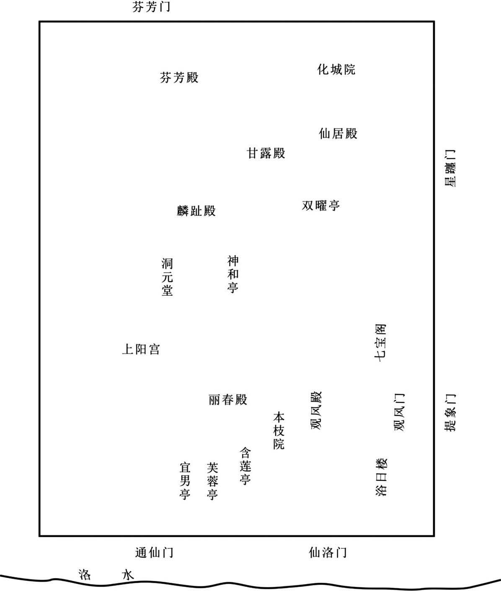 
唐东都上阳宫示意图

## 【译文】

九月丙子（初二日），侍御史汲县人傅游艺率领关中百姓九百余人到皇宫前上奏表，请求改国号为周，赐皇帝姓武氏。太后没有许可，提拔傅游艺做了给事中。于是百官和帝室的同宗亲属、远近处的百姓、周边各族的酋长、和尚、道士共六万多人，一起上表提出同傅游艺一样的请求，皇帝也上表自己请求赐姓武氏。戊寅（初四日），群臣上奏说：“有凤凰从明堂飞入上阳宫，又飞回，聚集在左台的梧桐树上，过了很久才向东南飞去，还有赤雀几万只飞来，聚集在朝堂。”

## 【原文】

**庚辰，太后可皇帝及群臣之请[1]。壬午，御则天楼，赦天下，以唐为周，改元[2]。乙酉，上尊号曰圣神皇帝，以皇帝为皇嗣，赐姓武氏，以皇太子为皇孙[3]。丙戌，立武氏七庙于神都，追尊周文王曰始祖文皇帝，妣姒氏曰文定皇后；平王少子武曰睿祖康皇帝，妣姜氏曰康惠皇后；太原靖王曰严祖成皇帝，妣曰成庄皇后；赵肃恭王曰肃祖章敬皇帝，魏义康王曰烈祖昭安皇帝，周安成王曰显祖文穆皇帝，忠孝太皇曰太祖孝明高皇帝，妣皆如考谥，称皇后[4]。立武承嗣为魏王，三思为梁王，攸宁为建昌王，士彟兄孙攸归、重规、载德、攸暨、懿宗、嗣宗、攸宜、攸望、攸绪、攸止皆为郡王，诸姑姊皆为长公主。**

## 【注文】

[1]可：允许，许可。

[2]则天楼：即则天门城楼。原为应天门，是洛阳宫城的正南门。始建于隋炀帝大业元年（605年），重建于唐高宗显庆元年（656年）。

[3]皇嗣：嗣，继承，子孙。皇嗣指皇帝的继承者。

[4]谥（shì）：古代帝王、高官等死后，朝廷根据他们的生平行为给予一种称号以褒贬善恶，称为谥或谥号。

## 【译文】

九月庚辰（初六日），太后同意了皇帝及群臣的请求。壬午（初八日），太后登上则天门城楼，宣布大赦天下，改唐为周，更改年号。乙酉（十一日），上尊号称圣神皇帝，以皇帝为皇位继承人，赐姓武氏，以皇太子为皇孙。丙戌（十二日），太后在神都洛阳立武氏七庙，追尊周文王为始祖文皇帝，先妣姒氏为文定皇后；周平王的小儿子姬武为睿祖康皇帝，先妣姜氏为康惠皇后；太原靖王为严祖成皇帝，先妣为成庄皇后；赵肃恭王为肃祖章敬皇帝，魏义康王为烈祖昭安皇帝，周安成王为显祖文穆皇帝，忠孝太皇为太祖孝明高皇帝，先妣的谥号都同于先考，称皇后。封武承嗣为魏王，武三思为梁王，武攸宁为建昌王，武士彟的哥哥的孙子武攸归、武重规、武载德、武攸暨、武懿宗、武嗣宗、武攸宜、武攸望、武攸绪、武攸止都封为郡王，诸姑姊都封为长公主。

## 【原文】

**又以司宾卿溧阳史务滋为纳言，凤阁侍郎宗秦客检校内史，给事中傅游艺为鸾台侍郎、平章事[1]。游艺与岑长倩、右玉钤卫大将军张虔勗、左金吾大将军丘神、侍御史来子珣等并赐姓武[2]。秦客潜劝太后革命，故首为内史。游艺期年之中历衣青、绿、朱、紫，时人谓之“四时仕宦”[3]。敕改州为郡。或谓太后曰：“陛下始革命而废州，不祥。”太后遽追止之。命史务滋等十人存抚诸道。癸卯，太后立兄孙延基等六人为郡王。**

## 【注文】

[1]司宾卿：唐前期职事官，即司宾寺卿、鸿胪寺卿。　　溧（lì）阳：古县名。即溧阳县，相当于今江苏溧阳西北。　　史务滋（？—691年）：武周时期的大臣。宣州溧阳（今江苏溧阳西北）人。武周天授元年（690年），他拜纳言。第二年，他与来俊臣同治雅州（约治今四川雅安西）刺史刘行实及其弟刘行感之狱，来俊臣诬奏务滋与行感亲密，掩盖其谋反之状。武则天令来俊臣并治务滋。务滋担心自己陷入刑狱而自杀。　　鸾台侍郎：唐前期职事官，即黄门侍郎。　　平章事：唐朝宰相，即同中书门下平章事，又简称同平章事。

[2]右玉钤卫大将军：唐朝禁军将领，即右领军卫大将军。　　左金吾大将军：唐朝禁军将领。　　珣：音xún。

[3]期（jī）：周（年、月）。　　青、绿、朱、紫：唐朝官服的颜色。在唐代，三品以上官员服紫，四品、五品服朱，六品、七品服绿，八品、九品服青。傅游艺一年之内连连升迁，从九品官渐次升任三品官，可谓平步青云。

## 【译文】

武则天又任命司宾寺卿溧阳县人史务滋为纳言，凤阁侍郎宗秦客为检校内史，给事中傅游艺为鸾台侍郎、平章事。傅游艺与岑长倩、右玉钤卫大将军张虔勗、左金吾大将军丘神、侍御史来子珣等都赐姓武氏。宗秦客因为曾经暗中劝太后改换朝代，所以首先被任命为内史。傅游艺一年之间经历了身穿青、绿、朱、紫四种颜色的官服（由九品官做到三品官），当时人称之为“四时仕宦”。太后下令改州为郡。有人对太后说：“陛下刚改换朝代而废除州（‘州’与‘周’同音），不吉利。”太后立即追回敕令而停止废州。武则天命令史务滋等十人巡视安抚天下各道。天授元年（690年）九月癸卯（二十九日），太后又封她哥哥的孙子武延基等六人为郡王。

## 【原文】

**冬十月甲子，检校内史宗秦客坐赃贬遵化尉，弟楚客、晋卿亦以奸赃流岭外[1]。丁卯，杀流人韦方质。壬申，敕两京诸州各置大云寺一区，藏《大云经》，使僧升高座讲解，其撰疏僧云宣等九人皆赐爵县公，仍赐紫袈裟、银龟袋[2]。制天下武氏咸蠲课役[3]。**

## 【注文】

[1]遵化：古县名。即遵化县，相当于今广西灵山西南。　　楚客：即宗楚客（？—710年），唐前期大臣。蒲州汾阴（今山西万荣西南）人，字叔敖，武则天的堂姐的儿子。他考中进士，累迁户部侍郎。武则天垂拱年间，武则天掌握实权，楚客和其弟宗晋卿均受重用。后来，他因为贪赃枉法被流放岭南地区。一年多后，被召还。武周万岁通天二年（697年），楚客被任命为检校夏官侍郎、同凤阁鸾台平章事，成为宰相。后又因事被贬出京城。唐中宗神龙初年，又回到朝廷担任太仆卿。武三思引荐他为兵部尚书、同平章事，再次出任宰相。楚客因为谄附唐中宗韦皇后，进为中书令。后来，临淄王李隆基（后来的唐玄宗）起兵诛杀韦皇后，楚客与晋卿均被杀。　　奸赃：非法受贿。

[2]紫袈裟：唐、宋时期三品以上官员的官服为紫色，五品以上官员的官服为绯（大红）色，有时皇帝特加赐紫或赐绯以示尊宠，赏赐给僧人的就叫“紫衣袈裟”。紫衣袈裟是僧人的特殊服饰，只能在大法会或者朝见帝王、会见大臣时才可穿着。　　银龟袋：唐代内外官五品以上，皆佩鱼符、鱼袋。鱼符以不同的材质制成，亲王以金，庶官以铜，皆题其位、姓名。装鱼符的鱼袋也是三品以上饰以金，五品以上饰以银。武周天授二年（691年）改内外官所佩鱼符为龟符，鱼袋为龟袋，规定三品以上龟袋用金饰，四品用银饰，五品用铜饰，形成金龟袋、银龟袋、铜龟袋。银龟袋为四品官所佩戴。

[3]蠲（juān）：除去，免除。　　课役：赋税及徭役。

## 【译文】

冬十月甲子（二十一日），检校内史宗秦客因贪赃获罪，被贬职为遵化县尉，他的弟弟宗楚客、宗晋卿也因非法获取财物被流放岭外。丁卯（二十四日），杀死被流放人员韦方质。壬申（二十九日），太后命令长安、洛阳两京和各州分别建大云寺一座，收藏《大云经》，让僧人升高座讲解，撰写《大云经》注疏的僧人云宣等九人都赐爵县公，还赐给他们紫袈裟、银龟袋。太后下令天下所有姓武的人都免除赋税、徭役。

## 【原文】

**道州刺史李行褒兄弟为酷吏所陷，当族，秋官郎中徐有功固争不能得[1]。秋官侍郎周兴奏“有功故出反囚，当斩”，太后虽不许，亦免有功官。然太后雅重有功，久之，复起为侍御史[2]。有功伏地流涕固辞曰：“臣闻鹿走山林而命悬庖厨，势使之然也[3]。陛下以臣为法官，臣不敢枉陛下法，必死是官矣。”太后固授之，远近闻者相贺。**

## 【注文】

[1]道州：古州、路、府名。唐太宗贞观年间置，唐玄宗天宝初治弘道（今湖南道县西），辖境相当于今湖南道县、宁远以南的潇水流域。　　族：灭族。一种残酷的刑罚，指一人犯罪，将全家上下都杀死。　　秋官郎中：唐前期职事官，即刑部郎中。为刑部的头司刑部司的长官，置二人，从五品上，掌管司法及审复刑狱。

[2]雅重：非常重视。雅，很、极，表示程度很甚。

[3]庖（páo）厨：厨房，厨师。　　势：表现出来的情况，局面。

## 【译文】

道州刺史李行褒兄弟被酷吏所诬陷，罪当灭族，秋官郎中徐有功坚持争辩也无济于事。秋官侍郎周兴上奏“徐有功故意放出谋反的囚犯，应当斩首”，太后虽然没有批准，但也免去了徐有功的官职。但太后很器重徐有功，以后又起用他为侍御史。徐有功跪伏在地上，流着泪坚决推辞说：“我听说鹿奔跑在山林中，而命掌握在厨师手里，这是形势造成的。陛下让我做执法的官员，我不敢歪曲陛下的法律，必定死在这法官任上了。”太后坚持要给他侍御史的官职，远近听到这个消息的人都相互庆贺。

## 【原文】

**二年（春）正月癸酉朔，太后始受尊号于万象神宫，旗帜尚赤。甲戌，改置社稷于神都。辛巳，纳武氏神主于太庙[1]。唐太庙之在长安者更命曰享德庙，四时唯享高祖已下三庙，余四室皆闭不享[2]。又改长安崇先庙为崇尊庙。乙酉，日南至，大享明堂，祀昊天上帝，百神从祀，武氏祖宗配享，唐三帝亦同配[3]。**

## 【注文】

[1]神主：指木制的神位，上书死者姓名以供祭祀，俗称牌位。

[2]四室：即唐宣帝李熙（唐高祖李渊的高祖父）、唐光帝李天赐（李渊的曾祖父）、唐景帝李虎（李渊的祖父）和唐元帝李昞（bǐng）（李渊之父）之庙。

[3]日南至：指太阳走到最南面，即冬至日。

## 【译文】

武则天天授二年（691年）春正月癸酉朔（初一日），太后首次在万象神宫接受尊号，旗帜崇尚赤色。甲戌（初二日），改在神都洛阳设立社稷坛。辛巳（初九日），在太庙安置武氏神主。唐皇室在长安的太庙改名为享德庙，四季只祭祀高祖以下三庙，其余四室都关闭而不复祭祀。又改长安崇先庙为崇尊庙。乙酉（十三日），冬至，太后在明堂设宴，祭昊天上帝，百神陪从受祭，武氏祖宗配享，唐朝三位已故皇帝也一同配享。

## 【原文】

**御史中丞知大夫事李嗣真以酷吏纵横，上疏，以为：“今告事纷纭，虚多实少，恐有凶慝阴谋离间陛下君臣[1]。古者狱成，公卿参听，王必三宥然后行刑[2]。比日狱官单车奉使，推鞫既定，法家依断，不令重推，或临时专决，不复闻奏[3]。如此，则权由臣下，非审慎之法，傥有冤滥，何由可知！况以九品之官，专命推覆，操生杀之柄，窃人主之威，案覆既不在秋官，省审复不由门下，国之利器，轻以假人，恐为社稷之祸[4]。”太后不听。**

## 【注文】

[1]知大夫事：这里指知御史大夫事。知，以他官暂时主持某一官署事务。知御史大夫事指暂时负责御史大夫之事务。　　凶慝（tè）：凶恶，亦指凶恶的人。

[2]公卿：原为三公九卿的合称。后又泛指中央政府高级行政官员。　　三宥（yòu）：西周有三囿（yòu）之法，指古代对犯罪者可从轻处理的三种情况，分别为：不识（不知法）、不意（过失）、遗忘（应意识到而疏忽）。又指古代王﹑公家族之人犯法，有宽恕三次的制度。后者为文中之意。

[3]比日：近日，近来。　　闻奏：奏闻皇上。

[4]秋官：即刑部。

## 【译文】

御史中丞知大夫事李嗣真因酷吏横行，向太后上疏，认为：“现在告发的事情很多，虚妄的多，确实的少，恐怕有邪恶之徒阴谋离间陛下与臣僚之间的关系。古代判决犯人，公卿参加旁听，王必定经过三次饶恕，然后执行刑罚。近日管理刑狱的官员，单独一人外出执行使命，审问完成，执法者就依此来执行，不再重审，有的临时擅自作出判决，不再上奏皇上。这样，则权力归于臣下，这不是周密慎重的办法，倘若有冤屈和滥刑的，怎么能知道！况且以九品之官专以审讯定案，掌操生杀大权，窃取君主的权威，审讯定案既不在刑部，检查审定又不经过门下省，刑罚这种国家的利器，轻易地就给了别人，这恐怕是国家的祸害。”太后没有听取李嗣真的意见。

## 【原文】

**侍御史来子珣诬尚衣奉御刘行感兄弟谋反，皆坐诛[1]。**

## 【注文】

[1]尚衣奉御：唐代殿中省的属官。殿中省下设尚衣局，尚衣局置奉御二人，从五品上，负责掌管皇帝的服装、宫廷陈设、祭祀活动的物品。

## 【译文】

侍御史来子珣诬告尚衣奉御刘行感兄弟谋反，二人都因此被处死。

## 【原文】

**春一月，地官尚书武思文及朝集使二千八百人表请封中岳[1]。己亥，废唐兴宁永康隐陵署官，唯量置守户[2]。左金吾大将军丘神以罪诛。纳言史务滋与来俊臣同鞫刘行感狱，俊臣奏“务滋与行感亲密，意欲寝其反状”。太后命俊臣并推之。庚子，务滋恐惧，自杀。**

## 【注文】

[1]朝集使：古代地方官进京汇报财政情况、民情风俗、属官考核、进纳贡物、聆听皇帝的命令的制度。如遇特殊情况，地方长官不必亲行，可以他官代替。　　中岳：即嵩山。参见注“嵩山”。

[2]兴宁：即兴宁陵，唐高祖李渊的父亲李昞的陵墓。位于今陕西咸阳城东二十公里处渭城区正阳乡后排村。　　永康：即永康陵，唐高祖李渊的祖父李虎的陵墓，位于今陕西咸阳城东北五十五公里处三原县陵前乡侯家堡。　　隐陵：唐隐太子李建成的陵。李建成为唐高祖李渊的嫡长子，唐太宗李世民的同母兄长。唐高祖武德九年（626年），建成死于“玄武门之变”中。唐太宗贞观元年（627年），追封建成为息王，谥号为“隐”，陵为隐陵，置官并加陵户守卫。　　守户：即守陵户。唐代守陵户是服务于皇帝陵园、太子陵园的人户，一般由陵墓所在地区侧近的人户承担，或由身份低下的官户（犯罪者及其家属没入官府服役，并编入特殊户籍，称官户）、官奴等，负责洒扫，或长年或轮番守视、修葺，由太常寺或宗正寺属下的诸陵署或陵台设令、丞管理，任务包括供奉、修葺、守看、扫除和栽植，以维护陵园及景观设施完整、护林防火等。

## 【译文】

春一月，地官尚书武思文和朝集使二千八百人上表请求封中岳嵩山。己亥（二十七日），废除唐朝的兴宁陵、永康陵、隐陵的官署和官员，只酌量设置守陵户。左金吾大将军丘神因罪被处死。纳言史务滋和来俊臣一同审讯刘行感的案件，来俊臣上奏说“史务滋与刘行感关系亲密，想要掩盖他的谋反罪状”。太后命令来俊臣一同审理史务滋案。庚子（二十八日），史务滋因畏惧而自杀。

## 【原文】

**或告文昌右丞周兴与丘神通谋，太后命来俊臣鞫之[1]。俊臣与兴方推事对食，谓兴曰：“囚多不承，当为何法？”[2]兴曰：“此甚易耳，取大瓮，以炭四周炙之，令囚入中，何事不承！”[3]俊臣乃索大瓮，火围如兴法，因起谓兴曰：“有内状推兄，请兄入此瓮。”[4]兴惶恐叩头服罪。法当死，太后原之，二月，流兴岭南，在道，为仇家所杀。**

## 【注文】

[1]文昌右丞：唐前期职事官名，即尚书右丞，正四品下，负责具体判中央尚书都省事，监察尚书省，监督尚书省所属的刑部、兵部、工部。武则天光宅元年（684年），武则天改尚书右丞为文昌右丞。武则天长安三年（703年）再改为中台右丞。唐中宗神龙元年（705年），恢复旧称。

[2]承：承认，应允。

[3]炙：烤。

[4]内状：皇宫内递出的状辞。

## 【译文】

有人告发文昌右丞周兴和丘神串通谋反，太后命令来俊臣审讯他。来俊臣与周兴正在审案，一起进餐，来俊臣对周兴说：“囚犯大多不认罪，应当采用什么办法？”周兴说：“这很容易，取来一个大瓮，用炭火架在四周烤它，让囚犯进入瓮中，还有什么事情不承认！”来俊臣就找来大瓮，按周兴说的办法，四周用火烤，然后站起来对周兴说：“有皇宫内来的文书要审问老兄，请老兄进到大瓮中！”周兴惶恐，叩头认罪。依法应判周兴死刑，太后原谅他，二月，流放周兴去岭南地区，在途中，他被仇人杀死。

## 【原文】

**兴与索元礼、来俊臣竞为暴刻，兴、元礼所杀各数千人，俊臣所破千余家[1]。元礼残酷尤甚，太后亦杀之，以慰人望[2]。**

## 【注文】

[1]暴刻：残暴刻毒。

[2]人望：众人的嘱望。

## 【译文】

周兴和索元礼、来俊臣竞相残暴刻毒，周兴、索元礼各杀了几千人，来俊臣让一千多家毁灭。索元礼尤其残酷，太后也杀了他，以抚慰众人的嘱望。

## 【原文】

**徙左卫大将军千乘王武攸暨为定王。立故太子贤之子光顺为义丰王。**

## 【译文】

改封左卫大将军千乘王武攸暨为定王。立原太子李贤的儿子李光顺为义丰王。

## 【原文】

**甲子，太后命始祖墓曰德陵，睿祖墓曰乔陵，严祖墓曰节陵，肃祖墓曰简陵，烈祖墓曰靖陵，显祖墓曰永陵。改章德陵为昊陵，显义陵为顺陵[1]。**

## 【注文】

[1]章德陵：武则天的父亲武士彟（huò）的坟墓。　　显义陵：武则天的母亲杨氏的坟墓。

## 【译文】

春二月甲子（二十二日），太后下令称始祖墓为德陵，睿祖墓为乔陵，严祖墓为节陵，肃祖墓为简陵，烈祖墓为靖陵，显祖墓为永陵。改章德陵为昊陵，显义陵为顺陵。

## 【原文】

**夏四月癸卯，制以释教开革命之阶，升于道教之上[1]。**

## 【注文】

[1]阶：阶梯，途径。

## 【译文】

夏四月癸卯（初二日），太后命令：因佛教为改朝换代开辟了途径，所以将佛教的地位提高到道教之上。

## 【原文】

**命建安王攸宜留守长安。**

## 【译文】

朝廷命令建安王武攸宜留守长安。

## 【原文】

**秋八月庚申，杀玉钤卫大将军张虔勗。来俊臣鞫虔勗狱，虔勗自讼于徐有功。俊臣怒，命卫士以刀乱斫杀之，枭首于市[1]。**

## 【注文】

[1]玉钤（qián）卫大将军：唐朝禁军将领。玉钤卫即领军卫。武则天光宅元年（684年）改此名，唐中宗神龙元年（705年）复名。

## 【译文】

秋八月庚申（二十二日），杀死玉钤卫大将军张虔勗。来俊臣审讯张虔勗案件，张虔勗自己向徐有功申诉。来俊臣大怒，令卫士乱刀砍死他，在市上悬挂首级示众。

## 【原文】

**义丰王光顺、嗣雍王守礼、永安王守义、长信县主等皆赐姓武氏，与睿宗诸子皆幽闭宫中，不出门庭者十余年[1]。守礼、守义，光顺之弟也。**

## 【注文】

[1]嗣雍王守礼：即李守礼（672—741年），唐朝章怀太子李贤的次子。本名光仁，武则天垂拱初年改名守礼，封为太子洗马。后继承其父的爵位雍王。武后改唐为周，登基称帝，忌恨李唐宗室。守礼因为其父亲的原因而得罪武则天，与唐睿宗李旦的儿子们闭处宫中十多年。武周圣历元年（698年），唐睿宗从皇嗣（即太子）降封相王，许出宫外居住。守礼等开始在宫外居住，改授司议郎中。唐中宗重登皇位、恢复李唐江山，守礼也恢复以往的封爵，拜光禄卿。中宗神龙三年（707年），皇帝封守礼之女为金城公主，许嫁吐蕃赞普弃隶缩赞。中宗景龙四年（710年），睿宗即皇帝位，依照中宗的遗诏，改封守礼为邠王，检校左金吾卫大将军，出为幽州（今北京地区）刺史，遥兼单于大都护，迁司空。唐玄宗开元初，守礼累为地方州刺史，但他都将地方政事委托给僚属处理，自己唯独寻求享乐，并不实际管事。守礼后来回到京城长安。开元二十九年（741年）死，赠太尉。　　县主：按唐朝制度，王之女封县主，视正二品。　　门庭：门前的空地，门口和庭院。

## 【译文】

义丰王李光顺、嗣雍王李守礼、永安王李守义、长信县主等都赐姓武氏，与唐睿宗的儿子们都被幽禁在宫中，十几年不出宫门。李守礼、李守义是李光顺的弟弟。

## 【原文】

**或告地官尚书武思文初与徐敬业通谋[1]。甲子，流思文于岭南，复姓徐氏。**

## 【注文】

[1]武思文：徐敬业的叔叔。

## 【译文】

有人告发地官尚书武思文当初与徐敬业串通谋反。八月甲子（二十六日），流放武思文到岭南地区，恢复他的本姓徐氏。

## 【原文】

**九月乙亥，杀岐州刺史云弘嗣。来俊臣鞫之，不问一款，先断其首，乃伪立文案奏之[1]。其杀张虔勗亦然。敕旨皆依，海内钳口[2]。**

## 【注文】

[1]款：项。

[2]钳口：闭口。

## 【译文】

九月乙亥（初八日），杀掉岐州刺史云弘嗣。来俊臣审讯他，不问一项口供，先砍断他的脑袋，再伪造文案上奏。杀张虔勗的时候，来俊臣也采取这种办法。太后的敕旨都照准，天下人都闭口不敢说话。

## 【原文】

**鸾台侍郎、同平章［事］傅游艺梦登湛露殿，以语所亲，所亲告之[1]。壬辰，下狱，自杀。**

## 【注文】

[1]湛露殿：唐东都洛阳城皇宫宫殿名，为皇帝经常召见重要大臣的地方。

## 【译文】

鸾台侍郎、同平章事傅游艺做梦梦见自己登上湛露殿，他把这个梦告诉了亲近的人，亲近的人告发他。九月壬辰（二十五日），傅游艺被投入监狱，自杀身亡。

## 【原文】

**先是，凤阁舍人修武张嘉福使洛阳人王庆之等数百人上表，请立武承嗣为皇太子[1]。文昌右相、同凤阁鸾台三品岑长倩以皇嗣在东宫，不宜有此议，奏请切责上书者，告示令散[2]。太后又问地官尚书、同平章事格辅元，辅元固称不可[3]。由是大忤诸武意，故斥长倩令西征吐蕃，未至，征还，下制狱[4]。承嗣又谮辅元。来俊臣又胁长倩子灵原，令引司礼卿兼判纳言事欧阳通等数十人，皆云同反[5]。通为俊臣所讯，五毒备至，终无异词，俊臣乃诈为通款[6]。冬十月己酉，长倩、辅元、通等皆坐诛。**

## 【注文】

[1]修武：古县名。即修武县，相当于今河南修武。

[2]切责：严词斥责。

[3]格辅元（？—691年）：唐前期大臣。汴州浚仪（今河南开封）人，他考中明经，历迁殿中侍御史、御史中丞。武周天授二年（691年），他以地官尚书、同凤阁鸾台平章事，成为宰相。当时，凤阁舍人（即中书舍人）张嘉福等奏请立武承嗣（武则天之侄）为太子，辅元固称不可，因此遭到武承嗣的陷害，被杀。

[4]吐蕃（bō）：中国古代藏族政权名。本是西部羌人的一支，隋唐时代在今青藏高原建立起强大的吐蕃王国。共历经九世赞普，二百余年。吐蕃也是今日藏族之先民。隋初，吐蕃渐渐强盛。囊（朗）日论赞统治时期，励精图治，兼并其他部落，势力向外发展，统治中心迁往逻些（今西藏拉萨），朗日论赞被各部尊为赞普。唐太宗贞观三年（629年），其子松赞干布即赞普位，统一了青藏高原其他诸部，建立起强大的吐蕃王朝。他仿照中原制度改革机构，严密军制，修订法典，创立文字，统一度量衡，又多次遣使到唐朝请求和亲。唐太宗贞观十五年（641年），派文成公主出嫁松赞干布，汉藏关系日益密切，中原许多生产技术传到吐蕃地区，促进了当地社会经济文化的发展。唐中宗当政时，把金城公主嫁给吐蕃赞普弃隶缩赞。而后，唐蕃双方多次会盟。唐玄宗天宝年间，“安史之乱”爆发，驻守在河西走廊一带的唐军大批东调参与平叛，吐蕃乘机攻占河西地区。而后，吐蕃不断侵扰唐朝的西部边境。唐穆宗长庆三年（823年），唐蕃双方会盟，并立碑，明确“和同一家”，长期保持甥舅关系。赤松德赞在位时，吐蕃强盛一时，极力对外扩张。后内部矛盾加剧，军队叛变，下层民众反抗，社会动荡。唐武宗会昌二年（842年），吐蕃赞普达磨遇刺死，王室陷入内部纷争，统一的吐蕃王朝从此瓦解。

[5]司礼卿：唐前期职事官，即太常寺卿。　　判纳言事：具体负责纳言（即侍中）的事务。　　欧阳通（？—691年）：唐前期大臣。潭州临湘（今湖南长沙）人，字通师，欧阳询之子。欧阳通少孤，随母亲学习其父的书法，与父齐名，号“大小欧阳体”。唐高宗仪凤年间，欧阳通担任中书舍人，负责草拟皇帝的诏书，累迁至殿中监。武周天授元年（690年），他担任夏官尚书。第二年，他转任司礼卿兼判纳言事。他因为反对立武承嗣为太子，遭到武氏当权者的忌恨，被酷吏来俊臣诬陷致死。他留下的书法遗迹有《泉男生墓志》《道因法师碑》。

[6]五毒：五种酷刑，包括鞭、捶、灼、徽、（mò）。徽、皆为绳索，用以捆绑罪犯。此处为泛指各种严酷刑罚。　　款：款服，诚心认罪。

## 【译文】

在此之前，凤阁舍人修武县人张嘉福指使洛阳人王庆之等几百人上奏表，请求立武承嗣为皇太子。文昌右相、同凤阁鸾台三品岑长倩认为皇嗣在东宫，不应该有这样的讨论，因此上奏请求严词谴责上奏书的人，告知他们散去。太后又询问地官尚书、同平章事格辅元，格辅元也坚决认为不行。因此他们大大违反了各位武氏掌权者的意愿，于是武氏掌权者排斥岑长倩，令他西征吐蕃，长倩还未到达前线，又征召他回来，关入太后的特别监狱。武承嗣又诬陷格辅元。来俊臣又胁迫岑长倩的儿子岑灵原，让他牵出司礼卿兼判纳言事欧阳通等几十人，都说他们一同谋反。欧阳通被来俊臣审讯，毒刑用遍，始终没有改口，来俊臣便假造他服罪的口供。冬十月己酉（十二日），岑长倩、格辅元、欧阳通等都被处死。

## 【原文】

**王庆之见太后，太后曰：“皇嗣我子，奈何废之？”对曰：“神不歆非类，民不祀非族[1]。今谁有天下，而以李氏为嗣乎？”太后谕遣之[2]。庆之伏地，以死泣请，不去，太后乃以印纸遗之曰：“欲见我，以此示门者。”[3]自是庆之屡求见，太后颇怒之，命凤阁侍郎李昭德赐庆之杖[4]。昭德引出光政门外，以示朝士曰：“此贼欲废我皇嗣，立武承嗣。”[5]命扑之，耳目皆血出，然后杖杀之，其党乃散。**

## 【注文】

[1]歆（xīn）：飨（xiǎng），祭祀时神灵享受祭品、香火。

[2]谕：告诉，指示，多用于上级对下级。

[3]遗（wèi）：给予，赠送。

[4]李昭德（？—697年）：唐前期大臣。京兆长安（今陕西西安）人。他考中明经，累官御史中丞。武周如意元年（692年），他拜凤阁侍郎、同平章事，成为宰相。不久，他迁检校内史。他曾向武则天密奏罢去武承嗣的相权，杖杀请立武承嗣为皇太子者。他还训斥献媚者。当时，酷吏横行，他多次上奏其奸恶，但是，他弄权遭人忌恨。后来，他被酷吏来俊臣诬陷，下狱致死，时人冤之。

[5]光政门：唐东都洛阳的宫城门。

## 【译文】

王庆之觐见太后，太后说：“皇嗣是我的儿子，为何要废黜他？”王庆之回答说：“神灵不享受别族人的祭品，百姓不祭祀别族的鬼神。现在是谁人拥有天下，却要以李氏为继承人？”太后指示将他送出去。王庆之趴在地上，以死哭请，不愿离去，太后便送给他盖有印章的一纸凭证，说：“以后想见我，就把它给守门人看。”从此以后王庆之屡次求见，太后很生气，命令凤阁侍郎李昭德赐王庆之杖刑。李昭德将他拉出光政门外，指着他对文武官员说：“这个家伙想废黜我朝皇嗣，立武承嗣为太子。”命令将他摔倒，他的耳朵、眼睛都出了血，然后用杖将他打死，王庆之的党徒才散去。

## 【原文】

**昭德因言于太后曰：“天皇，陛下之夫，皇嗣，陛下之子。陛下身有天下，当传之子孙为万代业，岂得以侄为嗣乎？自古未闻侄为天子而为姑立庙者也。且陛下受天皇顾托，若以天下与承嗣，则天皇不血食矣。”[1]太后亦以为然。昭德，乾祐之子也[2]。**

## 【注文】

[1]血食：古代以杀牲取血来祭祀，血食指接受祭祀。一般借喻为国家统治的延续与长久。

[2]乾祐：即李乾祐（生卒年不详），唐前期大臣。雍州长安（今陕西西安北）人，李昭德之父。唐太宗贞观初年为殿中侍御史，迁侍御史，又历治书侍御史。唐高宗永徽年间，升御史大夫，后又出为邢州（治今河北邢台）、魏州（治今河北大名东北）刺史，后又到中央为司刑太常伯，后以罪免官。

## 【译文】

李昭德于是向太后进言说：“天皇（指唐高宗），是陛下的丈夫，皇嗣，是陛下的儿子。陛下自己拥有天下，应当传给子孙，作为万代家业，怎么能以侄子为继承人呢？自古以来没有听说侄子做了天子而为姑母立庙的。何况陛下接受天皇的临终托付，如果把天下交给武承嗣，则天皇就无人祭祀了。”太后也认为他说得对。李昭德是李乾祐的儿子。

## 【原文】

**壬辰(7)，杀鸾台侍郎同平章事乐思晦、右卫将军李安静。安静，纲之孙也[1]。太后将革命，王公百官皆上表劝进，安静独正色拒之。及下制狱，来俊臣诘其反状，安静曰：“以我唐家老臣，须杀即杀，若问谋反，实无可对。”俊臣竟杀之。**

## 【注文】

[1]纲：即李纲（547—631年），唐前期大臣。字文纪，初名李瑗，观州蓨（tiáo）县（今河北景县南）人。北周时，李纲为齐王宇文宪的参军。隋朝时，李纲为太子杨勇的洗马（太子东宫属官），屡遭权臣杨素陷害，后隐居。隋末，李纲得到李渊的重用，授丞相府司录，封新昌县公。唐朝建立，李纲在唐高祖武德朝受任礼部尚书，兼太子詹事（太子东宫属官），屡次规谏太子李建成，后辞职。

## 【译文】

十月壬辰日，杀死鸾台侍郎、同平章事乐思晦，以及右卫将军李安静。李安静是李纲的孙子。太后准备要称帝，王公百官都上表劝进，只有李安静严正地拒绝。等到他被关入太后的特别监狱后，来俊臣责问他谋反的情况，李安静说：“因我是唐家的老臣，要杀就杀，如果问谋反，实在没什么可以回答的。”来俊臣最终将他处死。

## 【原文】

**长寿元年春一月丁卯，太后引见存抚使所举人，无问贤愚，悉加擢用[1]。高者试凤阁舍人、给事中，次试员外郎、侍御史、补阙、拾遗、校书郎[2]。试官自此始。时人为之语曰：“补阙连车载，拾遗平斗量；欋推侍御史，碗脱校书郎。”[3]有举人沈全交续之曰：“心存抚使，眯目圣神皇。”[4]为御史纪先知所擒，劾其诽谤朝政，请杖之朝堂，然后付法。太后笑曰：“但使卿辈不滥，何恤人言！宜释其罪。”先知大惭。太后虽滥以禄位收天下人心，然不称职者寻亦黜之，或加刑诛。挟刑赏之柄以驾御天下，政由己出，明察善断，故当时英贤亦竞为之用。**

## 【注文】

[1]长寿：武周如意元年（692年）九月九日，武则天以自己牙齿落而再生，改年号为长寿。　　存抚使：唐代前期巡行地方的大吏。朝廷常在水旱灾害后派遣五品以上的官员充任存抚使，掌考察官吏，赈济灾民。有时称“安抚使”或“巡察使”，亦称“宣抚使”。武周天授元年（690年），武则天派出存抚使十人到各道搜荐人才，予以任用。

[2]试：试任其职，尚未正式任命。试官也可以成为官员所带的职衔。　　员外郎：指唐朝中央尚书省所辖左、右司及六部（吏部、户部、礼部、兵部、刑部、工部）的员外郎。员外郎一般为从六品，具体负责各部的各项事务。　　校书郎：唐代门下省的属官，置二人，从九品上，负责图书典籍的整理和校对。

[3]欋（qú）：（木根）盘错；农具名，四个齿的耙（bà）子。　　碗脱：即碗坯（pī），碗的半成品。

[4]举人：唐代参加科举考试的进士科，经过有关部门贡举者，通称举人。　　（hú）：即“糊”。

## 【译文】

武则天长寿元年（692年）春一月丁卯（初一日），太后接见存抚使所荐举的人员，无论有无才能，全部加以任用。才高的就试凤阁舍人、给事中，其次的试员外郎、侍御史、补阙、拾遗、校书郎。试官制度从此开始。当时人为此说：“补阙接连用车载，拾遗平常用斗量；侍御史用耙子推，校书郎是一个模子脱出的。”有个举人沈全交补充说：“面糊心的存抚使，眯了眼的圣神皇（指武则天）。”沈全交被御史纪先知所擒获，纪先知弹劾他诽谤朝政，请求在朝堂上杖打他，然后依法治罪。太后笑着说：“只要你们自己不滥用职权，何必怕人家说话！应该宽免他的罪。”纪先知大为惭愧。太后虽然滥用禄位来收买天下人心，但对不称职的人不久也予以撤职，或加以判刑或处死。她掌握着刑罚和赏赐的大权以驾御天下人，政令由她自己做出，明察而善断，所以当时的杰出人才也竞相为她所用。

## 【原文】

**宁陵丞庐江郭霸以谄谀干太后，拜监察御史[1]。中丞魏元忠病，霸往问之，因尝其粪，喜曰：“大夫粪甘则可忧；今苦，无伤也。”元忠大恶之，遇人辄告之。**

## 【注文】

[1]宁陵：古县名。即宁陵县，相当于今河南宁陵东南。　　庐江：古县名。即庐江县，相当于今安徽庐江。　　干：追求，求取，指追求职位俸禄。

## 【译文】

宁陵县丞庐江县人郭霸因为对太后阿谀奉承以求仕宦，官拜监察御史。御史中丞魏元忠患病，郭霸去探视，于是尝了他的粪便，高兴地说：“大夫的粪便如果味甜就可担忧了；现在是苦的，没有事。”魏元忠非常讨厌他，逢人就把这件事告诉他们。

## 【原文】

**戊辰，以夏官尚书杨执柔同平章事[1]。执柔，恭仁弟之孙也，太后以外族用之[2]。**

## 【注文】

[1]夏官尚书：唐前期职事官，即兵部尚书。　　杨执柔（生卒年不详）：唐前期大臣。华州华阴（今陕西华阴）人，杨恭仁的弟弟的孙子。执柔历任地官尚书。武则天改唐为周、正式称帝后，以执柔为自己的外家亲戚，对他非常优宠。武周天授三年（692年），他升任夏官尚书、同平章事，成为宰相。不久，他被罢去相职。没过多久，执柔就死了。　　恭仁：即杨恭仁（？—639年），隋朝宗室、隋末唐初大臣。弘农华阴（今陕西华阴）人，本名纶（lún）。他在隋朝历任甘州（治今甘肃张掖）刺史、吏部侍郎，参与平定杨玄感之乱。他在吏部持正自守，甚有善政，被人排挤出京城，担任河南道大使。宇文化及杀隋炀帝后，任命他为吏部尚书。在唐朝，他担任凉州（治今甘肃武威）总管。他向来熟悉边疆事务、通晓民情，在当地安抚汉人、胡人，甚有功绩。唐高祖武德六年（623年），他拜吏部尚书兼中书令，成为宰相。武德九年（626年），他拜雍州（治今陕西西安）牧。唐太宗贞观五年（631年），他迁洛州（治今河南洛阳）都督。恭仁性格谦和谨慎，不以势凌人，以老病退休而死。

[2]外族：母亲家族或者妻子家族的亲族。

## 【译文】

戊辰（初二日），任命夏官尚书杨执柔为同平章事。杨执柔是杨恭仁弟弟的孙子，太后因他是她母亲家族的人而任用他。

## 【原文】

**左台中丞来俊臣罗告同平章事任知古、狄仁杰、裴行本、司农卿裴宣礼、前文昌左丞卢献、御史中丞魏元忠、潞州刺史李嗣真谋反[1]。先是，来俊臣奏请降敕，一问即承反者得减死。及知古等下狱，俊臣以此诱之。仁杰对曰：“大周革命，万物惟新，唐室旧臣，甘从诛戮。反是实。”俊臣乃少宽之。判官王德寿谓仁杰曰：“尚书定减死矣[2]。德寿业受驱策，欲求少阶级，烦尚书引杨执柔，可乎？”[3]仁杰曰：“皇天后土遣狄仁杰为如此事！”[4]以头触柱，血流被面，德寿惧而谢之。**

## 【注文】

[1]左台中丞：唐前期职事官，即左御史台中丞。御史台，官署名。中国古代国家最高监察机构。隋炀帝大业三年（607年），台中事务皆由治书侍御史主持。唐沿置。唐高宗时因避讳，改次官治书侍御史为御史中丞。武则天时改置左、右肃政台。　　罗告：罗织罪名而告发。　　任知古（生卒年不详）：武周朝宰相。武周天授二年（691年），他以凤阁侍郎同凤阁鸾台平章事，成为宰相。武周长寿元年（692年）初，他被来俊臣诬陷，原本是死罪，因狄仁杰、徐有功帮助而得免，贬为江夏县（治今湖北武汉）令。后无记载。　　裴行本（生卒年不详）：武周朝宰相。武周天授二年（691年），裴行本以冬官侍郎（即工部侍郎）为同凤阁鸾台平章事，成为宰相。时裴行本和宰相狄仁杰、任知古等人被酷吏来俊臣弹劾谋反。因为狄仁杰呈上一份表章，得以向武则天澄清众人之冤，虽免死，但仍被流放。　　司农卿：唐前期职事官，即司农寺卿。　　潞州：古州名。北周置，唐移治上党（今山西长治），辖境相当于今山西长治、壶关、长子、屯留、黎城、沁县、武乡及河北涉县地区。

[2]判官：皇帝下敕书临时差遣的使职。事务繁剧的给判官二人，事务不繁剧的给判官一人。许多使职之下都设判官，负责综理本使日常事务，权力大，事情多。

[3]驱策：驱使、命令做某事。

[4]皇天后土：皇天，天，天帝。后土，地，土神。皇天后土，天地或天地神灵的总称。

## 【译文】

左台中丞来俊臣罗织罪名告发同平章事任知古、狄仁杰、裴行本、司农寺卿崔宣礼、前文昌左丞卢献、御史中丞魏元忠、潞州刺史李嗣真谋反。在这以前，来俊臣曾奏请太后下命令：凡是一经审问就承认谋反的人，可以减免死罪。等到任知古等入狱，来俊臣便用这道命令引诱他们认罪。狄仁杰回答说：“大周改朝换代，万象更新，唐朝旧臣，甘愿被诛戮。谋反是事实。”来俊臣就对他稍加宽容。判官王德寿对狄仁杰说：“您一定能减免死罪了。我德寿已受人指使，想略找一个升迁的阶梯，烦您牵出杨执柔，可以吗？”狄仁杰说：“皇天后土在上，竟要狄仁杰干这种事！”他一头撞在柱子上，血流满面，王德寿感到害怕而向他道歉。

## 【原文】

**侯思止鞫魏元忠，元忠辞气不屈。思止怒，命倒曳之[1]。元忠曰：“我薄命，譬如坠驴，足于镫，为所曳耳。”[2]思止愈怒，更曵之。元忠曰：“侯思止，汝若须魏元忠头则截取，何必使承反也！”**

## 【注文】

[1]曳（yè）：拖拉，牵引。

[2]（guà）：绊住。　　镫（dèng）：挂在马鞍两旁的铁制脚踏。

## 【译文】

侯思止审讯魏元忠，魏元忠义正词严不肯屈服。侯思止大怒，命人将他放在地上倒着拖。魏元忠说：“我命运不好，譬如从驴背上掉下来，脚挂在足镫上，被驴拖着走。”侯思止愈加生气，命令接着拖他。魏元忠说：“侯思止，你如果需要我魏元忠的脑袋就砍下来，何必让我承认谋反呢！”

## 【原文】

**狄仁杰既承反，有司待报行刑，不复严备。仁杰裂衾帛书冤状，置绵衣中，谓王德寿曰：“天时方热，请授家人去其绵。”[1]德寿许之。仁杰子光远得书，持之称变，得召见[2]。则天览之，以问俊臣，对曰：“仁杰等下狱，臣未尝褫其巾带，寝处甚安，苟无事实，安肯承反。”[3]太后使通事舍人周往视之[4]。俊臣暂假仁杰等巾带，罗立于西，使视之。不敢视，惟东顾唯诺而已。俊臣又诈为仁杰等谢死表，使奏之[5]。**

## 【注文】

[1]衾（qīn）帛（bó）：衾，被子。衾帛，丝被。　　绵衣：内装丝绵的衣服。

[2]称变：声言事态发生变化。

[3]褫（chǐ）：剥夺。

[4]通事舍人：唐代中书省的属官，置十六人，从六品上。负责掌管朝见引纳、殿廷通奏、承旨宣劳等事务，选善于辞令者充任。　　：音lín。

[5]谢死表：臣子的上表，内容为谢罪和悔过。

## 【译文】

狄仁杰既然已经承认谋反，有关部门只等待上报判罪，执行刑罚，不再对他严加防备。狄仁杰便从被子上撕下一块帛，书写冤屈情况，放在绵衣里面，对王德寿说：“天气正好热了，请将绵衣交给我家里人，撤去丝绵。”王德寿同意了。狄仁杰的儿子狄光远得到帛书，拿着去说有紧急情况要报告，得到太后召见。武则天看了帛书，质问来俊臣，他回答说：“狄仁杰等入狱后，我未曾剥夺他们的头巾和腰带，生活很安适，假如没有事实，怎么肯承认谋反！”太后派通事舍人周前往查看。来俊臣临时发给狄仁杰等头巾、腰带，让他们排列站立在西边，让周验看。周不敢向西看，只是面向东边唯唯诺诺而已。来俊臣又伪造狄仁杰等人的谢死罪表，让周上奏太后。

## 【原文】

**乐思晦男未十岁，没入司农，上变，得召见[1]。太后问状，对曰：“臣父已死，臣家已破，但惜陛下法，为俊臣等所弄。陛下不信臣言，乞择朝臣之忠清、陛下素所信任者，为反状以付俊臣，无不承反矣。”太后意稍寤，召见仁杰等问曰：“卿承反何也？”[2]对曰：“不承则已死于拷掠矣。”[3]太后曰：“何为作谢死表？”对曰：“无之。”出表示之，乃知其诈，于是出此七族。庚午，贬知古江夏令，仁杰彭泽令，宣礼夷陵令，元忠涪陵令，献西乡令[4]。流行本、嗣真于岭南。俊臣与武承嗣等固请诛之，太后不许。俊臣乃独称行本罪尤重，请诛之。秋官郎中徐有功驳之，以为：“明主有更生之恩，俊臣不能将顺，亏损恩信。”[5]**

## 【注文】

[1]司农：唐朝官署，即司农寺。北齐始置，为管理仓储市易，供应宫廷粮食薪菜、百官廪禄的机构。唐代因之，曾改名司稼寺，后复旧。

[2]寤（wù）：睡醒，理解，明白。

[3]拷掠：拷打。

[4]江夏：古县名。即江夏县，相当于今湖北武昌。　　彭泽：即彭泽县，相当于今江西彭泽西。　　夷陵：古县名。即夷陵县，相当于今湖北宜昌。　　涪（fú）陵：古县名。即涪陵县，相当于今重庆涪陵区。　　西乡：古县名。即西乡县，相当于今陕西西乡。

[5]更生：再生。　　将顺：附和，迁就。

## 【译文】

乐思晦的儿子未满十岁，被没入司农寺为奴，要求上告，得到太后的召见。太后问他有什么情况要上告，他回答说：“我的父亲已死，我的家已破，只可惜陛下的刑法，为来俊臣等人所操弄。陛下如果不相信我说的话，请选择朝臣当中忠诚清廉、陛下一贯信任的人，提出他们谋反的罪状来交给来俊臣，他们没有不承认谋反的。”太后听后，稍稍有所醒悟，召见狄仁杰等人问道：“您承认谋反是为什么？”狄仁杰等人回答说：“不承认的话，就已经死于严刑拷打了。”太后说：“为什么作谢死表？”他们回答说：“没有。”太后出示他们所上的谢死表，才知道是伪造的，于是赦免这七个家族。一月庚午（初四日），任知古降职为江夏县令，狄仁杰降职为彭泽县令，崔宣礼降职为夷陵县令，魏元忠降职为涪陵县令、卢献降职为西乡县令。流放裴行本、李嗣真于岭南地区。来俊臣与武承嗣等人坚持请求处死他们七个人，太后不答应。来俊臣便又独自提出裴行本罪恶尤其深重，请求处死他。秋官郎中徐有功反驳，认为：“英明君主有使臣下再生的恩惠，来俊臣不能迁就，有损君主恩信。”

## 【原文】

**殿中侍御史贵乡霍献可，宣礼之甥也，言于太后曰：“陛下不杀裴宣礼，臣请陨命于前。”[1]以头触殿阶，血流沾地，以示为人臣不私其亲[2]。太后皆不听。献可常以绿帛裹其伤，微露之于幞头下，冀太后见之以为忠[3]。**

## 【注文】

[1]贵乡：古县名。即贵乡县，相当于今河北大名东北。　　陨（yǔn）命：丧命。

[2]殿阶：殿堂的台阶。　　沾：染，浸湿。　　私：偏袒。

[3]幞（fú）头：又名折上巾，是男子一种包头的软巾。因为所使用的纱罗一般为青黑色，也称“乌纱”。后人俗称为“乌纱帽”。

## 【译文】

殿中侍御史贵乡县人霍献可，是裴宣礼的外甥，他对太后说：“陛下不杀裴宣礼，我请求死在陛下面前。”他将头撞在宫殿台阶上，流血浸湿了地面，用以表示他做臣下不偏袒自己的亲戚。太后全然不听。霍献可常常用绿绸子包扎头上的伤口，稍稍地露在帽子的下面，希望让太后看见，认为他忠诚。

## 【原文】

**来俊臣求金于左卫大将军泉献诚，不得，诬以谋反，下狱，乙亥，缢杀之[1]。**

## 【注文】

[1]泉献诚（？—692年）：入唐的高句（gōu）丽（朝鲜半岛北部建立的政权，亦称高丽）将领。泉献诚原名渊献诚，高句丽平壤城（今朝鲜平壤）人。高句丽权臣渊盖苏文之孙，渊男生之子，入唐后因避讳唐高祖李渊名而改称泉献诚。武则天天授年间，献诚为左卫大将军。酷吏来俊臣向献诚求取贿赂，被献诚拒绝，来俊臣怀恨在心，诬其谋反，将他逮捕入狱，后被勒死。几年后武则天知其冤，为他平反，赠右羽林大将军，以礼改葬。

## 【译文】

来俊臣向左卫大将军泉献诚索取钱财，没有得到，就诬陷他谋反，将他逮捕入狱，一月乙亥（初九日），勒死了泉献诚。

## 【原文】

**夏六月辛亥(8)，万年主簿徐坚上疏，以为：“书有五听之道，令著三覆之奏[1]。窃见比有敇推按反者，令使者得实，即行斩决。人命至重，死不再生，万一怀枉，吞声赤族，岂不痛哉[2]！此不足肃奸逆而明典刑，适所以长威福而生疑惧[3]。臣望绝此处分，依法覆奏。又，法官之任，宜加简择，有用法宽平，为百姓所称者，愿亲而任之；有处事深酷，不允人望者，愿疏而退之。”坚，齐聃之子也。**

## 【注文】

[1]徐坚（？—729年）：唐前期大臣。字元固，湖州长城（今浙江长兴）人。他少孤好学，博学善文，考中进士。在武周时期，他担任万年县（今陕西西安）主簿。他向武则天上书，请求死刑复奏，犯罪少株连。转东都判官。唐中宗神龙初年，他为给事中。唐睿宗重登皇位后，授予徐坚太子左庶子兼崇文馆学士，修国史，封东海郡公，进黄门侍郎。后太平公主擅权，徐坚不肯依附。唐玄宗时代，徐坚历任绛州（治今山西绛县）刺史、秘书监、左散骑常侍、集贤院学士。他七入书府，熟悉典礼制度。他先后参与编修《三教珠英》（一部大型诗歌选集类书）、《初学记》（取材于群经诸子、历代诗赋及唐初诸家作品）等。他著有《大隐传》三卷，文集三十卷，皆已散佚。　　五听：中国古代司法官吏在审理案件时观察当事人心理活动的五种方法：辞听、色听、气听、耳听、目听。　　三覆之奏：唐代自唐太宗颁布诏书，在京各部门奏决死囚时，二日中五次复奏，天下诸州三次复奏。即在京规定执行死刑之日前一两天须上报五次，地方上为三次复奏。三覆之奏指谨慎对待判处死刑的囚犯，避免误判和制造冤案。

[2]吞声赤族：吞声，不发出声。赤族，被诛杀者必流血，故称赤族，意为诛灭全族。

[3]奸逆：叛逆不忠的人。　　典刑：常刑。　　齐聃（dān）：即徐齐聃（629—672年），唐前期大臣、文人。字将道，湖州长城（今浙江长兴）人，徐孝德之子，唐太宗徐贤妃之弟，唐高宗的妃嫔徐婕妤之兄。齐聃八岁能文，太宗召试词赋，称为神童，赠贴身佩刀。后举弘文生，历任曹王府参军，潞王府文学，崇文馆学士，侍皇太子讲等职。他曾经教导唐高宗的多位皇子，后累迁西台舍人。善文诰，甚为当时所称。唐高宗咸亨年间，他因泄露宫中语被贬为蕲（qí）州（治今湖北蕲春西南）司马，后又流放钦州（治今广西钦州北）。他死于咸亨年间，唐睿宗时赠礼部尚书。

## 【译文】

武则天长寿元年（692年）夏六月辛亥，万年县主簿徐坚上疏，认为：“古书记载中审案实行五听，法典中有死罪经三次复奏的制度。我看见近来有命令审讯谋反者，让使者审得事实，立即判决处死。人命至关重要，死后不能复生，万一含冤，被灭族而心中有怨，却不敢出声，岂不痛心！这样做不足以肃清叛逆不忠之人，彰明常刑，恰好助长一些人擅权枉法，使人们产生疑惧。我希望杜绝这种处理办法，依法复奏再行刑。还有，任用法官，应当加以选择，有执法宽大公平，为百姓所称赞的，希望陛下亲近而任用他；有处理事情峻刻严酷，不能使大家信服的，请求陛下疏远而斥退他。”徐坚是徐齐聃的儿子。

## 【原文】

**夏官侍郎李昭德密言于太后曰：“魏王承嗣权太重。”太后曰：“吾侄也，故委以腹心。”昭德曰：“侄之于姑，其亲何如子之于父？［子］犹有簒弑其父者，况侄乎[1]！今承嗣既陛下之侄，为亲王，又为宰相，权侔人主，臣恐陛下不得久安天位也。[2]”太后矍然曰：“朕未之思。”[3]秋七月(9)戊寅，以文昌左相、同凤阁鸾台三品武承嗣为特进，纳言武攸宁为冬官尚书，夏官尚书、同平章事杨执柔为地官尚书，并罢政事[4]。承嗣亦毁昭德于太后，太后曰：“吾任昭德，始得安眠，此代吾劳，汝勿言也。”**

## 【注文】

[1]篡（cuàn）：篡夺权位。

[2]天位：天子之位，帝位。

[3]矍（jué）然：惊恐的样子。

[4]冬官尚书：唐前期职事官，即工部尚书。　　罢政事：免去执掌政务的实权，指宰相的职权。

## 【译文】

夏官侍郎李昭德私下对太后说：“魏王武承嗣权力过重。”太后说：“他是我的侄儿，所以委任为亲信。”李昭德说：“侄儿对于姑姑，怎么能比得上儿子对于父亲亲近？儿子还可以杀死父亲，何况侄儿呢！现在武承嗣既是陛下的侄儿，是亲王，又是宰相，权势与君主等同，我恐怕陛下不能久安于天子之位。”太后震惊地说：“朕没有考虑这些。”长寿元年（692年）秋季八月戊寅（十六日），任命文昌左相、同凤阁鸾台三品武承嗣为特进，纳言武攸宁为冬官尚书，夏官尚书、同平章事杨执柔为地官尚书，一并罢去相职。武承嗣也在太后跟前诋毁李昭德，太后说：“我任用李昭德，才睡得安稳，他可以替我代劳，你就不要说了。”

## 【原文】

**是时，酷吏恣横，百官畏之侧足，昭德独廷奏其奸[1]。太后好祥瑞，有献白石赤文者，执政诘其异，对曰：“以其赤心。”[2]昭德怒曰：“此石赤心，他石尽反邪！”左右皆笑。襄州人胡庆以丹漆书龟腹，曰“天子万万年”，诣阙献之[3]。昭德以刀刮尽，奏请付法。太后曰：“此心亦无恶。”命释之。太后习猫，使与鹦鹉共处。出示百官，传观未遍，猫饥，搏鹦鹉食之，太后甚惭。**

## 【注文】

[1]恣（zì）横：放纵专横。　　侧足：形容因敬重或畏惧而不敢正面站立。

[2]祥瑞：吉祥的征兆，儒学认为是表达天意的、对人有益的自然现象。

[3]襄州：古州名。西魏置，治襄阳（今湖北襄樊市襄阳区），唐辖境相当于今湖北襄樊、谷城、老河口、丹江口、南漳、宜城等市县地。

## 【译文】

这时，酷吏放纵专横，百官畏惧他们，都不敢正面站立，只有李昭德敢于在朝廷上揭露他们的邪恶。太后喜好祥瑞，有人进献有赤色花纹的白石，主管官员责问他这石头有什么不平常之处，此人回答说：“因为它的赤诚之心。”李昭德大怒说：“这块石头的心赤诚，其他石头全都造反吗！”身边的人都笑了。襄州人胡庆用红漆在龟的腹部书写“天子万万年”几个字，进宫进献。李昭德用刀把字刮干净，奏请将进献者法办。太后说：“这个人用心也不坏。”命令释放他。太后训练猫，让它和鹦鹉在一起。有一次，太后向百官展示，大臣传看还未完毕，猫饿了，把鹦鹉捉住就吃掉了，太后为此感到很惭愧。

## 【原文】

**太后自垂拱以来，任用酷吏，先诛唐宗室、贵戚数百人，次及大臣数百家，其刺史、郎将以下不可胜数。每除一官，户婢窃相谓曰：“鬼朴又来矣。”[1]不旬月，辄遭掩捕，族诛[2]。监察御史朝邑严善思公直敢言[3]。时告密者不可胜数，太后亦厌其烦，命善思按问，引虚伏罪者八百五十余人，罗织之党为之不振，乃相与共构陷善思，坐流州[4]。太后知其枉，寻复召为浑仪监丞[5]。善思名譔，以字行。**

## 【注文】

[1]户婢：皇帝身边的被役使的女子。　　鬼朴：朴，没有细加工的木料，喻不加修饰。鬼朴，做鬼的材料。

[2]旬月：十天至一个月。指较短的时日。　　掩捕：乘其不备而逮捕。

[3]朝邑：古县名。即朝邑县，相当于今陕西大荔东。

[4]（huān）州：古州名。隋置，治九德（今越南荣市），辖境相当于今越南河静省和义安省南部。

[5]浑仪监丞：唐代浑仪监的官员，设二人，从七品下，负责掌管玄象器物、天文图书。

## 【译文】

太后自垂拱年间以来，任用酷吏，首先处死唐朝皇族和贵戚几百人，然后杀大臣几百家，杀刺史、郎将以下官吏更是数不胜数。每任命一名官吏，户婢便私下互相说道：“做鬼的材料又来了。”不满十天半月，这些官吏就遭突然逮捕，举族被杀。监察御史朝邑县人严善思公正耿直，敢于说话。当时告密的人多得数不清，太后也厌烦，命令严善思审问，结果因莫须有的诬陷服罪而死的有八百五十余人。罗织罪名害人的集团为之丧气，他们便共同设计诬陷严善思，结果严善思被流放州。太后知道他冤枉，不久又召他回来担任浑仪监丞。严善思名叫譔，字善思，人们习惯直呼他的字。

## 【原文】

**右补阙新郑朱敬则，以太后本任威刑以禁异议，今既革命，众心已定，宜省刑尚宽，乃上疏，以为：“李斯相秦，用刻薄变诈以屠诸侯，不知易之以宽和，卒至土崩，此不知变之祸也[1]。汉高祖定天下，陆贾、叔孙通说之以礼义，传世十二，此知变之善也[2]。自文明草昧，天地屯蒙，三叔流言，四凶（称）［构］难，不设钩距，无以应天顺人，不切刑名，不可摧奸息暴[3]。故置神器，开告端，曲直之影必呈，包藏之心尽露，神道助直，无罪不除，苍生晏然，紫宸易主[4]。然而急趋无善迹，促柱少和声，向时之妙策，乃当今之刍狗也[5]。伏愿览秦、汉之得失，考时事之合宜，审糟粕之可遗，觉蘧庐之须毁，去萋菲之牙角，顿奸险之锋芒，窒罗织之源，扫朋党之迹，使天下苍生坦然大悦，岂不乐哉！”[6]太后善之，赐帛三百段。**

## 【注文】

[1]新郑：古县名。即新郑县，相当于今河南新郑。　　朱敬则（635—709年）：唐前期大臣、史学家。亳州永城（今河南永城）人，字少连。他早年以辞学而知名。唐高宗咸亨年间，他担任洹（huán）水（今河北魏县西南旧魏县）县尉。武周时期，他担任右补阙（谏官），向武则天上书，请绝告密罗织之徒，得到武则天的赞赏。武周长安三年（703年），敬则迁正谏大夫（谏官），兼修国史，不久升任同凤阁鸾台平章事，成为宰相。他以用人为先，不省细务。当时，武则天的男宠张易之兄弟诬陷魏元忠等，朝廷中无人敢言，而敬则独抗表申理，魏元忠等得免死。后来，敬则被宗楚客诬陷，被贬为庐州（治今安徽合肥）刺史，死于家中。他著有《十代兴亡论》，已经散佚。　　李斯（？—前208年）：战国末年、秦朝的政治家、丞相。楚国上蔡（今河南上蔡西南）人，少年曾从荀子学习。战国末年，李斯来到秦国，初为秦国丞相吕不韦的舍人。不久，他任长史、拜客卿。秦王嬴政（即后来的秦始皇）十年（前237年），嬴政下逐客令，李斯上书力谏客不可逐，被秦王采纳。李斯又为秦王嬴政吞并六国谋划，建议先攻取韩国，再逐一消灭其他诸侯国，完成统一大业。秦始皇二十六年（前221年）统一全国后，李斯与丞相王绾（wǎn）、御史大夫冯劫等共议帝号。后来，李斯担任丞相，多次随秦始皇巡行。他反对分封皇室子弟的建议，主张禁止私学、统一思想、废除其他六国的史书。他又主张以小篆作为标准字体，整理文字。秦始皇死后，他听从宦官赵高之言，伪造始皇的诏书迫使始皇的长子扶苏自杀，立始皇的少子胡亥为皇帝，是为秦二世。秦朝末年，各地爆发反抗秦朝统治的斗争。李斯劝秦二世更改法律，以加强君权。后被赵高诬陷谋反，被腰斩，灭三族。

[2]汉高祖：即汉高祖刘邦（前256—前195年）。西汉王朝的建立者。公元前202—前195年在位。　　陆贾（生卒年不详）：西汉大臣、政治家、辞赋家。他跟从汉高祖刘邦平定天下，以善辩出名，常周旋于各个政治势力之间。官至太中大夫。陆贾认为社会治乱决定于“人道”。他主张“无为而治”，给生产者以休养生息之机，同时要求行仁义，德治与刑罚并用。他受汉高祖之命论述存亡之征，著书十二篇，号称《新语》。陆贾另外著有赋三篇，已经散失。　　叔孙通（生卒年不详）：秦末汉初著名儒士。薛（今山东滕州南）人，初以文学之才应秦朝之征，任博士。后逃亡归薛，跟从项梁、项羽反秦。之后，西楚霸王项羽和汉王刘邦（即汉高祖）争夺天下，叔孙通率领弟子百余人归降刘邦，担任汉朝的博士，号稷嗣君。因为刘邦不喜儒服，遂变服短衣。刘邦建立西汉、正式称帝后，叔孙通见朝会时群臣喧哗失礼，乃奏请征集儒生与弟子采古礼及秦朝的礼仪，制定汉朝的礼仪制度。汉高祖七年（前200年），长乐宫建成，群臣如礼仪般向皇帝刘邦朝贺，莫不振恐肃敬。刘邦感叹自己今天才真正体会到皇帝的显贵。叔孙通因此拜为太常，弟子皆拜为郎。汉高祖九年（前198年），叔孙通迁太子太傅。当时，刘邦想废掉太子刘盈，立宠姬戚夫人的儿子如意为太子。叔孙通极力劝阻刘邦更换太子。刘盈（即汉惠帝）即皇帝位后，叔孙通又担任太常，制定宗庙仪法。凡是西汉的仪法，均为叔孙通论定。

[3]草昧（mèi）：蒙昧，未开化。引申为草创，创始。　　屯蒙：天地生物之始。　　钩距：机谋。

[4]紫宸：泛指宫廷，帝位。

[5]急趋无善迹：趋，快走。急趋无善迹，比喻办事求快就不可能尽善尽美。　　促柱：急弦，支弦的柱移近则弦紧，故称。指移近支弦的柱，以使弦紧。　　刍（chú）狗：古代祭祀时用草扎成的狗，在祭祀之前是很受人们重视的祭品，但用过以后即被丢弃。后人用以比喻微贱无用的事物或言论。

[6]糟粕（pò）：造酒剩下的渣滓。比喻废弃无用的事物。　　蘧（qú）庐：古代驿传中供人临时休息的房子。犹如今天的旅馆。　　萋（qī）菲：亦作萋斐。形容花纹错杂的样子。　　苍生：百姓。

## 【译文】

右补阙新郑县人朱敬则，认为太后的本意是用严苛的刑罚来禁止不同意见，现在既已改朝换代、登上帝位，人心也已安定，就应当减省刑罚，崇尚宽大，于是上疏，认为：“李斯辅助秦国，用刻薄欺诈的手段屠杀诸侯，不知道改变为宽大温和，终致国家土崩瓦解，这是不知道变化的祸害。汉高祖平定天下，陆贾、叔孙通说服他施行礼义，结果皇位传了十二代，这是知道变化的好处。自文明年间帝业初创，一切刚刚开始，韩王、霍王等三位皇叔散布流言，徐敬业等四个元凶制造祸乱，不用手段套出实情，不能应天命、顺人心，不亲近法家的刑名，不能摧毁邪恶、止息暴乱。所以设神器铜匦，开告密之门，使或曲或直的形影必然显现出来，包藏着的阴谋全部暴露，结果神明帮助正直之人，没有罪恶不被尽除的，百姓安定，帝位转移。但快走不会有完整的脚印，短的琴柱很少奏出和声，过去的妙策，成了当今的无用之物。恳切希望看看秦、汉的得和失，考察当前的事怎样办才合适，审查哪些属于糟粕可以遗弃，发现那些一时有用过后即须破除的东西，去掉诬陷者的牙和角，挫去邪恶阴险者的锋芒，扼住罗织罪状的源头，扫除结党营私的痕迹，让天下百姓无忧无虑，岂不快乐！”太后赞许他的话，赏赐他三百段丝织品。

## 【原文】

**侍御史周矩上疏曰：“推劾之吏皆相矜以虐，泥耳笼头，枷研楔，折膺籖爪，悬发薰耳，号曰‘狱持’[1]。或累日节食，连宵缓问，昼夜揺撼，使不得眠，号曰‘宿囚’。此等既非木石，且救目前，苟求赊死[2]。臣窃听舆议，皆称‘天下太平，何苦须反’。岂被告者尽是英雄，欲求帝王邪？但不胜楚毒自诬耳[3]。愿陛下察之。今满朝侧息不安，皆以为陛下朝与之密，夕与之仇，不可保也。周用仁而昌，秦用刑而亡。愿陛下缓刑用仁，天下幸甚。”太后颇采其言，制狱稍衰。**

## 【注文】

[1]矜：自尊，自大，自夸。　　枷研：以重枷压碾犯人之颈。　　楔（xiē）（hú）：，以铁圈箍（gū）其首。楔，加楔子。　　膺（yīng）：胸。　　籖（qiān）：同“签”。用竹木等物做成的细棍或片状物。此处为动词。

[2]赊：买卖货物时延期付款或收款，此处指延缓生命。

[3]楚毒：酷刑。

## 【译文】

侍御史周矩上疏说：“审问犯人的官吏都以残暴相夸耀，泥塞耳朵，笼罩脑袋，用重枷磨脖颈，在头上加箍再打进楔子，打折胸骨，手指钉竹签，吊头发，薰耳朵，号称‘狱持’。或者多日减少供应食物，通宵延迟审问，昼夜摇撼，不让犯人睡觉，号称‘宿囚’。这些犯人既不是木头石头，为了救眼前一时，姑且认罪以求延缓生命。我私下听到的舆论，都说‘天下太平，何苦一定造反’。难道被告发的人全是英雄，想谋取帝王的位置吗？只是受不了酷刑，被迫认罪罢了。希望陛下明察。现在满朝百官坐卧不安，都以为陛下早上同他们亲近，晚上就与他们成为仇敌，都不能保全性命。周朝用仁政而昌盛，秦朝用刑罚而灭亡。愿陛下减缓刑罚，施行仁政，天下百姓就非常幸运了！”太后很是采纳他的意见，由自己特别交办的制狱审案逐渐削减。

## 【原文】

**太后春秋虽高，善自涂泽，虽左右不觉其衰[1]。丙戌，敕以齿落更生，九月庚子，御则天门，赦天下，改元。更以九月为社[2]。**

## 【注文】

[1]春秋：年岁。指年纪。　　涂泽：修饰容貌，化妆。

[2]社：古代指土地神和祭祀土地神的地方、日子以及祭礼，包括春社、秋社、社日。

## 【译文】

太后年纪虽大，但善于自己化妆、修饰容貌，即使她身边的人也感觉不出她的衰老。长寿元年（692年）八月丙戌（二十四日），太后颁布敕书说因牙齿脱落后又长出新牙，九月庚子（初九日），太后驾临则天门，宣布赦免天下罪人，更改年号为长寿。又改在九月祭祀土地神。

## 【原文】

**二年（春）正月壬辰朔，太后享万象神宫，以魏王承嗣为亚献，梁王三思为终献。太后自制神宫乐，用舞者九百人。**

## 【译文】

武则天长寿二年（693年）春正月壬辰朔（初一日），太后在万象神宫祭祀，让魏王武承嗣第二个献祭品，梁王武三思最后一个献祭品。太后自编神宫乐，使用的乐舞人员达九百人。

## 【原文】

**户婢团儿为太后所宠信，有憾于皇嗣，乃谮皇嗣妃刘氏、德妃窦氏为厌咒[1]。癸巳，妃与德妃朝太后于嘉豫殿，既退，同时杀之，瘗于宫中，莫知所在[2]。德妃，抗之曾孙也[3]。皇嗣畏忤旨，不敢言，居太后前，容止自如。团儿复欲害皇嗣，有言其情于太后者，太后乃杀团儿。**

## 【注文】

[1]皇嗣妃刘氏：唐睿宗李旦的正妻刘氏（？—693年）。参见注“刘氏”。　　德妃窦氏（？—693年）：即唐玄宗李隆基的生母窦氏。唐睿宗李旦还是相王时，纳为姬妾。武则天光宅元年（684年），武则天掌权，扶持李旦登上皇位，立窦氏为德妃。武则天长寿二年（693年），窦氏与李旦的正妻刘氏被奴婢诬陷，于正月朝拜武则天后同时遇害，连尸体都找不到。景云元年（710年），唐睿宗重登皇位后，立窦氏所生之子隆基为皇太子，谥窦氏为昭成皇后。睿宗死后，李隆基即皇帝位，窦氏以皇帝生母之重，追尊为昭成顺圣皇太后，仍然沿用昭成的谥号。　　厌咒：某些宗教或巫术中的密语。

[2]嘉豫殿：唐东都洛阳城内宫殿名，武则天居住办公的地方。　　瘗（yì）：掩埋，埋葬。

[3]抗：即窦抗（？—621年），隋末唐初大臣。扶风平陵（今陕西咸阳西北）人，字道生，隋朝洛州（今河南洛阳）总管、陈国公窦荣定之子，母亲是隋文帝的姐姐安成公主，其堂妹嫁给唐高祖李渊为妻。窦抗略涉书史，其父死后，他继承爵位为陈国公，累迁幽州（治今北京地区）总管。隋炀帝怀疑窦抗与起兵的汉王杨谅同谋，窦抗又为李子雄诬告，被迫辞任。窦抗与妹夫李渊亲近。在隋朝末年，李渊起兵后，窦抗往投。唐高祖武德元年（618年），窦抗被拜为将作大监兼纳言，即担任宰相。他因为外戚的缘故，特受高祖李渊的崇宠，常陪高祖游宴，但他为人审慎，不以此干预朝政。后转左武候大将军，随李世民（后来的唐太宗）平定薛举、王世充等势力，为唐朝统一全国立下战功。他在一次侍宴中暴卒。

## 【译文】

太后身边的奴婢团儿深得太后的宠爱信任，她对皇嗣不满，就在太后面前诬陷皇嗣妃刘氏、德妃窦氏，说她们用邪术诅咒太后。正月癸巳（初二日），皇嗣妃与德妃在嘉豫殿朝见太后，退出后同时被杀，掩埋在宫中，人们不知道埋葬的地方。德妃是窦抗的曾孙女。皇嗣畏惧违犯太后的旨意，对此事不敢说话，在太后面前，表情和举动都保持和平常一样。团儿又想加害皇嗣，有人将她的情况告诉太后，太后才杀死团儿。

## 【原文】

**是时，告密者皆诱人奴婢告其主，以求功赏。德妃父孝谌为润州刺史，有奴妄为妖异以恐德妃母庞氏[1]。庞氏惧，奴请夜祠祷解，因发其事，下监察御史龙门薛季昶按之[2]。季昶诬奏，以为与德妃同祝诅，先涕泣不自胜，乃言曰：“庞氏所为，臣子所不忍道。”太后擢季昶为给事中。庞氏当斩，其子希瑊诣侍御史徐有功讼冤，有功牒所司停刑，上奏论之，以为无罪[3]。季昶奏：“有功阿党恶逆，请付法。”[4]法司处有功罪当绞。令史以白有功，有功叹曰：“岂我独死，诸人永不死邪！”[5]既食，掩扇而寝。人以有功苟自强，必内忧惧，密伺之，方熟寝。太后召有功，迎谓曰：“卿比按狱，失出何多？”对曰：“失出，人臣之小过；好生，圣人之大德。”太后默然。由是庞氏得减死，与其三子皆流岭南，孝谌贬罗州司马，有功亦除名[6]。**

## 【注文】

[1]谌：音shèn。

[2]祠：古代供奉祖宗、鬼神或有功德的人的房屋，如祠堂、祠庙、宗祠。　　祷：教徒或信徒向天、神求助、求福、祈祷。　　龙门：古县名。即龙门县，相当于今山西河津。　　薛季昶（？—706年）：武周朝大臣。绛州龙门（今山西河津）人。薛季昶上书议论朝政，得到武则天的赏识，被提拔为监察御史。他一度被贬为平遥（今山西平遥）县尉，又复原职，渐升迁为给事中，为河北道按察使。他回到朝廷后，升御史中丞，不久，又因过失贬为定州（治今河北定州）刺史。武周久视元年（700年），他迁任雍州（治今陕西西安）长史，管理西京长安及附近地区，很有作为。他后任文昌左丞，魏州（治今河北大名东北）、陕州（治今河南三门峡西旧陕县）刺史，洛州（治今河南洛阳）长史等职。唐中宗神龙元年（705年），薛季昶参加了由大臣张柬之、桓彦范、敬晖等人发动的宫廷政变，诛除武则天的男宠张易之、张昌宗兄弟二人，因功加封银青光禄大夫，拜户部侍郎。后被武三思贬为儋州（今海南儋州西北）司马，途中服毒自尽。

[3]瑊：音jiān。　　牒：唐代官府的下级部门向上级部门传递的上行公文书的一种。

[4]阿（ē）党：逢迎上意，徇私枉法；比附于下，结党营私。

[5]令史：唐代各官僚机构所设的低级办事吏员。尚书省所辖的六部均设令史。这里的令史指侍御史之下的属吏，置十七人，掌管文书、案牍，或充任他职，为流外官。

[6]罗州：古州名。唐置，治石城（今广东廉江东北），辖境相当于今广东廉江市、吴川市西部地区。

## 【译文】

当时，告密的人都引诱别人的奴婢告发他们的主人，来求取功劳赏赐。德妃的父亲窦孝谌任润州刺史，有家奴假扮妖异以吓唬德妃的母亲庞氏。庞氏害怕，家奴便请她夜间在祠堂里向神祈祷以消解，于是家奴告发了这件事，庞氏被送到监察御史龙门县人薛季昶处查问。薛季昶诬奏庞氏与德妃共同求神诅咒降祸于太后，他先痛哭流涕，做出一副经受不住的样子，然后说：“庞氏的行为，为臣我不忍说出口。”太后就提拔薛季昶为给事中。庞氏罪当斩首，她的儿子窦希瑊找侍御史徐有功诉冤，徐有功给有关部门发牒文停止执行死刑，然后上奏辩论，认为她没有罪。薛季昶上奏说：“徐有功与恶逆罪犯结党，请求法办。”执法部门判徐有功罪当处以绞刑。属官令史把情况告诉徐有功，徐有功叹息说：“难道只有我一个人死，其他人永远不死吗！”他进食以后，用扇子掩面睡觉。人们以为徐有功只是暂时强作镇静，必定内心忧惧，偷着看他，见他却正在熟睡。太后召见徐有功，迎面就说他：“你近来办案，失误怎么那样多？”徐有功回答说：“该重办而轻办，是臣下的小过失；喜欢让人活着，是圣人的大德。”太后沉默不语。因此庞氏得以减免死罪，同三个儿子一起被流放岭南地区，窦孝谌降职为罗州司马，徐有功也被削除名籍。

## 【原文】

**腊月丁卯，降皇孙成器为寿春王，恒王成义为衡阳王，楚王隆基为临淄王，卫王隆范为巴陵王，赵王隆业为彭城王，皆睿宗之子也[1]。**

## 【注文】

[1]皇孙成器：即李宪（679—742年）。参见注“成器”。　　恒王成义：即李捴（zǒng）（683—724年），本名成义，唐睿宗李旦之次子，宫人柳氏所生。武则天垂拱三年（687年），封恒王。后改封衡阳郡王。后又进封申王。唐睿宗重登皇位后，原意复立其第一次为帝时立的皇太子——长子李成器，然而成器坚决不受，要求立有大功的三弟李隆基为太子，次子李成义也据此辞让，故睿宗的第三子李隆基继承帝位，是为唐玄宗。不过他们兄弟之间的感情是十分好的。成义死后被追谥为惠庄太子。　　楚王隆基：即唐朝第七代皇帝唐玄宗李隆基（685—762年），又称唐明皇，唐睿宗李旦之第三子，昭成皇后窦氏所生，公元712—756年在位。他在位期间，共用了先天（712—713年）、开元（713—741年）和天宝（742—756年）三个年号。玄宗在位初期励精图治，在政治、经济、军事等方面采取一系列改革措施，政治比较清明，经济发展，社会繁荣，史称“开元之治”。从开元末年起，玄宗深居宫中，委政事于宰相，对政事懈怠，耽于声色。在天宝十四载（755年）酿成“安史之乱”。后在逃离长安途中，太子李亨即位，是为肃宗，玄宗被迫退位为太上皇。　　卫王隆范：即李范（？—726年），唐睿宗李旦之第四子。他本名李隆范，后为避皇帝唐玄宗李隆基的名讳改为李范。李隆范以好学爱才著称，雅善音律。其父第一次当皇帝时，他被封郑王，改封卫王。武则天天授元年（690年），唐睿宗让位给母亲武则天。武则天长寿二年（693年），隆范改封为巴陵郡王。武则天长安初年，隆范官居尚食奉御。神龙元年（705年），唐中宗李显重登皇位，隆范迁太府员外少卿，加赐食实封二百户。唐中宗景龙二年（708年），隆范兼陇州（治今陕西陇县）别驾、银青光禄大夫。710年，唐睿宗重登皇位，隆范进封岐王，加食实封五百户，拜太常卿，兼左羽林大将军，担任守卫皇宫的禁军的将领。其弟李隆基发动政变，诛杀太平公主及其党羽，得以顺利继承皇位，隆范参与其中，因功加食实封满五千户。唐玄宗开元初年，隆范任太子少师、带本官，历绛州（治今陕西绛县）、郑州（治今河南郑州）、岐州（治今陕西凤翔）刺史。唐玄宗开元八年（720年），迁太子太傅。他死后获赠惠文太子。　　赵王隆业：即李业（？—734年），本名李隆业，唐睿宗李旦之第五子，王德妃所生。武则天垂拱三年（687年），封赵王。武则天天授元年（690年），唐睿宗让位给母亲武则天。武则天长寿二年（693年），改封隆业为中山郡王。武则天长安初年，隆业官居都水使者。唐中宗神龙元年（705年），中宗李显重登皇位，加赐隆业食实封二百户。中宗景龙二年（708年），兼陈州（治今河南淮阳）别驾。景云元年（710年），唐睿宗重登皇位，隆业进封薛王，加食实封满一千户，拜秘书监，兼右羽林大将军，为守卫皇宫的禁军的将领。后转宗正卿。唐玄宗李隆基发动政变诛杀太平公主及其党羽，得以顺利继承皇位，隆业因功加食实封为五千户。唐玄宗开元初年，隆业任太子少保。开元八年（720年），迁太子太保。开元二十一年（733年），进拜司徒。隆业死后获赠惠宣太子。

## 【译文】

武则天长寿二年（693年）腊月丁卯（初七日），降皇孙李成器为寿春王，恒王李成义为衡阳王，楚王李隆基为临淄王，卫王李隆范为巴陵王，赵王李隆业为彭城王，他们都是睿宗的儿子。

## 【原文】

**春（二）［一］月甲寅，前尚方监裴匪躬、内常侍范云仙坐私谒皇嗣，腰斩于市[1]。自是公卿以下皆不得见。又有告皇嗣潜有异谋者，太后命来俊臣鞫其左右，左右不胜楚毒，皆欲自诬。太常工人京兆安金藏大呼谓俊臣曰：“公既不信金藏之言，请剖心以明皇嗣不反。”[2]即引佩刀自剖其胸，五藏皆出，流血被地[3]。太后闻之，令轝入宫中，使医内五藏，以桑皮线缝之，傅以药，经宿始苏[4]。太后［亲］临（朝）视之，叹曰：“吾有子不能自明，使汝至此！”即命俊臣停推，睿宗由是得免。**

## 【注文】

[1]尚方监：唐朝职事官名，即少府监。武则天光宅元年（684年），武则天改少府监为尚方监，唐中宗神龙元年（705年）恢复旧称。尚方监为长官，从三品，负责皇宫中百工技巧之事。　　内常侍：唐代宫廷内官。唐高祖武德四年（621年），置内侍省，以内侍（置四人，从四品上）、内常侍（置六人，正五品下）为长官和副官，掌管宫廷侍奉，出入皇宫，及宣传皇帝的诏书等，领掖庭、宫闱、奚官、内仆、内府五局。　　腰斩：古代酷刑之一，是用重斧从腰部将犯人砍成两截。这种刑罚自周代出现，历朝沿用，直至清代雍正年间被废除。

[2]太常工人：太常寺中的乐人，宫廷内如宴饮等活动演奏，以乐舞娱乐皇帝。　　京兆：古地名，指唐都长安及附近地区，相当于今陕西西安。　　安金藏（生卒年不详）：唐前期大臣。京兆长安（今陕西西安）人，祖籍安国，系粟特后裔。金藏初为太常工人，武则天称帝，皇嗣李旦（唐睿宗）被诬陷，武则天令来俊臣酷刑审讯李旦左右之人。金藏在此危急关头剖胸力证皇嗣无罪，武则天临视惊叹，皇嗣由是幸免。唐睿宗景云年间，金藏迁右武卫中郎将。唐玄宗时，金藏任右骁卫将军。玄宗开元二十年（732年），封代国公。

[3]五藏：隐藏在脉络中的五个人体机能器官。五藏配合周身脉络，完成机体的正常活动。

[4]轝（yú）：同“舆”，车中装载东西的部分，后泛指车。　　桑皮线：缝合伤口的材料。隋唐时代，缝合伤口的材料亦有改进和提高，开始利用桑皮线并广泛应用于临床，取得了良好疗效。桑皮线，即取桑树之根皮，去除表层黄皮，留取白色而柔软的纤维层，锤制加工成的纤维细线。桑皮线不易断折，而且有药性，清热解毒，有促进伤口愈合的治疗作用。这是中国医学史上的重大发明之一。

## 【译文】

春季一月甲寅（二十四日），前尚方监裴匪躬、内常侍范云仙因私自拜见皇嗣李旦获罪，被腰斩于市。从此公卿以下官员都不得晋见皇嗣。又有人告发皇嗣暗中有密谋，太后命令来俊臣审讯他身边的人，这些人受不住酷刑，都准备违心认罪。太常寺工人京兆人安金藏大声对来俊臣说：“您既然不相信我金藏的话，我请求剖出心肝以表明皇嗣不谋反。”他随即抽出佩刀自己剖胸，五脏都流出，血流满地。太后听说此事，命令将他抬入宫中，让医生将五脏装入体内，用桑皮线缝合，敷上药，经过一个晚上才苏醒。太后亲自去看望他，叹息说：“我有儿子不能自己明察，却使你成这样！”立即命令来俊臣停止审讯，睿宗因此得免于难。

## 【原文】

**或告岭南流人谋反，太后遣司刑评事万国俊摄监察御史就按之[1]。国俊至广州，悉召流人，矫制赐自尽[2]。流人号呼不服，国俊驱就水曲，尽斩之，一朝杀三百余人[3]。然后诈为反状，还奏，因言：“诸道流人亦必有怨望谋反者，不可不早诛。”太后喜，擢国俊为朝散大夫，行侍御史[4]。更遣右翊卫兵曹参军刘光业、司刑评事王德寿、苑南面监丞鲍思恭、尚辇直长王大贞、右武威卫兵曹参军屈贞筠皆摄监察御史，诣诸道按流人[5]。光业等以国俊多杀蒙赏，争效之，光业杀七百人，德寿杀五百人，自余少者不减百人，其远年杂犯流人亦与之俱毙。太后颇知其滥，制六道流人未死者，并家属皆听还乡里。国俊等亦相继死，或得罪流窜。**

## 【注文】

[1]摄：代理、兼管本部门的事务。

[2]广州：古州、路、府名。三国时置，隋炀帝大业初改为南海郡。唐高祖武德时复为州，治南海（今广东广州），辖南海、番（pān）禺、增城、四会、化蒙、怀集、洊（jiàn）水、东莞、清远、浈（zhēn）阳县，相当于今广东广州、增城东北、四会、广宁南、怀集及附近地区、深圳宝安区头镇、清远、英德。

[3]水曲：水流曲折处；曲折的水滨。

[4]行：在唐代，官阶（官品）低于实际担任的职事为“守”，官阶高于实际担任的职事为“行”。

[5]右翊卫：唐朝禁军名。　　兵曹参军：古代官名。这里指右翊卫的属官兵曹参军事。唐朝的左、右翊卫各置兵曹参军事一人，正八品下，负责掌管官吏、簿书、勋阶、考核、俸禄等。　　苑南面监丞：唐代宫廷的官员。唐代的西京长安、东都洛阳之苑各有四面监，监各一人，从六品下；副监一人，从七品下；丞一人，正八品下。各掌所管面苑内宫馆园池与其种植修葺之事；丞则掌判监事。　　尚辇：即尚辇局，唐代殿中省的下属机构。尚辇局设奉御二人，从五品上；设直长四人，正七品下。奉御负责掌管天子所乘的车驾，大朝会、大祭祀的陈设，直长辅助奉御。　　右武威卫：即右骁卫，唐朝禁军的一支。唐朝的禁军设左、右骁卫，各设大将军一人，正三品；各设将军二人，从三品。大将军、将军负责宫廷宿卫、仪仗。光宅元年（684年），武则天改左、右骁卫为左、右武威卫，唐中宗神龙元年（705年）复旧。

## 【译文】

有人告发岭南地区流放人员谋反，太后派遣司刑评事万国俊代理监察御史，前往查问。万国俊到达广州后，召集全部流放人员，假传太后命令让他们自尽。流放人员呼喊着不服罪，万国俊将他们驱赶到曲折的水滨，全部斩首，一个早上就杀死三百多人。然后万国俊伪造他们谋反的罪状，回来上报，同时还对太后说：“其他各道的流放者，也一定有怀恨而谋反的，不能不及早清除掉。”太后高兴，提升万国俊为朝散大夫、行侍御史。太后又派遣右翊卫兵曹参军事刘光业、司刑评事王德寿、苑南面监丞鲍思恭、尚辇直长王大贞、右武威卫兵曹参军事屈贞筠都任代理监察御史，到各道审查流放人员。刘光业等因万国俊多杀人受到奖赏，争相仿效他。刘光业杀死七百人，王德寿杀死五百人，其余少的也不少于一百人，早年的各种罪犯、流放人员也一同被杀。太后也颇知滥杀的情况，因此下令“六道流放人员未死的连同他们的家属，都准许返回家乡”。万国俊等也相继死去，或获罪流放。

## 【原文】

**来俊臣诬冬官尚书苏干，云在魏州与琅邪王冲通谋，夏四月乙未(10)，杀之。**

## 【译文】

来俊臣诬告冬官尚书苏干，说他在魏州时与琅邪王李冲串通谋反，在夏四月乙未日，杀了他。

## 【原文】

**秋九月，魏王承嗣等五千人表请加尊号曰金轮圣神皇帝[1]。乙未，太后御万象神宫，受尊号，赦天下。作金轮等七宝，每朝会，陈之殿庭[2]。庚子，追尊昭安皇帝曰浑元昭安皇帝，文穆皇帝曰立极文穆皇帝，孝明高皇帝曰无上孝明高皇帝，皇后从帝号。**

## 【注文】

[1]金轮：轮是印度古代战争用的一种武器。印度古传说中征服四方的转轮王出生时，空中自然出现此轮宝，预示他将来的无敌力量。轮宝有金、银、铜、铁四种，感得金轮宝者，为金轮王，乃四轮之首，领东南西北四大洲。在佛教中，转轮圣王手持金轮宝，随着轮宝之转动，所向之处全部归伏。持金轮宝之转轮圣王，又称为金轮王，亦略称金轮。在这里，武则天充分利用佛教的转轮圣王观念来神话自己。

[2]七宝：总称转轮圣王（金轮王）所拥有之七种宝，即：金轮宝、象宝、马宝、珠宝、女宝、居士宝（又称主藏宝）与主兵臣宝（将军）。

## 【译文】

武则天长寿二年（693年）秋九月，魏王武承嗣等五千人上表请求太后加尊号为金轮圣神皇帝。乙未（初九日），太后驾临万象神宫，接受尊号，赦免天下罪人。朝廷制作金轮等七宝，每次朝会，都陈列在殿庭。庚子（十四日），朝廷追尊昭安皇帝为浑元昭安皇帝，文穆皇帝为立极文穆皇帝，孝明高皇帝为无上孝明高皇帝，皇后的尊号与帝号相同。

## 【原文】

**延载元年夏五月，魏王承嗣等二万六千余人上尊号曰越古金轮圣神皇帝[1]。甲午，御则天门楼，受尊号，赦天下，改元。**

## 【注文】

[1]延载：武则天在位期间所用年号。延载元年，即公元694年。

## 【译文】

武则天延载元年（694年）夏五月，魏王武承嗣等二万六千余人给太后上尊号为越古金轮圣神皇帝。甲午（十一日），太后驾临则天门城楼，接受尊号，大赦天下罪人，更改年号（为延载）。

## 【原文】

**河内有老尼居神都麟趾寺，与嵩山人韦什方等以妖妄惑众[1]。尼自号净光如来，云能知未然[2]。什方自云吴赤乌元年生[3]。又有老胡亦自言五百岁，云见薛师已二百年矣，容貌愈少[4]。太后甚信重之，赐什方姓武氏。秋七月癸未，以什方为正谏大夫、同平章事，制云“迈轩代之广成，逾汉朝之河上”[5]。八月，什方乞还山，制罢遣之。**

## 【注文】

[1]河内：古县名。即河内县，相当于今河南沁阳。　　麟趾寺：寺院名，为唐东都洛阳城的尼寺，位于兴艺坊。

[2]未然：未来。

[3]赤乌：三国时期东吴的君主吴大帝孙权的第四个年号，即赤乌元年（238年）八月至赤乌十四年（251年）四月。赤乌元年，即公元238年。

[4]胡：在唐朝，广义的“胡”指汉人之外的其他各族，狭义的“胡”一般指粟特人。

[5]正谏大夫：唐朝谏官。原称为谏议大夫。唐初置四人，正五品上。唐高宗龙朔二年（662年）改正谏大夫。　　轩代：轩辕时代。轩辕又名黄帝，中国远古时代华夏民族的共主，有土德之瑞，尊称黄帝。　　广成：即广成子，道家始祖，位居道教“十二金仙”之首。黄帝时期汝州人，住临汝镇崆峒山上。传说广成子活了一千二百岁后升天，在崆峒山留下了两个升天时的大脚印。一说广成子是太上老君的化身。　　河上：即河上公，亦称“河上丈人”“河上真人”，齐地琅琊（yá）一带方士，黄老哲学的集大成者，黄老道的开山祖师。河上公最主要的贡献是为老子的《道德经》作注。

## 【译文】

河内县有老尼姑居住在神都洛阳麟趾寺，与嵩山人韦什方等以邪说迷惑群众。老尼姑自号净光如来，说能预知未来。韦什方自称是三国时孙吴赤乌元年出生。又有一个老胡人也自称五百岁，说他看见薛师（即和尚薛怀义）已有二百年了，怀义的容颜越来越年轻。太后很信任器重他们，赐韦什方姓武氏。秋七月癸未（初一日），任命韦什方为正谏大夫、同平章事，制书说“他胜过轩辕时代的广成子，超越汉朝的河上公”。八月，韦什方要求返回嵩山，太后下制书免去他的职务遣送他返山。

## 【原文】

**武三思帅四夷酋长请铸铜铁为天枢，立于端门之外，铭纪功德，黜唐颂周，以姚璹为督作使[1]。诸胡聚钱百万亿，买铜铁不能足，赋民间农器以足之。**

## 【注文】

[1]天枢：全名“大周万国颂德天枢”，武周天册万岁元年（695年）完成。天枢本是北斗七星中斗身第一星的名称，以之命名这座建筑物，寓意武则天德化天下，四方百姓唯其是尊。天枢从下至上分别由铁山、八棱柱、云盖、四龙站立与四龙所托大珠组成。　　端门：唐东都洛阳皇城的正门。　　姚璹（shú）（632—705年）：唐前期大臣。京兆万年（今陕西西安）人，字令璋。唐初著名史学家姚思廉之孙。唐高宗时，姚璹为秘书郎、中书舍人。武周时，他累官文昌左丞、同凤阁鸾台平章事，成为宰相。姚璹奏请凡是军国政要，由宰相一人负责撰录，每月封送史馆，称《时政记》。时政有记，自姚璹开始。　　督作使：唐朝使职名。武则天临时委派的掌督工程建设的使职。

## 【译文】

武三思率领四夷首领请用铜铁铸造天枢，树立在端门外，柱上铭记功德，贬李唐之德，纪武周革命之功，任命姚璹为督作使。众多粟特人聚集了百万亿钱财，购买的铜铁尚不够用，又征收民间的农具来补充。

## 【原文】

**九月，殿中丞来俊臣坐赃，贬同州参军[1]。王弘义流琼州，诈称敕追还，至汉北，侍御史胡元礼遇之，按验，得其奸状，杖杀之[2]。**

## 【注文】

[1]殿中丞：唐代职事官名，殿中省的属官。殿中省设丞二人，从五品上，负责判监事，兼勾检稽失，省署抄目。　　同州：古州、府名。西魏置，隋废，唐高祖武德年间复置，治冯（píng）翊（yì）（今陕西大荔），辖境相当于今陕西大荔、合阳、白水、澄城、韩城、合阳等市县地。

[2]汉北：汉水（长江中部的支流）以北。　　按验：调查罪证。

## 【译文】

武则天延载元年（694年）九月，殿中丞来俊臣犯赃罪，降职为同州参军。王弘义流放琼州，伪称太后有敕令追他回京，到了汉水以北，侍御史胡元礼遇见他，经查验，弄清他作假的事实，于是将他杖打致死。

## 【原文】

**内史李昭德恃太后委遇，颇专权使气，人多疾之[1]。前鲁王府功曹参军丘愔上疏攻之，其略曰：“陛下天授以前，万机独断[2]。自长寿以来，委任昭德，参奉机密，献可替否[3]。事有便利，不预咨谋，要待画日将行，方乃别生驳异[4]。扬露专擅，显示于人，归美引愆，义不如此。”[5]又曰：“臣观其胆，乃大于身，鼻息所冲，上拂云汉。”[6]又曰：“蚁穴坏堤，针芒写气，权重一去，收之极难。”[7]长上果毅邓注又著《石论》数千言，述昭德专权之状[8]。凤阁舍人逢弘敏取奏之，太后由是恶昭德。壬寅，贬昭德为南宾尉，寻又免死流窜[9]。**

## 【注文】

[1]委遇：信任，礼遇。　　使气：恣逞意气。　　疾：恨。

[2]王府功曹参军：唐朝亲王府的属官。亲王府设功曹参军事一人，正七品上，负责文官簿书、考核、陈设、仪式等。　　愔：音yīn。　　万机：执政者处理的各种重要事务。

[3]献可替否：献，进；替，废。建议可行的方法，废止不可行的方法。指臣下向君主进言，陈述哪些可行，哪些不可行，以成就可行的方法，摒弃不可行的方法。后用以臣下向君主进谏。

[4]画日：凡是皇帝的制书、敕书，经过画“日”字，才可颁行。　　驳异：辩论不同意见。

[5]引愆（qiān）：承担罪过。

[6]拂：轻轻擦过。　　云汉：银河，天河。

[7]针芒：针头如麦芒。常以喻微细之物。　　写气：泄气。

[8]长上：唐代军府官兵轮番赴京宿卫，称为“番上”。长期在京城担任宿卫、不番代的军府、将军、士兵，称为“长上”。　　果毅：即果毅都尉，唐朝军官名。唐前期，实行府兵制度。全国各主要地方设置大大小小的军府，称为折冲都尉府或折冲府。折冲都尉是长官，果毅都尉是折冲都尉的副职。每一折冲府设果毅都尉二人，分为左果毅都尉、右果毅都尉。以一千二百人为上府，一千人为中府，八百人为下府。上府果毅都尉为从五品下；中府为正六品上；下府为正六品下。折冲都尉、果毅都尉负责统领所属军府的宿卫，出师则总领军器、粮草、物资、传点等事。兵马轮番在折冲府中服役，每年冬季练习军阵、战斗之法。在唐高宗统治时期，府兵制渐渐废弛，折冲都尉、果毅都尉带领士兵轮番服役、出征已经无法严格执行。到唐玄宗时代，正式废除府兵制。但终唐之世，折冲都尉、果毅都尉的空名却一直存在。

[9]南宾：古县名。即南宾县，相当于今重庆丰都。　　尉：古代官名，指县尉。唐代设置县尉，为县的长官县令之副手，掌管赋税征收、户籍、司法等事。唐代的县尉因县之等级不同而品级有差异，自从八品下至从九品下不等。每个县的县尉少则一人，多至六人。唐朝的县根据地位轻重、经济发展程度、人口多寡等条件分为赤县、畿县、望县、紧县、上县、中县、中下县、下县八等。南宾县属于中下等，其县尉仅为从九品下。　　流窜：流放。

## 【译文】

内史李昭德依仗太后的信任，独揽大权，恣逞意气，人们多憎恨他。前鲁王府功曹参军事丘愔上疏攻击他，内容大致说：“陛下在天授年间以前，各种政事由自己决断。自长寿年间以来，委任李昭德，让他参与机密，提出可行的事，否决不可行的事。一些对国家便利的事，他事先不商议，到诏令将要发布时，才又提出不同意见，显露出独断独行，好表现自己。理当好事归于君主，过失自己承担，他并不遵循这种君臣关系的常理。”又说：“我看他的胆子，比身体还大，鼻孔出的气，上冲天上的银河。”又说：“蚂蚁的洞穴可以毁掉大堤，针尖大的小孔足以泄气，权力一旦失去，要收回就极难。”长上果毅邓注又撰写《石论》几千言，叙述李昭德专权的事实。凤阁舍人逢弘敏拿来上奏，太后因此憎恶李昭德，九月壬寅（二十日），降李昭德为南宾县尉，不久又减免他的死罪，将他流放。

## 【原文】

**天册万岁元年（春）正月辛巳朔，太后加号慈氏越古金轮圣神皇帝，赦天下，改元证圣[1]。**

## 【注文】

[1]天册万岁：武则天在位时期所用年号。即天册万岁元年（695年）九月至十二月。　　慈氏：佛教菩萨名，即弥勒菩萨。梵语弥勒意译为“慈氏”。弥勒菩萨为将继承释迦佛位的未来佛。　　证圣：武则天在位时期所用年号，即证圣元年（695年）一月至九月。

## 【译文】

武则天天册万岁元年（695年）春正月辛巳朔（初一日），太后加尊号为慈氏越古金轮圣神皇帝，大赦天下，更改年号为证圣。

## 【原文】

**周允元与司刑少卿皇甫文备奏内史豆卢钦望、同平章事韦巨源、杜景俭、苏味道、陆元方附会李昭德，不能匡正[1]。钦望贬赵州，巨源贬麟州，景俭贬溱州，味道贬集州，元方贬绥州刺史[2]。**

## 【注文】

[1]豆卢钦望（？—709年）：唐前期宰相。京兆万年（今陕西西安）人，累官越州（治今浙江绍兴）都督、司宾卿。武周长寿二年（693年），他担任内史，封芮国公。后因罪被贬为赵州（治今河北赵县）刺史。武周圣历二年（699年），他又回到朝廷担任宰相，不久被罢职，授太子宾客。唐中宗重登皇位后，钦望进尚书左仆射、平章军国重事，再度成为宰相。钦望两朝为相，前后十余年。当时，武则天的男宠张易之兄弟、武则天之侄武三思等专权骄纵，钦望不能有所裁抑，独谨身保全。后死，享年八十余岁。　　韦巨源（631—710年）：唐前期宰相。雍州万年（今陕西西安）人。武周长寿二年（693年），他担任文昌右丞、同平章事，成为宰相。他为治委碎无大体。唐中宗重登皇位后，他担任吏部尚书、同中书门下平章事，仍然为宰相。不久，进为侍中、中书令，封舒国公。他奉皇帝之命与唐休璟共修法律、规章制度。他依附唐中宗的韦皇后，自请列入韦后的属籍。他暗中引导韦后仿效武则天，取代唐朝、自立为女皇。后来，李隆基（后来的唐玄宗）起兵，韦巨源被乱兵所杀。　　苏味道（648—705年）：武周朝宰相。赵州栾城（今河北栾城）人。他考中进士，累转咸阳（今陕西咸阳）尉。他与乡人李峤（qiáo）俱以文辞著称，被时人称为“苏李”。武周长寿三年（694年），苏味道官至凤阁侍郎、同凤阁鸾台三品，成为宰相。他担任宰相几年，多识官场故事，老谋深算，但无所建树。他常称决事模棱两端可也，故被称为“苏模棱”“模棱手”。唐中宗重登皇位后，苏味道因党附武则天的男宠张易之，被贬为眉州（治今四川眉山）刺史，死于任上。他著有文集十五卷，已经散佚。　　陆元方（生卒年不详）：武周朝宰相。苏州吴县（今江苏苏州）人，字希仲，其家族世代为当地名族。他考中明经，历任监察御史、凤阁舍人。武周长寿二年（693年），他拜鸾台侍郎、同平章事，成为宰相。他为官清廉、谨慎。每次有官员任命，武则天多征询元方的意见，元方必秘密进言，未尝露其私恩。武周证圣元年（695年），他因为党附李昭德，被罢为绥州（治今陕西绥德）刺史，不久又担任宰相。后因违背武则天的旨意，被罢为太子右庶子，转文昌左丞。后病死。　　匡正：匡扶正义。

[2]赵州：古州名。辖境相当于今河北宁晋、元氏、赵县、赞皇、高邑、栾城、临城、柏乡等县和隆尧县的一部。　　麟（lín）州：古州名。治新秦（今陕西神木北），辖境相当于今陕西神木及附近地区。　　溱（zhēn）州：古地名。治荣懿（今重庆綦（qí）江东南），辖境约相当于今重庆綦江东南。　　集州：古地名。唐治难江（今四川南江），辖境相当于今四川南江和通江、旺苍两县部分地区。　　绥州：古地名。治龙泉（今陕西绥德），唐辖境相当于今陕西绥德、吴堡、清涧、子洲等县及子长县部分地区。

## 【译文】

周允元和司刑少卿皇甫文备上奏说内史豆卢钦望，同平章事韦巨源、杜景俭、苏味道、陆元方依附李昭德，不能纠正政事的过失。豆卢钦望被降职为赵州刺史，韦巨源被降职为麟州刺史，杜景俭被降职为溱州刺史，苏味道被降职为集州刺史，陆元方被降职为绥州刺史。

## 【原文】

**初，明堂既成，太后命僧怀义作夹纻大像，其小指中犹容数十人，于明堂北构天堂以贮之[1]。堂始构，为风所摧，更构之，日役万人，采木江、岭，数年之间，所费以万亿计，府藏为之耗竭。怀义用财如粪土，太后一听之，无所问。每作无遮会，用钱万缗，士女云集，又散钱十车，使之争拾，相蹈践有死者[2]。所在公私田宅，多为僧有。怀义颇厌入宫，多居白马寺，所度力士为僧者数千人。侍御史周矩疑有奸谋，固请按之。太后曰：“卿姑退，朕即令往。”矩至台，怀义亦至，乘马就阶而下，坦腹于床。矩召吏将按之，遽跃马而去。矩具奏其状，太后曰：“此道人病风，不足诘，所度僧，惟卿所处。”悉流远州，迁矩天官员外郎[3]。**

## 【注文】

[1]夹纻（zhù）大像：一种漆塑佛像的方法。先用泥塑成胎，后用漆涂裹纻麻布贴在泥胎外面，待漆干后，反复再涂多次；然后将泥除去，脱空而成像，因此又称干漆像、脱空像。

[2]无遮会：无遮本意是没有遮拦，指不分贵贱、僧俗、智愚、善恶等，人人平等看待。无遮会，佛家语，指布施僧俗的大会，不分贤圣道俗贵贱，平等行财施及法施之法会。　　缗（mín）：古代钱的计数单位。用绳（缗）穿连成串的钱，即贯钱。一缗钱即一贯钱，或称一吊钱，相当于一千文铜钱。

[3]天官员外郎：唐朝职事官，即吏部员外郎。唐中央尚书省吏部下辖的吏部司设郎中一人，从五品上，为长官；员外郎二人，从六品上，为副官。郎中负责掌管文官的考核、选任、散阶，员外郎辅助郎中。

## 【译文】

当初，明堂落成后，太后命和尚薛怀义用麻布夹纻制作大佛像，佛像的小手指中就能容得下几十人，在明堂北面建造天堂以贮存。天堂刚开始建造时，被风吹倒，又重新造，每天役使一万人，到江河、山岭采集木料，几年之中，花费数以万亿，国库因此耗尽。薛怀义花钱如粪土，太后全然听任他，而不加过问。每次举行无遮法会，用钱万缗，各方男女汇集，又散钱十车，让他们争相捡钱，相互踩踏致使有人被踩死。各地的公私田地、园宅，多数为和尚所有。薛怀义非常讨厌入宫，多数时间居住在白马寺，他剃度力士为僧的超过千人。侍御史周矩怀疑他有奸谋，坚决请求审查他。太后说：“您姑且先回去，朕立即命令他去您那里。”周矩回到御史台，薛怀义也到了，他就着台阶下马，露着肚腹坐在椅子上。周矩召集手下吏卒将要审问他，他立即跃上马飞驰而去。周矩将他的行为上报，太后说：“这个和尚有疯病，不足以追问，他所剃度的僧人，任由您处理。”周矩将他们全部流放到边远州县，太后晋升周矩为天官员外郎。

## 【原文】

**乙未，作无遮会于朝堂，凿地为坑，深五丈，结彩为宫殿，佛像皆于坑中引出之，云自地涌出。又杀牛取血，画大像首，高二百尺，云怀义刺膝血为之。丙申，张像于天津桥南，设斋。时御医沈南璆亦得幸于太后，怀义心愠，是夕，密烧天堂，延及明堂，火照城中如昼，比明皆尽，暴风裂血像为数百段[1]。太后耻而讳之，但云内作工徒误烧麻主，遂涉明堂[2]。时方酺宴，左拾遗刘承庆请辍朝停酺，以答天谴[3]。太后将从之，姚璹曰：“昔成周宣榭，卜代愈隆，汉武建章，盛德弥永[4]。今明堂布政之所，非宗庙也，不应自贬损。”太后乃御端门，观酺如平日。命更造明堂、天堂，仍以怀义充使。又铸铜为九州鼎及十二神，皆高一丈，各置其方[5]。**

## 【注文】

[1]璆：音qiú。　　愠（yùn）：怒，怨恨。

[2]内作：宫内制作器物和营造的作坊。

[3]酺（pú）：欢聚饮酒。　　左拾遗：唐朝谏官。属门下省，员二人，从八品上，掌供奉讽谏。武周天授二年（691年）增至五人，后除授颇滥，故有“拾遗平斗量”之讥。

[4]宣榭：古代建筑于土台上的厅堂，为讲武临观的地方。　　汉武：即汉武帝（前156—前87年）。　　建章：即建章宫，西汉宫殿。汉武帝刘彻于太初元年（前104年）建造建章宫，在未央宫西、长安城外。有飞阁辇道，可以从未央宫直至建章宫。武帝曾一度在此朝会、理政，宫殿建筑毁于新莽末年的战火中。今地面尚存并可确认的有前殿、双凤阙、神明台和太液池等遗址。

[5]九州鼎：相传大禹划分天下为九州：冀州、兖（yǎn）州、青州、徐州、扬州、荆州、豫州、梁州、雍州，每州设牧为长官。后来，夏朝的开国君主、大禹之子启命令九州牧贡献青铜，铸造九鼎。九个鼎为刻画精美、古朴典雅、气势庄重的青铜大鼎，代表华夏大地的九个州。启事先派人把全国各州的名山大川、形胜之地、奇异之物画成图册，然后派精选出来的著名工匠，将这些画仿刻于九鼎之身，以一鼎象征一州。所刻图形亦反映该州山川名胜之状。九鼎象征九州，反映了全国的统一和王权的高度集中，显示夏王已成为天下之共主，是顺应“天命”的。在这里，女皇武则天命令铸造九州鼎也是援引历史典故，象征自身皇权的至高无上。武周朝铸造的九州鼎为：神都（洛阳）鼎曰豫州；冀州鼎曰武兴；雍州鼎曰长安；兖州鼎曰日观；青州鼎曰少阳；徐州鼎曰车源；扬州鼎曰江都；荆州鼎曰江陵；梁州鼎曰咸都。其中神都鼎高一丈八尺，重一千八百石，其他八州鼎高一丈四尺，重一千二百石。石（dàn），中国古代重量单位，一石合十斗，即一百二十斤。　　十二神：古代相传与十二地支相应的十二个神：子属鼠，丑属牛，寅属虎，卯属兔，辰属龙，巳属蛇，午属马，未属羊，申属猴，酉属鸡，戌属狗，亥属猪。

## 【译文】

正月乙未（十五日），太后在朝堂做无遮法会，挖地为坑，深五丈，结扎彩绸做宫殿，佛像都从深坑中拉出，说是从地下涌出。又杀牛取血，用来画大佛像头，佛像高二百尺，说是和尚薛怀义刺取膝血画的。丙申（十六日），在天津桥南张挂大佛像，摆上供奉的素食。当时御医沈南璆也得到太后的宠幸，薛怀义对此心里生气，当晚，他秘密焚烧天堂，一直烧到明堂，火光照得洛阳城中如同白昼，等到天明时，天堂、明堂全部烧光，狂风刮坏血画的佛像，断成几百段。太后羞愧而不敢说明真相，只说是干活的工徒疏忽烧着了麻布佛像，而蔓延烧了明堂。当时全城人正在聚饮，左拾遗刘承庆请求停止朝会和聚饮，以回应上天的谴责。太后正准备接受，姚璹说：“从前周代成周城（今河南洛阳东郊白马寺之东）宣榭失火，占卜的结果是朝代更加兴盛，汉武帝时再造建章宫，盛德更加久远。现在明堂只是发布政令的地方，并不是宗庙，不应自我贬抑。”太后于是登上端门，像平时一样观看臣民宴饮。她命令重新建造明堂、天堂，仍然任命薛怀义为主持建造的使者。又铸造了九州铜鼎及十二属相神，都高一丈，各安置在所在的方位。

## 【原文】

**先是，河内老尼昼食一麻一米，夜则烹宰宴乐，畜弟子百余人，淫秽靡所不为[1]。武什方自言能合长年药，太后遣乘驿于岭南采药[2]。及明堂火，尼入唁太后，太后怒叱之曰：“汝常言能前知，何以不言明堂火？”[3]因斥还河内，弟子及老胡等皆逃散。又有发其奸者，太后乃复召尼还麟趾寺，弟子毕集，敕给使掩捕，尽获之，皆没为官婢。什方还，至偃师，闻事露，自绞死[4]。**

## 【注文】

[1]靡（mǐ）：副词。不，无，没有。

[2]乘驿：乘坐各驿站所备之马或驴。唐朝在各交通要道设有驿站，驿站设有驿马、传马、驴，以供传递公文书或官员乘骑之用。

[3]唁（yàn）：慰问。

[4]偃师：古县名。即偃师县，相当于今河南偃师东。

## 【译文】

此前，河内老尼姑白天只食一点麻籽和米，晚上则屠宰烹调、宴饮作乐，蓄养弟子一百多人，淫乱无所不为。武什方自称能配制长生不老药，太后派遣他乘驿马去岭南采药。等到明堂发生火灾，老尼姑入宫慰问太后，太后怒斥她说：“你常说能预知未来，为什么不预言明堂火灾？”因此斥责她，并赶她回河内，弟子及老胡人都逃散了。又有人告发她们的罪恶，太后就又召老尼姑返回麟趾寺，她的弟子们也全部回来，就命令宦官将她们逮捕，全部抓获，没入官府为官婢。武什方从岭南返回，走到偃师时，听说事情败露，自己上吊身死。

## 【原文】

**庚子，以明堂火告庙，下制求直言。刘承庆上疏，以为：“火发既从麻主，后及总章所营佛舍，恐劳无益，请罢之[1]。又，明堂所以统和天人，一旦焚毁，臣下何心犹为酺宴！忧喜相争，伤于情性。又，陛下垂制博访，许陈至理，而左史张鼎以为‘今既火流王屋，弥显大周之祥’。通事舍人逢敏奏称‘弥勒成道时有天魔烧宫，七宝台须臾散坏’[2]。斯实谄妄之邪言，非君臣之正论。伏愿陛下乾乾翼翼，无戾天人之心而兴不急之役，则兆人蒙赖，福禄无穷。”[3]**

## 【注文】

[1]总章：唐高宗在位期间所用年号，即668年至670年。

[2]七宝台：即七宝楼台，传说中神仙所居之处或泛指堂皇华丽的楼台。

[3]乾乾翼翼：乾乾，勤勉谨慎的样子。翼翼，恭敬的样子。乾乾翼翼，勤勉恭敬，小心谨慎。　　戾（lì）：违背。　　兆人：即兆民，泛指百姓。

## 【译文】

正月庚子（二十日），太后把明堂失火的事禀告太庙，下令征求直言。刘承庆上疏，认为：“火既然从麻布佛像烧起，而后延及总章所建佛舍，恐徒劳无益，请停止营造。另外，明堂的作用是调和天与人的关系，一旦焚毁，大臣们怎么还有心思参加宴饮！忧愁和喜悦两种心情相互纠结，有伤于人的性情。再有，陛下下令广泛访求，允许臣下陈述最根本的道理，而左史张鼎认为‘现在既然有火烧到帝王所居之处，更彰显出大周的吉祥’。通事舍人逢敏上奏称‘弥勒佛成道时有天魔烧宫，七宝台顷刻散坏’。这些实在是谄媚荒诞的谬论，不是君臣应该的言论。恳请陛下勤恳恭敬，小心谨慎，不违反天理人心而兴办不急的工程，那么亿万百姓就将有所依靠，福禄无穷了。”

## 【原文】

**获嘉主簿彭城刘知几表陈四事，其一，以为：“皇业权舆，天地开辟，嗣君即位，黎元更始，则时藉非常之庆，以申再造之恩[1]。今六合清晏而赦令不息，近则一年再降，远则每岁无遗，至于违法悖礼之徒，无赖不仁之辈，编户则寇攘为业，当官则赃贿是求[2]。而元日之朝，指期天泽，重阳之节，伫降皇恩，如其忖度，咸果释免[3]。或有名垂结正，罪将断决，窃行货贿，方便规求，故致稽延，毕沾宽宥[4]。用使俗多顽悖，时罕廉隅，为善者不预恩光，作恶者独承侥幸[5]。古语曰‘小人之幸，君子之不幸’，斯之谓也[6]。望陛下而今而后，颇节于赦，使黎氓知禁，奸宄肃清。”[7]其二，以为：“海内具僚九品以上，毎岁逢赦，必赐阶勋[8]。至于朝野宴集，公私聚会，绯服众于青衣，象板多于木笏[9]。皆荣非德举，位罕才升，不知何者为妍蚩，何者为美恶[10]。臣望自今以后，稍息私恩，使有善者逾效忠勤，无才者咸知勉励。”其三，以为：“陛下临朝践极，取士太广，六品以下职事清官，遂乃方之土芥，比之沙砾，若遂不加沙汰，臣恐有秽皇风。”[11]其四，以为：“今之牧伯，迁代太速，倏来忽往，蓬转萍流，既怀苟且之谋，何暇循良之政[12]！望自今刺史非三岁以上不可迁官，仍明察功过，尤甄赏罚。”[13]疏奏，太后颇嘉之。是时官爵易得而法网严峻，故人竞为趋进而多陷刑戮，知几乃著《思慎赋》以刺时见志焉。**

## 【注文】

[1]获嘉：古县名。即获嘉县，相当于今河南获嘉。　　彭城：古县名。即彭城县，相当于今江苏徐州。　　刘知几（661—721年）：唐代著名史学家。字子玄，徐州彭城（今江苏徐州）人。他二十岁考中进士，担任获嘉（今河南获嘉）县主簿。武周圣历二年（699年），他担任定王府仓曹，奉命与李峤、徐坚等共同纂修《三教珠英》。武则天长安二年（702年），他担任著作郎，兼修国史，迁左史，撰起居注。第二年，他与朱敬则、吴兢等撰修唐史，修成《唐书》八十卷。长安四年（704年），他改任凤阁舍人（即中书舍人）。他曾探究本家族历史，撰成《刘氏家史》及《刘氏谱考》。唐中宗神龙元年（705年），刘知几担任著作郎、太子中允、率更令，兼修国史。第二年，他与徐坚、吴兢等修成《则天实录》。中宗景龙二年（708年），他专掌修史，迁秘书少监。他在国家的史馆修史，深感宰相大臣监修，多有干预，不能秉笔直书，难以发挥史才。于是，他私撰《史通》，详论史书的体例及内容，从理论和方法上对中国唐以前的史学编纂进行了概括和总结，是中国史学史上最早的史学评论著作。唐睿宗景云年间，他累迁太子左庶子，兼崇文馆学士。唐睿宗太极元年（712年），他奉命与柳冲、徐坚等撰《姓族系录》，第二年成书。唐玄宗开元三年（715年），他迁左散骑常侍，仍然负责修史。第二年，他与吴兢共同删定《则天实录》，撰修《中宗实录》及《睿宗实录》。其后，他又与吴兢续修《高宗实录》，并自撰《睿宗实录》。后来，他被贬为安州（治今湖北安陆西北）都督府别驾而死。　　权舆：起始。　　黎元：百姓。

[2]六合：上下和四方，泛指天地或整个宇宙。　　清晏：清平安宁。　　攘（rǎng）：侵夺，偷窃。

[3]伫（zhù）：长时间地站着。　　忖（cǔn）：揣度（duó），思量。

[4]稽延：久留拖延。

[5]廉隅：棱角，比喻品行端方，廉洁而有气节。　　侥幸：企求非分获得成功、免除灾害。

[6]小人之幸，君子之不幸：这一成语出自东汉王充的《论衡·幸偶篇》。原文曰：“君子有不幸而无有幸，小人有幸而无不幸。”

[7]黎氓：亦作“黎萌”，指黎民。　　奸宄（guǐ）：亦作“奸轨”，指违法作乱之徒。

[8]具僚：官吏。　　阶勋：官吏的品级，包括品阶和勋级。

[9]绯服：唐朝四品、五品官的官服。在唐代，三品以上官员服紫，四品、五品服朱（即绯色、红色），六品、七品服绿，八品、九品服青。　　青衣：唐朝八品、九品官的官服。参见注绯服。　　象板：亦作“象版”。古代大臣朝见时手执的象牙手板，用以指画和记事。按照唐制，五品以上官员朝见时用象板。　　木笏（hù）：木制手板。按照唐制，六品及六品以下官员所持之笏用木，朝见时手执或记事。

[10]妍（yán）蚩（chī）：妍，美丽。蚩通“媸”，丑陋，丑恶。成语有“妍蚩好恶”一词，原指写作的得失，后指代好与坏，美丽与丑陋。这一成语最初的记载见晋朝陆机所作《文赋序》。

[11]践极：登极，即皇帝位。　　土芥（jiè）：泥土和杂草。比喻卑贱的东西。　　沙砾（lì）：指沙子和碎石。一种比岩石颗粒要小但比粉砂粗糙的沉积物，粉粒的直径介于0.06毫米和2.0毫米之间，是岩石经风化、剥蚀而形成的。

[12]牧伯：地方上州或郡的长官。　　倏（shū）：迅速，极快。　　蓬转萍流：又作“萍飘蓬转”，比喻远离家乡，在外漂泊。

[13]甄（zhēn）：审察，鉴别。

## 【译文】

获嘉县主簿彭城县人刘知几上表陈述四件事，其一，以为：“皇业起始，天地开辟，嗣君即位，百姓重新开始，当时则凭借非常的喜庆，以显示使人重获新生的恩惠。现在天下清平安宁而赦令不断，近来则一年中一次又一次发布，前些时则每年都有。至于违法悖礼的人，无赖不仁义之流，做百姓则以偷盗为业，当官则以贪赃索贿为目标。而元旦的朝会，期望皇帝的恩泽，重阳的节日，久立等待普降皇恩，正如他们所揣测的，所有人都获得赦免。有的人就要结案判定，刑罚将要执行，而私下里行贿，官吏乘机索取，导致判决拖延，终于获宽容饶恕。这就使社会上出现众多顽劣逆乱之徒，而缺少品行端正的人，行善的人得不到皇恩，作恶的人却独自获得意外的利益。古语说‘小人的幸运，是君子的不幸’，就是这个意思。希望陛下从今以后，适当节制赦令，使百姓知道禁令，为非作歹的人被肃清。”其二，以为：“海内九品以上的官，每年遇到发布赦令，必赐官阶勋级。以至在朝野宴会和公私聚会时，穿红色官服的多于穿青色官服的，持象牙笏的多于执木笏的。他们的荣显并非因品德高尚而获得，官阶很少是因为才能而提升的，分不清什么是美与丑，什么是善与恶。我希望从今以后，稍微停止以私意赏赐官阶勋级，使有才德的人更加忠诚勤奋，无才能的人都知道努力上进。”其三，以为：“陛下临朝即帝位以来，取士太多，六品以下有职务、清闲的官吏，就像泥土草芥一样，像沙砾一样多，如果不加以淘汰，我担心要玷污君主的教化。”其四，以为：“现在的州官更换调动太快，忽来忽去，像蓬草和浮萍一样流转不定，他们既怀着得过且过的打算，哪里还有心思做奉公守法的政事。希望今后刺史任期不到三年不能调动，同时明察他们的功过，尤其要严明赏罚。”奏疏上奏后，太后很是赞赏。当时官爵容易得到而法网严峻，所以人们争着求取官爵而多陷身刑罚或被杀，刘知几就撰著《思慎赋》以讽刺时俗，表明自己的志趣。

## 【原文】

**春二月，僧怀义益骄恣，太后恶之。既焚明堂，心不自安，言多不顺。太后密选宫人多力者百余人以防之。壬子，执之于瑶光殿前树下，使建昌王武攸宁帅壮士殴杀之，送尸白马寺，焚之以造塔[1]。**

## 【注文】

[1]瑶光殿：唐朝宫殿名，位于洛阳宫城内。

## 【译文】

春二月，和尚薛怀义更加骄纵放肆，太后憎恨他。他焚烧明堂后，内心不安，言语多不恭顺。太后秘密挑选一百多名身强力壮的宫女以防备他。壬子（初四日），在瑶光殿前树下将他逮捕，让建昌王武攸宁率领壮士将他打死，尸体送往白马寺，焚尸造塔。

## 【原文】

**甲子，太后去“慈氏越古”之号。**

## 【译文】

二月甲子（十六日），太后除去“慈氏越古”的称号。

## 【原文】

**夏四月，天枢成，高一百五尺，径十二尺，八面，各径五尺。下为铁山，周百七十尺，以铜为蟠龙、麒麟萦绕之[1]。上为腾云承铜盘，径三丈，四龙人立捧火珠，高一丈。工人毛婆罗造模，武三思为文，刻百官及四夷酋长名，太后自书其榜曰“大周万国颂德天枢”[2]。**

## 【注文】

[1]蟠（pán）龙：民间传说中蛰（zhé）伏在地而未升天的龙，形状为盘曲环绕。在中国古代建筑中，把盘绕在柱上的龙和装饰在梁上、天花板上的龙均习惯地称为蟠龙。　　麒（qí）麟（lín）：亦作“骐（qí）麟”，简称“麟”，是中国古籍中记载的一种神物，与凤、龟、龙共称为“四灵”，为神的坐骑。雄性称麒，雌性称麟。麒麟属于吉祥神宠，主太平、长寿。民间有麒麟送子之说。麒麟是龙头，麝（shè）鹿身，尾似龙尾状，龙鳞。“麒麟”二字，都是“鹿”字旁，代表身形似麝鹿。它的综合面不及龙、凤那么广泛，不过名气也不算小。麒麟因其深厚的文化内涵，在中国传统民俗礼仪中，被制成各种饰物和摆件用于佩戴和安置家中，有祈福和安佑的用意。

[2]工人：指唐代太常寺所属的乐工、医工、针工等不同种类的专业人员。

## 【译文】

夏四月，天枢建成，高一百零五尺，直径十二尺，柱身八面，每面宽五尺。柱下面是一座铁山，周边长一百七十尺，铜制的蟠龙和麒麟环绕铁山。柱顶上铸一个腾云形的承铜盘，直径三丈，四个龙人站在盘上捧火珠，火珠高一丈。工人毛婆罗造模型，武三思撰文，天枢上刻有百官和四夷首领的姓名，太后亲自书写匾额为“大周万国颂德天枢”。

## 【原文】

**秋九月甲寅，太后合祭天地于南郊，加号天册金轮大圣皇帝，赦天下，改元[1]。**

## 【注文】

[1]合祭天地：按唐代礼制，在京城的南郊设圜（音huán，同“圆”）丘，祭祀天，代表阳位；而在京城的北郊立方坛，祭祀地，代表阴位。在这里，女皇武则天将北郊的祭地建筑合并到南郊的祭天建筑中，在南郊合祭天地。　　南郊：古代天子在京都南面的郊外筑圜丘以祭天的地方。特指帝王祭天的大礼。

## 【译文】

秋九月甲寅（初八日），太后在南郊合祭天地，加尊号为天册金轮大圣皇帝，大赦天下罪人，更改年号为天册万岁。

## 【原文】

**万岁通天元年春一月，改长安崇尊庙为太庙[1]。三月丁巳，新明堂成，髙二百九十四尺，方三百尺，规模率小于旧。上施金涂铁凤，高二丈，后为大风所损，更为铜火珠，群龙捧之。号曰通天宫。赦天下，改元万岁通天。**

## 【注文】

[1]万岁通天：武则天在位期间所用年号。万岁通天元年，即公元696年。

## 【译文】

万岁通天元年（696年）春季一月，改长安崇尊庙为太庙。三月丁巳（十六日），新的明堂建成，高二百九十四尺，纵横三百尺，规模大致小于被烧掉的明堂。上面放置涂金的铁凤，高二丈，后来被大风损坏，另造铜火珠，由群龙捧着。命名为通天宫。武则天大赦天下罪人，宣布改年号为万岁通天。

## 【原文】

**太后思徐有功用法平，擢拜左台殿中侍御史，远近闻者无不相贺[1]。鹿城主簿宗城潘好礼著论，称有功蹈道依仁，固守诚节，不以贵贱死生易其操履[2]。设客问曰：“徐公于今谁与为比？”主人曰：“四海至广，人物至多，或匿迹韬光，仆不敢诬，若所闻见，则一人而已，当于古人中求之。”[3]客曰：“何如张释之？”[4]主人曰：“释之所行者甚易，徐公所行者甚难，难易之间，优劣见矣。张公逢汉文之时，天下无事，至如盗高庙玉环及渭桥惊马，守法而已，岂不易哉[5]。徐公逢革命之秋，属惟新之运，唐朝遗老或包藏祸心，使人主有疑。如周兴、来俊臣，乃尧年之四凶也，崇饰恶言以诬盛德[6]。而徐公守死善道，深相明白，几陷囹圄，数挂网罗[7]。此吾子所闻，岂不难哉。”[8]客曰：“使为司刑卿，乃得展其才矣。”[9]主人曰：“吾子徒见徐公用法平允，谓可置司刑。仆睹其人，方寸之地，何所不容，若其用之，何事不可，岂直司刑而已哉！”**

## 【注文】

[1]左台殿中侍御史：唐前期职事官，即左御史台的殿中侍御史。参见注“右台御史”“殿中侍御史”。

[2]鹿城：古县名。即鹿城县，相当于今河北辛集东北旧城。　　宗城：古县名。即宗城县，相当于今河北广宗东南。　　潘好礼（生卒年不详）：唐代良臣。贝州宗城（今河北广宗东南）人。他考中明经，担任上蔡县（今河南上蔡）令，以治绩升为监察御史。唐玄宗开元三年（715年），他担任邠王府长史兼司马，知滑州（治今河南滑县附近）事。后升豫州（治今河南汝南）刺史，为政勤奋，清廉无私。他为人正直，不附权势，居室服用简陋。后因事被贬为温州（治今浙江温州）别驾而死。　　操履：操行，品行。

[3]匿迹韬光：指隐藏才能，不使外露。　　仆：我。

[4]张释之（生卒年不详）：西汉大臣。字季，西汉南阳堵阳（今河南方城）人。在汉文帝、汉景帝二朝，释之以执法公正不阿闻名。他历任谒者仆射、公车令、中郎将等职。他曾因事弹劾太子刘启、梁王刘武，汉文帝奇之，任命他为中大夫。后来，释之升任廷尉，成为协助皇帝处理司法事务的最高审判官，以用法持平著称。时人有“张释之为廷尉，天下无冤民”的赞词。当时，有人使汉文帝乘坐的车马受惊，释之奏请罚钱。文帝怒其处罚过轻，而释之坚持自己的判决。汉景帝刘启即皇帝位后，释之被贬为淮南相，年老病死。

[5]汉文：即汉文帝刘恒（前202—前157年）。　　高庙：即汉高祖刘邦。　　渭桥：汉、唐时代长安附近渭水上的桥梁。秦始皇始建，本名横桥。汉名渭桥、横门桥（与长安城西面横门相对）。

[6]尧年：古史传说尧统治时期天下太平，因以“尧年”比喻盛世。

[7]囹（líng）圄（yǔ）：监狱。　　网罗：指捕捉鱼类和禽兽的用具；束缚人的东西。比喻像网的笼罩物；比喻法网。

[8]吾子：对人的尊称，相当于“您”。

[9]司刑卿：唐前期职事官，即大理寺卿。

## 【译文】

太后念及徐有功执法公允，提升他为左台殿中侍御史，远近听说的人无不互相庆贺。鹿城县主簿宗城县人潘好礼撰写文章，称赞徐有功遵循正道、仁义，坚守真诚的气节，不因贵贱生死而改变自己的节操。文章中假设客人提问：“对于现在来说，谁能够和徐公相比？”主人说：“四海极其广大，人物极多，有的人隐匿行迹，藏住光彩，我不敢乱下结论，但就我所闻所见，就他一人而已，能与他相比的只有从古人中寻求。”客人说：“与张释之相比如何？”主人说：“张释之所做的事情很容易，徐有功所做的事情非常困难，难易之间，优劣就可以显现了。张释之遇上汉文帝的时候，天下无事，至于像盗窃汉高祖庙中的玉环和汉文帝在渭桥的惊马事件，只不过恪守法律办事而已，难道不是很容易吗。徐有功遇上朝代变换的年代，正值万象更新的世道，唐朝的遗老，有的包藏祸心，让君主产生疑虑。如周兴、来俊臣，就是帝尧年代的四凶，他们大肆粉饰恶言以诬陷大德之人。而徐有功死守正道，深入审视清楚，几乎身陷监狱，多次触犯法度。这些都是您听到过的，岂不是很难吗？”客人说：“假使让他做司刑卿，就得以施展他的才能了。”主人说：“您只看到徐公用法平允，就说可任司刑卿。我观察他这个人，内心之中，哪有什么不能容，假如加以任用，哪有什么事情不能胜任的，何止是司刑卿啊！”

## 【原文】

**神功元年[1]。箕州刺史刘思礼学相人于术士张憬藏，憬藏谓思礼当历箕州，位至太师[2]。思礼念太师人臣极贵，非佐命无以致之，乃与洛州录事参军綦连耀谋反，阴结朝士，托相术许人富贵，俟其意悦，因说以“綦连耀有天命，公必因之以得富贵”。[3]凤阁舍人王勮兼天官侍郎事，用思礼为箕州刺史[4]。明堂尉河南吉顼闻其谋，以告合宫尉来俊臣，使上变告之[5]。太后使河内王武懿宗推之。懿宗令思礼广引朝士，许免其死，凡小忤意者［皆］引之。于是思礼引凤阁侍郎同平章事李元素、夏官侍郎同平章事孙元亨、知天官侍郎事石抱忠、刘奇、给事中周譒及王勮兄泾州刺史勔、弟监察御史助等，凡三十六家，皆海内名士，穷楚毒以成其狱[6]。壬戌，皆族诛之，亲旧连坐流窜者千余人[7]。初，懿宗宽思礼于外，使诬引诸人。诸人既诛，然后收思礼，思礼始悔之。懿宗自天授以来，太后数使之鞫狱，喜诬陷人，时人以为周、来之亚。**

## 【注文】

[1]神功：武则天在位期间所用年号。神功元年即公元697年。

[2]箕（jī）州：古地名。唐高祖武德八年（625年）改辽州置，治辽山（今山西左权），辖境相当于今山西左权、榆社、和顺等县地。

[3]綦：音qí。

[4]勮：音jù。

[5]明堂：古县名。即明堂县，本为唐长安城中万年县（今陕西西安）的一部分。唐高宗乾封元年（666年），分万年县置明堂县，治永乐坊（今陕西西安）。武周长安三年（703年），废明堂县，复并入万年县。　　吉顼（xū）（生卒年不详）：武周朝酷吏。洛州河南（今河南洛阳）人。他考中进士，为人阴毒，任明堂县（今陕西西安）尉。武周万岁通天二年（697年），他上告刘思礼谋反，广引自己讨厌的大臣三十六家，让这些人同日赴死。他因此被提拔为右肃政台中丞，不久检校相州（治今河南安阳）刺史，镇守河北，负责防御北部草原的突厥。武周圣历二年（699年），他进为天官侍郎、同平章事，成为宰相。他向来与武则天的男宠张易之兄弟友善，曾教易之兄弟劝武则天召回庐陵王（唐中宗李显）、相王（唐睿宗李旦）以自全。这引起了武家人的怨恨，吉顼被贬为安固县（治今河南南阳）尉，不久死于江都（今江苏扬州）。

[6]知：以他官暂时主持某一官署事务。　　譒：音bò。　　泾州：古地名。治安定（今甘肃泾川北），唐辖境相当于今甘肃镇原、泾川、灵台等县地。　　勔：音miǎn。

[7]连坐：即缘坐。是指中国古代正犯本人和相关亲属连带受罚的一项特殊归责原则。

## 【译文】

武则天神功元年（697年）。箕州刺史刘思礼跟术士张憬藏学相面，张憬藏说刘思礼将历官箕州刺史，官位做到太师。刘思礼心想太师在大臣中极为显贵，不是君主的辅佐大臣不能担任，就与洛州录事参军事綦连耀图谋造反，暗中勾结朝廷官员，利用相术为别人预言富贵，等把人说得高兴的时候，顺势便说“綦连耀有天命，您一定要靠他以获得富贵”。凤阁舍人王勮兼天官侍郎事，任刘思礼为箕州刺史。明堂县尉、河南人吉顼知道刘思礼的阴谋后，报告给合宫县尉来俊臣，让来俊臣向朝廷密告刘思礼谋反。太后派河内王武懿宗审问他。武懿宗令刘思礼广泛牵连朝廷官员，答应可以赦免他的死罪，凡稍不顺从武懿宗的人都牵连上。于是刘思礼牵连凤阁侍郎、同平章事李元素，夏官侍郎、同平章事孙元亨，知天官侍郎石抱忠、刘奇，给事中周譒及王勮的哥哥泾州刺史王勔、弟弟监察御史王助等，共三十六家，都是海内知名人士。严刑拷打逼供定案后，正月壬戌（二十四日），把他们全都灭族。他们的亲戚因株连而被流放的有一千多人。当初，武懿宗向刘思礼表示宽大，让他诬告牵连别人。等到这些人被杀后，他便逮捕刘思礼，刘思礼开始后悔了。自天授年间以来，太后多次派武懿宗审讯囚犯，他喜欢诬陷人，当时人认为他是周兴、来俊臣第二。

## 【原文】

**来俊臣欲擅其功，复罗告吉顼，顼上变，得召见，仅免。俊臣由是复用，而顼亦以此得进。俊臣党人罗告司刑府史樊惎谋反，诛之[1]。惎子讼冤于朝堂，无敢理者，乃援刀自刳其腹[2]。秋官侍郎上邽刘如璿见之，窃叹而泣[3]。俊臣奏如璿党恶逆，下狱，处以绞刑，制流瀼州[4]。**

## 【注文】

[1]司刑府史：即大理寺的属官府和史。按唐制，大理寺设府二十八人，史五十六人。　　惎：音jì。

[2]刳（kū）：从中间剖开再挖空。

[3]上邽（guī）：古县名。即上邽县，相当于今甘肃天水。　　璿：音xuán。

[4]瀼州：古地名。唐太宗贞观年间置，治临江（今广西上思南），辖境约当今广西上思西南、宁明东南地区。

## 【译文】

来俊臣想独得这次事件告发的功劳，又罗织罪名密告吉顼，吉顼要密告别人的谋反事件，获得太后召见，才得以幸免。来俊臣因此又得到重用，而吉顼也因此得以晋升。来俊臣的党徒罗织罪名告发司刑府史樊惎谋反，处死樊惎。樊惎的儿子在朝堂上诉冤，没有人敢受理，他便抽刀自己剖腹。秋官侍郎上邽县人刘如璿看见了，偷偷叹息流泪。来俊臣就上奏说刘如璿与恶逆罪犯结党，刘如璿被逮捕入狱，判处绞刑，太后下令改判他流放瀼州。

## 【原文】

**尚乘奉御张易之，行成之族孙也，年少，美姿容，善音律[1]。太平公主荐易之弟昌宗入侍禁中，昌宗复荐易之，兄弟皆得幸于太后，常傅朱粉，衣锦绣[2]。昌宗累迁散骑常侍，易之为司卫少卿[3]。拜其母韦氏、臧氏为太夫人，赏赐不可胜纪，仍勅凤阁侍郎李迥秀为臧氏私夫[4]。迥秀，大亮之族孙也[5]。武承嗣、三思、懿宗、宗楚客、晋卿皆候易之门庭，争执鞭辔，谓易之为五郎，昌宗为六郎。**

## 【注文】

[1]尚乘奉御：唐代的殿中省所属的尚乘局的属官。尚乘局为殿中省下辖的专门负责饲养皇宫内马匹的机构，设奉御四人，从五品上，负责掌管皇帝御用的马匹，辨其好坏。　　张易之（？—705年）：武则天的男宠。定州义丰（今河北安国）人，因家庭背景而进入仕途。他容貌美，擅长音乐，粗通文辞。武周万岁通天二年（697年），易之与其弟张昌宗入侍女皇武则天，升任司卫少卿。朝中的权臣武承嗣、武三思、武懿宗、宗楚客等均巴结张易之兄弟。武周圣历二年（699年），易之为控鹤监。武周久视元年（700年），易之改奉宸令。武则天为掩饰她与张易之兄弟的情人关系，命二张引文学之士修《三教珠英》。书成，易之加麟台监，封恒国公。武则天统治晚年，张氏兄弟专权，益加骄横、枉法，非议者均得罪，弹劾者遭诬陷、贬官。武周长安末年，武则天病重，易之兄弟在侧伺候。宰相张柬之等发动政变，拥立唐中宗李显重登皇位，恢复李唐王朝，易之兄弟被杀。　　行成：即张行成（587—653年），唐前期大臣、宰相。定州义丰（今河北安国）人，字德立。他少年好学，在隋代被举荐，担任谒者台散从员外郎。隋朝末年，各地爆发反隋的斗争。其中的一支反隋力量的领袖王世充在洛阳称帝，任命行成为度支尚书，掌管财务。唐朝初年，行成考中制举（皇帝临时开设的科举考试科目，具体考试科目与考试时间均不固定，目的在于选拔各种特殊人才），累补殿中侍御史，成为司法官员。他纠劾不避权贵。唐太宗时，每有大政，常令行成参议。唐太宗贞观十九年（645年），太宗亲征高丽，命行成与高士廉等同掌机务，辅佐太子李治（后来的唐高宗）临时处理政事。贞观二十三年（649年），他进为侍中，兼刑部尚书，成为真正的宰相。唐高宗李治即皇帝位，他受命监修国史，不久进为尚书右仆射、太子少傅。

[2]昌宗：即张昌宗（？—705年），武则天的男宠。定州义丰（今河北安国）人，张易之之弟。武周万岁通天二年（697年），太平公主将昌宗推荐给其母武则天，昌宗又引其兄易之入宫，兄弟二人同为武则天的男宠。昌宗官至云麾将军、行左千牛中郎将，进为银青光禄大夫。朝中权臣武承嗣、武三思等争相讨好张氏兄弟。武周圣历年间（698—700年），昌宗升任控鹤监内供奉、秘书监。武则天为掩饰她与张昌宗兄弟的情人关系，命二张引文学之士修《三教珠英》。书成，昌宗加司仆卿，封邺国公，迁春官侍郎。他强占民田，私自引术士占卜，武则天对其均赦免而不问。武则天统治晚年，张氏兄弟专权，益加骄横、枉法，危害朝政。武周长安末年，武则天病重，昌宗兄弟在侧伺候。宰相张柬之等发动政变，拥立唐中宗李显重登皇位，恢复李唐王朝，昌宗兄弟被杀。

[3]散骑常侍：唐代谏官。唐代设左、右散骑常侍，从三品，分别隶属于门下、中书两省。谏官的主要任务是研究国家决定的政策、法令及某些重大制度，如认为不妥，有权向皇帝规谏。谏官制度既可以监督宰相的政务，又可以在一定程度上限制君主的权力。　　司卫少卿：唐前期职事官，即卫尉少卿，为唐中央机构九寺之一卫尉寺的副官。

[4]不可胜纪：不能逐一记述，极言其多。这一成语最初的记载见《汉书·公孙弘卜式等传赞》。　　李迥秀（663—712年）：唐前期大臣。雍州泾阳（今陕西泾阳）人，字茂之，唐朝开国功臣李大亮的族孙。他考中进士，又中英才杰出科（皇帝临时开设的制科的一种）。后来，他累转考功员外郎，负责选拔官吏，又迁凤阁舍人。武周大足元年（701年），他升任夏官尚书、同平章事，成为宰相。张易之、张昌宗兄弟得到武则天的宠幸，迥秀对二张曲意谄媚，为时人所讥。他后因贪污被贬为庐州（治今安徽合肥）刺史。唐中宗重登皇位后，他转鸿胪寺卿，死于兵部尚书任上。

[5]大亮：即李大亮（586—645年），唐初开国功臣。雍州泾阳（今陕西泾阳）人，有文武之才。隋朝末年，各地爆发反隋的斗争，他被李密俘虏，后归附唐朝。他助唐朝平定王世充等割据势力有功，拜越州（治今浙江绍兴）都督。唐太宗贞观年间，他历任交州（治今越南河内西北）、凉州（治今甘肃武威）都督。使者令大亮进献名鹰，大亮向太宗上书切谏，太宗报书褒奖他。他又跟从李靖击破吐谷（yù）浑（唐朝西北的族群建立的政权）。他官至左卫大将军，兼太子右卫率，又兼工部尚书，宿卫皇宫，甚得皇帝信任。他虽居显官而居处陋狭，周济亲戚遗孤，家里无积蓄。他死后陪葬昭陵（唐太宗的陵墓）。

## 【译文】

尚乘奉御张易之，是张行成的同族孙，年纪轻，容貌美，精通音律。太平公主推荐张易之的弟弟张昌宗入侍宫中，张昌宗又推荐张易之，兄弟二人都得到太后的宠幸，常涂脂抹粉，穿华丽的衣服。张昌宗连续升任散骑常侍，张易之为司卫少卿。太后封他们的母亲韦氏、臧氏为太夫人，赏赐多得数不清，又敕令凤阁侍郎李迥秀为臧氏的姘夫。李迥秀，是李大亮的同族孙。武承嗣、武三思、武懿宗、宗楚客、宗晋卿都等候在张易之家门口，争着为他执马鞭、牵马，称张易之为五郎，张昌宗为六郎。

## 【原文】

**右司郎中冯翊乔知之有美妾曰碧玉，知之为之不昏[1]。武承嗣借以教诸姬，遂留不还。知之作《绿珠怨》诗以寄之，碧玉赴井死[2]。承嗣得诗于裙带，大怒，讽酷吏罗告，族诛之[3]。**

## 【注文】

[1]右司郎中：唐中央机构尚书省的属官，从五品上，具体负责监督管理尚书省的兵部、刑部、工部以及下辖各司的政务。　　冯（píng）翊（yì）：古县名。即冯翊县，相当于今陕西大荔。　　昏：同“婚”。

[2]《绿珠怨》：《全唐诗》写做《绿珠篇》。其诗曰：“石家金谷重新声，明珠十斛买娉（pīng）婷。此日可怜君自许，此时可喜（一作爱）得人情。君家闺阁不（一作未）曾观（一作难），常将歌舞借人看。意气雄豪非分理，骄矜（一作奢）势力横相干。辞君去君终不忍（一作辞君去去终未忍），徒劳掩袂（mèi）伤铅粉。百年离别在高楼，一代（一作旦）容颜为君尽。”绿珠（？—300年），传说原姓梁，生在白州境内的双角山下（今广西博白绿珠镇），绝艳的姿容为世所罕见。古时越地民俗以珠为上宝，生女称为珠娘，生男称作珠儿。绿珠的名字由此而来。西晋的权臣、巨富石崇非常宠爱绿珠。后来赵王司马伦之臣孙秀欲索绿珠，石崇怒而不从，竟招大祸，绿珠殉节坠楼而死，石崇被乱兵所杀。因此，在这里，碧玉与古代历史上绿珠的处境相似，她看了乔知之所作的《绿珠怨》后自杀，也是仿效绿珠的做法。

[3]讽：用含蓄的话暗示或劝告。

## 【译文】

右司郎中冯翊县人乔知之有美妾名碧玉，乔知之因为她而不结婚。武承嗣借她来教自己的姬妾们，就留下她，不让回去。乔知之写诗《绿珠怨》送给她，碧玉看后投井自杀了。武承嗣从她的裙带中搜得《绿珠怨》，大怒，暗示酷吏罗织罪名上告，将乔知之灭族。

## 【原文】

**司仆少卿来俊臣，倚势贪淫，士民妻妾有美者，百方取之。或使人罗告其罪，矫称敕以取其妻，前后罗织诛人，不可胜计[1]。自宰相以下，籍其姓名而取之。自言才比石勒[2]。监察御史李昭德素恶俊臣，又尝庭辱秋官侍郎皇甫文备，二人共诬昭德谋反，下狱。**

## 【注文】

[1]不可胜计：不能全部计算完，形容数量极多。这一成语最初的记载见西汉刘向《战国策·韩策一》。

[2]石勒（274—333年）：十六国时期后赵的建立者，公元319—333年在皇帝位。羯（音jié，古代北方族名）人，上党武乡（今山西武乡东）人，字世龙。石勒之祖父、父亲皆为羯人部落的小帅。石勒幼年务农，曾在洛阳做生意。他被官吏掠卖到山东为奴，后来纠集一帮人起事，归附汉（即前赵）的开国君主刘渊，成为大将。后来，石勒又联合一部分上层汉人，发展成割据势力，建立后赵政权，于后赵太和二年（329年）灭前赵，取得黄河流域大部分地区。第二年，石勒称大赵天王，不久即皇帝位，改年号为建平。后病死。

## 【译文】

司仆少卿来俊臣，仗势贪求女色，官民妻妾中有漂亮的，他千方百计夺取。有时指使人罗织罪名告发某人，然后假传太后敕令，夺取人家的妻妾，前后罗织罪名所杀之人，无法计算。从宰相以下，他登记姓名，按此来夺取他们的妻妾。他自称才能可与石勒相比。监察御史李昭德一贯憎恶来俊臣，又曾经在朝廷侮辱过秋官侍郎皇甫文备，这二人便共同诬告李昭德谋反，将他逮捕入狱。

## 【原文】

**俊臣欲罗告武氏诸王及太平公主，又欲诬皇嗣及庐陵王与南北牙同反，冀因此盗国权[1]。河东人卫遂忠告之，诸武及太平公主恐惧，共发其罪，系狱，有司处以极刑[2]。太后欲赦之，奏上，三日不出。王及善曰：“俊臣凶狡贪暴，国之元恶，不去之，必动揺朝廷。”[3]太后游苑中，吉顼执辔，太后问以外事，对曰：“外人唯怪来俊臣奏不下。”太后曰：“俊臣有功于国，朕方思之。”顼曰：“于安远告虺贞反，既而果反，今止为成州司马[4]。俊臣聚结不逞，诬构良善，赃贿如山，冤魂塞路，国之贼也，何足惜哉！”太后乃下其奏。**

## 【注文】

[1]南北牙：即南北衙军。南衙是驻防在宫城（皇帝的居住地）南面的皇城（中央各衙署的所在地）中的十六卫，由尚书省兵部直辖；北衙指驻防皇城北面宫城的禁卫军，由皇帝直接掌握。在唐代的宫殿布局中，无论是西京长安，还是东都洛阳，均是宫城在北，而皇城在南。因此，北衙禁军比南衙禁军更重要，在历次宫廷政变中起决定性作用。

[2]极刑：死刑。

[3]王及善（618—699年）：唐前期大臣。洺州邯郸（今河北邯郸）人，他继承父亲的爵位为邢国公。唐高宗时，及善累迁至卫尉卿。武则天垂拱年间，他担任春官尚书，益州（治今四川成都）大都督府长史，因老病而退休。武周万岁通天二年（697年），东北族群契丹侵扰河北地区，及善被授予滑州（治今河南滑县附近）刺史。他临行时，备陈治乱之要十余条，武则天留他在朝中担任内史。当时，酷吏来俊臣因蓄意诬告武氏诸王、太平公主，被下狱，当死。武则天却想赦免来俊臣，经过及善的劝谏，武则天才批准处死来俊臣。及善又密助庐陵王李显回到京城，复立为太子。他为官清正自持，临事不可夺。当时，张易之兄弟仰仗武则天的宠幸，骄纵不法，及善几次裁抑张氏兄弟，引起武则天的不悦。及善改文昌左相，不久死去。　　元恶：大恶人，首恶。

[4]成州：古地名。西魏以南秦州改名。隋治上禄（今甘肃成县西南），唐辖境相当于今甘肃礼县、西和、成县地。

## 【译文】

来俊臣想罗织罪名诬告武氏诸王及太平公主，又想诬告皇嗣李旦及庐陵王李显与南北衙禁卫军一同谋反，希望借此窃取国家的权力。河东人卫遂忠告发他，武氏诸王和太平公主感到恐惧，共同揭发他的罪恶，将他押进监狱，有关部门判处他死刑。太后想赦免他，处死的奏章送上，三天仍不批复。王及善说：“来俊臣凶残狡猾，贪婪残暴，是国家的大恶人，不除掉他，必然动摇朝廷。”太后在宫廷园林中游览，吉顼牵马，太后向他询问宫外的事情，吉顼回答说：“外边的人只是奇怪处死来俊臣的奏章还没有批下来。”太后说：“来俊臣对国家有功，我正在考虑这件事。”吉顼说：“于安远告虺贞（即李贞）谋反，不久真的反了，于安远现在只任成州司马。来俊臣聚集为非作歹的人，诬陷好人，贪赃受贿的财物堆积如山，被他冤屈而死的鬼魂塞满道路，他是危害国家的坏人，有什么可惜的！”太后这才准奏处死他。

## 【原文】

**丁卯，昭德、俊臣同弃市，时人无不痛昭德而快俊臣[1]。仇家争啖俊臣之肉，斯须而尽，抉眼剥面，披腹出心，腾蹋成泥[2]。太后知天下恶之，乃下制数其罪恶，且曰：“宜加赤族之诛，以雪苍生之愤，可准法籍没其家。”士民皆相贺于路曰：“自今眠者背始帖席矣[3]。”**

## 【注文】

[1]弃市：在闹市执行死刑并将犯人暴尸街头的一种刑法。

[2]啖（dàn）：吃或给人吃。　　斯须：片刻，一会儿。　　抉：剔出。　　腾蹋：提起脚踩踏。

[3]帖：同贴，帖席指安卧席榻（tà）。

## 【译文】

六月丁卯（初三日），李昭德、来俊臣一同在闹市被处死并暴尸，当时人无不痛惜李昭德而为处死来俊臣拍手称快。仇家争相来吃俊臣的肉，片刻之间就吃光了，他们挖眼睛，剥面皮，剖腹取心，将尸首踩踏成泥。太后知道天下人憎恨他，就下诏历数他的罪恶，而且说：“应该诛灭他全家族，以伸雪百姓的愤恨，可依法查抄他的家产、人口。”官吏和百姓在路上相见时都互相庆贺说：“今后睡觉的人背部才能贴着席子了。”

## 【原文】

**俊臣以告綦连耀功，赏奴婢十人。俊臣阅司农婢，无可者，以西突厥可汗斛瑟罗家有细婢，善歌舞，欲得以为赏口，乃使人诬告斛瑟罗反[1]。诸酋长诣阙割耳剺面讼冤者数千人，会俊臣诛，乃得免[2]。**

## 【注文】

[1]西突厥：指西突厥汗国。　　斛（hú）瑟罗（生卒年不详）：即阿史那斛瑟罗，为西突厥汗国的继往绝可汗，阿史那步真之子。武则天垂拱元年（685年），武则天为了加强对西域（泛指玉门关、阳关以西广大地区）的控制，册封斛瑟罗为蒙池都护、继往绝可汗兼右卫大将军，统辖西突厥的弩失毕五部。武则天天授元年（690年），由于后突厥和吐蕃的攻击，阿史那斛瑟罗率所部投靠武周朝，拜右屯卫大将军，改号竭忠事主可汗。武则天久视元年（700年），武则天再次任命司礼卿兼蒙池州都护、竭忠事主可汗阿史那斛瑟罗为左屯卫将军，仍立平西军大总管，还镇碎叶（今吉尔吉斯斯坦托克马克以南八至十公里的阿克·贝希姆废城）。不过，此时突骑施（西突厥部落之一，其地当在今新疆伊犁河以西，热海以东）乌质勒兴起，武周长安三年（703年），斛瑟罗到洛阳后，不敢再回到西域。乌质勒于是吞并了斛瑟罗原有的全部领地。　　细婢：小婢女。

[2]割耳剺（lí）面：割耳朵，划开面庞。原是北方草原各游牧民中盛行的丧葬习俗，往往发展为一种诉冤、请愿行为。

## 【译文】

来俊臣因告发綦连耀有功，太后赏给他奴婢十人。来俊臣看过司农寺下辖的官婢女，没有中意的，因西突厥可汗斛瑟罗家有小婢，善于歌舞，来俊臣想获得她作为赏赐的奴婢，就指使人诬告斛瑟罗谋反。各酋长到皇宫门前，割耳划脸为他诉冤的有几千人，赶上来俊臣被杀，斛瑟罗才得以幸免。

## 【原文】

**俊臣方用事，选司受其属请不次除官者，每铨数百人[1]。俊臣败，侍郎皆自首。太后责之，对曰：“臣负陛下，死罪！臣乱国家法，罪止一身，违俊臣语，立见灭族。”太后乃赦之。**

## 【注文】

[1]选司：指负责选拔官吏的部门。按照唐代的选官制度，五品以上官员由皇帝任命，六品以下官员除员外郎、御史及供奉官以外，文官由吏部、武官由兵部负责，按规定审查合格后授官，称为铨选。　　属请：嘱托，请托。　　铨：铨选，选官。

## 【译文】

来俊臣在掌权的时候，每次选拔官吏，吏部受他嘱托越级授官的，每次有几百人。来俊臣败亡后，侍郎都向朝廷自首。太后责备他们，他们说：“我们辜负陛下，该当死罪！但我们扰乱国家法度，只加罪于自身，我们如果违抗来俊臣的意旨，立即就遭灭族。”太后这才赦免了他们。

## 【原文】

**上林令侯敏素谄事俊臣，其妻董氏谏之曰：“俊臣国贼，指日将败，君宜远之。”[1]敏从之。俊臣怒，出为武龙令[2]。敏欲不往，妻曰：“速去勿留。”俊臣败，其党皆流岭南，敏独得免。**

## 【注文】

[1]上林令：唐代官署。唐代司农寺有上林署，置令及丞。上林令二人，从七品下；上林丞四人，从八品下。上林令负责掌管苑囿园池之事，丞辅助他。

[2]武龙：古县名。即武龙县，相当于今四川武隆西北。

## 【译文】

上林令侯敏一向巴结奉承来俊臣，他的妻子董氏劝说他：“来俊臣是危害国家的坏人，不久将失败，你应当远离他。”侯敏听从她的意见。来俊臣大怒，调他出京去做武龙县令。侯敏不想去。他妻子说：“快去，不要逗留。”来俊臣失败后，他的党羽都流放岭南，只有侯敏幸免。

## 【原文】

**太后征于安远为尚食奉御，擢吉顼为右肃政中丞[1]。**

## 【注文】

[1]尚食奉御：唐代殿中省所属的尚食局的属官。尚食局设有奉御二员，正五品下，为长官；直长五员，正七品上，为副官；又有食医八员，正九品下；主食十六人。尚食局负责皇宫的储备、供给，给皇室成员准备各种食物。给皇帝进御膳时，必须辨时禁，先尝。皇帝设宴款待百官、宾客时，尚食局则与光禄寺共同按官品提供服务。　　右肃政中丞：唐朝中央监察机构的官员，即御史中丞。为御史台长官御史大夫的副职，正五品上。辅助御史大夫掌管国家的监察，以肃正朝纲。武则天改御史中丞为肃政中丞，并分设左、右二人。唐中宗重登皇位后，恢复御史中丞原名，而仍有左、右二人。唐睿宗重登皇位后，照旧制只设一人。

## 【译文】

太后征召于安远为尚食奉御，提拔吉顼为右肃政中丞。

## 【原文】

**夏六月，以检校夏官侍郎宗楚客同平章事。**

## 【译文】

夏六月，任命检校夏官侍郎宗楚客为同平章事。

## 【原文】

**戊子，特进武承嗣、春官尚书武三思并同凤阁鸾台三品[1]。**

## 【注文】

[1]春官尚书：唐前期职事官，即礼部尚书。

## 【译文】

六月戊子（二十四日），特进武承嗣、春官尚书武三思一同任同凤阁鸾台三品。

## 【原文】

**秋七月，武承嗣、武三思并罢政事。**

## 【译文】

秋七月，武承嗣、武三思一同被罢除宰相之职。

## 【原文】

**九月甲寅，太后谓侍臣曰：“顷者周兴、来俊臣按狱，多连引朝臣，云其谋反。国有常法，朕安敢违。中间疑其不实，使近臣就狱引问，得其手状，皆自承服，［朕］不以为疑。自兴、俊臣死，不复闻有反者，然则前死者不有冤邪？”夏官侍郎姚元崇对曰：“自垂拱以来，坐谋反死者，率皆兴等罗织，自以为功[1]。陛下使近臣问之，近臣亦不自保，何敢动揺！所问若有翻覆，惧遭惨毒，不若速死。赖天启圣心，兴等伏诛，臣以百口为陛下保，自今内外之臣无复反者。若微有实状，臣请受知而不告之罪。”太后悦曰：“向时宰相皆顺成其事，陷朕为淫刑之主[2]。闻卿所言，深合朕心。”赐元崇钱千缗。**

## 【注文】

[1]姚元崇：即姚崇（650—721年），唐前期宰相、名臣。他本名元崇，字元之，后因避唐玄宗“开元”年号之讳，改名姚崇，陕州硖石（今河南三门峡市陕州区东）人。武则天统治时期，他迁夏官郎中。武周圣历元年（698年），他担任夏官侍郎、同平章事，成为宰相。他因为得罪武则天的男宠张易之兄弟，被贬为灵武道大总管。唐中宗神龙元年（705年），他参与杀张易之兄弟之谋，迎唐中宗重登皇位。后担任亳州（治今安徽亳州）、许州（治今河南许昌）等刺史。唐睿宗重登皇位后，他迁兵部尚书、同中书门下三品，成为宰相，不久又进为中书令。他为了保证太子李隆基（后来的唐玄宗）顺利继承皇位，奏请让太平公主移居东都洛阳，让诸王到外地担任刺史，以防干扰国政。他因此触怒了太平公主，被贬到地方担任刺史，为政简肃。唐玄宗开元二年（714年），姚崇回到朝廷，第三次出任宰相，兼兵部尚书。当时，唐玄宗刚刚即位不久，励精图治，姚崇独当重任，尽心辅佐，直言敢谏。他向皇帝请求抑制权贵、选任贤才、沙汰僧尼等，均被采纳。唐玄宗开元四年（716年），他推荐宋璟接替自己担任宰相。姚崇、宋璟对开创唐玄宗开元年间的盛世局面（史称“开元之治”）作出重要贡献，并称为“姚宋”。姚崇历任武则天、唐睿宗、唐玄宗三朝宰相，有“救时宰相”之称。姚崇著有文集十卷，已经散佚。

[2]向时：以往，指刚刚过去的较长一段时间。

## 【译文】

九月甲寅（二十一日），太后对身边的大臣说：“近期周兴、来俊臣审理狱案，大多牵连朝廷大臣，说他们谋反。国家有固定的法律，朕怎么敢违反。有时怀疑其中不真实，指派亲信大臣到监狱去提问，得到犯人的自供状，都是自己承认的，朕就不加怀疑了。自从周兴、来俊臣死后，不再听说有谋反的人，那么看来此前被处死的人不是有冤枉吗？”夏官侍郎姚元崇回答说：“自垂拱年间以来，因谋反罪被处死的人，大概都是由于周兴等罗织罪名，来为他们自己邀功。陛下派亲近大臣去查问，这些亲近大臣也不能保全自己，谁还敢撼动他们哪！被问的人如果翻供，又惧怕惨遭毒刑，还不如早死。仰赖上天启迪圣心，周兴等被诛灭，我以一家百口人的性命向陛下担保，今后朝廷内外大臣不会再有谋反的人。若稍有谋反的事实，我愿承受知而不告的罪过。”太后高兴地说：“以前的宰相都顺着周兴他们，使他们得逞，让我成为滥用刑罚的君主。听到你说的话，很合我的心意。”于是赏赐姚元崇一千缗钱。

## 【原文】

**时人多为魏元忠讼冤者，太后复召为肃政中丞[1]。元忠前后坐弃市流窜者四。尝侍宴，太后问曰：“卿往者数负谤，何也？”[2]对曰：“臣犹鹿耳，罗织之徒欲得臣肉为羮，臣安所避之。”[3]**

## 【注文】

[1]肃政中丞：唐朝中央监察机构的官员，即御史中丞。

[2]负谤：蒙受诽谤和诬陷。

[3]羮（gēng）：用肉或菜调和五味做成的带汤的食物。

## 【译文】

当时很多人为魏元忠诉冤，太后又召他回京担任肃政中丞。魏元忠前后被判处死刑和流放共四次。有一次他陪太后宴饮时，太后问他：“您从前多次蒙受诽谤，为什么？”魏元忠回答说：“我就好比是鹿，罗织罪名的人想得到我的肉做肉羹，我怎么能躲过他们呢。”

## 【原文】

**圣历元年[1]。武承嗣、三思营求为太子，数使人说太后曰：“自古天子未有以异姓为嗣者。”太后意未决。狄仁杰每从容于太后曰：“文皇帝栉风沐雨，亲冒锋镝，以定天下，传之子孙[2]。大帝以二子托陛下，陛下今乃欲移之他族，无乃非天意乎[3]！且姑侄之与母子孰亲？陛下立子，则千秋万岁后配食太庙，承继无穷；立侄，则未闻侄为天子，而祔姑于庙者也[4]。”太后曰：“此朕家事，卿勿预知。”仁杰曰：“王者以四海为家，四海之内孰非臣妾，何者不为陛下家事[5]？君为元首，臣为股肱，义同一体，况臣备位宰相，岂得不预知乎。”[6]又劝太后召还庐陵王，王方庆、王及善亦劝之，太后意稍寤[7]。他日，又谓仁杰曰：“朕梦大鹦鹉两翼皆折，何也？”对曰：“武者，陛下之姓，两翼，二子也。陛下起二子，则两翼振矣。”太后由是无立承嗣、三思之意。**

## 【注文】

[1]圣历：武则天在位期间所用年号。圣历元年，即公元698年。

[2]文皇帝：唐太宗的谥号。　　栉（zhì）风沐雨：栉，梳头发；沐，洗头发。栉风沐雨，风梳发，雨洗头，形容人在外面不避风雨，辛苦奔波。这一成语最初的记载见《庄子·天下》。　　锋镝（dí）：锋，刀口；镝，箭头。锋镝，泛指兵器。

[3]大帝：这里指天皇大帝，这是唐高宗的谥号。

[4]千秋万岁：千年万年。形容岁月长久。千秋万岁也是委婉地指帝王之死。　　祔（fù）：原指帝王在宗庙内，将后死者的神位附于先祖旁的祭祀活动。又泛指配享，附祭。又指合葬。

[5]臣妾：西周、春秋时对奴隶的称谓。男奴叫臣，女奴叫妾。后亦作为所属臣下的称谓。

[6]股肱（gōng）：股，大腿。肱，胳膊由肘到肩的部分。股肱比喻辅佐帝王的重臣，也喻为十分亲近且办事得力的人。

[7]王方庆（？—702年）：王，字方庆。唐前期大臣、武周朝宰相。雍州咸阳（今陕西咸阳）人。他十六岁时，起家为越王府参军。武后临朝，掌握大权，提拔他为广州（治今广东广州）都督。他不冒求外来货物，严治属官，为政清肃。时人认为自唐以来，治理广州的官员没有超过方庆的。武周万岁通天元年（696年），方庆担任鸾台侍郎、同平章事，成为宰相。他明练朝章，尤精礼制。后来，他因为年老疾病，乞求担任闲职，被授予麟台监，负责修国史。他博学、好著述，其家藏书丰富。他著有杂书二百余卷，又著有《杂礼答问》（其门人所编答客礼仪书），均已散失，今存《园林草木疏》一卷。

## 【译文】

武则天圣历元年（698年）。武承嗣、武三思谋求当太子，多次指使人劝太后说：“自古以来天子没有让外姓人做继承人的。”太后拿不定主意。狄仁杰每每从容不迫地对太后说：“太宗文皇帝不避风雨，亲自冒着刀枪箭镞，平定天下，传给子孙。高宗大帝将两个儿子托付陛下，陛下现在却想将国家移交给外姓，这岂非不符合上天的意思！而且姑侄关系与母子相比谁更亲？陛下立儿子为太子，则千秋万岁之后，配祭太庙，世代相承没有穷尽；立侄子为太子，则没有听说过侄子当了天子，而合祭姑姑于太庙的。”太后说：“这是朕家里的事，您不要参与。”狄仁杰说：“君王以四海为家，四海之内，谁不是陛下的臣下，什么事不是陛下家里的事？君主是元首，臣下为四肢，形同一体，何况我凑数当着宰相，怎么能不参与呢。”他又劝太后召回庐陵王李显，王方庆、王及善也劝说太后，太后稍微有所醒悟。有一天，太后又对狄仁杰说：“我梦见大鹦鹉的两个翅膀都折断了，这是什么意思？”狄仁杰回答说：“武是陛下的姓，两个翅膀是两个儿子。陛下起用两个儿子，则两翅便可振飞起来了。”太后由此打消了立武承嗣、武三思为太子的念头。

## 【原文】

**孙万荣之围幽州也，移檄朝廷曰：“何不归我庐陵王？”孙万荣围幽州事见《唐平契丹》。吉顼与张易之、昌宗皆为控鹤监供奉，易之兄弟亲狎之[1]。顼从容说二人曰：“公兄弟贵宠如此，非以德业取之也，天下侧目切齿多矣。不有大功于天下，将何以自全？窃为公忧之！”二人惧，涕泣问计，顼曰：“天下士庶未忘唐德，咸复思庐陵王。主上春秋高，大业须有所付，武氏诸王非所属意。公何不从容劝主上立庐陵王，以系苍生之望。如此岂徒免祸，亦可以长保富贵矣。”二人以为然，承间屡为太后言之[2]。太后知谋出于顼，乃召问之，顼复为太后具陈利害，太后意乃定。三月己巳，托言庐陵王有疾，遣职方员外郎瑕丘徐彦伯召庐陵王及其妃、诸子诣行在疗疾[3]。（春二月）**

**戊子，庐陵王至神都。**

## 【注文】

[1]控鹤监：武周朝官署。控鹤谓仙人骑鹤，因此用控鹤为皇帝的近幸或亲兵的名称。武周圣历元年（698年）置控鹤监，武则天的近幸张易之、张昌宗等为供奉。第二年，设置官员，张易之为监，并置丞、主簿等属官。武周久视元年（700年），改为奉宸府，仍以张易之为奉宸令。控鹤监及奉宸府随武则天退位而废。　　亲狎（xiá）：亲近而不庄重，狎昵。

[2]承间：趁机会。

[3]职方员外郎：唐代尚书省兵部下辖的职方司的属官。职方司设郎中一人，从五品上；员外郎一人，从六品上。职方郎中、员外郎负责掌管天下之地图及城市防卫、镇戍、烽候，以及四夷的归化者。　　瑕丘：古县名。即瑕丘县，相当于今山东兖州。　　徐彦伯（？—714年）：唐前期大臣。兖州瑕丘（今山东兖州）人，名洪，字彦伯。他少年能为文。武周时期，他迁给事中、宗正卿，参与修撰《三教珠英》。唐中宗时，他担任太常少卿，兼修国史，参与编修《武则天实录》。他历任卫州（治今河南卫辉）刺史、工部侍郎、太子宾客。他曾感慨当时被酷吏诬陷者甚多，著《枢机论》，教人以慎言避祸。他著有文集二十卷，已经散佚。

## 【译文】

孙万荣包围幽州，传送檄文给朝廷说：“为什么不送回我们的庐陵王？”孙万荣围幽州的事见《唐平契丹》。吉顼和张易之、张昌宗都任控鹤监供奉，张易之兄弟与吉顼亲近。吉顼不慌不忙地劝二人说：“你们兄弟如此显贵得宠，并不是靠品德和功业取得的，天下人对你们怒目而视、咬牙切齿的很多。没有大功劳于天下，将用什么来保全自己？我很为你们担忧！”兄弟二人恐惧，流着泪询问计策，吉顼说：“天下官民还未忘记唐朝的恩德，都还思念着庐陵王。皇上年事已高，皇帝的大业需有所付托，武氏诸王不是她中意的对象，为什么不从容地劝皇上立庐陵王，以维系百姓的期望。这样不但可以免祸，也可以长期保持富贵了。”二人认为他说得对，趁机多次劝说太后。太后知道主意出自吉顼，就召他询问，吉顼又为太后备陈利害关系，太后的主意才最后定下来。三月己巳（初九日），太后假托庐陵王有病，派遣职方员外郎瑕丘县人徐彦伯召庐陵王和他的妃子、儿子们到太后的驻地治病。戊子（二十八日），庐陵王到达神都洛阳。

## 【原文】

**秋八月，太子太保魏宣王武承嗣恨不得为太子，意怏怏，戊戌病薨[1]。九月甲子，以夏官尚书武攸宁同凤阁鸾台三品。皇嗣固请逊位于庐陵王，太后许之[2]。壬申，立庐陵王哲为皇太子，复名显。赦天下。甲戌，命太子为河北道元帅以讨突厥[3]。**

## 【注文】

[1]太子太保：唐朝太子东宫官，太子三师（即太子太师、太子太傅、太子太保）之一，从一品。按制度规定，应负责教导太子的德行、修养、仪表。　　怏（yàng）怏：不高兴，不满意。

[2]逊位：让位，退位。

[3]河北道：唐太宗贞观十道和唐玄宗开元十五道之一。根据自然山川形势，唐太宗李世民将全国划分为十个监察区，称为十道。在此基础上，唐玄宗又再细分为十五道。河北道于太宗贞观元年（627年）置，因在黄河以北而得名。辖境相当于今北京市、天津市，河北和辽宁两省的大部，河南、山东两省的隋唐时黄河故道以北各地。　　元帅：军中主将，总辖军务。唐朝皆以亲王担任元帅，掌征伐。战事结束则解职。凡是征调全国各地的兵马会战、平叛，则置元帅或都统（都统在唐代为总兵统帅名，为临时性军事长官，事毕则罢），为战时最高军事长官，多由亲王挂名，副元帅实际掌管军政。在这里，为了应对北方的突厥的进攻，武则天命太子李显挂“河北道元帅”之名，临时担任名义上的讨伐突厥的最高军事长官。

## 【译文】

秋八月，太子太保魏宣王武承嗣恨自己不能当太子，心里不高兴，在戊戌（十一日）病死。九月甲子（初七日），任命夏官尚书武攸宁为同凤阁鸾台三品。皇嗣坚持请求让位给庐陵王，太后答应了。壬申（十五日），立庐陵王李哲为皇太子，恢复他原来的名字李显。大赦天下罪人。甲戌（十七日），任命太子为河北道元帅以讨伐突厥。

## 【原文】

**蓝田令薛讷言于太后曰：“太子虽立，外议犹疑未定；苟此命不易，丑虏不足平也。”[1]太后深然之。王及善请太子赴外朝以慰人心，从之[2]。**

## 【注文】

[1]薛讷（nè）（649—720年）：唐前期将领。绛州万泉（今山西万荣西南）人，名将薛仁贵之子。他曾经担任蓝田县（今陕西蓝田）令。武则天因为他是将门之后而任命他为摄左武威卫将军、安东道经略使，率军抵御北方突厥的进攻。不久，他升为幽州（治今北京地区）都督，后迁并州（治今山西太原）大都督府长史、检校左卫大将军。唐玄宗开元二年（714年），他率军抵御东北的契丹，遭遇惨败，被罢官。不久，他被授予陇右防御使，负责抵御西南吐蕃的进攻，连战皆捷，迁左羽林大将军，复封平阳郡公。后转任凉州（治今甘肃武威）振军大总管，以年老退休。　　丑虏：对敌人蔑视的称谓。

[2]外朝：天子处理朝政之处，相对于内廷（天子日常生活起居之处）而言。在这里，外朝指外朝参政的诸官，泛指朝臣。

## 【译文】

蓝田县令薛讷对太后说：“太子虽然已经册立了，外面的议论还疑虑不定；如果立太子的决定不改变，突厥完全可以平定。”太后很赞同。王及善请求让太子到外朝面见群臣，以安定人心，太后同意了。

## 【原文】

**冬十月，制“都下屯兵，命河内王武懿宗、九江王武攸归领之”。**

## 【译文】

冬季十月，太后颁布制书：“都城的驻军，命令河内王武懿宗、九江王武攸归率领。”

## 【原文】

**二年（春）正月壬戌，以皇嗣为相王，领太子右卫率[1]。**

## 【注文】

[1]太子右卫率：唐朝太子东宫官名。东宫设太子左、右卫率府，各置率一人，正四品上；各置副率二人，从四品上。左、右卫率负责掌管东宫的兵仗、护卫之政令，副率辅助率。

## 【译文】

武则天圣历二年（699年）（春季）正月壬戌（初六日），封皇嗣为相王，领太子右卫率。

## 【原文】

**甲子，置控鹤监丞、主簿等官，率皆嬖宠之人，颇用才能文学之士以参之[1]。以司卫卿张易之为控鹤监，银青光禄大夫张昌宗、左台中丞吉顼、殿中监田归道、夏官侍郎李迥秀、凤阁舍人薛稷、正谏大夫临汾员半千皆为控鹤监内供奉[2]。稷，元超之从子也[3]。半千以古无此官，且所聚多轻薄之士，上疏请罢之。由是忤旨，左迁水部郎中[4]。腊月戊子，以左台中丞吉顼为天官侍郎，右台中丞魏元忠为凤阁侍郎，并同平章事[5]。**

## 【注文】

[1]控鹤监丞：控鹤监的属官。控鹤监，武周朝官署，多安置嬖宠之人，长官为监，置一员，有丞、主簿等官。　　主簿：这里指控鹤监的属官主簿。

[2]司卫卿：唐前期职事官，即卫尉寺卿，为唐中央机构九寺之一卫尉寺的长官。　　银青光禄大夫：唐朝文散阶，从三品。　　田归道（？—约706年）：武周朝大臣。雍州长安（今陕西西安）人。他年轻时即考中明经。武则天长寿年间，他累补司宾丞，转左卫郎将。武则天万岁通天元年（696年），他担任司宾卿出使突厥，见到默啜（chuò）可汗不拜，言辞正直，被拘留。第二年，武则天下诏给突厥谷种、农器、绸缎等，并许和亲，田归道才被遣回国内。他预料默啜可汗会负约，主张加强防御。不久，默啜果然毁约，再次起兵。归道被任命为夏官侍郎，日益受到武则天的信任。他历任殿中监、控鹤监内供奉、左金吾将军，兼押千骑，宿卫玄武门（皇宫的北门）。唐中宗神龙元年（705年），宰相张柬之等发动政变，诛杀武则天的男宠张易之兄弟，拥立唐中宗李显重登皇位。田归道不预其谋，不援兵力。事成之后，归道被免官。唐中宗欣赏他，又召他担任太仆少卿，迁右金吾将军，不久病死。　　薛稷（649—713年）：唐前期大臣、书画家。蒲州汾阴（今山西万荣西南）人，字嗣通，为唐太宗贞观年间名臣魏徵的外孙。他考中进士，以辞章、诗画而知名。他累迁礼部郎中、中书舍人。唐睿宗李旦重登皇位后，他迁太常少卿，封晋国公。再升黄门侍郎，参与机要，又改中书侍郎。后被罢为左散骑常侍，又迁太子少保。唐睿宗在位时期，其妹太平公主与其子太子李隆基（后来的唐玄宗）争权。薛稷站在太平公主一方，李隆基起兵诛杀太平公主及其党羽，薛稷被牵连，赐死。他善绘人物、佛像、鸟兽、树石，画鹤尤其生动，时称一绝。他还擅长隶书，后人将他与欧阳询、虞世南、褚遂良并称为唐初四大书法家。他著有文集三十卷，已经散失。　　临汾：即临汾县，相当于今山西临汾。

[3]元超：即薛元超。参见注“薛元超”。　　从（zòng）子：同曾祖父，但不同祖父、不同父亲的兄弟的儿子。

[4]水部郎中：唐代尚书省工部下设的水部司的长官。水部司设郎中一人，从五品上；设员外郎一人，从六品上。水部郎中、员外郎负责掌管天下山川、江河之政令。

[5]右台中丞：即右御史台中丞。参见注“右台御史”。

## 【译文】

正月甲子（初八日），设置控鹤监丞、主簿等官，他们大多是受太后宠爱的人，也间或用一些有才能的文学之士。任用司卫卿张易之为控鹤监，银青光禄大夫张昌宗、左台中丞吉顼、殿中监田归道、夏官侍郎李迥秀、凤阁舍人薛稷、正谏大夫临汾县人员半千都为控鹤监内供奉。薛稷是薛元超的侄子。员半千认为古代没有这种官职，而且现在所聚集的又多是一些轻浮放荡的人，上疏请求废掉控鹤监。他由此冒犯太后的旨意，被降职为水部郎中。腊月戊子（初二日），太后任命左台中丞吉顼为天官侍郎，右台中丞魏元忠为凤阁侍郎，二人并为同平章事。

## 【原文】

**文昌左丞宗楚客与弟司农卿晋卿坐赃贿满万余缗及第舍过度，楚客贬播州司马，晋卿流峰州[1]。太平公主观其第，叹曰：“见其居处，吾辈乃虚生耳。”**

## 【注文】

[1]峰州：古地名。治嘉宁（今越南永富省越池东南），辖境相当于今越南永富省北部和河山平省西北部。

## 【译文】

文昌左丞宗楚客与弟弟司农卿宗晋卿因贪赃受贿达万余缗钱和住宅规格超越法度，宗楚客被降职为播州司马，宗晋卿被流放峰州。太平公主参观他们的住宅后，感叹说：“看到他们的住所，我们都白活了。”

## 【原文】

**辛亥，赐太子姓武氏，赦天下。太后生重眉，成八字，百官皆贺。春一月庚申，夏官尚书、同凤阁鸾台三品武攸宁罢为冬官尚书。太后春秋髙，虑身后太子与诸武不相容。（二）［夏四］月壬寅，命太子、相王、太平公主与武攸暨等为誓文，告天地于明堂，铭之铁券，藏于史馆[1]。秋七月，命建安王武攸宜留守西京，代会稽王武攸望。**

## 【注文】

[1]铁券：皇帝赐给功臣、重臣的一种带有奖赏和盟约性质的凭证，得铁券者世代享有优厚待遇或免死罪的特权。　　史馆：中国古代官署名。唐代置史馆，由宰相监修，有著作郎、起居郎、起居舍人，以及修撰、直馆等。掌修国史，有专人编修前代和唐代国史，如《晋书》《梁书》《陈书》《北齐书》《周书》《隋书》等。

## 【译文】

（腊月）辛亥（二十五日），赐太子姓武，大赦天下罪人。太后长重眉，成八字形，百官都来祝贺。春季一月庚申（初十日），夏官尚书、同凤阁鸾台三品武攸宁被罢免为冬官尚书。太后年事已高，担心自己死后太子与武氏诸王不能相容。夏季四月壬寅（十八日），太后命令太子、相王、太平公主和武攸暨等拟定誓词，在明堂向天地立誓，并将誓词铭刻在铁券上，收藏在史馆中。秋七月，太后命令建安王武攸宜留守西京，顶替会稽王武攸望。

## 【原文】

**内史王及善虽无学术，然清正难夺，有大臣之节。张易之兄弟每侍内宴，无复人臣礼，及善屡奏以为不可。太后不悦，谓及善曰：“卿既高年，不宜更侍游宴，但检校阁中可也。”[1]及善因称病，谒假月余，太后不问[2]。及善叹曰：“岂有中书令而天子可一日不见乎！事可知矣。”乃上疏乞骸骨，太后不许[3]。八月［戊申］，以武三思为内史。冬十月，太子、相王诸子复出阁[4]。**

## 【注文】

[1]阁：小楼，官署。

[2]谒假：请假。

[3]乞骸骨：古代官吏因年老请求退休。这一典故最初的记载见东汉班固所撰《汉书·赵充国传》。

[4]出阁：在古代阁即闺房，未出嫁的女子都是住在阁楼上的。古代女子要大门不出，二门不迈，并要求不准与外界的男子见面，所以把出嫁的女子称为“出阁”，相反未出阁就是未出嫁。在武则天统治时期，诸位皇子都居住在皇宫中，受到严格监控，基本不出皇宫，不担任重要的官职。即使他们带某重要职衔，也只是挂名，并不出皇宫实际去掌管相应的职事。这就犹如待嫁的女子住在阁楼上，不与外界接触。反之，皇子走出深宫，正式到官位上去赴任，真正管事，就等于出阁了。

## 【译文】

内史王及善虽然没有学问，但清廉正直而坚定，有大臣的气节。张易之兄弟每次陪侍太后在宫内宴饮，再没有作为臣下应遵循的礼仪，王及善多次上奏认为不能这样。太后不高兴，对王及善说：“您年事已高，不适合再陪侍游乐宴饮，只要检查所掌管的官署就可以了。”王及善因此声称有病，请假一个多月，太后也不过问。王及善感叹说：“哪有做中书令的天子一日可以不见呢！事情就可想而知了！”于是他上疏请求退休，太后不批准。八月戊申（二十六日）太后任命武三思为内史。冬十月，太子李显、相王李旦的几个儿子再次结束幽禁，出宫为王。

## 【原文】

**太后自称制以来，多以武氏诸王及驸马都尉为成均祭酒，博士、助教亦多非儒士[1]。又因郊丘，明堂，拜洛，封嵩，取弘文国子生为斋郎，因得选补[2]。由是学生不复习业，二十年间学校殆废。而向时酷吏所诬陷者，其亲友流离，未获原宥。凤阁舍人韦嗣立上疏，以为：“时俗浸轻儒学，先王之道，弛废不讲[3]。宜令王公以下子弟皆入国学，不听以他岐仕进[4]。又，自扬、豫以来，制狱渐繁，酷吏乘间，专欲杀人以求进[5]。赖陛下圣明，周、丘、王、来相继诛殛，朝野庆泰，若再睹阳和[6]。至如仁杰、元忠，往遭按鞫，亦皆自诬，非陛下明察，则已为葅醢矣。今陛下升而用之，皆为良辅，何乃前非而后是哉？诚由枉陷与甄明耳[7]！臣恐向之负冤得罪者甚众，亦皆如是。伏望陛下弘天地之仁，广雷雨之施，自垂拱以来，罪无轻重，一皆昭洗，死者追复官爵，生者听还乡里。如此，则天下皆知昔之枉滥，非陛下之意，皆狱吏之辜，幽明欢欣，感通和气。”太后不能从。**

## 【注文】

[1]成均祭酒：即国子祭酒，唐代国子监长官。国子学与太学并立，系专门研习儒家经典的经学学校。唐高祖武德元年（618年）唐设国子学，学额三百人，学生皆为贵族子弟。唐太宗贞观元年（627年）改称国子监，成为独立的教育行政机构。国子监内设祭酒一人，从三品，为最高教育行政长官。设丞一人（从六品下），主簿一人（从七品下），负责学生学习成绩和学籍等具体事宜。唐代曾几易国子监之名，曾改称司成馆、成均监，唐中宗神龙元年（705年）又复其旧名。所属六学，为国子学、太学、四门学、律学、书学和算学。　　博士：即国子博士，为国子监的属官。国子监设博士二人，正五品上，负责教授三品以上文武官员、国公的子孙，二品以上官员的曾孙儒家经典。　　助教：国子监的属官。国子监设助教二人，从六品上，负责辅佐博士教授儒家经典。

[2]郊丘：古代天子在都城的南郊的圆坛祭祀天。　　拜洛：相传，洛河里生活着洛神。洛河是黄河的支流之一，发源于陕西蓝田境内的华山南麓，流经洛阳，是中国原始农业起源最早的地区之一。洛河与黄河汇合的河洛地区，是中华文明和中华民族的重要发源地。因此，武则天拜洛也是神化皇权和具有象征意义的政治举动。　　封嵩：指武则天封中岳嵩山的祭祀活动。　　弘文：即弘文馆的官员。唐代设弘文馆，隶属于门下省，负责详正图籍，教授生徒，参议朝廷制度沿革、礼仪轻重之事。弘文馆学士无常员，均五品以上，六品以下者为直学士，未登朝者为直馆，无定员。　　国子生：即国子监的学生。国子监为唐朝最高学府及教育行政管理机构。国子监的学生员额为三百人。　　斋郎：古代官名，隶属于太常寺。太常寺的郊社署有斋郎一百一十人，无品级，供郊庙之役。

[3]韦嗣立（654—719年）：武周时代、唐中宗朝宰相。郑州阳武（今河南原阳东南）人，字延构，为韦承庆的弟弟，幼年举进士。武周圣历二年（699年），武则天令其代兄为凤阁舍人（即中书舍人），负责草拟皇帝的诏书。他因为当时学校颓废，刑法滥酷，上疏提出谏议。武周长安四年（704年），拜凤阁侍郎（即中书侍郎）、同平章事，担任宰相。当时朝廷重内官（即京官）轻外官（即外地的官员），地方州或郡的长官才能、治绩多不行。嗣立自请到京外任官。于是，他带着“凤阁侍郎、同平章事”之官衔，检校（即临时担任）魏州（治今河北大名西北）刺史。唐中宗重登皇位后，嗣立又因为与武则天的男宠张易之关系亲密，被贬为饶州（治今江西鄱阳东北）长史。后又被征入朝廷，拜太仆少卿，兼掌吏部选官之事。唐中宗景龙三年（709年），迁兵部尚书、同中书门下三品，复任宰相之职。唐中宗李显崇饰佛寺、道观，滥封官员，费用百出。嗣立进谏言，中宗不采纳。韦嗣立后来被附入中宗韦皇后的属籍，封逍遥公。中宗死后，韦皇后被杀。唐睿宗即皇帝位，贬嗣立为许州（治今河南许昌）刺史。唐玄宗开元初年，回到朝廷担任国子祭酒，后又迁陈州（治今河南淮阳）刺史。韦嗣立是唐睿宗、玄宗的对立派唐中宗、韦皇后的人，因此在玄宗朝不得势。

[4]他岐：岔路，歧路。

[5]扬、豫：指徐敬业、越王李贞的叛乱。徐敬业起兵于扬州（治今江苏扬州），李贞起兵于豫州（治今河南汝南）。

[6]殛（jí）：杀死。

[7]甄明：辨明，明察。

## 【译文】

太后自从临朝称制（掌握大权）以来，多任用武氏诸王及驸马都尉为成均祭酒，博士、助教也多不是懂儒学的人。太后又因为在南郊圜丘祭天，在明堂祭祀，拜洛河神，封嵩山，都用弘文馆和国子学学生做斋郎，他们因此得以选任为官。由此学生不再研习学业，二十年间，学校几乎荒废。而不久前被酷吏所诬陷的人，他们的亲友离散，未获得宽赦。凤阁舍人韦嗣立上疏，认为：“现在社会风气日益轻视儒学，古代帝王的圣道，都废弃不再讲求。应当让王公以下的子弟都入国学，不让他们通过其他途径获取官职。另外，自从徐敬业起兵扬州、越王李贞起兵豫州以来，奉诏令特设的监狱中案件日渐繁多，酷吏钻空子，专想以杀人来谋求升官。幸亏仰仗陛下圣明，周（兴）、丘（神）、王（弘义）、来（俊臣）相继被处死，朝廷和民间都庆祝祥和，像是再次看到春天的阳光。至于像狄仁杰、魏元忠，以往遭到审讯，也都无罪而自认有罪，如果不是陛下看得清楚，早已经成为肉酱了。现在陛下提拔任用他们，都成为很好的助手，为什么以前遭贬而后来受褒扬呢？实在是由于过去被冤枉诬陷而现在辨别清楚的原因了。我担心以前被冤枉获罪的人很多，情况也都和他们二人一样。诚恳希望陛下弘扬天地间的仁义，广施恩泽，自垂拱年间以来，获罪的人不管轻重，一律昭雪，死了的追认恢复原来的官爵，活着的人听任他们返乡。这样，天下人知道过去的冤屈和滥杀无辜，不是陛下的本意，都是监狱官吏的罪过，人鬼都会高兴，使阴阳谐和之气相通。”太后不能听从他的意见。

## 【原文】

**久视元年（春）正月戊寅，内史武三思罢为特进、太子少保[1]。天官侍郎、平章事吉顼贬安固尉[2]。太后以顼有干略，故委以腹心。顼与武懿宗争赵州之功于太后前，顼魁岸辩口，懿宗短小伛偻，顼视懿宗，声气凌厉[3]。太后由是不悦，曰：“顼在朕前犹卑我诸武，况异时讵可倚邪！[4]”他日，顼奏事，方援古引今，太后怒曰：“卿所言，朕饫闻之，无多言[5]。太宗有马名师子骢，肥逸无能调驭者[6]。朕为宫女侍侧，言于太宗曰：‘妾能制之，然须三物，一铁鞭，二铁，三匕首[7]。铁鞭击之不服，则以其首，又不服，则以匕首断其喉。’太宗壮朕之志。今日卿岂足污朕匕首邪！”顼惶惧流汗，拜伏求生，乃止。诸武怨其附太子，共发其弟冒官事，由是坐贬。辞日，得召见，涕泣言曰：“臣今远离阙庭，永无再见之期，愿陈一言。”太后命之坐，问之。顼曰：“合水土为泥，有争乎？”太后曰：“无之。”又曰：“分半为佛，半为天尊，有争乎？”[8]曰：“有争矣。”顼顿首曰：“宗室、外戚各当其分，则天下安。今太子已立而外戚犹为王，此陛下驱之使他日必争，两不得安也。”太后曰：“朕亦知之，然业已如是，不可如何。”**

## 【注文】

[1]久视：武则天在位期间所用年号。武周圣历三年（700年）五月，太后使洪州（治今江西南昌）僧胡超合长生药，所费巨万，三年始成。太后服胡超合长生药后疾愈而赦天下，改元久视，为长生不老之意。

[2]安固：古县名。即安固县，相当于今浙江瑞安。

[3]辩口：善辩的口才。　　伛（gōu）偻（lóu）：腰身弯曲。　　声气凌厉：说话时的语气声音迅速而气势猛烈。

[4]讵（jù）：岂，怎么。

[5]饫（yù）：原是古代家庭私宴的名称，又引申为饱食。

[6]骢：音cōng。

[7]（zhuā）：作名词，马鞭子，如铁。作动词用时，意为“打”，如“其首”。

[8]天尊：道教对所奉天神中最高贵者的尊称。在这里，天尊指代道教。李唐皇室将道教教祖老子认做自己的祖先，崇尚道教。因此，在这里，天尊又暗喻李唐皇室。武则天又十分崇信佛教，充分利用佛教神化自己，因此，这里又用佛教暗喻武氏家族。

## 【译文】

武则天久视元年（700年）春正月戊寅（二十八日），内史武三思被罢免为特进、太子少保。天官侍郎、同平章事吉顼被降职为安固县尉。太后因吉顼有才干和谋略，所以把他当亲信。吉顼与武懿宗在太后面前争在赵州和突厥作战的功劳，吉顼体格魁梧而善辩，武懿宗矮小驼背，吉顼怒视武懿宗，声色俱厉。太后因此不高兴，说：“吉顼在我面前，还敢轻视我们姓武的，以后难道还可以依靠吗？”后来，吉顼面奏事情，正引证古今，太后发怒说：“您所说的，我听够了，不要多说了！太宗有马名叫师子骢，肥壮任性，没有人能驯服它。我当时作为宫女在太宗身边侍奉，对太宗说：‘我能制服它，但需要有三件东西：一是铁鞭，二是铁棍，三是匕首。用铁鞭抽打它，不服，则用铁棍敲击它的脑袋，又不服，则用匕首割断它的喉管。’太宗夸奖我的志气。今天您难道值得玷污我的匕首吗！”吉顼害怕得浑身流汗，跪伏地上请求免死，太后这才没有杀他。姓武的亲贵们怨恨他依附太子，共同揭发他弟弟假冒官吏的事，因此他被降职。辞行的那天，他获得太后召见，流着泪对太后说：“我现在远离朝廷，永远没有再见到陛下的机会，请准许进一言。”太后让他坐下，问他想说什么，他说：“水和土合成泥，有争斗吗？”太后说：“没有。”又说：“分一半给佛家，一半给道教，有争斗吗？”太后说：“这就有争斗了。”吉顼叩头说：“皇族、外戚各守本分，则天下安定。现在已经立了太子，而外戚还当王，这是陛下驱使他们以后必然相互争斗，双方都不得安生。”太后说：“我也知道，但事情已经这样，无可奈何。”

## 【原文】

**腊月辛巳，立故太孙重润为邵王，其弟重茂为北海王[1]。**

## 【注文】

[1]重润：即李重照。参见注“重照”。　　重茂：即李重茂（695—714年），唐殇（shāng）帝，公元710年在位。唐中宗李显之第四子，后宫宫人所生。武周圣历三年（700年），他被封为北海王。唐中宗神龙元年（705年），进为温王。唐中宗死后，韦皇后临朝，掌握实权，立重茂为傀儡皇帝。不久，李隆基（后来的唐玄宗）和太平公主发动政变，杀死韦后，重茂也被废。唐睿宗景云二年（711年），改封重茂为襄王，迁集州（治今四川南江南）。唐玄宗开元二年（714年），重茂转任房州（治今湖北房县）刺史。重茂死后葬武功西原（今陕西武功西北），谥号殇皇帝。

## 【译文】

腊月辛巳（初一日），立原皇太孙李重润为邵王，立他的弟弟李重茂为北海王。

## 【原文】

**夏四月戊申，太后幸三阳宫避暑，有胡僧邀车驾观葬舍利，太后许之[1]。狄仁杰跪于马前曰：“佛者戎狄之神，不足以屈天下之主。彼胡僧诡谲，直欲邀致万乘，以惑远近之人耳[2]。山路险狭，不容侍卫，非万乘所宜临也。”太后中道而还，曰：“以成吾直臣之气。”**

## 【注文】

[1]三阳宫：武周朝离宫。三阳宫离洛阳城一百六十里，位于告成县（今河南登封东南告成镇）。　　车驾：按唐朝制度，天子的车称“乘舆”，天子在行幸时称“车驾”。车驾本义指帝王乘坐之车，这里引申为皇帝。　　舍利：梵语，又音译为实利、设利罗、室利罗，意译为体、身、身骨、遗身。舍利本指死尸、遗骨，通常指佛陀之遗骨，而称佛骨、佛舍利。其后亦指高僧死后焚烧所遗之骨头。安置佛舍利之宝塔，称为舍利塔；安置佛舍利之瓶，称为舍利瓶；供养佛舍利之法会，则称为舍利会。

[2]诡谲（jué）：奇异多变，离奇古怪，狡猾。　　万乘（shèng）：本指万辆兵车。按古制，天子地方千里，能出兵车万辆，因以“万乘”指天子。万乘亦引申指代帝王、帝位、国家。

## 【译文】

夏季四月戊申（二十九日），太后到三阳宫去避暑，有一个胡僧邀请太后参观埋葬佛舍利，太后答应了。狄仁杰跪在太后的马前说：“佛是夷狄的神，不值得天下的君主为之屈尊驾临。那个胡僧诡计多端，是想邀请到万乘之尊的您，来迷惑远近的百姓。沿途山路艰险狭窄，容不下侍卫的人，也不是万乘之尊所应当驾临的地方。”太后中途返回，说：“这是为了成全我的正直大臣的正气。”

## 【原文】

**五月，太后使洪州僧胡超合长生药，三年而成，所费巨万[1]。太后服之，疾小瘳[2]。癸丑，赦天下，改元久视，去“天册金轮大圣”之号。**

## 【注文】

[1]巨万：形容数量非常多。

[2]瘳（chōu）：病愈。

## 【译文】

五月，太后让洪州僧人胡超配制长生不老药，三年而制成，耗费了大量的钱财。太后服用之后，病情稍有好转。癸丑（初五日），太后大赦天下，更改年号为久视，去掉“天册金轮大圣”的称号。

## 【原文】

**六月，改控鹤为奉宸府，以张易之为奉宸令[1]。太后每内殿曲宴，辄引诸武、易之及弟秘书监昌宗饮博嘲谑[2]。太后欲掩其迹，乃命易之、昌宗与文学之士李峤等修《三教珠英》于内殿[3]。武三思奏昌宗乃王子晋后身[4]。太后命昌宗衣羽衣，吹笙，乘木鹤于庭中，文士皆赋诗以美之[5]。**

## 【注文】

[1]奉宸府：武周朝官署。武周圣历元年（698年）置控鹤监，武则天的近幸张易之、张昌宗等为供奉。第二年，设置官员，张易之为监，并置丞、主簿等属官。武周久视元年（700年），改为奉宸府，仍以张易之为奉宸令。控鹤监及奉宸府随武则天退位而废。

[2]曲宴：在宫中举办的宴会。　　饮博：饮酒、赌博。　　嘲谑（xuè）：调笑戏谑。

[3]李峤（qiáo）（生卒年不详）：唐前期大臣、诗人。字巨山，赵州赞皇（今河北赞皇）人。他考中进士，后举制策甲科。他累官监察御史，迁给事中。在武后和唐中宗朝，他多次位居相职。武周时代，恰逢狄仁杰被酷吏来俊臣诬陷，他上书为仁杰伸冤，违背武则天的旨意，被贬为润州（治今江苏镇江）司马。后来，他又被召回朝廷，担任凤阁舍人，国家的文册号令，多出其手。武周圣历元年（698年），他以麟台少监任同平章事，成为宰相，参与编修《三教珠英》。不久，他知纳言，进内史，又改成均祭酒，仍然参与政事。唐中宗重登皇位后，李峤因为依附张易之兄弟，被贬为地方官。不久，他又回到朝廷担任吏部尚书、中书令，封赵国公。唐睿宗重登皇位后，他任怀州（治今河南沁阳）刺史，以年老而退休。唐玄宗即皇帝位后，李峤被贬为庐州（治今安徽合肥西）别驾，死于任上。李峤对唐代律诗和歌行的发展有一定的影响，和杜审言、崔融、苏味道并称“文章四友”。其诗风近似苏味道而词采过之，唐人以汉代苏武、李陵比苏味道、李峤，称他们为“苏李”。李峤著有文集五十卷，现存文集三卷，《杂咏》二卷，《评诗格》一卷。　　《三教珠英》：类书。圣历初年，武则天以《御览》及《文思博要》等书聚事大多欠周备，就让张昌宗召李峤等人一同参与编撰。在儒书之外，加佛、道二教事典，故以“三教”为名。武则天大足元年（701年）十一月书成，以麟台监张昌宗领衔上之。全书一千三百卷，目录十三卷，唐文宗开成元年（836年）改名《海内珠英》。在宋代，此书即佚失而仅存三卷，今已全佚。

[4]王子晋：古代神话人物，即王子乔，周灵王姬泄心的儿子。王子晋从小就是一个非常聪明而有胆识的孩子。据说在他十二三岁的时候，正赶上连降大雨，都城洛邑（今河南洛阳）附近的谷水和洛水合流，洪水漫过了堤岸，几乎要冲毁王宫。灵王着了急，忙命人运土堵水，王子晋却在父亲面前引经据典，讲了一套“川不可壅（音yōng，堵塞）”的大道理。他的意见虽然不够全面，灵王也没有采纳，可是这孩子有胆量、有智慧的名声却很快传扬到各国诸侯，大家都很佩服。周灵王二十二年（前550年），王子晋游于伊水和洛水，遇到道士浮丘公，随上嵩山修道成仙。王子晋是一个喜欢弹奏和歌唱的人。据说他最擅长的是吹笙，能从笙中吹出像凤凰鸣叫一样的声音来。后来，他乘白鹤升天而去。

[5]羽衣：常称道士或神仙所着衣为羽衣。羽衣也代称道士。　　笙（shēng）：管乐器名，一般用十三根长短不同的竹管制成，吹奏。

## 【译文】

六月，太后改控鹤监为奉宸府，任命张易之为奉宸令。太后每次在内宫设宴，动辄召来武姓亲族、张易之和他的弟弟秘书监张昌宗一起喝酒、赌博、调笑。太后为了掩盖这种劣迹，就命令张易之、张昌宗和文学之士李峤在内宫编修《三教珠英》。武三思上奏说张昌宗是古代周灵王的太子晋转世。太后就让张昌宗穿上羽毛做的衣服，吹笙，在内宫庭院乘坐木鹤。文士们都作诗赞美他。

## 【原文】

**太后又多选美少年为奉宸内供奉，右补阙朱敬则谏曰：“陛下内宠有易之、昌宗，足矣。近闻左监门卫长史侯祥等明自媒炫，丑慢不耻，求为奉宸内供奉，无礼无仪，溢于朝听[1]。臣职在谏诤，不敢不奏[2]。”太后劳之曰：“非卿直言，朕不知此。”赐彩百段[3]。易之、昌宗竞以豪侈相胜。弟昌仪为洛阳令，请属无不从[4]。尝早朝，有选人姓薛，以金五十两并状邀其马而赂之[5]。昌仪受金，至朝堂，以状授天官侍郎张锡[6]。数日，锡失其状，以问昌仪，昌仪骂曰：“不了事人[7]！我亦不记，但姓薛者即与之。”锡惧，退，索在铨姓薛者六十余人，悉留注官。锡，文瓘之兄子也[8]。**

## 【注文】

[1]左监门卫：唐朝禁军的一支。唐朝的禁军左、右监门卫设大将军各一人，正三品，将军各二人，从三品。左、右监门卫大将军、将军负责掌管皇宫诸门的禁卫，盘查出入宫门之人员、物品。　　长史：这里指左监门卫的属官长史。左、右监门卫各设长史一人，从六品上，负责判各衙署及诸宫门之事。　　媒炫：谓求取进身。　　丑慢：诋毁轻慢。　　朝听：朝廷或君主的所听所闻。

[2]谏诤（zhèng）：一般指规劝君主或尊长，使改正错误。谏，劝谏，进谏。诤，指出人的过错，叫人改正。

[3]彩百段：彩，杂彩，包括丝布、（音chóu，同“绸”）、绫、缦（音màn，没有彩色花纹的丝织品）等。赐物以十段为单位，若赐十段，则包括绢三匹、布三端、绵四斤；若杂彩十段，则丝布二匹，二匹，绫二匹，缦四匹。

[4]请属：请托。

[5]早朝：指帝王每日的临朝视事。按照制度规定：在京文武职事官员九品以上，每月初一日和十五上朝。文武官五品以上及监察御史、员外郎、太常博士，每日上朝。唐太宗贞观年间，尚书左仆射房玄龄因天下太平请求三日一朝，被批准，至贞观二十三年（649年）唐高宗即位，改每日常坐，谓之常朝。后改每日常参为五日一朝。此外还有隔日视事和十日一朝。唐玄宗以后，基本维持每日常坐。唐玄宗晚年因宠爱杨贵妃、耽于享乐，而对早朝有所懈怠。　　选人：参加选拔官吏的人，包括那些通过科举及第、门荫结品、杂色入流、军功晋升等途径获取出身，有资格参加中央吏部、兵部主持的选官集会——铨选之人，还包括停替待选的前资官。其中参加吏部主持的文官铨选者为文选人，参加兵部主持的武官铨选者为武选人。

[6]朝堂：唐都长安太极宫与大明宫均置有东西朝堂。太极宫朝堂在承天门前，大明宫朝堂在含元殿前。　　张锡（生卒年不详）：唐前期宰相。贝州武城（今河北清河）人，唐高宗朝宰相张文瓘（guàn）之侄。武周久视元年（700年），他担任凤阁侍郎、同平章事，成为宰相。他曾经请求召还庐陵王李显，后因贪赃被流放循州（治今广东惠州）。唐中宗重登皇位后，他累迁工部尚书，兼修国史，东都留守。中宗韦皇后临朝，掌握大权，张锡又再次出任宰相。不久，他被贬为绛州（治今山西绛县）刺史，累封平原郡公。后因年老退休。

[7]不了事：不懂事，糊涂。

[8]文瓘（guàn）：即张文瓘（606—678年），唐前期宰相。贝州武城（今河北清河）人，字稚圭。他幼孤，事母兄以孝友闻。唐太宗贞观初年，他考中明经，补并州（治今山西太原）参军，为名将李所重。他历任水部员外郎，东西台舍人。唐高宗乾封二年（667年），他升为东台侍郎、同东西台三品，成为宰相。他性格严正，各部门的奏议，他多有所纠正。他曾经屡次上书，请求息兵减役，皆被高宗采纳。他后迁大理寺卿，执法平恕。高宗上元二年（675年），他拜侍中。他极力劝谏高宗息兵，不要攻打新罗（朝鲜半岛南部建立的政权）。文瓘父子五人皆官至三品，时人称为“万石张家”。

## 【译文】

太后又挑选许多美貌少年作为奉宸内供奉，右补阙朱敬则劝谏说：“陛下的内宫宠臣有张易之、张昌宗，已足够了。近来听说左监门卫长史侯祥等人公开求取进身，诋毁轻慢而不以为耻，谋求任奉宸内供奉，无视礼仪法度，满朝百官都知道。我担任谏官之职，不敢不上奏。”太后慰劳他说：“不是您直言以告，我还不知道这件事。”赏赐他彩绸一百段。张易之、张昌宗争着以豪华奢侈攀比。他们的弟弟张昌仪任洛阳县令，私下里有人贿赂求他办事，没有不答应的。曾经有一次早上入宫朝见时，有个姓薛的选人，用五十两金子和要求任职的文书拦住他的马贿赂他。张昌仪收下金子，到朝堂后，把文书交给天官侍郎张锡。几天后，张锡丢了文书，便问张昌仪，张昌仪骂他说：“不懂事的人！我也不记得了，只要是姓薛的就授与官职吧。”张锡畏惧他，退朝后，找出姓薛的参加铨选的六十多人，将他们全部留下授予官职。张锡是张文瓘的哥哥的儿子。

## 【原文】

**太后信重内史梁文惠公狄仁杰，群臣莫及，常谓之“国老”而不名。［秋九月辛丑］，仁杰薨，太后泣曰：“朝堂空矣！”自是朝廷有大事，众或不能决，太后辄叹曰：“天夺吾国老何太早邪！”**

## 【译文】

太后十分信任和推重内史梁文惠公狄仁杰，大臣中没有哪一个能比得上，常称呼狄仁杰为“国老”而不直呼其名。秋季九月辛丑（二十六日），狄仁杰去世，太后流着眼泪说：“朝堂空了！”自此后朝廷一有大事，如果群臣无法决断，她就会叹息道：“老天为什么这么早就把我的国老夺走呢！”

## 【原文】

**太后尝问仁杰：“朕欲得一佳士用之，谁可者？”仁杰曰：“未审陛下欲何所用之。”太后曰：“欲用为将相。”仁杰对曰：“文学缊藉，则苏味道、李峤固其选矣[1]。必欲取卓荦奇才，则有荆州长史张柬之，其人虽老，宰相才也[2]。”太后擢柬之为洛州司马。数日又问，仁杰对曰：“前荐柬之，尚未用也。”太后曰：“已迁矣。”对曰：“臣所荐者可为宰相，非司马也。”乃迁秋官侍郎。久之，卒用为相。仁杰又尝荐夏官侍郎姚元崇、监察御史曲阿桓彦范、泰州(11)刺史敬晖等数十人，率为名臣[3]。或谓仁杰曰：“天下桃李，悉在公门矣[4]。”仁杰曰：“荐贤为国，非为私也。”**

## 【注文】

[1]缊（yùn）藉：含蓄宽容。

[2]卓荦（luò）：突出，卓越。

[3]桓彦范（653—706年）：唐前期大臣。润州曲阿（今江苏丹阳）人，字士则。他因为家庭背景而担任右翊卫，累除监察御史。武周长安年间，他历任御史中丞、司刑少卿。他屡次请求昭雪武则天临朝听政以来的冤案，上了十次书，这一建议才被采纳。唐中宗神龙元年（705年），他与张柬之等发动政变，诛杀张易之兄弟，又率领禁军入宫，逼武则天退位，拥立唐中宗李显重登皇位，恢复李唐王朝。彦范因功拜侍中，封谯（qiáo）郡公。不久，中宗韦皇后干政，武三思掌权。彦范被武三思诋毁，被罢去宰相之职，贬为濠（háo）州（治今安徽凤阳东北）刺史。第二年，武三思又诬陷彦范与驸马都尉王同皎（李显之女定安公主的第一任丈夫）合谋废韦后，被流放瀼州（治今广西上思西南），在途中被杀。　　泰州：应为“太州”，古州名。唐高祖武德三年（620年），以并州（治今山西太原）之太谷（今山西太谷）、祁县（今山西祁县）置太州，治太谷。武德六年（623年），废太州。到武周久视元年（700年），又复置太州。　　敬晖（？—706年）：唐前期大臣。绛州太平（今山西襄汾西北）人，字仲晔（yè）。他考中明经，在武周圣历元年（698年）担任卫州（治今河南卫辉）刺史。当时为了防备突厥的进攻，政府征发民众修城，到秋季也不停工。而敬晖命令停止修城的劳役，让百姓归农秋收，百姓很感激他。敬晖再迁夏官侍郎、中台右丞，以清干而著称。唐中宗神龙元年（705年），他转任右羽林将军，率领一部分禁军。他与张柬之等发动政变，诛杀张易之兄弟，逼迫武则天退位，拥立唐中宗李显重登皇位，恢复李唐王朝。他因功升为侍中，封平阳郡公。不久，中宗韦皇后干政，武三思掌权。敬晖也受制于武三思。后被贬为崖州（治今海南海口市琼山区东南）刺史，被酷吏周利贞所害。

[4]桃李：以桃和李比喻栽培的后辈和所教授的门生。

## 【译文】

太后曾经问狄仁杰：“我想要找到一位杰出的人才加以任用，您看谁可以呢？”狄仁杰问道：“不知道陛下想让他担任什么职务？”武则天说：“我想让他做将相。”狄仁杰回答道：“如果您所要的是文采风流的人才，那么苏味道、李峤本来就是合适的人选。如果您一定要找出类拔萃的奇才，那就有荆州长史张柬之，他人虽然老了一些，但却是一位宰相之才。”武则天就提拔张柬之做洛州司马。几天之后，武则天又让狄仁杰举荐人才，狄仁杰回答说：“我前几天推荐的张柬之，您还没有任用呢。”太后说：“我已经升了他的官了。”狄仁杰回答说：“我所推荐的是可以做宰相的人才，不是用来做司马的人。”武则天于是升迁张柬之为秋官侍郎。过了很长时间，终于任命他为宰相。狄仁杰还曾经推荐了夏官侍郎姚元崇、监察御史曲阿人桓彦范、太州刺史敬晖等几十人，这些人后来都成了名臣。有人对狄仁杰说：“天下的桃李，都出自您的门下。”狄仁杰回答说：“举荐贤才是为国家着想，不是为我个人打算。”

## 【原文】

**冬十一月(12)丁巳，纳言韦巨源罢，以文昌右丞韦安石为鸾台侍郎、同平章事[1]。安石，津之孙也。时武三思、张易之兄弟用事，安石数面折之。尝侍宴禁中，易之引蜀商宋霸子等数人在座同博。安石跪奏曰：“商贾贱类，不应得预此会[2]。”顾左右逐出之，座中皆失色。太后以其言直，劳勉之，同列皆叹服。**

## 【注文】

[1]韦安石（651—714年）：唐前期大臣。京兆万年（今陕西西安）人。他考中明经，初任乾封县（今山东泰安东南旧县）尉，迁任雍州司兵。他因为苏良嗣的推荐，被提拔为膳部员外郎，并州（治今山西太原）司马。他有政绩，受到武后的褒奖。后来，他后历任德州（治今山东平原）、郑州（治今河南郑州）刺史。他性格持重，为政清严。武周久视元年（700年），他拜鸾台侍郎、同凤阁鸾台平章事，成为宰相。当时，女皇武则天之侄武三思和其男宠张易之兄弟擅权，安石却敢于当面驳斥他们，朝廷中的大臣称赞他为“真宰相”。武周长安三年（703年），安石担任东都洛阳留守，兼管天官、秋官两尚书事，不久知纳言事，仍为凤阁鸾台三品，兼太子左庶子，再次成为宰相。唐中宗李显、唐睿宗李旦重登皇位后，安石历任侍中、中书令，仍然为宰相，进爵郇（xún）国公。当时，太平公主谋废太子李隆基（后来的唐玄宗），想引安石为同谋，被安石拒绝。后来，安石因事被罢官，忧愤而死。

[2]商贾（gǔ）贱类：商贾是古代对商人的称呼，释为行商坐贾。行走贩卖货物为商，住着出售货物为贾，二字连用，泛指做买卖的人。称商人为贱类，是中国古代重农抑商政策的体现。在古代，商人受到歧视，国家明文规定：商人不得做官、不得骑马等。随着商人经济地位的提升，必然导致其社会地位的改变。商品经济的发展促使时人的价值观念发生转变。

## 【译文】

冬季十月丁巳（十三日），免去纳言韦巨源的职务，任命文昌右丞韦安石为鸾台侍郎、同平章事。韦安石，是韦津的孙子。这时正值武三思和张易之兄弟执掌朝政，韦安石多次当面驳斥他们。曾经有一次韦安石在宫中陪武则天用膳，张易之带着蜀地富商宋霸子等人坐在一起赌博，韦安石跪拜上奏道：“商贾之徒属于贱类，不应有资格参加这样的宴会。”韦安石环顾身边侍臣们，让他们将这几个人赶出去，在座的大臣们都吓得变了脸色。太后因他敢于直言规谏，特意对他慰劳嘉勉，同僚们也都对他十分佩服。

## 【原文】

**长安元年秋八月丙寅，武邑人苏安恒上疏曰：“陛下钦先圣之顾托，受嗣子之推让，敬天顺人，二十年矣[1]。岂不闻帝舜褰裳，周公复辟[2]。舜之于禹，事只族亲；旦与成王，不离叔父[3]。族亲何如子之爱，叔父何如母之恩？今太子孝敬是崇，春秋既壮，若使统临宸极，何异陛下之身[4]。陛下年德既尊，宝位将倦，机务繁重，浩荡心神，何不禅位东宫，自怡圣体[5]。自昔理天下者，不见二姓而俱王也。当今梁、定、河内、建昌诸王，承陛下之荫覆，并得封王。臣谓千秋万岁之后，于事非便，臣请黜为公侯，任以闲简[6]。臣又闻陛下有二十余孙，今无尺寸之封，此非长久之计也。臣请分土而王之，择立师傅，教其孝敬之道，以夹辅周室，屏藩皇家，斯为美矣。”[7]疏奏，太后［召］见，赐食，慰谕而遣之。**

## 【注文】

[1]长安：武则天在位期间所用年号，即从长安元年（701年）十月至长安四年（704年）十二月。长安元年，即公元701年。　　苏安恒（？—707年）：唐前期文人。冀州武邑（今河北武邑）人。安恒博学，尤其精于《周礼》《左传》。武则天统治时期，他以敢于直言而著称。他两次上书请求武则天还政于太子李显（后来的唐中宗），降武氏诸王为公侯，不让他们担任要职。武周长安三年（703年），魏元忠被武则天的男宠张易之陷害，安恒上书为元忠申辩。张易之想派人杀死安恒，赖朱敬则等人的保护得免。唐中宗神龙初年，安恒担任习艺馆（教宫女们学习诗文、歌曲和舞蹈的机构）内教。后来，他被人诬陷与太子李重俊谋反，下狱被杀。唐睿宗重登皇位后，他的冤情得以昭雪。

[2]帝舜：即舜（生卒年不详），传说中的上古帝王名，父系氏族社会后期部落联盟领袖。姚姓，有虞氏，名重华，史称虞舜。舜治水取得成绩，帝王尧将两个女儿娥皇、女英嫁给他。相传因四岳推举，尧命舜摄政。尧去世后，舜继位。他执政以后，传说有一系列的重大政治行动，一派励精图治的气象。他重新修订历法，又举行祭祀上帝、祭祀天地四时、祭祀山川群神的大典；还把诸侯的信圭（古代的一种玉器）收集起来，再择定吉日，召见各地诸侯君长，举行隆重的典礼，重新颁发信圭。他即位的当年，就到各地巡守，祭祀名山，召见诸侯，考察民情；还规定以后五年巡守一次，考察诸侯的政绩，明定赏罚，可见舜注意与地方的联系，加强了对地方的统治。舜到晚年又咨询四岳，挑选贤人治理民事，并选拔治水有功的禹为继承人。　　褰（qiān）裳：褰，揭起。裳，衣服。褰裳，谓帝王让位。　　周公（生卒年不详）：西周初年名臣。姓姬，名旦，亦称文公、叔旦。他是周武王姬发的弟弟，西周的开国元勋。西周王朝建立时，周公被封在曲阜，称鲁国。但他留在朝廷执政，由其长子伯禽留在封地实际管事。周武王死后，其子成王姬诵年幼，周公摄政，掌管朝政。蔡叔、管叔、霍叔等不服，联合一部分商朝的贵族和东夷部落发动叛乱。周公率军东征，平定叛乱。之后，周公又大举分封诸侯，营建成周洛邑（今河南洛阳），以镇抚东方。他制礼作乐，为西周典章制度的主要创立者。他主张“明德慎罚”，以“礼”治国，为西周的繁荣奠定了基础。　　复辟：又称重祚，指原本失去君位的君主，再次登基为君。

[3]禹（生卒年不详）：又称大禹、崇禹、戎禹、伯禹，为传说中上古时代的治河功臣，夏朝第一代君主。他姓姒（sì），为鲧（gǔn）的儿子。他奉舜的命令继鲧之后治理洪水，以疏导的方法平水治土，发展农业，终获成功。他因为功劳大，得以继承舜的君位，成为夏朝的第一代君王。他曾经大会诸侯，又巡行东方，死后葬于会（kuài）稽一带（今浙江绍兴一带）。　　旦：即周公姬旦。参见注“周公”。　　成王（生卒年不详）：即西周成王姬诵，西周第二代君主。他为周武王姬发之子，继承王位时年幼，由武王的弟弟周公姬旦摄政。管叔、蔡叔、霍叔怀疑周公要篡位，就联合一部分商朝贵族和东夷部落叛乱。周公率军东征，平定了叛乱。之后，周公又大举分封诸侯，营建成周洛邑（今河南洛阳），以镇抚东方。周公摄政七年后还政于成王。在成王统治时期，西周开始走向繁荣。

[4]宸极：本指北极星，此处借指帝王、帝位。

[5]禅（shàn）位：中国原始社会末期推选部落首领的制度。这种经过民主方式推选首领的方法，反映了中国原始社会末期的军事民主制传统。

[6]公侯：唐朝爵位。按唐朝官制，爵位共有九等。第一等：王（或亲王），正一品。第二等：郡王，从一品。第三等：国公，从一品。第四等：郡公，正二品。第五等：县公，从二品。第六等：县侯，从三品。第七等：县伯，正四品。第八等：县子，正五品。第九等：县男，从五品。皇帝的兄弟、皇子皆封亲王；亲王的嫡子（正妻所生的长子）为嗣王；皇太子的诸子并封为郡王；亲王的儿子承恩泽者也封郡王，亲王的诸子一般封郡公。

[7]屏藩：本义指屏风和藩篱，比喻周围的疆土，引申为保护、捍卫。

## 【译文】

武则天长安元年（701年）秋八月丙寅（二十六日），武邑县人苏安恒上疏说：“陛下钦仰先帝的临终嘱托，接受太子的让位，上敬天意，下顺民心，至今已经二十年了。难道陛下没有听说过帝舜撩起衣裳离开帝位，以及周公归政于成王的事情吗？帝舜和大禹之间，只是同族亲属的关系；周公旦与周成王之间，也不过是叔侄关系。同族亲属之间的感情哪里能与亲生儿子对母亲的敬爱相比，叔父对于侄子的感情又哪能比得上母亲对儿子的恩情？现在太子尊崇孝亲敬上之道，已经到了壮年，如果让他即帝位治理国家，与陛下自居帝位又能有什么区别。陛下的年纪与德望已经很高了，身居帝位将感到疲倦，要处理的政务十分繁重，会使您心神耗竭，为什么不将帝位让给太子，让自己的身体安康愉悦呢。自古以来治理天下，没有见过两个不同姓氏的家族成员同时被封为王的。现在梁王（武三思）、定王（武攸暨）、河内王（武懿宗）、建昌王（武攸宁）等王，承蒙陛下的荫庇，都被封为王。臣以为这件事在陛下死后，将会非常不利，我请求陛下将他们降为公侯，并任命他们担任清闲的职务。我还听说陛下有二十多个孙子，至今仍然没有得到任何封赐，这也不是长久之计。我请求陛下将他们分封为王，为他们选择师傅，以教导他们孝亲敬上之道，来辅佐大周皇室，成为国家的屏障，这就完美了。”奏疏进呈后，太后召见了他，并赐给酒饭，慰劳劝勉之后送走他。

## 【原文】

**太后春秋高，政事多委张易之兄弟，邵王重润与其妹永泰郡主、主婿魏王武延基窃议其事[1]。易之诉于太后，九月壬申，太后皆逼令自杀。延基，承嗣之子也。**

## 【注文】

[1]永泰郡主：即李仙蕙（？—701年），唐中宗李显的第七个女儿，唐高宗和武则天的孙女。武周大足元年（701年），她因议论武则天与张易之、张昌宗的丑事而被武则天逼迫自杀。唐中宗重登皇位后，追封她为永泰公主，将永泰公主与其丈夫武延基合葬于乾陵（唐高宗与武则天的合葬墓）东南，成为乾陵十七座陪葬墓之一。

## 【译文】

太后年事已高，朝廷政事多委托张易之兄弟去处理，邵王李重润和他的妹妹永泰郡主及郡主的丈夫魏王武延基在私下议论此事。张易之把这件事告诉了太后。九月壬申（初三日），武则天逼迫邵王李重润、永泰郡主及魏王武延基一同自杀。武延基，是武则天的侄子武承嗣的儿子。

## 【原文】

**二年夏五月壬申，苏安恒复上疏曰：“臣闻天下者，神尧、文武之天下也，陛下虽居正统，实因唐氏旧基[1]。当今太子追回，年德俱盛，陛下贪其宝位而忘母子深恩，将何圣颜以见唐家宗庙，将何诰命以谒大帝坟陵[2]？陛下何故日夜积忧，不知钟鸣漏尽[3]。臣愚以为天意人事，还归李家。陛下虽安天位，殊不知物极则反，器满则倾[4]。臣何惜一朝之命，而不安万乘之国哉。”太后亦不之罪。**

## 【注文】

[1]神尧：唐高祖李渊的谥号，有“神尧皇帝”“神尧大圣大光孝皇帝”之称。　　文武：太宗李世民的第一个谥号是“文”。后来又增谥为“文武圣皇帝”“文武大圣皇帝”“文武大圣大广孝皇帝”。

[2]诰命：诰，以上告下。在唐代，太上皇下发的文书称为“诰”。　　坟陵：帝王的陵墓。

[3]钟鸣漏尽：漏，滴漏，古代计时器。晨钟已敲，漏壶的水也将滴完。比喻年老力衰，已到晚年。这一成语最初的记载见东汉政论家崔寔（shí）的《政论》。

[4]物极则反：事物发展到极限就会向相反的方面转化。这一成语最初的记载见先秦时代的道家及兵家著作《鹖（hé）冠子·环流》。　　器满则倾：器，指古代的欹（qī）器，类似沙漏。欹器满了就要倾倒，比喻人自满就要犯错误。这一成语最初的记载见《荀子·宥坐》。

## 【译文】

武则天长安二年（702年）夏五月壬申（初六日），苏安恒又一次上疏说：“臣听说这天下，是高祖神尧皇帝和太宗文武皇帝的天下，陛下虽居皇帝正位，实际上是依靠大唐旧有的基业。现在太子重新得立，正当壮年，又品德高尚，陛下因贪恋皇位而忘了母子之间的深厚恩情，将以什么脸面去见供奉在宗庙之中的大唐列祖列宗，又将以何种身份去谒见大唐高宗皇帝的陵寝呢？陛下为什么要日夜为国事忧虑，而不知道自己已到了晨钟已响、夜漏将尽的暮年。臣愚昧地以为天意和人心，都是要将皇位归还李家。陛下只安于皇位，却不明白物极必反、器满则倾的道理。臣又怎么能顾惜个人的短暂生命，而不使国家长治久安呢！”太后也没有怪罪他。

## 【原文】

**司仆卿张昌宗兄弟贵盛，势倾朝野。八月戊午，太子、相王、太平公主上表请封昌宗为王，制不许。壬戌，又请，乃赐爵邺国公[1]。**

## 【注文】

[1]司仆卿：唐前期职事官，即太仆寺卿（太仆卿）。武则天光宅元年（684年），改太仆卿为司仆卿。唐中宗神龙元年（705年），又恢复旧名。　　爵：唐代官员的职衔分为职事官、散官、勋官、爵四种。唐代的爵位共有九等。第一等：王（或亲王），正一品。第二等：郡王，从一品。第三等：国公，从一品。第四等：郡公，正二品。第五等：县公，从二品。第六等：县侯，从三品。第七等：县伯，正四品。第八等：县子，正五品。第九等：县男，从五品。皇帝的兄弟、皇子皆封亲王；亲王的嫡子（正妻所生的长子）为嗣王；皇太子的诸子并封为郡王；亲王的儿子承恩泽者也封郡王，亲王的诸子一般封郡公。

## 【译文】

司仆卿张昌宗兄弟显贵已极，权倾朝野。八月戊午（二十三日），太子（李显）、相王（李旦）、太平公主上表请求封张昌宗为王，武则天不同意。壬戌（二十七日），他们又请求封张昌宗为王，武则天才答应赐张昌宗邺国公的爵位。

## 【原文】

**九月庚辰，以太子宾客武三思为大谷道大总管，洛川长史敬晖为副[1]。辛巳，又以相王旦为并州道元帅，三思与武攸宜、魏元忠为之副，姚元崇为长史，司礼少卿郑杲为司马[2]。然竟不行。**

## 【注文】

[1]太子宾客：唐朝太子东宫官。正三品，负责侍从、规谏太子和教导礼仪。　　洛川：古县名。即洛川县，相当于今陕西洛川东北。

[2]并州道：地区名，相当于今山西地区。　　司礼少卿：唐前期职事官，即太常少卿。武则天光宅元年（684年），武则天改太常卿为司礼卿、改太常少卿为司礼少卿。唐中宗神龙元年（705年），又恢复旧名。　　杲：音gǎo。

## 【译文】

九月庚辰（十六日），任命太子宾客武三思为大谷道大总管，任命洛川长史敬晖为武三思的副手。辛巳（十七日），又任命相王李旦为并州道元帅，任命武三思与武攸宜、魏元忠三人为李旦的副职，任命姚元崇为长史，司礼少卿郑杲为司马。但是他们最终却没有赴任。

## 【原文】

**冬十一月辛未，监察御史魏靖上疏，以为：“陛下既知来俊臣之奸，处以极法，乞详覆俊臣等所推大狱，伸其枉滥。”太后乃命监察御史苏颋按覆俊臣等旧狱，由是雪免者甚众[1]。颋，夔之曾孙也[2]。**

## 【注文】

[1]详覆：详议审查。　　苏颋（tǐng）（670—727年）：唐前期大臣。字廷硕，京兆武功（今陕西武功西北）人。武则天统治时期，他考中进士，又中制举，调乌程县（今浙江湖州）尉。武周长安年间，他累迁监察御史。他受武则天之命重新审查来俊臣等旧狱，许多人得以洗刷冤屈。唐中宗重登皇位后，加苏颋为中书舍人，加修文馆学士。后来，临淄王李隆基（后来的唐玄宗）发动政变诛杀唐中宗的韦皇后，机务纷繁，其中的文书皆出自苏颋之手，时人称他“思如涌泉”。唐玄宗李隆基即皇帝位后，苏颋担任中书侍郎、知制诰，负责草拟皇帝的诏书。他继承父亲的爵位许国公，号小许公。他擅长文辞，与燕国公张说（yuè）并称“燕许大手笔”。玄宗开元四年（716年），苏颋进为同平章事，成为宰相，后罢为礼部尚书，不久又检校益州（治今四川成都）大都督府长史。他在当地安抚民众，罢除进奉。开元十三年（725年），他以礼部尚书分掌吏部选官事务。后人集有《苏廷硕集》二卷。　　按覆：审查核实。

[2]夔（kuí）：即苏夔（生卒年不详），隋末唐初大臣。字伯尼，京兆武功（今陕西武功西北）人，隋邳（pī）国公苏威之子。苏夔自幼聪敏，很有口才，八岁能诵诗书，擅长骑射。他成年后，博览群书，尤其对钟律很有研究。后来，他在同沛国公郑译、国子博士何妥商定宫廷乐礼之事上发生争执，各持己见。当时其父苏威身兼数职，朝臣们多附苏威，对苏夔之见亦多加附和，何妥便向隋文帝杨坚上奏称苏威结党，苏夔由此获罪。但他并未因此认输，著《乐志》十五篇，证明自己的见解。几年之后，苏夔又担任太子舍人，后加武骑尉。隋炀帝杨广即皇帝位，苏夔为太子洗马，接着转为司朝谒者。后因其父又获罪而免职。他被重新起用后，任过尚书职方郎、燕王司马等职。炀帝征辽东，苏夔随征，因功而拜朝散大夫。为接待四方朝拜者，炀帝想物色一位“多才艺”“美容仪”、有口才的人来接待宾客，朝臣们皆推举苏夔，于是拜鸿胪少卿。苏夔在朝廷中甚有雅望。隋末，各地爆发反隋的斗争。炀帝大业十一年（615年），隋炀帝北巡至雁门（今山西代县），遭突厥围困，苏夔坚守东城门，奋力抵抗，立下战功，进为通议大夫。后因其父的原因被革职，免官为民，又因母亲去世，悲痛过度而死。

## 【译文】

冬季十一月辛未（初八日），监察御史魏靖上疏，认为：“陛下已经了解来俊臣的奸邪，并将他处死。请求详细审查来俊臣等人当时所主持办理的重大案件，为那些受冤枉的人平反昭雪。”太后于是派监察御史苏颋审查核实来俊臣等人所处理的旧案件，因此而得以免罪昭雪的有很多人。苏颋，是苏夔的曾孙。

## 【原文】

**三年。初，左台大夫、同凤阁鸾台三品魏元忠为洛州长史，洛阳令张昌仪恃诸兄之势，每牙，直上长史听事，元忠到官，叱下之[1]。张易之奴暴乱都市，元忠杖死之。及为相，太后召易之弟岐州刺史昌期，欲以为雍州长史，对仗，问宰相曰：“谁堪雍州者？”[2]元忠对曰：“今之朝臣，无以易薛季昶。”太后曰：“季昶久任京府，朕欲别除一官。昌期何如？”诸相皆曰：“陛下得人矣。”元忠独曰：“昌期不堪。”太后问其故，元忠曰：“昌期少年，不闲吏事。向在岐州，户口逃亡且尽。雍州帝京，事务繁剧，不若季昶强干习事。”太后黙然而止。元忠又尝面奏：“臣自先帝以来，蒙被恩渥，今承乏宰相，不能尽忠死节，使小人在侧，臣之罪也。”太后不悦。由是诸张深怨之。**

## 【注文】

[1]左台大夫：古代官名，即左御史台大夫。参见注“右台御史”。　　牙：牙参。如行营诸将每次赴大将营牙参，凡牙参者皆立于庭下。张昌仪无视规矩，径直进入长史厅。

[2]对仗：谓当廷奏事。古时皇帝坐朝听政，必设仪仗，百官当廷言事，无所隐秘，故称对仗。

## 【译文】

武则天长安三年（703年）。当初，左御史台大夫、同凤阁鸾台三品魏元忠担任洛州长史，洛阳县令张昌仪倚仗几个兄长的势力，每次到洛州长史衙门，都径直走上长史办公的大厅，魏元忠到任后，呵斥他下去。张易之的家奴在神都的街市上横行，魏元忠下令将其用杖刑处死。在魏元忠做宰相以后，太后征召张易之的弟弟岐州刺史张昌期入朝，想要让他做雍州长史，百官上朝对仗奏事时，太后问各位宰相道：“谁可以胜任雍州长史的职务？”魏元忠回答说：“现在众多的朝臣之中，没有人能顶替薛季昶。”太后说：“薛季昶长期以来在京城任职，朕打算另外任命他一个官职。你们觉得张昌期怎么样？”各位宰相都回答说：“陛下可是真正找到合适人选了。”唯独魏元忠提出：“张昌期不能胜任这一职位。”太后询问原因，魏元忠回答说：“张昌期还很年轻，不熟悉治理之道。以前他在岐州任官的时候，岐州户口逃亡得所剩无几。雍州地处京城，事务繁多而艰巨，张昌期不如薛季昶精明强干、熟悉事务。”太后沉默不语。魏元忠还曾当面向武则天进奏：“为臣我从先帝在位直到现在，蒙受朝廷大恩，如今得以列宰相之位，不能为国家竭忠效死，致使小人得以在陛下左右掌权，这是我的罪过。”太后不高兴了。因此张易之兄弟也非常怨恨魏元忠。

## 【原文】

**司礼丞高戬，太平公主之所爱也[1]。会太后不豫，张昌宗恐太后一日晏驾，为元忠所诛，乃谮元忠与戬私议，云：“太后老矣，不若挟太子为久长。”[2]太后怒，下元忠、戬狱，将使与昌宗廷辩之。昌宗密引凤阁舍人张说，赂以美官，使证元忠，说许之[3]。明日，太后召太子、相王及诸宰相，使元忠与昌宗参对，往复不决[4]。昌宗曰：“张说闻元忠言，请召问之。”太后召说，说将入，凤阁舍人南和宋璟谓说曰：“名义至重，鬼神难欺，不可党邪陷正，以求苟免[5]。若获罪流窜，其荣多矣。若事有不测，璟当叩阁力争，与子同死[6]。努力为之，万代瞻仰，在此举也！”殿中侍御史济源张廷珪曰：“朝闻道，夕死可矣。”[7]左史刘知几曰：“无污青史，为子孙累。”[8]及入，太后问之，说未对。元忠惧，谓说曰：“张说欲与昌宗共罗织魏元忠邪？”说叱之曰：“元忠为宰相，何乃效委巷小人之言！”昌宗从旁迫趣说，使速言。说曰：“陛下视之，在陛下前，犹逼臣如是，况在外乎！臣今对广朝，不敢不以实对。臣实不闻元忠有是言，但昌宗逼臣，使诬证之耳。”易之、昌宗遽呼曰：“张说与魏元忠同反。”太后问其状，对曰：“说尝谓元忠为伊、周。伊尹放太甲，周公摄王位，非欲反而何？”[9]说曰：“易之兄弟小人，徒闻伊、周之语，安知伊、周之道。日者元忠初衣紫，臣以郎官往贺，元忠语客曰：‘无功受宠，不胜惭惧。’[10]臣实言曰：‘明公居伊、周之任，何愧三品。’彼伊尹、周公皆为臣至忠，古今慕仰。陛下用宰相，不使学伊、周，当使学谁邪？且臣岂不知今日附昌宗立取台衡，附元忠立致族灭，但臣畏元忠冤魂，不敢诬之耳[11]。”太后曰：“张说反覆小人，宜并系治之。”他日，更引问，说对如前。太后怒，命宰相与河内王武懿宗共鞫之，说所执如初。**

## 【注文】

[1]司礼丞：唐前期职事官，即太常丞。置二员，从五品下，负责掌管太常寺日常公务。　　戬：音jiǎn。

[2]豫：安闲，舒适。　　晏驾：对帝王死去的讳称。

[3]张说（yuè）（667—731年）：唐睿宗、玄宗朝宰相。河南洛阳（今河南洛阳）人，字道济，又字说之。武则天时，张说参加皇帝临时开设的科举科目——贤良方正科，被署为乙等，授太子校书郎。他参与纂修《三教珠英》，升凤阁舍人（即中书舍人），负责草拟皇帝的诏书。武则天的男宠张易之诬陷魏元忠谋反，张说不作伪证，为元忠辩诬，引起武则天的不快，被贬为钦州（治今广西钦州北）刺史。唐中宗李显重登皇位后，召张说为兵部侍郎，加弘文馆学士。唐睿宗景云二年（711年），进为中书侍郎、同平章事，兼修国史，被任命为宰相。唐玄宗李隆基即位，张说以讨伐玄宗的政敌太平公主之功，被任命为中书令，封燕国公，仍拥有宰相之权。玄宗开元七年（719年），检校并州（治今山西太原）大都督府长史，兼天平军大使、慰抚九姓同罗、拔曳（yè）固（均属北部草原地区的铁勒部落）等大使，以安定北部边疆。开元九年（721年），任兵部尚书。开元十年（722年），为朔方节度使（治今宁夏吴忠）。他认为时无强敌，请罢缘边二十余万兵还农。又建策废除府兵制度（府兵平时务农，农闲时练兵。府兵的主要任务是轮流到京城宿卫和供国家征发、调拨。如有战争，由朝廷临时任命将领统率出征），另外招募壮士以扩充宿卫，后称“彍（kuò）骑”。开元十三年（725年），为右丞相兼中书令，集贤院（国家典藏图籍、撰修著作的机构）学士，知院事，仍有宰相之权。后因反对宇文融的括户措施，被皇帝诏令退休，罢去中书令之职，即罢除宰相之职。开元十八年（730年），复任尚书左丞相，仍无宰相之权。他文冠一时，也能作诗，当时朝廷重要文书、皇帝所下制敕多出其手。他与许国公苏颋（tǐng）并称“燕许大手笔”。著有《张燕公集》（又称《张说之文集》）二十五卷。

[4]参对：参见和应对。

[5]南和：古县名。即南和县，相当于今河北南和。　　宋璟（663—737年）：唐前期大臣，玄宗开元时代的名相。邢州南和（今河北南和）人，于唐高宗调露年间考中进士。武则天统治时，宋璟累官至凤阁舍人（即中书舍人），左台御史中丞，负责草拟皇帝的诏书。他因为揭露武则天宠爱的佞（nìng）臣张易之兄弟的罪恶，以刚正不阿著称于时。又迁吏部侍郎，兼谏议大夫，成为谏官。后被武三思（武则天的侄子）排挤，历任杭州（治今浙江杭州）、相州（治今河南安阳）等刺史。他在任清严，人吏莫敢犯。唐睿宗李旦重登皇位后，命宋璟以吏部尚书同中书门下三品，成为宰相。他改革典选流弊，裁撤冗官。不久，宋璟迁地方官，转广州（治今广东广州）都督，教人烧瓦，以代替茅草、竹子为屋，并改造店肆，颇有政绩。唐玄宗开元四年（716年），因为姚崇的推荐，宋璟代任吏部尚书，兼黄门监。第二年，改侍中，再次成为宰相。他为官务在择人，随材授任，刑赏无私，又减轻苛政，发使断禁地方私自铸造的质量不好的劣币。史称“姚崇善应变以成天下之务，璟善守文以持天下之正”，二人同为开元时代的名相，史称“姚宋”。开元八年（720年），宋璟被罢去知政事，即免去宰相的职权。他以尚书右丞相（从二品，官品很高，无实权）退休。宋璟有个人文集十卷，已经散佚。

[6]子：古代对人的尊称。

[7]济源：古县名。即济源县，相当于今河南济源。　　张廷珪（guī）（生卒年不详）：唐前期文学家、书法家。河南济源（今河南济源）人。他以文学知名，应制举，历官监察御史、太子詹事，封范阳县男。他擅长楷书、隶书和八分书，甚为时人所重。他的好友李邕（yōng）所撰碑碣之文，必请廷珪用八分书之。　　朝闻道，夕死可矣：早上听了圣贤之道（大道理），即使晚上死了也无所谓。这一典故最初的记载见《论语·里仁第四》。

[8]青史：青，竹简。古代在竹简上记事，因而称史书为“青史”。

[9]伊：即伊尹（生卒年不详），商初大臣，名挚，又称伊挚，殷墟甲骨文中或简称伊。相传伊尹曾经为有莘氏（商汤之妻）的陪嫁臣，后辅佐商汤。伊尹助商汤攻灭夏朝，建立商朝。汤死后，其子太丁未立而死，伊尹先后辅立太丁之弟外丙、仲壬。仲壬死后，伊尹又辅佐太丁之子太甲。太甲为商汤的嫡长孙，伊尹写了《肆命》《祖后》等文章，教导太甲遵循祖训，努力做一位明君。但是太甲逐渐任意妄为，暴虐昏乱，破坏汤制定的法规，不听规劝，伊尹只好将他送到商汤墓地附近的桐宫（今河南偃师西南）居住，令其反省，史称“伊尹放太甲”。太甲在此地居住三年后悔过，伊尹迎接他回朝，将国政还给他，自己复为相，辅佐太甲。　　周：即周公。

[10]衣紫：唐代以服装的颜色来区分官员的等第。三品以上的官员才可以服紫色的衣服，并享有特殊的权力。　　郎官：古代官名。指唐朝中央尚书省所辖左、右司及六部（吏部、户部、礼部、兵部、刑部、工部）的郎中、员外郎。郎官具体负责各部的各项事务。

[11]台衡：古代官名。三公（太尉、司徒、司空）的别称。台指三台，系古代星名，为三公之象。衡即玉衡，与三台俱为古代星名，位在紫微宫（在中国传统星相术中，紫微星又称北极星，为众星之首，又称“帝星”。因此紫微宫为帝王所居之处）帝王座之前。故以台衡比喻三公、宰辅之臣。

## 【译文】

司礼丞高戬，是太平公主所宠爱的人。正值太后生病，张昌宗害怕一旦太后去世，自己会被魏元忠杀掉，就诬陷魏元忠和高戬私下商议，说：“太后老了，我们不如倚仗太子才是长久之计。”太后大怒，将魏元忠和高戬逮捕入狱，并准备让他们两人与张昌宗在朝廷上当廷对质。张昌宗暗地里找来凤阁舍人张说，用高官厚禄贿赂他，要他出面作证魏元忠确实说过上面的话，张说答应了。第二天，太后召来太子李显、相王李旦以及诸位宰相，让魏元忠与张昌宗当着大家的面对质，双方各不相让，无法作出决断。张昌宗说：“张说听到魏元忠说的话，请陛下召见张说问话。”太后召见张说，在张说即将进入朝堂的时候，凤阁舍人南和县人宋璟对他说：“名誉和道义最为重要，任何人都难以欺骗鬼神，切不可偏袒邪恶之徒，陷害忠正之士，用不正当的手段求免于难。如果因此获罪遭受流放，值得荣耀的地方就太多了。倘若有意外的灾祸，我宋璟将上殿阁为之力争，与您一同赴死。努力做吧，能令万代敬仰，就在此一举了！”殿中侍御史济源县人张廷珪说：“早上得知真理，即使要我当晚去死都行。”左史刘知几也说：“不要使您自己的行为玷污了青史，成为子孙后代的耻辱。”张说进入朝堂，太后问他时，他没有回答。魏元忠害怕了，对张说说：“你张说也要与张昌宗一起罗织罪名陷害我魏元忠吗？”张说呵斥他说：“你魏元忠身为宰相，为什么竟效法陋巷小人说的话呢！”张昌宗在一旁急忙催促张说，让他赶快说。张说说：“陛下都看到了，在陛下眼前，张昌宗尚且这样威逼我，何况在朝外呢！我现在当着满朝大臣的面，不敢不以真实情况相告。我实在是没有听到过魏元忠说这样的话，只是张昌宗逼我，让我为他作虚假的证词罢了。”张易之和张昌宗急忙大声说：“张说与魏元忠是共同谋反。”太后问询详情，张易之和张昌宗回答说：“张说曾经说魏元忠是当今的伊尹和周公。伊尹流放了太甲，周公做了周朝的摄政王，这不是想谋反又是什么？”张说说：“张易之兄弟是小人，只是听说过有关伊尹、周公的话，又哪里懂得伊尹、周公的为人之道。那时魏元忠刚刚穿上紫色的官服做了宰相，我以郎官的身份前往祝贺，元忠对前去祝贺的客人说：‘无功受宠，不胜惭愧、惶恐。’我确实是对他说过：‘您承担伊尹、周公的职责，拿三品的俸禄，有什么可惭愧的呢。’那伊尹和周公都是做臣子的人中最为忠诚的，从古到今受到人们的仰慕。陛下任用宰相，不让他们效法伊尹和周公，那要让他们学谁呢？况且今天我又哪能不明白依附张昌宗就能立刻获取宰相高位、靠近魏元忠就会马上被满门抄斩，只是我害怕日后魏元忠的冤魂向我索命，不敢诬陷他罢了。”太后说：“张说是个反复无常的小人，应当与魏元忠一同下狱治罪。”后来，太后又一次召见张说追问这事，张说的回答仍然与之前的一样。太后大怒，命令宰相与河内王武懿宗一同审讯他，张说所说的仍然与最初一样。

## 【原文】

**朱敬则抗疏理之曰：“元忠素称忠正，张说所坐无名，若令抵罪，失天下望。”苏安恒亦上疏，以为：“陛下革命之初，人以为纳谏之主，暮年以来，人以为受佞之主[1]。自元忠下狱，里巷恟恟，皆以为陛下委信奸宄，斥逐贤良[2]。忠臣烈士，皆抚髀于私室，而箝口于公朝，畏迕易之等意，徒取死而无益[3]。方今赋役烦重，百姓凋弊，重以谗慝专恣，刑赏失中，窃恐人心不安，别生他变。争锋于朱雀门内，问鼎于大明殿前，陛下将何以谢之，何以御之？”[4]易之等见其疏，大怒，欲杀之，赖朱敬则及凤阁舍人桓彦范、著作郎陆泽魏知古保救得免[5]。**

## 【注文】

[1]佞（nìng）：善辩，巧言谄媚。

[2]里巷：即闾里。古代城镇中有围墙的住宅区，借指平民。　　恟（xiōng）恟：恐惧，惊骇。

[3]抚髀（bì）：髀，大腿，亦指大腿骨。抚髀，拍着大腿。　　箝（qián）口：闭口不言或不敢说话。　　迕（wǔ）：违背，相抵触。

[4]朱雀门：唐都长安皇城的正南门，因四象中的朱雀代表南方而得名。门下是城市中央的朱雀大街。隋唐时，皇帝常在这里举行庆典活动。　　大明殿：即含元殿，为唐都长安大明宫的前正殿，系皇帝上朝听政的大殿。面积达一千九百多平方米，殿基位于龙首原的南沿，高出地面十五点六米，殿面阔十一间。唐朝中期以后，诸帝常常居住在大明宫，大明宫也成为唐朝权力运作的中枢，皇帝常常驾临含元殿听政。含元殿与大明宫的南正门——丹凤门相配合，同为举行国家大典、朝会之地。

[5]陆泽：古县名。即陆泽县，相当于今河北深州西南。　　魏知古（647—715年）：唐前期大臣。深州陆泽（今河北深州西南）人，他在唐高宗乾封年间考中进士。武周长安年间，他担任凤阁舍人、卫尉少卿。唐睿宗重登皇位后，他担任黄门侍郎，兼修国史。唐睿宗为其女金仙公主和玉真公主修建豪华的道观，逼夺民居，工役严促，魏知古几次上书切谏。睿宗景云二年（711年），他以左散骑常侍同中书门下三品，成为宰相。唐玄宗先天初年，他进为侍中，封梁国公。唐玄宗先天二年（713年），窦怀贞与太平公主谋废玄宗。知古向玄宗密奏其阴谋。第二年，知古改任紫微令（即中书令）。他因为与姚崇关系不好，被罢为工部尚书，无实权。他著有文集二十卷，已经散佚。

## 【译文】

朱敬则上疏申辩说：“魏元忠一向以忠诚正直著称，张说入狱又没有任何正当理由，如果让他们抵罪的话，势必失去天下民心。”苏安恒也就此上疏，认为：“陛下登基之初，臣民们都认为您是善于纳谏的皇帝，年迈以后，人们都认为您是喜欢阿谀奉承的皇帝。自从魏元忠下狱，大街小巷纷扰不安，人们都认为陛下信用违法乱纪之徒，贬逐贤良方正之士。那些忠臣志士，都在自己家中拍着大腿唉声叹气，而在朝堂之上却闭口不言，害怕万一违犯了张易之等人的意图，会白白送死而毫无益处。现在朝廷征发的赋税劳役都很繁重，百姓生计日益困苦，再加上邪恶之徒专擅恣意，刑罚与赏赐有失公允，我担心民心不安，引发其他的变故。或在朱雀门内动起兵刃，或有人到大明殿前来夺取帝位，陛下将用什么来解释，又将靠什么来抵御他们？”张易之等人见到他的奏疏之后，大怒，想要杀死他，幸亏有朱敬则和凤阁舍人桓彦范、著作郎陆泽县人魏知古的保护才得以幸免。

## 【原文】

**九月丁酉，贬元忠为高要尉，戬、说皆流岭表[1]。元忠辞日，言于太后曰：“臣老矣，今向岭南，十死一生。陛下他日必有思臣之时。”太后问其故，时易之、昌宗皆侍侧，元忠指之曰：“此二小儿，终为乱阶。”[2]易之等下殿，叩膺自掷称冤[3]。太后曰：“元忠去矣。”**

## 【注文】

[1]高要：古县名。即高要县，相当于今广东肇庆。

[2]乱阶：祸乱的根源。

[3]叩膺：膺，胸。捶打胸部。

## 【译文】

九月丁酉（初九日），魏元忠被贬职为高要县尉，将高戬和张说都流放到岭南。魏元忠辞行的时候，对太后说：“我年纪大了，这次前去岭南，十死一生。日后陛下一定会有想起我的时候。”太后询问他原因，当时张易之、张昌宗都在太后身旁侍奉，魏元忠手指着他们回答说：“这两个小儿，最终将成为祸乱的根由。”张易之等人赶忙走下殿堂，捶胸顿足地声称魏元忠冤枉了他们。太后说：“魏元忠去吧！”

## 【原文】

**殿中侍御史景城王晙复奏申理元忠，宋璟谓之曰：“魏公幸已得全，今子复冒威怒，得无狼狈乎！”[1]晙曰：“魏公以忠获罪，晙为义所激，颠沛无恨。”璟叹曰：“璟不能申魏公之枉，深负朝廷矣。”**

## 【注文】

[1]景城：古县名。即景城县，相当于今河北沧州东南。　　王晙（jùn）（653—732年）：唐前期大臣。沧州景城（今河北沧县西南）人，后移居河南府陕州洛阳县（今河南洛阳）。他出身于官宦世家，祖父王有方，官至岷州（治今甘肃岷县）刺史；父亲王行果，为长安县（今陕西西安）县尉，时颇有名气。王晙自幼父母双亡，由祖父王有方抚养成人。他少年好学，为人豪爽。唐高宗咸亨三年（672年），他考中明经，历官殿中侍御史，出为渭南县（今陕西渭南）令，授桂州（治今广西桂林）都督，累迁太仆少卿、陇右群牧使，加银青光禄大夫，进并州（治今山西太原）大都督府长史，拜兵部尚书，朔方道总管，同中书门下三品（宰相之职），充朔方军节度大使，终户部尚书。　　狼狈：形容困苦或受窘的样子。

## 【译文】

殿中侍御史景城县人王晙又上奏为魏元忠申辩，宋璟对他说：“魏公已侥幸免死，现在你又来冒犯天子令其发怒，能不倒霉吗！”王晙说：“魏公因为忠诚正直受到处罚，我为正义所激励才这样做，即使因此而颠沛流离，也不会后悔。”宋璟慨叹道：“宋璟不能为魏公所受的冤屈申理，深深辜负了朝廷的重托。”

## 【原文】

**太子仆崔贞慎等八人饯元忠于郊外，易之诈为告密人柴明状，称贞慎等与元忠谋反[1]。太后使监察御史丹徒马怀素鞫之，谓怀素曰：“兹事皆实，略问，速以闻。”[2]顷之，中使督趣者数四，曰：“反状皎然，何稽留如此？”[3]怀素请柴明对质，太后曰：“我自不知柴明处，但据状鞫之，安用告者！”怀素据实以闻，太后怒曰：“卿欲纵反者邪？”对曰：“臣不敢纵反者。元忠以宰相谪官，贞慎等以亲故追送，若诬以为反，臣实不敢[4]。昔栾布奏事彭越头下，汉祖不以为罪，况元忠之刑未如彭越，而陛下欲诛其送者乎？且陛下操生杀之柄，欲加之罪，取决圣衷可矣；若命臣推鞫，臣敢不以实闻。”太后曰：“汝欲全不罪邪？”对曰：“臣智识愚浅，实不见其罪。”太后意解，贞慎等由是获免。**

## 【注文】

[1]太子仆：唐朝太子东宫官。从四品下，负责掌管太子的车马、仪仗之政令。　　饯：设酒食送行，饯行。

[2]丹徒：古县名。即丹徒县，相当于今江苏镇江。　　马怀素（659—718年）：唐前期大臣。字惟白，润州丹徒（今江苏镇江）人。他寓居江都（今江苏扬州），少师从于李善。他博览经史，善属文。后考中进士，又应制举，登文学优赡科，官拜郿（méi）县（今陕西眉县）尉。唐玄宗开元初年，怀素为吏部侍郎，加银青光禄大夫，累封常山县公，兼昭文馆学士，四迁左台监察御史。

[3]皎然：清晰，分明。　　稽（jī）：停留。

[4]谪（zhé）：官吏贬职或调往边外地方。

## 【译文】

太子仆崔贞慎等八人在郊外为魏元忠饯行，张易之冒充告密人柴明呈上文状，告崔贞慎等人与魏元忠一同谋反。太后派监察御史丹徒县人马怀素负责审理这个案子，并对马怀素说：“状子上指控的事全都是属实的，你大略地审问一下，就快速上奏处理意见。”时间不长，奉命前来催办此案的宦官就有好几批，对他说：“魏元忠与崔贞慎等人谋反的情节已非常清楚，你为什么还要拖延不报？”马怀素请求让柴明与崔贞慎等人当面对质，太后说：“我也不知道柴明在哪里，你只须按照状子上告发的事实审问，还要找那个告状的人做什么！”马怀素根据实际情况上报，太后大怒说：“您想放纵谋反的人吗？”马怀素回答说：“臣不敢放纵谋反者。但魏元忠以宰相遭贬官，崔贞慎等人因亲朋故旧的关系为他饯行，如果诬陷他们一同谋反，臣实在不敢。从前梁王彭越谋反被砍头示众，栾布出使回来，对着他的头奏事，汉高祖也没有认为栾布有罪，何况今天魏元忠所受的处罚远远不及彭越，难道陛下反而要杀掉为他饯行的人吗？况且陛下掌握着生杀大权，如果要加罪于这些人，您自己决定就行了；既然派臣负责审理此案，我就不敢不根据实情上报。”太后问：“对这些人你是打算一个也不治罪了？”马怀素回答说：“臣才智低下，见识浅陋，实在没发现他们有什么罪过。”太后这才打消了原来的想法，崔贞慎等人也因此而幸免。

## 【原文】

**太后尝命朝贵宴集，易之兄弟皆位在宋璟上。易之素惮璟，欲悦其意，虚位揖之曰：“公方今第一人，何乃下坐？”璟曰：“才劣位卑，张卿以为第一，何也？”天官侍郎郑杲谓璟曰：“中丞奈何卿五郎！”璟曰：“以官言之，正当为卿。足下非张卿家奴，何郎之有？”[1]举坐悚惕[2]。时自武三思以下皆谨事易之兄弟，璟独不为之礼，诸张积怒，常欲中伤之，太后知之，故得免。**

## 【注文】

[1]足下：对同辈、朋友的敬称，古时也用于对上。

[2]悚（sǒng）惕：恐惧，惶恐。

## 【译文】

太后曾让朝中的权贵宴饮聚会。张易之兄弟的座位都在宋璟之上。张易之一向惧怕宋璟，为了取悦宋璟，就空出上位来请宋璟坐，并说道：“您是当今第一人，为什么在下位坐？”宋璟说：“本人才智低劣，职务卑微，张卿反认为我是当今第一，这是为什么？”天官侍郎郑杲对宋璟说：“中丞为什么称五郎为张卿呢？”宋璟说：“根据他的官职，他为卿最合适。您本人不是张卿的家奴，为什么要称他为郎呢？”所有在座的人听后都非常恐惧。当时朝中大臣从武三思以下都谨慎地奉承张易之兄弟，惟独宋璟对他们不加礼遇，张易之兄弟心中怀恨，常常想恶意诬陷宋璟。太后知道这些，宋璟才因此得以幸免。

## 【原文】

**丁未，以左武卫大将军武攸宜充西京留守[1]。**

## 【注文】

[1]西京留守：古代官名。负责管理西京（唐都长安）的军政事务。唐代的京城、陪都皆置留守、副留守，掌管京城、陪都的军政大事。皇帝不在京城长安时，在京城的亲王或大臣临时担任留守，皇帝回京则罢之。陪都（包括东都洛阳、北都太原）也设留守，系常设官。武则天掌握大权、称帝的时代，常常驻洛阳，洛阳成为实际上的国都。这样，西京留守便成为常设官。

## 【译文】

九月丁未（十九日），让左武卫大将军武攸宜充任西京留守。

## 【原文】

**四年春正月丁未，毁三阳宫，以其材作兴泰宫于万安山[1]。二宫皆武三思建议为之，请太后每岁临幸，功费甚广，百姓苦之。左拾遗卢藏用上疏，以为：“左右近臣多以顺意为忠，朝廷具僚皆以犯忤为戒[2]。致陛下不知百姓失业，伤陛下之仁。陛下诚能以劳人为辞，发制罢之，则天下皆知陛下苦己而爱人也。”不从。藏用，承庆之弟孙也[3]。**

## 【注文】

[1]兴泰宫：武周朝离宫。现仅存兴泰宫遗址，位于河南赵堡乡西赵村上沟与下沟之间，是当年武则天所建的行宫。该遗址坐落在山坳中，坐北朝南，平面呈长方形。地表现存有宫城南门、南墙、东墙及大量的碎板瓦、筒瓦、绳纹砖等。　　万安山：古地名。在洛州寿安县（今河南宜阳）西南四十里。

[2]卢藏用（生卒年不详）：武周朝、唐中宗、睿宗朝大臣。幽州范阳（今河北涿州）人，字子潜，以辞学著称，善于占卜、书法、琴棋。初中进士，未能任官，隐居于长安城南的终南山。武周时，征为左拾遗，担任谏官。唐中宗、睿宗时，历任吏部、黄门、工部侍郎和尚书右丞。他依附于太平公主。唐玄宗先天二年（713年），太平公主败给李隆基（唐玄宗）后，卢藏用被流放到岭南地区。他在隐居时即意在做官，人称“随驾（指皇帝的车驾）隐士”。他入朝廷做官后，专事权贵、奢靡淫纵，世人讥之。他曾著《析滞论》，强调得失兴亡在于人事。有文集二十卷，已散佚。

[3]承庆：即卢承庆（595—670年），唐前期大臣。

## 【译文】

武则天长安四年（704年）春季正月丁未（二十一日），拆毁三阳宫，用拆下来的木石材料在万安山建造兴泰宫。三阳宫和兴泰宫都是武三思建议修建的，他请太后每年驾临此地，耗费人力财力极大，老百姓因而受苦。左拾遗卢藏用上疏，认为：“陛下左右的近臣大多把顺从您的心意当做忠诚，朝廷臣僚又都把违反触犯您的旨意奉为戒条。导致陛下不了解百姓已经失去了赖以谋生的本业，而有损陛下的仁德。如果陛下真能以劳烦百姓为理由，下令停止这项工程，那么天下的百姓就会都知道陛下甘愿自己吃苦爱护百姓了。”武则天不听。卢藏用，是卢承庆的弟弟的孙子。

## 【原文】

**夏四月，太后复税天下僧尼，作大像于白司马阪，令春官尚书武攸宁检校，糜费巨亿[1]。李峤上疏，以为：“天下编户，贫弱者众[2]。造像钱见有一十七万余缗，若将散施，人与一千，济得一十七万余户。拯饥寒之弊，省劳役之勤，顺诸佛慈悲之心，沾圣君亭育之意，人神胥悦，功德无穷[3]。方作过后因缘，岂如见在果报[4]。”监察御史张廷珪上疏谏曰：“臣以时政论之，则宜先边境，蓄府库，养人力。以释教论之，则宜救苦厄，灭诸相，崇无为[5]。伏愿陛下察臣之愚，行佛之意，务以理为上，不以人废言。”太后为之罢役，仍召见廷珪，深赏慰之。**

## 【注文】

[1]白司马阪（bǎn）：古地名。在洛阳城东北三十里邙（máng）山东北部。　　糜（mí）：浪费。

[2]编户：按照赋役制度承担赋税与劳役征派的登录在户籍中的人口。

[3]亭育：养育，培育。　　胥：全、都。

[4]因缘：佛学名词。因，指引生结果之直接内在原因；缘，指由外来相助之间接原因。一切万有皆由因缘之聚散而生灭，称为因缘生、缘生、缘成、缘起。　　果报：佛学名词。因过去的业因造成现在的结果就是“果”，又因为此“果”是过去的业因所召感的酬报，所以又称“报”。所谓的“种瓜得瓜，种豆得豆”，就是果报所含有的意义。

[5]释教：即佛教，由印度王子释迦牟尼创立，为世界三大宗教之一。佛教的产生背景是古印度不平等的种姓制度，因而佛教主张众生平等和因果报应。佛教的基本教义称为“四谛说”，即苦谛、集谛、灭谛和道谛。苦谛主要说明人世间充满痛苦，说明人生是一个连续不断的痛苦过程，即“苦海无边”。集谛则是探讨造成痛苦的各种原因，把人的痛苦归为人的欲望。灭谛讲述了断灭世俗诸苦的根本，即消除欲望，而达到无苦的境界。道谛阐明进入涅槃境界的方法。　　苦厄：身心的苦痛。　　诸相：佛学用语。指一切事物的形象、外现的形态。　　无为：本是西汉统治者采取的一种统治术，标榜黄帝、老子的思想，又称“黄老无为”，指顺应事物的自然变化而不必人为进行干预，不滋事扰民，以维护社会安定。

## 【译文】

夏季四月，太后又向全国僧尼征税，在洛阳城以北的白司马阪建造大佛像，命令春官尚书武攸宁负责造像工程，耗费了大量资财人力。李峤上疏，认为：“全国编入户籍的平民百姓，贫困、无以为生的很多。已经筹到的用于建造大佛像的钱有十七万余缗，如果用来分散施舍穷苦百姓，每人给钱一千的话，可以救济十七万多户。拯救百姓饥寒之苦，减省劳役之勤，既顺应了佛祖慈悲为怀之心，又可让百姓蒙受君主圣明、养育苍生的恩情，使人神都心情欢喜，功德无穷。陛下修造佛像以成就来世的因缘，哪如赈济百姓以求得现世的效应呢。”监察御史张廷珪上疏进谏说：“臣从当前治理国家的需要来说，则应首先考虑边境地区的防务，增加国库储备，使百姓得以休养生息。从佛教教义方面来看，则应当拯救众生的苦难，消除各种追求形象的做法，崇尚无为。恳切地希望陛下能够体察臣的愚见，执行佛祖的旨意，一定要把是否有理放在首位，而不是因人废言。”太后为此而停止了修建大佛像的工程，并且召见张廷珪，表达对他的赞赏与抚慰之情。

## 【原文】

**秋七月丙戌，以神都副留守杨再思为内史[1]。再思为相，专以谄媚取容。司礼少卿张同休，易之之兄也，尝召公卿宴集，酒酣，戏再思曰：“杨内史面似高丽。”再思欣然，即翦纸帖巾，反披紫袍，为高丽舞，举坐大笑。时人或誉张昌宗之美曰：“六郎面似莲花。”再思独曰“不然”。昌宗问其故，再思曰：“乃莲花似六郎耳。”**

## 【注文】

[1]杨再思（？—709年）：武周朝宰相。郑州原武（今河南原阳西南）人。他考中明经。武则天统治时期，他历任天官员外郎、御史中丞。武周延载元年（694年），他升为鸾台侍郎、同凤阁鸾台平章事，成为宰相。不久，他进为内史，封郑国公。他担任宰相十多年，追求明哲保身，专门以谄媚取悦于人，他完全看武则天的喜怒而褒贬。有人问他已经名高位重，为什么还要如此屈折。他回答说：世道艰难，耿直的人容易受祸。我如果不这样，怎么保全自己。他极力奉承武则天的男宠张昌宗兄弟。唐中宗重登皇位后，他官拜户部尚书、中书令、侍中、吏部尚书、尚书右仆射，封郑国公，仍然担任宰相，死于任上。

## 【译文】

秋季七月丙戌（初三日），任命神都副留守杨再思为内史。杨再思做宰相，专门靠阿谀奉承来取悦于人。司礼少卿张同休，是张易之的哥哥，他曾经有一次宴请朝中公卿大臣，在酒喝到最畅快的时候，张同休开玩笑地对杨再思说：“杨内史的脸庞长得像高丽人。”杨再思听后很高兴，当即剪纸贴在头巾上，反披着紫色朝服，表演起高丽舞来，满座的人都大笑。当时有人称颂张昌宗长得漂亮，说：“六郎的脸庞长得像莲花。”只有杨再思说：“不是这样。”张昌宗问他原因，杨再思说：“是莲花长得像六郎啊。”

## 【原文】

**乙未，司礼少卿张同休、汴州刺史张昌期、尚方少监张昌仪皆坐赃下狱，命左右台共鞫之[1]。丙申，敕，张易之、昌宗作威作福，亦命同鞫。辛丑，司刑正贾敬言奏：“张昌宗强市人田，应征铜二十斤[2]。”制“可”。乙巳，御史大夫李承嘉、中丞桓彦范奏：“张同休兄弟赃共四千余缗，张昌宗法应免官[3]。”昌宗奏：“臣有功于国，所犯不至免官。”太后问诸宰相：“昌宗有功乎？”杨再思曰：“昌宗合神丹，圣躬服之有验，此莫大之功。”太后悦，赦昌宗罪，复其官。左补阙戴令言作《两足狐赋》以讥再思，再思出令言为长社令[4]。**

## 【注文】

[1]汴州：古州名。北周改梁州置，治浚（jùn）仪（今河南开封），唐时辖境相当于今河南开封市和尉氏、封丘、杞县、兰考等县地。　　尚方少监：唐朝职事官名，即少府少监。武则天光宅元年（684年），武则天改少府监为尚方监，唐中宗神龙元年（705年）恢复旧称。尚方监为长官，从三品，负责皇宫中百工技巧之事；尚方少监为副官，从四品下，负责辅助尚方监。　　坐赃：指官吏或一般百姓不是因为收受贿赂或盗窃等原因，而是为公或为私不应该收取的财物，属于六赃中最轻的一种。按照唐律杂律的规定，官吏因为某事接受他人财物的即构成“坐赃”。与此同时，禁止监临主守官在所管辖的范围内役使百姓，借贷财物，违者以坐赃论处。　　左右台：即左右御史台、左右肃政台。唐初沿袭隋制，置御史台。唐高宗龙朔二年（662年），改御史台为宪台。高宗咸亨元年（670年）复旧。武则天光宅元年（684年），改御史台为肃政台，分为左右，左台专门监督在京城的官僚及军旅，右台负责按察诸州文武百官。唐中宗神龙元年（705年），复名左、右御史台。唐睿宗延和元年（712年），又合而为一。

[2]司刑正：唐前期职事官，即大理正，为大理寺的属官。大理寺设正二人，从五品下，负责参议刑狱、详正科条。　　征铜：唐朝对官吏实施的经济处罚，以征收黄铜来赎其所犯之罪。如唐太宗朝，长孙无忌带刀入宫，被罚铜二十斤。

[3]免官：针对官吏而言，免除官职以抵当其罪，包括免官和免所居官，体现了官本位的特点。按照唐律，唐代职事官、散官、卫官为一官，勋官为一官。其中免官指职事官及加官并免，免所居官指保留勋官。

[4]《两足狐赋》：这篇赋是讽刺杨再思比狐狸还善于媚人。

## 【译文】

七月乙未（十二日），司礼少卿张同休、汴州刺史张昌期、尚方少监张昌仪都因犯有贪赃罪而被捕下狱，武则天命令左右御史台一同审理此案。丙申（十三日），武则天颁下敕书，提出张易之、张昌宗专行赏罚，独揽大权，应当也与张同休等人案件一同审理。辛丑（十八日），司刑正贾敬言上奏说：“张昌宗强行收买百姓土地，应当征收他黄铜二十斤。”武则天颁下制书说：“可以。”乙巳（二十二日），御史大夫李承嘉、御史中丞桓彦范上奏说：“张同休兄弟贪赃钱共四千余缗，张昌宗按照法律应该免官。”张昌宗上奏申辩说：“我对国家有功，现在所犯的罪过还不至于要被免官的程度。”太后向各位宰相询问说：“张昌宗有没有功啊？”杨再思回答说：“张昌宗调制了神丹，陛下服下后确有效果，没有比这更大的功劳了。”太后听后很高兴，就下令赦免了张昌宗的罪，恢复他的原官职。左补阙戴令言写了《两足狐赋》来讥讽杨再思，杨再思将戴令言外放为长社县令。

## 【原文】

**癸丑，张同休贬岐山丞，张昌仪贬博望丞[1]。鸾台侍郎、知纳言事、同凤阁鸾台三品韦安石举奏张易之等罪，敕付安石及右庶子、同凤阁鸾台三品唐休璟鞫之，未竟而事变[2]。八月甲寅，以安石兼检校扬州长史。庚申，以休璟兼幽营都督、安东都护[3]。休璟将行，密言于太子曰：“二张恃宠不臣，必将为乱，殿下宜备之。”[4]**

## 【注文】

[1]岐山：古县名。即岐山县，相当于今陕西岐山。　　博望：古县名。即博望镇，相当于今河南方城西南。

[2]知纳言事：纳言，古代官名。即侍中。知，主管某方面的事务。　　右庶子：即太子右庶子，唐代东宫的属官。按制度规定，太子居住的东宫内设左、右春坊。左春坊内设左庶子二人，正四品上。左庶子负责侍从太子、赞相礼仪，驳正启奏，相当于中央官僚机构门下省的长官侍中（门下省位于唐朝宫殿的左边，因此其长官又称左相）。右春坊内设右庶子二人，正四品下。右庶子负责侍从太子、献纳、启奏、宣传令言，相当于中央官僚机构中书省的长官中书令（中书省位于唐朝宫殿的右边，因此其长官又称右相）。　　唐休璟（627—712年）：唐前期将领、宰相。京兆始平（今陕西兴平东南）人，本名璿（xuán），以字行。他年少考中明经，唐高宗调露年间，他因为击败北方的突厥和东北的奚而升任丰州（治今内蒙古五原西南黄河北岸）司马。武则天垂拱年间，迁安西副都护、西州（治今新疆吐鲁番东南）都督，向朝廷建议复取安西四镇。他后来担任司卫卿，兼凉州（治今甘肃武威）都督、御史、持节陇右（唐朝监察区名，辖境包含今甘肃、青海、新疆）诸军大使。武周久视元年（700年），他在凉州与吐蕃交战，六战六胜，升任右武威卫、右金吾卫大将军。他熟悉边地的山川要害，筹划军事，多合机宜。唐中宗李显重登皇位后，休璟出任宰相，不久迁中书令，封宋国公。

[3]幽营都督：管理幽州（治今北京城西南隅）、营州地区的军政长官。营州，治柳城（今辽宁朝阳），辖境相当于今辽宁大、小凌河流域，六股河流域，女儿河流域一带。　　安东都护：古代官名，安东都护府长官。安东都护府是唐朝六个主要都护府之一，原为唐朝和新罗联军在灭亡高句丽之后，建立的管理高句丽故地的机构。罗唐战争后，安东都护府从平壤搬到辽东，成为唐朝管理辽东以及高句丽、渤海国等地的一个军政机构。

[4]殿下：原指殿阶之下，后来成为中国对皇族成员的尊称，次于代表君主的陛下。汉朝开始称呼太子、诸王为殿下，三国开始皇太后、皇后也称殿下。唐代以后只有皇子、皇后、皇太后可以称为“殿下”。

## 【译文】

七月癸丑（三十日），张同休被贬为岐山县丞，张昌仪被贬为博望县丞。鸾台侍郎、知纳言事、同凤阁鸾台三品韦安石上奏检举张易之等人的罪行，武则天颁敕令将张易之等人的案件交付韦安石及太子右庶子、同凤阁鸾台三品唐休璟审讯，但还没等此案审理完毕，事情就已经发生了变化。八月甲寅（初一日），任命韦安石兼任检校扬州长史。庚申（初七日），任命唐休璟兼任幽州、营州都督和安东都护。唐休璟即将赴任前，秘密地对太子李显说：“现在张易之和张昌宗依仗天子的恩宠而不履行作为臣子的本分，日后必将作乱，殿下应当对他们加以防备。”

## 【原文】

**相王府长史兼知夏官尚书事、同凤阁鸾台三品姚元崇上言：“臣事相王，不宜典兵马[1]。臣不敢爱死，恐不益于王。”辛酉，改春官尚书，余如故。元崇字元之，以字行[2]。九月，太后令举外司堪为宰相者，对曰：“张柬之沈厚有谋，能断大事，且其人已老，惟陛下急用之。”[3]冬十月甲戌，以秋官侍郎张柬之同平章事，时年且八十矣[4]。**

## 【注文】

[1]长史：古代官名，指王府的长史。唐朝的亲王府设长史一人，从四品上，负责统领王府的僚属、纲纪。

[2]元崇：即姚元崇（650—721年），唐代大臣。他历武则天、唐睿宗、唐玄宗三朝，三为宰相，为其后的“开元之治”打下了基础。

[3]外司：指外朝（皇帝与中央政府处理国家政事之地）各衙门的官员。　　沈（chén）厚：朴实稳重。

[4]且：将要、将近。

## 【译文】

相王府长史兼知夏官尚书事、同凤阁鸾台三品姚元崇上奏说：“臣事奉相王，不应当再担任夏官尚书这一掌管兵马的官。不是我怕死，而是我担心这样做会不利于相王。”八月辛酉（初八日），改任命姚元崇为春官尚书，其余职务依旧不变。姚元崇字元之，以字流行于世。九月，太后让他推荐外朝官中可以胜任宰相职务的人，姚元崇回答说：“张柬之深沉稳重而富于智谋，大事上能够当机立断，况且他已经很老了，希望陛下赶紧重用他。”冬季十月甲戌（二十二日），任命秋官侍郎张柬之为同平章事，这时张柬之已经年近八十了。

## 【原文】

**太后寝疾，居长生院，宰相不得见者累月，惟张易之、昌宗侍侧[1]。疾少间，崔玄奏言：“皇太子、相王仁明孝友，足侍汤药。宫禁事重，伏愿不令异姓出入。”[2]太后曰：“德卿厚意。”易之、昌宗见太后疾笃，恐祸及己，引用党援，阴为之备[3]。屡有人为飞书及榜其事于通衢，云“易之兄弟谋反”，太后皆不问[4]。**

## 【注文】

[1]寝疾：卧病不起。　　长生院：这里指唐朝东都洛阳皇宫中的寝殿，又称长生殿。

[2]崔玄（wěi）（638—706年）：唐高宗朝大臣，武周朝、唐中宗朝宰相。博陵安平（今河北安平）人，本名晔（yè）。唐高宗龙朔年间，考中明经（科举考试中的科目之一，考察儒家经典的记诵）。历迁凤阁舍人（即中书舍人）、天官（即吏部）侍郎。他清谨自守，不受私情。武周长安三年（703年），玄被授予鸾台侍郎（即门下省的侍中）、同平章事，担任宰相。当时，酷吏横行，无缘无故地抄没几百家，玄陈其冤情，得以雪免。在武周末期，玄参与了恢复李唐王朝的政变，拥戴唐中宗李显重登皇位，他因功被拜为中书令，封博陵郡公。不久，他被武三思（武则天的侄子）构陷，贬白州（治博白，今广西博白）司马，又被流放到古州（治今贵州黎平县），在路途中病死。他晚年笃志于文章、典籍，著有《行己要范》十卷、《友义传》十卷、《义士传》十五卷，训注《文馆辞林策》二十卷，已经散佚。　　宫禁：古代帝王和后妃居住的地方。

[3]疾笃：病势沉重。

[4]飞书：匿名信。　　榜：张榜。　　通衢（qú）：四通八达的大道。

## 【译文】

太后一病不起，住在长生院，宰相们无法与她相见已经几个月，只有张易之和张昌宗二人在身旁侍奉。当她的病情稍有好转的时候，崔玄上奏说：“皇太子和相王，仁德彰明，孝顺母亲，友爱兄弟，完全可以在您身旁侍奉汤药。皇宫重地，事关重大，希望陛下不要让异姓人出入。”太后说：“我十分感激您的深厚情意。”张易之、张昌宗见太后病势沉重，担心她死后自己大祸临头，便结伙援助自己，暗中做着准备。不断有人写匿名信和将匿名信张贴到闹市大街，说“张易之兄弟阴谋反叛”，太后对此一概不问。

## 【原文】

**十二月辛未，许州人杨元嗣，告：“昌宗尝召术士李弘泰占相，弘泰言昌宗有天子相，劝于定州造佛寺，则天下归心。”[1]太后命韦承庆及司刑卿崔神庆、御史中丞宋璟鞫之[2]。神庆，神基之弟也[3]。承庆、神庆奏言：“昌宗款称‘弘泰之语，寻已奏闻’，准法首原[4]。弘泰妖言，请收行法[5]。”璟与大理丞封全祯奏：“昌宗宠荣如是，复召术士占相，志欲何求[6]？弘泰称筮得纯《乾》，天子之卦[7]。昌宗傥以弘泰为妖妄，何不即执送有司[8]？虽云奏闻，终是包藏祸心，法当处斩破家。请收付狱，穷理其罪。”太后久之不应，璟又曰：“傥不即收系，恐其揺动众心。”太后曰：“卿且停推，俟更检详文状。”璟退，左拾遗江都李邕进曰：“向观宋璟所奏，志安社稷，非为身谋，愿陛下可其奏。”[9]太后不听。寻敕璟扬州推按，又敕璟按幽州都督屈突仲翔赃污，又敕璟副李峤安抚陇、蜀[10]。璟皆不肯行，奏曰：“故事，州县官有罪，品高则侍御史，卑则督察御史(13)按之，中丞非军国大事，不当出使。今陇、蜀无变，不识陛下遣臣出外，何也？臣皆不敢奉制。”**

## 【注文】

[1]许州：古州名。北周改郑州置，治长社（今河南许昌），唐辖境相当于今河南长葛、鄢陵、扶沟、临颍、舞阳等市县。　　占相：观察某些自然现象或人的面貌﹑气色等，以推断吉凶祸福。

[2]崔神庆（生卒年不详）：武周朝大臣。崔义玄之子，贝州武城（今河北清河东北）人。他考中明经，武周时官拜莱州（治今山东莱州）刺史，擢并州（治今山西太原）长史。到任之后，他将并州东西二城筑城相接，省去防御兵几千人。后为救其兄崔神基，他赴洛阳面陈，得到武则天召见。神庆据状申理，使神基得以免死。武周长安中，神庆转礼部侍郎、太子右庶子，赐爵魏县子。他与詹事祝钦明分别于东宫侍读。后为司刑、司礼卿。他受诏审理张昌宗案件，为其开脱。张昌宗等人被杀后，神庆流放钦州（治今广西钦州北）而死。

[3]神基：即崔神基（生卒年不详），武周朝大臣。崔义玄之子，贝州武城（今河北清河东北）人。他继承其父的爵位为清丘县公。武周如意元年（692年），他升为司宾卿、同平章事，成为宰相。他担任宰相一个多月即被酷吏来俊臣诬陷，流放岭南地区。唐中宗重登皇位后，授予神基大理寺卿之职。

[4]首原：自首而原其罪。

[5]行法：依法处置。

[6]大理丞：唐前期职事官，即大理寺丞。唐中央机构大理寺的官员，从六品上，分掌管理本部门事和断刑之轻重。

[7]筮（shì）：古代用蓍（shī）草（多年生草本植物，全草可入药，茎、叶可制香料）占卦。　　《乾》：八卦之一，代表天。

[8]傥：同“倘”，假如。

[9]李邕（yōng）（678—747年）：唐玄宗朝大臣、著名学者。扬州江都（今江苏扬州）人，李善之子，有文名，亦善书，擅长以行书、楷书写碑。武则天时，拜左拾遗，成为谏官，助宋璟弹劾张昌宗（武则天的男宠）。唐玄宗时，历任御史中丞，陈州（治今河南淮阳）、括州（治今浙江丽水西南）、淄州（治今山东淄博市淄川区）、滑州（治今河南滑县东）等刺史，汲郡（治今河南卫辉西南）和北海（治今山东青州）太守，故称李北海。后为李林甫所害。

[10]幽州都督：古代官名。唐初，东突厥势力再度威胁中原，唐高祖重设幽州总管府，后改为都督府，长官为幽州都督。

## 【译文】

十二月辛未（二十日），许州人杨元嗣状告说：“张昌宗曾召过一个名叫李弘泰的术士给他看相占卦，李弘泰说张昌宗有天子之相，劝他在定州修建佛寺，并说那样的话就会使天下百姓归附于他。”太后指派韦承庆和司刑卿崔神庆和御史中丞宋璟一同审理此案。崔神庆是崔神基的弟弟。韦承庆和崔神庆上奏道：“张昌宗诚恳地招供说‘李弘泰说过的话，我很快就向天子奏明了’，根据法律的规定，张昌宗主动自首应当被原谅而免予处罚。李弘泰妖言惑众，应当依法行事。”宋璟与大理寺丞封全祯上奏道：“张昌宗受到陛下如此恩宠，还召见术士看相占卦，他到底还希望得到什么？李弘泰说他为张昌宗占得纯《乾》卦，这是天子之卦。张昌宗如果认为李弘泰的所作所为是妖言妄行，那他为什么不将李弘泰抓起来送到有关部门治罪？虽然他说已经将此事上奏天子，终究还是包藏祸心，依法应对他处以斩刑，并没收他的家产。请求逮捕张昌宗下狱，彻底治他的罪！”太后过了好久都不作声，宋璟又说：“如果不立即将他拘禁起来，恐怕会动摇民心。”太后说：“你们先暂且停止审理这个案子，等我再仔细看看有关的文书诉状再说。”宋璟退出长生殿，左拾遗江都县人李邕上前进言道：“刚才听了宋璟的话，我认为他是一心为安定国家着想，并没有考虑自身的安危得失，希望陛下能同意并批准他的意见。”太后不采纳。不久太后就敕令宋璟到扬州审理案件，又敕令宋璟去审理幽州都督屈突仲翔的贪污案，接着又敕令宋璟做李峤的副职安抚陇、蜀地区的百姓。宋璟都不肯出京赴任，并上奏道：“依照以往的惯例，州、县官吏犯罪，官品高的由侍御史审理，官品低的由监察御史审理，如果没有事关军国大事的重大案件发生，御史中丞不应该出使地方。现在陇、蜀二地并没有任何重大事变发生，我不清楚陛下一定要派我外出，是为什么呢？因此我都不敢接受您的命令。”

## 【原文】

**司刑少卿桓彦范上疏，以为：“昌宗无功荷宠，而包藏祸心，自招其咎，此乃皇天降怒[1]。陛下不忍加诛，则违天不祥。且昌宗既云奏讫，则不当更与弘泰往还，使之求福禳灾[2]。是则初无悔心，所以奏者，拟事发则云先已奏陈，不发则俟时为逆。此乃奸臣诡计，若云可舍，谁为可刑！况事已再发，陛下皆释不问，使昌宗益自负得计，天下亦以为天命不死，此乃陛下养成其乱也。苟逆臣不诛，社稷亡矣。请付鸾台凤阁三司，考竟其罪。”[3]疏奏，不报。**

## 【注文】

[1]荷（hè）：承担、负荷。

[2]禳（ráng）灾：去灾。禳，排除。

[3]鸾台：唐代官署，即门下省。　　凤阁：唐代官署，即中书省。　　三司：这里指“三司推事”。由大理寺、刑部、御史台三大司法机关派员组成临时性联合审判机构，谓之“三司推事”。

## 【译文】

司刑少卿桓彦范上疏，认为：“张昌宗没有任何功劳而受到陛下如此宠爱，却包藏祸心，他自作自受，这是上天动怒要惩罚他。陛下不忍心诛杀张昌宗，是违背天意的不祥行为。况且张昌宗既然说他已经把李弘泰的反逆言论上奏陛下，就不应当再与李弘泰交往，让他用法术为自己求福消灾。这是他根本没有悔改的意思，他之所以把这件事上奏给您，是打算万一事情败露了就说事先已经告诉过陛下，如果没有人发觉便等待时机作乱。这是奸臣的诡计，如果说他可以饶恕的话，那么什么样的人才够得上受惩处呢！再说这样的事情已是第二次发生，陛下都不加追究，让张昌宗更加自负，以为得逞，天下臣民也会因此而错误地认为是上天不让他死，这是陛下姑息养奸而导致他作乱的。倘若不杀谋逆之臣的话，国家就会覆亡。请陛下允许将张昌宗交付鸾台凤阁及三司处理，彻底查清他的罪行。”奏疏呈奏上去后，没有得到任何答复。

## 【原文】

**崔玄亦屡以为言，太后令法司议其罪[1]。玄弟司刑少卿昪，处以大辟[2]。宋璟复奏收昌宗下狱。太后曰：“昌宗已自奏闻。”对曰：“昌宗为飞书所逼，穷而自陈，势非得已。且谋反大逆，无容首免。若昌宗不伏大刑，安用国法！”太后温言解之。璟声色逾厉，曰：“昌宗分外承恩，臣知言出祸从，然义激于心，虽死不恨。”太后不悦。杨再思恐其忤旨，遽宣敕令出，璟曰：“圣主在此，不烦宰相擅宣敕命。”太后乃可其奏，遣昌宗诣台，璟庭立而按之。事未毕，太后遣中使召昌宗，特敕赦之。璟叹曰：“不先击小子脑裂，负此恨矣！”太后乃使昌宗诣璟谢，璟拒不见。**

## 【注文】

[1]法司：指刑部、大理寺、御史台，为三法司。

[2]昪：音biàn。　　大辟：五刑之一，为砍头的刑罚。

## 【译文】

崔玄也屡次向太后提起这件事，太后令司法部门议定张昌宗的罪。崔玄的弟弟司刑少卿崔昪，认为应将张昌宗处以死刑。宋璟又上奏请求逮捕张昌宗入狱。太后说：“张昌宗自己已经把那件事情告诉我了。”宋璟回答说：“张昌宗是因为被匿名信所逼，走投无路才自己说出来的，实际上他根本是不得已而为之。况且他所犯下的是谋反大逆之罪，不允许因自首而免刑。如果张昌宗可以不被处以死刑，还要国法干什么！”太后语气温和地为张昌宗辩解开脱。宋璟越来越激动，说：“张昌宗承受着您特别的恩泽，我深知此言一出就会大祸临头，但正义感激发我说出心里的话，即使是死也没有什么可遗憾的！”太后不高兴。杨再思担心宋璟违犯天子的旨意，急忙宣敕让他退出，宋璟说：“圣明的天子就在眼前，用不着麻烦宰相擅自宣布敕命。”太后最终同意了他的意见，让张昌宗前往御史台接受审讯。宋璟当即立于庭院对他审讯。还没等他审讯完毕，太后就从宫中派宦官召回张昌宗，且颁下敕书赦免了他。宋璟叹息道：“没有先把这小子的脑袋打碎，让我背负这个遗憾！”太后于是让张昌宗到宋璟那里去谢罪，宋璟拒而不见。

## 【原文】

**左台中丞桓彦范、右台中丞东光袁恕己共荐詹事司直阳峤为御史[1]。杨再思曰：“峤不乐搏击之任如何？”[2]彦范曰：“为官择人，岂必待其所欲。所不欲者，尤须与之，所以长难进之风，抑躁求之路。”[3]乃擢为右台侍御史[4]。峤，休之之玄孙也[5]。**

## 【注文】

[1]东光：古县名。即东光县，相当于今河北东光。　　袁恕己（？—706年）：武周朝大臣、唐前期宰相。沧州东光（今河北东光）人，武周长安年间，他迁司刑少卿，知相王（即后来的唐睿宗李旦）府司马。神龙元年（705年），他参与诛杀张易之、张昌宗的政变，并跟随相王统兵以备非常。他因功拜中书侍郎、同中书门下三品，成为宰相，又进中书令，封南阳郡公。后来，他被武三思陷害，被罢去相职，又被诬陷与王同皎通谋，被贬官流放环州（治今广西环江西北），被酷吏周利贞所杀。　　阳峤（生卒年不详）：唐前期大臣。河南洛阳（今河南洛阳）人。他在唐高宗仪凤年间考中科举。武周长安年间，他任右台侍御史，迁国子司业。他在任期间修缮学校的校舍，恭谨好学，循循善诱，颇尽职守。唐睿宗李旦重登皇位后，他担任尚书右丞、魏州（治今河北大名东北）刺史、兖（yǎn）州（治今山东兖州）都督、荆州（治今湖北荆州市荆州区）长史等，又为本道按察使，皆以清白著称。他又回到朝廷担任国子祭酒，推荐名儒尹知章、范行恭、赵玄默为学官。他对学生管教甚严，招致学生的怨恨，相率于夜间在街道上殴打他。后来，他因年老而退休。

[2]搏击：指弹劾、惩处打击之任。

[3]躁求：急功近利，追逐功名。

[4]右台侍御史：古代官名，即右御史台（肃政台）的侍御史。

[5]休之：即阳休之（509—582年），北魏、北齐、隋学者、大臣。右北平无终（今天津蓟县）人，字子烈。他历任光禄卿、监国史、和州（治今安徽和县）刺史。他著有文集三十卷，又著有《幽州人物志》，现在已经散佚。　　玄孙：孙之子为曾孙，曾孙之子为玄孙。

## 【译文】

左台中丞桓彦范、右台中丞东光县人袁恕己共同举荐太子詹事司直阳峤为御史。杨再思问道：“阳峤不愿意担任这种纠弹他人的职务怎么办？”桓彦范说：“为某一职务选择合适的人才，哪里一定要等待自己愿意干的人呢。越是不愿干的，越要让他去干，只有这样才能助长视进取为难事的风气，抑制热衷于功名、急于求迁的路。”于是提拔阳峤担任右台侍御史的职务。阳峤，是阳休之的玄孙。

## 【原文】

**先是，李峤、崔玄奏：“往属革命之时，人多逆节，遂致刻薄之吏恣行酷法，其周兴等所劾破家者，并请雪免。”司刑少卿桓彦范又奏陈之，表疏前后十上。太后乃从之。**

## 【译文】

在此之前，李峤、崔玄曾上奏说：“以前陛下刚刚登基时，很多人不遵守臣子的节操，从而导致苛酷的官吏肆意妄为地施行严酷的刑罚，那些被周兴等人治罪而家破人亡的人，恳请陛下昭雪赦免他们的罪。”司刑少卿桓彦范也上奏陈述此事，上表奏疏前后达十多次，太后才最终采纳了建议。

## 【原文】

**中宗神龙元年春正月壬午朔，赦天下，改元[1]。自文明以来，得罪者非扬、豫、博三州及诸反逆魁首，咸赦除之[2]。**

## 【注文】

[1]中宗：即唐中宗李显（656—710年）。李显原名李哲，唐高宗第七子，武则天第三子。683年至684年，705年至710年两度在位。　　神龙：唐中宗重登皇位后所用年号，即神龙元年（705年）一月至神龙三年（707年）八月。

[2]豫：即豫州。参见注“豫州”。　　博：即博州。参见注“博州”。　　魁（kuí）首：“魁”“首”两字都有“居第一位的”义项。指首领，居首位者。

## 【译文】

唐中宗神龙元年（705年）春季正月壬午朔（初一日），武则天下诏赦免天下罪人，更改年号。自从文明年间以来，犯罪的人如果不是扬州、豫州、博州三州谋反案以及各种叛乱的罪魁祸首，都可以赦免他们的罪过。

## 【原文】

**太后疾甚，麟台监张易之、春官侍郎张昌宗居中用事，张柬之、崔玄与中台右丞敬晖、司刑少卿桓彦范、相王府司马袁恕己谋诛之[1]。柬之谓右羽林卫大将军李多祚曰：“将军今日富贵，谁所致也？”[2]多祚泣曰：“大帝也。”柬之曰：“今大帝之子为二竖所危，将军不思报大帝之德乎？”多祚曰：“苟利国家，惟相公处分，不敢顾身及妻子。”[3]因指天地以自誓。遂与定谋。**

## 【注文】

[1]麟台监：唐前期职事官，即秘书监。秘书省的长官，从三品，负责掌管国家的图书、典籍。武则天改称麟台监。　　司马：这里指王府司马，为高级幕僚，其品级随着府主的地位而定。

[2]右羽林卫大将军：唐朝禁军将领。　　李多祚（zuò）（？—707年）：唐前期将领。其先世为靺（mò）鞨（hè）（古代东北族群名）酋长，他骁勇善射，因军功被拜为右羽林卫大将军，成为禁军高级将领，前后宿卫皇宫的北门二十余年。他曾经率军平定东北地区的黑水靺鞨（靺鞨的一支）、室韦（古代东北族群名）。武周万岁通天元年（696年），他率军平定东北契丹首领李尽忠、孙万荣的叛乱，屡次立下战功。唐中宗神龙元年（705年），武则天病危，他助张柬之等诛杀张易之兄弟，迎唐中宗李显重登皇位，因功被封为辽阳郡王。唐中宗神龙三年（707年），他率军助太子李重俊叛乱，攻武三思，兵败被杀。

[3]相公：对宰相的尊称。因为担任宰相之职的官员多被封为公，故名。

## 【译文】

太后病得非常严重，麟台监张易之、春官侍郎张昌宗在宫中执掌政事，张柬之、崔玄与中台右丞敬晖、司刑少卿桓彦范、相王府司马袁恕己谋划要杀掉他们。张柬之问右羽林卫大将军李多祚说：“将军今日的荣华富贵，是谁给你的？”李多祚流着眼泪回答说：“是高宗大帝给的。”张柬之说：“现在大帝的儿子受到张易之和张昌宗这两个小子的威胁，难道将军不想报答大帝的恩德吗？”李多祚回答说：“只要对国家有利，我一切都听相公您的安排，不敢顾及自身以及妻儿的安危。”于是他指天地发誓，并且与张柬之、崔玄等人一同定下了铲除二张的计策。

## 【原文】

**初，柬之与荆府长史阌乡杨元琰相代，同泛江，至中流，语及太后革命事，元琰慨然有匡复之志[1]。及柬之为相，引元琰为右羽林将军，谓曰：“君颇记江中之言乎？今日非轻授也。”[2]柬之又用彦范、晖及右散骑侍郎李湛皆为左、右羽林将军，委以禁兵[3]。易之等疑惧，乃更以其党武攸宜为右羽林大将军，易之等乃安[4]。俄而姚元之自灵武至都，柬之、彦范相谓曰：“事济矣。”[5]遂以其谋告之。彦范以事白其母，母曰：“忠孝不两全，先国后家可也。”时太子于北门起居，彦范、晖谒见，宻陈其策，太子许之。**

## 【注文】

[1]荆府：即荆州。荆州设都督府，故称荆府。　　阌（wén）乡：古县名。即阌乡县，相当于今河南灵宝西北。　　杨元琰（yǎn）（640—718年）：唐前期大臣。虢州阌乡（今河南灵宝西北）人，字温。他初为平棘县（今河北赵县）县令，考核第一。他后升为永宁军副使。武则天载初年间，他担任安南副都护。历任六州刺史、二都督，皆以清白著称。武周长安年间，张柬之代替他担任荆州（治今湖北荆州市荆州区）长史，他与柬之密谋恢复唐室江山。等到张柬之成为宰相，引荐元琰担任右羽林将军，负责统领守卫皇宫北门的禁军。唐中宗神龙元年（705年），他参与诛杀张易之兄弟的政变，拥立唐中宗李显重登皇位，因功进云麾将军，封弘农郡公。后来，他担心武三思擅权，祸害自己，于是奏请出家。他虽然没有实现出家，但免于祸。唐中宗李旦重登皇位后，他迁刑部尚书，改封魏国公。唐玄宗开元初年，他退休，遗嘱薄葬。他死后，家中无积蓄。

[2]右羽林将军：唐朝禁军将领。唐代北衙禁军右羽林军统兵次官，从三品。

[3]右散骑侍郎：唐代未尝置散骑侍郎。据《旧唐书》，李湛当时为右散骑常侍。　　李湛（zhàn）（？—722年）：唐前期大臣。瀛州饶阳（今河北饶阳）人，字兴宗，为唐高宗朝宰相李义府的小儿子。他六岁因父贵而被授予周王文学。武周长安元年（701年），他担任左千牛卫将军。唐中宗神龙元年（705年），宰相张柬之欲发动恢复李唐江山的政变，引荐李湛担任左羽林将军。他助张柬之诛杀张易之兄弟，拥立唐中宗李显重登皇位，并引兵至武则天所居的长生殿。他因功迁右羽林大将军，封赵国公。但是，擅权的武三思讨厌李湛，将他贬到边远地区担任刺史，累转左领军大将军。

[4]右羽林大将军：唐朝禁军将领。唐代北衙禁军右羽林军统兵长官，正三品。

[5]姚元之：即姚元崇（650—721年）。参见注“姚元崇”。　　灵武：古县名。即灵武县，相当于今宁夏灵武北。

## 【译文】

起初，张柬之接替荆州都督府长史阌乡县人杨元琰的职务，二人一同泛舟于长江之中，船到江心时，谈到了武则天以周代唐的事，杨元琰慷慨激昂，有匡复大唐的志向。等到张柬之到朝廷做了宰相后，就推荐杨元琰担任右羽林将军，对他说：“您大概还记得我们当初在江心泛舟时所说的话吧？今天这项任命可不是随便给您的呀。”张柬之还任用了桓彦范、敬晖以及右散骑侍郎李湛，让他们担任左、右羽林将军，把禁军交给他们指挥。张易之等人由此引起怀疑和忧虑，张柬之于是又任用他们的党羽武攸宜为右羽林大将军，张易之等人才放了心。不久姚元之（即姚元崇）从灵武县回到朝廷，张柬之和桓彦范说：“大事就要成功了。”于是他们把商量好的计谋告诉了姚元之。桓彦范将这事禀告了他的母亲，母亲说：“忠孝不能两全，应当先为国家大事着想，再考虑自家的小事。”当时太子李显从北门入宫向天子问安，桓彦范和敬晖前往拜见，秘密地把他们的计策告诉太子，太子同意了。

## 【原文】

**癸卯，柬之、玄、彦范与左威卫将军薛思行等帅左、右羽林兵五百余人至玄武门，遣多祚、湛及内直郎驸马都尉安阳王同皎诣东宫迎太子[1]。太子疑，不出。同皎曰：“先帝以神器付殿下，横遭幽废，人神同愤，二十三年矣。今天诱其衷，北门、南牙同心协力，以今日诛凶竖，复李氏社稷，愿殿下暂至玄武门，以副众望。”[2]太子曰：“凶竖诚当夷灭，然上体不安，得无惊怛[3]。诸公更为后图。”李湛曰：“诸将相不顾家族以徇社稷，殿下奈何欲纳之鼎镬乎[4]！请殿下自出止之。”太子乃出。同皎扶抱太子上马，从至玄武门，斩关而入[5]。**

## 【注文】

[1]左威卫将军：唐朝禁军将领，从三品，辅佐左威卫大将军掌宫禁宿卫。　　内直郎：唐高宗龙朔二年（662年）改内直监置，为东宫左春坊内直局的官员。内直局设内直郎二人，从六品下。内直郎负责掌管符玺、衣服、伞扇、几案、笔砚、垣墙。　　安阳：古县名。即安阳县，相当于今河南安阳。　　王同皎（？—703年）：唐前期大臣。相州安阳（今河南安阳）人。武则天长安年间，他娶唐中宗李显之女定安公主。初为朝散大夫，行太子典膳郎。唐中宗神龙元年（705年），他参与张柬之诛杀张易之等人的政变，拥立唐中宗复位。唐中宗重登皇位后，他升为右千牛将军，封琅邪郡公。神龙二年（706年），他密谋劫杀武三思，因事情泄露而被处死。唐睿宗李旦重登皇位后，为他平反，陪葬唐中宗之定陵（今陕西富平北），谥号“忠壮”，赠太子少保。

[2]北门：这里指扼守着唐朝皇宫北门的北衙禁军。在唐朝的宫殿布局中，皇帝的居住地位于宫廷的北部，因此驻守宫廷北门的北衙禁军的向背在历次宫廷政变中起决定性作用。　　凶竖：凶恶的小子。

[3]惊怛（dá）：惊恐忧伤，不安。

[4]鼎镬（huò）：古代的两种炊具。古代有一种酷刑，用鼎镬烹人。

[5]斩关：砍断门闩（shuān）（横插在门后使门推不开的棍子），攻破城门。

## 【译文】

正月癸卯（二十二日），张柬之、崔玄、桓彦范与左威卫将军薛思行等人率领左、右羽林兵五百多人到达玄武门，派李多祚、李湛及内直郎、驸马都尉安阳县人王同皎到东宫去迎接太子李显。太子起疑，不肯出来。王同皎说：“先帝把皇位传给殿下，殿下无故遭到幽禁废黜，皇天后土与天下百姓无不义愤填膺，已经二十三年了。现在上天诱发人们的衷心，北门的禁军将领与南牙的朝臣同心协力，在今天立志诛灭凶恶的小人，恢复大唐李氏的江山社稷，希望殿下暂时到玄武门，以满足大家的期望。”太子回答说：“凶恶的小人的确应该除掉，但是天子圣体欠安，你们这样做能不使天子受惊吗？请诸位日后再作图谋。”李湛说：“诸位将帅、宰相为了国家不顾自家，殿下为什么非要将他们投入鼎镬以受酷刑呢！请殿下亲自去制止他们吧。”太子这才出来。王同皎将太子抱到马上，并随同太子来到玄武门，斩断门栓进入宫中。

## 【原文】

**太后在迎仙宫，柬之等斩易之、昌宗于庑下，进至太后所寝长生殿，环绕侍卫[1]。太后惊起，问曰：“乱者谁邪？”对曰：“张易之、昌宗谋反，臣等奉太子令诛之，恐有漏泄，故不敢以闻。称兵宫禁，罪当万死。”[2]太后见太子曰：“乃汝邪？小子既诛，可还东宫。”彦范进曰：“太子安得更归。昔天皇以爱子托陛下，今年齿已长，久居东宫，天意人心，久思李氏，群臣不忘太宗、天皇之德，故奉太子诛贼臣[3]。愿陛下传位太子，以顺天人之望。”李湛，义府之子也。太后见之，谓曰：“汝亦为诛易之将军邪？我于汝父子不薄，乃有今日。”湛惭不能对。又谓崔玄曰：“他人皆因人以进，惟卿朕所自擢，亦在此邪？”对曰：“此乃所以报陛下之大德。”**

## 【注文】

[1]迎仙宫：唐朝东都洛阳的宫殿名。　　庑（wǔ）：堂下周围的廊屋。　　长生殿：即长生院。唐朝东都洛阳皇宫中的寝殿。

[2]称兵：发动兵力。

[3]年齿：年纪。

## 【译文】

当时太后在迎仙宫，张柬之等人在迎仙宫的走廊里将张易之和张昌宗斩首，然后进到太后居住的长生殿，在她周围环绕侍卫。太后吃惊地坐起来，问道：“作乱的是谁？”张柬之回答说：“张易之、张昌宗阴谋造反，臣等已奉太子的命令将他们杀掉了，因为担心可能会走漏消息，所以没敢禀告您。在皇宫禁地举兵诛杀逆贼，臣等罪该万死。”太后看见太子李显就对他说：“这是你让干的吗？这两个小子已经被杀了，你可以回到东宫里去了。”桓彦范上前说：“太子哪能还回到东宫里去呢？当初天皇把心爱的太子托付给陛下，现在他年纪已大了，却一直在东宫当太子，天意民心，早已思念李家，群臣不敢忘怀太宗、天皇的恩德，所以恭奉太子诛灭犯上作乱的逆臣。希望陛下将帝位传给太子，以顺从上天与百姓的心愿。”李湛，是李义府的儿子。太后看见了他，对他说：“你也是杀死张易之的将军吗？我平时对你们父子不薄，想不到竟然也有今天。”李湛满面羞惭得无法回答。太后又对崔玄说：“别的人都是经他人推荐之后提拔的，只有你是我亲手提拔的，你怎么也在这里呢？”崔玄说：“我这样做正是为了报答陛下对我的大恩大德。”

## 【原文】

**于是收张昌期、同休、昌仪等，皆斩之，与易之、昌宗枭首天津南[1]。是日，袁恕己从相王统南牙兵以备非常，收韦承庆、房融及司礼卿崔神庆系狱，皆易之之党也[2]。初，昌仪新作第，甚美，逾于王主[3]。或夜书其门曰：“一日丝能作几日络！”[4]灭去，复书之，如是六七，昌仪取笔注其下曰：“一日亦足。”乃止。**

## 【注文】

[1]天津：即天津桥。隋唐时，天津桥横跨于洛河之上，为连接洛河两岸的交通要道。

[2]南牙兵：又称南衙兵。南衙兵是驻防在宫城（皇帝的居住地）南面的皇城（中央各衙署的所在地）中的十六卫，由尚书省兵部直辖；北衙指驻防皇城北面宫城的禁卫军，由皇帝直接掌握。在唐代的宫殿布局中，无论是西京长安，还是东都洛阳，均是宫城在北，而皇城在南。因此，北衙禁军比南衙禁军更重要，在历次宫廷政变中起决定性作用。　　房融（？—705年）：武周朝宰相。河南洛阳（今河南洛阳）人。他初为怀州（治今河南沁阳）刺史，武周长安四年（704年），他担任正谏大夫、同平章事，成为宰相。唐中宗神龙元年（705年），唐中宗重登皇位，他因为依附武则天的男宠张易之兄弟，被下狱，不久被贬死高州（治今广东高州）。房融好佛，曾在岭南地区抄录《楞严经》。

[3]第：宅第，宅舍。

[4]络：丝络，薄纱。

## 【译文】

于是逮捕了张昌期、张同休、张昌仪等人，将他们全部斩杀，并与张易之、张昌宗二人一道在神都洛阳天津桥的南边枭首示众。在这一天，袁恕己随从相王李旦统率南牙兵马，以防范突然事变发生，他们将韦承庆、房融及司礼卿崔神庆等逮捕下狱，这些人都是张易之的同党。起初，张昌仪新建了宅第，非常豪华，规模超过了诸王及公主的宅第。有人晚上在他的门上写道：“一日的丝能织几日的薄纱！”张昌仪让人把字迹涂掉，结果又被人写上，如此这般总共有六七次。张昌仪拿笔在门上的字下面写道：“即使只织一天也满足了。”此后再没有人在其门上写字了。

## 【原文】

**甲辰，制太子监国，赦天下[1]。以袁恕己为凤阁侍郎、同平章事，分遣十使赍玺书宣慰诸州。乙巳，太后传位于太子。**

## 【注文】

[1]监国：在古代，君王外出或缺位时，由太子留守国都，代行处理国政，谓之监国。

## 【译文】

正月甲辰（二十三日），武则天颁下制书，由太子李显代理国政，大赦天下。任命袁恕己为凤阁侍郎、同平章事，派遣十位使者分别携带天子的玺书前往安抚各州。乙巳（二十四日），则天太后将帝位传给太子李显。

## 【原文】

**丙午，中宗即位。赦天下，惟张易之党不原。其为周兴等所枉者，咸令清雪，子女配没者皆免之[1]。相王加号安国相王，拜太尉、同凤阁鸾台三品；太平公主加号镇国太平公主。皇族先配没者子孙皆复属籍，仍量叙官爵。**

## 【注文】

[1]配没：配，古代把罪人遣放到边远地区；没，财物收归公有或被私人侵吞，乃至人身沦落为奴隶。

## 【译文】

正月丙午（二十五日），唐中宗（李显）即皇帝位。大赦天下罪人，只有张易之的党羽们不在赦免之列。那些被周兴等人所冤枉的人，都下令清理和昭雪，这些人的子女中如有被发配流放或者被没入官府做奴婢的都予以赦免。中宗加相王（李旦）封号为安国相王，任命他为太尉、同凤阁鸾台三品；加太平公主封号为镇国太平公主。皇族中先前被发配或没入官府为奴的，其子孙都恢复了皇族身份，还根据具体情况给他们封授了官爵。

## 【原文】

**丁未，太后徙居上阳宫，李湛留宿卫。戊申，帝帅百官诣上阳宫。上太后尊号则天大圣皇帝。**

## 【译文】

正月丁未（二十六日），太后搬到上阳宫去住，李湛留下负责警卫。戊申（二十七日），唐中宗带领文武百官到上阳宫。上太后尊号为则天大圣皇帝。

## 【原文】

**庚戌，以张柬之为夏官尚书、同凤阁鸾台三品，崔玄为内史，袁恕己同凤阁鸾台三品，敬晖、桓彦范皆为纳言，并赐爵郡公[1]。李多祚赐爵辽阳郡王，王同皎为右千牛将军、琅邪郡公，李湛为右羽林大将军、赵国公，自余官赏有差[2]。**

## 【注文】

[1]郡公：唐朝第四等爵位，正二品。

[2]右千牛将军：唐朝禁军的一支右千牛卫的将领。从三品。协掌宫殿侍卫及皇帝仪仗。

## 【译文】

正月庚戌（二十九日），任命张柬之为夏官尚书、同凤阁鸾台三品，崔玄为内史，袁恕己同凤阁鸾台三品，敬晖、桓彦范都任命为纳言，都赐爵为郡公。李多祚赐爵为辽阳郡王，封王同皎为右千牛将军、琅邪郡公，任命李湛为右羽林大将军、赵国公，其他的人员也给予不等的官爵和赏赐。

## 【原文】

**张柬之等之讨张易之也，殿中监田归道将千骑宿玄武门，敬晖遣使就索千骑，归道先不预谋，拒而不与[1]。事宁，晖欲诛之，归道以理自陈，乃免归私第。帝嘉其忠壮，召拜太仆少卿[2]。**

## 【注文】

[1]千骑：唐代的禁军。唐太宗时设置左、右屯营，又取高户的壮健青年充兵，号为飞骑，并从中选择出善骑射者为百骑。唐高宗时，改左、右屯营为左、右羽林军。武则天时，扩大百骑为千骑，唐中宗时又将千骑扩充为万骑。

[2]太仆少卿：唐前期职事官。即太仆寺少卿，为太仆寺的副官。

## 【译文】

张柬之等人讨伐张易之的时候，殿中监田归道统领千骑兵值守在玄武门，敬晖派人去征调千骑兵，田归道事先并不知道有诛杀张易之等人的计划，所以拒绝将手下人马交给敬晖调遣。等到事件结束之后，敬晖要杀田归道，田归道据理力争为自己解释，唐中宗只是免去他的殿中监职务，让他回到家中。唐中宗奖赞田归道忠勇，又将他召回并任命为太仆少卿。

## 【原文】

**二月辛亥，帝帅百官诣上阳宫，问太后起居，自是每十日一往。**

## 【译文】

唐中宗神龙元年（705年）二月辛亥（初一日），唐中宗带领文武百官到上阳宫，向则天太后问候她的日常生活状况，从此以后唐中宗每十天就前往上阳宫问安一次。

## 【原文】

**甲寅，复国号曰唐。郊庙、社稷、陵寝、百官、旗帜、服色、文字皆如永淳以前故事[1]。复以神都为东都，北都为并州，老君为玄元皇帝[2]。**

## 【注文】

[1]郊庙：第一种意思：古代天子祭天地与祖先。第二种意思：古帝王祭天地的郊宫和祭祖先的宗庙。第三种意思：古代祭祀天地和祖庙的音乐。第四种意思：借指国家政权。这里指前三种意思。　　陵：本义大土山，引申为帝王的坟墓。　　寝：古代帝王家的宗庙分为两个部分，后面停放牌位和先人遗物的地方叫“寝”，前面祭祀的地方叫“庙”，合称“寝庙”。　　永淳：唐高宗李治在位期间所用年号，即从永淳元年（682年）二月至永淳二年（683年）十一月。

[2]北都：古地名。即太原府（治今山西太原）。太原是开国皇帝唐高祖李渊起兵之处，对唐朝的建立具有特殊意义，因此立为北京，又称北都，为唐朝的陪都之一。　　并州：古州名。治太原（今山西太原西南），唐辖境相当于今山西阳曲以南、文水以北的汾水中游地区，唐玄宗开元中升为太原府。　　老君：即道教教祖老子，又称“太上老君”。老子姓李，名耳，因此李唐皇室攀附老子为祖先。　　玄元皇帝：道教教祖老子的尊号。唐朝皇室以道教教祖老子李耳为始祖，采取崇尚道教的政策。唐高宗乾封元年（666年），追尊老子为太上玄元皇帝。唐玄宗开元二十九年（741年），命令西京长安、东都洛阳，以及全国各州置玄元皇帝庙。唐玄宗天宝二年（743年），给老子加号大圣祖大道玄元皇帝。天宝十三载（754年），唐玄宗又给老子加号大圣祖高上大道金阙玄元天皇大帝。

## 【译文】

二月甲寅（初四日），唐中宗下诏恢复大唐国号。规定郊庙、社稷、陵寝、百官、旗帜、服色、文字等都与唐高宗永淳年间以前的旧制相同。神都又恢复为东都，北都恢复为并州，老君仍称为玄元皇帝。

## 【原文】

**乙卯，凤阁侍郎、同平章事韦承庆贬高要尉，正谏大夫、同平章事房融除名，流高州，司礼卿崔神庆流钦州。杨再思为户部尚书、同中书门下三品、西京留守[1]。**

## 【注文】

[1]户部尚书：唐前期职事官，主要掌管国家经济，包括户口、税收，统筹国家经费等。

## 【译文】

二月乙卯（初五日），凤阁侍郎、同平章事韦承庆被贬为高要县尉，正谏大夫、同平章事房融被除名，流放到高州，司礼卿崔神庆流放到钦州。任命杨再思为户部尚书、同中书门下三品、西京留守。

## 【原文】

**太后之迁上阳宫也，太仆卿、同中书门下三品姚元之独呜咽流涕[1]。桓彦范、张柬之谓曰：“今日岂公涕泣时邪！恐公祸由此始。”元之曰：“元之事则天皇帝久，乍此辞违，悲不能忍。且元之前日从公诛奸逆，人臣之义也，今日别旧君，亦人臣之义也，虽获罪，实所甘心。”是日，出为亳州刺史[2]。**

## 【注文】

[1]太仆卿：唐前期职事官，即太仆寺卿。

[2]亳（bó）州：古州名。隋治谯县（今安徽亳州），唐辖境相当于今安徽亳州市、涡阳、蒙城及河南鹿邑、永城市等市县地。

## 【译文】

太后被迁往上阳宫，只有太仆寺卿、同中书门下三品姚元之痛哭流涕。桓彦范、张柬之对他说：“今天哪是您哭泣的日子！恐怕从今以后您就要大祸临头了。”姚元之回答说：“元之侍奉则天皇帝的时间很久了，现在突然要分开了，感到悲痛难忍。况且元之前几天追随诸公诛灭恶逆之人，是尽了臣子的本分，今天辞别旧主，也同样是尽臣子的本分，即使因此而受到惩罚，实在是我心甘情愿。”这一天，姚元之出京任亳州刺史。

## 【原文】

**甲子，立妃韦氏为皇后，赦天下。追赠后父玄贞为上洛王，母崔氏为妃。左拾遗贾虚己上疏，以为“异姓不王，古今通制。今中兴之始，万姓喁喁以观陛下之政，而先王后族，非所以广德美于天下也[1]。且先朝赠后父太原王，殷鉴不远，须防其渐[2]。若以恩制已行，宜令皇后固让，则益增谦冲之德矣”。[3]不听。**

## 【注文】

[1]中兴：国家衰颓后再次兴盛。　　喁（yóng）喁：仰望期盼。比喻众人敬仰归向的样子。

[2]殷鉴不远：殷，指商朝后期。鉴，镜子。殷鉴不远指殷商子孙应以夏的灭亡为借戒。后泛指前人的教训就在眼前。这一典故最初的记载见《诗经·大雅·荡》：“殷鉴不远，在夏后之世。”

[3]谦冲：谦虚谨慎，自我约束。

## 【译文】

二月甲子（十四日），唐中宗立他的妃子韦氏为皇后，大赦天下。追赠韦后的父亲韦玄贞为上洛王，追赠韦后的母亲崔氏为上洛王妃。左拾遗贾虚己上疏，认为“异姓的人不得封为王，这是从古至今通行的定制。现在中兴刚刚开始，黎民百姓无不钦慕向往而看陛下怎样来治理国家，陛下却首先追赠皇后的亲族，这不是在全国百姓面前扩大陛下贤德的办法。况且高宗时追赠武皇后的父亲武士彟为太原王，这个教训离现在并不遥远，陛下必须防微杜渐。如果认为命令已经发布，无法收回，陛下应该让皇后坚决推辞，就更能增加皇后谦虚守礼的美德”。中宗没有采纳。

## 【原文】

**初，韦后生邵王重润、长宁、安乐二公主[1]。上之迁房陵也，安乐公主生于道中，上特爱之[2]。上在房陵与后同幽闭，备尝艰危，情爱甚笃。上每闻敕使至，辄惶恐欲自杀，后止之曰：“祸福无常，宁失一死，何遽如是！”上尝与后私誓曰：“异时幸复见天日，当惟卿所欲，不相禁御。”及再为皇后，遂干预朝政，如武后在高宗之世。桓彦范上表，以为：“《易》称‘无攸遂，在中馈，贞吉’[3]。《书》称‘牝鸡之晨，惟家之索’[4]。伏见陛下每临朝，皇后必施帷幔坐殿上，预闻政事[5]。臣窃观自古帝王，未有与妇人共政而不破国亡身者也。且以阴乘阳，违天也；以妇陵夫，违人也。伏愿陛下览古今之戒，以社稷、苍生为念，令皇后专居中宫，治阴教，勿出外朝干国政。”**

## 【注文】

[1]长宁：即长宁公主（生卒年不详），唐中宗之女，韦皇后所生。她初嫁杨慎交。长宁公主依仗韦后的势力与其妹安乐公主争权，收受贿赂，权倾一时。她广造宅第、楼台，极尽奢侈。又与安乐公主、定安公主纵容家仆掠百姓子女为奴婢。唐少帝唐隆元年（710年），李隆基（后来的唐玄宗）联合其姑母太平公主发动政变，诛杀韦后及安乐公主，拥立唐睿宗李旦重登皇位。长宁公主的丈夫杨慎交被贬为绛州（治今山西绛县）别驾，长宁公主随夫赴绛州，卖掉京城长安的豪宅。唐玄宗开元十六年（728年），长宁公主改嫁苏彦伯。　　安乐：即安乐公主（？—710年），唐中宗与韦皇后的幼女，小名裹儿。她初嫁武三思的儿子武崇训，再嫁武承嗣之子武延秀。非常得父母的宠爱，势倾天下，王侯宰相多出其门。她的儿子才几岁即封太常卿，封镐国公。她自己开府，滥授官位，还卖官。她降墨敕斜封授官位给出钱买官之徒，因此被称为“斜封官”。她在朝中大树党羽、扰乱朝政，其宅第美过皇宫。她又与长宁公主、定安公主纵容家仆掠百姓子女为奴婢。安乐公主曾经向唐中宗请求立自己为皇太女，有继承帝位的企图。唐中宗景龙四年（710年），她与韦皇后毒死中宗。不久，李隆基联合其姑母太平公主发动政变，诛杀韦后及安乐公主，拥立唐睿宗李旦重登皇位。

[2]房陵：古县名。即房陵县，相当于今湖北房县。房州纵横千里，山林四塞，为流放地之一，常用以流放宫廷帝王及皇亲。

[3]《易》：即《周易》。《周易》是一部中国古哲学书籍，亦称《易经》，简称《易》。《易》的主要意思是变化，以高度抽象的六十四卦的形式表征普遍存在的双边关系中可能发生的各种各样的变化，并附以卦爻辞作简要说明。周文王演《周易》，其背景是周文王与商纣王之间的斗争，为建立在阴阳二元论基础上对事物运行规律加以论证和描述的书籍，其对于天地万物进行性状归类，天干地支五行论，甚至精确到可以对事物的未来发展作出较为准确的预测。《周易》是中国传统思想文化中自然哲学与伦理实践的根源，对中国文化产生了巨大的影响，是中国人民智慧与文化的结晶，被誉为“群经之首，大道之源”。在古代，《周易》是帝王之学，是政治家、军事家、商家的必修之术。《周易》涵盖万有，纲纪群伦，是中国传统文化的杰出代表。此书广大精微，包罗万象，亦是中华文明的源头活水。　　无攸遂，在中馈，贞吉：中馈，妻子。这句典故指妇人的职责主要在于家中提供食物、供祭祀而已，这就是吉利。这一典故最初的记载见《易·家人》。

[4]《书》：指《尚书》，又称《书经》。中国最早的历史文献汇编，原意“上古的史书”，是商、周两代统治者的讲话记录，及春秋、战国时期根据远古材料加工编成的史事记载。西汉武帝时期，国家提倡儒学，将《尚书》从史书变为儒家的重要经典。　　牝（pìn）鸡之晨，惟家之索：牝鸡，母鸡，比喻专权的妇人。索，尽。这一成语的意思是母鸡在清晨打鸣，这个家庭就要破败。比喻女性掌权，颠倒阴阳，会导致家破国亡。这一成语最初的记载见《尚书·牧誓》。

[5]帷（wéi）幔（màn）：用布或纱做成的围帐。

## 【译文】

起先，韦后生育了邵王李重润、长宁公主和安乐公主。在唐中宗被放逐到房陵去的时候，安乐公主出生在途中，所以唐中宗特别喜爱她。中宗与韦后在房陵被幽禁的时候，共同饱尝了各种艰难困苦和危险，因此两个人的感情十分深厚。中宗当时每次听到武则天派使者前来的消息，就惊恐万分地想要自杀，韦后就制止他说：“祸福没有一成不变的，最多不过是一死，何必这么着急呢！”中宗曾经私下对韦后发誓说：“将来如果我能重见天日，一定会让你随心所欲，而不加以任何的限制。”所以等到韦氏重新做了皇后以后，便干预起朝政来，像武后在高宗朝那样。桓彦范上表，认为“《周易》说‘妇女没有什么错失，在家中主持家务，就是吉利’。《尚书》说‘如果母鸡司晨打鸣，这个家庭就要败落了’。我发现陛下每次临朝，皇后必定坐在帷帐后面，参与对军国政事的处理。臣私下观察自古以来的历代帝王，没有哪一个与妇人共同执政而不导致国破身亡的。再说阴凌驾于阳之上，是违背上天自然法则的；妇人欺凌丈夫，是违背人伦之道的。希望陛下观察古今的经验教训，时刻想着社稷与百姓，敦促皇后专心地待在中宫，致力于女子的教化，不要到外朝干预国家政事。”

## 【原文】

**先是，胡僧慧范以妖妄游权贵之门，与张易之兄弟善，韦后亦重之。及易之诛，复称慧范预其谋，以功加银青光禄大夫，赐爵上庸县公，出入宫掖，上数微行幸其舍。彦范复表言慧范执左道以乱政，请诛之[1]。上皆不听。**

## 【注文】

[1]左道：邪门旁道，多指非正统的巫术、方术等。

## 【译文】

此前，胡僧慧范凭借荒诞的邪说结交权贵，和张易之、张昌宗兄弟相处得很好，韦后也很器重他。等到张易之被杀之后，韦后又说慧范也参与了诛杀张易之等人的谋划，于是慧范因功被授予银青光禄大夫，并赐爵为上庸县公，使他得以出入皇宫，唐中宗多次穿便衣到他居住的地方去。桓彦范又上表指控慧范用邪门歪道扰乱朝政，请求杀死他。唐中宗都没有采纳。

## 【原文】

**初，武后诛唐宗室，有才德者先死，惟吴王恪之子郁林侯千里褊躁无才，又数献符瑞，故独得免[1]。上即位，立为成王，拜左金吾大将军。武后所诛唐诸王、妃、主、驸马等皆无人葬埋，子孙或流窜岭表，或拘囚历年，或逃匿民间，为人佣保。至是，制州县求访其柩，以礼改葬，追复官爵，召其子孙，使之承袭，无子孙者为择后置之。既而宗室子孙相继而至，皆召见，涕泣舞蹈，各以亲疏袭爵拜官有差。**

## 【注文】

[1]吴王恪：即李恪（？—653年），唐太宗李世民之第三子，杨妃（隋炀帝杨广之女）所生。唐高祖武德三年（620年）封长沙郡王，累迁汉、蜀、吴王。李恪善于骑射，有文武之才。唐太宗认为李恪与自己相似，十分喜爱他，甚至想立他为太子，因重臣长孙无忌等反对而未成。唐高宗永徽四年（653年），唐太宗信任的重臣房玄龄之子房遗爱等图谋造反，被诛杀。长孙无忌乘机诬陷吴王李恪与房遗爱同谋，将李恪杀死。　　侯：即县侯。唐朝第六等爵位，从三品。　　褊（biǎn）：衣服狭小，狭小，狭隘。

## 【译文】

当初，武则天在诛杀李唐宗室的时候，那些有道德才能的人最先被杀掉，只有吴王李恪的儿子郁林侯李千里心胸狭窄、浮躁而没有才能，又多次地向武则天进献祥瑞，所以得以幸免。唐中宗即位以后，封李千里为成王，任命他为左金吾大将军。武则天所诛杀的李唐诸王、王妃、公主、驸马等都没有人来埋葬，他们的子孙有的被流放到岭南地区，有的在监狱中关押了几年，有的流窜躲藏在民间，给富人做雇工。到这时候，中宗颁下制书，让各州县寻访这些死去的宗亲的灵柩，根据死者的身份依礼改葬，恢复他们原来的官爵，召回他们的子孙，让他们承袭爵位，那些没有子孙的人，则替他们选择后嗣安置，来接续香火。不久，散落各地的宗室子孙相继来到京城，中宗一一召见了他们，大家流着泪向中宗行了舞拜礼，中宗根据血缘关系的亲疏远近赐给了他们大小不等的官职和爵位。

## 【原文】

**二张之诛也，洛州长史薛季昶谓张柬之、敬晖曰：“二凶虽除，产、禄犹在，去草不去根，终当复生。”二人曰：“大事已定，彼犹机上肉耳，夫何能为。所诛已多，不可复益也。”季昶叹曰：“吾不知死所矣。”朝邑尉武强刘幽求亦谓桓彦范、敬晖曰：“武三思尚存，公辈终无葬地，若不早图，噬脐无及。”[1]不从。**

## 【注文】

[1]武强：古县名。即武强县，相当于今河北武强街关镇。　　刘幽求（655—715年）：唐前期大臣。冀州武强（今河北武强街关镇）人。武周圣历年间，他考中制举，任朝邑县尉。武周长安四年（704年），幽求请桓彦范等人诛杀武三思，如果不这样，必为三思所害。后果如其言。唐少帝唐隆元年（710年），他随李隆基（后来的唐玄宗）发动政变，诛杀韦后，拥立唐睿宗李旦重登皇位。在政变中所下的公文书上百道皆出自幽求之手。他因功被授予中书舍人，参与机要，后进为侍中。唐玄宗先天元年（712年），李隆基即皇帝位，刘幽求以尚书右仆射同中书门下三品，成为宰相。唐玄宗开元初年，他升任尚书左丞相，兼黄门监。不久，他被罢去相职，为太子少保，无实权。他对任闲职不满，有怨言，又被贬到京城外去当刺史，因愤恨而死于途中。　　噬（shì）脐：自咬腹脐够不着。比喻遭受极大的损失而后悔不及，留下无法弥补的遗恨。

## 【译文】

张易之、张昌宗被杀死后，洛州长史薛季昶对张柬之和敬晖说：“张易之、张昌宗这两个元凶虽然已被铲除，但是朝中像吕产、吕禄这样的人还在，锄草时不铲除草根，草终究还会长出来的。”张柬之、敬晖二人回答说：“现在大局已定，那些人就好比是案板上的肉了，还能有什么作为。现在杀的人已经够多的了，不能再多杀了。”薛季昶叹气地说：“我不知道将死在哪里了。”朝邑县尉武强县人刘幽求也对桓彦范和敬晖说：“武三思还留着没受惩处，你们这些人终究会死无葬身之地，如果现在不及早谋划，等到大祸临头再后悔就来不及了。”但是桓彦范和敬晖没有听从他的建议。

## 【原文】

**上女安乐公主适三思子崇训。上官婉儿者，仪之女孙也，仪死，没入掖庭，辩慧善属文，明习吏事[1]。则天爱之，自圣历以后，百司表奏，多令参决。及上即位，又使专掌制命，益委任之，拜为婕妤，用事于中[2]。三思通焉，故党于武氏，又荐三思于韦后，引入禁中，上遂与三思图议政事，张柬之等皆受制于三思矣。上使韦后与三思双陆，而自居旁为之点筹，三思遂与后通，由是武氏之势复振[3]。**

## 【注文】

[1]上官婉儿（664—710年）：唐前期宰相上官仪的孙女，女诗人。陕州陕县（今河南三门峡西）人。婉儿刚出生不久，其祖父得罪了武后，祖父、父亲皆下狱而死，婉儿和其母被没入宫中为婢。婉儿聪明、善文辞，熟悉官府事务。武后爱其才华，重用她，让她参决各部门所上的表奏。唐中宗重登皇位后，更加信任婉儿，她与中宗的爱女安乐公主仰仗中宗专权用势，收受贿赂，卖官。唐中宗景龙二年（708年），她由婕（jié）妤（yú）升为昭容（唐朝后宫妃嫔名号，正二品），专门掌管皇帝所下的制书。她与武三思私通，每次下的制书都尊武抑李。她曾经建议扩大修文馆，增设学士。她曾经与擅长文辞的大臣游宴赋诗，品评诗文。后来，李隆基（即唐玄宗）发动政变诛杀中宗的韦皇后，婉儿在政变中被杀。唐玄宗开元年间，玄宗令张说辑录上官婉儿的诗文集二十卷，现在已经散佚。

[2]婕（jié）妤（yú）：唐朝后宫妃嫔名号，正三品。

[3]双陆：古代博戏用具，是一种棋盘游戏，棋子的移动以掷骰（tóu）子（骨制的赌具）的点数决定，首位把所有棋子移离棋盘的玩者可获得胜利。　　筹：计数的用具，多用竹子制成。

## 【译文】

唐中宗的女儿安乐公主嫁给了武三思的儿子武崇训。上官婉儿是上官仪的孙女，上官仪被杀后，她被没入掖庭。上官婉儿聪明伶俐，能言善辩，会写一手好文章，又熟悉官府政事事务。武则天喜欢她，自圣历年间以后，各部门所上表章奏疏，经常让她参与处理。唐中宗即位后，又让她专门负责草拟皇帝的诏令，更加信任她，封她为婕妤，让她执掌宫中事务。上官婉儿与武三思私通，所以与武氏结党，她又向韦后推荐武三思，将武三思领进宫中，唐中宗于是开始与武三思商议政事，张柬之等人从此都受武三思的遏制。唐中宗让韦后与武三思一起玩一种叫“双陆”的游戏，自己则坐在一旁为他们数筹码，武三思于是又开始与韦后私通，因此武氏家族的势力又振兴而强大起来。

## 【原文】

**张柬之等数劝上诛诸武，上不听。柬之等曰：“革命之际，宗室诸李诛夷略尽，今赖天地之灵，陛下返正，而武氏滥官僭爵，按堵如故，岂远近所望邪[1]！愿颇抑损其禄位，以慰天下。”又不听。柬之等或抚床叹愤，或弹指出血，曰：“主上昔为英王，时称勇烈，吾所以不诛诸武者，欲使上自诛之，以张天子之威耳。今反如此，事势已去，知复奈何！”**

## 【注文】

[1]僭（jiàn）：超越本分，古代指地位在下的冒用在上的名义或礼仪、器物。

## 【译文】

张柬之等人多次劝告唐中宗除掉武氏集团，中宗都不听。张柬之等人说：“武则天改唐为周的时候，李唐宗室被诛杀殆尽，现在多亏天地神灵的庇护，陛下又重登帝位，但武氏却安稳地把持着他们所窃取的官爵职位，像以前一样，这种情形岂是朝野上下所希望看到的！希望陛下削减他们的俸禄并削夺他们的官爵，以告慰天下之人。”唐中宗还是没有采纳他们的建议。张柬之等人有的抚案叹息，有的将手指弹出了血，大家说：“皇上过去做英王，当时人们都称他是一个勇武刚烈的人，我们之所以没有诛灭武氏集团，是为了让皇上能亲自诛杀他们，以扩大天子的声威。现在皇上却反过头来这样重用武氏成员，大势已去，谁知以后还会怎么样呢！”

## 【原文】

**上数微服幸武三思第，监察御史清河崔皎密疏谏曰：“国命初复，则天皇帝在西宫，人心犹有附会[1]。周之旧臣，列居朝廷，陛下奈何轻有外游，不察豫且之祸。”[2]上泄之，三思之党切齿。丙寅，以太子宾客武三思为司空、同中书门下三品。**

## 【注文】

[1]清河：古县名。即清河县，相当于今河北清河西。

[2]豫且：春秋时宋国渔人。传说白龙下水化为鱼，被渔者豫且射中其目。

## 【译文】

唐中宗多次身穿便服到武三思的家去，监察御史清河县人崔皎秘密上疏劝说中宗说：“陛下的权力刚刚恢复，则天皇帝还住在西面的上阳宫里，还有人一心想依附她。武周时期的旧臣，仍然在朝廷任职，陛下怎么能轻易地外出游幸，没看到白龙下水化为鱼被渔者豫且射中其目的灾祸！”唐中宗把他上疏的内容泄露了出去，武三思及其党羽们对崔皎恨之入骨。神龙元年（705年）二月丙寅（十六日），唐中宗任命太子宾客武三思为司空、同中书门下三品。

## 【原文】

**左散骑常侍谯王重福，上之庶子也，其妃张易之之甥[1]。韦后恶之，谮于上曰：“重润之死，重福之为也。”由是贬濮州员外刺史，又改均州刺史，常令州司防守之[2]。丁卯，以右散骑常侍安定王武攸暨为司徒、定王[3]。丁丑，武三思、武攸暨固辞新官爵及政事，许之，并加开府仪同三司[4]。**

## 【注文】

[1]左散骑常侍：古代官名。参见注“散骑常侍”。　　谯王重福：即李重福（680—716年），唐中宗的次子，后宫妃嫔所生。重福历封唐昌王、平恩王、谯王，迁国子祭酒、左散骑常侍。唐中宗神龙元年（705年），因韦皇后的谗言，被贬为均州（治今湖北丹江口西北）刺史。唐睿宗重登皇位后，又改任重福为集州（治今四川南江南）刺史。重福未行，便纠集一帮人到洛阳起兵，争夺皇位，兵败投河而死。　　庶子：与嫡子相对，非正妻所生的儿子，妾生的儿子就叫庶子。

[2]濮（pú）州：古州名。治甄城（今山东甄城北旧城），辖境相当于今山东甄城及河南濮阳南部等地。　　员外：按唐朝制度，在官僚正规编制之外置员外官。员外官加同正员，则唯独不给职田（又称职分田、公田、禄田，指依据官职品级所授予的田地，作为官员俸禄的补充），其俸禄、赏赐与编制内的正官相同。如果只是员外官，则俸禄为正官的一半。　　均州：古地名。隋文帝开皇年间置，治武当（今湖北丹江口西北），辖境相当于今湖北丹江口西北部、郧县、郧西、十堰市及陕西白河县地。

[3]右散骑常侍：古代官名。参见注“散骑常侍”。

[4]开府仪同三司：唐朝最高文散阶，从一品。

## 【译文】

左散骑常侍谯王李重福，是唐中宗庶出的儿子，他的妃子是张易之的外甥女。韦后讨厌李重福，就在中宗面前诬陷李重福说：“李重润被迫自杀，是李重福在武则天面前诬陷他所致。”唐中宗因此将李重福贬为濮州员外刺史，不久又改任为均州刺史，常常命令州官对他严加防范。二月丁卯（十七日），唐中宗任命右散骑常侍、安定王武攸暨为司徒、定王。丁丑（二十七日），武三思和武攸暨坚决推辞刚被任命的新官职和爵位，唐中宗同意了他们的请求，并且加封二人为开府仪同三司。

## 【原文】

**三月甲申，制：“文明已来破家子孙皆复旧资荫，唯徐敬业、裴炎不在免限。”[1]丁亥，制：“酷吏周兴、来俊臣等，已死者追夺官爵，存者皆流岭南恶地。”己丑，以袁恕己为中书令。制：“枭氏、蟒氏皆复旧姓。”**

## 【注文】

[1]资荫：凭借先代的功勋或官爵而得到授官封爵。

## 【译文】

三月甲申（初五日），唐中宗颁下制书：“自文明年间以来因获罪而破败的家族的子孙都可以恢复他们原来的身份地位，只有徐敬业、裴炎不在赦免之列。”丁亥（初八日），唐中宗颁布制书：“酷吏周兴、来俊臣等人，已经死去的要追夺其官爵，现在还活着的都要流放到岭南的偏僻之地。”己丑（初十日），唐中宗任命袁恕己为中书令。唐中宗的制书中说：“枭氏（即唐高宗的萧淑妃）、蟒氏（即唐高宗的废后王皇后）都恢复为原来的旧姓萧氏和王氏。”

## 【原文】

**术士郑普思、尚衣奉御叶静能皆以妖妄为上所信重，夏四月，墨敕以普思为秘书监，静能为国子祭酒[1]。桓彦范、崔玄固执不可，上曰：“已用之，无容遽改。”彦范曰：“陛下初即位，下制云‘政令皆依贞观故事’。贞观中，魏徵、虞世南、颜师古为秘书监，孔颖达为国子祭酒，岂普思、静能之比乎！”[2]庚戌，左拾遗李邕上疏，以为：“‘《诗》三百，一言以蔽之，曰思无邪’。若有神仙能令人不死，则秦始皇、汉武帝得之矣[3]。佛能为人福利，则梁武帝得之矣[4]。尧、舜所以为帝王首者，亦修人事而已[5]。尊宠此属，何补于国。”上皆不听。**

## 【注文】

[1]墨敕：唐代一种不经过正规的程序，由皇帝在宫中直接颁发的敕书。墨敕或者由皇帝直接发出，或者是皇帝对臣下表状的批答。这种敕书由皇帝亲笔书写（有时由臣下代写），不经过外朝的中书省、门下省和尚书省签署、盖印而直接下达。常常由臣子先上表状，然后皇帝赐给墨诏、墨敕，最后臣子再上谢表。这就意味着皇帝的墨诏、墨敕是对表状的回复，是政务运行的一个阶段。墨敕体现了皇帝的用人权、决策权，昭示了帝王的权威。　　国子祭酒：唐前期职事官，为国子监的主管。

[2]魏徵（580—643年）：唐太宗朝著名的直言敢谏的大臣。魏郡内黄（今河南内黄西北）人，字玄成。他少年孤贫好学。隋朝末年，他曾为道士。他起初为魏郡地方官的幕僚，后跟从反隋的一支军队的领袖李密，又跟从李密投降唐朝。他自己请求安抚山东地区（大致相当于北齐的统治区域），授秘书丞。他被另一支起兵反隋的势力窦建德擒获，任命为起居舍人。窦建德失败后，他再度归附唐朝，成为太子李建成（唐高祖李渊的长子）的洗马（属于太子东宫官），劝建成防止秦王李世民（唐高祖的次子，即后来的唐太宗）夺权。结果，唐高祖武德九年（626年），李世民发动政变，杀死太子建成，高祖被迫立世民为太子。不久，让位于世民。李世民即皇帝位后，提拔魏徵为谏议大夫，几次引他进入自己的卧室，访问政事的得失。魏徵性格刚直，知无不言，常常以历代王朝的兴亡作为借鉴，劝唐太宗任用贤臣，远离小人，兼听广纳，减轻民众的赋税、徭役负担，赏罚分明。魏徵前后进谏多达二百多事，他的谏言多被太宗采纳。唐太宗贞观三年（629年），魏徵以秘书监的身份参与朝政，引学者校定国家典藏的图书。贞观七年（633年），他担任门下省的长官侍中，成为宰相，参与决策。他主持修撰梁、陈、北齐、北周、隋等王朝的史书，并亲自撰写《隋书》序论和《梁书》《陈书》《北齐书》的总论。后进封郑国公，拜特进，知门下省事（暂时负责门下省的事务）。当时，连年丰收，天下升平，太宗逐渐丢弃了登基初期的勤俭之风，日渐骄奢，魏徵又提醒太宗要“居安思危”“慎终如始”。后拜太子太师，负责教导太子。他病死后，太宗感叹自己失去了一面可以知道得失的镜子。魏徵死后陪葬昭陵（唐太宗的陵墓），著有《魏郑公文集》三卷、《诗集》一卷，并主编《群书治要》。　　虞世南（558—638年）：隋唐时代的文人、书法家。越州余姚（今浙江余姚）人，字伯施。在陈朝，他跟随顾野王学习十余年。到隋朝，他官至秘书郎。在唐代，他官至秘书监，封永兴县子，人称虞永兴。他编有《北堂书钞》传世。他的书法师从王羲之的七世孙僧智永，偏工行草。当时，唐太宗李世民推崇王羲之的书法，虞世南于是备受推崇。他与欧阳询、褚遂良、薛稷并称为唐初四大书法家。虞世南的行书、草书真迹多收入《淳化秘阁法帖》。他著有文集三十卷，今存一卷。　　颜师古（581—645年）：隋末唐初著名学者。雍州万年（今陕西西安）人。他在隋代任县尉。唐太宗贞观年间，他与魏徵等共同撰修《隋书》。当时，唐太宗认为流传的儒家经典五经多有讹误，命颜师古详加校订。学者们竟就所知提出质疑，师古旁征博引，逐条答辩，时人叹服。师古迁秘书少监，负责校勘官方所藏的图籍。后来，他官至秘书监、弘文馆学士。他著有《汉书注》《匡谬正俗》《急就章注》等。　　孔颖达（574—648年）：隋末唐初著名学者。冀州衡水（今河北衡水）人，字冲远。他生于北朝，在隋炀帝大业初年考中明经，担任太学助教。入唐之后，他历任国子博士、国子司业、国子祭酒等职。他擅长《左氏传》《郑氏尚书》《王氏易》《毛诗》《礼记》，兼通历法、算术。他曾经与魏徵等撰成《隋书》，又奉唐太宗的命令与颜师古等撰《五经正义》，此书成为唐代科举考试的标准书。颖达的经学思想兼取南、北学，不同的观点互见，矛盾之处颇多，未能成一家之言。他认定气是从无到有的中介，主张区别贵贱尊卑。他在书中有时称性生情，性善情恶，有时又称性情皆来自于天，难分善恶。

[3]秦始皇：即嬴政（前259—前210年），一称赵政，战国时代秦国的君主，秦王朝的建立者，中国历史上第一位皇帝，公元前246年至公元前210年在位。他为秦庄襄王之子，十三岁继承王位，相国吕不韦专权，宦官嫪（lào）毐（ǎi）用事。秦王政九年（前238年），嬴政亲政，平定嫪毐之乱，放逐吕不韦。嬴政崇尚韩非的学说，任用李斯等，派王翦率兵攻灭六国，于秦王政二十六年（前221年）完成统一大业，结束长期割据纷争的局面，建立中国历史上第一个专制主义中央集权国家。他自称始皇帝，建立以丞相为首的中央官僚机构，主要官吏由皇帝直接任免。他废除分封制，在地方推行郡县制，加强中央对地方的控制。他还统一法令、度量衡、货币、文字，以首都咸阳（今陕西咸阳东北）为中心，修建通往全国各地的道路。他派大将蒙恬率军北击匈奴（古代北方草原建立的游牧帝国），收复河南地（今内蒙古河套以南），连接战国时代各国修筑的边城，建成长达五千余里的长城，以防御匈奴。他又派兵南定百越（古代东南、岭南地区的土著族群），加强中原与南方地区的联系。他所采取的一系列措施，有利于巩固国家的统一和社会经济的发展。他为了加强统治，采用阴阳五行学说，宣扬秦为水德，尚黑色，数以六为纪，严刑苛法，销毁民间的兵器、民间所藏的儒学等诸子百家的书籍。始皇三十五年（前212年），嬴政一次坑杀对他不满的儒士、方士四百六十余名。他大兴土木，修建豪华的宫殿、陵墓。他还希望成仙，派人入海求长生不老之药。他又连年用兵，死者众多，还加重赋税、徭役，使百姓困苦不堪。始皇三十七年（前210年），在一次巡行途中，嬴政死于沙丘平台（今河北广宗西北）。丞相李斯和宦官赵高诈受始皇遗诏，立胡亥为太子，逼令始皇的长子扶苏自杀。不久，各地爆发反秦的斗争，秦朝也灭亡了。

[4]梁武帝：即萧衍（464—549年），南朝梁的创立者，公元502年至549年在位。兰陵（治今江苏武进西北）人，字叔达，小字练儿。他起家于南朝齐的巴陵王南中郎法曹行参军，为竟陵王萧子良八友之一。后担任雍州（今陕西西安）刺史，镇守襄阳（今湖北襄樊市襄阳区）。齐东昏侯永元三年（501年），他起兵立南康王萧宝融为皇帝。第二年，萧衍自立为帝，国号梁，以建康（今江苏南京）为国都，年号天监。他曾经改革选官制度，立国学，又立集雅馆、士林馆招纳贤才。他笃信佛法，大力兴修寺院，曾经三次舍身于同泰寺。他尤其精通佛教典籍，长于音乐、诗赋、书法。梁武帝太清二年（548年），东魏降将侯景勾结临贺王萧正德谋反。第二年三月，叛军就要攻进皇宫，萧衍忧愤而死。他的谥号为武帝，庙号高祖。他著有文集，已经散佚。明代人辑有《梁武帝御制集》。

[5]尧：又称唐尧，生卒年不详，为传说中的上古帝王。帝喾（kù）之子，祁姓，名放勋，曾经封于陶，故称陶唐氏。尧登帝位，建都于平阳（今山西临汾西南），设官分职。他命羲仲、羲叔、和仲、和叔分居东、南、西、北四方，观察天象，制定历法，以授民时，称为“四岳”。当时，洪水横流，泛滥四方，人民不堪其苦。尧想派人治理洪水，先任用鲧（gǔn）治水不成，后又任用舜治水。舜治水取得成绩，尧将两个女儿娥皇、女英嫁给他，后又让位于舜。舜命禹继续治理洪水。一说因尧德衰，舜逼迫其让位，并将他囚禁起来。　　舜：参见注“帝舜”。

## 【译文】

江湖术士郑普思和尚衣奉御叶静能都凭借虚妄的邪说得到唐中宗的信任和重用，夏季四月，唐中宗直接颁布墨敕，没有通过中书省和门下省而任命郑普思为秘书监，任命叶静能为国子祭酒。桓彦范和崔玄坚持认为不能这样做，唐中宗道：“我已经任用了他们，不能这样快就修改任命。”桓彦范说：“陛下在刚刚即位时，曾颁下制书说‘国家的各项政策措施与法令都将完全依照贞观时期的定制’。贞观年间，由魏徵、虞世南和颜师古担任秘书监职务，孔颖达担任国子祭酒职务，这些人的道德才能哪里是现在郑普思和叶静能所能比的呀！”庚戌（初一日），左拾遗李邕上疏，认为：“《诗经》三百篇，用一句话来概括，叫思想纯正。如果真有神仙能让人长生不老的话，那么秦始皇和汉武帝早就找到了。如果佛祖真能为人谋利造福，那么梁武帝也早就如愿以偿了。尧、舜之所以能够成为历代帝王的典范，也是因为他们努力治理世间各种事情罢了。陛下尊宠郑普思和叶静能这样的人，对于治理国家有什么补益。”唐中宗都没有接受这些意见。

## 【原文】

**上即位之日，驿召魏元忠于高要。丁卯，至都，拜卫尉卿、同平章事。甲戌，以魏元忠为兵部尚书。乙亥，以张柬之为中书令。戊寅，追赠故邵王重润为懿德太子。**

## 【译文】

唐中宗即位的那一天，用驿马从高要县召回魏元忠。神龙元年（705年）四月丁卯（十八日），魏元忠到达东都洛阳，被任命为卫尉卿、同平章事。甲戌（二十五日），任命魏元忠为兵部尚书。乙亥（二十六日），任命张柬之为中书令。戊寅（二十九日），唐中宗下诏追赠已故的邵王李重润为懿德太子。

## 【原文】

**五月壬午，迁周庙七主于西京崇尊庙。制“武氏三代讳，奏事者皆不得犯”。以张柬之等及武攸暨、武三思、郑普思等十六人皆为立功之人，赐以铁劵，自非反逆，各恕十死。**

## 【译文】

唐中宗神龙元年（705年）五月壬午（初四日），将武周七庙的神主迁到西京的崇尊庙。唐中宗颁下的制书称“对于武太后及其父、祖的名讳，上奏言事的臣民都不得触犯”。唐中宗把张柬之等人以及武攸暨、武三思、郑普思等十六人都视为为国家立下功劳的人，赐给他们铁券，并规定如果这些人犯罪，只要所犯的不是谋反叛逆之罪，每个人都可以宽恕十次死罪。

## 【原文】

**癸巳，敬晖等帅百官上表，以为：“五运迭兴，事不两大[1]。天授革命之际，宗室诛窜殆尽，岂得与诸武并封。今天命惟新，而诸武封建如旧，并居京师，开辟以来，未有斯理。愿陛下为社稷计，顺遐迩心，降其王爵，以安内外。”上不许。敬晖等畏武三思之谗，以考功员外郎崔湜为耳目，伺其动静[2]。湜见上亲三思而忌晖等，乃悉以晖等谋告三思，反为三思用；三思引为中书舍人。湜，仁师之孙也[3]。**

## 【注文】

[1]五运：又称五德之运，为五行学说术语，即土运、金运、水运、木运、火运的合称。土、金、水、木、火在地为五行；五行之气运化在天，故称五运。古人认为自然气候的转变、王朝的更替是由于阴阳五运轮转运动、往来不息、周而复始的结果。

[2]考功员外郎：唐前期职事官。中央尚书省吏部所辖的考功司设郎中一人，从五品上；员外郎一人，从六品上。郎中负责京官和外地官员的考核，员外郎负责掌管科举考试。　　崔湜（shí）（671—713年）：唐前期大臣。定州安喜（今河北定州东南）人。他考中进士，迁考功员外郎。他以文才而知名，但是为人诡险。唐中宗神龙元年（705年），中宗重登皇位后，桓彦范、敬晖等执政，引崔湜为耳目，让他观察武三思的动静。但是，崔湜见武三思得皇帝的信任，反而依附三思，出卖敬晖等，并劝三思杀死敬晖等。中宗景龙三年（709年），崔湜因为依附上官婉儿等，超越常规升为中书侍郎、同平章事，成为宰相。他因在选官中收受贿赂，被贬为襄州（治今湖北襄樊市襄阳区）刺史。中宗死后，韦后临朝听政，崔湜又回到朝廷，担任中书侍郎、同中书门下三品，再次成为宰相。第二年，他参与太平公主的叛乱，被赐死。

[3]仁师：即崔仁师（生卒年不详），唐前期大臣。定州安喜（今河北定州东南）人。他起初考中制举，授予管州（今河南郑州）录事参军。唐高祖武德五年（622年），仁师被授予右武卫录事参军，预修南朝梁、北魏等的历史。唐太宗贞观初年，他担任殿中侍御史，迁度支郎中，理财有方。贞观十六年（642年），他迁给事中。贞观十八年（644年），仁师跟从太宗东征高丽，因水运士兵逃跑不报而被革职。后来，仁师又重新出任中书舍人，负责草拟皇帝的诏书。贞观二十二年（648年），他任中书侍郎，参知机务。不久，他又因罪被流放到连州（治今广东连州）。唐高宗永徽初年，他被授予简州（治今四川简阳西）刺史，后死于任上。

## 【译文】

五月癸巳（十五日），敬晖等人率领文武百官上表唐中宗，认为：“五德之运轮流兴起，没有两德同时为大的事情。天授年间改朝换代之际，李唐宗室被诛杀流徙殆尽，哪里有与武氏一同受封的权利。现在上天又重新眷顾李姓，但武氏仍然像以往那样受封为王，与李姓宗室一起居住在京城，开天辟地以来从未有过这样的道理。希望陛下为大唐江山着想，顺从朝野士民的心愿，削夺他们的王爵，以安定天下人心。”唐中宗没有同意。敬晖等人害怕武三思的谗言陷害，就让考功员外郎崔湜作为自己的耳目，以便随时打探武三思的消息。崔湜见中宗亲近武三思而猜忌敬晖等人，便把敬晖等人的全部打算告诉了武三思，反而成了为武三思所用的人；武三思推荐崔湜做了中书舍人。崔湜是崔仁师的孙子。

## 【原文】

**先是，殿中侍御史南皮郑愔谄事二张，二张败，贬宣州司士参军，坐赃，亡入东都，私谒武三思[1]。初见三思，哭甚哀，既而大笑。三思素贵重，甚怪之。愔曰：“始见大王而哭，哀大王将戮死而灭族也。后乃大笑，喜大王之得愔也。大王虽得天子之意，彼五人皆据将相之权，胆略过人，废太后如反掌。大王自视势位与太后孰重？彼五人日夜切齿欲噬大王之肉，非尽大王之族不足以快其志。大王不去此五人，危如朝露，而晏然尚自以为泰山之安，此愔所以为大王寒心也。”[2]三思大悦，与之登楼，问自安之策，引为中书舍人，与崔湜皆为三思谋主。**

## 【注文】

[1]南皮：古县名。即南皮县，相当于今河北南皮。　　郑愔（yīn）（？—710年）：唐前期大臣。沧州南皮（今河北南皮）人，字文进。他考中进士，在武则天统治时期，他依附于武则天的男宠张易之兄弟，升为殿中侍御史。等到张易之兄弟被杀，郑愔被贬为宣州（治今安徽宣州）司士参军。唐中宗重登皇位后，他又依附武三思，被引为中书舍人、太常少卿。他为武三思、中宗韦皇后夺权出谋划策。唐中宗景龙三年（709年），他以吏部侍郎任同平章事，成为宰相。他掌管选拔官吏，不久因为收受贿赂被贬为江州（治今江西九江）司马。后来，韦后被杀，郑愔想起兵拥立谯王重福为帝，被杀。　　宣州：地名。治宣城（今安徽宣城市宣州区），唐时辖境相当于今安徽长江以南，黄山、九华山以北地区及江苏、溧水、溧阳等市县地。　　司士参军：古代官名。即司士参军事，又称士曹参军事，省称司士。掌津梁、舟车、舍宅、百工众艺之事。

[2]危如朝露：即危若朝露。危险得像清早的露水一样，太阳一出就要消失。形容面临灭亡，情况危急。　　泰山：中国古代名山五岳之一。泰山位处东方，在今山东中部泰安市，为东岳。泰山以稳固著称，有“稳如泰山”之说。

## 【译文】

此前，殿中侍御史南皮县人郑愔巴结张易之和张昌宗，等到二张败死之后，被贬为宣州司士参军事，又因犯贪赃罪，而逃到东都洛阳，私下拜见武三思。郑愔刚见到武三思时，先是哭得很悲哀，一会儿又放声大笑。武三思向来位尊任重，对郑愔的悲喜无常感到非常奇怪。郑愔说道：“我在刚刚见到大王时之所以痛哭，是在为大王将被戮尸灭族而感到悲哀。我悲哀过后又大笑，是高兴大王能得到郑愔（从而得以免祸）。大王您虽然深得天子的欢心，但张柬之、敬晖、桓彦范、崔玄和袁恕己五人手中都掌握着将相大权，他们胆识谋略过人，以至废掉太后的帝位易如反掌。大王您自认为与太后相比谁的权势地位更重？那五个人对您恨之入骨，日夜都想吃下您的肉，如果不能把大王灭族，他们是不会称心的。大王您如果不尽快除掉这五个人，您的处境将会像早晨的露水一样没有保障，可是您却还怡然自乐，自以为像泰山一样安然无恙，这就是郑愔我为大王感到痛心的原因。”武三思十分高兴，与郑愔一起登上楼去，向他请教让自己平安的办法，并引荐他为中书舍人，与崔湜一同作为自己的谋主。

## 【原文】

**三思与韦后日夜谮晖等，云“恃功专权，将不利于社稷”。上信之。三思等因为上画策：“不若封晖等为王，罢其政事，外不失尊宠功臣，内实夺之权。”上以为然，甲午，以侍中齐公敬晖为平阳王，谯公桓彦范为扶阳王，中书令汉阳公张柬之为汉阳王，南阳公袁恕己为南阳王，特进、同中书门下三品博陵公崔玄为博陵王，罢知政事，赐金帛、鞍马，令朝朔望[1]。仍赐彦范姓韦氏，与皇后同籍。寻又以玄检校益州长史，知都督事，又改梁州刺史[2]。三思令百官复修则天之政，不附武氏者斥之，为五王所逐者复之，大权尽归三思矣。**

## 【注文】

[1]朔：每月的初一日。　　望：每月的十五日。

[2]知都督事：以他官暂时主持都督的事务。　　梁州：古地名。三国魏景元四年（263年）分益州置，西晋太康中移治南郑（今陕西汉中），唐约有今陕西城固以西的汉水流域。

## 【译文】

武三思与韦后天天在唐中宗面前诬陷敬晖等人，说他们“倚仗功劳专掌大权，将不利于国家”。中宗相信了他们的谗言。武三思等人趁机为中宗出谋划策：“不如封敬晖等人为王，罢免他们所担任的实际职务，这样的话，表面上看不失为尊宠功臣，而实际上则剥夺了他们的权力。”唐中宗认为这样好，五月甲午（十六日），封侍中、齐公敬晖为平阳王，谯公桓彦范为扶阳王，中书令、汉阳公张柬之为汉阳王，南阳公袁恕己为南阳王，特进、同中书门下三品、博陵公崔玄为博陵王，同时免去他们的宰相职务，赏赐五人金帛、鞍马，只要求他们每月初一、十五日朝见天子。还赐桓彦范姓韦氏，让他与韦后同族。不久中宗又任命崔玄为检校益州长史、知都督事，后来又改任为梁州刺史。之后武三思命令文武百官重新恢复执行武则天统治时期的政策，凡拒不趋附武氏集团的人都遭排斥，那些被张柬之、桓彦范等人贬逐的人又重新得到起用，朝政大权全部落入武三思之手。

## 【原文】

**五王之请削武氏诸王也，求人为表，众莫肯为。中书舍人岑羲为之，语甚激切；中书舍人偃师毕构次当读表，辞色明厉[1]。三思既得志，羲改秘书少监，出构为润州刺史[2]。**

## 【注文】

[1]岑羲（？—713年）：唐前期大臣。邓州棘阳（今河南新野）人，字伯华，唐太宗朝宰相岑文本之孙。他考中进士，在武周长安年间担任广武县（今甘肃永登南）令。武则天因为他有才干，不顾及其伯父岑长倩因罪被杀，提拔岑羲为天官员外郎。唐中宗神龙初年，他担任中书舍人，负责草拟皇帝的诏书。当时，武三思擅权用事，岑羲为敬晖等人草拟上表，请削夺武氏诸王的爵位，得罪了武氏集团，因此被贬为秘书少监。后来他再迁吏部侍郎，以廉正而闻名。唐中宗死后，韦后临朝掌权，岑羲以中书侍郎任同平章事，成为宰相，不久被罢职。唐玄宗先天元年（712年），他升任同中书门下三品，再次成为宰相，不久迁侍中，封南阳郡公。他曾经监修《中宗实录》《氏族录》，改定国家法令。第二年，他因为参与太平公主谋反之事，被杀。　　毕构（？—716年）：唐前期大臣。河南偃师（今河南偃师东）人，字隆择。他少年考中进士，在唐中宗神龙初年担任中书舍人，负责草拟皇帝的诏书。敬晖等人奏请削夺武氏诸王的爵位，毕构宣读奏表朗畅，为武三思所恶，被外放为润州（治今江苏镇江）刺史。唐睿宗景云元年（710年），他又回到朝廷担任御史大夫，后又迁益州府（治今四川成都）长史。他在蜀地革除旧弊，多有政绩。唐玄宗时代，他拜户部尚书。后因疾病改授太子詹事。

[2]秘书少监：唐中央机构秘书省的副官。从四品上，负责辅助秘书省的长官秘书监掌管国家的图书、典籍。

## 【译文】

张柬之等五王请求唐中宗削去武氏集团成员的王爵，曾找人为他们草拟表奏，但是朝臣中没有人敢于出头。中书舍人岑羲代他们草拟了表章，用辞十分激切；正轮到中书舍人偃师人毕构负责宣读表章，他的言语和神态显得非常严厉。武三思得志以后，便改任岑羲为秘书少监，外放毕构为润州刺史。

## 【原文】

**易州刺史赵履温，桓彦范之妻兄也，彦范之诛二张，称履温预其谋，召为司农少卿[1]。履温以二婢遗彦范，及彦范罢政事，履温复夺其婢。**

## 【注文】

[1]易州：古州名。隋文帝开皇年间改南营州置，治易县（今河北易县），唐辖境相当于今河北内长城以南，安新、满城以北，南拒马河以西。　　司农少卿：司农寺（唐中央机构九卿之一）的副官。司农寺设司农寺卿一人，从三品；司农寺少卿二人，从四品上。司农寺卿和少卿负责国家仓库、林苑、市场及薪炭供应等事务。

## 【译文】

易州刺史赵履温，是桓彦范的妻子的兄长。桓彦范诛杀张易之、张昌宗等人之后，声称赵履温也参与了诛除二张逆党的策划，唐中宗召赵履温入京任司农少卿。赵履温把两个婢女送给桓彦范，等到桓彦范被罢免宰相职务以后，赵履温又夺回了那两个婢女。

## 【原文】

**上嘉宋璟忠直，累迁黄门侍郎[1]。武三思尝以事属璟，璟正色拒之曰：“今太后既复子明辟，王当以侯就第，何得尚干朝政！独不见产、禄之事乎？”**

## 【注文】

[1]黄门侍郎：唐中央机构门下省的副官。

## 【译文】

唐中宗赞赏宋璟忠诚正直，连续多次提拔到黄门侍郎。武三思曾嘱托宋璟替他办一件事，宋璟义正词严地拒绝他说：“现在太后都已经将帝位传给了太子，大王就应当以侯爵的身份回到自己家里去，怎么还得以干预朝政呢！难道没看到吕产、吕禄两人的结局吗？”

## 【原文】

**以韦安石兼检校中书令，魏元忠兼检校侍中，又以李湛为右散骑常侍，赵承恩为光禄卿，杨元琰为卫尉卿[1]。先是，元琰知三思浸用事，请弃官为僧，上不许。敬晖闻之，笑曰：“使我早知，劝上许之，髠去胡头，岂不妙哉。”[2]元琰多须类胡，故晖戏之。元琰曰：“功成名遂，不退将危，此乃由衷之请，非徒然也。”晖知其意，瞿然不悦[3]。及晖等得罪，元琰独免。**

## 【注文】

[1]光禄卿：唐前期职事官。即光禄寺卿，唐中央机构九卿之一光禄寺的长官。

[2]髠（kūn）：剃去毛发，砍，截断，剪去。

[3]瞿（jù）：惊视，惊恐四顾。

## 【译文】

唐中宗任命韦安石兼检校中书令，魏元忠兼检校侍中，又任命李湛为右散骑常侍，赵承恩为光禄卿，杨元琰为卫尉卿。在此之前，杨元琰知道武三思日益专擅朝政，便向中宗请求允许他辞去官位，削发为僧，中宗没有同意。敬晖听说这件事后，笑着对杨元琰说：“要是我早一点得知此事，我就去劝皇上同意你的要求，剃光你这胡人的脑袋，岂不是太妙了！”杨元琰长了一脸的络腮胡子，看上去像胡人，所以敬晖开这样的玩笑。杨元琰说：“人在功成名就以后，如果不激流勇退，就会遇到危险。我的确是从心眼里想辞官出家的，不只是做样子。”敬晖知道他的真实想法之后，感到很不高兴。等到敬晖等人因武三思的诬陷而被杀后，只有杨元琰一人得以幸免。

## 【原文】

**上官婕妤劝韦后袭则天故事，上表请天下士庶为出母服丧三年[1]。又请百姓年二十三为丁，五十九免役，改易制度以收时望[2]。制皆许之。**

## 【注文】

[1]上官婕妤：即上官婉儿（664—710年）。参见注“上官婉儿”。

[2]丁：又称正丁、丁男，一般指主要承担赋税和劳役的适龄男子（有时也包括女子，称丁女）。在唐代，一般满二十岁为“丁”，满六十岁为“老”。这一年龄阶段应当承担国家的赋税和劳役。唐中宗的韦后请求延迟男子成“丁”的年龄，即延迟其全面承担赋税、劳役的年龄，同时提前男子免除劳役的年龄，以收买人心。

## 【译文】

上官婕妤（即上官婉儿）劝韦后承袭武则天时期的旧制，向唐中宗上表请求规定全国士民百姓一律为被父亲休弃的母亲服丧三年。又请求让百姓二十三岁成丁，到五十九岁时免除劳役，她要求这样改变制度是为了收买人心。唐中宗对她的所有建议都采纳了。

## 【原文】

**癸卯，制降诸武梁王三思为德静王，定王攸暨为乐寿王，河内王懿宗等十二人皆降为公，以厌人心[1]。**

## 【注文】

[1]厌：满足。

## 【译文】

唐中宗神龙元年（705年）五月癸卯（二十五日），唐中宗颁制书下令：梁王武三思的爵位降为德静王，将定王武攸暨降为乐寿王，将河内王武懿宗等十二人都降封为公，以此来满足天下百姓的心愿。

## 【原文】

**六月，以韦安石为中书令，魏元忠为侍中，杨再思检校中书令。**

## 【译文】

六月，唐中宗又任命韦安石为中书令，魏元忠为侍中，杨再思为检校中书令。

## 【原文】

**特进汉阳王张柬之表请归襄州养疾；［秋七月］乙未，以柬之为襄州刺史，不知州事，给全俸。**

## 【译文】

特进、汉阳王张柬之上表请求回到襄州养病；秋七月乙未（十八日），唐中宗任命张柬之为襄州刺史，不实际掌管该州事务，给予全额俸禄。

## 【原文】

**冬十月辛未，以魏元忠为中书令，杨再思为侍中。**

## 【译文】

唐中宗神龙元年（705年）冬十月辛未（二十五日），唐中宗任命魏元忠为中书令，杨再思为侍中。

## 【原文】

**十一月壬寅，则天崩于上阳宫，年八十二。遗制：“去帝号，称则天大圣皇后。王、萧二族及褚遂良、韩瑗、柳奭亲属皆赦之。”上居谅阴，以魏元忠摄冢宰三日[1]。元忠素负忠直之望，中外赖之。武三思惮之，矫太后遗制，慰谕元忠，赐实封百户[2]。元忠捧制，感咽涕泗，见者曰：“事去矣。”十二月丁卯，上始御同明殿见群臣[3]。**

## 【注文】

[1]谅阴：居丧时所住的房子；帝王守丧。　　摄冢宰：摄，暂时代理。在唐朝，“检校”“摄”“判”“知”这些职任多系特命，运用灵活。任职者的官品与所委事任之间多有差距，所“摄”“知”的事务都不是其本来的官位之职责，即“越局”“出位”掌他职，属临时差遣官。皇帝常以此表示对某人的倚重或对某事的重视。冢宰本为国家的辅政大臣、百官之长，掌管宫廷供御事务，参掌大政，总领百官及财赋之政。但在唐代，冢宰一职并非常设官。在这里，皇帝只是命令魏元忠临时代行冢宰之职。

[2]实封：可实际享用其封户的租赋。

[3]同明殿：唐朝东都洛阳皇宫内的宫殿。

## 【译文】

十一月壬寅（二十六日），武则天在上阳宫驾崩，终年八十二岁。武则天留下遗命说：“去掉皇帝称号，改称为则天大圣皇后。高宗的后妃王氏和萧氏二族及褚遂良、韩瑗、柳奭三家的亲属都全部予以赦免。”唐中宗在为武则天居丧守制期间，让魏元忠代理冢宰职务三天。魏元忠向来就有忠诚正直的声望，朝野臣民都依赖他。武三思害怕他，就伪造武则天太后的遗制，好言劝慰魏元忠，赐给魏元忠一百封户。魏元忠手捧“遗制”感动得流泪，看见这一情景的人说：“大事已去，魏元忠再也不会有所作为了。”十二月丁卯（二十一日），唐中宗开始亲临同明殿接见群臣。

## 【原文】

**二年春闰正月，武三思以敬晖、桓彦范、袁恕己尚在京师，忌之，乙卯，出为滑、（洛）［洺］、豫三州刺史[1]。**

## 【注文】

[1]滑：即滑州，古州名。隋文帝开皇年间改杞州置，治白马，即古滑台城（今河南滑县东），唐辖境相当于今河南滑县、延津、长垣等县地。　　洺：即洺州，北周置，隋治永年（今河北永年东南），唐辖境相当于今河北邯郸、鸡泽、永年、曲周、邱县、肥乡、武安等市县地。

## 【译文】

唐中宗神龙二年（706年）春季闰正月，武三思因为敬晖、桓彦范和袁恕己三人还在京城，忌恨他们，乙卯（初十日），武三思将三人分别外放为滑州、洺州和豫州刺史。

## 【原文】

**二月丙申，僧慧范等九人并加五品阶，赐爵郡、县公[1]。道士史崇恩等三人加五品阶，除国子祭酒，同正[2]。叶静能加金紫光禄大夫[3]。**

## 【注文】

[1]五品阶：在唐朝官僚制度中，阶仅仅表示官品、身份、地位，并无实际职掌。五品官是一条杠，五品及五品以上官员为高级官员。

[2]同正：即员外置同正员。

[3]金紫光禄大夫：唐朝文散阶，正三品。

## 【译文】

二月丙申（二十二日），唐中宗给僧慧范等九人加授五品官阶，分别赐予郡公或县公的爵位。给道士史崇恩等三人加授五品官阶，任命他们为国子祭酒，员外置同正员。给叶静能加授散官金紫光禄大夫。

## 【原文】

**初，少府监丞弘农宋之问及弟兖州司仓之逊皆坐附会张易之贬岭南，逃归东都，匿于友人光禄卿、驸马都尉王同皎家[1]。同皎疾武三思及韦后所为，每与所亲言之，辄切齿。之逊于帘下闻之，密遣其子昙及甥校书郎李悛告三思，欲以自赎[2]。三思使昙、悛及抚州司仓冉祖雍上书，告同皎与洛阳人张仲之、祖延庆、武当丞寿春周憬等潜结壮士，谋杀三思，因勒兵诣阙，废皇后[3]。上命御史大夫李承嘉、监察御史姚绍之按其事，又命杨再思、李峤、韦巨源参验。仲之言三思罪状，事连宫壸[4]。再思、巨源阳寐不听，峤与绍之命反接送狱[5]。仲之还顾，言不已，绍之命之，折其臂[6]。仲之大呼曰：“吾已负汝，死当讼汝于天！”三月庚戌，同皎等皆坐斩，籍没其家。周憬亡入比干庙中，大言曰：“比干古之忠臣，知吾此心[7]。三思与皇后淫乱，倾危国家，行当枭首都市，恨不及见耳。”遂自刭[8]。之问、之逊、昙、悛、祖雍并除京官，加朝散大夫。**

## 【注文】

[1]少府监丞：唐前期职事官。少府监的属官，设四人，从六品下，负责具体判少府监事务。　　弘农：古县名。即弘农县，相当于今河南灵宝北。　　宋之问（约656—约712年）：唐前期大臣、著名诗人。虢州弘农（今河南灵宝北）人，又名少连，字延清。他在唐高宗上元年间考中进士，累转尚方监丞、左奉宸内供奉，依附武则天的男宠张易之兄弟。唐中宗重登皇位后，之问被贬到岭南地区。后来，他逃归东都洛阳，因为告密有功而升为鸿胪主簿、考功员外郎。他又先后依附于太平公主、安乐公主。他被太平公主告发，贬汴州（治今河南开封）长史，改越州（治今浙江绍兴）长史。后被赐死。他的诗多歌功颂德之作，文辞华丽，自然流畅，对律诗的定型颇有影响。宋之问的文集已经散佚，现有辑本《宋之问集》两卷。　　兖州：古州名。唐辖境相当于今山东济宁、泰安、莱芜、泗水、邹城、金乡等市县间地。

[2]悛：音quān。

[3]抚州：古州、路、府名。隋文帝开皇年间置，治临川（今江西抚州西），唐高祖武德七年（624年）以后，辖境相当于今江西抚州市以南抚河流域。　　武当：古县名。即武当县，相当于今湖北丹江口西北。　　寿春：古县名。即寿春县，相当于今安徽寿县。　　憬：音jǐng。

[4]宫壸：即宫漏（用于计时的漏壶），借指时刻。

[5]寐（mèi）：睡，睡着。

[6]（zhuā）：鞭子，打击。

[7]比干（生卒年不详）：姓子，又称王子比干、干叔，为商纣王的叔父，古代著名忠臣。比干幼年聪慧，勤奋好学，从政四十多年，主张减轻赋税徭役，鼓励发展农牧业生产，提倡冶炼铸造，富国强兵，还辅佐纣王。纣王暴虐淫乱，比干屡次进谏，纣王都不听。后来，比干因为直言进谏，被纣王杀害、剖心。周武王灭商之后，追封比干，修比干之墓。

[8]刭（jǐng）：用刀割脖子。

## 【译文】

起初，少府监丞弘农县人宋之问和他的弟弟兖州司仓参军事宋之逊都因依附张易之而获罪，被贬去岭南，两人逃回东都洛阳后，藏在友人光禄寺卿、驸马都尉王同皎家中。王同皎痛恨武三思和韦后的所作所为，每当同他所亲近的人谈起武三思和韦后时，都对他们有切齿之恨。宋之逊在门帘外听到了王同皎所说的话，就秘密地派他的儿子宋昙和他的外甥校书郎李悛去告诉武三思，希望通过这种做法来将功赎罪。武三思让宋昙、李悛及抚州司仓参军事冉祖雍上书，告王同皎伙同洛阳人张仲之、祖延庆、武当丞寿春县人周憬等秘密勾结壮士，谋划杀掉武三思，且趁机带兵闯入皇宫，废掉韦皇后。唐中宗指派御史大夫李承嘉和监察御史姚绍之审理这件案子，又让杨再思、李峤和韦巨源参与此案的审理。张仲之历数武三思的罪状，涉及武三思与韦后的私情，杨再思和韦巨源假装睡觉不予理睬。李峤和姚绍之命令手下人将张仲之反绑双手，押送到监狱中。张仲之挣扎着回过头来，嘴里还说个不停，姚绍之下令用棍子揍他，打断了他的手臂。张仲之大声呼喊着说：“现在我输给了你，我死后定要到上天那里去告你！”三月庚戌（初七日），王同皎等人都被判处斩刑，家产和人口都被官府没收。周憬逃到比干庙中，高声说道：“比干是古代有名的忠臣，一定能知道我对朝廷的这份忠心。武三思与韦皇后淫乱，企图颠覆大唐的江山，迟早会在闹市上被斩首示众，遗憾的是我见不到这一天了。”说完之后即用刀割脖子，自杀而死。宋之问、宋之逊、宋昙、李悛、冉祖雍等人都被任命为京官，加散阶朝散大夫。

## 【原文】

**武三思与韦后日夜谮敬晖等不已，复左迁晖为朗州刺史，崔玄为均州刺史，桓彦范为亳州刺史，袁恕己为郢州刺史[1]。与晖等同立功者薛思行等，皆以为党与坐贬。**

## 【注文】

[1]朗州：古州名。治武陵（今湖南常德），唐辖境相当于今湖南常德、桃源、汉寿等市县地。　　郢州：古州名。唐辖境相当于今湖北钟祥、京山两县市。

## 【译文】

武三思和韦后日夜不停地诬陷敬晖等人，唐中宗又将敬晖降职为朗州刺史，贬崔玄为均州刺史，贬桓彦范为亳州刺史，将袁恕己降职为郢州刺史。当时与敬晖等一起诛灭张易之、张昌宗而立下功勋的人，如薛思行等人，都被当做敬晖等人的同党而遭到贬职处分。

## 【原文】

**夏四月，处士京兆韦月将上书，告武三思潜通宫掖，必为逆乱[1]。上大怒，命斩之。黄门侍郎宋璟奏请推按，上益怒，不及整巾，屣履出侧门，谓璟曰：“朕谓已斩，乃犹未邪？”[2]命趋斩之。璟曰：“人言中宫私于三思，陛下不问而诛之，臣恐天下必有窃议。”固请按之，上不许。璟曰：“必欲斩月将，请先斩臣。不然，臣终不敢奉诏。”上怒少解。左御史大夫苏珦、给事中徐坚、大理卿长安尹思贞皆以为方夏行戮，有违时令[3]。上乃命与杖，流岭南。过秋分一日，平晓，广州都督周仁轨斩之[4]。**

## 【注文】

[1]处士：古代称有德才而隐居、不愿做官的人。男子隐居不做官，讨厌官场的污浊，这是德行很高的人方能作出的选择。

[2]屣（xǐ）履：拖着鞋子走路。

[3]左御史大夫：唐前期职事官名。唐初沿袭隋制，置御史台。唐太宗贞观末年，因避太子李治讳，改治书侍御史为御史中丞。唐高宗龙朔二年（662年），改御史台为宪台。高宗咸亨元年（670年）复旧。武则天光宅元年（684年），武则天改御史台为肃政台，分为左右，各置肃政大夫（即御史大夫）、司宪大夫（即御史中丞），左台专门监督在京城的官僚及军旅，右台负责按察诸州文武百官。唐中宗神龙元年（705年），复名左、右御史台。唐睿宗延和元年（712年），又合而为一。　　方夏行戮，有违时令：在中国古代，一般在秋冬季节对犯人执行死刑，而不在春夏季节。春夏是万物滋育生长的季节，秋冬是肃杀的季节，古人认为，这是宇宙的秩序和法则，人间的司法也应当适应天意，顺乎四时。

[4]平晓：平明。天刚亮的时候。尤指黎明时分。

## 【译文】

唐中宗神龙二年（706年）夏季四月，处士京兆人韦月将上书，控告武三思暗地里与韦皇后通奸，日后必将谋乱叛逆。唐中宗大怒，下令将韦月将斩首。黄门侍郎宋璟上奏请求推究审理此案，中宗更加愤怒，顾不上穿戴整齐，拖着便鞋走出皇宫的侧门，对宋璟说：“我还以为早就把韦月将斩首了呢，到现在还没有执行吗？”于是下令赶紧将韦月将处斩。宋璟说：“有人上书揭发皇后与武三思有私情，陛下不问就要杀掉上书的人，我担心天下臣民私下里一定会对此事有议论。”宋璟仍然坚决请求先进行审问，中宗不答应。宋璟对中宗说：“如果陛下一定要将韦月将斩首，那就先将我斩首好了。否则，我终不敢遵照您的诏令行事。”唐中宗的怒气这才稍微地平息了一些。左御史大夫苏珦、给事中徐坚和大理寺卿长安县人尹思贞都认为刚入夏季便杀戮罪人，与时令相违背。唐中宗才下令将韦月将处以杖刑，之后流放到岭南地区。这一年秋分之后的第二天，天刚破晓，广州都督周仁轨就将韦月将斩首。

## 【原文】

**御史大夫李承嘉附武三思，诋尹思贞于朝。思贞曰：“公附会奸臣，将图不轨，先除忠臣邪！”承嘉怒，劾奏思贞，出为青州刺史。或谓思贞曰：“公平日讷于言，及廷折承嘉，何其敏邪？”[1]思贞曰：“物不能鸣者激之则鸣，承嘉恃威权相陵，仆义不受屈，亦不知言之从何而至也。”武三思恶宋璟，出之，检校贝州刺史。**

## 【注文】

[1]讷（nè）：不善于讲话；说话迟钝。

## 【译文】

御史大夫李承嘉依附武三思，在朝廷上诋毁尹思贞，尹思贞说：“您依附奸臣，将图谋不轨，要先铲除忠臣吗！”李承嘉大怒，向唐中宗弹劾尹思贞，将他贬黜为青州刺史。有人问尹思贞：“您平日不善言辞，但当廷驳斥李承嘉时，为什么能如此思路敏捷？”尹思贞回答说：“大凡不能发出声响的东西刺激它就会发出声响，李承嘉仗势欺人，我只是激于义愤不屈服，也不清楚那些话是从哪里想出来的。”武三思憎恶宋璟，将他外放，任检校贝州刺史。

## 【原文】

**五月，武三思使郑愔告朗州刺史敬晖、亳州刺史韦彦范、襄州刺史张柬之、郢州刺史袁恕己、均州刺史崔玄与王同皎通谋。六月戊寅，贬晖崖州司马，彦范泷州司马，柬之新州司马，恕己窦州司马，玄白州司马，并员外置，仍长任，削其勋封[1]。复彦范姓桓氏。**

## 【注文】

[1]泷（lóng）州：古地名。南朝梁置，治泷水（今广东罗定南），唐辖境相当于今广东罗定市地。　　新州：古州名。治新兴（今广东新兴），唐辖境相当于今广东新兴县地。　　窦州：古州名。治信义（今广东信宜西南镇隆），辖境相当于今广东信宜等地。　　白州：古州名。治博白（今广西博白），辖境相当于今广西博白县地。

## 【译文】

唐中宗神龙二年（706年）五月，武三思指使郑愔控告朗州刺史敬晖、亳州刺史韦彦范、襄州刺史张柬之、郢州刺史袁恕己和均州刺史崔玄与王同皎同谋废韦后。六月戊寅（初六日），将敬晖贬为崖州司马，将韦彦范贬为泷州司马，张柬之被贬为新州司马，袁恕己被贬为窦州司马，崔玄被贬为白州司马，一律为员外官，而且长期留任，又削夺他们的勋封爵位。朝廷还将韦彦范的赐姓夺回，恢复其原来的桓姓。

## 【原文】

**秋七月戊申，立卫王重俊为皇太子[1]。**

## 【注文】

[1]卫王重俊：即李重俊（？—707年），唐节愍太子，唐中宗李显之第三子，宫人所生。武则天统治时期，他被封为义兴郡王。唐中宗神龙元年（705年），重俊进封卫王，第二年，被立为皇太子。因为他不是中宗韦皇后所生，被韦后厌恶，屡次遭到武三思、安乐公主、武崇训的凌辱。安乐公主甚至请中宗废去重俊的太子之位，立自己为皇太女。神龙三年（707年），重俊因为心中怨恨，联合禁军将领李多祚等发动政变，杀死武三思、武崇训及其党羽十余人，搜索韦后、安乐公主等。不久，重俊兵败，被部下杀害。唐睿宗李旦重登皇位后，追谥重俊为节愍太子，陪葬定陵（唐中宗的陵墓，位于今陕西富平西北）。

## 【译文】

秋季七月戊申（初七日），册立卫王李重俊为皇太子。

## 【原文】

**武三思阴令人疏皇后秽行，榜于天津桥，请加废黜[1]。上大怒，命御史大夫李承嘉穷核其事[2]。承嘉奏言：“敬晖、桓彦范、张柬之、袁恕己、崔玄使人为之。虽云废后，实谋大逆。请族诛之。”三思又使安乐公主谮之于内，侍御史郑愔言之于外，上命法司结竟。大理丞三原李朝隐奏称：“晖等未经推鞫，不可遽就诛夷。”[3]大理丞裴谈奏称：“晖等宜据制书处斩籍没，不应更加推鞫。”上以晖等尝赐铁劵，许以不死，乃长流晖于琼州，彦范于瀼州，柬之于泷州，恕己于环州，玄于古州，子弟年十六以上皆流岭外[4]。擢承嘉为金紫光禄大夫，进爵襄武郡公，谈为刑部尚书[5]。出李朝隐为闻喜令[6]。**

## 【注文】

[1]榜：木牌，匾额，告示，文告。

[2]核：核实。

[3]三原：古县名。即三原县，相当于今陕西三原西北。　　李朝隐（665—734年）：唐前期大臣。京兆三原（今山西三原西北）人，字光国。他考中明法科，担任大理寺丞。唐中宗神龙二年（706年），他为敬晖等五王辩诬，被贬为闻喜县（今山西闻喜东北）令，后迁吏部员外郎。唐睿宗重登皇位后，他担任长安县（今陕西西安）令，不受宦官的请托，受到褒奖。后来，他累迁绛（jiàng）州（治今陕西绛县）刺史。唐玄宗开元二年（714年），他担任吏部侍郎，以选官公正而闻名。他历任河南尹（管理东都洛阳一切事务的长官），为官清严，豪强的气焰也收敛了一些。后来，他回到朝廷担任大理寺卿、御史大夫。开元二十一年（733年），他充任岭南采访处置使，死于任上。

[4]环州：古地名。唐太宗贞观年间置，治正平（今广西环江西北），辖境相当于今广西环江县南部、河池市东部地。　　古州：古地名。治乐古（今贵州黎平）。辖境相当于今贵州黎平及附近地区。

[5]刑部尚书：唐前期职事官。

[6]闻喜：古县名。即闻喜县，相当于今山西闻喜东北东镇。

## 【译文】

武三思暗地里派人罗列出韦后的肮脏行为，将这些文字张贴在洛阳的天津桥上，请求唐中宗下诏废黜韦后。唐中宗大怒，命令御史大夫李承嘉彻底核查此事。李承嘉上奏说：“这些是敬晖、桓彦范、张柬之、袁恕己和崔玄派人干的。虽然文中所写的只是请求废黜皇后，但实际上是图谋叛逆。请陛下下令将这五个人灭族。”武三思又指使安乐公主在宫中诬陷五人，还让侍御史郑愔在外朝弹劾他们，唐中宗于是命令司法部门结案定刑。大理丞三原县人李朝隐上奏称：“敬晖等人还没有经过审讯，不能急于将他们处死。”大理丞裴谈上奏说：“对敬晖等人应当按照皇上的诏令处以斩刑，并没收财产、家口，不需要再经过审讯了。”唐中宗因为考虑到曾经赐给敬晖等人铁券，许诺让他们不死，就下令将他们处以长流刑，敬晖流放到琼州，桓彦范流放到瀼州，张柬之流放到泷州，袁恕己流放到环州，崔玄流放到古州，五人的子弟中年龄在十六岁以上的都流放到岭外。中宗提升李承嘉为金紫光禄大夫，其爵位晋升为襄武郡公，大理丞裴谈被提拔为刑部尚书，又将李朝隐外放为闻喜县令。

## 【原文】

**三思又讽太子上表请夷晖等三族，上不许。中书舍人崔湜说三思曰：“晖等异日北归，终为后患，不如遣使矫制杀之。”三思问：“谁可使者？”湜荐大理正周利用[1]。利用先为五王所恶，贬嘉州司马[2]。乃以利用摄右台侍御史，奉使岭外[3]。比至，柬之、玄已死。遇彦范于贵州，令左右缚之，曳于竹槎之上，肉尽至骨，然后杖杀[4]。得晖，冎而杀之[5]。恕己素服黄金，利用逼之使饮野葛汁，尽数升不死，不胜毒愤，掊地，爪甲殆尽，仍捶杀之[6]。利用还，擢拜御史中丞。薛季昶累贬儋州司马，饮药死。**

## 【注文】

[1]大理正：唐前期职事官，即司刑正。参见注“司刑正”。

[2]嘉州：古州名。隋治龙游（今四川乐山）。隋炀帝大业年间并入眉州，唐高祖武德年间改眉州复置。唐高宗仪凤以后，辖境相当于今四川乐山、峨眉山、夹江、犍为、马边等县地。

[3]摄右台侍御史：暂时代理右台侍御史的职权。

[4]贵州：古州名。唐太宗贞观年间改南伊州置，治郁平（今广西贵港），辖境相当于今广西贵港市地。　　槎（chá）：用竹木编成的筏。

[5]冎（guǎ）：同“剐（guǎ）”，被尖锐的东西划破，古代一种残酷的死刑，把人的身体割成许多块。

[6]野葛：一种毒草，俗称胡蔓草，误食之则用羊血来解毒。　　掊（póu）：抨击，破开，用手扒土。

## 【译文】

武三思又暗示太子李重俊上表请求将敬晖等人夷灭三族，唐中宗没有同意。中书舍人崔湜对武三思说：“日后如果敬晖等人从岭南回到朝中，最终还是要成为祸患，不如派使者诈称皇帝的命令把他们杀掉。”武三思问他：“派谁去？”崔湜向他推荐了大理正周利用。周利用以前就遭到敬晖等人的憎恶，被贬为嘉州司马。武三思就让周利用代理右台侍御史的职务，奉命出使岭外。等到周利用到达岭外时，张柬之和崔玄已经去世。周利用在贵州遇到桓彦范，就命令手下人将桓彦范捆绑起来，放在竹筏子上拖着走，直到身上的肉被磨掉露出骨头时，才将他用杖打死。抓住敬晖以后，便将他剐死。袁恕己平素服食丹药，周利用就逼着他喝有毒的野葛汁，袁恕己喝下好几升之后还没有被毒死，毒性发作难以忍受，疼得他用手扒地，手上的指甲都几乎磨掉了，周利用才用棍棒将他捶打致死。周利用回到朝廷后，唐中宗将他提升为御史中丞。薛季昶多次被贬，直到被贬为儋州司马，他服毒自杀了。

## 【原文】

**三思既杀五王，权倾人主。常言：“我不知代间何者谓之善人，何者谓之恶人；但于我善者则为善人，于我恶者则为恶人耳。”时兵部尚书宗楚客、将作大匠宗晋卿、太府卿纪处讷、鸿胪卿甘元柬皆为三思羽翼[1]。御史中丞周利用、侍御史冉祖雍、太仆丞李俊、光禄丞宋之逊、监察御史姚绍之皆为三思耳目，时人谓之五狗[2]。**

## 【注文】

[1]将作大匠：唐朝职事官。将作监设将作大匠一人，从三品，为长官；设将作少匠二人，从四品下，为副官。将作大匠掌管修建土木、工匠之政令，总领百工。将作少匠辅助大匠。　　太府卿：唐前期职事官，即太府寺卿。　　鸿胪卿：唐前期职事官，即鸿胪寺卿。

[2]太仆丞：唐中央机构九卿之一太仆寺的属官。太仆寺负责皇室车马，设丞四人，从六品上，负责判太仆寺的具体事务。　　光禄丞：唐中央机构九卿之一光禄寺的属官。光禄寺负责皇室饮食，设丞二人，从六品上，负责判光禄寺的具体事务。

## 【译文】

武三思杀死张柬之、敬晖等五人之后，权势已经超过唐中宗。他常说：“我不知道世上什么样的人是善人，什么样的人是恶人；但是只要是对我好的人就是善人，对我不好的人就是恶人了。”当时，兵部尚书宗楚客、将作大匠宗晋卿、太府寺卿纪处讷和鸿胪寺卿甘元柬都是武三思的党羽。御史中丞周利用、侍御史冉祖雍、太仆丞李俊、光禄丞宋之逊、监察御史姚绍之都是武三思的耳目，当时人们称这五人为五狗。

## 【原文】

**安乐公主恃宠骄恣，卖官、鬻狱，势倾朝野[1]。或自为制敕，掩其文，令上署之，上笑而从之，竟不视也[2]。自请为皇太女，上虽不从，亦不谴责。**

## 【注文】

[1]鬻（yù）：卖。

[2]制敕：唐朝的两种公文书。皇帝颁发的公文书称制、敕、册。

## 【译文】

安乐公主倚仗着唐中宗的宠爱骄横放纵，卖官鬻爵，权势压过朝廷内外的人。她甚至自己起草制书敕令，将内容覆盖后，让唐中宗在下面签名，中宗笑着依从她签字画押，竟连所写的内容都不看。安乐公主自己请求中宗将她立为皇太女，中宗虽然没有听从她，却也没有责怪她。

## 【原文】

**景龙元年[1]。皇后以太子重俊非其所生，恶之。特进德静王武三思尤忌太子。上官婕妤以三思故，每下制敕，推尊武氏。安乐公主与驸马、左卫将军武崇训常陵侮太子，或呼为奴[2]。崇训又教公主言于上，请废太子，立己为皇太女。太子积不能平。**

## 【注文】

[1]景龙：唐中宗李显重登皇位后所用年号，即景龙元年（707年）九月至景龙四年（710年）五月。景龙元年，即公元707年。

[2]左卫将军：唐朝禁军将领。参见注“左卫大将军”。

## 【译文】

唐中宗景龙元年（707年）。韦后认为太子李重俊不是她自己亲生的，所以很讨厌他。特进、德静王武三思尤其忌恨太子李重俊。上官婕妤因为与武三思私通的缘故，每每在她所拟定的制书敕文中，都推崇武氏集团。安乐公主与驸马、左卫将军武崇训经常欺凌侮辱太子，甚至有时称太子为奴才。武崇训还教唆安乐公主向唐中宗建议，请求废掉太子，立她自己为皇太女。太子心中积愤，无法平静。

## 【原文】

**秋七月辛丑，太子与左羽林大将军李多祚、将军李思冲、李承况、独狐祎之、沙吒忠义等矫制发羽林千骑兵三百余人，杀三思、崇训于其第，并亲党十余人[1]。又使左金吾大将军成王千里及其子天水王禧分兵守宫城诸门，太子与多祚引兵自肃章门斩关而入，叩阁索上官婕妤[2]。婕妤大言曰：“观其意欲先索婉儿，次索皇后，次及大家。”上乃与韦后、安乐公主、上官婕妤登玄武门楼以避兵锋，使左羽林大将军刘景仁帅飞骑百余人屯于楼下以自卫[3]。杨再思、苏瓌、李峤与兵部尚书宗楚客、左卫将军纪处讷拥兵二千余人屯太极殿前，闭门自守[4]。多祚先至玄武楼下，欲升楼，宿卫拒之[5]。多祚与太子狐疑，按兵不战，冀上问之。宫闱令石城杨思勗在上侧，请击之[6]。多祚婿羽林中郎将野呼利为前锋总管，思勗挺刃斩之，多祚军夺气[7]。上据槛俯谓多祚所将千骑曰：“汝辈皆朕宿卫之士，何为从多祚反[8]？苟能斩反者，勿患不富贵。”于是千骑斩多祚、承况、袆之、忠义，余众皆溃。成王千里、天水王禧攻右延明门，将杀宗楚客、纪处讷，不克而死[9]。**

## 【注文】

[1]左羽林大将军：唐朝禁军将领。参见注“羽林将军”。　　祎：音yī。　　吒：音zhà。

[2]宫城：皇帝的居住地。　　肃章门：位于唐朝皇宫太极宫的南面。

[3]屯：驻扎，防守。

[4]苏瓌（guī）（639—710年）：唐前期大臣。京兆武功（今陕西武功西北）人，字昌容。他在唐高宗显庆年间考中进士，补恒州（治今河北正定）参军，历任朗州（治今湖南常德）、歙（shè）州（治今安徽歙县）、同州（治今陕西大荔）刺史，考核常常为最上等。唐中宗神龙元年（705年），他到朝廷担任尚书右丞。他通晓法令，熟悉旧的典章制度，删定法律制度。他再迁户部尚书，记账户口有所增加。神龙二年（706年），他升为侍中，屡次陈述时政得失。唐中宗景龙三年（709年），他升任尚书右仆射、同中书门下三品，成为宰相。第二年，中宗死，宗楚客、韦温等宰相请韦后临朝听政，而苏瓌独自主张由相王李旦（后来的唐睿宗）辅政。韦后被杀后，李旦重登皇位，苏瓌因功进为尚书左仆射。不久，他因为年老和疾病被罢为太子少傅（正二品，闲职）。他著有文集十卷，已经散佚。　　太极殿：唐都长安的皇宫太极宫的正殿，天子上朝之处。

[5]玄武楼：玄武门的城楼。

[6]宫闱（wéi）令：唐朝内官。宫闱局设令二人，从七品下，负责侍奉后宫妃嫔、掌管宫门钥匙、出入。　　石城：古县名。即石城县，相当于今广东廉江。　　杨思勗（xù）（？—740年）：唐前期大宦官。罗州石城（今广东廉江）人，本姓苏，为宦官杨氏所养，改姓杨，并在皇宫中担任宦官。唐中宗神龙三年（707年），太子李重俊起兵叛乱，思勗参与平叛，因功行内常侍（行使宦官衙署内侍省的副官内常侍的职权）。唐隆元年（710年），他又跟从李隆基（后来的唐玄宗）起兵诛杀中宗韦皇后，因功升左监门卫将军。唐玄宗开元年间，思勗带兵到岭南地区，镇压当地叛乱。他残忍好杀，将士们惧怕他，不敢违抗他的命令。他进为辅国大将军，封虢国公。

[7]羽林中郎将：唐朝将领。参见注“中郎将”。

[8]槛（jiàn）：栏杆。

[9]右延明门：位于唐朝皇宫太极殿的西侧。

## 【译文】

唐中宗景龙元年（707年）秋季七月辛丑（初六日），太子（李重俊）与左羽林大将军李多祚、将军李思冲、李承况、独狐祎之、沙吒忠义等人假传皇帝的命令调发羽林千骑兵三百多人，将武三思、武崇训父子杀死在武三思家中，一同被杀的还有他们的亲属十多人。又让左金吾大将军成王李千里和他的儿子天水王李禧分头带兵把守宫城各门，太子和李多祚带领兵马从肃章门砍断门栓冲入宫中，在各阁门四处搜寻上官婕妤。上官婕妤大声说道：“看他们的意思是想先抓住我上官婉儿，其次抓皇后，最后是要抓住皇帝。”唐中宗便与韦后、安乐公主、上官婕妤一起登上玄武门门楼，以躲避兵将的攻击，中宗派左羽林大将军刘景仁率领羽林飞骑一百多人聚集在玄武门门楼下，以保护自己。杨再思、苏瓌、李峤和兵部尚书宗楚客、左卫将军纪处讷拥兵二千余人聚集在太极殿前，闭门自守。李多祚率先赶到玄武门门楼下，想要上楼，受到守卫士兵的拦截。李多祚和太子有些犹豫不定，勒住兵马没有立即攻楼，希望唐中宗能出来询问他们起兵的原因。宫闱令石城县人杨思勗站在唐中宗身旁，请求皇帝允许他带兵出击。李多祚的女婿羽林中郎将野呼利担任前锋总管，杨思勗拔出剑将他斩杀，李多祚手下军士立刻就丧失了胆气。唐中宗手扶玄武楼的栏杆，俯身对楼下李多祚所带领的千骑兵们说：“你们这些人都是我的卫士，为什么要跟着李多祚造反呢？如果你们能杀掉造反的人，不必担心没有荣华富贵。”于是千骑兵们将李多祚、李承况、独狐祎之、沙吒忠义斩首，其他的人都四散溃逃。成王李千里、天水王李禧父子攻打太极宫的右延明门，打算杀死宗楚客和纪处讷，但未能克敌而战死。

## 【原文】

**太子以百骑走终南山，至鄠西，能属者才数人，憩于林下，为左右所杀[1]。上以其首献太庙及祭三思、崇训之柩，然后枭之朝堂。更成王千里姓曰蝮氏，同党皆伏诛[2]。东宫僚属无敢近太子尸者，唯永和县丞宁嘉勗解衣裹太子首，号哭，贬兴平丞[3]。太子兵所经诸门守者皆坐流，韦氏之党奏请悉诛之，上更命法司推断。大理卿宋城郑惟忠曰：“大狱始决，人心未安，若复有改推，则反仄者众矣。”[4]上乃止。**

## 【注文】

[1]走：跑。　　终南山：古地名。位于唐都长安（今陕西西安）之南，山中的佛寺、道观甚多，为佛、道二教的圣地。　　憩（qì）：休息。

[2]蝮（fù）：毒蛇的一种，头部呈三角形，身体灰褐色，有斑纹，生活在山野和岛上，捕食小动物，也能伤害人或家畜。

[3]永和：古县名。即永和县，相当于今山西永和。　　县丞：古代官名。为县令佐官。　　兴平：古县名。即兴平县，相当于今陕西兴平。

[4]宋城：古县名。即宋城县，相当于今河南商丘市睢阳区。　　郑惟忠（？—722年）：唐前期大臣。宋州宋城（今河南商丘市睢阳区）人。他在唐高宗仪凤年间考中进士。武周天授年间，他考中制举。他历任水部员外郎、凤阁舍人（即中书舍人），负责草拟皇帝的诏书。唐中宗重登皇位后，他升为黄门侍郎。他向皇帝奏请遵从岭南地区的风俗，允许酋长家存兵器。后来，他担任大理寺卿，转御史大夫。后封荥阳县男，迁太子宾客。　　仄（zè）：倾斜，心里不安。

## 【译文】

太子（李重俊）带着一百多骑兵逃往终南山，到达鄠县西边时，能够跟上的只有几个人了，当他在树林里休息时，被身边的人杀死。唐中宗将太子的首级献到太庙后，又用来祭奠武三思和武崇训的灵柩，而后在朝堂悬首示众。中宗又将成王李千里的姓改为蝮氏，太子的同党都被处以死刑。东宫的僚属中没有人敢靠近太子的尸体，只有永和县丞宁嘉勗脱下衣服裹住太子的头颅，号啕痛哭，他因此被贬为兴平县丞。太子起兵时所通过的各个宫门的守卫者都被判处流刑，韦后集团的成员奏请将这些人全部处死，中宗下令让司法部门重新审理此案。大理寺卿宋城县人郑惟忠说：“现在这件大案刚刚判决，人心尚未安定，如果再重新改判的话，那么心中不安的人就会增多。”唐中宗这才罢休。

## 【原文】

**以杨思勗为银青光禄大夫，行内常侍[1]。癸卯，赦天下。赠武三思太尉、梁宣王，武崇训开府仪同三司、鲁忠王。安乐公主请用永泰公主故事，以崇训墓为陵[2]。给事中卢粲驳之，以为：“永泰事出特恩，今鲁王主婿，不可为比。”[3]上手敕曰：“安乐与永泰无异，同穴之义，今古不殊。”粲又奏，以为：“陛下以膝下之爱施及其夫，岂可使上下无辨，君臣一贯哉。”上乃从之。公主怒，出粲为陈州刺史[4]。**

## 【注文】

[1]行内常侍：古代官名。即代理内常侍。唐宋官制，小官兼代大官的事叫守某官，大官兼管小官的事叫行某官。唐内侍省有内侍、内常侍，内常侍掌管掖庭、宫闱、奚官、内仆、内府等五局。

[2]永泰公主（684—701年）：参见注“永泰郡主”。

[3]卢粲（càn）（生卒年不详）：唐前期大臣。幽州范阳（今河北涿州）人。他考中进士，博览经史。唐中宗神龙年间，他担任给事中。唐中宗景龙元年（707年），安乐公主不顾礼制，要求称其丈夫武崇训的墓为陵（帝王的坟墓才称为陵），卢粲上书反对，终使中宗采纳他的意见。他因为此事得罪了安乐公主，被贬为陈州（治今河南淮阳）刺史。唐玄宗开元初年，他担任秘书少监。不久去世。

[4]陈州：古州、府名。北周武帝改信州置，治项县（今河南淮阳），唐辖境相当于今河南淮阳、太康、沈丘、商水、项城、西华等市县地。

## 【译文】

唐中宗任命杨思勗为银青光禄大夫，代理内常侍。景龙元年（707年）七月癸卯（初八日），中宗下诏大赦天下。追赠武三思为太尉、梁宣王，追赠武崇训为开府仪同三司、鲁忠王。安乐公主请求按照永泰公主的先例，称武崇训的坟墓为陵。给事中卢粲反驳她，认为：“永泰公主的事情属于特意降恩。现在鲁王武崇训只是皇帝的女婿，不能与永泰公主相提并论。”唐中宗亲手写下敕令说：“安乐公主与永泰公主没有不同，夫妇合葬的道理，古今没有区别。”卢粲又上奏，认为：“陛下将自己对女儿的慈爱推及女婿，怎么可以君臣上下一律相待，没有尊卑贵贱之分呢。”中宗这才听从了他的意见。安乐公主十分生气，将卢粲外放为陈州刺史。

## 【原文】

**襄邑尉襄阳席豫闻安乐公主求为太女，叹曰：“梅福讥切王氏，独何人哉！”[1]乃上书请立太子，言甚深切。太平公主欲表为谏官，豫耻之，逃去。**

## 【注文】

[1]襄邑：古县名。即襄邑县，相当于今河南睢（suī）县。　　襄阳：古县名。即襄阳县，相当于今湖北襄樊。　　席豫（680—748年）：唐前期大臣。襄阳（今湖北襄樊）人，徙家河南（治今河南洛阳），字建侯。他性格谨畏，擅长诗歌，在武周大足年间考中进士，又几次考中制科。他初任襄邑县（今河南睢县）尉。唐中宗景龙元年（707年），安乐公主请求中宗立自己为皇太女，席豫上书反对，请中宗立皇太子。席豫因此事而知名。唐玄宗开元初年，他担任考功员外郎，考察官员清明，为时人所称。后来，他进为中书舍人，负责草拟皇帝的诏书，号为称职。然后，他回到朝廷担任吏部侍郎，负责选官六年，提拔门第不高的士人，时称知人，号称席公。唐玄宗天宝六载（747年），他担任礼部尚书。他四次以使者的身份巡察江南、江东、淮南、河北。　　梅福（生卒年不详）：西汉大臣。九江寿春（今安徽寿县）人，字子真。他少年入都城长安（今陕西西安）求学，通晓《尚书》《毂梁春秋》。他在地方上担任学官授课，后去官，归寿春。他见大将军王凤（汉元帝刘奭（shì）的皇后王政君之兄）专擅朝政，上书切谏。他又建言封孔子的后裔为殷人之后。汉成帝绥和元年（前8年），汉成帝刘骜（áo）下诏封孔子的后代孔吉为殷绍嘉公。等到王莽（汉元帝皇后王政君的侄子）专权，梅福弃妻子，去九江。其后改姓埋名。

## 【译文】

襄邑县尉襄阳人席豫听说安乐公主请求唐中宗立她为皇太女，感叹道：“汉代梅福指斥外戚王氏专权，这是一个多么无畏的人哪！”他就上奏书请求中宗及早选立太子，言辞十分深切诚恳。太平公主想上表请求任命席豫为朝廷谏官，席豫以此为耻，逃走了。

## 【原文】

**八月，皇后及王公已下表上尊号曰应天神龙皇帝[1]。改玄武门为神武门，楼为制胜楼。宗楚客又帅百官表请加皇后尊号曰顺天翊圣皇后，上并许之。**

## 【注文】

[1]已下：以下。“已”同“以”。

## 【译文】

八月，韦皇后及王公以下诸位上表，向唐中宗上应天神龙皇帝的尊号。他们请求将玄武门改名为神武门，将玄武楼改为制胜楼。宗楚客又率领文武百官上表，请求加封韦皇后的尊号为顺天翊圣皇后。唐中宗全部应允了。

## 【原文】

**初，右台大夫苏珦治太子重俊之党，囚有引相王者，珦密为之申理，上乃不问[1]。自是，安乐公主及兵部尚书宗楚客日夜谋谮相王，使侍御史冉祖雍等诬奏相王及太平公主，云与重俊通谋，请收付制狱。上召吏部侍郎兼御史中丞萧至忠使鞫之，至忠泣曰：“陛下富有四海，不能容一弟一妹，而使人罗织害之乎[2]！相王昔为皇嗣，固请于则天，以天下让陛下，累日不食，此海内所知。奈何以祖雍一言而疑之。”上素友爱，遂寝其事。**

## 【注文】

[1]右台大夫：古代官名，即右台御史大夫。参见注“右台御史”。

[2]吏部侍郎：唐前期职事官。　　萧至忠（？—713年）：唐前期大臣。沂州丞（今山东枣庄南）人。他初任洛阳县（治今河南洛阳）尉，迁监察御史。唐中宗神龙初年，他依附于权臣武三思，升御史中丞、吏部侍郎，负责选官，能拒绝请托干扰。中宗神龙三年（707年），他因为依附中宗韦皇后、中宗的爱女安乐公主，升任黄门侍郎、同中书门下三品，成为宰相。他上书陈时政得失，请不以贵要而授官，宰相及中央各部门子弟应该到外地任官。不久，他进为侍中、中书令。当时，宗楚客等树朋党，至忠独不诡随，时议重之。唐睿宗重登皇位后，出至忠为晋州（治今山西临汾）刺史。他攀附太平公主，求得刑部、吏部尚书、中书令等职位。后来，太平公主谋废唐玄宗，至忠参与其谋而被诛杀。

## 【译文】

起初，右台大夫苏珦负责审问太子李重俊的党羽，罪犯中有人牵扯上相王（李旦），苏珦秘密地为相王申辩，唐中宗才不再追究。从此，安乐公主和兵部尚书宗楚客就日夜策划诬陷相王，他们指使侍御史冉祖雍等人上奏诬陷相王和太平公主，说他们两人和李重俊合谋造反，请求将他们收捕，交给审理最大案件的制狱审理。唐中宗召集吏部侍郎兼御史中丞萧至忠负责审理此案，萧至忠流着眼泪说：“陛下富贵已极，拥有整个天下，却不能包容一弟一妹，难道还要让人罗织罪名陷害他们？相王原来做皇太子时，曾坚决地请求则天皇后，把天下让给陛下，为此曾经多日吃不下饭，这是海内外臣民所共知的事情。陛下怎能仅凭冉祖雍的一句话就怀疑相王。”唐中宗一向为人友爱，听后也就把这件事放下不问了。

## 【原文】

**右补阙浚仪吴兢闻祖雍之谋，上疏，以为：“自文明以来，国之祚胤，不绝如线[1]。陛下龙兴，恩及九族，求之瘴海，升之阙庭[2]。况相王同气至亲，六合无贰，而贼臣日夜连谋，乃欲陷之极法。祸乱之根，将由此始。夫任以权则虽疏必重，夺其势则虽亲必轻。自古委信异姓，猜忌骨肉，以覆国亡家者，几何人矣。况国家枝叶无几，陛下登极未久，而一子以弄兵受诛，一子以愆违远窜，惟余一弟，朝夕左右[3]。尺布斗粟之讥，不可不慎，《青蝇》之诗，良可畏也。”[4]相王宽厚恭谨，安恬好让，故经武、韦之世、竟免于难。**

## 【注文】

[1]浚（jùn）仪：古县名。即浚仪县，相当于今河南开封。　　吴兢（670—749年）：唐前期大臣、史学家。汴州浚仪（今河南开封）人。他少年励志勤学，博通经史。武则天统治时期，他入史馆，修国史。唐中宗神龙年间，他为右补阙，修《则天实录》。神龙三年（707年），太子李重俊起兵谋反，被杀。中宗听诬奏，疑相王李旦（后来的唐睿宗）同谋。吴兢上书为相王申辩，后转起居郎。唐玄宗开元初年，他上书倡导直谏之风，拜谏议大夫、监修国史，言政治得失。他修史近三十年，叙事简要，据事直书，不惧干预。吴兢家里藏书丰富，编有《吴氏西斋书目》一卷以记录。他著有《国史》八十余卷，《齐史》《梁史》《周史》各十卷，《陈史》五卷，《隋史》二十卷，《唐书》一百卷，《唐春秋》三十卷等多种书，均已散佚。现存吴兢所撰《贞观政要》十卷。这是一部政论性的史书，为研究唐初政治和唐太宗、魏徵等人的政治思想提供了重要资料，是中国古代统治的战略和策略、理论和实践的集大成著作。　　祚胤（yìn）：福运及于后代子孙；泛指后代子孙。这一典故最初的记载见《诗·大雅·既醉》：“君子万年，永锡祚胤。”

[2]九族：泛指亲属。指本身以上的父、祖、曾祖、高祖和以下的子、孙、曾孙、玄孙。亦有包括异姓亲属而言的，即父族四、母族三、妻族二。父族四是指姑之子（姑姑的子女）、姊妹之子（外甥）、女儿之子（外孙）、己之同族（父母、兄弟、姐妹、儿女）；母族三是指母之父（外祖父）、母之母（外祖母）、从（zòng）母子（娘舅）；妻族二是指岳父、岳母。　　瘴海：指南方海域，或南方有瘴气之地。瘴，指南方山林中湿热蒸郁能致人疾病的有毒气体，多指热带原始森林中动植物腐烂后生成的毒气。

[3]登极：登上屋顶或高处；皇帝即位。

[4]尺布斗粟：据西汉司马迁《史记·淮南衡山列传》所载，汉文帝刘恒的弟弟淮南厉王刘长谋反事败，被徙蜀郡（今四川地区），在途中绝食而死。对此事，民间有作歌谣曰：“一尺布，尚可缝；一斗粟，尚可舂（chōng）；兄弟二人不相容。”西汉文帝刘恒与其弟淮南厉王刘长因争夺皇位而互相残害，民间作歌谣来讽刺他们，后世遂用来讽喻兄弟间因利害冲突而不能相容。　　《青蝇》：一首描写谗佞小人祸国殃民的叙事诗，属于《诗经·小雅》的第五十九篇。全诗共三章，构成三幅谗佞小人祸国殃民的连环画面。

## 【译文】

右补阙浚仪县人吴兢听到冉祖雍的打算以后，向皇帝上疏，认为：“自从文明年间以来，大唐王朝的后嗣，几乎断绝，陛下重登帝位之后，恩泽遍及皇宗九族，访求流散于瘴疠之地的皇族子孙，让他们重回朝廷。况且相王与陛下手足至亲，普天之下再也没有第二个这样的人，可是乱臣贼子日夜策划，想陷害而置之于死地。国家日后发生祸乱的根子，将会从这里开始。但凡要交付权力的话，即使是非亲非故的人也必然会举足轻重，若是夺走权力，即使是骨肉至亲也一定会无关紧要。自古以来，君主因信任异姓人，猜忌骨肉至亲，从而亡国破家的，已多得数不清了。况且现在大唐宗室子弟所剩无几，陛下重登帝位时间不长，竟然已有一个儿子因兴兵起事而被杀，另一个儿子因违背父命而流落远方，只剩下相王这么一个弟弟，可以朝夕相伴在身边。讽刺汉文帝容不下淮南王的民谣，陛下不能不慎重考虑，《青蝇》诗中所阐述的道理，实在是言之可畏呀。”相王（李旦）为人宽和仁厚，谦恭谨慎，而且淡泊名利，喜好谦让，因而经过武则天、韦后专权的时代，竟然能幸免于难。

## 【原文】

**初，右仆射、中书令魏元忠以武三思擅权，意常愤郁[1]。及太子重俊起兵，遇元忠子太仆少卿升于永安门，胁以自随[2]。太子死，升为乱兵所杀。元忠扬言曰：“元恶已死，虽鼎镬何伤，但惜太子陨没耳！”[3]上以其有功，且为高宗、武后所重，故释不问。兵部尚书宗楚客、太府卿纪处讷等共证元忠，云与太子通谋，请夷其三族，制不许。元忠惧，表请解官爵，以散秩还第[4]。丙戌，上手敕听解仆射，以特进、齐公致仕，仍朝朔望[5]。**

## 【注文】

[1]右仆射：唐前期职事官。即尚书右仆射。

[2]永安门：唐朝皇宫太极宫南面西边的门。

[3]陨（yǔn）没（mò）：身亡。

[4]散秩：闲散而无一定职守的官位。

[5]致仕：古代官员退休，辞职归家。

## 【译文】

起初，右仆射、中书令魏元忠因为武三思专擅朝廷大权，心中常常愤懑忧郁。等到太子李重俊起兵诛杀武三思的时候，正好在永安门遇到魏元忠的儿子太仆少卿魏升，顺便裹胁他一起入宫。太子死后，魏升也被乱兵所杀。魏元忠扬言说：“最大的恶人武三思已经被杀，即使我的儿子被处以鼎镬的酷刑又有什么关系，只可惜太子的死罢了！”唐中宗因为魏元忠立有大功，并且被高宗和武后所器重，所以没有追究他的这件事。兵部尚书宗楚客、太府卿纪处讷等人一起向唐中宗证明魏元忠说过上面的话，并且说他与太子合谋造反，请求诛灭魏元忠三族。唐中宗没有同意。魏元忠害怕了，上表请求解除自己的官职和爵位，允许他以散职回家。景龙元年（707年）八月丙戌（二十一日），唐中宗亲笔书写敕命，同意魏元忠辞去仆射之职，以特进、齐国公的身份退休，仍然在每月初一、十五入朝参见皇上。

## 【原文】

**九月丁卯(14)，以吏部侍郎萧至忠为黄门侍郎，兵部尚书宗楚客为左卫将军，兼太府卿纪处讷为太府卿，并同中书门下三品。**

## 【译文】

唐中宗景龙元年（707年）九月丁酉（初二日），任命吏部侍郎萧至忠为黄门侍郎，兵部尚书宗楚客为左卫将军，兼太府卿纪处讷为太府卿，三人都任同中书门下三品。

## 【原文】

**宗楚客等引右卫郎将姚廷筠为御史中丞，使劾奏魏元忠，以为：“侯君集社稷元勋，及其谋反，太宗就群臣乞其命而不得，竟流涕斩之[1]。其后房遗爱、薛万彻、齐王祐等为逆，虽复懿亲，皆从国法[2]。元忠功不逮君集，身又非国戚，与李多祚等谋反，男入逆徒，是宜赤族污宫[3]。但有朋党饰辞营救，以惑圣听，陛下仁恩，欲掩其过。臣所以犯龙鳞，忤圣意者，正以事关宗社耳。”[4]上颇然之。元忠坐系大理，贬渠州司马[5]。**

## 【注文】

[1]筠：音jūn。　　侯君集（？—643年）：唐初名将、唐朝开国功臣。豳（bīn）州三水（今陕西旬邑）人，他少年入秦王李世民（后来的唐太宗）的幕府，跟从秦王征伐。唐高祖武德九年（626年），他助李世民发动玄武门之变，杀死李世民的政敌太子李建成、齐王李元吉，迫使唐高祖李渊立世民为太子。君集与长孙无忌等并论功第一。君集被授予右卫大将军之职，封潞国公。魏徵推荐他有宰相之才。唐太宗贞观四年（630年），君集任兵部尚书，参议朝政。贞观九年（635年），君集从李靖平定吐谷（yù）浑（唐朝西北的族群建立的政权）。贞观十一年（637年），改封陈国公。贞观十二年（638年），他任吏部尚书。君集喜好读书，出为将领，入参朝政，并有时誉。贞观十三年（639年），他以交河道行军大总管率兵击高昌国（今新疆吐鲁番一带），第二年平定高昌国。他因为贪取金宝而下狱，不久被释放。他心怀不满，在贞观十七年（643年）约张亮谋反。张亮向太宗密奏，太宗因无旁证而不问此事。不久，君集因为与太子李承乾（唐太宗的嫡长子，长孙皇后所生）谋反，被处死。

[2]薛万彻（？—653年）：唐前期大臣。京兆咸阳（今陕西咸阳东北）人，原籍敦煌（今甘肃敦煌）。唐高祖武德三年（620年），他跟随罗艺归唐，奉事太子李建成。武德九年（626年），秦王李世民（后来的唐太宗）发动玄武门之变，杀死太子李建成、齐王李元吉，薛万彻率领东宫兵攻打玄武门，事败，逃亡到长安城南的终南山。李世民因为万彻忠于其主人而赦免了他的罪。唐太宗贞观年间，万彻平定了一些地方割据势力，并击退了北方草原的突厥、薛延陁等，屡次立下战功。贞观十八年（644年），他被授予左卫将军，娶唐高祖之第十五女丹阳公主（生母不详），累迁右武卫大将军，被太宗誉为名将。贞观二十二年（648年），他担任青丘道行军大总管，泛海击高丽（朝鲜半岛北部建立的政权），与诸将不合，口吐怨言，被免职、发配到边疆。唐高宗永徽二年（651年），他担任宁州（治今甘肃宁县）刺史，因为参与房遗爱谋反之事，被杀。　　齐王祐（yòu）：即李祐（？—643年），唐太宗李世民之第五子，阴妃所生。字赞，唐高祖武德八年（625年）被封为宜阳郡王，累迁楚王、燕王。唐太宗贞观十年（636年）被封为齐王，领齐州（治今山东济南）都督。他在当地行为不法，被长史权万纪所制，于是他杀死权万纪叛乱，被擒赐死。　　懿亲：至亲。特指皇室宗亲、外戚。

[3]逮：到，及。　　国戚：外戚，后妃的家族。　　赤族：诛灭全族。被诛杀者必流血，故称赤族。

[4]龙鳞：本义指龙的鳞甲。中国古代将皇帝视为龙的化身，因此龙鳞引申为皇帝的龙袍或皇帝。　　宗社：即宗庙和社稷。

[5]渠州：古州名。治流江（今四川渠县），辖境相当于今四川渠县、邻水、广安、大竹等县地。

## 【译文】

宗楚客等人引荐右卫郎将姚廷筠为御史中丞，指使他上奏疏弹劾魏元忠，认为：“侯君集是国家建国的元勋，等到他因谋反而要被处死之际，太宗皇帝请求诸位大臣宽宥他一命，而大臣们没有同意，最终挥泪将其斩首。后来的房遗爱、薛万彻、齐王李祐犯上作乱，虽然都是皇亲国戚，但最终也都被依法处死。魏元忠的功劳比不上侯君集，自己又不是皇亲国戚，他与李多祚等人阴谋造反，他的儿子魏升又被裹入叛乱徒众，这就应当被抄家灭门。但有同党营救，并为他粉饰辩解，以此迷惑陛下，陛下仁爱，想掩隐他的罪行。为臣之所以敢于冒犯圣上，违背皇上的旨意，正是因为这件事关系到大唐的宗庙社稷而已。”唐中宗认为他讲得很正确。魏元忠被关进大理寺监狱，并被贬为渠州司马。

## 【原文】

**宗楚客令给事中冉祖雍奏言：“元忠既犯大逆，不应出佐渠州。”杨再思、李峤亦赞之。上谓再思等曰：“元忠驱使日久，朕特矜容，制命已行，岂宜数改。轻重之权，应自朕出。卿等频奏，殊非朕意。”再思等惶惧拜谢。**

## 【译文】

宗楚客让给事中冉祖雍上奏说：“魏元忠已经犯有大逆之罪，不应该到渠州去做官。”杨再思、李峤也跟着附和。唐中宗对杨再思等人说道：“魏元忠为朝廷效力多年，我因此对他特意优容，现在诏命已经颁行，岂能够屡次更改。对魏元忠的处理是轻还是重，应当由我自己来决定，你们屡次上奏请求严惩，极端违背了我的旨意。”杨再思等人惶恐害怕，向中宗跪拜谢罪。

## 【原文】

**监察御史袁守一复表弹元忠曰：“重俊乃陛下之子，犹加昭宪；元忠非勋非戚，焉得独漏严刑。”[1]甲辰，又贬元忠务川尉[2]。**

## 【注文】

[1]宪：法令，刑法。

[2]务川：古县名。即务川县，相当于今贵州沿河北。

## 【译文】

监察御史袁守一又上表弹劾魏元忠说：“李重俊是陛下的儿子，陛下仍将他明正典刑；魏元忠既无大功勋又非皇亲国戚，为什么唯独他可以逍遥法外。”景龙元年（707年）九月甲辰（初九日），唐中宗又将魏元忠贬为务川县尉。

## 【原文】

**顷之，楚客又令袁守一奏言：“则天昔在三阳宫不豫，狄仁杰奏请陛下监国，元忠密奏以为不可。此则元忠怀逆日久，请加严诛。”上谓杨再思等曰：“以朕思之，人臣事主，必在一心，岂有主上小疾，遽请太子知事。此乃仁杰欲树私恩，未见元忠有失。守一欲借前事以陷元忠，其可乎？”楚客乃止。元忠行至涪陵而卒。**

## 【译文】

过了不久，宗楚客又让袁守一上奏说：“当时则天太后在三阳宫患病，狄仁杰上奏请求让陛下以太子的身份总揽朝政，魏元忠却秘密上奏认为不合适。这说明魏元忠对陛下怀有二心已经很久了，请陛下对他处以严刑。”唐中宗对杨再思等人说：“我自己觉得，做臣子的侍奉君主，必须一心一意，哪有君主刚刚有一点小病，就马上叫太子出来主持政事的呢。这是狄仁杰想树立他自己的私恩，这事没见魏元忠有什么失误。袁守一想借以前的事情来陷害魏元忠，这怎么可以呢？”宗楚客这才停止了陷害魏元忠的行动。魏元忠在赴任的路上走到涪陵就死了。

## 【原文】

**银青光禄大夫、上庸公、圣善中天西明三寺主慧范，于东都作圣善寺，长乐坡作大像，府库为之虚耗[1]。上及韦后皆重之，势倾内外，无敢指目者[2]。戊申，侍御史魏传弓发其奸赃四十余万，请置极法。上欲宥之，传弓曰：“刑赏国之大事，陛下赏已妄加，岂宜刑所不及。”上乃削黜慧范，放于家。**

## 【注文】

[1]圣善：即圣善寺，为武则天资福而建，取“母氏圣善”之意，位于唐长安城中章善坊。　　中天：即中天寺，具体位置待考。　　西明：即西明寺，位于唐长安城中延康坊。本为隋朝越国公杨素的住宅，在唐太宗贞观初年赐予太宗之第四子李泰，李泰死后立为佛寺。　　寺主：一寺之主，为主管佛寺事务的僧人。　　圣善寺：这里指唐东都洛阳的圣善寺。　　长乐坡：古地名。位于今陕西西安市城东的长乐东路上。隋文帝杨坚曾在路北侧建长乐宫，并于长乐东路南侧（今华山厂北）建望春亭，亲自命名护河岸坡名长乐坡（今长乐坡村）。

[2]指目：众所注视或人所指责。

## 【译文】

银青光禄大夫、上庸公和圣善、中天、西明三寺的住持慧范，在东都营建圣善寺，又在长乐坡建造大佛像，官府储备因耗资巨大而空虚。唐中宗和韦皇后都很器重慧范，他的权势极大，以至朝廷内外官吏中没有人敢对他有丝毫非议。唐中宗景龙元年（707年）九月戊申（十三日），侍御史魏传弓揭发出慧范贪赃四十多万，请求将他处以极刑。唐中宗打算宽宥慧范，魏传弓说：“刑罚与赏赐是国家的大事，陛下对慧范的赏赐已经属于妄给了，又岂能对他的罪行不施加任何惩罚。”唐中宗这才免去慧范的职位，将他放逐回家。

## 【原文】

**宦官左监门大将军薛简(15)等有宠于安乐公主，纵暴不法，传弓奏请诛之，御史大夫窦从一惧，固止之[1]。时宦官用事，从一为雍州刺史及御史大夫，误见讼者无须，必曲加承接。**

## 【注文】

[1]左监门大将军：唐朝禁军将领。　　窦从一（？—713年）：即窦怀贞，唐前期大臣。字从一，京兆始平（今陕西兴平）人。唐中宗神龙二年（706年），他累迁御史大夫兼雍州（治今陕西西安）长史。当时，中宗韦后当政，怀贞对韦后极力谄媚奉承，以避韦后之父韦玄贞之讳，以字行。他又娶韦后的乳母王氏为妻。及韦后失败被杀，他杀死其妻，献上其首级，被贬为濠（háo）州（治今安徽凤阳东北）司马，又迁益州（治今四川成都）长史，又用旧名怀贞。唐中宗景云二年（711年），他因为依附太平公主，升为御史大夫、同平章事，成为宰相。然后，他再进为侍中、尚书左仆射、监修国史。他每次一退朝，必定到太平公主的府第。当时，唐睿宗为其女金仙公主、玉真公主修建道观，群臣多进谏，认为不可。而怀贞独自劝成之，并亲身督促修建道观的工程。后来，怀贞参与太平公主谋废玄宗的阴谋，事败，投水而死。

## 【译文】

宦官左监门大将军薛思简等人倚仗自己深得安乐公主的宠爱，而肆意暴虐放纵，不守法纪，魏传弓上奏请求将他们处死，御史大夫窦从一十分害怕，坚决制止魏传弓这样做。当时宦官掌权，窦从一担任雍州刺史及御史大夫期间，每当发现诉讼人没有胡须时，常常误以为是宦官而要曲意逢迎。

## 【原文】

**二年春二月庚寅，宫中言皇后衣笥裙上有五色云起，上令图以示百官，韦巨源请布之天下，从之，仍赦天下[1]。**

## 【注文】

[1]衣笥（sì）：笥，盛饭食或衣服的方形竹器。衣笥，盛衣服的竹器。　　五色云：五色（青﹑赤﹑白﹑黑﹑黄）云彩，古人以为祥瑞。

## 【译文】

唐中宗景龙二年（708年）春季二月庚寅（二十七日），宫中的人说韦皇后衣箱内的裙子上有五色祥云升起，唐中宗便派人画下来，展示给文武百官看，韦巨源请求将这件事向全国公布，唐中宗同意了，还下诏赦免全国的刑徒。

## 【原文】

**迦叶志忠奏：“昔神尧皇帝未受命，天下歌《桃李子》；文武皇帝未受命，天下歌《秦王破阵乐》；天皇大帝未受命，天下歌《堂堂》；则天皇后未受命，天下歌《娬媚娘》；应天皇帝未受命，天下歌《英王石州》；顺元皇后(16)未受命，天下歌《桑条韦》，盖天意以顺天皇后宜为国母，主蚕桑之事，谨上《桑韦歌》十二篇，请编之乐府，皇后祀先蚕则奏之[1]。”太常卿郑愔又引而申之。上悦，皆受厚赏。**

## 【注文】

[1]神尧皇帝：唐高祖李渊的谥号。　　受命：接受命令或任务，受天之命。　　文武皇帝：唐太宗李世民的谥号。　　《秦王破阵乐》：唐代宫廷乐舞。最初用于宴会，后用于祭祀，属武舞类。唐高祖武德三年（620年），秦王李世民破叛将刘武周，解唐之危，河东（今山西永济）的士人、百姓歌舞于道，军人利用军中旧曲填唱新词，欢庆胜利，遂有《秦王破阵乐》流传于世。李世民登基后，亲自把这首乐曲编成舞蹈，再经过宫廷艺术家的加工、整理，成了一个庞大的、富丽堂皇的大型乐舞。经过改编的乐曲在原有的曲调中糅进了西域（泛指玉门关、阳关以西广大地区）的音调，婉转而动听，高昂而且极富号召力。同时有大型的宫廷乐队伴奏，大鼓震天响，传声上百里，气势雄浑，感天动地。《秦王破阵乐》是中国历史上著名的歌舞大曲之一。　　天皇大帝：唐高宗李治的谥号。　　《娬（wǔ）媚娘》：娬，同“妩”。武则天又名武媚娘。此处当是取的谐音。　　应天皇帝：唐中宗李显的尊号。　　顺天皇后：唐中宗韦皇后的尊号。　　蚕桑之事：亦称“祈蚕桑”“亲蚕”“祀先蚕”，为古代吉礼的一种。“先蚕”指最早发明种桑养蚕的人，相传为黄帝妃嫘（léi）祖，民奉之为蚕桑之神。战国时，附会以天驷（sì）星座代表先蚕。在古代社会，皆由皇后率妃嫔举行祭祀先蚕的典礼，以鼓励蚕桑生产，历代行之。　　乐府：中国古代的宫廷音乐机构，后世亦指有关音乐文学的体裁。乐府原来是古代掌管音乐的官署，掌管宴会、游行时所用的音乐，也负责民间诗歌和乐曲的采集。作为诗体名的“乐府”，是与音乐配合的诗，多属民间歌辞，语言朴实自然，回旋反复，形象鲜明，音调和谐，文字活泼。　　祀先蚕：参见注蚕桑之事。

## 【译文】

迦叶志忠上奏说：“当初神尧皇帝尚未受命于天的时候，天下流行的歌谣是《桃李子》；在文武皇帝尚未即位之时，天下流行的乐曲是《秦王破阵乐》；在天皇大帝尚未继位之前，天下传唱的是《堂堂》；在则天皇后登基以前，天下流行的乐曲是《娬媚娘》；在应天皇帝陛下您继位以前，天下唱的歌曲是《英王石州》；在顺天皇后受命于天以前，天下人传唱的是《桑条韦》，大概上天的旨意就是认为顺天皇后应当做国母，主持蚕桑之事，因此为臣谨献上《桑韦歌》十二篇，请陛下允许将其编入乐府诗歌，让皇后在祭祀先蚕神时演奏。”接下来太常卿郑愔又加以引申说明。唐中宗十分高兴，迦叶志忠和郑愔都得到优厚的赏赐。

## 【原文】

**右补阙赵延禧上言：“周、唐一统，符命同归，故高宗封陛下为周王。则天时，唐同泰献《洛水图》[1]。孔子曰：‘其或继周者，虽百代可知也。’[2]陛下继则天，子孙当百代王天下。”上悦，擢延禧为谏议大夫[3]。**

## 【注文】

[1]符命：上天预示帝王受命的符兆。

[2]孔子：即孔丘（前551—前479年），字仲尼，通称孔子，著名学者，儒家创始人。春秋晚期鲁国陬（zōu）邑（今山东曲阜东南）人。其先世为宋国贵族，曾祖父为避祸而辗转到鲁国，其父为武士。孔子年幼时贫困、身份卑贱。长大以后，曾经在鲁国担任管理国家仓库和牲畜的小官。他深好学问。鲁定公九年（前501年），他担任中郎宰。定公十年（前500年），担任大司寇。定公十二年（前498年），因政治主张与执政者不合，于是离开鲁国，开始周游卫、曹、陈、宋、郑、蔡等国，终不被任用。鲁哀公十一年（前484年），孔子回到鲁国。孔子四十岁前后，即开始聚徒讲学，传授学问及自己的政治理念。相传有弟子三千，其中出类拔萃的有七十二人。孔子曾整理研究《诗》《书》《周易》等文献，并将鲁国史官所记《春秋》加以删修，编纂成中国第一部编年体史书。孔子宣扬“仁”的学说，“仁”包括忠、孝、宽、惠等内容。仁即爱人，要求人与人之间互相妥协和亲善。贯彻“仁”时，要以“礼”为依据。对鬼神采取“敬而远之”的态度。在政治和经济上，要求当政者实行教化和宽惠政策，反对苛政和任意刑杀。同时要求民众对统治者也要顺从，供统治者使唤。反对犯上作乱，提出君、臣、父、子各守名分的主张。在教育上，提出“有教无类”的口号，即不管什么人都可以受到教育。在教学态度上，有“学而不厌，诲人不倦”的精神；在教学方法上，提倡“学而时习之”“温故而知新”的学习途径；采用“因材施教”和启发式的方法。但孔子鄙视农业生产。自汉朝以后，孔子的学说被改造成封建正统文化，其本人也被尊为“圣人”，对中国古代的道德观念、学术思想和政治影响极大。孔子的弟子整理孔子及其弟子的言行和思想，编成《论语》二十篇。此书成为儒家经典，对中国古代文人的修身、齐家、治国、平天下都产生了重要影响。

[3]谏议大夫：唐朝谏官，即正谏大夫。

## 【译文】

右补阙赵延禧进言说：“周、唐二代一脉相承，受命的征兆归于同一，所以高宗皇帝封陛下为周王。则天太后时，唐同泰进献《洛水图》。孔子说：‘如有继承周朝制度的，就是传一百代也是可以预知的。’陛下继承则天太后的周朝而君临天下，子孙必将百代保有天下。”唐中宗十分高兴，提升赵延禧为谏议大夫。

## 【原文】

**秋七月，安乐、长宁公主及皇后妹郕国夫人、上官婕妤、婕妤母沛国夫人郑氏、尚宫柴氏、贺娄氏、女巫第五英儿、陇西夫人赵氏皆依势用事，请谒受赇，虽屠沽臧获，用钱三十万，则别降墨敕除官，斜封付中书，时人谓之斜封官[1]。钱三万则度为僧尼。其员外、同正、试、摄、检校、判、知官，凡数千人[2]。西京、东都各置两吏部侍郎，为四铨，选者岁数万人。**

## 【注文】

[1]尚宫：唐朝宫官。尚宫局设尚宫二人，正五品，负责导引皇后、出纳文籍。　　请谒（yè）：私下告求。　　赇（qiú）：贿赂。　　臧获：古代对奴仆的贱称。　　斜封官：也称“墨敕斜封官”，是唐代非正式任命的官员，是当时人们对由非正式程序任命的官员的一种蔑视性的称呼。这种官职的任命状是斜封的，要从侧门交付中书省办理，而且它上面所书“敕”字是用墨笔，这与中书省黄纸朱笔正封的敕命是不一样的，“斜封官”由此得名。

[2]判：皇帝下敕书临时差遣的使职。事务繁剧的给判官二人，事务不繁剧的给判官一人。许多使职之下都设判官，负责综理本使日常事务，权力大，事情多。

## 【译文】

唐中宗景龙二年（708年）秋季七月，安乐公主、长宁公主和韦皇后的妹妹郕国夫人、上官婕妤、上官婕妤的母亲沛国夫人郑氏、尚宫柴氏、贺娄氏、女巫第五英儿、陇西夫人赵氏等人全都仗势专擅朝政，收受贿赂，为行贿者请托授官。即使是屠夫酒肆之徒或为他人当奴婢的人，只要向这些人行贿三十万钱，就能够直接得到由墨敕书任命的官位，由于这种敕书是斜封着交付中书省的，所以当时的人称之为“斜封官”。如果行贿三万钱就可以被剃度为僧尼。所任命的员外官、员外同正官、试官、摄官、检校官、判某官事、知某官事，共计几千人。在西京和东都两地分别设置两名吏部侍郎，每年四次选授官职，每年选任官员达几万人。

## 【原文】

**上官婕妤及后宫多立外第，出入无节，朝士往往从之游处，以求进达。安乐公主尤骄横，宰相以下多出其门。与长宁公主竞起第舍，以侈丽相高，拟于宫掖，而精巧过之。安乐公主请昆明池，上以百姓蒲鱼所资，不许[1]。公主不悦，乃更夺民田作定昆池，延袤数里，累石象华山，引水象天津，欲以胜昆明，故名定昆[2]。安乐有织成裙，直钱一亿，花卉鸟兽，皆如粟粒，正视旁视，日中影中，各为一色。**

## 【注文】

[1]昆明池：池名。昆明池在唐长安城西的沣（fēng）水、潏（yù）水之间，面积约十余平方公里。西汉时在今西安西南斗门镇东南洼地开湖，周围四十里，历代几次修浚。昆明池本是汉武帝训练水师的地方，原是为了练习水战之用，后来变成泛舟游玩的场所。　　蒲：多年生草本植物，生池沼中，高近两米。根茎长在泥里，可食。叶长而尖，可编席、制扇，夏天开黄色花，亦称“香蒲”。

[2]定昆池：池名。定昆池方四十九里，旧址在今陕西西安市长安区。　　袤（mào）：长度，特指南北距离的长度。　　华山：中国五大名山五岳（指中岳嵩山、北岳恒山、东岳泰山、南岳衡山、西岳华山）之一，位于今陕西华阴市境内。传说五岳为群神所居住，历代王朝多有祭祀五岳之礼仪。在唐朝，五岳祭祀也是重要的国家祭祀活动。

## 【译文】

上官婕妤和宫中的妃嫔们大多在皇宫外建造了私宅，这些人随意出入皇宫，在朝的官员常常与她们交往，以求晋身。其中安乐公主尤为骄傲专横，自宰相以下的官员大多数是由于走了她的门路才得以上任的。安乐公主与中宗的另一个女儿长宁公主竞相建造宅第，并以建筑的奢侈豪华互争高低，规模可与皇宫相比，而精巧的程度还超过皇宫。安乐公主请求将昆明池赏赐给她，唐中宗以昆明池是百姓用来养殖蒲鱼的地方为由，没有答应她。安乐公主很不高兴，就抢夺百姓的田地修建了定昆池，定昆池绵延几里，仿照华山的样子堆石建造假山，按照天河的样子引水入池，想要让定昆池胜过昆明池，所以将它取名为定昆池。安乐公主有编织成的裙子，价值一亿钱，上面花卉和鸟兽的图案，都如同谷粒大小，从正面看和从侧面看，在日光中看或者在阴影中看，图案都呈现出不同的色彩。

## 【原文】

**上好击球，由是风俗相尚，驸马武崇训、杨慎交洒油以筑球场。慎交，恭仁曾孙也。**

## 【译文】

唐中宗喜欢玩击球的游戏，从此天下人竞相以击球为乐，驸马武崇训、杨慎交洒油修建球场。杨慎交是杨恭仁的曾孙。

## 【原文】

**上及皇后、公主多营佛寺。左拾遗京兆辛替否上疏谏，略曰：“臣闻古之建官，员不必备，士有完行，家有廉节，朝廷有余俸，百姓有余食[1]。伏惟陛下百倍行赏，十倍增官，金银不供其印，束帛不充于锡，遂使富商豪贾尽居缨冕之流，鬻伎行巫或涉膏腴之地。”[2]又曰：“公主，陛下之爱女，然而用不合于古义，行不根于人心，将恐变爱成憎，翻福为祸。何者？竭人之力，费人之财，夺人之家，爱数子而取三怨，使边疆之士不尽力，朝廷之士不尽忠，人之散矣，独持所爱，何所恃乎？君以人为本，本固则邦宁，邦宁则陛下之夫妇母子长相保也。”又曰：“若以造寺必为理体，养人不足经邦，则殷周已往皆暗乱，汉魏已降皆圣明，殷周已往为不长，汉魏已降为不短矣[3]。陛下缓其所急，急其所缓，亲未来而疏见在，失真实而冀虚无，重俗人之为，轻天子之业，虽以阴阳为炭，万物为铜，役不食之人，使不衣之士，犹尚不给，况资于天生地养，风动雨润，而后得之乎！一旦风尘再扰，霜雹荐臻，沙弥不可操干戈，寺塔不足攘饥馑，臣窃惜之。”[4]疏奏，不省。**

## 【注文】

[1]辛替否（pǐ）（生卒年不详）：唐前期大臣。京兆万年（今陕西西安）人，字协时。唐中宗景龙年间，他担任左拾遗，为谏官。当时，唐中宗的爱女安乐公主滥置官署，兴建私宅，极尽奢华，弊国劳民，辛替否就此情况上书切谏。唐睿宗重登皇位后，辛替否为左补阙，仍然为谏官。当时，朝廷为睿宗的女儿金仙公主、玉真公主修建豪华的道观，辛替否也上书切谏。后来，他升为右台殿中侍御史，调查、整治地方官的贪赃枉法。唐玄宗开元年间，他担任颍王府长史。他死于玄宗天宝初年，享年八十岁。

[2]锡：赐，予。　　贾（gǔ）：做买卖的人，商人。　　缨（yīng）冕：缨，用线或绳等做的装饰品，常装饰官服。冕，中国古代帝王及地位在大夫以上的官员们戴的礼帽，后专指帝王的皇冠。缨冕，仕宦的代称。　　鬻伎：出卖技术、卖艺之人。　　膏腴（yú）：土地肥沃，食物肥美。

[3]殷：即商朝。公元前1600年商汤灭夏后建立。都亳，曾多次搬迁。后盘庚迁都殷（今河南安阳市西北小屯村）。传至纣，被周武王攻灭。　　周：即西周（前1046—前771年），由周文王姬昌之子周武王姬发灭商后所建立的王朝，至公元前771年周幽王被申侯和犬戎所杀为止，大约历经二百七十五年，定都于镐京（今陕西西安市长安区沣河以东）和丰京（今陕西西安市长安区沣河以西），成王营建东都洛邑（今河南洛阳）。历史上将东迁之前那一时期的周朝称为西周。周朝是中国远古社会的鼎盛时期。从西周开始，境内各族与部落不断融合。在这期间，华夏族逐步形成，成为现代汉族的前身。西周后期社会矛盾（包括统治集团内部矛盾）日趋激化，对土地以及政权的争夺，加速了西周的灭亡。公元前771年，周幽王被犬戎杀死，西周灭亡。公元前770年，申侯和其他一些诸侯立周平王宜臼为国王，平王将京都从镐京迁至洛邑，历史上称东迁以后的周王朝为东周。　　汉（前202—220年）：分为西汉（前202—9年）与东汉（25—220年）两个历史时期，合称两汉，为中国历史上继秦朝之后出现的朝代，在中国历史上极其具有代表性，扮演了承前启后的重要角色。西汉为汉高帝刘邦所建立，建都长安（今陕西西安）；东汉为汉光武帝刘秀所建立，建都雒（luò）阳（今河南洛阳）。其间有王莽短暂自立的新朝（9—23年）与西汉更始帝时期（23—25年）。汉朝是中国古代历史上空前强大的帝国，创造了灿烂辉煌的文明，为当时世界上最先进及文明的强大帝国。汉武帝和汉宣帝期间，汉朝陆续收复了秦朝时的领土，又开疆拓土，在今广东、广西、贵州、云南、甘肃及宁夏建立郡县。西汉后期，基本上包含了现今中国的大部分疆域。汉朝疆域最鼎盛时期，面积广达六百万平方公里，匈奴一度成为汉朝内藩。至公元1年，全国人口约六千万，占当时世界人口的28％。汉朝进一步奠定了汉族的民族文化，西汉所尊崇的儒家文化成为当时和日后的中原王朝以及东亚地区的社会主流文化。至今，汉人仍为中国人的自称，而华夏族逐渐被称为汉族，华夏文字亦被定名为汉字。汉朝最早使用年号，汉武帝的建元为首个年号。汉初根据五德终始说，定为水德。汉武帝时，又改为土德，直到王莽篡政建立新朝，方才采用刘向和刘歆父子的说法，认为汉属于火德。汉光武帝光复汉室之后，正式承认这一说法，从此确立东汉为火德。因此汉代亦被称为“炎汉”。又因汉朝皇帝姓刘而称“刘汉”。　　魏：指曹魏（220—265年），三国时期的魏朝，多称曹魏，是三国之中最强大的一国。东汉末年，天下扰乱，群雄逐鹿，曹操在军阀混战中，势力逐渐增强，并且控制了东汉朝廷，为曹魏的建立奠定了基础。汉献帝延康元年（220年），曹操逝于洛阳后，曹操之子曹丕逼汉献帝刘协退位，篡夺汉室政权，自己称帝，国号魏，史称曹魏。至魏元帝咸熙二年（265年），司马炎篡魏，改国号为晋，曹魏灭亡。由于曹魏在三国之中占据长江以北的广大中原地区，人口稠密，经济发达，实力远胜蜀汉和东吴。曹魏一朝，最重要的改革有陈群的九品中正制。九品中正制，又称九品官人法，是魏晋南北朝时期中央政府的一种官员选拔制度，在地方各州郡选择“贤有识见”的官员任“中正”，中正以簿世（谱牒家世）、行状（才干、道德）、乡品（中正鉴定）为标准查访评定州郡人士，将他们分成上上、上中、上下、中上、中中、中下、下上、下中、下下九等，作为中央吏部授官的依据。在曹魏时代，这一制度对人才的提升和使用有重要作用。这一选官制度也对魏晋时代的政治产生深远影响。

[4]荐臻：接连地来到；一再遇到。　　沙弥：俗称“小和尚”，为梵文音译，意译为求寂、息慈、勤策，即止恶行慈，觅求圆寂的意思。在佛教僧团中，沙弥指已受十戒，未受具足戒，年龄在七岁以上，未满二十岁的出家男子。　　干戈：均为古代兵器，因此后世以“干戈”用作兵器的通称，后来引申为指战争。　　攘（rǎng）：排斥，排除。　　馑（jǐn）：饥荒，荒年。

## 【译文】

唐中宗和韦皇后，以及各位公主多营建佛寺。左拾遗京兆人辛替否上疏劝谏，大致意思是：“臣听说上古帝王设置官吏，员额不一定要求齐备，但要求士人一定要有完美的操行，居家要有清廉的节操，朝官薪俸有节余，百姓有余粮。可现在陛下颁发给臣下的赏赐相当于先代百倍，增设的官吏员额相当于先代十倍，以至国库里的金银不足以满足铸造官印的需求，绢帛等财物还不够陛下赏赐臣下的支出，于是使得富商大贾可以买官而跻身高贵者之列，也使得以卖艺为生的人或依靠装神弄鬼的巫术的人可以占有肥沃的良田。”他又说：“公主，是陛下心爱的女儿，但是她的日常用度不符合自古以来的规矩，她的行为不能立足于民心，将会使喜爱变成憎恶，变福泽为祸患。为什么呢？因为这样做耗尽民力，浪费百姓钱财，强取人家家资，陛下为怜爱几个子女而招致怨恨，将会使得戍守边疆的将士们不愿为国尽力，在朝为官的人不愿为陛下尽忠，人心既已涣散，只剩下几个自己所宠爱的人，陛下还能依靠什么呢？君主是以百姓为基础的，基础牢固则国家就安宁，国家安宁则陛下夫妇母子也就能长久保全。”他还说：“如果认为只有建佛寺是治理国家的根本，休养士民不足以治理好国家，那么殷、周以前就全是昏暗混乱的时代，而汉、魏以后才都是圣明之世，殷、周以前的朝代是历时不长，而汉、魏以后的朝代则是历时不短了。陛下将治理国家的当务之急当做可以从缓的事，又把本可以缓办的事当做治理国家的当务之急，应亲近的人尚未前来而应疏远的人就在眼前，失去实实在在的作风而寄希望于虚幻不实之事，重视俗人的作为，而轻视天子应当成就的大业，即使能够以阴阳二气为炭，把所造万物都变成铜，役使那些不用吃饭的人，还有不穿衣的人，恐怕也无法供给奢侈靡费所需的支出，更何况陛下所依靠的只能是那些天生地养、经过风吹雨润之后才能生成的自然之物呢！一旦再起战乱，或者是霜雹灾害，出家的和尚不能拿起刀枪打仗，寺塔也无法缓解饥荒，臣对这种广建佛寺的行为感到十分痛惜。”奏疏呈上之后，唐中宗根本不予理睬。

## 【原文】

**时斜封官皆不由两省而授，两省莫敢执奏，即宣示所司。吏部员外郎李朝隐前后执破一千四百余人，怨谤纷然，朝隐一无所顾[1]。**

## 【注文】

[1]吏部员外郎：唐前期职事官。参见注“天官员外郎”。

## 【译文】

当时的斜封官都不通过中书、门下两省而由皇帝直接降下墨敕任命，两省长官都不敢上奏，只是将任命传达给有关部门。吏部员外郎李朝隐前后阻止了一千四百多名斜封官的任命，因而招来许多怨恨和诽谤，但是李朝隐对此一点儿也不顾忌。

## 【原文】

**冬十月己酉，修文馆直学士、起居舍人武平一上表，请抑损外戚权宠，不敢斥言韦氏，但请抑损己家[1]。上优制不许。**

## 【注文】

[1]修文馆：唐朝官署。即门下省的弘文馆。掌详正图籍、教授生徒，参议朝廷制度沿革、礼仪轻重之事。唐高祖武德四年（621年）置修文馆，武德九年（626年）改为弘文馆。唐中宗神龙二年（706年）复为修文馆，唐睿宗景云二年（711年）改为昭文馆，唐玄宗开元七年（719年）又改为弘文馆。　　直学士：唐朝官名。唐代弘文馆、集贤殿书院置，以六品以下官为之。掌详正图籍，教授生徒。　　起居舍人：唐朝史官。隋炀帝大业三年（607年），内史省（即中书省）置起居舍人二人，从六品，负责记录皇帝的言行。唐初沿置。唐太宗贞观二年（628年）省，而于门下省置起居郎二人。唐高宗显庆二年（657年），复于中书省置起居舍人二人，与起居郎同掌起居注，记录皇帝的言行，以备修史，皆为从六品上。高宗龙朔二年（662年），起居舍人改称右史（起居舍人所属的中书省位于皇宫的右边，又称右省；相应地，起居郎所属的门下省位于皇宫的左边，又称左省，在龙朔二年，起居郎也改称左史）。高宗咸亨元年（670年），复旧名。　　武平一（生卒年不详）：武则天的侄孙，武载德之子。他名甄（zhēn），以字行。他博学，通《春秋》，工于文辞。武则天统治时期，他隐居于嵩山。唐中宗神龙元年（705年），中宗重登皇位后，召平一为起居舍人，不久兼修文馆直学士。他曾经请中宗抑制亲贵，又以诗颂规谏，均不被采纳。唐玄宗即皇帝位后，贬平一为苏州（治今江苏苏州）参军，又迁金坛县（今江苏金坛）令。

## 【译文】

唐中宗景龙二年（708年）冬季十月己酉（二十一日），修文馆直学士、起居舍人武平一上表奏，请求抑制削夺外戚的权势和对外戚的宠爱，武平一不敢直接指斥韦后家族，所以只能请求对自己的家族加以抑制贬损。唐中宗嘉赏他，但没有同意他的请求。

## 【原文】

**上以安乐公主适左卫中郎将武延秀[1]。初，武崇训之尚公主也，延秀数得侍宴。延秀美姿仪，善歌舞，公主悦之。及崇训死，遂以延秀尚焉。己卯，成礼，假皇后仗，分禁兵以盛其仪卫，命安国相王障车[2]。庚辰，赦天下。以延秀为太常卿兼右卫将军。辛巳，宴群臣于两仪殿，命公主出拜公卿，公卿皆伏地稽首[3]。**

## 【注文】

[1]武延秀（？—710年）：武则天的侄孙，武承嗣的次子，唐中宗之女安乐公主的第二任丈夫。并州文水（今山西文水东）人。武周圣历元年（698年），他亲迎突厥默啜可汗之女为妻，入突厥被扣留，因而通晓突厥语及歌舞。武周长安四年（704年），他回到中原，封柏国公，授左卫中郎将。唐中宗景龙初年，他与中宗韦皇后私通。景龙二年（708年），他娶安乐公主，授太常卿，兼右卫将军，改封恒国公。唐中宗死后，李隆基（后来的唐玄宗）联合其姑母太平公主发动政变，诛杀韦后、安乐公主，延秀也一同被杀。

[2]假：借用。　　障车：唐人婚嫁，等候新娘到来，众人拥门塞巷，至车不得行，称为障车。

[3]两仪殿：唐朝宫殿。位于唐都长安太极宫中。　　稽（qí）首：古代的一种跪拜礼。行礼时，施礼者屈膝跪地，左手按右手（掌心向内），拱手于地，头也缓缓至于地。头至地须停留一段时间，手在膝前，头在手后。这是最隆重的拜礼，常为臣子拜见君王时所用。

## 【译文】

唐中宗将安乐公主改嫁给左卫中郎将武延秀。起初，武崇训娶了安乐公主，武延秀曾多次陪同参加宴会。武延秀英俊潇洒，能歌善舞，安乐公主很喜欢他。等到武崇训被太子李重俊杀死后，唐中宗就把安乐公主嫁给了武延秀。十一月己卯（二十一日），安乐公主与武延秀举行成婚大礼，安乐公主借用皇后才能使用的仪仗，唐中宗又派禁兵参加典礼，以壮大仪仗和声势，又派安国相王（李旦）拥门塞巷，迎候公主的车马。庚辰（二十二日），唐中宗下诏赦免天下罪囚。中宗任命武延秀为太常卿兼右卫将军。辛巳（二十三日），唐中宗在两仪殿设宴招待群臣，让安乐公主出来拜见公卿大臣，公卿大臣都趴在地上叩头还礼。

## 【原文】

**三年。太平、安乐公主各树朋党，更相谮毁，上患之。［冬］十一月癸亥，上谓修文馆直学士武平一曰：“比闻内外亲贵多不辑睦，以何法和之？”[1]平一以为：“此由谗谄之人阴为离间，宜深加诲谕，斥逐奸险。若犹未已，伏愿舍近图远，抑慈存严，示以知禁，无令积恶。”上赐平一帛而不能用其言。**

## 【注文】

[1]比：及，等到，近来。

## 【译文】

唐中宗景龙三年（709年）。太平公主和安乐公主各自结党，互相诽谤诬陷，唐中宗对此十分忧虑。冬季十一月癸亥（十一日），唐中宗问修文馆直学士武平一说：“近来听说朝廷内外的很多皇亲国戚彼此之间大多不和睦，有什么办法能使他们彼此和解呢？”武平一认为：“这是由于那些讲别人坏话和阿谀奉承之人暗中挑拨离间的缘故，陛下应该严加教诲和训喻，驱逐那些奸邪阴险的人。如果这样还不能解决问题的话，我希望陛下舍弃亲近的人而寻求疏远的人，遏制慈爱宽仁而保存威严，让他们懂得应当遵守的规矩，不要使他们彼此的仇恨越积越多。”唐中宗赏赐武平一绢帛，却没有采纳他的建言。

## 【原文】

**睿宗景云元年春正月丙寅夜，中宗与韦后微行观灯于市里，又纵宫女数千人出游，多不归者[1]。**

## 【注文】

[1]睿宗：即唐睿宗李旦。　　景云：唐睿宗李旦重登皇位后所用年号，即从景云元年（710年）七月至景云二年（711年）十二月。景云元年即公元710年。

## 【译文】

唐睿宗景云元年（710年）春季正月丙寅（十四日）的夜晚，唐中宗与韦后身着便装到街市里观赏花灯，又放几千名宫女出宫游玩，其中有很多人没有回宫。

## 【原文】

**初，则天之世，长安城东隅民王纯家井溢，浸成大池数十顷，号隆庆池[1]。相王子五王列第于其北。望气者言“常郁郁有帝王气，比日尤盛”[2]。［夏四月］乙未，上幸隆庆池，结彩为楼，宴侍臣，泛舟戏象以厌之[3]。**

## 【注文】

[1]隆庆池：池名。位于唐长安城东部偏北之处的隆庆坊。后来，唐玄宗李隆基即皇帝位，为避讳而改隆庆坊为兴庆坊。唐玄宗开元年间，玄宗扩建兴庆坊内的藩王旧宅，建成兴庆宫。

[2]望气：风水学术语，术数中认为穴中有气，高明的大师可以望见穴气。气色光明则发兴，气色暗淡则败落，气呈红色则巨富，气呈黑色则有祸，气呈紫色则大贵。　　郁郁：形容生长茂盛。

[3]厌（yā）：压，压住。

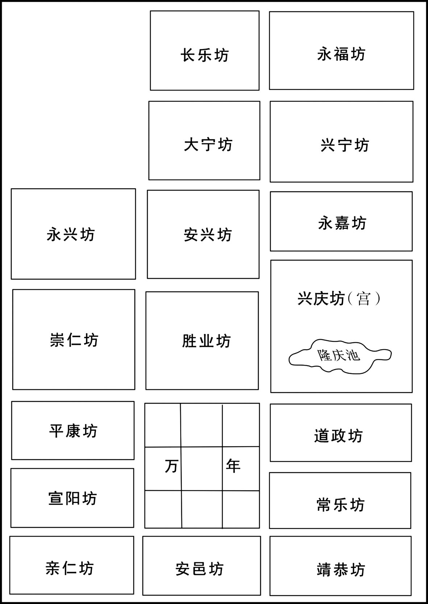 
隆庆池、兴庆坊（宫）在唐长安城中的位置示意图

## 【译文】

起初，在武则天统治时期，长安城东边的居民王纯家的水井中溢水，溢出的水逐渐形成一个占地几十顷的大池塘，号称为隆庆池。相王李旦的五个被封为王的儿子都把宅第并排建在隆庆池的北边。有能望气的人说：“这里常常有盛大的帝王之气，近来这种气尤为强劲。”景云元年（710年）夏季四月乙未（十四日），唐中宗来到隆庆池，在这里结成彩楼，设宴招待群臣，在池中泛舟、戏象来抑制这种帝王之气。

## 【原文】

**定州人郎岌上言：“韦后、宗楚客将为逆乱。”[1]韦后白上，杖杀之。**

## 【注文】

[1]岌：音jí。

## 【译文】

定州人郎岌上书说：“韦后、宗楚客将要谋逆作乱。”韦后将此话告诉唐中宗，随后用杖将郎岌打死。

## 【原文】

**五月丁卯，许州司兵参军偃师燕钦融复上言：“皇后淫乱，干预国政，宗族强盛[1]。安乐公主、武延秀、宗楚客图危宗社。”上召钦融面诘之。钦融顿首抗言，神色不挠，上默然[2]。宗楚客矫制令飞骑扑杀之，投于殿庭石上，折颈而死，楚客大呼称快。上虽不穷问，意颇怏怏不悦，由是韦后及其党始忧惧。**

## 【注文】

[1]司兵参军：唐朝地方官名。即地方州所设司兵参军事，诸州各置一人。上州为从七品下，中州正八品下，下州从八品下。负责掌管地方军务。

[2]顿首：叩头，磕头。

## 【译文】

唐睿宗景云元年（710年）五月丁卯（十七日），许州司兵参军事偃师人燕钦融又上奏道：“皇后淫乱，干预国家政事，宗族势力强盛。安乐公主、武延秀、宗楚客阴谋危害宗庙社稷（代指国家）。”唐中宗召见燕钦融，当面责问他。燕钦融以头叩地，高声大喊，神色毫不屈服，唐中宗沉默不语。宗楚客伪造中宗的制命，派侍卫天子的飞骑扑杀燕钦融，将燕钦融摔在宫殿堂前的石头上，燕钦融因折断了脖子而死去，宗楚客大声叫好。唐中宗虽然对于此事没有深究，但心里却不高兴，从此以后，韦后和她的党羽们开始担忧害怕了。

## 【原文】

**散骑常侍马秦客以医术，光禄少卿杨（玓）［均］以善烹调，皆出入宫掖，得幸于韦后，恐事泄被诛[1]。安乐公主欲韦后临朝，自为皇太女。乃相与合谋，于饼餤中进毒，六月壬午，中宗崩于神龙殿[2]。韦后秘不发丧，自总庶政。癸未，召诸宰相入禁中，征诸府兵五万人屯京城，使驸马都尉韦捷、韦灌、卫尉卿韦璿、左千牛中郎韦锜、长安令韦播、郎将高嵩等分领之[3]。璿，温之族弟；播，从子；嵩，其甥也[4]。中书舍人韦元徼巡六街[5]。又命左监门大将军兼内侍薛思简等将兵五百人驰驿戍均州，以备谯王重福[6]。以刑部尚书裴谈、工部尚书张锡并同中书门下三品，仍充东都留守[7]。吏部尚书张嘉福、中书侍郎岑羲、吏部侍郎崔湜并同平章事。羲，长倩之子也。**

## 【注文】

[1]光禄少卿：唐前期职事官，即光禄寺少卿。

[2]餤（dàn）：饼。　　神龙殿：唐朝宫殿。位于唐长安太极宫内。

[3]璿：音xuán。　　左千牛中郎：唐朝禁军将领。即左千牛卫中郎将。　　锜：音qí。

[4]温：即韦温（？—710年），唐前期大臣，唐中宗韦后的堂兄。京兆万年（今陕西西安）人。他初任吏员，因为贪赃被免。唐中宗神龙年间，他累迁礼部尚书，封鲁国公。中宗景龙三年（709年），他以太子少保同中书门下三品，成为宰相。第二年，中宗死，韦后临朝听政，他总知内外守捉兵马事，掌握兵权。他与宗楚客等密谋策划韦氏代唐。不久，他被李隆基（后来的唐玄宗）起兵捕杀。

[5]徼（jiào）：巡逻，巡察。

[6]内侍：唐朝宦官衙署内侍省的属官。

[7]东都留守：古代官名。唐代以洛阳为东都，皇帝不在东都时则置留守。先以朝廷大臣充任，唐玄宗开元元年（713年）改长史为尹，即以河南府尹为留守。天宝年间改东都为东京，又称东京留守。唐肃宗复名东都。

## 【译文】

散骑常侍马秦客凭借自己的医术，光禄少卿杨均靠善于烹调，都得以随意出入后宫，受到韦后的宠幸，他们担心此事泄露出去会被杀掉。安乐公主想让韦后临朝主持政事，自己当皇太女。于是她们共同谋划，在进给中宗吃的饼里投了毒，六月壬午（初二日），唐中宗在神龙殿驾崩。韦后不公布中宗驾崩的消息，自己总揽朝廷的大小事务。癸未（初三日），韦后将诸位宰相召集进宫，又调各府兵五万人驻扎在京城，派驸马都尉韦捷、韦灌、卫尉卿韦璿、左千牛中郎将韦锜、长安令韦播、郎将高嵩等人分头统领兵马。韦璿，是韦温的族弟；韦播，是韦温的侄子；高嵩，是韦温的外甥。中书舍人韦元负责巡察城中六街，还命令左监门大将军兼内侍薛思简等人带领五百名士兵乘驿马迅速前往均州戍守，以防范均州刺史谯王李重福。任命刑部尚书裴谈、工部尚书张锡为同中书门下三品，并充任东都留守。韦后又任命吏部尚书张嘉福、中书侍郎岑羲、吏部侍郎崔湜二人为同平章事。岑羲，是岑长倩的儿子。

## 【原文】

**太平公主与上官昭容谋草遗制立温王重茂为皇太子，皇后知政事，相王旦参谋政事[1]。宗楚客密谓韦温曰：“相王辅政，于理非宜。且于皇后，嫂叔不通问，听朝之际，何以为礼？”遂帅诸宰相表请皇后临朝，罢相王政事。苏瓌曰：“遗诏岂可改邪！”温、楚客怒，瓌惧而从之，乃以相王为太子太师[2]。**

## 【注文】

[1]上官昭容：即上官婉儿（664—710年）。

[2]太子太师：唐朝太子东宫官，位居太子三师（即太子太师、太子太傅、太子太保）之首，从一品。按制度规定，应负责教导太子的德行、修养、仪表。

## 【译文】

太平公主与上官昭容商议起草唐中宗遗诏以确立温王李重茂为皇太子，由韦皇后主持政事，相王李旦参谋政事。宗楚客私下对韦温说：“相王辅政，在道理上有些不适宜。再说相王与韦后，是叔嫂关系，不应互相问候，两人在一起处理朝廷政务的时候，又该怎样执行礼仪呢？”于是宗楚客率领各位宰相一同上表，请求韦皇后临朝主持政事，免去相王参谋政事的职务。苏瓌质问道：“先帝的遗诏怎么可以随意更改！”韦温和宗楚客大怒，苏瓌害怕了，便顺从了他们，于是任命相王为太子太师。

## 【原文】

**甲申，梓宫迁御太极殿，集百官发丧[1]。皇后临朝摄政，赦天下，改元唐隆[2]。进相王旦为太尉，雍王守礼为豳王，寿春王成器为宋王，以从人望[3]。命韦温总知内外守捉兵马事。**

## 【注文】

[1]梓宫：皇帝﹑皇后或重臣的棺材。

[2]唐隆：或作唐元、唐兴、唐安，是李重茂（史称唐殇（shāng）帝，又称唐少帝）在位期间所用年号，即唐隆元年（710年）六月至七月。在唐玄宗李隆基执政的开元、天宝年间，因避玄宗讳而改称唐元、唐兴、唐安。

[3]雍王守礼：即李守礼（672—741年）。参见注“嗣雍王守礼”。　　豳：音bīn。

## 【译文】

唐睿宗景云元年（710年）六月甲申（初四日），将唐中宗的灵柩迁到太极殿，召集文武百官公布中宗驾崩的消息。宣布由韦后自己临朝摄政，大赦天下囚徒，改年号为唐隆。韦后提升相王李旦为太尉，改封雍王李守礼为豳王，改封寿春王李成器为宋王，来顺从人们的愿望。韦后又任命韦温总管朝廷内外守捉兵马事务。

## 【原文】

**丁亥，殇帝即位，时年十六[1]。尊皇后为皇太后，立妃陆氏为皇后。**

## 【注文】

[1]殇帝：即唐殇帝李重茂（695—714年）。参见注“重茂”。

## 【译文】

唐睿宗景云元年（710年）六月丁亥（初七日），殇帝即皇帝位，当时仅十六岁。殇帝尊韦皇后为皇太后，立妃子陆氏为皇后。

## 【原文】

**壬辰，命纪处讷持节巡抚关内道，岑羲河南道，张嘉福河北道[1]。**

## 【注文】

[1]关内道：在唐太宗贞观年间，太宗李世民根据自然山川形势，将全国划分为十个监察区，称为十道。关内道为其中之一。其辖境相当于今陕西秦岭以北、甘肃祖厉河流域、宁夏贺兰山以东、内蒙古呼和浩特以西和狼山以南的河套等地。唐玄宗开元二十一年（733年），对全国各道设采访处置使，又在贞观年间所设十道的基础上细分为十五道。其中分关内道的京城长安及附近地区（今陕西中部）另置京畿道。京畿、关内二道同治长安（今陕西西安）。　　河南道：河南道是唐太宗贞观十道和唐玄宗开元十五道之一，太宗贞观元年（627年）置，因在黄河以南而得名。辖境约相当于今山东、河南两省黄河故道以南，山西中条山以南，和江苏、安徽二省淮河以北地区。玄宗开元二十一年（733年）分东都洛阳附近地区为都畿道，河南道辖境缩小。河南道治汴州（今河南开封）。

## 【译文】

唐睿宗景云元年（710年）六月壬辰（十二日），命令纪处讷携带符节巡视安抚关内道，岑羲巡视安抚河南道，张嘉福巡视安抚河北道。

## 【原文】

**宗楚客与太常卿武延秀、司农卿赵履温、国子祭酒叶静能及诸韦共劝韦后遵武后故事，南北卫军，台阁要司，皆以韦氏子弟领之，广聚党众，中外连结[1]。楚客又密上书称引图谶，谓韦氏宜革唐命。谋害殇帝，深忌相王及太平公主，密与韦温、安乐公主谋去之。**

## 【注文】

[1]南北卫军：指守卫唐朝皇宫的南衙禁军和北衙禁军。在唐朝的宫殿布局中，皇帝的居住地（即宫城）在北部，故称北衙。而皇帝上朝、办公之地、中央各官衙署所在地（即皇城）在南面。中央政府的各官署都设在南面的皇城，故称南衙，守卫南衙的军队称南衙禁军。皇帝的居住地位于宫廷的北部，因此驻守宫廷北门的北衙禁军的向背在历次宫廷政变中起决定性作用，其重要性大于南衙禁军。　　台阁：指唐中央政府尚书省的各个部门。

## 【译文】

宗楚客伙同太常卿武延秀、司农卿赵履温、国子祭酒叶静能以及韦家诸人一同劝说皇太后韦氏沿用武则天的惯例称帝，当时守卫皇宫的南北禁卫军，以及各个地位重要的部门，都由韦氏子弟所控制，他们大量网聚党羽，内外互相勾结。宗楚客又秘密地上书皇太后，引用图谶，来说明韦氏理当取代大唐而君临天下。宗楚客还打算谋害殇帝，因为他非常担心相王（李旦）与太平公主会从中作梗，就在私下里与韦温和安乐公主密谋除掉他们。

## 【原文】

**相王子临淄王隆基，先罢潞州别驾，在京师，阴聚才勇之士，谋匡复社稷[1]。初，太宗选官户及蕃口骁勇者，著虎文衣，跨豹文鞯，从游猎，于马前射禽兽，谓之百骑；则天时稍增为千骑，隶左、右羽林；中宗谓之万骑，置使以领之[2]。隆基皆厚结其豪杰。**

## 【注文】

[1]临淄王隆基：即唐玄宗李隆基（685—762年）。参见注“楚王隆基”。

[2]官户：犯罪者及其家属没入官府服役，并编入特殊户籍，称官户。　　蕃口：非汉人。　　鞯（jiān）：垫马鞍的东西。　　百骑：唐朝禁军。唐太宗时选择材力骁健、善骑射者百人，号百骑，分两番于北门长上，射猎则着五色服、乘六闲马以从。　　万骑：唐朝禁军。武后永昌元年（689年）改百骑为千骑，唐中宗景龙元年（707年）改为万骑，所扩兵多从户奴中选取。分左右营，属左右羽林军。

## 【译文】

相王（李旦）的儿子临淄王李隆基，此前被免去潞州别驾的职务，他在京城，私下招集智勇双全之士，谋划匡复大唐江山。当初，唐太宗选拔官户和蕃口中骁勇善战的人员，让他们身穿绘有虎皮花纹的衣服，跨上绘有豹皮花纹的马鞍，随太宗巡游狩猎，让他们在鞍前马后一同射杀飞禽走兽，称这些人为“百骑”；武则天时期逐渐增为“千骑”，隶属于左、右羽林军；唐中宗将这支部队称为“万骑”，设置官员以统领队伍。李隆基对他们中的豪杰之士都深加笼络结纳。

## 【原文】

**兵部侍郎崔日用素附韦、武，与宗楚客善，知楚客谋，恐祸及己，遣宝昌寺僧普润密诣隆基告之，劝其速发[1]。隆基乃与太平公主及公主子卫尉卿薛崇暕、苑总监赣人钟绍京、尚衣奉御王崇晔、前朝邑尉刘幽求、利仁府折冲麻嗣宗谋先事诛之[2]。韦播、高嵩数榜捶万骑，欲以立威，万骑皆怨。果毅葛福顺、陈玄礼见隆基诉之，隆基讽以诛诸韦，皆踊跃请以死自效[3]。万骑果毅李仙凫亦预其谋[4]。或谓隆基当启相王，隆基曰：“我曹为此以徇社稷，事成福归于王，不成以身死之，不以累王也[5]。今启而见从，则王预危事；不从，将败大计。”遂不启。**

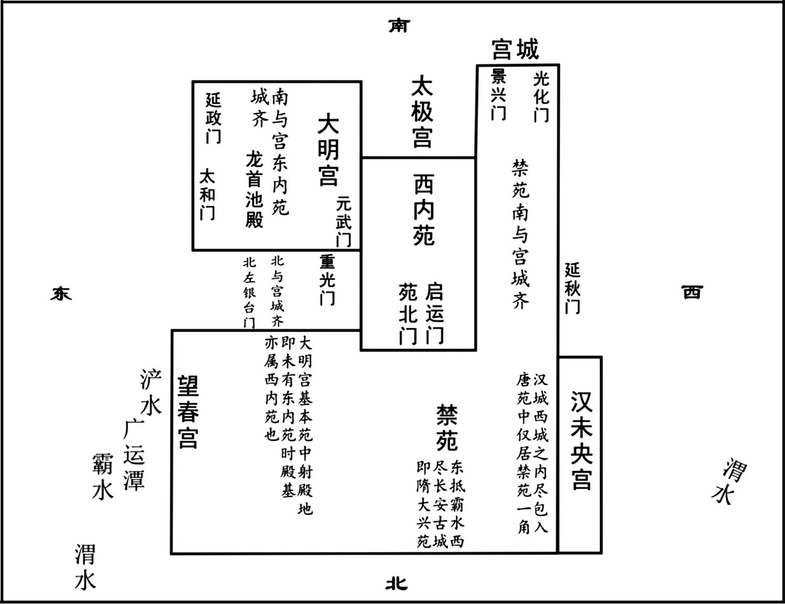 
唐长安城禁苑示意图

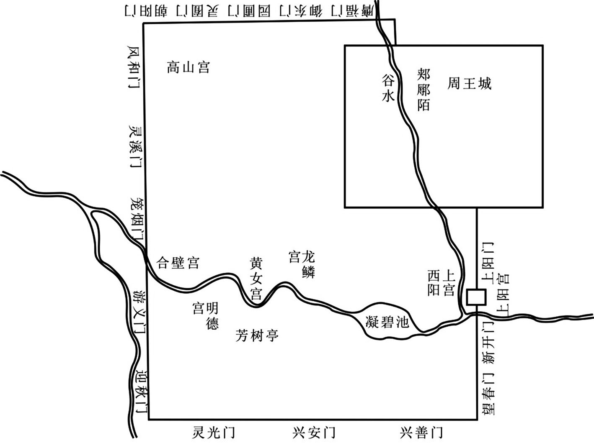 
唐东都洛阳城西郊禁苑示意图

## 【注文】

[1]兵部侍郎：唐前期职事官。　　崔日用（673—722年）：唐前期大臣。滑州灵昌（今河南滑县西南）人。他于武周证圣元年（695年）考中进士，担任芮城（今山西芮城）县尉。他才智过人，善于应变。唐中宗神龙年间，他依附于权臣武三思，迅速升至兵部侍郎。中宗景龙四年（710年），中宗死后，韦后临朝听政。日用担心祸及自己，又投靠临淄王李隆基（后来的唐玄宗），与之密谋政变。不久，日用因为平定韦后之功，升黄门侍郎，参知机务，跻身宰相之位，封齐国公。他担任宰相一个多月，因为与中书侍郎薛稷互相攻击，被罢为雍州（治今陕西西安）长史。唐玄宗先天二年（713年），玄宗采纳了日用的建议，讨平太平公主，日用因功进吏部尚书。后因事被贬到外地，死于并州（治今山西太原）大都督府长史任上。　　宝昌寺：唐长安城的寺院。具体位置待考。

[2]暕：音jiǎn。　　苑总监：古代官名。这里指西京苑总监。唐朝的西京长安和东都洛阳的禁苑中，各设总监一人，从五品下，掌管宫苑内馆、园池、禽鱼果木之事。　　赣（gàn）：古县名。即赣县，相当于今江西赣州。　　钟绍京（生卒年不详）：唐前期大臣。虔州赣县（今江西赣州）人，字可大。他喜好书画，初为司农录事，因擅长书法而到凤阁（中书省）任职。武则天统治时期，各宫殿的额题、九鼎铭文皆出其手。唐隆元年（710年），他跟随李隆基参与平定韦氏之乱，因功进为中书侍郎、同中书门下三品，参知机务，成为宰相。他又进为中书令，封越国公。他任意赏罚，为时人所恶。不久，他被贬为蜀州（治今四川崇州）刺史。唐玄宗时，他又拜户部尚书，再贬果州（治今四川南充北）刺史。唐玄宗开元十五年（727年），他又回到朝廷，后死于少詹事任上，年逾八十。　　晔：音yè。　　利仁府：隶属于雍州（唐都长安及附近地区）的折冲府。折冲府是唐代府兵制基层组织军府的名称。　　折冲：唐前期，实行府兵制度。全国各主要地方设置大大小小的军府，称为折冲都尉府或折冲府。折冲都尉是长官，果毅都尉是折冲都尉的副职。全国各折冲都尉府置折冲都尉一人。上府的折冲都尉为正四品上，中府为从四品下，下府为正五品下。折冲都尉负责统领所属府兵以备宿卫。出师则总领军器、粮草、物资、传点等事。兵马轮番在折冲府中服役，每年冬季练习军阵、战斗之法。在唐高宗统治时期，府兵制渐渐废弛，折冲都尉、果毅都尉带领士兵轮番服役、出征已经无法严格执行。到唐玄宗时代，正式废除府兵制。但终唐之世，折冲都尉、果毅都尉的空名却一直存在。

[3]陈玄礼（生卒年不详）：唐中宗、睿宗、玄宗朝禁军将领。唐中宗景龙四年（710年）任禁军将领万骑果毅，帮助李隆基翦除其政敌中宗韦皇后的势力。李隆基即位后，升玄礼为龙武大将军，掌管一部分北衙禁军。他淳朴自检，严守宫禁。唐玄宗天宝十四载（755年），安禄山发动叛乱。第二年，玄礼率领禁军跟随玄宗逃出长安，奔往蜀地。在途中，经过马嵬驿，他得到太子李亨的支持，起兵杀死宰相杨国忠，又逼迫玄宗杀死杨贵妃。后来，陈玄礼又跟随玄宗到了蜀地。李亨率领一部分将领和士兵分兵北上，到达朔方节度使的治所灵州（今宁夏吴忠），即皇帝位，尊玄宗为太上皇。唐军收复长安后，陈玄礼又护送太上皇回到京城，被封为蔡国公。唐肃宗上元元年（760年），肃宗宠幸的大宦官李辅国逼太上皇迁移到西内（即太极宫。安禄山叛乱后，皇帝的生活起居和中枢权力运作已经转移到长安城东北的大明宫，太极宫的地位大大跌落。太上皇居住在太极宫，其实是让他远离权力中心），同时勒令陈玄礼退休。

[4]凫：音fú。

[5]曹：等，辈。

## 【译文】

兵部侍郎崔日用平素一向依附韦后及武氏集团，与宗楚客关系很好，他得知宗楚客的阴谋以后，担心引祸上身，就派宝昌寺僧人普润秘密地去向李隆基报告，劝李隆基尽快起事。李隆基于是与太平公主及其子卫尉卿薛崇暕（即薛崇简）、西京苑总监赣县人钟绍京、尚衣奉御王崇晔、前任朝邑县尉刘幽求、利仁府折冲麻嗣宗等人策划先行举兵铲除韦氏集团。韦播、高嵩多次鞭打万骑兵，为的是树立自己的威望，万骑兵对他们都心存怨恨。果毅葛福顺和陈玄礼向李隆基诉说此事，李隆基暗示他们诛除韦后集团，他们听后都踊跃地表示愿效死力。万骑果毅李仙凫也参与了具体谋划。有人建议李隆基应当把这件事告诉他的父亲相王（李旦），李隆基说：“我们这些人是为了大唐的江山社稷，事成之后福分归于相王，万一事情失败我们身死就是了，不必因此而连累相王。如果现在告诉了他，他同意这样做，就等于让他也参与这种危险的事；若是他不同意这样做，那将会坏了大事。”所以没有把这件事告诉相王。

## 【原文】

**庚子，晡时，隆基微服与幽求等入苑中，会钟绍京廨舍[1]。绍京悔，欲拒之，其妻许氏曰：“忘身徇国，神必助之。且同谋素定，今虽不行，庸得免乎！”[2]绍京乃趋出拜谒，隆基执其手与坐[3]。时羽林将士皆屯玄武门，逮夜，葛福顺、李仙凫皆至隆基所，请号而行。向二鼓，天星散落如雪，刘幽求曰：“天意如此，时不可失。”福顺拔剑直入羽林营，斩韦璿、韦璠(17)、高嵩以徇。曰：“韦后鸩杀先帝，谋危社稷。今夕当共诛诸韦，马鞭以上皆斩之，立相王以安天下。敢有怀两端助逆党者，罪及三族。”羽林之士皆欣然听命。乃送璿等首于隆基。隆基取火视之，遂与幽求等出苑南门，绍京帅丁匠二百余人执斧锯以从。使福顺将左万骑攻玄德门，仙凫将右万骑攻白兽门，约会于凌烟阁前，即大噪，福顺等杀守门将，斩关而入[4]。隆基勒兵玄武门外，三鼓，闻噪声，帅总监及羽林兵而入，诸卫兵在太极殿宿卫梓宫者，闻噪声，皆被甲应之[5]。韦后惶惑，走入飞骑营，有飞骑斩其首献于隆基。安乐公主方照镜画眉，军士斩之。斩武延秀于肃章门外，斩内将军贺娄氏于太极殿西[6]。**

## 【注文】

[1]晡（bū）：申时，即午后三点至五点。　　廨（xiè）：官署，古代官吏办公处所的通称。

[2]庸：岂，怎么。

[3]趋：快走，催促，急速。

[4]玄德门：唐朝宫门。位于唐长安宫城的东北部。　　白兽门：唐朝宫门。位于唐长安宫城中。具体位置待考。　　凌烟阁：唐朝宫殿。位于唐长安宫城东部。唐太宗贞观十七年（643年），太宗为了褒奖开国功臣，命画家阎立本绘开国功臣长孙无忌等二十四人的画像于凌烟阁，像皆面北而挂。

[5]被（pī）：同“披”。

[6]内将军：唐朝将领。当时，唐中宗韦皇后任命妇人贺娄尚宫为内将军，统领一部分军队。

## 【译文】

唐睿宗景云元年（710年）六月庚子（二十日），申时（午后三点至五点），李隆基身穿便服与刘幽求等人进入禁苑之中，到钟绍京的住所会合。此时钟绍京后悔了，想将李隆基拒之门外，他的妻子许氏对他说：“为了国家而不计个人安危的人，神一定会帮助他的。再说你平常就与他们共谋这件事，现在即使你不去亲自参加，又哪里能够脱得了干系呢！”钟绍京这才赶忙开门，出来拜见李隆基，李隆基拉着他的手与他一起坐下。这时羽林军将士都驻扎在玄武门，等到夜色降临，葛福顺和李仙凫都到李隆基所在地，请求起事的信号以便行动。将近敲二更鼓时，夜空的流星散落如雪，刘幽求说：“天意如此，机不可失。”葛福顺拔剑直闯羽林营，将韦璿、韦播、高嵩三人斩首示众。说：“韦后毒死先帝，阴谋危害国家。今晚大家应该齐力铲除韦氏一伙，凡是长得高过马鞭的人一律斩杀，拥立相王为帝，以安定天下。倘若有人胆敢首鼠两端帮助逆党的话，将连及三族判罪。”羽林军将士全都欣然从命。于是葛福顺将韦璿等人的首级送给李隆基，李隆基拿来灯火照明看过之后，就与刘幽求等人走出禁苑南门，钟绍京率领工匠二百多人手持斧子、锯子跟着李隆基。李隆基派葛福顺率领左万骑攻打玄德门，派李仙凫率领右万骑攻打白兽门，双方约定在凌烟阁前会师后，即大声鼓噪。葛福顺等人杀掉守门的兵将，攻入宫中。李隆基率兵守在玄武门外，三更鼓的时候，听到宫中鼓噪声之后，就率领总监和羽林兵攻入宫中，在太极殿负责守卫中宗灵柩的南牙卫兵们，听到鼓噪之后，全都披挂整齐接应李隆基等人。韦后惶恐疑惑，逃入飞骑营，有一个飞骑兵砍下韦后的首级献给李隆基。安乐公主正对着镜子画眉时，被士兵斩杀。此外还将武延秀斩首于肃章门外，将内将军贺娄氏斩首于太极殿西。

## 【原文】

**初，上官昭容引其从母之子王昱为左拾遗，昱说昭容母郑氏曰：“武氏天之所废，不可兴也[1]。今婕妤附于三思，此灭族之道也，愿姨思之。”郑氏以戒昭容，昭容弗听。及太子重俊起兵诛三思，索昭容，昭容始惧，思昱言，自是心附帝室，与安乐公主各树朋党。及中宗崩，昭容草遗制立温王，以相王辅政，宗、韦改之。及隆基入宫，昭容执烛，帅宫人迎之，以制草示刘幽求。幽求为之言，隆基不许，斩于旗下。**

## 【注文】

[1]从（zòng）母：母亲的姐妹，即姨母。　　昱：音yù。

## 【译文】

当初，上官昭容引荐她的姨母的儿子王昱为左拾遗，王昱劝上官昭容的母亲郑氏说：“武氏是被上天所废弃，是不可能再复兴的。现在婕妤依附武三思，这是自取灭族的路啊，希望姨母仔细考虑考虑。”郑氏用这些道理来告诫上官昭容，但上官昭容根本不听。等到太子李重俊起兵讨伐武三思的时候，到处搜捕上官昭容，上官昭容才开始感到害怕，回想起王昱说过的话，此后上官昭容一心依附唐中宗，与安乐公主各自结成帮派。等到中宗驾崩后，上官昭容起草遗诏，将温王李重茂立为太子，由相王（李旦）辅政，宗楚客、韦后修改了遗诏。待李隆基率军进入宫中时，上官昭容手执火烛，率领宫人迎接李隆基，并将她起草的中宗遗诏拿给刘幽求看。刘幽求为她向李隆基求情，李隆基没有答应，将上官昭容在旗下斩首。

## 【原文】

**时少帝在太极殿，刘幽求曰：“众约今夕共立相王，何不早定？”隆基遽止之，捕索诸韦在宫中及守诸门，并素为韦后所亲信者皆斩之。比晓，内外皆定。辛巳，隆基出见相王，叩头谢不先启之罪。相王抱之泣曰：“社稷、宗庙不坠于地，汝之力也。”遂迎相王入辅少帝。**

## 【译文】

这时少帝住在太极殿，刘幽求说：“大家约好了今天晚上拥立相王为帝，为什么不早一点儿定下来呢？”李隆基急忙制止了他，下令搜捕宫中和把守宫中各门的韦氏家族的人，平常得到韦后信任重用的人也一起斩首。等到天将破晓，宫内外均已平定。唐睿宗景云元年（710年）六月辛巳（初一日），李隆基出宫拜见其父相王（李旦），为自己起事之前未能先禀告相王而叩头谢罪。相王抱住李隆基，流着眼泪说：“大唐宗庙社稷得以保全，全是你的功劳。”李隆基于是率军迎接相王入宫辅佐少帝。

## 【原文】

**闭宫门及京城门，分遣万骑收捕诸韦亲党。斩太子少保、同中书门下三品韦温于东市之北[1]。中书令宗楚客衣斩衰，乘青驴逃出[2]。至通化门，门者曰：“公，宗尚书也。”[3]去布帽，执而斩之，并斩其弟晋卿。相王奉少帝御安福门，慰谕百姓[4]。初，赵履温倾国资以奉安乐公主，为之起第舍，筑台穿池无休已，擫紫衫，以项挽公主犊车[5]。公主死，履温驰诣安福楼下，舞蹈称万岁，声未绝，相王命万骑斩之[6]。百姓怨其劳役，争割其肉立尽。秘书监汴王邕娶韦后妹崇国夫人，与御史大夫窦从一，各手斩其妻首以献。邕，凤之孙也[7]。左仆射、同中书门下三品韦巨源闻乱，家人劝之逃匿，巨源曰：“吾位大臣，岂可闻难不赴。”[8]出至都街，为乱兵所杀，时年八十。于是枭马秦客、杨均、叶静能等首，尸韦后于市。崔日用将兵诛诸韦于杜曲，襁褓儿无免者，诸杜滥死非一[9]。**

## 【注文】

[1]东市：指唐长安城中的东市。

[2]斩衰（cuī）：丧服名。中国古代的丧服制度按照亲疏关系分为“五服”，服丧期限及丧服粗细不同，分为五种。斩衰为“五服”中最重的丧服，用最粗的生麻布制作，断处外露不缉边，丧服上衣叫“衰”，因称“斩衰”，表示毫不修饰以尽哀痛，服期三年。

[3]通化门：城门。位于唐长安城东部偏北。

[4]安福门：城门。位于唐长安皇城的西北。

[5]擫（yè）：（用手指）按压。　　犊车：牛车。

[6]安福楼：即安福门楼。

[7]凤：即李凤（622—675年），唐高祖李渊之第十五子，杨美人所生，字季成。唐高祖武德六年（623年）封豳王，唐太宗贞观十年（636年）改封虢王。李凤在贞观五年（631年）到地方任职，任邓州（治今河南邓州）刺史，此后历官虢州（治今河南灵宝）、豫州（治今河南汝南）、宋州（治今河南商丘市睢阳区）、寿州（治今安徽寿县）、青州（治今山东青州）五州刺史。唐高宗上元二年（675年）在洛阳去世。

[8]左仆射：唐前期职事官，即尚书左仆射。

[9]杜曲：古地名。位于唐西京长安城南，名门望族韦氏、杜氏居住于此，称为韦曲、杜曲。当时，韦氏家族强盛，侵杜曲而居之。　　襁（qiǎng）褓（bǎo）：襁指婴儿的带子，褓指小儿的被子。后来以此借指未满周岁的婴儿。

## 【译文】

李隆基下令关闭所有宫门和京城各门，又派遣万骑兵分头搜捕韦氏家族的亲属党羽。将太子少保、同中书门下三品韦温斩首于东市以北。中书令宗楚客身穿丧服，骑着一头黑驴逃出京城。走到通化门时，守门的兵士对他说：“您就是宗尚书吧。”说完摘下他的布帽，将他抓走斩首，同他一起被杀掉的还有他的弟弟宗晋卿。相王（李旦）侍奉少帝来到安福门，安抚百姓。起初，赵履温不惜耗尽国家资财以讨安乐公主的欢心，为安乐公主修建宅第、建造园林，无休无止，甚至于用手按住自己的紫色官服，用脖子挽着公主坐的牛车。安乐公主被杀后，赵履温赶忙跑到安福楼下，手舞足蹈地山呼万岁，欢呼声未落，相王就命令万骑兵将其斩首。老百姓早就恨赵履温增派劳役，便争相割他的肉，尸体上的肉转眼就所剩无几了。秘书监汴王李邕娶了韦后的妹妹崇国夫人为妻，他与御史大夫窦从一，分别砍下各自妻子的首级进献。李邕，是李凤的孙子。左仆射、同中书门下三品韦巨源听到李隆基起事的消息后，家人劝他外逃躲避，韦巨源说：“我身为朝廷大臣，怎么能有难不赴。”便走出家门来到都城的大街上，被乱兵所杀，时年八十岁。此时已将马秦客、杨均、叶静能等斩首示众，并将韦后暴尸街市。崔日用带兵到杜曲诛杀韦氏家族的其他成员，连尚在襁褓中的婴儿也不能幸免，杜氏家族成员中被冤杀的不止一人。

## 【原文】

**是日，赦天下，云“逆贼魁首已诛，自余支党一无所问”。以临淄王隆基为平王，兼知内外闲厩，押左右厢万骑[1]。薛崇暕赐爵立节王。以钟绍京守中书侍郎，刘幽求守中书舍人，并参知机务。麻嗣宗行左金吾卫中郎将[2]。武氏宗属，诛死流窜殆尽。侍中纪处讷行至华州，吏部尚书、同平章事张嘉福行至怀州，皆收斩之[3]。**

## 【注文】

[1]知内外闲厩（jiù）：暂时负责皇宫内外闲厩之事。闲厩，即闲厩使，唐朝使职名。武则天圣历三年（700年）设闲厩使，负责掌管皇宫仗内的六厩（即皇宫内的六个马圈），管理皇帝御用的马匹，以受宠的殿中监（殿中省长官，从三品，负责掌管皇帝的衣服、膳食、车马，总领皇宫内衣食住行各主管机构）充任，侵夺殿中省、太仆寺的部分职权。唐玄宗开元初，皇宫内闲厩的马达一万余匹，也饲养骆驼、大象，所有这些动物的饲养都归闲厩使掌管。殿中省尚乘局（殿中省下辖的专门负责饲养皇宫内马匹的机构）只留存虚名而已。闲厩使押五坊，以供皇家狩猎：一为雕坊；二为鹘坊；三为鹤坊；四为鹰坊；五为狗坊。　　左右厢万骑：唐朝禁军。即左万骑、右万骑。

[2]左金吾卫：禁卫军指挥机构。唐代十六卫之一。唐高宗龙朔二年（662年）改左候卫置。

[3]怀州：古州名。北魏天安年间置，隋治河内（今河南沁阳），唐辖境相当于今河南焦作、沁阳、武陟、修武、博爱、获嘉等市县地。

## 【译文】

在这一天，少帝下诏赦免全国的罪人，诏书说“图谋叛逆的罪魁祸首均已伏诛，其余党羽概不追究”。改封临淄王李隆基为平王，并且让他主持内外闲厩事务，掌管左右厢万骑兵。将薛崇暕（薛崇简）赐爵为立节王。任命钟绍京兼中书侍郎，刘幽求兼中书舍人，均参知机务。又任命麻嗣宗行左金吾卫中郎将。武氏家族成员，几乎全被诛杀或者流放。侍中纪处讷走到华州，吏部尚书、同平章事张嘉福走到怀州，都被收捕而斩首。

## 【原文】

**壬寅，刘幽求在太极殿，有宫人与宦官令幽求作制书立太后，幽求曰：“国有大难，人情不安，山陵未毕，遽立太后，不可。”[1]平王隆基曰：“此勿轻言。”**

## 【注文】

[1]山陵：即陵。旧指皇帝陵墓。

## 【译文】

唐睿宗景云元年（710年）六月壬寅（二十二日），刘幽求在太极殿，有些宫女和宦官让幽求起草册立皇太后的制书，幽求说：“国有大难，民心不稳，先帝的灵柩还没有安葬，匆忙地册立太后，这样不行。”平王李隆基说：“不要轻易谈论这件事。”

## 【原文】

**遣十道使赍玺书宣抚，及诣均州宣慰谯王重福[1]。贬窦从一为濠州司马，罢诸公主府官[2]。**

## 【注文】

[1]十道使：指向全国的十道（即监察区）派遣使者。

[2]濠（háo）州：古州名。隋文帝开皇年间改西楚州置，治钟离（今安徽凤阳东北），唐辖境相当于今安徽蚌埠、凤阳、定远、明光等市县地。

## 【译文】

少帝派遣十道使携带皇帝的诏书安抚百姓，又派人到均州去安抚谯王李重福。将窦从一贬为濠州司马，下诏废除各个公主府官署。

## 【原文】

**癸卯，太平公主传少帝命，请让位于相王，相王固辞。以平王隆基为殿中监、同中书门下三品，以宋王成器为左卫大将军，衡阳王成义为右卫大将军，巴陵王隆范为左羽林大将军，彭城王隆业为右羽林大将军，光禄少卿嗣道王微检校右金吾卫大将军[1]。微，元庆之孙也[2]。以黄门侍郎李日知、中书侍郎钟绍京并同中书门下三品。太平公主之子薛崇训为右千牛卫将军[3]。隆基有二奴王毛仲、李守德皆趫勇善骑射，常侍卫左右[4]。隆基之入苑中也，毛仲避匿不从，事定数日方归，隆基不之责，仍超拜将军。毛仲，本高丽也。汴王邕贬沁州刺史，左散骑常侍、驸马都尉杨慎交贬巴州刺史，中书令萧至忠贬许州刺史，兵部尚书、同中书门下三品韦嗣立贬宋州刺史，中书侍郎、同平章事赵彦昭贬绛州刺史，吏部侍郎、同平章事崔湜贬华州刺史[5]。**

## 【注文】

[1]右金吾卫大将军：唐朝禁军将领。参见注“左金吾将军”。

[2]元庆：即李元庆（？—664年），唐高祖李渊之第十六子，刘婕妤所生。唐高祖封元庆为汉王，后改封为陈王。唐太宗贞观年间改封为道王。唐高宗麟德元年（664年）逝世，赠司徒、益州（治今四川成都）都督。

[3]右千牛卫将军：唐朝禁军将领。参见注“左千牛将军”。

[4]王毛仲（？—731年）：唐前期大臣。高丽人。他少年事临淄王李隆基（唐玄宗），授将军，掌管东宫的马驼鹰狗等坊，升大将军。唐玄宗先天二年（713年），他预除太平公主，因功授辅国大将军、左武卫大将军、检校内外闲厩兼知监牧使，封霍国公。他奉公正直，不避权贵，于监牧之事尤为尽力，初监马二十四万，后增至四十三万，牛羊增加好几倍，甚得皇帝的恩宠。唐玄宗开元九年（721年），毛仲充朔方道防御讨击大使。他因宠而骄，求兵部尚书不得而心生怨恨。他又与禁军将领交结，蔑视宦官。开元十九年（731年），他被玄宗宠信的大宦官高力士陷害，贬瀼州（治今广西上思西南）别驾，又被皇帝追诏赐死。　　趫（qiáo）：行动轻捷，善于缘木升高。善于奔跑。

[5]沁州：古州名。唐高祖武德年间改义宁郡复置，治沁源（今山西沁源），辖境约当今山西太岳山东南、沁河上游地区。　　宋州：古州名。隋文帝开皇年间置，治宋城（今河南商丘南），唐辖境相当于今河南商丘、睢县、宁陵、虞城、夏邑、柘城，安徽砀山，山东单县、曹县等市县地。　　赵彦昭（生卒年不详）：唐前期大臣。甘州张掖（今甘肃张掖）人，字奂然，他少年以文辞知名，后考中进士。唐中宗景龙三年（709年），他担任中书侍郎、同平章事，成为宰相。唐睿宗即皇帝位后，出为凉州（治今甘肃武威）都督。后迁刑部尚书，封耿国公。后来，殿中侍御史郭元振弹劾彦昭事女巫，宰相姚崇也讨厌彦昭，贬为江州（治今江西九江）别驾。

## 【译文】

唐睿宗景云元年（710年）六月癸卯（二十三日），太平公主传达了少帝的诏命，请求将皇位让给相王（李旦），相王坚决推辞。少帝任命平王李隆基为殿中监、同中书门下三品，任命宋王李成器为左卫大将军，衡阳王李成义为右卫大将军，巴陵王李隆范为左羽林大将军，彭城王李隆业为右羽林大将军，光禄少卿嗣道王李微为检校右金吾卫大将军。李微，是李元庆的孙子。任命黄门侍郎李日知、中书侍郎钟绍京均为同中书门下三品。任命太平公主之子薛崇训为右千牛卫将军。李隆基有两个奴仆王毛仲和李守德都骁勇善战，平常随身侍卫李隆基。李隆基举事进入禁苑之际，王毛仲躲起来没有跟从，大局定后好几天才又回到李隆基身边，李隆基并没有罚他，还是将他破格提拔为将军。王毛仲，原本是高丽人。将汴王李邕贬为沁州刺史，左散骑常侍、驸马都尉杨慎交贬为巴州刺史，中书令萧至忠贬为许州刺史，兵部尚书、同中书门下三品韦嗣立贬为宋州刺史，中书侍郎、同平章事赵彦昭贬为绛州刺史，吏部侍郎、同平章事崔湜贬为华州刺史。

## 【原文】

**刘幽求言于宋王成器、平王隆基曰：“相王畴昔已居宸极，群望所属[1]。今人心未安，家国事重，相王岂得尚守小节，不早即位，以镇天下乎！”隆基曰：“王性恬淡，不以代事婴怀，虽有天下犹让于人，况亲兄之子，安肯代之乎？”幽求曰：“众心不可违，王虽欲高居独善，其如社稷何。”成器、隆基入见相王，极言其事，相王乃许之。甲辰，少帝在太极殿东隅西向，相王立于梓宫旁，太平公主曰：“皇帝欲以此位让叔父，可乎？”幽求跪曰：“国家多难，皇帝仁孝，追踪尧、舜，诚合至公。相王代之任重，慈爱尤厚矣。”乃以少帝制传位相王。时少帝犹在御座，太平公主进曰：“天下之心已归相王，此非儿座。”遂提下之。睿宗即位，御承天门，赦天下[2]。复以少帝为温王，以钟绍京为中书令。**

## 【注文】

[1]畴昔：往昔，日前，以前。

[2]承天门：唐长安宫城的正南门。

## 【译文】

刘幽求对宋王李成器、平王李隆基说：“相王在以前就曾当过皇帝，是众望所归的。现在民心尚未安定，皇室国家之事最重要，相王怎能还拘于小节，不早日即位，以安定天下呢！”李隆基回答说：“相王生性淡泊，从来不把世事放在心上，即使他已经君临天下还要把帝位让给别人，何况当今天子乃相王的亲哥哥的儿子，他又怎么肯取代他呢？”刘幽求说：“民心不可违背，相王虽想高居世外独善其身，但国家怎么办！”李成器和李隆基入内拜见相王，尽力劝说，相王才答应他们。六月甲辰（二十四日），少帝在太极殿内东边面向西而坐，相王站在唐中宗的灵柩旁边，太平公主说道：“皇帝想把帝位让给叔父，可以吗？”刘幽求跪在地上回答说：“国家多灾多难之际，皇帝仁爱孝顺，效法尧、舜禅让的传统，实在是出于最无私之心。相王代替皇帝治理国家，责任重大，是叔父对侄儿仁慈厚爱的表现。”于是便根据少帝制书的旨意，将帝位传给相王。这时少帝还坐在皇帝的宝座上，太平公主上前对他说：“天下人心已归附相王，这已经不是你这小子的宝座了。”说完就将他从宝座上拉了下来。唐睿宗即皇帝位，亲临承天门，颁布诏书赦免天下罪人。又恢复了少帝李重茂的温王爵位，任命钟绍京为中书令。

## 【原文】

**上将立太子，以宋王成器嫡长，而平王隆基有大功，疑不能决。成器辞曰：“国家安则先嫡长，国家危则先有功；苟违其宜，四海失望。臣死不敢居平王之上。”涕泣固请者累日。大臣亦多言“平王功大，宜立”。刘幽求曰：“臣闻除天下之祸者，当享天下之福。平王拯社稷之危，救君亲之难，论功莫大，语德最贤，无可疑者。”上从之。丁未，立平王隆基为太子。隆基复表让成器，不许。则天大圣皇后复旧号为天后。追谥雍王贤曰章怀太子。戊申，以宋王成器为雍州牧、扬州大都督、太子太师[1]。置温王重茂于内宅[2]。**

## 【注文】

[1]扬州大都督：唐朝官名。唐睿宗太极初，于并、益、荆、扬四州设四大都督府。唐玄宗开元十七年（729年）又加设潞州大都督府，共置五大都督府。府置大都督一员，从二品，掌督诸州城隍、兵马、甲仗、食粮、镇戍等，总判府事。

[2]内宅：又称内廷。唐朝的皇宫分为外朝和内廷。在理论上，外朝是皇帝接见或召见臣僚、处理国家政事之地，属于公共空间，又称皇城。而内廷是皇帝及后妃日常生活起居之地，属于私人空间，又称宫城。但在实际权力运作过程中，二者的界限往往不太清晰。

## 【译文】

唐睿宗想要立太子，因为宋王李成器是嫡长子，而平王李隆基有大功，因而在人选上犹豫不决。李成器推辞道：“国家安泰则应当先立嫡长子，国家多难则应当立有功的人；如果违反时宜，会让普天之下的人大失所望。我宁可去死也不敢位居平王之上。”为此他接连几天流着眼泪向睿宗坚决请求将太子之位让给平王李隆基。大臣们也大多说“平王有大功于国家，应当被立为太子”。刘幽求说：“臣听说铲除天下祸患的人，应当享有天下的福分。平王拯救国家于危险中，拯救君亲于危难之中，讲功劳没有谁比他更大的，论德行是最贤良的，立他为太子，没有什么可怀疑的。”睿宗听从了他的建议。景云元年（710年）六月丁未（二十七日），睿宗立平王李隆基为太子。李隆基又上表请求将太子之位让给李成器，睿宗不同意。睿宗下诏恢复则天大圣皇后的旧号为天后。追谥雍王李贤为章怀太子。戊申（二十八日），任命宋王李成器为雍州牧、扬州大都督、太子太师。将温王李重茂安置在内宅。

## 【原文】

**追削武三思、武崇训爵谥，砎棺暴尸，平其坟墓[1]。越州长史宋之问、饶州刺史冉祖雍坐谄附韦、武，皆流岭表[2]。追赠郎岌、燕钦融谏议大夫。秋七月庚戌朔，赠韦月将宣州刺史。癸丑，以兵部侍郎崔日用为黄门侍郎，参知机务。追复故太子重俊位号。雪敬晖、桓彦范、崔玄、张柬之、袁恕己、成王千里、李多祚等罪，复其官爵。**

## 【注文】

[1]砎（zhuó）：砍，削。

[2]越州：古州名。隋炀帝大业初改吴州置，治会稽（今浙江绍兴），辖境相当于今浙江浦江流域（义乌市除外）、曹娥江流域及余姚市地。　　饶州：古州、路、府名。隋文帝开皇年间置州，唐辖境相当于今江西鄱江、信江两流域（婺源、玉山二县除外）。

## 【译文】

唐睿宗下令削夺武三思、武崇训父子的爵位和谥号，砍开他们的棺材、暴露他们的尸体，并铲平他们的坟墓。越州长史宋之问、饶州刺史冉祖雍因趋附韦、武集团获罪，被流放到岭南地区。追赠郎岌、燕钦融为谏议大夫。景云元年（710年）秋季七月庚戌朔（初一日），追赠韦月将为宣州刺史。癸丑（初四日），任命兵部侍郎崔日用为黄门侍郎，参知机务。重新恢复原太子李重俊的位号。为敬晖、桓彦范、崔玄、张柬之、袁恕己、成王李千里、李多祚等人昭雪，恢复其原有的官爵。

## 【原文】

**丁巳，以洛州长史宋璟检校吏部尚书、同中书门下三品，岑羲罢为右散骑常侍兼刑部尚书。璟与姚元之协心革中宗弊政，进忠良，退不肖，赏罚尽公，请托不行，纲纪修举，当时翕然以为复有贞观、永徽之风[1]。壬戌，崔湜罢为尚书左丞。**

## 【注文】

[1]不肖（xiào）：不才，不贤，不正派，品行不好，没有出息。　　翕（xī）：合，聚，和顺。

## 【译文】

唐睿宗景云元年（710年）七月丁巳（初八日），任命洛州长史宋璟为检校吏部尚书、同中书门下三品，岑羲被罢免为右散骑常侍兼刑部尚书。宋璟和姚元之齐心协力地革除唐中宗时期的各种弊端，提拔任用忠正贤良之士，贬黜斥退奸邪不肖之徒，赏罚完全秉公处理，行贿说情的风气不再盛行，各项法规重新得到整饬，当时朝野上下一致认为国家又恢复了贞观、永徽时期的风尚。壬戌（十三日），崔湜被罢免为尚书左丞。

## 【原文】

**黄门侍郎、参知机务崔日用与中书侍郎、参知机务薛稷争于上前，稷曰：“日用倾侧，向附三思，非忠臣；卖友邀功，非义士。”日用曰：“臣往虽有过，今立大功。稷外托国姻，内附张易之、宗楚客，非倾侧而何？”上由是两罢之，戊辰，以日用为雍州长史，稷为左散骑常侍。**

## 【译文】

黄门侍郎、参知机务崔日用与中书侍郎、参知机务薛稷在唐睿宗面前争论。薛稷说：“崔日用为人不正，以往他依附武三思等人，说明他不是忠臣；这次又为了邀功请赏而出卖朋友宗楚客，说明他不是义士。”崔日用说：“臣虽然以往有过错，但现在立下了大功。薛稷外表以陛下的亲家为依托，暗地里却依附张易之、宗楚客，这不是为人不正，又是什么？”睿宗因此罢免了他们两人的相职，景云元年（710年）七月戊辰（十九日），任命崔日用为雍州长史，任命薛稷为左散骑常侍。

## 【原文】

**己巳，赦天下，改元。凡韦氏余党未施行者，咸赦之。乙亥，废武氏崇恩庙及昊陵、顺陵。追废韦后为庶人，安乐公主为悖逆庶人。**

## 【译文】

唐睿宗景云元年（710年）七月己巳（二十日），唐睿宗赦免天下罪人，改年号为景云。凡是未被处罚的韦氏余党，都被赦免。乙亥（二十六日），睿宗废掉武氏的崇恩庙及昊陵（武则天的父亲的坟墓）、顺陵（武则天的母亲的坟墓），又将唐中宗韦皇后追废为庶人，将安乐公主追废为悖逆庶人。

## 【原文】

**韦后之临朝也，吏部侍郎郑愔贬江州司马，潜过均州，与刺史谯王重福及洛阳人张灵均谋举兵诛韦氏，未发而韦氏败[1]。重福迁集州刺史，未行，灵均说重福曰：“大王地居嫡长，当为天子。相王虽有功，不当继统。东都士庶，皆愿王来。王若潜入洛阳，发左右屯营兵，袭杀留守，据东都，如从天而下也[2]。然后西取陕州，东取河南北，天下指麾可定。”[3]重福从之。灵均乃密与愔结谋聚徒数十人。时愔自秘书少监左迁沅州刺史，迟留洛阳以俟重福，为重福草制，立重福为帝，改元为中元克复[4]。尊上为皇季叔，以温王为皇太弟，愔为左丞相、知内外文事，灵均为右丞相、天柱大将军、知武事，右散骑常侍严善思为礼部尚书、知吏部事。重福与灵均诈乘驿［诣］东都，愔先供张驸马都尉裴巽第，以待重福[5]。**

## 【注文】

[1]江州：古州、路名。治浔（xún）阳（今江西九江西南），辖境相当于今江西九江、都昌、彭泽、德安、湖口等。

[2]左右屯营：唐朝禁军。这里指唐东都洛阳的左、右屯营，为驻守洛阳皇宫北门的禁军。

[3]麾（huī）：指挥作战用的旗子；指挥，挥动。麾下指将帅的大旗下，或将帅的部下，或尊称将帅。

[4]沅（yuán）州：古州、路、府名。武周天授二年（691年）改巫州置，治龙标（今湖南芷江），辖境相当于今湖南怀化、洪江、靖州、通道、新晃、会同、芷江及贵州天柱等市县地。

[5]巽：音xùn。

## 【译文】

韦后临朝听政的时候，吏部侍郎郑愔被贬为江州司马，秘密经过均州，与均州刺史谯王李重福及洛阳人张灵均商量起兵诛除韦氏集团，他们尚未发难而韦后集团就已经败亡。随后李重福改任集州刺史，尚未赴任之前，张灵均劝说他道：“大王您是先帝的嫡长子，应当做皇上。相王虽然有功，但不应当继承皇位。东都的士民，都希望您能到洛阳来。如果您潜入洛阳，发动左右屯营兵，突袭并杀掉东都留守，进而占据东都洛阳，就如同神兵从天而降。然后再向西攻取陕州，向东攻取黄河南北两岸地区，这样天下马上就能搞定。”李重福采纳了他的建议。于是张灵均秘密地与郑愔结谋聚集了徒众几十人。当时郑愔已由秘书少监任上被降职为沅州刺史，他逗留在洛阳等待李重福的到来，还为李重福草拟了制书，立李重福为皇帝，改年号为中元克复。将唐睿宗尊为皇季叔，封温王李重茂为皇太弟，郑愔自己为左丞相并主持朝廷内外文官事务，任命张灵均为右丞相、天柱大将军并主持武官事务，任命右散骑常侍严善思为礼部尚书并主持吏部事务。李重福与张灵均假装乘驿车到东都去，郑愔则事先安排布置驸马都尉裴巽的宅第，以接待李重福。

## 【原文】

**洛阳县官微闻其谋。八月庚寅，往巽第按问，重福奄至，县官驰出，白留守，群官皆逃匿，洛州长史崔日知独帅众讨之[1]。留台侍御史李邕遇重福于天津桥，从者已数百人。驰至屯营，告之曰：“谯王得罪先帝，今无故入都，此必为乱。君等宜立功取富贵。”又告皇城使闭诸门[2]。重福先趣左右屯营，营中射之，矢如雨下。乃还趣左掖门，欲取留守兵，见门闭，大怒，命焚之[3]。火未及然，左屯营兵出逼之，重福窘迫，策马出上东，逃匿山谷[4]。明日，留守大出兵搜捕，重福赴漕渠溺死[5]。日知，日用之从父兄也，以功拜东都留守。**

## 【注文】

[1]奄：忽然，突然。　　崔日知（生卒年不详）：唐前期大臣。滑州灵昌（今河南滑县西南）人，字子俊，崔日用的堂兄。他少年孤贫，好学，考中明经。唐睿宗景云元年（710年），他担任洛州（治今河南洛阳）长史。当时，谯王李重福阴谋在东都洛阳发动叛乱，群臣逃匿，唯独日知率兵参与讨伐。他因功加银青光禄大夫，殿中少监、东都留守，后迁京兆尹（管理西京长安一切事务）。他又因为贪赃被贬为歙（shè）县（今安徽歙县）丞。后历任殿中监、太常卿。唐玄宗开元十六年（728年），他又被贬为潞州（治今山西长治）长史，因年老退休。

[2]皇城使：唐朝使职。这里指唐朝东都的皇城使，负责皇宫门出入，保卫宫廷。

[3]左掖门：唐朝宫门。这里指唐朝东都皇城南面的门。

[4]上东：唐朝东都东面偏北的城门。

[5]漕渠：唐朝东都洛阳城内的一条水渠。

## 【译文】

洛阳县的官吏略有察觉他们的阴谋。唐睿宗景云元年（710年）八月庚寅（十二日），洛阳县吏前往裴巽家中检查讯问，李重福等人突然来到，县吏匆忙跑出裴宅，报告东都留守，东都大小官员闻讯全都逃走或藏起来，只有洛州长史崔日知率领部下讨伐李重福。留台侍御史李邕在天津桥与李重福相遇，李重福手下已经有了几百名追随者。李邕快马加鞭地赶到东都左、右屯营的驻地，告诉他们说：“谯王（李重福）获罪于先帝，现在突然无故进入东都，必定是要作乱。你们应当为朝廷立功，以争取荣华富贵。”他又去告诉守卫皇城的将官，让他们将所有城门全部关闭。李重福先赶赴左、右屯营，但营中将士向他放箭，箭如雨下。李重福便回身前往左掖门，想征调东都留守的部队，却见城门紧闭，李重福大怒，命令手下人放火焚烧城门。还没等火点燃，左屯营的士兵已经冲出营地，向他逼过来。李重福走投无路，只好打马跑出洛阳上东门，逃进山谷中藏匿起来。第二天，东都留守派出大批军队进山搜捕，李重福投漕渠自杀。崔日知，是崔日用的堂兄，他因平定李重福叛乱之功而被任命为东都留守。

## 【原文】

**郑愔貌丑多须，既败，梳髻，著妇人服，匿车中[1]。擒获，被鞫，股栗不能对[2]。张灵均神气自若，顾愔曰：“吾与此人举事，宜其败也。”与愔皆斩于东都市[3]。初，愔附来俊臣得进，俊臣诛，附张易之，易之诛，附韦氏，韦氏败，又附谯王重福，竟坐族诛。严善思免死，流静州[4]。**

## 【注文】

[1]髻（jì）：盘在头顶或脑后的发结。

[2]股栗：两腿发抖。

[3]东都市：指唐朝东都的市场。东都洛阳城内有北市、南市和西市。

[4]静州：古州名。治悉唐（今四川黑水东南），辖境相当于今四川黑水东南、茂县西北。

## 【译文】

郑愔相貌丑陋又长满了络腮胡子，起事失败后，他梳起了发髻，穿上妇女穿的衣服，藏在车中。被抓获后，在受审时，吓得两腿发抖不能回答问题。张灵均则神态自如，他回头看着郑愔说：“我和你这样的胆小鬼一同举事，是应该失败的。”张灵均和郑愔一起在东都洛阳市被处以死刑。当初，郑愔靠依附来俊臣而得以升官，来俊臣被杀后，又依附张易之，张易之伏诛后，又依附韦后，韦后失败被杀后，又依附谯王李重福，最终还是因李重福起事失败而被灭族。严善思被免于死刑，流放到静州。

## 【原文】

**姚元之、宋璟及御史大夫毕构上言：“先朝斜封官悉宜停废。”上从之。癸巳，罢斜封官凡数千人。赠苏安恒谏议大夫。**

## 【译文】

姚元之、宋璟及御史大夫毕构向唐睿宗建议：“先朝所任命的斜封官应当全部废黜。”唐睿宗表示同意。八月癸巳（十五日），睿宗免去了几千名斜封官的职务。睿宗追赠苏安恒为谏议大夫。

## 【原文】

**冬十月，谥故太子重俊曰节愍[1]。太府少卿万年韦湊上书，以为：“赏罚所不加者，则考行立谥以褒贬之[2]。故太子重俊与李多祚等称兵入宫，中宗登玄武门以避之，太子据鞍督兵自若。及其徒倒戈，多祚等死，太子方逃窜。向使宿卫不守，其为祸也胡可忍言。明日，中宗雨泣，谓供奉官曰‘几不与卿等相见’，其危如此[3]。今圣朝礼葬，谥为节愍，臣窃惑之。夫臣子之礼，过庙必下，过位必趋。汉成帝之为太子，不敢绝驰道[4]。而重俊称兵宫内，跨马御前，无礼甚矣。若以其诛武三思父子而嘉之，则兴兵以诛奸臣而尊君父可也。今欲自取之，是与三思竞为逆也，又足嘉乎？若以其欲废韦氏而嘉之，则韦氏于时逆状未彰，大义未绝，苟无中宗之命而废之，是胁父废母也，庸可乎？汉戾太子困于江充之谗，发愤杀充，虽兴兵交战，非围逼君父也，兵败而死，及其孙为天子，始得改葬，犹谥曰戾，况重俊可谥之曰节愍乎？臣恐后之乱臣、贼子，得引以为比，开悖逆之原，非所以彰善瘅恶也[5]。请改其谥。多祚等从重俊兴兵，不为无罪。陛下今宥之可也，名之为雪，亦所未安。”上甚然其言，而执政以为制命已行，不为追改，但停多祚等赠官而已。**

## 【注文】

[1]愍：音mǐn。

[2]太府少卿：唐前期职事官，即太府寺少卿。　　韦湊（658—722年）：唐前期大臣。京兆万年（今陕西西安）人，字彦宗。唐高宗永淳年间，他开始担任婺（wù）州（治今浙江金华）参军，累迁扬州（治今江苏扬州）法曹参军。他杖杀奸豪，远近称服。唐中宗景龙年间，他迁将作少匠、司农少卿，出为贝州（治今河北清河西北）刺史。唐睿宗重登皇位后，他官至太府少卿。他切谏睿宗勿为二女金仙公主和玉真公主建道观。唐玄宗开元年间，他历任将作大匠、右卫大将军，屡次上书言事，多被玄宗采纳。后来，他迁河南尹（管理东都洛阳一切事务的长官），封彭城郡公。死于太原尹（管理北都太原府事务的长官）任上。

[3]供奉官：指唐朝中书、门下两省的官员。

[4]汉成帝（前51—前7年）：即西汉成帝刘骜（áo）。参见注“孝成”。　　驰道：驰道是中国历史上最早的“国道”，始建于秦朝。公元前221年，秦始皇嬴政统一六国。秦始皇统一全国后第二年（前220年），就下令修筑以首都咸阳（今陕西咸阳）为中心的通往全国各地的驰道。著名的驰道有九条：有出今高陵通上郡（陕北）的上郡道，过黄河通山西的临晋道，出函谷关通河南、河北、山东的东方道等。驰道的修建，对于陆路交通的发达，促进全国经济文化的交流，具有重大的意义。驰道是皇帝的专用车道，皇帝下面的大臣、百姓，甚至皇亲国戚都是没有权力走的。驰道在秦汉时期最为流行，规定的宽度是五十步，两旁种有树。驰道在后世的王朝也延续下来，继续发挥着功用。

[5]瘅（dàn）：由劳累造成的病；憎恨。

## 【译文】

唐睿宗景云元年（710年）冬季十月，唐睿宗颁下制书，定已故太子李重俊的谥号为节愍。太府少卿万年县人韦湊上书，认为：“对于没有受到赏赐或者处罚的人，应根据其生前的所作所为定立谥号，以示对他们一生功过的褒与贬。原太子李重俊与李多诈等人举兵闯入宫中，致使中宗登上玄武门以躲避他们，太子却还能够神态自若地骑在马上监督统帅士兵。到了他的徒众临阵倒戈，李多祚等人被杀之后，太子才不得不落荒而逃。假如当时把守玄武门的侍卫抵挡不住的话，那么李重俊所造成的祸害将不堪设想。第二天，中宗皇帝泪如雨下，对中书、门下两省的官员们说‘我差一点就见不到诸位了’。当时的情形竟然危急到这种地步。现在朝廷对李重俊以礼安葬，确定他的谥号为节愍，我内心深处感到迷惑不解。依据臣子侍奉君主的礼节，大臣经过太庙必须下马，经过君主的宝座必须恭敬地小步快走。汉成帝做太子时，尚且不敢横穿驰道。而太子李重俊竟在皇宫之内兴兵，在中宗皇帝面前横刀立马，实在是太无礼了。如果因为他起兵诛杀武三思父子而嘉奖还算可以，但只有在他起兵铲除奸臣是为了尊崇皇帝的时候才可以这样做。现在他是为了自己当皇帝，就说明他与武三思一样是图谋不轨的乱臣贼子，对这样的人还值得嘉奖吗？如果因为他起兵是为了废掉韦后而嘉奖他，那么当时韦后谋反的表现还不太显露，与太子之间母子君臣的大义尚未断绝，如果没有中宗的命令就擅自起兵废掉她，就是胁迫父亲废弃母亲，又怎么可以呢？汉武帝时期，戾太子因受江充的谗言诬陷，而发泄愤懑，起兵杀死江充，虽然发兵马交战，但戾太子并没有围困逼迫父亲汉武帝，戾太子兵败自杀后，一直等到他的孙子汉宣帝即位时，才得以改葬，但还是给他定谥号为戾，何况李重俊如此行径怎么能给他谥号为节愍呢？我担心以后的乱臣、贼子，会援引李重俊这一先例，为违乱忤逆行为大开方便之门，这不是用来彰善惩恶的有效方法。请陛下给李重俊改一个别的谥号。李多祚等人追随李重俊起兵，不能说没有罪过。陛下现在可以宽宥他们的罪行，但却说为他们平反昭雪，恐怕也不太合适。”睿宗非常赞同他的意见，但主管的官员认为皇帝的诏令已经颁行，不愿再追改谥号，只是取消给李多祚等人的赠官而已。

## 【原文】

**十一月己酉，葬孝和皇帝于定陵，庙号中宗[1]。朝议以韦后有罪，不应祔葬。追谥故英王妃赵氏曰和思顺圣皇后，求其瘗，莫有知者，乃以袆衣招魂，覆以夷衾，祔葬定陵[2]。**

## 【注文】

[1]孝和皇帝：即唐中宗李显的谥号。　　定陵：唐中宗李显的陵墓，位于今陕西富平西北。

[2]赵氏：唐中宗李显为王时，纳赵氏为妃。　　袆（huī）衣：唐朝皇后的礼服。唐朝皇后受册、助祭、朝会服袆衣。袆衣以深青织成，赤质，五色，十二等，素纱中单，青衣革带，大带随衣色，白玉双配。　　招魂：这里指招魂葬。谓人死而不得其尸，用其生前所着衣冠，招其魂而葬。　　夷衾（qīn）：古代丧礼用以覆盖尸体、棺材的被单。

## 【译文】

唐睿宗景云元年（710年）十一月己酉（初二日），唐睿宗将孝和皇帝葬于定陵，庙号中宗。朝廷中议论认为韦皇后犯有大罪，不应当将她的棺材与唐中宗合葬。睿宗追谥已故英王王妃赵氏为和思顺圣皇后，派人四处寻找她埋葬的地方，但没有人知道她葬在哪里，就只得用皇后的衣服来为她招魂，然后在衣服上盖上覆盖尸体的被子，合葬于定陵。

* * *

(1) 据陈垣《二十史朔闰表》，嗣圣元年二月癸丑朔，无壬子日。改元“文明”应在该年二月己未（初七日）。据《旧唐书·则天皇后本纪》《新唐书·则天皇后本纪》改正。

(2) 据陈垣《二十史朔闰表》，武后垂拱二年九月戊戌朔，无己巳日。

(3) “二月”当为“正月”之误。

(4) 据陈垣《二十史朔闰表》，武后垂拱四年四月戊子朔，无庚午日。

(5) 考前后文及《资治通鉴》原文，“鞫崇裕”应为“麹崇裕”。

(6) 查《资治通鉴》，“南岭”应为“岭南”。

(7) 据陈垣《二十史朔闰表》，武周天授二年（691年）十月戊戌朔，无壬辰日。

(8) 据陈垣《二十史朔闰表》，长寿元年六月甲子朔，无辛亥日。

(9) 应为“八月”之误。

(10) 武则天长寿二年（693年）四月无乙未日，疑此处有误。

(11) 据《资治通鉴》卷二百七“则天后久视元年”条，“泰州”应为太州。

(12) “十一月”应为“十月”。

(13) 据《资治通鉴》卷二百七“则天后长安四年”条，“督察御史”应为“监察御史”。

(14) 考唐中宗景龙元年（707年）九月无丁卯日，据《旧唐书》卷七《中宗纪》“丁卯”应为“丁酉”。

(15) 考《资治通鉴》卷二百八“中宗景龙元年（707年）九月”条，“薛简”应为“薛思简”。

(16) 据前后文，“顺元皇后”应为“顺天皇后”。

(17) 考《资治通鉴》卷二百九“睿宗景云元年（710年）六月”条，“韦璠（fán）”当作“韦播”。

# 太平公主谋逆

## 【内容提要】

《太平公主谋逆》叙述了太平公主如何受到母亲武则天的宠爱，又如何通过参与恢复李唐王朝、诛灭韦氏集团的政变一步步扩大自己的权势，最终被唐玄宗李隆基铲除的历史过程。

在唐中宗李显死后，其妻韦皇后临朝听政，立中宗的小儿子李重茂为傀儡皇帝，任命自己的亲戚担任要职。相王李旦的第三个儿子李隆基联合姑母太平公主，争取到守卫皇宫北门——玄武门的禁军的支持，率兵冲入皇宫，杀死了韦后及其同党。李旦被拥立为帝，是为唐睿宗。但是，太平公主和其子李隆基各自掌握一部分实权。尤其是太平公主，她在当时几乎成为新一代“女主”。她的党徒被安插在国家的高级官位，睿宗对她言听计从，宰相以下官员的进退在于她的一言，人们争相投奔、依附于她。

太平公主原本预期睿宗册立一位柔弱的皇储，以便自己长期控制朝政。但是，因为其第三子李隆基领导政变有功，再加上嫡长子李成器的谦让，睿宗遂立李隆基为皇太子。李隆基的英明能干引起太平公主的不安。不久，太平公主就发起了一场诋毁太子的运动。太子的威望愈高，太平公主对他的攻击和陷害就与日俱增。

支持太子的宋璟和姚崇急忙行动，说服睿宗将太平公主派出京城，以避免她对皇位继承人及皇位的有序传承产生不利影响。太平公主将这项任命归咎于太子，太子感到害怕，只得请求将自己的盟友宋璟、姚崇贬到外地。太平公主又回到都城，权势更是如日中天。

唐睿宗景云三年（712年），睿宗宣布让位于太子。此举招致太平公主的强烈反对。虽然睿宗退位为“太上皇”，但是在太平公主的要求下，睿宗仍然保持任命高级官员和决定死刑的权力。

唐玄宗先天元年（712年），李隆基正式登上皇位，是为唐玄宗。但是，太平公主的权力仍然极大，控制着大部分文武官员。公主及其支持者采取行动，阴谋废掉玄宗，甚至欲毒害玄宗。先天二年（713年）夏季，太平公主企图发动一次政变。玄宗事先得到警报，在公主的政变实施之前，逮捕了几个首犯，将他们杀死。然后，玄宗再进一步清除太平公主的党羽，公主本人被赐死。

太平公主之死标志着从唐高宗武后以来的女权横行的时代结束。不仅唐玄宗可以完全放开手脚，励精图治，而且在以后也再没有出现过长期、深入影响唐朝政局的“女强人”。

## 【原文】

**高宗开耀元年[1]。初，太原王妃之薨也，天后请以太平公主为女官以追福[2]。及吐蕃求和亲，请尚太平公主，上乃为之立太平观，以公主为观主以拒之[3]。至是，始选光禄卿汾阴薛曜之子绍尚焉[4]。绍母，太宗女城阳公主也[5]。秋七月，公主适薛氏，自兴安门南至宣阳坊西，燎炬相属，夹路槐木多死[6]。绍兄以公主宠盛，深忧之，以问族祖户部郎中克构[7]。克构曰：“帝甥尚主，国家故事，苟以恭慎行之，亦何伤。然谚曰‘娶妇得公主，无事取官府’，不得不为之惧也。”**

## 【注文】

[1]开耀：唐高宗李治在位期间所用年号，即开耀元年（681年）九月至开耀二年（682年）一月。开耀元年即公元681年。

[2]太原王妃：指武则天的母亲杨氏（579—670年）。武则天之父武士彟（huò）封太原王，其妻杨氏从其爵，称太原王妃。　　天后：即武则天。

[3]和亲：指两个不同民族或两个不同政权的首领之间出于“为我所用”的目的所进行的联姻。尽管双方和亲的动机不全一致，但总的来看，都是为了避战言和，保持和平。　　尚：仰攀婚姻。特指娶公主为妻。　　太平观：道观名。位于唐长安城中的颁政坊中。此地本为隋朝宰相杨士达（其女为武则天之母，即文中所称的太原王妃）的住宅，在唐高宗咸亨元年（670年），太平公主立为太平观。不久，太平观移至大业坊，改此观为太清观。至武后垂拱三年（687年），改为魏国观。武后载初元年（689年），改为大崇福观。唐玄宗开元十七年（729年），李隆基为其生母昭成太后窦氏追福，改为昭成观。

[4]汾阴：古县名。即汾阴县，相当于今山西万荣西南。　　绍：即薛绍（663—689年）。参见注“薛绍”。

[5]城阳公主（约630—671年）：唐太宗李世民之第十六女，长孙皇后所生。城阳公主最初下嫁杜如晦之子杜荷。杜荷因太子李承乾谋反之事被诛，又嫁薛曜，生子薛（yǐ）、薛绍。薛绍娶唐高宗之女太平公主为妻。后来，城阳公主涉及巫蛊（gǔ）（一种巫术。古代人认为使巫师祠祭或以桐木偶人埋于地下，诅咒所怨者，被诅咒者即有灾难）之事，薛曜被贬为房州（治今湖北房县）刺史，公主跟随丈夫离京为官。城阳公主死于唐高宗咸亨二年（671年）。

[6]兴安门：唐朝宫门。位于唐都长安城东北大明宫南面。　　宣阳坊：唐都长安城东部的坊。

[7]（yǐ）：即薛（生卒年不详），薛曜的长子。封河东县侯、济州（治今山东茌（chí）平西南）刺史，与博州（治今山东聊城东北）刺史琅邪（yá）王李冲有交情。后武则天称帝，李冲将举兵讨伐武则天，并写信给薛，希望他参加。薛积极招兵买马，响应李冲起兵。事败，武则天下令将薛处死。　　户部郎中：唐前期职事官。唐朝中央尚书省户部设郎中二人，从五品上；员外郎二人，从六品上。户部郎中、员外郎掌管天下各州县的户籍，各地向中央缴纳的贡赋。

## 【译文】

唐高宗开耀元年（681年）。当初，太原王妃去世，天后武则天请求让自己的女儿太平公主为女道士，为死者乞求冥福。后来吐蕃要求和亲，请求娶太平公主，唐高宗便为她建立太平观，让她为观主，以拒绝吐蕃的要求。到这时候，才选择光禄寺卿汾阴人薛曜的儿子薛绍结婚。薛绍的母亲，是唐太宗的女儿城阳公主。秋季七月，太平公主下嫁薛家时，从唐都长安的兴安门南到宣阳坊西面，火炬接连不断，路两边的槐树多被烧死。薛绍的哥哥薛因太平公主恩宠太盛，深为弟弟忧虑，询问远房叔祖父户部郎中薛克构该怎么办。薛克构说：“皇帝的外甥娶公主，是皇家的旧例，如果以恭敬谨慎的态度对待，又有什么伤害。但有谚语说‘娶妻得公主，无事抓进官府’，不能不为之担忧。”

## 【原文】

**天后以妻萧氏及弟绪妻成氏非贵族，欲出之，曰：“我女岂可使与田舍女为妯娌耶！”[1]或曰：“萧氏，瑀之侄孙，国家旧姻。”[2]乃止。**

## 【注文】

[1]出：使出，遗弃。　　田舍：本意为田地和房屋，但多泛指农舍或农家、农村。　　妯（zhóu）娌（li）：指两兄弟的妻子之间的关系，兄、弟之妻的合称。

[2]瑀（yǔ）：即萧瑀（575—648年），隋唐时代的大臣。字时文，祖籍兰陵（今江苏常州市武进区），后梁明帝萧岿（kuī）之子，其姐姐为隋炀帝杨广的妻子（即隋炀帝的萧皇后）。萧瑀好佛，在隋朝担任内史侍郎等职。隋炀帝大业十三年（617年），李渊（即后来的唐高祖）起兵反隋，其军队攻入都城大兴（今陕西西安），萧瑀向其投降，封宋国公，任民部尚书。唐高祖武德元年（618年），他拜内史令，成为宰相，总掌政务，深得高祖李渊的信任。在唐初平定王世充时，他参与策划，因功进为尚书右仆射（yè），仍然担任宰相。唐太宗李世民即皇帝位后，他迁尚书左仆射。他曾经劝太宗在地方行分封制。但是他心胸狭窄，不能容人。房玄龄、杜如晦得太宗的信任，掌握朝政，分了萧瑀之权，萧瑀心中不平，刻意准备抓房、杜二人的漏眼。唐太宗贞观二十年（646年），他诬陷房玄龄结党谋反，被太宗斥责。他越来越不得志，自请出家而无实际行动。太宗因而夺其爵位，贬他为商州（治今陕西商洛）刺史。不久，太宗召他回朝廷，恢复他的爵位。后去世。

## 【译文】

天后认为薛的妻子萧氏和他弟弟薛绪的妻子成氏不是贵族，想让薛家休掉她们，说：“我女儿怎么能与农民的女儿做妯娌呢！”有人说：“萧氏，是萧瑀的侄孙女，皇家的旧姻亲。”事情才算了结。

## 【原文】

**则天垂拱四年[1]。琅邪王冲之败也，济州刺史薛、弟绪、绪与驸马都尉绍，坐与琅邪王冲通谋[2]。、绪皆伏诛，绍以太平公主故，杖一百，饿死于狱。**

## 【注文】

[1]则天：即武则天、天后。参见注“武氏”。

[2]邪：音yá。

## 【译文】

武则天垂拱四年（688年）。琅邪王李冲失败后，济州刺史薛、薛的弟弟薛绪、薛绪与驸马都尉薛绍，因为与琅邪王李冲合谋而获罪。薛、薛绪都被杀，薛绍因为太平公主的缘故，杖打一百下，在监狱中饿死。

## 【原文】

**天授元年。太后欲以太平公主妻其伯父士让之孙攸暨，攸暨时为右卫中郎将，太后潜使人杀其妻而妻之。公主方额广颐，多权略，太后以为类己，宠爱特厚，常与密议天下事[1]。旧制，食邑，诸王不过千户，公主不过三百五十户[2]。太平食邑独累加至三千户。**

## 【注文】

[1]颐：面颊，腮。

[2]食邑：又称封邑。参见注“封邑”。

## 【译文】

武周天授元年（690年）。太后（武则天）想以太平公主嫁给其伯父武士让的孙子武攸暨，武攸暨当时是右卫中郎将，太后秘密派人杀了武攸暨的妻子，而将太平公主嫁给他。太平公主方额大脸，足智多谋，太后认为她像自己，对她特别宠爱，常常和她密谋天下大事。按照旧制度，诸王食邑不得过千户，公主食邑不得过三百五十户。唯独太平公主的食邑累加到三千户。

## 【原文】

**睿宗景云元年。太平公主沉敏多权略，武后以为类己，故于诸子中独爱幸，颇得预密谋，然尚畏武后之严，未敢招权势[1]。及诛张易之，公主有力焉。中宗之世，韦后、安乐公主皆畏之[2]。又与太子共诛韦氏[3]。既屡立大功，益尊重，上常与之图议大政，每入奏事，坐语移时，或时不朝谒，则宰相就第咨之。每宰相奏事，上辄问：“尝与太平议否？”又问：“与三郎议否？”[4]然后可之。三郎，谓太子也。公主所欲，上无不听，自宰相以下，进退系其一言，其余荐士，骤历清显者不可胜数，权倾人主，趋附其门者如市。子薛崇行、崇敏、崇简皆封王[5]。田园遍于近甸，收市营造诸器玩，远至岭、蜀，输送者相属于路[6]。居处奉养，拟于宫掖[7]。**

## 【注文】

[1]沉敏：沉着机敏。

[2]韦后：即唐中宗李显的韦皇后。

[3]太子：这里指唐玄宗李隆基。

[4]三郎：这里指唐玄宗李隆基。唐人喜欢以排行相称。李隆基为唐睿宗李旦的第三个儿子，故称“三郎”。

[5]王：唐朝第一等爵位，正一品。

[6]近甸：京城近郊。　　岭：地区名，指岭南。

[7]宫掖：掖指掖廷，宫内的旁舍，是妃嫔居住的地方。因称皇宫为宫掖。

## 【译文】

唐睿宗景云元年（710年）。太平公主沉着机敏而富有权变谋略，武后认为她很像自己，所以在众多的子女中对她格外偏爱，她得以参与军国机要大事的密谋，但她还是惧怕武后的威严，没有敢招势揽权。等到张柬之等人诛杀张易之兄弟时，太平公主有功劳。在唐中宗时期，韦后和安乐公主都惧怕她。后来她又和太子（李隆基）一起铲除了韦氏集团。太平公主屡立大功后，地位更加显赫尊贵，唐睿宗经常同她商量国家大政方针，每次她入朝奏事，都要和睿宗坐在一起，交谈好一段时间，有时她没去上朝谒见，睿宗会派宰相到她的宅第去征询她的意见。每当宰相们奏事的时候，睿宗就要询问：“这件事与太平公主商量过吗？”接下来又问：“与三郎商量过吗？”在得到肯定的答复之后，睿宗才会表示同意。三郎，指的是太子。凡是太平公主想要干的事，睿宗没有不同意的，朝中文武百官自宰相以下，或升迁或降免全在她的一句话，其余经过她举荐的，而平步青云担任要职的士人是数不胜数的，太平公主的权势甚至盖过了睿宗皇帝，所以对她趋炎附势的人非常多，以至她家门庭若市。太平公主的儿子薛崇行、薛崇敏、薛崇简都受封为王。太平公主的田产园林遍布于长安城郊外各处，她家在收买或制造各种珍宝器物时，足迹远至岭南、巴蜀地区，为她运送这类物品的人不绝于途。太平公主在日常衣食住行的各个方面，也都模仿皇宫的规制。

## 【原文】

**太平公主以太子年少，意颇易之。既而惮其英武，欲更择暗弱者立之以久其权，数为流言，云“太子非长，不当立”[1]。［冬十月］己亥，制戒谕中外，以息浮议[2]。公主每觇伺太子所为，纤介［必］闻于上，太子左右，亦往往为公主耳目，太子深不自安[3]。**

## 【注文】

[1]暗：昏暗，愚昧。

[2]浮议：没有根据的议论。

[3]觇（chān）：看，偷偷地察看。　　伺（sì）：观察，侦候。　　纤介：细微，细小，细小的嫌隙。

## 【译文】

太平公主认为太子（李隆基）还很年轻，起初并没把他放在心上。不久之后，她又因惧怕太子的英明威武，转而想要改立一位昏庸懦弱的人做太子，以便使她自己能长久保住现有的权势地位，于是多次散布流言，说“太子并非皇帝的嫡长子，不应当被立为太子”。冬十月己亥（二十二日），唐睿宗颁下制书晓谕警告天下，以平息各种流言蜚语。太平公主还每每派人监视太子的所作所为，即使一些微不足道的事也要告诉睿宗，在太子身边，太平公主还安插了很多自己的耳目，太子心里感到非常不安。

## 【原文】

**二年。太平公主与益州长史窦怀贞等结为朋党，欲以危太子，使其婿唐晙邀韦安石至其第，安石固辞不往[1]。上尝密召安石谓曰：“闻朝廷皆倾心东宫，卿宜察之。”对曰：“陛下安得亡国之言！此必太平之谋耳。太子有功于社稷，仁明孝友，天下所知，愿陛下无惑谗言。”上瞿然曰：“朕知之矣，卿勿言。”[2]时公主在帘下窃听之，以飞语陷安石，欲收按之，赖郭元振救之，得免[3]。**

## 【注文】

[1]窦怀贞（？—713年）：即窦从一。参见注“窦从一”。　　晙：音jùn。

[2]瞿（jù）：惊视，惊恐四顾。

[3]郭元振（656—713年）：唐前期军将、宰相。魏州贵乡（今河北大名东北）人，名震，以字行。他少有大志，在唐高宗咸亨年间考中进士，武则天提拔他为右武卫铠曹参军，出使吐蕃。武周大足元年（701年），他出任凉州（治今甘肃武威）都督，陇右诸军州大使。他在当地拓边筑塞，开垦田地，尽水陆之利，连年丰收。唐中宗神龙年间，他迁左骁卫将军，兼检校安西大都护，镇守疏勒（今新疆喀什），力保安西与西域（泛指玉门关、阳关以西广大地区）的交通。唐睿宗重登皇位后，元振回到朝廷担任太仆卿。唐睿宗景云二年（711年），他进为同中书门下三品，迁吏部尚书，成为宰相。第二年，他担任朔方大总管，筑定远城（今宁夏平罗南），以为大军聚集之所。唐玄宗即皇帝位后，外出讲武，元振因为军容不振，被流放新州（治今广东新兴），不久改任饶州（治今江西鄱阳）司马，病死途中。他著有文集二十卷，已经散佚。

## 【译文】

唐睿宗景云二年（711年）。太平公主与益州长史窦怀贞等人结党，想加害太子（李隆基），她指使女婿唐晙邀请韦安石到自己的家里，韦安石坚决推辞没有去。唐睿宗曾经秘密地召见韦安石，对他说：“听说朝廷文武百官都倾心归附太子，您应当对此多加留意。”韦安石回答说：“陛下从哪里听到这种亡国之言呢！这一定是太平公主的主意。太子为国家立了大功，他仁慈明智而孝顺父母、友爱兄弟，这是天下人都知道的事实，希望陛下不要被谗言所迷惑。”睿宗听了这话之后，十分惊异地说：“我明白了，您不要再提这件事了。”当时太平公主正在帘子后面偷听他们的谈话，事后便散布各种流言蜚语陷害韦安石，想把他收捕入狱，严加审讯，幸亏郭元振的救助，才得以幸免。

## 【原文】

**公主又尝乘辇邀宰相于光范门内，讽以易置东宫，众皆失色[1]。宋璟抗言曰：“东宫有大功于天下，真宗庙、社稷之主，公主奈何忽有此议！”**

## 【注文】

[1]光范门：唐长安城东北大明宫中的门。

## 【译文】

太平公主还曾乘坐辇车在光范门内拦住宰相，暗示他们要改立皇太子，宰相们全都大惊失色。宋璟大声直言道：“太子为国家立下了大功劳，真的是宗庙、社稷的主人，公主为什么突然提出这样的议论呢！”

## 【原文】

**璟与姚元之密言于上曰：“宋王陛下之元子，豳王高宗之长孙，太平公主交构其间，将使东宫不安[1]。请出宋王及豳王皆为刺史，罢岐、薛二王左右羽林，使为左右率以事太子[2]。太平公主请与武攸暨皆于东都安置。”[3]上曰：“朕更无兄弟，惟太平一妹，岂可远置东都。诸王惟卿所处。”乃先下制，云：“诸王、驸马自今毋得典禁兵，见任者皆改他官。”[4]顷之，上谓侍臣曰：“术者言五日中当有急兵入宫，卿等为朕备之。”张说曰：“此必谗人欲离间东宫，愿陛下使太子监国，则流言自息矣。”姚元之曰：“张说所言，社稷之至计也。”上说[5]。**

## 【注文】

[1]宋王：即李成器（679—742年）。参见注“成器”。　　元子：天子和诸侯的嫡长子。　　豳（bīn）王：即李守礼（672—741年）。参见注“嗣雍王守礼”。　　交构：互相构陷，离间，播弄是非。

[2]岐：即岐王李隆范（？—734年）。参见注“卫王隆范”。　　薛：即薛王李隆业（？—734年）。参见注“赵王隆业”。　　左右羽林：唐朝禁军。唐朝设左、右羽林军，都是唐朝驻守宫廷北门的禁军。在唐朝的宫殿布局中，皇帝的居住地在宫廷的北部，因此驻守宫廷北门的北衙禁军的向背在历次宫廷政变中起决定性作用。左、右羽林军各有大将军一人，正三品；将军二人，从三品。负责统领北衙禁军，宿卫朝会及扈从皇帝。　　左右率：即太子左右卫率，唐朝太子东宫官名。太子所居的东宫设太子左、右卫率府，各置率一人，正四品上；各置副率二人，从四品上。左、右卫率负责掌管东宫的兵仗、护卫之政令，副率辅助率。

[3]东都：指唐朝的陪都洛阳，相当于今河南洛阳。

[4]见：同“现”。

[5]说（yuè）：同“悦”。

## 【译文】

宋璟与姚元之秘密地对唐睿宗说：“宋王（李成器）是陛下的嫡长子，豳王（李守礼）是高宗皇帝的长孙，太平公主在他俩与太子之间互相构陷、制造事端，将会使得东宫地位不稳。请陛下让宋王和豳王两人到地方上做刺史，免去岐王（李隆范）和薛王（李隆业）所担任的左、右羽林大将军职务，任命他们为太子左、右卫率以事奉太子。请将太平公主与武攸暨安置到东都（洛阳）。”唐睿宗说：“我现在已经没有兄弟了，只有太平公主这一个妹妹，怎么可以将她远远地安置到东都去。至于诸王就任你们安排。”于是先颁下诏命，内容说：“诸王、驸马今后一律不得统率禁军，现在任职的都改任其他官职。”过了不久，睿宗对身边的侍臣说：“占卜的人说五天之内将会有起事的军队闯入宫中，你们要为我严加防范。”张说说：“这一定是奸邪小人用谗言离间陛下与太子的关系，希望陛下让太子监国，那么种种流言蜚语就会自然地平息了。”姚元之说：“张说所提出的办法，是让国家长治久安的大计。”睿宗听后十分高兴。

## 【原文】

**二月丙子朔，以宋王成器为同州刺史，豳王守礼为豳州刺史，左羽林大将军岐王隆范为左卫率，右羽林大将军薛王隆业为右卫率，太平公主蒲州安置[1]。丁丑，命太子监国，六品以下除官及徒罪以下，并取太子处分[2]。**

## 【注文】

[1]豳（bīn）州：治新平（今陕西彬县），辖境相当于今陕西彬县、旬邑、长武及甘肃泾川地。

[2]六品：在唐朝的官僚制度中，五品及五品以上为高级官员，六品及六品以下为低级官员。　　徒罪：即徒刑，唐代五刑（笞刑、杖刑、徒刑、流刑、死刑）之一。徒刑的刑期分一年、一年半、二年、二年半、三年五等。

## 【译文】

唐睿宗景云二年（711年）二月丙子朔（初一日），唐睿宗任命宋王李成器为同州刺史，豳王李守礼为豳州刺史，任命左羽林大将军岐王李隆范为左卫率，右羽林大将军薛王李隆业为右卫率，把太平公主安置在蒲州。丁丑（初二日），下诏让太子（李隆基）监国，规定凡是六品以下官员的任命以及对犯徒刑罪以下罪犯的审核等事，均由太子全权处理。

## 【原文】

**太平公主闻姚元之、宋璟之谋，大怒，以让太子[1]。太子惧，奏元之、璟离间姑、兄，请从极法。甲申，贬元之为申州刺史，璟为楚州刺史。丙戌，宋王、豳王亦寝刺史之命。**

## 【注文】

[1]让：责备，责怪。

## 【译文】

太平公主得知姚元之与宋璟的计谋之后，大怒，以此责备太子。太子感到害怕，便向睿宗奏称姚元之和宋璟挑拨离间自己与姑母（太平公主）和兄长（宋王李成器、豳王李守礼）之间的关系，并请求对他们两人严加惩处。景云二年（711年）二月甲申（初九日），睿宗将姚元之贬为申州刺史，将宋璟贬为楚州刺史。丙戌（十一日），宋王和豳王被任命为刺史的事也就此搁置。

## 【原文】

**夏四月，上召群臣三品以上谓曰：“朕素怀淡泊，不以万乘为贵，曩为皇嗣，及为太弟，皆辞不处[1]。今欲传位太子，何如？”群臣莫对。太子使右庶子李景伯固辞，不许[2]。殿中侍御史和逢尧附太平公主，言于上曰：“陛下春秋未高，方为四海依仰，岂得遽尔。”上乃止。戊子，制：“凡政事皆取太子处分，其军旅死刑及五品已上除授，皆［先］与太子议，然后以闻。”[3]**

## 【注文】

[1]三品：唐朝官僚制度中，三品及三品以上为极高的官员，三品官是一条杠，极不容易到达或跨越。　　曩（nǎng）：以往，过去。

[2]李景伯（生卒年不详）：唐前期大臣。邢州柏仁（今河北隆尧西北）人。他在唐中宗景龙年间担任给（jǐ）事中、谏议大夫。唐中宗宴群臣，令作诗词，众人皆献谄媚之辞，唯独景伯进谏言，时称真谏言。在唐睿宗景云年间，他迁太子右庶子，建议罢除地方都督，保留御史，以备监察。由是，朝廷停任都督。后进右散骑常侍。他死于唐玄宗开元年间。

[3]五品：在唐朝的官僚制度中，五品及五品以上为高级官员，六品及六品以下为低级官员。　　已上：即以上。

## 【译文】

唐睿宗景云二年（711年）夏季四月，唐睿宗召见三品以上官员，对他们说：“我一向恬淡，并不以天子的尊位为贵，以前任皇嗣，以及中宗时做皇太弟，都坚决地推辞掉了。现在打算把皇位传给太子，你们认为怎么样？”在场的大臣们都没有回答。太子让右庶子李景伯出面坚决推辞，睿宗没有同意。殿中侍御史和逢尧依附太平公主，他对睿宗说：“陛下年纪并不老，正是被天下人依靠景仰的时候，怎么能匆忙地让位呢。”睿宗这才打消了这个念头。戊子（十三日），睿宗发布诏命：“所有朝廷政务一律由皇太子负责处理。涉及军旅重事、死刑的审核以及对五品以上官员的任命，都要先与皇太子商议，然后再上奏。”

## 【原文】

**夏五月，太子请让位于宋王成器，不许。请召太平公主还京师，许之。壬戌，殿中监窦怀贞为御史大夫、同平章事。秋九月庚辰，以窦怀贞为侍中。怀贞每退朝，必诣太平公主第。时修金仙、玉真二观，群臣多谏，怀贞独劝成之，身自督役[1]。**

## 【注文】

[1]金仙、玉真二观：指唐睿宗李旦为其女金仙公主（睿宗第八女）和玉真公主（睿宗第九女）所修建的两座豪华道观，位于唐长安城辅兴坊中。

## 【译文】

唐睿宗景云二年（711年）夏季五月，太子（李隆基）请求将太子之位让给宋王李成器，唐睿宗没有同意。太子又请求将太平公主召回京师，睿宗表示同意。壬戌（十八日），任命殿中监窦怀贞为御史大夫、同平章事。秋季九月庚辰（初八日），睿宗任命窦怀贞为侍中。窦怀贞每次退朝后，必定要到太平公主家里去。当时正在修建金仙观、玉真观，大臣们纷纷劝谏，只有窦怀贞表示坚决支持，并且亲自监督建造工程。

## 【原文】

**冬十月甲辰，上御承天门，引韦安石、郭元振、窦怀贞、李日知、张说宣制，责以：“政教多阙，水旱为灾，府库益竭，僚吏日滋，虽朕之薄德，亦辅佐非才。安石可左仆射、东都留守，元振可吏部尚书，怀贞可左御史大夫，日知可户部尚书，说可左丞，并罢政事。”[1]以吏部尚书刘幽求为侍中，右散骑常侍魏知古为左散骑常侍，太子詹事崔湜为中书侍郎，并同中书门下三品；中书侍郎陆象先同平章事[2]。皆太平公主之志也。**

## 【注文】

[1]阙：同“缺”。　　左丞：即尚书左丞。参见注“左肃机”。

[2]太子詹事：唐朝东宫官。太子詹事府设詹事一人，正三品，统东宫之政令、法度和事务。　　陆象先（665—736年）：唐前期宰相。苏州吴县（今江苏苏州）人，原名景初，门下侍郎陆元方之子。他考中制科，为扬州（治今江苏扬州）参军，迁监察御史。唐睿宗景云二年（711年），象先进中书侍郎、同平章事，成为宰相。当时，太平公主擅权，宰相争相依附于她，而象先不依附太平公主，也不参与她废李隆基的阴谋。唐玄宗李隆基即皇帝位后，象先因功被封为兖（yǎn）国公。后来，太平公主被诛，象先对有关人士多加保全。不久，他被罢为益州（治今四川成都）长史，剑南道按察使，为政宽简。后来，他累迁户部尚书，知吏部选事，迁太子太保。

## 【译文】

唐睿宗景云二年（711年）冬季十月甲辰（初三日），唐睿宗驾临承天门，对韦安石、郭元振、窦怀贞、李日知、张说等大臣宣布制命，责备他们说：“当今朝廷的刑赏与教化存在着很多缺陷，各地水旱成灾，国库储备日趋枯竭，官吏日益增多，这些现象固然是我德行浅薄所致，但也是因为辅佐大臣不得力。从现在起，韦安石担任尚书左仆射、东都留守，郭元振担任吏部尚书，窦怀贞担任左台御史大夫，李日知担任户部尚书，张说担任尚书左丞，一律免去宰相职务。”睿宗任命吏部尚书刘幽求为侍中，任命右散骑常侍魏知古为左散骑常侍，太子詹事崔湜为中书侍郎，三人同时担任同中书门下三品；任命中书侍郎陆象先为同平章事。对上述官员的任免都是根据太平公主的意志而作出的。

## 【原文】

**象先清浄寡欲，言论高远，为时人所重。湜私侍太平公主，公主欲引以为相。湜请与象先同升，公主不可。湜曰：“然则湜亦不敢当。”公主乃为之并言于上，上不欲用湜，公主涕泣以请，乃从之。**

## 【译文】

陆象先一向清心寡欲，言辞议论志向高远，受到当时人的推崇。崔湜私下里服侍太平公主，公主打算将他提拔为宰相，崔湜请求与陆象先一起提拔，太平公主不同意。崔湜说：“如果陆象先不能做宰相的话，那么我崔湜也不敢做这个宰相。”太平公主只得请求睿宗将两人一同任命为宰相，睿宗本不想用崔湜为相，太平公主流着眼泪请求，睿宗才同意。

## 【原文】

**玄宗先天元年[1]。蒲州刺史萧至忠自托于太平公主，公主引为刑部尚书。华州长史蒋钦绪，其妹夫也，谓之曰：“如子之才，何忧不达[2]？勿为非分妄求。”至忠不应。钦绪退，叹曰：“九代卿族，一举灭之，可哀也哉！”至忠素有雅望，尝自公主第门出，遇宋璟，璟曰：“非所望于萧君也。”至忠笑曰：“善乎宋生之言。”遽策马而去。**

## 【注文】

[1]先天：唐玄宗李隆基在位期间所用年号，即先天元年（712年）八月至先天二年（713年）十一月。先天元年，即公元712年。

[2]蒋钦绪（生卒年不详）：唐高宗、中宗、玄宗朝大臣。莱州胶水（今山东平度）人。唐高宗时，考中进士科，累任太常博士。唐中宗李显重登皇位之后，皇后韦氏独揽朝政。唐中宗景龙三年（709年）冬，中宗举行祭天大礼。国子监祭酒祝钦明为了献媚韦后，竟然违背传统礼仪，主张由皇后“陪祭”。礼部尚书等大臣也都趋炎附势，随声附和。但时任太常博士的蒋钦绪却据“礼”力争，写下《驳祝钦明皇后助祭天地议》等文章，坚持认为不可由皇后“陪祭”。其刚直忠正的气节赢得了朝野的一致赞佩。唐玄宗开元年间，蒋钦绪久任吏部员外郎和侍郎，掌管官员考核和选拔中下级官吏。他以爱才荐贤、处事公平、不计个人恩怨而为人称道。他晚年历任汴州（治今河南开封）和魏州（治今河北大名东北）刺史，都留下了很好的政绩。

## 【译文】

唐玄宗先天元年（712年）。蒲州刺史萧至忠主动投靠太平公主，太平公主引荐他为刑部尚书。华州长史蒋钦绪，是萧至忠的妹夫，对他说：“凭您的才学，何必担心日后不能飞黄腾达？最好不要作非分之想而钻营求官。”萧至忠听过之后没有作声。蒋钦绪回去之后，感叹道：“萧至忠九代做官，至此一朝族灭，实在是可悲呀！”萧至忠一向具有美好的声望，他曾经有一次从太平公主家里出来，遇上宋璟，宋璟说：“这不是我对萧君您所期望的。”萧至忠笑着说：“宋生说得很对。”说完就匆忙地催马离去。

## 【原文】

**秋七月，彗星出西方，经轩辕入太微，至于大角[1]。太平公主使术者言于上曰：“彗所以除旧布新。又帝座及心前星皆有变，皇太子当为天子。”[2]上曰：“传德避灾，吾志决矣。”太平公主及其党皆力谏，以为不可。上曰：“中宗之时，群奸用事，天变屡臻[3]。朕时请中宗择贤子立之以应灾异，中宗不悦，朕忧恐，数日不食。岂可在彼则能劝之，在己则不能邪！”太子闻之，驰入见，自投于地，叩头请曰：“臣以微功，不次为嗣，惧不克堪，未审陛下遽以大位传之，何也？”上曰：“社稷所以再安，吾之所以得天下，皆汝力也。今帝座有灾，故以授汝，转祸为福，汝何疑邪？”太子固辞。上曰：“汝为孝子，何必待柩前然后即位邪？”太子流涕而出。壬辰，制传位于太子，太子上表固辞。太平公主劝上虽传位，犹宜自总大政。上乃语太子曰：“汝以天下事重，欲朕兼理之邪？昔舜禅禹，犹亲巡狩，朕虽传位，岂忘家国。其军国大事当兼省之。”[4]**

## 【注文】

[1]彗星：进入太阳系内亮度和形状会随日距变化而变化的绕日运动的天体。中文俗称“扫把星”，是太阳系中小天体之一类。彗星是冰冻物质和尘埃的凝结物，更像是一堆如一座小城大小的脏冰。彗星和其他行星一样绕太阳公转，但其路径更长更夸张。当它靠近太阳时即为可见。太阳的热使彗星物质蒸发，在冰核周围形成朦胧的彗发和一条由稀薄物质流构成的彗尾。由于太阳风的压力，彗尾总是指向背离太阳的方向。在古代，人们往往把战争、瘟疫等灾难归结于彗星的出现。　　轩辕（yuán）：古代星座名。轩辕共十七星，蜿蜒如龙，故称。其第十四星为一等大星，因在五帝座之旁，故为女主象。后多借指皇后。　　太微：古代星官名，位于北斗之南，轸（zhěn）星、翼星之北，大角星之西，轩辕星之东。太微诸星以五帝座为中心，作屏藩状。或者用太微指朝廷或皇帝之居。　　大角：牧夫座中最亮的星，也是北半球夜空中第二亮的恒星（第一为天狼星）。由于第二、第三号亮星太偏于地球南极一方，因此对中国绝大多数观测者来说，最亮的星——天狼星消失后，大角星就是天空中最亮的星。大角星距地球约三十六光年，直径为太阳的二十一倍，质量是太阳的两倍，亮度是太阳的二百一十五倍。

[2]帝座：古代星官名，意为“天皇大帝在天市垣的外座”。帝座星官共由一星组成，在现在通用的八十八星座中属于武仙座。　　心：即心星，古代星座名，又称三星。

[3]臻：到，来到。

[4]省（xǐng）：视，察。

## 【译文】

唐玄宗先天元年（712年）秋季七月，彗星出现在西方，经过轩辕星进入太微垣，到达大角星。太平公主指使一个懂天文历法的人向唐睿宗进言说：“彗星的出现标志着将要除旧布新。另外位于天市垣内的帝座以及心前星均有变化，所主之事乃是皇太子应当即位。”睿宗说：“将帝位传给有德之人以避免灾祸，我的决心已定。”太平公主和她的党羽都极力劝阻，认为不行，睿宗说：“中宗皇帝之时，一群奸佞（nìng）小人专擅朝政，上天屡次用灾异来表示警告。我当时请求中宗选择贤明的儿子立为皇帝以顺应灾变，中宗很不高兴，我也因此而担忧恐惧，以至几天吃不下饭。我怎么能够对中宗可以劝他让位，对自己却不能了呢！”太子（李隆基）听到这个消息后，赶忙入宫觐见，跪在地上，叩着头请求说：“我因小小的功劳，就被破格立为皇嗣，即使是做太子还担心无法胜任，却不料陛下又突然要将帝位传给我，这究竟是为了什么？”睿宗说：“大唐的国家之所以再次安然无恙，我之所以能够得天下，都是由于你的力量。现在帝位星座有灾，故将帝位禅让给你，以便能转祸为福，你还有什么可疑惑的呢！”太子坚决推辞不受。睿宗说：“你是个孝子，为什么非要等到站在我的灵柩前才能即帝位呢？”太子只好流着眼泪走了出来。壬辰（十九日），睿宗颁发制命将帝位传给太子，太子上表坚决推辞。太平公主劝说睿宗虽然让出帝位，还要亲自执掌朝政大事。睿宗对太子说：“你是不是觉得国家事务十分繁重，要让我帮你处理一些事务呢？当初舜将帝位禅让给禹后，还要亲自到各地去巡视，现在我虽然将帝位传给了你，哪里就能忘记家国之事呢。凡有军国大事，我还是会参与处理的。”

## 【原文】

**八月庚子，玄宗即位，尊睿宗为太上皇。上皇自称曰朕，命曰诰，五日一受朝于太极殿。皇帝自称曰予，命曰制、敕，日受朝于武德殿[1]。三品以上除授及大刑政决于上皇，余皆决于皇帝。**

## 【注文】

[1]武德殿：唐都长安的皇宫太极宫中的宫殿。

## 【译文】

唐玄宗先天元年（712年）八月庚子（初三日），唐玄宗（李隆基）即皇帝位，将唐睿宗尊奉为太上皇。太上皇自称为“朕”，所发布的命令称为“诰”，每五天一次在太极殿接受群臣朝见。皇帝自称为“予”，所发布的命令称为“制”“敕”，每天都在武德殿接受群臣朝见。凡涉及三品以上官员的任命以及重大的刑狱、政务由太上皇决定，其余政务均由皇帝决断。

## 【原文】

**初，河内人王琚预于王同皎之谋，亡命佣书于江都[1]。上之为太子也，琚还长安，选补诸暨主簿，过谢太子[2]。琚至廷中，故徐行高视，宦者曰：“殿下在帘内。”琚曰：“何谓殿下？当今独有太平公主耳！”太子遽召见，与语，琚曰：“韦庶人弑逆，人心不服，诛之易耳[3]。太平公主，武后之子，凶猾无比，大臣多为之用，琚窃忧之。”太子引与同榻坐，泣曰：“主上同气，唯有太平，言之恐伤主上之意，不言为患日深，为之奈何？”[4]琚曰：“天子之孝，异于匹夫，当以安宗庙、社稷为事。盖主，汉昭帝之妹(1)，自幼供养，有罪犹诛之[5]。为天下者岂顾小节！”太子悦，曰：“君有何艺，可与寡人游？”[6]琚曰：“能飞炼、诙嘲。”[7]太子乃奏为詹事府司直，日与游处，累迁太子中舍人[8]。及即位，以为中书侍郎。**

## 【注文】

[1]王琚（jū）（？—747年）：唐玄宗朝大臣。怀州河内（今河南沁阳）人，聪敏有才略。曾助玄宗诛杀太平公主，进户部尚书，封赵国公，眷宠特异。后历任十五州刺史、两郡太守。李林甫指使人弹劾他贪赃，贬江华（治今湖南道县西）员外司马，闻酷吏将至，自缢而死。

[2]诸暨（jì）：即诸暨县，相当于今浙江诸暨。

[3]韦庶人：即唐中宗韦皇后。唐睿宗重登皇位后，废韦后为庶人。

[4]榻（tà）：窄而低的床。

[5]盖主：即鄂邑长公主（？—前80年），汉武帝刘彻之女，母亲不详。因为她嫁给盖侯为妻，又称盖长公主、盖主或鄂盖主。武帝之子汉昭帝刘弗陵即皇帝位，年幼，因她为帝姊，常供养昭帝于宫中，多次被加封爵位、增加封地。盖长公主与丁外人私通，与权臣上官桀相友善，骄纵不法。上官桀及其子上官安曾经几次为丁外人求官位，辅政的大将军霍光不许。盖长公主遂与上官桀、上官安及桑弘羊等合谋诛除霍光，事泄，被迫自杀。　　汉昭帝：即刘弗陵（前94—前74年），西汉皇帝，公元前87年至前74年在位，汉武帝刘彻的幼子，母为钩弋夫人。他在武帝死后继位。他即位后，刘弗陵因名字难避讳的缘故更名刘弗，“弗”字避讳“不”。刘弗陵继位时年仅八岁（古代按虚岁算），遵照武帝遗诏，由霍光、上官桀等辅政，在位十三年，后病死，终年二十一岁，葬于平陵（今陕西咸阳西北）。昭帝在位期间，辅政大臣霍光延续了武帝末期与民休息的政策，多次下令减轻人民负担，罢不急之官，减轻赋税，与民休息。对外方面，一方面加强北方戍防，另一方面重新与匈奴和亲，以改善双方的关系，有助于国内的经济恢复与发展。因霍光内外措施得当，使得武帝后期遗留的矛盾基本得到控制，西汉王朝衰退趋势得以扭转。

[6]寡人：在秦始皇之前的君主自称，春秋战国时期常用。而在其后皇帝一般都以朕自称。各代体制习惯虽各有不同，一般被封诸侯王者也可自称“寡人”。

[7]飞炼：即炼丹，道教主要道术之一。为炼制外丹与内丹的统称。外丹术源于先秦神仙方术，是在丹炉中烧炼矿物以制造“仙丹”。其后将人体拟作炉鼎，用以习炼精气神，称为内丹术。　　诙嘲：诙谐嘲弄。

[8]詹事府司直：唐朝太子东宫官名。为太子詹事府的属官，置二员，正七品上，掌管纠劾官僚。如果太子临时代理朝政，詹事司直还负责受理文书。　　太子中舍人：唐朝太子东宫官名。东宫设太子中舍人二人，正五品上。东宫的右春坊设太子右庶子，负责侍从太子、献纳、启奏、宣传令言，太子中舍人辅助右庶子。

## 【译文】

当初，河内人王琚参与了王同皎等人谋杀武三思的谋划，事发后亡命出逃江都，以代他人抄书为生。唐玄宗（李隆基）被立为太子以后，王琚回到了长安，被选拔任命为诸暨县主簿，上东宫去拜谢太子。王琚走到殿庭中，故意走得很慢，视线也放得很高，宦官说：“殿下在帘子里面。”王琚说：“哪里有殿下？当今只有一个太平公主而已！”太子听后马上召见他，并与他谈话，王琚说：“韦庶人弑君为逆，民心不服，杀掉她是一件容易的事情。太平公主，是武后女儿，她无比凶狠狡猾，大臣们大多为她所用，我十分担忧。”太子拉他与自己同坐在一张榻上，流着眼泪对他说：“现在父皇的兄弟姊妹中，就只有一位太平公主了，如果把这些事禀告父皇的话，恐怕会伤他的心，可如果不去说又担心她所造成的危害会日益加深，这可怎么办呢？”王琚说：“天子的孝道，与平民百姓不同，应当以国家的安危为目的。盖长公主，是汉昭帝的姐姐，将昭帝从小养大，有了罪也还是要杀掉。治理天下的人怎么能顾及小节呢！”太子很高兴，说：“您有何本事，可与寡人在一起呢？”王琚回答说：“我既擅长炼丹，又能诙谐嘲谑。”于是太子奏请唐睿宗将王琚任命为詹事府司直，每天与他交往相处，并逐渐将他提拔为太子中舍人。等到太子即位之后，又任命他为中书侍郎。

## 【原文】

**是时，宰相多太平公主之党，刘幽求与右羽林将军张谋以羽林兵诛之，使密言于上曰：“窦怀贞、崔湜、岑羲皆因公主得进，日夜为谋不轻，若不早图，一旦事起，太上皇何以得安[1]？请速诛之。臣已与幽求定计，惟俟陛下之命。”上深以为然。泄其谋于侍御史邓光宾，上大惧，遽列上其状。丙辰，幽求下狱。有司奏：“幽求等离间骨肉，罪当死。”上为言幽求有大功，不可杀。癸亥，流幽求于封州，张于峰州，光宾于绣州[2]。**

## 【注文】

[1]：音wěi。

[2]封州：古州名。隋文帝开皇年间改成州置，治封川（今广东封开东南），唐辖境相当于今广东封开县地。

## 【译文】

这时，宰相大多数是太平公主的党羽，刘幽求与右羽林将军张谋划调集羽林兵将他们一网打尽，并让张秘密地对唐玄宗说：“窦怀贞、崔湜、岑羲等人都是靠太平公主才当上宰相的，他们时时刻刻都在策划如何作乱，如陛下不早作打算除掉他们，一旦事变突然发生，太上皇怎么能平安呢？请迅速诛杀他们。我已经与刘幽求定好了计策，就只等陛下下命令了。”唐玄宗认为他说得很对。但事后张将这一计谋泄露给侍御史邓光宾，唐玄宗十分害怕，急忙将刘幽求等人的罪状开列出来，上奏了太上皇。先天元年（712年）八月丙辰（十九日），刘幽求被逮捕下狱。负责审理此案的官员上奏说：“刘幽求挑拨离间陛下骨肉，依罪应处死刑。”玄宗又为刘幽求等人向太上皇求情，说刘幽求为朝廷立过大功，不能杀。癸亥（二十六日），睿宗将刘幽求流放到封州，将张流放到峰州，将邓光宾流放到绣州。

## 【原文】

**初，崔湜为襄州刺史，密与谯王重福通书，重福遗之金带。重福败，湜当死，张说、刘幽求营护得免。既而湜附太平公主，与公主谋罢说政事，以左丞分司东都[1]。及幽求流封州，湜讽广州都督周利贞，使杀之。桂州都督景城王晙知其谋，留幽求不遣，利贞屡移牒索之，晙不应，利贞以闻。湜屡逼晙使遣幽求，幽求谓晙曰：“公拒执政而保流人，势不能全，徒仰累耳。”固请诣广州，晙曰：“公所坐，非可绝于朋友者也。晙因公获罪，无所恨。”竟逗遛不遣，幽求由是得免[2]。**

## 【注文】

[1]分司东都：唐朝设长安（即西京）和洛阳（即东都）两个都城。分司东都指到东都洛阳的分司机构任职。东都分司机构的官员往往都是闲职，没有实权。

[2]逗遛（liú）：停留，暂时不继续前进。延误，耽误。

## 【译文】

起初，崔湜做襄州刺史时，曾秘密地给谯王李重福写信，李重福将金带送给他。李重福起兵失败后，崔湜是应该被判处死刑的，因张说和刘幽求的多方营救才得以免死。不久以后，崔湜便投靠了太平公主，与太平公主谋划罢免了张说的宰相职务，将他降为尚书左丞，并派往东都洛阳的中央官署任职。等刘幽求被流放到封州以后，崔湜暗示广州都督周利贞，让他杀掉刘幽求。桂州都督王晙得知这一阴谋以后，就将刘幽求扣留在自己手里，不往广州遣送，利贞屡次发出公文索要刘幽求，王晙都不予理睬，周利贞便上奏朝廷。崔湜屡次催逼王晙，让他遣送刘幽求，刘幽求对王晙说：“您违抗当权宰相的命令而保护一个被流放的人，势必无法保全，只不过是让您受牵连罢了。”他坚决地请求王晙放他到广州去，王晙说：“您所犯的罪过，不至于让朋友与你绝交。我王晙为国家的事而获罪，也没有什么可遗憾的。”最终他竟是一直将刘幽求留在桂州，没有遣送到广州。刘幽求因此得以幸免。

## 【原文】

**开元元年[1]。太平公主依上皇之势，擅权用事，与上有隙。宰相七人，五出其门，文武之臣，太半附之。与窦怀贞、岑羲、萧至忠、崔湜及太子少保薛稷、雍州长史新兴王晋、左羽林大将军常元楷、知右羽林将军李慈、左金吾将军李钦、中书舍人李猷、右散骑常侍贾膺福、鸿胪卿唐晙及僧慧范等谋废立，又与宫人元氏谋于赤箭粉中置毒进于上[2]。晋，德良之孙也。元楷、慈数往来主第，相与结谋。**

## 【注文】

[1]开元：唐玄宗李隆基在位期间所用年号，即公元713至741年。开元元年，即公元713年。

[2]长史：这里指雍州长史。雍州牧为唐都长安（又称雍州，今陕西西安）的长官。唐代往往以亲王领雍州长官雍州牧，而另设雍州长史，从三品，实际管理京城境内之事。　　赤箭粉：即天麻粉，因为其茎颜色赤红如箭杆，故称赤箭粉，具有止痛、去风湿，行气活血的功效和作用。

## 【译文】

唐玄宗开元元年（713年）。太平公主倚仗太上皇唐睿宗的势力，专擅朝政，与唐玄宗发生冲突。七位宰相之中，有五位是出自她的门下，文臣武将之中，有一半以上的人依附她。太平公主与窦怀贞、岑羲、萧至忠、崔湜以及太子少保薛稷、雍州长史新兴王李晋、左羽林大将军常元楷、知右羽林将军李慈、左金吾将军李钦、中书舍人李猷、右散骑常侍贾膺福、鸿胪寺卿唐晙和僧人慧范等一起图谋废掉唐玄宗而另立新皇帝，公主又与宫女元氏合谋，准备在赤箭粉中投毒，进献给玄宗服用。李晋，是李德良的孙子。常元楷和李慈多次往来太平公主的私宅，与公主合谋作乱的计划。

## 【原文】

**王琚言于上曰：“事迫矣，不可不速发。”左丞张说自东都遣人遗上佩刀，意欲上断割。荆州长史崔日用入奏事，言于上曰：“太平谋逆有日，陛下往在东宫，犹为臣子，若欲讨之，须用谋力。今既光临大宝，但下一制书，谁敢不从。万一奸宄得志，悔之何及。”上曰：“诚如卿言，直恐惊动上皇。”日用曰：“天子之孝在于安四海。若奸人得志，则社稷为墟，安在其为孝乎？请先定北军，后收逆党，则不惊动上皇矣。”[1]上以为然。以日用为吏部侍郎。**

## 【注文】

[1]北军：守卫唐朝宫城（皇帝的居住地）北门的北衙禁军。唐代的禁军分为南衙禁军和北衙禁军。南衙是驻防在宫城（皇帝的居住地）南面的皇城（中央各衙署的所在地）中的十六卫，由尚书省兵部直辖；北衙指驻防皇城北面宫城的禁卫军，由皇帝直接掌握。在唐代的宫殿布局中，无论是西京长安，还是东都洛阳，均是宫城在北，而皇城在南。因此，北衙禁军比南衙禁军更重要，在历次宫廷政变中起决定性作用。

## 【译文】

王琚对唐玄宗说：“形势已十分紧迫，陛下不可不迅速行动了。”尚书左丞张说从东都洛阳派人给唐玄宗送来了一把佩刀，意思是请玄宗及早决断。荆州长史崔日用入朝奏事，对唐玄宗说：“太平公主图谋叛逆由来已久，陛下在东宫做太子时，在名分上还是臣子，如果那时想铲除太平公主，需要施用计谋。现在陛下已经即位，只要颁下一道制书，谁敢抗命不从。如果犹豫不决万一奸邪之徒阴谋得逞，再后悔就来不及了。”唐玄宗说：“正如你所说，只是担心会惊动太上皇。”崔日用又说：“天子的大孝在于让四海安宁。倘若奸人得志，则社稷宗庙将化为废墟，哪里还能让陛下尽孝呢？请陛下首先控制住北衙禁军，然后再将太平公主及其党羽一网打尽，这样就不会惊动太上皇了。”唐玄宗认为他说得很对，便任命崔日用为吏部侍郎。

## 【原文】

**秋七月，魏知古告“公主欲以是月四日作乱，令元楷、慈以羽林兵突入武德殿，怀贞、至忠、羲等于南牙举兵应之”。上乃与岐王范、薛王业、郭元振及龙武将军王毛仲、殿中少监姜皎、太仆少卿李令问、尚乘奉御王守一、内给事高力士、果毅李守德等定计诛之[1]。皎，謩之曾孙；令问，靖弟客师之孙；守一，仁皎之子；力士，潘州人也[2]。**

## 【注文】

[1]龙武将军：唐朝禁军将领。唐睿宗景云初年，以左、右万骑与左、右羽林为守卫宫廷北门的四支禁军，又置左、右龙武将军统领左、右万骑，从三品，负责宫廷北门的禁卫兵宿卫与扈（hù）从皇帝。　　殿中少监：唐朝职事官名。唐中央机构殿中省设监一人，从三品；少监二人，从四品上。殿中监负责掌管皇帝的衣服、车马，总领皇宫内衣、食、住、行。少监辅助殿中监。　　姜皎（673—722年）：唐玄宗朝大臣。秦州上邽（guī）（今甘肃天水）人。武周时为尚衣奉御，与李隆基关系很好。李隆基即位，授殿中少监，甚得宠信。他参与翦除太平公主等密谋，进殿中监，封楚国公，转太常寺卿，权势很大。玄宗开元五年（717年），宰相宋璟见其权宠太甚，请玄宗抑损之。玄宗下诏令姜皎归田自娱。开元十年（722年），姜皎因泄露玄宗的话，杖流钦州（治今广西钦州北），病死途中。　　王守一（？—725年）：唐玄宗的废后王氏的兄长，王仁皎之子。他参与玄宗诛灭太平公主集团的行动，娶唐玄宗之妹清阳公主为妻，升殿中少监，加太子少保。其妹皇后王氏无子，而玄宗即位后，开始宠爱武惠妃。唐玄宗开元十二年（724年），王守一用符咒的方法替皇后求子，此事为武惠妃探知，立即向玄宗告发。事发后，王皇后被废，王守一被赐死，其妻改嫁裴巽（xùn）。　　内给（jǐ）事：唐朝内侍省（宦官的衙署）有内给事十人，从五品下。负责秉承皇帝的旨意劳问，分判内侍省事务。　　高力士（684—762年）：唐玄宗朝大宦官。高州良德（今广东高州东北）人。他入宫先为武则天的宦官，与武三思（武则天的侄子）相交，又倾心附结临淄王李隆基。后来，他跟从李隆基诛杀太平公主（武则天之女），帮助李隆基铲除政敌。李隆基（唐玄宗）登上皇位后，十分宠信高力士，因此力士的权势越来越大。皇子、公主、权臣、藩将都巴结他。他常在玄宗身边，有时也进谏言。安禄山叛乱时，他跟随玄宗逃奔蜀地。唐军收复京城长安后，他跟随玄宗回到京城，为新皇帝唐肃宗所宠信的大宦官李辅国所诬陷，流放巫州（今湖南怀化）。后遇到赦令，返回京城。在途中，他听到玄宗的死讯，呕血而亡。

[2]謩（mó）：即姜謩（？—627年），唐前期大臣。秦州上邽（今甘肃天水）人。隋炀帝大业末年为晋阳（今山西太原西南）长。后参与李渊太原起兵，以功封长道县公。他受命安抚陇右地区，临行劝李渊称帝。他在唐代历任秦州（治今甘肃天水）、陇州（治今陕西陇县）刺史。后以老病去职。他死后获赠岷州（治今甘肃岷县）都督，谥号“安”。　　靖：即李靖（571—649年）：唐朝开国功臣，唐高祖、太宗朝名将。京兆三原（今陕西三原东北）人，本名药师。他兼有文武之才。隋朝末年，他跟随唐高祖李渊的次子李世民征战，平定王世充等势力，助唐室统一全国。唐太宗贞观三年（629年），他与李（jì）等出击北方草原的突厥汗国，第二年，擒拿突厥颉利可汗。进尚书右仆射（yè），成为宰相。后以足疾请求退休。贞观八年（634年），太宗诏其三两日一至中书门下（中书省、门下省的合称，即宰相办公的衙署）平章政事，即参与军国大事，平章政事之名自此始。贞观九年（635年），又复起为帅，平定吐谷（yù）浑（唐朝西北的族群建立的政权）。后封卫国公。他著有兵书《六军镜》三卷，现已散佚。又著有《李卫公兵法》，一说此系伪作。　　仁皎：即王仁皎（？—719年），唐玄宗的废后王氏的父亲。唐中宗景龙年间，仁皎官至长上果毅。玄宗即皇帝位，仁皎因皇后王氏之父的缘故，历任将作大匠、太仆卿，迁开府仪同三司，封祁国公。仁皎不预朝政，但厚自奉养，积子女财货而已。他死后获赠太尉，官供葬事。玄宗令张说为其作碑文，玄宗亲自书写。　　潘州：古州名。唐太宗贞观年间改南宕州置，治茂名（今广东高州），辖境相当于今广东茂名市及高州、电白、吴川等市、县地。

## 【译文】

秋季七月，魏知古告发“太平公主计划在本月四日发动叛乱，命令常元楷、李慈率领羽林军突入武德殿，窦怀贞、萧至忠、岑羲等人在南牙举兵响应”。唐玄宗于是与岐王李范、薛王李业、郭元振以及龙武将军王毛仲、殿中少监姜皎、太仆少卿李令问、尚乘奉御王守一、内给事高力士、果毅李守德等人定计诛除太平公主集团。姜皎，是姜謩的曾孙；李令问，是李靖之弟李客师的孙子；王守一，是王仁皎的儿子；高力士，是潘州人。

## 【原文】

**甲子，上因王毛仲取闲厩马及兵三百余人，与同谋十余人自武德殿入虔化门，召元楷、慈，先斩之，擒膺福、猷于内客省以出，执至忠、羲于朝堂，皆斩之[1]。怀贞逃入沟中，自缢死，戮其尸，改姓曰毒。上皇闻变，登承天门楼。郭元振奏：“皇帝前奉诰诛窦怀贞等，无他也。”上寻至楼上，上皇乃下诰罪状怀贞等，因赦天下，惟逆人亲党不赦。薛稷赐死于万年狱。乙丑，上皇诰：“自今军国政刑，一皆取皇帝处分。朕方无为养志，以遂素心。”是日，徙居百福殿[2]。**

## 【注文】

[1]闲厩（jiù）：即闲厩使，唐朝使职名。武则天圣历三年（700年）设闲厩使，负责掌管皇宫仗内的六厩（即皇宫内的六个马圈），管理皇帝御用的马匹，以受宠的殿中监（殿中省长官，从三品，负责掌管皇帝的衣服、膳食、车马，总领皇宫内衣食住行各主管机构）充任，侵夺殿中省、太仆寺的部分职权。唐玄宗开元初，皇宫内闲厩的马达一万余匹，也饲养骆驼、大象，所有这些动物的饲养都归闲厩使掌管。殿中省尚乘局（殿中省下辖的专门负责饲养皇宫内马匹的机构）只留存虚名而已。闲厩使押五坊，以供皇家狩猎：一为雕坊；二为鹘坊；三为鹤坊；四为鹰坊；五为狗坊。　　虔化门：唐都长安太极宫内的门。　　内客省：位于唐中央机构中书省的衙署，为接待四方来使的礼仪机构。中书省位于唐长安宫城太极门之右。

[2]百福殿：唐都长安太极宫内的宫殿。

## 【译文】

七月甲子（初三日），唐玄宗通过王毛仲调集闲厩中的马匹以及禁兵三百余人，与一同谋划的十多人从武德殿进入虔化门，召见常元楷和李慈，先将他们斩首，在内客省逮捕了贾膺福和李猷，并将他们带出，又在朝堂上逮捕了萧至忠和岑羲，将他们斩首。窦怀贞逃入水沟之中，上吊而死，玄宗下令斩戮他的尸体，并将他的姓改为毒氏。太上皇唐睿宗听到事变发生的消息后，登上了承天门的门楼。郭元振上奏睿宗道：“皇帝只是奉太上皇诰命诛杀窦怀贞等奸臣逆党，并没有发生什么其他的事。”玄宗也随后来到门楼之上，睿宗于是颁发诰命历数窦怀贞等人的罪状，并大赦天下，只是逆臣的亲属党羽不得赦免。薛稷在万年县狱中被赐死。乙丑（初四日），上皇睿宗的诰书称：“自今以后，军国政务、刑狱，一律由皇帝处理决断。我才能悠闲地颐养心志，以满足平素的心愿。”这一天，睿宗搬到了百福殿居住。

## 【原文】

**太平公主逃入山寺，三日乃出，赐死于家。公主诸子及党与死者数十人。薛崇简以数谏其母被挞，特免死，赐姓李，官爵如故[1]。籍公主家，财货山积，珍物侔于御府，厩牧羊马、田园息钱，收之数年不尽[2]。慧范家产亦数十万缗。改新兴王晋之姓曰厉。**

## 【注文】

[1]挞（tà）：用鞭棍等打人。

[2]籍：本指书册，引申为登记。这里指登记并没收犯人家口、财产入官府。　　御府：皇家府库。

## 【译文】

太平公主逃入山寺，事发三天以后才出来，被唐玄宗下诏赐死在家中。太平公主的儿子们以及党羽被处死的达几十人。薛崇简因为平日屡次劝阻母亲太平公主而受到责打，所以例外地被免于死刑，唐玄宗将他赐姓为李氏，并准许他留任原职。玄宗下令将太平公主的所有财产没收充公，公主家中的财物堆积如山，珍宝器玩可以与皇家府库媲（pì）美，厩中牧养的羊马、拥有的田地、园林和放债应得的利息，几年也收不完。僧人慧范的家产也达几十万缗。将新兴王李晋的姓氏改为厉氏。

## 【原文】

**初，上谋诛窦怀贞等，召崔湜，将托以心腹。湜弟涤谓湜曰：“主上有问，勿有所隐。”湜不从。怀贞等既诛，湜与右丞卢藏用俱坐私侍太平公主，湜流窦州，藏用流泷州[1]。新兴王晋临刑叹曰：“本为此谋者崔湜，今吾死湜生，不亦冤乎！”会有司鞫宫人元氏，元氏引湜同谋进毒，乃追赐死于荆州。薛稷之子伯阳以尚主免死，流岭南，于道自杀。**

## 【注文】

[1]右丞：即尚书右丞。

## 【译文】

当初，唐玄宗在谋划诛杀窦怀贞等人时，曾召见崔湜，想将他当成心腹。崔湜的弟弟崔涤对他说：“无论皇上问到你什么，你都不要有所隐瞒。”崔湜没有采纳。窦怀贞等人被杀后，崔湜与尚书右丞卢藏用两人都因私侍太平公主获罪，崔湜被流放到窦州，卢藏用被流放到泷州。新兴王李晋临刑时感叹道：“本来提出这个主意的人是崔湜，现在我被处死，崔湜反而能保住性命，这不是天大的冤枉吗！”适逢有关部门审讯宫女元氏，元氏供出崔湜与她同谋投毒谋害玄宗，玄宗于是重新下诏将崔湜赐死在他流放途经的荆州。薛稷的儿子薛伯阳由于娶公主为妻的缘故而被免于处死，流放岭南，他在流放途中自杀而死。

## 【原文】

**初，太平公主与其党谋废立，窦怀贞、萧至忠、岑羲、崔湜皆以为然，陆象先独以为不可。公主曰：“废长立少，已为不顺，且又失德，若之何不去。”象先曰：“既以功立，当以罪废。今实无罪，象先终不敢从。”公主怒而去。上既诛怀贞等，召象先谓曰：“岁寒知松柏，信哉！”时穷治公主枝党，当坐者众，象先密为申理，所全甚多。然未尝自言，当时无知者。百官素为公主所善及恶之者，或黜或陟，终岁不尽[1]。丁卯，上御承天门楼，赦天下。己巳，赏功臣郭元振等官爵、第舍、金帛有差。**

## 【注文】

[1]黜（chù）：降职或罢免。　　陟（zhì）：晋升，进用。

## 【译文】

当初，太平公主与其党羽谋划废掉玄宗皇帝另立新帝时，窦怀贞、萧至忠、岑羲、崔湜等人都赞成，只有陆象先认为不行。太平公主说：“太上皇废长立少，已经不合道理，再加上皇帝失德，为什么不能将他废掉呢？”陆象先说：“既然皇帝当初是以立有大功而被立的，那么就只能以获罪再废黜。现在皇帝实际上没有罪，我终究不敢苟同。”太平公主生气地拂袖而去。唐玄宗诛杀窦怀贞等人以后，召见陆象先说：“岁寒然后知松柏之后凋。这句话真是至理名言！”当时正值严厉惩处太平公主党羽的时候，获罪应当入狱受罚的人非常多，陆象先悄悄地为这些人申明冤屈，很多人因而得以保全性命。但他从未自己说起过这些事，当时也没有人知道此事。朝廷百官中平素受到太平公主的善待或者憎恶的人，此时有的被降职，有的被提拔，总共持续了一年之久仍未全部处理完。七月丁卯（初六日），玄宗亲自来到承天门楼，大赦天下。己巳（初八日），玄宗赏赐有功之臣郭元振等人大小多少不等的官职、爵位、宅第和钱物。

## 【原文】

**庚辰，中书侍郎、同平章事陆象先罢为益州长史。**

## 【译文】

七月庚辰（十九日），中书侍郎、同平章事陆象先被贬为益州长史。

## 【原文】

**八月癸巳，以封州流人刘幽求为左仆射、平章军国大事[1]。九月庚午，以刘幽求同中书门下三品。冬十一月，刘幽求兼侍中。**

## 【注文】

[1]平章军国大事：唐朝宰相名，相当于同平章事。

## 【译文】

八月癸巳（初二日），唐玄宗任命被流放到封州的刘幽求为尚书左仆射、平章军国大事。九月庚午（初十日），任命刘幽求为同中书门下三品。冬季十一月，刘幽求兼任侍中。

* * *

(1) 据《资治通鉴》卷二一〇“玄宗先天元年八月”条，“妹”应为“姊”。

# 附录：

## 唐朝皇帝世系表

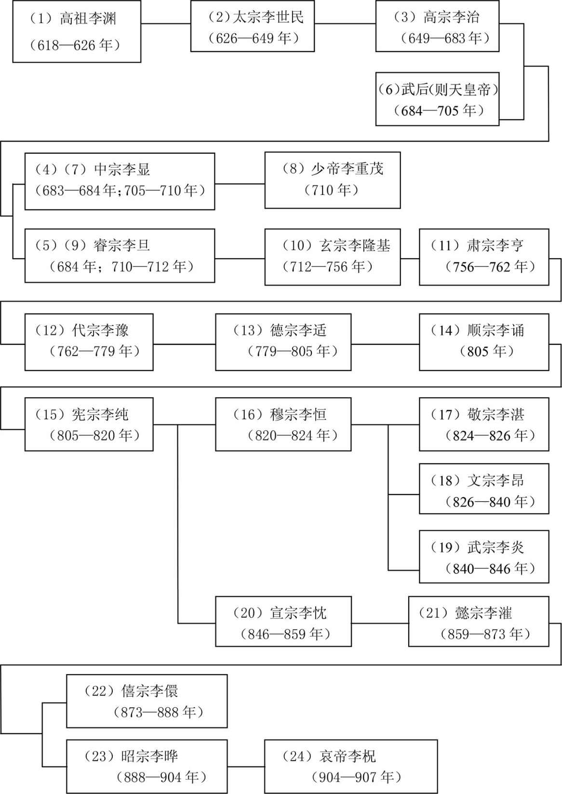

