# 目录

李林甫专政

奸臣聚敛　宇文融　杨慎矜　韦坚　王　杨钊

杨氏之宠

安史之乱

附录： 
唐朝皇帝世系表

返回总目录

# 李林甫专政

## 【内容提要】

《李林甫专政》记述了权相李林甫在唐玄宗朝玩弄权术的故事。其中包含着个性鲜明的历史人物、不同的社会群体、重大的政治事件，贯穿着玄宗统治时代皇帝与宦官、权相、储君之间的微妙关系，文学（即擅长诗词、学术）之臣与吏干（即精于行政事务）之臣的矛盾纠葛，中央政府与藩镇将领的复杂关系，等等。

李林甫出自皇族。在唐玄宗开元年间（713—741年），他因谄附唐玄宗的宠妃武惠妃而得以逐步升迁至朝廷要员、宰相。他善于媚事左右，迎合皇帝之心意，因而获得信任，得以掌握大权；他为人阴险狡诈，杜绝言路，妒忌贤能，排抑胜己者以保全其权位；他又屡起大狱，排挤贵臣，以扩张自己的势力。他极力支持玄宗废太子李瑛（赵丽妃所生），劝立武惠妃之子寿王李瑁为太子，而玄宗却立忠王李玙（yú）（后改名亨，即唐肃宗）为太子。李林甫担心太子即位后对自己不利，于是多次妄图谋害太子。他久居相位，独揽朝政，同为宰相的牛仙客和陈希烈均惧怕他而不敢过问政事。天宝十一载（752年），林甫死。在这之前，他已经和皇帝、一大批朝臣产生矛盾。他死后，杨国忠唆使安禄山诬告李林甫与蕃将阿布思谋反。于是玄宗追削林甫官爵，没收其家产，流放其家人。

史书记载李林甫工于心计、善耍手段，并将他列入“奸臣”的行列，给后世留下一个可憎的人物形象。在现代社会，我们看待和评价历史人物，不能完全拘泥于绝对化的道德标准，不能脱离当时的时代背景。在唐玄宗时代，政治、经济、军事、社会以及边疆形势等各方面较之唐初都发生了很大变化。在这种形势下，国家政策及政治运作与唐初相比，也有很大差异，迫切需要富有行政能力的官员。李林甫在处理行政事务方面颇为精明强干。玄宗朝出现“开天盛世”的局面，李林甫功不可没。但是，玄宗晚年骄奢淫逸、政治腐败，以及后来藩镇将领坐大，酿成“安史之乱”，他也负有很大的责任。通过《李林甫专政》这一故事，我们可以更全面、深刻地了解唐玄宗时代，了解李林甫在玄宗朝政局中所起的作用，更透彻地理解和评判李林甫这个历史人物。

## 【原文】

**唐玄宗开元二十二年[1]。吏部侍郎李林甫柔佞多狡数，深结宦官及妃嫔家，伺候上动静，无不知之，由是每奏对常称旨，上悦之[2]。时武惠妃宠幸倾后宫，生寿王瑁，诸子莫得为比，太子浸疏薄[3]。林甫乃因宦官言于惠妃，愿尽力保护寿王[4]。惠妃德之，阴为内助,由是擢黄门侍郎[5]。五月戊子，以裴耀卿为侍中，张九龄为中书令，林甫为礼部尚书、同中书门下三品[6]。**

## 【注文】

[1]唐玄宗：即唐朝第七代皇帝李隆基（685—762年），又称唐明皇，唐睿宗李旦之第三子，昭成皇后窦氏（唐睿宗为皇帝时，窦氏被封为德妃，后因其子李隆基即皇帝位，被尊为皇后）所生，公元712—756年在位。他在位期间，共用了先天（712—713年）、开元（713—741年）和天宝（742—756年）三个年号。玄宗在位初期励精图治，在政治、经济、军事等方面采取一系列改革措施，政治比较清明，经济发展，社会繁荣，史称“开元之治”。从开元末年起，玄宗深居宫中，委政事于宰相，对政事懈怠，耽于声色，在天宝十四载（755年）酿成“安史之乱”。后在逃离长安途中，太子李亨即位，是为肃宗，玄宗被迫退位为太上皇，于唐肃宗宝应元年（762年）去世。　　开元：唐玄宗李隆基在位期间所用年号，共计二十九年，即公元713—741年。开元二十二年，即公元734年。

[2]吏部侍郎：唐前期职事官，正四品上。吏部为尚书省（全国最高行政机构）六部（吏部、户部、礼部、兵部、刑部、工部）之一。吏部长官为吏部尚书，侍郎为吏部尚书的副职。吏部尚书、侍郎掌管天下官吏的选拔、授职、授勋、授爵、封赐和考核。参见唐朝中书省、门下省和尚书省职官简表、唐朝中央政务机构职官简表。

**唐朝中书省、门下省和尚书省职官简表**
**中央机构三省** **中书省** **门下省** **尚书省**   长官 中书令二人，正三品。 侍中二人，正三品。 尚书令一人，正二品。   副官 中书侍郎二人，正四品上。 黄门侍郎二人，正四品上。 左、右丞相［左、右仆射（yè）］，从二品。   职掌 负责起草、发布皇帝的诏令。 负责对诏令的审议与封驳，拥有封还皇帝诏书和驳回臣下章奏的权力。 全国最高行政机构。其总办公机构为尚书都省，负责尚书省各类文书的审核、签发与存档，指导尚书省六部的工作（具体见下表）。    

**唐朝中央政务机构职官简表**
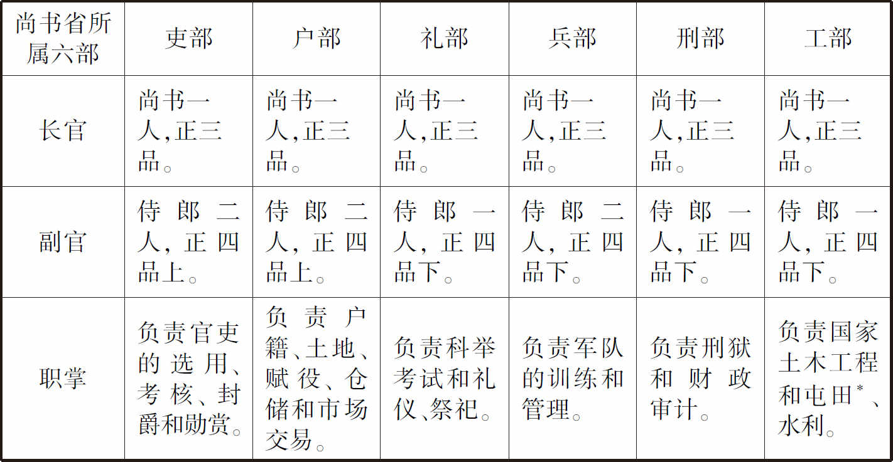

注：*屯田：利用士兵在驻扎的地区种地，或招募农民垦荒种地。

李林甫（？—752年）：唐玄宗朝著名的权臣、奸相。出自皇族，小字哥奴。他累积迁官至国子司业。唐玄宗开元中，迁御史中丞、吏部侍郎，深结玄宗宠妃武惠妃及宦官等，能按玄宗的心意说话、办事。开元二十二年（734年），拜礼部尚书，同中书门下三品，成为真正的宰相，开始执掌朝廷大权。他又历任户部尚书、兵部尚书，并代张九龄为中书令、集贤殿大学士，修国史。天宝十载（751年），他兼领安西大都护，朔方节度使。因为胡人将领（即蕃将）不识字，不能入朝任宰相，不可能威胁自己的地位，因此，林甫请皇帝重用蕃将。这使得许多胡人将领长期在边疆地区统领重兵。玄宗后期对政事懈怠，将国家大权委托给李林甫。李林甫身居宰相之位长达19年，独揽朝政，同为宰相的牛仙客和陈希烈均惧怕他而不敢过问政事。他在处理行政事务方面颇为精明强干。他善于迎合玄宗意旨，为人阴险，排斥有才干、受玄宗重视的官员，表面上甜言蜜语相交结，背后却阴谋陷害。他又屡起大狱，诛逐贵臣，以扩张自己的权势。他为玄宗统治时期出现“开天盛世”的局面作出贡献，但对玄宗晚期的政治腐败及“安史之乱”的爆发也负有很大责任。　　柔佞（nìng）多狡数：柔佞即能说会道，多狡数指非常狡猾。　　宦官：在皇宫内侍候皇帝、后妃的受过宫刑的男性。　　奏对：奏，向皇帝进言或上书；对，回答，多用于对上的回答或对话；也特指一种文体，即奏对、对策。

[3]武惠妃（？—738年）：唐玄宗的宠妃。武则天堂侄恒安王武攸止之女。唐玄宗即位后，她渐渐受到宠幸。玄宗的元配王皇后被废后，她被册封为惠妃，正一品，宫中的礼秩与皇后相同。武惠妃死于开元二十五年（737年）十二月，以皇后之礼安葬，赠贞顺皇后。唐朝在后宫，设皇后一名。皇后之下设内命妇（指受帝王封号的妇女）：贵妃、淑妃、德妃、贤妃并为夫人，皆正一品。昭仪、昭容、昭媛、充仪、充容、充媛并为嫔，正二品。婕妤九员，正三品。美人九员，正四品。才人九员，正五品。宝林二十七员，正六品。御女二十七员，正七品。采女二十七员，正八品。开元年间，唐玄宗于皇后之下设三妃、六仪，以惠妃、丽妃、华妃充三妃之位，即将四夫人（贵妃、淑妃、德妃、贤妃）改为三夫人。后来玄宗册杨玉环为贵妃，又恢复贵妃名号。　　寿王瑁：即李瑁（？—775年），唐玄宗之第十八子，武惠妃所生。开元十三年（725年）被封为寿王。因生母宠冠后宫，所以寿王也非常受玄宗喜爱。惠妃很想让寿王当皇太子，而玄宗后来却立忠王玙（yú）（后改名亨，即唐肃宗）为太子。开元二十三年（735年），李瑁纳已故蜀州（今四川崇州）司户杨玄琰（yǎn）之女杨玉环为寿王妃。杨玉环后来被玄宗看中，玄宗令玉环自请出家为女道士，另为寿王娶韦昭训之女，然后册杨玉环为贵妃，集三千宠爱于一身。李瑁死于唐代宗大历十年（775年），赠太傅。　　太子：指当时的太子、唐玄宗的次子李瑛，赵丽妃所生。李瑛能被立为太子，与玄宗即位之初，其生母赵丽妃十分受宠很有关系。后武惠妃夺宠，丽妃失宠，李瑛也随之失去父皇的宠爱，其太子之位也开始不稳固。李瑛后被武惠妃陷害，废为庶人，不久赐死。　　浸（jìn）：逐渐。　　疏：关系远、不亲近。　　薄：轻视、看不起。

[4]因：依靠、凭借。

[5]德：感激、感恩。　　擢（zhuó）：提拔、提升。　　黄门侍郎：唐前期职事官，正四品上，为中央机构门下省长官侍中的副手。负责参议施政，在大祭祀之时，随从升坛，侍候皇帝洗手，在元正、冬至日天子视朝时，奏天下祥瑞。参见唐朝中书省、门下省和尚书省职官简表。

[6]裴耀卿（681—743年）：唐玄宗朝大臣。字焕之，有文学之才，也精于行政事务。唐玄宗时，裴耀卿受命改进漕运（官方督管的水运），江南的粮食大量运送到京城长安（今陕西西安），大大节省了运费。开元二十二年（734年）升侍中。开元二十四年（736年），以左丞相罢知政事（即罢去宰相之职），不久转尚书右仆射，无实权，后卒。　　侍中：唐前期职事官，正三品，为中央机构门下省的长官。掌管出纳帝命，总管吏职，赞相礼仪，辅佐天子统领大政。参见唐朝中书省、门下省和尚书省职官简表。　　张九龄（678—740年）：唐玄宗开元年间宰相。韶州曲江（今广东韶关西武水西岸）人。他聪慧能文，考中进士（科举考试科目，考察文章、诗赋），后入朝廷做官。开元二十一年（733年），玄宗任命张九龄为宰相。他主张选贤任能、不循资历，重视地方官人选，对国家经济建言献策。后在一些重大问题上与玄宗争执，李林甫乘机进谗言中伤。玄宗于是罢去张九龄宰相之职，后又贬荆州（治今湖北荆沙江陵）长史，死于开元二十八年（740年）。他是玄宗时代文学之臣的代表，为人正派，为玄宗开元年间的繁荣作出重要贡献。　　中书令：唐前期职事官，正三品，中央机构中书省的长官。掌管军国政令，辅佐天子执掌大政，奉皇帝旨意拟成文书，作为管理国家的准则。参见唐朝中书省、门下省和尚书省职官简表。　　礼部尚书：唐前期职事官，正三品。礼部是中央机构尚书省所属的六部之一。礼部尚书为长官，礼部侍郎为副职。礼部尚书、侍郎掌管天下礼仪、祭祀、宴会、科举考试。参见唐朝中央政务机构职官简表。　　同中书门下三品：唐朝宰相称号。唐初，以中书、门下、尚书三省综理政务。中书、门下二省地处宫内，尤为机要。三省长官中书令、侍中、尚书左右仆射并为宰相。唐初，除三省长官为当然宰相外，皇帝又指令其他官员参与朝政机密，其官位、阶品较低者，则用“同中书门下三品”或“同中书门下平章事”（武周时改称为“同凤阁鸾台三品”或“同凤阁鸾台平章事”）的头衔，也成为宰相。“同三品”是因为中书令、侍中是中书省、门下省的正三品官，加此衔以表示其与中书令、侍中享有同等权力及待遇。唐太宗之后，以加“同中书门下三品”或“同中书门下平章事”（简称“同平章事”）之衔为参政标志。本官品级高于三品者也要加此衔才得为宰相。

## 【译文】

唐玄宗开元二十二年（734年）。吏部侍郎李林甫能说会道，十分狡猾。他与宫廷内的宦官及妃嫔深深结交，让他们打探唐玄宗李隆基的一举一动。因此,李林甫对皇帝的动静无不知晓，每逢向玄宗进言或回答玄宗的问题，皆能符合玄宗的心意，玄宗因此对他非常满意。当时在后宫中，武惠妃最受皇帝宠幸。惠妃生下寿王李瑁，其他皇子所受的皇恩都无法与寿王相比，太子李瑛也逐渐被玄宗疏远、轻视。李林甫于是通过宦官对惠妃说：我愿意尽力保护寿王。惠妃感激李林甫的恩德，就秘密在后宫帮助他。因此，李林甫被提拔为黄门侍郎。五月戊子（二十八日），唐玄宗任命裴耀卿为侍中，张九龄为中书令，李林甫为礼部尚书、同中书门下三品。

## 【原文】

**二十四年。初，上欲以李林甫为相，问于中书令张九龄，九龄对曰：“宰相系国安危，陛下相林甫，臣恐异日为庙社之忧。”[1]上不从。时九龄方以文学为上所重，林甫虽恨,犹曲意事之[2]。侍中裴耀卿与九龄善，林甫并疾之[3]。是时，上在位岁久，渐肆奢欲，怠于政事[4]。而九龄遇事无细大皆力争，林甫巧伺上意，日思所以中伤之[5]。**

## 【注文】

[1]宰相：辅佐天子、总理百官、治领万事的最高行政长官。中书、门下、尚书三省长官自唐初以来均为宰相。唐太宗之后，以加“同中书门下三品”或“同中书门下平章事”之衔为参政标志，虽本官品级高于三品者也要加此衔才得为宰相。到唐玄宗开元年间，尚书省长官的宰相之任已经渐渐消失，中书门下（中书省、门下省的合称）是宰相办公之所，中书省的长官中书令在宰相群体中的地位显得十分突出。　　陛下：陛本指宫殿的台阶。陛下成为对君主的尊称。在秦朝以后，陛下只用于称呼皇帝。　　庙社：庙，指太庙，供奉本朝先代帝王之庙；社，即土神。历朝历代必立庙社以祭祀祖先、土地神，所以古代常用“庙社”作为王朝或国家政权的代称。

[2]文学：指文章诗赋。在唐玄宗朝，与“文学”相对的是“吏治”（即处理行政事务的能力）。文学之臣与吏治之臣的矛盾纠葛是唐玄宗朝政治史的一个重要问题。其中包含用人标准、选官制度、政见之争、个人恩怨、争权夺利以及社会风气的转变等诸多问题。唐玄宗所任用的宰相既有文学之士，也有吏治之臣。　　曲意事之：之，指张九龄。违背自己的真实意愿去奉承张九龄。

[3]善：友好，亲善。　　疾：厌恶，憎恨，妒忌。

[4]渐肆奢欲：渐渐放肆地过着奢侈的生活。　　怠于政事：对政事怠慢、松懈。

[5]力争：据理力争。　　伺（sì）：侦察、探察。　　所以：即以所，倒装。指用什么理由。　　中伤：污蔑别人使受损害。

## 【译文】

唐玄宗开元二十四年（736年）。开始，唐玄宗想任命李林甫为宰相，向中书令张九龄征询意见。张九龄回答道：“宰相与国家的安危息息相关。陛下如果任命李林甫为宰相，我恐怕将来会为国家的命运而担忧。”玄宗不采纳张九龄的意见。当时，张九龄以文章诗赋之才被唐玄宗看重。李林甫虽然心里痛恨张九龄，但仍然违背自己的真实意愿去奉承他。侍中裴耀卿与张九龄关系融洽，李林甫就连同裴耀卿一起憎恨。在那时，唐玄宗当皇帝的时间已经很长了，渐渐放肆地过着奢侈的生活，对政事怠慢、松懈。而张九龄却无论遇到大事还是小事，都跟玄宗据理力争。李林甫则巧妙地刺探到皇帝的意图，天天思索用什么方式来污蔑张九龄。

## 【原文】

**上之为临淄王也，赵丽妃、皇甫德仪、刘才人皆有宠[1]。丽妃生太子瑛，德仪生鄂王瑶，才人生光王琚[2]。及即位，幸武惠妃，丽妃等爱皆弛[3]。惠妃生寿王瑁，宠冠诸子[4]。太子与瑶、琚会于内第，各以母失职，有怨望语[5]。驸马都尉杨洄尚咸宜公主，常伺三子过失以告惠妃[6]。惠妃泣诉于上曰：“太子阴结党与，将害妾母子。亦指斥至尊。”[7]上大怒，以语宰相，欲皆废之[8]。九龄曰：“陛下践垂三十年。太子诸王不离深宫，日受圣训，天下之人皆庆陛下享国久长、子孙蕃昌。今三子皆已成人，不闻大过，陛下奈何一旦以无根之语，喜怒之际，尽废之乎！且太子天下本，不可轻摇。昔晋献公听骊姬之谗杀申生，三世大乱。汉武帝信江充之诬罪戾太子，京城流血。晋惠帝用贾后之谮废愍怀太子，中原涂炭。隋文帝纳独孤后之言黜太子勇，立炀帝，遂失天下。由此观之，不可不慎。陛下必欲为此，臣不敢奉诏。”[9]上不悦。林甫初无所言，退而私谓宦官之贵幸者曰：“此主上家事，何必问外人？”上犹豫未决。惠妃密使官奴牛贵儿谓九龄曰：“有废必有兴，公为之援，宰相可长处。”[10]九龄叱之[11]，以其语白上，上为之动色，故讫九龄罢相，太子得无动[12]。林甫日夜短九龄于上，上浸疏之[13]。**

## 【注文】

[1]临淄王：李隆基于武周长寿二年（693年）被封为临淄郡王（从一品）。按唐朝官制，爵位共有九等。第一等：王（或亲王），正一品。第二等：郡王，从一品。第三等：国公，从一品。第四等：郡公，正二品。第五等：县公，从二品。第六等：县侯，从三品。第七等：县伯，正四品。第八等：县子，正五品。第九等：县男，从五品。皇帝的兄弟、皇子皆封亲王；亲王的嫡子（正妻所生的长子）为嗣王；皇太子的诸子并封为郡王；亲王的儿子承恩泽者也封郡王，亲王的诸子一般封郡公。　　赵丽妃（？—726年）：唐玄宗的妃子。李隆基在当皇帝之前，在潞州（今山西长治）见到美貌、能歌善舞的歌妓赵氏，将她纳为自己的小妾。他对赵氏非常宠爱，即位后，封为丽妃（唐朝后宫妃嫔名号，正一品），其父、兄都被封为高官。赵丽妃所生的李瑛被立为皇太子。武惠妃受宠后，赵丽妃失宠。丽妃死于唐玄宗开元十四年（726年）。　　皇甫德仪：德仪，唐朝后宫妃嫔名号，六德之一。皇甫德仪是唐玄宗为藩王时所纳的姬妾，因容色而为玄宗所喜爱，生鄂王李瑶。武惠妃得宠后，德仪失宠。　　刘才人：才人，唐朝后宫妃嫔名号，正五品。刘才人是玄宗为藩王时所纳的姬妾，因姿色而为玄宗所喜爱，生光王李琚。武惠妃得宠后，才人失宠。

[2]太子瑛：即唐玄宗第二子李瑛（？—737年），生母赵丽妃。因母宠，于开元三年（715年）被立为皇太子。开元十三年（725年），纳妃薛氏。因为武惠妃得宠、其生母失宠而对玄宗、惠妃有怨言。开元二十五年（737年），遭武惠妃、李林甫等陷害，被废为庶人，后被赐死。唐代宗宝应元年（762年），昭雪李瑛之罪，赠瑛为皇太子。　　鄂王瑶：即唐玄宗第五子李瑶（？—737年），皇甫德仪所生。开元二年（714年）封鄂王。开元二十五年（737年），因太子李瑛案被牵连、陷害，废为庶人。宝应元年（762年），随着废太子李瑛被昭雪，李瑶也复赠为鄂王。　　光王琚：即唐玄宗第八子李琚（？—737年），刘才人所生。李琚与鄂王李瑶都是皇子中有学识和才干者，二人都居住于宫中的内宅，关系最为亲密。李琚有勇力、善骑射，起初还得玄宗喜爱。后来因生母失宠，对玄宗常有怨言。开元二十五年（737年），因太子李瑛案被牵连、陷害，废为庶人。宝应元年（762年），随着废太子李瑛被昭雪，李琚也复赠为光王。

[3]弛：废弛、消失。

[4]宠冠：最受宠爱。

[5]内第：即内宅。唐玄宗即位后，为抑制诸皇子的势力，不让封王的皇子在宫廷外建立自己的王府。皇子幼年居住在宫内，成年后居住在“十王宅”（玄宗开始有十个儿子封王，他们集中居住在宫内的宅第叫“十王宅”。后来子嗣增加，又演变为“十六王宅”）。诸位皇子集中在宫廷旁边生活，皇帝命宦官管理和监视。　　以母失职：指太子李瑛等的母亲失去玄宗的宠爱。

[6]驸马都尉：官名。汉武帝时置驸马都尉，掌副车之马，俸禄二千石（dàn），多以宗室及外戚与诸公子孙任之。自魏晋以来，凡娶公主者皆拜驸马都尉，简称驸马，非握实权之官。后世因此作为皇帝女婿的俗称。　　杨洄（huí）：生卒年不详，出自名门弘农（今河南灵宝）杨氏，于开元二十三年（735年）娶武惠妃之女咸宜公主，成为武惠妃的乘龙快婿。他为了自己的政治利益，投武惠妃之所好，为其卖命。　　尚：仰攀婚姻。特指娶公主为妻。　　咸宜公主（？—784年）：唐玄宗之女，武惠妃所生，因母亲受宠而得到玄宗的喜爱，礼遇优于其他公主。本来按唐朝制度，公主视正一品，食封户是五百户（用五百户的赋税来供养），咸宜公主却破例加到了一千户。此例一开，其他公主也全都加到一千户。咸宜公主初嫁杨洄，后又改嫁崔嵩，于唐德宗兴元元年（784年）逝世。

[7]至尊：大臣称皇帝为“至尊”。这里指最高统治者唐玄宗。

[8]之：指代太子瑛、鄂王瑶和光王琚。

[9]践：在中国古代，帝王登阼阶（大堂前东面的台阶）以主持祭祀，因此以“阼”指帝王之位。践祚，即皇帝位。　　垂三十年：临近三十年。唐玄宗于先天元年（712年）即皇帝位，到开元二十四年（736年），共二十五年，接近三十年。　　蕃昌：茂盛、昌盛。　　无根：没有根据。　　太子天下本：历朝皆以皇帝指定的皇位继承人皇太子为“国本”。因此，可说“太子天下本”。　　晋献公听骊姬之谗杀申生，三世大乱：晋，西周、春秋时姬姓诸侯国。晋献公（？—651年），公元前676年至公元前651年在位。晋献公大力扩张，曾伐灭耿、霍、魏、虞、虢（guó）等国，并战胜骊戎、赤狄等外族。骊戎之首领以二女献给晋献公。骊姬受献公宠爱，意图以自己的儿子奚齐取代太子申生的地位，造成内乱。直到晋献公之子重耳（前697或前671—前628年）流亡十九年后，由秦军护送回到晋国继承王位，是为晋文公（前636—前628年在位），晋国才又安定下来。　　汉武帝信江充之诬罪戾（lì）太子，京城流血：西汉武帝刘彻最初宠爱卫子夫，立为皇后。卫皇后所生之子刘据被立为太子。随着时间推移，卫皇后色衰，逐渐失去汉武帝的宠爱。太子刘据的性格、作风又与武帝完全不同。汉武帝征和二年（前91年），善迎人意的江充见卫后宠衰，趁搜查巫蛊（gǔ）（即把木偶写上仇人的名字埋在地下诅咒，是一种毒害人的巫术）之机，说在太子宫中找到桐木人，诬陷太子行巫蛊之术。太子得知后，十分紧张，恐无法辩白，于是发兵捕杀江充。武帝派兵围捕太子，结果太子兵败自杀，其家人也多被杀。卫皇后被废，自杀。这次皇室内部的大屠杀，史称“巫蛊之祸”，对皇位继承人的确定及汉武帝晚年、汉昭帝、汉宣帝时期的政局都产生了深远影响。刘据之孙宣帝刘询（前92—前49年）即位后，给刘据上谥（shì）号（古代帝王、高官等死后，朝廷根据他们的生平行为给予一种称号以褒贬善恶，称为谥或谥号）为“戾太子”。　　晋惠帝用贾后之谮（zèn）废愍（mǐn）怀太子，中原涂炭：谮，说坏话诬陷别人。晋惠帝司马衷（259—306年）的贾皇后于元康九年（299年），设计挑拨晋惠帝与太子司马遹（yù）（278—300年）（晋惠帝长子，生母谢夫人，谥愍怀太子）的父子关系，借机废太子为庶人，后假托惠帝的诏书杀之。统领禁卫军的赵王司马伦又起兵杀贾后。永宁元年（301年），司马伦废惠帝自立。此后，政争由宫廷内扩展到地方军队。地方手握重兵的诸王起兵讨伐司马伦，迎惠帝复位，杀司马伦。后来，诸王之间又相互残杀。参战的诸王多相继败亡，被杀害的民众动辄以万计，京城洛阳和长安反复遭到烧杀劫掠，社会经济遭受严重破坏。诸王在混战中还利用北方民族的贵族参加内战，匈奴、鲜卑等由此得以长驱直入中原地区。　　隋文帝纳独孤后之言黜太子勇，立炀帝，遂失天下：隋文帝杨坚（541—604年）本来立长子杨勇为太子。杨勇好奢侈，多姬妾，渐渐不为隋文帝和独孤皇后所喜爱。杨广是文帝的次子，在隋朝灭陈的统一战争中，充任行军元帅，立了大功，重臣宿将多曾由他指挥。他很得独孤后的宠爱，又联合重臣杨素揭露杨勇的丑事。最终，文帝在独孤后、杨素等的怂恿下，在开皇二十年（600年）废太子杨勇为庶人，立杨广为太子。杨广就是后来的隋炀帝。隋朝的基业就断送在隋炀帝手上。　　陛下必欲为此，臣不敢奉诏：此时张九龄为中书令，即中书省的长官，负责奉皇帝之命拟定诏书。在这里，张九龄是想表明：如果玄宗执意要废太子，他将拒绝奉承皇帝的旨意而草拟诏书。

[10]官奴：指没入官府的奴婢，完全属官府所有。　　援：指支持废太子李瑛、立武惠妃所生的寿王为太子。

[11]叱（chì）：大声呵斥。

[12]白：下对上告诉、陈述。　　讫（qì）：终了、完毕。

[13]短：陷害，说别人的坏话。

## 【译文】

玄宗还是临淄王的时候，赵丽妃、皇甫德仪、刘才人都很受宠。丽妃生皇太子李瑛，德仪生鄂王李瑶，才人生光王李琚。玄宗即皇帝位之后，宠幸武惠妃，对丽妃等的宠爱都衰减了。惠妃生寿王李瑁，李瑁在诸位皇子当中最受玄宗宠爱。有一天，太子与李瑶、李琚在自己居住的内宅相会，他们各自因为自己的母亲失宠而对唐玄宗颇有怨言。驸马都尉杨洄与咸宜公主（武惠妃所生）结婚，他常常刺探李瑛、李瑶和李琚三位皇子的过失，报告给惠妃。于是，惠妃抓住这些把柄，哭泣着向玄宗倾诉：“太子暗中纠结党羽，想加害我们母子。他们还指斥了您。”玄宗听了非常愤怒，并把这些话告诉了宰相，想把太子等三位皇子都废掉。张九龄回答道：“陛下即皇帝位以来，已经将近三十年。太子和诸王居住在深宫中，从不曾离开，每天都接受您的教导。天下的百姓都庆幸陛下当皇帝的时间长久，儿孙繁茂。现在三位皇子都已经长大成人，没有听说他们犯了什么大的过错，陛下为什么一听到无根据的话，就仅凭自己的喜怒，而要把他们都废掉呢？而且太子是国家的根本，不可轻易动摇。以前，晋献公听信骊姬的谗言，杀了太子申生，结果造成晋国三代政局混乱。汉武帝听信江充的诬告，将戾太子刘据治罪，酿成京城大规模的流血、屠杀。晋惠帝采用贾皇后的谗言而废愍怀太子，导致中原混战，生灵伤亡。隋文帝采纳独孤皇后的意见，废黜太子杨勇，立次子杨广为太子，杨广就是后来的隋炀帝，结果隋朝的基业就毁灭在炀帝手里。从这些历史事件来看，废立太子之事不可不慎重考虑。陛下如果执意要废太子，我不敢奉承您的旨意而拟定诏书。”玄宗听了张九龄的这席话，很不高兴。对废太子之事，李林甫刚开始不表态。从宫廷退下之后，他私自对受皇帝宠幸而具有尊贵地位、权势的宦官说：“这是皇帝的家事，何必问外人呢？”但玄宗对废太子之事仍然犹豫不决。惠妃秘密让官奴牛贵儿告诉张九龄：“有废太子，就必定有新立太子的崛起。如果你在这件事情上肯帮我，你的宰相之位就可以长期保持。”张九龄大声呵斥了牛贵儿，并将这番话告诉了玄宗。玄宗为此事动了脸色。因此，即使到后来张九龄最终被罢去宰相之职，太子李瑛的地位仍然没有被动摇。李林甫整日整夜地在玄宗面前说张九龄的坏话，于是玄宗对张九龄也渐渐疏远了。

## 【原文】

**林甫引萧炅为户部侍郎[1]。炅素不学，尝对中书侍郎严挺之读“伏腊”为“伏猎”，挺之言于九龄曰：“省中岂容有‘伏猎’侍郎？”由是出炅为岐州刺史，故林甫怨挺之[2]。九龄与挺之善，欲引以为相,尝谓之曰：“李尚书方承恩，足下宜一造门，与之款昵。”[3]挺之素负气，薄林甫为人，竟不之诣[4]。林甫恨之益深。挺之先娶妻，出之，更嫁蔚州刺史王元琰，元琰坐赃罪下三司按鞫，挺之为之营解[5]。林甫因左右使于禁中白上，上谓宰相曰：“挺之为罪人请属所由。”[6]九龄曰：“此乃挺之出妻，不宜有情。”上曰：“虽离，乃复有私。”[7]于是上积前事，以耀卿、九龄为阿党，十一月壬寅，以耀卿为左丞相，九龄为右丞相，并罢政事[8]。以林甫兼中书令，仙客为工部尚书、同中书门下三品，领朔方节度如故[9]。严挺之贬洺州刺史，王元琰流岭南[10]。九龄既得罪，自是朝廷之士皆容身保位，无复直言[11]。**

## 【注文】

[1]萧炅（jiǒng）：生卒年不详，唐玄宗时曾被李林甫引荐为户部侍郎，因其不学无术，将“伏腊”（参见前“伏腊”条注）误读为“伏猎”而被称为“‘伏猎’侍郎”。他和李林甫同属于精于行政事务的吏干之臣。　　户部侍郎：唐前期职事官。户部为尚书省六部之一。户部长官为户部尚书，正三品；副官为户部侍郎，正四品下。户部尚书、侍郎掌管天下户口、田地、徭役、赋税、储存货物、经费核算等。

[2]素：向来、一向。　　中书侍郎：唐前期职事官，中央机构中书省的副官，正四品上，为中书令的副手，参议朝廷政事，传递诏书或接受外邦的表、疏。　　严挺之：生卒年不详。唐玄宗朝大臣。华州华阴（今陕西华阴）人，名浚，以字行。好佛，中进士。唐玄宗先天二年（713年），任左拾遗，成为谏官。玄宗开元年间，为吏部考功员外郎，负责选拔官吏，做事公允。不久，迁给（jǐ）事中，又出任登州（治今山东蓬莱）刺史，改太原尹（负责唐朝的北都太原的一切事务），后升为刑部侍郎。张九龄为宰相，用挺之为尚书左丞，负责吏部选官。他和张九龄同为擅长学术的文学之臣，鄙薄李林甫。到张九龄罢去宰相之职，严挺之也被贬为洺州（治今河北永年）刺史，移绛（jiàng）郡（治今山西绛县）太守。天宝元年（742年），授太子员外詹事，无实权。卒于洛阳，年七十余。　　尝：曾经。　　伏腊：夏季的伏日（也叫三伏天，这是一年中最热的时候；也专指三伏中祭祀的一天。农历夏至后第三庚日起为初伏，第四庚日起为中伏，立秋后第一庚日起为末伏）和冬季的腊日（农历十二月初八日，是祭祀日），合称伏腊。　　“伏猎”侍郎：指唐户部侍郎萧炅。因其将“伏腊”误读为“伏猎”，故被讥为“‘伏猎’侍郎”。历史典故“伏猎侍郎”即来源于上述史实，最初的记载见《旧唐书·严挺之传》。后世以“伏猎侍郎”泛指不学无术之人。　　岐州：地名。治雍县（今陕西凤翔南），辖雍县、陈仓、郿（méi）县、虢（guó）县、岐山、凤泉县，相当于今陕西凤翔、扶风、岐山、宝鸡。　　刺史：唐朝地方长官名。在唐前期，地方行政制度实行州（或郡）县二级制。州或郡的长官分别称为刺史或太守，负责管理地方。上州（户满四万以上的州）的刺史为从三品，中州（户满三万以上的州）为正四品上，下州（户不满三万的州）为正四品下。

[3]方：副词，正在。　　足下：对人的尊称。　　宜：应该、应当。　　造：到……去。　　款：款待、招待。　　昵（nì）：亲近、亲昵。

[4]诣：到……去。

[5]出：使出，遗弃。　　蔚州：地名。治灵丘（今山西灵丘），辖灵丘、飞狐、兴唐县，相当于今山西灵丘、河北涞源、蔚县。　　坐：因犯……罪或错误。　　赃：通过不正当的途径获得财物，贪污受贿。　　三司：这里指唐代中央的司法机构大理寺、刑部和御史台。大理寺是国家最高审判机关，负责审理中央百官犯罪及京师的重大案件。刑部是最高司法行政机关，负责复核大理寺审理的流刑以下及州县审理的徒刑以上案件。御史台主要监督大理寺和刑部的司法审判活动，同时也参与审判。如遇特别重大案件，大理寺卿要会同刑部尚书、御史中丞共同审理，叫“三司推事”或“三司按鞫（jū）”。地方移送到中央的重大案件，往往由监察御史、刑部员外郎、大理评事充当“三司使”共同审判。“三司推事”是唐代司法制度中的创举。　　鞫：审讯、审问。　　营：谋求。　　解：消除。

[6]左右使：这里泛指皇宫中带使职的宦官。在唐玄宗时代，宦官势力膨胀，其机构日益完备、严密，某些有权势的宦官还带有使职。　　禁中：也称省中，即宫禁之内、皇宫之内。

[7]私：男女不正当的性关系。

[8]前事：指以前发生在张九龄身上的、令玄宗不满之事。　　阿（ē）党：偏袒自己的党羽。　　左丞相、右丞相：指尚书省的左、右丞相，即唐初以来尚书省的左、右仆射，从二品。唐初因尚书省长官尚书令（正二品）职权崇重，一直无人实际担任此职。唐太宗李世民为秦王时，曾任尚书令。唐太宗之后，尚书令更为缺置，其副官左、右仆射遂成为尚书省内实际长官，并直接参与军国事务，出席宰相会议。到唐玄宗开元年间，尚书省仆射已经演变为纯粹的尚书省行政长官，其宰相之职权已遭侵夺。张九龄、裴耀卿由中书省、门下省的三品长官改任尚书省的二品长官，实则明升暗降，被排斥于政治决策核心之外。张九龄从此被罢除宰相之职。

[9]工部尚书：唐前期职事官，尚书省工部的长官，正三品。掌管手工业、屯田、山泽之政令。　　朔方节度：唐朝使职。这时牛仙客已经到中央担任宰相，他“领朔方节度如故”系遥领，并不具体掌管朔方节度使之事务。在唐前期，朝廷为了防御高度机动的周边各族的袭击，不得不维持一条广阔的安全地带和边界，扩大军力。为保证边地军事活动的顺利开展、保障必要的后勤支援，唐廷在边疆实行军政一体的节度使制度，在唐玄宗时逐渐形成缘边十节度经略使（简称“节度使”）。朔方节度使是其中之一，为防御北方民族，治灵州（今宁夏灵武市西南），初领单于都护府，丰安、定远二军，西受降城、东受降城、中受降城，盐、夏、绥、银、丰、胜六州。节度使领当地军事、民政、监察、财政等大权。节度使制度在一定时期有效地防御了周边外族的进攻，巩固了唐朝的边疆，但也造成边将拥兵自重、国家军事防御体系“外重内轻”（即边地节度使手握重兵，京城长安地区兵力空虚）的局面。在安史之乱中，朝廷为平定叛乱急需用兵，不仅在边疆地区，在中原内地也广泛设置节度使。在唐中后期，节度使的辖区又称为道、节镇、方镇，节度使的权力也越来越大，在一些地区逐渐形成割据一方的藩镇。在某些地区，节度使拥兵自重，自行任命官吏，赋税不上缴中央，节度使死后，由其亲属接任，或由军中推举。

**唐开元、天宝十节度表**
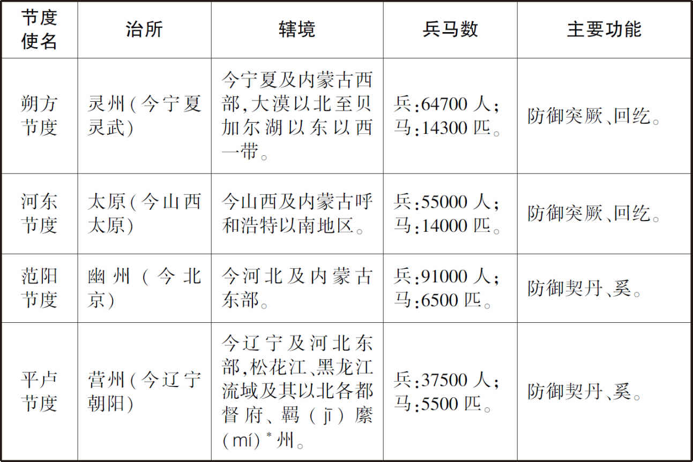 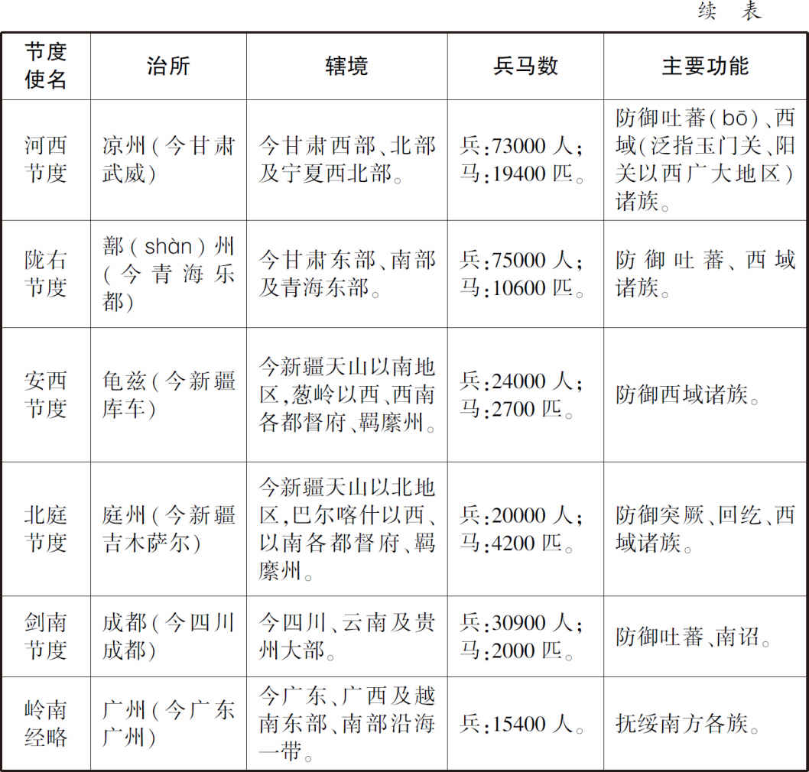

注：*羁縻：羁指马笼头；縻指牛缰绳。引申为笼络、控制。唐朝在归附于中央的各族地区设置羁縻州，作为地方行政单位。中央任命各族的部落首领为羁縻州的军政长官，世袭，享有很大的自主权。羁縻州的户籍不上报中央的户部，也不承担赋税。仅有时向天子进贡。

[10]洺州：地名。治永年（今河北永年），辖永年、洺水、临洺、鸡泽、肥乡、曲周、平恩、新章县，相当于今河北永年、曲周、鸡泽、肥乡。　　岭南：地名。即岭表、岭外，泛指五岭［又称南岭，系越城、都庞、萌渚、骑田、大庾（yú）五岭的总称］以南地区。在唐代，岭南地区处于五岭之外，属于边缘蛮荒之地。另外，根据自然山川形势，在贞观年间，唐太宗李世民将全国划分为十个监察区，称为十道。在此基础上，开元年间，唐玄宗又再细分为十五道。太宗、玄宗均在岭南地区设岭南道。唐玄宗开元时，岭南道治南海（今广东广州），辖南海、番（pān）禺、增城、四会、化蒙、怀集、东莞、清远等县，相当于今广东全部、广西大部、云南东南部和越南北部地区。

[11]自：从。　　是：指示代词，这，这件事。　　容身保位：保住自己的性命和官位。

## 【译文】

李林甫引荐萧炅为户部侍郎。萧炅向来不学无术，曾经在中书侍郎严挺之面前把“伏腊”误读为“伏猎”。严挺之把这件事告诉了张九龄，并说：“中书省中怎么能容许读‘伏猎’的侍郎呢？”于是，把萧炅贬出京城，任岐州刺史。因为这件事，李林甫怨恨严挺之。张九龄与严挺之关系和睦，想引荐他为宰相。张九龄曾经对严挺之说：“李尚书（指李林甫）正受皇帝的恩宠。您应该到他的门下，与他亲近。”可是，严挺之一向讲究气节，轻视李林甫的为人，竟然不到李林甫门下去。这样，李林甫越来越恨严挺之。起先，严挺之娶了一个妻子，然后又遗弃她。严挺之的前妻又嫁给蔚州刺史王元琰。王元琰因为犯贪污受贿罪被三司（指中央司法机构大理寺、刑部和御史台）审讯。严挺之谋求消除王元琰的罪行。李林甫通过左右使到宫禁之中，把这件事告诉了玄宗。玄宗对宰相说：“严挺之为犯罪之人请求开脱。”张九龄回答道：“这是严挺之已经遗弃的妻子，不应当还有感情。”玄宗却说：“他们俩虽然离婚了，却还是有不正当的关系。”于是，玄宗积累以前发生的事情和不满，认为裴耀卿、张九龄偏袒自己的党羽，于开元二十四年（736年）十一月壬寅（二十七日），任命裴耀卿为尚书左丞相，张九龄为尚书右丞相，二人一起被罢去宰相之职权。玄宗以李林甫兼中书令，牛仙客为工部尚书、同中书门下三品，仍然遥领朔方节度使。严挺之被贬为洺州刺史，王元琰被流放到岭南地区。张九龄已经开罪了皇帝。从此以后，朝廷上的官员都考虑如何保住自己的性命和官位，没有敢直言不讳的大臣了。

## 【原文】

**李林甫欲蔽塞人主视听，自专大权，明召诸谏官谓曰：“今明主在上，群臣将顺之不暇，乌用多言。诸君不见立仗马乎？食三品料，一鸣辄斥去，悔之何及？”[1]补阙杜璡尝上书言事，明日，黜为下邽令[2]。自是谏争路绝矣。牛仙客既为林甫所引进，专给唯诺而已[3]。然二人皆谨守格式，百官迁除，各有常度，虽奇才异行，不免终老常调[4]。其以巧谄邪险自进者，则超腾不次，自有他蹊矣[5]。**

## 【注文】

[1]谏官：官名。唐朝设有专门规谏皇帝的谏官制度。唐代谏官有左右散骑常侍（从三品）、左右谏议大夫（正五品上）、左右补阙（从七品上）、左右拾遗（从八品上）等，分别隶属于门下、中书两省。谏官的主要任务是研究国家决定的政策、法令及某些重大制度，如认为不妥，有权向皇帝规谏。谏官制度既可以监督宰相的政务，又可以在一定程度上限制君主的权力。　　乌：副词，哪，怎么。　　立仗马：唐武后万岁通天元年（696年）置仗内飞龙、祥麟、凤苑、鹅鸾、吉良、六群。飞龙厩（皇宫中的马圈）每日以八匹马列于宫门之外，号南衙立仗马，随仗下而退。因为李林甫的这一席话，后人以“立仗马”比喻贪恋厚禄而不敢有所作为之人。

[2]补阙：唐朝谏官名。武则天垂拱元年（685年）始置左、右补阙各二员，从七品上，分隶门下省（在宫殿左边）和中书省（在宫殿右边），掌供奉、讽谏。　　璡：音jìn。　　黜：废，贬退。　　下邽（guī）：县名。即下邽县，隶属于华州（治今陕西华县），相当于今陕西渭南北下邽镇。　　令：官名。在唐代，县的行政长官称为县令，负责管理本县的地方事务。

[3]牛仙客（675—742年）：唐玄宗朝大臣。泾州鹑（chún）觚（gū）（今甘肃灵台）人，初为县中小吏（官府中的胥吏与差役，即地位品秩较低的为官府做事之人），职掌杂事，颇有才干。后因军功吏能逐步升为河西节度使（即今甘肃、宁夏一带的军政长官，治凉州，今甘肃武威），负责保卫唐西北边疆。唐玄宗开元、天宝年间，朝廷在边境地区设立十节度使（参见《唐开元天宝十节度表》），河西节度使是其中之一。牛仙客清勤不倦，仓库积实，器械精锐。开元二十四年（736年），牛仙客在边疆河西地区颇有治绩，玄宗大加赞赏。在李林甫的推荐下，牛仙客升为工部尚书、同中书门下平章事知门下省事，做了宰相。这项任命标志着边陲将领开始卷入朝廷政治。牛仙客既居宰相之位，独善其身，与时沉浮，对李林甫唯唯诺诺，依据常规的法度办事。又封豳（bīn）国公，进侍中、兼兵部尚书，与李林甫合掌文武官员的选拔任用。　　唯诺：应答声，表示同意。

[4]然：不过，但是。　　格式：唐代法律有律、令、格、式。律指刑律，令指与国家政权构成及其运作有关的各种规章和制度，格指皇帝不断用制、敕的形式临时颁布的法令汇编，式指政府机构办事的程序和操作细则。令、格、式都具有行政法规的性质。　　迁除：迁，调动官职。除，任命、授职。　　常度：常规的制度、法度。　　常调：常规的调动。

[5]巧谄：巧妙地巴结、奉承。　　腾：上升、飞腾。　　次：按顺序排列、等次。　　蹊（xī）：本义指小路，这里引申为常规之外的升官捷径。

## 【译文】

李林甫想遮敝唐玄宗的视线，堵塞唐玄宗的耳朵，以便自己执掌朝廷的大权，就公开召集诸位谏官，对他们说：“现在有英明的君主在上，诸位大臣顺从他都来不及，怎么用得着向他多提意见呢？诸位不见立仗马吗？虽然给它们喂的是三品官员的食料，但是它们一旦鸣叫就会被立即拉下去。如果你们也出现这种情况，后悔怎么来得及？”补阙杜璡曾经向皇帝上书，论及国事。第二天，杜璡即被贬为下邽令。从此，向皇帝进谏言的道路被断绝了。牛仙客是因为李林甫的引荐而当上宰相的，因此他对李林甫的行事唯唯诺诺，只表示同意而已。但是，李林甫、牛仙客二人都谨慎地遵守常规的办事程序和操作细则。所有官吏的调动和任命，各自按照常规的制度。某些人虽然有出众的才华，仍然不免熬到老年，只能按照常规的方式调动或任官。而以巧妙巴结、阴险手腕来追求升官之人，却能超越常规的顺序升官。他们这群人有常规之外的升官捷径。

## 【原文】

**林甫城府深密，人莫窥其际[1]。好以甘言啖人，而阴中伤之，不露辞色[2]。凡为上所厚者，始则亲结之，及位势相逼，辄以计去之，虽老奸巨猾，无能逃其术者[3]。**

## 【注文】

[1]际：里面、中间。

[2]好以甘言啖（dàn）人，而阴中伤之，不露辞色：啖，本义吃，给……吃。这里引申为利诱、引诱。意指李林甫擅长用甜言蜜语利诱人，而在背后中伤人，表面上不露任何言语和表情。历史典故“口蜜腹剑”即来源于上述史实。最初的记载见于此。世谓李林甫“口有蜜，腹有剑”。后世因以“口蜜腹剑”比喻嘴甜心毒。

[3]厚：看重。　　逼：接近、迫近。　　辄（zhé）：立即、就。　　虽：即使、纵然。

## 【译文】

李林甫的城府很深，人们无法观察到他心里究竟盘算什么。他喜好用甜言蜜语引诱人，却在背地里中伤人，表面上不露任何言语和表情。凡是被玄宗器重的官吏，李林甫开始时与他们结交、亲近。当他们的地位和权势接近自己的时候，就立即用计谋除掉他们。即使是老奸巨猾之人，也不能逃脱李林甫的权术。

## 【原文】

**二十五年夏四月辛酉，监察御史周子谅弹牛仙客非才，引谶书为证[1]。上怒甚，命左右于殿庭，绝而复苏，仍杖之朝堂，流瀼州，至蓝田而死[2]。李林甫言：“子谅，张九龄所荐也。”甲子，贬九龄荆州长史[3]。**

## 【注文】

[1]监察御史：唐朝中央监察机构御史台的官员，正八品上。掌管分察百官，巡按郡县，纠视刑狱，肃整朝仪。　　谶（chèn）书：古人相信将来能应验的预言、预兆。在古代社会，谶书常常作为政治斗争的工具。唐朝皇帝及中央政府对谶书很敏感，对其控制也很严。

[2]（bó、pò）：掷击、投落。　　杖：即杖刑，唐朝的一种刑法，用官杖捶击犯人的脊背、臀部或腿部。唐律定为“五刑”（笞刑、杖刑、徒刑、流刑、死刑）之二，重于笞刑，轻于徒刑。　　瀼（ráng）州：地名。治临江（今广西上思西南），辖临江、波零、鹄山、弘远县，相当于今广西上思西南部、宁明东南部一带。　　蓝田：县名。即蓝田县，隶属于京兆府（京城长安及附近地区），相当于今陕西蓝田。

[3]荆州：地名。治江陵（今湖北荆沙江陵），辖江陵、长宁、当阳、长林、石首、松滋、公安县，相当于今湖北荆沙、荆门、当阳、石首、松滋、公安。　　长史：地方上州长官刺史或郡长官太守的辅佐。唐玄宗天宝元年（742年）二月，天下诸州改为郡，刺史改为太守。上州（户满四万以上的州）的长史为从五品上；中州（户满三万以上的州）为正六品上；下州（户不满三万的州）为从六品上。多无实际职任，用以安置闲散及被贬的官员。

## 【译文】

唐玄宗开元二十五年（737年）夏四月辛酉（十七日），监察御史周子谅弹劾牛仙客没有才干，并引用谶书作为证据。玄宗非常愤怒，命左右之人在殿庭上暴打周子谅。周子谅被打得死去活来。玄宗又在朝堂上对周子谅施以杖刑，还把他流放到瀼州。在途中，周子谅到蓝田就死了。李林甫（趁此机会）说：“周子谅是张九龄推荐的。”当月甲子（二十日），玄宗又把张九龄贬为荆州长史。

## 【原文】

**杨洄又谮太子瑛、鄂王瑶、光王琚，云与太子妃兄驸马薛锈潜构异谋[1]。上召宰相谋之，李林甫对曰：“此陛下家事，非臣等所宜豫。”上意乃决[2]。乙丑，使宦者宣制于宫中，废瑛、瑶、琚为庶人，流锈于瀼州。瑛、瑶、琚寻赐死城东驿，锈赐死于蓝田[3]。瑶、琚皆好学，有才识，死不以罪，人皆惜之。丙寅，瑛舅家赵氏、妃家薛氏、瑶舅家皇甫氏坐流贬者数十人，惟瑶妃家韦氏以妃贤得免。**

## 【注文】

[1]谮（zèn）：说坏话诬陷别人。　　太子妃：皇太子的正妻。　　太子妃兄驸马薛锈：唐玄宗开元十三年（725年），太子李瑛纳妃薛氏。薛氏之兄薛锈又尚公主，成为皇家的驸马。

[2]豫：通“与”，参加。

[3]制：唐代公文书之一。皇帝颁发的公文书称制、敕、册。　　城东驿：指长安城东的驿站。

## 【译文】

武惠妃的女婿杨洄又说坏话诬陷太子李瑛、鄂王李瑶和光王李琚，说他们与太子妃之兄、驸马薛锈暗中策划谋反。玄宗于是召集宰相商议此事，李林甫回答道：“这是陛下的家事，不是我们这些大臣应当参与议论的。”玄宗于是下定决心废太子。开元二十五年（737年）夏四月乙丑（二十一日），玄宗让宦官到宫中宣读制书：废李瑛、李瑶、李琚为庶人，把薛锈流放到瀼州。不久，李瑛、李瑶、李琚在长安城东的驿站被赐死，薛锈也在蓝田被赐死。李瑶、李琚都是好学、有才识之人，虽没有正当的罪名，皇帝却把他们杀害，人们对此感到很惋惜。丙寅（二十二日），李瑛的舅家赵氏、太子妃薛氏之家、李瑶的舅家皇甫氏，因为此事被流放、贬官的达几十人。唯独李瑶之妃韦氏的家族因为韦妃贤淑而免除了这场灾祸。

## 【原文】

**二十六年。太子瑛既死，李林甫数劝上立寿王瑁[1]。上以忠王玙年长，且仁孝恭谨，又好学，意欲立之，犹豫岁余不决[2]。自念春秋浸高，三子同日诛死，继嗣未定，常忽忽不乐，寝膳为之减。高力士乘间请其故[3]。上曰：“汝，我家老奴，岂不能揣我意。”力士曰：“得非以郎君未定邪？”上曰：“然。”对曰：“大家何必如此虚劳圣心？但推长而立，谁敢复争。”上曰：“汝言是也！汝言是也！”由是遂定[4]。六月庚子，立玙为太子。**

## 【注文】

[1]数（shuò）：屡次。

[2]忠王玙（yú）：即唐肃宗李亨（711—762年），公元756年至762年在位。曾名嗣升、浚、玙、绍，小字阿奴。玄宗第三子，生母杨氏出自名门弘农杨氏，与隋朝皇室有亲戚关系。唐玄宗开元二十六年（738年）立为太子。玄宗天宝十四载（755年），安禄山谋反。次年，李亨跟随玄宗西奔蜀地，至马嵬驿（今陕西兴平西），他支持一部分禁军杀宰相杨国忠，逼玄宗杀杨贵妃，随即分兵北上，在灵武（今宁夏吴忠）即皇帝位。他任用朔方军的将领郭子仪、李光弼，又向唐朝北方的游牧民族回纥借兵，平定安禄山的叛乱。唐肃宗至德二载（757年），其长子李俶（chù）与郭子仪统回纥及唐兵收复两京（西京长安，今陕西西安；东都洛阳，今河南洛阳）。后肃宗以宦官鱼朝恩为观军容使，节制郭子仪等九节度使之兵讨伐安禄山之子安庆绪，遭遇溃败。又以宦官李辅国掌管宫中禁军，并使之参与国家大政，百官一旦违背他的意思，都被贬逐。肃宗又复猜忌功臣，崇尚佛教，听任张皇后专权乱政。张皇后谋杀李辅国，反为所害，肃宗亦受惊恐而病死。葬建陵（今陕西礼泉东北），谥大圣大宣皇帝，庙号肃宗。

[3]高力士（684—762年）：唐玄宗朝大宦官。高州良德（今广东高州东北）人。他入宫先为武则天的宦官，与武三思（武则天的侄子）相交，又倾心附结临淄王李隆基。后来，他跟从李隆基诛杀太平公主（武则天之女），帮助隆基铲除政敌。李隆基（唐玄宗）登上皇位后，十分宠信高力士，因此高力士的权势越来越大。皇子、公主、权臣、藩将都巴结他。他常在玄宗身边，有时也进谏言。在安禄山叛乱时，他跟随玄宗逃奔蜀地。唐军收复京城长安后，他跟随玄宗回到京城，为新皇帝唐肃宗所宠信的大宦官李辅国所诬陷，流放巫州（今湖南黔阳西南）。后遇到赦令，返回京城。在途中，他听到玄宗的死讯，呕血而亡。

[4]郎君：贵族子弟的通称。　　邪（yé）：疑问语气词。相当于现代汉语的“吗”、“呢”。　　大家：宫中近侍对皇帝的称呼。　　推长而立：当时，唐玄宗的长子李琮（cóng）在一次打猎的过程中，脸部不幸被野兽抓破，不太适合做君王，而次子李瑛又被废去太子之位。这样，三皇子李玙在诸位皇子中是最年长的。因此，选李玙为太子可说是“推长而立”。

## 【译文】

唐玄宗开元二十六年（738年）。既然废太子李瑛已经死了，李林甫就屡次劝玄宗立寿王李瑁为太子。玄宗因为李玙在诸位皇子中年龄最大，而且为人仁孝恭谨，又好学，想立他为太子。玄宗犹豫一年多都没有决定下来。他想到自己岁数渐渐大了，在一天之内杀死三位皇子，皇位继承人却还没有确定下来，常常不高兴，睡眠和饮食也因此而减少。高力士乘间隙问玄宗是什么原因。玄宗反问道：“你是我家的老奴才，怎么可能没有揣摩到我的心思呢？”高力士回答说：“是不是因为太子的人选还没有定呢？”玄宗说：“是的。”高力士答：“这事何必让您这样操心呢？就推年长的皇子立为太子，谁还敢提出异议？”玄宗说：“你的话有道理！你的话有道理！”于是，下定决心按自己的意图册立太子。六月庚子日（初三日），玄宗正式立李玙为太子。

## 【原文】

**二十七年夏四月己丑，以牛仙客为兵部尚书兼侍中，李林甫为吏部尚书兼中书令，总文武选事[1]。秋九月（戊午），太子更名绍。**

## 【注文】

[1]兵部尚书：唐朝前期职事官，正三品。尚书省兵部的长官为尚书，副官为侍郎，掌管天下军卫、武官的选授，包括士兵的军籍、山川要害之图，兵器、战马之数等。　　吏部尚书：唐朝前期职事官，正三品。尚书省吏部的长官为尚书，副官为侍郎，掌管天下官吏的选授、封爵、策勋、考核。吏部尚书的班列次序位于其他各部尚书之上。　　文武选事：指选拔文官和武官之事。按唐代制度，文官的选任（即文选）由吏部尚书、侍郎掌管，武官的选任（即武选）由兵部尚书、侍郎掌管。

## 【译文】

唐玄宗开元二十七年（739年）夏四月己丑（二十八日），玄宗任命牛仙客为兵部尚书、兼侍中，李林甫为吏部尚书、兼中书令，由二人总管国家文官和武官的选拔和任命。秋九月戊午（二十九日），皇太子改名为李绍。

## 【原文】

**天宝元年[1]。李林甫为相,凡才望功业出己右，及为上所厚，势位将逼己者，必百计去之[2]。尤忌文学之士，或阳与之善，啖以甘言而阴陷之。世谓“李林甫口有蜜，腹有剑”[3]。上尝陈乐于勤政楼下，垂帘观之[4]。兵部侍郎卢绚谓上已起，垂鞭按辔，横过楼下[5]。绚风标清粹，上目送之，深叹其蕴藉[6]。林甫常厚以金帛赂上左右,上举动必知之，乃召绚子弟谓曰：“尊君素望清崇，今交、广藉才，圣上欲以尊君为之，可乎[7]？若惮远行，则当左迁。不然，以宾、詹分务东洛，亦优贤之命也，何如？”[8]绚惧，以宾、詹为请。林甫恐乖众望，乃除华州刺史[9]。到官未几，诬其有疾，州事不理，除詹事、员外、同正[10]。**

## 【注文】

[1]天宝：唐玄宗李隆基在位期间所用年号，共计十五年，即公元742年至756年。天宝元年即742年。

[2]右：古代尊崇右，以右为尊。这里引申为比……尊贵。

[3]历史典故“口蜜腹剑”即来源于上述史实。

[4]勤政楼：即勤政务本楼，在唐长安城东部兴庆宫（李隆基为藩王时的旧宅扩建而成）的西南角，南向，两层。始建于唐玄宗开元八年（720年），楼名取“勤于政事，励精图治”之意。从开元十六年（728年）开始，玄宗正式到兴庆宫听政，兴庆宫成为新的权力中枢。玄宗经常在兴庆宫内的勤政务本楼处理朝政、颁发诏书、举行科举考试、举办宴会、表演各种戏剧。参见唐长安兴庆宫示意图。

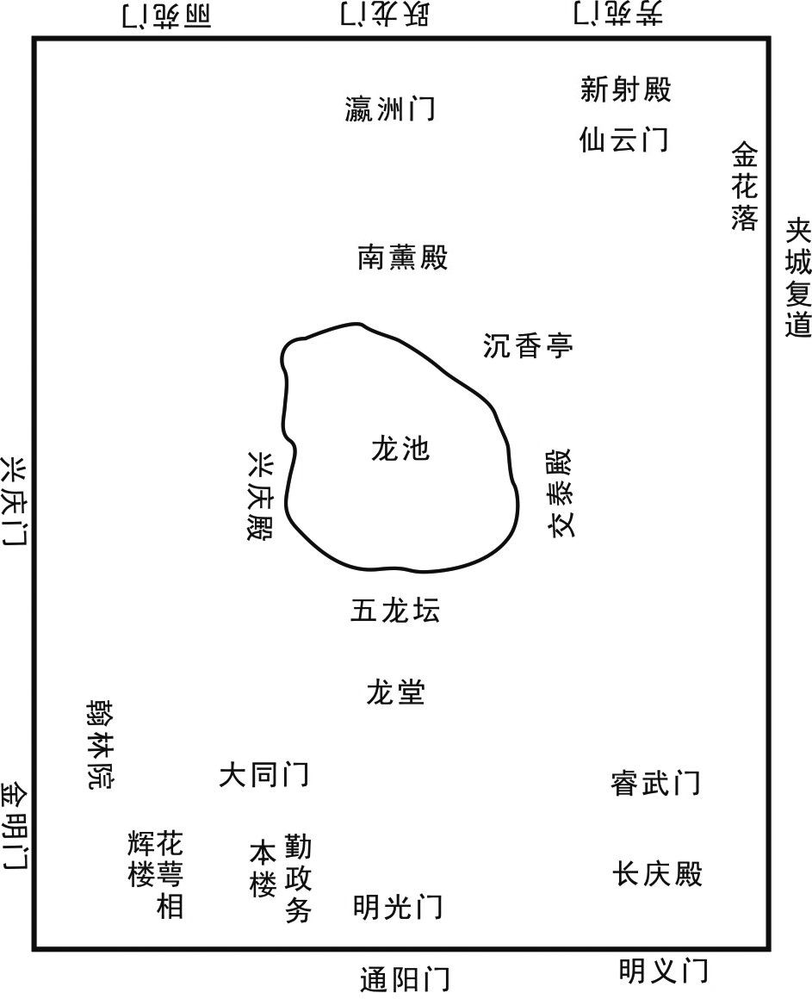 
唐长安兴庆宫示意图

[5]兵部侍郎：唐朝前期职事官，正四品下。尚书省兵部的副长官，与兵部尚书分掌武官的选任、勋阶和考核。　　辔（pèi）：驾驭牲口用的缰绳。

[6]清粹：纯净、高洁、纯粹。　　蕴藉：含蓄宽容。唐代选拔官吏，重视相貌、身材、仪表。因此，玄宗赞赏卢绚的仪表、风度会引起李林甫的不安。

[7]帛（bó）：丝织品的总称。在唐代，丝织品和贵金属金、银、铜都作为货币，具有一般等价物的功能。因此，李林甫用帛来贿赂，也等同于用金钱贿赂。　　清崇：指崇尚“清”。魏晋南北朝以来，山东［崤（xiáo）山以东地区，大致相当于北齐的统治区域］名门望族多，人才荟萃。山东士族崔、卢、李、郑家族更是文化上的望族。卢绚应属于这一集团。　　交、广：地名。指交趾（又称交州，治今越南河内西北，辖交趾、怀德、南定、宋平县，相当于今越南河内）、广州（治南海，即今广东广州，辖南海、番禺、增城、四会、化蒙、怀集、东莞、清远、洊水、浈阳、政宾、宝安县，相当于今广东广州、增城、四会、广宁、怀集、深圳、清远、英德）。这些地区在唐代属于远离中原的边远之地。　　左迁：古人尊崇右，以右为尊。“左迁”即表示贬官、降职。

[8]宾、詹：指太子宾客、詹事，属于唐朝东宫官体系。太子宾客，正三品，负责侍从、规谏太子和教导礼仪。太子詹事府设詹事一人，正三品，统东宫之政令、法度和事务。在唐玄宗时期，皇太子的权力、地位下降，东宫官逐渐成为闲职和虚衔。　　分务东洛：唐朝设长安（即西京）和洛阳（即东都）两个都城。分务东洛指到东都洛阳的分司机构任职。东都分司机构的官员往往都是闲职，没有实权。

[9]乖：违背，不协调。　　华州：地名。治郑县（今陕西华县），辖郑县、华阴、下邽（guī）县，相当于今陕西华县、华阴、渭南北下邽镇。

[10]员外、同正：即员外置同正员。按唐朝制度，在官僚正规编制之外置员外官。员外官加同正员，其俸禄、赏赐与编制内的正官相同，唯独不给职田（又作职分田、公田、禄田，指依据官职品级所授予的田地，作为官员俸禄的补充）。如果只是员外官，则俸禄为正官的一半。

## 【译文】

唐玄宗天宝元年（742年）。李林甫作为宰相，对凡是才能、威望、功劳高于自己的人，以及被玄宗器重的，权势、地位即将逼近自己的人，必定想尽各种办法除掉。李林甫尤其憎恨擅长文章、诗赋的大臣，或者表面上与他们亲善，用甜言蜜语引诱他们，暗地里却陷害他们。世人称“李林甫口中含蜜，而腹中带剑”。玄宗曾经在勤政楼下摆设音乐，把门帘放下来观赏。兵部侍郎卢绚以为玄宗已经离开，放下马鞭，按住驾马的缰绳，从勤政楼下横穿而过。卢绚风度翩翩，显得高洁、纯粹。玄宗的眼睛一直盯着卢绚，目送他离开，深深地赞叹卢绚含蓄宽容的风度、仪态。李林甫常常用重金和丝织品贿赂玄宗的左右侍从。玄宗的一举一动他必定知道。李林甫知道了玄宗赞赏卢绚之事，于是召集卢绚的儿子、弟弟，对他们说：“尊贵的君主一向重视有清望的名族。现在交州和广州需要派驻一些人才。皇上想派卢绚到那里去，可以吗？如果他害怕到边远的地方去，则应当降职。如果不这样的话，把他派到东都洛阳去做太子宾客、詹事（都是闲散之职），这也是拥有优厚待遇、受尊重的官位，怎么样？”卢绚感到害怕，于是自己请求调任太子宾客、詹事。李林甫担心他的这一举动会违背众人的意愿，于是授予卢绚华州刺史之职。卢绚到华州任官，没过多久，李林甫就诬陷卢绚有病，不能处理州内的事务，让卢绚做太子詹事、员外置同正员。

## 【原文】

**上又尝问林甫以“严挺之今安在？是人亦可用”。挺之时为绛州刺史[1]。林甫退，召挺之弟损之，谕以“上待尊兄意甚厚，盍为见上之策，奏称风疾，求还京师就医”[2]。挺之从之。林甫以其奏白上，云挺之“衰老得风疾，宜且授以散秩，使便医药”[3]。上叹叱久之[4]。夏四月壬寅，以为詹事。又以汴州刺史、河南采访使齐澣为少詹事[5]。(1)皆员外、同正，于东京养疾[6]。澣亦朝廷宿望，故并忌之。**

## 【注文】

[1]绛（jiàng）州：地名。治绛县（今山西绛县），辖正平、太平、曲沃、闻喜、稷山、垣县、襄陵县，相当于今山西曲沃、绛县、稷山、垣曲。

[2]盍（hé）：何不。　　风疾：指风痹、半身不遂等症，或指麻风病。　　京师：指唐朝的都城长安，相当于今陕西西安。

[3]散秩：散指散官，只有名号，不实际任事之官。秩即官吏的俸禄。

[4]叱（chì）：呼喝，呼喊。

[5]汴（biàn）州：地名。治浚仪（今河南开封），辖浚仪、开封、尉（yù）氏、陈留、封丘、雍丘等县，相当于今河南开封、尉氏、封丘、杞县。汴州位于水陆之要津，是黄河与各运河集中之地，四通八达，舟车汇集。由西京长安和东都洛阳通向东部地区的道路就经过汴州，此地也是国家漕运（官方督管的水运）的咽喉。汴州的主要交通凭借漕运要道汴渠。特别是唐中叶以后，控制汴渠即能控制漕运。汴州因为特殊的地理位置，也成为四战之地。　　河南采访使：唐朝使职。即河南道的采访使。河南道是唐太宗贞观十道和唐玄宗开元十五道之一，太宗贞观元年（627年）置，因在黄河以南而得名。辖境约相当于今山东、河南两省黄河故道以南，山西中条山以南，和江苏、安徽二省淮河以北地区。玄宗开元二十一年（733年）分东都洛阳附近地区为都畿（jī）道，河南道辖境缩小。河南道治汴州（今河南开封）。唐肃宗乾元元年（758年）废。采访使即采访处置使，为唐朝使职名，是中央派出的巡按各道（即按自然山川形势划分的监察区域）的官员。唐玄宗开元四年（716年）始置于河南、扬州（今江苏扬州）等地，选朝廷要员担任。开元二十二年（734年），改称采访处置使，但仍沿称采访使。采访使负责考核地方官政绩、察访善恶。　　齐澣（huàn）：生卒年不详。唐睿宗、玄宗朝大臣。定州义丰（今河北安国）人。唐睿宗景云二年（711年）为监察御史，尽职守。唐玄宗开元初，中书令张说（yuè）选他为尚书右丞、吏部侍郎。开元二十五年（737年），迁润州（治今江苏镇江）刺史，充江南东道采访处置使。他任地方官期间改移漕运物资的通道，安抚流民。后贬归田里。天宝五载（746年）为平阳（治今山西临汾西南）太守，卒于官。　　少詹事：唐朝东宫官名。太子的东宫官署有詹事府。詹事府设詹事一人，正三品；少詹事一人，正四品上。太子詹事统领东宫之政令、法度、事务，少詹事是詹事的副职。但是到唐玄宗朝，随着皇太子权势和地位的下降，东宫的官僚被大力裁减，几乎成为闲职。因此，太子詹事、少詹事也变成无实权之虚职。

[6]东京养疾：东京即东都洛阳。洛阳是唐朝的陪都，在此设置的一套官僚机构多是闲散之职。说让齐澣到东都养病，只是托词，实质是想让他远离权力中心。

## 【译文】

唐玄宗又曾经问李林甫：“严挺之现在在哪里？这个人还可以再任用。”严挺之当时已经被贬为绛州刺史。李林甫退下后，召见严挺之的弟弟严损之，告诉他：“皇上非常看重您的哥哥，你哥哥为什么不寻找面见皇上的策略呢？你哥哥可以上奏，称自己患了风疾，请求回到京师长安看医生。”严挺之听从了李林甫的话。李林甫就把严挺之上奏的内容告诉了玄宗，说挺之“衰老了，患上了风疾，应当只授予散官的名号、俸禄，以方便他看医生、服药”。玄宗听了，叹息了很久。天宝元年（742年）夏四月壬寅（二十八日），任命严挺之为太子詹事。李林甫又把汴州刺史、河南采访使齐澣调为太子少詹事。严挺之和齐澣都是员外置同正员，被发配到东都洛阳养病。齐澣在朝中也一向有威望，因此，李林甫把他连同严挺之一同忌恨。

## 【原文】

**秋七月辛未，左相牛仙客薨[1]。八月丁丑，以刑部尚书李适之为左相[2]。**

## 【注文】

[1]左相：牛仙客当时兼门下省长官侍中，而门下省位于唐代宫殿的左边，所以门下省长官又称“左相”。侍中在唐高宗龙朔二年（662年）曾改称东台左相。相应地，李林甫此时兼中书省长官中书令，中书省位于唐代宫殿的右边，所以中书省长官又称“右相”。龙朔二年，曾改中书令为西台令、右相。　　薨（hōng）：在唐朝，皇后、妃嫔、皇子、公主、王侯、三品以上官员的死叫“薨”。

[2]刑部尚书：唐前期职事官，正三品。尚书省刑部长官，掌管天下刑法、关禁之政令。唐玄宗时期，多以京城之外的官员兼任，渐渐变成虚衔。　　李适之（？—747年）：唐宗室，玄宗朝大臣。名昌，废太子李承乾（唐太宗之嫡长子，长孙皇后所生）之孙。唐玄宗开元中，担任过通州（治今四川达川）刺史、御史大夫、刑部尚书等。玄宗天宝元年（742年），代牛仙客为左相，担任宰相之职。天宝五载（746年），被李林甫诬陷，罢为太子少保，从二品。官品很高，但无实权。李林甫又诬陷适之与韦坚结成朋党（指官员互相之间结成的小集团。历代皇帝都很忌讳朋党），再贬宜春（治今江西宜春）太守。第二年自杀。

## 【译文】

唐玄宗天宝元年（742年）秋七月辛未（二十九日），左相（即门下省长官侍中）牛仙客死。八月丁丑（初五日），任命刑部尚书李适之为左相。

## 【原文】

**二年。上以右赞善大夫杨慎矜知御史中丞事[1]。时李林甫专权，公卿之进，有不出其门者，必以罪去之[2]。慎矜由是固辞，不敢受。五月辛丑，以慎矜为谏议大夫[3]。**

## 【注文】

[1]赞善大夫：唐朝太子东宫官名，正五品上。掌管传令，讽谏过失，教导礼仪，以儒家经典教授诸位郡王。　　杨慎矜（？—747年）：唐玄宗朝大臣。长安（今陕西西安）人，隋炀帝玄孙（孙之子为曾孙，曾孙之子为玄孙），沉毅有才干。历任汝阳县（今河南汝南）县令、监察御史、侍御史。玄宗天宝二年（743年）升谏议大夫、御史中丞、户部侍郎兼诸道铸钱使，成为朝廷中掌管经济事务的重臣。后来李林甫嫉恨他，诬陷他想恢复隋朝的基业，被玄宗下诏赐自尽。　　知御史中丞事：知，以他官暂时主持某一官署事务。知御史中丞事指暂时负责御史中丞之事务。在唐朝，“检校”、“摄”、“判”、“知”这些职任多系特命，运用灵活。任职者的官品与所委事之间多有差距，所“摄”、“知”的事务都不是其本来的官位之职责，即“越局”、“出位”掌他职，属临时差遣官。皇帝常以此表示对某人的倚重或对某事的重视。　　御史中丞：唐朝中央监察机构的官员。中央监察机构御史台中，御史大夫为长官，从三品；御史中丞为御史大夫的副职，正五品上。御史大夫掌管国家的监察，以肃正朝纲，中丞辅助他。

[2]公卿：原为三公九卿的合称。后又泛指中央政府高级行政官员。

[3]谏议大夫：唐朝谏官。分左、右谏议大夫，正五品上，分别隶属于门下、中书两省。谏官有权规劝皇帝，向其进谏言。

## 【译文】

唐玄宗天宝二年（743年）。玄宗任命右赞善大夫杨慎矜代理御史中丞之职权。当时，李林甫独掌大权，能在朝廷中做到显官的，如果不是出自他的门下，他就一定找个罪名除去。于是，杨慎矜固执地辞让，不敢接受皇帝的这项任命。五月辛丑（初三日），玄宗任命杨慎矜为谏议大夫。

## 【原文】

**三载冬十二月，户部尚书裴宽素为上所重，李林甫恐其入相，忌之[1]。刑部尚书裴敦复击海贼还,受请托,广序军功,宽微奏其事[2]。林甫以告敦复，敦复言“宽亦尝以亲故属敦复”[3]。林甫曰：“君速奏之，勿后于人。”敦复乃以五百金赂女官杨太真之姊，使言于上[4]。甲午，宽坐贬睢阳太守[5]。**

## 【注文】

[1]三载：指天宝三载（744年）。天宝三载正月，唐玄宗改年为载。　　户部尚书：唐中央尚书省六部之一户部的长官，正三品。掌管天下户口、田地、徭役、赋税、储存货物、经费核算等。　　裴宽（685—755年）：唐玄宗朝大臣。绛州闻喜（今山西闻喜东北）人，善骑射、弹棋。历任河南丞、长安尉、江东覆田判官、太常博士、刑部员外郎、户部侍郎、蒲州（治今山西永济西南）刺史、河南尹（管理东都洛阳一切事务的长官）、范阳（治今北京地区）节度使、户部尚书、御史大夫。李林甫担心他成为宰相，就指使人奏劾其罪。裴宽被贬为地方官。

[2]微：隐蔽，藏匿。

[3]属（zhǔ）：通“嘱”，委托，交付。

[4]杨太真（719—756年）：本名杨玉环，即后来赫赫有名的唐玄宗的宠妃——杨贵妃。蒲州永乐（今山西永济东）人。杨玉环资质丰艳，善歌舞，通音律，聪明过人，初为寿王李瑁的妃子。唐玄宗开元末年，武惠妃去世后，杨玉环开始得到玄宗的宠爱。玄宗令杨玉环自己请求当女官，号“太真”，目的是让她跟寿王撇清关系。天宝四载（745年），玄宗封杨玉环为贵妃。玄宗还推恩及其家族，杨贵妃的母亲、姐姐均被封为国夫人（国夫人为唐朝命妇封号，视其丈夫或儿子的官品来定品级，取其高者），叔叔、兄弟皆封为高官，其从（zòng）祖兄（同曾祖父但不同祖父不同父亲，年长于己者，称为“从祖兄”）杨国忠还逐步升为宰相。杨家权倾天下，生活奢侈。朝廷内外依附杨家的官吏颇多，东北边将安禄山也与之交结，认杨贵妃为母亲，以巩固自己的权势。但是，安禄山与杨家之间的矛盾也非常深。天宝十四载（755年），安禄山发动叛乱。第二年，玄宗被迫逃往蜀地。杨贵妃跟随玄宗到达马嵬驿（今陕西兴平西），随从的禁军发动叛乱，杀死宰相杨国忠，逼迫玄宗勒死杨贵妃。

[5]睢（suī）阳：地名。即睢阳郡，治宋城（今河南商丘南），辖宋城、襄邑、宁陵、虞城、下邑、谷熟、柘（zhè）城、砀（dàng）山、单（shàn）父、楚丘县，相当于今河南商丘、睢县、宁陵、虞城、夏邑、柘城，安徽砀山，山东单县、曹县。　　太守：唐朝地方官。在唐前期，地方行政制度采用州县两级制。州的长官为刺史，县的长官为县令。唐玄宗天宝元年（742年）二月，天下诸州改为郡，刺史改为太守。在中晚唐时代，节度使权力膨胀，凌驾于州或郡之上。节度使的辖区又称为道，成为地方最高行政机构。因此，唐后期，地方上实际演变为道—州（或郡）—县三级制。

## 【译文】

唐玄宗天宝三载（744年）冬十二月。户部尚书裴宽向来被玄宗器重，李林甫担心他成为宰相，因此憎恨他。刑部尚书裴敦复率兵打击海盗之后，回到京城。他受了别人的请托，给相关的熟人广泛地评定功勋。裴宽暗中把此事上奏给皇帝。李林甫就将这件事告诉了裴敦复。裴敦复说：“裴宽也曾经因为亲戚、同乡的事来委托过我。”李林甫说：“您可以把这件事迅速上奏给皇帝，不要落在他人之后。”裴敦复于是用五百两黄金贿赂杨太真（即后来的杨贵妃）的姐姐，让她把这件事告诉了玄宗。甲午（初五日），裴宽就因为这事被贬为睢阳太守。

## 【原文】

**初，上自东都还，李林甫知上厌巡幸，乃与牛仙客谋増近道粟赋及和籴以实关中，数年，蓄积稍丰[1]。上从容谓高力士曰：“朕不出长安近十年，天下无事，朕欲高居无为，悉以政事委林甫，何如？”[2]对曰：“天子巡狩，古之制也[3]。且天下大柄，不可假人[4]。彼威势既成，谁敢复议之者！”上不悦。力士顿首自陈：“臣狂疾发，妄言，罪当死。”[5]上乃为力士置酒，左右皆呼万岁。力士自是不敢深言天下事矣。**

## 【注文】

[1]道：唐太宗贞观元年（627年），因山川地势，分全国为十道。唐玄宗开元二十一年（733年）又增为十五道。道为监察区，是中央的派出机构。每道置巡察使、存抚使、按察使或采访处置使，由中央临时派遣，负责监察地方。　　巡幸：指唐朝天子及中央政府经常在两京（长安和洛阳）之间来回移动办公。在隋唐时代，西京长安为西魏、北周以来关陇集团的根据地，但是因为地势原因，它的经济运输远不如东都洛阳。虽然关陇地区经济富庶，但随着国家的统一、关中地区人口的增加，当地已经不能充分供给帝王、宫卫、百官的俸禄、食物。且其地水陆交通不便，运输米谷也颇困难。因此隋唐帝王若遇天灾，农产品不足，往往移幸洛阳，待关中农产丰收，然后西还长安。唐玄宗朝是唐代最鼎盛的时期，当时长安作为国际性大都市，人口非常多，其所在的关中地区的经济供给问题比前代更加严重，皇室及中央政府有时不得不东巡洛阳就食。　　和籴（dí）：官方出钱向民间购买粮食或其他实物。江淮地区经济发达，本来向关中地区运送粮食，到唐玄宗时改运重量更轻的布（相当于货币），朝廷再用这些布买进关中之地的农产品。李林甫、牛仙客充分利用这些方法解决了长安及附近地区的粮食供应问题。　　关中：地区名。或称关中平原，指陕西秦岭北麓渭河冲积平原，平均海拔约500米，又称关中盆地。包括故秦函谷关以西，即今河南灵宝以西、秦岭以北甘肃东部、宁夏东南部以及陕北地区。关中盆地的北部为陕北黄土高原，向南则是陕南山地、秦巴山脉，为古代中国农业发达、人口密集的地区，富庶之地，号称“八百里秦川”。

[2]朕：我。从中国第一位皇帝秦始皇时起，朕专用作皇帝的自称。　　无为：本是西汉统治者采取的一种统治术，标榜黄帝、老子的思想，又称“黄老无为”，指顺应事物的自然变化而不必人为进行干预，不滋事扰民，以维护社会安定。这里指唐玄宗不想管事，想委托宰相李林甫管理朝政。

[3]天子巡狩：中国领土辽阔，帝王常常到各地巡察，可以增进对民情的了解，加强对地方的控制。高力士想劝玄宗坚持两都巡幸制度，是因为西京长安处于西北的关陇一带，帝王长期龟缩于此，怕对广大东部地区的控制不利。

[4]假：委托。

[5]顿首：叩头、磕头。

## 【译文】

刚开始，玄宗从东都洛阳返回西京长安。李林甫知道玄宗厌恶在两京之间来回移动处理政事。于是，李林甫与牛仙客经过策划，决定多征收长安邻近诸道的粟赋，用和籴之法来充实关中。几年之后，中央政府的粮食储蓄稍稍丰富起来。（于是，玄宗及中央政府不用担心长安缺粮。在这种情形下，就不必非转移到东都洛阳去办公。）玄宗从容地对高力士说：“我不出长安城已经将近十年了。天下没有什么事。我想居住在宫中，什么事都不管，把政事完全委托给李林甫处理，怎么样？”高力士回答说：“天子到各地巡狩，是自古以来的制度。而且，管理天下大事的权力，不能委托别人。如果他（指李林甫）的威势已经形成，谁还敢再议论他！”玄宗听了，心里不高兴。高力士看到这种情况，就向玄宗叩头，自己陈述道：“我身上猛烈的疾病发作了，所以说了荒谬的话，该当死罪。”玄宗于是给高力士倒酒，左右之人都呼喊“万岁”。从此以后，高力士再也不敢有深度地谈论天下之事了。

## 【原文】

**四载。李适之与李林甫争权，有隙[1]。适之领兵部尚书，驸马张垍为侍郎，林甫亦恶之[2]。使人发兵部铨曹奸利事，收吏六十余人付京兆与御史对鞫之，数日，竟不得其情[3]。京兆尹萧炅使法曹吉温鞫之，温入院，置兵部吏于外，先于后厅取二重囚讯之，或杖或压，号呼之声，所不忍闻[4]。皆曰：“茍存余生，乞纸尽答。”[5]兵部吏素闻温之惨酷，引入，皆自诬服，无敢违温意者。顷刻而狱成，验囚无榜掠之迹[6]。及林甫欲除不附己者，求治狱吏，炅荐温于林甫，林甫得之，大喜。温常曰：“若遇知己，南山白额虎不足缚也。”[7]时又有杭州人罗希奭，为吏深刻，林甫引之，自御史台主簿再迁殿中侍御史[8]。二人皆随林甫所欲深浅，锻炼成狱，无能自脱者，时人谓之“罗钳吉网”[9]。**

## 【注文】

[1]隙：隔阂。

[2]张垍（jì）：生卒年不详。唐玄宗朝重臣张说（yuè）之次子。河南洛阳（今河南洛阳）人，以文章见长。张说与李玙（即后来的唐肃宗）的生母杨氏、李玙本人关系密切，因此，张垍尚李玙的同母妹宁亲公主，成为驸马都尉。唐玄宗对他特加恩宠，准许他在宫廷中置内宅，赏赐珍玩不可胜数。张垍被授予中书舍人，玄宗曾一度想任命他为宰相。唐玄宗天宝十三载（754年），张垍遭杨国忠谗言中伤，被贬为卢溪郡［治今湖南沅（yuán）陵］司马。同年召还，拜太常寺卿。安史之乱爆发，张垍投奔叛军，被任命为伪宰相，后死于乱中。

[3]兵部铨曹：指兵部负责武官选授的机构，以三铨领其事：一曰中铨，二曰东铨，三曰西铨。兵部尚书为中铨，兵部两侍郎分为东、西铨。　　收：逮捕。　　吏：官府中的胥吏与差役，地位品秩较低的为官府做事之人。　　付京兆与御史对鞫：这里指京兆尹（参见下注“京兆尹”）和御史台共同审理案子。

[4]京兆尹：官名。唐玄宗开元初升雍州（今陕西西安）为京兆府，往往以亲王领雍州长官雍州牧，而改雍州长史为京兆尹，从三品，并增置少尹二人，从四品下，实际管理京兆府境内之事。京兆府治长安城光德坊，辖长安城的万年县、长安县，又领长安城周边的蓝田、渭南、昭应、三原、富平、栎（lì）阳、咸阳、高陵、泾阳、醴（lǐ）泉、云阳、兴平、鄠（hù）县、武功、好畤（zhì）、盩（zhōu）厔（zhì）、奉先、奉天、华原、美原、同官县，相当于今陕西西安、蓝田、渭南、临潼、三原北、富平北、临潼东北栎阳镇、咸阳、高陵、泾阳、礼泉北之泔（gān）北镇、泾阳北云阳镇、兴平、户县、武功西北武功镇、永寿西南好畤河镇、周至、蒲城、乾县、耀县、富县东北美原镇、铜川北城关镇。　　法曹：官名。京兆尹之下设法曹参军事二人，正七品下，掌管法律、审刑狱定刑，督捕盗贼，地方治安。　　吉温（？—755年）：唐玄宗朝酷吏。洛州河南（今河南洛阳）人，酷吏吉琚之子。历任新丰县（属今陕西西安）县丞、万年县（属今陕西西安）县尉，与京兆尹萧炅相勾结，又攀附李林甫为爪（zhǎo）牙（本义指动物的尖爪和利牙，这里用之比喻得力帮手，多比喻为坏人效力的帮凶）。他肆掠朝廷、严刑逼供，被李林甫提拔为户部侍郎兼侍御史。又媚附杨国忠、安禄山、高力士，得为河东节度副使、御史中丞，兼京畿关内采访处置使等。后因杨国忠与安禄山倾轧，被贬至岭南，死于狱中。　　杖：即杖刑，唐朝一种刑法，用官杖捶击犯人的脊背、臀部或腿部。唐律定为“五刑”（笞刑、杖刑、徒刑、流刑、死刑）之二，重于笞刑，轻于徒刑。

[5]苟：连词，如果、假设。

[6]榜：捶击、捶打。　　掠：拷打。

[7]白额虎：比喻凶恶之人。

[8]杭州：地名。治钱塘（今浙江杭州），辖钱塘、盐官、余杭、富阳、新城、於潜、临安、紫溪、唐山县，相当于今浙江杭州、海宁西南盐官镇、余杭西南余杭镇南、富阳及附近地区、临安及附近地区。　　罗希奭（shì）：生卒年不详。唐玄宗朝酷吏。杭州（治今浙江杭州）人，迁居洛阳（今河南洛阳）。玄宗天宝五载（746年），李林甫引之与吉温共掌刑狱，排斥异己，罗织罪名，制造冤狱。他曾受命审理左相李适之、刑部尚书韦坚等案，极为苛刻。后转刑部员外郎。天宝十一载（752年）李林甫卒，被贬为地方官。　　御史台主簿：唐朝职事官。中央监察机构御史台设主簿一人，从七品下。掌管印及处理具体事务、文书。　　殿中侍御史：唐朝职事官，为中央监察机构御史台下所设的殿院的主要官员，从七品下。掌管纠察朝会、朝仪、郊祀、维护朝廷秩序，巡察京师，监察太仓、左藏（zàng）（宫廷仓库）的出纳等。

[9]锻炼：本义冶金，这里引申为罗织罪名。

## 【译文】

唐玄宗天宝四载（745年）。李适之与李林甫二人因为争夺权力而产生隔阂。李适之领兵部尚书，驸马都尉张垍为兵部侍郎，李林甫也厌恶张垍。李林甫指使人告发兵部选官过程中的丑事，逮捕兵部的吏员六十余人，交付京兆尹和御史台审讯。过了好几天，竟然没有得到相关的犯罪信息。京兆尹萧炅就指使法曹参军事吉温去审问。吉温一走进院子，便把被逮捕的兵部吏员放在外面，先从后厅提取出两名犯重罪的囚犯进行审讯，对这二人施以杖刑或挤压之刑。这两名囚犯大声喊叫、呼唤的声音，令在场之人不忍心听。这两名重罪犯都说：“如果能保全自己的性命，我们乞求把所有的犯罪情况都写在纸上。”兵部的吏员向来听说吉温审案子用刑惨酷，他们被吉温引入这个院子，都诬陷自己犯了罪，服从吉温，没有人敢违背吉温的意图。不久，这些兵部吏员被判入狱。经检验，他们的身上没有被捶击、拷打的痕迹。当时正值李林甫想除掉不依附自己的人，他寻求能够按自己的意愿处理刑狱的官吏。萧炅就把吉温推荐给了李林甫。李林甫得到吉温，非常高兴。吉温常常说：“如果遇到知己，终南山的白额虎都不值得去捆绑。”当时，又有杭州人罗希奭身为官吏，对人、做事都非常苛刻。李林甫就引荐他，把他从御史台的主簿提升到殿中侍御史。吉温和罗希奭二人都按照李林甫的意愿来对犯人量刑，严刑拷打，罗织罪名，铸成刑狱，没有人能够逃脱他们的魔掌。当时的人称他们二人为“罗钳吉网”。

## 【原文】

**秋九月癸未，以陕郡太守、江淮租庸转运使韦坚为刑部尚书，罢其诸使，以御史中丞杨慎矜代之[1]。坚妻姜氏，皎之女，林甫之舅子也，故林甫昵之[2]。及坚以通漕有宠于上，遂有入相之志，又与李适之善；林甫由是恶之，故迁以美官，实夺之权也[3]。**

## 【注文】

[1]陕郡：地名。治陕县（今河南三门峡市陕州区），辖陕县、峡石、灵宝、芮城、平陆县，相当于今河南三门峡、灵宝东北、山西芮城、平陆。　　江淮租庸转运使：唐朝使职。指专门负责将江南的粮食、租税运送到京城长安的临时性差遣。在天宝二年（743年），玄宗以陕郡太守韦坚为勾当（办理、处理之意）租庸使。通过漕运把粮食、租税从江南运送到长安，主要经过长江、淮河及其相关支流。因此，也可称“江淮租庸转运使”。　　韦坚（？—746年）：唐玄宗朝大臣。京兆万年（今陕西西安）人，字子金。他的姊妹皆为太子（李玙）的妃子。他历任长安县县令，又转运江淮的租赋，每年收巨万钱，玄宗认为他能干。天宝元年（742年）升任陕郡太守、水陆转运使，改革漕运。玄宗对他的宠信越来越深，授特进三品，为江淮南租庸、转运、处置等使，权倾宰相，为李林甫所嫉恨。天宝五载（746年），李林甫诬陷他与边将通谋，谋立太子为帝，贬缙（jìn）云（治今浙江丽水东南）太守，再贬江夏（治今湖北武汉）员外别驾，长流岭南。不久被杀。　　诸使：指韦坚担任的使职差遣。在唐玄宗时代，临时性的使职差遣已经兴起，在国家政治制度的运作和社会经济方面掌握重要权力，尚书省六部的职权基本被侵夺。因此让韦坚担任刑部尚书，实际上是给他闲职，夺其实权。使职差遣因事临时而设，事情结束则罢去。凡是任使职者，都带着自己原有的职事官衔，所居职事官成为其地位、待遇等次的一种标志。唐玄宗时，原职官制度之外权宜设置的使职差遣已经普遍化，这使尚书省六部官员的职任在很大程度上被抽空。原职事官系统失其职任的现象十分明显。

[2]姜皎（673—722年）：唐玄宗朝大臣。秦州上邽（guī）（今甘肃天水）人。武周时为尚衣奉御，与李隆基关系很好。李隆基即位，授殿中少监，甚得宠信。他参与翦除太平公主等密谋，进殿中监，封楚国公，转太常寺卿，权势很大。玄宗开元五年（717年），宰相宋璟（jǐng）见其权宠太甚，请玄宗抑损之。玄宗下诏令姜皎归田自娱。开元十年（722年），姜皎因泄露玄宗的话，被杖流钦州（治今广西钦州东北），病死途中。

[3]迁以美官：刑部尚书是尚书省刑部的长官，正三品，名位不错。但是，在唐玄宗时代，临时性的使职差遣兴起，侵夺原尚书省六部之权，六部的官员也日益演变为只表示品级的阶官。所以对韦坚的这次调动表面上是“迁以美官”，实际上是夺取他的实权。

## 【译文】

唐玄宗天宝四载（745年）秋九月癸未（二十九日），李林甫将陕郡太守、江淮租庸转运使韦坚调为刑部尚书，罢去他的使职，用御史中丞杨慎矜取代他。韦坚的妻子姜氏是姜皎的女儿，韦坚是李林甫的舅子，因此李林甫与韦坚的关系亲近。当时，韦坚因为疏通漕运而受到玄宗的宠信，于是他有了当宰相的志向。韦坚又与李适之关系好。因此，李林甫厌恶韦坚，把他调到名位不错的官位，实际上是夺取了他的实权。

## 【原文】

**五载春正月乙丑，以陇右节度使皇甫惟明兼河西节度使[1]。**

## 【注文】

[1]陇右节度使：唐朝方镇陇右节度的军政长官。陇右节度是唐玄宗开元、天宝年间沿边所设十节度之一。参见《唐开元、天宝十节度表》。开元元年（713年），朝廷为防御吐蕃，设置陇右节度使，治鄯（shàn）善（今青海乐都），辖临洮（táo）、河源、莫门、宁塞、积石五军，及秦、河、渭、鄯、兰、武、洮、岷、廓、叠、宕（dàng）等州，相当于今青海、甘肃一带。唐肃宗上元年间、唐代宗广德年间，其地被吐蕃攻占。　　皇甫惟明（？—747年）：唐玄宗朝大臣，曾为忠王李玙的朋友。玄宗开元十八年（730年），他奉玄宗之命出使吐蕃，唐与吐蕃于是重修旧好。唐玄宗天宝元年（742年），任陇右节度使，防御吐蕃有功。他于天宝五载（746年）到京城拜见皇帝，见李林甫专权，心颇不平，曾劝玄宗除掉李林甫。当时，忠王已经被立为太子。于是李林甫诬称皇甫惟明与太子妃之兄韦坚谋拥立太子即位，被贬播川（治今贵州遵义）太守，次年被杀。　　河西节度使：唐朝方镇河西节度的军政长官。河西节度也是唐玄宗开元、天宝年间沿边所设十节度之一。唐睿宗景云二年（711年），设置河西节度使，治凉州（治今甘肃武威），另设副使治甘州（治今甘肃张掖），辖赤水、建康、玉门、墨离、新泉、豆庐六军，赤水、白亭、交城、张掖四守捉，以及凉、瓜、沙、肃、甘五州，相当于今甘肃、宁夏一带。负责保卫唐西北边疆，防御吐蕃。唐代宗大历元年（766年）移治所于沙州（治今甘肃敦煌西南）。不久，其地被吐蕃攻占，遂废河西节度。

## 【译文】

唐玄宗天宝五载（746年）春正月乙丑（十三日），任命陇右节度使皇甫惟明兼河西节度使。

## 【原文】

**李适之性疏率，李林甫尝谓适之曰：“华山有金矿，采之可以富国，主上未之知也。”[1]他日，适之因奏事言之。上以问林甫，对曰：“臣久知之，但华山陛下本命，王气所在，凿之非宜，故不敢言。”[2]上以林甫为爱己，薄适之虑事不熟，谓曰：“自今奏事，宜先与林甫议之，无得轻脱。”[3]适之由是束手矣。适之既失恩，韦坚失权，益相亲密，林甫愈恶之。**

## 【注文】

[1]华山：中国五大名山——五岳（指中岳嵩山、北岳恒山、东岳泰山、南岳衡山、西岳华山）之一，位于今陕西华阴境内。传说五岳为群神所居住，历代王朝多有祭祀五岳之礼仪。在唐朝，五岳祭祀也是国家重要的祭祀活动。

[2]华山陛下本命：唐玄宗以华岳为自己的本命所在。他即位后，封华岳神为金天王。在唐玄宗统治时期，五岳之中的华山地位提升，这与玄宗的个人因素有很大关系。唐玄宗时，正值帝王和国家举行五岳祭祀的高潮。玄宗本人又十分看重这类信仰、符命和王气。所以，李林甫抓住了玄宗的心态，精心策划，以打击李适之。

[3]脱：说出。

## 【译文】

李适之的性格粗犷、轻率。李林甫曾经对他说：“华山藏有金矿，如果开采出来，可以使国家富裕。皇上还不知道这事呢。”有一天，李适之趁着向皇帝汇报事情之时，把华山有金矿的信息告诉了玄宗。玄宗就向李林甫问起这件事，李林甫回答说：“我知道这事已经很久了。但是，华山是陛下的本命山，是王气的所在地。开凿华山不合适，因此我不敢告诉您。”玄宗听了，认为李林甫爱护自己，于是就轻视李适之，认为他考虑问题不成熟。于是，他对李适之说：“今后你要上奏什么事，应当先和李林甫商议，不要轻易说出口。”从此之后，李适之受到李林甫的约束。李适之既然已经失去皇帝的恩典，而韦坚又失去了权力，这样，二人的关系就越来越亲密。因此，李林甫也越发讨厌他们。

## 【原文】

**初，太子之立非林甫意，林甫恐异日为己祸，常有动揺东宫之志[1]。而坚，又太子之妃兄也[2]。皇甫惟明尝为忠王友，时破吐蕃，入献捷，见林甫专权，意颇不平[3]。时因见上，乘间微劝上去林甫，林甫知之，使杨慎矜密伺其所为。会正月望夜，太子出游，与坚相见，坚又与惟明会于景龙观道士之室[4]。慎矜发其事，以为坚戚里，不应与边将狎昵[5]。林甫因谮坚与惟明结谋，欲共立太子。坚、惟明下狱，林甫使慎矜与御史中丞王鉷、京兆府法曹吉温共鞫之[6]。上亦疑坚与惟明有谋，而不显其罪。癸酉，下制责坚以干进不已，贬缙云太守，惟明以离间君臣，贬播川太守[7]，仍别下制戒百官。**

## 【注文】

[1]东宫：在古代，太子在皇宫中的住处称为东宫。因此，又以东宫指代太子本人。

[2]太子之妃：这里指皇太子妃韦氏，出自名门京兆韦氏家族。李玙还是忠王之时纳韦氏为妃。李玙被立为太子后，韦氏成为太子妃。后因李林甫罗织罪名陷害其兄韦坚，太子感到害怕，上表请求与韦氏离婚，玄宗准许。

[3]吐蕃（bō）：古族名，政权名。本是西部羌人的一支，隋唐时代在今青藏高原建立起强大的吐蕃王国。共历经九世赞普（意为强势丈夫或有权势的君主），二百余年。吐蕃也是今日藏族之先民。隋初，吐蕃渐渐强盛。囊（朗）日论赞统治时期，励精图治，兼并其他部落，势力向外发展，统治中心迁往逻些（今西藏拉萨），囊日论赞被各部尊为赞普。唐太宗贞观三年（629年），其子松赞干布即赞普位，统一了青藏高原其他诸部，建立起强大的吐蕃王朝。他仿照中原制度改革机构，严密军制，修订法典，创立文字，统一度量衡，又多次遣使到唐朝请求和亲。贞观十五年（641年），唐太宗派文成公主出嫁松赞干布，汉藏关系日益密切，中原许多生产技术传到吐蕃地区，促进了当地社会经济文化的发展。唐中宗当政时，把金城公主嫁给吐蕃赞普弃隶缩赞。而后，唐蕃双方多次会盟。唐玄宗天宝年间，“安史之乱”爆发，驻守在河西走廊一带的唐军大批东调参与平叛，吐蕃乘机攻占河西地区。而后，吐蕃不断侵扰唐朝的西部边境。唐穆宗长庆三年（823年），唐蕃双方会盟，并立碑，明确“和同一家”，长期保持舅甥关系。赤松德赞在位时，吐蕃强盛一时，极力对外扩张。后内部矛盾加剧，军队叛变，下层民众反抗，社会动荡。唐武宗会昌二年（842年），吐蕃赞普达磨遇刺死，王室陷入内部纷争，统一的吐蕃王朝从此瓦解。

[4]望：中国古代的历法是阴阳合历。平年十二个月，有六个大月，各三十天；六个小月，各二十九天。每三年左右有一年置闰月。大月十六、小月十五叫做望。在唐朝，正月十五日为上元节。　　景龙观：道观名。位于长安崇仁坊西南角。崇仁坊在皇城（皇帝上朝、办公之地，中央各官衙署所在地，在皇室日常生活起居的宫城的南面）和东市附近，本是尚书左仆射、申国公高士廉（唐开国功臣，唐高祖、太宗朝大臣）的宅第和左金吾卫（属长安的禁军）所在地。唐中宗时并为长宁公主（韦皇后所生）的宅第。韦后被李隆基和太平公主诛杀后，长宁公主随丈夫到京城外，于是奏请改自己的宅第为景龙观。天宝十三载（754年）改为玄真观。

[5]戚里：帝王外戚聚居的地方；借指外戚；泛指亲戚邻里。　　狎（xiá）：亲近而不庄重。皇亲国戚与手握重兵的边境将领交结本来就一直是皇帝非常忌讳的事情。皇帝担心他们互相勾结，威胁皇权或者谋反。

[6]王鉷（hóng）（？—752年）：唐玄宗朝大臣。太原祁县（今山西祁县）人。历任监察御史、户部员外郎、京城和市和籴使、户口色役使，兼京畿、关内采访等使、御史中丞。他依附权相李林甫，为其爪牙，极力敛财。后因其弟犯法，被赐死。

[7]干：求取。　　缙（jìn）云：地名。即缙云郡，治丽水（今浙江丽水东南），辖丽水、松阳、缙云、青田、遂昌县，相当于今浙江丽水、缙云、青田、遂昌。　　播川：地名。即播川郡，治遵义（今贵州遵义），辖遵义、芙蓉、带水县，相当于今贵州遵义。

## 【译文】

刚开始，立李玙为太子并不是李林甫的意思。李林甫担心将来太子即位后，打击报复自己，于是他常常想办法动摇东宫（这里用太子居住的宫殿来指代太子本人）的地位。而韦坚又是太子妃韦氏的哥哥。李玙还是忠王时，皇甫惟明曾经跟他是朋友。当时，皇甫惟明打败了吐蕃，入朝廷进献捷报。他看见李林甫独掌大权，心里感到很不平。他趁着面见皇帝的机会，暗中劝皇帝除掉李林甫。李林甫知道了这事，就指使杨慎矜秘密刺探皇甫惟明的所作所为。正值正月十五日（上元节）夜，太子出游，与韦坚相见。韦坚又与皇甫惟明在景龙观一个道士的房间里相会。杨慎矜（向皇帝）告发了这件事，认为韦坚身为皇室的亲戚，不应该与边境的将领走得太近。李林甫趁机诬陷韦坚与皇甫惟明策划阴谋，想共同拥立皇太子即皇帝位。韦坚、皇甫惟明被逮捕下狱。李林甫派杨慎矜和御史中丞王鉷、京兆府的法曹参军事吉温共同审讯他们。玄宗也怀疑韦坚与皇甫惟明阴谋拥立太子即位，但并不公开宣布他们的罪行。天宝五载（746年）春正月癸酉（二十一日），玄宗下制书责备韦坚过分追求升官，贬他为缙云太守；皇甫惟明离间君臣关系，贬为播川太守。玄宗仍然另外下制书，让朝廷所有的官员都引以为戒。

## 【原文】

**夏四月，韦坚等既贬，左相李适之惧，自求散地[1]。庚寅，以适之为太子少保，罢政事[2]。其子卫尉少卿霅尝盛馔召客，客畏李林甫，竟日无一人敢往者[3]。**

## 【注文】

[1]散地：指闲职。

[2]太子少保：唐朝太子东宫官，从二品，负责辅导太子。唐代多为安置退免大臣的闲职或加官（只表示官品、身份、地位，并不掌管实际职事）、赠官（授予已故官员或现任在职官员的已故直系亲属的荣誉衔）。

[3]卫尉少卿：唐朝中央机构九卿之一卫尉寺的属官。卫尉寺设卿一人，从三品；少卿二人，从四品上。卫尉寺卿掌管国家器械、文物，总领武库、武器，镇守皇宫。少卿为卿的副手。　　霅：音xiá。　　馔（zhuàn）：陈设或准备食物。　　竟：从头到尾。

**唐朝中央事务机构职官简表**
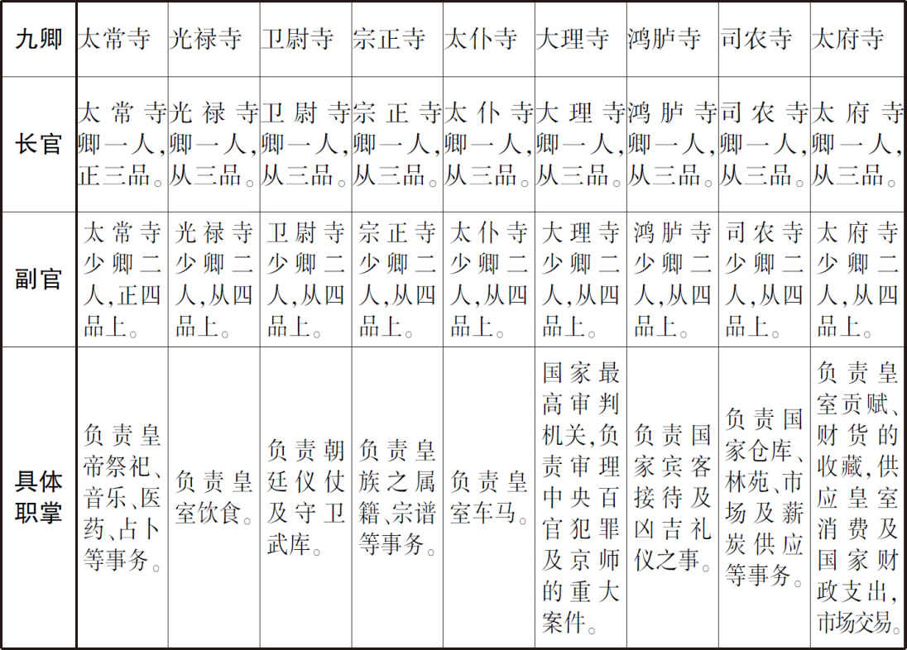

## 【译文】

唐玄宗天宝五载（746年）夏四月，韦坚等人已经被贬官，身为左相的李适之感到害怕，于是自己主动请求调到闲散的职位上去。庚寅（初八日），任命李适之为太子少保，罢去他的宰相之职。李适之的儿子卫尉少卿李霅曾经陈设很多美食以召集宾客。现在，客人们畏惧李林甫，整整一天都没有一个人敢到李霅那里参加宴请。

## 【原文】

**以门下侍郎、崇玄馆大学士陈希烈同平章事[1]。希烈，宋州人，以讲《老》、《庄》得进，专用神仙符瑞取媚于上[2]。李林甫以希烈为上所爱，且柔佞易制，故引以为相。凡政事一决于林甫，希烈但给唯诺。故事，宰相午后六刻乃出，林甫奏今太平无事，巳时即还第[3]。军国机务皆决于私家，主书抱成案诣，(2)希烈书名而已[4]。**

## 【注文】

[1]门下侍郎：唐中央机构门下省的次官，“黄门侍郎”之改名。参见前“黄门侍郎”条注。　　崇玄馆大学士：崇玄馆为唐朝中央设置的教授道教的学校。唐玄宗天宝二年（743年）改崇玄学而置，改博士为学士，改助教为直学士，置大学士一员，以宰相任大学士，统领两京（长安、洛阳）玄元宫（道观名）及道院。唐德宗贞元四年（788年）罢大学士。　　陈希烈（？—757年）：唐玄宗朝大臣。宋州（治今河南商丘南）人，精于玄学，擅长文章。唐玄宗开元中，他常常在宫中讲《老子》、《周易》，专以神仙符瑞取悦玄宗。历任集贤院（国家典藏图籍、撰修著作的机构）学士、黄门侍郎、崇玄馆大学士。天宝五载（746年），李林甫认为他柔佞易制，引为宰相。后罢为太子太师，从一品。官品很高，但无实权，心里颇不满。“安史之乱”中，他投降于叛将安禄山。唐肃宗时，论陷贼罪，赐死于家。　　同平章事：参见前注“同中书门下三品”条注。

[2]宋州：地名。即睢（suī）阳郡。参见前注“睢阳”条注。　　《老》、《庄》：指道家的经典《老子》和《庄子》。唐玄宗统治时期，国家强力推行道教，道举为唐代科举考试中常举（每年都要进行的例行考试）的科目之一。道举考《老子》、《庄子》、《列子》等道家经典。　　符瑞：表明君主“受命于天”的祥瑞、征兆。这是古代政权取得合法性的重要途径，也是古代政治文化的重要组成部分。唐玄宗本人非常讲究神仙信仰和各种符瑞。

[3]午后六刻：刻，计时单位。古代用漏壶计时，一昼夜共一百刻。午后六刻大约相当于现在下午一至二点。　　巳：十二时辰之一，等于现在的上午九时至十一时。古人用十二地支表示一日中的十二个时辰。每个时辰恰好相当于现在的两小时。

[4]主书：唐代中书省的吏员（战国后期指官位和俸禄较低的官员，秦汉沿用。隋唐以下，官与吏之间的区分日渐严格。吏多指官府中的胥吏与差役，具体处理政府机构的事务。吏可以通过一些途径转变为官）。中书省置主书四人，从七品上，以职官体制之外进入体制之内（即“流外入流”）的迁转官为之，负责掌管文书档案。　　成案：已经处理好的文书、案卷。　　诣：到……去。

## 【译文】

玄宗任命门下侍郎、崇玄馆大学士陈希烈为同平章事。陈希烈是宋州人，以擅长宣讲《老子》、《庄子》而得以升官。他专门讲解神仙、符瑞来讨好玄宗。李林甫认为陈希烈被玄宗赏识，而且是个巧言谄媚、容易控制之人，因此把他引荐为宰相。凡是国家政事都由李林甫一人裁决，陈希烈只是唯唯诺诺，表示同意而已。按以往的先例，宰相在官衙署内办理公务，午后六刻才出去。而李林甫却向皇帝说现在天下太平，没有什么事，他在巳时（上午九至十一时）就从衙署回到自己的住宅了。军国机务都由李林甫在自己家中决断。掌管文书档案的官员抱着已经处理好的公文书来到，陈希烈仅仅在这些文书上签上自己的名字而已。

## 【原文】

**秋七月，将作少匠韦兰、兵部员外郎韦芝为其兄坚讼冤，且引太子为言，上益怒[1]。太子惧，表请与妃离婚，乞不以亲废法。丙子，再贬坚江夏别驾，兰、芝皆贬岭南[2]。然上素知太子孝谨，故谴怒不及。李林甫因言坚与李适之等为朋党，后数日，坚长流临封，适之贬宜春太守、太常少卿韦斌贬巴陵太守，嗣薛王琄贬夷陵别驾，睢阳太守裴宽贬安陆别驾，河南尹李齐物贬竟陵太守，凡坚亲党连坐流贬者数十人[3]。斌，安石之子；琄，业之子，坚之甥也。琄母亦令随琄之官[4]。**

## 【注文】

[1]将作少匠：唐朝职事官名。即将作少监，将作监长官将作大匠的副官，从四品下。将作大匠掌管修建土木、工匠之政令，总领百工。将作少匠辅助大匠。　　兵部员外郎：唐朝职事官名，尚书省兵部所属的兵部司的副长官，置二人，从六品上。一位掌管武官选举及杂请；另一位掌管每年选人，审核其简历、资历、考核情况等。

[2]江夏：地名。即江夏郡，治江夏（今湖北武汉），辖江夏、永兴、武昌、蒲圻（qí）、唐年县，相当于今湖北武汉、阳新、鄂州、蒲圻、崇阳。　　别驾：唐朝地方官，常与“长史”互改名称，亦或并置，正四品下。按唐朝官制，地方州或郡设置“别驾”、“长史”、“司马”为“上佐”，按制度规定应负责辅佐地方长官，其实多无实际职任。因为上佐官品高，俸禄优厚，常用以安置被贬官之大臣或闲冗官员，时有废罢。

[3]朋党：指官员互相之间结成的小集团。历代皇帝都很忌讳朋党。　　临封：地名。即临封郡，治封川（今广东封开东南封川镇），辖封川、开建县，相当于今广东封开一带。　　宜春：地名。即宜春郡，治宜春（今江西宜春），辖宜春、萍乡、新喻县，相当于今江西宜春、萍乡、新余。　　太常少卿：唐朝职事官名。中央九卿之一太常寺长官太常卿的副手，正四品上。太常卿负责掌管邦国礼乐、郊庙、社稷之事，少卿辅助他。　　韦斌（？—755年）：唐前期大臣。雍州万年（今陕西西安）人，韦安石之子，其家族世代为当地的名门望族。他少年时善文艺。在唐睿宗景云初年，被授予太子通事舍人。在唐玄宗天宝年间，他担任中书舍人，兼集贤院学士、太常少卿。天宝五载（746年），宰相李林甫诬陷太子妃韦氏之兄韦坚，韦斌因亲属的缘故受到牵连，被贬为巴陵太守。安史之乱中，韦斌被叛军任命为黄门侍郎，不久忧愤而死。　　巴陵：地名。即巴陵郡，治巴陵（今湖南岳阳），辖巴陵、华容、沅（yuán）江、湘阴、昌江县，相当于今湖南岳阳、华容、沅江、湘阴、平江。　　嗣薛王琄（juān）：按唐朝制度，亲王诸子中，正妻所生的为嗣王。嗣薛王即薛王的嫡子、亲王爵位的继承人。在这里，薛王即唐玄宗的弟弟李隆业。　　夷陵：地名。即夷陵郡，唐高祖武德年间治夷陵府（今湖北宜昌西），唐太宗贞观九年（635年）移治陆抗故垒（今湖北宜昌），辖夷陵、宜都、长阳、远安、巴山县，相当于今湖北宜昌、枝城、长阳、远安。　　安陆：即安陆郡，治安陆（今湖北安陆西北），辖安陆、孝昌、云梦、应城、吉阳、应山县，相当于今湖北安陆、孝感、云梦、应城、吉阳、广水。　　河南尹：唐玄宗开元元年（713年）改洛州长史置，从三品，为河南府（东都洛阳及附近地区）实际管事的长官，管理当地政务，巡逻属县、劝课农桑、观察民风、审查囚徒、查阅丁口、考核官吏、纠举不法、举荐贤才。玄宗天宝元年（742年）改为东都尹。　　李齐物：生卒年不详。唐玄宗朝大臣，开凿河南三门峡地区的漕运通道有功。自秦汉以来，关东地区（秦、汉、唐等定都在今陕西的王朝，称函谷关或潼关以东地区为关东，又称关外）运送到关中地区的粮食、财富常由黄河、渭水转入京师长安（即漕运），需途经三门峡段。因其中岩石屹立，水流湍急，常有翻船之危险。唐玄宗开元二十九年（741年），陕州（今河南三门峡西三门峡市陕州区）刺史李齐物为改善三门峡段的漕运，在人门岛左岸岩石间开凿了一条运道。十一月开工，于次年即天宝元年（742年）正月二十五日完工，并开其山巅以为挽路。这条运道无定名，《唐会要》《旧唐书》称为“渠”，《通典》《册府元龟》称“石渠”，《开天传信录》称“天宝河”，《资治通鉴》称“三门运渠”，宋后又名“开元新河”，《新唐书》称“新门”。这条新运河的开通，提高了漕运的运输效率，增加了安全性。但不久因河泥淤塞，不能通船。　　竟陵：地名。即竟陵郡，治沔（miǎn）阳（今湖北仙桃西南沔城），辖沔阳、竟陵、监利县，相当于今湖北仙桃、天门、监利。　　连坐：一人犯罪他人连带受罚的制度和规定。

[4]安石：即韦安石（651—714年），唐前期大臣。雍州万年（今陕西西安）人。他考中明经（科举考试科目之一，考察儒家经典的记诵），初任乾封县（今山东泰安东南）县尉，迁任雍州司兵参军。他因为苏良嗣的推荐，被提拔为膳部员外郎，并州（今山西地区）司马。他有政绩，受到武后的褒奖。后来，他历任德州（治今山东平原）、郑州（治今河南郑州）刺史。他性格持重，为政清严。武周久视元年（700年），他拜鸾台侍郎、同凤阁鸾台平章事，成为宰相。当时，女皇武则天之侄武三思和其男宠张易之兄弟擅权，安石却敢于当面驳斥他们，朝廷中的大臣称赞他为“真宰相”。武周长安三年（703年），安石担任东都洛阳留守，兼管天官、秋官两尚书事，不久知纳言事，仍为凤阁鸾台三品、兼太子左庶子，再次成为宰相。唐中宗李显、唐睿宗李旦重登皇位后，安石历任侍中、中书令，仍然为宰相，进爵郇（xún）国公。当时，太平公主（武则天的爱女）谋废太子李隆基（后来的唐玄宗），想引安石为同谋，被安石拒绝。后来，安石因事被罢官，忧愤而死。　　之：到……去。

## 【译文】

唐玄宗天宝五载（746年）秋七月，将作少匠韦兰、兵部员外郎韦芝为他们的哥哥韦坚鸣冤，而且在叙述中引太子为证。这使玄宗更加愤怒。太子害怕了，于是上表请求跟太子妃韦氏离婚。太子还乞求：不能因为是自己的亲属（明显针对韦坚兄弟）就不讲究国法。丙子（二十六日），再贬韦坚为江夏别驾，韦兰、韦芝都被贬到岭南地区。但是，玄宗向来知道太子孝顺、谨慎，因此他的谴责和愤怒之情并没有波及到太子身上。李林甫趁机诬称韦坚与李适之等人是朋党。过了几天，韦坚被长期流放到临封，李适之被贬为宜春太守，太常少卿韦斌被贬为巴陵太守，嗣薛王（即薛王爵位的继承人）李琄被贬为夷陵别驾，睢阳太守裴宽被贬为安陆别驾，河南尹李齐物被贬为竟陵太守。凡是韦坚的亲属、党羽，因为这次事件受牵连而被流放、贬官的多达几十人。韦斌是韦安石的儿子。李琄是薛王李隆业的儿子、韦坚的外甥。李琄的母亲也被勒令跟随李琄到他被贬的地方去。

## 【原文】

**冬十一月，赞善大夫杜有邻女为太子良娣，良娣之姊为左骁卫兵曹柳勣妻[1]。勣性狂疏，好功名，喜交结豪俊。淄川太守裴敦复荐于北海太守李邕，邕与之定交[2]。勣至京师，与著作郎王曾等为友，皆当时名士也[3]。勣与妻族不协，欲陷之，为飞语，告有邻妄称图谶，交构东宫，指斥乘舆[4]。林甫令京兆士曹吉温与御史鞫之，乃勣首谋也[5]。温令勣连引曾等入台。十二月甲戌，有邻、勣及曾等皆杖死，积尸大理，妻子流远方，中外震栗[6]。嗣虢王巨贬义阳司马[7]。巨，邕之子也。别遣监察御史罗希奭往按李邕，太子亦出良娣为庶人。**

## 【注文】

[1]良娣（dì）：东宫内命妇之一，正三品，地位仅次于皇太子妃。　　左骁卫兵曹：左、右骁卫是唐朝宫廷禁卫军指挥机构，掌管宫廷宿卫。左、右骁卫下设仓曹、兵曹、骑曹、胄曹，掌判诸曹之事。其中兵曹掌管武官的职员、簿书、名数。　　勣：音jì。

[2]淄川：地名。即淄川郡，治淄川（今山东淄博西南淄川），辖淄川、长山、高苑、邹平县，相当于今山东淄博、邹平、高青。　　北海：地名。即北海郡，治益都（今山东青州），辖益都、临淄、博昌、寿光、千乘、临朐（qú）、北海县，相当于今山东青州、淄博、博兴、寿光、广饶、临朐、潍坊。　　李邕（yōng）（678—747年）：唐玄宗朝大臣、著名学者。扬州江都（今江苏扬州）人，李善之子，有文名，亦善书，擅长以行书、楷书写碑。武则天时，拜左拾遗，成为谏官，助宋璟弹劾张昌宗（武则天的男宠、李隆基的政敌）。唐玄宗时，历任御史中丞，陈州（治今河南淮阳）、括州（治今浙江丽水东南）、淄川（治今山东淄博西南淄川）、华州（治今陕西华县）等刺史，汲郡（治今河南卫辉）和北海（治今山东青州）太守，故称李北海。后为李林甫所害。

[3]著作郎：唐朝职事官。中央秘书省著作局官员，从五品上。掌管修撰碑志、祝文、祭文。

[4]图谶（chèn）：方士、巫师编造的隐语或预言叫谶，谶附有图，因此叫“图谶”。在古代社会，图谶常常和政治密不可分，也常常成为政治斗争的工具。　　构：把某些事情牵和在一起，作为罪状陷害人。　　乘舆：按唐朝制度，天子的车称“乘舆”，天子在行幸时称“车驾”。乘舆本义指帝王乘坐之车，这里引申为皇帝。

[5]京兆士曹：具体处理京兆府（长安）的官府舍宇修建、修缮、工匠等事务的机构。

[6]大理：这里是大理寺的省称。大理寺是唐中央机构九卿之一，国家最高审判机关，负责审理中央百官犯罪及京师的重大案件。

[7]嗣虢（guó）王：亲王诸子中，正妻所生的为嗣王，继承爵位。嗣虢王指虢王的继承人。虢王李凤为唐高祖李渊之第十五子，生卒年不详。　　义阳：地名。即义阳郡，治义阳（今河南信阳南），辖义阳、钟山、罗山县，相当于今河南信阳、罗山。　　司马：唐朝地方州或郡长官的佐官，与“别驾”、“长史”并为州郡的上佐，名义上负责纪纲众务，协助地方长官管理当地事务，官品高、俸禄优厚，其实并无具体职事。多用于安置被贬官的大臣，或用作迁转之官阶。

## 【译文】

唐玄宗天宝五载（746年）冬十一月，赞善大夫杜有邻有一个女儿嫁给太子为良娣。杜良娣的姐姐是左骁卫兵曹柳勣的妻子。柳勣性格放荡、粗野，喜好功名、交结豪俊。淄川太守裴敦复把他推荐给北海太守李邕，李邕与柳勣于是成为朋友。柳勣到京师长安，与著作郎王曾等也成为朋友，他们都是当时的名士。柳勣与妻族杜氏之间关系不融洽，想陷害杜家。他制造流言，告岳父杜有邻胡乱称图谶，与太子勾结，还指责皇帝。李林甫命令京兆府士曹吉温和御史台官员审讯这一案件。结果，他们审定柳勣是这一事件的主谋。吉温还命令柳勣牵扯王曾等人，引他们入御史台接受审讯。十二月甲戌（二十七日），杜有邻、柳勣及王曾等人都被施以杖刑，被杖打致死。他们的尸体堆积在大理寺。他们的妻子、儿女被流放到远方。朝廷内外对这一案件都感到毛骨悚然。嗣虢王李巨被贬为义阳司马。李巨是李邕的儿子。李林甫又另外派遣监察御史罗希奭去按察李邕的罪行。太子也遗弃杜良娣，把她废为庶人。

## 【原文】

**乙亥，邺郡太守王琚坐赃贬江华司马[1]。琚性豪侈，与李邕皆自谓耆旧，久在外，意怏怏[2]。李林甫恶其负材使气，故因事除之。**

## 【注文】

[1]邺郡：地名。治邺县（今河北临漳西南邺镇），辖安阳、尧城、邺县、临漳、林虑、内黄、汤阴、洹（huán）水、成安、临河县，相当于今河南安阳、临漳、林州、内黄、范县，河北汤阴、魏县、成安。　　王琚（jū）（？—747年）：唐玄宗朝大臣。怀州河内（今河南沁阳）人，聪敏有才略。曾助玄宗诛杀太平公主，晋户部尚书，封赵国公，眷宠特异。后历任十五州刺史、两郡太守。李林甫指使人弹劾他贪赃，贬江华（治今湖南道县西）员外司马，闻酷吏将至，自缢而死。　　江华：地名。即江华郡，治弘道（今湖南道县西），辖弘道、延唐、江华、永明县，相当于今湖南道县、宁远、江华、江永。

[2]耆（qí）：老。　　怏（yàng）怏：不满意、不服气的样子。

## 【译文】

唐玄宗天宝五载（746年）十二月乙亥（二十八日），邺郡太守王琚因犯贪污受贿罪被贬为江华司马。王琚的性格豪迈、放纵，与李邕都自称是玄宗的老功臣。王琚在京城之外呆了很长时间，心里不服气。李林甫讨厌王琚仗着自己的才华而对自己使怒气，因此，故意找个茬把他除掉了。

## 【原文】

**六载春正月辛巳，李邕、裴敦复皆杖死。邕才艺出众，卢藏用常语之曰：“君如干将、莫邪，难与争锋，然终虞缺折耳。”[1]邕不能用。**

## 【注文】

[1]卢藏用（？—约714年）：武周朝、唐中宗、睿宗朝大臣。幽州范阳（今河北涿州）人，字子潜，以辞学著称，善于占卜、书法、琴棋。初中进士，未能任官，隐居于长安城南的终南山。武周时，征为右拾遗，担任谏官。唐中宗、睿宗时，历任吏部、黄门、工部侍郎，尚书右丞。他依附于太平公主。唐玄宗先天二年（713年），太平公主败给李隆基（唐玄宗）后，卢藏用被流放到岭南地区。他在隐居时即意在做官，人称“随驾（指皇帝的车驾）隐士”。他入朝廷做官后，专事权贵、奢靡淫纵，世人讥之。他曾著《析滞论》，强调得失兴亡在于人事。唐玄宗开元初年卒，年五十余。有文集二十卷，已散佚。　　干将、莫邪（yé）：古剑名。相传春秋时吴人干将与妻子莫邪善于铸剑，铸有二剑，锋利无比，一名干将，一名莫邪，献给吴王阖（hé）闾。后来以干将、莫邪为利剑的代称。　　虞（yú）：忧患。

## 【译文】

天宝六载（747年）春正月辛巳（初五日），李邕、裴敦复都被施以杖刑，被杖打致死。李邕的才艺超越众人。卢藏用常常对李邕说：“你就像干将和莫邪（两把著名的利剑之名），别人难以和你争锋。但是你自己终究忧患被折断呀！”而李邕却不把卢藏用的这番话当回事。

## 【原文】

**林甫又奏分遣御史即贬所赐皇甫惟明、韦坚兄弟等死[1]。罗希奭自青州如岭南，所过杀迁谪者，郡县惶骇[2]。排马牒至宜春，李适之忧惧，仰药自杀[3]。至江华，王琚仰药不死，闻希奭已至，即自缢。希奭又迂路过安陆，欲怖杀裴宽，宽向希奭叩头祈生，希奭不宿而过，乃得免[4]。李适之子霅迎父丧至东京，李林甫令人诬告霅，杖死于河南府[5]。给事中房琯坐与适之善，贬宜春太守[6]。琯，融之子也[7]。**

## 【注文】

[1]御史：自隋唐以来，御史是对国家最高监察机构御史台下设三院（即台院、殿院、察院）的侍御史、治书侍御史、殿中侍御史、监察御史等官的统称。御史具体负责各类监察事务。

[2]青州：地名。这里指邕州都督府（属岭南道）所辖之羁縻州——青州，位于今广西、越南一带，具体位置待考。　　迁谪（zhé）：被罚流放或贬职。　　惶骇：恐惧、惊慌、害怕。

[3]排马牒：牒是唐代官府的下级部门向上级部门传递的上行公文书的一种。排马牒是唐朝驿站中负责传递公文的马的排单。

[4]怖：恐吓。

[5]河南府：地名。指唐朝东都（或东京）洛阳。治河南（今河南洛阳），辖河南、洛阳、偃（yǎn）师、巩县、缑（gōu）氏、告成、登封、陆浑、伊阙、伊阳、寿安、新安、福昌、渑（miǎn）池、长水、永宁、密县、河清、颍阳、王屋县，相当于今河南洛阳、偃师东、巩义东巩县老城、偃师南、登封东南告成镇、登封、嵩县东北、伊川西南、嵩县西南旧县镇、宜阳、新安、宜阳西、渑池、洛宁西长水镇、洛宁北、新密、孟县西南、登封西南颍阳镇、济源西王屋镇。

[6]给（jǐ）事中：唐朝职事官，正五品上。中央机构门下省重职，分判本省日常事务，具体负责审议封驳诏敕章奏。有异议可直接批改驳还，无异议则封下经门下省长官审复后，交尚书省执行。　　房琯（guǎn）（697—763年）：唐玄宗、肃宗朝大臣。河南（今河南洛阳）人，少好学。在玄宗开元年间，任监察御史。安史之乱时，他跟随唐玄宗到蜀地，升为文部（即吏部）尚书、同平章事，成为宰相。唐肃宗李亨在灵武（今宁夏吴忠）即皇帝位后，房琯奉玄宗之命送来传国玺和册印，受到肃宗的器重，参与机要之事。后率兵反攻被安史叛军占领的长安，大败而归。之后，他多称病不上朝。他喜好高谈虚论，招权纳贿。后被贬为地方官。

[7]融：即房融（？—705年），武周朝宰相。河南洛阳（今河南洛阳）人。他初为怀州（治今河南沁阳）刺史。武周长安四年（704年），他担任正谏大夫、同平章事，成为宰相。神龙元年（705年），唐中宗重登皇位，他因为依附武则天的男宠张易之兄弟，被下狱，不久被贬死高州（治今广东高州东北）。房融好佛，曾在岭南地区抄录《楞严经》。

## 【译文】

李林甫又上奏：要求分别派遣御史到皇甫惟明、韦坚兄弟等被贬的地方，去赐他们死。罗希奭从青州到岭南，在途中经过的地方杀害被贬职流放的官员，沿途郡县的官民都感到恐惧、害怕。驿站中负责传递公文的马的排单把罗希奭排到了宜春，李适之感到忧虑、害怕，服药自杀。罗希奭到了江华，王琚服药自杀未遂，听说罗希奭到了，当即自己勒死了自己。罗希奭又绕道经过安陆，想恐吓、杀害裴宽。裴宽向罗希奭磕头，请求放他一条生路。于是，罗希奭不在安陆过夜住宿，裴宽得免一死。李适之的儿子李霅把父亲的尸骨迎到东都洛阳。李林甫又指使人诬告李霅，李霅在河南府（今河南洛阳）被杖打致死。给事中房琯因为与李适之关系好而被扣上罪名，贬为宜春太守。房琯是房融的儿子。

## 【原文】

**林甫恨韦坚不已，遣使于循河及江、淮州县求坚罪，所在收系纲典船夫，溢于牢狱，征剥逋负，延及邻伍，皆裸露死于公府，至林甫薨乃止[1]。**

## 【注文】

[1]河：黄河。　　江：长江。　　淮：淮河。　　纲：唐代成批运输货物的组织。　　典：主管。　　溢：原指水漫出来，这里引申为满、充满。因为韦坚曾任江淮租庸转运使，改革长江、淮河、黄河一带的漕运有功，所以，李林甫指使人沿着长江、淮河、黄河到附近的州县去罗织韦坚的罪证。　　逋（bū）：拖欠。　　公府：官衙门。

## 【译文】

李林甫非常憎恨韦坚。他派遣使者沿着黄河、长江、淮河到附近的州县去罗织韦坚的罪名。他们从沿岸各州县逮捕的运输货物的船夫及其主管，把牢房都装满了。李林甫派去的使者在当地惩罚拖欠税赋的民众，搜刮百姓，还波及这些百姓的邻居。这批人都身体裸露，死在官方办公的衙门。这些悲剧直到李林甫死了才结束。

## 【原文】

**李林甫以王忠嗣功名日盛，恐其入相，忌之[1]。董延光之攻吐蕃也，过期不克，言王忠嗣沮挠军计，上怒[2]。李林甫因使济阳别驾魏林告忠嗣尝自言“我幼养宫中，与忠王相爱狎”，欲拥兵以尊奉太子[3]。敕征忠嗣入朝，委三司鞫之[4]。**

## 【注文】

[1]王忠嗣（705—749年）：唐玄宗朝大臣。太原祁县（今山西祁县）人，本名训。在玄宗开元初，其父亲战死，玄宗把他养于宫中，赐名忠嗣，与忠王李玙（后来的皇太子、唐肃宗）交结。忠嗣长大以后，威武有方略，被引为河西兵马使，勇敢善战。开元二十八年（740年）升为河东节度使。唐玄宗天宝元年（742年）又兼灵州（治今宁夏吴忠）都督，屡次与周边各族作战，有战功。于是兼河东、朔方、河西、陇右四镇节度使，控制西北、北方万里边疆，唯以安边为任务。天宝六载（747年），忠嗣不愿强攻吐蕃的石堡寨（今青海湟源西南），违反玄宗的意旨。李林甫妒忌其功劳，乘机诬陷他想拥立太子为皇帝，于是下狱受审。后贬汉阳郡（治今湖北武汉汉阳）太守，又移至汉东郡（治今湖北随州）太守，死于汉东郡太守任上。

[2]沮：阻止。　　挠：扰乱。

[3]济阳：县名。即济阳县，隶属于淄州（今山东淄博一带），相当于今山东邹平东北。

[4]敕：唐朝公文书之一。皇帝颁发的公文书称制、敕、册。　　入朝：指属国、外国使臣或地方官员到京城拜见天子。或谓进入中央朝廷做官。

## 【译文】

王忠嗣的功劳、名望一天天大起来，李林甫担心他入朝当上宰相，心里妒忌他。董延光攻打吐蕃，过了一定的期限却仍然没有攻下。于是他向朝廷报告王忠嗣阻挠、扰乱军事计划，玄宗听了很生气。李林甫趁机指使济阳别驾魏林控告王忠嗣，说王忠嗣自己曾经说过：“我幼年被养在皇宫中，与忠王的关系非常亲近。”魏林还诬称王忠嗣想拥兵尊奉太子当皇帝。于是，玄宗下敕书征王忠嗣入朝，并委托三司（大理寺、刑部和御史台）审问他。

## 【原文】

**户部侍郎兼御史中丞杨慎矜为上所厚，李林甫浸忌之。慎矜与王鉷父晋，中表兄弟也，少与鉷狎[1]。鉷之入台，颇因慎矜推引[2]。及鉷迁中丞，慎矜与语，犹名之。鉷自恃与林甫善，意稍不平[3]。慎矜夺鉷职田，鉷母本贱，慎矜尝以语人，鉷深衔之[4]。慎矜犹以故意待之，尝与之私语谶书。**

## 【注文】

[1]中表：父亲的姊妹（姑母）的儿女叫外表，母亲的兄弟（舅父）姊妹（姨母）的儿女叫内表，互称中表。

[2]台：这里指中央的监察机构御史台。御史台为国家最高监察机构，下设三院：台院、殿院、察院。台院置侍御史四员，从六品下，掌管监察、弹劾百官；殿院置殿中侍御史六员，从七品上，掌管监督殿廷朝会、巡幸供奉仪节，负责宫廷门户库藏及京城内外治安，统领京城及其附近地区的兵马；察院置监察御史十员，正八品上，负责分察朝廷官员、地方州县官员，监督地方行政。

[3]恃（shì）：依靠、依赖。

[4]职田：又称职分田、公田、禄田，指唐代依据官职品级授予官员的田地，作为官吏俸禄的补充，或以职田所得的收成供给官吏作为俸禄。官员离职时交还。唐代官员从一品至九品，所给职田为一千二百亩至二百亩不等。　　衔：藏在心中，特指怀恨。唐朝是贵族社会，十分讲究门第、家庭背景、等级和身份。因此，王鉷对别人议论其母亲身份卑贱感到非常敏感和气愤。

## 【译文】

户部侍郎兼御史中丞杨慎矜受到皇帝的器重，因此李林甫逐渐开始嫉恨他。杨慎矜与王鉷的父亲王晋是中表兄弟。杨慎矜年少时，与王鉷关系亲密。王鉷能进入中央的监察机构御史台做官，杨慎矜的推荐起了很大作用。王鉷已经升到御史中丞，杨慎矜跟他说话，却仍然直接称呼其名字。王鉷自认为与李林甫关系好，有靠山，对杨慎矜直呼自己的名字感到有点不舒服。杨慎矜夺取了王鉷的职田。王鉷的母亲本出身卑贱，杨慎矜曾经把此事跟别人说起过。王鉷打心眼儿里深深地怨恨慎矜的做法。可是杨慎矜（对这些征兆丝毫没有觉察到），仍然像故旧朋友那样对待王鉷，还曾经与他悄悄地谈论过谶书。

## 【原文】

**慎矜与术士史敬忠善，敬忠言天下将乱，劝慎矜于临汝山中买庄为避乱之所[1]。会慎矜父墓田中草木皆流血，慎矜恶之，以问敬忠。敬忠请禳之，设道场于后园，慎矜退朝，辄裸贯桎梏坐其中[2]。旬日血止，慎矜德之。慎矜有侍婢明珠，色美，敬忠屡目之，慎矜即以遗敬忠，车载过贵妃姊柳氏楼下，姊邀敬忠上楼，求车中美人，敬忠不敢拒[3]。明日，姊入宫，以明珠自随。上见而异之，问所从来，明珠具以实对。上以慎矜与术士为妖法，恶之，含怒未发。**

## 【注文】

[1]术士：指以占卜、星相等为职业的人。　　临汝：地名。即临汝郡，治梁县（今河南汝州），辖梁县、郏（jiá）县、鲁山、叶县、襄城、龙兴、临汝县，相当于今河南汝州、郏县、鲁山、宝丰、叶县、襄城、临汝。

[2]禳（ráng）：古代以祭祀、祈祷消除灾祸的一种活动。　　裸：露体。　　桎（zhì）梏（gù）：桎，拘束犯人两脚的刑具。梏，木制的手铐，监禁。这里引申为约束，束缚。

[3]遗（wèi）：给予，赠送。

## 【译文】

杨慎矜与擅长方术之术士史敬忠关系好。史敬忠说天下将要大乱，劝杨慎矜在临汝山中买下庄园，作为将来的避难之所。当时恰逢杨慎矜父亲的墓田中的花草树木都流血了。杨慎矜很厌恶此事，就把这件事告诉了史敬忠。史敬忠请他采用祭祀、祈祷的方式来消除灾祸。杨慎矜于是在其父墓田的后园设置道场举行这种仪式。杨慎矜一退朝就光着身体，自己坐在道场中，把自己束缚在那里。过了十天，其父墓田中的草木果然不流血了。因此，杨慎矜感激史敬忠的恩德。杨慎矜有个侍女叫明珠，貌美。史敬忠见了，有好几次眼睛都盯着明珠看。杨慎矜见状，当即就把明珠送给了史敬忠。史敬忠用车载着明珠经过杨贵妃的姐姐柳氏的楼下。柳氏邀请史敬忠上楼，向他索取车中的美人明珠。史敬忠不敢拒绝。第二天，杨贵妃的姐姐柳氏入宫，让明珠跟随自己。玄宗一见到明珠，就感到很惊奇，问她是从哪儿来的。明珠如实向玄宗详细地陈述了事情的来龙去脉。于是，玄宗认定杨慎矜与术士史敬忠作妖孽之法，心里厌恶，但却强忍着心中的愤怒，没有爆发出来。

## 【原文】

**杨钊以告鉷，鉷心喜，因侮慢慎矜，慎矜怒[1]。林甫知鉷与慎矜有隙，密诱使图之。鉷乃遣人以飞语告：“慎矜隋炀帝孙，与凶人往来，家有谶书，谋复祖业”[2]。上大怒，收慎矜系狱，命刑部、大理与侍御史杨钊、殿中侍御史卢铉同鞫之[3]。大府少卿张瑄，慎矜所荐也，卢铉诬瑄尝与慎矜论谶，栲掠百端，瑄不肯答辨[4]。乃以木缀其足，使人张其枷柄，向前挽之，身加长数尺，腰细欲绝，眼鼻出血，瑄竟不答[5]。**

## 【注文】

[1]杨钊（？—756年）：即杨国忠，杨钊是他的本名。唐玄宗朝宰相。蒲州永乐（今山西永济东南）人，杨贵妃的从（cóng，旧读zòng）祖兄（同曾祖而不同祖父的兄长）。他年少时嗜好赌博、酗酒，曾经从军。天宝初年，因为杨贵妃受到唐玄宗的宠爱，他一路升官至监察御史、御史中丞，赐名杨国忠。他与李林甫勾结，接连兴起几次大狱，诛杀、驱逐异己。天宝十一载（752年），李林甫死后，代为宰相，先后兼领四十余职，权势倾天下。他一意谄媚玄宗，结党营私。天宝十四载（755年），安禄山以“讨国忠”为名发动叛乱。第二年，杨国忠跟随玄宗逃往蜀地，在途中经过马嵬驿（今陕西兴平西）时，被随从的禁军杀死。

[2]隋炀帝：即隋朝第二代皇帝杨广（569—618年），隋文帝杨坚的次子，独孤皇后所生。公元604至618年在位。隋文帝开皇元年（580年）封为晋王。历任武卫大将军、上柱国、雍州牧、内史令。开皇八年（587年），隋朝攻打南方的陈朝，杨广担任行军元帅，许多军将、重臣归他指挥。第二年，杨广率兵攻灭陈朝，为隋朝统一中国立下大功，进位太尉，迁扬州（治今江苏扬州）总管。杨广后与朝廷重臣杨素、宇文述等合谋，使其长兄杨勇被废去太子之位，自己取而代之。后来，在隋文帝病重期间，杨广杀死其父自立为皇帝。他在位期间，颁布《大业律》，整顿地方行政制度，改革科举考试制度，置明经（考察儒家经典的记诵）、进士（考察文章、诗赋）二科，以试策（即策论。策论在古时指议论当前政治问题、向朝廷献策的文章）取士。他又大力征发民力，开凿大运河，修筑长城，营造东都洛阳。他巡游无度，穷奢极欲，民不堪命，又大力对外扩张、征战，特别是攻打高丽（今朝鲜半岛北部的政权）使民力疲敝。杨广性猜忌、用法苛暴，诛杀功臣，对民众横征暴敛，导致各地爆发反隋的起义。东部地区的山东豪杰及一部分西北地区的关陇贵族也起兵反隋。隋炀帝被迫避地江都（今江苏扬州）。后来，江都发生兵变，炀帝被勒死。

[3]刑部：参见《唐朝中央政务机构职官简表》。　　侍御史：唐代职事官。中央监察机构御史台的官员，从六品下。御史台分为台院、殿院和察院。侍御史居台院，居三院之首，掌管纠弹百官，入内宫接受诏书，受皇帝之命出使，分判御史台事务，与门下省的给（jǐ）事中、中书省的中书舍人共同受理词讼。遇重大案件则与刑部、大理寺会审。　　铉：音xuàn。

[4]大府少卿：应为太府少卿。太府寺为唐中央政府九卿之一。太府少卿之品级、职掌，参见《唐朝中央事务机构职官简表》。　　栲（kǎo）：木名，即山樗（chū）。　　掠：拷打。

[5]缀：牵制。　　枷：一种套在犯人脖子上的刑具。

## 【译文】

杨钊（即后来的杨国忠）把这件事情告诉了王鉷，王鉷心里暗暗高兴，就借这件事来侮辱、怠慢杨慎矜，杨慎矜被激怒了。李林甫知道王鉷与杨慎矜之间的关系出现裂痕，就秘密引诱王鉷图谋陷害杨慎矜。王鉷于是指使人制造流言蜚语，称：“杨慎矜是隋炀帝的孙子，与凶人有往来，家里藏有谶书，图谋恢复其祖先的基业（即恢复杨隋政权）。”玄宗听了非常愤怒，命令逮捕杨慎矜入狱，令刑部、大理寺和侍御史杨钊、殿中侍御史卢铉共同审问杨慎矜。太府少卿张瑄是杨慎矜推荐的。卢铉诬陷张瑄曾经与杨慎矜谈论谶书。无论卢铉怎么对张瑄严刑拷打，张瑄都不肯（按卢铉的意图）进行答辩。于是，卢铉用木头牵制他的脚，使人张开他身上所带的刑具的把子，向前使劲拉。张瑄的身体被拉长了好几尺，腰部很细，像要断了，张瑄的眼睛和鼻子都出血了，可他竟然还是不回答卢铉的问题。

## 【原文】

**又使吉温捕史敬忠于汝州[1]。敬忠与温父素善，温之幼也，敬忠常抱抚之。及捕获，温不与交言，锁其颈，以布蒙首，驱之马前。至戏水，温使吏诱之曰：“杨慎矜已款服，惟须子一辨，若解人意则生，不然必死，前至温汤，则求首不获矣。”[2]敬忠顾谓温曰：“七郎，求一纸。”温阳不应。去温汤十余里，敬忠恳请哀切，乃于桑下令答三纸，辨皆如温意。温徐谓曰：“丈人且勿怪。”[3]因起拜之。**

## 【注文】

[1]汝州：地名。即临汝郡。参见前“临汝”条注。

[2]戏水：古水名。在今陕西西安临潼区东。源出骊山，北流经过古戏亭东，又北流入渭河。　　款：诚恳，恳切。　　温汤：地名。在京兆府（长安）所辖昭应县（今陕西临潼）西温泉处。

[3]丈人：对年长之人的尊称。

## 【译文】

李林甫又指使吉温到汝州去逮捕史敬忠。史敬忠与吉温的父亲向来关系不错。吉温还是幼儿的时候，史敬忠常常抱着他、抚摸他。史敬忠被吉温捕获之时，吉温不与他说话，而是把他的颈部锁住，用布蒙住他的头，在马前驱赶他。到了戏水，吉温让手下的小吏引诱史敬忠，说：“杨慎矜已经诚恳地服了、认罪了。只需要你再辩一下就行了。如果你能了解人意（指吉温的意图）就能继续活下去，不然的话必定是死路一条。往前走，到了温汤，你的脑袋就保不住了。”史敬忠回过头对吉温说：“七郎，请给我一张纸。”吉温表面上装作不答应。在离温汤还有十几里路的时候，史敬忠诚恳、悲痛地苦苦哀求，才被责令在桑树下写了三张纸，作为自己回答的供词，所辩论的内容完全遵从吉温的意思。然后，吉温慢慢地对他说：“丈人姑且不要怪我。”于是站起身来参拜史敬忠。

## 【原文】

**至会昌，始鞫慎矜，以敬忠为证[1]。慎矜皆引服，惟搜谶书不获，林甫危之，使卢铉入长安搜慎矜家。铉袖谶书入暗中，诟而出曰：“逆贼深藏祕记。”[2]至会昌，以示，慎矜叹曰：“吾不蓄谶书，此何从在吾家哉！吾应死而已。”十一月丁酉，赐慎矜及兄少府少监慎馀、洛阳令慎名自尽[3]。敬忠杖一百，妻子皆流岭南。瑄杖六十，流临封，死于会昌。嗣虢王巨虽不预谋，坐与敬忠相识，解官，南宾安置[4]。自余连坐者数十人。慎名闻敕，神色不变，为书别姊。慎馀合掌指天而缢。**

## 【注文】

[1]会昌：县名。即会昌县，隶属于京兆府。唐玄宗天宝二年（743年），分京兆府的新丰县、万年县置会昌县。天宝七载（748年），省新丰县，改会昌县为昭应县，治温泉宫之西北，相当于今陕西临潼一带。参见前“温汤”条注。

[2]暗（àn）：昏暗。　　诟（gòu）：辱骂。

[3]少府少监：唐朝职事官名。少府监的次官，从四品下，负责佐理皇宫中百工技巧之事。　　洛阳令：唐朝职事官名。唐东都洛阳分为河南县和洛阳县。洛阳县（今河南洛阳）设洛阳令，为长官，正五品。负责管理辖境内的各种事务。

[4]南宾：地名。即南宾郡，治临江（今重庆忠县），辖临江、丰都、南宾、垫江、桂溪县，相当于今重庆忠县、丰都县、垫江县。　　安置：对犯罪官员的一种处分。即指定地区居住，并在一定程度上限制其行动。

## 【译文】

到了会昌县，开始审问杨慎矜，并以史敬忠所写的供词为证。杨慎矜见了，都表示服罪，唯独没有搜查到谶书。李林甫感到危险，就指使卢铉入长安搜查杨慎矜的家。卢铉先在袖子里藏了谶书，进入一扇昏暗的门，然后出来骂道：“逆贼把谶书藏得可深了！”到了会昌县，卢铉把他从慎矜家里搜出的谶书给慎矜看。杨慎矜感叹道：“我不储藏谶书。凭什么从我的家里搜出这谶书！这说明我该死而已。”天宝六载（747年）十一月丁酉（二十五日），皇帝下诏赐杨慎矜及其哥哥少府少监杨慎馀、洛阳令杨慎名自尽。史敬忠被杖打一百大板，他的妻子、儿女都被流放到岭南地区。张瑄被杖打六十大板，流放到临封，但他在会昌县就死了。嗣虢王李巨虽然没有参与这一事件，但因为与史敬忠相识而获罪。李巨被解除官职，发配到南宾安置。其他因为连坐而获罪的达几十人。杨慎名听到皇帝所下的敕书，神色不变，写信告别姐姐。杨慎馀双手合掌指着天，自缢而死。

## 【原文】

**三司按王忠嗣，上曰：“吾儿居深宫，安得与外人通谋，此必妄也。但劾忠嗣沮挠军功。”哥舒翰之入朝也，或劝多赍金帛以救忠嗣[1]。翰曰：“若直道尚存，王公必不冤死，如其将丧，多赂何为。”遂单囊而行。三司奏忠嗣罪当死。翰始遇知于上，力陈忠嗣之冤，且请以己官爵赎忠嗣罪。上起，入禁中，翰叩头随之，言与泪俱。上感悟，己亥，贬忠嗣汉阳太守[2]。**

## 【注文】

[1]哥舒翰（？—757年）：唐玄宗朝西北边将。西突厥哥舒部人，以部族名为姓。勇敢有谋略。四十岁后在河西地区从军，王忠嗣任用他为自己的亲军。他屡次攻破吐蕃，因此成为名将。他在唐玄宗天宝六载（747年）代替王忠嗣担任陇右节度使。后又破吐蕃，经营唐朝的西北边境有功，兼河西节度使，封西平郡王。后因患风疾回到长安。天宝十四载（755年），安禄山发动叛乱，哥舒翰率领二十万军队坚守长安东边的门户潼关（位于今陕西潼关县东北杨家庄附近）。当时的宰相杨国忠说服玄宗令哥舒翰出潼关迎战叛军，结果大败。哥舒翰被俘虏，后被杀。　　赍（jī）：携带。

[2]汉阳：地名。即汉阳郡，唐高祖武德四年（621年），分沔（miǎn）阳郡置沔州，治汉阳（今湖北武汉汉阳），后并入鄂州（江夏郡，今湖北武汉）。

## 【译文】

三司（指唐代中央的司法机构大理寺、刑部和御史台）推究审问王忠嗣的罪行。玄宗说：“我的儿子（指太子）居住在深宫之中，怎么可能与外面的将领通谋呢？这一定是乱说。只弹劾王忠嗣阻挠军事行动就可以了。”哥舒翰将赴朝廷，有人劝他多带些金银、丝织品（等同于货币）以营救王忠嗣。哥舒翰说：“如果世间正道还在，王公必定不会被冤死。如果他真的要被人整死，我多贿赂一些又有什么用呢？”于是哥舒翰只带着自己的行李到了京城长安。三司上奏，认为王忠嗣应该判死罪。哥舒翰当时正被玄宗赏识，他在玄宗面前极力陈述王忠嗣的冤情，而且还请求用自己的官爵来赎王忠嗣之罪。玄宗（感到不高兴）起身，进入皇宫之中。哥舒翰一直边叩头边跟随着玄宗，同时声泪俱下地诉说王忠嗣的冤情。玄宗终于被他感动了。己亥（二十七日），玄宗下诏贬王忠嗣为汉阳太守。

## 【原文】

**李林甫屡起大狱，别置推事院于长安[1]。以杨钊有掖廷之亲，出入禁闼，所言多听，乃引以为援，擢为御史[2]。事有微渉东宫者，皆指擿使之奏劾，付罗希奭、吉温鞫之[3]。钊因得逞其私志，所挤陷诛夷者数百家，皆钊发之。幸太子仁孝谨静，张垍、高力士常保护于上前，故林甫终不能间也。**

## 【注文】

[1]推事院：官衙名。最初，武则天为了给自己称帝扫清障碍，任用酷吏来俊臣。来俊臣另外设置推事院，专门审讯囚犯、大用刑具，进入推事院的一百人中不到一人能活下来。李林甫担任宰相，为了自己的私利，排除异己，也仿效来俊臣的做法设推事院。

[2]掖廷：又作掖庭、液廷，指皇宫中妃嫔居住的处所。这里指杨钊与正得玄宗盛宠的杨贵妃是亲戚。　　闼（tà）：门。　　御史：自隋唐以来，御史是对国家最高监察机构御史台下设三院（即台院、殿院、察院）的侍御史、治书侍御史、殿中侍御史、监察御史等官的统称。御史具体负责各类监察事务。这里指杨钊担任监察御史，是唐朝中央监察机构御史台的官员，正八品上。掌管分察百官，巡按郡县，纠视刑狱，肃整朝仪。

[3]擿（tì）：本义挑，这里引申为挑动、指使、揭发。

## 【译文】

李林甫屡次兴起大狱，在长安另外设置推事院，作为自己刑讯逼供、排斥异己的工具。因为杨钊跟后宫中的杨贵妃有亲戚关系，能常常出入皇宫，他所说的话皇帝多能听进去。因此，李林甫将杨钊发展为自己的党援，提升为监察御史。杨钊稍微发现跟太子有关的事情，李林甫都指使他向皇帝上奏、弹劾，并交付罗希奭、吉温审问。杨钊也因为这个缘故得以发泄自己的私愤。被排挤、诬陷、诛杀的几百家人，都是杨钊告发的。幸好太子的性格仁孝、谨慎，张垍、高力士在唐玄宗面前常常保护他，因此李林甫最终不能离间玄宗跟太子的父子关系。

## 【原文】

**十二月丙寅，命百官阅天下岁贡物于尚书省，既而悉以车载赐李林甫家[1]。上或时不视朝，百司悉集林甫第门，台省为空[2]。陈希烈虽坐府，无一人入谒者[3]。林甫子岫为将作监，颇以满盈为惧，尝从林甫游后园，指役夫言于林甫曰：“大人久处钧轴，怨仇满天下，一朝祸至，欲为此得乎？”[4]林甫不乐，曰：“势已如此，将若之何！”**

## 【注文】

[1]天下岁贡物：在唐朝，各地每年要根据当地的出产物向朝廷输送贡赋。　　尚书省：唐朝中央机构三省（中书省、门下省、尚书省）之一。尚书省为最高政令执行机关。中书省所拟的诏书、敕书，经过门下省审议，皇帝批准后，都交给尚书省执行。下设吏、户、礼、兵、刑、工六部。参见《唐朝中书省、门下省和尚书省职官简表》《唐朝中央政务机构职官简表》。

[2]百司：朝廷各政府机构。　　台省：东汉至隋唐对中央的中枢机构尚书台（省）、中书省、门下省、御史台等的简称及其合称。

[3]谒（yè）：拜见。

[4]岫：音xiù。　　将作监：官衙名。负责掌管营建、修缮宫室、宗庙、城门、东宫、王府、中央官署及京城其他土木工程。　　役夫：服徭役者。　　钧轴：钧，陶人用来制作圆形器物所用的转轮。轴，用来转车的器物。钧轴比喻执掌国政，指宰相之职。

## 【译文】

唐玄宗天宝六载（747年）十二月丙寅（二十五日），玄宗命令百官到尚书省，观看各地每年向朝廷进贡的财货，然后把这些东西全部用车装载，赐给李林甫家。玄宗有的时候不上朝处理朝政，各个机构的官员都聚集在李林甫宅第的门前，中央的中枢机构尚书省、中书省、门下省、御史台等官衙里都没有人。陈希烈虽然坐在自己的府中，却没有一个人去拜见他。李林甫的儿子李岫担任将作监的官员，他因为自己家里财货太满和权势太大而感到非常恐惧。他曾经跟随李林甫游览后园，指着一名服徭役的工匠对李林甫说：“大人居宰相之位已经很久了，所结下的冤家、仇家布满了天下。万一哪天灾祸降临，您就是想当一名普通的徭役工都不可能吧？”李林甫听了不高兴，说：“我现在的情况已经这样了，又有什么办法呢！”

## 【原文】

**先是，宰相皆以德度自处，不事威势，驺从不过数人，士民或不之避[1]。林甫自以多结怨，常虞刺客，出则步骑百余人为左右翼，金吾静街，前驱在数百步外，公卿走避；居则重关复壁，以石甃地，墙中置板，如防大敌，一夕屡徙床，虽家人莫知其处[2]。宰相驺从之盛，自林甫始。**

## 【注文】

[1]驺（zōu）：骑马的侍从。

[2]金吾：即金吾卫，唐朝禁军名。唐初为左、右武候府，高宗时改为左、右金吾卫，各置大将军一人，正三品；将军二人，从三品。左、右金吾卫掌管皇宫与京城的巡警、抓捕奸盗等。　　甃（zhòu）：用砖砌（井、池子等）。

## 【译文】

以前，宰相都以自己的品德、度量自处，不显摆威势，骑马的侍从不过几人而已，士人或民众有时不用专门回避宰相。李林甫认为自己结下的仇敌太多，常常担心刺客行刺他，出门则用步兵、骑兵百余人分为左右两翼护卫，金吾卫的将军负责清理街道、戒严。他们在前面驱赶几百步之外的人，连中央政府的高级官员都要避让宰相李林甫。李林甫居住在家里，则设置很多重机关、墙壁，用石块和砖铺地，墙壁中安装板子，就像防备大敌一样。他一天晚上换好几张床睡觉，即使是他的家人也不知道他究竟睡在哪儿。宰相的骑兵侍从大规模扩张，人数众多，这种情况肇始于李林甫。

## 【原文】

**八载夏四月，咸宁太守赵奉璋告李林甫罪二十余条；状未达，林甫知之，讽御史逮捕，以为妖言，杖杀之[1]。**

## 【注文】

[1]咸宁：地名。即咸宁郡，治义川（今陕西宜川），辖义川、汾川、咸宁、云岩、门山县，相当于今陕西宜川一带。　　讽：用含蓄的话暗示或劝告。

## 【译文】

唐玄宗天宝八载（749年）夏四月，咸宁太守赵奉璋状告李林甫，罗列罪行二十余条；所写的状子还没有送达中央的监察机构，李林甫就知道了。他暗示御史台逮捕赵奉璋。御史台的官员（按李林甫的意思）认定赵奉璋写的是妖言，把他杖打致死。

## 【原文】

**九载夏四月己巳，御史中丞宋浑坐赃巨万，流潮阳[1]。初，吉温因李林甫得进，及兵部侍郎兼御史中丞杨钊恩遇浸深，温遂去林甫而附之，为钊画代林甫执政之策[2]。萧炅及浑，皆林甫所厚也，求得其罪，使钊奏而逐之，以翦其心腹，林甫不能救也。**

## 【注文】

[1]潮阳：地名。即潮阳郡，治海阳（今广东潮州），辖海阳、潮阳、程乡县，相当于今广东潮州、潮阳、梅州。

[2]执政：即执政官，掌握国家政事、国家大权的人。古代常指宰相。

## 【译文】

唐玄宗天宝九载（750年）夏四月己巳（十一日），御史中丞宋浑因为贪污巨万钱而犯罪，被流放到潮阳。刚开始，吉温因为李林甫的抬举而得以升任显官。到后来，兵部侍郎兼御史中丞杨钊受玄宗的恩宠日益深厚，吉温于是抛弃李林甫去依附杨钊，还为杨钊谋划取代李林甫执政地位（即宰相之职权）的计策。萧炅和宋浑都是李林甫看重的亲信，吉温抓住他们的罪行，让杨钊上奏给皇帝，然后驱逐他们。杨钊、吉温采用这种方式来剪除李林甫的心腹，而李林甫却不能解救自己的党徒。

## 【原文】

**十载春正月丁酉，命李林甫遥领朔方节度使[1]。**

## 【注文】

[1]遥领：即挂某节度使之职，但并不实际到当地掌管此节度的事务。

## 【译文】

唐玄宗天宝十载（751年）春正月丁酉（十三日），玄宗命李林甫遥领朔方节度使。

## 【原文】

**十一载。户部侍郎兼御史大夫、京兆尹王鉷弟户部郎中銲凶险不法，召术士任海川问：“我有王者之相否？”海川惧，亡匿[1]。鉷恐事泄，捕得，托以他事杖杀之。王府司马韦会，定安公主之子，王繇之同产也，话之私庭[2]。鉷又使长安尉贾季邻收会系狱，缢杀之[3]。繇不敢言。**

## 【注文】

[1]御史大夫：唐朝中央监察机构御史台的长官。中央监察机构御史台中，御史大夫为长官，从三品；御史中丞为御史大夫的副职，正五品上。御史大夫掌管国家的监察，以肃正朝纲，中丞辅助他。　　户部郎中：唐前期职事官。唐朝中央尚书省户部设郎中二人，从五品上；员外郎二人，从六品上。户部郎中、员外郎掌管天下各州县的户籍，各地向中央交纳的贡赋。　　銲：音hàn。

[2]司马：高级幕僚，其品级随着府主的地位而定。　　定安公主：生卒年不详。唐中宗的女儿。开始时嫁王同皎，王同皎得罪了皇帝，又嫁给中宗韦皇后的从（cóng，旧读zòng）祖弟（同曾祖而不同祖父的弟弟）韦濯（zhuó），后又更嫁崔铣（xiǎn）。　　繇：音yáo。　　同产：同母所生的兄弟。

[3]长安尉：唐长安城官员。长安县与万年县同为京兆府（长安）统辖。唐长安城设置尉六人，正五品，掌管抓捕盗贼。

## 【译文】

唐玄宗天宝十一载（752年）。户部侍郎兼御史大夫、京兆尹王鉷的弟弟户部郎中王銲是一个凶险、不遵守法度的人。有一天，他召来方术之士任海川询问道：“我具有王者的面相吗？”任海川听了，感到害怕，就逃走藏匿起来。王鉷担心这件事情泄露出去，就把任海川抓捕起来，推诿其他的事情将任海川杖打致死。王府中的司马韦会是定安公主的儿子，与王繇是同母所生的兄弟。韦会把这些事（指王鉷杀任海川的内幕）在自己的庭院里随意讲了出来。于是，王鉷又指使长安尉贾季邻把韦会抓到监狱里，用绳子勒死。看到自己的兄弟这样惨死，王繇连吭都不敢吭一声。

## 【原文】

**銲所善邢縡，与龙武万骑谋杀龙武将军，以其兵作乱，杀李林甫、陈希烈、杨国忠[1]。前期二日，有告之者。夏四月乙酉，上临朝，以告状面授鉷，使捕之。鉷意銲在縡所，先遣人召之，日晏，乃命贾季邻等捕縡[2]。縡居金城坊，季邻等至门，縡帅其党数十人，持弓刀格斗突出[3]。鉷与杨国忠引兵继至，縡党曰：“勿伤大夫人。”国忠之傔密谓国忠曰：“贼有号，不可战也。”[4]縡斗且走，至皇城西南隅。会高力士引飞龙禁军四百至，击斩縡，捕其党，皆擒之[5]。**

## 【注文】

[1]縡：音zǎi。　　龙武万骑（jì）：唐朝宫廷北衙禁军名，又称龙武军。在唐朝的宫殿布局中，皇帝的居住地（即宫城）在宫廷的北部，因此驻守宫廷北门的北衙禁军的向背在历次宫廷政变中起决定性作用。唐玄宗开元二十六年（738年），从原来的北衙禁军左右羽林军中分出龙武万骑营，另外设置左、右龙武军。各有大将军一人，正三品；将军三人，从三品。龙武军与羽林军分别负责宫廷北门的禁卫兵宿卫与扈（hù）从皇帝。　　龙武将军：参见“龙武万骑”条注。从“邢縡事变”可以看出：在玄宗朝，负责宫廷警卫的一部分北衙禁军与南衙（宰相等其他中央官僚办公的衙署）的宰相集团之间的矛盾已经很尖锐。

[2]晏：晚、迟。

[3]金城坊：坊名。在唐长安城中皇城的西边。

[4]傔（qiàn）：侍从。

[5]飞龙禁军：唐朝负责守卫宫廷的一支禁军。唐武则天万岁通天元年（696年）设立，用宫中的宦官统领，掌管皇宫的飞龙厩（jiù）马。飞龙禁军不仅饲养、调习御马，而且训练有素，是宦官掌握的一支精锐骑兵。

## 【译文】

邢縡与王銲关系很好，他与龙武万骑的士兵图谋杀死龙武将军，然后率领龙武军发动叛乱，杀死李林甫、陈希烈和杨国忠。在邢縡等人举事之前两天，有人向皇帝告密。天宝十一载（752年）夏四月乙酉（初九日），玄宗上朝，把告密的状子当面交给王鉷，让他去抓捕邢縡等叛将。王鉷猜测王銲在邢縡的住所，事先派遣人把王銲召来。等天晚了，王鉷才命令贾季邻等逮捕邢縡。邢縡居住在长安城的金城坊，贾季邻等率兵赶到邢縡的家门。邢縡率领他的党羽几十人，手持弓箭、刀剑与贾季邻的士兵打斗，突围而出。王鉷与杨国忠又带兵来到这里（作为援兵）。邢縡的党徒说：“不要伤害大夫人。”杨国忠的侍从偷偷告诉他：“这是反贼的暗号，是不再继续战斗的意思。”邢縡边打边逃走，到了皇城的西南角。邢縡正好碰上高力士率领飞龙禁军四百人赶到。飞龙禁军攻击邢縡，并把他杀死，逮捕他的党徒。邢縡的党羽都被抓住了。

## 【原文】

**国忠以状白上曰：“鉷必预谋。”上以鉷任遇深，不应同逆，李林甫亦为之辩解。上乃命特原銲不问，然意欲鉷表请罪之。使国忠讽之，鉷不忍，上怒。会陈希烈极言鉷大逆当诛，戊子，敕希烈与国忠鞫之，仍以国忠兼京兆尹[1]。于是任海川、韦会等事皆发，狱具，鉷赐自尽，銲杖死于朝堂，鉷子准、偁流岭南，寻杀之[2]。有司籍其第舍，数日不能遍[3]。鉷宾佐莫敢窥其门，独采访判官裴冕收其尸葬之[4]。**

## 【注文】

[1]敕：唐代公文书之一。皇帝颁发的公文书称制、敕、册。

[2]偁：音chēng。

[3]有司：官吏和官署的泛称。古代设官分职，各有专门的衙署，故称有司。　　第舍：王鉷的旧宅位于唐长安城南安化门内安乐坊，处于偏僻之地。后来，王鉷迁至位于长安城中轴线朱雀门街西第二街的太平坊居住，离皇城非常近。在长安城，有权势的贵族官僚的住宅常常位于皇城或宫城附近。宅第越靠近皇城和宫城，地理位置越优越。

[4]采访判官：唐朝使职名。采访使之下设有判官，负责管理本使的日常事务，权力大，任务繁重。采访使即采访处置使，是中央派出的巡按各道（按自然山川形势划分的监察区域）的官员。　　裴冕（？—769年）：唐玄宗、肃宗、代宗朝大臣。河东（治今山西永济西南）人，世代为名门望族。唐玄宗天宝初年，因家族背景而进入仕途，任渭南县（今陕西渭南）县尉。后被河西节度使哥舒翰聘为行军司马。天宝十五载（756年），安禄山叛乱后，跟随太子李亨往西北到灵武，与杜鸿渐等劝太子即皇帝位，升为中书侍郎、同平章事，即被任命为宰相。他建议卖官、卖度牒（僧人出家的凭证），以筹集军费，来平定安史之乱。唐军收复两京长安、洛阳后，被贬为剑南西川节度使。后又复入中央为右仆射（yè），官品很高，但无实权。他为人豪爽、图利益。唐代宗大历四年（769年），当时掌权的宰相元载认为裴冕年龄大了，而且顺从自己，于是又引荐他为宰相。不到一个月，裴冕就死了。

## 【译文】

杨国忠写了状子，对玄宗说：“王鉷一定参与了这场阴谋。”玄宗认为自己对王鉷很信任，给他的待遇也非常好，他不应当与邢縡等人共同叛乱。李林甫也为王鉷辩解。玄宗于是特别命令原谅王銲，不问他的罪行，但是希望王鉷自己上表请求治王銲之罪。玄宗还指使杨国忠暗示王鉷那样做。王鉷不忍心，这令玄宗感到非常恼怒。当时正值陈希烈极力说王鉷谋反，大逆不道，该杀。天宝十一载（752年）夏四月戊子（十二日），玄宗下敕书，命陈希烈和杨国忠共同审讯王鉷，仍然用杨国忠兼任京兆尹。于是，关于王鉷、王銲兄弟与任海川、韦会等事情都被揭发出来，他们的罪行足够被关押到监狱里了。王鉷被赐自尽，王銲在朝堂上被杖打致死。王鉷的儿子王准、王偁被流放到岭南地区，不久被杀死。相关部门搜查王鉷的住宅，几天都不能查遍。王鉷的宾客、手下的属官当中，没有人敢偷看他的家门，唯独采访判官裴冕给王鉷收尸，并安葬了王鉷。

## 【原文】

**初，李林甫以陈希烈易制，引为相，政事常随林甫左右，晩节遂与林甫为敌，林甫惧[1]。会李献忠叛，林甫乃请解朔方节制，且荐河西节度使安思顺自代[2]。（夏四月）庚子，以思顺为朔方节度使。**

## 【注文】

[1]晚节：晚年节操。

[2]李献忠（？—754年）：即阿布思，唐代铁勒（又称九姓铁勒，为分布在北部草原的诸部落，各部分散，无统一君长，多以游牧为业）部落之一同罗部的首领。阿布思本来臣服于突厥第二汗国，唐玄宗天宝元年（742年）归顺唐朝，封奉信王，赐姓名为李献忠。他率领自己的部众居住在朔方节度的河南地（今宁夏）。天宝八载（749年），他跟随哥舒翰攻打吐蕃，有战功，升朔方节度副使。玄宗命令李献忠的部落迁移到唐东北边疆地区的幽州（今北京地区）。但他与驻守东北边境、手握重兵的安禄山不和，心里恐惧，于是不遵从玄宗的命令。天宝十一载（752年），安禄山上表请李献忠率部众帮助他讨伐东北部的契丹，实际上是想陷害他。于是李献忠叛唐，率部众往北逃到漠北地区。李献忠攻打唐朝边境，被击退，又为回纥所败，向西逃跑。天宝十二载（753年），安禄山派兵追击，大破其军队，收编其部落。后来李献忠被押送到长安处死。在唐玄宗统治时期，边疆地区手握重兵的节度使形成了不同的军事集团，它们之间存在矛盾冲突，其中西北军事集团（以朔方节度使为首）与东北军事集团（以幽州节度使为首）之间的争斗很激烈。属于西北军事集团的李献忠被东北军事集团的安禄山逼迫，发动叛乱，最后被杀，这只是两大军事集团之间的斗争中的一个环节。　　朔方节制：即朔方节度使。参见前“朔方节度”条注。　　安思顺（？—756年）：唐朝胡人将领。思顺为安禄山的继父安延偃哥哥的儿子。唐玄宗天宝六载（747年），思顺由朔方节度使充任河西节度使。天宝九载（750年）又权知（暂时代理）朔方节度使。他向来与西北军事将领哥舒翰关系不好。天宝十载（751年）任河西节度使，十一载（752年）又改任朔方节度使。天宝十四载（755年），安禄山叛乱后，安思顺被罢去朔方节度使之职，到朝廷担任户部尚书，官品很高，实为闲散之职。但是，玄宗认为安思顺就安禄山叛乱之事预先向朝廷汇报，也没有怪罪于他。而就在此时，手握平叛重兵的哥舒翰却因个人恩怨趁机陷害思顺，将他杀死。

## 【译文】

起初，李林甫认为陈希烈容易控制，于是引荐他为宰相。凡是国家政事，陈希烈常常附和李林甫的意见。但是，到李林甫当权晚期，陈希烈却与李林甫为敌。李林甫感到害怕。恰好此时李献忠发动叛乱，李林甫于是请求解除自己所遥领的朔方节度使之职，而且推荐河西节度使安思顺接任这一职位。天宝十一载（752年）夏四月庚子（二十四日），玄宗任命安思顺为朔方节度使。

## 【原文】

**初，李林甫以国忠为才，且贵妃之族，故善遇之。国忠与王鉷俱为中丞，鉷用林甫［征］为大夫，故国忠不悦，遂深探邢狱，令引林甫交私鉷兄弟及阿布思事状，陈希烈、哥舒翰从而证之；上由是疏林甫[1]。国忠贵震天下，始与林甫为仇敌矣。**

## 【注文】

[1]中丞：这里指御史中丞。参见前“御史中丞”条注。　　大夫：这里指御史大夫。参见前“御史中丞”条注。　　阿布思：即李献忠。参见前“李献忠”条注。

## 【译文】

刚开始，李林甫认为杨国忠是个人才，而且是杨贵妃的亲族，于是与他亲近，给他很好的待遇。杨国忠与王鉷都是御史中丞，而王鉷因为李林甫的推荐成为御史大夫，因此，杨国忠对李林甫不满。于是，杨国忠深挖邢之狱的相关人员，命令审讯的官员影射李林甫跟王鉷兄弟有私人交情，跟反叛的阿布思（即李献忠）也有关系。陈希烈、哥舒翰还从旁侧证明的确有这些事情。玄宗于是开始疏远李林甫。杨国忠地位尊贵、权势很大，令天下之人震动，他开始与李林甫成为仇敌。

## 【原文】

**南诏数寇边，蜀人请杨国忠赴镇，左仆射兼右相李林甫奏遣之[1]。国忠将行，泣辞，上言必为林甫所害，贵妃亦为之请。上谓国忠曰：“卿暂到蜀区处军事，朕屈指待卿，还当入相。”[2]林甫时已有疾，忧懑不知所为[3]。巫言一见上可小愈，上欲就视之，左右固谏。上乃命林甫出庭中，上登降圣阁遥望，以红巾招之[4]。林甫不能拜，使人代拜。国忠比至蜀，上遣中使召还，至昭应，谒林甫，拜于床下[5]。林甫流涕谓曰：“林甫死矣，公必为相，以后事累公。”国忠谢不敢当，汗流覆面。十一月丁卯，林甫薨。**

## 【注文】

[1]南诏：在唐代，西南地区以乌蛮为主体，包括白蛮等族建立的政权。唐初为蒙舍诏，以巍山（今云南巍山）为首府。唐玄宗开元年间，其王皮罗阁在唐朝的支持下统一当地其他五诏，将统治中心迁到太和城（今云南大理南太和村）。因为蒙舍诏在其他五诏之南，因此称为南诏。它全盛时期辖有今云南全部、四川南部、贵州西部等地。南诏国社会经济发展不平衡，使用奴隶劳动，吸收汉族先进生产技术，部分吸收唐朝的政治制度，流行佛教。唐昭宗天复二年（902年）为贵族郑买嗣所灭。　　镇：这里指剑南西川节度使，治成都府（今四川成都），辖成都府及附近一些州县，为防备西南地区的诸族而设。参见《唐开元天宝十节度表》。　　左仆射：即尚书省左仆射。参见前“左丞相、右丞相”条注。　　右相：参见前“左相”条注。

[2]区处：处理、筹划安排。

[3]懑（mèn）：烦闷。

[4]降圣阁：宫殿名。可能在兴庆宫内。李林甫的宅第在唐长安城中轴线朱雀门街东平康坊的东南角，靠近玄宗开元末至天宝年间的听政中心兴庆宫。因此，玄宗才可能在兴庆宫内的降圣阁看到李林甫家的庭院。

[5]比：等到。　　昭应：县名。即昭应县，隶属于京兆府，相当于今陕西临潼。

## 【译文】

南诏好几次攻打唐朝的西南边境，剑南西川节度使所辖地区的民众请求杨国忠到这里来，帮着抵御南诏的进攻。左仆射兼右相李林甫趁机向皇帝奏请派遣杨国忠去剑南西川。杨国忠即将出行，哭泣着想推掉这门差事，并跟玄宗说如果他这次出征一定会被李林甫害死。杨贵妃也在玄宗面前为他请求解除这次出征。玄宗对杨国忠说：“您暂时到蜀地（剑南西川节度使所管辖的地区）处理军事事务。我掰着手指头等着您，您回来还应当成为宰相。”李林甫当时已经身患重病，心里忧虑、烦闷，不知道该怎么办。有个巫师对他说：“如果能见皇帝一面，可以稍稍治愈您的疾病。”玄宗知道了，想亲自探望李林甫，但他身边的人极力劝他不可以这样做。于是，玄宗命令李林甫走出房间，到自家的庭院中。玄宗则登上降圣楼，远远地看着他，用红色的布招呼他。李林甫不能行礼参拜皇帝，请别人代替他叩拜玄宗。等杨国忠到达蜀地，玄宗立即派遣宦官将他召回京城。杨国忠走到昭应，在李林甫的床下拜见了他。李林甫痛哭流涕地对杨国忠说：“林甫要死了，您必定会成为宰相。今后的事就托付给您了。”国忠说谢谢，不敢当此重任，身上已经汗流浃背，脸上还有汗珠子。天宝十一载（752年）十一月丁卯（二十四日），李林甫死了。

## 【原文】

**上晚年自恃承平，以为天下无复可忧，遂深居禁中，专以声色自娱，悉委政事于林甫。林甫媚事左右，迎合上意，以固其宠；杜绝言路，掩蔽聪明，以成其奸；妒贤疾能，排抑胜己，以保其位；屡起大狱，诛逐贵臣，以张其势。自皇太子以下，畏之侧足[1]。凡在相位十九年，养成天下之乱，而上不之寤也[2]。**

## 【注文】

[1]侧足：形容因畏惧而不敢站立。

[2]寤（wù）：通“悟”，醒悟。

《资治通鉴》对李林甫的这段评价带有很强的道德色彩。实际上，李林甫担任宰相期间，对国家政局的安定、经济的发展也起过积极作用。东北边境手握重兵的蕃将安禄山因为惧怕李林甫而不敢轻举妄动。李林甫死后，继任宰相的杨国忠无法镇住安禄山。天宝十四载（755年），安禄山起兵发动叛乱。

## 【译文】

玄宗晚年，自认为天下太平，没有什么可担忧的事情，于是居住在深宫中，专门沉浸于音乐、美色，把所有的政事都委托给李林甫处理。李林甫讨好玄宗左右的侍从，能迎合玄宗的意思，采用这种方式来巩固皇帝对自己的恩宠。他还堵塞大臣给皇帝进谏言的路径，遮蔽皇帝的眼睛和耳朵，来成全自己的奸诈勾当。他妒忌贤能之人，排斥、压制胜过自己的人才，采用这种方式来保全自己的地位。他几次制造大狱，诛杀或驱逐一些位高权重的大臣，用这种伎俩来扩张自己的势力。自皇太子以下的臣僚，都十分畏惧他，见到他都不敢站立。他居宰相之位达十九年，酿成天下混乱的局面，而玄宗却昏然不知。

## 【原文】

**十二载。杨国忠使人说安禄山诬李林甫与阿布思谋反[1]。禄山使阿布思部落降者诣阙，诬告林甫与阿布思约为父子[2]。上信之，下吏按问，林甫壻谏议大夫杨齐宣惧为所累，附国忠意证成之。时林甫尚未葬，二月癸未，制削林甫官爵，子孙有官者除名，流岭南及黔中，给随身衣及粮食，自余赀产并没官，近亲及党与坐贬者五十余人[3]。剖林甫棺，抉取含珠，褫金紫，更以小棺如庶人礼葬之[4]。己亥，赐陈希烈爵许国公，杨国忠爵魏国公，赏其成林甫之狱也[5]。**

## 【注文】

[1]安禄山（703—757年）：唐朝叛将，“安史之乱”的发动者。营州柳城（今辽宁朝阳）胡人，本姓康，名轧荦（luò）山。幼年丧父，母亲改嫁粟特胡人安延偃，改姓名为安禄山。他骁勇善战，通多种民族语言，曾任互市牙郎（负责管理边疆地区各族的交易市场）。唐玄宗开元二十年（732年）被幽州节度使张守珪收为养子，后又因功被授予营州都督、平卢节度使。他用重金贿赂朝廷派来的官员，博得玄宗的宠信。天宝初年，他被提升为范阳（治今北京）、平卢（治今辽宁朝阳）、河东（治今山西太原）节度使。他多次击退来自东北的契丹、奚等族的进攻，被玄宗倚重为安边长城。他每次到长安，都对唐玄宗、杨贵妃、宰相李林甫、杨国忠等谄媚奉迎。玄宗对他也赏赐重金、宅第，封东平郡王。天宝十四载（755年），他以讨伐杨国忠为名，率领范阳、平卢、河东三镇十五万胡汉兵马起兵叛乱，很快攻下东都洛阳。第二年正月，在洛阳称雄武皇帝，年号圣武，国号燕。不久，攻破潼关，威胁京城长安，玄宗逃奔蜀地。叛军占领长安，烧杀抢掠。不久，安禄山被儿子安庆绪所杀。

[2]阙：皇宫前面两边的楼台，泛指皇帝居处，借指朝廷。

[3]除名：除去名籍，取消原有身份。唐律中对除名的适用范围是犯罪主体官员，根据他们特殊的身份和拥有的官品、功勋等，予以削夺，即消除犯罪官员的一切官职与爵位，并追夺告身（授官之符）。　　黔中：唐代监察区名。即黔中道地区，是唐玄宗开元二十一年（733年）新设置的一个监察区域。治黔州（今重庆彭水），辖黔州、涪州、溪州、思州、费州、辰州、锦州、播州、施州、珍州、夷州、业州、溱（zhēn）州、南州、巫州等，相当于今湖南西部、贵州东部、广西西北部和湖北、重庆长江以南的一部分。　　赀（zī）产：通“资产”，指资财、钱财。

[4]褫（chǐ）：夺去衣服或带。　　金紫：指金鱼袋及紫衣。唐朝官员按品级差异穿不同颜色的官服。其中三品以上官员穿紫色官服，佩戴金鱼袋（鱼袋用金来装饰）。亦用“金紫”指代显赫的官员。

[5]国公：唐朝九等封爵之一，从一品，食邑三千户。在唐朝，凡是国公都系皇帝特封。食邑是君主赐予臣下、作为其家族世世代代享用的封地。在唐代，被赐予食邑的宗室或高级官员只能收取封地内民户的赋税作为俸禄，并无行政管辖权。

## 【译文】

唐玄宗天宝十二载（753年），杨国忠派人去说服安禄山，让他诬告李林甫与阿布思谋反。安禄山指使阿布思部落中向唐军投降之人到京城长安，诬告李林甫与叛臣阿布思结为父子关系。玄宗相信了，命官吏追究此事。李林甫的女婿谏议大夫杨齐宣担心此事连累到自己，于是附和杨国忠的意思，举出证据证明李林甫确实跟阿布思结为父子。当时，李林甫还没有下葬。二月癸未（十一日），玄宗下制书：削去李林甫的官爵，李林甫的子孙有做官的，一律除去名字，流放到岭南和黔中地区。只给随身的衣服和粮食，其他的财产都没收充公。李林甫的近亲和党羽因为此事被定罪贬官的达五十余人。制书还下令剖开李林甫的棺材，取出他嘴里所含的宝珠，扒去他身上穿的金紫色官服，另外用小棺材以平民的礼仪安葬他。己亥（二十七日），玄宗赐陈希烈许国公，赐杨国忠魏国公，以赏赐他们制造了这起关于李林甫的大狱。

* * *

(1) 《通鉴纪事本末》中华书局标点本第2831页第二段中，此处标逗号。综合上下文，此处用句号更合适。李林甫除了让严挺之任闲职詹事，“又”让齐澣任闲职少詹事，二人“皆”是员外置同正员。最后一句说李林甫对严、齐二人“并忌之”。

(2) 中华书局标点本在此处没有标点。综合上下文，此处应标逗号，据补。

# 奸臣聚敛**  
****宇文融　杨慎矜　韦坚　王　杨钊**

## 【内容提要】

《奸臣聚敛》叙述了唐玄宗任用宇文融、杨慎矜、韦坚、王鉷（hóng）和杨钊（即杨国忠）管理国家经济事务、聚敛财富的过程，以及史官苏冕对这一现象的概括性评论。

在唐玄宗统治中期，朝廷已经面临严重的财政问题。逃亡户的问题日趋严重，不少民众为了逃避向国家纳税和服劳役的义务而背井离乡，在其他地方定居而没有登记入国家的户籍册，因此未向国家交税和服役。这对国家的财政收入来讲，是一个重大的损失。开元九年（721年），宇文融首先提出全面检括所有未登记的逃亡户的建议。经过皇帝与朝廷官员的商议，朝廷颁布诏书，限令未登记的定居者在百日内向官府投案，然后重返故土，或在所居地重新登记。未自觉投案者将被集中运往边境。这一措施未被认真执行，并且遭到各级官吏、许多民众的抵制。开元十一年（723年），宇文融又拟订一个新方案，规定向官府投案的、未登记的定居者可以免税六年，上交一种特殊的“轻赋”。这使占有土地的民众能以非常有利的条件取得正式、合法的地位。为了贯彻执行这些措施，宇文融被皇帝特命为劝农使，并配备一批具有理财专才的判官，派往全国各地监督此方案的实施。最后，八十余万个未登记入国家户籍册的民户和相应数量的漏登记的土地列入了国家的簿册。这一系列举措使国家控制的户籍数大为增加，对增加朝廷的财政收入发挥了显著作用。玄宗对此非常高兴，对宇文融加官进爵。但宇文融的做法不断招致异议，皇帝被迫就此事专门进行廷议。宇文融的方案付诸实施后，引起许多官员的反对、造成人民的困苦，还诱使地方官多报未登记的占有土地者数字来取悦中央。

隋朝皇室的后裔杨慎矜在开元年间掌管国家一切钱帛收入，其弟杨慎名掌管国家很大一部分粮食收入。韦坚改善和整顿国家的漕运（官方督管的水运）体系，使运往京城的粮食和物资大量增加。他又建造了一条新运河，以供漕运船只通往建有新码头的长安。他曾经把全国各地输送给朝廷的财货集中用船只运送到长安城的广运潭，盛况空前，展示给唐玄宗观看，博得皇帝之欢心。王鉷善于搜刮民脂民膏，将征收的大量赋税转入玄宗的私囊，进一步助长了玄宗的奢侈生活。玄宗宠妃杨贵妃的亲戚杨钊也擅长理财、迎合皇帝的喜好，逐步控制了唐帝国的财权。

这批“奸臣”的举措在一定程度上适应了国家的需求，解决了一些紧迫的经济问题，对充实国库、“开天盛世”（唐玄宗统治时期共用了三个年号：先天、开元、天宝。其中开元和天宝年间是唐朝最鼎盛的时代，又称“开天盛世”）的出现发挥了重要作用。

《通鉴纪事本末》出于道德标准而无情地指责这批理财大臣为“奸臣”。诚然，他们当中没有一个是品德高尚的完人，而且正是他们促使唐玄宗逐渐放弃了执政早期的俭朴与克制。但是这批大臣都是财政专家。苏冕的评论既带有道德色彩，又站在原有官僚体制受益者的立场，虽有一定的合理成分，但也失之偏颇。宇文融等财政大臣突破现有行政体制，对原有官僚机构形成威胁，实际上也意味着权力格局的重新调整以及利益关系的重新洗牌。推行这些政策的官员成了主要受益者，他们为国家聚敛财富的同时，也为自己搜刮来不少财货。他们在实施过程中，摆脱原有的官僚机器，采用非常规制度规定的方法，扩大了自己的权势。原有行政体制下的官员作为既得利益者，肯定会强烈反对宇文融等财政大臣。在执行这批财政大臣所制定的政策过程中，存在骚扰百姓和侵犯民众权益的现象也是事实。

作为帝王，唐玄宗需要利用这批“奸臣”作为工具，助他敛财，解决实际问题。等他们得罪的人多了，再借他人之手像清理垃圾一样将他们除掉，以显示自己的英明。

## 【原文】

**唐玄宗开元九年春正月，监察御史宇文融上言，天下户口逃移，巧伪甚众，请加检括[1]。融，之玄孙也，源乾曜素爱其才，赞成之[2]。二月乙酉，敕有司议招集流移按诘巧伪之法以闻[3]。**

## 【注文】

[1]宇文融（？—约730年）：唐玄宗朝大臣。京兆万年（今陕西西安）人。玄宗开元初，为监察御史。时豪强兼并土地，百姓流离。他于开元九年（721年）向皇帝献策检括逃亡、迁徙之户的百姓，置劝农判官，并摄御史，分按州县。累升御史中丞、户部侍郎兼劝农使，掌握监察、财政大权。宇文融是门荫出身（即靠家庭背景做官），以行政能力见长，与重视文学和以文学见长的张说（yuè）等不是一路人。张说向来厌恶他，又担心他权重，多次反驳他的意见。后来，张说被他构陷，被罢去知政事之职。开元十七年（729年），宇文融拜黄门侍郎、同平章事,担任宰相之职，以善于理财而大得玄宗的宠信。他开始广泛设置诸多使职（因事临时设置的差遣），大力聚敛财富。他采取的措施解决了国家紧迫的经济问题，但造成原有官员的职权逐渐被使职侵夺，百姓怨声载道。他为人疏躁，好自矜伐，被人弹劾结党营私，担任宰相才百日即被罢职。不久，因为贪污受贿，被流放岩州（唐朝有两个岩州，一为松州都督府所辖岩州，今四川松潘县西；另一为岭南道地区的岩州，约在今广西玉林市、贵港市和横县间），死在途中。　　检括：即括户，又称括客，通过检查户口，将隐漏不报和逃亡人口搜刮出来，遣送还乡或就地入籍。唐前期的赋税以人丁为征发对象，因此国家非常重视对户口的控制，严禁百姓逃亡。宇文融主持的检括户口运动是唐朝最大的一次括户。从唐玄宗开元九年（721年）至开元十二年（724年）。开元初年，由于土地兼并发展，农民的土地日益减少，无力负担赋税徭役，被迫背井离乡，成为“逃户”。他们有的逃入山林或到他乡开垦土地耕种。为了增加国家的财政收入，扩大徭役、兵役的来源，开元九年，宇文融建议搜括逃户。他具体执行这项政策，成效很大，括得逃户八十余万人和相应的田亩。

[2]：音bì。　　玄孙：曾孙的儿子，自身以下的第五代。　　源乾曜（yào）（？—731年）：唐玄宗朝宰相。相州临漳（今河北临漳西南）人，进士出身。唐中宗神龙年间，以殿中侍御史监察江东。唐睿宗景云年间，迁谏议大夫，又离开朝廷担任梁州（治今陕西汉中东）都督。唐玄宗开元四年（716年），任黄门侍郎（门下省副官，正四品上）、同平章事，即被任命为宰相，才一个月即被罢免。开元八年（720年），复为黄门侍郎，同中书门下三品，再次担任宰相，不久升为侍中（门下省长官，正三品）。当时权势之家多在京城任官，其子弟也不到外地任官。而源乾曜有三个儿子为京官，他主动让其中两个儿子到外地做官。由此，京官的子弟有百余人到外地任职。源乾曜为宰相十年，与张嘉贞、张说（yuè）等同时处理政事，不与争权。他只领取俸禄保全自身，唯诺署名而已，对朝政无所参议。后迁太子少傅，正二品，官品很高，无实权，卒年七十余。

[3]诘（jié）：追问、责问。

## 【译文】

唐玄宗开元九年（721年）春正月，监察御史宇文融对皇帝说：现在国家管辖的有户籍的民众逃亡、迁徙甚多，伪滥的户籍也很多，我请求检查全国的户口。宇文融是宇文的玄孙，源乾曜向来欣赏他的才华，于是赞成他的意见。二月乙酉（初八日），皇帝下敕书召集有关部门商议招集流亡、迁徙之民众，重新整理户口，清除伪滥户籍之事。

## 【原文】

**丁亥，制：“州县逃亡户口听百日自首，或于所在附籍，或牒归故乡，各从所欲[1]。过期不首，即加检括，谪徙边州[2]。公私敢容庇者扺罪。”以宇文融充使，括逃移户口及籍外田，所获巧伪甚众，迁兵部员外郎兼侍御史[3]。融奏置劝农判官十人，并摄御史，分行天下[4]。其新附客户，免六年赋调[5]。使者竞为刻急，州县承风劳扰，百姓苦之。阳翟尉皇甫憬上疏言其状[6]。上方任融，贬憬盈川尉[7]。州县希旨，务于获多，虚张其数，或以实户为客，凡得户八十余万，田亦称是[8]。**

## 【注文】

[1]州县：在唐前期，地方行政机构实行州、县两级制。州的长官称刺史，县的长官称县令或县长。　　牒：唐代官府的下级部门向上级部门传递的上行公文书的一种。

[2]谪（zhé）：被罚流放或贬职。

[3]逃移户口：简称“逃户”，即“客户”，指寄居的外来人户。在唐朝，有些民众为逃避官府摊派的徭役，逃亡、迁移到外地，寄居地的官府收其名，谓之“客户”。开始只登记姓名而不责其纳税。唐玄宗开元九年（721年），宇文融进行检括户口运动，之后，相当一部分客户被计入国家的正式户籍。　　籍外田：指客户所有的、没正式登记入户籍的田产。

[4]劝农判官：唐朝使职，临时性差遣。具体负责巡察州县，检括逃户，稽查田亩，与地方官吏、民众议定赋税和劳役。　　摄：代理、兼管本部门的事务。“摄”的职任多系特命，运用灵活。任职者的官品与所委事任之间多有差距，所“摄”的事务都不是其本来的官位之职责，即“越局”、“出位”掌他职，属临时差遣官。

[5]客户：参见前“逃移户口”条注。　　赋调：泛指赋税和作为赋税的丝织品。

[6]阳翟（dí）：县名。即阳翟县，隶属于河南府（今河南洛阳及附近地区），相当于今河南禹县。唐朝的县根据地位轻重、经济发展程度、人口多寡等条件分为赤县、畿县、望县、紧县、上县、中县、中下县、下县八等。阳翟县位于东都洛阳地区，属于畿县。　　尉：指县尉，官名。唐代设置县尉，为县的长官县令之副手，掌管赋税征收、户籍、司法等事。唐代的县尉因县之等级不同而品级有差异，自从八品下至从九品下不等。每个县的县尉少则一人，多至六人。　　疏：古代臣子对皇帝陈述意见或说明事情所书写的一种文体。

[7]盈川：县名。即盈川县，隶属于衢（qú）州，相当于今浙江衢州东北衢江北岸盈川。盈川县的等级不如阳翟县。

[8]希旨：迎合旨意。　　务：致力、从事。　　实户：这里指原本属于当地的户口，本来就向国家纳税。这类户籍按规定本不在检括之列。　　客：指客户。

## 【译文】

唐玄宗开元九年（721年）二月丁亥（初十日），皇帝下制称：“州县所在地的逃亡百姓听凭一百天内向官府自首。或者在现居住地入籍，或者向官府写牒，要求回故乡，百姓可以按照自己的意愿进行选择。过了一百日的期限不自首的百姓，即由官府加以检括，罚流放边疆地区。公共衙门或私人胆敢包容、包庇逃户的，也要受到同样的罪罚。”唐玄宗让宇文融担任使职，负责检括逃亡或迁徙至别处的客户的户口及其田地。宇文融查出投机取巧、伪滥的户籍甚多，因功升为兵部员外郎，兼侍御史。他上奏皇帝，请设置劝农判官十人，这十人都暂时代理御史，分别派往全国各地去监督括户方案的实施。这次新编入国家户籍的客户，免除六年的赋税。在执行过程中，使者办事竞相苛刻、急躁，州县的官吏也迎合这一风潮，骚扰民众，百姓感到痛苦。阳翟县的县尉皇甫憬向皇帝上疏，说明了这些情况。当时唐玄宗正信任宇文融，于是贬皇甫憬为盈川尉。州县的官吏迎合皇帝的意思，也纷纷致力于多检括出户口、土地之事。在这一过程中，地方官虚报户籍、土地的数字，或者将当地的土著户籍报为客户户籍。通过这次检括户口的运动，国家一共新得户口八十多万（即将八十多万客户户籍转变为国家控制的正式户籍），其田产也登记入国家的账簿。

## 【原文】

**十一年秋八月，敕：“前令检括逃人，虑成烦扰，令所在州县安集，遂其生业。”[1]**

## 【注文】

[1]遂：成就，顺利地做到。　　生业：职业、产业。

## 【译文】

唐玄宗开元十一年（723年）秋八月，玄宗下敕称：“以前命令检括逃离故土之人，担心导致烦扰民众。现在命令逃离故土之人都在他们现在居住的州县安置，使他们顺利地从事自己的职业。”

## 【原文】

**十二年夏六月壬辰，制听逃户自首，辟所在闲田，随宜收税，毋得差科征役，租庸一皆蠲免[1]。仍以兵部员外郎兼侍御史宇文融为劝农使，巡行州县，与吏民议定赋役[2]。**

## 【注文】

[1]逃户：参见前“逃移户口”条注。　　宜：应该、应当。　　差（chāi）科：差派徭役。　　征役：征发徭役。　　租庸：唐代前期的赋税制度，由县尉负责征收。租，按人丁征收的赋税。庸，以交纳绢（一种薄而坚韧的丝织物）、布代替力役。租庸制以人丁（“丁”指主要承担赋税和劳役的适龄男子）为本，不论土地、财产的多少，都要按人丁缴纳同等数量的绢粟。这是建立在唐初自耕农大量存在，并且都占有一定数量的土地的基础上的一种赋税制度。唐高宗、武则天以后，直到唐玄宗统治期间，土地兼并日益发展，农民逐步失去土地，按人丁征收赋税的租庸制度逐步成为农民的沉重负担。　　蠲（juān）：除去、免除。

[2]劝农使：唐朝使职名，临时性差遣。唐玄宗开元年间设置，掌管巡行地方州县，稽查田亩，与当地官吏、民众共同商议，确定赋税和徭役。其下置若干劝农判官，具体负责分按州县。

## 【译文】

唐玄宗开元十二年（724年）夏六月壬辰（初五日），皇帝下制书，听凭逃户自首，开辟其现居地的空闲土地，根据情况应当收税。不得向这些民众差派徭役、征发差役，免除一切赋税和纳绢代役之事。唐玄宗仍然以兵部员外郎兼侍御史宇文融为劝农使，负责巡察全国各地州县，与当地官吏、民众共同商议，确定赋税和徭役。

## 【原文】

**秋八月己亥，以宇文融为御史中丞，乘驿周流天下[1]。事无大小，诸州先牒上劝农使，后申中书，省司亦待融指，然后处决[2]。时上将大攘四夷，急于用度，州县畏融，多张虚数，凡得客户八十余万，田亦称是[3]。岁终，増缗钱数百万，悉进入宫，由是有宠[4]。议者多言烦扰，不利百姓，上令集百僚于尚书省议之。公卿已下畏融恩势，皆不敢立异。惟户部侍郎杨玚独抗议，以为：“括客免税，不利居人。征籍外田税，使百姓困弊，所得不补所失。”[5]未几，玚出为华州刺史。**

## 【注文】

[1]乘驿：乘坐各驿站所备之马或驴。唐朝在各交通要道设有驿站，驿站设有驿马、传马、驴，以供传递公文或官员乘骑之用。

[2]中书：即中书省。　　省司：唐朝中枢权力机构各省的有关官署。　　（huī）：通“挥”，挥动，指挥。

[3]攘（rǎng）：排斥。

[4]缗（mín）钱：用绳（缗）穿连成串的钱，即贯钱。一缗钱即一贯钱，或称一吊钱，相当于一千文铜钱。

[5]玚：音yáng。

## 【译文】

唐玄宗开元十二年（724年）秋八月己亥（十二日），唐玄宗任命宇文融为御史中丞，他乘坐各驿站所备之马或驴到全国各地巡察。事情不分大小，各州均先写牒，呈报给劝农使宇文融，然后再申报给中书省。中央的各相关部门也等待宇文融指挥发话，然后处理政事。当时皇帝正准备向周边诸族用兵，急需用钱。州县的官吏惧怕宇文融，多数都虚报数目，说一共括得客户八十多万及相应的田数。到这一年年终，国家财政增收几百万贯钱。这笔钱全部由宇文融进献到皇宫中，于是他得到玄宗的宠幸。很多大臣议论此事，都说宇文融的做法引起很多麻烦，对百姓不利。对此，玄宗命令百官到尚书省商议此事。朝廷要员以下都畏惧宇文融的权势和威风，又看他正得皇帝的宠幸，都不敢对他所行之事表达异议。只有户部侍郎杨玚提出抗议，他认为：“对检括出来的客户免除税收，其实不利于当地的土著居民。征收客户所有的土地的税，会使百姓感到困难，负担重。对国家来讲，宇文融的措施是得不偿失。”不久，杨玚被赶出京城长安，贬为华州刺史。

## 【原文】

**十三年。以宇文融兼户部侍郎。制以所得客户税钱均充常平仓本钱[1]。**

## 【注文】

[1]常平仓：唐朝官府为调节粮价、储粮备荒所设置的粮仓，又称“义仓”。粮食价低时购入储存，价高时将仓内储存的粮食投入市场减价出售，名曰常平仓。唐太宗贞观二年（628年），皇帝命州县并置义仓，凡是置地的每亩交纳二升入常平仓储备，用于歉收之年赈济民众或借贷给民众。贞观十三年（639年），太宗令洛、相、幽、徐、齐、并、秦、蒲诸州置常平仓。在唐高宗时，朝廷置长安、洛阳东西市常平仓，并设常平署官负责管理。在唐玄宗开元七年（719年），朝廷扩大设置常平仓的地区，全国多地普遍设置常平仓。各州置常平本钱，上州三千贯，中州二千贯，下州一千贯，由官府垫支。

## 【译文】

唐玄宗开元十三年（725年）。玄宗让宇文融兼户部侍郎。玄宗又下制书，命宇文融将括户所得的客户的赋税都充入常平仓，作为本钱。

## 【原文】

**十四年。中书令张说恶御史中丞宇文融之为人，且患其权重，融所建白，多抑之[1]。夏四月壬子，融及御史大夫崔隐甫、御史中丞李林甫共弹说“引术士占星，徇私僭侈，受纳贿赂”[2]。庚申，罢说中书令。**

## 【注文】

[1]张说（yuè）（667—731年）：唐睿宗、玄宗朝宰相。河南洛阳（今河南洛阳）人，字道济，又字说之。在武则天统治时期，张说参加皇帝临时开设的科举科目——贤良方正科，被署为乙等，授太子校书郎。他参与纂修《三教珠英》，升凤阁舍人（即中书舍人），负责草拟皇帝的诏书。武则天的男宠张易之诬陷魏元忠谋反，张说不作伪证，为元忠辩诬，引起武则天的不快，被贬为钦州（治今广西钦州东北）刺史。唐中宗李显重登皇位后，召张说为兵部侍郎，加弘文馆学士。唐睿宗景云二年（711年），进为中书侍郎、同平章事，兼修国史，被任命为宰相。唐玄宗李隆基即位，张说以讨伐玄宗的政敌太平公主之功，被任命为中书令，封燕国公，仍拥有宰相之权。玄宗开元七年（719年），检校并州（今山西地区）大都督府长史，兼天平军大使，慰抚九姓同罗、拔曳（yè）固（均属北部草原地区的铁勒部落）等大使，以安定北部边疆。开元九年（721年），任兵部尚书。开元十年（722年），为朔方（治今宁夏吴忠）节度使。他认为时无强敌，请罢缘边二十余万兵还农。又建策废除府兵制度（府兵平时务农，农闲时练兵。府兵的主要任务是轮流到京城宿卫和供国家征发、调拨。如有战争，由朝廷临时任命将领统率出征），另外招募壮士以扩充宿卫，后称“彍（kuò）骑”。开元十三年（725年），为右丞相兼中书令，集贤院（国家典藏图籍、撰修著作的机构）学士，知院事，仍有宰相之权。后因反对宇文融的括户措施，被皇帝诏令退休，罢去中书令之职。开元十八年（730年），复任尚书左丞相，仍无宰相之权。他文冠一时，也能作诗，当时朝廷重要文书、皇帝所下制敕多出其手。他与许国公苏颋（tǐng）并称“燕许大手笔”。著有《张燕公集》（又称《张说之文集》）二十五卷。　　建白：陈述意见。

[2]御史大夫：参见前“御史中丞”条注。　　崔隐甫（？—739年）：唐玄宗朝大臣。贝州武城（今河北清河东北）人。唐玄宗开元初为洛阳令，正直、强硬，无所回避。唐玄宗开元九年（721年），自华州（治今陕西渭南市华州区）刺史转太原（今山西太原）尹，实际管理唐朝北都太原的一切事务，官吏和民众刻碑歌颂他的政绩，又转河南（今河南洛阳）尹，实际管理唐朝陪都洛阳的一切事务。开元十四年（726年），升至御史大夫。他受皇帝之命召集官员考核，一日便完成，大家均称赞他称职。他一直厌恶宰相张说，与宇文融、李林甫共同弹劾张说，使张说被免除宰相之职。但是，玄宗讨厌崔隐甫等人结成党派，又免去崔隐甫之职。一年多后，又复任他为御史大夫，迁刑部尚书，兼河南尹。开元二十四年（736年），为东都留守，封清河郡公。　　占（zhān）星：观测天象、星象变化以预测吉凶。在古代社会，占星术是一门专门的学问，天象、星象的变化往往与天命、人事相连。因此，占星也常常成为政治斗争的工具。唐朝皇帝对占星非常敏感，朝廷对占星术控制很严，严禁官僚或普通百姓私自占星。　　徇（xùn）：顺从、曲从。　　僭（jiàn）：超越本分，古代指地位在下的冒用在上的名义或礼仪、器物。

## 【译文】

唐玄宗开元十四年（726年）。中书令张说厌恶御史中丞宇文融的为人，而且担心他权力过大，因此，凡是宇文融所陈述的意见，多数被张说压下。夏四月壬子（初四日），宇文融和御史大夫崔隐甫、御史中丞李林甫共同弹劾张说“引术士行占星之术，为自己的私利僭越礼制、生活奢侈，还收受别人的贿赂”。四月庚申（十二日），玄宗罢去张说的中书令之职。

## 【原文】

**十五年春正月，御史大夫崔隐甫、中丞宇文融恐右丞相张说复用，数奏毁之，各为朋党[1]。上恶之，二月乙巳，制说致仕，隐甫免官侍母，融出为魏州刺史[2]。**

## 【注文】

[1]右丞相：指尚书省右丞相，即唐初以来尚书省的右仆射（yè），从二品。唐初因尚书省长官尚书令（正二品）职权崇重，一直无人实际担任此职。唐太宗李世民为秦王时，曾任尚书令。他即位之后，尚书令更为缺置，其副官左、右仆射遂成为尚书省内实际长官，并直接参与军国事务，出席宰相会议。到唐玄宗开元年间，尚书省仆射已经演变为纯粹的尚书省行政长官，其宰相之职权已遭侵夺。张说担任尚书省右丞相，官品很高，其实并无实权，被排斥于政治决策核心之外。　　朋党：指官员互相之间结成的小集团。历代皇帝都很忌讳朋党。这里指唐玄宗朝文学之臣（即擅长文章、学术的大臣）与吏干之臣（即精于行政事务的大臣）的矛盾冲突。张说等是文学之臣的代表，宇文融等是吏干之臣的代表。这两派大臣之间的纠葛牵涉到个人恩怨、社会风气、选官制度等诸多问题。参见《李林甫专政》对这一问题的分析。

[2]致仕：官员告老辞官。在唐代，凡是掌管实际事务的职事官年七十即应当致仕。如果精力未衰竭，仍然可以听政、管事。张说此时未年满七十，被皇帝下令提前退休，也是一种处罚。　　魏州：州名。治贵乡（今河北大名东北），唐辖今河北大名、魏县、馆陶，山东冠县、莘县，河南范县、清丰、南乐等县地。

## 【译文】

唐玄宗开元十五年（727年）春正月，御史大夫崔隐甫、御史中丞宇文融担心右丞相张说被皇帝再次任命为宰相，屡次在玄宗面前诋毁他。崔隐甫和宇文融形成朋党，张说等人也形成朋党，引起玄宗的厌恶。二月乙巳（初二日），玄宗下制书，勒令张说告老辞官，免去崔隐甫的官职，让其在家侍奉老母，将宇文融赶出京城，贬为魏州刺史。

## 【原文】

**乙卯，制：“诸州逃户，先经劝农使括定按比后复有逃来者，随到准白丁例输当年租庸，有征役者免差。”[1]**

## 【注文】

[1]按比：核查赋税，检阅户口。　　白丁：对没有功名的平民的称谓。“丁”指承担赋役的适龄男子。按唐朝制度，男子满二十一岁为“丁”，是国家赋税、力役、兵役的主要承担者。

## 【译文】

唐玄宗开元十五年（727年）二月乙卯（十二日），皇帝下制书，称：“各州的逃户，先经过劝农使括定，按验户口、纳入国家户籍后，再有逃到当地的人，立即按照当地成年男子的标准向国家缴纳人丁税或纳绢代役，如果负担国家征发的徭役，则免除差派。”

## 【原文】

**十六年春正月甲寅，以魏州刺史宇文融为户部侍郎兼魏州刺史，充河北道宣抚使[1]。丙寅，以魏州刺史宇文融检校汴州刺史，充河南北沟渠堤堰决九河使[2]。融请用《禹贡》九河故道开稻田，并回易陆运钱，官收其利[3]。兴役不息，事多不就。**

## 【注文】

[1]河北道：唐太宗贞观十道和唐玄宗开元十五道之一。根据自然山川形势，唐太宗李世民将全国划分为十个监察区，称为十道。在此基础上，唐玄宗又再细分为十五道。河北道于太宗贞观元年（627年）置，因在黄河以北而得名。辖境东至海洋，南迫于黄河，西距太行山、恒山，北通渝关、蓟门，相当于今北京、天津全部，河北和辽宁两省的大部，南至河南、山东两省的隋唐时黄河故道以北各地。　　宣抚使：临时性差遣的使职。负责辖境内的宣抚、监察之事。

[2]检校：代理，即尚未实际授任，该官已经掌管其职事。　　河南北沟渠堤堰决九河使：临时性差遣的使职。具体负责汴州地区的黄河、诸运河的水利工程，疏浚黄河南北的河道、沟渠，整修堤坝。

[3]《禹贡》：以治水传说写成的中国最早的一部地理著作，是《尚书》中的一篇，学术价值很高。作者不详，著作时代无定论，近代学者多认为约成书于战国时代。此书用自然分区的方法记述当时中国的地理情况，将全国划分为九州，假托为大禹治水后全国的行政区划、政区制度。对黄河流域的山岭、土壤、河流、物产、供赋、交通等记述较详，对长江、淮河等流域的记载则相对粗略。后世研究校释《禹贡》的书很多，著名的有宋程大昌《禹贡论》及《禹贡山川地理图》、傅寅《禹贡说断》等，清胡渭《禹贡锥指》更是一部具有总结性的著作。　　九河：《禹贡》记载当时黄河流至河北平原中部后，又北插为“九河”。《尔雅·释水》说是徒骇、太史、马颊（jiá）、覆黼（《禹贡》“九河既道”注引《尔雅》作覆釜）、胡苏、简、絜、钩盘、鬲（gé）津九条河。历来释九河者甚多，然诸说不一。九河的故迹，汉朝以后已经不能确指。近人多主张九河不一定是九条河，而是黄河下游诸多岔流的总称。　　陆运钱：陆运即用陆路转运粮食、赋税的一种运输方式。陆运耗费的人力、物力大于水运。因此，唐朝向长安运送东南地区的财赋还是以水运（即漕运）为主，充分利用隋炀帝开凿的大运河，以及钱塘江、淮河、黄河、渭河水系。但在水运不通处或危险处仍用陆运。如在漕运过程中，洛阳至关中的一段须经过三门峡天险，河中岩石屹立，水流湍急，船只到这里十有九翻，于是唐前期曾把这段改用车或骆驼陆运。陆路转运粮食需要开辟道路、雇用人力等费用，即是“陆用钱”，或“陆运钱”。

## 【译文】

唐玄宗开元十六年（728年）春正月甲寅（十七日），玄宗以魏州刺史宇文融为户部侍郎，仍兼魏州刺史，充任河北道宣抚使。正月丙寅（二十九日），以魏州刺史宇文融临时管汴州刺史之事，充任河南北沟渠堤堰决九河使。宇文融请求按照《禹贡》的记载，利用远古时代九河的河道，在此地开凿九条河，有水灌溉就可以在周边开辟稻田，并用这项工程所收之利支付国家向关中地区陆运粮食之钱。因为这项工程，国家不断向百姓征发劳役，很多事情其实也没有做成。

## 【原文】

**十七年。宇文融性精敏，应对辩给，以治财赋得幸于上，始广置诸使，竞为聚敛，由是百官浸失其职，而上心益侈，百姓皆怨苦之[1]。为人疏躁多言，好自矜伐，在相位，谓人曰：“使吾居此数月，则海内无事矣。”[2]信安王祎以军功有宠于上，融疾之[3]。祎入朝，融使御史李寅弹之，泄于所亲。祎闻之，先以白上。明日，寅奏果入。上怒，九月壬子，融坐贬汝州刺史，凡为相百日而罢。是后言财利以取贵仕者，皆祖于融。**

## 【注文】

[1]广置诸使：这里指宇文融为了增加国家的财政收入、解决实际问题而广泛设置诸多临时性的使职、差遣，事情结束则废除。使职、差遣的兴起使许多原有官僚体制内的官员逐渐丧失了其本来的职事。这批官员所带的职事官衔也逐渐仅仅标志其官品、身份、地位和俸禄，与实际政事无关。

[2]矜伐：居功自夸。

[3]信安王祎（yī）：即李祎（？—743年），唐宗室。年少时封嗣江王。唐玄宗开元十二年（724年）改封信安郡王。历任德州（治今山东平原）、蔡州（治今河南汝南）、衢州（治今浙江衢州）、蜀州（治今四川崇州）、濮（pú）州（治今山东甄城北旧城集）刺史，为政清严，官吏、民众都畏服于他。开元十七年（729年）以朔方节度使率军攻打吐蕃，收复石堡城（今青海湟源西南）。开元二十年（732年），打败东北的契丹和奚。因军功升为关内道（长安及附近地区）度支、营田等使，兼采访处置使，握有京城附近地区的经济、监察大权。开元二十二年（734年），升兵部尚书。唐玄宗天宝初年，因年老而辞官、退休。卒年八十余岁。

## 【译文】

唐玄宗开元十七年（729年）。宇文融的性格精明、敏捷，善于应对、辩论，以善于理财、为国家聚集财富而得到皇帝的宠幸。他开始广泛设置诸多临时性的使职，这些带使职的官员又竞相搜刮财富。于是，原有官僚体制内的官员逐渐丧失其本来的职掌，而皇帝（因为朝廷财富的增加）日益追求奢侈的生活，百姓都埋怨宇文融的做法，深受其苦。宇文融为人粗疏、急躁、话多，喜欢居功自夸。他居宰相之位时，曾对人说：“如果让我居宰相之位几个月，那么四海之内就没有事了。”信安王李祎因为立下军功而得到皇帝的宠幸，宇文融因此而憎恨他。李祎到朝廷之际，宇文融指使御史李寅弹劾李祎，这事被泄漏给与李祎关系亲近的人。李祎知道了此事，抢先把它告诉了玄宗。第二天，李寅果然上奏弹劾李祎。玄宗感到愤怒。九月壬子（二十五日），宇文融因为这项罪状被贬为汝州刺史，他当宰相一共才一百天就被罢官。从此以后，凡是通过谈聚敛财富、善于理财而获取显官之位的，全是从宇文融那里学来的。

## 【原文】

**冬十月，宇文融既得罪，国用不足，上复思之，谓裴光庭等曰：“卿等皆言融之恶，朕既黜之矣，今国用不足，将若之何？卿等何以佐朕？”光庭等惧，不能对[1]。会有飞状告融赃贿事，又贬平乐尉[2]。至岭外岁余，司农少卿蒋岑奏融在汴州隐没官钱巨万计，制穷治其事，融坐流岩州，道卒[3]。**

## 【注文】

[1]裴光庭（676—733年）：唐玄宗朝大臣。绛州闻喜（今山西闻喜东北）人，出自名门河东裴氏家族，字连城，是唐高宗朝名将裴行俭的儿子。武则天时，累授太常丞。唐玄宗开元初年，升为兵部郎中。开元十七年（729年），为中书侍郎、同平章事，即任宰相之职。不久，进为侍中，兼吏部尚书。他曾经主持选拔官吏之事，主张不论才智，根据资历用人，称“循资格”。这项制度在一定程度上适应了当时社会的需要，但不利于真正的人才脱颖而出。“循资格”所体现的精神实质对唐朝乃至后世的选官制度都产生了重要影响。

[2]平乐：县名。即平乐县，昭州的治所，相当于今广西平乐西平乐溪北岸。

[3]岭外：地区名，即岭南。　　司农少卿：司农寺（唐中央机构九卿之一）的副官。司农寺设司农寺卿一人，从三品；司农寺少卿二人，从四品上。司农寺卿和少卿负责国家仓库、林苑、市场及薪炭供应等事务。　　岩州：州名。治安乐（后改为常乐，具体位置待考），辖常乐、思封县，约在今广西玉林、贵港和横县间。

## 【译文】

唐玄宗开元十七年（729年）冬十月，宇文融既然已经得罪了皇帝，国家的财富储备不够支出，玄宗又开始念及宇文融的好处。于是，他对裴光庭等人说：“你们都说宇文融的坏事，我已经把他贬官了。可是现在国家储备的财富不够开支，你们打算怎么办呢？你们这些人怎么辅佐我呢？”裴光庭等人感到害怕，不敢回答皇帝的质问。恰逢有人火速写状子告发宇文融贪赃、收受贿赂之事，于是玄宗又贬宇文融为平乐县县尉。宇文融到五岭之外任官一年多，司农少卿蒋岑上奏，称宇文融在汴州任官时，私自隐藏官府之钱上万。皇帝下制书，要求彻底查清此事，治宇文融的罪。宇文融因此罪被流放到岩州。在去岩州的途中，宇文融死了。

## 【原文】

**二十一年。太府卿杨崇礼，政道之子也，在太府二十余年，前后为太府者莫能及[1]。时承平日久，财货山积，尝经杨卿者无不精美。每岁钩（校）［驳］省便，出钱数百万缗。是岁，以户部尚书致仕，年九十余矣。上问宰相：“崇礼诸子谁能继其父者？”对曰：“崇礼三子慎余、慎矜、慎名，皆廉勤有才，而慎矜为优。”上乃擢慎矜自汝阳令为监察御史，知太府出纳，慎名摄监察御史，知含嘉仓出给，亦皆称职[2]。上甚悦之。慎矜奏诸州所输布帛有渍污穿破者，皆下本州征折估钱，转市轻货，征调始繁矣[3]。**

## 【注文】

[1]太府卿：太府寺（唐中央机构九卿之一）的长官。太府寺设太府寺卿一人，从三品；太府寺少卿二人，从四品上。负责皇室贡赋、财货的收藏，供应皇室消费及国家财政支出、市场交易。

[2]汝阳：县名。即汝阳县，蔡州的治所，相当于今河南汝南。　　知太府出纳：知，以他官暂时主持某一官署事务，属临时差遣官。知太府出纳即暂时担任太府的出纳。　　含嘉仓：唐东都洛阳的粮仓。位于今河南洛阳隋唐洛阳大城内皇城外的东北方。原为含嘉城，修建于隋炀帝大业年间（605—617年）。唐初置为东都洛阳城的粮仓。唐前期，因为向西京长安漕运粮食、财富的过程中，有三门峡天险阻碍，东方的漕粮多储存于洛阳的含嘉仓，为当时全国粮仓中规模最大的一个。唐玄宗开元年间，裴耀卿整顿漕运后，其地位渐渐为汴口的河阴仓（裴耀卿在黄河与汴河的交汇点设河阴县，即今河南荥阳，于县城西置河阴仓。来自江南地区的漕粮由此中转）所取代。1969年，发现含嘉仓遗址。含嘉仓面积达四十五万多平方米，有大小数百座地下储粮仓窖，防潮防腐措施相当周密，并有多方刻有储粮来源、品种、数量及入窖年月日和管理人员的官职、姓名的“铭砖”出土。

[3]征折估钱：指污损的布、丝织品发回本州，折合成钱，再由国家征收。　　轻货：指丝织品、布。在唐朝，丝织品或布重量轻，又可以充当一般等价物，等同于货币。

## 【译文】

唐玄宗开元二十一年（733年）。太府卿杨崇礼是杨政道的儿子，在太府管理财货二十多年，在他之前或之后掌管太府的官员都比不上他。当时社会已经和平发展很长时间，国家积累的财货都堆积成山了，凡是经过杨崇礼之手的财货没有不精美的。他每年管理这些财富，省钱、便利，能盈余几百万缗钱。就在这一年，杨崇礼以户部尚书的职位告老辞官，他已经九十多岁了。皇帝问宰相：“杨崇礼的几个儿子当中，谁能够继承其父亲的职权？”宰相回答说：“杨崇礼有三个儿子，即慎余、慎矜、慎名，都是廉洁、勤奋、有才之人，但是慎矜是他们当中最优秀的。”玄宗于是将杨慎矜从汝阳县县令提拔为监察御史，暂时担任太府的出纳，让杨慎名暂时代理监察御史之职，暂管含嘉仓的收支。慎矜和慎名掌管这些事务都很称职。玄宗非常高兴。杨慎矜向皇帝上奏：各州向朝廷输纳的布、丝织品中有污染的、破损的，都发回本州，折合成钱，再由国家征收。国家用折合的钱到市场上购买轻便的财货。这样，国家对民众征发徭役开始频繁起来。

## 【原文】

**天宝元年春三月，以长安令韦坚为陕郡太守，领江淮租庸转运使(1)[1]。初，宇文融既败，言利者稍息。及杨慎矜得幸，于是韦坚、王鉷之徒竞以利进。百司有事权者，稍稍别置使以领之，旧官充位而已。坚，太子之妃兄也，为吏以干敏称。上使之督江、淮租运，岁增巨万；上以为能，故擢任之。王鉷，方翼之孙也，亦以善治租赋为户部员外郎兼侍御史[2]。**

## 【注文】

[1]长安：县名，指长安县，是京兆府（长安城）的属县，在今陕西西安市内。

[2]方翼：即王方翼（623—685年），唐高宗王皇后族人，名将。并州祁县（今山西祁县）人，字仲翔。他幼年即成为孤儿，以垦田植树、烧松制墨而致富。唐太宗时，入右千牛卫，成为士兵。唐高宗即位，立王氏为皇后。方翼因为是王皇后的亲戚而被授予定安县（今甘肃宁县）县令之职，诛豪族大姓世家，执法严峻。五迁肃州（治今甘肃酒泉）刺史，筑城壕，建水利工程以救饥荒，当地民众立碑歌颂他。王皇后被废之后，高宗仍然重用方翼。唐高宗调露元年（679年），王方翼随裴行俭攻打西突厥，筑碎叶城（今吉尔吉斯斯坦楚河南岸托克玛克城西南的阿克·贝希姆废城），四面十二门，皆屈曲作隐伏出没之状，边民叹为奇观。又迁庭州（今新疆吉木萨尔）刺史。唐高宗永淳元年（682年），西突厥阿史那车薄围弓月城（今新疆霍城西北），方翼力战破之，西域于是安定下来。迁夏州（今陕西靖边北白城子）都督。高宗死后，武则天临朝，以方翼为王皇后亲属，暗中想除掉他。方翼后被流放崖州（今海南琼山东南），死于路途中。　　户部员外郎：唐前期职事官。唐朝中央尚书省户部设郎中二人，从五品上；员外郎二人，从六品上。户部郎中、员外郎负责掌管各州县的户籍、各地向中央交纳的贡赋。

## 【译文】

唐玄宗天宝元年（742年）春三月，皇帝让长安县县令韦坚担任陕郡太守，领江淮租庸转运使。起初，宇文融失败了，这让通过谈财利而升官的人稍稍收敛。现在，杨慎矜又通过善于理财而获得玄宗的宠幸，这让韦坚、王鉷这类人竞相以擅长理财的能力而获取仕进机会。朝廷各机构本来掌管实际事务的，现在另外设使职来代替它们原有的职权，这使得原有的官僚只占有无实权的官位而已。韦坚是太子妃的哥哥，当吏员时以能干、聪敏而著称。玄宗让韦坚负责监督运输江淮地区的财富至京城之事，他每年给朝廷增加上万钱的收入。玄宗认为他能干，于是提升他的官职。王鉷是王方翼的孙子，也以善于管理赋税而当上户部员外郎兼侍御史。

## 【原文】

**二年春三月，江淮南租庸等使韦坚，引浐水抵苑东望春楼下为潭，以聚江、淮运船，役夫匠通漕渠，发人丘垄，自江、淮至京城，民间萧然愁怨[1]。二年而成。丙寅，上幸望春楼观新潭。坚以新船数百艘，遍榜郡名，各陈郡中珍货于船背，陕尉崔成甫着锦半臂，胯绿衫而裼之，红袙首，居前船唱《得宝歌》，使美妇百人盛饰而和之，连樯数里[2]。坚跪进诸郡轻货，仍上百牙盘食[3]。上置宴，竟日而罢。观者山积。夏四月，加坚左散骑常侍，其僚属吏卒褒赏有差，名其潭曰广运[4]。**

## 【注文】

[1]浐（chǎn）水：水名。一作产水，发源于今陕西蓝田县西南的山谷之中，即今陕西灞（bà）河支流浐河，号为关中八川之一。　　望春楼：宫殿名。又称望春宫，位于浐水和灞水地区，长安城东的禁苑（建在都城长安之旁的皇家专属区域，在宫城以北）东部，广运潭之西的苑墙以内。唐代常在这里举行迎春祭天活动。　　丘垄：坟墓。在古代社会，挖坟墓是非常忌讳之事。　　萧然：凋零的样子。

[2]陕：地名。这里指陕县，隶属于陕州，相当于今河南三门峡西旧陕县。　　（jué）：刺；马身上的装饰物。　　胯（kuà）：腰和两腿之间部分。　　裼（xī）：衣裳下部的装饰。　　袙（pà）：头巾。　　《得宝歌》：唐玄宗时期，在广运潭这个南方租赋漕运到京城的总码头落成典礼上，一百多人齐声向唐玄宗高唱：“得宝弘农野，弘农得宝耶！潭里船车闹，扬州铜器多。三郎当殿坐，看唱《得宝歌》。”玄宗听到他的乳名“三郎”出现在歌词中，龙颜大悦，认为韦坚能干，所以立即升官加以重用，由此引起了宰相李林甫的嫉妒。据说，《得宝歌》的曲子由唐玄宗亲自谱写，后来成为唐朝的一个曲牌名。　　和（hè）：唱和。　　樯（qiáng）：船上的桅杆。

[3]牙盘：谓雕饰精美的盘子。亦代指这种盘子所盛的珍贵精美之食物。

[4]左散骑常侍：唐朝谏官名。　　广运：在唐代，广运潭成为南方租赋漕运送到京城长安的总码头。广运潭遗址现在仍有迹可寻。李健超先生根据有关文献、图片，实地考察，认为广运潭遗址在今西安市东北光大门（唐禁苑光泰门）西北。

## 【译文】

唐玄宗天宝二年（743年）春三月，江淮南租庸等使韦坚引浐水到京城禁苑东边的望春楼下，形成一座水潭，用来聚集运送江淮财货之船。他调集了许多工匠疏通漕渠，又挖开了百姓家的坟墓。这项工程从长江、淮河直到京城，民间百姓感到凄然，对政府有怨恨。这项工程经过两年才完成。丙寅（二十六日），皇帝驾幸望春楼，观看韦坚修筑的新水潭。韦坚在潭上排出几百艘新船，船上到处写着地方各郡的名称。每只船的背上都陈列着来自本郡的珍宝、财货。陕县的县尉崔成甫穿上锦衣，只遮住半边手臂，胯部用绿色的衫子装饰，用红色的头巾包住头，站在前面的船只上唱《得宝歌》，并让百名美女盛装打扮，齐声唱和这首歌，船的桅杆绵延有好几里长。韦坚跪着向皇帝进献地方各郡的轻便财货，仍然呈上上百个牙盘，里面装有精美的食物。玄宗设宴款待嘉宾，整整一天才结束。观看这场盛宴的观众堆积成山。夏四月，皇帝加韦坚为左散骑常侍，韦坚的幕僚、下属都得到不同程度的褒奖和赏赐，玄宗还命名他开凿的这座水潭为“广运潭”。

## 【原文】

**四载秋九月癸未，以陕郡太守、江淮租庸转运使韦坚为刑部尚书，罢其诸使，以御史中丞杨慎矜代之[1]。**

## 【注文】

[1]罢其诸使：在唐玄宗时代，临时性的使职差遣兴起，侵夺原职事官的职权，使职往往才是官员的实职。这实际上是宰相李林甫从中作梗，夺去韦坚的实权。

## 【译文】

唐玄宗天宝四载（745年）秋九月癸未（二十九日），调陕郡太守、江淮租庸转运使韦坚为刑部尚书，免去他的所有使职，用御史中丞杨慎矜代替他的职权。

## 【原文】

**冬十月，上以户部郎中王为户口色役使，敕赐百姓复除[1]。奏征其辇运之费，广张钱数，又使市本郡轻货，百姓所输乃甚于不复除[2]。旧制，戍边者免其租庸，六岁而更。时边将耻败，士卒死者皆不申牒，贯籍不除。王志在聚敛，以有籍无人者皆为避课，按籍戍边六岁之外，悉征其租庸[3]，有并征三十年者，民无所诉。上在位久，用度日侈，后宫赏赐无节，不欲数于左右藏取之[4]。探知上指，岁贡额外钱帛百亿万，贮于内库，以供宫中宴赐，曰：“此皆不出于租庸调，无预经费。”[5]上以为能富国，益厚遇之。务为割剥以求媚，中外嗟怨[6]。丙子(2)，以为御史中丞、京畿采访使[7]。**

## 【注文】

[1]户口色役使：临时差遣负责户籍、色役的使职。在唐代，不同身份的人负责各种不同名目（即色）的职役和徭役，谓之“色役”。担任某种色役的人可以免除赋税、徭役或正役、兵役、杂徭。因此，投充色役在某种程度上逐渐成为逃避正役、兵役及杂徭的一种手段。唐代的色役大致可以分为三类。第一类：官员的子孙及勋官所承担的色役，如担任侍卫皇帝、太子和亲王的卫官，或王公、三品以上官员的办事人员、地方官府的杂任。这种色役同时也是一种出身，服这种色役达一定年限以后，考试合格即可参加职事官（有实际职权的官员）的选拔，不服这种色役的可以每次交一笔钱代役，叫作纳资或纳课。第二类：由平民百姓充任的色役，这是最大量的一类，作为王公、贵族、官僚私人役使的色役，包括白直、执衣、士力、仗身、防阁、庶仆、丁匠、门夫等。充当上述色役后，得免正役。多数由服役人交一笔钱作抵偿，叫作纳课。第三类：由特殊身份的人或贱民充任的色役。唐代的工匠不许入普通户籍，作为具有某种技艺的工匠是世代相传的，不准改业。他们所服的番役也类似色役。除长上匠（做长工的工匠）外，短番匠（做短工的工匠）可以纳课代役。属于太常寺的音声人（供皇室和官府宴乐的人）身份低于普通百姓，可以免除正役、杂役和某些苛重的色役。由官奴婢释放和犯罪配役的官户（犯罪者及其家属没入官府服役，并编入特殊户籍，称官户）、杂户（身份低于普通百姓﹐高于奴婢），依照其技艺而配给各个机构，分番赴役。

[2]辇（niǎn）运之费：帝王乘坐的车的运输费用。

[3]避课：逃避课税。官僚的子孙及平民为避免服色役所交纳的代役金称为课。

[4]左右藏（zàng）：左藏与右藏都是皇室专有的库藏，储存皇家私有的钱、布、丝织品等财货。

[5]内库：这里指皇宫内的仓库，属皇家的私有财产。　　调（diào）：随乡土所产向国家交纳的丝织品。

[6]割剥：掠夺，残害。　　嗟（jiē）：叹息。

[7]京畿（jī）：即京畿道。京畿道为唐玄宗新划出的监察区域，分关内道而置，治长安（今陕西西安），辖长安周边地区，相当于今陕西中部地区。　　采访使：即采访处置使，为唐朝使职名，是中央派出的巡按各道（即按自然山川形势划分的监察区域）的官员。唐玄宗开元四年（716年）始置于河南、扬州（今江苏扬州）等地，选朝廷要员担任。开元二十二年（734年），改称采访处置使，但仍沿称采访使。采访使负责考核地方官政绩、察访善恶。

## 【译文】

唐玄宗天宝四载（745年）冬十月，玄宗让户部郎中王担任户口色役使，下敕书赐百姓再次免除劳役。王上奏皇帝，向百姓征收帝王乘坐的车的运输费用，广泛扩充财源，又让他们到市场交易本郡出产的轻便货物（如布、丝织品，这些在唐朝具有货币的功能）。这样，百姓向国家交纳的赋税实际上比服劳役还多。按旧制度，守卫边疆的人可以免征按人丁交纳的租庸之税，这些人六年更换一次。当时，镇守边疆的将领以打了败仗为耻辱，他们对已经死亡的士兵都不写牒向中央申报，这样，亡故士兵的兵籍并没有被删除。王的志向在于多聚敛财富，于是他判定有户籍记录但人已经不存在的户籍都是为了逃避课税。这样，他按户籍登记的情况，向所有守边超过六年之人征收租庸之税，对有些人甚至一次就征收三十年的租庸税，民众却没有投诉之地。唐玄宗居皇帝之位的时间长了，花销越来越奢侈，对后宫之人的赏赐没有节制，还不愿意取皇室库藏——左右藏的钱来作赏赐。王探明了皇帝的心思，想方设法在每年向朝廷进贡的财物之外增加百亿万钱和丝织品，储存在皇宫内的仓库里，用来供应宫中的宴会、赏赐，并对玄宗说：“这些钱都不出自国家的租庸调赋税，不占国家的预算经费。”于是，皇帝认为王的才干能够使国家富裕，对他越来越优待。王致力于掠夺和残害百姓来向皇帝献媚，导致朝廷内外怨声载道。十一月丙子（二十三日），玄宗任命王为御史中丞、京畿道采访使。

## 【原文】

**杨钊侍宴禁中，专掌樗蒲文簿，钩校精密[1]。上赏其强明，曰“好度支郎”[2]。诸杨数征此言于上，又以属王，因奏充判官[3]。杨钊入禁中事见《杨氏之宠》。**

## 【注文】

[1]樗（chū）蒲：赌博。

[2]度支：唐朝官僚机构。即中央尚书省六部之一户部下辖的度支司。度支司设度支郎中一人，从五品上；员外郎一人，从六品上。度支郎中、员外郎负责掌管全国财政赋税的统计、开支和调度。

[3]判官：皇帝下敕书临时差遣的使职。事务繁剧的给判官二人，事务不繁剧的给判官一人。许多使职之下都设判官，负责综理本使日常事务，权力大，事情多。

## 【译文】

杨钊（杨国忠）经常参加宫廷中的宴会，侍奉在皇帝身边。他专门掌管赌博的文书、账本，记录、校对很精细、严密。玄宗赏识他的优点，称他为“好度支郎”。杨家的人（指杨贵妃家族的人）屡次在玄宗面前征引这段话。他们又特意用玄宗的这句话去嘱咐王。王因此奏请让杨钊充当判官。杨钊在宫廷中的事情见《杨氏之宠》。

## 【原文】

**七载。度支郎中兼侍御史杨钊善窥上意所爱恶而迎之，以聚敛骤迁，岁中领十五余使[1]。夏六月甲辰，迁给事中兼御史中丞，专判度支事，恩幸日隆。**

## 【注文】

[1]度支郎中：唐朝职事官名，尚书省六部之一户部的属官。户部下辖的度支司设度支郎中一人，从五品上；员外郎一人，从六品上。度支郎中、员外郎负责掌管全国财政赋税的统计、开支和调度。

## 【译文】

唐玄宗天宝七载（748年）。度支郎中兼侍御史杨钊善于揣摩皇帝的意图、喜好，并善于迎合皇帝。他以擅长聚敛财富而获得迅速升迁，一年之中得以担任十五个使职（在这一时代，临时性差遣的使职是最有实权的）。夏六月甲辰（初五日），杨钊升迁至给事中兼御史中丞，专门负责管理国家财政赋税的统计、开支和调度。皇帝对他的恩宠也越来越多。

## 【原文】

**苏冕论曰：设官分职，各有司存[1]。政有恒而易守，事归本而难失，经远之理，舍此奚据[2]。洎奸臣广言利以邀恩，多立使以示宠，刻下民以厚敛，张虚数以献状[3]。上心荡而益奢，人望怨而成祸。使天子有司守其位而无其事，受厚禄而虚其用。宇文融首唱其端，杨慎矜、王继遵其轨，杨国忠终成其乱。仲尼云：“宁有盗臣而无聚敛之臣。”[4]诚哉是言。前车既覆，后辙未改，求达化本，不亦难乎！**

## 【注文】

[1]苏冕（？—805年）：唐朝史官。京兆武功（今陕西武功）人。他与其弟苏衮、苏弁（biàn）共搜集图书两万卷，亲自校勘。他还编辑唐高祖至唐德宗九朝史事、典章制度，撰成《会要》四十卷。北宋时期，王溥纂修《唐会要》（专门记载唐朝典章制度的沿革损益），就采用了苏冕撰写的《会要》。

[2]经远：规划、治理。　　奚：疑问代词。什么、哪里。

[3]洎（jì）：到、至。

[4]仲尼：即孔丘（前551年—前479年），字仲尼，通称孔子。春秋晚期鲁国陬（zōu）邑（今山东曲阜东南）人。儒家创始人。其先世为宋国贵族，曾祖父为避祸而辗转到鲁国，其父为武士。孔子年幼时贫困、身份卑贱。长大以后，曾经在鲁国担任管理国家仓库和牲畜的小官。他深好学问。鲁定公九年（前501年），他五十一岁时担任中郎宰。定公十年（前500年），担任大司寇。定公十二年（前498年），因政治主张与执政者不合，离开鲁国，开始周游卫、曹、陈、宋、郑、蔡等国，终不被任用。鲁哀公十一年（前484年），孔子六十八岁时，回到鲁国。孔子四十岁前后即开始聚徒讲学，传授学问及自己的政治理念。相传有弟子三千，其中出类拔萃的有七十二人。孔子曾整理研究《诗》《书》《周易》等文献，并将鲁国史官所记《春秋》加以删修，编纂成中国第一部编年体史书。孔子宣扬“仁”的学说，“仁”包括忠、孝、宽、惠等内容。仁即爱人，要求人与人之间互相妥协和亲善。贯彻“仁”时，要以“礼”为依据。对鬼神采取“敬而远之”的态度。在政治和经济上，要求当政者实行教化和宽惠政策，反对苛政和任意刑杀。同时要求民众对统治者也要顺从，供统治者使唤。反对犯上作乱，提出君、臣、父、子各守名分的主张。在教育上，提出“有教无类”的口号，即不管什么人都可以受到教育。在教学态度上，有“学而不厌，诲人不倦”的精神；在教学方法上，提倡“学而时习之”“温故而知新”的学习途径；采用“因材施教”和启发式的方法。但孔子鄙视农业生产。自汉朝以后，孔子的学说被改造成封建正统文化，其本人也被尊为“圣人”，对中国古代的道德观念、学术思想和政治影响极大。孔子的弟子整理孔子及其弟子的言行和思想，编成《论语》二十篇。此书成为儒家经典，对中国古代文人的修身、齐家、治国、平天下产生了重要影响。　　宁有盗臣而无聚敛之臣：此话出自《论语》，指国家宁有偷盗国库的大臣，也不可用专事聚敛的大臣。这一理念曾经是构建儒家政治理念的重要基础。

## 【译文】

唐朝史官苏冕评论说：设置官僚机构，划分各自的职责，使每个岗位都有具体的职权范围。行政制度有延续性才让官员容易执行和把握，各事务归制度规定的、原有的官僚机构掌管，所有的事情都遵循基本规则，就不会轻易出现过失。这是规划、治理国家的长远之策，除了这个，还有什么依据呢？到奸臣极力倡言财利以获取皇帝的恩惠，设立很多临时性的使职以显示皇帝对他们的恩宠，对民众刻薄以搜刮巨额财富，虚报财赋数目献给皇帝。这促使皇帝的心放纵，越来越追求奢侈，引起民众的怨恨而酿成灾祸。这使朝廷原有机构的官员空守其位，而没有实际的职事，他们享受国家给予的丰厚俸禄，却实际对政事不起作用。宇文融是这种现象出现的首创者、发端者，杨慎矜、王继续遵循其开创的路线，杨国忠也是如此，最终酿成祸害。孔子说：“宁可让盗窃国库的人治理国家，也不可使用搜刮百姓的人掌管国家。”此话真是至理名言呀！前面的车既然已经倾覆，后面的人却依然按照前人已经失败的道路行走，不汲取前人的教训，这样做要想达到治理国家、教化人民的目的，岂不是太难了吗！

## 【原文】

**八载春二月戊申，引百官观左藏，赐帛有差。是时州县殷富，仓库积粟、帛动以万计。杨钊奏请所在粜变为轻货，及征丁租地税皆变布帛输京师[1]。屡奏帑藏充牣，古今罕俦，故上帅群臣观之，赐钊紫衣、金鱼以赏之[2]。上以国用丰衍，故视金帛如粪壤，赏赐贵宠之家，无有限极。**

## 【注文】

[1]粜（tiào）：卖出粮食。　　丁租：唐代按照人口为标准征收的赋税。　　地税：唐代依据土地为标准征收的赋税。

[2]帑（tǎng）：国家收藏钱财的仓库。　　牣（rèn）：满。　　俦（chóu）：同类。　　紫衣：唐朝官员按品级差异而穿不同颜色的官服。其中三品以上的官员穿紫色官服。　　金鱼：这里指金鱼袋。唐朝三品、四品官员佩戴金鱼袋，是身份、地位的象征。

## 【译文】

唐玄宗天宝八载（749年）春二月戊申（十三日），玄宗引领百官参观左藏库，并赏赐随行官员数量不等的丝织品（相当于货币）。当时，地方州县非常富庶，仓库内堆积的粮食、丝织品动不动就上万了。杨钊上奏皇帝，请地方将粮食卖出，换成轻便之货（主要指丝织品、布，相当于货币），国家按人丁、土地征收的赋税都折算换成布和丝织品，再输送到京师长安。杨钊多次向玄宗上奏称国库的财物、钱币非常充足，从古到今都很难找到类似的盛况。因此，玄宗率领众大臣参观左藏库，并赏赐杨钊紫衣、金鱼袋。玄宗认为国家可供开支的财富非常充裕，因此将黄金、丝织品视为粪土，常常用来赏赐贵族或得宠的官僚之家，没有极限和节制。

* * *

(1) 中华书局标点本第2844页在此处标点为“江、淮租庸、转运使”。综合上下文，此处不应有标点。

(2) 考唐玄宗天宝四载（745年）十月无“丙子”日，疑此处脱“十一月”三字。十一月丙子即十一月二十三日。

# 杨氏之宠

## 【内容提要】

《杨氏之宠》叙述了唐玄宗如何迷恋上寿王妃杨玉环，杨玉环又自愿度为女道士，并被册封为贵妃，集三千宠爱于一身的经过。杨贵妃的姐姐和其远房兄长杨国忠又如何受到皇帝的恩宠，享尽荣华富贵。正所谓“一人得道，鸡犬升天”。

杨贵妃美貌绝伦，聪慧多才，与玄宗同样热爱音乐和舞蹈，自己又能歌善舞、迎合帝意。她虽然两次因触犯龙颜，被短期放逐出宫，但玄宗对她宠爱太深，以致每次放逐后就立即召她回宫。

杨氏家族因杨玉环得皇帝专宠、受皇恩而迅速飞黄腾达。杨贵妃的三个姐姐均被封为国夫人，深受玄宗赏识。杨国忠本为一个低级官吏的儿子，年轻时不学无术，放荡无行，被人鄙视。但他在四川得到剑南节度使的支持，当地将领和官僚决定用杨国忠为代理人以保住他们在地方上的权位，因此大力资助他前往朝廷。他到京城之后，因为杨贵妃的姐姐们的引荐，得以平步青云，成为朝廷要员，逐步身兼四十余职，跻身宰相。杨贵妃的三个姐姐和杨国忠权倾天下，气焰嚣张，以权谋私，仗势欺人。

天宝年间，在社会经济繁荣的大背景之下，唐玄宗及杨氏家族追求享乐，过着奢靡放荡的生活。其中也夹杂着皇帝、太子、内廷的宦官、禁军与外朝的宰相之间的复杂微妙关系。从中可以看出后宫宠妃、“裙带”关系对中央权力格局和国家政局产生的重要影响。尽管杨贵妃本人不关心政治，但仍然被迫卷入政治斗争的漩涡。

在歌舞升平的盛世背后，隐藏着深刻的政治危机。到天宝末期，统治者内部、中央政府与东北边将的矛盾激化，终于酿成“安史之乱”。在唐玄宗逃离京城前往蜀地的途中，随行的禁军因与宰相杨国忠积怨已深，趁此机会起兵诛杀他及其家人，玄宗迫于压力也杀死了杨贵妃。

## 【原文】

**唐玄宗天宝三载。初，武惠妃薨，上悼念不已，后宫数千，无当意者。或言寿王妃杨氏之美，绝世无双[1]。上见而悦之，乃令妃自以其意乞为女官，号“太真”。更为寿王娶左卫郎将韦昭训女，潜内太真宫中[2]。太真肌态丰艳，晓音律，性警颖，善承迎上意，不期岁宠遇如惠妃，宫中号曰“娘子”，凡仪体皆如皇后[3]。**

## 【注文】

[1]寿王妃：指寿王李瑁的妻子杨玉环（719—756年），即后来赫赫有名的唐玄宗的宠妃——杨贵妃。参见前“杨太真”条注。

[2]左卫郎将：即左卫中郎将，唐朝禁军将领之职，正四品下。负责协助左卫大将军、将军统领宫廷禁军、仪仗，处理其他具体事务。　　内（nà）：古同“纳”，收进。

[3]期（jī）：周（年、月）。　　仪体：礼节规范。

## 【译文】

唐玄宗天宝三载（744年）。起初，武惠妃死了，唐玄宗感到非常悲痛，一直非常怀念她。后宫有好几千佳丽，却没有一个使玄宗中意。有人提到寿王李瑁的妃子杨氏非常漂亮，拥有绝世无双之貌。玄宗对杨氏一见倾心，感到非常满意，于是命令杨氏自己请求当女官，号为“太真”。玄宗另外为寿王娶了左卫郎将韦昭训的女儿，自己将杨太真偷偷纳入宫中。太真的肌肤、体态丰满艳丽，通晓音律，性格聪明、颖悟，善于迎合玄宗之意。不到一年，杨太真获得的恩宠和待遇就如同当年的惠妃，宫中之人称她为“娘子”，一切礼节规范都如同皇后。

## 【原文】

**四载秋八月壬寅，册杨太真为贵妃，赠其父玄琰兵部尚书，以其叔父玄珪为光禄卿，从兄铦为殿中少监，锜为驸马都尉[1]。癸卯，册武惠妃女为太华公主，命锜尚之[2]。及贵妃三姊，皆赐第京师，宠贵赫然[3]。**

## 【注文】

[1]贵妃：唐朝后宫妃嫔名号，正一品。唐玄宗的发妻王皇后被废之后，就再未立后。因此，杨贵妃在后宫中地位最高。　　赠：指赠官，是朝廷对官员的一种恩典。即授予已故官员或现任在职官员的已故直系亲属（如曾祖父母、祖父母、父母、妻室）的荣誉衔。　　琰：音yǎn。　　珪：音guī。　　光禄卿：即光禄寺卿，唐中央机构九卿之一光禄寺的长官。　　从（zòng）兄：古人之从兄，具体分为两种：同曾祖父但不同祖父不同父亲，年长于己者，称为“从祖兄”；同祖父但不同父亲，年长于己者，称为“从父兄”，即当今所说的堂兄。二者统称为从兄。　　铦：音xián。　　殿中少监：唐朝职事官名。唐朝中央机构殿中省设监一人，从三品；少监二人，从四品上。殿中监负责掌管皇帝的衣服、车马，总领皇宫内衣、食、住、行。少监辅助殿中监。　　锜：音qí。

[2]太华公主：生卒年不详。唐玄宗第二十一女。因是宠妃武惠妃所生，礼遇超过其他公主，被其父赐予京城长安的豪宅。她嫁给杨贵妃家族的杨锜（qí），也是为了巩固李、武、韦、杨婚姻集团。

[3]贵妃三姊：指杨贵妃的大姐、三姐和八姐。大姐被封为韩国夫人，三姐被封为虢（guó）国夫人，八姐被封为秦国夫人（详见后文）。按唐朝制度，一品官员及国公（唐朝封爵名，从一品）的母亲、妻子封为国夫人。

## 【译文】

唐玄宗天宝四载（745年）秋八月壬寅（十七日），玄宗册封杨太真为贵妃，并赠其已经亡故的父亲杨玄琰为兵部尚书，其叔父杨玄珪为光禄卿，从兄杨铦为殿中少监，杨锜为驸马都尉。八月癸卯（十八日），册封武惠妃所生的女儿为太华公主，命令杨锜娶太华公主为妻。杨贵妃的三个姐姐都在京城被赐予宅第，所获得的皇帝的恩宠、所享受的荣华富贵都非常引人注目。

## 【原文】

**杨钊，贵妃之从祖兄也，不学无行，为宗党所鄙[1]。从军于蜀，得新都尉，考满，家贫不能自归[2]。新政富民鲜于仲通常资给之[3]。杨玄琰卒于蜀，钊往来其家，遂与其中女通。**

## 【注文】

[1]宗党：即宗族，父亲的亲属，通宗的亲属。一个宗族通常表现为一个姓氏，并构成居住聚落。一个宗族可以包括很多家族。

[2]新都：县名。即新都县，隶属于益州（蜀郡），相当于今四川新都。　　考：朝廷对文武百官功过、善恶的考察。又称“考课”。唐朝对中低级官员的考核归吏部的考功郎中（从五品上）、员外郎（从六品上）掌管，朝廷高级官员和地方长官由皇帝亲自或另外派人考核。考核的标准分为九等：上上、上中、上下、中上、中中、中下、下上、下中、下下。唐代官吏的考核，一般是每年举行一次，称为小考；也有在官员任期满后进行的，称为大考。

[3]新政：县名。即新政县，隶属于阆（làng）州（阆中郡），县治在今四川仪陇县南部新政镇。　　鲜于仲通（693—755年）：唐玄宗朝大臣。名向，字仲通。渔阳（今天津蓟县）人，寄居新政。唐玄宗开元二十七年（739年）任剑南道采访支使。玄宗天宝初，拜蜀郡大都督府长史兼御史中丞，持节充剑南节度副使。当时杨钊（杨国忠）正从军于蜀，因家贫不能归，鲜于仲通经常资助他，并把他推荐给剑南节度使章仇兼琼，将他送归长安。杨国忠当上宰相，执掌朝廷大权后，推荐鲜于仲通为剑南节度使。鲜于仲通因为与南诏（云南地区建立的政权）王阁罗凤关系恶化，于天宝十载（751年）率兵攻打南诏。阁罗凤向吐蕃（西藏地区建立的政权，今天藏族的先民）求援，大败鲜于仲通军于西洱河（今云南大理市区内）。南诏从此归附吐蕃。杨国忠掩饰其兵败的事实，仍叙其战功，荐为京兆尹，实际管理京城长安的一切事务。后被贬官，死于汉阳郡（今湖北武汉汉阳）太守任所。著有《鲜于向集》十卷，今已散佚。

## 【译文】

杨钊是杨贵妃的同曾祖父但不同祖父、不同父亲的哥哥。他不学无术，道德品行也差，被自家的宗族看不起。他在蜀地（今四川地区）参军，得到新都县县尉的官位。考核期满后，因为家里穷，不能返归故乡。新政县的富翁鲜于仲通经常资助杨钊。杨玄琰在蜀地死了，杨钊在此时与玄琰家的人来往，于是与其排行居中的女儿私通。

## 【原文】

**鲜于仲通名向，以字行，颇读书，有材智。剑南节度使章仇兼琼引为采访支使，委以心腹[1]。尝从容谓仲通曰：“今吾独为上所厚，苟无内援，必为李林甫所危。闻杨妃新得幸，人未敢附之。子能为我至长安，与其家相结，吾无患矣。”[2]仲通曰：“仲通蜀人，未尝游上国，恐败公事[3]。今为公更求得一人。”因言钊本末，兼琼引见。钊仪观甚伟，言辞敏给，兼琼大喜，即辟为推官，往来浸亲密，乃使之献春彩于京师[4]。将别，谓曰：“有少物在郫，以具一日之粮，子过，可取之。”[5]钊至郫，兼琼使亲信大赍蜀货精美者遗之，可直万缗[6]。钊大喜过望，昼夜兼行，至长安，历抵诸妹，以蜀货遗之，曰：“此章仇公所赠也。”时中女新寡，钊遂馆于其室，中分蜀货以与之。于是诸杨日夜誉兼琼，且言钊善樗蒲，引之见上，得随供奉官出入禁中，改金吾兵曹参军[7]。**

## 【注文】

[1]剑南节度使：即剑南西川节度使，治成都府（今四川成都），辖成都府及附近一些州县，为防备西南地区诸族而设。　　章仇兼琼：复姓章仇，名兼琼。唐玄宗朝大臣。生卒年不详，约生于武周末期，死于唐玄宗天宝末年。唐玄宗开元末年、天宝初年担任剑南节度使。他在剑南地区任官八年，政绩显著。他较好地处理了与吐蕃、南诏的关系，大力兴建水利，与知识分子关系也不错。正是他举荐了杨钊（杨国忠），并为其步步高升创造了条件。章仇兼琼在乐山大佛的建造者海通禅师去世后，拿出自己的俸禄支持乐山大佛的续建，直至调任。后世蜀人很怀念他。　　采访支使：采访处置使的属官。采访使即采访处置使，为唐朝使职名，是中央派出的巡按各道（即按自然山川形势划分的监察区域）的官员。唐玄宗开元四年（716年）始置于河南、扬州（今江苏扬州）等地，选朝廷要员担任。开元二十二年（734年），改称采访处置使，但仍沿称采访使。采访使负责考核地方官政绩、察访善恶。

[2]子：对人的尊称，多指男子，相当于现代汉语中的“您”。

[3]上国：指京师、首都。

[4]给（jǐ）：口齿伶俐。　　辟：即辟署。在唐朝，地方长官、节度使能从实际需要出发，按照自己的用人标准征聘委任一些幕僚为自己干事。这些官吏又称“僚佐”。在这一制度中，地方长官、节度使的自主权很大。在唐后期，地方藩镇势力兴起，辟署制获得迅速发展，成为士大夫进入仕途的重要途径，对政治与社会产生很大影响。　　推官：唐朝官名。地方节度使、观察使、团练使、防御使、采访处置使下都设一名推官，负责管理刑狱、诉讼之事。

[5]郫（pí）：县名。即郫县，隶属于益州（蜀郡），相当于今四川郫县。

[6]赍（jī）：送物给人，携带。　　直：通“值”。　　缗（mín）：即缗钱。

[7]供奉官：唐朝的供奉官有两种含义：第一，指侍奉皇帝左右之近臣。如中书省、门下省的官员，谏官。包括侍中、中书令、左右散骑常侍、黄门侍郎、中书侍郎、谏议大夫、给事中、中书舍人、起居郎、起居舍人、通事舍人、补阙、拾遗等官。第二，指皇宫中所置的侍奉皇帝的官员。在唐初，皇帝听政理朝、生活起居多在长安城内的太极宫（又称西内）。唐高宗永徽（650—655年）以后，皇帝多居长安城东北的大明宫（又称东内）。原西内皇帝的侍从称为“西头供奉官”。　　金吾兵曹参军：唐朝禁军将领。即金吾卫兵曹参军事。左、右金吾卫属长安的禁军。左、右金吾卫设兵曹参军事二人，正八品下。是负责掌管一部分禁军的武官职员。

## 【译文】

鲜于仲通名向，常用自己的字“仲通”，喜爱读书，有才干和智慧。剑南节度使章仇兼琼将他引为采访支使，作为心腹任用。兼琼曾经从容地对仲通说：“现在我一人被皇上优待，假如在朝廷中没有内援支持我，一定会被李林甫陷害。听说杨妃成为皇上的新欢，很多人还不敢依附她。您如果能为我到长安，与杨妃的家族相交结，那么我就没有什么可忧虑的了。”仲通说：“我是蜀地的人，从来没有到京城去交游过，担心坏了您的事。现在，我为您另外求得一人。”因此他向兼琼一一叙述杨钊的背景、底细，并引见给兼琼。杨钊外表、仪态非常英俊、雄伟，言辞敏锐，口齿伶俐，兼琼大喜，当即就辟署杨钊为推官，并与他逐渐亲密起来，于是让他到京师长安给杨贵妃进献春彩（丝织品的一种）。即将告别时，兼琼对杨钊说：“我放了很少的物资在郫县，能满足你一天所需要的粮食。您经过那儿时，可以取用那些物资。”杨钊到了郫县，兼琼让自己的亲信携带大量蜀地产的精美物品赠送给杨钊，这批物资可以值一万贯钱。杨钊大喜过望，不分白天黑夜地赶路，到达了长安。他一个个地面见他的几个妹妹，将他带来的蜀地特产赠送给她们，并说：“这是章仇公送给你们的。”当时，杨玄琰排行居中的女儿刚刚守寡，杨钊于是住在她的房间，分一半蜀地的特产给她。这些杨家姐妹日夜在皇帝面前赞誉兼琼，而且说杨钊擅长赌博，并引他面见皇帝，使他得以跟随供奉官出入宫廷，升为金吾卫兵曹参军事。

## 【原文】

**五载夏五月乙亥，以剑南节度使章仇兼琼为户部尚书，诸杨引之也。**

## 【译文】

唐玄宗天宝五载（746年）夏五月乙亥（二十四日），玄宗任命剑南节度使章仇兼琼为户部尚书，这是杨家姐妹引荐的结果。

## 【原文】

**杨贵妃方有宠，每乘马则高力士执辔授鞭，织绣之工专供贵妃院者七百人。中外争献器服珍玩，岭南经略使张九章、广陵长史王翼以所献精美，九章加三品，翼入为户部侍郎，天下从风而靡[1]。民间歌之曰：“生男勿喜，生女勿悲，君今看女作门楣。”[2]妃欲得生荔枝，岁命岭南驰驿致之。比至长安，色味不变[3]。**

## 【注文】

[1]岭南经略使：唐朝使职。唐玄宗开元、天宝年间所设十节度经略使之一。开元二十一年（733年）置岭南五府经略讨击使，简称岭南经略使。　　广陵：地名。即广陵郡，治江都（今江苏扬州），辖江都、江阳、六合、海陵、扬子、天长县，相当于今江苏扬州、六合、泰州，安徽天长。　　加三品：加三品的官衔。唐朝官僚制度中，三品官是一条杠，极不容易到达或跨越。宰相的官品一般是三品或三品以上。加官只表示官品、身份、地位，并不掌管实际职事。但是，加官到三品，也标志很高的身份和地位，也是许多人十分向往的荣耀。　　靡（mí）：浪费，奢侈。

[2]门楣（méi）：本义指房屋门框上的横木，是外人最容易看到的本家族的门面。这里引申为家族的门面，出色的代表人物。

[3]唐代诗人杜牧作《过华清宫绝句》云：“长安回望绣成堆，山顶千门次第开。一骑红尘妃子笑，无人知是荔枝来。”因此，后世多以“妃子笑”来指代荔枝。

## 【译文】

杨贵妃正得皇帝宠爱，每次骑马都由高力士亲手执缰绳，亲自把马鞭子递给贵妃。皇家纺织、刺绣的工匠中，专门供应贵妃院的就有七百人。朝廷内外的官员争先恐后地向杨贵妃进献珍贵的器皿、服饰、珍宝和玩物。其中，岭南经略使张九章、广陵长史王翼因为献给贵妃的器物、服饰精美，张九章被加三品官，王翼入朝做了户部侍郎。这使天下之人跟风进献奇珍异服、奢侈品。民间的百姓流传着这样的歌谣：“生了男孩不要高兴，生了女孩也不用悲哀。请您看看现在，女儿也能成为家族的出色代表。”杨贵妃喜欢吃新鲜的荔枝，玄宗每年命驿站之人骑快马，像接力一样分段快速传递（这本来是传递官方的公文书、重要军情的制度），将荔枝从千里之外的岭南地区传送到长安，给杨贵妃品尝。采用这种方式运送到长安的荔枝，其颜色和鲜味不会改变。

## 【原文】

**至是，妃以妒悍不逊，上怒，命送归兄铦之第。是日，上不怿，比日中，犹未食[1]。左右动不称旨，横被捶挞[2]。高力士欲尝上意，请悉载院中储偫送贵妃，凡百余车，上自分御膳以赐之[3]。及夜，力士伏奏请迎贵妃归院，遂开禁门而入。自是恩遇愈隆，后宫莫得进矣。**

## 【注文】

[1]怿（yì）：喜悦。

[2]捶挞（tà）：用短木棍打。

[3]偫（zhì）：储备。

## 【译文】

到了这个地步，杨贵妃因为妒忌心太强，对玄宗不恭顺，玄宗遂发怒，命令将贵妃送回其哥哥杨铦的宅第。这一天，玄宗不高兴，等到中午，仍然吃不下饭。他左右的侍从动不动就令他生气，被横加捶打。高力士猜到了玄宗的心思，请求将院中储备的所有东西都用车运载，送到贵妃那里。这些物品一共装了一百多辆车。玄宗还分一部分自己的饭菜赐给贵妃。到了夜晚，高力士趴在地上，向皇帝上奏，请求迎接贵妃回宫。于是打开皇宫之门，迎贵妃入宫。从此以后，皇帝给杨贵妃的恩宠和待遇越来越隆厚，后宫的其他妃嫔根本没有机会进见或伺候皇帝。

## 【原文】

**七载冬十一月癸未，以杨贵妃姊适崔氏者为韩国夫人，适裴氏者为虢国夫人，适柳氏者为秦国夫人。三人皆有才色，上呼之为姨，出入宫掖，并承恩泽，势倾天下[1]。每命妇入见，玉真公主等皆让不敢就位[2]。三姊与铦、锜五家，凡有请托，府县承迎，峻于制敕。四方赂遗，辐凑其门，惟恐居后，朝夕如市。十宅诸王及百孙院婚嫁，皆先以钱千缗赂韩、虢使请，无不如志[3]。上所赐与及四方献遗，五家如一。竞开第舍，极其壮丽[4]。一堂之费，动逾千万。既成，见他人有胜己者，辄毁而改为。虢国尤为豪荡，一旦，帅工徒突入韦嗣立宅，即撤去旧屋，自为新第，但授韦氏以隙地十亩而已[5]。中堂既成，召工圬墁，约钱二百万[6]。复求赏技，虢国以绛罗五百段赏之，嗤而不顾，曰：“请取蝼蚁、蜥蜴，记其数置堂中，苟失一物，不敢受直。”[7]**

## 【注文】

[1]宫掖：掖指掖廷，宫内的旁舍，是妃嫔居住的地方。因称皇宫为宫掖。

[2]命妇：受帝王封号的妇女。唐代的命妇有内命妇和外命妇之分。内命妇指皇宫内的命妇。皇帝的妃嫔及皇太子的良娣（dì）（正三品，地位仅次于皇太子妃）以下，为内命妇，系皇帝及太子的小妾。外命妇是皇宫外命妇的通称。唐代公主及王妃以下，诸王之母亲、妻子，职事官五品以上、勋官四品以上官员的母亲、妻子等，均可封外命妇之号，享有朝参皇后等礼节上的荣誉。　　玉真公主（？—762年）：唐睿宗李旦之第九女，昭成皇后窦氏所生，唐玄宗李隆基的同母妹。字持盈，始封昌隆县主，唐睿宗继承皇位后，进封昌隆公主，后改封玉真公主。公主崇尚道教，自愿出家为女道士，在长安城内专门立玉真观。进号上清玄都大洞三景师。死于唐肃宗宝应元年（762年）。在唐朝外命妇制度中，公主为正一品，国夫人应视其丈夫或儿子的官品，取其高者。在当时，韩国夫人、虢国夫人和秦国夫人的丈夫或儿子都没有被授予一品官衔。即便他们升至一品官，按制度规定，三位也仅仅是正四品的国夫人，远低于公主的品级。而玉真公主却慑于她们的权势，不敢先就座。

[3]十宅：即“十王宅”。唐玄宗即位后，为抑制诸皇子的势力，不让封王的皇子在宫廷外建立自己的王府。皇子幼年居住在宫内，成年后居住在“十王宅”（玄宗开始有十个儿子封王，他们集中居住在宫内的宅第称“十王宅”。后来子嗣增加，又演变为“十六王宅”）。诸位皇子集中在宫廷旁边生活，命宦官管理和监视。　　百孙院：唐玄宗为众孙子所建的居住场所。唐玄宗儿子众多，因此诞育的皇孙也非常多。于是在“十王宅”外建“百孙院”。这些皇孙都集中居住于皇宫附近的“百孙院”。

[4]杨贵妃的三个姐姐和杨国忠的府第位于长安城的宣阳坊。杨国忠的宅第在虢国夫人的住宅之南，韩国夫人、秦国夫人的宅第与这二人相接。宣阳坊是贵族官僚的住宅聚集之地，靠近唐玄宗开元末年以来的政治中枢兴庆宫和东市。

[5]韦嗣立（654—719年）：武周时代、唐中宗朝宰相。郑州阳武（今河南原阳）人，字延构。韦承庆的弟弟，幼年举进士。武周圣历二年（699年），武则天令其代兄为凤阁舍人（即中书舍人），负责草拟皇帝的诏书。他因为当时学校颓废，刑法滥酷，上疏提出谏议。武周长安四年（704年），拜凤阁侍郎（即中书侍郎）、同平章事，担任宰相。当时朝廷重内官（即京官）轻外官（即外地的官员），地方州或郡的长官才能、治绩多不行。嗣立自请到京外任官。于是，他带着“凤阁侍郎、同平章事”之官衔，检校（即临时担任）魏州（治今河北大名）刺史。唐中宗重登皇位后，嗣立又因为与武则天的男宠张易之关系亲密，被贬为饶州（治今江西鄱阳）长史。后又被征入朝廷，拜太仆少卿，兼掌吏部选官之事。唐中宗景龙三年（709年），迁兵部尚书、同中书门下三品，复任宰相之职。唐中宗李显崇饰佛寺、道观，滥封官员，费用百出。嗣立进谏言，中宗不采纳。韦嗣立后来被附入中宗韦皇后的属籍，封逍遥公。中宗死后，韦皇后被杀。唐睿宗即皇帝位，贬嗣立为许州（治今河南许昌）刺史。唐玄宗开元初年，回到朝廷担任国子祭酒，后又迁陈州（治今河南淮阳）刺史。韦嗣立的宅第位于长安城的宣阳坊，居坊之左，后被虢国夫人侵占。韦嗣立是唐睿宗、玄宗的对立派唐中宗、韦皇后的人，因此在玄宗朝不得势。所以，他的住宅会被正得势的杨贵妃家族侵占，毫无反击之力。

[6]圬（wū）：本义指泥瓦工人用的抹（mǒ）子。这里引申为抹灰等泥瓦工作。　　墁（màn）：通“槾”。指抹子，一种涂墙的工具。

[7]绛罗：深红色的稀疏而轻软的丝织品。在唐朝具有货币的功能。　　嗤（chī）：讥笑。

## 【译文】

唐玄宗天宝七载（748年）冬十一月癸未（十七日），杨贵妃的姐姐当中，嫁给崔氏的封为韩国夫人，嫁给裴氏的封为虢国夫人，嫁给柳氏的封为秦国夫人。这三人都有才干、姿色美丽，玄宗称她们为“姨”。她们出入皇宫，一并享受皇帝给予的恩惠，其权势倾天下。每一次命妇入宫面见皇帝，玉真公主等都让她们，不敢先坐下。贵妃的这三个姐姐与杨铦、杨锜五家，只要有请托之事，地方官府对其奉承迎合，执行起来比执行皇帝颁发的制书、敕书还严格。各地都有向这“五杨”家贿赂、赠送礼物的，他们像车辐集中于车轮中心的圆木一样聚集在“五杨”的家门。这些人给“五杨”家送礼，唯恐落在他人之后。“五杨”家无论是白天还是晚上，都门庭若市。居住在“十王宅”的各亲王及百孙院的皇孙们如果有婚嫁之事，都先用上千贯钱贿赂韩国夫人和虢国夫人，请她们向皇帝请婚，玄宗无不应允，没有不如他们所愿的。皇帝所赐之物，以及各地所进献、赠送之物，“五杨”家所得都是一样的。“五杨”家竞相在长安城修建豪宅，非常壮观、华丽。修建其中一座堂屋所花的费用，动不动就超过千万。房屋已经建成了，如果他们看到别人的宅第比自己的还好，就立即毁掉改建。虢国夫人尤其追求豪华、行为放纵。有一次，虢国夫人率领一帮工匠突然闯入韦嗣立的住宅，当即拆掉韦家的旧房子，就地修建自己的新宅第，只给韦氏十亩空地而已。虢国夫人府中的堂屋建成，召来工匠涂抹墙壁，先说好了给二百万钱。这一工程完成后，工匠又要求虢国夫人赏赐他们所干的技术活。虢国夫人用绛罗五百段赏赐他们。他们却嗤之以鼻，不屑一顾地说：“请你们取蝼蚁、蜥蜴，记下它们的数目放置在堂屋中。如果发现任何一处缝隙，我们都不敢接受这笔赏钱。”

## 【原文】

**九载春二月，杨贵妃复忤旨，送归私第[1]。户部郎中吉温因宦官言于上曰：“妇人识虑不远，违忤圣心，陛下何爱宫中一席之地，不使之就死，岂忍辱之于外舍邪！”[2]上亦悔之，遣中使赐以御膳。妃对使者涕泣曰：“妾罪当死，陛下幸不杀而归之。今当永离掖庭，金玉珍玩，皆陛下所赐，不足为献，惟发者父母所与，敢以荐诚。”[3]乃剪发一缭而献之[4]。上遽使高力士召还，宠待益深[5]。**

## 【注文】

[1]忤（wǔ）：违反。

[2]户部郎中：唐朝中央尚书省户部设郎中二人，从五品上；员外郎二人，从六品上。户部郎中、员外郎掌管天下各州县的户籍，各地向中央交纳的贡赋。

[3]掖庭：参见前“掖廷”“宫掖”条注。　　荐：献，进献祭品。

[4]缭（liáo）：缠绕、环绕。

[5]遽（jù）：急忙。

## 【译文】

唐玄宗天宝九载（750年）春二月，杨贵妃又违反了皇帝的旨意，被皇帝遣送回杨家的私宅。户部郎中吉温通过宦官对玄宗说：“妇人没有什么见识，违背了您的心意。陛下为什么爱惜宫中的一席之地，不把贵妃赐死于宫中。怎么忍心让她在宫外之地受辱呢！”玄宗也后悔了，就派遣宦官作为使者，将自己享用的饮食赐给杨贵妃。贵妃对使者哭泣着说：“我犯了罪，该死，因陛下宠幸，不杀我，把我送回家里。现在，我应当永远离开掖庭。所有的黄金、玉石、珍宝、玩物，都是陛下赐给我的，因此这些东西不值得献给陛下。只有我的头发是父母赐予的，敢进献给陛下，以表示我的诚意。”于是贵妃剪下一缕头发，进献给玄宗。玄宗看了，急忙派高力士将贵妃召还宫中，对她的宠幸和优待越来越深。

## 【原文】

**时贵戚竞以进食相尚，上命宦官姚思艺为检校进食使，水陆珍羞数千盘，一盘费中人十家之产[1]。中书舍人窦华尝退朝，值公主进食，列于中衢，传呼按辔出其间，宫苑小儿数百奋梃于前，华仅以身免[2]。**

## 【注文】

[1]检校进食使：临时代理进食使之职。进食使是临时委派的差遣，负责掌管皇家的饮食。

[2]中书舍人：中书省的属官，设六人，正五品上。负责侍从朝会，参议政务。皇帝的旨意由宰相负责传达词头后，交中书舍人草拟皇帝的诏书、敕书。中书舍人六员分押尚书省六部，协助宰相批复公文。唐玄宗开元以后，由翰林学士（皇帝选任有文学才能的官员，进入内廷，以备皇帝随时宣召，撰拟文字，草拟诏书，渐渐侵夺外朝的宰相之职权，称为“内相”）草拟皇帝的机密诏书，中书舍人唯草拟例行的、普通的诏书、敕书。后来皇帝又常常任命他官兼知制诰或知中书舍人事，必须兼这两种差遣使职方可负责草拟诏书、敕书。这样，中书舍人渐渐成为闲职。　　衢（qú）：四通八达的道路。　　梃（tǐng）：棍棒。

## 【译文】

当时，在贵族官僚中流行吃喝的风气。皇帝任命宦官姚思艺临时代理进食使之职。皇家享用的来自水里和陆地上的珍贵佳肴达几千盘，一盘的费用就相当于十户中产阶级的家产。中书舍人窦华曾经在退朝时，正碰见公主进食，排列在道路的中间。窦华叫着、喊着，拿着驾马用的缰绳出入这一人群当中，却被几百名宫苑中的小孩儿用棍棒奋力击打，窦华仅仅以身逃脱。

## 【原文】

**杨钊以图谶有“金刀”，请更名，上赐名国忠。**

## 【译文】

杨钊以自己的名带“金刀”，按预言的说法对自己不好，于是向皇帝请求改名。玄宗亲自赐名为“国忠”。

## 【原文】

**十载春正月庚子，杨氏五宅夜游，与广平公主从者争西市门[1]。杨氏奴挥鞭及公主衣，公主坠马，驸马程昌裔下扶之，亦被数鞭。公主泣诉于上，上为之杖杀杨氏奴。明日，免昌裔官，不听朝谒[2]。**

## 【注文】

[1]广平公主：即广宁公主，唐玄宗之女，董芳仪所生。公主首嫁程昌裔，后又嫁苏克贞。死于唐代宗大历年间（766—779年）。　　西市：指长安城的西市。长安城有东市和西市，作为手工业、商业区，市场交易集中于此。两市的形制、规模、布局及市场管理制度大致相似。其中西市位于皇城西南，和东市对称。西市内有卖衣服、丝织品、药材、铁器、陶器、石刻、珠宝、鱼类、油类、粮食、酒类的店铺，还有旅店，外来胡人开设的店铺，共二百二十行。部分店铺还附有加工场所或作坊。流寓长安的来自西域的商人多在西市开设店铺，买卖珠宝、玉器等奢侈品，或经营货币存放等业务。西市的商业比东市繁华，有金市之称。西市内设有常平仓（唐朝官府为调节粮价、储粮备荒所设置的粮仓）、供运输和用水之水渠和“海池”。

[2]朝谒（yè）：入朝觐（jìn）见皇帝。

## 【译文】

唐玄宗天宝十载（751年）春正月庚子（十六日），杨氏五宅（指韩国夫人、虢国夫人、秦国夫人、杨铦、杨锜）在夜间出游，与广平公主的侍从争夺西市之门。杨家的家奴挥动鞭子打到公主的衣服上，使公主从马上跌下来，公主的丈夫——驸马都尉程昌裔下马扶公主，也被杨家的家奴抽打了几鞭。公主哭泣着向玄宗倾诉了此事，玄宗为公主出气，命令将这名杨家的家奴杖打致死。第二天，玄宗却免去了程昌裔的官职，不让他入朝觐见皇帝。

## 【原文】

**十一载。京兆尹王鉷权宠日盛，领二十余使。鉷得罪，敕杨国忠鞫之，仍以国忠兼京兆尹。夏五月丙辰，杨国忠加御史大夫，京畿、关内采访使，凡王鉷所绾使务，悉归国忠[1]。**

## 【注文】

[1]京畿、关内采访使：即京畿道、关内道的采访使，属于使职。负责京畿道、关内道地区的巡按、监察。唐太宗贞观元年（627年），根据自然山川形势分天下为十道（监察区），关内道就是其中之一。其辖境相当于今陕西秦岭以北、甘肃祖厉河流域、宁夏贺兰山以东、内蒙古呼和浩特以西和狼山以南的河套等地。唐玄宗开元二十一年（733年），对全国各道设采访处置使。又分关内道的京城长安及附近地区（今陕西中部）另置京畿道。京畿、关内二道同治长安（今陕西西安）。授予杨国忠京畿、关内采访使，等于让他掌控首都及附近地区的官员的监察大权。　　绾（wǎn）：统管、总揽。

## 【译文】

唐玄宗天宝十一载（752年）。京兆尹王鉷的权势越来越大，所受皇帝的恩宠也越来越盛，他一共担任了二十多个使职。王鉷得罪了皇帝，皇帝下敕书让杨国忠审讯，仍然让杨国忠兼任京兆尹。夏五月丙辰（十一日），玄宗给杨国忠加御史大夫之衔，又命他为京畿道、关内道的采访使。凡是王鉷所领的使职掌管的事务，都划归杨国忠总揽。

## 【原文】

**十一月庚申，以杨国忠为右相，兼文部尚书，其判使并如故[1]。国忠为人强辩而轻躁，无威仪。既为相，以天下为己任，裁决机务，果敢不疑。居朝廷，攘袂扼腕，公卿以下，颐指气使，莫不震慴[2]。自侍御史至为相，凡领四十余使，台省官有才行时名，不为己用者皆出之。**

## 【注文】

[1]文部尚书：唐朝职事官名。唐玄宗天宝十一载（752年），改尚书省吏部置文部，改吏部尚书为文部尚书。唐肃宗至德二载（757年）复旧称。在这里，文部尚书仅表示官品，并不实际掌管相关职事。

[2]攘（rǎng）：捋起（衣袖）。　　袂（mèi）：袖子。　　颐指气使：颐，腮帮子。指，指挥。气，神气。使，指使。颐指，动下巴示意，指挥别人。气使，用神情气色指使人。颐指气使，不说话而用面部表情示意，指有权势的人傲慢的神气。　　慴（shè）：同“慑”，恐惧、害怕。

## 【译文】

唐玄宗天宝十一载（752年）十一月庚申（十七日），玄宗任命杨国忠为右相、兼文部尚书，仍然具体掌管使职的事务。国忠为人喜欢辩论、轻率、急躁，没有威仪。但是他既然成为宰相，即以天下为己任，处理国家事务非常果断。他身居朝廷，挽起袖子、扼住手腕，对公卿以下的官吏颐指气使，使他们没有不被震慑而屈服的。杨国忠从侍御史升到宰相，一共统领四十多个使职。中央台省的官员中，凡是有才干和名望的，如果不为自己所用，都贬到京城之外。

## 【原文】

**或劝陕郡进士张彖谒国忠，曰：“见之，富贵立可图。”[1]彖曰：“君辈倚杨右相如泰山，吾以为冰山耳[2]。若皎日既出，君辈得无失所恃乎！”遂隐居嵩山[3]。**

## 【注文】

[1]进士：唐朝科举考试进士科及第者。进士科考文章、诗赋，因此能考中的一般都是很有学问、才干之人。　　彖：音tuàn。

[2]杨右相：这是用姓氏加官位来称呼杨国忠。这也是唐人的一种风习。　　泰山：中国古代名山五岳之一。泰山位处东方，在今山东中部泰安市，为东岳。泰山以稳固著称，有“稳如泰山”之说。

[3]嵩山：中国古代名山五岳之一。嵩山位处中原大地，在今河南登封市北，为中岳。嵩山分为两支，东部为太室，西部为少室。

## 【译文】

有人劝陕郡的进士张彖去拜见杨国忠，并说：“只要拜见了杨国忠，你马上可以得到富贵。”而张彖却说：“你们依靠杨右相，以为靠上了泰山，我却认为他只是一座冰山。如果有一天洁白的太阳出来了，你们会失去自己的靠山的！”于是，张彖到嵩山去隐居。

## 【原文】

**十二月，杨国忠欲收人望，建议：“文部选人，无问贤不肖，选深者留之，依资据阙注官。”[1]滞淹者翕然称之[2]。国忠凡所施置，皆曲徇时人所欲，故颇得众誉。**

## 【注文】

[1]资：在唐朝，选任官吏论资排辈、依资递迁。唐朝的“资”或“资格”不是单纯按年头排名次，而是根据官资定选数，依选数分先后。选数考虑了出身途径、官品高卑、职务闲剧等。这也是选用官员容易掌握的标准。　　阙：空缺的官位。

[2]滞淹：指沉抑于下而不得升迁。　　翕（xì）然：形容言论、行为一致。

## 【译文】

唐玄宗天宝十一载（752年）十二月，杨国忠想收买人心，于是建议：“文部（即吏部）选拔官吏，不管是否贤能，选数多的留用，依据资格、空缺的官位来选任官员。”这使等待很长时间还未得到官位的人都一致称赞杨国忠。凡是杨国忠所施行的政策，都曲解规则，顺从时人的需要，因此，他很得大家的称赞。

## 【原文】

**十二载春正月，京兆尹鲜于仲通讽选人请为国忠刻颂，立于省门[1]。制仲通撰其辞，上为改定数字，仲通以金填之。**

## 【注文】

[1]选人：候选官员的通称。在唐代，有资格担任官员的人（即选人）很多，而官位却十分有限。有资格任官之人必须经过尚书省吏部（负责文官）或兵部（负责武官）的选拔，才能正式担任官员。

## 【译文】

唐玄宗天宝十二载（753年）春正月，京兆尹鲜于仲通用含蓄的话暗示参加选官的选人请愿，为杨国忠立碑刻颂词，并将此碑立在尚书省门前。皇帝下制书，请鲜于仲通书写颂词，然后由玄宗亲自加以改定，再由鲜于仲通用黄金来填充碑上所刊刻的文字。

## 【原文】

**冬十月，上幸华清宫[1]。**

## 【注文】

[1]华清宫：中国古代离宫，以温泉汤池著称，位于今陕西西安临潼区骊山北麓。秦始皇曾在此“砌石起宇”，西汉、北魏、北周、隋代亦建汤池。唐贞观十八年（644年），唐太宗诏令在此造殿，赐名汤泉宫。唐玄宗天宝六载（747年）改名华清宫。玄宗同时下令大兴土木，修造亭台殿阁，布设园林美景。此时的华清宫豪华气派，有汤池十八所，盛况空前。唐玄宗和杨贵妃常到此地洗浴。杨国忠在华清宫也建有宅第。在当时，华清宫也成为帝王的临时办公场所，唐玄宗时代的临时性政治中心。但在“安史之乱”后，这座盛极一时的行宫走向没落，皇帝很少游幸。

## 【译文】

唐玄宗天宝十二载（753年）冬十月，玄宗驾幸华清宫。

## 【原文】

**杨国忠与虢国夫人居第相邻，昼夜往来，无复期度，或并辔走马入朝，不施障幕，道路为之掩目[1]。**

## 【注文】

[1]障幕：在唐朝，妇人出行必须有帏幕遮住自己的身体。

## 【译文】

杨国忠与虢国夫人的住宅相邻，二人不分白天、黑夜地来往，没有一定的时间期限和度。二人有时并排着骑马、拿着缰绳进入朝廷，也不用帏幕遮蔽，路上的行人都不愿意看到这种情景，而把自己的眼睛遮住。

## 【原文】

**三夫人将从车驾幸华清宫，会于国忠第，车马仆从，充溢数坊，锦绣珠玉，鲜华夺目[1]。国忠谓客曰：“吾本寒家，一旦缘椒房至此，未知税驾之所，然念终不能致令名，不若且极乐耳。”[2]杨氏五家，队各为一色衣以相别，五家合队，粲若云锦[3]。国忠仍以剑南旌节引于其前[4]。**

## 【注文】

[1]车驾：车乘或车队。帝王的乘舆（乘坐的车）也称为车驾。这里代称皇帝。　　坊：城市中街市里巷的通称。唐代的城市实行坊市制。居民居住区称为坊，商品交易区称为市。坊与市分开。居民被固定在坊内封闭的空间里，坊墙不得破坏，有严格的管理制度。唐长安城的每个坊都有坊门，设有开闭时间。

[2]椒房：后妃居住的宫室。因用椒泥涂墙壁，故名。用椒和泥，取其温暖有香气，兼有多子之义。椒房亦用作后妃的代称。　　税驾：解驾，停车。谓休息或归宿。　　令名：美名。

[3]粲（càn）：鲜明、明亮。

[4]旌（jīng）节：用五色羽毛装饰的旗子，本为古代使者所持凭证。在唐朝，旌节除了作为使者的凭证，也作为将帅统兵的凭证。得到朝廷所授予的旌节的官员有专赏、专杀之特权。唐中央政府常常赐予节度使旌节，作为朝廷正式任命节度使的标志，旌节也成为节度使权威的凭证。

## 【译文】

韩国夫人、虢国夫人、秦国夫人即将跟随玄宗的车驾到华清宫，她们先到杨国忠的宅第汇合。杨家的车马、仆人，占满了长安城的几个坊。锦绣、珠宝、玉器，显得非常鲜艳，引人注目。杨国忠对客人说：“我本来出自贫寒之家，因为是皇帝宠妃（指杨贵妃）的亲戚，在非常短的时间内得以升迁到这么高的官位，我还不知道自己最终的归宿是什么样的呢。但是，我想到自己终究不能成就美名，还不如趁现在得意之时极力寻欢作乐呢。”杨氏五家分成五个队，每个队的人都穿一种颜色的衣服，以相区别。五家一汇合成队，就像白云、锦绣一样鲜艳明亮。杨国忠仍然拿着剑南节度使的旌节，带领自家的队伍排到“五杨”家大队人马的最前面。

## 【原文】

**国忠子暄举明经，学业荒陋，不及格[1]。礼部侍郎达奚珣畏国忠权势，遣其子昭应尉抚先白之[2]。抚伺国忠入朝上马，趋至马下。国忠意其子必中选，有喜色。抚曰：“大人白相公，郎君所试不中程式，然亦未敢落也。”[3]国忠怒曰：“我子何患不富贵？乃令鼠辈相卖！”策马不顾而去[4]。抚惶遽，书白其父曰：“彼恃挟贵势，令人惨嗟，安可复与论曲直。”[5]遂置暄上第[6]。及暄为户部侍郎，珣始自礼部迁吏部，暄与所亲言，犹叹己之淹回，珣之迅疾[7]。**

## 【注文】

[1]暄：音xuān。　　明经：唐代科举考试科目之一，与进士科（参见前“进士”条注）并行。明经科考察对儒家经典的记忆。考试较容易，录取人数多。武则天、唐玄宗统治时期，明经科开始渐渐被人轻视，统治者和士大夫都更重视考察文章、诗赋的进士科。

[2]礼部侍郎：中央尚书省所属的六部之一礼部的副官。参见《唐朝中央政务机构职官简表》。　　达奚珣（xún）：生卒年不详。唐玄宗朝大臣。历官礼部侍郎，主持过科举考试，被迫录取杨国忠之子杨暄，因此转为吏部侍郎，官至河南尹，负责管理东都洛阳（今河南洛阳）的一切事务。安禄山上表献马三千匹，选将士六千人送达长安。当时达奚珣察觉安禄山有反叛之意，于是上书：建议让安禄山迟至冬天再献马也不迟，并由官府配给马夫。安史之乱时，达奚珣以河南尹的身份组织军民，加固城郭，抵御叛军。安禄山的叛军攻入东都洛阳城时，达奚珣兵败被俘，投降于安禄山。安禄山在洛阳称帝，封达奚珣为侍中。唐肃宗时，陈希烈、达奚珣等投降安禄山、担任叛军所署伪官的二百多名官员被幽禁于长安的杨国忠宅审问。达奚珣被斩首。

[3]相公：对宰相的尊称。因为担任宰相之职的官员多被封为公，故名。　　程式：规程，法式。

[4]策：竹制的马鞭子。

[5]嗟（jiē）：叹息。

[6]上第：唐代科举考试中，考试成绩中的第一等。

[7]自礼部迁吏部：在唐朝的行政制度中，尚书省所属的六部的排序是：吏部、户部、礼部、兵部、刑部、工部。达奚珣由礼部侍郎（正四品下）迁吏部侍郎（正四品上）当然也属于升官。　　淹回：又作“淹徊”，徘徊、逗留。常指有才德而屈居下位。

## 【译文】

杨国忠的儿子杨暄参加科举考试明经科的测验，他因为不努力学习，水平很差，考试不及格。礼部侍郎达奚珣畏惧杨国忠的权势，就派他的儿子——昭应县县尉达奚抚先将这一结果告诉杨国忠。达奚抚侦查到杨国忠到朝廷的时候，杨国忠正在上马，于是他就奔向杨国忠所骑的马下。杨国忠心想他的儿子一定能考中，面带喜色。而达奚抚却告诉他：“大人（指其父达奚珣）让我告诉您，您的儿子参加考试，不中规程，但是也不敢轻易让他落第。”杨国忠愤怒地说：“我的儿子还用愁得不到富贵吗？竟然被你们这种低微下贱的人出卖！”说完，杨国忠用鞭子抽马，根本不看达奚抚就走了。达奚抚感到恐惧，就捎书信告诉他的父亲，说：“他依仗着他的尊贵地位和权势，让人扼腕叹息，怎么可以再跟他讨论是非曲直呢？”于是，达奚珣判杨国忠的儿子杨暄的考试成绩为上第。直到杨暄升到户部侍郎，达奚珣才开始从礼部的官员升至吏部的官员。杨暄对跟他亲密的人谈及此事，仍然感叹自己有才德而屈居下位，而达奚珣的升迁却太快了。

## 【原文】

**国忠既居要地，中外饷遗辐凑，积缣至三千万匹[1]。**

## 【注文】

[1]饷遗：馈赠。　　缣（jiān）：细绢。　　匹：量词。计算丝织品、布的长度单位。在唐代，丝织品中的罗（稀疏而轻软的丝织品）、锦（有彩色花纹的丝织品）、绫（有花纹的丝织品）、段（缎子，质地厚密、一面光滑的丝织品）、纱（轻薄的丝织品）、縠（音hú，有皱纹的纱）、（音shī，自蚕茧缫制得到白丝或以蚕丝织成的织物）、（音chóu，丝织品的一种，后来写作“绸”），以四丈为一匹。

## 【译文】

杨国忠既然身居要职，朝廷内外之人送给他的礼物，就像车辐集中于车轮中心的圆木一样聚集在他的周围。他所收到的别人赠送的细绢达到三千万匹。

## 【原文】

**十三载春二月丁丑，杨国忠进位司空[1]。甲申，临轩册命[2]。**

## 【注文】

[1]司空：官名。唐朝三公（太尉、司徒、司空）之一，正一品。本是辅佐皇帝治理国家之重臣。但在唐朝，司空仅作为大臣的加官（只表示身份、官位的荣誉衔），无实际职掌。

[2]临轩：皇帝不坐正殿而御前殿，殿前的屋檐下和台阶之间有平台，平台两边有栏杆，犹如车之轩（栏杆），故称。唐朝册立皇后、太子，以及册封重要的官员，采用“临轩册命”的方式。

## 【译文】

唐玄宗天宝十三载（754年）春二月丁丑（十一日），杨国忠升为司空。甲申（十八日），在皇帝宫殿前的平台举行册封杨国忠为司空的仪式。

## 【原文】

**自去岁水旱相继，关中大饥。杨国忠恶京兆尹李岘不附己，以灾沴归咎于岘，九月，贬长沙太守[1]。岘，祎之子也[2]。上忧雨伤稼，国忠取禾之善者献之，曰：“雨虽多，不害稼也。”上以为然。扶风太守房琯言所部水灾，国忠使御史推之[3]。是岁，天下无敢言灾者。高力士侍侧，上曰：“淫雨不已，卿可尽言。”对曰：“自陛下以权假宰相，赏罚无章，阴阳失度，臣何敢言！”[4]上黙然。**

## 【注文】

[1]李岘（xiàn）（709—766年）：唐朝宗室，玄宗、肃宗、代宗朝大臣。他少年时期即具备行政官员的才干，因家庭背景而进入仕途。唐玄宗天宝中，升迁至京兆尹，管理京城及附近地区，为政很得人心。宰相杨国忠讨厌他不依附于自己，就将他贬为长沙（今湖南长沙）太守。当时，京城米价贵，百姓有歌谣唱道：“欲粟贱，追李岘。”唐肃宗乾元二年（759年），他升为中书侍郎、同平章事，担任宰相之职，凡是军国大事他均独自裁决，招致其他宰相的嫉恨。他曾经向唐肃宗陈述大宦官李辅国专权乱政之状。因为直言敢谏，被贬为蜀州（今四川崇州）刺史。唐代宗广德元年（763年），又被任命为黄门侍郎、同平章事，再次成为宰相。不久即为宦官所妒忌，被罢去宰相之职，迁太子詹事、吏部尚书，无实权。后再贬为衢州（今浙江衢州）刺史，卒。　　沴（lì）：因天气不和而生的灾害。　　长沙：地名。即长沙郡。治长沙（今湖南长沙），辖长沙、湘潭、湘乡、益阳、醴（lǐ）陵、浏阳县，相当于今湖南长沙、湘潭东南、湘乡、益阳、醴陵、浏阳。

[2]祎：即李祎（？—743年）。参见前“信安王祎”条注。

[3]扶风：地名。即扶风郡。治天兴（凤翔）（今陕西凤翔），辖天兴、扶风、宝鸡、岐阳、岐山、郿（méi）县、麟游、普润、虢县，相当于今陕西凤翔、扶风、宝鸡市、岐山东北岐阳村、岐山、眉县、麟游等地。　　推：推究，推求。

[4]假：授予、委托。从高力士的这段回答可以看出：高力士认为水灾的产生是因为天地间阴阳不协调，借此自然现象来讽喻人事。杨国忠身为宰相，独揽大权，闭塞天子的视听。而且，内廷的宦官集团与外朝的宰相集团之间的矛盾很深。

## 【译文】

自从去年开始，水灾和旱灾相继发生，导致关中地区发生大规模的饥荒。杨国忠讨厌京兆尹李岘不依附于自己，就将产生自然灾害的原因归咎于李岘行为不当。在天宝十三载（754年）九月，杨国忠将李岘贬为长沙太守。李岘是李祎的儿子。玄宗担心雨水太多了会伤害庄稼，杨国忠却取来长势好的禾苗，进献给玄宗，说：“雨水虽然多，但是不会伤害庄稼的。”玄宗也认为如此。扶风太守房琯说扶风地区有水灾，杨国忠就指使御史台的官员去推究他的罪状。结果，在这一年，天下都没有人敢说自然灾害之事。高力士侍奉在玄宗的身边，玄宗对他说：“现在下雨下得没有节制了，你对此事可以畅所欲言。”高力士回答道：“自从陛下把国家的大权委托给宰相，宰相处理政务、实施赏罚并没有规矩和章法，致使天下的阴阳都失去了应有的标准，我又怎么敢说话呢！”玄宗听了，沉默不语。

## 【原文】

**十四载。安禄山反。冬十二月，上议亲征，辛丑，制太子监国，谓宰相曰：“朕在位垂五十载，倦于忧勤，去秋已欲传位太子，值水旱相仍，不欲以余灾遗子孙，淹留俟稍丰[1]。不意逆胡横发，朕当亲征，且使之监国[2]。事平之日，朕将高枕无为矣。”杨国忠大惧，退谓韩、虢、秦三夫人曰：“太子素恶吾家专横久矣，若一旦得天下，吾与姊妹并命在旦暮矣。”相与聚哭，使三夫人说贵妃，衔土请命于上，事遂寝[3]。**

## 【注文】

[1]监国：中国古代的一种政治制度，通常是指皇帝外出时，由一重要人物（例如太子）留守宫廷处理国事。也指君主未能亲政，由他人代理朝政。在唐玄宗朝末期，宰相集团与太子集团的矛盾冲突一直非常严重。大权在握的宰相李林甫、杨国忠均与太子李亨为敌（参见《李林甫专政》）。而且在这场斗争中，基本上是宰相集团占据优势。如果这次太子李亨成功监国，临时代理皇帝处理政事，就能扭转自己的劣势，甚至趁机打压或除掉宰相杨国忠。因此，杨国忠才会极力请杨贵妃出面阻止玄宗亲征。　　垂五十载：将近五十年。唐玄宗李隆基于先天元年（712年）即皇帝位，到天宝十四载（755年），约四十四年，接近五十年。　　淹留：滞留、停留。　　俟（sì）：等待。

[2]横（hèng）：出乎意料地。　　胡：在唐朝，广义的“胡”指汉人之外的其他各族，狭义的“胡”一般指粟特人。粟特一作粟弋（yì）、窣（sū）利、速利等，是古代中亚地区讲东伊朗语的粟特人居住地区的名称。主要位于葱岭以西，阿姆河与锡尔河之间的泽拉夫善河流域。粟特人居住的地区出产马、牛、羊、瓜果、葡萄，经营农业、牧业。自公元前5世纪以来，这里相继出现了一些城镇和国家，如康国、安国、石国、米国、史国、何国、曹国等，又称“昭武九姓”。自汉代以后，粟特人与中国的经济、文化联系日益密切。粟特人擅长经商，其足迹遍及欧亚大陆许多地区。他们长期操纵着丝绸之路上的国际贸易，这使他们在四周邻国的政治生活、东西文化交流中发挥了重要作用。唐朝正是粟特人进入中原并深入影响中原社会的高潮阶段。他们在中原地区经商，还做文职官员、充当外交使者或军事将领。从种族血缘来讲，安禄山属“杂种胡”，是粟特人和突厥人（唐朝北方的游牧族群）的混种。

[3]衔土：口含泥土。古代臣下请求死罪的一种表示。

## 【译文】

唐玄宗天宝十四载（755年），安禄山造反。这年冬季十二月，玄宗想亲自率领士兵征讨叛军。十二月辛丑（十六日），皇帝下制书，让皇太子监国，代行处理国政。玄宗对宰相说：“我在位已经将近五十年，对勤于处理国事以及其中遇到的忧虑、问题，已经感到疲倦了。我在去年秋季已经有意将皇位传给太子，但当时正值水灾、旱灾相继发生，我不想把带有灾害的江山传给子孙，于是才滞留下来，以等待天下的庄稼稍稍丰收。可是我没想到安禄山这个逆胡会出乎意料地发动叛乱。我应该亲自率兵征讨叛军，并使太子监国。等到我平息了这场叛乱，将把皇位传给太子，自己居住在宫中享乐，什么事都不管了。”杨国忠听了，感到非常害怕。他在退朝之后，对韩国夫人、虢国夫人和秦国夫人说：“太子一向讨厌我们杨家蛮横霸道，他的厌恶之情已经聚集很久了。如果他一旦掌管天下，我与你们都命在旦夕啊。”杨国忠与三位夫人都聚在一起痛哭。杨国忠让三位夫人出面去说服杨贵妃，请贵妃劝玄宗不要亲自率军出京城平叛。于是，杨贵妃口含泥土，向玄宗请求收回亲征的命令。这样，玄宗才打消了亲自出征的念头。

## 【原文】

**肃宗至德元载[1]。杨国忠劝上幸蜀。［夏六月丙申］，上至马嵬驿，将士饥疲，皆愤怒[2]。龙武大将军陈玄礼以祸由杨国忠，欲诛之[3]。会吐蕃使者二十余人遮国忠马，诉以无食，国忠未及对，军士追杀之，并杀其子暄及韩国、秦国夫人。**

## 【注文】

[1]肃宗：参见前“太子”条注。　　至德：唐肃宗李亨在位期间所用年号，共计三年，即至德元载（756年）七月至至德三载（758年）一月。至德元载，即公元756年。

[2]马嵬（wéi）驿：地名。又称马嵬坡。在今陕西兴平西。相传晋人马嵬于此筑城，故名。唐玄宗天宝年间，东北边将安禄山发动叛乱，即将攻入京城长安。在这危急时刻，玄宗仓皇逃离长安，奔向成都。在途中，经过马嵬驿时，随行的一部分军将哗变，杀死宰相杨国忠，并想将杨贵妃也一并杀死。玄宗迫于压力，让高力士在此地将贵妃勒死。

[3]龙武大将军：唐朝宫廷北衙禁军将领。在唐朝的宫殿布局中，皇帝的居住地（即宫城）在宫廷的北部，因此驻守宫廷北门的北衙禁军的向背在历次宫廷政变中起决定性作用。唐玄宗开元二十六年（738年），从原来的北衙禁军左、右羽林军中分出龙武万骑（jì）营，另外设置左、右龙武军。各有大将军一人，正三品；将军三人，从三品。龙武军与羽林军分别负责宫廷北门的禁卫兵宿卫与扈（hù）从皇帝。　　陈玄礼（生卒年不详）：唐中宗、睿宗、玄宗朝禁军将领。唐中宗景龙四年（710年）任禁军将领万骑果毅，帮助李隆基翦除其政敌中宗韦皇后的势力。李隆基即位后，升玄礼为龙武大将军，掌管一部分北衙禁军。他淳朴自检，严守宫禁。玄宗天宝十四载（755年），安禄山发动叛乱。第二年，玄礼率领禁军跟随玄宗逃出长安，奔往蜀地。在途中，经过马嵬驿，他得到太子李亨的支持，起兵杀死宰相杨国忠，又逼迫玄宗杀死杨贵妃。后来，陈玄礼又跟随玄宗到了蜀地。李亨率领一部分将领和士兵分兵北上，到达朔方节度使的治所灵州（今宁夏吴忠），即皇帝位，尊玄宗为太上皇。唐军收复长安后，陈玄礼又护送太上皇回到京城，被封为蔡国公。唐肃宗上元元年（760年），肃宗宠幸的大宦官李辅国逼太上皇迁移到西内（即太极宫。安禄山叛乱后，皇帝的生活起居和中枢权力运作已经转移到长安城东北的大明宫，太极宫的地位大大跌落。太上皇居住在太极宫，其实是让他远离权力中心），同时勒令陈玄礼退休。

## 【译文】

唐肃宗至德元载（756年）。杨国忠劝玄宗驾幸（实际是逃跑）蜀地（杨国忠所兼领的剑南西川节度使的辖区）。夏季六月丙申（十四日），玄宗从长安出发，到达马嵬驿，随行的军将和士兵感到饥饿、疲乏，都非常愤怒。龙武大将军陈玄礼认为这一切灾祸都是杨国忠造成的，想杀死他。正逢吐蕃的使者二十多人拦住杨国忠的马，向他倾诉自己没有东西吃。杨国忠还没来得及回答他们，就被禁军士兵追上，被杀死。他的儿子杨暄，及韩国夫人、秦国夫人也同时被杀。

## 【原文】

**上命高力士缢贵妃于佛堂。国忠妻裴柔与其幼子晞及虢国夫人、夫人子裴徽走至陈仓，吏士追捕诛之[1]。事见《安史之乱》。**

## 【注文】

[1]晞：音xī。　　陈仓：县名。即陈仓县，隶属于扶风郡，相当于今陕西宝鸡市。位处长安通往蜀地的交通要道。

## 【译文】

玄宗命令高力士将杨贵妃勒死在佛堂。杨国忠的妻子裴柔、小儿子杨晞、虢国夫人及其儿子裴徽逃跑到陈仓，仍然被兵士追到，被杀死。这一事件的经过见《安史之乱》。

# 安史之乱

## 【内容提要】

《安史之乱》叙述了唐朝东北将领安禄山、史思明起兵叛乱的始末。其中，对安、史二人的族群背景、发迹史作了详细介绍，对安禄山造反的来龙去脉、叛军与中央政府之间的斗争过程作了翔实描述。

安禄山和史思明是带有粟特血统的职业军将。安禄山在范阳（辖今北京、天津、河北北部）节度使张守珪和政治强人、权相李林甫的庇护下，逐渐在军队中崭露头角，平步青云，爬到范阳节度使这一手握重兵的高位。他还善于逢迎唐玄宗、杨贵妃，得到皇帝的宠信，逐步兼领范阳、平卢、河东三镇节度使，掌握了唐朝东北及北部边疆地区的大部分兵力，在东北边境建立了强大的基地。

安禄山势力的壮大威胁到宰相杨国忠的权势和地位。他们两人之间、东北军事集团与唐中央政府之间一直存在着猜疑。杨国忠利用身在京城的便利，常常在玄宗面前控告安禄山。而安禄山无法时常在皇帝面前驳斥政敌对他的诬告，到后来他也不能容忍杨国忠的阴谋继续发展下去，让政敌夺取他的兵权，将他变为阶下囚，甚至杀死。

唐玄宗天宝十四载（755年），安禄山发动手中掌握的二十万训练有素的精兵，从范阳南下，正式起兵反唐。叛军实力强劲，锐不可当。反之，中央政府和其他官方的军事组织却战斗力不行，准备不足。结果，官军节节败退。叛乱爆发后不到两个月，安禄山叛军就长驱直入，经过河北地区，攻下东都洛阳，并且进抵潼关，距离长安仅仅一百公里。

唐朝廷只得起用西北军事集团的将领哥舒翰来抵御叛军。杨国忠对哥舒翰仍然不信任，迫使他从潼关出击叛军，结果军队被击溃，哥舒翰向安禄山投降，通向长安的门户被叛军撬开。在这种危急时刻，玄宗仅带着少数亲人和心腹慌忙逃离长安，前往蜀地。在逃亡途中，随从士兵在马嵬（wéi）驿发生哗变，杀死宰相杨国忠及其家人，迫使玄宗赐死杨贵妃。然后，皇太子李亨率领自己的人马北上，到达朔方节度使的治所灵武，想在此地召集一批仍然忠于唐皇室的军队，以期平定叛乱。李亨在朔方军等势力的支持下，登上皇位，玄宗成为太上皇。

唐朝廷利用郭子仪、李光弼、仆固怀恩等将领（主要出自西北军事集团，这一集团一直与以安禄山为代表的东北军事集团矛盾很深）率兵奋起抵抗，又得到来自北方草原的回纥骑兵的帮助，才收复长安和洛阳。但是，在此时，叛军内部和唐朝廷内部的矛盾也不断激化，削弱了彼此的力量。安禄山被其子安庆绪所杀，他麾下最能干的将领史思明又杀死安庆绪，史朝义又杀死其父史思明。在唐朝廷内部，文官、宦官与将领之间的冲突不断，也无力打赢这场战争。唐朝廷最终与叛军达成妥协。归附唐朝的叛将仍然继续统治河北地区，承认中央政府的合法性，唐朝廷也承认它们的势力范围。

在叛乱和平叛的战争中，夹杂着叛军与唐军之间、叛军内部、唐朝廷内部的各种复杂关系。流言蜚语、阴谋诡计、个人恩怨、意气用事一直伴随着双方的政治和军事较量。

安史之乱后，整个社会陷入长期的战乱之中，唐王朝的盛世也一去不复返。叛乱平定之后，政治、军事、经济、文化等各方面，唐王朝都和以前的面貌大不相同。

## 【原文】

**唐玄宗开元二十四年春三月，张守珪使平卢讨击使、左骁卫将军安禄山讨奚、契丹叛者，禄山恃勇轻进，为虏所败[1]。夏四月辛亥，守珪奏请斩之。禄山临刑呼曰：“大夫不欲灭奚、契丹邪，奈何杀禄山！”[2]守珪亦惜其骁勇，欲活之，乃更执送京师。张九龄批曰：“昔穰苴诛庄贾，孙武斩宫嫔，守珪军令若行，禄山不宜免死。”[3]上惜其才，敕令免官，以白衣将领[4]。九龄固争，曰：“禄山失律丧师，于法不可不诛。且臣观其貌有反相，不杀必为后患。”上曰：“卿勿以王夷甫识石勒，枉害忠良。”[5]竟赦之。**

## 【注文】

[1]张守珪（？—739年）：唐玄宗朝军将。陕州河北（今山西平陆西南）人，身形伟壮，善于骑射。初，从军于西北边境的北庭（今新疆吉木萨尔北），防御突厥有功，转到东北边境的幽州地区担任果毅（军将名）。玄宗开元十五年（727年），以战功任瓜州（治今甘肃敦煌、玉门附近）刺史、墨离军使，又转到西北地区。吐蕃来攻，守珪置酒在城上作乐，用空城计吓退敌人。开元二十一年（733年），为河北节度副大使，不久加采访处置使，又转到东北边疆地区担任军事统帅。守珪屡败契丹，斩杀契丹的首领，拜辅国将军、右羽林大将军、御史大夫。后因向朝廷隐匿属下打败仗的事实，谎报军功，行贿之事泄露，被贬为括州（今浙江丽水东南）刺史，卒。　　平卢讨击使：即平卢节度使（参见“唐开元天宝十节度表”）所辖军镇的讨击使。讨击使，唐朝边镇武官名，在节度副大使之下。　　左骁卫将军：唐朝禁军将领。左、右骁卫是唐朝宫廷禁卫军指挥机构，掌管宫廷宿卫。左、右骁卫下设左、右骁卫大将军各一人，正三品，将军各二人，从三品。　　奚：古代东北族名，又作库莫奚。属东胡系，与契丹相邻，以游牧为主。在唐代，奚人分为五部，为部落联盟，每个部落置长官一人，称俟（sì）斤。唐太宗贞观二十二年（648年），奚归附唐朝。唐朝在其地置饶乐都督府，以其部落联盟首领为都督，各部落置羁縻州，各部首领为刺史。后来，奚常在北方强大的游牧帝国突厥、回鹘与唐朝之间周旋，对唐朝叛服不常。唐朝末年，奚为契丹所役属，部分奚人西迁至妫（guī）州（今河北怀来），称西奚，未迁移的称东奚。在契丹人建国的过程中，奚人逐渐成为其政治盟友。契丹人建立辽国之后，以奚王府治理奚人，将奚人分为六部，各设节度使管理。辽朝灭亡后，奚归附女真人建立的金朝。奚人被女真统治者编入其基层组织猛安谋克。在辽金时代，奚人从事农牧业，善于造车，渐渐与契丹、女真、汉族融合。　　契丹：古代东北族名，属东胡系，与奚相邻。北魏以来游牧于潢水（今西拉木伦河）与土河（今老哈河）一带，隋末至唐前期形成大贺氏部落联盟，由八部组成。唐太宗贞观年间，契丹归附于唐。唐朝于其地置松漠都督府，以其部落联盟首领为都督，各部落置羁縻州，各部首领为刺史。后来，契丹也常在北方强大的游牧帝国突厥、回鹘与唐朝之间周旋，对唐朝叛服不常。唐玄宗开元年间，契丹部落联盟内部发生激烈的权力斗争，遥辇氏联盟取代大贺氏联盟，直到唐末。唐代的契丹族受北部草原的突厥文化、回鹘文化及中原汉文化的影响很大，虽然以游牧为主，但农业、手工业、思想文化有较快发展，既大量引入突厥的体制、官号，也受到中原政治制度的影响。在唐末五代战乱时期，契丹的势力逐步壮大，迭剌部的首领耶律阿保机取代遥辇氏，统一契丹及邻近部族，建立“大契丹国”。阿保机的次子辽太宗耶律德光在大同元年（947年）又改称其汉文国号为“大辽”。后来，辽王朝的汉文国号又经过多次变动，时而称“大契丹”，时而称“大辽”。

[2]大夫：这里指御史大夫。唐中央监察机构御史台中，御史大夫为长官，从三品；御史中丞为御史大夫的副职，正五品上。御史大夫掌管国家的监察，以肃正朝纲，中丞辅助他。有时，御史大夫、中丞也仅仅作为荣誉衔。当时，张守珪的官衔中已经带有荣誉衔“御史大夫”（从三品），安禄山用“大夫”来尊称张守珪。

[3]穰（ráng）苴（jū）诛庄贾：指春秋时期齐国著名军事家司马穰苴斩杀庄贾以立军威之事。司马穰苴，生卒年不详，春秋末期齐国人，本名田穰苴，是齐国望族田氏家族的支庶，地位低下。在齐景公统治时期，齐国的邻邦晋国、燕国见齐政日坏，以为有机可乘，遂先后入犯。齐军大败，齐国的国都临淄岌岌可危。在此危难之际，相国晏婴建议齐景公用田穰苴为将军，令他抵御晋、燕的进攻。田穰苴深知，他虽出身于田氏望族，但属于庶出之子，毕竟不同于田氏家族中的达官显贵。而且，他没有带兵的经历，如今一跃成为三军统帅，肯定难以服众。所以，对田穰苴来说，当务之急不是带兵出征，而是立威以服众心。他向齐景公请求派一个宠臣到军中做监军（负责监督带兵出征的将帅），这样才能压得住阵角。齐景公于是派最宠爱的佞臣庄贾做监军。田穰苴辞别齐景公时，顺便与庄贾相约第二天中午到军营大门会面。庄贾漫不经心地答应了。但直到傍晚，庄贾才醉醺醺地来到军中。田穰苴立即按军法喝令将庄贾推出斩首示众。齐景公闻讯大吃一惊，急忙遣使者持节杖到军中赦免庄贾之罪。然而来不及了，等使者赶到的时候，庄贾早已人头落地。三军将士见状，皆领教了田穰苴的厉害，不禁对田穰苴肃然生畏。穰苴也通过此事树立了军威。穰苴率领齐军成功击退晋、燕入侵之军，因功被封为大司马，子孙后世遂称司马氏。　　孙武斩宫嫔：指春秋时期著名军事家孙武斩杀吴王阖（hé）闾的两个宠妃来振军纪之事。孙武精通军事，所著《孙子兵法》为中国最早的兵书。他被伍子胥引荐给吴王阖闾。孙武通过斩杀不服从军令的两名吴王的宠姬，以立军威，训练女兵，取得了吴王的赏识，并率领吴国军队大破楚国军队。在伍子胥、孙武的治理下，吴国的内政和军事都大有起色。

[4]白衣：在古代，平民着白衣，因以指代无功名之人。此处指受处分官员的身份。

[5]王夷甫识石勒：晋王衍，字夷甫，位望隆重，有识鉴之力。羯（jié，古代北方族名）人石勒（274—333年）十四岁时，在洛阳做生意，上东门边吆喝。王夷甫见了，感到很惊异，说石勒将成为天下的大患。石勒长大之后，纠集一帮人起事，后归附汉（即前赵）的开国君主刘渊，成为大将。后来，石勒又联合一部分上层汉人，发展成割据势力，建立后赵政权，灭前赵，取得黄河流域大部分地区。事见《晋书·载记》。后以“王夷甫识石勒”比喻能预识心怀异志者。

## 【译文】

唐玄宗开元二十四年（736年）春三月，张守珪让平卢讨击使、左骁卫将军安禄山讨伐叛乱的奚、契丹。安禄山仗着自己的勇猛，轻率进兵，结果被奚、契丹打败。夏四月辛亥（初二日），张守珪向朝廷上奏，请斩杀安禄山。临到行刑之时，安禄山大声呼喊道：“大夫（指张守珪）不想消灭奚、契丹了吗？为什么要杀我！”张守珪也看重安禄山的骁勇善战，就想让他活下来。于是，张守珪改变了方式，将安禄山押送到京师长安。对此事，张九龄批示道：“以往穰苴诛杀了齐景公的宠臣庄贾，孙武斩杀了吴王的宠妃。张守珪如果执行军令，安禄山不应当被免除死刑。”玄宗也爱惜安禄山的才干，于是下敕书仅仅免除安禄山的官职，让他带着受处分的身份继续领兵。张九龄却坚持自己的意见，与玄宗发生争执。他说：“安禄山不遵守军队的规章制度，擅自出兵导致损兵折将，当按军法处置，不可不杀。而且，据我观察，他的相貌有谋反的迹象。如果现在不杀他，将来必定成为国家的祸患。”玄宗却说：“您不要以王夷甫通过鉴别石勒之相貌而下预言的方式来冤枉忠良之臣。”竟然赦免了安禄山的罪行。

## 【原文】

**安禄山者，本营州杂胡，初名阿荦山[1]。其母，巫也。父死，母携之再适突厥安延偃[2]。会其部落破散，与延偃兄子思顺俱逃来，故冒姓安氏，名禄山。又有史窣干者，与禄山同里闬，先后一日生[3]。及长，相亲爱，皆为互市牙郎，以骁勇闻[4]。张守珪以禄山为捉生将，禄山每与数骑出，辄擒契丹数十人而返[5]。狡黠，善揣人情，守珪爱之，养以为子[6]。**

## 【注文】

[1]营州：地名。治柳城（今辽宁朝阳），辖柳城及附近地区，与奚、契丹接界，相当于今辽宁朝阳。　　杂胡：在唐代文献中，“杂胡”就是指来自中亚地区的粟特人。粟特亦作粟弋（yì）、窣（sū）利、速利等，是古代中亚地区讲东伊朗语的粟特人居住地区的名称。主要位于葱岭以西、阿姆河与锡尔河之间的泽拉夫善河流域。粟特人居住的地区出产马、牛、羊、瓜果、葡萄，经营农业、牧业。自公元前5世纪以来，这里相继出现了一些城镇和国家，如康国、安国、石国、米国、史国、何国、曹国等，又称“昭武九姓”。自汉代以后，粟特人与中国的经济、文化联系日益密切。粟特人擅长经商，其足迹遍及欧亚大陆许多地区。他们长期操纵着丝绸之路上的国际贸易，这使他们在四周邻国的政治生活、东西文化交流中发挥了重要作用。唐朝正是粟特人进入中原并深入影响中原社会的高潮阶段。他们在中原地区经商，还做文职官员、充当外交使者或军事将领。从种族血缘来讲，安禄山属“杂种胡”，是粟特人和突厥人（唐朝北方的游牧民族）的混种。　　阿荦（luò）山：又作轧荦山，本为山名，粟特语，斗战神之意。传说安禄山的母亲向阿荦山祈祷而怀孕，生下禄山。其母认为这是神的旨意，于是给孩子起名为轧荦山。意在将安禄山神化为神。

[2]适：女子出嫁。　　突厥：古代北方游牧民族名，政权名。广义包括突厥、铁勒诸游牧部落，狭义专指突厥汗国。6世纪时，突厥人游牧于金山（今阿尔泰山）以南。因金山形似战盔，故俗称“突厥”，遂以名其部落。突厥初臣属于北方草原的柔然汗国，为其锻打、冶炼金属的奴隶。后来，突厥强大，击破铁勒，收服其众。公元552年，突厥首领土门大破柔然，自称伊利可汗，建立突厥汗国，在郁督军山（今蒙古国杭爱山东段）建立可汗的王庭。突厥汗国有自己的官制、文字、刑法、税制等。最高统治者可汗均出自阿史那家族。可汗之下，有小可汗、叶护、设、特勤、俟（sì）利发、吐屯等二十八级官员，皆为世袭。突厥汗国全盛时，疆域东起辽海，西抵西海（今咸海，一说里海），南至阿姆河以南，北过贝加尔湖，控制中西交通及丝绸贸易之路，与中原的北齐、北周政权相抗衡。北齐和北周惧怕突厥汗国，争相与其通婚，拿出府库的财物以博其欢心。土门可汗的弟弟室点密远征西方，因立为西面可汗，分治突厥汗国的西境。隋文帝开皇二年（582年），西面的达头可汗（室点密可汗之子）与突厥汗国的大可汗沙钵略不睦，遂分裂为东突厥与西突厥两汗国。东突厥地处阿尔泰山以东，由沙钵略统领。因其地在漠北，故又称北突厥。东突厥汗国因内部争斗，又遭遇天灾，被西突厥所迫，向隋求婚，纳贡称臣，并迁居漠南。隋末中原大乱，汉人投附东突厥的非常多，东突厥国势复盛。唐初，东突厥常常骚扰边境。后来，因为内部叛乱，遭遇天灾，唐太宗贞观四年（630年），东突厥被唐军所灭。以其地置六州，设云中、定襄二都督府以统之。唐高宗永淳元年（682年），突厥首领骨咄禄复起，重建东突厥汗国，亦称后突厥汗国或突厥第二汗国。后经历几代可汗，与唐时有冲突，然双方贸易往来不绝，经济文化得到发展。唐玄宗天宝三载（744年），因内乱及生产破坏，后突厥汗国被铁勒之一部回纥所灭。西突厥汗国的疆域东起伊吾（今新疆哈密），西至雷翥（zhù）海（里海或咸海），北至阿尔泰山以北，南达今新疆和田一带。下分十部，号十姓，各部以一人统之，因此又称“十姓突厥”。西突厥汗国地处中西交通要道。首领阿史那贺鲁曾一度归唐，任唐朝的瑶池都督府都督，后叛唐扰边，自称沙钵罗可汗。唐高宗显庆二年（657年），西突厥汗国被唐所灭。唐廷在其地置都督府、州，又于其上设昆陵、濛（méng）池二都护府。原概属安西都护府统辖。武周长安二年（702年），北庭都护府建立，则分属安西、北庭二都护府。　　安延偃（生卒年不详）：安姓是突厥汗国内部的粟特人。粟特人在突厥帝国内部常常自己独立组成部落，在帝国的政治、经济、外交、文化等方面发挥重要作用。因此，安禄山的继父安延偃也应当在突厥汗国内拥有自己的部落。

[3]史窣（sū）干：即史思明（703—761年）。唐玄宗朝军事将领，发动“安史之乱”的二号人物。唐营州宁夷州突厥杂胡，初取粟特语名为窣干（光明之义）。后来，唐玄宗赐汉名为思明。他精通多种民族语言，与安禄山同为互市牙郎，骁勇善战，担任幽州节度使张守珪的偏将。唐玄宗天宝中，以军功被提拔为将军，知平卢军。天宝十一载（752年），跟随安禄山征讨奚、契丹，升为平卢节度都知兵马使。天宝十四载（755年），安禄山谋反，向东都洛阳（今河南洛阳）和西京长安（今陕西西安）进军，让史思明经略河北地区。史思明于第二年攻下常山（今河北正定），后被郭子仪、李光弼击败。唐肃宗李亨在灵武即皇帝位，朔方军军将郭子仪、李光弼被召往灵武，河北地区又落入史思明之手。史思明每破一城，财物、妻女尽为所掠，老幼皆被用刀残杀。唐肃宗至德二载（757年），安禄山被其子安庆绪杀死，安庆绪称帝。史思明以所属河北诸郡、八万兵降唐，封归义王、河北节度使。肃宗乾元初，史思明又复叛唐朝。乾元二年（759年），称“大圣燕王”，年号应天。不久，应安庆绪之请，出兵解邺城（今河南安阳）之围。不久杀庆绪，回到叛乱的大本营幽州（今北京地区）称“大燕皇帝”，改元应天。然后南下攻陷东都洛阳，又与唐军相持于河南。后被其子史朝义所杀。　　里闬（hàn）：闬，闾里的门，巷门。里闬，本义指里门，这里引申为一个部落之意。

[4]互市牙郎：简称牙郎、互郎，亦称牙侩（kuài）、侩、牙子、牙保，是买卖双方的中间人。以说合中介、招揽买卖、提供行情、评议物价、成交后抽取牙钱（即佣金、中介费）为生。唐玄宗时，在边疆地区设立与其他诸族进行市场交易的场所——“互市”，并设“互市牙郎”促进双方的交易。安禄山这样既有北部草原生活经历，又熟悉中原情况的人非常适合担任“互市牙郎”，在两类人群之间充当中介。

[5]捉生将：一种低级军官的名称，和现在的特种侦察兵类似，主要是从敌占区抓获活的敌人。

[6]黠（xiá）：狡猾、聪明。　　养以为子：在唐代，胡人部落、军事集团中，将帅常常收养得力的兵将为自己的儿子，称为“假子”，以强化利益关系。

## 【译文】

安禄山本出自营州地区的杂胡（粟特人），起初名叫“阿荦山”。他的母亲是巫师。他的父亲死后，母亲带着他再嫁突厥人安延偃。适逢安延偃的部落破散，于是安禄山母子与安延偃哥哥的儿子安思顺都逃奔到唐朝，因此安禄山冒姓为安氏，取名叫禄山。又有一人叫史窣干，与安禄山出自同一部落，比安禄山晚一天出生。二人长大后，关系十分亲近，均成为互市牙郎，都以骁勇著称。张守珪任命安禄山为捉生将。安禄山每次只要率领几名骑兵外出，就能抓获几十名契丹人回军营。他为人狡猾、聪明，善于揣摩。张守珪喜欢他，把他收养为自己的儿子。

## 【原文】

**窣干尝负官债，亡入奚中，为奚游弈所得，欲杀之[1]。窣干绐曰：“我，唐之和亲使也，汝杀我，祸且及汝国。”[2]游弈信之，送诣牙帐[3]。窣干见奚王，长揖不拜，奚王虽怒，而畏唐，不敢杀，以客礼馆之，使百余人随窣干入朝[4]。窣干谓奚王曰：“王所遣人虽多，观其才，皆不足以见天子。闻王有良将琐高者，何不使之入朝？”奚王即命琐高与牙下三百人随窣干入朝。窣干将至平卢，先使人谓军使裴休子曰：“奚使琐高与精锐俱来，声云入朝，实欲袭军城，宜谨为之备，先事图之。”[5]休子乃具军容出迎，至馆，悉坑杀其从兵，执琐高送幽州[6]。张守珪以窣干为有功，奏为果毅，累迁将军[7]。后入奏事，上与语，悦之，赐名思明。**

## 【注文】

[1]游弈：一般作游奕，即游奕使，唐朝使职名。唐朝用兵，兵多地广者则置游奕使，负责巡逻、防御等事务。在这里，奚人可能受唐朝官制的影响，设游奕使；也有可能是时人用唐朝的官僚体系来理解奚人的制度，将奚人类似的军将称为游奕使。

[2]绐（dài）：哄骗、欺骗。　　和亲使：唐朝派出的负责和亲的使者。和亲指两个不同民族或两个不同政权的首领之间出于“为我所用”的目的所进行的联姻。尽管双方和亲的动机不全一致，但总的来看，都是为了避战言和，保持和平。

[3]牙帐：中国古代北方民族过着“逐水草而居”的游牧生活，其首领及民众都居住在流动的帐篷之中，随季节和水草迁移。首领居住的帐篷称为“牙帐”，是其流动的生活居住空间和办公场所，也是游牧帝国的政治中心。

[4]揖（yī）：古代的拱手礼。

[5]平卢：即平卢节度使的辖地。参见《唐开元、天宝十节度表》。

[6]坑：活埋。　　幽州：地名。治蓟县（今北京市城区），辖蓟县、幽都、广平、潞县、武清、永清、安次、良乡、昌平县，相当于今北京市及附近地区、河北三河东、天津武清西北旧县、河北永清、廊坊附近、北京房山区东南、北京昌平区西南。

[7]果毅：即果毅都尉，唐朝军官名。唐前期，实行府兵制度。全国各主要地方设置大大小小的军府，称为折冲都尉府或折冲府。折冲都尉是长官，果毅都尉是折冲都尉的副职。每一折冲府设果毅都尉二人，分为左果毅都尉、右果毅都尉。以一千二百人为上府，一千人为中府，八百人为下府。上府果毅都尉为从五品下，中府为正六品上，下府为正六品下。折冲都尉、果毅都尉负责统领所属军府的宿卫，出师则总领军器、粮草、物资、传点等事。兵马轮番在折冲府中服役，每年冬季练习军阵、战斗之法。在唐高宗统治时期，府兵制渐渐废弛，折冲都尉、果毅都尉带领士兵轮番服役、出征已经无法严格执行。到唐玄宗时代，正式废除府兵制。但终唐之世，折冲都尉、果毅都尉的空名却一直存在。

## 【译文】

史窣干曾经因为欠下官府的债务，逃亡到奚人的地方，被奚人的游奕使抓获，游奕使想杀了他。史窣干欺骗游奕使，说道：“我是大唐派来的和亲使者。你如果杀了我，灾祸将波及你们的国家。”游奕使信以为真，将他护送到奚王的牙帐。窣干见到奚王，只是作了一个长长的拱手礼，并不参拜奚王。奚王对此虽然感到愤怒，但是他畏惧唐朝而不敢杀窣干，并以招待宾客的礼数让窣干到专门接待使者的馆舍休息，派遣一百多人跟随窣干出使唐朝。而窣干却对奚王说：“大王所派遣的人虽然数量多，但是据我观察，他们的才干都没有达到可以面见大唐天子的程度。听说大王的手下有一名良将叫琐高，为什么不让琐高出使大唐呢？”奚王听了，当即命令琐高率领自己牙帐之下的三百人跟随窣干出使唐朝。窣干一行快要走到平卢节度使辖境时，他先派人告诉军使裴休子，说：“奚人的使者琐高与其精锐部队都来到我方的地盘。他们名义上说是出使大唐，实际上是想袭击我方的军城，你应当事先谨慎地做好防备工作，先下手为强。”裴休子于是整顿全部的军队出城迎接琐高等人，把他们接到使者下榻（tà）的馆舍，然后将跟从琐高的士兵全部活埋、杀掉，把琐高绑起来，押送到幽州。幽州节度使张守珪认为史窣干立下了军功，就向朝廷奏请，授予窣干果毅都尉之职。窣干逐步升迁至将军。后来，窣干到朝廷向玄宗汇报边疆事务，玄宗与他交谈，感到非常高兴，于是赐名为“思明”。

## 【原文】

**二十九年。平卢兵马使安禄山倾巧善事人，人多誉之[1]。上左右至平卢，禄山皆厚赂之，由是上益以为贤。御史中丞张利贞为河北采访使，至平卢，禄山曲事利贞，乃至左右皆有赂[2]。利贞入奏，盛称禄山之美。八月乙未，以禄山为营州都督，充平卢军使、两蕃勃海(1)黑水四府经略使[3]。**

## 【注文】

[1]兵马使：唐代节度使府的重要武职幕僚，属于使职。兵马使掌握兵权，其任甚重。在唐玄宗统治时期，节度使制度逐步确立和完善以后，使府内出现各种类型的兵马使。有兵马使总头目都知兵马使（常为节度使的继任者），后来又逐渐出现以左、右厢为界的左、右厢兵马使，以兵种划分的马军兵马使、步军兵马使、水军兵马使、骡军兵马使等，还有使用专门武器的特种兵部队，如刀斧兵马使、门枪兵马使等，还出现与经济有关的营田兵马使、作坊兵马使和车坊兵马使等。行军中，有以行军序列出现的前军兵马使、中军兵马使、后军兵马使等。另外，还有一些具有专门职能的兵马使，例如捉生兵马使、防秋兵马使、镇遏兵马使等。这体现了节度使府军队的庞大、分工的细化和组织的严密。

[2]河北采访使：即河北道的采访使，是中央派出的巡按河北道地区的官员，负责考核地方官政绩、察访善恶。根据自然山川形势，唐太宗李世民将全国划分为十个监察区，称为十道。在此基础上，唐玄宗又再细分为十五道。河北道是唐太宗贞观十道和唐玄宗开元十五道之一。河北道的辖境东至海，南迫于黄河，西依太行山、恒山，北通渝关、蓟门，相当于今北京市、天津市、河北和辽宁两省的大部，南至河南、山东两省的隋唐时黄河故道以北各地。采访使即采访处置使，为唐朝使职名，是中央派出的巡按各道的官员。唐玄宗开元四年（716年）始置于河南、扬州（今江苏扬州）等地，选朝廷要员担任。开元二十二年（734年），改称采访处置使，但仍沿称采访使。采访使负责考核地方官政绩、察访善恶。

[3]营州都督：营州都督府的军政长官。唐太宗贞观年间，分都督府为大、中、下都督府，皆置都督一人。大都督府的都督为从二品，中都督府为正三品，下都督府为从三品，负责管理地方军政事务。营州都督府属于大都督府，治柳城（今辽宁朝阳），辖柳城及几个安置东北诸族的羁縻州。这几个羁縻州是：燕州（安置靺（mò）鞨（hè）部落）、辽西州、威州（安置契丹部落）、威化州、慎州（安置靺鞨部落）、逢龙县、玄州（安置契丹部落）、静蕃县。营州都督府的辖境相当于今辽宁朝阳及附近地区。　　两蕃：指东北地区的契丹和奚。参见前“奚”“契丹”条注。　　勃海：应为“渤海”。古代的国名、族名，唐代东北地区的粟末靺鞨（靺鞨的一支）建立的政权。武周圣历元年（698年），粟末靺鞨部首领大祚荣建立震（振）国，有部众四十余万。唐玄宗先天元年（712年），派使者封大祚荣为左骁卫大将军、渤海郡王，以他所统领的部众设忽汗州，加授忽汗州都督。自此去靺鞨号，改称渤海。渤海国共延续二百二十九年，传十五世王。渤海国向唐廷朝贡不绝，政治、经济和军事制度方面均模仿唐制，多次派学生到唐朝学习典章制度，使用汉文字，生产和文化发达，有“海东盛国”之称。渤海国最鼎盛时期，其疆域东临今日本海，西抵辽宁开原一带，南达朝鲜半岛北部，北至黑龙江以南。以上京龙泉府（今黑龙江宁安渤海镇）为都城，地方设五京、十五府、六十二州、一百三十余县。辽天显元年（926年），渤海国被辽太祖耶律阿保机攻灭，改称东丹。　　黑水：即黑水都督府，属唐朝在东北地区所设羁縻都督府。唐玄宗开元十三年（725年）置黑水军于黑水靺鞨（靺鞨的一支，在渤海国之北）地区。第二年更置黑水都督府，任命当地部族首领为都督和所领诸州刺史，并派遣内地官吏前往，担任长史（都督、刺史的副职），以监领黑水靺鞨。黑水都督府治今俄罗斯哈巴罗夫斯克（伯力），辖境相当于今黑龙江中下游地区。　　经略使：唐朝使职名。唐太宗贞观二年（628年）始置于边疆地区，掌管军务。后来，节度使兴起，经略使多由节度使兼领，有副使、判官。在这里，玄宗让安禄山“充平卢军使、两蕃渤海黑水四府经略使”，即让他掌管营州都督府辖境内和所统东北诸族（契丹、奚、渤海、黑水靺鞨）的军政事务。

## 【译文】

唐玄宗开元二十九年（741年）。平卢兵马使安禄山善于揣摩别人的心思、迎合他人，因此大家都称赞他。玄宗派身边的侍从到平卢探察情况，安禄山都用重金贿赂他们，因此玄宗也越来越认为安禄山是一位贤臣。御史中丞张利贞担任河北采访使，他到达平卢，安禄山曲意奉承和巴结张利贞，连利贞的左右随从都贿赂。于是，张利贞向玄宗上奏，大力夸赞安禄山的才干。八月乙未（十七日），玄宗任命安禄山为营州都督，充平卢军使、两蕃渤海黑水四府经略使。

## 【原文】

**天宝元年。分平卢别为节度，以安禄山为节度使[1]。**

## 【注文】

[1]别为节度：平卢军本隶属于范阳节度，协助其防备东北的契丹和奚的进攻。平卢节度使的具体情况，参见《唐开元、天宝十节度表》。这次，玄宗为加强东北边疆地区的防卫力量，提升了平卢军的地位，将它从范阳节度之中单独分出。之后，范阳和平卢二节度随形势变化时分时合。

## 【译文】

唐玄宗天宝元年（742年）。玄宗将平卢军镇单独分出，另外设为节度使，任命安禄山为平卢节度使。

## 【原文】

**二年春正月，安禄山入朝，上宠待甚厚，谒见无时[1]。禄山奏言：“去秋营州虫食苗，臣焚香祝天云，‘臣若操心不正，事君不忠，愿使虫食臣心；若不负神祇，愿使虫散’。即有群乌从北来，食虫立尽。请宣付史官。”[2]从之。**

## 【注文】

[1]谒（yè）见：拜见，泛指见地位、辈分比自己高的人。

[2]祝：祭祀时主持祷告之人，或指向鬼神祷告、祝愿的行为。　　祇（qí）：地神。　　宣付：皇帝所下的诏令交付官署办理。　　史官：掌管史料、记载史事、撰写史书的官员。从殷商时代开始，国家就专设史官修纂史书，这一传统一直延续下来。唐代置著作郎负责修史，又以他官兼领修史之职，称修撰、直馆。

## 【译文】

唐玄宗天宝二年（743年）春正月，安禄山到达长安觐见皇帝，玄宗给他的恩宠、待遇都非常丰厚，他随时都能拜见皇帝。安禄山向皇帝上奏称：“去年秋天，营州地区的庄稼遭到害虫的吞食，我点燃了香，向上天祷告，说我如果心术不正，对自己的君主不忠，就让害虫吃了我的心；我如果没有辜负神灵，那就请求神灵驱散害虫。结果，马上就有一群乌鸦从北边飞来，立刻把害虫吞食干净。我请求皇上您把这件事告诉史官，让他们将此事载入史册。”玄宗听从了安禄山的意见，照他的意思做了。

## 【原文】

**三载春三月己巳，以平卢节度使安禄山兼范阳节度使，以范阳节度使裴宽为户部尚书[1]。礼部尚书席建侯为河北黜陟使，称禄山公直[2]。李林甫、裴宽皆顺旨称其美。三人皆上所信任，由是禄山之宠益固不揺矣。**

## 【注文】

[1]范阳节度使：唐朝使职。参见《唐开元、天宝十节度表》。

[2]黜（chù）陟（zhì）使：唐朝使职名。唐太宗贞观八年（634年）开始派遣朝中重臣萧瑀（yǔ）、李靖等人到全国各道观风俗得失、察刑政苛弊，称观风俗使，又称黜陟大使。贞观二十年（646年），又派遣大理卿孙伏伽等巡察全国各地，考核地方官员，以定升降。唐玄宗开元、天宝时，唐肃宗至德年间，都曾经向地方派遣黜陟使。唐德宗建中元年（780年），又派遣黜陟使巡察各地，推行两税法（唐后期主要税制，以资产为收税标准，分夏秋季两次征收）。其后无闻。

## 【译文】

唐玄宗天宝三载（744年）春三月己巳（初五日），玄宗任命平卢节度使安禄山兼任范阳节度使，将原范阳节度使裴宽调入中央，担任户部尚书（无实权）。礼部尚书席建侯担任河北道的黜陟使，向皇帝称赞安禄山做事公正、为人正直。李林甫和裴宽也顺着玄宗的意思，称赞安禄山的长处。这三位大臣都很得玄宗的信任，因此，皇帝对安禄山的恩宠越来越稳固，不可动摇。

## 【原文】

**四载秋九月，安禄山欲以边功市宠，数侵掠奚、契丹。奚、契丹各杀公主以叛，禄山讨破之[1]。冬十月，安禄山奏：“臣讨契丹至北平郡，梦先朝名将李靖、李勣从臣求食。”[2]遂命立庙。又奏：“荐奠之日，庙梁产芝。”[3]**

## 【注文】

[1]公主：指唐朝许配给契丹和奚首领的和亲公主。唐玄宗开元年间，以成安公主之女韦氏为东光公主，嫁给奚首领。唐玄宗天宝年间，封宗室外甥女独孤氏为静乐公主，嫁给契丹首领。

[2]北平郡：地名。即平州。唐玄宗天宝元年（742年），改天下诸州为郡，各州的长官刺史改为太守。其中，平州改为北平郡。北平郡治卢龙（今河北卢龙），辖卢龙、石城、马城县，相当于今河北卢龙、滦县西北和东南。北平郡位于唐朝连接东北诸族奚、契丹的重要通道。　　李靖（571—649年）：唐朝开国功臣，唐高祖、太宗朝名将。京兆三原（今陕西三原东北）人，本名药师。他兼有文武之才。隋朝末年，他跟随唐高祖李渊的次子李世民征战，平定王世充等势力，助唐室统一全国。唐太宗贞观三年（629年），他与李勣（jì）等出击北方草原的突厥汗国，第二年，擒拿突厥颉利可汗。进尚书右仆射（yè），成为宰相。后以足疾请求退休。贞观八年（634年），太宗诏其三两日一至中书门下（中书省、门下省的合称，即宰相办公的衙署）平章政事，即参与军国大事，平章政事之名自此始。贞观九年（635年），又复起为帅，平定吐谷（yù）浑（唐朝西北的族群建立的政权）。后封卫国公。他著有兵书《六军镜》三卷，现已散佚。又著有《李卫公兵法》，一说此系伪作。　　李勣（jì）（594—669年）：唐朝开国功臣，唐高祖、太宗朝名将。曹州离狐（今山东菏泽市西北）人，迁居滑州卫南（今河南浚（jùn）县东南）。本姓徐，名世勣，字懋（mào）功。唐高祖时，因军功被赐予皇室之姓，改名为李世勣。唐高宗永徽年间，为避唐太宗李世民之讳，改名为李勣。李勣家庭富裕，多积粮食。隋朝末年，他投奔反隋的瓦岗军，说服其首领翟让劫船运以聚集人群。他在瓦岗军中又倡推李密为主，袭取隋朝的重要粮仓黎阳仓。唐高祖武德初年，李勣投降唐朝，被授予黎州（治今四川汉源北）总管、右武候大将军，封曹国公。不久败降于另一支反隋势力——窦建德集团。然后又归唐。他跟随唐高祖李渊之子李世民征战，平定窦建德、王世充、刘黑闼等势力，皆有战功，为唐室扫平群雄、建立统一帝国作出了重要贡献。唐太宗即皇帝位后，李勣任并州（今山西地区）都督。唐太宗贞观四年（630年），与李靖共同平定北方草原的突厥汗国。他在并州十六年，令行禁止，边塞安定，太宗将他比作长城。贞观十一年（637年），改封英国公，任兵部尚书，未赴京师长安，为朔州道行军总管，攻破北方草原的薛延陀，稳定了北部边境。贞观末年，太宗之第九子晋王李治（长孙皇后所生，后来的唐高宗）被立为太子，李勣被授予太子詹事、左卫率，不久被任命为同中书门下三品（皇帝指令其他官员参与朝政机密，则加“同中书门下三品”或“同中书门下平章事”的头衔，相当于宰相），参与军国大事的决策。他在贞观末年还跟随唐太宗亲征高丽（朝鲜半岛北部建立的政权），任辽东道大总管，攻克数城。唐高宗李治即皇帝位后，即被任命为宰相。高宗欲废王皇后，立武则天为后，遭到朝中一批重臣的强烈反对。高宗问李勣，他对以这是皇帝的家事，不必问外人，表面上中立，实则支持高宗的决定。有了以李勣为代表的元老重臣、军事力量的支持，高宗得以册立武则天为皇后。高宗总章元年（668年），李勣发兵攻破高丽，俘获其王而归。他死后，陪葬昭陵（唐太宗之陵墓）。李勣为将，有谋善断，从善如流。他打了胜仗则归功于臣下，所得金银、财物都散给将士。因此人人都愿意为他效命，打仗多取胜。

[3]荐奠：荐，献，进献祭品；奠，用酒食祭祀死者。　　芝：指灵芝。灵芝又称灵芝草、神芝、芝草、仙草、瑞草，是多孔菌科植物赤芝或紫芝的全株。以紫灵芝药效为最好。灵芝原产于亚洲东部，中国分布最广的区域在江西。灵芝作为拥有数千年药用历史的中国传统珍贵药材，具有很高的药用价值。科研机构数十年的现代药理学研究证实：灵芝在增强人体免疫力、调节血糖、控制血压、辅助肿瘤放化疗、保肝护肝、促进睡眠等方面均具有显著疗效。古人认为灵芝是祥瑞之草。唐朝制度规定的祥瑞分为大瑞、上瑞、中瑞和下瑞四等。灵芝草属于下瑞。按唐朝的规定，地方上出现大瑞，要随时向朝廷报告；出现上瑞、中瑞和下瑞，由礼部官员到年终时向中央政府汇报。在这里，安禄山不按制度的规定办事，由自己亲自向朝廷汇报下瑞，这是为了突出自己的战功，向皇帝邀宠。

## 【译文】

唐玄宗天宝四载（745年）秋九月，安禄山想在边地立下战功，以此向皇帝邀宠，于是他屡次带兵侵犯奚、契丹。奚和契丹的首领各自杀了唐朝送来和亲的公主，反叛唐朝。安禄山率兵讨伐奚、契丹，并击败了它们。冬十月，安禄山向朝廷上奏，称：“我率兵讨伐契丹，到了北平郡，梦见先朝的名将李靖、李勣向我索要食物。”于是，玄宗命令给李靖、李勣立庙，供人瞻仰、祭祀。庙建成之后，安禄山又向朝廷上奏，说“我在向李靖、李勣二位将军进献祭品、进行祭祀的时候，庙宇的房梁上出现了灵芝。”

## 【原文】

**六载春正月戊寅，以范阳、平卢节度使安禄山兼御史大夫。禄山体充肥，腹垂过膝，尝自称重三百斤。外若痴直，内实狡黠。常令其将刘骆谷留京师诇朝廷指趣，动静皆报之[1]。或应有笺表者，骆谷即为代作通之[2]。岁献俘虏、杂畜、奇禽、异兽、珍玩之物，不绝于路，郡县疲于递运。**

## 【注文】

[1]诇（xiòng）：侦察，探听。

[2]笺（jiān）：一种文体，写给尊贵者的书信。　　表：古代的一种特殊文体，是臣子写给皇帝的呈文。

## 【译文】

唐玄宗天宝六载（747年）春正月戊寅（初二日），玄宗让范阳、平卢节度使安禄山兼御史大夫。安禄山体形肥胖，腹部很大，向下垂都过膝盖了。他曾经自称自己的体重达三百斤。从外表来看，安禄山这个人似乎挺白痴、挺正直的，其实他的内心聪明而狡猾。安禄山经常命令他的部将刘骆谷留在京城长安，秘密侦察朝廷的政治风向，凡是朝廷的一举一动，刘骆谷都汇报给安禄山。有时朝廷需要安禄山上奏章或表，刘骆谷就代笔帮他写。安禄山每年向朝廷进献大量的俘虏、杂畜、奇禽、异兽和珍玩等，络绎不绝地运往京城，这使得沿途郡县为运输这些货物而疲于奔命。

## 【原文】

**禄山在上前，应对敏给，杂以诙谐，上尝戏指其腹曰：“此胡腹中何所有，其大乃尔？”对曰：“更无余物，止有赤心耳。”上悦。又尝命见太子，禄山不拜[1]。左右趣之拜，禄山拱立曰：“臣胡人，不习朝仪，不知太子者何官？”[2]上曰：“此储君也。朕千秋万岁后，代朕君汝者也。”[3]禄山曰：“臣愚，曏者惟知有陛下一人，不知乃更有储君。”[4]不得已，然后拜。上以为信然，益爱之。上尝宴勤政楼，百官列坐楼下，独为禄山于御座东间设金鸡障，置榻使坐其前，仍命卷帘以示荣宠[5]。命杨铦、杨锜、贵妃三姊皆与禄山叙兄弟[6]。禄山得出入禁中，因请为贵妃儿[7]。上与贵妃共坐，禄山先拜贵妃。上问何故，对曰：“胡人先母而后父。”上悦。**

## 【注文】

[1]禄山不拜：在这里，安禄山其实知道皇太子的身份和地位。因为在当时的政治形势下，宰相李林甫独揽大权，安禄山十分畏惧李林甫的权势和狡诈，而李林甫又与皇太子势同水火。因此，安禄山在朝堂上不拜太子实际上是表明自己的政治态度，即站在宰相李林甫一方。

[2]趣（cù）：通“促”，催促。

[3]千秋万岁：皇帝死亡的委婉说法。

[4]曏（xiàng）：通“向”。

[5]金鸡障：画金鸡为装饰的坐障。金鸡是传说中的一种神鸟。安禄山是粟特胡人，信奉祆（xiān）教（又称拜火教），并将自己神化为祆教中的斗战神。斗战神的其中一个化身就是“金鸡”。因此，唐玄宗设置金鸡障的举动也是尊重和照顾安禄山本族的习俗和信仰，以达到笼络他的目的。　　榻（tà）：窄而低的床。

[6]杨铦（xián）：生卒年不详。唐玄宗的宠妃杨贵妃的从（zòng）兄。古人之从兄，具体分为两种：同曾祖父但不同祖父不同父亲，年长于己者，称为“从祖兄”；同祖父但不同父亲，年长于己者，称为“从父兄”，即当今所说的堂兄。两者统称为从兄。　　杨锜（qí）：生卒年不详。唐玄宗的宠妃杨贵妃的从兄。尚唐玄宗之第二十一女太华公主。

[7]贵妃：这里指杨玉环，即唐玄宗的宠妃——杨贵妃。

## 【译文】

安禄山在玄宗面前，应答政事非常敏捷，时而还夹杂着一些诙谐幽默的语言。玄宗曾经开玩笑地指着安禄山的腹部问道：“你这胡人的腹中到底藏着什么呀？怎么这么大啊？”安禄山回答道：“我的腹中没有其他东西，只有一颗对陛下您的赤诚之心。”玄宗听了很高兴。玄宗曾经命令安禄山面见太子，而安禄山见到太子却不行礼参拜。左右的侍从都催促他行礼拜见太子。而禄山却拱手站立着说：“我是胡人，不熟悉中原王朝的礼仪，所以不知道太子究竟是什么官。”玄宗说：“这是国家的储君。我死后，太子将代替我成为你们的君主。”安禄山回答道：“我是一个愚昧的人，一直以来都只知道有陛下您一人，不知道国家还有一位储君。”安禄山在不得已的情况下，最终拜见了太子。玄宗对他的这番回答信以为真，越来越喜爱他了。玄宗曾经在勤政楼设宴招待朝中百官。其他官员都在楼下就坐，唯独给安禄山在皇帝宝座的东边专门设置了一个金鸡障，并安放一张窄而低的床，让禄山坐在玄宗的面前，把金鸡障的门帘卷起来，以显示皇帝对他的恩宠。玄宗命令杨铦、杨锜、杨贵妃的三个姐姐都与安禄山结为兄弟。安禄山因为这层关系得以随时出入宫廷，他凭借这种特殊关系请求当杨贵妃的儿子。玄宗与杨贵妃同坐，安禄山进见，却先拜贵妃。玄宗向他询问原因，他回答说：“胡人都是先拜母亲，然后再拜父亲。”玄宗听了，心里美滋滋的。

## 【原文】

**李林甫以王忠嗣功名日盛，恐其入相，忌之。安禄山潜蓄异志，托以御寇，筑雄武城，大贮兵器，请忠嗣助役，因欲留其兵[1]。忠嗣先期而往，不见禄山而还。数上言禄山必反，林甫益恶之。**

## 【注文】

[1]雄武城：又称雄武军，是安禄山声称为了防御东北诸族（如契丹和奚）的进攻而修建的军事堡垒，成为北边军事要地，后置雄武军使具体负责管理。相当于今河北张家口宣化区东北。

## 【译文】

李林甫看到王忠嗣的功劳和名望越来越盛，担心他入朝当上宰相，于是就妒忌他。安禄山暗中包藏反叛朝廷的志向，就以防御北方的敌人（指东北地区的奚、契丹）为托词，修建雄武城，在城内储藏大量的兵器。他还提出请王忠嗣派人协助修建雄武城，想趁机截留他手下的士兵。王忠嗣早于约定的期限到达了雄武城，没有见到安禄山就率兵返回了。王忠嗣屡次向皇帝控诉安禄山将来肯定会反叛朝廷，李林甫就越来越讨厌他了。

## 【原文】

**唐兴以来，边帅皆用忠厚名臣，不久任，不遥领，不兼统，功名著者往往入为宰相。其四夷之将，虽才略如阿史那社尔、契苾何力犹不专大将之任，皆以大臣为使以制之[1]。及开元中，天子有吞四夷之志，为边将者十余年不易，始久任矣；皇子则庆、忠诸王，宰相则萧嵩、牛仙客，始遥领矣；盖嘉运、王忠嗣专制数道，始兼统矣[2]。李林甫欲杜边帅入相之路，以胡人不知书，乃奏言：“文臣为将，怯当矢石，不若用寒族胡人[3]。胡人则勇决习战，寒族则孤立无党，陛下诚以恩洽其心，彼必能为朝廷尽死。”上悦其言，始用安禄山。至是，诸道节度使尽用胡人，精兵咸戍北边，天下之势偏重，卒使禄山倾覆天下，皆出于李林甫专宠固位之谋也[4]。**

## 【注文】

[1]阿史那社尔（604—655年）：唐太宗朝名将，突厥人。东突厥处罗可汗之子。社尔年十一岁就统领漠北地区的九姓铁勒部落（分布在北部草原的诸部落，各部分散，无统一君长，多以游牧为业。铁勒从隋代起，作为除突厥以外的北方草原民族的通称。语言、习俗均与突厥同）。东突厥颉利可汗统治时，薛延陀（铁勒的一个部落）率领九姓部落造反，阿史那社尔击之不利。唐太宗贞观八年（634年），西突厥咄陆可汗兄弟争国，阿史那社尔引兵西进，占领了西突厥一半的地盘，建号都布可汗。他因为北击薛延陀，遭遇大败，逃往西北部的高昌国（今新疆吐鲁番一带）。第二年率部降唐，拜左骁卫大将军，尚衡阳长公主，于宫廷内典禁军。他先后跟从侯君集平定高昌，跟随唐太宗征讨高丽，皆有战功，封毕国公，授鸿胪卿。贞观二十一年（647年），拜昆丘道行军大总管，率三总管、步兵、骑兵几十万出征西域地区的龟兹（今新疆库车），破处月（西突厥别部。别部即分支），下焉耆（今新疆焉耆附近），入龟兹，大败西突厥援军，攻克七十余城，俘虏焉耆王和龟兹王，于是唐朝的西域稳定下来，迁安西都护府于龟兹，勒石纪功而归。贞观二十二年（648年），社尔又领军到龟兹，破突厥，迁右卫大将军。唐高宗永徽四年（653年），加镇军大将军。他死后赠辅国大将军、并州都督，所立的坟墓像葱山。　　契苾何力（？—677年）：唐太宗、高宗朝名将，铁勒人。出自契苾部（漠北九姓铁勒部落之一），游牧于鹰娑川（今新疆焉耆西北）。契苾何力为契苾部易勿真莫何可汗之孙。他九岁丧父。唐太宗贞观六年（632年），契苾何力与其母率部千余家至沙州（今甘肃敦煌）投奔唐朝。唐太宗置其部落于甘州（今甘肃张掖）、凉州（今甘肃武威），封为左领军将军。贞观九年（635年），契苾何力跟从凉州都督李大亮征伐西北地区的吐谷（yù）浑（今青海一带建立的政权），直入其可汗的牙帐，俘虏其王妻子而归，迁宫廷北门宿卫，成为唐朝北衙禁军（驻守在皇宫的北门，离皇帝日常生活起居之处最近，在历次宫廷政变中起重要作用）的重要将领。贞观十四年（640年），契苾何力跟从侯君集平定高昌，拜副大总管。贞观十五年（641年），契苾何力到凉州省亲，被部落劫持，带到漠北地区的薛延陀汗国，他拒绝投降。第二年归唐，拜右骁卫大将军。贞观二十一年（647年），拜昆丘道行军副大总管，随阿史那社尔击龟兹。唐高宗永徽二年（651年），为弓月道行军大总管，平定西突厥处月、处蜜部，迁左骁卫大将军。唐高宗龙朔元年（661年），为辽东道大总管，渡鸭绿江，攻破高丽（朝鲜半岛北部建立的政权）。又拜铁勒道安抚大使，平定漠北的九姓铁勒部落，擒拿二百余名高官以归。唐高宗乾封元年（666年），辅助李勣攻打高丽，拔其首都平壤城（今朝鲜平壤），俘获其王以归。授镇军大将军，封凉国公。他死后，陪葬昭陵（唐太宗李世民的陵墓）。

[2]庆、忠诸王：指唐玄宗的儿子庆王李琮（cóng）和忠王李玙（yú）等，他们都被封为亲王。按唐朝官制，皇帝的兄弟、儿子都封亲王，为第一等爵位，正一品，食邑一万户。食邑是君主赐予臣下、作为其家族世世代代享用的封地。在唐代，被赐予食邑的宗室或高级官员只能收取封地内民户的赋税作为俸禄，并无行政管辖权。忠王李玙是唐玄宗第三子，于开元二十六年（738年）被立为太子，即后来的唐肃宗。他曾遥领朔方节度使（参见《唐开元、天宝十节度表》）之职，但并不实际到任管事。庆王李琮（？—752年）为唐玄宗的长子，原名李嗣直，生母为刘华妃。唐睿宗景云元年（710年），祖父唐睿宗封他为许昌郡王，从一品，食邑五千户。唐玄宗先天元年（712年）八月，玄宗即位，进封郯（tán）王。玄宗开元四年（716年），遥领安西大都护兼安抚河东关内陇右诸蕃大使，改封庆王，改名李潭。开元十五年（727年），遥领凉州都督兼河西诸军节度大使。开元二十一年（733年），授太子太师（从一品，属于太子东宫官系统，但为闲散之职），改名李琮。开元二十四年（736年），进司徒，为朝廷重臣三公（太尉、司徒、司空）之一，正一品。亲王拜三公者，只有名位，并不掌实权。玄宗天宝元年（742年），李琮兼太原（今山西太原）牧，但不实际到任管事。他于玄宗天宝十一载（752年）五月病死，被玄宗追谥为靖德太子。其弟唐肃宗即位后，追谥李琮为奉天皇帝，妃窦氏为恭应皇后，备礼改葬于华清宫（中国古代离宫，以温泉汤池著称，位于今陕西省西安市临潼区骊山北麓）北齐陵。　　萧嵩（？—749年）：唐玄宗朝大臣。雍州长安（今陕西西安）人，南朝萧梁皇室的后裔。唐玄宗开元初为中书舍人，掌管草拟皇帝的诏令。历任宋州（今河南商丘南）刺史、尚书左丞、兵部侍郎。玄宗开元十四年（726年），领朔方节度使。次年，任河西节度副大使。当时吐蕃一度攻占瓜州（今甘肃敦煌、玉门附近），回纥（唐朝北方的游牧民族，铁勒的一支,建立了回纥汗国）又杀凉州（今甘肃武威）守将，唐朝本土通往西域的要道河西走廊陷入危机。萧嵩以张守珪为瓜州刺史，修筑州城，怀抚边民，大败吐蕃。开元十六年（728年），萧嵩以军功加同平章事，成为宰相。第二年，兼中书令，加集贤院（国家典藏图籍、撰修著作的机构）学士、知院事，兼修国史。他向皇帝汇报事情常常以迎合玄宗的旨意为要务，很少直言。开元二十一年（733年），他因为屡次与同僚韩休争论而被罢去宰相之职。后来被授予太子太师，从一品，属于太子东宫官系统，但为闲散之职。卒年八十余岁。　　盖嘉运：生卒年不详。唐玄宗时军将。唐玄宗开元中，官至北庭都护府（治今新疆吉木萨尔）都护，统辖西突厥十姓部落诸羁縻府州。玄宗先天元年（712年），设北庭节度使，由北庭都护兼领，统瀚海、天山、伊吾三军共两万人，用以防制突骑施（西突厥部落之一，其地当在今新疆伊犁河以西，热海以东）等部落。盖嘉运于开元末年几次率兵出击，大败突骑施军，使西域地区恢复了平静。盖嘉运在北庭都护府城内置瀚海军，并对城墙重加修筑，完善工事，常备守军和马匹数量大大增加。经过这次整修，北庭都护府的防御能力大为提高，直到唐德宗贞元六年（790年）才被吐蕃攻占。盖嘉运因为攻破突骑施的战功，被封为河西、陇右两镇节度使（参见《唐开元、天宝十节度表》），负责经略吐蕃，其兵力达十四万八千人。但盖嘉运自恃屡立边功，沉溺酒色，不思防务，一再拖延赴任时间，结果遭到左丞相裴耀卿的弹劾。开元二十九年（741年），吐蕃出动四十万大军进攻唐朝，由于盖嘉运放松了警惕，使易守难攻的战略要塞石堡城（今青海湟源西南）被吐蕃攻占。这使玄宗大为震怒，将盖嘉运罢官。

[3]寒族：又称寒门、孤寒、素族、庶族等，南北朝、隋唐时代相对于世代为官、拥有深厚文化的豪门士族而言，其中包括官位低下的官僚地主、商人地主、地方豪强。西晋和东晋时代，寒族不得担任高官显职，只能充任中下级官员。南朝时，寒族开始掌管国家的机要事务，社会地位虽不高，但握有实权，为皇帝的亲信，士族地主垄断高级官职的局面开始改变。北周实行“擢（zhuó，提拔）贤良”政策，以才干为选拔官员的标准，寒族地主的政治地位进一步上升。隋唐时代，实行科举制度，以文章和诗赋作为选拔官吏的标准,为寒族进入仕途打开方便之门。寒族与士族之间的界限进一步模糊，但从观念和心态来讲，时人仍然崇尚文化上的名门，即豪门士族。

[4]卒：终于。

## 【译文】

自唐朝建国以来，边疆地区的军事统帅都任用对朝廷忠诚的名臣，任期不长，不让朝廷重臣挂异地边帅将领之职（实际并不掌管边镇的事务），也不让一名统帅兼管几个军镇。功名显赫的边将往往能到中央政府担任宰相。唐朝周边诸族的将领，即使像阿史那社尔、契苾何力这样非常有军事才干和谋略的军将，也不让他们一人独掌大将的职权，都由朝廷另外派遣大臣担任使者去牵制他们。等到唐玄宗开元年间，天子有向周边扩张的远大志向，因此，十多年都不更换边疆地区的军事统帅，边帅开始长期在当地执掌重兵。皇子当中的庆王、忠王等，宰相萧嵩、牛仙客开始遥领（只是挂职，并不实际管事）边帅之职。盖嘉运、王忠嗣独掌好几个节度使军镇的大权，开启一人兼管几个军镇的先例。李林甫想堵塞边地将帅进入朝廷当宰相的途径，就声称胡人不懂汉字，于是他上奏皇帝说：“文臣担任将军，抵抗敌人的弓箭和石头非常怯懦，还不如任用出身低微的胡人为将领。胡人的将士勇猛、习于战斗，而且出身低微，孤立没有党援。陛下如果坦诚地用恩惠笼络他们的心，他们一定能为朝廷卖命。”玄宗对他的这一番话感到很满意，开始重用安禄山。从此以后，各道的节度使都任用胡人，国家的精兵都集中在北部边疆地区，造成全国的兵力“外重内轻”的局面。这终于酿成安禄山利用手中掌握的重兵发动叛乱，想推翻唐朝统治的恶果。这些都源于李林甫想保持皇帝对他的专宠、巩固他的宰相之位所出的馊主意。

## 【原文】

**七载夏六月庚子，赐安禄山铁券[1]。**

## 【注文】

[1]铁券：中国古代皇帝赐给功臣、重臣的一种带有奖赏和盟约性质的凭证，类似于现代普遍流行的勋章，允许其世代享有优厚待遇及免除死罪的一种特别证件，也叫免死券。在专制体制下，皇帝的权力是至高无上的，圣旨便是法律。所以，铁券也负有特别的法律效用。隋唐时期，皇帝对功臣赏赐铁券，用以表示免死特权的做法十分普遍。

## 【译文】

唐玄宗天宝七载（748年）夏六月庚子（初一日），皇帝赐予安禄山铁券。

## 【原文】

**九载夏五月乙卯，赐安禄山爵东平郡王[1]。唐将帅封王自此始。秋八月丁巳，以安禄山兼河北道采访处置使。**

## 【注文】

[1]东平：地名。即东平郡、郓（yùn）州，治须昌（今山东东平西北），辖须昌、寿张、郓（yùn）城、巨野、卢县、平阴、东阿（ē）、阳谷、中都县，相当于今山东东平及附近地区、梁山西北、郓城东、巨野、茌（chí）平西南、平阴、东阿西南、阳谷东北、汶上。　　郡王：唐朝爵位，从一品。按唐朝官制，皇太子诸子并封为郡王，亲王的儿子承恩泽者也封郡王。以将帅的身份被皇帝封为郡王，安禄山是第一人。

## 【译文】

唐玄宗天宝九载（750年）夏五月乙卯（二十八日），皇帝封安禄山为东平郡王。此举开启了唐代将帅封王的先例。秋八月丁巳（初一日），玄宗命安禄山兼任河北道采访处置使（即掌握了河北地区的监察大权）。

## 【原文】

**安禄山屡诱奚、契丹，为设会，饮以莨菪酒，醉而坑之，动数千人，函其酋长之首以献，前后数四[1]。至是，请入朝，上命有司先为起第于昭应[2]。禄山至戏水，杨钊兄弟姊妹皆往迎之，冠盖蔽野。上自幸望春宫以待之[3]。冬十月辛未，禄山献奚俘八千人，上命考课之日书上上考[4]。前此听禄山于上谷铸钱五垆，禄山乃献钱样千缗[5]。**

## 【注文】

[1]莨（làng）菪（dàng）：即“天仙子”，一种多年生草本植物。多生于山野，茎高约一米，叶互生，椭圆形，花淡紫色。根、茎和叶子可作药用，有镇痉、止痛的功效。

[2]起第于昭应：华清宫位于昭应县。唐玄宗和杨贵妃常到华清宫洗浴。宰相杨国忠在华清宫也建有宅第。华清宫成为帝王的临时办公场所，唐玄宗时代的临时性政治中心。因此，玄宗命人在华清宫附近的昭应县修建安禄山的宅第，可以说是对他的特殊恩宠。

[3]望春宫：唐代京城长安郊外的行宫，有南、北两处。北郊的望春宫位于长安宫城北部的禁苑（皇家专属区域）中。此处指位于长安南郊的望春宫。

[4]考课：朝廷对文武百官功过、善恶的考察。唐朝对中低级官员的考核归吏部的考功郎中（从五品上）、员外郎（从六品上）掌管，朝廷高级官员和地方长官由皇帝亲自或另外派人考核。考核的标准分为九等：上上、上中、上下、中上、中中、中下、下上、下中、下下。唐代官吏的考核，一般是每年举行一次，称为小考；也有在官员任期满后进行的，称为大考。

[5]上谷：地名。即上谷郡、易州，治易县（今河北易县），辖易县、容城、遂城、涞水、满城、五迴县，相当于今河北易县及附近地区、容城北、徐水西北遂城、涞水、满城西。　　垆（lú）：通“炉”，盛火的器具。

## 【译文】

安禄山屡次引诱奚和契丹，设宴会款待他们，席间请他们饮用莨菪酒，趁他们喝醉了，就将他们活埋。安禄山动不动就活埋好几千人，把奚和契丹的酋长的脑袋装在匣子里，献给朝廷。他干这种勾当前前后后已经有四次了。现在，安禄山请求到朝廷面见皇帝。玄宗命令相关职能部门先在昭应县给安禄山修建宅第。安禄山抵达戏水之时，杨钊及其兄弟姊妹都到那里去迎接他，这群人所戴的帽子和所用的华盖覆盖了满山遍野。玄宗自己专门驾幸望春宫去款待安禄山。天宝九载（750年）冬十月辛未（十六日），安禄山向朝廷进献奚人俘虏八千人。玄宗命令在官员考核之日给安禄山记为上上考（官员考核的最高等级）。在此之前，玄宗听说安禄山在上谷地区铸造了五炉子的钱币。于是，安禄山向玄宗进献了一千贯自己所铸造的钱币的样品。

## 【原文】

**十载春正月，上命有司为安禄山起第于亲仁坊，敕令但穷壮丽，不限财力[1]。既成，具幄帟器皿，充牣其中，有帖白檀床二，皆长丈，阔六尺；银平脱屏风，帐一方一丈八尺[2]。于厨厩之物皆饰以金银，金饭甖二，银淘盆二，皆受五斗；织银丝筐及笊篱各一，他物称是[3]。虽禁中服御之物，殆不及也[4]。上每令中使为禄山护役、筑第及造储偫赐物，常戒之曰：“胡眼大，勿令笑我。”**

## 【注文】

[1]亲仁坊：唐长安城中坊名，位于长安城东市西南。不少皇亲国戚、重臣居住在亲仁坊。

[2]幄：帐幕。　　帟（yì）：小帐幕，亦指幄中座上的帐子。　　牣（rèn）：满。　　平脱：古代漆器工艺品。将缕成花纹图案的金银薄叶，用胶漆贴在所制器物表面，重新上漆，加工细磨，使花纹脱露，这种工艺称为平脱。唐代最盛。

[3]厩（jiù）：马圈。　　甖（yīng）：小口大腹的盛酒器。　　笊（zhào）篱：用竹篾（miè，劈成条的竹片，亦泛指劈成条的芦苇、高粱秆皮等）编成的勺形漉（lù，使干涸，渗）器。

[4]殆（dài）：副词，几乎、恐怕。

## 【译文】

唐玄宗天宝十载（751年）春正月，玄宗命令有关职能部门为安禄山在长安城的亲仁坊建造宅第，并下达敕令，称建造这座住宅只需要追求壮丽，用多少钱不限制。安禄山的宅第建成了，配备了帐幕、帐子、器皿，这些用品充满了这座新建的府第。其中有帖白的檀床两张，都很长，有六尺宽。还有银平脱工艺所制作的屏风，帐子长一方一丈八尺。在厨房和马圈里的物品都用金银装饰，有金制的盛酒器两个、银制的淘菜盆子两个，这些器皿都可以装五斗东西。还有织有银丝的竹筐和笊篱各一个。其他的器物也是如此。即使是皇宫中皇帝所用的东西，恐怕都比不上安禄山的宅第。玄宗每次命令宦官统辖建造安禄山住宅的工程，以及制造宅子所需要的储备物时，常常告诫他们：“安禄山这个粟特胡人眼孔大，不能让他笑话我（吝啬）。”

## 【原文】

**禄山入新第，置酒，乞降墨敕请宰相至第[1]。是日，上欲于楼下击毬，遽为罢戏，命宰相赴之[2]。日遣诸杨与之选胜游宴，侑以梨园教坊乐[3]。上每食一物稍美，或后苑校猎获鲜禽，辄遣中使走马赐之，络绎于路[4]。**

## 【注文】

[1]墨敕：唐代一种不经过正规的程序，由皇帝在宫中直接颁发的敕书。墨敕或者由皇帝直接发出，或者是皇帝对臣下表状的批答。这种敕书由皇帝亲笔书写（有时由臣下代写），不经过外朝的中书省、门下省和尚书省签署、盖印而直接下达。常常由臣子先上表状，然后皇帝赐给墨诏、墨敕，最后臣子再上谢表。这就意味着皇帝的墨诏、墨敕是对表状的回复，是政务运行的一个阶段。墨敕体现了皇帝的用人权、决策权，昭示了帝王的权威。

[2]毬（qiú）：同“球”。

[3]侑（yòu）：用奏乐或献玉、丝织品的方式劝人饮食。　　梨园：唐代宫廷教练歌舞艺人的场所。唐中宗李显统治时，宫廷内有梨园亭，供帝后设宴款待侍臣、学士优游雅乐。唐玄宗知晓音律，喜爱戏曲，于开元二年（714年）选子弟三百人教戏曲于梨园，号“皇帝梨园弟子”。这批梨园弟子专习歌舞和乐器演奏。另外又选宫女几百人，也为“梨园弟子”，居住在宜春北院。又在东都洛阳置梨园新院，属太常寺（唐中央机构九卿之一，负责皇帝祭祀、音乐、医药、占卜等事务）管辖。后人因称戏班为“梨园”，称戏曲演员为“梨园子弟”。　　教坊：掌管承应宫廷宴会、祭祀声乐歌舞的机构。唐高祖武德以后开始设立，隶属于太常寺。因为设于宫廷之中，又称“内教坊”。武则天统治时，更名为云韶府。唐玄宗开元二年（714年）又复置教坊。在京城长安又置左、右教坊，掌管俳（pái）优杂技，不隶属于太常寺。

[4]后苑：本义指屋后的花园。这里指皇宫的后半部分，又称“禁苑”，在皇帝日常生活起居的宫城之北，北临渭水，东依浐水。后苑属于内廷（即皇室日常生活起居之地），与外朝（皇帝与中央政府处理国家政事之地）相对。　　校（jiào）猎：用木栅栏阻拦猎取野兽。

## 【译文】

安禄山搬进新建的宅第，摆好了酒，乞求玄宗亲自降墨敕，邀请宰相到他的府上。这一天，玄宗正想到楼下击毬玩耍，遇见安禄山的这份请求，急急忙忙就把正在上演的戏给停了，并颁发墨敕命令宰相到安禄山的新宅去助兴。玄宗每天派遣杨贵妃的家人与安禄山在京城附近选择形胜之地游览、玩耍、吃喝，用奏乐或献玉、丝织品的方式劝他吃喝，还配上来自皇宫中梨园、教坊的御用演员表演音乐、戏曲。玄宗每次一吃东西，只要发现哪种食物味道鲜美，或者在皇宫的后苑中打猎获取了新鲜的野味，就马上派遣宦官骑马赐给安禄山，在路上送美食的使者络绎不绝。

## 【原文】

**甲辰，禄山生日，上及贵妃赐衣服、宝器、酒馔甚厚[1]。后三日，召禄山入禁中，贵妃以锦绣为大襁褓，裹禄山，使宫人以彩舆舁之[2]。上闻后宫喧笑，问其故，左右以贵妃三日洗禄儿对。上自往观之，喜，赐贵妃洗儿金银钱，复厚赐禄山，尽欢而罢。自是禄山出入宫掖不禁，或与贵妃对食，或通宵不出，颇有丑声于外，上亦不疑也。**

## 【注文】

[1]馔（zhuàn）：食物，多指美食。

[2]襁（qiǎng）褓（bǎo）：背负婴儿用的宽带和包裹婴儿的被子。后亦指婴儿包。　　舆：车厢，泛指车。　　舁（tái）：抬。

## 【译文】

唐玄宗天宝十载（751年）春正月甲辰（二十日），是安禄山的生日。在这一天，玄宗和杨贵妃赐给他很多衣服、宝器、酒食。后面三天，安禄山被召入皇宫中，杨贵妃用锦绣织成大襁褓，将安禄山裹起来，并让宫女把安禄山装进彩色的车，然后抬起来。玄宗听到后宫传来的喧笑声，问是什么原因，左右侍从以贵妃三日洗禄儿来回答。玄宗亲自去看，感到惊喜，就赐给杨贵妃洗儿金银钱，又给安禄山很多赏赐，大家都尽情地寻欢作乐，然后散去。从此以后，安禄山可以随意出入皇宫，有时他与贵妃坐在一起，相对吃饭，有时他通宵都不出皇宫，有很多丑闻传到宫外，玄宗也不怀疑他。

## 【原文】

**安禄山求兼河东节度，二月丙辰，以河东节度使韩休珉为左羽林将军，以禄山代之[1]。户部郎中吉温见禄山有宠，又附之，约为兄弟，说禄山曰：“李右（丞）相虽以时事亲三兄，必不肯以兄为相。温虽蒙驱使，终不得超擢。兄若荐温于上，温即奏兄堪大任，共排林甫出之，为相必矣。”禄山悦其言，数称温才于上，上亦忘曩日之言[2]。会禄山领河东，因奏温为节度副使、知留后，以大理司直张通儒为留后判官，河东事悉以委之[3]。**

## 【注文】

[1]河东节度：唐朝使职。参见《唐开元、天宝十节度表》。　　左羽林将军：左、右羽林军都是唐朝驻守宫廷北门的禁军。在唐朝的宫殿布局中，皇帝的居住地在宫廷的北部，因此驻守宫廷北门的北衙禁军的向背在历次宫廷政变中起决定性作用。左、右羽林军各有大将军一人，正三品；将军二人，从三品。负责统领北衙禁军，宿卫朝会及扈从皇帝。

[2]曩（nǎng）：以往、过去。

[3]节度副使：节度使的副手，负责辅助节度使处理事务。　　知留后：唐朝使职名。唐代节度使或出征，或入朝觐见皇帝，或死而未有代者，皆置知留后事，即暂时负责节度使所掌管的事务。其后，遂以“留后”为称，亦称“节度留后”。　　大理司直：唐代中央最高审判机关大理寺设司直六人，从六品上，负责掌管刑狱、法规等具体事务。　　张通儒：生卒年不详。安禄山的部将、亲信。安禄山发动叛乱时，张通儒担任叛军所建伪政权大燕的西京（长安）留守，管理长安的一切事务。唐肃宗至德二载（757年），朔方军左厢兵马使仆固怀恩率领回纥兵击溃了安禄山叛军的精锐骑兵，西京留守张通儒等人率残部弃城而逃，退守陕郡（今河南三门峡西旧陕县）。“安史叛军”的二号人物史思明被其子史朝义杀死之后，张通儒在叛军的各派势力之间周旋。史朝义在洛阳即皇帝位，改元显圣；他同时派遣使臣至幽州（今北京），秘令张通儒等人杀掉他的幼弟史朝清及其母亲辛氏和一帮党羽。随后各派势力在幽州城内发生火并，史朝清和张通儒等人先后被杀。大乱两个多月，死亡几千人。　　留后判官：留后之下所设的临时差遣的使职，负责综理留后执掌的日常事务，权力大，事情多。

## 【译文】

安禄山向皇帝请求兼任河东节度使。天宝十载（751年）二月丙辰（初二日），玄宗调河东节度使韩休珉为左羽林将军，让安禄山取代他的河东节度使之职。户部郎中吉温看见安禄山很得皇帝宠幸，又依附于他，并与他约为兄弟。他这样说服安禄山：“李右相（指李林甫）虽然因为哥哥目前受皇帝恩宠而对您亲近，但是他一定不愿意看着哥哥您当上宰相。我虽然受他驱使，但终究还是不能超越常规升任高位。哥哥如果在皇上面前推荐我，我就立即向皇上上奏，说哥哥您足够担当国家的重任。咱俩联手，共同把李林甫排挤出朝廷，到那时，哥哥您一定能当上宰相。”安禄山听了吉温的话，非常高兴，屡次在玄宗面前称赞吉温的才干。玄宗也忘记了以前的话（指张九龄曾经在玄宗面前说安禄山将来一定会背叛朝廷）。当时正值安禄山兼领河东节度使，他趁机向皇帝奏请任命吉温为河东节度副使、知留后，让大理司直张通儒担任河东节度留后判官，河东节度使的全部事务都委托给吉温、张通儒两人掌管。

## 【原文】

**是时，杨国忠为御史中丞，方承恩用事。禄山登降殿阶，国忠常扶掖之[1]。**

## 【注文】

[1]掖：拽着别人的胳膊，引申为扶持。

## 【译文】

当时，杨国忠担任御史中丞，正受到皇帝的宠幸，执掌朝廷的大权。安禄山上下宫殿的台阶，杨国忠常常用手扶着他。

## 【原文】

**禄山与王俱为大夫，权任亚于李林甫。禄山见林甫，礼貌颇倨[1]。林甫阳以他事召王大夫，至，趋拜甚谨。禄山不觉自失，容貌益恭。林甫与禄山语，每揣知其情，先言之，禄山惊服。禄山于公卿皆慢侮之，独惮林甫，每见，虽盛冬，常汗沾衣。林甫乃引与坐于中书厅，抚以温言，自解披袍以覆之[2]。禄山忻荷，言无不尽，谓林甫为“十郎”[3]。既归范阳，刘骆谷每自长安来，必问“十郎何言”？[4]得美言则喜；或但云“语安大夫，须好捡校”，辄反手据床曰：“噫嘻，我死矣！”[5]**

## 【注文】

[1]倨（jù）：傲慢。

[2]中书厅：唐中央机构中书省的衙署。关于中书省，参见《唐朝中书省、门下省和尚书省职官简表》。

[3]忻（xīn）：喜悦、高兴。　　荷（hè）：承当、担任。　　十郎：唐人喜欢以排行相称。安禄山称李林甫为“十郎”，也是根据他在家里排行第十来称呼。

[4]范阳：地名。即范阳郡、幽州，范阳节度的治所，安禄山的大本营。治蓟县（今北京市城区），辖蓟县、幽都、广平、潞县、武清、永清、安次、良乡、昌平县，相当于今北京市及附近地区，河北三河东，天津武清西北旧县，河北永清、廊坊附近，北京房山区东南、昌平区西南。

[5]噫（yī）：叹词，表示感慨、叹息。

## 【译文】

安禄山与王都是御史大夫，王的职权比不上李林甫。安禄山见到李林甫，行为举止非常傲慢。李林甫（为了让安禄山明白自己的权势）表面上因为其他事情召见王，王到了，见到李林甫，很恭敬地行礼、拜见。这让安禄山觉得自己失礼了，于是对李林甫越来越恭敬。李林甫每次与安禄山谈话，都能揣摩到他的心思，先将他心里的想法说出来，安禄山感到非常吃惊，畏服于李林甫。安禄山对朝廷的显官态度都很怠慢，动不动就侮辱他们。但是，他就惧怕李林甫一人。他每次一见到李林甫，即使在寒冬时节，也常常被汗水弄湿了衣服。李林甫于是将安禄山引到中书省的办公地坐下，用温柔的话安抚他，并脱下自己的袍子披在安禄山的身上。安禄山感到受宠若惊，把什么话都跟李林甫说了，还称李林甫为“十郎”。安禄山回到范阳之后，刘骆谷每次从长安来，他一定问“十郎怎么说我”？安禄山听到李林甫称赞自己则心里欢喜；有时只听到李林甫说“告诉安大夫，必须好好检查一下自己”，安禄山就背着手靠着床，喊道：“哇，我死定了！”

## 【原文】

**禄山既兼领三镇，赏刑己出，日益骄恣[1]。自以曩时不拜太子，见上春秋高，颇内惧。又见武备堕弛，有轻中国之心。孔目官严庄、掌书记高尚因为之解图谶，劝之作乱[2]。**

## 【注文】

[1]三镇：这里指安禄山兼领的范阳、平卢与河东节度。参见《唐开元、天宝十节度表》。　　恣（zì）：放纵、无拘束。

[2]孔目官：唐代吏职名。为各地方府、州或方镇孔目院的属员，掌管文书簿籍或财计出纳事务。因为地方上的琐事、细事皆经其手，一孔一目莫不综理，故名孔目官。　　严庄：生卒年不详。唐朝叛将安禄山的军师。他为安禄山筹划谋反。安禄山发动叛乱，称帝后拜严庄为丞相。后来，严庄与安禄山之子安庆绪、宦官李猪儿勾结，诛杀安禄山。安庆绪登基后，严庄任丞相，独揽大权。唐肃宗至德二载（757年），在唐军收复长安、洛阳后，严庄向唐军投降，被唐朝任命为司农卿。严庄为人多变，总能逢凶化吉、遇难呈祥。　　掌书记：官名。唐中宗景龙元年（707年）于行军总管府置。唐玄宗开元年间，各节度使府普遍设掌书记，成为节度使的幕僚。掌管起草朝觐、聘问、慰见、祭祀、祈祷之文书与号令，以及节度使府官吏的升迁、贬黜之事，权力很大，博学聪敏之人才能胜任。　　高尚（？—759年）：唐朝叛将安禄山的幕僚。幽州雍奴（今天津武清西北）人，本名不危。高尚酷爱学习，善于文辞。唐玄宗天宝元年（742年），高尚求见玄宗最宠幸的宦官高力士，以才干升为左领军仓曹参军。天宝六载（747年），安禄山上表，让高尚担任平卢节度掌书记。高尚与严庄协助安禄山发动叛乱。安禄山称帝后，高尚进入洛阳，被任命为中书侍郎，掌管伪政权的文书。后依附安禄山之子安庆绪，担任侍中。为史思明所杀。

## 【译文】

安禄山已经兼领范阳、平卢、河东三镇节度使，在自己的地盘上完全掌握赏赐和刑杀的大权，变得越来越骄傲、放纵。安禄山认为自己曾经不拜太子，又看到玄宗一天天年纪大了，心里感到非常恐惧。他又看见唐朝的内地军备废弛，开始有轻视中央政府的心态。安禄山节度使府的孔目官严庄、掌书记高尚趁机为他解释图谶，并劝他谋反。

## 【原文】

**禄山养同罗、奚、契丹降者八千余人，谓之“曳落河”[1]。曳落河者，胡言壮士也。及家僮百余人，皆骁勇善战，一可当百[2]。又畜战马数万匹，多聚兵仗，分遣商胡诣诸道贩鬻，岁输珍货数百万[3]。私作绯紫袍、鱼袋，以百万计[4]。以高尚、严庄、张通儒及将军孙孝哲为腹心，史思明、安守忠、李归仁、蔡希德、牛廷玠、向润容、李庭望、崔乾祐、尹子奇、何千年、武令珣、能元皓、田承嗣、田乾真、阿史那承庆为爪牙[5]。尚，雍奴人，本名不危，颇有辞学，薄游河朔，贫困不得志，常叹曰：“高不危当举大事而死，岂能啮草根求活邪！”[6]禄山引置幕府，出入卧内。尚典笺奏，庄治簿书。通儒，万岁之子；孝哲，契丹也。承嗣世为卢龙小校，禄山以为前锋兵马使，治军严整[7]。尝大雪，禄山按行诸营，至承嗣营，寂若无人，入阅士卒，无一人不在者，禄山以是重之。**

## 【注文】

[1]同罗：古代北方部落名，又作“东纥罗”，铁勒之一部。游牧于土拉河北，臣属于北方草原的突厥汗国。薛延陀强盛时，又臣属于薛延陀汗国。唐太宗贞观二十年（646年），唐灭薛延陀汗国。第二年，唐朝以同罗之地置龟林都督府，隶属于燕然都护府。唐玄宗天宝初年，同罗首领阿布思率领万余名部众进入中原地区，又迁回北部草原，为回纥（铁勒的一支）所破。阿布思逃亡，后被执送到长安，其部落被离散。　　曳（yè）落河：契丹语，意译为壮士、健儿。在唐代，称北方民族骁勇善战的壮士为曳落河。

[2]僮（tóng）：封建时代受奴役的未成年人。

[3]商胡：指粟特商人。参见前“杂胡”条注。　　鬻（yù）：卖。

[4]绯紫袍：绯，朱红色。按唐代制度，三品以上官员服紫色袍，四品、五品官员服绯色袍。　　鱼袋：唐代高级官员（指五品以上官员）都有一个表示其身份的鱼符，以袋盛之，称为“鱼袋”。三品以上官员的鱼袋以金饰之，称为金鱼袋。五品以上官员的鱼袋以银饰之，称为银鱼袋。

[5]孙孝哲：生卒年不详。唐朝叛将安禄山的部将，契丹人。孙孝哲因为其母和安禄山私通，因而成为安禄山的亲近之臣。安史之乱时，孙孝哲被叛军建立的伪政权授予殿中监、闲厩（jiù）使，封王。孙孝哲被安禄山特别重用，仅仅次于严庄。他的生活奢侈，交结豪贵。他生性残忍，听说过他的人都畏惧他。安禄山攻陷长安后，使孝哲与张通儒同守西京长安，孝哲杀了很多未及出逃的唐皇室成员、贵族官僚。他后来与严庄争权，关系不和睦。安禄山被杀后，夺其职权，以邓季阳代之。　　史思明：参见前“史窣干”条注。　　李归仁：生卒年不详。安禄山手下猛将，被封为北平王。叛将崔乾祐攻取长安后，李归仁奉安禄山之命随同叛将安守忠守卫长安。叛军进入长安后，不思进取，进展缓慢。郭子仪率领唐军收复长安后，李归仁兵败。后归附史思明。史思明自称大燕皇帝后，任命李归仁为大将。他率领叛军攻打唐军，连遭失败。后不知所踪。　　蔡希德：生卒年不详。唐朝叛将，颇有才略。他因勇猛善战而被安禄山收为大将，与史思明、安守忠、李归仁等人齐名。安禄山发动叛乱，很快攻占东都洛阳。就在叛军准备进攻潼关，直取西京长安时，诈降的常山郡（治今河北正定）太守颜杲（gǎo）卿在常山起兵，本已归附叛军的河北诸郡纷纷反正，叛军老巢幽州受到威胁。安禄山遂派蔡希德率兵一万进攻常山，与史思明会合。常山城被叛军攻陷，颜杲卿被执送洛阳，不屈而死。随后，史思明、蔡希德又与唐军在河北地区进行拉锯战。后来，叛军发生内讧，安庆绪杀死其父安禄山自立，但是整天不理政事。蔡希德遂直言劝阻，引起安庆绪的极大不满。另一叛将张通儒趁机进谗。结果，安庆绪杀蔡希德。蔡希德的部下皆精锐之士，而且希德为人耿直。蔡希德死后，部下几千人离军而逃，诸将也因此怨恨而不再卖力。　　崔乾祐：生卒年不详。安禄山叛军的大将。他在灵宝（今河南灵宝东北旧灵宝）一战中，大败唐军，俘获了哥舒翰。他后来在河东之战中败逃，被史思明杀害。　　武令珣（xún）：生卒年不详。安禄山手下大将。安禄山发动叛乱，命其将武令珣等率兵南下攻略南阳（今河南南阳附近）各郡。南阳的守将扼守南阳，屡败叛军，使叛军不得南下江汉地区。武令珣、毕思琛又率大军进攻山南道（唐朝按山川形势将全国划分为若干道，山南道是其中之一。山南道的辖境东接荆楚，西抵陇山、蜀地，南控长江，北据商华之山，相当于今陕西秦岭、甘肃西秦岭、河南伏牛山以南，重庆市和湖北嘉鱼县之间长江以北，四川嘉陵江流域以东，河南白河流域及湖北涢（yún）水以西各地）地区。唐朝守将鲁炅阻挡叛军。鲁炅兵败，退保南阳。叛军跟踪而至，将城池包围，攻打了一年多，鲁炅督率将士昼夜奋战，但日久城中食尽，救兵不至，只好率众突围，作殊死战，逃到襄阳（治今湖北襄樊）。　　能元皓：生卒年不详。有文献写为熊元皓，唐朝大臣。河南柳城（今河南周口附近）人。原为安禄山部将，后归顺朝廷。能元皓识字不多，勇猛善战。安禄山造反，自称皇帝，升能元皓为淄青节度使。此后，安禄山的儿子安庆绪杀死安禄山，自立为帝，能元皓见大势已去，在唐兵到来之时，率部众归降。　　田承嗣（705—778年）：唐代将军，叛臣安禄山的部将，中晚唐割据河北地区的魏博镇的第一任节度使。平州卢龙（今河北卢龙）人，初为安禄山的部将。安禄山反叛朝廷，让田承嗣当前锋，攻陷唐朝的东都洛阳。后来唐军收复洛阳，田承嗣降唐，又复叛。叛军内部矛盾重重。安禄山被其子安庆绪所杀，史思明又杀安庆绪自立，史思明又被其子史朝义所杀。史朝义兵败后，田承嗣再次降唐。唐代宗广德元年（763年），田承嗣由郑州（治今河南郑州）刺史三迁至魏博节度使，辖有魏州（治今河北大名）、相州（治今河南安阳）、洺州（治今河北永年东南）、贝州（治今河北清河）、博州（治今山东聊城东北）、卫州（治今河北汲县）、磁州（治今河北磁县南）。田承嗣在自己的辖区清查户口，征收重税，自署将吏，整顿军队，私有税赋，拥兵十万，处于半独立状态，成为河北地区一大割据势力，朝廷不能制。唐代宗对他姑息优容，加封为雁门郡王，并以永乐公主嫁其子。　　田乾真：生卒年不详。小名阿浩，唐朝中期将领，安禄山的部将。他文武双全，是安禄山叛军中有名的骁将，很受安禄山器重。唐玄宗天宝十四载（755年），安禄山在范阳叛乱，揭开了安史之乱的大幕。田乾真随同叛军南下，攻取东都洛阳。之后，又跟随崔乾祐攻取潼关、西京长安。安禄山叛军攻陷长安后，为了稳定长安局势，安禄山任命田乾真为京兆尹，管理长安的一切事务。但是叛军的烧杀抢掠早已失去人心，田乾真疲于奔命。后田乾真攻安邑（今山西运城东北安邑），因为陕郡（治今河南三门峡西旧陕县）守将杨务钦反正，田乾真不得已，解围而去。唐肃宗至德二载（757年），唐将郭子仪率大军反攻长安，在长安城西大败叛军，田乾真等人逃走，之后史再无记载。　　阿史那承庆：生卒年不详。安禄山叛乱时建立伪政权的大臣之一。后来，安禄山被其子安庆绪杀死，安庆绪自立为帝，任命阿史那承庆为宰相。当唐军收复长安、洛阳后，安庆绪兵败，令阿史那承庆和安守忠前去范阳（今北京地区）征调史思明的军队。阿史那承庆和安守忠率五千精锐骑兵刚刚走到幽州城下，史思明就带着他的几万兵马出城“迎接”来了。结果，阿史那承庆和安守忠赤手空拳地走进了史思明为他们精心准备的洗尘宴。酒足饭饱的阿史那承庆和安守忠第二天就成了史思明的阶下囚。后不知所踪。　　爪（zhǎo）牙：本意指动物的尖爪和利牙。引申为得力的帮手，多比喻为坏人效力的党徒、帮凶。

[6]雍奴：县名。即雍奴县，唐玄宗天宝元年（742年）改为武清县。隶属于幽州，相当于今天津武清西北。　　河朔：泛指黄河以北地区。在唐代，大致相当于河北道南部。唐朝的河朔地区是一个特殊的文化地理区域，有大量胡人居住，带有胡化之风，与西京长安和东都洛阳为代表的中原正统文化有所不同。　　啮（niè）：咬。

[7]卢龙：这里指卢龙军，隶属于平卢节度使（参见《唐开元、天宝十节度表》）。卢龙军在平州（即北平郡，治今河北卢龙）城内，管兵一万人，拥有战马三百匹。　　校（jiào）：即校尉，统兵武官之名。唐代中央禁军、各地所设府兵普遍置校尉。后演变为武散官的官号，或标志身份地位的阶官号。也用校尉泛指武官。小校即指低级武官。　　前锋兵马使：参见前“兵马使”条注。前锋兵马使是打仗中作为前锋领兵的专职兵马使。

## 【译文】

安禄山养了从同罗、奚、契丹投降过来的士兵八千多人，称为“曳落河”。曳落河在胡人的语言中是“壮士”之意。安禄山还养了自家的仆人一百多人，都骁勇善战，一人可当百人。安禄山又储备了几万匹战马，聚集了很多兵器，分别派遣粟特商人到各地去贩卖商品，每年能从中获取价值几百万的珍宝、财货。安禄山还暗地里制作了上百万的绯紫袍、鱼袋。他以高尚、严庄、张通儒及孙孝哲将军作为自己的心腹，史思明、安守忠、李归仁、蔡希德、牛廷玠、向润容、李庭望、崔乾祐、尹子奇、何千年、武令珣、能元皓、田承嗣、田乾真、阿史那承庆作为他的帮凶。高尚是雍奴县人，本名不危，非常擅长于文辞。他游走到河朔地区，生活贫困，不能施展自己的抱负，常常感叹道：“我高不危应当举大事而死，怎么能够咬着草根来求生存呢！”安禄山将高尚引荐到自己的幕府，并让他随意出入自己的卧室。高尚负责掌管书信、上奏文书，严庄管理文书档案。张通儒是张万岁的儿子；孙孝哲是契丹人。田承嗣家世代为卢龙地区的低级武官，安禄山任命他为前锋兵马使，田承嗣治理军队严格有方。曾经有一天下大雪，安禄山巡视各个军营，他走到田承嗣的军营，那里安静得像没有人一样，他进入军营检阅士兵，没有一个人不在的。于是，安禄山开始重视田承嗣。

## 【原文】

**十一载冬十二月甲申，以平卢兵马使史思明兼北平太守，充卢龙军使[1]。**

## 【注文】

[1]卢龙军使：管理卢龙军的临时性差遣。

## 【译文】

唐玄宗天宝十一载（752年）冬十二月甲申（十二日），任命平卢兵马使史思明兼北平太守，并充卢龙军使。

## 【原文】

**哥舒翰素与安禄山、安思顺不协，上常和解之，使为兄弟。是冬，三人俱入朝，上使高力士宴之于城东。禄山谓翰曰：“我父胡，母突厥，公父突厥，母胡，族类颇同，何得不相亲？”[1]翰曰：“古人云：‘狐向窟嗥，不祥’，为其忘本故也。兄苟见亲，翰敢不尽心。”[2]禄山以为讥其胡也，大怒，骂翰曰：“突厥敢尔！”翰欲应之，力士目翰，翰乃止，阳醉而散。自是为怨愈深。**

## 【注文】

[1]母胡：哥舒翰的母亲尉（yù）迟氏为西域于阗（tián）国（今新疆和田）的公主，于阗也属于广义的“胡”的范围。

[2]嗥（háo）：野兽吼叫、号哭。

## 【译文】

哥舒翰向来与安禄山、安思顺关系不好，玄宗常常在中间调解，使他们约定为兄弟。这一年冬天，三人都到了朝廷。玄宗派遣高力士在长安城东设宴款待他们。安禄山对哥舒翰说：“我的父亲是胡人，母亲是突厥人，您的父亲是突厥人，母亲是胡人，咱们两人的族类非常相同，为什么不互相亲近呢？”哥舒翰回答说：“古人说：‘狐狸对着自己的洞窟吼叫是不祥的兆头’，那是因为狐狸忘掉自己的根本的缘故。哥哥如果要跟我攀亲，我怎么敢不尽心呢。”安禄山认为哥舒翰的回答是讥笑自己的胡人身份，感到非常愤怒，对哥舒翰骂道：“你这个突厥人敢怎么样！”哥舒翰正想回击安禄山，但高力士用眼睛直盯着哥舒翰，哥舒翰于是欲言又止，假装喝醉了酒而离去。从此以后，安禄山与哥舒翰之间的仇恨越来越深。

## 【原文】

**十二载夏五月，阿布思为回纥所破，安禄山诱其部落而降之，由是禄山精兵，天下莫及[1]。**

## 【注文】

[1]回纥：古代北方草原民族名。源出于铁勒（又称九姓铁勒，分布在北部草原的诸部落，各部分散，无统一君长，多以游牧为业）。原居住于鹿浑海（今蒙古国鄂尔浑谷口），渐渐辗转迁徙到色楞格、土拉和鄂尔浑三水之间，前后臣属于柔然、突厥、薛延陀等北方草原游牧帝国。唐太宗贞观二十一年（647年），回纥首领吐迷度率众归唐。唐以其地置瀚海都督府，拜吐迷度为都督。其子婆润继承他的职位，助唐平定西突厥。7世纪80年代，突厥汗国复兴，称为后突厥。回纥分裂为两支，一支臣服于后突厥，一支南迁归唐。8世纪20年代，两支复聚合于漠北地区。唐玄宗天宝三载（744年），回纥首领骨力裴罗统一了北部草原，在漠北地区建立回纥汗国，共存在一百零四年，传十五主。唐德宗贞元十一年（795年）前，其最高统治者可汗均出自药罗葛氏，建可汗牙帐（首领居住的帐篷）于乌德鞬（jiàn）山（遗址在今哈喇巴喇哈逊），极盛时尽有原突厥汗国故地，北方草原地区尽归属于回纥汗国。贞元十一年后，可汗的汗权被宰相篡夺。回纥汗国与唐朝结盟，助唐朝平定安史之乱。唐德宗贞元四年（788年），回纥自请改为回鹘（hú）。唐朝先后嫁宁国、咸安、太和公主与回鹘可汗。回鹘与唐朝开展“绢马贸易”，用草原地区的马交换中原地区的丝织品，规模很大。可汗大部分受唐册封。畜牧业经济有发展，并建有城镇，继承和发展了后突厥汗国的文化，使用突厥文字。9世纪40年代，因天灾和内乱，为其西北部的黠戛斯所败，汗国崩溃。其部众分为四支迁徙：一支南迁入唐；一支西迁到今新疆地区，称“高昌回鹘”或“西州回鹘”；一支迁到甘州（今甘肃张掖）、凉州（今甘肃武威）地区，称“甘州回鹘”；一支远徙葱岭以西，称“哈喇汗朝”或“黑汗王朝”“葱岭西回鹘”。辽宋以后，西域所谓的“回纥”“回鹘”，与“回回”相似，一般指信仰伊斯兰教之操突厥语民族。

## 【译文】

唐玄宗天宝十二载（753年）夏五月，阿布思被回纥打败。安禄山引诱阿布思的部落，让这批将士归降于自己。这样，安禄山手中掌握了大量的精兵，唐朝的其他任何军将都比不上他。

## 【原文】

**安禄山以李林甫狡猾逾己，故畏服之。及杨国忠为相，禄山视之蔑如也，由是有隙。国忠屡言禄山有反状，上不听。杨国忠欲厚结翰与共排安禄山。奏以翰兼河西节度使。秋八月戊戌，赐翰爵西平郡王[1]。**

## 【注文】

[1]西平：地名。即西平郡、鄯（shàn）州，治湟（huáng）水（今青海乐都），辖湟水、龙支、鄯城县，相当于今青海乐都、民和东南、西宁。

## 【译文】

安禄山认为李林甫比自己更狡猾，因此对他很敬畏、服从于他。等到杨国忠当了宰相，安禄山却非常看不起杨国忠，因此两人之间产生了隔阂。杨国忠多次向皇帝告状，说安禄山有图谋造反的征兆，玄宗都听不进去。杨国忠想与哥舒翰深交，与他共同排挤安禄山。杨国忠向玄宗奏请，让哥舒翰兼任了河西节度使。天宝十二载（753年）秋八月戊戌（三十日），玄宗赐给哥舒翰西平郡王的爵位（爵位等级与安禄山相同）。

## 【原文】

**十三载春正月己亥，禄山入朝。是时杨国忠言禄山必反，且曰：“陛下试召之，必不来。”上使召之，禄山闻命即至。庚子，见上于华清宫，泣曰：“臣本胡人，陛下宠擢至此，为国忠所疾，臣死无日矣。”上怜之，赏赐巨万。由是益亲信禄山，国忠之言不能入矣。太子亦知禄山必反，言于上，上不听。上欲加安禄山同平章事，已令张垍草制，杨国忠谏曰：“禄山虽有军功，目不知书，岂可为宰相！制书若下，恐四夷轻唐。”上乃止。己巳(2)，加禄山左仆射，赐一子三品、一子四品官[1]。**

## 【注文】

[1]左仆射：即尚书省左丞相，唐初宰相称号。参见《唐朝中书省、门下省和尚书省职官简表》。到唐玄宗时代，左仆射已经不具备宰相的职权，仅标志官品、身份、地位。

## 【译文】

唐玄宗天宝十三载（754年）春正月己亥（初三日），安禄山到京城觐见皇帝。当时，杨国忠常对玄宗说安禄山肯定要造反，他还说：“陛下可以试试，召安禄山到京城来，他肯定不会来。”玄宗派使者召安禄山入朝，安禄山一接到皇帝的命令，马上就到京城了。正月庚子（初四日），安禄山在华清宫面见玄宗。他哭泣着说：“我本是一介胡人，陛下给我这样的恩宠，把我提拔到如此显赫的官位，引起杨国忠的妒忌。我的死期快要到了。”玄宗很怜爱他，赏赐他上万钱。从此以后，玄宗越来越信任安禄山，对杨国忠所说的话都听不进去。皇太子也看出安禄山将来一定会造反，对玄宗讲明此事，玄宗都不听。玄宗想给安禄山加“同平章事”的官衔，已经命令张垍草拟制书了，杨国忠却在此时进谏称：“安禄山虽然有军功，但是他不识字，这样的人怎么可以当宰相呢！您任命他为‘同平章事’的制书如果颁布天下，恐怕周边的各族会看不起我们大唐啊。”玄宗于是打消了授予安禄山宰相之衔的念头。正月乙巳（初九日），玄宗给安禄山加“左仆射”的官衔，并赐给他的一个儿子三品官，另一个儿子四品官。

## 【原文】

**安禄山求兼领闲厩、群牧[1]。庚申，以禄山为闲厩、陇右群牧等使[2]。禄山又求兼总监；壬戌，兼知总监事[3]。禄山奏以御史中丞吉温为武部侍郎、充闲厩副使，杨国忠由是恶温[4]。禄山密遣亲信选健马堪战者数千匹，别饲之。**

## 【注文】

[1]闲厩（jiù）：即闲厩使，唐朝使职名。武则天圣历三年（700年）设闲厩使，负责掌管皇宫内的六厩（即皇宫内的六个马圈），管理皇帝御用的马匹，以受宠的殿中监（殿中省长官，从三品，负责掌管皇帝的衣服、膳食、车马，总领皇宫内衣食住行各主管机构）充任，侵夺殿中省、太仆寺（参见《唐朝中央事务机构职官简表》）的部分职权。唐玄宗开元初，皇宫内闲厩的马达一万余匹，也饲养骆驼、大象，所有这些动物的饲养都归闲厩使掌管。殿中省尚乘局（殿中省下辖的专门负责饲养皇宫内马匹的机构）只留存虚名而已。闲厩使押五坊，以供皇家狩猎：一为雕坊；二为鹘坊；三为鹤坊；四为鹰坊；五为狗坊。　　群牧：即群牧使，又称监牧，使职名。负责掌管全国各地饲养官马、牲畜繁育等事务。

[2]陇右：陇右节度使的辖区。参见《唐开元、天宝十节度表》。这一地区是唐朝战马的主要来源地。在冷兵器时代，战马和骑兵是最具杀伤力的武器。因此，陇右地区的控制权对王朝的兴衰影响甚大。安禄山担任陇右群牧使，等于将唐朝的大部分战马控制在自己手里。

[3]总监：这里指群牧总监，唐朝使职名。负责总领全国各地饲养官马的事务。　　知总监事：暂时代理掌管群牧总监的职事。

[4]武部侍郎、充闲厩副使：武部即兵部，唐朝官僚机构名。唐玄宗天宝十一载（752年）改尚书省的兵部为武部。唐肃宗至德二载（757年）复名兵部。武部侍郎即兵部侍郎，品级和职掌参见《唐朝中央政务机构职官简表》。但在唐玄宗时代，尚书省六部的职权渐渐被临时性的使职差遣侵夺，因此，吉温只是有“武部侍郎”之衔，表示品级、身份，并不实际掌管相应的职事。“闲厩副使”为闲厩使的副官，这才是吉温的实际职权所在。

## 【译文】

安禄山向皇帝请求兼领闲厩使和群牧使。天宝十三载（754年）正月庚申（二十四日），玄宗任命安禄山为闲厩使、陇右群牧使。安禄山又向玄宗请求兼任群牧总监。正月壬戌（二十六日），玄宗命安禄山暂时代理群牧总监的职事。安禄山又向皇帝上奏，让御史中丞吉温担任武部侍郎、充闲厩副使。杨国忠因此很讨厌吉温。安禄山秘密派遣亲信，挑选出几千匹战斗力强的健壮之马，自己另外饲养。

## 【原文】

**二月己丑，安禄山奏：“臣所部将士讨奚、契丹、九姓同罗等，勋效甚多，乞不拘常格，超资加赏，仍好写告身付臣军授之。”[1]于是除将军者五百余人，中郎将者二千余人[2]。禄山欲反，故先以此收众心也。**

## 【注文】

[1]九姓：即九姓铁勒，古代北方草原地区部族名，又称赤勒、敕勒、高车。与突厥同族。从隋代起，铁勒作为除突厥以外的草原民族的通称，其语言、习俗均与突厥同。铁勒部落分布很广。在今土拉河北有仆骨、同罗、韦纥、拔也固、蒙陈、复罗、吐如纥、思结、浑、斛（hú）薛等部；天山北麓有契苾、薄落职、苏婆、那曷、乌护、纥骨、于泥护等部；阿尔泰山西南有薛延陀、至勒儿、达契等部；伏尔加河下游有拔忽、比干、具海、苏拔、也末等部；在里海东西有苏路羯、促隆忽等部；东罗马帝国（即拜占庭帝国）之东有恩屈、阿兰、九离等部；贝加尔湖之南有都播部。各部分散，无统一君长，多以游牧为生。分布在西方的一些部落颇知农耕。突厥汗国强盛时，铁勒诸部臣服于突厥汗国。突厥征讨，多靠铁勒各部的兵力。唐太宗贞观初年，东突厥汗国败亡后，铁勒的一支薛延陀部在东突厥汗国故地建立薛延陀汗国。唐贞观二十年（646年），唐攻灭薛延陀汗国，在铁勒诸部之地设立州县，设燕然都护府以辖之。唐玄宗天宝三载（744年），铁勒的一支回纥部强盛，建立回纥汗国，据有突厥汗国故地，铁勒诸部属之，铁勒之名才逐渐消失。在唐代，铁勒有时称作九姓铁勒，有时简称作九姓。　　格：格式、标准，特指法律条文。　　告身：授官之符。在北朝时代，授官即给告身。唐代程式完备，授官按品级分为：册授、制授、敕授、旨授、判补五种。前三种颁发需经过中书、门下、尚书三省，最后由尚书省盖印付本。旨授经尚书省，分别由吏部（文职）、兵部（武职）授给。判补则由吏部颁发。中唐以后，官爵冗滥，出现空名告身，即只有得官之符，却并不实际任官。

[2]中郎将：负责宫廷宿卫、扈（hù）从皇帝的禁军将领之名，位次将军。因为其所属军府不同，品级为正四品下至从四品上不等。各府中郎将负责统领各府禁卫的府兵。但是在这里，安禄山为其麾下将士争取的将军、中郎将都只是名义上的官号，表示品级、身份、地位，并不实际统领护卫皇宫的禁军。

## 【译文】

唐玄宗天宝十三载（754年）二月己丑（二十三日），安禄山向玄宗奏请：“我所统领的军队中的将士讨伐奚、契丹、九姓同罗等，立下许多军功。我乞求对这些有功的将士，不要拘泥于常规的升官标准，给他们超越本身资格的赏赐。请求相关部门好好书写授予他们官职的告身，授给我的部下。”于是，安禄山所统领的军队中，被任命为将军的达五百多人，被任命为中郎将的有两千多人。这是安禄山想造反，因此先用这一招来收服众人之心。

## 【原文】

**三月丁酉朔，禄山辞归范阳，上解御衣以赐之，禄山受之惊喜[1]。恐杨国忠奏留之，疾驱出关[2]。乘船沿河而下，令船夫执绳板立于岸侧，十五里一更，昼夜兼行数百里，过郡县不下船[3]。自是有言禄山反者，上皆缚送之，由是人皆知其将反，无敢言者。**

## 【注文】

[1]朔：阴历的每月初一日。

[2]关：这里指潼关。位于今陕西潼关县东北杨家庄附近，当陕西、河南、山西三省的交通要冲，自古为军事重地。

[3]更（gēng）：夜间的计时单位。一夜分为五更，每更约两小时。

## 【译文】

唐玄宗天宝十三载（754年）三月丁酉朔（初一日），安禄山向皇帝辞行，返回范阳。玄宗亲自脱下自己的衣服赐给他，安禄山感到受宠若惊，心里美滋滋的。安禄山又担心杨国忠在皇帝面前奏请他留在京城，就迅速地赶马快跑，出了潼关。然后，安禄山坐船，沿着黄河顺流而下，命令船夫拿着绳站在岸边。夜里一更时间，他就跑了十五里。他不分白天和黑夜赶路，连跑了几百里，途中经过郡县都不下船休息。从此以后，凡是在玄宗面前控告安禄山要谋反的人，玄宗都将他们捆绑起来，送给安禄山（任凭安禄山处置）。在这样的情形下，天下之人都知道安禄山要造反，但没有人敢公开说出来。

## 【原文】

**禄山之发长安也，上命高力士饯之长乐坂[1]。及还，上问：“禄山慰意乎？”对曰：“观其意怏怏，必知欲命为相而中止故也。”上以告国忠，曰：“此议他人不知，必张垍兄弟告之也。”上怒，贬张均为建安太守，垍为卢溪司马，弟给事中埱为宜春司马[2]。**

## 【注文】

[1]长乐坂（bǎn）：地名。坂，山坡。长乐坂位于今陕西西安市城东的长乐东路上。隋文帝杨坚曾在路北侧建长乐宫，并于长乐东路南侧（今华山厂北）建望春亭，亲自命名护河岸坡为长乐坡（今长乐坡村）。

[2]张均：生卒年不详。唐玄宗朝宰相张说（yuè）的长子。河南洛阳（今河南洛阳）人，初为太子通事舍人、中书舍人，迁兵部侍郎。唐玄宗开元二十六年（738年），被贬为饶州（治今江西鄱阳）刺史、苏州（治今江苏苏州）刺史。后以太子左庶子（太子东宫官，正四品上，实为闲散之职）的身份征回到朝廷，再次出任兵部侍郎。唐玄宗天宝九载（750年），迁刑部尚书。他自认为有宰相之才，遭到当时的权相李林甫的排挤。他又依附于另一名对李林甫唯唯诺诺的宰相陈希烈，他遭到杨国忠的妒忌，迁任大理卿，感到非常失望和不快。后又遭杨国忠陷害，被贬为建安（治今福建建瓯）太守。安禄山叛乱时，他被任命为叛军所建伪政权的中书令，相当于宰相。后唐军收复京城长安，唐肃宗回京。张均其罪当死，因为房琯力救，被流放到合浦郡（治今广西合浦东北）。有文集二十卷，已经散佚。　　建安：地名。即建安郡、建州，治建安（今福建建瓯），辖建安、邵武、浦城、建阳、将乐、沙县，相当于今福建建瓯、邵武、浦城、建阳、将乐、沙县东北。　　卢溪：地名。即卢溪郡、辰州，治沅（yuán）陵（今湖南沅陵），辖沅陵、卢溪、溆（xù）浦、麻阳、辰溪县，相当于今湖南沅陵、卢溪西南、溆浦、麻阳西、辰溪。　　埱（chù）：生卒年不详。即张埱，唐玄宗朝宰相张说的第三子，能诗善文。

## 【译文】

安禄山从长安出发，玄宗命令高力士在长乐坂为他饯行。等到高力士回来，玄宗问他：“安禄山心安吗？”高力士回答道：“我看到他不满意的样子，他一定是知道您想任命他为宰相，却又因故中止了。”玄宗将这件事告诉了杨国忠。杨国忠说：“关于这项任命的议论，其他人都不知道。一定是张垍兄弟告诉安禄山的。”玄宗听了很愤怒，将张均贬为建安太守，张垍贬为卢溪司马，张垍的弟弟——给事中张埱贬为宜春司马。

## 【原文】

**十四载春二月辛亥，安禄山使副将何千年入奏，请以蕃将三十二人代汉将，上命立进画，给告身[1]。韦见素谓杨国忠曰：“禄山久有异志，今又有此请，其反明矣。明日见素当极言；上未允，公其继之。”[2]国忠许诺。壬子，国忠、见素入见，上迎谓曰：“卿等有疑禄山之意邪？”见素因极言“禄山反已有迹，所请不可许”。上不悦。国忠逡巡不敢言，上竟从禄山之请[3]。他日，国忠、见素言于上曰：“臣有策可坐消禄山之谋。今若除禄山平章事，召诣阙，以贾循为范阳节度使，吕知诲为平卢节度使，杨光翙为河东节度使，则势自分矣。”[4]上从之。已草制，上留不发，更遣中使辅璆琳以珍果赐禄山，潜察其变[5]。璆琳受禄山厚赂，还，盛言“禄山竭忠奉国，无有二心”。上谓国忠等曰：“禄山，朕推心待之，必无异志。东北二虏，藉其镇遏[6]。朕自保之，卿等勿忧也。”事遂寝。**

## 【注文】

[1]蕃将：指非汉族的将领。在唐朝，蕃将能征善战，是国家的武力中坚。蕃将有时率领出自本部落的战士，有时统领非本部落的兵士。　　进画：唐代论事敕书（皇帝单方面向臣下所发的公文书，或皇帝对大臣所上的“表”“状”的一种回复）形成过程中的一个环节。论事敕书先由皇帝决定内容，让中书省的中书舍人“起草”。中书舍人拟好敕书后，送呈皇帝“进画”。“进画”即中书舍人将草拟好的诏书复奏于皇帝，“进”于皇帝来“画”。皇帝在中书舍人拟好、复奏上来的敕书上画一个大大的“敕”字及签发日期。皇帝“进画”后，发回中书省。中书省将皇帝亲自画的原件留为底，再写一份，在它上面描皇帝画的大大的“敕”字和签发日期。然后中书省的长官中书令、副官中书侍郎、中书舍人依次署名，加盖“中书省之印”。然后送到门下省，由门下省的长官侍中、副官黄门侍郎、给事中依次署名，封入函中，封外加盖“门下省之印”。最后发往尚书省，在此遣发专使送走，或由各地到京的使者将论事敕书带回。

[2]韦见素（687—762年）：唐玄宗朝大臣。京兆万年（今陕西西安）人，字会微，进士出身。累迁至谏议大夫，成为谏官。唐玄宗天宝五载（746年），充江西等道黜陟使，整顿吏治，地方秩序肃然。他后来回到朝廷，迁吏部侍郎，主持选官之事公允。当时，正值宰相杨国忠用事，他以见素柔雅易制，于是引为自己的党徒。天宝十三载（754年），见素升为武部尚书（即兵部尚书）、同平章事、知门下省事，担任宰相之职。第二年，因为安禄山上表，请求以三十二名蕃将取代汉人将领，韦见素极陈安禄山有谋反迹象，玄宗不听。不久，安史之乱爆发，韦见素跟随玄宗逃奔蜀地，升为左相（即门下省长官侍中），封邠（bīn）国公。唐肃宗在灵武（今宁夏吴忠）即皇帝位，见素跟房琯一道奉玄宗之命将传国玺（帝王权力的象征、王朝正统性的标志）送给肃宗。因为韦见素曾经依附杨国忠，新皇帝肃宗跟杨国忠的矛盾很深，因此对见素的礼遇很薄。韦见素被任命为尚书左仆射，罢知政事，被夺去宰相之职权，明升暗降。后迁太子太师，也是官品很高却无实权之虚衔。唐军从安禄山叛军手里夺回长安后，见素受命入蜀，迎接玄宗回京。他后来因为疾病而退休。

[3]逡（qūn）巡：有顾虑而徘徊或退却。

[4]贾循：生卒年不详。唐玄宗朝将领。京兆华原（今陕西西安南）人。他颇有谋略，曾经驻守益州（今四川成都），打败吐蕃军，升任静塞军营田使。他又助张守珪建滦河桥北伐，以功进游击将军。后被范阳节度使李运之推荐为安东都护府（唐高宗年间，李勣平定高丽（今朝鲜半岛），唐朝设立安东都护府统辖高丽故地及东北一部分地区）副大都护。安禄山任平卢节度使时，贾循又被推荐为平卢节度副使，迁任博陵（治今河北安平）太守。他又以光禄卿知平卢留后、兼雁门（治今山西代县）刺史。唐玄宗天宝十四载（755年），安禄山反叛，委任贾循为范阳节度留后，负责镇守安禄山的大本营幽州。贾循想归顺唐朝，事情泄露，被副留守向润容所杀。　　翙：音huì。

[5]璆：音qiú。

[6]藉（jiè）：同“借”。　　遏（è）：阻止，阻拦。

## 【译文】

唐玄宗天宝十四载（755年）春二月辛亥（二十二日），安禄山指使副将何千年上奏皇帝，请以胡人将领三十二人取代汉人将领，玄宗命令相关职能部门立即拟定进画敕，给安禄山推荐的胡人将领告身。韦见素对杨国忠说：“安禄山对朝廷有异志已经很久了，现在他又提出这种要求，他要造反已经很明显了。明天咱们见到皇上，我应当极力劝阻，如果皇上不答应，请您在我之后继续向皇上进言。”杨国忠答应了。二月壬子（二十三日），杨国忠、韦见素入宫面见玄宗。玄宗迎上去就对他们说：“你们有怀疑安禄山的意思吗？”韦见素趁此机会极力说“安禄山图谋造反，这早就有迹象了。他这次所请求的事情不能批准”。玄宗听了不高兴。杨国忠在此时却有顾虑，不敢说话。玄宗竟然答应了安禄山的这一请求。有一天，杨国忠、韦见素对玄宗说：“我们有一个计策，可以坐在朝堂上就消除安禄山的阴谋。现在如果授予安禄山同平章事（宰相之衔）的官衔，召他到朝廷，任命贾循为范阳节度使，吕知诲为平卢节度使，杨光翙为河东节度使，这样安禄山的势力自然就被分割了。”玄宗听从了他们的意见。这项任命的制书已经草拟好了，玄宗却将它留着，不正式颁发，而是另外派遣宦官辅璆琳将珍果赐给安禄山，暗中观察他的变化。辅璆琳收受了安禄山给他的丰厚的贿赂，回到京城后，向玄宗极力说“安禄山对国家非常忠诚，没有二心”。玄宗对杨国忠等人说：“安禄山这人，我推心置腹地对待他，他肯定对我和朝廷没有异志。况且东北的二虏（指奚、契丹），还需要借助安禄山来防御。我自己担保，不用你们操心。”召安禄山入朝担任同平章事、将他统领的军队一分为三的计策于是中止了。

## 【原文】

**安禄山归至范阳，朝廷每遣使者至，皆称疾不出迎，盛陈武备，然后见之。裴士淹至范阳，二十余日乃得见，无复人臣礼。杨国忠日夜求禄山反状，使京兆尹围其第，捕禄山客李超等，送御史台狱，潜杀之[1]。禄山子庆宗，尚宗女荣义郡主，供奉在京师，密报禄山，禄山愈惧[2]。六月，上以其子成婚，手诏召禄山观礼，禄山辞疾不至。秋七月，禄山表献马三千匹，毎匹执控夫二人，遣蕃将二十二人部送。河南尹达奚珣疑有变，奏请谕禄山，以“进车马宜俟至冬，官自给夫，无烦本军”。于是上稍寤，始有疑禄山之意[3]。会辅璆琳受赂事亦泄，上托以他事，扑杀之[4]。上遣中使冯神威赍手诏谕禄山，如珣策，且曰：“朕新为卿作一汤，十月于华清宫待卿。”神威至范阳宣旨，禄山踞床微起，亦不拜，曰：“圣人安稳。”[5]又曰：“马不献亦可，十月灼然诣京师。”[6]即令左右引神威置馆舍，不复见；数日，遣还，亦无表。神威还，见上泣曰：“臣几不得见大家。”**

## 【注文】

[1]御史台：唐朝中央监察机构。

[2]郡主：唐代外命妇（命妇：得到皇帝封号的妇人）之名。按唐代制度，皇太子之女封郡主，视为从一品。　　供奉：官名。唐代侍奉皇帝左右之人。中书省、门下省的主要官员被称为供奉官，上朝、觐见皇帝时另外排成一班。武则天时，御史台的官员、谏官拾遗、补缺加置为内供奉员。唐玄宗时，又设翰林供奉，为翰林学士（皇帝选任有文学才能的官员，进入内廷，以备皇帝随时宣召，撰拟文字，草拟诏书，渐渐侵夺外朝的宰相之职权，称为“内相”）的前身。这里指安禄山之子安庆宗一直在京城长安做官，属供奉官系统。安庆宗长期居住在京城，相当于掌握在中央政府手中的人质。同时，对安禄山来讲，也等于在京城安插了一个眼线。

[3]寤（wù）：古同“悟”，理解、明白。

[4]扑：刑具之一种，用槚（jiǎ）树、荆条制成，用来打人。又有鞭打之意。

[5]圣人：在中国古代社会，圣明的君主帝王，及后世道德高尚、儒学造诣高深者，被称为圣人。唐人称皇帝为“圣人”。

[6]灼（zhuó）：显明、显著。

## 【译文】

安禄山回到范阳，朝廷每次派遣使者到那里，安禄山都称病，不出来迎接来使。他向使者大力展示他的军备之后，才出来见使者。裴士淹到达范阳，等了二十多天才见到安禄山，而且安禄山对待使者并没有表示出身为人臣的礼节。杨国忠日夜都在搜求安禄山谋反的证据，他指使京兆尹包围安禄山在长安的宅第（位于亲仁坊），逮捕安禄山的门客李超等，送到御史台的监狱，然后偷偷将他们杀死。安禄山的儿子安庆宗与李唐宗室女荣义郡主成亲。他在京城当供奉官，将这些事情秘密报告给安禄山。安禄山越来越害怕。天宝十四载（755年）六月，皇帝以安禄山的儿子结婚为借口，亲自书写诏书召安禄山到京城来观礼，安禄山却推说有病而不到长安。秋七月，安禄山上表，愿意向朝廷进献马三千匹，其中毎匹执控夫二人，并派遣蕃将二十二人将这批马护送到长安。河南尹达奚珣怀疑安禄山的这一举动另有居心（即名为向朝廷献马，实则率兵反叛，攻打京城），于是就向皇帝奏请，请玄宗告诉安禄山，说“向朝廷进献车马应当等到冬季，朝廷自己会派人丁去取马，不需要麻烦你的军队”。于是玄宗稍稍醒悟，开始怀疑安禄山。当时恰逢辅璆琳收受安禄山贿赂的事也被揭发出来，玄宗以其他的事情为借口，将他打死。玄宗派遣宦官冯神威带着他亲自书写的诏书，去向安禄山口头宣布他的邀请，正如达奚珣所献的计策，而且他还让冯神威对安禄山说：“我新近为您修建了一座温汤（指供洗浴的温泉），十月份在华清宫等待您来享用。”冯神威到达范阳，宣读了玄宗的诏书，安禄山倚靠着床，轻微地起身，也不拜使者，说：“圣人（指皇帝）安稳。”又称：“马不献也可以，我十月份显然是要到京城的。”安禄山马上命令他左右的人将冯神威安排到馆舍里住下，不再见他；过了几天，安禄山让冯神威回去，也没有向朝廷献表。冯神威回到京城，见到玄宗就哭泣着说：“我几乎见不到皇上您了。”

## 【原文】

**安禄山专制三道，阴蓄异志，殆将十年，以上待之厚，欲俟上晏驾然后作乱[1]。会杨国忠与禄山不相悦，屡言禄山且反，上不听，国忠数以事激之，欲其速反以取信于上。禄山由是决意遽反，独与孔目官太仆丞严庄、掌书记屯田员外郎高尚、将军阿史那承庆密谋，自余将佐皆莫之知，但怪其自八月以来，屡飨士卒，秣马厉兵而已[2]。会有奏事官自京师还，禄山诈为敕书，悉召诸将示之曰：“有密旨，令禄山将兵入朝讨杨国忠，诸君宜即从军。”[3]众愕然相顾，莫敢异言[4]。十一月甲子，禄山发所部兵及同罗、奚、契丹、室韦凡十五万众，号二十万，反于范阳[5]。命范阳节度副使贾循守范阳，平卢节度副使吕知诲守平卢，别将高秀岩守大同，诸将皆引兵夜发[6]。**

## 【注文】

[1]三道：这里指范阳、平卢、河东三节度使的辖区（参见《唐开元、天宝十节度表》）。　　晏驾：古人讳言帝王死亡，称为晏驾。

[2]太仆丞：唐中央机构九卿之一太仆寺（参见《唐朝中央事务机构职官简表》）的属官。太仆寺负责皇室车马，设丞四人，从六品上，负责太仆寺的具体事务。在这里，太仆丞仅仅标志严庄的官品、身份和地位，严庄并不实际掌管太仆丞的职事。　　屯田员外郎：唐中央尚书省六部之一工部（参见《唐朝中央政务机构职官简表》）的属官。工部下设屯田司，屯田郎中一人，为长官，从五品上；屯田员外郎一人，为次官，从六品上。屯田郎中、员外郎负责掌管全国屯田之政令。在唐玄宗朝，屯田郎中、员外郎实为闲简无事之虚职。在这里，屯田员外郎也仅标志高尚的官品、身份和地位，高尚并不实际掌管制度规定的职事。　　飨（xiǎng）：用酒食招待人。　　秣（mò）：喂养（马匹）。

[3]奏事官：官名。有承受皇帝的圣旨、宣授旨意，向皇帝奏事的职责。

[4]愕（è）：惊讶、惊恐。

[5]室韦：古代东北族名，亦作失韦，为北魏至唐、辽时居今内蒙古呼伦贝尔盟及其周围地区的部落的统称。在南北朝时，室韦分为五部。在隋唐时代，分为三十余部，在突厥文碑铭中称为“三十姓鞑（dá）靼（dá）”。其中一部称蒙兀室韦，即蒙古部的先世。北部的室韦部落以狩猎为主，南部的室韦部落蓄养猪、牛，兼营粗放型农业。在唐代，回鹘汗国衰亡后，大量室韦（突厥语称鞑靼）人几次迁入蒙古高原，成为草原游牧部落。

[6]别将：泛指率部分兵力与主力分道而进的次要将领。　　大同：即大同军，在代州（治今山西代县）北三百里，管兵九千五百人，拥有战马五千五百匹，隶属于河东节度使（参见《唐开元、天宝十节度表》）管辖。

## 【译文】

安禄山专制范阳、平卢、河东三道，心中暗藏反叛朝廷之意，这种念头已经隐藏了将近十年了。只是安禄山认为玄宗对他有厚恩，想等玄宗死后再反叛。当时恰逢杨国忠与安禄山关系不好，多次在玄宗面前说安禄山要造反，玄宗不听。杨国忠就屡次制造事端激怒安禄山，想迫使安禄山马上造反，好让自己取得皇帝的信任。安禄山于是下定决心，在仓促的情况下造反。他唯独跟孔目官太仆丞严庄、掌书记屯田员外郎高尚和将军阿史那承庆秘密商量和策划造反之事，其他的将士、幕僚都不知道。大家只是觉得奇怪，安禄山自从八月以来，就多次用酒食招待士兵，喂养战马、历练兵士。正好有奏事官从京城回来，安禄山欺骗大家，说奏事官带回皇帝的敕书，召来全体将领，给他们看，说：“皇上有密旨，命令我安禄山率领军队入朝讨伐杨国忠，各位应当立即跟随我打这场仗。”在场的将领听了，感到十分惊讶，面面相觑，但没有人敢提出异议。天宝十四载（755年）十一月甲子（初九日），安禄山征发他所统领的将士、以及同罗、奚、契丹、室韦，一共十五万人，号称二十万，在范阳起兵造反。他命令范阳节度副使贾循负责守卫范阳，平卢节度副使吕知诲负责守卫平卢，别将高秀岩负责守卫大同。各位将领都率领自己的士兵在夜间出发。

## 【原文】

**诘朝，禄山出蓟城南，大阅誓众，以讨杨国忠为名，榜军中曰：“有异议扇动军人者，斩及三族。”[1]于是引兵而南。禄山乘铁舆，步骑精锐，烟尘千里，鼔噪震地。时海内久承平，百姓累世不识兵革，猝闻范阳兵起，远近震骇[2]。河北皆禄山统内，所过州县望风瓦解，守令或开门出迎，或弃城窜匿，或为所擒戮，无敢拒之者。禄山先遣将军何千年、高邈将奚骑二十，声言献射生手，乘驿诣太原[3]。乙丑，北京副留守杨光翙出迎，因劫之以去[4]。太原具言其状。东受降城亦奏禄山反[5]。上犹以为恶禄山者诈为之，未之信也。**

## 【注文】

[1]诘朝：明旦，明天早晨。　　蓟城：地名。指蓟县，是唐范阳节度使的治所，在唐幽州城内，相当于今北京市城区。　　榜：文告，告示。　　三族：指父母、兄弟、妻子三族。

[2]猝（cù）：突然，出乎意外。

[3]高邈：生卒年不详。叛臣安禄山手下的将领。安史之乱爆发，高邈为前锋军，守井陉关（今河北井陉）。后为颜杲卿所杀。颜杲卿以安禄山义子李钦凑的首级与高邈、何千年二人，献于朝廷。　　射生手：精于骑射的武士，善于骑射的军队。　　太原：地名。治太原（今山西太原西南东城角），辖太原、晋阳、太谷、文水、榆次、盂县、清源、交城、阳曲、寿阳、广阳、乐平、祁县，相当于今山西太原及附近地区、太谷、文水东旧城、榆次、盂县、清徐、交城、寿阳、平定、昔阳、祁县。

[4]北京：即太原府（治今山西太原）。太原是开国皇帝唐高祖李渊起兵之处，对唐朝的建立具有特殊意义，因此立为北京，又称北都，为唐朝的陪都之一。　　副留守：留守的副官。唐代的京城、陪都皆置留守、副留守，掌管京城、陪都的军政大事。皇帝不在京城长安时，则留守京城的亲王或大臣临时担任留守，皇帝回京则罢之。陪都（包括东都洛阳、北都太原）也设留守，系常设官。

[5]东受降城：地名。三受降城之一。唐中宗景龙二年（708年），张仁愿在黄河以北修筑三受降城，首尾相应，用以防备北边突厥的侵扰。中受降城在今内蒙古包头西；东受降城在今内蒙古托克托县南，黄河以北大黑河东岸；西受降城在今内蒙古杭锦后旗北乌加河北岸、狼山口南。其后，东、西二受降城均曾经改筑。

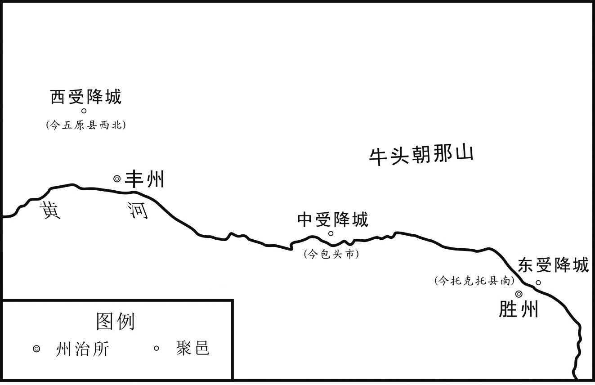 
张仁愿所筑三受降城分布示意图

## 【译文】

第二天早晨，安禄山走到蓟城的南边，大阅兵马并宣誓，以讨伐杨国忠为名，并且在军队中发布告示，称：“如果谁对这项军事行动有不同意见、胆敢煽动士兵的，连父母、兄弟、妻子一块儿杀掉。”于是，安禄山率领军队南下。安禄山乘坐铁制的车，统领着精锐的步兵和骑兵。这支劲旅所过之处，产生上千里的烟尘，鼓声、喧哗声震动天地。当时，天下的和平局面已经维持很久了，老百姓好几代都不知道打仗是什么滋味，突然听说范阳起兵叛乱，远近的百姓都感到十分惊讶。河北地区原本就归安禄山管辖，安禄山的兵马所经过的州县都望风瓦解了，州县的长官或者主动打开城门迎接叛军，或者弃城而逃，躲起来，或者被叛军抓获、杀害，没有人敢跟叛军对抗。安禄山先派遣将军何千年、高邈率领奚族的骑兵二十人，表面上说向朝廷进献射生手，这批军人乘着沿途驿站所供给的马到达太原。天宝十四载（755年）十一月乙丑（初十日），北京副留守杨光翙出城迎接，叛军趁机把他劫持掳走。太原方面的地方官向朝廷详细汇报了这一事件的经过。东受降城也向朝廷上奏，说安禄山造反了。可是玄宗仍然认为这是讨厌安禄山的人欺骗他，并不相信安禄山真的叛乱了。

## 【原文】

**庚午，上闻禄山定反，乃召宰相谋之。杨国忠扬扬有得色，曰：“今反者独禄山耳，将士皆不欲也，不过旬日，必传首诣行在。”[1]上以为然，大臣相顾失色[2]。上遣特进毕思琛诣东京，金吾将军程千里诣河东，各简募数万人，随便团结以拒之[3]。辛未，安西节度使封常清入朝，上问以讨贼方略，常清大言曰：“今太平积久，故人望风惮贼[4]。然事有逆顺，势有奇变，臣请走马诣东京，开府库，募骁勇，挑马箠渡河，计日取逆胡之首献阙下。”[5]上悦，壬申，以常清为范阳、平卢节度使。常清即日乘驿诣东京募兵，旬日，得六万人，乃断河阳桥，为守御之备[6]。**

## 【注文】

[1]行在：皇帝的所在之地，引申为皇帝行幸之地。

[2]失色：脸色和表情不好看。在当时，安禄山手握几十万精兵，几乎天下无敌。而唐中央政府直接控制的兵力有限，长安附近地区兵力空虚，战斗力不强。因此，从军事实力对比来讲，唐廷的胜算很小。宰相杨国忠却声称十天左右能取安禄山的人头，所以在场的大臣会大惊失色。

[3]特进：唐代文散阶号，正二品。仅标志身份、地位，没有实际职事。　　东京：指唐东都洛阳及附近地区，相当于今河南洛阳及附近地区。　　金吾将军：金吾卫的将领。唐初为左、右武候府，高宗时改为左、右金吾卫，各置大将军一人，正三品；将军二人，从三品。左、右金吾卫掌管皇宫与京城的巡警、抓捕奸盗等。　　程千里：生卒年不详。唐玄宗、肃宗朝将领。京兆万年（今陕西西安）人。他魁岸有力，应募从军，累官升迁至安西副都护。唐玄宗天宝末年，他兼任北庭都护、安西北庭节度使，讨擒突厥首领阿布思，以功升为右金吾卫大将军，留在京城宿卫。安禄山造反，程千里担任河东节度副使、上党（治今山西长治）长史。叛贼将领蔡希德围攻上党郡，程千里率领百名骑兵直接冲出，想活捉蔡希德。结果叛军的救兵到了，程千里回返时桥坏马颠，为贼所擒，不屈遇害。　　河东：指河东节度使的辖区。参见《唐开元天宝十节度表》。　　团结：即团结兵，亦称团练兵、团兵。武则天统治时始置团结兵。一般从殷实、强壮的丁男中选点，定期集训，免除其差役、徭役，口粮由官方提供，有民兵性质。最初，在河北、陇右、关中、剑南等地都有团结兵参与防御。安禄山叛乱后，各州县也设置团结兵，由团练使负责统领。

[4]安西节度使：参见《唐开元、天宝十节度表》。　　封常清（？—755年）：唐玄宗朝将领。蒲州猗（yī）氏（今山西临猗）人。封常清少年时跟随外祖父流落到安西，好读书，颇有才识。唐玄宗开元末期，为安西都知兵马使高仙芝的侍从，累立军功。唐玄宗天宝六载（747年），高仙芝为安西节度使，向朝廷奏请封常清为节度判官。高仙芝出征，常令封常清留后，临时负责安西节度使的事务。封常清的性格严明果决，曾杖死高仙芝乳母之子以严明军纪、以肃军容，将士慑服。后迁安西副大都护，充节度使。又改北庭都护，充伊西（即北庭）（参见《唐开元、天宝十节度表》）节度使。他勤俭奉职，赏罚分明。天宝十四载（755年）入朝，当时正值安禄山造反，封常清向皇帝自请招募士兵以对抗叛军。皇帝于是任命他为范阳节度使，赴东都洛阳，十天左右募兵六万人。因为新招募之兵缺乏训练，败于安禄山，常清与高仙芝退守潼关（长安东边的门户，位于今陕西潼关县东北杨家庄附近），被宦官监军边令诚诬杀。

[5]箠（chuí）：鞭子,用鞭子打。

[6]河阳桥：唐东都洛阳附近的交通要道和战略据点，相当于今河南孟州南。河阳桥因河阳三城——北城、中潬（tān）城、南城而筑，也因河阳三城而闻名。北魏孝文帝太和中（约太和二十年，496年），筑河阳北城（今洛阳吉利区冶戍村）；东魏孝静帝元象元年（538年）筑中潬城（今河南郭家滩）及南城（今河南白鹤乡于家村北）。唐肃宗乾元元年（758年）以后，经常置重兵守河阳三城。唐德宗建中二年（781年）置河阳三城节度使，直至宋代。自唐至宋初（618年至960年）的342年中，围绕河阳三城所进行的大小战争有百次之多。

## 【译文】

唐玄宗天宝十四载（755年）十一月庚午（十五日），玄宗听说安禄山肯定造反了，才召集宰相商量对策。杨国忠脸上露出洋洋得意的神色，说：“现在造反的只有安禄山一人，将士们都不愿意反叛朝廷。不过十天左右的时间，安禄山的脑袋一定会被送到陛下您的所在之地。”玄宗听了，认为是这么回事。而在场的大臣都互相对视，脸色不好看。玄宗派遣特进毕思琛到东京（洛阳），金吾将军程千里到河东地区，让他们各自招募几万人，随便将新招募的人编为团结兵，用来抵抗安禄山的叛军。十一月辛未（十六日），安西节度使封常清到达京城觐见皇帝。玄宗向他询问讨伐叛贼安禄山的策略。封常清放大话说：“现在太平的日子已经很长了，因此人人望风、害怕叛贼。但是，天下有反叛朝廷的人，也有顺从朝廷的人，形势会有出人意料的变化。我请求到东京，打开那里的府库，招募骁勇的士兵，拿着鞭子抽着马渡过黄河，数着天数就能取反叛朝廷的粟特胡人安禄山的首级，进献给朝廷。”玄宗听了，很高兴。十一月壬申（十七日），玄宗任命封常清为范阳、平卢节度使。封常清马上骑着沿途驿站供给的马，到达东京招募士兵。十天工夫，他共招募了六万人。于是，封常清命令打断河阳桥，为守卫东都洛阳城作准备。

## 【原文】

**甲戌，禄山至博陵南[1]。何千年等执杨光翙见，禄山责光翙以附杨国忠，斩之以徇[2]。禄山使其将安忠志将精兵军土门[3]。忠志，奚人，禄山养为假子[4]。又以张献诚摄博陵太守[5]。献诚，守珪之子也。**

## 【注文】

[1]博陵：地名。即博陵郡、定州。治安喜（今河北定州），辖安喜、义丰、北平、望都、安险、曲阳、陉（xíng）邑、唐县、新乐县，相当于今河北定州及附近地区、安国、顺平、望都、曲阳、唐县西南、新乐东北。

[2]徇（xùn）：对众人宣示。

[3]土门：县名。即土门县，隶属于雍州（即京兆府，长安及附近地区），相当于今陕西富县东北美原镇。

[4]假子：参见前“养以为子”条注。

[5]张献诚（？—767年）：唐玄宗、肃宗、代宗朝大臣，曾降于安史叛军。陕州平陆（今山西平陆西南平陆城）人，前任幽州节度使、幽州大都督府长史张守珪的儿子。唐玄宗天宝末期，安禄山发动叛乱，张献诚陷入逆贼安禄山的手里，接受叛军授予的伪官。后又追随史思明，为思明守汴州（今河南开封），统领几万叛军。唐代宗宝应元年（762年）冬，唐军收复东都洛阳，史思明之子史朝义逃归汴州，献诚不纳，举州及所统兵归国，诏拜汴州刺史，充汴州节度使。第二年来朝，唐代宗李豫对他宠赐甚厚。他三迁检校工部尚书，兼梁州（治今陕西汉中东）刺史，充山南西道观察使。唐代宗广德二年（764年）十月，他擒拿南山贼帅高玉献给朝廷。代宗永泰二年（766年）正月，他献名马二、丝绢杂货共十万匹。在当月，他兼充剑南东川节度观察使，被封为邓国公。剑南西川崔旰（gàn）杀郭英（yì），献诚率众战于梓州（今四川三台潼川镇），为旰所败，献诚仅以身免。代宗大历二年（767年）四月，献诚以疾病为由，上表乞归私第。皇帝下诏允许，以献诚为检校户部尚书，知省事，暂时处理户部的相关事务。八月，献诚以疾病为由辞官，不久，卒于私第。

## 【译文】

唐玄宗天宝十四载（755年）十一月甲戌（十九日），安禄山到达博陵城的南边。何千年等手执杨光翙来见他，安禄山指责杨光翙依附杨国忠，把他杀死，并对众人宣示。安禄山指使他手下的将领安忠志率领精兵驻扎在土门。安忠志是奚人，安禄山将他收养为自己的儿子。安禄山又命张献诚临时担任博陵郡太守。张献诚是张守珪的儿子。

## 【原文】

**禄山至藁城，常山太守颜杲卿力不能拒，与长史袁履谦往迎之[1]。禄山辄赐杲卿金紫，质其子弟，使仍守常山[2]。又使其将李钦凑将兵数千人守井陉口，以备西来诸军[3]。杲卿归途中，指其衣谓履谦曰：“何为著此？”履谦悟其意，乃阴与杲卿谋起兵讨禄山。杲卿，思鲁之玄孙也[4]。**

## 【注文】

[1]藁（gǎo）城：县名。即藁城县，隶属于镇州、常山郡，相当于今河北藁城。　　常山：地名。即常山郡、镇州。治真定（今河北正定），辖真定、藁城、石邑、九门、灵寿、行唐、井陉、获鹿、平山、鼓城、栾城县，相当于今河北正定及附近地区、藁城、石家庄西南振头、灵寿、行唐、井陉西北、鹿泉、平山、晋州、栾城西。　　颜杲（gǎo）卿（692—756年）：唐玄宗朝大臣，抗击安史叛军的忠臣。京兆万年（今陕西西安）人，字昕，因家庭背景而当官。唐玄宗开元年间，杲卿因为写文章、判事能力超强，迁为范阳户曹参军。安禄山闻其名，上表奏请他为营田判官、假（即代理）常山太守。唐玄宗天宝十四载（755年），安禄山叛乱，杲卿应其从（zòng）弟平原（治今山东平原）太守颜真卿之约，联合起兵反击叛军，用计策擒杀安禄山的几名部将。玄宗将杲卿升为卫尉卿兼御史中丞。杲卿向河北地区传播檄（xí）文（古代官府用以征召或声讨的文书），河北地区十七个郡奋起响应，依附叛军的仅六郡。史思明又急攻常山，激战六天。颜杲卿终因兵少无援，城陷被俘。他被押送到洛阳，大骂安禄山，不屈而死。

[2]质：当人质。

[3]井陉（xíng）口：古代关隘（ài）名，亦称井陉关。因为四面高、中间低，像一口井而得名。故址在今河北井陉北井陉山上，为太行山区向东进入河北地区之重要隘口。因为道路险要，自古以来为军事重地。

[4]思鲁：即颜思鲁，生卒年不详，隋唐之际著名学者。字孔归，祖籍琅邪（yá）临沂（今山东临沂），著名学者颜之推的儿子。颜思鲁精于文字音韵，于隋朝时曾任东宫学士、长安王侍读，加俞岷将军。入唐之后，秦王李世民任命思鲁为秦王府记室参军，成为李世民的幕僚。其子颜师古为著名的训诂学者。

## 【译文】

安禄山的军队到达藁城，常山太守颜杲卿认为自己的实力不足以抵抗叛军的进攻，就与长史袁履谦一道，前往迎接叛军。安禄山则赐给颜杲卿金鱼袋、紫袍，将他的子弟作为人质，仍然让他守卫常山。然后，安禄山又指使他的将领李钦凑率领几千名士兵驻守井陉口，用来防备从西边攻来的军队。颜杲卿在回来的路上，指着自己的衣服对袁履谦说：“为什么穿这衣服呀（指安禄山赏赐给他的金鱼袋、紫袍）？”袁履谦顿时明白了他的意思，于是暗中与颜杲卿策划起兵讨伐安禄山。颜杲卿是颜思鲁的玄孙。

## 【原文】

**丙子，斩太仆卿安庆宗，赐荣义郡主自尽[1]。以朔方节度使安思顺为户部尚书，思顺弟元贞为太仆卿[2]。以朔方右厢兵马使、九原太守郭子仪为朔方节度使，右羽林大将军王承业为太原尹[3]。置河南节度使，领陈留等十三郡，以卫尉卿猗氏张介然为之[4]。以程千里为潞州长史[5]。诸郡当贼冲者，始置防御使[6]。**

## 【注文】

[1]太仆卿：官名。即太仆寺卿。参见《唐朝中央事务机构职官简表》。在唐玄宗时代，临时性使职差遣兴起，中央九卿的许多职事被使职差遣侵夺。因此，安庆宗任太仆寺卿也只是表明他的官品和地位，并不实际掌管制度规定的职权。

[2]朔方节度使：参见《唐开元、天宝十节度表》。

[3]右厢兵马使：参见前“兵马使”条注。　　九原：地名。即九原郡、丰州，治九原（今内蒙古五原西南黄河北岸），辖九原、永丰县，相当于今内蒙古五原附近地区、杭锦后旗东北。　　郭子仪（697—781年）：唐朝著名将领，平定安史之乱的大功臣。华州郑县（今陕西渭南市华州区）人。他在朝廷主持的武举（科举考试的一种，由兵部主持，选拔武官）考试中得高第，累迁天德军使，兼九原太守、朔方节度右厢兵马使，统领朔方节度的一部分兵马。唐玄宗天宝十四载（755年），东北军将安禄山造反，郭子仪被任命为灵武（朔方节度使的治所，今宁夏吴忠）太守、朔方节度使，率领本军向东讨伐叛军，收复河东地区的一部分失地，以功加御史大夫。第二年，他与另一名将领李光弼大败史思明，军威大震，河北地区诸郡纷纷响应官军。唐肃宗李亨召郭子仪至灵武，进兵部尚书、同平章事（宰相之职），仍然负责统领平叛诸军。肃宗至德二载（757年），郭子仪率兵击败崔乾祐叛军，收复河东蒲州（今山西永济西南）。不久，充关内、河东副元帅。与广平王李俶（chù）（唐肃宗长子，后改名李豫，即后来的唐代宗）率领胡汉十五万军收复西京长安和东都洛阳。肃宗乾元元年（758年），郭子仪与李光弼等九节度使共围安禄山之子安庆绪于邺（今河南安阳）。第二年，唐军溃败。宦官监军（负责代表皇帝监督领兵出征的将帅）鱼朝恩乘机诋毁郭子仪，子仪被罢去兵权。肃宗上元二年（761年），李光弼兵败邙（máng）山（今河南洛阳北）。第二年，河中、太原军乱，郭子仪复起为朔方、河中、北庭、潞、泽节度行营兼兴平、定国副元帅，进封汾阳郡王，镇抚诸军。唐代宗即位后，子仪复为宦官程元振所诬陷，罢副元帅（即解除兵权），充肃宗山陵使。子仪上表自诉。代宗想起用郭子仪，又被宦官离间。代宗广德初，吐蕃兵侵扰唐朝，直逼京城长安。代宗仓皇出逃，急召郭子仪为关内副元帅。当时，郭子仪的部下只有二十名骑兵，乃收兵得几千人，以虚张旗帜、击鼓使吐蕃兵惊骇而去。代宗广德二年（764年），将领仆固怀恩叛唐，郭子仪为朔方节度大使，招抚怀恩之众。怀恩的部下望风归附郭子仪。后怀恩引来回纥、吐蕃等外族兵几十万攻唐，京师震恐。郭子仪奉急诏至泾阳（今陕西泾阳），说服回纥酋长，使回纥与唐朝联兵，共破吐蕃，唐廷转危为安。唐德宗李适（kuò）即位后，尊子仪为尚父（本意为可尊敬的父辈，常用作尊礼大臣的称号），召还京城，进太尉、中书令，带宰相之衔，以年老，所领诸使职、副元帅均罢去，实际上是赐予品级很高的虚职，夺去他的兵权。郭子仪死后，被谥“忠武”。　　右羽林大将军：唐朝皇宫禁卫军之一羽林军的将领。羽林军设左、右羽林大将军各一人，正三品；将军各二人，从三品。左、右羽林军大将军、将军负责统领北衙禁军（驻扎在皇室日常起居的宫城北边的禁军）之法令，仪仗。如果遇见大朝会，则率领其仪仗以护卫宫殿的阶梯。如果皇帝行幸则夹道为内部仪仗。　　太原尹：北京太原府的实际长官，从三品。负责管理当地政务，巡逻属县、劝课农桑、观察民风、审查囚徒、查阅丁口、考核官吏、纠举不法、举荐贤才。

[4]河南节度使：唐朝藩镇名。唐玄宗天宝十四载（755年）置河南节度使，治陈留郡（即汴州，治浚仪，今河南开封），辖陈留、睢阳（治宋城，今河南商丘南）、灵昌（治郑县，今陕西渭南市华州区）、淮阳（治宛丘，今河南淮阳）、汝阴（治汝阴，今安徽阜阳）、谯郡（治谯县，今安徽亳州）、济阴（治济阴，今山东曹县西北）、濮阳（治甄（zhēn）城，今山东甄城北旧城集）、淄川（治淄川，今山东淄博西南淄川）、琅邪（yá）（治临沂，今山东临沂）、彭城（治彭城，今江苏徐州）、临淮（治临淮，今江苏盱（xū）眙（yí）西北淮水西岸）、东海（治朐（qú）山，今江苏连云港西南海州镇），共十三个郡。唐肃宗乾元元年（758年），改为汴州都防御使。第二年，分汴州都防御使为汴滑节度使（治滑州白马，今河南滑县东旧县）、河南节度使（治徐州）。肃宗上元二年（761年），二节度使皆废。唐代宗宝应元年（762年），复置河南节度使，又称汴宋节度使，治汴州，领汴、宋、曹、徐、颍、兖（yǎn）（治瑕丘，今山东兖州）、郓（yùn）（即东平郡，今山东东平西北）、濮八州。唐代宗大历十一年（776年）废。同年复置，专称汴宋节度使。唐德宗建中二年（781年），号宣武军。汴宋节度使的辖境地处国家漕运（官方督管的水运）的咽喉，事关唐廷的经济命脉。所以，中晚唐时期，唐廷与藩镇之间的争斗、藩镇之间的冲突，多与汴宋节度使有关。　　陈留：地名。即陈留郡、汴州。参见前“汴州”条注。　　卫尉卿：官名。即卫尉寺卿。参见《唐朝中央事务机构职官简表》。到唐玄宗时代，临时性使职差遣兴起，中央九卿的许多职事被使职差遣侵夺。因此，张介然担任卫尉卿只是表示他的官品、地位，并不掌管制度规定的职事。　　猗（yī）氏：即猗氏县，隶属于蒲州（河东郡），相当于今山西临猗。　　张介然（？—755年）：唐玄宗朝将领。蒲州猗氏人，本名六朗。他谨慎善筹算，在河西、陇右地区担任郡太守。及唐玄宗天宝中，王忠嗣、皇甫惟明、哥舒翰相次为节度使，并委任张介然为营田支度等使，管理屯田、财政事务。他后来进位卫尉寺卿，仍兼行军司马，领营田支度等使。又加银青光禄大夫（文散阶，从三品），带上柱国（勋官，比正二品）。张介然因为到朝廷向玄宗上奏，合皇帝之心意，被特加赏赐。玄宗天宝十四载（755年），安禄山叛乱，叛军将进攻东都洛阳地区，玄宗以介然为河南节度使，令他防守陈留郡，败于叛军。安禄山入陈留，得知其子安庆宗被唐廷所杀，非常愤怒，遂命手下的将领将已经投降的陈留士兵杀尽，在军门斩杀介然。天宝十五载（756年），玄宗赠介然工部尚书，授予他的一个儿子五品官。

[5]潞州：地名。即上党郡，治上党（今山西长治），辖上党、壶关、长子、屯留、潞城、襄垣、黎城、铜鞮（dī）、武乡、涉县，相当于今山西长治、壶关、长子、屯留、潞城、甘罗水南、黎城西北古县、沁县西南故县、武乡东故县，河北涉县。

[6]防御使：唐朝使职名。武周圣历年间（698—700年）始以夏州（治今陕西榆林、靖边附近）领防御使。安禄山叛乱后，凡是大郡、要害之地皆置防御使，或称防御守捉使，负责掌管本辖区军事防务。有副使、判官等属官。其后，很多州刺史也多加防御使衔。各地区不设节度使处或置都防御使以领军务。

## 【译文】

唐玄宗天宝十四载（755年）十一月丙子（二十一日），玄宗命令斩杀太仆卿安庆宗（安禄山的儿子，长期居住在京城），赐荣义郡主自尽。玄宗任命朔方节度使安思顺为户部尚书（调任闲散之职），思顺的弟弟安元贞为太仆卿（调任闲散之职）。玄宗又任命朔方右厢兵马使、九原太守郭子仪为朔方节度使，右羽林大将军王承业为太原尹。玄宗下诏设置河南节度使，管辖陈留等十三个郡，让卫尉卿猗氏张介然担任河南节度使。玄宗任命程千里为潞州长史。唐廷在位于交通要道的、抵抗叛贼的各个郡开始设置防御使。

## 【原文】

**丁丑，以荣王琬为元帅，右金吾大将军高仙芝副之，统诸军东征[1]。出内府钱帛，于京师募兵十一万，号曰“天武军”，旬日而集，皆市井子弟也[2]。**

## 【注文】

[1]琬：即李琬（？—755年），唐玄宗之第六子，刘华妃所生，初名嗣玄。唐玄宗开元二年（714年），封为甄王。开元十二年（724年）三月，改名滉（huàng），封为荣王。开元十五年（727年），授京兆牧，担任京师长安名义上的长官，又遥领陇右节度大使。开元二十三年（735年），加开府仪同三司（文散阶，从一品）。开元二十五年（737年），改名琬。玄宗天宝元年（742年）六月，授单（chán）于大都护。天宝十四载（755年）十一月，安禄山造反，当月玄宗下制书，以李琬为征讨元帅，高仙芝为副元帅，令高仙芝征发河西、陇右节度使的军队，来抵御叛军。过了几天，李琬就死了。赠靖恭太子。琬素有雅称。当时士兵、平民百姓都希望李琬统兵有所成就，可李琬却忽然死了，大家都很失望。　　右金吾大将军：参见前“金吾将军”条注。　　高仙芝（约703—755年）：唐玄宗朝将领。高句（gòu）丽人。年二十余从军安西，补游击将军。后升为安西副都护、四镇（指唐前期在西北地区设置的四个军镇，即安西四镇：焉耆、疏勒、于阗、龟兹，分别相当于今新疆焉耆、喀什、和田、库车）都知兵马使，统领安西四镇的军队。唐玄宗天宝六载（747年），高仙芝平定西北地区的大、小勃律（位于克什米尔北境印度河流域），西部诸国皆通于唐。玄宗升他为鸿胪卿（即鸿胪寺卿。在这里，此官衔仅表示官品和身份，无实际职事），代理御史中丞、安西四镇节度使，加左金吾大将军（仅表示官品和身份，无实际职事）。天宝九载（750年），高仙芝率兵攻打石国（位于中亚地区的粟特人建立的政权，治今乌兹别克斯坦塔什干一带），斩杀石国国王。石国王子逃到大食（唐时对阿拉伯帝国的称呼）乞兵，第二年，引大食来攻。高仙芝进军，与大食战于怛（dá）逻斯（又作怛罗斯，今哈萨克斯坦江布尔城，唐时为西北地区的交通中心之一），相持三天，仙芝大败，夺路以归，安西的精兵消耗殆尽。天宝十四载（755年），安禄山发动叛乱，高仙芝奉皇帝的诏书率兵平叛，拜天下兵马副元帅。高仙芝因其麾下的将领封常清兵败，东都洛阳失守，又遭到宦官监军边令诚的诬陷。三次派遣使者到京城奉表陈述具体情况，均未送达玄宗手里。玄宗偏听边令诚的奏报，命边令诚在军中将高仙芝斩杀。

[2]内府：即内府局，唐朝官僚机构。设内府令二人，为长官，正八品下；丞二人，为副官，正九品下。内府令、丞负责掌管皇宫中所藏的宝货、财物的出纳。　　市井：群众进行买卖的地方。古代立市必定有四方，与造井之制非常相似，故称市井。也作为市街的通称、商人的代称。

## 【译文】

唐玄宗天宝十四载（755年）十一月丁丑（二十二日），玄宗任命荣王李琬为元帅，右金吾大将军高仙芝为副元帅，统领各路兵马向东征讨叛军。玄宗拿出皇宫中内府储藏的钱和丝织品，在京师长安招募了十一万名士兵，号称“天武军”，十天左右，这支军队就集结起来了，这批新招募的士兵都是市井子弟。

## 【原文】

**十二月丙戌，高仙芝将飞骑、骑及新募兵、边兵在京师者合五万人，发长安[1]。上遣宦者监门将军边令诚监其军，屯于陕[2]。**

## 【注文】

[1]飞骑：唐朝北衙禁军中的一支。唐高祖时，于长安宫城的北门玄武门置北门屯营，负责守卫宫城北边的门户。后分为左、右屯营。唐太宗贞观十二年（638年），始于左、右屯营中置飞骑，隶属于左、右屯卫（后改为威卫）。唐高宗龙朔二年（662年），将飞骑从左、右屯卫中析出，别为左、右羽林军，故又称羽林飞骑。一般选取骁健、善骑射者充入飞骑。飞骑在历次宫廷政变中处于举足轻重的地位。　　（guō）骑：唐玄宗时设置的禁军的名称。由长从宿卫改名。唐朝保卫皇城（皇帝上朝、办公之地、中央各官衙署所在地，在皇室日常生活起居的宫城的南面）的南衙禁军，原由地方各州府的府兵轮流到指定地点驻守（即轮番），分属十二卫统领。到唐高宗、武则天时，府兵制度逐渐废弛。地方各军府轮番驻守的府兵常常不足额，并多不按时更换。故逃亡者很多，宿卫之数不足。到唐玄宗初年，南衙禁军的十二卫已经十分虚弱。开元十一年（723年），唐朝开始在西京长安、东都洛阳及附近地区的府兵、百姓中的男丁中简募强壮者，免除其征发、赋税、徭役，作为南衙禁军，称为长从宿卫。这标志着募兵制代替征兵制。开元十三年（725年），长从宿卫改名骑，共十二万人，分隶十二卫，替代原本在皇城轮番的府兵，专门负责京师的警备任务，有时或用以出征。开元十六年（728年），一部分骑编入左、右羽林军，又成为北衙禁军的组成部分。玄宗天宝年间，由于北衙禁军扩大，骑已经不被重视。当时，禁军日益腐败，骑更是不堪作战。安禄山叛乱后，骑继续存在，但人数很少，一直延续到唐末，仅供皇帝仪仗和京师部分衙署警备之用，地位无足轻重。骑制度实际上仅存在于玄宗开元中至天宝末，为时甚短。

[2]监门将军：唐朝禁军的一支左、右监门卫的将领。左、右监门卫设大将军各一人，正三品；将军各二人，从三品。左、右监门卫大将军、将军负责掌管皇宫诸门的禁卫，盘查出入宫门之人员、物品。　　边令诚：生卒年不详。唐代宦官。唐玄宗天宝六载（747年），边令诚奉皇帝之命监督高仙芝的军队，高仙芝自安西出兵攻打小勃律，至连云堡（今阿富汗东北部喷赤河南源附近）不敢深入。等仙芝破小勃律，边令诚乃上奏其功。天宝十四载（755年），安禄山叛乱时，高仙芝、封常清派军队入关中驻守，在潼关抵挡安禄山叛军入关中。唐玄宗任命边令诚为监门将军，至陕州（今河南三门峡西旧陕县）监督高仙芝军。边令诚向高仙芝一再索贿不成，遂进谗言于唐玄宗，说封常清用叛贼来动摇众人的心，高仙芝丢弃陕州及附近地区好几百里地，又偷窃、减少皇帝赐给军士们的粮食。玄宗听信了谗言。边令诚奉玄宗之命在潼关斩杀高仙芝和封常清。边令诚不久陷入叛军，逃归后被唐肃宗所杀。　　屯：驻扎、防守。　　陕：地名。即陕郡，参见前“陕郡”条注。

## 【译文】

唐玄宗天宝十四载（755年）十二月丙戌（初一日），高仙芝率领京师的飞骑、骑及新招募的士兵、边地的士兵共五万人，从长安出发。玄宗派遣宦官、监门将军边令诚负责监督高仙芝的军队。高仙芝的军队驻扎在陕郡。

## 【原文】

**丁亥，安禄山自灵昌渡河，以约败船及草木横绝河流，一夕，冰合如浮梁，遂陷灵昌郡[1]。禄山步骑散漫，人莫知其数，所过残灭。张介然至陈留才数日，禄山至，授兵乘城，众忷惧，不能守[2]。庚寅，太守郭纳以城降。禄山入北郭，闻安庆宗死，恸哭曰：“我何罪而杀我子！”[3]时陈留将士降者夹道，近万人，禄山皆杀之，以快其忿。斩张介然于军门。以其将李庭望为节度使，守陈留。**

## 【注文】

[1]灵昌：地名。即灵昌郡、滑州，治卫南（今河南滑县附近），辖卫南、白马、韦城、灵昌、匡城、胙（zuò）城、酸枣县，相当于今河南滑县附近、长垣西南、延津附近。　　（gēng）：粗索。

[2]忷（xiōng）：同“汹”，形容喧闹或纷乱的样子。

[3]郭：外城，在城的外围加筑的一道城墙。

## 【译文】

唐玄宗天宝十四载（755年）十二月丁亥（初二日），安禄山从灵昌郡渡过黄河，用粗绳索拉着破旧的船及草木，从河道中间来截断河流。一天晚上，河面上结冰了，这些东西就像浮在水面上的桥梁。于是安禄山叛军踏着冰过了黄河，攻陷了灵昌郡。安禄山的步兵和骑兵散在各处，人们无法知道这批军队的准确数字。叛军所过之处，都残杀、毁灭生灵。张介然到达陈留郡才几天，安禄山的叛军也到达了那里。安禄山让他的军队乘机攻打陈留城，将士们都气势汹汹，让唐朝的守军感到害怕，不能坚守这座城。十二月庚寅（初五日），太守郭纳将城献给叛军，向叛军投降。安禄山进入北面的外城，听说儿子安庆宗被唐廷杀死了，非常悲痛地哭着说：“我有什么罪？为什么要杀我的儿子！”当时，向叛军投降的陈留郡将士夹着通道，有将近一万人。安禄山将他们全部杀掉，以解心中的愤恨。安禄山在军门斩杀了张介然。然后，安禄山任命他的将领李庭望为节度使，负责守陈留。

## 【原文】

**壬辰，上下制欲亲征，其朔方、河西、陇右兵留守城堡之外，皆赴行营，令节度使自将之，期二十日毕集[1]。**

## 【注文】

[1]行营：皇帝挂帅出征的所在之地。

## 【译文】

唐玄宗天宝十四载（755年）十二月壬辰（初七日），玄宗下制书，想自己亲自挂帅征讨叛军，让朔方、河西、陇右节度使所统领的军队留守在城堡之外的，都赶赴皇帝出征的行营，命节度使各自率领自己的人马赶到，二十天集结完毕。

## 【原文】

**初，平原太守颜真卿知禄山且反，因霖雨，完城浚壕，料丁壮，实仓廪[1]。禄山以其书生，易之。及禄山反，牒真卿以平原、博平兵七千人防河津，真卿遣平原司兵李平间道奏之[2]。上始闻禄山反，河北郡县皆风靡，叹曰：“二十四郡，曾无一人义士邪！”[3]及平至，大喜曰：“朕不识颜真卿作何状，乃能如是！”真卿使亲客密怀购贼牒诣诸郡，由是诸郡多应者[4]。真卿，杲卿之从弟也[5]。**

## 【注文】

[1]平原：地名。即平原郡，德州，治平原（今山东平原），辖平原、安德、长河、将陵、平昌县，相当于今山东平原、陵县、德州及附近地区、临邑北。　　颜真卿（708—784年）：唐玄宗、肃宗、代宗、德宗朝大臣，著名书法家。京兆万年（今陕西西安）人，字清臣，祖籍琅邪（yá，亦作琅琊）临沂（今山东临沂）。唐玄宗开元年间中进士，担任监察御史、殿中侍御史。他因为不依附于当时掌握大权的宰相杨国忠，被赶出京城，任平原郡太守。安禄山叛乱，河北郡县望风瓦解。颜真卿却起兵坚守，并与其从兄常山太守颜杲卿联军抵抗叛军。河北十七郡响应他们，合兵二十万，给叛军以重大威胁。真卿后到中央，历任工部、吏部尚书，御史大夫。他忠良耿直，恪尽职守，军国大事，知无不言，屡遭权臣的妒忌，出为外州刺史、长史。唐代宗时，迁尚书左丞，封鲁郡公，人称颜鲁公。唐德宗时，李希烈叛乱，权相妒忌真卿刚直，于是派他去安抚叛军。真卿至许州（治今河南许昌）被扣留。他在威逼利诱之下始终不屈服，被杀。颜真卿的书法端庄雄伟，独树一帜，人称“颜体”，传世甚多。墨迹有正书《自书告身》、行书《祭侄文稿》，碑刻有《多宝塔碑》《颜勤礼碑》《麻姑仙坛记》等。后人辑有《颜鲁公文集》。　　且：副词，将要、快要。　　霖：久下不停的雨。　　料：计算、统计。　　仓廪（lǐn）：储存粮食的仓库。

[2]博平：地名。即博平郡，博州。治聊城（今山东聊城东北），辖聊城、武水、博平、清平、堂邑、高唐县，相当于今山东聊城及附近地区、茌（chí）平西北博平、临清东南、冠县东、高唐。　　司兵：官名。即地方州郡所设司兵参军事，诸州或郡各置一人。上州为从七品下，中州正八品下，下州从八品下。负责掌管地方军务。　　间（jiàn）：秘密地、悄悄地。

[3]靡（mǐ）：倒下。　　二十四郡：指唐代河北地区的二十四个郡：1.河内郡（治河内，今河南沁阳）；2.汲郡（治汲县，今河南卫辉）；3.邺郡（治安阳，今河南安阳）；4.魏郡（治元城，今河北大名东北）；5.博平郡（治聊城，今山东聊城东北）；6.清河郡（治清阳，今河北清河西北）；7.广平郡（治永年，今河北永年东南）；8.巨鹿郡（治龙冈，今河北邢台）；9.赵郡（治平棘，今河北赵县）；10.常山郡（治真定，今河北正定）；11.信都郡（治信都，今河北冀州）；12.饶阳郡（治饶阳，今河北饶阳）；13.景城郡（治清池，今河北沧州东南）；14.平原郡（治平原，今山东平原）；15.博陵郡（治安喜，今河北定州）；16.上谷郡（治易县，今河北易县）；17.河间郡（治河间，今河北河间）；18.文安郡（治莫县，今河北任丘北）；19.范阳郡（治蓟县，今北京城区）；20.渔阳郡（治渔阳，今天津蓟县）；21.密云郡（治密云，今北京密云）；22.妫（guī）川郡（治怀戎，今河北怀来东南）；23.北平郡（治卢龙，今河北卢龙）；24.柳城郡（治柳城，今辽宁朝阳）。在唐代，因为历史和现实的原因，河北地区本来就跟唐中央政府存在离心倾向。河北地区的文化望族（即山东士族）与李唐皇室不是出自一个利益群体和政治集团。即便唐朝统一全国，山东即崤（xiáo）山以东士族的政治势力仍然很强，在社会文化方面的影响力甚至超过李唐皇室。于是，唐廷采取过诸多提升本利益集团、抑制山东士族的措施。这成为中央政府与河北地域产生矛盾的因素之一。另一方面，在唐前期，河北北部地区有大量外族胡人迁入，当地胡化之风很盛，又形成以安禄山为代表的能征善战的、胡汉混合的军事集团。这一集团在政治上与中央政府有矛盾，在文化上也与中原正统汉文化存在差异。这也是唐廷与河北地区产生矛盾的因素。

[4]购：重赏征求，重金收买。

[5]从（zòng）弟：古人以同曾祖父、不同父亲，年幼于己的同辈男性为从弟。具体又分为两种：同曾祖父、不同祖父，年幼于己的同辈男性为“从祖弟”；同祖父、不同父亲，年幼于己的同辈男性为“从父弟”，即现在所谓的堂弟。两者统称为从弟。

## 【译文】

起初，平原郡太守颜真卿知道安禄山将要造反，就趁着连续的阴雨，修缮了城墙，疏通了战壕，计算了壮丁的数目，充实了储存粮食的仓库。安禄山认为颜真卿只是一介书生，很好对付。等到安禄山正式起兵造反，发牒告知。颜真卿用平原郡、博平郡的七千名士兵防守黄河的重要渡口，颜真卿派遣平原郡的司兵参军事李平悄悄地向朝廷汇报这些事情。玄宗刚开始知道安禄山真的造反了，河北地区的郡县都望风投降了，于是感叹道：“河北地区的二十四郡，竟然没有一个对朝廷忠诚的义士啊！”等到李平来了，玄宗非常高兴，说：“我还不认识颜真卿，不知他长什么模样，他却能做出如此忠于朝廷之事！”颜真卿派遣自己的亲密门客，悄悄地揣着用重金悬赏对付叛贼的文牒到达河北地区的各郡，于是各郡有很多响应他的人。颜真卿是颜杲卿的从弟。

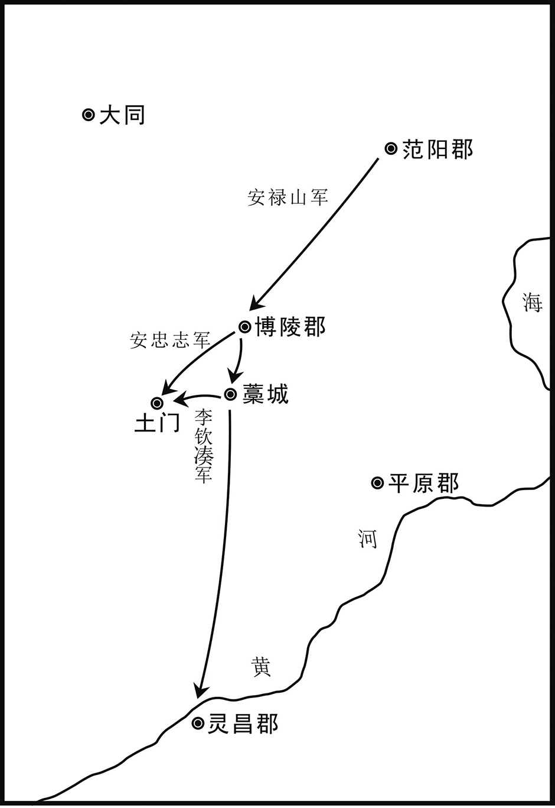 
唐玄宗天宝十四载（755年）安禄山叛乱进军路线示意图

## 【原文】

**安禄山引兵向荥阳，太守崔无诐拒之，士卒乘城者，闻鼓角声，自坠如雨[1]。癸巳，禄山陷荥阳，杀无诐，以其将武令珣守之。**

## 【注文】

[1]荥（xíng）阳：地名。即荥阳郡、郑州，治管城（今河南郑州），辖管城、荥阳、荥泽、新郑、中牟、原武、阳武县，相当于今河南郑州、荥阳、郑州西北古荥镇北、新郑西南、中牟东、原阳及附近地区。　　崔无诐（bì）（？—755年）：唐中宗、玄宗朝大臣。京兆长安（今陕西西安）人，本出自名门博陵崔氏。父从礼，为唐中宗韦皇后的舅舅。唐中宗重登皇位后，中书令、酂（zàn）国公萧至忠才位素高，甚得皇帝赏识。无诐娶了萧至忠的女儿，因此中宗待他甚厚。唐中宗死后，韦皇后不久被杀，萧至忠的女儿也死了。无诐被牵连，被贬为地方官，在外地待了很长时间。唐玄宗开元中，为益州（今四川成都）司马（闲职）。当时正值杨国忠为新都县（今四川新都）县尉，无诐与他交结甚欢。国忠因事引荐无诐，累迁转至陕郡（治今河南三门峡西旧陕县）太守、少府监、荥阳郡太守。安禄山叛乱，攻打荥阳，无诐招募兵士抵抗。结果，荥阳城陷，无诐被杀。　　乘：登、升。　　鼓角：战鼓和号角的总称。古代军队中为了发号施令而制作的吹擂之物。军队亦用以报时、警众。

## 【译文】

安禄山将自己的兵马引向荥阳，太守崔无诐拒绝接纳叛军，不开城门。登上城墙的官军士兵，一听见叛军的战鼓和号角的声音，自己就像雨一样纷纷往下掉。十二月癸巳（初八日），安禄山攻陷荥阳，杀死太守崔无诐，命他手下的将领武令珣守荥阳城。

## 【原文】

**禄山声势益张，以其将田承嗣、安忠志、张孝忠为前锋[1]。封常清所募兵皆白徒，未更训练，屯武牢以拒贼，贼以铁骑蹂之，官军大败[2]。常清收余众战于葵园，又败，战上东门内，又败[3]。丁酉，禄山陷东京，贼鼓噪自四门入，纵兵杀掠[4]。常清战于都亭驿，又败，退守宣仁门，又败，乃自苑西坏墙西走[5]。**

## 【注文】

[1]张孝忠（730—791年）：安禄山叛军的重要将领，后归附唐朝，成为易定节度的首任节度使。张孝忠本名阿劳，系奚族一部落酋帅的后裔。父名谧，唐玄宗开元中归附唐朝。张孝忠善于骑射，富于谋略，于唐玄宗天宝末年成为安禄山的偏将。安禄山叛乱后，张孝忠成为叛军的先锋。安禄山叛乱被平定后，孝忠归唐，唐廷以叛军的旧部继续统领河北地区。孝忠归属于河北藩镇之一成德镇李宝臣的帐下。唐肃宗上元年间，累功迁金吾卫将军，赐名孝忠。孝忠统领易州（治今河北易县）诸镇十余年，以其骁勇，其他强藩不敢轻犯。唐德宗建中二年（781年），李宝臣死，其子李惟岳造反，张孝忠与其他军队共同平定叛乱，进义武军节度使（又称易定节度使），统辖易州、定州（治今河北定州）地区。

[2]武牢：地名。即武牢关，本名虎牢关。唐朝建立后，为避唐高祖李渊的祖父李虎之名，改称武牢关，又称成皋关。春秋时代，本在此地置虎牢邑，秦朝在此地设关，相当于今河南荥阳市西北汜（sì）水镇西。此关萦带山阜，北临黄河，绝岸峻崖，以为险固，自古为戍守重地。　　蹂：践踏。

[3]葵园：唐朝地名。位于今河南荥阳高阳镇竹园村一带。地处大道，地势险要。　　上东门：唐东都洛阳城东边偏北部的城门。

[4]鼓噪：古代指战时擂鼓呐喊，以壮声势。　　四门：指唐东都洛阳城的四道城门。洛阳城的城门：东边有上东门、建春门、永通门；南边有长夏门、定鼎门、厚载门；北边有徽安门、安喜门。此处不知具体指洛阳城的哪四道城门。

[5]都亭驿：唐朝在东都洛阳所设的驿站。此驿站位于洛阳城宣仁门外清化坊（在今河南洛阳市内）。　　宣仁门：唐东都洛阳宫城东边的门。　　苑：这里指洛阳城西的禁苑，专供皇室享用。

## 【译文】

安禄山叛军的声势越来越旺，他以麾下的将领田承嗣、安忠志、张孝忠为前锋。封常清新招募的士兵都是平民之辈，没有经过正规的训练。这批士兵屯兵武牢关以抵御叛贼，叛贼用铁骑践踏他们，官军大败。封常清收拾了残余的士兵，继续在葵园跟叛军作战，又失败了。他又率兵与叛军战于洛阳城的上东门内，又被打败了。天宝十四载（755年）十二月丁酉（十二日），安禄山攻陷东京洛阳，叛贼敲着战鼓、一起叫嚷着，分别从洛阳城的四道城门涌入城内。叛军将领纵容手下的士兵到处烧杀劫掠。封常清与叛军战于都亭驿，结果又失败了，退到洛阳城的宣仁门防守，又失败了。于是，封常清打坏了洛阳城禁苑西的一堵墙，逃走了。

## 【原文】

**河南尹达奚珣降于禄山。留守李憕谓御史中丞卢奕曰：“吾曹荷国重任，虽知力不敌，必死之。”[1]奕许诺。憕收残兵数百欲战，皆弃憕溃去，憕独坐府中。奕先遣妻子怀印间道走长安，朝服坐台中，左右皆散[2]。禄山屯于闲厩，使人执憕、奕及采访判官蒋清，皆杀之。奕骂禄山，数其罪，顾贼党曰：“凡为人当知逆顺。我死不失节，夫复何恨。”憕，文水人；奕，怀慎之子；清，钦绪之子也[3]。禄山以其党张万顷为河南尹[4]。**

## 【注文】

[1]李憕（chéng）（？—755年）：唐玄宗朝大臣。并州文水（今山西文水）人。其父李希倩在唐中宗神龙初年担任右台监察御史。唐玄宗时代，张说常引李憕在幕下。李憕后为宇文融的判官，负责检括田亩、考核地方官（详见《奸臣聚敛》）。后迁监察御史，历任给事中、河南少尹。玄宗天宝初，被贬为清河（治今河北清河西北）太守，又改任尚书右丞、京兆尹。转光禄卿、东都留守，迁礼部尚书。安禄山叛乱，攻陷洛阳，李憕遇害。赠司徒，谥“忠烈”。　　卢奕（？—755年）：唐玄宗朝宰相。滑州灵昌（今河南滑县西南）人，唐中宗、玄宗朝大臣卢怀慎的次子，史称他与其兄卢奂名相上下。唐玄宗天宝初，为鄂县（今湖北武昌）县令，后升为给事中，拜御史中丞，与父兄三居其官。安禄山叛军攻陷东都洛阳时，卢奕死节。唐肃宗诏赠礼部尚书，谥“贞烈”。　　曹：分科办事的官署。

[2]印：指唐朝人行路、过关口必需的盖上印章的“公验”，即过路的凭证。

[3]文水：地名。即文水县，隶属于北京太原府，相当于今山西文水东旧城。　　怀慎：即卢怀慎（？—716年），唐中宗、玄宗朝大臣。滑州灵昌（今河南滑县西南）人。先世家范阳（今北京地区），为名门望族范阳卢氏的后裔。卢怀慎进士出身，于唐中宗景龙年间累迁右御史台中丞，上疏请择官吏，省冗职，惩贪赃。后升为黄门侍郎。唐玄宗开元元年（713年）为同平章事，进黄门监，担任宰相，与姚崇共同掌管军国大事。怀慎自知行政能力不及姚崇，于是遇事皆推让，时人谓之“伴食宰相”。怀慎性清俭，不营产业。临终遗表推荐宋璟、李杰、李朝隐、卢从愿等，后来这批人皆成为名臣。　　钦绪：即蒋钦绪，生卒年不详，唐高宗、中宗、玄宗朝大臣。莱州胶水（今山东平度）人。唐高宗时，考中进士科，累任太常博士。唐中宗李显重登皇位后，皇后韦氏独揽朝政。唐中宗景龙三年（709年）冬，中宗举行祭天大礼。国子监祭酒祝钦明为了献媚韦后，竟然违背传统礼仪，主张由皇后“陪祭”。礼部尚书等大臣也都趋炎附势，随声附和。但时任太常博士的蒋钦绪却据“礼”力争，写下《驳祝钦明皇后助祭天地议》等文章，坚持认为不可由皇后“陪祭”。其刚直忠正的气节赢得了朝野的一致赞佩。唐玄宗开元年间，蒋钦绪久任吏部员外郎和侍郎，掌管官员考核和选拔中下级官吏。他以爱才荐贤、处事公平、不计个人恩怨而为人称道。他晚年历任汴州（治今河南开封）和魏州（治今河北大名东北）刺史，都留下了很好的政绩。

[4]张万顷：生卒年、籍贯均不详，唐玄宗、肃宗朝大臣。登进士第。唐玄宗天宝六载（747年），官至河南法曹，负责管理洛阳及附近地区的法律、刑狱、诉讼。安禄山叛乱，万顷接受叛军所建伪政权的任命，担任河南尹，负责管理洛阳的行政事务。唐肃宗至德二载（757年），凡是投靠叛贼的官员以六等定罪，万顷独以在贼中能保庇百姓而免死。肃宗乾元元年（758年），万顷自濮州（治今山东甄城北旧城集）刺史迁广州（治今广东广州）都督、岭南五府节度使。肃宗上元二年（761年），万顷以贪污受贿罪被贬为巫州（治今湖南黔阳西南）朗溪县（今湖南会同西北）县尉。《全唐诗》中存有张万顷的诗三首：《登天目山下作》、《东溪待苏户曹不至》和《送裴少府》。

## 【译文】

河南尹达奚珣向安禄山投降。留守李憕却对御史中丞卢奕说：“我们这些当官的，应当担负起国家的重任，虽然明知道自己的力量斗不过叛贼，必然是死路一条。”卢奕也许诺，愿意拼死力战。李憕收拾剩下的残兵几百人，想和叛军决战。然而这帮士兵都离弃李憕，全部逃走了，只有李憕一人独自坐在官衙中。卢奕先让妻子和儿女怀揣“公验”秘密地逃到长安。卢奕穿着平时办公的官服，坐在官衙中，他左右的人都散了。安禄山屯兵马于李唐皇室养马的马圈，派遣人捉拿李憕、卢奕及采访判官蒋清等人，将他们全部杀掉。卢奕痛骂安禄山，一一数出他的罪状，然后回头看着这帮叛贼，说：“凡是做人，应当知道什么是逆贼，什么是忠臣。我死了，不失气节，还有什么可恨的呢。”李憕是文水人；卢奕是卢怀慎的儿子；蒋清是蒋钦绪的儿子。安禄山用他的党徒张万顷担任河南尹。

## 【原文】

**封常清帅余众至陕，陕郡太守窦廷芝已奔河东，吏民皆散。常清谓高仙芝曰：“常清连日血战，贼锋不可当。且潼关无兵，若贼豕突入关，则长安危矣[1]。陕不可守，不如引兵先据潼关以拒之。”[2]仙芝乃帅见兵西趣潼关。贼寻至，官军狼狈走，无复部伍，士马相腾践，死者甚众。至潼关，修完守备，贼至，不得入而去。禄山使其将崔乾祐屯陕，临汝、弘农、济阴、濮阳、云中郡皆降于禄山[3]。是时，朝廷征兵诸道，皆未至，关中忷惧。会禄山方谋称帝，留东京不进，故朝廷得为之备，兵亦稍集。**

## 【注文】

[1]豕（shǐ）：猪。这里是对叛贼的蔑称。

[2]潼关：参见前“关”条注。

[3]弘农：地名。即弘农郡、虢（guó）州，治弘农（今河南灵宝），辖弘农、阌（wén）乡、湖城、朱阳、玉城、卢氏县，相当于今河南灵宝及附近地区、卢氏。　　济阴：地名。即济阴郡、曹州，治济阴（今山东曹县西北），辖济阴、考成、冤句、乘氏、南华、成武县，相当于今山东曹县西北，河南民权东南、兰考东北堌（gù）阳镇，山东菏泽、菏泽西北李庄集、成武。　　濮阳：地名。即濮阳郡、濮州，治甄城（今山东甄城北旧城集），辖甄城、濮阳、范县、雷泽、临濮县，相当于今山东甄城北旧城集，河南濮阳西南、濮阳东北旧城，山东菏泽东北、山东甄城西南临濮集。　　云中郡：地名。即云州，治云中（今山西大同），辖云中、单于都护府、金河，相当于今山西大同、内蒙古托克托南。

## 【译文】

封常清率领剩下的士兵到达陕郡，陕郡太守窦廷芝已经逃奔河东，当地的官吏、民众也都散了。封常清对高仙芝说：“我封常清连日来都在与叛贼血战，叛贼的兵锋不可阻挡。而且，现在潼关没有兵防守，如果叛贼强行突入潼关，那么长安就危险了。陕郡不可作为防守之地，不如咱们带兵先占据潼关，用这种方式来抵御叛贼。”高仙芝于是率领手下的士兵向西赶到潼关。叛贼不久也到潼关了，官军很狼狈地逃走了。在逃跑过程中，官军根本就没有原来的队伍、阵形，士兵和战马互相践踏，这样被弄死的人非常多。高仙芝的兵马到了潼关，修缮了当地的防御体系和装备。叛贼到了这里，没法进入潼关，只好走了。安禄山派遣他麾下的将领崔乾祐屯兵于陕郡，临汝、弘农、济阴、濮阳、云中郡都向安禄山投降。当时，朝廷向各地征兵，但是所征的士兵都没有到达京城，关中地区的人开始喧闹起来，人心惶惶，感到非常恐惧。当时正值安禄山谋求自称皇帝，他为了这事而滞留在东京，不再往西进兵（攻打长安），因此，朝廷才有时间做准备防御叛军，也稍微集结了一些士兵。

## 【原文】

**禄山以张通儒之弟通晤为睢阳太守，与陈留长史杨朝宗将胡骑千余东略地，郡县官多望风降走，惟东平太守嗣吴王祗、济南太守李随起兵拒之[1]。祗，祎之弟也。郡县之不从贼者，皆倚吴王为名。单父尉贾贲帅吏民南击睢阳，斩张通晤[2]。李庭望引兵欲东徇地，闻之，不敢进而还[3]。**

## 【注文】

[1]晤：音wù。　　略：掠夺、夺取。　　嗣吴王：亲王诸子中，正妻所生的为嗣王，继承爵位。嗣吴王指吴王的继承人。吴王即李恪（？—653年），唐太宗李世民之第三子，杨妃（隋炀帝杨广之女）所生。唐高祖武德三年（620年）封长沙郡王，累迁汉、蜀、吴王。李恪善于骑射，有文武之才。唐太宗认为李恪与自己相似，十分喜爱他，甚至想立他为太子，因重臣长孙无忌等反对而未成。唐高宗永徽四年（653年），太宗信任的重臣房玄龄之子房遗爱等图谋造反，被诛杀。长孙无忌乘机诬陷吴王李恪与房遗爱同谋，将李恪杀死。　　祗：音zhī。　　济南：地名。即济南郡、齐州。治历城（今山东济南），辖历城、章丘、临济、亭山、临邑、长清、禹城县，相当于今山东济南、章丘及附近地区、济阳西南、长清西南、禹城。

[2]单（shàn）父：县名。即单父县，隶属于睢阳郡，相当于今山东单县。　　贾贲（bēn）（？—756年）：唐玄宗朝将领。阆州（治今四川阆中）刺史贾璿（xuán）之子。安禄山叛乱后，地方官吏多望风投降或逃跑，而贾贲与张巡共同抵抗叛军，并进占雍丘县（今河南杞县）。不久，原雍丘县令令狐潮向叛军投降，引叛军攻打雍丘，贾贲率军出城抵御而战死。

[3]徇（xùn）：巡行，特指带兵巡行占领地方。

## 【译文】

安禄山任命张通儒的弟弟张通晤为睢阳太守，与陈留郡的长史杨朝宗共同率领一千多名胡人骑兵，向东部地区抢掠土地。郡县的官员多数都望风投降或逃走，只有东平太守嗣吴王李祗、济南太守李随起兵抵抗叛贼。李祗是李祎的弟弟。郡县的官员当中，凡是不跟从叛贼的，都依靠着吴王的名声。单父县的县尉贾贲率领官吏和民众向南边攻打睢阳，斩杀了张通晤。李庭望率领军队，想向东巡行占领地方。他听到张通晤被斩杀之事，吓得不敢东进，率兵退回原地。

## 【原文】

**上议亲征，太子监国，杨国忠使贵妃请命，事遂寝。事见《杨氏之宠》。**

## 【译文】

唐玄宗和大臣们商议，打算自己亲自出征，讨伐叛军，这段时间让太子李亨留守皇宫，暂时处理国家政事。杨国忠担心自己遭殃，就指使杨贵妃向玄宗苦苦请求收回亲征的命令，于是玄宗取消了亲自出征的计划。这一事件，见《杨氏之宠》。

## 【原文】

**颜真卿召募勇士，旬日，至万余人，谕以举兵讨安禄山，继以涕泣，士皆感愤。禄山使其党段子光赍李憕、卢奕、蒋清首徇河北诸郡，至平原，壬寅，真卿执子光腰斩以徇[1]。取三人首，续以蒲身，棺敛葬之，祭哭受吊[2]。禄山以海运使刘道玄摄景城太守，清池尉贾载、盐山尉河内穆宁共斩道玄，得其甲仗五十余船，携道玄首谒长史李[3]。收严庄宗族，悉诛之[4]。是日，送道玄首至平原。真卿召载、宁及清河尉张澹诣平原计事[5]。饶阳太守卢全诚据城不受代，河间司法李奂杀禄山所署长史王怀忠，李随遣游弈将(3)訾嗣贤济河，杀禄山所署博平太守马冀，各有众数千或万人，共推真卿为盟主，军事皆禀焉[6]。禄山使张献诚将上谷、博陵、常山、赵郡、文安五郡团结兵万人围饶阳[7]。**

## 【注文】

[1]腰斩：古代酷刑。用重斧从腰部将犯人砍作两截。

[2]蒲身：编织蒲草以作身体。蒲草是广泛生长在中国的一种野生蔬菜，其假茎白嫩部分（即蒲菜）和地下匍匐茎尖端的幼嫩部分（即草芽）可以食用，味道清爽可口；老熟的匍匐茎和短缩茎可以煮食或作饲料；雄花花粉俗称“蒲黄”，具有药用和滋补功能。蒲草是重要的造纸和人造棉的原料，还可以用来编织蒲席、坐垫等生活用品。　　敛（liàn）：装殓（liàn）。

[3]海运使：唐朝临时性的使职，负责管理海运事务。　　景城：地名。即景城郡、沧州，治清池（今河北沧州东南），辖清池、长芦、盐山、南皮、乐陵、饶安、无棣、临津、乾符县，相当于今河北沧州及附近地区、盐山东北、南皮，山东乐陵西北，河北孟村南新县、河北盐山旧庆云西南、东光东南、黄骅（huá）西北。　　清池：县名。即清池县，景城郡的治所，相当于今河北沧州东南。　　盐山：县名。即盐山县，隶属于景城郡，相当于今河北南皮。　　河内：地名。即河内郡、怀州，治河内（今河南沁阳），辖河内、武德、武陟（zhì）、修武、获嘉县，相当于今河南沁阳及附近地区、武陟南、修武、获嘉。　　仗：兵器的总称。　　：音wěi。

[4]宗族：父亲的亲属、通宗的亲属。一个宗族通常表现为一个姓氏，并构成居住聚落。一个宗族可以包括很多家族。

[5]清河：县名。即清河县，隶属于清河郡、贝州，相当于今河北清河西北。　　澹：音dàn。

[6]饶阳：地名。即饶阳郡、深州，治饶阳（今河北饶阳），辖饶阳、陆泽、下博、束鹿、安平、武强县，相当于今河北饶阳、深州及附近地区、辛集东北旧城、安平、武强。　　河间：地名。即河间郡、瀛州，治河间（今河北河间），辖河间、高阳、平舒、束城县，相当于今河北河间、高阳东旧城、大城、河间东北束城。　　司法：官名。即司法参军事。在唐朝，上州置司法参军事二人，从七品下；中州置司法参军事一人，正八品下；下州置司法参军事一人，从八品上。负责掌管地方法律、刑狱。　　游奕将：唐朝使职名，即游奕使。唐中期以后，用兵频繁。兵多地广者则置游奕使，主管巡逻、防御等事务。　　訾：音zī。　　济：过（河）、渡（河）。

[7]赵郡：地名。即赵州，治平棘（今河北赵县），辖平棘、宁晋、昭庆、柏乡、高邑、临城、赞皇、元氏县，相当于今河北赵县、宁晋、隆尧东、柏乡、高邑、临城、赞皇、元氏。　　文安：地名。即文安郡、莫州，治莫县（今河北任丘北），辖莫县、任丘、长丰、清苑、文安、唐兴县，相当于今河北任丘及附近地区、保定、文安、安新东南安州。

## 【译文】

颜真卿招募勇士，才十天工夫，就达到一万多人。颜真卿告诉大家准备举兵讨伐安禄山，接着又流着眼泪哭泣，将士们都被感动了，大家都对叛军感到愤慨。安禄山派遣他的党羽段子光带着李憕、卢奕、蒋清的人头到河北地区的各郡巡行（意在向当地官吏、民众示威）。段子光到达平原郡，天宝十四载（755年）十二月壬寅（十七日），颜真卿捉拿段子光，将他腰斩以示众。然后，颜真卿取了李憕、卢奕、蒋清三人的人头，用蒲草编成他们的身体，以接续他们的头，用棺材装好，将他们安葬，哭着祭拜和悼念他们。安禄山任命海运使刘道玄暂时代理景城太守之职，清池尉贾载、盐山尉河内人穆宁共同斩杀了刘道玄，缴获他的兵甲、兵器，共装了五十多艘船。贾载等带着刘道玄的人头拜见了长史李。李逮捕了严庄的所有亲属，全部杀掉。当天，李将刘道玄的人头送到了平原郡。颜真卿召贾载、穆宁及清河尉张澹到平原郡，共同商议讨伐叛贼之事。饶阳太守卢全诚占据着饶阳城，不接受叛军代管的要求。河间郡的司法参军事李奂杀死安禄山任命的长史王怀忠。李随派遣游奕将訾嗣贤渡过黄河，杀死安禄山任命的博平太守马冀。李随等人手下各有几千或上万人，大家共同推举颜真卿为盟主，凡是军事上的事情都向他禀报。安禄山派遣张献诚率领上谷郡、博陵郡、常山郡、赵郡、文安郡五郡的团结兵上万人去围攻饶阳。

## 【原文】

**高仙芝之东征也，监军边令诚数以事干之，仙芝多不从[1]。令诚入奏事，具言仙芝、常清挠败之状，且云：“常清以贼摇众，而仙芝弃陕地数百里，又盗减军士粮赐。”上大怒，癸卯，遣令诚赍敕即军中斩仙芝及常清。初，常清既败，三遣使奉表陈贼形势，上皆不之见。常清乃自驰诣阙，至渭南，敕削其官爵，令还仙芝军，白衣自效[2]。常清草遗表曰：“臣死之后，望陛下不轻此贼，无忘臣言。”时朝议皆以为禄山狂悖，不日授首，故常清云然[3]。令诚至潼关，先引常清，宣敕示之，常清以表附令诚上之。常清既死，陈尸蘧除[4]。仙芝还，至听事，令诚索陌刀手百余人自随，乃谓仙芝曰：“大夫亦有恩命。”[5]仙芝遽下，令诚宣敕。仙芝曰：“我遇敌而退，死则宜矣。今上戴天，下履地，谓我盗减粮赐则诬也。”时士卒在前皆大呼称枉，其声振地。遂斩之，以将军李承光摄领其众[6]。**

## 【注文】

[1]监军：唐代临时性差遣，置于军队中，负责监督带兵出征的将帅。唐初有时临时设置监军，非常规制度。唐中宗神龙元年（705年），开始任用宦官为监军。唐朝中期以后，各节度使统领的军队中或出征的各种军队中普遍设置监军，例以宦官担任，有监军使、观军容使等名目，简称监军，成为常设的使职。监军的属官有副使、判官等，可自置亲兵，与节度使或统兵的将帅分庭抗礼，权势极重。　　干：冒犯、冲犯、干预。

[2]渭南：县名。即渭南县，隶属于京兆府，相当于今陕西渭南。

[3]悖：谬误、荒谬。

[4]蘧（qú）：蘧麦，即瞿麦，一种多年生草本植物。

[5]陌刀：唐代长柄大刀，为两面刀刃，通长一丈，有重至十五斤者，据说由汉代斩马剑演变而来。唐玄宗开元年间，军队中开始使用陌刀，之后有很大发展。军队中有专设的陌刀队、陌刀将、陌刀手。陌刀多为步兵所持，利于斩马。

[6]李承光：生卒年不详。唐朝玄宗朝军将。安史之乱爆发前，李承光负责镇守潼关，长期担任河西兵马使。高仙芝、封常清被杀之后，由李承光暂领其部众。唐玄宗命哥舒翰代替高仙芝镇守潼关。哥舒翰前往潼关，可他身上的风疾愈来愈严重，不能亲自管理军事，政事都委托给行军司马田丘良，军中大将王思礼主管骑兵，李承光主管步兵。王思礼、李承光二人争执不和，军令不一。潼关失守后，哥舒翰被俘。李承光与王思礼逃回。当时，唐肃宗在灵武（今宁夏吴忠）即皇帝位，指责李承光等人不能严守岗位，对他们皆处以极刑。这时房琯出面为王思礼等脱罪，朝廷仅斩杀李承光一人，赦免了王思礼等人。不久，朝廷又给李承光昭雪宣恩，官方重新对他进行优葬。

## 【译文】

高仙芝率领军队向东征讨叛军，监军边令诚屡次找事干预他，仙芝多不听从边令诚的意见。边令诚回到朝廷，向玄宗汇报事情，详细说明高仙芝、封常清阻挠军事行动，打了败仗的情况，还说：“封常清用叛贼的情况来动摇众人的心，而高仙芝却丢弃陕郡及周围地区好几百里地，又偷窃、克扣您赐给军士们的粮食。”玄宗听了非常愤怒。十二月癸卯（十八日），玄宗派遣边令诚带着自己的敕书，到高仙芝的军队中，斩杀高仙芝及封常清。起初，封常清既然打了败仗，三次派遣使者向皇帝进献表，陈述叛贼的形势，可是玄宗连看都不看封常清上的表。封常清于是自己骑着快马，想到皇宫面见皇帝，陈述军情。他到达渭南县时，皇帝下敕书，命削去他的官爵，让他返回高仙芝的军队中，带着处分继续为国效力。封常清草拟了自己的遗表，称：“我死了之后，希望陛下不要轻视叛贼，不要忘了我所说过的话。”当时，朝廷中的大臣都认为安禄山狂妄、荒谬，等不了多久，朝廷就能拿到他的首级，因此，封常清也附和着这样说。边令诚到达潼关，先引着封常清，向他宣读了皇帝的敕书，封常清将自己写的遗表给边令诚，请他转交给玄宗。封常清既然已经死了，他的尸体被安放在蘧麦上。高仙芝回到军营中，到边令诚那里听事。边令诚先向朝廷索要了一百多名陌刀手作为随从，于是他对高仙芝说：“皇上对大夫（称呼高仙芝）也有恩命。”高仙芝仓促下来，边令诚宣读了玄宗的敕书。高仙芝说：“我遇见敌人，自己后退了，这项罪状该死。现在我头顶着天，脚踏着地，说我偷窃、克扣皇上赐给军士们的粮食，就是诬陷我。”当时，士兵们在军营前，都大声呼喊高仙芝冤枉，其声音大得震动了土地。于是，边令诚斩杀了高仙芝，用将军李承光暂时统领原高仙芝手下的士兵。

## 【原文】

**河西、陇右节度使哥舒翰病废在家，上藉其威名，且素与禄山不协，召见，拜兵马副元帅，将兵八万以讨禄山[1]。仍敕天下四面进兵，会攻洛阳。翰以疾固辞，上不许，以田良丘为御史中丞、充行军司马，起居郎萧昕为判官，蕃将火拔归仁等各将部落以从，并仙芝旧卒，号二十万，军于潼关[2]。翰病，不能治事，悉以军政委田良丘。良丘复不敢专决，使王思礼主骑，李承光主步，二人争长，无所统壹[3]。翰用法严而不恤，士卒皆解弛，无斗志[4]。**

## 【注文】

[1]兵马副元帅：军将职务。元帅为军中主将，总辖军务。唐朝皆以亲王担任元帅，掌征伐。战事结束则解职。安禄山叛乱后，始置天下兵马大元帅，唐代宗大历八年（773年）罢。其后，凡是征调全国各地的兵马会战、平叛，则置元帅或都统（都统在唐代为总兵统帅名，为临时性军事长官，事毕则罢），为战时最高军事长官，多由亲王挂名，副元帅实际掌管军政。在这里，哥舒翰担任“兵马副元帅”，其实是总辖朝廷调集的所有平叛军队。

[2]行军司马：唐前期用兵时临时设置的官员，为主帅或元帅的幕僚。唐玄宗末年以后用兵，行军司马则为天下兵马元帅、都统的重要僚属，位在行军长史之下，掌管军政、战守之法，器械、粮饷、军籍、赏赐，皆专其事。其下又设行军左司马、右司马分理具体事务。　　起居郎：唐朝史官。中央机构门下省置起居郎二人，从六品上，掌管记录皇帝言行，并将这些内容修成起居注。唐太宗贞观二年（628年）始置起居郎，隶属于门下省。唐高宗显庆三年（658年），始与起居舍人（隶属于中书省的史官，从六品上）并置。高宗龙朔三年（663年）改名左史，咸亨元年（670年）复旧。武则天授元年（690年）又改名左史。唐中宗神龙元年（705年）复旧。皇帝临朝，起居郎居左，起居舍人居右。唐太宗与宰相参议政事，则令起居郎一人执简记录。每季度末，则将这些记录整理、誊清成卷，送交史馆。唐高宗时，开始不让起居郎和起居舍人听机务之事。　　萧昕（xīn）（702—791年）：唐玄宗、肃宗、代宗、德宗朝大臣。河南（今河南）人。他年少时就补崇文进士。唐玄宗开元十九年（731年），皇帝临时开科举，设博学宏辞科，萧昕考中，授阳武县（今河南原阳）主簿。玄宗天宝初，又考中博学宏辞科，授寿安县（今河南宜阳）县尉，再迁左拾遗，成为谏官。萧昕曾经与平民张镐（hào）关系好，向玄宗推荐，玄宗提升张镐为拾遗，不过几年时间，就出将入相。安禄山叛乱，萧昕举荐赞善大夫来瑱（tián）担任将帅。史思明又叛乱，在平定叛乱过程中，来瑱的军功居多。萧昕累迁宪部（即刑部）员外郎，为副元帅哥舒翰的掌书记，负责草拟和掌管哥舒翰的文书。唐朝官军在潼关败给叛军，萧昕抄道入蜀，迁司门郎中。寻兼安陆（治今湖北安陆西北）长史，为河南等道都统判官。迁中书舍人，兼扬府司马，佐军仍旧，累迁秘书监。吐蕃兵入侵唐朝，直逼京城长安，唐代宗被迫驾幸陕郡（治今河南三门峡西旧陕县）之时，萧昕特地到皇帝所在之处，转国子祭酒。代宗大历初，他手持大唐使者的旌节去回鹘汗国吊其可汗之丧。唐德宗时，迁太子少傅，无实权。德宗贞元初，兼礼部尚书，不久迁知贡举，负责科举考试。贞元五年（789年）退休。贞元七年（791年），死于家中，年九十。皇帝下诏废朝，上谥号曰“懿”。

[3]王思礼（？—761年）：唐玄宗、肃宗朝军将。高丽人，长期居住在营州（今辽宁朝阳）。他年少时从军，持法严整。他事陇右节度使哥舒翰，以攻取石堡城（今青海湟源西南）的战功授关西兵马使、兼河源军使。唐玄宗天宝十四载（755年），安禄山谋反，哥舒翰向朝廷奏请王思礼为元帅府马军都将，遇事常与他商量。他曾经劝哥舒翰杀杨国忠，哥舒翰不听。不久，潼关失守，思礼到达朔方节度使的治所灵武（今宁夏吴忠）。唐肃宗想治他的罪，赖房琯相救得免。肃宗至德二载（757年），他跟从广平王李俶、郭子仪等收复西京长安和东都洛阳，屡次立下战功，迁户部尚书。肃宗乾元二年（759年），九节度使围攻邺郡（今河南安阳）的叛军，遭遇溃败，只有王思礼和李光弼的军队保全下来。后来，思礼代李光弼为河东节度使。肃宗上元元年（760年），加思礼为司空，正一品，官位极高，但无实权。

[4]解（xiè）：通“懈”，懈怠、松弛。

## 【译文】

河西、陇右节度使哥舒翰生病了，正在家休息。玄宗想借助他的威名，而且考虑到他向来与安禄山关系不好，于是召见他，拜他为兵马副元帅，让他率领八万名士兵去征讨安禄山。玄宗仍然下敕书，命全国各地进兵讨伐叛军，相会攻打洛阳。哥舒翰以自身的疾病为理由，坚决向玄宗推辞这项任命，可玄宗不允许。玄宗任命田良丘为御史中丞、充行军司马，起居郎萧昕为判官，蕃将火拔归仁等各自率领其部落跟从哥舒翰，加上原来高仙芝统领的士兵，号称二十万，驻扎在潼关。哥舒翰有病，不能亲自管理军队，他将所有的军政事务委托给田良丘。田良丘也不敢一个人独自作决定，使王思礼掌管骑兵，李承光掌管步兵，两人却争夺谁是第一位，军中的号令无法统一。哥舒翰运用军法严酷，而不知道怜悯士兵，士兵们都很懈怠、松弛，没有斗志。

## 【原文】

**安禄山大同军使高秀岩寇振武军，朔方节度使郭子仪击败之[1]。**

## 【注文】

[1]大同军使：大同军的守将。　　振武军：唐中宗景龙二年（708年），张仁愿于东受降城置振武军。唐玄宗天宝四载（745年），王忠嗣将振武军移于单于都护府城内，置金河县，相当于今内蒙古托克托南。在天宝年间，振武军有户二千一百、口一万三千。

## 【译文】

安禄山命令大同军使高秀岩骚扰振武军，被朔方节度使郭子仪率兵击败。

## 【原文】

**颜杲卿将起兵，参军冯虔、前真定令贾深、藁城尉崔安石、郡人翟万德、内丘丞张通幽皆预其谋[1]。又遣人语太原尹王承业，密与相应。会颜真卿自平原遣杲卿甥卢逖潜告杲卿，欲连兵断禄山归路，以缓其西入之谋[2]。时禄山遣其金吾将军高邈诣幽州征兵，未还，杲卿以禄山命召李钦凑，使帅众诣郡受犒赉[3]。丙午薄暮，钦凑至，杲卿使袁履谦、冯虔等携酒食妓乐往劳之，并其党皆大醉，乃断钦凑首，收其甲兵，尽缚其党，明日，斩之，悉散井陉之众[4]。有顷，高邈自幽州还，且至藁城，杲卿使冯虔往擒之；南境又白何千年自东京来，崔安石与翟万德驰诣醴泉驿迎千年，又擒之，同日致于郡下[5]。千年谓杲卿曰：“今太守欲输力王室，既善其始，当慎其终。此郡应募乌合，难以临敌，宜深沟高垒，勿与争锋[6]。俟朔方军至，并力齐进，传檄赵、魏，断燕、蓟要膂，彼则成擒矣[7]。今且宜声云，‘李光弼引步骑一万出井陉’，因使人说张献诚云：‘足下所将多团练之人，无坚甲利兵，难以当山西劲兵，’献诚必解围遁去，此亦一奇也。”[8]杲卿悦，用其策，献诚果遁去，其团练兵皆溃。杲卿乃使人入饶阳城，慰劳将士。命崔安石等徇诸郡云：“大军已下井陉，朝夕当至，先平河北诸郡。先下者赏，后至者诛。”于是河北诸郡响应，凡十七郡皆归朝廷，兵合二十余万[9]。其附禄山者，唯范阳、卢龙、密云、渔阳、汲、邺六郡而已[10]。**

## 【注文】

[1]真定：县名。即真定县，隶属于恒州、常山郡，相当于今河北正定。　　内丘：县名。即内丘县，隶属于邢州、巨鹿郡，相当于今河北内丘。

[2]逖：音tì。

[3]犒（kào）赉（lài）：赏赐。

[4]薄：迫近。

[5]有顷：一会儿。　　醴（lǐ）泉驿：唐东都洛阳附近的驿站。

[6]乌合：形容人群没有严密组织而临时凑合，如群乌暂时聚合。

[7]檄（xí）：古代官府用以征召或声讨的文书。　　赵：用战国时代赵国的辖境来指代唐朝的相应区域。赵国的疆域相当于今山西中部、陕西东北角、河北西南部。　　魏：用战国时代魏国的辖境来指代唐朝的相应区域。魏国的疆土极盛时，据有今山西南部、河南北部，西至陕西东部，东北有今河北大名、广平和今山东冠县等地。　　燕（yān）：用战国时代燕国的辖境来指代唐朝的相应区域。燕国的疆域相当于今河北北部、北京、天津、辽宁西部。　　蓟（jì）：西周时曾封尧的后代于此，后成为燕国的国都。相当于今北京城西南边。　　膂（lǚ）：脊梁骨。这里引申为交通要道。

[8]李光弼（708—764年）：唐朝著名将领，平定安史之乱的大功臣。营州柳城（今辽宁朝阳）人，契丹酋领李楷洛的儿子，有勇有谋，善于骑射，能读《汉书》。唐玄宗天宝五载（746年），光弼由河西节度使王忠嗣补为兵马使。天宝十三载（754年），为朔方节度副使。天宝十四载（755年），安禄山起兵叛乱，郭子仪向朝廷推荐李光弼。李光弼被任命为河东节度副使、河北采访使。天宝十五载（756年），光弼率领朔方军攻打叛军，屡立战功，加范阳节度使。他与郭子仪共同收复河北地区的十几个郡。唐肃宗至德二载（757年），光弼继续领兵赴太原（今山西太原）阻挡叛军。肃宗乾元二年（759年），光弼以战功取代郭子仪成为朔方节度使、天下兵马副元帅，实际总辖平叛的官军。不久，光弼败史思明于河阳（今河南孟州南）。肃宗上元二年（761年），光弼为宦官监军鱼朝恩所逼，率军攻打东都洛阳，兵败。唐代宗宝应元年（762年），光弼出镇徐州（今江苏徐州），败史思明之子史朝义军，解宋州（今河南商丘南）之围，封临淮郡王。光弼曾派兵镇压浙东地区的袁晁军。李光弼是与郭子仪齐名的大功臣，屡遭宦官鱼朝恩、程元振的谗言。晚年担心被宦官所害，不敢到朝廷觐见皇帝，死于徐州。　　遁（dùn）：逃，隐去。

[9]十七郡：前文提及河北地区有二十四郡，均落入叛贼的手中。此处又说河北十七郡都归顺朝廷，仅有六郡还依附安禄山，与上文所述河北二十四郡的总数不符，疑当作“十八郡”。

[10]卢龙：这里指卢龙郡，地名，即北平郡、平州，治卢龙（今河北卢龙），辖卢龙、石城、马城县，相当于今河北卢龙、滦县西北、滦县东南。　　密云：指密云郡、檀州，治密云（今北京市密云），辖密云、燕乐县，相当于今北京密云区、密云东北燕乐庄。　　渔阳：地名。指渔阳郡、蓟州，治渔阳（今天津蓟县），辖渔阳、三河、玉田县，相当于今天津蓟州区，河北三河东、玉田。　　汲：地名。指汲郡、卫州，治汲县（今河南卫辉），辖汲县、新乡、卫县、黎阳、共城县，相当于今河南卫辉、新乡、浚县及附近地区、辉县及附近地区。　　邺：地名。指邺郡、相州，治安阳（今河南安阳），辖安阳、尧城、邺县、汤阴、林虑、洹（huán）水、临漳、成安、内黄、临河县，相当于今河南安阳及附近地区、河北临漳西南邺镇、汤阴，河南林州，河北魏县西南旧魏县、临漳西南旧县村、成安，河南内黄、范县西南临黄集。

## 【译文】

颜杲卿将要起兵征讨叛军，参军冯虔、前真定令贾深、藁城尉崔安石、郡人翟万德、内丘县县丞张通幽都参与了他的计划。颜杲卿又派人告诉太原尹王承业，秘密与他相呼应。当时正值颜真卿从平原郡派遣颜杲卿的外甥卢逖秘密告知颜杲卿，想和他连兵，共同切断安禄山逃归幽州大本营的道路，用这种办法来减缓他向西推进。当时，安禄山派遣他的金吾将军高邈到幽州地区去征兵，高邈还没回来。颜杲卿假借安禄山的命令召李钦凑，请他率领手下的官兵到本郡来接受赏赐。天宝十四载（755年）十二月丙午（二十一日），天快黑了，等李钦凑率领兵马到达这里，颜杲卿派遣袁履谦、冯虔等带着酒、食物、妓女、乐队前往慰劳，李钦凑和他的党徒都喝得大醉。于是，袁履谦等人趁机砍下李钦凑的头，没收他的兵甲、士兵，将他的党羽全部绑起来。第二天，将他们全部杀掉，把井陉附近的叛军全部遣散。不久，高邈从幽州回来，快要到藁城了，颜杲卿派遣冯虔前往，将他捉住了；南境又传来消息：何千年从东京（洛阳）往这里来了，崔安石与翟万德骑着快马赶到醴泉驿迎接何千年，又把何千年抓住了，在同一天就将他送达本郡。何千年对颜杲卿说：“现在，太守您想给王室效力，既然要有一个好的开始，也应当有一个谨慎的结局。您这一郡所招募的兵士，都是临时凑合、没有严密组织的乌合之众，很难对抗敌人。你们应当挖深沟、砌高垒，不要与叛军正面交锋。等到朔方军来了，你们可以和朔方军联手，合力进兵，向赵地、魏地散发官军征讨叛军的文书，切断燕地、蓟地的交通要道，安禄山等人就会被抓到。现在你应当这样宣称：‘李光弼正引着步兵和骑兵一万人出井陉关’，趁机派人去说服张献诚，对他说：‘足下（对对方的尊称）所率领的军队，多数是团结兵，并没有坚固的铠甲和战斗力强的士兵，难以抵挡来自山（指太行山）西的实力强劲的朔方军。’这样，张献诚一定不会继续包围饶阳郡，而选择逃走，饶阳城的包围就解除了。这也是一招妙计。”颜杲卿听了很高兴，就运用何千年所献的计策。张献诚果然逃走了，他所统领的团结兵也都瓦解了。颜杲卿于是派人进入饶阳城，慰劳将士。颜杲卿命令崔安石等人巡行各郡，称：“大军（指朔方军）已经攻下井陉关，早上出发，晚上就应当到达这里。大军会先平定河北的各郡。先向官方投诚的有赏赐，后向官方投诚的将被诛杀。”于是，河北的各个郡纷纷响应，共有十七个郡归附朝廷，约有二十多万兵。现在还依附安禄山的，就只有范阳、卢龙、密云、渔阳、汲、邺六个郡而已。

## 【原文】

**杲卿又密使人入渔阳招贾循，郏城人马燧说循曰：“禄山负恩悖逆，虽得洛阳，终归夷灭[1]。公若诛诸将之不从命者，以范阳归国，倾其根柢，此不世之功也。”[2]循然之，犹豫不时发。别将牛润容知之，以告禄山。禄山使其党韩朝阳召循。朝阳至渔阳，引循屏语，使壮士缢杀之，灭其族；以别将牛廷玠知范阳军事[3]。史思明、李立节将蕃、汉步骑万人击博陵、常山。马燧亡入西山，隐者徐遇匿之，得免[4]。**

## 【注文】

[1]郏（jiá）城：地名。即郏城县，隶属于汝州、临汝郡，相当于今河南郏县。　　马燧（suì）（726—795年）：唐朝中期名将。汝州郏城（今河南郏县）人，字洵（xún）美。他年少时学习兵书战策，沉勇多智略。其家居幽州（今北京）。唐玄宗天宝十四载（755年），安禄山叛乱，他劝范阳留守贾循等举兵反抗，归附唐廷。事情泄露，马燧逃离叛军。唐代宗宝应年间，马燧由泽潞节度使李抱玉署为赵城县（今山西赵城镇）县尉。他曾用计策阻止回纥兵的劫掠，为李抱玉所重。后累迁郑州（治今河南郑州）刺史、怀州（治今河南沁阳）刺史。他在当地劝农桑、修教化、救灾荒、减免苛捐杂税，民众非常信赖他。唐代宗大历十一年（776年），他参与朝廷讨伐割据藩镇的行动，因功迁河东节度使。他在太原（治今山西太原）整军练武，威震北方。唐德宗建中三年（782年）、贞元元年（785年），马燧又带兵帮助唐廷平叛。贞元三年（787年），他轻信吐蕃大臣尚结赞的鬼话，坚持主张与吐蕃结盟。结果唐廷派出的使者遭受吐蕃的伏兵劫盟。马燧因此事被削去兵权。

[2]柢（dǐ）：树根、根底，引申为基础。　　不世：不是每代都有的，意即极不平凡，非常了不起。

[3]屏：照壁，对着门的小墙，屏障。引申为屏风。

[4]隐者：又称隐士，指隐居起来不肯做官的人。隐士因多居于山林、江湖，故又称“山谷之士”“江海之士”等。

## 【译文】

颜杲卿又秘密派人潜入渔阳郡招降贾循，郏城人马燧去说服贾循，说：“安禄山辜负了皇上的恩典，起兵谋逆，虽然他已经得到了洛阳，但终究是要被消灭的。您如果将不听从您的命令的将领都杀死，带着范阳去归附中央政府，颠覆叛贼的根基，这可是您一生中非常了不起的功劳啊。”贾循表示同意，但对什么时候展开行动仍然非常犹豫。别将牛润容知道了贾循的计划，将此事告诉了安禄山。安禄山派遣他的党徒韩朝阳召见贾循。韩朝阳到达渔阳，引贾循隔着屏障说话，让壮士将贾循勒死，并诛杀贾循家族的人。安禄山任命别将牛廷玠暂时代理范阳的军务。史思明、李立节率领胡人和汉人组成的步兵、骑兵共一万人攻打博陵郡、常山郡。马燧逃入西山，隐者徐遇把他藏起来，马燧得以免死。

## 【原文】

**初，禄山自将欲攻潼关，至新安，闻河北有变而还。蔡希德将兵万人自河内北击常山[1]。**

## 【注文】

[1]新安：县名。即新安县，隶属于河南府，相当于今河南新安。

## 【译文】

起初，安禄山本来打算自己率兵攻打潼关。他到达新安，听说河北地区（自家的大本营）发生变故，因此就返回了。蔡希德率领一万名士兵从河内郡向北攻打常山郡。

## 【原文】

**肃宗至德元载春正月乙卯朔，禄山自称大燕皇帝，改元圣武，以达奚珣为侍中，张通儒为中书令，高尚、严庄为中书侍郎[1]。**

## 【注文】

[1]至德：唐肃宗李亨在位期间所用年号，共计三年，即至德元载（756年）七月至至德三载（758年）一月。唐肃宗于唐玄宗天宝十五载（756年）七月在朔方节度的治所灵武（今宁夏吴忠）即皇帝位，当即改年号为至德。因此，756年的一月至六月也算作天宝十五载，至德元载应指756年的七月至十二月。史书在叙述过程中，也可称756年一月至六月为至德元载。

## 【译文】

唐肃宗至德元载（756年）春正月乙卯朔（初一日），安禄山自称大燕皇帝，改年号为圣武，任命达奚珣为侍中，张通儒为中书令，高尚、严庄为中书侍郎。

## 【原文】

**李随至睢阳，有众数万。丙辰，以随为河南节度使，以前高要尉许远为睢阳太守兼防御使[1]。濮阳客尚衡起兵讨禄山，以郡人王栖曜为衙前总管，攻拔济阴，杀禄山将邢超然[2]。**

## 【注文】

[1]高要：县名。即高要县，高要郡（即端州）的治所，相当于今广东肇庆。　　许远（709—757年）：唐玄宗朝大臣。杭州盐官（今浙江海宁西南）人，字令威。唐高宗朝宰相许敬宗的曾孙。初从军河西，为支度判官，具体负责军中财务。安禄山叛乱，玄宗召许远为睢阳（治今河南商丘南）太守兼本州防御使。唐肃宗至德二载（757年），安禄山的部将尹子奇进攻睢阳，许远与张巡合力坚守。许远自知才干不及张巡，甘居张巡之下，专治军粮战具。城被围困一年了，外援不至，兵粮都消耗殆尽，睢阳城最终陷入叛军之手。许远被俘虏，执送洛阳，被安禄山之子安庆绪所杀。

[2]客：即客户，逃移户口。　　曜：音yào。　　衙前总管：唐朝使职名，系地方官府中总管各种公务的官员。

## 【译文】

李随到达睢阳，其手下有几万人。唐肃宗至德元载（756年）一月丙辰（初二日），玄宗任命李随为河南节度使，任命前高要县县尉许远为睢阳太守兼防御使。濮阳的客户尚衡起兵征讨安禄山，任命本郡人王栖曜为衙前总管。他们攻下济阴，杀死安禄山的将领邢超然。

## 【原文】

**颜杲卿使其子泉明、贾深、翟万德献李钦凑首及何千年、高邈于京师。张通幽泣请曰：“通幽兄陷贼，乞与泉明偕行以救宗族。”杲卿哀而许之。至太原，通幽欲自托于王承业，乃教之留泉明等，更其表，多自为功，毁短杲卿，别遣使献之。杲卿起兵才八日，守备未完，史思明、蔡希德引兵皆至城下。杲卿告急于承业。承业既窃其功，利于城陷，遂拥兵不救。杲卿昼夜拒战，粮尽矢竭，壬戌，城陷[1]。贼纵兵杀万余人，执杲卿及袁履谦等送洛阳。王承业使者至京师，玄宗大喜，拜承业羽林大将军，麾下受官爵者以百数[2]。征颜杲卿为卫尉卿，朝命未至，常山已陷。**

## 【注文】

[1]矢：箭。

[2]麾（huī）下：指将帅的部下。麾，指挥作战用的旗子。

## 【译文】

颜杲卿派遣他的儿子颜泉明、贾深、翟万德向京城长安进献李钦凑的首级，以及俘虏何千年、高邈。张通幽哭着请求道：“我的哥哥落入叛贼之手，我只想乞求与泉明一起行动，以拯救我的家人。”颜杲卿怜悯他，就同意了。张通幽等人来到太原。张通幽想自己投奔王承业，于是教唆王承业扣留颜泉明等人，把颜杲卿拟定的呈给朝廷的表给换了。王承业新拟的表将很多功劳归于自己，诋毁、陷害颜杲卿，自己另外派遣使者将李钦凑的首级，以及俘虏何千年、高邈献给朝廷。颜杲卿起兵讨伐叛贼才八天，防守的各种装备还不完善。史思明、蔡希德都率领士兵抵达常山城下。颜杲卿向王承业告急。王承业既然已经偷窃了他的战功，就希望颜杲卿所守卫的常山城被叛军攻陷，这样对自己更有利。于是他保存自己的兵力，不肯去营救颜杲卿。颜杲卿无论白天还是黑夜都在奋力抵抗叛军，城内的粮食耗尽了，弓箭也用完了。至德元载（756年）一月壬戌（初八日），常山城被叛军攻陷。叛贼纵容自己的士兵屠杀了一万多人，捉拿了颜杲卿及袁履谦等人，送到洛阳。王承业派遣的使者到达京城长安，玄宗见了非常高兴，拜王承业为羽林大将军，他统领的部下被授予官爵的达一百多人。朝廷下诏征颜杲卿担任卫尉卿。朝命还没有到达，常山郡就已经被叛贼攻陷。

## 【原文】

**杲卿至洛阳，禄山数之曰：“汝自范阳功曹，我奏汝为判官，不数年超至太守，何负于汝而反邪？”[1]杲卿瞋目骂曰：“汝本营州牧羊羯奴，天子擢汝为三道节度使，恩幸无比，何负于汝而反？我世为唐臣，禄位皆唐有，虽为汝所奏，岂从汝反邪！我为国讨贼，恨不斩汝，何谓反也。臊羯狗，何不速杀我。”[2]禄山大怒，并袁履谦等缚于中桥之柱而冎之[3]。杲卿、履谦比死，骂不虚口。颜氏一门死于刀锯者三十余人[4]。**

## 【注文】

[1]数（shǔ）：计算，引申为一一列举，又引申为列举罪状加以责备。　　功曹：官名。即功曹参军事。上州的功曹参军事为从七品下，中州为正八品下，下州为从八品下。负责掌管地方的文官簿书，官吏的选举、考核，祭祀、祥瑞等事务。范阳郡属于上州，范阳功曹参军事当为从七品下。

[2]瞋（chēn）：睁大眼睛瞪人，愤怒的样子。　　羯（jié）：古代族名，又称羯胡。一说源于中亚康居，入塞后传为羌渠；一说源于小月（ròu）氏（zhī）。汉、魏时散居于河西、山西、陕西等地，与汉、匈奴等族杂居，称“匈奴别部”（别部即分支）。经营农业、牧业。其人高鼻、深目、多须，达几十万人。西晋政权发生内乱后，上党武乡（今山西榆社北）羯人石勒起兵，建立后赵，为十六国之一。后为冉闵所灭，石勒的族人及被滥杀者达二十多万人，余众渐渐融合于其他民族。在这里，颜杲卿用古族名“羯”来指代同源于中亚的粟特胡人安禄山。　　臊（sāo）：动物体上散发的一种难闻的气味，像尿臭或狐臭。也比喻为臭恶的小人。

[3]中桥：唐朝地名。分为旧中桥和新中桥，位于洛阳城中心，架于横穿洛阳城的雒（luò）水之上。旧中桥位于西边，建于隋代。新中桥建于唐高宗时期。　　冎（guǎ）：同“剐”。古代一种残酷的死刑，也叫“凌迟”，即把犯人的皮肉一块一块地割下来。

[4]锯：用薄钢片制成、有尖齿、可以来回拉动割开木头或金属的器具。

## 【译文】

颜杲卿被押送到洛阳，安禄山一一列举了他的罪状，并责备他，说：“你自己本来只是一个范阳功曹参军事，是我向中央上奏，让你升为判官，你没过几年就超越常规，升迁至太守，我有什么对不起你的地方吗？你却要造我的反？”颜杲卿睁大眼睛，瞪着安禄山，狠狠地骂道：“你本来只是营州的一名牧羊的羯奴，是天子提拔了你，让你成为统领三道的节度使，对你的恩惠和宠幸可说没有什么可以相比，皇上有什么对不住你的地方吗？你却要起兵造反？我们家世世代代都是唐朝的臣民，我的俸禄、官位都是朝廷赐予的，虽然是通过你上奏给朝廷，但是我又怎么能够跟从你造反呢！我为了国家而讨伐叛贼，恨不得杀了你，怎么能叫造反呢。你这只丑恶的羯狗，为什么不赶快杀了我。”安禄山听了非常愤怒，将颜杲卿、袁履谦等人一起绑起来，送到中桥的柱子上，命人将他们身上的皮肉一块一块地割下来。颜杲卿和袁履谦等人直到死了，嘴里还不停地骂安禄山。颜氏一家被刀锯砍死的就有三十多人。

## 【原文】

**史思明、李立节、蔡希德既克常山，引兵击诸郡之不从者，所过残灭，于是邺、广平、巨鹿、赵、上谷、博陵、文安、魏、信都等郡复为贼守[1]。饶阳太守卢全诚独不从，思明等围之。河间司法李奂将七千人，景城长史李遣其子祀将八千人救之，皆为思明所败。**

## 【注文】

[1]广平：地名。即广平郡、洺州，治永年（今河北永年东南），辖永年、临洺、平恩、鸡泽、肥乡、曲周县，相当于今河北永年及附近地区、曲周东南、鸡泽南、肥乡、曲周东北。　　巨鹿：地名。即巨鹿郡、邢州，治龙冈（今河北邢台），辖龙冈、沙河、南和、巨鹿、平乡、任县、尧山、内丘县，相当于今河北邢台、沙河北、南和、巨鹿、平乡西南、任县、隆尧西尧城、内丘。　　魏：地名。即魏郡、魏州，治贵乡（今河北大名东北），辖大名、元城、魏县、馆陶、冠氏、莘县、临黄、朝城、昌乐县，相当于今河北大名及附近地区、馆陶，山东冠县、莘县，河南范县西南临黄集，莘县西南朝城、南乐。　　信都：地名。即信都郡、冀州，治信都（今河北冀州），辖信都、南宫、堂阳、枣强、武邑、衡水、阜城、蓨（tiáo）县，相当于今河北冀州、南宫西北、新河西北、枣强东旧县、武邑、衡水西、阜城、景县。

## 【译文】

史思明、李立节、蔡希德既然已经攻下了常山郡，又引兵攻击不服从叛军的河北各郡。他们在所经过的地方，残酷地杀死很多人，于是邺、广平、巨鹿、赵、上谷、博陵、文安、魏、信都等郡又陷入叛贼之手。只有饶阳太守卢全诚不服从叛军，史思明等率兵围住饶阳。河间郡的司法参军事李奂率领七千人，景城长史李派遣他的儿子李祀率领八千人去营救饶阳，都被史思明打败。

## 【原文】

**上命郭子仪罢围云中，还朔方，益发兵进取东京[1]。选良将一人分兵先出井陉，定河北。子仪荐李光弼，癸亥，以光弼为河东节度使，分朔方兵万人与之。甲子，加哥舒翰左仆射、同平章事[2]。**

## 【注文】

[1]云中：参见前“云中郡”条注。

[2]左仆射、同平章事：这是唐朝廷封赐给哥舒翰的荣誉衔。左仆射，从二品，本为尚书省长官，唐初为宰相之职。唐太宗之后，加“同平章事”之衔成为参政标志、宰相称号。在这里，朝廷授予抵抗安禄山叛军的胡人将领哥舒翰宰相之职，是为了笼络他。在唐玄宗时代，权相李林甫极力主张皇帝重用蕃将，使许多胡人将领长期在边疆地区统领重兵。这批蕃将并不能因功到中央担任宰相（参见《李林甫专政》）。像哥舒翰这样战功卓著的蕃将也是如此。只是到了需要倚重哥舒翰防御强劲的安禄山叛军的危急关头，朝廷才授予他宰相的荣誉衔。

## 【译文】

唐玄宗命令郭子仪不再包围云中，返回朔方节度使辖境，增加兵马准备向东进兵，夺取东都洛阳。朝廷准备选一名良将分出一部分兵，先出井陉关，向东平定河北地区。郭子仪向朝廷推荐了李光弼。至德元载（756年）一月癸亥（初九日），玄宗任命李光弼为河东节度使，分出朔方节度使所统领的一万士兵归光弼率领。一月甲子（初十日），玄宗命令加哥舒翰为左仆射、同平章事。

## 【原文】

**乙丑，安禄山遣其子庆绪寇潼关，哥舒翰击却之。**

## 【译文】

唐肃宗至德元载（756年）一月乙丑（十一日），安禄山派遣儿子安庆绪侵犯潼关，哥舒翰击退了他的进攻。

## 【原文】

**己巳，加颜真卿户部侍郎兼本郡防御使[1]。真卿以李为副。**

## 【注文】

[1]户部侍郎：唐前期职事官。参见《唐朝中央政务机构职官简表》。在唐玄宗时代，临时性使职差遣兴起，侵夺六部的职权。在这里，户部侍郎仅仅标志颜真卿的官品、身份、地位，并无制度规定的职事。使职防御使才是颜真卿的实职。

## 【译文】

唐肃宗至德元载（756年）一月己巳（十五日），朝廷任命颜真卿为户部侍郎兼本郡防御使。颜真卿又任命李为他的副官。

## 【原文】

**二月丙戌，加李光弼魏郡太守、河北道采访使。**

## 【译文】

唐肃宗至德元载（756年）二月丙戌（初二日），朝廷任命李光弼为魏郡太守、河北道采访使。

## 【原文】

**史思明等围饶阳，二十九日不下，李光弼将蕃、汉步骑万余人、太原弩手三千人出井陉[1]。己亥，至常山，常山团练兵三千人杀胡兵，执安思义出降。光弼谓思义曰：“汝自知当死否？”思义不应。光弼曰：“汝久更陈行，视吾此众，可敌思明否？今为我计当如何？汝策可取，当不杀汝。”思义曰：“大夫士马远来疲弊，猝遇大敌，恐未易当，不如移军入城，早为备御，先料胜负，然后出兵[2]。胡骑虽锐，不能持重，苟不获利，气沮心离，于时乃可图矣[3]。思明今在饶阳，去此不二百里，昨暮羽书已去，计其先锋来晨必至，而大军继之，不可不留意也。”[4]光弼悦，释其缚，即移军入城。史思明闻常山不守，立解饶阳之围。明日未旦，先锋已至，思明等继之，合二万余骑，直抵城下[5]。光弼遣步卒五千自东门出战，贼守门不退。光弼命五百弩于城上齐发射之，贼稍却。乃出弩手千人，分为四队，使其矢发相继，贼不能当，敛军道北[6]。光弼出兵五千，为枪城于道南，夹滹沱水而陈[7]。贼数以骑兵搏战，光弼之兵射之，人马中矢者太半，乃退小憩，以俟步兵[8]。有村民告贼步兵五千自饶阳来，昼夜行百七十里，至九门南逢壁度，憩息[9]。光弼遣步骑各二千，匿旗鼓，并水潜行，至逢壁，贼方饭，纵兵掩击，杀之无遗[10]。思明闻之，失势，退入九门。时常山九县，七附官军，惟九门、藁城为贼所据[11]。光弼遣禆将张奉璋以兵五百戍石邑，余皆三百人戍之[12]。**

## 【注文】

[1]弩（nǔ）：指弩弓，一种利用机械力量发射箭的弓。

[2]弊：困乏、疲惫。

[3]沮：丧气、颓丧。

[4]羽书：又称羽檄，征召军队的一种文书，上插鸟羽表示紧急，须尽快传递。

[5]旦：天明、早晨。

[6]敛：收，聚集。

[7]滹（hū）沱水：水名。位于河北地区的一条河流，流经唐朝的常山郡、博陵郡、饶阳郡、河间郡、文安郡，相当于流过今山西、河北。

[8]太半：即大半。在古代文献中，“大”常作“太”。

[9]九门：县名。即九门县，隶属于常山郡、恒州，相当于今河北藁城西北。　　逢壁：唐朝地名，位于滹沱水边，九门县附近。

[10]掩击：袭击，冲杀。

[11]常山九县：常山郡辖真定、藁城、石邑、九门、灵寿、行唐、井陉、获鹿、平山、鼓城、栾城，共十一县。此处称九县，其行政区划或有并省。

[12]禆（pí）：副的、辅佐的。　　璋：音zhāng。　　石邑：县名。即石邑县，隶属于常山郡、恒州，相当于今河北石家庄西南振头。

## 【译文】

史思明等人率军围攻饶阳，二十九天都没有攻下。李光弼率领胡人和汉人组成的步兵、骑兵共一万多人，太原的弓箭手三千人出井陉关。至德元载（756年）二月己亥（十五日），李光弼的军队到达常山。常山城的三千名团练兵杀死胡兵（这里指叛军），捉拿安思义，出城门投降。李光弼对安思义说：“你知道自己该死吗？”安思义不回答。李光弼说：“你在军队里待了很长时间，你看我带的人马，可以抵抗史思明的军队吗？现在你为我出谋划策，怎么样？如果你的计策可以采用，我就不杀你。”安思义说：“大夫您的士兵和战马都是远道而来的，一定很疲劳、困乏。如果你们突然遭遇强敌，恐怕并不容易抵抗。你们不如先将军队迁移到常山城中，早早地做好防守的准备，先估计胜负，然后再出动军队。胡人的骑兵虽然锐利，但是不能保持稳定。如果他们不能掠取到利益，士气就会丧失，人心就会离散。到那时，你们可以谋划攻打他们。史思明现在在饶阳，离此地不到二百里。昨天晚上已经给他送去了羽书，估计他的军队的先锋第二天早晨一定会到达这里，而他率领的大队人马将跟在后面。你不可不留意啊。”李光弼听了，很高兴，把安思义身上的绑索解开了，马上将自己的军队迁移到常山城中。史思明听说常山失守了，马上解除对饶阳的包围。第二天天还没亮，史思明军的先锋已经到达常山，史思明等人率领的大队人马跟在后面，共有两万多名骑兵，直接抵达常山城下。李光弼派遣五千名步兵从城东门出去应战，叛贼守着城门，不撤退。李光弼命令五百名弓箭手到城楼上，一起向叛贼射击，叛贼稍微向后退了一些。于是，李光弼抽出一千名弓箭手，分为四个队，轮流射箭，使弓箭能持续射向敌人，叛贼不能抵挡这样的攻击，就收集军队往道路北边逃。李光弼抽出五千名士兵，在道路的南边形成手持战刀的阵营，夹着滹沱水而排列。叛贼屡次派出骑兵来打仗，李光弼都让弓箭手向他们射击。叛军的人马中，中箭的达一半。于是他们撤退了，小作休息，以等待步兵。有村民告知情报：叛贼有五千名步兵从饶阳赶赴这里，他们不分白天和黑夜地赶路，一天走一百七十里，到九门县南边的逢壁，准备渡河，正在休息。李光弼派遣步兵和骑兵各二千人，把旗鼓藏起来，沿着水边悄悄地行军。他们到达逢壁时，叛贼正在吃饭。于是他们发兵冲杀敌人，把敌人全部杀死了，没有遗漏的。史思明听说了此事，感到自己的军队失去了优势，于是退入九门县。当时，常山郡统辖九个县，其中有七个归附官军，只有九门县和藁城县还被叛贼所占据。李光弼派遣自己的副将张奉璋带领五百名士兵防守石邑县，其他的县都只派三百人去防守。

## 【原文】

**上以吴王祗为灵昌太守、河南都知兵马使[1]。贾贲前至雍丘，有众二千[2]。先是，谯郡太守杨万石以郡降安禄山，逼真源令河东张巡使为长史，西迎贼[3]。巡至真源，帅吏民哭于玄元皇帝庙，起兵讨贼，吏民乐从者数千人[4]。巡选精兵千人，西至雍丘，与贾贲合。**

## 【注文】

[1]河南都知兵马使：唐代河南节度使府的重要武职幕僚，属于使职。河南节度使府内有各种类型的兵马使，兵马使的总头目为都知兵马使。

[2]雍丘：县名。即雍丘县，隶属于陈留郡、汴州，相当于今河南杞县。

[3]谯郡：即亳州，治谯县（今安徽亳州），辖谯县、城父、酂（zàn）县、鹿邑、真源、临涣、永城、蒙城县，相当于今安徽亳州及附近地区，河南永城西酂城镇、鹿邑西、鹿邑东，安徽宿州西北临涣集，河南永城，安徽蒙城。　　真源：县名。即真源县，隶属于谯郡、亳州，相当于今河南鹿邑东。　　张巡（709—757年）：唐玄宗、肃宗朝军将、忠臣。蒲州河东（今山西永济西）人，一说为邓州南阳（今河南南阳）人。他博通群书，晓军事。张巡于唐玄宗开元年间考中进士，天宝年间担任清河县（今河北清河西北）县令，政令肃然。后调任真源县县令。安禄山起兵造反，他在真源县的玄元皇帝庙率领官吏、民众起兵征讨叛贼。他转守雍丘县（今河南杞县），抗击叛军令狐潮。虽然城中无储备，内外隔绝，但张巡能以少击众，常破敌军。张巡于唐肃宗至德二载（757年）移守睢阳（治今河南商丘南）。他与太守许远合兵六千余人守城，阻止叛军南下江、淮地区。城中的粮食耗尽了，也没有援兵到来。城中的军士被迫煮茶纸等吃，交换子女食用，但仍然争相为张巡效死力。张巡率领军队在睢阳城前后与叛军打了大小四百多仗，杀敌十二万。后终因寡不敌众，城陷被俘，不屈而死。

[4]玄元皇帝庙：祭祀玄元皇帝老子的寺庙。唐朝皇室以道教教祖老子李耳为始祖，采取崇尚道教的政策。乾封元年（666年），唐高宗追尊老子为太上玄元皇帝。开元二十九年（741年），唐玄宗命令西京长安、东都洛阳，以及全国各州置玄元皇帝庙。天宝二年（743年），唐玄宗给老子加号大圣祖大道玄元皇帝。天宝十三载（754年），玄宗又给老子加号大圣祖高上大道金阙玄元天皇大帝。

## 【译文】

玄宗任命吴王李祗为灵昌太守、河南都知兵马使。贾贲先前率兵抵达雍丘县，有二千人。在这之前，谯郡太守杨万石以本郡向安禄山投降，他还逼真源县县令、河东人张巡担任长史，向西去迎接叛贼。张巡到达真源县，带领当地官吏和民众到玄元皇帝庙痛哭，表示自己要起兵征讨叛贼，有几千名官吏和民众愿意追随他。张巡挑选了一千名精兵向西行进，抵达雍丘县，与贾贲的军队会合。

## 【原文】

**初，雍丘令令狐潮以县降贼，贼以为将，使东击淮阳救兵于襄邑[1]。破之，俘百余人，拘于雍丘，将杀之，往见李庭望。淮阳兵遂杀守者，潮弃妻子走，故贾贲得以其间入雍丘。庚子，潮引贼精兵攻雍丘，贲出战，败死。张巡力战却贼，因兼领贲众，自称吴王先锋使。**

## 【注文】

[1]淮阳：即淮阳郡、陈州，治宛丘（今河南淮阳），辖宛丘、太康、项城、溵（yīn）水、南顿、西华县，相当于今河南淮阳、太康、沈丘、商水南旧商水、项城西南、西华。　　襄邑：县名。即襄邑县，隶属于睢阳郡、陈州，相当于今河南睢县。

## 【译文】

起初，雍丘县县令令狐潮以本县向叛贼投降，叛贼任命他为将军，让他向东进攻淮阳郡，救叛军于襄邑县。令狐潮攻破了淮阳，俘虏了一百多人，将他们拘禁在雍丘县，准备杀掉。在此时，令狐潮又去面见李庭望（当时李庭望负责守陈留郡，参见上文）。淮阳的俘虏们乘机杀死了看管他们的人，令狐潮抛弃妻子和儿女，独自逃跑了。因此，贾贲得以趁着这个间隙进入雍丘县。二月庚子（十六日），令狐潮引来叛贼的精兵攻打雍丘县。贾贲出兵作战，结果战败身亡。张巡竭尽全力苦苦对抗叛贼，趁机兼领原来贾贲统辖的士兵，自称为吴王先锋使（因为贾贲是吴王手下的将领）。

## 【原文】

**三月乙卯，潮复与贼将李怀仙、杨朝宗、谢元同等四万余众奄至城下，众惧，莫有固志[1]。巡曰：“贼兵精锐，有轻我心。今出其不意击之，彼必惊溃。贼势小折，然后城可守也。”乃使千人乘城，自帅千人，分数队，开门突出。巡身先士卒，直冲贼陈，人马辟易，贼遂退[2]。明日，复进攻城，设百礮环城，楼堞皆尽，巡于城上立木栅以拒之[3]。贼蚁附而登，巡束蒲灌脂，焚而投之，贼不得上。时伺贼隙，出兵击之，或夜缒斫营，积六十余日，大小三百余战，带甲而食，裹疮复战，贼遂败走[4]。巡乘胜追之，获胡兵二千人而还，军声大振。**

## 【注文】

[1]李怀仙（？—768年）：唐朝安史叛军的将领，后向唐朝廷投诚，担任幽州节度使。怀仙为柳城（治今辽宁朝阳）胡人，与契丹关系密切，驻守营州（今辽宁朝阳），善于骑射，富于谋略，成为安禄山、史思明的部将。他曾跟随安禄山起兵反唐。唐代宗宝应元年（762年），李怀仙投降于唐朝，由仆固怀恩上表，奏请他为幽州、卢龙节度使，封武威郡王。后来，仆固怀恩叛唐，吐蕃入侵。李怀仙与魏博节度使田承嗣、成德节度使张忠志等在自己的辖区置城邑甲兵，自署文武将吏，财赋不上供中央，朝廷不能制，号称“河朔三镇”。后为部将朱希彩所杀。　　奄（yǎn）：突然，急。

[2]陈（zhèn）：同“阵”，交战时的战斗队列，排列为阵。　　辟易：退避，多指受惊吓后控制不住而离开原地。

[3]礮（pào）：同“炮”，兵器的一种。中国古代一种利用杠杆原理抛掷石弹的机械装置。在火炮出现以前，礮一直是古代攻守战的重要兵器。　　堞（dié）：城上如齿状的矮墙。

[4]缒（zhuì）：用绳子拴着人、物从高处往下送。又指拴人或物的绳子。　　斫（zhuó）：大锄，引申为用刀、斧等砍、削、击打。

## 【译文】

唐肃宗至德元载（756年）三月乙卯（初二日），令狐潮再次与叛贼的将领李怀仙、杨朝宗、谢元同等，率领四万多人，突然赶到城下。守城的将士感到害怕，没有坚强的斗志。张巡说：“叛贼的兵马精锐，看不起我们。现在我们出其不意地攻击他们，他们一定会惊慌失措、瓦解阵营的。叛贼的势力受到小小的挫折，然后我们就可以守住这座城。”于是，张巡派遣一千名士兵登上城楼，自己率领一千人，分成几个队，打开城门，向外突然出兵。张巡身先士卒，直接冲向叛贼的军阵。叛军的人马受了惊吓，控制不住局面了，叛贼于是撤退了。第二天，叛贼又攻城，架起了一百座大炮将这座城包围起来，城楼上的矮墙受到攻击，都崩溃了，张巡就在城楼上建起木栅栏来抵抗叛军。叛贼像蚂蚁一样，聚集在一起攀登栅栏。张巡将一束束蒲草灌上油脂，点上火焚烧，然后投向叛军。这使叛贼无法登上城楼。张巡有时探察到叛贼的漏洞，就发兵攻击；或者在夜间，用绳子拴着人往城楼下送，用刀砍杀叛军军营中的士兵。这样持续了六十多天，双方进行了三百多次大大小小的战争。张巡统领的将士们披着铠甲吃饭。他们受伤了，就包上伤口，又继续作战。在这样的情况下，叛贼战败逃走了。张巡率军乘胜追击，俘虏了两千名胡人士兵，押回自己的军营。经过这场战役，张巡军队的声望大大提高。

## 【原文】

**初，户部尚书安思顺知禄山反谋，因入朝奏之。及禄山反，上以思顺先奏，不之罪也。哥舒翰素与之有隙，使人诈为禄山遗思顺书，于关门擒之以献，且数思顺七罪，请诛之。丙辰，思顺及弟太仆卿元贞皆坐死，家属徙岭外。杨国忠不能救，由是始畏翰[1]。**

## 【注文】

[1]这其实是一场政治交易。当时，朝廷正需要倚重西北军将哥舒翰去抵抗安禄山叛军，哥舒翰也趁此机会清除异己。唐玄宗和宰相杨国忠对安思顺的冤情未必不清楚，但是，他们此时急需任用哥舒翰去平叛，因此才会默许他采用这种手段除掉安思顺，以换取他对中央政府的支持与忠心。

## 【译文】

起初，户部尚书安思顺知道安禄山想谋反，趁着入朝觐见的时机，向皇帝禀奏了此事。等到安禄山真的起兵造反了，玄宗认为安思顺预先向自己汇报过这件事，就不怪罪于他。哥舒翰向来与安思顺关系不好，就指使人伪造了一封安禄山写给安思顺的书信，在潼关之门将其抓获，进献给皇帝。而且，哥舒翰还一一列举了安思顺的七项罪状，请求皇帝下诏杀死他。至德元载（756年）三月丙辰（初三日），安思顺和他的弟弟——太仆卿安元贞都因为这项罪状被杀，家属被流放到岭南地区。杨国忠不能救安思顺一家，从此以后，他开始惧怕哥舒翰。

## 【原文】

**郭子仪至朔方，益选精兵，戊午，进军于代[1]。**

## 【注文】

[1]代：地名。即代州、雁门郡，治雁门（今山西代县），辖雁门、五台、繁畤（zhì）、崞（guō）、唐林县，相当于今山西代县、五台县、繁畤东南南关、原平北崞阳镇、原平东南唐林岗。

## 【译文】

郭子仪到达朔方节度使的领地，增加了精心挑选出的精兵，至德元载（756年）三月戊午（初五日），郭子仪率军进入代州。

## 【原文】

**戊辰，吴王祗击谢元同，走之，拜陈留太守、河南节度使。**

## 【译文】

唐肃宗至德元载（756年）三月戊辰（十五日），吴王李祗攻击谢元同，谢元同逃跑了，朝廷拜李祗为陈留太守、河南节度使。

## 【原文】

**壬午，以河东节度使李光弼为范阳长史、河北节度使[1]。加颜真卿河北采访使。真卿以张澹为支使[2]。先是，清河客李萼，年二十余，为郡人乞师于真卿曰：“公首唱大义，河北诸郡恃公以为长城[3]。今清河，公之西邻，国家平日聚江、淮、河南钱帛于彼以赡北军，谓之‘天下北库’，今有布三百余万匹，帛八十余万匹，钱三十余万缗，粮三十余万斛[4]。昔讨默啜，甲兵皆贮清河库，今有五十余万事[5]。户七万，口十余万。窃计财足以三平原之富，兵足以倍平原之强[6]。公诚资以士卒，抚而有之，以二郡为腹心，则余郡如四支，无不随所使矣。”真卿曰：“平原兵新集，尚未训练，自保恐不足，何暇及邻。虽然，借若诺子之请，则将何为乎？”[7]萼曰：“清河遣仆衔命于公者，非力不足而借公之师以当寇也，亦欲观大贤之明义耳。今仰瞻高意，未有决辞定色，仆何敢遽言所为哉。”真卿奇之，欲与之兵，众以为萼年少轻虏，徒分兵力，必无所成，真卿不得已，辞之。萼就馆，复为书说真卿，以为：“清河去逆效顺，奉粟帛器械以资军，公乃不纳而疑之。仆回辕之后，清河不能孤立，必有所系托，将为公西面之强敌，公能无悔乎？”[8]真卿大惊，遽诣其馆，以兵六千借之，送至境，执手别。真卿问曰：“兵已行矣，可以言子之所为乎？”萼曰：“闻朝廷遣程千里将精兵十万出崞口讨贼，贼据险拒之，不得前[9]。今当引兵先击魏郡，执禄山所署太守袁知泰，纳旧太守司马垂，使为西南主人。分兵开崞口，出千里之师，因讨汲、邺以北至于幽陵郡县之未下者[10]。平原、清河帅诸同盟，合兵十万，南临孟津，分兵循河，据守要害，制其北走之路[11]。计官军东讨者不下二十万，河南义兵西向者亦不减十万，公但当表朝廷坚壁勿战，不过月余，贼必有内溃相图之变矣。”真卿曰：“善。”命录事参军李择交及平原令范冬馥将其兵，会清河兵四千及博平兵千人军于堂邑西南[12]。袁知泰遣其将白嗣（恭）［深］等将二万余人来逆战，三郡兵力战尽日，魏兵大败，斩首万余级，捕虏千余人，得马千匹，军资甚众。知泰奔汲郡，遂克魏郡，军声大振。**

## 【注文】

[1]河北节度使：战时河北道地区的节度使。

[2]支使：即支度使，唐朝军官，属于使职。唐朝的边军中都置支度使，以计算军资、粮食、器仗等。此职多以节度使兼领。节度使不兼支度者，以支度自为一个司，有遣运判官、巡官、判官各一名。

[3]清河：地名。即清河郡、贝州，治清阳（今河北清河西北），辖清阳、清河、武成、宗城、临清、经城、漳南、历亭、夏津县，相当于今河北清河西北，山东武城西，河北威县东、临西、威县北经镇，山东武成东北漳南镇、武成东北旧城、夏津。

[4]聚江、淮、河南钱帛：在唐代，长江与淮河之间是淮南道，辖境东临大海，西抵汉水，南距长江，北据淮河，相当于今湖北涢（yún）水以东至于东海的江淮之间各地。这一区域是唐代的粮食、丝织品及其他财赋的主要供给地。　　北军：这里泛指唐朝北方的边防军。　　斛（hú）：古代量器名，亦是容量单位。一斛本为十斗，后来改为五斗。

[5]默啜（chuō）（？—716年）：后突厥汗国第二代可汗，公元691年至716年在位。默啜为后突厥汗国第一代可汗骨咄禄的弟弟。骨咄禄病死，其子均年幼，默啜自立为可汗。他向四方开拓疆土，连年进攻唐朝。武则天封以迁善可汗，又册为颉跌利施大单（chán）于立功报国可汗。武周神功元年（697年），默啜可汗向唐朝索要土地、人口，以及谷种、布、丝织品、铁、农具，请求和亲。武则天一一答应了他的要求，其国家日益强大。武周圣历元年（698年），武则天派遣其侄子武延秀入突厥和亲，被默啜囚禁。默啜率兵南下，攻破唐朝河北地区二十三座城市，大掠而归。唐中宗神龙二年（706年），默啜又大破唐军，西征西部的一些族群葛逻禄、黠戛斯、突骑施，皆破之。唐玄宗开元二年（714年），默啜进攻唐朝的北庭都护府（治今新疆吉木萨尔），战不利。开元三年（715年），他率兵讨伐九姓铁勒部落。开元四年（716年），率兵征讨铁勒部落之一的拔也固部，先取得胜利，后来在归途中不设防备，被拔也固的残兵杀死。

[6]窃：谦辞，指自己。

[7]诺：答应的声音，表示同意。

[8]辕：车辕子，车前驾牲口的直木，引申为犁辕；帝王或高级官吏出行住的地方；军营。这里指李萼住的馆舍。

[9]崞（guō）口：地名。离崞县不远，隶属于代州，相当于今山西原平北崞阳镇。

[10]幽陵：古地名。世多以古代的幽陵指代北方地区。其地域与唐代的幽州地区大致相当，相当于今北京、天津、河北北部地区一带。

[11]孟津：黄河渡口名。相传周武王伐纣时，在此盟会诸侯，并渡过黄河，故一名盟津。一说本名盟津，后讹传为孟津，又名富平津。在今河南孟津县东、孟州西南。为历代兵家必争之地。

[12]录事参军：即录事参军事，唐朝地方官名。上州置录事参军事一人，从七品上；中州置录事参军事一人，正八品上；下州置录事参军事一人，从八品上。负责付事勾稽，省署抄目，纠正非违，监守符印。　　平原：县名。指平原县，隶属于平原郡、德州，相当于今山东平原。　　馥：音fù。　　堂邑：县名。指堂邑县，隶属于博平郡、博州，相当于今山东冠县东。

## 【译文】

唐肃宗至德元载（756年）三月壬午（二十九日），玄宗任命河东节度使李光弼为范阳长史、河北节度使，并加颜真卿为河北采访使。颜真卿任命张澹为支度使。先前，有来自清河郡的客人李萼，二十多岁，为本郡的人前来向颜真卿请求借兵。他对颜真卿说：“您第一个倡导大义，河北地区的各郡都依靠您，以您为长城抵御叛贼。现在，清河郡是您西边的邻居，国家平时在那里聚集了来自江、淮、河南地区的钱、丝织品，用来供养北方的军队，被称为‘天下北库’。现在，清河郡存有布三百多万匹，丝织品八十多万匹，钱三十多万贯，粮食三十多万斛。以往朝廷征讨默啜，军队的铠甲都储藏在清河郡的仓库里，现在那里还有五十多万件铠甲呢。现在，清河郡还有七万户家庭，十多万人口。我私下估算了一下，清河郡的财富足足可以当三个平原郡，拥有的士兵是平原郡的两倍还多。您如果诚心支援我们清河郡一些士兵，招抚清河郡，以平原、清河二郡为自己的腹心，那么河北其他郡就犹如自己的四肢，没有不让您随意支配的。”颜真卿听了，说：“平原郡的士兵都是新招集的，还没有经过正规的军事训练。我们想自保，恐怕力量都不够，哪有工夫顾及邻居呢。即便按您所说的办，我答应了您的请求，把兵借给你，那你们又能干什么呢？”李萼回答说：“清河郡派遣我带着使命来见您，并不是因为我们的力量不足，想借您的士兵来抵御叛贼，也是想看看您这位大贤人是不是明白国家大义。现在我抬头观察您的意图，您并没有下决断的意思，我又怎么敢急急忙忙地和盘托出我们的计划呢。”颜真卿感到很好奇，想把兵借给他。但是，颜真卿手下的很多将士都认为李萼年纪太小，小看了叛贼才会说出这种计划，如果借兵给他，等于白白分散了自己的兵力，一定不会有什么战果。颜真卿不得已，拒绝了李萼的请求。李萼回到自己下榻的馆舍，又写了一封书信，试图说服颜真卿。他认为：“清河郡抛弃叛军，向朝廷效力，奉送粮食、丝织品、军用器械来支援您的军队，您竟然不接纳，还怀疑我们。我回到自己的军营之后，清河郡不能孤军作战，一定会去找一个依靠。如果这样，清河郡将成为您西边的强敌，到那个时候，您不会后悔吗？”颜真卿看了，大吃一惊，急忙赶到李萼居住的馆舍，答应借给清河郡六千名士兵，并将这支队伍护送到平原郡的边境，拉着李萼的手道别。颜真卿问道：“我的兵已经借给您了，您现在可以说说你们的计划了吧？”李萼回答道：“听说朝廷派遣程千里率领十万精兵出了崞口去征讨叛贼，叛贼占据险要的关口来抵御官军，程千里的军队无法向前推进。现在，我们应当先引兵攻打魏郡，逮捕安禄山所任命的太守袁知泰，接回原来的太守司马垂，使他成为西南部的主人。让他分出兵力来打开崞口，救出程千里的军队，趁机讨伐汲郡、邺郡以北，以至于幽陵郡县中还没有攻下的地方。平原郡、清河郡率领各个同盟，会合成十万人的军队，向南临近孟津，分出兵力顺着黄河进兵，据守要害之地，控制住叛贼向北逃跑之路。据我盘算，程千里率领的向东征讨叛军的士兵不下二十万人，向西征讨叛军的河南地区的义兵不少于十万人。您只应当向朝廷上表，坚守阵地，不主动出击。这样，不过一个月，叛贼的内部一定会散乱，您正好趁此机会谋取他们啊。”颜真卿说：“好。”他命令录事参军事李择交，以及平原县县令范冬馥率领他们的军队，会合清河郡的四千名士兵，以及博平郡的一千名士兵，驻扎于堂邑县的西南。袁知泰派遣他手下的将领白嗣深等率领两万多人前来应战，三个郡的士兵尽力拼搏了一天，魏郡的士兵大败，被斩杀的首级就有一万多，捕获俘虏一千多人，缴获马一千匹，获取的军资非常多。袁知泰逃跑到汲郡。于是，三个郡的士兵攻克了魏郡，官军的声威大大提高了。

## 【原文】

**时北海太守贺兰进明亦起兵，真卿以书召之并力[1]。进明将步骑五千渡河，真卿陈兵逆之，相揖，哭于马上，哀动行伍[2]。进明屯平原城南，休养士马，真卿每事咨之，由是军权稍移于进明矣，真卿不以为嫌。真卿以堂邑之功让进明，进明奏其状，取舍任意。敕加进明河北招讨使，择交、冬馥微进资级，清河、博平有功者皆不录[3]。进明攻信都郡，久之不克。录事参军长安第五琦劝进明厚以金帛募勇士，遂克之[4]。**

## 【注文】

[1]贺兰进明：生卒年不详。唐玄宗、肃宗朝大臣。唐玄宗开元年间进士。玄宗天宝末，任北海太守。安禄山造反，他按兵不动，受玄宗责备，始起兵。天宝十五载（756年），应颜真卿之召，贺兰进明率领步兵、骑兵五千人渡过黄河，屯兵平原城南，朝廷加封他为河北招讨使，攻克信都（今河北冀州）。进明后到朔方节度使的治所灵武（今宁夏吴忠），弹劾宰相房琯虚浮无实。房琯讨厌他，将他贬为河南节度使。他率兵屯临淮（今江苏盱（xū）眙（yí）北）。第二年，叛军包围睢阳（今河南商丘南），守将张巡遣使告急，进明竟然不肯相救，致睢阳失陷。进明后来到朝廷担任御史大夫。唐肃宗乾元二年（759年），进明因为是第五琦的党羽，被贬为溱（zhēn）州（治今四川綦（qí）江东南）员外司马。

[2]逆：迎、迎接。

[3]招讨使：唐朝使职名，为战时临时设置的军事长官，常以大臣、将帅或节度使等地方军政长官兼任。战事结束则停罢。任命时多冠以某某道名或战争方位名。　　资：唐朝官制用语，即官吏的任职资历。按唐朝制度，文武职事官、文武散官、卫官、勋官皆视为官资。如现任职事官属于上资；文武散官、卫官、勋官五品以上属于次资；五品以上官员的子孙，勋官上柱国、柱国的儿子，以及六品以下的勋官属于下资；平民百姓和普通卫士属于无资。“资”的级数是官员升迁的重要标准。

[4]第五琦（712—782年）：唐玄宗、肃宗、代宗朝的理财名臣。京兆长安（今陕西西安）人，姓第五，名琦，字禹珪。他年少时担任吏员，以富国强兵术自任。起初，他依附于唐玄宗宠幸的理财大臣韦坚。韦坚被李林甫陷害失势后，第五琦任须江县（今浙江江山）县丞、北海郡（治今山东青州）录事参军。安禄山叛乱，第五琦跑到蜀地，向玄宗奏事，自请征调江淮地区的财赋，以供应军需。玄宗任命他为勾当（办理、处理之意）江淮租庸使。唐肃宗加第五琦为河南等五道支度使，负责这一区域的财政征收、核算、支出等。第五琦设立榷盐法，由国家专卖食盐，禁止商人私自贩卖食盐。所有生产盐的盐户均隶属于中央的盐铁使，免除他们的杂徭。第五琦的食盐专卖政策改善了唐廷的军需和财政状况。他升迁至户部侍郎，专判度支，掌握了国家的财政大权。肃宗乾元二年（759年），第五琦以本官（即本来的官位户部侍郎，正四品上）加同平章事，带上宰相之衔。他先后铸造以一当十的“乾元重宝”钱，以一当五十的“重轮乾元”钱。这促使民众争相盗铸钱币，米价腾贵，每斗至七千钱，饥饿的百姓相望于道路。第五琦因此事被贬为忠州（治今重庆忠县）刺史。唐代宗时，改京兆尹、户部侍郎，专判度支，再次掌握国家的经济大权，前后领财赋十余年。后来，他因为与大宦官鱼朝恩交往而获罪，被贬为饶州（治今江西鄱阳）、湖州（治今浙江湖州）刺史。后又担任东都留司（唐人称分司东都洛阳者（即在洛阳做官的人）为留司）。

## 【译文】

当时，北海太守贺兰进明也起兵抵抗叛贼，颜真卿就写了一封信召他并力抗敌。贺兰进明率领五千名步兵、骑兵渡过黄河，颜真卿将自己的兵排成阵去迎接他。颜真卿与贺兰进明相互行拱手礼，在马上痛哭，其悲哀之情震动了整个军队。贺兰进明的军队驻扎在平原城的南边，将士和战马都在休养。颜真卿一遇到事情就向贺兰进明咨询，这样，有一部分军队的指挥权开始转移到贺兰进明的手里。颜真卿对此事也没有疑忌。颜真卿将堂邑县的战功让给贺兰进明。贺兰进明向朝廷奏报这场战役的情况，对其中的事情做了任意取舍。皇帝下敕书，任命贺兰进明为河北招讨使，李择交、范冬馥只是稍稍提升了任职资历的级数，而清河郡、博平郡中有功的将士都没有记录。贺兰进明进攻信都郡，很长时间都攻不下来。录事参军事、长安人第五琦劝贺兰进明用重金、丝织品来招募勇士，于是，信都郡被攻下。

## 【原文】

**李光弼与史思明相守四十余日，思明绝常山粮道。城中乏草，马食荐藉[1]。光弼以车五百乘之石邑取草，将车者皆衣甲，弩手千人卫之，为方陈而行，贼不能夺。蔡希德引兵攻石邑，张奉璋拒却之。光弼遣使告急于郭子仪，子仪引兵自井陉出，夏四月壬辰，至常山，与光弼合，蕃、汉步骑共十余万。甲午，子仪、光弼与史思明等战于九门城南，思明大败。中郎将浑瑊射李立节，杀之[2]。瑊，释之之子也[3]。思明收余众奔赵郡，蔡希德奔巨鹿。思明自赵郡如博陵，时博陵已降官军，思明尽杀郡官。河朔之民苦贼残暴，所在屯结，多至二万人，少者万人，各为营以拒贼。及郭、李军至，争出自效。庚子，攻赵郡，一日，城降。士卒多虏掠，光弼坐城门，收所获，悉归之，民大悦。子仪生擒四千人，皆舍之，斩禄山太守郭献璆[4]。光弼进围博陵，十日不拔，引兵还恒阳就食[5]。**

## 【注文】

[1]荐藉：草席。

[2]浑瑊（jiān）（736—799年）：唐朝著名将领、功臣。出自九姓铁勒部落之一的浑部，本名进，世代为唐朝的将领。浑瑊十一岁进入朔方军，勇冠三军，迁中郎将。安禄山叛乱，浑瑊跟从郭子仪、李光弼平定河北，收复西京长安和东都洛阳，升武锋军使。唐代宗广德初年，他跟从仆固怀恩征讨史朝义，经历了大小数十战，改太常卿。后来仆固怀恩叛唐，浑瑊率部归郭子仪。他屡次攻破吐蕃。唐代宗大历十四年（779年），浑瑊担任单于大都护、左金吾卫大将军。唐德宗建中四年（783年），朱泚（cǐ）叛乱，德宗逃奔奉天（今陕西乾县）。浑瑊浴血苦战，坚守奉天。第二年，李怀光叛乱，浑瑊又率兵打败叛军。浑瑊被授予朔方等道节度使兼奉天行营兵马副元帅，德宗亲自授给他钺（音yuè，古代一种像斧子一样的兵器）。德宗贞元三年（787年），唐与吐蕃会盟于平凉（今甘肃平凉），吐蕃大相（相当于宰相）尚结赞背信出兵袭击，浑瑊脱险逃回，官至中书令，带宰相之衔。浑瑊通《春秋》《汉书》，著有《行纪》一篇，已经散佚。

[3]释之：即浑释之（？—764年），唐代将领，名将浑瑊的父亲。出自九姓铁勒部落之一的浑部，世代为唐朝的将领，有将才。浑释之后从朔方军，多立战功，官至开府仪同三司（最高文散阶，从一品），封宁朔郡王（唐朝第二等爵位，从一品）。他在唐代宗广德年间（763—764年）抵御吐蕃的进攻。后因为仆固怀恩叛乱，在灵武（今宁夏吴忠）被杀。

[4]璆：音qiú。

[5]恒阳：指恒阳军，在镇州（博陵郡）城东，管兵三千五百人。

## 【译文】

李光弼与史思明在城下相持了四十多天。史思明断绝了通往常山城的粮道。常山城中缺乏粮草，连马都吃草席了。李光弼用五百辆车到石邑县去取粮草，领车的兵士们都身穿铠甲，还有一千名弓箭手护卫，排成整齐的方阵行进，叛贼无法抢夺官军的粮草。蔡希德率领军队攻打石邑县，张奉璋率兵抵抗，打退了叛军。李光弼派遣使者向郭子仪告急。郭子仪率兵从井陉口出来。至德元载（756年）夏四月壬辰（初九日），郭子仪的军队到达常山，与李光弼会合，胡人、汉人组成的步兵、骑兵共十多万人。甲午（十一日），郭子仪、李光弼与史思明等叛军激战于九门城南，史思明大败。中郎将浑瑊向李立节射击，将他杀死。浑瑊是浑释之的儿子。史思明收拾他手下残余的士兵逃奔赵郡，蔡希德则逃奔巨鹿郡。史思明从赵郡到达博陵，当时博陵郡已经向官军投降，史思明杀死了本郡的全部官吏。河北地区的民众苦于叛贼的残暴行径，就在当地聚集在一起，多的有二万人，少的都达到一万人。他们各自组成军营以抵御叛贼。等到郭子仪、李光弼的军队来了，他们争相来投奔，愿意为朝廷效力。庚子（十七日），郭子仪、李光弼率军攻打赵郡，才一天，城内就投降了。很多官军的士兵都抢人、劫掠，李光弼坐在城门前面，收取了士兵们所抢掠的财货，将它们全部归还给百姓，民众非常高兴。郭子仪活捉了四千人，将他们都释放了。他斩杀了安禄山任命的赵郡太守郭献璆。李光弼率兵围攻博陵郡，十天都拿不下来，就领着士兵回到恒阳军去补充食物。

## 【原文】

**安禄山使平卢节度使吕知诲诱安东副大都护马灵詧，杀之[1]。平卢游弈使武陟刘客奴、先锋使董秦及安东将王玄志同谋讨诛知诲，遣使逾海与颜真卿相闻，请取范阳以自效[2]。真卿遣判官贾载赍粮及战士衣助之。真卿时惟一子颇，才十余岁，使诣客奴为质。朝廷闻之，以客奴为平卢节度使，赐名正臣；玄志为安东副大都护，董秦为平卢兵马使。**

## 【注文】

[1]安东副大都护：安东都护府实际管事的长官。唐高宗总章元年（668年），唐平定高丽（今中国东北的南部、朝鲜半岛北部的政权），于平壤城（今朝鲜平壤）置安东都护府。分高丽故地为九都督府、四十二州、百县，任用其原来的地方首领——渠帅为都督、刺史、县令，即担任都督府、州、县的长官。安东都护府成为唐朝经略东北亚地区的重要军事机构。安东都护府设大都护一名，由朝廷的亲王或重臣兼领；设安东副大都护一名，实际管理都护府的一切事务。安东都护府的辖境约相当于今辽宁辽河以东、吉林松花江和头道江西南，以及朝鲜半岛北部和西部地区。后来，渤海（参见前“渤海”条注）兴起，安东都护府辖境的东部和北部缩小，东至今吉林白山市、辉南县，北至辽源市。唐高宗咸亨元年（670年），安东都护府的治所从平壤迁至辽东。高宗上元三年（676年），治所又移至辽东城（今辽宁辽阳）。高宗仪凤二年（677年），治所移至新城（今辽宁抚顺北高尔山）。武周圣历元年（698年），安东都护府降为都督府。唐中宗神龙元年（705年），又复为都护府，移治所于幽州（今北京地区）。唐玄宗开元二年（714年），治所又东移至平州（今河北卢龙）。玄宗天宝二年（743年），再移治所于辽西郡故城（今辽宁义县东南王民屯）。开元七年（719年）以后，常以平卢节度使兼领安东都护，成为唐廷抵御东北诸族的重要据点。安禄山叛乱后，它也成为叛军的大后方。唐肃宗上元二年（761年），平卢节度使的辖地被东北的契丹所攻占，平卢节度使南迁，安东都护府也被废除。

[2]游弈使：多作“游奕使”，参见前“游弈”条注。　　武陟（zhì）：县名。即武陟县，隶属于河内郡、怀州，相当于今河南武陟南。　　董秦（716—784年）：即李忠臣，唐朝中期军将。幽州蓟县（今北京西南）人。他初事幽州节度使张守珪、安禄山等。唐玄宗天宝十四载（755年），安禄山起兵叛乱，平卢军先锋使刘正臣杀伪节度使吕知诲，董秦随刘正臣率领军队归附唐朝。唐肃宗乾元二年（759年），肃宗赐他姓李，名忠臣，封陇西郡公，担任陕西、神策两军节度兵马使，多有战功。唐代宗宝应元年（762年），他担任淮西十一州节度使，镇守蔡州（治今河南汝南）。他率兵作战，立下战功，加检校司空、平章事，带宰相衔，领汴州（治今河南开封）刺史。他贪暴好色，军无纪纲，民不堪命。后来，他被本家族的李希烈驱逐走，逃归京师。唐德宗建中四年（783年），泾原节度的士兵发动叛乱（史称“泾原兵变”），推举朱泚（cǐ）为帅，唐德宗被迫逃出京城。叛将朱泚（cǐ）据长安称帝，任命李忠臣为司空兼侍中。等到朱泚失败，李忠臣与其子一并被杀。

## 【译文】

安禄山指使平卢节度使吕知诲引诱安东副大都护马灵詧，并将他杀死。平卢游奕使、武陟人刘客奴、先锋使董秦，以及安东都护府的军将王玄志共同出谋划策，进兵诛杀了吕知诲，并派遣使者跨越海洋，将这件事情告诉颜真卿，并请求攻取范阳，以为国效力。颜真卿派遣判官贾载带着粮食和士兵的衣服去援助他们。颜真卿当时只有一个儿子颜颇，才十多岁。颜真卿却派他到刘客奴那里去，作为人质。朝廷听说了此事，任命刘客奴为平卢节度使，赐名为正臣；任命王玄志为安东副大都护，董秦为平卢兵马使。

## 【原文】

**南阳节度使鲁炅立栅于滍水之南，安禄山将武安珣、毕思琛攻之[1]。五月丁巳，炅众溃，走保南阳，贼就围之。太常卿张垍荐夷陵太守虢王巨有勇略，上征吴王祗为太仆卿，以巨为陈留谯郡太守、河南节度使，兼统岭南节度使何履光、黔中节度使赵国珍、南阳节度使鲁炅[2]。国珍，本牂柯夷也[3]。戊辰，巨引兵自蓝田出趣南阳，贼闻之，解围走。**

## 【注文】

[1]南阳：地名。即南阳郡、邓州，治穰（ráng）县（今河南邓州），辖穰县、南阳、新野、向城、临湍（tuān）、内乡、菊潭县，相当于今河南邓州、南阳、新野、南召东南、邓州西北张村北十里、西峡、内乡西北。　　鲁炅（jiǒng）（703—759年）：唐玄宗、肃宗朝军将。幽州蓟县（今北京西南）人，略通书史。唐玄宗天宝六载（747年），由陇右节度使哥舒翰别奏，鲁炅因破吐蕃之战功迁右领军大将军。安禄山叛乱，鲁炅为南阳太守，不久任山南节度使，以岭南、黔中、山南东道子弟兵五万人屯兵拒守滍（zhì）水南叶县（今河南叶县西南），兵败，退保南阳一年。城中粮尽，煮牛皮筋角而食。鲁炅率部昼夜苦战，奋力扼守其冲要，终使敌人不得南侵江、汉地区，南方得以保全。唐肃宗至德二载（757年），鲁炅率军突围至襄阳（今湖北襄樊），叛军田承嗣来追，与敌人死战二日，斩获甚多。鲁炅以功拜御史大夫，襄、邓等十州节度使，封岐国公。肃宗乾元二年（759年），他与郭子仪等九节度使围邺（今河南安阳），身中流矢，溃败。鲁炅感到忧愤，服毒而死。　　滍（zhì）水：水名。又称滍川，今河南沙河。源出于今河南鲁山县（唐代属南阳郡）伏牛山脉主峰尧山，是淮河流域沙颍河水系的一级支流。流经河南平顶山、漯河、周口，在周口汇入沙颍河干流，全长四百一十八公里。

[2]太常卿：即太常寺卿。参见《唐朝中央事务机构职官简表》。　　虢（guó）王巨：即虢王李巨，生卒年不详。其曾祖父虢王李凤为唐高祖李渊之第十五子。　　岭南节度使：即岭南经略使，唐朝方镇名。唐玄宗时十节度经略使之一。参见《唐开元、天宝十节度表》。唐玄宗开元二十一年（733年）置岭南五府经略讨击使。唐肃宗至德元载（756年），升为岭南节度使。唐懿宗咸通三年（862年），分为东西二道，改岭南节度使为岭南东道节度使，唐昭宗乾宁二年（895年）号清海军，仍然治广州（今广东广州），升邕（yōng）管经略使为岭南西道节度使，治邕州（今广西南宁）。　　何履光：唐玄宗、肃宗朝大臣，生卒年不详。珠崖郡（即崖州，治舍城，今海南琼山东南）人。唐玄宗、肃宗朝先后历任都督（地方高级武政长官）、特进（唐代文散官之第二阶，为正二品）、左武卫大将军（禁军高级军官之衔，正三品）和岭南节度使等职。玄宗天宝年间，何履光曾率十道兵平定南诏，取安宁城（今云南安宁）及盐井（今四川雅安附近），复立东汉马援所建的铜柱。时人称之“有谋赞之能，明恤之量”。　　黔中节度使：唐朝方镇名，即在黔中道地区设置的节度使。黔中道是唐玄宗开元二十一年（733年）新设置的一个监察区域。治黔州（今重庆彭水），辖黔州、涪州、溪州、思州、费州、辰州、锦州、播州、施州、珍州、夷州、业州、溱（zhēn）州、南州、巫州等，相当于今湖南西部、贵州东部、广西西北部和湖北、重庆长江以南的一部分。　　赵国珍：唐玄宗、肃宗、代宗、德宗朝大臣，生卒年不详。充州（唐朝在黔中道地区所置羁縻州，今贵州境内）人。为唐朝明州（唐朝在黔中道地区所置羁縻州，约治今贵州望谟一带）刺史赵磨之后，初任充州刺史谢嘉艺（当地土著酋豪）的部属首领。唐玄宗天宝十载（公元751年），南诏王阁逻凤叛唐，宰相杨国忠兼剑南节度使，以赵国珍有谋略，授予他黔中都督，诏其征讨南诏。他实力强盛，屡败南诏，成为唐朝抗拒南诏的大劲敌。唐代宗年间（公元762—779年），赵国珍升至工部尚书，正三品（仅仅标志官品、身份、地位）。他在当地担任的首领才是实职。其后人取代谢氏为充州酋长，世袭黔中都督，直到唐宪宗元和二年（807年）。

[3]牂（zāng）柯夷：古代族群名。又称牂柯蛮，是唐朝对黔中道牂柯地区的诸族的统称。主要分布在今贵州中部及南部。其地气候郁热，多霖雨，宜稻作，一年可以两熟。隋朝末年，当地酋豪大姓谢龙羽居其地。唐高祖武德三年（620年）遣使来朝，唐廷以其地设牂州，授予谢龙羽刺史，封夜郎郡公。唐玄宗开元年间，牂柯的最高长官被另一大姓赵姓取代。开元二十五年（737年），其酋领赵君道入朝进献当地的特产。唐德宗贞元七年（791年），赵主俗因朝贡而被授官。后来，牂柯夷对唐廷朝贡不绝。唐武宗会昌二年（842年），朝廷封牂柯别帅为罗甸王，其地遂又包括今贵州西南部。

## 【译文】

南阳节度使鲁炅在滍水的南边设置栅栏。安禄山率领手下的将领武安珣、毕思琛攻打鲁炅的防线。至德元载（756年）五月丁巳（初四日），鲁炅统领的军队瓦解了，逃到南阳去寻求自保，叛贼又将南阳围住了。太常卿张垍向皇帝推荐夷陵太守——虢王李巨，称赞他有勇气、有谋略。玄宗征吴王李祗为太仆卿，任命李巨为陈留谯郡太守、河南节度使，兼统岭南节度使何履光、黔中节度使赵国珍、南阳节度使鲁炅。赵国珍本来出自牂柯夷。戊辰（十五日），李巨率领军队从蓝田出发，急匆匆地赶赴南阳。叛贼得到这一消息，马上解除了对南阳城的包围，逃跑了。

## 【原文】

**令狐潮复引兵攻雍丘。潮与张巡有旧，于城下相劳苦如平生。潮因说巡曰：“天下事去矣，足下坚守危城，欲谁为乎？”巡曰：“足下平生以忠义自许，今日之举，忠义何在？”潮惭而退。**

## 【译文】

令狐潮再次引叛军攻打雍丘县。令狐潮与张巡有旧交情，两人在城下互相慰问，就像平时一样。令狐潮趁机劝张巡，说：“唐廷的气数已尽，足下您还在坚守这座危险的城，您这是为了谁呀？”张巡回答道：“足下您平时都用忠义来赞许自己。今天做出这样的事，您的忠义又在哪里呢？”令狐潮感到羞耻，就退走了。

## 【原文】

**郭子仪、李光弼还常山，史思明收散卒数万踵其后。子仪选骁骑更挑战，三日至行唐，贼疲，乃退[1]。子仪乘之，又败之于沙河[2]。蔡希德至洛阳，安禄山复使将步骑二万人北就思明。又使牛廷玠发范阳等郡兵万余人助思明，合五万余人，而同罗、曳落河居五分之一。子仪至恒阳，思明随至。子仪深沟高垒以待之，贼来则守，去则追之，昼则耀兵，夜斫其营，贼不得休息。数日，子仪、光弼议曰：“贼倦矣，可以出战。”壬午，战于嘉山，大破之，斩首四万级，捕虏千余人[3]。思明坠马，露髻跣足步走，至暮，杖折枪归营，奔于博陵[4]。光弼就围之，军声大振，于是河北十余郡皆杀贼守将而降。**

## 【注文】

[1]行唐：县名。即行唐县，隶属于常山郡、镇州，相当于今河北行唐。

[2]沙河：县名。即沙河县，隶属于巨鹿郡、邢州，相当于今河北沙河北。

[3]嘉山：地名。在今河北曲阳东。

[4]髻（jì）：发髻。　　跣（xiǎn）：赤脚。

## 【译文】

郭子仪、李光弼回到常山郡，史思明收集了几万名失散的士兵，跟随在他们后面。郭子仪挑选了矫健的骑兵去迎接挑战，他们用三天时间到达行唐县。叛贼已经疲倦了，于是就撤退了。郭子仪趁着叛军疲劳之时，在沙河县将他们打败。蔡希德到达洛阳，安禄山又派遣他率领步兵、骑兵共两万人，向北往史思明部队的方向进军。安禄山又派遣牛廷玠征发范阳等郡的一万多名士兵去帮助史思明作战，共五万多人，其中出自同罗、曳落河的士兵占了五分之一。郭子仪到达恒阳，史思明也跟随着到了那里。郭子仪挖了很深的壕沟、筑起高大的堡垒来对付史思明叛军。叛贼来了，郭子仪的军队就守住这里；叛贼走了，子仪的军队就追击。郭子仪的军队白天则夸耀自己的实力，夜间用大锄头偷袭叛军的军营，搅得叛贼没法休息。过了几天，郭子仪、李光弼商议道：“现在，叛贼已经疲倦了，我们可以出兵作战了。”至德元载（756年）五月壬午（二十九日），郭子仪、李光弼率兵与史思明叛军激战于嘉山，大破史思明军，斩获敌人的首级四万多个，俘虏了一千多人。史思明从马上摔了下来，发髻露在外面了，他光着脚逃跑了。到了傍晚，他的兵器——枪都被折断了，回到自己的军营，又往博陵郡逃亡。李光弼趁势包围了博陵。官军的声威大大提高，于是，河北地区的十几个郡都杀死叛贼任命的守将，向唐廷投诚。

## 【原文】

**渔阳路再绝，贼往来者皆轻骑窃过，多为官军所获，将士家在渔阳者，无不揺心。禄山大惧，召高尚、严庄诟之曰：“汝数年教我反，以为万全[1]。今守潼关，数月不能进，北路已绝，诸军四合，吾所有者止汴、郑数州而已，万全何在[2]？汝自今勿来见我。”尚、庄惧，数日不敢见。田乾真自关下来，为尚、庄说禄山曰：“自古帝王经营大业，皆有胜败，岂能一举而成。今四方军垒虽多，皆新募乌合之众，未更行陈，岂能敌我蓟北劲锐之兵，何足深忧[3]！尚、庄皆佐命元勋，陛下一旦绝之，使诸将闻之，谁不内惧[4]？若上下离心，臣窃为陛下危之。”禄山喜曰：“阿浩，汝能豁我心事。”[5]即召尚、庄，置酒酣宴，自为之歌以侑酒，待之如初[6]。阿浩，乾真小字也。禄山议弃洛阳，走归范阳，计未决。**

## 【注文】

[1]诟（gòu）：骂。

[2]郑：地名。指郑州，即荥阳郡。

[3]蓟北：指代唐幽州地区，即安禄山在唐东北边疆地区创立的大本营。西周时期，周王封尧的后代于蓟，后为燕国国都，相当于今北京城西南边。后世就用蓟指代今北京市及附近地区。

[4]佐命：辅佐帝王创业。

[5]豁（huò）：开阔的山谷，引申为开阔。

[6]酣（hān）：酒喝得很畅快，引申为畅快，尽情。

## 【译文】

安禄山叛军通往渔阳大本营的道路再次断绝了，叛贼在两地之间往来，都轻轻地骑着马，偷偷地走，多数人都被官军抓获。叛军的将士中有家在渔阳的，他们的军心没有不动摇的。安禄山感到非常害怕，就召来高尚、严庄，对他们骂道：“你们这几年一直教我造反，以为这是一条万全之策。我们现在就守着潼关，几个月都没法前进，向北撤退的道路也被断绝了。各方的官军会合在一起，我们现在拥有的就只有汴州、郑州等几个州，你们所说的万全之策在哪里？你们从今天开始，都不要来见我。”高尚、严庄害怕了，几天都不敢去见安禄山。田乾真从潼关回来，为高尚、严庄的事去说服安禄山，他说：“自古以来，帝王经营大事，都是有胜有败，怎么可能靠一次行动就成就大事呢？现在各方的官军虽然人数多，但都是些新招募的、无组织的士兵，还没来得及形成正规的军阵，怎么敌得过我们来自蓟北的强劲、精锐之师呢？这些事情怎么值得让您万分忧虑呢！高尚、严庄都是辅助您打江山的元勋，陛下您一旦不见他们，和他们断绝联系，要是让其他将领知道了，他们谁心里不感到害怕？如果咱们的军队中上下离心，我真的暗自为陛下您感到担忧。”安禄山听了，挺高兴，说：“阿浩，您真能开阔我的心事。”安禄山立即召来高尚、严庄，摆设酒席，畅快、尽情地吃酒，安禄山亲自为他们唱歌，劝他们喝酒，就像以前一样对待他们。阿浩是田乾真的小字。安禄山和他的谋臣商议放弃洛阳，逃回大本营范阳，这一计策还没有最后决定下来。

## 【原文】

**是时天下以杨国忠骄纵召乱，莫不切齿。又禄山起兵以诛国忠为名，王思礼密说哥舒翰，使抗表请诛国忠，翰不应[1]。思礼又请以三十骑劫取以来，至潼关杀之。翰曰：“如此，乃翰反，非禄山也。”或说国忠：“今朝廷重兵尽在翰手，翰若援旗西指，于公岂不危哉！”国忠大惧，乃奏：“潼关大军虽盛，而后无继，万一失利，京师可忧。请选监牧小儿三千于苑中训练。”[2]上许之。使剑南军将李福德等领之。又募万人屯灞上，令所亲杜乾运将之，名为御贼，实备翰也[3]。翰闻之，亦恐为国忠所图，乃表请灞上军隶潼关。六月癸未，召杜乾运诣关白事，斩之，国忠益惧。**

## 【注文】

[1]抗表：向皇帝上奏章。

[2]监牧：即监牧使、群牧使。参见前“群牧”条注。　　苑中：地名。又称“禁苑”，在皇帝日常生活起居的宫城之北，北临渭水，东至浐水。禁苑属于内廷（即皇室日常生活起居之地），与外朝（皇帝与中央政府处理国家政事之地）相对。

[3]灞（bà）上：地名。即霸上。在今陕西西安东灞水上。地处白鹿园北边，灞水西岸，为长安东面近郊的军事要地。

## 【译文】

当时，天下的人都认为是杨国忠的骄纵招致了安禄山的叛乱，对杨国忠莫不咬牙切齿地痛恨。而且，安禄山起兵又是以诛杀奸臣杨国忠为名。王思礼秘密去说服哥舒翰，指使他向皇帝上奏章，诛杀杨国忠，哥舒翰却不答应。王思礼又请求哥舒翰派三十名骑兵，将杨国忠劫持到军营，带到潼关将他杀掉。哥舒翰说：“如果我那样做，就是我哥舒翰造反，而不是安禄山造反了。”有人去说服杨国忠：“现在朝廷的重兵都在哥舒翰的掌握中，如果他带着兵往西进攻，您的处境不是很危险吗！”杨国忠听了，感到十分害怕，于是就向玄宗上奏：“哥舒翰率领的驻扎在潼关的大军，虽然人多势众，但是在这支军队的后面没有可以继续打仗的援军。如果他们失败了，京城可能就不保了。我请求选取三千名监牧使统辖的小儿，在禁苑中训练。”玄宗允许了。杨国忠让剑南节度使（当时杨国忠兼领剑南节度使）手下的军将李福德负责统领这支军队。他又招募了一万名士兵，驻扎在灞上，命令自己的亲信杜乾运率领这支军队，名义上是为了抵御叛贼，实际上是为了防备哥舒翰。哥舒翰听说了这些事，也担心自己会被杨国忠陷害，就向皇帝上表，请求将驻扎在灞上的军队隶属于潼关的军队（即哥舒翰自己率领的军队）管辖。至德元载（756年）六月癸未（初一日），哥舒翰征召杜乾运到潼关陈述军情，趁机将杜乾运杀死。这使杨国忠感到越来越恐惧。

## 【原文】

**会有告崔乾祐在陕，兵不满四千，皆羸弱无备，上遣使趣哥舒翰进兵复陕、洛[1]。翰奏曰：“禄山久习用兵，今始为逆，岂肯无备。是必羸师以诱我，若往，正堕其计中。且贼远来，利在速战，官军据险以扼之，利在坚守。况贼残虐失众，兵势日蹙，将有内变，因而乘之，可不战擒也[2]。要在成功，何必务速。今诸道征兵尚多未集，请且待之。”郭子仪、李光弼亦上言：“请引兵北取范阳，覆其巢穴，质贼党妻子以招之，贼必内溃。潼关大军，惟应固守以弊之，不可轻出。”国忠疑翰谋己，言于上，以贼方无备，而翰逗留，将失机会。上以为然，续遣中使趣之，项背相望[3]。翰不得已，抚膺恸哭，丙戌，引兵出关[4]。**

## 【注文】

[1]羸（léi）：瘦弱。

[2]蹙（cù）：紧缩、困窘。

[3]项背相望：谓前后相顾，形容来往之人连续不断。项，颈项；背，脊背。这一成语最初的记载见《后汉书·左雄传》。

[4]膺（yīng）：胸。

## 【译文】

正好有人告知：安禄山的部将崔乾祐正在陕郡，他所统领的士兵不到四千人，而且都是些瘦弱、没有防备的兵。玄宗（得到这一消息）就派遣使者督促哥舒翰出兵收复陕郡、洛阳。哥舒翰向玄宗上奏，论述道：“安禄山连年带兵打仗，精于用兵之术，现在他开始造反，怎么可能没有准备？他一定是利用瘦弱的士兵来引诱我们上钩。如果我们的军队出潼关，前往陕郡，就正好落入他的圈套中。而且，叛贼远道而来，迅速作战对他们有利。我们的军队占据险要之处，用重兵把守，扼制叛贼，坚守阵地对我们有利。更何况叛贼的残暴行径已经失去了民心，他们的势力正在收缩，将来他们一定会发生内讧，到那时，我们再趁机出兵攻击他们，可以不作战就将他们擒获。我们要的是最后的胜利，为什么一定要急于这一时呢？现在，我们向各地征来的士兵，还有很多都没来得及集结，我想请求暂且再等一等。”郭子仪、李光弼也向皇帝进言：“我们请求带着士兵向北边攻取范阳，倾覆叛军的老巢，把叛贼的妻子、儿女都绑成人质，叛贼的内部一定会瓦解的。驻守潼关的大军，只应当坚守阵地，把敌人拖疲惫，不可轻易出动。”杨国忠怀疑哥舒翰想谋害自己，就对皇帝说，现在叛贼没有什么防备，而哥舒翰却逗留、不向前进兵，这会失去良好的机会的。玄宗认为他说得有道理，就接连不断地派遣宦官去催促哥舒翰出兵，玄宗派出的使者前后相顾。哥舒翰不得已，摸着自己的胸口痛哭。至德元载（756年）六月丙戌（初四日），哥舒翰率领着军队出了潼关。

## 【原文】

**己丑，遇崔乾祐之军于灵宝西原，乾祐据险以待之，南薄山，北阻河，隘道七十里[1]。庚寅，官军与乾祐会战，乾祐伏兵于险，翰与田良丘浮舟中流以观军势，见乾祐兵少，趣诸军使进。王思礼等将精兵五万居前，庞忠等将余兵十万继之，翰以兵三万登河北阜望之，鸣鼓以助其势[2]。乾祐所出兵不过万人，什什伍伍，散如列星，或疏或密，或前或却，官军望而笑之[3]。乾祐严精兵，陈于其后。兵既交，贼偃旗如欲遁者，官军懈，不为备[4]。须臾，伏兵发，贼乘高下木石，击杀士卒甚众[5]。道隘，士卒如束，枪槊不得用[6]。翰以毡车驾马为前驱，欲以冲贼。日过中，东风暴急，乾祐以草车数十乘塞毡车之前，纵火焚之。烟焰所被，官军不能开目，妄自相杀，谓贼在烟中，聚弓弩而射之，日暮矢尽，乃知无贼。乾祐遣同罗精骑自南山过，出官军之后击之，官军首尾骇乱，不知所备，于是大败，或弃甲窜匿山谷，或相挤排入河溺死，嚣声振天地，贼乘胜蹙之[7]。后军见前军败，皆自溃，河北军望之亦溃，瞬息间两岸皆空。翰独与麾下百余骑走，自首阳山西渡河入关[8]。关外先为三堑，皆广二丈，深丈，人马坠其中，须臾而满，余众践之以度，士卒得入关者才八千余人[9]。辛卯，乾祐进攻潼关，克之。**

## 【注文】

[1]灵宝：县名。即灵宝县，隶属于陕郡、陕州，相当于今河南灵宝东北旧灵宝。　　隘（ài）：狭窄、狭小。

[2]阜：土山。

[3]什：军队中十人为一“什”；户籍中十家为一“什”。　　伍：古代的军队编制，五人为一“伍”。古代的一种居民组织，五家为一“伍”。

[4]偃：停止、停息。

[5]须臾：极短的时间，片刻。

[6]槊（shuò）：长矛。

[7]蹙（cù）：紧迫、窘迫。

[8]首阳山：地名。亦称首山、雷首山。在中条山脉西南端，今山西永济蒲州南。

[9]堑：护城河、壕沟。

## 【译文】

唐肃宗至德元载（756年）六月己丑（初七日），哥舒翰的军队在灵宝县西边的原野上遭遇崔乾祐的军队。崔乾祐占据险要的地势以对付哥舒翰军，南边迫近山，北边被黄河阻断，只有一条七十里的狭窄通道。庚寅（初八日），哥舒翰率领的官军与崔乾祐会战。崔乾祐在险要之处设置了伏兵。哥舒翰与田良丘坐船到黄河的中间，来观察军事形势。他们看见崔乾祐的士兵少，就催促自己的军队前进。王思礼等率领五万名精兵打前锋，庞忠等率领其他十万名士兵跟在后面，哥舒翰率领三万名士兵登上黄河北岸的土山上观望军情，敲打战鼓为自己的军队助威、造势。崔乾祐率领的士兵不到一万人，十个人一群，或者五个人一群，像星星一样散在地上，有的地方宽松，有的地方又很紧密，一会儿向前冲，一会儿又往后退。官军看到叛军的这种阵势，都觉得可笑。而崔乾祐严格地率领着精兵，在官军的后面排好了阵营。叛军与官军一交战，叛贼就放下旗帜，像想逃跑的士兵一样。官军看到这种情形，就松懈了，也不设防备。片刻之间，崔乾祐设置的伏兵出现了。叛贼登上高处，往下面投放木头、石块。他们击中和杀死了很多官军的士兵。这里的道路狭窄，士兵们就像被捆绑起来，身上的枪、长矛都不能用。哥舒翰用毡车驾马为前锋，想用这种办法冲进叛贼的队伍。这时已经过了中午，天上刮起了非常猛烈的东风。崔乾祐装了几十辆车的草，将它们堵塞在哥舒翰乘坐的毡车之前，然后放火焚烧。大火所起的烟雾、火焰弥漫，官军的士兵都不能睁开眼睛，就胡乱地自相残杀。他们还认为叛贼就在烟雾当中，就聚集在一起，用弓箭射击。到了傍晚，箭全部用光了，才知道烟雾里其实并没有叛贼。崔乾祐派遣精锐的同罗骑兵从南面的山上经过，从官军的后方发起攻击。官军的首尾都发生了骚乱，不知道如何应对，于是遭遇大败。他们当中的人或者丢弃了自己的铠甲，逃亡到山谷中躲藏起来，或者互相推挤，掉到黄河里淹死。喧哗的声音震动了天地，叛贼对官军乘胜追击，紧紧地跟在后面。官军后面的部队看到前面的部队失败了，都自动瓦解了。黄河北岸的官军看到这种情况，也自己瓦解了。一眨眼的工夫，黄河两岸都没有人了。哥舒翰独自一人与他手下的一百多名骑兵逃走，从首阳山向西渡过黄河，进入潼关。潼关的外面先有三条壕沟，都二丈宽，非常深。士兵和战马掉到壕沟里，在片刻之间就将壕沟填满了。后面跟上来的其他士兵踩在这些人马的身上，渡过了壕沟。最终得以进入潼关的士兵才八千多人。六月辛卯（初九日），崔乾祐率兵进攻潼关，将这一军事要塞攻下了。

## 【原文】

**翰至关西驿，揭牓收散卒，欲复守潼关[1]。蕃将火拔归仁等以百余骑围驿，入谓翰曰：“贼至矣，请公上马。”翰上马出驿，归仁帅众叩头曰：“公以二十万众一战弃之，何面目复见天子！且公不见高仙芝、封常清乎？请公东行。”翰不可，欲下马，归仁以毛縻其足于马腹，及诸将不从者，皆执之以东[2]。会贼将田乾真已至，遂降之，俱送洛阳。安禄山问翰曰：“汝常轻我，今定何如？”翰伏地对曰：“臣肉眼，不识圣人。今天下未平，李光弼在常山，李祗在东平，鲁炅在南阳，陛下留臣，使以尺书招之，不日皆下矣。”禄山大喜，以翰为司空、同平章事。谓火拔归仁曰：“汝叛主，不忠不义。”执而斩之。翰以书招诸将，皆复书责之。禄山知无效，乃囚诸苑中。潼关既败，于是河东、华阴、冯翊、上洛防御使皆弃郡走，所在守兵皆散[3]。**

## 【注文】

[1]关西驿：指潼关西边的驿站。

[2]縻（mí）：系住。

[3]河东：地名。即河东郡、河中府、蒲州，治河东（今山西永济西南蒲州镇），辖河东、河西、临晋、解（xiè）县、猗（yī）氏、虞乡、永乐、宝鼎、龙门、闻喜、万泉县，相当于今山西永济西南蒲州镇、陕西大荔东南朝邑镇、山西临猗西南临晋、运城西南解州镇、临猗、永济东虞乡、芮城西南永乐镇、万荣西南宝鼎、河津东南、闻喜东北东镇、万荣西南古城南。　　华阴：地名。即华阴郡、华州，治郑县（今陕西渭南市华州区），辖郑县、华阴、下邽（guī）县，相当于今陕西渭南市华州区、华阴市、渭南北下邽镇。　　冯（píng）翊（yì）：地名。即冯翊郡、同州，治冯翊（今陕西大荔），辖冯翊、郃（hé）阳、白水、澄城、韩城、夏（jiǎ）阳县，相当于今陕西大荔、合阳、白水、澄城、韩城、合阳东南黄河西岸。　　上洛：地名。即上洛郡、商州，治上洛（今陕西商州），辖上洛、丰阳、洛南、商洛、上津、安业县，相当于今陕西商州、山阳、洛南、商洛镇，湖北郧（yún）西西北上津镇，陕西柞（zhà）水。

## 【译文】

哥舒翰到达潼关西边的驿站，发布文告收集走散的士兵，想再次守卫潼关。这时，胡人将领火拔归仁等率领一百多名骑兵将驿站围住，自己走进驿站，对哥舒翰说：“叛贼来了，请您上马。”哥舒翰骑上了马，出了驿站，火拔归仁率领众将士向哥舒翰叩头，说：“您用二十万士兵与叛贼打仗，才一场战役就损失掉了，您还有什么面目再去见天子啊！而且您没有看见高仙芝、封常清的下场吗？请您向东行军。”哥舒翰认为不可以这样，就想下马。可是，火拔归仁用毛制的绳子将哥舒翰的腿捆绑在马的腹部上，对不服从他的各位将领，都拘捕起来，强行往东行进。恰逢叛贼的将领田乾真已经追到这里了，于是火拔归仁等向叛军投降，他们都被押送到洛阳。安禄山质问哥舒翰：“你常常看不起我。现在胜负已经定了，你还想怎么样？”哥舒翰趴在地上，回答说：“我长了一双肉眼睛，却没有看出您是圣人。现在天下还没有完全平定。李光弼在常山，李祗在东平，鲁炅在南阳。陛下您如果把我留下，我写书信招揽他们，过不了多久，他们都会向您投诚的。”安禄山听了非常高兴，任命哥舒翰为司空（正一品）、同平章事（带宰相衔）。安禄山对火拔归仁吆喝道：“你背叛了你的主人，就是不忠不义。”然后将他捉拿、斩杀。哥舒翰写了一些书信向各位将领招降，可是这些将领都回复书信谴责哥舒翰。安禄山知道哥舒翰的这种做法没有成效，就将哥舒翰囚禁在洛阳城的禁苑（在洛阳城西部）中。官军既然已经在潼关遭遇惨败，于是河东、华阴、冯翊、上洛的防御使都放弃了本郡的地盘，逃跑了，这些地方的守军也都逃散了。

## 【原文】

**是日，翰麾下来告急，上不时召见，但遣李福德等将监牧兵赴潼关。及暮，平安火不至，上始惧。壬辰，召宰相谋之。杨国忠自以身领剑南，闻安禄山反，即令副使崔圆阴具储偫，以备有急投之[1]。至是，首唱幸蜀之策，上然之[2]。癸巳，国忠集百官于朝堂，惶懅流涕，问以策略，皆唯唯不对[3]。国忠曰：“人告禄山反状已十年，上不之信。今日之事，非宰相之过。”仗下，士民惊扰奔走，不知所之，市里萧条。国忠使韩、虢入宫劝上入蜀。**

## 【注文】

[1]崔圆（705—768年）：唐玄宗、肃宗朝大臣。贝州武城（今河北清河东北）人，字有裕。他少年时孤贫，好读兵书。唐玄宗开元年间，中制举（皇帝临时开设的科举考试），开始进入仕途。玄宗天宝末期，知剑南节度留后。当时，宰相杨国忠兼领剑南节度使，因此，崔圆具体掌管剑南节度的事务。安禄山叛乱时，玄宗逃往蜀地，崔圆于是修缮城池、馆宇，设置政府官衙迎候。玄宗到达蜀地，见到这种情况非常赞赏，迁崔圆为中书侍郎、同平章事，带宰相衔，兼剑南节度使（当时，兼领剑南节度使的宰相杨国忠已经在马嵬驿被士兵杀死）。不久，皇太子李亨在朔方节度使的治所灵武（今宁夏吴忠）即皇帝位，尊玄宗为太上皇。崔圆奉玄宗之命，同房琯一道赴灵武。后来，崔圆跟从李亨回到长安，迁中书令，仍然为宰相。肃宗乾元元年（758年），崔圆被罢去宰相之职，留守东都洛阳。第二年，唐廷派九节度使与叛军在河北地区会战，官军在相州（治今河南安阳）被打败。官军经过洛阳，在所经过的地方大肆剽掠，于是，崔圆弃洛阳城逃亡，由此被削去官阶，改任怀州（治今河南沁阳）、汾州（治今山西汾阳）刺史，颇有治绩。后转检校左仆射知省事，重新进入中央，带宰相衔。

[2]唱：同“倡”，带头、倡导。

[3]懅（jù）：慌张、惶恐。

## 【译文】

这一天，哥舒翰手下的士兵前来朝廷报告紧急军情，玄宗没有时间召见他，只派遣李福德等人率领监牧兵奔赴潼关。到了傍晚，标志平安的烽火信号没有传到长安，玄宗心里开始感到害怕。至德元载（756年）六月壬辰（初十日），玄宗召来宰相商量对策。杨国忠自认为自己兼领剑南节度使，听说安禄山造反了，当即命令剑南节度副使崔圆暗中做准备，储备一些东西，以备一旦出现紧急情况，自己好投奔蜀地。到了这个时候，杨国忠第一个站出来倡导皇帝驾幸蜀地，玄宗同意了。癸巳（十一日），杨国忠在朝堂召集百官，惶恐地流着眼泪，向大家询问应付叛军的对策，大家都只是恭敬地应答，没有提出任何策略。杨国忠说：“有人告发安禄山谋反已经有十年了，皇上却不相信。现在出现这种事情（指安禄山举兵叛乱，快攻进都城长安），不是我宰相的过错。”朝廷的卫兵守卫之下，官吏、民众都惊慌骚乱，逃跑了，但不知道该逃往什么地方。长安城内的市场、坊里都衰微、冷清了。杨国忠指使韩国夫人、虢国夫人到皇宫里去劝玄宗逃奔蜀地。

## 【原文】

**甲午，百官朝者什无一二，上御勤政楼，下制，云欲亲征，闻者皆莫之信。以京兆尹魏方进为御史大夫兼置顿使，京兆少尹灵昌崔光远为京兆尹，充西京留守，将军边令诚掌宫闱管钥[1]。托以剑南节度大使颍王璬将赴镇，令本道设储偫[2]。是日，上移仗北内[3]。既夕，命龙武大将军陈玄礼整比六军，厚赐钱帛，选闲厩马九百余匹，外人皆莫之知[4]。乙未黎明，上独与贵妃姊妹、皇子、妃、主、皇孙、杨国忠、韦见素、魏方进、陈玄礼及亲近宦官、宫人出延秋门[5]。妃、主、皇孙之在外者，皆委之而去。上过左藏，杨国忠请焚之，曰：“无为贼守。”上愀然曰：“贼来不得，必更敛于百姓，不如与之，无重困吾赤子。”[6]是日，百官犹有入朝者，至宫门犹闻漏声，三卫立仗俨然[7]。门既启，则宫人乱出，中外扰攘，不知上所之，于是王公、士民四出逃窜，山谷细民争入宫禁及王公第舍，盗取金宝，或乘驴上殿[8]。又焚左藏大盈库[9]。崔光远、边令诚帅人救火，又募人摄府、县官分守之，杀十余人，乃稍定。光远遣其子东见禄山，令诚亦以管钥献之。**

## 【注文】

[1]置顿使：临时性设置的使职，负责安顿唐玄宗驾幸蜀地的相关事宜。　　京兆少尹：京兆尹的副官。　　崔光远（？—761年）：唐玄宗、肃宗朝大臣。滑州灵昌（今河南滑县西南）人，本出自名门博陵崔氏。崔光远年轻时在州县任官。玄宗天宝十四载（755年），安禄山叛乱，崔光远担任京兆少尹，入吐蕃吊祭其赞普弃隶缩赞。第二年，玄宗向蜀地逃亡，留光远为京兆尹、西京留守。安禄山叛军攻入长安，光远伪降于安禄山，安禄山命令他复任本官。不久，光远率领一百多人逃往朔方节度使的治所灵武（今宁夏吴忠），投奔新任皇帝唐肃宗。肃宗任命他为御史大夫、京兆尹。他在渭水北边召集归降者。肃宗至德二载（757年），官军收复长安。肃宗回到长安，任命光远为礼部尚书。后任剑南节度使，讨平段子璋（zhāng）叛乱。但是，他无法禁止其部下剽掠。肃宗派遣宦官监军去推究他的罪状，他忧愤而死。　　西京留守：唐都长安的留守。唐代的京城、陪都皆置留守、副留守，掌管京城、陪都的军政大事。皇帝不在京城长安时，由留守京城的亲王或大臣临时担任西京留守，皇帝回京则罢之。陪都（包括东都洛阳、北都太原）也设留守，系常设官。　　宫闱（wéi）：帝王后宫，后妃住所。

[2]剑南节度大使：剑南节度的长官。在唐玄宗时期，各节度的长官“某某节度大使”多由中央的亲王、重臣兼任，并不实际管事。“某某节度副大使”为副官，实际掌管本节度一切事务。　　颍王璬（jiǎo）：即颍王李璬（718—783年），唐玄宗之第十三子，高婕（jié）妤（yú）（唐朝皇宫中女官名，正三品）所生。本名李沄（yún），好读书，有文辞。玄宗开元十三年（725年），封为颍王。开元十五年（727年），遥领安东都护、平卢军节度大使。二十三年（735年），加开府仪同三司（文散阶，从一品），改名李璬。玄宗天宝十五载（756年）六月，玄宗因安禄山之乱逃往蜀地，任命李璬为蜀郡大都督、剑南节度大使，杨国忠为副使。玄宗到达成都后，李璬管事两个月，人民安定。后来他被崔圆所奏，罢居内宅（即内第。唐玄宗即位后，为抑制诸皇子的势力，不让封王的皇子在宫廷外建立自己的王府。皇子居住在宫内，皇帝命宦官管理和监视）。后玄宗命令他去安抚、慰问新即位的皇帝肃宗李亨。在官军收复长安后，他跟从李亨回到京城。唐德宗建中四年（783年）死，享年六十六岁，皇帝为他废朝三日。

[3]北内：唐朝皇宫名，指大明宫。在唐代，因为大明宫位于长安城的东北部，因此被称为“东内”或“北内”。唐太宗贞观八年（634年），太宗李世民为了太上皇（唐高祖李渊）避暑的需要，取长安城东北龙首原高地修建一座新宫殿。始名永安宫，第二年改名大明宫。后改名蓬莱宫、含元宫。武周长安元年（701年）复名大明宫。大明宫东西三里，南北五里，略呈楔形。内有含元、宣政、麟德等殿，楼台亭池，还有中央官署。唐高宗年间，对大明宫进行过整修。龙朔三年（663年）开始，高宗移居大明宫。唐中期以后，诸帝几乎都在大明宫生活起居，处理政事。唐末军阀混战，大明宫毁于战火，渐渐成为废墟。现在，大明宫遗址已经被发现，位于今陕西西安市火车站北一公里处。现为全国重点文物保护单位。2010年10月，大明宫遗址入选国家文物局公布的首批国家考古遗址公园。

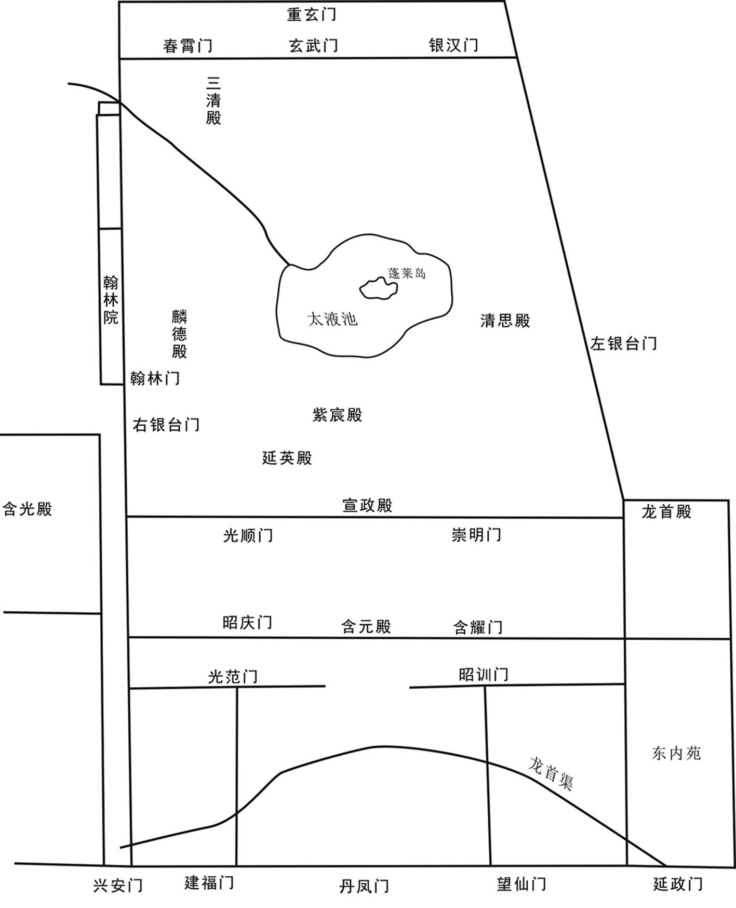 
唐大明宫示意图

[4]六军：这里指驻守唐朝皇宫北门的六支禁军：即左右羽林军、左右龙武军、左右神武军。在唐朝的宫殿布局中，皇帝的居住地（即宫城）在宫廷的北部，因此，驻守宫廷北门的北衙禁军的向背在历次宫廷政变中起决定性作用。

[5]延秋门：地名。位于长安城北的皇家专用的三个禁苑（又称西京三苑）的西边。

[6]愀（qiǎo）然：容色变动、悲伤、严肃的样子。　　赤子：刚出生的婴儿，或指百姓，也指纯洁善良的人。后比喻热爱祖国、对祖国忠诚的人。

[7]漏声：指铜壶滴漏之声。古人常用这种方法来计时，一昼夜为一百刻。　　三卫：唐朝中郎将府（禁军的一支）所统领的士兵分为亲卫、勋卫、翊卫三种，通称“三卫”，都以五品以上官员的子孙担任，负责宫廷内部宿卫，朝会时牵引仪仗。

[8]细民：又称伴当，为皇室、官府、地主、富豪服役之人，负责各种杂役，社会地位低下。

[9]大盈库：亦称百宝大盈库，唐朝皇帝私有的仓库之一。唐玄宗天宝四载（745年），王鉷（hóng）征剥天下财赋，每年向玄宗进献钱百亿万贯，凡是不属于国家正税的皆入百宝大盈库，以供天子私用，因此也被称为内库。唐肃宗至德年间，第五琦为度支盐铁使，向皇帝奏请以天下财赋所入皆归大盈库，供天子给赐，由宦官担任大盈库使，负责掌管这一仓库。从此，天下的财赋尽为君主私藏，中央相关的经济部门无法计算大盈库的财富。

## 【译文】

唐肃宗至德元载（756年）六月甲午（十二日），来上朝的朝廷官员不到十分之一二。玄宗亲自登上勤政楼，下制书，称自己打算亲征，听到这话的人们都不相信。玄宗任命京兆尹魏方进为御史大夫兼置顿使，京兆少尹、灵昌人崔光远为京兆尹，充西京留守，让将军边令诚掌管皇宫各道门的钥匙。然后，玄宗以剑南节度大使——颍王李璬即将到剑南地区任职为托词，命令剑南节度使储备东西。这一天，玄宗将天子的仪仗迁移到长安城北部的大明宫。当天晚上，玄宗命令龙武大将军陈玄礼整顿六支北衙禁军，赐给他们丰厚的钱财、丝织品，并挑选皇宫内的御用马九百多匹。宫外的人对这些一无所知。乙未（十三日）天刚亮，玄宗唯独与杨贵妃姐妹、皇子、皇妃、公主、皇孙、杨国忠、韦见素、魏方进、陈玄礼，以及跟自己亲近的宦官、宫人走出延秋门（逃离长安）。在外面的皇妃、公主、皇孙都被抛弃在那里。玄宗经过左藏，杨国忠请求放一把火将这一仓库烧掉，说：“这一仓库没有必要为叛贼留着。”玄宗悲伤地说：“叛贼来了，如果得不到东西，一定会向老百姓征收的。这样还不如把左藏留给他们，让他们不要重重地掠夺和伤害善良的子民。”这一天，仍然有入朝觐见皇帝的官员。他们到了皇宫门口，仍然听见铜壶滴漏的声音，负责仪仗的三卫仍然庄重、整齐地将仪仗立在前面。宫门既然已经开启了，宫人从皇宫中乱跑出来，宫廷内外都乱套了，大家不知道皇帝到哪里去了。于是，王公、官员和民众都向四处逃亡，山谷中的细民都争着闯入宫廷、王公的宅第，偷取金银、珠宝，或者坐着毛驴上宫殿。他们又焚烧了左藏大盈库。崔光远、边令诚带着人来救火，又临时招募人来暂时代理府、县官，派人分别把守皇宫，还杀了十几个人，局面才稍微安定下来。崔光远派遣他的儿子往东行进，去面见安禄山，边令诚也将唐朝皇宫宫门的钥匙献给安禄山。

## 【原文】

**上过便桥，杨国忠使人焚桥[1]。上曰：“士庶各避贼求生，奈何绝其路！”留内侍监高力士，使扑灭乃来[2]。上遣宦者王洛卿前行，告谕郡县置顿[3]。食时，至咸阳望贤宫，洛卿与县令俱逃，中使征召，吏民莫有应者[4]。日向中，上犹未食，杨国忠自市胡饼以献[5]。于是，民争献粝饭，杂以麦豆[6]。皇孙辈争以手掬食之，须臾而尽，犹未能饱[7]。上皆酬其直，慰劳之。众皆哭，上亦掩泣。有父老郭从谨进言曰：“禄山包藏祸心，固非一日。亦有诣阙告其谋者，陛下往往诛之，使得逞其奸逆，致陛下播越[8]。是以先王务延访忠良以广聪明，盖为此也。臣犹记宋璟为相，数进直言，天下赖以安平[9]。自顷以来，在廷之臣，以言为讳，惟阿谀取容，是以阙门之外，陛下皆不得而知[10]。草野之臣，必知有今日久矣，但九重严邃，区区之心，无路上达[11]。事不至此，臣何由得睹陛下之面而诉之乎！”上曰：“此朕之不明，悔无所及。”慰谕而遣之。俄而尚食举御膳以至，上命先赐从官，然后食之[12]。命军士散诣村落求食，期未时皆集而行[13]。夜将半，乃至金城[14]。县令亦逃，县民皆脱身走，饮食器皿具在，士卒得以自给。时从者多逃，内侍监袁思艺亦亡去。驿中无灯，人相枕藉而寝，贵贱无以复辨[15]。王思礼自潼关至，始知哥舒翰被擒。以思礼为河西、陇右节度使，即令赴镇，收合散卒，以俟东讨。**

## 【注文】

[1]便桥：地名，即便门桥。西汉武帝建元二年（前139年）初作便门桥，跨渡长安城西门渭水之上，桥北与西门相对，通向皇家的陵墓，其道是直路，人马好走。便桥位于今陕西咸阳西南九公里的秦都区钓鱼台乡资村西南沙河河道上，系汉、唐时期由长安通往西域、巴蜀的交通要道。

[2]内侍监：唐朝内侍省（掌管宫廷侍奉诸事务的官署，即宦官的衙署）的长官，从四品上。唐高祖武德四年（621年），置内侍省，以内侍（置四人，从四品上）、内常侍（置六人，正五品下）为长官和副官，掌管宫廷侍奉，出入皇宫，及宣传皇帝的诏书等，领掖庭、宫闱、奚官、内仆、内府五局。唐高宗龙朔二年（662年），改内侍省为内侍监。高宗咸亨元年（670年）复称内侍省。武则天垂拱元年（685年）改为司宫台。唐中宗神龙元年（705年）再改回内侍省。唐玄宗天宝十三载（754年），置内侍监为内侍省的长官，改内侍为少监，作为副官，不久又另置内侍，与少监同为副官。内侍省的属官有内常侍、内给（jǐ）事、内谒（yè）者监、内谒者、内寺伯、寺人等。

[3]顿：停顿，又指停宿的地方。

[4]咸阳：县名。即咸阳县，隶属于京兆府（长安），相当于今陕西咸阳。唐高祖武德二年（619年）置咸阳县。武周天授二年（691年），武则天以其母亲的陵墓在其界，将咸阳县升格。唐中宗重登皇位后，于神龙初年又复旧。　　望贤宫：唐朝皇室的离宫，在咸阳（今陕西咸阳）。

[5]饼：本义是古代面食的通称。后指扁圆形的面制食品。中国古代的小麦种植技术、面食是从西方传来的，因此饼又被称为胡饼。

[6]粝（lì）：粗粮，粗米。

[7]掬（jū）：双手捧取。

[8]播越：流亡。

[9]宋璟（jǐng）（663—737年）：唐前期大臣，玄宗开元时代的名相。邢州南和（今河北南和）人，于唐高宗调露年间考中进士。武则天统治时，宋璟累官至凤阁舍人（即中书舍人）、左台御史中丞，负责草拟皇帝的诏书。他因为揭露武则天宠爱的佞臣张易之兄弟的罪恶，以刚正不阿著称于时。又迁吏部侍郎兼谏议大夫，成为谏官。后被武三思（武则天的侄子）排挤，历任杭州（治今浙江杭州）、相州（治今河南安阳）等刺史。他在任清严。唐睿宗李旦重登皇位后，命宋璟以吏部尚书同中书门下三品，成为宰相。他改革典选流弊，裁撤冗官。不久，宋璟迁地方官，转广州（治今广东广州）都督，教人烧瓦，以代替茅草、竹子为屋，并改造店肆，颇有政绩。唐玄宗开元四年（716年），因为姚崇的推荐，宋璟代任吏部尚书，兼黄门监。第二年，改侍中，再次成为宰相。他为官务在择人，随才授任，刑赏无私，又减轻苛政。史称“姚崇善应变以成天下之务，璟善守文以持天下之正”，两人同为开元时代的名相，史称“姚宋”。开元八年（720年），宋璟被罢去知政事，即免去宰相的职权。他以尚书右丞相（从二品，官品很高，无实权）退休。宋璟有个人文集十卷，已经散佚。

[10]顷（qǐng）：时间短。近来，刚才，不久前。　　阿（ē）谀：迎合别人的意思，说好听的话。

[11]草野：民间。　　九重：古代皇帝所居之处有九重门，即路门、应门、雉门、库门、皋门、城门、近郊门、远郊门、关门。九门或九重又用以泛指皇宫。　　邃（suì）：深远。　　区区：形容数量少或不重要。自称的谦词，诚恳深切的样子。

[12]俄而：不久。　　尚食：即尚食局，殿中省所属的官署。设有奉御二员，正五品下，为长官；直长五员，正七品上，为副官；又有食医八员，正九品下；主食十六人。尚食局负责皇宫的储备、供给，给皇室成员准备各种食物。给皇帝进御膳时，必须辨时禁，先尝。皇帝设宴款待百官、宾客时，尚食局则与光禄寺共同按官品提供服务。

[13]期：预定的时间，一定的时间期限。　　未时：中国古代将一天划分为十二个时辰，每个时辰相当于现在的两个小时。古人根据中国十二生肖中的动物的出没时间来命名各个时辰。未时又称羊时、日跌、日央等，太阳偏西为日跌，即下午一点至下午三点。

[14]金城：县名。即金城县，为金城郡、兰州的治所，相当于今甘肃兰州。

[15]枕藉（jí）：藉，用草编的垫，引申为坐卧在某物上。枕藉，亦作“枕籍”，指纵横相枕而卧。言其多而杂乱。

## 【译文】

玄宗一行经过了便桥，杨国忠指使人放火焚烧这座桥。玄宗说：“现在无论是士大夫还是平民都想避开叛贼，求一条生路，为什么要断绝他们的这条道路呢！”玄宗留下内侍监高力士，让他将便桥上的火扑灭，再跟上来。玄宗派遣宦官王洛卿在前面打前哨，向郡县传达皇帝的口谕，请当地官员做好准备，接待皇帝一行。到了吃饭的时候，玄宗的人马到达咸阳县的望贤宫，王洛卿与咸阳县县令却都逃跑了。玄宗派遣宦官去召集人，官吏和民众却没有人应召。到了中午，玄宗仍然没有吃饭，杨国忠自己到市场上买了一些胡饼，献给玄宗充饥。于是，民众争相向皇帝进献粗粮制成的米饭，中间夹杂着一些小麦、豆子。皇帝的孙子们争着用双手捧取，塞进嘴巴里，一会儿就吃光了，但他们仍然没有吃饱。玄宗都出钱感谢进献食物的百姓、慰劳他们。民众都哭了，玄宗也用袖子遮着自己的脸哭泣。有一位老人郭从谨向玄宗进言，说：“安禄山包藏祸心，已经不是一天两天的事了。也曾经有人到皇宫控诉他的阴谋，可是陛下您往往将他们杀死。这使得安禄山这个叛逆之臣称心如意，得以起兵反叛朝廷，致使陛下您离开京城，流亡在外。先代的帝王必须向忠厚、善良的大臣征询意见，以使自己的耳朵和眼睛灵敏，他们之所以能够成为圣贤，就是这个原因。我现在仍然记得当年宋璟担任宰相的时候，屡次向陛下您进直言，天下因为这个原因而安宁、太平。近来，皇宫里的大臣都不愿意直言，只知道阿谀奉承以讨取陛下您的欢心。因此，皇宫之外的情形，陛下您都不会知道。民间的臣民，都是早就知道安禄山会叛乱，但是，皇宫的门槛实在是太森严了，有九重之多呀，我们平民百姓拥有一片诚恳深切的心，却没有道路能向上到达陛下您那里去表达呀。如果事情不是落到这个地步，我怎么可能亲眼目睹陛下的真面目，还能当着您的面向您诉说这些啊！”玄宗说：“这是我自己不明察，现在后悔都来不及了。”玄宗慰劳了郭从谨，然后把他打发走了。不久，尚食局做好了皇帝专用的御膳，送到这里，玄宗命令将这些食物先赐给跟随自己的侍从官享用，然后自己才吃。玄宗命令军官和士兵分散到附近的村庄去乞讨食物，约定下午一点至三点之间回到这里集合，继续行军。快到半夜，玄宗一行到达金城。金城县的县令也逃跑了，当地的民众也都只身逃跑了，他们的饮食和各种器具还都留在那里，随行的将士们得以自己烹煮食物。当时，玄宗的很多随从都逃走了，内侍监袁思艺也逃走了。驿站中连灯都没有。人们都横竖杂乱地睡在用草编成的垫子上，身份的贵贱都没有办法分清。王思礼从潼关到达这里，玄宗才知道哥舒翰被叛军俘虏了。玄宗任命王思礼为河西、陇右节度使，命令他马上到节度使的驻地，去收合已经散落的士兵，以等待向东征讨叛军。

## 【原文】

**丙申，至马嵬驿，将士饥疲，皆愤怒。陈玄礼以祸由杨国忠，欲诛之，因东宫宦者李辅国以告太子，太子未决[1]。会吐蕃使者二十余人遮国忠马，诉以无食，国忠未及对，军士呼曰：“国忠与胡虏谋反。”或射之，中鞍[2]。国忠走至西门内，军士追杀之，屠割支体，以枪揭其首于驿门外，并杀其子户部侍郎暄及韩国、秦国夫人[3]。御史大夫魏方进曰：“汝曹何敢害宰相？”众又杀之。韦见素闻乱而出，为乱兵所，脑血流地[4]。众曰：“勿伤韦相公。”救之，得免。军士围驿，上闻喧哗，问外何事，左右以国忠反对。上杖屦出驿门，慰劳军士，令收队，军士不应[5]。上使高力士问之，玄礼对曰：“国忠谋反，贵妃不宜供奉，愿陛下割恩正法。”上曰：“朕当自处之。”入门，倚杖頫首而立[6]。久之，京兆司录韦谔前言曰：“今众怒难犯，安危在晷刻，愿陛下速决。”[7]因叩头流血。上曰：“贵妃常居深宫，安知国忠反谋。”高力士曰：“贵妃诚无罪，然将士已杀国忠，而贵妃在陛下左右，岂敢自安！愿陛下审思之，将士安则陛下安矣。”上乃命力士引贵妃于佛堂，缢杀之，舆尸寘驿庭，召玄礼等入视之[8]。玄礼等乃免胄释甲，顿首谢罪[9]。上慰劳之，令晓谕军士。玄礼等皆呼万岁，再拜而出。于是始整部伍为行计。谔，见素之子也。国忠妻裴柔与其幼子晞及虢国夫人、夫人子裴徽皆走，至陈仓，县令薛景仙帅吏士追捕，诛之[10]。**

## 【注文】

[1]李辅国（704—763年）：唐肃宗朝大宦官。本名静忠，初为闲厩小儿，负责看管皇室的马匹，依附于高力士，后入东宫侍奉皇太子李亨（后来的唐肃宗）。唐玄宗天宝十五载（756年），玄宗为避安史之乱而逃奔蜀地。李辅国献计于李亨，请太子分兵前往朔方节度使的治所灵武（今宁夏吴忠）。不久，太子到达灵武，并即皇帝位。李辅国因拥立之功赐名护国，不久改为辅国。唐军收复长安后，李亨回到京城，任命李辅国为殿中监，领闲厩诸使，掌管皇室的马匹，进封郕（chéng）国公，又任兵部尚书。当时，宰相、其他臣僚、各官署向皇帝奏事，都要通过李辅国送到皇帝那里裁决。李辅国与肃宗的张皇后互为表里，诬杀肃宗的儿子建宁王李倓（tán），幽禁已经退位的太上皇玄宗。李辅国还求当宰相，未得。公元762年，李辅国与宦官程元振合谋，杀死张皇后，肃宗受到惊吓而死。李辅国等于是拥立太子李俶（chù）（肃宗的长子，非张皇后所生，即唐代宗）即皇帝位。代宗尊李辅国为尚父（本意为可尊敬的父辈，常用作尊礼大臣的称号），加司空、中书令，带宰相之衔。代宗政无巨细，都委任李辅国参与决策。代宗虽然讨厌李辅国的骄横，但念其拥立自己登基之功，又掌握禁军，只得先夺去李辅国的权力，然后派人将李辅国刺杀。

[2]鞍：放在马背上承载重物或供人骑坐的器具。

[3]暄：音xuān。　　韩国、秦国夫人：参见前“贵妃三姊”条注。

[4]（zhuā）：马鞭；打，打击。

[5]屦（jù）：古代用麻、葛（多年生草本植物，茎可编篮做绳，纤维可织布，块根肥大，称“葛根”，可制淀粉，亦可入药）制成的一种鞋；践踏。

[6]頫（fǔ）：同“俯”。

[7]京兆司录：官名。即京兆府的司录参军事，又称司录参军。唐玄宗开元元年（713年），改京兆府录事参军事置司录参军事。其后，其他的陪都也设司录参军事。首都和陪都设司录参军事二人，正七品上，负责掌管符印，参议地方政事、得失。　　谔：音è。　　晷（guǐ）：日影，比喻为时光、时间。

[8]寘（zhì）：同“置”。

[9]胄（zhòu）：头盔。

[10]虢国夫人：参见前“贵妃三姊”条注。

## 【译文】

唐肃宗至德元载（756年）六月丙申（十四日），玄宗的人马到达马嵬驿，将士们感到饥饿、疲惫，都很愤怒。陈玄礼认为这一切的灾祸都是由杨国忠引起的，就想杀了他。陈玄礼通过东宫的宦官李辅国将这一计划告诉太子，太子没有下决断。恰逢二十多名吐蕃的使者拦住杨国忠的马，向他控诉自己没有东西吃，杨国忠还没有来得及应答，军士当中就有人高呼：“杨国忠与胡人串通谋反。”有的士兵向杨国忠射箭，正好射中了他的马鞍。杨国忠跑到驿站的西门内，军士们追上了他，将他杀死，并把他的身体切割成几块，用枪割下他的人头，悬挂于驿站的门外。军士们还杀死了杨国忠的儿子户部侍郎杨暄，及韩国夫人、秦国夫人。御史大夫魏方进说：“你们这帮人怎么胆敢残害宰相？”将士们又杀死了魏方进。韦见素听见了叛乱的声音，就走了出来。他也被乱兵击打，脑袋出血了，血流在地上。军士们说：“不要伤害了韦相公。”有士兵营救韦见素，所以他得以免除一死。军士们将皇帝下榻的驿站团团围住。玄宗听见外面的嘈杂声，就问出了什么事情，左右侍从回答说是杨国忠造反。玄宗手拿拐杖，脚踏着地走出了驿站的门，对军士们表示慰问，然后命令他们把队伍收起来，将士们不答应。玄宗派遣高力士去问他们（为什么不收队伍），陈玄礼回答道：“杨国忠谋反，杨贵妃自然不应当侍奉在皇上身边，但愿陛下您能够割弃儿女私情，将贵妃就地正法。”玄宗说：“我应当自己处理这件事。”玄宗走进驿站的门，依靠着拐杖，把头低下，一直站立着。过了很久，京兆府司录参军事韦谔走到玄宗的跟前，说：“现在咱们难以违背众人的意思，个人的安危就在一瞬间。但愿陛下您能够迅速地做出决断。”他趁机向玄宗叩头，叩得脑袋都流血了。玄宗说：“贵妃常在皇宫中居住，怎么可能知道杨国忠谋反呢。”高力士说：“贵妃当然无罪了，但是将士们已经杀死了杨国忠，而贵妃却依然侍奉在陛下您的身边，这叫将士们如何能心安啊！但愿陛下审慎地考虑这件事情。只有将士们安定了，陛下您才会安宁啊。”玄宗于是命令高力士将杨贵妃引到佛堂，把她勒死，然后用车载着贵妃的尸体，放置驿站的庭院中，召来陈玄礼等人进去看。陈玄礼（看了杨贵妃的尸体之后）就解下头盔，脱下身上的铠甲，向玄宗磕头谢罪。玄宗慰劳他，并命令他向军士们传达自己的口谕。陈玄礼等将士们都对玄宗高喊万岁，再次拜见了玄宗，然后走出了驿站。于是，军士们开始整顿队伍，准备进一步向前行军。韦谔是韦见素的儿子。杨国忠的妻子裴柔、幼子杨晞，以及虢国夫人、夫人的儿子裴徽都逃跑了。他们逃到陈仓，县令薛景仙率领官吏和士兵追上他们，将他们全部杀掉。

## 【原文】

**丁酉，上将发马嵬，朝臣惟韦见素一人，乃以韦谔为御史中丞，充置顿使。将士皆曰：“国忠谋反，其将吏皆在蜀，不可往。”或请之河、陇，或请之灵武，或请之太原，或言还京师[1]。上意在入蜀，虑违众心，竟不言所向。韦谔曰：“还京，当有御贼之备。今兵少，未易东向，不如且至扶风，徐图去就。”上询于众，众以为然，乃从之。及行，父老皆遮道请留，曰：“宫阙，陛下家居，陵寝，陛下坟墓，今舍此，欲何之？”[2]上为之按辔久之，乃命太子于后宣慰父老[3]。父老因曰：“至尊既不肯留，某等愿帅子弟从殿下东破贼，取长安[4]。若殿下与至尊皆入蜀，使中原百姓谁为之主？”[5]须臾聚至数千人。太子不可，曰：“至尊远冒险阻，吾岂忍朝夕离左右。且吾尚未面辞，当还白至尊，更禀进止。”[6]涕泣，跋马欲西[7]。建宁王倓与李辅国执鞚谏曰：“逆胡犯阙，四海分崩，不因人情，何以兴复[8]！今殿下从至尊入蜀，若贼兵烧绝栈道，则中原之地，拱手授贼矣[9]。人情既离，不可复合，虽欲复至此，其可得乎？不如收西北守边之兵，召郭、李于河北，与之并力，东讨逆贼，克复二京，削平四海，使社稷危而复安，宗庙毁而更存，扫除宫禁以迎至尊，岂非孝之大者乎[10]！何必区区温凊，为儿女之恋乎！”[11]广平王俶亦劝太子留[12]。父老共拥太子马，不得行。太子乃使俶驰白上。上总辔待太子，久不至，使人侦之，还白状，上曰：“天也！”[13]乃命分后军二千人及飞龙厩马从太子，且谕将士曰：“太子仁孝，可奉宗庙，汝曹善辅佐之。”[14]又谕太子曰：“汝勉之，勿以吾为念。西北诸胡，吾抚之素厚，汝必得其用。”太子南向号泣而已[15]。又使送东宫内人于太子[16]。且宣旨欲传位，太子不受。俶、倓，皆太子之子也。**

## 【注文】

[1]灵武：县名。即灵武县，朔方节度使的治所，相当于今宁夏吴忠。

[2]陵：本义大土山，引申为帝王的坟墓。　　寝：古代帝王家的宗庙分为两个部分，后面停放牌位和先人遗物的地方叫“寝”，前面祭祀的地方叫“庙”，合称“寝庙”。

[3]宣慰：大臣代表皇帝视察某一地区，宣扬政令，安抚百姓。

[4]殿下：原指殿阶之下，后来成为中国对皇族成员的尊称，次于代表君主的陛下。汉朝开始称呼太子、诸王为殿下，三国开始皇太后、皇后也称殿下。唐代以后只有皇子、皇后、皇太后可以称为“殿下”。

[5]中原：又称中土、中州，为中华文明的发源地。在古代，中原被华夏民族视为天下的中心，以区别于边疆地区而言。夏朝和商朝曾建都于中原地区的商丘、安阳、郑州等。自汉朝起，中原地区的洛阳、南阳、开封成为王侯将相建都之地。广义的中原是以中原六大古都群（洛阳、开封、商丘、安阳、郑州、南阳）为中心，辐射黄河中下游一带的广大平原地区；狭义的中原即指今河南一带。

[6]禀：下对上报告。

[7]跋马：勒马使回转。

[8]建宁王倓（tán）：即李倓（？—757年），唐肃宗李亨之第三子，宫人张氏所生。有才略，善骑射。唐玄宗天宝年间被封为建宁王。安禄山造反后，李倓于第二年跟随玄宗西奔，至马嵬驿，说服其父分兵北上，并率领骑兵力战开道。至灵武，李倓和一部分朝臣、朔方军将领共同拥护其父即皇帝位。当时，宦官李辅国与肃宗的宠妃张良娣（后来被立为皇后）都非常得肃宗的宠信，李倓却在肃宗面前揭发这二人的罪恶。后来，李辅国、张良娣诬陷李倓心怀异志，李倓被肃宗赐死。唐代宗大历三年（768年），代宗李豫（李倓的长兄，本名李俶）下诏为他平反，追谥为承天皇帝。　　鞚（kòng）：带嚼子（为便于驾驭，横放在牲口嘴里的小铁链，两端连在笼头上，多用于马、牛）的马笼头。

[9]栈道：原指沿着悬崖峭壁修建的一种道路，多用木制。又称阁道、复道。中国古代高楼间架空的通道也称栈道。

[10]社稷：社，本指土地之神，按方位命名：东方青土，南方红土，西方白土，北方黑土，中央黄土。五种颜色的土覆于坛面，称五色土，实际象征国土。古代又将祭祀土地的地方、日子和祭礼都叫社。稷，本是五谷之神中特指原隰（xí）之祇，即能生长五谷的土地神祇，这是农业之神。社稷在古代指帝王、诸侯所祭祀的土神和谷神，亦用作国家的代称。历代王朝都非常重视祭祀社稷之礼，定为最高等级的祭典，由皇帝亲自祭祀。　　宗庙：亦称宗、宗室、祖庙。从周代开始，宗庙成为天子、诸侯祭祀祖先的场所。按制度规定，天子的宗庙立七庙，诸侯的立五庙。天子、诸侯平时祭祀宗庙，凡是有大事，包括会盟、征伐、爵命、大婚等，都在宗庙进行。汉代宗庙之制与周代不同，每一个皇帝即位，则立一庙，其数目不止七。王莽代汉，又立九庙。东汉后期，权移臣下，宗庙制度也混乱不经。其后，历朝宗庙虽各有不同，但没有大的差异。

[11]温凊（qìng）：冬温夏凊的省称。冬天温被使暖，夏天扇席使凉，指侍奉父母之礼。也指寒暖，借指生活起居。或指温存体贴。

[12]广平王俶（chù）：即唐代宗李豫（727—779年），本名俶，后改名豫。唐肃宗李亨的长子，宫人吴氏（后被追封为章敬皇后）所生，公元762年至779年在位。初封广平郡王。唐肃宗即皇帝位后，封李俶为天下兵马元帅，负责征讨安、史叛军。李俶与郭子仪等将领收复了西京长安和东都洛阳。他即皇帝位后，再借回纥兵助讨史思明之子史朝义，平定了安史之乱，并以叛军的降将为河北各藩镇的节度使。他先后除去专权的宦官李辅国、程元振、鱼朝恩。广德初年，吐蕃进扰，代宗被迫逃到陕州（今河南三门峡西旧陕县）。代宗起用郭子仪收复西京长安，但边患却一直没有停止。代宗任用刘晏整顿漕运和财政，又重用元载，追征欠税。及元载弄权受贿，又将他杀死。代宗受元载、王缙（jìn）的影响，笃信佛教，敌军入侵则令僧人诵《护国仁王经》以祈祷消除灾难。他广度僧尼、修建寺庙，所费亿万钱。他对河北地区的藩镇无力控制，中央威势衰落、藩镇割据于是成为定局。死后葬元陵（今陕西富平西北），谥睿文孝武皇帝，庙号代宗。

[13]总辔（pèi）：系马，指停驻。

[14]飞龙厩（jiù）：即飞龙禁军，是唐朝负责守卫宫廷的一支禁军。唐武则天万岁通天元年（696年）设立，用宫中的宦官统领，掌管皇宫的飞龙厩马。飞龙禁军不仅饲养、调习御马，而且训练有素，是宦官掌握的一支精锐骑兵。

[15]号（háo）：大声喊叫。

[16]内人：屋内之人的意思。泛指妻妾，或专对他人称呼自己的妻子。书面语也称内助。

## 【译文】

唐肃宗至德元载（756年）六月丁酉（十五日），玄宗正要从马嵬驿出发，留在他身边的大臣就只有韦见素一个人，于是玄宗任命他的儿子韦谔为御史中丞，充置顿使。将士们都说：“杨国忠谋反，他亲信的将士、官吏都在蜀地，我们不能到那里去。”有人请玄宗到河西或陇右节度使的辖地，有人请玄宗到灵武，有人请玄宗到太原，也有人说返回京城长安。玄宗心里还是想到蜀地去，但又担心违背众人的意思，竟然不说自己打算到哪里去。韦谔说：“如果回到京城，我们就应当有防御叛贼的充分准备。可是，现在我们的兵少，向东返回京城恐怕不容易，不如暂时到扶风郡，再慢慢地谋划往哪里去。”玄宗向众人询问这一计划，大家都认为可行，于是就跟从玄宗（前往扶风郡）。等到要出发了，父老乡亲们都拦着道路，请求皇帝留下。他们说：“皇宫是陛下居家生活的地方，陵墓和寝庙是陛下家族的坟墓所在地。现在陛下舍弃了这些地方，是想干什么呀？”玄宗听了这番话，手按着驾马的缰绳，犹豫了很久，于是命令太子在后面负责安抚这些父老乡亲。父老乡亲们趁机劝太子：“至尊既然不肯留下来，我们愿意率领自己的儿子、兄弟，跟随太子殿下向东征讨，打败叛贼，夺回长安。如果殿下您和至尊都逃到蜀地，谁来当中原百姓的主人啊？”不久，在太子的旗下就聚集了几千人。太子认为不能这样做，就对乡亲们说：“至尊正在远处冒着艰难险阻行走，我怎么忍心离开他呢。而且，我还没有当面向他辞行。我应当回去向至尊讲明情况，将我改变计划的事情向他报告。”正说着，太子就哭了起来，勒马回转想往西走。建宁王李倓与李辅国手执太子的马笼头，规劝他：“叛逆的胡人正在进攻长安，各地都分崩离析了。我们如果不顺应民情，怎么兴复唐室！现在殿下您如果跟从至尊到蜀地去，假如叛贼放火烧掉从蜀地进入中原地区的栈道，那么中原地区就拱手让给叛贼了呀。到那时，天下的人情已经疏离唐室，就不可能重新复合。虽然我们想复合这种感情和关系，但那能成吗？我们不如先收集西北地区守卫边疆的士兵，召郭子仪和李光弼到河北地区，与他们携手并力，向东征讨叛贼，收复长安和洛阳两京，平定各地，使大唐江山转危为安，已经被叛贼毁坏的宗庙重新立起来，把皇宫打扫得干干净净，迎接至尊回来，这不是您对皇上的大孝吗！何必在意这一点小小的侍奉父母之礼、儿女对父母的依恋之情呢！”广平王李俶也劝太子留下来。父老乡亲们共同簇拥着太子所骑的马，使太子不能前进。太子于是派遣李俶骑着快马飞奔，将这里的情况告诉了玄宗。玄宗停下马等待太子，太子很久都没有追赶上来。玄宗派人去侦察，侦察的人回来，将太子那里的情况禀报给玄宗，玄宗听了，说：“这是天意啊！”于是命令将后军二千人，以及飞龙厩的马拨给太子，而且告诉将士们：“太子是仁孝之人，可以祭祀唐室的祖宗之庙（借喻继承皇位），你们要好好辅佐他。”玄宗又嘱咐太子：“你要努力做，不要挂念我。至于西北地区的各族（在唐朝西北边疆守卫的士兵很多都不是汉人），我一向用优厚的待遇安抚他们，你一定能够任用他们为自己效力。”太子只是向着南边（玄宗的所在地）大声喊叫、哭泣而已。玄宗又派人将太子的姬妾给他送去。而且，玄宗宣布打算传位给太子，太子却不接受。李俶、李倓都是太子的儿子。

## 【原文】

**己亥，上至岐山[1]。或言贼前锋且至，上遽过，宿扶风郡。士卒潜怀去就，往往流言不逊，陈玄礼不能制，上患之[2]。会成都贡春彩十余万匹至扶风，上命悉陈之于庭，召将士入，临轩谕之曰：“朕比来衰耄，托任失人，致逆胡乱常，须远避其锋[3]。知卿等皆苍猝从朕，不得别父母、妻子，苃涉至此，劳苦至矣，朕甚愧之[4]。蜀路阻长，郡县褊小，人马众多，或不能供[5]。今听卿等各还家，朕独与子孙、中官前行入蜀，亦足自达。今日与卿等诀别，可共分此彩，以备资粮。若归，见父母及长安父老，为朕致意，各好自爱也。”因泣下沾襟，众皆哭曰：“臣等死生从陛下，不敢有贰。”上良久曰：“去留听卿。”[6]自是流言始息。**

## 【注文】

[1]岐山：县名。即岐山县，隶属于扶风郡、岐州，相当于今陕西岐山。

[2]逊：谦逊、恭顺。

[3]成都：即成都府、蜀郡、益州，治成都（今四川成都），辖成都、华阳、新都、新繁、郫（pí）县、犀浦、双流、广都、温江、灵池县，相当于今四川成都、新都、新繁、郫县、郫县东南犀浦镇、双流及附近地区、温江、成都东南龙泉驿。　　耄（mào）：年老，引申为昏乱、糊涂。

[4]苍猝：匆忙、慌张。　　苃（yǒu）：古书上所说的一种草。

[5]褊（biǎn）：狭小、狭隘。

[6]良久：很久。

## 【译文】

唐肃宗至德元载（756年）六月己亥（十七日），玄宗到达岐山。有人传言叛贼的前锋快要攻到这里了，玄宗十分仓促地过了岐山，住在扶风郡。士兵们偷偷地藏有离开玄宗而逃走的心思，常常传布不恭顺的流言蜚语，身为禁军将领的陈玄礼却无法阻止这种现象。玄宗对此事感到忧虑。当时恰逢成都向朝廷进贡的十几万匹春彩（丝织品的一种）运送到扶风郡，玄宗命令将这些丝织品全部陈列在庭院中，召集将士到这里，站在房前的屋檐下和台阶之间，告诉大家：“我已经衰老了，将国家事务托付给了不该托付的人，结果导致叛逆的胡人造反，国家陷入混乱。现在我们必须往远处走，以避开叛军的锋芒。我知道你们都是匆匆忙忙地跟从于我，来不及向父母、妻子、儿女告别。你们跋涉到这个地方，已经非常辛苦了，我感到十分惭愧。通向蜀地的道路险要、难走，还很长，而且沿途的郡或县都规模狭小。我们的人和马数量很多，可能无法供给我们的食宿。现在任凭你们各自回家，我唯独与我的儿子、孙子、宦官向前，往蜀地行走，也能够自己到达目的地。现在，我与你们告别。你们可以一起分这些丝织品，用来作为你们回去的钱和粮食。如果你们回到家里，见到自己的父母以及长安的父老乡亲，请代我问候他们。你们各自爱护好自己吧。”玄宗边说边哭泣，泪水润湿了他的衣襟。将士们（听了玄宗的这番话）都哭了，说：“我们无论是死还是生，都愿意追随陛下，不敢有二心。”玄宗沉默了很久，才说：“是去还是留，都由你们自己决定。”从此以后，军中的流言平息了。

## 【原文】

**太子既留，未知所适[1]。广平王俶曰：“日渐晏，此不可驻，众欲何之？”皆莫对。建宁王倓曰：“殿下昔尝为朔方节度大使，将吏岁时致启，倓略识其姓名[2]。今河西、陇右之众皆败降贼，父兄子弟多在贼中，或生异图。朔方道近，士马全盛，裴冕衣冠名族，必无贰心[3]。贼入长安方虏掠，未暇徇地，乘此速往就之，徐图大举，此上策也。”众皆曰：“善。”至渭滨，遇潼关败卒，误与之战，死伤甚众[4]。已，乃收余卒，择渭水浅处，乘马涉渡，无马者涕泣而返[5]。太子自奉天北上，比至新平，通夜驰三百余里，士卒器械失亡过半，所存之众不过数百[6]。新平太守薛羽弃郡走，太子斩之。是日至安定，太守徐瑴亦走，又斩之[7]。**

## 【注文】

[1]适：到……去。

[2]朔方节度大使：朔方节度的最高长官。在唐玄宗时代，边疆地区的各节度大使，往往由中央的亲王或重臣挂职，并不到当地去具体管事。副大使实际管理本节度一切事务，成为实际上的长官。　　启：古代一种文体。通常用于下对上，表示告别或慰问。

[3]衣冠：泛指古代的官僚、士大夫。魏晋南北朝时为士族门阀（统治阶级内部的世代显贵之家，后演变为以门阀为依据的等级观念和制度）的别名。唐朝中期以后，由于科举制度发展，考中科举的人越来越多，逐渐形成特殊的户等，称为“衣冠户”。唐武宗统治时期，国家以法律形式确定，只有考中科举，尤其是进士（科举考试的科目之一，主要考查文章、诗赋）及第者，才可称为“衣冠户”。“衣冠户”不仅免除全家的差发、徭役，还缴纳轻税。唐朝末年，有些衣冠户利用其特权、地位，广置田产，包庇其他富户逃避赋税、徭役，朝廷曾多次下令禁止。

[4]渭：水名。即渭水，又称渭河。渭水是黄河的第一大支流，发源于甘肃渭源的鸟鼠山，由陕西潼关汇入黄河。渭河全长七百八十七公里，流域包括今甘肃、宁夏、陕西三省区，总面积十三万四千七百六十六平方公里，其中陕西占50％，甘肃占44％。

[5]涉：蹚水过河。

[6]奉天：县名。即奉天县，唐高宗李治与其皇后武则天的合葬墓——乾陵位于此地，隶属于雍州、京兆府，相当于今陕西乾县。　　新平：地名。即新平郡、邠（bīn）州，治新平（今陕西彬县），辖新平、三水、永寿、宜禄县，相当于今陕西彬县、旬邑北畔村后陇川堡、永寿、长武。

[7]安定：地名。即安定郡、泾州，治安定（今甘肃泾川北），辖安定、临泾、灵台、良原、潘原县，相当于今甘肃泾川北、灵台、灵台西北梁原镇、平凉东泾水北。　　瑴：音jué。

## 【译文】

太子既然已经留下来了，但不知道该前往什么地方去。广平王李俶问：“现在天色渐渐晚了，此地不可久留，大家想到什么地方去？”大家都无法回答。建宁王李倓站出来说：“殿下曾经是朔方节度大使，朔方节度的将士、官吏每年定期都向您进献启，表示问候。我李倓稍微知道他们的姓名。现在，河西节度、陇右节度的士兵都败于叛军，并向叛贼投降。他们的父母、兄弟、儿女很多都落入叛贼之手，因此，这批人可能会对朝廷产生异心。朔方节度离这里近，而且他们兵强马壮，裴冕出自衣冠名族，对朝廷一定没有二心。叛贼刚刚进入长安，正忙着抢掠，还无暇带兵巡视刚占领的地方。我们应该趁此时机迅速前往朔方，然后再慢慢商议平定叛乱的方法，这是上策啊。”大家都说：“这一计策好。”太子的人马到达渭水的边上，遇见在潼关被叛贼打败的官军。太子手下的将士不明就里，错将这批士兵当成敌人，与他们打仗，打死或打伤很多人。这场仗结束后，太子的人马才聚集起残余的士兵，选择渭水河道中水浅的地方，骑着马蹚水渡过了渭河。没有马的人只好哭泣着返回了原地。皇太子从奉天往北行军。等快要抵达新平时，他们在整个夜间都快速骑马，飞奔了三百多里，士兵、军用器械的丢失超过一半，太子身边留下的士兵不过才几百人。新平郡太守薛羽放弃了本郡，逃跑了。太子将薛羽斩杀。这一天，太子一行到达安定郡，太守徐瑴也逃跑了。太子又斩杀了徐瑴。

## 【原文】

**辛丑，上发扶风，宿陈仓。**

## 【译文】

唐肃宗至德元载（756年）六月辛丑（十九日），玄宗从扶风郡出发，在陈仓县留宿。

## 【原文】

**太子至乌氏，彭原太守李遵出迎，献衣及糗粮[1]。至彭原，募士，得数百人。是日至平凉，阅监牧马，得数万匹，又募士，得五百余人，军势稍振[2]。**

## 【注文】

[1]乌氏：县名。即乌氏县，北魏所置，约北周、隋间废。治今甘肃泾川东北，其故地在唐代隶属于安定郡。　　彭原：地名。即彭原郡、宁州，治定安（今甘肃宁县），辖定安、彭原、真宁、定平、襄乐、丰义县，相当于今甘肃宁县、镇原东、正宁西南罗川镇、正宁西南政平镇、宁县东北湘乐镇、镇原东南。　　糗（qiǔ）：干粮，炒熟的米或面等。

[2]平凉：地名。即平凉郡、原州，治平高（今宁夏固原），辖平高、百泉、萧关、平凉县，相当于今宁夏固原及附近地区、同心东南、甘肃平凉。

## 【译文】

太子到达乌氏县，彭原郡太守李遵出来迎接，献上衣服及干粮。太子到达彭原郡，招募士兵，招到了几百人。这一天，太子到达平凉郡，视察了当地监牧使所饲养的官马，又得到几万匹马。他又在当地招募士兵，得到五百多人。这样，太子统领的军队的势力才稍微振作起来。

## 【原文】

**壬寅，上至散关，分扈从将士为六军[1]。使颍王璬先行诣剑南，寿王瑁等分将六军以次之。丙午，上至河池郡，崔圆奉表迎车驾，具陈蜀土丰稔，甲兵全盛[2]。上大悦，即日以圆为中书侍郎、同平章事，蜀郡长史如故[3]。以陇西公瑀为汉中王、梁州都督、山南西道采访防御使[4]。瑀，琎之弟也[5]。**

## 【注文】

[1]散关：地名。位于今陕西宝鸡市西南大散岭上。当秦岭的孔道，扼四川、陕西的交通咽喉，为古代军事必争之地。

[2]河池郡：地名。即凤州，治梁泉（今陕西凤县东北凤州镇），辖梁泉、黄花、两当、河池县，相当于今陕西凤县东北凤州镇及附近地区、甘肃两当东杨家店、徽县西银杏镇。　　稔（rěn）：庄稼成熟，引申为事物酝酿成熟。

[3]蜀郡：参见前“成都”条注。

[4]陇西公瑀（yǔ）：即李瑀，生卒年不详，唐睿宗李旦之孙、让皇帝李宪（唐睿宗长子，肃明皇后刘氏所生，死后赠为让皇帝）之子。李瑀早有才望，身材魁梧，一表人才。始封陇西郡公，正二品，食邑二千户。安禄山叛乱后，李瑀跟从唐玄宗逃往蜀地。经过河池郡，被封为汉中王、山南西道防御使。唐肃宗乾元初，宁国公主远嫁回纥去和亲，肃宗诏李瑀以特进、太常卿持节册拜回纥可汗为威远可汗。肃宗下诏收群臣之马助战，李瑀与魏少游等坚持认为不可。肃宗发怒，贬李瑀为蓬州（治良山，今四川营山东北）长史。死后赠太子太师，谥曰“宣”。　　汉中：地名。即汉中郡、梁州，治南郑（今陕西汉中东），辖南郑、褒城、城固、西县、金牛、三泉县，相当于今陕西汉中东、汉中西北大钟寺、城固东、勉县西老城、宁强东北金牛驿、宁强西北阳平关。梁州处于秦岭、巴山之间，地当南北孔道，经过此地可以向南至蜀地。　　梁州：地名。即汉中郡。　　都督：唐朝地方军政长官，总揽一州或郡的事务。唐太宗贞观年间，分为大、中、下都督府，皆置都督一人。大都督府的都督为从二品，中都督府正三品，下都督府从三品。梁州为中都督府，其都督为正三品。　　山南西道：唐朝监察区，治梁州。山南东道和山南西道就是原山南道分为东、西两部分。山南道的辖境东接荆楚，西抵陇山、蜀地，南控长江，北据商华之山，相当于今陕西秦岭、甘肃西秦岭、河南伏牛山以南，重庆和湖北嘉鱼之间长江以北，四川嘉陵江流域以东，河南白河流域及湖北涢（yún）水以西各地。山南东、西道的分界线在今陕西石泉和洋县之间，四川云阳和开县之间，重庆丰都和涪陵之间。

[5]琎（jīn）：即李琎，生卒年不详，唐睿宗李旦之嫡孙，让皇帝李宪的长子。封汝阳王，官至太仆卿，后又得到酿王的封号。他擅长弓及羯鼓（一种乐器），深得唐玄宗喜爱。据闻他曾获唐玄宗亲自教授羯鼓。

## 【译文】

唐肃宗至德元载（756年）六月壬寅（二十日），玄宗到达散关，将扈从他的军将和士兵分为六个军。玄宗派遣颍王李璬先前往剑南节度使的治所成都，寿王李瑁等分别统领六军，跟在李璬的后面到成都。六月丙午（二十四日），玄宗抵达河池郡，崔圆奉表前来迎接玄宗的车驾，并向玄宗具体陈述了蜀地庄稼丰收，士兵、铠甲兴盛的情况。玄宗听了非常高兴，当天就任命崔圆为中书侍郎、同平章事（带宰相之衔），仍然负责蜀郡长史的事务。玄宗任命陇西公李瑀为汉中王、梁州都督、山南西道采访防御使。李瑀是李琎的弟弟。

## 【原文】

**王思礼至平凉，闻河西诸胡乱，还，诣行在。初，河西诸胡部落闻其都护皆从哥舒翰没于潼关，故争自立，相攻击；而都护实从翰在北岸，不死，又不与火拔归仁俱降贼[1]。上乃以河西兵马使周泌为河西节度使，陇右兵马使彭元耀为陇右节度使，与都护思结进明等俱之镇，招其部落[2]。以思礼为行在都知兵马使。**

## 【注文】

[1]都护：唐代管理边疆地区的军政官员。唐太宗至武则天时期，先后设置安东、安北、安西、安南、单（chán）于、北庭六大都护府。单于、安西、安北为大都护府，安南、安东、北庭为上都护府。每府设有大都护、副大都护（或副都护），分别为长官和副官，可简称都护，负责管理辖境的边防、行政和族群事务。同时，唐廷也对一些归附中原王朝的部落头领封赐都护之号，作为臣服于唐、进入唐帝国体制的标志。这些酋领对唐朝负有朝贡等义务，仍然统治自己原部落的民众，有很大的自主权。

[2]思结：古代部落名，又作斯结，为九姓铁勒部落之一。思结部游牧于土拉河以北，在唐初臣属于突厥汗国，后又臣属于薛延陀汗国。唐太宗贞观二十年（646年），唐灭薛延陀汗国，在思结部的所在地设卢山都督府，隶属于燕然都护府。思结进明出自思结部，以部落名为姓氏，系本部落的首领。

## 【译文】

王思礼到达平凉郡，听说河西地区的诸族发生叛乱，就回到了长安，奔赴皇帝所在之地。起初，河西地区的诸族听说他们的都护都跟从哥舒翰打仗，结果在潼关全军覆没，因此他们就争相自立为都护，互相攻击。而他们的都护实际上跟从哥舒翰在黄河北岸，并没有战死，也没有和火拔归仁一道向叛贼投降。玄宗于是任命河西兵马使周泌为河西节度使，陇右兵马使彭元耀为陇右节度使，让他们与都护思结进明等一道奔赴河西地区，招抚胡人部落。玄宗任命王思礼为行在都知兵马使。

## 【原文】

**戊申，扶风民康景龙等自相帅击贼所署宣慰使薛总，斩首二百余级[1]。庚戌，陈仓令薛景仙杀贼守将，克扶风而守之。**

## 【注文】

[1]宣慰使：安禄山叛军所署的临时性差遣，暂时负责当地的军民之政。

## 【译文】

唐肃宗至德元载（756年）六月戊申（二十六日），扶风郡的百姓康景龙等自发率领民众攻击叛贼任命的宣慰使薛总，斩杀了二百多名叛军的首级。庚戌（二十八日），陈仓县县令薛景仙杀死叛贼任命的守将，攻下扶风郡，然后驻守在那里。

## 【原文】

**安禄山不意上遽西幸，遣使止崔乾祐兵留潼关，凡十日，乃遣孙孝哲将兵入长安。以张通儒为西京留守，崔光远为京兆尹。使安忠顺将兵屯苑中，以镇关中。孝哲为禄山所宠任，尤用事，常与严庄争权。禄山使监关中诸将，通儒等皆受制于孝哲。孝哲豪侈，果于杀戮，贼党畏之。禄山命搜捕百官、宦者、宫女等，每获数百人，辄以兵卫送洛阳。王、侯、将、相扈从车驾、家留长安者，诛及婴孩。陈希烈以晩节失恩，怨上，与张均、张垍等皆降于贼。禄山以希烈、垍为相，自余朝士皆授以官。于是贼势大炽，西胁汧、陇，南侵江、汉，北割河东之半[1]。然贼将皆粗猛无远略，既克长安，自以为得志，日夜纵酒，专以声色、宝贿为事，无复西出之意，故上得安行入蜀，太子北行亦无追迫之患[2]。**

## 【注文】

[1]汧（qiān）：地名。即汧山，亦称吴山、岳山、吴岳山、镇西山，在今陕西陇县西南。　　陇：地名。即陇山，亦称陇坻（dǐ）、陇坂（bǎn）、陇首，即今陕西宝鸡市、陇县与甘肃清水、张家川诸县之间的陇山。为关中西部的险要之处。　　江、汉：江指长江，汉指长江中部的支流汉江，或称汉水。江、汉指汉江流域地区，相当于今陕西汉中地区、湖北。

[2]远略：深远的谋略。　　声色：声指声音、歌声、乐声，泛指歌舞。色指美色、女色，奢侈的生活。

## 【译文】

安禄山没有预料到玄宗急急忙忙地就往西逃跑了。他派遣使者，让崔乾祐的军队留在潼关。一共过了十天，安禄山才派遣孙孝哲率兵进入长安。安禄山任命张通儒为西京留守，崔光远为京兆尹。他还让安忠顺率兵驻扎在长安的禁苑中，以镇护关中地区。孙孝哲被安禄山所宠幸、信任，尤其是他正掌握大权，常常与严庄争权。安禄山派遣孙孝哲监督进入关中地区的所有叛将，张通儒等人都受制于孙孝哲。孙孝哲生活豪华奢侈，喜欢杀人，叛贼内部的人都害怕他。安禄山命令孙孝哲在长安城搜捕朝廷官员、宦官和宫女等，每次一截获几百人，就用士兵护送到洛阳。凡是护卫玄宗车驾的王爷、侯爷、将领、文臣，其家属留在长安的，都被叛军诛杀，甚至连婴儿、小孩都不放过。陈希烈因为晚年失去了皇帝的恩宠，就怨恨玄宗（事见《李林甫专政》）。他与张均、张垍等人都向叛贼投降。安禄山任命陈希烈、张垍为宰相，对其他归降的朝廷大臣都授予官职。于是，叛贼的势力大大地旺盛起来，向西威胁汧、陇之地，向南侵犯长江和汉江地区，向北占据了河东地区的一半。但是，叛贼的将领们都是粗鲁、勇猛之人，缺乏深远的谋略。他们既然已经攻下了长安，自认为自己的欲望得到了满足，就不分白天、黑夜地无节制地喝酒，专门去追求歌舞、美色、宝贵的财货，没有再往西进兵的意思。因此，玄宗得以安全地逃到蜀地，太子向北行进也不用担忧后面的追兵。

## 【原文】

**李光弼围博陵未下，闻潼关不守，解围而南。史思明踵其后，光弼击却之，与郭子仪皆引兵入井陉，留常山太守王俌将景城、河间团练兵守常山[1]。平卢节度使刘正臣将袭范阳，未至，史思明引兵逆击之，正臣大败，弃妻子走，士卒死者七千余人。初，真卿闻河北节度使李光弼出井陉，即敛军还平原，以待光弼之命。闻郭、李西入井陉，真卿始复区处河北军事[2]。**

## 【注文】

[1]俌：音fǔ。

[2]区处：处理，筹划安排。

## 【译文】

李光弼围攻博陵，还没有攻下，就听说潼关没有守住。李光弼就解除了对博陵的包围，率兵南下。史思明就紧跟在他的后面，李光弼率兵击退了史思明的军队，和郭子仪一道，率兵入井陉关（即向西退出河北地区），留下常山太守王俌，让王俌率领景城、河间郡的团练兵守卫常山郡。平卢节度使刘正臣准备偷袭叛贼的大本营范阳。他还没有到达范阳，史思明就率兵向相反的方向攻击刘正臣，刘正臣的军队大败，他抛弃了妻子、儿女，自己逃走了，他手下的士兵死了七千多人。起初，颜真卿听说河北节度使李光弼出了井陉关（即向东往河北地区来），马上就收拢自己的军队，回到平原郡，在那里等待李光弼的命令。现在，颜真卿听说郭子仪、李光弼率领军队向西入井陉关（即退出河北地区），又开始筹划安排河北地区的军事事务。

## 【原文】

**太子至平凉数日，朔方留后杜鸿渐、六城水陆运使魏少游、节度判官崔漪、支度判官卢简金、盐池判官李涵相与谋曰：“平凉散地，非屯兵之所[1]。灵武兵食完富，若迎太子至此，北收诸城兵，西发河、陇劲骑，南向以定中原，此万世一时也。”乃使涵奉笺于太子，且籍朔方士马、甲兵、谷帛、军须之数以献之[2]。涵至平凉，太子大悦。会河西司马裴冕入为御史中丞，至平凉，见太子，亦劝太子之朔方，太子从之。鸿渐，暹之族子；涵，道之曾孙也[3]。鸿渐、漪使少游居后，葺次舍，庀资储，自迎太子于平凉北境[4]。说太子曰：“朔方，天下劲兵处也。今吐蕃请和，回纥内附，四方郡县，大抵坚守拒贼，以俟兴复。殿下今理兵灵武，按辔长驱，移檄四方，收揽忠义，则逆贼不足屠也。”少游盛治宫室，帷帐皆仿禁中，饮膳备水陆[5]。秋七月辛酉，太子至灵武，悉命撤之。**

## 【注文】

[1]留后：参见前“知留后”条注。　　杜鸿渐（709—769年）：唐玄宗、肃宗、代宗朝大臣，朔方军将领。濮州濮阳（今河南濮阳西南）人，字之巽（xùn）。杜鸿渐于唐玄宗开元年间考中进士，到天宝末年，累迁至朔方节度留后。安禄山叛乱，太子李亨逃往西北地区。杜鸿渐劝太子自平凉（今甘肃平凉）移驻灵武，又与裴冕等人上书，劝太子即皇帝位。李亨正式登基后，授予杜鸿渐兵部郎中、知中书舍人事，负责草拟皇帝的诏书。杜鸿渐后迁荆南（今湖北一带）节度使。唐代宗广德二年（764年），升为兵部侍郎、同平章事，担任宰相。当时正值剑南西川兵马使崔盱（xū）杀节度使郭英，占据成都，自称节度留后。杜鸿渐以宰相充任剑南西川节度使，前往镇抚。杜鸿渐在这件事情上懦弱无能，惧怕崔盱的强悍，不敢问罪，并以剑南节度使相让，代宗遵循了他的意见。鸿渐归朝后，仍然担任宰相。他晚年酷爱佛法，每次在朝堂上侍立，都谈论佛事。他病危之时，命令僧人削去自己的头发，遗命死后将自己的尸体焚烧，然后放入塔中，实行塔葬。　　六城：这里指朔方节度使所辖的六座城。朔方节度使管盐州（治今陕西定边）、夏州（治今陕西靖边北白城子）、绥州（治今陕西绥德）、银州（治今陕西横山东北）、宥（yòu）州（治今内蒙古鄂托克旗东北）、丰州（治今内蒙古五原西南黄河北岸）、会州（治今甘肃靖远）、麟州（治今陕西神木北十里）、胜州（治今内蒙古准格尔旗东北黄河南岸十二连城）、单于府（治今内蒙古托克托南），不知道具体指其中哪六座城。　　水陆运使：临时性的使职，负责朔方节度辖区内的水陆运输。　　魏少游（？—771年）：唐玄宗、肃宗、代宗朝大臣。巨鹿（今河北邢台）人。早期以行政才能而知名，历职至朔方水陆转运副使。安禄山叛乱后，太子李亨逃往西北地区，杜鸿渐等奉迎太子到灵武（今宁夏吴忠），留魏少游知留后，备宫室扫除之事。魏少游以太子远离皇宫，初至边疆，故极力仿照皇宫摆设，以取悦太子。太子将至灵武，魏少游整顿出一千多名骑兵，到灵武南界鸣沙县（今宁夏青铜峡西南黄河东岸）奉迎，备威仪振旅而入。太子至灵武，见殿宇都像皇宫，饮食非常奢华。太子当即命令有关机构将这些东西撤掉。魏少游与其他朔方军的将领拥护太子李亨即皇帝位。后累迁卫尉卿。肃宗乾元二年（759年）十月，少游反对用大臣家里的马来供应军需，肃宗知道了，贬他为渠州（治今四川渠县）长史。少游后为京兆尹，管理京城长安的事务，又迁刑部侍郎。唐代宗大历二年（767年），被贬为洪州（治今江西南昌）刺史、兼御史大夫，充江南西道都团练观察等使。大历四年（769年），封赵国公。死于大历六年（771年）三月，赠太师。少游任官，有规检，善任人。　　漪：音yī。　　盐池：地名。今山西运城南中条山北麓解池。唐代有五个池，分隶河中府的解县（今山西运城西南解州镇）、安邑（今山西运城东北安邑），总称两池。食盐是生活必需品，利润巨大，因此，盐池常常成为中央政府和各节度使的争夺对象。　　散地：兵家谓诸侯在自己领地内作战，其士卒在危急时容易逃亡离散，故名。一说无险可守，士卒意志不坚，易于离散之地。另外，散地也指闲散之地，多指闲散的官职。

[2]笺：一种文体。写给尊贵者的书信。　　籍：名册，户口册。引申为登记。　　军须：即军需，武装部队必须配备的东西。

[3]暹（xiān）：即杜暹（？—740年），唐玄宗朝大臣。濮州濮阳（今河南濮阳西南）人。他参加科举明经科（考查儒家经典的记诵）的考试，补婺（wù）州（治今浙江金华）参军，后授郑县（今陕西渭南市华州区）县尉。他以清节而著称，升为大理评事，负责推究审问刑狱。唐玄宗开元四年（716年），迁监察御史，到安西都护府，突骑施（唐朝西北地区的部落，属于西突厥别部，当时隶属于安西都护府管辖）馈赠以金，固辞不得。开元十二年（724年），杜暹以黄门侍郎兼安西副大都护，具体负责安西都护府的军政事务。他平定于阗（tián）（唐代西域的一个国家，相当于今新疆和田），安抚边疆，深得各族拥戴。开元十四年（726年），入朝为同平章事，担任宰相。开元十七年（729年），因与宰臣李元纮（hóng）议事冲突，罢为荆州（今湖北一带）长史。历任魏州（治今河北大名东北）刺史、太原尹、户部尚书、礼部尚书。杜暹一生清廉，然素无学术，当朝议谈，不免浅近。卒年六十余。　　族子：族，同族；子，儿子一辈的人。

[4]庀（pǐ）：治理；具备。

[5]帷帐：帷，四周相围而无顶的篷帐。帐，有顶的篷帐。帷帐指帐篷。

## 【译文】

太子到达平凉已经好几天了，朔方节度的留后杜鸿渐、六城水陆运使魏少游、节度判官崔漪、支度判官卢简金、盐池判官李涵在一起谋划，他们达成这样的意见：“平凉无险可守，士兵容易逃亡，不是适合驻兵的地方。灵武的士兵、粮食都非常丰富。如果我们把太子迎接到此地，向北收服各城的兵马，向西动员河、陇地区强大的骑兵，向南进攻以平定中原地区，这可是一万世才有这么一个机会啊。”于是，他们派遣李涵向太子进奉一封书信，而且献给太子一份名册，上面记录了朔方节度所统领的士兵、马匹、铠甲、粮食、丝织品以及其他军需用品的数目。李涵到达平凉，太子非常高兴。当时正值河西司马裴冕入朝担任御史中丞，他经过平凉，见到太子，也劝太子到朔方去，太子听从了他的建议。杜鸿渐是杜暹的族子，李涵是李道的曾孙。杜鸿渐、崔漪派遣魏少游在后方修缮当地质量较差的房屋，治理钱财、储备物资，他们亲自到平凉北部的边境去迎接太子。他们劝太子：“朔方节度使集中了天下强大的士兵。现在，吐蕃请求与我大唐议和，回纥又内附于我大唐。各地的郡县，大多数在坚持抵抗叛贼，守卫城池，等待着唐室的复兴。如果殿下您现在到灵武治理军队，掌握着骑兵，向各地散发檄文，招揽对朝廷忠义之人，那么，要屠杀叛贼就不需要您亲自操刀了。”魏少游在后方大力修缮宫室，连帐篷都模仿皇宫的模样。他所配置的饮品和食物包括了水里游的和地面上生活的动物。至德元载（756年）秋七月辛酉（初九日），太子到达灵武，命令将这些豪华的宫室、帐篷、食物全部撤掉。

## 【原文】

**甲子，上至普安，宪部侍郎房琯来谒见[1]。上之发长安也，群臣多不知，至咸阳，谓高力士曰：“朝臣谁当来，谁不来？”对曰：“张均、张垍父子(4)受陛下恩最深，且连戚里，是必先来[2]。时论皆谓房琯宜为相，而陛下不用，又禄山尝荐之，恐或不来。”上曰：“事未可知。”及琯至，上问均兄弟，对曰：“臣帅与偕来，逗遛不进，观其意，似有所蓄而不能言也。”上顾力士曰：“朕固知之矣。”即日以琯为文部侍郎、同平章事[3]。**

## 【注文】

[1]普安：地名。即普安郡、剑州，治普安（今四川剑阁），辖普安、黄安、永归、武连、临津、剑门、梓潼、阴平县，相当于今四川剑阁及附近地区、梓潼、江油东北。　　宪部侍郎：唐朝职事官名。唐玄宗天宝十一载（752年），改尚书省刑部置宪部，改刑部尚书为宪部尚书、刑部侍郎为宪部侍郎。唐肃宗至德二载（757年）复旧称。在这里，宪部侍郎仅表示官品，并不实际掌管相关职事。

[2]戚里：帝王外戚聚居的地方；借指外戚；泛指亲戚邻里。张均、张垍分别为唐玄宗朝重臣张说之长子、次子，其中张垍尚太子李亨的同母妹宁亲公主。因此，张氏兄弟与李唐皇室是亲戚。

[3]文部侍郎：唐朝职事官名。唐玄宗天宝十一载（752年），改尚书省吏部置文部，改吏部尚书为文部尚书，吏部侍郎为文部侍郎。唐肃宗至德二载（757年）复旧称。在这里，文部侍郎仅表示官品，并不实际掌管相关职事。

## 【译文】

唐肃宗至德元载（756年）七月甲子（十二日），玄宗到达普安，宪部侍郎房琯前来拜见。玄宗从长安出发，很多大臣都不知道。等玄宗到达咸阳，问高力士：“朝中的大臣，谁应当来，谁不会来？”高力士回答说：“张均、张垍兄弟受到陛下您的恩惠最多，而且与您是亲戚，他们肯定会先来的。当时人们都认为房琯应当成为宰相，而陛下您没有命他为相。安禄山又曾经推荐过他，他恐怕不会来。”玄宗说：“事情还不知道会怎样呢。”等到房琯来了，玄宗向他问起张均兄弟的情况，房琯说：“我本来想带领他们一块儿过来，可是他们逗留徘徊，不肯前进。观察他们的意图，似乎是心里暗藏着什么打算，不能说出来。”玄宗回过头，对高力士说：“我本来就知道会这样。”玄宗当天就任命房琯为文部侍郎、同平章事（成为宰相）。

## 【原文】

**裴冕、杜鸿渐等上太子笺，请遵马嵬之命，即皇帝位，太子不许。冕等言曰：“将士皆关中人，日夜思归，所以崎岖从殿下远涉沙塞者，冀尺寸之功。若一朝离散，不可复集。愿殿下勉徇众心，为社稷计。”笺五上，太子乃许之。是日，肃宗即位于灵武城南楼，群臣舞蹈，上流涕歔欷[1]。尊玄宗曰上皇天帝，赦天下，改元。以杜鸿渐、崔漪并知中书舍人事，裴冕为中书侍郎、同平章事[2]。改关内采访使为节度使，徙治安化，以前蒲关防御使吕崇贲为之[3]。以陈仓令薛景仙为扶风太守兼防御使，陇右节度使郭英为天水太守兼防御使[4]。时塞上精兵皆选入讨贼，惟余老弱守边。文武官不满三十人，披草莱，立朝廷，制度草创，武人骄慢[5]。大将管崇嗣在朝堂背阙而坐，言笑自若，监察御史李勉奏弹之，系于有司[6]。上特原之，叹曰：“吾有李勉，朝廷始尊。”勉，元懿之曾孙也[7]。旬日间，归附者渐众。**

## 【注文】

[1]歔（xū）欷（xī）：悲泣、叹息。

[2]知中书舍人事：唐朝使职差遣名。暂时代理中书舍人的职事，负责起草皇帝的诏书。唐玄宗之后，皇帝常常任命他官兼知中书舍人事。

[3]改关内采访使为节度使：关内采访使即关内道的采访使，属于使职。负责关内道地区的巡按、监察。唐太宗贞观元年（627年），根据自然山川形势分天下为十道，关内道就是其中之一。其辖境相当于今陕西秦岭以北、甘肃祖厉河流域、宁夏贺兰山以东、内蒙古呼和浩特以西和狼山以南的河套等地。唐玄宗开元二十一年（733年），对全国各道设采访处置使。又分关内道的京城长安及附近地区（今陕西中部）另置京畿道。京畿、关内二道同治长安（今陕西西安）。关内节度使为使职，领关内道地区的军事、民政、监察、财政等大权。　　安化：地名。即安化郡、庆州，治安化（今甘肃庆阳），辖安化、乐蟠、合水、马岭、方渠、同川、延庆、怀安、华池、洛源县，相当于今甘肃庆阳、合水及附近地区、庆阳西北马岭坂、环县、庆阳西桐川驿、庆阳东北、华池东南东华池、陕西吴旗西北。　　蒲关：地名。即蒲津关，本名临晋关，因为扼守蒲津（黄河渡口名，在今山西永济蒲州镇西南与陕西大荔东北古黄河上，为军事上的战略要地）的西口，在西汉武帝元封六年（前105年）改称蒲津关。其后或简称蒲关，或仍沿用临晋旧称。　　吕崇贲（bēn）（？—773年）：唐玄宗、肃宗、代宗朝军事将领。唐玄宗天宝年间，吕崇贲任河西节度使，重用杨炎为掌书记。安史之乱爆发，唐玄宗命哥舒翰代替高仙芝守潼关。潼关失守后，哥舒翰被俘。李承光与王思礼、吕崇贲逃回。时唐肃宗在灵武即皇帝位，指责李承光等人不能严守岗位，皆处以极刑。这时房琯出面为王思礼等脱罪，朝廷仅斩杀李承光一人，赦免了吕崇贲与王思礼。后吕崇贲官至太府卿。唐代宗大历七年（772年），任命吕崇贲为广州（今广东广州）都督。大历八年（773年），循州（今广东惠州）刺史哥舒晃杀吕崇贲。

[4]郭英（yì）：生卒年不详，唐朝军事将领。陇右节度使、左羽林军将军郭知运的小儿子。英年少时就袭父业，习知武艺，在河、陇间有名声，以军功累迁诸卫员外将军。唐肃宗至德初年，皇帝坐镇朔方地区指挥平叛战争，英以将门之子特见任用，迁陇右节度使兼御史中丞。唐军收复西京长安和东都洛阳后，征英到朝廷，掌管皇宫的禁军，迁羽林军大将军，加特进。后因为家庭的艰难而离职。朝廷又讨伐史思明，起用英为陕州（今河南三门峡西旧陕县）刺史，充陕西节度、潼关防御等使，不久加御史大夫兼神策军（唐代后期的禁军）节度。唐代宗即位，加英检校户部尚书兼御史大夫。东都洛阳平定后，以英暂时代理东都留守。英到达东都，不能禁止将士们的暴行，纵容手下的士兵与朔方军、回纥兵大肆掠夺，还波及附近的州县。唐代宗广德元年（763年），英因军功加食实封（谓受封爵，并可实际享用其封户的租赋）二百户，征拜尚书右仆射（带宰相衔，但无实际相关的职事），封定襄郡王。英恃富而骄，在京城建起豪宅，穷极奢靡。他又与权臣元载交结，以巩固自己的权力。会剑南节度使严武卒，元载派英去接任，兼成都尹、充剑南节度使。英到达成都，肆行不轨，无所忌惮，不关心百姓的事，有很多人怨恨他。后来，他手下的兵马使崔盱（xū）借着蜀人对英的怨恨，率兵攻击英。英奔于简州（治今四川简阳西北），普州（治今四川安岳）刺史韩澄斩英首以送旰，并屠杀其妻子、儿女。　　天水：地名。即天水郡、秦州，治上邽（guī）（今甘肃天水），辖上邽、成纪、伏羌、陇城、清水县，相当于今甘肃天水、秦安西北、甘谷、秦安东北、清水西北。

[5]草莱：草莽，杂生的草；荒芜之地，草野，乡野。

[6]李勉（717—788年）：李唐宗室。字玄卿，初任开封（今河南开封）尉。唐肃宗至德年间，李勉跟随肃宗到灵武，为监察御史，曾向皇帝进谏，反对全部杀死投降叛军的官员。他历任梁州（今陕西汉中）都督、山南西道观察使。他因为不附和肃宗宠幸的大宦官李辅国，遭到李辅国的疑忌，被贬为汾州（今山西汾阳）刺史、虢州（今河南灵宝）刺史，改京兆尹、江西观察使。唐代宗大历初，他复任京兆尹，兼御史大夫。他因为不谄事有权势的大宦官鱼朝恩，又被其疑忌。大历四年（769年），李勉迁广州（今广东广州）刺史、岭南节度观察使。他为政廉洁，不对外商横征暴敛，广州的商贸增加。李勉又复入朝廷，为工部尚书，封汧（qiān）国公，历任滑亳、汴宋节度使，汴州（今河南开封）刺史。唐德宗时，李勉加同平章事，带宰相之衔。他因为进言德宗的宠臣卢杞奸邪，为德宗所疏远，辞去官职。李勉为官二十年，没有个人的积蓄，礼贤下士，史称宗室大臣的表率。

[7]元懿：即李元懿（？—673年），唐高祖李渊之第十三子，张宝林（唐朝后宫妃嫔名号，正六品）所生。颇好学。高祖武德四年（621年），封滕王。唐太宗贞观七年（633年），授兖（yǎn）州（治今山东兖州）刺史，赐食实封六百户。贞观十年（636年），改封郑王，历任郑州（治今河南郑州）、潞州（治今山西长治）刺史。贞观二十三年（649年），加食实封满千户。唐高宗总章中，累授绛州（治今山西绛县）刺史。他几次断大狱，甚有公允之誉。唐高宗嘉奖他，降诏书褒美，赐物三百段。高宗咸亨四年（673年）死，赠司徒、荆州（今湖北一带）大都督，谥曰“惠”，陪葬献陵（唐高祖的陵寝，位于陕西三原徐木乡永合村西）。

## 【译文】

裴冕、杜鸿渐等人向太子呈上文书，请太子遵循玄宗在马嵬坡下的命令，即皇帝位，太子不同意。裴冕等对太子说：“将士都是关中人，日夜都在思念回到故乡，所以才跟随殿下艰难地跋涉到这满是黄沙的边塞，希望能因此有一个尺寸大的功劳。如果有一天，将士们离开了、逃散了，就不可能再聚集起来了。但愿殿下能够勉强顺从大家的心，为国家考虑。”他们一共上了五次笺表，太子才同意。这一天，肃宗李亨即位于灵武城南楼，群臣都欢快地跳着舞蹈，肃宗流着眼泪，不断地抽泣。肃宗尊玄宗为“上皇天帝”，大赦天下，改年号（为至德）。肃宗让杜鸿渐、崔漪并任知中书舍人事，任命裴冕为中书侍郎、同平章事。肃宗又下诏，改关内采访使为节度使，将治所迁移到安化，任命前蒲关防御使吕崇贲为关内节度使。肃宗以陈仓县县令薛景仙为扶风太守兼防御使，陇右节度使郭英为天水太守兼防御使。当时，边境的精兵都被挑选去讨伐叛贼，只留下了老兵和弱兵守卫边塞。肃宗朝廷的文武官员不到三十人。这是在草野之地创立的朝廷，制度都是刚刚创建的，粗陋简略，武官骄横、傲慢。大将管崇嗣在朝堂上背对着皇帝的宝座坐下，若无其事地谈笑。监察御史李勉上奏弹劾管崇嗣的违规失礼行为，将此事报到相关部门去处理。肃宗却特命原谅管崇嗣，并且感叹道：“我有了李勉，朝廷才开始有尊严。”李勉是李元懿的曾孙。十天时间，前来归附新任皇帝的人渐渐多起来。

## 【原文】

**丁卯，上皇制：“以太子亨充天下兵马元帅，领朔方、河东、河北、平卢节度都使，南取长安、洛阳[1]。以御史中丞裴冕兼左庶子，陇西郡司马刘秩试守右庶子[2]。永王璘充山南东道、岭南、黔中、江南西道节度都使，以少府监窦绍为之傅，长沙太守李岘为都副大使[3]。盛王琦充广陵大都督，领江南东路及淮南、河南等路节度都使，以前江陵都督府长史刘彙为之傅，广陵郡长史李成式为都副大使[4]。丰王珙充武威都督，仍领河西、陇右、安西、北庭等路节度都使，以陇西太守济阴邓景山为之傅，充都副大使[5]。应须士马、甲仗、粮赐等，并于当路自供。其诸路本节度使虢王巨等，并依前充使。其署置官属及本路郡县官，并任自简择，署讫闻奏。”时琦、珙皆不出阁，惟璘赴镇[6]。置山南东道节度，领襄阳等九郡[7]。升五府经略使为岭南节度，领南海等二十二郡[8]。升五溪经略使为黔中节度，领黔中等诸郡[9]。分江南为东、西二道，东道领余杭，西道领豫章等诸郡[10]。先是，四方闻潼关失守，莫知上所之，及是制下，始知乘舆所在。彙，秩之弟也。**

## 【注文】

[1]天下兵马元帅：元帅为军中主将，总辖军务。唐朝皆以亲王担任元帅，掌征伐。战事结束则解职。安禄山叛乱后，始置天下兵马大元帅，以太子李亨充任。唐代宗大历八年（773年）罢去天下兵马元帅之职。其后，凡是征调全国各地的兵马会战、平叛，则置元帅或都统，为战时最高军事长官，多由亲王挂名，副元帅实际掌管军政。

[2]左庶子：唐代东宫的属官。按制度规定，太子居住的东宫内设左、右春坊。左春坊内设左庶子二人，正四品上。左庶子负责侍从太子、赞相礼仪、驳正启奏，相当于中央官僚机构门下省的长官侍中（门下省位于唐朝宫殿的左边，因此其长官又称左相）。右春坊内设右庶子二人，正四品下。右庶子负责侍从太子、献纳、启奏、宣传令言，相当于中央官僚机构中书省的长官中书令（中书省位于唐朝宫殿的右边，因此其长官又称右相）。到唐玄宗时期，太子的东宫属官被大大压缩，其政治能量也随之被削弱。东宫官已经成为闲散之职。　　陇西郡：地名。即渭州，治襄武（今甘肃陇西西南），辖襄武、陇西、鄣（zhāng）县、渭源县，相当于今甘肃陇西及附近地区、漳县西南、渭源东北渭河北岸。　　刘秩：生卒年不详，唐朝文学家。彭城（江苏徐州）人，字祚卿，著名史学家刘知几之子。唐玄宗开元年间，刘秩担任左监门卫录事参军事。是时，私人铸钱滥恶，朝臣争议改革。开元二十二年（734年），刘秩上书极言私人铸钱之弊端，建议将这一权力收归朝廷，禁止私人采铜铸钱。后迁宪部（即刑部）员外郎，不久授陇西司马。开元末年，刘秩又采经、史、百家言，取《周礼》中的六官职守，分门撰著《政典》三十五卷，为时人赞许，杜佑即据此书著《通典》。玄宗天宝十四载（755年），安禄山造反，宰相杨国忠想夺取哥舒翰手中的镇守潼关的兵马，刘秩上书反对。潼关失守，玄宗逃奔蜀地。刘秩辅佐皇太子李亨，后成为副元帅。他为房琯所重视，用为行军参谋。唐肃宗至德初，刘秩迁给事中。历任尚书右丞、国子祭酒。后被贬为阆州（今四川阆中）刺史、抚州（今江西抚州西）长史，卒于官。刘秩另外著有《止戈集》七卷、《至德新议》十二卷等，均散佚。今存文三篇，载《全唐文》，《唐文拾遗》载其文一篇。《全唐诗外编》录存其诗一首。　　试：试任其职，尚未正式任命。试官也可以成为官员所带的职衔。　　守：在唐代，官阶（官品）低于实际担任的职事为“守”，官阶高于实际担任的职事为“行”。　　右庶子：参见前“左庶子”条注。

[3]永王璘（lín）：即李璘（？—757年），唐玄宗之第十六子，郭顺仪（唐朝后宫妃嫔名号。唐玄宗于三夫人——惠妃、丽妃、华妃之下置六仪，正二品。六仪为：淑仪、德仪、贤仪、顺仪、婉仪、芳仪）所生，幼年丧母，由其兄太子李亨收养。玄宗开元十三年（725年），封永王。玄宗天宝十四载（755年），安禄山起兵谋反，第二年，玄宗逃奔蜀地，下诏让李璘领山南东路、岭南、黔中、江南西道节度都使，江陵大都督。李璘到江陵（今湖北荆州），署置官吏，招募士兵几万人，动用许多江淮地区的租税。当时，太子李亨已经在灵武即皇帝位，下诏让李璘回到蜀地，李璘不从，反而起兵五千争夺帝位，领水师东下。第二年，李璘败死。　　山南东道：治襄州（今湖北襄樊）。　　岭南：参见前“岭南节度使”条注。　　黔中：参见前“黔中节度使”条注。　　江南西道：唐朝监察区，治洪州（今江西南昌），辖今江西、湖南两省大部分，安徽、湖北两省长江以南一部分。　　少府监：唐朝职事官名。少府监的长官，从三品。负责皇宫中百工技巧之事。　　长沙：地名。即长沙郡、潭州，治长沙（今湖南长沙），辖长沙、湘潭、湘乡、益阳、醴（lǐ）陵、浏阳县，相当于今湖南长沙、湘潭东南、湘乡、益阳、醴陵、浏阳。　　李岘（xiàn）（709—766年）：唐朝宗室，玄宗、肃宗、代宗朝大臣。他少年时期即具备行政官员的才干，因家庭背景而进入仕途。唐玄宗天宝中，升迁至京兆尹，管理京城及附近地区，为政很得人心。宰相杨国忠讨厌他不依附于自己，就将他贬为长沙（今湖南长沙）太守。当时，京城米价贵，百姓有歌谣唱道：“欲粟贱，追李岘。”唐肃宗乾元二年（759年），他升为中书侍郎、同平章事，担任宰相之职，凡是军国大事他均独自裁决，招致其他宰相的嫉恨。他曾经向唐肃宗陈述大宦官李辅国专权乱政之状。李岘因为直言敢谏，被贬为蜀州（今四川崇州）刺史。唐代宗广德元年（763年），又被任命为黄门侍郎、同平章事，再次成为宰相。不久即为宦官所妒忌，被罢去宰相之职，迁太子詹事、吏部尚书，无实权。后再被贬为衢州（今浙江衢州）刺史。　　都副大使：都使的副官。

[4]盛王琦：即李琦（？—764年），唐玄宗之第二十一子，武惠妃（武则天的堂侄恒安王武攸止之女，玄宗的宠妃）所生。初名沐，玄宗开元十三年（725年）封为盛王。开元十五年（727年），领扬州（今江苏扬州）大都督，仅挂职，不实际任事。开元二十年（732年）加开府仪同三司（文散阶，从一品），改名琦。玄宗天宝十五载（756年）六月，玄宗为避安禄山叛乱，逃奔蜀地。在路途中，任命李琦为广陵（治今江苏扬州）大都督，仍领江南东路及淮南、河南等路节度、支度、采访等使。李琦并没有去赴任。他死于唐代宗广德二年（764年），赠太傅。　　大都督：都督为唐朝地方行政长官，总揽一州的军政事务。唐太宗贞观中分为大、中、下都督府。大都督府设大都督一人，从二品；中都督府设都督一人，正三品；下都督府设都督一人，从三品。唐玄宗开元以后，节度使权力膨胀，逐步成为地方军政长官，不少都督的职权被节度使侵夺。　　江南东路：在这里，“路”相当于“道”。江南东路即指江南东道，治苏州（今江苏苏州），辖今浙江、福建两省，江苏长江以南和安徽歙（shè）县、祁门，江西婺（wù）源等县。　　淮南：这里指淮南道，治扬州（今江苏扬州），辖境东临大海，西抵汉江，南距长江，北据淮河，相当于今湖北涢（yún）水以东至于东海的江淮之间各地。　　河南：这里指河南道的辖境。河南道是唐太宗贞观十道和唐玄宗开元十五道之一，太宗贞观元年（627年）置，因在黄河以南而得名。辖境约相当于今山东、河南两省黄河故道以南，山西中条山以南，和江苏、安徽二省淮河以北地区。玄宗开元二十一年（733年）分东都洛阳附近地区为都畿道，河南道辖境缩小。河南道治汴州（今河南开封）。唐肃宗乾元元年（758年）废。　　江陵：地名。即江陵郡、荆州，治江陵（今湖北荆州江陵），辖江陵、长宁、当阳、长林、石首、松滋、公安县，相当于今湖北荆沙江陵区、当阳及附近地区、荆门西北、石首、松滋西北、公安西北。　　都督府：唐朝地方官署名。唐高祖李渊在全国各地（尤其是重要的城市、军事要地）置都督府，以统辖地方。唐太宗平定周边各族，对归附唐朝的诸族，以其部落置州县，大者置都督府管辖，以其部落首领为都督府的都督，或州的刺史，皆得世袭，享有很大的自主权。唐中央政府对这类都督府、州县仅仅是松散的羁（jī）縻（mí）（羁指马笼头；縻指牛缰绳。引申为笼络、控制）统治。

[5]丰王珙（gǒng）：即李珙（？—763年），唐玄宗之第二十六子，陈美人（唐朝后宫妃嫔名号，正四品）所生，初名澄。玄宗开元二十三年（735年），封为丰王。开元二十四年（736年）改名珙。安禄山叛乱后，天宝十五载（756年），李珙跟随玄宗逃奔蜀地。至扶风郡（治今陕西凤翔），玄宗授李珙武威郡（治今甘肃武威）都督，仍领河西、陇右、安西、北庭等路节度、支度、采访使，李珙竟不亲自赴任。唐代宗广德元年（763年），吐蕃入侵，凌逼京城长安。在唐代宗逃奔陕州（治今河南三门峡西旧陕县）途中，李珙发出狂悖之词，有觊（jì）觎（yú）皇位的嫌疑。他后到潼关拜见皇帝，词又不顺。群臣担心他作乱，请求皇帝除掉他，于是代宗将他赐死。　　武威：地名。即武威郡、凉州，治姑臧（zāng）（今甘肃武威），辖姑臧、神乌、昌松、嘉麟、天宝县，相当于今甘肃武威及附近地区、永昌。凉州是古代中原与西北地区经济、文化交流的重镇，“丝绸之路”的要隘，一度成为北方的佛教中心。隋唐时期，京城长安以西凉州最大，为河西都会，商旅往来，络绎不绝。凉州也是西北地区最为重要的军事重镇之一。　　邓景山（？—762年）：唐肃宗朝军将。曹州（今山东菏泽）人，以文吏见称。唐玄宗天宝年间，他自大理评事迁至监察御史。唐肃宗至德初，升青齐节度使，迁扬州（今江苏扬州）长史，淮南节度。他为政简肃，闻名于朝廷。他在当地居职四年，恰逢刘展作乱，他引平卢副大使田神功的兵马讨贼。神功至扬州，大掠居民资产，鞭笞发掘略尽，大食（唐时对阿拉伯帝国的称呼）、波斯（今伊朗）等商旅死者数千人。肃宗上元二年（761年），邓景山到朝廷，拜尚书左丞。后诏为太原尹，封南阳郡公。邓景山到达太原（今山西太原），以镇抚纪纲为己任，检覆军吏隐没者。但他统驭失方，引起众人骚乱，被杀。

[6]出阁：在古代阁即闺房，未出嫁的女子都是住在阁楼上的。古代女子要大门不出，二门不迈，并不准与外界的男子见面，所以把出嫁的女子称为“出阁”，相反未出阁就是未出嫁。在唐玄宗朝，诸位皇子都居住在皇宫中，受到严格监控，基本不出皇宫，不担任重要的官职。即使他们带某重要职衔，也只是挂名，并不出皇宫实际去掌管相应的职事。这就犹如待嫁的女子住在阁楼上，不与外界接触。反之，皇子走出深宫，正式到官位上去赴任，真正管事，就等于出阁了。

[7]襄阳：地名。即襄阳郡、襄州，治襄阳（今湖北襄樊），辖襄阳、邓城、谷城、南漳、义清、宜城、乐乡县，相当于今湖北襄樊及附近地区、谷城、南漳及附近地区、宜城、湖北钟祥西北。

[8]五府经略使：唐朝使职。即岭南五府经略讨击使。　　岭南节度：即岭南节度使。　　南海：地名。即南海郡、广州，治南海（今广东广州），辖南海、番（pān）禺、增城、四会、化蒙、怀集、洊（jiàn）水、东莞、清远、浈（zhēn）阳县，相当于今广东广州、增城东北、四会、广宁南、怀集及附近地区、深圳宝安区头镇、清远、英德。

[9]五溪经略使：唐朝使职。唐玄宗开元二十六年（738年），在黔州（治今重庆彭水）置五溪诸州经略使，简称五溪经略使，负责抚绥当地各族。　　黔中：地名。即黔中郡、黔州，治彭水（今重庆彭水），辖彭水、洋水、信宁、都濡、黔江、洪杜县，相当于今重庆彭水及附近地区、黔江、酉阳西龚滩。

[10]东道：即江南东道。　　余杭：地名。即余杭郡、杭州，治钱塘（今浙江杭州），辖钱塘、盐官、余杭、富阳、新城、於潜、临安、紫溪、唐山县，相当于今浙江杭州、海宁西南盐官镇、余杭西南余杭镇南、富阳及附近地区、临安及附近地区。　　西道：即江南西道。　　豫章：地名。即豫章郡、洪州，治钟陵（今江西南昌），辖钟陵、丰城、高安、建昌、新吴、武宁、分宁县，相当于今江西南昌、丰城、高安、永修及附近地区、奉新、武宁、修水。

## 【译文】

唐肃宗至德元载（756年）七月丁卯（十五日），上皇下制书：“任命太子李亨为天下兵马元帅，领朔方、河东、河北、平卢节度都使，负责向南攻取长安、洛阳。任命御史中丞裴冕兼左庶子，陇西郡司马刘秩试守右庶子。以永王李璘充山南东道、岭南、黔中、江南西道节度都使，任命少府监窦绍为他的老师，长沙太守李岘为都副大使。盛王李琦充广陵大都督，领江南东路及淮南、河南等路节度都使，任命前江陵都督府长史刘彙为他的老师，广陵郡长史李成式为都副大使。丰王李珙充武威都督，仍然统领河西、陇右、安西、北庭等路节度都使，以陇西太守济阴邓景山为他的老师，充都副大使。必备的士兵、战马、铠甲、粮食、赏赐等，由各路自己供给。其他各路的节度使，如虢王李巨等，都继续担任原来的职务。各节度任命自己的属官或辖境内郡县的官吏，听凭各地自己选择。任命结束后，向朝廷上奏。”当时，李琦、李珙都不出皇宫，不到地方上赴任，只有李璘正式到地方上去赴任。设置山南东道节度，领襄阳等九个郡。升五府经略使为岭南节度，领南海等二十二个郡。升五溪经略使为黔中节度，领黔中等郡。分江南道为东、西二道，江南东道领余杭等郡，江南西道领豫章等郡。先前，各地听说潼关失守了，都不知道皇帝到哪里去了，等到这份制书颁发下来，大家才开始知道玄宗的所在地。刘彙是刘秩的弟弟。

## 【原文】

**安禄山使孙孝哲杀霍国长公主及王妃、驸马等于崇仁坊，刳其心，以祭安庆宗[1]。凡杨国忠、高力士之党及禄山素所恶者皆杀之，凡八十三人，或以铁棓揭其脑盖，流血满街[2]。己巳，又杀皇孙及郡、县主二十余人[3]。**

## 【注文】

[1]霍国长公主（？—755年）：按唐朝制度，皇帝的姐妹封长公主，视正一品。霍国长公主为唐睿宗李旦的女儿、唐玄宗的妹妹，下嫁裴虚己。天宝十四载（755年），安史叛军攻入长安，霍国长公主被叛军所杀。　　崇仁坊：唐长安城东部的一个坊，邻近皇城（中央各衙署所在地）。不少皇亲国戚居住在崇仁坊。　　刳（kū）：从中间剖开再挖空。

[2]棓（bàng）：古代同“棒”。

[3]郡、县主：指郡主和县主。按唐朝制度，皇太子之女封郡主，视从一品；王之女封县主，视正二品。

## 【译文】

安禄山指使孙孝哲在长安城的崇仁坊杀死了霍国长公主，以及王妃、驸马（皇帝的女婿）等，从中间剖开他们的心脏，再挖空，用这种方式来祭祀他死去的儿子安庆宗。凡是杨国忠、高力士的党羽，以及安禄山向来讨厌的人，都被杀死，一共杀了八十三人。安禄山用铁棒子揭开有些仇家的头盖骨，血流得满街都是。至德元载（756年）七月己巳（十七日），安禄山又杀死二十多名皇孙及郡主、县主。

## 【原文】

**庚午，上皇至巴西，太守崔涣迎谒[1]。上皇与语，悦之，房琯复荐之，即日拜门下侍郎、同平章事。以韦见素为左相。涣，玄之孙也[2]。**

## 【注文】

[1]巴西：地名。即巴西郡、绵州，治巴西（今四川绵阳东），辖巴西、魏城、盐泉、涪城、昌明、罗江、神泉、龙安、西昌县，相当于今四川绵阳及附近地区、三台西北、江油及附近地区、德阳东北罗江镇、安县附近地区。　　崔涣（？—769年）：唐玄宗、肃宗、代宗朝大臣。祖父崔玄（wěi）为武周末年恢复李唐王朝、拥立唐中宗李显重登皇位的功臣，封博陵郡王。其父崔璩（qú），以文学知名，位至礼部侍郎。崔涣幼年即以士大夫风范而闻名，博览群书，尤善谈论，累迁尚书司门员外郎。玄宗天宝末期，宰相杨国忠想把不依附于自己的人排挤出中央，崔涣被贬为剑州（治普安，今四川剑阁）刺史。安禄山叛乱后，玄宗逃奔蜀地，崔涣在路途中迎接和拜见了玄宗，玄宗对他十分赞赏。宰臣房琯又推荐他，他被拜为黄门侍郎、同平章事，成为宰相，扈从玄宗到达成都。唐肃宗在灵武即皇帝位。崔涣与左相韦见素，同平章事房琯、崔圆同带着皇帝的宝册赴行在（即肃宗的朝廷所在地）。崔涣被指不称职，于是被罢去知政事（即罢去能参与决策的职位），让他任左散骑常侍，兼余杭（治今浙江杭州）太守、江东采访防御使。不久授予他正议大夫、太子宾客（太子东宫属官，正三品，无实权）。肃宗乾元三年（760年）正月，崔涣转大理寺卿。再迁吏部侍郎、检校工部尚书、集贤院（国家典藏图籍、撰修著作的机构）待诏。崔涣性尚简澹，不交世务，颇为时望所归。崔涣又迁御史大夫，后被人弹劾，被贬为道州（治弘道，今湖南道县西）刺史。唐代宗大历三年（768年），以疾终。

[2]玄（wěi）：即崔玄（638—706年），唐高宗朝大臣，武周朝、唐中宗朝宰相。博陵安平（今河北安平）人，本名晔（yè）。唐高宗龙朔年间，考中明经（科举考试中的科目之一，考查儒家经典的记诵）。历迁凤阁舍人（即中书舍人）、天官（即吏部）侍郎。他清谨自守，不受私情。武周长安三年（703年），被授予鸾台侍郎（即门下省的侍中）、同平章事，担任宰相。当时，酷吏横行，无缘无故地抄没几百家，玄陈其冤情，得以雪免。在武周末期，玄参与了恢复李唐王朝的政变，拥戴唐中宗李显重登皇位，他因功被拜为中书令，封博陵郡公。不久，被武三思（武则天的侄子）构陷，贬为白州（治博白，今广西博白）司马（闲职），又被流放到古州（治今贵州黎平），在路途中病死。他晚年笃志于文章、典籍，著有《行己要范》十卷、《友义传》十卷、《义士传》十五卷，训注《文馆词林策》二十卷，已经散佚。

## 【译文】

唐肃宗至德元载（756年）七月庚午（十八日），太上皇到达巴西郡，太守崔涣出来迎接并拜见。太上皇与他谈话，感到很投机，房琯又向玄宗推荐他。当天，玄宗就拜崔涣为门下侍郎、同平章事（担任宰相）。玄宗任命韦见素为左相（即门下省长官侍中）。崔涣是崔玄的孙子。

## 【原文】

**初，京兆李泌，幼以才敏著闻，玄宗使与忠王游[1]。忠王为太子，泌已长，上书言事。玄宗欲官之，不可；使与太子为布衣交，太子常谓之“先生”[2]。杨国忠恶之，奏徙蕲春，后得归，隐居颍阳[3]。上自马嵬北行，遣使召之，谒见于灵武。上大喜，出则联辔，寝则对榻，如为太子时，事无大小皆咨之，言无不从，至于进退将相亦与之议[4]。上欲以泌为右相，泌固辞，曰：“陛下待以宾友，则贵于宰相矣，何必屈其志。”乃止。**

## 【注文】

[1]京兆：指京兆府。　　李泌（722—789年）：唐肃宗、代宗朝大臣。字长源，京兆（今陕西西安）人。唐玄宗天宝中，他自嵩山上书论施政方略，深得玄宗赏识。玄宗令其与太子李亨结交，为太子东宫的属官，与太子关系甚好。后李泌为权相杨国忠所忌，归隐名山。安禄山叛乱，太子即位灵武，召他参谋军事，对他非常信任。李泌又为肃宗宠幸的大宦官李辅国等诬陷，归隐于衡山。唐代宗即位，召李泌为翰林学士，负责起草皇帝的重要诏书，参与决策。他又屡为权相元载、常衮排斥，被贬到外地为官。

[2]布衣：指平民百姓所穿的最普通的廉价衣服。也借指平民、广大劳苦大众。古代“布”指麻、葛之类的织物，“帛”指丝织品。富贵人家穿绫罗绸缎与丝棉织物，平民穿麻、葛织物。后也以布衣称没有做官的读书人。

[3]蕲（qí）春：地名。即蕲春郡、蕲州，治蕲春（今湖北蕲春北），辖蕲春、黄梅、广济、蕲水县，相当于今湖北蕲春北、黄梅西北、武穴东北梅川镇、浠（xī）水。　　颍阳：县名。即颍阳县，隶属于河南府，相当于今河南登封西南颍阳镇。

[4]榻（tà）：狭长而较矮的床，亦泛指床。

## 【译文】

起初，长安人李泌很小的时候就以才学和聪明著称，玄宗让他与忠王（李玙，后改名为李亨）交游。等到忠王当上了太子，李泌已经长大了。李泌上书谈论国事。玄宗想封他一个官，不可以；就让他与太子结成布衣之交，太子常常称呼他为“先生”。杨国忠讨厌他，就向皇帝奏请将李泌迁到蕲春。李泌迁到蕲春后，又回归长安，隐居到颍阳。李亨从马嵬向北行军，派遣使者去召李泌。李泌在灵武拜见了李亨（当时李亨已经登基为皇帝，即唐肃宗）。肃宗非常高兴。他与李泌出来，则驾马的缰绳都连在一起；睡觉时，肃宗则与李泌在床上相对而卧，就像他自己还是太子的时候一样。事情无论大小，肃宗都询问李泌的意见，对他的意见没有不听从的。甚至连朝廷中的将领、宰相的升迁问题，肃宗都与他商量。肃宗想任命李泌为右相（即中书省长官中书令），李泌坚决推辞，说：“陛下像宾客、朋友一样对待我，那么我就比宰相还尊贵呢，为什么非要违背我的志向，让我不痛快呢。”于是，肃宗打消了这一念头。

## 【原文】

**同罗、突厥从安禄山反者屯长安苑中，甲戌，其酋长阿史那从礼帅五千骑，窃厩马二千匹逃归朔方，谋邀结诸胡，盗据边地。上遣使宣慰之，降者甚众。**

## 【译文】

跟从安禄山造反的同罗、突厥兵驻扎在长安城的禁苑中。七月甲戌（二十二日），他们的酋长阿史那从礼率领五千名骑兵，盗窃了皇宫中的两千匹马，逃回了朔方节度使的辖境。从礼还图谋勾结当地的各族占据唐朝的边地。肃宗派遣使者慰问他。结果，向唐廷投诚的人非常多。

## 【原文】

**贼遣兵寇扶风，薛景仙击却之。**

## 【译文】

叛贼派遣士兵侵扰扶风郡，薛景仙打退了叛军。

## 【原文】

**安禄山遣其将高嵩以敕书、缯彩诱河、陇将士，大震关使郭英乂擒斩之[1]。**

## 【注文】

[1]缯（zēng）：古代丝织品的总称。　　彩：丝织品的一种。　　大震关使：唐朝临时性的使职，负责镇守大震关。大震关于北周武帝天和元年（566年）置，位于今甘肃清水东北小陇山，本名陇关。相传汉武帝至此遇雷震，故名。唐代宗大历三年（768年），凤翔节度使李抱玉命李晟（shèng）出大震关，破吐蕃于临洮（táo）（今甘肃临潭）。唐宣宗大中六年（852年），陇州（今陕西陇县）防御使薛逵（kuí）东徙三十里于今陕西陇县西北固关，改名安戎关。时人因称大震为故关，安戎为新关。

## 【译文】

安禄山派遣他手下的将领高嵩用他签发的敕书，带着一些丝织品去引诱河西、陇右节度使所统领的将士，大震关使郭英抓获了高嵩，并将他杀死。

## 【原文】

**同罗、突厥之逃归也，长安大扰，官吏窜匿，狱囚自出。京兆尹崔光远以为贼且遁矣，遣吏卒守孙孝哲宅。孝哲以状白禄山，光远乃与长安令苏震帅府、县官十余人来奔[1]。己卯，至灵武，上以光远为御史大夫兼京兆尹，使之渭北招集吏民；以震为中丞。震，瑰之孙也[2]。禄山以田乾真为京兆尹。侍御史吕、右拾遗杨绾、奉天令安平崔器相继诣灵武，以、器为御史中丞，绾为起居舍人、知制诰[3]。**

## 【注文】

[1]长安令：即长安县的县令，负责管辖唐都长安城西边的事务。长安城分为东、西两部分。东边五十四个坊，属于万年县管辖；西边五十四个坊，属于长安县管辖。　　苏震（？—763年）：唐玄宗、肃宗朝大臣。京兆武功（今陕西武功）人，父苏诜（shēn），娶唐玄宗李隆基之女真阳公主（生母不详，先嫁源清，后嫁苏震）为妻。苏震自幼好学不倦，十岁时，博闻强记，有成人风。他因祖父的背景而补为千牛备身之官，为唐玄宗所赏识，授殿中侍御史、长安县县令。安禄山叛乱，攻陷长安。苏震弃家出奔灵武，投靠新即位的皇帝唐肃宗。肃宗嘉奖他，拜御史中丞，后又迁文部（即吏部）侍郎。洛阳和长安二京平定后，被封为岐阳县公，改河南尹。后朝廷与安史叛军作战，官军在相州（治今河南安阳）兵败时，苏震奔往襄州（治今湖北襄樊）、邓州（治今河南邓州）避难，被贬为济王府长史（系闲职）。后来朝廷又起用他为绛州（今山西绛县）刺史，再迁户部侍郎，因功封岐国公，官至太常卿。死后赠礼部尚书。

[2]瑰：即苏瑰（639—710年），唐高宗、武则天、中宗、睿宗朝大臣，一生刚正不阿。京兆武功（今陕西武功）人，字昌容。他在唐高宗显庆年间考中进士，补恒州（治今河北正定）参军，历任刺史等官，考核常为上等。唐中宗神龙元年（705年），李显重登皇位、恢复唐室江山，苏瑰任尚书右丞（正四品下）。他明晓法令，多识中央官署的旧章法，对一朝的法令皆进行删正。再迁户部尚书，计帐户口有所增加。神龙二年（706年），升为侍中，数陈时政得失。他犯颜直谏，坚持流放妖言惑众的秘书员外监郑普思。唐中宗景龙三年（709年），他再升为尚书左仆射、同中书门下三品，担任宰相，封许国公。第二年，中宗死后，苏瑰极力主张并支持相王李旦辅政。中宗韦皇后倒台，相王继承皇位，即唐睿宗。睿宗景云元年（710年），苏瑰因功进为尚书左仆射，不久因年老和疾病罢为太子少傅（正二品，官品很高的闲职），同年病亡，享年七十二岁，追赠为司空、荆州（今湖北一带）大都督。有文集十卷，已经散佚。

[3]吕（yīn）（712—762年）：唐玄宗、肃宗朝大臣。蒲州河东（今山西永济西）人。他少年孤贫，勤于学业。唐玄宗天宝年间中进士。河西节度使哥舒翰奏为支度判官，具体管理河西节度的财政。他勤于吏职，累兼殿中侍御史。唐肃宗即位，提拔他为御史中丞，迁武部（兵部）侍郎。他与三司（指唐代中央的司法机构大理寺、刑部和御史台）官员共定跟从安禄山的官吏的罪行，持法苛刻、严厉，遭到时人的非议。肃宗乾元二年（759年），他担任同平章事（带宰相衔）知门下省事，兼判度支，具体掌管国家的财政。肃宗上元元年（760年），他因为徇私授官，被贬为荆州（治今湖北荆州江陵）长史。他向朝廷上奏，于荆州置南都，改为江陵府。他担任江陵府的府尹（行政长官），治理三年，号称良守。他为政不急细务，刚果能断大事，号令严明，军士肯为他卖命，赋税均一。江陵府境内称治。　　右拾遗：唐代谏官。左、右拾遗为从八品上，分别隶属于门下、中书两省。负责研究国家决定的政策、法令及某些重大制度，如认为不妥，有权向皇帝规谏。　　杨绾（wǎn）（？—777年）：唐玄宗、肃宗、代宗朝大臣。华阴（今陕西华阴）人，字公权，少孤贫喜学，唐玄宗天宝年间考中进士，又中制科（又称制举、特科，系皇帝临时开设的科举考试科目，具体考试科目与考试时间均不固定，目的在于选拔各种特殊人才），超授左拾遗。唐肃宗即皇帝位后，他累迁中书舍人。唐代宗朝，担任礼部尚书。他上书请废除进士科，未被采纳。后迁吏部侍郎，主持选拔官吏，以公允著称。当时，宰相元载掌握大权，疑忌杨绾威望高，就向皇帝奏请调他为国子祭酒（从三品，国家最高学府国子监的长官），将他调到闲散的职位。元载死后，杨绾任中书侍郎、同平章事，担任宰相。他向皇帝上奏，请罢除各州的团练使，裁减各道的观察判官，均定府州官吏的俸禄。他自奉俭约，不受请托。他担任宰相仅仅三个月就病死。代宗震悼，谓天不使其致太平。　　安平：县名。即安平县，隶属于饶阳郡、深州，相当于今河北安平。　　崔器（？—760年）：唐玄宗、肃宗朝大臣。深州安平（今河北安平）人。曾祖恭礼，状貌丰硕，饮酒过斗，于唐太宗贞观年间拜驸马都尉，尚神尧馆陶公主（唐高祖李渊的第十七女）。父肃然，为平阴县（今山东平阴）县丞。崔器有吏员之才，性介而少通，举明经科，历官清谨。唐玄宗天宝六载（747年），为长安万年县（今陕西西安）县尉，逾月拜监察御史。中丞宋浑引荐崔器为判官。后宋浑因为贪污受贿被流放、贬到岭南，崔器也随着被贬官。天宝十三载（754年），崔器迁京兆府司录参军事，转都官员外郎，出为奉先县（今陕西蒲城）县令。安禄山叛乱，攻陷京城长安，崔器陷入叛贼之手，仍然驻守奉先。崔器后来举起义旗，北走灵武，去投奔新任皇帝唐肃宗。他跟从肃宗至凤翔（今陕西凤翔），加礼仪使。唐军收复长安、洛阳两京，他担任三司使，负责财政。他的性格阴刻乐祸，残忍寡恩。他秉承肃宗的意旨，上奏请将陷入叛贼的官员按照法律处死。肃宗将从其议，后因朝臣固争，才未施行。吕推荐崔器为吏部侍郎、御史大夫。肃宗上元元年（760年）病死。　　起居舍人：唐朝史官。隋炀帝大业三年（607年），内史省（即中书省）置起居舍人二人，从六品，负责记录皇帝的言行。唐初沿置。唐太宗贞观二年（628年）省，而于门下省置起居郎二人。唐高宗显庆二年（657年），复于中书省置起居舍人二人，与起居郎同掌起居注，记录皇帝的言行，以备修史，皆为从六品上。高宗龙朔二年（662年），起居舍人改称右史（起居舍人所属的中书省位于皇宫的右边，又称右省；相应地，起居郎所属的门下省位于皇宫的左边，又称左省，在龙朔二年，起居郎也改称左史）。高宗咸亨元年（670年），复旧名。　　知制诰：唐朝使职名。唐初，以中书省的中书舍人负责草拟皇帝的诏书。唐玄宗开元以后，有时以尚书省所属诸司郎中等官领知制诰，称兼知制诰，负责草拟皇帝的诏书。其后翰林学士（皇帝选取有文学才能的大臣，置于内廷的学士院，以备皇帝随时宣召，撰拟文字。初为文学侍臣，后渐为定制，成为皇帝最亲近的顾问及秘书官，侵夺一部分外朝宰相的权力，成为“内相”）入院一年，即加知制诰，专门负责草拟关于军国大事或国家机密类的诏书，称为“内制”。内制不经过外朝的中书省就可直接颁布。其他官员兼知制诰者，负责草拟一般性的政府文书，称为“外制”。

## 【译文】

同罗、突厥的士兵逃回长安，长安城受到很大干扰。官吏们都逃跑了，或者躲起来，囚犯自己从监狱里跑出来了。京兆尹崔光远认为叛贼将会逃走，于是就派遣士兵把守孙孝哲在长安的住宅。孙孝哲将这件事情报告给了安禄山。崔光远于是与长安县县令苏震率领京兆府、长安县的十几名官员前来投奔新登基的皇帝。至德元载（756年）七月己卯（二十七日），他们到达灵武。肃宗任命崔光远为御史大夫兼京兆尹，让他到渭河的北岸召集官吏、民众；任命苏震为御史中丞。苏震是苏瑰的孙子。安禄山任命田乾真为京兆尹。侍御史吕、右拾遗杨绾、奉天县县令安平人崔器相继到达灵武。肃宗任命吕、崔器为御史中丞，杨绾为起居舍人、知制诰。

## 【原文】

**上命河西节度副使李嗣业将兵五千赴行在，嗣业与节度使梁宰谋，且缓师以观变[1]。绥德府折冲段秀实让嗣业曰：“岂有君父告急，而臣子晏然不赴者乎[2]！特进常自谓大丈夫，今日视之，乃儿女子耳。”[3]嗣业大惭，即白宰，如数发兵，以秀实自副，将之诣行在。上又征兵于安西，行军司马李栖筠发精兵七千人，励以忠义而遣之[4]。**

## 【注文】

[1]李嗣业（？—759年）：唐朝中期名将。京兆高陵（今陕西三原北）人，身长七尺，膂力绝众，所向披靡。唐玄宗天宝初年，他应募从军安西，累迁中郎将。天宝六载（747年），他跟从高仙芝攻小勃律（今克什米尔吉尔吉特），大破吐蕃兵，掳获小勃律王与吐蕃公主。天宝九载（750年），他参与讨平石国（今乌兹别克斯坦塔什干）之战，擒其国王，被敌人称为“神通大将”。第二年，石国王子引大食兵来，与唐军战于怛（dá）逻斯（今哈萨克斯坦江布尔），唐军大败，李嗣业保高仙芝力战得脱，以功加骠（piào）骑左金吾大将军。安禄山造反，他奉唐肃宗之召，自安西出兵，援助官军平叛。嗣业进为安西四镇、伊西、北庭行军兵马使，随郭子仪收复西京长安，常为先锋，所向无敌。他以收复长安之功，被封为北庭行营节度使、虢国公。后从郭子仪、李光弼征讨叛军，围相州（治今河南安阳），中流矢、受重伤而死。追赠为武威郡王，谥号“忠勇”。

[2]绥德府：即在绥德县设置的军府（即折冲府）。绥德县隶属于上郡、绥州，相当于今陕西清涧西北清涧河北岸。折冲府，又称折冲都尉府。唐太宗贞观十年（636年），改统军府为折冲都尉府，全国各主要州皆置，都有名号。折冲都尉府中设长官折冲都尉，又设左、右果毅都尉，统领所属的府兵以备宿卫，出则总领军器、粮草、物资、传点等事。每年冬季，在农闲时节，则习军阵、战斗之法。以一千二百人为上府，一千人为中府，八百人为下府。折冲府的属官略有变化。唐玄宗天宝年间，由于府兵制度的日益败坏，政府停止了府兵轮流宿卫、出兵等活动，折冲府制度已经名存实亡。到天宝末年虽然还保留着其官员和兵额，却名实难符。但终唐之世，折冲府的空名仍然存在。　　折冲：即折冲都尉，唐朝军官名。为折冲都尉府的长官。唐太宗贞观十年（636年），全国各折冲都尉府置折冲都尉一人。上府的折冲都尉为正四品上，中府为从四品下，下府为正五品下。折冲都尉负责统领所属府兵以备宿卫。　　段秀实（719—783年）：唐代中期名将。陇州汧阳（今陕西千阳）人，字成公。幼读经史，稍长习武，言辞谦恭，朴实稳重，沉厚能断，考中明经。后从军安西，历事高仙芝、封常清，累官折冲都尉。唐肃宗登基，他跟从李嗣业、白孝德征战，积战功为都虞候（节度使府中的官员，负责整肃军纪）、泾州（今甘肃泾川北泾河北岸）刺史。唐代宗大历十二年（777年），任北庭四镇行营，兼泾原、郑颍节度使，军政治理，恩信服人，吐蕃不敢来攻。唐德宗建中初，他因为反对修筑原州（今宁夏固原）城，杨炎进谗言，被贬为司农卿，削去兵权，调回长安。后朱泚（cǐ）据长安叛乱，他严辞拒绝与叛军合流，攻击朱泚，于是遇害。　　晏然：安宁、安定、安适、安闲。

[3]子：婴儿。

[4]安西：即安西节度。　　李栖筠（719—776年）：唐玄宗、肃宗、代宗朝大臣。赵郡（治今河北赵县）人，出自名门赵郡李氏，字贞一，善于文辞。唐玄宗天宝年间，李栖筠考中进士，为安西节度府行军司马。安禄山叛乱时，他发动七千名士兵支援唐肃宗，升为殿中侍御史。唐代宗大历中，担任工部尚书，做过一些造福于民之事。后为掌握大权的宰相元载所忌，被贬为常州（治今江苏常州）刺史。他在当地疏浚河道、灌溉农田，农业连年大丰收。他还兴办乡学，提倡儒学。后被征为御史大夫。他不阿附权贵、多奖善。后因元载专横，忧愤而卒。

## 【译文】

肃宗命令河西节度副使李嗣业率领五千名士兵奔赴肃宗朝廷的所在地——灵武，李嗣业与节度使梁宰商议计策，想暂时按兵不动，先观察局势的变化再行动。绥德府的折冲都尉段秀实责备李嗣业：“君父向我们告急，我们做臣子的怎么能够安然地坐视不理，不出兵相救呢！特进（用官衔称呼李嗣业）常常自称为大丈夫，看今天的情况，你就是一介小儿、女流之辈而已。”李嗣业感到非常羞愧，当即将段秀实的这番话告诉了梁宰。李嗣业按照皇帝征兵的数目发兵，命段秀实担任副将，带着他到达了灵武。肃宗又向安西节度使征兵。安西节度使的行军司马李栖筠拨出七千名精兵，以忠义的道理鼓励他们，然后再派遣他们出发。

## 【原文】

**敕改扶风为凤翔郡[1]。**

## 【注文】

[1]凤翔郡：即凤翔府。按唐朝制度，凡是君王驾幸或长期停驻过的地方，可升级为府，与陪都相当。安禄山叛乱，唐玄宗在逃奔蜀地的途中，曾经在扶风郡停留过一段时间，因此升扶风为凤翔府。

## 【译文】

肃宗下敕书，改扶风郡为凤翔郡。

## 【原文】

**庚辰，上皇至成都，从官及六军至者千三百人而已。**

## 【译文】

唐肃宗至德元载（756年）七月庚辰（二十八日），太上皇到达成都。随从太上皇抵达成都的官员以及六军只有一千三百人而已。

## 【原文】

**令狐潮围张巡于雍丘，相守四十余日，朝廷声问不通。潮闻玄宗已幸蜀，复以书招巡。有大将六人，官皆开府、特进，白巡以“兵势不敌，且上存亡不可知，不如降贼”[1]。巡阳许诺。明日，堂上设天子画像，帅将士朝之，人人皆泣。巡引六将于前，责以大义，斩之，士心益劝。城中矢尽，巡缚稿为人千余，被以黑衣，夜缒城下，潮兵争射之，久乃知其稿人，得矢数十万[2]。其后复夜缒人，贼笑不设备，乃以死士五百斫潮营。潮军大乱，焚垒而遁，追奔十余里。潮惭，益兵围之。巡使郎将雷万春于城上与潮相闻，语未绝，贼弩射之，面中六矢而不动[3]。潮疑其木人，使谍问之，乃大惊，遥谓巡曰：“向见雷将军，方知足下军令矣，然其如天道何！”[4]巡谓之曰：“君未识人伦，焉知天道。”[5]未几出战，擒贼将十四人，斩首百余级。贼乃夜遁，收兵入陈留，不敢复出。顷之，贼步骑七千余众屯白沙涡，巡夜袭击，大破之[6]。还，至桃陵，遇贼救兵四百余人，悉擒之[7]。分别其众，妫、檀及胡兵悉斩之，荥阳、陈留胁从兵皆散令归业[8]。旬日间，民去贼来归者万余户。**

## 【注文】

[1]开府：即开府仪同三司，唐朝最高文散阶，从一品。

[2]稿：谷类植物的茎秆。　　被（pī）：同“披”。

[3]郎将：唐代于亲卫、勋卫、翊卫三卫府置左、右郎将各一员，为中郎将的副官。　　雷万春（？—757年）：唐朝中期将领。为张巡的部下，英勇顽强。唐肃宗至德元载（756年），安禄山叛军攻入河南，令狐潮降敌，用兵四万将张巡包围在雍丘县（今河南杞县）。雷万春镇守雍丘，在城楼上身中六箭而不动，令狐潮怀疑是木头人，得知实情之后大惊。后雷万春复破敌将杨朝宗于宁陵（今河南宁陵）北，杀了一万多名敌军。他后来跟随张巡守卫睢阳（今河南商丘），城破战死。

[4]天道：世界的运动变化规律。

[5]人伦：古代社会中礼教所规定的君臣、父子、夫妇、兄弟、朋友及各种尊卑长幼关系。

[6]白沙涡：地名，在今河南宁陵西北。

[7]桃陵：地名，在今河南杞县东南十里。

[8]妫（guī）：地名。即妫川郡、妫州，治怀戎（今河北怀来东南），辖怀戎、妫川县，相当于今河北怀来东南、北京延庆区。　　檀：地名。即檀州、密云郡。

## 【译文】

令狐潮将张巡包围在雍丘县，双方相持了四十多天。当时，大家都不知道朝廷的情况。令狐潮听说玄宗已经驾幸蜀地，就又写了一封信，想招降张巡。有六名大将前来劝降，他们的官品都到了开府仪同三司和特进。他们告诉张巡：“你的兵力不能和我们对抗，而且皇帝现在是死是活还不知道呢，你还不如向我们投降。”张巡表面上答应了。第二天，张巡在他的官衙署的堂上摆设了大唐天子的画像，率领将士们向这些画像朝拜，在场的人都哭了。张巡将这六名将领引到前面，谴责他们不顾忠义，将他们都杀掉了，将士们的心也越来越受到勉励。雍丘县城中的弓箭都用光了，张巡就绑了一千多个稻草秆扎成的人，披上黑色的衣服。在夜间，张巡将这批稻草人用绳子拴住，往城楼下送，令狐潮的军队看见了，争相向这些稻草人射箭。他们射了很久，才发现这些原来都是张巡制作的稻草人。张巡用这种计策获得了几十万支箭。之后，张巡又在夜间将人用绳子拴住，往城楼下送，叛贼取笑他不设防备。于是，张巡派遣五百名视死如归的勇士用刀、斧等砍杀令狐潮军营中的士兵。令狐潮的军队大乱，他们烧毁了军营中用于防守的墙壁，逃跑了。张巡的军队追击令狐潮军达十多里路。令狐潮对这一失败感到羞愧，就增加了兵力包围雍丘。张巡派遣郎将雷万春到城楼上，去与令狐潮对话。雷万春话还没说完，叛贼就向他射箭。雷万春的脸上中了六支箭，却还站在那里，岿然不动。令狐潮怀疑他们射中的是木头人，就派人去秘密探察并询问。当他知道这不是木头人时，大吃一惊，在很远的地方对张巡喊道：“我现在见到了雷将军，才知道足下的军令啊。但是，这又能改变上天的规律吗！”张巡对他说：“你连人间的伦理道德都不知道，怎么谈得上知晓上天的规律呢。”不一会儿，张巡率兵出战，抓获了十四名叛贼的将领，斩获了一百多名叛军的人头。叛贼于是趁着夜色逃跑了，收拾自己的军队，进入陈留城中，不敢再出城了。不久，叛贼的七千多名步兵、骑兵驻扎在白沙涡。张巡在夜间袭击他们，把他们打得落花流水。张巡率兵往回走，经过桃陵时，遇见叛贼的四百多名救兵。张巡将他们全部抓获。张巡对这批俘虏区别对待。他将来自妫州、檀州的士兵，以及胡人士兵全部杀掉；对来自荥阳郡、陈留郡的，被迫胁从叛贼的士兵，则将他们全部解散，让他们回到故乡去谋生。才十天左右，离开叛贼、前来归附朝廷的民众就达到一万多户。

## 【原文】

**河北诸郡犹为唐守，常山大守王俌欲降贼，诸将怒，因击球，纵马践杀之。时信都太守乌承恩麾下有朔方兵三千人，诸将遣使者宗仙运帅父老诣信都，迎承恩镇常山[1]。承恩辞以无诏命，仙运说承恩曰：“常山，地控燕、蓟，路通河、洛，有井陉之险，足以扼其咽喉[2]。顷属车驾南迁，李大夫收军退守晋阳，王太守权统后军，欲举城降贼，众心不从，身首异处[3]。大将军兵精气肃，远近莫敌，若以家国为念，移据常山，与大夫首尾相应，则洪勋盛烈孰与为比。若疑而不行，又不设备，常山既陷，信都岂能独全！”承恩不从。仙运又曰：“将军不纳鄙夫之言，必惧兵少故也[4]。今人不聊生，咸思报国，竞相结聚，屯据乡村，若悬赏招之，不旬日十万可致，与朔方甲士三千余人相参用之，足成王事[5]。若舍要害以授人，居四通而自安，譬如倒持剑戟，取败之道也。”[6]承恩竟疑不决。承恩，承玼之族兄也[7]。**

## 【注文】

[1]乌承恩（？—758年）：唐朝中期将领。张掖（今甘肃张掖）人，系平卢军使乌知义之子。唐玄宗开元中，与其族弟（同高祖、不同曾祖的同辈之间互称为族兄弟，年幼者为族弟）乌承玼（cī）皆为平卢节度的先锋，沉勇果决，号称军门“二龙”。乌承恩后担任冀州（今河北冀州）刺史。唐肃宗至德元载（756年），史思明军围冀州，乌承恩降于叛军。第二年，他乘机劝史思明降唐。承恩后来奉李光弼之命，设计除史思明，谋泄被杀。

[2]洛：水名。这里指洛水，又作雒（luò）水，即河南洛河。这是流经唐东都洛阳城的主要河流。

[3]晋阳：县名。即晋阳县，隶属于北京太原府，相当于今山西太原西南古城营西古城。

[4]鄙夫：谦词。自谦之语。

[5]人不聊生：即“民不聊生”。唐人为了避唐太宗李世民的讳，常用“人”代替“民”。

[6]戟（jǐ）：古代的一种兵器，长杆头上附有月牙状的利刃。

[7]承玼（cī）：即乌承玼，生卒年不详，唐朝中期将领。张掖（今甘肃张掖）人，字德润。唐玄宗开元中为平卢节度的先锋，几次击败东北的契丹和奚。安史之乱时，他劝史思明降唐。后史思明谋再叛，他与其族兄乌承恩受命设计除史思明。谋泄，承恩被杀，承玼投奔河东节度使李光弼，封冠军将军、昌化郡王，为石岭军（负责镇守石岭关的军将。石岭关位于今山西阳曲东北，形势险要）使。承玼晚年居住在长安，卒年九十六。　　族兄：同高祖、不同曾祖的同辈之间互称为族兄弟。年长者为族兄，年幼者为族弟。族兄亦泛指同族同辈中年较长者。

## 【译文】

河北地区的各个郡仍然在为唐廷而坚守。常山郡的太守王俌想向叛贼投降。这激怒了各位将军。他们趁着打马球的机会，放任马儿践踏王俌，将他杀死。当时，信都郡的太守乌承恩的麾下有三千名朔方兵。常山郡的将领们派遣使者宗仙运率领当地的父老乡亲们到达信都，想迎接乌承恩来镇守常山。乌承恩以没有皇帝的诏书或命令为借口，拒绝了他们。宗仙运试图说服乌承恩，他说：“常山之地，向北可控制燕、蓟地区，其道路能通黄河、洛水，还有井陉之险，足以扼制住叛军的咽喉。不久之前，皇上往南走了，李大夫（指李光弼）收拾了军队，退守到晋阳了。王太守（指常山太守王俌）暂时统领后方的军队，他却想带着常山城向叛贼投降，大家都不愿意追随他，所以他落得个身首异处的下场。大将军您拥有精锐的士兵，士气很盛。在这远近之间，都没有军队能与您对抗。您如果还想着家国，就带领军队迁移到常山郡，与李大夫首尾相呼应。这能成就非常重大的功勋，没有人能够与您相比。您如果迟疑，不马上行动，又不做好防备措施，常山已经陷入叛贼之手，信都又怎么可能独自保全下来！”乌承恩不听从宗仙运的劝告。宗仙运又说：“将军不听从我这一鄙夫的话，一定是担心自己的兵少。现在各地民不聊生，大家都想着报效国家，都聚集在一起，驻扎或占据着乡村。如果您肯悬赏招募士兵，不到十天就可以招募十万人，与朔方军三千多名穿着铠甲的士兵相互参用，足够承担起保护唐室的重任。如果您舍弃常山这一要害之地，将它让给叛军，您就是居住在交通要道而自己寻求安逸，就如同将剑、戟倒拿着，刺向自己。这是一条走向失败的道路啊。”乌承恩竟然还是迟疑不决。乌承恩是乌承玼的族兄。

## 【原文】

**是月，史思明、蔡希德将兵万人南攻九门。旬日，九门伪降，伏甲于城上。思明登城，伏兵攻之，思明坠城，鹿角伤其左胁，夜奔博陵。**

## 【译文】

这个月，史思明、蔡希德率领一万名士兵向南攻打九门县。十天时间，九门县假装向他们投降。官军中身穿铠甲的士兵就埋伏在城楼上。史思明向上攀登城楼，预先埋伏好的士兵就趁机攻击他。史思明掉到城楼下，被鹿角刺伤了左膀子。他连夜逃奔回博陵郡。

## 【原文】

**颜真卿以蜡丸达表于灵武[1]。以真卿为工部尚书兼御史大夫，依前河北招讨、采访、处置使，并致赦书，亦以蜡丸达之[2]。真卿颁下河北诸郡，又遣人颁于河南、江、淮。由是，诸道始知上即位于灵武，徇国之心益坚矣[3]。**

## 【注文】

[1]蜡丸：用蜡做成的圆形外壳，内装药丸。古代也在蜡壳里面放机密文书。

[2]工部尚书：唐前期职事官，尚书省工部的长官，正三品。但是，在唐玄宗时代，随着临时性使职差遣的兴起，六部的职权被侵夺。在这里，工部尚书也仅仅标志颜真卿的官品、身份和地位，并不掌管制度规定的职事。

[3]徇：通“殉”。为了某种目的而死。

## 【译文】

颜真卿用蜡丸包裹着呈给皇帝的上表，将它送到灵武。肃宗任命颜真卿为工部尚书兼御史大夫，仍然按以前那样担任河北招讨、采访、处置使，并向颜真卿回复赦免的诏书，也用蜡丸包裹着，送给颜真卿。颜真卿将肃宗的诏书向河北地区的各个郡颁发，又派人将这份诏书向河南、江、淮地区颁布。于是，各地才开始知道肃宗已经在灵武继承了皇帝之位，大家为国捐躯之心越来越坚定了。

## 【原文】

**郭子仪等将兵五万自河北至灵武，灵武军威始盛，人有兴复之望矣。八月壬午朔，以子仪为武部尚书、灵武长史，以李光弼为户部尚书、北都留守，并同平章事，余如故[1]。光弼以景城、河间兵五千赴太原。**

## 【注文】

[1]武部尚书：即兵部尚书，唐前期职事官。唐玄宗天宝十一载（752年）改尚书省的兵部为武部。唐肃宗至德二载（757年）复名兵部。品级和职掌参见《唐朝中央政务机构职官简表》。　　北都留守：唐朝的北都太原的军政长官。唐代的京城、陪都皆置留守、副留守，掌管京城、陪都的军政大事。皇帝不在京城长安时，则留守京城的亲王或大臣临时担任留守，皇帝回京则罢之。陪都（包括东都洛阳、北都太原）也设留守，系常设官。

## 【译文】

郭子仪等率领五万名士兵从河北到达灵武，灵武方面的军威开始兴盛起来，大家开始看到了兴复唐室的希望。至德元载（756年）八月壬午朔（初一日），肃宗任命郭子仪为武部（即兵部）尚书、灵武长史，任命李光弼为户部尚书、北都（太原府）留守，并均给予同平章事（即宰相）之衔，两位将军所任其他官职还是跟原来一样。李光弼率领景城郡、河间郡的五千名士兵奔赴太原。

## 【原文】

**先是，河东节度使王承业军政不修，朝廷遣侍御史崔众交其兵，寻遣中使诛之；众侮易承业，光弼素不平。至是，敕交兵于光弼，众见光弼不为礼，又不时交兵，光弼怒，收斩之，军中股栗[1]。**

## 【注文】

[1]股栗：两腿发抖。

## 【译文】

起初，河东节度使王承业治理军队无方，朝廷派遣侍御史崔众到那里去接管他麾下的军队。不久，朝廷又派遣宦官去将王承业杀死。士兵们欺凌王承业，李光弼向来为其打抱不平。到现在，皇帝下敕书，要求将河东节度使的兵权从崔众手中移交给李光弼。崔众手下的士兵见到李光弼，都不以礼相待，崔众又不按时将兵权交给李光弼。李光弼愤怒了，将崔众逮捕，并斩杀。军队中的将士们见到这种情形，吓得两腿发抖。

## 【原文】

**史思明再攻九门,辛卯，克之，所杀数千人，引兵东围藁城。**

## 【译文】

史思明率兵再次攻打九门县，至德元载（756年）八月辛卯（初十日），史思明攻下了九门县城，杀了城中的几千人。然后，史思明率军向东去围攻藁城。

## 【原文】

**李庭望将蕃、汉二万余人东袭宁陵、襄邑，夜，去雍丘城三十里置营，张巡帅短兵三千掩袭，大破之，杀获太半[1]。庭望收军夜遁。**

## 【注文】

[1]宁陵：县名。即宁陵县，隶属于宋州、睢阳郡，相当于今河南宁陵东南。　　短兵：对尺寸较短的冷兵器（如短刀、剑等）的统称。短兵也指持短兵器的士兵。

## 【译文】

李庭望率领两万多名胡人和汉人士兵向东去偷袭宁陵县、襄邑县。在夜间，李庭望军在离雍丘城三十里的地方扎营。张巡率领持刀剑的三千名士兵突然袭击，大破李庭望军，杀死的敌人和缴获的战利品达到一大半。李庭望将残余的军队收拾起来，连夜逃窜。

## 【原文】

**癸巳，灵武使者至蜀，上皇喜曰：“吾儿应天顺人，吾复何忧。”丁酉，制：“自今改制敕为诰，表疏称太上皇[1]。四海军国事，皆先取皇帝进止，仍奏朕知；俟克复上京，朕不复预事。”[2]己亥，上皇临轩，命韦见素、房琯、崔涣奉传国宝、玉册诣灵武传位[3]。**

## 【注文】

[1]诰：在唐代，太上皇下发的文书称为“诰”，皇帝下发的文书称为“制”“敕”“册”。

[2]上京：即上都，京城、京都的通称。

[3]传国宝：又称传国玺，即秦、汉皇帝的传国玉玺。传国玺为秦始皇初定天下时所刻，其玉出自蓝田山，由丞相李斯书写其文，曰：“受命于天，既寿永昌。”秦朝末年，汉高祖刘邦攻进都城咸阳，秦王子婴将传国玺献给他。至西汉末，王莽篡位，逼迫太皇太后王政君（汉元帝刘奭（shì）的皇后）交出传国玺。王政君非常愤怒，掷传国玺于地上，故传国玺上缺损一角。王莽败亡后，传国玺又先后落入反对王莽政权的更始帝、赤眉军、刘盆子手中，最终到了汉光武帝刘秀的手上。后代王朝以传国玺上有“受命于天”之文，争以得玺为祥瑞之征兆。秦朝所制的传国玺已经消亡，历代多自刻制，其文也有同有异。后世王朝也多以得传国玺者为天命和正统之所在。因此，传国宝也成为皇帝身份合法性的标志。　　玉册：亦称玉策，古代用玉版制作之册书。古制，帝王以玉册作为祭祀告天和皇帝即位的册文，亦用于册命太子及后妃。

## 【译文】

唐肃宗至德元载（756年）八月癸巳（十二日），灵武的使者到达蜀地，太上皇欣喜地说：“我的儿子登上皇位，是顺应天命、人事的，我还有什么可忧虑的呢。”丁酉（十六日），玄宗下发制书：“从今以后，我所下发的文书由制敕改称诰，向我上的表、疏都称我为太上皇。各地的军国事务，都先请皇帝裁决，仍然向我上奏，让我知晓。等到我们收复了京城，我将不再参与政事。”己亥（十八日），上皇站在殿前屋檐下和台阶之间的平台上，命令韦见素、房琯、崔涣将传国宝、玉册送到灵武交给肃宗，以表示正式将皇位传给肃宗。

## 【原文】

**辛丑，史思明陷藁城。**

## 【译文】

唐肃宗至德元载（756年）八月辛丑（二十三日），史思明攻陷了藁城。

## 【原文】

**初，上皇每酺宴，先设太常雅乐坐部、立部，继以鼓吹、胡乐、教坊、府县散乐、杂戏，又以山车、陆船载乐往来，又出宫人舞《霓裳羽衣》，又教舞马百匹衔杯上寿，又引犀象入场或拜或舞[1]。安禄山见而悦之，既克长安，命搜捕乐工，运载乐器、舞衣，驱舞马、犀象皆诣洛阳。**

## 【注文】

[1]酺（pú）：聚会饮酒。　　太常：这里指太常乐，即太常寺的乐官演奏的音乐。唐代的太常寺是负责皇帝的音乐的官方机构。　　雅乐：中国古代的宫廷音乐。雅乐的体系在西周初年制定，与法律和礼仪共同构成了贵族统治的内外支柱。之后，雅乐一直是东亚乐舞文化的重要组成部分。宫廷雅乐乐谱在中国、韩国、日本及越南尚有保存。　　坐部：即坐部伎，属唐代宫廷宴乐。因演奏者坐于堂上表演，规模较小，舞者三至十二人，故名。等级比立部伎高。坐部伎以歌颂帝王功德、祝愿君主千秋万岁为内容，形式华美富丽，技巧要求很高。唐代坐部伎舞名为《景云乐》《庆善乐》《破阵乐》《承天乐》《长寿乐》《天授乐》《鸟歌万岁乐》《龙池乐》《小破阵乐》。　　立部：即立部伎，唐代宫廷宴乐之一。与坐部伎相对，因在堂下站着演奏，谓之立部伎。演出规模大，场面宏伟豪华。舞者多至一百八十人，少则六十四人。其内容，除《太平乐》外，其余各部都是歌颂皇帝的武功与文德的。舞蹈继承、吸收了前代传统和民间形式。其中一些乐舞，如《破阵乐》等影响深远，流传中外。《太平乐》采用的《狮子舞》，《圣寿乐》采用的《字舞》至今流传民间。晚唐时代，立部伎表演“百戏”杂技等。表演“立部伎”节目的艺人技术水平不如“坐部伎”高。　　鼓吹：指古代的一种器乐合奏，用鼓、钲（zhēng）、箫、笳（jiā）等乐器合奏；或指奏演鼓吹乐的乐队。　　胡乐：古代称西北方及北方民族和西域各地的音乐。胡乐具体指龟兹（古龟兹国，相当于今新疆库车）、疏勒（古疏勒国，相当于今新疆喀什）、高昌（高昌国，相当于今新疆吐鲁番地区）、天竺（今印度半岛）诸部乐。　　散乐：即中国的百戏，它是由周代的民间乐舞发展而成的曲艺、杂耍和音乐结合成的一种节目。在唐代传入日本。日本对散乐非常重视，朝廷指定散乐户，以演奏散乐为世业，受国家的保护和奖励。　　杂戏：古代娱乐形式之一，又称“杂伎”。其间有一部分节目为故事表演，但掺杂有舞蹈或杂技在内。杂戏也指从事杂戏之人。　　山车：一种有棚的车。车上施棚阁，加以彩色的丝绸，像山林一样。传说帝王有德，天下太平，则山车出现。古代以山车为祥瑞之物。　　陆船：犹如北方之旱船，南方之荡湖船，供游乐之用。唐代的陆船是将竹木绑成船形，用彩色的丝绸装饰，把人放在中间，用人抬着行驶。　　《霓（ní）裳羽衣》：即《霓裳羽衣曲》，唐代宫廷乐舞名。本名婆罗门曲，由天竺（今印度）传入。唐玄宗开元年间，河西节度使杨敬述改编后献给玄宗。《霓裳羽衣曲》为十二遍的大曲，其舞据曲编排，常于宫廷和贵族士大夫宴会中表演。“霓裳羽衣”指以云霓为裳，以羽毛作衣，形容女子的装束美丽。表演的舞者扮成仙女，上身着孔雀翠衣（即羽衣），下身穿淡色或月白色长裙，肩披霞帔（pèi），头戴步摇冠，佩戴珠翠，华丽典雅。舞前，乐队以独奏、轮奏等手法奏出“散序”，继之以慢拍“中序”引出舞者，舞蹈进入高潮，之后，节奏加快，动作急剧，跳跃闪动，全舞在“长引一声”慢节奏中结束。有独舞和双人舞形式，也有几百名宫女的大型舞。《霓裳羽衣曲》是唐朝大曲中的法曲精品，唐歌舞的集大成之作。安史之乱后，舞曲散佚。　　犀象：指犀牛和象。

## 【译文】

原先，太上皇每次设宴款待大家，朝臣们聚在一起饮酒，都是先设太常寺演奏的雅乐坐部伎、立部伎，然后再继续表演鼓吹乐、胡乐、教坊乐、来自地方府县的散乐、杂戏，又用山车、陆船装载着正在演出的乐队往来。又让宫女们跳《霓裳羽衣》舞，教一百匹会跳舞的马口含着酒杯，给皇帝上寿。又引导犀象进入会场，它们有的在场上向皇帝行拜见礼，有的跳舞。安禄山亲眼目睹了这样壮观的景象，感到心情舒畅。他起兵叛乱、攻下长安后，命令到处搜捕乐工，将乐器、舞衣，以及舞马、犀牛和象都运送或驱赶到洛阳。

## 【原文】

**臣光曰：圣人以道德为丽，仁义为乐，故虽茅茨、土阶，恶衣菲食，不耻其陋，惟恐奉养之过以劳民费财[1]。明皇恃其承平，不思后患，殚耳目之玩，穷声技之巧，自谓帝王富贵皆不我如，欲使前莫能及，后无以逾，非徒娱己，亦以夸人[2]。岂知大盗在旁，已有窥窬之心，卒致銮舆播越，生民涂炭[3]。乃知人君崇华靡以示人，适足为大盗之招也[4]。禄山晏其群臣于凝碧池，盛奏众乐，梨园弟子往往歔欷泣下，贼皆露刃睨之[5]。乐工雷海清不胜悲愤，掷乐器于地，西向恸哭[6]。禄山怒，缚于试马殿前，支解之[7]。**

## 【注文】

[1]臣光曰：“臣光曰”是主持编撰《资治通鉴》的北宋大臣司马光针对书中所记某些史事发表的评论。这是《资治通鉴》的重要内容，显示了司马光的历史观和政治立场。　　茅茨：亦作“茆（máo）茨”。茅草盖的屋顶，亦指茅屋。泛指简陋的居室，引申为平民里巷。　　土阶：把素土夯实了，形成高高的、方方的高台，然后把建筑物造在上面。

[2]明皇：即唐玄宗。　　殚（dān）：尽，竭尽。　　声技：亦作“声妓”，指古代宫廷及贵族家中的歌姬舞女。亦作“声伎”，指歌舞等技艺。

[3]窥窬（yú）：亦作窥觎、窥逾，指觊（jì）觎（yú），非分的希望或企图。　　銮舆：皇帝的车驾，也叫銮驾。　　涂炭：陷入泥沼（zhǎo），坠入炭火。比喻极其艰难困苦。

[4]华靡：华丽奢靡，或指文章辞藻华丽。

[5]凝碧池：水名。在唐东都洛阳神都苑内的最东边，东西五里，南北三里。　　梨园弟子：参见前“梨园”条注。　　歔（xū）欷（xī）：悲泣、叹息。　　睨（nì）：斜着眼睛看。

[6]雷海清（？—755年）：唐玄宗时代著名的宫廷乐师，善弹琵琶。后来，他因为忠于唐朝，不愿为叛军演奏而被安禄山杀死。诗人王维听说雷海青死难之事后，很是感动，赋一首七绝：“万户伤心生野烟，百官何日再朝天。秋槐叶落空宫里，凝碧池头奏管弦。”在平定安史之乱期间，唐肃宗赠封死难大臣，其中就有乐师雷海青。

[7]支解：古代碎裂肢体的一种酷刑。

## 【译文】

史臣司马光评论说：圣人以道德作为自己可以称道的地方，以行仁义作为自己的乐趣。因此，虽然他们居住在简陋的居室中，穿着丑陋的衣服、吃着蔬菜，也不以简陋的生活为耻辱。他们唯独担心自己耗费过多，造成民众的沉重负担、花费过多的财富。唐明皇（即唐玄宗）倚仗着国家的太平盛世，不考虑将来可能遇到的灾祸，竭尽全力去追求歌舞的技艺、乐趣，自认为其他帝王都不如我富贵，想形成空前绝后的盛况，不单单是为了自己娱乐，也是采用这种方式向人炫耀。玄宗却没有意识到大盗（指反叛朝廷的安禄山、史思明）就在身旁，对唐室的江山已经有非分的企图，结果导致他本人逃出京城，流亡蜀地，让世间万物和黎民百姓堕入极其艰难困苦的深渊。到了这个地步，才知道君主崇尚华丽奢靡的生活，并向众人展示，恰好招来了大盗。安禄山在凝碧池设宴款待诸位大臣，命令被俘虏的乐工们演奏各种乐曲助兴，这些原本供职于唐皇宫中的戏曲演员往往唏嘘、哭泣，叛贼们都露出刀刃，斜着眼睛盯着他们。乐工雷海清压抑不了内心的悲愤，将乐器摔在地上，向着西边（京城长安的方向）极其悲痛地哭泣。安禄山发怒了，就将雷海清捆绑在试马殿前，并将他的肢体割碎。

## 【原文】

**禄山闻向日百姓乘乱多盗库物，既得长安，命大索三日，并其私财尽掠之。又令府、县推按，铢两之物无不穷治，连引搜捕，支蔓无穷，民间骚然，益思唐室[1]。**

## 【注文】

[1]推按：推究审问。　　铢（zhū）两：铢、两均为古代重量单位，二十四铢等于旧制一两（亦有其他说法，标准不一）。铢两指一铢一两，引申为极轻的分量。比喻细小，借指细微之物。特指极少量的钱财、银两。　　支蔓：枝条和藤蔓，引申为末节及派生出的东西。　　骚：动乱、扰乱。

## 【译文】

安禄山听说往日有些老百姓趁着混乱的局势偷窃了很多皇宫内仓库中所储存的财物。他现在既然已经掌握了长安城，就命令士兵们在长安城大肆搜索三天，不仅抢夺了原属于皇宫的财物，连百姓自己的私有财产也一同抢光。安禄山又命令各个府、县（这些府、县已经落入叛军的掌控之中）的官吏去推究审问百姓，对极少量的财物也刨根问底地搜刮，还极力扩大化地搜捕相关的地区和百姓，被牵连出的枝条和藤蔓没有止境。民间社会都乱套了，大家都越来越想念李唐皇室。

## 【原文】

**自上离马嵬北行，民间相传太子北收兵来取长安，长安民日夜望之，或时相惊曰：“太子大军至矣！”则皆走，市里为空。贼望见北方尘起，辄惊欲走。京畿豪杰往往杀贼官吏，遥应官军，诛而复起，相继不绝，贼不能制[1]。其始自京畿、鄜、坊至于岐、陇皆附之，至是西门之外率为敌垒[2]。贼兵力所及者，南不出武关，北不过云阳，西不过武功[3]。江、淮奏请贡献之蜀之灵武者，皆自襄阳取上津路抵扶风，道路无壅，皆薛景仙之功也[4]。**

## 【注文】

[1]畿（jī）：国都四周的广大地区，京城所管辖的地区。

[2]鄜（fū）：地名。即鄜州、洛交郡，治洛交（今陕西富县），辖洛交、三川、直罗、洛川、甘泉县，相当于今陕西富县、富县西南三川驿、富县西南直罗镇、洛川旧县镇、甘泉。　　坊：地名。即坊州、中部郡，治鄜城（今陕西洛川东南鄜城），辖鄜城、中部、宜君、升平县，相当于今陕西洛川东南鄜城、黄陵南沮河南岸、宜君及附近地区。　　岐：地名。即岐州、扶风郡，参见前“岐州、扶风”条注。　　陇：地名。即陇州、汧阳郡，治汧源（今陕西陇县），辖汧源、汧阳、南由、吴山、华亭县，相当于今陕西陇县、千阳城北、宝鸡县西北金陵河东岸、宝鸡县西北县功镇、甘肃华亭。

[3]武关：地名。在今陕西丹凤东南。战国时，秦国在此地置武关。　　云阳：县名。即云阳县，隶属于京兆府，相当于今陕西泾阳北云阳镇。　　武功：县名。即武功县，隶属于京兆府，相当于今陕西武功西北武功镇。

[4]上津：县名。即上津县，隶属于商州、上洛郡，相当于今湖北郧（yún）西西北上津镇。　　壅（yōng）：堵塞。

## 【译文】

自从李亨离开马嵬坡向北行进，民间就流传着这样的传说：太子在北边聚集了大军，马上要回来收复长安。长安的民众日夜期盼着这一天的到来，有时他们会相互之间惊喜地喊道：“太子的大军来了！”然后都奔走相告，长安城内的市场、坊里（居民居住区）都没有人了。叛贼一看见北边有尘土冒起，就惊慌地想逃走。京城附近的豪杰往往杀掉叛贼任命的官吏，与官军遥相呼应。反对叛军的势力虽被消灭，却又马上兴起，前仆后继，一直延续不断，叛贼也没有办法制约他们。从京城长安附近、鄜州、坊州至于岐州、陇州，都依附于反对叛贼的豪杰。于是，长安城西门之外的地区都成为对抗叛军的堡垒。叛贼的兵力所能控制的范围，向南边不超过武关，向北边不超过云阳县，向西边不超过武功县。江、淮地区奏请进献给朝廷的东西，有的送往蜀地（太上皇玄宗的所在地），有的送往灵武（皇帝肃宗的所在地），但都通过襄阳郡，取上津路到达扶风郡。这条运输的道路没有被堵塞，都是薛景仙的功劳。

## 【原文】

**九月壬子，史思明围赵郡，丙辰，拔之。又围常山，旬日城陷，杀数千人。**

## 【译文】

唐肃宗至德元载（756年）九月壬子（初一日），史思明包围了赵郡。丙辰（初五日），史思明夺取了赵郡。史思明又包围了常山郡。十天时间，常山城被攻陷，史思明杀了好几千人。

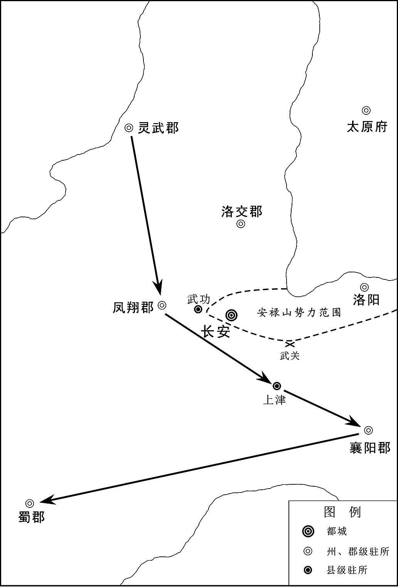 
唐肃宗至德元载（756年）八月关中形势示意图

## 【原文】

**建宁王倓，性英果，有才略。从上自马嵬北行，兵众寡弱，屡逢寇盗，倓自选骁勇居上前后，血战以卫上。上或过时未食，倓悲泣不自胜，军中皆属目向之[1]。上欲以倓为天下兵马元帅，使统诸将东征。李泌曰：“建宁诚元帅才，然广平，兄也。若建宁功成，岂可使广平为吴太伯乎？”[2]上曰：“广平，冢嗣也，何必以元帅为重？”[3]泌曰：“广平未正位东宫。今天下艰难，众心所属，在于元帅。若建宁大功既成，陛下虽欲不以为储副，同立功者其肯已乎！太宗、上皇即其事也。”[4]上乃以广平王俶为天下兵马元帅，诸将皆以属焉。倓闻之，谢泌曰：“此固倓之心也。”**

## 【注文】

[1]属（zhǔ）：意念集中在一点。

[2]吴太伯：春秋时吴国第一代君主。姬姓，商末岐山（今陕西岐山）周部落首领古公亶（dǎn）父（即周太王）的长子。周太王的第三子季历贤，且季历有圣子姬昌。太王欲传位季历及其子昌，太伯乃与仲雍让位三弟季历而出逃至荆蛮（今江南地区，当时这一地区经济文化还不发达，中原人对这一区域也不够了解，因此视之为蛮荒之地），文身断发，示不可用，以避季历。季历果然继承了王位，是为王季。而其子姬昌后来也继位，成为周文王。太伯之奔荆蛮，自号勾吴。荆蛮当地很多人都归附于太伯，太伯在此地建立了吴国。“太伯奔吴”的典故即来源于此。这一典故最初的记载见《史记·吴太伯世家》。

[3]冢（zhǒng）嗣：嫡长子，即正妻所生的长子。在中国古代社会，往往以嫡长子为继承人。在这里，唐肃宗的长子李俶实为宫女吴氏所生，并非嫡长子。肃宗称李俶为冢嗣，其实是想立他为太子，让他将来继承皇位。

[4]太宗：这里指唐太宗李世民（599—649年）。他本为唐高祖李渊的次子，他的长兄李建成本为皇太子。但是，李世民为扫平群雄、建立和巩固唐朝江山立下大功，这刺激了他对皇位的野心，也引起太子建成的妒忌和猜疑。李世民和以他为首的军功集团与太子李建成集团发生火并。唐高祖武德九年（626年），李世民发动政变，在皇宫的北门——玄武门将太子李建成杀死，史称“玄武门之变”。不久，李世民被立为太子，后继承皇位，是为唐太宗。　　上皇：这里指唐玄宗李隆基。他本为唐睿宗李旦的第三子，且非正宫皇后所生。但是，唐中宗死后，他剪除中宗韦皇后的势力、拥立睿宗登上皇位，立下大功，因此，被立为太子。其长兄李成器（睿宗刘皇后所生）反而未当上太子。

## 【译文】

建宁王李倓生性英明果决，有才干和谋略。他跟随肃宗从马嵬坡向北行进。肃宗手下的士兵少，而且战斗力弱，在路途中几次遭遇盗贼。李倓自己选取了一批英勇善战的士兵，护卫在肃宗的前后，拼死血战以保护肃宗。有时肃宗过了吃饭的时间，却还没有进食，李倓就悲痛得流泪，不能控制自己的情绪。军中的将士们都归心于他。肃宗想任命李倓为天下兵马元帅，让他统领各位将领向东去征讨叛军。李泌说：“建宁王的确拥有元帅的才能，但是广平王（李俶，后来的唐代宗）是他的哥哥呀。如果建宁王立下大功，怎么可以让广平王成为吴太伯呢？”肃宗回答：“广平王就是我们李家的继承人，又何必看重元帅的职位呢？”李泌说：“广平王还没有真正住进东宫（即没有正式被册立为太子）。现在天下正处于危难之际，人心所在意的是元帅之职。如果建宁王已经立下大功，陛下您虽然不愿意让他当储君，但是，与他并肩作战、一同立下汗马功劳的将领们能同意吗！唐太宗、太上皇不就是典型的例子吗。”于是，肃宗任命广平王李俶为天下兵马元帅，让各位将领都归他统辖。李倓听说了这件事，就感谢李泌，说：“您这真是说出了我李倓的心思。”

## 【原文】

**上与泌出行军，军士指之窃言曰：“衣黄者圣人也，衣白者山人也。”[1]上闻之以告泌曰：“艰难之际，不敢相屈以官，且衣紫袍以绝群疑。”[2]泌不得已受之。服之，入谢，上笑曰：“既服此，岂可无名称。”出怀中敕，以泌为侍谋军国、元帅府行军长史[3]。泌固辞，上曰：“朕非敢相臣，以济艰难耳。俟贼平，任行高志。”泌乃受之。置元帅府于禁中，俶入则泌在府，泌入俶亦如之。泌又言于上曰：“诸将畏惮天威，在陛下前敷陈军事，或不能尽所怀，万一小差，为害甚大。乞先令与臣及广平熟议，臣与广平从容奏闻，可者行之，不可者已之。”上许之。时军旅务繁，四方奏报，自昏至晓无虚刻，上悉使送府，泌先开视，有急切者及烽火，重封，隔门通进，余则待明[4]。禁门钥契，悉委俶与泌掌之[5]。**

## 【注文】

[1]山人：一般指隐士；又指山野之人，谦称。李泌曾经因为政治斗争的原因隐居山林，成为隐士。

[2]紫袍：唐朝官员按品级差异穿不同颜色的官服。其中三品以上官员穿紫色官服，即紫袍。亦用“紫袍”指代显赫的官员。

[3]侍谋军国、元帅府行军长史：这是唐肃宗任命李泌为天下兵马元帅府的高级幕僚。唐初用兵，各个总管府置行军长史。后以太子、亲王遥领行军元帅，则以行军长史主持其军务。唐玄宗末年以后用兵，则以行军长史为天下兵马元帅、都统的高级幕僚。

[4]烽火：古代边防报警的烟火。有敌人来侵犯的时候，守卫的人就点火相告。

[5]钥契：指钥匙和符契。古代符契在刻字之后，剖为两半，双方收存以作凭证。

## 【译文】

肃宗与李泌一块儿外出，行走在军队中。士兵们指着肃宗和李泌，悄悄地议论道：“身穿黄色衣服的是圣人，身穿白色衣服的是山中之人。”肃宗听到这些议论，就将此事告诉李泌，并说：“现在国家正处于艰难的时刻，不敢随随便便地封一个官来委屈您。暂时让您穿上紫袍，以杜绝大家的猜疑。”李泌不得已，接受了皇帝所赐的紫袍。他穿上这件紫袍，入朝向皇帝谢恩。肃宗笑着说：“您既然已经穿上了紫色的官服，怎么可以没有个官名呢。”于是，肃宗从怀中掏出一份敕书，任命李泌为侍谋军国、元帅府行军长史。李泌坚决推辞。肃宗说：“我不敢强行任命您为宰相，只是考虑到国家正处于危难的时刻，十分需要您的帮助。等到平定了叛贼，我任由您去实现您自己高远的志向。”在这种情况下，李泌才接受了这一任命。肃宗将元帅府设在宫中。李俶进元帅府，则李泌一定在府中；李泌入元帅府，则李俶也必定在府中。李泌又对肃宗说：“各位将领都畏惧天子的威风，他们在陛下您的面前陈述军情，有时可能不敢把事情和心里的想法全部说出来。万一出现一点小小的差错，可能造成巨大的危害。我乞求陛下您下命令，让军将们事先与我、广平王李俶深入讨论，然后由我与广平王不慌不忙地向您汇报。可行的方案，我们去执行，不可行的就停止。”肃宗同意了。当时，军队的事务很多，各地送来的奏报，从黄昏到拂晓都不间断。肃宗将这些奏报都送到元帅府。李泌先阅览这些奏报。他将急切的奏报及烽火信号重新封起来，隔着门呈进给皇帝看。其他的奏报则等到第二天天亮再呈送给皇帝。宫中各道门的钥匙、符契，肃宗都委托李俶与李泌掌管。

## 【原文】

**上欲借兵于外夷以张军势，以豳王守礼之子承寀为敦煌王，与仆固怀恩使于回纥以请兵[1]。又发拔汗那兵，且使转谕城郭诸国，许以厚赏，使从安西兵入援[2]。李泌劝上：“且幸彭原，俟西北兵将至，进幸扶风以应之。于时庸调亦集，可以赡军。”[3]上从之。戊辰，发灵武。**

## 【注文】

[1]豳（bīn）王守礼：即豳王李守礼（672—741年），唐朝章怀太子李贤（唐高宗李治之第六子，武则天所生。在其兄李弘死后被立为太子，后因得罪武则天被废）的次子。本名光仁，唐睿宗垂拱初年改名守礼，封为太子洗马（闲职）。后继承其父的爵位雍王。武后改唐为周，登基称帝，忌恨李唐宗室。守礼因为其父亲的原因而得罪武则天，与唐睿宗李旦的儿子们闭处宫中十多年。武周圣历元年（698年），唐睿宗从皇嗣（即太子）降封相王，许出宫外居住。守礼等开始在宫外居住，改授司议郎中（闲职）。唐中宗重登皇位、恢复李唐江山，守礼也恢复以往的封爵，拜光禄卿。中宗神龙三年（707年），皇帝封守礼之女为金城公主，许嫁吐蕃赞普弃隶缩赞。中宗景龙四年（710年），睿宗即皇帝位，依照中宗的遗诏，改封守礼为邠王，检校左金吾卫大将军，出为幽州（今北京地区）刺史，遥兼单于大都护，迁司空（正一品，闲职）。唐玄宗开元初，守礼累为地方州刺史，但他都将地方政事委托给僚属处理，自己唯独寻求享乐，并不实际管事。守礼后来回到京城长安。开元二十九年（741年）死，享年七十余岁，赠太尉。　　敦煌：地名。即瓜州、晋昌郡，治晋昌（今甘肃安西东南），辖晋昌、常乐县，相当于今甘肃安西附近。　　仆固怀恩（？—765年）：唐朝著名将领，平定安史之乱的大功臣。铁勒仆骨（固）部落人，其家归附唐朝，世袭本部落的都督。唐玄宗天宝中，仆固怀恩历事河西节度的王忠嗣、安思顺，皆以骁勇善战、通晓其他族群的情况著称。后跟从郭子仪、李光弼讨平安史之乱，屡立战功。肃宗至德元载（756年），太子李亨在灵武即皇帝位，仆固怀恩跟从郭子仪到那里，拜见新皇帝，将自己的女儿嫁给回纥可汗，请求与回纥交好，让其出兵援助唐军。第二年，怀恩引来回纥兵助郭子仪收复西京长安和东都洛阳。肃宗乾元二年（759年），怀恩担任朔方行营节度使，封大宁郡王，跟从李光弼守河阳（今河南孟州东南）。他每战皆摧锋陷敌，功冠诸将。宝应元年（762年），怀恩奉命与回纥可汗会师于太原，合军攻破史朝义（史思明之子）的军队，再次收复东都洛阳。怀恩以功迁河北副元帅、朔方节度使。后宦官骆奉仙向皇帝诬告怀恩谋反。怀恩于是上书两千言自诉，没有结果。第二年，怀恩与其子仆固玚（yáng）被迫起兵造反，被郭子仪击败。怀恩又引回纥、吐蕃入侵唐朝，他至灵武得暴病死。仆固怀恩一家为唐室尽忠、战死的达四十六人，对平定安史之乱功劳甚大。

[2]拔汗那：又称大宛，古代西域国名。在汉代，拔汗那王治贵山城（今乌兹别克斯坦塔什干东南）。有属邑大小七十余城，在今中亚费尔干纳盆地一带。居民从事农牧业，种植稻麦，盛产葡萄、苜（mù）蓿（xū），以汗血马著称，商业也较发达。西汉武帝建元二年（前139年），张骞通西域，到达大宛。大宛后与西汉发生战争。西汉在西域地区置西域都护府，大宛归其管辖。唐高宗显庆三年（658年），唐廷以其地渴塞城置休循州都督府，授其王为刺史。玄宗开元二十七年（739年），其王阿悉烂达干助唐平定突骑施（西域一部落名），受唐封为奉化王。玄宗天宝三载（744年），改其国号为宁远。玄宗以其母家之姓窦氏赐其王，封宗室女为和义公主，嫁给其国王。　　城郭诸国：在西域地区（今新疆），沙漠占据了大部分地域。在沙漠中有可供人生存的绿洲。因此，在这些绿洲地区，零零散散地形成了人口聚集的城市。依托这些城市建起了大大小小几十个规模不大的城邦国家。

[3]庸调（diào）：唐代前期的赋税制度。庸，以交纳绢（一种薄而坚韧的丝织物）、布代替力役。调，随乡土所产向国家交纳的丝织品或布。以人丁作为征税标准。

## 【译文】

肃宗想向外族借兵，以扩大自己的军队的势力，于是封豳王李守礼的儿子李承宷为敦煌王，让他与仆固怀恩出使回纥，以请求回纥出兵援助。肃宗又征发拔汗那的军队，并且请他们转告西域地区的各个城邦国家，向它们许诺给予丰厚的赏赐，请它们派兵跟从安西节度的军队进入中原援助唐军。李泌劝肃宗：“请陛下暂时驾幸彭原郡，等到西北方面的军队快要到达之时，再驾幸扶风郡，与他们相呼应。到那个时候，各地交纳的丝织品或布（相当于货币）也集中起来了，可以用来供养军队。”肃宗听从了李泌的意见。至德元载（756年）九月戊辰（十七日），肃宗从灵武出发了。

## 【原文】

**内侍边令诚复自贼中逃归，上斩之[1]。**

## 【注文】

[1]内侍：唐朝内侍省的副官。

## 【译文】

内侍边令诚从叛贼的军营中逃归，肃宗把他杀了。

## 【原文】

**丙子，上至顺化[1]。韦见素等至自成都，奉上宝册，上不肯受，曰：“比以中原未靖，权总百官，岂敢乘危，遽为传袭。”[2]群臣固请，上不许，置宝册于别殿，朝夕事之，如定省之礼[3]。上以韦见素本附杨国忠，意薄之；素闻房琯名，虚心待之。琯见上言时事，辞情慷慨，上为之改容，由是军国事多谋于琯。琯亦以天下为己任，知无不为，专决于胸臆，诸相拱手避之[4]。**

## 【注文】

[1]顺化：地名。即顺化郡。本名安化郡，唐肃宗至德元载（756年），为避叛将安禄山之姓，改为顺化郡。

[2]宝册：即传国宝、玉册。　　靖：安静、平安、平定，使秩序安定。

[3]定省（xǐng）：指为人子之礼。安定亲长之床，省问其安否。后因称子女早晚向亲长问安为定省之礼。

[4]拱手：两手向上相合，表示敬意。

## 【译文】

唐肃宗至德元载（756年）九月丙子（二十五日），肃宗到达顺化。韦见素等从成都赶到这里，奉上传国宝和玉册。肃宗不肯接受，说：“我近来因为中原地区尚未安定下来，暂时总领朝廷百官，怎么敢趁着这一危机，仓促地继承皇位呢。”群臣坚决请求肃宗接受传国宝和玉册，肃宗不允许。他将传国宝和玉册搁置在别殿，从早到晚都很恭敬地供奉着，犹如儿子向父亲问安、行定省之礼。肃宗忌恨韦见素原来依附于杨国忠，因此对待他很冷淡。肃宗向来听说房琯的名声，虚心对待房琯。房琯面见皇帝，谈论时事，言辞慷慨、感情恳切，肃宗也被他的陈词所打动。于是，国家的军国大事，肃宗很多都跟房琯商量、谋划。房琯也以天下为己任，竭力贡献自己的所有才智。他独自在胸中做决断，其他宰相都拱手回避，不参与决策。

## 【原文】

**上尝从容与泌语及李林甫，欲敕诸将克长安，发其冢，焚骨扬灰。泌曰：“陛下方定天下，奈何仇死者。彼枯骨何知，徒示圣德之不弘耳。且方今从贼者皆陛下之仇也，若闻此举，恐阻其自新之心。”上不悦，曰：“此贼昔日百方危朕，当是时，朕不保朝夕。朕之全，特天幸耳！林甫亦恶卿，但未及害卿而死耳，奈何矜之！”对曰：“臣岂不知。所以言者，上皇有天下向五十年，太平娱乐，一朝失意，远处巴、蜀[1]。南方地恶，上皇春秋高，闻陛下此敕，意必以为用韦妃之故，内惭不怿[2]。万一感愤成疾，是陛下以天下之大不能安君亲。”言未毕，上流涕被面，降阶，仰天拜，曰：“朕不及此，是天使先生言之也。”遂抱泌颈泣不已。**

## 【注文】

[1]巴：古国名，古族名。在先秦时期，巴国的区域大致相当于今重庆一带。

[2]韦妃：指唐肃宗李亨的原配妻子韦氏，出自名门京兆韦氏家族。李玙（后改名李亨）还是忠王之时，纳韦氏为妃。李玙被立为太子后，韦氏成为太子妃。后因天宝中，李林甫罗织罪名陷害韦氏之兄韦坚，太子感到害怕，上表请求与韦氏离婚，玄宗准予。事见《李林甫专政》。　　怿（yì）：欢喜。

## 【译文】

肃宗曾经从容与李泌谈及李林甫，想下敕让各位将领攻克长安以后，将李林甫的尸体从坟墓里刨出来，放一把火烧掉他的尸骨，让他的尸骨化成灰。李泌劝解道：“陛下刚刚才安定了天下，为什么要去仇恨已经死了的人呢？他只是一具枯骨，知道什么呀。如果陛下这样做，不是白白地在昭示您不是一个宽宏大量的人吗？而且，现在跟从叛贼的人都是陛下的仇人，如果他们听说陛下您做了这样的事，恐怕会阻碍他们向朝廷投诚、改过自新。”肃宗听了不高兴，说：“李林甫这个老贼，曾经千方百计地陷害我。在那个时候，我可是朝夕不保。我还能活下来，真是受到上天特别的眷顾啊！李林甫也讨厌您，只是还没来得及陷害您就死掉了，您为什么还要怜惜他！”李泌回答说：“这些事情我怎么会不知道呢。我之所以对您讲这些，是考虑到太上皇拥有天下将近五十年，在太平盛世之下尽情享乐，一时疏忽大意了，远走巴蜀之地。南方的土地不好，太上皇年纪已经大了，如果听到陛下所颁发的这份敕书，心里一定会认为陛下因为韦妃的原因而怨恨他，他的内心会感到惭愧、不痛快。万一太上皇感情激动，因为愤怒而染上疾病，这是明摆着陛下拥有这么大的天下，却不能让自己的父亲安下心来。”李泌的话还没说完，肃宗已经泪流满面，走下了台阶，仰望天空而拜，说：“我没有考虑到这些，是上天派李先生来告诉我的。”于是，肃宗抱着李泌的脖子，一直在哭泣。

## 【原文】

**冬十月，上发顺化，癸未，至彭原。第五琦见上于彭原，请以江、淮租庸市轻货，溯江、汉而上至洋川，令汉中王瑀陆运至扶风以助军[1]。上从之。寻加琦山南等五道度支使[2]。琦作榷盐法，用以饶[3]。**

## 【注文】

[1]租庸：唐代前期的赋税制度，由县尉负责征收。租，按人丁征收的赋税。庸，以交纳绢（一种薄而坚韧的丝织物）、布代替力役。租庸制以人丁（“丁”指主要承担赋税和劳役的适龄男子）为本，不论土地、财产的多少，都要按人丁交纳同等数量的绢粟。这是建立在唐初自耕农大量存在，并且都占有一定数量的土地的基础上的一种赋税制度。唐高宗、武则天以后，直到唐玄宗统治期间，土地兼并日益发展，农民逐步失去土地，按人丁征收赋税的租庸制度逐步成为农民的沉重负担。　　轻货：指丝织品、布。在唐朝，丝织品或布重量轻，又可以充当一般等价物，等同于货币。　　溯：逆着水流的方向走。　　洋川：地名。即洋川郡、洋州，治西乡（今陕西西乡），辖西乡、洋源、黄金、兴道、真符县，相当于今陕西西乡及附近地区、洋县东真符村、洋县城及附近地区。　　汉中王瑀（yǔ）：即汉中王李瑀。参见前“陇西公瑀”条注。

[2]度支使：唐朝使职名。负责掌管财政赋税的统计、开支和调度。

[3]榷盐：政府垄断食盐的生产、销售，以及征收赋税的制度，又称食盐专卖。唐初无榷盐法。唐玄宗开元元年（713年）开始征收盐税。玄宗天宝时，正式定盐税为每斗十钱。安禄山叛乱，国家军费开支庞大，财政日益窘迫，政府乃命第五琦变盐法，实行食盐专卖制度。政府在食盐产地置监院，产盐户除上交租庸外，免除其他杂徭，所产之盐均归官府专卖，严禁盗煮私盐。盐每斗加时价一百钱出售，是将盐税并入盐价征收。后来，政府又在产盐之地设盐官，收盐户所产之盐转卖给商人，任其销售。政府又专置十三院缉捕私自煮盐、贩盐之人。榷盐造成市场盐价的人为大幅度上涨，大大增加了政府的财政收入。中晚唐时期，盐利占到国家财政收入的一半左右。

## 【译文】

唐肃宗至德元载（756年）冬十月，肃宗从顺化出发，癸未（初三日）到达彭原。第五琦在彭原面见肃宗，请求将江、淮地区征收的租庸税在市场上换成轻货，逆着长江、汉江而上，到达洋川，然后命汉中王李瑀通过陆路运送到扶风郡，以资助军费。肃宗听从了他的意见。不久，肃宗升第五琦为山南等五道度支使。第五琦实行国家食盐专卖制度，这一措施使国家的军费越来越富足。

## 【原文】

**房琯上疏，请自将兵复两京。上许之，加持节、招讨西京兼防御蒲潼两关兵马节度等使[1]。琯请自选参佐，以御史中丞邓景山为副，户部侍郎李揖为行军司马，给事中刘秩为参谋[2]。既行，又令兵部尚书王思礼副之。琯悉以戎务委李揖、刘秩，二人皆书生，不闲军旅。琯谓人曰：“贼曳落河虽多，安能敌我刘秩。”琯分为三军，使禆将杨希文将南军，自宜寿入；刘贵哲将中军，自武功入；李光进将北军，自奉天入[3]。光进，光弼之弟也。**

## 【注文】

[1]持节：官员或使臣外出时所持皇帝所授予的节仗，以示威权。　　招讨西京：参见前“招讨使”条注。　　防御蒲潼两关兵马节度等使：这属于临时性设置的使职。负责率领兵马临时防御蒲关和潼关，事情结束则罢职。

[2]参佐：部下、僚属。　　参谋：唐朝官名。为节度使、观察使、团练使所属的幕僚之一，无定员，掌管参议谋划。

[3]宜寿：县名。唐玄宗天宝元年（742年），改盩（zhōu）厔（zhì）县为宜寿县。唐肃宗至德二载（757年）复旧名。隶属于凤翔郡，相当于今陕西周至东终南镇。

## 【译文】

房琯向皇帝上疏，请求自己率领士兵去收复西京长安和东都洛阳。肃宗允许了，给他加持节、招讨西京兼防御蒲潼两关兵马节度等使。房琯请求自己挑选参谋、部下。房琯选取御史中丞邓景山为自己的副官，户部侍郎李揖为行军司马，给事中刘秩为参谋。军队已经出发了，房琯又命令兵部尚书王思礼担任副官。房琯将全部军事事务都委托给李揖和刘秩。这两个人都是书生，并不熟悉军队中的事情。房琯对人说：“叛贼的曳落河虽然人多，但是又怎么能够对抗我们的刘秩呢。”房琯将军队分为三军，让副将杨希文统领南军，从宜寿县攻打长安；刘贵哲统领中军，从武功县攻打长安；李光进统领北军，从奉天县攻打长安。李光进是李光弼的弟弟。

## 【原文】

**甲申，令狐潮、王福德复将步骑万余攻雍丘。张巡出击，大破之，斩首数千级，贼遁去。**

## 【译文】

唐肃宗至德元载（756年）十月甲申（初四日），令狐潮、王福德又率领一万多名步兵、骑兵进攻雍丘。张巡率兵出击，大破令狐潮的军队，斩获好几千名敌人的脑袋，叛贼逃走了。

## 【原文】

**房琯以中军、北军为前锋，庚子，至便桥。辛丑，二军遇贼将安守忠于咸阳之陈涛斜[1]。琯效古法，用车战，以牛车二千乘，马步夹之[2]。贼顺风鼓噪，牛皆震骇。贼纵火焚之，人畜大乱，官军死伤者四万余人，存者数千而已。癸卯，琯自以南军战，又败。杨希文、刘贵哲皆降于贼。上闻琯败，大怒，李泌为之营救，上乃宥之，待琯如初[3]。**

## 【注文】

[1]陈涛斜：地名。也作“陈陶斜”，在今陕西咸阳东。

[2]乘（shèng）：量词，古代四匹马拉的兵车一辆为一乘。

[3]宥（yòu）：宽容、饶恕。

## 【译文】

房琯以中军、北军为前锋，唐肃宗至德元载（756年）十月庚子（二十日），到达便桥。辛丑（二十一日），房琯率领的中军和北军在咸阳的陈涛斜遭遇叛贼的将领安守忠。房琯仿效古代的战法，采用车战。他用两千辆牛车，再用骑兵和步兵将牛车夹在中间。叛贼顺着风向敲打战鼓，声音很大，牛都被这种嘈杂声所惊吓。叛贼再（顺着风）放火焚烧牛车，官军的士兵和牲畜都大乱了，有四万多人或死或伤，仅仅几千人幸存下来。癸卯（二十三日），房琯自己率领南军与叛军作战，又遭到失败。杨希文、刘贵哲都向叛贼投降了。肃宗听说房琯惨败，非常愤怒。李泌极力营救房琯，肃宗才饶恕了他，并像以前那样对待他。

## 【原文】

**敦煌王承寀至回纥牙帐，回纥可汗以女妻之，遣其贵臣与承寀及仆固怀恩偕来，见上于彭原[1]。上厚礼其使者而归之。**

## 【注文】

[1]牙帐：这里指北方草原帝国回纥汗国的可汗的所在地，也是回纥汗国的政治中心。回纥汗国的牙帐位于乌德健山，又作乌德鞬（jiān）山，亦称于都斤山，相当于今蒙古国鄂尔浑河上游杭爱山东支。　　回纥可汗：这里指回纥汗国的葛勒可汗（？—759年），为回纥汗国的第二任可汗，名药罗葛磨延啜，或称葛勒特勤（特勤是突厥语音译，系突厥、回纥汗国的官名，指最高统治者可汗家族的人）。唐玄宗天宝年间，葛勒带兵征讨邻邦，颇有战功。天宝六载（747年），他继承可汗之位，建号“登里啰没（mò）密施颉（jié）翳（yì）德密施毗伽可汗”。他大举向西域进兵，征服了一些部落，将回纥汗国的西部边界拓展了不少。唐肃宗至德年间，他应肃宗之请，派遣叶护太子率领骑兵进入中原地区，帮助唐廷平定安史之乱。唐军和回纥兵联合收复了西京长安和东都洛阳。肃宗乾元元年（758年），肃宗将自己的女儿宁国公主嫁给葛勒可汗，并册封他为“英武威远毗伽阙可汗”。毗伽，突厥语和回纥语，智慧、顾问之意。阙，突厥语和回纥语，表示著名的、全体的、普通的、巨大的、重要的。

## 【译文】

敦煌王李承寀到达回纥汗国的牙帐。回纥可汗将自己的女儿嫁给李承寀为妻，派遣地位显赫的大臣与李承寀及仆固怀恩一同前往大唐，在彭原郡面见肃宗。肃宗给回纥使者的待遇非常优厚，还给了他丰厚的赏赐，然后才请使者回去。

## 【原文】

**尹子奇围河间，四十余日不下，史思明引兵会之。颜真卿遣其将和琳将万二千人救河间，思明逆击，擒之，遂陷河间，执李奂，送洛阳，杀之。又陷景城，太守李赴湛水死[1]。思明使两骑赍尺书以招乐安，即时举郡降[2]。又使其将康没野波将先锋攻平原，兵未至，颜真卿知力不敌，壬寅，弃郡度河南走[3]。思明即以平原兵攻清河、博平，皆陷之。思明引兵围乌承恩于信都，承恩以城降，亲导思明入城，交兵马、仓库，马三千匹，兵五万人。思明送承恩诣洛阳，禄山复其官爵。**

## 【注文】

[1]湛水：水名。在今河南济源西南，东南流入黄河。

[2]赍（jī）：怀抱着、带着。　　乐安：地名。即乐安郡、棣州，治厌次（今山东惠民东南），辖厌次、滳（shāng）河、阳信、蒲台、渤海县，相当于今山东惠民东南、商河、阳信西南、滨州东南蒲台、滨州。

[3]康没（mò）野波：此人姓康，且名字不像汉人，可能是来自中亚的粟特人。

## 【译文】

尹子奇包围了河间郡，四十多天都没有攻下。史思明率领军队与他相会。颜真卿派遣他手下的将领和琳率领一万二千名士兵去解救河间郡。史思明反方向攻击和琳，将他抓获，于是攻陷了河间郡，逮捕了李奂，将他押送到洛阳，杀死了他。史思明又攻陷景城郡，太守李跳进湛水自溺而死。史思明派遣两名骑兵带着一尺长的书信，去招降乐安郡。乐安的整个郡马上就向叛军投降了。史思明又派遣他的将领康没野波率领先锋队攻打平原郡。叛军还没有到达平原郡，颜真卿就知道自己的力量不足以抵御叛贼的进攻，于至德元载（756年）十月壬寅（二十二日）放弃了平原郡，渡过黄河，向南方逃走了。史思明马上用平原郡的士兵攻打清河郡、博平郡，把这两个郡都攻陷了。史思明又率领军队将乌承恩包围在信都郡，乌承恩带着信都投降了叛军。他亲自引导史思明进入信都城，交给叛军兵马、仓库，三千匹马，五万名士兵。史思明送乌承恩到达洛阳，安禄山恢复了乌承恩以前的官爵。

## 【原文】

**饶阳禆将束鹿张兴，力举千钧，性复明辩[1]。贼攻饶阳，弥年不能下[2]。及诸郡皆陷，思明并力围之，外救俱绝。太守李系窘迫赴火死，城遂陷。思明擒兴，立于马前，谓曰：“将军真壮士，能与我共富贵乎？”兴曰：“兴，唐之忠臣，固无降理。今数刻之人耳，愿一言而死。”思明曰：“试言之。”兴曰：“主上待禄山恩如父子，群臣莫及。不知报德，乃兴兵指阙，涂炭生人。大丈夫不能翦除凶逆，乃北面为之臣乎[3]！仆有短策，足下能听之乎？足下所以从贼，求富贵耳，譬如燕巢于幕，岂能久安。何如乘间取贼，转祸为福，长享富贵，不亦美乎！”思明怒，命张于木上，锯杀之，詈不绝口，以至于死[4]。**

## 【注文】

[1]束鹿：县名。即束鹿县，隶属于饶阳郡、深州，相当于今河北辛集东北旧城。　　钧：古代的重量单位，一钧合三十斤。

[2]弥：满、遍。

[3]北面：方位词，指面朝北方。古代君主面朝南坐，臣子朝见君主则面朝北。所以用“北面”来指代对人称臣。

[4]詈（lì）：骂。

## 【译文】

饶阳郡的副将束鹿人张兴的臂力很大，能够举起千钧重的东西，他是一个明辨是非之人。叛贼攻打饶阳城，一年都没有攻下。等到周边的各个郡都被叛军攻陷了，史思明倾其全力包围饶阳。饶阳城寻求外部支援的道路都被断绝了，太守李系在非常困窘、走投无路的情况下赴火，被烧死，饶阳城于是陷入叛贼之手。史思明抓获了张兴，将他带到自己的马前，对他说：“将军真是一位壮士，您能够与我一同共享荣华富贵吗？”张兴回答：“我张兴是大唐的忠臣，绝对没有向叛臣投降的道理。现在我的生命仅仅是数着时间延续了，我愿意说一番话就死。”史思明说：“试着讲来听听。”张兴说：“主上（指唐玄宗）对待安禄山恩典甚重，就如同父子一般。其他的大臣们都比不上。而安禄山却不知道报答皇上的恩典，还起兵造反，攻下皇宫，让民众陷入极其艰难困苦的境地。我遗憾自己身为大丈夫，却不能翦除这帮凶恶的叛臣，怎么可能向北面去参拜这些叛臣，向他们称臣呢！我有一个在很短的时间内就能奏效的计策，足下您能听进去吗？足下之所以跟从叛贼，就是为了追求富贵，就像燕子把自己的巢搭建在帐幕上，怎么可能长期安定呢。您倒不如乘着这个时机擒拿安禄山，这可是让您转祸为福，保您长享富贵的计策，这个计策不好吗！”史思明发怒了，命令将张兴放在木头上面，用刀锯锯他的身体，把他杀死。张兴对叛贼骂不绝口，直到死。

## 【原文】

**贼每破一城，城中人衣服、财贿、妇人皆为所掠。男子壮者使之负担，羸、病、老、幼皆以刀槊戏杀之[1]。禄山初以卒三千人授思明，使定河北，至是，河北皆下之，郡置防兵三千，杂以胡兵镇之。思明还博陵。尹子奇将五千骑渡河，略北海，欲南取江、淮[2]。会回纥可汗遣其臣葛逻支将兵入援，先以二千骑奄至范阳城下，子奇闻之，遽引兵归。**

## 【注文】

[1]槊（shuò）：长矛，古代的一种兵器。

[2]略：抢，掠夺。

## 【译文】

叛贼每攻破一座城市，城中百姓的衣服、财物、妇女都被叛军抢掠。壮年男子被叛贼强迫负担劳役。凡是身体瘦弱的、生病的、年老的、年幼的老百姓都被叛贼用刀或长矛如同儿戏一般地杀死。安禄山最初拨给史思明三千名士兵，让他带领这帮士兵去平定河北地区。到现在，河北地区都在叛军的掌控之中，每个郡布置三千名士兵防守，并掺杂了一些胡人士兵配合守卫城池。史思明回到博陵郡。尹子奇率领五千名骑兵渡过黄河，掠夺了北海郡，又打算率领军队向南方去攻取长江、淮河流域。恰逢回纥可汗派遣他的大臣葛逻支率领军队进入唐朝的领土，帮助官军征讨叛军。他先率领两千名骑兵突然到达范阳城下。尹子奇一得到这一消息，就仓促地率领着士兵回到范阳。

## 【原文】

**十一月，令狐潮帅众万余营雍丘城北，张巡邀击，大破之，贼遂走[1]。**

## 【注文】

[1]邀击：拦击、截击。邀，阻留。

## 【译文】

唐肃宗至德元载（756年）十一月，令狐潮率领一万多名士兵在雍丘城北边扎营。张巡阻击令狐潮军，大败他们，叛贼于是逃走了。

## 【原文】

**十二月，安禄山遣兵攻颍川[1]。城中兵少，无蓄积，太守薛愿、长史庞坚悉力拒守，绕城百里，庐舍、林木皆尽[2]。期年，救兵不至，禄山使阿史那承庆益兵攻之，昼夜死斗十五日，城陷，执愿、坚送洛阳。禄山缚于洛滨冰上，冻杀之。**

## 【注文】

[1]颍川：地名。即颍川郡、许州，治长社（今河南许昌），辖长社、许昌、长葛、鄢（yān）陵、扶沟、临颍、舞阳、郾（yǎn）城县，相当于今河南许昌、许昌东北许田镇、长葛东北、鄢陵、扶沟、临颍、舞阳东、郾城。

[2]薛愿（？—756年）：唐玄宗、肃宗朝大臣。河东汾阴（今山西万荣西南）人。父（tāo），为礼部郎中。其妹妹为废太子李瑛（唐玄宗之次子，赵丽妃所生）的妃子。李瑛被废去太子之位时，薛愿也被贬官（事见《李林甫专政》）。安禄山叛乱，南阳节度使鲁炅向朝廷上奏，用薛愿为颍川太守、本郡防御使。薛愿与防御副使庞坚同力固守。唐肃宗至德元载（756年），叛贼昼夜攻城不息。叛贼的将领阿史那承庆力攻，终于攻下了颍川城。薛愿、庞坚都被逮捕，送于洛阳，被杀。　　庞坚（？—756年）：唐肃宗朝大臣。京兆泾阳（今陕西泾阳）人，庞玉之玄孙。安禄山叛乱时，他任颍川郡长史兼防御副使，与颍川太守薛愿共守颍川城。城破，被叛军逮捕、杀害。

## 【译文】

唐肃宗至德元载（756年）十二月，安禄山派遣士兵攻打颍川郡。颍川城中士兵少，又没有储备什么物资。太守薛愿、长史庞坚竭尽全力对抗叛军、坚守城池。颍川城周围上百里的地区，房屋和林木都没有了。整整一年时间，救兵都没有来。安禄山让阿史那承庆增加兵力攻打颍川。叛军与守城的官军不分白天、黑夜地拼死厮杀了十五天，颍川城被攻陷。薛愿、庞坚被叛军逮捕，押送到洛阳。安禄山将他们俩捆绑在已经结成冰的洛水之上，把他们活活冻死了。

## 【原文】

**上问李泌：“今敌强如此，何时可定？”对曰：“臣观贼所获子女、金帛，皆输之范阳，此岂有雄据四海之志邪！今独虏将或为之用，中国之人惟高尚等数人，自余皆胁从耳。以臣料之，不过二年，天下无寇矣。”上曰：“何故？”对曰：“贼之骁将不过史思明、安守忠、田乾真、张忠志、阿史那承庆等数人而已[1]。今若令李光弼自太原出井陉，郭子仪自冯翊入河东，则思明、忠志不敢离范阳、常山，守忠、乾真不敢离长安，是以两军絷其四将也，从禄山者，独承庆耳[2]。愿敕子仪勿取华阴，使两京之道常通，陛下以所征之兵军于扶风，与子仪、光弼互出击之，彼救首则击其尾，救尾则击其首，使贼往来数千里，疲于奔命，我常以逸待劳，贼至则避其锋，去则乘其弊，不攻城、不遏路。来春复命建宁为范阳节度大使，并塞北出，与光弼南北掎角以取范阳，覆其巢穴。贼退则无所归，留则不获安，然后大军四合而攻之，必成擒矣。[3]”上悦。**

## 【注文】

[1]张忠志（718—781年）：即李宝臣，安禄山的部将，后降唐，成为成德节度使。奚人，字为辅。他初为范阳军将张锁高的养子，故姓张，名忠志。安禄山起兵反唐，他又成为安禄山的养子，赐姓安。后又依附于安禄山之子安庆绪，叛服无常。史思明死，忠志不肯依附于史思明之子史朝义，以自己所领之深州（治今河北深州西南）、赵州（治今河北赵县）等五州降唐。唐肃宗赐他姓名为李宝臣。他成为成德镇节度使，封清河郡王，据有恒州（治今河北正定）、深州、赵州、冀州（治今河北冀州）、定州（治今河北定州）、易州（治今河北易县）。他掌握的财富丰厚，招徕亡命之徒，大力训练军队，勇冠河北地区的诸位统帅。他与河北地区的其他藩镇相互婚嫁，互为表里。后来，他与魏搏节度使田承嗣产生隔阂。唐代宗大历十年（775年），宝臣奉朝廷之命讨伐田承嗣，因为宦官对其无理，他又与田承嗣联合。唐德宗即位，他又进为司空。晚年，李宝臣以其子李惟岳暗弱，恐部将不服，杀手下的大将二十余人。他又任用妖人伪作谶语，言他将登天子之位，终被毒死。

[2]絷（zhí）：拴、捆。

[3]掎（jǐ）角：掎，拖住、牵制。掎角指分兵牵制或夹击敌人，或谓分兵互相呼应。

## 【译文】

肃宗问李泌：“现在敌人那么强大，什么时候天下才能安定呢？”李泌回答：“据我观察，叛贼所擒获的子女、黄金、丝织品，都运送到范阳去，这怎么会有雄踞四海的志向啊！现在，只有蛮夷的将领肯为叛贼所用，中原的汉人只有高尚等几个人愿意为叛贼效力，其他人都是被迫跟从的。按我的估计，不到两年，天下就不会有盗匪了。”肃宗问：“这是什么原因啊？”李泌回答：“叛贼帐下英勇的将领，不过只有史思明、安守忠、田乾真、张忠志、阿史那承庆等几个人而已。现在如果命令李光弼从太原出井陉，郭子仪从冯翊入河东，那么，史思明、张忠志就不敢离开范阳、常山，安守忠、田乾真就不敢离开长安。这是以李光弼、郭子仪的两支军队来牵制叛军的四名将领。跟从安禄山的人，就只有阿史那承庆而已。愿陛下下一道敕书，命郭子仪不要攻取华阴郡，以保证两京之间的道路常常畅通。陛下将征集而来的士兵驻扎在扶风郡，与郭子仪、李光弼共同出兵，攻击叛军。叛军救其军队的前面部分，我们就攻击它的后面；叛贼救其军队的后面，我们就攻击它的前面。这样促使叛贼来回几千里，疲于奔命，我方则常常用精神饱满的军队去攻击他们疲惫的军队。叛贼来了，我们则避开它的锋芒；叛贼撤退了，我们则趁着它的薄弱环节进攻。我们不去攻打城池，不控制道路。明年春天再任命建宁王李倓为范阳节度大使，带兵向北出塞外（指唐朝北部的游牧地区），与李光弼的军队一起，南北形成掎角之势以攻取范阳，彻底倾覆叛军的老巢。叛贼想往后退则没有归路，留在原地则没有安全感。然后我们的大军再从四面八方围攻叛军，叛贼一定会被抓获的。”肃宗听了李泌的这番分析，很高兴。

## 【原文】

**令狐潮、李庭望攻雍丘，数月不下，乃置杞州，筑城于雍丘之北以绝其粮援[1]。贼常数万人，而张巡众才千余，每战辄克。河南节度使虢王巨屯彭城，假巡先锋使[2]。是月，鲁、东平、济阴陷于贼[3]。贼将杨朝宗帅马步二万将袭宁陵，断巡后，巡遂拔雍丘，东守宁陵以待之，始与睢阳太守许远相见。是日，杨朝宗至宁陵城西北，巡、远与战，昼夜数十合，大破之，斩首万余级，流尸塞汴而下，贼收兵夜遁[4]。敕以巡为河南节度副使。巡以将士有功，遣使诣虢王巨请空名告身及赐物，巨唯与折冲、果毅告身三十通，不与赐物[5]。巡移书责巨，巨竟不应[6]。**

## 【注文】

[1]杞州：地名。即雍丘县，隶属于汴州，相当于今河南杞县。

[2]彭城：地名。即彭城郡、徐州，治彭城（今江苏徐州），辖彭城、丰县、沛县、宿迁、下邳（pī）、萧县、滕县，相当于今江苏徐州、丰县、沛县、宿迁东南旧黄河东北岸古城、睢宁西北古邳镇东、安徽萧县西北、山东滕州。　　假：借用，利用。委托。

[3]鲁：地名。即鲁郡、兖（yǎn）州，治瑕丘（今山东兖州），辖瑕丘、曲阜、乾封、泗（sì）水、邹县、任城、龚丘、金乡、鱼台、莱芜县，相当于今山东兖州、曲阜东北古城、泰安东南旧县、泗水、邹城、济宁东南、宁阳、金乡、鱼台西、莱芜东北。

[4]汴：这里指水名。即汴水，又称汴河或汴渠。唐、宋人称隋代开凿的运河通济渠为汴水，是当时中原通向江南的主要水运干道。

[5]空名告身：参见前“告身”条注。

[6]移：唐代的官文书之一。官府各个部门相互问询的官文书有关、刺、移。关谓关通其事；刺谓刺举之；移谓移其事于其他部门。

## 【译文】

令狐潮、李庭望攻打雍丘县，几个月都没有攻下。于是叛军设置杞州，在雍丘县的北边筑城，以断绝通往城里的粮食和援助。叛贼常常几万人，而张巡的军队才一千多人。可张巡每次出兵打仗都能攻克敌人。河南节度使、虢王李巨的军队驻扎在彭城郡，让张巡暂时代理先锋使之职。就在这个月，鲁郡、东平郡、济阴郡都陷于叛贼的手中。叛贼的将领杨朝宗率领两万名骑兵和步兵准备袭击宁陵，切断张巡的后路。张巡于是夺取雍丘县，向东驻守宁陵，以等待叛军。张巡开始与睢阳太守许远相见。这一天，杨朝宗到达宁陵城西北，张巡、许远与他作战。双方不分白天和黑夜地激战了几十个回合，结果张巡等大破杨朝宗军，斩杀一万多名叛军的首级，尸体顺着汴河往下流动，把汴河都给堵塞了。叛贼将残余的士兵结集在一起，趁着夜色逃走了。皇帝下敕书，任命张巡为河南节度副使。张巡认为他手下的将士们立下了战功，就派遣使者到虢王李巨那里，去为自己的部下请求空名告身，及赏赐一些东西。李巨唯独给张巡手下的将士们折冲、果毅告身三十通，不赏赐东西。张巡移书去责备李巨，李巨竟然不回应。

## 【原文】

**二载春正月，安禄山自起兵以来，目渐昏，至是不复睹物。又病疽，性益躁暴，左右使令，小不如意，动加箠挞，或时杀之[1]。既称帝，深居禁中，大将希得见其面，皆因严庄白事。庄虽贵用事，亦不免箠挞。阉竖李猪儿被挞尤多，左右人不自保[2]。禄山嬖妾段氏生子庆恩，欲以代庆绪为后[3]。庆绪常惧死，不知所出。庄谓庆绪曰：“事有不得已者，时不可失。”庆绪曰：“兄有所为，敢不敬从。”又谓猪儿曰：“汝前后受挞，宁有数乎？不行大事，死无日矣。”猪儿亦许诺。庄与庆绪夜持兵立帐外，猪儿执刀直入帐中，斫禄山腹。左右惧，不敢动，禄山扪枕旁刀，不获，撼帐竿，曰：“必家贼也。”[4]肠已流出数斗，遂死。掘床下深数尺，以毡裹其尸埋之，诫宫中不得泄。乙卯旦，庄宣言于外，云禄山疾亟[5]。立晋王庆绪为太子，寻即帝位，尊禄山为太上皇，然后发丧。庆绪性昏懦，言辞无序，庄恐众不服，不令见人。庆绪日纵酒为乐，兄事庄，以为御史大夫、冯翊王，事无大小，皆取决焉。厚加诸将官爵，以悦其心。**

## 【注文】

[1]疽（jū）：局部皮肤肿胀坚硬而皮色不变的毒疮。　　箠（chuí）挞：用鞭子拷打。

[2]阉竖：阉指割去男人或雄性动物的生殖器。阉竖是对宦官的蔑称。

[3]嬖（bì）：宠爱。　　庆绪：即安庆绪（？—759年），唐朝叛将安禄山的次子。营州柳城（今辽宁朝阳）人，初名仁执，唐玄宗赐名庆绪。他善于骑射，不满二十岁就被授予鸿胪卿，兼广阳（今山西平定）太守。玄宗天宝十四载（755年），庆绪跟从安禄山起兵反唐，担任都知兵马使，负责总领安禄山麾下的所有兵马。庆绪随军南下，安禄山称帝，封庆绪为晋王。后来，庆绪担心安禄山不立自己为太子，于唐肃宗至德二载（757年）杀父自立为皇帝，年号载初。不久，庆绪退守邺郡（治今河南安阳），叛军的将领纷纷前来归附。庆绪改邺郡为成安府，署置百官，收拾余部，势力复振。肃宗乾元二年（759年），庆绪被唐将郭子仪等统领的军队包围。史思明前来营救，解除了包围。不久，庆绪被史思明所杀。

[4]扪（mén）：按、摸。

[5]亟（jí）：急切。

## 【译文】

唐肃宗至德二载（757年）春正月。安禄山自从起兵叛乱以来，眼睛渐渐看不清了，到现在，不再能够看见东西。他的身上又长了毒疮，性情越来越暴躁。他使唤左右的人，只要稍稍不如意，动不动就用鞭子拷打他们，有时还会杀死他们。安禄山既然已经称皇帝，就居住在深宫中，大将们都很难见到他。大将们都通过严庄向安禄山汇报情况。严庄虽然地位显赫、掌握大权，但也不免遭到安禄山的拷打。阉竖李猪儿被拷打的次数尤其多，安禄山左右的人都觉得无法保护自己。安禄山宠幸的小妾段氏生下儿子安庆恩，安禄山想让安庆恩取代安庆绪作为自己的继承人。安庆绪常常担心自己会死，不知道该怎么办才好。严庄对安庆绪说：“事情已经到了不得已而为之的地步，咱们不能丧失时机。”安庆绪说：“哥哥（称呼严庄）要做什么事，我不敢不恭敬地顺从。”严庄又对李猪儿说：“你前前后后被安禄山鞭打的次数能数得清吗？你如果再不行大事，你的死期就要到了。”李猪儿也答应了（刺杀安禄山之事）。在夜间，严庄与安庆绪带着兵站立在安禄山的帐篷之外。李猪儿拿着刀，直接冲进安禄山的帐篷，用刀砍安禄山的肚子。安禄山左右的人都害怕了，不敢动。安禄山伸手去摸枕头旁边的刀，没摸到，他摇动蚊帐竿，说：“这一定是家贼干的。”他的肠子已经流出好几斗了，就死了。严庄等人在安禄山的床下挖了一个好几尺深的坑，将安禄山的尸体用毡子裹住，然后掩埋进坑里，并告诫宫中的人不得泄露这些情况。乙卯（初六日）早晨，严庄对外宣称，说安禄山得了急性病。立晋王安庆绪为太子。不久，安庆绪即皇帝位，尊安禄山为太上皇，然后才公开举行安禄山的葬礼。安庆绪性格昏懦，说话都没有条理。严庄担心下面的人不服，就不让安庆绪面见众人。安庆绪每天都尽情地饮酒、寻欢作乐，以哥哥的礼遇来对待严庄。他任命严庄为御史大夫、冯翊王，无论大事还是小事，都请严庄裁决。安庆绪又对各位将领赐予丰厚的官爵，好让他们高兴。

## 【原文】

**史思明自博陵，蔡希德自太行，高秀岩自大同，牛廷玠自范阳，引兵共十万寇太原[1]。李光弼麾下精兵皆赴朔方，余团练乌合之众不满万人。思明以为太原指掌可取，既得之，当遂长驱取朔方、河、陇[2]。太原诸将皆惧，议修城以待之，光弼曰：“太原城周四十里，贼垂至而兴役，是未见敌先自困也。”乃帅士卒及民，于城外凿壕以自固。作堑数十万，众莫知所用。及贼攻城于外，光弼用之增垒于内，坏辄补之。思明使人取攻具于山东，以胡兵三千卫送之，至广阳，别将慕容溢、张奉璋邀击，尽杀之[3]。**

## 【注文】

[1]太行：山名。即太行山，又名五行山、王母山、女娲山，为中国东部地区的重要山脉和地理分界线。耸于今北京、河北、山西、河南四省、市间。北起北京西山，南达豫北黄河北崖，西接山西高原，东临华北平原，绵延四百多公里，为山西东部、东南部与河北、河南两省的天然界山。它由多种岩石结构组成，呈现不同的地貌。这里储藏有丰富的煤炭资源。太行山地区有众多河流发源或流经，使连绵的山脉中断形成“水口”。这里是华北平原进入山西高原的要道。

[2]指掌：比喻事理浅显易明或对事情非常熟悉了解，或比喻事情容易办。

[3]山东：指太行山以东地区。在唐代大致相当于河北道南部地区。　　广阳：县名。即广阳县，隶属于太原府，相当于今山西平定。

## 【译文】

史思明从博陵郡，蔡希德从太行山，高秀岩从大同军，牛廷玠从范阳郡，共率领十万士兵侵扰太原。李光弼手下的精兵都奔赴朔方节度了，剩下的团练兵、乌合之众不到一万人。史思明以为太原非常容易攻克，既然攻下了太原，就应当长驱直入，攻取朔方、河西、陇右地区。太原的各位将领都感到害怕，大家商议着修缮城池以对付史思明的进攻。李光弼却说：“太原城的城墙达四十里，叛贼将要兵临城下了，我们在那里大兴土木和劳役，这是还没有见到敌人就把自己推入困顿的境地。”于是，李光弼率领当地士兵及民众在太原城外开凿壕沟，以加强防御。他开凿了几十万条壕沟，大家不知道这些壕沟是用来干什么的。等到叛贼在城外发动攻势，李光弼就用挖掘这些壕沟的泥土在城内增筑堡垒，有损坏的地方就马上补全。史思明派人到山东地区去取攻城的器具，用三千名胡人士兵护送。他们到达广阳县，别将慕容溢、张奉璋率兵拦击，将他们全部杀掉。

## 【原文】

**思明围太原，月余不下，乃选骁锐为游兵，戒之曰：“我攻其北则汝潜趣其南，攻东则趣西，有隙则乘之。”而光弼军令严整，虽寇所不至，警逻未尝少懈，贼不得入。光弼购募军中，苟有小技，皆取之，随能使之，人尽其用，得安边军钱工三，善穿地道[1]。贼于城下仰而侮詈，光弼遣人从地道中曳其足而入，临城斩之。自是贼行皆视地。贼为梯冲、土山以攻城，光弼为地道以迎之，近城辄陷[2]。贼初逼城急，光弼作大礮，飞巨石，一发辄毙二十余人。贼死者什二三，乃退营于数十步外，围守益固。光弼遣人诈与贼约，刻日出降，贼喜，不为备。光弼使穿地道周贼营中，搘之以木[3]。至期，光弼勒兵在城上，遣禆将将数千人出，如降状，贼皆属目[4]。俄而营中地陷，死者千余人，贼众惊乱，官军鼓噪乘之，俘斩万计。会安禄山死，庆绪使思明归守范阳，留蔡希德等围太原。**

## 【注文】

[1]安边军：地名。位于蔚州兴唐（今河北蔚县）。蔚州即安边郡，治灵丘（今山西灵丘），辖灵丘、飞狐、兴唐县，相当于今山西灵丘、河北涞源、蔚县。蔚州有铜矿冶炼、钱官，故有钱工。

[2]梯冲：古代攻城之具，指云梯与冲车。云梯属于战争器械，是用于攀越城墙攻城的用具。古代的云梯，有的带有轮子，可以推动行驶，故也被称为“云梯车”，配备有防盾、绞车、抓钩等器具，有的带有用滑轮升降的设备。云梯的发明者一般认为是春秋时期鲁国的能工巧匠公输般（即鲁班）。冲车也叫“对楼”，属于中国古代攻城器械，是以冲撞的力量破坏城墙或城门的攻城主要兵器。

[3]搘（zhī）：同“支”，支撑。

[4]勒兵：治军，操练或指挥军队。

## 【译文】

史思明包围了太原，一个多月都没有攻下太原城。于是，他选取英勇善战的士兵作为游击队，告诫他们说：“我攻打北边，你们就悄悄地马上攻击南边，我攻打东边，你们就攻击西边。只要对方有空当，你们就趁机攻击他们。”但是，李光弼的部队军令严整，即便叛贼没有攻打过来，警戒和巡逻也没有丝毫的松懈，叛贼无法攻击。李光弼在军队中招募人才，凡是有一点技术的人，都招到麾下，按照各自的能力来任用，使每个人都尽情发挥自身的才干。李光弼招来安边军的三名钱工，他们善于挖地道。叛贼在太原城楼下，脸朝上面侮辱、痛骂官军。李光弼派人从地道中拉住骂脏话的叛贼，将他牵引入地道中，拉到临近城楼的地方，杀掉。从此以后，叛贼行军都要密切注视地上。叛贼用云梯、冲车和土山攻打太原城，李光弼用地道去迎战叛贼。叛贼一走近城楼，地就塌陷。叛贼起初逼近城楼，情况危急，李光弼就制作大礮，向城楼下投掷巨大的石块。每一次发射，都要砸死二十多名叛贼。叛军中被砸死的士兵占百分之二十至百分之三十。于是，叛贼将军营撤退到几十步之外。他们越来越坚固地包围和守护自己的军营。李光弼派人去，假装与叛贼约定，近些天就会出城向叛军投降。叛贼很高兴，就没有防备李光弼军。李光弼派人在叛贼的军营周边穿地道，并用木头来支撑。到了约定的日期，李光弼将军队陈列在城楼上，派遣副将率领几千人出城，就像要投降的阵势一样。叛贼都看着他们。不久，叛贼军营中的地面发生塌陷，死了一千多人。叛贼们惊慌失措，官军乘机敲着战鼓、大声喧嚷着攻击叛军，俘虏和斩杀了上万名叛军士兵。恰逢安禄山死了，安庆绪派遣史思明回到范阳，负责镇守大本营，留下蔡希德等人继续围攻太原。

## 【原文】

**安庆绪以尹子奇为汴州刺史、河南节度使。甲戌，子奇以归、檀及同罗、奚兵十三万趣睢阳[1]。许远告急于张巡，巡自宁陵引兵入睢阳。巡有兵三千人，与远兵合六千八百人。贼悉众逼城，巡督励将士，昼夜苦战，或一日至二十合。凡十六日，擒贼将六十余人，杀士卒二万余，众气自倍。远谓巡曰：“远懦不习兵，公智勇兼济，远请为公守，请公为远战。”自是之后，远但调军粮，修战具，居中应接而已，战斗筹画，一出于巡。贼遂夜遁。**

## 【注文】

[1]归：地名。归顺州、归化郡的简称，治怀柔（今北京怀柔），辖怀柔县，相当于今北京怀柔。

## 【译文】

安庆绪任命尹子奇为汴州刺史、河南节度使。至德二载（757年）正月甲戌（二十五日），尹子奇率领归州、檀州及同罗、奚兵，共十三万人，仓促地赶往睢阳郡。许远向张巡报告自己面临的紧急情况。张巡从宁陵带兵进入睢阳。张巡有三千名士兵，与许远的军队合计共有六千八百人。叛贼全数逼近睢阳城，张巡督促、勉励各位将士，大家不分白天、黑夜地苦战，有时一天要与敌人战斗二十个回合。双方一共激战了十六天，官军抓获六十多名叛贼的将领，杀了两万多名叛军的士兵，大家都士气倍增。许远对张巡说：“我许远懦弱，不熟悉军事。你既拥有智慧、又作战英勇。我许远请求为你而守城，请你为我而战。”从此以后，许远只是负责调集军粮，整修战争的器械，在城里面接应张巡而已。所有战争中的统筹、策划事宜，都出自张巡。叛贼就连夜逃跑了。

## 【原文】

**郭子仪以河东居两京之间，扼贼要冲，得河东则两京可图。时贼将崔乾祐守河东，丁丑，子仪潜遣人入河东，与唐官陷贼者谋，俟官军至，为内应[1]。**

## 【注文】

[1]内应：隐藏在对方内部做策应工作。

## 【译文】

郭子仪认为河东地区居于两京之间，正扼守着叛贼的要道，如果官军得到河东地区，就可以进一步攻取两京。当时，叛贼的将领崔乾祐镇守河东。至德二载（757年）正月丁丑（二十八日），郭子仪秘密派人进入河东地区，与陷入叛贼之手的唐朝官员共同谋划，让他们等待官军的到来，作为内应。

## 【原文】

**二月戊子，上至凤翔。**

## 【译文】

唐肃宗至德二载（757年）二月戊子（初十日），肃宗到达凤翔。

## 【原文】

**郭子仪自洛交引兵趣河东，分兵取冯翊[1]。己丑夜，河东司户韩旻等翻河东城迎官军，杀贼近千人[2]。崔乾祐逾城得免，发城北兵攻城，且拒官军，子仪击破之。乾祐走，子仪追击之，斩首四千级，捕虏五千人。乾祐至安邑，安邑人开门纳之，半入，闭门击之，尽殪[3]。乾祐未入，自白迳岭亡去，遂平河东[4]。**

## 【注文】

[1]洛交：地名。即洛交郡、鄜州。参见前“鄜”条注。

[2]司户：即司户参军、司户参军事。唐朝地方官名，负责掌管户籍、计帐、道路、重要关口、徭役、婚姻、诉讼、表彰孝顺之人等事务。上州置二员，从七品下；中州置一员，正八品下；下州置一员，从八品下。

[3]安邑：县名。即安邑县，隶属于陕郡、陕州，相当于今山西运城东北安邑。　　殪（yì）：死，杀死。

[4]白迳（jìng）岭：地名，又称白径岭。在今山西运城东南，为中条山支岭。其路通陕州（今河南陕县西南），历代为兵家必争之要地。

## 【译文】

郭子仪从洛交郡率领士兵仓促地赶往河东，分出兵力去攻取冯翊郡。至德二载（757年）二月己丑（十一日）夜晚，河东司户参军韩旻等翻越河东城的城墙去迎接官军，杀了将近一千名叛贼。崔乾祐翻越城墙逃走，得以免死。他发动河东城北部的士兵攻城，暂时抵挡官军，郭子仪将他击破。崔乾祐逃走了，郭子仪追击他，斩杀了四千名叛贼，俘获了五千名叛军的士兵。崔乾祐到达安邑县，安邑人打开城门接纳他的部队。他的军队从城门进入，才进到一半，城里人将城门关闭，攻击他们，将崔乾祐的人全部杀死。崔乾祐没有进安邑城，从白迳岭逃走了。于是，官军平定了河东地区。

## 【原文】

**上至凤翔旬日，陇右、河西、安西、西域之兵皆会，江、淮庸调亦至洋川、汉中[1]。上自散关通表成都，信使骆驿。长安人闻车驾至，从贼中自拔而来者日夜不绝。西师憩息既定，李泌请遣安西及西域之众，如前策并塞东北，自归、檀南取范阳。上曰：“今大众已集，庸调亦至，当乘兵锋捣其腹心，而更引兵东北数千里，先取范阳，不亦迂乎？”[2]对曰：“今以此众直取两京，必得之。然贼必再强，我必又困，非久安之策。”上曰：“何也？”对曰：“今所恃者皆西北守塞及诸胡之兵，性耐寒而畏暑，若乘其新至之锐，攻禄山已老之师，其势必克。两京春气已深，贼收其余众，遁归巢穴，关东地热，官军必困而思归，不可留也[3]。贼休兵秣马，伺官军之去，必复南来，然则征战之势未有涯也。不若先用之于寒乡，除其巢穴，则贼无所归，根本永绝矣。”上曰：“朕切于晨昏之恋，不能待此决矣。”**

## 【注文】

[1]西域：泛指玉门关、阳关以西广大地区。狭义的西域指今甘肃敦煌以西至新疆全区。广义的西域则包括亚洲中、西部、印度半岛、北非及东欧部分地区。两者的范围因中国历代中原王朝政治军事力量西及的程度而有差异。唐代的西域包括天山南、北部，及中亚一部分地区，在西域设安西、北庭都护府。在欧亚海上交通畅通以前，通过西域地区的“丝绸之路”是中西交通的要道。

[2]捣：攻击、攻打。

[3]关东：秦、汉、唐等定都在今陕西的王朝，称函谷关或潼关以东地区为关东，又称关外。

## 【译文】

肃宗到达凤翔有十天了。从陇右、河西、安西、西域征调的士兵都会集在这里了，江、淮地区的庸调也运送到洋川、汉中。肃宗从散关向成都上表（问候太上皇），送表的信使连续不断。长安的民众听说皇帝的车驾就要到达这里了，都自发地纷纷从叛贼的眼皮底下跑来归附，前来归附的人不分白天、黑夜，一直都没有断绝。从西边抽调而来的军队已经休息了片刻，李泌请求派遣安西及西域的军队，像他前面所说的计策那样，一并往东北方向进攻，从归州、檀州向南攻取范阳。肃宗说：“现在大军已经聚集起来了，庸调也到了，咱们应当趁着兵锋直接攻打腹心地区（指西京长安和东都洛阳），然后再引兵向几千里之外的东北进军。如果咱们先攻取范阳，这不是绕远路吗？”李泌回答道：“现在咱们用这批大军直接去攻取两京，一定能成功。但是，如果那样做，叛贼的势力必定还会再次强大，我方一定又会陷入困境。这不是一条使国家长久安宁的计策。”肃宗问：“为什么？”李泌答道：“现在我们所依靠的，都是负责西北边疆守卫的士兵和各路胡人士兵，他们生性耐寒冷而怕暑热。如果我们趁着他们刚到达这里、有锐气的优势，去攻击安禄山已经疲惫的军队，一定能将叛军攻下来。两京地区已经完全进入春季，叛贼收拾起残余的士兵，逃回他们的老巢。关东地区的气候热，官军一定会觉得困乏，盼着回来，不可能留在那里。叛贼的军队正好趁此机会休养，喂养马匹，他们等着官军回到关中地区，一定会卷土重来，向南边（两京所在的地区）进军。到那个时候，征战的局面将没有止境了啊。咱们不如先将这批军队运用于寒冷的地方，除掉叛军的老巢，那么叛贼就没有回家的路了，祸患的根本就永远断绝了啊。”肃宗却说：“我从早到晚都急切地念着收复两京，不能等待您所说的这一计策。”

## 【原文】

**关内节度使王思礼军武功，兵马使郭英乂军东原，王难得军西原[1]。丁酉，安守忠等寇武功，郭英乂战，不利，矢贯其颐而走[2]。王难得望之不救，亦走，思礼退军扶风。贼游兵至大和关，去凤翔五十里，凤翔大骇，戒严[3]。**

## 【注文】

[1]东原：地名。位于今陕西武功附近。　　王难得（？—763年）：唐代中期著名将领。是魏州（治今河北大名东北）刺史王弘直的曾孙，其祖父王缋（huì）为越王府法曹参军，其父王思敬，青年时投军，曾试用为太子宾客。他武艺纯熟，善于骑马射箭。唐玄宗天宝初年（742年），为河源军使。有一次，吐蕃赞普之子郎支都倚仗武艺高强，到唐军营前挑战，一时无人敢和郎支都较量。王难得见此大怒，手持长矛，飞身跃马冲上前，经几番激战，郎支都不是他的对手，被斩杀。唐玄宗为此特地召见王难得，令他于殿前乘马挟矛作刺敌将郎支都之状，并赐给他锦袍和金带。他屡立军功，被升为金吾将军。天宝七载（748年），王难得跟随大将哥舒翰攻击吐蕃于积石，俘虏了吐谷（yù）浑（唐朝西北地区的族群建立的政权，大致相当于今青海一带）王子悉弄参及子婿悉弄藏而还。累迁为左武卫将军、关西游弈使。天宝九载（750年），王难得击吐蕃，有战功，补为白水军使。天宝十三载（754年），王难得又击吐蕃，立下战功。在诸战役中，他都立有战功，加官为特进（文散阶，正二品）。天宝十四载（755年），安禄山在范阳起兵叛乱后，王难得跟随哥舒翰战于潼关。关门不守后，他跟从皇太子李亨到灵武。李亨在灵武即皇帝位后，军费等资金甚缺，王难得将绢三千匹及金银等自家财产，全部捐献出来，以解决军饷困难。他担任卫尉卿不久，被任命为兴平军使，兼凤翔都知兵马使。在唐军收复京城长安的战斗中，王难得为救其部下，被飞来的流箭射中眉梢，箭矢撕裂了一块皮肉，鲜血直流，他立即拔出佩剑割掉遮住眼睛的皮肉，继续冒死冲上前杀敌。他虽然满脸血污，抗贼不已，受到唐肃宗的高度赞扬。此后，王难得跟随郭子仪进军，攻打相州（治今河南安阳），亦以战功著闻。他被封为琅邪郡公，任英武军（唐朝禁军名，唐肃宗时设置）使。于宝应二年（763年）去世，追赠为潞州（今山西长治）大都督。　　西原：地名。位于今陕西武功附近。

[2]颐：面颊、腮。

[3]大和关：地名。在今陕西凤翔东。　　戒严：国家或地区遇到非常情况时，在全国或局部地区采取严格的警戒措施。如增设警卫，加强巡逻，组织搜查，限制交通等。

## 【译文】

关内节度使王思礼的军队驻扎在武功，兵马使郭英的军队驻扎在东原，王难得的军队驻扎在西原。至德二载（757年）二月丁酉（十九日），安守忠等侵扰武功，郭英与叛军作战，形势对官军不利，敌人的箭射中郭英的面颊就跑了。王难得看到这一情况，并不去营救郭英，他自己也逃跑了。王思礼的军队撤退到扶风郡。叛贼的游击兵已经攻到了大和关，离凤翔只有五十里。凤翔郡的人（当时皇帝及其近臣都在凤翔）感到非常震惊，实行全城戒严。

## 【原文】

**李光弼将敢死士出击蔡希德，大破之，斩首七万余级，希德遁去。**

## 【译文】

李光弼率领敢死士出击蔡希德，大破蔡希德的军队，斩杀了七万多名叛军的首级，蔡希德逃走了。

## 【原文】

**安庆绪以史思明为范阳节度使，兼领恒阳军事，封妫川王；以牛廷玠领安阳军事；张忠志为常山太守兼团练使，镇井陉口；余各令归旧任，募兵以御官军[1]。先是，安禄山得两京，珍货悉输范阳。思明拥强兵，据富资，益骄横，浸不用庆绪之命；庆绪不能制。**

## 【注文】

[1]妫川：即妫川郡。参见前“妫”条注。　　安阳：县名。即安阳县，隶属于相州、邺郡，相当于今河南安阳。

## 【译文】

安庆绪任命史思明为范阳节度使，兼领恒阳的军事事务，封他为妫川王；任命牛廷玠统领安阳地区的军事事务；任命张忠志为常山太守、兼团练使，负责镇守井陉口；命令其他的将领、官吏仍然担任原来的职位，招募士兵以抵抗官军。先前，安禄山攻克了两京，将城里的珍宝、财货全部都运送到范阳。史思明（掌握着范阳）拥有战斗力很强的精兵，占据了丰厚的资产，人也变得越来越傲慢专横，逐渐不听从安庆绪的命令了。安庆绪也无法制约史思明。

## 【原文】

**庚子，郭子仪遣其子旰及兵马使李韶光、大将军王祚济河击潼关，破之，斩首五百级[1]。安庆绪遣兵救潼关，郭旰等大败，死者万余人，李韶光、王祚战死，仆固怀恩抱马首浮渡渭水，退保河东。**

## 【注文】

[1]旰：音gàn。

## 【译文】

唐肃宗至德二载（757年）二月庚子（二十二日），郭子仪派遣他的儿子郭旰及兵马使李韶光、大将军王祚共同渡过黄河，去攻打潼关。他们打败了叛军，斩杀了五百名叛军士兵的首级。安庆绪调遣军队去救潼关，郭旰等与叛军作战，遭遇重大失败，死了一万多人。李韶光、王祚战死，仆固怀恩抱着战马的头，浮在渭水的水面上，渡过渭河，退到河东地区。

## 【原文】

**上皇思张九龄之先见，为之流涕，遣中使至曲江祭之，厚恤其家[1]。**

## 【注文】

[1]曲江：县名。即曲江县，隶属于始兴郡、韶州，相当于今广东韶关西武水西岸。

## 【译文】

太上皇回想起张九龄预言安禄山将会造反的先见之明，流下了眼泪，派遣宦官到曲江去祭祀张九龄，拨出大量的钱财以救济张九龄的家属。

## 【原文】

**尹子奇复引大兵攻睢阳。张巡谓将士曰：“吾受国恩，所守，正死耳。但念诸君捐躯命，膏草野，而赏不酬勋，以此痛心耳。”[1]将士皆激励请奋。巡遂椎牛，大飨士卒，尽军出战[2]。贼望见兵少，笑之。巡执旗，帅诸将直冲贼陈，贼乃大溃，斩将三十余人，杀士卒三千余人，逐之数十里。明日，贼又合军至城下，巡出战，昼夜数十合，屡摧其锋，而贼攻围不辍。**

## 【注文】

[1]膏：肥沃。

[2]椎（chuí）：敲打东西的器具。这里指用椎敲打。

## 【译文】

尹子奇又率领大军攻打睢阳郡。张巡对将士们说：“我们接受了国家的恩典，正当守住城池，为国家而死。只是我想到大家为了国家献出自己的生命，用自己的身体去肥沃国家的土地，却得不到封赏和酬劳。我为此事而感到痛心啊。”将士们都被他的这番陈词所激励，纷纷请求奋力抗敌。张巡于是杀牛，用大量的酒食招待士兵，全体士兵都出去迎战叛军。叛贼看见官军的士兵人数少，就取笑他们。张巡手拿着旗帜，率领各位将领直接冲向叛贼的阵营，叛军于是遭遇了大溃败。官军斩杀了三十多名叛将、三千多名叛军的士兵，将叛贼驱逐到几十里以外的地区。第二天，叛贼又整合了残余的军队，到达睢阳城下。张巡出城迎战，不分白天、黑夜地战斗了几十个回合，几次破坏了叛贼的兵锋，但是叛贼却一直攻击和包围睢阳城，没有停止过。

## 【原文】

**辛未，安守忠将骑二万寇河东，郭子仪击走之，斩首八千级，捕虏五千人。**

## 【译文】

唐肃宗至德二载（757年）三月辛未（二十三日），安守忠率领两万名骑兵侵扰河东地区。郭子仪率兵反击，将安守忠打跑，斩获八千名叛军士兵的脑袋，俘虏了五千人。

## 【原文】

**夏四月，上以郭子仪为司空、天下兵马副元帅，使将兵赴凤翔[1]。庚寅，李归仁以铁骑五千邀之于三原北，子仪使其将仆固怀恩、王仲昇、浑释之、李若幽等伏兵击之于白渠留运桥，杀伤略尽，归仁游水而逸[2]。若幽，神通之玄孙也[3]。**

## 【注文】

[1]天下兵马副元帅：参见前“天下兵马元帅”条注。

[2]三原：县名。即三原县，隶属于京兆府，相当于今陕西三原。　　白渠：地名。西汉武帝太始二年（前95年），赵中大夫白公建议开凿这条水渠，故名白渠。白渠位于郑国渠南，自池阳谷口（今陕西泾阳西北）引泾水东南流，经过今陕西三原及临潼栎阳镇北，至今渭南境下邽镇南注入渭水，长二百里，灌溉田地四千五百多顷。白渠修成，民众得到便利。在唐代，白渠分为三部分：北支称太白渠，下游仍至今下邽镇南注入渭水；中支称中白渠，自今泾阳北分太白渠，东南经今高陵北，东入今临潼界，注入沮水；南支称南白渠，自今高陵北分中白渠，东南入于渭水，总称三白渠。　　留运桥：位于今陕西三原东南。

[3]神通：即李神通（？—631年），唐高祖李渊的族弟（同高祖、不同曾祖的同辈之间互称为族兄弟，年幼者为族弟，亦泛指同族同辈中年少者）。隋炀帝大业十三年（617年），李神通在鄂县（今陕西户县）南山举兵，响应李渊的反隋行动，并与李渊的女儿平阳公主（？—623年，李渊之第三女，李渊的皇后窦氏所生，柴绍的妻子。李渊的军队攻下长安后，封为平阳公主）合兵，攻下鄂县，聚集起上万名士兵，神通自称关中道行军总管。李渊的大军攻入关中地区，李神通跟从李渊平定京城长安，封宗正卿。唐高祖武德元年（618年），拜右翊卫大将军，封淮安王，为山东道安抚大使。他又参与唐室平定群雄、巩固政权的一系列战争。神通曾经被反隋的群雄之一窦建德俘虏，建德败，又归唐。他又跟从李渊之子李世民征战，迁左武卫大将军。唐太宗李世民登上皇位后，论功行赏。神通自以为自己最先起兵，不服房玄龄、杜如晦等功居其上，太宗指出其战败之迹，晓之以理，大家听了都心悦诚服。

## 【译文】

唐肃宗至德二载（757年）夏四月，肃宗任命郭子仪为司空、天下兵马副元帅，让他率领士兵奔赴凤翔。庚寅（十三日），叛将李归仁统领五千名铠甲武装的骑兵在三原县北边拦击郭子仪军。郭子仪派遣他手下的将领仆固怀恩、王仲昇、浑释之、李若幽等在白渠留运桥预先布置好伏兵，等待叛军来到这里，伏兵就攻击他们。官军的伏兵几乎将这批叛军全部杀死、击伤。李归仁跳到河里，游泳逃跑了。李若幽是李神通的玄孙。

## 【原文】

**子仪与王思礼军合于西渭桥，进屯潏西[1]。安守忠、李归仁军于京城西清渠[2]。相守七日，官军不进。五月癸丑，守忠伪遁，子仪悉师逐之。贼以骁骑九千为长蛇陈，官军击之，首尾为两翼，夹击官军，官军大溃。判官韩液、监军孙知古皆为贼所擒，军资、器械尽弃之。子仪退保武功，中外戒严。是时府库无蓄积，朝廷专以官爵赏功，诸将出征，皆给空名告身，自开府、特进、列卿、大将军，下至中郎、郎将，听临事注名[3]。其后又听以信牒授人官爵，有至异姓王者[4]。诸军但以职任相统摄，不复计官爵高下。及清渠之败，复以官爵收散卒。由是官爵轻而货重，大将军告身一通才易一醉。凡应募入军者，一切衣金紫，至有朝士僮仆衣金紫、称大官而执贱役者。名器之滥，至是而极焉[5]。**

## 【注文】

[1]西渭桥：即便桥、便门桥。唐都长安跨渭水有三座桥，东曰东渭桥，中曰中渭桥，西曰西渭桥。　　潏（yù）：水名。指潏水，源出杜陵之樊川，过汉长安城西，向北注入渭水。

[2]清渠：水名。位于唐长安城西边的漕渠之东。唐长安城西有漕渠，南出丰水，通过延平门、金光门，至长安城西北角，弯曲而向东流，通过汉代的故长安城，南流至芳林园西，又弯曲而北流，注入渭水。

[3]中郎：中郎将的简称。

[4]信牒：唐代授官皆给告身。在没有告身之前，先给文书以为凭证，称信牒。　　异姓王：唐朝制度原本规定，李唐皇族成员才有资格封王。但是，在安禄山叛乱期间，朝廷需要用极高的官爵来笼络人心，因此，对非皇族的军将、大臣也赐予王的爵位。

[5]名器：名号与车服仪制。中国古代社会用名器以别尊卑、贵贱、等级。

## 【译文】

郭子仪与王思礼的军队在西渭桥汇合，进兵屯驻潏水的西边。安守忠、李归仁的军队驻扎在京城西边的清渠。双方相持了七天，官军都不进兵。至德二载（757年）五月癸丑（初六日），安守忠假装逃跑了，郭子仪出动全部军队去追赶。叛贼用九千名英勇善战的骑兵排成长蛇一样的阵形，官军攻击他们，他们的队伍则首部和尾部形成两个翅膀一样的阵形，夹击位于中间的官军，官军遭遇重大溃败。判官韩液、监军孙知古都被叛贼抓获，官军的资粮、器具全部都丢弃了。郭子仪退到武功县以自保，中外都实行戒严。当时，官府衙门和仓库里都没有什么积蓄，朝廷专门用官爵的名号来赏赐有功之臣。各位将领出征，都给予空名告身，从上面的开府、特进、列卿、大将军，到下面的中郎、郎将，随着临时性事务的需要，任凭其因事而写上名字。其后又随意用信牒来授人官爵。有的人不是出自李唐皇室，却通过信牒被授予王的爵位。各路军队只以实际的职事来相统领，不再计算官爵的高下。等到郭子仪等在清渠遭遇败绩，朝廷又用官爵的名号来收集散佚的士兵。因此，导致了官爵不值钱而实物值钱的局面。大将军的告身一通才能换取喝醉一次的酒钱。凡是通过招募入伍之人，都身穿紫色的官袍，佩戴金鱼袋（本来按唐朝制度规定，三品以上官员身穿紫色官服，佩戴金鱼袋）。甚至有的士人或仆人都身穿紫袍、佩戴金鱼袋，表面上声称是大官，实际却干着卑贱的杂活。滥授名号与车服仪制的情况，到这个时候已经达到了极致。

## 【原文】

**山南东道节度使鲁炅守南阳，贼将武令珣、田承嗣相继攻之。城中食尽，一鼠直钱数百，饿死者相枕藉[1]。上遣宦官将军曹日昇往宣慰，围急，不得入。日昇请单骑入致命，襄阳太守魏仲犀不许。会颜真卿自河北至，曰：“曹将军不顾万死以致帝命，何为沮之，借使不达，不过亡一使者，达则一城之心固矣。”[2]日昇与十骑偕往，贼畏其锐，不敢逼。城中自谓望绝，及见日升，大喜。日升复为之至襄阳取粮，以千人运粮而入，贼不能遏。炅在围中凡周岁，昼夜苦战，力竭不能支，壬戌夜，开城帅余兵数千突围而出，奔襄阳。承嗣追之，转战二日，不能克而还。时贼欲南侵江、汉，赖炅拒其冲要，南夏得全。**

## 【注文】

[1]直：同“值”。

[2]沮：阻止。

## 【译文】

山南东道节度使鲁炅守卫着南阳，叛贼军中的将领武令珣、田承嗣相继攻打南阳。南阳城中的粮食已经吃光了，连一只老鼠都价值几百钱，饿死的人到处横竖躺着，非常多，而且杂乱。肃宗派遣宦官将军曹日昇前往南阳去慰问。但是，叛军的包围太紧密，曹日昇无法进城。曹日昇请求自己单独骑一匹马，进城去传达皇帝的命令。襄阳太守魏仲犀却不允许。正值颜真卿从河北地区来到这里。颜真卿对魏仲犀说：“曹将军不顾万死到南阳去传达皇帝的命令，你为什么要阻止他呢？如果他无法安全进城传达皇帝的命令，不过损失一名使者。如果他将皇帝的命令送到城中，则城中军民的心就都稳固了。”（魏仲犀被说服了）曹日昇与十名骑兵一同前往南阳城中，叛贼畏惧他们勇往直前的气势，不敢去逼迫他们。当时，南阳城中的人们自己都认为希望断绝了，等到他们看见曹日昇来了，都非常高兴。曹日昇又为城中的军民到襄阳去取粮食。他用一千人将粮食运送到南阳城中，叛贼无法阻止他。鲁炅在叛军的包围圈中熬了一年，白天和黑夜都与敌人苦战。现在，他的力气已经用尽了，不能再支撑下去了。至德二载（757年）五月壬戌（十五日）夜，鲁炅打开南阳城的城门，率领剩余的几千名士兵，突出敌人的包围圈，跑到襄阳。田承嗣追赶鲁炅，辗转作战两天，都不能攻克鲁炅的军队，就撤回了。当时，叛贼打算向南侵扰长江流域和汉江流域地区，幸好鲁炅在军事和交通要地南阳抵抗叛军，中国的南方地区才得以保全下来。

## 【原文】

**司空郭子仪诣阙请自贬；甲子，以子仪为左仆射。**

## 【译文】

司空郭子仪到达皇帝所在的行宫，（因为清渠战败）自己请求贬官。至德二载（757年）五月甲子（十七日），肃宗以郭子仪为尚书左仆射。

## 【原文】

**尹子奇益兵围睢阳益急，张巡于城中夜鸣鼓严队，若将出击者，贼闻之，达旦儆备[1]。既明，巡乃寝兵绝鼓。贼以飞楼瞰城中，无所见，遂解甲休息[2]。巡与将军南霁云、郎将雷万春等十余将各将五十骑开门突出，直冲贼营[3]。至子奇麾下，营中大乱，斩贼将五十余人，杀士卒五千余人。巡欲射子奇而不识，乃剡蒿为矢，中者喜，谓巡矢尽，走白子奇，乃得其状[4]。使霁云射之，丧其左目，几获之。子奇乃收军退还。**

## 【注文】

[1]儆（jǐng）：古同“警”，警报。使人警醒，不犯过错。

[2]飞楼：攻城用的一种楼车。　　瞰（kàn）：从高处往下看，俯视。

[3]南霁云（？—757年）：唐玄宗、肃宗朝名将。魏州顿丘（今河南清丰西）人。他幼年时身份低微，为人操舟。安禄山造反，他跟从巨野县（今山东巨野）县尉张沼讨伐叛贼。后跟从张巡守卫睢阳郡（治今河南商丘南），两人相得甚欢。唐肃宗至德二载（757年），安禄山的部将尹子奇率军攻打睢阳，南霁云一箭射中尹子奇的左眼。既而城中粮食耗尽，他奉张巡的命令，带领三十名精锐的骑兵，突围至临淮（治今江苏盱（xū）眙（yí）西北淮水西岸）求救。河南节度使贺兰进明疑忌张巡的声威，拥兵不救。南霁云感到非常愤怒，咬断自己的一根手指，回到睢阳。后来，睢阳城陷，他与张巡等不屈服，一同被害。

[4]剡（yǎn）：削尖。　　蒿：两年生草本植物，叶如丝状，有特殊的气味，开黄绿色小花，可入药。亦称“青蒿”“香蒿”。

## 【译文】

尹子奇增加了兵力，将睢阳城也包围得越来越紧。张巡夜间在城中敲打战鼓，严整队伍，就像要出击作战的样子。叛贼听见了鼓声，一直到早晨都处于警备状态。天已经亮了，张巡才收兵，停止敲鼓。叛贼站在飞楼上俯视城中，什么都没有看见，于是，就脱下铠甲休息。张巡与将军南霁云、郎将雷万春等十多名将领各自率领五十名骑兵，打开城门，突然冲出，直接冲向叛贼的军营。他们冲进尹子奇的军营，叛军的军营大乱。官军斩杀五十多名叛将、五千多名叛贼的士兵。张巡想射杀尹子奇，但是他并不认识尹子奇。于是张巡将蒿削尖，来作为弓箭，被这种弓箭射中的士兵会感到兴奋。叛军以为张巡的弓箭用完了，就跑去报告给尹子奇。于是张巡通过这一情形找出了谁是尹子奇。他让南霁云向尹子奇射箭，射瞎了尹子奇的左眼，官军几乎就要抓获尹子奇了。尹子奇于是收兵撤退了。

## 【原文】

**六月癸未，田乾真围安邑。会陕郡贼将杨务钦密谋归国，河东太守马承光以兵应之，务钦杀城中诸将不同己者，翻城来降。乾真解安邑，遁去。**

## 【译文】

唐肃宗至德二载（757年）六月癸未（初七日），田乾真包围了安邑。恰逢驻守在陕郡的叛将杨务钦秘密图谋归附唐廷，河东太守马承光率领士兵去响应他。杨务钦杀死了城中不同意自己的做法的将领，翻越了城墙，前来向朝廷投降。田乾真解除了对安邑的包围，逃走了。

## 【原文】

**秋七月，河南节度使贺兰进明克高密、琅邪，杀贼二万余人[1]。**

## 【注文】

[1]高密：地名。即高密郡、密州，治诸城（今山东诸城），辖诸城、辅唐、高密、莒（jǔ）县，相当于今山东诸城、安丘、高密、莒县。　　琅邪（yá）：地名。即琅邪郡、沂州，治临沂（今山东临沂），辖临沂、承县、费县、新泰、沂水县，相当于今山东临沂、枣庄附近地区、费县、新泰、沂水。

## 【译文】

唐肃宗至德二载（757年）秋七月，河南节度使贺兰进明攻克高密郡、琅邪郡，杀了两万多名叛贼。

## 【原文】

**壬子，尹子奇复征兵数万，攻睢阳。先是，许远于城中积粮至六万石，虢王巨以其半给濮阳、济阴二郡[1]。远固争之，不能得。既而济阴得粮，遂以城叛，而睢阳城至是食尽。将士人廪米日一合，杂以茶纸、树皮为食，而贼粮运通，兵败复征[2]。睢阳将士死不加益，诸军馈救不至，士卒消耗至一千六百人，皆饥病不堪斗，遂为贼所围，张巡乃修守具以拒之。贼为云梯，势如半虹，置精卒二百于其上，推之临城，欲令腾入[3]。巡预于城潜凿三穴，候梯将至，于一穴中出大木，末置铁钩钩之，使不得退；一穴中出一木，拄之使不得进；一穴中出一木，木末置铁笼，盛火焚之，其梯中折，梯上卒尽烧死[4]。贼又以钩车钩城上棚阁，钩之所及，莫不崩陷[5]。巡以大木末置连锁，锁末置大镮，拓其钩头，以革车拔之入城，截其钩头而纵车令去[6]。贼又造木驴攻城，巡镕金汁灌之，应投销铄[7]。贼又于城西北隅以土囊积柴为磴道，欲登城[8]。巡不与争利，每夜，潜以松明、干蒿投之于中，积十余日，贼不之觉，因出军大战，使人顺风持火焚之，贼不能救，经二十余日，火方灭[9]。巡之所为，皆应机立办，贼服其智，不敢复攻。遂于城外穿三重壕，立木栅以守巡，巡亦于其内作壕以拒之。**

## 【注文】

[1]石（dàn）：中国古代重量单位，一石合十斗，即一百二十斤。

[2]合：中国古代计量单位，一合约0.18公斤，十合为一升。

[3]云梯：这里可能指飞云梯。飞云梯以大木为床，下面安放六只轮子，上面立双牙，牙上有梯子，节长一丈二尺，有四个桄（guàng，绕线的器具），桄相去四尺，飞于云间以偷窥城中。

[4]拄（zhǔ）：用手扶着杖或棍支持身体的平衡。

[5]棚阁：又称敌楼，于城上架木为棚，挑出城外四五尺，上有屋宇以遮蔽风雨。战士居其中，以抵御外敌。或指用竹、木等搭建的篷架、陋屋。

[6]镮（huán）：圆形有孔可贯穿的东西。　　革车：兵车的一种。

[7]铄（shuò）：熔化金属。

[8]磴（dèng）：石头台阶。量词，用于台阶或楼梯的层级。

[9]松明：松树枯萎而油尚存，可以燃烧，用来照明。

## 【译文】

唐肃宗至德二载（757年）七月壬子（初六日），尹子奇又征集了几万名士兵，进攻睢阳。先前，许远在睢阳城中积累了六万石的粮食。虢王李巨将这一半的粮食分给了濮阳、济阴两个郡。许远非常坚定地与李巨争这批粮食，还是不能争回。济阴郡已经得到了粮食，于是他们背叛了朝廷，而睢阳城到这个时候，粮食已经耗光了。将军和士兵每天只能吃一次米饭，掺杂着茶纸、树皮作为食物。而叛贼的粮食运输却畅通，即使战败了也能再次聚集人马，再次攻城。睢阳城中饿死的将士越来越多，其他军队又不来救援。睢阳城中的士兵已经消耗得只剩一千六百人了，都处于饥饿或者生病的状态，没有战斗力。于是，睢阳城被叛贼所包围，张巡整修防守的器械，以抵抗叛贼。叛贼制作了云梯攻城，其气势就像天空中的半边彩虹。叛军将二百名精兵放置在云梯上，把云梯推到城楼下，想让梯子上的精兵跳进城中。张巡预先在城楼上秘密地开挖了三个洞穴。等到叛军的云梯快到城楼上了，就从一个洞穴中抽出一根大木头，木头的末端安放了一个铁钩，用这一铁钩将叛军的云梯钩住，使它无法向后退；又从一个洞穴中抽出一根木头，将云梯拄着，让它无法前进；又从一个洞穴中抽出一根木头，木头的末端安放一只铁笼子，放火焚烧叛军的云梯，云梯从中间折断了，梯子上的士兵全部被火烧死。叛贼又用钩车去钩城楼上的棚阁，钩子所到达的地方，没有不倒塌、塌陷的。张巡在大木头的末端安放连锁，锁的末端又安放大镮，捶打钩车的钩头，用革车将钩头拔掉，拔进城里，截断钩头，然后放任钩车回去。叛贼又制造了木驴，用来攻城。张巡将金属熔化成汁液，向木驴灌去，在投中的位置销毁了木驴。叛贼又在睢阳城楼的西北角用土囊堆积木柴，搭成台阶，想通过这个登上城楼。张巡不与叛军争利。每次一到夜间，张巡都秘密地将松明、干燥的蒿子投放到叛军搭建的台阶当中，这样积累了十多天，叛贼都没有察觉到。叛贼通过这些台阶出动军队，与官军大战，张巡派人顺着刮风的方向放火焚烧叛军搭成的台阶，叛军无法营救。经过了二十多天，台阶上的大火才熄灭。张巡在战场上的战略、战术，都是顺应时机、果断地去实行。叛贼佩服他的智慧，不敢再来进攻睢阳城。于是，叛军在城外挖了三层的战壕，并树立起木栅栏以防卫张巡，张巡也在城内挖战壕以抵抗叛军。

## 【原文】

**丁巳，贼将安武臣攻陕郡，杨务钦战死，贼遂屠陕。**

## 【译文】

唐肃宗至德二载（757年）七月丁巳（十一日），叛贼的将领安武臣进攻陕郡，已经归附朝廷的陕郡将领杨务钦战死，叛贼于是屠杀陕郡的军民。

## 【原文】

**以张镐兼河南节度、采访等使，代贺兰进明[1]。**

## 【注文】

[1]张镐（hào）（？—764年）：唐玄宗、肃宗、代宗朝大臣。博州（今山东聊城东北）人，字从周。他少年时拜吴兢为师，好读王霸之书。唐玄宗天宝末年，他担任左拾遗，成为谏官。安禄山叛乱，他徒步扈从玄宗逃奔蜀地。唐肃宗即皇帝位，他奉玄宗之命到凤翔（今陕西凤翔）。张镐所上奏议对国家多有补益，任谏议大夫。不久，升为中书侍郎、同平章事，成为宰相。唐肃宗信佛，在宫内大开道场，张镐切谏，肃宗采纳了他的意见。当时，朝廷忙于平定叛乱，战争频繁，肃宗认为张镐有文武才，命他兼河南节度使、都统河南诸军事。史思明上表请求归顺朝廷，张镐知道史思明是伪降，谏议朝廷不要接纳史思明的投降，用计策取之。他又论滑州（治今河南滑县附近）防御使许叔冀狡猾多变，应当召入京城、充当宿卫。肃宗以他所论不切时机，罢除了他的宰相之职，授荆州（治今湖北荆州江陵）大都督府长史。后来，史思明、许叔冀果然叛变。唐代宗初年，任命张镐为抚州（治今江西抚州西）刺史，迁洪州（今江西南昌）观察使，后改江西观察使。他居身清廉，不营资产，谦恭下士，议论识大体，为时所重。

## 【译文】

肃宗让张镐兼任河南节度、采访等使，以代替贺兰进明。

## 【原文】

**八月，灵昌太守许叔冀为贼所围，救兵不至，拔众奔彭城[1]。**

## 【注文】

[1]许叔冀：生卒年不详，唐朝中期将领。安史乱时，他担任灵昌（治今陕西渭南市华州区）太守，狡猾多诈，统领精锐人马。房琯以其为御史大夫，牵制贺兰进明，使进明不敢分兵去营救在睢阳城死守的张巡、许远。许叔冀跟从郭子仪等进攻邺郡（治今河南安阳），失败而归。唐肃宗乾元二年（759年）九月，史思明命其子史朝清（史思明的幼子）镇守范阳（今北京），然后兵分四路大举南征。史思明军围攻汴州（今河南开封）。汴州守将许叔冀战败，举城而降。史思明乘胜西进，直取洛阳。许叔冀不久为仆固怀恩所擒，被释放。

## 【译文】

唐肃宗至德二载（757年）八月，灵昌郡太守许叔冀被叛贼包围了，又没有救兵前来相救，许叔冀就率领着人马逃到彭城郡。

## 【原文】

**睢阳士卒死伤之余，才六百人，张巡、许远分城而守之。巡守东北，远守西南，与士卒同食茶纸，不复下城。贼士攻城者，巡以逆顺说之，往往弃贼来降，为巡死战，前后二百余人。**

## 【译文】

睢阳城的士兵除了死的、伤的，才剩下六百多人，张巡、许远分别把守睢阳城的不同部分。张巡守卫东北部，许远守卫西南部。他们俩与士兵们一块儿吃茶纸，不再下城楼。遇见前来攻城的叛军士兵，张巡就用忠于国家和反叛国家的道理去说服他们。他们往往舍弃叛贼，来向官军投降，为了张巡而拼死作战。这样前来投奔的叛军士兵，前前后后有二百多人。

## 【原文】

**是时，许叔冀在谯郡，尚衡在彭城，贺兰进明在临淮，皆拥兵不救[1]。城中日蹙，巡乃令南霁云将三十骑犯围而出，告急于临淮。霁云出城，贼众数万遮之，霁云直冲其众，左右驰射，贼众披靡，止亡两骑[2]。既至临淮，见进明，进明曰：“今日睢阳不知存亡，兵去何益？”霁云曰：“睢阳若陷，霁云请以死谢大夫。且睢阳既拔，即及临淮，譬如皮毛相依，安得不救！”[3]进明爱霁云勇壮，不听其语，强留之，具食与乐，延霁云坐。霁云慷慨泣且语曰：“霁云来时，睢阳之人不食月余矣。霁云虽欲独食，且不下咽。大夫坐拥强兵，观睢阳陷没，曾无分灾救患之意，岂忠臣义士之所为乎！”因啮落一指以示进明曰：“霁云既不能达主将之意，请留一指以示信归报。”[4]座中往往为泣下。霁云察进明终无出师意，遂去。至宁陵，与城使廉垣同将步骑三千人，闰月戊申夜，冒围，且战且行，至城下，大战，坏贼营，死伤之外，仅得千人入城[5]。城中将吏知无救，皆恸哭。贼知援绝，围之益急。**

## 【注文】

[1]临淮：地名。即临淮郡、泗州，治临淮（今江苏盱眙西北淮水西岸），辖临淮、徐城、涟（lián）水县，相当于今江苏盱眙西北、涟水。

[2]披靡：草木倒状，比喻军队溃败。泛指退却，后退。

[3]皮毛相依：如果皮都没有了，毛就没有可以依附的地方了。比喻事物失去了借以生存的基础，就不能存在。有成语“皮之不存，毛将焉附”，出自《左传·僖公十四年》。

[4]啮（niè）：咬。

[5]城使：唐朝临时性的使职，负责守卫城池。

## 【译文】

当时，许叔冀在谯郡，尚衡在彭城，贺兰进明在临淮，都自己拥兵，不去营救睢阳城。睢阳城中越来越困窘，张巡于是命令南霁云率领三十名骑兵，强行突破敌人的包围圈，冲出去，向临淮郡告急。南霁云出睢阳城，叛贼有几万人遮挡他。南霁云直接冲向叛军，向他们的左右飞快地射箭，叛贼溃败了，南霁云的部队只损失了两名骑兵。南霁云等既然已经到达临淮，面见了贺兰进明。进明说：“现在睢阳城是存是亡我们都不知道，我派兵到那里去，有什么好处？”南霁云回答道：“睢阳城如果陷入叛军之手，我南霁云请求以死来答谢大夫（指贺兰进明）。而且如果睢阳失守了，叛军马上就会攻击临淮。这就正如毛要依靠着皮肤才能生存一样，你怎么能不救睢阳呢！”贺兰进明喜爱南霁云的勇壮，但不听从他的话，将他强行留下，准备了食物和音乐（供南霁云享用），请南霁云坐下。南霁云慷慨陈词，哭着说：“我南霁云到这里来的时候，睢阳城的人已经一个多月没吃东西了。我南霁云虽然想独自一人在这里吃饭，但是我咽不下去。大夫您就坐在这里，拥有战斗力强的士兵，眼看着睢阳城陷入敌手，就没有过为睢阳城分担灾难、营救睢阳的意思，这怎么是忠臣义士的所作所为呢！”南霁云说着就咬断一根手指，给进明看，说：“我南霁云既然不能完成主将（指张巡）交代的任务，请求留下自己的一根手指，作为信物，我好回去禀报。”在座的人都为南霁云的这一行为流下了眼泪。南霁云觉察到贺兰进明最终都没有出兵相救的意思，于是就离开临淮了。南霁云等抵达宁陵县，与宁陵县的城使廉垣共同率领三千名步兵和骑兵，在至德二载（757年）闰八月戊申（初三日）的夜晚，冒着敌军的包围圈，边战斗边行军，来到睢阳城下，与叛军大战，破坏了叛贼的军营。除了死伤的士兵，南霁云等仅仅剩下一千名士兵进入城中。城中的军将、官吏知道南霁云没有请来救兵，都痛哭流涕。叛贼知道官军的外援已经断绝了，就将睢阳城包围得越来越紧密了。

## 【原文】

**初，房琯为相，恶贺兰进明，以为河南节度使，以许叔冀为进明都知兵马使，俱兼御史大夫。叔冀自恃麾下精锐，且官与进明等，不受其节制。故进明不敢分兵，非惟疾巡、远功名，亦惧为叔冀所袭也。**

## 【译文】

起初，房琯担任宰相，他讨厌贺兰进明，任命进明为河南节度使，又任命许叔冀为进明手下的都知兵马使（实际统领河南节度的军队的总头目），两人都兼任御史大夫。许叔冀自认为可以依靠着自己所掌握的精锐部队，而且自己的官位与进明平级，因此不受贺兰进明的节制。因此，进明不敢抽出自己的军队（去营救睢阳城），不仅仅是因为他妒忌张巡、许远的功名，也是担心自己的兵分出去之后，被许叔冀袭击。

## 【原文】

**戊辰，上劳飨诸将，遣攻长安，谓郭子仪曰：“事之济否，在此行也。”对曰：“此行不捷，臣必死之。”**

## 【译文】

唐肃宗至德二载（757年）（闰八月）戊辰（二十三日），肃宗慰劳、用酒食款待各位将领，派遣他们进攻长安。肃宗对郭子仪说：“事情能不能成功，就在于这次行动了。”郭子仪回答道：“这次如果没有打胜仗，我一定以死谢罪。”

## 【原文】

**辛未，御史大夫崔光远破贼于骆谷[1]。光远、行军司马王伯伦、判官李椿将二千人攻中渭桥，杀贼守桥者千人，乘胜至苑门[2]。贼有先屯武功者闻之，奔归，遇于苑北，合战，杀伯伦，擒椿送洛阳。然自是贼不复屯武功矣。**

## 【注文】

[1]骆谷：地名。在今陕西周至西南。谷长四百余里，为关中与汉中之间的交通要道。

[2]中渭桥：唐都长安跨渭水有三座桥，东曰东渭桥，中曰中渭桥，西曰西渭桥。　　苑门：即唐都长安宫城（皇帝日常生活起居之处）以北的三个禁苑（又称西京三苑）之门。禁苑是皇室专属区域，北临渭水，东距浐水。

## 【译文】

唐肃宗至德二载（757年）（闰八月）辛未（二十六日），御史大夫崔光远在骆谷攻破了叛贼。崔光远、行军司马王伯伦、判官李椿率领两千名士兵进攻中渭桥，杀死守桥的叛贼一千人，乘胜进攻到长安城的苑门。先前在武功县驻军的叛贼，一听到这一消息，马上逃回，与官军在长安城禁苑的北边相遇。这批军队与守中渭桥的叛军联合作战，杀死了王伯伦，活捉了李椿，将他押送洛阳。但是，从此以后，叛贼不再驻军于武功县了。

## 【原文】

**贼屡攻上党，常为节度使程千里所败[1]。蔡希德复引兵围上党。九月丁丑，希德以轻骑至城下挑战，千里帅百骑开门突出，欲擒之。会救至，千里收骑退还，桥坏，坠堑中，反为希德所擒。仰谓从骑曰：“吾不幸至此，天也。归语诸将，善为守备，宁失帅，不可失城。”希德攻城，竟不克。送千里于洛阳，安庆绪以为特进，囚之客省[2]。**

## 【注文】

[1]上党：地名。即上党郡、潞州。参见前“潞州”条注。

[2]客省：唐代官署名。在唐代中期，政事多留滞，四方使者，到京上奏后有时一年都没有反馈，于是设立客省处理。

## 【译文】

叛贼屡次进攻上党郡，常常被节度使程千里打败。蔡希德又率领军队包围了上党郡。至德二载（757年）九月丁丑（初二日），蔡希德率领着装备轻便而行动迅速的骑兵到上党城下挑战，程千里率领一百名骑兵打开城门，突然冲出，想捉拿蔡希德。恰逢叛贼的救兵到了，程千里收起了自己的骑兵退回城内。可是桥坏了，程千里掉进壕沟中，反而被蔡希德抓住了。程千里仰着头对随从骑兵喊道：“我遭遇不幸，落到这步田地，是天意。你们回去告诉各位将领，要做好准备，守卫城池，宁可失去统帅，也不可以失去这座城。”蔡希德攻打上党城，竟然攻不下。叛军将程千里押送到洛阳，安庆绪任命他为特进，把他囚禁到客省。

## 【原文】

**郭子仪以回纥兵精，劝上益征其兵以击贼。怀仁可汗遣其子叶护及将军帝德等将精兵四千余人来至凤翔[1]。上引见叶护，宴劳赐赉，惟其所欲。丁亥，元帅广平王俶将朔方等军及回纥、西域之众十五万，号二十万，发凤翔。俶见叶护，约为兄弟，叶护大喜，谓俶为兄。回纥至扶风，郭子仪留宴三日。叶护曰：“国家有急，远来相助，何以食为！”宴毕，即行。日给其军羊二百口、牛二十头、米四十斛。**

## 【注文】

[1]怀仁可汗：唐廷曾经册封葛勒可汗为怀仁可汗。　　叶护：突厥语音译，本为突厥汗国、回纥汗国的官名，北方游牧民族常常以官号为名字。叶护在突厥汗国、回纥汗国的地位仅次于最高统治者可汗，多由可汗的子弟专任，分领各部落，世袭。这里指怀仁可汗的长子叶护太子。他于唐肃宗至德二载（757年）率领四千名骑兵，援助唐朝征讨叛军。肃宗设宴款待，命天下兵马元帅广平王李俶与他结拜为兄弟。叶护太子与唐将仆固怀恩先行，收复了西京长安。然后，叶护太子又与郭子仪联兵，大破史思明叛军，收复了东都洛阳。叶护太子打了胜仗后，带兵回长安，唐廷百官都到长安城外迎接，拜司空，封忠义王。后因罪被杀。

## 【译文】

郭子仪认为回纥兵精锐，就劝肃宗征发回纥兵来攻击叛贼。怀仁可汗派遣他的儿子叶护及将军帝德等率领四千多名精兵抵达凤翔。肃宗引见了叶护，赐宴、慰劳、赏赐，满足他的所有需求。至德二载（757年）九月丁亥（十二日），元帅广平王李俶率领朔方节度等军队，以及来自回纥、西域的军队，共十五万，号称二十万，从凤翔出发。李俶见到叶护，与他相约为兄弟，叶护感到非常高兴，称呼李俶为哥哥。回纥兵到达扶风，郭子仪留住他们，设宴款待他们三天。叶护说：“国家正有紧急的事情，我远道而来，出兵相助，怎么能就顾着吃呢！”宴会一结束，叶护就率领士兵出发了。唐廷每天给回纥的军队二百口羊、二十头牛、四十斛米。

## 【原文】

**庚子，诸军俱发。壬寅，至长安城西，陈于香积寺北沣水之东[1]。李嗣业为前军，郭子仪为中军，王思礼为后军。贼众十万，陈于其北。李归仁出挑战，官军逐之，逼于其陈，贼军齐进，官军却，为贼所乘，军中惊乱，贼争趣辎重[2]。李嗣业曰：“今日不以身饵贼，军无孑遗矣。”[3]乃肉袒，执长刀，立于陈前，大呼奋击，当其刀者人马俱碎，杀数十人，陈乃稍定。于是嗣业帅前军，各执长刀，如墙而进，身先士卒，所向摧靡。都知兵马使王难得救其禆将，贼射之中眉，皮垂障目。难得自拔箭，掣去其皮，血流被面，前战不已[4]。贼伏精骑于陈东，欲袭官军之后，侦者知之，朔方左厢兵马使仆固怀恩引回纥就击之，翦灭殆尽，贼由是气索。李嗣业又与回纥出贼陈后，与大军夹击，自午及酉，斩首六万级，填沟堑死者甚众，贼遂大溃[5]。余众走入城，迨夜，嚣声不止[6]。**

## 【注文】

[1]香积寺：佛教净土宗的祖庭，唐都长安的著名寺庙，规模宏大。位于今陕西西安西南约十七公里的长安区郭杜镇香积寺村，南临滈（hào）水，西傍潏（yù）水。滈水和潏水交汇于香积寺西南。关于香积寺的建寺年代，至今有两种说法：第一种是唐高宗永隆二年（681年）；第二种说法认为是唐中宗神龙二年（706年）。关于香积寺名的来源同样有两种说法：第一种说法，当年建寺于隋代的香积堰的东北，隋文帝开皇三年（583年），在神禾原下滈水和潏水交汇处，修建香积堰，逼水上原（今陕西西安长安区郭杜镇地区及雁塔区丈八沟等地），引入长安城内，称清明渠，唐时改为永安渠，故名寺曰“香积寺”。另一种说法，源于佛经“天竺有众香之国，佛名香积”之句，取名香积寺，意将善导比作香积佛。唐高宗李治和武则天曾到此礼佛，并分别赐与寺院舍利千余粒和百宝幡花用作供养。唐代诗人王维在其著名的诗篇《过香积寺》中描绘道：“不知香积寺，数里入云峰。古木无人径，深山何处钟。泉声咽危石，日色冷青松。薄暮空潭曲，安禅制毒龙。”这首诗描写了众香之国香积寺的幽深、静谧和闲淡。唐肃宗至德二载（757年）九月，唐军与安禄山叛军在香积寺激战。此寺也因这场战役而著名。香积之战，唐军大胜，实际长安已在手中。　　沣（fēng）水：又作丰水、酆（fēng）水，即今陕西长安县境沣河，源出秦岭，向北流入渭水，惟下游古今有变迁。

[2]辎（zī）重：古代军事中的用语，表示运输部队携带的军械、粮草、被服等物资。

[3]孑（jié）遗：孑，单独、孤单。孑遗，指残存者、遗民。

[4]掣（chè）：拉、拽。

[5]自午及酉：午、酉，十二时辰之一。午时相当于中午十一时至下午一时。酉时相当于下午五时至七时。

[6]迨（dài）：等到、达到。

## 【译文】

唐肃宗至德二载（757年）九月庚子（二十五日），各路大军都出发了。壬寅（二十七日），官军到达长安城的西边，在香积寺北、沣水之东排成阵营。李嗣业统领前军，郭子仪统领中军，王思礼统领后军。叛贼的士兵有十万人，在官军的北边排成阵营。李归仁出来挑战，官军驱逐他，逼近到叛军的阵营面前。叛贼的所有军队一齐进攻，官军向后退却，被叛贼抓住机会。官军的军队中发生惊慌混乱的局面，叛贼争着迅速地抢夺军械、粮草等物资。李嗣业说：“今天，如果我们不用自己的身体去引诱叛贼，那么咱们的军队中都剩不下一个人了。”于是，他露出了自己的肌肉，手执长刀，站立在军阵的面前，大声呼喊，奋力攻击敌人。凡是阻挡他的长刀的人和马都被砍得粉碎，他杀了几十名叛军，官方的阵营才稍微安定下来。于是李嗣业率领着前军，士兵们都手拿长刀，顺着城墙前进。大家都冲锋在前，所到之处叛军都顺风倒下。都知兵马使王难得在营救他的副将时，被叛贼的箭射中了眉毛，他的眼皮都垂下来了，遮住了他的眼睛。王难得自己拔除了箭，拽去他的眼皮，鲜血直流，流得满脸都是，他却还是继续向前攻战。叛贼将精兵埋伏在官军阵营的东边，想从后面偷袭官军。官军的侦察兵侦察到了这一情况，朔方军的左厢兵马使仆固怀恩率领回纥兵靠近叛军进行攻击，将叛军消灭干净。叛贼的士气于是完全丧失了。李嗣业又与回纥兵绕到叛贼的阵营后面，与官方的大军前后夹击，一直从午时战到酉时。唐军斩杀了六万多名叛军的首级，很多叛军掉到战壕里死了，将壕沟都填满了。叛军于是完全散乱、瓦解了。剩下的叛贼逃入长安城中。到了夜里，喧闹声都没有停止。

## 【原文】

**仆固怀恩言于广平王俶曰：“贼弃城走矣，请以二百骑追之，缚取安守忠、李归仁等。”俶曰：“将军战亦疲矣，且休息，俟明旦图之。”怀恩曰：“归仁、守忠，贼之骁将，骤胜而败，此天赐我也，奈何纵之，使复得众，还为我患，悔之无及。战尚神速，何明旦也？”俶固止之，使还营。怀恩固请，往而复反，一夕四五起。迟明，谍至，守忠、归仁与张通儒、田乾真等皆已遁矣。癸卯，大军入西京。**

## 【译文】

仆固怀恩对广平王李俶说：“叛贼已经放弃长安城，逃走了，我请求率领二百名骑兵去追击他们，将安守忠、李归仁等叛将捆绑回来。”李俶却说：“将军打仗也疲劳了，暂且休息一下吧，等到明天早晨再谋取吧。”仆固怀恩力争：“李归仁、安守忠都是叛贼中骁勇善战的将领，他们迅速打了胜仗却又失败了，这是上天赐给我们的良机，为什么要放任他们，让他们有时间再次聚集起军队，又成为我们的祸患？到那个时候，我们后悔都来不及了。战争中崇尚以极快的速度进兵，为什么要等到明天早晨啊？”李俶仍然坚决地制止仆固怀恩追赶叛军，让他回到军营。仆固怀恩却坚决请求追击叛军，前前后后往返去找李俶，一个晚上找了李俶四五次。晚到第二天天亮，有间谍传来消息，安守忠、李归仁与张通儒、田乾真等都已经逃走了。至德二载（757年）九月癸卯（二十八日），唐朝的大军进入西京长安。

## 【原文】

**初，上欲速得京师，与回纥约曰：“克城之日，土地、士庶归唐，金帛、子女皆归回纥。”至是，叶护欲如约。广平王俶拜于叶护马前曰：“今始得西京，若遽俘掠，则东京之人皆为贼固守，不可复取矣。愿至东京乃如约。”叶护惊跃下马答拜，跪捧王足曰：“当为殿下径往东京。”即与仆固怀恩引回纥、西域之兵自城南过，营于浐水之东。百姓、军士、胡虏见俶拜者，皆泣曰：“广平王真华、夷之主。”上闻之喜曰：“朕不及也。”俶整众入城，百姓老幼夹道欢呼悲泣。俶留长安，镇抚三日，引大军东出，以太子少傅虢王巨为西京留守[1]。**

## 【注文】

[1]太子少傅：唐朝太子东宫官，正二品。按制度规定应负责教育、辅导皇太子。但在唐朝中期，太子少傅官品很高，并无实权，多为安置退免大臣的闲职，或作为仅标志官品、身份、地位的虚衔。

## 【译文】

起初，肃宗想迅速收复京师长安，就与回纥订立盟约：“攻下长安城的那一天，土地和士人、百姓归唐朝，钱财、丝织品和子女都归回纥。”现在，回纥的叶护太子想履行这一盟约。广平王李俶在叶护的马前参拜，说：“现在我们刚刚才得到西京，如果急急忙忙地俘获抢劫，那么，东京的人都会为了叛贼而坚守。到那个时候，咱们不可能再攻取东京了。希望咱们攻下东京再履行盟约。”叶护太子听了，感到惊奇，立刻跳下马，答拜李俶，跪着手捧李俶的脚说：“我应当为殿下（指广平王李俶）直接前往东京。”叶护太子马上与仆固怀恩率领着来自回纥、西域的士兵从长安城南经过，在浐水的东边扎营。见到李俶拜叶护的百姓、军士、胡人，都激动地流着眼泪说：“广平王真是中华（指汉人）和蛮夷（指唐朝周边各族）共同的主人啊。”肃宗听到这一消息，感到高兴，称赞道：“我都比不上我儿子啊。”李俶整顿好了军队，进入长安城。城内的百姓无论老幼，都在街道两旁欢呼，或悲伤地哭泣。李俶留在长安，镇抚了三天，然后率领大军从东边出城，任命太子少傅虢王李巨为西京留守。

## 【原文】

**甲辰，捷书至凤翔，百寮入贺,上涕泗交颐[1]。即日，遣中使啖庭瑶入蜀奏上皇；命左仆射裴冕入京师，告郊庙及宣慰百姓[2]。**

## 【注文】

[1]寮（liáo）：同“僚”，官。　　涕泗交颐：眼泪鼻涕流满脸颊。

[2]啖：音dàn。　　郊庙：即郊祀和宗庙，可以指古代帝王祭祀天地的郊宫和祭祀祖先的宗庙，也可以指古代皇帝祭祀天地与祖先的活动，或祭祀天地和祖庙的音乐。另外，在古代社会，国家祭祀是非常重要的礼仪，也是皇帝及国家的重要职能，因此“郊庙”也借指国家政权。

## 【译文】

唐肃宗至德二载（757年）九月甲辰（二十九日），唐军收复长安的报捷文书传送到凤翔（肃宗所在地），百官前来向皇帝道贺，肃宗的眼泪鼻涕流满了脸颊。在当天，肃宗就派遣宦官啖庭瑶到蜀地去将这一喜讯上奏给太上皇。肃宗又命令左仆射裴冕进入长安城，去将这一喜讯告诉郊庙，并宣扬政令、安抚老百姓。

## 【原文】

**上以骏马召李泌于长安，既至，上曰：“朕已表请上皇东归，朕当还东宫，复修人子之职。”泌曰：“表可追乎？”上曰：“已远矣。”泌曰：“上皇不来矣。”上惊问故。泌曰：“理势自然。”上曰：“为之奈何？”泌曰：“今请更为群臣贺表，言自马嵬请留，灵武劝进，及今成功，圣上思恋晨昏，请速还京，以就孝养之意，则可矣。”[1]上即使泌草表。上读之，泣曰：“朕始以至诚愿归万机，今闻先生之言，乃寤其失。”[2]立命中使奉表入蜀。**

## 【注文】

[1]晨昏：早晨和晚上服侍、问候父母亲。

[2]万机：当政者处理的各种重要事务。

## 【译文】

肃宗用一匹骏马将李泌从长安召到凤翔。李泌已经抵达凤翔，肃宗对他说：“我已经上表，请求太上皇向东回归长安，到那时，我还是回到东宫（指复当皇太子），再次履行一个儿子对父亲的职责。”李泌问：“表可以追回吗？”肃宗说：“送表的人已经走远了。”李泌说：“太上皇不会回长安了。”肃宗一听，吃了一惊，赶忙问原因。李泌回答：“现在，事理和形势的发展已经自然是这样的了（指肃宗登基为皇帝已经木已成舟，无法改变了）。”肃宗问：“那现在怎么办？”李泌说：“现在请求皇上您改为群臣进献给太上皇的贺表，从在马嵬坡百姓请求您留下谈起，再谈到了灵武，众将士、大臣劝您（为了平定叛乱的大局）登基做皇帝，然后谈今天成功收复京城，皇上您日夜都在思念着太上皇，想尽到身为人子，早晨和晚上服侍、问候父亲的孝心，请求他迅速回到京城，好尽到孝顺、颐养父亲的责任。表这么写就可以了。”肃宗马上让李泌草拟这份表。肃宗读了李泌所拟的表，哭着说：“我刚开始以一颗极为真诚的心，愿意将处理国家重要事务的权力归还给太上皇，现在听了先生您的一番话，才意识到了自己的失误。”肃宗立即命令宦官将这份新拟订的表送到蜀地去，上奏给太上皇。

## 【原文】

**郭子仪引蕃、汉兵追贼至潼关，斩首五千级，克华阴、弘农二郡。关东献俘百余人，敕皆斩之。监察御史李勉言于上曰：“今元恶未除，为贼所污者半天下，闻陛下龙兴，咸思洗心以承圣化，今悉诛之，是驱之使从贼也。”上遽使赦之。**

## 【译文】

郭子仪率领胡人和汉人士兵追击叛贼到潼关，斩杀了五千名叛军的脑袋，攻下了华阴和弘农二郡。关东地区向朝廷进献一百多名俘虏，肃宗下敕书，命将这批人全部杀掉。监察御史李勉对肃宗说：“现在，叛乱的罪魁祸首还没有除掉，被叛贼胁迫、投奔叛贼的人，有一半之多。大家听说陛下您又重振旗鼓了，心里都盼着能够洗心革面，重新来归附您。现在您把俘虏全部杀掉，等于是驱赶他们去跟从叛贼啊。”肃宗听了，赶忙派人去赦免这批俘虏。

## 【原文】

**冬十月丁未，啖庭瑶至蜀。**

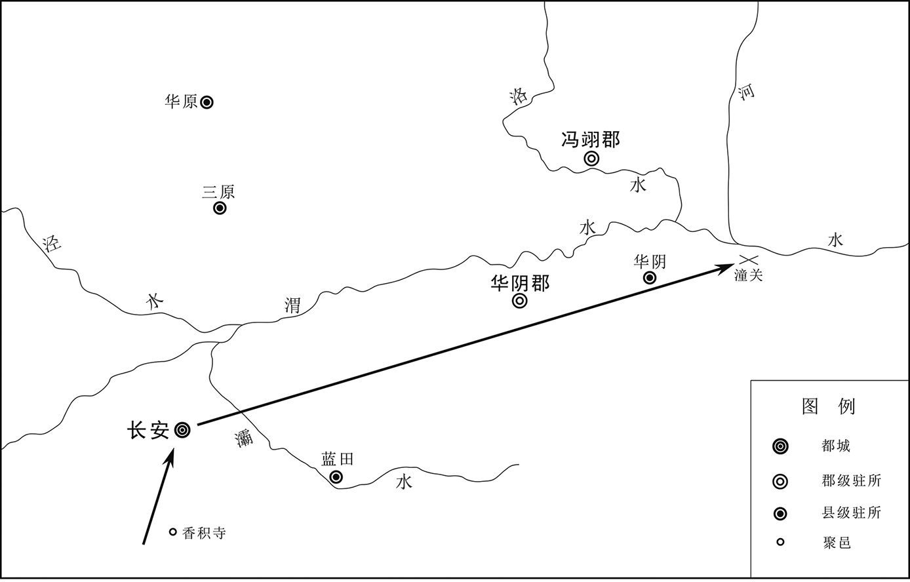 
唐肃宗至德二载（757年）九月唐军收复长安、郭子仪进驻潼关示意图

## 【译文】

唐肃宗至德二载（757年）冬十月丁未（初三日），啖庭瑶到达蜀地。

## 【原文】

**壬子，兴平军奏破贼于武关，克上洛郡[1]。**

## 【注文】

[1]兴平军：唐代方镇名。凤翔郡（即凤翔府）郿县东有兴平军，于唐肃宗至德元载（756年）设置方镇，治雍县（今陕西凤翔）。领商（即商州、上洛郡）、金（即金州、安康郡，治西城，相当于今陕西安康）、岐（即岐州、扶风郡、凤翔郡）等州，约相当于今甘肃六盘山以东，陕西麟游、眉县以西，太白以北地区。唐末为李昌符、李茂贞割据。

## 【译文】

唐肃宗至德二载（757年）十月壬子（初八日），兴平军（当时王难得领兴平军）向皇帝上奏，在武关攻破了叛贼，攻下了上洛郡。

## 【原文】

**尹子奇久围睢阳，城中食尽，议弃城东走，张巡、许远谋，以为：“睢阳，江、淮之保障，若弃之去，贼必乘胜长驱，是无江、淮也。且我众饥羸，走必不达。古者战国诸侯尚相救恤，况密迩群帅乎，不如坚守以待之。”茶纸既尽，遂食马，马尽，罗雀、掘鼠，雀鼠又尽，巡出爱妾，杀以食士，远亦杀其奴，然后括城中妇人食之，既尽，继以男子老弱[1]。人知必死，莫有叛者，所余才四百人。癸丑，贼登城，将士病，不能战。巡西向再拜曰：“臣力竭矣，不能全城，生既无以报陛下，死当为厉鬼以杀贼。”[2]城遂陷，巡、远俱被执。尹子奇问巡曰：“闻君每战眦裂齿碎，何也？”[3]巡曰：“吾志吞逆贼，但力不能耳。”子奇以刀抉其口视之，所余才三四。子奇义其所为，欲活之。其徒曰：“彼守节者也，终不为吾用，且得士心，存之将为后患。”乃并南霁云、雷万春等三十六人皆斩之。巡且死，颜色不乱，扬扬如常。生致许远于洛阳。**

## 【注文】

[1]罗雀：张网捕捉麻雀（鸟）。罗，捕鸟的网，罗网；张网捕捉。雀，鸟类的一科，吃粮食粒和昆虫。特指“麻雀”，泛指小鸟。另外，罗雀可引申形容门庭寂静或冷落；比喻用尽办法搜刮财物，用尽办法筹措款。

[2]厉鬼：凶恶的鬼。

[3]眦（zì）：眼角，上下眼睑连接的部位，靠近鼻子的称“内眦”，靠近两鬓（bìn，脸旁靠近耳朵的头发）的称“外眦”。眦裂，形容愤怒到极点。

## 【译文】

尹子奇包围睢阳城很长时间了，城中的粮食已经耗尽了。有人提议放弃睢阳城，向东逃亡。张巡、许远在一起策划，他们认为：“睢阳是江、淮地区的保障，如果我们放弃睢阳城逃跑了，叛贼一定会乘胜长驱直入南方的江、淮地区，到了那个时候，国家就没有江、淮了。而且，我方的军队又饥饿又瘦弱，如果逃跑必定不能到达目的地。在古代，战国时期，诸侯之间都尚且互相救助和抚恤，何况是现在离我们很近的各位统帅呢。我们不如坚守城池，以等待他们的援助。”茶纸既然已经吃光了，就吃马，马吃光了，就用网捕麻雀吃，挖掘老鼠洞找老鼠吃。麻雀和老鼠又吃光了，张巡就拿出自己心爱的小妾，将她杀死，给将士们吃。许远也杀死了他的奴仆，然后搜求城中的妇女，杀死了煮来吃。城中的妇女吃光了，又继续吃年老的和身体弱的男子。城中的人都知道自己一定会死，但是却没有人背叛张巡，城中所剩才四百人。至德二载（757年）十月癸丑（初九日），叛贼登上了城楼，守城的将士们生病了，无法作战。张巡向着西边（京城长安的方向）再次参拜，说：“我的力量已经用完了，不能守住睢阳全城。我既然活着无法报答陛下，死后应当变成厉鬼去杀叛贼。”睢阳城于是被叛贼攻陷，张巡、许远都被叛军抓获了。尹子奇问张巡：“听说您每次打仗眼角都裂开了，牙齿都咬碎了，这是为什么呀？”张巡回答道：“我的志向在于吞食叛逆朝廷的贼，只是力量达不到而已。”尹子奇用刀挑开张巡的嘴，看到他的嘴里只剩下三四颗牙齿。尹子奇被张巡的仗义行为所感动了，想让他活下来。但是，尹子奇手下的部众说：“他是一个为唐朝守节的人，终究不会为我们所用的，而且他赢得了许多士兵的心，留着他，将来会成为我们的祸患的。”于是，尹子奇将张巡和南霁云、雷万春等三十六人一同斩杀。张巡将要死的时候，面部的脸色不慌乱，就像往常一样愉快自若。叛军让许远活着，并押送到洛阳。

## 【原文】

**巡初守睢阳时，卒仅万人，城中居人亦且数万，巡一见问姓名，其后无不识者。前后大小战几四百余，杀贼卒十二万人。巡行兵不依古法，教战陈，令本将各以其意教之。人或问其故，巡曰：“今与胡虏战，云合鸟散，变态不恒，数步之间，势有同异。临机应猝，在于呼吸之间，而动询大将，事不相及，非知兵之变者也。故吾使兵识将意，将识士情，投之而往，如手之使指。兵将相习，人自为战，不亦可乎？”自兴兵，器械、甲仗皆取之于敌，未尝自修。每战，将士或退散，巡立于战所，谓将士曰：“我不离此，汝为我还决之。”将士莫敢不还，死战，卒破敌。又推诚待人，无所疑隐。临敌应变，出奇无穷。号令明，赏罚信，与众共甘苦、寒暑，故下争致死力。**

## 【译文】

张巡刚开始守卫睢阳的时候，手下的士兵仅仅一万人，城中的居民也才几万人。张巡一见到谁，问他的姓名，之后就没有不认识的人。前前后后大大小小的战役打了四百多次，杀死叛军的十二万名士兵。张巡用兵不依照古代的战法，而是教将士们军阵，让各位将领各自按照自己的意图去训练士兵。有人问张巡为什么这样做，张巡说：“现在我们与胡虏（指叛乱首领粟特胡人安禄山、史思明等）作战，一会儿像云一样聚在一起，一会儿又像鸟一样到处散开了。随时都在变化，没有稳定的时候。就在几步之间，战争的形势就有同有异。将士们面临变化的机会和形势，就在人的一次呼吸之间。如果无论什么事情，动不动就去询问大将，那么根本来不及处理事情，不可能知道兵势的变化。因此，我让士兵领会将军的意图，将军了解士兵的情况，派这样的军队出去作战，就像手指挥手指一样。士兵和将军们相互熟悉，人人都根据自身的情况作战，这不也是可以的吗？”张巡的军队自从打仗以来，所有的器械、武器都是从敌人手中夺过来的，从来没有自己修缮过。每次打仗，有的将士向后退或离散了，张巡就站在战场上，对将士们喊道：“我不离开这里，你们为了我，回去决战吧。”将士们没有人敢不回到战场，他们拼死力战，最后终于攻破了敌军。张巡以自己真诚的心对待别人，对人没有什么猜疑和藏匿的东西。他遇见敌人，能够随机应变，在战场上出奇兵无数次。他在军队中号令严明，对大家的赏赐或处罚都是言出必信，与大家共同经历美好的佳境或艰难的困境，共同体味冬季的严寒和夏季的酷暑。因此，他的部下都争着为他效死力。

## 【原文】

**张镐闻睢阳围急，倍道亟进，檄浙东、浙西、淮南、北海诸节度及谯郡太守闾丘晓，使共救之[1]。晓素傲很，不受镐命。比镐至，睢阳城已陷三日。镐召晓，杖杀之。**

## 【注文】

[1]浙东：唐朝方镇名，浙江东道的简称。唐肃宗乾元元年（758年）置浙江东道节度使，简称浙东节度使，治越州（治会稽，今浙江绍兴），辖越州、睦州（治建德，今浙江建德东北）、衢（qú）州（治信安，今浙江衢州）、婺（wù）州（治金华，今浙江金华）、台州（治临海，今浙江临海）、明州（治（mào）县，今浙江宁波南鄞（yín）江南岸）、处州（治丽水，今浙江丽水东南）、温州（治永嘉，今浙江温州）。唐代宗大历五年（770年），降为观察使，大历十四年（779年）与浙江西道观察使合并。唐德宗建中元年（780年）又分为二，第二年又合并。德宗贞元三年（787年）复分为二。后以睦州划归浙江西道观察使。唐僖宗中和三年（883年），升为义胜军节度使。僖宗光启三年（887年），改为威胜军节度使。唐昭宗乾宁三年（896年），又改为镇东军节度使。唐哀帝天祐后期仅领越、台、明、处、温五州。　　浙西：唐朝方镇名，浙江西道的简称。唐肃宗乾元元年（758年）置浙江西道节度使，简称浙西节度使，治升州（今江苏南京），辖升州、润州（治丹徒，今江苏镇江）、宣州（治宣城，今安徽宣州）、歙（shè）州（治歙县，今安徽歙县）、饶州（治鄱（pó）阳，今江西鄱阳）、江州（治浔（xún）阳，今江西九江）、苏州（治吴县，今江苏苏州）、常州（治晋陵，今江苏常州）、杭州（治钱塘，今浙江杭州）、湖州（治乌程，今浙江湖州）。不久治所迁至苏州，第二年还治升州。唐肃宗上元二年（761年）迁治所于宣州，不再辖升州。唐代宗大历元年（766年），改为观察使，治苏州，不再辖宣州、歙州。大历十四年（779年）与浙江东道观察使合并。唐德宗建中元年（780年）又分为二，第二年又合并。德宗贞元三年（787年）复分为二。浙江西道观察使治润州。贞元四年（788年），领润、苏、常、杭、湖、睦六州。唐宪宗元和二年（807年），升为镇海军节度使。唐昭宗光化元年（898年），移治所于杭州。唐哀帝天祐以后，辖境缩小。　　淮南：这里是唐朝方镇名。唐肃宗至德元载（756年）置淮南节度使，治扬州（治江都，今江苏扬州），辖扬州、楚州（治山阳，今江苏淮安）、滁（chú）州（治清流，今安徽滁州）、和州（治历阳，今安徽和县）、寿州（治寿春，今安徽寿县）、庐州（治合肥，今安徽合肥）、舒州（治怀宁，今安徽潜山）、光州（治定城，今河南潢川西）、蕲（qí）州（治蕲春，今湖北蕲春北）、安州（治安陆，今湖北安陆西北）、黄州（治黄冈，今湖北黄冈）、申州（治义阳，今河南信阳南）、沔（miǎn）州（治汉阳，今湖北武汉）。其后辖境屡有变迁，长期领有扬、楚、滁、和、舒、寿、庐等州，一度领有泗（sì）州（治临淮，今江苏盱眙西北淮水西岸）、濠（háo）州（治钟离，今安徽凤阳东北临淮关）、宿州（治符离，今安徽符离集）等。淮南节度的辖区因地处交通冲要，常兼诸道盐铁转运使（唐朝使职名，负责从江、淮地区向京城运输盐和铁。这一项职能对中晚唐国家财政收入意义重大）。唐昭宗景福元年（892年），杨行密担任节度使。昭宗天复二年（902年），封杨行密为吴王。后来，杨行密以淮南节度为基础，建立五代时期的吴国。　　北海：唐朝方镇名。北海节度使负责辖区内的军政、民事、监察等一切事务。

## 【译文】

张镐听说睢阳城被叛军包围得很紧，就加倍里程赶路，急切行军，并向浙东、浙西、淮南、北海诸位节度使及谯郡太守闾丘晓发檄文，请他们共同出兵援救睢阳。闾丘晓向来非常傲慢，不接受张镐的命令。等到张镐的军队到达睢阳城，睢阳城陷入叛贼的手里已经三天了。张镐召来闾丘晓，对他施以杖刑，将他杀死。

## 【原文】

**张通儒等收余众走保陕，安庆绪悉发洛阳兵，使其御史大夫严庄将之，就通儒以拒官军，并旧兵步骑犹十五万。己未，广平王俶至曲沃[1]。回纥叶护使其将军鼻施吐拨裴罗等引军旁南山，捜伏，因驻军岭北。郭子仪等与贼遇于新店，贼依山而陈，子仪等初与之战，不利，贼逐之下山[2]。回纥自南山袭其背，于黄埃中发十余矢[3]。贼惊顾曰：“回纥至矣。”遂溃。官军与回纥夹击之，贼大败，僵尸蔽野。严庄、张通儒等弃陕东走，广平王俶、郭子仪入陕城，仆固怀恩等分道追之。严庄先入洛阳告安庆绪，庚申夜，庆绪帅其党自苑门出，走河北，杀所获唐将哥舒翰、程千里等三十余人而去。许远死于偃师[4]。**

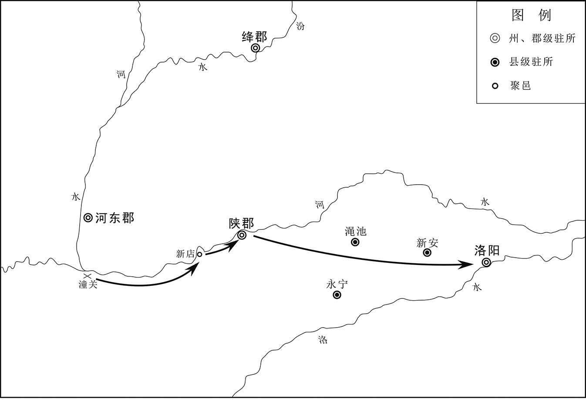 
唐肃宗至德二载（757年）十月郭子仪收复洛阳示意图

## 【注文】

[1]曲沃：县名。即曲沃县，隶属于绛郡、绛州，相当于今山西曲沃。

[2]新店：地名，在陕郡附近。

[3]黄埃：黄色的尘土。

[4]偃师：县名。即偃师县，隶属于河南府，相当于今河南偃师东。

## 【译文】

张通儒等收集起残余的士兵，逃到陕郡。安庆绪发动了洛阳的全部士兵，让御史大夫严庄统领，与张通儒的军队会合，以对抗官军。叛军的人数，把旧的步兵和骑兵计算在内，仍然有十五万人。至德二载（757年）十月己未（十五日），广平王李俶到达曲沃县。回纥汗国的叶护太子派遣将军鼻施吐拨裴罗等率领军队到达旁边的南山，搜察有没有伏兵，趁势在山岭之北驻军。郭子仪等与叛贼在新店遭遇。叛贼依靠着山排列阵营，郭子仪等最初与叛军交战，形势对官军不利，叛贼将官军驱逐到山下。回纥兵从南山偷袭叛军的背后，在黄色的尘土中向叛军射了十多箭。叛贼惊慌地相互看着说：“回纥的军队来了。”于是叛军的队伍瓦解了。官军与回纥兵夹击叛军，叛贼大败，僵硬的尸体布满了山野。严庄、张通儒等放弃了陕郡，向东边逃窜。广平王李俶、郭子仪进入陕城，仆固怀恩等将领分道追击逃亡的叛军。严庄先到洛阳，将战争的情况告诉了安庆绪。十月庚申（十六日）夜晚，安庆绪率领自己的党徒从洛阳城禁苑的苑门中逃出，往河北地区逃窜。在逃跑之前，安庆绪等人杀死了所抓获的唐朝将领哥舒翰、程千里等三十多人。许远死于偃师县。

## 【原文】

**壬戌，广平王俶入东京。回纥意犹未厌，俶患之。父老请率罗锦万匹以赂回纥，回纥乃止[1]。**

## 【注文】

[1]罗：轻软有稀孔的丝织品。　　锦：有彩色花纹的丝织品。

## 【译文】

唐肃宗至德二载（757年）十月壬戌（十八日），广平王李俶进入东京（洛阳）。回纥军队贪婪的欲望仍然没有得到满足。李俶对此事感到非常忧虑。父老乡亲们请求用大概一万匹罗和锦（相当于货币）去贿赂回纥兵，回纥于是停止劫掠。

## 【原文】

**成都使还，上皇诰曰：“当与我剑南一道自奉，不复来矣。”[1]上忧惧，不知所为。数日后，使者至，言：“上皇初得上请归东宫表，彷徨不能食，欲不归。及群臣表至，乃大喜，命食，作乐，下诰定行日。”上召李泌告之曰：“皆卿力也。”癸亥，上发凤翔，遣太子太师韦见素入蜀，奉迎上皇[2]。**

## 【注文】

[1]剑南：这里指剑南节度使。参见《唐开元、天宝十节度表》。

[2]太子太师：唐朝太子东宫官，位居太子三师（即太子太师、太子太傅、太子太保）之首，从一品。按制度规定，应负责教导太子的德行、修养、仪表。但从唐玄宗朝开始，太子太师开始成为虚衔，多作为安置退免大臣的闲职或作为加官（仅有官衔，标志身份、地位，无制度规定的实职）、赠官（赠给已经死亡的官员的官衔）。

## 【译文】

肃宗派往成都的使者回来了，传达太上皇的诰：“您应当给我一个剑南道，我自己养着自己，我不会再回京城了。”肃宗感到忧虑、害怕，不知道怎么办才好。几天之后，后派往成都的使者回来了，称：“太上皇最初得到皇上请求回归东宫（继续当太子）的表，心里犹豫不决，吃不下饭，不想回京城。等到群臣上给太上皇的表到了，太上皇感到非常高兴，命令把食物送上来，奏乐，并下了诰，已经定了启程返京的日期。”肃宗召来李泌，将事情的经过都告诉他，并说：“这都是您的功劳啊。”至德二载（757年）十月癸亥（十九日），肃宗从凤翔出发了，派遣太子太师韦见素到蜀地去，迎接太上皇返回京城。

## 【原文】

**乙丑，郭子仪遣左兵马使张用济、右武锋使浑释之将兵取河阳及河内[1]。严庄来降。陈留人杀尹子奇，举郡降。田承嗣围来瑱于颍川，亦遣使来降；郭子仪应之缓，承嗣复叛，与武令珣皆走河北[2]。制以瑱为淮南节度使。**

## 【注文】

[1]左兵马使：兵马使的一种。　　右武锋使：唐朝使职名。唐代节度使府的武职幕僚。　　河阳：指河阳三城。

[2]来瑱（tián）（？—763年）：唐玄宗、肃宗朝军将。邠州永寿（今陕西永寿）人。他少有大志，多涉书传。唐玄宗天宝初年，他在安西四镇任职。天宝十一载（752年），他担任伊西、北庭行军司马。唐肃宗至德元载（756年），他担任颍川（治今河南许昌）太守，守城拒安禄山叛军，杀敌甚众，号“来嚼铁”。以功迁淮西道节度使。唐军收复西京长安和东都洛阳后，来瑱被封为颍国公。肃宗上元初，他任山南东道襄邓等十州节度使，破史思明叛军于汝州（治今河南汝州）。来瑱作战勇敢，深得军心，被人妒忌。肃宗也担心难以控制他，密令行军司马裴茂取代来瑱，暗中夺取来瑱的兵权。唐代宗初登皇位，来瑱到朝廷向皇帝谢罪，担任兵部尚书、同平章事、充山陵使，带宰相之衔却无任何兵权。不久，他被宦官程元振等诬陷，削官赐死。

## 【译文】

唐肃宗至德二载（757年）十月乙丑（二十一日），郭子仪派遣左兵马使张用济、右武锋使浑释之率领军队攻取河阳及河内。严庄前来向官军投降。陈留郡的人杀了叛将尹子奇，整个郡都向唐廷投降。叛将田承嗣将来瑱包围在颍川，也派遣使者前来表示向官军投降。郭子仪回应田承嗣迟缓了，于是田承嗣又叛乱了，与武令珣都逃到河北地区。皇帝下制书，任命来瑱为淮南节度使。

## 【原文】

**丙寅，上至望贤宫，得东京捷奏。丁卯，上入西京。百姓出国门奉迎，二十里不绝，舞跃呼万岁，有泣者。上入居大明宫[1]。御史中丞崔器令百官受贼官爵者皆脱巾徒跣，立于含元殿前，博膺顿首请罪，环之以兵，使百官临视之[2]。太庙为贼所焚，上素服向庙哭三日[3]。是日，上皇发蜀郡。**

## 【注文】

[1]大明宫：参见前“北内”条注。

[2]含元殿：唐都长安大明宫的前正殿，系皇帝上朝听政的大殿。面积达一千九百多平方米，殿基位于龙首原的南沿，高出地面十五点六米，殿面阔十一间。唐朝中期以后，诸帝常常居住在大明宫，大明宫也成为唐朝权力运作的中枢，皇帝常常驾临含元殿听政。含元殿与大明宫的南正门——丹凤门相配合，同为举行国家大典、朝会之地。

[3]太庙：供奉本朝先代帝王之庙。历朝历代必立太庙以祭祀祖先，所以古代常用“太庙”作为王朝或国家政权的代称。李唐皇室的太庙位于长安城皇城（中央政府衙署的所在地）的东南角。　　素服：居丧或遭到其他凶事时所穿的白色衣服。

## 【译文】

唐肃宗至德二载（757年）十月丙寅（二十二日），肃宗到达望贤宫，得到官军已经收复东京的捷报。丁卯（二十三日），肃宗进入西京。百姓走出国都的大门前来迎接皇帝，人群绵延二十里都不断，大家激动地跳着舞蹈，欢呼雀跃，高呼万岁，有人都激动得哭了。肃宗进入大明宫居住，御史中丞崔器命令：凡是接受了叛贼所任命的官爵的人都脱下衣服，光着脚站在大明宫的含元殿前面，敞开自己的胸部，叩头下拜，向皇帝请罪。这批人的周围站立着士兵，崔器让百官都到那里去观看这种场景。太庙被叛贼焚毁了。肃宗身穿素服向着太庙痛哭了三天。这一天，太上皇从蜀郡出发（返回长安）。

## 【原文】

**安庆绪走保邺郡，改邺郡为安成府，改元天成。从骑不过三百，步卒不过千人，诸将阿史那承庆等散投常山、赵郡、范阳。旬日间，蔡希德自上党，田承嗣自颍川，武令珣自南阳各帅所部兵归之。又召募河北诸郡人，众至六万，军声复振。**

## 【译文】

安庆绪逃到邺郡，改邺郡为安成府，改元天成。随从他的骑兵不超过三百人，步兵不超过一千人。叛将阿史那承庆等都散了，投到常山、赵郡、范阳去了。十天时间，蔡希德从上党郡，田承嗣从颍川郡，武令珣从南阳郡，各自率领手下的士兵来到邺郡，归附于安庆绪。安庆绪又在河北地区的各个郡招募士兵，共招募了六万人。安庆绪叛军的声势又重新振作起来。

## 【原文】

**广平王俶之入东京也，百官受安禄山父子官者陈希烈等三百余人，皆素服悲泣请罪。俶以上旨释之，寻勒赴西京。己巳，崔器令诣朝堂请罪，如西京百官之仪，然后收系大理、京兆狱[1]。其府、县所由、祗承人等受贼驱使追捕者，皆系之[2]。**

## 【注文】

[1]京兆：参见前“京兆尹”条注。京兆尹之下设法曹参军事二人，正七品下，掌管法律、审刑狱定刑，督捕盗贼，负责地方治安。

[2]所由：唐朝某方面的主管官吏。多指低级办事吏员。　　祗（zhī）承人：侍者。

## 【译文】

广平王李俶进入东京城，接受安禄山父子所授予官爵的陈希烈等三百多名官员，都身着素服，悲痛地哭着向广平王请罪。李俶按照肃宗的旨意，将这批官员都释放了。十月己巳（二十五日），崔器命令这批官员到朝堂去请罪，就像西京长安接受伪官的人向皇帝请罪的仪式一样。然后，将这批官员逮捕、捆绑起来，押送到大理寺和京兆府的监狱中。东都所属府、县地区的所由、祗承人等，凡是受了叛贼驱使的，也都捆绑起来。

## 【原文】

**初，汲郡甄济有操行，隐居青岩山，安禄山为采访使，奏掌书记[1]。济察禄山有异志，诈得风疾，舁归家[2]。禄山反，使蔡希德引行刑者二人，封刀召之，济引首待刀，希德以实病白禄山。后安庆绪亦使人强舁至东京，月余，会广平王俶平东京，济起，诣军门上谒。俶遣诣京师，上命馆之于三司，令受贼官爵者列拜以愧其心，以济为秘书郎[3]。国子司业苏源明称病不受禄山官，上擢为考功郎中、知制诰[4]。壬申，上御丹凤楼，下制：“士庶受贼官禄为贼用者，令三司条件闻奏；其因战被虏，或所居密近，因与贼往来者，皆听自首除罪；其子女为贼所污者，勿问。”[5]**

## 【注文】

[1]甄（zhēn）济（？—766年）：唐玄宗、肃宗朝大臣，著名文人。字孟成，唐代定州无极（今河北无极）人，自幼丧父，性沉静好学。他隐居于青岩山十多年，人皆以文士相赞。唐玄宗天宝十载（751年），朝廷以左拾遗的官位征召他，他不接受。安禄山担任河北道采访使时到朝廷参拜皇帝，向玄宗请求授予其范阳掌书记，并亲赴卫州（治今河南卫辉），遣太守进山拜甄济。甄济不得已就赴仕途。他在官衙中论议正直，秉公办事。后来他发现安禄山密谋反唐，便暗自备下羊血，托辞身患重症，回到故乡。安庆绪也征召他，将他强行押送到洛阳。后来，唐军收复东都洛阳，他立即投奔唐廷，被肃宗表彰、授官。　　青岩山：又名云梦山，位于河南省淇（qí）县城西十五公里的太行山东麓，主峰高五百八十四点五米，峰峦叠嶂，山起云浮，气象万千，飞瀑流泉，鬼斧神工，素有“云梦仙境”之称。这里是战国时代著名的兵家鬼谷先生的隐居处。鬼谷先生在此地著书、教授生徒。著名的军事家孙膑、庞涓都是他的学生。云梦山自然景观优美，文化遗迹丰厚。现存鬼谷洞、太阳洞、孙膑洞、庞涓洞、孙膑墓、舍身台、鬼谷墟、演兵岭、天书崖、玉帝殿、三清殿、南北桃园等主要景点五十多处，有全国字数最多、规模最大的摩崖石刻“鬼谷子”兵书。

[2]舁（yú）：抬。

[3]秘书郎：唐朝秘书省的职事官，置四员，从六品上，负责经、史、子、集四部图书的收藏、分类管理。

[4]国子司业：唐朝最高学府及教育行政管理机构国子监的次官，属职事官。国子监设祭酒一人，为长官，从三品；设国子司业二人，为副官，从四品下。国子祭酒、司业负责国家儒学教育的政令、祭祀孔子。　　苏源明：生卒年不详，唐玄宗、肃宗朝大臣。京兆武功（今陕西武功西北）人，初名预，字弱夫。他于唐玄宗天宝年间考中进士，历任太子谕德、东平（治山东东平西北）太守、国子司业。安禄山起兵叛乱，攻陷长安时，他托病，不接受叛贼授予的伪官。官军收复两京后，唐肃宗提拔他为考功郎中、知制诰，负责草拟皇帝的重要诏书。他几次向皇帝陈述政治得失，最终做到秘书少监（从四品上，秘书省的副官，负责辅助秘书省的长官秘书监掌管国家的图书、典籍）。他善于文辞，与大诗人杜甫等友善。他的诗文集均已散佚。《全唐文》存文五篇，《全唐诗》存诗二首。　　考功郎中：唐朝尚书省吏部的职事官，从五品上，负责京城和外地文武官吏的考核。

[5]丹凤楼：即唐都长安大明宫的南正门——丹凤门。丹凤门上建有城楼，下有三个门道，又称丹凤楼。曾改称明凤门，不久恢复旧称。唐朝中期以后，诸帝几乎都在大明宫生活起居、处理政事。如有大事，皇帝常常驾临丹凤门举行朝会，颁布重要的诏书。

## 【译文】

起初，汲郡人甄济有操守和品行，在青岩山隐居。安禄山担任河北道采访使时，向朝廷奏请授予甄济掌书记之职。甄济觉察到安禄山对朝廷心怀异志，就向安禄山谎称自己得了风疾，被人抬着回家了。安禄山起兵造反，派遣蔡希德带着专门在刑场上处决死刑犯的两名刽子手，封上屠刀去征召甄济。甄济将自己的脑袋架在刀口，等候刽子手动刀。蔡希德就说甄济真的生病了，报告给安禄山。后来，安庆绪也派人强行将甄济用轿子抬到东京。过了一个多月，恰逢广平王李俶率领官军收复了东京。甄济起身，专程到军营的大门去拜见广平王。李俶派遣甄济到京城，肃宗命他到三司（指唐代中央的司法机构大理寺、刑部和御史台）的衙署去，让接受叛贼所授官爵的人依次参拜甄济，让这批人心里感到羞愧。肃宗任命甄济为秘书郎。国子司业苏源明以自己生病为由，不接受安禄山授予的官位，肃宗将他提拔为考功郎中、知制诰。至德二载（757年）十月壬申（二十八日），肃宗驾幸丹凤楼，颁发制书：“无论士大夫还是百姓，凡是接受了叛贼授予的官位、俸禄，被叛贼任用的人，令三司根据各人不同的情况上奏；因为战争被叛军俘虏，或者因为居住地离叛军太近，因此与叛贼往来的人，都听凭向朝廷自首，然后免除罪刑。这批人的子女被叛贼所污染的，不予追究。”

## 【原文】

**癸酉，回纥叶护自东京还，上命百官迎之于长乐驿，上与宴于宣政殿[1]。叶护奏以“军中马少，请留其兵于沙苑，自归取马，还为陛下扫除范阳余孽”[2]。上赐而遣之。**

## 【注文】

[1]长乐驿：长安城附近的驿站。位于长安城外城的东面通化门东七里的长乐坡上，下临浐水。　　宣政殿：唐都长安大明宫的正殿，位于含元殿的正北方。殿东西长七十米，南北宽四十多米。东西侧宫墙外设中书省、门下省、御史台及史馆等近臣、机要衙署。宣政殿为皇帝日常听政之处。大朝会、典礼也在此殿举行。

[2]沙苑：地名，又名沙阜、沙海、沙窝。位于今陕西大荔南洛、渭二水之间，东西八十里，南北三十里。地多沙草，宜畜牧。唐朝在此地置沙苑监，负责牧养来自陇右地区（唐朝主要的战马产地）的牛羊、马匹等，以供朝廷宴会、祭祀之用。中唐后，沙苑成为朝廷重要的育马场之一。唐廷并于沙苑东首置城，广四十八里。唐末，沙苑监废。

## 【译文】

唐肃宗至德二载（757年）十月癸酉（二十九日），回纥汗国的叶护太子从东京归来。肃宗命令百官到长乐驿去迎接他，肃宗在大明宫的宣政殿设宴款待他。叶护太子向皇帝上奏，称“军队中的马匹太少了，我请求将我的兵马留在沙苑，我独自一人回去，从我们国家再取一些马回来，再为陛下您扫除残留在范阳的叛军、孽贼”。肃宗赏赐了叶护太子，让他回国了。

## 【原文】

**十一月，广平王俶、郭子仪来自东京，上劳子仪曰：“吾之家国，由卿再造。”**

## 【译文】

唐肃宗至德二载（757年）十一月，广平王李俶、郭子仪从东京回到长安。肃宗亲自慰劳郭子仪，说：“我们李氏的家国，全凭您再造。”

## 【原文】

**张镐帅鲁炅、来瑱、吴王祗、李嗣业、李奂五节度徇河南、河东郡县，皆下之，惟能元皓据北海，高秀岩据大同未下。**

## 【译文】

张镐率领鲁炅、来瑱、吴王李祗、李嗣业、李奂五位节度使巡行河南、河东地区的郡县。他们收复了这一地区的所有郡县，只是能元皓占据的北海郡、高秀岩占据的大同军还没有攻下。

## 【原文】

**己丑，以回纥叶护为司空、忠义王。岁遗回纥绢二万匹，使就朔方军受之。**

## 【译文】

唐肃宗至德二载（757年）十一月己丑（十五日），肃宗封回纥汗国的叶护太子为司空（虚衔）、忠义王，并许诺每年赠送给回纥汗国两万匹绢，让回纥汗国派人到朔方军的辖地去取。

## 【原文】

**上之在彭原也，更以栗为九庙主。庚寅，朝享于长乐殿[1]。**

## 【注文】

[1]栗：一种落叶乔木，果实为坚果，称“栗子”，味甜，可食。在中国古代社会，栗可以用作祭祀的供品。　　九庙：指帝王的宗庙。在中国古代社会，帝王立庙祭祀祖先。按周代的礼制，帝王家立太祖庙及三昭庙﹑三穆庙（昭、穆是指宗庙中位次的排列。三昭三穆是从周文王起算，单数世代属于穆行，双数世代属于昭行），共七庙。汉代宗庙之制不用周礼。王莽取代西汉王朝，建立新朝，又增为祖庙五、亲庙四，共九庙。其后，历代皇帝皆立九庙。　　朝享：古代天子祭祀宗庙，用食物供奉。　　长乐殿：唐朝宫殿名。位于唐都长安的宫城太极宫（又称西内。宫城分为三部分：中间最大的部分为太极宫，系宫城的核心部分；东部为皇太子居住的东宫；西边为妃嫔居住的掖庭宫）中。唐初，皇帝居住与听政多在长安城内的太极宫。太极宫内有太极殿、两仪殿、甘露殿、凌烟阁等殿、亭、观、阁三十余所。唐中期以后，皇帝生活起居、处理朝政的地点移至大明宫。但是，皇帝登基、殡葬、祭祀等重大典礼仍然多在太极宫举行。

## 【译文】

肃宗到达彭原郡，命令将栗作为祭祀九庙的主要供品。至德二载（757年）十一月庚寅（十六日），皇帝在长乐殿祭祀宗庙。

## 【原文】

**丙申，上皇至凤翔，从兵六百余人，上皇命悉以甲兵输郡库。上发精骑三千奉迎。十二月丙午，上皇至咸阳，上备法驾迎于望贤宫[1]。上皇在宫南楼，上释黄袍，著紫袍，望楼下马，趋进，拜舞于楼下[2]。上皇降楼，抚上而泣，上捧上皇足，呜咽不自胜。上皇索黄袍，自为上著之，上伏地顿首固辞。上皇曰：“天数人心皆归于汝，使朕得保养余齿，汝之孝也。”[3]上不得已，受之。父老在仗外，欢呼且拜。上令开仗，纵千余人入谒上皇，曰：“臣等今日复睹二圣相见，死无恨矣。”[4]上皇不肯居正殿，曰：“此天子之位也。”上固请，自扶上皇登殿。尚食进食，上品尝而荐之。丁未，将发行宫，上亲为上皇习马而进之。上皇上马，上亲执鞚，行数步，上皇止之。上乘马前引，不敢当驰道[5]。上皇谓左右曰：“吾为天子五十年，未为贵；今为天子父，乃贵耳。”[6]左右皆呼万岁。上皇自开远门入大明宫，御含元殿，慰抚百官[7]。乃诣长乐殿谢九庙主，恸哭久之；即日，幸兴庆宫，遂居之[8]。上累表请避位还东宫，上皇不许。**

## 【注文】

[1]法驾：皇帝出行车驾的一种。天子的车驾分为大驾、法驾、小驾三种，其仪卫之繁简各有不同。唐代法驾减大驾的三分之一。

[2]黄袍：古代帝王的袍服。“黄袍”往往被看作古代帝王服式的象征。“黄袍”作为帝王的专用衣着源于唐朝。

[3]齿：因幼马每岁生一齿，故以齿计算牛马的岁数；亦指人的年龄。

[4]二圣：在中国古代社会，圣明的君主帝王，及后世道德高尚、儒学造诣高深者，都被称为圣人。这里将太上皇唐玄宗和皇帝唐肃宗合称为“二圣”。

[5]驰道：驰道是中国历史上最早的“国道”，始建于秦朝。公元前221年，秦始皇统一六国。统一全国后第二年（前220年），秦始皇就下令修筑以首都咸阳（今陕西咸阳）为中心的、通往全国各地的驰道。著名的驰道有九条：出今高陵通上郡（陕北）的上郡道，过黄河通山西的临晋道，出函谷关通河南、河北、山东的东方道等。驰道的修建，对于陆路交通的发达，促进全国经济文化的交流，具有重大的意义。驰道是皇帝的专用车道，皇帝下面的大臣、百姓，甚至皇亲国戚都是没有权利走的。驰道在秦汉时期最为流行，规定的宽度是五十步，两旁种有树。驰道在后世的王朝也延续下来，继续发挥着功用。

[6]为天子五十年：唐玄宗李隆基从先天元年（712年）至天宝十五载（756年）在皇帝位，算起来将近五十年。

[7]开远门：唐都长安城西面的城门。

[8]兴庆宫：唐都长安城东面的宫殿，由唐玄宗李隆基为藩王时的旧宅扩建而成，又称为南内。宫城东西宽一千零八十米，南北长一千二百五十米。内有兴庆殿、南熏殿、长庆殿、勤政务本楼、花萼相辉楼、沉香亭等建筑。开元十六年（728年），玄宗移到兴庆宫生活起居、听政理朝，兴庆宫成为新的权力中枢，直到天宝十五载（756年）安禄山叛乱，玄宗逃离长安之时。从唐肃宗时代开始，皇帝生活起居、处理政事一般都在大明宫。大明宫才是唐后期的权力中心。因此，玄宗回到长安之后居住在兴庆宫，其实是远离了权力中枢。

## 【译文】

唐肃宗至德二载（757年）十一月丙申（二十二日），太上皇到达凤翔，随从他的士兵有六百多人。太上皇命令将随从他的士兵以及铠甲输入凤翔郡的仓库。肃宗出动了三千名精锐的骑兵前来迎接太上皇。十二月丙午（初三日），太上皇到达咸阳。肃宗准备了法驾，在望贤宫迎接太上皇。太上皇在望贤宫的南楼，肃宗脱下天子所穿的黄袍，身穿紫袍。肃宗一看见楼下的马，就快步向前走，走到望贤宫的南楼下拜见太上皇，并跳起了舞蹈。太上皇从楼上下来了，抚摸着肃宗的身子，流下了眼泪。肃宗手捧着太上皇的脚，抽泣着，不能控制住自己。太上皇要来天子穿的黄袍，亲自给肃宗穿上。肃宗俯伏在地上，叩头下拜，坚决推辞。太上皇说：“天数、人心都归于你了，让我得以安心保养余下的时间和生命，这才是你的尽孝之道啊。”肃宗不得已，接受了太上皇给他披上的黄袍。父老乡亲们都站在仪仗队之外，欢呼着，并且参拜太上皇和皇帝。肃宗命令仪仗队散开，放任一千多名百姓进来，拜见太上皇。这些百姓说：“我们今天又看到两位圣人相见了，就算是死也没有什么遗憾了。”太上皇不肯居住在望贤宫的正殿，说：“这是天子居住的地方。”肃宗坚决请求太上皇居住正殿，亲自用手扶着太上皇攀登着台阶走上正殿。皇宫中的尚食局进献来食物，肃宗先品尝了，然后才进献给太上皇食用。十二月丁未（初四日），太上皇和皇帝将要从行宫（指望贤宫）出发，肃宗亲自为太上皇调教马，然后进献给太上皇。太上皇上马，肃宗亲自用手拽着马笼头，牵着马走了几步，太上皇制止了他，让他不要这样做。肃宗骑着马，在前面引路，不敢挡着皇帝专用的驰道。太上皇对左右的随从说道：“我当天子五十年，还没有感觉到尊贵；现在我成了天子的父亲，才体会到什么是尊贵啊。”左右的随从都高声呼喊着万岁。太上皇从开远门进入大明宫，到达含元殿，慰抚朝中的官员。然后太上皇才到长乐殿去向九庙主谢罪，放声痛哭了很久。就在这一天，太上皇驾幸兴庆宫，于是就住在那里。肃宗向太上皇上了好几份表，请求自己让出皇位，回到东宫去当太子，太上皇都不准。

## 【原文】

**戊午，上御丹凤楼，赦天下，惟与安禄山同反及李林甫、王鉷、杨国忠子孙不在免例。立广平王俶为楚王。加郭子仪司徒，李光弼司空，自余蜀郡、灵武扈从立功之臣，皆进阶［赐］爵、加食邑有差[1]。李憕、卢奕、颜杲卿、袁履谦、许远、张巡、张介然、蒋清、庞坚等，皆加追赠，官其子孙[2]。战亡之家，给复二载[3]。郡县来载租、庸，三分蠲一。近所改郡名、官名，一依故事[4]。以蜀郡为南京，凤翔为西京，西京为中京[5]。以张良娣为淑妃，立皇子南阳王係为赵王，新城王仅为彭王，颍川王僴为兖王，东阳王侹为泾王，僙为襄王，倕为杞王，偲为召王，佋为兴王，侗为定王[6]。议者或罪张巡以守睢阳不去，与其食人，曷若全人[7]。其友人李翰为之作传，表上之，以为：“巡以寡击众，以弱制强，保江、淮以待陛下之师，师至而巡死，巡之功大矣。而议者或罪巡以食人，愚巡以守死。善遏恶扬，录瑕弃功，臣窃痛之。巡所以固守者，以待诸军之救，［救］不至而食尽，食既尽而及人，乖其素志。设使巡守城之初，已有食人之计，损数百之众以全天下，臣犹曰功过相掩，况非其素志乎？今巡死大难，不睹休明，唯其令名，是有荣禄。若不时纪录，恐远而不传，使巡生死不遇，诚可悲焉。臣敬撰传一卷献上，乞编列史官。”[8]众议由是始息。是后，赦令无不及李憕等，而程千里独以生执贼庭，不沾褒赠。**

## 【注文】

[1]司徒：官名。唐朝三公（太尉、司徒、司空）之一，正一品。本是辅佐皇帝治理国家之重臣。但在唐朝，司空仅作为大臣的加官（只表示身份、官位的荣誉衔），无实际职掌。　　食邑：又称采（cài）邑、采地或封地，指古代君主赐予臣下、作为其家族世世代代享用的封地。封地的主人在食邑内有统治权，要对天子承担一定的义务，封地范围内的所有劳动者、所收取的租税均供主人享用。到秦汉时代，封地的主人在封地范围内的统治权逐渐丧失，只能征收封地内民户的赋税充当俸禄，亦为世袭。到了唐代，被赐予食邑的宗室或高级官员也只能收取封地内民户的赋税，作为俸禄，无统治权。到晚唐、五代、宋初，食邑也逐渐完全俸禄化。被赐予食邑的官员并无任何封地，只是将食邑多少户固定折算成相应的钱数，直接发给官员。

[2]追赠：在人死后授予某种官职或称号。

[3]给复：免除赋税徭役。

[4]近所改郡名、官名，一依故事：安禄山叛乱后，唐廷厌恶叛贼安禄山，凡是郡县名、官名有“安”字者，多做了更改，以避恶讳。现在又将一切恢复旧名。

[5]南京、西京：按唐朝制度，凡是皇帝出行停驻过的地方，都升格为京。安禄山叛乱时，唐玄宗逃奔蜀郡，在那里停驻过一段时间，而蜀郡又位于整个帝国的南部，故称南京。安禄山叛乱期间，唐肃宗曾停驻在凤翔郡，进行指挥，凤翔郡又位于帝国偏西的地区，故称西京。

[6]张良娣（？—762年）：良娣为皇太子东宫的内命妇之一，正三品，地位仅次于皇太子妃。张良娣为邓州向城（今河南南召东南）人，其祖母窦氏为唐玄宗李隆基的生母之妹。唐肃宗李亨为太子时，纳为良娣，很得李亨的宠爱。安禄山叛乱时，在跟随玄宗逃奔蜀地的途中，张良娣说服李亨前往朔方节度使的治所灵武。李亨登上皇位后，她的身份仍然是良娣。直到至德二载（757年），官军收复长安、太上皇玄宗返回长安后，才被册封为淑妃（唐朝后宫妃嫔名号，正一品）。肃宗乾元元年（758年），立为皇后。张皇后与大宦官李辅国勾结，专权用事。他们用阴谋杀害了建宁王李倓，又幽禁太上皇玄宗，谋废太子李豫（即广平王李俶，肃宗的长子，后改名为李豫），肃宗不能制。后来，张皇后与李辅国争权。肃宗病危时，张皇后策划拥立越王李係继承皇位，被宦官李辅国和程元振带兵入宫杀死。　　淑妃：唐朝后宫妃嫔名号。皇后之下设贵妃、淑妃、德妃、贤妃，并为夫人，皆正一品。　　南阳王係：即李係（xì）（？—762年），本名儋（dān），唐肃宗李亨的次子，宫女孙氏所生。唐玄宗天宝中，封南阳郡王，授特进（文散阶，正二品）。肃宗至德二载（757年），进封赵王。他拥有韬略、文学之才，兼有智慧和勇气。肃宗乾元二年（759年），官军与叛军在河北作战，形势不利，命李係领天下兵马元帅之职，李光弼任副元帅，实际统兵。乾元三年（760年）改封越王。宝应元年（762年），肃宗病危。张皇后与李係密谋除掉掌握禁军的大宦官李辅国，结果反为李辅国所害。　　新城王仅：即李仅（？—759年），唐肃宗之第五子，陈婕妤（yú）（唐朝后宫妃嫔名号，正三品）所生。唐玄宗天宝中，封新城郡王。至德二载（757年），进封彭王。肃宗乾元二年（759年），官军与叛军在河北作战，形势不利，命李仅领河西节度大使（仅挂职，不实际任事）。李仅死于当年。　　颍川王僴（xiàn）：即李僴（？—762年），唐肃宗之第六子，韦妃（李亨的发妻，韦坚之妹）所生。肃宗李亨为太子时，韦氏为太子妃，生李僴及永和公主。韦坚被李林甫诬陷致死，太子感到害怕，与韦妃离婚（事见《李林甫专政》）。韦妃被安置在别宫。李僴在玄宗天宝中封颍川郡王。肃宗至德二载（757年），进封兖（yǎn）王。肃宗乾元三年（760年）领北庭节度大使（仅挂职，不实际任事）。肃宗宝应元年（762年），在宫廷政变中被宦官李辅国所杀。　　东阳王侹（tǐng）：即李侹（？—784年），唐肃宗之第七子，张美人所生。唐玄宗天宝中，封东阳郡王。肃宗至德二载（757年），进封泾王。肃宗乾元三年（760年），领陇右节度大使（仅挂职，不实际任事）。死于唐德宗兴元元年（784年）。　　僙（guāng）：即李僙（？—791年），唐肃宗之第九子，裴昭仪（唐朝后宫妃嫔名号，正二品）所生。肃宗至德二载（757年）封襄王。死于唐德宗贞元七年（791年）。　　倕（chuí）：即李倕（？—798年），唐肃宗之第十子，段婕妤所生。肃宗至德二载（757年）封杞王。死于唐德宗贞元十四年（798年）。　　偲（cāi）：即李偲（？—806年），唐肃宗之第十一子，崔妃所生。肃宗至德二载（757年）封召王。死于唐宪宗元和元年（806年）。　　佋（zhāo）：即李佋（753—760年），唐肃宗之第十二子，张皇后所生。肃宗至德二载（757年）封兴王，死于肃宗上元元年（760年）。李佋因为是肃宗宠爱的张皇后所生，因此非常受肃宗钟爱。张皇后屡次图谋陷害太子李豫（唐肃宗的长子，后来的唐代宗），想让李佋当太子。可李佋年仅八岁便夭折了。赠恭懿太子。　　侗（dòng）：即李侗（？—762年），唐肃宗之第十三子，张皇后所生。肃宗至德二载（757年）封定王。死于肃宗宝应元年（762年）。

[7]曷（hé）：疑问代词，何。

[8]李翰：生卒年不详，唐玄宗、肃宗朝大臣。赵州赞皇（今河北赞皇）人，字子羽，登进士第。他为文精密，被荐任史官。安史之乱时，张巡坚守睢阳城战死，反被污蔑人吃人。李翰向肃宗上表，叙述张巡的功绩，使真相大白。他历任左补阙、翰林学士等职。　　瑕：玉上面的斑点，喻缺点或过失。　　休明：美好清明，用以赞美明君或盛世。

## 【译文】

唐肃宗至德二载（757年）十二月戊午（十五日），肃宗驾临丹凤楼，宣布大赦天下，唯独与安禄山共同谋反的人，以及李林甫、王鉷、杨国忠的子孙不在赦免的范围内。立广平王李俶为楚王。加郭子仪为司徒，李光弼为司空。其他扈从太上皇到蜀郡、皇帝到灵武的立功之臣，都加官晋爵，不同程度地增加了食邑。李憕、卢奕、颜杲卿、袁履谦、许远、张巡、张介然、蒋清、庞坚等有功的将领，都给予了追赠，封他们的子孙为官。因为作战而有死亡男丁的家庭，免除赋税徭役两年。郡县第二年的租庸税，减免三分之一。最近所更改的郡名和官名，都恢复旧名。升蜀郡为南京，凤翔郡为西京，改西京长安为中京。册封张良娣为淑妃，立皇子南阳王李係为赵王，新城王李仅为彭王，颍川王李僴为兖王，东阳王李侹为泾王，李僙为襄王，李倕为杞王，李偲为召王，李佋为兴王，李侗为定王。有人议论，认为张巡守卫睢阳，发生了吃人的惨剧，应当论罪，这样还不如保住人命。张巡的朋友李翰为他作了一个传记，向皇帝上表，认为：“张巡以很少的兵力对抗人数众多的叛军，以弱兵对抗强敌，保住了江、淮地区，以等待陛下的军队。陛下的军队来了，而张巡却战死了，张巡的功劳大着呢。而有人议论，怪罪张巡在坚守睢阳的过程中发生吃人的事情，认为张巡为了守城而死那么多人是愚昧的行为。这些人抑制张巡的功绩，宣扬他的过错，将他的过失记录下来，而将他立的战功抹杀掉，我自己为此感到痛心。张巡之所以固守睢阳城，是为了等待其他军队的救援。救兵没有到，而城中的粮食耗尽了。在没有粮食的情况下发生吃人的事情，已经违背了张巡平素的志愿。即使张巡在守卫睢阳城的初期，就已经有吃人的计策了，为了整个天下的战局而损失几百条人命，我仍然认为是功过相抵，更何况这并不是张巡平素的志愿啊？现在，张巡在巨大的灾祸中为国家而战死，无法目睹明君盛世。只有他的好名声，值得人们敬重。如果对张巡的事迹不及时记录，恐怕时间长了，就流传不下去了。假若张巡活着的时候和死了之后都不得志，那实在是一件令人悲哀的事啊。我怀着恭敬的心情撰写了一卷张巡的传记，献给朝廷，乞求将这一传记编入史官（即让史官将张巡的传记编入国家的史书）。”大家的议论因为李翰的这番陈词而开始停止了。从这之后，皇帝颁布的赦免的命令也包含了李憕等人，而程千里一人独自因为被叛贼活捉到他们所建立的伪政权，没有得到皇帝的夸奖和封赠的官爵。

## 【原文】

**甲子，上皇御宣政殿，以传国宝授上，上始涕泣而受之。**

## 【译文】

唐肃宗至德二载（757年）十二月甲子（二十一日），太上皇驾临大明宫内的宣政殿，将传国宝授予肃宗，肃宗开始哭泣，从太上皇的手中接过了传国宝。

## 【原文】

**安庆绪之北走也，其大将北平王李归仁及精兵曳落河、同罗、六州胡数万人皆溃归范阳，所过俘掠，人物无遗[1]。史思明厚为之备，且遣使逆招之范阳境，曳落河、六州胡皆降。同罗不从，思明纵兵击之，同罗大败，悉夺其所掠，余众走归其国。**

## 【注文】

[1]六州胡：即六胡州的粟特胡人。唐高宗调露元年（679年），唐廷在灵州（治今宁夏吴忠）、夏州（治今陕西靖边北白城子）的南界设立鲁、丽、含、塞、依、契六州，以安置归附唐朝的突厥降户（其中有相当一部分属于粟特人），称为“六胡州”，用唐人为行政长官——刺史。自设立六胡州之后，遂有“六州胡”之名。武周长安四年（704年），六胡州合并为匡、长二州。唐中宗神龙三年（707年），仍然分为六州。唐玄宗开元八年（720年），六胡州的胡人因为赋役繁重，在首领康待宾等人的率领下反叛唐朝，于开元九年（721年）攻陷六胡州，进逼夏州。唐朝派兵镇压，康待宾被杀。开元十年（722年），六胡州又改为鲁、丽、契、塞四州。康待宾的余众在康愿子的率领下，继续反唐。不久，被唐朝朔方节度的军队镇压，这些粟特人被强行迁入中原内地。开元十八年（730年），复置匡、长二州。开元二十六年（738年），唐廷将原六胡州的粟特胡人遣归，在夏州西北三百里设立宥（yòu）州（治今内蒙古鄂托克旗东北）管理。唐德宗贞元二年（786年），唐廷迁六州胡于云州（治今山西大同）、朔州（治今山西朔州）间。

## 【译文】

安庆绪向北边逃窜，他手下的大将北平王李归仁，以及精兵曳落河、同罗、六州胡几万人都狼狈地逃回范阳。这批军队抢掠途中所经过的地方，将这些地方的人和物洗劫一空。史思明为这批逃兵准备了丰厚的物资，而且派遣使者将他们反方向地招到范阳地区。曳落河、六州胡都向史思明投降了。同罗兵不愿意服从史思明，史思明就放任自己的军队攻击他们。同罗兵大败，史思明军夺取了他们劫掠的所有战利品，剩下的同罗兵都逃回自己的国家了。

## 【原文】

**庆绪忌思明之强，遣阿史那承庆、安守忠往征兵，因密图之。判官耿仁智说思明曰：“大夫崇重，人莫敢言，仁智愿一言而死。”思明曰：“何也？”仁智曰：“大夫所以尽力于安氏者，迫于凶威耳。今唐室中兴，天子仁圣，大夫诚帅所部归之，此转祸为福之计也。”[1]禆将乌承玼亦说思明曰：“今唐室再造，庆绪叶上露耳，大夫奈何与之俱亡！若归款朝廷，以自湔洗，易于反掌耳。”[2]思明以为然。**

## 【注文】

[1]中兴：通常指国家由衰退而复兴。

[2]款：诚恳、恳切。　　湔（jiān）：洗。

## 【译文】

安庆绪疑忌史思明的强大，派遣阿史那承庆、安守忠前往范阳去征调史思明手下的军队，趁机秘密谋害史思明。判官耿仁智劝史思明：“大夫（指史思明）的地位崇重，有些话人们都不敢在您面前说。我耿仁智愿意向您说一句话就死。”史思明问：“您到底想说什么？”耿仁智说：“大夫您之所以为安氏卖命，是迫于他家的凶威啊。现在，唐室已经中兴了，天子是一个仁慈、圣贤之人。大夫您如果真诚地率领自己的部下去归附朝廷，这是转祸为福的计策啊。”副将乌承玼也说服史思明：“现在唐室已经再造了，安庆绪只不过是树叶上的露水而已，大夫为什么要与他同归于尽呢！如果您诚恳地归附于朝廷，用自己的实际行动去洗刷以前的污垢，这是易如反掌的事啊。”史思明认为他说得有道理。

## 【原文】

**承庆、守忠以五千劲骑自随，至范阳，思明悉众数万迎之，相距一里所，使人谓承庆等曰：“相公及王远至，将士不胜其喜，然边兵怯懦，惧相公之众，不敢进，愿弛弓以安之。”承庆等从之。思明引承庆等入内厅乐饮，别遣人收其甲兵，诸郡兵皆给粮纵遣之，愿留者厚赐，分隶诸营。明日，囚承庆等，遣其将窦子昂奉表，以所部十三郡及兵八万来降，并帅其河东节度使高秀岩亦以所部来降。乙丑，子昂至京师。上大喜，以思明为归义王、范阳节度使，子七人皆除显官。遣内侍李思敬与乌承恩往宣慰，使将所部兵讨庆绪。**

## 【译文】

阿史那承庆、安守忠率领五千名精锐骑兵，作为随从，到达范阳。史思明率领自己的全部军队几万人出城来迎接，在双方相距一里的地方。史思明派人去告诉阿史那承庆等人：“相公（指阿史那承庆）及王（指安守忠）远道而来，将士们都不能抑制住内心的喜悦。但是，我们驻守在边疆地区的军队胆小、懦弱，害怕相公您所统领的军队，不敢前进，希望你们将弓弦放松，让我们的将士心安。”阿史那承庆等人听从了史思明的话。史思明引导着阿史那承庆等人进入官署的内厅，欣赏音乐、饮酒，另外派人去接管承庆手下身穿铠甲的士兵。承庆等从各个郡招募来的士兵，史思明都给他们粮食，释放了他们，将他们打发回去。凡是愿意留下来的，史思明均给予丰厚的赏赐，让他们分别隶属自己的各个军营。第二天，史思明囚禁了阿史那承庆等人。他派遣手下的将领窦子昂向朝廷进献表，表明自己愿意以所统领的十三个郡以及八万名士兵归降朝廷，并让手下的河东节度使高秀岩也率领自己的军队前来投降。至德二载（757年）十二月乙丑（二十二日），窦子昂到达京师长安。肃宗（看了史思明所进献的表）非常高兴，封史思明为归义王、范阳节度使，史思明的七个儿子也都被授予显赫的官职。肃宗派遣皇宫中的内侍李思敬与乌承恩一道前往范阳去慰劳、安抚史思明，让他率领自己的军队去讨伐安庆绪。

## 【原文】

**先是，庆绪以张忠志为常山太守，思明召忠志还范阳，以其将薛萼摄恒州刺史，开井陉路[1]。招赵郡太守陆济，降之。命其子朝义将兵五千人摄冀州刺史，以其将令狐彰为博州刺史[2]。乌承恩所至宣布诏旨，沧、瀛、安、深、德、棣等州皆降，虽相州未下，河北率为唐有矣[3]。**

## 【注文】

[1]恒州：地名。即镇州、常山郡。参见前“常山”条注。

[2]朝义：即史朝义（？—763年），唐朝叛将史思明的长子。营州（治今辽宁朝阳）粟特人。他常跟从史思明作战，率军留守河北地区的冀州（治今河北冀州）、相州（治今河南安阳）等地。其父亲称帝，封他为怀王。后失宠。唐肃宗上元二年（761年），史朝义杀死其父和弟弟史朝清，自立为帝，改元显圣。他的部下多为安禄山的旧臣，以归附于史朝义为耻。因此，史朝义召他们，他们多不来。宝应元年（762年），唐联合回纥兵收复东都洛阳，史朝义率军向北退回范阳。第二年，他想向东北地区逃亡，其部下李怀仙降唐，派兵追捕史朝义。朝义陷入穷途末路的境地，自杀。　　令狐彰（？—773年）：唐朝中期将领。字伯阳，其先辈自敦煌内迁至中原地区，后为京兆富平（今陕西富平）人。父令狐濞（bì）任范阳县（今河北涿州）县尉时生令狐彰。令狐彰少年生长于范阳，以善于弓箭射击之术而从军，为范阳节度使安禄山的部下。唐玄宗天宝中担任左卫员外郎将。天宝十四载（755年），安禄山起兵反唐，令狐彰随安禄山的大将张通儒部攻入京城长安，被署为左街使，管理长安城一部分地区。唐军收复长安、洛阳后，令狐彰撤到河北地区，后转隶史思明部下，被署为滑（今河南滑县）、博二州刺史，守滑台地区。令狐彰想以自己统领的军队及州县归降唐廷，暗中与朝廷联络，引起史思明的怀疑。史思明派军队围攻令狐彰。令狐彰突破包围，投奔唐军营地。肃宗嘉奖他弃暗投明，赏赐他宅第、名马等，拜御史中丞、魏博等六州节度使，加银青光禄大夫，镇滑州。史朝义被杀，“安史之乱”结束，令狐彰迁御史大夫，封霍国公，加检校工部尚书。不久，迁检校尚书右仆射。在滑州，令狐彰率领部下帮助百姓恢复农耕。几年之间，获得丰收，粮食充足，百姓安居。吐蕃军进犯关中，他派部将率军援助京城所在的关中地区，自带军粮，军纪严明，所过秋毫不犯。他与大宦官鱼朝恩不睦。当时鱼权势炙手，令狐彰不敢到朝廷参拜皇帝。他治家教子，以忠义为先。死前，他遗命三个儿子回归洛阳家中，并将部下将士名册、军械及自己家中的土地、财产等如数上报朝廷。唐代宗下诏表彰他忠于朝廷、治家严谨的作风。追赠太傅（天子的师傅，正一品，多作为赠官，没有实际职事）。　　博州：即博平郡。参见前“博平”条注。

[3]沧：地名。即沧州、景城郡。参见前“景城”条注。　　瀛：地名。即瀛州、河间郡。参见前“河间”条注。　　安：地名。即安州、安陆郡。治安陆（今湖北安陆西北），辖安陆、孝昌、云梦、应城、吉阳、应山县，相当于今湖北安陆西北、孝感、云梦、应城、安陆东北吉阳城、广水。　　深：地名。即深州、饶阳郡。参见前“饶阳”条注。　　德：地名。即德州、平原郡。参见前“平原”条注。　　棣：地名。即棣州、乐安郡。参见前“乐安”条注。

## 【译文】

先前，安庆绪任命张忠志为常山太守，史思明召张忠志回到范阳，让他手下的将领薛萼暂时代理恒州刺史之职，去开辟井陉道。史思明招赵郡太守陆济，让他投降了。他命令他的儿子史朝义率领五千名士兵暂时代理冀州刺史，任命他的将领令狐彰为博州刺史。乌承恩到达史思明的大本营范阳，宣读了皇帝的诏书和圣旨，沧、瀛、安、深、德、棣等州都向朝廷投降。虽然相州还没有攻下，但是，河北地区已经轻易地归唐廷所有了。

## 【原文】

**郭子仪还东都，经营河北。**

## 【译文】

郭子仪回到东都洛阳，负责经营河北地区。

## 【原文】

**崔器、吕上言：“诸陷贼官，背国从伪，准律皆应处死。”上欲从之。李岘以为：“贼陷两京，天子南巡，人自逃生。此属皆陛下亲戚或勋旧子孙，今一概以叛法处死，恐乖仁恕之道。且河北未平，群臣陷贼者尚多，若宽之足开自新之路；若尽诛之，是坚其附贼之心也。《书》曰：‘歼厥渠魁，胁从罔理。’[1]、器守文，不达大体，惟陛下图之。”争之累日，上从岘议。以六等定罪，重者刑之于市，次赐自尽，次重杖一百，次三等流、贬。壬申，斩达奚珣等十八人于城西南独柳树下，陈希烈等七人赐自尽于大理寺，应受杖者于京兆府门[2]。**

## 【注文】

[1]《书》：指《尚书》，又称《书经》。中国最早的历史文献汇编，原意“上古的史书”，是商、周两代统治者的讲话记录，及春秋、战国时期根据远古材料加工编成的史事记载。西汉武帝时期，国家提倡儒学，将《尚书》从史书变为儒家的重要经典。　　歼厥渠魁，胁从罔理：此语出自《尚书》。《尚书》中的原话是“歼厥渠魁，胁从罔治”。唐代避唐高宗李治的讳，所以改“治”为“理”。渠：大。魁：帅。这段话的意思是消灭那些为恶的大首领，被胁迫做坏事的人不要惩治。

[2]独柳树：地名。位于唐长安城西市东北角外的十字街口上，是专门处决死刑犯的地方。唐廷经常在此地处决政治要犯。

## 【译文】

崔器、吕向皇帝进言：“陷入叛贼手里的官员，都是背叛国家、跟从伪政权，按照法律，应该将他们通通处死。”肃宗想同意他们的意见。李岘认为：“叛贼攻陷了两京，天子都往南方去了，人们都顾着自己逃命。这些人都是陛下的亲戚或者勋臣的子孙，如果今天将他们一律以叛国罪处以死刑，恐怕违背了仁爱宽容的准则。而且，现在河北地区还没有平定，陷入叛贼的大臣还有很多。如果陛下对这批人宽容，足以向他们开启改过自新之路；如果将他们全部杀掉，是坚定了他们依附叛贼的心啊。《尚书》说：‘消灭那些为恶的大首领，胁从的人不要惩治。’吕、崔器是固守成文法规的人，不通晓大局，只有陛下来谋划此事了。”李岘与肃宗争论了很长时间，肃宗听从了李岘的建议。唐廷对落入叛贼手里的官员分成六等定罪。犯重罪的在市场上公开行刑，次一等的赐自尽，再次一等的用杖重打一百下，以下再次三等的或流放，或贬官。至德二载（757年）十二月壬申（二十九日），在长安城西南独柳树下公开斩杀达奚珣等十八人，赐陈希烈等七人在大理寺自尽，应当受杖刑的，都到京兆府的衙署去领受。

## 【原文】

**上欲免张均、张垍死，上皇曰：“均、垍事贼，皆任权要。均仍为贼毁吾家事，罪不可赦。”上叩头再拜曰：“臣非张说父子无有今日[1]。臣不能活均、垍，使死者有知，何面目见说于九原！”[2]因俯伏流涕，上皇命左右扶上起，曰：“张垍为汝长流岭表，张均必不可活，汝更勿救。”[3]上泣而从命。安禄山所署河南尹张万顷独以在贼中能保庇百姓，不坐。顷之，有自贼中来降者，言唐群臣从安庆绪在邺者，闻广平王赦陈希烈等，皆自悼，恨失身贼庭；及闻希烈等诛乃止。上甚悔之。**

## 【注文】

[1]臣非张说父子无有今日：唐肃宗李亨还是一名普通皇子时，就与朝中重臣张说的关系密切。这说来话长。唐睿宗景云二年（711年），李隆基刚被册立为皇太子不久，其中一位小妾杨氏（出自名门弘农杨氏，与隋朝皇室有亲戚关系）就怀了孕，即将生产。当时，李隆基与其政敌太平公主关系紧张，担心太平公主不愿意他多生儿子，会借此事大做文章。于是，他命张说秘密弄来一些堕胎药，打算打掉杨氏怀的孩子。在煎药过程中，李隆基仿佛梦见神人阻止他煎药，要把药倒掉。他觉得奇怪，就请张说帮他分析一下。张说听了，就说这是天命，劝李隆基留下杨氏怀的孩子。李隆基听从了张说的意见，于是听任这个孩子降临人间。结果，睿宗景云二年九月，杨氏顺利产下一名男婴，取名嗣升，为李隆基第三子。后改名浚、玙、绍、亨。张说之子张垍尚李亨的同母妹宁亲公主。唐玄宗开元二十六年（738年），李亨被立为太子。安禄山叛乱期间，李亨在灵武继承皇位，是为唐肃宗。

[2]九原：墓地。

[3]岭表：即岭南、岭外。

## 【译文】

肃宗想赦免张均、张垍的死罪，太上皇说：“张均、张垍为叛贼效力，都在叛贼的伪政权中担任要职。张均仍然为了叛贼而毁坏我们家的基业，这种罪行不可赦免。”肃宗向太上皇磕头，再拜，解释道：“如果没有张说父子，就没有我的今天。我不能让张均、张垍活下来，如果已经死去的张说知道了这件事，我还有什么脸面见张说于墓地啊！”肃宗顺势爬在地上，哭泣着。太上皇命令左右之人将皇帝扶起来，说：“因为你的请求，张垍可以长期流放岭南地区，但是张均一定不能活，你不要再出手相救了。”肃宗哭泣着听从了太上皇的命令。安禄山所任命的河南尹张万顷因为能够在叛贼手中保护庇佑百姓，不因为投靠叛贼而定罪。不久，有人从叛贼营中前来向朝廷投降。他们说：跟从安庆绪在邺郡的大臣们听说广平王赦免了陈希烈等人，自己都感到悲伤，恨自己失身陷入了叛贼的伪朝廷中。当他们听说陈希烈等人被杀，这种情绪就没有了。肃宗对此感到非常后悔。

## 【原文】

**臣光曰：为人臣者，策名委质，有死无贰[1]。希烈等或贵为卿相，或亲连肺腑，于承平之日，无一言以规人主之失，救社稷之危，迎合取容以窃富贵[2]。及四海横溃，乘舆播越，偷生苟免，顾恋妻子，媚贼称臣，为之陈力。此乃屠酤之所羞，犬马之不如[3]。傥更全其首领，复其官爵，是谄谀之臣无往而不得计也[4]。彼颜杲卿、张巡之徒，世治则摈斥外方，沈抑下僚；世乱则委弃孤城，齑粉寇手[5]。何为善者之不幸，而为恶者之幸，朝廷待忠义之薄，而保奸邪之厚邪！至于微贱之臣，巡徼之隶，谋议不预，号令不及，朝闻亲征之诏，夕失警跸之所，乃复责其不能扈从，不亦难哉[6]！六等议刑，斯亦可矣，又何悔焉！**

## 【注文】

[1]策名委质：指因为做官而献身于朝廷之事。

[2]卿相：卿，古代高级长官或爵位的称谓。相，辅助，亦指辅佐的人，古代特指最高的官，如宰相。卿相就是卿和相的统称，指某朝代的执政大臣、高官。　　肺腑：内心深处，心腹。比喻帝王的宗室近亲、极亲近的人。

[3]屠酤（gū）：亦作“屠沽”。宰杀牲畜和卖酒。亦泛指职业微贱的人。

[4]傥（tǎng）：同“倘”，表示假设。

[5]沈：音chén，同“沉”。　　齑（jī）粉：齑、粉均呈碎末状，因比喻粉碎的东西；粉碎。

[6]徼（jiào）：边界。　　警跸（bì）：古代帝王出入时，于所经路途侍卫警戒，清道止行，谓之“警跸”。出为警，入为跸。

## 【译文】

史臣司马光评论说：作为人臣，应当献身于朝廷之事，只能对朝廷尽死力，不应当有二心。陈希烈等人，或者贵为朝廷中的高官，或者身为皇帝的近亲，他们在太平盛世，没有说过一句话去规劝皇帝的过失，拯救国家的危机，只知道迎合皇帝、博取皇帝的欢心，用不合理的手段取得富贵。等到天下大乱了，皇帝流亡在外，他们却为了自己能够活命，免于被杀，留恋自己的妻子、儿女，就向叛贼献媚、称臣，为叛贼效力。这是连微贱的屠夫、卖酒之人都会感到羞愧的事，连狗和马都不如。假如对这些人还要保全他们的人头，恢复他们的官爵，这是让只知道阿谀奉承的大臣无论做什么，自己的计谋都能够得逞。像颜杲卿、张巡这些人，在太平盛世则被朝廷排斥到外地，身居下级官僚之位；在天下大乱之时，则被朝廷遗弃在孤城中，被粉碎在叛贼的手里。为什么善良的大臣遭遇不幸的下场，而奸邪的大臣却如此幸运呢？朝廷对待忠义的大臣冷淡，却对奸邪的大臣很好！至于身份低微、卑贱的大臣，只是巡察边界的隶属而已（引申为只顾自保），并不参与国事的决策，朝廷的号令无法到达这些地区。早上还听见皇帝颁布亲征的诏书，到了傍晚，皇帝就失去了负责在路途中警戒的侍卫，还责怪左右的侍从不能扈从，这不是很难的事吗！对投奔叛贼的大臣，按照六个不同的等级判刑，这也是可以的，又有什么值得后悔的呢！

## 【原文】

**乾元元年[1]。官军既克京城，宗庙之器及府库资财多散在民间，遣使检括，颇有烦扰。正月乙酉，敕尽停之，乃命京兆尹李岘安抚坊市[2]。**

## 【注文】

[1]乾元：唐肃宗李亨在位期间所用年号，共计三年，即乾元元年（758年）二月至乾元三年（760年）四月。唐肃宗至德三载（758年）二月，宣布改年号为乾元。乾元元年即758年。

[2]坊市：坊，居民住宅区。市，交易的场所。坊的四周有高大的围墙和门，为城中最基层的管理单位。每个坊皆有名称，设坊正掌管坊门钥匙和坊内督察之事。唐都长安城由一百零八个坊和东市、西市构成，坊和市严格分开，并用法律和制度对交易的时间和地点进行严格控制。在唐后期，坊内出现店铺、夜市，坊市分离之制逐渐被破坏。在这里，“坊市”泛指在长安城的坊和市中生活的平民百姓。

## 【译文】

唐肃宗乾元元年（758年）。官军既然已经攻下了京城，皇室宗庙的器物及国家府库储存的钱财多数散落在民间。肃宗于是派遣使者在民间搜查，这对百姓造成很大的骚扰。正月乙酉（十二日），肃宗下敕书，命令停止一切在民间搜查的行为，于是命令京兆尹李岘去安抚坊市中的民众。

## 【原文】

**二月丁未，上御明凤门，赦天下，改元[1]。尽免百姓今载租、庸，复以载为年[2]。**

## 【注文】

[1]明凤门：即丹凤门、丹凤楼（参见前“丹凤楼”条注）。唐肃宗至德二载（757年），曾改名“明凤门”，不久复名“丹凤门”。

[2]复以载为年：天宝三载（744年）正月，唐玄宗改年为载。现在，唐肃宗又恢复旧称，仍然称年。

## 【译文】

唐肃宗乾元元年（758年）二月丁未（初五日），肃宗驾临明凤门，宣布赦免天下的罪人，改年号为乾元。免除百姓今年负担的一切人丁税和力役税。又改载为年。

## 【原文】

**安庆绪所署北海节度使能元皓举所部来降，以为鸿胪卿，充河北招讨使[1]。**

## 【注文】

[1]鸿胪卿：即鸿胪寺卿，唐朝职事官。在唐玄宗时代，临时性的使职差遣兴起，侵夺很多职事官的权力，包括鸿胪寺官员的职权。因此，在这里，鸿胪寺卿仅标志能元皓从三品的官位，并无实际职权。

## 【译文】

安庆绪所任命的北海节度使能元皓率领手下的军队前来向朝廷投降，朝廷任命他为鸿胪卿，充河北招讨使。

## 【原文】

**庚午，以安东副大都护王玄志为营州刺史，充平卢节度使。**

## 【译文】

唐肃宗乾元元年（758年）二月庚午（二十八日），肃宗任命安东副大都护王玄志为营州刺史，充平卢节度使。

## 【原文】

**安庆绪之北走也，其平原太守王暕、清河太守宇文宽皆杀其使者来降[1]。庆绪使其将蔡希德、安太清攻拔之，生擒以归，剐于邺市[2]。凡有谋归者，皆诛及种族，乃至部曲、州县、官属，连坐死者甚众[3]。又与其群臣歃血盟于邺南，而人心益离[4]。庆绪闻李嗣业在河内，夏四月，与蔡希德、崔乾祐将步骑二万，涉沁水攻之，不胜而还[5]。**

## 【注文】

[1]暕：音jián。

[2]剐（guǎ）：古代一种残酷的死刑，也叫“凌迟”，即将犯人的皮肉一块块地割下来。

[3]种族：又称人种，本指在体质形态上具有某些共同遗传特征的人群。“种族”这一概念以及种族的具体划分都是具有争议性的课题，其在不同的时代和不同的文化中都有差异。这里的“种族”与“家族”是同义语。　　部曲：在古代社会，对主人依附关系较强的农民。部和曲本为两汉以来的军事建制，后渐渐变成军队的代名词、士兵队伍的变称。东汉末年，对主将有人身依附关系的部曲，变为主将的私属。三国两晋南北朝以来，困于战乱的农民，请求武装大族保护，变成私部曲，亦称家兵。因战争不断扩大和延续，部曲越来越多，逐渐成为且耕且战的生产者。唐代的部曲由南北朝演变而来，主要从事农业生产及家内服役。为私家所有，无人身自由，不得主人允许，不能擅自离开土地，否则以“逃亡”论罪。婚姻亦受主人的限制。部曲死后，其妻由主人处置。唐代法律明文规定，部曲的地位低于良人（平民）。

[4]歃（shà）血：古代举行盟会时，饮一点牲畜的血，或含于口中，或涂于口旁，以示信守誓言的诚意。

[5]沁水：水名。又名沁河、少水，为黄河的一条支流，源出山西沁源东北的羊头山，南流经安泽县，经河南武陟（zhì）入黄河。

## 【译文】

安庆绪向北边逃跑，叛军任命的平原太守王暕、清河太守宇文宽都杀了安庆绪的使者，前来向朝廷投降。安庆绪派遣他的将领蔡希德、安太清攻打平原郡、清河郡，并攻下了这两个郡，将王暕、宇文宽活捉，押送回安庆绪的军营。安庆绪将他们在邺郡的市场上凌迟处死。在叛贼的阵营中，凡是有人想图谋归附朝廷的，都被杀死，还诛杀其家族，乃至部曲以及相关州县的官吏。这样一人犯罪、他人连带受罚，被杀的人非常多。安庆绪又与他的臣僚在邺城的南边歃血为盟（表示信守誓言）。然而在他的阵营中，将士们却越来越离心。安庆绪听说李嗣业在河内郡。乾元元年（758年）夏四月，他与蔡希德、崔乾祐率领两万名步兵和骑兵，步行渡过沁水，去攻打李嗣业，没有打胜，回到了邺郡。

## 【原文】

**辛卯(5)，新主入太庙，上享太庙[1]。**

## 【注文】

[1]新主：指新的木主。木主指木制的神位，上书死者姓名以供祭祀，又称神主，俗称牌位。　　享：用食物供奉神灵。

## 【译文】

唐肃宗乾元元年（758年）四月辛亥（初十日），新的木主（李唐皇室的祖先牌位）进入太庙，肃宗亲自祭祀太庙，用食物供奉。

## 【原文】

**张镐性简澹，不事中要，闻史思明请降，上言：“思明凶险，因乱窃位，力强则众附，势夺则人离。彼虽人面，心如野兽，难以德怀，愿勿假以威权。”[1]又言：“滑州防御使许叔冀，狡猾多诈，临难必变，请征入宿卫。”[2]时上已宠纳思明，会中使自范阳及白马来，皆言思明、叔冀忠恳可信，上以镐为不切事机，五月，罢为荆州防御使，以礼部尚书崔光远为河南节度使[3]。**

## 【注文】

[1]中要：中枢，有权势的宦官。

[2]滑州：地名。即灵昌郡。参见前“灵昌”条注。唐肃宗乾元元年（758年），地方上的各郡改为州。

[3]白马：县名。即白马县，隶属于滑州、灵昌郡，相当于今河南滑县东旧县。　　荆州：地名。即江陵郡。参见前“江陵”条注。

## 【译文】

张镐的性格简淡，不奉承有权势的宦官。他听说史思明请求投降，就对皇帝说：“史思明为人凶险，他趁乱窃取权位，势力强则依附他的人很多，势力衰落则依附他的人就会离开他。他虽然长着一副人的面孔，但是他的心却像野兽一样，难以用恩德去怀柔，希望陛下不要给他有实权的官职。”张镐又对肃宗说：“滑州防御使许叔冀生性狡猾，多骗术，在大难临头之时，一定会叛变的，请陛下征召他入京城，负责宿卫。”当时，肃宗已经接纳了史思明的投降，正巧有宦官从范阳及白马回来，都说史思明、许叔冀是忠诚、可信的人。肃宗认为张镐所说的这些话都不符合当下的形势。五月，肃宗将张镐罢为荆州防御使，任命礼部尚书崔光远为河南节度使。

## 【原文】

**赠故常山太守颜杲卿太子太保，谥曰忠节，以其子威明为太仆丞[1]。杲卿之死也，杨国忠用张通幽之谮，竟无褒赠。上在凤翔，颜真卿为御史大夫，泣诉于上，上乃出通幽为普安太守，具奏其状于上皇，上皇杖杀通幽。杲卿子泉明为王承业所留，因寓居寿阳，为史思明所虏，裹以牛革，送于范阳，会安庆绪初立，有赦，得免[2]。思明降，乃得归，求其父尸于东京，得之，遂并袁履谦尸棺敛以归。杲卿姊、妹、女及泉明之子皆流落河北，真卿时为蒲州刺史，使泉明往求之[3]。泉明号泣求访，哀感路人，久乃得之。泉明诣亲故乞索，随所得多少赎之，先姑姊妹而后其子。姑女为贼所掠，泉明有钱二百缗，欲赎己女，闵其姑愁悴，先赎姑女，比更得钱，求其女，已失所在。遇群从姊妹及父时将吏袁履谦等妻子流落者，皆与之归，凡五十余家，三百余口，均减资粮，一如亲戚。至蒲州，真卿悉加赡给，久之，随其所适而资送之[4]。袁履谦妻疑履谦衣衾俭薄，发棺视之，与杲卿无异，乃始惭服[5]。**

## 【注文】

[1]太子太保：唐朝太子东宫官，太子三师（即太子太师、太子太傅、太子太保）之一，从一品。按制度规定，应负责教导太子的德行、修养、仪表。但从唐玄宗朝开始，太子太保开始成为虚衔，多作为安置退免大臣的闲职或作为加官、赠官。

[2]寿阳：县名。即寿阳县，隶属于太原府，相当于今山西寿阳。

[3]蒲州：地名。即河东郡、河中府。参见前“河东”条注。

[4]赡（shàn）给：周济救助。

[5]衣衾（qīn）：衣服和被子。这里指装殓死者的衣服与单被。

## 【译文】

朝廷赠战死的常山太守颜杲卿为太子太保，谥号忠节，任命他的儿子颜威明为太仆丞。颜杲卿为了国家而死节，可是张通幽说坏话诬陷颜杲卿，杨国忠听信了，竟然对颜杲卿没有任何褒扬和封赠。当时，肃宗在凤翔，颜真卿为御史大夫，哭泣着将这一情况反映给皇帝，肃宗于是将张通幽贬到外地去任普安太守。肃宗将这些具体情况上奏给太上皇，太上皇将张通幽杖打致死。颜杲卿的儿子颜泉明被王承业扣留，因此寄居在寿阳。他被史思明俘虏了，牛革包裹住他的身体，被押送到范阳。恰逢安庆绪刚刚自立为皇帝，有赦免犯人的命令，颜泉明得以获免。史思明向唐廷投降，颜泉明得以回归朝廷。颜泉明在东京洛阳寻找父亲颜杲卿的尸体，找到了，于是与袁履谦的尸体、棺材一道装殓，回到朝廷。颜杲卿的姐姐、妹妹、女儿，以及颜泉明的儿子都流落于河北地区。颜真卿当时担任蒲州刺史，派遣颜泉明到河北地区去寻找他们。颜泉明一路号啕（táo）大哭，寻访亲人，他的哀恸之情，感动了路边的行人。颜泉明寻找了很久，才找到亲人。泉明到亲戚、老乡那里去乞求要回自己的亲人，根据要回的人数多少而支付赎金。他先赎回他的姑姑、姐姐、妹妹，然后再赎他的儿子。泉明姑姑的女儿被叛贼劫掠，泉明有二百贯钱，想赎回自己的女儿。但他的姑姑忧伤憔悴，泉明怜恤姑姑，于是先出钱赎取了姑姑的女儿。等他再凑到钱，去寻求他自己的女儿，他的女儿已经走失不知道到什么地方去了。泉明遇见流落街头的、曾经跟从颜杲卿的姐妹，以及当时跟从他父亲的军将、官吏，如袁履谦等人的妻子、儿女，都将他们护送回去。这样被颜泉明护送回家的一共有五十多家，三百多人。他对这批人都减免钱粮，就像亲戚一样对待他们。这批人到达蒲州，颜真卿对他们都给予周济救助。时间一长，颜真卿按照他们的需要，送给他们钱财。袁履谦的妻子怀疑装殓袁履谦尸体的衣服与被子俭朴、单薄，就将棺材打开检查。她看到与装殓颜杲卿尸体的衣服和被子没有差异，于是心里开始觉得惭愧，从心底钦佩颜真卿。

## 【原文】

**六月戊午，敕两京陷贼官，三司推究未毕者皆释之，已贬降者续处分。**

## 【译文】

唐肃宗乾元元年（758年）六月戊午（十八日），皇帝下敕书，命令两京地区投靠叛贼的官员，由三司（指唐代中央的司法机构大理寺、刑部和御史台）审问追查，还没有审查完毕的，都释放了，已经被贬官或者降职的官员，继续接受处分。

## 【原文】

**初，史思明以列将事平卢军使乌知义，知义善待之。知义子承恩为信都太守，以郡降思明，思明思旧恩而全之。及安庆绪败，承恩说思明降唐。李光弼以思明终当叛乱，而承恩为思明所亲信，阴使图之。又劝上以承恩为范阳节度副使，赐阿史那承庆铁券，令共图思明，上从之。承恩多以私财募部曲，又数衣妇人服诣诸将营说诱之，诸将以白思明。思明疑，未察。会承恩入京师，上使内侍李思敬与之俱至范阳宣慰。承恩既宣旨，思明留承恩，馆于府中，帷其床，伏二人于床下。承恩少子在范阳，思明使省其父。夜中，承恩密谓其子曰：“吾受命除此逆胡，当以吾为节度使。”二人于床下大呼而出，思明乃执承恩，索其装囊，得铁券及光弼牒，牒云：“承庆事成则付铁券，不然，不可付也。”又得簿书数百纸，皆先从思明反者将士名。思明责之曰：“我何负于汝而为此！”承恩谢曰：“死罪，此皆李光弼之谋也。”思明乃集将佐吏民，西向大哭，曰：“臣以十三万众降朝廷，何负陛下，而欲杀臣！”遂榜杀承恩父子，连坐死者二百余人[1]。承恩弟承玼走免。思明囚思敬，表上其状。上遣中使慰谕思明曰：“此非朝廷与光弼之意，皆承恩所为，杀之甚善。”**

## 【注文】

[1]榜杀：用鞭杖或竹板将人打死。

## 【译文】

先前，史思明以一名普通将领的身份依附于平卢军使乌知义，乌知义对史思明挺好的。乌知义的儿子乌承恩为信都太守，带着信都郡向史思明投降。史思明念及其父亲对自己的旧恩而保全了乌承恩。等到安庆绪战败了，乌承恩劝说史思明向唐廷投降。李光弼认为史思明最终还是会叛乱，而乌承恩为史思明所亲信的人，就暗中让乌承恩谋划杀死史思明。李光弼又劝肃宗任命乌承恩为范阳节度副使，赐阿史那承庆铁券（皇帝赐给功臣、重臣的一种带有奖赏和盟约性质的凭证，允许其世代享有优厚待遇及免除死罪的一种特别证件），让他们二人共同谋划刺杀史思明，肃宗听从了光弼的意见。乌承恩常常广撒自己的钱财去招募部曲，又屡次身穿女人的衣服到各个将军的营地去劝诱将士们。各位将领把这一切都向史思明汇报了。史思明对乌承恩起了疑心，但是还没有察觉到他的阴谋。正值乌承恩到京城长安了，肃宗派遣内侍李思敬与乌承恩一道，去范阳宣扬皇帝的政令、安抚史思明。乌承恩已经宣读了圣旨，史思明单独留下乌承恩，让他住进节度使府中，床的四周围上帐幕，派两个人埋伏在床底下。乌承恩的小儿子居住在范阳，史思明让他的小儿子前来探望父亲。在夜间，乌承恩秘密告诉他的儿子：“我受命除掉这个叛逆的胡人（指史思明），然后朝廷会让我担任节度使。”预先埋伏在床下的两个人大声喊叫着，从床底下跳出来，史思明于是将乌承恩逮捕，向他索要他随身携带的行囊，从中搜出铁券及李光弼给他的牒。牒上写着：“乌承庆的事情办成了，则给予铁券。如果没有办成，则不可给他铁券。”史思明又从中搜得几百张纸的书信，上面都写着先前跟从史思明谋反的将士的姓名。史思明责怪乌承恩：“我有什么对不起你的地方吗？你却要干这种勾当！”乌承恩连忙谢罪：“我是犯了死罪，但这一切都是李光弼的计谋啊。”史思明于是将手下的将领、幕僚、官吏、民众都召集起来，向着西边（京城长安所在的方向）放声痛哭，喊道：“我带着十三万的士兵向朝廷投降，有什么对不起陛下的地方吗？而陛下却想杀我！”于是，史思明用鞭杖将乌承恩父子打死。因为此事而连带受刑、被处死的有二百多人。乌承恩的弟弟乌承玼逃走了，免于一死。史思明囚禁了李思敬，向朝廷上表，将范阳发生的事情一一汇报给了肃宗。肃宗派遣宦官慰问史思明，并传达他的口谕：“发生这样的事情，并不是朝廷和李光弼的意思，都是乌承恩自作主张干的事。你把乌承恩杀了，干得非常好。”

## 【原文】

**会三司议陷贼官罪状至范阳，思明谓诸将曰：“陈希烈辈皆朝廷大臣，上皇自弃之幸蜀，今犹不免于死，况吾属本从安禄山反乎？”诸将请思明表求诛光弼，思明从之，命判官耿仁智与其僚张不矜为表云：“陛下不为臣诛光弼，臣当自引兵就太原诛之。”[1]不矜草表以示思明，及将入函，仁智悉削去之[2]。写表者以白思明，思明命执二人斩之。仁智事思明久，思明怜欲活之，复召入谓曰：“我任使汝垂三十年，今日非我负汝。”仁智大呼曰：“人生会有一死，得尽忠义，死之善者也。今从大夫反，不过延岁月，岂若速死之愈乎！”思明怒，乱捶之，脑流于地。乌承玼奔太原，李光弼表为昌化郡王，充石岭军使[3]。**

## 【注文】

[1]张不矜（生卒年不详）：史思明节度使府中的掌书记，相当于幕僚、秘书。张不矜于唐肃宗至德二载（757年）奉史思明之命，为幽州城悯忠寺（今北京法源寺）内史思明所立之佛塔撰写过《悯忠寺宝塔颂》，这一石碑留存至今。

[2]函：匣子、套子、信封。

[3]石岭军使：唐朝使职名，系负责镇守石岭关的军将。石岭关位于今山西阳曲东北，形势险要。唐廷在此地驻兵，以防备北方游牧民族南下。

## 【译文】

恰逢唐廷三司商议投靠叛贼的官员的罪状传到范阳。史思明对各位将领说：“陈希烈等人都是朝廷的大臣，太上皇当年将他们抛弃了，只顾着自己逃奔蜀地。现在，连他们都仍然免不了死罪，何况是我们这些本来就跟从安禄山谋反的人呢？”各位将领请史思明向朝廷上表，请求诛杀李光弼。史思明听从了大家的意见，命令判官耿仁智和他的幕僚张不矜拟表。表称：“如果陛下不为了我诛杀李光弼，我就应当自己领兵，前往太原去杀李光弼。”张不矜将这份表草拟好了，给史思明看过。等表快要装入信封时，耿仁智将表的内容全部删除。抄写这份上表的人将此事告诉了史思明。史思明命令将耿仁智和张不矜逮捕，斩杀。耿仁智跟随史思明的时间很长了，史思明怜爱他，想让他活命，就又召见他，对他说：“我任用你已经将近三十年了，今天可不是我对不起你。”耿仁智大声喊叫：“人终究会有一死。为了尽忠义而死，是死得有意义。现在，我跟从大夫（指史思明）造反，只不过是拖延时间而已，还不如为了忠义而很快地死掉呢！”史思明发怒了，胡乱敲打耿仁智的身体，耿仁智的脑浆都流到地上了。乌承玼逃到太原，李光弼向朝廷上表，任命他为昌化郡王，充石岭军使。

## 【原文】

**秋七月丁亥，册命回纥可汗曰英武威远毗伽阙可汗[1]。乙未，郭子仪入朝。八月庚戌，李光弼入朝。丙辰，以郭子仪为中书令，光弼为侍中。丁巳，子仪诣行营。回纥遣其臣骨啜特勒及帝德将骁骑三千助讨安庆绪，上命朔方左武锋使仆固怀恩领之[2]。**

## 【注文】

[1]英武威远毗伽阙可汗：参见前“回纥可汗”条注。

[2]特勒：突厥、回纥等游牧帝国的官名“特勤”的误写。特勤为突厥语的音译，又译作狄银、的斤、惕隐等。多由可汗的子弟及宗族担任，负责统领部落。特勤不仅是一种官称，也标志一种身份，这一身份是对可汗家族血缘范围的界定和认可，即是对统治权和继承权的界定和认可。　　左武锋使：唐朝使职名。唐代节度使府的武职幕僚。

## 【译文】

唐肃宗乾元元年（758年）秋七月丁亥（十七日），肃宗册命回纥可汗为“英武威远毗伽阙可汗”。乙未（二十五日），郭子仪到达京城。八月庚戌（十一日），李光弼抵达京城。丙辰（十七日），肃宗任命郭子仪为中书令，李光弼为侍中。丁巳（十八日），郭子仪到达皇帝挂帅出征的所在之地。回纥派遣大臣骨啜特勤及帝德率领三千名勇猛的骑兵，帮助唐廷讨伐安庆绪。肃宗命令朔方节度的左武锋使仆固怀恩统领这批骑兵。

## 【原文】

**安庆绪之初至邺也，虽枝党离析，犹据七郡六十余城，甲兵、资粮丰备。庆绪不亲政事，专以缮台沼楼船、酣饮为事[1]。其大臣高尚、张通儒等争权不叶，无复纲纪。蔡希德有才略，部兵精锐，而性刚，好直言，通儒谮而杀之，麾下数千人皆逃散，诸将怨怒不为用。以崔乾祐为天下兵马使，总中外兵[2]。乾祐愎戾好杀，士卒不附。**

## 【注文】

[1]台：高而平的建筑物。　　沼（zhǎo）：水池，积水的洼地。　　楼船：一种具有多层建筑和攻防设施的大型战船，外观似楼，故曰楼船。汉代大型楼船高十余丈。三国时东吴建成五层战船，可载兵三千人。楼船不仅外观巍峨威武，而且船上列矛戈，树旗帜，戒备森严，攻守得力，宛如水上堡垒。但是楼船抗风暴能力很差。唐代的水军亦设楼船，以张形势。

[2]天下兵马使：安史叛军中的主将，总辖军务，为战时最高军事长官。

## 【译文】

安庆绪刚到邺郡。他的党徒虽然已经背离了他，但安庆绪仍然占据着七个郡、六十多座城市，他拥有不少的士兵和丰富的钱财。安庆绪并不亲自处理政事，而是专注于修缮台子、水池、楼船，畅快地喝酒。他的大臣高尚、张通儒等争夺权力，关系不和谐，他的阵营中不再有组织纪律。蔡希德有才干和谋略，统领着精锐的军队，但是他的性格刚烈，喜欢将心里的话直截了当地说出来，张通儒说坏话陷害蔡希德，将他杀死。蔡希德手下的几千名士兵都逃跑了。各位将领因为不被重用而对安庆绪有怨气。安庆绪任命崔乾祐为天下兵马使，统领内外士兵。崔乾祐固执任性，脾气暴烈，喜欢杀人，士兵们都不依附于他。

## 【原文】

**九月庚寅，命朔方郭子仪、淮西鲁炅、兴平李奂、滑濮许叔冀、镇西北庭李嗣业、郑蔡季广琛、河南崔光远七节度使及平卢兵马使董秦，将步骑二十万讨庆绪[1]。又命河东李光弼、关内泽潞王思礼二节度使将所部兵助之[2]。上以子仪、光弼皆元勋，难相统属，故不置元帅，但以宦官开府仪同三司鱼朝恩为观军容、宣慰、处置使[3]。观军容之名自此始。**

## 【注文】

[1]淮西：唐朝方镇名，淮南西道的简称。唐肃宗至德元载（756年）置淮南西道节度使，简称淮西节度使。其治所和辖境屡有变迁。初治颍川郡（治今河南许昌），后移治郑州（治今河南郑州）、寿州（治今安徽寿县）、安州（治今湖北安陆）。唐代宗大历八年（773年）又移治蔡州（治今河南汝南），大历十一年（776年）又移治汴州（治今河南开封），大历十四年（779年）又还治蔡州，建号淮宁军。唐德宗贞元十四年（798年），又建号彰义军。这一方镇长期领有申州（治今河南信阳南）、光州（治今河南潢川西）、蔡州，一度领有郑州、许州（颍川郡）、汴州、陈州（治今河南淮阳）、颍州（治今安徽阜阳）、宋州（治今河南商丘南）、亳州（治今安徽亳州）、徐州（治今江苏徐州）、泗（sì）州（治今江苏盱眙西北淮水西岸）、寿州、安州、沔（miǎn）州（治今湖北武汉汉阳）、蕲（qí）州（治今湖北蕲春北）、黄州（治今湖北黄冈）、隋州（治今湖北随州）、唐州（治今河南泌阳）、邓州（治今河南邓州）、溵（yīn）州（治今河南郾城）等。唐朝中期，淮西节度使的辖区正处于国家从江、淮地区向京城漕运粮食、财富的交通要道，因此对中央财政收入影响甚大。唐代宗以后，这一区域相继为李希烈、吴少诚、吴少阳、吴元济等所割据。唐宪宗元和十二年（817年）始被中央政府平定，次年废。　　滑濮：即滑濮节度使，唐朝方镇名，负责统辖滑州、濮州地区的军政、财政、监察等一切事务。　　镇西北庭：即安西、北庭节度使，唐朝方镇名，负责统辖安西、北庭地区的军政、财政、监察等一切事务。安禄山叛乱后，唐廷厌恶叛贼安禄山，凡是郡县名、官名有“安”字者，多做了更改，以避恶讳。其中就将“安西”改为“镇西”。　　郑蔡：即郑蔡节度使，唐朝方镇名，负责统辖郑州、蔡州地区的军政、财政、监察等一切事务。蔡州即汝南郡，治汝阳（今河南汝南），辖汝阳、朗山、遂平、郾（yǎn）城、上蔡、新蔡、褒信、新息、平舆、西平、真阳县，相当于今河南汝南、确山、遂平、郾城、上蔡、新蔡、息县东北、息县、平舆、西平西、正阳北。　　琛：音chēn。

[2]关内泽潞：即关内、泽潞节度使，唐朝方镇名，负责统辖关内道、泽潞地区的军政、财政、监察等一切事务。唐太宗贞观元年（627年），根据自然山川形势分天下为十道，关内道就是其中之一。其辖境相当于今陕西秦岭以北、甘肃祖厉河流域、宁夏贺兰山以东、内蒙古呼和浩特以西和狼山以南的河套等地。唐玄宗开元二十一年（733年），对全国各道设采访处置使。又分关内道的京城长安及附近地区（今陕西中部）另置京畿道。京畿、关内二道同治长安（今陕西西安）。泽潞，又名昭义军，唐五代方镇名。肃宗至德元载（756年）置泽潞沁节度使，治潞州（今山西长治），领泽州（今山西晋城）、潞州、沁州（今山西沁源）。唐代宗广德元年（763年）又置相、卫节度使，治相州，领相州（治今河南安阳）、卫州（治今河北汲县）、贝州（治今河北清河）、邢州（治今河北邢台）、洺州（治今河北永年东南）、磁州（治今河北磁县南），及河阳三城。代宗大历元年（766年），相、卫节度使号昭义军节度使。大历十二年（777年），相、卫节度使与泽潞沁节度使合为一镇。唐德宗建中初年，治所移至潞州，但只领潞、泽、邢、洺、磁五州。唐僖宗中和之后，因为李克用占据泽、潞二州，昭义军节度使曾分为二：一治邢州；一治潞州。唐昭宗天复元年（901年）复合为一。

[3]鱼朝恩（722—770年）：唐肃宗、代宗朝有权势的大宦官。泸州泸川（今四川泸州）人。唐肃宗时，常常命他监军事，负责代表皇帝和朝廷监督在外征伐的将领。肃宗乾元元年（758年），九名节度使讨伐安庆绪于邺郡（治今河南安阳）。肃宗不立统帅，任命鱼朝恩为观军容使。第二年，鱼朝恩致使九节度使的军队全部瓦解、败退。唐代宗时，鱼朝恩担任天下观军容宣慰处置使，专掌神策军（唐中期以后负责保卫皇宫、护卫皇帝的禁军）。他贪掠无厌，私置刑狱，常常逮捕富人以掠夺其财产。他粗通书计，自谓有文武才干，为大臣百官讲学。他多次进谗言诋毁功勋卓著的名将郭子仪，常常干预朝政。后来，唐代宗讨厌他的专横，用计策将他勒死。　　观军容、宣慰、处置使：简称“观军容使”，唐朝使职名。唐肃宗乾元元年（758年），郭子仪、李光弼等九节度使的军队在邺郡（治今河南安阳）围攻安庆绪，肃宗不设统帅，任命鱼朝恩为观军容、宣慰、处置使，负责监督诸军，犹如监军使。其后，又置左、右神策军观军容使，负责统领守卫皇宫的禁军。唐僖宗中和三年（883年），掌握大权的宦官田令孜又为神策十军兼十二卫观军容使，负责统领全部禁军。

## 【译文】

唐肃宗乾元元年（758年）九月庚寅（二十一日），肃宗命令朔方节度使郭子仪、淮西节度使鲁炅、兴平军节度使李奂、滑濮节度使许叔冀、镇西北庭节度使李嗣业、郑蔡节度使季广琛、河南节度使崔光远七名节度使，以及平卢兵马使董秦，率领二十万步兵和骑兵讨伐安庆绪。肃宗又命令河东节度使李光弼、关内泽潞节度使王思礼率领自己的军队协助七节度使征讨安庆绪。肃宗认为郭子仪、李光弼都是元勋，他们二人之间很难互相统属，因此在这支讨伐叛军的大军中不设置总辖军务的元帅，只是任命宦官开府仪同三司鱼朝恩为观军容、宣慰、处置使。观军容的名号就是从此事开始的。

## 【原文】

**冬十月，郭子仪引兵自杏园济河，东至获嘉，破安太清，斩首四千级，捕虏五百人[1]。太清走保卫州，子仪进围之[2]。丙午，遣使告捷。鲁炅自阳武济，季广琛、崔光远自酸枣济，与李嗣业兵皆会子仪于卫州[3]。庆绪悉举邺中之众七万救卫州，分三军，以崔乾祐将上军，田承嗣将下军，庆绪自将中军。子仪使善射者三千人伏于垒垣之内，令曰：“我退，贼必逐我，汝乃登垒，鼓噪而射之。”既而与庆绪战，伪退，贼逐之，至垒下，伏兵起射之，矢如雨注，贼还走，子仪复引兵逐之，庆绪大败，获其弟庆和，杀之。遂拔卫州。庆绪走，子仪等追之至邺，许叔冀、董秦、王思礼及河东兵马使薛兼训皆引兵继至。庆绪收余众拒战于愁思冈，又败[4]。前后斩首三万级，捕虏千人。庆绪乃入城固守，子仪等围之。李光弼引兵继至。庆绪窘急，遣薛嵩求救于史思明，且请以位让之[5]。思明发范阳兵十三万欲救邺，观望未敢进，先遣李归仁将步骑一万军于滏阳，遥为庆绪声势[6]。**

## 【注文】

[1]杏园：渡口名。又称杏园渡，为黄河的重要渡口，位于今河南卫辉东南。　　获嘉：县名。即获嘉县，隶属于河内郡、怀州，相当于今河南获嘉。

[2]卫州：地名。即汲郡。参见前“汲”条注。

[3]阳武：县名。即阳武县，隶属于荥阳郡、郑州，相当于今河南原阳。　　酸枣：县名。即酸枣县，隶属于灵昌郡、滑州，相当于今河南延津西。

[4]愁思冈：地名，位于今河南安阳西南。

[5]薛嵩（？—773年）：唐朝中期将领。绛州龙门（今山西河津）人，唐高宗朝名将薛仁贵的孙子。他善于骑射，不事家产。他跟从安禄山、史思明反叛唐廷，为其部将。他担任叛军任命的伪邺郡节度使，守卫相州（即邺郡，今河南安阳）。宝应元年（762年），唐将仆固怀恩破史朝义，于是，薛嵩以相、卫、洺、邢四州降唐。仆固怀恩向朝廷上表，请任命薛嵩为相、卫、邢、洺等州节度使，领昭义军，颇有治绩。累迁检校右仆射，进封平阳郡王。

[6]滏（fǔ）阳：县名。即滏阳县，隶属于磁州，相当于今河北磁县南。

## 【译文】

唐肃宗乾元元年（758年）冬十月，郭子仪率领军队从杏园渡过黄河，向东到达获嘉县，打败了安太清的军队，斩获了四千多名叛军的首级，俘虏了五百名叛军士兵。安太清逃到卫州，寻求自保。郭子仪进兵将卫州包围了。丙午（初七日），郭子仪派遣使者向朝廷传达捷报。鲁炅从阳武县渡过黄河，季广琛、崔光远从酸枣县渡过黄河，与李嗣业的军队一道，和郭子仪的军队在卫州会师。安庆绪发动了邺郡的全部七万名士兵去营救卫州，分为三支军队，任命崔乾祐率领上军，田承嗣率领下军，安庆绪自己率领中军。郭子仪派出善于射击的三千名士兵埋伏在堡垒、城墙之内，向他们下命令：“我向后撤退，叛贼一定会追我的。你们到那时就登上堡垒，擂鼓呐喊，向着叛贼射击。”郭子仪与安庆绪交战，假装败退，叛贼追击郭子仪军，到了堡垒下面，伏兵向着叛军射箭，箭就像雨一样向堡垒下面倾泻，叛贼向后败退，逃跑了，郭子仪又率领军队追逐叛军，安庆绪大败。郭子仪军捕获了安庆绪的弟弟安庆和，将他杀死。于是，郭子仪军攻下了卫州。安庆绪逃跑了，郭子仪等追赶安庆绪的军队，一路追到了邺郡。许叔冀、董秦、王思礼及河东兵马使薛兼训都率领着军队相继赶到了邺郡。安庆绪收拾起残余的士兵，在愁思冈抵抗官军，又遭到失败。官军前前后后共斩获了三万名叛军的脑袋，俘虏了一千名叛军士兵。安庆绪于是进入邺城，坚守这座城市。郭子仪等将领率军包围了邺城。李光弼也率领着军队相继赶到了邺城。安庆绪陷入窘迫、危急的困境，就派遣薛嵩去向史思明求救，并且以让出自己的皇帝之位作为交换条件。史思明发动了范阳的十三万士兵，打算去营救邺郡。史思明观望形势，还不敢贸然进兵。他先派遣李归仁率领一万名步兵和骑兵驻扎于滏阳县，在远处为安庆绪壮大声势。

## 【原文】

**十一月，崔光远拔魏州，丙戌，以前兵部侍郎萧华为魏州防御使[1]。会史思明分军为三，一出邢、洺，一出冀、贝，一自洹水趣魏州[2]。郭子仪奏以崔光远代华，十二月癸卯，敕以光远领魏州刺史。史思明乘崔光远初至，引兵大下，光远使将军李处崟拒之[3]。贼势盛，处崟连战不利，还趣城。贼追至城下，扬言曰：“处崟召我来，何为不出？”光远信之，腰斩处崟。处崟，骁将，众所恃也，既死，众无斗志，光远脱身走还汴州。丁卯，思明陷魏州，所杀三万人。**

## 【注文】

[1]魏州：地名。即魏郡。参见前“魏”条注。

[2]洹（huán）水：水名，今河南北部安阳河。源出隆虑山，向东流经安阳市以及安阳县，至内黄北入卫河，向北流去，最后汇入海河，经天津，从塘沽入渤海。

[3]崟：音yín。

## 【译文】

唐肃宗乾元元年（758年）十一月，崔光远攻下魏州，丙戌（十七日），朝廷任命前兵部侍郎萧华为魏州防御使。当时史思明将军队分为三部分：一支军队出邢州、洺州，一支军队出冀州、贝州，另一支军队从洹水仓促地奔赴魏州。郭子仪向皇帝上奏，请求用崔光远取代萧华。十二月癸卯（初五日），肃宗下敕书，命崔光远担任魏州刺史。史思明趁着崔光远刚到魏州的时机，率领军队大规模地向魏州挺进。崔光远派遣将军李处崟出兵抵抗。叛贼的势力很盛，李处崟连续与他们交战，形势都对自己不利，就仓促地逃回魏州城。叛贼追赶到城楼下，大声喊道：“是李处崟把我们召来的，他为什么不出来？”崔光远听信了敌人的话，用重斧从腰部将李处崟砍作两截，处死了他。李处崟是一名勇猛善战的将军，是魏州的士兵们所依靠的人物。既然李处崟死了，士兵们都没有斗志了。崔光远独自一人逃回汴州。丁卯（二十九日），史思明攻陷魏州，杀了三万人。

## 【原文】

**二年春正月己巳朔，史思明筑坛于魏州城北，自称大圣燕王，以周挚为行军司马[1]。李光弼曰：“思明得魏州而按兵不进，此欲使我懈惰，而［以］精锐掩吾不备也。请与朔方军同逼魏城，求与之战。彼惩嘉山之败，必不敢轻出，得旷日引久，则邺城必拔矣[2]。庆绪已死，彼则无辞以用其众也。”鱼朝恩以为不可，乃止。**

## 【注文】

[1]坛：土筑的高台，用于朝会、盟誓和祭祀等。

[2]嘉山之败：这场战役发生在唐玄宗天宝十五载（756年）五月，详见前文。

## 【译文】

唐肃宗乾元二年（759年）春正月己巳朔（初一日），史思明在魏州城的北边建起了一座土筑的高台，自己宣布自己为大圣燕王，任命周挚为行军司马。李光弼说：“史思明已经攻取了魏州，却按兵不动，这一招是想让我们松懈下来，然后趁我们没有防备的时候，用精锐的士兵攻击我们。我请求与朔方节度使的军队联手，共同逼近魏州城，寻求与史思明军作战。他警戒于嘉山之败，一定不敢轻易出兵。等到时间一长，则邺城一定会被攻下。如果安庆绪已经死了，他史思明就没有借口去任用安庆绪手下的士兵。”鱼朝恩认为这条计策不可行，于是就中止了这一策略。

## 【原文】

**镇西节度使李嗣业攻邺城，为流矢所中，丙申，薨[1]。兵马使荔非元礼代将其众。初，嗣业表段秀实为怀州长史，知留后事[2]。时诸军屯戍日久，财竭粮尽，秀实独运刍粟，募兵市马以奉镇西行营，相继于道[3]。**

## 【注文】

[1]镇西节度使：参见前“镇西北庭”条注。

[2]怀州：地名。即河内郡。参见前“河内”条注。

[3]刍粟：又作刍粮、粮草。多指供军队用的饲料和粮食。

## 【译文】

镇西节度使李嗣业进攻邺城，被乱飞的箭射中，于正月丙申（二十八日）死去。镇西节度的兵马使荔非元礼代替李嗣业统领镇西节度的士兵。起初，李嗣业向朝廷上表，请求任命段秀实为怀州长史，暂时负责节度使所掌管的事务。当时，各路官军驻扎在邺城附近的时间也长了，钱用完了，粮食也耗尽了。段秀实独自运送粮草，招募士兵，买进马匹，供应给镇西行营。段秀实连续不断地在道路上运送军用物资。

## 【原文】

**二月，郭子仪等九节度使围邺城，筑垒再重，穿堑三重，壅漳水灌之，城中井泉皆溢，构栈而居[1]。自冬涉春，安庆绪坚守以待史思明，食尽，一鼠直钱四千，淘墙及马屎以食焉[2]。人皆以为克在朝夕，而诸军既无统帅，进退无所禀。城中人欲降者，碍水深，不得出。城久不下，上下解体。思明乃自魏州引兵趣邺，使诸将去城各五十里为营，每营击鼓三百面，遥胁之。又每营选精骑五百，日于城下抄掠，官军出，即散归其营。诸军人马牛车日有所失，樵采甚艰，昼备之则夜至，夜备之则昼至[3]。时天下饥馑，转饷者南自江、淮，西自并、汾，舟车相继[4]。思明多遣壮士窃官军装号，督趣运者，责其稽缓，妄杀戮人，运者骇惧[5]。舟车所聚，则密纵火焚之，往复聚散，自相辨识，而官军逻捕不能察也。由是诸军乏食，人思自溃。思明乃引大军直抵城下，官军与之刻日决战。**

## 【注文】

[1]漳水：水名。又称漳河。为卫河支流，源出山西，流经河北、河南之间。有清漳河与浊漳河两源，两源在河北西南合漳村汇合后称漳河。全长四百六十六公里。　　栈（zhàn）：储存货物或供旅客住宿的房屋；养牲畜的竹木棚或栅栏。

[2]（yì）：稻麦的碎壳。

[3]樵采：即砍柴、扫树叶等。

[4]并：地名。即并州，指太原府。参见前“太原”条注。　　汾：地名。即汾州，治西河（今山西汾阳），辖西河、孝义、介休、平遥、灵石县，相当于今山西汾阳、孝义、介休、平遥、灵石。

[5]装号：衣物。

## 【译文】

唐肃宗乾元二年（759年）二月，郭子仪等九位节度使包围了邺城。官军修筑了双重堡垒，挖掘了三重壕沟，堵塞了漳水，向邺城中灌水。邺城中的井水和泉水都溢出来了，人们只好搭建竹木棚居住。从冬季到了春季，安庆绪仍然坚守邺城，以等待史思明军队的援助。城中的粮食都吃光了，一只老鼠都值四千钱。大家去掏墙壁里的稻麦碎壳和马屎吃。人们都以为攻克邺城只是早晚的事。但是官军的各路人马都没有一个统帅，是前进还是后退都没有人统一指挥。邺城中有人想向官军投降，却被深水所阻碍，无法出城。邺城久攻不下，官军的队伍也上下解体了。史思明于是从魏州率领军队急匆匆地赶赴邺城。他派遣各位将领各自在离邺城五十里的地方扎营，每个军营都敲击三百面战鼓，在远处威胁官军。史思明又命令每个军营挑选五百名精兵，白天到邺城下抢劫和掠夺。官军出来了，他们就分散开，回到自己的军营。官军的各路人马、牛车每天都有丢失，砍柴非常困难，白天准备好了则夜幕降临了，夜里准备好了则天又亮了。当时，天下各地普遍闹饥荒，运输粮食的人从南方的江、淮地区，西边的并州、汾州地区，用船或车将粮食运送到战场，从不间断。史思明派遣很多壮士偷窃了官军的衣物（给自己穿上），去监督和催促运送粮食的士兵，谴责他们动作迟缓，乱杀这些士兵。运送粮食的士兵都感到惊惶恐惧。只要官军运输粮食的船或车聚集起来，叛贼就秘密放火将它们烧毁。叛贼这样来回聚散好几次，他们互相之间能够辨认，但是官军巡察搜捕却都没有觉察到这些问题。于是，唐廷的各路军队都缺乏粮食，人们心里都盘算着自动瓦解。史思明于是率领着大军直接抵达邺城下，官军与他将在近些天展开决战。

## 【原文】

**三月壬申，官军步骑六十万陈于安阳河北，思明自将精兵五万敌之，诸军望之，以为游军，未介意[1]。思明直前奋击，李光弼、王思礼、许叔冀、鲁炅先与之战，杀伤相半，鲁炅中流矢。郭子仪承其后，未及布陈，大风忽起，吹沙拔木，天地昼晦，咫尺不相辨[2]。两军大惊，官军溃而南，贼溃而北，弃甲仗、辎重委积于路。子仪以朔方军断河阳桥保东京。战马万匹，惟存三千，甲仗十万，遗弃殆尽。东京士民惊骇，散奔山谷。留守崔圆、河南尹苏震等官吏南奔襄、邓，诸节度各溃归本镇[3]。士卒所过剽掠，吏不能止，旬日方定。惟李光弼、王思礼整勒部伍，全军以归。**

## 【注文】

[1]安阳河：水名。唐代桑干河南支，在今河北固安、永清两县北。

[2]咫尺：周制八寸为一咫，十寸为一尺。咫尺谓接近或刚满一尺，形容距离非常近。

[3]襄：地名。即襄州、襄阳郡。参见前“襄阳”条注。　　邓：地名。即邓州、南阳郡。参见前“南阳”条注。

## 【译文】

唐肃宗乾元二年（759年）三月壬申（初六日），官军的六十万步兵、骑兵布阵于安阳河北岸，史思明亲自率领五万名精兵去对抗官军。官军的各支军队看见了，以为是游动的散兵，就没有介意。史思明在战场的前面奋力攻击官军，李光弼、王思礼、许叔冀、鲁炅先率军与他作战，双方被杀的、受伤的士兵数目相当。鲁炅被乱飞的箭射中。郭子仪在鲁炅的军队后面，还没有来得及布置阵营。忽然之间，刮起了大风。大风吹起了沙尘暴，将树木连根拔起。虽然还是白天，但天地间昏暗得就像黑夜一样，即使相隔的距离非常近，也无法互相辨识。官军和叛军感到非常惊慌。官军瓦解了，向南边逃跑，叛贼也瓦解了，向北边撤退。双方军队丢弃的武器、后勤物资堆积在道路上。郭子仪命令朔方节度的军队断开河阳桥，以保卫东京。官军本来有一万匹战马，现在仅剩下三千匹。官军本来有十万副武器，全部被丢弃了。东京城的士大夫、民众都惊慌害怕，各自散开了，逃奔到山谷中。东都留守崔圆、河南尹苏震等官吏向南逃奔到襄州、邓州，各节度使的军队都散乱了，逃回自己的辖地。士兵们在沿途抢劫、掠夺，官吏无法制止这些暴行。这样经过了十天，才安定下来。唯独李光弼、王思礼整顿、操练好队伍，率领着完好的部队回到自己的辖区。

## 【原文】

**子仪至河阳，将谋城守，师人相惊，又奔缺门[1]。诸将继至，众及数万，议捐东京，退保蒲、陕[2]。都虞候张用济曰：“蒲、陕荐饥，不如守河阳，贼至，并力拒之。”[3]子仪从之，使都游弈(6)使灵武韩游瓌将五百骑前趣河阳，用济以步卒五千继之[4]。周挚引兵争河阳，后至，不得入而去。用济役所部兵，筑南、北两城而守之。段秀实帅将士妻子及公私辎重自野戍渡河，待命于河清之南岸，荔非元礼至而军焉[5]。诸将各上表请罪，上皆不问，惟削崔圆阶封，贬苏震为济王府长史，削银青阶[6]。**

## 【注文】

[1]缺门：地名，在今河南新安西。

[2]蒲：地名。即蒲州、河东郡、河中府。

[3]都虞候：唐代中后期，诸节度使府中的官员，负责整肃军纪，其职权颇重，有继任为节度使者。　　荐：草。

[4]都游弈使：游奕使的头目。　　韩游瓌（guī）（？—798年）：唐朝中期名将。灵州灵武（今宁夏吴忠）人。韩游瓌开始时为郭子仪的副将，跟随郭子仪征讨安禄山叛军，累迁至邠宁节度留后，负责邠宁节度使（辖境相当于今甘肃东部的环江、马连河流域以东，及陕西彬县、永寿、旬邑、长武等县）的一切事宜。唐德宗建中四年（783年），发生兵变，唐德宗逃奔奉天（今陕西乾县）。韩游瓌率兵参与平定叛乱。他用火攻叛军的军事设施，解奉天之围。在平定叛乱、收复京城方面，韩游瓌论功与浑瑊等皆第一。后担任邠宁节度使。德宗贞元二年（786年），吐蕃入侵，韩游瓌率兵屡破吐蕃。迁右龙武统军。

[5]野戍：即野水渡，置军队驻守，称为野戍。　　河清：县名。即河清县，隶属于河南府，相当于今河南孟县西南。

[6]济王：即李环（？—768年），原名李溢，唐玄宗李隆基之第二十二子，钟美人所生。玄宗开元十三年（725年），封为济王。开元二十三年（735年），授开府仪同三司，改名李环。唐代宗大历三年（768年）死。　　长史：指王府的长史。唐朝的亲王府设长史一人，从四品上，负责统领王府的僚属、纲纪。　　银青：即银青光禄大夫，唐朝文散阶，从三品。

## 【译文】

郭子仪到达河阳城，正准备商议如何守城，可军中的兵士们惊慌失措，又逃奔到缺门。各位将领后来也赶到缺门，一共有几万人。大家商议，想放弃东都洛阳，退到蒲州、陕州去寻求自保。这时，都虞候张用济站出来说：“蒲州、陕州缺乏粮草，不如守卫河阳。叛贼如果来了，咱们全力抵抗。”郭子仪听从了张用济的建议，派遣都游奕使灵武人韩游瓌率领五百名骑兵先赶赴河阳，张用济率领五千名步兵跟在后面到达河阳。周挚率领着军队前来争夺河阳城。因为叛军的军队后到达这里，所以无法进入河阳城，只好离开了。张用济使唤手下的士兵，修筑了南、北两座城堡，用来守卫河阳城。段秀实率领将士、妻子、儿女，带着公家的和私人的后勤物资，从野戍渡过黄河，在河清县的南岸等待命令。荔非元礼也到达这里驻军。各位将领都向朝廷上表请罪，肃宗都不追究，只是削去崔圆的官阶和封爵，贬苏震为济王府长史，削去他银青光禄大夫的官阶。

## 【原文】

**史思明审知官军溃去，自沙河收整士众，还屯邺城南。安庆绪收子仪等营中粮，得六七万石，与孙孝哲、崔乾祐谋闭门更拒思明。诸将曰：“今日岂可复背史王乎？”[1]思明不与庆绪相闻，又不南追官军，但日于军中飨士。张通儒、高尚等言于庆绪曰：“史王远来，臣等皆应迎谢。”庆绪曰：“任公暂往。”思明见之涕泣，厚礼而归之。经三日，庆绪不至。思明密召安太清令诱之，庆绪窘蹙，不知所为，乃遣太清上表称臣于思明，请待解甲入城，奉上玺绶[2]。思明省表，曰：“何至如此！”因出表遍示将士，咸称万岁[3]。乃手疏唁庆绪而不称臣，且曰：“愿为兄弟之国，更作藩篱之援[4]。鼎足而立，犹或庶几；北面之礼，固不敢受。”[5]并封表还之。庆绪大悦，因请歃血同盟，思明许之。庆绪以三百骑诣思明营，思明令军士擐甲执兵以待之，引庆绪及诸弟入至庭下[6]。庆绪再拜稽首曰：“臣不克荷负，弃失两都，久陷重围，不意大王以太上皇之故，远垂救援，使臣应死复生，摩顶至踵，无以报德。”[7]思明忽震怒曰：“弃失两都，亦何足言。尔为人子，杀父夺其位，天地所不容。吾为太上皇讨贼，岂受尔佞媚乎！”即命左右牵出，并其四弟及高尚、孙孝哲、崔乾祐皆杀之，张通儒、李庭望等悉授以官。思明勒兵入邺城，收其士马，以府库赏将士。庆绪先所有州、县及兵，皆归于思明。遣安太清将兵五千取怀州，因留镇之。思明欲遂西略，虑根本未固，乃留其子朝义守相州，引兵还范阳。**

## 【注文】

[1]今日岂可复背史王乎：对坚守邺城的安庆绪军队来讲，刚刚解除官军的重重包围，却又陷入史思明大军的包围之中。安庆绪其实非常被动，因此不敢轻易得罪史思明。

[2]窘蹙（cù）：亦作“窘蹴（cù）”“窘促”，指困迫、局促。　　玺绶（shòu）：古代印玺上所系的彩色丝带，借指印玺。印玺是帝王权力的象征。

[3]省（xǐng）：视、察。

[4]唁（yàn）：吊丧，对遭遇丧事表示慰问。　　藩篱：本义是指用竹木编成的篱笆或栅栏，引申为屏障。

[5]庶几（jī）：或许可以，表示希望或推测。

[6]擐（huàn）：穿。

[7]稽（qí）首：古代的一种跪拜礼。行礼时，施礼者屈膝跪地，左手按右手（掌心向内），拱手于地，头也缓缓至于地。头至地须停留一段时间，手在膝前，头在手后。这是最隆重的拜礼，常为臣子拜见君王时所用。　　荷（hè）负：担负、担任。　　太上皇：这里指安禄山。唐肃宗至德二载（757年）春正月，安庆绪杀死其父亲安禄山，自立为帝，称安禄山为太上皇，然后发丧。　　摩顶至踵（zhǒng）：从头顶到脚后跟，形容不辞劳苦，不顾身体。踵，脚后跟。

## 【译文】

史思明清楚地知道官军已经瓦解逃跑了，就从沙河县收集、整顿士兵，回到邺城的南边驻兵。安庆绪收缴了郭子仪等军营中的粮食，一共获得了六七万石。他与孙孝哲、崔乾祐商议，打算将邺城的城门关闭，以抵抗史思明军。各位将领都说：“以我们现在的情况，怎么可以又背叛史王呢？”史思明不与安庆绪沟通，也不向南方追击官军，只是当天在军队中用酒食招待士兵。张通儒、高尚等人对安庆绪说：“史王远道而来，我们都应该去迎接他、感谢他。”安庆绪说：“任由你们暂时前往。”史思明接见了张通儒、高尚等，赏赐给他们丰厚的财物，然后放他们回去。经过了三天，安庆绪都不亲自到史思明的军营来。史思明秘密召来安太清，命令他去引诱安庆绪出来。安庆绪陷入困迫的境地，不知道该怎么办，于是派遣安太清向史思明上表、称臣，请史思明等着自己脱下身上的铠甲，请史思明进入邺城，献上玺绶。史思明看了这份表，说：“安庆绪为什么要这样呢！”他将表拿出来，给将士们传看，大家都喊史思明万岁。于是，史思明亲手书写了一份疏，以悲痛的口气劝安庆绪不要向自己称臣，而且还说：“我们愿意结成兄弟之国，互相成为彼此的屏障，互相支援。咱们鼎足并立，也仍然是可以的。至于向我称臣之礼，我坚决不敢接受。”史思明将安庆绪的上表封上，还给他。安庆绪非常高兴，趁机请求与史思明举行歃血为盟仪式，史思明同意了。安庆绪率领三百名骑兵到达史思明的军营。史思明命令士兵们身披铠甲，手拿武器，以等待安庆绪的到来。史思明命人将安庆绪及他的几个弟弟带到军营的厅堂中。安庆绪再次拜见史思明，行跪拜礼，说：“我无法担负责任，丢掉了两都（指西京长安和东都洛阳），又长期陷入唐军的重重包围。没想到大王您因为太上皇的原因，肯从远方出兵相救，让本来该死的我又重新活过来了。我即便是不辞劳苦，也无法报答您对我的恩德。”史思明忽然之间大发雷霆，冲着安庆绪吼道：“您丢掉了两都，又有什么值得说的。你身为安禄山的儿子，却杀死自己的父亲，夺取皇位，这是连天地都不能容许的罪过。我为了太上皇而讨伐叛贼，怎么可能被你的一番谄媚之辞蛊惑呢！”史思明当即命令左右之人将安庆绪拖出去，连同他的四弟，以及高尚、孙孝哲、崔乾祐一同杀掉。史思明对张通儒、李庭望等人都授予官职。史思明指挥军队进入邺城，没收了原属于安庆绪的士兵、马匹，打开邺城中的仓库，用来赏赐将士们。安庆绪先前所拥有的州、县及士兵，现在都归史思明了。史思明派遣安太清率领五千名士兵去攻取怀州，趁势命令安太清留在那里负责守卫。史思明盘算着向西边抢掠土地，但考虑到自身的根本还没有巩固，于是就留下他的儿子史朝义镇守相州，自己率领着军队返回范阳。

## 【原文】

**辛卯，以荔非元礼为怀州刺史，权知镇西、北庭行营节度使。元礼复以段秀实为节度判官。**

## 【译文】

唐肃宗乾元二年（759年）三月辛卯（二十五日），肃宗任命荔非元礼为怀州刺史，暂时代理镇西、北庭行营节度使之职。荔非元礼又任命段秀实为镇西、北庭行营的节度判官。

## 【原文】

**丙申，以郭子仪为东畿、山东、河东诸道元帅，权知东京留守[1]。以河西节度使来瑱行陕州刺史，充陕虢华州节度使[2]。**

## 【注文】

[1]东畿：唐朝方镇名。唐肃宗至德元载（756年），置东畿观察使，领怀州（治今河南沁阳）、郑州（治今河南郑州）、汝州（治今河南汝州）、陕州（治今河南三门峡西旧陕县），不久以郑州隶淮西节度。肃宗乾元元年（758年），以陕州隶属陕虢华节度，汝州隶属豫许汝节度。唐中期以后，观察使或节度使的辖区又称为“道”。因此，东畿观察使的辖地又可称为东畿道。　　河东：指河东节度，又可称为河东道。参见《唐开元、天宝十节度表》。　　东京留守：唐朝东都洛阳的军政长官。唐代的京城、陪都皆置留守、副留守，掌管京城、陪都的军政大事。皇帝不在京城长安时，则留守京城的亲王或大臣临时担任留守，皇帝回京则罢之。陪都（包括东都洛阳、北都太原）也设留守，系常设官。

[2]行：官阶高于实际担任的职事称为“行”。相应地，官阶低于实际担任的职事称为“守”。　　陕虢华州节度使：唐朝方镇名。唐肃宗乾元年间，置陕虢华节度使，领潼关防御、团练、镇守等使（负责镇守潼关的使职），治陕州。

## 【译文】

唐肃宗乾元二年（759年）三月丙申（三十日），肃宗任命郭子仪为东畿、山东、河东诸道元帅，暂时代理东京留守之职。肃宗又任命河西节度使来瑱行陕州刺史，充任陕虢华州节度使。

## 【原文】

**夏四月庚子，泽潞节度使王思礼破史思明将杨旻于潞城东[1]。**

## 【注文】

[1]旻：音mín。　　潞城：县名。即潞城县，隶属于上党郡、潞州，相当于今山西潞城。

## 【译文】

唐肃宗乾元二年（759年）夏四月庚子（初四日），泽潞节度使王思礼在潞城县的东边攻破史思明的将领杨旻。

## 【原文】

**九节度之溃于相州也，鲁炅所部兵剽掠尤甚，闻郭子仪退屯河上，李光弼还太原，炅惭惧，饮药而死。**

## 【译文】

九节度在相州与叛军作战，遭遇溃败，鲁炅统领的士兵（在败退的途中）抢劫掠夺民众的行为尤其突出。鲁炅听说郭子仪领兵退回到河上地区扎营，李光弼领兵回到太原，他感到羞愧、害怕，自己喝了药，被毒死了。

## 【原文】

**史思明自称大燕皇帝，改元顺天，立其妻辛氏为皇后，子朝义为怀王，以周挚为相，李归仁为将[1]。改范阳为燕京，诸州为郡。**

## 【注文】

[1]辛氏（？—761年）：史思明之正妻，出生于汉族富豪之家，生史思明的幼子史朝清。史思明一直宠爱朝清，他自从当上皇帝后，一直想杀了大儿子史朝义，立史朝清为太子。史朝义感到非常恐惧。后来，史思明和史朝义率军进攻东都洛阳，将辛皇后和史朝清留在范阳。唐肃宗上元二年（761年），史朝义纠集自己的党羽杀死了史思明，又杀死了范阳的辛皇后和史朝清。

## 【译文】

史思明自称大燕皇帝，改年号为顺天，册立他的妻子辛氏为皇后，封儿子史朝义为怀王，任命周挚为宰相，李归仁为将军。宣布改范阳为燕京，改各个州为郡。

## 【原文】

**戊申，以鸿胪卿李抱玉为郑陈颍亳节度使[1]。**

## 【注文】

[1]李抱玉（704—777年）：唐朝中期著名将领。凉州（治今甘肃武威）胡人，本姓安，名重璋，为唐朝开国功臣安兴贵的后裔。他善于骑射，早年从军，为李光弼的部下。安禄山叛乱时，他固守南阳（治今河南南阳），跟从李光弼屡次打败史思明军，居功第一。他以和叛贼安禄山同姓为耻辱，请求皇帝赐姓。唐肃宗赐他姓李，为郑陈颍亳节度使。唐代宗时，他担任泽潞、凤翔、山南西道三节度使，又为河西、陇右、山南西道三副元帅。他镇守凤翔十多年，抗击吐蕃的入侵，禁暴安民，时人称为良将。　　郑陈颍亳节度使：唐朝使职。负责郑州（即荥阳郡）、陈州（即淮阳郡）、颍州、亳州（即谯郡）地区的军政、财政、监察等各项事务。颍州，即汝阴郡，治汝阴（今安徽阜阳），辖汝阴、颍上、下蔡、沈丘县，相当于今安徽阜阳、颍上北、凤台、临泉。

## 【译文】

唐肃宗乾元二年（759年）四月戊申（十二日），肃宗任命鸿胪寺卿李抱玉为郑陈颍亳节度使。

## 【原文】

**观军容使鱼朝恩恶郭子仪，因其败，短之于上。秋七月，上召子仪还京师，以李光弼［代］为朔方节度使、兵马元帅。光弼治军严整，始至，号令一施，士卒、壁垒、旌旗、精彩皆变[1]。八月壬戌，以李光弼为幽州长史、河北节度等使。**

## 【注文】

[1]壁垒：古时军营的围墙，泛指防御工事。　　旌（jīng）旗：军队旗帜的总称。

## 【译文】

观军容使鱼朝恩讨厌郭子仪，趁着郭子仪在邺郡战败之机，在皇帝面前诋毁他。乾元二年（759年）秋七月，肃宗召郭子仪回到京城长安，任命李光弼代替他出任朔方节度使、兵马元帅。李光弼整治军队严整，他刚一到，一发号施令，士兵、军营的围墙、军旗、各种颜色的绸子就都变了。八月壬戌（二十九日），肃宗任命李光弼为幽州长史、河北节度等使。

## 【原文】

**九月，史思明使其子朝清守范阳，命诸郡太守各将兵三千从己向河南，分为四道，使其将令狐彰将兵五千自黎阳济河取滑州，思明自濮阳，史朝义自白皋，周挚自胡良济河，会于汴州[1]。**

## 【注文】

[1]朝清：即史朝清（？—761年），史思明的幼子，正妻辛氏所生。史思明一直宠爱朝清，他自从当上皇帝后，一直想杀了大儿子史朝义，立史朝清为太子。史朝义感到非常恐惧。唐肃宗乾元二年（759年）九月，史思明命其子史朝清镇守范阳，然后兵分四路大举南征。唐肃宗上元二年（761年），史朝义纠集自己的党羽杀死了史思明，又杀死了范阳的辛皇后和史朝清。　　黎阳：县名。即黎阳县，隶属于汲郡、卫州，相当于今河南浚县东北。　　白皋：渡口名。黄河岸边的重要渡口，位于滑州西北岸。　　胡良：渡口名。黄河岸边的重要渡口，位于滑州西北岸。

## 【译文】

唐肃宗乾元二年（759年）九月，史思明派遣他的儿子史朝清守卫范阳，命令各个郡的太守各自率领三千名士兵跟从自己，向黄河以南地区进兵。史思明的军队分为四路行军。他派遣将领令狐彰率领五千名士兵从黎阳县渡过黄河，去攻取滑州，史思明从濮阳进军，史朝义从白皋进兵，周挚从胡良渡过黄河，这几支军队会师于汴州。

## 【原文】

**李光弼方巡河上诸营，闻之，还入汴州，谓汴滑节度使许叔冀曰：“大夫能守汴州十五日，我则将兵来救。”[1]叔冀许诺。光弼还东京。思明至汴州，叔冀与战不胜，遂与濮州刺史董秦及其将梁浦、刘从谏、田神功等降之[2]。思明以叔冀为中书令，与其将李详守汴州，厚待董秦，收其妻子置长芦为质，使其将南德信与梁浦、刘从谏、田神功等数十人徇江、淮[3]。神功，南宫人也，思明以为平卢兵马使[4]。顷之，神功袭德信，斩之。从谏脱身走。神功将其众来降。**

## 【注文】

[1]汴滑节度使：参见前“河南节度使”条注。

[2]濮州：地名。即濮阳郡。参见前“濮阳”条注。　　田神功（？—774年）：唐朝中期将领。冀州南宫（今河北南宫西北）人。唐玄宗天宝末年为县吏。安史之乱中，他投降于史思明，伪署为平卢兵马使。不久，他率领部众投降于唐廷。唐肃宗上元元年（760年），他奉命协助征讨刘展。他的军队经过扬州（今江苏扬州）时，大肆抢掠商人、百姓的资产，杀害几千名波斯商人。他后来因为擒杀刘展等功劳，迁河南节度使、汴宋八州观察使。

[3]长芦：县名。即长芦县，隶属于景城郡、沧州，相当于今河北沧州。

[4]南宫：县名。即南宫县，隶属于信都郡、冀州，相当于今河北南宫西北。

## 【译文】

李光弼正在巡视驻扎在黄河岸边的各个军营，听说史思明的大军打过来了，又回到汴州，对汴滑节度使许叔冀说：“大夫（指许叔冀）能够坚守汴州十五天，我就率军来营救。”许叔冀答应了。李光弼回到东京。史思明到达汴州，许叔冀与他作战，不能取胜，于是与濮州刺史董秦及其将领梁浦、刘从谏、田神功等一同向史思明投降。史思明任命许叔冀为中书令，与他的将领李详共同守卫汴州。史思明给予董秦优厚的待遇，将他的妻子、儿女逮捕，送到长芦县去，作为人质。史思明派遣他的将领南德信与梁浦、刘从谏、田神功等几十人带兵巡行江、淮地区。田神功是南宫人，史思明任命他为平卢兵马使。不久，田神功袭击南德信，将他杀死。刘从谏从贼营脱身逃跑了。田神功率领着他的部众前来向朝廷投降。

## 【原文】

**思明乘胜西攻郑州[1]。光弼整众徐行，至洛阳，谓留守韦陟曰：“贼乘胜而来，利在按兵，不利速战[2]。洛城不可守，于公计何如？”陟请“留兵于陕，退守潼关，据险以挫其锐”。光弼曰：“两敌相当，贵进忌退。今无故弃五百里地，则贼势益张矣。不若移军河阳，北连泽潞，利则进取，不利则退守，表里相应，使贼不敢西侵，此猿臂之势也[3]。夫辨朝廷之礼，光弼不如公；论军旅之事，公不如光弼。”陟无以应。判官韦损曰：“东京帝宅，侍中奈何不守？”光弼曰：“守之，则汜水、崿岭、龙门皆应置兵，子为兵马判官，能守之乎？”[4]遂移牒留守韦陟，使帅东京官属西入关。牒河南尹李若幽，使帅吏民出城避贼，空其城。光弼帅军士运油、铁诸物诣河阳为守备，光弼以五百骑殿。时思明游兵已至石桥，诸将请曰：“今自洛城而北乎？当石桥而进乎？”[5]光弼曰：“当石桥而进。”及日暮，光弼秉炬徐行，部曲坚重，贼引兵蹑之，不敢逼[6]。光弼夜至河阳，有兵二万，粮才支十日。光弼按阅守备，部分士卒，无不严办[7]。庚寅，思明入洛阳，城空，无所得，畏光弼掎其后，不敢入宫，退屯白马寺南，筑月城于河阳南以拒光弼[8]。于是，郑、滑等州相继陷没，韦陟、李若幽皆寓治于陕[9]。**

## 【注文】

[1]郑州：地名，即荥阳郡。参见前“荥阳”条注。

[2]韦陟（zhì）（696—760年）：唐玄宗、肃宗朝大臣。京兆万年（今陕西西安）人，子殷卿，韦安石之子。韦陟少年聪慧，善于文辞，擅长隶书。他常常与著名诗人王维等唱和。唐玄宗开元年间，他历任中书舍人、礼部侍郎。他改革考试制度，参考平时成绩选拔官吏。后担任吏部侍郎，选拔官吏严格，不使伪冒者得逞。他遭到掌握大权的宰相李林甫、杨国忠的嫉恨，被贬为襄阳（治今湖北襄樊）太守、昭州平乐县（今广西平乐西）县尉。唐肃宗即皇帝位后，授予韦陟御史大夫兼江东节度使。正值永王李璘起兵叛乱，韦陟联合高适、来瑱，设盟共同讨伐。后韦陟被征入朝，任东都洛阳留守。史思明进犯洛阳时，韦陟领兵守卫陕州（治今河南三门峡西旧陕县）。他晚年郁郁不得志，终于吏部尚书，死于虢州（治今河南灵宝）。

[3]泽潞：参见前“泽潞”条注。

[4]汜（sì）水：水名。即今汜水，发源于今河南巩义东南，北流经荥阳汜水镇西，北入黄河。　　崿（è）岭：地名，是古代扼守洛阳东南、由中原通往江淮道路的唯一门户，自古就是兵家必争之地。　　龙门：地名，指龙门山，又称伊阙山，位于今河南洛阳南。因山耸立在伊水两岸，夹峙如门，故称龙门，为洛阳南边的门户。著名的龙门石窟即位于此地。

[5]石桥：地名。位于今安徽寿县西北。

[6]蹑（niè）：踩、踏。追踪，跟随，轻步行走的样子。

[7]按阅：巡行视察。在现场进行的定期或不定期的监督活动。

[8]掎（jǐ）：拖住、牵制。　　白马寺：古代著名寺院。位于今河南洛阳东十公里，东汉、曹魏时代的洛阳故城西三里。白马寺为佛教传入中国后最早兴建的寺院之一。相传东汉明帝刘庄夜梦金人，顶有日光。明帝于是派遣使者西行求佛法，于明帝永平十年（67年）用白马驮着经像迎还洛阳。第二年，仿照印度半岛的样式建佛寺于洛阳城西，以“白马”命名。后世屡毁屡建，今寺址犹在原处。　　月城：又称瓮城、曲池，是古代城池中依附于城门、与城墙连为一体的附属建筑，多呈半圆形，少数呈方形或矩形。瓮城两侧与城墙连在一起，设有箭楼、门闸、雉堞（dié，城上如齿状的矮墙）等防御设施。瓮城城门通常与所保护的城门不在同一直线上，以防攻城槌（chuí，敲打用具）等武器的进攻。当敌人攻入瓮城时，如将主城门和瓮城门关闭，守军即可对敌形成“瓮中捉鳖”之势。

[9]寓治：将官署设在外地，不在原辖地区。

## 【译文】

思明乘胜向西进攻郑州。李光弼整顿好队伍，缓慢行军，到达洛阳。他对东都留守韦陟说：“叛贼乘胜而来，进攻我们。我方利在按兵不动，迅速作战则对我方不利。洛阳城已经不可能守住了，您认为应该怎么办？”韦陟请求“将军队留在陕州，退守潼关地区，依靠潼关的险要去摧折叛军的锐气”。李光弼说：“在双方实力相差不大的情况下，贵在进军而切忌向后撤退。现在，如果我们无缘无故地丢弃五百里土地，那么叛贼的势力就会更加嚣张。我方不如将军队移动到河阳城去驻扎，向北与泽潞相连。形势顺利，我们就向前攻取；形势不利，我们就向后退守。这样表里相互照应，让叛贼不敢往西边侵扰。这是形成了像猿猴的胳膊一样长的阵势啊。如果辨别朝廷的礼仪，我李光弼不如您；如果论及军旅事务，您不如我李光弼。”韦陟无法应答。判官韦损问：“东京是帝王的宅第所在，侍中（指李光弼）为什么不守卫它？”李光弼答：“如果要守住东京，那么汜水、崿岭、龙门都应当布置好军队。如果你是兵马判官，你能守住这些地方吗？”于是，李光弼给东都留守韦陟发去牒，让他率领东京的官员向西进入潼关。李光弼又给河南尹李若幽发去牒，让他率领官吏、民众逃出洛阳城，以避开叛贼，让洛阳城变成了一座空城。李光弼率领着士兵将油、铁等物资运送到了河阳，作为守城的储备。李光弼率领五百名骑兵跟在后面。当时，史思明的游击兵已经攻到了石桥。李光弼手下的各位将领向光弼请示：“我们是从洛阳城向北撤退，还是迎着石桥进兵？”李光弼下令：“迎着石桥进兵。”等到傍晚，李光弼点燃蜡烛，缓慢地进兵，士兵们所带的物资很重。叛贼在后面悄悄地跟踪，却不敢逼近李光弼的队伍。李光弼在夜间到达河阳城。河阳城拥有两万名士兵，存有的粮食只能支撑十天。李光弼巡行视察了军队的情况，对部分违规违纪的士兵，没有不严厉惩办的。乾元二年（759年）九月庚寅（二十七日），史思明进入洛阳城。城市都空了，叛军一无所得。史思明畏惧李光弼会率领军队拖住他的后面，不敢进入皇宫，而是退到白马寺的南边去驻扎军队。史思明在河阳城的南边修筑月城，以抵抗李光弼。于是，郑、滑等州相继陷入叛贼之手，韦陟、李若幽都在陕州设立临时性官署，处理政事。

## 【原文】

**冬十月丁酉，下制亲征史思明，群臣上表谏，乃止。史思明引兵攻河阳，使骁将刘龙仙诣城下挑战。龙仙恃勇，举右足加马鬛上，慢骂光弼[1]。光弼顾诸将曰：“谁能取彼者？”仆固怀恩请行。光弼曰：“此非大将所为。”左右言“禆将白孝德可往”[2]。光弼召问之，孝德请行。光弼问：“须几何兵？”对曰：“请挺身取之。”光弼壮其志，然固问所须。对曰：“愿选五十骑出垒门为后继，兼请大军助鼓噪以增气。”[3]光弼抚其背而遣之。孝德挟二矛，策马乱流而进，半涉，怀恩贺曰：“克矣。”光弼曰：“锋未交，何以知之？”怀恩曰：“观其揽辔安闲，知其万全。”龙仙见其独来，甚易之；稍近，将动，孝德揺手示之，若非来为敌者，龙仙不测而止。去之十步，乃与之言，龙仙慢骂如初。孝德息马良久，因瞋目谓曰：“贼识我乎？”龙仙曰：“谁也？”曰：“我白孝德也。”龙仙曰：“是何狗彘。”[4]孝德大呼，运矛跃马搏之，城上鼓噪，五十骑继进。龙仙矢不及发，环走堤上，孝德追及，斩首，携之以归。贼众大骇。孝德，本安西胡人也。**

## 【注文】

[1]鬛（liè）：兽类颈上的长毛。

[2]白孝德（715—780年）：唐朝中期军将。安西（治今新疆库车）胡人，骁悍有胆力。唐肃宗乾元年间，担任李光弼的偏将。乾元二年（759年），史思明攻打河阳三城（今河南吉利区冶戍村、郭家滩、白鹤乡于家村北），白孝德以少量骑兵斩杀叛将刘龙仙，累功至安西、北庭行营节度使。唐代宗永泰初年，吐蕃、回纥兵包围了泾阳（今陕西泾阳，离首都长安非常近），他奉郭子仪之命，与吐蕃大战，斩获甚众。进封昌化郡王，后进为太子少傅。

[3]垒门：军营的正门。

[4]彘（zhì）：猪。

## 【译文】

唐肃宗乾元二年（759年）冬十月丁酉（初四日），肃宗下制书亲征史思明，群臣上表规劝，肃宗于是停止了亲征。史思明率领军队进攻河阳，派遣英勇善战的将领刘龙仙到河阳城下挑战官军。刘龙仙依仗着自己的勇敢，抬起右脚放在马颈部的长毛上，辱骂李光弼。李光弼回头问各位将领：“你们当中谁能够取他的人头？”仆固怀恩请求自己出战。李光弼说：“这不是应该让大将干的事情。”左右的人称“副将白孝德可以去挑战”。李光弼将白孝德召来，询问了情况，白孝德请求出战。李光弼问：“你需要多少名士兵？”白孝德答：“我请求自己挺身去取刘龙仙的人头。”李光弼被他的壮志所感动，但还是坚持询问他究竟需要多少人马。白孝德答：“我愿意挑选五十名骑兵，我出军营的正门，然后这五十名骑兵跟在后面，兼请我方大军擂鼓呐喊，以增强气势。”李光弼抚摸着白孝德的后背，派遣他出战。白孝德挟带着两支长矛，扬着鞭子驱赶着马迅速奔跑，渡水渡到一半，仆固怀恩就向李光弼道贺：“刘龙仙被攻克了。”李光弼问：“双方还没有交锋，你怎么知道胜负呢？”仆固怀恩解释道：“据我观察，白孝德安然清闲地拿着缰绳，就知道他一定有万全的把握。”刘龙仙看见白孝德独自一人前来，认为非常容易对付。白孝德稍微走近了，刘龙仙将要展开行动，白孝德挥手致意，就像不是来与刘龙仙为敌的样子。刘龙仙无法猜测白孝德前来的意图，于是中止了行动。白孝德到达距离刘龙仙十步左右的距离，才开始与龙仙交谈，龙仙还是像起初那样辱骂官军。白孝德让马停下来，过了很久，睁大眼睛瞪着龙仙喊道：“叛贼认识我吗？”刘龙仙问：“你是谁？”答：“我是白孝德啊。”刘龙仙骂道：“你是哪里来的猪狗。”白孝德大声呼喊，运用长矛，与刘龙仙在马上搏击。河阳城上擂鼓呐喊，五十名骑兵跟在后面发起了进攻。刘龙仙的箭来不及射出，就绕道逃至堤坝上。白孝德追上了刘龙仙，将他的人头砍下来，带着回到了军营。叛贼的士兵看见这种情况，吓了一大跳。白孝德原本出自安西节度使所统辖的族群。

## 【原文】

**思明有良马千余匹，每日出于河南渚浴之，循环不休以示多[1]。光弼命索军中牝马，得五百匹，絷其驹于城内[2]。俟思明马至水际，尽出之，马嘶不已，思明马悉浮渡河，一时驱之入城。思明怒，列战船数百艘，泛火船于前而随之，欲乘流烧浮桥。光弼先贮百尺长竿数百枚，以巨木承其根，毡裹铁叉置其首，以迎火船而叉之。船不得进，须臾自焚尽。又以叉拒战船，于桥上发礮石击之，中者皆沈没，贼不胜而去[3]。**

## 【注文】

[1]渚（zhǔ）：水中小块陆地。

[2]牝（pìn）：雌性的鸟或兽。　　絷（zhí）：用绳子拴捆。

[3]礮（pào）：兵器的一种，用来发射石弹的机械装置。

## 【译文】

思明拥有一千多匹好马，这些马每天都在黄河南岸水面的小块陆地上洗澡，这样一直循环不间断，想向对手显示自己拥有的好马数量多。李光弼命令索取军队中的母马，搜得五百匹，将它们所生的小马拴捆在河阳城内。等到史思明的战马到达水边，李光弼军将母马全部放出，母马嘶叫不停，促使史思明的马全部浮在水面上，渡过黄河。一时之间，这些好马就都进入河阳城了。史思明（失去了很多好马）发怒了，排列了几百艘战船，将火船布置在最前面，战船跟在后面。史思明想让火顺着黄河水流的方向去烧毁浮桥。李光弼预先储存了几百枚一百尺长的竹竿，用巨大的木头支撑竹竿的根，用毛毡子裹着铁叉，放置在竹竿的头上，迎着叛军的火船去叉。火船无法前进，一会儿工夫就将自己烧毁殆尽。李光弼又利用铁叉来抵抗叛军的战船，在桥上用石礮抛射石头，攻击战船。被射中的战船都沉没了。叛贼无法取胜，逃走了。

## 【原文】

**思明见兵于河清，欲绝光弼粮道，光弼军于野水渡以备之[1]。既夕，还河阳，留兵千人，使部将雍希颢守其栅，曰：“贼将高庭晖、李日越、喻文景，皆万人敌也，思明必使一人来劫我。我且去之，汝待于此。若贼至，勿与之战。降，则与之俱来。”诸将莫谕其意，皆窃笑之。既而思明果谓李日越曰：“李光弼长于凭城，今出在野，此成擒矣。汝以铁骑宵济，为我取之，不得，则勿返。”[2]日越将五百骑晨至栅下，希颢阻壕休卒，吟啸相视。日越怪之，问曰：“司空在乎？”曰：“夜去矣。”“兵几何？”曰：“千人。”“将谁？”曰：“雍希颢。”日越默计久之，谓其下曰：“今失李光弼，得希颢而归，吾死必矣，不如降也。”遂请降。希颢与之俱见光弼，光弼厚待之，任以心腹。高庭晖闻之，亦降。或问光弼：“降二将，何易也？”光弼曰：“此人情耳。思明常恨不得野战，闻我在外，以为必可取。日越不获我，势不敢归。庭晖才勇过于日越，闻日越被宠任，必思夺之矣。”庭晖时为五台府果毅，己亥，以庭晖为右武卫大将军[3]。**

## 【注文】

[1]野水渡：即野戍。参见前“野戍”条注。

[2]凭城：据城以守。　　宵济：夜间渡水。

[3]五台府：即五台县的军府。五台县隶属于代州、雁门郡，相当于今山西五台县。　　右武卫大将军：唐朝禁军高级军官之衔。唐朝的禁军左、右武卫设大将军各一人，正三品，将军各二人，从三品，负责统领皇宫的禁军，大朝会时的仪仗。但在唐中期，左、右武卫的职事已经逐渐被使职差遣侵夺，左、右武卫大将军、将军也演变为仅仅表示官品、身份、地位的加官。

## 【译文】

史思明在河清布置军队，想断绝李光弼军运送粮食的通道。李光弼在野水渡驻军以防备史思明。到了夜晚，李光弼回到河阳城，留下一千名士兵，派遣部将雍希颢守卫河阳城的栅栏，对他说：“叛贼军中的将领高庭晖、李日越、喻文景，都是可以一人抵挡万人的勇将，史思明一定会指派他们当中的一位来劫持我。我暂且回避一下，你们就在此地等待。如果叛贼来了，不要与他们交战。如果他们投降，就领着他们一块儿来见我。”各位将领没有领会李光弼的意图，都私下里取笑李光弼的决策。史思明果然对李日越说：“李光弼的优势在于据河阳城守卫。现在他出来了，在郊外，我们能够捉到他。你率领披着铁甲的战马，在夜间渡河，为我去捉拿李光弼。如果抓不到李光弼，就不要回来见我。”李日越率领五百名骑兵在一大早就抵达河阳城的栅栏下。雍希颢驻守在壕沟的险要之处，他让士兵们休息，士兵们相对而视，高声吟唱。李日越感到奇怪，就问他们：“司空（指李光弼）在吗？”答：“在夜里走了。”“你们有多少名士兵？”答：“一千人。”“统领你们的将领是谁？”答：“雍希颢。”李日越沉默了，心里计划了很久，才对他的下属说：“我今天没有抓到李光弼，仅仅得到雍希颢就回去，那么我死定了，还不如投降呢。”于是，李日越请求向官军投降。雍希颢和李日越一道去面见了李光弼。李光弼给李日越优厚的待遇，像心腹一样任用他。高庭晖听说了此事，也前来向官军投降。有人问李光弼：“你降服这两名猛将，为什么这么容易呢？”李光弼说：“这是人情使然啊。史思明常常愤恨无法在郊外与我们交战，他一听说我在郊外，就认为一定能够抓到我。李日越没有抓到我，一定不敢回去。高庭晖的才干和勇气都胜过李日越，他听说李日越被我们宠信、重用，心里一定会琢磨着怎么夺取日越的宠遇。”高庭晖当时为五台府果毅。乾元二年（759年）十月己亥（初六日），朝廷任命高庭晖为右武卫大将军。

## 【原文】

**思明复攻河阳，光弼谓郑陈节度使李抱玉曰：“将军能为我守南城二日乎？”[1]抱玉曰：“过期何如？”光弼曰：“过期救不至，任弃之。”抱玉许诺，勒兵拒守。城且陷，抱玉绐之曰：“吾粮尽，明旦当降。”贼喜，敛军以待之。抱玉缮完城备，明日，复请战。贼怒，急攻之。抱玉出奇兵，表里夹击，杀伤甚众。**

## 【注文】

[1]郑陈节度使：唐朝使职。负责郑州（即荥阳郡）、陈州（即淮阳郡）地区的军政、财政、监察等一切事务。　　南城：河阳三城之一。

## 【译文】

史思明再次进攻河阳城。李光弼对郑陈节度使李抱玉说：“将军能为我守卫南城（指河阳三城中的南城）两天吗？”李抱玉答：“如果过了这一期限，怎么办？”李光弼说：“如果过了这一期限，救兵还没有到，就任凭你放弃这座城。”李抱玉答应了，就指挥军队守卫南城，抵抗叛军。眼看着这座城就要陷入叛贼之手了，李抱玉哄骗叛军：“我们的粮食耗尽了，明天早晨应当向你们投降。”叛贼听了，感到高兴，就将军队收集起来，等待李抱玉投降。李抱玉（趁此喘息的机会）修缮了城市的守备，第二天，又再次请求与叛军作战。叛贼愤怒了，急急忙忙地发起进攻。李抱玉派出了奇兵，从外面和里面夹击叛军，杀死和杀伤了很多叛军士兵。

## 【原文】

**董秦从思明寇河阳，夜，帅其众五百，拔栅突围，降于光弼。时光弼自将屯中潬，城外置栅，栅外穿堑，深广二丈[1]。乙巳，贼将周挚舍南城，并力攻中潬。光弼命荔非元礼出劲卒于羊马城以拒贼[2]。光弼自于城东北隅建小朱旗以望贼。贼恃其众，直进逼城，以车载攻具自随，督众填堑，三面各八道以过兵，又开栅为门。光弼望贼逼城，使问元礼曰：“中丞视贼填堑开栅过兵，晏然不动，何也？”元礼曰：“司空欲守乎？战乎？”光弼曰：“欲战。”元礼曰：“欲战，则贼为吾填堑，何为禁之？”光弼曰：“善，吾所不及，勉之。”元礼俟栅开，帅敢死士突出击贼，却走数百步。元礼度贼陈坚，未易摧陷，乃复引退，须其怠而击之[3]。光弼望见元礼退，怒，遣左右召，欲斩之。元礼曰：“战正急，召何为？”乃退入栅中，贼亦不敢逼。良久，鼓噪出栅门，奋击破之。**

## 【注文】

[1]中潬：河阳三城之一。

[2]羊马城：古代为防守御敌而在城外修筑的类似城圈的工事。

[3]度（duó）：计算、推测。

## 【译文】

董秦跟从史思明侵扰河阳城。董秦在夜间率领五百名部众，拔开栅栏，突出包围圈，向李光弼投降。当时，李光弼自己率领着军队驻扎在中潬城，城外布置了栅栏，栅栏外面挖好了战壕，深二丈，宽二丈。乾元二年（759年）十月乙巳（十二日），叛将周挚舍弃了河阳城的南城，集中全部力量进攻中潬。李光弼命令荔非元礼率领一支战斗力强的军队在羊马城抵御叛贼。李光弼自己在中潬城的东北角建起了小朱旗，以观察叛贼的动静。叛贼依仗着人多，直接进兵，逼近中潬城。他们用车装载着攻城的器械，随身携带。叛贼督促士兵们将战壕填满，结果开启了三个方向、八条通道，以供士兵通过。叛军又打开了栅栏，作为通行之门。李光弼远远地望见叛贼逼近城下，就派人去询问荔非元礼：“中丞（指荔非元礼）眼看着叛贼填满了壕沟，打开了栅栏，让军队通过，还安然地待在那里，按兵不动，这是为什么？”元礼反问：“司空是想防守？还是想作战？”李光弼说：“我想作战。”元礼解释道：“如果您想作战，那么叛贼为我们而去填满壕沟，为什么要禁止他们这样做呢？”李光弼说：“好。我都没有想到这一点。努力做吧。”元礼等到栅栏都打开了，就率领着敢死士突然出击叛贼，将叛军赶到几百步之外。元礼推测叛贼的军营坚固，不容易摧毁，于是就又领着士兵向后撤退，想等到叛军松懈的时候再发动攻势。李光弼从远处望见元礼带兵向后撤退，就生气了，派遣左右的人去召元礼来，想杀了元礼。元礼（对使者）说：“现在战斗正打得激烈，把我召回去干什么？”于是，元礼率兵撤退到栅栏中，叛贼也不敢靠近那里。过了很久，元礼率领着军队，擂鼓呐喊着出了栅栏的门，奋力攻打叛军，将叛军打败。

## 【原文】

**周挚复收兵趣北城[1]。光弼遽帅众入北城，登城望贼曰：“贼兵虽多，嚣而不整，不足畏也。不过日中，保为诸君破之。”乃命诸将出战。及期，不决，召诸将问曰：“向来贼陈，何方最坚？”曰：“西北隅。”光弼命其将郝廷玉当之。廷玉请骑兵五百，与之三百。又问其次坚者，曰：“东南隅。”光弼命其将论惟贞当之。惟贞请骑三百，与之二百。光弼令诸将曰：“尔辈望吾旗而战，吾飐旗缓，任尔择利而战，吾急飐旗三至地，则万众齐入，死生以之，少退者斩。”[2]又以短刀置靴中曰：“战，危事，吾国之三公，不可死贼手[3]。万一战不利，诸君前死于敌，我自刭于此，不令诸君独死也。[4]”诸将出战，顷之，廷玉奔还。光弼望之，惊曰：“廷玉退，吾事危矣。”命左右取廷玉首。廷玉曰：“马中箭，非敢退也。”使者驰报。光弼令易马，遣之。仆固怀恩及其子开府仪同三司玚战小却，光弼又命取其首[5]。怀恩父子顾见使者提刀驰来，更前决战。光弼连飐其旗，诸将齐进致死，呼声动天地，贼众大溃，斩首千余级，捕虏五百人，溺死者千余人。周挚以数骑遁去，擒其大将徐璜玉、李秦授。其河南节度使安太清走保怀州。思明不知挚败，尚攻南城，光弼驱俘囚临河示之，乃遁。丁巳，以李日越为右金吾大将军[6]。**

## 【注文】

[1]北城：河阳三城之一。

[2]飐（zhǎn）：风吹物使其颤动。

[3]三公：指太尉、司徒、司空，正一品。三公本是辅佐皇帝治理国家之重臣。但在唐朝，三公仅作为大臣的加官（只表示身份、官位的荣誉衔），无实际职掌。

[4]刭（jǐng）：用刀割颈。

[5]玚：音yáng。

[6]右金吾大将军：参见前“金吾将军”条注。

## 【译文】

周挚再次聚集起军队，赶往北城。李光弼急忙率领部众进入北城，登上城楼，从远处观察叛贼，说：“叛贼的兵力虽然多，但是喧哗不整齐，不值得我们害怕。不到中午，我保证为了诸位而攻破他们。”于是，李光弼命令各位将领出战。已经到了中午，还是没有大败叛军。李光弼召来各位将领，问他们：“叛贼的阵营，长期以来都是什么地方最坚固呢？”答：“西北角。”李光弼命令将领郝廷玉去抵挡叛军的西北角。郝廷玉请求拨给他五百名骑兵，李光弼只给了他三百名骑兵。李光弼又问叛军的阵营其次什么地方坚固，答：“东南角。”李光弼命令将领论惟贞去抵挡叛军。论惟贞请求拨给三百名骑兵，李光弼只给了他两百名骑兵。李光弼命令各位将领：“你们看着我手中的旗帜去作战。我摇动旗帜缓慢，就任凭你们选择有利的形势作战；我急忙摇动旗帜三次，你们就大家一齐进兵，不顾生死地力战，稍微退却的士兵都会被处斩。”李光弼又将短刀放在自己的靴子中，说：“打仗是危险的事情，我身为国家的三公（李光弼带司空衔，为朝中重臣三公之一），不可以死在叛贼的手里。万一在战斗中形势不利，你们在前面抗敌战死，我会自己用刀割颈，死在这里，不会单单让你们战死的。”各位将领出战了，不久，郝廷玉跑着回来。李光弼看见了，惊呼：“郝廷玉撤退了，我方的形势危险了。”李光弼命令左右之人去取郝廷玉的人头。郝廷玉辩解道：“是我的马中箭了，不是我胆敢向后撤退。”使者骑着快马来报告情况。李光弼命令郝廷玉更换了战马，派他再次出战。仆固怀恩及其儿子开府仪同三司仆固在战斗过程中稍微向后退了一些，李光弼又命人去取他们父子俩的人头。仆固怀恩父子回过头看见使者拿着刀、骑着快马赶来，就赶紧向前与叛贼决战。李光弼持续地摇动战旗，各位将领都一齐向前拼死力进兵，呼喊的声音震动了天地。叛贼的军队彻底散乱了。官军斩获了一千多名叛军的首级，俘虏了五百人，淹死了一千多人。周挚率领着几名骑兵逃跑了。官军抓获了叛贼军中的大将徐璜玉、李秦授。叛贼所任命的河南节度使安太清逃跑到怀州，以求自保。史思明不知道周挚战败了，还在攻打南城。李光弼将俘虏驱赶到黄河岸边，展示给史思明看，史思明才（知道战败的情况）逃跑了。乾元二年（759年）十月丁巳（二十四日），朝廷任命李日越为右金吾大将军。

## 【原文】

**十一月甲子，以殿中监董秦为陕西、神策两军兵马使，赐姓名李忠臣[1]。**

## 【注文】

[1]殿中监：唐朝职事官名。唐中央机构殿中省设监一人，从三品；少监二人，从四品上。殿中监负责掌管皇帝的衣服、车马，总领皇宫内衣、食、住、行。少监辅助殿中监。　　陕西：即陕西节度使。安史之乱后，唐朝设陕西节度使，统辖陕塬（yuán）以西的泾渭平原一带的军政、财政、监察等事务。　　神策：即神策军，唐代后期的主要禁军。唐玄宗天宝十三载（754年），陇右节度使哥舒翰在临洮（táo）郡（治今甘肃临潭）设立神策军，以临洮太守充神策军使。安禄山叛乱，兵马使卫伯玉率领神策军一千多人参与唐肃宗乾元二年（758年）围攻相州（治今河南安阳）安庆绪的战役。唐军败绩，卫伯玉与观军容使鱼朝恩退保陕州（治今河南三门峡西）。当时，临洮已经被吐蕃攻陷，但这支军队仍然沿用神策军号。肃宗上元元年（760年），任命卫伯玉为神策军节度使，后又以陕州节度使郭英兼领此军。郭英去职后，神策军遂由宦官鱼朝恩控制。唐代宗广德元年（763年），吐蕃攻入长安，唐代宗逃奔陕州。鱼朝恩率领神策军在此地迎接代宗。唐军收复长安之后，神策军归于皇宫，成为禁军。唐德宗为了加强禁军的力量，于兴元元年（784年）分神策军为左、右厢，以宦官充左、右厢都知兵马使，掌管这支禁军。德宗贞元十二年（796年），又置左、右神策军护军中尉，以统领神策军，也由宦官充任。神策军成为宦官控制下的禁军部队，也是唐中后期宦官得以操纵皇帝废立的主要工具。神策军不仅宿卫皇宫，还担负出征、驻防任务，衣粮赏赐优于其他军队，因而驻守边疆的其他诸军也要求遥属神策军。唐德宗时，神策军兵员增至十五万人。但到晚唐时代，神策军逐渐腐化，京城的富家子弟贿赂宦官，挂名军籍，未经战阵，战斗力日益衰败。唐僖宗广明元年（880年），黄巢攻入长安，神策军纷纷溃败。唐昭宗天复三年（903年），地方强藩的军将朱温（又名朱全忠，他当时占据富庶的汴州及附近地区，任宣武节度使。后来他推翻唐朝，建立后梁，是为梁太祖）诛杀宦官，神策军遂废。　　李忠臣：参见前“董秦”条注。

## 【译文】

唐肃宗乾元二年（759年）十一月甲子（初一日），朝廷任命殿中监董秦为陕西、神策两军兵马使，赐姓名李忠臣。

## 【原文】

**发安西、北庭兵屯陕，以备史思明。**

## 【译文】

朝廷征发安西节度、北庭节度的军队，驻扎在陕州，以防备史思明。

## 【原文】

**十二月，史思明遣其将李归仁将铁骑五千寇陕州，神策兵马使卫伯玉以数百骑击破之于礓子坂，得马六百匹，归仁走[1]。以伯玉为镇西四镇行营节度使[2]。李忠臣与归仁等战于永宁、莎栅之间，屡破之[3]。**

## 【注文】

[1]卫伯玉（？—776年）：唐朝中期军将。他少习武技，腰力大。他于唐玄宗天宝年间，投奔安西节度，以战功迁员外诸卫将军。唐肃宗即皇帝位，他从安西归长安，担任神策军的兵马使，出兵镇守陕州。肃宗乾元二年（759年），他率兵攻破史思明军，迁羽林大将军（唐朝禁军高级军官官衔，正三品），领神策军节度使。肃宗上元二年（761年），卫伯玉率军在陕州攻破史朝义军，封河东郡公。唐代宗广德元年（763年），伯玉担任荆南节度使，封城阳郡王。后死于长安。　　礓（jiāng）子坂：地名，又称礓子阪、礓子岭。位于今河南三门峡市陕州区东南。

[2]镇西四镇行营节度使：即安西四镇行营节度使。安禄山叛乱后，唐廷厌恶叛贼安禄山，凡是郡县名、官名有“安”字者，多做了更改，以避恶讳。其中就将“安西”改为“镇西”。

[3]永宁：县名。即永宁县，隶属于河南府，相当于今河南洛宁北。　　莎栅：地名。在唐永宁县境内。

## 【译文】

唐肃宗乾元二年（759年）十二月，史思明派遣将领李归仁率领五千名披着铁甲的骑兵去侵扰陕州。神策军的兵马使卫伯玉率领几百名骑兵，在礓子坂打败了李归仁军，缴获战马六百匹，李归仁逃跑了。朝廷任命卫伯玉为镇西四镇行营节度使。李忠臣与李归仁等在永宁、莎栅之间交战，屡次攻破李归仁军。

## 【原文】

**上元元年春正月辛巳，以李光弼为太尉兼中书令，余如故[1]。二月，李光弼攻怀州，史思明救之。癸卯，光弼逆战于沁水之上，破之，斩首三千余级。三月庚寅，李光弼破安太清于怀州城下。夏四月壬辰，破史思明于河阳西渚，斩首千五百余级。闰月丁卯，加河东节度使王思礼为司空。己卯，史思明入东京。六月，平卢兵马使田神功奏破史思明之兵于郑州。冬十一月，李光弼攻怀州，百余日乃拔之，生擒安太清。**

## 【注文】

[1]上元：唐朝两次使用上元年号。第一次是唐高宗李治在位期间，共计三年，即公元674年八月至676年十月。第二次是唐肃宗李亨在位期间，共计两年，即公元760年闰四月至761年八月。这里指唐肃宗上元元年，即公元760年。　　太尉：唐朝三公（太尉、司徒、司空）之一，正一品。本是辅佐皇帝治理国家之重臣。但在唐朝，太尉仅作为大臣的加官（只表示身份、官位的荣誉衔），无实际职掌。

## 【译文】

唐肃宗上元元年（760年）春正月辛巳（十九日），皇帝任命李光弼为太尉兼中书令，仍然担任原有的一切职务。二月，李光弼进攻怀州，史思明出兵相救。癸卯（十一日），李光弼反方向与叛军在沁水水面上交战，打败了叛军，斩获了三千多名叛军的脑袋。三月庚寅（二十九日），李光弼在怀州城下攻破安太清军。夏四月壬辰（初二日），李光弼在河阳城西边水中的小块陆地上打败史思明军，斩获了一千五百多名叛军的脑袋。闰四月丁卯（初七日），朝廷进封河东节度使王思礼为司空。己卯（十九日），史思明进入东京城。六月，平卢兵马使田神功上奏朝廷，他率军在郑州打败了史思明的军队。冬十一月，李光弼攻打怀州，经过一百多天的战斗，才攻下了怀州，将安太清活捉。

## 【原文】

**史思明遣其将田承嗣将兵五千徇淮西，王同芝将兵三千人徇陈，许敬江将二千人徇兖郓，薛鄂将五千人徇曹州[1]。十二月，兖郓节度使能元皓击史思明兵，破之[2]。**

## 【注文】

[1]陈：地名。即陈州、淮阳郡。参见前“淮阳”条注。　　兖（yǎn）：地名。即兖州、鲁郡。参见前“鲁”条注。　　郓（yùn）：地名。即郓州、东平郡。参见前“东平”条注。　　曹州：地名。即济阴郡。参见前“济阴”条注。

[2]兖郓节度使：唐朝使职。负责兖州、郓州地区的军政、财政、监察等一切事务。

## 【译文】

史思明派遣将领田承嗣率领五千名士兵巡逻淮西地区，王同芝率领三千名士兵巡逻陈州，许敬江率领两千名士兵巡逻兖州、郓州，薛鄂率领五千名士兵巡逻曹州。上元元年（760年）十二月，兖郓节度使能元皓率兵攻击史思明军，并打败了他们。

## 【原文】

**二年春正月癸卯，史思明改元应天。或言“洛中将士皆燕人，久戍思归，上下离心，急击之，可破也”。陕州观军容使鱼朝恩以为信然，屡言于上，上敕李光弼等进取东京。光弼奏称“贼锋尚锐，未可轻进”。朔方节度使仆固怀恩勇而愎，麾下皆蕃、汉劲卒，恃功，多不法，郭子仪宽厚曲容之，每用兵临敌，倚以集事。李光弼性严，一裁之以法，无所假贷[1]。怀恩惮光弼而心恶之，乃附朝恩，言东都可取。由是中使相继，督光弼使出师，光弼不得已，使郑陈节度使李抱玉守河阳，与怀恩将兵会朝恩及神策节度使卫伯玉攻洛阳。**

## 【注文】

[1]假贷：借贷、宽恕。

## 【译文】

唐肃宗上元二年（761年）春正月癸卯（十七日），史思明改年号为应天。有人提议“洛阳城中的将士都是燕人（指幽州人），他们在洛阳驻守的时间长了，上下都对史思明离心了，我方可以马上攻击洛阳，这样可以打败叛贼”。陕州观军容使鱼朝恩认为这些说法有道理，就相信了，几次在肃宗面前进言。肃宗下了敕书，命令李光弼等将领出兵去攻取东京。李光弼向皇帝上奏，称“叛贼的兵锋还很锐利，我方不可以贸然进兵”。朔方节度使仆固怀恩作战勇猛，但固执任性，他统领的都是战斗力很强的蕃人或汉人士兵。这些士兵仰仗着自己的战功，多行违法之事。郭子仪为人宽厚，掩盖真相，不合理地宽容他们的不法行为，每次面对敌军需要用兵，都倚重他们上战场去冲锋陷阵。李光弼性格偏严，一律以法律为准绳来裁定这些士兵胡作非为的勾当，没有任何宽恕。仆固怀恩畏惧李光弼，但心里讨厌他，于是就附和鱼朝恩，说可以进兵攻取东都。因此，皇帝派出的宦官一个接着一个，督促李光弼出兵。李光弼不得已，只好派遣郑陈节度使李抱玉守卫河阳，自己与仆固怀恩率领士兵，与鱼朝恩及神策节度使卫伯玉的军队会合，一同进攻洛阳。

## 【原文】

**戊寅，陈于邙山[1]。光弼命依险而陈，怀恩陈于平原。光弼曰：“依险则可以进，可以退；若平原，战而不利，则尽矣。思明不可忽也。”命移于险，怀恩复止之。史思明乘其陈未定，进兵薄之，官军大败，死者数千人，军资、器械尽弃之。光弼、怀恩度河走保闻喜，朝恩、伯玉奔还陕，抱玉亦弃河阳走[2]。河阳、怀州皆没于贼。朝廷闻之，大惧，益兵屯陕。**

## 【注文】

[1]邙（máng）山：地名，又称北邙山。位于今河南洛阳北。历代洛阳有事，此山为必争之地。

[2]闻喜：县名。即闻喜县，隶属于河东郡、河中府、蒲州，相当于今山西闻喜东北东镇。

## 【译文】

唐肃宗上元二年（761年）二月戊寅（二十三日），官军在邙山排列阵营。李光弼命令依靠险要的地方去布置阵营，但仆固怀恩要在平原地区排兵布阵。李光弼说：“依靠险要的地方布阵，则可以进攻，也可以撤退。如果我们在平原地区布阵，一旦作战形势不利，那么就完了。史思明的势力不可忽视啊。”李光弼命令将军队迁移到险要之处，仆固怀恩又阻止这一行动。史思明趁着官军的阵营还没有布置好，就进兵，逼近官军。官军遭到惨败，死了几千人，军队的财物、器械都丢弃了。李光弼、仆固怀恩渡过黄河，逃到闻喜县去寻求自保。鱼朝恩、卫伯玉一路逃跑，回到陕州。李抱玉也放弃了河阳城，逃跑了。河阳、怀州都陷入叛贼之手。朝廷知道了情况，大家都感到非常害怕，增加了驻守在陕州的兵力。

## 【原文】

**史思明猜忌好杀，群下小不如意，动至族诛，人不自保。朝义，其长子也，常从思明将兵，颇谦谨，爱士卒，将士多附之，无宠于思明。思明爱少子朝清，使守范阳，常欲杀朝义，立朝清为太子，左右颇泄其谋。思明既破李光弼，欲乘胜西入关，使朝义将兵为前锋，自北道袭陕城，思明自南道将大军继之。三月甲午，朝义兵至礓子岭，卫伯玉逆击，破之[1]。朝义数进兵，皆为陕兵所败。思明退屯永宁，以朝义为怯，曰：“终不足成吾事！”欲按军法斩朝义及诸将。戊戌，命朝义筑三隅城，欲贮军粮，期一日毕[2]。朝义筑毕，未泥，思明至，诟怒之，令左右立马监泥，斯须而毕[3]。思明又曰：“俟克陕州，终斩此贼。”朝义忧惧，不知所为。**

## 【注文】

[1]礓子岭：即礓子坂。参见前“礓子坂”条注。

[2]隅（yú）：角落，靠边的地方。

[3]斯须：片刻、一会儿。

## 【译文】

史思明生性猜忌，好杀人，侍候他的下人稍微有一点令他不如意，动不动就全家被杀，人们都觉得无法保住自己的性命。史朝义是史思明的长子，经常跟从史思明统领士兵，为人非常谦虚、谨慎，疼爱士兵，很多军将和士兵们都依附于史朝义，但是他不得史思明的宠爱。史思明偏爱小儿子史朝清，让史朝清驻守大本营范阳。史思明常常想杀死史朝义，好册立史朝清为太子。史思明左右的侍从泄漏了他的这个阴谋。史思明既然已经打败了李光弼的军队，想乘着胜利之势，向西攻入潼关（京城长安的重要门户）。他派遣史朝义率军前进，作为前锋，从北面袭击陕州城。史思明自己率领着大队人马从南部继续跟进。上元二年（761年）三月甲午（初九日），史朝义的军队到达礓子岭，卫伯玉反方向发动进攻，打败了叛军。史朝义好几次率兵前进，都被驻守在陕州的唐军打败。史思明撤退到永宁县去驻扎军队。他认为史朝义作战胆怯，说：“（史朝义）终究不能成就我的基业！”史思明想按照军法斩杀史朝义及各位将领。戊戌（十三日），史思明命令史朝义修筑三座角楼，想用它们来储存军粮，规定一天就必须修筑完毕。史朝义修建完毕了，还没来得及涂上泥，史思明就到了，愤怒地辱骂史朝义，命令左右的侍从立刻监督朝义把泥给涂上，一会儿就涂完了。史思明又说：“等到攻下了陕州，我终究会杀了你这个贼（指史朝义）。”史朝义感到忧虑、恐惧，不知道怎么办才好。

## 【原文】

**思明在鹿桥驿，令腹心曹将军将兵宿卫[1]。朝义宿于逆旅，其部将骆悦、蔡文景说朝义曰：“悦等与王，死无日矣[2]。自古有废立，请召曹将军谋之。”朝义俛首不应[3]。悦等曰：“王苟不许，悦等今归李氏，王亦不全矣。”朝义泣曰：“诸君善为之，勿惊圣人。”悦等乃令许叔冀之子季常召曹将军，至则以其谋告之。曹将军知诸将尽怨，恐祸及己，不敢违。是夕，悦等以朝义部兵三百被甲诣驿，宿卫兵怪之，畏曹将军，不敢动。悦等引兵入，至思明寝所，值思明如厕，问左右，未及对，已杀数人，左右指示之。思明闻有变，逾垣至厩中，自备马乘之，悦傔人周子俊射之，中臂，坠马，遂擒之。思明曰：“乱者为谁？”悦曰：“奉怀王命。”思明曰：“我朝来语失，宜其及此。然杀我太早，何不待我克长安？今事不成矣。”悦等送思明于柳泉驿，囚之，还报朝义曰：“事成矣。”[4]朝义曰：“不惊圣人乎？”悦曰：“无。”时周挚、许叔冀将后军在福昌，悦等使许季常往告之，挚惊倒于地，朝义引军还，挚、叔冀来迎，悦等劝朝义执挚，杀之[5]。军至柳泉，悦等恐众心未一，遂缢杀思明，以毡裹其尸，橐驼负归洛阳[6]。**

## 【注文】

[1]鹿桥驿：唐代西京长安和东都洛阳之间大道上的一个重要驿站，位于今河南洛宁东北。

[2]逆旅：指旅店。逆，迎接。

[3]俛（fǔ）：同“俯”，低下。

[4]柳泉驿：唐代东都洛阳附近的驿站，位于今河南宜阳柳泉村。

[5]福昌：县名。即福昌县，隶属于河南府，相当于今河南洛阳附近。

[6]橐（tuó）驼：骆驼。

## 【译文】

史思明住在鹿桥驿，命令他的心腹曹将军带着军队负责宿卫。史朝义住在旅店里，他的部将骆悦、蔡文景劝朝义：“我们这些人与王爷（当时，史朝义被封为怀王）您的死期就要到了。自古就有废立君王之事，我们请求召来曹将军，共同谋划此事。”史朝义低着头不答话。骆悦等将领又激史朝义：“王爷如果不允许，我们现在去归附李氏（指李唐皇室），王爷也无法保全下来。”史朝义哭着回答：“你们要好好地筹划这件事，不要让圣人（指史思明）受到惊吓。”骆悦等人于是命令许叔冀的儿子许季常召来曹将军。曹将军到了，他们就把自己的阴谋告诉了他。曹将军知道各位将领都怨恨史思明，担心这场灾祸波及自身，就不敢违背众人的意思。这天晚上，骆悦等率领史朝义手下三百名披着铠甲的士兵到达鹿泉驿。负责守卫的士兵感到奇怪，但是他们惧怕曹将军，还是站在那里不敢动。骆悦等将领率领士兵进入驿站，到达史思明睡觉的地方，恰好史思明上厕所去了。骆悦等人问左右的侍从：史思明在哪儿，侍从还没有来得及回答，他们已经杀了几个人，左右侍从用手指向史思明所在之处。史思明听到变乱的声音，就跨越矮墙，跑到马棚里，自己准备好马，骑上去逃跑了。骆悦的随从周子俊向着史思明射击，射中了史思明的手臂，史思明从马上跌下来，于是被骆悦等人抓到。史思明问：“是谁在作乱？”骆悦答：“我们奉怀王的命令行事。”史思明说：“我今天白天说错话了，他应当这样做。但是，他杀我也太早了些，为什么不等我攻克了长安再杀我呢？现在，攻下长安之事不会成功了。”骆悦等人将史思明押送到柳泉驿，囚禁起来。他们回来，报告史朝义：“事情成功了。”史朝义问：“你们没有惊吓到圣人吧？”骆悦答：“没有。”当时，周挚、许叔冀率领着后面的军队驻扎在福昌县。骆悦等派许季常到那里去，将此事告诉了他们。周挚感到十分惊恐，倒在地上了。史朝义率领着军队回来了，周挚、许叔冀前来迎接。骆悦等将领劝史朝义逮捕周挚（周挚与史思明关系最为密切，是他的亲信），将他杀死。史朝义军到达柳泉驿，骆悦等军将担心大家的心还没有统一起来，于是就用绳子将史思明勒死，用毡子裹住他的尸体，用骆驼驮着，运回洛阳。

## 【原文】

**朝义即帝位，改元显圣。密使人至范阳，敕散骑常侍张通儒等杀朝清及朝清母辛氏，并不附己者数十人[1]。其党自相攻击，战城中数月，死者数千人，范阳乃定。朝义以其将柳城李怀仙为范阳尹、燕京留守[2]。时洛阳四面数百里州、县皆为丘墟，而朝义所部节度使皆安禄山旧将，与思明等夷，朝义召之，多不至，略相羁縻而已，不能得其用[3]。**

## 【注文】

[1]散骑常侍：唐代谏官。唐代设左、右散骑常侍，从三品，分别隶属于门下、中书两省。谏官的主要任务是研究国家决定的政策、法令及某些重大制度，如认为不妥，有权向皇帝规谏。谏官制度既可以监督宰相的政务，又可以在一定程度上限制君主的权力。但是，在唐代中期，随着使职差遣的兴起，侵夺原职事官系统的职权，散骑常侍也演变为仅表示官品、身份、地位的加官。在这里，叛军也是借用唐朝的官号及政治制度。

[2]柳城：地名。即柳城郡、营州。参见前“营州”条注。　　燕京：地名。唐肃宗乾元二年（759年），史思明自称大燕皇帝，以范阳（即幽州，今北京城西南边）为燕京，作为都城。　　留守：唐代的京城、陪都皆置留守、副留守，掌管京城、陪都的军政大事。皇帝不在京城长安时，则留守京城的亲王或大臣临时担任留守，皇帝回京则罢之。陪都也设留守，系常设官。在这里，叛军仿照唐朝的制度，史朝义在都城之外领兵，设燕京留守，负责燕京的军政事务。

[3]夷：等辈、同辈。　　羁縻：羁指马笼头；縻指牛缰绳。引申为笼络、控制。一般指不严格地、松散地控制。

## 【译文】

史朝义即皇帝位，改年号为显圣。他秘密派人到范阳，下敕书命令散骑常侍张通儒等人杀死史朝清及朝清的母亲辛氏，还杀死了几十个不依附于自己的人。史家的党徒互相攻击，在范阳城中战斗了几个月，死了好几千人，范阳才安定下来。史朝义任命他手下的将领柳城郡人李怀仙为范阳尹、燕京留守。当时洛阳城周围几百里的州、县都沦为废墟，但是，史朝义所统辖的节度使都是安禄山的旧部将，这些将领与史思明同辈。史朝义征召他们，很多人都不来。史朝义对这些将领也只能略为进行不严格地控制，无法真正任用这批军将。

## 【原文】

**李光弼上表，固求自贬，制以开府仪同三司、侍中，领河中节度使[1]。夏四月乙亥，青密节度使向衡破史朝义兵，斩首五千余级[2]。丁丑，兖郓节度使能元皓破朝义兵。五月己丑，李光弼自河中入朝。**

## 【注文】

[1]河中节度使：唐朝使职名。唐肃宗至德元载（756年），置河中防御使，第二年升为节度使，治蒲州（今山西永济西南）。肃宗乾元三年（760年），升为河中府。领蒲州、晋州（今山西临汾）、绛州（今山西绛县）、隰（xí）州（今山西隰县）、慈州（今山西吉县）、虢（guó）州（今河南灵宝）、同州（今陕西大荔）。河中节度的辖境屡有变迁，长期领有蒲州、慈州、隰州、晋州、绛州等，相当于今山西石楼、汾西、霍州等市、县以南，和安泽、垣曲等县以西地区。唐代宗广德元年（764年），曾降为团练观察使。唐德宗贞元十五年（799年）、唐宪宗元和十四年（819年），曾降为防御观察使。唐僖宗光启元年（885年），建号护国军。

[2]青密节度使：唐朝使职名。负责青州（即北海郡）、密州（即高密郡）地区的军政、财政、监察等事务。

## 【译文】

李光弼向皇帝上表，坚决要求贬自己的官。肃宗下制书，任命李光弼为开府仪同三司、侍中，领河中节度使。上元二年（761年）夏四月乙亥（二十一日），青密节度使向衡攻破史朝义军，斩获了五千多名叛军的首级。丁丑（二十三日），兖郓节度使能元皓攻破史朝义军。五月己丑（初五日），李光弼从河中府抵达京城。

## 【原文】

**初，史思明以其博州刺史令狐彰为滑郑汴节度使，将数千兵戍滑台[1]。彰密因中使杨万定通表请降，徙屯杏园渡[2]。思明疑之，遣其将薛岌围之[3]。彰与岌战，大破之，因随万定入朝。甲午，以彰为滑卫等六州节度使。戊戌，平卢节度使侯希逸击史朝义范阳兵，破之[4]。复以李光弼为河南副元帅、太尉兼侍中，都统河南、淮南东西、山南东、荆南、江南西、浙江东西八道行营节度，出镇临淮[5]。六月甲寅，青密节度使能元皓败史朝义将李元遇。秋八月己巳，李光弼赴河南行营。建子月，神策节度使卫伯玉攻史朝义[6]。拔永宁，破渑池、福昌、长水等县[7]。建丑月，平卢节度使侯希逸，与范阳相攻连年，救援既绝，又为奚所侵，乃悉举其军二万余人袭李怀仙，破之，因引兵而南[8]。**

## 【注文】

[1]滑郑汴节度使：唐朝使职名。负责滑州、郑州、汴州地区的军政、财政、监察等事务。　　滑台：城名。位于今河南滑县东滑县城。

[2]杏园渡：渡口名，又称杏园。参见前“杏园”条注。

[3]岌：音jí。

[4]侯希逸（720—781年）：唐朝中期军将。营州（今辽宁朝阳）人，少习武艺。唐玄宗天宝末年，为平卢节度使的副将。安禄山起兵造反，他拒绝参加，与王玄志联手杀死叛军所任命的平卢节度使。唐肃宗乾元初年，王玄志死，侯希逸被副将李正己拥立为节度使，朝廷也顺势授予希逸平卢节度使之职。侯希逸好几次被叛军逼迫，又遭到奚人的侵扰，于是放弃平卢节度使原有的辖地——营州及附近地区，且战且行，率领两万名士兵通过海路到达山东半岛的青州（治今山东青州）地区。唐肃宗宝应元年（762年），朝廷加授侯希逸为平卢－淄青节度使。他在青州地区治兵、务农，甚有成绩。他又与其他军队一道讨平史朝义军。唐代宗大历十一年（776年），封淮阴郡王。侯希逸后来逐渐奢侈、骄纵，崇奉佛教，广建佛寺，当地的军民为这些负担而叫苦。唐代宗永泰元年（765年），他被李正己驱逐。朝廷召他回到京城，担任检校尚书右仆射，仅带官衔，无实权。

[5]淮南东西：指淮南道地区。　　山南东：即山南东道。　　荆南：唐代方镇名。唐肃宗至德二载（757年），设立荆南节度使，又称荆澧（lǐ）节度使。治荆州（后升江陵府，治今湖北荆州），领荆州、澧州（治今湖南澧县东南）、朗州（治今湖南常德）、郢州（治今湖北京山）、夔（kuí）州（治今重庆奉节东）、硖州（治今湖北宜昌）、忠州（治今重庆忠县）、万州（治今重庆万州）、归州（治今湖北秭归）、复州（治今湖北仙桃西南）。大约相当于今湖北京山、洪湖，湖南安乡以西，重庆垫江、丰都以东，湖南张家界，重庆巫山、石柱以北，湖北钟祥、荆门，及重庆巫溪、万州区以南地区。肃宗上元二年（761年），增领涪州（治今重庆涪陵）、衡州（治今湖南衡阳）、潭州（治今湖南长沙）、岳州（治今湖南岳阳）、邵州（治今湖南邵阳）、永州（治今湖南永州）、道州（治今湖南道县西）。唐代宗广德二年（764年），以衡、潭、邵、永、道五州另外设立湖南观察使，以夔、忠、涪、万四州列置都防御使。唐代宗永泰元年（765年），又割岳州属鄂岳观察使。唐德宗贞元三年（787年），复以郢、复二州改属山南东道节度使，本镇所领仅荆、澧、朗、硖、归诸州。唐文宗大和六年（832年），降为观察使。文宗开成三年（838年），又升为节度使。唐昭宗光化元年（898年），又以澧、朗二州属武贞军节度使，本镇所领仅荆、硖、归三州。唐哀帝天祐二年（905年），为朱温所并。　　江南西：即江南西道。参见前“江南西道”条注。　　浙江东西：即浙江东道和浙江西道。参见前“浙东、浙西”条注。

[6]建子月：以农历十一月（子月）为一年的开始的历法，属于周代的历法。在中国古代社会，十二个月分别与十二地支相配。分别是：一月（寅月）、二月（卯月）、三月（辰月）、四月（巳月）、五月（午月）、六月（未月）、七月（申月）、八月（酉月）、九月（戌月）、十月（亥月）、十一月（子月）、十二月（丑月）。在夏朝，以农历正月（寅月）为一年的起始，又称建寅月。历代王朝多以建寅月作为标准历法。在唐代，也只有武则天建立的周朝和唐肃宗统治时期采用过建子月。唐肃宗上元二年（761年）九月，皇帝下敕书，以建子月为一年的开端，月皆以所建为名。

[7]渑（miǎn）池：县名。即渑池县，隶属于河南府，相当于今河南渑池。　　长水：县名。即长水县，隶属于河南府，相当于今河南洛宁西长水镇。

[8]建丑月：即十二月。以农历十二月（丑月）为一年的开始的历法，属于商代的历法。

## 【译文】

起初，史思明任命博州刺史令狐彰为滑郑汴节度使，率领几千名士兵驻守在滑台。令狐彰秘密通过宦官杨万定向朝廷上表，请求投降，将军队移驻在杏园渡。史思明对令狐彰起了疑心，就派遣将领薛岌将令狐彰包围。令狐彰与薛岌作战，大破薛岌军，趁机跟随杨万定到达京城。上元二年（761年）五月甲午（初十日），朝廷任命令狐彰为滑卫等六州节度使。戊戌（十四日），平卢节度使侯希逸攻击史朝义驻守在范阳的士兵，并打败了他们。朝廷又任命李光弼为河南副元帅、太尉兼侍中，总辖河南、淮南东西、山南东、荆南、江南西、浙江东西八道行营节度，镇守临淮县。六月甲寅（初一日）,青密节度使能元皓打败了史朝义的将领李元遇。秋八月己巳（十七日），李光弼到达河南行营。建子月（十一月），神策节度使卫伯玉攻打史朝义军。神策军攻下了永宁县，攻破了渑池、福昌、长水等县。建卫月（十二月），平卢节度使侯希逸在这几年连续与范阳的叛军交战，救援既然已经断绝了，他又遭到奚族的侵扰，于是就发动他所有的全部两万名士兵袭击李怀仙，攻破了李怀仙军，趁机率领着军队向南边行军。

## 【原文】

**宝应元年建寅月，李光弼拔许州，擒史朝义所署颍川太守李春；朝义将史参救之，丙午，战于城下，又破之[1]。戊申，平卢节度使侯希逸于青州北渡河而会田神功、能元皓于兖州。建卯月戊辰，淮西节度使王仲昇与史朝义将谢钦让战于申州城下，为贼所虏，淮西震骇[2]。会侯希逸、田神功、能元皓攻汴州，朝义召钦让兵救之。**

## 【注文】

[1]宝应：唐代宗李豫在位期间所用年号，共计两年，即宝应元年（762年）四月至宝应二年（763年）六月。唐肃宗李亨死于762年四月，太子李豫监国，改年号为“宝应”。不久李豫即位，年号沿用。宝应元年即762年。　　建寅月：唐肃宗上元二年（761年）九月，皇帝下敕书，以子月十一月为一年的开端。762年四月，太子监国，复以寅月正月为一年的开始，改年号为“宝应”。　　许州：地名。即颍川郡。参见前“颍川”条注。

[2]申州：地名。治义阳（今河南信阳南），辖义阳、钟山、罗山县，相当于今河南信阳南、信阳东北、罗山西。

## 【译文】

宝应元年（762年）建寅月（一月），李光弼攻下了许州，抓获了史朝义所任命的颍川太守李春。史朝义的将领史参出兵去营救李春。丙午（二十六日），双方在颍川城下交战，官军又打败了叛军。戊申（二十八日），平卢节度使侯希逸在青州北岸渡过黄河，在兖州与田神功、能元皓会师。建卯月（二月）戊辰（十八日），淮西节度使王仲升与史朝义的将领谢钦让在申州城下交战，王仲升被叛贼俘虏了，淮西地区的军民感到非常惊恐。当时恰逢侯希逸、田神功、能元皓进攻汴州，史朝义召来谢钦让的军队去营救汴州。

## 【原文】

**史朝义围李抱玉于泽州，建巳月庚戌，李抱玉破史朝义兵于城下[1]。甲寅，上皇崩[2]。**

## 【注文】

[1]泽州：地名。治晋城（今山西晋城），辖晋城、端氏、陵川、阳城、沁水、高平县，相当于今山西晋城、沁水东端氏、陵川、阳城、沁水、高平。

[2]崩：中国古代称帝王死亡为“崩”。

## 【译文】

史朝义将李抱玉包围在泽州，宝应元年（762年）建巳月（四月）庚戌（初一日），李抱玉在城下攻破了史朝义的军队。甲寅（初五日），太上皇死了。

## 【原文】

**史朝义自围宋州数月，城中食尽，将陷，刺史李岑不知所为。遂城果毅开封刘昌曰：“仓中犹有麹数千斤，请屑食之，不过二十日，李太尉必救我[1]。城东南隅最危，昌请守之。”［夏五月］，李光弼至临淮，诸将以朝义兵尚强，请南保扬州[2]。光弼曰：“朝廷倚我以为安危，我复退缩，朝廷何望！且吾出其不意，贼安知吾之众寡！”遂径取徐州，使兖郓节度使田神功进击朝义，大破之[3]。**

## 【注文】

[1]遂城：县名。即遂城县，隶属于上谷郡、易州，相当于今河北徐水西北遂城。　　开封：县名。即开封县，隶属于陈留郡、汴州，相当于今河南开封市内。　　麹（qū）：酿酒的主要原料。

[2]扬州：地名。即广陵郡。参见前“广陵”条注。

[3]徐州：地名。即彭城郡。参见前“彭城”条注。

## 【译文】

史朝义包围了宋州好几个月，城中的粮食消耗光了，眼看着就要陷入叛贼之手了，刺史李岑不知道怎么办。遂城果毅开封人刘昌说：“仓库中还存有几千斤麹，我请求将它们捣成碎末，分给大家吃。不到二十天，李太尉（指李光弼）一定会来救我们的。宋州城的东南角是最危险的地方，我刘昌请求自己带兵守卫那里。”夏季五月，李光弼到达临淮县，各位将领都认为史朝义的军队还很强，请求将军队转移到南边去，保卫扬州。李光弼说：“朝廷依靠着我，让我负责国家的安危，我如果再次向后退缩，朝廷还有什么指望！而且我率兵在叛军的意料之外发起进攻，叛贼怎么可能知道我方兵力的多少呢！”李光弼于是率军直接攻取了徐州，派兖郓节度使田神功出兵攻击史朝义，史朝义军遭到惨败。

## 【原文】

**秋九月，上遣中使刘清潭使于回纥，修旧好，且征兵讨史朝义[1]。清潭至其廷，回纥登里可汗已为朝义所诱，云“唐室继有大丧，今中原无主，可汗宜速来，共收其府库”[2]。可汗信之。清潭致敕书曰：“先帝虽弃天下，今上继统，乃昔日广平王，与叶护共收两京者也。”回纥业已起兵，至三城，见州县皆为丘墟，有轻唐之心，乃困辱清潭[3]。清潭遣使言状，且曰：“回纥举国十万众至矣。”京师大骇。上遣殿中监药子昂往劳之于忻州南[4]。可汗请与仆固怀恩相见，怀恩时在汾州，上令往见之[5]。怀恩为可汗言“唐家恩信不可负”，可汗悦，遣使上表，请助国讨朝义。可汗欲自蒲关入，由沙苑出潼关东向。药子昂说之曰：“关中数遭兵荒，州县萧条，无以供拟，恐可汗失望。贼兵尽在洛阳，请自土门略邢、洺、怀、卫而南，得其资财以充军装。”[6]可汗不从。又请“自太行南下据河阴，扼贼咽喉”，亦不从[7]。又请“自陕州大阳津渡河，食太原仓粟，与诸道俱进”，乃从之[8]。**

## 【注文】

[1]上：这里指唐代宗李豫。唐肃宗李亨死于宝应元年（762年）四月。在当月，太子李豫即皇帝位。

[2]登里可汗：即回纥汗国的第三代可汗牟羽可汗（？—780年），或称“英义建功毗伽可汗”。原名移地健，为磨延啜的次子。他于唐肃宗乾元二年（759年）继承可汗之位，建号“爱登里啰汨（mì）没（mò）密施颉登密施合俱陆毗伽可汗”。从牟羽可汗开始，直到汗国末年，可汗大多加“登里”之号。登里，又作登利，为突厥语Tengri，“天”“神”之意。“毗伽”为“足意智”之意。牟羽可汗重用粟特胡人，皈依摩尼教（发源于古代波斯、由波斯人摩尼创立的宗教，其教义主张善恶、光明二元对立。摩尼教对粟特影响很大，并传入中国），回纥汗国的风俗为之一变。他于宝应元年（762年）娶唐朝名将仆固怀恩的女儿，派遣回纥兵与仆固怀恩联手，破史朝义，再次帮助唐廷收复东都洛阳。唐代宗广德元年（763年），安史之乱最终被平定，代宗册牟羽可汗为“颉咄登蜜施合俱录英义建功毗伽可汗”，册其妻为“娑墨光亲丽华毗伽可敦”（突厥、回纥汗国称呼皇后为“可敦”）。大历十四年（779年），唐德宗李适（kuò）刚继承皇位，粟特胡人便唆使牟羽可汗进犯唐朝。不久，牟羽可汗被其家族成员顿莫贺所杀。

[3]三城：城名。位于今陕西延安东南。

[4]忻（xīn）州：地名。治秀容（今山西忻州），辖秀容、定襄县，相当于今山西忻州、定襄。

[5]汾州：地名。参见前“汾”条注。

[6]邢：地名。即邢州、巨鹿郡。参见前“巨鹿”条注。　　洺：地名。即洺州、广平郡。参见前“广平”条注。　　怀：地名。即怀州、河内郡。参见前“河内”条注。　　卫：地名。即卫州、汲郡。参见前“汲”条注。

[7]河阴：县名。即河阴县，隶属于孟州，相当于今河南郑州西北。河阴县建有储存粮食的河阴仓。

[8]大阳津：即茅津，黄河渡口名。位于今山西平陆西南。

## 【译文】

宝应元年（762年）秋九月，唐代宗李豫派遣宦官刘清潭出使回纥汗国，要求与回纥修复以往良好的关系，并且向回纥征集军队去讨伐史朝义。刘清潭到达回纥可汗的牙帐，回纥的登里可汗已经被史朝义所引诱。史朝义对登里可汗称“唐朝的皇室相继举行皇帝的葬礼（指太上皇唐玄宗和皇帝唐肃宗相继去世），现在中原地区没有主人，可汗应当迅速赶来，我们共同去夺取唐朝的国库”。回纥可汗听信了史朝义的话。刘清潭向登里可汗献上唐朝天子的敕书，敕书称：“先帝虽然撒手人寰，丢弃了天下而去，但是现在新皇帝即位了。这位新皇帝就是以前的广平王，是曾经与回纥的叶护太子并肩作战、共同收复两京的人。”当时，回纥的军队已经出发了，他们到达三城，看到州、县都变成一片废墟，就起了轻视唐朝之心。于是，回纥汗国刁难、羞辱唐朝派出的使者刘清潭。刘清潭派出使者抵达京城，将出使的情况向朝廷一一汇报了，并且说：“回纥已经派出全国的十万兵马到达我们的国土了。”京城的官员、民众感到非常恐惧。代宗派遣殿中监药子昂去忻州南边慰劳回纥兵。回纥可汗请求与仆固怀恩相见，当时仆固怀恩在汾州，代宗命令仆固怀恩前去面见回纥可汗。仆固怀恩对登里可汗说“你们不可以辜负唐家对你们的大恩和信任”。可汗听了很高兴，就派遣使者向唐廷上表，请求自己率兵帮助唐朝征讨史朝义。可汗打算从蒲关进入，从沙苑出潼关，再往东进军。药子昂劝登里可汗：“关中地区遭受了好几次战争的破坏，州、县都处于萧条的状态，无法供应贵国大军的需求，恐怕会令可汗失望。叛贼的士兵都在洛阳，请求贵国的兵马从土门掠夺邢州、洺州、怀州、卫州，再南下，从这些地方获取钱财，用来充实你们的军队。”登里可汗不听从药子昂的建议。药子昂又请求可汗“从太行山南下，占据河阴县，掐住叛贼的咽喉”，可汗还是不听从他的意见。药子昂又请求回纥兵“从陕州的大阳津渡过黄河，吃太原的仓库所储存的小米，与其他几路节度使兵马同时进军”。登里可汗这才听从了药子昂的建议。

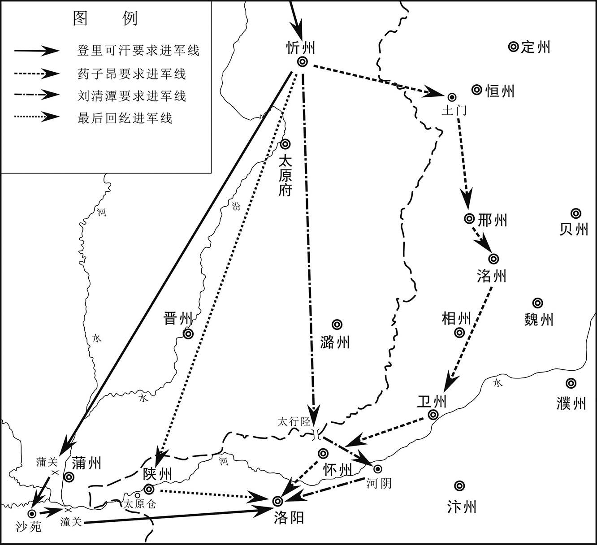 
唐宝应元年（762年）九月回纥援军南下示意图

## 【原文】

**冬十月，以雍王适为天下兵马元帅[1]。辛酉，辞行，以兼御史中丞药子昂、魏琚为左、右厢兵马使，以中书舍人韦少华为判官，给事中李进为行军司马，会诸道节度使及回纥于陕州，进讨史朝义[2]。上欲以郭子仪为适副，程元振、鱼朝恩等沮之而止[3]。加朔方节度使仆固怀恩同平章事兼绛州刺史，领诸军节度行营以副适。**

## 【注文】

[1]雍王适（kuò）：即李适（742—805年），后来的唐德宗，公元779年至805年在位。唐代宗的长子，沈氏（后追封为睿真皇后）所生。唐代宗即位之初，李适担任天下兵马元帅，负责领兵讨伐史朝义，平定河北地区。李适即皇帝位之初，寻思改革弊政，罢除各地的贡献，放出一些宫女，禁止宦官贪求。他将租庸税制改为两税法（唐后期主要税制，以资产为收税标准，分夏秋季两次征收）。他还打算裁抑地方藩镇势力，但无成效。他以强明自任，听信谗言。地方上势力强大的藩镇成德、魏博、淄青、卢龙（均在河北地区）先后拒绝听从中央的命令。李适向百姓加征赋税，百姓愁苦，破产不能支。德宗建中四年（783年），泾原兵在京城发动叛乱，李适被迫出逃奉天（今陕西乾县）。第二年，朔方军的将领李怀光又叛乱。后赖李晟等力战，才收复京城。后来，李适又猜忌功臣，姑息藩镇，信任宦官，让宦官统领禁军。他又在税外加税，专意于聚敛财富。他贬斥了一些忠臣，重用奸臣，政局愈加腐败。他死后，葬崇陵（今陕西泾阳西北），加谥号神武孝文皇帝，庙号德宗。

[2]左、右厢兵马使：参见前“兵马使”条注。

[3]程元振（？—764年）：唐肃宗、代宗朝有权势的大宦官。京兆三原（今陕西三原东北）人。他因为带兵拥立唐代宗继承皇位而获得皇帝的宠信，担任右监门卫将军（唐朝禁军高级将领，从三品）、知内侍省事（负责宦官衙署的事务），代另一名大宦官李辅国判元帅行军司马（主帅的重要幕僚），升骠（piào）骑大将军（最高武散阶，从一品），总领禁军，权势震天下。他妒忌贤能之臣和功臣，妄杀大将来瑱，排斥宰相裴冕，诋毁大将李光弼，导致人心浮动。唐代宗广德元年（763年），程元振隐瞒吐蕃入侵边地的消息，不上报给皇帝。吐蕃兵快攻到京城了，朝廷征召各路兵马，却没有人前来营救，代宗只好狼狈出逃，长安城被吐蕃兵剽掠一空。太常博士（太常寺的官员，从七品上，负责国家礼典、仪式）柳伉（kàng）上疏，指责程元振的罪状。代宗感念程元振的拥立之功，只将他罢官，放归田里。程元振后来又易服化装，潜入京城，再次被放逐，至江陵（今湖北荆州）而死。

## 【译文】

宝应元年（762年）冬十月，皇帝任命雍王李适为天下兵马元帅。辛酉（十六日），雍王率领着军队向代宗辞行。代宗任命兼御史中丞药子昂、魏琚为左、右厢兵马使，任命中书舍人韦少华为判官，给事中李进为行军司马。雍王率领着军队与其他几路节度使及回纥兵在陕州相会，一同进兵去征讨史朝义。代宗本想任命郭子仪为雍王李适的副手，但因为程元振、鱼朝恩等人的阻止而没有实行。代宗加朔方节度使仆固怀恩同平章事之衔（带宰相衔）兼绛州刺史，实际负责统领各节度使的军队，作为李适的副手。

## 【原文】

**戊辰，诸军发陕州，仆固怀恩与回纥左杀为前锋，陕西节度使郭英乂、神策观军容使鱼朝恩为殿，自渑池入，泽潞节度使李抱玉自河阳入，河南等道副元帅李光弼自陈留入，雍王留陕州[1]。辛未，怀恩等军于同轨[2]。**

## 【注文】

[1]杀：官名。又译为“设”“察”。为突厥、回纥等游牧帝国典兵的官员，多由最高统治者可汗的子弟担任，既领军马，又统部落。游牧帝国常常置左、右二设。

[2]同轨：地名。即同轨城，隶属于河南府，相当于今河南洛宁东。

## 【译文】

宝应元年（762年）十月戊辰（二十三日），各路兵马从陕州出发。仆固怀恩与回纥的左设为前锋，陕西节度使郭英、神策观军容使鱼朝恩跟在后面，从渑池进入，泽潞节度使李抱玉从河阳进入，河南等道副元帅李光弼从陈留进入，雍王则留守在陕州。辛未（二十六日），仆固怀恩等率领的军队驻扎在同轨城。

## 【原文】

**史朝义闻官军将至，谋于诸将。阿史那承庆曰：“唐若独与汉兵来，宜悉众与战；若与回纥俱来，其锋不可当，宜退守河阳以避之。”朝义不从。壬申，官军至洛阳北郊，分兵取怀州，癸酉，拔之。乙亥，官军陈于横水[1]。贼众数万，立栅自固，怀恩陈于西原以当之。遣骁骑及回纥并南山出栅东北，表里合击，大破之。朝义悉其精兵十万救之，陈于昭觉寺，官军骤击之，杀伤甚众，而贼陈不动[2]。鱼朝恩遣射生五百人力战，贼虽多死者，陈亦如初。镇西节度使马璘曰：“事急矣。”[3]遂单骑奋击，夺贼两牌，突入万众中。贼左右披靡，大军乘之而入，贼众大败。转战于石榴园、老君庙，贼又败；人马相蹂践，填尚书谷，斩首六万级，捕虏二万人[4]。朝义将轻骑数百东走。怀恩进克东京及河阳城。获其中书令许叔冀、王伷等，承制释之[5]。怀恩留回纥可汗营于河阳，使其子右厢兵马使玚及朔方兵马使高辅成帅步骑万余乘胜逐朝义，至郑州，再战皆捷。朝义至汴州，其陈留节度使张献诚闭门拒之，朝义奔濮州，献诚开门出降。**

## 【注文】

[1]横水：地名。位于今河南孟津西。

[2]昭觉寺：地名。位于今河南孟津境内。

[3]马璘（lín）（721—777年）：唐朝中期军将。岐州扶风（今陕西扶风）人，世代为将门。唐玄宗开元末年，马璘自效力于安西节度，以功迁左金吾卫将军同正［即员外置同正员。按唐朝制度，在官僚正规编制之外置员外官。员外官加同正员，则唯独不给职田（又作职分田、公田、禄田，指依据官职品级所授予的田地，作为官员俸禄的补充），其俸禄、赏赐与编制内的正官相同。如果只是员外官，则俸禄为正官的一半］。安禄山起兵反唐，马璘率领精兵三千自西北赴凤翔（今陕西凤翔，唐肃宗当时停驻之地），肃宗委任他向东进讨叛军。他曾经率领百名骑兵攻破叛贼的五千兵。后又跟从李光弼攻洛阳，叛贼史朝义的十万兵屯驻在洛阳城北的邙山，诸将不敢出击。马璘率领五百名士兵，三次闯入敌阵，唐军乘机破敌。唐代宗广德元年（763年），他在凤翔击败了吐蕃军。马璘累迁安西四镇、北庭行营、邠宁节度使，知凤翔、陇右节度副使（实际掌管本节度的一切事务）。他镇守八年，抵御吐蕃，使边境安宁。唐代宗大历九年（774年）回到朝廷，进检校左仆射知省事（带尚书省长官之衔，暂时负责尚书省的事务），封扶风郡王。死于军中。

[4]石榴园：地名。位于今河南洛阳附近。　　老君庙：供奉道教教祖老子的寺庙。这里的老君庙指位于河阳城附近的老君庙。　　尚书谷：地名。位于今河南济源玉阳山的东、西峰之间。

[5]伷：音zhòu。

## 【译文】

史朝义听说官军就要到达洛阳了，就与各位将领商议如何应对。阿史那承庆说：“唐廷如果只派汉族士兵前来，我们应当全军出动，与他们交战；但是如果唐军与回纥兵一道前来，那么，这支军队的锋芒不可阻挡，我们应当撤退到河阳城去守卫，以避开他们。”史朝义不听从他的意见。宝应元年（762年）十月壬申（二十七日），官军到达洛阳城北边的郊区，分出一部分兵力去夺取怀州，癸酉（二十八日），攻下了怀州。乙亥（三十日），官军在横水排好了阵营。叛贼有好几万人，修建起栅栏以巩固自己的阵地。仆固怀恩在洛阳城西边的原野上排好了阵营，以抵挡叛军。他派遣勇猛善战的骑兵和回纥兵一道从南边的山中走到栅栏的东北，表里合击，大败叛军。史朝义出动他所有的十万精兵去营救，在昭觉寺列阵。官军突然发起进攻，杀死和杀伤很多叛军，但是叛贼的阵营却依然没有动摇。鱼朝恩派遣五百名精于骑射的武士与叛军奋力作战，叛贼虽然死的人多，但是他们的阵营却和当初一样。镇西节度使马璘说：“事情紧急啊。”于是，他一个人骑着马，奋力向叛贼发起进攻，夺取了叛贼阵营中的两个牌子，突然冲入万人之中。叛军向左右溃败了，唐廷的大军趁着这一机会冲入敌阵中，叛贼遭到重大失败。叛贼与官军转移到石榴园、老君庙交战，叛贼又遭遇失败。叛军的人马相互踩踏，填满了尚书谷。官军斩获了六万名叛军的首级，俘虏了两万名叛军。史朝义率领着几百名装备轻便而行动迅速的骑兵向东边逃窜。仆固怀恩进而攻下了东京及河阳城。官军捕获叛贼任命的中书令许叔冀、王伷等人，秉承皇帝的制书，将他们释放了。仆固怀恩将回纥可汗的军营留在河阳城，派遣他的儿子右厢兵马使仆固玚及朔方兵马使高辅成率领一万多名步兵和骑兵乘胜追赶史朝义。官军到达郑州，再次与叛贼作战，又取得胜利。史朝义到达汴州，叛贼任命的陈留节度使张献诚将城门关闭，拒绝接纳史朝义。史朝义又逃奔濮州。张献诚打开汴州城的城门，出来向唐廷投降。

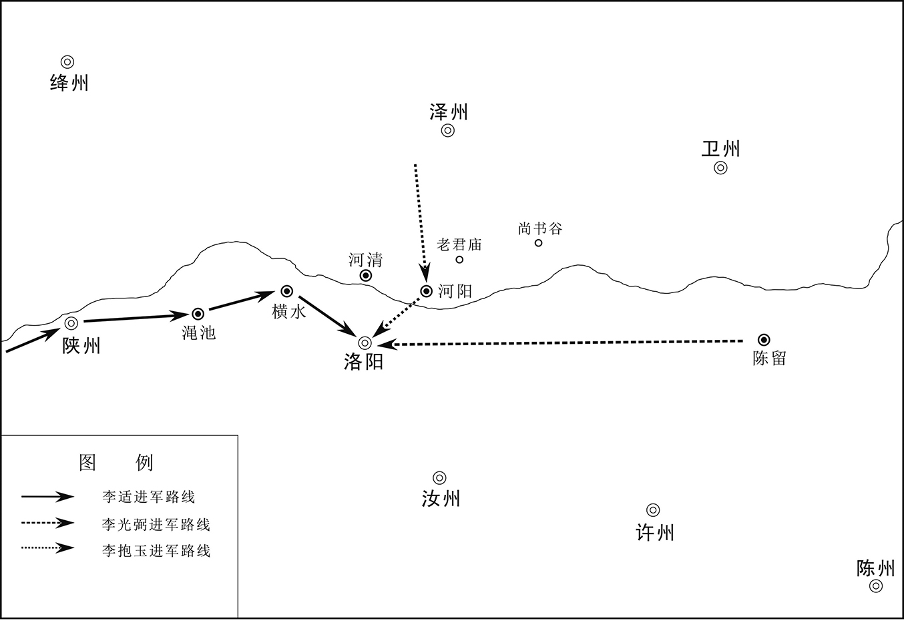 
唐宝应元年（762年）十月唐军收复洛阳示意图

## 【原文】

**回纥入东京，肆行杀掠，死者万计，火累旬不灭。朔方、神策军亦以东京、郑、汴、汝州皆为贼境，所过虏掠，三月乃已。比屋荡尽，士民皆衣纸。回纥悉置所掠宝货于河阳，留其将安恪守之。十一月丁丑，露布至京师[1]。**

## 【注文】

[1]露布：不加密封的文书，亦称“露版”“露板”。在唐代，每次打了胜仗，则书捷置于竿头，使天下人皆知，或将胜绩布告天下，谓之露布。

## 【译文】

回纥兵进入东京城，肆无忌惮地烧杀抢掠，被杀的人数以万来计算，大火烧了几十天都没有熄灭。朔方军、神策军也认为东京、郑州、汴州、汝州都是叛贼的地盘，他们经过这些地方也进行抢掠。这种情形一直持续三个月才结束。家家户户都被抢光，士大夫和民众都身穿纸糊的衣服。回纥兵将劫掠的珍宝、财物都放置在河阳城，留下将领安恪负责镇守。宝应元年（762年）十一月丁丑（初二日），官军收复洛阳的露布传送到京城。

## 【原文】

**朝义自濮州北渡河，怀恩进攻滑州，拔之，追败朝义于卫州。朝义睢阳节度使田承嗣等将兵四万余人与朝义合，复来拒战；仆固玚击破之，长驱至昌乐东[1]。朝义帅魏州兵来战，又败走。于是邺郡节度使薛嵩以相、卫、洺、邢四州降于陈郑泽潞节度使李抱玉，恒阳节度使张忠志以恒、赵、深、定、易五州降于河东节度使辛云京[2]。嵩，楚玉之子也[3]。抱玉等已进军入其营，按其部伍，嵩等皆受代[4]。居无何，仆固怀恩皆令复位[5]。由是抱玉、云京疑怀恩有二心，各表言之，朝廷密为之备。怀恩亦上疏自理，上慰勉之。辛巳，制：“东京及河南北受伪官者，一切不问。”**

## 【注文】

[1]昌乐：县名。即昌乐县，隶属于魏郡、魏州，相当于今河南南乐。

[2]陈郑泽潞节度使：唐朝使职名。负责陈州、郑州、泽州、潞州地区的军政、财政、监察等事务。　　恒阳节度使：唐朝使职名。负责恒阳军的军政、财政、监察等各项事务。恒阳军位于恒州（今河北正定）城东，管兵三千五百人。　　赵：地名。即赵州、赵郡。参见前“赵郡”条注。　　定：地名。即定州、博陵郡。参见前“博陵”条注。　　易：地名。即易州、上谷郡。参见前“上谷”条注。　　辛云京（714—768年）：唐朝中期军将。兰州金城（治今甘肃兰州）人，河西地区的大族出身，客居长安，世代为将门。辛云京有胆略，屡建战功，迁太常卿。他曾经以精兵四千破史思明于相州（治今河南安阳）。复授代州（治今山西代县）刺史、北京（太原）都知兵马使。唐肃宗宝应元年（762年），太原发生兵变，河东节度使邓景山被杀，肃宗任命辛云京为太原尹、河东节度使，封金城郡王。他赏罚分明，三军整肃，回纥兵过其境也惧怕他。过了几年，太原大治。他死后，代宗痛惜流涕。

[3]楚玉：即薛楚玉，生卒年不详，唐朝前期军将。绛州龙门（今山西河津）人，唐高宗朝名将薛仁贵的第五个儿子。他曾经担任平卢节度使、范阳节度使。后来，薛楚玉因为和其兄薛讷的军事改革被保守派排挤，被人告发渎职，被免官，由张守珪取代他出任范阳节度使。他的离职加快了安史之乱的爆发。

[4]受代：旧时谓官吏任满由新官代替为受代。这里指由官军接管薛嵩叛军的队伍。

[5]无何：不久，很短时间之后。

## 【译文】

史朝义从濮州北边渡过黄河，仆固怀恩进攻滑州，攻下了这座城，追击史朝义，在卫州将他打败。史朝义手下的睢阳节度使田承嗣等率领四万多名士兵与史朝义会合，又来抵抗官军。仆固玚率兵击败了他们，长驱直入，到达昌乐县东。史朝义率领魏州兵前来挑战，又被打败，逃跑了。于是，邺郡节度使薛嵩带着相、卫、洺、邢四个州向陈郑泽潞节度使李抱玉投降，恒阳节度使张忠志带着恒、赵、深、定、易五个州向河东节度使辛云京投降。薛嵩是薛楚玉的儿子。李抱玉等已经统领着部队进入薛嵩军的军营，考察了他的队伍，薛嵩等人率领的军队都被官军接管。没过多久，仆固怀恩就命令薛嵩等叛将都恢复原职，仍然统领原来的队伍。因此，李抱玉、辛云京怀疑仆固怀恩对朝廷有二心，都各自向朝廷上表汇报了这里的情况，朝廷也秘密防备仆固怀恩。仆固怀恩也向朝廷进献疏，为自己申诉，代宗慰劳、安抚他。宝应元年（762年）十一月辛巳（初六日），皇帝下制书，命令：“东京及黄河南北地区凡是接受叛贼任命的伪官的人，一律不予追究。”

## 【原文】

**丁酉，以张忠志为成德军节度使，统恒、赵、深、定、易五州，赐姓李，名宝臣[1]。初，辛云京引兵将出井陉、常山，禆将王武俊说宝臣曰：“今河东兵精锐，出境远斗，不可敌也[2]。且吾以寡当众，以曲遇直，战则必离，守则必溃，公其图之。”宝臣乃撤守备，举五州来降。及复为节度使，以武俊之策为善，擢为先锋兵马使[3]。武俊，本契丹也，初名没诺干。**

## 【注文】

[1]成德军：称成德镇，又名恒冀、镇冀，唐代方镇名。唐后期割据一方的河朔三镇（指成德、魏博、幽州－卢龙三镇）之一。唐代宗在宝应元年（762年），为安抚安史叛军的余部而设立成德镇，以安史叛军的降将张忠志（后赐名李宝臣）为节度使。唐德宗建中年间废，兴元初年复置。治恒州（今河北正定）。辖境常有变动，常领恒州、冀州（今河北冀州）、深州（今河北饶阳）、赵州（今河北赵县），大约相当于今河北武强、阜城、枣强以西，平山、赞皇以东，临城、南宫以北，西北至阜平，东北抵安平、饶阳。成德镇拥有强大的兵力，历为李宝臣、王武俊、王庭凑等世袭割据，由节度使自己任命官吏，赋税不上缴中央，节度使死后由亲属继任或军中推举。而且，成德镇多次叛唐。唐宪宗元和年间，成德镇曾经因为中央势力强大而听命于朝廷。唐哀帝天祐二年（905年），更名武顺军。

[2]王武俊（735—801年）：唐朝中期军将。契丹人，本名没诺干，字元英。他善于骑射，初为李宝臣的部将，跟从安禄山、史思明发动叛乱。在宝应初年，他说服李宝臣降唐，因功拜御史中丞，封维川郡王。唐代宗大历十年（775年），他看见李宝臣为宦官所辱，劝宝臣反唐。唐德宗建中二年（781年），李宝臣死。王武俊继续反叛朝廷，后降唐，任恒州（治今河北正定）刺史、恒冀都团练观察使，继承了原成德节度使的大部分辖地和职权。因为朝廷收回原属成德所辖的易州（治今河北易县）、定州（治今河北定州），王武俊又与魏博镇、卢龙镇联合反唐，自称赵王。唐德宗兴元初，皇帝下罪己诏书，大赦天下，王武俊于是自己去掉王号，归顺唐廷，任成德军节度使，封琅琊郡王。后来，一部分士兵发动兵变，反叛朝廷（史称“泾原兵变”），德宗被迫出逃奉天（今陕西乾县）。王武俊与其他军队合兵，大破叛军，以功加检校太尉、中书令，带宰相衔。他的子弟即便年幼，也被朝廷授予官爵。

[3]先锋兵马使：唐朝使职名。兵马使的一种，负责统领军队，作为前锋。

## 【译文】

宝应元年（762年）十一月丁酉（二十二日），朝廷任命张忠志为成德军节度使，负责统辖恒、赵、深、定、易五个州，赐张忠志姓李，名宝臣。起初，辛云京率领着军队，马上就要出井陉关、常山郡（朝张忠志进攻），张忠志的副将王武俊劝他：“现在河东兵（指辛云京率领的军队）精锐，他们已经出了自己的辖境，远道而来向我们进攻，没有人能够打败他们。而且我们是以少数兵力去抵挡多数兵力，是不占据道德优势的一方去抵抗占据道德优势的一方。如果我们与官军交战，则部众一定会离开；如果我们防守，则队伍一定会瓦解。您还不如归附朝廷。”李宝臣于是撤销了城市的守备，带着自己统领的五个州前来向朝廷投降。李宝臣又重新当上了节度使，他认为王武俊的计策很好，就提拔他为先锋兵马使。王武俊本是契丹人，最初的名字叫没诺干。

## 【原文】

**郭子仪以仆固怀恩有平河朔功，请以副元帅让之。己亥，以怀恩为河北副元帅，加左仆射兼中书令、单于、镇北大都护、朔方节度使[1]。**

## 【注文】

[1]单于、镇北大都护：即单于、安北大都护，是单于大都护府、安北大都护府的长官。安禄山叛乱后，唐廷厌恶叛贼安禄山，凡是郡县名、官名有“安”字者，多做了更改，以避恶讳。其中就将“安北”改为“镇北”。

## 【译文】

郭子仪认为仆固怀恩有平定河朔地区的大功，请求将副元帅的职位让给他。宝应元年（762年）十一月己亥（二十四日），朝廷任命仆固怀恩为河北副元帅，加左仆射之衔，兼中书令、单于、镇北大都护、朔方节度使。

## 【原文】

**史朝义走至贝州，与其大将薛忠义等两节度合，仆固玚追之至临清[1]。朝义自衡水引兵三万还攻之，玚设伏，击走之[2]。回纥又至，官军益振，遂逐之，大战于下博东南，贼大败，积尸拥流而下；朝义奔莫州[3]。怀恩都知兵马使薛兼训、兵马使郝庭玉与田神功、辛云京会于下博，进围朝义于莫州，青淄节度使侯希逸继至[4]。**

## 【注文】

[1]贝州：地名。即清河郡。参见前“清河”条注。　　临清：县名。即临清县，隶属于贝州、清河郡，相当于今河北临西。

[2]衡水：县名。即衡水县，隶属于冀州、信都郡，相当于今河北衡水西。

[3]下博：县名。即下博县，隶属于深州、饶阳郡，相当于今河北深州东。　　莫州：地名。即文安郡。参见前“文安”条注。

[4]青淄节度使：常称淄青节度使，唐代方镇名。唐肃宗宝应元年（762年），平卢节度使侯希逸为叛贼史朝义和奚族所逼，只得通过海路，从辽东半岛逃到山东半岛，占据淄州（今山东淄博西南淄川）、青州（今山东青州）及附近地区。侯希逸于是并青密节度使、淄沂节度使为淄青－平卢节度使，或称平卢－淄青节度使，或单称淄青节度使、平卢节度使。治青州，领青州、淄州、沂州（今山东临沂）、沧州（今河北沧州东南）、德州（今山东陵县）、棣州（今山东惠民东南）、齐州（今山东济南）、海州（今江苏连云港西南海州镇）、密州（今山东诸城）、登州（今山东蓬莱）、莱州（今山东莱州）等。唐代宗永泰元年（765年），兼领押新罗（朝鲜半岛建立的政权）、渤海两蕃使。唐代宗大历十三年（778年）至唐德宗建中三年（782年），唐德宗贞元四年（788年）至唐宪宗元和十三年（818年），淄青节度使李正己、李纳、李师道割据一方，曾将治所移至郓（yùn）州（今山东东平西北），一度占地至十五州，为当时最强大的方镇之一。唐宪宗元和十四年（819年），朝廷平定李师道后，淄青节度的辖境大大缩小。唐哀帝天祐初，为朱温所吞并，仍置淄青节度使。

## 【译文】

史朝义逃到贝州，与他的大将薛忠义等两节度使合兵，仆固玚追赶史朝义，一直追到临清县。史朝义从衡水县率领三万名士兵返回来攻击官军。仆固玚布置好了伏兵，将史朝义军打退。回纥兵又来了，官军的士气越来越振奋，于是将史朝义军驱逐。官军与叛军在下博县东南大战，叛贼大败。叛军士兵的尸体积累起来，顺着水流被冲下去了。史朝义逃奔到莫州。仆固怀恩手下的都知兵马使薛兼训、兵马使郝庭玉与田神功、辛云京在下博县会师，共同进兵，将史朝义包围在莫州，青淄节度使侯希逸也带着兵相继赶到这里了。

## 【原文】

**代宗广德元年[1]。史朝义屡出战，皆败，田承嗣说朝义，令亲往幽州发兵，还救莫州，承嗣自请留守莫州。朝义从之，选精骑五千自北门犯围而出。朝义既去，承嗣即以城降，送朝义母、妻、子于官军。于是仆固玚、侯希逸、薛兼训等帅众三万追之，及于归义，与战，朝义败走[2]。**

## 【注文】

[1]广德：唐代宗李豫在位期间所用年号，共计两年，即广德元年（763年）七月至广德二年（764年）。广德元年即763年。

[2]归义：县名。即归义县，隶属于幽州，相当于今河北雄县西北。

## 【译文】

唐代宗广德元年（763年）。史朝义屡次出兵与官军作战，都遭到失败。田承嗣劝史朝义，让他亲自前往大本营幽州去征调军队，返回来营救莫州。田承嗣自己请求留守莫州。史朝义听从了他的建议，挑选了五千名精锐的骑兵，从莫州城的北门突破官军的包围圈，逃出去了。史朝义既然走了，田承嗣马上带着莫州城向唐廷投降，将史朝义的母亲、妻子、儿子押送给官军。于是仆固玚、侯希逸、薛兼训等率领三万名士兵去追击史朝义，一直追到归义县，与史朝义军交战，史朝义战败逃跑了。

## 【原文】

**时朝义范阳节度使李怀仙已因中使骆奉仙请降，遣兵马使李抱忠将兵三千镇范阳县，朝义至范阳，不得入[1]。官军将至，朝义遣人谕抱忠以大军留莫州，轻骑来发兵救援之意，因责以君臣之义。抱忠对曰：“天不祚燕，唐室复兴，今既归唐矣，岂可更为反复，独不愧三军邪[2]！大丈夫耻以诡计相图，愿早择去就以谋自全。且田承嗣必已叛矣，不然，官军何以得至此？”朝义大惧，曰：“吾朝来未食，独不能以一餐相饷乎？”抱忠乃令人设食于城东。于是范阳人在朝义麾下者，并拜辞而去，朝义涕泣而已，独与胡骑数百既食而去。东奔广阳，广阳不受。欲北入奚、契丹，至温泉栅，李怀仙遣兵追［及］之，朝义穷蹙，缢于林中，怀仙取其首以献[3]。仆固怀恩与诸军皆还。甲辰，朝义首至京师。**

## 【注文】

[1]范阳县：隶属于涿州，相当于今河北涿州。

[2]祚：赐福。　　三军：即前、中、后三军。在中国古代，前军是先锋部队；中军是主将统率的部队，也是主力；后军主要担任掩护和警戒任务。后来，“三军”成为军队的通称。

[3]温泉栅：地名。位于今河北滦县西北榛子镇东北。

## 【译文】

当时，史朝义任命的范阳节度使李怀仙已经通过宦官骆奉仙请求向唐廷投降。他派遣兵马使李抱忠率领三千名士兵镇守在范阳县。史朝义到达范阳县，无法进入。眼看着官军就要追到这里了，史朝义派人去告诉李抱忠，说大军留在莫州，这次他是率领着装备轻便而行动迅速的骑兵前来征调军队，去营救大军，还指责李抱忠不讲君臣之义。抱忠回复：“上天不赐福燕（史思明建立的伪政权的国号为燕），唐朝皇室已经复兴了。今天我们既然已经归附了唐廷，怎么可以反复更改，难道不愧对各路军队吗！大丈夫以运用诡计去达到目的为耻辱，我们只是希望早点选择去留，以求得自我保全。而且，田承嗣一定已经背叛你了，不然的话，官军怎么可能追到这里来了？”史朝义感到非常害怕，哀求道：“我从早晨到现在还没有吃饭呢，你不能给我吃一顿饭吗？”李抱忠于是命人在范阳县城的东边给史朝义等人准备好食物。于是，史朝义手下的范阳人都一并拜见了朝义，并向他告辞了。史朝义一直在哭泣，独自与几百名胡人骑兵吃完饭后，继续逃亡。他们向东逃奔到广阳县，广阳县不接纳他们。史朝义打算向北进入奚、契丹的地盘。他们到达温泉栅，李怀仙派出的追兵追到了他们，史朝义陷入穷途末路的境地，在树林中上吊死了。李怀仙取下史朝义的人头，献给朝廷。仆固怀恩与其他各路军队也班师回朝了。广德元年（763年）正月甲辰（三十日），史朝义的首级传送到京城。

## 【原文】

**秋七月壬寅，群臣上尊号曰宝应元圣文武孝皇帝。壬子，赦天下，改元。诸将讨史朝义者，进官阶、加爵邑有差[1]。册回纥可汗为颉咄登蜜施合俱录英义建功毗伽可汗，可敦为娑墨光亲丽华毗伽可敦，左右杀以下皆封赏[2]。**

## 【注文】

[1]官阶：泛指官员等级。唐朝的官僚分为职、散、勋、爵四类。职指实际掌管事务的职事官。散指散官，又称官阶，仅仅表示官品，并不实际掌管事务。勋指因战功而获取的勋臣号，也分等级。爵指爵位。　　爵邑：爵位和食邑。

[2]颉咄：“社稷法用”之意。　　登蜜施：封竟之意。　　毗伽：“足意智”之意。　　可敦：亦作“可贺敦”“可孙”“恪尊”“合屯”“合敦”，为突厥、回纥汗国最高统治者可汗的正妻。　　娑墨：得怜之意。

## 【译文】

唐代宗广德元年（763年）秋七月壬寅（初一日），群臣向唐代宗上尊号为“宝应元圣文武孝皇帝”。壬子（十一日），皇帝宣布大赦天下，改年号为广德。讨伐史朝义的各位将领，都不同程度地提升了官阶、增加了爵位和食邑。唐廷册封回纥可汗为“颉咄登蜜施合俱录英义建功毗伽可汗”，可敦为“娑墨光亲丽华毗伽可敦”，对回纥汗国左、右设及其之下的官员都给予封号和赏赐。

* * *

(1) “勃海”应为“渤海”。

(2) “己巳”应为“乙巳”。正月乙巳为初九日。

(3) 考文献记载，“游弈”多作“游奕”。

(4) 此处称张均、张垍为父子关系，实际上，两人是兄弟。后文也说这两人是兄弟。

(5) 据陈垣《二十四史朔闰表》，唐肃宗乾元元年四月壬寅朔，“辛卯”应为“辛亥”。

(6) 考文献记载，“游弈”多作“游奕”。

# 附录：

## 唐朝皇帝世系表

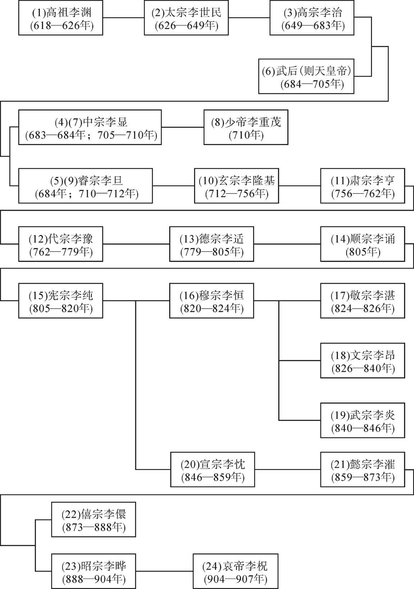

