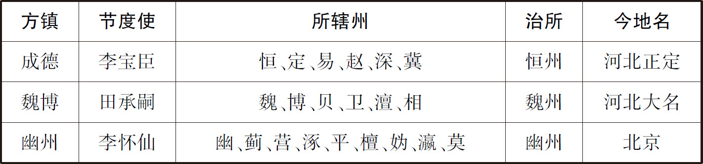
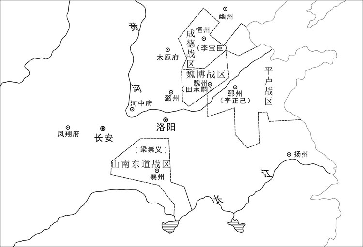
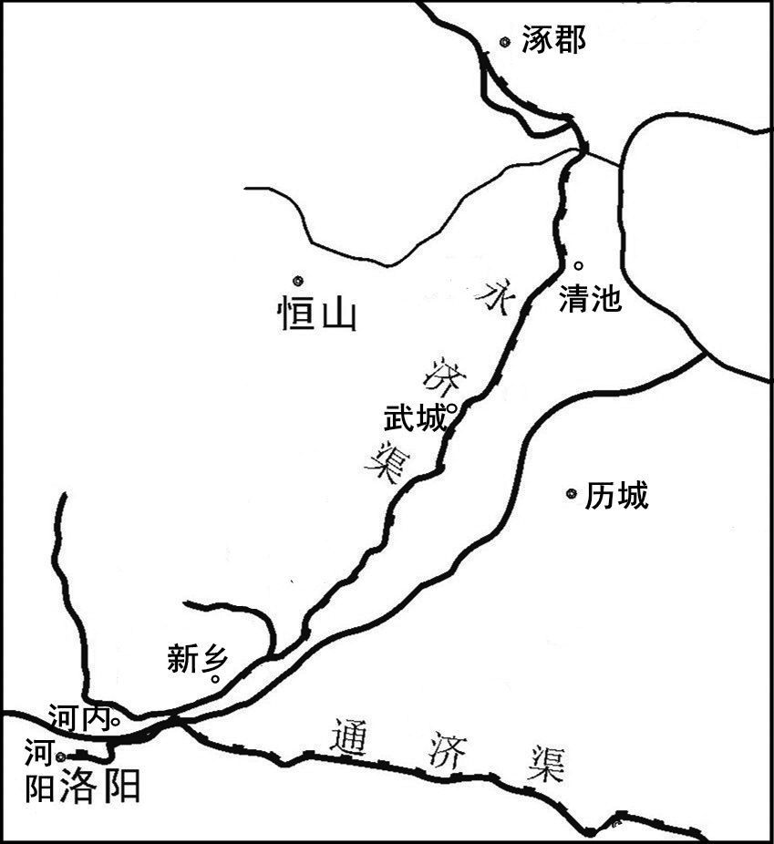
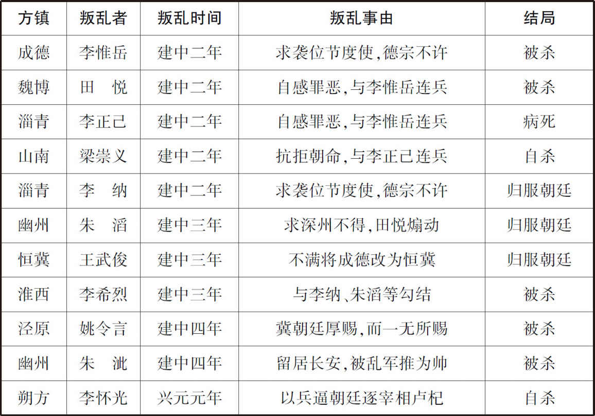
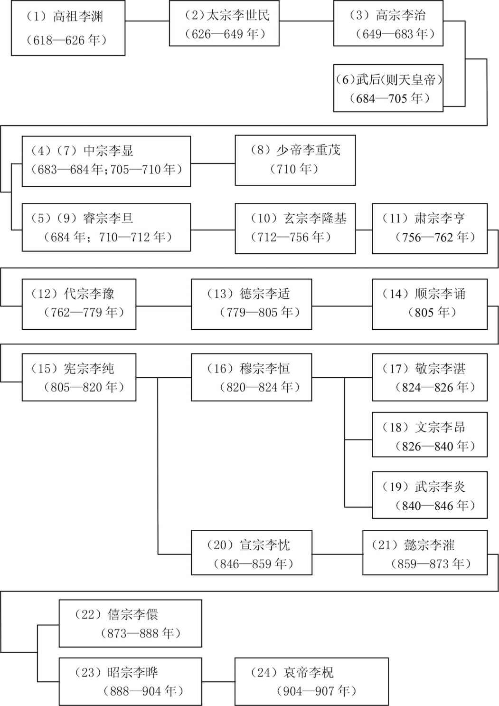

# 目录

藩镇连兵　泾原之变　李怀光之叛附

附录： 
唐朝皇帝世系表

返回总目录

# 藩镇连兵**  
****泾原之变　李怀光之叛附**

## 【内容提要】

《藩镇连兵》叙述了从唐代宗宝应元年（762年）至唐德宗贞元十七年（801年），共四十个年头藩镇割据、连年战乱的历史事实。

安史之乱平定之后，归降朝廷的安、史旧将，仍然拥有重兵，盘踞藩镇。衰弱不堪，且软弱不堪的朝廷，只能追认其既成事实，授予其节度使职位。其中军事力量比较强大的，有代宗广德元年（763年）闰正月授予节度使的“河朔三镇”。

此外，许多平定安史之乱有功的将领，也被授予节度使。这些人往往居功自傲，骄横跋扈（hù）。最为跋扈难制的，有淄（zī）青节度使（治青州，今属山东）李正己、淮西节度使（治蔡州，今河南汝南）李希烈、山南东道节度使（治襄阳，今属湖北）梁崇义等。这些方镇，握有行政权、财权和兵权，形成了与朝廷分庭抗礼的独立王国。在辖区内，他们可以擅自委派官员。特别是主帅一职，这历来必须是朝廷委任的，但现在，情况完全不同了，或父子相传，或部下拥立，造成既成事实，朝廷最后只能被迫予以追认。在这样的政治、军事背景下，方镇与方镇之间、朝廷与方镇之间、方镇内部主帅与部将之间，连兵不已，战乱连年，时局、政权一直处于持续的动荡混乱之中。

有鉴于此，唐德宗李适（kuò）即位之后，试图裁减、抑制方镇的权力，结果反而引发了“四镇之乱”。

德宗建中二年（781年），成德节度使李宝臣死，其子李惟岳擅自袭位，要求朝廷承认，德宗不许。于是，李惟岳联合魏博节度使田悦（其父田承嗣死后袭位）、淄青节度使李正己、山南东道节度使梁崇义三镇，形成政治、军事同盟，同时举兵，违抗朝廷。德宗调动各道节度使征讨，淮西节度使李希烈平定梁崇义，李惟岳被其部将王武俊所杀，王武俊归降朝廷，被授予恒冀观察使；幽州节度使朱滔出兵击败田悦；李正己病死，其子李纳袭位，屡攻屡败，朝廷取得了阶段性的胜利。但由于朱滔与王武俊对德宗的赏功不满，建中三年，也举兵反叛，与田悦、李纳串联，各自称王：朱滔称冀王，田悦称魏王，王武俊称赵王，李纳称齐王。与此同时，淮西节度使李希烈也据镇反叛，自称建兴王、天下都元帅。战乱几乎半天下，动荡的局势进一步蔓延。德宗调集邻近诸道的兵力讨伐李希烈，诸道兵马却观望不前。建中四年，又调遣泾原节度使（治所泾州，今甘肃泾川北）姚令言率五千兵东援，路过京都长安，因为得不到朝廷的赏赐而怨恨，鼓噪叛乱，拥立留居长安的前幽州节度使朱泚（cǐ）为秦帝，德宗仓皇出逃到奉天（今陕西乾县）。朱泚随即围攻奉天，朔方节度使李怀光率兵来援德宗。德宗兴元元年（784年）正月，李希烈称楚帝，改元武成。朱泚改国号为汉，自称“汉元天皇”，改元天皇。二月，参加平叛的李怀光倒戈，加入了叛乱的行列，与朱泚和好，德宗再次出奔梁州（今陕西汉中）。叛乱的藩镇此起彼伏，朝廷岌岌可危。三月，田悦被其部下兵马使田绪所杀。六月，朱泚、姚令言被原泾原大将田希鉴所杀。德宗贞元元年（785年）八月，击败倒戈的李怀光。二年四月，李希烈被其部将所杀。一直处于弱势被动地位的朝廷，在较量中稍占上风，朱滔、王武俊、李纳等不得已与德宗达成妥协，表面上重新归服朝廷。而德宗经过两次出逃，历尽艰险，惊魂难定，心力交瘁（cuì），但求相安无事，一味地采取了姑息优容的态度。对河北、山东等方镇，只要归服朝廷，不越过称帝、改国号这个底线，其他如土地、封爵等都好商量，做出了最大限度的妥协。

## 【原文】

**唐肃宗乾元元年冬十二月，平卢节度使王玄志薨，上遣中使往抚慰将士，且就察军中所欲立者，授以旌节[1]。高丽人李怀玉为裨将，杀玄志之子，推侯希逸为平卢军使[2]。希逸之母，怀玉姑也，故怀玉立之。朝廷因以希逸为节度副使[3]。节度使由军士废立自此始[4]。**

## 【注文】

[1]唐：朝代名，共历二百九十年（618—907年），是中国历史上国力最强盛的朝代之一。隋恭帝义宁二年（618年），陇西李渊起兵反隋建唐，定都长安。高宗以后，武后以周代唐（690—705年）。安史之乱后，藩镇割据，国力日趋衰败。对外贸易发达，通过海陆丝绸之路，与突厥、回纥（hé）、吐蕃（bō）、靺鞨（Mòhé）交流频繁，与天竺、新罗、日本及中亚国家往来密切。政治制度比较完善。诗歌、科技、文化、艺术极其繁盛，具有多元化特点。哀帝天祐（yòu）四年（907年），为割据势力朱温取代。　　肃宗：即李亨（711—762年），玄宗第三子。初名嗣升，二岁封陕王。开元十五年（727年），封忠王，改名浚（jùn）。二十三年，改名玙（yú）。二十六年，立为皇太子，改名亨。天宝十四载（755年）十一月，安、史叛乱。次年六月，玄宗奔蜀，马嵬（wéi）驿兵变，太子为天下兵马元帅，都统朔方、河东、河北、平卢节度兵马。七月十二日，太子在灵武（今宁夏灵武西南）即位，史称肃宗。　　乾元：肃宗的年号，共三年（758—760年）。　　平卢：节度使名。玄宗开元七年（719年）设置，统平卢、卢龙二军，屯营州、平州，治营州（今辽宁朝阳）。开元末、天宝中，安禄山曾为平卢军节度使。代宗宝应元年（762年），淄（zī）青节度开始带“平卢”的名称。　　王玄志（？—758年）：天宝十四载（755年），担任安东将。十五载四月，谋划讨伐安禄山的平卢节度使吕知诲，任安东副大都护、摄御史中丞、保定军及营田使。安禄山任命同党徐归道为平卢节度使，又率兵袭杀归道。乾元元年（758年），任营州刺史、平卢节度使。　　薨（hōng）：春秋时，诸侯死亡叫作“薨”。唐代三品以上死亡称“薨”，节度使与春秋时地方诸侯相类似，所以也称“薨”。　　中使：最早指宫中派出的使者，后来专门用来指宦官。　　旌节：旌旗与符节。唐制，节度使临行赐双旌双节，旌表示专赏之权，节表示专杀之权。

[2]李怀玉（733—781年）：即李正己。高丽（今东北南部与朝鲜半岛北部）人，生于平卢（今辽宁朝阳）。累官平卢兵马使。代宗永泰元年（765年）七月，被推立为帅。朝廷授以平卢淄（zī）青节度使、检校工部尚书兼御史大夫、青州刺史，赐名正己。代宗大历十年（775年）二月，封饶阳郡王。十一年十月，加检校司空、同中书门下平章事。与魏博田承嗣、滑亳（bó）令狐彰、相卫薛嵩（sōng）、成德李宝臣、襄邓梁崇义各割据一方，又与梁崇义互相通婚。正己原来有淄（zī）、青、齐、海、登、莱、沂（yǐ）、密、德、棣（dì）等十州之地，后又攻占曹、濮（pú）、徐、兖（yǎn）、郓（yùn）五州，共有十五州。拥兵十万，雄踞东方，最为强大。朝廷累加至太子太保、司徒。病死后，其子李纳袭位，自称齐王。　　裨（pí）将：副将，小将。古代有“大将小裨（pí）”之说。　　侯希逸（720—781年）：营州（今辽宁朝阳）人。玄宗天宝末，安禄山反，任命其心腹徐归道为平卢节度，希逸时为裨（pí）将，率兵与安东都护王玄志袭杀归道。肃宗乾元元年（758年）冬，表弟李怀玉与军人共推希逸为平卢军使，朝廷因此授希逸平卢节度使。希逸激励将士，肃宗上元二年（761年）五月，击破史朝义范阳兵，屡破叛军。朝廷加检校工部尚书，赐实封，画像于凌烟阁。代宗宝应元年（762年），担任平卢淄（zī）青节度使，淄青节度带“平卢”的名称始于此。代宗永泰元年（765年）七月，被李怀玉及军人驱逐，代宗大历十一年（776年）九月起用。大历末，封淮阳郡王。德宗建中二年（781年）七月，迁司空，当日病卒，赠太保。　　军使：唐代设置的地方军政长官。因行政功能不同，有节度使、观察使、团练使、经略使、处置使、防御使、度支（支度）使、营田使、水陆运使、守捉使、押蕃（fān）落使等不同名号。

[3]节度副使：节度使的副职。指以节度副使掌管节度使事，当时节度使由郑王李邈（miǎo）遥领。

[4]节度使由军士废立自此始：这是史家记述由军士废除前节度使并推举新节度使的先例。此后，这类实例就会层出不穷。司马光对于最早出现的某一件事，特别是不好的事，要特别提醒一句“某某事自此始”，也就是提醒对不好的事要谨慎处置，否则就开了个坏头，形成惯例。有“谨始”的意思。这是学《春秋》笔法。

## 【译文】

唐肃宗乾元元年（758年）冬季十二月，平卢节度使王玄志去世。唐肃宗派宦官前往慰问安抚将士，并到军中考察他们所想拥立的继承人，并将旌旗、符节授予他。高丽人李怀玉，担任裨（pí）将，杀了王玄志的儿子，推选侯希逸为平卢军使。侯希逸的母亲，是李怀玉的姑母，所以李怀玉拥立他。朝廷于是任命侯希逸为节度副使。节度使由军中将领士兵自己拥立，是从这次开始的。

## 【原文】

**臣光曰：夫民生有欲，无主则乱[1]。是故圣人制礼以治之[2]。自天子、诸侯至于卿大夫、士、庶人，尊卑有分，大小有伦，若纲条之相维，臂指之相使，是以民服事其上，而下无觊觎[3]。其在《周易》“上天、下泽，履。象曰：君子以辨上下，定民志”，此之谓也[4]。凡人君所以能有其臣民者，以八柄存乎己也[5]。苟或舍之，则彼此之势均，何以使其下哉！[6]**

## 【注文】

[1]臣光曰：《资治通鉴》作者司马光，作为史学家，对于上述史实所作的评论。史书的这种形式，属于史论。这类史论，最早见于《左传》，用“君子曰”的形式；后来又见于司马迁《史记》，用“太史公曰”的形式。此后形成定制，普遍流行。　　夫民生有欲，无主则乱：这两句话出自《尚书·仲虺（huǐ）之诰》。是说百姓天生就有情欲，如果没有君主制约，必然会导致祸乱。

[2]圣人：儒家推尊尧、舜、禹、周文王、周武王、周公、孔子、孟子等为圣人。

[3]天子、诸侯至于卿大夫、士、庶人：这是从最高统治者、高级官员、普通官员、知识阶层到庶民百姓的五等人，古代称为“五孝”。　　分（fèn）：名分。　　伦：伦常，指君臣、父子、夫妇、兄弟、朋友等人伦关系，古代称为“五伦”。　　纲：提网的周边总的大绳。　　条（tāo）：通“絛”，丝绳。此处是指斜角贯穿网四角的绳子。　　维：维系。　　臂指之相使：出自汉贾谊《新书·五美》：“海内之势，如身之使臂，臂之使指，莫不从制。”意思是就好像手臂使用手指一样顺当。　　是以民服事其上，而下无觊觎（jì yǘ）：这两句话出自《左传·桓公二年》。　　服事：下层的人伺候上层的人。　　觊觎：非分的希望或企图。

[4]其在《周易》“上天、下泽，履。象曰：君子以辨上下，定民志”：引号里的这几句话出自《周易·履》。　　《周易》：儒家的经典文献之一。原为占卜的书。基本图像是“八卦”，“八卦”由“阴”“阳”二爻三叠而成。由“八卦”两两相重，而得“六十四卦”。自下而上的六爻，阳为九，阴为六，各有“爻辞”，说明各爻的意思。有“上下经”：自“乾”至“离”三十卦为“上经”，自“咸”至“未济”三十四卦为“下经”；又有“十翼”：彖上、彖下、象上、象下、系辞上、系辞下、文言、说卦、序卦、杂卦。　　上天、下泽，履：第十卦为履卦，兑卦下，乾卦上。乾卦是天，在上；兑卦是水泽，在下。　　象：《周易》的专门用语，“十翼”中的“象上”和“象下”。“象上”阐释各卦的卦象，又称“大象”；“象下”阐释各爻的爻象，又称“小象”。

[5]八柄：指爵、禄、予、置、生、夺、废、诛。爵是爵位，禄是俸禄，予是给予，置是安置，生是养育，夺是没收，废是流放，诛是杀戮（lù）。天子统治、驾驭（yù）臣下赏罚的八种手段。

[6]使：驾驭（yù）。

## 【译文】

史臣司马光评论说：百姓天生就有贪欲，如果没有君主制约，就必然导致祸乱。因此，圣人制定礼节，用来治理百姓。从天子、诸侯到卿大夫、士、庶人的五孝关系，应该做到尊卑有名分，大小有伦常。就好像网的纲绳与丝绳，互相维系；又好像手臂使用手指，得心应手。所以，百姓甘心奉事他们的上司，而部下也就没有非分的希望或企图。《周易·履》的象就说过：“天尊贵，所以高高在上；水流低湿，所以处于底下。君子仿效履卦的图像，用来分辨上下、尊卑，从而确定纠正百姓的志向、意愿，使得一切都尊卑有序。”说的就是这个意思。凡是君主，之所以能统治、驾驭（yù）他的臣下、百姓，是由于君主有统治、驾驭（yù）臣下的“爵、禄、废、置、杀、生、予、夺”八种手段。假如有一天丢弃了这八种手段，那么，君主与臣下彼此之间势均力敌，还能用什么手段来统治、驾驭他的臣下呢？

## 【原文】

**肃宗遭唐中衰，幸而复国，是宜正上下之礼以纲纪四方[1]。而偷取一时之安，不思永久之患[2]。彼命将帅，统藩维，国之大事也，乃委一介之使，徇行伍之情，无问贤不肖，惟其所欲与者则授之[3]。自是之后，积习为常，君臣循守，以为得策，谓之姑息[4]。乃至偏裨士卒，杀逐主帅，亦不治其罪，因以其位任授之[5]。然则爵、禄、废、置、杀、生、予、夺，皆不出于上而出于下，乱之生也，庸有极乎[6]！**

## 【注文】

[1]中衰：指唐玄宗天宝末年发生安史之乱。　　复国：指唐肃宗在其父亲唐玄宗仓皇出逃后，在大臣拥戴下，在灵武即位，恢复国家，国运中兴。　　纲纪四方：这句话出自《诗经·大雅·棫朴》。　　纲纪：治理。　　四方：指国家。

[2]偷：苟且。

[3]藩维：藩国，方镇。　　一介之使：单独一人的使者称“一介”。指节度使。　　行（háng）伍：古代兵制，五人为伍，五伍为行。后用来指军队。　　贤：贤人。　　不肖：与“贤”相对，不成材的人。

[4]循守：因循守旧。　　姑息：苟安，求眼前的安定。

[5]偏裨（pí）：副将，小将。

[6]爵、禄、废、置、杀、生、予（yù）、夺：就是上文所说的“八柄”，天子统治、驾驭（yù）臣下赏罚的八种手段。　　庸：岂，难道。　　极：终极，尽头。

## 【译文】

肃宗皇帝遭遇安史之乱，大唐帝国急剧衰落。幸运的是，总算在他手里得到复兴。这样，就更应该匡正尊卑、上下的礼节，来治理好国家。然而，他却苟且于一时的安逸，不去考虑长久的祸患。他任命将帅，统治、驾驭（yù）方镇，这是国家的大事。现在委任一个这么重要的大使，却一味容忍军队的私心，从来不问这个人是贤人还是不成材之人，只要是军队想拥立的人，就授予这个人节度使。从此以后，养成恶习，形成惯例，君臣之间，因循相守，自以为得计。这就叫作姑息养奸。发展到了后来，以至于副将、小兵杀害、驱逐主帅，朝廷也不惩治他们的罪恶；不仅如此，还顺势把被杀害、驱逐的主帅的职位授予给了这些作乱者。这样的话，爵、禄、废、置、杀、生、予、夺，也就是所谓“八柄”，都不是出于皇帝，而是出自臣下，那么，动乱的滋生蔓延，难道还会有尽头吗？

## 【原文】

**且夫有国家者，赏善而诛恶，故为善者劝，为恶者惩。彼为人下而杀逐其上，恶孰大焉！乃使之拥旄秉钺，师长一方，是赏之也[1]。赏以劝恶，恶其何所不至乎！《书》云：“远乃猷。[2]”《诗》云：“猷之未远，是用大谏[3]。”孔子曰：“人无远虑，必有近忧[4]。”为天下之政而专事姑息，其忧患可胜校乎[5]！由是为下者常眄眄焉伺其上，苟得间则攻而族之；为上者常惴惴焉畏其下，苟得间则掩而屠之；争务先发，以逞其志，非有相保养为俱利久存之计也[6]。如是而求天下之安，其可得乎[7]！迹其厉阶，肇于此矣[8]。**

## 【注文】

[1]拥旄秉钺：打着旌旗，拿着斧头，指任节度使。　　旄：用牦牛旄毛做竿饰的旗子。　　钺：一种兵器，青铜制，形似斧而大，主帅所执。节度使有专杀之权。　　师长（zhǎng）：统率。

[2]《书》云：下面的这句话出自《尚书·康诰》。　　远乃猷（yóu）：意为将你的谋划想得更长远些。　　猷：谋划。

[3]《诗》云：下面的两句话出自《诗经·大雅·板》。　　猷（yóu）之未远，是用大谏：猷，《诗经》作“犹”，通假字。谋划。谏，劝阻。

[4]孔子曰：下面的两句话出自《论语·卫灵公》。　　虑：谋略，打算。　　忧：后患。

[5]其忧患可胜（shēng）校（jiào）乎：这句话出自《荀子·强国》。　　胜：尽。　　校：计数。

[6]为下者：指地方节度使。　　眄（miǎn）眄：斜视的样子。　　伺：窥探。　　间（jiàn）：空子，可乘之机。　　族：诛灭，杀光。　　惴（zhùi）惴：忧惧不安的样子。　　掩：突然袭击。　　逞：实现，满足。

[7]其：岂，难道。

[8]迹：至，踏。　　厉：恶，作恶。　　阶：台阶。指道路。　　肇：开始。

## 【译文】

再说，统治国家的人，应该是奖赏善良的，诛杀罪恶的。所以，常做善事的，就应该得到鼓励；作恶多端的，就应该受到惩处。那些本来是作为下属的副将、小兵，却杀害、驱逐其主帅，还有什么罪恶比这更大的呢？而皇帝却叫他打着旌旗，拿着斧头，担任节度使，统率一方疆土。这是在奖赏作恶的人。奖赏被用来鼓励作恶，作恶的事怎么能不随处可见呢！《尚书》说：“将你的谋划想得更长远些。”《诗经》说：“王的谋划不能考虑得长远，因为这个缘故，我加大力度劝谏，希望王不要这样。”孔子说：“一个人没有长远的打算，那肯定会有眼前的后患。”治理天下政事却一味姑息养奸，他的忧虑后患难道能一一数得完吗？由此产生的后果是，许多下属常常斜着眼睛窥探着他的上司的动向，假如一有可乘之机，就会出击，杀死他的上司；作为上司，也常常忧惧不安地害怕他的下属，假如一有可乘之机，就会突然袭击，将这些下属统统杀光。上司与下属之间，常常争相先发制人，以满足自己的欲望；没有人把互相爱护保养作为互为有利、长久生存的策略。这样来求得天下的安定，难道还能实现吗？脚踏着作恶的道路，灾难祸殃就从此开始了。

## 【原文】

**盖古者治军必本于礼，故晋文公城濮之战，见其师少长有礼，知其可用[1]。今唐治军而不顾礼，使士卒得以陵偏裨，偏裨得以陵将帅，则将帅之陵天子，自然之势也[2]。由是祸乱继起，兵革不息，民坠涂炭，无所控诉，凡二百余年，然后大宋受命[3]。太祖始制军法，使以阶级相承，小有违犯，咸伏斧质[4]。是以上下有叙，令行禁止，四征不庭，无思不服，宇内乂安，兆民允殖，以迄于今，皆由治军以礼故也[5]。岂非诒谋之远哉[6]！**

## 【注文】

[1]治军必本于礼：古代有“五礼”：吉礼、嘉礼、宾礼、军礼、凶礼。军礼是治理、整顿军队的规章制度。　　晋文公（前697—前628年）：名重（chóng）耳，谥曰“文”。春秋五霸之一。晋献公之子，惠公之兄。因献公宠信骊姬，立骊姬之子奚齐为太子，重耳出逃，历经狄、卫、齐、曹、宋、郑、楚、秦等国，流亡十九年。鲁僖公二十四年（前636年），在秦穆公重兵护送下，回国即位，史称晋文公。二十八年五月，晋文公召集齐、宋、鲁、蔡、郑、卫、莒、陈等国之君在郑国践土邑（今河南原阳西南）盟会，周襄王亲临劳师，册封晋文公为侯伯，成为盟主。在位九年。　　城濮（pú）之战：鲁僖公二十八年（前632年）四月，晋、楚两军在城濮（pú）（今山东鄄（juàn）城西南）交战。晋文公为报答楚国在其逃亡期间的款待，为楚军退避三舍。晋统帅先轸下令首先击溃楚右军，令晋上军佯退，诱楚左军进击。之后回军与中军合力攻击，将楚左军击溃。楚军退至连谷（今河南西华境），楚子玉自杀。晋文公运用外交谋略，各个击破，示利诱敌，扬长避短，后发制人，“取威定霸”，开创以弱胜强的战例。　　见其师少长有礼，知其可用：这两句话出自《左传·僖公二十八年》。晋文公登上高处，看到参战的军队无论是年轻的士兵，还是年长的将领，都懂得行军的礼节，从而推断这支军队能够打胜仗。

[2]陵：凌驾。

[3]民坠涂炭：这句话出自《尚书·仲虺（huǐ）之诰》，比喻百姓生活在水深火热之中。　　涂：泥水。　　炭：炭火。　　大宋受命：后周恭帝显德七年（960年），归德节度使、殿前都点检赵匡胤（yìn），乘“主少国疑”之机，发动“陈桥驿兵变”，夺取了后周政权，建立大宋王朝，改元建隆。　　受命：受天之命。古代将君权神秘化，并强调其合法性，认为一个朝代的君权是皇天授予的。

[4]太祖始制军法：宋太祖有鉴于唐、五代地方节度使握有兵权，常常与朝廷分庭抗礼甚至叛乱、称帝的教训，在酒席上设计解除了将帅的军权，历史上称为“杯酒释兵权”，从而避免了藩镇割据。　　阶级：尊卑上下的等级。汉贾谊《新书》有《阶级》，强调中央集权，上下有序。　　伏斧质：指杀头。古代行刑时，让受刑人趴在铁砧（zhēn）上，用斧头将其头砍下。　　斧：斧头。　　质：通“锧”（zhì），铁砧（zhēn）。

[5]叙：秩序。　　不庭：不来王庭朝见的叛逆者。下之事上，皆成礼于庭中。一说：庭，直；不庭，不直。　　无思不服：无不归服。　　思：助词，无义。这句话出自《诗经·大雅·文王有声》：“镐（hào）京辟廱（bì yōng），自西自东，自南自北，无思不服。”是说东西南北，没有不归服天子的。　　（yì）安：安定。　　兆民允殖：这句话出自《尚书·汤诰》，是说百姓确实热爱生活。　　兆民：百姓。　　允：信，确实。　　殖：生，生活。

[6]诒（yí）谋：《诗经·大雅·文王有声》“诒（yí）厥孙谋”的省略，是说将谋略留传给子孙后代。

## 【译文】

大凡古代治理、整顿军队，必须依据军礼。所以，春秋时，晋文公指挥城濮（pú）之战，登上高地，看见自己的军队，无论是年轻的士兵，还是年长的将领，都懂得军事礼节，他就知道这支军队可以用来作战，而且能打胜仗。在唐代，治理军队却不顾礼节，使得小兵敢于凌驾于副将之上，副将敢于凌驾于将帅之上。那么，将帅敢于凌驾于天子之上，也是十分自然的势态了。由于这个原因，动乱灾难相继而起，战乱不止，百姓生活在水深火热之中，没有地方去控告诉说。这种情况一共持续了两百多年，然后是大宋接受天命，改朝换代。太祖开始制定军法，杯酒释兵权，使军队懂得以尊卑上下的等级来处事。假如有谁稍稍违犯军纪，都会被立刻斩首。因此，整个军队，尊卑上下，井然有序；有令即行，有禁即止。可以征讨敢于不来王庭朝见的叛逆者，促使他们无不归服。从而天下安定，百姓热爱生活，直到如今。这一切，都是由于以军礼治理、整顿军队的缘故。这难道不是泽及子孙的百年大计吗？

## 【原文】

**宝应元年冬十一月，史朝义之败于卫州也，邺郡节度使薛嵩以相、卫、洺、邢四州降于陈郑、泽潞节度使李抱玉，恒阳节度使张忠志以恒、赵、深、定、易五州降于河东节度使辛云京[1]。丁酉，以张忠志为成德军节度使，统恒、赵、深、定、易五州，赐姓李，名宝臣[2]。初，宝臣裨将王武俊说宝臣来降，及复为节度使，擢武俊为先锋兵马使[3]。武俊，本契丹也，初名没诺干[4]。**

## 【注文】

[1]宝应：唐代宗的年号，共两年，即宝应元年（762年）四月至宝应二年（763年）闰七月。　　史朝义（？—763年）：突厥人，生于宁夷州。史思明长子。随安禄山起兵，率军守冀州、相州。史思明称帝，封为怀王。唐肃宗上元二年（761年），率兵杀父，即位，年号显圣。又派散骑常侍张通儒等至范阳，杀皇后辛氏、太子史朝英等数十人。朝廷借回纥（hé）兵之助反攻，攻破其所据洛阳，逃往莫州。后众叛亲离，主要将领田承嗣、李怀仙等均叛去，势单力孤，最后自杀而死。　　卫州：汉河内及魏郡地。北周改为卫州，隋、唐相沿不改，玄宗天宝初，一度改为汲郡。领汲县等五县，治所在今河南汲县。　　邺（yè）郡：唐天宝元年（742年）改相州置。治安阳（今属河南）。乾元元年（758年）仍改为相州。当时安史叛军在邺郡置节度使，领相州、卫州、洺（míng）州、邢州四州。　　薛嵩（sōng）（？—773年）：绛（jiàng）州龙门（今山西河津）人。薛仁贵之孙，薛楚玉之子。喜好蹴（cù）鞠，善于骑射。安史之乱时背叛朝廷，投降安史叛军，为史朝义任伪邺（yè）郡节度使，守相州（今河南安阳）。唐宝应元年（762年），唐将仆固怀恩破史朝义，遂以相、卫、洺（míng）、邢四州降。怀恩表请为相、卫、洺、邢等州节度使，领昭义军。朝廷令其子娶滑州节度使令狐彰之女，女儿嫁魏博节度使田承嗣之子，三藩镇互为姻亲。累迁检校右仆射（yè），晋平阳郡王。　　相：即相州，汉代为魏郡。北魏改为相州。北周及隋、唐相沿不改。天宝初，一度改为邺（yè）郡。领安阳等九县，治所在今河南安阳。　　洺（míng）：即洺州，汉代为广平国。北周改为洺州，隋、唐相沿不改，玄宗天宝初，一度改为广平郡。领永年等七县，治所在今河北永年东南旧永年镇。　　邢：即邢州，汉巨鹿、常山等郡国地。隋改为邢州，唐相沿不改，玄宗天宝初，一度改为巨鹿郡。领龙固等九县，治所在今河北邢台。　　陈郑：唐肃宗乾元二年（759年），置郑陈节度使，领郑、陈、亳（bó）、颍（yǐng）四州，治郑州，后又增领申、光、寿三州；不久，以三州隶淮西。　　泽潞：唐方镇名，又名昭义，领潞州、邢州、洺（míng）州、磁州四州。唐肃宗至德元载（756年）设置。治潞州（今山西长治）。历任官员有王思礼、李抱玉、薛嵩（sōng）、李抱真、王虔（qián）休、李元淳、卢从史、孟元阳、郗（xī）士美、李愬（sù）、刘悟、刘从谏等。　　李抱玉（704—777年）：本姓安，名重璋。安兴贵后裔。凉州（今甘肃武威）人。李抱真从兄。善骑射，早年从军，为李光弼裨（pí）校。以功赐名。安禄山叛乱，固守南阳，从李光弼累败史思明，居功第一。以耻与安禄山同宗，肃宗赐姓李，为陈郑颍（yǐng）亳（bó）节度使。代宗时，为泽路、凤翔、山南西道三副元帅。凡镇凤翔十余年，抗击吐蕃（bō），禁暴安民，时称良将。　　恒阳：即恒州。汉常山郡，北周置恒州，隋、唐相沿不改，玄宗天宝初，一度改为常山郡。宪宗元和十五年（820年），改为镇州。领真定等六县，治所在今河北正定。当时安史叛军在恒阳置节度使，领恒州、赵州、深州、定州、易州五州。　　张忠志（718—781年）：即李宝臣。字为辅。奚人。初为范阳将张锁高假子，故姓张，名忠志。安禄山反，又为其假子，姓安。复事安庆绪为伪恒阳节度使，叛服无常。史思明死，不肯事史朝义，以所领深、赵等五州降朝廷。肃宗赐姓李，名宝臣。授成德军节度使，封清河郡王，据有恒、深、赵、冀、定、易等六州。与魏博、淄（zī）青等镇相互姻嫁，互为表里。后与田承嗣有隙。代宗大历十年（775年），奉朝命讨之，因宦官对其无理，又与承嗣联合。德宗即位，加司空。晚年以子惟岳暗弱，恐部下不服，杀大将二十余人。任用妖人伪作谶（chèn）语，言其将有天位，终为毒死。在镇缮治甲兵，自置官吏，不向唐缴纳租税，外则与幽州、魏博等诸镇联结，逐步形成地方割据势力，成为河北三镇之一。　　赵：即赵州，汉巨鹿、常山等郡国地。北齐改为赵州，隋、唐相沿不改，玄宗天宝初，一度改为赵郡。领平棘等九县，治所在今河北赵县。　　深：即深州，汉涿（zhuō）郡地。隋改为深州，唐相沿不改。贞观十七年（643年）废，先天二年（713年）复置。天宝初，一度改为饶阳郡。领饶阳等四县。饶阳，今属河北。　　定：即定州，汉代为中山郡。北魏改为定州。北周及隋、唐相沿不改。天宝初，一度改为博陵郡。领安喜等十一县，治所在今河北定州。　　易：即易州，汉涿（zhuō）郡地。隋改为易州，唐相沿不改，玄宗天宝初，一度改为上谷郡。领易县等五县，治所在今河北易县。　　河东：唐方镇名。河东节度、观察、处置、押北山诸蕃（fān）等使，兼太原尹、北都留守，领太原府和石州、岚州、汾州、沁（qìn）州、辽州、忻州、代州七州。唐睿（ruì）宗景云元年（710年）设置。治太原（今属山西）。历任官员有薛讷（nè）、王晙（jùn）、张嘉贞、牛仙客、王忠嗣、韩休琳、安禄山、李光弼、王思礼、辛云京、王缙（jìn）、薛兼训、马燧（suì）、李自良、严绶、范希朝、王锷（è）、张弘靖、裴度等。　　辛云京（714—768年）：兰州金城（今甘肃兰州）人。世代为河西大族，客居京兆（今陕西西安）。唐玄宗天宝年间，为太常卿。安史之乱时，率军大败史思明，为代州刺史、镇北都知兵马使。迁太原尹、河东节度使，封金城郡王。在镇严于法制，军中上下，无不畏服。累迁检校尚书、右仆射（yè）、同中书门下平章事。与仆固怀恩不合，怀恩私下与太原将李竭诚通谋，欲攻下太原，被识破，辛云京遂与宦官骆奉先联合激反怀恩。卒，册赠太尉，辍朝三日，谥曰忠献。

[2]成德军：成德节度、镇冀观察、处置等使，兼恒州大都督府长史。又称冀镇。领恒州、冀州、深州、赵州四州。唐肃宗至德元载（756年）设置。治镇州（今河北正定）。历任官员有张忠志、李宝臣、张孝忠、王武俊、王士真、王承宗、田弘正、牛元翼、王庭凑、王元逵等。　　宝臣：即张忠志，后因战功赐其姓名为李宝臣。

[3]初：刚开始的时候，早先的时候。史书用作追叙往事之词，用于句首。　　王武俊（735—801年）：字元英，契丹怒皆部人，名没诺干。幼善骑射，为成德节度使张忠志（李宝臣）幕下裨（pí）将。因功封维川郡王。杀李惟岳，传首京师，本欲得成德节度使，而为恒冀都团练观察使，以功高赏薄，对朝廷不满。唐德宗建中三年（782年），自称赵王，拥立卢龙节度使朱滔为盟主，称冀王，魏博节度使田悦称魏王，平卢节度使李纳称齐王。朱滔为盟主，称孤；王武俊、田悦、李纳称寡人。朱滔以幽州为范阳府，恒州为真定府，魏州为大名府，郓（yùn）州为东平府，均以长子为元帅。兴元初，德宗下诏罪己，大赦，去王号，为成德节度使，兼幽州、卢龙节度使，授同中书门下平章事、司空，封琅（láng）琊（yá）郡王。与昭义节度使李抱真结为兄弟，联合攻朱滔。以功加检校太尉、中书令。病死，谥曰忠烈。　　擢（zhuó）：提升，提拔。　　先锋兵马使：唐代藩镇军职名称。先锋作战的行军统帅。

[4]契丹：中国东北地区的一个民族。自北魏开始，契丹就开始在辽河上游一带活动，唐末建立了强大的地方政权，唐灭之年，建立契丹国，即辽朝。　　没诺干：王武俊最初的名字。

## 【译文】

唐代宗宝应元年（762年）冬季十一月，史朝义在卫州被打败的时候，邺（yè）郡节度使薛嵩（sōng）献出相州、卫州、洺（míng）州、邢州四州，投降官军陈郑、泽潞节度使李抱玉；恒阳节度使张忠志献出赵州、恒州、深州、定州、易州五州，投降河东节度使辛云京。十一月丁酉（二十二日），唐代宗命降将张忠志为成德军节度使，统辖恒州、赵州、深州、定州、易州五州，并且赐姓李，改名为宝臣。起初，裨（pí）将王武俊向李宝臣建议投降朝廷，李宝臣于是投降了。后来朝廷命李宝臣为成德军节度使，并且提拔王武俊为先锋兵马使。王武俊，原来是契丹人，起初名叫没诺干。

## 【原文】

**代宗广德元年春正月，史朝义往幽州发兵，其将田承嗣自请留守莫州，以城来降[1]。朝义范阳节度使李怀仙亦请降[2]。事见《安史之乱》。**

## 【注文】

[1]代宗：即李豫（727—779年），初名俶，改名豫。唐肃宗长子。初封广平王，改封楚王、成王。马嵬（wéi）之变后，随肃宗北上，任兵马大元帅。统诸将收复两京，被立为皇太子。即位后，借助回纥（hé）军队平定安史之乱，又先后除去专权宦官李辅国、程元振、鱼朝恩等。在位十七年（762—779年）。卒，葬于元陵，谥曰睿（ruì）文孝武皇帝，庙号代宗。　　广德：唐代宗年号，共两年（763—764年）。　　幽州：汉代为燕国。后汉为幽州治。晋以后相沿不改。唐仍为幽州，玄宗天宝初，一度改为范阳郡。领蓟县等十县，治所在今北京。　　田承嗣（705—779年）：平州卢龙（今属河北）人。田绪之父。早年事卢龙军为裨（pí）校。开元末为军使安禄山前锋兵马使。安史叛乱，伪授魏州刺史。代宗平定河朔，授检校户部尚书、郑州刺史。迁魏州刺史、贝博沧瀛等州防御使，授魏博节度使，有贝、博、魏、卫、相、磁、洺（míng）等七州。累加检校尚书仆射（yè）、太尉、同中书门下平章事，封雁门郡王，赐实封千户。拥兵十万，时投降，时叛乱，反复无常，与卢龙、成德号称“河北三镇”。唐代宗一味姑息，赐铁券。临终，命田悦为节度留后，为藩镇世袭之先例。　　莫州：鄚（mào）州，唐睿（ruì）宗景云二年（711年）置，玄宗开元十三年（725年）改为莫州，天宝初，一度改为文安郡；领鄚县等六县，治所在今河北任丘北三十里鄚州镇，有废莫州城。

[2]范阳：中国古代的地名和行政区划名。范阳在历史上所辖区域多有变动，约在今北京和河北保定市北部。从唐大历四年（769年）起，所谓“范阳”则仅限于涿（zhuō）州范阳县，为涿（zhuō）州治所。　　李怀仙（？—768年）：柳城（今辽宁朝阳）胡人。世事契丹，守营州。为安禄山、史思明部将。肃宗宝应元年（762年），降唐，仆固怀恩表为幽州、卢龙节度使，封武威郡王。代宗广德元年（763年），仆固怀恩反叛，吐蕃（bō）入侵，与魏博田承嗣、成德李宝臣等治城邑甲兵，自署文武将吏，不上供赋税，号称“河朔三镇”。后为部将朱希彩所杀。

## 【译文】

唐代宗广德元年（763年）春季正月，史朝义前往幽州征调大军，他的将领田承嗣自己请求留守莫州，把城市献给朝廷，投降了。史朝义的范阳节度使李怀仙也请求投降。事见《安史之乱》。

## 【原文】

**闰月癸亥，以史朝义降将薛嵩为相、卫、邢、洺、贝、磁六州节度使，田承嗣为魏、博、德、沧、瀛五州都防御使，李怀仙仍故地为幽州、卢龙节度使[1]。时河北诸州皆已降，嵩等迎仆固怀恩，拜于马首，乞行间自效；怀恩亦恐贼平宠衰，故奏留嵩等及李宝臣分帅河北，自为党援[2]。朝廷亦厌苦兵革，苟冀无事，因而授之[3]。**

## 【注文】

[1]贝：即贝州，汉代为清河郡。北周置贝州，隋、唐相沿不改，玄宗天宝初，一度改为清河郡。领清河等九县，治所在今河北清河。　　磁：即磁州，唐高祖武德初置，贞观初废，永泰初复置。领滏阳等四县，治所在今河北磁县。　　魏：即魏州，汉魏郡及东郡地。北周置魏州，隋唐相沿不改。龙朔二年（662年），改为冀州，不久复故。天宝初，一度改为魏郡。领贵乡等十县，治所在今河北大名。　　博：即博州，汉东郡、平原等郡地。隋改为博州，唐相沿不改，玄宗天宝初，一度改为博平郡。领聊城等六县，治所在今山东聊城。　　德：即德州，汉代为平原郡。隋置德州，唐相沿不改，玄宗天宝初，一度改为平原郡。领安德等八县，治所在今山东陵县。　　瀛：即瀛州，汉涿（zhuō）郡地。北魏改为瀛州，隋、唐相沿不改，玄宗天宝初，一度改为河间郡。领河间等十县，治所在今河北河间。　　都防御使：唐代开始设置的地方军事长官。全称为防御守捉使。有都防御使、州防御使两种。都防御使管辖数州，地位低于节度使。唐代后期，随着藩镇势力的扩大，都防御使也有升级为节度、观察使的。防御使、都防御使本来只负责一州或数州的军事，因常由刺史或观察使兼任，故实际上是唐朝后期一个州或一个方镇的军政长官。与防御使同等地位的是团练使，但两官不并置，或名团练，或名防御，视地而异。　　卢龙：节度使名。全称幽州、卢龙节度、支度、营田、观察、押奚、契丹两蕃（fān）经略卢龙军等使，兼幽州大都督府长史，领幽州、蓟州、营州、涿（zhuō）州、平州、檀州、妫（guī）州、瀛州、莫州九州。唐睿（ruì）宗景云元年（710年）设置。治幽州（今北京）。历任官员有张守珪（guī）、李适之、安禄山、李光弼、史思明、李怀仙、朱希彩、朱泚（cǐ）、朱滔、刘怦（pēng）、刘济、刘总、张弘靖等。当时平卢已陷，改范阳节度使为幽州节度使，又兼卢龙节度使。

[2]河北诸州：黄河以北各州。　　仆固怀恩（？—765年）：铁勒仆骨部人。世袭金微都督。仆固家族是铁勒九大姓之一“仆骨部”，仆固怀恩是仆固首领仆骨歌滥拔延之孙，“仆骨”因音讹史载为“仆固”。唐玄宗天宝中，历事节度王忠嗣、安思顺，皆以善战、通晓蕃（fān）情而著称。后从郭子仪、李光弼讨安禄山、史思明叛乱，任朔方左武锋使，屡立战功。肃宗至德元载（756年），从郭子仪入朝。出使回纥（hé）借兵，并嫁二女与回纥和亲。次年，率回纥兵从郭子仪复两京。乾元二年（759年），任朔方行营节度使，封大宁郡王。从李光弼守河阳，每战皆摧锋陷敌，功冠诸将。宝应元年（762年），奉命与回纥可汗会师太原，合军破史朝义，收复东京。以功迁河北副元帅、朔方节度使。被宦官骆奉仙陷害，奏其谋反，上书二千言自诉。次年，被迫与子仆固玚起兵反，郭子仪率军败之。又引回纥、吐蕃（bō）入寇，至灵武暴病死。平安史之乱，一门死王事者四十六人，满门忠烈，其功甚大。代宗闻其死，恻然曰：“怀恩不反，为左右所误耳！”　　马首：在马前。　　行（háng）间：指行伍之间，在军中。　　自效：指愿为别人或集团贡献自己的力量或生命。　　党援：党羽之间结交援助。

[3]兵革：指代战争。　　苟冀：苟是贪求的意思，此处是说只是希望表面看起来相安无事就心满意足。　　因而授之：按，至此，“河北三镇”正式形成。兵接祸连，绵亘五十七年，祸及三十九州的战乱由此开启。

## 【译文】

唐代宗广德元年（763年）闰正月癸亥（十九日），唐代宗任命史朝义的降将薛嵩（sōng）为相、卫、邢、洺（míng）、贝、磁六州节度使，田承嗣为魏、博、德、沧、瀛五州都防御使，李怀仙仍然在原地为幽州、卢龙节度使。当时，河北各州全都已经投降，薛嵩等迎接仆固怀恩，跪在马前磕头，请求留在军中报效国家。仆固怀恩也怕叛乱都平息之后，他的宠信程度会减少，所以上奏建议仍然将薛嵩、李宝臣等留在原来地方，分别统率河北各藩镇，作为自己的党羽外援。而朝廷也苦于战争延长，苟且希望平静无事，于是授予以上这些人节度使。

**“河北三镇”一览表**
 

## 【原文】

**初，长安人梁崇义以羽林射生从来瑱镇襄阳，累迁右兵马使[1]。崇义有勇力，能卷铁舒钩；沉毅寡言，得众心[2]。瑱之入朝也，命诸将分戍诸州，瑱死，戍者皆奔归襄阳[3]。行军司马庞充将兵二千赴河南，至汝州，闻瑱死，引兵还袭襄州，左兵马使李昭拒之，充奔房州[4]。崇义自邓州引戍兵归，与昭及副使薛南阳相让为长，久之不决[5]。众皆曰兵非梁卿主之不可，遂推崇义为帅[6]。崇义寻杀昭及南阳，以其状闻[7]。上不能讨，三月甲辰，以崇义为襄州刺史、山南东道节度留后[8]。**

## 【注文】

[1]长安：中国历史上的著名都城。其地点由于历史原因有过迁徙，但大致都位于现在陕西西安和咸阳附近。先后有十七个朝代及政权建都于长安，总计建都时间超过一千两百年。是中国历史上建都朝代最多和影响最大的都城。秦末汉初，长安其地时为秦都咸阳的一个乡聚，是秦始皇的兄弟长安君的封地，因此被称为“长安”。又为县，属京兆府。　　梁崇义（？—781年）：长安（今陕西西安）人。身强有力，能徒手将铁钩拉直，再把它卷回原状，沉默寡言，很得士兵爱戴。早年为羽林射生，追随山南东道节度使来瑱（tiàn）至襄阳。累迁右兵马使。来瑱被程元振诬杀后，崇义收集余众退守襄州，诛杀李昭及薛南阳。官至山南东道节度使。德宗建中二年（781年），朝廷派淮西节度使李希烈声讨，大破之，与妻投井自杀，传首京师。　　羽林：汉设置南北军，掌管保卫京师。南军，相当于诸卫；北军，相当于羽林军。汉武帝设置羽林，名为建章营骑，属光禄勋，后更名羽林骑，取六郡良家子，及死事之孤为之。后汉设置左右羽林监。唐高宗龙朔初，设置左右羽林军。　　射生：神箭手。　　来瑱（tiàn）（？—763年）：邠（bīn）州永寿（今属陕西）人。以忠义闻名。唐玄宗天宝初，在安西四镇担任重要官职。十一载（752年），为伊西、北庭行军司马。安史之乱，坚守颍（yǐng）川，杀敌甚众，叛军皆畏之，称为“来嚼（jiáo）铁”。以功为防御使、河南淮南游弈（yì）招讨使。转山南东道节度使、淮南西道节度使。收复两京，加开府仪同三司、兼御史大夫，封颍国公。乾元元年（758年），召为殿中监。二年，以河西节度副使为陕州刺史，充虢（guó）华节度、潼关防御团练等使。三年，为襄州刺史、山南东道节度使。宝应元年（762年）为安州刺史、淮西节度使。复为襄州刺史、山南东道节度使。召为兵部尚书，同中书门下平章事，充山陵使。为宦官程元振诬陷，贬播州县尉员外置，赐死于鄠（hù）县，籍没其家。后追复官爵。　　镇：驻防。　　襄阳：汉设置县，隶属于南郡。东汉建安中，设置襄阳郡。晋入为荆州治所。隋为襄阳郡，唐高祖武德四年（621年），改为襄州。天宝元年（742年），改为襄阳郡。十四载，设置防御使。乾元元年（758年），又改为襄州。上元二年（761年），设置襄州节度使，领襄、邓、均、房、金、商等州。今属湖北。　　累迁：谓多次迁升官职。　　右兵马使：唐代藩镇军职名称。适用于各级军事单位，分左右，是行营领兵军将。

[2]卷铁舒钩：能用手把铁钩拉直，再把它卷回原状，此处形容梁崇义力大无比。

[3]戍：戍守，防守。

[4]行军司马：始建于三国陈留王咸熙元年（264年），职务相当于军谘祭酒。至唐代在出征将帅及节度使下皆置此职，实具今参谋长的性质。唐后期军事繁兴，多以掌军事实权者充任。　　庞充（？—766年）：唐肃宗宝应年间，为山南东道节度使来瑱（tiàn）行军司马，率兵二千赴河南行营讨伐叛军史朝义。来瑱被宦官程元振诬陷赐死，回兵袭襄州，被左兵马使李昭击败。官至虢（guó）州刺史。被同华节度使周智光杀害。　　赴河南：指来瑱（tiàn）使庞充赴河南行营会讨史朝义。　　汝州：汉河南等郡地。隋大业初，改为汝州，唐相沿不改，玄宗天宝初，一度改为临汝郡。领梁县等三县，治所在今河南临汝。　　左兵马使：唐代藩镇军职名称。适用于各级军事单位，分左右，是行营领兵军将。　　李昭（？—763年）：山南东道节度使来瑱（tiàn）左兵马使。来瑱被诬陷而死，李昭与节度副使薛南阳争夺主帅，为右兵马使梁崇义所杀。　　房州：汉汉中郡地。唐高祖武德初，置房州，玄宗天宝初，一度改为房陵郡。领房陵等四县，治所在今湖北房县。

[5]邓州：汉代为南阳郡。隋改为邓州，唐相沿不改，玄宗天宝初，一度改为南阳郡。领穰县等六县，治所在今河南邓州。　　薛南阳（？—763年）：山南东道节度使来瑱（tiàn）节度副使。来瑱被诬陷而死，与左兵马使李昭争夺主帅，为右兵马使梁崇义所杀。　　相让为长：互相争夺主帅宝座。

[6]梁卿：指梁崇义。卿为尊称。　　帅：指藩镇主帅。

[7]以其状闻：状指具体情况，情形。闻，指使君主听见，谓向君主报告。是说据实奏报皇帝。

[8]刺史：汉武帝元封五年（前106年）始置。刺为检核问事之意。秦每郡设御史，任监察之职，称监察院御史（监察御史）。汉初省，后复置。文帝以御史多失职，命丞相另派人员出刺各地，不常置。武帝元封初，废诸郡监察御史，又分中国为十三部（州），各置部刺史一人，后通称刺史。唐代为州行政长官。肃宗至德之后，中原用兵，大将为刺史者，兼治军旅，遂依天宝边将故事，加节度使之号，连制数郡。　　山南东道：山南东道节度、观察、处置等使，兼襄州刺史，领襄州、邓州、随州、唐州、郢（yǐng）州、复州、均州、房州、金州九州。唐肃宗至德元载（756年）设置。治襄州（今湖北襄阳）。历任官员有来瑱（tiàn）、梁崇义、贾耽、樊泽、李皋、于頔（dí）、裴均、李夷简、袁滋、严绶、高霞寓、李愬（sù）、李逢吉等。　　节度留后：唐代节度使、观察使缺位时设置的代理职务。玄宗时，宰相或大臣遥领节度使，节度使出征或入朝，常置留后知节度事，以后成为惯例。安史之乱后，藩镇跋扈（hù），河北三镇和淄（zī）青、淮西诸镇的节度使多于临死时遗表请以子弟为留后；也有节度使死后，军中拥立其子弟或大将为留后或自称留后的。朝廷有时予以承认，随后即正授节度使；有时不予承认，另授他人为节度使，往往导致战争。节度留后均未授予旌节。

## 【译文】

起初，长安人梁崇义，担任羽林军神箭手，追随山南东道节度使来瑱（tiàn）镇守襄阳，最后升迁到右兵马使。梁崇义勇敢有力气，能将铁片卷起来，还能将铁钩拉直，性情沉默，说话不多，很得士兵之心。来瑱前往朝廷朝见皇帝的时候，命令各将领到所辖各州驻守。来瑱死了，各州将领都逃回襄阳。行军司马庞充率领士兵两千人，奔赴河南，抵达汝州，听到来瑱死亡的消息，立即带领军队回过头来袭击襄州；左兵马使李昭率领军队抵抗；庞充战败，逃奔房州。梁崇义从邓州率领驻守的军队回来，与李昭以及副使薛南阳，互相争夺主帅，很长时间难决雌雄。最后，大家一致认为军队非梁卿主帅不可，于是推举梁崇义为主帅。梁崇义很快杀了李昭及薛南阳，并将他们的行径上奏皇帝。唐代宗无法讨伐。广德元年（763年）三月甲辰（初一日），唐代宗只得任命梁崇义为襄州刺史、山南东道节度使留后。

## 【原文】

**夏五月丁卯，制分河北诸州，以幽、莫、妫、檀、平、蓟为幽州管，恒、定、赵、深、易为成德军管，相、贝、邢、洺为相州管，魏、博、德为魏州管，沧、棣、冀、瀛为青淄管，怀、卫、河阳为泽潞管[1]。六月庚寅，以魏博都防御使田承嗣为节度使[2]。承嗣举管内户口壮者皆籍为兵，惟使老弱者耕稼，数年间有众十万[3]。又选其骁健者万人自卫，谓之牙兵[4]。**

## 【注文】

[1]妫（guī）：即妫州，汉上谷郡。唐高祖武德中，置北燕州。贞观中改妫州，玄宗天宝初，一度改为妫川郡。领怀戎等二县。怀戎，在今河北怀来。　　檀：即檀州，汉渔阳郡地。隋改为檀州，唐相沿不改，玄宗天宝初，一度改为密云郡。领密云等二县。密云，今属北京。　　平：即平州，汉右北平及辽西等郡地。隋改为平州，唐相沿不改，玄宗天宝初，一度改为北平郡。领卢龙等三县，治所在今河北卢龙。　　蓟：即蓟州，唐开元年间置，玄宗天宝初，一度改为渔阳郡。领渔阳等三县，治所在今天津蓟州区。　　管：统辖。　　恒：汉常山郡。北周置恒州，隋、唐相沿不改，玄宗天宝初，一度改为常山郡。元和末，改为镇州。领真定等六县，治所在今河北正定。　　沧：即沧州，汉代为勃海郡。北魏置沧州，隋、唐相沿不改，玄宗天宝初，一度改为景城郡。领清池等十县，治所在今河北沧州。　　棣（dì）：即棣州，汉平原、勃海等郡地。唐高祖武德四年（621年）置棣州，玄宗天宝初，一度改为乐安郡。领厌次等五县，治所在今山东惠民。　　冀：即冀州，汉代为信都国。晋尝为冀州治。北魏以后相沿不改。唐天宝初，一度改为冀州。龙朔二年（662年）改魏州，不久复故。天宝初，一度改为信都郡。领信都等六县，治所在今河北冀州。　　怀：即怀州，汉河内郡。北魏置怀州，隋唐相沿不改，玄宗天宝初，一度改为河内郡。领河内等九县，治所在今河南沁（qìn）阳。　　卫：即卫州，汉河内及魏郡地。北周改为卫州，隋、唐相沿不改，玄宗天宝初，一度改为汲郡。领汲县等五县，治所在今河南汲县。

[2]魏博：唐朝后期出现在河北地区的重要藩镇，与卢龙、成德两个藩镇，史称河北三大藩镇。全称魏博节度、观察、处置等使，兼魏州大都督府长史，领魏州、博州、贝州、卫州、澶（chán）州、相州六州。唐肃宗至德元载（756年）设置。治魏州（今河北大名）。历任官员有田承嗣、田悦、田绪、田季安、田兴、田弘正、李愬（sù）、田布、史献诚、何进滔、何重顺、何弘敬等。

[3]举：调查。　　管内：管辖范围之内。唐代多指节度使、观察使管辖范围之内。　　户口：指住户和人口的总称。计家为户，计人为口。　　壮者：年轻力壮之人。　　籍：登记造册，登记在册。　　耕稼：泛指种庄稼。

[4]骁（xiāo）健：勇猛强健。　　牙兵：是唐末和五代时期特有的一种军队名称，曾在历史上起过重要作用，起源于中唐，兴盛于唐末，历五代十国而达到顶峰，至宋初逐渐消亡。牙兵，是节度使的亲兵，一般是最精锐的士兵，即亲兵或卫兵。牙兵是从“牙旗”一词引申出来的，牙通衙，古代大将出镇，例建牙旗，仗节而行，因而他们的官署称牙，后作衙。唐朝节度使是独镇一方的将帅，出镇，赐双旌双节，行则建节，树六纛（dào）。援古例称官署为牙，称所树之旗为牙旗，称所居之城为牙城，所居之屋为牙宅，称朝见主帅为牙参，称所亲之将为牙将，卫队为牙队，而亲兵则称牙兵。

## 【译文】

唐代宗广德元年（763年）夏季五月丁卯（二十五日），唐代宗下诏，重新划分河北各节度使：卢龙节度使统辖六州——幽州、莫州、妫（guī）州、檀州、平州、蓟州；成德节度使统辖五州——恒州、定州、赵州、深州、易州；昭义节度使统辖四州——相州、贝州、邢州、洺（míng）州；魏博节度使统辖三州——魏州、博州、德州；平卢节度使统辖四州——沧州、棣（dì）州、冀州、瀛州；泽潞节度使统辖二州一城——怀州、卫州、河阳城。六月庚寅（十八日），以魏博都防御使田承嗣为魏博节度使。田承嗣调查辖区户口，征调所有年轻力壮的人，全部入籍为军人，只留下老弱儿童在地里耕种。于是，数年之间，就拥有军队十万人。他又从这十万人中，挑选骁（xiāo）勇健壮者一万人，用来保卫自己，称之为“牙兵”。

## 【原文】

**二年春正月，魏博节度使田承嗣奏名所管曰天雄军，从之[1]。**

## 【注文】

[1]天雄军：唐代宗广德元年（763年），田承嗣归顺朝廷。代宗宠之，置魏、博等州都防御使，领魏、博、德、沧、瀛五州，治魏州（今河北大名）。同年六月，升为魏博节度使，增领德州。二年，从田承嗣奏，号天雄军。德宗建中年间，田悦叛，削天雄之号，只称魏博。哀帝天祐（yòu）元年（904年），复赐号天雄军。又，宣宗大中六年（852年）设置天雄军节度、秦成观察、处置等使，兼秦州刺史，领秦州、成州、阶州，治秦州（今甘肃天水），与此不同。

## 【译文】

唐代宗广德二年（764年），春季，正月，魏博节度使田承嗣，上奏他所统辖的军队称天雄军，唐代宗同意了。

## 【原文】

**永泰元年夏五月，平卢节度使侯希逸镇淄青，好游畋，营塔寺，军州苦之[1]。兵马使李怀玉得众心，希逸忌之，因事解其军职[2]。希逸与巫宿于城外，军士闭门不纳，奉怀玉为帅[3]。希逸奔滑州，上表待罪，诏赦之，召还京师[4]。秋七月壬辰，以郑王邈为平卢、淄青节度大使，以怀玉知留后，赐名正己[5]。时成德节度使李宝臣，魏博节度使田承嗣，相卫节度使薛嵩，卢龙节度使李怀仙，收安、史余党，各拥劲卒数万，治兵完城，自署文武将吏，不供贡赋，与山南东道节度使梁崇义及正己皆结为婚姻，互相表里[6]。朝廷专事姑息，不能复制，虽名藩臣，羁縻而已[7]。**

## 【注文】

[1]镇：镇守、驻守。　　淄（zī）青：唐方镇名。或称淄青平卢，或称平卢，全称平卢节度、淄青齐棣（dì）登莱观察、押新罗渤海两蕃（fān）等使。领淄州、青州、齐州、棣州、登州、莱州六州。唐肃宗至德元载（756年）设置。治青州（今属山东）。历任官员有田神功、侯希逸、李怀玉、李正己、李纳、李师古、李师道、薛平等。　　畋（tián）：打猎。　　营：筹划、建设。　　塔寺：佛塔寺院。　　军州：古代行政区划的名称，多指战略上的军事要地。此处代指军队和人民。　　苦：形容词用作动词，深以为苦。

[2]因事：找一个事由，作为借口。

[3]巫：古代从事祈祷、卜筮、星占，并兼用药物为人治病的人。商代巫的地位较高。周时分男巫、女巫，司职各异，同属司巫。春秋以后，医道渐从巫术中分出，但民间专行巫术、装神弄鬼为人祈祷治病者，仍世世不绝。　　纳：接受，接纳。

[4]上表：上奏章。

[5]郑王邈（miǎo）（？—773年）：即李邈，唐代宗嫡（dí）长子，德宗养子舒王李谊之生父。母崔贵妃，同母妹升平公主。宝应元年（762年）封郑王。代宗永泰元年（765年），淄（zī）青兵马使李怀玉逐节度使侯希逸，为平卢、淄青节度大使。大历初，代皇太子为天下兵马元帅。卒，册赠昭靖太子。　　节度大使：一般指重要方镇的节度使，大多由亲王遥领。　　知：指主管，指擢（zhuó）升任命。

[6]安、史余党：安禄山、史思明的残余部众。　　治兵：指管理军队。　　完城：完，是使动用法。指维持藩镇的完整，加强城市的防御工事。　　署：任命，代理。　　婚姻：亲家，有婚姻关系的亲戚。　　互相表里：指互相呼应，内外声援。

[7]专事姑息：专指单纯集中在一件事上，姑息指苟且求安，无原则地宽恕别人，没有控制行动。　　复制：复是再，制是控制。此处是说朝廷不能再控制。　　藩臣：是指拥有封地或封国的亲王或郡王。一般拥有兵权，镇守一方。有封国的亲王、郡王都可以称作藩王，藩王的臣子称为藩臣。此处是指节度使。　　羁（jī）縻（mí）：羁是马络头，縻是牛缰绳，引申为笼络控制。唐朝对西南部落采用羁縻政策，承认当地土著贵族，封以王侯，纳入朝廷管理。就是一方面要“羁”，用军事手段和政治压力加以控制；另一方面用“縻”，以经济和物质的利益给予抚慰。

## 【译文】

唐代宗永泰元年（765年）夏季五月，平卢节度使侯希逸兼任淄（zī）青节度使以来，喜欢游览打猎，建造佛塔寺院，军队及所辖地区都苦不堪言。兵马使李怀玉深得军心，侯希逸嫉恨他，找个事由解除他的军队职务。侯希逸与巫师住宿在青州城外，士兵将他们关在城外，不让他们进城，推举李怀玉为主帅。侯希逸逃到滑州，上表请求处罚自己，唐代宗下诏赦免，召他返回京城。秋季七月壬辰（初二日），任命皇子、郑王李邈（miǎo）为平卢、淄青节度大使，以李怀玉为代理节度使留后，赐名正己。当时，成德节度使李宝臣、魏博节度使田承嗣、相卫节度使薛嵩（sōng）、卢龙节度使李怀仙，分别收容安禄山、史思明的残余势力，每人都拥有精兵数万人，训练士兵，加强防御工程，自己任命文武官员，也不向朝廷缴纳赋税，与山南东道节度使梁崇义及李正己都互相通婚，内外呼应。而朝廷一味姑息迁就，再也控制不住，名义上尽管是地方大臣，但实际只在朝廷挂个虚名而已。

## 【原文】

**大历三年夏六月壬辰，幽州兵马使朱希彩、经略副使昌平朱泚、泚弟滔共杀节度使李怀仙，希彩自称留后[1]。闰月，成德军节度使李宝臣遣将将兵讨希彩，为希彩所败；朝廷不得已宥之[2]。庚申，以王缙领卢龙节度使[3]。丁卯，以希彩知幽州留后。冬十一月丁亥，以幽州留后朱希彩为节度使。**

## 【注文】

[1]朱希彩（？—772年）：初为幽州节度使李怀仙兵马使。唐代宗大历三年（768年），与朱泚（cǐ）、朱滔等杀李怀仙，自称留后。成德节度使李宝臣前来讨伐，被朱希彩击败。朝廷派宰相王缙（jìn）任幽州节度使，但不能掌握实权，无功而返。诏授其幽州节度使。五年，进爵高密郡王。为政苛酷，人不堪命，被孔目官李怀瑗所杀。　　经略副使：经略使的副职。经略即经营治理，掌本区军事防务。南北朝曾设经略之职，唐初边州置经略使。唐太宗贞观二年（628年），始置于边州；至宣宗大中初，尚有秦成两州经略、天雄军使。　　昌平：本汉军都县，北魏更名昌平县，唐属幽州。今属北京。　　朱泚（742—784年）：幽州昌平（今属北京）人。朱滔之兄。初为幽州、卢龙军节度使李怀仙部将，又得朱希彩的信任。唐代宗大历七年（772年），朱希彩为部下所杀，被推为留后，朝廷授予节度使。九年，入朝以示恭顺，以朱滔留管州务。后察觉朱滔有自立野心，遂上表请留京师。代宗命统领汴宋、淄（zī）青防秋兵以防吐蕃（bō）。十一年，加同平章事，出屯奉天。十二年，代李抱玉为陇右节度使。德宗建中元年（780年），泾州将刘文喜叛，兼四镇北庭行营泾原节度使讨平之，以功加太尉、中书令，节度凤翔。四年，泾原叛乱，德宗往奉天，被节度使姚令言拥立，称大秦皇帝，改元应天。次年，改国号为汉，称汉元天皇。李晟攻破长安，被部下所杀。　　滔：即朱滔（746—785年）。幽州昌平（今属北京）人。朱泚之弟。唐代宗大历七年（772年），朱希彩为部下所杀，朱泚为留后，朝廷授幽州、卢龙节度使。九年，劝朱泚入朝，得继任节度留后。德宗建中三年（782年），破李惟岳，以功领幽州、卢龙节度使，赐德、棣（dì）二州，检校司徒，封通义郡王。因未得到深州，谋反，与田悦、王武俊、李纳同谋，自号冀王，为盟主。朱泚称帝，以朱滔为幽州节度使，立为皇太弟。不久与田悦、王武俊有隙，被王武俊打败，逃回幽州，上书待罪，诏免之。病死，赠司徒。

[2]宥：宽容，饶恕，原谅。

[3]王缙（jìn）（700—781年）：字夏卿。太原祁（今山西祁县）人。少好学，与兄王维俱以名闻。应草泽及文辞清丽举，累授侍御史、武部员外。安史之乱，选为太原少尹，与李光弼同守太原，以功加宪部侍郎。拜国子祭酒，改凤翔尹、秦陇州防御使，历工部侍郎、左散骑常侍。改兵部侍郎。代宗广德中，拜黄门侍郎、同平章事。为侍中，持节都统河南、淮西、山南东道诸节度行营事。加上柱国，兼东都留守。迁河南副元帅。大历初，领幽州、卢龙节度。王缙赴镇而还，委政于燕将朱希彩。又兼太原尹、北都留守、河东节度营田观察等使。授门下侍郎、中书门下平章事。

## 【译文】

唐代宗大历三年（768年）夏季六月壬辰（二十日），幽州兵马使朱希彩、经略副使昌平人朱泚（cǐ）、朱泚的弟弟朱滔，共同杀害了节度使李怀仙，朱希彩自称节度留后。闺六月，成德节度使李宝臣派遣将领率领军队讨伐朱希彩，被朱希彩打败。朝廷不得已，只好宽恕了他。庚申（十八日），唐代宗任命宰相王缙（jìn）兼卢龙节度使。丁卯（二十五日），任命朱希彩兼幽州节度使留后。冬季，十一月丁亥（十七日），以幽州节度使留后朱希彩为节度使。

## 【原文】

**七年。卢龙节度使朱希彩即得位，悖慢朝廷，残虐将卒，孔目官李怀瑗因众怒，伺间杀之[1]。众未知所从，经略副使朱泚营于城北，其弟滔将牙内兵，潜使百余人于众中大言曰：“节度使非朱副使不可[2]。”众皆从之[3]。泚遂权知留后，遣使言状[4]。冬十月辛未，以泚为检校左常侍、幽州卢龙节度使[5]。**

## 【注文】

[1]悖（bèi）慢：亦作“悖嫚”，违逆不敬，悖理傲慢。　　残虐：残害虐待。　　孔目官：古代官职名，原指档案目录。唐代州、镇中设孔目官掌六书，主要掌管狱讼、账目、遣发等繁杂细碎事务。　　伺间（jiàn）：等待时机。

[2]营：安营驻扎。　　牙内兵：治所的卫队亲兵。

[3]从：同意。

[4]使：使节。　　状：情况，情形。

[5]检校：摄理、代办之意。初唐时指尚未授予而实际已经掌管职事的称谓。中唐以后，凡差遣使职，必然带朝廷台省官衔，表示官衔的高下，并不掌管实事。　　左常侍：即左散骑常侍。从三品。魏、晋设置散骑常侍、侍郎，与侍中、黄门侍郎共平尚书奏事。唐高祖武德初，以为加官。贞观初，设置常侍二人，隶属于门下省。显庆年间，又设置二员，隶属于中书省，分为左右之号。左右散骑、侍中、中书令各二人，冠制皆金蝉珥貂，称为八貂。龙朔改为左侍极，咸亨复原。广德初，升为正三品，设置四员。掌管侍奉规讽，备顾问应对。

## 【译文】

唐代宗大历七年（772年），卢龙节度使朱希彩已经夺得主帅的位置，开始对朝廷叛逆傲慢起来，残害虐待将领士兵。孔目官李怀瑗趁着众人愤怒之机，杀了朱希彩。众人不知道应该怎么办，经略副使朱泚安营在城北，他的弟弟朱滔率领牙内兵，偷偷地派了一百多人，到众人中大声叫喊：“节度使非副使朱泚不可！”众人都表示同意。朱泚于是临时代理留后职务，派遣使者前往京城上奏发生的情况。冬季十月辛未（二十四日），唐代宗任命朱泚为检校左散骑常侍、幽州卢龙节度使。

## 【原文】

**八年春正月，昭义节度使、相州刺史薛嵩薨[1]。子平，年十二，将士胁以为帅，平伪许之[2]。即而让其叔父崿，夜奉父丧，逃归乡里[3]。壬午，制以崿知留后[4]。**

## 【注文】

[1]昭义：唐方镇名。又名泽潞。领潞州、邢州、洺（míng）州、磁州四州。唐肃宗至德元载（756年）设置。治潞州（今山西长治）。历任官员有王思礼、李抱玉、薛嵩（sōng）、李抱真、王虔（qián）休、李元淳、卢从史、孟元阳、郗（xī）士美、李愬（sù）、刘悟、刘从谏等。

[2]平：即薛嵩的儿子薛平（756—836年）。字坦涂。绛（jiàng）州万泉（今山西万荣西南）人。薛嵩之子。十二岁，为磁州刺史。官右卫将军，宿卫南衙三十年。深受宰相杜黄裳器重，推荐为汝州刺史，兼御史中丞。淮西用兵，自左龙武大将军授兼御史大夫、滑州刺史、郑滑节度观察等使，累有战功。入朝为左金吾大将军，又为郑滑节度观察使、平卢军节度、观察等使。加授右仆射（yè），进封魏国公。加授检校左仆射、兼户部尚书。为检校司空，兼河中绛隰（xí）节度观察等使，加检校司徒。入朝为太子太保，以司徒致仕。卒，赠太傅。　　伪：假装。　　许：答应，应允。

[3]崿（è）：即薛崿。生卒年未详。绛（jiàng）州万泉（今山西万荣西南）人。薛嵩（sōng）之弟。薛嵩卒，薛崿知留后，累加太子少师。　　夜：名词用作状语，在夜里。　　奉：带着。　　父丧：父亲的灵柩。　　乡里：故里，家乡。

[4]制：古代帝王的命令，指唐代宗任命薛崿为留后。

## 【译文】

唐代宗大历八年（773年）春季正月，昭义节度使、相州刺史薛嵩（sōng）去世。薛嵩的儿子薛平，十二岁，众将领推举他，叫他担任节度使，薛平假装同意了。不久，就将职位让给他的叔父薛崿（è），在夜里带着父亲的灵柩，逃归故乡。壬午（初六日），唐代宗下诏，任命薛崿代理节度留后。

## 【原文】

**秋八月，辛未，幽州节度使朱泚遣弟滔将五千精骑诣泾州防秋[1]。自安禄山反，幽州兵未尝为用，滔至，上大喜，劳赐甚厚[2]。**

## 【注文】

[1]诣：前往，去，到。　　泾州：汉代为安定郡。北魏置泾州，隋、唐相沿不改，玄宗天宝初，一度改为安定郡。领安定等五县，治所在今甘肃泾川。　　防秋：古代西北各游牧部落，往往趁秋高马肥时南侵。届时边军特加警卫，调兵防守，称为“防秋”。

[2]安禄山（703—757年）：营州柳城（今辽宁朝阳）人。本名轧（yà）（一作阿）荦（luò）山。一说姓康，母为突厥人。初为互市牙郎。幽州节度使张守珪（guī）以其骁（xiāo）勇多机智，收为养子。唐玄宗开元二十八年（740年），为平卢兵马使，迁营州都督。天宝元年（742年）为平卢节度使。三载，兼范阳节度使、河北采访使。十载，又兼河东节度使。十四载，在范阳起兵，以讨杨国忠为名，攻陷洛阳。次年，称大燕皇帝，建元圣武。又攻陷长安。肃宗至德二载（757年），为其子安庆绪所杀。　　未尝为用：此处是说没有为国家效过力。　　劳赐：慰劳赏赐。

## 【译文】

唐代宗大历八年（773年）秋季八月辛未（二十八日），幽州、卢龙节度使朱泚派遣他的弟弟朱滔率领精锐骑兵五千人，前往泾州参加边境秋防。自从安禄山叛乱以来，幽州军队从来没有为国家出过力。所以，朱滔抵达边疆，唐代宗大为愉快，慰劳赏赐，非常优厚。

## 【原文】

**九月，魏博节度使田承嗣为安、史父子立祠堂，谓之“四圣”，且求为相，上令内侍孙知古因奉使讽令毁之[1]。冬十月甲辰，加承嗣同平章事以褒之[2]。**

## 【注文】

[1]相：即宰相。是古代最高行政长官的通称。“宰”是主宰，商朝时为管理家务和奴隶之官；周朝有执掌国政的太宰，也有掌贵族家务的家宰、掌管一邑的邑宰，实已为官的通称。相，本为相礼之人，有辅佐之意。“宰相”联称，始见于《韩非子·显学》。唐代的中书省长官中书令，门下省长官侍中，参议政事的中书侍郎、门下侍郎，是宰相。唐太宗曾任尚书令，以后不再任命此官，改以尚书仆射（yè）为长官任宰相职。唐高宗后，尚书仆射只有加“同中书门下三品”“同中书门下平章事”者才是宰相。参议朝政的百官有参议政事、参知政事、同知政事、同平章政事等加衔的也是宰相。　　内侍：官名。隋置内侍省，所掌皆宫廷内部事务。虽亦参用士人，主要仍为宦官之职。唐沿用不改，全部以宦官充当。　　孙知古：生卒年未详。唐肃宗、代宗时宦官。至德二载（757年），朔方节度使郭子仪与安史叛军作战，为监军。官军失败，与判官韩液一起被叛军抓获。后归朝。大历十年（775年），出使魏州宣慰田承嗣。　　奉使：奉命出使。　　讽：用委婉的语言暗示、劝告或讥刺、指责。　　毁：拆毁。

[2]同平章事：同中书、门下平章事的简称。同平章事初用于唐太宗时。自高宗永淳元年（682年）始，实际担任宰相者，或加以同中书门下平章事的名义，亦省称同平章事。中书、门下二省本为政务中枢，同中书、门下平章事即与中书、门下协商处理政务之意。　　褒：褒奖。

## 【译文】

唐代宗大历八年（773年）九月，魏博节度使田承嗣给安禄山、史思明的父子修建祠堂，称他们为“四圣”；同时，要求朝廷追授他们为宰相。唐代宗派遣宦官孙知古前往魏州，暗示田承嗣毁掉祠堂。冬季十月甲辰（初二日），加田承嗣为同平章事，用来作为褒奖。

## 【原文】

**九年三月戊申，以皇女永乐公主许妻魏博节度使田承嗣之子华[1]。上意欲固结其心，而承嗣益骄慢[2]。**

## 【注文】

[1]永乐公主：唐代宗之女。大历中，下嫁田承嗣之子田华。按，据《唐会要》卷六，代宗十八女，无永乐公主。当有误。逝世于贞元十二年（797年）前。　　许妻：此处是说许配给田华做妻子。　　华：即田华。生卒年未详。平州卢龙（今属河北）人。田承嗣之子。官太常少卿、驸马都尉。大历中，尚唐代宗女儿永乐公主；德宗贞元中，再尚代宗女儿新都公主。

[2]固结其心：固，牢固，坚定。是说唐代宗希望利用姻亲关系拉拢田承嗣的心。　　益：更加。

## 【译文】

唐代宗大历九年（774年）春季三月戊申（初九日），唐代宗将女儿永乐公主下嫁给魏博节度使田承嗣的儿子田华。唐代宗想通过姻亲关系，使田承嗣归向朝廷的心更加牢固，然而田承嗣却更加骄横傲慢起来。

## 【原文】

**夏六月，卢龙节度使朱泚遣弟滔奉表请入朝，且请自将步骑五千防秋[1]。上许之，仍为之先筑大第于京师以待之[2]。朱泚入朝，九月庚子，至京师。**

## 【注文】

[1]奉表：进奉奏章。　　请：请求。　　步骑：步兵和骑兵。

[2]大第：宏伟宽敞的宅院。　　京师：指当时的京都长安。

## 【译文】

唐代宗大历九年（774年）夏季六月，幽州、卢龙节度使朱泚派遣他的弟弟朱滔进奉奏表，入京朝见，并且请求亲自率领步兵、骑兵五千人去边境秋防。唐代宗同意了他的请求，并且在京城先行兴建了很大的府邸来等待他的到来。朱泚于是入京朝见，九月庚子（初四日），朱泚抵达京城。

## 【原文】

**冬十月，魏博节度使田承嗣诱昭义将吏使作乱[1]。**

## 【注文】

[1]诱：引诱，挑拨。　　将吏：指文武官员。武官为将，文官为吏。

## 【译文】

唐代宗大历九年（774年）冬季十月，魏博节度使田承嗣引诱昭义节度使的将领、官吏，使他们叛乱。

## 【原文】

**十年春正月丁酉，昭义兵马使裴志清逐留后薛崿，帅其众归承嗣[1]。承嗣声言救援，引兵袭相州，取之[2]。崿奔洺洲，上表请入朝，许之[3]。**

## 【注文】

[1]裴志清：生卒年未详。大历中昭义节度使刺史薛嵩兵马使。薛嵩死，受田承嗣挑拨，哗变，驱逐节度留后薛崿，率将士投奔田承嗣。田承嗣命攻围冀州，为李宝臣所败。　　逐：驱逐。

[2]引兵：带领部队。　　取：占领，夺取。

[3]许：准许，批准。

## 【译文】

唐代宗大历十年（775年）春季正月丁酉（初三日），昭义兵马使裴志清驱逐留后薛崿，率领他的部下投降魏博节度使田承嗣。田承嗣声言救援，率领军队袭击并攻取了相州。薛崿逃奔洺州，上表请求进京，唐代宗同意了。

## 【原文】

**乙巳，朱泚表请留阙下，以弟滔知幽州、卢龙留后，许之[1]。**

## 【注文】

[1]表：名词用作动词，即上疏请求。　　阙下：宫阙之下，指帝王所居之处。此处借指朝廷。

## 【译文】

唐代宗大历十年（775年）正月乙巳（十一日），幽州、卢龙节度使朱泚上表请求留在京城任职，推荐弟弟朱滔代理幽州、卢龙节度使留后，唐代宗同意了。

## 【原文】

**昭义裨将薛择为相州刺史，薛雄为卫州刺史，薛坚为洺州刺史，皆薛嵩之族也[1]。戊申，上命内侍孙知古如魏州谕田承嗣，使各守封疆[2]。承嗣不奉诏，癸丑，遣大将卢子期取洺州，杨光朝攻卫州[3]。二月乙丑，田承嗣诱卫州刺史薛雄，雄不从，使盗杀之，屠其家，尽据相、卫四州之地，自置长吏，掠其精兵良马悉归魏州[4]。逼孙知古与共巡磁、相二州，使其将士割耳剺面，请承嗣为帅[5]，丙子以华州刺史李承昭知昭义留后。三月乙巳，薛崿诣阙请罪，上释不问[6]。**

## 【注文】

[1]薛择：生卒年未详。绛州万泉（今山西万荣西南）人。薛嵩之族人。初为薛嵩裨（pí）将。薛嵩死，诏拜相州刺史。不久，相州被田承嗣攻取。　　薛雄（？—775年）：绛州万泉（今山西万荣西南）人。薛嵩之族人。初为薛嵩裨（pí）将，知卫州事。薛嵩死，诏拜卫州刺史。叛将田承嗣诱降，不从，被田承嗣刺杀。　　薛坚：生卒年未详。绛州万泉（今山西万荣西南）人。薛嵩之族人。初为薛嵩裨将。薛嵩死，诏拜洺州刺史。不久，洺州被田承嗣占领。　　族：宗族，指同姓之亲。

[2]谕：告晓，告知。　　守：严守疆界。　　封疆：界域之标记；疆界。

[3]不奉诏：拒绝接受皇帝的命令。　　卢子期（？—775年）：魏博节度使田承嗣大将，被遣寇磁州，为成德节度使李宝臣及昭义留后李承昭所擒，送京师，斩之。　　杨光朝：生卒年未详。早年任恒州鹿泉县尉，与独孤及有交往。大历间，为魏博节度使田承嗣大将。

[4]盗：指刺客。　　屠：杀害，屠杀。　　尽据相、卫四州之地：相州、卫州此时已经陷于田承嗣，磁州、洺州虽未被攻下，但田承嗣实际已占据其地。相、卫二州自此归属魏博。　　自置：自己任命下属官员，直接任命刺史等官员。　　长吏：指地位较高的官员。　　掠：掳掠。　　悉：全，都。

[5]共：一起。　　割耳剺（lí）面：剺，划开。刀割耳朵、划破面孔。一种表达意愿、诉求的极端形式。

[6]诣：至，前往。　　阙：指皇宫、宫殿。　　请罪：向朝廷请罪，请求宽恕。　　释：开释，赦免的意思。　　不问：不再追究。

## 【译文】

昭义裨将薛择为相州刺史，薛雄为卫州刺史，薛坚为洺州刺史，都是节度使薛嵩同一家族的人。大历十年（775年）正月戊申（十四日），唐代宗任命宦官孙知古前往魏州明确地告知田承嗣，命令他与薛氏家族的刺史各自严守疆界，但是田承嗣不接受皇帝诏书的旨意。癸丑（十九日），田承嗣派遣大将卢子期进犯洺（míng）州，杨光朝进犯卫州。二月乙丑（初一日），田承嗣引诱卫州刺史薛雄弃城，薛雄拒绝了。田承嗣派遣刺客杀害薛雄，并且屠杀了他们全家，将相州、卫州、洺州、磁州四州之地全部据为己有，自己设置刺史及其他官员，抢掠他的精兵好马，全部收归到魏州。田承嗣逼迫监军孙知古，与其共同巡视磁州、相州，唆使他的将士用割耳朵、划脸面的方式，要挟请求朝廷任命田承嗣为他们的主帅，丙子（二月十二日）以华州刺史李承昭代理昭义节度使留后。三月乙巳（十二日），薛崿（è）前往宫廷门前，请求恕罪。唐代宗一律开释，不加追究。

## 【原文】

**初，成德节度使李宝臣、淄青节度使李正己皆为田承嗣所轻[1]。宝臣弟宝正取承嗣女，在魏州，与承嗣子维击球，马惊，误触维死[2]。承嗣怒，囚宝正，以告宝臣[3]。宝臣谢教敕不谨，封杖授承嗣，使挞之[4]。承嗣遂杖杀宝正，由是两镇交恶[5]。及承嗣拒命，宝臣、正己皆上表请讨之[6]。上亦欲因其隙讨承嗣，夏四月乙（未）［丑］，敕贬承嗣为永州刺史，仍命河东、成德、幽州、淄青、淮西、永平、汴宋、河阳、泽潞诸道发兵前临魏博，若承嗣尚或稽违，即令进讨[7]。罪止承嗣及其侄悦，自余将士弟侄苟能自拔，一切不问[8]。**

## 【注文】

[1]李正己（733—781年）：高丽人，生于营州（今辽宁朝阳）。本名怀玉。初为平卢军裨将，节度使王玄志死后，推侯希逸为帅。上元二年（761年）随希逸南迁青州（治所，今属山东）。永泰元年（765年）逐侯希逸，代为平卢淄（zī）青节度观察使，受赐名正己。与田承嗣、薛嵩、李宝臣、梁崇义等更相影响。大历中，李灵曜（yào）叛唐，他又乘机占领曹、濮、徐、兖、郓州，并原有淄青等十州，共有十五州之地，在藩镇中最为强大。建中初，约田悦、梁崇义、李惟岳同他屯兵济阴，增加徐州兵力，扼守江淮，唐漕运为之改道。不久，疽（jū）发背死。　　轻：轻视，看不起。

[2]取：同“娶”。　　嗣女：指田承嗣的女儿。　　维：即田承嗣的儿子田维。田维（？—775年），平州卢龙（今属河北）人。田承嗣长子。唐代宗大历十年（775年），在魏州刺史任上打球时被马撞死。　　触：碰、撞。

[3]囚：拘禁，囚禁。

[4]谢：认错，道歉，赔罪。　　教敕：教戒，教训。　　不谨：不慎重、不小心。指教子不严格。　　封杖：指李宝臣给田承嗣送来了一根木杖。封，封缄，包裹。　　授：给予，交付。　　挞（tà）：用鞭子或棍子打。

[5]两镇：指成德和淄（zī）青两个方镇。　　交恶：关系恶化，互相憎恨仇恶。

[6]请讨：上表朝廷，请求讨伐。

[7]隙：空子，可乘之机。也就是两藩镇之间的矛盾。　　敕贬：下诏贬官。　　永州：汉代为零陵郡。隋改为永州，唐相沿不改，玄宗天宝初，一度改为零陵郡。领零陵等三县，治所在今湖南永贞。　　成德：唐方镇名，领恒州、冀州、深州、赵州四州。唐肃宗至德元载（756年）设置。治镇州（今河北正定）。历任官员有张忠志、李宝臣、张孝忠、王武俊、王士真、王承宗、田弘正、牛元翼、王庭凑、王元逵等。　　淮西：唐方镇名，领申州、光州、蔡州。唐肃宗至德元载（756年）设置。治蔡州（今河南汝南）。历任官员有来瑱（tiàn）、鲁炅（jiǒng）、王仲升、李忠臣、李希烈、陈仙奇、吴少诚、吴少阳、吴元济、袁滋、裴度、马总等。　　永平：唐方镇名，即义成节度、滑郑颍（yǐng）观察等使，兼滑州刺史，领滑州、郑州、颍州三州。唐肃宗至德元载（756年）设置。初为永平军节度使。治滑州（今河南滑县）。历任官员有令狐彰、李勉、贾耽、姚南仲、李元素、袁滋、薛平、李光颜等。　　汴宋：唐方镇名，领汴州、宋州、亳（bó）州三州。唐玄宗天宝十四载（755年）设置。治汴州（今河南开封）。历任官员有贺兰进明、张镐（hào）、张献诚、田神功、李勉、李忠臣、刘洽、董晋、陆长源、韩弘等。　　河阳：唐方镇名，领怀州、孟州、泽州三州。唐德宗建中元年（780年）设置，治孟州（今属河南）。历任官员有李芃（péng）、雍希颜、李元淳、衡济、孟元阳、乌重胤（yìn）、令狐楚等。　　尚：如果。　　稽违：耽误，延误。　　进讨：进攻讨伐。

[8]止：仅，只。　　悦：即田悦。田悦（751—784年），平州卢龙（今属河北）人。田承嗣之侄。初为魏博中军兵马使、检校右散骑常侍、魏府左司马。田承嗣爱其才勇，临终，命田悦为节度留后，为藩镇世袭之先例。又命诸子辅佐田悦。唐代宗授检校工部尚书、御史大夫、魏博节度使。唐德宗建中三年（782年），拥立卢龙节度使朱滔为盟主，称冀王，自称魏王，成德节度使王武俊称赵王，平卢节度使李纳称齐王。朱滔为盟主，称孤；王武俊、田悦、李纳称寡人。兴元初，去王号归朝，加授检校尚书右仆射（yè），封济阳王。为从弟田绪所杀。　　自余：其余，此外。　　弟侄：兄弟侄子。　　自拔：自己主动地从罪恶中解脱出来。　　一切不问：一律不加追究。

## 【译文】

起初，成德节度使李宝臣、平卢淄青节度使李正己，都曾经被魏博节度使田承嗣看不起。李宝臣的弟弟李宝正，娶了田承嗣的女儿，在魏州与田承嗣的儿子田维打球，李宝正骑的马突然受惊，误撞到了田维，竟然把田维撞死了。田承嗣大怒，囚禁了李宝正，并将这个情况告诉了李宝臣。李宝臣责怪自己管教不慎，拿来一根木杖给田承嗣，叫田承嗣痛打李宝正。田承嗣居然将李宝正打死了。因此，两个藩镇之间的关系恶化。等到田承嗣违抗朝廷的时候，李宝臣、李正己都上表请求朝廷加以讨伐，而唐代宗也正想利用他们之间的矛盾，来讨伐田承嗣。大历十年（775年）夏季四月乙丑（初三日），唐代宗下诏贬田承嗣为永州刺史，还命令河东、成德、幽州、淄青、淮西、永平、汴宋、河阳、泽潞诸道节度使发兵前往魏博。如果田承嗣推延违抗，不肯前往就职，就命令各节度使进发讨伐。论罪只限于田承嗣和他的侄子田悦，其余将士及其他们的兄弟、侄子等，假如能够自拔于叛逆，一律不加追究。

## 【原文】

**时朱滔方恭顺，与宝臣及河东节度使薛兼训攻其北，正己与淮西节度使李忠臣等攻其南[1]。五月乙未，承嗣将霍荣国以磁州降[2]。丁未，李正己攻德州，拔之[3]。李忠臣统永平、河阳、怀、泽步骑四万进攻卫州[4]。六月辛未，田承嗣遣其将裴志清等攻冀州，志清以其众降李宝臣。甲戌，承嗣自将围冀州，宝臣使高阳军使张孝忠将精骑四千御之，宝臣大军继至，承嗣烧辎重而遁[5]。孝忠，本奚也[6]。**

## 【注文】

[1]方：正当。　　恭顺：恭敬顺从。　　薛兼训（？—776年）：累迁殿中监兼御史中丞。宝应元年（762年），为浙东观察使、越州刺史、兼御史大夫。大历五年（770年），为检校工部尚书、太原尹、北都留守，充河东节度使。十一年，病故。　　北：即魏州的北面。

[2]霍荣国：魏博节度使田承嗣部将，磁州刺史。大历十年（775年），以磁州归顺朝廷。　　磁州：唐高祖武德初置，贞观初废，永泰初复置。领滏阳等四县，治所在今河北磁县。　　降：投降。

[3]拔：攻克，夺取军事上的据点。

[4]泽：即泽州。汉上党、河东等郡地。隋改为泽州，唐相沿不改，玄宗天宝初，一度改为高平郡。领晋城等六县，治所在今山西晋城。

[5]高阳军：置于瀛（yíng）州高阳县，属平卢道。安史之乱，以兵授张孝忠统制，而属于李宝臣，故授高阳军使。　　军：唐代边防节度使的军事组织，一般分布在州、县治所或要津、关隘等要害地带。　　张孝忠（730—791年）：奚人。本名阿劳。乙失活酋帅后裔。唐玄宗天宝末，为安禄山偏将，充叛军先锋。乱平归唐，属李宝臣帐下。肃宗上元中，累功迁金吾卫将军，赐名孝忠。统易州诸镇十余年，以其骁（xiāo）勇，田承嗣、朱滔等不敢轻犯。德宗建中二年（781年），李宝臣死，子李惟岳反，与朱滔合兵破之，授义武军节度使。及王武俊、朱滔等叛，兼守定、易二州，不为所诱。贞元二年（786年），河北蝗旱，与部下共食粗粝，人服其俭。　　将：率领。　　精骑：精锐的骑兵。　　御：抵挡，防御。　　继：随后，跟着。　　辎（zī）重：行军时由运输部队携带的军械、粮草、被服等物资。　　遁：逃亡；逃跑。

[6]奚：即奚部落，在滦河上游。

## 【译文】

当时，卢龙节度使朱滔对朝廷还比较恭敬顺从，与李宝臣及河东节度使薛兼训进攻魏州的北部；李正己与淮西节度使李忠臣等，进攻魏州南部。大历十年（775年）五月乙未（初三日），田承嗣的将领霍荣国以磁州投降朝廷。丁未（十五日），李正己进攻并攻克了德州。李忠臣率领永平、河阳、怀州、泽州等步兵、骑兵四万人进攻卫州。六月辛未（初九日），田承嗣派遣他的将领裴志清等进犯冀州，裴志清率领他的军队投降了李宝臣。甲戌（十二日），田承嗣亲自率领军队包围冀州。李宝臣派遣高阳军使张孝忠率领精锐骑兵四千人进击，李忠臣的大军随后抵达。田承嗣于是焚烧粮草辎重而遁逃。张孝忠原本是奚人。

## 【原文】

**田承嗣以诸道兵四合，部将多叛而惧，秋八月，遣使奉表，请束身归朝[1]。己丑，田承嗣遣其将卢子期寇磁州[2]。**

## 【注文】

[1]四合：四面围拢。　　叛：反叛，叛乱。　　惧：恐惧，害怕。　　束身：自缚其身。表示归顺。　　归朝：即归顺朝廷之意。

[2]寇：侵略，侵犯。

## 【译文】

田承嗣因为各藩镇的军队从四面包抄而来，而自己的部将又有很多人反叛、惊恐。大历十年（775年）秋季八月，田承嗣派遣使者进奉奏表，请求捆绑自己归顺朝廷。己丑（二十八日），田承嗣派遣将领卢子期侵犯磁州。

## 【原文】

**九月，李宝臣、正己会于枣强，进围贝州，田承嗣出兵救之[1]。两军各飨士卒，成德赏厚，平卢赏薄[2]。既罢，平卢士卒有怨言，正己恐其为变，引兵退，宝臣亦退[3]。李忠臣闻之，释卫州，南渡河，屯阳武[4]。宝臣与朱滔攻沧州，承嗣从父弟庭玠守之，宝臣不能克[5]。**

## 【注文】

[1]会：会见，会师。　　枣强：即枣强县，西汉属清河郡，东汉省；晋复置，属广川郡，隋以来属冀州。今在河北衡水。

[2]飨（xiǎng）：犒（kào）赏。

[3]罢：这件事情过后。　　恐其为变：担心发生兵变。

[4]释：解除。　　南：名词做状语，向南。　　阳武：阳武县，属郑州，本原武城，武德中置阳武县，北至卫州约五十里。今在河南新乡。

[5]从父弟：从父，父亲的亲兄弟的儿子，从父弟即堂弟。　　庭玠：即田庭玠（？—782年）。平州卢龙（今属河北）人。田承嗣从父弟，田兴之父。起家为平舒县丞，迁乐寿、清池、束城、河间四县令。唐代宗大历中，累官至太府卿、沧州别驾，迁沧州刺史、兼御史中丞，充横海军使。李宝臣、朱滔联合攻击沧州，最终能保住，朝廷嘉奖。改洺州刺史、相州刺史。侄子田悦领魏博军政，企图叛逆，召为节度副使。曾劝阻田悦说：“但谨事朝廷，坐享富贵，不亦善乎！奈何无故与恒、郓（yùn）共为叛臣！”闭门忧愤而卒。　　克：攻克。

## 【译文】

唐代宗大历十年（775年）九月，成德节度使李宝臣、平卢节度使李正己会师于枣强，进攻围困贝州，田承嗣出兵救援。两个藩镇分别犒（kào）劳他们的士兵，成德的赏赐特别优厚，平卢的赏赐特别微薄。事后，平卢的士兵都有怨言，李正己担心发生骚乱，立即率领军队撤退，李宝臣也接着撤退。淮西节度使李忠臣听到这个消息，也解除了对卫州的包围，向南渡过黄河，驻兵阳武。李宝臣与卢龙节度使留后朱滔进攻沧州，田承嗣的堂弟田庭玠守沧州，李宝臣攻克不下。

## 【原文】

**冬十月，卢子期攻磁州，城几陷[1]。李宝臣与昭义留后李承昭共救之，大破子期于清水，擒子期送京师，斩之[2]。河南诸将又大破田悦于陈留，田承嗣惧[3]。**

## 【注文】

[1]几：几乎，将近。　　陷：攻破，占领。

[2]李承昭：唐肃宗上元二年（761年），为福建观察使。代宗大历七年（772年），为礼部尚书、华州刺史。十年，为相州刺史、知昭义兵马留后。同年，为昭义节度使。与卢子期战于磁州清水县，大破之，生擒卢子期以献。十一年，抗表称疾。　　清水：在今河北磁县西北。　　擒：捉拿。　　斩：斩首。

[3]河南：指黄河以南地区。　　陈留：汉县，北魏废，隋开皇六年（586年）复置。时属汴州，在州东五十二里。

## 【译文】

唐代宗大历十年（775年）冬季十月，田承嗣部将卢子期进犯磁州，磁州几乎沦陷。成德节度使李宝臣与昭义节度使留后李承昭共同救援，在清水大破卢子期军队，活捉卢子期，押送京城斩首。河南各将领又在陈留大破田悦，田承嗣感到惊恐。

## 【原文】

**初，李正己遣使至魏州，承嗣囚之，至是，礼而遣之[1]。遣使尽籍境内户口、甲兵、谷帛之数以与之，曰：“承嗣今年八十有六，溘死无日，诸子不肖，悦亦孱弱，凡今日所有，为公守耳，岂足以辱公之师旅乎[2]！”立使者于庭，南向，拜而授书[3]。又图正己之像，焚香事之[4]。正己悦，遂按兵不进[5]。于是河南诸道兵皆不敢进。承嗣既无南顾之虞，得专意北方[6]。**

## 【注文】

[1]礼而遣：有礼貌地遣送回原来的地方。

[2]尽：全，都。　　甲兵：官兵，士兵。　　谷帛：粮食和布帛。　　数（shǔ）：数说、列举。　　八十有六：田承嗣死于七十五岁，此处说八十六，是欺骗李正己。　　溘（kè）死：忽然死去。　　诸：众。　　不肖：品行不好，没有出息。　　孱（chán）弱：瘦弱，衰弱。　　师旅：师、旅均为古代军队编制，此指军队。

[3]立：站立。　　南向：面向南，古代以南向为尊。　　拜：表示恭敬的一种礼节。行礼时下跪，低头与腰平，两手至地。后用于行礼的通称。　　授书：书指信件，是说将信件交给使者。

[4]图：绘画；描绘。此处是说描绘李正己的画像。

[5]按兵不进：按是止住、压住；兵指军队。是说指挥官命令军队暂不行动，等待战机。

[6]顾：回首，回视。　　虞（yú）：忧虑、忧患。　　得：可以。　　专意：专心致志，一心一意。

## 【译文】

起初，平卢节度使李正己派遣使者去魏州，田承嗣将他囚禁了起来。到这个时候，他才很有礼貌地将这位使者放了回去。他将全部的户籍、官兵名册、粮食布帛的账簿都给了这位使者，并且请他转告李正己说：“我田承嗣今年已经八十六岁了，没有多少日子就会死去，几个儿子也都没有出息，侄子田悦更懦弱无能。凡是现在我所有的东西，只是替你暂时看守罢了，何劳你兴师动众呢！”然后请那位使者立于大厅之外，向南站着。田承嗣向他磕头，将信件交给他；又描绘李正己的画像，烧香膜拜。李正己非常愉快，于是就按兵不动。这样，河南的各镇军队都不敢擅自前进。田承嗣已经解除了来自南面的威胁，现在就可以专心致志地对付北方了。

## 【原文】

**上嘉李宝臣之功，遣中使马承倩赍诏劳之[1]。将还，宝臣诣其馆，遗之百缣，承倩诟詈，掷出道中，宝臣惭其左右[2]。兵马使王武俊说宝臣曰：“今公在军中新立功，竖子尚尔，况寇平之后，以一幅诏书召归阙下，一匹夫耳，不如释承嗣以为己资[3]。”宝臣遂有玩寇之志[4]。**

## 【注文】

[1]嘉：嘉奖、嘉勉。　　赍（jī）诏：拿着诏书。

[2]还（huán）：返回。　　缣（jiān）：双丝的细绢。　　诟詈（gòu lì）：辱骂、责骂。　　掷：扔、投、抛。　　惭：羞愧、难为情。　　左右：身边跟随的人，指左右部下。

[3]新：刚刚。　　竖子：小子，对人的蔑称。　　尚尔：尚且如此。　　寇平：平定盗贼。　　匹夫：古代指平民中的男子，亦泛指平民百姓。　　己资：自己的资本。

[4]玩寇：指消极抗敌。　　志：想法，主意。

## 【译文】

唐代宗嘉勉成德节度使李宝臣的功劳，特派宦官马承倩带着诏书慰劳他。马承倩将回京城，李宝臣去他下榻的宾馆，送给他一百匹绸缎，马承倩嫌其小气，破口大骂，将一百匹绸缎甩在路上，李宝臣感到他在部下前面受到羞辱。兵马使王武俊劝说李宝臣：“你现在在军中刚刚立下功劳，这个小子竟敢如此，更何况叛贼平定之后，朝廷只用一张诏书将你召到朝廷，那个时候你也只不过是一个匹夫罢了，所以你不如放了马承倩，作为自己的资本。”李宝臣于是就有了消极抗敌的想法。

## 【原文】

**承嗣知范阳宝臣乡里，心常欲之，因刻石作谶，云“二帝同功势万全，将田为侣入幽燕”，密令瘗宝臣境内，使望气者言彼有王气，宝臣掘而得之[1]。又令客说之曰：“公与朱滔共取沧州，得之则地归国，非公所有[2]。公能舍承嗣之罪，请以沧州归公，仍愿从公取范阳以自效[3]。公以精骑前驱，承嗣以步卒继之，蔑不克矣[4]。”宝臣喜，谓事合符谶，遂与承嗣通谋，密图范阳[5]。承嗣亦陈兵境上[6]。**

## 【注文】

[1]乡里：家乡，故里。　　心：此处是说李宝臣心里希望。　　谶（chèn）：即谶语、谶言，迷信的人指事后应验的话。　　瘗（yì）：掩埋，埋葬。　　望气：风水学术语。术数中认为穴中有气，高明的大师可以望见穴气。　　王气：即帝王之气。　　掘：挖地。

[2]说（shuì）：游说，说服。　　归国：进奉朝廷。　　所有：指领有的东西。

[3]舍（shě）：开释，赦免。　　从：跟随。

[4]前驱：先头部队、前锋。　　步卒：徒步作战的士兵。　　继：连续，接着。　　蔑：无、没有。

[5]符谶（chèn）：符图谶纬的统称。泛指各种预言未来的神秘文书。　　通谋：双方合谋协议，秘密合谋。　　图：考虑、谋划、计议。

[6]陈兵：率领军队驻扎。　　境上：在边境上。

## 【译文】

田承嗣知道范阳是李宝臣的故乡，李宝臣希望能够并入自己的藩镇版图。田承嗣就在石头上刻下谶（chèn）言：“二帝同功势万全，将田为侣人幽燕。”秘密派人将这块石头埋在李宝臣的境内，并且派遣望气的巫师说那个地方有帝王之气。李宝臣挖地，得到了那块石头。田承嗣又派人向李宝臣游说：“你与朱滔共同攻克沧州，得到土地就进奉朝廷，并不是你所有的。你如果能赦免我的罪，我愿意将沧州送给你，并愿意跟着你攻打范阳以自效赎罪，你率领精锐的骑兵为先锋，我率领步兵在后面跟上，没有攻克不下的道理。”李宝臣非常愉快，认为这个事情与石头上的谶言符合，于是就与田承嗣秘密合谋，阴谋夺取范阳。田承嗣也率领军队驻守在边境之上。

## 【原文】

**宝臣谓滔使者曰：“闻朱公仪貌如神，愿得画像观之[1]。”滔与之[2]。宝臣置于射堂，与诸将共观之，曰：“真神人也[3]！”滔军于瓦桥，宝臣选精骑二千，通夜驰三百里袭之，戒曰：“取貌如射堂者[4]。”时两军方睦，滔不虞有变，狼狈出战而败，会衣他服，得免[5]。宝臣欲乘胜取范阳，滔使雄武军使昌平刘怦守留府[6]。宝臣知有备，不敢进[7]。**

## 【注文】

[1]朱公：对朱滔的尊称。　　观：瞻仰。

[2]与：给，赠。

[3]射堂：古时习射的场所。　　神人：神奇非凡的人。

[4]军：驻军。　　瓦桥：涿（zhuō）州归义县有瓦子济桥，唐置瓦桥关。　　通夜：一整夜。　　袭：袭击。　　戒：告诫。

[5]睦：友好，和睦。　　虞：预料。　　狼狈：形容困苦或受窘的样子。　　会：恰好，正好。　　衣（yì）：穿衣。　　免：逃脱。

[6]雄武军：一个驻军重地，属幽州节度使。在蓟州北广汉川，今在河北兴隆西南。　　刘怦（pēng）（727—785年）：幽州昌平（今属北京）人。刘济之父，朱滔姑之子。积军功为雄武军使，广屯田，节用，以治理称。稍迁涿（zhuō）州刺史。朱滔讨田承嗣，奏署领留后，以宽缓得众心。以功加御史中丞。朱滔谋反，遣人携书规劝，朱滔虽不用其言，亦嘉其尽言。凡出征伐，必以刘怦总留后事。及称大冀王，伪署刘怦为右仆射（yè）、范阳留守。朱滔卒，为众人所推，朝廷授幽州大都督府长史、兼御史大夫、幽州卢龙节度副大使、知节度事、管内营田观察、押奚契丹、经略卢龙军使，封爵彭城公。卒，废朝三日，赠兵部尚书，谥曰恭。

[7]备：防备。　　进：进攻，前进。

## 【译文】

李宝臣对卢龙节度使留后朱滔派遣来的使者说：“听说朱公的仪表容貌如同天神，希望能得到他的画像来瞻仰。”朱滔就送给他一幅。李宝臣将它悬挂到射堂之上，命令各位将领共同瞻仰，赞叹说：“真是天上的神仙。”朱滔驻军瓦桥，李宝臣选择精锐的骑兵两千人，星夜奔驰三百里，袭击朱滔，并且告诫部下说：“捉拿容貌像射堂上画像的那个人。”当时，两支军队非常和睦，朱滔没有预料会有这个变故，所以仓忙出战，狼狈大败，幸亏穿的衣服与画像的不一样，没被认出，得以逃脱。李宝臣乘胜追击，攻取范阳。朱滔派遣雄武军使昌平人刘怦保卫留守官府。李宝臣知道朱滔有所防备，就不敢前进了。

## 【原文】

**承嗣闻幽、恒兵交，即引军南还，使谓宝臣曰：“河内有警，不暇从公，石上谶文，吾戏为之耳[1]！”宝臣惭怒而退[2]。宝臣既与朱滔有隙，以张孝忠为易州刺史，使将精骑七千以备之[3]。**

## 【注文】

[1]河内：黄河以北地区。　　警：需要戒备的事件或消息。　　暇：时间。　　从公：跟随您。此处是说跟着李宝臣打幽州。　　谶（chèn）文：预测未来凶吉的文字。　　戏：嘲弄，开玩笑。

[2]惭怒：既惭愧，又愤怒。

[3]易州：汉涿（zhuō）郡地。隋改为易州，唐相沿不改，玄宗天宝初，一度改为上谷郡。领易县等五县，治所在今河北易县。

## 【译文】

田承嗣听说卢龙军队与成德军队在交战，立即率领军队回到南面，并且派人对李宝臣说：“河内有紧急军情，没有空余的时间跟着你打幽州，至于刻在石头上的谶（chèn）言，是我开玩笑写上去的。”李宝臣又是惭愧又是愤怒，只能撤退。李宝臣已经与朱滔有了矛盾，就任命高阳军使张孝忠为易州刺史，派他率领精锐骑兵七千人，留作防备。

## 【原文】

**十一月丁酉，田承嗣将吴希光以瀛州降[1]。十二月，田承嗣请入朝，李正己屡为之上表，乞许其自新[2]。**

## 【注文】

[1]吴希光（？—784年）：唐代宗大历中，魏博节度使田承嗣署为瀛（yíng）州刺史。十年（775年），归顺朝廷，授右羽林大将军。十四年，检校散骑常侍、兼御史中丞，充渭北鄜（fū）坊丹延都团练、观察使。后依附朱泚。朱泚败，与伪署中书舍人彭偃、伪御史中丞崔宣、贼将杜如江等十三人，被李晟（chéng）斩于安国寺前。

[2]屡：多次，屡次。　　乞许：请求允许。　　自新：自己改过更新，重新做人。

## 【译文】

唐代宗大历十年（775年）十一月丁酉（初七日），田承嗣部将吴希光献出瀛（yíng）州投降朝廷。十二月，田承嗣请求入京朝见。平卢节度使李正己也屡次为他上表，请求允许他改过自新。

## 【原文】

**十一年春二月庚辰，田承嗣复遣使上表，请入朝[1]。上乃下诏赦承嗣罪，复其官爵，听与家属入朝，其所部拒朝命者，一切不问[2]。**

## 【注文】

[1]入朝：入京朝见。

[2]听：任凭，任随。　　所部：即田承嗣的部下。　　朝命：朝廷的命令。　　一切：一律。

## 【译文】

唐代宗大历十一年（776年）春季二月庚辰（二十二日），田承嗣再一次派遣使者上表请求入京朝见。唐代宗于是下达诏书，赦免田承嗣的叛乱罪行，恢复他的官职和爵位，他与他的家属入朝听便，他的臣下曾经有违抗朝廷命令的，一律不再追究。

## 【原文】

**夏五月，汴宋留后田神玉卒[1]。都虞候李灵曜杀兵马使、濮州刺史孟鉴，北结田承嗣为援[2]。癸巳，以永平节度使李勉兼汴、宋等八州留后[3]。乙未，以灵曜为濮州刺史，灵曜不受诏[4]。六月戊午，以灵曜为汴宋留后，遣使宣慰[5]。秋七月，田承嗣遣兵寇滑州，败李勉[6]。**

## 【注文】

[1]田神玉（？—776年）：冀州南宫（今属河北）人。田神功之弟。自曹州刺史权汴州留后。唐代宗大历十年（775年）正月，加检校兵部郎中、兼御史中丞，为汴州刺史，知汴州节度观察留后事并河阳、泽潞等兵马，直据淇（qí）门，会李承昭讨魏博田承嗣。次年卒，诏滑州李勉代之。

[2]都虞（yú）候：宇文泰相西魏时，置虞候都督，后世沿袭。隋为东宫禁卫官，掌侦察、巡逻。唐代后期，藩镇以亲信武官为都虞候、虞候，为军中执法的长官。五代时，都虞候为侍卫亲军的高级军官。　　李灵曜（yào）（？—776年）：永平军节度使都虞候。唐代宗大历十一年（776年），汴宋留后田神玉去世，乘机专杀兵马使、濮（pú）州刺史孟鉴。朝廷任命为濮（pú）州刺史，不受命，改授汴宋留后。遂据汴州反叛，被李勉军俘虏，押送至京师斩首。　　濮（pú）州：汉东郡、济阴等郡地。隋改为濮（pú）州，唐相沿不改，玄宗天宝初，一度改为濮（pú）阳郡。领鄄（juàn）城等二县，治所在今山东鄄（juàn）城。　　孟鉴（？—776年）：大历中，为永平军节度留后田神玉兵马使，兼濮（pú）州刺史。田神玉死，为都虞（yú）候李灵曜（yào）专杀。　　结：勾结。　　援：外援，帮助。

[3]李勉（717—788年）：字玄卿。唐宗室。初任开封尉。至德初，随肃宗至灵武，为监察御史，曾谏止悉杀关东降敌官员。历梁州都督、山南西道观察使。因不礼宦官李辅国，为其所忌，出为汾州、虢（guó）州刺史，改京兆尹、江西观察使。代宗大历初，复任京兆尹，兼御史大夫，以不谄（chǎn）事宦官鱼朝恩，为其所恨。大历四年（769年），迁广州刺史、岭南节度观察使。复入工部尚书，封汧（qiān）国公。历滑亳（bó）、汴宋节度使。德宗时，加同平章事。因言宰相卢杞（qǐ）奸邪，被德宗疏远。为官二十年，无私积，礼贤下士，史称宗臣之表。　　八州：汴、宋、曹、濮（pú）、兖（yǎn）、郓（yùn）、徐、泗为八州。汴州治所在今河南开封，宋州治所在今河南商丘，曹州治所在今山东定陶，濮（pú）州治所在今山东鄄（juàn）城，兖州治所在今山东兖州，郓州治所在今山东东平，徐州治所在今江苏徐州，泗州治所在今江苏盱眙淮河北岸。

[4]不受诏：拒绝接受皇帝诏书的旨意。

[5]宣慰：大臣代表皇帝视察某一地区，宣扬政令，安抚百姓。此处是说派遣使者前去安抚慰问李灵曜（yào）。

[6]滑州：此时为永平军节度使治所。

## 【译文】

唐代宗大历十一年（776年）夏季五月，汴宋节度使留后田神玉去世。都虞（yú）候李灵曜杀了兵马使兼濮（pú）州刺史孟鉴，与北方的田承嗣勾结，作为外援。癸巳（初七日），朝廷以永平节度使李勉兼汴、宋、曹、濮（pú）、兖（yǎn）、郓（yùn）、徐、泗等八州留后。乙未（初九日），以李灵曜为濮（pú）州刺史，李灵曜不接受皇帝诏书的旨意。六月戊午（初二日），以李灵曜为汴宋节度使留后，还派遣使者前去安抚慰问。秋季七月，田承嗣派遣军队侵犯永平节度使治所滑州，打败了节度使李勉。

## 【原文】

**李灵曜既为留后，益骄慢，悉以其党为管内八州刺史、县令，欲效河北诸镇[1]。八月甲申，诏淮西节度使李忠臣、永平节度使李勉、河阳三城使马燧讨之[2]。淮南节度使陈少游、淄青节度使李正己皆进兵击灵曜[3]。**

## 【注文】

[1]留后：唐代节度使、观察使缺位时设置的代理职称。玄宗时，宰相或大臣遥领节度使，节度使出征或入朝，常置留后知节度事，以后成为惯例。安史之乱后，藩镇跋扈（hù），河北三镇和淄（zī）青、淮西诸镇的节度使多于临死时遗表请以子弟为留后；也有节度使死后，军中拥立其子弟或大将为留后或自称留后的。朝廷有时予以承认，随后即正授节度使；有时不予承认，另授他人为节度使，往往导致战争。节度留后均未授予旌节。　　党：党羽。　　管内八州：即汴宋辖境内的八州。　　河北诸镇：指河北各个叛乱的藩镇。

[2]河阳三城：唐方镇名，领怀州、孟州、泽州三州。唐德宗建中元年（780年）设置。治孟州（今属河南）。历任官员有李芃（péng）、雍希颜、李元淳、衡济、孟元阳、乌重胤（yìn）、令狐楚等。　　马燧（suì）（726—795年）：字洵美，汝州郏（jiá）城（今河南郏县）人。学兵书战策，沉勇多智略。唐玄宗天宝十四载（755年），安禄山反，劝范阳留守贾循等举兵倒戈，事泄，逃出。肃宗宝应中，泽潞节度使李抱玉署为赵城尉，曾以计制止回纥（hé）兵索掠，因此为李抱玉所重。累迁郑州刺史、怀州刺史。代宗大历十一年（776年），汴州将李灵曜（yào）反，潜结魏博田承嗣为援，与淮西节度使李忠臣合军讨平之，迁河东节度使。德宗建中三年（782年），河朔节镇田悦、李纳等联兵为乱，与李晟（chéng）、李抱真败之。因与抱真不和，未竟全功。贞元元年（785年），合浑瑊（jiān）等兵平李怀光。三年，轻信吐蕃（bō），坚请结盟，遭吐蕃伏兵劫盟，因削兵权。仍以功与李晟并图形凌烟阁。　　讨：征讨，讨伐。

[3]淮南：唐方镇名，领扬州、楚州、滁（chú）州、和州、舒州、庐州、寿州、光州、宿州九州。唐肃宗至德元载（756年）设置。治扬州（今属江苏）。历任官员有高适、邓景山、崔圆、韦元甫、张延赏、陈少游、杜亚、杜佑、王锷（è）、李吉甫、李鄘（yōng）、卫次公、李夷简、裴度等。　　陈少游（724—784年）：博州博平（今山东博平）人。自幼读《庄子》《列子》《老子》等书，为大学士陈希烈所叹赏。进士及第，补渝州南平县令。河东节度王思礼奏为参谋，累授大理司直、殿中侍御史、节度判官。入为金部员外郎。寻授侍御史、回纥（hé）粮料使，改检校职方员外郎充使。仆固怀恩奏为河北副元帅判官。迁晋州刺史，改同州刺史。又历晋、郑二州刺史。泽潞节度使李抱玉表为副使、陈郑二州留后。永泰中，抱玉又奏为陇右行军司马。除桂州刺史、桂管观察使。拜宣州刺史、宣歙（shè）池都团练观察使。大历五年（770年），改浙东观察使。八年，迁扬州大都督府长史、淮南节度观察使。累加检校左仆射（yè）。与李希烈秘密往来，刘洽收复汴州，得李希烈起居注，上有“某月日陈少游上表归顺”记载，闻之惭惶，发病而死，赠太尉。　　进兵：派遣部队。　　击：攻打。

## 【译文】

李灵曜（yào）已经被任命为节度使留后，更加骄横傲慢，辖境内的八州刺史以及八州所属各县县长，全部都换上了他的党羽，他就是想效法河北的各个叛乱的藩镇。大历十一年（776年）八月甲申（二十九日），唐代宗下令淮西节度使李忠臣、永平节度使李勉、河阳三城节度使马燧（suì）讨伐李灵曜。淮南节度使陈少游、平卢淄（zī）青节度使李正己，也都派兵攻打李灵曜。

## 【原文】

**汴宋兵马使、摄节度副使李僧惠，灵曜之谋主也[1]。宋州牙门将刘昌遣僧神表潜说僧惠，僧惠召问计，昌为之泣陈逆顺[2]。僧惠乃与汴宋牙将高凭、石隐金遣神表奉表诣京师，请讨灵曜[3]。九月壬戌，以僧惠为宋州刺史，凭为曹州刺史，隐金为郓州刺史[4]。**

## 【注文】

[1]摄：代理。　　李僧惠（？—776年）：唐代宗大历中，为汴宋节度使留后李灵曜兵马使、摄节度副使，初为李灵曜谋主，后归顺，朝廷以开府仪同三司、鸿胪（lú）卿、兼御史中丞、上柱国、萧国公为宋州刺史，充本州团练守捉使，仍封合川郡王。屡败李灵曜，与汴宋节度使李忠臣争功，被击杀。　　谋主：策划主谋，军师。

[2]宋州：汉代为梁国。隋置宋州，唐相沿不改，玄宗天宝初，一度改为睢（suī）阳郡。领宋城等七县。今河南商丘。　　牙门将：指次于有杂号将军的五品将，高于无名号的偏将。　　刘昌（740—803年）：字公明。汴州开封（今属河南）人。出自行伍，少学骑射。安禄山反，授易州遂城府左果毅。以平叛之功，超授左金吾卫郎将。代宗大历间，为宋州牙门将，转太仆卿，兼许州别驾。讨汴宋节度使留后李灵曜有功，汴宋节度使李忠臣欲杀之，逃脱。又转太常卿，兼华州别驾。为宣武军节度左厢兵马使。李纳反，充行营诸军马步都虞（yú）候，加检校太子詹事、兼御史中丞。德宗兴元初，摄濮（pú）州刺史。丁母忧，起复加金吾卫大将军。贞元四年（788年），授泾州刺史，充四镇、北庭行营，兼泾原节度支度营田等使。加检校右仆射（yè）。在泾原十五年。卒，赠司空。　　僧神表：生卒年未详。事迹不详。《旧唐书·刘昌传》作曾神表，当是。　　潜：暗中，偷偷地。　　泣陈：哭着陈说。

[3]高凭：生卒年未详。唐代宗大历中，为汴宋节度使留后李灵曜（yào）从事。后归顺，朝廷以大中大夫、检校尚书兵部员外郎、兼侍御史、赐紫金鱼袋为曹州刺史，充本州团练守捉使。　　石隐金：生卒年未详。唐代宗大历中，为汴宋节度使留后李灵曜从事。后归顺，朝廷任命他为开府仪同三司、郓（yùn）州刺史，仍封雒（luò）交郡王。德宗建中年间，为淄（zī）青节度使李纳部将。

[4]曹州：汉代为济阴郡。北周改为曹州，隋、唐相沿不改，玄宗天宝初，一度改为济阴郡。领济阴等五县，治所在今山东定陶西。　　郓（yùn）州：汉代为东平国。隋改为郓州，唐相沿不改，玄宗天宝初，一度改为东平郡。领须昌等三县，治所在今山东东平。

## 【译文】

汴宋兵马使、代理节度副使李僧惠，是李灵曜的策划主谋。宋州牙门将刘昌，派遣僧神表暗地里游说李僧惠。李僧惠召见刘昌，寻问计谋，刘昌向他哭着陈述叛逆的后果。李僧惠于是就与汴宋牙将高凭、石隐金，派遣神表到京城进奉奏表，请求讨伐李灵曜。大历十一年（776年）九月壬戌（初八日），朝廷任命李僧惠为宋州刺史，高凭为曹州刺史，石隐金为郓（yùn）州刺史。

## 【原文】

**乙丑，李忠臣、马燧军于郑州，灵曜引兵逆战，两军不意其至，退军荥泽，淮西军士溃去者什五六[1]。郑州士民皆惊，走入东都[2]。忠臣将归淮西，燧固执不可，曰：“以顺讨逆，何忧不克，奈何自弃功名[3]！”坚壁不动[4]。忠臣闻之，稍收散卒，数日皆集，军势复振[5]。**

## 【注文】

[1]军：安营，驻扎。　　郑州：汉河南郡地。北周改为郑州，隋、唐相沿不改，玄宗天宝初，一度改为荥阳郡。领管城等八县，治所在今河南郑州。　　逆战：迎战。　　不意其至：此处是说没有料到敌人的突然出现。　　荥泽：今在河南郑州西。　　溃去：溃散离去。　　什五六：十分之五六。

[2]惊：惊慌。　　东都：即东都洛阳，今河南洛阳。

[3]固执：坚决认定而不违背。　　以顺讨逆：此处是说朝廷正规军讨伐叛军。逆，叛逆。　　忧：担忧，思虑。　　功名：立功成名的机会。

[4]坚壁：指巩固阵地不动摇。

[5]稍：稍稍，稍微。　　散卒：散兵游卒。　　集：集结。

## 【译文】

唐代宗大历十一年（776年）九月乙丑（十一日），李忠臣、马燧在郑州安营，李灵曜率领军队迎战。两军没有料到敌人突然出现，于是就退兵到荥泽，李忠臣的淮西军队士兵溃散离去十分之五六。郑州官民全都惊慌，纷纷逃到东都。李忠臣打算撤回淮西，马燧坚决认为不行，说：“朝廷正规军讨伐叛军，你愁什么攻克不下，怎么能够自己将这个立功成名的良好机会放弃了呢？”下令巩固阵地，岿然不动。李忠臣听到这个消息，稍稍收容散兵游卒，几天之内，集结完毕，军队的威势再次振作。

## 【原文】

**戊辰，李正己奏克郓、濮二州[1]。壬申，李僧惠败灵曜兵于雍丘[2]。冬十月，李忠臣、马燧进击灵曜，忠臣行汴南，燧行汴北，屡破灵曜兵[3]。壬寅，与陈少游前军合，与灵曜大战于汴州城西，灵曜败，入城固守[4]。癸卯，忠臣等围之。**

## 【注文】

[1]奏：上表奏请。

[2]雍丘：隋设置县。唐高祖武德四年（621年），于县设置杞（qǐ）州，领属雍丘、陈留、圉（yǔ）城、襄邑、外黄、济阳六县。唐太宗贞观元年（627年），废除杞州及济阳、圉城、外黄三县，以襄邑隶属于宋州，陈留、雍丘隶属于汴州。在今河南杞县。

[3]行：进攻，进军。　　汴南：汴州南部。　　汴北：汴州北部。　　破：击败，攻破。

[4]前军：前锋军。　　合：会合。

## 【译文】

唐代宗大历十一年（776年）九月戊辰（十四日），李正己上表称已经攻克郓（yùn）州、濮（pú）州。壬申（十八日），李僧惠在雍丘打败了李灵曜。冬季十月，李忠臣、马燧（suì）进兵攻击李灵曜。李忠臣从汴州南部进军，马燧从汴州北部进军，屡次打败李灵曜叛军。壬寅（十八日），李忠臣、马燧的两支军队与陈少游的淮南军前锋会合，在汴州城西与李灵曜大战。李灵曜被打败，进城坚守。癸卯（十九日），李忠臣等包围了汴州。

## 【原文】

**田承嗣遣田悦将兵救灵曜，败永平、淄青兵于匡城，乘胜进军汴州，乙巳，营于城北数里[1]。丙午，忠臣遣裨将李重倩将轻骑数百夜入其营，纵横贯穿，斩数十人而还，营中大骇[2]。忠臣、燧因以大军乘之，鼓噪而入，悦众不战而溃[3]。悦脱身北走，将士死者相枕藉，不可胜数[4]。灵曜闻之，开门夜遁，汴州平[5]。重倩，本奚也。丁未，灵曜至韦城，永平将杜如江擒之[6]。**

## 【注文】

[1]匡城：汉长垣县，隋开皇末年更名匡城。唐属滑州。今河南长垣。

[2]李重倩：生卒年未详。奚部落人。唐代宗大历中汴宋节度使李忠臣裨（pí）将。　　纵横贯穿：东西南北贯穿军营。　　骇：震惊。

[3]乘：乘势。　　鼓噪：古代出战时擂鼓呐喊，以壮大声势。　　溃：溃散、溃败。

[4]枕藉：指尸首纵横相枕而卧，言其多而杂乱。　　数：计算。

[5]平：平定，安定。

[6]韦城：隋分白马县置韦城县于古韦国之墟，故曰韦城。唐属滑州。今在河南滑县东南五十里。　　杜如江（？—784年）：唐代宗大历中，汴宋节度留后李灵曜将。归顺朝廷，为汴宋节度使李勉将，生擒李灵曜。后依附朱泚。朱泚败，与北鄜坊丹延都团练、观察使吴希光，伪署中书舍人彭偃，伪御史中丞崔宣等十三人，被李晟（chéng）斩于安国寺前。

## 【译文】

魏博节度使田承嗣派遣侄子田悦率领军队救援李灵曜，在匡城打败了永平、淄青两个藩镇的军队，乘胜进军汴州。大历十一年（776年）十月乙巳（二十一日），在城北数里路的地方安营。丙午（二十二日），李忠臣派遣裨将李重倩率领轻骑兵数百人，趁着夜色袭击田悦的军营，东西南北，贯穿军营，斩杀数十人，然后撤还。田悦官兵大为震骇。李忠臣、马燧乘势率领主力进攻，一边擂着战鼓，一边高声叫喊，冲入田悦军营，田悦的军队还没有接战，就已经溃散。田悦脱身，向北逃窜，将领士兵尸首相连，人数多得无法统计。李灵曜听到这个消息，打开汴州城门，趁着夜色遁逃。汴州平定。李重倩，原本是奚人。丁未（二十三日），李灵曜逃到韦城，永平将领杜如江将他活捉。

## 【原文】

**燧知忠臣暴戾，以己功让之，不入汴城，引军西屯板桥[1]。忠臣入城，果专其功[2]。宋州刺史李僧惠与之争功，忠臣因会击杀之；又欲杀刘昌，昌遁逃得免[3]。**

## 【注文】

[1]暴戾（lì）：残暴凶狠。　　板桥：今在河南开封西。

[2]果：果然。　　专其功：将功劳据为己有。

[3]因：利用，趁机。　　遁逃：逃跑，逃走。　　免：免除。

## 【译文】

马燧了解李忠臣残暴凶狠，就将自己的功劳全部让给了他，便不再进入汴州城，率领军队驻守汴州城西边的板桥。李忠臣进城，果然将所有的功劳都归自己一个人了。宋州刺史李僧惠与他争抢功绩，李忠臣利用举行军事会议之际，将他击杀。又想杀死刘昌，刘昌逃走，躲过一劫。

## 【原文】

**甲寅，李勉械送李灵曜至京师，斩之[1]。**

## 【注文】

[1]械：用镣铐铐着、锁着。

## 【译文】

唐代宗大历十一年（776年）十月甲寅（三十日），永平节度使李勉用镣铐铐着李灵曜押解到京城，斩首。

## 【原文】

**十二月丁亥，李正己、李宝臣并加同平章事。戊戌，昭义节度使李承昭表称疾笃，以泽潞行军司马李抱真兼知磁、邢两州留后[1]。庚戌，加淮西节度使李忠臣同平章事，仍领汴州刺史，徙治汴州[2]。**

## 【注文】

[1]笃：严重。

[2]徙：迁移，转移。

## 【译文】

唐代宗大历十一年（776年）十二月丁亥（初四日），朝廷加授平卢节度使李正己、成德节度使李宝臣同平章事。戊戌（十五日），昭义节度使李承昭上表称自己病情严重，于是朝廷就任命泽潞行军司马李抱真兼代理磁、邢两州节度使留后。庚戌（二十七日），加淮西节度使李忠臣同平章事，仍然为汴州刺史，将治所迁移到汴州。

## 【原文】

**十二年春三月乙卯，兵部尚书、同平章事、凤翔怀泽潞秦陇节度使李抱玉薨，弟抱真仍领怀泽潞留后[1]。**

## 【注文】

[1]兵部尚书：官职名，正三品。南朝称为五兵尚书，隋为兵部尚书。龙朔改为司戎太常伯，咸亨复原。侍郎二员，正四品下。龙朔为司戎少常伯，咸亨复原。尚书、侍郎之职，掌管天下武官选授及地图与甲仗之政令。　　凤翔：全称凤翔、陇右节度、观察、处置等使，兼凤翔尹。领凤翔府、陇州。唐肃宗至德元载（756年）设置。治凤翔（今属陕西）。历任官员有李抱玉、李忠臣、朱泚、张镒（yì）等。　　怀泽潞：全称昭义节度、潞邢观察、处置等使，兼潞州大都督府长史，又称泽潞。领潞州、邢州、洺（míng）州、磁州四州。唐肃宗至德元载（756年）设置。治潞州（今山西长治）。历任官员有王思礼、李抱玉、薛嵩、李抱真、王虔（qián）休、李元淳、卢从史、孟元阳、郗（xī）士美、李愬（sù）、刘悟、刘从谏等。又，代宗广德元年（763年），泽潞节度增领怀、卫二州，不久以卫州还相卫节度。　　秦陇：陇右节度、防御、经略、支度、营田等使，兼鄯州刺史，领秦州、河州、渭州、鄯州、兰州、临州、武州、洮（táo）州、岷州、廓州、叠州、宕州十二州。唐玄宗开元元年（713年）设置。治鄯州（今青海海东乐都）。历任官员有杨矩、郭知运、臧怀恪、安忠敬、张志亮、张守珪（guī）、杜希望、盖嘉运、皇甫惟明、王忠嗣、哥舒翰、郭英（yì）、李鼎等。　　领：担任，代理。

## 【译文】

唐代宗大历十二年（777年）春季三月乙卯（初三日），兵部尚书、同平章事、凤翔怀泽潞秦陇节度使李抱玉去世。任命堂弟李抱真代理怀泽潞节度使留后。

## 【原文】

**田承嗣竟不入朝，又助李灵曜，上复命讨之。承嗣乃复上表谢罪[1]。上亦无如之何，庚午，悉复承嗣官爵，仍令不必入朝[2]。**

## 【注文】

[1]复：再次

[2]无如之何：无可奈何。

## 【译文】

魏博节度使田承嗣竟然拒绝入京朝见，又出兵援助叛军节度使李灵曜，唐代宗再次下诏讨伐。田承嗣又上表表示服罪，唐代宗也无可奈何。大历十二年（777年）三月庚午（十八日），恢复田承嗣的全部官职爵位，并命令他不必入京朝见。

## 【原文】

**十二月丙戌，朱泚自泾州还京师[1]。庚子，以朱泚兼陇右节度使，知河西、泽潞行营[2]。**

## 【注文】

[1]京师：指京都长安。

[2]陇右：唐方镇名，领秦州、河州、渭州、鄯州、兰州、临州、武州、洮州、岷州、廓州、叠州、宕州十二州。唐玄宗开元元年（713年）设置。治鄯州（今青海海东乐都）。历任官员有杨矩、郭知运、臧怀恪、安忠敬、张志亮、张守珪（guī）、杜希望、盖嘉运、皇甫惟明、王忠嗣、哥舒翰、郭英（yì）、李鼎等。　　河西：唐方镇名，领凉州、洮州、西州、鄯州、河州、临州六州。唐睿（ruì）宗景云元年（710年）设置。治凉州（今甘肃武威）。历任官员有贺拔延嗣、杨执一、杨敬述、郭知运、萧嵩（sōng）、牛仙客、崔希逸、萧炅（jiǒng）、王倕（chuí）、皇甫惟明、王忠嗣、安思顺、哥舒翰、杜鸿渐、杨志烈、周鼎等。　　行营：出征时的军营或特指统帅出征时办公的地方。

## 【译文】

唐代宗大历十二年（777年）冬季十二月丙戌（初八日），卢龙节度使朱泚从秋防边境泾州返回京城。庚子（二十二日），任命朱泚兼陇右节度使，主持河西、泽潞行营。

## 【原文】

**平卢节度使李正己先有淄、青、齐、海、登、莱、沂、密、德、棣十州之地，及李灵曜之乱，诸道合兵攻之，所得之地，各为己有，正己又得曹、濮、徐、兖、郓五州，因自青州徙治郓州，使其子前淄州刺史纳守青州[1]。癸卯，以纳为青州刺史[2]。正己用刑严峻，所在不敢偶语，然法令齐一，赋均而轻，拥兵十万，雄据东方，邻藩皆畏之[3]。是时，田承嗣据魏、博、相、卫、洺、贝、澶七州，李宝臣据恒、易、赵、定、深、冀、沧七州，各拥众五万，梁崇义据襄、邓、均、房、复、郢六州，有众二万，相与根据蟠结，虽奉事朝廷，而不用其法令，官爵、甲兵、租赋、刑杀皆自专之[4]。上宽仁，一听其所为[5]。朝廷或完一城，增一兵，辄有怨言，以为猜贰，常为之罢役，而自于境内筑垒、缮兵无虚日[6]。以是虽在中国名藩臣，而实如蛮貊异域焉[7]。**

## 【注文】

[1]淄（zī）：即淄州，汉安乐等国地。隋改为淄州，唐相沿不改，玄宗天宝初，一度改为淄川郡。领淄川等五县，治所在今山东淄博。　　齐：即齐州，汉济南等郡地。北魏改为齐州，隋、唐相沿不改，玄宗天宝初，一度改为济南郡。领历城等八县，治所在今山东济南。　　海：即海州，汉代为东海郡。东魏改为海州，隋、唐相沿不改，玄宗天宝初，一度改为东海郡。领朐（qú）山等四县，治所在今江苏连云港。　　登：即登州，武后如意初置，玄宗天宝初，一度改为东牟郡，初治文登县。神龙三年，移治蓬莱。领四县，治所在今山东蓬莱。　　莱：即莱州，治所在今山东莱州。　　沂（yǐ）：即沂州，汉代为东莱郡。隋改为莱州，唐相沿不改，玄宗天宝初，一度改为东莱郡。领掖县等六县，治所在今山东莱州。　　密：即密州，汉高密等郡国地。隋置密州，唐相沿不改，玄宗天宝初，一度改为高密郡。领诸城等四县，治所在今山东诸城。　　徐：汉楚国沛郡地。晋为徐州治。北魏及隋、唐相沿不改。天宝初，一度改为彭城郡。领彭城等六县，治所在今江苏徐州。　　兖（yǎn）：即兖州，汉代为鲁郡。刘宋时，兖州治此。隋改为兖州，唐相沿不改，玄宗天宝初，一度改为鲁郡。领瑕丘等八县，治所在今山东兖州。　　郓（yùn）：即郓州，汉代为东平国。隋改为郓州，唐相沿不改，玄宗天宝初，一度改为东平郡。领须昌等三县，治所在今山东东平。　　纳：李纳（759—792年）。高丽人。李正己之子。唐代宗时，任殿中丞，兼侍御史，淄（zī）、青二州刺史，又为行军司马。唐德宗建中二年（781年），父死，自领军政，请袭父位，德宗不许。三年，反叛，自称齐王，拥立卢龙节度使朱滔为盟主，称冀王，魏博节度使称魏王，成德节度使王武俊称赵王。朱滔为盟主，称孤；王武俊、田悦、李纳称寡人。朱滔以幽州为范阳府，恒州为真定府，魏州为大名府，郓（yùn）州为东平府，均以长子为元帅。兴元初，去王号。授平卢淄青节度使，赐铁券，封陇西郡王。　　守：留守。

[2]青州：汉代为北海郡。东晋为青州治。刘宋相沿不改。隋仍为青州，唐相沿不改，玄宗天宝初，一度改为北海郡。领益都等七县，治所在今山东青州。

[3]所在：李纳管辖的范围内。　　偶语：两个人一起交谈。　　法令齐一：法令整齐划一。

[4]澶（chán）：即澶州，汉东郡顿丘县地。隋开皇十六年（596年），分顿丘置澶渊县，唐改曰澶水，避高祖讳。武德四年（621年），分黎州之澶水、魏州之顿丘、观州置澶州，太宗贞观元年（627年），州废；大历七年（772年），田承嗣表以魏州之顿丘、临黄，复置澶州。　　襄：即襄州，汉南郡及南阳郡地。西魏改为襄州，隋、唐相沿不改，玄宗天宝初，一度改为襄阳郡。领襄阳等七县，治所在今湖北襄阳。　　邓：即邓州，汉代为南阳郡。隋改为邓州，唐相沿不改，玄宗天宝初，一度改为南阳郡。领穰县等六县，治所在今河南邓州。　　均：即均州，汉南阳、汉中二郡地。隋改为均州，唐相沿不改，玄宗天宝初，一度改为武当郡。领武当等三县，治所在今湖北丹江口西北。　　房：即房州，汉汉中郡地。唐高祖武德初，置房州，玄宗天宝初，一度改为房陵郡。领房陵等四县，治所在今湖北房县。　　复：即复州，汉江夏及南郡地。北周改为复州，隋、唐相沿不改，玄宗天宝初，一度改为竟陵郡。领沔（miǎn）阳等三县。今湖北天门。　　郢（yǐng）：即郢州，汉江夏郡地。西魏改为郢州，隋、唐相沿不改，玄宗天宝初，一度改为富水郡。领长寿等三县，治所在今湖北京山。　　蟠（pán）结：互相结盟、勾结。蟠，通盘。　　奉事：侍奉朝廷。　　甲兵：军队调遣。　　租赋：赋税征收。　　刑杀：刑罚实施。　　专：擅自做主。

[5]一听：完全听任。

[6]或：有时候。　　完：修建。　　猜贰：怀疑、猜忌，有二心。　　罢：停止。　　筑垒：兴建堡垒。　　缮兵：铸造武器。　　虚日：空闲的日子，间断的日子。

[7]蛮貊（mò）：古代称南方和北方部族。亦泛指四方部族。　　异域：外国。

## 【译文】

平卢节度使李正己，早先已经占据淄（zī）州、青州、齐州、海州、登州、莱州、沂（yǐ）州、密州、德州、棣州，共计十州的地方。后来李灵曜在汴州叛乱，各节度使大军会师讨伐，攻克的城市各自据为己有，李正己又占据曹州、濮州、徐州、兖州、郓州五州的地方，于是将治所从青州迁移到郓州，派遣他的儿子、前淄州刺史李纳留守青州。大历十二年（777年）十二月癸卯（二十五日），朝廷任命李纳为青州刺史。李正己用刑严厉残酷，在他的辖区内，民众不敢两个人在一起交谈。但法令整齐划一，田赋税收，贫富平均，而且负担很轻。他拥有军队十万人，雄踞东面，与他相邻的藩镇，都很畏惧他。当时，魏博节度使田承嗣，占据魏州、博州、相州、卫州、洺州、贝州、澶（chán）州，共计七州的地方；成德节度使李宝臣占据恒州、易州、赵州、定州、深州、冀州、沧州，也是七州的地方，两个藩镇各有军队五万人；山南东道节度使梁崇义，占据襄州、邓州、均州、房州、复州、郢州，共计六州的地方，有军队两万人。以上四个藩镇各自盘踞一方，互相结盟、勾结，虽然表面上侍奉朝廷，但实际上拒绝执行朝廷的法令；所有官员的任命、军队的调遣、赋税的征收、刑罚的施行，都是各自擅自做主。唐代宗宽厚仁慈，完全听任他们为所欲为。朝廷有时候在他们的地区附近修建一座城市、增加一个士兵，他们就常常有怨言，认为朝廷对他们猜疑，怀疑他们有二心。正是这个缘故，朝廷的工程常常为之停工。而他们自己在境内，却兴建堡垒，铸造武器，没有一天停止过。因此，名义上他们还是中国的藩镇大臣，但实际上就像置身外国一样，搞独立王国。

 
唐大历十二年（777年）十二月四大节度使割据示意图

## 【原文】

**十三年秋八月乙亥，成德节度使李宝臣请复姓张，许之。**

## 【译文】

唐代宗大历十三年（778年）秋季八月乙亥（初二日），成德节度使李宝臣请求恢复张姓，唐代宗同意了。

## 【原文】

**十四年春二月癸未，魏博节度使田承嗣薨。有子十一人，以其侄中军兵马使悦为才，使知军事，而诸子佐之[1]。甲申，以悦为魏博留后。**

## 【注文】

[1]知：掌管。　　军事：军队事务。　　佐：帮助，佐助。

## 【译文】

唐代宗大历十四年（779年）春季二月癸未（十二日），魏博节度使田承嗣去世。田承嗣有十一个儿子，他认为侄子、中军兵马使田悦最有才干，由他掌管军队，而让儿子们做他的助手。甲申（十三日），朝廷任命田悦为魏博节度使留后。

## 【原文】

**淮西节度使李忠臣，贪残好色，将吏妻女美者多逼淫之[1]。悉以军政委妹婿节度副使张惠光，惠光挟势暴横，军州苦之[2]。忠臣复以惠光子为牙将，暴横甚于其父[3]。左厢都虞候李希烈，忠臣之族子也，为众所服[4]。希烈因众心怨怒，三月丁未，与大将丁暠等杀惠光父子而逐忠臣[5]。忠臣单骑奔京师，上以其有功，使以检校司空、同平章事留京师[6]。以希烈为蔡州刺史、淮西留后，永平节度使李勉兼汴州刺史，增领汴、颍二州，徙镇汴州[7]。**

## 【注文】

[1]贪残：贪婪残忍。　　妻女：妻子和女儿。　　逼：逼迫，强迫。

[2]军政：军政大权。　　张惠光（？—779年）：淮西节度使李忠臣妹婿，为淮西节度副使，依仗势力，横暴不法。触犯众怒，被左厢都虞（yú）候李希烈等所杀。　　挟势暴横：依仗权势暴虐专横。　　苦：意动用法，以之为苦。

[3]牙将：即牙门将。是地位次于杂号将军，高于无名号的偏将。

[4]族子：指李希烈是李忠臣的堂侄。　　服：钦佩，佩服。

[5]怨怒：愤怒、怨恨。　　丁暠（gǎo）：生卒年未详。唐代宗大历末淮西节度使李忠臣大将。　　逐：驱逐、放逐。

[6]单骑：单人匹马，一人一马。　　有功：吐蕃（bō）寇京师，李忠臣先诸镇赴援，又有平李灵曜（yào）之功。　　司空：相传少昊时所置，周为六卿之一，即冬官大司空，掌管工程。汉改御史大夫为大司空，与大司马、大司徒并列为三公。东汉以太尉、司徒、司空为三公，太尉管军事，司徒管民政，司空管监察，分别开府，置僚佐。自隋撤销府与僚佐，三公成为优宠宰相、亲王、使相的加官、赠官。唐太尉、司徒、司空各一员，称为三公，并正一品。三公为论道之官，以佐皇帝理阴阳，平国家，无所不统。大祭祀，则太尉亚献，司徒奉俎（zǔ），司空扫除。

[7]蔡州：汉代为汝南郡。刘宋为豫州治。北魏、北周相沿不改。隋改为蔡州。唐复为豫州，玄宗天宝初，一度改为汝南郡。宝应初，复改蔡州。领汝阳等十县。今河南汝南。　　增领：增加管辖的领地。　　颍（yǐng）：即颍州，汉汝南郡地。唐高祖武德六年（623年），始为颍州，玄宗天宝初，一度改为汝阴郡。领汝阴等三县，治所在今安徽阜阳。

## 【译文】

淮西节度使李忠臣，贪婪残忍，荒淫好色，部将、官员的妻子女儿容貌美丽者，多被他逼迫奸淫。他把军政大权委托给妹夫、节度副使张惠光。张惠光依仗权势暴虐专横，军队及地方官员、百姓都深受苦害。李忠臣又任命张惠光的儿子为牙将，他暴虐专横，超过他的父亲。左厢都虞候李希烈，是李忠臣的堂侄，为大家所佩服。李希烈利用官民愤怒怨恨的情绪，于大历十四年（779年）三月丁未（初六日），与大将丁暠等人杀了张惠光父子，驱逐了李忠臣。李忠臣单人匹马，逃奔京城。唐代宗认为他立过功劳，以他为检校司空、同平章事，留在京城。任命李希烈为蔡州刺史、淮西节度使留后，任命永平节度使李勉兼汴州刺史，辖区增加汴州、颍州二州，治所迁移到汴州。

## 【原文】

**成德节度使张宝臣既请复姓，又不自安，更请赐姓；夏四月癸未，复赐姓李[1]。**

## 【注文】

[1]复姓：恢复原来的姓氏。李宝臣复姓张在大历十三年（778年）。　　既：已经。　　安：安心，安稳。　　更：又，再。

## 【译文】

成德节度使张宝臣恢复了本姓之后，心里又感到不安稳，于是又上表请求唐代宗赐姓。大历十四年（779年）夏季四月癸未（十三日），唐代宗又赐张宝臣姓李。

## 【原文】

**［闰］五月戊子，以淮西留后李希烈为节度使[1]。辛卯，以河阳镇遏使马燧为河东节度使[2]。六月庚戌，以朱泚为凤翔尹[3]。秋九月甲戌，改淮西曰淮宁[4]。**

## 【注文】

[1]五月戊子：按，戊子在闰五月。

[2]镇遏使：唐代在州以下重要的县、镇设置的职掌防卫的主将。

[3]尹：唐代制度，凡州升为府者，其刺史称为府尹。下设少尹两人，为府尹之副职。府尹从三品，少尹从四品。唐以京兆（长安）、河南（洛阳）、太原合称三府，各设牧一人，从二品，尹一员，少尹两人。

[4]淮宁：即淮西节度使。唐代宗大历十四年（779年），淮西节度使复治蔡州，赐号淮宁军节度，不久更号申光蔡节度使。

## 【译文】

唐代宗大历十四年（779年）闰五月戊子（十九日），唐德宗任命淮西节度使留后李希烈为节度使。辛卯（二十二日），任命河阳镇遏使马燧为河东节度使。六月庚戌（十二日），任命朱泚为凤翔尹。秋季，九月甲戌（初七日），将淮西节度使改为淮宁节度使。

## 【原文】

**德宗建中元年[1]。初，左仆射刘晏为吏部尚书，杨炎为侍郎，不相悦[2]。元载之死，晏有力焉[3]。及上即位，晏久典利权，众颇疾之，多上言转运使可罢[4]。炎乃建言：“尚书省，国政之本，比置诸使，分夺其权，今宜复旧[5]。”上从之[6]。正月甲（子）［午］，诏天下钱谷皆归金、仓部，罢晏转运、租庸、青苗、盐铁等使[7]。**

## 【注文】

[1]德宗（742—805年）：名适（kuò）。唐代宗长子。代宗时，为天下兵马元帅，平定史朝义。信谗纳邪，重用奸佞（nìng）卢杞、赵瓒、裴延龄、窦参等为相；冤杀刘晏，贬斥陆贽、阳城等。猜忌功臣，姑息藩镇。亲信宦官，统领禁军。建中四年（783年），泾原兵变，逃亡奉天，京城沦陷。专意聚敛，增收税间架、茶叶等杂税，置宫市，进羡余，民怨日深。在位二十六年（779—805年）。卒，葬于崇陵，谥曰神武孝文皇帝，庙号德宗。　　建中：唐德宗的年号，共四年（780年—783年）。

[2]左仆射（yè）：秦始置，汉以后因之。汉成帝建始年间，初置尚书五人，一人为仆射，位仅次尚书令，职权渐重。汉献帝建安初，置左右仆射。唐初左右仆射为宰相之职。左右仆射各一员，从二品。龙朔二年（662年），改为左右匡政，光宅元年（684年），改为文昌左右相，开元元年（713年），改为左右丞相，天宝元年（742年），复为左右仆射。总管尚书省事。　　刘晏（718—780年）：字士安。曹州南华（今山东东明）人。举神童，授秘书省正字。累授夏县令，有能名。历殿中侍御史，迁度支郎中、杭陇华三州刺史，寻迁河南尹。入为京兆尹，加户部侍郎、兼御史中丞，判度支，议论号为称职。为酷吏敬羽所构，贬通州刺史。复入为京兆尹、户部侍郎，判度支。唐肃宗宝应二年（763年），迁吏部尚书、平章事，领度支盐铁转运租庸使。罢相，为太子宾客。授御史大夫，领东都、河南、江淮、山南等道转运租庸盐铁使如故。代宗大历十三年（778年），为尚书左仆射。德宗建中初，为宰相杨炎所构，罢转运等使，贬为忠州刺史，又诬以忠州谋叛，下诏暴言其罪，天下冤之。家属徙岭表，连累者数十人。后特追赠郑州刺史。　　吏部尚书：汉成帝初置尚书，后汉改为吏曹，后又为选部。魏改为吏部，主选事。晋、宋以来，吏部尚书资位尤重。隋吏部统吏部、主爵、司勋、考功四曹。唐龙朔二年（662年），改为司列，咸亨初复旧。光宅元年（684年），改为天官，神龙元年（705年）复旧。天宝十一载（752年），改为文部。尚书一员，正三品；侍郎二员，正四品下；郎中二员，从五品上；员外郎二员，从六品上。掌文官选举，总判吏部、司封、司勋、考功四曹事。　　杨炎（727—781年）：字公南，号小杨山人。凤翔天兴（今陕西凤翔）人。河西节度使吕崇辟（bì）掌书记。唐代宗大历时，召为司勋员外郎，迁礼部郎中，知制诰，迁中书舍人。与常衮（gǔn）同掌诏敕，时称“常杨”。大历九年（774年），宰相元载擢（zhuó）为吏部侍郎、史馆修撰。十二年，元载被杀，贬道州司马。德宗即位，以崔佑甫荐，拜门下侍郎、同中书门下平章事。作两税法，一变租庸调旧制。早年压抑自己，颇有名气。及拜宰相，恣意报复。因刘晏曾弹劾元载及自己，贬其为忠州刺史，诬而杀之。及罢相，为卢杞（qǐ）构陷，贬为崖州司马同正，赐死于道。诏复官，谥曰平厉。　　侍郎：汉代郎官的一种，本为宫廷的近侍。东汉以后，为尚书的属官，初任称郎中，满一年称尚书郎，三年称侍郎。自唐以后，中书、门下二省及尚书省所属各部均以侍郎为长官之副，官位渐高，品秩在三品到四品。　　相悦：关系和谐融洽。

[3]元载（？—777年）：字公辅。凤翔岐山（今陕西凤翔）人。其妻是河西节度使王忠嗣之女王韫秀。玄宗天宝初，举老、庄、列、文子及第。任新平尉。肃宗至德中，累迁户部侍郎。宝应元年（762年），以租庸使往江淮。因与宦官李辅国之妻同族，充度支、转运使。代宗立，为中书侍郎、同平章事，后又授予天下元帅行军司马。因先后助代宗杀李辅国、鱼朝恩，侍功骄肆，自以为天下无二，结党营私，堵塞言路，卖官纳贿。田产别墅，四处皆有。但颇知边事，曾用马璘（lín）、郭子仪屯边，抵御吐蕃（bō）。以权势过盛，为代宗所杀。　　有力：出力，有贡献。

[4]典：主持，主管。　　利：国家的财政。　　颇：很，非常。　　疾：恨、忌恨。　　转运使：唐玄宗先天二年（713年），始设陕州水陆发运使。开元二年（714年），又设河南水陆发运使，改进洛阳至长安间的运输，河南尹常带此使，元和六年（811年）废。开元二十二年，以裴耀卿为江淮转运使，并增置副使。改进自江淮直至长安的全线漕运方法，此后遂为常设使职。代宗时刘晏为盐铁、转运二使，增设和改建沿线转运仓。此后，盐铁、转运逐渐合为一使，称盐铁转运使，多兼宰相衔，或由重臣兼领，或以浙西观察使、淮南节度使领之。　　罢：罢免，撤销。

[5]建言：建议。　　尚书省：古代官僚机构。南朝宋得名，前身为尚书台，由汉代皇帝的秘书机关尚书发展而来，是魏晋至宋的中央最高政令机构，为中央政府最高权力机构之一。唐代时，尚书省有吏部、礼部、兵部、刑部、户部、工部等六部，下辖吏部、主爵等二十四司。六部尚书都以所在部为名，而郎官以所在司为名。　　本：根本、根基。　　置：设置，设立。　　宜：应该，应当。　　复旧：恢复原来的体制。

[6]从：采纳，接受。

[7]金、仓部：即金部、仓部。金部，汉置尚书郎四人，其一人主财帛、委输。魏晋并有金部郎，梁、陈、隋为侍郎。炀帝改为郎。唐高祖武徳三年（620年），加中字。龙朔中，为司珍大夫。天宝改司金郎中。掌天下库藏出纳之数，京市、互市、和市、宫市、交易之事。仓部，魏时尚书设有仓部郎，后代沿置其职。唐代曾改为司庾（yǔ）、司储，后恢复旧称。唐以后均为户部所属四司之一，掌天下库储，出纳、租税、禄粮、仓廪之事。　　租庸：即租庸使。主持国家的税政的官员。唐玄宗开元十一年（723年），以宇文融为勾当租庸地税使，是为租庸使之始。以后杨国忠等人继任，专事聚敛。德宗以后，因租庸调制改为两税法，废租庸使。僖宗时因镇压黄巢起义，恢复租庸使，征敛军用资粮。　　青苗：即青苗使，唐后期，连年战争，财政入不敷出，乃加收田税，亩收十五钱。因需用急迫，谷物未熟即征，故称青苗钱。由青苗使主管征收。

## 【译文】

唐德宗建中元年（780年）。起初，左仆射刘晏为吏部尚书时，杨炎为吏部侍郎，两个人搞得很不愉快。元载被杀，刘晏暗中出了大力。等到唐德宗即位，刘晏长时期掌管国家的财政，大家都非常忌恨他，许多人建议唐德宗，认为转运使可以撤销。杨炎于是向唐德宗建议说：“尚书省是国家政权的根本，最近设置了许多使，削除了它的很多权利，现在应该恢复原来的体制。”唐德宗采纳了他的建议。正月甲午（二十八日），下诏天下的金钱、粮食分别归政于金部、仓部；罢免刘晏的转运使、租庸使、青苗使、盐铁使等职务。

## 【原文】

**二月丙申朔，命黜陟使十一人分巡天下[1]。先是，魏博节度使田悦事朝廷犹恭顺，河北黜陟使洪经纶不晓时务，闻悦军十万人，符下，罢其四万，令还农[2]。悦阳顺命，如符罢之[3]。既而集应罢者，激怒之曰：“汝曹久在军中，有父母妻子，今一旦为黜陟使所罢，将何资以自衣食乎[4]！”众大哭。悦乃出家财以赐之，使各还部伍[5]。于是军士皆德悦而怨朝廷[6]。**

## 【注文】

[1]黜（chù）陟（zhì）使：罢黜擢（zhuó）升的特使。唐太宗贞观八年（634年），派遣李靖等十三人为黜陟大使。二十年，派遣孙伏伽（qié）等大臣二十人巡察四方，循汉制以六条问事，考察百官，严明奖惩，并询访民间疾苦，赈济穷乏。玄宗、肃宗时，亦曾遣使出巡。德宗建中元年（780年），为推行“两税法”，又在各道设黜陟使，以统一税制，同时考察地方官吏的政绩。　　巡：巡视。

[2]洪经纶：淮阴（今江苏淮安）人。唐天宝六载（747年）进士。历官至谏议大夫、宣歙（shè）观察使，徽州文学首倡者，新安（古歙州、徽州）洪氏始祖。　　不晓时务：不识时务。　　十万：《资治通鉴》作“七万”，当是。　　符下：下达命令。　　罢：裁剪，裁掉。　　还农：即解甲归田之意。

[3]阳：同“佯”，假装。　　顺命：听从命令。　　如符：按照命令。

[4]集应：召集。　　汝曹：你们。曹，等，辈。　　妻子：指妻子儿女。　　衣食：穿衣吃饭。

[5]家财：自己家的财物。　　部伍：部队、军队。

[6]怨：怨恨。

## 【译文】

唐德宗建中元年（780年）二月丙申朔（初一日），命令十一位黜陟使分别巡视天下。起初，魏博节度使田悦侍奉朝廷还比较恭敬顺从，然而河北黜陟使洪经纶不识时务，他听说田悦的军队有十万人，就下达命令，裁减了其中的四万，命令他们解甲归田。田悦佯装听从命令，按照命令裁减四万人，但不久召集被遣散的士兵，从中挑拨，要激怒他们，田悦说：“你们长期过着军队生活，上有父母，下有妻子儿女，现在突然之间被黜陟使裁减，那么你们以后靠什么来得到穿的、吃的呢？”士兵们大哭。田悦于是拿出自己家的财物，赏赐他们，叫他们各自回到原来的队伍。于是士兵都对田悦感恩戴德，与此同时都怨恨朝廷。

## 【原文】

**杨炎奏用元载遗策城原州，上遣中使诣泾原节度使段秀实访以利害，秀实以为：“今边备尚虚，未宜兴事以召寇[1]。”炎怒，以为沮己，征秀实为司农卿[2]。丁未，邠宁节度使李怀光兼四镇、北庭行营、泾原节度使，移军原州，以四镇、北庭留后刘文喜为别驾[3]。元载遗策语在《吐蕃入寇》[4]。上用杨炎之言，托以奏事不实，己酉，贬刘晏为忠州刺史[5]。**

## 【注文】

[1]遗策：指前人遗留下来的策略计划，此指元载留下来的策略计划。　　城：建造城市。　　原州：汉安定郡地。北魏改为原州，唐相沿不改，玄宗天宝初，一度改为平凉郡。领高平等三县，治所在今甘肃固原。　　泾原：全称泾原、四镇、北庭行军、节度、观察、处置等使，兼泾州刺史，领泾州、原州、渭州、武州四州。唐肃宗至德元载（756年）设置。治泾州（今甘肃泾川）。历任官员有马璘（lín）、段秀实、朱泚、姚令言、冯河清、田希鉴、刘昌等。　　段秀实（719—783年）：字成公。陇州汧（qiān）阳（今陕西千阳）人。幼读经史，稍长习武。历任安西高仙芝、封常清别将，陇州大堆府果毅，绥德府折冲都尉。安史之乱，从李嗣业、白孝德战，授泾州刺史兼御史大夫。代宗大历中，为北庭、四镇行营兼泾原、郑颖节度使，封张掖郡王。在镇，吐蕃（bō）不敢犯境。加检校礼部尚书。建中时，以反对筑原州城，为杨炎所谗，贬司农卿。泾原兵变时，以笏（hù）板击朱泚，被杀。　　访：询问调查。　　利害：即利弊。　　边：边境。　　虚：空虚。　　兴事：大兴土木。　　寇：敌人。

[2]征：征召。　　司农卿：秦置理粟内史，掌谷货，汉因之。景帝更名大农令，武帝更名大司农。东汉复为大司农。梁加卿字，曰司农卿，省大字；北魏又加大字，北齐又除大字，隋代因之。唐初因之，龙朔二年（662年）改曰司稼卿，咸亨元年（670年）复旧。

[3]邠（bīn）宁节度使：邠宁节度、观察、处置等使，兼邠州刺史，领邠州、宁州、庆州三州。唐肃宗至德元载（756年）设置。治邠州（今陕西彬县）。历任官员有王思礼、郭子仪、李怀光、韩游瓌（guī）等。　　北庭：唐睿（ruì）宗景云元年（710年）设置。治北庭都护府（今新疆吉木萨尔）。历任官员有阿史那献、郭虔瓘（guàn）、张孝嵩、杜暹（xiān）、赵颐贞、盖嘉运、封常清、杨休明、李元忠、杨袭古等。　　刘文喜（？—780年）：唐德宗建中初，以四镇、北庭留后为泾州别驾，据泾州，不受诏，使其将刘海宾入奏求旌节，朝廷不允。后为刘海宾及诸将所杀，传首京师。　　别驾：全称为别驾从事史，也叫别驾从事。汉代设置，为州刺史的佐吏。因其地位较高，刺史出巡辖境时，别乘驿车随行，故名。魏、晋、南北朝，诸州置别驾如汉制，职权甚重。隋初废郡存州，改别驾为长史。唐初改郡丞为别驾，高宗又改别驾为长史，另以皇族为别驾，后废置不常。

[4]《吐蕃（bō）入寇》：见本书卷三十二。

[5]托：假托，借口。　　奏事：上奏之事。　　不实：失实，不是事实。　　忠州：汉巴郡地。北周改为临州。唐太宗贞观八年（634年）改为忠州，玄宗天宝初，一度改为南宾郡。领临江等五县，治所在今重庆忠县。

## 【译文】

杨炎上奏重提元载的遗策，打算建造原州城。唐德宗派遣宦官去泾原，询问节度使段秀实有关此举的利弊。段秀实认为：“现在边境的防备空虚，不宜大兴土木来招致敌人的反感、反对乃至反击。”杨炎大怒，以为这是段秀实有意破坏自己的计划，于是征召段秀实回朝廷任司农卿。建中元年（780年）二月丁未（十二日），任命邠（bīn）宁节度使李怀光兼四镇、北庭行营、泾原节度使，治所迁移到原州，以四镇、北庭行营留后刘文喜为别驾（元载的遗策在《吐蕃入寇》）。唐德宗采纳了杨炎的建议，借口刘晏的上奏所说之事与事实不符，己酉（十四日），贬刘晏为忠州刺史。

## 【原文】

**癸丑，以泽潞留后李抱真为节度使[1]。**

## 【注文】

[1]李抱真（733—794年）：本姓安，字太玄。安兴贵后裔。凉州（今甘肃武威）人。李抱玉从弟。累授汾州别驾。迁殿中少监，为陈郑、泽潞节度留后，改授泽州刺史，兼泽潞节度副使。转怀州刺史，复为怀泽潞观察使留后，李抱玉卒，领留后。代李承昭为昭义军及磁邢节度观察留后，加散骑常侍。德宗即位，拜检校工部尚书，兼潞州长史、昭义军节度支度营田使及泽潞磁邢观察使。讨田悦，以功累加检校右仆射。兴元初，迁检校左仆射、平章事，由倪国公进义阳郡王。又击破朱滔，加检校司空。卒，废朝三日，赠太保。

## 【译文】

唐德宗建中元年（780年）二月癸丑（十八日），以泽潞节度使留后李抱真为节度使。

## 【原文】

**杨炎欲城原州以复秦、原，命李怀光居前督作，朱泚、崔宁各将万人翼其后[1]。诏下泾州为城具，泾之将士怒曰：“吾属为国家西门之屏，十余年矣[2]。始居邠州，甫营耕桑，有地著之安[3]。徙屯泾州，披荆榛，立军府；坐席未暖，又投之塞外[4]。吾属何罪，而至此乎[5]！”李怀光始为邠宁帅，即诛温儒雅等，军令严峻[6]。及兼泾原，诸将皆惧，曰：“彼五将何罪而为戮[7]？今又来此，吾属无能忧乎！”刘文喜因众心不安，据泾州，不受诏，上疏复求段秀实为帅，不则朱泚[8]。癸亥，以朱泚兼四镇、北庭行营、泾原节度使，代怀光。**

## 【注文】

[1]秦：即秦州。汉代为天水郡。晋置秦州，唐相沿不改，玄宗天宝初，一度改为天水郡。领上邽（guī）等五县，治所在今甘肃秦安西北。　　督作：总监，负责监督、督促工作的人。　　崔宁（723—783年）：本名旰（gàn）。卫州（今河南卫辉）人，客居剑南。以步卒、牙将历事节度使鲜于仲通、崔圆、裴冕。宝应初，严武荐为利州、汉州刺史。屡破吐蕃（bō）攻扰，被称神兵。大历二年（767年），得为西川节度使。次年，代宗赐名宁。十四年入朝，进御史大夫、同平章事。建中四年（783年），朱泚据长安称帝，行反间计，署为中书令，他从京师奔奉天，投德宗，被卢杞诬奏通泚，遭缢杀。　　翼：帮助，保护。

[2]吾属：我等。　　屏：屏障。

[3]甫：开始的时候。　　营：筹谋、从事。　　耕桑：种田养蚕。　　著（zhuó）：附着。

[4]披：折断、割断。　　立：建立。　　投：抛弃。

[5]至此：到这种地步。

[6]温儒雅（？—779年）：邠（bīn）宁节度使大将，因不服朔方、邠宁节度使李怀光，被杀。

[7]五将：即史抗、温儒雅、庞仙鹤、张献明、李光逸。　　戮（lù）：杀戮、杀害。

[8]不受诏：即不奉诏，抗拒皇帝的诏书。　　上疏：上奏朝廷。　　复求：再次请求。

## 【译文】

杨炎打算建造原州城以收复秦州、原州，任命李怀光在前方担任总监，督促工程，任命卢龙节度使朱泚、朔方节度使崔宁各率领军队一万人，在后面保护。唐德宗诏书下达泾州，命令准备筑城工具。泾原的将士愤怒地说：“我们作为国家西门的屏障，已经十多年了。最早的时候，我们驻守在邠（bīn）州，从事耕作养蚕，依附在土地上，我们感到安定。后来，迁移到了泾州，我们披荆斩棘，建立军府机构，座席都还没有坐热，现在又要将我们抛弃到塞外，我们有什么罪过，竟然到了这个地步！”李怀光原来担任邠宁节度使的时候，就杀了大将温儒雅等五人，军令严厉苛刻；等到朝廷任命李怀光兼任泾原节度使，泾原的诸多将领都感到惊恐，说：“邠宁的五位将领犯了什么大罪，而招来杀身之祸？现在李怀光又到泾原来了，我们这些人能不感到担忧吗？”别驾刘文喜就利用大家愤怒、恐惧的心理，占据泾州，不接受皇帝诏书的旨意，并且上诉再次请求段秀实为泾原节度使，如果不是段秀实，那么就请朱泚担任节度使。建中元年（780年）二月癸亥（二十八日），唐德宗任命朱泚兼四镇、北庭行营、泾原节度使，取代李怀光。

## 【原文】

**刘文喜又不受诏，欲自邀旌节，夏四月乙未朔，据泾州叛，遣其子质于吐蕃以求援[1]。上命朱泚、李怀光讨之，又命神策军使张巨济将禁兵二千助之[2]。**

## 【注文】

[1]自邀：自己请求，自己想办法谋求。　　叛：叛变、叛乱。　　质：抵押，做人质。　　吐蕃（bō）：本西羌属，有一百五十种，散处河、湟、江、岷之间。在西羌诸部中的发羌、唐族，早在公元1至2世纪时，即居住在析支水迤（yǐ）西，其地距中原绝远，互无往还。《新唐书》根据“蕃发声近”的理由，认为吐蕃即发羌的后裔。另一说，吐蕃是鲜卑南凉王朝秃发利鹿孤之后。秃发利鹿孤有二子，一名樊尼，一名傉（nù）檀。北凉亡，樊尼率所部过积石山，西越黄河，成为诸羌部的首领。唐代时，由松赞干布到达磨延续两百多年，是西藏历史上创立的第一个政权。

[2]神策军使：唐玄宗天宝十三载（754年），陇右节度使哥舒翰在临洮（táo）西磨环川成立神策军，以防御吐蕃（bō）。代宗广德元年（763年），吐蕃攻入长安，代宗幸陕州，宦官鱼朝恩以神策军及陕州诸军迎驾，统称为神策军。后由神策军护驾回京，此后神策军便成为禁军之一，实力逐渐壮大。德宗命宦官分领神策军，为左、右厢都知兵马使。贞元十二年（796年）又置左右神策军护军中尉。神策军地位日重，其他军队要求隶名神策，兵额扩大，战斗力渐衰。因宦官的控制，造成宦官专权局面。　　张巨济：生卒年未详。唐德宗建中年间，为神策军使，与神策京西兵马使杨惠元镇奉天。　　禁兵：又称禁军。古代皇帝的亲兵，是侍卫宫中及扈（hù）从的部队。汉代称京师兵，北魏称中兵。唐代禁军初有元从禁军，此后有飞骑、百骑、千骑、万骑等名目，后又有左右羽林、左右龙武、左右神武、左右神策、左右神威等十军，职能范围扩大，不限于宿卫。

## 【译文】

刘文喜又一次不接受皇帝诏书的旨意，他想自己设置旌旗、符节，担任泾原节度使。建中元年（780年）夏季四月乙未朔（初一日），刘文喜占据泾州叛乱，派遣他的儿子在吐蕃做人质，以求得吐蕃的支援。唐德宗命令朱泚、李怀光讨伐；又命令神策军使张巨济率领禁兵两千人支援。

## 【原文】

**五月，朱泚等围刘文喜于泾州，杜其出入，而闭壁不与战，久之不拔[1]。天方旱，征发馈运，内外骚然，朝臣上书请赦文喜以苏疲人者，不可胜纪[2]。上皆不听，曰：“微孽不除，何以令天下[3]！”文喜使其将刘海宾入奏，海宾言于上曰：“臣乃陛下藩邸部曲，岂肯附叛人，必为陛下枭其首以献[4]。但文喜今所求者节而已，愿陛下姑与之，文喜必怠，则臣计得施矣[5]。”上曰：“名器不可假人[6]。尔能立效固善，我节不可得也[7]。”使海宾归以告文喜，而攻之如初[8]。减御膳以给军士，城中将士当受春服者，赐予如故[9]。于是众知上意不可移[10]。时吐蕃方睦于唐，不为发兵，城中势穷[11]。庚寅，海宾与诸将共杀文喜，传首，而原州竟不果城[12]。**

## 【注文】

[1]围：包围。　　杜：断绝，制止。　　拔：攻取。

[2]征发：征收征集调遣人力或物资。　　馈（kuì）运：运送粮食。　　骚然：骚动不安的样子。　　朝臣：朝廷官员。　　请赦：请求赦免。　　苏：苏息、恢复。　　疲人：疲乏、困苦的百姓。　　纪：统计。

[3]微：微小。　　孽：指叛乱的人。　　令：号令。

[4]刘海宾：生卒年未详。彭城（今江苏徐州）人。以义侠闻。为泾原兵马将，与秀实友善，累战功，兼御史中丞。刘文喜据泾州叛，海宾与其子光国假称入京奏请，借机诉说刘文喜为奸诈罪恶之人，可以诛杀。及还泾州，光国手斩文喜献阙下，拜左骁（xiāo）卫大将军，封五原郡王。海宾封乐平郡王。卒，赠太子太保。　　入奏：入京上奏。　　藩邸：藩王之宅第。　　部曲：军队编制单位。魏晋南北朝时指家兵、私兵，隋唐时期指介于奴婢与良人之间属于贱口的社会阶层。大将军营五部，校尉一人；部有曲，曲有军候一人。　　附：依附。　　叛人：指叛将刘文喜。　　枭（xiāo）：古代刑罚，把头割下来悬挂在木上示众。

[5]姑：姑且，暂且。　　怠：放松。　　计：计谋，计策。　　施：实施，实行。

[6]名器：名号与车服仪制，指名分和官职。　　假：授予，给予。

[7]立效：立功。　　固：的确，确实。

[8]归：回去，归去。

[9]御膳：帝王世族所享用的饮食，此指唐德宗的饮食。　　受：得到，享受到。　　春服：将士们穿的春季衣服。

[10]上意：即唐德宗的旨意。　　移：改变。

[11]穷：穷尽。

[12]果：终究。

## 【译文】

唐德宗建中元年（780年）五月，四镇、北庭行营、泾原节度使朱泚等在泾州包围叛军刘文喜，切断所有道路，杜绝城中的人进出，紧闭营垒，不与他正面交战，想以此困死刘文喜，历时很久，不能拔取。这个时候，天气久旱不雨，征收税赋粮草，东西转运，内外骚动不安。朝廷官员中上表请求赦免刘文喜，以解救军民痛苦的，多到无法统计。唐德宗都不听，说：“一个小小的叛乱分子都不清除，怎么能号令天下呢！”刘文喜派遣大将刘海宾入京上奏，刘海宾对唐德宗说：“我是陛下为亲王时旧部部曲，怎么能依附叛将呢？我一定要替陛下割下他的头颅来进献。然而，刘文喜所要求的，只不过是一个符节而已，希望陛下暂且给他，刘文喜必然懈怠，放松警惕，那么我的计谋就能够得以实施了。”唐德宗说：“名分和官职，绝不可以随便给人。你能够立功，固然很好，但是我的符节，他是绝对不可能得到的。”命令刘海宾回去告诉刘文喜，一方面仍然像当初一样地继续攻击刘文喜。唐德宗减少自己的饮食，来供给士兵，围城中的官兵应当享受春天服装的，照常发给；于是，大家都知道了唐德宗不会改变主意。当时，吐蕃（bō）与唐朝的关系非常友好，不给刘文喜发兵，所以城中的军队感到难以支撑下去了。庚寅（二十七日），刘海宾和诸将领共同起事，杀了刘文喜，将他的头颅送到京城。而原州最终没有能够建城。

## 【原文】

**自上即位，李正己内不自安，遣参佐入奏事[1]。会泾州捷奏至，上使观文喜之首而归[2]。正己益惧。**

## 【注文】

[1]参佐：幕中参议的辅佐僚属。

[2]捷奏：上奏朝廷的捷报。

## 【译文】

自从唐德宗即位以来，平卢节度使李正己内心一直感到不踏实，他派遣下属入京奏事。正在这个时候，泾州传来捷报，唐德宗让他观看刘文喜的头颅之后再回去。李正己更加惊恐。

## 【原文】

**六月，术士桑道茂上言：“陛下不出数年，暂有离宫之厄[1]。臣望奉天有天子气，宜高大其城以备非常[2]。”辛丑，命京兆发丁夫数千，杂六军之士筑奉天城[3]。**

## 【注文】

[1]术士：方术之士，称占卜星象和道士一类的人。　　桑道茂：生卒年未详。唐时方士。大历中游京师，善太一遁甲、五行灾异之说。　　厄：厄运。

[2]奉天：唐睿宗文明元年（684年），为管乾陵，分醴（lǐ）泉设置。武后天授二年（692年），隶属于稷（jì）州。大足元年（701年），还属雍州。今陕西乾县。　　高大：增加高度和厚度。　　非常：突如其来的事变。

[3]京兆：汉代为京兆尹。隋改为雍州，唐相沿不改。玄宗开元三年（715年），改为京兆府。领万年等十八个县。　　丁夫：民夫。　　杂：配合。　　六军：指禁军。唐代禁军最初称为“元从禁军”﹐其职责是守卫宫城的北门，扈从皇帝在苑中游猎。其后有“飞骑”“百骑”“千骑”“万骑”等名号。唐睿宗景云二年（711年），以左右万骑与左右羽林军为“北门四军”。唐玄宗开元二十六年（738年）﹐又将万骑从左右羽林军中分出﹐置为左右龙武军，兵号“万骑”，是为“北衙四军”，四军兵士出于招募。安史之乱中﹐肃宗即位灵武﹐至德二载（757年），置左右神武军﹐兵号“天骑”﹐从扈从灵武的官员子弟中选充。左右神武军与“北衙四军”，称为“六军”。后逐渐被左右神策军所取代。

## 【译文】

唐德宗建中元年（780年）六月，方术之士桑道茂上表说：“不出数年，陛下会有暂时离开宫廷的厄运。我远远地看到奉天有天子气，最好是增加奉天城墙的高度和厚度，来应付突然发生的变故。”辛丑（初八日），唐德宗命令京兆征调民夫数千人，配合禁军士兵，修筑奉天城墙。

## 【原文】

**秋七月，荆南节度使庾准希杨炎指，奏忠州刺史刘晏与朱泚书求营救，辞多怨望[1]。又奏召补州兵，欲拒朝命，炎证成之[2]。上密遣中使就忠州缢杀之，己丑，乃下诏赐死[3]。天下冤之[4]。**

## 【注文】

[1]荆南：全称荆南节度、观察、处置等使，兼江陵尹，领江陵府和澧（lǐ）州、朗州、峡州、夔（kuí）州、忠州、万州、施州、归州八州。唐肃宗至德元载（756年）设置。治江陵府（今属湖北）。历任官员有李岘（xiàn）、张镐（hào）、杜鸿渐、颜真卿、魏伯玉、张延赏、李皋、樊泽、裴胄（zhòu）、裴均、赵宗儒、严绶、袁滋等。　　庾（yǔ）准（732—782年）：常州（今属江苏）人。父光先，天宝中文部（即吏部）侍郎。以门荫入仕，亲昵（nì）宰相王缙（jìn），骤升至职方郎中、知制诰，迁中书舍人。因素寡文学，以柔媚自进，既非儒流，甚为时论所薄。改御史中丞，迁尚书左丞。王缙（jìn）得罪，亦出为汝州刺史，复入为司农卿。又与宰相杨炎厚善。杨炎欲杀刘晏，知其与刘晏有隙，乃用其为荆南节度。于是上言称得刘晏与朱泚书，且有怨望；又称刘晏召补州兵，抗拒朝廷。于是先杀刘晏，后再补诏赐自尽，海内冤之。以其杀刘晏之功，征为尚书左丞。卒，赠工部尚书。　　希：迎合。　　指：旨意。　　书求：写信请求营救。　　辞：措辞，言辞。　　怨望：怨恨，抱怨的情绪。

[2]补：补充。　　证：作证。

[3]密：暗中，秘密。　　缢（yì）杀：绞杀。

[4]冤：喊冤，冤枉。

## 【译文】

唐德宗建中元年（780年）秋季七月，荆南节度使庾准迎合宰相杨炎的旨意，上奏告发忠州刺史刘晏，说刘晏写信给凤翔尹朱泚，求他营救，措辞充满怨恨。又上奏说刘晏召来补充本州的军队，想抗拒朝廷的命令。杨炎也出来作证，认定这个事实。唐德宗秘密派遣宦官前往忠州，先将刘晏绞死了，然后，在己丑（二十七日），再补了诏令，命刘晏自杀。天下的人都在为刘晏喊冤。

## 【原文】

**八月丁未，加卢龙、陇右、泾原节度使朱泚兼中书令，卢龙、陇右节度如故[1]。以舒王谟为四镇、北庭行营、泾原节度大使，以泾州牙前兵马使河中姚令言为留后[2]。谟，邈之子也[3]。早孤，上子之[4]。**

## 【注文】

[1]中书令：唐中书省最高长官。汉、魏时品卑而任重。魏置监、令各一员，历南朝不改。隋省监，置令二人，正三品。隋文帝废三公府僚，令中书令与侍中知政事，遂为宰相之职。隋曰内书令，武德曰内史令，寻改为中书令。龙朔为西台右相，咸亨复为中书令。光宅为凤阁令，开元元年（713年）改为紫微令，五年复为中书令。天宝改为右相，至德二载（757年）复为中书令。本正三品，大历初，与侍中同升正二品。掌军国政令，佐天子而执大政。

[2]舒王谟（mó）：即舒王李谟（？—805年）。代宗第三子昭靖太子邈（miǎo）之子。以其最幼，德宗怜之，命之为子。德宗即位，封舒王，拜开府仪同三司。建中初，领四镇北庭行军、泾原节度大使。淮西李希烈叛，为扬州大都督，持节荆襄、江西、沔（miǎn）鄂等道节度，兼诸军行营兵马元帅，改名谊。改封普王，令统摄诸军，进攻李希烈。泾原兵乱，奉德宗出幸奉天。从车驾还宫，复封舒王、开府仪同三司，扬州大都督如故。顺宗永贞元年（805年）十月卒，废朝三日。　　姚令言（？—784年）：河中府（今山西永济）人。少应募，起于卒伍，隶泾原节度马璘（lín）。以战功累授金吾大将军同正，为衙前兵马使，改试太常卿、兼御史中丞。建中初，泾原节度留后孟暭（hào）以为堪任将帅，授四镇北庭行营泾原节度使、泾州刺史、兼御史大夫。朱泚（cǐ）叛乱，僭（jiàn）号，以为伪侍中，与源休同知政事。朱泚败，欲投田希鉴，田希鉴伪致礼诱之，与朱泚俱斩首，来献京师。

[3]邈（miǎo）：即李邈（？—773年）。唐代宗嫡（dí）长子，德宗养子舒王李谊之生父，母崔贵妃，同母妹升平公主。肃宗宝应元年（762年）封郑王。代宗永泰元年（765年），淄（zī）青兵马使李怀玉逐节度使侯希逸，为平卢、淄青节度大使。大历初，代皇太子为天下兵马元帅。卒，册赠昭靖太子。

[4]孤：早年丧父。　　子之：指唐德宗将李谟（mó）收为自己的养子。

## 【译文】

唐德宗建中元年（780年）八月丁未（十六日），加授卢龙、陇右、泾原节度使朱泚兼中书令，卢龙、陇右节度使维持原状。任命舒王李谟（mó）为四镇、北庭行营，泾原节度大使，以泾州牙前兵马使、河中人姚令言为节度使留后。李谟是李邈（miǎo）的儿子，因早年丧父，唐德宗收为养子。

## 【原文】

**二年春正月戊辰，成德节度使李宝臣薨。宝臣欲以军府传其子行军司马惟岳，以其年少闇弱，豫诛诸将之难制者深州刺史张献诚等，至有十余人同日死者[1]。宝臣召易州刺史张孝忠，孝忠不往，使其弟孝节召之[2]。孝忠使孝节谓宝臣曰[3]：“诸将何罪，连颈受戮[4]？孝忠惧死，不敢往，亦不敢叛，正如公不入朝之意耳[5]。”孝节泣曰：“如此[6]，孝节必死。”孝忠曰：“往则并命，我在此，必不敢杀汝[7]。”遂归，宝臣亦不之罪也[8]。兵马使王武俊位卑而有勇，故宝臣特亲爱之，以女妻其子士真，士真复厚结其左右[9]。故孝忠、武俊独得全[10]。及薨，孔目官胡震、家僮王他奴劝惟岳匿丧二十余日，诈为宝臣表，求令惟岳继袭[11]。上不许，遣给事中汲人班宏往问宝臣疾，且谕之[12]。惟岳厚赂宏，宏不受，还报[13]。惟岳乃发丧，自为留后，使将佐共奏求旌节，上又不许[14]。**

## 【注文】

[1]以：把，将。　　军府：指节度使公署。　　闇（àn）弱：懦弱而不明事理。　　豫：同“预”，预先。　　深州：汉涿（zhuō）郡地。隋改为深州，唐相沿不改。贞观十七年（643年）废，先天二年（713年）复置。天宝初，一度改为饶阳郡。领饶阳等四县，治所在今河北深州。　　张献诚：李献诚（？—780年）之讹。成德节度使李宝臣下属。代宗永泰二年（766年），为开府仪同三司、使持节深州诸军事行深州刺史，充本州团练守捉使、同成德军节度副使、渔阳郡王。李宝臣将死，欲以军府传其子行军司马惟岳，预诛诸将中难制者，被杀。

[2]孝节：即张孝忠之弟张孝节，生卒年未详。为成德节度使李宝臣下属。

[3]使：指使。

[4]连颈：一个人挨着一个人。　　受戮（lù）：被杀。

[5]入朝：到京城朝见。

[6]如此：如果这样。

[7]并命：一起被杀。

[8]不之罪：宾语前置，意为没有责怪、怪罪张孝节。

[9]位卑：职位卑微。

[10]独：只有。　　得全：保全性命。

[11]胡震：生卒年未详。唐德宗建中年间，为成德节度使李宝臣孔目官。　　家僮：家仆。　　王他奴（？—782年）：唐德宗建中年间，为成德节度使李宝臣、李惟岳父子家仆。三年（782年）正月，兵马使王武俊哗变，被杀。　　匿丧：隐匿死讯。　　诈：诈骗，诈用。　　继袭：继承、传袭。

[12]给事中：秦始置。西汉因之，为加官，位次中常侍，无定员。得给事宫禁中，常侍皇帝左右，备顾问应对。为中朝要职，多以名儒国亲充任。唐给事中四员，正五品上。龙朔改为东台舍人，咸亨复。掌陪侍左右，分判省事，驳正违失；若刑名不当，则援法例退而裁之。　　汲：即汲县。汉设置县，隋因之。唐高祖武德元年（618年），设置义州，领属汲县。四年，废除义州，县隶属于卫州。太宗贞观元年（627年），卫州自卫县移治所于汲县。今河南卫辉。　　班宏（720—792年）：卫州汲（今河南汲县）人。天宝中，擢进士第。德宗时历户部尚书，封萧国公。工书。贞元九年（793年），董晋撰《泽潞李抱真德政碑》，班宏书碑阴，行书。　　谕：旧时用来指上对下的文告、指示。

[13]厚赂：用重金贿赂。　　还报：返京上奏朝廷。

[14]将佐：将领及佐吏，泛称高级军官。

## 【译文】

唐德宗建中二年（781年）春季正月戊辰（初九日），成德节度使李宝臣去世。李宝臣打算将割据的领地传给他的儿子、行军司马李惟岳，因李惟岳年纪还小，而且软弱无能，于是，预先将部将中难以控制的人在同一天内全部杀了，一共有十几个人，其中包括深州刺史张献诚。李宝臣召见易州刺史张孝忠，张孝忠拒绝召见。李宝臣派遣张孝忠的弟弟张孝节去召见。张孝忠叫张孝节转告李宝臣说：“被杀的那些将领有什么罪过，一个接一个被杀？我张孝忠怕死，不敢前去，但也不敢反叛。这个情况正如同你不愿到京城去朝见的意思是一样的。”张孝节哭着说：“如果这样，我必死无疑。”张孝忠说：“如果我们一起去，兄弟二人会同时被杀；我不去的话，他绝对不敢杀你。”于是张孝节回去了，李宝臣也没有去责怪他。兵马使王武俊，职位卑微，却非常勇敢，所以李宝臣特别亲近喜欢他，将女儿嫁给他的儿子王士真，王士真又极力结交岳父身边的侍从亲信。所以，部下中只有张孝忠、王武俊得以保全性命。李宝臣去世，孔目官胡震、家仆王他奴都劝李惟岳隐匿父亲的死讯二十多日，然后诈用李宝臣的名义，上表朝廷，请求儿子李惟岳继承、传袭节度使。唐德宗不同意，派遣给事中汲县人班宏往恒州慰问李宝臣的病情，并且将这个情况向他作出说明。李惟岳用重金贿赂班宏，班宏不接受，返京上奏。这个时候李惟岳才将父亲李宝臣发丧，自称节度使留后，又叫将领部下联名上奏请求朝廷授予李惟岳旌旗、符节，唐德宗又不同意。

## 【原文】

**初，宝臣与李正己、田承嗣、梁崇义相结，期以土地传之子孙[1]。故承嗣之死，宝臣力为之请于朝，使以节授田悦，代宗从之[2]。悦初袭位，事朝廷礼甚恭，河东节度使马燧表其必反，请先为备[3]。至是悦屡为惟岳请继袭，上欲革前弊，不许[4]。或谏曰：“惟岳已据父业，不因而命之，必为乱[5]。”上曰：“贼本无资以为乱，皆藉我土地，假我位号，以聚其众耳[6]。曏日因其所欲而命之多矣，而乱日益滋[7]。是爵命不足以已乱，而适足以长乱也[8]。然则惟岳必为乱，命与不命，等耳[9]。”竟不许[10]。悦乃与李正己各遣使诣惟岳，潜谋勒兵拒命[11]。**

## 【注文】

[1]相结：互相交结，互相勾结。　　期：约定。

[2]力：极力。　　请于朝：向朝廷请求推荐。

[3]袭：继承。　　礼：礼节。　　恭：恭顺。　　备：准备。

[4]革：革除。

[5]或：有人。

[6]贼：盗贼。　　藉：凭借，借用。　　假：假借。　　聚其众：将部下聚集起来。

[7]曏（xiàng）日：从前，旧时。　　命：任命。　　滋：滋长。

[8]爵命：爵位与任命。　　已：消除，终止。　　适：恰恰。

[9]等：相等，一样。

[10]竟：最终，结果。

[11]潜谋：偷偷地策划。　　勒兵：部署军队。　　拒命：抗拒朝廷的命令。

## 【译文】

起初，李宝臣与平卢节度使李正己、魏博节度使田承嗣、山南东道节度使梁崇义，互相勾结，约定将得到的领地都传给子孙。所以田承嗣去世的时候，李宝臣极力向朝廷推荐田悦，请求以符节授予田悦，唐德宗同意了。田悦刚刚继承职位的时候，侍奉朝廷的礼节非常恭顺。但河东节度使马燧（suì）上表预言田悦将来必定会叛乱，请求预先做好准备。到现在这个时候，田悦屡次为李惟岳请求继承袭位。唐德宗想革除以前的弊端，坚决不同意。有人规劝说：“李惟岳已经占据了父亲的职位，如果不顺势任命，必然发生叛乱。”唐德宗说：“叛贼本来没有资本来叛乱，都是假借我的土地，假借我的职位名号，才能够将他的部下聚集起来。过去，我听从他们的欲望而加以任命的事例很多，而叛乱反而更多。所以，爵位与任命不足以消除叛乱，恰恰相反，却能促成叛乱。这样的话，那么李惟岳必定会叛乱，我任命不任命，结果都是一样的。”结果还是不同意。田悦于是与李正己各派遣使者拜见李惟岳，偷偷地策划，部署军队，抗拒朝廷的命令。

## 【原文】

**魏博节度副使田庭玠谓悦曰；“尔藉伯父遗业，但谨事朝廷，坐享富贵，不亦善乎[1]！奈何无故与恒、郓共为叛臣[2]！尔观兵兴以来，逆乱者谁能保其家乎[3]？必欲行尔之志，可先杀我，无使我见田氏之族灭也[4]。”因称病卧家[5]。悦自往谢之，庭玠闭门不内，竟以忧卒[6]。**

## 【注文】

[1]藉：同“借”，借助。　　伯父：指田承嗣。　　遗业：遗留下来的事业。　　谨：谨慎小心。

[2]无故：无缘无故。　　恒：即恒州，汉常山郡。北周置恒州，隋、唐相沿不改，玄宗天宝初，一度改为常山郡。宪宗元和十五年（820年），改为镇州。领真定等六县，治所在今河北正定。时成德节度使治恒州（今河北正定），故此处指代成德。　　叛臣：叛逆的臣子。

[3]兵兴：指战争发生以来。

[4]灭：灭绝，覆灭。

[5]因：于是。

[6]自往：亲自前往。　　内：同“纳”，进入。　　忧：忧郁。

## 【译文】

魏博节度副使田庭玠对田悦说：“你继承伯父的事业，只要谨慎地侍奉朝廷，就能够坐享富贵，这不是很好吗？怎么能无缘无故地与恒州、郓（yùn）州一起做叛逆之臣呢？你应该看看自从战争发生以来，叛逆者有谁能够保全他们全家的性命呢？你如果一定要照你的意志去做，你可以先杀了我，不要让我看到田氏的家族遭到灭绝。”于是声称卧病，不出家门。田悦亲自到他家道歉，田庭玠紧闭家门，不让他进来，最后忧郁而死。

## 【原文】

**成德判官邵真闻李惟岳之谋，泣谏曰：“先相公受国厚恩，大夫衰绖之中，遽欲负国，此甚不可[1]。”劝惟岳执李正己使者送京师，且请讨之，曰：“如此，朝廷嘉大夫之忠，则旄钺庶几可得[2]。”惟岳然之，使真草奏[3]。长史毕华曰：“先公与二道结好二十余年，奈何一旦弃之[4]！且虽执其使，朝廷未必见信[5]。正己忽来袭我，孤军无援，何以待之[6]？”惟岳又从之。**

## 【注文】

[1]判官：隋使府始置判官。唐制，特派担任临时职务的大臣可自选中级官员奏请充任判官，以资佐理。睿（ruì）宗以后，节度、观察、防御、团练等使皆有判官辅助处理事务，亦由本使选充，非正官而为僚佐。五代州府亦置判官，权位渐重。　　邵真（？—782年）：恒州节度使李宝臣判官、掌书记。累加检校司封郎中、兼御史中丞，深得信任。李宝臣死，其子李惟岳擅称节度留后。李正己、田悦派人游说李惟岳一同反叛，邵真哭泣劝止，最终不听。田悦听说，胁迫李惟岳杀之。朝廷嘉奖，赠户部尚书。　　谋：阴谋，策划。　　泣谏：哭着规劝。　　相公：即先宰相李宝臣。　　大（dà）夫：西周以后先秦诸侯国中，在国君之下有卿、大夫、士三级。大夫世袭，有封地。后世遂以大夫为一般任官职者之称。秦汉以后，中央要职有御史大夫，备顾问者有谏大夫、中大夫、光禄大夫等。至唐尚有御史大夫及谏议大夫之官。此处大夫指李惟岳所带御史大夫宪衔。　　衰绖（cuī dié）：古人丧服胸前当心处缀（zhuì）有长六寸、广四寸的麻布，名衰，因名此衣为衰；围在头上的散麻绳为首绖，缠在腰间的为腰绖。衰、绖两者是丧服的主要部分。此处代指居丧。　　遽（jù）：就，遂。　　甚：绝对。

[2]执：逮捕，捉拿。　　且：并且。　　旄（máo）钺（yuè）：白旄和黄钺。借指军权。　　庶几：或许可以，表示希望或推测。　　可得：可能得到。

[3]草奏：起草奏章。

[4]长（zhǎng）史：官职名，秦朝时设置。汉相国、丞相，后汉太尉、司徒、司空、将军府各有长史。其后为郡府官，掌兵马。唐制，诸卫、诸军、诸王府、诸折冲府、东宫诸率府、都督府、都护府、上州，均有长史一人，为幕僚之长，品秩不等。　　毕华（？—782年）：唐德宗建中年间，为成德节度使李宝臣、李惟岳父子长史、判官。三年（782年）正月，兵马使王武俊哗变，被杀。　　弃：抛弃。

[5]见信：“见”在古文中常用作助词，表示被动，相当于“被”。指受朝廷信任。

[6]忽：突然。　　援：援助。　　待：对付，应对。

## 【译文】

成德节度使判官邵真听到李惟岳的阴谋，流泪规劝说：“你的先相公受到国家的厚重恩典，而你正在服丧期间，就想立刻反叛朝廷，这是绝对不可以的。”又劝李惟岳逮捕李正己的使者，押送到京城，并且请求讨伐李正己。邵真说：“这样的话，朝廷会嘉奖你的忠心，那么，就有可能得到节度使的旌旗、节钺。”李惟岳认同这个说法，就叫邵真起草奏章。长史毕华说：“先相公与两个藩镇结交友好已经二十多年，怎么可以一夜之间抛弃他们呢！何况尽管逮捕他们的使者，朝廷也未必相信我们。如果李正己突然袭击我们，我们孤军作战，无人救援，怎么对付呢？”李惟岳最后听从了毕华。

## 【原文】

**前定州刺史谷从政，惟岳之舅也，有胆略，颇读书，王武俊等皆敬惮之，为宝臣所忌，从政乃称病杜门[1]。惟岳亦忌之，不与图事，日夜独与胡震、王他奴等计议，多散金帛以悦将士[2]。从政往见惟岳曰：“今海内无事，自上国来者，皆言天子聪明英武，志欲致太平，深不欲诸侯子孙专地[3]。尔今首违诏命，天子必遣诸道致讨[4]。将士受赏之际，皆言为大夫尽死，苟一战不胜，各惜其生，谁不离心[5]！大将有权者乘危伺便，咸思取尔以自为功矣[6]。且先相公所杀高班大将，殆以百数，挠败之际，其子弟欲复仇者，庸可数乎[7]！又相公与幽州有隙，朱滔兄弟常切齿于我，今天子必以为将[8]。滔与吾击柝相闻，计其闻命疾驱，若虎狼之得兽也，何以当之[9]！昔田承嗣从安、史父子同反，身经百战，凶悍闻于天下，违诏举兵，自谓无敌[10]。及卢子期就擒，吴希光归国，承嗣指天垂泣，身无所措[11]。赖先相公按兵不进，且为之祈请，先帝宽仁，赦而不诛，不然，田氏岂有种乎[12]！况尔生长富贵，齿发尚少，不更艰危，乃信左右之言，欲效承嗣所为乎[13]！为尔之计，不若辞谢将佐，使惟诚摄领军府，身自入朝，乞留宿卫，因言惟诚且留摄事[14]，恩命决于圣志。上必悦尔忠义，纵无大位，不失荣禄，永无忧矣[15]。不然，大祸将至，悔之何及[16]。吾亦知尔素疏忌我，顾以舅甥之情，事急不得不言耳[17]！”惟岳及左右见其言切，益恶之[18]。从政乃复归，杜门称病[19]。惟诚者，惟岳之庶兄也，谦厚好书，得众心，其母妹为李正己子妇[20]。是日，惟岳送惟诚于正己，正己使复姓张，遂仕淄青[21]。惟岳遣王他奴诣从政家察其起居，从政饮药而卒[22]。且死，曰：“吾不惮死，哀张氏今族灭矣[23]！”**

## 【注文】

[1]定州：汉代为中山郡。北魏改为定州。北周及隋、唐相沿不改。天宝初，一度改为博陵郡。领安喜等十一县，治所在今河北定州。　　谷从政（？—781年）：李惟岳舅父。唐德宗建中年间定州刺史。有胆略，颇读书。奉劝李惟岳入朝，请留宿卫。因李惟岳不听，饮药而死。　　敬惮（dàn）：敬畏，害怕。　　忌：猜忌。

[2]散金帛：散发大量的金钱、绸缎。

[3]海内：古代传说我国疆土四面环海，故称国境之内为海内。　　上国：时藩镇窃据一方，自比古诸侯，称京师为上国。　　志：立志，致力于。　　深：极力地。　　专地：将领地传给子孙。

[4]首：首先，第一个。　　致讨：征调兵马讨伐。

[5]际：时候。　　离心：背离之心。

[6]伺：等待。　　咸：全、都。

[7]先相公：指李宝臣。李宝臣加衔至司空，位在宰相之上。唐人称宰相为相公。　　高班：高级官员。班，朝班。　　挠败：挫败，战败。　　庸：岂，怎么。

[8]有隙：有嫌隙，有矛盾。按，唐代宗大历十年（775年），李宝臣曾经袭击朱滔。　　切齿：咬紧牙齿，牙齿相摩擦，形容极其痛恨。

[9]击柝（tuò）相闻：比喻边境接壤。击柝，敲梆子巡夜。　　计：估计，计算。　　闻命：接到命令。　　疾驱：极力驱使；尽力驱赶。　　得兽：追捕猎物。　　当（dāng）：抵挡，抵敌。

[10]安：即安禄山。　　史：即史思明。　　同反：一起叛乱。　　闻：闻名。　　违诏：违抗诏命，违抗朝廷。　　举兵：聚众起兵造反。

[11]就擒：被俘虏。　　指天垂泣：望着天流眼泪。

[12]赖：仰仗，依赖。　　祈请：向朝廷求情。　　宽仁：宽厚仁慈。　　赦：赦免。　　种：后代。

[13]况：何况，况且。　　齿发：牙齿与头发。借指年龄。　　更：经历。　　效：效仿，效法。

[14]辞谢：拒绝，谢绝。　　惟诚：即李惟诚。生卒年未详。唐时奚人。李宝臣子，李惟岳异母兄。以父荫为殿中丞，累迁至检校户部员外郎。好儒书理道，其父爱之，委以军事；性谦厚，以弟惟岳为嫡（dí）嗣，让而不受。同母妹嫁李正己子李纳，宝臣以其宗姓，请归本姓张氏，又令入仕于郓（yùn）州，为李纳营田副使。历兖（yǎn）、淄（zī）、济、淮四州刺史，客死东平。　　摄领：代理。　　乞留：请求留在朝廷。　　宿卫：在宫禁中值宿，担任警卫。

[15]恩命：请求朝廷下命令。　　圣志：皇帝的意志。　　大位：高官。　　荣禄：荣耀俸禄。

[16]何及：怎么来得及。

[17]素：一向，向来。　　疏忌：疏远，猜忌。　　顾：顾念。　　急：紧急，紧要。

[18]切：切直，恳切。　　恶：讨厌，憎恶。

[19]杜门称病：即闭门假装有病。

[20]庶兄：即庶出之兄，就是李惟岳的同父异母的哥哥。　　母妹：同母异父之妹。

[21]仕：做官，担任。

[22]察：监视，监督。

[23]且：将要，将近。　　惮（dàn）：害怕。　　哀：感到悲哀。　　张氏：李宝臣原来姓名为张忠志，故云。

## 【译文】

前定州刺史谷从政是李惟岳的舅父，有胆识，有谋略，读了不少书。王武俊等将领都非常敬畏他，但却被李宝臣猜忌。谷从政于是就称病在家，闭门不见宾客。李惟岳也猜忌他，从来不与他商议大事，一天到晚唯独与胡震、王他奴等商议。分发大量的金钱、绸缎给将领、士兵，来取悦他们，取得支持。谷从政去见李惟岳说：“现在天下升平，从京城来的人，都说当今皇帝英明果断，一心一意要使天下太平，极力反对地方诸侯将领地传给子孙。你却第一个违反这个旨意，皇帝一定会征调各路兵马讨伐。将士们接受你的赏赐时，都说为你尽死力，但是，只要有一场战事失利，他们就各自珍惜自己的性命，谁能没有背离之心呢！手握军权的大将，会乘危难之际，等待机会，都想取下你的头颅，作为自己的功劳。况且，你父亲所杀的高级将领，差不多数以百计，一旦遇到挫败，他们的子弟中想报仇的，哪能数得过来呢！还有，你父亲与幽州、卢龙节度使有矛盾，朱滔兄弟对我们恨得咬牙切齿，当今皇帝必定会用他们来讨伐。朱滔的辖地与我们相邻，军营中敲梆报时的声音，都能听到。可以想象，他们接到命令，立刻会急速赶来，就像饥饿的虎狼扑羊一样，我们拿什么来抵挡呢？从前，田承嗣追随安禄山、史思明父子一起叛乱，身经百战，凶悍勇猛的声名，举世闻名；违抗朝廷，聚众起兵，自认为没有对手，无敌于天下。可是，等到卢子期被俘，吴希光投降朝廷，田承嗣只有望天流泪，手足无措。倒还是仰仗你的父亲，按兵不动，并为他向朝廷祈请求情，先帝唐代宗宽厚仁慈，下诏赦免不杀。不然的话，田家早就灭门了，还能留下后代吗？何况，你生在荣华富贵的环境中，年纪又小，没有经历艰苦危难，现在竟然相信左右亲信的话，你想效法田承嗣当年的叛乱吗？我为你着想，最好是拒绝将士们的推举，请你兄长李惟诚代理军府事务；你自己亲自入京朝见，请求留下来担任宫廷的禁卫工作，乘便推荐李惟诚代理藩镇军政，由朝廷下达任命，请求皇帝裁决。皇帝对你的忠义，一定会感到很愉快，纵然没有高官，也绝不会丧失荣耀俸禄。这样，就永远没有忧虑了。如果不是这样，大祸就要临头，后悔也来不及了。我也知道，你一向疏远我，猜忌我，但我想到的是，我们是舅父与外甥的关系，情况紧急，不得不这样说。”李惟岳及其左右心腹见谷从政的措辞竟然如此切直，不仅不改，反而更加厌恶了。谷从政只能回到家里，再次称病，闭门不出。李惟诚是李惟岳的同父异母的哥哥，谦虚厚道，喜欢读书，能得众人之心。其同母妹妹，是李正己的儿媳。就在当天，李惟岳将李惟诚送到李正己那里，李正己叫他恢复张姓，就留在淄（zī）青当幕僚。李惟岳派遣王他奴去谷从政家，监视他的起居行动，谷从政服毒自杀了。临死时说：“我并不怕死，只是对张氏家族将要覆灭表示悲哀。”

## 【原文】

**刘文喜之死也，李正己、田悦等皆不自安；刘晏死，正己等益惧，相谓曰“我辈罪恶，岂得与刘晏比乎[1]！”会汴州城隘，广之，东方人讹言“上欲东封，故城汴州[2]。”正己惧，发兵万人屯曹州；田悦亦完聚为备，与梁崇义、李惟岳遥相应助，河南士民骚然惊骇[3]。**

## 【注文】

[1]我辈：我等。　　比：相比。

[2]隘：狭窄，狭隘。　　广：扩大，扩建。　　东方：即关东，潼关以东地区。　　讹言：传布的流言，假话。　　东封：指采取军事行动。　　城：筑城。

[3]完聚：完城郭，聚人民。　　惊骇：惊恐，害怕。

## 【译文】

刘文喜死的时候，李正己、田悦等都感到心里不踏实；刘晏死了之后，李正己、田悦等更加惊恐。互相商议说：“我们这些人欠下的罪恶，怎么能够与刘晏比呢？”正好这个时候，由于汴州城垣太狭窄了，需要扩建。关东民间就有传言，说：“皇帝要采取军事行动，所以在汴州筑城。”李正己更加惊恐，发兵一万人驻守曹州。田悦也建筑防御工事，集结军队，与山南东道节度使梁崇义、成德节度使李惟岳互相勾结，遥相呼应，搞得河南官民人心骚动，惊恐不已。

## 【原文】

**永平旧领汴、宋、滑、亳、陈、颍、泗七州，丙子，分宋、亳、颍别为节度使，以宋州刺史刘洽为之；以泗州隶淮南；又以东都留守路嗣恭为怀郑汝陕四州、河阳三城节度使[1]。旬日，又以永平节度使李勉都统洽、嗣恭二道，仍割郑州隶之，选尝为将者为诸州刺史，以备正己等[2]。**

## 【注文】

[1]汴：即汴州，汉代为陈留郡。北周改为汴州，隋、唐相沿不改，玄宗天宝初，一度改为陈留郡。领浚（jùn）仪等五县，治所在今河南开封。　　宋：即宋州，代为梁国。隋置宋州，唐相沿不改，玄宗天宝初，一度改为睢（suī）阳郡。领宋城等七县，治所在今河南商丘。　　滑：即滑州，汉代为东郡。隋改为滑州，唐相沿不改，玄宗天宝初，一度改为灵昌郡。领白马等七县，治所在今河南滑县。　　亳（bó）：即亳州，汉沛郡地。北周改为亳州，隋、唐相沿不改，玄宗天宝初，一度改为谯郡。领谯县等八县，治所在今安徽亳州。　　陈：即陈州，汉淮阳、汝南郡地。隋改为陈州，唐相沿不改，玄宗天宝初，一度改为淮阳郡。领宛丘等四县，治所在今河南淮阳。　　泗：即泗州，汉临淮等郡地。北周改为泗州，隋、唐相沿不改，玄宗天宝初，一度改为临淮郡。领临淮等五县，治所在今江苏盱眙淮河北岸。　　七州：此为平李灵耀后，永平军所领的巡属。按，代宗大历七年（772年），赐滑亳军号永平；十一年，平李灵曜，增领宋、泗二州，十四年，增领汴、颍（yǐng）二州，滑亳未赐军号之前，已领陈州，共七州。　　刘洽（735—792年）：即刘玄佐，本名洽。滑州匡城（今属河南）人。少违法，亡命从军。大历中，为永平军衙将。李灵曜据汴州，乘其不备，径入宋州，诏以州隶永平军，节度使李勉奏署宋州刺史。德宗建中二年（781年），加兼御史中丞、亳颍节度等使。淄青节度使李正己死，子李纳匿丧谋叛，击破之，加御史大夫。迁尚书，兼曹濮（pú）观察使，加淄青兖郓招讨使，又加汴滑都统副使。兴元初，加检校左仆射，加平章事。大破淮宁军节度使李希烈，收汴州，诏加汴宋节度使。授本管及陈州诸军行营都统，赐名玄佐。拜泾原四镇北庭等道兵马副元帅，检校司空。卒，赠太傅。　　隶：隶属，属于。　　路嗣恭（710—780年）：初名剑客，字懿范。京兆郡三原县（今属陕西）人。起家为邺（yè）县尉。累至神乌令，考绩上上，为天下最，以其能，唐玄宗赐名嗣恭。历工部尚书、兼御史大夫、灵州大都督府长史，充关内副元帅郭子仪副使，知朔方节度营田押诸蕃（fān）部落等使，披荆棘以守之。代宗永泰间，检校刑部尚书，知省事。大历六年（771年），为江南西道都团练观察使。八年，岭南将哥舒晃杀节度使吕崇贲反，诏加兼岭南节度观察使。拜检校兵部尚书，知省事。德宗即位，除兵部尚书、东都留守。寻加怀郑汝陕四州、河阳三城节度及东都畿（jī）观察使。卒，赠左仆射（yè）。　　郑：即郑州，汉河南郡地。北周改为郑州，隋、唐相沿不改，玄宗天宝初，一度改为荥阳郡。领管城等八县，治所在今河南郑州。　　汝：即汝州，汉河南等郡地。隋大业初，改为汝州，唐相沿不改，玄宗天宝初，一度改为临汝郡。领梁县等三县，今属河南临汝。　　陕：即陕州，汉弘农郡地。北魏改为陕州，隋、唐相沿不改。天宝初，改为陕府，玄宗天宝初，一度改为陕郡。领陕县等五县。天祐（yòu）初迁洛，改为兴唐府。哀帝初复故。治所在今河南三门峡。

[2]旬：十日为一旬。　　都统：晋太元中，前秦苻坚兴兵侵晋，征富家子弟二十以下者共三千余骑，始设少年都统，为带领青年士兵之将官。唐代征伐，设诸道行营都统，为各道出征军队的统帅。肃宗乾元中置之，或总五道，至上元末省。宪宗元和中，讨淮西吴元济，以韩弘为都统；宣宗大中之后，讨徐州，以康成训为都统；僖宗乾符中，讨黄巢，以荆南王铎为都统，皆号为都统。

## 【译文】

永平原先统辖汴州、宋州、滑州、亳州、陈州、颍州、泗州七州。建中二年（781年）正月丙子（十七日），朝廷命令另设宋州、亳（bó）州、颍（yǐng）州节度使，任命宋州刺史刘洽为节度使。将泗州隶属于淮南节度使。又任命东都留守路嗣恭为怀郑汝陕四州、河阳三城节度使。十来天后，又任命永平节度使李勉为宋毫颍、河阳两个藩镇的都统，将郑州划入永平，挑选曾经在军中担任过将领的人来担任刺史，用来防备李正己等。

## 【原文】

**杨炎既杀刘晏，朝野侧目，李正己累表请晏罪，讥斥朝廷[1]。炎惧，遣腹心分诣诸道，以宣慰为名，实使之密谕节度使云：“晏昔朋附奸邪，请立独孤后，上自恶而杀之[2]。”上闻而恶之，由是有诛炎之志，隐而未发[3]。乙巳，迁炎为中书侍郎，擢卢杞为门下侍郎并同平章事，不专任炎矣[4]。丙午，更汴宋军名曰宣武[5]。**

## 【注文】

[1]侧目：眼睛不正视对方的意思，形容畏惧。　　累表：屡次上表。　　讥斥：讽刺斥责。

[2]腹心：比喻极其亲切可深信的人。　　朋附奸邪：依附奸党。　　独孤后（？—775年）：唐代宗贵妃。以美丽入宫，嬖幸专房。始册为贵妃，生韩王迥、华阳公主。卒，追谥曰贞懿皇后。大历十年十月卒，代宗不忍其出宫，十三年十月方葬，命宰臣常衮（gǔn）为哀册。

[3]隐：隐忍。　　发：发作。

[4]迁：古代调动官职。　　擢：提升、提拔。　　卢杞（？—785年）：字子良。滑州灵昌（今河南滑县西南）人。以荫历忠州、虢（guó）州刺史。德宗建中初，入为御史中丞，升御史大夫。旬日之内升为门下侍郎、同中书门下平章事。为人阴险狡诈，居相位期间，忌能妒贤，先后陷害杨炎、颜真卿，排斥宰相张镒（yì）等。又征收房屋“间架税”、“除陌税”，聚敛财货，天下怨声载道。四年（783年），泾原兵变，京师失守，随德宗逃往奉天，朔方节度使李怀光屡上疏弹劾其罪，遂贬新州司马，徙澧（lǐ）州别驾，卒。　　门下侍郎：为门下省长官侍中之副。秦、汉有黄门侍郎，与侍中俱管门下众事，为帝王近侍。魏晋以来，给事黄门侍郎并为侍卫之官。隋属门下省，炀帝时，去“给事”。唐高宗龙朔二年（662年），改为东台侍郎，咸亨元年（670年）复旧。光宅元年（684年），改为鸾（luán）台侍郎，神龙元年（705年）复旧。天宝元年（742年），改为门下侍郎，至德二载（757年）复旧。大历二年（767年），改为门下侍郎。员二人，本正四品上，大历时升为正三品。掌侍从，署奏抄，驳正违失，通判省事。若侍中阙，则监封题，给驿券。　　专任：专门依赖。

[5]更：更改。　　宣武：宣武军节度、汴宋亳观察等使，兼汴州刺史，领汴州、宋州、亳州三州。唐玄宗天宝十四载（755年）设置。治汴州（今河南开封）。历任官员有贺兰进明、张镐（hào）、张献诚、田神功、李勉、李忠臣、刘洽、董晋、陆长源、韩弘等。按，当时李勉以永平军节度使镇汴州，则以宋、亳、颍（yǐng）为宣武军，不包括汴州。

## 【译文】

宰相杨炎杀害刘晏之后，朝野上下都畏惧他，不敢正眼看他。平卢节度使李正己屡次上表，请求公开刘晏的罪行，讽刺斥责朝廷。杨炎大为惊恐，于是派出心腹亲信，分别前往各藩镇，以宣扬政令，安抚慰劳为名，实际上，秘密告诉各地节度使：“刘晏从前依附奸党，曾建议先帝立独孤氏为皇后，当今皇帝憎恨他，将他杀了。”唐德宗不久就听到这个情况，由此开始厌恶杨炎，打算将他杀掉，只是隐忍着，没有动作。建中二年（781年）二月乙巳（十六日），唐德宗任命杨炎为中书侍郎，卢杞为门下侍郎、同平章事，有了二位宰相，就不用专门依赖杨炎了。丙午（十七日），汴、宋、亳节度使改为宣武节度使。

## 【原文】

**梁崇义虽与李正己等连结，兵势寡弱，礼数最恭[1]。或劝其入朝，崇义曰：“来公有大功于国，上元中为阉宦所谗，迁延稽命；及代宗嗣位，不俟驾入朝，犹不免族诛[2]。吾岁久衅积，何可往也[3]！”淮宁节度使李希烈屡请讨之，崇义惧，益修武备，流人郭昔告崇义为变，崇义闻之，请罪，上为之杖昔，远流之[4]。使金部员外郎李舟诣襄州谕旨以安之[5]。舟尝奉使诣刘文喜，为陈祸福，文喜囚之，会帐下杀文喜以降，诸道跋扈者闻之，谓舟能覆城杀将[6]。至襄州，崇义恶之[7]。舟又劝崇义入朝，言颇切直，崇义益不悦[8]。及遣使宣慰诸道，舟复诣襄州，崇义拒境不内，上言“军中疑惧，请易以他使”[9]。时两河诸镇方猜阻，上欲示恩信以安之，夏，四月，庚寅，加崇义同平章事，妻子悉加封赏，赐以铁券；遣御史张著赍手诏征之，仍以其裨将蔺杲为邓州刺史[10]。**

## 【注文】

[1]礼数：礼节。　　恭：恭顺。

[2]来公：即来瑱。来瑱（？—763年），邠（bīn）州永寿（今属陕西）人。以忠义闻名。唐玄宗天宝初，在安西四镇为幕僚。十一载（752年），为伊西、北庭行军司马。安史之乱，坚守颍（yǐng）川，杀敌甚众，叛军皆畏之，称为“来嚼（jiáo）铁”。以功为防御使、河南淮南游弈（yì）招讨使。转山南东道节度使、淮南西道节度使。收复两京，加开府仪同三司、兼御史大夫，封颍国公。乾元元年（758年），召为殿中监。二年，以河西节度副使为陕州刺史，充虢（guó）华节度、潼关防御团练等使。三年，为襄州刺史、山南东道节度使。宝应元年（762年）为安州刺史、淮西节度使。复为襄州刺史、山南东道节度使。召为兵部尚书，同中书门下平章事，充山陵使。为宦官程元振诬陷，贬播州县尉员外置，赐死于鄠（hù）县，籍没其家。后追复官爵。　　上元：肃宗的年号，共二年（760年—761年）。　　阉宦：宦官。　　谗：进谗言，说坏话。　　稽：停留，延缓。　　嗣位：继承皇位。　　不俟驾：不等车辆驾好马，立即先步行。后以“不俟驾”指急于应召。　　族诛：满门诛灭。

[3]岁：年。　　衅（xìn）：罪过，过错。　　积：积累。　　往：前往京城朝见。

[4]修武备：添置武器装备。　　流人：被流放的人。　　杖：古刑法名。用大荆条或大竹板捶击犯人的背、臀或腿部。　　流：流放远方。

[5]员外郎：隋文帝开皇年间，于尚书省各司置员外郎一人，为各司之次官。唐代沿置，从六品。与郎中通称郎官，皆为中央官吏中的要职。　　李舟（740—787年）：字公受，排行第七。陇西成纪（今甘肃秦安西北）人。唐玄宗天宝十四载（755年），以黄老学登第，授弘文馆校书郎。历东阳县令、宣城县令。代宗大历末，杨炎拜相，推荐为金部员外郎。泾州别驾刘文喜叛，为宣慰使至泾州，被囚。五月，文喜为属将所杀，得归。又以金部员外郎为山南、湖南宣慰使。后为峡州刺史、虔州刺史。

[6]帐下：下属，部将。　　跋扈（hù）：霸道、蛮横、独断专行。　　覆城：颠覆城市。

[7]襄州：汉南郡及南阳郡地。西魏改为襄州，隋、唐相沿不改，玄宗天宝初，一度改为襄阳郡。领襄阳等七县，治所在今湖北襄阳。

[8]切直：恳切直率。

[9]拒境：拒之于境上。　　内：进入边境。　　易：更换。　　他使：别的使者。

[10]猜阻：猜忌。　　恩信：恩德信任。　　铁券：皇帝赐给功臣、重臣的一种带有奖赏和盟约性质的凭证，允其世代享有优厚待遇及免死罪的一种特别证件，也叫免死券。具有特别的法律效用。　　张著：生卒年未详。唐德宗建中年间，为监察御史。　　赍（jī）：携带。　　蔺杲（gǎo）：生卒年未详。唐德宗建中初，为山南东道节度使梁崇义裨（pí）将，授邓州刺史。

## 【译文】

山南东道节度使梁崇义虽然与平卢节度使李正己等结盟，但由于军队太少，力量薄弱，所以对朝廷最为恭顺。有人劝他入京朝见，梁崇义说：“来瑱对朝廷立过大功，唐肃宗上元年间因被宦官说坏话，所以拖延不敢入京，以求多活几天。唐代宗即位后，来瑱没有等到征召，就立刻进京，却还是难免被灭族。像我这样，时间这么长，累积这么多的罪孽，怎么可以前往京城朝见呢？”淮宁节度使李希烈屡次请求朝廷下令讨伐，梁崇义更加惊恐，尤其留意添置武器装备。流民郭昔上表告发梁崇义叛乱，梁崇义听到消息，向朝廷请罪。唐德宗反而将郭昔打了大板，流放远方，并派遣金部员外郎李舟前往襄州，明确告知朝廷的意思，叫他安心。刘文喜在泾州反抗朝廷时，朝廷曾派遣李舟往见刘文喜，李舟向刘文喜分析祸端利害，希望他归顺朝廷，刘文喜将李舟囚禁了。正在此时，部将斩刘文喜投降朝廷。当时，各藩镇中那些违抗朝廷的人，听到这个消息，就放出传言，认为李舟有能力颠覆藩镇，杀死叛将。所以，当李舟抵达襄州时，梁崇义非常厌恶他。李舟又劝梁崇义入京朝见，言辞恳切直率，梁崇义更加不愉快。后来，朝廷再派遣使者分别前往各藩镇宣扬政令，安抚慰劳，李舟又被派往襄州，梁崇义拒绝他进入边境，上表说：“担心军中惊疑恐惧，请求另派别的使者前来。”当时，河南、河北各藩镇都对朝廷猜忌怀疑，隔阂严重，唐德宗打算用恩德信任使梁崇义安心。建中二年（781年）夏季，四月庚寅（初二日），加授梁崇义同平章事，妻子、儿子等都有封爵、赏赐，并赐给有豁免权的铁券。又派遣监察御史张著，携带皇帝亲笔写的诏书，前去襄州，征召梁崇义入京朝见。同时，依照梁崇义的推荐，任命他的部将蔺杲为邓州刺史。

## 【原文】

**五月，田悦卒与李正己、李惟岳定计，连兵拒命，遣兵马使孟祐将步骑五千北助惟岳[1]。薛嵩之死也，田承嗣盗据洺、相二州，朝廷独得邢、磁二州及临洺县[2]。悦欲阻山为境，曰：“邢、磁如两眼，在吾腹中，不可不取[3]。”乃遣兵马使康愔将八千中围邢州，别将杨朝光将五千人栅于邯郸西北，以断昭义救兵，悦自将兵数万围临洺[4]。邢州刺史李共、临铭将张伾坚壁拒守[5]。贝州刺史邢曹俊，田承嗣旧将也，老而有谋，悦宠信牙官扈崿而疏之，及攻临洺，召曹俊问计，曹俊曰：“兵法十围五攻；尚书以逆犯顺，势更不侔[6]。今顿兵坚城之下，粮竭卒尽，自亡之道也[7]。不若置万兵于崞口以遏西师，则河北二十四州皆为尚书有矣[8]。”诸将恶其异己，共毁之，悦不用其策[9]。**

## 【注文】

[1]卒：最后，最终。　　定计：决定，商定。　　拒命：反抗朝廷。　　孟祐（yòu）：即孟希祐。生卒年未详。唐德宗建中年间，为魏博节度使田悦兵马使，与邢曹俊、李长春、符璘、康愔（yīn）共为爪牙。田悦僭（jiàn）称魏王，以府为大名府，为伪右仆射。

[2]盗据：割据，抢占。　　邢：即邢州。汉巨鹿、常山等郡国地。隋改为邢州，唐相沿不改，玄宗天宝初，一度改为巨鹿郡。领龙固等九县。今河北邢台。　　临洺县：汉易阳县地，属赵国，魏属魏郡，晋属广平郡，北魏省入邯郸，孝文于北中府城复置易阳县，属广平郡。隋开皇六年（586年），改易阳为邯郸县，十年，移邯郸堙（yīn）陟（zhì）乡，在邯郸县界，仍于北中府城置临洺县，以北滨洺水为名。今河北永年。

[3]阻山：以高山作为分界。山指太行山。邢、磁二州及临洺县在太行山之东。

[4]康愔（yīn）：生卒年未详。唐德宗建中年间，为魏博节度使田悦兵马使。田悦僭称魏王，与邢曹俊、孟希祐、李长春、符璘共为爪牙。　　别将：唐代制度，军官中设有别将一职。在各折冲府也设别将。武德年间改称车骑将军为别将，又改称果毅将军。武后时，废折冲府长史，改为别将，其位次于果毅将军，其上、中、下府分别为正七品下、从七品上、从七品下。此时的别将不判府事，若无兵曹以上之官，则知折冲府事。别将又用作偏将之代称。　　杨朝光（？—781年）：唐德宗建中年间，为魏博节度使田悦别将。为河东节度使马燧军所杀。　　栅：树立营寨。　　邯郸：邯郸县，汉属赵国，晋属广平郡，东魏废，隋复置，属武安郡，唐属磁州。今属河北。　　断：切断。　　昭义：昭义县，代宗永泰元年（765年），廉察使薛嵩特设置于滏口之南故临水县城。今河北磁县西北。

[5]李共：生卒年未详。唐德宗建中年间，为邢州刺史。按新旧《唐书》《资治通鉴》均作李洪。　　张伾（？—805年）：唐德宗建中年间，以泽潞将镇临洺。魏博节度使田悦攻之，严设守备，贼不能拔。又乘势出战，围解，以功迁泗州刺史。在州十余年，拜右金吾卫大将军，诏未至，病卒，赠尚书右仆射。

[6]邢曹俊：生卒年未详。田承嗣旧将，老而多智，颇知兵法。唐德宗建中年间，为魏博节度使田悦部将，为贝州刺史。与孟希祐、李长春、符璘、康愔共为爪牙。田悦僭称魏王，以府为大名府，为伪左仆射。　　牙官：节度使衙内的官员。　　扈崿（è）（？—784年）：唐德宗建中年间，为魏博节度使田悦部将。田悦僭称魏王，以府为大名府，为留守，并为侍郎。兴元初，为田悦行军司马。兵马使田绪作乱，被杀。　　兵法：指《孙子兵法·谋攻》：“故用兵之法，十则围之，五则攻之，倍则分之，敌则能战之，少则能守之。”　　侔（móu）：相等。

[7]顿兵：军队停战，被牵制。　　卒：士兵。　　道：道路。

[8]崞（guǒ）口：在相州（今河南安阳）之西，西山之下。　　西师：指泽潞、河东之师，自西山而下。　　河北二十四州：即玄宗所谓河朔二十四郡。自至德改郡为州，安、史既平之后，河北又有分置之州。若以开元、天宝河北道采访使所统大界言之，此时河北不止二十四州。邢曹俊之说，是因时俗传习古语。玄宗语出《旧唐书·颜真卿传》。二十四郡为：河内郡、汲郡、邺（yè）郡、广平郡、巨鹿郡、赵郡、恒山郡、博陵郡、上谷郡、范阳郡、文安郡、河间郡、饶阳郡、信都郡、清河郡、魏郡、博平郡、平原郡、景城郡、乐安郡、妫（guī）川郡、密云郡、柳城郡、北平郡。州则是：怀州、卫州、相州、洺州、邢州、赵州、恒州、定州、易州、幽州、莫州、瀛（yíng）州、深州、冀州、贝州、魏州、博州、德州、沧州、棣（dì）州、妫州、檀州、营州。胡三省以为：“自至德改郡为州，安、史既平之后，河北又有分置之州。若以开元、天宝河北道采访使所统大界言之，此时河北不止二十四州。”

[9]异己：跟自己的意见不同。　　毁：诋毁。

## 【译文】

唐德宗建中二年（781年），夏季，五月，魏博节度使田悦最终决定与平卢节度使李正己、成德行军司马李惟岳联盟，共同作战，反抗朝廷，派遣兵马使孟祐率领步兵、骑兵五千人，北上恒州，救援李惟岳。薛嵩去世的时候，昭义节度使被分割，田承嗣夺得洺州、相州，朝廷只得到邢州、磁州，以及临洺县。田悦想以太行山作为分界的边境，说：“邢、磁二州，好像两只眼睛，安插在我们腹地，不能不夺过来。”于是，派遣兵马使康愔率领八千人围攻邢州，别将杨朝光率领五千人在邯郸西北树立营寨，用来切断昭义的救兵；田悦亲自率领军队万人，侵犯临洺县。邢州刺史李共、临洺统领张伾加固壁垒，坚守城池。贝州刺史邢曹俊是前任节度使田承嗣在世时的将领，年老有谋略。田悦宠爱信任牙官扈崿，而疏远邢曹俊。等到围攻临洺，召见邢曹俊，征询他的谋略。邢曹俊说：“《孙子兵法》说：‘人数十倍于敌人，包围；五倍于敌人，进攻。’你以叛逆者的身份，冒犯朝廷，其气势是不可能相等的。现在大军被牵制在坚固的城池之下，粮食吃完，士兵耗尽，这是一条自取灭亡的路。不如派遣一万人防守崞口，阻止从西面来的讨伐军队，则河北二十四州都将会归你所有了。”但各位将领都厌恶邢曹俊的看法与自己不同，群起而诋毁他；田悦也不用他的建议。

## 【原文】

**六月，张著至襄阳，梁崇义益惧，陈兵而见之[1]。蔺杲得诏不敢发，驰见崇义请命[2]。崇义对著号泣，竟不受诏[3]。著复命[4]。**

## 【注文】

[1]襄阳：即襄州。　　陈兵：陈列军队。

[2]驰：车马飞驰，奔驰。　　请命：请求免其死。

[3]号泣：大声哭泣。　　不受诏：不接受诏书的旨意。

[4]复命：执行命令后回报。

## 【译文】

唐德宗建中二年（781年）六月，监察御史张著抵达襄州，山南东道节度使梁崇义更是感到惊恐，全军排列，摆好阵势，再与张著见面。蔺杲接到为邓州刺史的诏书，不敢拆封，飞驰谒见梁崇义，请求免其一死。梁崇义对着张著号哭，竟然还是不接受诏书的旨意。张著无功而返，入京复命。

## 【原文】

**癸巳，进李希烈爵南平郡王，加汉南、汉北兵马招讨使，督诸道兵讨之[1]。杨炎谏曰：“希烈为董秦养子，亲任无比，卒逐秦而夺其位[2]。为人很戾无亲，无功犹倔强不法，使平崇义，何以制之[3]！”上不听。炎固争之，上益不平[4]。**

## 【注文】

[1]爵：晋封，加爵。　　汉南、汉北兵马招讨使：专为讨伐山南东道节度使梁崇义所设。山南东道跨汉水南北，故称。

[2]谏：规劝，进谏。　　董秦：即李忠臣（716—784年）。幽州蓟县（今属天津）人。初事张守珪（guī）、安禄山等。唐玄宗天宝十四载（755年），安禄山叛，乃杀伪节使吕知诲，以兵归唐。乾元二年（759年）肃宗赐姓李，名忠臣，封陇西郡公。授陕西、神策两军节度兵马使，多有战功。宝应元年（762年），为淮西十一州节度使，镇蔡州。后破周智光、田悦等，俱有功，领汴州刺史。复被族子李希烈逐，逃归京师。建中四年（783年），泾原兵变，朱泚据长安称帝，署司空兼侍中。及朱泚败，与其子并伏诛。　　亲任：亲爱信任。　　逐：驱逐。

[3]很戾（lì）：凶狠暴戾。很，通狠。　　无亲：六亲不认。　　不法：不遵守国法。

[4]固：坚持。　　不平：气愤。

## 【译文】

唐德宗建中二年（781年）六月癸巳（初六日），唐德宗晋封淮宁节度使李希烈为南平郡王，加授汉南、汉北兵马招讨使，督促各军讨伐梁崇义。宰相杨炎规劝说：“李希烈是董秦的族侄，亲爱信任，没有人可以相比。最后竟然驱逐董秦，夺取他的职位。李希烈凶狠暴戾（lì），六亲不认。对朝廷从来没有立下任何功劳，还倔强不守国法。叫他去平定梁崇义，他靠什么去制服梁崇义呢？”唐德宗不听规劝。杨炎坚持争辩，唐德宗更加气愤。

## 【原文】

**荆南牙门将吴少诚以取梁崇义之策干李希烈，希烈以少诚为前峰[1]。少诚，幽州潞人也[2]。**

## 【注文】

[1]吴少诚（750—809年）：幽州潞县（今北京通州东）人。初为荆南节度使庾（yǔ）准牙门将，随从入朝。过襄阳，见梁崇义有反状，乃密陈朝廷。唐德宗建中二年（781年），梁崇义果反，充李希烈前锋讨之。后又支持李希烈叛乱。李希烈死，德宗授申、蔡等州节度使，遂有淮西。贞元十五年（799年），举兵反。德宗尽削其官爵，合十六道兵进讨，官军屡败，只得尽复其官爵。顺宗时，封濮（pú）阳郡王。　　策：计策，计谋。　　干：干谒。　　前峰：作战前锋。

[2]潞：潞县。后汉设置县，隶属于渔阳郡，晋属燕国，隋属涿（zhuō）郡，唐属幽州，以潞水自塞北来经县界名县，在今北京通州东。

## 【译文】

荆南牙门将吴少诚进献攻取梁崇义的计策给李希烈，李希烈任命吴少诚为前锋。吴少诚是幽州潞县人。

## 【原文】

**时内自关中，西暨蜀、汉，南尽江、淮、闽、越，北至太原，所在出兵，而李正己遣兵扼徐州甬桥、涡口，梁崇义阻兵襄阳，运路皆绝，人心震恐[1]。江、淮进奉船千余艘，泊涡口不敢进[2]。上以和州刺史张万福为濠州刺史[3]。万福驰至涡口，立马岸上，发进奉船，淄青将士停岸睥睨不敢动[4]。**

## 【注文】

[1]内：内地。　　暨：到，及。　　蜀：即巴蜀，今四川。　　汉：即汉中，今陕西南部。　　江、淮：即江淮，今华东地区。　　闽：即百闽，今福建。　　越：即南越，今广东、广西及越南北部。　　太原：秦、汉太原郡治晋阳（今山西太原），后汉为并州治，晋以后相沿不改。唐以太原为北都。天宝初，一度改为并州，又为太原府。领太原等十四县。又为河东节度使治所，在今山西太原。　　所在：所在的地方、区域。　　扼：扼守，据守，封锁。　　徐州：汉楚国沛郡地。晋为徐州治。北魏及隋、唐相沿不改。天宝初，一度改为彭城郡。领彭城等六县，治所在今江苏徐州。　　甬桥：在徐州南界汴水上，后置宿州于此，在今安徽宿州。　　涡（guō）口：涡水注入淮河处。为濠州控制淮河之战略要地，有东西二城，东城为涡口城，设团练涡口、西城等使。在今安徽怀远。　　运路：运输通道。　　震恐：震惊恐慌。

[2]泊：停泊。

[3]和州：当作利州，张万福曾任利州刺史。利州，汉广汉郡地。西魏改为利州，隋、唐相沿不改，玄宗天宝初，一度改为益昌郡。领绵谷等六县，治所在今四川广元。　　张万福（716—805年）：魏州元城（今河北大名）人。自幼不喜为书生，学骑射。年十七八，从军辽东有功，为将而还，累摄舒、庐、寿三州刺史，舒、庐、寿三州都团练使。拜寿州刺史、淮南节度副使。改鸿胪（lú）卿，以节度副使将千人镇寿州。摄濠（háo）州刺史，又为舒州刺史。大历三年（768年），召赴京师，代宗谓曰：“闻卿名久，欲一识卿面。”赐名正。带利州刺史镇咸阳，因留宿卫。淄青节度使李正己反，将断江、淮路，德宗以为濠州刺史，召见谓曰：“先帝改卿名‘正’者，所以褒卿也。朕以为江、淮草木亦知卿威名，若从先帝所改，恐贼不知是卿也。”复赐名万福。驰至涡（guō）口，立马岸上，发进奉船，淄青兵马倚岸睥（pì）睨（nì）不敢动，诸道船继进。改泗州刺史。为杜亚所忌，征拜右金吾将军，诏图形于凌烟阁，以左散骑常侍致仕。　　濠（háo）州：汉九江郡地。隋改为豪州。唐改为濠州，玄宗天宝初，一度改为钟离郡。领钟离等三县，治所在今安徽凤阳东北临淮关。

[4]立马岸上：跨在马上，伫立岸边。　　睥睨：斜着眼睛看。

## 【译文】

当时，内地从关中，西面及巴蜀、汉中，南方至江、淮、百闽、南越，北方到太原，所有地方都出兵讨伐。而平卢节度使李正己已经派遣军队封锁徐州、甬桥、涡口。梁崇义又在襄州据守，漕运的通道都断绝了，物资无法运输，人心震惊恐惧。长江、淮河进贡的船只积压一千多艘，停泊在涡口，不敢前进。唐德宗任命和州刺史张万福为濠州刺史。张万福飞驰往涡口，跨在马上，伫立岸边，下令船队开航，淄青节度使的军队将士停在对岸，都不敢正眼看，更不敢行动。

## 【原文】

**壬子，以怀郑、河阳节度副使李艽为河阳、怀州节度使，割东畿五县隶焉[1]。**

## 【注文】

[1]怀郑、河阳节度：唐德宗建中初，置河阳三城节度使，以东都畿（jī）观察使兼之，领怀、郑、汝、陕四州，寻置使，增领东畿五县及卫州，亦称怀卫节度使。　　李艽（jiāo）：李芃（péng）之讹。李芃（722—785年），字茂初，赵郡（今河北赵县）人。初为上邽（guī）主簿，三迁试大理评事，摄监察御史、山南东道观察支使。严武为京兆尹，举为长安尉。李勉为江西观察使，署奏秘书郎、兼监察御史，为判官。永泰初，转兼殿中侍御史。请于秋浦置州，摄行州事，兼侍御史。永平军节度李勉署奏检校工部郎中、兼侍御史，为判官，寻摄陈州刺史。李灵曜反于汴州，李勉署为兼亳州防御使。德宗嗣位，授检校太常少卿、兼御史中丞、河阳三城镇遏使。迁节度副使，加检校左庶子、河阳三城怀州节度观察使。与河东节度马燧等诸军破田悦于洹（huán）水，以功加检校兵部尚书，累封开阳郡王。兴元初，检校右仆射，以疾固让罢归。卒，赠太子太保。　　东畿五县：东都洛阳属县五县：河阳、河清、济源、温县、王屋。

## 【译文】

唐德宗建中二年（781年）六月壬子（二十五日），以怀郑、河阳节度副使李艽为河阳、怀州节度使，将东都属县中，分割五个县隶属河阳。

## 【原文】

**秋七月，李希烈以久雨未进军，上怪之[1]。卢杞密言于上曰：“希烈迁延，以杨炎故也[2]。陛下何爱炎一日之名而堕大功；不若暂免炎相以悦之，事平复用，无伤也[3]。”上以为然。庚申，以炎为左仆射，罢政事[4]。辛巳，以邠宁节度使李怀光兼朔方节度使[5]。**

## 【注文】

[1]怪：感到奇怪。

[2]迁延：拖延。　　以：因为。

[3]名：名声，声望。　　堕（huī）：毁掉。　　大功：指平叛的大事。

[4]政事：行政事务。

[5]邠宁：全称邠宁节度、观察、处置等使，兼邠州刺史，领邠州、宁州、庆州三州。唐肃宗至德元载（756年）设置。治邠州（今陕西彬县）。历任官员有王思礼、郭子仪、李怀光、韩游瓌（guī）等。　　朔方：全称朔方、灵武、定远等城节度、管内观察、处置、押蕃（fān）落等使，兼灵州大都督府长史，领灵州、威州二州，定远等军，丰宁等城。唐睿（ruì）宗景云元年（710年）设置。治灵州（今宁夏灵武西南）。历任官员有郭子仪、李光弼、仆固怀恩、崔宁、李怀光、杜希全等。

## 【译文】

唐德宗建中二年（781年）秋季七月，淮宁节度使李希烈因秋雨绵绵，讨伐军迟迟未能出发，唐德宗感到奇怪。宰相卢杞秘密地对唐德宗说：“李希烈之所以一直拖延，是杨炎的缘故。陛下何必为了爱惜一个杨炎的名声，而毁掉平叛的大事呢！不如暂时罢免其宰相职务，使得李希烈高兴一点。等事情平定之后，再恢复杨炎的职务，这对他没有什么伤害的。”唐德宗认为说得有道理。七月庚申（初三日），以杨炎为尚书左仆射，罢免其宰相职务。辛巳（二十四日），以邠宁节度使李怀光兼朔方节度使。

## 【原文】

**癸未，河东节度使马燧、昭义节度使李抱真、神策先锋都知兵马使李晟大破田悦于临洺[1]。时悦攻临洺，累月不拔，城中食且尽，府库竭，士卒多死伤[2]。张伾饰其爱女，使出拜将士曰：“诸君守战甚苦，伾家无他物，请鬻此女为将士一日之费[3]。”众皆哭曰：“愿尽死力，不敢言赏[4]。”李抱真告急于朝，诏马燧将步骑二万与抱真讨悦，又遣李晟将神策兵与之俱[5]。又诏幽州留后朱滔讨惟岳[6]。**

## 【注文】

[1]神策：神策军。唐玄宗天宝十三载（754年），陇右节度使哥舒翰在临洮（táo）西磨环川成立神策军，以防御吐蕃（bō）。代宗广德元年（763年），吐蕃攻入长安，代宗幸陕州，宦官鱼朝恩以神策军及陕州诸军迎驾，统称为神策军。后由神策军护驾回京，此后神策军便成为禁军之一，实力逐渐壮大。德宗命宦官分领神策军，为左、右厢都知兵马使。贞元十二年（796年）又置左右神策军护军中尉。大将军各一人，正二品；统军各二人，正三品；将军各四人，从三品。掌卫兵及内外八镇。神策军地位日重，其他军队要求隶名神策，兵额扩大，战斗力渐衰。因宦官的控制，造成宦官专权局面。　　先锋都知兵马使：唐代藩镇军职指挥官名称。适用于各级军事单位，分左右。其最高者即为都知兵马使。　　李晟（727—793年）：字良器。洮（táo）州临潭（今属甘肃）人。早年为河西节度使王忠嗣所礼重。唐代宗大历初，为凤翔右军都将。屡破吐蕃（bō），迁开府仪同三司，以右金吾大将军为泾源、四镇、北庭兵马使，封合川郡王，入朝为神策都将。德宗建中年间，河朔三镇反叛，以神策先锋都知兵马使率军破魏博节度使田悦。朱泚叛乱，德宗奔奉天，诏赴难，加检校工部尚书、神策行营节度使，加授尚书左仆射、同中书门下平章事，兼河中晋绛慈隰节度使及京畿、渭北、鄜坊、商华兵马副元帅。兴元元年（784年），攻入长安，击破朱泚。诏拜司徒、兼中书令。拜凤翔、陇右、泾源节度使，兼行营副元帅，进封西平郡王。又诏制纪功碑。贞元三年（787年），德宗纳宰相张延赏之言，拜为太尉、中书令，罢其兵柄，奉朝谒而已。卒，德宗亲临吊祭，废朝五日，册赠太师，谥曰忠武。后绘像于凌烟阁。

[2]累（lěi）：连续。　　拔：攻克。　　府库：指国家贮藏财物、兵甲的处所。

[3]守战：坚守作战。　　鬻（yù）：卖。　　费：费用。

[4]死力：使出全身的力气。　　言赏：请求赏赐。

[5]告急：告急求救。　　俱：一起。

[6]惟岳：即李惟岳（？—782年）。唐时奚人。李宝臣子。初为行军司马，恒州刺史。德宗建中二年（781年），其父死，求袭位，诏不许。魏博节度使田悦复为请，亦不许，遂与田悦、李正己等同谋拒命。德宗命成德军节度使张孝忠与朱滔联兵讨伐。建中三年（782年），击破于束鹿。为其兵马使王武俊缢（yì）死于辕门外，传首京师。

## 【译文】

唐德宗建中二年（781年）七月癸未（二十六日），河东节度使马燧、昭义节度使李抱真、神策军先锋都知兵马使李晟，在临洺（míng）大破田悦叛军。当时，田悦围攻临洺，一连数月，攻克不下，城里守军的粮食就要吃完，仓库空虚，很多士兵阵亡、受伤。城防将领张伾梳妆打扮他心爱的女儿，叫她向将士们一一下跪磕头，并对将士说：“各位坚守作战，非常艰苦。我张伾家里没有什么东西，只有这个女儿，请将她卖掉，供应各位将士的一天费用。”将领们都哭了，说：“我们愿意竭尽死力，不敢请求赏赐。”李抱真向朝廷告急求救，唐德宗命令马燧率领步兵、骑兵两万人，与李抱真会师，讨伐田悦，又派遣李晟率领神策军同时出发。又命令幽州、卢龙节度使留后朱滔讨伐李惟岳。

## 【原文】

**燧等军未出险，先遣使持书谕悦，为好语[1]。悦谓燧畏之，不设备[2]。又与抱真合兵八万，东下壶关，军于邯郸，击悦支军，破之[3]。悦方急攻临洺，分李惟岳兵五千助杨朝光[4]。明日，燧等进攻朝光栅，悦将万余人救之[5]。燧命大将李自良等御之于双冈，令之曰：“悦得过，必斩尔[6]！”自良等力战，悦军却[7]。燧推火车焚朝光栅，斩朝光，获首虏五千余级[8]。居五日，燧等进军至临洺，悦悉众力战，凡百余合，悦兵大败，斩首万余级[9]。悦引兵夜遁，邢州围亦解[10]。**

## 【注文】

[1]出：走出，脱离。　　险：危险的情况、境地。　　持：拿着，带着。　　好语：好听的话。

[2]谓：认为，觉得。　　畏：胆怯怕事。　　设备：做戒备，做准备。

[3]壶关：汉设置壶关县。唐高祖武德四年（621年），分上党设置，治于高望堡。贞观十七年（643年），移治进流川。今属山西。　　击：进攻。　　支军：主力部队以外的别部。

[4]方：当时。

[5]栅：指营寨。

[6]李自良（733—795年）：兖州泗水（今属山东）人。安史之乱，以战功累授右卫率。后从袁傪（cān）讨袁晁，积功至试殿中监，隶浙江东道节度使薛兼训。薛兼训移镇太原，又授河东军节度押衙。鲍防为河东节度使，为牙将。马燧为河东节度使，奏署代州刺史、兼御史大夫，为军候。勤恪有谋，深得信任。建中年间，讨李抱真，破田悦，伐李怀光，专河东军都将，冲锋陷阵，马燧之立功名，多出其协辅之力。授右龙武大将军。德宗亲授检校工部尚书、兼御史大夫、太原尹、北都留守、河东节度支度营田观察使。卒于军，赠左仆射。　　双冈：在邯郸西北，临洺之西，亦名卢家疃（tuǎn）。今河北永年西。

[7]却：撤退，退却。

[8]火车：燃烧的车辆。　　焚：焚烧。　　首虏：首级和俘虏。　　级：古代指战时或用刑斩下的人头。

[9]居：经过。　　合：回合。

[10]解：解除，消解。

## 【译文】

马燧等军队在没有走出险境之前，先派遣人送信给田悦，说了些比较好听的话。田悦认为马燧胆怯怕事，思想麻痹（bì），未做戒备。马燧与李抱真会师，士兵八万人，从壶关越过太行山，驻守邯郸，进击田悦的小分队，将它打败了。田悦当时正在进犯临洺，分派李惟岳军五千人救援驻守邯郸西北的杨朝光。第二天，马燧等进攻杨朝光营寨，田悦亲自率领一万多人来救援，马燧命令大将李自良等在双冈阻截，下令说：“如果田悦过了双冈，就斩下你的头颅！”李自良等全力应战，田悦军向后撤退。马燧推动燃烧的车辆去焚烧杨朝光的营寨，斩了杨朝光，斩获叛军首级五千多个。过了五天，马燧等继续进军，抵达临洺，田悦出动所有军队全力作战，共一百多回合，田悦军队大败，被斩首级一万多个。田悦率领军队乘夜逃遁，邢州的包围宣告解除。

## 【原文】

**时平卢节度使李正己已薨，子纳秘之，擅领军务[1]。悦求救于纳及李惟岳，纳遣大将卫俊将兵万人，惟岳遣兵三千人救之[2]。悦收合散卒，得二万余人，军于洹水；淄青军其东，成德军其西，首尾相应[3]。马燧帅诸军进屯邺，奏求河阳兵自助[4]。诏河阳节度使李艽将兵会之[5]。**

## 【注文】

[1]秘：封锁消息，不对外宣布。　　擅领：擅自管理、主持。　　军务：军政事务。

[2]卫俊：生卒年未详。唐德宗建中年间，为淄（zī）青节度使李正己大将。

[3]收合：召集。　　洹（huán）水：洹水县，属魏州，汉设置长乐县地，隶属于魏郡。周建德六年，分临漳东北界设置洹水县。因水而名。流经河南安阳。　　相应：互相呼应。

[4]邺（yè）：即邺城。　　奏求：上表请求。

[5]会：救援会师。

## 【译文】

当时，平卢节度使李正己已经去世，他的儿子李纳封锁消息，不对外宣布，擅自主持军政事务。田悦被围困，向李纳与李惟岳求救，李纳派遣大将卫俊率领军队一万人，李惟岳派遣军队三千人，前去救援。田悦召集散兵游卒，有两万多人，在洹水安营。淄青平卢军队驻守东侧，成德军队驻守西侧，队伍的首尾互相呼应。马燧率领各军返抵邺（yè）城，上表请河阳派遣军队相助，唐德宗命令河阳节度使李艽救援会师。

## 【原文】

**八月，李纳始发丧，奏请袭父位，上不许[1]。**

## 【注文】

[1]发丧：发布死亡的讣告。

## 【译文】

唐德宗建中二年（781年）八月，李纳发布父亲李正己死亡的讣告，上表请求继承淄青、平卢节度使职位，唐德宗不同意。

## 【原文】

**梁崇义发兵攻江陵，至四望，大败而归，乃收兵襄、邓[1]。李希烈引军循汉而上，与诸道兵会[2]。崇义遣其将翟晖、杜少诚逆战于蛮水，希烈大破之，追至疏口，又破之[3]。二将请降，希烈使将其众先入襄阳慰谕军民[4]。崇义闭城拒守，守者开门争出，不可禁[5]。崇义与妻赴井死，传首京师[6]。**

## 【注文】

[1]江陵：即荆州，汉代为南郡。晋为荆州治，后相沿不改。唐仍为荆州，玄宗天宝初，一度改为江陵郡。上元初，改为江陵府。领江陵等八县，治所在今湖北荆州。　　四望：随州随县之东有四望山，其山最高，四望皆可见。

[2]循：沿着，顺着。　　汉：即汉水。

[3]翟（zhái）晖：生卒年未详。唐德宗建中年间，为山南东道节度使梁崇义将。　　杜少诚：生卒年未详。唐德宗建中、兴元年间，为山南东道节度使梁崇义将。　　蛮水：汉水支流，流经湖北南漳县南。原为夷水，出自房陵县，东流注入汉水。晋桓温以其父名彝，改为蛮水。　　疏口：疏水注入汉水处，湖北宜城西北。

[4]慰：安抚慰劳。

[5]闭城：关闭城门。　　守者：守城的官兵。　　禁：禁止，制止。

[6]赴井：投井。　　传首：将首级函封后传送到预定地点。

## 【译文】

山南东道节度使梁崇义叛乱，出兵南下，侵犯江陵。到了四望，大败而归，于是将所有的军队集中在襄州、邓州。李希烈率领军队沿着汉水而上，与其他各节度使会师。梁崇义派遣他的大将翟晖、杜少诚与各节度使战于蛮水，被李希烈军队攻破，大败而逃。李希烈率兵追击到疏口，又大破梁崇义，梁崇义的两个大将请求投降。李希烈派这两个大将率领他们的部下先期进入襄阳。他宣扬政令，安抚慰劳襄阳军民。梁崇义关闭城门，继续把守抵抗，但守城的官兵大开城门，争相逃出，没有办法能够禁止。梁崇义走投无路，与妻子一起投井而死，被砍下头颅，传送京城。

## 【原文】

**范阳节度使朱滔将讨李惟岳，军于莫州。张孝忠将精兵八千守易州，滔遣判官蔡雄说孝忠曰：“惟岳乳臭儿，敢拒朝命[1]。今昭义、河东军已破田悦，淮宁李仆射克襄阳，计河南诸军朝夕北向，恒、魏之亡，可伫立而须也[2]。使君诚能首举易州以归朝廷，则破惟岳之功自使君始，此转祸为福之策也[3]。”孝忠然之，遣牙官程华诣滔，遣录事参军董稹奉表诣阙，滔又上表荐之[4]。上悦。九月辛酉，以孝忠为成德节度使[5]。命惟岳护丧归朝，惟岳不从[6]。孝忠德滔，为子茂和娶滔女，深相结[7]。**

## 【注文】

[1]蔡雄：生卒年未详。唐德宗建中年间，为范阳节度使朱滔判官。　　乳臭（xiù）儿：对年轻人的蔑称，意为年幼无知。

[2]李仆射：即李希烈。李希烈讨平山南东道节度使梁崇义，以功加检校尚书右仆射、同平章事。　　计：估计。　　朝夕：早晚。　　北向：北上进军。　　伫立：长时间站立，停立。　　须：片刻。

[3]君：对对方的尊称，指张孝忠。　　举：献出。

[4]程华：生卒年不详。定州安喜（今河北定州）人。唐德宗建中、兴元年间，为易定节度使张孝忠押牙。　　录事参军：晋置，亦称录事参军事。为王、公、大将军的属员，掌总录众曹文簿，举弹善恶。以后刺史如掌军开府，亦置此官。北魏至唐，各州亦均置。隋、唐各州、各卫府、东宫各率府，唐各都督府、都护府、羽林、龙武、神武各军府及王国，都有录事参军。京府的录事参军则改称司录参军。　　董稹（zhěn）：生卒年未详。唐德宗建中年间，为范阳节度使朱滔录事参军。　　阙：古代仕宦之家门前所树用以旌表的建筑物。　　荐：推荐，举荐。

[5]孝忠：即张孝忠。

[6]护丧：护送灵柩。　　从：顺从。

[7]茂和：即张茂和。生卒年未详。张孝忠之子，朱滔之婿。元和中为左武卫将军。裴度为淮西行营处置，用兵讨吴元济，建牙赴行营，奏用为都押衙。觉得裴度无功，淮、蔡不可平，乃辞之以疾。裴度非常愤怒，奏请斩之，以励行者，宪宗曰：“予以其家门忠顺，为卿远贬。”后复用为诸卫将军，卒。

## 【译文】

幽州、卢龙节度使留后朱滔率领军队南下讨伐李惟岳，驻守在莫州。成德易州刺史张孝忠率领精兵八千人，坚守易州。朱滔派遣判官蔡雄游说张孝忠：“李惟岳乳臭未干，竟敢抗拒朝廷的命令。现在，昭义、河东节度使已经攻破田悦，淮宁节度使李希烈已经攻克襄阳，估计河南各节度使的军队这几天早晚可以北上，恒州、魏州的覆亡，指日可待。假如你能够首先献出易州，归顺朝廷，那么，消灭李惟岳的功劳，你是第一。这是转祸为福的长远策略。”张孝忠认为他说得很有道理，就派遣牙官程华去幽州、卢龙，谒见朱滔；又派遣录事参军董稹前往朝廷，进奉奏表。朱滔也同时上表推荐。唐德宗大为高兴。建中二年（781年）九月辛酉（初六日），任命张孝忠为成德节度使。命令李惟岳护送其父李宝臣的灵柩，运回朝廷安葬，李惟岳不服从。张孝忠对朱滔感恩戴德，为他的儿子张茂和娶朱滔的女儿为妻，有了姻亲关系，就更紧密地勾结在一起了。

## 【原文】

**壬戌，加李希烈同平章事[1]。初，李希烈请讨梁崇义，上对朝士亟称其忠[2]。黜陟使李承自淮西还，言于上曰：“希烈必立微功，但恐有功之后，偃蹇不臣，更烦朝廷用兵耳[3]。”上不以为然[4]。希烈既得襄阳，遂据之为己有，上乃思承言[5]。时承为河中尹，甲子，以承为山南东道节度使[6]。上欲以禁兵送上，承请单骑赴镇[7]。至襄阳，希烈置之外馆，迫胁万方，承誓死不屈，希烈乃大掠阖境所有而去[8]。承治之期年，军府稍完[9]。希烈留牙将于襄州，守其所掠财，由是数有使者往来[10]。承亦遣其腹心臧叔雅往来许、蔡，厚结希烈腹心周曾等，与之阴图希烈[11]。**

## 【注文】

[1]加：在原来官职基础上加授。唐代以用于检校官及兼职为多。

[2]朝士：朝廷官员。　　称：称赞。

[3]李承（722—783年）：赵郡高邑（今属河北）人。举明经高第，累至大理评事，充河南采访使郭纳判官。尹子奇围汴州，陷入贼手，拘送洛阳。在贼庭，暗中上书报告贼人奸计，大多被皇上所知。两京收复后，照例被贬为抚州临川尉。数月后任德清令，十天后升为监察御史。淮南节度使崔圆请他留下充任判官，累迁检校刑部员外郎、兼侍御史。大历初，历抚州、江州二刺史，课绩连最，征为吏部郎中。德宗建中二年（781年）为淮西道、淮南道黜（chù）陟（zhì）使。自同州刺史为河中尹、晋绛都防御观察使。同年，转襄州刺史、山南东道节度、观察、盐铁等使。次年，为检校工部尚书、潭州刺史、湖南观察使。卒，赠吏部尚书，谥曰懿。　　微功：小的功劳。　　偃蹇（jiǎn）：骄横，骄慢。　　不臣：不守臣节，不合臣道。

[4]不以为然：不认为是正确的。

[5]据：占据。

[6]河中：河中节度、观察、处置等使，兼河中尹，领河中府和晋州、绛州、慈州、隰州四州。唐肃宗至德元载（756年）设置。治河中府（今山西永济）。历任官员有颜真卿、李光弼、郭子仪、李怀光、唐朝臣、浑瑊、杜确、郑元、王锷（è）、张弘靖、韩弘等。

[7]赴镇：指前去上任。

[8]外馆：客舍。　　迫胁：威胁，胁迫。　　万方：想尽办法。　　阖（hé）境：边界以内的所有地方，全境。阖，通合。

[9]治：治理。　　期（jī）：时间周而复始，指一周年。　　完：变得完整。

[10]数（shuò）：屡次。

[11]臧叔雅：生卒年未详。唐德宗建中年间，为山南东道节度使李承从事，为李承心腹。　　许：即许州，汉代为颍（yǐng）川郡。北周改为许州，隋、唐相沿不改，玄宗天宝初，一度改为颍川郡。领长社等九县，治所在今河南许昌。　　蔡：即蔡州，汉代为汝南郡。刘宋为豫州治。北魏、北周相沿不改。隋改为蔡州。唐复为豫州，玄宗天宝初，一度改为汝南郡。宝应初，复改蔡州。领汝阳等十县，治所在今河南汝南。　　厚：厚重的礼物。　　周曾（？—783年）：唐德宗建中年间，为淮宁军节度使李希烈都虞候，为李希烈心腹。四年（783年），与许州镇遏兵马使王玢（bīn）、押牙姚憺（dàn）、韦清相善，号四公子。四人秘密投诚于永平军节度使李勉，密谋袭李希烈，奉颜真卿为节度使，使王玢、姚憺、韦清为内应。李希烈知之，遣别将李克诚带领骡军三千人袭击，尽杀其党，仅韦清免于一死。诏赠太尉。　　阴图：秘密杀害。

## 【译文】

唐德宗建中二年（781年）九月壬戌（初七日），朝廷加授怀宁节度使李希烈同平章事。起初，李希烈请求讨伐梁崇义，唐德宗对着朝廷官员赞扬李希烈的忠心。朝廷黜陟使李承从淮西考察回京，对唐德宗说：“李希烈一定会立下一些小功劳，但恐怕在立功之后，就会傲慢自大，会与朝廷分庭抗礼，到时候还要发动第二次讨伐。”唐德宗不以为然。李希烈得到襄阳之后，就将它占为己有。这个时候，唐德宗才想起李承曾经说过的话。当时，李承任河中尹。甲子（初九日），任命李承为山南东道节度使。唐德宗想派禁兵护送自己，李承请求单枪匹马前去上任。李承到达襄阳，李希烈安排他住在外馆，想尽办法胁迫他，李承誓死不屈，李希烈于是放纵他的军队大肆掳掠境内财物，扬长而去。李承治理山南东道一周年，军府才稍稍变得完整。李希烈留一个牙将在襄州，看守他所掳掠的财物，因此双方屡次有使者来往。李承也派遣他的心腹臧舒雅往来许州、蔡州之间，用厚重的礼物结交李希烈的心腹周曾等，与他一起打算秘密杀死李希烈。

## 【原文】

**冬十月，徐州刺史李洧，正己之从父兄也[1]。李纳寇宋州，彭城令太原白季庚说洧举州归国；洧从之，遣摄巡官崔程奉表诣阙，且使口奏，并白宰相，以徐州不能独抗纳，乞领徐、海、沂三州观察使，况海、沂二州，今皆为纳有[2]。洧与刺史王涉、马万通素有约，苟得朝廷诏书，必能成功[3]。程自外来，以为宰相一也，先白张镒，镒以告卢杞[4]。杞怒其不先白己，不从其请[5]。戊申，加洧御史大夫，充招谕使[6]。**

## 【注文】

[1]李洧（wěi）（？—782年）：高丽人，生于营州（今辽宁朝阳）。平卢淄青节度使李正己从父兄。李正己用为徐州刺史。以徐州归顺朝廷，加御史大夫，封潮阳郡王，充招谕使。加徐、海、沂（yǐ）都团练观察使，又加密州、检校户部尚书。疽（jū）溃于背而卒，赠左仆射。

[2]彭城：彭城县，汉设置彭城郡治。唐属徐州，在今江苏徐州。　　令：县令，一县的行政长官。战国时魏、赵、韩、秦称县的行政长官为令。秦商鞅变法，并诸小乡为县，置令。秦、汉规定，人口万户以上为令，秩六百石至千石；万户以下为长，秩三百石至五百石。南北朝以后，县官称令，隋、唐因之。唐县令，京县、畿（jī）县正五品上、正六品上，其余自从六品上至从七品下不等。　　白季庚（729—794年）：字子申。下邽（guī）（今陕西渭南东北）人，祖籍太原（今属山西）。白居易之父。唐玄宗天宝末，明经出身，解褐，授萧山县尉，历左武卫兵曹参军、宋州司户参军。德宗建中初，授彭城县令。游说徐州刺史李洧归顺，朝廷授大理少卿、徐州别驾、兼徐泗观察判官。贞元初，加授检校大理少卿，依前徐州别驾、当道团练判官，仍知州事。转衢（qú）州别驾、襄州别驾。卒。　　举：献出。　　巡官：唐代节度使、观察使府各设置巡官一人，位次在判官、推官之下。职掌军田、防御、营田、转运、馆驿等。　　崔程：生卒年未详。唐德宗建中年间，为徐州刺史、徐泗观察使李洧巡官。　　使：派遣。　　口奏：口头上奏。　　观察使：唐代后期出现的地方行政最高长官，全称为观察处置使。肃宗乾元元年（758年），改采访处置使为观察处置使。设有节度使之道，则由节度使兼领。

[3]王涉：生卒年未详。唐德宗建中年间，为淄青节度使李正己海州刺史。二年（781年），以海州投降。　　马万通：生卒年未详。唐德宗建中年间，为淄青节度使李正己沂州、密州刺史。二年（781年），以密州投降。朝廷授予密州刺史。

[4]张镒（？—783年）：字季权，一字公度。苏州（今属江苏）人。以荫授左卫兵曹参军。唐肃宗至德中，郭子仪为关内副元帅，辟（bì）为判官。授大理评事，迁殿中侍御史。历屯田、祠部、右司、司勋员外郎。代宗大历五年（770年），除濠州刺史。李灵曜反，加侍御史、沿淮镇守使，迁寿州刺史。德宗即位，除江南西道都团练观察使，征拜吏部侍郎，出为河中晋绛都防御观察使、汴滑节度观察使。德宗建中二年（781年），拜中书侍郎、平章事、集贤殿学士，修国史。卢杞忌之，出为凤翔陇右节度使。为僚属后营将李楚琳所杀，赠太子太傅。

[5]请：请求，要求。

[6]御史大夫：秦置，为最高监察官，位仅次于左、右丞相。西汉御史大夫掌副丞相，丞相、御史并称，合称二府，参与军国大事。丞相位缺，可由御史大夫升任，秩为中二千石。汉成帝一度更名为大司空，与大司马、大司徒合称三公。隋、唐为御史台长官，专掌纠察弹劾。唐初为从三品，会昌后为正三品。中唐以后，多用为节度使等外官所带宪衔，正职反而经常空缺。　　充：充任，充当。　　招谕使：招讨、宣谕的大使。此为宪衔。

## 【译文】

唐德宗建中二年（781年）冬季十月，徐州刺史李洧，是淄青平卢节度使李正己的堂兄。李纳进犯宋州，彭城县令、太原人白季庚游说李洧献出城市，归顺朝廷；李洧听从了他的意见，派遣代理巡官崔程前往京城，进奉奏表，并要求他在拜见皇帝时，口头上奏，同时将这个意见告诉宰相：由于徐州不能单独对抗李纳，请求同时兼徐州、海州、沂（yǐ）州三州观察使，何况海州、沂州二州，现在都被李纳占据了。李洧与两州的刺史王涉、马万通，平时有一个约定，假如能够得到朝廷的任命，一定能够成功。崔程从地方来到朝廷，认为宰相都是一样的，于是先报告张镒；张镒再转告卢杞。卢杞以崔程不先告诉自己感到气愤，拒绝了他的请求。戊申（二十三日），加授李洧御史大夫，充任招谕使。

## 【原文】

**十一月辛酉，宣武节度使刘洽、神策都知兵马使曲环、滑州刺史襄平李澄、朔方大将唐朝臣大破淄青、魏博之兵于徐州[1]。先是，李纳遣其将王温会魏博将信都崇庆共攻徐州，李洧遣牙官温人王智兴诣阙告急[2]。智兴善走，不五日而至[3]。上为之发朔方兵五千人，以朝臣将之，与洽、环、澄共救之[4]。时朔方军资装不至，旗服弊恶，宣武人嗤之曰：“乞子能破贼乎[5]！”朝臣以其言激怒士卒，且曰：“都统有令，先破贼营者，营中物悉与之[6]。”士皆愤怒争奋[7]。崇庆、温攻彭城，二旬不能下，请益兵于纳[8]。纳遣其将石隐金将万人助之，与刘洽等相拒于七里沟[9]。日向暮，洽引军稍却，朔方马军使杨朝晟言于唐朝臣曰：“公以步兵负山而陈，以待两军，我以骑兵伏于山曲，贼见悬军势孤，必搏之；我以伏兵绝其腰，必败之[10]。”朝臣从之[11]。崇庆等果将骑二千逾桥而西，追击官军，伏兵发，横击之[12]。崇庆等兵中断，狼狈而返，阻桥以拒官军[13]。其兵有争桥不得，涉水而渡者[14]。朝晟指之曰：“彼可涉，吾何为不涉！”遂涉水击，据桥者皆走。崇庆等兵大溃，洽等乘之，斩首八千级，溺死过半[15]。朔方军士尽得其辎重，旗服鲜华，乃谓宣武人曰：“乞子之功，孰与宋多[16]？”宣武人皆惭。官军乘胜逐之，至徐州城下，魏博、淄青军解围走，江、淮漕运始通[17]。己巳，诏削李惟岳官爵，募所部降者赦而赏之[18]。**

## 【注文】

[1]曲环（726—799年）：陕州安邑（今山西夏县西北禹王城）人。安禄山反，以功，超授左清道率。破贼骁（xiāo）将安晓，敕特拜羽林将军。讨史朝义，平河北，累转金吾大将军。大历中，频破吐蕃（bō），加特进、太常卿。加太子宾客。讨泾州叛将刘文喜，加开府仪同三司、兼御史中丞，充神策军都知兵马使。累破李纳叛党，以功加御史大夫。建中三年，加检校左常侍，充陇右、幽州行营节度使。大破李希烈军，以功加检校工部尚书、陈州刺史。贞元三年（787年），为许州刺史、陈许等州节度观察使。十二年，加检校左仆射。卒，赠司空。　　滑州：汉代为东郡。隋改为滑州，唐相沿不改，玄宗天宝初，一度改为灵昌郡。领白马等七县，治所在今河南滑县。　　襄平：战国燕置辽东郡，治襄平。十六国后燕末为高丽所有。唐贞观十九年（645年）取辽东城，置辽州，后废。今辽宁辽阳。　　李澄（733—786年）：辽东襄平（今辽宁辽阳）人，居京兆（今陕西长安）。隋蒲山公李宽之后。初为江淮都统李峘（huán）偏将，后入永平节度使李勉幕，积功为滑州刺史。唐德宗建中三年（782年），淮西节度使李希烈反，次年陷汴州，以城降，任伪尚书令。兴元元年（784年），潜表诣（yì）奉天，德宗授刑部尚书、滑州刺史。贞元初，迁义成军节度使，卒于任。　　唐朝臣：生卒年未详。唐德宗建中时，为朔方大将，大破淄青、魏博之兵于徐州。后为陕虢（guó）防遏使，镇守潼关。兴元元年（784年），为河中尹、同绛节度使。与河中绛州节度使、充河中同华陕虢行营副元帅浑瑊，晋慈隰节度使马燧，镇国节度使骆元光等合兵讨李怀光。以功封平乐郡王。改检校兵部尚书、兼御史大夫、鄜坊丹延等州节度使。贞元二年（786年），为振武节度使。

[2]王温：生卒年未详。唐德宗建中年间，为淄青节度使李纳裨将。　　信都崇庆：即信都承庆。生卒年未详。唐德宗建中年间，为魏博节度使田悦兵马使。贞元初，为青州刺史。　　温：即温县。唐高祖武德三年（620年），怀州设置太行、忠义、紫陵、谷只、温五县。四年，又于温县设置平州，以温县隶属于之。后省并平州，于隋河阳宫设置盟州，领属河阳、集城、温三县。八年，废除盟州，省并集城入河阳县，以河阳、温二县来归怀州。今属河南。　　王智兴（758—836年）：字匡谏。怀州温县（今属河南）人。初为徐州牙兵，后为滕、封、沛、狄镇将二十余年。宪宗元和十三年（818年），以伐李师道等有功，迁御史中丞，授沂州刺史。穆宗长庆初，河朔复乱，授武宁军节度副使，率军讨伐叛军。班师时夺武宁节度使崔群之权。朝廷无力征讨，授其为武宁军节度使。文宗大和初，李同捷叛，请自备粮饷（xiǎng），出全军三万进讨。乱平，以功封雁门郡王，守太傅、同平章事、兼侍中。六年（832年），改授忠武节度使。次年，为河中节度使。九年，为宣武节度使。卒。

[3]善：擅长。　　走：行走。

[4]洽：即刘洽。　　环：即曲环。　　澄：即李澄。

[5]旗服：军旗和衣服。　　弊恶：破旧。　　嗤（chī）：讥笑。　　乞子：求乞的人，乞丐。　　破贼：打败敌军。

[6]激怒：以言语等刺激使人发怒。

[7]争奋：奋勇争先。

[8]益兵：增加兵力。

[9]相拒：交战。　　七里沟：在徐州西北。

[10]向：临，近。　　暮：傍晚。　　却：后退。　　马军使：骑兵指挥官。　　杨朝晟（？—801年）：字叔明。夏州朔方（今陕西靖边北白城子）人。初在朔方为步军先锋，有功，授甘泉府果毅。建中初，从邠宁节度使李怀光讨刘文喜于泾州，斩获生擒居多，授骠骑大将军，稍后为右先锋兵马使。李纳寇徐州，从唐朝臣征讨，以功授开府仪同三司、检校太子宾客。德宗在奉天，为邠宁左厢兵马使，挫朱泚，加御史中丞。李怀光反于河中，被胁在军，李怀光平，为都虞候，以功加御史大夫。贞元十二年（796年），为邠州刺史、邠宁节度使，加检校工部尚书。卒。　　步兵：徒步作战的士兵。　　负山：背靠大山。　　山曲：山势弯曲隐蔽处。　　悬军：孤立无援的军队。　　搏：搏击。　　绝其腰：意为拦腰截断。

[11]从：听从，同意。

[12]骑：骑兵。　　逾：越过。　　发：进攻。　　横击：横断拦截。

[13]阻桥：阻断桥梁。

[14]涉水：步行过水。　　渡：蹚水而过。

[15]乘：趁着，趁机。

[16]鲜华：鲜艳华丽。　　孰与：与对方相比如何，表示疑问语气。用于比照。

[17]逐：追击。　　江、淮：指长江和淮河。　　漕运：古代由官方督管的水道运输。　　通：通行，畅通。

[18]削：削除。　　募：招募，征召。　　赏：赏赐。

## 【译文】

唐德宗建中二年（781年）十一月辛酉（初七日），宣武节度使刘洽、神策军都知兵马使曲环、滑州刺史襄平人李澄、朔方节度使大将唐朝臣，在徐州大破平卢、魏博两军。起初，平卢节度使李纳派遣部将王温，会同魏博大将信都崇庆，联合进攻徐州。李洧派遣牙官温县人王智兴前往朝廷告急，王智兴善于行走，不到五天，就到了京城。唐德宗给他调发朔方节度使军队五千人，命令唐朝臣率领，与刘洽、曲环、李澄会合，共同救援徐州。当时，朔方节度使军队的物资装备供应不上，以致旌旗及军装都非常破烂，宣武节度使军队嗤（chī）之以鼻，说：“乞丐的军队能消灭叛军吗？”唐朝臣用他们的话激怒自己的士兵，而且说：“都统李勉有令，谁最先攻破敌人营垒者，营垒中所有财物统统都给他。”士兵被激将之后，非常愤怒，奋勇争先。信都崇庆与王温攻打徐州，二十天攻克不下，向李纳请求增兵，李纳派遣他的部将石隐金率领一万人去救援，与官军刘洽等在七里沟交战。天色逐渐暗了下来，刘洽率领军队稍稍退却，朔方节度马军使杨朝晟建议唐朝臣说：“你率领军队背靠大山，摆好阵势，等待平卢、魏博的联军；我率领骑兵在山坳（ào）埋伏，叛军看到你一支薄弱的孤军在那个地方，他们一定会搏击过来，那个时候，我率领埋伏兵将他们拦腰截断，一定能够打败他们。”唐朝臣听从了他的话。信都崇庆等人果然率领骑兵两千人，越过桥梁向西挺进，追击官军，杨朝晟的伏兵冲了出来，横断拦截，信都崇庆的军队被拦腰截断，狼狈逃回，阻断桥梁，来抵抗官军。他的军队有人没能争抢过桥，就蹚水逃过河，杨朝晟指着叛军说：“他们能蹚水，我们为什么不能呢？”于是大家蹚过水去，进攻叛军。那些占据桥头的叛军都逃走了，信都崇庆等人的军队都溃不成军，刘洽等乘胜追击，斩下敌人的头颅八千多个，在河水中淹死的超过一半。朔方节度使的军队得到了叛军的全部军用物资。他们的旗子、军服非常鲜艳华丽，对着宣武节度使的官兵们说：“乞丐的功劳跟你们宣武军比较起来到底谁多呢？”宣武军的人听了都感到惭愧。官军继续乘胜追击，直到徐州城下。平卢及魏博两阵的联军，解除包围撤走。长江、淮河粮食等物资的运输，才开始恢复通行。己巳（十五日），唐德宗下诏削除李惟岳所有的官职、爵位；招募投降朝廷的李惟岳的部下，不仅赦免了他们的罪过，并且赏赐了他们。

## 【原文】

**甲申，淮南节度使陈少游遣兵击海州，其刺史王涉以州降。**

## 【译文】

唐德宗建中二年（781年）十一月甲申（三十日），淮南节度使陈少游派遣军队进攻海州，刺史王涉投降。

## 【原文】

**十二月，李纳密州刺史马万通乞降，丁酉，以为密州刺史[1]。加马燧魏博招讨使[2]。**

## 【注文】

[1]密州：汉为高密国，晋立东莞郡，北魏立胶州；隋改曰密州，取境中密水为名，唐相沿不改，玄宗天宝初，一度改为高密郡。领诸城等四县，治所在今山东诸城。　　乞降：请求投降。

[2]招讨使：朝廷派出的讨伐叛逆的使者。置于唐贞元末年。后遇战时临时设置，兵罢则停。常以大臣、将帅或节度使等地方军政长官兼任，其下有副使。

## 【译文】

唐德宗建中二年（781年）十二月，平卢节度使李纳所属的密州刺史马万通，请求投降朝廷。丁酉（十三日），朝廷任命他依旧担任密州刺史。加授河东节度使马燧（suì）为魏博招讨使。

## 【原文】

**三年春正月，河阳节度使李艽引兵逼卫州，田悦守将任履虚诈降，既而复叛[1]。**

## 【注文】

[1]任履虚：生卒年未详。唐德宗建中年间，为魏博节度使田悦将，朝廷讨田悦，诈以卫州降，朝廷授予卫州刺史、兼御史中丞。不久，又反叛。　　诈：假装，佯装。

## 【译文】

唐德宗建中三年（782年）春季正月，河阳节度使李艽率领军队逼近卫州，魏博节度使田悦的守将任履虚假装投降，不久就再次反叛。

## 【原文】

**马燧等诸军屯于漳滨，田悦遣其将王光进筑月城以守长桥，诸军不得渡[1]。燧以铁锁连车数百乘，实以土囊，塞其下流，水浅，诸军涉渡[2]。时军中乏粮，悦等深壁不战[3]。燧命诸军持十日粮，进屯仓口，与悦夹洹水而军[4]。李抱真、李艽问曰：“粮少而深入，何也？”燧曰：“粮少则利速战，今三镇连兵不战，欲以老我师[5]。我若分军击其左右，悦必救之，则我腹背受敌，战必不利[6]。故进军逼悦，所谓‘攻其所必救’也[7]。彼苟出战，必为诸君破之[8]。”乃为三桥逾洹水，日往挑战，悦不出[9]。燧令诸军夜半起食，潜师循洹水直趋魏州，令曰：“贼至，则止为陈[10]。”留百骑击鼓鸣角于营中，仍抱薪持火，俟诸军毕发，则止鼓角匿其旁；俟悦军毕渡，焚其桥[11]。军行十里所，悦闻之，帅淄青、成德步骑四万逾桥，掩其后，乘风纵火，鼓噪而进[12]。燧按兵不动，先除其前草莽百步为战场，缮陈以待之，募勇士五千余人为前列[13]。悦军至，火止，气衰，燧纵兵击之，悦军大败[14]。神策、昭义、河阳军小却，见河东军捷，还斗，又破之[15]。追奔至，三桥已焚，悦军乱，赴水溺死不可胜纪，斩首二万余级，捕虏三千余人，尸相枕藉三十余里[16]。**

## 【注文】

[1]漳滨：即漳河的岸边。　　王光进：生卒年未详。唐德宗建中年间，为魏博节度使田悦大将。三年（782年），魏博招讨使马燧讨田悦，投降。　　月城：即瓮城。城外所筑的半圆形的小城，作掩护城门，加强防御之用。

[2]乘（shèng）：古代称兵车，四马一车为一乘。　　土囊：装满泥土的口袋。　　塞：堵塞，阻塞。　　涉渡：蹚水过河。

[3]深壁：紧闭城门。

[4]仓口：在河北临漳县西。　　夹：隔着。　　洹水：洹水与漳水分流，又在漳水之东。此处洹水是永济渠支流，流经安阳北。

[5]三镇：指魏博、淄青、成德三个藩镇。　　老：疲惫，困乏。此指使军队士气低落。　　师：军队，士气。

[6]腹背受敌：腹指前面，背指后面，前后受到敌人的夹击。也指陷入困境。

[7]攻其所必救：出自《孙子兵法·虚实》：“故我欲战敌，虽高垒深沟，不得不与我战者，攻其所必救也。”

[8]彼：他们。

[9]三桥：在洹水上。　　挑战：主动挑起战争。

[10]夜半：半夜。　　潜师：偷偷率领军队。

[11]鸣角：吹奏号角。　　俟：等到。　　毕：全，都。　　匿：藏匿，隐藏。

[12]所：许。　　逾：穿过。　　掩：突然袭击；冲杀。　　纵：此处是放火的意思。

[13]前草：阵地前面的荒草。　　莽：密生的草。　　缮陈：修筑阵地。　　前列：排列在最前面。

[14]纵兵：放纵士兵，指马燧下令全军出击。

[15]神策：此指李晟军。　　昭义：此指李抱真军。　　河阳：此指李艽军。　　小却：稍稍后退。　　还：返回，指回军反击。

[16] 虏：俘虏。

## 【译文】

河东节度使马燧等各藩镇的军队，安营于漳河的岸边，魏博节度使田悦派遣他的大将王光进修筑月城来守卫长桥，各路军队都不能渡过漳河。马燧用铁链将四百辆马车连接在一起，用口袋装满了泥土，堵塞漳河的上游，这样下流的水就很浅了，各路的军队就可以蹚过水去。当时，官军缺乏粮食，田悦等紧闭城门，拒不出战。马燧下令各军携带十天的粮食，驻守仓口，与田悦的军队隔着一条洹水驻守下来。李抱真、李艽问马燧：“粮食这么少，而我们又深入敌境，这是什么道理呢？”马燧回答说：“粮食少，这就有利于我们速战速决，现在，三个藩镇联合起来，不与我们作战，想使我们军队的士气低落。我假如分作两支军队攻击他的左右两翼，田悦一定会来救援，那么，我们就会腹背受敌，战争必然对我们不利，所以现在我们进军逼近田悦，这就是《兵法》上说的‘攻其所必救’。他们假如真的出战了，我必定为各位击败他们。”于是，在洹水上架起三道桥梁，每天到田悦的军营前挑战，田悦坚持不出战。马燧于是下令各路军队夜半起来吃饭，偷偷地率领军队沿着洹水直奔魏州，而且下令说：“叛贼如果追过来，大家就马上停止，就在原地摆好阵势。”军营中只留下一百名骑兵，敲战鼓，吹号角，抱着柴火，拿着火种，等待各路军队全部都出发了，就马上停止敲战鼓、吹号角，都躲藏在旁边。等田悦的军队全部都渡过洹水，就把三座桥全部焚毁。各路军行进十里左右之后，田悦才听说了这件事，就率领平卢、成德的步兵、骑兵四万人，穿过三桥，袭击各路军的后背，乘着风势，纵起火来，一边敲着战鼓，一边大声叫喊，向前挺进。这个时候，马燧的军队就立即停了下来按兵不动，先除去阵地前面的荒草一百步作为战场，修筑阵地来等待敌人的到来。另外，他又招募勇士五千多人，队列在最前面。等到田悦的军队到来，火也熄灭了，他们的锐气也衰落了。这个时候，马燧放纵士兵，进击敌人，田悦的军队大败。神策军、昭义军、河阳军稍稍退却，见到河东节度使军队传来捷报，于是回军反击，再次大破田悦的叛军。田悦军撤退，朝廷各路军乘胜追击，而三座桥梁已经被焚毁，田悦的军队大乱，投水淹死的数都数不清，斩下敌人的头颅两万多个，俘虏三千多人，尸首堆积，连绵三十多里地。

## 【原文】

**悦收余兵千余人走魏州[1]。马燧与李抱真不协，顿兵平邑浮图，迁延不进。悦夜至南郭，大将李长春闭关不内，以俟官军，久之，天且明，长春乃开门内之[2]。悦杀长春，婴城拒守[3]。城中士卒不满数千，死者亲戚号哭满街[4]。悦忧惧，乃持佩刀乘马立府门外，悉集军民，流涕言曰：“悦不肖，蒙淄青、成德二丈人保荐，嗣守伯父业[5]。今二丈人即世，其子不得承袭，悦不敢忘二丈人大恩，不量其力，辄拒朝命，丧败至此，使士大夫肝脑涂地，皆悦之罪也[6]。悦有老母，不能自杀，愿诸公以此刀断悦首，提出城降马仆射，自取富贵，无为与悦俱死也[7]。”因从马上自投地[8]。将士争前抱持悦曰：“尚书举兵徇义，非私己也[9]。一胜一负，兵家之常[10]。某辈累世受恩，何忍闻此[11]。愿奉尚书一战，不胜则以死继之[12]。”悦曰：“诸公不以悦丧败而弃之，悦虽死，敢忘厚意于地下[13]。”乃与诸将各断发，约为兄弟，誓同生死[14]。出府库所有及敛富民之财，得百余万，以赏士卒，众心始定[15]。复召贝州刺史邢曹俊使之整部伍，缮守备，军势复振[16]。**

## 【注文】

[1]走：逃跑，逃到。

[2]协：协调，协和。　　平邑：今河北省大名县。　　浮图：佛寺。　　南郭：魏州南郭。　　李长春（？—782年）：唐德宗建中年间，为魏博节度使田悦部将。田悦僭称魏王，与邢曹俊、孟希祐、符璘、康愔共为爪牙。欲归顺朝廷，被田悦所杀。　　闭关：关闭城门。

[3]婴城：环城而守。

[4]满街：遍大街小巷。

[5]不肖（xiào）：谦辞，不才、不贤。　　蒙：承蒙，受到。　　二丈人：指淄青李正己、成德李宝臣。　　嗣守：继承。

[6]即世：去世。　　丧败：丧失了人伦，败坏了品行。

[7]马仆射：指马燧，马燧的朝衔为仆射。　　自取：各自寻找。

[8]因：顺势。

[9]徇（xùn）义：不惜自身以维护正义。　　私己：自己的利益。

[10]常：常有的事

[11]某：自称，代替“我”或名字。　　累世：好几代，数代。　　忍：忍心。

[12]奉：拥戴。

[13]厚意：深情厚谊。　　地下：指阴间。

[14]断发：割断头发。　　誓：立誓，发誓。

[15]出：拿出。　　敛：索敛。　　定：稳定，安定。

[16]整：整顿。

## 【译文】

田悦集合残余的将士一千多人，逃回魏州。马燧与李抱真不相协调，驻守在平邑佛寺，徘徊拖延，不愿前进。田悦至魏州南郭，守城大将李长春闭门不接纳田悦，等待官军的到来。过了好长时间，天快亮了，李长春才开城门接纳田悦。田悦一进城，就杀了李长春，围绕城墙坚持抗拒守城。此时，城中士兵还不到数千人，死者家属亲戚号哭之声传遍大街小巷。田悦既担心又恐惧，于是拿着佩刀，骑着马，站在军府门外，集结全城的军民，痛哭流涕地说：“我不成才，受到平卢、成德二镇的担保、推荐，继承伯父的事业。如今，二镇节度使去世，他们的儿子却不能世袭、继承，我不敢忘记两位大人的大恩大德，不自量力，抗拒朝廷，丧兵败将，落到如此境地，使得这么多士大夫都肝脑涂地，这些都是我的罪过。我还有年老的母亲，无人奉养，我不能自杀，只希望各位用我的这把刀，砍下我的头颅，提着它出城投降马燧仆射，各自寻找荣华富贵，用不着与我一起去死！”说着，顺势从马背上一头栽倒地下。将士们争先恐后抱住他，说：“尚书起兵是为了正义，不是为了自己的利益。战争胜负，乃兵家之常事。我们几代都受田家的恩德，怎么忍心听到这些话呢！我们愿意在尚书指挥之下，最后一战，如果不能取胜，再求一死。”田悦说：“各位将军没有因为我田悦的失败，而将我舍弃。我即使死了，在九泉之下，也不敢忘记各位的深情厚谊。”就与各位将领割断头发，誓言结成兄弟，同生死，共患难。于是，将仓库里所有的东西，以及向富有人家勒索敛取的财产，共得一百多万钱，用来赏赐士兵，军心才逐渐稳定。田悦又召见贝州刺史邢曹俊，请他主持，重整队伍，修缮武器装备，军队的士气再度振作起来。

## 【原文】

**李纳军于濮阳，为河南军所逼，奔还濮州，征援兵于魏州[1]。田悦遣军使符璘将三百骑送之，璘父令奇谓璘曰：“吾老矣，历观安、史辈叛乱者，今皆安在[2]！田氏能久乎[3]！汝因此弃逆从顺，是汝扬父名于后世也[4]。”啮臂而别[5]。璘遂与其副李瑶帅众降于马燧[6]。悦收族其家，令奇慢骂而死[7]。瑶父再春以博州降，悦从兄昂以洺州降，王光进以长桥降[8]。悦入城旬余日，马燧等诸军始至城下，攻之不克[9]。**

## 【注文】

[1]濮（pú）阳：属濮（pú）州，在今河南濮（pú）阳南。　　濮（pú）州：汉东郡、济阴等郡地。隋改为濮（pú）州，唐相沿不改，玄宗天宝初，一度改为濮（pú）阳郡。领鄄（juàn）城等二县，治所在今山东鄄城北。　　征：征求，请求。　　于：向。　　魏州：汉魏郡及东郡地。北周置魏州，隋唐相沿不改。龙朔二年（662年），改为冀州，不久复故。天宝初，一度改为魏郡。领贵乡等十县，治所在今河北大名。

[2]符璘：生卒年未详。字元亮。沂州临沂（今属山东）人。符令奇之子。唐德宗建中年间，为魏博节度使田悦军使。田悦僭称魏王，与邢曹俊、孟希祐、李长春、康愔共为爪牙。马燧、李抱真、李芃等破田悦于洹水，李纳援救，被河南诸军所逼，奔归濮州，田悦派符璘、李遥护送李纳，其父符令奇令子投降马燧。授予试太子詹事、兼御史中丞，封义阳郡王。从马燧入朝，为辅国大将军，赐靖恭里第一区、蓝田田四十顷。任宫廷禁卫十三年，卒年六十五，赠越州都督。　　令奇：符璘的父亲符令奇（704—782年）。沂州临沂（今属山东）人。初为魏博节度使田悦部将，令三子同降于马燧，田悦怒，执之。大声谩骂田悦，田悦族其家。赠户部尚书。　　历观：亲眼看到。

[3]久：长久。

[4]从：归顺，归降。

[5]啮（niè）臂：咬臂出血为誓，表示诚信。

[6]李瑶：生卒年未详。唐德宗建中年间，为魏博节度使田悦军副使。马燧、李抱真、李芃等破田悦于洹水，李纳援救，被河南诸军所逼，奔归濮州，田悦派符璘、李瑶护送李纳，二人投降马燧。

[7]收族：收捕罪犯的家族，指田悦屠杀符璘全族。　　慢骂：同“谩骂”。

[8]再春：即李瑶的父亲李再春。生卒年未详。魏博节度使田悦博州刺史。唐德宗建中年间，为魏博节度使田悦博州刺史。三年（762年），朝廷讨伐田悦，以博州归顺朝廷。四年，授汾州刺史。　　博州：汉东郡、平原等郡地。隋改为博州，唐相沿不改，玄宗天宝初，一度改为博平郡。领聊城等六县，治所在今山东聊城。　　昂：即田昂。生卒年未详。平州卢龙（今属河北）人。田悦堂兄。唐德宗建中年间，为魏博节度使田悦洺州刺史。三年（762年），朝廷讨伐田悦，以洺州归顺朝廷。　　长桥：在漳水上，今河北临漳县东。

[9]始：才。

## 【译文】

平卢节度使李纳驻军濮阳，受到河南官军逼迫，逃回濮州，向田悦请求援兵。田悦派遣军使符璘率领骑兵三百多人前往。符璘的父亲符令奇对符璘说：“我已经老了，亲眼看到安禄山、史思明之流叛乱者，今日都在哪里了呢？田氏岂能长久呢！你趁此机会，抛弃叛逆，归顺朝廷，这是你使父亲扬名后世的最好机会。”然后咬破儿子的手臂告别。符璘于是与副使李瑶率领部下，归顺马燧。田悦屠杀符璘全族，符令奇辱骂田悦而死。李瑶的父亲李再春献出博州投降，田悦的堂兄田昂也献出洺州投降，大将王光进则献出长桥投降。田悦进入魏州十多天，马燧等各路军队才抵达城下，随即发起攻击，但攻克不下。

## 【原文】

**丙寅，李惟岳遣兵与孟祐守束鹿，朱滔、张孝忠攻拔之，进围深州[1]。惟岳忧惧，掌书记邵真复说惟岳密为表，先遣弟惟简入朝；然后诛诸将之不从命者，身自入朝，使妻父冀州刺史郑诜权知节度事，以待朝命[2]。惟简既行，孟祐知其谋，密遣告田悦[3]。悦大怒，使衙官扈岌往见惟岳，让之曰：“尚书举兵，正为大夫求旌节耳，非为己也[4]。今大夫乃信邵真之言，遣弟奉表，悉以反逆之罪归尚书，自求雪身，尚书何负于大夫而至此邪[5]！若相为斩邵真，则相待如初，不然，当与大夫绝矣。”判官毕华言于惟岳曰：“田尚书以大夫之故，陷身重围，大夫一旦负之，不义甚矣[6]。且魏博、淄青兵强食富，足抗天下，事未可知，奈何遽为二三之计乎[7]！”惟岳素怯，不能守前计，乃引邵真对扈岌斩之，发成德兵万人与孟祐俱围束鹿[9]。丙寅，朱滔、张孝忠与战于束鹿城下，惟岳大败，烧营而遁。**

## 【注文】

[1]束鹿：本汉西梁县地，周、齐为安定县，隋、唐为鹿城县。安禄山反，玄宗改县为束鹿以厌之，属深州，县南六十里有西梁故城。今河北辛集。

[2]掌书记：东汉置记室令史，掌章表、书记、文檄。后世有典书记、管记等名称。唐睿宗景龙初置掌书记，为观察使、节度使的文职僚佐，秩从八品，掌朝觐、聘问、慰荐、祭祀、祈祝之文与号令升黜之事，地位仅次于节度副使、行军司马、节度判官等上佐。　　表：上表。　　惟简：即李惟岳的弟弟李惟简。　　妻父：妻子的父亲，即岳父。　　郑诜（shēn）（？—782年）：唐德宗建中年间，为成德节度使李惟岳岳父，任冀州刺史。三年（782年）正月，兵马使王武俊哗变，被杀。

[3]既行：走了之后。

[4]衙官：刺史的属官。　　扈岌（jí）：生卒年未详。唐德宗建中年间，为魏博节度使田悦衙官。　　让：责备。

[5]反逆：叛逆的罪行。　　雪身：洗雪自身污点。　　负：对不起。　　邪（yé）：语气助词，表疑问。

[6]不义：没有仁义。

[7]二三之计：三心二意的计谋。

[9]怯：胆小怕事。　　前计：以前的策略。　　发：派出。

## 【译文】

唐德宗建中三年（782年）正月丙寅（十二日），成德节度使李惟岳派遣军队支援坚守束鹿的大将孟祐，卢龙节度使留后朱滔及朝廷新任命的成德节度使张孝忠一起进攻，束鹿沦陷，然后进军包围深州。李惟岳担心恐惧，掌书记邵真劝说李惟岳秘密上表，先派遣弟弟李惟简入朝进奉奏表，然后杀了所有不听命令的将领，再亲自入京，请岳父冀州刺史郑诜（shēn）暂时代理节度使，等待朝廷的正式任命。李惟简走了之后，孟祐得知他们的密谋，秘密派人告诉田悦。田悦大怒，派遣衙官扈岌到李惟岳处，责备他说：“田尚书起兵反抗朝廷，正是为你向朝廷要求授予旌旗、符节，并不是为自己，现在你却相信邵真的话，派你的弟弟进奉奏表，把叛逆的罪行统统推到田尚书的头上，只求自己清白。田尚书有什么地方对不起你，而你做的事竟然到了这个地步！如果你能够为我们斩了邵真，那么我们还可以相待如初；不然的话，我们就会与你一刀两断。”判官毕华对李惟岳说：“田尚书因为你的缘故，把自己陷到了重重包围之中。你一旦有负于他，那就太不仁义了。况且，魏博、平卢两个藩镇兵力强大，粮食富足，足以抗衡天下。事情的结果如何，现在还不能知道，你怎么能匆匆忙忙地做些三心二意的苟且之计呢？”李惟岳一向胆小怕事，不能坚持以前的策略。于是，就拉出邵真，当着扈岌的面把他杀了，然后派出成德节度使的军队一万人与孟祐一起包围束鹿。丙寅（十二日），朱滔、张孝忠两支联军在束鹿城下发动进攻，李惟岳大败，焚烧了军营，仓皇逃走。

## 【原文】

**兵马使王武俊为左右所构，惟岳疑之，惜其才，未忍除也[1]。束鹿之战，使武俊为前锋，私自谋曰：“我破朱滔，则惟岳军势大振，归，杀我必矣[2]。”故战不甚力而败[3]。**

## 【注文】

[1]构：诬陷，陷害。　　惜：爱惜，怜惜。　　未忍：不忍心。　　除：杀害，除掉。

[2]私自：私下。　　归：凯旋。

[3]不甚力：不出力。

## 【译文】

成德兵马使王武俊被李惟岳左右亲信说坏话，所以，李惟岳对王武俊一直存有疑心，但爱惜他的才干，不忍心将他杀了。反攻束鹿的战役，任命王武俊为先锋，王武俊私下谋划：“我如果打败朱滔，那么李惟岳军队的气势就会重新振作起来，凯旋后，一定会把我杀了。”所以作战时并不出力，因而被打败。

## 【原文】

**朱滔欲乘胜攻恒州，张孝忠引军西北，军于义丰[1]。滔大惊，孝忠将佐皆怪之[2]。孝忠曰：“恒州宿将尚多，未易可轻[3]。迫之则并力死斗，缓之则自相图，诸君第观之[4]。吾军义丰，坐待惟岳之殄灭耳[5]。且朱司徒言大而识浅，可与共始，难与共终也[6]。”于是滔亦屯束鹿，不敢进[7]。**

## 【注文】

[1]恒州：汉常山郡。北周置恒州，隋、唐相沿不改，玄宗天宝初，一度改为常山郡。宪宗元和十五年（820年），改为镇州。领真定等六县，治所在今河北正定。　　义丰：汉设置安国县，隶属于中山国。隋自隍城移于郑德堡设置，后仍改为义丰。唐属定州。武后万岁通天二年（697年），契丹攻之不下，改为立节县。神龙中，又复旧名。今河北安国。

[2]怪：感到奇怪。

[3]宿将：旧将，以前的将领。　　易：轻易。

[4]迫：逼迫，胁迫。　　并力：联合，一起。　　缓：宽松，和缓。　　自相图：内讧，内部产生矛盾。　　第观：察看。

[5]殄（tiǎn）灭：消灭，灭绝。

[6]言大：说大话。　　识浅：见识浅薄。　　始：开始。　　终：结束。

[7]进：前进，进攻。

## 【译文】

朱滔想乘胜进攻恒州，张孝忠却率领军队返回西北，在义丰安营。朱滔得知后大惊，张孝忠的左右也都感到奇怪。张孝忠说：“恒州旧将还有很多，还不能够轻视他，如果逼迫太甚，那么他们就会联合起来，拼死战斗；如果稍微宽松一点，那么他们就会自相内讧，各位只要等着看就行。我驻守在义丰，坐着等待李惟岳被消灭。况且朱司徒光说大话，而见识浅薄，我们可以跟他有个合作的开始，但是很难与他一起相处到底。”于是朱滔也驻军束鹿，就不敢单独前进了。

## 【原文】

**惟岳将康日知以赵州归国，惟岳益疑王武俊，武俊甚惧[1]。或谓惟岳曰：“先相公委腹心于武俊，使之辅佐大夫，又有骨肉之亲，武俊勇冠三军[2]。今危难之际，复加猜阻；若无武俊，欲使谁为大夫却敌乎[3]？”惟岳以为然，乃使步军使卫常宁与武俊共击赵州，又使王士真将兵宿府中以自卫[4]。**

## 【注文】

[1]康日知（？—785年）：唐灵州（今宁夏灵武西南）人。祖籍康国。少事淄青节度使李惟岳，擢（zhuó）赵州刺史。建中时，李惟岳叛，与别驾李濯（zhuó）及部将百人以州归唐，擢深赵观察使。兴元元年（784年），以军功擢奉承军节度使，徙晋绛节度使，累加检校尚书左仆射，封会（kuài）稽郡王。　　赵州：汉巨鹿、常山等郡国地。北齐改为赵州，隋、唐相沿不改，玄宗天宝初，一度改为赵郡。领平棘等九县，治所在今河北赵县。

[2]先相公：指李宝臣。　　委：派给。　　骨肉之亲：指王武俊之子王士真是李氏宝臣的女婿。　　冠：超出众人，在其上。

[3]却敌：击退敌人。

[4]步军使：步军指挥官。　　卫常宁（？—872年）：唐德宗建中年间成德节度使李惟岳步军使。鼓动兵马使王武俊杀李惟岳。王武俊僭称赵王，授予伪内史监。　　王士真（？—809年）：字公一。契丹怒皆部人，居于蓟（jì）县（今北京西南）。王武俊长子。少骁（xiāo）悍，冠于军中，沉谋有断。事成德节度使李宝臣为帐中亲将，仍以女妻之。唐德宗建中二年（781年），李宝臣死，子李惟岳反叛。次年，佐父擒杀李惟岳。父为成德节度使，以其为副大使。父僭称赵王，以其为司空、真定府留守，充元帅。及父破朱滔归顺唐延，兼幽州卢龙军节度使，以其为副使、检校工部尚书。德宗还京，进位检校兵部尚书，充德州刺史、德棣（dì）观察使，封清河郡王。父卒，起复授左金吾卫大将军同正、恒州大都督府长史，充成德军节度、恒冀深赵德棣等州观察等使，加检校尚书左仆射。顺宗时，加检校司空。宪宗元和初，就加同中书门下平章事。　　自卫：保卫自己。

## 【译文】

李惟岳的将领康日知献出赵州，归顺朝廷。因而，李惟岳对王武俊就更加猜疑，王武俊非常恐惧。有人对李惟岳说：“你父亲将王武俊当作自己的心腹，叫他来辅佐你，而两家又有亲家的关系，王武俊的勇猛，在三军之上。现在正在危难之际，如果再对他猜忌排斥，假如没有王武俊，你想叫谁为你击退敌人呢？”李惟岳认为他说得很对，于是就派遣步军使卫常宁与王武俊一起进攻赵州；又派王武俊的儿子王士真率领军队夜宿军府中，担任守卫，来保卫自己。

## 【原文】

**淮南节度使陈少游拔海、密二州，李纳复攻陷之[1]。**

## 【注文】

[1]拔：攻取。

## 【译文】

淮南节度使陈少游攻克海州、密州。叛军平卢节度使李纳又攻陷了这两个州。

## 【原文】

**王武俊既出恒州，谓卫常宁曰：“武俊今幸出虎口，不复归矣，当北归张尚书[1]。”常宁曰：“大夫暗弱，信任左右，观其势终为朱滔所灭[2]。今天子有诏，得大夫首者，以其官爵与之[3]。中丞素为众所服，与其出亡，曷若倒戈以取大夫，转祸为福，如反掌耳[4]。事苟不捷，归张尚书未晚也[5]。”武俊深以为然[6]。会惟岳使要藉谢遵至赵州城下，武俊引遵同谋取惟岳[7]。遵还，密告王士真[8]。闰月甲辰，武俊、常宁自赵州引兵还袭惟岳[9]。遵与士真矫惟岳命，启城门内之[10]。黎明，武俊帅数百骑突入府门，士真应之于内，杀十余人[11]。武俊令曰：“大夫叛逆，将士归顺，敢违拒者族[12]。”众莫敢动[13]。遂执惟岳，收郑诜、毕华、王他奴等，皆杀之[14]。武俊以惟岳旧使之子，欲生送之长安[15]。常宁曰：“彼见天子，将复以叛逆之罪归咎于中丞。”乃缢杀之，传首京师[16]。深州刺史杨荣国，惟岳姊夫也，降于朱滔，滔使复其位[17]。**

## 【注文】

[1]幸：幸亏。　　出：逃出。　　虎口：危险的地方。　　北：向北。　　归：投奔。　　张尚书：指张孝忠。朝廷于定州置义武军，以张孝忠检校兵部尚书，为义武军节度、易定沧等州观察等使。

[2]大夫：指李惟岳，李惟岳带宪衔为御史大夫。　　暗弱：昏庸软弱。

[3]与：给予。

[4]中丞：即御史中丞。汉代设置，掌兰台图籍秘书，综领十三州刺史和侍御史，监察天下郡国官吏、审计上报的各类文件账簿等，对三公、九卿有弹劾之权。汉哀帝以御史中丞为御史台长官，此后历代相沿不改。隋因避讳，不置御史中丞。唐代大夫与中丞并置，唯大夫极少除授，仍以中丞为长官。本正五品上，后升为正四品。掌持邦国刑宪典章，以肃正朝廷。中唐以后，多用为外官使职所带的宪衔。此处指王武俊。宝应初，李宝臣除恒定等州节度使，以王武俊为兼御史中丞，充本军先锋兵马使。　　出亡：逃亡。　　曷（hé）若：何如，用反问的语气表示不如。　　倒戈：军队投降敌人，反过来打自己人。　　反掌：翻转掌心，比喻事情很好处理。

[5]捷：胜利，告捷。

[6]深：非常，极。

[7]要藉：即要藉官。唐时边镇节度衙前之职，为节度使的腹心，为上传下达的重要职务。睿宗景云二年（711年），解琬（wǎn）为朔方大总管，分遣随军要藉官河阳丞张冠宗、肥乡令韦景骏、普安令于处忠校料三城兵募。朱泚统幽州行营，为泾原、凤翔节度使，诏以朱体微为要藉。朱滔、王武俊之称王，改要藉官曰承令官。　　谢遵：生卒年未详。唐德宗建中年间，为成德节度使李惟岳要藉官。

[8]告：告诉。

[9]还袭：回过头来袭击。

[10]矫：假托。　　内（nà）：古同“纳”，收入，接受。

[11]应：相和。

[12]违拒：违抗，抗拒。　　族：封建时代的一种残酷刑罚，一人有罪，把全家或包括母亲、妻家的人都杀死。

[13]莫：没有。

[14]王他奴（？—782年）：唐德宗建中年间，为成德节度使李宝臣、李惟岳父子家仆。三年（782年）正月，兵马使王武俊哗变，被杀。

[15]旧使：指李宝臣，因其已死，故曰旧使。　　生：活。

[16]缢（yì）杀：绞死，勒颈而死。

[17]杨荣国：生卒年未详。唐德宗建中年间，为成德节度使李惟岳的姊夫、深州刺史。三年（782年），李惟岳被杀，以深州投降朱滔。朱滔僭称冀王，署为伪司刑侍郎。后为成德节度使张孝忠大将。四年，德宗幸奉天，张孝忠命其从李晟入关赴难。仍为朱滔大将。

## 【译文】

王武俊率领军队出恒州城之后，告诉步军使卫常宁说：“我今天幸亏能够逃出虎口，再也不会回去了，我打算向北投奔张孝忠。”卫常宁说：“李惟岳昏庸软弱，信任左右那些会谄（chǎn）媚的人。看这个阵势，最后必定会被朱滔消灭。当今皇帝有诏书，谁能够得到李惟岳的头颅，就把李惟岳的官职爵位授给谁。你一向为众人所信服，与其逃亡，不如倒戈来消灭李惟岳，转祸为福，易如反掌。假如事情不成功，再去投奔张孝忠也不为晚。”王武俊认为他说得很对。正在这个时候，李惟岳派要藉官谢遵到赵州，王武俊就拉拢谢遵共同谋划消灭李惟岳。谢遵回恒州后，把这件事秘密地告诉了王士真。建中三年（782年）闰正月甲辰（二十一日），王武俊、卫常宁从赵州带兵回过头来袭击李惟岳。谢遵与王士真假传李惟岳的命令，开启城门，接纳王武俊和卫常宁。黎明时分，王武俊率领数百名骑兵突击官邸大门，王士真在里面响应，杀戮（lù）了十几个人。王武俊下令说：“李惟岳反叛朝廷，现在所有的将士归顺朝廷，胆敢违抗者，满门抄斩。”众人都不敢动。于是抓住了李惟岳；又将郑诜、毕华、王他奴等收监，全部斩首。王武俊认为李惟岳是幕主李宝臣的儿子，想让李惟岳活着押送到京城。卫常宁说：“他如果见到皇帝，就会将所有的叛逆阴谋都归罪到你身上”于是就绞死了李惟岳，将头颅传送京城。深州刺史杨荣国是李惟岳的姐夫，投降卢龙节度使留后朱滔，朱滔请他继续担任刺史。

## 【原文】

**二月戊午，李惟岳所署定州刺史杨政义降[1]。时河北略定，惟魏州未下[2]。河南诸军攻李纳于濮州，纳势日蹙[3]。朝廷谓天下不日可平[4]。甲子，以张孝忠为易、定、沧三州节度使，王武俊为恒、冀都团练观察使，康日知为深、赵都团练观察使[5]。以德、棣二州隶朱滔，令还镇[6]。滔固请深州，不许，由是怨望，留屯深州[7]。王武俊素轻张孝忠，自以手诛李惟岳，功在康日知上，而孝忠为节度使，己与康日知俱为都团练使，又失赵、定二州，亦不悦[8]。又诏以粮三千石给朱滔，马五百匹给马燧[9]。武俊以为朝廷不欲使故人为节度使，魏博既下，必取恒、冀，故先分其粮马以弱之，疑，未肯奉诏[10]。田悦闻之，遣判官王侑、许士则间道至深州，说朱滔曰：“司徒奉诏讨李惟岳，旬朔之间，拔束鹿，下深州，惟岳势蹙，故王大夫因司徒胜势得以枭惟岳之首，此皆司徒之功也[11]。又天子明下诏书，令司徒得惟岳城邑，皆隶本镇[12]。今乃割深州以与日知，是自弃其信也[13]。且今上志欲扫清河朔，不使藩镇承袭，将悉以文臣代武臣[14]。魏亡，则燕、赵为之次矣，若魏存，则燕、赵无患[15]。然则司徒果有意矜魏博之危而救之，非徒得存亡继绝之义，亦子孙万世之利也[16]。”又许以贝州赂滔[17]。滔素有异志，闻之大喜，即遣王侑归报魏州，使将士知有外援，各自坚[18]。又遣判官王郅与许士则俱诣恒州，说王武俊曰：“大夫出万死之计，诛逆首，拔乱根[19]。康日知不出赵州，岂得与大夫同日论功[20]。而朝廷褒赏略同，谁不为大夫愤邑者[21]。今又闻有诏支粮马与邻道，朝廷之意，盖以大夫善战无敌，恐为后患，先欲贫弱军府，俟平魏之日，使马仆射北首，朱司徒南向，共相灭耳[22]。朱司徒亦不敢自保，使郅等效愚计，欲与大夫共救田尚书而存之[23]。大夫自留粮马以供军[24]。朱司徒不欲以深州与康日知，愿以与大夫，请早定刺史以守之。三镇连兵，若耳目手足之相救，则他日永无患矣[25]！”武俊亦喜，许诺，即遣判官王巨源使于滔，且令知深州事，相与刻日举兵南向[26]。滔又遣人说张孝忠，孝忠不从。**

## 【注文】

[1]署：代理，管辖。　　杨政义：生卒年未详。唐德宗建中年间，为成德节度使李惟岳所署定州刺史。李惟岳被杀，以定州归顺。

[2]略：大致，大体。　　定：平定。　　惟：只有。

[3]蹙（cù）：紧迫，萎缩。

[4]不日：过不了多久。

[5]都团练观察使：官名。唐代各方镇与节度使交置。不置节度使则置都团练观察使，或置都防御史，以主一方诸州军民政令。

[6]棣（dì）：即棣州。

[7]固：坚决地，坚持地，一定地。

[8]自：亲自。

[9]石：量词（今读dàn）。计算容量的单位。十斗为一石。

[10]故人：成德的故人，王武俊曾经是李宝臣的部下，李宝臣曾经是成德节度使。　　下：攻克。　　弱：削弱。

[11]王侑（yòu）：生卒年未详。唐德宗建中年间，为魏博节度使田悦部将。田悦僭称魏王，与扈崿、许士则等为腹心。　　许士则（？—784年）：唐德宗建中年间，为魏博节度使田悦部将。田悦僭称魏王，以府为大名府，为司武侍郎，与判官王侑、扈崿等为腹心。兴元初，为田悦判官。兵马使田绪作乱，被杀。　　司徒：舜曾为尧时的司徒官，负责管理民众、土地及教化等事情，职位相当于宰相。周朝时称为地官大司徒，六卿之一，掌理邦教。汉哀帝时，改丞相为大司徒，与大司马、大司空并列为三公。东汉以太尉、司徒、司空为三公，太尉管军事，司徒管民政，司空管监察，分别开府，置僚佐。自隋撤销府与僚佐，三公成为优宠宰相、亲王、使相的加官、赠官。唐太尉、司徒、司空各一员，称为三公，并正一品。武德初，太宗为之。三公为论道之官，以佐皇帝理阴阳，平国家，无所不统。大祭祀，则太尉亚献，司徒奉俎（zǔ），司空扫除。此处朱司徒指朱滔，朱滔破李惟岳，以功领幽州、卢龙节度使，赐德、棣（dì）二州，检校司徒。　　旬朔：十天或一个月。亦泛指不长的时日。

[12]城邑：城池。

[13]自弃其信：自己背弃了信义。

[14]承袭：继承，世袭。

[15]魏：指战国时的魏国，此处代指魏博。　　燕、赵：指战国时的赵国和燕国，此处代指幽州和卢龙。　　次：第二个。　　存：保存。

[16]果：真的，确实。　　矜：怜悯，同情。　　徒：只是。　　存亡继绝：恢复灭亡的国家，延续断绝了的贵族世家。

[17]赂：贿赂。

[18]异志：叛离之心。　　外援：外来的援助。　　坚：坚定。

[19]王郅（zhì）：唐德宗建中年间，为魏博节度使田悦判官。　　万死：死一万次，形容受严厉惩罚或冒生命危险。　　乱根：祸乱的根源。

[20]同日：同一天，一同。

[21]愤邑：感到愤慨愁闷。邑，通“悒”。

[22]支：分拨，分派。　　粮马：粮草和马匹。　　邻道：临近的藩镇。　　盖：文言虚词，表原因。　　南向：向南。　　共相：共同，一起。

[23]自保：保全自己。　　效：贡献，进献。　　愚：自称之谦词。　　田尚书：即田悦，田悦拒命，宜削官，而当时犹称其朝衔。　　存：存活。

[24]供：供给。

[25]三镇：指范阳、恒冀、魏博。　　耳目手足：三个藩镇的军队联合起来，就好像耳朵、眼睛、手、脚一样，互相补救。

[26]王巨源：生卒年未详。唐德宗建中年间，为成德节度使王武俊判官、知深州事。　　刻日：商定日期。

## 【译文】

唐德宗建中三年（782年）二月戊午（初五日），李惟岳任命的定州刺史杨政义归顺朝廷，河北大致平定，只有田悦的魏州还没有攻下。河南各藩镇的军队，进攻平卢节度使李纳据守的濮州，李纳的势力日渐萎缩。朝廷认为天下平定指日可待。甲子（十一日），朝廷任命张孝忠为易、定、沧三州节度使，王武俊为恒、冀二州都团练观察使，康日知为深、赵都团练观察使。将德州、棣（dì）州隶属朱滔，命令朱滔返回治所。朱滔一再请求将他现在驻军的深州划归自己，朝廷不同意，朱滔因此怨恨朝廷，继续驻守在深州不愿意回到治所。王武俊一向蔑视张孝忠，而且认为自己亲手杀了李惟岳，功劳在康日知之上。然而，张孝忠却被任命为易、定、沧三州节度使，而自己和康日知却只是都团练观察使，而且又失去了赵州、定州二州，也不大愉快。这时候又接到诏书，命令他给朱滔供给粮食三千石、给马燧（suì）供给战马五百匹。王武俊认为朝廷不想叫成德的故人为节度使，现在魏博已经攻克，下一步必定要攻取恒州、冀州，所以先瓜分他的粮食及战马，来削弱他的战备物资，王武俊感到疑惧不踏实，不肯接受朝廷的旨意。田悦听到这个消息，派遣节度判官王侑、许士则，抄小路到深州，游说朱滔：“你奉朝廷的命令讨伐李惟岳，十来天时间，拔取束鹿，攻克深州，李惟岳势力更加萎缩，所以王武俊趁着你胜利的形势，得以割下李惟岳的头颅，这些都是你的功劳。皇帝明确地下达诏书，叫你占据李惟岳原来所占的城市，全部隶属于幽州、卢龙节度使，现在却将深州划割给康日知，这是皇帝自己把诚信丢弃了。况且，当今皇上立志要扫清河朔，不允许藩镇世袭继承，将这些职位全部给了文官，用来取代武官。如果魏博被消灭，那么幽州、卢龙就是第二个被消灭的对象。所以如果魏州能够保存下来，幽州、卢龙就没有忧患。这样的话，那么你假如真的有意同情魏博的危险而去救援它，不但深得‘存亡继绝’的《春秋》之旨，也是你子孙万世的利益所在。”接着，又许诺将贝州送给朱滔。朱滔一贯野心勃勃，听了这番话，非常高兴，马上就派遣王侑回魏州转达相关信息，使魏博军知道已经有了外援，各自坚定守城，又派遣节度判官王郅、许士则，一齐到恒州游说王武俊，说：“你冒着万死一生的危险，杀了李惟岳，拔除祸乱根源。康日知没走出过赵州，怎么能够与你同日而语评定功劳呢？然而朝廷的褒奖赏赐全然相同，哪个不为你所受到的待遇感到愤慨呢？现在又听说命令你分拨粮食、马匹，供给临近的藩镇，朝廷的意思认为你善于战斗，英勇无敌，担心你以后是一个后患，所以想把你的军府变成贫困薄弱，等到平定魏州的那一天，叫马仆射向北挺进，朱司徒向南进发，那个时候，就会共同把你消灭，朱司徒不敢说自己能保全自己，所以叫我们两个人向你献计献策，想与你一起共同救援田尚书，使他能保存下来。你自己留足粮食、马匹，来供给自己的军队，朱司徒不想把深州给康日知，愿意将它送给你，请你早日确定刺史，来守卫深州。我们三个藩镇的军队联合起来，就好像耳朵、眼睛、手、脚一样，互相补救，那么以后就永远没有什么后患了。”王武俊也很高兴，对提到的具体问题一一作了许诺，然后马上派遣判官王巨源出使到幽州、卢龙拜见朱滔，并且任命他代理深州刺史职务。三个藩镇互相商定具体日期，起兵南下进犯。朱滔又派人游说张孝忠，张孝忠没有听从。

## 【原文】

**宣武节度使刘洽攻李纳于濮州，克其外城[1]。纳于城上涕泣求自新，李勉又遣人说之，癸卯，纳遣其判官房说以其母弟经及子成务入见[2]。会中使宋凤朝称纳势穷蹙，不可舍，上乃囚说等于禁中，纳遂归郓州，复与田悦等合[3]。朝廷以纳势未衰，三月乙未，始以徐州刺史李洧兼徐、海、沂都团练观察使，海、沂已为纳所据，洧竟无所得[4]。**

## 【注文】

[1]外城：外面一层城墙。

[2]涕泣：痛哭流涕。　　癸卯：己卯之讹。　　房说（yuè）：生卒年未详。唐德宗建中年间，为淄青节度使李纳判官。　　母弟：同母弟。　　经：即李经。生卒年未详。高丽人。李正己之子，李纳同母弟。　　成务：即李成务。生卒年未详。高丽人。李纳之子。

[3]宋凤朝（？—787年）：唐德宗建中年间宦官。贞元三年（787年），浑瑊与吐蕃结赞会盟平凉，为监军，被吐蕃所杀。　　舍：释放。

[4]衰：衰弱，衰减。

## 【译文】

宣武节度使刘洽进攻平卢节度使李纳据守的濮州，攻下了外城。李纳在城楼之上痛哭流涕，乞求给他一个改过自新的机会；永平节度使李勉也派人向李纳游说。建中三年（782年）二月癸卯，李纳派遣他的判官房说，协同他的同母弟李经、儿子李成务，入京朝见。就在这时候，宦官宋奉朝称李纳势力萎缩，穷途末路，不能将他放了。唐德宗于是把房说等囚禁在宫中，李纳于是只好回到郓（yùn）州，又与田悦等联合。朝廷因为李纳的势力未见衰减，三月乙未（十三日），才以徐州刺史李洧兼任徐、海、沂（yǐ）都团练观察使，而海州、沂州已经被李纳占据，李洧竟一无所得。

## 【原文】

**李纳之初反也，其所署德州刺史李西华备守甚严，都虞候李士真密毁西华于纳，纳召西华还府，以士真代之[1]。士真又以诈召棣州刺史李长卿，长卿过德州，士真劫之，与同归国[2]。夏四月戊午，以士真、长卿为二州刺史[3]。士真求援于朱滔，滔已有异志，遣大将李济时将三千人声言助士真守德州，且召士真诣深州议军事，至则留之，使济时领州事[4]。**

## 【注文】

[1]署：代理。　　德州：汉代为平原郡。隋置德州，唐相沿不改，玄宗天宝初，一度改为平原郡。领安德等八县，治所在今山东陵县。　　李西华：生卒年未详。唐德宗建中年间，为淄青节度使李纳所署德州刺史。贞元七年（791年），为商州刺史。　　李士真：生卒年未详。唐德宗建中年间，为淄青节度使李纳所署摄德州刺史，三年（782年），归顺朝廷，授德州刺史，兼御史中丞。　　毁：诋毁。

[2]棣州：汉平原、勃海等郡地。唐高祖武德四年（621年）置棣州，玄宗天宝初，一度改为乐安郡。领厌次等五县，治所在今山东惠民。　　李长卿：生卒年未详。唐德宗建中年间，为淄青节度使李纳所署摄棣州刺史，三年（782年），归顺朝廷，授检校秘书监、兼棣州刺史。　　劫：劫持。

[3]二州：指德州和棣州。

[4]李济时：生卒年未详。唐德宗建中年间，为幽州节度使朱滔大将，三年（782年），领德州事。　　留：扣留，扣押。

## 【译文】

李纳当初反抗朝廷的时候，他所任命的德州刺史李西华守卫城市，戒备森严，都虞候李士真暗地里向李纳诋毁李西华，李纳召集李西华回到军府，以李士真取代了李西华的职务。李士真又用欺诈的方法召见棣州刺史李长卿，李长卿路过德州的时候，李士真将他劫持，一起归附朝廷。建中三年（782年）夏季四月戊午（初六日），朝廷任命李士真、李长卿依旧作为原来的刺史。李士真向卢龙节度使留后朱滔求救，朱滔已经有叛逆的打算，派遣大将李济时率领三千军队，声言援助李士真一起守卫德州，并且召唤李士真前往深州商议军事，李士真到达深州，就被朱滔扣留，让李济时代理德州刺史。

## 【原文】

**上遣中使发卢龙、恒冀、易定兵万人诣魏州讨田悦[1]。王武俊不受诏，执使者送朱滔，滔言于众曰：“将士有功者，吾奏求官勋，皆不遂[2]。今欲与诸君敕装共趋魏州，击破马燧以取温饱，何如[3]？”皆不应[4]。三问，乃曰：“幽州之人，自安、史之反，从而南者无一人得还，今其遗人痛入骨髓[5]。况太尉、司徒皆受国宠荣，将士亦各蒙官勋，诚且愿保目前，不敢复有侥冀[6]。”滔默然而罢[7]。乃诛大将数十人，厚抚循其士卒[8]。**

## 【注文】

[1]恒冀：唐方镇名。即镇冀，全称成德节度、镇冀观察、处置等使，兼恒州大都督府长史，领恒州、冀州、深州、赵州四州。唐肃宗至德元载（756年）设置。治镇州（今河北正定）。历任官员有张忠志（李宝臣）、张孝忠、王武俊、王士真、王承宗、田弘正、牛元翼、王庭凑、王元逵等。　　易定：唐方镇名。全称义武军节度、易定观察、处置、北平军等使，兼定州刺史，领易州、定州二州。唐肃宗至德元载（756年）设置。治定州（今属河北）。历任官员有张孝忠、张茂昭、任迪简、浑镐（hào）、陈楚等。

[2]官勋：官职勋阶。　　遂：称心如意，使得到满足。

[3]敕：通“饬”，整顿，整治，使整齐。　　何如：怎么样。

[4]应：回应，应答。

[5]从：追随。　　遗人：指将士遗留下来的孤儿寡母。

[6]太尉：秦以丞相、太尉、御史大夫并为三公，太尉掌军事。汉武帝建元后废置。光武帝建武末，将大司马改为太尉。后以太尉、司徒、司空为三公，太尉管军事，司徒管民政，司空管监察，分别开府，置僚佐。自隋撤销府与僚佐，三公成为优宠宰相、亲王、使相的加官、赠官。唐太尉、司徒、司空各一员，称为三公，并正一品。武德初，太宗为之。三公为论道之官，以佐皇帝理阴阳，平国家，无所不统。大祭祀，则太尉亚献，司徒奉俎，司空扫除。此处太尉指朱泚。　　司徒：此处司徒指朱滔。　　蒙：承蒙。　　诚：果真，实在。　　保：保全。　　目前：目前的情况。　　侥冀：期望。

[7]默然：沉默，不说话的样子。　　罢：中止。

[8]厚：优厚，丰厚。　　抚循：安抚，慰问，安抚存恤。

## 【译文】

唐德宗派遣中使北上征调卢龙、恒冀、易定三个藩镇的军队一万人，前往魏州讨伐田悦。恒冀节度使、都团练观察使王武俊不接受皇帝的旨意，把使者抓了起来，押送给幽州、卢龙节度使留后朱滔，朱滔当众鼓动说：“凡是有功的将士，我替你们上奏朝廷要求加官授勋都没有成功。现在，想与各位一起整装南下魏州，击破马燧，杀敌立功，以求得温饱，意下如何？”大家都没有回应，直到第三次发问，才有人说：“幽州的百姓自从安禄山、史思明叛乱以来，追随主帅南下的，没有一个人能够回来，现在遗留下来的孤儿寡母，痛苦深入骨髓，何况太尉、司徒你们兄弟二人都接受朝廷的宠幸和荣耀，将士们也都承蒙朝廷加官授勋。我们实在愿意保全目前的状况，不敢再有其他的侥幸和希冀。”朱滔沉默，只能作罢。于是，他杀了大将数十人，对士兵的安抚赏赐更加优厚。

## 【原文】

**康日知闻其谋，以告马燧，燧以闻[1]。上以魏州未下，王武俊复叛，力未能制滔，壬戌，赐滔爵通义郡王，冀以安之[2]。滔反谋益甚，分兵营于赵州以逼康日知，以深州授王巨源，武俊以其子士真为恒、冀、深三州留后，将兵围赵州[3]。**

## 【注文】

[1]闻：使朝廷知道。

[2]制：制服，制约。　　爵：封爵。　　冀：希望。　　安：安抚。

[3]益甚：更加厉害。

## 【译文】

康日知听说朱滔的阴谋，将这些情况报告给河东节度使马燧，马燧又将这个情况上奏给朝廷。唐德宗因为魏州没有被攻下，王武俊又一次叛乱，朝廷的力量还不能制服朱滔，建中三年（782年）四月壬戌（初十日），下诏封朱滔为通义郡王，希望能够安抚朱滔。而朱滔的反叛阴谋更变本加厉，他从赵州分出一部分军队来进逼康日知，将深州授予了王巨源。王武俊任命他的儿子王士真为恒、冀、深三州节度留后，率领军队包围赵州。

## 【原文】

**涿州刺史刘怦与滔同县人，其母滔之姑也，滔使知幽州留后[1]。闻滔欲救田悦，以书谏之曰：“今昌平故里，朝廷改为太尉乡、司徒里，此亦丈夫不朽之名也[2]。但以忠顺自持，则事无不济[3]。窃思近日务大乐战，不顾成败，而家灭身屠者，安、史是也[4]。怦忝密亲，默而无告，是负重知[5]。惟司徒图之，无贻后悔[6]。”滔虽不用其言，亦嘉其尽忠，卒无疑贰[7]。**

## 【注文】

[1]涿（zhuō）州：唐大历四年（769年）置。领范阳等三县，治所在今河北涿州。　　同县人：刘怦与朱滔均为幽州昌平（今属北京）人。　　知：权知，代理。

[2]故里：故乡，家乡。　　乡、里：古代地方行政组织。自周始，后代多因之，其制不一。唐代百户为里，五里为乡。　　丈夫：即大丈夫。指有所作为的人。　　不朽：朱泚、朱滔本昌平人，朝廷以其官名其乡、里，以宠其兄弟之功。

[3]忠顺：忠心顺从。　　持：保持，坚持。　　济：顺利，成功。

[4]务：致力于，从事于。　　乐战：好战，喜欢战争。

[5]忝：辱，有愧于，常用作谦辞。　　默：沉默。　　重：深厚。

[6]惟：只，仅。　　贻（yí）：遗留、留下。

[7]疑贰：猜贰，有二心，有猜忌之心。

## 【译文】

涿州刺史刘怦（pēng）与朱滔是同县人，刘怦的母亲是朱滔的姑母。朱滔任命刘怦代理幽州节度留后。刘怦听说朱滔想救援田悦，写信劝阻，说：“现在我们昌平的故里，朝廷已经改为‘太尉乡’‘司徒里’，这也是大丈夫不朽的盛名。只要你对朝廷保持忠心顺从，那么事情就没有不成功的。我经常在私下里思考，近代以来好大喜功又喜欢战争，不管是否能够成功，从而导致家毁，自己和家人被杀戮（lù）者就是安禄山、史思明这些人。我作为你的至亲，如果保持沉默，不向你陈说利害，这是辜负你深厚的知遇之恩，请你好好地考虑考虑，不要给未来留下后悔。”朱滔虽然没有接受他的劝告，但也嘉奖他的忠心，对他没有猜忌。

## 【原文】

**滔将起兵，恐张孝忠为后患，复遣牙官蔡雄往说之[1]。孝忠曰：“昔者司徒发幽州，遣人语孝忠曰：‘李惟岳负恩为逆[2]。’谓孝忠归国即为忠臣[3]。孝忠性直，用司徒之教[4]。今既为忠臣矣，不复助逆也[5]。且孝忠与武俊皆出夷落，深知其心，最喜翻覆[6]。司徒勿忘鄙言，他日必相念矣[7]。”雄复欲以巧辞说之，孝忠怒，欲执送京师[8]。雄惧，逃归[9]。滔乃使刘怦将兵屯要害以备之[10]。孝忠完城砺兵，独居强寇之间，莫之能屈[11]。**

## 【注文】

[1]后患：以后的祸患。

[2]恩：恩情，厚恩。　　逆：叛逆，逆反。

[3]归国：回归，归顺朝廷。

[4]直：耿直，正直。　　教：教诲，教导。

[5]助逆：帮凶。

[6]夷落：古称部落聚居之地，亦借指部落。张孝忠，奚人部落乞失活种。王武俊，出自契丹怒皆部。　　翻覆：谓反复无常；变化不定。

[7]鄙言：谦称自己的言辞。　　他日：过些天；日后；将来的某一天或某一时期。　　念：思考，考虑。

[8]巧辞：巧妙的言辞。

[9]逃归：逃回去。

[10]屯：戍守，驻扎。　　要害：比喻紧要的关键的部分，亦指军事上的要地。

[11]完：修筑，修缮。　　城：城池，城市。　　砺（lì）兵：磨快兵器，比喻做好战备。　　强寇：强大的敌寇。　　屈：使屈服，折节。

## 【译文】

朱滔将要发动叛乱，担心易、定、沧节度使张孝忠可能会成为他的后患，又派遣牙官蔡雄前去游说。张孝忠说：“从前，你从幽州出发，派人告诉我说：‘李惟岳辜负朝廷厚恩，身为叛逆！’认为我只要归顺朝廷，就是忠臣。我的性格耿直，这是听从你的教诲。现在，既然已经成为忠臣，就不能再帮助叛逆，做帮凶了。况且我与王武俊都出身蛮荒之地，深刻了解他的性格，最喜欢反复无常。你不要忘了我今天说的话，总有一天你会想起这些话的。”蔡雄想再以巧妙的言辞游说他，张孝忠火了，想把他抓起来押送京城，蔡雄这下害怕了，逃了回去。朱滔又命令刘怦率领军队驻守在要害的地方，来防备张孝忠。张孝忠修葺城池，擦亮武器，孤军处在强大的叛逆藩镇之间，没有人能使他屈服。

## 【原文】

**滔将步骑二万五千发深州，至束鹿，诘旦将行，吹角未毕，士卒忽大乱，喧噪曰：“天子令司徒归幽州，奈何违敕南救田悦[1]！”滔大惧，走入驿后堂避匿[2]。蔡雄与兵马使宗顼等矫谓士卒曰：“汝辈勿喧，听司徒传令[3]。”众稍止[4]。雄又曰：“司徒将发范阳，恩旨令得李惟岳，州县即有之[5]。司徒以幽州少丝纩，故与汝曹竭力血战以取深州，冀得其丝纩以宽汝曹赋率，不意国家无信，复以深州与康日知[6]。又，朝廷以汝曹有功，赐绢人十匹，至魏州西境，尽为马仆射所夺[7]。司徒但处范阳，富贵足矣；今兹南行，乃为汝曹，非自为也[8]。汝曹不欲南行，任自归北，何用喧悖，乖失军礼[9]。”众闻言，不知所为，乃曰：“敕使何得不为军士守护赏物[10]！”遂入敕使院，擘裂杀之[11]。又呼曰：“虽知司徒此行为士卒，终不如且奉诏归镇[12]。”雄曰：“然则汝曹各还部伍，诘朝复往深州，休息数日，相与归镇耳[13]。”众然后定[14]。滔即引军还深州，密令诸将访察唱率为乱者，得二百余人，悉斩之，余众股栗[15]。乃复引军而南，众莫敢前却[16]。进，取宁晋，留屯以待王武俊[17]。武俊将步骑万五千取元氏，东趣宁晋[18]。**

## 【注文】

[1]诘旦：平明，清晨。　　吹角：吹号角。　　毕：完成，完结。　　喧噪：喧哗哄闹。　　奈何：怎么，为何。　　违：违背，违反。　　敕：古时自上告下之词，皇帝的诏诰。

[2]驿：驿站。　　避匿：躲避，躲藏。

[3]宗顼（xū）：生卒年未详。唐德宗建中年间，为幽州节度使朱滔兵马使。　　矫：假托，诈称。　　汝辈：你，你们。　　喧：嘈杂吵闹。　　传令：传达命令。

[4]止：停止，终止。指军士平静下来。

[5]发：出发。　　恩旨：皇帝的旨意。　　州县：指李惟岳的州和县。

[6]少：缺少，缺乏。　　丝纩（kuàng）：丝和丝绵。　　故：所以。　　冀：希望，盼望。　　宽：减轻。　　赋率：赋敛、赋税。　　不意：不料，意想不到。　　国家：指朝廷。　　信：守信用，实践诺言。

[7]绢：平纹的生丝织物，似缣（jiān）而疏，挺括滑爽。　　魏州：汉魏郡及东郡地。北周置魏州，隋唐相沿不改。龙朔二年（662年），改为冀州，不久复故。天宝初，一度改为魏郡。领贵乡等十县，治所在今河北大名。　　马仆射：指马燧。马燧加尚书仆射。　　夺：强取。

[8]处：居住；居于，处在。　　兹：代词，此，这。　　自为：宾语前置，为了自己。

[9]任：任由，由着，听凭。　　喧悖（bèi）：喧闹，吵闹。　　乖：背离；违背。

[10]所为：所作，所为。　　敕使：皇帝的使者。　　何得：为什么。　　赏物：朝廷赏赐的东西。

[11]敕使院：军中别置馆舍以居敕使，称为敕使院。敕使是传达皇帝敕书的使者。　　擘（bò）：砍；劈击。

[12]此行：指朱滔南下。　　士卒：甲士和步卒。泛指士兵。　　且：应当。

[13]诘朝：同“诘旦”，即平明，清晨。　　相与：共同，一起。　　耳：语气词，表示限止语气，与“而已”“罢了”同义。

[14]然后：后来，稍后。　　定：安定，平定。

[15]即：立刻，马上。　　访察：通过访问和观察进行调查。　　唱率：倡导并率领。　　余众：剩下的士兵。　　股栗：大腿发抖。形容恐惧之甚。

[16]前却：进退。

[17]进：挺进，攻进。　　宁晋：宁晋县，属赵州，本瘿陶县，天宝元年（742年）更名。在赵州南四十一里。今属河北。　　留屯：驻军。

[18]元氏：元氏县，汉为常山郡治，北魏属赵郡，唐属赵州。今属河北。　　趣（qū）：通趋。赴，前往。

## 【译文】

朱滔率领步兵、骑兵两万五千人，自深州出发，抵达束鹿。第二天一早，将要出发，军号还没有吹完，士兵们忽然秩序大乱，高声地叫嚷说：“皇帝命令司徒班师幽州，怎么能违抗圣旨南下去救田悦呢？”朱滔大为惊恐，逃到驿站的后堂，藏匿了起来。蔡雄与兵马使宗顼等，假传朱滔的命令，告诉士兵说：“你们不要喧哗，听从司徒的号令。”众人稍稍平静了一点。蔡雄又说：“司徒刚刚从范阳出发的时候，皇帝的圣旨说，只要能够平定李惟岳，就能够占有他的州和县，司徒因为幽州缺少丝绵，所以和你们同心协力，血战到底，终于夺取了深州，希望能够得到深州的丝绵来减轻你们的赋税，没有想到，国家没有信誉，又把深州给了康日知。还有，你们都是有功之人，每人赏赐十匹绢，到了魏州的西面边境，都给马仆射抢走了。司徒只要留在范阳，荣华富贵已经足够了；这一次向南挺进，都是为了你们，并非为自己，你们不想南下，随便你们自己回到北方，用得着喧哗、悖逆，违背军礼吗？”众人听了这些话，不知怎么是好，于是说：“监军为什么不给我们士兵守护赏赐的物品的呢？”于是进入了敕使院，捉住了监军，硬是把他们撕拉成了几片，杀死了监军。又高声呼叫说：“尽管知道司徒此次南下都是为了我们士兵，但总不如听从皇帝的旨意，回到治所。”蔡雄说：“这样的话，那么你们都各自回到自己的队伍，明天再往深州，休息几天之后，一起回到治所。”这个时候，众人才稍稍安静下来。朱滔马上率领军队归还深州，秘密地命令诸将调查领头闹事者，查出二百多人，全部都被斩首，剩下来的一些人都吓得发抖。于是，又率领军队南下，众人没有谁敢退却。军队向前挺进，攻取了宁晋，并在那里驻守下来，等待王武俊。王武俊率领步兵、骑兵一万五千人，攻取元氏，接着迅速向东往宁晋进发。

## 【原文】

**武俊之始诛李惟岳也，遣判官孟华入见，上问以河朔利害[1]。华性忠直，有才略，应对慷慨；上悦，以为恒冀团练副使[2]。会武俊与朱滔有异谋，上遽遣华归谕旨[3]。华至，武俊已出师，华谏曰：“圣意于大夫甚厚，苟尽忠义，何患官爵之不崇，土地之不广[4]！不日天子必移康中丞于他镇，深、赵终为大夫之有，何苦遽自同于逆乱乎[5]！异日无成，悔之何及[6]。”华曏在李宝臣幕府，以直道已为同列所忌，至是为副使，同列尤疾之，言于武俊曰：“华以军中阴事奏天子，请为内应，故得超迁[7]。是将覆大夫之军，大夫宜备之[8]。”武俊以其旧人，不忍杀，夺职使归私第[9]。**

## 【注文】

[1]始：开始，当初。　　孟华（？—872年）：唐代宗大历年间，为成德节度使李宝臣幕僚；德宗建中年间，为成德节度使王武俊判官。性忠直，有才略，朝廷超迁恒冀团练副使，被王武俊免职归里。王武俊称赵王，授伪司礼尚书，不受，呕血而死。　　河朔：指黄河以北成德、魏博、卢龙三镇。　　利害：利益与损害。

[2]慷慨：情绪激昂。

[3]异谋：反叛的计谋。

[4]出师：出兵打仗。　　于：介词。对，对于。　　大夫：此指王武俊，王武俊所带宪衔为御史大夫。　　患：忧虑；担心。　　官爵：官职和爵位。　　崇：高，指官位高。　　土地：领土，疆域。

[5]移：迁徙，调动。　　康中丞：指康日知。康日知为深赵观察使、兼御史中丞。　　逆乱：叛乱的人。

[6]异日：来日，以后。　　悔：后悔，悔恨。　　何及：哪里来得及。

[7]曏（xiàng）：从前，以前。　　以：介词，凭借。　　直道：正道，指确当的道理、准则。此指孟华正直。　　同列：指同僚。　　副使：差使的副职。　　尤：更加。　　疾：厌恶；憎恨。　　阴事：隐秘的事情，不可告人的事情。　　内应：隐藏在内部以策应的人。　　超迁：破格升迁。

[8]覆：颠覆，灭亡。

[9]旧人：旧交，故人。　　夺职：革职。　　私第：私有的住宅，相对于官舍而言。

## 【译文】

王武俊当初杀李惟岳的时候，派遣判官孟华入京朝见，唐德宗问孟华有关河朔的利害关系。孟华性格忠诚正直，有才干谋略，应对皇帝慷慨激昂，唐德宗非常高兴，任命他为恒、冀团练副使。就在这个时候，王武俊与朱滔合谋叛变，唐德宗叫孟华马上回去，明确传达朝廷的旨意。孟华到达恒州，王武俊的军队已经出发，孟华劝告说：“皇帝对你的恩德非常深厚，假如你能够竭尽忠义，你担心什么官爵不高、土地不广呢？没多久，皇帝必定会将康日知任命到别的藩镇，深州、赵州最终会落到你的手里，你何苦匆匆忙忙地自己与叛逆者同流合污呢！到那一天，一无所成，你后悔都来不及了。”孟华以前为李宝臣的幕僚，以正直的名声被同僚妒忌，到现在身为恒、冀团练副使，同僚更加妒忌他。他们对王武俊说：“孟华将我们军队中那些违抗朝廷的秘密上奏给皇帝，请求作为朝廷的内应，所以能够破格提拔，这是想颠覆你的军队，你应该严密地防备他。”王武俊因为他是故人，不忍心杀害，就削除了他的职位，叫他回家了。

## 【原文】

**田悦恃援兵将至，遣其将康愔将万余人出城西，与马燧等战于御河上，大败而还[1]。**

## 【注文】

[1]恃：依赖，凭借。　　援兵：救援的部队。　　御河：隋炀帝开凿的永济渠。

## 【译文】

田悦依仗援兵，派遣兵马使康愔率领一万多人出魏州城西，与马燧等官军在永济渠交战，大败而回。

## 【原文】

**时两河用兵，月费百余万缗，府库不支数月[1]。太常博士韦都宾、陈京建议，以为：“货利所聚，皆在富商，请括富商钱出万缗者，借其余以供军计[2]。天下不过借一二千商，则数年之用足矣[3]。”上从之。甲子，诏借商人钱，令度支条上[4]。判度支杜佑大索长安中商贾所有货，意其不实，辄加搒捶，人不胜苦，有缢死者[5]。长安嚣然，如被寇盗[6]。计所得才八十余万缗。又括僦柜质钱，凡蓄积钱帛粟麦者，皆借四分之一，封其柜窖[7]。百姓为之罢市，相帅遮宰相马自诉，以千万数[8]。卢杞始慰谕之，势不可遏，乃疾驱自他道归[9]。计并借商所得，才二百万缗，人已竭矣[10]。京，叔明之五世孙也[11]。**

## 【注文】

[1]两河：指河南、河北。　　缗（mín）：量词，古代通常以一千文为一缗。　　支：支撑，维持。

[2]太常博士：汉初设置太常，欲令国家盛大常存，故称太常。惠帝更名奉常，景帝复名太常。唐高宗龙朔中，改奉常，咸亨初复旧。光宅元年（684年）改为司礼，神龙初复旧。卿一人，掌礼仪祭祀，总判寺事，正三品；少卿二人，通判，正四品上；博士四人，掌管祭祀之事，从七品上。　　韦都宾：生卒年未详。唐德宗建中三年（782年），为太常博士。与陈京一起建议，以为泉货所聚，在于富商，国家可以向商人借钱。　　陈京：生卒年未详。字庆复，陈宜都王叔明五世孙。善文辞，常衮（gǔn）推举他，并把侄女嫁给他。擢（zhuó）进士第，累迁太常博士，擢左补阙。贞元元年（785年），唐德宗以卢杞为饶州刺史，与赵需、裴佶（jí）、宇文炫（xuàn）、卢景亮、张荐等，共劾卢杞。德宗大怒，谏者稍引退，正色曰：“赵需等勿退，此国大事，当以死争之！”杞遂废。迁考功员外郎。贞元末，为给事中。　　货利：货物财利。　　聚：聚集，集中。　　括：搜集；搜括。　　其余：余下的部分。　　军计：军队的需求。

[3]足：足够，充裕。

[4]度支：魏、晋始置。掌管全国的财政收支。长官为度支尚书。南北朝以度支尚书领度支、金部、仓部、起部四曹。隋开皇初改度支尚书为民部尚书。唐避太宗讳，改民部为户部。高宗显庆初，改为度支；龙朔中，改为司元太常伯；武后光宅初，改为地官尚书；中宗神龙，复为户部。掌天下田户、均输、钱谷之政令，其属有四：一曰户部，二曰度支，三曰金部，四曰仓部。其中度支主管财政。　　条上：谓备文向上陈述，指编列富商的名册及借贷的数目报给朝廷。

[5]判：唐代以大官兼小职，称为判。度支，掌握财政实权的官职，本是户部所属四司之一。唐中叶以后，往往特派户部以外的大臣兼管度支事务，叫判度支。　　杜佑（735—812年）：字君卿。京兆万年（今陕西西安）人。唐代宗时，历任工部郎中、抚州刺史、容管经略使。德宗初，杨炎为相，征入朝，任度支郎中兼和籴等使。时方作战，承担馈（kuì）运之务。迁户部侍郎、判度支。历岭南、淮南节度使。贞元十九年（803年），入为检校司空、同平章事。王叔文执政，以为兼度支盐铁转运使。宪宗时，拜司徒、同平章事。封岐国公。著有《通典》。　　大索：大肆搜刮。　　货：财产和货物的总称。　　意：意料，猜测。　　实：真实，属实。　　辄（zhé）：于是，就。　　搒（péng）捶（chuí）：拷打。　　胜：忍受，承受。

[6]嚣然：混乱的样子。　　寇：侵略者；敌人。

[7]僦（jiù）柜：民间以物质钱，异时赎出，于母钱（本钱）之外复还子钱（利息），称为僦柜。　　质钱：典钱。　　钱帛：金钱和缣（jiān）帛。　　粟麦：谷物名，谷子和麦子。　　封：查封。

[8]罢市：商人为实现某种要求或表示抗议而集体停止营业。　　相帅：亦作“相率”，相继，一个接一个。　　遮：拦住，拦截。　　诉：控诉。　　以千万数：指人数成千上万。

[9]慰谕：抚慰，宽慰晓喻。　　遏：制止，控制。　　他道：别的道路。

[10]竭：枯竭，竭尽。

[11]叔明：即陈叔明（562—614年），生卒年未详。字子昭。吴兴长城（今浙江湖州）人。南朝陈孝宣皇帝六子。太建五年（573年），册封宜都郡王，授宣惠将军。历卫尉卿、智武将军、东扬州刺史、散骑常侍、南徐州刺史、使持节都督吴兴太守、侍内秘书监、侍内左卫将军，官至内书令。入隋，授正五品朝散大夫、鸿胪（lú）少卿、礼部侍郎、摄判吏部侍郎事、检校左屯卫鹰扬郎将。　　五世孙：第五代孙子。

## 【译文】

当时，河南、河北发生的战争，每月的费用一百多万缗，国库支撑不了几个月。太常博士韦都宾、陈京曾经建议：“商品和金钱都集中在富商手里，请求朝廷集资，富商允许他们保留一万缗，其余部分由朝廷全部借贷，供应军需。全国只要借贷一两千户富商，那么几年之内的军费开支就足够了。”唐德宗听从了这个建议。建中三年（782年）四月甲子（十二日），下诏向商人借贷，命令支度编列富商的名册及借贷的数目。掌管度支的杜佑，大肆搜刮京城商人的所有财产、货物。又怀疑他们的呈报不实，于是动不动就严刑拷打，商人受不了这个痛苦，有上吊自杀的。京城陷于混乱，就好像受到强盗抢劫一样。共计所得才八十几万缗。朝廷又搜刮僦柜里的现金，凡是民间有金钱、布匹、粮食等积蓄的，都强行借贷四分之一，把所有的柜窖全部查封了，老百姓纷纷关门停业。成千上万的人相互组织起来，拦住宰相的马去控诉。宰相卢杞起初还对他们安慰晓谕，但是后来发现势头遏制不住，于是就从别的路上疾驰而归。最终总计借贷商人所得二百万缗，而百姓的钱物已经彻底枯竭了。陈京，是陈叔明的第五代孙子。

## 【原文】

**甲戌，以昭义节度副使、磁州刺史卢玄卿为洺州刺史兼魏博招讨副使[1]。**

## 【注文】

[1]卢玄卿：生卒年未详。唐德宗建中年间，昭义节度使李抱真副使、磁州刺史，转洺州刺史，兼魏博招讨副使。

## 【译文】

唐德宗建中三年（782年）四月甲戌（二十二日），以昭义节度副使、磁州刺史卢玄卿为洺（míng）州刺史，兼魏博招讨副使。

## 【原文】

**初，李抱真为泽潞节度使，马燧领河阳三城[1]。抱真欲杀怀州刺史杨，奔燧，燧纳之，且奏其无罪，抱真怒[2]。及同讨田悦，数以事相恨望，二人怨隙遂深，不复相见[3]。由是诸军逗桡，久无成功，上数遣中使和解之[4]。及王武俊逼赵州，抱真分麾下二千人戍邢州[5]。燧大怒曰：“余贼未除，宜相与戮力，乃分兵自守其地，我宁得独战邪[6]！”欲引兵归。李晟说燧曰：“李尚书以邢、赵连壤，分兵守之，诚未有害[7]。今公遽自引去，众谓公何[8]！”燧悦，乃单骑造抱真垒，相与释憾结欢[9]。会洺州刺史田昂请入朝，燧奏以洺州隶抱真，请玄卿为刺史，兼充招讨之副[10]。李晟军先隶抱真，又请兼隶燧，以示协和[11]。上皆从之[12]。**

## 【注文】

[1]领：统率。

[2]杨（shù）：生卒年未详。唐代宗大历五年（770年），为荆南节度使卫伯玉大将。德宗建中年间，为怀州刺史。泽潞节度使李抱真欲杀之，投奔河阳三城节度使马燧，致马、李二人构怨而又释憾。　　奔：投奔。

[3]及：等到。　　数：屡次。　　恨：怨恨，记恨。　　望：埋怨，责备。

[4]逗桡（náo）：逗挠，谓因怯阵而避敌，逗留不进。

[5]逼：逼近，迫近。

[6]余贼：残余的叛军。　　除：清除，去除。　　戮（lù）力：勉力，并力。　　分兵：分散兵力。　　独战：一个人作战。

[7]李尚书：即李抱真。李抱真为检校工部尚书，兼潞州长史、昭义军节度支度营田、泽潞磁邢观察使。　　连壤：接壤，交界。　　诚：确实。

[8]遽（jù）：仓促；匆忙。

[9]造：到，去。　　垒：指军营。　　释憾：解开怨恨。　　结欢：缔结友谊关系。

[10]田昂：生卒年未详。平州卢龙（今属河北）人。田悦堂兄。唐德宗建中年间，为魏博节度使田悦洺州刺史。三年（762年），朝廷讨伐田悦，以洺州归顺朝廷。　　隶：附属，隶属，划归。

[11]示：表示，表明。　　协和：指相互之间协调和睦。

[12]皆：全，都。

## 【译文】

起初，李抱真为泽潞节度使时，马燧为河阳三城节度使。李抱真想杀了怀州刺史杨，杨逃亡，投奔马燧。马燧收留了他，并且上表，认为杨无罪。李抱真大怒。等到二人一起讨伐田悦，屡次因为诸多事情意见不合，互相怨恨。二人的缝隙越来越深，于是不再相见。由于这个原因，诸军观望不前，长时间没有成功，唐德宗多次派中使前去协调和解。到了王武俊部队逼近赵州的时候，李抱真分部下两千士兵去防卫邢州，加强戒备，马燧大怒，说：“残余的叛军还没有除尽，我们应该同心协力才对，他却分散兵力去守自己的领地，难道叫我一个人去作战吗？”他想率领军队回镇。神策先锋都知兵马使李晟劝阻马燧说：“李尚书因为邢州与赵州相邻，分出一部分军队去救援，对大局确实没有损害。现在你假如自己匆忙带着军队走了，大家会对你说些什么呢？”马燧高兴了，于是一个人骑着马到李抱真的城池，互相开释以前的怨恨，缔结友情。正在这个时候，洺州刺史田昂请求入京朝见，马燧上表将洺州划给李抱真，并奏请卢玄卿为刺史，充任招讨副使。李晟的军队原先仅隶属于李抱真，现在又请求同时隶属于马燧，以表示双方协调和睦。唐德宗全部同意了。

## 【原文】

**卢龙节度行军司马蔡廷玉恶判官郑云逵，言于朱泚，奏贬莫州参军[1]。云逵妻，朱滔之女也，滔复奏为掌书记[2]。云逵深构廷玉于滔，廷玉又与检校大理少卿朱体微言于泚曰：“滔在幽镇，事多专擅，其性非长者，不可以兵权付之[3]。”滔知之，大怒，数与泚书，请杀二人者，泚不从，由是兄弟颇有隙[4]。及滔拒命，上欲归罪于廷玉等以悦滔，甲子，贬廷玉柳州司户，体微万州南浦尉[5]。**

## 【注文】

[1]蔡廷玉（？—787年）：幽州昌平（今属北京）人。事安禄山，与朱泚同乡。朱泚为幽州节度使，奏署幕府。幽州兵不知有上下礼法，多有规讽；又劝朱泚归贡赋，劝入朝。又与朱泚心腹朱体微亲密，互相配合，促成朱泚奏涿州为永泰军，蓟州为静塞军，瀛（yíng）州为清夷军，莫州为唐兴军，置团练使，以分散其力量。随朱泚入朝，德宗为太子时知其名，故礼眷特殊。朱泚统幽州行营，为泾原凤翔节度使，以大理少卿为行军司马，朱体微为要藉。被人离间，朱滔上表，言二人离间其兄弟骨肉，请杀之。德宗讨好朱滔，贬廷玉柳州司户参军，体微南浦尉。朱滔使人截于路，投黄河而死。德宗悯其忠，归其柩，厚赙（fù）之。李晟平朱泚，表丏追赠，并官二子。临行时，告其子少诚、少良曰：“我为天子不血刃下幽十一城，欲裂其壤，使不得桀，而败于将成，天助逆耶！”　　郑云逵（？—810年）：荥阳（今属河南）人，大历初进士及第。为人敢直言，客游燕朔，入幽州节度使朱泚幕府，为掌书记，检校祠部员外郎，娶朱泚弟朱滔女为妻。以事，贬为平州参军。朱滔代朱泚为节度使，用为判官。朱滔助田悦叛乱，谏阻，不从，遂弃妻子，归长安，德宗擢为谏议大夫。奉天之难，投奔李晟，任行军司马，戎略之事多以咨之。官终京兆尹。　　贬：贬谪。　　参军：即参军事。隋代州及各府并置行参军事。唐代为参军事，有司功、司仓、司户、司兵、司法、司士六曹参军事。员额、品秩因所属官署而各异，少则一员，多则五六员。

[2]奏：进奏。

[3]构：诬陷，陷害。　　大理少卿：大理，秦称为廷尉，汉景帝中更名大理，其后或称大理，或称廷尉。北齐置大理寺。隋承北齐之制，唐高宗为详刑寺，武后改名司刑寺。神龙复为大理寺。卿一员，从三品。少卿为次官，二员，从四品上。卿之职，掌邦国折狱详刑之事。　　朱体微：生卒年未详。幽州节度使朱泚心腹，与同僚蔡廷玉亲密，互相配合，促成朱泚奏涿州为永泰军，蓟州为静塞军，瀛州为清夷军，莫州为唐兴军，置团练使，以分散其力量。随朱泚入朝。朱泚统幽州行营，为泾原凤翔节度使，为要藉官，蔡廷玉以大理少卿为行军司马。被人离间，朱滔上表，言二人离间其兄弟骨肉，请杀之。德宗讨好朱滔，贬朱体微为万州南浦尉，蔡廷玉为柳州司户参军。　　幽镇：即幽州。　　专擅：不请示或不经上级批准而擅自行动。　　长者：忠厚、忠实的人。　　付：交付，托付。

[4]书：写信。

[5]拒：抗拒，反叛。　　悦：使高兴。　　柳州：汉郁林郡地。唐高祖武德四年（621年），置昆州，玄宗天宝初，一度改为南昆州。贞观八年（634年），改为柳州，以分野当柳星之下而名。天宝初，一度改为龙城郡。领马平等四县，治所在今广西柳州。　　司户：汉魏以下有户曹掾，主民户。北齐称户曹参军。唐制府称户曹参军，州称司户参军，县称司户。　　万州：汉巴郡地。唐高祖武德二年（619年），置南蒲州，八年改为蒲州。太宗贞观八年（634年）改为万州，玄宗天宝初，一度改为南浦郡。领南浦等三县，治所在今重庆万州。　　南浦：南浦县，三国蜀汉建兴八年（230年）始置，北魏设置鱼泉县，周改为万川，隋改为南浦，以浦为名。唐高祖武德二年（619年），设置浦州。唐贞观八年（634年），改为万州，以南浦县为治所，在今重庆万州。

## 【译文】

卢龙行军司马蔡廷玉厌恶判官郑云逵，向节度使朱泚告诉了这些情况，朱泚上表贬郑云逵为莫州参军。郑云逵的妻子是朱滔的女儿，朱滔又上奏留郑云逵为掌书记。郑云逵就在岳父面前说蔡廷玉坏话陷害。蔡廷玉又与检校大理少卿朱体微对朱泚说：“朱滔在幽州，遇事多专断独行，他的性格不像一个忠厚长者，不能把军权托付给他。”朱滔知道了这些事，大怒，几次写信给朱泚，请求杀掉这两个人，朱泚没有听从。因此，兄弟之间也有了不少矛盾。等到朱滔反叛朝廷，唐德宗想归罪于蔡廷玉等人，以此讨好朱滔。建中三年（782年）四月甲子（十二日），贬蔡廷玉为柳州司户，朱体微为万州南浦县尉。

## 【原文】

**宣武节度使刘洽攻李纳之濮阳，降其守将高彦昭[1]。**

## 【注文】

[1]降：迫使投降。　　守将：负责守卫的将领。　　高彦昭：生卒年未详。初事李正己，李正己儿子李纳叛，建中二年（781年），以濮州降于河南都统刘玄佐。纳怒，杀其妻、子。后从玄佐救宁陵，复汴州，贞元十二年（796年），以功授颍州刺史，居州二十年不迁。卒，赠工部尚书、陕州都督。其妻子、儿子被杀时，女九岁，见其母、兄将被害，拜天而祝，乃问其故，曰：“以天之神明，将有祈也。”女曰：“天如神明，岂使我顺而就戮（lù）也！”不拜而死。德宗闻之，乃下太常议，谥曰“愍”（mǐn）。李翱为作《高愍女碑》，《新唐书》有《高愍女传》。

## 【译文】

宣武节度使刘洽进攻叛军平卢节度使李纳所属的濮阳，迫使其守将高彦昭投降。

## 【原文】

**朱滔遣人以蜡书置髻中遗朱泚，欲与同反，马燧获之，并使者送长安，泚不之知[1]。上驿召泚于凤翔，至，以蜡书并使者示之，泚惶恐顿首请罪[2]。上曰：“相去千里，初不同谋，非卿之罪也[3]。”因留之长安私第，赐名园、腴田、锦彩、金银甚厚，以安其意，其幽州、卢龙节度、太尉、中书令并如故[4]。**

## 【注文】

[1]蜡书：封在蜡丸中的文书。　　髻（jì）：在头顶或脑后盘成各种形状的发髻。　　遗（wèi）：送交。　　反：反叛。　　获：查获，得到。　　使者：奉命出使的人。

[2]驿：乘驿马驿车。　　召：命令，诏令。　　惶恐：恐惧，惊慌。　　顿首：磕头，旧时礼节之一。以头叩地即举而不停留。

[3]相去：相距，相差。

[4]因：顺，顺应。　　名园：有名的园林。　　腴（yú）田：肥沃的天地。　　锦彩：华美的丝织品。　　意：内心。　　故：原先，从前。

## 【译文】

朱滔派遣使者将密函藏到头发髻里，送给远在凤翔的哥哥朱泚，要与朱泚同时聚众起兵，被马燧查获。马燧将密函与使者，一起解送京都，朱泚还不知道。唐德宗命令朱泚乘驿站马车从凤翔入京。朱泚抵京，唐德宗将朱滔的密函及使者让朱泚看，朱泚大为惶恐，磕头谢罪。唐德宗说：“你们兄弟相隔千里之遥，一开始也不是同谋，这不是你的罪责。”顺势将他留在长安，赐给著名的园林、肥沃的田地、锦绣绸缎、金钱财宝，非常丰厚，使他感到安心。其幽州、卢龙节度使，太尉，中书令等官衔依旧如故。

## 【原文】

**上以幽州兵在凤翔，思得重臣代之[1]。卢杞忌张镒忠直，为上所重，欲出之于外，己得专总朝政，乃对曰：“朱泚名位素崇，凤翔将校班秩已高，非宰相信臣无以镇抚，臣请自行[2]。”上俛首未言，杞又曰：“陛下必以臣貌寝，不为三军所伏，固惟陛下神算[3]。”上乃顾镒曰：“才兼文武，望重内外，无以易卿[4]。”镒知为杞所排，而无辞以免，因再拜受命[5]。戊寅，以镒兼凤翔尹、陇右节度等使。**

## 【注文】

[1]幽州兵：指朱泚率领入朝防秋的幽州军队。　　得：任命，任用。　　重臣：国家倚重的有崇高声望的大臣。

[2]忠直：忠诚正直。　　重：器重。　　专总：独揽大权。　　名位：名声和地位。　　将校：古代将军与校尉的合称。汉代军制，将军属下设校尉。　　班秩：官员的品级。　　镇抚：安抚。　　自行：自己主动担任。

[3]俛（fǔ）首：同“俯”，屈身，低头。　　寝：长相丑陋。　　三军：军队的通称。　　伏：通“服”，降服，服从。　　固：必，一定。　　惟：愿，希望。　　神算：准确地推测，有先见。

[4]才兼文武：文武兼备。　　望重：名望大。　　易：替换，更换。

[5]排：排挤。　　无辞：没有理由。　　免：推辞。　　再拜：再次磕头。　　受命：接受命令。

## 【译文】

唐德宗因幽州、卢龙节度使的军队驻守凤翔，想起用一位素有威望的大臣来取代朱泚。张镒忠诚正直，而唐德宗器重张镒正是这一点，所以宰相卢杞非常嫉妒，想把张镒排挤出朝廷，自己可以专断朝政，于是上奏唐德宗说：“朱泚的威望太高，权力太重。而凤翔将领们的官阶，已经很高，如果不是宰相大臣，没有办法能压得住，我请求自己去担任这个职务。”唐德宗低头沉吟，没有回答。卢杞又说：“陛下如果认为我的容貌太丑陋，担心得不到三军的尊重，那就请陛下另行安排。”唐德宗于是回过头来看着张镒说：“才能非凡，能文能武；朝廷内外，德高望重。没有人能够替换你。”张镒知道自己被卢杞排挤了，但也没有理由推辞，因而只好磕头接受。建中三年（782年）四月戊寅（二十六日），唐德宗任命张镒兼凤翔尹、陇右节度使等职务。

## 【原文】

**朱滔、王武俊自宁晋南救魏州[1]。辛卯，诏朔方节度使李怀光将朔方及神策步骑万五千人东讨田悦，且拒滔等[2]。滔行至宗城，掌书记郑云逵、参谋田景仙弃滔来降[3]。**

## 【注文】

[1]救：救援。

[2]诏：下诏，命令。　　神策步骑：指神策军、步兵、骑兵。　　拒：阻止。

[3]宗城：汉广宗县地，隋设置旧县。唐高祖武德四年（621年），设置宗州，领属宗城、府城、南宫、斌强四县。九年，废除宗州及府城、斌强二县，以经城、宗城隶属于贝州。　　参谋：军队中参与谋划的指挥人员。节度使、观察使、都团练使府都有参谋，元帅、都统军府有行军参谋。　　田景仙：唐德宗建中年间为幽州、卢龙节度使朱泚节度参谋。朱泚反叛，投降朝廷。　　弃：背弃，离弃。

## 【译文】

朱滔、王武俊自宁晋南下，救援魏州。建中三年（782年）五月辛卯（初九日），唐德宗命令朔方节度使李怀光率领朔方、神策军步兵、骑兵一万五千人，向东讨伐田悦，同时阻止朱滔等军队的前进。朱滔抵达宗城，他的女婿、掌书记郑云逵和参谋田景仙一起背弃朱滔，向朝廷投降。

## 【原文】

**丁酉，加河东节度使马燧同平章事[1]。**

## 【注文】

[1]加：累加，加授。

## 【译文】

唐德宗建中三年（782年）五月丁酉（十五日），加授河东节度使马燧同平章事。

## 【原文】

**辛亥，置义武军节度于定州，以易、定、沧三州隶之[1]。**

## 【注文】

[1]置：设置。　　义武军节度：义武军节度、易定观察、处置、北平军等使，兼定州刺史，领易州、定州二州。唐德宗建中三年（782年）设置。治定州（今属河北）。历任官员有张孝忠、张茂昭、任迪简、浑镐（hào）、陈楚等。

## 【译文】

唐德宗建中三年（782年）五月辛亥（二十九日），在定州设置义武军节度使，仍然统辖易州、定州、沧州。

## 【原文】

**朱滔、王武俊军至魏州，田悦具牛酒出迎，魏人欢呼动地[1]。滔营于惬山，是日，李怀光军亦至，马燧等盛军容迎之[2]。滔以为袭己，遽出陈[3]。怀光勇而无谋，欲乘其营畾未就击之[4]。燧请且休将士，观衅而动，怀光曰：“彼营垒既立，将为后患，此时不可失也[5]。”遂击滔于惬山之西，杀步卒千余人，滔军崩沮[6]。怀光按辔观之，有喜色[7]。士卒争入滔营取宝货，王武俊引二千骑横冲怀光军，军分为二[8]。滔引兵继之，官军大败，蹙入永济渠溺死者不可胜数，人相蹈藉，其积如山，水为之不流，马燧等各收军保垒[9]。是夕，滔等堰永济渠入王莽故河，绝官军粮道及归路[10]。明日，水深三尺余[11]。马燧惧，遣使卑辞谢滔，求与诸节度归本道，奏天子，请以河北事委五郎处之[12]。滔欲许之，王武俊以为不可，滔不从。秋七月，燧与诸军涉水而西，退保魏县以拒滔[13]。滔乃谢武俊，武俊由是恨滔。后数日，滔等亦引兵营魏县东南，与官军隔水相拒[14]。**

## 【注文】

[1]具：准备，备好。　　牛酒：牛肉和美酒。

[2]惬（qiè）山：在魏州界，近永济渠。　　军容：本指军队的武器、装备。后用以指军队的气象威仪和军人的仪容、纪律等。

[3]出陈：出兵列阵，准备战斗。

[4]畾（léi）：同“垒”，指军营。　　未就：没有完成。

[5]且：姑且，暂且。　　观衅（xìn）而动：衅，破绽、漏洞。探察对方的破绽、漏洞，乘机发动进攻。　　后患：将来的隐患。

[6]崩沮：很快崩溃。

[7]按辔（pèi）：手按马辔。　　喜色：高兴的样子。

[8]横冲：拦腰冲击。

[9]永济渠：隋炀帝大业四年（608年）开凿的运河。东汉建安九年（204年），曹操开凿白沟，又开凿平虏渠，沟通黄河、海河水系。永济渠南引沁（qìn）水通黄河，北通涿郡。南段为新凿，起于怀州沁水入河处，北到卫州卫县（今河南滑县西）；卫县以下经魏州馆陶（今属河北）、沧州东光（今属河北），至漳水（今海河）下游为中段，以曹操白沟为基础而成；由此向北到幽州（今北京）为北段。全长三千八百里，与通济渠相当。隋、唐向辽东用兵，都经由永济渠运输军需粮饷（xiǎng）。　　蹈藉：指相互之间践踏。　　积：堆积。

[10]是夕：当天夜里。　　堰：挡水的土堤，此处用作动词。　　王莽故河：黄河经历龙门，有两条水渠分流，一漯（tà）川，一北渎。北渎在王莽时断流，故世俗名北渎为王莽河。　　绝：断绝，阻绝。　　粮道：运输粮食的道路。

[11]尺：市制长度单位。一尺等于十寸。西汉时一尺等于0．231米，今三尺等于一米。

[12]遣：派遣。　　使：使者。　　卑辞：措辞谦卑的私函。　　谢：致歉，表示歉意。　　河北事：河北地区的事务。　　委：任命。　　五郎：朱滔排行第五，故称之为五郎。　　处：处置，处理。

[13]魏县：魏州治所，在魏州城西三十五里，在今河北大名西南。

[14]相拒：互相对峙。

## 【译文】

朱滔、王武俊的军队抵达魏州，田悦准备了牛肉、美酒出来迎接，魏州人欢呼声震天动地。朱滔在惬山安营。当天，李怀光的朔方节度使军队也抵达魏州，马燧等用最盛大的军礼欢迎。朱滔认为这是官军将发动袭击，立刻出兵列阵。李怀光有勇气而没有谋略，想趁着朱滔的营垒还没完成，就抢先进攻。马燧则建议将士先作休整，等到发现对方有懈可击时，再出兵袭击。李怀光说：“他们的营垒建立起来的时候，肯定是一个后患，机不可失，时不再来。”就在惬山以西进攻朱滔军队，消灭步兵一千多人，朱滔军队很快崩溃。李怀光骑在马上，手按马辔（pèi）观战，面有喜色。李怀光的军队争先恐后地进入朱滔的军营，争夺珍宝财物。王武俊率领两千骑兵，拦腰冲击李怀光的军队，军队被分为两节。这时候，朱滔率领军队前来反攻，官军大败，拥挤着被挤入永济渠，淹死的人不可胜数，士兵互相踩踏，尸体堆积如山，永济渠水为之不流。马燧等紧急收兵，各自保卫军营。那天晚上，朱滔等叛军堵塞永济渠，使水注入王莽河故道，断绝官军的粮运以及退路。第二天，平地水深三尺有余。马燧大为惊恐，派遣使者携带措辞谦卑的私函，向朱滔道歉，请求让官军各返各的藩镇。马燧承诺奏请皇帝，将河北地区全部委任朱滔处置。朱滔想同意，王武俊坚决反对，朱滔不听。建中三年（782年）秋季七月，马燧与其他官军各部队蹚过河水，向西撤退，驻守魏县，来抵御朱滔。于是，朱滔向王武俊道歉，而此时王武俊已经对朱滔恨之入骨。几天以后，朱滔等叛军也进军魏县东南，与官军部队隔着一条河，互相对峙。

 
永济渠区域示意图

## 【原文】

**李纳求救于滔等，滔遣魏博兵马使信都承庆将兵助之[1]。纳攻宋州，不克，遣兵马使李克信、李钦遥戍濮阳、南华以拒刘洽[2]。**

## 【注文】

[1]信都承庆：又作信都崇庆。生卒年未详。唐德宗建中年间，为魏博节度使田悦兵马使。贞元初，为青州刺史。　　将兵：率领部队。

[2]李克信：生卒年未详。唐德宗建中年间，为平卢淄青节度使李纳的大将军、兵马使。　　李钦遥：生卒年未详。唐德宗建中年间，为平卢淄青节度使李纳的大将军、兵马使。　　南华：汉离狐县地，历代不改。天宝元年（742年），改为南华。属曹州，在今山东东明东北。　　拒：抗拒，反击。

## 【译文】

平卢节度使李纳向朱滔等求救，朱滔派遣魏博兵马使信都承庆率领军队救援。李纳反攻宋州，攻克不下；于是派遣兵马使李克信、李钦遥驻守濮阳、南华，抗拒宣武节度使刘洽。

## 【原文】

**甲辰，以淮宁节度使李希烈兼平卢淄青兖郓登莱齐州节度使，讨李纳。又以河东节度使马燧兼魏博澶相节度使。加朔方、邠宁节度使李怀光同平章事。**

## 【译文】

唐德宗建中三年（782年）七月甲辰（二十三日），唐德宗任命淮宁节度使李希烈兼任平卢淄青兖郓登莱齐州节度使，讨伐李纳。又任命河东节度使马燧兼任魏博澶（chán）相节度使。加授朔方、邠（bīn）宁节度使李怀光同平章事。

## 【原文】

**神策行营招讨使李晟请以所将兵北解赵州之围，与张孝忠分势图范阳，上许之[1]。晟自魏州引兵趋赵州，王士真解围去[2]。晟留赵州三日，与孝忠合兵，北略恒州[3]。**

## 【注文】

[1]神策行营招讨使：李晟以神策军节度使充行营招讨使。

[2]趋：向，趋向。

[3]合兵：联合部队。　　略：夺取，攻占。

## 【译文】

神策行营招讨使李晟请求朝廷，愿率领他的军队北上，去解除赵州的包围。然后，会同义武节度使张孝忠，联合进攻范阳。唐德宗同意了。李晟就从魏州率领军队北上，向赵州进发。围城的王士真听到这个消息，就撤军退走了。李晟在赵州停留三天，与张孝忠会师，继续北上，攻取恒州。

## 【原文】

**八月辛酉，以泾原留后姚令言为节度使。**

## 【译文】

唐德宗建中三年（782年）八月辛酉（十一日），以泾原节度留后姚令言为节度使。

## 【原文】

**卢杞恶太子太师颜真卿，欲出之于外[1]。真卿谓杞曰：“先中丞传首至平原，真卿以舌舐面血[2]。今相公忍不相容乎[3]？”杞矍然起拜，然恨之益甚[4]。**

## 【注文】

[1]太子太师：太子三师之一。太子太师、太傅、太保各一员，并从一品。为太子师傅，宫官。南朝不置。北魏、北齐，师傅品第二，号东宫三太。隋代品第二。唐代为从一品。　　颜真卿（708—784年）：字清臣。京兆万年（今陕西西安）人，祖籍琅邪临沂（今属山东）。唐玄宗开元进士，任监察御史、殿中侍御史。因不附杨国忠，出为平原太守。安史之乱，河北郡县望风瓦解，他则固城坚守，并与从兄常山太守颜杲（gǎo）卿联军抗叛。入朝，历官工部、吏部尚书，御史大夫。屡为权臣元载、杨炎、卢杞等所忌，出为外州刺史、长史。代宗时迁尚书左丞，封鲁郡公，世称颜鲁公。德宗时，李希烈叛乱，奸相卢杞忌其刚直，使其宣慰叛军，至许州被扣。李希烈威逼利诱，始终不屈，被缢杀。赠司徒，谥曰“文忠”。　　出：排挤。　　于外：到朝廷外边，到京城之外。

[2]先中丞：指卢杞之父卢奕（yì）。卢奕为东台御史中丞，天宝十四载（755年），被安禄山所杀，以其首徇（xùn）河北诸郡。先，称呼死者的敬词，多用于尊者。　　平原：即平原郡。汉设置平原郡。隋设置德州，又为平原郡。唐高祖武德四年（621年），设置德州，领属安德、般、平原、长河、将陵、平昌六县。天宝元年（742年），改为平原郡。乾元元年（758年），又改为德州。今属山东。　　舐（shì）：舔。　　面血：脸上的血。

[3]相公：旧时对宰相的敬称。此指卢杞。　　相容：容纳我。

[4]矍（jué）然：惊慌的样子。　　起拜：起来叩拜。

## 【译文】

宰相卢杞厌恶太子太师颜真卿，想将他排挤出京城。颜真卿告诉卢杞说：“你父亲的头颅传送到平原郡时，我用舌头舐他脸上的血。而今，你难道真的忍心容纳不下我吗？”卢杞惊慌地起来，向颜真卿叩谢大恩，但心里对颜真卿更加痛恨了。

## 【原文】

**冬十一月己卯朔，加淮南节度使陈少游同平章事[1]。**

## 【注文】

[1]朔：夏历每月初一。　　淮南节度使：全称淮南节度、观察、处置等使，兼扬州大都督府长史，领扬州、楚州、滁（chú）州、和州、舒州、庐州、寿州、光州、宿州九州。唐肃宗至德元载（756年）设置。治扬州（今属江苏）。历任官员有高适、邓景山、崔圆、韦元甫、张延赏、陈少游、杜亚、杜佑、王锷（è）、李吉甫、李鄘（yōng）、卫次公、李夷简、裴度等。

## 【译文】

唐德宗建中三年（782年）冬季，十一月己卯朔（初一日），加授淮南节度使陈少游同平章事。

## 【原文】

**田悦德朱滔之救，与王武俊议奉滔为主，称臣事之[1]。滔不可，曰：“惬山之捷，皆大夫、二兄之力，滔何敢独居尊位[2]！”于是幽州判官李子千、恒冀判官郑濡等共议：“请与郓州李大夫为四国，俱称王而不改年号，如昔诸侯奉周家正朔[3]。筑坛同盟，有不如约者，众共伐之[4]。不然，岂得常为叛臣，茫然无主，用兵既无名，有功无官爵为赏，使将吏何所依归乎[5]！”滔等皆以为然[6]。滔乃自称冀王，田悦称魏王，王武俊称赵王，仍请李纳称齐王[7]。是日，滔等筑坛于军中，告天而受之[8]。滔为盟主，称孤，武俊、悦、纳称寡人[9]。所居堂曰殿，处分曰令，群下上书曰笺[10]。妻曰妃，长子曰世子[11]。各以其所治州为府，置留守兼元帅，以军政委之[12]。又置东西曹，视中书、门下省；左右内史，视侍中、中书令；余官皆仿天朝而易其名[13]。**

## 【注文】

[1]德：感恩，感激。　　议：商量，商议。　　称臣：指事朱滔为君主。

[2]大（dà）夫：指田悦。田悦为检校工部尚书、御史大夫、魏博节度使。　　二兄：指王武俊。王武俊排行第二。　　何敢：怎么敢。　　独居：独自位居。　　尊位：至尊的地位。

[3]李子千：生卒年未详。唐德宗建中年间，幽州节度使朱滔判官。朱滔称冀王，署伪右内史。　　郑濡：生卒年未详。唐德宗建中年间，成德节度使王武俊判官。　　李大夫：指李纳。李纳自领平卢节度使、兼御史大夫。　　四国：指朱滔冀国、王武俊赵国、田悦魏国、李纳齐国。　　俱：同，一起。　　如：像，如同。　　周家：周王朝。　　正朔：谓帝王新颁的历法。古代帝王易姓受命，必改正朔；故夏、殷、周、秦及汉初的正朔各不相同。自汉武帝后的农历，都用夏制，即以建寅之月为岁首。

[4]筑坛同盟：修筑高台，相互定为盟约。　　不如约：不遵守约定。　　众：众人，大家。　　共伐：一起讨伐、征伐。

[5]岂得：哪里能够。　　常为：一直作为。　　叛臣：叛逆的臣子。　　无名：没有名号。　　何所：何处。　　依归：归属，归依。

[6]以为：认为。

[7]冀王：指朱滔。　　魏王：指田悦。　　齐王：指李纳。

[8]告天：昭告天下，禀告上天。

[9]盟主：古代诸侯盟会中的领袖或主持者。

[10]殿：指帝王宸（chén）居。　　处分：下达的指令。　　群下：属下或幕僚。　　上书：指臣子向君主进呈书面意见。

[11]妻：旧指男子的嫡（dí）配。　　妃：后世专指皇帝的姬妾，太子和王侯的妻。　　长子：年龄最大的儿子。　　世子：太子，帝王和诸侯的嫡（dí）长子。

[12]府：官署。汉至南北朝，多指高级官员及诸王治事之所，后世泛指一般官署。　　留守：古时皇帝出巡或亲征，命大臣督守京城，便宜行事，谓之“京城留守”。其陪京和行都则常设留守，多以地方长官兼任。至北魏始为正式命官。　　元帅：军队的最高统帅。

[13]东西曹：即东曹、西曹。东曹指门下省，西曹指中书省。　　视：比照。　　仿：仿照，模仿。　　天朝：朝廷，即唐王朝。　　易：改变。

## 【译文】

田悦感激朱滔的救援，与王武俊商议，共同拥立朱滔为君主，愿向他称臣。朱滔认为不行，说：“惬山之役取得胜利，都是大夫和二兄的力量，我怎么敢独居至尊的大位呢？”于是卢龙判官李子千、恒冀判官郑濡等共同商议说：“三位与平卢李大夫，是四个国，各人都称王，但不改年号，像春秋时诸侯国尊奉周王朝的正朔一样。修筑高台，四国君主登台盟誓，如有违背盟约的，大家共同讨伐之。不然的话，大家怎么能一直带着叛臣的身份，心里茫然，没有主宰，打仗时，没有名号，立战功的，也没有官爵可以赏赐，叫将士们依靠什么，有什么归属感呢？”朱滔等都认为很好。于是朱滔自称冀王，田悦自称魏王，王武俊自称赵王，请李纳称齐王。当天，朱滔等在军营中垒起高台，禀告上天，各就王位。朱滔为盟主，自称“孤”，王武俊、田悦、李纳自称“寡人”；所住的地方称“殿”，下达的指示称“令”，部下的上书称“笺”；妻子称“妃”，长子称“世子”。各个王的所在地称“府”，设置留守兼元帅，委任以军政大事。又设置“东曹”“西曹”，比照中书省、门下省；另设“左内史”“右内史”，比照侍中、中书令；其他官职，都仿效朝廷官职设置，而改变其名称。

## 【原文】

**武俊以孟华为司礼尚书，华竟不受，呕血死[1]。以兵马使卫常宁为内史监，委以军事[2]。常宁谋杀武俊，武俊腰斩之[3]。武俊遣其将张终葵寇赵州，康日知击斩之[4]。**

## 【注文】

[1]司礼尚书：即朝廷的礼部尚书。　　竟：竟然。含出乎意料之意。　　受：接受。　　呕（ǒu）血：吐血。

[2]卫常宁（？—872年）：唐德宗建中年间成德节度使李惟岳步军使。鼓动兵马使王武俊杀李惟岳。王武俊僭称赵王，授予伪内史监。　　内史监：当位于左、右内史之上。相当于朝廷的中书令。　　委：委任，委托。　　军事：军政大权。

[3]谋杀：阴谋杀害。　　腰斩：一种古代刑法。将犯人从腰部斩为两截。

[4]张终葵（？—872年）：唐德宗建中年间，成德节度使王武俊裨将。　　击斩：击杀。

## 【译文】

赵王王武俊任命孟华为司礼尚书，孟华竟然不愿接受，吐血而死。又任命兵马使卫常宁为内史监，将军事大权交给他负责。卫常宁图谋杀掉王武俊，被王武俊知道，将他腰斩。王武俊派遣部将张终葵侵犯赵州，深赵观察使康日知击杀张终葵。

## 【原文】

**李希烈帅所部三万徒镇许州，遣所亲诣李纳，与谋共袭汴州[1]。遣使告李勉，云已兼领淄青，欲假道之官[2]。勉为之治桥、具馔以待之，而严为之备[3]。希烈竟不至，又密与朱滔等交通，纳亦数遣游兵渡汴以迎希烈[4]。由是东南转输者，皆不敢由汴渠，自蔡水而上[5]。**

## 【注文】

[1]所部：所率领的部下。　　徒：泛指兵卒。　　许州：汉代为颍川郡。北周改为许州，隋、唐相沿不改，玄宗天宝初，一度改为颍川郡。领长社等九县，治所在今河南许昌。　　亲：亲信，信任的人。　　共袭：一同袭击。　　汴州：战国魏都大梁，汉代为陈留郡。北周改为汴州，隋、唐相沿不改，玄宗天宝初，一度改为陈留郡。领浚（jùn）仪等五县，治所在今河南开封。

[2]云：说。　　假道：借路。

[3]治桥：修理大桥。　　馔（zhuàn）：食物，菜肴。　　严为之备：严密戒备。

[4]交通：交往，往来。指秘密勾结。　　汴：即汴水，《汉书·地理志》称为狼汤渠。在荥阳西南，东南流入汴州、宋州，至泗州入淮河。　　迎：迎接。

[5]东南：指江淮地区。　　转输：周转运输。　　由：从，经由。　　汴渠：即汴水。　　蔡水：蔡河，古之琵琶沟，在浚仪县。唐德宗建中初，杜佑改漕路，自浚仪西十里路，其南涯引流入琵琶沟，经蔡河，至陈州合颍，是秦、汉故道。自隋开汴河，利涉扬、楚，故官漕不复由此道，杜佑始开之。

## 【译文】

淮宁节度使李希烈率领下属三万人，将治所移镇许州，派遣亲信到郓州拜见李纳，约定共同偷袭汴州。然后派遣使者告知永平节度使李勉，说他奉命兼管淄（zī）青，打算路过汴州，前去上任。李勉马上给他修桥补路，准备美食，等待他的到来。又下令全军进入紧急状态，严密戒备。李希烈发现无机可乘，始终没有去。又秘密与朱滔等勾结，李纳也好几次派遣游击军队，渡过汴水，迎接李希烈。因此，江、淮转运供应朝廷的粮食，不敢经由汴水运输，只好改道蔡水，再进入黄河。

## 【原文】

**十二月丁丑，李希烈自称天下都元帅、太尉、建兴王[1]。时朱滔等与官军相拒累月，官军有度支馈粮、诸道益兵，而滔与王武俊孤军深入，专仰给于田悦，客主日益困弊[2]。闻李希烈军势甚盛，颇怨望，乃相与谋遣使诣许州，劝希烈称帝，希烈由是自称天下都元帅。**

## 【注文】

[1]天下都元帅：全国军队的总统帅。

[2]累（lěi）月：连月。　　馈（kuì）粮：运送粮食。　　孤军深入：孤立无援的军队深入到敌作战区。　　专：专门，全部。　　仰：仰仗，依赖。　　客：客军。指朱滔、王武俊的军队。　　主：主军。指田悦的军队。　　困弊：困顿疲惫。

## 【译文】

唐德宗建中三年（782年）十二月丁丑（二十九日），李希烈自称天下都元帅、太尉、建兴王。当时，朱滔等与官军对峙数月之久，官军补给由度支供给，各藩镇不断增派援军。而朱滔和王武俊两支孤军，深入异地，全都仰仗田悦补给供应。无论客军、主军，一天比一天困苦，筋疲力尽。听到李希烈军队势力强大，都对自己的补给有怨恨的情绪。于是，派使者前往许州，奉劝李希烈称帝。李希烈没有称帝，但由此自称天下都元帅。

## 【原文】

**四年春正月庚寅，李希烈遣其将李克诚袭陷汝州，执别驾李元平[1]。元平本湖南判官，薄有才艺，性疏傲，敢大言，好论兵[2]。中书侍郎关播奇之，荐于上，以为将相之器，以汝州距许州最近，擢元平为汝州别驾，知州事[3]。元平至汝州，即募工徒治城，希烈阴使壮士往应募执役，入数百人，元平不之觉[4]。希烈遣克诚将数百骑突至城下，应募者应之于内，缚元平驰去。元平为人眇小，无须，见希烈恐惧，便液污地[5]。希烈骂之曰：“盲宰相以汝当我，何相轻也[6]。”以判官周晃为汝州刺史[7]。又遣别将董待名等四出抄掠，取尉氏，围郑州，官军数为所败[8]。逻骑西至彭婆，东都士民震骇，窜匿山谷[9]。留守郑叔则入保西苑[10]。**

## 【注文】

[1]李克诚：生卒年未详。唐德宗建中年间，为淮宁军节度使李希烈别将。　　袭陷：偷袭，攻陷。　　李元平：生卒年未详。唐德宗建中年间，为湖南判官。四年（783年），中书侍郎关播荐之，擢为汝州别驾，知州事。为李希烈所俘。兴元元年（784年），李希烈称帝，署为伪同平章事。

[2]薄有才艺：微薄的才能。　　性：人的本性。　　疏傲：粗疏傲慢。　　大言：夸大的言辞，大话。　　好：喜欢，喜好。　　论兵：谈论军事。

[3]中书侍郎：汉置中书，掌密诏。魏曰中书郎，晋加“侍”字。隋置内书省，改为内书侍郎，正四品。唐高祖武德初为内史侍郎，三年（620年）改为中书侍郎。龙朔、光宅、开元，随曹易号。至德复为中书侍郎。大历初，与门下侍郎共升为正三品。凡邦国之庶务，朝廷之大政，皆参议。　　关播（719—797年）：字务元。卫州汲县（今河南卫辉）人。唐玄宗天宝进士。历州郡职。代宗大历中，杨绾（wǎn）、常衮荐为都官员外郎。德宗建中二年（781年）迁给事中，奏以士人掌诸司甲库。次年，卢杞以其软弱易制，引为中书侍郎、同平章事，政事皆决于杞。李希烈反，荐李元平往汝州镇之，元平被擒而降，罢为刑部尚书。贞元初，充使送咸安公主嫁回纥（hé）。以太子少师致仕。　　奇：认为他是奇才。　　将相：将帅和宰相，亦为文武官员的通称。　　器：才能，能力。　　以：因为，由于。　　距：至、到。　　擢（zhuó）：提拔，选用。　　知：主持，执掌。

[4]工徒：从事工艺的匠人。　　治城：修建城墙。　　往：前往。　　应募执役：应募服役。　　觉：察觉。

[5]眇小：矮小，短小。　　须：胡须。古字取象，以彡类耏（ér）毛，后人从而加“髟（biāo）”为“须”字。　　便液：屎尿。　　污地：污秽满地。

[6]盲：形容糊涂，不明事理。　　汝：你，多用于称同辈或后辈。　　何：疑问代词，为什么，什么缘故。　　相轻：看不起。

[7]周晃：生卒年未详。唐德宗建中年间，为淮宁军节度使李希烈判官，署为伪汝州刺史。

[8]董待名：生卒年未详。唐德宗建中年间，为淮宁军节度使李希烈别将。　　四出：到处，随处。　　抄掠：搜刮，强抢。　　取：攻克。　　尉氏：隋设置县，隶属于颍川郡。唐高祖武德中，于县设置洧州，领属尉氏等七县。贞观初，废除洧州，尉氏隶属于汴州。今属河南。

[9]逻骑：负责巡逻的部队。　　彭婆：今河南伊川彭婆镇。　　士民：人民，百姓。　　震骇：震惊，惧怕。　　窜匿：窜逃，藏匿。

[10]郑叔则：生卒年未详。唐德宗建中年间，为东都留守。　　保：防守。　　西苑：东都西苑，在东都城西。

## 【译文】

唐德宗建中四年（783年）春季正月庚寅（十三日），淮宁节度使李希烈派遣部将李克诚偷袭汝州，汝州沦陷，别驾李元平被抓走。李元平本是湖南观察使判官，稍有才能，而本性疏略，态度傲慢，喜欢说大话，尤其喜欢谈论军事。中书侍郎关播认为他是天下奇才，推荐给唐德宗，说有担任大将、宰相的才能。因为汝州距离许州最近，于是提拔李元平为汝州别驾，代理刺史。李元平上任后，立刻招募工匠修建城墙。李希烈暗中派壮士冒充工匠应募服役，进去数百人，李元平没有察觉。稍后，李希烈派遣李克诚率领数百名骑兵突然抵达城下时，埋伏的工匠在城里响应，绑架了李元平，飞奔出城逃离。李元平身材矮小，没有胡须，看见李希烈，十分恐惧，大小便都吓得流出来了，满地都是。李希烈辱骂说：“瞎宰相拿你对付我，怎么能这么看不起我！”李希烈任命判官周晃为汝州刺史。又派遣别将董待名等，到处侵犯、骚扰，攻取尉氏，包围郑州，官军屡次被打败。李希烈的巡逻军队向西挺进到彭婆，东都官民震惊，纷纷逃窜，躲藏到山林深谷。东都留守郑叔则驻守宫城西苑，严密防守。

## 【原文】

**上问计于卢杞，对曰：“希烈年少骁将，恃功骄慢，将佐莫敢谏止[1]。诚得儒雅重臣，奉宣圣泽，为陈逆顺祸福，希烈必革心悔过，可不劳军旅而服[2]。颜真卿三朝旧臣，忠直刚决，名重海内，人所信服，真其人也[3]。”上以为然[4]。甲午，命真卿诣许州宣慰希烈[5]。诏下，举朝失色[6]。真卿乘驿至东都，郑叔则曰：“往必不免，宜少留，须后命[7]。”真卿曰：“君命也，将焉避之[8]。”遂行[9]。李勉表言：“失一元老，为国家羞[10]！请留之[11]。”又使人邀真卿于道，不及[12]。真卿与其子书，但敕以“奉家庙、抚诸孤”而已[13]。至许州，欲宣诏旨，希烈使其养子千余人环绕慢骂，拔刃拟之，为将剸啖之势[14]。真卿足不移色不变[15]。希烈遽以身蔽之，麾众令退，馆真卿而礼之[16]。希烈欲遣真卿还，会李元平在座，真卿责之，元平惭而起，以密启白希烈；希烈意遂变，留真卿不遣[17]。**

## 【注文】

[1]问计：求教，询问计谋。　　骄慢：骄傲。　　谏止：用言语劝告别人停止行动。

[2]诚：真心真意。　　儒雅：学养深厚，气度雍容。　　圣泽：帝王的恩泽，指皇帝的圣旨。　　陈：陈说，表述。　　逆顺：叛逆归顺。　　祸福：吉凶。　　劳：烦扰，为请人帮忙的客套话。　　服：使折服、使降服。

[3]三朝旧臣：颜真卿历事玄宗、肃宗、代宗三朝，所以说三朝旧臣。　　刚决：刚毅果决。　　重：尊崇，敬重。　　真：果真，一定。

[4]以为然：认为是对的。

[5]诣（yì）：到，前往。

[6]举朝：满朝，整个朝廷。　　失色：失去了本来的容色，形容神色因惊惶而改变。

[7]驿：此处指供传递公文或官员往来使用的马。　　往：去。　　少留：稍稍逗留。　　须：等待。　　后命：后面的诏令。

[8]君命：皇上的命令。　　将：又，且。　　焉：指示代词，哪里。　　避：逃避，躲避。

[9]行：前行，前进。

[10]元老：资深望重有品德的官员。　　羞：侮辱，难堪。

[11]留：留下。

[12]邀：拦截，阻挡。　　不及：来不及，赶不上。

[13]敕：告诫，命令。　　奉：祭祀。　　家庙：私家所设立，供奉祖先、神主的场所。　　抚：安慰，安抚。　　诸孤：众多的孤儿。

[14]诏旨：下诏命令。　　养子：李希烈养壮士为子，谓之养子。　　慢骂：同“谩骂”，肆意乱骂。　　刃：泛指锋利的兵器。　　拟：比对，比画。　　剸（tuán）：割截。　　啖（dàn）：吃掉。

[15]足不移：身子不移动。　　色不变：面不改色。

[16]蔽：遮掩，保护。　　麾：用来指挥的旗帜，指挥手命令。　　馆：提供馆舍居住。　　礼：礼遇。

[17]责：斥责，斥骂。　　启白：陈述，告诉。　　遂：于是，就。　　遣：释放，放走。

## 【译文】

唐德宗询问卢杞有什么办法，卢杞回答说：“李希烈年轻勇猛，依仗功劳，骄傲怠慢，部将们没有谁敢劝阻他。假如能有一位儒雅而又德高望重的大臣，带上陛下的诏书，向李希烈面陈叛逆归顺的祸福利害，李希烈一定会洗心革面，悔过改正，可以不出动军队就使他归服。颜真卿是三朝元老，忠勇正直，刚毅果决，名重天下，百姓对他都非常尊敬，衷心信服，真是最合适的人选。”唐德宗也认为很合适。建中四年（783年）正月甲午（十七日），唐德宗派遣颜真卿前往许州安抚慰问李希烈。诏书下达，满朝官员，都大惊失色。颜真卿坐驿站马车抵达洛阳，东都留守郑叔则说：“你到了许州，免不了一死，最好稍为停留，等待朝廷后面的诏令。”颜真卿说：“这是皇帝的命令，怎么能够逃避呢？”于是就继续前行。永平节度使李勉上表说：“失去一个元老，这是朝廷的耻辱，请求将颜真卿留下。”又派遣人在中途拦截，但已经来不及了。颜真卿给他儿子家书，只有告诫“好好侍奉祖庙，抚养孤儿”这几句话而已。抵达许州后，颜真卿正打算宣读诏书，李希烈命令他的养子一千多人，环绕着颜真卿，大声辱骂，有的甚至拔刀出鞘，砍向他的脖子，好像要将他乱刀砍死，剁碎吃掉似的。颜真卿站在那里，岿然不动，脸不变色。李希烈急忙用身子遮蔽保护，挥手命令养子们后退，将颜真卿送到宾馆，隆重招待。李希烈想送颜真卿返回长安，正好李元平也在座，颜真卿对他大声斥责，李元平满面羞惭，起身退出，向李希烈进献一封密函，李希烈马上改变了主意，决定扣留颜真卿，不让他回去了。

## 【原文】

**朱滔、王武俊、田悦、李纳各遣使诣希烈，上表称臣，劝进，使者拜舞于希烈前，说希烈曰：“朝廷诛灭功臣，失信天下[1]。都统英武自天，功烈盖世，已为朝廷所猜忌，将有韩、白之祸[2]。愿亟称尊号，使四海臣民知有所归[3]。”希烈召颜真卿示之曰：“今四王遣使见推，不谋而同，太师观此事势，岂吾独为朝廷所忌，无所自容邪[4]？”真卿曰：“此乃四凶，何谓四王[5]！相公不自保功业，为唐忠臣，乃与乱臣贼子相从，求与之同覆灭邪[6]？”希烈不悦，扶真卿出[7]。他日，又与四使同宴，四使曰：“久闻太师重望，今都统将称大号而太师适至，是天以宰相赐都统也[8]。”真卿叱之曰：“何谓宰相[9]？汝知有骂安禄山而死者颜杲卿乎[10]？乃吾兄也[11]。吾年八十，知守节而死耳，岂受汝辈诱胁乎[12]！”四使不敢复言。希烈乃使甲士十人守真卿于馆舍，掘坎于庭，云欲坑之[13]。真卿怡然，见希烈曰：“死生已定，何必多端[14]！亟以一剑相与，岂不快公心事邪[15]！”希烈乃谢之。**

## 【注文】

[1]上表：向天子进呈奏章。　　称臣：尊奉他人为君主，而以人臣自居，表示臣服。　　劝进：部属劝其主登基称帝。　　拜舞：磕头舞拜。　　说：说服。　　失信：不守信，食言。

[2]英武：英明武勇。　　功烈：功业。　　盖世：才能、成就高于当代之上。　　韩、白之祸：指汉代韩信被斩于钟室，战国白起死于杜邮。汉高祖刘邦战胜项羽以后，齐王韩信功高，被认为是心腹之患，降为淮阴侯。有人诬告韩信谋反，被吕后及萧何借破陈豨贺捷之名骗入长乐宫，被吕后斩于钟室。临刑，韩信说：“吾不用蒯通计，反为女子所诈，岂非天哉！”夷三族。秦大将白起大破赵国军，坑杀赵军降卒四十余万。范雎嫉恨其功高，进谗于秦昭王，被削去封号爵位，贬为士伍，并强令逐出咸阳。白起因病逗留数月起行，行至咸阳东北杜邮，秦昭王及范雎以为白起不肯奉命，“其意怏怏不服，有余言”，赐剑命其自裁。白起叹曰：“我何罪于天下而至此哉？”又曰：“我固当死。长平之战，赵卒降者数十万人，我诈而尽坑之，是足以死。”于是引剑自刎。秦人以为死非其罪。

[3]亟：急切，马上。　　尊号：尊崇帝、后或其先皇及宗庙等的敬称。自唐代起，在帝后称号之上再加称号。如武后加尊号曰圣母神皇帝，中宗称应天神龙皇帝，玄宗称开元神武皇帝。此指帝王之号。　　四海：泛指天下。　　归：归属。

[4]四王：以朱滔称冀王，王武俊称赵王，田悦称魏王，李纳称齐王。　　见：用于动词前，表示主体对所涉及的对象如何。　　推：推举，推荐。　　不谋而同：不谋而合。没有经过商量，见解想法达到一致。　　太师：职官名，“三公”之最尊者。三公指太师、太傅、太保。　　容：容纳，接受。

[5]四凶：相传为尧、舜时代四个恶名昭彰的部族首领。《左传·文公十八年》：“舜臣尧，宾于四门，流四凶族浑敦、穷奇、梼杌、饕餮，投诸四裔，以御魑魅。是以尧崩而天下如一，同心戴舜以为天子，以其举十六相，去四凶也。”《书·舜典》：“流共工于幽州，放驩兜于崇山，窜三苗于三危，殛鲧于羽山。”宋蔡沈集传：“《春秋传》所记四凶之名与此不同，说者以穷奇为共工，浑敦为驩兜，饕餮为三苗，梼杌为鲧，不知其果然否也。”后世多用以比喻凶狠贪婪的朝臣。

[6]相从：一起，随同。　　求：想要。　　覆灭：灭亡、颠覆。

[7]扶：护送。

[8]同宴：一起吃饭。　　重望：受人尊敬有威望。　　适：恰好，正好。　　宰相：颜真卿为太子太师，故皆以其官称之。　　赐：恩惠，赏赐。

[9]叱（chì）：大声呵斥。

[10]颜杲卿（692—756年）：字昕（xīn）。京兆万年（今陕西西安）人，祖籍琅邪临沂（今属山东）。以荫授官。唐玄宗开元中，以书判超等迁范阳户曹参军。安禄山闻其名，表为营田判官、假常山太守。天宝十四载（755年），安禄山反，应从弟平原太守真卿约，联合起兵反击，以计擒杀安禄山部将数人。擢为卫尉卿兼御史中丞，传檄河北，十七郡奋起响应，附叛军者六郡而已。史思明急攻常山，激战六日，终因兵少，求援不至，城陷被俘。押送洛阳，大骂安禄山，不屈而死。

[11]吾兄：我的兄长。

[12]守节：不改变原来的节操。　　诱胁：以利诱或者胁迫的手段逼人就范。以利动之曰诱，以威迫之曰胁。

[13]甲士：武装的士兵，泛指军队。　　馆舍：招待客人居住的地方。　　掘坎（kǎn）：挖坑。　　庭：院子，大厅前的空地。　　坑：活埋。

[14]怡然：欣悦自得的样子。　　多端：繁多，杂乱。

[15]快公心事：让公称心如意的事。

## 【译文】

朱滔、王武俊、田悦、李纳四个称王的叛臣，分别派遣使者拜见李希烈，上表称“臣”，劝他称帝。使者们在李希烈面前磕头舞拜，劝说李希烈说：“朝廷诛杀功臣，失信于天下百姓。都统天生英明武毅，功勋盖世，已经受到朝廷猜忌，一定会有韩信、白起之祸。盼望早日正位称帝，使天下官员、百姓知道还有指望。”李希烈传唤颜真卿，将四位使者指给他看，说：“现在，四个王派使者前来共同推举我称帝，事先没有共同商量，但见解却完全相同，太师，你看到了这种形势，岂止我一个受朝廷排斥，容纳不了自己吗？”颜真卿说：“他们是‘四凶’，怎么能叫‘四王’呢！你不保护你自己的勋业，为大唐的忠臣，却随从乱臣贼子，难道想与他们一起覆灭吗？”李希烈大不高兴，命令人将颜真卿强扶出去。有一天，颜真卿与四个使者一起参加宴会，四个使者说：“久闻太师的重德名望，而今，李都统将要称帝，而太师正好来到，这是老天将开国宰相赏赐给都统啊！”颜真卿大声叱责说：“什么宰相？你们可曾听说过一位辱骂安禄山而死的颜杲卿？他就是我的哥哥。我已经八十高龄，只知道严守节操，直到一死，怎么能接受你们这些人的威迫利诱呢？”四个使者不敢再多说话。李希烈乃将颜真卿软禁在宾馆，派遣武装士兵十人看守，在院子里挖掘一个大坑，声称要将颜真卿活埋。颜真卿依旧怡然自得，与李希烈见面时说：“我的生死，自己早已决定好了，何必花样百出？马上给我一把剑，你岂不更称心快意！”李希烈听后，向颜真卿作了道歉。

## 【原文】

**戊戌，以左龙武大将军哥舒曜为东都、汝州节度使，将凤翔、邠宁、泾原、奉天、好畤行营兵万余人讨希烈，又诏诸道共讨之[1]。曜行至郏城，遇希烈前锋将陈利贞，击破之[2]。希烈势小沮[3]。曜，翰之子也[4]。**

## 【注文】

[1]左龙武大将军：唐太宗选飞骑之尤骁健者，别署百骑，以为翊（yì）卫之备。武后初，加置千骑，中宗加置万骑，分为左右营，置使以领之。自开元以来，与左右羽林军名曰北门四军。开元末，改为左右龙武军。大将军一员，正三品。将军二员，从三品。　　哥舒曜：生卒年未详。字子明。突骑施首领哥舒部落后裔。哥舒翰之子。八岁，唐玄宗召见华清宫，擢尚辇奉御。累迁光禄卿。李光弼讨河北，请行，拜鸿胪（lú）卿，为李光弼副。降安太清、救宋州有功，改殿中监，为东都镇守兵马使。德宗即位，召为左龙武大将军。李希烈陷汝州，为东都、汝州行营节度使，讨李希烈。被攻破，败走洛阳。迁河南尹。贞元元年（785年），部将叛，召为鸿胪卿。终右骁卫上将军，赠幽州大都督。　　凤翔、邠（bīn）宁、泾原：指三个节度使的兵力。　　奉天、好畤（zhì）：指神策军驻扎的兵力。好畤，古县名，秦置，刘邦败章邯于此。东汉废。晋元康中复置，北周建德三年（574年）废。隋开皇十八年（598年）改莫西县置。大业三年（607年）废。唐高祖武德二年（619年）复分醴（lǐ）泉县置，治所在今乾县西北。　　诸道：即各藩镇。

[2]郏（jiá）城：郏城县，属汝州，东魏之龙山县，隋开皇初，改为汝南，十八年（598年），改为辅城。大业初，改为郏城，在今河南省省境中部，许昌县以西。　　前锋将：先锋将军。　　陈利贞：生卒年未详。唐德宗建中年间，为淮宁军节度使李希烈前锋将。

[3]小：稍微，稍稍。　　沮：阻止，阻碍。

[4]翰：即哥舒翰（？—757年）。突骑施首领哥舒部落后裔。哥舒曜之父。初事河西节度使王倕（chuí），后节度使王忠嗣补为衙将、大斗军副使，迁左卫郎将。唐玄宗天宝六载（747年），授右武卫员外将军，充陇右节度副使、都知关西兵马使、河源军使。入为鸿胪（lú）卿，兼西平郡太守，摄御史中丞，代忠嗣为陇右节度支度营田副大使，知节度事。加摄御史大夫、开府仪同三司，进封凉国公、河西节度使，封西平郡王。拜太子太保，兼御史大夫。安史之乱，为皇太子先锋兵马元帅，以二十万军守潼关。杨国忠促将士令进，被叛军所乘，被擒投降，署伪司空。被杀。赠太尉，谥曰“武愍”（mǐn）。

## 【译文】

唐德宗建中四年（783年）正月戊戌（二十一日），唐德宗任命左龙武大将军哥舒曜为东都、汝州节度使，率领凤翔、邠（bīn）宁、泾原及奉天、好畤（zhì）等行营军队，共一万多人，讨伐李希烈。命令各藩镇共同讨伐。哥舒曜率领军队抵达郏（jiá）城，与李希烈的先锋将领陈利贞遭遇，哥舒曜击破陈利贞，李希烈的声势稍稍受到挫折。哥舒曜，是哥舒翰的儿子。

## 【原文】

**希烈使其将封有麟据邓州，南路遂绝，贡献、商旅皆不通[1]。壬寅，诏治上津山路，置邮驿[2]。**

## 【注文】

[1]封有麟：生卒年未详。唐德宗建中年间，为淮宁军节度使李希烈裨（pí）将。　　南路：南方与京城间的道路。　　贡献：进奉或赠予的贡品。　　商旅：来往各地买卖货物的商人。

[2]治：修建、开凿。　　上津：汉设置长利县地，隶属于汉中郡。隋为上津县。唐高祖武德元年（618年），改为上州，领属上津等四县。贞观中，隶属于商州。今湖北郧西西北。　　山路：山区道路。　　邮驿：传递官方文书的驿站。

## 【译文】

李希烈命令他的将领封有麟据守邓州，于是南方与京城间的道路断绝，向朝廷的进贡和商人旅客，都不能通过。建中四年（783年）正月壬寅（二十五日），唐德宗下诏，命令开凿上津山区道路，设置邮驿。

## 【原文】

**二月丙寅，以河阳三城、怀、卫州为河阳军[1]。丁卯，哥舒曜克汝州，擒周晃。**

## 【注文】

[1]河阳军：即河阳三城节度、怀孟泽观察、处置等使，兼孟州刺史，领怀州、孟州、泽州三州。唐德宗建中元年（780年）设置。治孟州（今属河南）。历任官员有李芃、雍希颜、李元淳、衡济、孟元阳、乌重胤（yìn）、令狐楚等。

## 【译文】

唐德宗建中四年（783年）二月丙寅（十九日），将河阳三城、怀州、卫州，合并成立河阳军。丁卯（二十日），哥舒曜攻克汝州，活捉周晃。

## 【原文】

**三月戊寅，江西节度使曹王皋败李希烈将韩霜露于黄梅，斩之；辛卯，拔黄州[1]。时希烈兵栅蔡山，险不可攻[2]。皋声言西取蕲州，引舟师泝江而上，希烈之将引兵循江随战[3]。去蔡山三百余里，皋乃复放舟顺流而下，急攻蔡山，拔之[4]。希烈兵还救之，不及而败[5]。皋遂进拔蕲州，表伊慎为蕲州刺史，王锷为江州刺史[6]。**

## 【注文】

[1]江西节度使：江西都团练、观察、处置等使，兼洪州刺史，领洪州、江州、袁州、抚州、饶州（信州）、虔（qián）州、吉州七州。唐肃宗至德元载（756年）设置，德宗建中四年（783年）升为节度使，贞元元年（785年）废节度使，复置都团练、观察、处置等使。治洪州（今江西南昌）。历任官员有元载、韦元甫、张镐、李勉、魏少游、路嗣恭、杜亚、张镒、崔昭、鲍防、李皋、李兼、裴胄（zhòu）、齐映、李巽（xùn）、杨凭、韦丹、裴次元等。　　曹王皋：即曹王李皋（733—792年）。唐宗室。字子兰。宗室曹王明玄孙，嗣王戢（jí）之子。少补左司御率府兵曹参军。唐玄宗天宝十一载（752年）嗣封，授都水使者，三迁至秘书少监同正。贬温州长史，摄行州事，加少府监。改处州别驾，行州事，拜衡州刺史。坐事，贬潮州刺史，复拜衡州。德宗建中元年（780年），迁湖南观察使。梁崇义反，起复左卫大将军，复还湖南，加散骑常侍。李希烈反，迁江西道节度使、洪州刺史、兼御史大夫。舒王为元帅，为前军兵马使。德宗幸奉天、梁州，御敌、进献。以功加工部尚书。贞元初，拜江陵尹、荆南节度等使。暴卒，赠右仆射，谥曰“成”。　　韩霜露：生卒年未详。唐德宗建中末年，为淮宁军节度使李希烈将，为江西节度使曹王李皋所斩。　　黄梅：黄梅县，宋分江夏郡置南新蔡郡；隋开皇十八年（598年），改为黄梅县，以界内黄梅山名之。属蕲（qí）州，距州一百二十里。今属湖北。　　拔：攻取，占领。　　黄州：汉代为江夏郡。北周改为黄州，隋、唐相沿不改。天宝初，一度改为齐安郡。领黄冈等三县，治所在今湖北新洲。

[2]蔡山：在黄梅界，即新蔡郡治所。出大龟，《春秋左氏传》所谓大蔡，即以山得名。　　险不可攻：地势险要，无法攻破。

[3]声言：声明，以语言或文字公开昭告天下。　　蕲（qí）州：汉江夏郡地。北周改为蕲州，隋、唐相沿不改，玄宗天宝初，一度改为蕲春郡。领蕲春等四县，治所在今湖北蕲春。　　引：率领，带领。　　舟师：水军。　　泝（sù）江：沿着江水流的方向走。

[4]放舟：即返航的意思。

[5]兵还：军队返回。

[6]进拔：进军攻克。　　伊慎（744—811年）：字寡悔。兖（yǎn）州（今属山东）人。唐代宗大历八年（773年），江西节度使路嗣恭讨岭南哥舒晃之乱，为先锋，追斩哥舒晃，以功授连州长史，知当州团练副使，三迁江州别驾。累以战功授试太子詹事，封南充郡王，又兼御史中丞、蕲（qí）州刺史，充节度都知兵马使。德宗贞元十五年（799年），为安黄等州节度、管内支度营田观察等使，加检校刑部尚书。为奉义军节度使、检校右仆射。宪宗即位，真拜右仆射。转检校左仆射，兼右金吾卫大将军。复为检校尚书右仆射，兼右卫上将军。卒，赠太子太保。　　王锷（740—815年）：字昆吾。自言太原（今属山西）人。累迁邵州刺史、江州刺史、江陵少尹，拜鸿胪少卿。除容管经略使，迁广州刺史、御史大夫、岭南节度使，拜刑部尚书。淮南节度使杜佑屡请代，乃以锷检校兵部尚书，充淮南副节度使。在镇四年，累至司空。　　江州：汉庐江、豫章二郡地。晋为江州治。宋、齐及隋、唐相沿不改。天宝初，一度改为浔阳郡。领浔阳等三县，治所在今江西九江。

## 【译文】

唐德宗建中四年（783年）三月戊寅（初一日），江西节度使曹王李皋在黄梅打败李希烈部将韩霜露，将他斩首。辛卯（十四日），李皋又攻克黄州。当时，李希烈军队据守蔡山，地势险要，无法攻破。李皋声言向西夺取蕲州，率领长江舰队逆流而上，李希烈的将领率领步兵沿江追击，一路战斗。离开蔡山三百多里，李皋又下令返航，舰队顺流而下，迅疾地对蔡山发起进攻，攻取了蔡山。李希烈步兵赶回来救援，已经来不及了，很快溃败。李皋继续进发，攻克蕲州，上表举荐伊慎为蕲州刺史，王锷（è）为江州刺史。

## 【原文】

**淮宁都虞候周曾、镇遏兵马使王玢、押牙姚憺、韦清密输款于李勉[1]。李希烈遣曾与十将康秀琳将兵三万攻哥舒曜，至襄城，曾等密谋还军袭希烈，奉颜真卿为节度使，使玢、憺、清为内应[2]。希烈知之，遣别将李克诚将骡军三千人袭曾等，杀之，并杀玢、憺及其党[3]。甲午，诏赠曾等官[4]。始，韦清与曾等约，事泄不相引，故独得免[5]。清恐终及祸，说希烈请诣朱滔乞师，希烈遣之，行至襄邑，逃奔刘洽[6]。希烈闻周曾等有变，闭壁数日[7]。其党寇尉氏、郑州者闻之，亦遁归[8]。希烈乃上表归咎于周曾等，引兵还蔡州，外示悔过从顺，实待朱滔等之援也[9]。置颜真卿于龙兴寺[10]。**

## 【注文】

[1]镇遏兵马使：唐代在州以下重要的县、镇设置的职掌防卫的指挥官。　　王玢（bīn）（？—783年）：唐德宗建中年间，淮宁节度使李希烈镇遏兵马使。为李希烈心腹。四年（783年），与都虞候周曾、押牙姚憺（dàn）和韦清相善，号四公子。四人秘密投诚于永平军节度使李勉，密谋袭李希烈，奉颜真卿为节度使，使王玢、姚憺、韦清为内应。李希烈知之，尽杀其党，唯独韦清得免。诏赠官。　　押牙：节度使衙内的总管。与主帅有亲密关系，故又称随使押牙，有保卫节帅的职责。在军府中地位甚高，一般排列顺序是押衙、衙前兵马使、副兵马使、都虞候、十将、副将。　　姚憺（dàn）（？—783年）：唐德宗建中年间，为淮宁军节度使李希烈押牙，为李希烈心腹。四年（783年），与许州镇遏兵马使王玢（bīn）、淮宁都虞候周曾、押牙韦清相善，号四公子。四人秘密投诚于永平军节度使李勉，密谋袭李希烈，奉颜真卿为节度使，使王玢、姚憺、韦清为内应。李希烈知之，尽杀其党，唯独韦清得免。诏赠官。　　韦清：生卒年未详。唐德宗建中年间，为淮宁军节度使李希烈押牙，为李希烈心腹。四年（783年），与许州镇遏兵马使王玢、淮宁都虞候周曾、押牙姚憺（dàn）相善，号四公子。四人秘密投诚于永平军节度使李勉，密谋袭李希烈，奉颜真卿为节度使，使王玢、姚憺、韦清为内应。李希烈知之，遣别将李克诚将骡军三千人袭之，周曾、王玢、姚憺被杀，韦清独幸免于难。　　输款：投诚、示好之意。

[2]十将：军中小校。　　康秀琳：生卒年未详。唐德宗建中年间，为淮宁军节度使李希烈十将。　　襄城：襄城县，汉属颍（yǐng）川郡，晋属襄城郡；北周置汝州，唐太宗贞观元年（627年），废州，以襄城县属许州；八年，以伊州为汝州，襄城仍属许州，天宝七载（748年），复属汝州。今属河南。　　奉：推崇，拥戴。

[3]骡军：淮西地少马，乘骡以战，号骡子军，尤为骁（xiāo）锐。　　党：同党附和的人。

[4]赠：追赐官爵给已死的有功之臣或官吏的祖先。

[5]约：约定，相约。　　得免：得以免死。

[6]终：最终，最后。　　祸：灾祸，灾难。　　乞师：请求派遣军队。　　襄邑：襄邑县，隋设置县。唐高祖武德二年（619年），隶属于杞（qǐ）州。太宗贞观元年（627年），隶属于宋州。刘洽时以宣武节度镇宋州。

[7]闭壁：紧闭营垒，不出战。

[8]党寇：服从作恶的人。　　遁归：逃回原地。

[9]归咎：归罪，诿过。　　外示：指表面上对朝廷的态度。　　实：事实上。

[10]置：安置，此指囚禁。　　龙兴寺：寺院，在蔡州。

## 【译文】

淮宁都虞候周曾、镇遏兵马使王玢、押牙姚憺（dàn）、韦清，早就秘密示好于永平节度使李勉，表达投降诚意。李希烈派遣周曾会同十将康秀琳率领军队三万人，进犯官军哥舒曜，抵达襄城。周曾等密谋调转军队，袭击李希烈，请颜真卿担任节度使，令王玢、姚憺、韦清为内应。而消息走漏，李希烈派遣别将李克诚率领骡军三千人，袭击周曾等，斩周曾等，并斩王玢、姚憺和他的同党。建中四年（783年）三月甲午（十七日），唐德宗下诏追赠周曾等官位。起初，韦清与周曾等约定，万一失败，彼此不出卖，互不牵连，所以只有韦清一人免除一死。但他担心终有一天大祸临头，于是建议李希烈，请求允许他前往幽州说服朱滔出兵救援，李希烈派遣他前往。韦清走到襄邑就投奔宣武节度使刘洽。李希烈处理周曾等反正之事，紧闭营垒多日。李希烈军队中侵犯尉氏、郑州等地的将领，听到消息，纷纷逃回。李希烈上表唐德宗，将所有罪行归咎到周曾等头上，然后率领军队返回蔡州，表面上对朝廷表示出悔过和顺从，但实际上是等待朱滔等援军的到来。李希烈将颜真卿囚禁在蔡州龙兴寺。

## 【原文】

**丁酉，荆南节度使张伯仪与淮宁兵战于安州，官军大败，伯仪仅以身免，亡其所持节[1]。希烈使人以其节及俘馘示颜真卿；真卿号恸投地，绝而复苏，自是不复与人言[2]。**

## 【注文】

[1]荆南节度使：荆南节度、观察、处置等使，兼江陵尹，领江陵府和澧（lǐ）州、朗州、峡州、夔（kuí）州、忠州、万州、施州、归州八州。唐肃宗至德元载（756年）设置。治江陵府（今属湖北）。历任官员有李岘（xiàn）、张镐、杜鸿渐、颜真卿、魏伯玉、张延赏、李皋、樊泽、裴胄（zhòu）、裴均、赵宗儒、严绶、袁滋等。　　张伯仪（？—788年）：魏州（今河北大名）人。唐肃宗时，以战功隶李光弼军。宝应元年（762年），浙东袁晁反，讨平之，功第一，擢（zhuó）睦州刺史。代宗大历初，为杭州刺史。二年（767年），为安南都护。十二年，为广州刺史、兼御史大夫，充岭南节度使。唐德宗建中三年（782年），为检校兵部尚书、兼江陵尹、御史大夫、荆南节度等使。四年，讨淮宁兵于安州，中流矢，大败，丢失其所持节。后为淮西应援招讨使。迁右龙武统军。卒，赠扬州大都督，谥曰“恭”。　　安州：汉江夏郡地。西魏改为安州，唐相沿不改，玄宗天宝初，一度改为安陆郡。领安陆等六县，治所在今湖北安陆。　　仅以身免：只有自己一个人逃了出来。　　亡：丢失，失去。

[2]俘馘（guó）：生俘的敌人或者被杀的敌人的左耳。　　号恸（tòng）：号哭哀痛。　　投地：俯伏在地。　　绝：晕死。　　自是：从此。　　不复：不再。

## 【译文】

唐德宗建中四年（783年）三月丁酉（二十日），荆南节度使张伯仪与淮宁节度使军队在安州交战，张伯仪大败，仅自己逃了出来，节度使的符节也丢失了。李希烈派人将这个符节，连同从俘虏们头上割下的耳朵，送给颜真卿看，颜真卿恸（tòng）哭，倒地昏迷，又苏醒了过来，从此闭口，再也不与任何人说话。

## 【原文】

**夏四月，上以神策军使白志贞为京城召募使，募禁兵以讨李希烈[1]。志贞请诸尝为节度、观察、都团练使者，不问存没，并勒其子弟帅奴马，自备资装从军，授以五品官；贫者甚苦之，人心始摇[2]。**

## 【注文】

[1]白志贞（？—787年）：本名琇珪（guī）。太原人。初事节度使李光弼，深得信任。代宗素知之，用为司农少卿，迁太卿。德宗引为腹心，用为神策军使、检校左散骑常侍、兼御史大夫，赐名志贞。建中四年（783年），李希烈陷汝州，为京城召募使。德宗幸奉天，仍为行在都知兵马使。与卢杞勾结，阻止李怀光入朝，与杞同贬，量移阆（làng）州别驾。贞元二年（786年），迁果州刺史。次年，迁润州刺史、兼御史大夫、浙西观察使，卒。　　京城召募使：负责京城招募的使者。

[2]尝：曾经。　　节度：即为节度使。　　观察：即观察使。　　不问存没：不管亡故还是活着。　　勒：强迫，强制。　　帅：率领，带领。　　奴马：奴仆和马匹。　　资装：财货和衣服。　　五品官：古代九品官阶第五级。

## 【译文】

唐德宗建中四年（783年）夏季，四月，唐德宗任命神策军使白志贞为京城召募使，招募禁兵，用来讨伐李希烈。白志贞上表请求，凡曾经担任过节度使、观察使、都团练使的官员，不管已经亡故，或还在人世，他们的子弟，都要带着奴仆、马匹，自备铠甲、服装等，参加军队出征，一律授予五品官阶。贫苦家庭深感艰难，人心开始动摇。

## 【原文】

**庚申，加永平、宣武、河阳都统李勉淮西招讨使，东都、汝州节度使哥舒曜为之副[1]。以荆南节度使张伯仪为淮西应援招讨使，山南东道节度使贾耽、江西节度使曹王皋为之副[2]。上督哥舒曜进兵，曜至颍桥，遇大雨，还保襄城[3]。李希烈遣其将李光辉攻襄城，曜击却之[4]。**

## 【注文】

[1]淮西招讨使：讨伐淮西叛军的使者。　　汝州：汉河南等郡地。隋大业初，改为汝州，唐相沿不改，玄宗天宝初，一度改为临汝郡。领梁县等三县，治所在今河南临汝。

[2]淮西应援招讨使：负责接应、援助讨伐淮西军队的使者。　　贾耽（730—805年）：字敦诗，唐沧州南皮（今属河北）人。天宝中举明经。历任临清尉、汾州刺史，鸿胪（lú）寺卿、工部尚书兼御史大夫、山南东道节度使等。贞元九年（793年）以右仆射同平章事，居相位凡十三年。

[3]督：催促，督促。　　颍（yǐng）桥：许州襄城县有颍桥镇。

[4]李光辉：生卒年未详。唐德宗建中年间，为淮宁军节度使李希烈裨（pí）将。　　击却：击退，打败。

## 【译文】

唐德宗建中四年（783年）四月庚申（十四日），加授永平、宣武、河阳都统李勉为淮西招讨使，东都、汝州节度使哥舒曜（yào）为副招讨使，任命荆南节度使张伯仪为淮西应援招讨使，山南东道节度使贾耽、江西节度使曹王李皋为招讨副使。唐德宗催促哥舒曜进军，哥舒曜带领军队抵达颍桥，遇到大雨，于是就返回力保襄城。李希烈派遣他的大将李光辉进攻襄城，被哥舒曜击退。

## 【原文】

**五月乙未，以宣武节度使刘洽兼淄青招讨使[1]。**

## 【注文】

[1]宣武节度使：全称宣武军节度、汴宋亳观察等使，兼汴州刺史，领汴州、宋州、亳州三州。唐玄宗天宝十四载（755年）设置。治汴州（今河南开封）。历任官员有贺兰进明、张镐、张献诚、田神功、李勉、李忠臣、刘洽、董晋、陆长源、韩弘等。　　淄（zī）青招讨使：负责讨伐淄青叛军的使者。

## 【译文】

唐德宗建中四年（783年）五月乙未（十九日），任命宣武节度使刘洽兼淄青招讨使。

## 【原文】

**李晟谋取涿、莫二州，以绝幽、魏往来之路，与张孝忠之子升云围朱滔所署易州刺史郑景济于清苑，累月不下[1]。滔以其司武尚书马寔为留守，将步骑万余守魏营，自将步骑万五千救清苑[2]。李晟军大败，退保易州[3]。滔还军瀛州，张升云奔满城[4]。会晟病甚，引军还保定州[5]。**

## 【注文】

[1]涿（zhuō）：即涿州，唐大历四年（769年）置。领范阳等三县，治所在今河北涿州。　　升云：即张升云。生卒年未详。奚人，乙失活酋帅后裔。张孝忠之子。其父为义武军节度使，在军中。　　清苑：清苑县，汉之乐乡县，属信都国。隋为清苑县，属瀛（yíng）州；唐景云元年（710年），属冀州，因满城县界清苑河为名。今属河北。　　下：攻克。

[2]司武尚书：朱滔所署伪官名，相当于唐兵部尚书。　　马寔（shí）：生卒年未详。唐德宗建中、兴元年间，为幽州节度使朱滔大将。朱滔僭称冀王，署为伪司武尚书。　　魏营：魏州的军营。　　救：营救。

[3]退保：撤退保取。

[4]瀛（yíng）州：汉涿郡地。北魏改为瀛州，隋、唐相沿不改，玄宗天宝初，一度改为河间郡。领河间等十县，治所在今河北河间。　　奔：逃往，逃奔。　　满城：满城县，汉北平县地，北魏置永乐县，天宝元年（742年），改为满城，属易州。今属河北。

[5]病甚：病得很严重。

## 【译文】

神策行营招讨使李晟，试图夺取涿州、莫州，来切断幽州与魏州之间交通线。于是会同义武节度使张孝忠的儿子张升云，包围冀王朱滔任命的易州刺史郑景济所在地清苑，一连数月，攻克不下。朱滔派遣司武尚书马寔为留守，率领步兵、骑兵一万多人，守卫魏州军营，自己率领步兵、骑兵一万五千人，北上救援清苑。李晟军大败，撤退据守易州。朱滔军折回瀛州，张升云逃往满城。李晟正好患重病，撤军归还，据守定州。

## 【原文】

**王武俊以滔既破李晟，留屯瀛州，未还魏桥，遣其给事中宋端趣之[1]。端见滔，言颇不逊，滔怒，使谓武俊曰：“滔以热疾，暂未南还，大王二兄遽有云云[2]。滔以救魏博之故，叛君弃兄，如脱屣耳[3]。二兄必相疑，惟二兄所为[4]。”端还报，武俊自辨于马寔，寔以状白滔，言：“赵王知宋端无礼于大王，深加责让，实无他志[5]。”武俊亦遣承令官郑和随寔使者见滔，谢之[6]。滔乃悦，相待如初[7]。然武俊以是益恨滔矣。**

## 【注文】

[1]留：逗留，延留。　　魏桥：在魏州城西永济渠上。　　宋端：生卒年未详。唐德宗建中年间，恒冀都团练观察使王武俊称赵王，署为伪给事中。

[2]不逊：不谦虚，不恭敬。　　南还：返回南部。

[3]屣（xǐ）：鞋子。履无跟为屣，以其脱下容易。

[4]惟……所为：随……怎么做。

[5]自辨：为自己辩解。　　赵王：指王武俊。　　责让：责备。　　他志：异心，异意。

[6]承令官：即要藉官。唐时边镇节度衙前之职，为节度使的腹心，为上传下达的重要职务。睿宗景云二年（711年），解琬（wǎn）为朔方大总管，分遣随军要藉官河阳丞张冠宗、肥乡令韦景骏、普安令于处忠校料三城兵募。朱泚统幽州行营，为泾原、凤翔节度使，诏以朱体微为要藉。朱滔、王武俊之称王，改要藉官为承令官。　　郑和：生卒年未详。唐德宗建中年间，为成德节度使王武俊幕僚。王武俊反叛，署为伪承令官。

[7]如初：像当初一样。

## 【译文】

赵王王武俊因朱滔打败李晟之后逗留瀛州，没有立即回魏桥，于是派给事中宋端前去催促。宋端拜见朱滔时，态度强硬，出言不逊。朱滔大怒，告诉宋端说：“我因感热疾，暂时留下来养病，不能马上南返，大王二兄竟说出这种话！我因救援魏博的缘故，反叛君王和抛弃兄长，就像抛弃脚上的破鞋一样！二哥如果一定要对我猜疑，那么就随二哥便吧！”宋端回来报告王武俊，王武俊向卢龙军营留守马寔作了辩解，马寔将情形告诉朱滔，说：“赵王得知宋端对大王失礼，已经对宋端重加叱（chì）责，实在没有别的意思！”王武俊也派遣承令官郑和，陪同马寔的使者，前去拜见朱滔，请求原谅。朱滔这才大为愉快，待王武俊与当日一样，但王武俊对朱滔却不能如此，而且对朱滔更加痛恨。

## 【原文】

**六月，李抱真使参谋贾林诣武俊壁诈降，武俊见之[1]。林曰：“林来奉诏，非降也[2]。”武俊色动，问其故，林曰：“天子知大夫宿著诚效，及登坛之日，抚膺顾左右曰：‘我本徇忠义，天子不察[3]。’诸将亦尝共表大夫之志[4]。天子语使者曰，‘朕前事诚误，悔之无及[5]。朋友失意，尚可谢，况朕为四海之主乎[6]！’”武俊曰：“仆胡人也，为将尚知爱百姓，况天子，岂专以杀人为事乎[7]！今山东连兵，暴骨如莽，就使克捷，与谁守之[8]。仆不惮归国，但已与诸镇结盟[9]。胡人性直，不欲使曲在己，天子诚能下诏赦诸镇之罪，仆当首唱从化[10]。诸镇有不从者，请奉辞伐之[11]。如此，则上不负天子，下不负同列，不过五旬，河朔定矣[12]。”使林还报抱真，阴相约结[13]。**

## 【注文】

[1]贾林：生卒年未详。唐德宗建中、兴元年间，昭义节度使李抱真节度参谋，善于言辩，李抱真数次遣其游说成德节度使王武俊悔过归顺，离间朱泚同盟，使之秘密与昭义并力取朱滔，与李抱真及马燧相结，约为兄弟。　　诈降：假装投降。

[2]奉诏：奉承君主的命令。

[3]色动：生气发怒，改变脸色。　　大夫：指王武俊，时兼御史大夫。　　宿：素来，平时。　　诚效：真心真意效忠朝廷。此指王武俊诛李惟岳之事。　　登坛之日：指称王的时候。　　抚膺：抚胸，表示悲恨。　　徇（xùn）：为达某种目的、理想而牺牲生命。　　察：明辨，了解。

[4]尝：初探，试验。　　共表：联合上表。　　志：意向，抱负，决心。

[5]误：差错。　　无及：来不及。

[6]失意：不如意，不得意。

[7]仆：第一人称的谦称。　　胡人：古代对北方民族及西域各民族的称呼。　　尚知：尚且知道。　　岂：难道，怎么，表示反诘、疑问的语气。　　事：正事。

[8]连兵：连年战争。　　暴骨：暴露尸骨，未加收埋。　　莽：草莽。比喻多。　　就使：即使。　　克捷：战胜敌人。

[9]不惮（dàn）：不害怕。　　结盟：缔结盟约。

[10]曲：不正的，偏邪的。　　首唱：首先提倡。　　从化：指归顺朝廷。

[11]奉辞：接受命令。　　伐：讨伐。

[12]负：辜负。　　定：平定。

[13]阴：暗地里，暗中，秘密地。　　相约：相互约定。　　结：缔交，联合。

## 【译文】

唐德宗建中四年（783年）六月，李抱真派遣参谋贾林前往恒、冀王武俊军营，声称投降。王武俊召见他，贾林说：“我是奉命前来传达皇帝圣旨的，并不是真的投降。”王武俊脸上露出吃惊的神色，问他是什么原因，贾林说：“天子知道你原本忠心耿耿，效忠朝廷，即使在登台称王的那天，还抚摸胸口，对左右叹息说：‘我本来一腔忠义，天子却不加细察。’官军各将领也有人联合上表为你辩护，表明你的志向。皇帝对使者说：‘我上次所作的决定，确实错误，现在后悔也来不及了。朋友之间也有不高兴的时候，还能向对方道歉，更何况我是拥有四海的君主呢！’”王武俊说：“我是胡人，做一个将军，还知道爱护民众；何况天子，岂能专门拿杀人当作正事呢！现如今，山东连年战争，白骨遍野，如同草莽，即使攻占夺取，最后胜利，又与谁共同守护呢！我不怕重新归顺朝廷，但是已经与各藩镇缔结盟约。胡人性情耿直，绝不会先做出对不起朋友的事。皇帝如果真能下诏赦免各藩镇的反叛罪行，我会第一个归顺朝廷。反叛各藩镇，谁不服从，我愿奉行皇帝命令，出兵讨伐。这样的话，对上不辜负天子，对下不辜负同辈，不超过五十天，河朔就可以平定了。”命令贾林回去报告李抱真，双方签署秘密协议。

## 【原文】

**庚戌，初行税间架、除陌钱法[1]。河东、泽潞、河阳、朔方四军屯魏县，神策、永平、宣武、淮南、浙西、荆南、江泗、沔鄂、湖南、黔中、剑南、岭南诸军环淮宁之境[2]。旧制，诸道军出境，皆仰给度支[3]。上优恤士卒，每出境，加给酒肉，本道粮仍给其家，一人兼三人之给，故将士利之[4]。各出军才逾境而止，月费钱百三十余万缗，常赋不能供[5]。判度支赵赞乃奏行二法[6]。所谓税间架者，每屋两架为间，上屋税钱二千，中税千，下税五百，吏执笔握算，入人室庐计其数[7]。或有宅屋多而无他资者，出钱动数百缗[8]。敢匿一间，杖六十，赏告者钱五十缗[9]。所谓除陌钱者，公私给与及卖买，每缗官留五十钱，给他物及相贸易者，约钱为率[10]。敢隐钱百，杖六十，罚钱二千，赏告者钱十缗，其赏钱皆出坐事之家[11]。于是愁怨之声，盈于远近[12]。**

## 【注文】

[1]税间架：唐代征收的房产税。唐德宗建中四年（783年），为解决军费困难，开征此税。以房屋为征税对象，规定房屋两架为一间，按间收税。应税房屋分为三等：上等每间税两千钱，中等一千钱，下等五百钱。凡隐瞒一间，杖六十，告者赏钱五十缗（mín）。　　除陌钱：唐代征收的杂税。唐德宗建中四年（783年），在全国征收除陌钱，规定凡属公私贸易，每一贯收税二十文，后增至五十文；物物交换则折钱计税。由官府发给牙商印纸，登记收纳；不经牙商的另用私簿报税，或自行报缴。逃税一百文罚二千文，杖六十。　　法：法令。

[2]浙西：镇海军节度、浙西观察、处置等使，兼润州刺史，领润州、苏州、常州、杭州、湖州、睦州六州。唐肃宗至德元载（756年）设置。治润州（今江苏镇江）。历任官员有韦陟（zhì）、韦黄裳、颜真卿、韦元甫、李栖筠（yún）、李涵、韩滉（huàng）、白志贞、王纬、李锜、韩皋、薛平等。　　江泗：江，指江南西道。“泗”当作“西”。江西都团练、观察、处置等使，兼洪州刺史，领洪州、江州、袁州、抚州、饶州（信州）、虔（qián）州、吉州七州。唐肃宗至德元载（756年）设置，德宗建中四年（783年）升为节度使，贞元元年（785年）废节度使，复置都团练、观察、处置等使。治洪州（今江西南昌）。历任官员有元载、韦元甫、张镐、李勉、魏少游、路嗣恭、杜亚、张镒（yì）、崔昭、鲍防、李皋、李兼、裴胄、齐映、李巽（xùn）、杨凭、韦丹、裴次元等。　　沔（miǎn）鄂：武昌军节度、鄂岳观察、处置等使，兼鄂州刺史，领鄂州、岳州、蕲（qí）州、黄州、安州、申州六州。唐肃宗至德元载（756年）设置。乾元二年（759年），置鄂、岳、沔三州都团练守捉使。治鄂州（今湖北武汉）。历任官员有穆宁、独孤问俗、吴仲孺、李兼、何士干、郑绅、韩皋、郗士美等。　　黔中：黔中都团练、观察、处置等使，兼黔州刺史，领黔州、夷州、费州、思州、辰州、叙州、播州、南州、溱州、珍州、锦州、奖州、溪州、涪州十四州。唐肃宗至德元载（756年）设置。治黔州（今重庆彭水）。历任官员有赵国珍、薛舒、李国清、元全柔、张濛、韦士宗、郗士美、窦群、崔能、李道古等。　　剑南：剑南西川节度、支度、营田、观察、处置、押近界诸蛮及西山八国、云南安抚等使，兼成都尹，领成都府和彭州、蜀州、汉州、眉州、邛州、嘉州、嶲（xí）州、黎州、戎州、维州、茂州、雅州、合州、扶州、奉州、姚州、霸州、柘（zhè）州、翼州、恭州、静州、环州、真州等州。唐睿（ruì）宗景云元年（710年）设置。治成都府（今属四川）。历任官员有苏颋（tǐng）、章仇（qiú）兼琼、鲜于仲通、杨国忠、崔圆、李之芳、严武、高适、杜鸿渐、崔宁、张延赏、韦皋、袁滋、刘闢（pì）、高崇文、武元衡、李夷简、王播、段文昌等。　　岭南：岭南东道节度、观察、处置、押蕃（fān）舶等使，兼广州刺史，领广州、韶州、循州、潮州、康州、泷州、端州、新州、封州、春州、勤州、罗州、潘州、高州、雷州、崖州、琼州、震州、儋（dàn）州、万州、安州、藤州二十二州。唐肃宗至德元载（756年）设置。治广州（今属广东）。历任官员有杨眘（shèn）微、徐浩、李勉、路嗣恭、张伯仪、元琇（xiù）、杜佑、李复、王锷（è）、杨於陵、马总等。　　环：包围。

[3]旧制：以前的规定，历来的制度。　　仰给：依靠别人供给。

[4]优恤（xù）：体恤，优待照顾。　　给：给予，赐予。

[5]逾境：超越边境。　　常赋：正常的赋税。

[6]赵赞：生卒年未详。唐德宗建中初，为荆、襄等道黜陟（zhì）使。三年（782年），以中书舍人为户部侍郎、判度支。奏请税间架、算除陌，分置汴东西水陆运两税盐铁事，请为两都、江陵、成都、扬、汴、苏、洪等州署常平轻重本钱。四年，李怀光数言卢杞、赵赞、白志贞等奸佞（nìng），且曰：“天下之乱，皆此辈也，吾见上，当请诛之。”德宗不得已贬三人以慰安之，贬为播州司马。　　二法：即税间架及除陌钱。

[7]两架：两根横梁。　　执笔握算：拿着纸、笔、算盘。　　入：进入，到。　　室庐：屋舍，住宅。

[8]或：有人。　　他资：其他的资产。

[9]告者：举报者。

[10]贸易：买卖。　　约钱为率：依照应纳税钱的比率。率，比例。

[11]隐：隐瞒。　　出：出自。　　坐事：犯罪。

[12]愁怨：忧愁怨恨。　　盈：充满。

## 【译文】

唐德宗建中四年（783年）六月庚戌（初五日），朝廷开始征收间架税及除陌钱。这时，河东、泽潞、河阳、朔方四个藩镇的军队，驻守魏县；神策军、永平、宣武、淮南、浙西、荆南、江西、沔（miǎn）鄂、湖南、黔中、剑南、岭南各藩镇军队，环绕淮宁节度使四境，团团包围。依照原有规定，一旦离开本藩镇，一切供应，就由度支负责。唐德宗体恤（xù）士兵辛苦，对出境的军队，每月都加发酒肉钱，而原来的薪饷（xiǎng），仍然由各藩镇送给他们的家属，于是一个士兵可领三份薪饷，出征将士都享受到这份利益。但流弊也随之产生，各藩镇屡次派兵出境，但一出边境，就停下来安营。朝廷负担沉重，每月需钱一百三十多万缗（mín），正常赋税不够开支。掌管度支的赵赞就上奏施行间架税及除陌钱。所谓“间架税”，就是每栋房屋，以两根横梁的宽度为准，称为“一间”。上等房屋每年每间征收两千钱，中等房屋每年每间征收一千钱，下等房屋每年每间征收五百钱。朝廷税务官员手拿纸、笔、算盘，到每一家实地勘察间数。有些人家虽有很多房屋，但没有其他生活资料，别无私产，应缴的税赋，动不动就要数百缗。假如隐瞒一间，责打六十大板，并给告密者赏钱五十缗。所谓“除陌钱”，无论是朝廷或私人的给予，或做生意收到的货款，每一缗，朝廷征收五十钱；如果物物交易，则折合时价，依照比例征收；隐瞒一百钱的，责打六十大板，另罚两千钱，赏赐告密者十缗，奖金由被告发人负担。百姓忧愁怨恨的声音，到处都能听到。

## 【原文】

**秋八月，丁未，李希烈将兵三万围哥舒曜于襄城，诏李勉及神策将刘德信将兵救之[1]。乙卯，希烈将曹季昌以随州降，寻复为其将康叔夜所杀[2]。**

## 【注文】

[1]刘德信（？—784年）：唐德宗建中四年（783年），为神策军将。李希烈将兵围哥舒曜，与李勉将兵救之。后为汝、郑应援使。为神策行营节度李晟所杀。

[2]曹季昌（？—783年）：唐德宗建中年间，为淮宁军节度使李希烈将。以随州归顺，为李希烈将康叔夜所杀。　　随州：汉南阳郡地。西魏改为随州，隋、唐相沿不改，玄宗天宝初，一度改为汉东郡。领随县等三县，治所在今湖北随州。　　康叔夜：生卒年未详。唐德宗建中年间，为淮宁军节度使李希烈将。

## 【译文】

唐德宗建中四年（783年）八月丁未（初二日），淮宁节度使李希烈率领军队三万人，包围东都、汝州节度使哥舒曜驻守的襄城。唐德宗命令永平节度使李勉、神策军将领刘德信率领军队救援。乙卯（初十日），李希烈的部将曹季昌献出随州，投降朝廷，但不久又被他的部将康叔夜杀了。

## 【原文】

**初，上在东宫，闻监察御史嘉兴陆贽名，即位，召为翰林学士，数问以得失[1]。时两河用兵久不决，赋役日滋，贽以兵穷民困，恐别生内变，乃上奏，其略曰：“克敌之要，在乎将得其人；驭将之方，在乎操得其柄[2]。将非其人者，兵虽众不足恃；操失其柄者，将虽材不为用[3]。”又曰：“将不能使兵，国不能驭将，非止费财玩寇之弊，亦有不戢自焚之灾[4]。”又曰：“今两河、淮西为叛乱之帅者，犹四五凶人而已[5]。尚恐其中或傍遭诖误，内蓄危疑，苍黄失图，势不得止[6]。况其余众，盖并胁从，苟知全生，岂愿为恶[7]！”又曰：“无纾目前之虞，或兴意外之患[8]。人者邦之本也，财者人之心也，其心伤则其本伤，其本伤则枝干颠瘁矣[9]。”又曰：“人摇不宁，事变难测，是以兵贵拙速，不尚巧迟[10]。若不靖于本而务救于末，则救之所为，乃祸之所起也[11]。”又论关中形势，以为：“王者蓄威以昭德，偏废则危；居重以驭轻，倒持则悖[12]。王畿者，四方之本也[13]。太宗列置府兵，分隶禁卫，大凡诸府八百余所，而在关中者殆五百焉[14]。举天下不敌关中，则居重驭轻之意明矣[15]。承平渐久，武备浸微，虽府卫具存，而卒乘罕习，故禄山窃倒持之柄，乘外重之资，一举滔天，两京不守[16]。尚赖西边有兵，诸厩有马，每州有粮，故肃宗得以中兴[17]。乾元之后，继有外虞，悉师东讨，边备既弛，禁戎亦空，吐蕃乘虚，深入为寇，故先皇帝莫与为御，避之东游[18]。是皆失居重驭轻之权，忘深根固柢之虑[19]。内寇则殽、函失险，外侵则汧、渭为戎[20]。于斯之时，虽有四方之师，宁救一朝之患[21]。陛下追想及此，岂不为之寒心哉[22]！今朔方、太原之众，远在山东，神策六军之兵，继出关外[23]。倘有贼臣啖寇，黠虏觑边，伺隙乘虚，微犯亭障，此愚臣所窃忧也[24]。未审陛下其何以御之[25]！侧闻伐叛之初，议者多易其事，佥谓有征无战，役不逾时，计兵未甚多，度费未甚广，于事为无扰，于人为不劳[26]。曾不料兵连祸拏，变故难测，日引月长，渐乖始图[27]。往岁为天下所患，咸谓除之则可致升平者，李正己、李宝臣、梁崇义、田悦是也[28]。往岁为国家所信，咸谓任之则可除祸乱者，朱滔、李希烈是也[29]。既而正己死，李纳继之；宝臣死，惟岳继之；崇义卒，希烈叛；惟岳戮，朱滔携[30]。然则往岁之所患者，四去其三矣，而患竟不衰[31]。往岁之所信者，今则自叛矣，而余又难保[32]。是知立国之安危在势，任事之济否在人[33]。势苟安则异类同心也；势苟危则舟中敌国也[34]。陛下岂可不追鉴往事，惟新令图，修偏废之柄以靖人，复倒持之权以固国；而乃孜孜汲汲，极思劳神，徇无已之求，望难必之效乎[35]！今关、辅之间，征发已甚，宫苑之内，备卫不全[36]。万一将帅之中，又如朱滔、希烈，或负固边垒，诱致豺狼，或窃发郊畿，惊犯城阙，此亦愚臣所窃为忧者也，未审陛下复何以备之[37]！陛下倘过听愚计，所遣神策六军李晟等及节将子弟，悉可追还[38]。明敕泾、陇、邠、宁，但令严备封守，仍云更不征发，使知各保安居[39]。又降德音，罢京城及畿县间架等杂税，则冀已输者弭怨，见处者获宁，人心不摇，邦本自固[40]。”上不能用。**

## 【注文】

[1]东宫：又名春宫，太子所居住的地方。　　监察御史：东晋太元间置，纠察查核之意。旧制，“行马”（禁阻人马往来的木栅，用交叉木条构成）内由御史中丞纠察，以外由司隶校尉纠察，即宫城内外分由两官负纠察之责。东晋后无司隶校尉之官，孝武帝乃设此官，掌“行马”以外事。南朝宋、齐等不置。北魏于太和末设，北齐沿置。北周改名为司宪旅下士。隋开皇二年（582年），改检校御史为监察御史，始设。唐御史台分为三院，监察御史属察院。员十五人，正八品上。掌监察百官、巡视郡县、肃整朝仪、岭南选补、知太府、司农出纳、纠正刑狱、监决囚徒等。　　嘉兴：汉由拳县地，吴大帝黄龙三年（231年），以其地嘉禾生，改为禾兴县，后避太子和名，改为嘉兴县。隋废县，唐初复置，属苏州。今属浙江。　　陆贽（754—805年）：字敬舆。苏州嘉兴（今属浙江）人。唐代宗大历进士，授郑县尉。书判拔萃，授渭南县尉。迁监察御史。德宗即位，召为翰林学士。建中四年（783年），朱泚叛乱，随德宗逃难奉天，诏令多出其手，一日下达多至数十，颇受德宗信任，常居中参裁，时号“内相”。因屡次条陈德宗宠臣奸相卢杞罪状，言事激切，又为宰相窦参所不容，贞元七年（791年），罢翰林学士，改授兵部侍郎。八年，窦参得罪，始为中书侍郎、同平章事。十年，指斥德宗宠臣裴延龄罪恶，触怒德宗，罢为太子宾客。十一年，为裴延龄诬构，贬忠州别驾，在州十年。顺宗即位，召回，诏书未至，郁郁而卒。赠兵部尚书，谥曰“宣”。　　翰林学士：唐代差遣官，不计官阶品秩，自六部尚书至校书郎皆得与选。自太宗时，名儒学士，时召草制，未有名号。乾封以后，始号“北门学士”。玄宗初，置翰林待诏，以张九龄、张说、陆坚等掌四方表疏批答，应和文章。又因中书繁忙，文书积压，乃选文学之士，与集贤院学士分司起草诏书及应承皇帝的各种文字，号翰林供奉。开元二十六年（738年），改为学士，别置学士院，专掌内命。德宗以后，翰林学士成为皇帝的亲近顾问兼秘书官，常值宿内廷，承命撰拟有关文告，凡拜免将相，册立皇后、太子，号令征伐等，用白麻书写，号为“内相”。宪宗时，于学士中选资高望重者一人为承旨学士，参谋禁密，权任独重。唐代后期，往往多有翰林学士升任宰相。

[2]滋：引发，惹发。　　恐：害怕，担心。　　内变：内部动乱。　　略：概要，重点。　　要：关键，要领。　　将得其人：由合适的人充任将领。　　驭：控制，统御。　　操：掌握。　　柄：权力。

[3]材：有才能，有才干。

[4]费财：浪费财力物力。　　弊：弊端。　　戢（jí）：制止。

[5]犹：尚且。　　四五凶人：指河北朱滔、王武俊、田悦，河南李纳，淮西李希烈。凶人，恶人。

[6]或：有的人。　　诖（guà）误：因受蒙蔽而犯了过失。　　苍黄：匆促的样子。　　失图：失去主意。

[7]盖：发语词，引起下文，无义。　　胁从：被迫而相从。　　全生：保全生命。　　为恶：作恶。

[8]纾（shū）：排除，解除。　　虞（yú）：疑虑，忧惧。　　或：也许。　　兴：事情发生或者出现。　　意外：料想不到的。

[9]颠：震荡，飘落。　　瘁（cuì）：憔悴，瘦弱。

[10]人摇不宁：人心摇动不安宁。　　拙：古朴的，踏实的。　　尚：尊崇，仰慕。　　巧迟：工巧迟疑。

[11]本：主要的、中心的事物。　　末：非主要的、不重要的事物。　　祸：祸端。

[12]关中：东至函谷关，南至武关，西至散关，北至萧关，位于四关之中，故称为“关中”。位于今陕西。　　王者：以王道治天下的君主。　　蓄威：积蓄威严。　　昭德：昭明的德行。　　偏废：偏重或废弃某一方面。　　居重：指君主位居高位。　　驭（yù）轻：指管理臣下。　　倒持：颠倒过来。　　悖（bèi）：违背，违反。

[13]王畿（jī）：天子都城附近的地方。

[14]太宗（599—649年）：名世民。唐高祖次子。隋末，随父起兵太原，领右军克长安。高祖武德元年（618年），为尚书令，封秦王。率军击平割据势力薛仁杲（gǎo）、刘武周、王世充，镇压窦建德、刘黑闼等起义军。开文学馆延揽人才。九年，发动玄武门之变，即帝位，改元贞观。任贤纳谏，注重吏治，天下大治，史称“贞观之治”。在位二十四年（626—649年）。卒，葬于昭陵，谥“文皇帝”，庙号太宗。　　府兵：西魏、北周至隋唐时，隶属军府的兵，称为“府兵”。唐时，府兵选自兵区家富而体健子弟，年二十当兵，年六十退役。不担任其他徭役，须自备粮食衣装。平时得农耕、教战，战时出征，尚须入京宿卫。　　禁卫：皇宫的警备防卫。　　大凡：大抵，大概。　　殆：大概，恐怕。

[15]举：集合，集结。　　敌：抵挡。　　明：明了，明显。

[16]平：太平。　　武备：军事方面的设施。　　浸微：逐渐衰微。　　卒乘：士兵和战车，泛指军队。　　习：训练。　　窃：盗取，偷窃。　　乘：仗恃，依仗。　　外重之资：指地方上的武装力量。　　一举滔天：一举激起滔天大浪。　　两京：指东京、西京。

[17]肃宗（711—762年）：初名嗣升，改名浚（jùn），又改名玙（yú）、绍，最后改名亨，小字阿奴。唐玄宗第三子。二岁封陕王，开元十五年（727年），徙封忠王。二十六年，立为皇太子。天宝十四载（755年），安史叛乱。次年六月，玄宗奔蜀，马嵬（wéi）驿兵变，太子为天下兵马元帅，都统朔方、河东、河北、平卢节度兵马。在灵武即位。任用郭子仪、李光弼平叛，又收复两京。重用宦官鱼朝恩为观军容使，又以宦官李辅国掌禁兵，形成宦官专权。在位六年（756—762年）。卒，葬于建陵，谥曰“大圣大宣皇帝”，庙号肃宗。

[18]外虞（yú）：外面的忧虑，指外患。　　边备：边防戒备。　　弛：松弛。　　空：空虚。　　乘虚：趁人不备或守备空虚的时候。

[19]深根固柢（dǐ）：比喻根基坚固而不动摇。

[20]内寇：国内发生战乱。　　殽（xiáo）：即崤山。位于河南省洛宁县西北。东接渑池，西界陕县，分东西二崤，春秋初秦、晋二诸侯国曾在此会战。　　函：即函谷关。位于河南省灵宝市西南的关口。东起崤山，西至潼津，地形至为险要。战国时为秦所建，故亦称为“秦关”。　　失险：失去了险要。　　外侵：外族入侵。　　汧（qiān）：即汧水，今千河的古称，源出甘肃，流经陕西入渭河。　　渭：即渭水，渭河的别称。源出甘肃渭源西的鸟鼠山，东南流经陕西，至高陵会泾水，又东流至朝邑会洛水，注入黄河。　　戎：指战场。

[21]于斯之时：正在这个时候。　　四方之师：各地的军队。　　患：忧患，担忧。

[22]及此：到此处。

[23]神策六军：指左右羽林、左右龙武、左右神策为六军。又，左右羽林、龙武、神武为六军。神策军最盛，在六军中，最为重要。当时李晟、哥舒曜、刘德信皆以禁兵出关讨伐。　　关外：指函谷关外。

[24]倘：假如，倘若。　　贼臣：反叛的将领。　　啖（dàn）：引诱别人听从自己。　　黠（xiá）虏：指外来军队。　　觑（qù）：窥伺，偷看。　　伺隙：看准时机。　　微犯：稍稍侵犯。　　亭障：边塞险要处，筑墙置亭，使人看守，用以守御，称为“亭障”。　　愚臣：大臣对君主自称的谦辞。

[25]审：知道，明白，了解。

[26]侧闻：听说。　　伐叛：讨伐叛军。　　议者：参与商议的大臣。　　易其事：认为讨伐这件事情很容易。　　佥（qiān）：都，全部。　　有征无战：只要出征就能解决问题。　　计兵：计算派遣士兵的数量。　　度费：计算支出的费用。

[27]料：料想。　　兵连祸拏（ná）：兵连祸结。　　难测：难以推测。　　日引月长：指和事物随着时光流逝而不断增长。　　乖：背离，不合。　　始图：原来的意图和考虑。

[28]往岁：以前。　　致：带来。　　升平：治平，太平。

[29]任：重用。

[30]携：离心，背离。

[31]然则：连词，连接句子，表示连贯关系。犹言“如此，那么”或“那么”。

[32]难保：难以自保。

[33]势：形势，局面。

[34]苟：如果，假设。　　异类：指反叛的人。　　危：危险，危机。

[35]追鉴：反思。　　惟新：厉行革新。　　令图：设计美好图景。　　修：修正，修补。　　靖：治理，平定。　　固国：巩固国家统治。　　孜孜：勤勉不懈的样子。　　汲汲：努力求取，不休息的样子。　　徇（xùn）：营求，谋求。　　无已：无尽。　　求：贪求。　　望：希冀，盼望。　　效：打算。

[36]辅：指京城附近地区。　　甚：沉重，严重。　　宫苑：宫中种植草木、畜养鸟兽、可供游乐的地方。　　不全：薄弱。

[37]或：有人。　　负固边垒：边疆割据。　　诱致豺狼：引外敌入内。　　郊畿（jī）：指京城附近。　　惊犯城阙：侵犯皇宫。

[38]过听：垂听。　　节将：节度使。

[39]明敕：明确命令。

[40]降：赐予。　　德音：指诏书。　　畿（jī）县：京城管辖的地区县份。　　输：缴纳。　　弭：消除，平息。　　处者：被处罚的人。　　宁：人心安宁。　　固：稳固。

## 【译文】

起初，唐德宗为太子时，听说过监察御史嘉兴人陆贽的名字。即位后，征召陆贽为翰林学士，多次以天下得失询问陆贽。当时，河南、河北的战事已经拖延了很久，不分胜败。赋税及差役一天比一天沉重。陆贽看到兵疲民困，担心国家会发生变故，于是上表唐德宗。大略说：“要想克制敌人，最重要的事，在于有合适的主帅。主帅驾驭（yù）将领，必须掌握强有力的权柄。假如主帅的人选不合适，军队再多也是靠不住的；假如没有强有力的权柄，主帅再有才干也同样没有用。”陆贽又说：“将领不能有效地指挥士兵，朝廷不能有效地指挥将领，不仅带来国家资源的浪费、消极抗敌的弊病，甚至有放纵自焚的灾难。”陆贽又说：“如今，河南、河北、淮西的叛军节度使，不过四五个恶人罢了。其中可能有人遭到误会，发生错误，心里会产生疑惧，惊慌失措，无休无止。何况所有部下，基本都是被胁迫的。假如能够保住性命，难道还愿意去作恶吗？”又说：“没有办法缓解目前的忧虑的话，可能会引起其他意外的祸患。民众是国家的根本，财产是民众的心脏。根部受到伤害，那么，树枝、树干都会脱落枯萎。”又说：“人心动摇不安，事情的变化难以预料。所以，用兵贵在踏实，贵在神速，不能崇尚工巧，不能迟疑。如果不在根本上治理，只在末节上救治，则所作的救治工作，就是灾祸所起的根源。”对于关中的局势，陆贽认为：“君主应该以昭明的品德建立权威，二者缺一，必定发生危险。身居重位，才能驾驭部下。如果颠倒过来，是违背常理的。京畿（jī）地区，是维系天下的中枢。太宗实行府兵制度，分别隶属国家禁卫军。大约全国共有八百多所，而关中就有将近五百所。所以，集合天下所有的兵力，都无法抵挡关中的兵力。朝廷权重，地方权轻，是十分明显的。太平日子过得久了，武器装备会逐渐削弱。尽管府兵和十六卫的制度及名称仍在，可是士兵已经很少训练。所以安禄山手握军政大权，依仗地方上的武装兵力，一举激起滔天大浪，东京、西京顷刻沦陷。依赖西陲（chuí）的边防军，各牧场还有军马，各州还有粮草，所以肃宗得以中兴。乾元之后，接着又有外患，朝廷集结所有军队，东下讨伐。边防戒备松弛，军事变得空虚，吐蕃（bō）乘虚侵犯，深入国土。而先帝已经无力抵御，只好躲避，向东逃亡。这都是朝廷丧失军力的权柄，不能驾驭下臣，忘记了根基必须深厚、根本必须牢固的后果。国内战乱，崤（xiáo）山、函谷关也失去了险要；外族侵略，汧（qiān）水、渭水全都成了战场。在这个时候，即使四面八方都有军队，怎能救得了突然发生的变故呢？陛下回想这些情况，难道不感到心惊胆战吗？而今，朔方和河东的军队，都远调到山东，神策军以及禁兵六军，陆续开出关内。假如有叛将引诱叛贼，或者有狡猾的外国军队窥探边境，看准时机，乘虚而入，稍稍侵犯岗哨，这正是我最担忧的问题。不知道陛下有什么方法来抵御。我听说，当初陛下下令讨伐叛将时，文武百官都很轻心大意，都说只要军队出征就解决问题了，不会打起来。时间不会超过一年，军队也无须太多，军费开支也不会太大。事情不会扰乱国家，用不着操劳。谁也没有想到，兵连祸结，事局变故难以预测，日积月累，与当初大家所想象的发展情况完全相反：过去，认为国家的最大心腹之患，都说只要将他们杀了，天下就可太平，比如像李正己、李宝臣、梁崇义、田悦这样的叛臣；过去，认为国家的可以信任的，都说只要对他们重用，就可以消灭祸乱，比如像朱滔、李希烈这样的叛臣。后来李正己死了，李纳接替了他；李宝臣死了，李惟岳接替了他；梁崇义死了，李希烈叛乱；李惟岳被杀，朱滔接着叛乱。这样的话，过去所担心的，四人中已经去除了三人，然而灾祸竟然没有消失；过去所信任的人，现在却都成了叛将，而其他的将领，谁又能保证他们不会反叛。可以看出，国家的安危，在于形势；做事的成败，在于用人。形势安定，反叛的人也会同心协力；形势危险，同坐一条船的人，也会变成仇敌。陛下怎么能不反思过去的事情，励行革新，设计美好图景？修正被偏废的朝廷权力，来治理民众；重新颠倒被颠倒的权力，来巩固国家政权。而陛下却不在这方面着手，孜孜不倦、苦思积虑地追求不可能达到的目的，企图完成难以完成的任务。而今，关中、京城地区能够征收的税赋，能够抽调出征的士兵，已经很沉重了。京城宫廷的卫兵，非常薄弱。万一将帅之中，再出现一个像朱滔、李希烈那样的叛臣，或者在边疆割据，引狼入室，或者就在京城叛乱，侵犯宫廷，这正是我心里最大的忧虑。我不知道陛下会有什么样的措施，来预防这类事件的发生。假如陛下愿意垂听我的建议，我以为，神策军李晟等，以及所有节度使的子弟，全部可以追回。明确命令泾、陇、邠（bīn）、宁各节度使，要求严加戒备，守卫疆界，承诺不再征收税赋，不再抽调出征的士兵，使军民定下心来，安居乐业。更请陛下再颁诏书，撤销京城及京畿（jī）直属县的间架税等一切苛捐杂税。希望已经缴纳的百姓平息怨恨，因没有缴纳而被惩罚的百姓获得安宁。人心不再动摇，国家的基础、根本就自然稳固了。”但是，唐德宗没有接受这个建议。

## 【原文】

**九月丙戌，神策将刘德信、宣武将唐汉臣与淮宁将李克诚战，败于沪涧[1]。时李勉遣汉臣将兵万人救襄城，上遣德信帅诸将家应募者三千人助之[2]。勉奏：“李希烈精兵皆在襄城，许州空虚，若袭许州，则襄城围自解。”遣二将趣许州，未至数十里，上遣中使责其违诏，二将狼狈而返，无复斥候[3]。克诚伏兵邀之，杀伤太半[4]。汉臣奔大梁，德信奔汝州。希烈游兵剽掠至伊阙[5]。勉复遣其将李坚帅四千人助守东都，烈以兵绝其后，坚军不得还[6]。汴军由是不振，襄城益危[7]。**

## 【注文】

[1]唐汉臣：生卒年未详。唐德宗建中年间，为宣武节度使将。　　沪涧：在汝州郏（jiá）城西十里，源出扈阳山，流入汝水，在今河南郏（jiá）县西。

[2]应募者：招募的士兵。

[3]斥候：侦察敌情的哨兵。

[4]伏兵：潜伏的军队。　　邀：拦截。

[5]游兵：流动作战的小股军队。　　剽（piào）掠：抢劫掠夺。　　伊阙：即今河南洛阳市区南约2公里处的龙门。两山对峙，伊水中流，如天然门阙，故名伊阙。

[6]李坚：生卒年未详。唐德宗建中年间，为永平军节度使李勉裨（pí）将。

[7]汴军：指宣武节度使的军队。此时则李勉帅永平军，徙治汴州，故称汴军。

## 【译文】

唐德宗建中四年（783年）九月丙戌（十二日），神策军将领刘德信、宣武节度使将领唐汉臣，在沪涧与淮宁节度使将领李克诚交战，大败而归。当时，永平节度使李勉派遣唐汉臣率领军队一万人救援襄城，唐德宗派遣刘德信率领各将领招募的子弟兵三千人援助。李勉上奏说：“李希烈的精锐军队都在襄城，治所许州一定会空虚。如果袭击许州，那么，襄城的包围自然就解除了。”同时，派遣刘德信、唐汉臣两位将领赶往许州，走了不到数十里，唐德宗派遣中使赶来，斥责他们违背皇帝诏书，刘、唐两位将领狼狈而回，没有派侦察兵侦察。李克诚埋下伏兵，中途截击，官军死伤大半。唐汉臣逃奔大梁，刘德信逃奔汝州。李希烈的游击队沿途抢劫，直到伊阙。李勉再派遣将领李坚率领四千人救援东都，协助防守。李希烈派遣军队，切断李坚的退路，不能返防。汴州军队从此一蹶不振，而襄城就更加危急。

## 【原文】

**上以诸军讨淮宁者不相统壹，庚子，以舒王谟为荆、襄等道行营都元帅，更名谊[1]。以户部尚书萧复为长史[2]。右庶子孔巢父为左司马，谏议大夫樊泽为右司马，自余将佐，皆选中外之望[3]。未行，会泾师作乱而止[4]。复，嵩之孙；巢父，孔子三十七世孙也[5]。**

## 【注文】

[1]不相统壹：没有统一的指挥。　　行营都元帅：讨伐军前线的总统帅。　　更名：改名。

[2]户部尚书：隋为民部尚书，贞观二十三年（649年）改为户部。显庆初改为度支，龙朔二年（662年）改为司元太常伯，光宅元年（684年）改为地官尚书，神龙复为户部。一员，正三品。掌天下田户、均输、钱谷之政令。　　萧复（732—788年）：字履初。祖籍南兰陵（今江苏常州西北）。萧瑀后裔，新昌公主之子。以母荫，累至太子仆。因得罪宰相王缙（jìn），被罢职。大历中，先后出任常州、潭州、同州刺史。建中四年（783年），泾原兵变，从德宗奔奉天，官吏部尚书、同平章事。奏请罢宦官监军，又以劾奏德宗近幸卢杞（qǐ）而遭忌，宣抚江南。兴元初，进门下侍郎。　　长史：唐代州刺史下设立长史官，名为刺史佐官，没有实职。亦称为别驾。但大都督府的长史则地位较高，甚至会充任节度使。

[3]右庶子：太子宫官之一。秦置中庶子。西汉有庶子，为太子太傅、少傅的属官。东汉有太子庶子、太子中庶子，为太子少府的属官。魏晋南北朝沿置。隋代设门下坊，置左庶子二人；典书坊，置右庶子二人。唐代设太子左、右春坊，以左、右庶子各二人分隶之，左庶子正四品上，右庶子正四品下。左春坊比门下省，右春坊比中书省。　　左司马：古代军队分置左右司马，分别两翼执掌军政。　　谏议大夫：秦置，掌论议，多至数十人，属郎中令。西汉置谏大夫，属光禄勋，东汉改称谏议大夫。隋亦曰谏议大夫，属门下省，炀帝废之。唐高祖武德五年（622年），复置，属门下省。龙朔二年（662年），改谏议大夫为正谏大夫。后又置谏议大夫，属中书省。玄宗开元以来，废正谏大夫，复以谏议大夫属门下省。德宗贞元四年（788年）分置左、右，各四员，分隶门下、中书两省。宪宗元和元年（806年）罢左、右之名。武宗会昌二年（842年），复分置左、右。凡四人，正五品上，贞元间升正四品下。掌谏议得失，侍从赞相。　　樊泽（748—798年）：字安时。河中（今山西永济）人，一说南阳（今河南邓州）人。相卫节度薛嵩（sōng）奏为磁州司仓、尧山县令。建中元年（780年），举贤良对策。与杨炎善，荐为补阙，历都官员外郎。兼御史中丞，充通和蕃（bō）使。从凤翔节度张镒（yì）与吐蕃会盟于清水，迁金部郎中、御史中丞、山南节度行军司马。为谏议大夫、元帅行军右司马，从行军元帅普王讨李希烈。德宗幸奉天，改右庶子、兼中丞，复为山南东道行军司马。迁御史大夫、山南东道节度观察等使。频与李希烈战，擒降其骁（xiāo）将，收唐、随二州。为荆南节度观察等使，加检校礼部尚书，复为山南东道节度使，加检校右仆射（yè）。卒，赠司空。　　中外之望：朝廷及地方最有名望的人。

[4]未行：没有出发。　　泾：即泾原。

[5]嵩（sōng）：即萧嵩（668—749年）。祖籍南兰陵（今江苏常州西北）。唐中宗神龙初，补洺（míng）州参军。睿（ruì）宗景云初，为醴（lǐ）泉尉。陆象先为中书侍郎，引为监察御史。及其知政事，又骤迁殿中侍御史。开元初，为中书舍人。历宋州刺史，三迁为尚书左丞、兵部侍郎。为兵部尚书、河西节度使，判凉州事。以破吐蕃（bō）功，加同中书门下三品，兼中书令。罢为尚书右丞相，拜太子太师。以贿，贬青州刺史，又复太子太师。卒，赠开府仪同三司。

## 【译文】

唐德宗发现讨伐淮宁节度使的藩镇各自为战，没有统一的指挥。建中四年（783年）九月庚子（二十六日），任命舒王李谟（mó）为荆、襄等道行营都元帅，改名李谊；任命户部尚书萧复为长史，右庶子孔巢父为左司马，谏议大夫樊泽为右司马，其他将领及幕僚，都选自朝廷及地方当时最有名望的人。还没有出发，突然发生泾原节度使叛乱，这次军事行动就被迫停止了。萧复是萧嵩的孙子。孔巢父是孔子的第三十七代孙。

## 【原文】

**上发泾原诸道兵救襄城[1]。冬十月丙午，泾原节度使姚令言将兵五千至京师。军士冒雨寒甚，多携子弟而来，冀得厚赐遗其家，既至，一无所赐[2]。丁未，发至浐水，诏京兆尹王翃犒师，惟粝食菜餤[3]。众怒，蹴而覆之，因扬言曰：“吾辈将死于敌，而食且不饱，安能以微命拒白刃邪[4]！闻琼林、大盈二库金帛盈溢，不如相与取之[5]。”乃擐甲张旗鼓噪，还趣京城[6]。令言入辞，尚在禁中，闻之，驰至长乐阪，遇之[7]。军士射令言，令言抱马鬣突入乱兵，呼曰：“诸君失计[8]。东征立功，何患不富贵，乃为族灭之计乎[9]！”军士不听，以兵拥令言而西[10]。上遽命赐帛，人二匹；众益怒，射中使[11]。又命中使宣慰，贼已至通化门外，中使出门，贼杀之[12]。又命出金帛二十车赐之；贼已入城，喧声浩浩，不复可遏[13]。百姓狼狈骇走，贼大呼告之曰：“汝曹勿恐，不夺汝商货僦质矣，不税汝间架、陌钱矣[14]！”上遣普王谊、翰林学士姜公辅出慰谕之[15]。贼已陈于丹凤门外，小民聚观者以万计[16]。**

## 【注文】

[1]发：征调发兵。

[2]厚赐：厚重的赏赐。　　遗（wèi）：赠予，送给。

[3]浐（chǎn）水：河川名。源于蓝田西南谷中，经长安县会灞（bà）水，注入渭河。　　京兆尹：唐代制度，凡州升为府者，其刺史称为府尹。下设少尹两人，为府尹之副职。府尹从三品，少尹从四品。唐以京兆（长安）、河南（洛阳）、太原合称三府，各设牧一人，从二品，尹一员，少尹两人。　　犒师：犒赏军队。　　粝食菜餤（dàn）：不精致的食物和不可口的饭菜。

[4]蹴（cù）：踏踩，踏践。　　扬言：故意宣扬，散布某种言论。　　安能：怎么能够。　　微命：卑贱的生命。　　白刃：雪亮的锋刃，泛指刀剑。

[5]琼林、大盈：唐内库名。大盈库为唐玄宗所设，琼林库为德宗时设，用以存放皇家贡品。　　盈溢：满得流出来。　　不如：比不上。　　取：抢夺。

[6]擐（huàn）甲张旗：穿着铠甲，张开旗帜。

[7]入辞：进宫向皇帝辞行。　　禁中：旧称天子居住的地方。　　长乐阪：长乐坂，在浐（chǎn）水西，原名浐坂，隋文帝恶其名，取其北对长乐，改为长乐坂，又称长乐坡。

[8]马鬣（liè）：马颈上的长毛。　　突入：冲进。　　失计：计谋失误。

[9]患：担忧，忧虑。　　族灭之计：灭绝家族的事情。

[10]拥：围着。

[11]遽（jù）命：紧急命令。

[12]通化门：长安东面从北到南第一门。北去丹凤门，相隔两个城坊。

[13]浩浩：形容声音宏大或喧杂。

[14]勿恐：不要害怕。　　商货：金钱财物。　　僦（jiù）：租赁。　　质：用财物或者人质作为抵押。

[15]姜公辅（730—805年）：字德文，又字拜廷，号继规。爱州日南（今越南清化东北）人。建中进士。以制策异等入为翰林学士，后兼京兆尹、户曹参军。四年（783年），泾原兵变，从德宗出奔奉天，拜谏议大夫、同平章事。时唐安公主死，德宗欲厚葬之，谏宜俭薄以济军士，罢为左庶子，再贬泉州别驾。顺宗立，迁吉州刺史，未就官卒。宪宗朝，追赠为礼部尚书。

[16]陈：通“阵”，排列。　　丹凤门：大明宫之内南门为丹凤门，门内正殿为含元殿。　　小民：人民，百姓。　　聚观：聚在一起围观。

## 【译文】

唐德宗下诏征调泾原等各藩镇军队救援襄城。建中四年（783年）冬季十月丙午（初二日），泾原节度使姚令言率领士兵五千人抵达京城。士兵冒雨行军，天气寒冷，很多人还携带儿子、弟弟一起前来，希望得到优厚赏赐，送给家人，想不到抵达长安后，竟然连一点赏赐都没有。丁未（初三日），前进到浐水，唐德宗下诏京兆尹王翃（hóng）犒劳三军，吃的只有粗糙谷米和菜饼。士兵们愤怒了，将饭菜踢翻在地，大声叫喊说：“我们打仗，就要死在敌人的手里，连饭都吃不饱，怎么能用血肉之躯去抵抗雪亮的刀刃呢！听说琼林、大盈两座国库，金银绸缎，堆得满满的，不如我们一起去抢劫。”于是戴盔穿甲，举起大旗，擂动战鼓，高声叫喊着，回军直奔京城。节度使姚令言进宫向皇帝辞行，这时还在宫中，听到消息，立即骑马飞奔到长乐阪，正遇上向长安进发的骚乱军队。有人发箭射击姚令言，姚令言俯身抱住马鬃，闯进叛军群中，高声说：“你们犯了大错！如果东征叛贼，立下功劳，还担心没有荣华富贵吗？现在却做出这种灭绝家族的事情！”叛军不仅不听他的劝阻，还将姚令言团团围住，推着他继续西进。唐德宗紧急下令赏赐每人绸缎二匹。叛军更加愤怒，发箭射击中使。唐德宗再派遣中使前来慰劳安抚，叛军已经抵达通化门外。中使刚出城门，叛军就将他杀了。唐德宗又紧急调出二十车金银绸缎，作为赏赐。而此时叛军已经进入京城，喧哗呐喊的声音震天动地，局势已经无法控制，长安百姓惊骇，狼狈而逃。叛军大声宣布说：“你们不要害怕，从今之后，再没有人抢你们的钱财、货物了，也再没有人抽你们的间架税、陌钱了！”唐德宗派遣皇子普王李谊、翰林学士姜公辅，出宫慰问晓谕。而叛军已经在排列在丹凤门外，长安居民聚在一起围观的数以万计。

## 【原文】

**初，神策军使白志贞掌召募禁兵，东征死亡者志贞皆隐不以闻，但受市井富儿赂而补之，名在军籍受给赐，而身居市廛为贩鬻[1]。司农卿段秀实上言：“禁兵不精，其数全少，卒有患难，将何待之[2]？”不听[3]。至是，上召禁兵以御贼，竟无一人至者[4]。贼已斩关而入，上乃与王贵妃、韦淑妃、太子、诸王、唐安公主自苑北门出，王贵妃以传国宝系衣中以从，后宫诸王、公主不及从者什七八[5]。**

## 【注文】

[1]掌：管理，主持。　　市井：市集或街道。　　赂：行贿，赠送财物而有所求。　　补：递补。　　军籍：登记军人、号码等资料的名册。　　给赐：赏赐。　　市廛（chán）：商店云集之处。　　贩鬻（yù）：贩卖。

[2]全少：不足。　　待：防备，抵御。

[3]听：采信。

[4]至是：到这个时候。

[5]斩关：砍断门闩，指攻破城门。　　王贵妃（？—786年）：即唐德宗昭德皇后王氏。德宗为鲁王时，纳为嫔。上元二年（761年），生顺宗皇帝，特承宠异。德宗即位，册为淑妃。贞元二年（786年），妃病。十一月，册为皇后，是日卒于两仪殿，谥曰“昭德”。葬于靖陵，又徙出靖陵，祔葬于崇陵。　　韦淑妃（？—809年）：不知氏族所出。初为良娣，贞元二年（786年），册为贤妃。性敏惠，言无苟容，动必由礼，德宗深重之，六宫师其德行。及德宗崩，请于崇陵终丧纪，因侍于寝园。　　唐安公主：唐德宗之女。自幼聪慧孝顺，深得唐德宗宠爱。及薨，德宗悲悼尤甚，厚葬之，为建唐安寺。后追谥韩国贞穆公主，特为立庙。唐代公主追封及谥，就自唐安公主始。　　传国宝：传国玉玺。　　系：拴。

## 【译文】

起初，神策军派白志贞在京城招募禁兵，东征李希烈。将士们阵亡的，白志贞全都隐瞒不上报，而接受富家子弟的贿赂，用他们的名字递补，这些富家子弟虽然名列军籍，冒领国家的赏赐，但本人却在街上做生意。司农卿段秀实上表说：“禁兵不精，数量不足，万一发生灾难，拿什么对付呢？”唐德宗不听。到现在这个时候，唐德宗紧急征召禁兵抵御叛军，竟然没有一个人到来。而叛军已经劈开宫门，蜂拥而入。唐德宗与王贵妃、韦淑妃、太子李诵、唐安公主等，从皇家林苑北门仓皇逃走。王贵妃将传国玉玺拴在衣服上带出来，宫廷里的亲王、公主等，来不及跟着逃走的有十分之七八。

## 【原文】

**初，鱼朝恩既诛，宦官不复典兵[1]。有窦文场、霍仙呜者，尝事上于东宫，至是帅宦官左右仅百人以从，使普王谊前驱，太子执兵以殿[2]。司农卿郭曙以部曲数十人猎苑中，闻跸，谒道左，遂以其众从[3]。曙，暧之弟也[4]。右龙武军使令狐建方教射于军中，闻之，帅麾下四百人从，乃使建居后为殿[5]。**

## 【注文】

[1]鱼朝恩（722—770年）：泸州泸川（今四川泸州）人。宦官。肃宗时，常令监军事。乾元元年（758年），九节度讨安庆绪于相州，不立统帅，以其观军容使。次年，致九节度使全线兵溃。代宗时，任天下观军容宣慰处置使，专典神策军。代宗恶其专横，缢（yì）杀之。　　诛：杀。　　宦官：君主时代宫廷内侍奉帝王及其家属的人员，由阉割后的男子充任。史书上也称阉（奄）人、奄寺、阉宦、宦者、中官、内官、内臣、内侍、内监等。　　典兵：掌管军队。

[2]窦文场：生卒年未详。宦官。初隶东宫，事太子李适（德宗）。建中四年（783年），泾原兵变，德宗幸奉天，与霍仙呜率宦官及亲王左右从奔，典禁卫军。兴元初，德宗忌宿将难制，使其监神策左厢兵马使。贞元十二年（796年），特立护军中尉两员，以其为左神策护军中尉，以帅禁军。窦、霍权倾天下，诸镇节度大将多出其军，台省要官时出其门。累官骠骑大将军。十四年，仓促而卒。　　霍仙呜（？—798年）：初隶东宫，事太子李适（德宗）。建中四年（783年），泾原兵变，德宗幸奉天，与窦文场率宦官及亲王左右从奔，典禁卫军。兴元初，德宗忌宿将难制，使其监神策右厢兵马使。贞元十二年（796年），特立护军中尉两员，以其为右神策护军中尉，以帅禁军。霍、窦权倾天下，诸镇节度大将多出其军，台省要官时出其门。病死。　　前驱：在前引路，开路。　　执：拿着，握着。

[3]郭曙：生卒年未详。华州郑县（今陕西华县）人。郭子仪第七子。唐代宗时，累迁司农卿。建中三年冬，舒王李谊为淮西、山南诸道大元帅，以为检校左庶子，为元帅府都押牙。从德宗幸梁州，转太府卿。还京，拜左金吾卫大将军。贞元末卒。　　苑中：禁苑，在京城之北，东至灞（bà）水，西连故长安城，南连京城，北枕渭水。　　跸（bì）：指帝王的车驾或行幸之处。　　谒：进见，拜见。　　道左：道路左侧，泛指路边。

[4]暧（ài）：即郭暧（753—800年）。华州郑县（今陕西华县）人。郭子仪第六子。十余岁娶唐代宗女昇平公主，为驸马都尉。德宗建中四年（783年），朱泚居长安称帝，逼署官，以居丧被疾固辞，与公主奔奉天。德宗嘉之，进金紫光禄大夫，迁太常卿。袭代国公。卒，赠尚书左仆射。

[5]右龙武军：朝廷禁军，属于神策六军。唐太宗选飞骑之尤骁（xiāo）健者，别署百骑，以为翊（yì）卫之备。武后初，加置千骑，中宗加置万骑，分为左右营，置使以领之。自开元以来，与左右羽林军名曰北门四军。开元末，改为左右龙武军。　　令狐建（？—790年）：京兆富平（今属陕西）人。令狐彰之子。大历四年（769年），特加兼御史中丞。累转至右龙武军使。德宗出幸奉天，以四百人随驾为后殿。至奉天，为行在中军鼓角使。幸梁州，转行在右厢兵马使、右羽林大将军，兼御史大夫。兴元初，加检校左散骑常侍、行在都知兵马使、左神武大将军。贞元四年（788年），为右领军大将军。五年，以专杀无辜，贬施州别驾同正，卒于贬所。赠右领军大将军，又赠扬州大都督。　　方：正在。

## 【译文】

起初，鱼朝恩被诛杀以后，宦官不再掌管军权。宦官窦文场、霍仙呜二人，当唐德宗还是太子时，就在太子宫侍奉。这时候，仓促间只率领百名宦官随从唐德宗逃亡。唐德宗任命普王李谊在前引路，太子李诵手提武器殿后。司农卿郭曙率领数十名部下正在皇家林苑打猎，听到皇帝逃出，就在路旁拜见唐德宗，将他的部下作为随从。郭曙，是郭暖的弟弟。右龙武军使令狐建正在教练射击，听到消息，率领军队四百人追上唐德宗，参加护送，唐德宗命令狐建殿后保护。

## 【原文】

**姜公辅叩马言曰：“朱泚尝为泾帅，坐弟滔之故，废处京师，心尝怏怏[1]。臣尝谓陛下既不能推心待之，则不如杀之，毋贻后患[2]。今乱兵若奉以为主，则难制矣[3]。请召使从行[4]。”上仓猝不暇用其言，曰：“无及矣[5]！”遂行[6]。夜至咸阳，饭数匕而过[7]。时事出非意，群臣皆不知乘舆所之[8]。卢杞、关播逾中书垣而出[9]。白志贞、王翃及御史大夫于颀、中丞刘从一、户部侍郎赵赞、翰林学士陆贽、吴通微等追及上于咸阳[10]。颀，頔之从父兄弟；从一，齐贤之从孙也[11]。**

## 【注文】

[1]叩马：拉住马，不使前进。　　坐：因为。

[2]推心：以诚相待。　　毋：不，表示否定的意思。　　贻（yí）：遗留。

[3]乱兵：叛乱的军队。

[4]从行：一同走。

[5]仓猝：匆忙，急促。　　暇：空闲。

[6]行：走。

[7]咸阳：秦之首都。隋废县。唐高祖武德二年（619年），又分泾阳置。唐属京兆府。今属陕西。　　匕（bǐ）：古人舀取食物的器具，像汤匙。

[8]事出非意：事出意外。　　乘舆：天子乘坐的车驾，这里代指天子。

[9]垣：墙。

[10]于颀（qí）（726—799年）：字休明。河南（今河南洛阳）人。少以吏事闻，累授京兆府士曹，为尹史翙（huì）所赏重。史翙出镇襄、汉，奏为御史，充判官。度支使第五琦署为河东租庸使，累授凤翔少尹、度支郎中，兼御史中丞、转运租庸粮料盐铁等使。元载为诸道营田使，又署为郎官。历户部侍郎、秘书少监、京兆尹、太府卿，代杜济为京兆尹。及元载得罪，出为郑州刺史，迁河南尹。宰相卢杞以其柔佞（nìng）易制，荐为御史大夫。从幸奉天，改左散骑常侍，历左千牛上将军，徙大理卿、太子少保、工部尚书。改太子少师致仕。　　刘从一（742—785年）：魏州观城（今河南清丰东南）人。刘齐贤从孙。少举进士，唐代宗大历中宏词，授秘书省校书郎，补渭南尉。为常衮（gǔn）所推重，及常衮为相，迁监察御史。以宰相卢杞荐，超迁侍御史。除刑部员外郎，迁吏部郎中、兼御史中丞，为元帅判官。德宗居奉天，拜刑部侍郎、平章事，从幸梁州。改中书侍郎、平章事，加集贤殿大学士、修史。以病辞位，除户部尚书。卒，辍朝三日，赠太子太傅。　　户部：自周隋有民部，唐太宗贞观末改为户部。高宗显庆初，改为度支；龙朔中，改为司元；武后光宅初，改为地官；中宗神龙时复为户部。尚书一员，正三品。侍郎二员，正四品下。其属有四：一曰户部，二曰度支，三曰金部，四曰仓部。掌户口、籍账、赋役、孝义、优复、蠲（juān）免、婚姻、继嗣、百官、众庶、园宅、口分、永业等。　　吴通微：海州（今江苏连云港）人。唐德宗建中四年（783年），自寿安县令入为金部员外，召充翰林学士。同年，改职方郎中，知制诰。弟通玄以侍御史为起居舍人，充翰林学士，同职禁署，人士荣之。七年，改礼部郎中，寻转中书舍人。

[11]頔（dí）：即于頔（？—818年），字允元。河南（今河南洛阳）人。唐德宗时，为湖州刺史。调苏州刺史。贞元十四年（798年），为襄州刺史，充山南东道节度使。后吴少诚叛，率兵往讨，攻取吴房、朗山等地，乘机募士卒，储兵器，请升襄阳为大都督府。私专赋敛，生杀任情，欲控制汉水以南地区，德宗无奈，时人因称藩镇强横不法者为“襄样节度”。宪宗即位，力削藩镇，惧而入朝。元和三年（808年），拜司空、同平章事，宪宗以女妻其子。封燕国公。后以罪贬，以太子宾客致仕。　　齐贤：即刘齐贤（？—689年），魏州观城（今河南清丰东南）人。避章怀太子讳改名景先。刘从一从祖。袭爵广平郡公。唐高宗永淳元年（682年），累迁黄门侍郎、同平章事。武后临朝，代裴炎为侍中。为人方正。裴炎下狱，与凤阁侍郎胡元范为其辩诬，触怒武后，贬吉州长史。永昌中，为酷吏所陷，系狱自缢。　　从孙：兄弟的孙子。

## 【译文】

姜公辅拦住唐德宗的马头，建议说：“朱泚曾经为泾原的主帅，受弟弟朱滔的牵连，被调回京城赋闲，心里一直愤愤不平。臣以为，陛下既然不能推心置腹待他，就不如干脆杀了他，不要留下后患。假设叛军拥护他为君主，可能就无法控制了。请求召唤他一起出走。”唐德宗仓促之间，已经顾不上姜公辅的话，只是说：“已经来不及了！”马上就走了。当天夜晚抵达咸阳，仅吃了几汤匙的饭，就过去了。当时，事出意外，文武百官都不知道皇帝逃到哪里了。宰相卢杞、关播，正在中书省，翻墙而出。神策军使白志贞、京兆尹王翃（hóng），与御史大夫于颀（qí）、御史中丞刘从一、户部侍郎赵赞及翰林学士陆贽、吴通微等，追到咸阳，赶上了唐德宗。于颀是于頔的堂兄弟，刘从一是刘齐贤的侄孙。

## 【原文】

**贼入宫，登含元殿，大呼曰：“天子已出，宜人自求富[1]！”遂噪，争入府库运金帛，极力而止[2]。小民因之，亦入宫盗库物，出而复入，通夕不已[3]。其不能入者，剽夺于路[4]。诸坊居民，各相帅自守[5]。姚令言与乱兵谋曰：“今众无主，不能持久，朱太尉闲居私第，请相与奉之[6]。”众许诺。乃遣数百骑迎泚于晋昌里第[7]。夜半，泚按辔列炬，传呼入宫，居含元殿，设警严，自称权知六军[8]。**

## 【注文】

[1]含元殿：在长安蓬莱宫（大明宫）内，丹凤门内第一正殿。建成于高宗龙朔三年（663年），咸亨元年（670年），改蓬莱宫为含元宫。毁于僖宗光启二年（886年）。每逢元旦、冬至，多在殿内举行朝贺。　　求富：追求富贵。

[2]（huān）噪：喧哗。

[3]通夕：整夜。　　已：停止。

[4]剽（piào）夺：抢夺。

[5]居民：泛指居住在一定区域内的人民。　　自守：保护自己，守卫自己。

[6]谋：商议。　　无主：没有君主，没有领导者。

[7]晋昌里：长安启夏门北入东街第二坊为晋昌坊。　　第：府第。

[8]列炬：古代朝觐会同、郊庙祭飨等大礼时列于门内的火炬。　　设警严：设立鼓角以警严，或安排士卒以警备严卫。

## 【译文】

叛军进宫，登上含元殿，大声叫喊说：“皇帝已经逃走，每个人应该自己来追求富贵！”欢呼高叫，一齐拥到皇家库房，搬运金银绸缎，直到搬不动为止。长安百姓也乘机冲进宫廷抢劫，出来再进去，整整一夜没有停止。没有闯进宫廷的百姓，就在大街上抢劫。各街坊居民纷纷组织自卫队，来保护自己。姚令言与叛军商议说：“大家乱糟糟的，不能群龙无首，这是不可能坚持多久的。朱太尉在家赋闲，我们应共同推举拥戴他！”大家一致赞成。于是派遣数百名骑兵前往晋昌里迎接朱泚。半夜，朱泚骑上马，手按缰绳，火炬夹道，照耀得如同白昼，前导卫士沿途吆喝开路。朱泚进入宫廷后，居住在含元殿，设置警备，戒严，朱泚自称代理六军主帅。

## 【原文】

**戊申旦，泚徙居白华殿，出榜于外，称：“泾原将士，久处边陲，不闲朝礼，辄入宫阙，致惊乘舆，西出巡幸[1]。太尉已权临六军，应神策军士及文武百官凡有禄食者，悉诣行在[2]。不能往者，即诣本司[3]。若出三日，检勘彼此无名者，皆斩[4]。”于是百官出见泚，或劝迎乘舆；泚不悦，百官稍稍遁去[5]。**

## 【注文】

[1]徙居：迁居。　　白华殿：在长安大明宫东北隅，东苑之东，近光泰门内。　　出榜：张贴文告。　　边陲（chuí）：边疆地带。　　闲：熟习，通晓。　　朝礼：朝廷的礼仪。　　巡幸：旧称天子巡视各地。

[2]权临：代理统帅。　　禄食：俸禄。

[3]本司：所属主管部门。

[4]出：超过，超出。　　检勘：检验考核。　　无名者：没有登记名字的。

[5]或：有的人。　　劝：规劝。　　稍稍：逐渐地，慢慢地。　　遁去：逃走，逃跑。

## 【译文】

唐德宗建中四年（783年）十月戊申（初四日），一天亮，朱泚就迁居白华殿，叫人贴了布告，说：“泾原将士久在边疆，不熟悉朝廷礼节，闯进宫廷，以致惊动皇帝，御驾西出巡幸。朱太尉已经临时统率全国军队，所有神策军士兵，以及文武百官，凡是有职位领俸禄的，一律前去皇帝所在地报到；不能前去的，就向各人主管部门报到。若超过三天，检查两边都没有登记的，一律斩首！”于是文武百官都出来拜见朱泚。有人劝朱泚迎接唐德宗回京，朱泚很不高兴，文武百官见此情况，慢慢地有人开始逃走。

## 【原文】

**源休以使回纥还，赏薄，怨朝廷[1]。入见泚，屏人密语移时，为泚陈成败，引符命，劝之僭逆[2]。泚喜，然犹未决[3]。宿卫诸军举白幡降者，列于阙前甚众[4]。泚夜于苑门出兵，旦自通化门入，络驿不绝，张弓露刃，欲以威众[5]。**

## 【注文】

[1]源休（？—784年）：相州临漳（今属河北）人。累授监察御史、殿中侍御史、青苗使判官，迁虞部员外郎。出潭州刺史，入为主客郎中，迁给事中、御史中丞、左庶子。因离婚下御史台验理，迟留不答款状，除名，配流溱州。久之，移岳州。唐德宗建中初，杨炎执政，擢（zhuó）为京兆少尹。以本官兼御史中丞，奉使回纥。使还，为光禄卿。以为远使赏薄，遂劝朱泚僭（jiàn）号。朱泚称号，署为伪宰相，判度支，为谋主。朱泚死，走凤翔，为其部曲所杀，传首京师。　　使：出使。　　回纥：古代北方草原部落之一。初与突厥为兄弟民族，后又从属于突厥。南北朝时，为敕勒部落之一，至唐代，始称为“回纥”，后又改称为“回鹘（hú）”。唐肃宗时助讨安史之乱及抗御吐蕃，屡建功勋。唐文宗时，族众西奔，散居今新疆。　　还：回来。　　薄：不厚，很少。

[2]屏：斥退。　　密语：秘密地谈话。　　陈成败：陈述分析成败利害。　　引：引用。　　符命：古代帝王受天命的象征，认为天降祥瑞于国君，使其有凭证治理国家。　　僭逆：叛逆僭上。

[3]未决：没有决定。

[4]白幡（fān）：一种狭长的白色旗子，用作投降的标志。　　降者：归顺的人。

[5]苑门：指大明宫东苑门。　　出兵：出动军队。　　旦：天亮时分。　　张弓露刃：拉开弓弦，拔出佩刀。形容武装警戒的样子。　　威众：威慑民众，使之屈服。

## 【译文】

光禄卿源休出使回纥回来，受到的赏赐太少，怨恨朝廷。进宫谒见朱泚，屏退左右侍卫，密谈良久，向朱泚分析成败利害，引用神秘的符命，奉劝朱泚称帝。朱泚大喜，但仍然犹豫不决。而皇家禁卫各军，纷纷举着白旗归顺，聚集在宫城门前，人数很多。每天夜晚，朱泚命令军队从皇家林苑大门出城，天亮时再从通化门进城，陆续不断，士兵们一个个弓上弦，刀出鞘，耀武扬威，想使居民屈服于他们的淫威。

## 【原文】

**上思桑道茂之言，自咸阳幸奉天。县僚闻车驾猝至，欲逃匿山谷，主簿苏弁止之[1]。弁，良嗣之兄孙也[2]。文武之臣稍稍继至[3]。己酉，左金吾大将军浑瑊至奉天[4]。瑊素有威望，众心恃之稍安。**

## 【注文】

[1]县僚：县里的官员和幕僚。　　车驾：天子出巡时乘坐的马车。后亦用为天子的代称。　　猝：突然。　　主簿：汉代以来通用的官名，主管文书簿籍及印鉴。中央机关及地方郡、县官府皆设有此官。　　苏弁（biàn）（？—805年）：字元容。京兆武功（今属陕西）人。苏良嗣之侄孙。少有文学，举进士，授秘书省正字。唐德宗建中四年（783年），在京兆府奉天县任主簿。及德宗至奉天，迎扈（hù）储备无阙，德宗嘉之，加试大理司直。朱泚平，拜监察御史，历三院，累转仓部郎中，仍判度支案。德宗闻其才，特开延英，面赐金紫，授度支郎中，副知度支事，仍命立于正郎之首。副知之号，自苏弁始。迁户部侍郎，依前判度支，改太子詹事。因给长武城的军粮朽败，贬汀州司户参军。起为滁（chú）州刺史，贞元末，转杭州刺史，卒。

[2]良嗣：即苏良嗣（606—690年）。雍州武功（今属陕西）人。唐高宗时，为周王府司马，数匡谏。迁荆州长史。武后垂拱元年（685年），拜纳言，封温国公。次年，迁文昌左相，同凤阁鸾（luán）台三品。尝遇薛怀义于朝，怀义傲慢无礼，叱（chì）左右击其颊。武后闻之，戒怀义出入北门，毋犯南衙宰相。载初元年（689年），加特进。　　兄孙：指侄孙。

[3]继：持续，接连。

[4]左金吾大将军：秦有中尉，汉武帝更名执金吾，掌京师盗贼，考按疑事。后汉掌宫外戒，司非常水火之事，隋置左右武候府，唐高宗龙朔二年（662年），改为左右金吾卫，掌车驾出入，先驱后殿，昼巡夜察，执捕奸非。左右卫及左右金吾总谓之四卫，其余谓之杂卫。大将军一员，正三品。将军二员，从三品。　　浑瑊（736—799年）：唐铁勒九姓浑部人，本名日进。世为唐将。十一岁入朔方军，勇冠三军，迁中郎将。安禄山反，从郭子仪、李光弼定河北，复两京，擢武锋军使。广德初，从仆固怀恩讨史朝义，大小数十战，改太常卿。及怀恩反，率部归郭子仪，任单于大都护、左金吾卫大将军。建中四年（783年），朱泚叛，德宗至奉天（今陕西乾县），与朱泚浴血苦战，坚守奉天。次年，李怀光叛，以所部败之。复以朔方等道节度使兼奉天行营兵马副元帅，德宗亲为授钺，用汉拜韩信故事。贞元三年（787年），与吐蕃会盟于平凉（今属甘肃），吐蕃宰臣尚结赞背信出兵袭击，脱险还河中。官至中书令。卒，赠太师，谥曰“忠武”。

## 【译文】

唐德宗想起法师桑道茂的预言，就从咸阳移驻奉天。县里的官员以及幕僚，听到皇帝突然驾到，惊慌失措，打算逃到高山深谷躲藏。主簿苏弁阻止他们逃匿。苏弁，是苏良嗣的侄孙。稍后，朝廷文武官员陆续有人赶到。建中四年（783年）十月己酉（初五日），左金吾大将军浑瑊也抵达奉天。浑瑊一向有威望，人心都依赖他，所以形势稍稍安定下来。

## 【原文】

**庚戌，源休劝朱泚禁十城门，毋得出朝士，朝士往往易服为佣仆潜出[1]。休又为泚说诱文武之士，使之附泚[2]。检校司空、同平章事李忠臣久失兵柄，太仆张光晟自负其才，皆郁郁不得志，泚悉起而用之[3]。工部侍郎蒋镇出亡，坠马伤足，为泚所得[4]。先是，休以才能，光晟以节义，镇以清素，都官员外郎彭偃以文学，太常卿敬釭以勇略，皆为时人所重，至是皆为泚用[5]。**

## 【注文】

[1]禁：戒严。　　十城门：唐都长安，京城东面通化、春明、延兴三门，南面启夏、明德、安化三门，西延秋、金光、开远三门，北光化一门，凡十门。　　佣仆：奴仆。

[2]说诱：说服，引诱。

[3]兵柄：军权。　　太仆：官名。周穆王置太仆正，掌舆马。历代因之。唐高宗龙朔中，改太仆为司驭，咸亨初复旧。光宅元年（684年）改为司仆，神龙初复旧。　　张光晟（？—784年）：盩厔（今陕西周至）人。唐德宗建中年间，为振武节度留后，转太仆。自负其才，皆郁郁不得志。朱泚反叛，署为伪节度使、副元帅。京师收复，被斩。　　起而用之：重新起用。

[4]工部侍郎：南朝置起部，掌营造。隋初改置工部。唐高宗龙朔为司平，光宅改为冬官，神龙复旧。掌天下百工、屯田、山泽之政令。其属有四：一曰工部，二曰屯田，三曰虞部，四曰水部。尚书一员，正三品；侍郎一员，正四品下。　　蒋镇（？—784年）：累迁工部侍郎，唐德宗幸奉天，出逃，坠马伤足，为朱泚所得。建中四年（783年），朱泚自称大秦皇帝，改元应天。署为伪吏部侍郎，寻又为门下侍郎、同平章事。忧惧，每怀刀欲自杀，又欲逃窜，然性怯，竟不果。源休劝朱泚诛朝士之窜匿者以胁其余，力救，赖以全者甚众。兴元元年（784年），收复京师，被杀。

[5]先是：早先的时候。　　节义：节操与义行。　　清素：清白。　　都官员外郎：都官是直属朝廷的机构。员外郎原指设于正额以外的郎官，隋朝于尚书省二十四司各置员外郎一人，为各司之次官。　　彭偃（？—784年）：唐德宗建中年间，为都官员外郎，有文学。为泾原节度使朱泚所用。收复京师，伏诛。　　太常卿：汉初设置太常，欲令国家盛大常存，故称太常。惠帝更名奉常，景帝复名太常。唐高宗龙朔中，改奉常，咸亨初复旧。光宅元年（684年）改为司礼，神龙初复旧。卿一人，掌礼仪祭祀，总判寺事，正三品；少卿二人，通判，正四品上。　　敬釭（gāng）（？—784年）：唐德宗建中年间，为太常卿，有勇略。为泾原节度使朱泚所用。收复京师，伏诛。　　勇略：勇敢有谋略。　　时人：当时的人。

## 【译文】

唐德宗建中四年（783年）十月庚戌（初六日），源休劝说朱泚，京城十个城门一律戒严，官员不得出城。于是有很多官员改穿奴仆的衣服，偷偷逃走。源休又替朱泚诱劝文武官员，敦促他们依附朱泚。检校司空、同平章事李忠臣失去兵权很久，太仆卿张光晟以才华自负，二人都郁郁不得志，朱泚都重新起用他们。工部侍郎蒋镇逃走，从马上跌了下来，足部受伤，被朱泚的军队捉到。从前，源休的才能，张光晟的节义，蒋镇的清白，都官员外郎彭偃的文学素养，太常卿敬釭的勇敢谋略，都受世人的敬重，而到现在，都被朱泚所用。

## 【原文】

**凤翔、泾原将张廷芝、段诚谏将数千人救襄城，未出潼关，闻朱泚据长安，杀其大将陇右兵马使戴兰，溃归于泚[1]。泚于是自谓众心所归，谋反遂定[2]。以源休为京兆尹、判度支，李忠臣为皇城使[3]。百司供亿，六军宿卫，咸拟乘舆[4]。**

## 【注文】

[1]张廷芝：生卒年未详。唐德宗建中年间，为泾原节度使朱泚骁将，与段诚谏杀大将陇右兵马使戴兰。朱泚自称大秦皇帝，号应天元年，署为伪节度使。　　段诚谏：生卒年未详。唐德宗建中年间，为凤翔、泾原节度使朱泚将。与张廷芝杀大将陇右兵马使戴兰，跟随朱泚反叛。　　潼关：地当黄河之曲，据崤（xiáo）、函之固，扼秦、晋、豫要冲，自古以来为兵家必争之地。　　戴兰（？—783年）：生卒年未详。唐德宗建中年间，为陇右兵马使。被凤翔、泾原将张廷芝、段诚谏所杀。

[2]自谓：自己认为。　　归：趋向，归附。　　定：决定。

[3]皇城使：皇城在京城之中，东西五里一百十五步，南北三里一百四十步。南面三门，中曰朱雀，左曰安上，右曰含光；东面二门，北曰延喜，南曰景风；西面二门，北曰安福，南曰顺义；其中，右社稷，左宗庙，百僚公署列于其间。唐自开元以前，以城门郎掌皇城诸门开合之节，中世以后，置皇城使。

[4]百司：朝廷各个官署机构。　　供亿：供给，供应。　　拟：打算。

## 【译文】

凤翔及泾原将领张廷芝、段诚谏率领数千士兵救援襄城，还没有出潼关，听到朱泚占领京城的消息，于是杀其大将陇右兵马使戴兰，军队溃散，投奔朱泚。朱泚由此认为人心都已经归附于他，于是决定反叛大唐。朱泚任命源休为京兆尹兼判度支，任命李忠臣为皇城使。所有文武百官就任，禁卫军警戒，一切礼仪都仿照皇帝。

## 【原文】

**辛亥，以浑瑊为京畿、渭北节度使，行在都虞候白志贞为都知兵马使，令狐建为中军鼓角使，以神策都虞候侯仲庄为左卫将军兼奉天防城使[1]。**

## 【注文】

[1]京畿、渭北节度使：唐肃宗上元初，置渭北、鄜坊节度使，治坊州，并领丹、延二州。代宗大历四年（769年），置京畿、渭南节度观察使，领金、商二州；是年，兼渭北、鄜坊、丹、延、绥五州。　　中军：古代行军作战分左、中、右或上、中、下三军，由主将所在的中军发号施令。　　鼓角使：军中掌管击鼓吹角的指挥官。　　侯仲庄：蔚（yù）州（今河北蔚县）人。唐肃宗时，为朔方节度使李光弼先锋，授忠武将军。擒安太清有功，累加冠军将军。代宗广德元年（763年），仆固怀恩以朔方反，为都将，训兵自守，号为“平射”。郭子仪为朔方节度使，引为腹心。封上谷郡王，为神策都虞候。德宗幸奉天，迁左卫将军，为防城使。又从幸兴元，授防御招收使。收复京师，复镇奉天，几二十年。卒，赠洪州都督。　　左卫将军：左卫、右卫为十六卫中之首二卫。上将军各一人，从二品；大将军各一人，正三品；将军各二人，从三品。掌宫禁宿卫，凡五府及外府皆总制。　　奉天防城使：守卫行在奉天城指挥者。为临时差遣。

## 【译文】

唐德宗建中四年（783年）十月辛亥（初七日），唐德宗在奉天任命浑瑊为京畿、渭北节度使，行在都虞候白志贞为都知兵马使，令狐建为中军鼓角使，神策都虞候侯仲庄为左卫将军兼奉天防城使。

## 【原文】

**朱泚以司农卿段秀实久失兵柄，意其必怏怏，遣数十骑召之[1]。秀实闭门拒之，骑士逾垣入，劫之以兵[2]。秀实自度不免，乃谓子弟曰：“国家有患，吾于何避之，尚当以死徇社稷[3]。汝曹宜人自求生[4]。”乃往见泚，泚喜曰：“段公来，吾事济矣[5]。”延坐问计[6]。秀实说之曰：“公本以忠义著闻天下，今泾军以犒赐不丰，遽有披猖，使乘舆播越[7]。夫犒赐不丰，有司之过也，天子安得知之[8]？公宜以此开谕将士，示以祸福，奉迎乘舆，复归宫阙，此莫大之功也[9]。”泚默然不悦，然以秀实与己皆为朝廷所废，遂推心委之[10]。左骁卫将军刘海宾、泾原都虞候何明礼、孔目官岐灵岳皆秀实素所厚也，秀实密与之谋诛泚，迎乘舆[11]。**

## 【注文】

[1]怏怏：闷闷不乐，不满意、不快乐的样子。　　召：召唤，特指上级对下级的召唤。

[2]闭门：紧闭城门。　　劫：劫持。　　兵：兵器。

[3]自度：自己忖度。　　患：危难。　　当：应当，应该。　　社稷（jì）：本指土神和谷神。因社稷为帝王所祭拜，后用来泛称国家。

[4]人自：各自。

[5]喜：高兴。　　济：有益，成功。

[6]延坐：请坐。

[7]犒（kào）赐不丰：犒赏不丰厚。　　披猖：亦作“披昌”，猖獗，猖狂。　　使：使得，以致。　　播越：流亡不定。

[8]有司：有关部门。职有专司，故称有司。　　过：过失，过错。　　安得：哪里能够。

[9]谕：上级对下级的命令告语。　　示：告诉，宣布。　　奉迎：迎接御驾。　　莫大之功：很大的功劳。

[10]废：废黜（chù）。

[11]左骁卫：古为骁骑，隋改左右备身为左右骁卫，所领名豹骑，唐代去骑字为骁卫府，龙朔去府字，改为左右武威，神龙又为骁卫。大将军各一员，正三品；将军各二员，从三品。骁卫将军掌管同左右卫。大朝会在正殿之前，以黄旗队及胡禄队坐于东西廊下；如御坐正殿，则以其队仗次立左右卫下。　　何明礼（？—783年）：唐德宗建中年间，为泾原节度使段秀实都虞候，试图谋杀朱泚而死。　　岐灵岳（？—783年）：唐德宗建中年间为泾原节度使段秀实孔目官，助段秀实击朱泚而死。　　厚：厚遇，厚待。

## 【译文】

朱泚认为司农卿段秀实被长期削除兵权，猜想他心里一定怨愤，于是派遣数十名骑兵，前去召唤。段秀实紧闭大门抗拒，骑兵从墙上跳进去，用武器劫持段秀实。段秀实知道难免一死，就告诉子弟们说：“国家发生灾难，我怎么能躲避？决心一死报国。你们最好各自逃生。”就前往见朱泚。朱泚大喜说：“段公来，我的大事就能成功了。”让段秀实入座，向他请教。段秀实乘机游说朱泚：“你本来以忠义闻名于天下，只因泾原士兵认为赏赐不够丰厚，突然暴乱，以致皇帝离京逃亡。赏赐不够丰厚，是主管官员的过失，天子怎么知道呢！你最好用这个道理，向将士们解释，告诉他们什么是福，什么是祸，奉迎皇帝回到宫殿，这是没人能比的巨大功劳！”朱泚非常扫兴，沉默不说话。但因段秀实与自己一样，都被朝廷罢黜，所以对段秀实仍然推心置腹地相待。左骁卫将军刘海宾、泾原都虞候何明礼、孔目官岐灵岳，都与段秀实一直情义深厚，段秀实与他们密谋杀了朱泚，然后迎接唐德宗回京。

## 【原文】

**上初至奉天，诏征近道兵入援[1]。有上言：“朱泚为乱兵所立，且来攻城，宜早修守备[2]。”卢杞切齿言曰：“朱泚忠贞，群臣莫及，奈何言其从乱，伤大臣心。臣请以百口保其不反[3]。”上亦以为然。又闻群臣劝泚奉迎，乃诏诸道援兵至者皆营于三十里外。姜公辅谏曰：“今宿卫单寡，防虑不可不深。若泚竭忠奉迎，何惮于兵多[4]。如其不然，有备无患[5]。”上乃悉召援兵入城，卢杞及白志贞言于上曰：“臣观朱泚心迹，必不至为逆，愿择大臣入京城宣慰以察之。”上以问从臣，皆畏惮，莫敢行[6]。金吾将军吴溆独请行，上悦[7]。溆退而造人曰：“食其禄而违其难，何以为臣[8]！吾幸托肺腑，非不知往必死，但举朝无蹈难之臣，使圣情慊慊耳[9]。”遂奉诏诣泚。泚反谋已决，虽阳为受命，馆溆于客省，寻杀之[10]。溆，凑之兄也[11]。**

## 【注文】

[1]近道兵：附近藩镇的军队。　　援：援助。

[2]立：拥立。　　守备：防备设施。

[3]保：确保。

[4]姜公辅（？—805年）：字德文，又字拜廷，号继规。爱州日南（今越南清化东北）人。建中进士。以制策异等入为翰林学士，后兼京兆尹、户曹参军。建中四年（783年），泾原兵变，从德宗出奔奉天，拜谏议大夫、同平章事。时唐安公主死，德宗欲厚葬之，谏宜俭薄以济军士，罢为左庶子，再贬泉州别驾。顺宗立，迁吉州刺史，未就官卒。宪宗朝，追赠为礼部尚书。　　单寡：势力薄弱。　　防虑：防御考虑。

[5]不然：不这样。

[6]畏惮（dàn）：害怕，忌惮。

[7]吴溆（xù）：生卒年未详。濮州濮阳（今属河南）人。唐肃宗章敬皇后之弟，吴凑之兄。为盛王府录事参军。大历二年（767年），代宗始封拜外族，拜开府仪同三司、太子詹事、濮阳郡公。以元舅迁鸿胪少卿、金吾将军。德宗建中初，迁大将军。从幸奉天，请入京师慰谕朱泚，被留于客省，遇害。赠太子太傅。

[8]造：造访。　　违其难：指不愿为国家作出牺牲。

[9]肺腑：心腹，吴溆是章敬皇后的弟弟，因而是皇亲国戚。　　蹈难：经受危难。　　慊（qiè）慊：不满意的样子。

[10]反谋：反叛的阴谋。　　决：坚决。　　阳：表面上。

[11]凑：即吴凑（729—800年）。濮州濮阳（今属河南）人。唐肃宗章敬皇后之弟，吴溆之弟。大历二年（767年），代宗始封拜外族，拜开府仪同三司、太子詹事，封濮（pú）阳郡公。以兄弟三品，固辞，乞授卑官，授检校太子宾客，兼太子家令，充十王宅使。累转左金吾卫大将军。滑帅令狐彰、汴帅田神功相次卒，命抚慰，皆得军民和协，代宗深重之。德宗建中初，起为右卫将军，兼通州刺史。贞元初，入为太子宾客。四年（788年），为福建观察使。七年，为陕州长史、陕虢观察使。八年为汴州刺史、宣武军节度、汴宋等州观察使。授右金吾卫大将军。十四年，德宗面授京兆尹，即日令视事，奏罢宫市等。以能政，兼兵部尚书。卒，赠尚书左仆射。

## 【译文】

唐德宗刚到奉天的时候，下诏征召附近各藩镇派遣军队入援，有人上表说：“朱泚已经接受叛军的拥戴，将要来攻城，最好早做准备。”卢杞听到后，咬牙切齿地说：“朱泚如此忠贞不二，文武百官中没有人能比得上的。为什么硬要说他参加叛乱，严重伤害朝廷官员的心。我愿用我家一百口人的性命，保证朱泚决不会反叛！”唐德宗也认为如此。接着传来消息，说很多官员劝朱泚迎接皇帝回去，唐德宗下诏各藩镇援军用不着再进，一律在奉天三十里外安营。翰林学士姜公辅进谏说：“现在皇家禁兵实力薄弱，所以防备不可粗心大意。如果朱泚诚心迎驾，何必害怕援军太多？如果不是这样，更应有备无患。”唐德宗这才命令援军全部进城。卢杞与白志贞上奏唐德宗说：“我们看到朱泚的心迹，绝对不致叛逆，希望派遣一位重要的朝廷官员，前去传达陛下慰问的旨意，并作实地的观察。”唐德宗问身边大臣，大家全都畏惧，没有一个人敢去，只有左金吾将军吴溆，愿意担任这个任务，唐德宗很高兴。退出行宫后，吴溆告诉别人说：“拿着朝廷的俸禄，却逃避朝廷的灾难，那算什么臣下！我有幸是皇亲国戚，不是不知道这次前去，必死无疑。朝廷官员中，竟然没有一个人肯为国家牺牲，岂不使陛下失望。”于是携带诏书，前往京城拜见朱泚。朱泚叛变的意思已经坚决，所以起初还假装接受命令，将吴溆送到宾馆招待，但不久，就将吴溆杀死了。吴溆，是吴凑的哥哥。

## 【原文】

**泚遣泾原兵马使韩旻将锐兵三千，声言迎大驾，实袭奉天[1]。时奉天守备单弱，段秀实谓岐灵岳曰：“事急矣[2]。”使灵岳诈为姚令言符，令旻且还，当与大军俱发[3]。窃令言印未至，秀实倒用司农印印符，募善走者追之[4]。旻至骆驿，得符而还[5]。秀实谓同谋曰：“旻来，吾属无类矣[6]。我当直搏泚杀之，不克则死，终不能为之臣也[7]。”乃令刘海宾、何明礼阴结军中之士，欲使应之于外[8]。旻兵至，泚、令言大惊；岐灵岳独承其罪而死，不以及秀实等[9]。**

## 【注文】

[1]兵马使：唐代藩镇军职指挥官名称。适用于各级军事单位，分左右。其最高者即为都知兵马使。又有行营兵马使，是行营领兵军将。　　韩旻：生卒年未详。唐德宗建中、兴元年间，为朱泚将。　　锐兵：精锐部队。　　大驾：古代天子的乘舆，此处代指天子。

[2]时：当时。　　事急：事情紧急。

[3]符：古代用为凭信的器物，刻字在竹、木、金、玉、铜之上，剖为两半，各执其一，相合以为征信。　　且：暂时。　　俱：一起。

[4]印：用木或金石刻成的图章。　　倒用：倒过来。　　司农印：司农卿的印章。

[5]骆驿：地名，未知具体在何地。

[6]无类：无遗类，无幸存者。

[7]不克：不能攻克。

[8]应：接应。

[9]承：承担，承揽。

## 【译文】

朱泚派遣泾原兵马使韩旻率领精锐军队三千人，向奉天前进，声称迎接唐德宗回京，实际上是发动袭击。当时，奉天守卫薄弱，段秀实告诉岐灵岳说：“事情紧急！”由岐灵岳伪造泾原节度使姚令言的兵符，命令韩旻停止前进，立刻回京，等候与大军同时出发。派人偷姚令言的印信，但不能立刻送到，段秀实就将司农卿的大印颠倒过来，盖在兵符上面，物色一位健行如飞的勇士追赶，追到骆驿，追上韩旻，韩旻接到军令，即行班师。段秀实与同谋朋友说：“韩旻回来，我们没有一个人能活命！我要直接搏击朱泚，将他杀了；如果失败，不过一死，我宁死也不能做他的部下。”命令刘海宾、何明礼在军中秘密结交将士，打算叫他们在外接应。韩旻率领军队返抵长安，朱泚、姚令言大为震骇，立刻追查，岐灵岳独自一人承揽所有责任，被杀，没有牵连到段秀实等人。

## 【原文】

**是日，泚召李忠臣、源休、姚令言及秀实等议称帝事[1]。秀实勃然起，夺休象笏，前唾泚面，大骂曰：“狂贼，吾恨不斩汝万段，岂从汝反邪[2]！”因以笏击泚，泚举手扞之，才中其额，溅血洒地[3]。泚与秀实相搏忷忷，左右猝愕，不知所为[4]。海宾不敢进，乘乱而逸[5]。忠臣前助泚，泚得匍匐脱走[6]。秀实知事不成，谓泚党曰：“我不同汝反，何不杀我？”众争前杀之[7]。泚一手承血，一手止其众曰：“义士也，勿杀[8]。”秀实既死，泚哭之甚哀，以三品礼葬之[9]。海宾缞服而逃，后二日捕得，杀之，亦不引何明礼[10]。明礼从泚攻奉天，复谋杀泚，亦死。上闻秀实死，恨委用不至，涕泗久之[11]。**

## 【注文】

[1]称帝事：即朱泚称帝的事。

[2]勃然：发怒冲动的样子。　　象笏（hù）：唐高祖武德初，五品以上执象笏，三品以下前挫后直，五品以上后屈。自此以后，一律上圆下方，不加区别。　　唾（tuò）：吐口水，轻视、鄙视的意思。　　从：跟随，指跟朱泚一起叛变。

[3]扞（hàn）：保卫，抵御。　　额：额头。

[4]相搏：相互搏斗。　　忷（xiòng）忷：喧扰的样子。　　愕：惊惶，惊骇。

[5]逸：逃跑。

[6]匍匐：手足伏地爬行。　　脱走：逃走。

[7]争前：争着上前。

[8]承：在下面接受，托着。　　义士：守义不苟或品行超凡的人。

[9]三品礼：三品官员的礼节。按唐制，司农卿为从三品。

[10]缞（cuī）服：用粗麻布做成的丧服，服三年之丧所穿。　　引：牵连，攀供。

[11]委用：委任，任用。　　涕泗：眼泪和鼻涕，形容哭得很伤心。

## 【译文】

当天，朱泚召集李忠臣、源休、姚令言以及段秀实等，讨论称帝的事。段秀实从座位上突然跳起来，伸手夺下源休的象牙笏板，向前朝朱泚脸上就唾口水，大声辱骂说：“你这个疯子贼臣，我恨不得将你碎尸万段，怎么会与你一起叛国！”用象牙笏板击向朱泚，朱泚急举手阻挡，但前额已经被击中，鲜血溅了一地。段秀实对朱泚发出进攻时，朱泚的左右侍卫惊恐地待在那里，不知道做什么才好。刘海宾非常恐惧，不敢动手，在混乱中逃走。李忠臣上前帮助朱泚，朱泚才挣脱段秀实，在地上爬着逃走。段秀实知道事情不成功，转身告诉朱泚的同党说：“我不与你们叛变，为什么不杀了我！”左右侍卫一拥而上，杀了段秀实。朱泚一手捂住前额流血的伤口，一手阻止部下说：“他是义士，不要杀他！”段秀实已经死了，朱泚痛哭流涕，至为悲哀，用三品官员的礼节祭奠安葬。刘海宾穿着丧服逃走，两天后被捕，处死；刘海宾在口供中也没有牵连何明礼。但稍后，何明礼随朱泚进攻奉天，打算杀死朱泚，事情失败，也被处死。唐德宗听到段秀实被杀消息，深恨当初对他没有重用，悲伤哭泣了很长时间。

## 【原文】

**凤翔节度使、同平章事张镒，性懦缓，好修饰边幅，不习军事[1]。闻上在奉天，欲迎大驾，具服用货财，献于行在[2]。后营将李楚琳，为人剽悍，军中畏之，尝事朱泚，为泚所厚[3]。行军司马齐映与同幕齐抗言于镒曰：“不去楚琳，必为乱首[4]。”镒命楚琳出戍陇州，楚琳托事不时发[5]。镒方以迎驾为忧，谓楚琳已去矣。楚琳夜与其党作乱，镒缒城而走，贼追及，杀之，判官王沼等皆死[6]。映自水窦出，抗为佣保负荷而逃，皆免[7]。**

## 【注文】

[1]性：性格。　　懦缓：软弱迟缓。　　修饰：整理装饰。　　边幅：布帛的边缘，比喻人的仪表、衣着。

[2]服用：衣服用具。　　货财：金银财物。

[3]李楚琳：生卒年未详。唐德宗建中年间，凤翔节度使张镒（yì）部将。慓悍凶暴，军中畏之。尝事朱泚，得其心。兴元元年（784年），为金吾大将军。李晟请以俱往凤翔，将诛之，德宗以初复京师，不许。贞元初，李楚琳以仆射兼卫尉卿，李忠诚以尚书兼少府监，韦伦弹劾他们：“楚琳凶逆，忠诚蕃戎丑类，不合厕列清班。”但李楚琳最终结局，因史料阙载，不得其详。　　剽（piāo）悍：敏捷勇猛。

[4]齐映（748—795年）：瀛州高阳（今属河北）人。唐代宗大历进士，登博学宏辞科。累授监察御史。德宗建中时，为凤翔行军司马。四年（783年），朱泚为乱，逃奔奉天，德宗嘉之，拜给事中，进中书舍人。贞元二年（786年），以本官同平章事。时吐蕃入寇，德宗欲逃避，极力劝谏，然于政事无所是非。三年，罢为夔（kuí）州刺史。复迁桂管、江西观察使。谋复入相，遂聚敛贡奉。卒于任，追赠为礼部尚书，谥曰“忠”。　　齐抗（740—840年）：字遐举。少隐会（kuài）稽剡（shàn）中读书，为文长于笺奏。唐代宗大历中，寿州刺史张镒辟为判官，明闲吏事，敏于文学，张镒甚重之。德宗建中初，张镒为江西观察使、自中书侍郎平章事出镇凤翔，均在幕中，奏为监察御史。德宗在奉天，张镒为李楚琳所害。奔赴行在，拜侍御史，改户部员外郎。进仓部郎中，条理江淮盐务。贞元初，为水陆运副使，督江淮漕运以给京师。迁谏议大夫。八年（792年），由苏州刺史为潭州刺史、湖南观察使。十年，由给事中出为河南尹。十六年，以太常卿为中书侍郎、同平章事，加修国史。十九年，以病，罢为太子宾客。卒，赠户部尚书。　　去：除掉，杀戮（lù）。　　乱首：作为叛乱的头领。

[5]出戍：出兵驻守。　　陇州：汉属右扶风。西魏改为陇州，隋、唐相沿不改，玄宗天宝初，一度改为汧（qiān）阳郡。领汧源等五县，治所在今甘肃陇县。　　托事：以有事作为推脱。　　不时：不及时，拖延。

[6]缒（zhuì）：以绳索悬绑物体往下坠送。　　王沼（？—783年）：生卒年未详。唐德宗建中年间，为凤翔节度使、同平章事张镒判官。后营将领李楚琳杀张镒，同时被杀。

[7]水窦：水洞。　　佣保：奴仆。　　负荷：背着东西。　　免：避免。

## 【译文】

凤翔节度使、同平章事张镒，性格柔弱，反应缓慢，非常讲究衣服穿着，却不懂军事。听说唐德宗逃到奉天，打算迎接大驾前来凤翔，全力准备服装、用具，及金银绸缎，进献皇帝所在行宫。后营将领李楚琳，蛮横强悍，大家对他都心存畏惧，曾经为朱泚的部下，朱泚对他特别优厚。行军司马齐映与幕府同僚齐抗劝告张镒说：“如果不除掉李楚琳，他一定会带头叛乱！”张镒就派遣李楚琳率领军队驻守陇州，李楚琳借口有事情要处理，不按时出发。张镒正在为筹划迎接唐德宗的工作而担忧，以为李楚琳早已经离开了。李楚琳与他的同党就在夜晚发动叛乱，进攻张镒，张镒缒（zhuì）城而逃，还是被叛军追到了，被杀害，判官王沼等全部被处死。齐映从城门水洞钻出来逃走，齐抗伪装成奴仆，背着东西混出城外，都免于一死。

## 【原文】

**始，上以奉天迫隘，欲幸凤翔，户部尚书萧复闻之，遽请见，曰：“陛下大误[1]。凤翔将卒皆朱泚故部曲，其中必有与之同恶者[2]。臣尚忧张镒不能久，岂得以銮舆蹈不测之渊乎[3]！”上曰：“吾行计已决，试为卿留一日[4]。”明日，闻凤翔乱，乃止。**

## 【注文】

[1]迫隘：狭窄。　　请见：请求进见。

[2]同恶：指同伙，同党。

[3]尚：尚且。　　銮（luán）舆：皇帝的车驾。代指皇帝。　　蹈：投身，投入。　　不测：难以预测。　　渊：深水，深潭。

[4]行计：行程的安排。

## 【译文】

起初，唐德宗因奉天城太过狭隘，想前往凤翔。户部尚书萧复听到消息，立即请求唐德宗召见，劝告说：“陛下大错特错。凤翔将士都是朱泚原来的部下，其中必定有朱泚的同党。我还担忧张镒（yì）可能维持不了多久，陛下怎么能以皇帝之尊，跳进不可预测的深渊呢？”唐德宗说：“我的行程已经决定，可以为你多停留一天。”第二天，听到凤翔叛乱消息，总算取消了行程。

## 【原文】

**齐映、齐抗皆诣奉天，以映为御史中丞，抗为侍御史[1]。楚琳自为节度使，降于朱泚；陇州刺史郝通奔于楚琳[2]。**

## 【注文】

[1]御史中丞：汉代设置，掌兰台图籍秘书，综领十三州刺史和侍御史，监察天下郡国官吏、审计上报的各类文件账簿等，对三公、九卿有弹劾之权。汉哀帝以御史中丞为御史台长官，此后历代相沿不改。隋因避讳，不置御史中丞。唐代大夫与中丞并置，唯大夫极少除授，仍以中丞为长官。本正五品上，后升为正四品。掌持邦国刑宪典章，以肃正朝廷。中唐以后，多用为外官使职所带的宪衔。　　侍御史：御史之名，周官有之，亦名柱下史。秦改为侍御史。北周曰司宪中士，隋为侍御史，品第七。唐高祖武德中设置四员，从六品下。掌纠举百僚，推鞫狱讼。年深者一人判御史台事。

[2]郝通：生卒年未详。唐德宗建中四年（783年），为陇州刺史。凤翔兵马使李楚琳杀节度使张镒，以府城叛，归于朱泚，投降李楚琳。

## 【译文】

齐映、齐抗都逃到奉天，唐德宗任命齐映为御史中丞，齐抗为侍御史。李楚琳自称凤翔节度使，投降朱泚。陇州刺史郝通投奔李楚琳。

## 【原文】

**朱泚自白华殿入宣政殿，自称大秦皇帝，改元应天[1]。癸丑，泚以姚令言为侍中、关内元帅，李忠臣为司空兼侍中，源休为中书侍郎、同平章事、判度支，蒋镇为吏部侍郎，樊系为礼部侍郎，彭偃为中书舍人，自余张光晟等各拜官有差[2]。立弟滔为皇太弟[3]。姚令言与源休共掌朝政，凡泚之谋画、迁除、军旅、资粮皆禀于休[4]。休劝泚诛翦宗室在京城者以绝人望，杀郡王、王子、王孙凡七十七人[5]。寻又以蒋镇为门下侍郎，李子平为谏议大夫，并同平章事[6]。镇忧惧，每怀刀欲自杀，又欲亡窜，然性怯，竟不果[7]。源休劝泚诛朝士之窜匿者以胁其余，镇力救，赖以全者甚众[8]。樊系为泚撰册文，既成，仰药而死[9]。大理卿胶水蒋沇诣行在，为贼所得，逼以官，沇绝食称病，潜窜得免[10]。**

## 【注文】

[1]宣政殿：唐长安城大明宫中的第二大殿，位于含元殿后，紫宸（chén）殿前。东廊之外为门下省、史馆等，西廊之外为中书省、殿中省。

[2]关内：关内道。　　吏部侍郎：官名。汉尚书有常侍曹，主管丞相御史公卿之事。东汉改为吏曹，主选举祠祀，后又改为选部。魏、晋以后称吏部，掌天下官吏选授、勋封、考课的政令。为吏部副长官，二员，正四品上。班次在其他诸曹之上。　　樊系（？—783年）：唐德宗建中四年（783年），朱泚自称大秦皇帝，改元应天。署为伪礼部郎中。为朱泚撰册文，既成，仰药而死。　　礼部侍郎：官名。隋六部有礼部。唐高宗龙朔改为司礼，光宅改为春官，神龙复旧。掌天下礼仪、祭享、贡举之政令。其属有四：一曰礼部，二曰祠部，三曰膳部，四曰主客。为礼部副长官，一员，正四品下。　　中书舍人：官名。曹魏于中书置通事一人，掌呈奏按章。高贵乡公于通事下加“舍人”。晋于中书置舍人、通事各一人。自魏、晋、齐、梁，诏诰皆出于中书令、中书侍郎，中书通事舍人只掌呈奏而已。或通事有文字者，别敕知诏诰。至梁武，专令舍人掌制诰，去“通事”，但称中书舍人。隋为内史舍人，置八员，掌制诰。炀帝改内书舍人，置四员。唐高祖武德初为内史舍人，三年，改为中书舍人。龙朔、光宅、开元，随曹改易。六员，正五品上。　　拜官：授官，任官。

[3]立：封。　　皇太弟：储君的一种，简称太弟，经选定继承皇位的皇弟。

[4]凡：凡是，所有的。　　谋画：筹划，打算。　　迁除：官吏的升迁与除授。　　军旅：军队与作战。　　资粮：辎重粮秣（mò）供应。　　禀：下对上、卑对尊或民众对官署的陈述。

[5]诛翦：剪除，诛杀。　　望：盼望，希望。　　郡王：隋代始置的爵名。位次于亲王，从一品，食邑五千户。唐以后历代因袭。　　王子：帝王的儿子。　　王孙：帝王的孙子。　　凡：一共，总共。

[6]寻：不久。　　李子平：生卒年未详。唐德宗建中四年（783年），朱泚自称大秦皇帝，改元应天。署为伪谏议大夫，同平章事。

[7]怀刀：带着刀。　　怯：害怕，怯懦。　　果：实现，达成预定的期望。

[8]胁：威胁。　　全：得以保全。

[9]撰：撰写。　　册文：指登极诏书。

[10]大理卿：秦称为廷尉，汉景帝中更名大理，其后或称大理，或称廷尉。北齐置大理寺。隋承北齐之制，唐高宗为详刑寺，武后改名司刑寺。神龙复为大理寺。卿一员，从三品。少卿为次官，二员，从四品上。卿之职，掌邦国折狱详刑之事。　　胶水：汉设置胶东国地。隋设置县于古光州，因改名胶水，在今山东平度。　　蒋沇（yn）：生卒年未详。莱州胶水（今山东平度）人。吏部侍郎蒋钦绪之子。性介独好学，早有名称。以孝廉累授洛阳尉、监察御史。与兄演、溶，弟清，均以吏事之能，扬名于天宝中。长史韩朝宗、裴迥均以刑狱之任委之，处事平允，剖断精当，常为群僚楷模。唐德宗建中末，为大理卿。德宗幸奉天，往行在，为朱泚所得，绝食称病，逃窜得免。收复京师，以守节不屈受到表彰。　　潜窜：偷偷逃跑。

## 【译文】

朱泚从白华殿进入宣政殿篡位，自称大秦皇帝，改年号应天元年。建中四年（783年）十月癸丑（初九日），朱泚任命姚令言为侍中、关内元帅，李忠臣为司空兼侍中，源休为中书侍郎、同平章事、判度支，蒋镇为吏部侍郎，樊系为礼部侍郎，彭偃为中书舍人；其余从张光晟等起，都根据差别，安排官职。封弟弟朱滔为皇太弟。姚令言与源休共同主持朝政，朱泚所有的计划、谋略，官员的升迁贬谪，以及军事行动、物资粮食供应，都直接报告源休。源休劝说朱泚处死留在京城的李姓皇家子孙，用以断绝民众的期盼，于是屠杀郡王、王子、王孙共七十七人。不久，又提拔蒋镇为门下侍郎，李子平为谏议大夫，二人都兼同平章事。蒋镇既担心又恐惧，经常在身上带了一把刀，随时准备自杀，也想到逃亡，但由于天性怯弱，最后都没有行动。源休建议，凡是唐朝官员逃亡、藏匿的，全部杀了，用来威胁其他有这种企图的人，蒋镇竭力营救，很多人的性命都赖以保全。樊系替朱泚撰写即位诏书，写完之后，就服毒自杀了。大理卿胶水人蒋沇，前往唐德宗所在地，中途被朱泚巡逻士兵抓到，逼他担任伪职，蒋沇绝食，假装生病，偷偷逃走，逃过一劫。

## 【原文】

**哥舒曜食尽，弃襄城奔洛阳，李希烈陷襄城[1]。右龙武将军李观将卫兵千余人从上于奉天，上委之召募，数日，得五千余人，列之通衢，旗鼓严整，城人为之增气[2]。**

## 【注文】

[1]弃：放弃。　　洛阳：位于河南省西部、黄河中下游，因地处洛河之阳而得名。东控中原，西据崤（xiáo）函，自古为兵家必争之地，且东周、东汉、魏、西晋、北魏皆曾于此建都，故亦称为洛京、京洛。唐代为东都。

[2]右龙武将军：唐太宗选飞骑之尤骁（xiāo）健者，别署百骑，以为翊（yì）卫之备。武后初，加置千骑，中宗加置万骑，分为左右营，置使以领之。自开元以来，与左右羽林军名曰北门四军。开元末，改为左右龙武军。大将军一员，正三品。将军二员，从三品。　　李观（？—789年）：洛阳（今属河南）人，其先为赵郡（今河北赵县）人。少习武艺，唐肃宗乾元中，凭谋略向朔方节度使郭子仪求官，郭子仪派他辅佐坊州刺史吴伷，担任防遏使。累迁大将。李勉镇滑州，累奏授试殿中监，加开府仪同三司。入朝为右龙武将军。德宗建中末，扈从奉天。收复京师，诏总后军禁卫。兴元元年（784年），为四镇北庭行军泾原节度使、检校兵部尚书。贞元三年（787年），除少府监、检校工部尚书。卒，赠太子少傅。　　卫兵：负责护卫的士兵。　　召募：征召。　　列：列阵，排列。　　通衢（qú）：四通八道的道路。　　旗鼓：旗与鼓。军队中用以壮军威或发号令的器具。　　严整：严格整齐。　　城人：城中民众。　　增气：增加信心。

## 【译文】

汝州节度使哥舒曜（yào），粮尽援绝，于是放弃襄城，逃奔洛阳，李希烈占领了襄城。右龙武将军李观率领禁兵一千多人，追随唐德宗到奉天。唐德宗命他招兵买马，几天时间，招募五千多人，就在大街上列阵操练，旌旗招展，战鼓震耳，当地民众的信心大增。

## 【原文】

**姚令言之东出也，以兵马使京兆冯河清为泾原留后，判官河中姚况知泾州事[1]。河清、况闻上幸奉天，集将士大哭，激以忠义，发甲兵器械百余车，通夕输行在[2]。城中方苦无甲兵，得之，士气大振[3]。诏以河清为四镇、北庭行营、泾原节度使，况为行军司马。**

## 【注文】

[1]东出：泾州在西，故以救襄城为东出。　　冯河清（？—784年）：初以武艺从军，隶朔方节度使郭子仪，以战功授左卫大将军同正。隶泾原节度使马璘（lín），试太子詹事、兼御史中丞，充兵马使。建中四年（783年），节度使姚令言率兵赴关东，知兵马留后，姚令言反叛，德宗幸奉天，发甲仗、器械、车百余辆，连夜送行在所。特诏褒其诚效，拜四镇北庭行军泾原节度使、兼御史大夫，封安定郡王。加检校工部尚书。兴元元年（784年），为牙将田希鉴所杀。赠尚书左仆射，再赠太子少傅。　　姚况：生卒年未详。唐德宗建中末，为泾原节度使姚令言判官、兼殿中侍御史。姚令言使领泾州。诏为四镇北庭行营、泾原节度使冯河清行军司马。

[2]集：集合。　　激：激发，激励。　　甲兵：铠甲和兵械，泛指兵器。　　通夕：整夜。

[3]士气：军队的战斗意志。

## 【译文】

姚令言率领军队东下时，以兵马使京兆人冯河清为泾原节度使留后，判官河中人姚况代理泾州刺史。冯河清、姚况听到唐德宗逃亡奉天消息，集合各将领痛哭流涕，用忠孝节义激励士气，立刻将铠甲、武器、各种器械装载一百多车，星夜启程，运到唐德宗的所在地。奉天守军正苦于缺少铠甲、武器、得到这些东西，士气大为振奋。唐德宗下诏，任命冯河清为四镇、北庭行营、泾原节度使，姚况为行军司马。

## 【原文】

**上至奉天数日，右仆射、同平章事崔宁始至，上喜甚，抚劳有加[1]。宁退谓所亲曰：“主上聪明英武，从善如流，但为卢杞所惑，以至于此[2]。”因潸然出涕[3]。杞闻之，与王翃谋陷之[4]。翃言于上曰：“臣与宁俱出京城，宁数下马便液，久之不至，有顾望意[5]。”会朱泚下诏，以左丞柳浑同平章事，宁为中书令[6]。浑，襄阳人也，时亡在山谷[7]。翃使盩厔尉康湛诈为宁遗朱泚书献之，杞因谮宁与朱泚结盟，约为内应，故独后至[8]。乙卯，上遣中使引宁就幕下，云宣密旨，二力士自后缢杀之[9]。中外皆称其冤，上闻之，乃赦其家[10]。**

## 【注文】

[1]右仆射：秦设置，汉以后因之。古代重武官，有主射以督课。后汉置尚书仆射一人，署尚书事。献帝建安初，分置左右。隋文帝开皇三年（583年），诏左右仆射从二品，左掌判吏部、礼部、兵部三尚书，右掌判都官、度支、工部三尚书。唐初尚书令废阙，左右仆射则为宰相。高宗龙朔二年（662年），改左、右仆射为左、右匡政，咸亨元年（670年）复旧，官品第四。武后改左右仆射为文昌左右相，为从三品。神龙初，复为左右仆射。开元元年（713年），改为左右丞相，从二品，统理众务，举持纲目，总判省事。至天宝元年（742年）复旧。　　至：抵达，到达。　　喜甚：非常高兴。　　有加：不断增加。

[2]所亲：所亲信的人。　　惑：迷惑，蛊（gǔ）惑。

[3]潸（shān）然：流泪的样子。　　出涕：流泪。

[4]王翃（hóng）（？—802年）：字宏肱（gōng），太原晋阳（今山西太原）人，唐朝将领。唐肃宗上元元年（760年）才兼文武科应举及第。为辰州刺史。乾元中，讨襄州康楚元有功，加兼秘书少监，迁朗州刺史。代宗大历中，为容管经略使，以功加金紫光禄大夫。为河中少尹、知府事。德宗建中初，以汾州刺史为振武军使、东中二受降城镇北绥银麟胜等州留后，迁京兆尹。贞元中，历大理卿、福建观察使、太子宾客、东都留守、判东都尚书省事、东畿汝都防御使。卒，年七十余。赠尚书右仆射，谥曰“肃”。　　陷：陷害。

[5]便液：小便。　　顾望：犹豫观望。

[6]左丞：官名。汉成帝建始四年（前29年）置尚书，员五人，丞四人，光武帝减二人，始分左右丞。尚书左丞佐尚书令，总领纲纪；右丞佐仆射，掌钱谷等事，轶均四百石。历代沿置，品级逐渐提高，隋唐至正四品。　　柳浑（715—789年）：原名载，字夷旷，一字惟深。襄州（今湖北襄樊）人。天宝进士。肃宗时，为监察御史。代宗时，迁江西判官、袁州刺史。德宗时，累官谏议大夫、尚书左丞。建中四年（783年），朱泚叛据长安，他微服奔奉天。贞元三年（787年），以兵部侍郎同平章事。浑瑊与吐蕃会盟，固言未可，盟果不成。时张延赏怙（hù）权矜（jīn）己，嫉其守正，罢为散骑常侍。

[7]亡：流亡，逃跑。

[8]盩厔：汉武帝时始置，属右扶风。因此地山水曲折而得名。唐高祖武德三年（620年），隶属于稷州。太宗贞观三年（629年），还雍州。武后天授二年（691年），复隶属于稷州。大足元年（701年），复还雍州。天宝元年（742年），改为宜寿县。至德二载（757年），又改为盩厔。今陕西周至。　　康湛（zhàn）：生卒年未详。唐代宗大历末年，为朔方节度使崔宁掌书记。唐德宗建中年间，为盩厔县尉。　　谮（zèn）：说别人的坏话，诬陷，中伤。　　独：独自，一个人。

[9]引：召唤。　　幕下：帐幕之下。　　力士：勇猛的武士。　　缢：用绳子勒死。

[10]中外：朝廷和地方。

## 【译文】

唐德宗到奉天数天之后，右仆射、同平章事崔宁才抵达，唐德宗大为喜悦，安抚慰劳有加。崔宁出来后，对他的亲信说：“皇上是英明的君主，接受臣下的建议，非常爽快。但由于受奸相卢杞的迷惑，才落到今日这个地步！”说着，不禁潸然泪下。卢杞知道这件事后，与王翃秘密设计陷害崔宁。王翃对唐德宗说：“我与崔宁一起逃出京城，途中崔宁很多次下马小便，很长时间不回来，有观望成败的意思。”正在这时候，朱泚下诏，任命左丞柳浑兼同平章事，崔宁为中书令。柳浑，是襄阳人，当时还藏匿在山谷。王翃命令盩厔县尉康湛假造一封崔宁写给朱泚的奏章，进献给唐德宗，卢杞乘机诬陷崔宁与朱泚缔结同盟，崔宁负责内应，所以唯独他来得最晚。建中四年（783年）十月乙卯（十一日），唐德宗派遣宦官宣称奉有密诏，召唤崔宁进帐，埋伏的两位勇士从后面将他绞死了。朝廷与地方上下，都为他喊冤。唐德宗听到呼声，赦免他的家属。

## 【原文】

**朱泚遣使遗朱滔书，称：“三秦之地，指日克平；大河之北，委卿除殄，当与卿会于洛阳[1]。”滔得书，西向舞蹈，宣示军府，移牒诸道，以自夸大[2]。**

## 【注文】

[1]三秦：关中一带在春秋战国时为秦国发源地。秦末，项羽将关中一分为三，分别封给秦朝的三位降将：章邯为雍王，董翳（yì）为翟（zhái）王，司马欣为塞王。这就是“三秦”的来历。后指长安附近的三个郡：京兆、左冯翊（píng yì）、右扶风。　　指日：不久，即日。　　克平：战胜攻破。　　除：消灭，除掉。　　殄（tiǎn）：尽，灭绝。　　会：见面。

[2]舞蹈：古代朝拜的仪节。　　移牒：以正式公文通知平行机关或人。　　以自夸大：炫（xuàn）耀自己的伟大。

## 【译文】

朱泚派人送信给弟弟朱滔，说：“三秦地区，马上就可以平定；河北地区，委托你消灭残敌，当择定日期，与你在洛阳会面。”朱滔接到信，面向西面，跳跃舞蹈，将信件在军府宣读、传阅，并传送给各藩镇，炫耀自己的了不起。

## 【原文】

**上遣中使告难于魏县行营，诸将相与恸哭[1]。李怀光帅众赴长安，马燧、李艽各引兵归镇，李抱真退屯临洺[2]。**

## 【注文】

[1]告难：告知叛乱的消息。　　行营：统帅出征时办公的营帐或房屋。　　恸哭：非常哀伤地大哭。

[2]引兵：率领军队。　　归镇：马燧归太原，李艽（jiāo）归河阳。　　临洺（míng）：汉之易阳县地，属赵国。晋属广平郡，北魏属魏郡。北周改置易阳县，别置襄国县。隋开皇六年（586年），改易阳为邯郸，十年改邯郸为临洺，属武安郡。唐属洺州，东至洺州三十五里，在今河北永年。

## 【译文】

唐德宗派中使前往魏县行营，告知泾原叛乱消息。各将领听到后，一起痛哭。朔方节度使李怀光率领军队直奔京城勤王；河东节度使马燧、河阳节度使李艽率领军队各回本藩镇；昭义节度使李抱真，撤退到临洺驻扎。

## 【原文】

**朱泚自将逼奉天，军势甚盛[1]。以姚令言为元帅，张光晟副之。以李忠臣为京兆尹、皇城留守，仇敬忠为同华等州节度、拓东王，以扞关东之师，李日月为西道先锋经略使[2]。**

## 【注文】

[1]盛：盛大，浩大。

[2]李忠臣（716—784年）：本姓董，名秦。幽州蓟县（今属天津）人。初事张守珪（guī）、安禄山等。唐玄宗天宝十四载（755年），安禄山叛，乃杀伪节度使吕知诲，以兵归唐。乾元二年（759年）肃宗赐姓李，名忠臣，封陇西郡公。授陕西、神策两军节度兵马使，多有战功。宝应元年（762年），为淮西十一州节度使，镇蔡州。后破周智光、田悦等，俱有功，领汴州刺史。复被族子李希烈逐，逃归京师。建中四年（783年），泾原兵变，朱泚据长安称帝，署司空兼侍中。及朱泚败，与其子并伏诛。　　仇（qiú）敬忠（？—784年）：唐德宗建中年间，为凤翔陇右节度使朱泚将。朱泚反叛，署为伪同华等州节度、拓东王，以捍关东之师。朱泚称帝，授节度使。被尚可孤斩杀。　　同华等州节度：唐肃宗上元二年（761年），以华州置镇国军使、同华节度使。贞元九年（793年）废。节度使有李怀让、周智光、骆元光（李元谅）等。　　扞（hàn）：捍卫。　　关东：潼关之外。　　李日月：生卒年未详。唐德宗建中年间，为凤翔陇右节度使朱泚将。朱泚反叛，署为伪西道先锋经略使。

## 【译文】

朱泚亲自率领大军进逼奉天，军队声势浩大。任命姚令言为元帅，张光晟为副元帅。以李忠臣为京兆尹兼皇城留守，仇敬忠为同华等州节度使，封拓东王，来抵抗从关东向西挺进的勤王官军。任命李日月为西道先锋经略使。

## 【原文】

**邠宁留后韩游瓌、庆州刺史论惟明、监军翟文秀受诏将兵三千拒泚于便桥，与泚遇于醴泉[1]。游瓌欲还趣奉天，文秀曰：“我向奉天，贼亦随至，是引贼以迫天子也[2]。不若留壁于此，贼必不敢越我向奉天；若不顾而过，则与奉天夹攻之[3]。”游瓌曰：“贼强我弱，若贼分军以缀我，直趣奉天，奉天兵亦弱，何夹攻之有[4]？我今急趣奉天，所以卫天子也[5]。且吾士卒饥寒，而贼多财，彼以利诱吾卒，吾不能禁也。”遂引兵入奉天[6]。泚亦随至[7]。官军出战，不利，泚兵争门，欲入；浑瑊与游瓌血战竟日[8]。门内有草车数乘，瑊使虞候高固帅甲士以长刀斫贼，皆一当百，曳车塞门，纵火焚之，众军乘火击贼，贼乃退[9]。会夜，泚营于城东三里，击柝张火，布满原野，使西明寺僧法坚造攻具，毁佛寺以为梯冲[10]。韩游瓌曰：“寺材皆干薪，但具火以待之[11]。”固，侃玄孙也[12]。泚自是日来攻城，瑊、游瓌等昼夜力战[13]。幽州兵救襄城者闻泚反，突入潼关，归泚于奉天，普润戍卒亦归之，有众数万[14]。**

## 【注文】

[1]韩游瓌（guī）（？—798年）：河西灵武（今宁夏灵武西南）人。初事郭子仪，李怀光东征，为邠宁留后。唐德宗建中初，为邠宁都游弈（yì）使。积功至邠宁节度使。德宗幸奉天，赴难之功，以其为首。李怀光反，从驾梁州。兴元元年（784年），检校刑部尚书、兼御史大夫，例授奉天定难功臣。德宗还京，与浑瑊、戴休颜三将从，李晟、尚可孤、骆元光三将奉迎，论功行封，与浑瑊等相次，还镇邠宁。授右龙武统军，卒，谥曰“襄”。　　庆州：汉代为北地郡。隋改为庆州，唐相沿不改，玄宗天宝初，一度改为安化郡。至德初，又改顺化郡。领安化等八县，治所在今甘肃庆阳。　　论惟明（？—787年）：唐德宗建中年间，为庆州刺史。累迁右金吾大将军、开府仪同三司、检校工部尚书、建康郡王。贞元二年（786年），为鄜（fū）州刺史、鄜坊都防御观察使。次年卒。　　监军：监督军队的官员。古代监军皆临时差遣，代表朝廷协理军务，督察将帅。汉武帝时置监军使者。东汉、魏晋皆有，省称监军，也称监军事。又有军师、军司，亦为监军之职。隋末以御史监军事，唐玄宗始以宦官为监军。中唐以后，出监诸镇，与统帅分庭抗礼。　　翟（zhái）文秀（？—783年）：生卒年未详。唐德宗建中年间宦官、监军，邠宁节度使李怀光言其罪，德宗不得已而杀之。　　拒：抵抗，抵御。　　便桥：长安城南面西头第一门为便门，横跨渭水作桥，为便门桥，又称便桥。　　醴（lǐ）泉：醴泉县，隋设置宁夷县，后废除。唐太宗贞观十年（636年），设置昭陵于九嵕（zōng）山，因析云阳、咸阳二县设置醴泉县。武后天授元年（690年），隶属于鼎州。大足元年（701年），还雍州。宝应二年（763年），又设置肃宗建陵，在县北之凭山。今陕西礼泉。

[2]引：引导。

[3]不若：不如。　　留壁：建立营阵。　　越：越过。　　夹攻：从两面同时进攻。

[4]缀（zhuì）：牵制。

[5]趣：通“趋”，快走。

[6]引兵：带领军队。

[7]随：跟着。

[8]血战：拼死作战。　　竟日：整天。

[9]草车：装满柴草的车子。　　乘：量词，古代计算车辆的单位。　　虞（yú）候：唐方镇置都虞候、虞候，为军校之名称。　　高固（？—809年）：高宗时将高侃玄孙。生微贱，为叔父所卖，展转为浑瑊家奴，号曰黄芩（qín）。性敏惠，善骑射，好读《左传》。浑瑊爱之，养如己子，以乳母之女妻之。少随浑瑊从戎于朔方，德宗幸奉天，以功封渤海郡王。兴元年间，为邠宁节度使李怀光虞候，李怀光反叛，斩其留后张昕（xīn）。监军薛盈珍命知宁州军事。拜检校右散骑常侍、前军兵马使。贞元十七年（801年），为邠宁节度使、检校工部尚书。顺宗即位，就加检校礼部尚书。宪宗朝，进检校右仆射。入为统军，转检校左仆射，兼右羽林统军。卒，赠陕州大都督。　　当：匹敌，抵抗。

[10]击柝（tuò）：巡夜时敲打梆子以相警戒。　　原野：平原旷野。　　西明寺：在长安城中延康坊，本隋杨素宅也。　　造攻具：制造攻城的器具。　　毁：毁坏。

[11]干薪：干燥的木材。　　具火：准备火攻。

[12]侃：即高侃，高固之高祖。唐太宗贞观末，为右骁（xiāo）卫郎将。俭素自处，忠果有谋。高宗永徽元年（650年），为北庭安抚使，执车鼻可汗到京城，献于社庙及昭陵。咸亨初，为东州道总管，破高丽余众于安市城。三年（672年），为左监门大将军，大败新罗之众于横水。　　玄孙：称曾孙的子女。自本身下数为第五代。

[13]是日：这天。　　昼夜：白天和晚上。　　力战：奋力作战。

[14]幽州兵：即代宗时朱泚入朝往京西的防秋兵。　　突：猛冲，冲撞。　　普润：普润县，隋设置，属岐州，治所在今陕西凤翔北。　　戍卒：指神策军士兵。

## 【译文】

邠宁节度使留后韩游瓌、庆州刺史论惟明、监军翟（zhái）文秀，奉唐德宗之命，率领军队三千人，前往便桥抵抗朱泚，行军到醴泉，遭遇朱泚的大军。韩游瓌打算立刻折回奉天，翟文秀说：“我们折回奉天，叛贼紧跟在后边，也会抵达，这就是我们引导叛贼进攻天子了。不如就在此处建立营垒，叛贼绝对不敢越过我们去攻奉天。如果竟敢越过我们，那我们就与奉天守军前后夹攻！”韩游瓌说：“叛贼强大，我们弱小。如果分出一部分兵力将我们拖住，而主力直攻奉天，奉天军力也很薄弱，哪来的前后夹攻？我主张立刻折回奉天，正是要保卫皇帝。而且，我们的士兵饥寒交迫，而叛贼有的是金银财宝，他们如果用钱来引诱我军，我是禁止不住的。”于是就率领军队折回奉天。朱泚大军也随后抵达。官军出战，失利退回，朱泚军乘胜追击，与官军争夺城门，打算进城。浑瑊、韩游瓌与叛军血战一整天。正在这时，城门里有几辆满装柴草的车子，浑瑊派遣虞候高固率领铁甲战士，用长刀猛砍秦军，奋勇直前，以一当百。浑瑊抓住这个机会，将草车塞住城门，纵火焚烧，官军在火势掩护下进攻，叛军才退走。正好天黑了，叛军驻守奉天城东三里，敲打木梆巡夜，烧着火炬，布满原野。朱泚命令西明寺和尚法坚制造攻城武器，拆下寺庙的木材，建造攻城的楼梯。韩游瓌说：“寺庙的木材，都非常干燥，我们只要等着火攻就行。”高固，是高侃的玄孙。自此之后，朱泚天天发动攻城，浑瑊、韩游瓌等日夜拼力战斗。部分幽州的军队，奉命救援襄城，走到半路，听到朱泚称帝的消息，立刻冲入潼关，抵达奉天，回到朱泚军队。驻守普润的陇右士兵，也归附朱泚。这样，朱泚的军队就达到数万人。

## 【原文】

**上与陆贽语及乱故，深自克责[1]。贽曰：“致今日之患，皆群臣之罪也[2]。”上曰：“此亦天命，非由人事[3]。”贽退，上疏，以为：“陛下志壹区宇，四征不庭，凶渠稽诛，逆将继乱，兵连祸结，行及三年[4]。征师日滋，赋敛日重，内自京邑，外洎边陲，行者有锋刃之忧，居者有诛求之困[5]。是以叛乱继起，怨并兴[6]。非常之虞，亿兆同虑[7]。唯陛下穆然凝邃，独不得闻，至使凶卒鼓行，白昼犯阙，岂不以乘我间隙，因人携离哉[8]！陛下有股肱之臣，有耳目之任，有谏诤之列，有备卫之司，见危不能竭甚诚，临难不能效其死[9]。臣所谓致今日之患，群臣之罪者，岂徒言欤[10]？圣旨又以国家兴衰，皆有天命[11]。臣闻天所视听，皆因于人[12]。故祖伊责纣之辞曰：‘我生不有命在天[13]！’武王数纣之罪曰：‘乃曰吾有民有命，罔惩其侮[14]。’此又舍人事而推天命必不可之理也[15]！《易》曰：‘视履考祥[16]。’又曰：‘吉凶者失得之象[17]。’此乃天命由人，其义明矣[18]。然则圣哲之意，六经会通，皆谓祸福由人，不言盛衰有命[19]。盖人事理而天命降乱者，未之有也[20]。人事乱而天命降康者，亦未之有也[21]。自顷征讨颇频，刑网稍密，物力耗竭，人心惊疑，如居风涛，汹汹靡定[22]。上自朝列，下达蒸黎，日夕族党聚谋，咸忧必有变故，旋属泾原叛卒，果如众庶所虞[23]。京师之人，动逾亿计，固非悉知算术，皆晓占书，则明致寇之由，未必尽关天命[24]。臣闻理或生乱，乱或资理，有以无难而失守，有因多难而兴邦[25]。今生乱失守之事，则既往而不可复追矣，其资理兴邦之业，在陛下克励而谨修之[26]。何忧乎乱人，何畏于厄运[27]！勤励不息，足致升平，岂止荡涤妖氛，旋复宫阙而已[28]！”**

## 【注文】

[1]语：讨论。　　克责：责备。

[2]致：导致，招致。

[3]天命：天地万物自然的法则。　　人事：人的作为。

[4]疏：古代臣下进呈君王的奏章。　　壹：统一。　　区宇：疆域，天下。　　凶渠：首恶。指田悦、李纳。　　稽诛：稽延讨伐。　　逆将：指朱滔、李希烈等。　　行及：将近，将到。　　三年：自建中二年（781年）五月，田悦、李正己、李惟岳连兵拒命开始，到建中四年十月，将近三年半时间。

[5]征：征兵。　　滋：增加，增多。　　重：沉重。　　京邑：京都，国都。　　洎（jì）：到，及。　　行者：指出征的士兵。　　锋刃之忧：指有战死的担忧。　　居者：在家中的百姓。　　诛求之困：指被杀勒索的困境。

[6]继起：相继而起，接连而来。　　怨（dú）：怨恨毁谤。　　并兴：一起发生。

[7]亿兆：民众，百姓。　　虑：担心，忧虑。

[8]穆然：静思的样子。　　凝邃（suì）：神情肃重深远。　　凶卒：残暴的士兵。　　犯阙：进犯朝廷。　　间隙：机会。

[9]耳目：比喻辅佐或亲信之人。　　谏诤：直言规劝在上位的人。　　备卫：保卫警戒安全的人。　　诚：忠诚。　　效：效忠。

[10]徒言：空话。　　欤：语气词。表示反问。

[11]兴衰：兴盛与衰微。

[12]“天所视听”两句：上天所看到的和听到的，都是根据天下民众所看到的和听到的。出自《尚书·泰誓中》：“天视自我民视，天听自我民听。”　　因：经由，透过。

[13]祖伊：商纣王臣。祖己后裔，周文王蓄谋灭商，诸侯多叛纣归周，见商朝将亡，力谏纣王改变残暴统治，纣不听，终致殷亡。祖伊为奚仲之后，仲虺（huǐ）后裔，祖己嫡（dí）嗣。　　纣：商代最后一个君主的谥号。一作受，亦称帝辛。相传是暴君。　　“我生”句：见《尚书·西伯戡黎》。有命在天，是说应天命而生，表现自己的不凡。

[14]武王：帝号，即周武王。姓姬名发，周文王之子。因商纣暴虐无道，乃率领诸侯伐商，大战于牧野，败纣而代有天下，都镐（hào）京。崩，谥曰“武”。　　“乃曰”二句：见《尚书·泰誓上》。　　罔（wǎng）：同“无”，没有。　　惩：改变。　　侮：轻慢，轻贱。

[15]推：推卸，推给。

[16]《易》：即《周易》。相传由伏羲制卦，文王系辞，孔子作十翼。故又称为《羲经》。共六十四卦、三百八十四爻。《易》的内容最早只是记载大自然、天文和气象等的变化，古代帝王作为施政之用，百姓用为占卜事象。至孔子作十翼，始为儒家的重要典籍。　　视履考祥：见《周易·履》。此为《履卦·上九》爻辞。王弼注：“祸福之祥，生乎所履。处履之极，履道成矣。故可视履而考祥也。”是说祸福的征兆，可以根据一个人的行事善恶来决定。

[17]“吉凶”句：见《周易·系辞上》。孔颖达疏：“辞之吉者，是得之象；辞之凶者，是失之象。”

[18]义：意思，道理。

[19]圣哲：才德、修养达到最高境界的圣人或贤人。　　六经：六部儒家经典，始见于《庄子·天运篇》。是指经过孔子整理而传授的六部先秦古籍《诗经》《尚书》《礼记》《乐经》《周易》《春秋》。其中《乐经》已失传，所以通常称“五经”。　　会通：融会贯通。

[20]理：治理得好，秩序安定。　　降乱：天降动荡之祸。

[21]降康：天降平安之福。

[22]顷：过去不久的一段时间。　　频：经常，频繁。　　刑网：比喻刑法。　　密：严苛。　　惊疑：恐慌。　　汹（xiōng）汹：动乱不安。　　靡：没有。　　定：安定，稳定。

[23]朝列：朝廷大臣。　　蒸黎：百姓，黎民。　　日夕：昼夜，日夜。　　变故：意外发生的灾难，事故。　　旋：不久，随后。　　属：部下。　　果：果真。　　众庶：人民，百姓。　　虞（yú）：揣度，料想。

[24]动：每每，往往。　　固：本来。　　算术：计数的方法。　　晓：明白，掌握。　　占书：根据占卜来推断吉凶。　　致寇之由：导致叛变动乱的原因。　　关：牵涉，联系。

[25]资理：有助于治理。唐人避高宗讳，皆以治为理。

[26]既：既然。　　往：过去。　　谨修：谨慎行事。

[27]乱人：作乱的百姓。　　厄运：困苦，悲惨的遭遇。

[28]勤励：勤勉振作。　　岂止：哪里只是。　　荡涤：洗涤冲荡。　　妖氛：不祥的气氛，比喻战乱。

## 【译文】

唐德宗与翰林学士陆贽谈到这次叛乱的原因，深刻地责备自己。陆贽说：“导致今日的灾难，都是文武官员的罪过！”唐德宗说：“这是天意的安排，与人事无关！”陆贽退出宫后，上表说：“陛下立志统一天下，出兵四方，征讨叛逆，首恶还没有完全消灭，叛逆的将领已经继起作乱，兵连祸结，将近三年。征兵一天比一天增加，赋税一天比一天沉重。内到京城，外到边境，出征的士兵有随时丧生的危险，留在家乡务农经商的平民，也随时有被征收勒索的困苦。因为这个缘故，叛乱才屡次发生，怨恨与诽谤并作。担心国家遭受不测，亿兆民众，都在考虑这个问题。只有陛下一人，安然独处深宫之中，竟然没有任何感觉，致使凶暴的士兵，敲着战鼓，公然横行，光天化日之下，冒犯宫门。这难道不是乘着我们的许多漏洞，达到反叛的目的吗？陛下身边有辅佐大臣，还有代替耳目的臣下官员，有负责进言规劝的官员，又有保护安全的将士。这些人看到危难，不能尽忠；面对灾难，不能效死。我所说的导致今日的灾难，都是文武官员的罪过，难道只是一句空话吗？而陛下却认为，国家的兴盛、衰败，全由天命。我听说，上天看到的、听到的，就是根据民众看到的、听到的。所以祖伊斥责商纣王所说的话：‘我生来不是有命在天吗？’周武王列举商纣王的罪行，也说：‘他竟然宣称他有人民有天命，不改变他侮慢的心意。’这说明，绝对不能故意舍弃人为的原因，而将出现灾难的责任，全部推给天命。这是没有道理的。《周易》说：‘祸福的征兆，可以根据一个人的行事善恶来决定。’又说：‘吉与凶，就是行事得与失的必然反映。’这些都证明，天命是由于人事所造成的，这个道理至为明显。圣贤哲人的思想，融会在儒家的“六经”之中，都说祸、福是由人自己决定的，从来没有说过盛衰是由天命安排的。人事处理正当合理，上天却非要降祸给他不可，这种事情，从来没有发生过；人事处理荒谬混乱，上天却非要赐福不可，也从来没有出现过。近年以来，朝廷不断地征发、讨伐，刑法也日渐严厉苛刻，物力枯竭耗尽，民心惊恐疑虑，好像生活在风暴狂涛之中，汹（xiōng）涌不定。上自朝廷高官，下到民间百姓，亲戚朋友们日夜聚在一起，不停地磋商讨论，都在担心必将发生的动乱。果不其然，泾原士兵不久叛乱，不出大家所料。京城民众，动不动就预测猜想，并不是每个人都能掐会算，每个人都能占星卜卦，只是说明，大家都知道引起叛乱的原因，未必全由于上天震怒。我听说，在太平盛世中，也会有动乱发生；在动乱的时局里，仍然能使天下达到大治。有时候无难而覆亡；有时候多难而兴邦。现在，灾祸的发生，朝廷的挫败，已经成为事实，无法追悔；但多难兴邦的大业，需要陛下自己勉励，谨慎行事。何必担心乱民？又何必担心厄运？勤恳奋斗，永不停息，就足以使天下重新回到升平气象，岂止荡涤妖孽，凯旋回宫而已！”

## 【原文】

**田悦说王武俊，使与马寔共击李抱真于临洺[1]。抱真复遣贾林说武俊曰：“临洺兵精而有备，未易轻也。今战胜得地，则利归魏博；不胜，则恒冀大伤[2]。易、定、沧、赵皆大夫之故地也，不如先取之[3]。”武俊乃辞悦，与马寔北归[4]。壬戌，悦送武俊于馆陶，执手泣别，下至将士，赠遗甚厚[5]。**

## 【注文】

[1]说：游说。

[2]利：好处，益处。

[3]大夫：指王武俊。时王武俊兼御史大夫宪衔。　　故地：曾经管辖的地方。按当时张孝忠占据易、定、沧，康日知占据赵州。

[4]辞：拒绝，婉辞。　　北归：向北撤退。

[5]馆陶：汉设置县，隋因之。唐高祖武德五年（622年），设置毛州，分割魏州之馆陶、冠氏、堂邑，贝州之临清、清水。又分置沙丘县。太宗贞观元年（627年），废除毛州，省并沙丘、清水二县。以堂邑隶属于博州，临清隶属于贝州，馆陶、冠氏隶属于魏州。今属河北。　　执手：握手。　　赠遗（wèi）：馈（kuì）赠。

## 【译文】

魏王田悦派人游说赵王王武俊，请他会同幽州节度使留后马寔（shí），共同进攻退守临洺的官军李抱真。李抱真派遣参谋官贾林游说王武俊说：“临洺守军全是精锐，而又早有戒备，千万不可轻视。即使战胜，得到土地，利益归魏博；如果战败，恒、冀受到的伤害最大。易州、定州、沧州、赵州，都是你的故地，不如先行夺取！”王武俊于是推辞田悦的邀请，与马寔向北撤退。建中四年（783年）十月壬戌（十八日），田悦在馆陶大摆筵席，欢送王武俊，握手哭着告别，馈赠将士的礼物非常丰厚。

## 【原文】

**先是，武俊召回纥兵使绝李怀光等粮道，怀光等已西去，而回纥达干将回纥千人、杂虏二千人适至幽州北境[1]。朱滔因说之，欲与俱诣河南，取东都，应接朱泚，许以河南子女、金帛赂之[2]。滔取回纥女为侧室，回纥谓之朱郎，且利其俘掠，许之[3]。贾林复说武俊曰：“自古国家有患，未必不因之更兴[4]。况主上九叶天子，聪明英武，天下谁肯舍之共事朱泚乎[5]！滔自为盟主以来，轻蔑同列[6]。河朔古无冀国，冀乃大夫之封域也[7]。今滔称冀王，又西倚其兄，北引回纥，其志欲尽吞河朔而王之，大夫虽欲为之臣，不可得矣[8]。且大夫雄勇善战，非滔之比；又本以忠义，手诛叛臣，当时宰相，处置失宜，为滔所诳诱，故蹉跌至此[9]。不若与昭义并力取滔，其势必获[10]。滔既亡，则泚自破矣[11]。此不世之功，转祸为福之道也[12]。今诸道辐凑攻泚，不日当平[13]。天下已定，大夫乃悔过而归国，则已晚矣[14]！”时武俊已与滔有隙，因攘袂作色曰：“二百年天子吾不能臣，岂能臣此田舍儿乎[15]！”遂密与抱真及马燧相结，约为兄弟[16]。然犹外事滔，礼甚谨，与田悦各遣使见滔于河间，贺朱泚称尊号，且请马寔之兵共攻康日知于赵州[17]。**

## 【注文】

[1]粮道：军队运送粮食的路。　　达干：柔然、突厥、回纥等族官名。亦作“塔寒”或“达官”。始见于柔然。突厥、回纥为统兵官。　　杂虏：旧时对边疆部落的蔑称。　　适：往，到。

[2]河南：指黄河以南地区。具体所指范围广狭有异。　　许：奉献，给予。

[3]侧室：偏房，妾。　　且：又。

[4]患：灾祸，灾难。　　更兴：重新振兴。

[5]九叶天子：唐自高祖、太宗、高宗、中宗、睿（ruì）宗、玄宗、肃宗、代宗至德宗，凡九世。

[6]自为：自封。

[7]封域：疆域，国土。

[8]冀王：指朱滔。　　倚：依仗，依赖。　　志：意愿，打算。　　王：称王。

[9]叛臣：指李惟岳。　　处置：处罚，惩治。　　诳诱：欺骗诱惑。　　蹉跌：失坠，失误。

[10]并力：一起拼力。

[11]亡：消灭。　　破：瓦解，消灭。

[12]不世之功：稀世罕有的功绩。　　道：途径。

[13]辐凑：车辐会聚于毂。形容人物的聚集和稠密。

[14]悔过：后悔思过。

[15]攘袂（mèi）：捋胳膊，卷衣袖。形容愤怒而起。　　作色：变色。　　臣：称臣，投降。　　田舍儿：乡巴佬。含有轻蔑意。

[16]相结：结交。

[17]外：表面上。　　礼：规矩恭敬的态度或行为。

## 【译文】

在此之前，王武俊曾经向回纥请求派遣军队切断朔方节度使李怀光等的粮食运输线路。现在，官军已经解散，李怀光等已经向西撤退。回纥达干率领回纥军一千人以及其他部落两千人，刚刚南下抵达幽州北部边境。冀王朱滔说服回纥达干，一起打到河南，夺取东都，接应称帝的朱泚。朱滔承诺河南所有女子、金银、绸缎，全部交由回纥处置。朱滔娶回纥女儿为妾，回纥称他“朱郎”；回纥又贪图河南的女子、金银、绸缎等，所以答应一起行动。贾林又去游说王武俊，劝告说：“自古以来，国家遇到动乱，未必不能再度中兴。何况，皇帝是大唐的第九代天子，聪明英武，天下人谁肯舍弃他，而去侍奉朱泚？朱滔自从当了盟主之后，骄傲自大，轻视原来与他同辈的朋友。河朔古时候没有冀国，冀州直到现在仍然是你的领土。朱滔却自称冀王，又依仗西面有他称帝的哥哥，北面又引导回纥南下，其目的十分明显，不过企图并吞河朔，归他一人所有而已。你即使想当他的部下，可能也难办到。你骁勇善战，朱滔怎么能与你相比呢？你以忠义为本，亲手杀了叛逆，只因当时宰相处理善后失当，受到朱滔欺骗诱惑，所以阴差阳错，直到今日。不如与昭义合作，进攻朱滔，一定能够获胜。朱滔被消灭之后，朱泚自然破灭。这是最大的功劳，是转祸为福的大道。而今，各道从四面八方围攻朱泚，用不了几天，就可以将他平定。等到天下太平，你再后悔，重回朝廷，那时已经为时太晚了。”当时，王武俊与朱滔已经有了矛盾，就捋上衣袖，板起脸来说：“长达两百年的皇家天子，我都不做他的臣下，难道去当那个乡巴佬的臣子吗？”于是秘密与李抱真及马燧共同盟誓，结成兄弟。但表面上仍然表示服从朱滔，在礼节上特别谨慎恭顺，与魏王田悦分别派遣使者前往河间拜见朱滔，祝贺朱泚称帝。王武俊更要求马寔率领军队相助，共同进攻康日知据守的赵州。

## 【原文】

**汝郑应援使刘德信将子弟军在汝州，闻难，引兵入援，与泚众战于见子陵，破之[1]。以东渭桥有转输积粟，癸亥，进屯东渭桥[2]。**

## 【注文】

[1]汝郑应援使：建中四年（783年）正月，淮宁军节度使李希烈遣其将李克诚袭陷汝州，执别驾、知州事李元平。朝廷招募子弟军，使神策军将刘德信为汝郑应援使，率子弟军救援。　　子弟军：建中四年（783年）四月，招募曾经为节度使、观察使、都团练使的子弟，率奴、马从军，称为子弟军。由刘德信率领，以救援襄城。　　见子陵：《新唐书·德宗纪》作“思子陵”。按，阌（wén）乡县西皇天原上，有汉武帝思子台。又汉薄太后陵在霸陵之南，近文帝陵。薄太后曰：“南望吾子，北望吾夫。”故俗呼为见子陵。

[2]东渭桥：在万年县北五十里，灞（bà）水合渭水之地。　　转输：周转运输。

## 【译文】

汝郑应援使刘德信率领子弟军驻守在汝州，听说皇帝有难，就带兵前来救援，与朱泚的军队在见子陵交战，大败朱泚。东渭桥有转运过来的粮食，于是，建中四年（783年）十月癸亥（十九日），刘德信派兵进驻东渭桥。

## 【原文】

**朱泚夜攻奉天东西南三面，甲子，浑瑊力战却之[1]。左龙武大将军吕希倩战死[2]。乙丑，泚复攻城，将军高重捷与泚将李日月战于梁山之隅，破之；乘胜逐北，身先士卒，贼伏兵擒之[3]。其麾下十余人奋不顾死，追夺之，贼不能拒，乃斩其首，弃其身而去[4]。麾下收之入城，上亲抚而哭之尽哀，结蒲为首而葬之，赠司空[5]。朱泚见其首，亦哭之曰：“忠臣也。”束蒲为身而葬之[6]。李日月，泚之骁将也，战死于奉天城下，泚归其尸于长安，厚葬之[7]。其母竟不哭，骂曰：“奚奴，国家何负于汝而反[8]？死已晚矣！”及泚败，贼党皆族诛，独日月之母不坐[9]。己巳，加浑瑊京畿、渭南北、金商节度使[10]。**

## 【注文】

[1]却：击退。

[2]吕希倩（？—783年）：唐德宗即位，崔宁授检校司空、同中书门下平章事、御史大夫、京畿观察使，兼灵州大都督、单于镇北大都护、朔方节度等使，兼鄜坊丹延都团练观察使。宰相杨炎署为夏州刺史。与崔宁同力招抚党项，归降者甚多。为杨炎所恶。迁左龙武军大将军。建中四年（783年），与行在都虞候浑瑊战朱泚，阵亡。

[3]高重捷（？—783年）：唐德宗建中年间，为单于大都护浑瑊将。朱泚攻奉天，被擒杀。德宗亲抚而哭之尽哀，结蒲为首而葬之，赠司空。　　梁山：在奉天城北五里，乾陵所在。　　隅：角落，靠边的地方。

[4]拒：抵挡，抵抗。

[5]结蒲为首：用蒲草扎成头颅。

[6]束蒲为身：蒲草扎成身子安葬。

[7]骁（xiāo）将：勇武的将领。

[8]奚奴：古代北方部落之一。属东胡族系，本名“库莫奚”，至隋朝始称为“奚”。其地东北接契丹，西毗突厥，南临白浪河，北接霫（xí）国。后为契丹所并。　　反：反叛。

[9]贼党：叛逆的同党。　　族诛：因一人有罪而导致整个家族被诛。　　坐：干犯，牵连。

[10]加：加授。　　京畿、渭南北、金商节度使：唐肃宗上元初，置渭北、鄜坊节度使，治坊州，并领丹、延二州。代宗大历四年（769年），置京畿、渭南节度观察使，领金、商二州；是年，兼渭北、鄜坊、丹、延、绥五州。

## 【译文】

朱泚在夜晚从东、西、南三面，向奉天发动进攻。建中四年（783年）十月甲子（二十日），行在都知兵马使浑瑊竭力抵挡，击退朱泚的军队；左龙武大将军吕希倩阵亡。乙丑（二十一日），朱泚再度攻城，官军将领高重捷与朱泚将领李日月在梁山下大战，大败李日月，乘胜追击，身先士卒，朱泚派军队埋伏，活捉了高重捷，高重捷部下十多人冒死奋战追赶，试图夺回高重捷，朱泚军队抵挡不住，就砍下高重捷的头颅，丢弃躯体逃走。部下们将高重捷躯体抬回城里，唐德宗亲自抚摸躯体，流泪痛哭，至为哀伤，用蒲草扎成头颅安葬，追赠司空。朱泚看见高重捷的头颅，也哭着说：“他是忠臣！”用蒲草扎成躯体安葬。李日月是朱泚的勇将，在进攻奉天时战死，朱泚将他的尸体运回长安厚葬；李日月的母亲竟然不哭，辱骂说：“奚蛮奴才，朝廷有什么地方亏欠你，你却叛乱，你死得太晚了！”等到朱泚失败，所有的叛军都满门抄斩，只有李日月的母亲除外。己巳（二十五日），唐德宗加授浑瑊京畿、渭南北、金商节度使。

## 【原文】

**壬申，王武俊与马寔至赵州城下。**

## 【译文】

唐德宗建中四年（783年）十月壬申（二十八日），王武俊与马寔（shí）到达赵州城下。

## 【原文】

**初，朱泚镇凤翔，遣其将牛云光将幽州兵五百人戍陇州，以陇右营田判官韦皋领陇右留后[1]。及郝通奔凤翔，牛云光诈疾，欲俟皋至，伏兵执之以应泚[2]。事泄，帅其众奔泚[3]。至汧阳，遇泚遣中使苏玉赍诏书加皋中丞，玉说云光曰：“韦皋，书生也[4]。君不如与我俱之陇州，皋幸而受命，乃吾人也；不受命，君以兵诛之，如取孤耳[5]！”云光从之。皋从城上问云光曰：“曏者不告而行，今而复来，何也[6]？”云光曰：“向者未知公心，今公有新命，故复来，愿托腹心[7]。”皋乃先纳苏玉，受其诏书，谓云光曰：“大使苟无异心，请悉纳甲兵，使城中无疑，众乃可入[8]。”云光以皋书生，易之，乃悉以甲兵输之而入[9]。明日，皋宴玉、云光及其卒于郡舍，伏甲诛之[10]。筑坛，盟将士曰：“李楚琳贼虐本使，既不事上，安能恤下，宜相与讨之[11]。”遣兄平、弇诣奉天，复遣使求援于吐蕃[12]。**

## 【注文】

[1]牛云光（？—783年）：唐德宗建中年间，为凤翔陇右节度使朱泚将，欲伏兵执韦皋送朱泚，韦皋设计杀之。　　韦皋（745—805年）：字城武。京兆万年（陕西西安）人。初为建陵挽郎，迁监察御史。唐德宗建中三年（782年），为陇右营田判官领陇右留后。四年，凤翔后营将李楚琳杀节度使张镒（yì），诏为陇州刺史、凤翔陇右节度使、兼御史大夫，置奉义军节度使。次年，德宗还京，征为左金吾卫大将军。贞元元年（785年），出为剑南、西川节度使。在蜀地二十一年，共击破吐蕃军队四十八万，以功加检校太尉，兼中书令，封南康郡王。卒，赠太师，谥曰“忠武”。

[2]疾：生病。

[3]泄：泄露。

[4]汧（qiān）阳：汧阳县，隋设置县。唐属陇州，在州东六十里，在今甘肃千阳。　　苏玉（？—783年）：唐德宗建中年间宦官，为朱泚使陇州，加韦皋御史中丞，与朱泚将牛云光合谋杀韦皋，韦皋设计杀之。

[5]之：去，到。　　吾人：我们。　　（tún）：同“豚”，小猪。

[6]曏（xiàng）者：以前。

[7]向者：以前的时候。　　新命：指朱泚加韦皋御史中丞之命。

[8]大使：指节度使大使。　　异心：二心，背叛的心意。　　甲兵：铠甲和兵器，泛指武器。

[9]易：轻视，轻慢。

[10]宴：以酒食款待宾客。　　伏甲：埋伏军队。

[11]贼虐：残杀。　　本使：指张镒（yì）。李楚琳为张镒下属将，杀镒从逆，故云然。　　恤（xù）：体恤。　　下：下属。

[12]平：即韦平。京兆万年（陕西西安）人。韦皋之弟。唐德宗建中末，为陇右节度使从事。与韦皋斩朱泚使者，间走奉天上功，擢万年尉。按，据《新唐书·韦皋传》，韦平是其弟，非兄。　　弇（yǎn）：即韦弇。京兆万年（陕西西安）人。韦皋之弟。唐德宗建中末，为陇右节度使从事。

## 【译文】

起初，朱泚镇守凤翔时，派遣他的部将牛云光率领幽州士兵五百人驻守陇州，命令陇右营田判官韦皋兼陇右节度使留后。等到陇州刺史郝通投奔凤翔，牛云光假装生病，打算等韦皋到来的时候，埋伏军队，将他活捉，进献朱泚。但是消息泄露了，于是率领他的部下，投奔朱泚。走到汧阳时，朱泚派遣的宦官苏玉携带任命韦皋为御史中丞的文书也走到那里。两人相遇，苏玉游说牛云光道：“韦皋，不过是一个书生罢了。你不如跟我一起到陇州去，韦皋如果接受任命，那就是自己人；如果不接受任命，你就拿刀把他杀了，就好像杀一头猪一样轻松。”牛云光接受了他的意见。韦皋在城楼上询问牛云光说：“前些时你不告而别，今天又回来，这是什么原因？”牛云光说：“以前不知道你是怎么想的，而今你有了新的任命，所以又回来了，希望与你推心置腹地相待。”韦皋先请苏玉进城，接受任命，对牛云光说：“将军假如真的没有二心，请你的军队脱下铠甲，交出武器，让城中的军民不至于起疑心，你们的大部队才可以进城。”牛云光认为韦皋是一介书生，很看不起他，于是就将全部的铠甲、武器交给韦皋，然后徒手进城。第二天，韦皋设宴欢迎招待苏玉、牛云光以及他的部下，埋伏兵甲，将他们全部杀了。然后，构筑高台，韦皋与将领士们盟誓说：“李楚琳残杀了自己的节度使，他既不能效忠长官，又怎么会体恤部下呢。我们应该同心协力地讨伐他！”派遣弟弟韦平、韦弇前往奉天，同时派遣使者向吐蕃王国求救。

## 【原文】

**十一月乙亥，以陇州为奉义军，擢皋为节度使[1]。泚又使中使刘海广许皋凤翔节度使，皋斩之[2]。**

## 【注文】

[1]奉义：奉义军节度等使，兼陇州刺史，领陇州。唐德宗建中四年（783年）设置。治陇州（今陕西陇县）。历任官员有韦皋等。　　擢：提拔，提升。

[2]刘海广（？—783年）：唐德宗建中年间宦官，为奉义军节度使韦皋所杀。

## 【译文】

唐德宗建中四年（783年）十一月乙亥（初二日），唐德宗在陇州设置奉义军，任命韦皋为节度使。朱泚又派遣宦官刘海广往见韦皋，承诺任命韦皋为凤翔节度使，韦皋杀了刘海广。

## 【原文】

**灵武留后杜希全、盐州刺史戴休颜、夏州刺史时常春会渭北节度使李建徽合兵万人入援，将至奉天，上召将相议道所从出[1]。关播、浑瑊曰：“漠谷道险狭，恐为贼所邀[2]。不若自乾陵北过，附柏城而行，营于城东北鸡子堆，与城中掎角相应，且分贼势[3]。”卢杞曰：“漠谷道近，若为贼所邀，则城中出兵应接可也[4]。倘出乾陵，恐惊陵寝[5]。”瑊曰：“自泚围城，斩乾陵松柏，以夜继昼，其惊多矣[6]。今城中危急，诸道救兵未至，惟希全等来，所系非轻，若得营据要地，则泚可破也[7]。”杞曰：“陛下行师，岂比逆贼[8]。若令希全等过之，是自惊陵寝[9]。”上乃命希全等自漠谷进[10]。丙子，希全等军至漠谷，果为贼所邀，乘高以大弩巨石击之，死伤甚众[11]。城中出兵应接，为贼所败[12]。是夕，四军溃，退保邠州。泚阅其辎重于城下，从官相视失色[13]。休颜，夏州人也。**

## 【注文】

[1]灵武：朔方、灵武、定远等城节度、管内观察、处置、押蕃（fān）落等使，兼灵州大都督府长史，领灵州、威州二州，定远等军，丰宁等城。唐睿宗景云元年（710年）设置。治灵州（今宁夏灵武西南）。历任官员有郭子仪、李光弼、仆固怀恩、崔宁、李怀光、杜希全等。　　杜希全（？—794年）：京兆醴泉（今陕西礼泉）人。少从军，为郭子仪裨将，积功至朔方军节度使。德宗幸奉天，以赴难功，加检校户部尚书、行在都知兵马使。从幸梁州。德宗还京师，迁太子少师、检校右仆射，兼灵州大都督、御史大夫、受降定远城天德军、灵盐丰夏等州节度支度营田观察押蕃落等使，封余姚郡王。不久，兼本管及夏绥节度都统，加太子少师。卒，废朝三日，赠司空。　　盐州：汉北地郡地。西魏改为盐州，唐相沿不改，玄宗天宝初，一度改为五原郡。领五原等二县，治所在今陕西定边。　　戴休颜（727—785年）：夏州（今陕西靖边东北白城子）人。唐代宗大历中，为郭子仪部将，以战功累迁至盐州刺史。德宗幸奉天，率所部蕃汉三千人号泣赴难，德宗嘉之。与浑瑊、杜希全、韩游瓌等捍御有功。德宗再幸梁州，留守奉天，拜检校工部尚书、奉天行营节度使。与浑瑊破朱泚偏师，加检校右仆射，拜左龙武将军。　　夏州：汉代为朔方郡。北魏改为夏州，隋、唐相沿不改，玄宗天宝初，一度改为朔方郡。领朔方等四县，治所在今陕西靖边东北白城子。　　时常春：生卒年未详。唐德宗建中年间，为夏州刺史。　　李建徽：生卒年未详。唐代宗大历十四年（779年），以延州刺史为鄜坊丹延节度留后。德宗建中二年（781年），为坊州刺史、鄜坊丹延都团练观察使。四年，置为渭北节度使。

[2]漠谷：又称莫谷、幕谷，在奉天城西北三里，逾梁山而南，多取道于此。　　险狭：危险狭窄。

[3]附：紧靠。　　柏城：山陵树柏成行，以遮蔽陵寝，故谓之柏城。唐诸陵皆栽柏环之。贞元六年（790年）十一月，敕诸陵柏城四面各三里内，不得安葬。　　掎（jǐ）角：分兵牵制或合兵夹击。

[4]应接：接应。

[5]陵寝：古代帝王的坟墓。

[6]围：包围。　　以夜继昼：不分白天黑夜。

[7]系：关系。　　要地：军事紧要之地。

[8]行师：出动军队。

[9]过：经过。

[10]命：命令。　　自：从。

[11]乘高：凭借高地。　　大弩：大弓。　　众：多。

[12]应接：援救。　　败：击败。

[13]是夕：当天夜里。　　邠州：汉扶风等郡地。西魏置豳（bīn）州，隋、唐相沿不改。玄宗开元十三年（725年），改豳为邠，天宝初，一度改为新平郡。领新平等四县，治所在今陕西彬县。　　阅：看到。　　从官：随从的朝廷官员。

## 【译文】

灵武、朔方节度使留后杜希全，盐州刺史戴休颜，夏州刺史时常春，会同渭北节度使李建徽，共集结士兵一万人，救援勤王，即将抵达奉天。唐德宗召集大臣，讨论应该从哪一条道路进城最为合适。宰相关播、行在都知兵马使浑瑊说：“漠谷道路狭窄危险，担心被叛贼埋伏打击，不如从乾陵北面通过，紧靠柏城前进，在城内东北鸡子堆安营，与城中守军互相呼应，而且可以牵制一部分叛军。”卢杞说：“漠谷道路比较近，假如叛军中途埋伏拦击，城里出兵接应就可以了。如果经过乾陵，可能惊动先皇。”浑瑊说：“自从朱泚攻城以来，砍伐乾陵中的松树、柏树，夜以继日，对先皇早已经惊动得够多的。现在城中危急，各道援军还没有到达，只有杜希全等先到。这个事关系重大，如果能在险要的地方安营扎寨，朱泚就可以打败。”卢杞说：“陛下派遣军队，怎么可以与叛军相提并论呢！如果命令杜希全经过乾陵，是我们自己惊动了先皇。”唐德宗于是命令杜希全自漠谷前进。建中四年（783年）十一月丙子（初三日），杜希全等大军进入漠谷，果然遇到了叛军的埋伏，叛军占据高地，使用强弩、巨石，向官军射击、投掷，官军死伤惨重。奉天守军急忙派兵出城救援接应，也被叛军打败。当天夜里，四道勤王联军崩溃，退守邠州。朱泚在奉天城下检阅所俘获的军用物资等战利品，朝廷官员在城上面面相觑，大惊失色。戴休颜是夏州人。

## 【原文】

**泚攻城益急，穿堑环之[1]。泚移帐于乾陵，下视城中，动静皆见之，时遣使环城招诱士民，笑其不识天命[2]。**

## 【注文】

[1]急：猛烈。　　穿堑：挖掘壕沟。　　环：绕着城。

[2]时：经常，屡次。　　笑：嘲笑，讥讽。

## 【译文】

朱泚攻城更加猛烈，在奉天绕城挖掘壕沟。朱泚将军营迁移到乾陵中，居高临下，城里军民的一举一动，都看得清清楚楚，朱泚屡次派遣人员绕着城市引诱城里军民投降，并嘲笑城里军民不识天命。

## 【原文】

**神策河北行营节度使李晟疾愈，闻上幸奉天，帅众将奔命。张孝忠迫于朱滔、王武俊，倚晟为援，不欲晟行，数沮止之[1]。晟乃留其子凭，使娶孝忠女为妇，又解玉带赂孝忠亲信，使说之，孝忠乃听晟西归，遣大将杨荣国将锐兵六百与晟俱[2]。晟引兵出飞狐道，昼夜兼行，至代州[3]。丁丑，加晟神策行营节度使。**

## 【注文】

[1]援：后援。　　沮止：阻止。

[2]玉带：古时达官贵人所服以玉为饰的腰带。

[3]飞狐道：北岳常岑，又称大茂山。飞狐道，在大茂山之西。　　代州：汉雁门、太原二郡地，隋改为代州，唐相沿不改，玄宗天宝初，一度改为雁门郡。领雁门等五县，治所在今山西代县。

## 【译文】

神策军河北行营节度使李晟生病痊愈，得知皇帝逃亡奉天，急忙率领军队入援勤王。义武节度使张孝忠受朱滔及王武俊逼迫，局势紧张，全靠李晟支援，所以不愿意李晟离开，屡次阻止。李晟于是将儿子李凭留下来，并为李凭娶张孝忠的女儿为妻，又解下玉带贿赂张孝忠的亲信，请他们在旁美言。最后，张孝忠才同意让李晟西归，并派遣大将杨荣国率领精锐部队六百人与李晟同行。李晟率领军队穿过飞狐道，日夜兼程，抵达代州。建中四年（783年）十一月丁丑（初四日），唐德宗加授李晟神策军行营节度使。

## 【原文】

**王武俊、马寔攻赵州不克。辛巳，寔归瀛州，武俊送之五里，犒赠甚厚，武俊亦归恒州[1]。**

## 【注文】

[1]瀛州：汉涿（zhuō）郡地。北魏改为瀛州，隋、唐相沿不改，玄宗天宝初，一度改为河间郡。领河间等十县，治所在今河北河间。　　犒（kào）赠：馈（kuì）赠犒赏。

## 【译文】

赵王王武俊、冀国留守马寔（shí）进攻赵州，攻克不下。建中四年（783年）十一月辛巳（初八日），马寔率领军队回瀛州，王武俊送了他五里路，馈赠非常厚重。王武俊也回到了自己的据点恒州。

## 【原文】

**朱泚攻围奉天经月，城中资粮俱尽[1]。上尝遣健步出城觇贼，其人恳以苦寒为辞，跪奏乞一襦袴[2]。上为之寻求，不获，意悯默而遣之[3]。时供御才有粝米二斛，每伺贼之休息，夜缒人于城外，采芜菁根而进之[4]。上召公卿将吏谓曰：“朕以不德，自陷危亡，固其宜也[5]。公辈无罪，宜早降以救室家[6]。”群臣皆顿首流涕，期尽死力，故将士虽困急，而锐气不衰[7]。**

## 【注文】

[1]经月：满一月。

[2]健步：善于行走，脚步快而有力的差役。　　觇（chān）：窥视，观察。　　恳：恳求。　　苦寒：寒冷痛苦。　　奏乞：奏请乞求。　　襦（rú）袴（kù）：冬天穿的棉衣裤。

[3]悯默：悲痛沉默。

[4]供御：供应皇家的粮食。　　粝（lì）米：糙米。　　斛：量词。古代计算容量的单位。十斗为一斛，后改作五斗为一斛。　　芜菁：植物名。根扁球形，肉质白色或红色，茎直立。叶狭长，边缘有低平不整齐的锯齿，春开黄花，总状花序，种子褐色。根及嫩叶可供食用。

[5]不德：缺乏道德，犯了错误。　　固：自然。

[6]公辈：你们。　　室家：家族，家人。

[7]顿首：以头叩地而拜。　　流涕：流泪，形容悲伤的样子。　　期：希冀，盼望。　　困急：困苦危急。　　锐气：勇往直前的气势。

## 【译文】

朱泚亲自率领大军围攻奉天一个多月，城中物资及粮食消耗殆尽。唐德宗曾经派遣健步出城侦察敌情，那个人跪在唐德宗面前，诉说自己寒冷痛苦，请求赏给一套棉衣棉裤。唐德宗派人给他寻找，居然无法找到，只好悲痛地将他打发走了。这时，供应皇帝的粮食，只有糙米二斛。经常乘着叛军休息的时候，深夜派人从城墙缒（zhuì）到城外，挖掘一点芜菁根，回来充任御膳。唐德宗召集文武百官，跟他们说：“我因为没有道德，自己陷于危亡之中，这是应有的报应；你们这些人并没有罪过，最好是早点投降，以挽救你们的家人。”群臣都磕头哭泣，誓言竭尽死力。所以，将士们尽管困苦危急，但是锐气并没有衰退。

## 【原文】

**上之幸奉天也，粮料使崔纵劝李怀光令入援，怀光从之[1]。纵悉敛军资与怀光偕来[2]。怀光昼夜倍道，至河中，力疲，休兵三日[3]。河中尹李齐运倾力犒宴，军士尚欲迁延[4]。崔纵先辇货财渡河，谓众曰：“至河西，悉以分赐[5]。”众利之，西屯蒲城，有众五万[6]。齐运，恽之孙也[7]。**

## 【注文】

[1]粮料使：掌供应军饷、粮草。遇兵事时置。唐后期，或为节度使属官，或由度支使差派。　　崔纵（730—791年）：博陵安平（今属河北）人。累迁蓝田令。德宗建中年间，大理少卿为汴西水运两税盐铁使。时讨魏博，为魏州行营粮料使。四年（783年），以右庶子为京兆尹，迁御史大夫。贞元初，为河南尹，又引伊、洛水灌溉高地，时人称便。为太常卿，卒。

[2]敛：搜集。　　军资：军中物资粮食。　　偕：一起。

[3]倍道：以加倍的速度赶行。　　休兵：休息。

[4]李齐运（730—801年）：字仲达。唐宗室，蒋王李恽（yùn）之孙。累迁监察御史，历工部郎中、长安县令、京兆少尹、陕府长史。德宗建中末，改河中尹、晋绛慈隰（xí）观察使，入为宗正卿。兴元元年（784年），以御史大夫兼京兆尹。朱泚盘踞京城，李晟驻守东渭桥，招募劳工，供给粮草，为收复京城，颇有贡献。贞元中，兼御史大夫、闲厩宫苑使。改检校礼部尚书，兼殿中监。推荐李锜（qí）为浙西观察使，受贿数十万。终于礼部尚书。卒，赠尚书左仆射。　　倾力：竭尽全力。　　犒（kào）宴：犒劳欢宴。

[5]辇：运载。　　河西：河西县，本同州旧朝邑之地，唐上元元年以朝邑地置河西县，大历三年（768年）复置朝邑县，仍析朝邑五乡，并割河东三乡，依旧为河西县，县境东西十四里。当在今陕西大荔东。

[6]蒲城：旧县，属同州。唐玄宗开元初，改同州蒲城县为奉先县，隶属于京兆府。今陕西蒲城。

[7]恽：李恽（？—674年），唐宗室，太宗第七子。始封郯（tán）王，徙封蒋王，拜安州都督，高宗永徽三年（652年），徙梁州。上元中，迁箕（jī）州刺史。录事参军张君彻诬告李恽反，诏使者按验，惶惧自杀。高宗知其枉，赠司空、荆州大都督，陪葬昭陵。

## 【译文】

唐德宗刚刚逃到奉天的时候，粮料使崔纵建议朔方节度使李怀光出兵勤王，李怀光接受了建议。崔纵就搜罗所有的辎（zī）重粮食，与李怀光一起西上。李怀光日夜不停地行军，抵达河中府的时候，官兵都筋疲力尽了，这样就休整了三天。河中府尹李齐运，倾其所有犒（kào）劳、宴会，士兵还想多逗留几天，崔纵先将财物用车渡过黄河，告诉大家：“到了河西，全部赏赐给你们！”大家贪图财货，于是渡过黄河，驻守蒲城，共有五万人。李齐运，是蒋王李恽的孙子。

## 【原文】

**李晟行且收兵，亦自蒲津济，军于东渭桥[1]。其始有卒四千，晟善于抚御，与士卒同甘苦，人乐从之，旬月间至万余人[2]。神策兵马使尚可孤讨李希烈，将三千人在襄阳，自武关入援，军于七盘，败泚将仇敬，遂取蓝田[3]。可孤，宇文部之别种也[4]。镇国军副使骆元光，其先安息人，骆奉先养以为子，将兵守潼关近十年，为众所服[5]。朱泚遣其将何望之袭华州，刺史董晋弃州走行在[6]。望之据其城，将聚兵以绝东道；元光引关下兵袭望之，走还长安[7]。元光遂军华州，召募士卒，数日，得万余人[8]。泚数遣兵攻元光，元光皆击却之，贼由是不能东出[9]。上即以元光为镇国军节度使，元光乃将兵二千西屯昭应[10]。马燧遣其行军司马王权及其子汇将兵五千人入援，屯中渭桥[11]。于是泚党所据惟长安而已，援军游骑时至望春楼下[12]。李忠臣等屡出兵皆败，求援于泚，泚恐民间乘弊抄之，所遣兵皆昼伏夜行[13]。**

## 【注文】

[1]收兵：招兵买马。

[2]抚御：安抚驾驭（yù）。　　旬月：一个月。

[3]尚可孤（？—784年）：东部鲜卑宇文之别种，世居松、漠之间。唐玄宗天宝末归国，隶范阳节度使安禄山，后事史思明。上元中归顺，累授左、右威卫二大将军同正，充神策军大将。鱼朝恩统禁军，爱其勇，为养子，奏姓鱼氏，名智德，以禁兵镇扶风县，后移武功，凡十余年。鱼朝恩死，赐姓李氏，名嘉勋。建中四年（783年），除兼御史中丞、荆襄应援淮西使，仍复本姓名。兴元元年（784年），迁检校工部尚书、兼御史大夫、神策京畿（jī）渭南商州节度使。与李晟、骆元光等收复京城，以功升检校右仆射，封冯翊郡王。讨李怀光，遇疾，卒于军，赠司徒。　　武关：春秋时建置，名曰少习关。战国时改为武关。位于丹凤县东武关河的北岸，与函谷关、萧关、大散关成为“秦之四塞”。　　七盘：即七盘岭。在蓝田县南十里。　　仇（qiú）敬：即仇敬忠，此因旧史书之。　　蓝田：本秦孝公置。县出美玉，故曰蓝田。周闵帝割京兆之蓝田又置玉山、白鹿二县，置蓝田郡。至武帝省郡，复为蓝田县。唐属京兆府。今属陕西。

[4]宇文部：古代鲜卑部族的一个支系，其部族最晚可能从东汉末年或三国初年起即已形成，其后繁荣兴盛一直至五胡十六国前期为止，西晋以后较为强盛之时，其地约在濡源（今滦河上游）以东，柳城（今辽宁朝阳）以西。与同时期存在的鲜卑部落——慕容部、段部相同，皆属东部鲜卑的一支。　　别种：另一个部落。

[5]镇国军：潼关镇国军节度等使，兼华州刺史。唐肃宗至德元载（756年）设置。治华州（今陕西华县）。历任官员有李怀让、周智光、骆元光、李元谅（骆元光）等。　　骆元光（732—793年）：姓安氏，其先安息人。少为宦官骆奉先所养，冒姓骆氏。少从军，备宿卫，积劳试太子詹事。镇国军节度使李怀让署奏镇国军副使，俾领州事。建中四年（783年）德宗幸奉天，朱泚遣伪将何望之攻占华州，自潼关将所部，收复华州。以功加御史中丞，迁华州刺史、兼御史大夫、潼关防御使、镇国军节度使，寻加检校工部尚书。兴元元年（784年），诏与副元帅李晟收复京师。加检校尚书右仆射。李怀光反叛，诏与副元帅马燧、浑瑊同讨之。加右金吾卫上将军，又赐姓李氏，改名元谅。贞元四年（788年），加陇右节度支度营田观察、临洮（táo）军使，移镇良原。卒，赠司空，谥曰“庄威”。　　先：祖先，祖上。　　安息：伊朗高原古代国家，开国君主为阿尔撒息，汉朝取阿尔撒息王朝的汉语音译“安息”作为国名。　　服：拜服，信服。

[6]何望之：生卒年未详。唐德宗建中年间，为凤翔节度使朱泚裨将。　　华州：汉属京兆尹。魏改为华州，隋、唐相沿不改。垂拱初，改泰州，不久复故。天宝初，一度改为华阴郡。领郑县等三县。乾宁五年（898年），改华州为兴德府，时驻驿于此。天祐（yòu）三年（906年），又改为华州，治所在今陕西华县。　　董晋（723—799年）：字混成。河中虞乡（今山西永济东）人。明经及第。唐肃宗时，累迁侍御史、祠部郎中。代宗大历时，以判官送崇徽公主入回纥。德宗立，授左散骑常侍，兼御史中丞，知台事，出为华州刺史。建中四年（783年）朱泚反，宣慰河北，劝说李怀光勿助泚。贞元元年（785年），以国子祭酒为左金吾卫大将军。二年，为尚书右丞。五年二月，迁门下侍郎、同中书门下平章事，然政事皆决于窦参。九年，罢为礼部尚书。转兵部尚书。十二年，为东都留守。同年，汴州兵乱，为检校左仆射、同中书门下平章事、汴州刺史、宣武军节度使、宋亳颍观察使。在镇四年，卒。卒后八日，汴州兵又乱。

[7]聚兵：集结兵力。　　走还：撤退，退回。

[8]召募：募集。

[9]由是：因而，所以。

[10]昭应：隋设置新丰县，治古新丰城北。武后垂拱二年（686年），改为庆山县。神龙元年（705年），又改为新丰。天宝二年（743年），分新丰、万年设置会昌县。七载，省并新丰县，改会昌为昭应，治温泉宫之西北，在今陕西临潼西南。

[11]王权：生卒年未详。唐德宗建中年间，为河东节度使马燧（suì）兵马使，与其子王汇率兵讨朱泚。　　汇：即马汇，生卒年未详。唐德宗建中年间，河东节度使马燧兵马使王权之子，率兵讨朱泚。　　中渭桥：在长安渭水之上。原名渭桥，后长安之西别有便门桥渡渭，万年县之东又有东渭桥，故加中以别之。

[12]游骑：流动的骑兵。　　望春楼：唐玄宗天宝年间陕郡太守韦坚所立。韦坚在长安城东九里长乐坡下，浐（chǎn）水之上架苑，墙东面有望春楼，楼下开广运潭，以通舟楫。

[13]抄：攻击。

## 【译文】

神策军、行营节度使李晟西上，沿途招兵买马，也从蒲津关渡过黄河，驻军于东渭桥。起初只有四千人，但李晟安抚驾驭，与士兵同甘共苦，士兵乐于效力，不到一个月时间，就集结到一万多人。神策兵马使尚可孤奉命讨伐李希烈，率领三千人驻守襄阳，从武关入援勤王，驻军七盘，打败了朱泚的将领拓东王仇敬，于是攻取了蓝田。尚可孤，是属于宇文部落的一个支派。镇国军副使骆元光，祖先是安息人，宦官骆奉先收作养子，他率领军队驻守潼关将近十年，深受部下的爱戴。朱泚派遣将领何望之袭击华州，刺史董晋弃城逃往皇帝的所在地奉天。何望之占领了华州，集结兵力，以切断东面的援救通道。骆元光率领关中军队袭击何望之，何望之逃回长安。骆元光驻军华州，招兵买马，几天时间，就召得一万多人。朱泚屡次派遣军队进攻骆元光，骆元光都将他们击退了，朱泚从此不能向东扩张。唐德宗任命骆元光为镇国军节度使。骆元光就率领军队两千人，向西驻守昭应。河东节度使马燧派遣行军司马王权及其儿子马汇，率领军队五千人西上勤王，驻守中渭桥。于是朱泚叛军所占据的地盘，只是一个长安而已，勤王军队的游击骑兵，经常到望春楼下。朱泚的侍中李忠臣等屡次出兵迎战，都被打败，向远在奉天城下的朱泚紧急求援。朱泚担心民间反抗的力量趁机攻击他，所以派回救援长安的军队，都只能昼伏夜行。

## 【原文】

**泚内以长安为忧，乃急攻奉天，使僧法坚造云梯，高广各数丈，裹以兕革，下施巨轮，上容壮士五百人[1]。城中望之忷惧[2]。上以问群臣，浑瑊、侯仲庄对曰：“臣观云梯势甚重，重则易陷，臣请迎其所来，凿地道，积薪蓄火以待之[3]。”神武军使韩澄曰：“云梯小伎，不足上劳圣虑，臣请御之[4]。”乃度梯之所傃，广城东北隅三十步，多储膏油、松脂、薪苇于其上[5]。丁亥，泚盛兵鼓噪，攻南城，韩游瓌曰：“此欲分吾力也[6]。”乃引兵严备东北[7]。戊子，北风甚迅，泚推云梯，上施湿毡，悬水囊，载壮士攻城，翼以轒辒，置人其下，抱薪负土，填堑而前，矢石火炬所不能伤[8]。贼并兵攻城东北隅，矢石如雨，城中死伤者不可胜数。贼已有登城者，上与浑瑊对泣，群臣惟仰首祝天[9]。上以无名告身自御史大夫、实食五百户以下千余通授瑊，使募敢死士御之，仍赐御笔，使视其功之大小，书名给之，告身不足，则书其身，且曰：“今便与卿别[10]。”瑊俯伏流涕，上拊其背，歔欷不自胜[11]。时士卒冻馁，又乏甲冑，瑊抚谕，激以忠义，皆鼓噪力战[12]。瑊中流矢，进战不辍，初不言痛[13]。会云梯辗地道，一轮偏陷，不能前却，火从地中出，风势亦回，城上人投苇炬，散松脂，沃以膏油，欢呼震地[14]。须臾，云梯及梯上人皆为灰烬，臭闻数里，贼乃引退[15]。于是三门皆出兵，太子亲督战，贼徒大败，死者数千人[16]。将士伤者，太子亲为裹疮[17]。入夜，泚复来攻城，矢及御前三步而坠，上大惊[18]。**

## 【注文】

[1]急攻：紧急进攻。　　僧：僧人，和尚。　　法坚：生卒年未详。唐德宗建中年间，为长安西明寺僧。朱泚反叛，使其造云梯。　　云梯：古代攻城的梯子。极言其高，故称为云梯。　　高：高度。　　广：宽度。　　裹：缠绕，包裹。　　兕（sì）革：兕甲。兕，色如野牛而青，一说雌犀。　　施：放置，安置。

[2]忷（xiōng）惧：恐惧害怕的样子。

[3]积薪蓄火：指将薪柴堆放在火种的上面。

[4]神武军：唐玄宗开元二十六年（738年），分左、右羽林，置左、右神武军。　　韩澄：唐代宗永泰元年（765年），为普州刺史，杀剑南西川节度使郭英（yì）。大历中，为剑南西川节度使崔宁兵马使、泸州刺史。德宗建中末，为神策军使。　　小伎：小伎俩。

[5]度：猜测，揣度。　　傃（sù）：向，往。　　广：扩展。　　松脂：松油。

[6]盛兵：盛大的兵阵。　　韩游瓌（guī）（？—798年）：河西灵武（今宁夏灵武西南）人。初事郭子仪，李怀光东征，为邠宁留后。唐德宗建中初，为邠宁都游弈（yì）使。积功至邠宁节度使。德宗幸奉天，赴难之功，以其为首。李怀光反，从驾梁州。兴元元年（784年），为检校刑部尚书、兼御史大夫，例授奉天定难功臣。德宗还京，与浑瑊、戴休颜三将从，李晟、尚可孤、骆元光三将奉迎，论功行封，与浑瑊等相次，还镇邠宁。授右龙武统军，卒，谥曰“襄”。

[7]东北：即上文“城东北隅三十步”。

[8]迅：迅速。　　毡：用兽毛加胶汁压制成的织物，可做垫褥或鞋帽等。　　悬：悬挂。　　轒辒（fén yūn）：攻城车。　　堑：坑，壕沟。　　矢石：箭和石头，都是古代的武器。　　火炬：火把。

[9]对泣：相对着哭泣。　　祝天：向上天祈祷。

[10]无名告身：即空名告身，有功者则书填姓名以授之。告身，委任状。　　实食：食实封，即享受实际所封采邑户口的赋税。　　别：诀别。

[11]歔欷（xū xī）：悲泣抽咽，哭泣。　　胜：克制，控制。

[12]乏：缺乏，匮（kuì）乏。　　甲冑：铠甲和头盔。　　抚谕：抚慰。

[13]流矢：飞箭。　　辍：停止。

[14]会：等到。　　沃：浇。

[15]须臾：一会儿。

[16]三门：指奉天城东、南、北三面城门。

[17]裹疮：包扎伤口。

[18]矢：箭。　　坠：坠落。

## 【译文】

朱泚担心长安的局势，于是决定对奉天发动猛烈的攻击，命令和尚法坚制造攻城的云梯，高、宽各数丈，外面包上犀牛皮，下面装上巨大的轮子，上面可以容纳壮士五百人。城里的守军远远看到，大为惊恐。唐德宗询问群臣关于云梯的情况，浑瑊、侯仲庄回答说：“看情形，云梯非常沉重，沉重就容易下陷。我们应该先预测他们进攻的方向，我请求在他来的地方，挖掘地道，堆积柴火，准备火种，等待他们的到来。”神武军使韩澄说：“云梯只是雕虫小技，不值得皇上操心，我请求来抵御他。”于是推测云梯进攻的方向城东北角，在三十步范围之内，堆积大量的油料、松脂、柴火、芦苇在上头。建中四年（783年）十一月丁亥（十四日），朱泚集中兵力，擂鼓呐喊，进攻南城。韩游瓌说：“这是想分散我们的兵力！”于是率领军队严密戒备城东北角。戊子（十五日），北风凌厉，朱泚军队推动云梯，上面盖上了浸湿的羊毛毡，悬挂着水袋，满载着壮士来攻城。两边各有攻城的战车保护，将士兵置于战车之下，抱着柴火，扛着泥土，将壕沟填平，步步前进。无论是弓箭、石头，还是火炬，都不能伤害到他们。叛军果然集中主力进攻奉天城的东北角，乱箭落石，如同倾盆大雨，城中官军死伤不计其数；而叛军的士兵，有的已经登上城墙。唐德宗与浑瑊相对哭泣，文武百官只有抬头向上天祈祷。唐德宗将无名告身，自御史大夫、实封采邑五百户以下的共一千多件，交给浑瑊，叫他紧急招募敢死队抵抗，亲笔写给浑瑊手诏，要他依照部下所立功劳的大小，填上他们的姓名，交给人家。如果无名告身不够，那么就允许浑瑊写在立功官员的身上，并且说：“我现在就与你告别了！”浑瑊匍匐在地上，泪流满面，唐德宗抚摸着他的背，欷歔流泪，无法克制。当时，士兵又冷又饿，又缺乏盔甲，浑瑊安抚解释，用忠义激励大家，士兵都擂起战鼓，高声呐喊，奋力迎战。浑瑊身中流箭，仍然忍痛进攻不停，一点都不说疼痛。正在这个时候，云梯辗（niǎn）压到地道上，于是地面崩塌，一个轮子下陷，云梯倾斜，既不能前进，又不能后退。顷刻之间火焰从地道上喷出，风向也回转过来，城上的官兵投下芦苇的火把，抛撒松脂，喷射油脂，欢呼声震天动地。顷刻之间，云梯以及云梯上的士兵，都烧成了灰烬，尸体烧焦的臭气几里之外也能闻到，叛军才向后撤退。于是奉天城三个城门大开，官军分别出击，太子李诵亲自督战，叛军大败，死者数千人。官军将领、士兵有受伤的，李诵亲自为他们包扎伤口。到了夜里，叛军又来攻城，流箭射到距唐德宗只有三步的地方掉下，唐德宗大惊失色。

## 【原文】

**李怀光自蒲城引兵趣泾阳，并北山而西，先遣兵马使张韶微服间行诣行在，藏表于蜡丸[1]。韶至奉天，值贼方攻城，见韶，以为贱人，驱之使与民俱填堑[2]。韶得间，逾堑抵城下呼曰：“我朔方军使者也[3]。”城上人下绳引之，比登，身中数十矢，得表于衣中而进之[4]。上大喜，舁韶以徇城，四隅欢声如雷[5]。癸巳，怀光败泚兵于醴泉。泚闻之惧，引兵遁归长安。**

## 【注文】

[1]泾阳：隋设置县。武后天授二年（691年），隶属于鼎州。大足元年（701年），还雍州。今属陕西。　　张韶（sháo）：生卒年未详。唐德宗建中年间，朔方军节度使李怀光兵马使。　　微服：君王、官吏穿着百姓服饰，悄悄地出巡，探访民情。　　间行：抄小路、走捷径，有暗地行动的意思。　　藏：藏匿。　　蜡丸：古时用蜡制成的圆形外壳，中置书状，可防止泄露及潮湿。

[2]贱人：身份低贱之人。　　驱：驱使，迫使。

[3]间（jiàn）：空隙，机会。　　抵：抵达，到达。

[4]比：到。

[5]舁（yú）：共同用手抬。　　四隅：四方。

## 【译文】

李怀光从蒲城率领军队直奔泾阳，沿着北面的山岭，向西行军。先派遣兵马使张韶穿着平民的衣服，将奏章藏在蜡丸里，前往皇帝的所在地奉天。张韶抵达奉天，正好遇到叛军进攻奉天城。叛军看见张韶，以为他是低贱之人，抓住他，叫他与其他民众一起填塞壕沟。张韶找了一个机会，越过壕沟，抵达城下，大声喊叫说：“我是朔方节度使的使者！”城上守军缒（zhuì）下绳索将他拉了上去，等拉到城上，已经被叛军射中数十箭，士兵从他身上找出奏章呈递给唐德宗，唐德宗大喜，叫人抬着张韶让士兵观看，作为榜样。奉天城四个城角欢声如雷。建中四年（783年）十一月癸巳（二十日），李怀光在醴泉打败了朱泚的叛军。朱泚听到消息，大为惊恐，率领军队退回长安。

## 【原文】

**众以为怀光复三日不至，则城不守矣[1]。泚既退，从臣皆贺[2]。汴滑行营兵马使贾隐林进言曰：“陛下性太急，不能容物，若此性未改，虽朱泚败亡，忧未艾也[3]。”上不以为忤，甚称之[4]。侍御史万俟著开金、商运路，重围既解，诸道贡赋继至，用度始振[5]。**

## 【注文】

[1]不守：守不住。

[2]退：撤退。　　从臣：朝廷中的文武百官。　　贺：庆祝。

[3]贾隐林：生卒年未详。唐将领，滑州牙将。建中初，为本军兵马使，令率兵宿卫。累官至检校右散骑常侍，封武威郡王。卒，赠尚书左仆射，赐其家实封三百户，赙（fù）绢百匹、米百硕，丧葬官给。　　进言：向皇上建议。　　艾：断绝，停止。

[4]忤：不顺从。　　称：称赞。

[5]万俟（Mòqí）著：生卒年未详。唐德宗建中年间，为殿中侍御史。德宗在奉天，命其治金州、商州道路，转江淮财赋以至奉天。万俟，复姓。　　金、商运路：开金、商运路，转江淮财赋以至奉天。　　贡赋：缴纳的赋税。　　用度：支出的费用。　　振：宽裕。

## 【译文】

大家认为李怀光如果再推迟三天不来的话，那么奉天城就肯定保不住了。朱泚撤退以后，奉天城中的文武百官都向唐德宗庆贺。汴华、永平行营兵马使贾隐林向唐德宗进言说：“陛下的性格过于急躁，不能包容与自己意见不同的人，假如这个性格不改，纵然朱泚覆亡，令人担心的事情不会到此为止！”唐德宗并不认为他冒犯自己，反而大加称赞。侍御史万俟著，开辟金州、商州的粮运通道，包围解除之后，各道进贡的物资和粮食陆续运到，朝廷的用度开销才开始宽裕一点。

## 【原文】

**朱泚至长安，但为城守之计，时遣人自城外来，周走呼曰“奉天破矣”，欲以惑众[1]。泚既据府库之富，不爱金帛以悦将士，公卿家属在城者皆给月俸[2]。神策及六军从车驾及哥舒曜、李晟者，泚皆给其家粮；加以缮完器械，日费甚广[3]。及长安平，府库尚有余蓄，见者皆追怨有司之暴敛焉。**

## 【注文】

[1]城守：守城。

[2]据：掌握。　　金帛：金钱布匹等财物。

[3]缮完：修缮整治。

## 【译文】

朱泚回到长安，只是想着谋划守城的策略，经常派遣人从城外进来，到处呼叫说：“奉天城已经攻破了！”想以此造谣惑众。朱泚掌握国库的财富之后，他毫不吝啬金银、绸缎，大量发放以博取将士们的欢心，朝廷高官的家属留在京城的，每个月都发给俸禄。神策及禁兵六军将士们追随唐德宗以及哥舒曜、李晟等人的家属，也都发给他们粮食，再加上维修及制造武器，每天的开支都非常庞大。等到收复长安，国库仍然还有积存，看到这个情况，人们无不痛恨当初主管财政的官员横征暴敛。

## 【原文】

**或谓泚曰：“陛下既受命，唐之陵庙，不宜复存[1]。”泚曰：“朕尝北面事唐，岂忍为此[2]。”又曰：“百官多缺，请以兵胁士人补之[3]。”泚曰：“强授之则人惧[4]。但欲仕者则与之，何必叩户拜官邪[5]！”泚所用者惟范阳、神策、团练兵[6]。泾原卒骄，皆不为用，但守其所掠资货，不肯出战，又密谋杀泚，不果而止[7]。**

## 【注文】

[1]陵庙：古代天子的宗庙和陵墓。

[2]北面：称臣。　　岂忍：怎么忍心。

[3]缺：空缺。　　胁：胁迫。　　士人：有才能的人。　　补：填补。

[4]强授：用强迫的手段授予。

[5]欲仕者：想要做官的人。　　叩户：挨家挨户敲门。

[6]团练兵：即团结兵。武后时始置，遴选殷实、强壮丁男，定期集训，免其差役，供其口粮。河北、陇右、关内、剑南都有，关内有团结兵，黎、雅、邛（qióng）、翼、茂五州有镇防团结兵。肃宗至代宗大历时皆有设置。

[7]骄：骄傲蛮横。　　掠：抢夺。　　不果：没有成功。

## 【译文】

有人对朱泚说：“陛下已经接受了天命，那么李姓皇家的坟墓和宗庙，不能再让它们继续存在了。”朱泚说：“我曾经侍奉过李姓皇家，怎么忍心做这样的事呢？”那个人又说：“朝廷官员有很多空缺，请派遣士兵迫使有才能的人填补。”朱泚说：“用强迫手段，一定会引起惊恐。凡是愿意做官的，就给他官做，何必挨家挨户敲门去问他们要不要做官呢？”朱泚能指挥的军队，只有幽州的军队及神策军、民兵自卫队。早先叛乱的泾原士兵，骄傲蛮横，都不接受朱泚的指挥，只知道守护着他们抢劫来的金银财宝，不愿意出征作战，并且一度密谋杀害朱泚，没有成功才不得不放弃。

## 【原文】

**李怀光性粗疏，自山东来赴难，数与人言卢杞、赵赞、白志贞之奸佞，且曰：“天下之乱，皆此曹所为也[1]。吾见上，当请诛之[2]。”既解奉天之围，自矜其功，谓上必接以殊礼[3]。或说王翃、赵赞曰：“怀光缘道愤叹，以为宰相谋议乖方，度支赋敛烦重，京尹犒赐刻薄，致乘舆播迁者，三臣之罪也[4]。今怀光新立大功，上必披襟布诚，询访得失，使其言入，岂不殆哉[5]！”翃、赞以告卢杞，杞惧，从容言于上曰：“怀光勋业，社稷是赖，贼徒破胆，皆无守心，若使之乘胜取长安，则一举可以灭贼，此破竹之势也[6]。今听其入朝，必当赐宴，留连累日，使贼入京城，得从容成备，恐难图矣[7]。”上以为然[8]。诏怀光直引军屯便桥，与李建徽、李晟及神策兵马使杨惠元刻期共取长安[9]。怀光自以数千里竭诚赴难，破朱泚，解重围，而咫尺不得见天子，意殊怏怏[10]。曰：“吾今已为奸臣所排，事可知矣[11]。”遂引兵去，至鲁店，留二日乃行[12]。**

## 【注文】

[1]粗疏：疏略，不精细。　　山东：自魏县行营来赴奉天之难，魏县属魏州，其地在太行山之东。　　奸佞（nìng）：奸邪谄（chǎn）媚的人。　　此曹：这些人。

[2]当：一定会。

[3]矜（jīn）：骄傲自大。　　殊礼：特殊的礼遇。

[4]缘道：一路上。　　愤叹：愤慨感叹。　　宰相：指卢杞。　　乖方：失所，违背常理。　　度支：指赵赞。　　烦重：繁重。　　京尹：指京兆尹王翃（hóng）。唐代制度，凡州升为府者，其刺史称为府尹。下设少尹两人，为府尹之副职。府尹从三品，少尹从四品。唐以京兆（长安）、河南（洛阳）、太原合称三府，各设牧一人，从二品，尹一员，少尹两人。　　刻薄：苛刻严峻。　　播迁：到处迁移，奔波不定。

[5]披襟（jīn）：敝开衣襟。比喻畅开心怀。　　询访：询问。　　殆：危险，不安。

[6]从容：镇定沉着的样子。　　勋业：功业。　　破竹之势：形势如同劈开竹子一般，劈开上端则底下也随着分开。

[7]留连：一再逗留。　　累日：连日。

[8]然：正确；认为正确。

[9]杨惠元（？—784年）：即阳惠元。平州（今河北卢龙）人。以矫健勇猛而从军，隶平卢节度刘正臣。后与田神功、李忠臣等相继泛海至青、齐间，忠勇多权略，称为名将。唐德宗建中年间，为神策军京西兵马使，与神策军使张巨济镇奉天。田悦反叛，诏领禁兵讨伐，以功加检校工部尚书，摄贝州刺史。建中四年（783年），自河朔与李怀光同赴国难，解奉天之围。次年，李怀光反叛，脱身奔奉天，被杀。赠右仆射。　　刻期：限定日期。

[10]竭诚：十分诚恳。　　咫尺：形容距离很近。周制八寸曰咫。

[11]排：排斥。

[12]鲁店：在奉天东南，咸阳陈涛斜西北。

## 【译文】

李怀光性格粗犷（guǎng）疏略，从魏县率领军队到奉天勤王，屡次与人谈到权贵卢杞、赵赞、白志贞等人的邪恶、奸佞，声称：“天下之所以大乱，都是这伙人造成的。我拜见皇帝时，一定请求把他们杀了。”后来奉天的包围解除之后，李怀光自以为有盖世之功，认为皇帝一定会用特别荣耀的礼节来接待他。有人挑拨京兆尹王翃（hóng）、度支赵赞说：“李怀光一路都在叹息和愤怒，认为宰相处理事情违背常理，度支苛捐杂税过于繁重，京兆尹犒赏太刻薄，才导致皇帝出京逃亡，这些都是这三个人的罪行。现在，李怀光新立大功，皇帝一定会敞开心扉，诚恳地询问他对施政的得失，如果他的话受到重视，你们岂不是完了吗？”王翃、赵赞把这些话告诉了卢杞，卢杞大为惊恐。于是卢杞装得很自然地对唐德宗说：“李怀光的勋业彪炳，是国家的依赖，盘踞京城的叛军，已经闻风丧胆，无心固守。如果命令李怀光乘胜攻取长安，就能够一举消灭叛军，势如破竹。假如让他前来入朝拜见，必然要赐宴招待，一逗留就要几天，叛军就会利用这几天时间，加强战备，到时候就恐怕难以解决了。”唐德宗认为这个话很对，下诏，命令李怀光率领军队驻军便桥，与渭北节度使李建徽、神策军行营节度使李晟、神策兵马使杨惠元会合，限定日期攻取长安。李怀光自认为当时千里行军，赤胆忠心，勤王赴难，已经打败了朱泚，解除了包围，而相距咫尺，却不能朝见皇帝，心里非常不高兴，说：“我已经受到了奸臣的排挤，事情的结果已经可想而知。”于是率领军队撤退，抵达鲁店，停留两天，最后离开了。

## 【原文】

**淮南节度使陈少游将兵讨李希烈，屯盱眙，闻朱泚作乱，归广陵，修堑垒，缮甲兵[1]。浙江东、西节度使韩滉闭关梁，禁马牛出境，筑石头城，穿井近百所，缮馆第数十，修坞壁，起建业，抵京岘，楼堞相属，以备车驾渡江，且自固也[2]。少游发兵三千大阅于江北；滉亦发舟师三千曜武于京口以应之[3]。**

## 【注文】

[1]盱（xū）眙（yí）：汉县，唐初属楚州，建中四年（783年），属泗州。　　广陵：即扬州。　　堑垒：壕沟城垒。　　缮：修缮，整治。

[2]浙江东节度使：浙东都团练、观察、处置等使，兼越州刺史，领越州、衢（qú）州、婺（wù）州、温州、明州、处州、台（tāi）州七州。唐肃宗至德元载（756年）设置。治越州（今浙江绍兴）。历任官员有李希言、杜鸿渐、薛兼训、陈少游、崔昭、韩滉（huàng）、皇甫政、杨於陵、薛平、李逊、孟简、元稹（zhěn）等。　　浙江西节度使：镇海军节度、浙西观察、处置等使，兼润州刺史，领润州、苏州、常州、杭州、湖州、睦州六州。唐肃宗至德元载（756年）设置。治润州（今江苏镇江）。历任官员有韦陟（zhì）、韦黄裳、颜真卿、韦元甫、李栖筠（yún）、李涵、韩滉（huàng）、白志贞、王纬、李锜、韩皋、薛平等。　　韩滉（723—787年）：字太冲。京兆长安（今陕西西安）人。韩休子。以荫补左威卫骑曹参军。大历六年（771年），为户部侍郎判度支。建中末，以中书令兼统六道节制，出为镇海军节度使，参与平服朱泚、李怀光战争。贞元元年（785年），加检校左仆射，同平章事，封郑国公。　　闭：封锁。　　关梁：关口、桥梁。　　石头城：本楚金陵城，汉献帝建安中，孙权重筑，改称为石头城，为三国吴都城，名建业。六朝时，为建康，为东晋、宋、齐、梁、陈都城。唐高祖武德中废。故址在今江苏南京西石头山后。　　穿井：挖凿水井。　　馆第：客舍。　　坞壁：防御用的土墙，土堡。　　建业：三国时孙权建都于秣（mò）陵，改称建业。故城在今江苏南京江宁南。　　京岘（xiàn）：即京岘山，在润州州治东五里。　　楼堞（dié）：城楼城墙上的齿状矮墙。　　相属：连续不断。　　固：安全。

[3]大阅：大检阅。　　江北：长江下游以北的地区。　　曜（yào）武：炫（xuàn）耀武力。　　京口：三国时吴设京口县，在今江苏镇江。

## 【译文】

淮南节度使陈少游率领军队讨伐李希烈，驻守盱眙，听到朱泚称帝的消息，立刻返回扬州，建筑壕沟城垒，修缮铠甲武器。浙江东、西节度使韩滉（huàng）下令封锁辖区内所有关卡渡口，禁止牛、马出境，修筑石头城，在城里打了将近一百口水井，修筑数十座客舍及家宅，建立坚固的堡垒。西起金陵，东到京口，城堡相连，准备皇帝逃难到江南的时候，确保城市的安全。陈少游在江北检阅士兵三千人，韩滉也出动水兵三千人，在京口检阅，炫耀武力，作为响应。

## 【原文】

**盐铁使包佶有钱帛八百万将输京师，陈少游以为贼据长安，未期收复，欲强取之[1]。佶不可，少游欲杀之[2]。佶惧，匿妻子于案牍中，急济江[3]。少游悉收其钱帛[4]。佶有守财卒三千，少游亦夺之[5]。佶才与数十人俱至上元，复为韩滉所夺[6]。**

## 【注文】

[1]盐铁使：主管盐、铁、茶专卖及征税的使职。唐玄宗先天二年（713年），始设陕州水陆发运使。代宗时刘晏为盐铁、转运二使，增设和改建沿线转运仓。此后，盐铁、转运逐渐合为一使，称盐铁转运使，多兼宰相衔，或由重臣兼领，或以浙西观察使、淮南节度使领之。　　包佶（jí）：生卒年未详。字幼正。润州延陵（今江苏丹阳）人。天宝六年（747年）进士，累官谏议大夫、知制诰。唐代宗大历十二年（777年），坐与元载善，贬岭南。德宗建中初，以权盐铁使、户部郎中充江淮水陆运使。四年，以刘晏荐，以江淮盐铁使太常少卿为汴东水陆运两税盐铁使。刘晏罢，充诸道盐铁轻货钱物使。贞元二年（786年），以国子祭酒知礼部贡举。迁刑部侍郎，改秘书监，封丹阳郡公。

[2]不可：表示拒绝。

[3]案牍：公务文书。

[4]收：收归己有。

[5]守财卒：看守财物的士兵。

[6]上元：楚金陵邑，秦为秣陵。吴名建业，宋为建康，晋武改为江宁。唐高祖武德年间，于县设置扬州，改江宁为归化。又改扬州为蒋州。至德二载（757年），设置江宁郡。乾元元年（758年），于江宁设置升州，设置浙西节度使。上元二年（761年），又改为上元县，还润州，在今江苏南京。

## 【译文】

盐铁转运使包佶在扬州存有现金及绸缎，价值八百万，准备运往京城。陈少游认为京城已经陷入叛军之手，不知道什么时候才能收复，就向盐铁使包佶（jí）强行索取这些财物。包佶不同意，陈少游就要杀包佶，包佶害怕了，将妻子儿女藏到案牍里，紧急南渡长江，投奔上元。陈少游将这些财物全部收归己有。包佶有守卫财物的军队三千人，陈少游也将他们收编。包佶只剩下数十人，一起逃到上元，结果也被韩滉收编。

## 【原文】

**时南方藩镇各闭境自守，惟曹王皋数遣使间道贡献[1]。李希烈攻逼汴、郑，江、淮路绝，朝贡皆自宣、饶、荆、襄趣武关[2]。皋治邮驿，平道路，由是往来之使，通行无阻。**

## 【注文】

[1]间道：抄小路，走近路。

[2]朝贡：给朝廷的供奉。　　宣：即宣州，汉代为丹阳郡。隋置宣州，唐相沿不改，玄宗天宝初，一度改为宣城郡。领宣城等八县，治所在今安徽宣州。　　饶：即饶州，汉豫章郡地。隋改为饶州，唐相沿不改，玄宗天宝初，一度改为鄱阳郡。领鄱阳等四县，治所在今江西波阳。　　荆：即荆州，汉代为南郡。晋为荆州治，后相沿不改。唐仍为荆州，玄宗天宝初，一度改为江陵郡。上元初，改为江陵府。领江陵等八县，治所在今湖北荆州。　　趣：直达，直驱。

## 【译文】

当时，南方各藩镇都闭境自守，与外界断绝了来往。只有曹王、江南西道节度使李皋，屡次派遣使者抄小路，向朝廷进贡。李希烈大军进逼汴州、郑州，江、淮与京城间的交通被截断了，江、淮之间进贡的物产，都从宣州、饶州、江陵、襄阳直达武关。李皋修建驿站，平整道路，因此，来往的使者通行无阻。

## 【原文】

**上问陆贽以当今切务[1]。贽以曏日致乱，由上下之情不通，劝上接下从谏，乃上疏[2]。其略曰：“臣谓当今急务，在于审察群情，若群情之所甚欲者，陛下先行之，所甚恶者，陛下先去之[3]。欲、恶与天下同而天下不归者，自古及今，未之有也[4]。夫理乱之本系于人心，况乎当变故动摇之时，在危疑向背之际，人之所归则植，人之所去则倾，陛下安可不审察群情，同其欲、恶，使亿兆归趣，以靖邦家乎[5]？此诚当今之所急也[6]。”又曰：“顷者窃闻舆议，颇究群情，四方则患于中外意乖，百辟又患于君臣道隔[7]。郡国之志不达于朝廷，朝廷之诚不升于轩陛[8]。上泽阙于下布，下情壅于上闻，实事不必知，知事不必实，上下否隔于其际，真伪杂糅于其间，聚怨嚣嚣，腾谤籍籍，欲无疑阻，其可得乎[9]？”又曰：“总天下之智以助聪明，顺天下之心以施教令，则君臣同志，何有不从[10]？远迩归心，孰与为乱[11]？”又曰：“虑有愚而近道，事有要而似迂[12]。”疏奏旬日，上无所施行，亦不诘问[13]。贽又上疏，其略曰：“臣闻立国之本，在乎得众，得众之要，在乎见情[14]。故仲尼以谓人情者圣王之田，言理道所生也[15]。”又曰：“《易》，乾下坤上曰泰，坤下乾上曰否，损上益下曰益，损下益上曰损[16]。夫天在下而地处上，于位乖矣，而反谓之泰者，上下交故也[17]。君在上而臣处下，于义顺矣，而反谓之否者，上下不交故也。上约己而裕于人，人必说而奉上矣，岂不谓之益乎[18]！上蔑人而肆诸己，人必怨而叛上矣，岂不谓之损乎[19]！”又曰：“舟即君道，水即人情[20]。舟顺水之道乃浮，违则没；君得人之情乃固，失则危[21]。是以古先圣王之居人上也，必以其欲从天下之心，而不敢以天下之人从其欲[22]。”又曰：“陛下愤习俗以妨理，任削平而在躬，以明威照临，以严法制断，流弊自久，浚恒太深[23]。远者惊疑而阻命，逃死之乱作；近者畏慑而偷容，避罪之态生[24]。君臣意乖，上下情隔，君务致理，而下防诛夷；臣将纳忠，又上虑欺诞[25]。故睿诚不布于群物，物情不达于睿聪[26]。臣于往年曾任御史，获奉朝谒，仅欲半年，陛下严邃高居，未尝降旨临问，群臣跼蹐趋退，亦不列事奏陈[27]。轩墀之间，且未相谕，宇宙之广，何由自通，虽复例对使臣，别延宰辅，既殊师锡，且异公言[28]。未行者则戒以枢密勿论，已行者又谓之遂事不谏，渐生拘碍，动涉猜嫌，由是人各隐情，以言为讳[29]。至于变乱将起，亿兆同忧，独陛下恬然不知，方谓太平可致[30]。陛下以今日之所睹，验往时之所闻，孰真孰虚[31]，何得何失，则事之通塞备详之矣，人之情伪尽知之矣[32]！”**

## 【注文】

[1]切务：紧要急切的事务。

[2]致乱：导致发生祸乱。　　通：通畅。　　接下：接近臣下。　　从谏：采纳规劝。

[3]急务：紧要急切的事务。　　审察：详细观察。　　群情：群众的情绪，亦可指民意。　　欲：想要得到的。

[4]归：归心。

[5]动摇：不稳固，不稳定。　　危疑：危困疑难。　　向背：拥护与反对。　　植：树立。　　去：背弃。　　倾：倾覆，覆灭。　　安可：怎么可以。　　归趣：归向。　　邦家：邦，诸侯的封国；家，大夫的封邑。指国家。

[6]急：迫切。

[7]顷者：近来。　　舆议：舆论，众人议论。　　究：探究，了解。　　隔：隔膜。

[8]郡国：郡和国的统称，泛指地方行政区域。　　达：传达。　　轩陛：殿堂。

[9]泽：恩惠。　　阙：缺漏，缺少。　　下布：向下传达。　　下情：民情。　　壅：堵住，阻塞不通。　　上闻：让朝廷知道。　　实事：事实的真相。　　真伪：真假。　　杂糅：错杂，混合。　　嚣嚣：言语纷纭的样子。　　籍籍：众口喧喧，甚嚣尘上。　　疑阻：疑问阻碍。

[10]总：结合。　　顺：顺从。　　教令：教化号令。　　同志：有共同的志趣、志向。

[11]远迩：远近。

[12]愚：愚昧。　　近道：正道。　　要：重要，要事。　　迂：迂腐。

[13]施行：执行，实践。　　诘问：盘问，追问。

[14]立国之本：建立国家的根本。　　得众：得到众人的拥护。　　情：人民的心意。

[15]仲尼：孔子的字。孔子名丘，春秋鲁国人。　　人情者圣王之田：人心是圣王的农田。《礼记·礼运》以为孔子之言。　　理道：即治道。唐人避高宗讳，以治为理。

[16]乾：《易》卦名。八卦之一；又，六十四卦之一。象征天。　　坤：《易》卦名。八卦之一；又，六十四卦之一。象征地。　　泰：卦名。六十四卦之一。乾下坤上，为上下交通之象。　　否：卦名。六十四卦之一。坤下乾上。表示天地不交，上下隔阂，闭塞不通之象。　　损：卦名。六十四卦之一。损之为道，损下益上。　　益：《易》卦名。六十四卦之一。益者，增足之名，损上益下，故谓之益。

[17]位乖：位置颠倒。　　上下交：皇上与臣下能够交流。

[18]约：克制，约束。　　裕：宽容，厚待。　　说：同“悦”，喜悦。

[19]蔑：轻蔑，瞧不起。　　肆诸己：放肆自己。

[20]舟即君道，水即人情：比喻君主的统治如果是船，民心就是水。

[21]顺水之道：船顺着水流行驶。　　浮：漂浮。　　固：坚固。

[22]居：高居，处于。　　欲：欲望。

[23]愤：厌恶。　　妨：妨碍。　　躬：亲自。　　明威：朝廷威望。　　严法：严格的法令。　　制断：果断裁决，治理。　　流弊：沿袭而来的弊端。　　浚（jùn）恒：恒为六十四卦之一。谓求之太过，超出恒常。

[24]阻命：抗拒天命造反。　　作：兴起。　　畏慑：恐惧，害怕。

[25]防诛夷：防止自己被诛杀。　　纳忠：效忠。　　欺诞：欺骗。

[26]睿诚：睿智及诚意。　　群物：群臣。

[27]往年：以前。　　御史：即监察御史，东晋太元间置，纠察查核之意。旧制，“行马”（禁阻人马往来的木栅，用交叉木条构成）内由御史中丞纠察，以外由司隶校尉纠察，即宫城内外分由两官负纠察之责。东晋后无司隶校尉之官，孝武帝乃设此官，掌“行马”以外事。南朝宋、齐等不置。北魏于太和末设，北齐沿置。北周改名为司宪旅下士。隋开皇二年（582年），改检校御史为监察御史，始设。唐御史台分为三院，监察御史属察院。员十五人，正八品上。掌监察百官、巡视郡县、肃整朝仪、岭南选补、知太府、司农出纳、纠正刑狱、监决囚徒等。　　获奉：获得准许。　　朝谒：入朝觐见皇帝。　　严邃（suì）：严整深远的样子。　　临问：亲自询问。　　跼蹐（jú jí）：恐惧紧张的样子。

[28]轩墀（chí）：殿堂前的台阶。　　相谕：相互告知。　　例对使臣：是说功臣节度及诸军使待制者，得随例以次对。　　别延宰辅：是说朝谒之外，别延宰相与议天下事。　　延：引导，引入。　　宰辅：宰相。　　殊：不同。　　师锡：众人献言，同辞以对。

[29]未行者：还没有做的事情。　　戒：警戒。　　枢密：政府机密的政务。　　已行者：已经做了的事情。　　遂事：势在必行的事情。　　谏：进谏。　　拘碍：拘束妨碍。　　猜嫌：猜疑不信任。　　讳：因有顾忌而不敢说或不愿说。

[30]变乱：时局纷乱。　　恬然：安然自得的样子。

[31]睹：看到的。　　验：验证。　　孰真孰虚：哪个真那个假。

[32]备详：全部明了。　　情伪：真诚与虚伪。

## 【译文】

唐德宗询问翰林学士陆贽当前最重要、最紧迫的事物是什么。陆贽认为，不久前之所以发生叛乱，正是由于上下之间情况不通、严重隔阂，建议唐德宗接近臣下，采纳劝谏。于是上表，大致说：“我认为当前最重要、最紧迫的事，莫过于审察臣下与民众。大家都想做的就立即实施；大家非常厌恶的，立即革除。想做的和非常厌恶的与天下的民众一致，天下民众不向心朝廷的，这种情况从来没有出现过。国家的治理和动乱，本来就系于民心，何况是在动荡叛乱之时、危难离心之际呢！民心所向，国家就稳定；民心所背，国家就倾覆！陛下怎么可以不体察民情，喜欢老百姓所喜欢的，厌恶老百姓所厌恶的，使亿万民众向心朝廷，来安定国家呢！这正是当前最重要、最紧迫的事物。”又说：“最近，听到很多议论，因而对许多事情得以深入研究。地方官员最担心的是，朝廷与他们的意见正好相反；朝廷官员最担心的是，君主与臣下之间严重隔阂。地方的意见到不了朝廷，朝廷的恩德下达不到地方。上面的恩德无法下达，下面的忠心无法上传。事实的真相，朝廷未必了解；而朝廷所了解的事情，又未必是事实。上下隔绝，真假混杂，以致怨声载道，议论沸腾。在这种情形下，要想上下保持畅通，怎么能够实现呢？”又说：“聚合天下民众的智慧，来帮助皇帝的智慧，顺应全国民众的心意，来推广教化、发号施令，那么君主与臣下同心协力，哪里还有不服从的呢？远近归心朝廷，谁还会去叛乱呢？”又说：“有些事情看起来很愚昧，但却是正道；有些事情听起来很迂腐，但却很重要。”奏章呈上十天，唐德宗没有施行，也没有追问。陆贽于是又上表，大致说：“我听说，建国的根本，在于得到民众的拥护；想要得到民众的拥护，在于洞察民众的心意，体察民情。所以孔子认为：‘人心是圣王的田地。’是说治理国家的道理就是从那个地方产生的。”又说：“《周易》说：乾卦在下，坤卦在上，叫做‘泰’；坤卦在下，乾卦在上，叫做‘否’。削减上面，补充下面，叫做‘益’；削减下面，补充上面，叫做‘损’。问题就在这里，天在下而地在上，位置恰好颠倒了，反而称为‘泰’，这是什么原因呢？是因为上下有良好的交流沟通。君主在上，臣下在下，道义就理顺了，但反而称为‘否’，这是什么原因呢？是因为上下无法交流沟通。陛下约束自己，厚待民众，民众一定会高兴地侍奉陛下，这难道不是‘益’吗？陛下蔑视民众，而放纵自己，民众必定怨恨，而背叛陛下，这难道不是‘损’吗？”又说：“船就是君主的治道，水就是民情。船必须顺应水的自然规律，才能浮在水面，违背了规律就会沉没；君主必须得到民心的拥护，国家才能够稳固，失去民心，国家就陷于危险的境地。所以，古代的英明君主，他们高居万人之上的时候，一定使他的个人欲望顺应民众的欲望，绝对不会让民众的欲望顺应他个人的欲望。”最后说：“陛下怨恨当时的社会风气，认为它妨害国家的治理，所以亲自出面削平叛乱，让朝廷的威望照临各地，用严格的法令果断裁决。不过，由于流弊太久，陛下的打击太重，各地方官员惊骇猜疑，有的反抗，有的逃命，叛乱于是乎爆发；朝廷官员则畏惧震动，苟且因循，逃避责任，这种心态就产生了。在这种社会形态中，君主与臣下的意见往往针锋相对，上下之间的情感也会变得隔阂。君主迫切要求将国家治理好，臣下却担心自己会被随时随地杀戮；臣下想要表达忠心，却又担心君主会怀疑他欺诈。所以君主的睿智及诚意，不能下达到臣下，臣下的忠心，也不能上达到君主。往年，我担任监察御史的时候，获准参加朝会，时间将近半年，看到陛下表情严肃，高坐在金銮（luán）殿之上，从来没有发言问过一句话，文武百官们局促不安，都想退朝快走，所以也没有人敢当面上奏。台阶的上下之间，尚且不能交换一句话，天下之大，下层的官员又有什么办法能够进献自己的意见呢！尽管也有例外，陛下有时也会召见地方的节度使，或者在朝会之外，另行召见宰相，问题是，那些高层官员的想法，与民众的想法根本不同，说的话与民众想要说的话，也不一致。还没有做的事，陛下先劝告他，事属国家最高机密，不可对外泄露；已经实施的事，陛下又告诉他，朝廷已经决定了，就用不着再劝解。于是文武官员逐渐产生种种的拘束和阻碍，动不动就会被猜疑，于是大家各自隐藏真话，谁都忌讳发言。到了后来，叛乱将要发生时，亿万民众忧心如焚，只有陛下一个人心安理得，不但什么事情都不知道，反而以为太平盛世马上就会到来。陛下应将今日亲眼所看到的事情，去验证以前所听到的言论，哪个是真，哪个是假，有什么得，有什么失，什么事可做，什么事不能做，那么事情的通畅和阻塞全部都了解了，哪些人是忠，哪些人是奸，也全部都知道了。”

## 【原文】

**上乃遣中使谕之曰：“朕本性甚好推诚，亦能纳谏[1]。将谓君臣一体，全不堤防，缘推诚信不疑，多被奸人卖弄[2]。今所致患害，朕思亦无他，其失反在推诚[3]。又谏官论事，少能慎密，例自矜衒，归过于朕以自取名[4]。朕从即位以来，见奏对论事者甚多，大抵皆是雷同，道听涂说，试加质问，遽即辞穷[5]。若有奇才异能，在朕岂惜拔擢[6]。朕见从前已来，事只如此，所以近来不多取次对人，亦非倦于接纳[7]。卿宜深悉此意[8]。”**

## 【注文】

[1]推诚：以真心相待。

[2]堤防：即提防，小心防备，注意防范。　　奸人：奸邪的人。

[3]无他：没有其他什么原因。

[4]慎密：心思谨慎细密。　　矜衒（xuàn）：夸耀。

[5]道听涂说：在路上听到一些没有根据的话，不加求证就又在路途中说给其他的人听。　　遽（jù）即：立刻，马上。　　辞穷：没有话说。

[6]拔擢：提拔，提升。

[7]取次：随便，任意。　　倦：疲倦。

[8]悉：了解。

## 【译文】

唐德宗派遣一个中使向陆贽解释，说：“我天性很喜欢以诚待人，也很能接受人的不同意见。自认为君主和臣下，本是一体，所以，用不着互相提防。由于以诚待人不怀疑猜忌，所以经常被奸邪利用、玩弄。现在发生的叛乱，我想也没有其他什么原因，我的过失反而就是过于以诚待人。同时，谏官讨论国事，很少能够据守秘密，而且毫无例外都喜欢炫耀自夸，把过失推到我身上，来取得自己的名声。我自从即位以来，看到很多上奏的讨论政事的官员，许多内容基本雷同，都是道听途说。等到我稍加质问，他们马上就无言以对了。如果真的有奇才异能，我怎么不愿意提拔他呢？我看见以前的事情大多数都是这个样子，所以最近就不愿意随随便便地接见人，这也不是厌倦接见大臣，你应该深深理解体会我说的意思。”

## 【原文】

**贽以人君临下，当以诚信为本。谏者虽辞情鄙拙，亦当优容以开言路[1]。若震之以威，折之以辩，则臣下何敢尽言[2]？乃复上疏。其略曰：“天子之道，与天同方[3]。天不以地有恶木而废发生，天子不以时有小人而废听纳[4]。”又曰：“唯信与诚，有失无补[5]。一不诚则心莫之保，一不信则言莫之行[6]。陛下所谓失于诚信，以致患害者，臣窃以斯言为过矣[7]。”又曰：“驭之以智则人诈，示之以疑则人偷[8]。上行之则下从之，上施之则下报之[9]。若诚不尽于己，而望尽于人，众必怠而不从矣[10]。不诚于前而曰诚于后，众必疑而不信矣。是知诚信之道，不可斯须而去身[11]。愿陛下慎守而行之有加，恐非所以为悔者也[12]！”又曰：“臣闻仲虺赞扬成汤，不称其无过而称其改过；吉甫歌诵周宣，不美其无阙而美其补阙[13]。是则圣贤之意较然著明，惟以改过为能，不以无过为贵[14]。盖为人之行己，必有过差，上智下愚俱所不免[15]。智者改过而迁善，愚者耻过而遂非；迁善则其德日新，遂非则其恶弥积[16]。”又曰：“谏官不密自矜，信非忠厚，其于圣德固亦无亏[17]。陛下若纳谏不违，则传之适足增美；陛下若违谏不纳，又安能禁之勿传[18]。”又曰：“侈言无验不必用，质言当理不必违[19]。辞拙而效速者不必愚，言甘而利重者不必智[20]。是皆考之以实，虑之以终，其用无他，唯善所在[21]。”又曰：“陛下所谓‘比见奏对论事，皆是雷同，道听涂说’者，臣窃以众多之议，足见人情，必有可行，亦有可畏，恐不宜一概轻侮而莫之省纳也[22]。陛下又谓‘试加质问，即便辞穷’者，臣但以陛下虽穷其辞而未穷其理，能服其口而未服其心。”又曰：“为下者莫不愿忠，为上者莫不求理；然而下每苦上之不理，上每苦下之不忠[23]。若是者何？两情不通故也。下之情莫不愿达于上，上之情莫不求知于下，然而下恒苦上之难达，上恒苦下之难知[24]。若是者何？九弊不去故也[25]。所谓九弊者，上有其六而下有其三[26]。好胜人，耻闻过，聘辩给，眩聪明，厉威严，恣强愎，此六者君上之弊也[27]。谄谀，顾望，畏愞，此三者，臣下之弊也[28]。上好胜必甘于佞辞，上耻过必忌于直谏，如是则下之谄谀者顺指，而忠实之语不闻矣[29]。上骋辩必剿说而折人以言，上眩明必臆度而虞人以诈，如是则下之顾望者自便，而切磨之辞不尽矣[30]。上厉威必不能降情以接物，上恣愎必不能引咎以受规，如是则下之畏愞者避辜，而情理之说不申矣[31]。夫以区域之广大，生灵之众多，宫阙之重深，高卑之限隔，自黎献而上，获睹至尊之光景者，逾亿兆而无一焉；就获睹之中，得接言议者，又千万不一[32]。幸而得接者，犹有九弊居其间，则上下之情所通鲜矣。上情不通于下则人惑，下情不通于上则君疑，疑则不纳其诚，惑则不从其令[33]。诚而不见纳则应之以悖，令而不见从则加之以刑；下悖上刑，不败何待[34]！是使乱多理少，从古以然。”又曰：“昔赵武呐呐而为晋贤臣，绛侯木讷而为汉元辅[35]。然则口给者事或非信，辞屈者理或未穷[36]。人之难知，尧、舜所病，胡可以一酬一诘而谓尽其能哉[37]。以此察天下之情，固多失实，以此轻天下之士，必有遗才[38]。”又曰：“谏者多，表我之能好；谏者直，示我之能容；谏者之狂诬，明我之能恕；谏者之漏泄，彰我之能从；有一于斯，皆为盛德。是则人君与谏者，交相益之道也[39]。谏者有爵赏之利，君亦有理安之利；谏者得献替之名，君亦得采纳之名[40]。然犹谏者有失中而君无不美，唯恐谠言之有不切，天下之不闻，如此则纳谏之德光矣[41]。”上颇采用其言。**

## 【注文】

[1]辞情：文辞。　　鄙拙：拙劣。　　优容：宽大包容。　　开言路：鼓励发表言论。

[2]震：震慑。　　威：威严，权力。　　辩：争辩，辩论。

[3]道：道理。　　同方：一样，同样。

[4]恶木：丑恶的草木。　　废：停止，舍弃。　　发生：万物的生长。　　小人：邪恶的人。　　听纳：听取纳谏。

[5]信：信任。

[6]保：保证。　　行：实践，实行。

[7]过：错误。

[8]驭（yù）：驾驭。　　诈：欺瞒蒙混。　　示：显示，表示。

[9]施：对待，实行。　　报：报答，回应。

[10]怠：懈怠。

[11]斯须：片刻，短暂的时间。

[12]慎守：谨慎严守。　　行之有加：坚持并加倍努力。

[13]仲虺（huǐ）：生卒年未详。商汤左相，奚仲之后，汤王归夏，至大峒时，仲虺作诰以告汤。《左传·定公元年》：“薛之皇祖奚仲居薛，以为夏车正，奚仲迁于邳。仲虺居薛，以为汤左相。”薛即今山东枣庄薛城。　　无过：没有过失、错误。　　改过：改正错误。　　吉甫：生卒年未详。周宣王贤臣尹吉甫。又称兮伯吉父。姓兮，名甲，字伯吉父（父一作甫），尹是官名，曾率师北伐猃狁（xiǎnyǔn）至太原。遗物有兮甲盘。　　歌诵：歌颂。　　周宣：即周宣王（？—前782年），姬姓，名静，一作靖，周厉王之子，西周第十一代君主，前827年至前782年在位。任用召穆公、尹吉甫、仲山甫、程伯休父、虢文公、申伯、韩侯、显父、仍叔、张仲等贤臣辅佐朝政；又借助诸侯之力，任用南仲、召穆公、尹吉甫、方叔讨伐猃狁、西戎、淮夷、徐国、楚国，国力得到恢复，史称“宣王中兴”。　　美其补阙：赞美其改正过失。按，《诗·大雅·烝民》：“衮（gǔn）职有阙，维仲山甫补之。”尹吉甫赞美周宣王任贤使能。

[14]较然著明：非常明显。　　贵：可贵，珍贵。

[15]过差：过错，过失。

[16]智者：智慧的人。　　迁善：选择好的方面。　　耻：羞耻。　　弥积：越积越多。

[17]不密：不缜密。　　自矜：骄傲自大。　　亏：损失，损害。

[18]不违：采纳。　　适足：充足适度而不过分，恰恰足以。　　增美：增加美誉。

[19]侈言：夸大的言辞。　　无验：经不起考验。　　质言：实言。　　当理：合乎情理的话。

[20]辞拙：言辞拙劣。　　言甘：言辞好听的。

[21]考：考察。　　实：实际情况。

[22]轻侮：轻蔑侮辱。　　省纳：省察采纳。

[23]为下者：在下位的人，指臣子。　　为上者：在上位的人，指君主。　　苦：困扰。

[24]恒：常常。

[25]去：排除。

[26]上有其六：君主有六项。　　下有其三：臣下有三项。

[27]胜人：好占上风，高人一筹。　　闻过：听到自己的过错。　　聘辩给：强词夺理。　　眩（xuàn）聪明：炫耀自己的聪明。　　厉威严：展示自己的威严。　　恣：恣意，恣情。　　强愎（bì）：横暴刚愎。

[28]谄谀（chǎn yú）：逢迎阿谀。　　畏愞（nuò）：同“畏懦”，畏惧懦弱。

[29]佞（nìng）辞：花言巧语巴结的言辞。　　忌：顾忌，忌惮。　　直谏：直言规谏。　　顺指：顺着旨意说话。　　忠实之语：正直真实的话语。

[30]剿说：别人没说完，打断别人的言语而发表自己的言论。　　臆度：凭主观的思想推测揣度。　　切磨：切磋琢磨。

[31]降情：降心，屈意。　　接物：与臣下交往。　　引咎：自己承认有过错。　　受规：接受规劝。　　避辜：避免错误。　　情理之说：合乎情理的陈说。　　申：陈述，说明。

[32]高卑：地位高的和地位低的。　　黎献：民众中的贤人。　　至尊：天子。　　光景：模样、样子。　　得接言议：能够谈论交换意见的人。

[33]惑：困惑。　　纳其诚：接受规劝。　　从其令：服从命令。

[34]刑：刑法。　　待：等待。

[35]赵武（？—前541年）：嬴姓，赵氏，名武，谥献文，又称赵文子、赵孟，赵盾之孙、赵朔之子，母为晋成公之姊赵庄姬。为晋正卿，晋国以强，诸侯不叛。《礼记·檀弓下》说：“其言呐呐然，如不出（诸）其口。”　　呐（nè）呐：形容说话迟钝。　　晋：春秋诸侯国名。周成王封弟叔虞（yú）于尧之故墟唐，南有晋水，至叔虞子燮（xiè）父改国号晋。故址在今山西省、河北省南部、陕西省中部及河南省西北部。后晋为其大夫韩、赵、魏所分。　　绛（jiàng）侯：汉周勃以布衣从高祖定天下。赐爵列侯，剖符世世勿绝。食绛八千一百八十户，号绛侯。周勃为人朴质敦厚，高祖以为可托大事。高祖崩，周勃与陈平定计诛诸吕，立文帝，以功为右丞相。　　木讷（nè）：指人质朴、迟钝而不善辞令。　　汉：朝代名。刘邦灭秦，称帝，国号汉，建都长安，史称西汉或前汉。外戚王莽一度称帝，国号新。刘秀重建汉朝，建都洛阳，史称东汉或后汉。至曹丕称帝，东汉灭亡。

[36]口给（jǐ）者：口才敏捷的人。　　辞屈者：被反驳得无言以对的人。

[37]尧：传说中古帝陶唐氏之号。姓尹祁，号放勋，五帝之一。早年辅佐挚，封于陶，又改封于唐，故曰陶唐氏。十八岁，代挚为天子，都于蒲阪。尧立七十年得舜，二十年后老，舜代尧执政，尧禅位二十八年后卒。　　舜：姚姓，有虞氏，名重华，字都君；生于姚地（今河南濮阳），故姚姓。受尧禅让而称帝于天下，其国号为“有虞”，故号为“有虞氏帝舜”。五帝之一。史称虞舜或舜。后禅位于禹，死在苍梧。　　病：困难。　　胡：怎么。　　酬：应对，回答。　　诘：询问。

[38]察：体察。　　失实：失去事实的真相。　　遗才：遗漏很多英才。

[39]表：表明。　　能好：善于采纳意见。　　直：直言冒犯。　　容：包容。　　狂诬：夸大诬陷。　　恕：宽恕，宽容。　　漏泄：泄露机密。　　彰：彰显，表明。　　盛德：美好的品德。　　交相益：双方都有好处，双赢。

[40]爵赏之利：封爵升官的好处。　　理安之利：天下太平的好处。　　献替：指向君主进谏，劝善规过。　　采纳之名：从善如流的美誉。

[41]失中：不恰当。　　美：歌颂赞扬。　　谠（dǎng）言：正直美善的言论。　　不切：不切实际。

## 【译文】

陆贽认为，君主居高临下，统治国家，待人处事都应该以诚信为本。建言规劝的人，即使文辞粗俗，也应该对他们宽大包容，来广开言路。如果动用权威来压制，或者用言辞来打压，那么，臣下谁还敢把话说完？于是又一次上表，大致说：“天子治理国家的方法，与上天治理宇宙的道理大致相同。上天不会因为地上有丑恶的草木，就不允许万物生长；天子也不能因为官员中常有邪恶小人，而不愿听取规劝。”又说：“‘诚’和‘信’二者，如果丧失，对国家的安定，绝对没有裨（bì）益。只要一不诚信，那么就没有人敢保证有真心；言行一旦失信，说的话就没有人会去实践。陛下所谓自己的过失在于对人太过诚信，以致招致损害，我个人认为，这个话说错了。”又说：“用小聪明去驾驭（yù）人，那么人家一定会用欺诈的方式来对待你；对所用的人表示怀疑，人家一定苟且懈怠。陛下怎么做，下面的人也会照着这么做；陛下怎么处置事物，下面的人也会这样来对待事物。假如真诚不是完全出于自己，而是希望出于人家，那么人家必定懈怠，而不会听从了。前面对人不诚信，后来却对人诚心，那么大家一定会有所怀疑而不再相信。所以，推行诚信的道理说明诚信须臾不能离开自身，希望陛下慎重地坚守这个原则，而去加倍实践，这样做的话以后才不至于后悔。”又说：“我听说过，仲虺（huǐ）赞美商汤王，不是称赞他没有过错，而是称赞他能够改正错误；尹吉甫歌颂周宣王，不是赞美他没有缺点，而是赞美他能够弥补缺点。那么，圣贤的意图就非常明显了，只有以改正错误才可贵，不以没有过错为贵。这是因为任何人的行为都会有过错，不管是上等的智慧，还是下等的愚昧，全都不可避免。智慧的人改正错误，选择善行；愚昧的人则认为过失是一种耻辱，所以明知道那是过失，仍然坚持错误。选择善行的，品德日益提升；掩饰错误的，罪过势必会越来越多。”又说：“谏官泄密，又自我炫耀，确实不太忠厚。这些事情对于陛下的品德来说，当然也不会受到伤害。假如您能够采纳他们的建议，即使他们到处传播，也正好能增加陛下从善如流的美誉；但是如果陛下拒绝接受他们的建议，那又怎么能够禁止他们不传播呢？”又说：“说大话无法验证，所以不必采纳。真实的话，应当采纳，不要违背。言辞不太漂亮，但成效显著的，这个不一定就是愚昧的；甜言蜜语而能够获得许多利益的，不一定就是聪明。所以，凡事都要考察实际情况，考虑最终的结果。采用他的话没有别的因素，就看他是不是对的。”又说：“陛下说：‘看到很多上奏的官员讨论政事，许多内容基本雷同，都是道听途说。’我私下认为，大家都在议论某一件事，足以说明人心的取向，一定是可行的。同时，一定有它可怕的地方，恐怕不应该一概地轻视它，而不去反省，不去采纳。陛下又说：‘等到我稍加质问，他马上就无言以对了。’我私下认为，陛下虽问得他无言以对，并不表示他无理可说；陛下只能封他的口，不能说服他的心。”又说：“在下位的人，没有不想效忠陛下的；作为陛下，也没有不想把国家治理好的。然而臣下深感苦恼的是，君主没能把国家治理好；而陛下深感苦恼的是，臣下不能效忠。出现这样的情况是什么原因呢？就是上下隔阂，无法沟通的缘故。臣下的心意没有不想让君主知道的，君主的心意也没有不想让臣下了解的。而臣下最大的痛苦是意见难以让君主知道，君主最大的痛苦是无法了解臣下，出现这样的情况是什么原因呢？就是九种弊病无法排除的缘故。所谓九种弊病，陛下有六种，而臣下有三种。好胜心太强；耻于听到自己的过错；喜欢强词夺理；炫耀自己聪明；过于严厉威严；恣情任性，刚愎（bì）自用。这六种是陛下的弊病。谄（chǎn）媚奉承；患得患失；畏惧怯懦。这三种是臣下的弊病。陛下好胜人，就会喜欢听赞美的话；陛下耻于听到自己的过错，自然厌恶别人正直的谏诤，结果臣下只好谄媚奉承，顺着陛下的旨意说话，那么忠心的真实的话就再也听不到了；陛下强词夺理，所以引经据典来驳斥别人的话；陛下炫（xuàn）耀自己的聪明，一定会随时臆测别人的动机，提防别人会欺诈自己，结果臣下只好患得患失，以求得自己的便利，这样的话，跟陛下商榷的语言就不会全部表达出来；陛下严厉威严，必然不能再有谦卑之心，去尊重别人；陛下恣情任性，刚愎自用，必定难以承认错误、接受规劝，这样的话，臣下必定畏惧怯懦来逃避罪责，即使是合情合理的事，也再不敢去申明。天下土地广大，民众众多，宫廷深如海，地位高下的悬隔，从黎民百姓开始能够见到陛下光辉形象的，亿万人中，没有一个；即使有幸见到，而能够交流议论国情的，千万人中，也没有一个；即使有幸能和陛下交流议论国情，那么还有这九个弊端在他们中间，君臣之间能够沟通的就很少了。上情不能下达，民众就会感到困惑；下情不能上传，陛下就会产生猜疑。心存猜疑就不能接纳诚心的规劝，心存困惑就不会服从命令。心存诚心而不被接受，那么就会转变成为叛逆；君主颁布命令，受到抗拒，那么就会用严刑峻法来制裁。臣下叛逆，陛下用刑，除了朝廷败坏外，朝纲不败，更待何时？因此，历史上战乱的日子多，大治的日子少，自古以来，就是由于这个原因，而导致如此结局。”又说：“从前，赵武不善辞令，却是晋国的贤明大夫；周勃沉默寡言，却是西汉王朝的元勋。这样的话，能说会道的人，所说的事，未必可信；言辞上被驳斥的人，他的许多道理可能还没有完全表达出来。要了解一个人很困难，连尧、舜都有这个感触，怎么可以凭着一问一答，就能够完全看出他全部的能力呢！用这个方法来观察天下的民情，固然失实的地方可能会很多；但因此来轻视天下的有识之士，必然会失去许多才俊。”又说：“进谏的人众多，表明陛下喜欢采纳别人的意见；进谏的人直率，表明陛下能够包容贤人；进谏的人轻狂乱说，表明陛下有宽恕的品质；进谏的人泄露机密，表明陛下有宽容的肚量。前面的情况只要有一个，那都是陛下的圣德。因此，陛下与进谏者都是互相有利益的。进谏的人有升官封爵的利益，陛下也有治理国家安定的利益；进谏者有劝善规过的美名，陛下也有从善如流的美名。然而，进谏的人有时候并不恰当；而陛下没有不被颂扬赞美的。唯一令人担心的是，正直的规劝不够恳切，臣下不敢畅所欲言，天下的百姓不知道陛下的胸襟。如果这样，那么陛下采纳规劝的美德，就会光照天下。”唐德宗对以上这些建议采纳不少。

## 【原文】

**李怀光顿兵不进，数上表暴扬卢杞等罪恶，众论喧腾，亦咎杞等[1]。上不得已，十二月壬戌，贬杞为新州司马，白志贞为恩州司马，赵赞为播州司马[2]。宦者翟文秀，上所信任也，怀光又言其罪，上亦为杀之。**

## 【注文】

[1]暴扬：表露宣扬。　　喧腾：吵闹沸腾。　　咎：责罚，怪罪。

[2]新州：汉合浦郡地。梁置新州，隋、唐相沿不改，玄宗天宝初，一度改为新兴郡。领新兴等三县，治所在今广东新兴。　　恩州：汉合浦郡地。唐贞观二十三年（649年），置恩州，玄宗天宝初，一度改为恩平郡。领阳江等二县，治所在今广东恩平。　　播州：汉牂牁（Zāngkē）郡地。贞观九年置朗州，十一年改置播州，玄宗天宝初，一度改为播川郡。领播川等四县，治所在今贵州遵义。

## 【译文】

朔方节度使李怀光按兵不动，屡次上表指控宰相卢杞等的罪恶，文武百官异口同声斥责卢杞等人。唐德宗不得已，建中四年（783年）十二月壬戌（十九日），下诏将卢杞贬为新州司马，白志贞贬为恩州司马，赵赞贬为播州司马。宦官翟文秀是唐德宗非常信任的人，李怀光又上表揭发他的罪行，唐德宗为了李怀光杀了翟文秀。

## 【原文】

**乙丑，以翰林学士、祠部员外郎陆贽为考功郎中，金部员外郎吴通微为职方郎中[1]。贽上奏，辞以：“初到奉天，扈从将吏例加两阶，今翰林独迁官[2]。夫行罚先贵近而后卑远，则令不犯；行赏先卑远而后贵近，则功不遗[3]。望先录大劳，次遍群品，则臣亦不敢独辞[4]。”上不许。**

## 【注文】

[1]祠部：礼部中一曹。郎中一员，从五品上；员外郎一员，从六品上。郎中、员外郎之职，掌祠祀、享祭、天文、漏刻、国忌、庙讳、卜筮、医药、僧尼之事。　　考功：吏部中一曹。郎中一员，从五品上；员外郎一员，从六品上。龙朔改为司绩员外郎，咸亨复旧。郎中、员外郎之职，掌内外文武官吏之考课。凡应考之官家，具录当年功过行能，本司及本州长官对众读，议其优劣，定为九等考第。　　职方：兵部的一司。郎中一员，从五品上；员外郎一员，正六品上。郎中、员外郎之职，掌天下地图及城隍、镇戍、烽堠之数，辨其邦国都鄙之远近，及四夷之归化，并掌管五方区域、都邑废置、疆场争讼。

[2]阶：等级。　　迁：晋升。

[3]贵近：尊贵和亲近的人。　　卑远：卑微和疏远的人。　　犯：犯法。　　遗：遗漏。

[4]录：录用，任用。　　大劳：立有大功的人。　　次：其次。　　群品：文武百官。

## 【译文】

唐德宗建中四年（783年）十二月乙丑（二十二日），唐德宗提拔翰林学士、祠部员外郎陆贽，担任考功郎中；金部员外郎吴通微，担任职方郎中。陆贽上表辞让，说：“我刚到奉天时，正遇上所有随从护驾的文武官员，都加两级；现在，只有翰林学士升迁官职，似不妥当。惩罚应该先对尊贵和亲近的人，然后再对卑微和疏远的人，才可以防止犯法；赏赐应该先对卑微和疏远的人，然后再对尊贵和亲近的人，那么功劳才不至于遗漏。我请求先奖励有大功的人，其次再遍及文武百官，到那时，我就不敢单独拒绝了。”唐德宗不许辞让。

## 【原文】

**上在奉天，使人说田悦、王武俊、李纳，赦其罪，厚赂以官爵[1]。悦等皆密归款，而犹未敢绝朱滔，各称王如故[2]。滔使其虎牙将军王郅说悦曰：“日者八郎有急，滔与赵王不敢爱其死，竭力赴救，幸而解围[3]。今太尉三兄受命关中，滔欲与回纥共往助之，愿八郎治兵与滔渡河，共取大梁[4]。”悦心不欲行，而未忍绝滔，乃许之[5]。滔复遣其内史舍人李琯见悦，审其可否，悦犹豫不决，密召扈崿议之[6]。司武侍郎许士则曰：“朱滔昔事李怀仙为牙将，与兄泚及朱希彩共杀怀仙而立希彩[7]。希彩所以宠信其兄弟至矣，滔又与判官李子瑗谋杀希彩而立泚[8]。泚既为帅，滔乃劝泚入朝而自为留后，虽劝以忠义，实夺之权也[9]。平生与之同谋共功如李子瑗之徒，负而杀之者二十余人[10]。今又与泚东西相应，使滔得志，泚亦不为所容，况同盟乎[11]！滔为人如此，大王何从得其肺腑而信之邪[12]？彼引幽陵、回纥十万之兵屯于郊坰，大王出迎，则成擒矣[13]。彼囚大王，兼魏国之兵，南向渡河，与关中相应，天下其孰能当之[14]？大王于时悔之无及[15]。为大王计，不若阳许偕行，而阴为之备，厚加迎劳，至则托以他故，遣将分兵而随之[16]。如此，大王外不失报德之名，而内无仓猝之忧矣[17]。”扈崿等皆以为然[18]。王武俊闻李琯适魏，遣其司刑员外郎田秀驰见悦曰：“武俊曏以宰相处事失宜，恐祸及身，又八郎困于重围，故与滔合兵救之[19]。今天子方在隐忧，以德绥我，我曹何得不悔过而归之邪[20]！舍九叶天子不事，而事泚及滔乎[21]？且泚未称帝之时，滔与我曹比肩为王，固已轻我曹矣[22]。况使之南平汴、洛，与泚连衡，吾属皆为虏矣[23]。八郎慎勿与之俱南，但闭城拒守。武俊请伺其隙，连昭义之兵击而灭之，与八郎再清河朔，复为节度使，共事天子，不亦善乎[24]？”悦意遂决，绐滔云“从行，必如前约”[25]。**

## 【注文】

[1]厚赂：给予特别丰厚的好处。

[2]归款：投诚，归顺。

[3]虎牙将军：朱滔等仿汉官，以左将军曰虎牙，右将军曰豹略。　　王郅：生卒年未详。唐德宗建中年间，为魏博节度使田悦判官。　　日者：往日。　　八郎：指田悦，田悦排行第八。　　急：急难。　　爱：爱惜，爱护。

[4]三兄：指朱泚，朱泚排行第三。　　治兵：出兵。　　大梁：指汴州。

[5]忍：忍心，忍受。

[6]内史舍人：朱滔所设伪官。相当于朝廷的中书舍人。　　李琯（guǎn）：生卒年未详。唐德宗建中年间，为魏博节度使田悦部将。田悦僭称魏王，以为内史舍人。　　审：推究，分析。

[7]司武侍郎：朱滔所设伪官。相当于朝廷的兵部侍郎。　　昔：过去，以前。

[8]宠信：宠爱信任。　　李子瑗：生卒年未详。唐德宗建中年间，为幽州节度使朱滔判官。

[9]忠义：做人做事尽心力、合义理。

[10]同谋共功：同谋共事。

[11]同盟：共结盟约者。

[12]何从：从何，从哪里。

[13]幽陵：即幽州。　　郊坰（jiōng）：邑外谓之郊，野外谓之林，林外谓之坰。

[14]兼：吞并，兼并。

[15]悔之无及：后悔已来不及了。

[16]备：戒备。　　托：推托。　　他故：其他的原因。

[17]报德：报答恩德。

[18]以为然：认为是正确的。

[19]司刑员外郎：朱滔所设伪官。相当于朝廷的刑部员外郎。　　田秀：生卒年未详。唐德宗建中年间，为恒冀都团练观察使王武俊幕僚。王武俊僭称赵王，为伪司刑员外郎。　　曏（xiàng）：从前，往昔。　　失宜：不得当，不合时宜。

[20]隐忧：潜藏的忧虑或忧患。　　绥：化解，安抚。

[21]九叶天子：自高祖、太宗、高宗、中宗、睿宗、玄宗、肃宗、代宗至德宗，共九代。

[22]比肩：比喻地位或声望相等。

[23]洛：洛阳。　　连衡：联合，联络。　　虏：俘虏。

[24]伺：暗中侦查。　　隙：机会。　　清：清理，整顿。　　善：美满。

[25]绐（dài）：欺诳，欺骗。　　前约：从前的约定。

## 【译文】

唐德宗在奉天的时候派出使者，游说叛乱的魏王田悦、赵王王武俊、齐王李纳，承诺赦免他们的罪行，并且特别加高他们的官爵。田悦等都秘密归顺，但仍然不敢公开与冀王朱滔断绝关系，所以各人仍然继续称王。朱滔却并不知情，派遣他的虎牙将军王郅，去游说田悦，说：“从前八郎有急难，我与赵王不敢吝惜自己的性命，竭力救援，幸而解除了包围。现在，我家的太尉三哥在关中称帝，我打算会同回纥大军，一起前往救援，想请八郎整顿军队，与我一起渡黄河南下，共同攻取汴州。”田悦心里不愿意走，但又不忍心拒绝朱滔，只好答应了。朱滔又派遣他的内史舍人李琯拜见田悦，暗中探测他是否真心。田悦事实上正犹豫不决，秘密召唤扈崿等一起商议这件事情。司武侍郎许士则说：“朱滔以前侍奉李怀仙为牙将，与哥哥朱泚，以及朱希彩，共同杀害了李怀仙，而拥立朱希彩。朱希彩对他们兄弟的宠爱信任到了极点，而朱滔却与判官李子瑗一起，谋杀朱希彩，而拥立朱泚。朱泚当了节度使之后，朱滔却劝他前去京城朝见，而自己为节度使留后，尽管表面上劝勉朱泚效忠朝廷，实际上是夺取哥哥的军权。一生中与他同谋共事，像李子瑗之类的人，被他忘恩负义杀掉的有二十多人。而今又与朱泚东西呼应。假如使朱滔得志，连朱泚都不可能被他包容，更何况我们仅仅是同盟者呢？朱滔的为人就是这个样子，大王哪里能得到他的肺腑之言而相信他呢？他率领幽州军队及回纥大军，十万之众，驻守郊外，大王出城迎接，势必被他扣留活捉。他只要将你扣留，兼并魏国军队，向南渡过黄河，与关中的朱泚互相呼应，天下还有谁能够抵挡的呢？到那个时候，大王后悔也来不及了。为大王着想，不如假装同意一起出兵，而暗中严密戒备。迎接、慰劳，都要丰厚。到时候，再找一个借口，只派遣一部分军队随他南下。这样的话，大王对外可以维持回报大恩的美名，对内则没有因事情突变而造成的忧患了。”扈崿等都认为非常合适。赵王王武俊听说李琯前往魏国，立刻派遣他的司刑员外郎田秀飞马拜见田悦，用王武俊口气对田悦说：“我从前因宰相处理失当，担心大祸临头；同时，八郎被困在重围之中，所以与朱滔联军营救。而今，天子蒙难，用恩德化解误会，我们为什么不改过自新，归顺朝廷呢？难道舍弃九代天子不去拥护，却去拥护朱滔吗？况且朱泚还没有称帝的时候，朱滔与我们都同样称王，已经很看不起我们了。一旦他向南攻取汴州、洛阳，与朱泚联合在一起，我们都会成为他的俘虏。八郎千万不要与他一起南下，只要闭城自守即可。我会抓住机会，会同昭义军队一起攻击，将他消灭。然后与八郎共同扫清河朔，恢复节度使原官，共同侍奉天子，岂不是很好吗？”田悦的决心于是下定，他欺骗朱滔说：“我一定追随大王南下，遵照从前的约定行事。”

## 【原文】

**丁卯，滔将范阳步骑五万人，私从者复万余人，回纥三千人发河间而南，辎重首尾四十里[1]。**

## 【注文】

[1]河间：历代在此设郡、立国、建州、置府。隋有河间县。唐高祖武德四年（621年），讨平窦建德，改为瀛州，领属河间等六县。此为县，今属河北。　　首尾：首尾相连。

## 【译文】

唐德宗建中四年（783年）十二月丁卯（二十四日），朱滔率领幽州步兵、骑兵五万人，各将领私人军队一万多人，加上回纥军三千人，从河间出发，浩浩荡荡南下，辎重车辆首尾相连，绵延四十里。

## 【原文】

**李希烈攻李勉于汴州，驱民运土木，筑垒道以攻城，忿其未就，并人填之，谓之“湿薪”[1]。勉城守累月，外救不至，将其众万余人奔宋州[2]。庚午，希烈陷大梁[3]。滑州刺史李澄以城降希烈，希烈以澄为尚书令兼永平节度使[4]。勉上表请罪，上谓其使者曰：“朕犹失守宗庙，勉宜自安[5]。”待之如初。**

## 【注文】

[1]土木：泥土木材。　　忿：愤怒，怨恨。

[2]累月：数月。　　外救：援助的军队。

[3]大梁：战国时魏（梁）国都城。魏惠王三十一年（前339年），魏都自安邑迁此。秦始皇二十二年（前225年），王贲攻魏，决黄河及大沟水灌大梁，城毁魏降。隋唐以后，又通称为大梁，唐为汴州，为宣武节度使治所，治所在今河南开封西北。

[4]尚书令：秦置，汉沿袭，隶属少府，掌奏章文书。魏、晋后，地位日高，至唐代为尚书省的长官，负责宰相的职务。高祖武德中，太宗为之，自是阙而不置。令总领百官，仪刑端揆，其属有六尚书：一曰吏部，二曰户部，三曰礼部，四曰兵部，五曰刑部，六曰工部。一员，正二品。此处为伪官。　　永平节度使：即义成节度、滑郑颍（yǐng）观察等使，兼滑州刺史，领滑州、郑州、颍州三州。唐肃宗至德元载（756年）设置。代宗大历七年（772年），赐滑亳节度使号永平军。治滑州（今河南滑县）。历任官员有令狐彰、李勉、贾耽、姚南仲、李元素、袁滋、薛平、李光颜等。

[5]宗庙：祭祀祖先的宫室，又为王室、国家的代称。　　安：安心。

## 【译文】

淮宁节度使李希烈进攻永平节度使李勉所在的汴州，李希烈驱赶平民搬运泥土木材，挖掘壕沟来攻城。李希烈对壕沟不能在时限内挖好，十分恼怒，下令将搬运土木的民夫也填进去，称为“湿薪”。李勉坚守数月，援军不来，只好率领部下一万多人，突围投奔宋州刘洽。建中四年（783年）十二月庚午（二十七日），李希烈攻陷汴州。滑州刺史李澄献出滑州城，向李希烈投降；李希烈任命李澄为尚书令兼永平节度使。李勉上表请求处分，唐德宗告诉他的使者说：“我连宗庙都守不住了，李勉用不着不安心的。”待李勉与从前一样。

## 【原文】

**刘洽遣其将高翼将精兵五千保襄邑，希烈攻拔之，翼赴水死[1]。希烈乘胜攻宁陵，江、淮大震[2]。陈少游遣参谋温述送款于希烈曰：“濠、寿、舒、庐、已令弛备，韬戈卷甲，伏俟指麾[3]。”又遣巡官赵诜结李纳于郓州[4]。**

## 【注文】

[1]高翼（？—783年）：唐德宗建中年间，为亳颍节度等使刘洽将。四年（783年），所守城被淮宁军节度使李希烈攻破，赴水死。　　精兵：训练有素的精锐军队。　　攻拔：攻陷，拔取。

[2]宁陵：汉设置县，久废除。隋特设置。唐属宋州。今属河南。　　震：震动。

[3]温述：唐德宗建中年间，为淮南节度使陈少游参谋。　　送款：传达投降之意。　　濠（háo）：即濠州，汉九江郡地。隋改为豪州。唐改为濠州，玄宗天宝初，一度改为钟离郡。领钟离等三县，治所在今安徽凤阳东北临淮关。　　寿：即寿州，汉代为九江郡。隋改为寿州，唐相沿不改，玄宗天宝初，一度改为寿春郡。领寿春等四县，治所在今安徽寿县。　　舒：即舒州，汉庐江郡地。唐高祖武德四年（621年）改为舒州，玄宗天宝初，一度改为同安郡。至德二载（757年），又改为盛唐郡。领怀宁等五县，治所在今安徽潜山。　　庐：即庐州，汉庐江等郡地。隋初改为庐江州。唐改为庐州，玄宗天宝初，一度改为庐江郡。领合肥等四县，治所在今安徽合肥。　　弛备：解除戒备。　　韬戈卷甲：收藏武器，停止作战。　　指麾（huī）：指挥，发号施令，指示别人行动。

[4]赵诜（shēn）：生卒年未详。唐德宗建中年间，为淮南节度使陈少游巡官。

## 【译文】

宣武节度使刘洽派遣将领高翼率领精锐部队五千人救援襄邑，李希烈攻陷了襄邑，高翼投河自尽。李希烈乘胜进攻宁陵，江、淮大为震动。淮南节度使陈少游派遣参谋官温述拜见李希烈，表达归附心意，说：“我已经命令濠州、寿州、舒州、庐州，要求他们解除戒备，将铠甲武器全部缴回库房，听候指挥。”又派遣巡官赵诜（shēn），前往郓州结交平卢节度使李纳。

## 【原文】

**以给事中孔巢父为淄青宣慰使，国子祭酒董晋为河北宣慰使[1]。**

## 【注文】

[1]国子祭酒：汉置博士，至东汉，凡十四人，而聪明有威重者一人为祭酒，谓之博士祭酒。晋武帝咸宁中，初立国子学，置国子祭酒一人。隋炀帝即位，改国子学为国子监，置祭酒。唐因之。龙朔二年（662年），改为司成馆，改祭酒为大司成，咸亨初复旧。光宅元年（684年），改为成均监，神龙元年（705年）复旧。员一人，正三品。掌监学政；皇太子受业，则执经讲说，皆以儒学优秀者为之。

## 【译文】

朝廷以给事中孔巢父为淄青宣慰使，国子祭酒董晋为河北宣慰使。

## 【原文】

**陆贽言于上曰：“今盗遍天下，舆驾播迁，陛下宜痛自引过以感人心[1]。昔成汤以罪己勃兴，楚昭以善言复国[2]。陛下诚能不吝改过，以言谢天下，使书诏无所避忌，臣虽愚陋，可以仰副圣情，庶令反侧之徒革心向化[3]。”上然之，故奉天所下书诏，虽骄将悍卒，闻之无不感激挥涕[4]。**

## 【注文】

[1]盗：盗取或抢夺财物的人。　　痛：痛切，深切。　　引过：承认错误。　　感：感动，感化。

[2]昔成汤句：《左传·庄公十一年》：“臧文仲曰：‘宋其兴乎？禹、汤罪己，其兴也浡焉。’”成汤（约前1670—前1587年），商朝开国君主。契之后，名履。初居亳，为夏方伯，专主征伐；夏桀无道，汤兴兵伐之，放桀于南巢，遂有天下，国号商。罪己，归罪自己，即承认错误。　　楚昭句：吴王阖（hé）闾（lǘ）入楚，昭王之军败而逃，父老送之。王曰：“父老反矣，何忧无君！”父老曰：“有君如是其贤也。”相与击之，一夜而三败吴人，复立。见《穀梁传·定公四年》。善言，美好的言辞。

[3]不吝：不吝惜，舍得。　　愚陋：愚昧鄙陋。　　仰：表示恭敬。　　副：符合。　　庶：也许，或许。　　反侧之徒：反复无常的小人。　　革心向化：改变心意，向上向善。

[4]骄将：骄横的将领。　　悍卒：凶悍的士兵。

## 【译文】

陆贽向唐德宗建议，说：“现在，叛贼遍天下，陛下流亡在外，应该痛切地反省过错、责备自己，使民心感动。从前，商汤王因为归罪自己而兴起；楚昭王因善良的语言，而得以复国。陛下假如能够不惜改正过错，用谦卑的措辞谢罪于天下，使起草诏书的人用不着有任何忌讳，我尽管愚昧，但一定会体会陛下的心意，或许能令那些心怀不轨的人洗心革面，接受教化。”唐德宗认为说得很对，所以在奉天时所下达的诏书，即使是骄兵悍将听到，也没有人不感激流泪的。

## 【原文】

**术者上言：“国家厄运，宜有变更，以应时数[1]。”群臣请更加尊号一二字[2]。上以问陆贽，贽上奏，以为不可，其略曰：“尊号之兴，本非古制[3]。行于安泰之日，已累谦冲；袭乎丧乱之时，尤伤事体[4]。”又曰：“嬴秦德衰，兼皇与帝，始总称之[5]。流及后代，昏僻之君，乃有圣刘、天元之号[6]。是知人主轻重，不在名称[7]。损之有谦光稽古之善，崇之获矜能纳谄之讥[8]。”又曰：“必也俯稽术数，须有变更，与其增美称而失人心，不若黜旧号以祗天戒[9]。”上纳其言，但改年号而已[10]。**

## 【注文】

[1]术者：称占卜星象或道士一类的人。　　应：顺应。　　时数：气运，命运。

[2]加：增加。

[3]古制：古代旧有的制度。

[4]安泰：安定，太平。　　累：伤害。　　谦冲：谦虚，和顺。　　袭：及至。　　丧乱：死丧祸乱。泛指时局动乱。　　事体：事情。

[5]嬴秦：即秦始皇嬴政，秦始皇姓嬴。

[6]流及：流传到。　　昏僻之君：昏庸无道的君主。　　圣刘：西汉哀帝以建平二年（前5年）为太初元年，号曰陈圣刘太平皇帝。　　天元：周宣帝改大成元年（579年）为大象元年，自称天元皇帝，所居称天台，尊皇太后为天元皇太后。

[7]人主：国君，皇帝。　　名称：名号。

[8]损：减少。　　谦：谦虚，谦逊。　　光：彰显，发扬。　　稽古：考察古事，通常是用以证今。　　崇：尊重，重视。　　矜能：自负自夸自己的能力。　　纳谄（chǎn）：受善于谄媚者摆弄。　　讥：讥讽，嘲笑。

[9]稽：考察。　　术数：方术。　　黜（chù）：废免，废除。　　祗（zhī）：恭敬。　　天戒：上天的警示。

[10]纳：接受，听从。　　改年号：此指改年号为兴元。

## 【译文】

方士上言唐德宗说：“国家遭遇厄运，应该有所变革，来顺应命运。”文武官员请求在唐德宗的尊号上，再增加一两个字。唐德宗询问陆贽的意见，陆贽上表认为不能这么做，大意说：“皇帝尊号的兴起，本来不是古代的制度。在天下太平时期，已经有损于谦虚的品德了；当全国丧乱之际，尤其会伤害国家的大政。”又说：“秦始皇恩德衰败，不但称‘皇’，还要称‘帝’，‘皇’‘帝’二字开始连用。流传到后世，昏庸邪恶的君王，才加上诸如‘圣刘’‘天元’之类的称号。由此可以看出，君主名声的好坏并不在于称号。减少一些无聊的尊贵称号，正足以表示古人谦卑、尊崇古训的美德；增加一些无聊的尊贵称号，反而会被认为自命不凡，导致谄媚者得逞，招来讥讽。”又说：“如果一定要采纳方士的意见，必须有所变更，与其增加好听的尊贵称号而丧失民心，还不如取消旧的尊贵称号，以应上天神祇（qí）的告诫。”唐德宗采纳了陆贽的建议，只下令将第二年的年号改作兴元。

## 【原文】

**上又以中书所撰赦文示贽，贽上言，以为：“动人以言，所感已浅，言又不切，人谁肯怀[1]！今兹德音，悔过之意不得不深，引咎之辞不得不尽，洗刷疵垢，宣畅郁堙，使人人各得所欲，则何有不从者乎[2]！应须改革事条，谨具别状同进[3]。舍此之外，尚有所虞[4]。窃以知过非难，改过为难；言善非难，行善为难[5]。假使赦文至精，止于知过言善，犹愿圣虑更思所难[6]。”上然之。**

## 【注文】

[1]赦文：朝廷公布赦罪的诏书。　　动人：感动别人。　　怀：放在心中。

[2]兹：现在。　　德音：指诏书。　　尽：用尽全部。　　疵垢：过失，错误。　　畅：使畅达。　　郁堙（yīn）：郁结闭塞。

[3]事条：事项。　　具：有，还有。　　别状：别的情况。

[4]舍：除去。

[5]言善：美好的言辞。　　行善：美好的行为。

[6]圣虑：皇上的思虑。

## 【译文】

唐德宗曾经将中书省撰写的大赦令草稿拿给陆贽过目，陆贽上表说：“用语言文字感动人，力量本来已经就很弱了；而语言文字又不够恳切，谁会把它放在心上！皇帝今后发布的诏书，悔过的意思不能不深刻，引咎自责的语言不能有所保留，洗刷以前的瑕疵和污垢，疏导、宣泄郁塞的政治，使得每个人都能够满足，这样的话，怎么还会有不顺从的呢！我所建议的应该和必须改革的事项，谨另写一张纸上，随同奏章一起进献。除此之外，还有一些值得担心的事。我私下以为，知道过错并不是一件难事，改正错误才是难事，说一点好听的话不难，做好事才难。即使大赦令的文字写得再好，但只停留于知道错误和说好话的层面，我希望陛下应该更多地考虑去做更难的事。”唐德宗认为这个话很对。

## 【原文】

**兴元元年春正月癸酉朔，赦天下，改元[1]。制曰：“致理兴化，必在推诚；忘己济人，不吝改过[2]。朕嗣服丕构，君临万邦，失守宗祧，越在草莽[3]。不念率德，诚莫追于既往；永言思咎，期有复于将来[4]。明征其义，以示天下[5]。小子惧德不嗣，罔敢怠荒[6]。然以长于深宫之中，暗于经国之务，积习易溺，居安忘危，不知稼穑之艰难，不恤征戍之劳苦[7]。泽靡下究，情未上通，事既拥隔，人怀疑阻[8]。犹昧省己，遂用兴戎，征师四方，转饷千里，赋车籍马，远近骚然，行赍居送，众庶劳止[9]。或一日屡交锋刃，或连年不解甲冑[10]。祀奠乏主，室家靡依，死生流离，怨气凝结[11]。力役不息，田莱多荒[12]。暴令峻于诛求，疲甿空于杼轴，转死沟壑，离去乡闾，邑里丘墟，人烟断绝[13]。天谴于上而朕不寤，人怨于下而朕不知，驯致乱阶，变兴都邑，万品失序，九庙震惊，上累于祖宗，下负于蒸庶，痛心貌，罪实在予，永言愧悼，若坠泉谷[14]。自今中外所上书奏，不得更言‘圣神文武’之号[15]。李希烈、田悦、王武俊、李纳等，咸以勋旧，各守藩维，朕抚御乖方，致其疑惧[16]。皆由上失其道，而下罹其灾，朕实不君，人则何罪[17]！宜并所管将吏等一切待之如初[18]。朱滔虽缘朱泚连坐，路远必不同谋，念其旧勋，务在弘贷，如能效顺，亦与惟新。朱泚反易天常，盗窃名器，暴犯陵寝，所不忍言，获罪祖宗，朕不敢赦[19]。其胁从将吏百姓等，但官军未到京城以前，去逆效顺，并散归本道、本军者，并从赦例[20]。诸军、诸道应赴奉天及进收京城将士，并赐名奉天定难功臣[21]。其所加垫陌钱、税间架、竹、木、茶、漆、榷铁之类，悉宜停罢[22]。”赦下，四方人心大悦。及上还长安明年，李抱真入朝，为上言：“山东宣布赦书，士卒皆感泣，臣见人情如此，知贼不足平也[23]！”**

## 【注文】

[1]兴元：唐德宗的年号，仅一年（784年）。

[2]制：法度，规定。　　致理兴化：致力于治理百姓，推进教育文化。　　济人：帮助别人。

[3]嗣服：继行先祖的志业。　　丕构：大业。　　宗祧（tiāo）：宗指百世不毁之庙，远庙为祧。泛指宗庙。　　草莽：田野，草野。越在草莽，指流亡在外。

[4]率德：以身作则。　　追：追悔，悔过。　　既往：已经过去的事情。　　思咎：反思自己的过错。　　期：期待，期望。

[5]明征其义：明确公开，表达心声，无所掩盖。征，证明。　　示：昭告。

[6]小子：自称的谦辞。　　嗣：继承，承继。　　怠荒：怠惰荒废。

[7]暗：昏昧，不明事理。　　经国：治理国家。　　积习：长期形成的不好习惯。　　溺：沉迷无节制。　　居安忘危：处于安乐之境，忘记了可能出现的危险、困难。　　稼穑：播种与收谷，为农事的总称。　　征戍：士兵出征作战。

[8]拥隔：拥同“壅”，指阻碍、阻隔。

[9]昧：糊涂，愚昧。　　省己：反省自己。　　兴戎：挑起战争。　　征师：征调军队。　　饷（xiǎng）：军队的钱粮，俸给。　　赋车籍马：征收民间的车辆马匹。　　劳止：筋疲力尽。

[10]锋刃：刀锋。　　甲冑（zhòu）：铠甲和头盔。

[11]祀奠：祖宗的祭祀。　　依：依靠。　　死生流离：死亡和生存的人流亡离散。　　怨气：怨恨之气。　　凝结：凝聚，集结。

[12]莱：不耕种而蔓草丛生的田地。　　荒：荒废。

[13]暴令：横征暴敛。　　峻：严峻的法令。　　诛求：索取，强制征收。　　疲甿（méng）：疲乏的民众。　　杼（zhù）轴：织布机上用来持理纬线，使经线能穿入的器具，称为“杼”。承受经线的器具，称为“轴”。后亦指纺织机。　　沟壑（hè）：溪谷，山沟。　　乡闾（lǘ）：乡里。　　邑：城市。　　丘墟：废墟。　　人烟：住户的炊烟，借指人家、住户。

[14]天谴：上天的惩罚。　　寤（wù）：明白，醒悟。　　驯致：顺其自然而逐渐达到。　　乱阶：祸乱的根源。　　变兴：突发动乱。　　都邑：京城，京都。　　万品：万物，万类。　　序：秩序。　　九庙：指帝王的宗庙。帝王立庙祭祀祖先，有太祖庙及三昭庙、三穆庙，共七庙。王莽增为祖庙五、亲庙四，共九庙。后历朝皆沿此制。　　蒸庶：人民，百姓。　　（miǎn）：心中羞愧的样子。　　愧悼：愧疚哀悼。　　泉谷：幽谷深渊。唐避高祖讳，改渊为泉。

[15]圣神文武：称颂帝王或杰出人物之词。

[16]勋旧：过去对国家有功。　　藩维：边防要地。

[17]道：正道。　　罹（lí）：遭受，遭遇。

[18]并：和，一起。

[19]天常：儒家以君臣、父子、夫妇、兄弟、朋友等人伦五常为天生不变的法则，称为天常。　　获罪：得罪。

[20]去逆效顺：抛弃叛将，归顺朝廷。

[21]定难功臣：平定叛乱的功臣。

[22]垫陌钱：即除陌钱。唐代征收的杂税。唐德宗建中四年（783年），在全国征收除陌钱，规定凡属公私贸易，每一贯收税二十文，后增至五十文；物物交换则折钱计税。由官府发给牙商印纸，登记收纳；不经牙商的另用私簿报税，或自行报缴。逃税一百文罚二千文，杖六十。　　竹：即竹税。　　木：即木税。　　茶：即茶税。　　漆：即漆税。　　榷铁：即盐铁专卖税。　　停罢：停止。

[23]明年：第二年，指贞元元年（785年）。　　人情：民情。　　不足：不难。

## 【译文】

唐德宗兴元元年（784年）春季正月癸酉朔（初一日），唐德宗大赦天下，改年号为兴元元年。诏书说：“使国家得到治理，振兴教育，宣扬教化，必须诚心诚意。要忘掉自己，帮助别人，不惜改正自己的错误。我自从继承皇位，登上宝座，统治国家，却使宗庙失守，流亡在外。我不能以身作则，实在是追悔莫及。我时时反省自己的错误，也将希望寄托于未来。在此坦白地表达心声，昭告天下。我一直担心我的品德浅薄，没有资格继承祖先的大业，所以从来不敢懈怠荒废。而我生长在深宫之中，对治理国家的事务，并不十分了解。时间一久，成为习惯，这种积习很难改变，沉溺至深而自己没有警觉，以致生活在安定的环境之中，忘记了潜伏的危险，也不了解农夫耕田种桑的艰难，不体恤（xù）士兵出征作战的劳苦，皇家的恩泽下达不了基层，下层的民情也上传不到我这里，疏通的渠道既然阻塞，感情更是隔阂。人们充满了怀疑猜忌，自会心生对抗的情绪，而我却不知道反省自己，反而征调军队，四处出兵讨伐，粮饷（xiǎng）都转运自千里之外，还征调民间的车辆马匹，造成远近骚动，民怨沸腾。壮年纷纷离家，老少含悲送行，天下民众，筋疲力尽。出征的士兵，一天之中，与敌人作数次的肉搏战斗；有的一连几年，不脱铠甲。祖宗的祭祀无人做主，父母妻子失去依靠。死者枉死，生者流离失所，怨恨之气，日积月累。征调、劳役不停，田园多半荒芜。朝廷用严厉的法令横征暴敛，民众不堪强制征收，以致织布机上空无一物，有的辗（zhǎn）转饿死在水沟山谷，有的离乡背井，街巷空虚，城市变成废墟，渺无人烟。上天给我惩罚，我却不能及时醒悟；天下百姓都在怨恨，我却毫不知情。最后导致全国动乱，变起京城，社会秩序遭到破坏，祖庙的先祖也受到震惊。对上，我连累祖宗；对下，我辜负百姓。沉痛羞愧，罪恶在我一人，内心永远惭愧悲悼，如同身陷深渊幽谷。从此以后，朝廷所奏的所有表章，不得再提‘圣神文武’的称号。李希烈、田悦、王武俊、李纳等，过去都有功于国家，各守重镇，维护一方平安。是我处理不当，以致引起他们怀疑惊恐。都是因为君主失其正道，而臣下才受到伤害，我确实不像是一个君主，他们又有什么罪责呢？现在，包括他们所属的将领士兵，都应待之如初。朱滔虽然受到朱泚连累，但南北两地，相距遥远，一定不会是同谋，念及朱滔往日的功劳，务必需要特别宽恕，如能效忠归顺，也给他一个改过自新的机会。朱泚违背天理，颠倒伦常，夺取国家政权，冒犯皇家陵园，我都不忍心用语言来形容。得罪皇家的祖宗太甚，我不敢赦免。其他胁从的将领士兵，以及官员百姓，在官军还没有反攻京城之前，如果离开叛将，归顺朝廷，或者个别行动，回归原来的藩镇或原来的军队，也依照条例，一律赦免。各军队、各藩镇派遣到奉天，以及参与收复京城的军队，都称为‘奉天定难功臣’，他们应缴纳的垫陌钱、税间架，以及竹税、木税、茶税、漆税、盐铁专卖税等，全部停止征收。”大赦令颁布以后，全国人心欢腾。等到唐德宗回到长安后的第二年，昭义节度使李抱真到京城朝见，告诉唐德宗说：“山东宣布大赦令的时候，士兵都感动得流泪。我看到民心如此，就知道叛贼不难平定。”

## 【原文】

**命兵部员外郎李充为恒冀宣慰使[1]。**

## 【注文】

[1]兵部：魏置五兵，五兵谓中兵、外兵、骑兵、别兵、都兵。隋为兵部。龙朔改为司戎，咸亨复原。其属有四：一曰兵部，二曰职方，三曰驾部，四曰库部。尚书一员，正三品；侍郎二员，正四品下。尚书、侍郎之职，掌管天下武官选授及地图与甲仗之政令。郎中二员，从五品上；员外郎二员，从六品上。　　李充：生卒年未详。唐德宗兴元年间，为兵部员外郎。

## 【译文】

朝廷任命兵部员外郎李充为恒冀宣慰使。

## 【原文】

**朱泚更国号曰汉，自号汉元天皇，改元天皇[1]。**

## 【注文】

[1]更国号：朱泚初僭号，国号为秦。

## 【译文】

朱泚将国号秦改为汉，自称汉元天皇，改年号天皇元年。

## 【原文】

**王武俊、田悦、李纳见赦令，皆去王号，上表谢罪[1]。惟李希烈自恃兵强财富，遂谋称帝，遣人问仪于颜真卿，真卿曰：“老夫尝为礼官，所记惟诸侯朝天子礼耳[2]！”希烈遂即皇帝位，国号大楚，改元武成[3]。置百官，以其党郑贲为侍中，孙广为中书令，李缓、李元平同平章事[4]。以汴州为大梁府，分其境内为四节度[5]。希烈遣其将辛景臻谓颜真卿曰：“不能屈节，当自焚[6]！”积薪灌油于其庭。真卿趋赴火，景臻遽止之[7]。**

## 【注文】

[1]去王号：撤销王号。

[2]问仪：询问称帝的礼节仪式。　　礼官：职官名。职司礼仪的官。

[3]改元：君主改用新年号纪年。年号以一为元，故称“改元”。改元之制始于战国秦惠王，历代相承，体制各异：有新君即位于次年改用新年号，有一帝在位屡次更换年号，有新君即位后立即改元，有新君即位后多年才改元。

[4]郑贲（bēn）：生卒年未详。唐德宗建中年间，为淮宁军节度使李希烈幕僚。李希烈反叛，署为伪侍中。　　孙广：生卒年未详。唐德宗兴元年间，李希烈称帝，署为伪中书令。　　李缓：生卒年未详。唐德宗兴元年间，李希烈称帝，署为伪同平章事。

[5]大梁府：战国魏都大梁，故改为大梁府。

[6]辛景臻：生卒年未详。唐德宗兴元年间，为淮宁军节度使李希烈裨将。李希烈反叛，署为伪皇城使。　　屈节：不能保持节操。

[7]趋：快步走，赶着往前走。

## 【译文】

赵王王武俊、魏王田悦、齐王李纳，看到唐德宗的大赦令，都撤销了王号，上表谢罪。只有淮宁节度使李希烈，依仗军队强大，财富充实，拒绝接受，还企图谋划称帝。派人向太子太师颜真卿询问礼节仪式，颜真卿回答说：“老夫曾经为礼仪官，所记的都是诸侯朝拜天子的礼节仪式！”于是，李希烈称帝，国号大楚，改年号武成元年。设置文武百官，任命他的亲信郑贲为侍中，孙广为中书令，李缓、李元平为同平章事。定都汴州，改汴州为大梁府，在辖区设置四个节度使。李希烈派遣将领辛景臻告诉颜真卿说：“你既然不愿意屈服投降，就应该自焚！”将木柴堆到庭院里，上面浇灌油脂，点火燃烧，颜真卿向火堆跑过去，辛景臻看到，赶紧阻止了。

## 【原文】

**希烈又遣其将杨峰赍赦赐陈少游及寿州刺史张建封[1]。建封执峰徇于军，腰斩于市[2]。少游闻之，骇惧[3]。建封具以少游与希烈交通之状闻，上悦，以建封为濠、寿、庐三州都团练使[4]。希烈乃以其将杜少诚为淮南节度使，使将步骑万余人先取寿州，后之江都，建封遣其将贺兰元均、邵怡守霍丘秋栅[5]。少诚竟不能过，遂南寇蕲、黄欲断江路[6]。时上命包佶自督江淮财赋，溯江诣行在，至蕲口，遇少诚入寇[7]。曹王皋遣蕲州刺史伊慎将兵七千拒之，战于永安戍，大破之，少诚脱身走，斩首万级，包佶乃得前[8]。后佶入朝，具奏陈少游夺财赋事，少游惧，厚敛所部以偿之[9]。李希烈以夏口上流要地，使其骁将董侍募死士七千人袭鄂州，刺史李兼偃旗卧鼓闭门以待之[10]。侍撤屋材以焚门，兼帅士卒出战，大破之[11]。上以兼为鄂、岳、沔都团练使[12]。于是希烈东畏曹王皋，西畏李兼，不敢复有窥江、淮之志矣[13]。**

## 【注文】

[1]杨峰：生卒年未详。唐德宗兴元年间，为淮宁军节度使李希烈裨将。为寿州刺史张建封所杀。　　寿州：汉代为九江郡。隋改为寿州，唐相沿不改，玄宗天宝初，一度改为寿春郡。领寿春等四县，治所在今安徽寿县。　　张建封（735—800年）：字本立。邓州南阳（今属河南）人，客居兖州。唐代宗大历初，投转运使刘晏，为操理漕务。为河阳三城镇遏使马燧判官。马燧为河东节度使，复为判官，特拜侍御史。德宗建中时，为岳州刺史。选寿州刺史，屡破李希烈，累加兼御史大夫，充濠（háo）、寿、庐三州都团练观察使。贞元四年（788年），以功迁徐、泗、濠节度使，累加检校尚书右仆射。十三年，入朝，上言宫市之弊。还镇，德宗御制诗以送。礼贤下士，天下名士如许孟容、韩愈等皆为从事。卒，册赠司徒。

[2]徇（xùn）：巡行示众。

[3]骇惧：大为吃惊害怕。

[4]状：状况，情况。

[5]江都：淮南节度治江都。　　贺兰元均：生卒年未详。唐德宗兴元年间，为濠（háo）寿庐三州都团练观察使张建封裨将。　　邵怡：生卒年未详。唐德宗兴元年间，为濠（háo）、寿、庐三州都团练观察使张建封裨将。　　霍丘：汉庐江松滋县地，梁置安丰郡，又置霍丘戍。隋开皇十六年，废戍，置霍丘县。唐属寿州。今属安徽。　　秋栅：当在寿州霍丘县城附近。

[6]黄：即黄州，汉代为江夏郡。北周改为黄州，隋、唐相沿不改，玄宗天宝初，一度改为齐安郡。领黄冈等三县，治所在今湖北新洲。

[7]溯：逆水而上。　　蕲（qí）口：蕲水源出蕲春县北大浮山，南过其县西，又南至蕲口，入于江。

[8]永安戍：在黄州黄冈县界，梁尝置永安郡，后废为戍。

[9]厚敛：横征暴敛。

[10]夏口：鄂州治所，当江、汉之会。今湖北武汉武昌。　　上流要地：上游的军事重地。　　董侍：生卒年未详。唐德宗建中、兴元年间，为淮宁军节度使李希烈将。　　鄂州：汉代为江夏郡。隋改为鄂州，唐相沿不改，玄宗天宝初，一度改为江夏郡。领江夏等五县，治所在今湖北武汉。　　李兼：生卒年未详。唐代宗大历末，累迁秘书少监。十四年（779年），为鄂岳观察使。德宗贞元元年（785年），为江西都团练观察使。　　偃旗卧鼓：放倒旌旗，停敲战鼓。

[11]屋材：房屋的木材。

[12]鄂、岳、沔（min）：唐肃宗乾元二年（759年），置鄂、岳、沔三州都团练守捉使，治鄂州。代宗永泰元年（765年），沔、蕲（qí）、黄三州隶鄂岳节度。大历四年（769年），复置鄂州都团练观察使；复领沔州。

[13]窥：窥视，伺机图谋。

## 【译文】

李希烈又派遣他的将领杨峰携带赦免诏书，送给淮南节度使陈少游及寿州刺史张建封。张建封逮捕杨峰，绑到各军营示众，在街上腰斩。陈少游听到之后，心中惊恐。张建封将陈少游与李希烈勾结来往的情况，上奏给唐德宗。唐德宗对张建封的忠心大为喜悦，提拔他为濠（háo）州、寿州、庐州三州都团练使。李希烈任命部将杜少诚为淮南节度使，派遣他率领步兵、骑兵一万多人，先夺取寿州，然后前往江都。张建封派部将贺兰元均、邵怡驻守霍丘秋栅；杜少诚最后不能通过，于是向南侵犯蕲（qí）州、黄州，打算切断长江交通。当时，唐德宗命令度支使包佶（jí）亲自监督江、淮的财富，沿着长江而上，运送到皇帝的所在地。到了蕲口，遇上杜少诚的侵犯。江南西道节度使曹王李皋派遣蕲州刺史伊慎率领军队七千人阻截抵抗，在永安戍交战，大破杜少诚军队，杜少诚脱身逃命，伊慎斩首一万人，包佶的船队才得以继续前进。后来，包佶入朝，具体上奏陈少游强夺财富的事件，陈少游更是惊恐，在所属辖区向民间横征暴敛，用以补足偿还。李希烈认为夏口是长江上游的军事重地，派遣他的勇将董侍招募敢死队七千人，偷袭鄂州。鄂州刺史李兼偃旗息鼓，关闭城门，严阵以待。董侍将城外的民房木材拆下来，纵火焚烧城门。李兼率领军队出城应战，大破董侍军。唐德宗任命李兼为鄂州、岳州、沔州都团练使。于是，李希烈畏惧东面的曹王李皋、西面的李兼，不敢再有伺机图谋江、淮的野心了。

## 【原文】

**朱滔引兵入赵境，王武俊大具犒享[1]。入魏境，田悦供承倍丰，使者迎候，相望于道[2]。丁丑，滔至永济，遣王郅见悦约会馆陶，偕行渡河[3]。悦见郅曰：“悦固愿从五兄南行，昨日将出军，将士勒兵不听悦出，曰：‘国兵新破，战守逾年，资储竭矣[4]。今将士不免冻馁，何以全军远征[5]！大王日自抚循，犹不能安，若舍城邑而去，朝出，暮必有变[6]！’悦之志非敢有贰也，如将士何[7]！已令孟祐备步骑五千，从五兄供刍牧之役[8]。”因遣其司礼侍郎裴抗等往谢滔[9]。滔闻之，大怒曰：“田悦逆贼，曏在重围，命如丝发，使我叛君、弃兄，发兵昼夜赴之，幸而得存[10]。许我贝州，我辞不取；尊我为天子，我辞不受[11]。今乃负恩，误我远来，饰辞不出[12]。”即日，遣马寔攻宗城、经城，杨荣国攻冠氏，皆拔之[13]。又纵回纥掠馆陶顿幄帟、器皿、车、牛以去[14]。悦闭城自守[15]。壬午，滔遣裴抗等还，分兵置吏，守平恩、永济[16]。**

## 【注文】

[1]大具犒（kào）享：大肆犒劳。

[2]供承：供应。　　丰：丰厚。　　相望：互相看见。形容接连不断。

[3]永济：即永济县，本汉贝丘县地，隋以后临清县地，大历七年（772年），田承嗣奏分临清置永济县，属贝州，以县西临永济渠为名。今河北临西。　　偕行：一起。

[4]新：新近。　　资储：所储存的物资。

[5]冻馁（něi）：寒冷饥饿。

[6]抚循：慰问安抚。

[7]贰：不忠之心，谋逆之心。

[8]刍（chú）牧：割草放牧。　　役：使唤，差遣。

[9]司礼侍郎：田悦僭称魏王所命官，相当于朝廷礼部侍郎。　　裴抗：生卒年未详。唐德宗建中年间，为魏博节度使田悦部将。田悦僭称魏王，以府为大名府，为司礼侍郎。

[10]重围：层层的包围。　　命如丝发：性命像悬挂在头发上一样危急。

[11]取：接受。

[12]负恩：忘恩负义。　　误：误导。　　饰：遮掩，伪装。　　辞：托辞。

[13]即日：当日。　　宗城：本广宗县，隋仁寿元年（601年），因避太子李广讳，改为宗城县。唐高祖武德四年（621年），设置宗州，领属宗城、府城、南宫、斌强四县。九年，废除宗州及府城、斌强二县，以经城、宗城隶属于贝州，南宫隶属于冀州，在今河北威县东。　　经城：汉古县。后汉分堂阳县置经县，北魏省并南宫县，又置经县，又置广宗郡。北齐省郡及县，移武强县于此。北周复于此置广宗郡，隋开皇三年（583年），罢郡，复于此置经城县，唐属贝州，在今河北广宗东北。　　冠氏：春秋邑名，隋分馆陶东界置冠氏县。唐高祖武德四年（621年），隶属于毛州。毛州废，归属魏州。在州东北六十里。今属河北。

[14]纵：纵容，放纵。　　幄（wò）：帐幕。　　帟（yì）：张设在座位上的小帐幕。　　器皿：盛东西的器具。

[15]闭城：紧闭城门。　　自守：自为守卫。

[16]平恩：汉设置县。隋自斥漳城移于平恩故城设置。唐属洺州，治平恩川，在今河北邱县西南。

## 【译文】

冀王朱滔率领军队自瀛州南下，进入恒、冀，节度使王武俊大肆犒（kào）劳。进入魏博，节度使田悦的供应更是加倍丰厚，一路上派遣使者迎接等候，前后相连。兴元元年（784年）正月丁丑（初五日），朱滔抵达永济，派遣虎牙将军王郅拜见田悦，约定在馆陶见面，一起行军南渡黄河。田悦接见王郅，说：“我非常愿意陪同五哥南下，昨日将要发兵的时候，将士陈兵军营前，不允许我出营，还对我说：‘我们的军队最近被打败，经过一年多的战争，物资储备已经消耗一空。现在，将士们都免不了挨饿受冻，怎么能将全部兵力投入到远征呢！大王每天亲自慰问安抚，还不能使人心安定，如果大王离开这个城市，早上出去，晚上一定就会哗变。’我田悦不敢有二心，只是将士这样坚持，我也无可奈何！我已经命令孟祐率领步兵、骑兵五千人跟随五哥，聊供割草放牧之用。”同时派遣司礼侍郎裴抗等，前往朱滔处谢罪。朱滔听到后，大怒，说：“田悦这个逆贼，当年，你身陷重围，千钧一发，你叫我上叛天子，下弃兄长，出动大军，日夜不停地奔跑，前来解围，幸亏保住不死。你又许诺将贝州割让给我，我坚决辞让，没有接受；你又拥立我为天子，我也坚决辞让，不愿接受。而今忘恩负义，害得我千里迢迢来到这里，你却编造谎言，不出来见我。”当天，就派遣司武侍郎马寔（shí）进攻宗城、经城，另外派遣司刑侍郎大将杨荣国进攻冠氏，这些城市都被攻克了。又纵容回纥军抢掠馆陶驿站的帘帐、器皿、车辆、牛等离开。田悦紧闭魏州城门固守。壬午（初十日），朱滔派遣裴抗等回去，又派遣军队，设置官员，驻守平恩、永济。

## 【原文】

**朱滔引兵北围贝州，引水环之，刺史邢曹俊婴城拒守[1]。纵范阳及回纥兵大掠诸县，又拔武城，通德、棣二州，使给军食；遣马寔将步骑五千屯冠氏以逼魏州[2]。**

## 【注文】

[1]婴城：环城固守。　　拒守：抗拒敌人，严密把守。

[2]武城：汉东武城县地，唐属贝州，在州东五十里。今属河北。　　军食：军粮。

## 【译文】

朱滔率领军队北上，引水将贝州四周团团围住，刺史邢曹俊环城抵抗守卫。朱滔放纵范阳军队及回纥军队，到附近各县大肆抢掠；又攻陷武城，连同早已占领的德州、棣（dì）州，命令他们供应军粮。派遣马寔率领步兵、骑兵五千人驻守冠氏，进逼魏州。

## 【原文】

**上于行宫庑下贮诸道贡献之物，榜曰琼林、大盈库[1]。陆贽以为战守之功，赏赉未行，而遽私别库，则士卒怨望，无复斗志，上疏谏[2]。其略曰：“天子与天同德，以四海为家，何必桡废公方，崇聚私货[3]。降至尊而代有司之守，辱万乘以效匹夫之藏，亏法失人，诱奸聚怨，以斯制事，岂不过哉[4]。”又曰：“顷者六师初降，百物无储，外扞凶徒，内防危堞，昼夜不息，迨将五旬，冻馁交侵，死伤相枕，毕命同力，竟夷大艰[5]。良以陛下不厚其身，不私其欲，绝甘以同卒伍，辍食以啖功劳[6]。无猛制而人不携，怀所感也；无厚赏而人不怨，悉所无也[7]。今者攻围已解，衣食已丰，而谣方兴，军情稍阻[8]。岂不以勇夫恒性，嗜利矜功，其患难既与之同忧，而好乐不与之同利，苟异恬默，能无怨咨[9]？”又曰：“陛下诚能近想重围之殷忧，追戒平居之专欲，凡在二库货贿，尽令出赐有功，每获珍华，先给军赏[10]。如此则乱必靖，贼必平，徐驾六龙，旋复都邑[11]。天子之贵，岂当忧贫！是乃散其小储而成其大储，损其小宝而固其大宝也[12]。”上即命去其榜。**

## 【注文】

[1]行宫：帝王出行时的临时住所。　　庑（wǔ）：堂下周围的走廊、廊屋。　　榜：匾额。　　琼林、大盈库：唐德宗时设置的两个具有私有性质的内库，用来贮藏给皇帝的贡品。

[2]赏赉（lài）：赏赐。　　私：私下里。　　斗志：战斗的意志。

[3]同德：同样的信念。　　桡（ráo）废：故意废除，荒废。　　公方：公正的法度。　　崇：重视。　　聚：聚集，聚敛。

[4]降：降低。　　万乘：周制，天子地方千里，兵车万乘，后世因称天子为万乘。　　效：效仿，模仿。　　亏法：违背法理。　　失人：失去民心。　　诱奸：引诱邪念。　　聚怨：招引灾祸。　　制事：处理事情。

[5]六师：天子之行，必有六师以为营卫。　　储：储存。　　扞（hàn）：抵御。　　危堞（dié）：高城，亦指危城。　　迨：大约，大概。　　冻馁交侵：饥寒交迫。　　相枕：彼此枕藉。极言其多。　　毕命：尽力效命。　　夷：使平安。

[6]良：确实，果然，表示肯定。　　甘：享受的生活。　　卒伍：指部队。

[7]猛制：严刑峻法。　　厚赏：优厚的赏赐。

[8]谣（dú）：诋毁、诽谤的谣言。　　阻：妨碍。

[9]勇夫：勇敢的人。　　嗜利：贪求功利。　　矜功：居功自傲。　　恬默：安适沉默。　　怨咨：怨恨嗟叹。

[10]殷忧：深忧。　　平居：平日，平素。　　专欲：随心所欲。　　货贿：财货，财物。　　珍华：珍贵、华丽的物品。　　军赏：赏赐军队。

[11]徐：轻松安闲。　　六龙：马八尺称为“龙”。古代天子的车驾为六匹马，故天子的车驾称为“六龙”。

[12]储：积蓄。　　大宝：指国家政权。

## 【译文】

唐德宗在行宫旁边的廊屋内堆放地方进贡的财物，挂牌标明“琼林”“大盈库”。考功郎中陆贽认为战场上立功的将士们，还没有赏赐，而皇帝自己却忙于私设金库，那么士兵们一定会失望怨恨，不会再有斗志。就上表规劝，大致说：“天子就是上天，以四海为家，何必荒废公家的利益，去聚积自己的私货呢？降低自己至高无上的身份，而去当一个仓库管理员，屈辱君主的尊严，像贫民一样地去收藏一些财物，违背法理，丧失民心，引诱奸人，集聚怨恨。用这样的方法来处理事情，难道不是你的过错吗？”又说：“不久以前，禁卫军刚刚来的时候，物资没有储备，外面要抵御穷凶极恶的叛军，里面又要防止城墙倒塌，日夜不停，差不多将近五十天，饥寒交迫，死的伤的一个压着一个。然而，我们同心协力，最终度过了艰难的时刻，这实在是因为陛下对自己非常刻薄，没有任何的私欲；自己不沾甜美的食物，将它分给士兵；自己不吃，拿来送给有功的将士。没有严峻的刑法，而人们也不会离心离德，这是人们对你的感恩戴德；没有重赏，而人们没有怨恨，是因为当时什么也没有。现在，进攻已经停止，包围圈已经解除，丰衣足食，而谣言诽谤刚刚兴起，军队的情绪也受到一定影响。这难道不是因为勇夫的本性就是贪图利益、夸耀功劳吗？苦难的时候与他们一起过着忧患的生活，而欢乐的时候却不与他们一起享受利益。假如他们不是沉默的人，难道会没有怨言吗？”又说：“陛下假如能够常常想到最近身陷重围时的苦难，反省戒免自己平时的放纵生活，凡是藏在琼林、大盈库的金银财物全部都拿出来赏赐有功的将士。以后每次得到金银珠宝，都要先拿出来用于军队的赏赐。这样做的话，叛乱一定会平定，逆贼一定能消灭。然后，慢慢地驾驭（yù）着六马，凯旋回京。如此尊贵的天子身份，难道还要担心自己贫穷吗？这正是分散身边的小财，而聚集天下大财；损失一些小小的金银财物，而巩固的却是国家政权的大宝。”唐德宗听后，立即下令，将两个库房的牌子摘下了。

## 【原文】

**萧复尝言于上曰：“宦官自艰难以来，多为监军，恃恩纵横[1]。此属但应掌宫掖之事，不宜委以兵权国政[2]。”上不悦[3]。又尝言：“陛下践阼之初，圣德光被，自用杨炎、卢杞，黩乱朝政，以致今日[4]。陛下诚能变更睿志，臣敢不竭力[5]。倘使臣依阿苟免，臣实不能[6]。”又尝与卢杞同奏事，杞顺上旨，复正色曰：“卢杞言不正[7]。”上愕然，退谓左右曰：“萧复轻朕[8]。”戊子，命复充山南东、西、荆湖、淮南、江西、鄂岳、浙江东、西、福建、岭南等道宣慰、安抚使，实疏之也[9]。既而刘从一及朝士往往奏留复，上谓陆贽曰：“朕思迁幸以来，江、淮远方，或传闻过实，欲遣重臣宣慰[10]。谋于宰相及朝士，佥谓宜然。今乃反覆如是，朕为之怅恨累日[11]。意复悔行，使之论奏邪[12]？卿知萧复何如人，其不欲行，意趣安在[13]？”贽上奏，以为：“复痛自修励，慕为清贞，用虽不周，行则可保[14]。至于轻诈如此，复必不为[15]。借使复欲逗留，从一安肯附会[16]！今所言矛楯，愿陛下明加辨诘[17]。若萧复有所请求，则从一何容为隐[18]？若从一自有回互，则萧复不当受疑[19]。陛下何惮而不辨明，乃直为此怅恨也！夫明则罔惑，辨则罔冤；惑莫甚于逆诈而不与明，冤莫痛于见疑而不与辨[20]。是使情伪相糅，忠邪靡分[21]。兹实居上御下之要枢，惟陛下留意[22]。”上亦竟不复辨也[23]。**

## 【注文】

[1]恃恩：仗恃君主的恩宠。　　纵横：放肆，恣肆。

[2]宫掖：古称嫔妃的居处为掖庭。宫掖指宫中。　　兵权：指挥军队的权力。　　国政：国家的政事。

[3]悦：高兴。

[4]践阼（zuò）：践，履踏。阼，阼阶、主阶。践阼指即帝位。　　圣德：至高无上的道德。一般用于古之称圣人者。也用以称帝德。　　光被：遍及。　　黩（dú）乱：繁乱。

[5]变更：改变。　　睿志：心意。

[6]依阿：曲从附顺。　　苟免：不应当免却苟且求免。

[7]正色：态度严肃。　　正：合乎规范，合乎法则。

[8]愕然：惊讶的样子。

[9]疏：疏远，不亲近。

[10]迁幸：到处迁移，奔波不定。　　过实：实际情况与传闻不相符。

[11]宜然：应当如此。　　反覆：反复，变易无常，不可侍。　　怅恨：惆怅恼恨。

[12]悔：事后追恨。

[13]何如人：是怎么样的人。　　意：打算。　　趣：行动或意志的倾向。

[14]痛：深切地，刻苦地。　　修：学习，研究。　　励：奋发，振作。　　清贞：高洁忠贞。　　周：周到，周全。

[15]轻诈：轻率狡诈。

[16]借使：假如，倘若。　　附会：牵强凑合。

[17]矛楯（dùn）：矛盾。　　辨诘：询问并辨明。

[18]隐：遮掩，藏匿。

[19]回互：邪曲。

[20]逆诈：事情尚未分明就怀疑别人会欺骗自己。

[21]糅：掺杂，混合。　　忠邪：忠诚与奸邪。

[22]居上：指的是在上位的君主。　　御：统治，治理。　　要枢：关键，重要的地方。

[23]辨：辩明。

## 【译文】

宰相萧复曾经对唐德宗说：“自从天下大乱以来，很多宦官被派出担任监军，他们依仗陛下的信任宠爱，横行霸道，为所欲为。这种人只应该掌管宫廷的事情，不应该委任给他们军权和国政。”唐德宗非常不高兴。（萧复）又曾经说：“陛下即位之初，神圣的恩德，光照天下。自从任用杨炎、卢杞以来，政治混乱，以致落到今天的地步。陛下如果真的能够改变心意，我岂敢不尽心竭力呢？假如叫我因循苟且，我实在是做不到的。”之前，有一次，萧复和卢杞一起奏事，卢杞顺着唐德宗的意思说话，萧复立刻非常严肃地说：“卢杞说的话都很邪恶！”唐德宗感到非常惊讶。退朝以后，对左右侍从说：“萧复在藐视我！”兴元元年（784年）正月戊子（十六日），派遣萧复为山南东道、山南西道、荆湖、淮南、江西、鄂岳、浙江东道、浙江西道、福建、岭南等藩镇的宣慰、安抚使，实际上，是要疏远他。不久，另一个宰相刘从一以及一些朝廷官员，纷纷上表请求将萧复留在京城。唐德宗对陆贽说：“我考虑到，自从流亡以来，江、淮遥远，有些事情，传闻与事实不符，所以想派遣大臣前去宣扬政令，安抚慰劳。我曾经与宰相和官员们一起商量过，大家都说应该这么做。现在，你们竟然反复无常到这个样子，这几天以来，我一直惆怅、怨恨。我猜想，是不是萧复后悔，不愿意前去，唆使他们一起上表反对呢？你了解萧复是怎么样一个人，他不想前去，那么他想干什么？”陆贽上表说：“萧复刻苦自修，砥砺品德，非常仰慕清正忠贞。做事尽管有不周到的地方，但是他的品行一定可以保证的。至于你说的轻率狡诈到如此地步，萧复绝对不会去做。即使萧复希望留下，刘从一又怎么愿意附会、讨好他呢？既然出现矛盾现象，我希望陛下就应明确地向他提出质问，听他解释。如果萧复另外有所请求，刘从一又怎么会为他隐瞒呢？如果刘从一有他的不良用心，那么陛下就不应该再怀疑萧复。陛下你怕什么辩白不清楚，而要如此惆怅怨恨呢？事实明了，就不至于疑惑；给他辩护的机会，就没有冤屈。迷惑没有比欺诈却不让辨明真相更严重的了，冤屈没有比被怀疑而不允许他解释更沉痛的了。现在这样做，就会使得真伪相混、忠奸不分。这个实在是君主驾驭臣下最关键的问题，希望陛下特别注意。”但是唐德宗最终没有让萧复辩明的机会。

## 【原文】

**辛卯，以王武俊为恒冀深赵节度使。壬辰，加李抱真、张孝忠并同平章事。丙申，加田悦检校右仆射。以山南东道行军司马樊泽为本道节度使，前深赵观察使康日知为同州刺史、奉诚军节度使，曹州刺史李纳为郓州刺史、平卢节度使[1]。**

## 【注文】

[1]同州：汉代为左冯翊。西魏改为同州，隋、唐相沿不改，玄宗天宝初，一度改为冯翊郡。领冯翊等九县，治所在今陕西大荔。　　奉诚军：乾元初，以同州为匡国军节度使，时又为奉诚军。

## 【译文】

唐德宗兴元元年（784年）正月辛卯（十九日），唐德宗任命王武俊为恒冀深赵节度使。正月壬辰（二十日），加授昭义节度使李抱真、义武节度使张孝忠同平章事。正月丙申（二十四日），加授魏博节度使田悦摄理检校左仆射；以山南东道行军司马樊泽为本藩镇节度使；前任深赵观察使康日知为同州刺史，兼奉诚军节度使；曹州刺史李纳为郓州刺史、平卢节度使。

## 【原文】

**戊戌，加刘洽汴、滑、宋、亳都统副使，知都统事，李勉悉以其众授之[1]。**

## 【注文】

[1]众：指所有军队。　　授：授予，交与。

## 【译文】

唐德宗兴元元年（784年）正月戊戌（二十六日），任命宣武节度使刘洽为汴、滑、宋、亳都统副使，知都统事。原都统李勉将麾（huī）下军队全部交给刘洽。

## 【原文】

**二月，戊申，诏赠段秀实太尉，谥曰忠烈，厚恤其家[1]。时贾隐林已卒，赠左仆射，赏其能直言也[2]。**

## 【注文】

[1]谥：帝王或大臣死后，根据其生前品行而评给的称号。　　恤（xù）：抚恤。

[2]直言：直陈其事不加隐瞒。

## 【译文】

唐德宗兴元元年（784年）二月戊申（初七日），唐德宗下诏追赠段秀实太尉，谥号忠烈，优厚抚恤他的家属。当时，贾隐林已经去世，追赠左仆射，褒奖他恳切直率的批评。

## 【原文】

**李希烈将兵五万围宁陵，引水灌之。濮州刺史刘昌以三千人守之。**

## 【译文】

李希烈亲自率领大军五万人包围宁陵，引河水灌城。濮（pú）州刺史刘昌率领三千人防守。

## 【原文】

**滑州刺史李澄密遣使请降，上许以澄为汴滑节度使[1]。澄犹外事希烈，希烈疑之，遣养子六百人戍白马，召澄共攻宁陵[2]。澄至石柱，使其众阳惊，烧营而遁。又讽养子令剽掠，澄悉收斩之，以白希烈，希烈无以罪也[3]。**

## 【注文】

[1]请降：请求接受投降。

[2]外：表面上。　　白马：汉设置白马县，唐为滑州治所，在今河南滑县。

[3]罪：惩罚，怪罪，责备。

## 【译文】

李希烈所属滑州刺史李澄，秘密派人向朝廷请求接受投降。唐德宗承诺李澄为汴滑节度使。李澄表面上依旧侍奉李希烈，但李希烈对李澄产生了怀疑，派遣养子军队六百人驻守白马，召集李澄一起进攻宁陵。李澄到了石柱，教他的士兵假装受到了惊恐，焚烧军营，全部逃走；李澄又暗示养子军队，让他们去抢劫，然后又将他们全部抓起来斩首，并把这件事情告诉李希烈。事情做得滴水不漏，叫李希烈没有理由怪罪他。

## 【原文】

**刘昌守宁陵，凡四十五日不释甲[1]。韩滉遣其将王栖曜将兵助刘洽拒希烈，栖曜以强弩数千游汴水，夜入宁陵城[2]。明日，从城上射希烈，及其坐幄，希烈惊曰：“宣润弩手至矣[3]。”遂解围去[4]。**

## 【注文】

[1]释甲：脱下铠甲。

[2]王栖曜（？—803年）：濮州濮阳（今属河南）人。王茂元之父。初游乡学。唐玄宗天宝末，安禄山叛，尚衡起义兵讨伐，以为牙将，进为衙前总管。尚衡为徐州刺史、亳颍等州节度使，授右威卫将军、先锋游弈使。随尚衡入朝，授试金吾卫将军。肃宗上元元年（760年），为浙东马军兵马使。代宗广德中，剿袁晁，以功授常州别驾、浙西都知兵马使。迁试金吾大将军。大历十一年（776年），汴宋节度留后李灵曜叛，将兵四千讨伐，以功加银青光禄大夫，累加至御史中丞。德宗兴元初，李希烈陷汴州，王栖曜率强弩手数千，夜入宁陵，弩矢及李希烈坐幄（wò）。贞元初，拜左龙武大将军，旋授鄜坊丹延节度观察使、检校礼部尚书、兼御史大夫。卒于位。　　强弩：强劲的弓。　　汴水：《汉书·地理志》称为狼汤渠。在荥阳西南，东南流入汴州、宋州，至泗州入淮河。

[3]射：用推力或弹力送出弓箭。　　坐幄（wò）：中军帷幄。　　宣：即宣州，汉代为丹阳郡。隋置宣州，唐相沿不改，玄宗天宝初，一度改为宣城郡。领宣城等八县，治所在今安徽宣州。　　润：即润州，汉丹阳等郡地。隋置润州，唐相沿不改，玄宗天宝初，一度改为丹阳郡。领丹徒等五县，治所在今江苏镇江。

[4]去：撤退，离去。

## 【译文】

刘昌固守宁陵，苦战四十五日，没有脱过铠甲。镇海节度使韩滉派遣部将王栖曜率领军队救援刘洽，抵抗李希烈。王栖曜率领强弓军队数千人，游泳渡过汴水，在夜色掩护下，进入宁陵城。第二天，在城墙上发箭，射到李希烈所住的营帐中，李希烈大吃一惊，说：“宣州、润州的弓箭手已经到了！”于是就立刻解围，撤退了。

## 【原文】

**朱泚既自奉天败归，李晟谋取长安[1]。刘德信与晟俱屯东渭桥，不受晟节制[2]。晟因德信至营中，数以沪涧之败及所过剽掠之罪，斩之。因以数骑驰入德信军，劳其众，无敢动者，遂并将之，军势益振[3]。**

## 【注文】

[1]败归：失败归来。　　谋取：设法取得。

[2]刘德信：生卒年未详。唐德宗建中四年（783年），为神策军将。李希烈将兵围哥舒曜，与李勉将兵救之。后为汝、郑应援使。为神策行营节度李晟所杀。　　节制：指挥管辖。

[3]劳：慰问。　　动：反抗。　　将：统率。

## 【译文】

朱泚从奉天败回长安后，神策军行营节度使李晟就谋划攻取长安。汝郑应援使刘德信，去年与李晟同时驻守东渭桥，不接受李晟的指挥。李晟趁刘德信前来军营的机会，数落他沪涧之役失败的责任，以及所经过地方的抢劫罪行，将他斩了；然后率领数名骑兵，飞马进入刘德信的军营，对将士宣扬政令，安抚慰劳，将士中没有一个敢于反抗的，于是就将他们纳入自己的军队之中。这样，军队的声势就更加浩大，更加振奋了。

## 【原文】

**李怀光既胁朝廷逐卢杞等，内不自安，遂有异志[1]。又恶李晟独当一面，恐其成功，奏请与晟合军，诏许之[2]。晟与怀光会于咸阳西陈涛斜，筑垒未毕，泚众大至[3]。晟谓怀光曰：“贼若固守宫苑，或旷日持久，未易攻取。今去其巢穴，敢出求战，此天以贼赐明公，不可失也[4]！”怀光曰：“军适至，马未秣，士未饭，岂可遽战邪[5]！”晟不得已，乃就壁[6]。晟每与怀光同出军，怀光军士多掠人牛马，晟军秋豪不犯[7]。怀光军士恶其异己，分所获与之，晟军终不敢受[8]。怀光屯咸阳累月，逗留不进。上屡遣中使趣之，辞以士卒疲弊，且当休息观衅[9]。诸将数劝之攻长安，怀光不从，密与朱泚通谋，事迹颇露[10]。李晟屡奏，恐其有变，为所并，请移军东渭桥[11]。上犹冀怀光革心，收其力用，寝晟奏不下[12]。怀光欲缓战期，且激怒诸军，奏言：“诸军粮赐薄，神策独厚[13]。厚薄不均，难以进战[14]。”上以财用方窘，若粮赐皆比神策，则无以给之[15]。不然，又逆怀光意，恐诸军觖望[16]。乃遣陆贽诣怀光营宣慰，因召李晟参议其事[17]。怀光意欲晟自乞减损，使失士心，沮败其功，乃曰：“将士战斗同而粮赐异，何以使之协力[18]？”贽未有言，数顾晟。晟曰：“公为元帅，得专号令；晟将一军，受指踪而已[19]。至于增减衣食，公当裁之[20]。”怀光默然，又不欲自减之，遂止。**

## 【注文】

[1]内不自安：内心感到不安。

[2]合军：合并军队。

[3]陈涛斜：在咸阳县东，其路斜出，故曰陈涛斜。一说，斜指宫女墓，唐宫女墓谓之宫人斜。

[4]明公：对有名位者的敬称。

[5]适：刚刚。　　秣（mò）：喂食牲口。　　饭：吃饭。

[6]壁：军队驻守的营垒。

[7]秋豪不犯：即“秋毫无犯”，丝毫都不侵犯。

[8]异己：立场跟自己不一样。

[9]疲弊：人力、物力受到消耗而困乏不足。　　观衅（xìn）：等待机会，有所企图。

[10]数：屡屡。

[11]并：吞并。

[12]革心：洗心革面，改变心意，向上向善。　　寝：意为搁置。

[13]缓：延迟。　　战期：发动进攻的日期。　　薄：稀薄的。

[14]进战：深入战斗。

[15]财用：钱财，货物。　　窘：困迫，受困。　　比：比照。

[16]觖（jué）望：因不满意而怨恨。

[17]参议：参与谋议。

[18]乞：希冀，盼望。　　协力：共同努力。

[19]专：专擅。　　号令：发号施令。　　受指踪：接受指挥。

[20]裁：裁定。

## 【译文】

朔方节度使李怀光在胁迫唐德宗驱逐卢杞之后，知道自己已经得罪皇帝了，内心非常不踏实。这样，他就产生了叛变的念头。同时他又厌恶李晟独当一面，顾忌他将收复京城，建立大功。于是，上表请求与李晟军合并，唐德宗同意了。李晟与李怀光在咸阳西陈涛斜会师，营垒还没有筑成，李希烈的大军蜂拥而至。李晟对李怀光说：“叛军如果固守皇家林园及宫殿，也许会旷日持久，不太容易攻克。现在他们居然离开了巢穴，敢出来挑战，这实在是上天将叛贼赏赐给你，机会不可失去。”李怀光说：“军队刚刚抵达，马还没喂饱，人没有吃饭，怎么能够仓促应战呢？”李晟不得已，于是回到了军营。李晟每次与李怀光一起出战，李怀光的将士大多会掠夺民众的牛马，而李晟的军队秋毫不犯。李怀光军队的将士厌恶他们与自己不一样，把自己抢来的东西分一部分给李晟军队的将士，李晟军队的将士始终都不敢接受。李怀光驻守咸阳好几个月，逗留迟延，不愿前进。唐德宗屡次派遣宦官催促，李怀光总是以士兵过于疲惫、应该休息、观察机会等理由来搪塞。他部下的许多将领多次奉劝他去进攻长安，李怀光不听，还秘密地与朱泚勾结谋划，行迹几乎到了公开化的程度。李晟屡次上奏唐德宗，告诉唐德宗，李怀光恐怕会叛变，军队会被他兼并，请求将军队转移到东渭桥。唐德宗还在希望李怀光能够洗心革面，为自己出力，于是将李晟的奏章压在案头，不下达处理。李怀光想推迟开战的日期，并且激怒各路军队，他上表：“各路军队得到的粮食和赏赐，都很菲薄，独独神策军特别优厚。厚薄不均，无法驱使他们去打仗。”唐德宗知道国家的财政艰难，如果粮食和赏赐都跟神策军的待遇相比，朝廷根本没有办法来供给。但如果不这么做，又担心违背李怀光的心意，还担心各路军队不满、怨恨，于是派遣陆贽前往李怀光军营，宣扬政令，安抚慰劳，并召唤李晟前来参加议论这件事情。李怀光意图叫李晟自己提出减少粮食和赏赐，使他失去军心，阻挠他立功，于是就说：“将士们一样地作战，却发不一样的粮食和赏赐，怎么能够叫他们同心协力呢？”陆贽没有回答，几次回过头来看李晟。李晟说：“你是元帅，可以发号施令，我只带领一支军队，接受你的指挥而已。至于粮饷服装应该增加，或应该减少，你是元帅，完全可以自行裁定！”李怀光沉默不说话，但又不愿意自己下令削减神策军的待遇，这件事情就不了了之。

## 【原文】

**时上遣崔汉衡诣吐蕃发兵，吐蕃相尚结赞言：“蕃法发兵，以主兵大臣为信[1]。今制书无怀光署名，故不敢进[2]。”上命陆贽谕怀光，怀光固执以为不可，曰：“若克京城，吐蕃必纵兵焚掠，谁能遏之[3]？此一害也[4]。前有敕旨，募士卒，克城者人赏百缗，彼发兵五万，若援敕求赏，五百万缗何从可得[5]？此二害也。虏骑虽来，必不先进，勒兵自固，观我兵势，胜则从而分功，败则从而图变，谲诈多端，不可亲信，此三害也[6]。”竟不肯署敕，尚结赞亦不进军[7]。陆贽自咸阳还，上言：“贼泚稽诛，保聚宫苑，势穷援绝，引日偷生[8]。怀光总仗顺之师，乘制胜之气，鼓行芟翦，易若摧枯[9]。而乃寇奔不追，师老不用，诸帅每欲进取，怀光辄沮其谋[10]。据兹事情，殊不可解[11]。陛下意在全护，委曲听从，观其所为，亦未知感[12]。若不别务规略，渐思制持，惟以姑息求安，终恐变故难测[13]。此诚事机危迫之秋也，固不可以寻常容易处之[14]。今李晟奏请移军，适遇臣衔命宣慰，怀光偶论此事，臣遂泛问所宜[15]。怀光乃云：‘李晟既欲别行，某亦都不要藉[16]。’臣犹虑有翻覆，因美其军盛强[17]。怀光大自矜夸，转有轻晟之意[18]。臣又从容问云：‘回日，或圣旨顾问事之可否，决定何如[19]？’怀光已肆轻言，不可中变，遂云：‘恩命许去，事亦无妨[20]。’要约再三，非不详审，虽欲追悔，固难为辞[21]。伏望即以李晟表出付中书，敕下依奏，别赐怀光手诏，示以移军事由[22]。其手诏大意云：‘昨得李晟奏，请移军城东以分贼势[23]。朕本欲委卿商量，适会陆贽回奏，云见卿语及于此，仍言许去事亦无妨，遂敕本军允其所请[24]。’如此，则词婉而直，理顺而明，虽蓄异端，何由起怨[25]。”上从之。**

## 【注文】

[1]崔汉衡（？—795年）：博陵人。释褐授沂（yǐ）州费县令。滑州节度使令狐彰奏署掌记，累迁殿中侍御史。唐代宗大历六年（771年），拜检校礼部员外郎，为和吐蕃副使。迁右司郎中，改万年县令。德宗建中三年（782年），为殿中少监、兼御史大夫，充和蕃使，为鸿胪（lú）卿。四年，吐蕃朝贡，加检校工部尚书，复使吐蕃。兴元初，德宗幸奉天，吐蕃遣帅佐浑瑊败朱泚兵于武功，以功转检校兵部尚书、兼秘书监、西京留守，真拜兵部尚书。贞元三年（787年），副侍中浑瑊与吐蕃会盟于平凉，吐蕃背约。四年，检校吏部尚书、晋慈隰（xí）观察使、都防御使。　　尚结赞（？—796年）：吐蕃大臣。初为次相。唐德宗建中三年（782年），以主张与唐和好，得赞普信任，代尚结息为大相。兴元元年（784年），出兵助讨朱泚之乱。贞元二年（786年），以讨乱未得酬赏为名，又入寇唐盐、夏二州。三年，再与唐使浑瑊盟于平凉（今属甘肃）。事先埋伏兵，谋执浑瑊。浑瑊逃脱，唐兵将及使臣多被杀俘。在吐蕃擅权近二十年。　　法：规定制度。　　主兵大臣：管理军队的元帅。　　信：凭据。

[2]制书：古代皇帝颁布的一种命令。　　署名：在文书上签名。

[3]纵兵焚掠：任由士兵烧掠。

[4]害：灾祸，祸患。

[5]敕旨：一种天子的诏令。　　援：引用，按照。

[6]虏骑：指吐蕃的军队。　　勒兵：使行进中的军队停止。　　分功：分功劳。　　谲（jué）诈：诡诈，欺骗。

[7]署：签写，题写。

[8]保聚宫苑：朱泚自据长安，居白华殿，重兵多在苑中，故言保聚宫苑。　　引日：拖延时日。

[9]仗：凭借。　　芟翦（shān jiǎn）：铲平，消除。　　摧枯：摧，破坏；枯，枯草。形容轻而易举。

[10]寇：盗匪，指外来的入侵者。　　师老：军队休兵太久。　　诸帅：指李晟、杨惠元等。

[11]殊：特别。

[12]全护：处处保护。　　委曲：屈身折节。

[13]别务规略：另行设置法度。　　制持：操持。　　姑息：苟且求安，无原则地宽恕别人。

[14]事机：事情的先机。　　秋：时候。　　处：对待。

[15]衔命：奉命。　　泛问：随便问。

[16]别行：去别的地方。　　藉：凭借，依赖。藉，同“借”。

[17]虑：担心。　　翻覆：反复，变易无常。

[18]大自矜夸：喜欢夸耀自己。

[19]顾问：谘商，询问。

[20]肆：放纵。　　轻言：说话草率不谨慎。　　中变：中途变更。

[21]要约：立约，约定。　　再三：屡次。　　详审：周密且审慎。　　追悔：后悔。

[22]伏望：俯伏而希望。为表示希望的敬辞。　　手诏：亲手写的诏书。

[23]城东：指京城东面。　　以分贼势：用来分散盗贼的兵力。

[24]无妨：不妨，没有关系。

[25]婉：婉转。　　直：直白。　　理顺：合情合理。　　蓄：蕴藏。　　异端：指叛逆之心。

## 【译文】

当时，唐德宗派遣秘书监崔汉衡到吐蕃请求出兵援助，吐蕃宰相尚结赞说：“依照我国的规定，邻国友邦要求我国出兵时，一定要他们的武装部队的主帅明确表示同意才行。现在，诏书上没有李怀光的签名，所以不敢发兵。”唐德宗派遣陆贽告诉李怀光，李怀光坚决反对，说：“假如攻克京城，吐蕃一定会纵容他的军队焚烧抢劫，谁能够遏制得住呢？这是第一大害。前面已经有圣旨，招募的士兵如果攻克京城，每人赏赐一百缗，那么现在吐蕃发兵五万人，如果他们按照诏书所写的要求奖赏，这五百万缗从哪里去筹措？这是第二大害。蛮虏的军队虽然来到，但是必定不会先进军。他们会摆下阵营来保全自己，观察我军的阵势，我军胜利了，他们就跟着一起来瓜分功劳；如果我们失败了，他们也会跟着骚乱的。吐蕃军狡诈，诡计多端，不能相信他们，这是第三大害。”始终不愿在诏书上签名，尚结赞也拒绝出兵。陆贽从咸阳回到奉天，上表说：“叛将朱泚只是等待诛杀，他们聚集在宫廷，军势已经衰落，外援已经断绝，苟延残喘，苟且偷生。李怀光主帅正义之师，乘战胜余威，军心振奋，如果能擂动战鼓，挥军讨伐，消灭他们，轻易得如同摧枯拉朽。而现在，叛贼逃奔也不追赶，休兵太久也不出击，各军主帅每每希望前进攻取，李怀光总是以种种理由加以阻止。这样的事情，我总觉得实在不能理解。陛下对他处处曲意保护，迁就顺从。观察他的所作所为，也从来不知道感恩图报。假如不另行设法，慢慢加强控制，而只是以姑息求得安稳，我担心最后会发生难以预测的变故。这实在是危机四伏之秋，绝对不能以平常的心态来处理它。现在李晟上奏以请求移军驻守东渭桥，正好遇上我奉命前往安抚慰问，李怀光有一次偶尔谈到这件事，我乘机探听他的口气，李怀光竟然说：‘李晟既然想到别的地方去，我也不一定非靠他不可。’我仍然担心他会反复无常，就赞美他的军队战斗力强大。李怀光把自己的军队炫耀了一番，更加有藐视李晟的意思。我又慢慢地问他说：‘我回到行宫，假如皇帝问我这件事是否可做，不知你如何决定？’李怀光既然已经夸下海口，不能中途变更，于是说：‘只要皇帝同意他离开，这个事情也没有关系。’我与他再三说定，并不是话没有说清楚，他以后即使想追悔，也没有什么理由能说得出口。所以，请将李晟的奏章交给中书，下诏同意。另外再给李怀光一件亲手书写的诏书，告诉他同意李晟调动军队的理由，大致说：‘前些时接到李晟的奏章，请求移军驻守东渭桥，借以分散叛军的兵力，我本来打算交给你，由你讨论决定，正好遇到陆贽回来上奏，说曾经见到你，并谈到这件事情，你表示同意李晟离开也没有关系，于是，我允许了李晟的请求。’这样的话，措辞婉转，而理由正当，他即使心怀二意，也无法怨恨。”唐德宗接受了这个意见。

## 【原文】

**晟自咸阳结陈而行，归东渭桥[1]。时鄜坊节度使李建徽、神策行营节度使杨惠元犹与怀光联营，陆贽复上奏曰：“怀光当管师徒，足以独制凶寇，逗留未进，抑有他由[2]。所患太强，不资傍助[3]。比者又遣李晟、李建徽、杨惠元三节度之众，附丽其营，无益成功，只足生事[4]。何则[5]？四军接垒，群帅异心，论势力则悬绝高卑，据职名则不相统属[6]。怀光轻晟等兵微位下，而忿其制不从心，晟等疑怀光养寇蓄奸，而怨其事多陵己[7]。端居则互防飞谤，欲战则递恐分功，龃龉不和，嫌衅遂构，俾之同处，必不两全[8]。强者恶积而后亡，弱者势危而先覆，覆亡之祸，翘足可期[9]。旧寇未平，新患方起，忧难所切，实堪疚心[10]！太上消慝于未萌，其次救失于始兆，况乎事情已露，祸难垂成，委而不谋，何以宁乱[11]！李晟见机虑变，先请移军就东，建徽、惠元势转孤弱，为其吞噬，理在必然[12]。他日虽有良图，亦恐不能自拔，拯其危急，唯在此时[13]。今因李晟愿行，便遣合军同往，托言晟兵素少，虑为贼泚所邀，藉此两军迭为掎角[14]。仍先谕旨，密仗促装，诏书至营，即日进路[15]。怀光意虽不欲，然亦计无所施。是谓先人有夺人之心，疾雷不及掩耳者也[16]。解斗不可以不离，救焚不可以不疾，理尽于此，惟陛下图之[17]。”上曰：“卿所料极善[18]。然李晟移军，怀光不免怅望，若更遣建徽、惠元就东，恐因此生辞，转难调息，且更俟旬时[19]。”**

## 【注文】

[1]结陈而行：排成阵列而行。

[2]鄜（fū）坊节度使：鄜坊、丹延节度、观察、处置等使，兼坊州刺史，领鄜州、坊州、丹州、延州四州。唐肃宗至德元载（756年）设置。治坊州（今陕西黄陵）。历任官员有郭子仪、白孝德、李光进、崔宁、浑瑊、唐朝臣、论惟明、王栖耀等。　　师徒：士卒，军队。　　抑：或是，还是，表示选择。　　他由：其他的理由。

[3]资：供给，帮助。

[4]比：最近，近来。　　众：大军，军队。　　附丽：附着。　　生事：制造事端、纠纷。

[5]何则：为什么。

[6]四军：李晟、李建徽、杨惠元之军及李怀光之军，为四军。　　悬绝：相差悬殊。　　统属：统辖，隶属。

[7]微：弱小。　　养寇：姑息纵容盗寇。　　蓄奸：包藏祸心。　　陵：欺凌压制。

[8]端居：平居，安居。　　飞谤：诽谤，诬蔑。　　分：争夺。　　龃龉（jǔyǔ）：上下牙齿不相对应，比喻意见不合，相抵触。　　嫌衅（xìn）：嫌隙。　　构：形成，集结。　　俾（bǐ）：使。　　全：平安。

[9]恶积：作恶太多。　　势危：情势危急。　　翘足可期：人站立而翘一足则不能久，形容时间极短。

[10]旧寇：以前的盗贼。　　疚心：心中忧苦惭愧。

[11]太上：最好的情况。　　慝（tè）：灾害，灾祸。　　萌：发生。　　始兆：开始有预兆的时候。　　垂成：接近完成或成功。　　宁乱：平息祸乱。

[12]见机虑变：察看事情的形势担心发生变乱。　　孤弱：孤苦衰弱。　　吞噬（shì）：吞食，侵吞。

[13]良图：缜密的计议筹划。　　自拔：自己从某种情境中奋起、超脱。　　拯：援救，救助。

[14]托言：借口，假称。　　迭：交替。

[15]谕旨：晓谕皇帝的诏令。

[16]疾雷不及掩耳：雷声突然响起，使人来不及掩住耳朵。比喻行动迅速，令人措手不及。

[17]解：解决。　　斗：相争。　　离：有距离。　　救焚：救火。

[18]料：估量，猜度。

[19]怅望：情绪落寞而有所想望。　　生辞：惹起口舌。　　调息：调停，解决。　　旬时：旬日。

## 【译文】

李晟将军队排成阵列自咸阳开拔，回到原来驻守的东渭桥。当时，鄜坊节度使李建徽、神策军行营节度使杨惠元仍然与李怀光的营垒相连，陆贽又一次上表说：“李怀光的直属军队就足以单独地打败叛贼，现在却原地逗留，不愿前进，也许还有别的什么原因吧。正是由于兵力太强，所以不需要别人帮助。最近加派李晟、李建徽、杨惠元三位节度使的大军，纳入他的军队，对克敌制胜不仅没有任何帮助，反而只会产生摩擦，惹是生非。这是为什么呢？四支军队的营垒紧密相连，而四支军队的节度使却各有各的想法，论实力则强弱悬殊，论官职则各自独立，谁也管不了谁。李怀光藐视李晟等兵力弱小、职位低下，却愤恨不能随心所欲地制约他；李晟等怀疑李怀光纵容叛贼，包藏祸心，并且恨他许多事情都凌辱自己。平时互相防备对方的陷害诽谤，想打仗又怕对方争夺自己的功劳。意见不合不能和睦相处，于是矛盾裂痕就形成了；叫他们共同相处，必然势不两立。强势的一方作恶太多，终必灭亡；弱小的一方情势危急，势将先行翻覆。无论是灭亡还是翻覆，都是指日可待的。旧的叛贼还没有平定，新的灾祸又会发生，自己切身体会到的忧虑实在是令人感到痛心。最好的办法是在灾难还没有萌芽的时候，就将它消灭；其次的办法是，在灾难刚刚萌芽时，将它除掉。而今事情已经露出端倪，灾祸也快要发生，如果因循苟且，不去想办法，怎么能够平息这场动乱呢！李晟看到情况不对，担心突变，先期请求调防到东渭桥；李建徽、杨惠元的军队更加孤立衰弱，被李怀光吞并势在必然，即使有好的谋略办法，也恐怕不能自拔。能够援救他们的，就在此时。现在，趁李晟愿意一起，就派遣他们联合军队一起出发，只要宣称李晟的军队一向薄弱，担心受到叛贼朱泚的拦截，需要借这两支军队交替牵制敌人。并且，先派遣秘密使者告知两军，要他们暗中整装。只要诏书到达军营，立即开拔启程。李怀光心里尽管不愿意，也无法阻止。这就叫古人所谓的‘夺人之心’‘迅雷不及掩耳’的策略。劝架不能不保持一点距离，救火不能不迅速行动。所有的道理都已经说尽，请陛下考虑。”唐德宗说：“你所推断的极好。但李晟调动，李怀光免不了会怨恨，如果再派遣李建徽、杨惠元到东面去，恐怕会因此引起口舌，反而会更难调解，不妨再等十来天吧。”

## 【原文】

**辛酉，加王武俊同平章事兼幽州、卢龙节度使[1]。**

## 【注文】

[1]幽州、卢龙节度使：幽州、卢龙节度、支度、营田、观察、押奚、契丹两蕃（fān）经略卢龙军等使，兼幽州大都督府长史，领幽州、蓟州、营州、涿州、平州、檀州、妫（guī）州、瀛州、莫州九州。唐睿宗景云元年（710年）设置。治幽州（今北京）。历任官员有张守珪（guī）、李适之、安禄山、李光弼、史思明、李怀仙、朱希彩、朱泚、朱滔、刘怦（pēng）、刘济、刘总、张弘靖等。

## 【译文】

唐德宗兴元元年（784年）二月辛酉（二十日），任命王武俊为同平章事兼幽州、卢龙节度使。

## 【原文】

**李晟以为：“怀光反状已明，缓急宜有备，蜀、汉之路不可壅，请以裨将赵光铣等为洋、利、剑三州刺史，各将兵五百以防未然[1]。”上疑未决，欲亲总禁兵幸咸阳，以慰抚为名，趣诸将进讨[2]。或谓怀光曰：“此汉祖游云梦之策也[3]。”怀光大惧，反谋益甚。**

## 【注文】

[1]反状：叛逆的言行。　　汉：指汉中。　　赵光铣（xiǎn）：生卒年未详。唐德宗兴元年间，为神策军行营节度使李晟裨（pí）将，授洋州刺史。　　洋：即洋州，汉汉中郡地。西魏改为洋州，隋、唐相沿不改，玄宗天宝初，一度改为洋州郡。领西乡等四县，治所在今陕西西乡。　　利：即利州，汉广汉郡地。西魏改为利州，隋、唐相沿不改，玄宗天宝初，一度改为益昌郡。领绵谷等六县，治所在今四川广元。　　剑：即剑州，汉广汉郡地。西魏改为始州。唐初相沿不改，玄宗先天二年（713年）改为剑州，玄宗天宝初，一度改为普安郡。领普安等七县，治所在今四川剑阁。此三州，都当入蜀之道之要。　　未然：还没成为事实。

[2]亲总：亲自率领军队出征。

[3]汉祖游云梦之策：韩信为楚王，有人上书告其谋反，汉高祖听陈平之计，借巡守云梦，令韩信朝会，而设计抓捕，降为淮阴侯。汉祖，即汉高祖刘邦（前247—前195年），字季。沛县丰邑人，汉代开国之君。初为泗上亭长，秦末群雄并起，起于沛县，故时人称之为沛公。先项羽入关中，降秦王婴，除秦苛法，与父老约法三章。项羽封其为汉王。后定三秦，灭项羽而有天下，国号汉，定都于长安。在位十二年，庙号高祖。云梦，古代的大湖，位于长江、汉水间一带，在今湖北东南部。策，阴谋，策略。

## 【译文】

李晟上表，认为：“李怀光叛逆的样子已经十分明显，情况紧急，应该有所准备，通往蜀中、汉中的道路，不可以阻塞。我请求派遣我的部将赵光铣等分别担任洋州、利州、剑州三州刺史，各自率领军队五百人，以防患于未然。”唐德宗犹豫不决。他想亲自率领禁兵前往咸阳，以宣扬政令、安抚慰劳前线军队为名，督促各将领向朱泚发动进攻。有人告诉李怀光说：“这是当年刘邦出巡云梦的策略。”李怀光大为惊恐，叛变的决心更加坚定。

## 【原文】

**上垂欲行，怀光辞益不逊，上犹疑谗人间之[1]。甲子，加怀光太尉，增实食，赐铁券，遣神策右兵马使李卞等往谕旨[2]。怀光对使者投铁券于地曰：“圣人疑怀光邪[3]？人臣反，赐铁券；怀光不反，今赐铁券，是使之反也[4]！”辞气甚悖[5]。朔方左兵马使张名振当军门大呼曰：“太尉视贼不许击，待天使不敬，果欲反邪[6]！功高太山，一旦弃之，自取族灭，富贵他人，何益哉[7]？我今日必以死争之[8]。”怀光闻之，谓曰：“我不反，以贼方强，故须蓄锐俟时耳[9]。”怀光又言：“天子所居必有城隍。”乃发卒城咸阳，未几，移军据之[10]。张名振曰：“乃者言不反，今日拔军此来，何也[11]？何不攻长安，杀朱泚，取富贵，引军还邠邪[12]！”怀光曰：“名振病心矣！”命左右引去，拉杀之[13]。**

## 【注文】

[1]谗：毁谤、陷害别人的话。　　间：离间，挑拨。

[2]铁券：古代颁赐功臣之物，以铁制成，形如瓦，为其记功免罪的依据，最高可免除死刑。　　李卞：生卒年未详。唐德宗兴元年间，为神策军右兵马使。

[3]圣人：唐之臣子称君父为圣人。

[4]人臣：臣下。

[5]辞气：言辞语气。

[6]张名振（？—784年）：唐德宗建中、兴元年间，为朔方节度使李怀光左兵马使。李怀光欲反叛，他斥责李怀光，李怀光视其为病狂人，使左右拉杀之。　　击：追击。　　天使：朝廷所遣，谓之天使。盖谓君，天也；君之所遣，犹天之所遣也。

[7]太山：即泰山，在山东省中部。古称东岳，为五岳之一。也称岱宗、岱山、岱岳、泰岱。古代帝王常在泰山举行封禅大典。主峰玉皇顶在今山东泰安北。　　弃：毁弃。　　族灭：整个家族被杀。

[8]争：争夺，争取。

[9]蓄锐：蓄养锐气。　　俟时：等待时机。

[10]发卒：调遣士兵。　　未几：不久。

[11]乃者：昨者。　　拔：攻取，占领。

[12]引军：率领军队。　　邠：即邠州，汉扶风等郡地。西魏置豳（bīn）州，隋、唐相沿不改。玄宗开元十三年（725年），改豳为邠，天宝初，一度改为新平郡。领新平等四县，治所在今陕西彬县。

[13]引：拉走。

## 【译文】

唐德宗出发的日期将到，李怀光出言更加不逊。这个时候，唐德宗仍然还怀疑有人在从中挑拨。兴元元年（784年）二月甲子（二十三日），加授李怀光太尉，增加采邑的实封户口，赏赐给他铁券，派遣神策军右兵马使李卞等前往传达皇帝的旨意。李怀光在使者面前，将铁券摔在地上，说：“圣人在怀疑我李怀光吗？俗话说：‘人臣反，赐铁券！’我李怀光没有反叛，却赏赐铁券，这不是逼我反叛吗？”语言口气，非常嚣张。朔方左兵马使张名振在军营大门大声叫喊说：“太尉眼睁睁看着叛贼逃走却不允许追击，对待皇帝的使者又如此大不敬，难道真的要造反吗？功劳比泰山还要高，一旦丢弃了，自找满门抄斩的大祸，却让别人得到荣华富贵，有什么好处呢？我今天去以死力争！”李怀光听到后，对他说：“我不叛乱，只因叛贼的势力实在太强大，必须养精蓄锐，等待时机成熟。”又大声说：“皇帝居住的地方，都必须有城隍。”于是调派士兵修筑咸阳，不久，李怀光调军队占据了咸阳。张名振说：“前几天你说不反，而今移军驻扎咸阳，这是什么道理？为什么不进攻长安，杀了朱泚，博取富贵，班师回到邠州呢？”李怀光说：“张名振心里有毛病了！”命令左右将张名振带走，将他撕拉而死。

## 【原文】

**右武锋兵马使石演芬，本西域胡人，怀光养以为子[1]。怀光潜与朱泚通谋，演芬遣其客郜成义诣行在告之，请罢其都统之权[2]。成义至奉天，告怀光子璀，璀密白其父[3]。怀光召演芬责之曰：“我以尔为子，奈何欲破我家[4]！今日负我，死甘心乎[5]？”演芬曰：“天子以太尉为股肱，太尉以演芬为心腹，太尉既负天子，演芬安得不负太尉乎[6]！演芬胡人，不能异心，惟知事一人[7]。苟免贼名而死，死甘心矣[8]！”怀光使左右脔食之，皆曰：“义士也[9]！可令快死[10]。”以刀断其喉而去。**

## 【注文】

[1]右武锋：唐代藩镇军队分为左右两翼，称为左右武锋。　　石演芬（？—784年）：本西域胡人。以武勇为朔方邠宁节度兵马使、兼御史大夫。李怀光养为子，累至右武锋都将。李怀光与朱泚通谋，使门客郜成义密疏，请罢其都统职务。被郜成义出卖，李怀光残杀之。德宗追思其义烈，赠兵部尚书。　　西域：汉代的西域泛指玉门关、阳关以西之地，狭义的西域即今之新疆，主要为天山南路；广义而言，除天山南北路外，并逾葱岭（帕米尔）以西，包有今之中亚、西亚及印度。　　胡人：此特指中亚粟特人。

[2]郜（gào）成义：生卒年未详。唐德宗兴元初，为右武锋兵马使石演芬门客。　　权：职务。

[3]璀（cuǐ）：即李璀（？—785年）。渤海靺鞨（Mòhé）人，本姓茹，其先徙幽州。李怀光之子。唐德宗建中四年（783年），其父解奉天之围，德宗授监察御史。兴元元年（784年），其父欲反叛，告密于德宗，请早为之备。其父死，先刃其二弟，后自杀。

[4]破：破灭。

[5]负：背弃，违背。

[6]心腹：亲信，在身边参与机密的人物。

[7]一人：天子称“予一人”，后用以指天子。

[8]免贼：没有叛贼的名声。

[9]脔（luán）：把身体切割、分解成肉块。

[10]令：使，让。

## 【译文】

右武锋兵马使石演芬，本来是西域人，李怀光收为养子。李怀光暗中与朱泚互通阴谋，石演芬委托他的门客郜成义前往皇帝所在的地方告发，请求罢黜李怀光都统的职务。郜成义到达奉天，却先告诉李怀光的儿子李璀（cuǐ），李璀又把这些情况秘密地告诉父亲。李怀光召见石演芬，训斥他说：“我将你当作儿子，你怎么想破灭我全家呢？你忘恩负义，今天叫你死得心甘情愿！”石演芬说：“天子将你当作重要大臣，你将我当作心腹，你可以辜负天子，我怎么不能辜负你呢？我石演芬是胡人，不能三心二意，只知道奉侍皇帝。假如能够免除叛贼的恶名而死，死了也心甘情愿。”李怀光命令左右侍从将他身上的肉，一片一片地割下来吞食，大家异口同声说：“他是忠臣义士，应该让他死得痛快些！”用刀切断了他的咽喉而去。

## 【原文】

**李卞等还，言怀光骄慢之状，于是行在始严门禁，从臣皆密装以待[1]。**

## 【注文】

[1]骄慢：傲慢。　　严门禁：严格把守门口的出入。　　密装：秘密准备行装。

## 【译文】

神策军右兵马使李卞等返回奉天，告诉唐德宗有关李怀光傲慢的情形，唐德宗才下令戒严，随从官员都秘密准备行装，应付叛乱的随时发生。

## 【原文】

**乙丑，加李晟河中、同绛节度使，上犹以为薄，丙寅，又加同平章事[1]。**

## 【注文】

[1]河中、同绛节度使：唐肃宗至德二载（757年），升河中防御为河中节度，兼蒲关防御使，领蒲、晋、绛、隰、慈、虢、同七州，治蒲州。代宗广德二年（764年），废河中节度，置河中五州都团练观察使。德宗兴元元年（784年），复置河中节度使，领河中府和同、绛、虢、陕四州。　　薄：微薄。　　同平章事：此指带宰相衔的节度使，即使相。

## 【译文】

唐德宗兴元元年（784年）二月乙丑（二十四日），唐德宗加授李晟河中、同绛节度使。唐德宗仍然认为对他太薄。丙寅（二十五日），加授李晟同平章事。

## 【原文】

**上将幸梁州，山南节度使盐亭严震闻之，遣使诣奉天奉迎，又遣大将张用诚将兵五千至盩厔以来迎卫[1]。用诚为怀光所诱，阴与之通谋，上闻而患之[2]。会震继遣牙将马勋奉表，上语之故[3]。勋请：“亟诣梁州，取严震符召用诚还府；若不受召，臣请杀之[4]。”上喜曰：“卿何时复至此[5]？”勋刻日时而去[6]。既得震符，请壮士五人与之俱出骆谷[7]。用诚不知事泄，以数百骑迎之，勋与之俱入驿[8]。时天寒，勋多然藁火于驿外，军士皆往附火[9]。勋乃从容出怀中符，以示用诚曰：“大夫召君。”用诚错愕起走，壮士自后执其手擒之[10]。用诚子在勋后，斫伤勋首[11]。壮士格杀其子，仆用诚于地，跨其腹，以刀拟其喉曰：“出声则死[12]！”勋入其营，士卒已擐甲执兵矣[13]。勋大言曰：“汝曹父母妻子皆在汉中，一朝弃之，与张用诚同反，于汝曹何利乎[14]！大夫令我取用诚，不问汝曹，无自取族灭[15]。”众皆詟服[16]。勋送用诚诣梁州，震杖杀之，命副将领其众[17]。勋裹其首，复命于行在，愆期半日[18]。**

## 【注文】

[1]山南节度使：山南西道节度、观察、处置等使，兼兴元尹，领兴元府和洋州、集州、壁州、文州、通州、巴州、兴州、凤州、利州、开州、渠州、蓬州、阆州、果州十四州。唐肃宗至德元载（756年）设置。治兴元府（今陕西汉中）。历任官员有李栖筠（yún）、李勉、臧希让、张献诚、张献恭、贾耽、严震、严砺（lì）、柳晟、赵宗儒、郑余庆、乌重胤（yìn）、裴度等。　　盐亭：汉广汉县地，梁置盐亭县，唐属梓（zǐ）州，以产盐名县。今属四川。　　严震（724—799年）：字遐闻。梓州盐亭人。本农家子，以财雄于乡里。唐肃宗至德、乾元间，数出赀（zī）助边，授州长史。西川节度使严武知其才，署押衙，委以军府众务。历凤州刺史，为政清严，兴利除害。德宗建中间，迁山南西道节度使。朱泚反，遣人诱之，严震斩之。德宗欲幸山南，严震奉表迎，李怀光以骑追袭，赖山南兵以免。加户部尚书，封冯翊郡王。贞元元年（785年），入朝陪祭。十一年，加同平章事。卒，谥曰忠穆。　　奉迎：迎接御驾。　　张用诚（？—784年）：山南节度使盐亭严震大将，与李怀光通谋，被严震杖杀。　　盩（zhōu）厔（zhì）：古地名，在陕西。今作周至。

[2]诱：引诱，利诱。

[3]继：又。　　马勋：生卒年未详。扶风（今属陕西）人。马植之父。唐德宗兴元初为山南西道节度使严震牙将。后为凤州刺史，为山南西道节度使严砺所恶，诬奏贬贺州司户。　　奉表：进奉奏表。

[4]符：调兵之符。

[5]复：再，还。

[6]刻日：限定日期。

[7]骆谷：汉中取凤翔之路，南谷曰褒，北谷曰骆。自骆谷关至洋州五百余里。从宝鸡南入大散关，至梁州五百里。兴元府东北至长安，取骆谷路六百五十二里，取斜谷路九百二十三里，驿路一千二百二十三里。

[8]事泄：阴谋已经泄露。

[9]然：同“燃”，点燃。　　藁（gǎo）：秸秆。　　附火：靠近烤火。

[10]错愕：仓促间感到惊愕。

[11]斫（zhuó）：以刀斧砍削。

[12]格杀：拼斗杀死。

[13]擐（huàn）甲：穿着铠甲。　　执兵：手拿兵器。

[14]大言：大声说话。　　一朝：忽然有一天。

[15]取：逮捕。　　自取族灭：自己做出灭门大事。

[16]詟（zhé）服：畏惧服从。

[17]杖杀：用重杖击打屁股处死罪犯的行刑方式。

[18]愆（qiān）期：误期，过期。

## 【译文】

唐德宗准备逃往梁州，山南西道节度使盐亭人严震听到消息，派遣使者到奉天迎接大驾，又派遣大将张用诚率领军队五千人到盩厔，保护中途安全。张用诚受到李怀光的引诱，二人暗地里互相通谋，唐德宗知道后，非常担心。正好严震又派遣牙将马勋进奉奏表拜见，唐德宗将情况告诉他，马勋说：“我马上就回梁州，带上严震的兵符来召集张用诚回到府里。如果张用诚拒绝，我请求把他杀了。”唐德宗大喜，说：“你什么时候再来这里？”马勋约定时间，然后离去。马勋拿到严震的兵符之后，请求派遣五名壮士同行，北出骆谷。张用诚不知道阴谋已经败露，率领数百名骑兵出城迎接，马勋与他一起走进驿馆。当时，天气寒冷，马勋在驿馆外燃起篝火，张用诚的骑兵纷纷上前烤火。马勋从从容容地从怀里拿出兵符，出示给张用诚，说：“大夫召你回去。”张用诚愕然，站起来就逃，五位壮士立即抓住他的双手，把他逮住。张用诚的儿子在马勋的后面，砍伤马勋的头部。壮士一起格杀了张用诚的儿子，将张用诚摔倒在地，用脚踩着他的肚子，用刀尖指着他的咽喉说：“叫出声音，马上就死！”马勋进入军营，发现士兵们已经身穿铠甲，手拿武器。马勋大声地宣布说：“你们的父母妻子儿女都在汉中，今天抛下他们不管，和张用诚一起叛变，对你们有什么好处呢？大夫叫我拿下张用诚，不追究你们，不要自己做出满门抄斩的事情！”大家都被震慑了，全部投降。马勋将张用诚押解到梁州，严震用大板将他打死，命令自己的副将接管张用诚的部下。马勋裹住张用诚的头颅，前往唐德宗所在地，比预定的日期只延误了半天。

## 【原文】

**李怀光夜遣人袭夺李建徽、杨惠元军，建徽走免[1]。惠元将奔奉天，怀光遣兵追杀之。怀光又宣言曰：“吾今与朱泚连和，车驾且当远避[2]。”**

## 【注文】

[1]走免：逃走免于一死。

[2]宣言：公开声明。　　连和：一起创造和平。　　远避：远远躲避。

## 【译文】

李怀光利用夜晚，派遣军队袭击李建徽、杨惠元的军营，想夺取他们的军队。李建徽逃出一命。杨惠元逃往奉天，李怀光派遣军队追上并把他杀了。李怀光宣扬说：“我今天与朱泚联合讲和了，皇帝的车驾应该躲避得远一点。”

## 【原文】

**怀光以韩游瓌朔方将也，掌兵在奉天，与游瓌书，约使为变，游瓌密奏之[1]。明日，又以书趣之，游瓌又奏之，上称其忠义，因问：“策安出[2]？”对曰：“怀光总诸道兵，故敢恃众为乱[3]。今邠宁有张昕，灵武有宁景璿，河中有吕鸣岳，振武有杜从政，潼关有唐朝臣，渭北有窦觎，皆守将也[4]。陛下各以其众及地授之，尊怀光之官，罢其权，则行营诸将各受本府指麾矣。怀光独立，安能为乱[5]！”上曰：“罢怀光兵权，若朱泚何！”对曰：“陛下既许将士以克城殊赏，将士奉天子之命以讨贼取富贵，谁不愿之[6]！邠府兵以万数，借使臣得而将之，足以诛泚[7]。况诸道必有仗义之臣，泚不足忧也[8]。”上然之。**

## 【注文】

[1]掌兵：掌管军队。　　变：发动政变。

[2]趣：同“促”，催促。

[3]恃众：倚仗人多。

[4]张昕（xīn）（？—784年）：唐德宗兴元年间，为邠宁节度使李怀光留后。为邠宁兵马使韩游瓌所杀。　　宁景璿（xuán）（？—784年）：唐德宗兴元年间，为灵武守将。为李怀光修葺（qì）宅第，被别将李如暹（xiān）所杀。　　吕鸣岳（？—785年）：唐德宗建中年间，为邠宁节度使李怀光都虞候。兴元初，李怀光反叛，欲投诚河东节度使马燧，被李怀光所杀。　　振武：振武、麟胜节度、营田、观察、处置、押蕃落等使，兼镇北都护，领镇北都护府和麟州、胜州二州。唐肃宗至德元载（756年）设置。治单于都护府城（今内蒙古呼和浩特和林格尔西北土城子）。历任官员有浑瑊、王翃（hóng）、杜从政、唐朝臣、范希朝、李光进等。　　杜从政：生卒年未详。唐德宗兴元年间，为振武节度使、兼御史大夫。　　渭北：唐肃宗上元初，置渭北鄜（fū）坊节度使，治坊州，并领丹、延二州。代宗大历中，渭北鄜坊节度使更名渭北节度使，废丹延观察使。　　窦觎（yú）（？—789年）：昭成皇后族侄。以亲荫，释褐右卫率府兵曹参军。鄜坊节度臧希让奏为判官，累授监察殿中侍御史、检校工部员外郎、坊州刺史。兴元元年（784年），讨李怀光于河中，以功兼御史中丞。迁同州刺史。贞元五年（789年），为户部侍郎。数月，为扬州大都督府长史、御史大夫、充淮南节度副大使、知节度事。赴镇旬日，暴卒，诏赠礼部尚书。

[5]独立：孤立无所依靠。

[6]殊赏：特殊的奖赏。

[7]借使：假使。

[8]仗义：凭义理行事。

## 【译文】

李怀光认为邠宁兵马使韩游瓌（guī）是朔方的老将，现在率领军队驻守奉天，于是写信给韩游瓌，约他一起叛变。韩游瓌秘密地报告唐德宗。第二天，李怀光又写信催促他，韩游瓌又上报给唐德宗。唐德宗称赞他的忠义，因而问他说：“你有什么计策？”韩游瓌说：“李怀光统领各藩镇的军队，所以他依仗手中的众多军队谋反。现在，邠州有张昕（xīn），灵武有宁景璿，河中有吕鸣岳，振武有杜从政，潼关有唐朝臣，渭北有窦觎，都是守城卫国的战将。陛下只要将各藩镇和军队授予他们，给李怀光更高的官位，罢免他的军权，那么行营的诸将就各自受本府的指挥了。李怀光孤立了，怎么还能叛乱呢？”唐德宗说：“罢免李怀光的军权倒是可以，但朱泚该怎么办呢？”韩游瓌回答说：“陛下既然颁布攻克京城的重赏令，将士们奉天子的命令，讨伐叛贼，得到荣华富贵，谁不愿意呢！邠州的军队数以万计，假如叫我得到，来指挥他们，就足以消灭朱泚。更何况各藩镇必定会有忠义的将士。朱泚是不值得担忧的！”唐德宗同意他的看法。

## 【原文】

**丁卯，怀光遣其将赵升鸾入奉天，约其夕使别将达奚小俊烧乾陵，令升鸾为内应以惊胁乘舆[1]。升鸾诣浑瑊自言，瑊遽以闻，且请决幸梁州。上命瑊戎严，瑊出，部勒未毕，上已出城西，命戴休颜守奉天，朝臣将士狼狈扈从[2]。戴休颜徇于军中曰：“怀光已反。”遂乘城拒守。**

## 【注文】

[1]赵升鸾（luán）：生卒年未详。唐德宗兴元年间，为邠宁节度使李怀光裨将。　　夕：夜晚。　　达奚小俊：生卒年未详。唐德宗兴元年间，为邠宁节度使李怀光别将。　　乾陵：唐高宗与武则天的合葬墓，在陕西乾县梁山。　　惊胁：惊动威胁。

[2]戎严：在战时或非常时期所采取的军事管制措施。　　部勒：统御，指挥。　　戴休颜（727—785年）：夏州（今陕西靖边东北白城子）人。唐代宗大历中，为郭子仪部将，以战功累迁至盐州刺史。德宗幸奉天，率所部蕃汉三千人号泣赴难，德宗嘉之。与浑瑊、杜希全、韩游瓌等捍御有功。德宗再幸梁州，留守奉天，拜检校工部尚书、奉天行营节度使。与浑瑊破朱泚偏师，加检校右仆射，拜左龙武将军。

## 【译文】

唐德宗兴元元年（784年）二月丁卯（二十六日），李怀光派遣他的将领赵升鸾来到奉天，约定当天晚上另派遣别将达奚小俊去焚烧乾陵，然后命令赵升鸾在奉天城里作为内应来惊动威胁唐德宗。赵升鸾到行在兵马大使浑瑊那里自首，浑瑊马上上奏唐德宗，并且请求决定前往梁州。唐德宗命令浑瑊全程戒严，浑瑊出来，部署还没有完毕，唐德宗已经逃出城西，命令盐州刺史戴休颜留守奉天，朝廷官员及将士仓促间起程追随，狼狈不堪。戴休颜巡视各军营，向士兵们宣布：“李怀光已经反叛！”于是登城固守。

## 【原文】

**朱泚之称帝也，兵部侍郎刘迺卧病在家，泚召之，不起[1]。使蒋镇自往说之，凡再往，知不可诱胁，乃叹曰：“镇亦忝列曹，不能舍生，以至于此，岂可复以己之腥臊污漫贤者乎[2]！”歔欷而返。乃闻帝幸山南，搏膺大呼，自投于床，不食数日而卒[3]。**

## 【注文】

[1]刘迺（nǎi）（725—784年）：字永夷。洺（míng）州广平（今河北邯郸东北）人。文章清雅，为当时推重。唐玄宗天宝中，举进士。补剡（shàn）县尉，改会（kuài）稽尉。宣州观察使殷日用奏为判官，宣慰使李季卿又以表荐，连授大理评事、兼监察御史。转运使刘晏奏令巡覆江西，改殿中侍御史、检校仓部员外、户部郎中，并充浙西留后。代宗大历十二年（777年），拜司门员外郎。十四年，为给事中，迁权知兵部侍郎。至德宗建中四年（783年），真拜兵部侍郎。朱泚反叛，占据长安，卧病在家，胁迫引诱，欲授以伪官，守节不屈，绝食而死。长安收复，与蒋沇等受到表彰，追赠礼部尚书。

[2]说：说服。　　忝列：谦辞，与他人排列在一起，表示辱没他人，自己有愧。　　舍生：舍弃生命。　　腥臊：比喻污秽丑恶的人或事。　　污漫：污秽，卑污。　　贤者：德行完备的人。

[3]搏膺：拍打着胸膛，表示愤怒。

## 【译文】

朱泚称帝的时候，兵部侍郎刘迺（nǎi）在家养病，朱泚召见他，他不予理睬。朱泚又派宰相蒋镇前去游说，一共去了两次，才知道威胁利诱都没有用，于是叹息说：“我蒋镇也曾在朝廷做官，不能舍生取义，以致到了今天这个地步，怎能再拿自己的腥臊，去玷污贤者呢？”哭着回来了。刘迺听到唐德宗出奔梁州，拍着胸脯大叫，摔到床上，不吃不喝，几天后就去世了。

## 【原文】

**太子少师乔琳从上至盩厔，称老疾不堪山险，削发为僧，匿于仙游寺[1]。泚闻之，召至长安，以为吏部尚书[2]。于是朝士之窜匿者多出仕泚矣[3]！**

## 【注文】

[1]太子少师：古官，与少傅、少保，号东宫三少。历代或置或省。南朝并不置；北魏、北齐置之，品第三。唐各一员，正二品。三师三少之职，掌教谕太子。　　乔琳（？—784年）：太原（今属山西）人。少孤贫志学，以文辞称。天宝初，举进士，补成武尉，累授兴平尉。朔方节度郭子仪辟（bì）为掌书记，寻拜监察御史。以侮谑同僚，贬巴州员外司户。起为南郭令，改殿中侍御史，充山南节度张献诚行军司马。又为剑南东川节度鲜于叔明判官。历果绵遂三州刺史、兼御史中丞、大理少卿、国子祭酒、怀州刺史。以太子侍读张涉荐，德宗即位，为御史大夫、同平章事、京畿观察使。罢为工部尚书。扈从至奉天，转吏部尚书，迁太子少师。后削发为僧，止仙游寺。朱泚闻之，署为伪吏部尚书。德宗回京师，命斩之。　　老疾：年老患病。　　不堪：不能忍受。　　山险：山路的艰险。　　仙游寺：位于盩厔城南三十四里的黑水峪口。相传秦穆公之女弄玉自幼擅长吹箫，通晓音律，与萧史飞天仙游。

[2]吏部：汉成帝初置尚书，后汉改为吏曹，后又为选部。魏改为吏部，主选事。晋、宋以来，吏部尚书资位尤重。隋吏部统吏部、主爵、司勋、考功四曹。唐龙朔二年（662年），改为司列，咸亨初复旧。光宅元年（684年），改为天官，神龙元年（705年）复旧。天宝十一载（752年），改为文部。尚书一员，正三品；侍郎二员，正四品下。掌文官选举，总判吏部、司封、司勋、考功四曹事。

[3]出仕：出来做官。

## 【译文】

太子少师乔琳追随唐德宗逃到盩厔，声称年老患病，受不了山路艰险的颠簸，将头发剃光，出家当了和尚，躲藏在仙游寺。朱泚听到消息，将他召回到长安，任命他为吏部尚书。于是，逃亡在外的朝廷官员，很多都前去投靠朱泚做官。

## 【原文】

**怀光遣其将孟保、惠静寿、孙福达将精骑趣南山邀车驾，遇诸军粮料使张增于盩厔[1]。三将曰：“彼使我为不臣，我以追不及报之，不过不使我将耳[2]。”因目增曰：“军士未朝食，如何[3]？”增绐其众曰：“此东数里有佛祠，吾贮粮焉[4]。”三将帅众而东，纵之剽掠，由是百官从行者皆得入骆谷，以追不及还报，怀光皆黜之[5]。**

## 【注文】

[1]孟保：生卒年未详。唐德宗兴元初为朔方节度使李怀光部将，因不听李怀光命令拦截德宗车驾，被黜免。　　惠静寿：生卒年未详。唐德宗兴元初，为邠宁节度使李怀光部将，因不愿拦截德宗车驾，被李怀光黜免。　　孙福达：生卒年未详。唐德宗兴元年间，为邠宁节度使李怀光裨将。　　精骑：精锐骑兵。　　南山：终南山，又名南山、橘山、楚山、秦山、周南山、地肺山等，位于秦岭山脉中段，雄峙在长安之南，是长安城高大坚实的依托、雄伟壮丽的屏障。　　张增：生卒年未详。唐德宗兴元初，为诸军粮料使。

[2]报：禀报。

[3]目：使眼色。

[4]佛祠：奉祀佛像的处所。　　贮粮：贮藏粮食。

[5]黜：贬降、革职。

## 【译文】

李怀光派遣他的将领孟保、惠静寿、孙福达率领精锐骑兵，赶往南山拦截唐德宗，在盩厔遇到诸军粮料使张增。三位将领说：“他叫我们当叛将，我们就报告说追赶不上，顶多不过不让我们带兵罢了。”并向张增使眼色，说：“官兵还没有吃早饭，怎么办？”张增欺骗大家，说：“往东走几里路，有个寺庙，我把运的粮食都储存在那里。”三位将领率领军队折回向东，放纵军队抢劫。文武百官及随驾侍从，这才有充裕的时间进入骆谷。三位将领就用追赶不上的理由回去报告给李怀光，李怀光将他们全部撤职。

## 【原文】

**李晟得除官制，拜哭受命，谓将佐曰：“长安，宗庙所在，天下根本，若诸将皆从行，谁当灭贼者[1]！”乃治城隍，缮甲兵，为复京城之计[2]。先是，东渭桥有积粟十余万斛，度支给李怀光军，几尽[3]。是时怀光、朱泚连兵，声势甚盛，车驾南幸，人情扰扰；晟以孤军处二强寇之间，内无资粮，外无救援，徒以忠义感激将士，故其众虽单弱而锐气不衰[4]。又以书遗怀光，辞礼卑逊，虽示尊崇，而谕以祸福，劝之立功补过，故怀光惭恧未忍击之[5]。晟曰：“畿内虽兵荒之余，犹可赋敛[6]。宿兵养寇，患莫大焉[7]。”乃以判官张彧假京兆尹，择四十余人，假官以督渭北诸县刍粟，不旬日，皆充羡[8]。乃流涕誓众，决志平贼[9]。**

## 【注文】

[1]除官：除故官就新官，授官。　　受命：指河中、同绛（jiàng）及加同平章事之命。

[2]城隍：城墙及护城河，泛指城池。　　缮甲兵：整治军备。

[3]积粟：存粮。　　几尽：接近没有。

[4]扰扰：纷乱的样子。　　单弱：军队力量单薄弱小。

[5]辞礼：言语措辞。　　卑逊：谦卑、谦逊。　　尊崇：尊敬推崇。　　立功补过：建立功绩以补救过失。　　惭恧（nǜ）：心中羞愧。

[6]畿（jī）内：京城之内。　　兵荒：兵荒马乱。　　赋敛：征收赋税。

[7]宿兵：驻扎军队。　　养寇：姑息纵容盗寇。

[8]张彧（yù）：生卒年未详。唐德宗兴元年间，为神策军行营节度使李晟判官、女婿，授剑州刺史，摄京兆尹，权知府事。　　假：代理。　　刍（chú）粟：粮草。　　充羡：充足。

[9]决志：决心立志。

## 【译文】

李晟在东渭桥得到了任命他当河中节度使及同平章事的诏令，跪着痛哭流涕，接受诏令，对身边的将领们说：“长安，是皇家的祖庙所在，天下的根本，如果所有将领都随御驾，谁去消灭叛贼呢？”于是修筑城墙，深挖壕沟，整修铠甲武器，决心收复京城。起初，东渭桥有粮食十多万斛，度支拨给李怀光军队，差不多全都吃完了。这个时候，李怀光与朱泚联盟，军队强大，唐德宗向南逃亡，民心大乱。李晟以孤军处在两大强敌的夹缝之中，内无资金粮食，外无救兵援助，只是以忠义来激励将士，所以他的军队虽然比较薄弱，但是锐气不减。李晟又写信给李怀光，措辞卑谦，态度恭敬，表面上对李怀光十分尊崇，但仍然委婉地告诉他祸福之所在，规劝他立功赎罪。所以李怀光感到内心有愧，而不忍心去攻打他。李晟说：“京畿虽然连年战争，但民间仍然还是可以负担赋税的。有军队而不用，让叛贼一天比一天强大，祸患没有比这个再大的了。”于是，任命判官张彧代理京兆尹，另行选择四十多人，分别授予他们代理的官职，让他们前往渭北各县，催缴粮草。不出十天，粮草都非常充裕，而且还有剩余。李晟在将士面前，激动流泪，誓言削平叛贼。

## 【原文】

**田悦用兵数败，士卒死者什六七，其下皆厌苦之[1]。上以给事中孔巢父为魏博宣慰使[2]。巢父性辩博，至魏州，对其众为陈逆顺祸福；悦及将士皆喜[3]。兵马使田绪，承嗣之子也，凶险多过失，悦不忍杀，杖而拘之[4]。悦既归国，内外撤警备[5]。三月壬申朔，悦与孔巢父宴饮，绪对弟侄有怨言，其侄止之，绪怒，杀侄，既而悔之，曰：“仆射必杀我[6]。”既夕，悦醉，归寝，绪与左右密穿后垣入，杀悦及其母、妻等十余人，即帅左右执刀立于中门之内夹道[7]。将旦，以悦命召行军司马扈崿、判官许士则、都虞候蒋济议事[8]。府署深邃，外不知有变，士则、济先至，召入，乱斫杀之[9]。绪恐既明事泄，乃出门，遇悦亲将刘忠信方排牙，绪疾呼谓众曰：“刘忠信与扈崿谋反，昨夜刺杀仆射[10]。”众大惊喧哗[11]。忠信未及自辩，众分裂杀之[12]。扈崿来，及戟门遇乱，招谕将士，将士从之者三分之一[13]。绪惧，登城而立，大呼谓众曰：“绪，先相公之子，诸君受先相公恩，若能立绪，兵马使赏缗钱二千，大将半之，下至士卒，人赏百缗，竭公私之货，五日取办[14]。”于是将士回首杀扈崿，皆归绪，军府乃安[15]。因请命于孔巢父，巢父命绪权知军府[16]。后数日，众乃知绪杀其兄，虽悔怒，而绪已立，无如之何[17]。绪又杀悦亲将薛有伦等二十余人[18]。**

## 【注文】

[1]厌苦：因厌烦而以之为苦。

[2]孔巢父（？—784年）：字弱翁。冀州（今河北冀县）人。唐德宗时，泾原兵乱，从至奉天，官至给事中，河中、陕华招讨使。兴元初，为魏博宣慰使，往河中，说李怀光归唐，为其部众所杀。

[3]辩博：善于辩论。

[4]田绪（767—796年）：平州卢龙（今属河北）人。田承嗣第六子，田季安之父。唐代宗大历末，授京兆府参军。德宗兴元初，率左右数十人先杀田悦腹心蔡济、扈崿（è）、许士则等，又手刃田悦及其妻高氏、母马氏。残害骨肉，令人发指。被推为节度留后，归罪于扈崿。朝廷授以青光禄大夫、魏州大都督府长史、兼御史大夫、魏博节度使。以破朱滔之功，授检校工部尚书。贞元初，以唐代宗之女嘉诚公主下嫁田绪，加驸马都尉。迁检校左仆射，封常山郡王，改封雁门郡王，加同平章事。暴卒，赠司空。　　凶险：凶狠奸恶。

[5]警备：警戒守备。

[6]怨言：怨恨愤怒的言论。　　仆射（yè）：指田悦。田悦为检校仆射。

[7]后垣：后院墙壁。　　中门：内院、外院间的门。　　夹道：两壁间的狭道。

[8]蒋济（？—784年）：唐德宗建中年间，为魏博节度使田悦都虞候。兵马使田绪作乱，被杀。

[9]府署：府一级的衙门。　　深邃（suì）：幽深。

[10]亲将：被列为亲信的将领。　　刘忠信（？—784年）：唐德宗兴元初为魏博节度使田悦亲将，兵马使田绪作乱，被杀。　　排牙：牙前将士排列节度使庭前候参。

[11]喧哗：大声说话。

[12]分裂：分解，撕裂。

[13]戟门：节镇外门列戟，故谓之戟门。

[14]先相公：指田承嗣。　　大将：职官名。古代的军职，位于诸将之上。

[15]安：平静。

[16]权知：暂时代理。官员以朝廷临时差派某地的名义治事，在官衔前常带“知”字。“知”为主持之意。其暂时代者称权知。

[17]悔怒：悔恨愤怒。

[18]薛有伦（？—784年）：生卒年未详。唐德宗建中年间，为魏博节度使田悦部将。田悦僭（jiàn）称魏王，以府为大名府，与蔡济同为虎牙将军。兴元初，兵马使田绪作乱，被杀。

## 【译文】

魏博节度使田悦被冀王朱滔攻击，屡次战败，士兵死亡的多达十分之六七，部下都十分厌倦、痛苦。唐德宗派遣给事中孔巢父为魏博宣慰使。孔巢父口才流利，知识渊博，抵达魏州后，向大家分析叛逆和归顺的祸福，田悦和将士们都大为高兴。兵马使田绪，是前任节度使田承嗣的儿子，凶恶险诈，屡次违法乱纪，田悦不忍处死，只用军棍将他责打后囚禁起来。田悦归顺朝廷之后，治所内外都撤除了警卫戒备。兴元元年（784年）三月壬申朔（初一日），田悦设宴款待孔巢父，田绪对着他的弟弟和侄子们抱怨田悦，他的侄子阻止，田绪大怒，杀害了他的侄子，事后后悔不已，说：“哥哥一定会杀了我！”当天夜晚，田悦喝醉了，回去睡觉，田绪与左右同党秘密凿穿后院墙壁，进入后院，杀死田悦与他的母亲、妻子、儿女等十多人。又立即率领左右，手拿佩刀，站在中门夹道那里。天色将明，用田悦的命令召见行军司马扈崿、判官许士则、都虞候蒋济等人进军府讨论大事。治所的内宅，深广森严，外面不知道田绪等叛乱，许士则、蒋济先到，田绪传话叫他们进去，都被乱刀砍死。田绪担心天亮之后阴谋泄露，于是走出中门，正遇到田悦亲信部将刘忠信在那里布置岗位，田绪突然间对众人大声呼叫：“刘忠信与扈崿造反，昨夜杀死了仆射！”大家惊骇喧哗。刘忠信还没来得及分辩，大家一拥而上，把他撕碎杀了。扈崿来，走到了列戟的大门，正遇上混乱，紧急集合将士，有三分之一将士接受命令。田绪感到惊恐，登上牙城城楼，向众人大声呼喊说：“我田绪，是先宰相的儿子，各位都受过先宰相的恩德，如果能拥立我当节度使，兵马使每人赏两千缗（mín），大将赏一千缗，士兵每人赏一百缗。我会将公私的财物收集起来，五天内兑现。”于是，将士回头杀了扈崿，都归附田绪，军府才恢复了平静。然后报告孔巢父，孔巢父任命田绪代理军府事务。几天之后，大家才知道原来是田绪谋杀堂哥，虽然既后悔又愤怒，可是田绪的地位已经稳固，无可奈何了。田绪又杀了田悦的亲信将领薛有伦等二十多人。

## 【原文】

**李抱真、王武俊引兵将救贝州，闻乱，不敢进[1]。朱滔闻悦死，喜曰：“悦负恩，天假手于绪也[2]！”即遣其执宪大夫郑景济等将步骑五千助马寔，合兵万二千人攻魏州[3]。寔军王莽河，纵骑兵及回纥四出剽掠[4]。滔别遣人入城说绪，许以本道节度使。绪方危迫，遣随军侯臧诣贝州送款于滔，滔喜，遣臧还报，使亟定盟约[5]。时绪部署城内已定，李抱真、王武俊又遣使诣绪，许以赴援，如悦存日之约[6]。绪召将佐议之，幕僚曾穆、卢南史曰：“用兵虽尚威武，亦本仁义，然后有功[7]。今幽陵之兵恣行杀掠，白骨蔽野，虽先仆射背德，其民何罪[8]？今虽盛强，其亡可跂立而待也[9]。况昭义、恒冀方相与攻之，奈何以目前之急，欲从人为反逆乎[10]！不若归命朝廷，天子方蒙尘于外，闻魏博使至必喜，官爵旋踵而至矣[11]。”绪从之，遣使奉表诣行在，城守以俟命[12]。**

## 【注文】

[1]贝州：汉代为清河郡。北周置贝州，隋、唐相沿不改，玄宗天宝初，一度改为清河郡。领清河等九县，治所在今河北清河。

[2]假：借。

[3]执宪大夫：朱滔僭称冀王后所署伪官，相当于朝廷御史大夫。　　郑景济：生卒年未详。唐德宗建中年间卢龙节度使朱滔所署易州刺史。及朱滔僭称冀王，伪署为执宪大夫。

[4]王莽河：黄河经过龙门，有两条水渠分流，一为漯（tà）川，一为北渎。北渎在王莽时断流，故世俗名北渎为王莽河。

[5]危迫：危机紧迫之时。　　侯臧：生卒年未详。唐德宗兴元初，为魏博田绪随军，后又为田季安部将。

[6]城内：指魏州城内。　　赴援：前往救助。　　存日之约：田悦还在时候的约定。

[7]幕僚：古称将帅幕府中的参谋、记室之类的僚属，后亦泛称地方军政官衙署中协助办理文案、刑名、钱谷等公务的官员。　　曾穆：生卒年未详。唐德宗建中年间，为魏博节度使田悦部将。田悦僭称魏王，以府为大名府，为司文侍郎。兴元初，兵马使田绪作乱，与同僚卢南史劝田绪归顺朝廷。　　卢南史：生卒年未详。唐德宗建中年间，为魏博节度使田悦部将。兴元初，兵马使田绪作乱，与同僚曾穆规劝田绪归顺朝廷。贞元中，为侍御史，坐事贬信州员外司马。　　威武：武力。　　本仁义：以仁义做基础。

[8]背德：违反盟誓。

[9]跂（qǐ）立而待：踮起脚跟等待。

[10]昭义：指李抱真。　　恒冀：指王武俊。　　反逆：叛逆。

[11]蒙尘：天子遭受动乱，流亡出奔。　　旋踵：一转脚，形容极短的时间。

[12]俟命：等待命令。

## 【译文】

昭义节度使李抱真、恒冀节度使王武俊率领军队救援贝州，听说魏州叛乱，不敢继续前进。朱滔得到田悦被杀的消息，大喜，说：“田悦忘恩负义，是上天借田绪的手对他进行惩罚。”立即派遣他的执宪大夫郑景济等率领步兵、骑兵五千人援助马寔（shí），合起来一共一万两千人，进攻魏州。马寔驻守王莽河，放纵骑兵及回纥（hé）军四处抢劫。朱滔另外派遣人进城，游说田绪，承诺他担任魏博节度使。田绪正当危急关头，立即派随军侯臧前往贝州，表示忠于朱滔。朱滔大喜，命令侯臧回去报告，赶紧催促签订盟约。这时，田绪部署城内已经稳定，李抱真、王武俊也派遣使者拜见田绪，承诺会去救援，与田悦在世的时候一样兑现盟约。田绪召集诸将讨论，幕僚曾穆、卢南史说：“军队作战，固然全靠实力，但也要以仁义作为根本，然后才能够成功。而今，幽州的军队随心所欲地杀戮劫掠，白骨遍野，即使先仆射反叛，他的百姓有什么罪呢？今天，朱滔兵力尽管非常强大，但危亡就在眼前。何况昭义、恒冀两个藩镇正在对他发动攻击，我们怎么能够因为眼前的紧急，而去追随人家当叛将呢！不如归顺朝廷，皇帝正流亡在外，听到魏博的使者到来，一定会特别高兴的，拜官封爵，接着就会到来。”田绪听从了他们的规劝，派遣使者进奉奏表，前往皇帝的所在地，自己则严守城市，等待朝廷的命令。

## 【原文】

**上之发奉天也，韩游瓌帅其麾下八百余人还邠州[1]。李怀光以李晟军浸盛，恶之，欲引军自咸阳袭东渭桥；三令其众，众不应，窃相谓曰：“若与我曹击朱泚，惟力是视；若欲反，我曹有死，不能从也[2]！”怀光知众不可强，问计于宾佐，节度巡官良乡李景略曰：“取长安，杀朱泚，散军还诸道，单骑诣行在，如此，臣节亦未亏，功名可保也[3]。”顿首恳请，至于流涕，怀光许之[4]。都虞候阎晏等劝怀光东保河中，徐图去就，怀光乃说其众曰：“今且屯泾阳，召妻孪于邠，俟至，与之俱往河中[5]。春装既办，还攻长安未晚也[6]。东方诸县皆富实，军发之日，听尔曹俘掠[7]。”众许之。怀光乃谓景略曰：“向者之议，军众不从，子宜速去，不且见害[8]！”遣收骑送之。景略出军门，恸哭曰：“不意此军一旦陷于不义[9]！”**

## 【注文】

[1]麾（huī）下：本指旗下，借指将帅的部属。

[2]浸盛：逐渐强盛。　　应：听从。　　我曹：我们。　　惟力是视：竭尽己力而为。

[3]强：强迫。　　宾佐：指幕宾佐吏。　　良乡：汉县，属涿（zhuō）郡，唐属幽州。在今北京房山东南。　　李景略（750—804年）：排行第十八。幽州良乡（今北京房山东南）人。以门荫补幽州功曹。唐德宗兴元初，为朔方节度使李怀光巡官。授大理司直，迁监察御史。李怀光反，退归私家。灵武节度杜希全辟（bì）在幕府，转殿中侍御史，兼丰州刺史、西受降城使，有威名。杜希全忌之，上表诬奏，贬袁州司马。杜希全死，征为左羽林将军，出为太原少尹、节度行军司马。复为丰州刺史、兼御史大夫、天德军西受降城都防御使。卒于镇，赠工部尚书。　　臣节：臣子的节操。　　保：保持。

[4]顿首：以头叩地而拜。

[5]阎晏：生卒年未详。李怀光部将，随其反叛，率领军队欲战，被马燧俘获。　　徐图：从容地设法谋取。　　妻孪：妻子和孩子。

[6]春装：春季服装。　　未晚：不算晚。

[7]东方诸县：指泾阳以东诸县，均为京畿（jī）所属。　　富实：富裕殷实。　　尔曹：你们。　　俘掠：掳掠抢夺。

[8]速去：马上离开。　　见害：被杀害。

[9]恸（tòng）哭：放声大哭。　　意：料想。

## 【译文】

唐德宗从奉天出发时，邠宁兵马使韩游瓌率领他的部下八百多人回到邠州。李怀光看到李晟的军队逐渐强大，非常厌恶，想率领军队从咸阳袭击东渭桥。他一连发布三次出兵的命令，众人都不响应，私下里互相说：“假如叫我们去攻打朱泚，我们会竭尽全力的；但叫我们造反，我们宁死不从。”李怀光知道众人不可勉强，向身边的幕僚征询意见，节度巡官良乡人李景略说：“我们攻取长安，杀了朱泚，将各人遣送回各自的藩镇，然后我单枪匹马前往皇帝所在地。如此，臣下的气节就不会亏缺，功名依然还能够保持。”说完，跪下磕头请求，甚至流泪，李怀光同意他的说法。都虞候阎晏等规劝李怀光向东撤退，据守河中，慢慢地安排去处。李怀光于是游说他的部下说：“今天我们前去驻守泾阳，派人到邠州迎接妻子儿女，等妻子儿女来到，然后和她们一起回到河中。等到春季的服装换新，回来再进攻长安，也不算太晚。泾阳东面的各个县都是富裕殷实的，我们军队出发的时候，任随你们去劫掠！”大家都同意了。李怀光对李景略说：“前些时所讨论的事情，将领们都不从，你最好迅速离开，否则的话就会被杀害。”派遣几名骑兵送他回去。李景略出兵营大门时，放声大哭说：“没有想到这支曾经平定安、史，抵抗回纥、吐蕃，功高天下的军队，竟会有一天陷于不义！”

## 【原文】

**怀光遣使诣邠州，令留后张昕悉发所留兵万余人及行营将士家属会泾阳，仍遣其将刘礼等将三千余骑胁迁之[1]。韩游瓌说昕曰：“李太尉功高自弃，已蹈祸机[2]。中丞今日可以自求富贵，游瓌请帅麾下以从[3]。”昕曰：“昕微贱，赖李太尉得至此，不忍负也[4]！”游瓌乃谢病不出，阴与诸将高固、杨怀宾等相结[5]。时崔汉衡以吐蕃兵营于邠南，高固曰：“昕以众去，则邠城空矣[6]。”乃诈为浑瑊书，召吐蕃使稍逼邠城[7]。昕等惧，竟不敢出。昕等谋杀诸将之不从者，游瓌知之，先与高固等举兵杀昕，遣杨怀宾奉表以闻，且遣人告崔汉衡[8]。汉衡矫诏，以游瓌知军府事，军中大喜[9]。怀光子旻在邠，游瓌遣之[10]。或曰：“不杀旻，何以自明[11]？”游瓌曰：“杀旻则怀光怒，其众必至，不如释旻以走之[12]。”时杨怀宾子朝晟在怀光军中为右厢兵马使，闻之，泣白怀光曰：“父立功于国，子当诛夷，不可典兵[13]。”怀光囚之。于是游瓌屯邠宁，戴休颜屯奉天，骆元光屯昭应，尚可孤屯蓝田，皆受李晟节度，晟军声大振[14]。**

## 【注文】

[1]刘礼：生卒年未详。唐德宗兴元年间，为邠宁节度使李怀光裨将。

[2]李太尉：指李怀光，时加授太尉。　　蹈：踩踏，践踏。　　祸机：指隐伏待发之祸患。

[3]中丞：指张昕（xīn），时宪衔为御史中丞。

[4]微贱：卑微轻贱。

[5]谢病：以生病为借口，拒见宾客，或拒绝做官。　　杨怀宾：生卒年未详。夏州朔方（今陕西靖边北白城子）人。杨朝晟之父。唐德宗兴元年间，为邠宁节度使李怀光裨将。以功授开府仪同三司、御史中丞。

[6]邠城：指邠州。

[7]稍逼：逼近。

[8]举兵：进军，发兵。

[9]矫诏：假造诏书。

[10]旻（mín）：即李旻，李怀光之子。时为邠宁节度使从事。

[11]明：证明。

[12]释：释放。

[13]朝晟：即杨朝晟（？—801年），字叔明。夏州朔方（今陕西靖边北白城子）人。杨怀宾之子。初在朔方为步军先锋，有功，授甘泉府果毅。建中初，从邠宁节度使李怀光讨刘文喜于泾州，斩获生擒居多，授骠骑大将军，稍为右先锋兵马使。李纳寇徐州，从唐朝臣征讨，以功授开府仪同三司、检校太子宾客。德宗在奉天，为邠宁左厢兵马使，挫朱泚，加御史中丞。李怀光反于河中，被胁在军，李怀光平，为都虞候，以功加御史大夫。贞元十二年（796年），为邠州刺史、邠宁节度使，加检校工部尚书。卒。　　右厢：唐德宗兴元元年（784年），将神策军分为左右厢，以宦官充都知兵马使。藩镇军队分左右厢，亦同此例。　　诛夷：诛杀。

[14]节度：指挥，调度。

## 【译文】

李怀光派遣使者前往邠州，命令邠宁留后张昕征调全部留守士兵一万多人，还有将士们的家属，都到泾阳会合。同时派遣部将刘礼等率领三千多名骑兵，前来强迫执行。兵马使韩游瓌游说张昕说：“李太尉功劳崇高，而自暴自弃，已经踏上灾难的机关。你今日应该自己去求富贵，我愿率领我的部下，追随你行动。”张昕说：“我出身微贱，全靠李太尉的提携推荐，才到今日地位，不忍心有负于他。”韩游瓌就声称有病，不再出门，但秘密与藩镇其他将领高固、杨怀宾等结成同盟。这时，秘书监崔汉衡已经引导吐蕃军抵达，在邠州城南筑垒安营，高固说：“张昕带走这些人，邠州就成了空城。”于是伪造一封浑瑊的信，请求吐蕃军稍稍向前推进，逼近邠州城。张昕等害怕，不敢出城。张昕等谋划杀害将领中不愿东迁的人，韩游瓌得知消息，先行下手，与高固等率领军队斩杀张昕，派遣杨怀宾进奉奏表前去朝见唐德宗，同时派人告知崔汉衡。崔汉衡假传圣旨，任命韩游瓌代理主持军府，士兵们大喜。李怀光的儿子李旻在邠州，韩游瓌送他回父亲那里，有人说：“不杀了李旻，怎么向朝廷证明你的忠贞？”韩游瓌说：“杀了李旻，李怀光一定大怒，势将出动大军攻城，不如将李旻释放。”当时，杨怀宾的儿子杨朝晟在李怀光军任右厢兵马使，听到消息，向李怀光流泪报告说：“我父亲效忠朝廷，做儿子当连带受到杀戮，不能再握兵权。”李怀光就将他囚禁了。当时整个的形势是：韩游瓌驻守邠州，戴休颜驻守奉天，骆元光驻守昭应，尚可孤驻守蓝田，都受李晟指挥，李晟军的声势大振。

## 【原文】

**始，怀光方强，朱泚畏之，与怀光书，以兄事之，约分帝关中，永为邻国[1]。及怀光决反，逼乘舆南幸，其下多叛之，势益弱[2]。泚乃赐怀光诏书，以臣礼待之，且征其兵[3]。怀光惭怒，内忧麾下为变，外怒李晟袭之，遂烧营东走，掠泾阳等十二县，鸡犬无遗[4]。及富平，大将孟涉、段威勇将数千人奔于李晟，将士在道散亡相继[5]。至河中，或劝河中守将吕鸣岳焚桥拒之，鸣岳以兵少恐不能支，遂纳之，河中尹李齐运弃城走[6]。怀光遣其将赵贵先筑垒于同州，刺史李纾惧，奔行在[7]。幕僚裴向摄州事，诣贵先，责以逆顺之理，贵先感寤，遂请降，同州由是获全[8]。向，遵庆之子也[9]。怀光使其将符峤袭坊州，据之，渭北守将窦觎帅猎团七百围之；峤请降[10]。诏以觎为渭北行军司马。**

## 【注文】

[1]以兄事之：像兄弟一样侍奉。　　分：分裂。　　帝：称帝。

[2]南幸：指皇帝向南逃亡。

[3]臣礼：臣子的礼仪。　　征：征调。

[4]惭怒：羞惭愤怒。　　遗：留下。

[5]孟涉：生卒年未详。唐德宗建中、兴元年间，为李怀光大将。李怀光反叛，投诚李晟。　　段威勇：生卒年未详。唐德宗建中、兴元年间，为李怀光大将。李怀光反叛，投诚李晟。　　散亡：四处逃散。

[6]至：抵达。　　焚桥：焚毁蒲津桥。　　支：抵抗。　　纳：迎接。

[7]赵贵先：生卒年未详。唐德宗建中、兴元年间，为李怀光将。　　李纾（shū）（731—792年）：字仲舒，礼部侍郎李希言之子。少有文学。天宝末，拜秘书省校书郎。大历初，吏部侍郎李季卿荐为左补阙，累迁司封员外郎、知制诰，改中书舍人。寻自虢州刺史征拜礼部侍郎。德宗居奉天，择为同州刺史，寻弃州诣梁州行在，拜兵部侍郎。反正，兼知选事。李怀光诛，河东节度及诸军会河中，诏往宣劳节度，使还，敷奏合旨，拜礼部侍郎，官至吏部尚书。卒，赠礼部尚书。

[8]裴向（751—830年）：字傃仁。绛州闻喜（今山西闻喜东北）人。裴遵庆之子。少以门荫历官至太子司议郎。建中末，领同州事务。累为京兆府户曹，转栎（yuè）阳、渭南县令，擢为户部员外郎。贞元末，为两太原少尹、汾州刺史、郑州刺史。元和初，迁晋州刺史、虢州刺史。七年（812年），以京兆少尹为同州防御使。入为大理寺卿，出为陕虢观察使。拜左散骑常侍，复为大理卿。大和初，以吏部尚书致仕，卒，赠太子少保。　　责：诘问。　　逆顺之理：忠义及叛逆的道理。　　感寤（wù）：觉悟。

[9]遵庆：即裴遵庆（？—775年），字少良。绛州闻喜（今属山西）人。裴向之父。以门荫累授潞府司法参军，授大理寺丞，迁司门员外、吏部员外郎。天宝末，出为郡守。肃宗即位，征拜给事中、尚书右丞、吏部侍郎。上元中，迁黄门侍郎、同中书门下平章事，兼太子少傅。永泰初，罢为吏部尚书、右仆射。卒，年九十余。

[10]符峤：生卒年未详。唐德宗兴元初，为朔方节度使李怀光部将，投降朝廷。　　坊州：汉上郡地。唐高祖武德二年（619年）置坊州，玄宗天宝初，一度改为中部郡。领中部等三县，治所在今陕西黄陵。　　猎团：团结猎户为兵，称为猎团。

## 【译文】

起初，李怀光强大时，朱泚畏惧他，给李怀光的信件，尊他为兄长，秘密约定将关中分为二国，永远为友好邻邦。等到李怀光决定反叛，将唐德宗逼得逃亡，李怀光的部下很多人反叛李怀光，势力更加削弱。朱泚就不再写信给李怀光，而改用诏书，将他当作部下，并征调他的军队。李怀光羞惭愤怒，对内担心部下哗变，对外担心李晟偷袭，于是纵火焚烧营房，向东撤退，对泾阳等十二县大肆掳掠抢劫，连鸡狗都不留下。走到富平，大将孟涉、段威勇率领数千人投奔李晟；将领士兵在中途也相继四散逃亡。抵达河中时，有人劝留守吕鸣岳焚烧黄河大桥，阻止李怀光回去。吕鸣岳认为兵力太少，担心支撑不住，于是迎接李怀光。河中尹李齐运弃城逃走。李怀光派遣部将赵贵先在同州建立防线，刺史李纾惊恐，投奔皇帝所在地。幕僚裴向代理刺史职务，裴向拜见赵贵先，向他分析忠义及叛逆的道理，赵贵先感动觉悟，投降，同州因而获得保全。裴向是裴遵庆的儿子。李怀光派遣部将符峤袭击坊州，占领据守，渭北留守将领窦觎率领猎户军七百人，将坊州围住，符峤投降。唐德宗下诏任命窦觎为渭北行军司马。

## 【原文】

**丁亥，以李晟兼京畿、渭北、鄜坊、丹延节度使[1]。**

## 【注文】

[1]京畿（jī）、渭北、鄜（fū）坊、丹延节度使：唐肃宗上元初，置渭北、鄜坊节度使，治坊州，并领丹、延二州。代宗大历四年（769年），置京畿、渭南节度观察使，领金、商二州；是年，兼渭北、鄜坊、丹、延、绥五州。

## 【译文】

唐德宗兴元元年（784年）三月丁亥（十六日），朝廷以李晟（chéng）为京畿（jī）、渭北、鄜（fū）坊、丹延节度使。

## 【原文】

**庚寅，车驾至城固[1]。**

## 【注文】

[1]城固：隋设置县。唐高祖武德二年（619年），改为唐固。唐贞观二年（628年），又改为城固。今属陕西。

## 【译文】

唐德宗兴元元年（784年）三月庚寅（十九日），唐德宗逃亡到梁州东面不到一百里地的城固县。

## 【原文】

**上在道，民有献瓜果者，上欲以散试官授之，访于陆贽[1]。贽上奏，以为：“爵位恒宜慎惜，不可轻用[2]。起端虽微，流弊必大[3]。献瓜果者，止可赐之钱帛，不当酬以官[4]。”上曰：“试官虚名，无损于事[5]。”贽又上奏，其略曰：“自兵兴以来，财赋不足以供赐，而职官之赏兴焉[6]。青朱杂沓于胥徒，金紫普施于舆皁[7]。当今所病，方在爵轻，设法贵之，犹恐不重，若又自弃，将何劝人[8]！夫诱人之方，惟名与利，名近虚而于教为重，利近实而于德为轻[9]。专实利而不济以虚，则耗匮而物力不给；专虚名而不副之以实，则诞谩而人情不趋[10]。故国家命秩之制，有职事官，有散官，有勋官，有爵号，然掌务而授俸者，唯系职事之一官也，此所谓施实利而寓虚名者也[11]。其勋、散、爵号三者所系，大抵止于服色、资荫而已，此所谓假虚名而佐实利者也[12]。今之员外、试官，颇同勋、散、爵号，虽则授无费禄，受不占员，然而突铦锋、排患难者，则以是赏之，竭筋力、展勤效者，又以是酬之[13]。若献瓜果者亦授试官，则彼必相谓曰，‘吾以忘躯命而获官，此以进瓜果而获官，是乃国家以吾之躯命同于瓜果矣[14]。’视人如草木，谁复为用哉[15]！今陛下既未有实利以敦劝，又不重虚名而滥施，人无藉焉[16]。则后之立功者将曷用为赏哉[17]！”**

## 【注文】

[1]散试官：散官是古代表示官员等级的称号，与职事官表示所任职务的称号相对而言。隋始定散官名称，加给文武重臣，皆无实际职务。试官为试用之官，但不理事，与检校官类似。始于武后天授年间。　　访：询问。

[2]慎惜：谨慎珍视。　　轻用：轻易授予官职。

[3]起端：开始的时候。　　微：微小。

[4]止：只，仅仅。　　钱帛：金银布帛。　　酬：酬谢，酬劳。

[5]虚名：徒有其名，而无实权或作用。　　损：损害。

[6]兵兴：天下动乱。　　供赐：赏赐。　　兴：兴盛。

[7]青朱：青为品阶较低官员的服色，朱为显贵官员的服色。　　杂沓：杂乱，纷乱。　　胥徒：本为民服徭役者，后泛指官府衙役。　　金紫：秦、汉时丞相等官金印紫绶，唐代贵官服金鱼袋及紫衣，简称为金紫。　　普施：普遍施与。　　舆皁（zào）：即舆皂，古代十等人中两个低微等级的名称。因用以泛称贱役、贱吏。

[8]病：担心。　　重：尊重。　　劝：鼓励，奖励。

[9]诱：激发。　　近虚：空虚。　　教：教育。

[10]专：只，特别。　　实利：实际的利益。　　济：救助，配合。　　耗匮（kuì）：消耗匮乏。　　给：供给。　　诞谩：荒诞。　　趋：依附。

[11]命秩：官爵，指封爵任官。　　职事官：负责具体事务的官僚，具有行政权力的官职，而非荣誉性或代表俸禄的官职。　　勋官：官称的一种。授给有功官员的一种荣誉称号，有品级而无职掌。　　爵号：爵位的名号。　　掌务：掌管国家事务。　　授俸：给予薪俸。　　寓：托付。

[12]服色：紫、绯、浅绯、深绿、浅绿、深青、浅青及黄，其色各以品为差。　　资荫：凭借资格、品级而使子、孙授官封爵。　　佐：辅佐，帮助。

[13]禄：俸禄。　　不占员：不受名额限制。　　突：冒，触犯。　　铦（xiān）锋：刀锋。　　排：排除。　　竭筋力：竭尽全力。　　展：显示。　　勤效：出勤而又有绩效。　　酬：作为酬劳。

[14]躯命：身躯、性命。

[15]用：效忠。

[16]敦劝：敦勉鼓励。　　滥施：随意施舍。

[17]曷（hé）：何。

## 【译文】

唐德宗逃亡途中，有平民进献瓜果，唐德宗想任命他做一个散官或试官，询问考功郎中陆贽，陆贽上奏说：“对爵位官阶，应该特别谨慎、珍惜，不能轻易授人。开始时看起来不过一桩小事，到后来一定会造成巨大的流弊。进献瓜果的人，只可以赏赐金钱、绸缎，不能酬以官爵。”唐德宗说：“试官不过一个虚名罢了，对国家一点没有损害的。”陆贽又上奏，大意是：“自从天下动乱以来，国家财税收入不够赏赐之用，于是用官爵来代替的情况就兴起来了。无论是高品官还是低品官，很多都是杂役；三品以上的高官，有些甚至还是贱吏。当今最大的弊病就在于爵位被人们看轻了。我们要设法让人们重视，还恐怕人们不重视，假如我们现在自暴自弃，拿什么来鼓励人呢！对于人来说，最具诱惑力的方式，只有名声与利益。名声接近于虚空，但是在教化方面却是非常重要的；利益比较接近实际，但是从道德的角度来说，还是次要的。专门去追求实际的利益，而不以名誉的作补充，那么财物就会被消耗殆尽，再也无法供给；专门去追求虚空的荣耀，而没有实际利益的配合，那么荣耀就成为一种接近荒诞的东西，人们就不会去追求它。所以，国家设立的封爵任官制度中，有职务官，有散官，有勋官，有爵位，共四种。真正处理事务而又领取朝廷俸禄的，只有职事官，这就是所谓为了实施实际利益的目的，而借用一个虚空的名称的例子。勋官、散官、爵号三种，大体上说，只有官服的颜色不同，荫子官位有差异而已，这就是赐给他虚空的名誉，而代替实际的利益。而今，员外、试用官员，与勋官、散官、爵号非常相似，尽管授予他们这些名号，不必付出俸禄，又不占官员的名额，但是对于冲锋陷阵、排除患难的将士们来说，都是用这些来奖赏他们的；对于那些出苦力出勤，又卓有成效的人也同样用它作为酬劳。如果仅仅是因为进献瓜果，也把官爵授予他们，那么以上的这些人就会说：‘我们为了国家，忘记了生命的安全，才换来这一爵位，而那些进献瓜果的人也能得到一个爵位，那么这是国家把我们的生命等同于瓜果了。’把人看成像草木一样，谁还再会为你所用呢！现在，陛下既没有实质的利益作为鼓励，又不重视虚荣的名誉，而滥授散官，人们就没有什么凭借了，那么以后对为国立功的人，又能拿什么东西来奖赏他呢？”

## 【原文】

**贽在翰林，为上所亲信，居艰难中，虽有宰相，大小之事，上必与贽谋之，故当时谓之“内相”，上行止必与之俱[1]。梁、洋道险，尝与贽相失，经夕不至，上惊忧涕泣，募得贽者赏千金[2]。久之，乃至，上喜甚，太子以下皆贺。然贽数直谏，迕上意[3]。卢杞虽贬官，上心庇之[4]。贽极言杞奸邪致乱，上虽貌从，心颇不悦，故刘从一、姜公辅皆自下陈登用，贽恩遇虽隆，未得为相[5]。**

## 【注文】

[1]翰林：指翰林院。　　内相：翰林学士专掌内命，参裁朝廷大议，故称“内相”。

[2]梁：指梁州，汉代为汉中郡。三国汉为梁州治。晋以后相沿不改。唐初，一度改为梁州。唐玄宗开元十三年（725年）改为褒州，不久复故，天宝初，一度改为汉中郡。兴元初，又为兴元府。领南郑等五县，治所在今陕西汉中。　　洋：指洋州，汉汉中郡地。西魏改为洋州，隋、唐相沿不改，玄宗天宝初，一度改为洋州郡。领西乡等四县，治所在今陕西西乡。　　相失：失散。　　经夕：历经一夜。　　惊忧：惊骇担心。

[3]迕（wǔ）：违背，相抵触。

[4]庇：保护。

[5]奸邪：奸诈邪恶。　　貌：表面。　　下陈：下列，基层。　　登用：登上官位。　　隆：尊崇。

## 【译文】

陆贽在翰林院时，深得唐德宗的亲近和信任。在颠沛流离的逃亡中，尽管有宰相在，但大小事务，唐德宗都一定会与陆贽商量，所以当时人们称他为“内相”，唐德宗走到哪里，总要带他到哪里。有一次，向梁州逃亡，洋州的道路非常危险，唐德宗曾经与陆贽失散，一夜没有看到他来，唐德宗惊恐担忧，甚至哭泣流泪，下令说，寻找到陆贽的，重赏千金。过了很长时间，陆贽才自己回来了。唐德宗非常高兴，太子以下的所有官员，都向唐德宗祝贺。可是，陆贽屡次直言不讳地提出不同意见，冒犯唐德宗的旨意。卢杞尽管被贬官，唐德宗仍然私心庇护他。陆贽强烈抨击卢杞奸诈邪恶，导致动乱的发生。唐德宗表面上好像接受了，心里却非常不愉快。所以，刘从一、姜公辅等人都从小官爬到宰相的最高位，陆贽尽管恩德际遇的崇高无人能比，但最终没有能够拜相。

## 【原文】

**壬辰，车驾至梁州[1]。山南地薄民贫，自安、史以来，盗贼攻剽，户口减耗太半，虽节制十五州，租赋不及中原数县[2]。及大驾驻跸，粮用颇窘[3]。上欲西幸成都，严震言于上曰：“山南地接京畿，李晟方图收复，藉六军以为声援[4]。若幸西川，则晟未有收复之期也。”众议未决，会李晟表至，言：“陛下驻跸汉中，所以系亿兆之心，成灭贼之势[5]。若规小舍大，迁都岷峨，则士庶失望，虽有猛将谋臣，无所施矣[6]。”上乃止。严震百方以聚财赋，民不至困穷而供亿无乏[7]。牙将严砺，震之从祖弟也，震使掌转饷，事甚修办[8]。**

## 【注文】

[1]梁州：汉代为汉中郡。三国汉为梁州治。晋以后相沿不改。唐玄宗开元十三年（725年）改为褒州，不久复故，天宝初，一度改为汉中郡。兴元初，又为兴元府。领南郑等五县，治所在今陕西汉中。

[2]地薄：土地贫瘠。　　攻剽（piào）：攻击劫夺。　　减耗：减少。　　太半：一大半。

[3]驻跸（bì）：帝王出巡时，沿途停留暂住。

[4]藉：依赖，依靠。　　声援：应声援助。

[5]系：维系。

[6]规小舍大：谋求微不足道的享受，而舍弃大事。指贪图生活舒适，迁往成都，而不想收复京城。　　岷峨：岷山、峨眉山。此处泛指蜀中。

[7]百方：想尽各种方法。

[8]严砺（lì）（？—809年）：字元明。梓州盐亭（今属四川）人。山南西道节度使严震宗人。初为本道牙将，累任兴州刺史。唐德宗贞元十五年（799年），严震卒，代为节度使，群臣争之，德宗不听。宪宗元和元年（806年）徙东川节度使。性贪婪，多奸谋。死后，监察御史元稹（zhěn）奉使东川，纠劾其赃，被其没收的吏民田宅、奴婢等，各还其主。　　转饷（xiǎng）：转运粮饷。　　修办：办事妥帖。

## 【译文】

唐德宗兴元元年（784年）三月壬辰（二十一日），唐德宗抵达梁州。山南地区土地贫瘠，民众贫困。自从安禄山、史思明叛乱以来，地方的叛贼攻占劫掠，百姓的户口减少一大半，尽管统辖十五个州，但是田租、赋税的收入，还不如中原的几个县。现在皇帝驾到，粮食用度非常窘迫。唐德宗想再向西逃亡到成都，山南西道节度使严震说：“山南的地方接近京畿（jī），李晟正在谋划收复京城，借助于皇家的禁兵作为声援。陛下如果前去西川，那么李晟收复京城就遥遥无期了。”大家议论纷纷，不能决定，正在这时，李晟的奏章也送到了，说：“陛下停留在汉中，是维系亿兆民心的关键，这样就能够形成消灭叛贼的声势。如果只想到小的，舍弃大的，迁都岷峨，那么将士与民众就会失望，即使有猛将、谋臣，也没有施展才能的地方了。”唐德宗这才打消了继续向西逃亡的想法。严震千方百计征收财税，民众还不至于太困难，供应也没有断档。牙将严砺是严震的堂弟，严震安排他负责粮饷转运，办事非常妥帖。

## 【原文】

**初，奉天围既解，李楚琳遣使入贡，上不得已除凤翔节度使，而心恶之[1]。议者言楚琳凶逆反覆，若不堤防，恐生窥伺[2]。由是楚琳使者数辈至，上皆不引见，留之不遣[3]。甫至汉中，欲以浑瑊代楚琳镇凤翔，陆贽上奏，以为：“楚琳杀帅助贼，其罪固大，但以乘舆未复，大憝犹存，勤王之师悉在畿内，急宣速告，晷刻是争[4]。商岭则道迂且遥，骆谷复为盗所扼，仅通王命，唯在褒斜，此路若又阻艰，南北遂将夐绝[5]。以诸镇危疑之势，居二逆诱胁之中，汹汹群情，各怀向背[6]。倘或楚琳发憾，公肆猖狂，南塞要冲，东延巨猾，则我咽喉梗而心膂分矣[7]。今楚琳能两端顾望，乃是天诱其衷，故通归涂，将济大业[8]。陛下诚宜深以为念，厚加抚循，得其持疑，便足集事[9]。必欲精求素行，追抉宿疵，则是改过不足以补愆，自新不足以赎罪[10]。凡今将吏，岂得尽无疵瑕，人皆省思，孰免疑畏[11]！又况阻命之辈，胁从之流，自知负恩，安敢归化[12]！斯衅非小，所宜速图[13]。伏愿陛下思英主大略，勿以小不忍亏挠兴复之业也[14]。”上释然开寤，善待楚琳使者，优诏存慰之[15]。**

## 【注文】

[1]入贡：进贡。　　恶：讨厌，憎恨。

[2]凶逆：凶徒叛逆。　　窥伺：窥探他人的动静，等待机会下手。

[3]遣：遣送。

[4]甫：刚刚。　　未复：没有收复。　　大憝（duì）：元凶魁首。　　勤王：王室有难，遣兵救援靖乱。　　晷（guǐ）刻：时刻。

[5]商岭：商州之路。达金州、洋州皆数百里，而洋州又远于金州。自商州西至长安又二百余里，道路迂回遥远，至长安有一千一百余里。　　迂：迂回。　　遥：遥远。　　扼：据守，控制。　　褒斜：指褒谷、斜谷。唐褒城县北有褒谷，北口曰斜，南口曰褒，长四百七十里，同为一谷，两山高峻，中间谷道，褒水所流。以衙岭为分水岭，岭北为斜谷，有斜谷水，北流至郿县入渭水。　　阻艰：阻碍。　　夐（xiòng）绝：断绝，隔绝。

[6]二逆：指朱泚、李怀光。　　汹汹：动乱不安。

[7]发憾：产生怨恨。　　肆：放肆，大肆。　　猖狂：狂妄胡为。　　要冲：处在交通要道的形胜之地。　　巨猾：非常奸恶狡猾的人。　　梗：阻塞。　　心膂（lǚ）：心与脊骨，都是人体中重要的部分。比喻亲信的人。

[8]两端顾望：表面上与暗地里不相一致。此处指李楚琳外奉朝廷而阴事朱泚。　　衷：心意，心事。　　归涂：即归途，返回的路途。　　大业：伟大的事业。

[9]念：惦记，想念。　　持疑：犹豫，迟疑。

[10]素行：平日的言行举止。　　追抉（jué）：追究挖掘。　　宿疵（cī）：过去的瑕疵、过失。　　补愆（qiān）：补救过失。

[11]省思：反省思考。　　疑畏：疑惧。

[12]归化：归顺。

[13]衅（xìn）：裂痕，缝隙。

[14]伏愿：俯伏的希望，为表示愿望的敬辞。多作奏疏用语。　　大略：远大的谋略。　　亏挠：伤害阻挠。

[15]释然：因疑虑、嫌隙等冰释而放心。　　开寤：觉醒，觉悟。　　优诏：嘉奖的诏书。

## 【译文】

起初，奉天的包围解除，朱泚退回长安，凤翔叛军节度使李楚琳派遣使者向唐德宗进贡，唐德宗不得已，只好任命李楚琳为凤翔节度使，而心里却非常厌恶他。文武百官都认为李楚琳凶恶叛逆，反复无常，如果不严加防范，担心他会趁机发动战争。因此，李楚琳几次派来的使者，唐德宗都不予接见，而且扣留了他们，不放回去。刚刚到达汉中的时候，想以浑瑊接替李楚琳的凤翔节度使的位置。陆贽听到后，上表以为：“李楚琳谋杀主帅，投效逆贼，罪行固然严重，不过，陛下还没有回京，元凶还在，全国勤王的军队还仍然留在京城附近。陛下应该迅速下达反攻的命令，一时一刻都要争取。现在，商岭的道路迂回遥远，骆谷又被叛贼控制，保持陛下政令畅通的，只剩下了褒斜谷这条道路。假如这条道路被阻断，南北的交通将被远远地隔绝了。勤王各军危险疑虑，处在两个叛将威迫利诱的夹缝之中，人心惶惶，人们各怀心思。倘若李楚琳一发横心，公开猖狂地叛乱，南面把要塞堵住，东面邀请巨奸，我们的咽喉就会被哽住，心与四肢就会被分离。现在，李楚琳采取首鼠两端的观望态度，这是上天诱发他改变主意。只有这样，我们才能保持回京的道路畅通无阻，完成复国的大业。希望陛下更加深入地考虑，对李楚琳厚加安抚，只要他迟疑不决，就足以完成大事。如果一定要计较他平时的所作所为，追究他过去的毛病，那么即便改正错误也不足以弥补过去的错误，即便悔过自新也不能赎清过去的罪责。现在的将领、官吏，难道都会没有瑕疵吗？每个人都回过头去仔细地想一想，谁能够免除疑虑、畏惧呢？又何况抗命之徒、胁从之流自己知道辜负人家，罪恶重大，怎么敢归顺反正呢？这个事情非同小可，应该马上解决。希望陛下考虑追求英明君主的大抱负、大谋略，不要因为小小的不能忍耐，而伤害了国家的复兴大业。”唐德宗的心结似乎忽然被打开了，醒悟了过来，特别优待李楚琳的使者，诏书里说了很多好听的话，来安抚慰问李楚琳。

## 【原文】

**丁酉，加宣武节度使刘洽同平章事。**

## 【译文】

唐德宗兴元元年（784年）三月丁酉（二十六日），朝廷加授宣武节度使刘洽为同平章事。

## 【原文】

**己亥，以行在都知兵马使浑瑊同平章事兼朔方节度使，朔方、邠宁、振武、永平、奉天行营兵马副元帅[1]。**

## 【注文】

[1]行在：皇帝出行所在之处。

## 【译文】

唐德宗兴元元年（784年）三月己亥（二十八日），以行在都知兵马使的浑瑊为同平章事兼朔方节度使，朔方、邠宁、振武、永平、奉天行营兵马副元帅。

## 【原文】

**庚子，诏数李怀光罪恶，叙朔方将士忠顺功名，犹以怀光旧勋，曲加容贷，其副元帅、太尉、中书令、河中尹并朔方等诸道节度、观察等使，宜并罢免，授太子太保[1]。其所管兵马，委本军自举一人功高望重者便宜统领，速具奏闻，当授旌旄，以从人欲[2]。**

## 【注文】

[1]数：责备。　　叙：陈述，说明。　　忠顺：忠贞顺从。　　旧勋：从前的功勋。　　容贷：宽容，饶恕。

[2]兵马：军队。　　旌旄：节旄，旌节。　　从：满足。

## 【译文】

唐德宗兴元元年（784年）三月庚子（二十九日），唐德宗下诏谴责李怀光的罪恶，陈述朔方将士的忠贞及其对朝廷的贡献，还是念及李怀光从前的功勋，违心地特加宽恕，以前授予他的副元帅、太尉、中书令、河中尹，以及朔方等节度、观察等使全都应该罢免，授予他太子太保。他所管辖的军队，委托推举一位功高望重的将领自行决断统领，并迅速上奏，朝廷会授予他旌旗、符节，以满足众人的愿望。

## 【原文】

**夏四月壬寅，以邠宁兵马使韩游瓌为邠宁节度使。癸卯，以奉天行营兵马使戴休颜为奉天行营节度使。**

## 【译文】

唐德宗兴元元年（784年）夏季四月壬寅（初二日），以邠宁兵马使韩游瓌为邠宁节度使。癸卯（初三日），以奉天行营兵马使戴休颜为行营节度使。

## 【原文】

**灵武守将宁景璿为李怀光治第，别将李如暹曰：“李太尉逐天子，而景璿为之治第，是亦反也[1]！”攻而杀之。**

## 【注文】

[1]治第：营造宅邸。　　李如暹（xiān）：生卒年未详。唐德宗兴元年间，为灵武别将。杀守将宁景璿。贞元十年（794年），为延州刺史。其所部蕃（fān）落赐名安塞军，为军使。

## 【译文】

灵武留守将领宁景璿，给李怀光家修葺（qì）房屋，别将李如暹说：“李太尉赶走了天子，宁景璿却为他修葺房屋，这同样也是谋反。”于是进攻宁景璿，把他杀了。

## 【原文】

**甲辰，加李晟鄜坊、京畿、渭北、商华副元帅。晟家百口及神策军士家属皆在长安，朱泚善遇之[1]。军中有言及家者，晟泣曰：“天子何在，敢言家乎[2]！”泚使晟亲近以家书遗晟曰：“公家无恙[3]。”晟怒曰：“尔敢与贼为间[4]！”立斩之。军士未授春衣，盛夏犹衣裘褐，终无叛志[5]。乙巳，以陕虢防遏使唐朝臣为河中、同绛节度使[6]。前河中尹李齐运为京兆尹，供晟军粮役[7]。**

## 【注文】

[1]善：亲善，交好。　　遇：对待。

[2]言及：说到。

[3]无恙：没有疾病，指安然无事。

[4]间：奸细。

[5]春衣：春季服装。　　衣：穿着。　　裘褐：皮毛服装，指冬季服装。　　叛志：叛变的想法。

[6]防遏使：唐代在州一级设置的职掌防卫的主将。　　河中、同绛（jiàng）：唐肃宗至德二载（757年），升河中防御为河中节度，兼蒲关防御使，领蒲、晋、绛、隰（xí）、慈、虢（guó）、同七州，治蒲州。代宗广德二年（764年），废河中节度，置河中五州都团练观察使。德宗兴元元年（784年），复置河中节度使，领河中府和同、绛、虢、陕四州。

[7]李齐运（725—796年）：蒋王李恽（yùn）之孙，解褐宁王府东阁祭酒，七迁至监察御史。江淮都统李峘（huán）辟（bì）为幕府，累转工部郎中，为长安县令，职事修理。历京兆少尹、陕府长史。建中末，改河中尹、晋绛慈隰观察使。

## 【译文】

唐德宗兴元元年（784年）四月甲辰（初四日），加授李晟鄜坊、京畿、渭北、商华副元帅。李晟家属一百多人，以及神策军官兵家属，都留在长安，朱泚待他们非常优厚。勤王军中有人谈到家事的时候，李晟哭泣说：“皇帝如今在哪里？我们怎么还敢想家呢？”朱泚派遣李晟的亲近送家书给李晟说：“你的家安然无恙。”李晟大怒说：“你竟敢给逆贼做间谍！”立即斩首。士兵们还没有领到春季衣服，天已经盛夏了，李晟还穿着皮袍，所以官兵们始终没有叛变的念头。乙巳（初五日），以陕虢防遏使唐朝臣为河中、同绛节度使。前河中尹李齐运为京兆尹，供应李晟军队粮食。

## 【原文】

**庚戌，以魏博兵马使田绪为魏博节度使。**

## 【译文】

唐德宗兴元元年（784年）四月庚戌（初十日），以魏博兵马使田绪为魏博节度使。

## 【原文】

**浑瑊帅诸军出斜谷，崔汉衡劝吐蕃出兵助之，尚结赞曰：“邠军不出，将袭我后[1]。”韩游瓌闻之，遣其将曹子达将兵三千往会瑊军，吐蕃遣其将论莽罗依将兵二万从之[2]。李楚琳遣其将石锽将卒七百从瑊拔武功，庚戌，朱泚遣其将韩旻攻武功，锽以其众迎降[3]。瑊战不利，收兵登西原[4]。会曹子达以吐蕃至，击旻，大破之于武亭川，斩首万余级，旻仅以身免[5]。瑊遂引兵屯奉天，与李晟东西相应，以逼长安[6]。**

## 【注文】

[1]斜谷：斜谷在汉中西北，唐兴元府西北入斜谷路，至凤州界一百五十里，有栈阁二千九百八十九间，板阁二千八百九十二间。

[2]曹子达：生卒年未详。唐德宗兴元年间，为邠宁节度使韩游瓌将。　　论莽罗依：生卒年未详。唐德宗兴元年间吐蕃将。

[3]石锽（huáng）：生卒年未详。凤翔节度使李楚琳将，唐德宗兴元元年（784年），投降朱泚将韩旻（mín）。　　武功：隋设置县。唐武德三年（620年），分雍州之武功、好畤（zhì）、盩厔、扶风四县设置稷（jì）州。武后大足元年（701年），隶属于雍州。在今陕西武功西。

[4]收兵：撤退军队。　　西原：其地高平，在武功县西，故称西原。

[5]武亭川：在京兆武功县北，在今陕西乾县西。

[6]逼：威逼。

## 【译文】

浑瑊率领各军从斜谷出发，崔汉衡劝说吐蕃出兵援助，尚结赞说：“邠州的军队不出，是将要袭击我的后路。”韩游瓌听说后，派遣他的部将曹子达领兵三千人去与浑瑊军队会合，吐蕃派遣其部将论莽罗依率领军队两万相从。李楚琳派遣他的部将石锽率领军队七百人随从浑瑊攻取武功。兴元元年（784年）四月庚戌（初十日），朱泚派遣他的部将韩旻等进攻武功，石锽率领部下迎接并投降了朱泚。李晟初战不利，收兵登上了西原。正好曹子达领吐蕃的兵到，一起攻打韩旻，在武亭川大败韩旻，斩首一万多，仅韩旻只身逃走。浑瑊于是领兵驻扎奉天，与李晟东西相互呼应，形成威逼长安的态势。

## 【原文】

**朱泚、姚令言数遣人诱泾原节度使冯河清，河清皆斩其使者[1]。大将田希鉴密与泚通，杀河清，以军府附于泚，泚以希鉴为泾原节度使[2]。**

## 【注文】

[1]诱：用言语、行动来打动别人，使人上当。

[2]通：来往，交往。　　附：归顺，归附。

## 【译文】

朱泚及其侍中姚令言屡次派遣使者游说泾原节度使冯河清，冯河清将他们统统斩首。但大将田希鉴与朱泚秘密勾结，杀了冯河清，以军府投降朱泚，朱泚以田希鉴为泾原节度使。

## 【原文】

**上问陆贽：“近有卑官自山北来者，率非良士[1]。有邢建者，论说贼势，语最张皇，察其事情，颇似窥觇，今已于一所安置[2]。如此之类，更有数人，若不追寻，恐成奸计[3]。卿试思之，如何为便[4]？”贽上奏，以为今盗据宫阙，有冒涉险远来赴行在者，当量加恩赏，岂得复猜虑拘囚[5]。其略曰：“以一人之听览而欲穷宇宙之变态，以一人之防虑而欲胜亿兆之奸欺，役智弥精，失道弥远[6]。项籍纳秦降卒二十万，虑其怀诈复叛，一举而尽坑之，其于防虞亦已甚矣[7]。汉高豁达大度，天下之士至者，纳用不疑，其于备虑，可谓疏矣[8]。然而项氏以灭，刘氏以昌，蓄疑之与推诚，其效固不同也[9]。秦皇严肃雄猜，而荆轲奋其阴计[10]。光武宽容博厚，而马援输其款诚[11]。岂不以虚怀待人，人亦思附，任数御物，物终不亲[12]。情思附则感而悦之，虽寇雠化为心膂矣[13]。意不亲则惧而阻之，虽骨肉结为仇慝矣[14]。”又曰：“陛下智出庶物，有轻待人臣之心；思周万机，有独驭区之意[15]。谋吞众略，有过慎之防；明照群情，有先事之察[16]。严束百辟，有任刑致理之规；威制四方，有以力胜残之志[17]。由是才能者怨于不任，忠荩者忧于见疑，著勋业者惧于不容，怀反侧者迫于及讨，驯致离叛，构成祸灾[18]。天子所作，天下式瞻，小犹慎之，矧又非小[19]！愿陛下以覆车之辙为戒，实宗社无疆之休[20]。”**

## 【注文】

[1]卑官：官位低微的小官。　　山北：终南山之北。　　率：皆，全。　　良士：贤德之人。

[2]邢建：生卒年未详。唐德宗兴元年间，为朝廷小官。　　张皇：张大，夸张。　　窥觇（chān）：暗中察看、探察。　　安置：安放、安排。指使人或事物有着落。

[3]追寻：深入追查。　　奸计：奸邪的计谋。

[4]便：适宜，适合。

[5]冒涉险远：历经千辛万苦。　　量：商酌，考虑。　　猜虑：猜忌多虑。　　拘囚：逮捕囚禁。

[6]变态：变化的形态。　　防虑：防备，预防。　　胜：战胜，消除。　　奸欺：奸邪诈欺。　　精：精密。　　失道：离开事实真相。

[7]项籍（前232—前202年）：字羽。秦末下相人（今江苏宿迁）。力能扛鼎，才气过人，与叔父项梁起兵吴中，梁败死，籍继为将，大破秦军，自立为“西楚霸王”，与刘邦争天下，战无不利；垓下一战，楚军瓦解，最后自刎于乌江。　　降卒：投降的士兵。　　防虞（yú）：防备不虞之患。

[8]汉高：汉高祖刘邦。　　豁达大度：形容心胸宽广，度量宏大。　　备虑：防备，预防。　　疏：疏忽。

[9]项氏：即项籍。　　昌：昌盛。　　蓄疑：心存猜疑。　　效：效果。

[10]严肃：苛刻威严。　　雄猜：威猛猜忌。　　荆轲（？—前227年）：字公叔，战国时卫人。好读书击剑。燕王喜二十八年（前227年），带着夹有匕首的地图和秦将樊於期的首级入秦，欲刺秦王，事败被杀。　　奋：奋不顾身。

[11]光武：即刘秀（前6—57年）。字文叔。汉景帝后裔。新朝王莽末年，起兵反王莽，统一天下，定都洛阳，重新恢复汉室政权，为汉朝中兴之主。政治措施皆以清静俭约为原则，兴建太学，提倡儒术，尊崇节义。在位三十三年，谥号光武，庙号世祖。　　马援（前14—49年）：字文渊。扶风茂陵（今陕西兴平东北）人。西汉王莽末年，为新城大尹，后避难于凉州。隗（wěi）嚣甚重之，为绥德将军。蜀公孙述欲授大将军，不受。汉光武帝建武四年（28年），见光武帝于宣德殿。九年，为太中大夫，与来歙（xī）率诸将平定凉州。十一年，为陇西太守。先零羌攻临洮（táo），发步骑击破之。十三年，征羌，陇右清静。武陵五溪蛮掠郡县，二十五年，率军击讨之，病卒。　　输：报效。　　款诚：忠诚。

[12]御物：驾驭（yù）事物。　　亲：亲近信任。

[13]情思：情感心思。　　寇雠（chóu）：仇敌，敌人。　　心膂（lǚ）：心与脊骨，都是人体中重要的部分。比喻亲信的人。

[14]骨肉：比喻至亲，指亲子兄弟等。　　仇慝（tè）：邪恶，仇家。

[15]智：聪明，识略。　　庶物：平民，百姓。　　轻待：看轻。　　思周：思考周密。　　万机：当政者处理的各种重要事物。　　区（yǔ）：广阔的区域或范围。

[16]吞：囊括。　　众略：大家的谋略。　　过慎：谨慎过度。　　明照：洞察。

[17]严束：严厉约束。　　百辟（bì）：文武百官。　　任刑：严刑峻法。　　致理：达到治理。　　威制：用声威统御。

[18]才能：有才能。　　不任：没有得到重用。　　忠荩（jìn）：尽忠国事。　　著勋业：卓著勋业。　　反侧：反复无常。　　离叛：脱离背叛。

[19]式瞻：敬仰，景慕。　　矧（shěn）：况且。

[20]覆车之辙：比喻失败的教训。　　宗社：宗庙与社稷（jì），古代用来代表国家。　　无疆之休：无穷无尽之美。

## 【译文】

唐德宗询问陆贽说：“最近，一些从山北来的小官，都不是品行端正的人。有个叫邢建的，谈到叛贼的声势，大肆夸张，依照情形推测，很像是前来窥探侦查的，现在已经将他安置在一个地方。像这种样子的，还有好几个人，如不追究，恐怕他们的奸计得逞。请你想一想，怎么做比较合适？”陆贽上表认为，叛军盘踞宫殿，凡是冒险犯难、千辛万苦从遥远地方投奔行在的人，都应该酌量情形，施恩赏赐，怎么能够横加猜忌、逮捕囚禁呢！他的奏章大致说：“以一个人听到的、看到的，而想了解宇宙间的全部变化，以一个人的警惕和顾虑而想超越亿万人的奸诈欺骗，他所用的智慧越精，离开事实的真相也就越远。项羽接受秦王朝二十万士兵投降，担心他们心怀反复，再度叛变，就将他们全部活埋。这种所谓的预防性措施，其残酷程度，可谓达到了极点。汉高祖刘邦豁达大度，天下的贤能之人纷纷投奔，他接纳重用，毫不怀疑。所谓的预防措施，可以说是非常疏忽的。然而，项羽最后被消灭了，而刘邦兴起来了。怀疑人家与以诚相待，其效果确实是大不相同的。秦始皇严肃，强势威猛，心存猜忌，而荆轲奋不顾身地去企图行刺；光武帝宽宏大量，博爱厚道，而马援却对他忠心耿耿。这难道不是虚怀待人，人们也都向往归附吗？靠着心计去驾驭别人，别人就不可能对他亲近。内心归附，就会感动、爱戴他，即使是仇敌，也会成为心腹助手。心意不亲近，那么惊恐就会产生，转而作为障碍，即使是骨肉也会变成仇敌的。”陆贽又说：“陛下的智慧超出常人，所以有轻视臣下之心；思虑周密于万物，因而有独自驾驭天下的想法。智谋囊括所有人的策略，还有非常谨慎的戒备；了解民众的隐情，有事先预知的洞察力。严格地约束文武百官，有用法律达到社会大治的规则；用声威制服四方，有以强大的力量扫除残敌的决心。但是事情的另一面，是消极的：有才能的人怨恨不被重用，忠贞不二的人担心会受到怀疑，尽忠报国、勋业卓著的人，害怕不被容忍；怀有二心的人，面对官军讨伐的威胁，一个个越离越远，最终叛变，造成灾难。君主的所作所为，天下的民众都抬着头在看，任何一件小事都要慎重，何况又都不是小事情呢？希望陛下接受前车倾覆的教训，如此，实在是国家千秋万代的好事。”

## 【原文】

**韩游瓌引兵会浑瑊于奉天。**

## 【译文】

邠宁节度使韩游瓌率领军队与行在都知兵马使浑瑊在奉天会师。

## 【原文】

**丙寅，加平卢节度使李纳同平章事。**

## 【译文】

唐德宗兴元元年（784年）四月丙寅（二十六日），加授平卢节度使李纳同平章事。

## 【原文】

**朱滔攻贝州百余日，马寔攻魏州亦逾四旬，皆不能下[1]。贾林复为李抱真说王武俊曰：“朱滔志吞贝、魏，复值田悦被害，倘旬日不救，则魏博皆为滔有矣[2]。魏博既下，则张孝忠必为之臣。滔连三道之兵，益以回纥，进临常山，明公欲保其宗族得乎[3]？常山不守，则昭义退保西山，河朔尽入于滔矣[4]。不若乘贝、魏未下，与昭义合兵救之。滔既破亡，则关中丧气，朱泚不日枭夷[5]。銮舆反正，诸将之功，孰有居明公之右者哉[6]！”武俊悦，从之。**

## 【注文】

[1]逾：超过。

[2]值：正当。　　有：拥有，所有。

[3]三道：指幽州、易定、魏博。　　益：加上。　　常山：恒州常山郡，王武俊治所。

[4]西山：指太行山。太行山在赵州、邢州之西。

[5]破亡：灭亡。　　丧气：丧失斗志。　　枭（xiāo）夷：诛戮。

[6]反正：指重返京城。　　右：古代称等级高的。

## 【译文】

冀王朱滔围攻贝州一百多天了，马寔（shí）围攻魏州也超过了四十天，都攻克不下。昭义参谋贾林再一次代表节度使李抱真，前往游说恒、冀节度使王武俊说：“朱滔主要目标在夺取贝州和魏州，正好遇到田悦受害，假如再过十天不去救援，魏博就归朱滔所有了。魏博一旦陷落，则义武节度使张孝忠一定会向朱滔称臣。朱滔集结三个藩镇的兵力，加上回纥（hé）军队，进逼常山，你想保住家族不被屠杀，难道能做到吗？常山如果失守，昭义军队就要撤退保西山，河朔就要全部落到朱滔之手了。不如乘着贝州、魏州还没有陷落，与昭义军队会合，解救二城。朱滔灭亡，关中一定会丧失斗志，用不了多久，他的哥哥朱泚就会被砍下头颅，全族随之覆亡。皇帝大驾就能重返京城。所有将领们的功劳，谁能比你更高！”王武俊非常高兴，接受了建议。

## 【原文】

**戊辰，武俊军于南宫东南，抱真自临洺引兵会之，与武俊营相距十里[1]。两军尚相疑，明日，抱真以数骑诣武俊营[2]。宾客共谏止之，抱真命行军司马卢玄卿勒兵以俟，曰：“吾之此举，系天下安危[3]。若其不还，领军事以听朝命亦惟子，励将士以雪雠耻亦惟子[4]。”言终遂行，武俊严备以等之[5]。抱真见武俊，叙国家祸难，天子播迁，持武俊哭，流涕纵横[6]。武俊亦悲不自胜，左右莫能仰视，遂与武俊约为兄弟，誓同灭贼。武俊曰：“相公十兄，名高四海，曏蒙开谕，得弃逆从顺，免葅醢之罪，享王公之荣[7]。今又不间胡虏，辱为兄弟，武俊当何以为报乎[8]！滔所恃者回纥耳，不足畏也。战日，愿十兄按辔临视，武俊决为十兄破之[9]。”抱真退入武俊帐中，酣寝久之[10]。武俊感激，等之益恭，指心仰天曰：“此身已许十兄死矣[11]！”遂连营而进[12]。**

## 【注文】

[1]军：驻守，驻扎。　　南宫：汉设置县，隶属于信都国，至隋不改。唐高祖武德四年（621年），隶属于宗州。太宗贞观元年（627年），隶属于冀州。今属河北。

[2]相疑：相互猜疑。

[3]宾客：古代豪门所养的食客。　　谏：用言语或行动劝告别人改正错误。　　止：制止，阻止。

[4]领军事：掌管军队中的事务。　　励：激励。　　雪：洗刷，洗清。　　雠（chóu）耻：仇恨耻辱。

[5]严备：严密戒备。

[6]播迁：到处迁移，奔波不定。

[7]十兄：指李抱真。李抱真在家族中排行第十。　　蒙：受到，承受，表示感谢。　　开谕：启发解说。　　葅醢（zū hǎi）：古代酷刑，将人剁成肉酱。　　王公：王爵与公爵，指高贵的爵位。

[8]胡虏：北狄。此指王武俊本出于北狄。　　辱：谦辞，表示承蒙。　　报：回报。

[9]恃：依仗。

[10]酣寝：熟睡。

[11]恭：恭敬。　　许：奉献，给予。

[12]连营：将军队营房连在一起。

## 【译文】

唐德宗兴元元年（784年）四月戊辰（二十八日），王武俊驻守南宫东南，李抱真自临洺率领军队前来会师，与王武俊的营垒相距十里。两支军队仍然互相猜疑。第二天，李抱真只带着数名骑兵前往王武俊军营。幕僚都共同劝阻制止李抱真，李抱真命令行军司马卢玄卿摆好阵势，等待消息。他对卢玄卿说：“我这次行动，关系到国家安危。如果我不能回来，带领大军听候朝廷命令，只能靠你了；鼓励战士雪耻报仇，也只能靠你了！”说完以后，就立即出发了。王武俊军也加强戒备，严阵以待。李抱真见到王武俊，诉说国家的灾难，以及天子逃亡在外的危难，抱住王武俊哭了起来，眼泪纵横。王武俊也悲恸（tòng）至深，难以克制，左右将领也都感动得低头痛哭。于是，李抱真就与王武俊拜为兄弟，发誓共同消灭叛贼。王武俊说：“十哥，你的名声远播四海，以前承蒙你开导得以放弃叛逆，归顺朝廷，免于被剁成肉酱的重刑，现在享受王公的荣耀。现在你又不介意我是胡人，与我结成兄弟，我王武俊应当用什么来回报呢！朱滔所依靠的，就是回纥的军队罢了，用不着害怕。交战的时候，请十哥按着马的辔头到现场观战，我一定为十哥打败他们。”李抱真退到王武俊的营帐中，酣睡了很长一段时间。王武俊感激，对待他更加恭敬，手指心口、抬头看天说：“我这个人已经答应给了十哥，我准备为十哥去死。”于是两军联合起来共同前进。

## 【原文】

**山南地热，上以军士未有春服，亦自御裌衣[1]。五月，盐铁判官万年王绍以江、淮缯帛来至，上命先给将士，然后御衫[2]。韩滉欲遣使献绫罗四十担诣行在，又运米百艘以饷李晟[3]。时关中兵荒，米斗直钱五百；及滉来至，减五之四[4]。**

## 【注文】

[1]御：对帝王所作所为及所用物的敬称。　　裌（jiá）衣：夹衣。

[2]盐铁判官：古代的一个官职，隶属盐铁部。掌“七案”（兵、胄、商税、都盐、茶、铁、设）。　　万年：京县，属京兆府，在今陕西西安。　　王绍（743—814年）：太原（今属山西）人，迁京兆万年（今陕西西安）。原名纯，与宪宗同，永贞年改。少时，颜真卿器重之，因其旧名，字之曰德素，奏授武康尉。萧复为常州刺史，辟（bì）为从事。包佶（jí）领租庸盐铁，以为判官。德宗幸梁州，监督财物赴行在，德宗亲自慰劳。贞元中，为仓部员外郎。迁户部、兵部郎中，拜户部侍郎，寻判度支。迁户部尚书。顺宗即位，王叔文夺其权，拜兵部尚书，除检校吏部尚书、东都留守。元和初，迁检校尚书右仆射、徐州刺史、武宁军节度。拜兵部尚书，兼判户部事。卒，赠左仆射，谥曰敬。　　缯（zēng）帛：丝绸之统称。　　衫：单衣。

[3]绫罗：泛指丝织品。

[4]直：通值，价值。

## 【译文】

山南气候炎热，唐德宗见士兵还没有换上春季衣服，所以自己也只好穿着夹衣。兴元元年（784年）五月，盐铁判官万年人王绍押运江、淮进贡的绸缎布匹抵达梁州。唐德宗要求先给将士缝制，然后再轮到自己。镇海节度使韩滉（huàng），派人押运绫罗绸缎四十担到行在，又运米一百船，供应在渭北安营的李晟。当时，关中由于战争，出现饥荒，每斗米值五百钱。等韩滉的米运到，米价降低了五分之四。

## 【原文】

**吐蕃既破韩旻等，大掠而去[1]。朱泚使田希鉴厚以金帛赂之，吐蕃受之，韩游瓌以闻[2]。浑瑊又奏：“尚结赞屡遣人约，刻日共取长安，既而不至[3]。闻其众今春大疫，近已引兵去[4]。”上以李晟、浑瑊兵少，欲倚吐蕃以复京城，闻其去，甚忧之，以问陆贽[5]。贽以为吐蕃贪狡，有害无益，得其引去，实可欣贺[6]。乃上奏，其略曰：“吐蕃迁延顾望，翻覆多端，深入郊畿，阴受贼使，至令群帅进退忧虞[7]。欲舍之独前，则虑其怀怨乘蹑；欲待之合势，则苦其失信稽延[8]。戎若未归，寇终不灭[9]。”又曰：“将帅意陛下不见信任，且患蕃戎之夺其功；士卒恐陛下不恤旧劳，而畏蕃戎之专其利[10]。贼党惧蕃戎之胜，不死则悉遗人擒；百姓畏蕃戎之来，有财必尽为所掠。是以顺于王化者其心不得不怠，陷于寇境者其势不得不坚[11]。”又曰：“今怀光别保蒲、绛，吐蕃远避封疆，形势既分，腹背无患，瑊、晟诸帅，才力得伸[12]。”又曰：“但愿陛下慎于抚接，勤于砥砺，中兴大业，旬月可期，不宜尚眷眷于犬羊之群，以失将士之情也[13]。”**

## 【注文】

[1]大掠：大肆抢掠。

[2]闻：上奏，上报。

[3]刻日：商定期限。

[4]疫：流行性疾病和传染性疾病的总称。

[5]复：收复。

[6]贪狡：贪婪狡诈。　　欣贺：欣慰庆贺。

[7]迁延顾望：徘徊观望。　　翻覆多端：变化无常。　　忧虞（yú）：忧惧，烦恼。

[8]乘蹑（niè）：乘其虚，蹑其后。追赶。　　合势：合力，一起。　　稽延：拖延耽误。

[9]戎：指吐蕃军。

[10]意：怀疑。　　功：功劳。

[11]顺于王化：效忠朝廷。　　怠：懈怠。　　寇境：盗贼境内的人。

[12]蒲：即蒲州，汉河东郡。北周改为蒲州，隋、唐相沿不改，玄宗天宝初，一度改为河中府，又为河东郡。领河东等五县，治所在今山西永济。　　绛：即绛州，汉河东郡地。北周改为绛州，隋、唐相沿不改，玄宗天宝初，一度改为绛郡。领正平等五县，治所在今山西新绛。　　形势：军事阵容，势力。　　腹背：比喻前后。　　才力：才华和能力。　　伸：施展。

[13]抚接：安抚接待。　　砥砺：勉励。　　眷眷：顾念，依恋不舍的样子。　　犬羊之群：指吐蕃军队。

## 【译文】

吐蕃打败韩旻等以后，大肆劫掠而去。朱泚让田希鉴用丰厚的金银绸缎贿赂吐蕃，吐蕃接受了下来，韩游瓌将这些情况报告给了唐德宗。浑瑊又上奏说：“尚结赞多次派遣人来，限定日期共同攻取长安，过后却不见踪影。听说他所率领的军队今年春天遭受到了大瘟疫，最近已经领兵回去了。”唐德宗因为李晟、浑瑊兵少，想要依靠吐蕃兵收复京城，听说他们回去了，非常担心，于是询问陆贽。陆贽认为，吐蕃贪婪狡狯（kuài），对朝廷只有害处，没有好处。吐蕃撤退回去，实在是一件值得欣慰庆贺的事情。于是上表，大略说：“吐蕃军推托犹豫，观望不前，反复多端，深入京畿（jī）地带，却暗地里受逆贼的驱使，导致前线各将领无论进退，都有危险。我军如果舍弃他们单独前进，又担心他们心里怨恨我们，然后袭击我们的背后，如果想与他们联合起来共同进攻，又苦于他们不遵守约定，一再延期。吐蕃军队如果不回去，叛军永远都无法消灭。”陆贽又说：“将帅们怀疑陛下对他们不信任，而且担心吐蕃军队会与他们抢夺功劳；士兵担心陛下不体恤（xù）他们以前的功劳，怕吐蕃的军队单独受到重赏；叛军怕吐蕃的军队取得胜利，他们不是被打死就是会被人家擒获；老百姓怕吐蕃军队来了之后，财物都被他们抢走。因此，效忠朝廷的人，他们的心情不得不懈怠；生活在叛军统治下的老百姓，势必不得不坚决抵抗。”陆贽又说：“现在，李怀光另外保全蒲州、绛州，疆界与吐蕃非常远，压力已经分散，我军再也没有腹背受敌的顾虑了。浑瑊、李晟等各位主帅，他们的才华能力，可以得到充分施展。”又说：“希望陛下谨慎地安抚接待将士，勤政勉励，国家中兴大业，估计一个月左右就可以实现，用不着再眷恋那些吐蕃军队，而失去军心。”

## 【原文】

**上复使谓贽曰：“卿言吐蕃形势甚善，然瑊、晟诸军当议规画，令其进取[1]。朕欲遣使宣慰，卿宜审细条疏以闻[2]。”贽以为贤君选将，委任责成，故能有功[3]。况今秦、梁千里，兵势无常，遥为规画，未必合宜[4]。彼违命则失君威，从命则害军事，进退羁碍，难以成功[5]。不若假以便宜之权，待以殊常之赏，则将帅感悦，智勇得伸[6]。乃上奏，其略曰：“锋镝交于原野而决策于九重之中，机会变于斯须而定计于千里之外，用舍相碍，否臧皆凶[7]。上有掣肘之讥，下无死绥之志[8]。”又曰：“传闻与指实不同，悬算与临事有异[9]。”又曰：“设使其中有肆情干命者，陛下能于此时戮其违诏之罪乎[10]？是则违命者既不果行罚，从命者又未必合宜，徒费空言，只劳睿虑，匪惟无益，其损实多[11]。”又曰：“君上之权，特异臣下，惟不自用，乃能用人[12]。”**

## 【注文】

[1]善：正确。　　规画：筹划，谋划。

[2]审细：详细考虑。　　条疏：分条梳理。

[3]选：选择，遴选。　　责成：指令专人或机构负责完成任务。

[4]秦：指咸阳。　　梁：指梁州，汉代为汉中郡。三国汉为梁州治。晋以后相沿不改。唐玄宗开元十三年（725年）改为褒州，不久复故，天宝初，一度改为汉中郡。兴元初，又为兴元府。领南郑等五县，治所在今陕西汉中。　　无常：变化不定。

[5]君威：君主的威严。　　羁（jī）碍：羁绊阻碍。

[6]便宜：斟酌事宜，不拘陈规，自行决断处理。　　殊常：特殊。

[7]锋镝（dí）：锋，刀口；镝，箭头。泛指兵器。　　九重：比喻帝王居住的地方。　　用舍：采用或者舍弃。　　否（pǐ）臧（zāng）：贬斥或者褒扬。　　凶：灾祸。

[8]掣肘：拉着胳膊。比喻有人从旁牵制，而受干扰。　　死绥：效死沙场。

[9]传闻：辗（zhǎn）转流传的消息。　　悬算：预料，估计。　　临事：临时发生的事情。

[10]肆情：指放纵自己的想法，不遵守命令。　　违诏之罪：违反诏令的罪行。

[11]徒：白白地。　　空言：空话。　　劳：劳顿。　　睿（ruì）虑：指皇帝的思考。

[12]异：不同于。　　自用：自以为是。

## 【译文】

唐德宗再派人对陆贽说：“你分析吐蕃的形势，很好，不过浑瑊、李晟各军应该议定一个共同的作战规划，然后叫他们去攻取。我想派人去前方慰劳，请你详细地考虑规划，分析归纳列出条款，上奏给我。”陆贽认为，贤明的君主挑选将领，必须把全权交付给他，要求他们完成，这样才能成功。然而现在，关中与梁州相隔千里，战争形势变化无常，在遥远的地方制订作战计划，不一定合适。如果他们不服从命令，君主就失去了应有的威严；如果服从命令，那么就会损害军事行动。无论进攻或者退守，都会受到钳制，难以取得成功。不如授权给他们，而只颁发与常规不同的赏赐，那么将帅们一定会感动高兴，他们的智慧和勇气才能够得到施展。于是上表，大致说：“刀枪交战于原野之上，而决策却在九层深宫之中，战争形势瞬息万变，而决策却在千里之外，服从或者违命，都会妨碍作战，贬斥或者褒扬，都会招来灾难。于是，陛下有钳制太多的讥讽，臣下会失去以死报国的决心。”又说：“传闻与事实不同；道听途说的话，与有凭有据的话是不一样的；在别的地方猜想与在现场的观察也是不一样的。”又说：“假如将领中有随心所欲地抗拒命令的，陛下能在这个时候，以他违背圣旨之罪而把他处死吗？这样，违抗命令的人既然不能执行刑罚，那么服从命令的又未必合适。只是浪费许多的空话，又烦扰君主的思虑而已，不仅无益，其损害实在太多。”又说：“陛下的权势与将领的权势不同，只有陛下不自以为是地发号施令，臣下才能合理地用人。”

## 【原文】

**乙亥，李抱真、王武俊距贝州三十里而军[1]。朱滔闻两军将至，急召马寔，寔昼夜兼行赴之。或谓滔曰：“武俊善野战，不可当其锋[2]。宜徙营稍前逼之，使回纥绝其粮道[3]。我坐食德、棣之餫，依营而陈，利则进攻，否则入保，待其饥疲，然后可制也[4]。”滔疑未决[5]。会马寔军至，滔命明日出战[6]。寔言：“军士冒暑困惫，请休息数日乃战。”常侍杨布、将军蔡雄引回纥达干见滔，达干曰：“回纥在国与邻国战，常以五百骑破邻国数千骑，如扫叶耳[7]。今受大王金帛牛酒，前后无算，思为大王立效，此其时矣[8]。明日，愿大王驻马高丘，观回纥为大王翦武俊之骑，使匹马不返[9]。”布、雄曰：“大王英略盖世，举燕蓟全军，将扫河南，清关中，今见小敌，犹豫不击，失远近之望，将何以成霸业乎[10]！达干请战是也[11]。”滔喜，遂决意出战[12]。**

## 【注文】

[1]军：驻扎。

[2]野战：在城市或要塞以外地区进行交战。　　锋：锋芒。

[3]粮道：运粮之道。

[4]餫（yùn）：军粮。　　饥疲：饥饿疲劳。　　制：控制。

[5]疑未决：犹豫不决。

[6]会：碰巧。

[7]杨布（？—784年）：唐德宗建中年间，为幽州节度使朱滔幕僚。朱滔称冀王，署为伪散骑常侍，为朱滔所杀。　　蔡雄（？—784年）：唐德宗建中、兴元年间，为幽州节度使朱滔判官，为朱滔所杀。　　扫叶：即秋风扫叶，比喻威力大，气势猛。

[8]无算：无法计算，比喻多。　　立效：效劳。

[9]驻马：驻军。　　翦：消灭，铲除。

[10]英略：英勇谋略。　　燕蓟：指幽州。

[11]请战：请求作战。

[12]决意：决定。

## 【译文】

唐德宗兴元元年（784年）五月乙亥（初五日），李抱真、王武俊在距贝州三十里处安营。朱滔听说两军将要到达，紧急召集包围魏州的马寔，马寔日夜兼程赶赴贝州。有人劝告朱滔说：“王武俊长于野战，不可与他正面冲突。应该命令大军稍稍向前逼近，增强对他的压力，再要求回纥军切断他的运粮通道。我们只管坐在军营里吃从德州、棣（dì）州运来的粮食，沿着军营摆好阵势。形势对我们有利，我们就进攻，不利就退入营房，自我保全，等到他们饥饿疲惫，然后就可以制服他们。”朱滔犹豫不决。正在这时马寔率领军队抵达，朱滔下令明日出战，马寔说：“士兵冒着暑热行军，困倦疲惫，请求休息几天，再行交战。”常侍杨布、将军蔡雄陪同回纥达干拜见朱滔，达干说：“我们在国内时，与邻国交战，经常只出动五百名骑兵，就击破邻国数千名骑兵，就好像秋风扫落叶一样。今天接受了大王的金银绸缎、牛肉美酒，前后不计其数，很想为大王立功，现在正是时候了。明天，请大王骑马登上高岗，观看回纥为大王剪除王武俊的骑兵，让他们一匹马也回不去。”杨布、蔡雄说：“大王英勇谋略，盖世无双，率领燕蓟大军，行将横扫河南，肃清关中。现在看到这么一小股敌人，都犹豫不决，不敢进攻，令远近都感到失望，还拿什么去建立霸业呢？回纥达干请求出战，这是对的。”朱滔大喜，就决定出战。

## 【原文】

**丙子旦，武俊遣其兵马使赵琳将五百骑伏于桑林，抱真列方陈于后，武俊引骑兵居前，自当回纥[1]。回纥纵兵冲之，武俊使其骑控马避之[2]。回纥突出其后，将还，武俊乃纵兵击之，赵琳自林中出横击之，回纥败走[3]。武俊急追之，滔骑兵亦走，自践其步陈，步骑皆东奔，滔不能制，遂走趣其营，抱真、武俊合兵追击之[4]。时滔引三万人出战，死者万余人，逃溃者亦万余人，滔才与数千人入营坚守[5]。会日暮，昏雾，两军不能进，抱真军其营之西北，武俊军其东北[6]。滔夜焚营，引兵出南门，趣德州遁去，委弃所掠资财山积，两军以雾，不能追也[7]。**

## 【注文】

[1]赵琳：唐德宗兴元年间，为成德节度使王武俊兵马使。　　伏：埋伏。　　桑林：在经城西南。　　当：抵挡，面对。

[2]控马：控制马匹。

[3]横击：拦腰出击。

[4]践：踏践。　　步陈：即步阵，步兵阵地。

[5]逃溃：逃跑溃败。

[6]昏雾：黄昏时分起的大雾。

[7]委弃：丢掉。　　山积：堆积如山。

## 【译文】

唐德宗兴元元年（784年）五月丙子（初六日）清晨，王武俊派遣兵马使赵琳率领五百名骑兵埋伏在桑林。李抱真在防线之后，将军队列成方阵，王武俊率领骑兵担任前锋，亲自抵挡回纥。回纥骑兵出击，直冲王武俊阵营，王武俊命令骑兵控制马匹，左右避开。回纥骑兵一直冲到阵后，正准备回过马来，王武俊纵兵出击，赵琳也从桑林中冲出，拦腰向回纥军砍杀，回纥军被打败逃走。王武俊紧追不舍，朱滔骑兵也接着逃走，自己践踏自己的步兵阵地，步兵、骑兵都向东奔逃，朱滔无法控制，只好逃回军营。李抱真、王武俊，联军追击。当时，朱滔率领军队三万人出战，战士被打死一万多人，逃散的也有一万多人，朱滔仅与数千人退入营垒坚守。正好已经黄昏，还有大雾，联军无法前进。于是，李抱真驻扎在朱滔军营的西北，王武俊驻扎在朱滔军营的东北。朱滔在深夜燃火焚烧军营，带领军队出南门，向德州逃去。他们丢弃的抢来的东西堆积如山。因雾太大，李、王两军无法追赶。

## 【原文】

**滔杀杨布、蔡雄而归幽州，心既内惭，又恐范阳留守刘怦因败图己[1]。怦悉发留守兵夹道二十里，具仪仗，迎之入府，相对悲喜，时人多之[2]。**

## 【注文】

[1]内惭：心里羞惭愧疚。　　刘怦（pēng）（727—785年）：幽州昌平（今属北京）人。刘济之父，朱滔姑之子。积军功为雄武军使，广屯田，节用，以治理称。稍迁涿（zhuō）州刺史。朱滔讨田承嗣，奏署领留后，以宽缓得众心。以功加御史中丞。朱滔谋反，遣人携书规劝，朱滔虽不用其言，亦嘉其尽言。凡出征伐，必以怦总留后事。及称大冀王，伪署怦为右仆射、范阳留守。朱滔卒，为众人所推，朝廷授幽州大都督府长史、兼御史大夫、幽州卢龙节度副大使、知节度事、管内营田观察、押奚契丹、经略卢龙军使，封爵彭城公。卒，废朝三日，赠兵部尚书，谥曰恭。

[2]仪仗：古代帝王、官员等外出时护卫所持的旗帜、伞、扇、武器等。　　多：称赞。

## 【译文】

朱滔杀了杨布、蔡雄，回到幽州，心里既感到惭愧，又担心幽州留守刘怦趁自己失败，对自己下手。没想到刘怦出动全体留守军队，夹道二十里，准备了仪仗队，迎接朱滔回府。二人相对，悲喜交集，当时人对刘怦的做法一致称赞。

## 【原文】

**初，张孝忠以易州归国，诏以孝忠为义武节度使，以易、定、沧三州隶之。沧州刺史李固烈，李惟岳之妻兄也，请归恒州，孝忠遣押牙安喜程华交其州事[1]。固烈悉取军府绫、缣、珍货数十车，将行，军士大噪曰：“刺史扫府库之实以行，将士于后饥寒，奈何[2]！”遂杀固烈，屠其家。程华闻乱，自窦逃出，乱兵求得之，请知州事，华不得已，从之[3]。孝忠闻之，即版华摄沧州刺史[4]。华素宽厚，推心以待将士，将士安之。**

## 【注文】

[1]李固烈（？—784年）：唐德宗建中年间为沧州刺史，成德节度使李惟岳妻兄。为本州军士所杀。　　归：转回。　　安喜：汉之卢奴县，属中山国，燕主慕容垂改为不连，北齐改为安喜，隋改为鲜虞，唐高祖武德四年（621年）复为安喜，带定州，在今河北定州。

[2]绫：一种很薄的丝织品，一面光，像缎子。　　珍货：珍珠财宝。　　大噪：大喊大叫。　　扫：扫清。

[3]窦：孔，洞。

[4]版：授职，任命。

## 【译文】

起初，张孝忠献出易州，归顺朝廷，朝廷以张孝忠为义武节度使，将易州、定州、沧州划入他的辖区。沧州刺史李固烈是李惟岳妻子的哥哥，请求卸任转回恒州，张孝忠派遣押牙安喜人程华，前去接收州府事务。李固烈把军府里的绫罗绸缎、珍珠财宝共几十车全部占为私有，就要启程的时候，士兵们愤怒地呐喊说：“刺史把军府的东西全部都扫光了离开，将士们往后要忍饥受冻，我们应当怎么办？”于是大家一起杀了李固烈，将他的家人全部杀掉。程华听说哗变，从墙洞里逃出，被乱兵追到，要求他代理沧州的政务。程华不得已，只能接受。张孝忠听到这个消息，就任命程华代理沧州刺史。程华向来为人宽厚，推心置腹地对待将士，将士们也逐渐安心了。

## 【原文】

**会朱滔、王武俊叛，更遣人招华，华皆不从[1]。时孝忠在定州，自沧如定，必过瀛州，瀛隶朱滔，道路阻涩[2]。沧州录事参军李宇说华，表陈利害，请别为一军，华从之，遣宇奉表诣行在[3]。上既以华为沧州刺史、横海军副大使、知节度事，赐名日华，令日华岁供义武租钱十二万缗[4]。王武俊又使人说诱之[5]。时军中乏马，日华绐使者曰：“王大夫必欲相属，当以二百骑相助[6]。”武俊给之。日华悉留其马，遣其士归。武俊怒，而方与马燧等相拒，不能攻取，日华由是获全[7]。及武俊归国，日华乃遣人谢过，偿其马价，且赂之[8]。武俊喜，复与交好[9]。**

## 【注文】

[1]招：征召。

[2]如：到，往。　　阻涩：堵塞不通。

[3]李宇：生卒年未详。唐德宗兴元年间，为沧州录事参军。

[4]岁：每年。　　租钱：作为赋税收入的钱。

[5]说（shuì）：游说，说服。

[6]相属：指归附。

[7]相拒：相抗衡。　　获全：得到保全。

[8]谢过：道歉认错。　　偿：偿还，赔偿。

[9]交好：友好。

## 【译文】

这时候，朱滔、王武俊反叛，二人都派遣使者征召程华，程华都不接受。当时，张孝忠在定州，从沧州前往定州，一定要经过瀛州，瀛州隶属于朱滔，道路阻断，交通困难。沧州录事参军李宇规劝程华，要求程华上表朝廷，叙述利害，请求另外设立一个藩镇，程华听从了他的规劝，派遣李宇进奉奏表，前往行在。唐德宗即以程华为沧州刺史、横海军副大使，代理节度使事，赐名日华，并命令程日华每年提供给义武军租税十二万缗。这个时候，王武俊又派人前去游说，当时，军中缺乏马匹，程日华向使者说：“王大夫如果一定想要我归附于他，请先派遣二百名骑兵相助。”王武俊如数提供，程日华把马匹全部留下，而叫骑兵回去。王武俊大怒，而当时，正与马燧等交战，不能分兵出击，程日华因此得以保全。等到王武俊再度归顺朝廷，程日华才派人去道歉，并偿还马的钱款，另外给了他好处。王武俊大喜，又与他和好如初。

## 【原文】

**庚寅，李晟大陈兵，谕以数复京城[1]。先是，姚令言等屡遣谍人觇晟进军之期，皆为逻骑所获[2]。晟引示以所陈兵，谓曰：“归语诸贼，努力固守，勿不忠于贼也。”皆饮之酒，给钱而纵之[3]。遂引兵至通化门外，耀武而还[4]。贼不敢出[5]。晟召诸将，问兵所从入，皆请“先取外城，据坊市，然后北攻宫阙”[6]。晟曰：“坊市狭隘，贼若伏兵格斗，居人惊乱，非官军之利也[7]。今贼重兵皆聚苑中，不若自苑北攻之，溃其腹心，贼必奔亡[8]。如此，则宫阙不残，坊市无扰，策之上者也[9]。”诸将皆曰：“善。”乃牒浑瑊及镇国节度使骆元光、商州节度使尚可孤，刻期集于城下[10]。**

## 【注文】

[1]陈兵：检阅军队。

[2]谍人：间谍，暗探。　　期：日期，时间。　　获：捕获。

[3]纵：释放。

[4]耀武：炫（xuàn）耀威力。

[5]出：出战。

[6]坊市：街市。

[7]格斗：拼斗，打斗。　　利：有利地。

[8]溃：击溃。　　腹心：比喻要害或中心部分。　　奔亡：奔走逃亡。

[9]残：残缺。　　扰：惊扰，打扰。

[10]牒：书面告知。　　商州：汉弘农郡地。北周改为商州，隋、唐相沿不改，玄宗天宝初，一度改为上谷郡。领上谷等五县，治所在今陕西商洛市商州区。

## 【译文】

唐德宗兴元元年（784年）五月庚寅（二十日），李晟举行大规模军事演习，宣布将收复京城。起先，侍中姚令言等屡次派间谍，侦察李晟进军的日期，都被巡逻骑兵抓获。李晟带他们观看军事演习，告诉他们说：“回去告诉那些叛将，努力固守，不要不忠于朱泚叛贼！”然后请他们喝酒，发给路费，放他们回去。李晟率领军队到达通化门外，炫耀自己的军队实力之后回去。朱泚也不敢出战。李晟召集诸将，询问诸将军队从哪个地方攻入，诸将都请求先夺取外城，占据街坊，然后向北攻取宫殿。李晟说：“街坊狭窄，叛贼如果在那里埋伏军队，与我们格斗，居民惊慌乱逃，对官军不利。现在叛贼的重兵都集中在皇家林苑，不如直接从林苑的北面进攻，先击溃他们的心腹，叛贼必然奔逃。这样的话，宫殿不至于受损，街坊也不会受到惊扰，这是上上之策。”诸将都说：“很好！”于是告知行在都知兵马使浑瑊及镇国节度使骆元光、商州节度使尚可孤，限定日期在京城城下会师。

## 【原文】

**壬辰，尚可孤败泚将仇敬忠于蓝田西，斩之。乙未，李晟移军于光泰门外米仓村[1]。丙申，晟方自临筑垒，泚骁将张庭芝、李希倩，引兵大至[2]。晟谓诸将曰：“始吾忧贼潜匿不出，今来送死，此天赞我，不可失也[3]。”命副元帅兵马使吴诜等纵兵击之[4]。时华州营在北，兵少，贼并力攻之，晟命牙前将李演等帅精兵救之[5]。演等力战，贼败走。演等追之，乘胜入光泰门；再战，又破之。会夜，晟敛兵还[6]。贼余众走入白华门，夜闻恸哭[7]。希倩，希烈之弟也。**

## 【注文】

[1]光泰门：小城之东门，在通化门北，苑城东北门。门东七里有长乐坡。

[2]张庭芝：生卒年未详。唐德宗建中年间，为泾原节度使朱泚骁将，杀其大将陇右兵马使戴兰。朱泚自称大秦皇帝，号应天元年，署为伪节度使。　　李希倩（？—784年）：燕州辽西（今北京顺义西北）人。李希烈之弟。唐德宗建中年间，为泾原节度使朱泚骁将。收复京师，伏诛。

[3]潜匿：藏匿。　　赞：帮助，协助。

[4]吴诜（shēn）：生卒年未详。唐德宗兴元年间，为凤翔陇右节度等使、泾原四镇北庭行营兵马副元帅李晟兵马使。贞元三年（787年），为福建观察使。苦役军士，次年，军士作乱，贬涪州刺史。

[5]华州营：指骆元光之军营。　　并力：齐心协力。　　牙前将：主帅所亲，供牙前差遣之将。　　李演：生卒年未详。唐德宗兴元年间，为神策行营节度使李晟牙前将。

[6]敛兵：收兵。

[7]白华门：即白华殿门。近光泰门内，在大明宫东北隅。　　恸哭：非常哀伤地大哭。

## 【译文】

唐德宗兴元元年（784年）五月壬辰（二十二日），尚可孤在蓝田西打败朱泚部将仇（qiú）敬忠，并杀死了他。乙未（二十五日），李晟调动军队到光泰门外的米仓村。丙申（二十六日），李晟正亲临建筑营垒的地方，朱泚的骁将张庭芝、李希倩带领军队蜂拥前来。李晟对诸将说：“开始的时候，我还担心叛贼躲藏不肯出战，现在前来送死，这是老天助我，机不可失！”命令副元帅、兵马使吴诜等，纵兵攻击。当时，华州的军营在北面，兵力薄弱，叛贼集中力量进攻，李晟命令牙前将李演等率领精锐部队前去救援。李演等竭力奋战，叛军败退。李演等乘胜追击，进入光泰门；第二次与叛军交锋，又打败了他们。正好天黑，李晟收兵回营。叛贼的残余逃进白华门。夜里，能够听到恸哭的声音。李希倩，是李希烈的弟弟。

## 【原文】

**丁酉，晟复出兵，诸将请待西师至夹攻之[1]。晟曰：“贼数败，已破胆，不乘胜取之，使其成备，非计也[2]。”贼又出战，官军屡捷。骆元光败泚众于浐西[3]。戊戌，晟陈兵于光泰门外，使李演及牙前兵马使王佖将骑兵，牙前将史万顷将步兵，直抵苑墙神村[4]。晟先使人夜开苑墙二百余步，比演等至，贼已树栅塞之，自栅中刺射官军，官军不得进[5]。晟怒，叱诸将曰：“纵贼如此，吾先斩公辈矣！”万顷惧，帅众先进，拔栅而入[6]。佖、演引骑兵继之，贼众大溃，诸军分道并入。姚令言等犹力战，晟命决胜军使唐良臣等步骑蹙之，且战且前，凡十余合，贼不能支[7]。至白华门，有贼数千骑出官军之背，晟帅百余骑回御之，左右呼曰：“相公来[8]。”贼皆惊溃[9]。**

## 【注文】

[1]西师：指浑瑊之师。

[2]破胆：比喻特别害怕。　　成备：完成准备。　　计：计谋。

[3]浐（chǎn）：即浐水。源出陕西蓝田秦岭山中，北流会库峪、石门峪、荆峪诸水，至西安市入灞水。

[4]王佖（bì）：生卒年未详。李晟外甥。唐德宗兴元年间，为李晟牙前兵马使、元帅兵马使，贞元初，为右威卫上将军。　　史万顷：生卒年未详。唐德宗兴元年间，为李晟都虞候。　　神（jiā）村：在京城苑城北。

[5]树栅：构筑栅栏。

[6]拔栅：攻克栅栏。

[7]决胜军使：决胜军统帅。　　唐良臣：生卒年未详。唐德宗兴元年间，为神策军行营节度使李晟决胜军使，授利州刺史。

[8]背：背后。　　相公：宰相。此指李晟，李晟加授同平章事。

[9]惊：吃惊。

## 【译文】

唐德宗兴元元年（784年）五月丁酉（二十七日），李晟再度出兵，诸将请求等到西面的军队抵达，然后再前后夹攻。李晟说：“叛贼屡次被打败，已经吓破了胆，如果不乘胜追击，将他们消灭，让他们完成防备，这不是好的策略。”叛军又出战，官军屡次大捷。骆元光在浐水西打败了朱泚的一支军队。戊戌（二十八日），李晟在光泰门外排列阵营，命令牙前将李演及牙前兵马使王佖率领骑兵，牙前将史万顷率领步兵，一直挺进到皇家林苑墙外的神村。李晟先派遣军队星夜在苑墙凿开二百多步的缺口，等到李演等赶到，叛军已经构筑栅栏将缺口堵住了，而且从栅栏中用枪刺、用箭射，官军不得前进。李晟大怒，呵斥诸将说：“你们如此放纵叛贼，看我先斩了你们！”史万顷害怕了，先发起进攻，攻克了栅栏，进到城中。王佖、李演率领骑兵跟进，叛军崩溃，李晟的各路军队分别进城。姚令言等依旧竭力顽抗，李晟命令决胜军使唐良臣等率领步兵、骑兵接近姚令言，一边打，一边向前冲，十几个回合，叛军支撑不住。到了白华门，有叛军数千骑兵出现在官军的后背，李晟率领一百多骑兵回头出击，左右都高呼说：“相公李晟来了！”叛军都大吃一惊，立刻溃败了。

## 【原文】

**先是，泚遣张光晟将兵五千屯九曲，去东渭桥十余里，光晟密输款于晟[1]。及泚败，光晟劝泚出亡，泚乃与姚令言帅余众西走，犹近万人。光晟送泚出城，还，降于晟。晟遣兵马使田子奇以骑兵追泚[2]。晟屯含元殿前，舍于右金吾仗，令诸军曰：“晟赖将士之力，克清宫禁[3]。长安士庶，久陷贼庭，若小有震惊，非吊民伐罪之意[4]。晟与公等室家相见非晚。五日内无得通家信。”命京兆尹李齐运等安慰居人[5]。晟大将高明曜取贼妓，尚可孤军士擅取贼马，晟皆斩之，军中股栗[6]。公私安堵，秋毫无犯，远坊有经宿乃知官军入城者[7]。**

## 【注文】

[1]九曲：即九曲宫，在宫城之北的禁苑中。离宫城十二里，在左右神策军后。宫中有殿舍、山池。　　去：距离。

[2]田子奇：生卒年未详。唐德宗兴元年间，为神策行营节度使李晟兵马使。

[3]舍：驻军。　　右金吾仗：左金吾仗，在含元殿之东；右金吾仗，在含元殿之西。　　克清：征服，平定。　　宫禁：帝后所居之处。

[4]士庶：士人和普通百姓。　　吊民：怜悯百姓。　　伐罪：讨伐罪犯。

[5]居人：居民百姓。

[6]高明曜（yào）（？—784年）：唐德宗兴元年间，为神策军节度使李晟大将。收复京城，取朱泚歌妓，被斩。　　妓：指女乐。　　擅：专断，独行。　　股栗：大腿发抖。形容恐惧之甚。

[7]安堵：方言，安定，安居。　　远坊：远处的街市。

## 【译文】

起初，朱泚派遣副元帅张光晟率领军队五千人驻守九曲宫，离开东渭桥十多里，张光晟秘密地归顺李晟。等到朱泚溃败，张光晟劝朱泚出逃，朱泚与姚令言率领残余将近一万人，向西逃亡。张光晟送朱泚出城后回来，向李晟投降。李晟派遣兵马使田子奇率领骑兵追击朱泚。李晟自己驻扎在含元殿前，住宿在右金吾仗，下令各军说：“我李晟依赖各位将士的力量，得以扫清宫廷。长安的官员百姓，长时间沦陷在叛贼之中，假如稍微有一些惊动，都不是‘哀怜民众，讨伐罪犯’的本意。我与各位，与家人见面的时间不算晚，五天之内，不允许与家人通信。”命令京兆尹李齐运等，安慰居民。李晟大将高明曜擅自夺取一名叛军的歌妓，尚可孤部下的一位军士擅自夺取叛军的一匹马，李晟将他们立即斩首，全军都吓得发抖。长安城内官府和私家十分安宁，官军秋毫无犯，远处的街坊过了一夜才知道官军已经进城了。

## 【原文】

**是日，浑瑊、戴休颜、韩游瓌亦克咸阳，败贼三千余众，闻泚西走，分兵邀之。**

## 【译文】

当天，行在都知兵马使浑瑊、奉天行营节度使戴休颜、邠宁节度使韩游瓌也攻克咸阳，打败叛军三千多人。得到朱泚向西逃亡消息，派出一部分军队前往堵截。

## 【原文】

**己亥，晟使京西兵马使孟涉屯白华门，尚可孤屯望仙门，骆元光屯章敬寺，晟以牙前三千人屯安国寺，以镇京城[1]。斩泚党李希倩、敬釭、彭偃等八人于市[2]。**

## 【注文】

[1]京西：京城之西地区。　　望仙门：唐大明宫南面五门，其中曰丹凤门，丹凤之东为望仙门。　　章敬寺：在长安东城之外，大历元年（766年）建。总四千一百三十余间，四十八院，内侍鱼朝恩请以通化门外庄，为章敬皇后立寺，故以章敬为名。　　安国寺：在大明宫东南长乐坊。睿宗景云元年（710年），敕舍龙潜旧宅为寺，便以本封安国为名。

[2]市：街市。

## 【译文】

唐德宗兴元元年（784年）五月己亥（二十九日），李晟命令京西兵马使孟涉驻守白华门，尚可孤驻守望仙门，骆元光驻守章敬寺；李晟率领亲卫军三千人驻守安国寺，镇守京城。逮捕朱泚的党羽李希倩、敬釭、彭偃等八人，押赴刑场斩首。

## 【原文】

**王武俊既破朱滔，还恒州，表让幽州卢龙节度使，上许之[1]。**

## 【注文】

[1]表让：上表辞让。

## 【译文】

王武俊打败朱泚后，返回恒州。上表辞让幽州卢龙节度使，唐德宗同意了。

## 【原文】

**六月癸卯，李晟遣掌书记吴人于公异作露布上行在曰：“臣已肃清宫禁，祗谒寝园，钟虡不移，庙貌如故[1]。”上泣下曰：“天生李晟，以为社稷，非为朕也。”**

## 【注文】

[1]于公异：生卒年未详。苏州吴县（今属苏州）人。唐德宗兴元中前后在世。登进士第，文章精拔，为时所称。建中末，为神策行营节度使李晟掌书记。兴元元年（784年），收复京城，为露布，德宗览之泣下。夙与陆贽不协，贞元中，贽当政，乃奏其状。诏赐《孝经》，罢归田里。坎坷而卒。　　露布：是一种在帛制的旗子上书写文字、通报四方的公告，大多用来传递军事捷报。　　寝园：陵园。　　钟虡（jù）：古代悬挂钟或磬的架子两旁的柱子。　　庙貌：宗庙的样子。

## 【译文】

唐德宗兴元元年（784年）六月癸卯（初四日），李晟派遣掌书记吴县人于公异，作“露布”向皇帝报告大捷，说：“我已经肃清宫廷，晋谒皇家祖坟，连钟虡都没有移动过，宗庙面貌如故。”唐德宗看到，流下了眼泪，说：“天生李晟，是为了复兴国家，而不是为了我啊。”

## 【原文】

**晟在渭桥，荧惑守岁，久之乃退[1]。宾佐皆贺，曰：“荧惑退舍，皇家之福也，宜速进兵[2]。”晟曰：“天子野次，臣下知死敌而已[3]。天象高远，谁得知之[4]？”既克长安，乃谓之曰：“曏非相拒也，吾闻五星赢缩无常，万一复来守岁，吾军不战自溃矣[5]。”皆谢曰：“非所及也。”**

## 【注文】

[1]荧惑：岁星所在，其国有福；荧惑守之，是为罚星。　　退：消失。

[2]退舍：指星辰后移位置。

[3]野次：止宿于野外，指流亡在外。　　死敌：死于敌人之手。

[4]天象：天空变化的现象，古人用来占卜吉凶。

[5]拒：不接受。　　五星：古人称太白、岁星、辰星、荧惑、镇星为五星。即太阳系中距地球较近的金、木、水、火、土五行星。　　赢缩：凡五星早出为赢，赢为客，晚出为缩，缩为主人。

## 【译文】

李晟驻守东渭桥时，火星出现岁星旁边，很长时间之后消失，幕僚都向他祝贺，说：“火星终于退位，是皇家之福，应该迅速出击。”李晟说：“天子逃亡到荒野，做臣下的只知道战死而已。天象深奥高远，谁能知道呢？”攻克长安之后，李晟告诉幕僚说：“那时候并不是不信你的话，但我听说，金、木、水、火、土五种行星，早晚出没，并没有一定规律，万一火星忽然再度在岁星旁出现，我们的军队不打仗也会自己崩溃。”大家道歉说：“实在没有想到这些。”

## 【原文】

**朱泚将奔吐蕃，其众随道散亡，比至泾州，才百余骑[1]。田希鉴闭城拒之，泚谓之曰：“汝之节，吾所授也[2]。奈何临危相负[3]！”使焚其门。希鉴取节投火中曰：“还汝节。”泚众皆哭。泾卒遂杀姚令言，诣希鉴降。泚独与范阳亲兵及宗族、宾客北趣驿马关，宁州刺史夏侯英拒之[4]。至彭原西城屯，其将梁庭芬射泚坠坑中，韩旻等斩之，诣泾州降[5]。源休、李子平奔凤翔，李楚琳斩之，皆传首行在[6]。**

## 【注文】

[1]比：等到。

[2]节：旌节。古代使者所持的信物，用以证明身份。

[3]临危：面临危难。　　相负：背弃，违背。

[4]宗族：同族的人。　　驿马关：在甘肃庆阳西南九十里，兴元初，朱泚败走，自泾州北趣驿马关。　　宁州：汉为北地等郡地。西魏改为宁州，隋、唐相沿不改，玄宗天宝初，一度改为彭原郡。领定安等七县，治所在今甘肃宁县。　　夏侯英：生卒年未详。唐德宗兴元年间，为宁州刺史。

[5]彭原：本彭阳县，隋开皇十八年（598年）更名，唐属宁州。　　梁庭芬：生卒年未详。唐德宗建中、兴元年间，为朱泚将，射杀朱泚，投诚朝廷。

[6]传首：传送首级。

## 【译文】

朱泚想投奔吐蕃。随从一路上逃亡，等到抵达泾州时，只剩下一百多名骑兵。泾原节度使田希鉴紧闭城门坚守，拒绝迎接，朱泚对他说：“你的符节是我授予的，为什么在危难时，却如此忘恩负义！”下令纵火焚烧城门。田希鉴将符节投到火里，叫喊说：“把符节还给你！”朱泚部下都痛哭起来。泾原士兵杀了姚令言，向田希鉴投降。朱泚自己与族人、幕僚一起，向北逃窜，奔向驿马关，宁州刺史夏侯英迎面拦截。到了彭原西城屯，朱泚部将梁庭芬一箭射中朱泚，朱泚落马，掉到一个土坑中，大将韩旻等上前斩杀朱泚，前往泾州投降。朱泚的宰相源休、李子平投奔凤翔，凤翔节度使李楚琳将他们斩首，其头颅都传送到皇帝的所在地。

## 【原文】

**上命陆贽草诏赐浑瑊，使访求奉天所失裹头内人[1]。贽上奏，以为：“今巨盗始平，疲瘵之民，疮痍之卒，尚未循拊，而首访妇人，非所以副惟新之望也[2]。谋始尽善，克终已稀，始而不谋，终则何有[3]！所赐瑊诏，未敢承旨[4]。”上遂不降诏，竟遣中使求之[5]。**

## 【注文】

[1]草诏：起草诏书。　　访求：寻找。　　裹头内人：宫中供杂役的内人。皆有冠巾裹头，故称裹头内人。

[2]瘵（zhài）：病。　　疮痍：创伤。　　循拊（fǔ）：安抚，抚慰。

[3]尽善：周到完善。

[4]承旨：逢迎旨意。

[5]降诏：下诏。

## 【译文】

唐德宗命令陆贽起草诏书给行在都知兵马使浑瑊，叫他寻找在奉天行宫侍奉而失散的裹头内人。陆贽上表，以为：“现在大盗刚刚平定，疲惫痛苦的百姓、满身创伤的士兵还没有来得及安抚慰问，而首先想到的却是寻找女人，这不符合民众对政治维新的希望。在谋划一件事情的时候，即使开头已经做得非常完善了，能够坚持到底的已经非常稀少；现在开始的时候你就没有一个好的谋划，那么，怎么会有一个结果呢！你叫我写给浑瑊的诏书，我不敢按照你的命令来写。”唐德宗于是就不再下诏，但是最终还是派中使去寻找。

## 【原文】

**乙巳，诏吏部侍郎班宏充宣慰使，劳问将士，抚谕蒸黎[1]。丙午，李晟斩文武官受朱泚宠任者崔宣、洪经纶等十余人，又表守节不屈者刘迺、蒋沇等[2]。己酉，以李晟为司徒、中书令，骆元光、尚可孤各迁官有差[3]。以检校御史中丞田希鉴为泾原节度使。诏改梁州为兴元府[4]。**

## 【注文】

[1]宣慰使：宣扬朝政，安抚慰劳的特使。

[2]崔宣（？—784年）：唐德宗建中、兴元年间，为朱泚所宠信。被李晟所斩。　　守节不屈：坚守节操而不改变。　　蒋沇：生卒年未详。莱州胶水（今山东平度）人。吏部侍郎蒋钦绪之子。性介独好学，早有名称。以孝廉累授洛阳尉、监察御史。与兄演、溶，弟清，均以吏事之能，扬名于天宝中。长史韩朝宗、裴迥均以刑狱之任委之，处事平允，剖断精当，常为群僚楷模。唐德宗建中末，为大理卿。德宗幸奉天，往行在，为朱泚所得，绝食称病，逃窜得免。收复京师，以守节不屈受到表彰。

[3]迁官有差：按照不同等级，晋升官爵。

[4]兴元府：此以纪元为府号之始。

## 【译文】

唐德宗兴元元年（784年）六月乙巳（初六日），唐德宗以吏部侍郎班宏为宣慰使，到前方慰劳将士，安抚民众。丙午（初七日），李晟斩朱泚宠信的文武官员崔宣、洪经纶等十多人，又上表请求褒扬守节不屈的刘迺（nǎi）、蒋沇等。己酉（初十日），唐德宗以李晟为司徒、中书令，骆元光、尚可孤各依照不同等级升官。以检校御史中丞田希鉴为泾原节度使。唐德宗下诏，将梁州升格为兴元府。

## 【原文】

**甲寅，以浑瑊为侍中，韩游瓌、戴休颜各迁官有差。**

## 【译文】

唐德宗兴元元年（784年）六月甲寅（十五日），以浑瑊为侍中，韩游瓌、戴休颜各依照不同等级升官。

## 【原文】

**朱泚之败也，李忠臣奔樊川，擒获，丙辰，斩之[1]。**

## 【注文】

[1]樊川：地名，是西安城南少陵原与神禾原之间的一片平川。汉高祖刘邦曾将这条川道封为樊哙的食邑，樊川由此得名。

## 【译文】

朱泚溃败的时候，他所任命的长安留守李忠臣逃往樊川，被擒获。兴元元年（784年）六月丙辰（十七日），斩李忠臣。

## 【原文】

**上问陆贽：“今至凤翔有迎驾诸军，形势甚盛，欲因此遣人代李楚琳，何如[1]？”贽上奏，以为：“如此则事同胁执，以言乎除乱则不武，以言乎务理则不诚，用是时巡，后将安入[2]！议者或谓之权，臣窃未谕其理[3]。夫权之为义，取类权衡，今辇路所经，首行胁夺，易一帅而亏万乘之义，得一方而结四海之疑，乃是重其所轻，而轻其所重，谓之权也，不亦反乎[4]？以反道为权，以任数为智，君上行之必失众，臣下用之必陷身，历代之所以多丧乱而长奸邪，由此误也[5]。不如俟奠枕京邑，征授一官，彼喜于恩宥，将奔走不暇，安敢辄有旅拒，复劳诛锄哉[6]。”戊午，车驾发汉中。**

## 【注文】

[1]盛：旺盛。　　代：代替，接替。

[2]胁执：胁迫劫持。　　除乱：平定叛乱。　　武：威武。　　务理：治理事务。　　时巡：按季节巡视。

[3]权：变通的理念。

[4]义：意思，意义。　　权衡：衡量，评估事物得失轻重。　　辇路：指帝王所到之地。　　胁夺：胁迫夺权。　　易：撤换，变更。　　亏：破坏。　　重：重视，看重。

[5]反道：违反正道。　　任数：用权谋，用心计。　　陷身：身陷灾祸。

[6]奠枕：安枕。　　恩宥：恩恕。　　旅拒：率众以捍卫。旅，众多；拒，捍卫。　　诛锄：铲除。

## 【译文】

唐德宗问考功郎中陆贽说：“现在到了凤翔，迎接御驾的各路军队，军势非常旺盛。我想利用这个机会，派人取代李楚琳的节度使，你认为如何？”陆贽上表，以为：“陛下这么做，就与胁迫劫持一样。如果说这是削平叛乱，那么实在并不威武；如果说这是治理国家，那么实在不够诚信。利用机会行事，再到各地巡查，将来谁还敢欢迎陛下入境？有人或许认为这只不过是权宜之计，但我私下还是不明白其中的道理。‘权’的含义是，将同类的事物拿过来称它的分量轻重。现在，大驾所到之处，做的第一件事情竟是胁迫夺权！撤换一个将领，损害的却是君主应有的至高无上的形象；得到一块土地，却令天下民众都心存疑虑，这正是，应该轻视的你却很重视它，应该重视的你却很轻视它，居然称之为‘权宜’，岂不恰恰相反了吗！将违反大义称为权宜，将玩弄权术称为明智。陛下用这种权宜、明智，必然会丧失民众；臣下用这种权宜、明智，就会身陷灾难。历代之所以多动乱、多奸邪，都出自这种错误的认识。陛下回到京城之后，不如高枕无忧，征召李楚琳，授予他一个官职，那么他对于赦免与授官会感到非常高兴的，会为你效劳，奔走不暇，怎么还敢反抗朝廷，再一次有劳朝廷兴师诛杀呢？”兴元元年（784年）六月戊午（十九日），唐德宗从汉中启程出发。

## 【原文】

**李晟综理长安以备百司，自请至凤翔迎扈，上不许[1]。内常侍尹元贞奉使同华，辄诣河中招谕李怀光[2]。晟奏：“元贞矫制，擅赦元恶，请理其罪[3]。”**

## 【注文】

[1]综理：整理，整顿。　　扈：随从。

[2]内常侍：秦置中常侍，以宦官充任，间用士人。汉沿置，称常侍，东汉中期后全用宦官。隋置内侍省，有内常侍等官。唐内侍省有内侍、内常侍，掌管掖庭、宫闱、奚官、内仆、内府等五局。　　尹元贞（？—684年）：瀛州河间（今属河北）人。为曲阿令，闻徐敬业攻陷润州，率兵赴援。及战败，被擒。敬业临以白刃，胁令附己，将加任用，元贞辞色慷慨，不屈遇害。徐敬业平，赠润州刺史，谥曰“壮”。　　同：即同州，汉代为左冯翊。西魏改为同州，隋、唐相沿不改，玄宗天宝初，一度改为冯翊郡。领冯翊等九县，治所在今陕西大荔。　　华：即华州，汉属京兆尹。魏改为华州，隋、唐相沿不改。垂拱初，改泰州，不久复故。天宝初，一度改为华阴郡。领郑县等三县。乾宁五年（898年），改华州为兴德府，时驻驿于此。天祐（yòu）三年（906年），又改为华州，治所在今陕西渭南华州。

[3]矫制：假托皇帝命令。　　元恶：罪魁祸首。　　理：审理，审判。

## 【译文】

李晟在长安着手朝廷各部门的综合治理，并且请求亲自到凤翔迎接大驾，唐德宗不同意。内常侍尹元贞奉派到同州、华州慰劳，忽然到河中安抚李怀光。李晟大怒，上表说：“尹元贞假传圣旨，擅自做主赦免叛乱的元凶，我请求将他审判定罪！”

## 【原文】

**秋七月丙子，车驾至凤翔，斩乔琳、蒋镇、张光晟等[1]。李晟以光晟虽臣贼，而灭贼亦颇有力，欲全之；上不许[2]。副元帅判官高郢数劝李怀光归款，怀光遣其子璀诣行在谢罪，请束身归朝[3]。庚辰，诏遣给事中孔巢父赍先除怀光太子太保敕诣河中宣慰，朔方将士，悉复官爵如故[4]。**

## 【注文】

[1]蒋镇（？—784年）：累迁工部侍郎，唐德宗幸奉天，出亡，坠马伤足，为朱泚所得。建中四年（783年），朱泚自称大秦皇帝，改元应天。署为伪吏部侍郎，寻又为门下侍郎、同平章事。忧惧，每怀刀欲自杀，又欲亡窜，然性怯，竟不果。源休劝朱泚诛朝士之窜匿者以胁其余，力救，赖以全者甚众。兴元元年（784年），收复京师，被杀。

[2]全：赦免罪行。

[3]高郢（yǐng）（740—811年）：字公楚。卫州（今河南卫辉）人，祖籍渤海蓨（tiáo）县（今河北景县）。安史之乱时，叛军执其父，披发解衣请代，得释。宝应初，举进士。先后充郭子仪、李怀光幕僚。兴元元年（784年）怀光叛，不从。次年，怀光败死，入为刑部郎中、中书舍人，进礼部侍郎。掌贡举三年，拒绝请托。贞元十九年（803年），擢中书侍郎、同平章事。顺宗立，王叔文当权，罢相。元和初，召为太常卿，改兵部尚书，以尚书右仆射致仕。

[4]除：任命，授官。　　太子太保：太子三师之一。太子太师、太傅、太保各一员。为太子师傅，宫官。南朝不置。北魏、北齐，师傅品第二，号东宫三太。隋代品第二。唐代为从一品。　　朔方将士：即李怀光旧部。

## 【译文】

唐德宗兴元元年（784年）秋季七月丙子（初七日），唐德宗抵达凤翔，斩朱泚的部下乔琳、蒋镇、张光晟等。李晟认为，张光晟虽是叛将，但在平定叛乱的行动中也很卖力，想保全他，唐德宗不同意。副元帅判官高郢屡次奉劝李怀光归顺朝廷，李怀光派遣他的儿子李璀（cuǐ）到行在谢罪，请求把自己绑了，归顺朝廷。庚辰（十一日），唐德宗派遣给事中孔巢父，带着早先下达的太子太保的委任状，前往河中传达朝廷的爱护之意，朔方将士全部恢复原先的官爵。

## 【原文】

**壬午，车驾至长安。浑瑊、韩游瓌、戴休颜以其众扈从，李晟、骆元光、尚可孤以其众奉迎，步骑十余万，旌旗数十里。晟谒见上于三桥，先贺平贼，后谢收复之晚，伏路左请罪[1]。上驻马慰抚，为之掩涕，命左右扶上马[2]。至宫，每闲日，辄宴勋臣，赏赐丰渥，李晟为之首，浑瑊次之，诸将相又次之[3]。**

## 【注文】

[1]谒见：通名刺进见，多指进见尊长。　　三桥：在望贤宫之东，京城之西。　　平贼：消除逆贼。

[2]掩涕：掩面流泪。

[3]闲日：唐代皇帝以单日视朝，双日谓之闲日。　　丰渥：丰厚优渥。

## 【译文】

唐德宗兴元元年（784年）七月壬午（十三日），唐德宗抵达长安，勤王军将领浑瑊、韩游瓌、戴休颜各率领部队扈从，李晟、骆元光、尚可孤各率领部队出京迎接，步兵、骑兵十多万人，旌旗连绵数十里。李晟在三桥拜见唐德宗，首先祝贺叛贼已经平定，然后为不能早日收复京城谢罪，跪伏在道路旁边请求宽恕。唐德宗停住御驾，慰问安抚，为之掩面流泪，命令左右侍从扶李晟上马。回到宫廷之后，每隔一天，就大宴有功之臣，赏赐非常丰厚。功臣中，李晟居第一位，浑瑊居第二位，其他将领、宰相，又在其次。

## 【原文】

**曹王皋遣其将伊慎、王锷围安州，李希烈遣其甥刘戒虚将步骑八千救之[1]。皋遣其别将李伯潜逆击之于应山，斩首千余级[2]。生擒戒虚，徇于城下，安州遂降，以伊慎为安州刺史。又击希烈将康叔夜于厉乡，走之[3]。**

## 【注文】

[1]曹王皋（733—792年）：即李皋，字子兰。宗室曹王明玄孙，嗣王戢（jí）之子。少补左司御率府兵曹参军。唐玄宗天宝十一载（752年）嗣封，授都水使者，三迁至秘书少监同正。贬温州长史，摄行州事。加少府监。改处州别驾，行州事，拜衡州刺史。坐事，贬潮州刺史，复拜衡州。德宗建中元年（780年），迁湖南观察使。梁崇义反，起复左卫大将军，复还湖南，加散骑常侍。李希烈反，迁江西道节度使、洪州刺史、兼御史大夫。舒王为元帅，为前军兵马使。德宗幸奉天、梁州，御敌、进献。以功加工部尚书。贞元初，拜江陵尹、荆南节度等使。暴卒，赠右仆射，谥曰成。　　甥：外甥，称姊妹之子。　　刘戒虚：生卒年未详。唐德宗兴元年间，淮宁军节度使李希烈外甥、裨将。

[2]李伯潜：生卒年未详。唐德宗兴元年间，为江西观察使李皋别将。　　逆击：迎击。　　应山：本汉南阳郡随县地，梁分随县置之阳县，隋改为应山，以县北山为名，唐属随州。在随州北一百零八里。

[3] 厉乡：随州厉乡村有厉山。炎帝厉山氏，起于厉山。自枣阳至厉乡，道路交错，号九十九冈。

## 【译文】

曹王、江南西道节度使李皋，派遣部将伊慎、王锷（è）包围安州，李希烈派遣他的外甥刘戒虚率领步兵、骑兵八千人救援。李皋派遣别将李伯潜回过头去在应山迎战，斩首一千多人，活捉刘戒虚，将他押解到城下让守军参观，安州于是开门投降。李皋任命伊慎为安州刺史。李皋再派人前往厉乡进攻李希烈部将康叔夜，将康叔夜击跑。

## 【原文】

**丁亥，孔巢父至河中，李怀光素服待罪，巢父不之止[1]。怀光左右多胡人，皆叹曰：“太尉无官矣[2]！”巢父又宣言于众曰：“军中谁可代太尉领军事者[3]？”于是怀光左右发怒喧噪[4]。宣诏未毕，众杀巢父及中使啖守盈，怀光亦不之止，复治兵为拒守之备[5]。**

## 【注文】

[1]素服：穿平民的衣服。

[2]无官：指被免除官职。胡人不习朝章，见李怀光素服待罪，故以为无官。

[3]领：掌管。

[4]喧噪：大声吵闹。

[5]啖（dàn）守盈（？—784年）：唐德宗建中、兴元年间宦官。兴元元年（784年），与给事中孔巢父至河中宣慰，被李怀光左右杀害。　　治兵：治理军务。

## 【译文】

唐德宗兴元元年（784年）七月丁亥（十八日），给事中孔巢父抵达河中。李怀光脱下官服，换上平民穿的衣裳，表示等候定罪，孔巢父没有阻止他这样做。李怀光左右侍从都是胡人，都叹息说：“太尉已经没有官职了！”孔巢父在大家前面问：“军中有谁可以接替太尉的职务，统领军府事务的呢？”于是，李怀光左右都勃然大怒，高声喧哗大叫。孔巢父宣读诏书，还没有读完，大家一拥而上，杀了孔巢父及监军啖（dàn）守盈。李怀光袖手旁观，也不制止，重新整顿军队，备战，继续抗拒朝廷。

## 【原文】

**初，肃宗在灵武，上为奉节王，学文于李泌[1]。代宗之世，泌居蓬莱书院，上为太子，亦与之游[2]。及上在兴元，泌为杭州刺史，上急诏征之，与睦州刺史杜亚俱诣行在[3]。乙未，以泌为左散骑常侍，亚为刑部侍郎；命泌日直西省以候对，朝野皆属目附之[4]。上问泌：“河中密迩京城，朔方兵素称精锐，如达奚小俊等皆万人敌，朕昼夕忧之，奈何[5]？”对曰：“天下事，甚有可忧者，若惟河中，不足忧也。夫料敌者，料将不料兵[6]。今怀光，将也，小俊之徒乃兵耳，何足为意[7]？怀光既解奉天之围，视朱泚垂亡之虏不能取，乃与之连和，使李晟得取以为功[8]。今陛下已还宫阙，怀光不束身归罪，乃虐杀使臣，鼠伏河中，如梦魇之人耳[9]！但恐不日为帐下所枭，使诸将无以藉手也[10]。”**

## 【注文】

[1]奉节王：即唐德宗。　　李泌（722—789年）：字长源。京兆（今陕西西安）人，祖籍辽东襄平（今辽宁辽阳）。唐玄宗天宝中，为待诏翰林，供奉东宫。至德元载（756年），肃宗召赴灵武，奏对称旨，以宾友相待，事无大小皆咨之，遇事多有劝谏，权逾宰相。两京平，为李辅国、张皇后（良娣）所嫉，请隐衡山。代宗立，召为翰林学士。复为元载所恶，出为江西判官。元载诛，召入京，又为常衮（gǔn）所忌，出为杭州刺史，有治绩。建中三年（782年），德宗召至奉天，授左散骑常侍。贞元三年（787年），进同平章事，封邺（yè）侯。事四君，佐三朝，于事多有匡救。

[2]蓬莱书院：在长安大明宫紫宸殿北蓬莱殿中。　　游：交往。

[3]杭州：汉会稽郡地。隋置杭州，唐相沿不改，玄宗天宝初，一度改为余杭郡。领钱唐等五县，治所在今浙江杭州。　　睦州：汉丹阳郡地。隋置睦州，唐相沿不改，玄宗天宝初，一度改为新定郡。领建德等七县，治所在今浙江建德。　　杜亚（725—798年）：字次公。自云京兆（今陕西西安）人。肃宗至德初，于灵武献封章，言政事，授校书郎。杜鸿渐为河西节度，辟（bì）为从事，累授评事、监察御史。历工、户、兵、吏四员外郎。代宗永泰末，杜鸿渐以宰相出领山南、剑南副元帅，为判官。授吏部郎中、谏议大夫，迁给事中、河北宣慰使。历江西都团练观察使，陕州观察使兼转运使，河中、晋、绛（jiàng）等州防御观察使。刘晏得罪，杜亚坐贬睦州刺史。兴元初，召拜刑部侍郎。出为扬州长史、兼御史大夫、淮南节度观察使。改检校吏部尚书，判东都尚书省事，充东都留守、都防御使。卒，赠太子少傅。

[4]左散骑常侍：魏、晋设置散骑常侍、侍郎，与侍中、黄门侍郎共平尚书奏事。唐高祖武德初，以为加官。贞观初，设置常侍二人，隶属于门下省。显庆年间，又设置二员，隶属于中书省，分为左右，并金蝉珥貂。左常侍与侍中左貂，右常侍与中书令右貂，称为八貂。龙朔改为左侍极，咸亨复原。从三品，广德初，升为正三品，设置四员。掌管侍奉规讽，备顾问应对。　　西省：唐门下省谓之东省，中书省谓之西省。　　候对：候命。　　属目：注视。

[5]密迩：接近。　　精锐：精炼勇锐。

[6]料：判断，推测。　　将：将领。

[7]意：考虑，担忧。

[8]垂亡：将要灭亡的。　　连和：讲和。

[9]使臣：指孔巢父、啖守盈。　　鼠伏：像老鼠一样伏着。　　梦魇（yǎn）：梦中受惊。

[10]帐下：部下。　　枭：斩除，消灭。　　藉手：借助他人的力量，指没有机会。

## 【译文】

起初，唐肃宗流亡灵武的时候，唐德宗还是奉节王，向李泌学习做文章。唐肃宗的儿子唐代宗在位的时候，李泌住在大明宫北蓬莱殿的书院中。当时唐德宗被册立为皇太子，继续与李泌游处。等到唐德宗逃到梁州，李泌当时是杭州刺史，唐德宗紧急征召李泌，李泌就与睦州刺史杜亚一起来到行在。兴元元年（784年）七月乙未（二十六日），唐德宗以李泌为左散骑常侍，杜亚为刑部侍郎。唐德宗要求李泌每天到中书省值日，准备随时召见咨询，无论朝廷还是民间，都注视着他的一举一动，争相归附到他的门下。唐德宗问李泌说：“河中接近京城，朔方军一向被称为精锐，像达奚小俊等，都是力敌万人，我日夜都很担心，到底怎么办？”李泌回答说：“天下事，有些确实让人担心。但是，像河中这样的事，却不值得担心。对于敌人整体实力的判断、评估，只评估将领，不评估士兵。现在，李怀光是将领，达奚小俊之流不过是士兵而已，有什么值得在意的呢！李怀光在解除奉天包围之后，面对朱泚那个就要灭亡的叛将，不去消灭，却与他联合、讲和，最终，使得李晟能够消灭朱泚，建立大功。现在，陛下已经回到宫殿，李怀光不绑着自己归顺朝廷谢罪，竟然杀害了天子的使者孔巢父，现在他像老鼠一样，趴在河中，又只不过像一个梦魇的人罢了。恐怕不久以后，他就会被他的部下砍下头颅，使得各军将领都没有机会动手。”

## 【原文】

**李希烈闻李希倩伏诛，忿怒，八月壬寅，遣中使至蔡州，杀颜真卿[1]。中使曰：“有敕。”真卿再拜[2]。中使曰：“今赐卿死[3]。”真卿曰：“老臣无状，罪当死[4]。不知使者几日发长安？”使者曰：“自大梁来，非长安也。”真卿曰：“然则贼耳，何谓敕邪[5]！”遂缢杀之[6]。**

## 【注文】

[1]忿怒：生气，发怒。

[2]再拜：叩头两次。

[3]赐死：赐予自杀。

[4]无状：没有功绩。

[5]贼：叛贼。

[6]缢（yì）杀：用绳子勒紧脖子杀死。

## 【译文】

李希烈听到李希倩被杀的消息，极为愤怒。兴元元年（784年）八月壬寅（初三日），李希烈派遣中使到了蔡州去杀颜真卿，中使告诉颜真卿说：“有圣旨！”颜真卿磕了两个头。中使说：“现在赐你一死。”颜真卿说：“臣下年老，没有立下功绩，罪应一死。但不知使者什么时候从长安出发的？”中使说：“我从汴州来，不是从长安。”颜真卿说：“这样的话，那么就是叛贼罢了，怎么能叫圣旨呢？”中使就将颜真卿用绳子勒死了。

## 【原文】

**李晟以泾州倚边，屡害军帅，常为乱根，奏请往理不用命者，力田积粟以攘吐蕃[1]。癸卯，以晟兼凤翔、陇右节度等使及四镇、北庭、泾源行营副元帅，进爵西平王[2]。时李楚琳入朝，晟请与俱至凤翔而斩之，以惩逆乱[3]。上以新复京师，务安反仄，不许[4]。**

## 【注文】

[1]倚边：靠近边境。　　乱根：叛乱的根源。指泾州有刘文喜之乱，又有姚令言之乱，田希鉴又杀冯河清。　　理：治理，整治。　　不用命：抗命不从。　　力田：耕种田地。　　积粟：积蓄粮食。　　攘（rǎng）：排斥，排挤。

[2]进爵：晋升爵位。

[3]惩：警戒，教训。　　逆乱：叛乱的人。

[4]安：安抚。　　反仄（zè）：辗（zhǎn）转不安。指惊慌不安的人心。

## 【译文】

李晟认为，泾州靠近边疆，将士强悍凶狠，屡次杀害主帅，常常成为叛乱的祸根。上表请求亲自前往整顿治理那些不服从命令的将士，希望他们努力耕种，积蓄粮食，来抗击吐蕃。兴元元年（784年）八月癸卯（初四日），唐德宗以李晟兼凤翔、陇右节度等使，及四镇、北庭、泾源行营副元帅，进封爵为西平王。当时，李楚琳前来朝廷，李晟请求与李楚琳一起前往凤翔，就在凤翔将李楚琳斩首，用来警示、惩戒心存叛逆的人。唐德宗认为刚刚收复京城，务必以安抚惊慌不安的人为要务，不同意李晟的请求。

## 【原文】

**先是，上命浑瑊、骆元光讨李怀光军于同州，怀光遣其将徐庭光以精卒六千军于长春宫以拒之，瑊等数为所败，不能进[1]。时度支用度不给，议者多请赦怀光，上不许[2]。李怀光遣其妹婿要廷珍守晋州，牙将毛朝敭守隰州，郑抗守慈州，马燧皆遣人说下之[3]。上乃加浑瑊河中绛州节度使，充河中同华陕虢行营副元帅，加马燧奉诚军晋慈隰节度使，充管内诸军行营副元帅，与镇国节度使骆元光、鄜坊节度使唐朝臣合兵讨怀光[4]。**

## 【注文】

[1]徐庭光（？—785年）：唐德宗贞元初，为邠宁节度使李怀光将。为马燧招降，诏授试殿中监兼御史大夫。为骆元光所杀。

[2]不给：提供不上。

[3]要廷珍：生卒年未详。朔方节度使李怀光妹婿。唐德宗兴元元年（784年），为李怀光牙将，李怀光反叛，守晋州，投降河东节度使马燧。　　晋州：汉河东郡地。北魏改为晋州。北周及隋唐相沿不改，玄宗天宝初，一度改为平阳郡。领临汾等七县，治所在今山西临汾。　　毛朝敭（yáng）：唐德宗兴元元年（784年），为朔方节度使李怀光牙将，李怀光反叛，守隰州，投降河东节度使马燧。　　隰（xí）州：汉河东郡地。隋改为隰州，唐相沿不改，玄宗天宝初，一度改为大宁郡。领隰川等六县，治所在今山西隰县。　　郑抗：生卒年未详。唐德宗兴元元年（784年），为朔方节度使李怀光牙将，李怀光反叛，守慈州，投降河东节度使马燧。　　慈州：汉河东郡地。隋改为汾州。唐高祖武德五年（622年）改为南汾州，八年改为慈州，玄宗天宝初，一度改为文成郡。领吉昌等五县，治所在今山西吉县。

[4]鄜（fū）坊节度使：是唐朝在今陕西地区设置的节度使。唐肃宗上元元年（760年）设立，领鄜州、坊州、丹州、延州四州。治坊州（今陕西黄陵）。历任官员有郭子仪、白孝德、李光进、崔宁、浑瑊、唐朝臣、论惟明、王栖耀等。

## 【译文】

起初，唐德宗命令浑瑊、骆元光在同州进攻李怀光。李怀光派遣部将徐庭光率领精兵六千人，在长春宫筑阵抗拒官军，浑瑊等屡次被他打败，不能前进。当时，度支对庞大的军事开支，无法继续维持，很多人建议唐德宗赦免李怀光，唐德宗不同意。李怀光派遣他的妹夫要廷珍驻守晋州，牙将毛朝敭驻守隰州，郑抗驻守慈州。马燧派人前往游说，全都归顺朝廷。唐德宗加授浑瑊河中绛州节度使，充河中、同华、陕虢行营副元帅，加授马燧奉诚军、晋慈隰节度使，充馆内诸军行营副元帅，会同镇国节度使骆元光、鄜坊节度使唐朝臣，共同讨伐李怀光。

## 【原文】

**初，王武俊急攻康日知于赵州，马燧奏请诏武俊与李抱真同击朱滔，以深、赵隶武俊，改日知为晋慈隰节度使，上从之。日知未至而三州降燧，故上使燧兼领之。燧表让三州于日知，且言因降而授，恐后有功者踵以为常[1]。上嘉而许之。燧遣使迎日知，既至，籍府库而归之[2]。**

## 【注文】

[1]踵：继承，继续。　　常：正常，常态。

[2]籍：登记。

## 【译文】

起初，王武俊在赵州紧急进攻深赵观察使康日知，河东节度使马燧上表请求唐德宗下诏，命令王武俊会同李抱真一起进攻朱滔，而将深州、赵州隶属于王武俊，另外任命康日知为晋慈隰节度使，唐德宗同意了。康日知还没有到，三州已经投降马燧了，所以唐德宗命令马燧监管三州。马燧上表将三州让给康日知，并且说：“因接受投降而就被任命，恐怕以后有功的人都会跟着仿效，而且认为这是正常的。”唐德宗非常赞许，同意了。马燧派遣使者迎接康日知，康日知到了以后，马燧将各州仓库里的财产统统移交给康日知。

## 【原文】

**甲辰，以凤翔节度使李楚琳为左金吾大将军[1]。丙午，加浑瑊朔方行营元帅。**

## 【注文】

[1]左金吾：秦有中尉，汉武帝更名执金吾，掌京师盗贼，考按疑事。后汉掌宫外戒，司非常水火之事，隋置左右武候府，唐高宗龙朔二年（662年），改为左右金吾卫，掌车驾出入，先驱后殿，昼巡夜察，执捕奸非。左右卫及左右金吾总谓之四卫，其余谓之杂卫。大将军一员，正三品。将军二员，从三品。

## 【译文】

唐德宗兴元元年（784年）八月甲辰（初五日），以凤翔节度使李楚琳为左金吾卫大将军。丙午（初七日），加封浑瑊为朔方行营元帅。

## 【原文】

**李晟至凤翔，治杀张镒之罪，斩裨将王斌等十余人[1]。朱滔为王武俊所攻，殆不能军，上表待罪。**

## 【注文】

[1]王斌（？—784年）：唐德宗建中年间，为凤翔节度使张镒裨将。建中四年（783年）作乱，杀张镒。兴元元年（784年）被凤翔、陇右节度使李晟斩杀。

## 【译文】

李晟到达凤翔后，审理谋杀前节度使张镒的犯罪行为，斩了副将王斌等十多人。冀王朱滔受到王武俊进攻，溃不成军，上表投降，请求治罪。

## 【原文】

**癸未，马燧将步骑三万攻绛州[1]。**

## 【注文】

[1]绛（jiàng）州：汉河东郡地。北周改为绛州，隋、唐相沿不改，玄宗天宝初，一度改为绛郡。领正平等五县，治所在今山西新绛。绛州时属李怀光。

## 【译文】

唐德宗兴元元年（784年）九月癸未（十五日），马燧率领步兵、骑兵三万人，进攻李怀光属下的绛州。

## 【原文】

**度支以李怀光所部将士数万与怀光同反，不给冬衣。上曰：“朔方军累代忠义，今为怀光所制耳，将士何罪[1]？”冬十月己亥，诏朔方及诸军在怀光所者，冬衣及赏钱皆当别贮，俟道路稍通，即时给之[2]。**

## 【注文】

[1]累代：连续好几代。　　制：挟制裹胁。

[2]贮：储存。　　即时：立刻，立即。

## 【译文】

度支因李怀光部下数万人与李怀光一起叛变，拒绝发放给他们冬季的军服。唐德宗说：“朔方军队历代都是忠义之士，现在只是被李怀光控制而已，将士有什么罪过呢？”兴元元年（784年）冬季十月己亥（初一日），唐德宗下诏，朔方军以及其他军队士兵在李怀光那里的，冬季的军服及赏钱，都依旧照发，现在单独储存，等到道路稍稍畅通，就立即发放。

## 【原文】

**李勉累表乞自贬，辛丑，罢勉都统、节度使，其检校司徒、同平章事如故。**

## 【译文】

李勉以永平节度使、都统讨李希烈，丧师失守，多次上表请求贬谪自己。兴元元年（784年）十月辛丑（初三日），罢免李勉都统、节度使的职位，其检校司徒、同平章事的官职依旧不变。

## 【原文】

**丙辰，李怀光将阎晏寇同州，官军败于沙苑[1]。诏征邠州之军，韩游瓌将甲士六千赴之。**

## 【注文】

[1]阎晏（？—785年）：唐德宗兴元初，为朔方节度使李怀光都虞候。为马燧所杀。　　寇：进犯，侵犯。　　沙苑：一名沙阜。在同州冯翊县南十二里渭曲，东西八十里，南北三十里。

## 【译文】

唐德宗兴元元年（784年）十月丙辰（十八日），李怀光的部将阎晏侵犯同州，官军在沙苑被打败。下诏征发邠州的军队，韩游瓌率领六千士兵奔赴救援。

## 【原文】

**乙丑，马燧拔绛州，分兵取闻喜、万泉、虞乡、永乐、猗氏[1]。**

## 【注文】

[1]拔：攻克。　　闻喜：汉设置县。隋为桐乡县。唐高祖武德元年（618年），分置闻喜县。隶属于河中府。今属山西。　　万泉：汉为汾阴县地，唐高祖武德三年（620年）置万泉县，以城东山谷中有井泉一百余口，故名，属泰州。贞观十七年（643年）属绛州，后又隶属于河中府。今山西万荣南。　　虞乡：有虞氏之始祖居于此，故称。汉设置解县地，北魏分置虞乡县。唐代与解县时有分合，在今山西永济东。　　永乐：唐高祖武德元年（618年），分芮（ruì）城县设置，隶属于芮州。后隶属于鼎州。贞观八年（634年），隶属于蒲州，又割隶属于虢州。神龙元年（705年），归属河中府，在今山西永济东。　　猗（yī）氏：汉设置县，古郇（xún）国地，在今山西临猗。

## 【译文】

唐德宗兴元元年（784年）十月乙丑（二十七日），马燧攻克绛州，派遣出军队，分出一部分兵力攻取闻喜、万泉、虞乡、永乐、猗氏等县。

## 【原文】

**闰月丙子，以泾原节度使田希鉴为卫尉卿[1]。李晟初至凤翔，希鉴遣使参候[2]。晟谓使者曰：“泾州逼近吐蕃，万一入寇，州兵能独御之乎[3]？欲遣兵防援，又未知田尚书意[4]。”使者归以告希鉴，希鉴果请援兵，晟遣腹心将彭令英等戍泾州[5]。晟寻托巡边，诣泾州，希鉴出迎，晟与之并辔而入，道旧结欢[6]。希鉴妻李氏，以叔父事晟，晟谓之田郎[7]。晟命具三日食，曰：“巡抚毕即还凤翔[8]。”希鉴不复疑。晟置宴，希鉴与将佐俱诣晟营[9]。晟伏甲于外庑，既食而饮，彭令英引泾州诸将下堂，晟曰：“我与汝曹久别，各宜自言姓名[10]。”于是得为乱者石奇等三十余人，让之曰：“汝曹屡为逆乱，残害忠良，固天地所不容[11]！”悉引出，斩之[12]。希鉴尚在座，晟顾曰：“田郎亦不得无过，以亲知之故，当使身首得完[13]。”希鉴曰：“唯[14]。”遂引出，缢杀之，并其子萼[15]。晟入其营，谕以诛希鉴之意，众股栗，无敢动者[16]。**

## 【注文】

[1]卫尉卿：秦设置卫尉，掌率卫士守卫宫禁。梁设置十二卿，卫尉加寺字，官加卿字。龙朔改为司卫寺，咸亨复原。卿一员，从三品；少卿为副职，二人，从四品上。卿之职，掌管国家器械文物之事，总武库、武器、守宫三署官属。

[2]参候：参拜问候。

[3]入寇：外敌入侵，进犯。

[4]防援：防守支援。　　意：意愿，意思。

[5]彭令英：生卒年未详。唐德宗建中、兴元年间，为神策军节度使李晟心腹将。

[6]寻托：借口。　　巡边：巡查边境。

[7]事：侍奉，对待。

[8]巡抚：巡视安抚。

[9]置：摆设。

[10]外庑（wǔ）：外面的走廊、廊屋。　　下堂：离开堂屋。　　自言：自报。

[11]石奇（？—784年）：唐德宗建中、兴元年间，为泾原节度使田希鉴将。为李晟所杀。　　让：责备。　　逆乱：叛乱。

[12]引：押解。

[13]亲知：亲戚知己。　　完：完整。

[14]唯：答应声。

[15]萼（è）：即田萼（？—784年）。田希鉴之子。与其父一起，被李晟绞死。

[16]动：轻举妄动。

## 【译文】

唐德宗兴元元年（784年）闰十月丙子（初八日），唐德宗以泾原节度使田希鉴为卫尉卿。李晟刚到凤翔时，田希鉴派人前来参拜问候，李晟对使者说：“泾州靠近吐蕃，万一敌人侵犯，泾州的军队能不能单独抵抗呢？我想派一支军队到你们那里防守支援，又不知道田尚书意下如何。”使者回去以后告诉田希鉴，田希鉴果然请求派遣援兵，李晟派遣心腹将领彭令英等戍卫泾州。不久，李晟借口巡视边境，前往泾州，田希鉴出来迎接，李晟与他并排骑着马一起进城，路上追叙往日的情意，交结欢心。田希鉴的妻子李氏，将李晟当作叔父，所以李晟将田希鉴称作“田郎”。李晟命令准备三天的饮食，说：“巡查安抚完毕，就回到凤翔去！”田希鉴就不再有任何的怀疑。李晟安排了宴会，田希鉴与同僚一起到李晟的军营。李晟在外面的走廊上埋伏了武士，先吃了一点点心，接着喝酒，彭令英领着泾州的各将军下堂站立，李晟对他们说：“我与你们分别已经很长时间了，请你们各自自报姓名！”于是查出曾经参与叛变、谋杀主帅的石奇等三十多人，训斥他们说：“你们屡次犯上作乱，残害忠良，实在是天地难容！”说完，全部都拉了出去，斩了他们。田希鉴还在座位上，李晟回过头去对他说：“田郎，你也不能说没有过错，但由于我们是亲戚、知心朋友，我会给你一个全尸。”田希鉴说：“嗯！”于是就将田希鉴拉了出去，和他的儿子田萼（è）一起，都被绞死了。李晟进入田希鉴的军营，宣布杀田希鉴的理由，众人都吓得发抖，没有一个人敢轻举妄动。

## 【原文】

**李希烈遣其将翟崇晖悉众围陈州，久之不克[1]。李澄知大梁兵少，不能制滑州，遂焚希烈所授旌节，誓众归国[2]。甲午，以澄为汴滑节度使[3]。**

## 【注文】

[1]翟（zhái）崇晖：生卒年未详。唐德宗建中、兴元年间，为淮宁军节度使李希烈将。为陇右、幽州行营节度使曲环等生擒。　　陈州：汉淮阳、汝南郡地。隋改为陈州，唐相沿不改，玄宗天宝初，一度改为淮阳郡。领宛丘等四县，治所在今河南淮阳。

[2]制：控制，夺取。

[3]汴滑节度使：唐肃宗乾元二年（759年），废汴州都防御使，置汴滑节度使，治滑州，领州五：滑、濮、汴、曹、宋。兴元元年（784年），永平军节度以汴、滑二州隶宣武军，寻复领滑州，徙治滑州。

## 【译文】

李希烈派遣大将翟崇晖率领全部的力量围攻陈州，很长时间攻克不下。李希烈所属的永平节度使李澄，知道汴州的军队太少，不能制服滑州，于是他焚烧了李希烈授予他的旌旗、符节，与部下一起宣誓归顺朝廷。兴元元年（784年）闰十月甲午（二十六日），唐德宗以李澄为汴滑节度使。

## 【原文】

**宋亳节度使刘洽遣马步都虞候刘昌与陇右、幽州行营节度使曲环等将兵三万救陈州，十一月癸卯，败翟崇晖于州西，斩首三万五千级，擒崇晖以献[1]。乘胜进攻汴州，李希烈惧，奔归蔡州。李澄引兵趣汴州，至城北，恇怯不敢进[2]。刘洽兵至城东，戊午，李希烈守将田怀珍开门纳之[3]。明日，澄入，舍于浚仪，两军之士日有忿阋[4]。会希烈郑州守将孙液降于澄，澄引兵屯郑州[5]。诏以都统司马宝鼎薛珏为汴州刺史[6]。**

## 【注文】

[1]宋亳节度使：宣武军节度、汴宋亳观察等使，兼汴州刺史，领汴州、宋州、亳州三州。唐玄宗天宝十四载（755年）设置。治汴州（今河南开封）。历任官员有贺兰进明、张镐（hào）、张献诚、田神功、李勉、李忠臣、刘洽、董晋、陆长源、韩弘等。　　马步：步骑兵。

[2]恇（kuāng）怯：惊恐胆小。

[3]田怀珍：生卒年未详。唐德宗建中、兴元年间，为淮宁军节度使李希烈将。

[4]浚（jùn）仪：汉武帝时，废新里而立浚仪县。在夷门之下，新里之东，浚水之北，象而仪之，故名，在今河南开封。　　忿阋（xì）：愤恨，争吵。

[5]孙液：生卒年未详。唐德宗建中、兴元年间，为淮宁军节度使李希烈将。归顺朝廷。贞元元年（785年），以光州固始县令，为郑州刺史、兼御史中丞。

[6]司马：指行军司马。唐代节度使有行军司马一人，掌军府号令、军籍、兵械、粮廪、衣赐等，权职甚重。德宗以后，常继任节度使，有副倅（cuì）之称。　　宝鼎：汉设置汾阴县。隋隶属于泰州。唐贞观十七年（643年），废泰州，归属蒲州。开元十一年（723年），玄宗祀后土，获宝鼎，故改为宝鼎，在今山西万荣荣河镇一带。　　薛珏（jué）（722—795年）：字温如。河中宝鼎（今山西万荣荣河镇一带）人。少以门荫授懿德太子庙令，累授乾陵台令。试太子中允，兼渭南尉，迁昭德令。县人请立碑纪政，固让不受。迁楚州刺史、本州营田使。为观察使诬奏，左授硖州刺史，迁陈州刺史。唐德宗建中初，命使臣黜陟（zhì）官吏，前往淮南的李承认为薛珏在楚州去烦政简，山南的赵赞认为薛珏在硖州廉清，前往河南的卢翰认为薛珏为政严肃，薛珏均得到“陟”的考核结果。宣武军节度使刘玄佐署奏兼御史大夫、汴宋都统行军司马，迁汴州刺史，河南尹，入为司农卿。贞元五年（789年），拜京兆尹。坐窦参改太子宾客，除岭南节度观察使。卒，赠工部尚书。

## 【译文】

宣武节度使刘洽派遣马步都虞候刘昌，会同陇右及卢龙行营节度使曲环等率领军队三万人，救援陈州。兴元元年（784年）十一月癸卯（初六日），在陈州城西打败了翟（zhái）崇晖，斩首三万五千多，活捉翟崇晖，押往京城献俘。然后乘胜追击，进攻汴州，李希烈大惧，逃回蔡州。李澄率领军队直奔汴州，到了城北，懦弱畏惧，不敢继续前进。此时，刘洽的军队已经到达汴州城东。戊午（二十一日），李希烈的守将田怀珍打开城门投降。第二天，李澄进入汴州，驻扎在浚仪县。李澄军及刘洽军士兵每天都有争斗。这时，李希烈的郑州守将孙液向李澄投降，李澄率领军队调防郑州。唐德宗下诏以都统司马、宝鼎人薛珏为汴州刺史。

## 【原文】

**李勉至长安，素服待罪[1]。议者多以勉失守大梁，不应尚为相[2]。李泌言于上曰：“李勉公忠雅正，而用兵非其所长[3]。及大梁不守，将士弃妻子而从之者殆二万人，足以见其得众心矣[4]。且刘洽出勉麾下，勉至睢阳，悉举其众以授之，卒平大梁，亦勉之功也[5]。”上乃命勉复其位[6]。议者又言：“韩滉闻銮舆在外，聚兵修石头城，阴蓄异志[7]。”上疑之，以问李泌[8]。对曰：“滉公忠清俭，自车驾在外，滉贡献不绝[9]。且镇江东十五州，盗贼不起，皆滉之力也[10]。所以修石头城者，滉见中原版荡，谓陛下将有永嘉之行，为迎扈之备耳[11]。此乃人臣忠笃之虑，奈何更以为罪乎[12]！滉性刚严，不附权贵，故多谤毁，愿陛下察之，臣敢保其无他[13]。”上曰：“外议汹汹，章奏如麻，卿弗闻乎[14]？”对曰：“臣固闻之[15]。其子皋为考功员外郎，今不敢归省其亲，正以谤语沸腾故也[16]。”上曰：“其子犹惧如此，卿奈何保之[17]？”对曰：“滉之用心，臣知之至熟，愿上章明其无他，乞宣示中书，使朝众皆知之[18]。”上曰：“朕方欲用卿，人亦何易可保[19]。慎勿违众，恐并为卿累也[20]。”泌退，遂上章，请以百口保滉[21]。他日，上谓泌曰：“卿竟上章，已为卿留中[22]。虽知卿与滉亲旧，岂得不自爱其身乎[23]？”对曰：“臣岂肯私于亲旧以负陛下，顾滉实无异心，臣之上章，以为朝廷，非为身也[24]。”上曰：“如何其为朝廷[25]？”对曰：“今天下旱、蝗，关中米斗千钱，仓廪耗竭，而江东丰稔[26]。愿陛下早下臣章，以解朝众之惑，面谕韩皋使之归觐，令滉感激无自疑之心，速运粮储，岂非为朝廷邪？”[27]上曰：“善，朕深谕之矣。”即下泌章，令韩皋谒告归觐，面赐绯衣，谕以卿父比有谤言，朕今知其所以，释然不复信矣[28]。因言：“关中乏粮，归语卿父，宜速致之[29]。”皋至润州，滉感悦流涕，即日，自临水滨发米百万斛，听皋留五日即还朝[30]。皋别其母，啼声闻于外[31]。滉怒，召出，挞之，自送至江上，冒风涛而遣之[32]。既而陈少游闻滉贡米，亦贡二十万斛[33]。上谓李泌曰：“韩滉乃能化陈少游，亦贡米矣。”对曰：“岂惟少游，诸道将争入贡矣。”**

## 【注文】

[1]待罪：等待定罪发落。

[2]相：指同平章事。

[3]公忠：公正忠心。　　雅正：规范的。　　长：擅长。

[4]殆：几乎，差不多。

[5]睢（suī）阳：汉代为梁国。隋置宋州，唐相沿不改，玄宗天宝初，一度改为睢阳郡。领宋城等七县，治所在今河南商丘。

[6]复：恢复。

[7]聚兵：征集士兵。

[8]疑：怀疑不安。

[9]清俭：清廉简朴。

[10]镇：坐镇。　　江东十五州：唐时浙江东、西道所统，为润、升、常、湖、苏、杭、睦、越、明、台、温、衢（qú）、处、婺（wù）十四州。前此韩滉（huàng）遣宣、润弩手援宁陵，兼统宣州，为十五州。　　力：功劳。

[11]中原：地区名。广义指整个黄河流域，狭义指今河南一带。　　版荡：指动乱不安。　　永嘉：指晋永嘉之乱元帝南渡。晋朝怀帝永嘉五年（311年），匈奴刘聪攻陷洛阳，俘虏怀帝，中原大乱。永嘉十年，刘曜（yào）攻陷长安，俘晋愍（mǐn）帝，西晋灭亡，史上称为“永嘉之乱”。　　迎扈（hù）：迎接圣驾。

[12]忠笃：忠厚笃实。　　虑：打算，计划。

[13]刚严：刚直严正。　　谤毁：以夸大不实的言辞进行诋毁，中伤。

[14]汹（xiōng）汹：喧闹的样子。

[15]固：当然，诚然。

[16]皋：韩皋（744—822年），字仲闻。京兆长安（今陕西西安）人。韩滉（huàng）之子。由云阳尉擢贤良科，拜右拾遗，转左补阙，累迁起居郎、考功员外郎。迁考功郎中，德宗御笔加知制诰。历中书舍人、御史中丞、尚书右丞、兵部侍郎，改京兆尹，移杭州刺史，复拜尚书右丞。出为岳鄂蕲（qí）沔（miǎn）等州观察使。入为东都留守。宪宗元和八年（813年），加检校吏部尚书，充忠武军节度等使。皇太后王氏崩，充大明宫使。又充宪宗山陵礼仪使。穆宗以师保之旧，加检校右仆射。长庆初，正拜尚书右仆射，转左仆射，以本官东都留守，暴卒，赠太子太保，谥曰贞。　　考功：吏部中一曹。龙朔二年（662年）改为司绩大夫，咸亨初乃复。郎中一员，从五品上；员外郎一员，从六品上。郎中、员外郎之职，掌内外文武官吏之考课。　　省其亲：归乡探望其父母及尊亲。　　沸腾：沸水一样翻腾。

[17]保：担保。

[18]至熟：非常了解。　　朝众：指在朝百官之众。

[19]用：重用。

[20]慎：谨慎小心。

[21]百口：全家百口人性命。

[22]留中：留下。

[23]亲旧：关系亲近的老朋友。

[24]私：偏重一方。

[25]如何：怎么。

[26]蝗：成群蝗虫过境而对农作物造成的灾害。　　斗：外形呈方体，为称量粮食所用。　　丰稔（rěn）：农作物丰收。

[27]归觐：回家探望父母。

[28]绯衣：深红色的衣服。　　比：连续。　　所以：缘故，缘由。

[29]致：达到。

[30]润州：汉丹阳等郡地。隋置润州，唐相沿不改，玄宗天宝初，一度改为丹阳郡。领丹徒等五县，治所在今江苏镇江。　　临：靠近。

[31]啼声：哭声。

[32]冒：不顾恶劣的环境或危险等。

[33]既而：时间连词。用在全句或下半句的句头，表示上文所发生的情况或动作后不久。

## 【译文】

李勉到了京城，改穿平民衣服，等候定罪。谈论这件事的人，很多认为，李勉失守汴州，不应该还任同平章事。左散骑常侍李泌告诉唐德宗说：“李勉公正忠心，为人正直，但打仗并不是他的所长。汴州失守的时候，将士们抛妻弃子，跟随他撤退的，差不多两万人，足以证明他深得人心。而且，刘洽原来是李勉的部下，李勉逃到睢（suī）阳，将自己所有的军队全部都交给了刘洽，最后收复了汴州，这也是李勉的功劳。”唐德宗于是恢复了李勉的职务。有人又议论说：“镇海节度使韩滉，乘着皇帝流亡在外，集结军队，修整石头城，阴谋秘密地反叛朝廷。”唐德宗对此非常疑惑，将这件事来询问李泌。李泌回答说：“韩滉公正忠心，清廉节俭。自从皇驾在外，韩滉的进贡从来都没有中断过。而且，他坐镇江东十五个州，没有叛贼，这些都是韩滉的功劳。他修筑石头城的原因是看到中原动荡，认为陛下可能会南下渡江，是为迎接圣驾做准备的。这些就是作为一个大臣最忠心最笃实的考虑，怎么反而成了他的罪行了呢！韩滉性格刚正严厉，不依附权贵，所以遭到了很多人的诽谤诋毁。希望陛下明察，我敢担保韩滉绝对没有别的什么事。”唐德宗说：“外面的议论纷纷，参奏告发他的章表如麻，你难道没有听说吗？”李泌说：“我当然听说了。他的儿子韩皋为考功员外郎，现在都不敢回家探望他的父母了，正是由于诽谤、诋毁他父亲的话如同沸水一样翻滚的缘故。”唐德宗说：“他的儿子都这么害怕，你怎么还敢担保呢？”李泌说：“韩滉的用心，我应该是最最熟悉的，我愿意上表担保他没有任何事，请求您告诉并交给中书省，使朝廷的官员都知道这个事。”唐德宗说：“我正想重用你，人也不是这么容易可以担保的，请你千万不要违背众人的意志。我担心这件事会牵累到你！”李泌退出以后，递上奏章，请求以全家一百口人的性命担保韩滉。过了几天，唐德宗对李泌说：“你到底还是上奏了，我为了你已经把章奏给扣留了。尽管我知道你与韩滉是亲密的老朋友，你难道不爱惜自己的性命吗？”李泌说：“我怎么愿意由于韩滉是亲近老友的原因，来辜负陛下呢！实在是因为韩滉没有二心。我的章奏是为了国家，不是为了自己。”唐德宗说：“怎么解释是为了国家呢？”李泌说：“现在，天下大旱，加上蝗灾，关中的米价每斗一千钱，仓库都已经要空了，只有江东丰收。希望陛下早早下达我的奏章，使朝廷官员的疑惑得以解除。然后，陛下当面告诉韩皋，叫他回到江东探望父母，使得韩滉感激，不再心存疑虑，迅速地将粮食储备运到关中，这难道不是为了国家吗？”唐德宗说：“很好，我已经深深地明白你的意思了。”就很快地将李泌的奏章交给中书省，命令韩皋请假探望父母，并召见韩皋，赏赐他红色的官服，并且告诉他：“最近，你的父亲受到很多人的诋毁，我现在已经知道事情的原委了，我已经把它丢开了，不再相信这些诽谤的话了！”顺便又说，“现在关中缺粮，回去告诉你的父亲，应该迅速地把粮食运到关中来。”韩皋到了润州，韩滉既感动，又喜悦，流下了热泪。当天，自己亲自到江边调发稻米一百万斛装船，任随韩皋停留五天后返回朝廷。韩皋与母亲告别，母子的哭声在外面都能听到。韩滉听到后大怒，把韩皋叫出，打了一顿，亲自把儿子送到江边船上，冒着大风狂涛，叫儿子回去了。不久，淮南节度使陈少游，听说韩滉进贡稻米，也进贡了二十万斛。唐德宗对李泌说：“韩滉竟然将陈少游也感化了，也已经进贡稻米来了。”李泌说：“岂止陈少游，全国各藩镇都会抢着来进贡的。”

## 【原文】

**吏部尚书、同平章事萧复奉使自江、淮还，与李勉、卢翰、刘从一俱见上[1]。勉等退，复独留，言于上曰：“陈少游任兼将相，首败臣节，韦皋幕府下僚，独建忠义，请以皋代少游镇淮南，使善恶著明[2]。”上然之。寻遣中使马钦绪揖刘从一，附耳语而去[3]。诸相还，从一诣复曰：“钦绪宣旨，令从一与公议朝来所言事，即奏行之，勿令李、卢知[4]。敢问何事也[5]？”复曰：“唐、虞黜陟，岳牧佥谐[6]。爵人于朝，与士共之[7]。使李、卢不堪为相，则罢之；既在相位，朝廷政事安得不与之同议，而独隐此事乎[8]？此最当今之大弊[9]。朝来主上已有斯言，复已面陈其不可，不谓圣意尚尔[10]。复不惜与公奏行之，但恐浸以成俗，未敢以告[11]。”竟不以事语从一。从一奏之，上愈不悦。复乃上表辞位，乙丑，罢为左庶子[12]。**

## 【注文】

[1]卢翰：生卒年未详。唐德宗兴元元年（784年），以吏部侍郎为兵部侍郎、同平章事。贞元二年（786年），以门下侍郎、平章事为太子宾客。

[2]幕府：旧时军中或官署聘用的文书人员。　　下僚：职位低微的官吏。　　淮南：淮南节度、观察、处置等使，兼扬州大都督府长史，领扬州、楚州、滁（chú）州、和州、舒州、庐州、寿州、光州、宿州九州。唐肃宗至德元载（756年）设置。治扬州（今属江苏）。　　著明：深刻而显明。

[3]马钦绪：生卒年未详。唐德宗兴元年间宦官。　　揖：拱手行礼。　　附耳：靠近耳朵。

[4]还（gé）：宰相在省中坐政事堂，既退，各居子。　　议：讨论。

[5]敢：表示冒昧。

[6]唐：即唐尧，帝号。帝喾（kù）次子，初封于陶，又封于唐，故有天下之号为陶唐氏。史称为“唐尧”，在位百年，有德政，后让位于舜。或称为“放勋”。　　虞（yú）：上古帝王舜的称号。姓姚，名重华。因建国于虞，故称为“虞舜”或“有虞氏”。性至孝，尧用之，使摄位三十年，后受禅为天子，都于蒲坂（今山西永济）。南巡时崩于苍梧之野。传位于禹。亦称为“大舜”。　　黜陟：人才的进退，官吏的升降。　　岳牧：原为四岳十二牧的合称，分掌政务与四方诸侯。这指各地官员。　　谐：商量好，协商好。

[7]爵：任命官员。

[8]不堪：不能胜任。

[9]大弊：最大的弊端。

[10]主上：天子，国君。　　面陈：当面指出，说明。　　不谓：不料，意想不到。　　尚尔：仍然。

[11]浸：逐渐。　　成俗：成为习惯。

[12]辞位：辞去官位。　　左庶子：太子宫官之一。秦置中庶子。西汉有庶子，为太子太傅、少傅的属官。东汉有太子庶子、太子中庶子，为太子少府的属官。魏晋南北朝沿置。隋代设门下坊，置左庶子二人；设典书坊，置右庶子二人。唐代设太子左春坊，左庶子二人，正四品上；设太子右春坊，右庶子二人，正四品上。左春坊比门下省，右春坊比中书省。

## 【译文】

吏部尚书、同平章事萧复，前往江、淮慰问完毕，回到京城，与其他三位宰相李勉、卢翰、刘从一一起拜见唐德宗。李勉等退出后，萧复单独留下，对唐德宗说：“陈少游一人身兼将与相，却首先做出叛逆的事，而韦皋只不过是一个幕僚，却能独独建立忠义，我请求以韦皋替代陈少游，坐镇淮南，使得善恶能够鲜明对待。”唐德宗认为很对，不久，派遣中使马钦绪拜见刘从一，附到耳朵边低声说了一些话，回到宫里。各位宰相回到政事堂，刘从一到萧复跟前说：“马钦绪刚才传达了圣旨，叫我与你一起议论早上所说的事情，马上上奏传达施行，并且告诫不要让李勉、卢翰知道。请问，你跟皇帝说的是什么事情呢？”萧复说：“唐尧和虞（yú）舜罢黜或者升迁一个官员，必须征得地方的诸侯统统都同意；朝廷任命官员、封赏爵位，也要征得天下的读书人同意。假如李勉、卢翰不胜任做宰相，那么就可以罢免他们；既然是宰相，朝廷的大事，怎么可以不与他们一起商量，却要偏偏隐瞒这件事情呢？这是当今最大的弊端！早上，皇帝也跟我说过这样的话，我已经当面跟皇帝说，这么做不对。想不到皇帝还是这个样子，我不是不愿与你一起上奏施行，只是担心以后会逐渐形成惯例，所以我不敢把这句话告诉你。”最终还是没有把这句话告诉刘从一。刘从一上奏，把这件事告诉唐德宗，唐德宗更加不愉快。萧复于是上表辞职。兴元元年（784年）十一月乙丑（二十八日），唐德宗将萧复罢免，改为太子左庶子。

## 【原文】

**刘洽克汴州，得《李希烈起居注》，云“某月日，陈少游上表归顺”[1]。少游闻之，惭惧，发疾，十二月乙亥，薨，赠太尉，赙祭如常仪[2]。**

## 【注文】

[1]起居注：古代记载帝王言行、兼记朝政大事的日记体史书。周朝设有左史、右史，为天子记行记言。其名称始于西汉，武帝时有《禁中起居注》。东汉明德马皇后自撰有《明帝起居注》。魏晋以后始设专官编撰，历代沿袭。唐温大雅所撰《大唐创业起居注》，是现存最早的完整史籍。

[2]惭惧：惭愧恐惧。　　发疾：生病。　　赙（fù）祭：赠送财物以祭死者。　　常仪：正常的礼仪。

## 【译文】

宣武节度使刘洽攻克了汴州，得到了《李希烈起居注》，上面记载说：“某月日，陈少游上表归顺。”陈少游听到这件事，既羞愧又害怕，一病不起。兴元元年（784年）十二月乙亥（初八日），陈少游去世，朝廷追赠他太尉，赠送治丧的财物以及祭奠仪式一切按规定执行。

## 【原文】

**淮南大将王韶欲自为留后，令将士推己知军事，且欲大掠[1]。韩滉遣使谓之曰：“汝敢为乱，吾即日全军渡江诛汝矣！”韶等惧而止。上闻之喜，谓李泌曰：“滉不惟安江东，又能安淮南，真大臣之器，卿可谓知人[2]。”庚辰，加滉平章事、江淮转运使[3]。滉运江、淮粟帛入贡府，无虚月，朝廷赖之，使者劳问相继，恩遇始深矣[4]。**

## 【注文】

[1]王韶：生卒年未详。唐德宗兴元年间，为淮南节度使陈少游大将。

[2]不惟：不只。　　江东：江南。此指浙江东西道。　　大臣之器：国家重臣的气度。　　知人：有眼光，能发现人的品行或才能。

[3]平章事：宰相，此指使相。

[4]贡府：指朝廷受贡、藏财物之府。　　深：增加，深厚。

## 【译文】

淮南大将王韶打算自己担任节度留后，命令将士推荐他代理主持军务，还准备放纵士兵大肆抢掠。镇海节度使韩滉派遣使者前去警告说：“你如果胆敢作乱，我当天就率领全军渡过长江，砍下你的头颅！”王韶等惊恐，不敢轻举妄动。唐德宗听到消息，大喜，对李泌说：“韩滉不仅安定江东，又能够安定淮南，真是大臣的气度啊！你可以说是最有知人善任眼光的人！”兴元元年（784年）十二月庚辰（十三日），唐德宗以韩滉为同平章事、江淮转运使。韩滉将江、淮的粮食、绸缎进贡京城，一个月都没有停止过，朝廷的支出依靠他供应。唐德宗不断派出使者前去慰劳，对韩滉的恩宠日渐加深。

## 【原文】

**贞元元年春正月癸丑，赠颜真卿司徒，谥曰文忠。**

## 【译文】

唐德宗贞元元年（785年）春季正月癸丑（十七日），朝廷追赠颜真卿司徒，谥号文忠。

## 【原文】

**新州司马卢杞遇赦，移吉州长史，谓人曰：“吾必再入[1]。”未几，上果用为饶州刺史[2]。给事中袁高应草制，执以白卢翰、刘从一曰：“卢杞作相，致銮舆播迁，海内疮痍，奈何遽迁大郡[3]！愿相公执奏[4]。”翰等不从，更命他舍人草制[5]。乙卯，制出，高执之不下，且奏：“杞极恶穷凶，百辟疾之若雠，六军思食其肉，何可复用[6]！”上不听[7]。补阙陈京、赵需等上疏曰：“杞三年擅权，百揆失叙，天地神祇所知，华夏蛮貊同弃[8]。倘加巨奸之宠，必失万姓之心[9]。”丁巳，袁高复于正牙论奏[10]。上曰：“杞已再更赦[11]。”高曰：“赦者止原其罪，不可为刺史[12]。”陈京等亦争之不已，曰：“杞之执政，百官常如兵在其颈[13]。今复用之，则奸党皆唾掌而起[14]。”上大怒，左右辟易，谏者稍引却[15]。京顾曰：“赵需等勿退，此国大事，当以死争之[16]。”上怒稍解[17]。戊午，上谓宰相：“与杞小州刺史可乎[18]？”李勉曰：“陛下欲与之，虽大州亦可，其如天下失望何[19]！”壬戌，以杞为澧州别驾[20]。使谓袁高曰：“朕徐思卿言，诚为至当[21]。”又谓李泌曰：“朕已可袁高所奏[22]。”泌曰：“累日外人窃议，比陛下于桓、灵[23]。今承德音，乃尧、舜之不逮也[24]。”上悦。杞竟卒于澧州。高，恕己之孙也[25]。**

## 【注文】

[1]移：调任。　　吉州：汉豫章郡地。隋置吉州，唐相沿不改，玄宗天宝初，一度改为庐陵郡。领庐陵等四县，治所在今江西吉安。　　长史：官名。其执掌事务不一，但多为幕僚性质的官员，亦称为别驾。最早设于秦代。唐代州刺史下设立长史官，名为刺史佐官，但无实职。大都督府下的长史则地位较高，甚至会充任节度使。

[2]果：果真，果然。　　饶州：汉豫章郡地。隋改为饶州，唐相沿不改，玄宗天宝初，一度改为鄱阳郡。领鄱阳等四县，治所在今江西波阳。

[3]袁高（727—786年）：字公颐。沧州东光（今属河北）人。袁恕己之孙。登进士第，累佐幕府。代宗即位，征入朝，累官至给事中、御史中丞。唐德宗建中二年（781年），擢为京畿观察使，数月，贬韶州长史，迁湖州刺史。四年，复为给事中。贞元元年（785年），德宗复用吉州长史卢杞为饶州刺史，令其草诏书，以为不可。改命舍人草之，诏出，执之不下。宪宗朝，诏赠礼部尚书。宪宗时，特赠礼部尚书。　　草制：草拟制书。　　疮痍：比喻灾害或战乱后民生凋敝的情形。　　迁：提升。

[4]执奏：坚持将章表上奏君主。

[5]不从：不愿听从。

[6]疾：憎恨。　　雠（chóu）：仇怨。

[7]听：听从。

[8]补阙：古无此官名。武后垂拱初，置左右补阙各二员，从七品上，左右拾遗各二员，从八品上。分别隶属于门下省（左省）、中书省（右省）。天授中，各加置三员。大历中，补阙、拾遗，各置两员。补阙、拾遗之职，掌供奉讽谏，扈从乘舆。　　赵需：生卒年未详。唐德宗贞元初，为补阙。　　擅权：专揽政权。　　百揆（kuí）：总理国政之官，又指百官。　　失叙：失序，混乱。　　神祇（qí）：天神与地祇。泛指神明。　　华夏：古代汉族的自称，亦指中国。

[9]万姓：万民，百姓。

[10]正牙：唐以大明宫、含光殿为正牙，又称南牙。

[11]更赦：两次大赦。

[12]原：宽恕，谅解。

[13]执政：执掌政权，指任宰相。　　常：经常。

[14]奸党：奸佞为恶的组织。　　唾（tuò）掌：唾手。

[15]辟（bì）易：退避，多指受惊吓后控制不住而离开原地。

[16]退：退缩。

[17]解：平息。

[18]与：任命。

[19]虽：即使

[20]澧（lǐ）州：汉武陵郡地。隋改为澧州，唐相沿不改，玄宗天宝初，一度改为澧阳郡。领澧阳等五县，治所在今湖南澧县。

[21]徐思：慢慢思考，仔细思考。　　当：恰当。

[22]可：认可，同意。

[23]比：对比，对照。　　桓：即汉桓帝刘志（132—167年），东汉第十位皇帝，章帝曾孙，在位二十一年。质帝崩，梁太后与兄大将军梁冀定策，迎立为帝，时年十五，太后临政，梁冀掌朝政。后与宦官单超等合谋诛灭梁氏，政权由是落入宦官之手。延熹九年（166年），朝中官员、太学生员与外戚联合反对宦官当权，下诏逮捕李膺等二百余人，禁锢终身，史称“党锢之祸”。谥号孝桓皇帝，葬于宣陵。　　灵：即汉灵帝刘宏（156—189年），东汉皇帝。本封为解渡亭侯，汉章帝的玄孙，汉桓帝的堂侄。永康元年（167年），因桓帝无子，由桓帝的皇后窦妙立为皇帝，时年十二岁。在位二十二年，谥号孝灵皇帝，葬于文陵。

[24]承：接受，蒙受。　　不逮：不及，不如。

[25]恕己：袁恕己（？—706年），沧州东光（今属河北）人。长安中，历迁司刑少卿，知相王（睿宗）府司马。神龙元年（705年），以预诛张易之兄弟，又从相王统衙兵以备非常。以功拜中书侍郎、同中书门下三品。进中书令，封南阳郡公。为武三思所构，罢政事，诬以与王同皎通谋，贬流环州，为酷吏周利贞所杀。

## 【译文】

新州司马卢杞遇大赦，调任吉州长史，他对人说：“我一定要再次回到京城做宰相！”没有多久，唐德宗果然任命他为饶州刺史。给事中袁高，正好轮到他起草这个诏书，拿着唐德宗以卢杞为饶州刺史的任命，告诉宰相卢翰、刘从一说：“卢杞做宰相期间，导致了皇帝大驾流亡，天下满目疮痍，怎么能够突然之间把他升迁到大州去呢？希望相公把这个事压下来，并且上奏皇帝。”卢翰等不听，另外命令一位中书舍人来起草诏书。贞元元年（785年）正月乙卯（十九日），诏书发出，袁高审核后扣留，不让中书省颁布，并且上表说：“卢杞穷凶极恶，文武百官痛恨他如同仇敌，军队的将士都想吃他的肉，怎么可以再次重用呢？”唐德宗不听。左补阙陈京、赵需等上表说：“卢杞独掌大权，专断独行，前后三年，朝廷的制度及官员职务，程序全部丢失，他的罪行，天地神灵全都知道，无论是华夏还是蛮夷，都同声唾弃。如果对巨奸施加宠幸，必定会失去万民对朝廷的信心。”丁巳（二十一日），袁高在金銮殿上再一次向唐德宗辩论，唐德宗说：“卢杞已经经过两次大赦。”袁高说：“大赦只是赦免他的罪行，并不是说他可以为刺史。”陈京等也纷纷反对不止，也都说：“卢杞当政的时候，文武百官常常感到脖子上架着钢刀，假如现在再一次重用他，那么卢杞的奸党都会个个摩拳擦掌，一起争权。”唐德宗大怒，暴跳如雷，文武大臣吓得纷纷向后倒退，谏官赵需等也都向后退缩。陈京回头说：“赵需，你们不要退缩，这是国家的大事，我们应该拼死来抗争。”唐德宗的怒气稍稍平息。戊午（二十二日），唐德宗对宰相说：“给卢杞一个小州刺史，可以吗？”李勉说：“陛下一定要用卢杞，即使大州也是可以的，但是你对天下失望会感到怎么样呢？”壬戌（二十六日），唐德宗以卢杞为澧州别驾。唐德宗派人对袁高说：“我这几天再慢慢地想着你说的话，确实极为有理。”又对李泌说：“我已经同意袁高的奏章。”李泌说：“这些天以来，外面的人都在私下里议论，把陛下你比作东汉末年的桓帝、灵帝。今天，听了您说的话，却又是尧、舜都比不上的。”唐德宗非常高兴。卢杞最终死在澧州。袁高，是袁恕己的孙子。

## 【原文】

**三月，李希烈陷邓州。戊午，以汴滑节度使李澄为郑滑节度使[1]。以代宗女嘉诚公主妻田绪[2]。**

**李怀光都虞候吕鸣岳密通款于马燧，事泄，怀光杀之，屠其家[3]。事连幕僚高郢、李鄘，怀光集将士而责之，郢、鄘抗言逆顺，无所惭隐，怀光囚之[4]。鄘，邕之侄孙也[5]。马燧军于宝鼎，败怀光兵于陶城，斩首万余级，分兵会浑瑊，逼河中[6]。**

## 【注文】

[1]郑滑节度使：唐德宗贞元元年（785年），汴州归刘洽，李澄得郑州，置郑滑节度使，授李澄。

[2]嘉诚公主：唐代宗之女。初封武清公主，贞元元年（785年），改封嘉诚公主，下嫁魏博节度使田绪，抚养侍妾生之子田季安。田绪死，田季安袭节度使。卒，赠赵国公主，谥号庄懿。　　妻：嫁给男子为妻。

[3]通款：表示真诚、通好，甚至降服。

[4]连：牵连。　　李鄘（yōng）（？—820年）：字建侯。江夏（今湖北武昌）人。唐代宗大历进士。以书判高等，授秘书省正字。河中节度使李怀光辟（bì）入幕府。德宗贞元元年（785年），为河东从事。入为吏部员外郎。贞元十六年（800年），徐泗兵变，为宣慰使。迁吏部郎中。宪宗元和初，为京兆尹，转凤翔陇右节度使。元和五年（810年），为淮南节度使。十二年，以宦官吐突承璀（cuǐ）引荐，召为门下侍郎、同平章事。不喜以宦官幸进，称疾固辞，改户部尚书。以太子少傅致仕。　　抗：刚直，正直。　　惭隐：惭愧隐瞒。

[5]邕（yōng）：即李邕（678—747年）。字太和。扬州江都（今江苏扬州）人。李善之子。武后时，拜左拾遗。玄宗开元时，为御史中丞，历陈、括、淄（zī）、滑等州刺史，天宝中，为汲郡、北海太守，故称李北海。天资豪放，不矜细行，被奸相李林甫陷害杖杀。

[6]陶城：河中有陶城府，在蒲坂城西北，即舜所都。舜陶河滨，即此地，在今山西永济西北。

## 【译文】

唐德宗贞元元年（785年）三月，李希烈攻陷了邓州。戊午（二十三日），唐德宗以汴滑节度使李澄为郑滑节度使。唐德宗将父亲唐代宗的女儿嘉诚公主，下嫁给魏博节度使田绪。

河中节度使李怀光的都虞候吕鸣岳，秘密地向河东节度使马燧投降，事情败露，李怀光杀了吕鸣岳，并且杀了他的全家。事情牵连到幕僚高郢（yǐng）、李鄘，李怀光召集将士，斥责他们反叛，高郢、李鄘理直气壮地分析叛逆的后果，毫不隐瞒，也不感到惭愧。李怀光把他们囚禁了起来。李鄘，是李邕的侄孙。马燧率领军队驻守宝鼎，在陶城打败了李怀光的军队，斩一万多人；派遣部分军队与朔方军元帅浑瑊会合，逼近河中府。

## 【原文】

**夏四月丁丑，以曹王皋为荆南节度，李希烈将李思登以随州降之[1]。**

## 【注文】

[1]李思登：生卒年未详。唐德宗时淮宁军节度使李希烈裨将。贞元元年（785年），以随州投降荆南节度使李皋。

## 【译文】

唐德宗贞元元年（785年）夏季四月丁丑（十三日），以江南西道节度使、曹王李皋为荆南节度使。李希烈的部将李思登献出随州，投降李皋。

## 【原文】

**壬午，马燧、浑瑊破李怀光兵于长春宫南，遂掘堑围宫城，怀光诸将相继来降[1]。诏以燧、瑊为招抚使[2]。**

## 【注文】

[1]长春宫：在同州朝邑县。周武帝保定年间宇文护筑，隋文帝增广之。隋炀帝大业末，唐高祖起义，自河东引兵而西渡过黄河至朝邑，在长春宫住过数月。

[2]招抚使：朝廷招降安抚特使。

## 【译文】

唐德宗贞元元年（785年）四月壬午（十八日），马燧、浑瑊在长春宫南打败李怀光的军队，于是挖掘壕沟，围困宫城。李怀光所属的将领纷纷投降。唐德宗任命马燧、浑瑊为招抚使。

## 【原文】

**五月丙申，刘洽更名玄佐。**

## 【译文】

唐德宗贞元元年（785年）五月丙申（初二日），宣武节度使刘洽更名玄佐。

## 【原文】

**韩游瓌请兵于浑瑊，共取朝邑[1]。李怀光将阎晏欲争之，士卒指邠军曰：“彼非吾父兄，则吾子弟，奈何以白刃相向乎！”语甚嚣[2]。晏遽引兵去。怀光知众心不从，乃诈称欲归国，聚货财，饰车马，云俟路通入贡，由是得复逾旬月。**

## 【注文】

[1]共：一起。　　朝邑：北魏分冯翊置澄城郡，仍置南五泉县，西魏改为朝邑县，隋属司州，唐属同州，在今陕西大荔东。

[2]嚣：嘈杂，喧哗。

## 【译文】

邠宁节度使韩游瓌，在浑瑊的支援下，共同攻克朝邑。李怀光的部将阎晏打算将它夺回，士兵指向邠宁军队说：“他们不是我的父兄，就是我的子弟，怎么可以用白刃来对他们呢！”说话声音很大。阎晏于是急忙带着军队退走了。李怀光知道众人的心不再服从于他，于是假装说想归顺朝廷，他集聚了大量财物，修饰了车马，说等到道路畅通了，就向朝廷进贡。于是，又拖延了将近一个月。

## 【原文】

**六月辛巳，以刘玄佐兼汴州刺史。**

## 【译文】

唐德宗贞元元年（785年）六月辛巳（十八日），朝廷以刘玄佐兼汴州刺史。

## 【原文】

**朱滔病死，将士奉前涿州刺史刘怦知军事。**

## 【译文】

卢龙节度使朱滔病死，将士推举前涿州刺史刘怦代理主持军务。

## 【原文】

**时连年旱、蝗，度支资粮匮竭，言事者多请赦李怀光[1]。李晟上言：“赦怀光有五不可[2]。河中距长安才三百里，同州当其冲，多兵则未为示信，少兵则不足堤防，忽惊东偏，何以制之[3]？一也。今赦怀光，必以晋、绛、慈、隰还之，浑瑊既无所诣，康日知又应迁移，土宇不安，何以奖励[4]？二也。陛下连兵一年，讨除小丑，兵力未穷，遽赦其反逆之罪[5]。今西有吐蕃，北有回纥，南有淮西，皆观我强弱，不谓陛下施德泽，爱黎元，乃谓兵屈于人而自罢耳，必竞起窥觎之心[6]。三也。怀光既赦，则朔方将士皆应叙勋行赏[7]。今府库方虚，赏不满望，是愈激之使叛[8]。四也。既解河中，罢诸道兵，赏典不举，怨言必起[9]。五也。今河中斗米五百，刍藁且尽，墙壁之间，饿殍甚众[10]。且军中大将杀戮略尽，陛下但敕诸道围守旬时，彼必有内溃之变[11]。何必养腹心之疾，为他日之悔哉！”又请发兵二万，自备资粮，独讨怀光。秋七月甲午朔，马燧自行营入朝，奏称：“怀光凶逆尤甚，赦之无以令天下。愿更得一月粮，必为陛下平之。”上许之。**

## 【注文】

[1]匮（kuì）竭：匮乏竭尽。　　言事：上疏谈论国事。

[2]上言：向朝廷进奏。

[3]冲：通行的大道，重要的地方。　　示信：表示信任。　　忽惊：忽然发生变故。　　东偏：同州在长安东北，所以说是东偏。　　制：制止。

[4]迁移：迁徙，转移。　　土宇：疆域，国土。

[5]连兵：联合全国部队。　　讨除：讨伐削平。　　小丑：指叛逆者。

[6]淮西：李希烈时据淮西僭（jiàn）号，故以之与吐蕃、回纥相提并论。　　不谓：不认为。　　施：施行。　　德泽：德惠恩泽。　　黎元：百姓，民众。　　竞：竞相。　　窥觎（yú）：即“窥窬”，伺隙图谋。

[7]叙勋行赏：即论功行赏。

[8]满：满足。　　愈激：更加刺激。

[9]赏典：赏赐恩典。　　举：提出，兴起。

[10]刍（chú）藁（gǎo）：饲养牲畜的干草。　　饿殍（piǎo）：饿死的人。

[11]内溃之变：内部发生溃乱。

## 【译文】

当时，一连几年大旱，蝗虫成灾，全国财政枯竭，上奏论事的官员，大多请求赦免李怀光。凤翔节度使李晟上表说：“有五个理由不可赦免李怀光：河中府距离长安才三百里，同州首当其冲。如果增加驻军，则不能显示朝廷对李怀光的信任；如果减少驻军，那么又不足以防备，如果东面突然发生变化，我们用什么来制止呢！这是第一个理由。现在，赦免李怀光，必定要将晋州、绛州、慈州、隰（xí）州全部归还给他；这样的话浑瑊就会落空，康日知也要转移了，这些州县势必会引起惶恐不安。还有，朝廷以后用什么来奖励忠义之士呢？这是第二个理由。一年以来，连续打仗，陛下讨伐、剪除叛乱小丑，官军的战斗力并没有衰退，却突然之间赦免李怀光叛逆的罪行。现在，西面有吐蕃，北面有回纥，南面有淮西李希烈，都在密切注意我们军队的强弱，他们不会说陛下广施恩德、爱护民众，反而会认为官军战场失利，不得不罢兵；这样的话，一定会激起吐蕃、回纥、淮西等觊觎之心。这是第三个理由。李怀光赦免之后，朔方军的将士都应该论功行赏，现在国库都空了，赏赐满足不了欲望，这样的话，更加会促使他们反叛。这是第四个理由。朝廷如果赦免李怀光，命令各路军队返回本藩镇，如果不给赏赐，怨恨的语言必然会产生。这是第五个理由。现在，河中每斗米价格五百钱，野草秫秸都已经吃光了，大街小巷，饿殍很多。而且，军中大将也被李怀光杀戮殆尽了。陛下只要命令各路军队继续包围李怀光十天半月，那么，他的内部必定会溃乱哗变。为什么给自己留下心腹之患，成为将来的后悔呢？”李晟又请求唐德宗发兵两万，自己准备资金粮食，单独率领军队讨伐李怀光。贞元元年（785年）秋季七月甲午朔（初一日），马燧从行营返京朝见，奏称：“李怀光的叛逆及凶恶，较之其他的叛贼更加严重。如果赦免他以后，无法号令天下。请再拨给一个月的粮食，必定为陛下削平李怀光。”唐德宗答应了他的请求。

## 【原文】

**壬子，以刘怦为幽州、卢龙节度使。**

## 【译文】

唐德宗贞元元年（785年）七月壬子（十九日），唐德宗以刘怦为卢龙节度使。

## 【原文】

**八月，马燧至行营，与诸将谋曰：“长春宫不下，则怀光不可得。长春宫守备甚严，攻之旷日持久，我当身往谕之[1]。”遂径造城下，呼怀光守将徐庭光，庭光帅将士罗拜城上[2]。燧知其心屈，徐谓之曰：“我自朝廷来，可西向受命[3]。”庭光等复西向拜。遂曰：“汝曹自禄山已来，徇国立功四十余年，何忽为灭族之计[4]！从吾言，非止免祸，富贵可图也[5]。”众不对。燧披襟曰：“汝不信吾言，何不射我？”将士皆伏泣[6]。燧曰：“此皆怀光所为，汝曹无罪[7]。第坚守勿出[8]。”皆曰：“诺[9]。”**

## 【注文】

[1]旷日持久：历时长久，拖延时日。

[2]径：径直，直接。　　罗拜：围着叩拜。

[3]心屈：内心屈服。　　受命：接受命令。

[4]禄山：即安禄山。　　四十余年：天宝十四载（755年），安禄山反，郭子仪、李光弼皆以朔方军讨贼立大功。其后回纥、吐蕃深入京畿，诸镇叛乱，外御内讨，亦倚朔方军以成功。至本年凡三十一年，“四十余年”，“四”当作“三”。

[5]从：接受。

[6]伏泣：伏地哭泣。

[7]汝曹：你们。曹，等，辈。

[8]第：但。

[9]诺：答应，允许。

## 【译文】

唐德宗贞元元年（785年）八月，马燧从京城返回行营，与各将领磋商说：“攻克不下长春宫，就无法进攻李怀光。而长春官防卫严密，进攻旷日持久，我要亲自前去向守备的军队晓以利害。”于是径直到城下，招唤守将徐庭光，徐庭光率将领在城楼上排列成行，向马燧磕头。马燧知道他们心里已经感到理亏，口气很缓和地说：“我从朝廷来到这里，你们应该面向西方，接受命令。”徐庭光等再向西磕头。马燧说：“自安禄山叛乱以来，朔方军队将士转战南北，为国立功，已经三十多年，为什么忽然做出要满门抄斩的事情呢？如能接受我的建议，不仅可以避免遭殃，甚至富贵也是可以得到的。”守城将领不回答。马燧解开战袍，露出胸脯说：“你们既然不相信我的话，为什么不发箭射击我呢。”守军将士跪在城楼上，伏地哭泣流泪，马燧说：“这都是李怀光一个人做出来的，你们没有罪。你们只要严守城市，不要出战。”守军将士一齐说：“遵命！”

## 【原文】

**壬申，燧与浑瑊、韩游瓌进军逼河中，至焦篱堡；守将尉珪以七百人降[1]。是夕，怀光举火，诸营不应[2]。骆元光在长春宫下，使人招徐庭光[3]。庭光素轻元光，遣卒骂之，又为优胡于城上以侮之，且曰：“我降汉将耳[4]。”元光使白燧，燧还至城下，庭光开门降[5]。燧以数骑入城慰抚，其众大呼曰：“吾辈复为王人矣[6]。”浑瑊谓僚佐曰：“始吾谓马公用兵不吾远也，今乃知吾不逮多矣[7]。”诏以庭光试殿中监兼御史大夫[8]。**

## 【注文】

[1]焦篱堡：在河中府河西县西。　　尉珪（guī）：生卒年未详。唐德宗兴元、贞元年间，邠宁节度使李怀光守将。贞元元年（785年），为马燧、浑瑊招降。

[2]举火：点起烽火。　　应：响应，反应。

[3]招：招降。

[4]优：古之弄臣。　　胡：即胡人，骆元光本安息胡人。　　侮：侮辱。

[5]开门：打开城门。

[6]慰抚：安抚慰问。　　王人：天子的使臣。

[7]远：差距大。

[8]试：即试官。无正式任命，为虚衔，但寄禄，即给予相应俸禄。　　殿中监：魏初设置殿中监，隋初改为殿中局，炀帝改为殿内省，唐高祖武德中改为殿中省。龙朔改为中御府，咸亨复原为殿中省。监一员，从三品；少监二员，从四品上。掌管皇帝服御，总领尚食、尚药、尚衣、尚舍、尚乘、尚辇六局之官属。少监为副职。　　兼：即兼官。无正式任命，多为宪衔，但寄禄，即给予相应俸禄。

## 【译文】

唐德宗贞元元年（785年）八月壬申（初十日），马燧与浑瑊、韩游瓌的联军进逼河中，进抵焦篱堡，守将尉珪率领守军七百人投降。当天夜晚，李怀光燃起平安烽火，其他军营都不回应。镇国节度使骆元光驻军长春宫下，派人向守将徐庭光招降。徐庭光一向轻看骆元光，命令士兵大声辱骂，作为回答；又因骆元光是安息人，所以叫人扮成胡人小丑，在城上做出很多戏弄侮辱的动作，并大声宣称：“我们只向汉人将领投降。”骆元光派人报告马燧，马燧从前线返回城下，徐庭光这才打开城门投降。马燧只率领几名骑兵进城安抚慰问，士兵们大声欢呼说：“我们又成为国家的百姓了。”浑瑊对幕僚们说：“我起初认为，马公指挥作战比我高明不了多少，现在才知道我比不上他，差得太远了。”唐德宗下诏授徐庭光试殿中监、兼御史大夫。

## 【原文】

**甲戌，燧帅诸军至河西，河中军士自相惊，曰：“西城擐甲矣[1]。”又曰：“东城捉队矣[2]。”须臾，军士皆易其号为“太平”字[3]。怀光不知所为，乃缢而死[4]。**

## 【注文】

[1]西城：河中府夹河为两城，西城为河西县；东城为河东县，河中府治所。　　擐（huàn）甲：穿上铠甲。

[2]东城：见［1］“西城”注。　　捉队：“捉”，《资治通鉴》作“娖（chuò）”。娖队，整顿队伍。

[3]号：旗号。

[4]怀光不知所为，乃缢而死：按，至李怀光自缢死亡，德宗建中、兴元之际的方镇叛乱告一段落。

**唐德宗建中、兴元年间方镇叛乱表**
 

## 【译文】

唐德宗贞元元年（785年）八月甲戌（十二日），马燧率领各军集中河西县。河中士兵忽然惊慌地说：“西城军队已经穿上铠甲了。”一会又说：“东城军队在整顿队伍了。”一会工夫，官兵们都换了“太平”的旗号。李怀光不知道如何是好，走投无路，悬梁自尽了。

## 【原文】

**初，怀光之解奉天围也，上以其子璀为监察御史，宠待甚厚[1]。及怀光屯咸阳不进，璀密言于上曰：“臣父必负陛下，愿早为之备[2]。臣闻君父一也，但今日之势，陛下未能诛臣父，而臣父足以危陛下[3]。陛下待臣厚，臣胡人，性直，故不忍不言耳[4]。”上惊曰：“知卿大臣爱子，当为朕委曲弥缝而密奏之[5]。”对曰：“臣父非不爱臣，臣非不爱其父与宗族也，顾臣力竭不能回耳[6]。”上曰：“然则卿以何策自免[7]？”对曰：“臣之进言，非苟求生也[8]。臣父败，则臣与之俱死矣，复有何策哉！使臣卖父求生，陛下亦安用之[9]！”上曰：“卿勿死，为朕更至咸阳谕卿父，使君臣父子俱全，不亦善乎！”璀至咸阳而还，曰：“无益也，愿陛下备之，勿信人言[10]。臣今往，说谕万方，臣父言：‘汝小子何知[11]！主上无信，吾非贪富贵也，直畏死耳[12]。汝岂可陷吾入死地邪[13]！’”**

## 【注文】

[1]宠待：优待宠溺。

[2]密言：秘密说。

[3]君父一：人生在三，事之如一，指君王、父亲、师长。　　危：危害。

[4]胡人：按，李璀为渤海靺鞨人，即所谓胡人。

[5]委曲：屈身折节。　　弥缝：缝补弥合。

[6]顾：只是。　　回：改变。

[7]免：免除。

[8]苟求生：苟且偷生，保全性命。

[9]卖：出卖。

[10]益：作用，好处。　　人言：别人的说法。

[11]万方：千方百计。　　小子：对年幼者的称呼。

[12]贪：贪图。

[13]死地：绝境，必死之地。

## 【译文】

起初，李怀光解除奉天包围的时候，唐德宗任命李怀光的儿子李璀为监察御史，特别优待。等到李怀光率领军队逗留咸阳，不肯前进，李璀秘密向唐德宗报告说：“我父亲一定将会辜负陛下的，请陛下早做准备。我曾经听说君王和父亲完全一样，可是今日这种形势，陛下未必能杀我父亲，而我父亲却有足够的力量危害陛下。陛下待我优厚，胡人性情直爽，所以不忍心不说。”唐德宗吃惊说：“我知道你是大臣心爱的儿子，应该在中间委屈调和，然后再秘密上奏。”李璀回答说：“我父亲并不是不爱我，我更不是不爱父亲和家族。只是我已经竭尽全力，不能改变父亲的主意。”唐德宗说：“那么，你有什么办法自己免除这场灾难？”李璀说：“我之报告陛下，不是为了苟且偷生。我父亲如果失败，我只有与我父亲同死，哪有别的办法呢？如果我出卖父亲，只求活命，陛下怎么还会用这种人呢！”唐德宗说：“你不要轻易说死，我派你再去咸阳一趟，明白地告诉你父亲，使君臣父子都能保全，岂不更好吗？”李璀从咸阳回来，报告唐德宗说：“事情没有任何帮助，请陛下严密戒备，千万不要相信别人认为我父亲可以改变立场的说法。我这次前去，向父亲千方百计劝解，父亲斥责说：‘你小子懂得什么？皇帝言而无信，不遵守诺言，我并不是贪图荣华富贵，只是怕死而已，你怎么可以使我陷入绝境呢！’”

## 【原文】

**及李泌赴陕，上谓之曰：“朕所以再三欲全怀光者，诚惜璀也。卿至陕，试为朕招之。”对曰：“陛下未幸梁、洋，怀光犹可降也，今则不然[1]。岂有人臣迫逐其君而可复立于其朝乎[2]？纵彼颜厚无惭，陛下每视朝，何心见之[3]。臣得入陕，借使怀光请降，臣不敢受，况招之乎[4]？李璀固贤者，必与父俱死矣。若其不死，则亦无足贵也。”及怀光死，璀先刃其二弟，乃自杀[5]。**

## 【注文】

[1]梁：即梁州，汉代为汉中郡。三国蜀汉为梁州治。晋以后相沿不改。唐玄宗开元十三年（725年）改为褒州，不久复故，天宝初，一度改为汉中郡。兴元初，又为兴元府。领南郑等五县，治所在今陕西汉中。　　洋：即洋州，汉汉中郡地。西魏改为洋州，隋、唐相沿不改，玄宗天宝初，一度改为洋州郡。领西乡等四县，治所在今陕西西乡。

[2]迫逐其君：指李怀光逼迫德宗自奉天逃亡到山南。

[3]颜厚无惭：厚着脸皮不感到惭愧。　　视朝：天子临朝听政。　　心：心情，感想。

[4]借使：假如，倘若。

[5]刃：用刀杀害。

## 【译文】

等到李泌前往陕州时，唐德宗对他说：“我之所以再三想保全李怀光，实在是由于怜惜李璀。你到陕州，不妨试图替我招降。”李泌回答说：“陛下流亡梁州、洋州之前，李怀光还有资格归顺，现在就完全不是这样了。哪里有臣下将他的君主逼迫驱逐在外，而还能继续站立在朝堂之上的呢？即使他厚颜无耻，而陛下每次上朝，还有什么心情愿意见他呢？我如果能进入陕州，假如李怀光请求投降，我是不敢受降的，更何况是招降呢！李璀确实是一个贤德的人，他一定会与他的父亲一起去死的。假如他不死，那他就无足称道了。”等到李怀光自杀，李璀先用刀杀了他的两个弟弟，然后自杀了。

## 【原文】

**朔方将牛名俊断怀光首出降[1]。河中兵犹万六千人，燧斩其将阎晏等七人，余皆不问。燧自辞行至河中平，凡二十七日。燧出高郢、李鄘于狱，皆奏置幕下[2]。**

## 【注文】

[1]牛名俊：唐德宗贞元元年（785年），为朔方节度使李怀光大将。李怀光自杀后，斩下李怀光的首级，被授予丹州刺史。

[2]出：释放。　　置：安置，任命。　　幕下：幕府中。

## 【译文】

朔方军队将领牛名俊砍下李怀光的头颅，出城投降。此时，河中军队仍有一万六千人。马燧斩了阎晏等七人，其他同党，都不再追究。马燧从向皇帝辞行那天起，到河中平定，共二十七天。马燧释放了被李怀光囚禁的高郢、李鄘，上表将两人聘为幕僚。

## 【原文】

**韩游瓌之攻怀光也，杨怀宾战甚力，上命特原其子朝晟，游瓌遂以朝晟为都虞候[1]。**

## 【注文】

[1]朝晟：即杨怀宾儿子杨朝晟（？—801年）。字叔明。夏州朔方（今陕西靖边北白城子）人。初在朔方为步军先锋，有功，授甘泉府果毅。建中初，从邠宁节度使李怀光讨刘文喜于泾州，斩获生擒居多，授骠骑大将军，稍为右先锋兵马使。李纳寇徐州，从唐朝臣征讨，以功授开府仪同三司、检校太子宾客。德宗在奉天，为邠宁左厢兵马使，挫朱泚，加御史中丞。李怀光反于河中，被胁在军，李怀光平，为都虞候，以功加御史大夫。贞元十二年（796年），为邠州刺史、邠宁节度使，加检校工部尚书。卒。

## 【译文】

邠宁节度使韩游瓌进攻李怀光的时候，部将杨怀宾竭力奋战，唐德宗特下诏宽恕他的儿子杨朝晟，韩游瓌于是请杨朝晟为邠宁都虞候。

## 【原文】

**上使问陆贽：“河中既平，复有何事所宜区处[1]？”令悉条奏[2]。贽以河中既平，虑必有希旨生事之人，以为王师所向无敌，请乘胜讨淮西者[3]。李希烈必诱谕其所部及新附诸帅曰：“奉天息兵之旨，乃因窘急而言，朝廷稍安，必复诛伐[4]。”如此，则四方负罪者孰不自疑，河朔、青齐固当响应，兵连祸结，赋役繁兴，建中之忧，行将复起[5]。乃上奏，其略曰：“福不可以屡徼，幸不可以常觊[6]。”又曰：“臣姑以生祸为忧，未敢以获福为贺[7]。”又曰：“陛下怀悔过之深诚，降非常之大号，所在宣敭之际，闻者莫不涕流[8]。假王叛换之夫，削伪号以请罪；观衅首鼠之将，一纯诚以效勤[9]。”又曰：“曩讨之而愈叛，今释之而毕来[10]。曩以百万之师而力殚，今以咫尺之诏而化洽[11]。是则圣王之敷理道，服暴人，任德而不任兵，明矣[12]。群帅之悖臣礼，拒天诛，图活而不图王，又明矣[13]。是则好生以及物者乃自生之方，施安以及物者乃自安之术[14]。挤彼于死地而求此之久生也，措彼于危地而求此之久安也，从古及今，未之有焉[15]。”又曰：“一夫不率，阖境罹殃；一境不宁，普天致扰[16]。”又曰：“亿兆污人，四三叛帅，感陛下自新之旨，悦陛下盛德之言，革面易辞，且修臣礼，其于深言密议固亦未尽坦然，必当聚心而谋，倾耳而听，观陛下所行之事，考陛下所誓之言[17]。若言与事符，则迁善之心渐固；倘事与言背，则虑祸之态复兴[18]。”又曰：“朱泚灭而怀光戮，怀光戮而希烈征，希烈倘平，祸将次及，则彼之蓄素疑而怀宿负者，能不为之动心哉[19]！”又曰：“今皇运中兴，天祸将悔，以逆泚之偷居上国，以怀光之窃保中畿，岁未再周，相次枭殄，实众慝惊心之日，群生改观之时[20]。威则已行，惠犹未洽[21]。诚宜上副天眷，下收物情，布恤人之惠以济威，乘灭贼之威以行惠[22]。”又曰：“臣所未敢保其必从，唯希烈一人而已。揆其私心，非不愿从也；想其潜虑，非不追悔也[23]。但以猖狂失计，已窃大号，虽荷陛下全宥之恩，然不能不自于天地之间耳[24]。纵未顺命，斯为独夫，内则无辞以起兵，外则无类以求助，其计不过厚抚部曲，偷容岁时，心虽陆梁，势必不致[25]。陛下但敕诸镇各守封疆，彼既气夺算穷，是乃狴牢之类，不有人祸，则当鬼诛[26]。古之不战而屈人之兵者，此之谓欤[27]。”**

## 【注文】

[1]区处：分别处置。

[2]条奏：条条列出上奏。

[3]希旨：揣摩迎合上司的意向。

[4]新附诸帅：刚刚归附的军事将领，指淄青平卢节度使李纳、成德节度使王武俊、魏博节度使田绪等。　　窘：情势危急窘迫。

[5]疑：猜疑恐惧。　　河朔：指成德节度使王武俊、魏博节度使田绪、卢龙节度使刘怦。　　青齐：指淄青平卢节度使李纳。　　兵连祸结：接连用兵，战祸不绝。　　繁兴：繁重。　　忧：灾难。

[6]徼：同“侥”，侥幸。　　幸：福分。　　觊（jì）：希望得到。

[7]生祸：将来发生的灾难。

[8]深诚：深刻的诚意。　　降：颁布。　　大号：指兴元年间颁布的赦书。　　宣敭（yáng）：宣扬。

[9]假王叛换：想要叛乱做君主的人。　　削伪号：削除王号。指王武俊、田悦、李纳兴元元年（784年）去王号谢罪。　　首鼠：首鼠两端。形容踌躇不决，瞻前顾后的样子。　　纯诚：忠诚。　　效勤：效力，尽力。

[10]愈：越，更加。

[11]力殚：力量竭尽用完。　　化洽：教化普沾。

[12]敷：陈说。　　理道：即治道，指治理国家的道理。避高宗之讳改之。　　服：驯服。　　暴人：凶恶的人，小人。

[13]悖（bèi）臣礼：指臣子谋反，叛逆。　　天诛：天意的惩罚。　　王：称王。

[14]自生之方：自己生存的方法。　　自安之术：自己安乐的最大保障。

[15]挤：逼，挤压。　　久生：长久生存。　　危地：危险的境地。

[16]不率：不听从朝廷的教令。　　阖（hé）境：整个地方。指一个方镇。　　罹（lí）殃：遭受灾难。　　普天：全天下。　　致扰：受扰乱。

[17]革面：改变面貌，比喻改过迁善。　　易辞：改变辞令。　　深言密议：朝廷冠冕堂皇的话语。　　坦然：坦白心安，处之泰然的样子。　　聚心而谋：集中心力谋划。　　倾耳而听：仔细倾听。　　观：察看，审视。　　考：探究，研究。

[18]迁善：改过自新。

[19]次：下一个。　　蓄：蕴藏。　　宿：积久的。　　动心：受诱惑而动摇心志。

[20]中兴：由衰复盛，重新振作。　　上国：唐都长安，故谓之上国。　　中畿：开元八年（720年），以河中为中都，河东、河西二县为次赤县，诸县为次畿县。　　岁未再周：不到两年。　　枭殄（tiǎn）：枭其首而殄绝其类。　　慝（tè）：奸邪，邪恶。　　改观：改变面貌。

[21]惠：恩惠。　　洽：深入。

[22]副：符合。　　天眷：上天的眷顾。　　物情：民心。　　恤（xù）：体恤。　　济：巩固。　　行惠：让恩惠普及百姓。

[23]揆（kuí）：揣度。　　私心：内心。　　潜虑：内心的想法。

[24]荷：蒙受。

[25]纵：即使。　　辞：号召。　　类：同盟。　　偷容：苟且拖延。　　陆梁：猖狂。

[26]气：士气，气势。　　夺：衰竭。　　算：计谋。　　穷：穷尽。　　狴（bì）牢：牢狱。　　人祸：被人谋害。

[27]不战：不发动战争。　　屈：使屈服。

## 【译文】

唐德宗派遣中使问考功郎中陆贽：“河中叛乱已经平定，还有什么事应该处理的呢？”请他逐条列出上奏。陆贽认为，河中叛乱平定之后，一定会有迎合陛下心意、好事的人，他们认为官军所向无敌，建议乘胜南下，讨伐淮西李希烈。李希烈一定会诱惑和欺骗他的下属和最近归顺朝廷的将领说：“皇帝在奉天下达大赦令，只是出于当时形势危急，等到朝政稍稍稳定之后，必定再次会兴师讨伐。”这样的话，各地那些有反叛罪行的人，哪个不自己怀疑惊恐呢？河朔、青齐，一定会首先响应，然后战争灾难就会接连而至，赋税也会繁多沉重，建中时期的灾难，必将再次重演。于是上表，大致说：“幸福不可能屡屡侥幸获得，还有，幸运也不可能常常觊觎而得。”又说：“我时常担心祸乱再起，从来不敢以获得幸福而向陛下祝贺。”又说：“陛下有深沉的悔过之心，发布责备自己的诏书，在宣读的时候，听到的人没有一个不感动流泪的。连那些称王的叛将，也都削除王号，请求恕罪；那些怀有二心的将领，纷纷一心忠诚，为国效力。”又说：“以前，越讨伐叛乱越多；现在，把他们放了，他们却都来到了朝廷。以前，以百万军队征伐，而搞得筋疲力尽；现在，颁布一纸诏书，而感化天下。所以，圣明的君主推广治国的道理，能够使暴民驯服，靠的是恩德而不是武力，这已经是非常明显的了。那些叛乱的主帅，违背作为臣下的礼节，抗拒朝廷的讨伐，他们最后也只是想保全性命，而没有想到要保全王位，这又是十分明显的事。所以，让万事万物生存，才是自己能够生存的良方；让万事万物安宁，才是自己安宁的法术。把它推到死亡的境地，而要求它长久生存，把它放到危险的境地，而要求它长久安宁，从古到今，从来都没有出现过。”又说：“一个人不遵循法律，全境遭殃；一个地方不安宁，普天之下受惊扰。”又说：“参加叛乱的千万平民，以及少数叛军的主帅，感激陛下允许他们自新的旨意，对陛下的恩德感到欣慰，他们洗心革面，改换称号，继续奉行臣下的礼仪。但是他们在私下里一些秘密的言论和谋划，也未必都是坦然的。他们会聚集在一起，互相商议，他们会倾听朝廷发布的每一句话，观察陛下所做的每一件事，研究陛下所做的各项承诺。如果说的话与做的事相符合，那么他们改邪归正的心会逐渐稳固。假如做的事与说的话相违背，那么他们顾虑灾难发生的心态会再度产生。”又说：“朱泚被消灭之后，李怀光接着被杀戮，李怀光被杀戮以后，李希烈接着被讨伐。假如李希烈被平定，那么灾难将再一次降临到另外一个人的头上。那么，那些平时企图反叛或者有过反叛经历的人，怎么能不为之惊恐呢？”又说：“现在，国家再次复兴，上天也后悔它所降临的灾难，是因为朱泚窃居京城，是因为李怀光盗取中都。时间不到两年，一个接着一个被枭首诛灭，这实在是那些叛贼惊心动魄的日子，也是天下百姓维新改观的时刻。威武已经施行，恩惠还没有流行，现在实在是应该对上符合天意，对下收归民心。应该广泛地发布体恤百姓的恩惠来弥补威武带来的不足，乘着消灭叛贼的声威，使朝廷的恩泽更加普及民众。”又说：“我不敢保证一定会归顺的叛将，只有李希烈一人而已。我推测他的内心，并不是不愿意归顺；我推想他内心的顾虑，也不是没有后悔。但是由于他过于猖狂，考虑不周，后来又擅自称帝，尽管得到陛下的赦免，但是他不能不感到羞愧，自己认为无法再立足于天地之间。即使没有归顺朝廷，也只不过是个‘独夫’，对内没有正当的口号来起兵造反，对外没有他的同类来求得帮助，他最好的办法也只不过是优厚地对待他的部下，苟且偷生，拖延时间。内心尽管很猖狂，但是他的实力必然达不到。陛下只要命令各个藩镇守住自己的领土，李希烈的士气已经衰落，计谋已经穷尽，这就是注定要有牢狱之灾，即使不被人谋害，也一定会被鬼神诛杀。兵法所谓‘不战而屈人之兵’，说的不就是这个吗？”

## 【原文】

**丁卯，诏以：“李怀光尝有功，宥其一男，使续其后，赐之田宅，归其首及尸使收葬[1]。加马燧兼侍中，浑瑊检校司空，余将卒赏赉各有差[2]。诸道与淮西连接者，宜各守封疆，非彼侵轶，不须进讨[3]。李希烈若降，当待以不死；自余将士、百姓，一无所问[4]。”**

## 【注文】

[1]续：延续。　　后：后代。　　田宅：田地和房屋。　　归：归还。

[2]有差（chà）：按照级别、标准，稍有差别。

[3]侵轶：亦作“侵佚”，侵犯袭击。　　不须：不用。

[4]问：责备，追究。

## 【译文】

唐德宗贞元元年（785年）八月丁卯（十七日），唐德宗下诏说：“李怀光曾经为国立功，特别饶恕他的一个儿子不死，使他能够延续李家后代；赏赐他田地住宅，发还李怀光的头颅及尸体安葬。加授马燧兼侍中，浑瑊为检校司空。其余将士，依照高低等级，分别赏赐。各藩镇与淮西接壤的，应该各守边界，假如不是淮西侵略，用不着进军讨伐。李希烈如果投降，应当免他不死。其他将士，还有百姓，一律不加追究。”

## 【原文】

**骆元光杀徐庭光。浑瑊镇河中，尽得李怀光之众，朔方军自是分矣[1]。**

## 【注文】

[1]分：分别。

## 【译文】

骆元光杀死了徐庭光。浑瑊镇守河中，接收李怀光的全部军队，朔方军从此分别驻守邠州与蒲州。

## 【原文】

**卢龙节度使刘怦疾病，九月己亥，诏以其子行军司马济权知节度事；怦寻薨[1]。**

## 【注文】

[1]疾病：得重病。疾甚曰病。　　济：即刘济（757—810年）：幽州昌平（今属北京）人。幽州节度使刘怦之子，刘总之父。进士及第，为莫州刺史。幽州节度使行军司马、兼御史中丞。唐德宗贞元元年（785年）继其父为幽州节度使。累迁检校尚书右仆射、同中书门下平章事。奚人数次侵边，击退之。顺宗即位，再迁检校司徒。宪宗元和初，加兼侍中。四年（809年），王承宗叛乱，诸军未进，独率先前军击破之。次年，为其次子刘总毒死。

## 【译文】

卢龙节度使刘怦患病。贞元元年（785年）九月己亥（初七日），唐德宗命刘怦的儿子行军司马刘济代理节度使，不久，刘怦去世。

## 【原文】

**二年。李希烈将杜文朝寇襄州，二月癸亥，山南东道节度使樊泽击擒之[1]。**

## 【注文】

[1]杜文朝：生卒年未详。唐德宗贞元初，淮宁军节度使李希烈裨将。

## 【译文】

唐德宗贞元二年（786年）春季正月，李希烈的部将杜文朝侵犯襄州。二月癸亥（初三日），山南东道节度使樊泽迎战，活捉杜文朝。

## 【原文】

**三月，李希烈别将寇郑州，义成节度使李澄击破之[1]。希烈兵势日蹙，会有疾，夏四月丙寅，大将陈仙奇使医陈山甫毒杀之，因以兵悉诛其兄弟妻子，举众来降[2]。甲申，以仙奇为淮西节度使。**

## 【注文】

[1]义成：义成节度、滑郑颍（yǐng）观察等使，兼滑州刺史，领滑州、郑州、颍州三州。唐肃宗至德元载（756年）设置。代宗大历七年（772年），赐滑亳节度为永平节度。德宗贞元元年（785年），更号义成军节度。治滑州（今河南滑县）。历任官员有令狐彰、李勉、李澄、贾耽、姚南仲、李元素、袁滋、薛平、李光颜、李德裕等。

[2]日蹙（cù）：一天比一天紧迫。　　陈仙奇（？—786年）：唐德宗贞元初，淮宁军节度使李希烈大将。唆使医生陈山甫毒死李希烈，悉诛其兄弟妻子，举众投降义成节度使李澄。朝廷授淮西节度使。二年（786年），被淮西兵马使吴少诚所杀。　　医：医治。　　陈山甫：生卒年未详。唐德宗贞元初医生。　　举：拿，用。

## 【译文】

唐德宗贞元二年（786年）三月，李希烈别将侵犯郑州，义成节度使李澄将他们打败。李希烈军队的势力日渐萎缩，李希烈也正好生病。夏季，四月丙寅（初七日），大将陈仙奇唆使医生陈山甫毒死李希烈，接着率领军队将李希烈的妻子、儿女、兄弟等全部杀掉，然后率领部下归顺朝廷。甲申（二十五日），朝廷以陈仙奇为淮西节度使。

## 【原文】

**关中仓廪竭，禁军或自脱巾呼于道曰：“拘吾于军而不给粮，吾罪人也[1]。”上忧之甚，会韩滉运米三万斛至陕，李泌即奏之[2]。上喜，遽至东宫谓太子曰：“米已至陕，吾父子得生矣[3]。”时禁中不酿，命于坊市取酒为乐[4]。又遣中使谕神策六军，军士皆呼万岁[5]。时比岁饥馑，兵民率皆瘦黑，至是麦始熟，市有醉人，当时以为嘉瑞[6]。人乍饱食，死者复伍之一[7]。数月，人肤色乃复故[8]。**

## 【注文】

[1]仓廪：储藏米谷的库房。　　禁军：防卫首都或宫廷的军队。　　拘：囚禁。

[2]陕：即陕州，汉弘农郡地。北魏改为陕州，隋、唐相沿不改。天宝初，改为陕府，玄宗天宝初，一度改为陕郡。领陕县等五县。治所在今河南三门峡。

[3]生：生存。

[4]酿：酿酒。

[5]呼万岁：高呼“万岁，万岁，万万岁”，表示兴奋、激动等情绪时对君主的祝颂。

[6]比岁：连年。　　饥馑：灾荒，庄稼没有收成。　　醉人：醉酒的人。　　嘉瑞：祥瑞。

[7]乍：突然。

[8]复故：恢复原样。

## 【译文】

关中饥荒，粮仓空虚，皇家禁军士兵有的脱下头巾挥动，在大街上叫喊说：“把我们关在军营里，却不发给粮食，我们好像已经是犯人了。”唐德宗非常忧愁，正好镇海节度使韩滉运送的稻米三万斛抵达陕州，李泌立即上奏。唐德宗大喜，立刻前往东宫，对太子李诵说：“稻米已经运到陕州，我们父子总算是可以活了。”当时，宫里已经很长时间不自己酿酒了，唐德宗命令到街上买酒取乐，又派中使到神策军六军，军士都高呼万岁。当时，连年灾荒，军民全都又瘦又黑，直到现在，麦子开始成熟，街上也开始有了喝醉酒的人，当时人们都认为这是一种祥瑞。人们长期饥饿，乍吃一顿饱餐，有五分之一的人胀肚而死。几个月之后，人们的肤色才逐渐恢复正常。

## 【原文】

**初，上与常侍李泌议复府兵，泌因为上历叙府兵自西魏以来兴废之由，且言：“府兵平日能安居田亩，每府有折冲领之，折冲以农隙教习战陈[1]。国家有事征发，则以符契下其州及府，参验发之，至所期处[2]。将帅按阅，有教习不精者，罪其折冲，甚者罪及刺史[3]。军还，则赐勋加赏，便道罢之[4]。行者近不逾时，远不经岁[5]。高宗以刘仁轨为洮河镇守使以图吐蕃，于是始有久戍之役[6]。武后以来，承平日久，府兵浸堕，为人所贱，百姓耻之，至蒸熨手足以避其役[7]。又，牛仙客以积财得宰相，边将效之[8]。山东戍卒多赍缯帛自随，边将诱之寄于府库，昼则苦役，夜絷地牢，利其死而没入其财[9]。故自天宝以后，山东戍卒还者什无二三，其残虐如此[10]。然未尝有外叛、内侮、杀帅自擅者，诚以顾恋田园，恐累宗族故也[11]。自开元之末，张说始募长征兵，谓之‘骑’，其后益为六军[12]。及李林甫为相，奏诸军皆募人为之，兵不土著，又无宗族，不自重惜，忘身徇利，祸乱遂生，至今为梗[13]。曏使府兵之法常存不废，安有如此下陵上替之患哉[14]！陛下思复府兵，此乃社稷之福，太平有日矣[15]。”上曰：“俟平河中，当与卿议之。”**

## 【注文】

[1]历叙：详细陈述。　　西魏：北朝之一，由北魏分裂出来的政权。历三帝，共二十二年（535—557年）。建都长安。管辖今湖北襄阳以北、河南洛阳以西，原北魏统治的西部地区。北魏永熙三年（534年），孝武帝元脩脱离高欢，从洛阳逃至长安，投靠北魏将领匈奴人宇文泰。次年宇文泰杀孝武帝，立元宝炬为帝（文帝），史称西魏，政权实由宇文泰掌握。　　由：缘由，因果。　　田亩：田地的总称。　　折冲：武官名。三国时有折冲将军，魏所设杂号将军之一。吴亦置，蜀无。北魏设有折冲将军。隋禁卫军有折冲、果毅、武勇、雄武等郎将官。唐有折冲都尉，全国各州有折冲府。　　农隙：农闲时候。　　教习：教导讲习。

[2]符契：像符节，是古代朝廷调动军队或发布命令的信物，通常用竹板或金属制成，上面刻有文字，剖分为两半，一半留在朝廷，一半由将帅持有。是权力的象征，具有绝对服从的意义。　　下：颁布，传达。　　府：指折冲果毅府。　　参验：考核验证。　　所期处：所指定的地点。

[3]按阅：巡视检阅。　　精：完美，最好。

[4]赐勋：天子赐给臣下官爵。　　便道：沿途，路上。　　罢：免去，解除。

[5]时：季节。　　经：历，过。

[6]刘仁轨（601—685年）：字正则。汴州尉氏（今属河南）人。历官新安令、给事中、青州刺史。唐高宗显庆五年（660年）攻高丽，监海运，船覆免官，令白衣随军自效。龙朔元年（661年），百济乱，率军合新罗兵败之。三年，百济引倭兵攻唐军，与孙仁师等破之于白江口，以功累迁至右相，封乐城县男。咸亨五年（674年），为鸡林道大总管，破新罗兵，进爵为公。仪凤二年（677年），镇临洮（táo）军以御吐蕃。光宅元年（684年），武后临朝，时为西京留守，上疏以吕后祸败事规劝武后，武后玺书慰勉。卒，陪葬乾陵。　　镇守使：镇守边防的主帅。

[7]武后（624—705年）：并州文水（今属山西）人。十四岁为唐太宗才人，赐号武媚。太宗卒，入感业寺为尼。唐高宗初，召入后宫，为昭仪。永徽六年（655年），立为皇后。显庆五年（660年），高宗患风眩（xuàn），委任掌管大事，裁决一切。上元元年（674年），高宗号天皇，皇后号天后，天下之人谓之“二圣”。中宗即位，为皇太后，临朝称制。不久废中宗，立睿（ruì）宗。天授元年（690年），改国号为周，称圣神皇帝，改名为曌（zhào）。长安五年（705年），张柬之等拥立中宗，武后传位，复唐国号，上尊号则天大圣皇帝。卒，遗制去尊号，称则天大圣皇后，合葬乾陵。　　贱：轻视。　　蒸熨（yùn）：热蒸熨烫。　　役：兵役。

[8]牛仙客（675—742年）：泾州鹑觚（Chúngū）（今甘肃灵台）人。初为县小吏，累迁河西节度判官，后代萧嵩（sōng）为节度使。玄宗开元二十四年（736年），任工部尚书、同中书门下三品，知门下省事。又封豳（bīn）国公，进侍中，兼兵部尚书，与李林甫对掌文武选事。　　积财：聚敛财富。　　边将：戍守边境的将领。

[9]随：随身。　　絷（zhí）：拴，捆。　　没：扣收财物。

[10]天宝：唐玄宗李隆基的年号，共计十五年（742—756年）。

[11]外叛：逃亡国外。　　内侮：军队内部的叛乱。　　顾恋：眷恋不舍。

[12]开元：唐朝皇帝唐玄宗李隆基的年号，共计二十九年（713—741年）。　　末：末年，晚年。　　张说（667—730年）：字道济，又字说之。范阳（今河北涿州）人，世居河东（今山西太原），徙家河南洛阳（今属河南）人。武后时，对策贤良方正，署乙等，授太子校书郎。预修《三教珠英》，擢凤阁舍人。张易之诬魏元忠谋反，为辩诬，坐流钦州。中宗立，召为兵部员外郎，累转工部侍郎，加弘文馆学士。睿宗景云二年（711年），进中书侍郎、同平章事，兼修国史。玄宗即位，以先请讨太平公主功，为中书令，封燕国公。与许国公苏颋（tǐng）称“燕许大手笔”。开元七年（719年），检校并州大都督府长史，兼天平军大使，以安北边。九年，任兵部尚书。次年，为朔方军节度使。十三年，为右丞相兼中书令，集贤院学士，知院事。十八年，复任尚书左丞相。卒，罢元正朝会，玄宗为自制神道碑文，御笔赐谥曰文贞。　　骑：唐代宿卫兵名。玄宗时因宿卫京师的府兵大量逃亡，开元十一年（723年）用宰相张说的建议，以招募方式选京兆、蒲、同、岐、华等州府兵和白丁，每年宿卫两个月，免除出征、镇守负担，称长从宿卫。玄宗开元十三年（725年）改称骑。天宝后，仅存虚名。　　益：增加，扩充。　　六军：指统领府兵的左右卫、左右骁卫、左右武卫、左右威卫、左右领军卫、左右金吾卫。六军分左、右，为十二军。

[13]李林甫（？—752年）：小字哥奴。唐宗室。累迁国子司业。唐玄宗开元中，迁御史中丞、吏部侍郎。深结玄宗宠妃武惠妃及宦官等，僭伺帝意，故奏对皆称旨。开元二十二年（734年），拜礼部尚书、同中书门下三品。历户、兵二部尚书，并代张九龄为中书令、集贤殿大学士、修国史。天宝十载（751年），兼领安西大都护、朔方节度使。为人阴贼，口蜜腹剑。　　土著：人民与土地相依，不随便迁移。　　重惜：看重爱惜。　　徇（xùn）利：谋求金钱权力。

[14]下陵上替：陵，通“凌”。替，废弛。在下位者凌驾于上，在上位者废弛无所作为。谓上下失序，纲纪废坠。　　患：灾祸。

[15]太平：极盛之时。　　有日：不久就会实现。

## 【译文】

起初，唐德宗曾经与左散骑常侍李泌商议恢复府兵制度，李泌就向唐德宗详细陈述府兵制度自西魏以来如何兴起，以及为什么废除的缘由，而且说：“府兵中的士兵，平时在田里耕种，每一个折冲府设折冲掌管事务，在农民农闲的时候，教他们练习作战、排队列。等到国家发生战争征召时，国家就将兵符下到州、折冲果毅府，州、折冲果毅府检验无误，然后发兵，到达指定的场所。将帅接收、检阅，假如发现有训练不好的，那么就问罪折冲，甚至可以问罪刺史。军队出征回来，就按照功劳授勋赏赐，顺道可以解散。出征的时间，路近的不超过三个月，路远的不超过一年。唐高宗命令刘仁轨为洮河镇守使，想让他来攻打吐蕃（bō），那时才开始有长期驻守的兵役。武后以来，天下太平的日子很久，府兵制度逐渐废止，士兵也被人轻视；老百姓也认为当府兵是一种耻辱，甚至烫伤自己的手脚来逃避兵役。还有，牛仙客由于搜刮民众，聚敛财富而当了宰相，于是，边防的将领纷纷仿效。山东士兵多半自己随身携带绸缎，边防军将领引诱他们将绸缎寄存在军营仓库。于是白天迫使士兵去做苦工，晚上则将他们关在地牢里面，将他们折磨至死，这样就能没收他们的财产。所以，自天宝以后，山东征召来的士兵，能够活着回去的，十个人中不到二三人。他们受到如此的惨毒虐待，却没有发生逃亡外邦、发动叛乱、杀戮将领或夺权反抗的现象，实在是因为仍然依恋家园，担心连累家人亲属的缘故。从开元末年以来，张说开始创立募兵制度，国防军改称‘骑’。再之后，扩充成为卫军六军。李林甫当宰相时，六军士兵全部改为募兵。于是，士兵与乡土没有关联，而又没有家属亲戚，因之往往不能自爱自重，为了金钱权利，不惜牺牲身家性命，祸乱于是开始爆发，直到今日，没有改善。如果从前的征兵制度没有废除，怎么会有这种上下失序、纲纪废坠的灾难呢！陛下考虑恢复府兵制度，是国家之福，太平盛世指日可待。”唐德宗说：“等河中战乱平定，再与你商议这件事。”

## 【原文】

**三年春二月戊寅，镇海节度使韩滉薨[1]。六月，以陕虢观察使李泌为中书侍郎、同平章事。**

## 【注文】

[1]镇海：镇海军节度、浙西观察、处置等使，兼润州刺史，领润州、苏州、常州、杭州、湖州、睦州六州。唐肃宗至德元载（756年）设置。治润州（今江苏镇江）。历任官员有韦陟（zhì）、韦黄裳、颜真卿、韦元甫、李栖筠（yún）、李涵、韩滉、白志贞、王纬、李锜、韩皋、薛平等。　　韩滉（723—787年）：字太冲。京兆长安（今陕西西安）人。韩休子。以荫补左威卫骑曹参军。大历六年（771年），为户部侍郎判度支。建中末，以中书令兼统六道节制，出为镇海军节度使，参与平复朱泚、李怀光战争。贞元元年（785年），加检校左仆射，同平章事，封郑国公。

## 【译文】

唐德宗贞元三年（787年）二月戊寅（二十三日），镇海节度使、同平章事、兼江淮转运使韩滉去世。六月，以陕虢观察使李泌为中书侍郎、同平章事。

## 【原文】

**四年春二月，李泌自陈衰老，独任宰相，精力耗竭，既未听其去，乞更除一相[1]。上曰：“朕深知卿劳苦，但未得其人耳[2]。”上从容与泌论即位以来宰相曰：“卢杞忠清强介，人言杞奸邪，朕殊不觉其然[3]。”泌曰：“人言杞奸邪而陛下独不觉其奸邪，此乃杞之所以为奸邪也。倘陛下觉之，岂有建中之乱乎！杞以私隙杀杨炎，挤颜真卿于死地，激李怀光使叛，赖陛下圣明窜逐之，人心顿喜，天亦悔祸[4]。不然，乱何由弭[5]！”上曰：“杨炎以童子视朕，每论事，朕可其奏则悦，与之往复论难，即怒而辞位[6]。观其意，以朕为不足与言故也。以是交不可忍，非由杞也。建中之乱，术士豫请城奉天，此盖天命，非杞所能致也[7]。”泌曰：“天命，他人皆可以言之，惟君相不可言。盖君相所以造命也，若言命，则礼乐刑政皆无所用矣[8]。纣曰：‘我生不有命在天？’此商之所以亡也。”上曰：“朕好与人较量理体，崔祐甫性褊躁，朕难之，则应对失次，朕常知其短而护之[9]。杨炎论事市有可采，而气色粗傲，难之辄勃然怒，无复君臣之礼，所以每见令人忿发[10]。余人则不敢复言[11]。卢杞小心，朕所言无不从；又无学，不能与朕往复，故朕所怀常不尽也[12]。”对曰：“杞言无不从，岂忠臣乎？夫‘言而莫予违’，此孔子所谓一言丧邦者也[13]！”上曰：“惟卿则异彼三人者。朕言当，卿常有喜色；不当，常有忧色[14]。虽时有逆耳之言，如曏来纣及丧邦之类[15]。朕细思之，皆卿先事而言，如此则理安，如彼则危乱，言虽深切而气色和顺，无杨炎之陵傲[16]。朕问难往复，卿辞理不屈，又无好胜之志，直使朕中怀已尽屈服而不能不从，此朕所以私喜于得卿也[17]。”泌曰：“陛下所用相尚多，今皆不论，何也？”上曰：“彼皆非所谓相也。凡相者，必委以政事，如玄宗时牛仙客、陈希烈可以谓之相乎？如肃宗、代宗之任卿，虽不受其外，乃真相耳[18]。必以官至平章事为相，则王武俊之徒皆相也。”**

## 【注文】

[1]乞：请求。

[2]深：深切。

[3]忠清：忠诚廉政。　　强介：强盛壮大，力量坚强雄厚。　　殊：特别，很。

[4]私隙：私人的嫌隙。　　激：鼓动，使人的感情冲动。　　窜逐：驱逐流放。　　顿：顿时。　　悔祸：追悔祸乱。

[5]弭：停止，平息，消除。

[6]童子：未成年的小孩子。　　视：轻视。　　辞位：辞去职位。

[7]城：建立城池。

[8]造命：操纵命运。　　礼乐：礼与乐。礼乃行为道德的规范，而乐能调和性情、移风易俗，二者皆可用以教化人民，治理国家。　　刑政：刑法政令。

[9]较量：比较，辩论。　　理体：治体。　　崔祐甫（721—780年）：字贻（yí）孙。京兆长安（今陕西西安）人，崔沔（miǎn）之子。唐玄宗天宝进士。历起居舍人、司勋吏部员外郎，累拜兼御史中丞、永平军行军司马，知本军京师留后。代宗时，累迁中书舍人。大历十四年（779年），知吏部选事。德宗即位，被贬为河南少尹。数日，拜门下侍郎、同平章事，寻转中书侍郎。卒，赠太傅，谥曰文贞。　　褊（biǎn）躁：性急，不冷静。　　难：责难，诘难。　　失次：次序错乱。　　护：袒护。

[10]采：采取，采用。　　气色：人的态度脸色。　　粗傲：强硬傲慢。　　忿发：奋发，振作。

[11]余人：其余的人。

[12]学：学问，学识。　　往复：往来论辩。　　所怀：想说的事情。　　尽：完结，终了。

[13]违：违抗。　　丧邦：国家灭亡。

[14]忧色：忧愁的神情。

[15]逆耳：所说的话让人不爱听。

[16]细思：仔细思考。　　先事：事情发生之前。　　理安：治安，国家安定。　　危乱：危机和动乱。　　深切：深刻而切实。　　和顺：平和柔顺。　　陵傲：凌辱傲慢。

[17]问难：辩论诘问。　　辞理：言辞道理。　　屈：亏损。　　直：直接。　　中怀：内心。　　屈服：心服口服，非常信服。　　私喜：窃喜。

[18]真相：真宰相，与使相相对。

## 【译文】

唐德宗贞元四年（788年）春季二月，李泌上奏诉说自己衰老，独自担任宰相一职，精力已经耗尽，唐德宗没有同意他卸任，所以他就请求再任命一位宰相。唐德宗说：“我深切地知道你特别辛苦劳累，只是没有合适的人选罢了。”唐德宗从容地和李泌议论即位以来的宰相，说：“卢杞忠诚清廉强干耿直，人家都说他奸猾邪恶，我一点都不觉得他是这样。”李泌说：“人家说卢杞奸猾邪恶，而唯独陛下没有觉察到他奸猾邪恶，这正是之所以卢杞被称为奸猾邪恶的原因。假如陛下觉察到了，难道还会有建中时期的动乱吗？卢杞因为个人恩怨杀了杨炎，将颜真卿置于死地，激怒李怀光使之叛乱。幸亏陛下圣明，把他赶了出去，民心大快，上天也后悔国家动乱。要不是这样的话，动乱怎么能够制止呢！”唐德宗说：“杨炎把我看作是一个孩子，每次讨论事情的时候，我同意了他的上奏他就高兴，与他往来论辩答难，他就生气发怒而要求辞职。我看他的意思，是认为我还没有资格与他一起讨论的缘故。因此，这种交往是不能容忍的，并不是卢杞陷害他的。建中时期的动乱，有位方术之士曾经预先请求建造奉天城，这就是所谓的天命，也不是卢杞所造成的。”李泌说：“天命这句话，别人都可以这么说，只有君主和宰相不能说天命。这是因为君主和宰相就是造天命的。如果说命运，那么礼节、音乐、政治、刑法等都没有什么用处了。商纣王说：‘我生来的命运不是由天决定的吗？’这就是商纣王之所以灭亡的原因。”唐德宗说：“我喜欢与人辩论事情的道理，崔祐甫性格狭隘急躁，我与他论难，应对就语无伦次，我知道他的短处，所以经常维护着他。杨炎谈论事情也往往有可以采纳的地方，但是表情强硬傲慢，如果与他论难，他就勃然大怒，不再有君臣之间的礼节，所以每次见到他，都会叫人生气，其他的人就不敢再说什么了。卢杞为人非常小心，我说的话没有不听从的，又没有学问，不能跟我来往辩论，所以我经常感到自己的一些想法往往还不能全部说完。”李泌回答说：“卢杞对你的话没有不听从的，难道这是忠诚吗？说的话没有敢违抗的，这就是孔子所说的一句话就可以使国家灭亡的意思。”唐德宗说：“只有你，与他们三人不一样。我说的话得当，你的脸上经常有高兴的神色；如果说的不得当，你的脸上常常有忧愁的神色。尽管经常有一些不中听的话，如刚才所说的商纣王以及‘一言丧邦’之类的话都是。我也曾经细细地考虑过，你的话都是在事情发生之前说的，采纳你的意见，国家就能够得到治理安定；按照他们这些人所说的，国家就会危险动乱。你说的话尽管非常深刻恳切但是神色却非常和顺，没有杨炎盛气凌人、傲慢的样子。我反复地跟你辩论，你无论是语言还是理由，都毫不屈服，但是又没有争强好胜的想法，最后使得我所有的知识用完屈服而不得不听从你的。这就是我之所以对得到你这样的宰相私下里感到高兴的原因。”李泌说：“你任命的宰相还有很多，今天都没有谈到，这是什么原因呢？”唐德宗说：“这些人都不是所谓的宰相。凡是做宰相的，都可以把所有的军政大事放心地委托给他。像唐玄宗时候牛仙客、陈希烈等人，也都可以叫做宰相的吗？如肃宗、代宗重用你，虽然没有宰相的名称，却是真正的宰相。如果一定要说做官做到‘平章事’才是宰相的话，那么像王武俊这类的人也都是宰相了。”

## 【原文】

**五年［三月］。初，上思李怀光之功，欲宥其一子，而子孙皆已伏诛[1]。戊辰，诏以怀光外孙燕八八为怀光后，赐姓名李承绪，除左卫率冑曹参军，赐钱千缗，使养怀光妻王氏及守其墓祀[2]。**

## 【注文】

[1]思：感念，考虑。

[2]燕八八：生卒年不详。邠宁节度使李怀光外孙。德宗思李怀光之功，而其子皆被诛，故以其外孙为后，赐姓名李承绪，授予左卫率冑曹参军，赏赐钱千缗（mín），让他抚养李怀光妻王氏及守其墓祀。　　左卫率：太子左右卫率府，秦、汉有太子卫率，负责门卫。晋分左、右、中、前四卫率，后代因设置左、右率。北齐为卫率坊。隋初始分设左右卫率府、左右宗卫率、左右虞候、左右内率、左右监门率十府，以备储闱武卫之职。炀帝改为左右侍率，唐改为卫率。龙朔改为左右典戎卫，咸亨复原。率各一员，正四品上。副率各一人，从四品上。左右卫率掌管东宫兵仗羽卫之政令，总诸曹之事。　　冑曹参军：冑曹参军一人，从八品下。掌铠甲兵械与公廨（xiè）修缮之事。

## 【译文】

唐德宗贞元五年（789年）三月。起初，唐德宗考虑到李怀光的功劳，想赦免他的一个儿子，但他的子孙都已经被杀了。戊辰（二十六日），唐德宗下诏，命令李怀光的外孙燕八八为李怀光的后嗣，赐姓名李承绪，授予左卫率胄（zhòu）曹参军，赏赐钱一千缗，要他赡养祖母、李怀光的妻子王氏，并看护祭祀李怀光的坟墓。

## 【原文】

**七年春三月癸未，易定节度使张孝忠薨。**

## 【译文】

唐德宗贞元七年（791年）春季三月癸未（二十三日），义武节度使张孝忠去世。

## 【原文】

**八年春三月丁丑，山南东道节度使曹成王皋薨[1]。**

## 【注文】

[1]曹成王皋：即李皋（733—792年）。字子兰。宗室曹王李明玄孙，嗣王李戢（jí）之子。少补左司御率府兵曹参军。唐玄宗天宝十一载（752年）嗣封，授都水使者，三迁至秘书少监同正。贬温州长史，摄行州事。加少府监。改处州别驾，行州事，拜衡州刺史。坐事，贬潮州刺史，复拜衡州。德宗建中元年（780年），迁湖南观察使。梁崇义反，起复左卫大将军，复还湖南，加散骑常侍。李希烈反，迁江西道节度使、洪州刺史、兼御史大夫。舒王为元帅，为前军兵马使。德宗幸奉天、梁州，御敌、进献。以功加工部尚书。贞元初，拜江陵尹、荆南节度等使。暴卒，赠右仆射，谥曰成。

## 【译文】

唐德宗贞元八年（792年）春季三月丁丑（十一日）。山南东道节度使曹王李皋去世，谥号成。

## 【原文】

**宣武节度使刘玄佐有威略，其母虽贵，日织绢一匹，谓玄佐曰：“汝本寒微，天子富贵汝至此，必以死报之[1]。”故玄佐始终不失臣节。庚午，玄佐薨。**

## 【注文】

[1]刘玄佐（735—792年）：本名洽。滑州匡城（今属河南）人。少违法，亡命从军。大历中，为永平军衙将。李灵曜据汴州，乘其不备，径入宋州，诏以州隶永平军，节度使李勉奏署宋州刺史。德宗建中二年（781年），加兼御史中丞、亳颍（yǐng）节度等使。淄青节度使李正己死，子李纳匿丧谋叛，击破之，加御史大夫。迁尚书，兼曹濮观察使，加淄青兖（yǎn）郓（yùn）招讨使，又加汴滑都统副使。兴元初，加检校左仆射，加平章事。大破淮宁军节度使李希烈，收汴州，诏加汴宋节度使。授本管及陈州诸军行营都统，赐名玄佐。拜泾原四镇北庭等道兵马副元帅，检校司空。卒，赠太傅。　　威略：威望谋略。　　绢：质薄而坚韧的生丝织品。　　寒微：贫贱。

## 【译文】

宣武节度使刘玄佐，有威望胆略。刘玄佐的母亲尽管富贵，但是每天还要亲手纺织绢一匹，对刘玄佐说：“你本来出身穷苦低贱，是皇帝让你富贵到这个地步，一定要以死来报答皇帝。”所以刘玄佐始终效忠朝廷。贞元八年（792年）三月庚午（十六日），刘玄佐去世。

## 【原文】

**夏五月癸酉，平卢节度使李纳薨，军中推其子师古知留后[1]。**

## 【注文】

[1]李纳（759—792年）：高丽人。李正己之子。唐代宗时，任殿中丞，兼侍御史，淄、青二州刺史，又为行军司马。唐德宗建中二年（781年），父死，自领军政，请袭父位，德宗不许。三年，反叛，自称齐王，拥立卢龙节度使朱滔为盟主，称冀王，魏博节度使称魏王，成德节度使王武俊称赵王。朱滔为盟主，称孤；王武俊、田悦、李纳称寡人。朱滔以幽州为范阳府，恒州为真定府，魏州为大名府，郓州为东平府，均以长子为元帅。兴元初，去王号。授平卢淄青节度使，赐铁券，封陇西郡王。　　师古：即李师古（？—806年）。高丽人。李正己孙，李纳之子。累迁至青州刺史。父死，军中为其上请，朝廷因而授之。起复右金吾大将军同正、平卢及青淄齐节度营田观察、海运陆运押新罗渤海两蕃（fān）使。累加中书门下平章事，官至检校司徒、兼侍中。卒，赠太傅。

## 【译文】

唐德宗贞元八年（792年）夏季五月癸酉（十九日），平卢节度使李纳去世，军中拥立他的儿子李师古代理节度留后。

## 【原文】

**十二年春三月，魏博节度使田绪尚嘉诚公主，有庶子三人，季安最幼，公主子之，以为副大使[1]。夏四月庚午，绪暴薨；左右匿之，使季安领军事，年十五[2]。乙亥，发丧，推季安为留后。**

## 【注文】

[1]田绪（764—796年）：平州卢龙（今属河北）人。中唐军阀。魏博节度使田承嗣之子。兴元元年（784年），杀堂兄田悦为帅，从幕僚之计，归附朝廷，得授为魏博节度使，尚嘉诚公主，拜驸马都尉。在镇猜忌同族，杀兄弟姊妹数人。因酒色无度而暴卒。　　尚：专指娶公主为妻。　　庶子：非正妻所生的儿子。

[2]季安：即田季安（781—812年）。字夔（kuí）。平州卢龙（今属河北）人。田绪第三子。母低贱，嘉诚公主养为己子，最得宠爱。年数岁，授左卫冑曹参军，改著作佐郎、兼侍御史，为魏博节度副大使。父卒时，年十五岁，被推为节度留后，朝廷因授起复左金吾卫将军，兼魏州大都督府长史、魏博节度营田观察处置等使。服丧后，拜银青光禄大夫、检校尚书右仆射，进位检校司空，袭封雁门郡王。累加检校司徒。元和中，讨伐王承宗，加太子太保。任性残忍，严酷凶暴。卒，赠太尉。

## 【译文】

唐德宗贞元十二年（796年）春季三月，魏博节度使田绪娶唐代宗的女儿嘉诚公主，有妾生庶子三人，田季安最小，嘉诚公主养做自己的儿子，因此，任命为魏博节度副大使。夏季四月庚午（初九日），田绪暴死，左右隐瞒丧事，推举田季安主持军事，当时十五岁。乙亥（十四日），发丧，推举田季安为节度留后。

## 【原文】

**十七年夏（五）［六］月丁巳，成德节度使王武俊薨。秋七月辛巳，以成德节度副使王士真为节度使。**

## 【译文】

唐德宗贞元十七年（801年）夏季六月丁巳（二十六日），成德节度使王武俊去世。秋季七月辛巳（二十一日），唐德宗以成德节度副使王士真为节度使。

# 附录：

## 唐朝皇帝世系表

