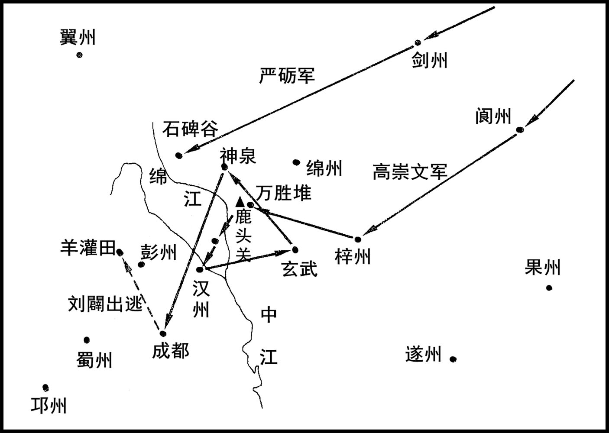
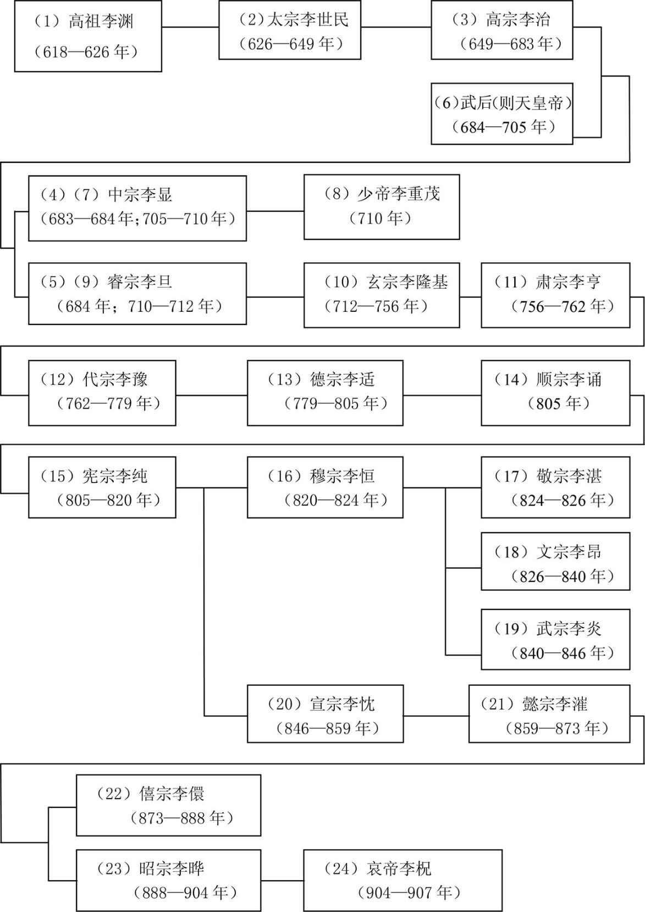

# 目录

文用事

宪宗平蜀　刘闢

宪宗平吴　李锜

魏博归朝　田弘正

宪宗讨成德　王承宗

宪宗平淮蔡　吴元济　德宗讨吴少诚附

宪宗讨淄青　李师道

河朔再叛

附录： 
唐朝皇帝世系表

返回总目录

# 文用事

## 【内容提要】

唐德宗贞元二十一年（805年）正月，德宗去世。太子即位，是为顺宗。顺宗为太子时，与王伾（pī）、王叔文甚为相得，已有革新意愿。刘禹锡、柳宗元、程异、凌准、韩泰、韩晔（yè）、陈谏以及陆质、吕温、李景俭等，均与二王相结，最终形成一个以“二王刘柳”为核心的政治集团。

顺宗用王叔文为翰林学士，掌白麻内命，即机密诏令。王叔文以韦执谊为尚书左丞、同平章事。掌握核心机密的是朝廷大臣三人——韦执谊、王叔文、王伾（pī），而以“二王”为核心；宫内，由于顺宗患疾失音，口不能言，仅有宦官李忠言、美人牛昭容侍左右。史书谓“是时政事，王叔文谋议，王伾通导，李忠言宣下，韦执谊奉行”，“事无巨细，皆决于李忠言、王伾、王叔文”，极不正常。处理朝政，上传要经过五个中间环节：韦执谊→王叔文→王伾→李忠言→牛昭容→顺宗；下达环节，亦复如是。信息不畅，行动滞缓，势所必然。

历史上所有的改革，都要触及既得利益集团的利益，势必会遭遇代表既得利益集团的政治势力的反对、反抗、反扑。此时，给唐王朝带来灭顶之灾的三大祸患之一的“牛李党争”尚未形成，而“藩镇割据”与“宦官专权”始终存在，方兴未艾。如剑南西川节度使韦皋，使支度副使刘闢（pì）求总领剑南东川、剑南西川、山南西道三川，扬言：“若与某三川，当以死相助；若不与，亦当有以相酬。”荆南节度使裴均、河东节度使严绶等，相继上表，其意与韦皋同。宦官俱文珍、刘光琦、薛盈珍等，疾李忠言新进，以为“从其谋，吾属必死其手”。朝中官员三位宰相，高郢（yǐng）无所作为，贾耽、郑珣（xún）瑜称疾不起，不作为，不合作；如侍御史窦群、御史中丞武元衡等，视“二王”等为异己，攻击不遗余力，并逐渐占据上风。五月，俱文珍等趁机削去王叔文翰林学士之职，使其失去进内宫的官署，无法参与谋划。经王伾一再疏请，仅允许“三五日一入翰林，去学士名”，大势已去。六月，又因母丧去位，形势更是急转直下。七月，王伾三上疏，请起王叔文为相，不报，知事不济，亦称中风还第。革新失败，已成定局。

七月二十八日，俱文珍等迫使顺宗禅让，下制：“积疢（chèn）未复，其军国政事权令皇太子纯勾当。”八月初四日，制：“令太子即皇帝位，朕称太上皇，制敕称诰。”初五日，太上皇徙居兴庆宫，诰改元永贞。初六日，贬王伾（pī）为开州司马，死于贬所；王叔文为渝州司马，翌年赐死。初九日，太子纯即位于宣政殿，是为宪宗。

九月十三日，贬刘禹锡为连州刺史，柳宗元为邵州刺史，韩泰为抚州刺史，韩晔（yè）为池州刺史。十一月初七日，贬韦执谊为崖州司马。朝议以为王叔文之党贬谪太轻，十四日，再贬刘禹锡为朗州司马，柳宗元为永州司马，韩泰为虔（qián）州司马，韩晔为饶州司马；又贬岳州刺史程异为郴（chēn）州司马，和州刺史凌准为连州司马，河中少尹陈谏为台（tāi）州司马，史称“八司马”。连同“二王”，史称“二王八司马”。

## 【原文】

**唐德宗贞元十九年[1]。初，翰林待诏王伾善书，山阴王叔文善棋，俱出入东宫，娱侍太子[2]。伾，杭州人也[3]。叔文谲诡多计，自言读书知治道，乘间常为太子言民间疾苦[4]。太子尝与诸侍读及叔文等论及宫市事[5]。太子曰：“寡人方欲极言之[6]。”众皆称赞，独叔文无言[7]。既退，太子自留叔文，谓曰：“向者君独无言，岂有意邪[8]？”叔文曰：“叔文蒙幸太子，有所见，敢不以闻[9]。太子职当视膳问安，不宜言外事[10]。陛下在位久，如疑太子收人心，何以自解[11]？”太子大惊，因泣曰：“非先生，寡人无以知此[12]。”遂大爱幸，与王伾相依附[13]。**

## 【注文】

[1]唐：朝代名，共历二百八十九年（618—907年），是中国历史上国力最强盛的朝代之一。隋恭帝义宁二年（618年），陇西李渊起兵反隋建唐，定都长安，建元武德元年（618年）。高宗以后，武后以周代唐（690—705年）。安史之乱后，藩镇割据，国力日趋衰败。对外贸易发达，通过海陆丝绸之路，与突厥、回纥（hé）、吐蕃（bō）、靺鞨（Mòhé）交流频繁，与天竺、新罗、日本及中亚国家往来密切。政治制度比较完善。诗歌、科技、文化、艺术极其繁盛，具有多元化特点。哀帝天祐（yòu）四年（907年），为割据势力朱温取代。　　德宗（742—805年）：名适（kuò）。唐代宗长子。代宗时，为天下兵马元帅，平定史朝义。信谗纳邪，重用奸佞（nìng）卢杞（qǐ）、赵瓒、裴延龄、窦参等为相；冤杀刘晏，贬斥陆贽、阳城等。猜忌功臣，姑息藩镇。亲信宦官，统领禁军。建中四年（783年），泾原兵变，逃亡奉天，京城沦陷。专意聚敛，增收税间架、除陌钱等杂税，置宫市，进羡余，民怨日深。在位二十六年（779—805年）。卒，葬于崇陵，谥曰神武孝文皇帝，庙号德宗。　　贞元：唐德宗在位期间所用年号，共计二十一年（785—805年）。

[2]初：刚开始的时候，早先的时候。史书用作追叙往事之词，用于句首。　　翰林待诏：翰林制度是从唐至清特有的一项职官制度。汉代已有翰林，本指文翰荟萃之所，犹词坛文苑。唐代开始作为官及官署名，最初是“天下以艺能技术见召者之所处”，文学、经术、僧道、书画、琴棋、阴阳等各色人士以其专长听候君主召见，称翰林待诏。唐玄宗时，选用文学士人，称翰林供奉，使起草诏令，议论时事，等待皇帝随时差遣。　　王伾（pī）（？—806年）：唐杭州（今属浙江）人。德宗末，为翰林待诏。累迁殿中丞、太子侍书。贞元二十一年（805年）正月，顺宗即位，迁左散骑常侍、翰林学士。为“永贞革新”领袖人物，“二王八司马”中“二王”之一。宪宗即位后，贬开州司马，死于贬所。　　善：善于，擅长。　　书：书法。　　山阴：秦设置，隋废，并入会（kuài）稽县，唐置、废不定，在今浙江绍兴。　　王叔文（753—806年）：越州山阴（今浙江绍兴）人。德宗时，以棋待诏，与王伾同侍读东宫。贞元二十一年（805年）正月，顺宗立，为翰林学士。为“永贞革新”领袖人物，“二王八司马”中“二王”之一。兼判度支、盐铁副使，转尚书户部侍郎。贬贪残之京兆尹李实，罢宫市。又谋夺宦官所掌神策军兵权，以范希朝为西北诸镇行营兵马使，为宦官俱文珍所阻。八月，宪宗即位，贬渝州司户参军。次年赐死。

[3]杭州：汉会（kuài）稽郡地。隋置杭州，唐相沿不改，玄宗天宝初，一度改为余杭郡。领钱唐等五县，治所在今浙江杭州。

[4]谲（jué）诡：狡诈；奸诈。　　乘：利用；凭借。　　间（jiàn）：空子，可乘的机会。

[5]尝：曾经。　　宫市：指宫廷直接采购。旧制，宫廷里需要的日用品，由官府承办，向民间采购。德宗贞元末年，改为由宦官直接办理，宦官不携带任何文书和凭证，看到所需之物，即口称“宫市”，随意付给很少的代价，还要货主送到宫内，并向他们勒索“门户钱”和“脚价钱”。

[6]极：穷尽，竭尽。　　言：说，谈论。　　之：指“宫市”之事。

[7]无言：不说话。

[8]既：已经。　　自：自己；独自。　　向者：刚才。　　君：对人的尊称。　　岂：其。表示估计、推测，相当于也许、莫非。　　邪：语气助词，用于句末或句中，表示反问，相当于吗、啊。

[9]蒙幸：蒙，敬词。承蒙……宠幸。　　以闻：以，使。闻，指使君主听见，向君主报告。亦泛指向上级或官府报告。

[10]视膳问安：为儿子侍奉父母的礼法，即每日必问安，每食必在侧。亦作“问寝视膳”“问安视寝”。

[11]陛下：对皇帝的尊称。　　收人心：收买人心。　　何以：倒装句式，即以何，凭借什么。

[12]因：因此。　　无以：没有办法。

[13]爱幸：宠爱信任。

## 【译文】

唐德宗贞元十九年（803年）。起初，翰林待诏王伾（pī），擅长书法，山阴人王叔文，围棋下得好，二人都常出入东宫，娱乐、侍奉太子李诵。王伾，是杭州人。王叔文狡诈，诡计多端，自称读书很多，明白治理国家的道理，总是利用机会向太子陈述民间的疾苦。太子曾经与几位侍读及王叔文等在一起谈到有关宫市的事情，太子说：“我正想上书反对呢。”众人一致赞扬，只有王叔文一言不发。等众人告辞，太子请王叔文单独留下，问他说：“刚才，只有你一言不发，难道还有别的什么想法吗？”王叔文说：“我承蒙太子看重，有什么意见，不敢不说出来。太子的主要职责是检查皇帝的膳食，还有早晚问安，不应该议论外面的事。皇帝在位已经很久，如果怀疑你收买人心，你用什么来自我辩解呢？”太子大为震惊，哭泣着说：“假如不是你，我不会想到这些。”从此对王叔文更加宠爱信任，王叔文又与王伾互相结交依附。

## 【原文】

**叔文因为太子言某可为相，某可为将，幸异日用之[1]。密结翰林学士韦执谊及当时朝士有名而求速进者陆淳、吕温、李景俭、韩晔、韩泰、陈谏、柳宗元、刘禹锡等，定为死友[2]。而凌准、程异等又因其党以进，日与游处，踪迹诡秘，莫有知其端者[3]。藩镇或阴进资币，与之相结[4]。淳，吴人，尝为左司郎中[5]。温，渭之子，时为左拾遗[6]。景俭，瑀之孙，进士及第[7]。晔，滉之族子[8]。谏，尝为侍御史[9]。宗元、禹锡，时为监察御史[10]。**

## 【注文】

[1]为：介词。对，向。　　某：指不定的不说明的人或事物。　　幸：希望，期望。　　异日：他日；来日；以后。

[2]密结：秘密结交。　　翰林学士：唐代差遣官，不计官阶品秩，自六部尚书至校书郎皆得与选。自太宗时，名儒学士，时召草制，未有名号。乾封以后，始号“北门学士”。玄宗初，置翰林待诏，以张九龄、张说、陆坚等掌四方表疏批答，应和文章。又因中书繁忙，文书积压，乃选文学之士，与集贤院学士分司起草诏书及应承皇帝的各种文字，号翰林供奉。开元二十六年（738年），改为学士，别置学士院，专掌内命。德宗以后，翰林学士成为皇帝的亲近顾问兼秘书官，常值宿内廷，承命撰拟有关文告，凡拜免将相，册立皇后、太子，号令征伐等，用白麻书写，号为“内相”。宪宗时，于学士中选资高望重者一人为承旨学士，参谋禁密，权任独重。唐代后期，往往多有翰林学士升任宰相。　　韦执谊（769—814年）：字宗仁。京兆（今陕西西安）人。德宗贞元进士，又登制科，授右拾遗。入翰林为学士，德宗宠异之。顺宗立，王叔文秉政，授尚书左丞，同平章事，主文诰。宪宗即位，贬崖州司马。“二王八司马”中的八司马之一。死于贬所。　　朝士：指朝廷之士，泛称中央官员。　　速进：快速升官掌权。　　陆淳（？—806年）：字伯冲。苏州吴县（今属江苏）人。初任淮南节度使府从事，诏授太常寺奉礼郎，拜为左拾遗，改任国子博士。唐德宗建中初，为左司郎中。出为信、台二州刺史。顺宗时，为太子侍读。太子即位，是为宪宗，有诏为给事中，改名质。　　吕温（771—811年）：字和叔。河中（今山西永济）人。吕渭之子。唐德宗贞元十四年（798年）进士，次年又中博学宏词科，授集贤殿校书郎，十九年（803年）任左拾遗，为王叔文所倚重，次年随张荐以侍御史之名出使吐蕃（bō）。顺宗永贞元年（805年）秋，使还，转户部员外郎。历司封员外郎、刑部郎中。宪宗元和三年（808年）秋，因与宰相李吉甫有隙，贬道州刺史，后徙衡州，甚有政声，世称“吕衡州”，卒于任。　　李景俭：生卒年未详。字宽中。宗室。汉中王李瑀之孙。父李褚，官太子中舍。贞元十五年（799年）进士，历任谏议大夫，贞元末，韦执谊、王叔文在太子东宫执事，颇受重视。永贞元年（805年）八月，唐宪宗即位，韦执谊等八人先后被贬，以守丧未遭波及，官至少府少监。　　韩晔（yè）：生卒年未详。排行第十五。京兆长安（今陕西西安）人。宰相韩滉（huàng）之族子。有俊才，依附韦执谊，累迁尚书司封郎中。永贞革新失败，贬池州刺史，再贬为饶州司马，“二王八司马”中的八司马之一。迁汀州刺史，长庆元年（821年）量移永州刺史，卒。　　韩泰（？—831年）：字安平。雍州三原（今属陕西）人。贞元中，累迁至户部郎中。贞元二十一年（805年），顺宗即位，王叔文、王伾用事，受倚重。为神策行营节度行军司马，谋夺兵权，为宦官所阻。永贞革新失败，贬抚州刺史，再贬虔（qián）州司马。“二王八司马”中的八司马之一。历漳州、郴（chēn）州、睦州、湖州刺史，终常州刺史。　　陈谏：生卒年未详。唐德宗贞元八年（792年），与韩愈、李观、李绛（jiàng）、崔群等同登进士第。永贞革新失败，贬河中少尹，再贬台（tāi）州司马，“二王八司马”中的八司马之一。迁循州刺史，卒于贬所。　　柳宗元（773—819年）：字子厚。河东解县（今山西运城西南）人，世称柳河东。贞元进士。任校书郎、蓝田尉、监察御史等职。贞元末，任礼部员外郎，参与王叔文、王伾改革，反对宦官专权和藩镇割据。永贞革新失败，贬邵州刺史，再贬永州司马，“二王八司马”中的八司马之一。迁柳州刺史，卒于任，世称柳柳州。　　刘禹锡（772—842年）：字梦得。彭城（今江苏徐州）人，自言系出中山（今河北定州）。唐德宗贞元进士，又登博学宏辞科，官太子校书。从淮南节度使杜佑幕，后入为监察御史。贞元末，参与王叔文、王伾改革，反对宦官专权和藩镇割据。授屯田员外郎，判度支盐铁案。永贞革新失败，贬连州刺史，再贬朗州司马。“二王八司马”中的八司马之一。后被召还京，以赋《戏赠看花诸君子》诗，触犯权贵，再贬播州。因裴度说情，改授连州，历任夔（kuí）州、和州、苏州、同州刺史，加检校礼部尚书。官至太子宾客分司东都。卒，赠户部尚书。　　死友：交情深笃，至死不相负的朋友。

[3]凌准（752—808年，一作750—806年）：字宗一。新城（今浙江富阳）人。三国时东吴大将凌统之后。上书宰相以自荐，擢（zhuó）为崇文馆校书郎。唐德宗建中四年（783年），泾源之乱，德宗幸奉天。佐邠（bīn）宁节度使韩游瓌（guī）讨伐，以功，加大理评事。贞元二十年（804年），自浙东观察判官、侍御史召入，与王叔文有旧，入为翰林学士，转员外郎。永贞革新失败，贬和州刺史，再贬连州司马。　　程异（？—819年）：字师举。京兆长安人。明经及第，授扬州海陵主簿。登开元礼科，授华州郑县尉。精于吏职，杜确为同州刺史、河中晋绛观察使，皆从为宾佐。贞元末，授监察御史，迁虞（yú）部员外郎，充盐铁转运、扬子院留后。叔文败，坐贬岳州刺史，改郴（chēn）州司马。“二王八司马”中的八司马之一。元和初，盐铁使李巽（xùn）荐程异晓达钱谷，擢为侍御史，复为扬子院留后，累迁检校兵部郎中、淮南等五道两税使。入为太府少卿、太卿，转卫尉卿，兼御史中丞，充盐铁转运副使。淮西用兵，专领盐铁转运使、兼御史大夫。十三年（818年），转工部侍郎、同中书门下平章事，领使如故。卒，赠左仆射（yè），谥曰恭。　　其党：指王叔文集团“二王八司马”一党。　　进：进用。　　日：每天，天天。　　游处：交游；来往。　　端：事由；原委。

[4]藩镇：亦称方镇，唐代初年在各重要州设都督府，睿（ruì）宗时设节度大使，玄宗时又在边境设置九个节度使和一个经略使（时称天宝十节度使），通称“藩镇”。各藩镇掌管一个地区的军政，后来权力逐渐扩大，兼管民政、财政，掌握全部军政大权，形成地方割据势力，常与朝廷对抗。如唐中后期，时称“河朔三镇”的成德、魏博和卢龙三镇（河北、山东、河南、湖北、山西一带的藩镇），割据一方，形同独立政权。后代史家把这种局面统称为“藩镇割据”。　　或：有的。　　阴：暗暗地；偷偷地。　　资币：财物；泉币。

[5]吴：吴县。春秋时吴都阖闾（hé lǘ）邑。汉为吴县，隶属于会（kuài）稽郡。隋平陈，设置苏州，取州西姑苏山为名。唐属苏州，在今江苏苏州。　　左司郎中：左右司郎中，隋设置，武德初削减。贞观初，复原设置。龙朔二年（662年），改为左右丞务，咸亨复原。各一员，从五品上。左司郎中副左丞所管十二司之事，查勘违失，掌管省内宿直之事。如右司郎中阙，则并行之。

[6]渭：即吕渭（735—800年），字君载。河中（今山西永济）人。吕温之父。唐玄宗天宝十三载（754年）进士及第。累授婺（wù）州永康令、大理评事。浙西观察使李涵辟（bì）为支使，再迁殿中侍御史、司门员外郎。因事贬歙（shè）州司马。历舒州刺史、吏部员外、驾部郎中、知制诏、中书舍人，授太子右庶子、礼部侍郎。三知贡举。出为潭州刺史、兼御史中丞、湖南都团练观察使。卒，赠陕州大都督。　　左拾遗：古无此官名。武后垂拱初，置左右补阙各二员，从七品上，左右拾遗各二员，从八品上。分别隶属于门下省（左省）、中书省（右省）。掌供奉讽谏。天授中，各加置三员。大历中，补阙、拾遗，各置两员。

[7]瑀（yǔ）：李瑀，生卒年未详。宗室。唐睿宗之孙，李景俭祖父。历都水使者、恒王府司马、卫尉员外卿。始封陇西郡公。天宝十五载（756年），从玄宗至蜀，至汉中，因封汉中王，授梁州都督、山南西道采访、防御使。肃宗乾元元年（758年），为特进、试太常卿、摄御史大夫，充册命英武威远毗伽（qié）可汗使。卒，赠太子太师，谥曰宣。　　进士及第：隋炀帝大业年间，始置进士科目。唐亦设此科，凡州县乡试后解送尚书省者，谓之举进士，中试者皆称进士。经进士科考试及第者，称为进士及第，又称前进士。榜上题名有甲乙等第，故称及第。唐代尚书省考试，初由吏部考功员外郎主持，开元末，改由礼部侍郎主持。

[8]滉（huàng）：即韩滉（723—787年），字太冲。京兆长安（今陕西西安）人。韩休子。以荫补左威卫骑曹参军。大历六年（771年），为户部侍郎判度支。建中末，以中书令兼统六道节制，出为镇海军节度使，参与平服朱泚（cǐ）、李怀光战争。贞元元年（785年），加检校左仆射，同平章事，封郑国公。　　族子：侄子。

[9]侍御史：御史之名，周朝已有，又名柱下史。秦改为侍御史。北周为司宪中士，隋为侍御史。唐高祖武德中设置四员，从六品下。掌纠举百僚，推鞫（jū）狱讼。年深者一人判御史台事，知公廨（xiè）杂事。

[10]监察御史：官名，隋开皇二年（582年），改检校御史为监察御史，始设。唐御史台分为三院，监察御史属察院。员十五人，正八品上。掌监察百官、巡视郡县、肃整朝仪、岭南选补、知太府、司农出纳、纠正刑狱、监决囚徒等。

## 【译文】

王叔文凭着这个关系就向太子推荐，说某人可以做宰相，某人可以做大将，希望有一天能重用他们。又秘密结交翰林学士韦执谊，还有当时朝廷官员中有名望而且急于升官掌权的一些人，如陆淳、吕温、李景俭、韩晔、韩泰、陈谏、柳宗元、刘禹锡等，定为生死之交。而凌准、程异等也通过这些同党的推荐，而受到进用。他们每天聚集在一起，行踪诡秘，没有人知道他们的头绪。有的藩镇甚至还暗地里贿赂他们，与他们结交。陆淳，是吴县人，曾任左司郎中；吕温，是吕渭的儿子，当时任职左拾遗；李景俭，是李瑀的孙子，进士及第；韩晔，是韩滉的侄子；陈谏，曾任侍御史；柳宗元、刘禹锡，当时任监察御史。

## 【原文】

**左补阙张正一上书，得召见[1]。正一与吏部员外郎王仲舒、主客员外郎刘伯刍等相亲善，叔文之党疑正一言己阴事，令韦执谊反谮正一等于上，云其朋党，游宴无度[2]。九月甲寅，正一等皆坐远贬，人莫知其由[3]。伯刍，迺之子也[4]。**

## 【注文】

[1]左补阙：古无此官名。武后垂拱初，置左右补阙各二员，从七品上，左右拾遗各二员，从八品上。分别隶属于门下省（左省）、中书省（右省）。掌供奉讽谏。天授中，各加置三员。大历中，补阙、拾遗，各置两员。　　张正一：生卒年未详。唐德宗贞元末为左补阙，与主客员外郎刘伯刍（chú）、吏部员外郎王仲舒等友善，被王叔文诬为朋党远贬。　　上书：向君主进呈书面意见。　　召见：君王或上司命臣民或下属来见面。

[2]吏部员外郎：汉成帝初置尚书，后汉改为吏曹，后又为选部。魏改为吏部，主选事。晋、宋以来，吏部尚书资位尤重。隋吏部统吏部、主爵、司勋、考功四曹。唐龙朔二年（662年），改为司列，咸亨初复旧。光宅元年（684年），改为天官，神龙元年（705年）复旧。天宝十一载（752年），改为文部。尚书一员，正三品；侍郎二员，正四品下；郎中二员，从五品上；员外郎二员，从六品上。掌文官选举，总判吏部、司封、司勋、考功四曹事。　　王仲舒（762—823年）：字弘中。太原祁县（今属山西）人。唐德宗贞元中，登贤良方正，直言极谏科，超拜右拾遗。反对以裴延龄领度支，累转尚书郎。宪宗元和五年（810年），自职方郎中知制诰。穆宗立，以其文有古风，最宜为诰，召拜中书舍人。后求为地方官，授江西观察使，罢榷酒弊法，因水旱出官钱二千万贯代贫户输税。卒，赠左散骑常侍。　　主客员外郎：汉成帝尚书置客曹，主管外交及处理民族间的事务。东汉光武分为南北主客二曹，晋分左右南北四主客，南朝单有主客。隋曰司蕃（fān）郎，武德改主客郎中，龙朔为司蕃大夫，咸亨复。郎中一员，从五品上；员外郎一员，从六品上。　　刘伯刍（chú）（755—815年）：字素芝。洺（míng）州广平（今河北邯郸东北）人。刘迺（nǎi）之子。登进士第。淮南杜佑辟为从事，征拜右补阙。唐德宗贞元末，为主客员外郎。与左补阙张正一、吏部员外郎王仲舒等友善，被王叔文诬为朋党，贬虔（qián）州掾曹。复为考功员外郎，迁考功郎中、集贤院学士，转给事中，为太子宾客，出为虢（guó）州刺史。裴度擢为刑部侍郎，知吏部选事。以左散骑常侍致仕，卒，赠工部尚书。　　亲善：亲近友善。　　阴事：隐秘的事情，不可告人的事情。　　令：命令，下令。　　谮（zèn）：说别人的坏话，诬陷，中伤。　　朋党：原指一些人为自私的目的而互相勾结，朋比为奸；后来泛指士大夫结党，即结成利益集团。士大夫结党，发生朋党之争历代常有，如唐代的牛李党争。　　游宴：交游宴饮。　　无度：毫无节制，没有限度。

[3]皆：都。　　坐：定罪。　　其由：其中的原因。

[4]迺（nǎi）：刘迺（725—784年），字永夷。洺州广平（今河北邯郸东北）人。文章清雅，为当时推重。唐玄宗天宝中，举进士。补剡（shàn）县尉，改会（kuài）稽尉。宣州观察使殷日用奏为判官，宣慰使李季卿又以表荐，连授大理评事、兼监察御史。转运使刘晏奏令巡覆江西，改殿中侍御史、检校仓部员外、户部郎中，并充浙西留后。代宗大历十二年（777年），拜司门员外郎。十四年，为给事中，迁权知兵部侍郎。至德宗建中四年（783年），真拜兵部侍郎。朱泚反叛，占据长安，卧病在家，胁迫引诱，欲授以伪官，守节不屈，绝食而死。长安收复，与蒋沇等受到表彰，追赠礼部尚书。

## 【译文】

左补阙张正一上书皇帝，受到唐德宗召见。张正一与吏部员外郎王仲舒、主客员外郎刘伯刍等亲密友善，王叔文的党羽怀疑张正一向皇帝透露他们的秘密，于是，命令韦执谊在唐德宗面前，反过来诬陷张正一等结党营私、游宴无度。贞元十九年（803年）九月甲寅（初六日），张正一等被贬谪远方，没有人知道其中的原因。刘伯刍，是刘迺的儿子。

## 【原文】

**十二月庚申，以太常卿高郢为中书侍郎，吏部侍郎郑珣瑜为门下侍郎，并同平章事[1]。珣瑜，余庆之从父兄弟也[2]。**

## 【注文】

[1]太常卿：汉初设置太常，欲令国家盛大常存，故称。惠帝更名奉常，景帝复名太常。唐高宗龙朔中，改奉常，咸亨初复旧。光宅元年（684年）改为司礼，神龙初复旧。卿一人，掌礼仪祭祀，总判寺事，正三品；少卿二人，通判，正四品上。　　高郢（yǐng）（740—811年）：字公楚。卫州（今河南卫辉）人，祖籍渤海蓨（tiáo）县（今河北景县）。安史之乱时，叛军执其父，披发解衣请代，得释。宝应初，举进士。先后充郭子仪、李怀光幕僚。兴元元年（784年），怀光叛，不从。次年，怀光败死，入为刑部郎中、中书舍人，进礼部侍郎。掌贡举三年，拒绝请托。贞元十九年（803年），擢（zhuó）中书侍郎、同平章事。顺宗立，王叔文当权，罢相。元和初，召为太常卿，改兵部尚书，以尚书右仆射（yè）致仕。　　中书侍郎：汉置中书，领尚书事，有丞、郎。魏黄初初，中书置监、令，又置通事郎，晋朝加“侍”，正式称为中书侍郎。隋初，为内史侍郎。炀帝改为内书侍郎。唐初为内史侍郎，高祖武德三年（620年），改为中书侍郎。龙朔以后，随省改号，而侍郎之名不变。掌侍从，献替，制敕，册命，敷奏文表，通判省事。员二人，旧制正四品上，大历二年（767年），升从三品。唐代宗以后，同中书、门下平章事成为宰相，以门下侍郎、中书侍郎同平章事为首席宰相。　　吏部侍郎：汉尚书有常侍曹，主管丞相御史公卿之事。东汉改为吏曹，主选举祠祀，后又改为选部。魏、晋以后称吏部。唐高宗龙朔二年（662年），改为司列少常伯，光宅元年（684年），改为天官侍郎，神龙复为吏部侍郎。其属有四：一曰吏部，二曰司封，三曰司勋，四曰考功。掌天下官吏选授、勋封、考课的政令。二员，正四品上。班次在其他诸曹之上。　　郑珣（xún）瑜（738—805年）：字元伯。郑州荥泽（今河南郑州西北）人。郑覃、郑朗之父。唐代宗大历时，以讽谏主文科高第，授大理评事，累迁侍御史、刑部员外郎。德宗贞元时，官吏部侍郎。改河南尹，清静惠下。十九年（803年），拜门下侍郎、同平章事。顺宗立，王叔文秉政，罢为吏部尚书。卒，谥曰文献。　　门下侍郎：为门下省长官侍中之副。秦、汉有黄门侍郎，与侍中俱管门下众事，为帝王近侍。魏晋以后，给事黄门侍郎并为侍卫之官。隋属门下省，炀帝时，去“给事”。唐高宗龙朔二年（662年），改为东台侍郎，咸亨元年（670年）复旧。光宅元年（684年），改为鸾（luán）台侍郎，神龙元年（705年）复旧。天宝元年（742年），改为门下侍郎，至德二载（757年）复旧。大历二年（767年），改为门下侍郎。员二人，本正四品上，大历时升为正三品。掌侍从，署奏抄，驳正违失，通判省事。若侍中阙，则监封题，给驿券。　　同平章事：同中书、门下平章事的简称。唐太宗贞观八年（634年），仆射（yè）李靖以疾辞位，诏三两日一至中书门下平章事，“平章事”之名起于此。其后，李以太子詹事同中书门下三品，谓同侍中、中书令，“同三品”之名起于此。但二名不专用。自高宗以后，为宰相者必加“同中书门下三品”，虽品高者亦然；唯三公、三师、中书令则否。其后改易官名，而张文瓘（guàn）以东台侍郎同东西台三品，“同三品”入衔，自张文瓘始。永淳元年（682年），以黄门侍郎郭待举、兵部侍郎岑长倩等同中书门下平章事，“平章事”入衔，自郭待举等始。自此以后，终唐之世不能改。

[2]余庆：郑余庆（746—820年），字居业。郑州荥阳（今属河南）人。郑珣（xún）瑜从弟。唐代宗大历进士。德宗时，由幕府选为翰林学士，累迁工部侍郎，知吏部选事。贞元十四年（798年），拜中书侍郎、同平章事。坐事贬郴（chēn）州司马。宪宗立，再拜相。罢为太子宾客，转国子祭酒、吏部尚书。宪宗元和九年（814年），出为山南西道节度使，移凤翔节度使。十三年，拜尚书左仆射。次年，兼太子少师，封荥阳郡公，兼判国子祭酒事。砥（dǐ）名砺（lì）行，不失儒者之道，清俭率素，始终不渝。卒，赠太保，谥曰贞。

## 【译文】

唐德宗贞元十九年（803）十二月庚申（十三日），以太常卿高郢（yǐng）为中书侍郎，吏部侍郎郑珣（xún）瑜为门下侍郎，并同平章事。郑珣瑜，是郑余庆的堂兄弟。

## 【原文】

**二十年秋九月，太子始得风疾，不能言[1]。**

## 【注文】

[1]始：副词。才，刚。　　风疾：风痹（bì），中风、半身不遂等症。

## 【译文】

唐德宗贞元二十年（804年）秋季九月，太子李诵突然中风，不能说话。

## 【原文】

**顺宗永贞元年春正月辛未朔，诸王亲戚入贺德宗，太子独以疾不能来，德宗涕泣悲叹，由是得疾，日益甚[1]。凡二十余日，中外不通，莫知两宫安否[2]。癸巳，德宗崩[3]。苍猝召翰林学士郑、卫次公等至金銮殿草遗诏[4]。宦官或曰：“禁中议所立尚未定[5]。”众莫敢对[6]。次公遽言曰：“太子虽有疾，地居冢嫡，中外属心[7]。必不得已，犹应立广陵王，不然必大乱[8]。”等从而和之，议始定[9]。次公，河东人也[10]。太子知人情忧疑，紫衣麻鞋，力疾出九仙门，召见诸军使，京师粗安[11]。甲午，宣遗诏于宣政殿，太子缞服见百官[12]。丙申，即皇帝位于太极殿[13]。卫士尚疑之，企足引领而望之，曰：“真太子也[14]。”乃喜而泣。**

## 【注文】

[1]顺宗：即唐顺宗（761—806年）。名诵。唐德宗长子。为太子时，曾与王叔文议论宫市之弊及民间疾苦，筹划革新。即位后，任用王伾（pī）、王叔文等进行改革，罢进奉、宫市、五坊小儿等，史称“永贞革新”，又有所谓“二王八司马”。在位仅八个月，为宦官俱文珍所迫退位，传位太子，自称太上皇。卒，葬于丰陵，谥大圣大安皇帝，庙号顺宗。　　永贞：唐顺宗所用年号，仅一年（805年）。　　亲戚：与自己有血缘或婚姻关系的人。　　德宗：李适（kuó）（742—804年），唐朝第十一位皇帝，肃宗长孙、代宗长子。在位前期，信用文武百官，严禁宦官干政，有中兴气象；在位后期，委任宦官为禁军统帅，增收税间架、除陌钱等杂税，导致民怨日深。谥曰神武孝文皇帝，庙号德宗，葬崇陵。　　以：连词。因为，由于。　　由是：因此。　　益：副词，更加。　　甚：程度深。严重，厉害。

[2]凡：总计，总共。　　中外：宫内和宫外。　　两宫：皇帝与太子居住的宫殿，代指皇帝与太子。

[3]崩：古代称帝王、皇后之死。《礼记·曲礼下》：“天子死曰崩。”

[4]苍猝：即仓促，匆忙，急急忙忙；做事急急忙忙，时间不充足，侧重指没有准备。　　郑（yīn）（752—829年）：字文明。郑州荥阳（今属河南）人。进士及第，登宏词科，授秘书省校书郎、鄠（hù）县尉。出为西川张延赏掌书记。唐德宗召为翰林学士，谦谨奉职凡十三年。累迁中书舍人。宪宗立，为中书侍郎、同平章事、集贤殿学士。居相位四年，无所建树，罢为太子宾客。五年（810年），出为岭南节度使。九年，入为工部尚书。十三年，以同州刺史为东都留守、都畿（jī）汝防御使。穆宗长庆年间，历吏部尚书、太子少傅、兵部尚书、吏部尚书。卒于太子太傅，赠司空，谥曰宣。　　卫次公（753—818年）：字从周。河东（今山西太原）人。弱冠举进士，补崇文馆校书郎，改渭南尉。严震任山南西道节度使时，辟（bì）为从事，授监察，转殿中侍御史。唐德宗贞元八年（792年），征为左补阙，兼翰林学士。顺宗永贞初，与郑（yīn）同处内廷，多所匡正。转司勋员外郎，以本官知制诰，权知中书舍人，知礼部贡举。真拜中书舍人，充史馆修撰，迁兵部侍郎、知制诰，复兼翰林学士。郑罢相，左授太子宾客，历尚书右丞、兼判户部事，陕虢（guó）等州都防御观察处置等使，兵部侍郎，尚书左丞，出为淮南节度使。卒，赠太子少保，谥曰敬。　　金銮（luán）殿：位于大明宫太液池南边，地势高爽。殿旁有金銮坡，与麟德殿、翰林院相邻，因比邻大明宫西边的翰林院，是文人学士等待皇帝诏命应对之所。　　遗诏：皇帝临终时颁发的诏书。

[5]宦官：又称寺人、阉（奄）人、阉官、宦者、中官、内官、内臣、内侍、内监等。中国古代专供皇帝、君主及其家族役使的人员。一般由阉割后的男子充任。先秦和西汉时期并非全是阉人。自东汉开始，则全为被阉割后失去性能力的中性人。　　禁中：指帝王所居宫内。

[6]对：应答。

[7]遽（jù）：急，仓促。　　冢嫡：嫡（dí）长子。

[8]犹：副词。仍然，还。　　广陵王：李纯，太子长子，即唐宪宗。

[9]和：附和。

[10]河东：汉河东郡。北周改为蒲州，隋、唐相沿不改，玄宗天宝初，一度改为河中府，又为河东郡。领河东等五县，治所在今山西永济。

[11]人情：指人心；世情。　　紫衣：春秋战国时，国君服紫。唐代时，高品服紫。　　麻鞋：服丧所穿鞋子。　　九仙门：宫城西面右银台门，又北为九仙门。在长安内西苑东北角。右神策军、右羽林军、右龙武军列营于九仙门之西。　　京师：京城，位于今陕西西安。　　粗：粗略，略微。

[12]宣：宣读，传达皇帝的命令。　　宣政殿：唐长安城大明宫中的第二大殿，位于含元殿之北，紫宸（chén）殿前。东廊之外为门下省、史馆等，西廊之外为中书省、殿中省。　　缞（cuī）服：用粗麻布做成的丧服，服三年之丧所穿。

[13]太极殿：宫城在皇城之北，其北曰太极门，其内曰太极殿。

[14]尚：还。　　企足：踮起脚。　　引领：伸颈远望，多以形容期望殷切。

## 【译文】

唐顺宗永贞元年（805年）春季正月辛未朔（初一日），所有的亲王和皇亲国戚，在宫殿朝拜唐德宗，只有皇太子李诵因病不能前来，唐德宗涕泪纵横，悲伤叹息，于是得病，卧床不起，一天比一天严重。一连二十多日，皇宫内外音讯断绝，没有人知道皇帝与太子是否平安。癸巳（二十三日），唐德宗驾崩。仓促间，召唤翰林学士郑（yīn）、卫次公等到金銮（luán）殿，起草遗诏。有一个宦官忽然说：“到底指定谁来继任皇位，宫中还没有最后决定呢。”众人不敢答话。卫次公急忙说：“太子虽然有病，但他是嫡（dí）长子，中外一致拥护。万不得已，也应该拥立嫡（dí）皇孙广陵王。不然的话，一定会大乱。”郑等跟着随声附和，议论才决定下来。卫次公，是河东人。太子知道人心忧虑惊疑，身上穿着紫袍，脚上穿着守丧的麻鞋，抱病出九仙门，召见禁卫各军的将领，京城的人心才稍微安定。甲午（二十四日），在宣政殿宣读唐德宗的遗诏，太子身穿丧服，接见文武百官。丙申（二十六日），太子在太极殿即位。卫士中还有感到怀疑的人，踮着脚，伸长脖子张望，说：“真是太子！”高兴得哭了起来。

## 【原文】

**时顺宗失音，不能决事，常居深宫，施帘帷，独宦官李忠言、昭容牛氏侍左右[1]。百官奏事，自帷中可其奏[2]。自德宗大渐，王伾先入，称诏召王叔文，坐翰林中使决事[3]。伾以叔文意入言于忠言，称诏行下，外初无知者[4]。以杜佑摄冢宰[5]。二月癸卯，上始朝百官于紫宸门[6]。辛亥，以吏部郎中韦执谊为尚书左丞、同平章事[7]。王叔文欲专国政，首引执谊为相，己用事于中，与相唱和[8]。**

## 【注文】

[1]失音：声音严重嘶哑，或完全不能发声的一种病症。　　帘帷：帐幕。　　李忠言：生卒年未详。唐顺宗永贞年间宦官，与牛昭容二人侍顺宗，又兼上传下达，事无巨细，皆经其手。　　昭容：宫廷女官名。南朝刘宋孝武帝改制后，昭容位号为九嫔之一。之后南朝各代沿用。北朝则有北齐设昭容，为八十一御女之一。隋朝废止。唐朝再设昭容，为九嫔之一，正二品，唐高宗后废除，中宗时一度恢复。　　牛氏：生卒年未详。唐顺宗即位后，封牛氏为昭容。参与顺宗朝“永贞革新”。与宦官李忠言二人侍顺宗，事无巨细，皆经其手。

[2]可：表示同意，许可。

[3]大渐：病危，本指久病不愈，后指病重将死。

[4]言于：对……说。　　称诏行下：以皇帝的名义下诏，并向下推行。

[5]杜佑（735—812年）：字君卿。京兆万年（今陕西西安）人。唐代宗时，历任工部郎中、抚州刺史、容管经略使。德宗初，杨炎为相，征入朝，任度支郎中兼和籴等使。时方作战，承担馈（kuì）运之务。迁户部侍郎、判度支。历岭南、淮南节度使。贞元十九年（803年），入为检校司空、同平章事。王叔文执政，以为兼度支盐铁转运使。宪宗时，拜司徒、同平章事。封岐国公。著有《通典》。　　摄冢（zhǒng）宰：皇帝去世，首相代理国政，统理百官，均平四海之内。冢宰为官名，即太宰。西周置，位次三公，为六卿之首，唐代指宰相。

[6]紫宸（chén）门：即紫宸殿门。位于宣政殿以北，宣政殿北曰紫宸门，门内有紫宸殿，即内衙之正殿，称为“内朝”，群臣在此朝见皇帝。含元、宣政、紫宸组成外朝、中朝、内朝格局。

[7]尚书左丞：唐因隋制实行三省六部制，尚书省下设六部，各部置尚书一名，左右丞各一员。左丞，正四品上。高宗朝龙朔年间改为左右肃机，咸亨年间复原，武后永昌元年，升为从三品，如意元年，复原四品。左丞佐尚书令，总领纲纪。

[8]用事于中：在幕后执政、当权。　　唱和：互相呼应、配合，多含贬义。

## 【译文】

当时唐顺宗已经不能说话，无法裁决请示。一直住在深宫里，床前悬挂帷帐，只有宦官李忠言、昭容牛氏在左右伺候。文武百官上奏国事，由唐顺宗在帷帐中认可。自从唐德宗病重，翰林待诏王伾（pī）先行入宫，宣称皇帝召集王叔文，在翰林院中裁决国事。王伾将王叔文的意见带进宫廷告诉李忠言，再由李忠言以皇帝的名义下诏。起初，外面没有人知道这种情形。以宰相杜佑为摄冢（zhǒng）宰。永贞元年（805年）二月癸卯（初三日），唐顺宗第一次在紫宸（chén）门朝见文武百官。辛亥（十一日），以吏部郎中韦执谊为尚书左丞、同平章事。王叔文想专断国政，所以首先引荐韦执谊为宰相，自己在宫中决策，互相配合，一唱一和。

## 【原文】

**壬戌，以殿中丞王伾为左散骑常侍，依前翰林待诏[1]。苏州司功王叔文为起居舍人、翰林学士[2]。伾寝陋，吴语，上所亵狎[3]。而叔文颇任事自许，微知文义，好言事，上以故稍敬之，不得如伾出入无阻[4]。叔文入至翰林，而伾入至柿林院，见李忠言、牛昭容计事[5]。大抵叔文依伾，伾依忠言，忠言依牛昭容，转相交结[6]。每事先下翰林，使叔文可否，然后宣于中书，韦执谊承而行之[7]。外党则韩泰、柳宗元、刘禹锡等主采听外事[8]。谋议唱和，日夜汲汲如狂，互相推奖，曰伊，曰周，曰管，曰葛，僴然自得，谓天下无人[9]。荣辱进退，生于造次，惟其所欲，不拘程式[10]。士大夫畏之，道路以目[11]。素与往还者，相次拔擢，至日除数人[12]。其党或言曰某可为某官，不过一二日，辄已得之[13]。于是叔文及其党十余家之门，昼夜车马如市[14]。候见叔文、伾者，至宿其坊中饼肆、酒墟下，一人得千钱，乃容之[15]。伾尤阘茸，专以纳贿为事，作大匮贮金帛，夫妇寝其上[16]。**

## 【注文】

[1]殿中丞：官名。魏晋后门下省设殿中监一官。隋代始设立殿内省，唐高祖武德元年（618年），改殿内省为殿中省，掌皇帝生活诸事，殿中丞为其属官。殿中丞二人，从五品上。　　左散骑常侍：唐代左散骑常侍二人，隶属于门下省，从三品。唐太宗曾以散骑常侍为散官，旋省去，复置为职事官。高宗显庆二年（657年），分为左右，各设二人，属中书省。职掌同为规谏过失，侍从顾问，并无实权，而为尊贵之官，常作为将相大臣的加官。

[2]苏州：汉会（kuài）稽郡。隋改为苏州，唐相沿不改，玄宗天宝初，一度改为吴郡。领吴县等四县，治所在今江苏苏州。　　司功：唐代州长官为刺史，其下属僚佐主要有上佐、判司和录事参军。其中判司指司功、司仓、司户、司兵、司法、司士六曹参军，与朝廷尚书省六部相对应。司功掌管官吏的铨选、考课、封爵和勋赏。　　起居舍人：古无其名，隋炀帝时始置起居舍人二员，属内史省。唐贞观二年（628年），于门下省置起居郎，废起居舍人，移其职于门下，设置起居郎二员。显庆三年（658年），另置起居舍人于中书省，始与起居郎分在左右。龙朔二年（662年）改起居郎为左史，起居舍人为右史，咸亨元年（670年）复旧。天授元年（690年）又改为左、右史，神龙元年（705年）复旧。掌修记言之史，录天子之制诰德音，如记事之制，以记时政损益。每季终，为一卷，授之于国史馆。

[3]寝陋：容貌丑陋。　　吴语：吴地方言，此处指王伾（pī）的苏州方言口音。　　亵狎（xiè xiá）：亲近宠幸。

[4]任事自许：担任大事，自我期许。　　好（hào）：喜欢。　　言事：谈论国家大事。　　稍：稍微，稍稍。

[5]柿林院：顺宗起居宫殿的庭院。　　计事：讨论国家大事。

[6]大抵：大概，大体。　　转相交结：辗（zhǎn）转结交。

[7]下：下达。　　可否：可不可以，能不能。　　中书：中书省，秦始置中书谒者，汉元帝去“谒者”二字。历代但云中书。北周谓之内史省，隋因为内史省，置内史监、令各一员。炀帝改为内书省，武德复为内史省，三年（620年）改为中书省。龙朔改为西台，光宅改为凤阁，神龙复为中书省。开元元年（713年）改为紫微省，五年复旧。最高长官为中书令，次长官为中书侍郎。　　承而行之：承接执行。

[8]外党：宫外的党羽。　　外事：朝廷政事，与宫内之事称内事相对。

[9]汲汲如狂：急切追求好像疯狂了一样。　　推奖：推崇夸奖。　　伊：指伊尹。　　周：指周公。　　管：指管仲。　　葛：指诸葛亮。　　僴（xiàn）　　然：狂妄自大的样子。　　自得：自以为是。

[10]荣辱进退：荣耀或受辱，升迁或贬黜。　　造次：仓猝；匆忙。　　程式：法式，规格，准则。

[11]道路以目：路上相遇时，不敢说话，只敢互相张望一眼。

[12]往还：交友往来。　　拔擢（zhuó）：选拔提升。　　除：除官，授予官职。

[13]辄（zhé）：副词。立即，就。

[14]车马如市：车来人往，喧哗如市。

[15]坊中：长安城中分为左右街，街中有百余坊。　　饼肆：卖饼之家。肆，小店。　　酒墟：卖酒土台。　　容：收留。

[16]阘茸（tàróng）：卑劣，人品卑劣或者庸碌无能。阘，下；茸，细毛。　　大匮（guì）：大型藏物器，“匮”为“柜”的古字。　　金帛：黄金和丝绸，泛指钱物。

## 【译文】

唐顺宗永贞元年（805年）二月壬戌（二十二日），以殿中丞王伾（pī）为左散骑常侍，依旧兼翰林待诏。以苏州司功王叔文为起居舍人、翰林学士。王伾长相丑陋，一口苏州土话，是唐顺宗最喜欢戏弄亲近的人。而王叔文颇以善于处理大事而自负，而且略微知道文章经义，喜欢谈论国家政事，唐顺宗因此对他稍加敬重。但王叔文也因此之故，不像王伾那样，能够随便进入宫廷。王叔文进入翰林院处理政事，而王伾进入柿林院，和李忠言、牛昭容议论大事。大致的程序是：王叔文依靠王伾，王伾依靠李忠言，李忠言依靠牛昭容，辗转结交。每次递呈给皇帝的奏章，一律先交给翰林院，由王叔文决定是否同意，然后以皇帝的名义送到中书省，由宰相韦执谊接收并执行。宫廷外的党羽，还有韩泰、柳宗元、刘禹锡等，他们负责采集打听外界的事情，然后一起谋划议论，一唱一和，日夜不停，如痴如狂。他们互相吹捧夸奖，你说我是伊尹，我说你是周公，我说他是管仲，他说我是诸葛亮，得意非凡，以为天下除了他们，别无他人。人们的荣耀耻辱，还有升迁贬黜（chù），都在仓促之间，由他们决定。只要他们想怎么做，就可以根本不管程序。士大夫对他们非常畏惧，在路上相遇时，连话都不敢说。平时与他们来往密切的人，一个接一个受到提拔，甚至一天之内任命好几个人。党羽中只要有人说某人可以担任某官，不出一两天，就会得到任命。于是王叔文及其党羽共十几家门庭若市，车马出入，日夜喧哗。等候王叔文、王伾接见的客人，甚至住宿到街坊中的糕饼店和酒店中。每个人出一千钱，店主才肯收容。王伾尤其猥琐，专门以收受贿赂为事，做了一个大柜子存放金银、绸缎，晚上，夫妻二人就睡在那个大柜子上。

## 【原文】

**三月辛未，以王伾为翰林学士。**

## 【译文】

唐顺宗永贞元年（805年）三月辛未（初二日），以王伾（pī）为翰林学士。

## 【原文】

**以王叔文为度支、盐铁转运副使[1]。先是，叔文与其党谋，得国赋在手，则可以结诸用事人，取军士心，以固其权[2]。又惧骤使重权，人心不服，藉杜佑雅有会计之名，位重而务自全，易可制，故先令佑主其名，而自除为副以专之[3]。叔文虽判两使，不以簿书为意，日夜与其党屏人窃语，人莫测其所为[4]。**

## 【注文】

[1]度支：魏、晋始置。魏五尚书、晋六尚书，均有度支尚书。掌管全国的财政收支。长官为度支尚书。南北朝以度支尚书领度支、金部、仓部、起部四曹。隋开皇三年（583年），改度支尚书为民部尚书，统度支、民部、金部、仓部四曹。唐高宗永徽初，避太宗讳，改民部为户部。显庆元年（656年），改户部为度支。龙朔二年（662年），改为司元太常伯。咸亨元年（670年），复为户部。武后光宅初，改为地官尚书；中宗神龙时，复为户部。掌天下田户、均输、钱谷之政令，其属有四：一曰户部，二曰度支，三曰金部，四曰仓部。其中度支主管财政。郎中一员，从五品上；员外郎一员，从六品上。　　盐铁转运使：主管盐、铁、茶专卖及征税的使职。唐玄宗先天二年（713年），始设陕州水陆发运使。代宗时刘晏为盐铁、转运二使，增设和改建沿线转运仓。此后，盐铁、转运逐渐合为一使，称盐铁转运使，多兼宰相衔，或由重臣兼领，或以浙西观察使、淮南节度使领之。

[2]先是：在此以前。多用于追述往事之词。　　国赋：国家规定的赋税，田赋税赋等。　　用事人：当权者。　　固：使……坚固。

[3]骤：副词。突然。　　藉：同“借”。　　雅：素，平素，向来。　　务：从事；致力。　　自全：保全自己（的官职）。　　主其名：名义上主官。

[4]判：唐代以大官兼小职，称为判。度支，掌握财政实权的官职，本是户部所属四司之一。唐中叶以后，往往特派户部以外的大臣兼管度支事务，叫判度支。　　两使：一使指度支，一使指盐铁转运。　　簿书：官署中的文书簿册。　　屏人：摒（bìng）除外人。

## 【译文】

以王叔文为度支、盐铁转运副使。起初，王叔文与他的党羽谋划，认为只要掌握控制田租税赋，就可以结交权贵，收买军心，来巩固自己的权力。但又害怕一旦骤然间掌握如此重要的权力，恐怕人心不服，而宰相杜佑熟悉会（kuài）计，擅长财政事务，名望很高，作为宰相，位高权重，所以只想保住官位。王叔文认为，这样的人最容易控制，所以请杜佑担任度支盐铁转运使，而自己为副使，掌握实权。王叔文虽然身兼二职，却从来不关心账目，日夜与其党羽屏除外人，秘密筹划，没有人知道他们在做什么。

## 【原文】

**以御史中丞武元衡为左庶子[1]。德宗之末，叔文之党多为御史，元衡薄其为人，待之莽卤[2]。元衡为山陵仪仗使，刘禹锡求为判官，不许[3]。叔文以元衡在风宪，欲使附己，使其党诱以权利，元衡不从，由是左迁[4]。元衡，平一之孙也[5]。**

## 【注文】

[1]御史中丞：汉代设置，掌兰台图籍秘书，综领十三州刺史和侍御史，监察天下郡国官吏、审计上报的各类文件账簿等，对三公、九卿有弹劾之权。汉哀帝以御史中丞为御史台长官，此后历代相沿不改。隋因避讳，不置御史中丞。唐代大夫与中丞并置，唯大夫极少除授，仍以中丞为长官。本正五品上，后升为正四品。掌持邦国刑宪典章，以肃正朝廷。中唐以后，多用为外官使职所带的宪衔。　　武元衡（758—815年）：字伯苍。河南缑（gōu）氏（今河南偃师南）人。曾祖为武后族弟，武平一之孙。唐德宗建中进士。累为华原令、比部员外郎，擢御史中丞。宪宗元和二年（807年），拜门下侍郎、同平章事，力主抑制藩镇，宪宗特重之。出为剑南西川节度使，封临淮郡公。八年，还朝，再拜相，主持讨伐淮西吴元济，被淄（zī）青节度使李师道遣人暗杀。谥曰忠愍（mǐn）。　　左庶子：太子左春坊属官，左庶子二人，正四品上。掌管侍从赞相，驳正启奏。

[2]御史：监察御史。　　薄：轻视；鄙薄。　　莽卤：即鲁莽。

[3]山陵仪仗使：负责唐德宗丧葬礼仪的使者。是临时的差遣。山陵，墓地。　　判官：隋使府始置判官。唐制，特派担任临时职务的大臣可自选中级官员奏请充任判官，以资佐理。睿（ruì）宗以后，节度、观察、防御、团练等使皆有判官辅助处理事务，亦由本使选充，非正官而为僚佐。

[4]风宪：泛指监察、法纪部门。　　左迁：降低官职调动。左迁，犹言下迁，汉代贵右贱左，故将贬官称为左迁，后世沿用。

[5]平一：即武平一，生卒年未详。名甄（zhēn），以字行。武氏宗室，颍（yǐng）川郡王武载德子，武元衡之祖。博学，通《春秋》，工文辞。武后时，畏祸不敢与事，隐嵩（sōng）山修浮图法，屡诏不应。中宗复位，居母丧，迫召为起居舍人。景龙初，兼修文馆直学士。玄宗即位，贬苏州参军，徙金坛令。开元末，卒。

## 【译文】

唐顺宗以御史中丞武元衡为太子左庶子。唐德宗后期，王叔文的党羽大多数都是监察御史，武元衡看不起这些人，对他们不太礼貌。武元衡担任山陵仪仗使，监察御史刘禹锡请求担任判官，遭到武元衡的拒绝。王叔文因为武元衡手握监察大权，想叫他依附自己，派遣同党以权力引诱他，武元衡不从，因此遭到贬谪。武元衡，是武平一的孙子。

## 【原文】

**侍御史窦群奏屯田员外郎刘禹锡挟邪乱政，不宜在朝[1]。又尝谒叔文，揖之曰：“事固有不可知者[2]。”叔文曰：“何谓也[3]？”群曰：“去岁李实怙恩挟贵，气盖一时，公当此时，逡巡路旁，乃江南一吏耳[4]。今公一旦复据其地，安知路旁无如公者乎[5]？”其党欲逐之，韦执谊以群素有强直名，止之[6]。**

## 【注文】

[1]窦群（765—814年）：字丹列。扶风平陵（今陕西咸阳）人。兄弟五人皆工诗，擢进士第，独以处士客于毗（pí）陵。韦夏卿荐之，为左拾遗。唐宪宗即位，转膳部员外郎，兼侍御史，知杂事。出为唐州刺史，武元衡、李吉甫共引之，召拜吏部郎中。武元衡辅政，复荐为御史中丞。元和三年（808年），出为湖南观察使，数日，改黔中观察使。坐事，贬开州刺史。稍迁容管经略使，召还，卒于路。　　屯田员外郎：东汉末年，曹操接受其部下枣祗（zhī）的屯田建议，设典农中郎将，招募百姓屯田许昌城下。晋代于尚书省设屯田曹。唐尚书省工部设屯田郎中一员，从五品上；员外郎一员，从六品上。掌天下屯田之政令及京文武职田，诸司公廨（xiè）钱。　　挟邪乱政：施展邪恶手段，破坏朝政。

[2]谒：晋见，拜见。　　揖：拱手行礼。　　固：原本，本来。

[3]何谓：是什么意思，说的是什么。

[4]李实（？—805年）：唐宗室。以荫入仕。德宗贞元中，为山南东道节度使李皋判官，继为留后，克扣军资，士卒怒欲杀之。逃归京城，累进司农卿。十九年（803年），为京兆尹，愈恃宠横暴，排挤异己。次年大旱，关辅饥馑，仍聚敛进奉，百姓至拆屋鬻（yù）苗以完租赋。又以私怨逐斥朝官，杖杀官吏，官民同苦其暴。二十一年，顺宗立，贬通州长史，市人争袖瓦石欲击其首，遂夜遁而去。后遇赦移虢（guó）州，卒于道。　　怙（hù）恩挟贵：仰仗皇帝恩宠，依靠自己地位尊贵。　　气盖一时：气焰高涨，一时无双。　　逡（qūn）巡：徘徊。　　江南一吏：王叔文本苏州司功，所以这么说。

[5]复据其地：指坐上李实的官位。　　安：反问词，哪里，怎么。

[6]强直：倔强正直。

## 【译文】

侍御史窦群上奏，认为屯田员外郎刘禹锡采用邪恶的手段，破坏朝政，不适合留在朝廷。窦群曾经拜见王叔文，作揖行礼，说：“事情有很多难以预料的。”王叔文说：“你是什么意思？”窦群说：“去年，李实依仗着皇帝的恩宠，以及他的尊贵地位，气焰嚣张，不可一世。那个时候，你在路边彷徨，只不过是一个江南的小吏而已。现在，你竟然也坐上了李实的位置，你怎么知道没有人像你那样，也在路边彷徨呢？”王叔文的党羽想把窦群赶出朝廷，宰相韦执谊因为窦群一贯有倔强正直的名声而加以阻止。

## 【原文】

**上疾久不愈，时扶御殿，群臣瞻望而已，莫有亲奏对者[1]。中外危惧，思早立太子，而王叔文之党欲专大权，恶闻之[2]。宦官俱文珍、刘光琦、薛盈珍皆先朝任使旧人，疾叔文、忠言等朋党专恣，乃启上召翰林学士郑、卫次公、李程、王涯入金銮殿，草立太子制[3]。时牛昭容辈以广陵王淳英睿，恶之；不复请，书纸为“立嫡以长”字呈上，上颔之[4]。癸巳，立淳为太子，更名纯。程，神符五世孙也[5]。**

## 【注文】

[1]愈：病情痊愈。　　御殿：指登金銮殿。

[2]恶：讨厌，憎恨。

[3]俱文珍（？—813年）：宦官。冒所养宦官父姓，改名刘贞亮。唐德宗时，曾出监宣武军，自置亲兵千人。贞元末，势益盛。二十一年（805年），顺宗即位，王叔文等改革积弊，以宿将范希朝主京西神策军，欲夺宦者兵柄。密谕诸镇，逼顺宗退位，立太子（宪宗）并监国，逐王叔文等。累迁右卫大将军，知内侍省事。　　刘光琦（？—812年）：宦官。京兆三原（今属陕西）人。唐德宗贞元末至宪宗元和中，权势十分显赫，与俱文珍同掌朝政。元和元年（806年），任枢密使。不遗余力攻击王伾（pī）、王叔文。　　薛盈珍：生卒年未详。唐德宗建中、兴元年间宦官。从德宗至梁州。京师收复，为兴元元从功臣、右神策护军使副。贞元十五年（799年），为郑滑节度使监军使。元和元年（806年），为右神策护军中尉。　　任使：宠信，信任。　　疾：厌恶；憎恨。　　李程（776—842年）：字表臣。唐宗室。德宗贞元十二年（796年）进士及第，登博学宏辞科。二十年，自蓝田尉迁监察御史，为翰林学士。顺宗即位，罢学士。三迁为员外郎。宪宗元和十年（815年），入为兵部郎中，知制诰。次年，拜中书舍人，权知京兆尹事。权知礼部贡举，拜礼部侍郎。出为鄂州刺史、鄂岳观察使。入为吏部侍郎。敬宗即位，以本官同平章事，加中书侍郎，进封彭原郡公。敬宗宝历二年（826年），罢为河东节度使。文宗时，转河中尹、河中晋绛（jiàng）节度使，加检校司空。征为左仆射，出为宣武军节度使，复为河中晋绛节度使，加检校司徒。开成初，复入为右仆射，兼判太常卿、吏部尚书铨事。出为山南东道节度使。武宗时，授东都留守。卒，赠太保，谥曰缪（miù）。

[4]广陵王淳：即唐宪宗李纯。　　颔（hàn）：点头同意。

[5]神符：襄邑王李神符（579—651年），李神通弟。隋义宁初，授光禄大夫，封安吉郡公。唐高祖武德元年（618年），进封襄邑郡王。四年，累迁并州总管。突厥南侵，出兵与战，召拜太府卿。九年，迁扬州大都督，太宗贞观初，再迁宗正卿，授开府仪同三司。卒，赠司空、荆州都督，陪葬献陵，谥曰恭。

## 【译文】

唐顺宗患病很久不能痊愈，有时候被扶到金銮（luán）殿上，文武百官远远地看看而已，没有人出班上奏。朝廷内外都感到恐惧不安，都想早一天确定太子。王叔文的党羽想专断大权，非常讨厌听到这个话。宦官俱文珍、刘光琦、薛盈珍等，都是唐德宗在位时宠信的旧人，对王叔文、李忠言等的结党营私，非常痛恨，于是写信给唐顺宗召集翰林学士郑（yīn）、卫次公、李程、王涯等，进入金銮殿起草册立太子的诏书。当时，牛昭容等因为广陵王李淳英明睿智，从心底厌恶。郑不再请示，在纸上写“立嫡（dí）以长”，拿给唐顺宗看，唐顺宗点头同意。永贞元年（805年）三月癸巳（二十四日），下诏册立广陵王李淳为太子，改名李纯。李程，是李神符的五世孙。

## 【原文】

**贾躭以王叔文党用事，心恶之，称疾不出，屡乞骸骨[1]。丁酉，诸宰相会食中书[2]。故事，宰相方食，百寮无敢谒见者[3]。叔文至中书，欲与执谊计事，令直省通之[4]。直省以旧事告，叔文怒，叱直省[5]。直省惧，入白执谊，执谊逡巡惭赧，竟起迎叔文，就其语良久[6]。杜佑、高郢、郑珣瑜皆停筯以待[7]。有报者云：“叔文索饭，韦相公已与之同食中矣[8]。”佑、郢心知不可，畏叔文、执谊，莫敢出言[9]。珣瑜独叹曰：“吾岂可复居此位。”顾左右取马，径归，遂不起[10]。二相皆天下重望，相次归卧，叔文、执谊等益无所顾忌，远近大惧[11]。**

## 【注文】

[1]贾躭（dān）（730—805年）：字敦诗。沧州南皮（今河北沧州）人。天宝中，举明经，授贝州临清县尉。上疏论时政，授绛州正平尉。从事河东，任检校膳部员外郎、太原少尹、北都副留守。又任检校礼部郎中、节度副使。改汾州刺史，入为鸿胪（lú）卿。大历末，任检校左散骑常侍、兼梁州刺史、御史大夫、山南西道节度使。建中时，检校工部尚书、兼御史大夫、山南东道节度使。德宗幸梁州，召为工部尚书。贞元九年（793年），征为右仆射、同中书门下平章事。卒，册赠太傅，谥曰元靖。　　用事：执政，当权。　　乞骸骨：古代官吏自请退职，意谓乞得骸骨，使归葬故乡。

[2]宰相：历代辅助皇帝、统领群僚、总揽政务的最高行政长官。如秦汉之丞相、相国、三公，唐之中书、门下、尚书三省长官及同平章事。　　会食中书：于中书省相聚进食。唐代宰相白天办公，中午在中书省政事堂会食，理应聚齐而食。《东观奏记》卷上记载：“宰臣将会食，周墀（chí）驻（白）敏中厅门以俟同食。敏中传语墀（chí）：‘正为一书生恼乱，但乞先之。’”可见宰相们有互相等待以同食的惯例。依照惯例，宰相会食，百官不得谒见。

[3]故事：惯例，旧例，老规矩。　　方食：正在进餐。　　谒见：拜见，晋见。

[4]直省：吏职，以直中书省，故名。

[5]旧事：此处指宰相会食百官不得谒见的惯例。

[6]白：告语，禀报，陈述。　　惭赧：因惭愧而面红耳赤。　　竟：终于，到底。　　（gé）：古代官署的门，亦借指官署。

[7]停筯（zhù）：停下筷子，不再进食。

[8]索：索要。　　韦相公：宰相韦执谊。相公是旧时对宰相的敬称。

[9]莫敢出言：不敢出言阻止。

[10]径归：直接回家。

[11]二相：指贾躭、郑珣瑜。　　重望：崇高的声望。　　相次：先后，依次。　　归卧：辞官隐居。　　益：越发。　　远近：远近官员。

## 【译文】

宰相贾躭因王叔文党羽掌握权力，心里十分厌恶。于是，声称有病不出，屡次请求告老还乡。永贞元年（805年）三月丁酉（二十八日），诸位宰相在中书省政事堂会餐。依照惯例，文武百官没有人敢在宰相会餐时前去拜见。王叔文到中书省，想与韦执谊商议事情，命令直省通报。直省告诉他，有这样一个惯例，王叔文竟勃然大怒，叱（chì）责直省，直省畏惧，只好进去禀报。韦执谊犹豫徘徊，感到惭愧羞赧，竟然起身去迎接王叔文，到自己的政事堂谈了好久。另外三位宰相杜佑、高郢（yǐng）、郑珣（xún）瑜等，都放下筷子，等候韦执谊回座。有人来报告说：“王叔文要求我们送去饭菜，韦相公与他已经在政事堂吃饭了。”杜佑、高郢（yǐng）明明知道不能这么做，但畏惧王叔文、韦执谊，不敢说话。只有郑珣瑜独自叹息说：“我怎么能再坐在这个座位上呢？”回头吩咐左右侍从扶他上马，直接回家了，就不再上班。贾躭、郑珣瑜都有很高的声望，先后退隐，王叔文、韦执谊等更加无所顾忌了，远近的官员，都大为惊恐。

## 【原文】

**夏四月乙巳，上御宣政殿，册太子[1]。百官睹太子仪表，退，皆相贺，至有感泣者，中外大喜[2]。而王叔文独有忧色，口不敢言，但吟杜甫题诸葛亮祠堂诗曰：“出师未捷身先死，长使英雄泪满襟[3]。”闻者哂之[4]。**

## 【注文】

[1]御：指皇帝临幸至某处。　　册：册立。

[2]感泣：因感动而哭泣。　　中外：朝廷内外，中央和地方。

[3]忧色：忧虑之色。　　杜甫（712—770年）：字子美。襄阳（今属湖北）人，生于巩县（今河南巩义）。杜审言之孙。曾居长安少陵，自号杜陵布衣、少陵野老，世称杜少陵。唐玄宗开元时，举进士不第，漫游各地。天宝六载（747年），玄宗选贤诏，赴京应试，遭李林甫排斥，困居长安十年。后因献“三大礼赋”，得右卫率府胄（zhòu）曹参军。安史乱起，辗（zhǎn）转至凤翔，谒肃宗，授左拾遗。返京后，因上疏援救房琯（guǎn），贬为华州司功参军。曾入剑南节度使严武幕，表为检校工部员外郎，世称杜工部。

[4]闻者：听到的人。　　哂（shěn）：讥笑。

## 【译文】

唐顺宗永贞元年（805年）夏季四月乙巳（初六日），唐顺宗登宣政殿，册立太子李纯。文武百官看到了太子的仪表，退出后，都互相道贺，有的甚至感动得流泪，朝野大喜。只有王叔文神色忧愁，嘴巴不敢说，只是吟诵杜甫题诸葛亮祠堂的诗《蜀相》：“出师未捷身先死，长使英雄泪满襟（jīn）。”听到的人，都忍不住失笑。

## 【原文】

**先是，太常卿杜黄裳为裴延龄所恶，留滞台阁，十年不迁[1]。及其婿韦执谊为相，始迁太常卿。黄裳劝执谊帅群臣请太子监国，执谊惊曰：“丈人甫得一官，奈何启口议禁中事[2]！”黄裳勃然曰：“黄裳受恩三朝，岂得以一官相买乎[3]？”拂衣起出[4]。**

## 【注文】

[1]杜黄裳（738—808年）：字遵素。京兆万年（今陕西西安）人。唐肃宗宝应进士，又登宏辞科。代宗时，郭子仪辟（bì）为朔方从事。郭子仪入朝，主留后事务。入为侍御史，为裴延龄所恶。贞元末为太常卿，反对王叔文用事，宪宗为皇太子时，为门下侍郎、同平章事。有谋略，通达权变。元和元年（806年），西川节度使刘闢（pì）叛乱，力请讨伐，并奏罢宦官监军，以高崇文主军务，亲自经营，平定叛乱。又劝宪宗矫德宗姑息藩镇之失，整肃法度，裁抑藩镇，皆被采纳，启中兴之功。二年，出任河中、晋绛节度使，封邠（bīn）国公。卒，赠司徒，谥曰宣献。　　裴延龄（728—796年）：河东（今山西永济西南）人。乾元末，任汜（sì）水尉。德宗时，为宰相卢杞（qǐ）、窦参所重，累迁膳部员外郎、集贤院直学士、司农少卿。贞元八年（792年），以本官权领度支。自以不善财计，乃请于左藏库中原有财物分置别库，虚张名数，表示财丰，以夸其能，取得德宗信任，迁户部侍郎。　　台阁：汉时指尚书台。后亦泛指最高政府机构。　　十年不迁：杜黄裳自佐朔方军入为侍御史，十年没有升迁。

[2]劝：劝导；劝说。　　帅：统率；率领。　　丈人：岳父。　　甫：刚刚，才。　　奈何：怎么能够。　　禁中事：宫廷所及范围之内的事，此处指令太子监国事。

[3]勃然：因愤怒或心情紧张而变色之貌。　　三朝：指肃宗、代宗、德宗三朝。

[4]拂衣：挥动衣服，形容激动或愤激。

## 【译文】

起初，太常卿杜黄裳被宰相裴延龄憎恨，滞留在侍御史职位上，十年没有升迁。等到他的女婿韦执谊当宰相，才升任太常卿。杜黄裳规劝韦执谊率领文武百官上表皇帝，请求由太子监理国政，韦执谊大吃一惊，说：“丈人刚刚得了一个官位，怎么能够开口议论宫里的事呢？”杜黄裳勃然大怒，说：“我杜黄裳受到三代皇帝的大恩，难道能用一个官位收买我吗？”拂衣而起，走了出去。

## 【原文】

**戊申，以给事中陆淳为太子侍读，仍更名质[1]。韦执谊自以专权，恐太子不悦，故以质为侍读，使潜伺太子意，且解之[2]。及质发言，太子怒曰：“陛下令先生为寡人讲经义耳，何为预他事[3]！”质惶惧而出[4]。**

## 【注文】

[1]给事中：秦始置。西汉因之，为加官，位次中常侍，无定员。得给事宫禁中，常侍皇帝左右，备顾问应对。为中朝要职，多以名儒国亲充任。唐给事中四员，正五品上。龙朔改为东台舍人，咸亨复。掌陪侍左右，分判省事，驳正违失；若刑名不当，则援法例退而裁之。　　侍读：唐玄宗开元十三年（725年），置集贤院侍讲学士与侍读直学士。讨论文史，整理经籍，备皇帝顾问。　　更名质：陆淳为避太子名而改名陆质，太子原名李淳。

[2]恐：害怕，恐怕。　　潜：秘密地，暗暗地。　　伺：窥伺，窥探，暗中观察。

[3]及：等到。　　寡人：古代君主的谦称。太子为储君，故亦可自称“寡人”。　　经义：经书的义理。　　何为：为何，为什么。　　预：干预，过问。

[4]惶惧：惶恐。

## 【译文】

唐顺宗永贞元年（805年）四月戊申（初九日），以给事中陆淳为太子侍读，改名为陆质。韦执谊因自己专权，担心太子不愉快，所以以陆质为太子侍读，叫他偷偷观察太子的意向，随时化解。有一次，陆质刚刚发言，太子就发怒了，说：“陛下请先生给我讲解经书，你为什么要干预别的事呢？”陆质惶恐地出来了。

## 【原文】

**五月辛未，以右金吾大将军范希朝为左右神策、京西诸城镇行营节度使[1]。甲戌，以度支郎中韩泰为其行军司马[2]。王叔文自知为内外所憎疾，欲夺取宦官兵权以自固，藉希朝老将，使主其名，而实以泰专其事[3]。人情不测其所为，益疑惧[4]。**

## 【注文】

[1]右金吾：秦有中尉，汉武帝更名执金吾，掌京师盗贼，考按疑事。后汉掌宫外戒，司非常水火之事，隋置左右武候府，唐高宗龙朔二年（662年），改为左右金吾卫，掌车驾出入，先驱后殿，昼巡夜察，执捕奸非。左右卫及左右金吾总谓之四卫，其余谓之杂卫。大将军一员，正三品。将军二员，从三品。　　大将军：起于战国，历代多相沿用，汉代其位最尊，为全军统帅。唐代诸卫，大将军各一员，正三品；将军各二员，从三品。　　范希朝（？—814年）：字致君，河中虞（yú）乡（今属山西）人。唐德宗建中年，为邠宁节度使韩游瓌（guī）虞候。德宗幸奉天，战守有功，累加御史中丞，为宁州刺史。迁振武节度使、检校礼部尚书，前后十四年。贞元末，拜检校右仆射，兼右金吾大将军。顺宗时，王叔文党用事，为左神策、京西诸城镇行营节度使，镇奉天。宪宗即位，复以检校仆射为右金吾，出拜检校司空，充朔方灵盐节度使，迁河东节度使。除左龙武统军，以太子太保致仕。卒，赠太子太师。为唐代名将，人多比之汉代赵充国。　　左右神策：唐玄宗天宝十三载（754年），陇右节度使哥舒翰在临洮（táo）西磨环川成立神策军，以防御吐蕃。代宗广德元年（763年），吐蕃攻入长安，代宗幸陕州，宦官鱼朝恩以神策军及陕州诸军迎驾，统称为神策军。后由神策军护驾回京，此后神策军便成为禁军之一，实力逐渐壮大。德宗命宦官分领神策军，为左、右厢都知兵马使。贞元十二年（796年）又置左右神策军护军中尉。神策军地位日重，其他军队要求隶名神策，兵额扩大，战斗力渐衰。因宦官的控制，造成宦官专权局面。　　行营：出征时的军营或特指统帅所在军营。　　节度使：唐代设置的地方最高军政长官。睿宗景云二年（711年），贺拔延嗣为凉州都督，充河西节度使，节度使成为正式的官职。玄宗天宝中，缘边御戎之地，形成十节度使之制。受命之日，赐之旌节，谓之节度使，得以专制军事。旌表示专赏之权，节表示专杀之权。行则建节符，树六纛（dào），外任之重无比。至德以后，天下用兵，中原刺史亦循其例，受节度使之号。

[2]度支郎中：魏五尚书、晋六尚书，均有度支尚书。隋开皇三年（583年），改度支为民部，统度支、民部、金部、仓部四曹。唐永徽初，改民部为户部，显庆元年（656年），改户部为度支。龙朔二年（662年），改度支为司元。咸亨元年（670年），复为户部。总判户部、度支、金部、仓部事。掌财赋统计、支调。郎中一员，从五品上；员外郎一员，从六品上。　　行军司马：始建于三国陈留王咸熙元年（264年），职务相当于军谘祭酒。至唐代在出征将帅及节度使下皆置此职，实具今参谋长的性质。唐后期军事繁兴，多以掌军事实权者充任。

[3]自固：保护、巩固自己。　　主其名：在名义上使之为统帅。

[4]疑惧：怀疑恐惧。

## 【译文】

唐顺宗永贞元年（805年）五月辛未（初三日），以右金吾大将军范希朝为左右神策军、京西诸城镇行营节度使。甲戌（初六日），以度支郎中韩泰为范希朝行军司马。王叔文自己知道，无论宫内宫外，都被人家憎恨，想夺取宦官的军权来巩固自己。他借助范希朝这位老将，请他在名义上做统帅，而实际上由韩泰专门掌权。人们猜不出他的用意所在，所以更加疑虑恐惧。

## 【原文】

**辛卯，以王叔文为户部侍郎，依前充度支、盐铁转运副使[1]。俱文珍等恶其专权，削去翰林之职[2]。叔文见制书，大惊，谓人曰：“叔文日时至此商量公事，若不得此院职事，则无因而至矣[3]。”王伾即为疏请，不从；再疏，乃许三五日一入翰林，去学士名[4]。叔文始惧。**

## 【注文】

[1]户部侍郎：自周隋有民部，唐永徽初改为户部。高宗显庆初，改为度支；龙朔中，改为司元；光宅初，改为地官；咸亨元年（670年）复为户部。尚书一员，正三品。侍郎二员，正四品下。其属有四：一曰户部，二曰度支，三曰金部，四曰仓部。掌户口、籍账、赋役、孝义、优复、蠲（juān）免、婚姻、继嗣、百官、众庶、园宅、口分、永业等。

[2]削去：免去，罢免。

[3]制书：皇帝诏书。唐代的制书，分制书和慰劳制书两种。除用于颁布国家重大制度的命令外，还用于官僚的褒奖嘉勉。此处指国家重大制度的命令。　　日时：犹日日时时，平时。　　职事：职务。　　无因而至：没有进入翰林院的名义。

[4]疏请：上疏请求。　　去：除去。

## 【译文】

唐顺宗永贞元年（805年）五月辛卯（二十三日），以王叔文为户部侍郎，依旧担任度支、盐铁转运副使。宦官俱文珍等痛恨王叔文专权，免去了王叔文的翰林学士。王叔文看到任免的诏书大为震惊，告诉别人说：“我白天都要去翰林院商量公事，如果没有翰林院的职务，那么就没有办法进去了。”王伾就帮他上表请求，唐顺宗不同意。王伾再上表，才同意每隔三五天进翰林院一次，但没有学士的名义。这个时候，王叔文才开始感到恐惧。

## 【原文】

**六月己亥，贬宣歙巡官羊士谔为汀州宁化尉[1]。士谔以公事至长安，遇叔文用事，公言其非[2]。叔文闻之，怒，欲下诏斩之，执谊不可；则令杖煞之，执谊又以为不可，遂贬焉[3]。由是叔文始大恶执谊，往来二人门下者皆惧[4]。**

## 【注文】

[1]羊士谔（762？—820？年）：字谏卿。洛阳（今属河南）人。唐德宗贞元元年（785年），登进士第，授常州义兴尉。九年，以右威卫兵曹参军佐浙东皇甫政幕。贞元末，充宣歙（shè）巡官。顺宗永贞元年（805年）至长安，因言王叔文之非，贬汀州临化尉。福建观察使阎济美奏为大理评事。宪宗元和初，擢为监察御史，迁侍御史内供奉。三年（808年），坐与窦群、吕温倾陷李吉甫，贬资州刺史，未行，再贬巴州刺史。历资、洋、睦三州刺史，入为户部郎中，卒。　　汀州：唐开元二十四年（736年）置，玄宗天宝初，一度改为临汀郡。领长汀等三县，治所在今福建长汀。　　宁化：开元二十六年（738年），开山洞置黄连县，天宝元年（742年）更名宁化。在汀州东北一百八十里。今属福建。

[2]公言其非：公开抨击他（王叔文）的错误。

[3]杖煞：煞，与杀同。杖杀是唐代比较普遍的刑罚，用重杖击臀部处死罪犯的行刑方式，是一种屈辱痛苦的法外酷刑。德宗建中三年（782年），杖杀从法外酷刑变成法定正刑。

[4]大恶（wù）：痛恨，十分憎恨。

## 【译文】

唐顺宗永贞元年（805年）六月己亥（初二日），贬宣歙巡官羊士谔为汀州宁化县尉。羊士谔以公事前往京城，正遇到王叔文当权，公开批评王叔文做得不对。王叔文知道以后大怒，想下达诏书杀了羊士谔，韦执谊认为不可；王叔文又下令用杖杀羊士谔，韦执谊又认为不可，于是被贬官。正是由于这个原因，王叔文开始痛恨韦执谊，来往王、韦二人门下的人，都感到非常害怕。

## 【原文】

**先时刘闢以剑南支度副使将韦皋之意于叔文，求都领剑南、三川，谓叔文曰：“太尉使闢致微诚于公，若与某三川，当以死相助；若不与，亦当有以相酬[1]。”叔文怒，亦将斩之，执谊固执不可[2]。闢尚游长安未去，闻贬士谔，遂逃归[3]。执谊初为叔文所引用，深附之，既得位，欲掩其迹，且迫于公议，故时时为异同[4]。辄使人谢叔文曰：“非敢负约，乃欲曲成兄事耳[5]。”叔文诟怒，不之信，遂成仇怨[6]。**

## 【注文】

[1]先时：稍早。　　刘闢（？—806年）：字太初。唐德宗贞元进士，登博学宏辞科。剑南西川节度使韦皋辟（bì）为从事。顺宗永贞元年（805年），韦皋死，自为留后。拒宪宗征召，得充剑南西川节度使。次年，势益骄，求统三川，举兵围梓（zǐ）州。宰相杜黄裳、高崇文进讨，连战皆捷，破成都，被擒，送京师斩首。　　剑南：唐太宗贞观元年（公元627年），废除州、郡制，改益州为剑南道，治所位于成都府。因位于剑门关以南，故名。开元年间置剑南节度使。安史之乱后，乾元元年（758年）分为剑南西川节度使和剑南东川节度使。辖境相当于今四川省大部，云南省澜沧江、哀牢山以东及贵州省北端、甘肃省文县一带。　　韦皋（746—805年）：字城武，唐朝京兆万年（陕西西安）人。因祖先在北周朝和隋朝有过功勋，被任命为建陵挽郎，并很快就被派往华州当参军，辅佐州刺史处理州务，又被升为使府的监察御史。后因助德宗皇帝还都有功，被升为左金吾卫将军，迁大将军，又在贞元初任剑南西川节度使，成为封疆大吏。韦皋在蜀地二十一年，共击破吐蕃军队四十八万，不但将蜀地治理得很好，而且辅佐太子登上皇位，最后得封南康郡王。　　三川：剑南东川、西川及山南西道为三川。　　太尉：秦以丞相、太尉、御史大夫并为三公，太尉掌军事。汉武帝建元后废置。光武帝建武末，将大司马改为太尉。后以太尉、司徒、司空为三公，太尉管军事，司徒管民政，司空管监察，分别开府，置僚佐。自隋撤销府与僚佐，三公成为优宠宰相、亲王、使相的加官、赠官。唐太尉、司徒、司空各一员，称为三公，并正一品。武德初，太宗为之。三公为论道之官，以佐皇帝理阴阳，平国家，无所不统。大祭祀，则太尉亚献，司徒奉俎（zǔ），司空扫除。此处太尉指韦皋。　　致微诚：坦诚相待。　　相酬：酬答，酬谢。

[2]固执不可：坚决反对。

[3]闢（pì）：刘闢。　　遂：副词。于是，就。

[4]引用：引荐任用。　　深附：紧密依附。

[5]辄（zhé）：副词，每每，总是。　　谢：道歉，认错。　　曲成：多方设法使有成就，委曲成全。　　兄：此处是韦执谊称王叔文。

[6]诟（gòu）怒：辱骂。

## 【译文】

稍早，刘闢声称奉剑南支度副使将韦皋之命，报告王叔文，要求统辖剑南、三川。他对王叔文说：“太尉叫我向你坦诚相待，如果给我三川，当以死相助；如果不给，他也一定用别的方法相报。”王叔文大怒，也想将他斩首，韦执谊坚决不同意。刘闢这时还在长安游逛，不愿离开，听到羊士谔贬谪消息，马上逃回成都。韦执谊起初因王叔文竭力推荐，才踏上仕途，所以紧紧依附王叔文。等到爬到权力的高位，就想掩盖过去与王叔文的关系，并且迫于舆论的压力，所以还要时时表示出不同的意见。他常派人去向王叔文道歉，说：“决不敢辜负我们当年的盟约，我只是想曲线成就你的大事。”王叔文破口辱骂，不再相信，两人于是变为对头。

## 【原文】

**癸丑，韦皋上表，以为：“陛下哀毁成疾，重劳万机，故久而未安，请权令皇太子亲监庶政，俟皇躬痊愈，复归春宫[1]。臣位兼将相，今之所陈，乃其职分[2]。”又上太子笺，以为：“圣上远法高宗亮阴不言，委政臣下而所付非人[3]。王叔文、王伾、李忠言之徒，辄当重任，赏罚纵情，堕纪紊纲[4]。散府库之积以赂权门，树置心腹遍于贵位，潜结左右，忧在萧墙[5]。窃恐倾太宗盛业，危殿下家邦[6]。愿殿下即日奏闻，斥逐群小，使政出人主，则四方获安[7]。”皋自恃重臣，远处西蜀，度王叔文不能动摇，遂极言其奸[8]。俄而荆南节度使裴均、河东节度使严绶笺表继至，意与皋同，中外皆倚以为援，而邪党震惧[9]。均，光庭之曾孙也[10]。**

## 【注文】

[1]哀毁：谓居亲丧悲伤异常而毁损其身。后常作居丧尽礼之辞。　　重劳：双重劳累。　　万机：皇帝处理的各种重要事务。　　权：姑且，暂且。　　皇太子：皇帝所选定的继承皇位的皇子。一般为皇帝的嫡长子，此处指皇太子李淳，即宪宗。　　庶政：各种政务。　　俟：等待。　　皇躬：皇帝身体。　　春宫：即东宫，太子的官府。

[2]位兼将相：身兼宰相及大将。

[3]笺：文体名。书札、奏记一类。奏笺多用以上皇后、太子、诸王。　　远法：效法。　　委政：委托政事。

[4]赏罚纵情：随意奖赏和随意处罚。　　堕（huī）纪紊（wěn）纲：破坏、扰乱国家法纪和社会秩序。

[5]府库：国家贮藏财物、兵甲的处所、仓库。　　权门：权贵。　　贵位：显要的官位。　　潜结：暗中结交。　　忧在萧墙：让人担心祸起萧墙。

[6]窃：私下，私自。多用作谦词。　　家邦：家族和国家。　　殿下：对君主国王储、亲王、皇太后、皇后、公主等的尊称。

[7]即日：当日，立刻。　　斥逐：驱逐。　　群小：众小人。

[8]恃：依靠，依赖，依仗。　　西蜀：蜀地在西部，故称西蜀。　　度：认为。

[9]俄而：不久。　　裴均（750—811年）：一作裴筠，字君齐。绛州闻喜（今山西闻喜东北）人。明经及第。初为诸暨尉，张建封表为濠（háo）寿团练判官。迁膳部郎中。贞元十九年（803年），为荆南节度使。曾助平刘闢，加检校吏部尚书。侍奉权贵，为宦官窦文场养子。德宗欲任为相，谏官李约以为不可污台辅，乃止。元和三年（808年），入为尚书右仆射，判度支。寻徙检校左仆射、同平章事，充山南东道节度使，累封郇（xún）国公。任将相十余年。　　严绶（746—822年）：蜀人，祖籍华州华阴（今属陕西）。唐代宗大历进士。德宗贞元中，为宣歙团练副使、留务。倾府藏进献，德宗召任刑部员外郎，开宾佐进奉之始。十六年（800年），德宗记其进奉之功，命为河东行军司马。次年，为节度使。在镇九年，宽惠为政，士马蕃（fán）息，然政事决于监军。宪宗元和四年（809年），入为尚书右仆射，对于吏治尚有方略，而善于钻营，不顾名节，为监察御史弹劾。六年，出镇荆南节度使。九年，授山南东道节度使，加淮西招抚使，总诸道兵讨吴元济，经年无功。　　表：奏章的一种，多用于陈请谢贺。　　倚：凭靠。　　邪党：指王叔文一党。

[10]光庭：裴光庭（678—733年），字连城。绛州闻喜（今山西闻喜）人，裴行俭之子，开元晚期宰相。幼年丧父，母库狄氏被武则天召为御正，极受宠信。裴光庭被提拔至太常丞。因为是武三思女婿，一度受牵累贬官郢（yǐng）州。开元中，擢兵部郎中。开元十七年，任中书侍郎、同中书门下平章事。开元二十年授光禄大夫，封正平县男。开元二十一年卒，谥忠献。

## 【译文】

唐顺宗永贞元年（805年）六月癸丑（十六日），韦皋上表，认为：“陛下悲哀过度，以致患病，而又劳务繁重，日理万机，所以日期虽长，仍然未能康复。请求暂时命皇太子监理国家大政，恭候陛下御体痊愈，然后再回东宫。我身兼宰相、大将，现在所提建议，是我的职责。”又上书给太子，认为：“皇帝效法武丁，在守丧期间不讲话，将国家大政，委任给臣下，可是所委任的不是合适人选。王叔文、王伾、李忠言之徒，都负重任，随意奖赏，随意处罚，破坏国家法纪、社会秩序，挥霍国库财富，贿赂权贵。栽培心腹，安排在显要的位置上，而且偷偷结交皇帝左右侍从，使我担心祸起萧墙。我忧虑太宗的基业在他们手中倾覆，危害到殿下的家族和国家。盼望殿下立刻上奏，驱逐那群卑劣的小人，使国家政令，由君主发出，如此，四海之内，才能平安。”韦皋依仗自己是重要大臣，而又身在遥远的西蜀，认为王叔文奈何他不得，于是竭力揭发王叔文的奸邪阴谋。不久荆南节度使裴均、河东节度使严绶的奏章，也接着先后进呈，意见与韦皋相同。宫内宫外，都依靠他们作为声援，王叔文党羽震动恐惧。裴均，是裴光庭的曾孙。

## 【原文】

**王叔文既以范希朝、韩泰主京西、神策军，诸宦者尚未寤[1]。会边上诸将各以状辞中尉，且言方属希朝[2]。宦者始寤兵柄为叔文等所夺，乃大怒曰：“从其谋，吾属必死其手[3]。”密令其使归告诸将曰：“无以兵属人[4]。”希朝至奉天，诸将无至者[5]。韩泰驰归白之，叔文计无所出，唯曰：“奈何[6]！奈何！”无几，其母病甚[7]。丙辰，叔文盛具酒馔，与诸学士及李忠言、俱文珍、刘光琦等饮于翰林[8]。叔文言曰：“叔文母病，以身任国事之故，不得亲医药，今将求假归侍[9]。叔文比竭心力，不避危难，皆为朝廷之恩[10]。一旦去归，百谤交至，谁肯见察，以一言相助乎[11]？”文珍随其语辄折之，叔文不能对，但引满相劝，酒数行而罢[12]。丁巳，叔文以母丧去位[13]。**

## 【注文】

[1]主：主管。　　寤（wù）：醒悟；觉醒。

[2]会：副词，恰巧，适逢。　　边上：边区。　　状：文体名。向上级陈述意见或事实的文书。　　中尉：唐德宗贞元中，特设置左右神策、威远军护军中尉，以中官为之，时号两军中尉。贞元以后，中尉之权倾于天下，人主废立，皆出其可否。

[3]宦者：宦官。　　兵柄：兵权，军权。　　吾属：我们这些人。属，指同一类人。

[4]兵：军权。　　属：归属，隶属。

[5]奉天：唐睿宗文明元年（684年），以管乾陵，分醴（lǐ）泉设置。武后天授二年（691年），隶属于稷（jì）州。大足元年（701年），还雍州，在今陕西乾县。

[6]驰归：骑马奔回。　　奈何：怎么样，怎么办。

[7]无几：不多时。

[8]盛具酒馔（zhuàn）：大摆酒席。

[9]身任国事：身负国家重任。　　求假：请假。　　归侍：回家伺候。

[10]比竭心力：竭尽全力。

[11]去归：离职回家。　　交至：都会到来。

[12]折：反驳。　　引满：斟满酒。

[13]去位：辞职。

## 【译文】

王叔文任命范希朝、韩泰接管京西、神策军以后，宦官们还没有醒悟。恰逢接到藩镇各将领分别进奏给中尉的信函，信中说明将隶属范希朝。宦官们这才发现兵权被王叔文等夺取，不禁大怒，说：“如果按照他的阴谋，我们必定死在他的手里。”秘密命令派遣来的使者回去报告将领们说：“不要把军权交给别人。”范希朝抵达奉天，没有一个将领前来迎接。韩泰骑马奔回京城报告王叔文，王叔文无计可施，只是说：“怎么办？怎么办？”过不了几天，王叔文的母亲病重。永贞元年（805年）六月丙辰（十九日），王叔文在翰林院大摆酒席，宴请各位学士和宦官李忠言、俱文珍、刘光琦等。王叔文说：“我的母亲患病，我因身负国家重任的缘故，不能亲自在病床前侍奉医药，现在我想请假回家伺候。我近来竭尽全力，不避危险艰难，只是为了报答皇帝的恩德。一旦离职，各种诽谤都会到来，不知道哪一位肯明察我的内心，为我说一句公道话呢？”俱文珍听着他的话不断反驳，王叔文不能回答，只有斟酒劝对方干杯，几杯之后而散。丁巳（二十日），王叔文因母亲去世，只能离职守丧。

## 【原文】

**秋七月，王叔文既有母丧，韦执谊益不用其语。叔文怒，与其党日夜谋起复，必先斩执谊而尽诛不附己者，闻者忷惧[1]。**

## 【注文】

[1]起复：古时官吏遭父母之丧，服未满而起用，称为“起复”。官吏再度被起用，亦称之。此处指前者。　　诛：除去。　　忷（xiōng）惧：恐惧害怕的样子。

## 【译文】

唐顺宗永贞元年（805年）秋季七月，王叔文回家给母亲守丧之后，宰相韦执谊更加不听他的话。王叔文大怒，与他的党羽日夜议论如何再被起用，一旦当权，一定先把韦执谊斩首，并且诛灭那些不愿意归附自己的官员。听到这个消息的人都情绪不安，非常恐惧。

## 【原文】

**自叔文归第，王伾失据，日诣宦官及杜佑请起叔文为相，且总北军；既不获，则请以为威远军使、平章事，又不得[1]。其党皆忧悸不自保[2]。是日，伾坐翰林中，疏三上，不报[3]。知事不济，行且卧，至夜，忽叫曰：“伾中风矣[4]。”明日，遂与归，不出[5]。己丑，以仓部郎中、判度支案陈谏为河中少尹[6]。伾、叔文之党至是始去。**

## 【注文】

[1]归第：回家。　　据：依靠。　　诣（yì）：到，前往。　　北军：唐代皇帝的北衙禁军。　　威远军使：威远军，为肃宗所置。至德宗时，以左、右威远营隶属鸿胪（lú）。后以宦官为使，不再隶属鸿胪。　　平章事：同中书、门下平章事简称同平章事，同平章事初用于唐太宗时。自高宗永淳元年（682年）始，实际担任宰相者，或加以同中书门下平章事的名义。中书、门下二省本为政务中枢，同中书、门下平章事即与中书、门下协商处理政务之意。

[2]忧悸：惊悸忧愁。

[3]不报：不予回复。

[4]不济：大势已去，无可挽救。　　行且卧：坐立不安。　　中风：中医学对急性脑血管疾病的统称。以猝然昏倒，不省人事，伴发口角歪斜、语言不利而出现半身不遂为主要症状的一类疾病。

[5]明日：第二天。

[6]仓部郎中：曹魏时尚书各曹中有仓部，主官称仓部郎中。后代沿置其职。唐以后均为户部所属四司之一，掌管全国仓储出纳之政令。主事者为郎中、员外郎。唐代曾改为司庾（yǔ）、司储，后恢复旧称。郎中一员，从五品上；员外郎一员，从六品上。　　河中：河中府，唐代设立的行政区。唐开元八年（720年），开蒲州为河中府，因位于黄河中游而得名。同年改为蒲州。乾元（758—760年）时又改称河中府。以后历代屡有变动。　　少尹：唐代制度，凡州升为府者，其刺史称为府尹。下设少尹两人，为府尹之副职。府尹从三品，少尹从四品。唐以京兆（长安）、河南（洛阳）、太原合称三府，各设牧一人，从二品，尹一员，少尹两人。

## 【译文】

自从王叔文回家后，王伾就失去了依靠，每天去见宦官与宰相杜佑，请求征召王叔文当宰相，并且统领禁兵但没有成功；又请求征召王叔文为威远军使、平章事，又没有成功。他的同党都惊悸忧愁，感到自己都保不住了。当天，王伾坐在翰林院中，一连进奏三份奏章，都不见回复。知道大势已去，他一会儿走走，一会儿躺躺，到了夜里，忽然大叫一声：“我中风了！”第二天，被抬回家里，再也没有出来。永贞元年（805年）七月己丑（二十二日），以仓部郎中、判度支案陈谏为河中少尹。到此时，王伾、王叔文的党羽才开始逐渐被赶出朝廷。

## 【原文】

**乙未，制以“积疹未复，其军国政事权令皇太子纯勾当”[1]。时内外共疾王叔文党与专恣，上亦恶之[2]。俱文珍等屡启上请令太子监国，上固厌倦万机，遂许之[3]。又以太常卿杜黄裳为门下侍郎，左金吾大将军袁滋为中书侍郎，并同平章事[4]。俱文珍等以其旧臣，故引用之[5]。又以郑珣瑜为吏部尚书，高郢为刑部尚书，并罢政事[6]。太子见百官于东朝堂，百官拜贺，太子涕泣，不答拜[7]。**

## 【注文】

[1]制：指帝王的命令。　　积疹（zhěn）：久病。　　勾当：办理，处理。

[2]专恣：专横放肆。

[3]启：启奏，禀告。　　监国：指君主（皇帝）出外巡狩时，由储君留守宫廷处理政务。或者指君主因故未能亲政，由皇族宗室代理朝政；有时候皇帝传位前，太子先称监国才即位。

[4]袁滋（749—818年）：字德深。蔡州朗山（今河南确山）人。初在荆鄂间起庐讲学。唐德宗建中初，以处士荐为校书郎，累辟使府。入为侍御史，工部、祠部员外郎。贞元十年（794年），南诏异牟寻内属，愿为册南诏使。擢（zhuó）谏议大夫，转尚书右丞，知吏部选事。十六年，授华州刺史。二十一年，拜中书侍郎、同平章事。次年，刘闢（pì）反，奉诏安抚，惧而不进，贬吉州刺史。徙义成节度使。宪宗元和七年（812年），召为户部尚书，拜山南东道节度使。转彰义节度使，以制吴元济，淹留无功，贬抚州刺史，迁湖南观察使卒。赠太子少保。

[5]旧臣：前朝大臣。

[6]吏部尚书：隋炀帝大业初，尚书六曹有吏部。高宗龙朔二年（662年），改为司列太常伯，光宅元年（684年），改为天官尚书，神龙复为吏部尚书。龙朔改为司列少常伯，咸亨复。总章元年（668年），吏部、兵部各增置侍郎一员。尚书、侍郎之职，掌天下官吏选授、勋封、考课之政令。其属有四：一曰吏部，二曰司封，三曰司勋，四曰考功。尚书一员，正三品；侍郎二员，诸曹侍郎降为正四品下，唯吏部侍郎为正四品上。　　刑部尚书：隋初改都官，又改为刑部。龙朔改为司刑，光宅改为秋官，神龙复旧。龙朔为司刑。尚书、侍郎之职，掌天下刑法及徒隶、勾覆、关禁之政令。其属有四：一曰刑部，二曰都官，三曰比部，四曰司门。尚书一员，正三品；侍郎一员。正四品下。

[7]东朝堂：大明宫含元殿夹殿有两阁：左曰翔鸾（luán），翔鸾阁下为东朝堂。右曰栖凤，栖凤阁下为西朝堂。　　答拜：对礼节性访问的回访回礼。

## 【译文】

唐顺宗永贞元年（805年）七月乙未（二十八日），唐顺宗下诏说：“我长期患病，不能马上康复，以后的军国大事，暂命皇太子全权处理。”当时，朝廷内外全都痛恨王叔文党羽的专权妄为，唐顺宗心里也不愉快。俱文珍等屡次启奏唐顺宗，请求命皇太子李纯监理国政，唐顺宗已经厌倦了处理国事，所以就同意了。又以太常卿杜黄裳为门下侍郎，左金吾大将军袁滋为中书侍郎，二人同平章事。俱文珍等认为他们是前朝旧臣，所以推荐他们。又以郑珣（xún）瑜为吏部尚书，高郢（yǐng）为刑部尚书，罢免了他们的宰相职务。太子在含元殿东朝堂接见文武百官，文武百官向他磕头道贺，太子流泪哭泣，不回众人的拜礼。

## 【原文】

**八月庚子，制：“令太子即皇帝位，朕称太上皇，制敕称诰[1]。”辛丑，太上皇徙居兴庆宫，诰改元永贞，立良娣王氏为太上皇后[2]。后，宪宗之母也[3]。**

## 【注文】

[1]太上皇：特指把皇位让给太子而自己退位的皇帝。　　制敕称诰：指诏书改称诰书。诰，皇帝封赠官员的专用文书，以上告下的意思。唐代大除授、大赏罚用制诰。

[2]兴庆宫：宫内建有兴庆殿、南熏殿、大同殿、勤政务本楼、花萼（è）相辉楼和沉香亭等建筑物。　　改元：君主改用新年号纪年。年号以一为元，故称“改元”。改元之制始于战国秦惠王，历代相承，体制各异：有新君即位于次年改用新年号，有一帝在位屡次更换年号，有新君即位后立即改元，有新君即位后多年才改元。　　良娣：太子姬妾的称号，位仅在太子妃下。　　王氏：宪宗之母。　　太上皇后：天子嫡母的尊号，即皇太后。

[3]宪宗（778—820年）：初名淳，改名纯。唐顺宗长子。德宗贞元四年（788年），封广陵郡王。二十一年，立为太子，八月即位。励精图治，重用贤良，改革弊政，勤勉政事。元和削藩，振兴大唐，史称“元和中兴”。晚年服用金丹，为宦官陈弘志等所弑。在位十五年（805—820年）。葬于景陵，谥曰章武皇帝，庙号宪宗。

## 【译文】

唐顺宗永贞元年（805年）八月庚子（初四日），唐顺宗下诏：“命皇太子即位，我称太上皇，诏书改称诰书。”辛丑（初五日），唐顺宗迁住兴庆宫，改年号为永贞元年（805年），封良娣王氏为太上皇后。太上皇后，是唐宪宗的母亲。

## 【原文】

**壬寅，贬王伾开州司马，王叔文渝州司户[1]。伾寻病死贬所[2]。明年，赐叔文死[3]。**

## 【注文】

[1]开州：汉巴郡地。唐高祖武德初，置开州，玄宗天宝初，一度改为盛山郡。广德元年（763年）改盛山县（贞观初西流县并入）为开江县，开州辖开江、新浦、万岁（万世改名）三县。治所在今重庆开州。　　司马：唐代州设司马，作为刺史的佐官，实际无职掌，多用于处置贬官。　　渝州：汉巴郡地。隋改为渝州，唐相沿不改，玄宗天宝初，一度改为南平郡。领巴县等四县，治所在今重庆。　　司户：汉魏以下有户曹掾，主民户。北齐称户曹参军。唐制，府称户曹参军，州称司户参军，县称司户。

[2]寻：不久。

[3]明年：第二年。

## 【译文】

唐顺宗永贞元年（805年）八月壬寅（初六日），贬王伾（pī）为开州司马，王叔文为渝州司户。王伾不久在贬所病死。第二年，王叔文被赐死。

## 【原文】

**乙巳，宪宗即位于宣政殿。**

## 【译文】

唐顺宗永贞元年（805年）八月乙巳（初九日），唐宪宗在宣政殿即位。

## 【原文】

**九月己卯，贬神策行军司马韩泰为抚州刺史，司封郎中韩晔为池州刺史，礼部员外郎柳宗元为邵州刺史，屯田员外郎刘禹锡为连州刺史[1]。**

## 【注文】

[1]抚州：汉豫章郡地，隋改为抚州；唐相沿不改，玄宗天宝初，一度改为临川郡。领临川等三县，治所在今江西抚州。　　刺史：古代官名。汉武帝元封五年（前106年）始置。“刺”，检核问事之意。秦每郡设御史，任监察之职，称监察院御史（监察御史）。汉初省，旋复置。文帝以御史多失职，命丞相另派人员出刺各地，不常置。武帝元封初，废诸郡监察御史。继之，分中国为十三部（州），各置部刺史一人，后通称刺史。唐代为州郡最高行政长官。　　司封郎中：唐代吏部官职，从五品上。掌封命、朝会、赐予之级。垂拱元年（685年），改为司封郎中。　　池州：唐高祖武德四年（621年）置，贞观初废，永泰初复置，玄宗天宝初，一度改为秋浦郡。领秋浦等四县，治所在今安徽池州。　　礼部员外郎：隋六部有礼部。唐高宗龙朔改为司礼，光宅改为春官，神龙复旧。掌天下礼仪、祭享、贡举之政令。其属有四：一曰礼部，二曰祠部，三曰膳部，四曰主客。员外郎一员，从六品上。　　邵（shào）州：汉长沙、零陵地。唐高祖武德四年（621年），置邵州，玄宗天宝初，一度改为邵阳郡。领邵阳等二县，治所在今湖南邵阳。　　连州：汉属桂阳郡。唐高祖武德四年（621年），置连州，玄宗天宝初，一度改为连山郡。领桂阳等二县，治所在今广东连州。

## 【译文】

唐顺宗永贞元年（805年）九月己卯（十三日），贬神策行军司马韩泰为抚州刺史，司封郎中韩晔（yè）为池州刺史，礼部员外郎柳宗元为邵州刺史，屯田员外郎刘禹锡为连州刺史。

## 【原文】

**冬十一月壬申，贬中书侍郎、同平章事韦执谊为崖州司马[1]。执谊以尝与王叔文异同，且杜黄裳婿，故独后贬[2]。然叔文败，执谊亦自失形势，知祸且至，虽尚为相，常不自得，奄奄无气，闻人行声，辄惶悸失色，以至于贬[3]。**

## 【注文】

[1]崖州：汉代为珠崖郡。梁置崖州，隋、唐相沿不改，玄宗天宝初，一度改为朱崖郡。治舍城县。唐时仅有今海口、文昌、琼海、琼山、定安、澄迈等地，治所在今海南海口。

[2]异同：反对。

[3]形势：权势，权位。　　不自得：魂不守舍。　　奄奄无气：奄奄一息。　　惶悸失色：惊恐失色。

## 【译文】

唐顺宗永贞元年（805年）冬季十一月壬申（初七日），贬中书侍郎、同平章事韦执谊为崖州司马。韦执谊曾经反对过王叔文，而且又是杜黄裳的女婿，所以只有他最后才被贬逐。然而，在王叔文失败后，韦执谊也失去权势，知道灾祸即将来临。尽管还是宰相，常常心不自安，奄奄一息，听见别人走路声音，就会惊慌失色，一直到被贬谪。

## 【原文】

**朝议谓王叔文之党或自员外郎出为刺史，贬之太轻[1]。己卯，再贬韩泰为虔州司马，韩晔为饶州司马，柳宗元为永州司马，刘禹锡为朗州司马[2]。又贬河中少尹陈谏为台州司马，和州刺史凌准为连州司马，岳州刺史程异为郴州司马[3]。**

## 【注文】

[1]出：贬出。

[2]虔（qián）州：汉豫章郡地。隋置虔州，唐相沿不改，玄宗天宝初，一度改为南康郡。领赣县等四县，治所在今江西赣州。　　饶州：汉豫章郡地。隋改为饶州，州治为鄱阳县，地处江西省东北部，唐相沿不改，玄宗天宝初，一度改为鄱阳郡。领鄱阳等四县，治所在今江西波阳。　　永州：汉代为零陵郡。隋改为永州，唐相沿不改，玄宗天宝初，一度改为零陵郡。领零陵等三县，治所在今湖南永州。　　朗州：汉代为武陵郡。隋改为朗州，唐相沿不改，玄宗天宝初，一度改为武陵郡。领武陵等二县。今湖南常德。

[3]台（tāi）州：汉会（kuài）稽郡地。唐高祖武德四年（621年），置海州。五年，改为台州，玄宗天宝初，一度改为临海郡。领临海等六县。治所在今浙江临海。　　和州：汉九江郡地。北齐改为和州，隋唐相沿不改，玄宗天宝初，一度改为历阳郡。领历阳等二县。治所在今安徽和县。　　岳州：汉长沙郡地。隋改为巴州。唐高祖武德中改为岳州，玄宗天宝初，一度改为巴陵郡，领巴陵等五县，治巴陵，治所在今湖南岳阳。　　郴（chēn）州：汉代为桂阳郡。隋改为郴州，唐相沿不改，玄宗天宝初，一度改为桂阳郡。领郴县等八县。治所在今湖南郴州。

## 【译文】

当朝议论认为，王叔文的党羽从员外郎罢黜（chù）为刺史，所受的处罚太轻。永贞元年（805年）十一月己卯（十四日），再贬韩泰为虔（qián）州司马，韩晔（yè）为饶州司马，柳宗元为永州司马，刘禹锡为朗州司马。又贬河中少尹陈谏为台（tāi）州司马，和州刺史凌准为连州司马，岳州刺史程异为郴（chēn）州司马。

## 【原文】

**宪宗元和四年。初，王叔文之党既贬，有诏，虽遇赦，无得量移[1]。**

## 【注文】

[1]赦：赦免，免除。　　量移：多指官吏因罪远谪，遇赦酌情调迁近处任职。

## 【译文】

唐宪宗元和四年（809年）。起初，王叔文的党羽被贬谪之后，唐宪宗下诏特别说明，对于这些人，即使遇到大赦，也不允许酌情调迁近处任职。

## 【原文】

**十年。王叔文之党坐谪官者，凡十年不量移，执政有怜其才欲渐进之者，悉召至京师[1]。谏官争言其不可，上与武元衡亦恶之，三月乙酉，皆以为远州刺史，官虽进而地益远[2]。永州司马柳宗元为柳州刺史，朗州司马刘禹锡为播州刺史[3]。宗元曰：“播州非人所居，而梦得亲在堂，万无母子俱往理[4]。”欲请于朝，愿以柳易播[5]。会中丞裴度亦为禹锡言曰：“禹锡诚有罪，然母老，与其子死别，良可伤[6]。”上曰：“为人子尤当自谨，勿贻亲忧，此则禹锡重可责也[7]。”度曰：“陛下方侍太后，恐禹锡在所宜矜[8]。”上良久乃曰：“朕所言以责为人子者耳，然不欲伤其亲心[9]。”退谓左右曰：“裴度爱我终切[10]。”明日，禹锡改连州刺史。**

## 【注文】

[1]坐谪：获罪被贬。　　执政：掌握国家大权的人，一般指宰相。　　渐进：逐渐任用。　　悉：副词，全，都。

[2]谏官：对君主的过失直言规劝并使其改正的官吏。春秋初年齐桓公设大谏，为谏官设置之始。晋国的中大夫、赵国的左右司过、楚国的左徒，都属于谏官性质。秦汉时有谏官之设，但是没有专门的谏官机构。汉代置光禄大夫、太中大夫、谏大夫、中散大夫、议郎等官职，都属光禄勋，掌议论，侍从皇帝，顾问应付。东汉侍中、中常侍成为正式官称，属少府。隋朝改侍中为纳言，武则天时增置左、右拾遗与左、右补阙。　　争言：争辩；争吵。　　远州：离京师遥远的荒凉之州。

[3]柳州：汉郁林郡地。隋置马平县，唐高祖武德四年（621年），置昆州。贞观八年（634年），改为柳州，玄宗天宝初，一度改为龙城郡。领马平等四县，治所在今广西柳州。　　播州：汉牂牁（Zāngkē）郡地。贞观九年置朗州，十一年改置播州，玄宗天宝初，一度改为播川郡。领播川等四县，治所在今贵州遵义。

[4]梦得：刘禹锡，字梦得。　　在堂：指刘禹锡母亲尚在。

[5]以柳易播：用柳州交换播州。

[6]中丞：即御史中丞，汉代设置，掌兰台图籍秘书，综领十三州刺史和侍御史，监察天下郡国官吏、审计上报的各类文件账簿等，对三公、九卿有弹劾之权。汉哀帝以御史中丞为御史台长官，此后历代相沿不改。隋因避讳，不置御史中丞。唐代大夫与中丞并置，唯大夫极少除授，仍以中丞为长官。本正五品上，后升为正四品。掌持邦国刑宪典章，以肃正朝廷。中唐以后，多用为外官使职所带的宪衔。　　裴度（765—839年）：字中立。河东闻喜（今属山西）人。唐德宗贞元进士，登宏辞科，应制举贤良方正、能直言极谏科。授河阴县尉，迁监察御史，出为河南府功曹，迁起居舍人。元和六年（811年），以司封员外郎知制诰，转本司郎中，拜中书舍人。九年，改御史中丞。十年，王承宗、李师道遣刺客刺宰相武元衡，亦令刺裴度，微伤其首。诏为门下侍郎、同中书门下平章事。十二年，自请讨伐淮西节度使吴元济，一举平定。以功封晋国公。次年，平定淄（zī）青李师道。历河东节度使、东都留守。穆宗长庆元年（821年），朱克融、王廷凑乱河朔，以本官充镇州四面行营招讨使。二年，再度为相。出为山南西道节度使。敬宗宝历二年（826年），入朝辅政，兼领度支。文宗即位，拜相。为宰相李宗闵、牛僧孺排挤，出为山南东道节度使。开成初，复以本官兼太原尹、北都留守、河东节度使。病甚，乞还东都养病。诏许还京，拜中书令。卒，赠太傅。　　良：实在。

[7]贻（yí）：致使。

[8]方：副词。表示某种状态正在持续或某种动作正在进行，犹正。　　太后：帝王之母称太后。　　矜（jīn）：怜悯，同情。

[9]为人子者：指刘禹锡。　　耳：语气词。表示肯定语气或语句的停顿与结束。　　然：连词。犹但是、然而，表转折。　　欲：想要。

[10]左右：左右侍从。　　终：到底；终究。　　切：深；深切。

## 【译文】

唐宪宗元和十年（815年），王叔文的同党被贬谪到外地的，十年之久，都没有酌情调近处任用。宰相中有人爱惜人才，想逐渐任用，于是将他们全部召回京城。但谏官抢着发言，认为不可。唐宪宗和宰相武元衡，也厌恶他们。三月乙酉（十四日），都将他们派遣到遥远的荒凉之州担任刺史，官位虽然升迁了，但离京城更远了。永州司马柳宗元为柳州刺史，朗州司马刘禹锡为播州刺史。柳宗元说：“播州不是人居住的地方，刘禹锡上有老母，万万没有母子一起去播州的道理。”想向朝廷请求，愿意拿自己的柳州来换刘禹锡的播州。正好御史中丞裴度也为刘禹锡求情说：“刘禹锡虽然有罪，但是母亲年老，与儿子分别就是生离死别了，实在令人伤心。”唐宪宗说：“做人的儿子尤其要自己谨慎，不要叫父母担忧，这也是刘禹锡更应该受惩罚的理由。”裴度说：“陛下也正奉养皇太后，恐怕你应该对刘禹锡深加同情。”唐宪宗沉默了很久才说：“我所说的只是责备当儿子的罢了，并不想伤害他母亲的心。”退朝以后，唐宪宗对左右侍从说：“裴度爱护我到底还是非常深切的。”第二天，将刘禹锡从播州刺史改为连州刺史。

# 宪宗平蜀

刘闢

## 【内容提要】

唐顺宗永贞元年（805年）八月，西川节度使南康武王韦皋卒。支度副使刘闢（pì）自为留后，指使诸将上表，要求授予旌节。朝廷不许，以袁滋为剑南东西川、山南西道安抚大使。十月，以中书侍郎、同平章事袁滋为同平章事，充西川节度使，征刘闢为给事中。十一月，刘闢不接受征召，宪宗因初即位，军事力量还不足以讨伐叛乱，朝中公卿亦以为蜀地险固难攻，故只能姑息，以给事中刘闢为西川节度副使，知节度事。元和元年（806年）正月，刘闢出兵进攻东川，攻陷梓州，劫持节度使李康。宪宗命左神策行营节度使高崇文、神策京西行营兵马使李元奕（yì）、山南西道节度使严砺（lì）共同出兵讨伐刘闢。三月，攻克梓州，宪宗下旨，削夺刘闢官爵。六月初，刘闢军队在鹿头关（今四川德阳北黄许镇）、万胜堆（今四川德阳东北）修筑城堡和栅栏、屯驻重兵防守。九月，高崇文进攻，八战皆捷，攻克万胜堆，包围鹿头关，刘闢跳江未死，被活捉。十月，以高崇文为西川节度使，严砺（lì）为东川节度使。刘闢被押解送至京师，并族党诛之。

 
高崇文擒刘闢示意图

## 【原文】

**唐顺宗永贞元年秋八月癸丑，西川节度使南康武王韦皋薨[1]。皋在蜀二十一年，重加赋敛，丰贡献以结主恩，厚给赐以抚士卒，士卒婚嫁死丧皆供其资费，以是得久安其位，而士卒乐为之用[2]。服南诏，摧吐蕃[3]。幕僚岁久官崇者则为刺史，已复还幕府，终不使还朝，恐泄其所为故也[4]。府库既实，时宽其民，三年复租赋，蜀人服其智谋而畏其威，至今画像以为土神，家家祀之[5]。**

## 【注文】

[1]薨（hōng）：死的别称。自周代始，人之死亡，有尊卑之分，以“薨”称诸侯之死。唐代以“薨”称三品以上大官之死。

[2]二十一年：德宗贞元元年（785年），韦皋代张延赏镇蜀，其镇守蜀地共二十一年。　　赋敛：田赋税收。　　贡献：贡品。　　给赐：赏赐。　　士卒：甲士和步卒，后泛指士兵。　　供：提供。　　以是：因此。　　久安其位：长久保持其官位。

[3]南诏：唐代西洱河，有六大部落，号称六诏，即蒙嶲（xí）诏、越析诏、浪穹（qióng）诏、邆赕（téngtàn）诏、施浪诏、蒙舍诏，“诏”为王之意。蒙舍诏在南方，又称南诏，其力量最为强大，姓蒙氏。唐太宗贞观二十三年（649年），蒙舍诏首领细奴逻建号大蒙国，称奇嘉王，遣子入唐。玄宗开元二十六年（738年），又兼并五诏，进爵云南王，次年迁都太和城。昭宗天复二年（902年），郑买嗣称帝，改国号为大长和。　　吐蕃（bō）：本西羌属，有一百五十种，散处河、湟、江、岷之间。在西羌诸部中的发羌、唐族，早在公元1至2世纪时，即居住在析支水迤（yǐ）西，其地距中原绝远，互无往还。《新唐书》根据“蕃发声近”的理由，认为吐蕃即发羌的后裔。另一说，吐蕃是鲜卑南凉王朝秃发利鹿孤之后。秃发利鹿孤有二子，一名樊尼，一名傉（nù）檀。北凉亡，樊尼率所部过积石山，西越黄河，成为诸羌部的首领。唐代时，由松赞干布到达磨延续两百多年，这是青藏高原历史上创立的第一个政权。

[4]幕僚：古称将帅幕府中的参谋、记室之类的僚属，后亦泛称地方军政官衙署中协助办理文案、刑名、钱谷等公务的人员。　　崇：高。　　幕府：本指将帅在外的营帐。后亦泛指军政大吏的府署。　　泄：泄露。

[5]宽：不严；宽大对待。　　三年复租赋：每隔三年免征田赋税赋一年。　　蜀人：蜀地人民。　　画像：画韦皋的像。　　土神：土地神。

## 【译文】

唐顺宗永贞元年（805年）秋季八月癸丑（十七日），西川节度使南康武王韦皋去世。韦皋在蜀二十一年，加重人民的赋税，搜刮聚敛，用厚重的礼物贿赂皇帝，讨得皇帝的恩宠；用大量的财物赏赐士兵，以抚慰士兵，士兵婚嫁、死丧，韦皋都负责提供费用，因此得以长期地保持他的官位，而士兵也乐于为他效力。在任期间，韦皋说服南诏，挫败吐蕃。幕僚在职时间长、职位高的，就提拔他们做刺史；刺史卸任后，再回幕府，始终不让他们回朝廷，担心他们泄露他的所作所为。财库充实之后，韦皋时常宽大地对待他辖区的民众，每隔三年，都会免征田租税赋一年。蜀人佩服他足智多谋，又害怕他的威严，至今家家户户都挂着他的画像，把他当作土地神来供奉。

## 【原文】

**支度副使刘闢自为留后[1]。刘闢使诸将表求节钺，朝廷不许[2]。己未，以袁滋为剑南东西川、山南西道安抚大使[3]。冬十月戊戌，以中书侍郎、同平章事袁滋同平章事，充西川节度使[4]。征刘闢为给事中[5]。十一月，刘闢不受征，阻兵自守[6]。袁滋畏其强，不敢进[7]。上怒，贬滋为吉州刺史[8]。十二月己酉，以给事中刘闢为西川节度副使，知节度事[9]。上以初嗣位，力未能讨故也[10]。右谏议大夫韦丹上疏，以为：“今释闢不诛，则朝廷可以指臂而使者，惟两京耳[11]。此外谁不为叛[12]！”上善其言[13]。壬子，以丹为东川节度使[14]。丹，津之五世孙也[15]。**

## 【注文】

[1]支度：唐代军中主管军需的官职。凡天下边军，有支度使，以计军资粮仗之用。早期由节度使兼任，后则由幕僚专任。　　留后：唐代节度使、观察使缺位时设置的代理职称。玄宗时，宰相或大臣遥领节度使，节度使出征或入朝，常置留后知节度事，以后成为惯例。安史之乱后，藩镇跋扈（hù），河北三镇和淄青、淮西诸镇的节度使多于临死时遗表请以子弟为留后；也有节度使死后，军中拥立其子弟或大将为留后或自称留后的。朝廷有时予以承认，随后即正授节度使；有时不予承认，另授他人为节度使，往往导致战争。节度留后均未授予旌节。韦皋去世后，刘闢自称为留后。

[2]表求：上表请求。　　节钺：符节与斧钺。古代授予官员或将帅，作为加重权力的标志。

[3]剑南东西川：唐太宗贞观元年（627年），废除州、郡制，改益州为剑南道，治所为成都府。因位于剑门关以南，故名。玄宗开元年间，置剑南节度使。安史之乱后，肃宗至德二载（757年）分剑南为东川、西川，各置节度使。辖境相当今四川大部，云南澜沧江、哀牢山以东，以及贵州北端、甘肃文县一带。　　安抚大使：隋代曾设安抚大使，为行军主帅兼职。唐代前期派大臣巡视经过战争或受灾地区，称安抚使。

[4]充：充当；担任。　　西川：剑南西川。

[5]征：征召。

[6]阻兵：仗恃军队。

[7]进：进发。

[8]吉州：汉豫章郡地，隋置吉州；唐相沿不改，玄宗天宝初，一度改为庐陵郡。领庐陵等四县。治所在今江西吉安。

[9]知节度事：暂行节度使之职。

[10]嗣位：继承皇位。

[11]右谏议大夫：秦代置谏议大夫之官，专掌议论。为郎中令之属官，掌议论，有数十人之多。汉初不置。元狩五年（前118年）初置，属光禄勋（郎中令改名）。东汉改称谏议大夫，仍属光禄勋，秩六百石。三国魏沿置，晋朝罢。南朝梁、陈亦置。北魏置，隶属集书省，掌谏诤议论，从四品，北齐沿置。隋初隶属门下省，从四品。炀帝大业三年（607年）废。唐初复置，正五品上。高宗龙朔二年（662年）改正谏大夫，中宗神龙元年（705年）复旧。德宗贞元四年（788年）分置左、右，各四员，分隶门下、中书两省，升正四品下，掌谏议得失，侍从赞相。宪宗元和元年（806年）罢左、右之名，只称谏议大夫。武宗会昌二年（842年），复分置左、右。　　韦丹（753—810年）：字文明。京兆万年（今陕西西安）人。早孤，从外祖颜真卿学，擢明经，调安远令，以让庶兄。复举五经高第，历咸阳尉，张献甫表佐邠宁幕府。德宗时，累迁太子舍人、驾部员外郎。新罗国君死，受命往吊。旧例出使，可卖州县十官取钱，谓“私觌（dí）官”，以所需请官府资助而不卖官。未成行，转为邕（yōng）管经略使。为河南少尹，入为谏议大夫。宪宗元和元年（806年），刘闢反，力请诛讨。任晋慈隰（xí）州观察使。二年，改江西观察使。后被诬告罢官，使未至而死。裴谊观察江西，上言为韦丹立祠堂，刻石纪功。宣宗问宰相“元和时治民孰第一”，周墀（chí）以韦丹对。　　上疏：臣下向皇帝进呈奏章。　　释：释放。　　闢（pì）：刘闢。　　指臂而使：指挥。　　两京：西京长安与东京洛阳。

[12]谁不为叛：还有谁不反叛。

[13]上：指宪宗皇帝。　　善：表示赞同、应诺。

[14]丹：指韦丹。

[15]津：韦津，京兆万年（今陕西西安）人。隋炀帝大业末，为民部侍郎。

## 【译文】

支度副使刘闢（pì）自称留后。刘闢命将领上表替他请求颁发符节，朝廷不允许。永贞元年（805年）八月己未（二十三日），朝廷命袁滋为剑南东西川、山南西道安抚大使。冬季十月戊戌（初三日），任命中书侍郎、同平章事袁滋为同平章事，担任西川节度使。征召刘闢回京为给事中。十一月，刘闢拒绝朝廷的征召，调动军队作防守部署，阻止节度使袁滋上任。袁滋怕刘闢的强悍，不敢前进。唐宪宗大怒，贬袁滋为吉州刺史。十二月己酉（十四日），唐宪宗任命给事中刘闢为西川节度副使，代理节度使之职。唐宪宗因为刚刚继位，军事力量还不足以进行讨伐。右谏议大夫韦丹上表，认为：“现在放掉刘闢，不杀他，那么朝廷可以指挥的，也只有东京、西京了。除此之外，谁还不反叛呢？”唐宪宗肯定了韦丹的话。壬子（十七日），以韦丹为东川节度使。韦丹，是韦津的第五代孙子。

## 【原文】

**宪宗元和元年[1]。刘闢既得旌节，志益骄，求兼领三川，上不许[2]。闢遂发兵围东川节度使李康于梓州，欲以同幕卢文若为东川节度使[3]。推官莆田林蕴力谏闢举兵，闢怒，械系于狱，引出，将斩之，阴戒行刑者使不杀，但数砺刃于其颈，欲使屈服而赦之[4]。蕴叱之曰：“竖子，当斩即斩，我颈岂汝砥石邪[5]！”闢顾左右曰：“真忠烈之士也。”乃黜为唐昌尉[6]。**

## 【注文】

[1]元和：唐宪宗李纯在位期间所用年号，凡十五年（806—820年）。

[2]旌节：古代指使者所持的旌旗、符节，以为凭信。后借以泛指信符。唐制中，节度使赐双旌双节。旌以专赏，节以专杀。行则建节，树六纛（dào，古时军队或仪仗队的大旗）。亦借指节度使军权。　　骄：骄横。　　兼领三川：兼管三川。剑南东川、西川及山南西道为三川。

[3]东川节度使：领梓州、遂州、绵州、剑州、普州、荣州、合州、渝州、泸州、陵州、昌州十一州。唐肃宗至德元载（756年）设置。治梓州（今四川三台）。　　李康（？—806年）：唐德宗贞元中，为邢州刺史、怀州刺史。十四年（798年），为江州刺史。十八年，以剑南东川行军司马为剑南东川节度使，兼御史大夫。为剑南西川行营节度使高崇文所杀。　　梓（zǐ）州：汉广汉、巴西二郡地。隋改为梓州，唐相沿不改，玄宗天宝初，一度改为梓潼郡。领栖县等八县，至京师二千九十里，治所在今四川三台。　　同幕：同僚。指在同一幕府任职者。　　卢文若（？—806年）：贞元末，为剑南西川节度使韦皋幕僚。韦皋死，与刘闢反叛。事败，先自刃其妻子，然后缒（zhuì）石投江，失其尸。

[4]推官：唐朝始置，节度使、观察使、团练使、防御使、采访处置使下设属官，位次于判官、掌书记，多掌司法。后期成为对法官的雅称。　　莆田：武德五年（622年），分南安置莆田县，时属泉州。今属福建，位于福建沿海中部。　　林蕴（yùn）：生卒年未详。字复梦。泉州莆田（今属福建）人。唐德宗贞元四年（788年），举明经。西川节度使韦皋辟为推官。宪宗元和元年（806年），以直谏刘闢之反而名重京师。累迁礼部员外郎，复出为邵州刺史。后坐事，杖流儋（dàn）州而卒。　　械系于狱：戴上脚镣手铐，投入监狱。　　引出：押出。　　戒：敕令，命令。　　数：数次，屡次。　　砺（lì）：磨。

[5]叱（chì）：大声呵斥，斥责。　　竖子：小子，对人的蔑称。　　汝：你，你们。　　砥（dǐ）石：磨石。

[6]黜（chù）：贬黜，贬降。　　唐昌：唐高宗仪凤元年（676年），分九陇、导江、郫（pí）三县之地，置唐昌县，属彭州，在今四川成都郫都。　　尉：官名，即唐昌县尉，位在县令或县长之下。主管治安。

## 【译文】

唐宪宗元和元年（806年），刘闢（pì）得到朝廷的旌旗、符节之后，更加骄横，于是更进一步要求兼管三川，唐宪宗不同意。于是，刘闢就出动大军在梓（zǐ）州包围东川节度使李康，想以幕僚卢文若为东川节度使。节度推官莆田人林蕴竭力劝阻，刘闢勃然大怒，将林蕴戴上脚镣手铐，投入监狱。又将他拉出来，将要斩首，却又偷偷吩咐刽子手不要当真杀他，只是将刀在林蕴的颈子上磨来磨去，想叫他屈服，然后赦免他。林蕴大声斥责说：“小子，要斩就快斩，我的颈子难道是你的磨刀石吗？”刘闢回头对左右说：“真是一个忠心刚烈的勇士。”将林蕴贬为彭州唐昌县尉。

## 【原文】

**上欲讨闢而重于用兵，公卿议者亦以为蜀险固难取，杜黄裳独曰：“闢狂戆书生，取之如拾芥耳[1]。臣知神策军使高崇文勇略可用，愿陛下专以军事委之，勿置监军，闢必可擒[2]。”上从之。翰林学士李吉甫亦劝上讨蜀，上由是器之[3]。戊子，命左神策行营节度使高崇文将步骑五千为前军，神策、京西行营兵马使李元奕将步骑二千为次军，与山南西道节度使严砺同讨闢[4]。时宿将名位素重者甚众，皆自谓当征蜀之选，及诏用崇文，皆大惊[5]。**

## 【注文】

[1]重于用兵：以用兵为重事，即不敢轻易发动战争。重，慎重，谨慎。　　公卿：名公巨卿，高级官员。　　险固：险阻坚固。　　狂戆（zhuàng）：狂妄戆直。　　取之如拾芥：拾取如同捡起一根小草。

[2]神策军使：唐代军事职官名称，为神策军总管官，系临时差遣的使职，职权在左右神策大将军之上。又有神策军节度使，卫伯玉、郭英、鱼朝恩曾任此职。神策军本是唐代军、城、镇、守捉等军事区域组织中军一级的一个，因为护驾有功，成为禁军，并迅速发展成禁军主力。　　高崇文（746—809年）：唐幽州（今北京西南）人，祖籍渤海。高承简之父。少籍平卢军。贞元中，从韩全义镇长武城（今陕西长武北），善治军，累官至金吾将军。曾大破吐蕃军，以功封渤海郡王。元和元年（806年），刘闢叛，以宰相杜黄裳荐，授左神策行营节度使，统军讨伐，八战皆捷，擒刘闢送京师处斩，封南平郡王、剑南西川节度使，并于成都北鹿头山下刻石纪功。二年，加邠宁庆三州节度使。恃功而侈，尽载蜀都库藏而去。

[3]李吉甫（758—814年）：字弘宪。赵郡（今河北赵县）人。李栖筠（yún）之子，以父荫入仕。唐德宗贞元初，为太常博士。历忠、彬、饶州刺史。宪宗立，征拜考功郎中、知制诰，召为翰林学士，转中书舍人，参与策划平刘闢叛乱。宪宗元和二年（807年），拜中书侍郎、同平章事。抑制强藩，策划平定李锜（qí）之乱。以功封赵国公。次年，厌恶举子牛僧孺、李宗闵等指陈时政得失，不加升迁，为牛李党争肇端。出为淮南节度使。六年，再入相，拜集贤大学士，监修国史。时吴元济势盛，自请经略淮西以制之，未行而卒。　　器之：器重他。

[4]将：率领，统率。　　步骑：步兵和骑兵，代指军队。　　兵马使：唐代藩镇军事职官名称。唐代元帅府及各藩镇所属部队指挥官有兵马使。战时元帅府前军和后军各有兵马使一人。在藩镇节将属员中有兵马大使、兵马使、都知兵马使和先锋兵马使等军官，如安禄山、史思明先后为平卢兵马使。禁卫军左神策军所属有普润镇兵马使，右神策所属有良原镇兵马使。名将李光弼曾任河西兵马使。　　李元奕（yì）：生卒年未详。唐宪宗元和初，为神策京西行营兵马使。　　严砺（？—809年）：字元明。梓州盐亭（今属四川）人。山南西道节度使严震宗人。初为本道牙将，累任兴州刺史。唐德宗贞元十五年（799年），严震卒，代为节度使，群臣争之，德宗不听。宪宗元和元年（806年）徙东川节度使。性贪婪，多奸谋。死后，监察御史元稹（zhěn）奉使东川，纠劾其赃，被其没收的吏民田宅、奴婢等，各还其主。

[5]宿将：久经战争的将领。　　名位素重：威名地位都很高。　　皆大惊：指大出所望，与原来的估计、期望相去甚远。

## 【译文】

唐宪宗想讨伐刘闢，但又不敢轻易发动战争，朝廷的高层官员也都认为蜀地山川险恶，道路艰难，很难攻取。只有宰相杜黄裳说：“刘闢只不过是一个又猖狂、又戆呆的书生罢了，攻取他如同拾一根小草一样容易。我了解神策军军使高崇文，勇敢而有谋略，可以任用，希望陛下把军事的处置权力委任给他，不要设置监军，刘闢必定可以擒获。”唐宪宗听从了他的建议。翰林学士李吉甫也建议唐宪宗讨伐西川，唐宪宗因此非常器重李吉甫。元和元年（806年）正月戊子（二十三日），命令左神策、行营节度使高崇文率领步兵、骑兵五千人为前军，神策、京西行营兵马使李元奕（yì）率领步兵、骑兵两千人为后军，会同山南西道节度使严砺，共同讨伐刘闢。当时，威名及地位均高的老将，数量很多，都认为自己是讨伐西川统帅的合适人选。等到下诏，以高崇文为统帅，所有人都大为惊讶。

## 【原文】

**上与杜黄裳论及藩镇，黄裳曰：“德宗自经忧患，务为姑息，不生除节帅，有物故者，先遣中使察军情所与则授之[1]。中使或私受大将赂，归而誉之，即降旄钺，未尝有出朝廷之意者[2]。陛下必欲振举纲纪，宜稍以法度裁制藩镇，则天下可得而理也[3]。”上深以为然[4]。于是始用兵讨蜀，以至威行两河，皆黄裳启之也[5]。**

## 【注文】

[1]忧患：指泾原兵变及朔方兵团叛变两次兵变。　　生除节帅：活着的时候封为将帅，终身为地方节度使。　　物故：死亡。　　中使：宫中派出的使者，多指宦官。

[2]誉：称赞，称誉。　　旄钺：白旄和黄钺，借指军权。

[3]宜：应当；应该。　　理：治理，整理。

[4]以为然：认为是对的。

[5]两河：唐安史之乱后，称河南、河北二道为两河。　　皆黄裳启之也：史言杜黄裳开宪宗削平藩镇之略，其功不在裴度下。

## 【译文】

唐宪宗与杜黄裳议论到关于藩镇的话题，杜黄裳说：“德宗皇帝经过两次叛乱以后，一切都是姑息养奸，委曲求全，节度使几乎都是终身制，活着的时候，朝廷从不派人接替。等节度使死了，就先派宦官观察军情，了解将领们的愿望，众人推举谁，就把节度使授予谁。这样的话，监军往往接受将领们的贿赂，回宫后对他大加赞赏，朝廷随即授予旌旗、符节，从来没有一个人是出于朝廷的决定。陛下如果一定想要振兴朝纲，应该稍稍用国法对藩镇加以制裁，然后国家才能够得到治理。”唐宪宗深深地认为这个话说得很对。于是，决定发兵讨伐西川，朝廷的威信扩展到了河南、河北，这个头都是由杜黄裳开启的。

## 【原文】

**高崇文屯长武城，练卒五千，常如寇至，卯时受诏，辰时即行，器械糗粮，一无所阙[1]。甲午，崇文出斜谷，李元奕出骆谷，同趣梓州[2]。崇文军至兴元，军士有食于逆旅，折人匕筯者，崇文斩之以徇[3]。**

## 【注文】

[1]屯：戍守；驻扎。　　长武城：在邠州宜禄县，郭子仪遣李怀光所筑，在今陕西省长武县西北。　　练：训练。　　常如寇至：平常日子也照样戒备森严，好像敌人随时都会发动攻击。　　器械：指武器。　　糗（qiǔ）粮：粮食。熬米麦为糗。　　阙：缺乏；稀少。

[2]斜谷：山谷名。在终南山。谷有二口，南曰褒，北曰斜，故亦称褒斜谷。两旁山势峻险，扼关陕而控川蜀，古来为兵家必争之地。　　骆谷：谷长四百余里，为关中与汉中间的交通要道，在今陕西周至西南。　　趣：赴；前往。

[3]兴元：兴元府，即梁州。汉代为汉中郡。三国汉为梁州治。晋以后相沿不改。唐天宝初，一度改为梁州。玄宗开元十三年（725年）改为褒州，不久复故，天宝初，一度改为汉中郡。兴元初，又为兴元府。领南郑等五县，治所在今陕西汉中。　　军士：官兵。　　逆旅：客舍；旅馆。　　匕筯（zhù）：食具，羹匙和筷子。此处指餐具。　　徇（xùn）：巡行时示众并宣布号令。

## 【译文】

高崇文驻守长武城，训练士兵五千人，平常日子，照样戒备森严，好像敌人随时都会进犯。卯时接到诏书，辰时即大军开拔，武器、粮草一样都不缺。元和元年（806年）正月甲午（二十九日），高崇文穿过斜谷，李元奕穿过骆谷，一起奔向梓州。高崇文抵达兴元，发现官兵有人在旅店吃饭时，有意地打断人家的勺子，折断人家的筷子，高崇文立即将其斩首示众。

## 【原文】

**刘闢陷梓州，执李康。二月，严砺拔剑州，斩其刺史文德昭[1]。**

## 【注文】

[1]拔：攻取，攻伐。　　剑州：汉广汉郡地，西魏改为始州；唐初相沿不改，玄宗先天二年（713年）改为剑州，玄宗天宝初，一度改为普安郡。领普安等七县。治所在今四川剑阁。　　文德昭（？—806年）：唐宪宗元和初，刘闢署为伪剑州刺史，为严砺所杀。

## 【译文】

刘闢攻陷梓州，俘虏了东川节度使李康。元和元年（806年）二月，严砺攻克剑州，斩刘闢任命的刺史文德昭。

## 【原文】

**三月，高崇文引兵自阆州趣梓州，刘闢将邢泚引兵遁去，崇文入屯梓州[1]。闢归李康于崇文以求自雪，崇文以康败军失守，斩之[2]。丙子，严砺奏克梓州，丁丑，制削夺刘闢官爵。**

## 【注文】

[1]阆（làng）州：汉巴郡地。唐初置隆州，玄宗先天二年（713年）改为阆州，玄宗天宝初，一度改为阆中郡。领阆中等九县，治所在今四川阆中。　　邢泚（cǐ）（？—806年）：唐宪宗元和初，为叛逆剑南西川节度使刘闢裨将，蜀平，被斩。　　引兵遁去：率军逃走。

[2]归：归还。　　自雪：洗雪自己的罪过。　　康：即李康。

## 【译文】

唐宪宗元和元年（806年）三月，高崇文率领军队从阆（làng）州直奔梓州，刘闢的将领邢泚率领军队逃走，高崇文进入并驻扎梓州。刘闢将活捉的李康归还高崇文，请求洗雪自己的罪行。高崇文认为李康是败军，丢失了守卫的城市，将他斩首。丙子（十二日），严砺上奏攻克梓州。丁丑（十三日），唐宪宗下诏剥夺刘闢所有的官职、爵位。

## 【原文】

**东川节度使韦丹至汉中，表言：“高崇文客军远斗，无所资，若与梓州，缀其士心，必能有功[1]。”夏四月丁酉，以崇文为东川节度副使，知节度事。**

## 【注文】

[1]汉中：即梁州。汉代为汉中郡。三国汉为梁州治。晋以后相沿不改。唐天宝初，一度改为梁州，玄宗开元十三年（725年）改为褒州，不久复故，玄宗天宝初，一度改为汉中郡。兴元初，又为兴元府，治所在今陕西汉中。　　表言：上疏说。　　客军远斗：率军深入异乡作战。　　缀（zhuì）：牵制。

## 【译文】

东川节度使韦丹走到汉中，上表说：“高崇文率领军队深入异地作战，没有足够的物资，如果将梓州给他，维持军心，一定可以立功。”元和元年（806年）夏季四月丁酉（初四日），皇帝以高崇文为东川节度副使，代理节度使。

## 【原文】

**夏五月，刘闢城鹿头关，连八栅，屯兵万余人，以拒高崇文[1]。六月丁酉，崇文击败之。闢置栅于关东万胜堆[2]。戊戌，崇文遣骁将范阳高霞寓攻夺之，下瞰关城，凡八战皆捷[3]。庚子，高崇文破刘闢于德阳；癸卯，又破之于汉州[4]。严砺遣其将严秦破闢众万余人于绵州石碑谷[5]。秋七月癸丑，高崇文破刘闢之众万人于玄武[6]。甲午，诏凡西川继援之兵，悉取崇文处分[7]。**

## 【注文】

[1]城：筑城。　　鹿头关：古关名。唐置，为西川防守要地，在今四川德阳鹿头山上。　　栅：用竹木铁条等做成的阻拦物，围成营寨。

[2]关东：鹿头关东。　　万胜堆：在今四川德阳东北。

[3]骁（xiāo）　　将：枭将，勇猛善战的将军。　　范阳：即幽州。汉代为燕国，后汉为幽州治，晋以后相沿不改。唐仍为幽州，玄宗天宝初，一度改为范阳郡。领蓟县等十县。治所在今北京市。　　高霞寓（772—826年）：幽州范阳（今河北涿州）人。唐宪宗元和元年（806年），为神策军使高崇文将，兼御史大夫。蜀平，以功拜彭州刺史，为长武城使，封感义郡王。加左散骑常侍，改丰州刺史、三城都团练防御使，六迁至检校工部尚书。十年，朝廷讨吴元济，为唐、邓、随节度使。贬归州刺史。征为右卫大将军。十三年，出为振武节度使，入为左武卫大将军。穆宗长庆初，授邠宁节度使，加检校右仆射，累加检校司空，又加司徒。敬宗宝历二年（826年），授右金吾卫大将军、检校司徒。卒，赠太保。　　下瞰：俯视。　　关城：古代城市城门外造一圈城墙为主城门，称为关城。

[4]汉州：武后垂拱二年（686年），分益州置，玄宗天宝初，一度改为德阳郡。领雒（luò）县等五县，治所在今四川德阳南。

[5]严秦：生卒年未详。唐宪宗元和初，为山南西道节度使严砺裨将。　　绵州：汉广汉郡地，隋改为绵州，唐相沿不改，玄宗天宝初，一度改为巴西郡。领巴西等九县，治所在今四川绵阳。此处绵州为绵竹之讹。　　石碑谷：汉州绵竹县有石碑镇。

[6]玄武：旧曰伍城，北周置玄武郡。隋开皇初，废郡改县，曰玄武，唐属梓州，在今四川中江。

[7]处分：处理，安排。

## 【译文】

唐宪宗元和元年（806年）夏季五月，刘闢驻守鹿头关，总共八个营栅，驻军一万多人，用来抵抗高崇文。六月丁酉（初五日），高崇文进攻，打败刘闢军。刘闢在鹿头关东万胜堆再筑栅布阵。戊戌（初六日），高崇文派遣勇将范阳人高霞寓攻克万胜堆，鹿头关全收眼底，于是连续进攻，八战八捷。庚子（初八日），高崇文在德阳县打败刘闢军。癸卯（十一日），高崇文在汉州又打败刘闢军。山南西道节度使严砺派遣他的将领严秦，在绵竹石碑谷打败刘闢军一万多人。秋季七月癸丑（二十二日），高崇文在玄武打败刘闢军一万人。七月甲午（初三日），皇帝下诏：“所有增援攻打刘闢的各路军队，全部交由高崇文指挥。”

## 【原文】

**九月壬寅，高崇文又败刘闢之众于鹿头关，严秦败刘闢之众于神泉[1]。河东将阿跌光颜将兵会高崇文于行营，愆期一日，惧诛，欲深入自赎，军于鹿头之西，断其粮道，城中忧惧[2]。于是闢绵江栅将李文悦、鹿头守将仇良辅皆以城降于崇文，获闢婿苏彊，士卒降者万计[3]。崇文遂长驱直指成都，所向崩溃，军不留行[4]。辛亥，克成都[5]。刘闢、卢文若帅数十骑西奔吐蕃，崇文使高霞寓等追之，及于羊灌田[6]。闢赴江不死，擒之[7]。文若先杀妻子，乃系石自沉[8]。崇文入成都，屯于通衢，休息士卒，市肆不惊，珍宝山积，秋豪不犯[9]。槛刘闢送京师[10]。斩闢大将邢泚、馆驿巡官沈衍，余无所问[11]。军府事无巨细，命一遵韦南康故事，从容指，一境皆平[12]。**

## 【注文】

[1]神泉：汉涪城地，晋置西园县。隋以县西有泉能愈疾，改为神泉县。唐属绵州，在今四川绵阳安州南。

[2]愆（qiān）期：误期，过期。　　深入自赎：深入敌军，立功赎罪。　　城中：代指刘闢军队。

[3]绵江：绵水，在绵州雒（luó）县东三十里，源出绵竹县紫岩山。　　李文悦（？—834年）：唐宪宗元和初，为叛逆剑南西川节度使刘闢绵江栅将，以三千人归顺神策军使高崇文。十四年（819年），为盐州刺史。穆宗长庆元年（821年），吐蕃犯青塞堡，发兵进击之。敬宗宝历初，以右金吾将军为丰州刺史、天德军防御使。文宗大和二年（828年），以天德军使为灵武节度使。六年，以前灵武节度使李文悦为兖海沂（yǐ）密节度使，卒。　　仇（qiú）良辅：生卒年未详。唐宪宗元和初，为叛逆剑南西川节度使刘闢鹿头关守将，以二万人归顺投降神策军使高崇文。　　苏彊（qiáng）：生卒年未详。剑南西川节度使刘闢之婿。唐宪宗元和元年（806年）讨伐刘闢，被活擒。

[4]长驱：长途向前驱驰。　　军不留行：马不停蹄。

[5]克：攻克，攻破。　　成都：益州，汉代为蜀郡。晋以后都为益州治。唐仍为益州，玄宗天宝初，一度改为蜀郡。至德二载（757年），改为成都府，治所在今四川成都。

[6]羊灌田：彭州有羊灌田守捉，在今四川彭州西北九陇镇。

[7]赴江：投江自杀。

[8]妻子：妻子儿女。　　乃：于是。　　系（jì）石自沉：把石头系到身上，自沉于江。

[9]通衢（qú）：四通八达、宽敞平坦的道路。　　休息：休养生息。　　市肆不惊：市场丝毫没有被惊扰。　　珍宝山积，秋豪不犯：珍贵的货物堆积如山，也没有任何损失。

[10]槛：禁闭于囚车栅栏之中。

[11]馆驿巡官：驿马车巡查官。　　沈衍：生卒年未详。唐宪宗元和初，为叛逆剑南西川节度使刘闢馆驿巡官。讨伐刘闢，被斩。

[12]军府：军中府库。　　事无巨细：事情不分大小，形容什么事情都要管。　　一遵韦南康故事：一律遵照韦皋在时的旧例办理。韦皋封南康郡王，故曰“南康”。　　指（huī）：即指挥。

## 【译文】

唐宪宗元和元年（806年）九月壬寅（十二日），高崇文在鹿头关又打败刘闢的军队，严秦在神泉打败刘闢的军队。河东节度使将领阿跌光颜率领军队与高崇文在行营会师，误期一天，害怕军法制裁，想深入敌营，驻扎在鹿头关西面，切断刘闢的运粮通道，据守鹿头关城的刘闢军队大为惊恐。于是，刘闢的绵江栅将领李文悦、鹿头关守将仇（qiú）良辅，纷纷献出城堡，向高崇文投降。又活捉刘闢的女婿苏彊（qiáng），投降的士兵数以万计。高崇文于是长驱直入，直奔成都，一路不停，所到之处，刘闢军无不溃败。辛亥（二十一日），攻克成都。刘闢和谋士卢文若率领数十名骑兵，向西投奔吐蕃（bō）。高崇文派遣将领高霞寓等乘胜追击，追到羊灌田，刘闢投江，未死，被活捉。卢文若先杀了自己的妻子儿女，然后将石头绑在身上，投江自沉。高崇文进入成都，军队驻扎在大街上，士兵就在露天休息，商店市场丝毫没有受到惊扰，珍贵的货物堆积如山，军队秋毫无犯。高崇文用囚车将刘闢押解到京城。斩刘闢部将邢泚（cǐ）及馆驿巡官沈衍，其余一律不加追究。军府的事务，高崇文命令一律遵照韦皋在位的时候制定的制度办理，从容指挥，西川全境都被平定。

## 【原文】

**初，韦皋以西山运粮使崔从知邛州事，刘闢反，从以书谏闢[1]。闢发兵攻之，从婴城固守，闢败，乃得免[2]。从，融之曾孙也[3]。**

## 【注文】

[1]西山：指成都以西地区。　　运粮使：押运粮草的负责人。　　崔从（761—832年）：字子，齐州全节（今山东章丘）人，崔融曾孙。唐德宗贞元初，进士登第，出为山南西道推官。剑南西川节度使韦皋引为西山运务使、节度判官，权知邛州事。刘闢反，寄书阻止，刘闢怒，发兵攻之。绕城守御，终不屈服。朝廷平定刘闢，唯崔从得免。宣歙（shè）池观察使卢坦举荐其为副使。元和初，历吏部员外郎、侍御史知杂、右司郎中、御史中丞、给事中，出为陕州大都督府长史、陕虢（guó）团练观察使，入为尚书右丞。出为山南西道节度观察等使。穆宗即位，召拜尚书左丞。长庆初，为鄜（fū）坊丹延节度等使。入为吏部侍郎，寻改太常卿。敬宗宝历初，检校吏部尚书，充东都留守。文宗大和初，入为户部尚书。出为淮南节度副大使，知节度事。卒，赠司空，谥曰贞。　　邛（qiòng）州：汉蜀郡地。西魏置邛州，唐相沿不改，玄宗天宝初，一度改为临邛郡。领临邛等七县，治所在今四川邛崃。　　反：背叛，造反。

[2]婴城固守：婴，围绕；婴城，环城。环城牢固防守。

[3]融：即崔融（653—706年），字安成，齐州全节（今山东章丘）人。初应八科制举，皆及第，累补宫门丞、崇文馆学士。唐中宗为太子时，崔融为侍读，兼侍属文，东宫表疏多出其手。为文华美，当时无出其上者。卒，中宗以其有侍读之恩，赠卫州刺史，谥曰文。

## 【译文】

起初，韦皋命西山运粮使崔从代理邛州事，刘闢（pì）反叛，崔从写信劝阻刘闢。刘闢派遣军队进攻，崔从环城固守。直到刘闢失败，才免于灾难。崔从，是崔融的曾孙。

## 【原文】

**韦皋参佐房式、韦乾度、独孤密、符载、郗士美、段文昌等素服麻屦，衔土请罪[1]。崇文皆释而礼之，草表荐式等，厚赆而遣之[2]。目段文昌曰：“君必为将相，未敢奉荐[3]。”载，庐山人；式，琯之从子[4]。文昌，志玄之玄孙也[5]。**

## 【注文】

[1]参佐：部下，属僚。　　房式（？—812年）：河南（今河南洛阳）人。房琯（guǎn）侄子。举进士。李泌观察陕州，辟为从事。累迁起居郎，出为忠州刺史，韦皋表为云南安抚使，兼御史中丞。除兵部郎中。刘闢反，留不得行。高崇文至成都，与王良士、崔从、卢士玖等白衣麻屦（jù）衔土请罪，崇文宽礼之，乃表其状，除吏部郎中。召为给事中，后除陕虢观察使，转河南尹。次年，为宣州刺史、宣歙（shè）池观察、采石军等使。卒，赠左散骑常侍。　　韦乾度（？—823年）：进士及第。剑南西川节度使韦皋表为从事。累迁吏部郎中。元和十二年（817年），为御史中丞。穆宗长庆初，为国子祭酒，卒。　　独孤密：生卒年未详。河南（今河南洛阳）人。唐德宗贞元十一年（795年），进士及第。为邠宁节度使杨朝晟从事。又为剑南西川节度使韦皋从事。元和中，为云州刺史、海州刺史。大和初，为商州刺史。　　符载：生卒年未详。又名苻载，字厚之。武都（今四川绵竹西北）人。唐德宗建中初，与杨衡、李群等隐居庐山，号“山中四友”。贞元五年（789年），江西观察使李巽（xùn）荐，授奉礼郎，为南昌军副使。后为四川节度使韦皋掌书记。韦皋卒，刘闢据蜀作乱，符载劝其行仁义，刘闢败，因此免祸。后为江陵赵宗儒从事，官终监察御史。元和中卒，段文昌为撰墓志。　　郗（xī）士美（756—819年）：字和夫。高平金乡（今属山东）人。父郗纯，以文才闻名，与颜真卿、萧颖士、李华等人为好友。年少好学，未及弱冠，为阳翟（zhái）县丞。历任藩镇幕僚，元和六年（811年），为昭义节度使。十一年（816年），朝廷征讨成德王承宗，诸镇兵十余万逗留不前，独大破成德兵于柏乡，威震两河。转工部尚书，拜忠武节度使、检校刑部尚书。卒，赠尚书左仆射，谥曰景。　　段文昌（773—835年）：字墨卿，又字景初。齐州临淄（今属山东）人。世客居荆州。初依剑南节度使韦皋，以文章自荐于李吉甫。授监察御史，迁左补阙。唐宪宗召为翰林学士，转祠部郎中、知制诰。穆宗立，迁中书舍人。拜中书侍郎、同平章事。长庆初，以使相西川节度使。敬宗即位，征拜刑部尚书，转兵部，兼判左丞事。文宗即位，迁御史大夫，为淮南节度使。大和四年（830年），移镇荆南。六年，复为剑南西川节度。卒，赠太尉。　　素服麻屦，衔土请罪：身穿白色衣服，脚蹬麻布鞋子，口衔土块，请求宽恕。

[2]礼：礼遇；厚待。　　草表：草拟章奏。　　式：房式。　　赆（jìn）：临别时赠送的财物。

[3]目：观看；注视。　　将相：将帅和宰相。

[4]载：指符载。　　庐山：在江州寻阳，即今江西九江。　　琯（guǎn）：即房琯（697—763年），字次律，河南（今河南洛阳）人。少好学，以荫补弘文生。唐玄宗开元中，任监察御史。安史之乱，从玄宗奔蜀，擢文部尚书、同平章事。奉命至灵武，送传国玺及册命，肃宗器之，与参决机务。至德元载（756年），自请选将督师，反攻长安，大败而归。乾元元年（758年），出为邠州刺史。迁晋、汉州刺史。宝应初，任刑部尚书，入京途中病卒。　　从子：从祖兄弟或从父兄弟的儿子为从子，即堂兄弟的儿子。

[5]志玄（598—642年）：即段志玄，齐州临淄（今属山东）人。年十四，从隋炀帝征辽东。大业末，随父于太原募千人，从李渊起兵，隶李世民，任右领军大都督府军头，屡为前锋。破屈突通、薛举、刘武周，累立战功，授乐游府骠骑将军。又从平窦建德、王世充，迁秦王府右二护军。拒绝太子李建成利诱，参与玄武门之变。太宗即位，授左骁（xiāo）卫大将军。贞观八年（634年），为行军总管，击吐谷浑，因逗留免官，寻复职。十一年，授金州刺史，封褒国公，迁右卫大将军。卒，陪葬昭陵，图形于凌烟阁。　　玄孙：自身以下第五代，即曾孙的儿子。

## 【译文】

韦皋的幕僚房式、韦乾度、独孤密、符载、郗（xī）士美、段文昌等，都身穿白色衣服，脚穿麻布鞋子，口衔土块，向高崇文请罪。高崇文一律释放赦免，以礼相待，并且上表推荐房式等，馈（kuì）赠很重的礼物，送他们上路回京。高崇文看着段文昌，说：“你将来一定高升到宰相、大将之职，我不敢推荐。”符载，是庐山人。房式，是房琯（guǎn）的侄子。段文昌，是段志玄的玄孙。

## 【原文】

**闢有二妾，皆殊色，监军请献之[1]。崇文曰：“天子命我讨平凶竖，当以抚百姓为先，遽献妇人以求媚，岂天子之意邪[2]？崇文义不为此[3]。”乃以配将吏之无妻者[4]。**

## 【注文】

[1]妾：旧时男子在妻以外娶的女子。　　殊色：绝色，女子特别美丽的姿色。

[2]天子：古以君权为神所授，故称帝王为天子。　　讨平：讨伐平定。　　凶竖：凶恶的小子，对叛军的蔑称。　　遽（jù）：遂；就。　　求媚：讨好（皇上）。

[3]义：理应。

[4]将吏：将领。

## 【译文】

刘闢有两个妾，都特别美艳，监军建议献给皇帝。高崇文说：“皇帝命我讨伐叛逆，平定叛乱，应该以安抚民众为第一优先，我却马上献美女给皇帝，希望借此受到宠幸，难道这是皇帝的原意吗？我高崇文绝对不做这样的事。”于是将她们许配给了将领官吏中没有妻子的人。

## 【原文】

**杜黄裳建议征蜀及指授高崇文方略，皆悬合事宜[1]。崇文素惮刘澭，黄裳使谓之曰：“若无功，当以刘澭相代[2]。”故能得其死力[3]。及蜀平，宰相入贺，上目黄裳曰：“卿之功也[4]。”**

## 【注文】

[1]指授：指挥传授。　　方略：计划；权谋；策略。　　悬合：遥相符合。　　事宜：指征蜀战场的事宜。

[2]素：向来。　　惮（dàn）：惧怕。时京西诸镇诸将，刘澭持军号为严整，故崇文惮之。　　刘澭（yōng）（？—807年）：幽州昌平（今属北京）人，刘济之异母弟。喜读书，工武艺，轻财爱士，得人死力。事朱滔，常陈逆顺之理。贞元三年（787年），为瀛（yíng）州刺史，请以所部西捍陇塞，德宗宠遇，贞元十年，特授以陇右经略使、秦州刺史，为保义军节度使。常有复河湟之志，议者壮之。

[3]其：代指高崇文。　　死力：拼死出力。

[4]卿：古代君对臣、长辈对晩辈的称谓。

## 【译文】

整个讨伐西川的军事行动，以及高崇文的作战方略，都由宰相杜黄裳建议和授意。高崇文平时非常惧怕保义节度使刘澭，杜黄裳曾经派人劝告高崇文说：“你如果不能立功，就应当派遣刘澭去取代你。”所以高崇文拼死作战。西川平定之后，宰相进宫祝贺，唐宪宗看着杜黄裳说：“这都是你的功劳。”

## 【原文】

**冬十月，制割资、简、陵、荣、昌、泸六州隶东川[1]。房式等未至京师，皆除省寺官[2]。丙寅，以高崇文为西川节度使。戊辰，以严砺为东川节度使。**

## 【注文】

[1]资州：汉犍为郡地。西魏改为资州，隋、唐相沿不改，玄宗天宝初，一度改为资阳郡。领盘石等八县，治所在今四川资中。　　简州：汉犍为、广汉郡地。隋改为简州，唐相沿不改，玄宗天宝初，一度改为阳安郡。领阳安等三县，治所在今四川简阳。　　陵州：汉犍为、蜀郡二郡地。西魏改为陵州，隋、唐相沿不改，玄宗天宝初，一度改为仁寿郡。领仁寿等四县，治所在今四川仁寿。　　荣州：汉犍为郡地。唐高祖武德初置荣州，玄宗天宝初，一度改为和义郡。领旭川等六县，治所在今四川荣县。　　昌州：乾元初置，治昌元县。光启中，又移州治大足县。治所在今重庆荣昌南。　　泸州：汉犍为郡地。梁置泸州，隋、唐相沿不改，玄宗天宝初，一度改为泸州郡。领泸川等六县，治所在今四川泸州。

[2]省寺官：三省或六部中的职位。

## 【译文】

唐宪宗元和元年（806年）冬季十月，唐宪宗下诏，将资州、简州、陵州、荣州、昌州、泸州六州划归东川节度使。房式等人还没有到京城，朝廷已经给他们任命了省、寺的官员了。丙寅（初七日），以高崇文为西川节度使。戊辰（初九日），以严砺为东川节度使。

## 【原文】

**庚午，以将作监柳晟为山南西道节度使[1]。晟至汉中，府兵讨刘闢还，未至城，诏复遣戍梓州[2]。军士怨怒，胁监军，谋作乱[3]。晟闻之，疾驱入城慰劳之，既而问曰：“汝曹何以得成功[4]？”对曰：“诛反者刘闢耳[5]。”晟曰：“闢以不受诏命，故汝曹得以立功，岂可复使他人诛汝以为功邪[6]！”众皆拜谢，请诣戍所，如诏书[7]。军府由是获安[8]。**

## 【注文】

[1]将作监：是中国古代负责宫室、宗庙、陵寝等公共土木建筑的机构，兼领百工。秦、汉、魏、晋、隋、唐沿置，均隶属少府（少府监），少府负责工程技术与相关政令，将作监负责组织具体施工和隶属政府的匠户的日常管理。设有：监二人，从三品；少监二人，从四品下。　　柳晟（？—818年）：唐肃宗皇后之甥，母和政公主。代宗特加抚育，使与太子、诸王同学，授诗书，恩宠无比。累试太常卿。德宗即位，因曾经一同砚席，尤亲之。泾源乱，受诏游说群贼，事泄，为朱泚所擒。于狱中穿墙破械而逃，落发为僧，抄小路归行在。迁将作少监。元和初，检校工部尚书、兴元尹、山南西道节度使。罢镇入朝，以违诏进奉，为御史元稹（zhěn）弹劾，诏宥之。充入回鹘（hú）册立使，迁左金吾卫大将军。卒，赠太子少保。

[2]府兵：汉中之兵也。唐以汉中为兴元府，故谓之府兵，非唐初所谓府兵。　　城：山南西道治所兴元城，即今陕西汉中。　　复：又。　　遣：派遣。　　戍：守边，防守。

[3]胁：挟持。

[4]疾驱：驾着车马急速行进。　　慰劳：慰问、犒（kào）劳。　　汝曹：你们。　　何以得成功：语序倒装，宾语前置，即“以何得成功”。靠什么获得成功，立了什么功。

[5]反者：叛乱的人。

[6]诏命：皇帝的命令。

[7]戍所：戍守的地方，此处指征讨刘闢的军队受命前往梓州。　　如：随顺，依照。

[8]获安：获得平安。

## 【译文】

唐宪宗元和元年（806年）十月庚午（十一日），以将作监柳晟为山南西道节度使。柳晟到达汉中，派出讨伐刘闢的军队正好回来，还没有到城，皇帝的诏书又下，又派他们去镇守梓州。士兵们怨恨愤怒，胁迫监军，谋划叛乱。柳晟听到这个消息，迅速入城慰劳安抚，过了一会儿，询问说：“你们是什么原因才取得成功的？”众人回答说：“是因为去讨伐叛乱的刘闢。”柳晟说：“刘闢因为反抗朝廷，所以，你们才有了立功的机会。现在，怎么能够再叫别的什么人来讨伐你们，而立下功劳呢？”众人听了，都磕头请罪，请求按照诏书到征戍的地方去。军府因此得到安定。

## 【原文】

**戊子，刘闢至长安，并族党诛之[1]。**

## 【注文】

[1]并：合并，聚合，一齐。　　族党：家族及党羽。

## 【译文】

唐宪宗元和元年（806年）十月戊子（二十九日），刘闢被押解到长安，连同他的家族及其党羽全部斩首。

# 宪宗平吴

李锜

## 【内容提要】

唐宪宗元和二年（807年）十月，朝廷平定剑南西川节度使刘闢（pì）、夏绥兵马使杨惠琳，镇海节度使李锜（qí）深为恐惧，自请入朝，宪宗遣中使至京口慰抚。诏征李锜为左仆射（yè），以御史大夫李元素为镇海节度使。李锜表言军变，杀留后、大将，秘密派腹心大将五人分处各州，姚志安处苏州，李深处常州，赵惟忠处湖州，丘自昌处杭州，高肃处睦州，各有精兵数千，伺察刺史动静。派大将庾（yǔ）伯良率兵三千整修石头城。朝廷削夺李锜所有官爵及宗室属籍，命淮南节度使王锷（è）统诸道兵为招讨处置使，征宣武、义宁、武昌兵讨伐淮南，宣歙（shè）兵出宣州，江西兵出信州，浙东兵出杭州，共同会合讨伐。李锜遣兵马使张子良、李奉仙、田少卿三人率兵袭宣州，三人与牙将裴行立密谋归朝，于是举火鼓噪，直趋牙门，李锜被生擒，缒（zhuì）于城下，械送至京师，十一月朔，并其子李师回腰斩之。有关部门籍没李锜资产送京师，翰林学士裴垍（jì）、李绛以为其资产皆为盘剥浙西六州之民，宜赐还百姓，以代租税，宪宗即从其言。

## 【原文】

**唐德宗贞元十五年春二月，以常州刺史李锜为浙西观察使、诸道盐铁转运使[1]。锜，国贞之子也[2]。闲厩宫苑使李齐运受其赂数十万，荐之于上，故用之[3]。锜刻剥以事进奉，上由是悦之[4]。**

## 【注文】

[1]李锜（qí）（741—807年）：唐宗室。淄川王李孝同五世孙。德宗贞元初，迁至宗正少卿。后来借贿赂勾结等手段，成为润州刺史、浙西观察使、诸道盐铁转运使。多积奇宝，岁时奉献，德宗昵（nì）之，并因而恃恩骄横。复镇海军，为节度使。选善射者为一屯，号“挽硬随身”，以胡、奚杂类虬（qiú）须者为一将，号“蕃（fān）落健儿”，皆为腹心。宪宗元和二年（807年），举兵反。发宣武、武宁、武昌、淮南、宣歙（shè）、江西、浙东兵，自宣、杭、信三州进讨。被执，押送京城腰斩。　　观察使：唐代出现的地方军政长官，全称“观察处置使”。是各道的最高长官，负责察访州县官吏功过及民间疾苦。唐中叶后，多以节度使兼领其职。国家方镇中，重镇称节度使，次镇称观察使，其级别略低于节度使，僚属将佐数量略少于节度使，但同为掌握军政大权的地方长官。

[2]国贞：即李国贞（？—762年）：本名若幽，淮安王李神通子淄川王李孝同之曾孙。性刚正，有吏才，历安定、扶风录事参军，皆称职。乾元中累迁长安令，寻拜河南尹。会史思明逼城，元帅李光弼东保河阳，领官吏寓于陕。数月，征为京兆尹。上元初，改成都尹、兼御史大夫，充剑南节度使。入为殿中监。迁户部尚书、兼御史大夫，持节充朔方、镇西、北庭、兴平、陈郑等节度行营兵马及河中节度都统处置使，镇于绛（jiàng），赐名国贞。加充管内河中晋绛慈隰（xí）沁（qìn）等州观察处置等使。军中素无储积，百姓饥馑，难为聚敛，将士等粮赐多阙，军乱，被杀，追赠扬州大都督。

[3]闲厩（jiù）宫苑使：唐代始置，专掌宫廷舆（yú）辇牛马。　　李齐运（730—801年）：字仲达。唐宗室，蒋王李恽（yùn）之孙。累迁监察御史，历工部郎中、长安县令、京兆少尹、陕府长史。德宗建中末，改河中尹、晋绛慈隰观察使，入为宗正卿。兴元元年（784年），以御史大夫兼京兆尹。朱泚（cǐ）盘踞京城，李晟驻守东渭桥，招募劳工，供给粮草，为收复京城，颇有贡献。贞元中，兼御史大夫、闲厩宫苑使。改检校礼部尚书，兼殿中监。推荐李锜为浙西观察使，受贿数十万。终于礼部尚书。卒，赠尚书左仆射。　　荐：推荐，举荐。

[4]刻剥：侵夺剥削。　　进奉：恭敬地献给，呈献。　　悦：喜爱，喜欢。

## 【译文】

唐德宗贞元十五年（799年）春季二月，唐德宗以常州刺史李锜（qí）为浙西观察使、诸道盐铁转运使。李锜，是李国贞的儿子。闲厩宫苑使李齐运接受李锜的贿赂数十万，将他推荐给皇帝，才有了这次提拔。李锜用苛刻手段剥削人民，贿赂唐德宗，所以唐德宗对他非常欣赏。

## 【原文】

**十七年。李锜既执天下利权，以贡献固主恩，又以馈遗结权贵，恃此骄纵，无所忌惮，盗取县官财，所部官属无罪受戮者相继[1]。浙西布衣崔善贞诣阙上封事，言宫市、进奉及盐铁之弊，因言锜不法事[2]。上览之，不悦，命械送锜[3]。锜闻其将至，先凿坑于道旁；夏六月己亥，善贞至，并锁械内坑中，生瘗之[4]。远近闻之，不寒而栗[5]。锜复欲为自全计，增广兵众，选有材力善射者谓之“挽强”，胡、奚杂类谓之“蕃落”，给赐十倍他卒[6]。转运判官卢坦屡谏不悛，与幕僚李约等皆去之[7]。约，勉之子也[8]。**

## 【注文】

[1]执：掌握，控制。　　天下利权：国家财政的权力。　　固：使之坚固，巩固。　　主：国君，君主。　　恩：恩惠。　　馈遗（kuìwèi）：赠送财物。　　戮（lù）：杀戮。

[2]布衣：平民。　　崔善贞（？—801年）：润州（今江苏镇江）人。平民。到朝廷进献秘密奏章，谈论宫市、进奉及盐铁的弊端，又举报李锜不法事。德宗不悦，命押送给李锜，被李锜活埋。宪宗赠睦州司马。　　阙：朝廷，帝王所居之处。　　上：送上，呈上。　　封事：古代臣下奏事，用袋封缄以防泄露，称封事。　　盐铁：此处指盐铁专卖。　　弊：弊端，弊病。　　法：合乎法度，有法则。

[3]械：拘系，拘禁。

[4]并：一起，同时。　　生瘗（yì）：活埋。

[5]不寒而栗：不冷而发抖，形容极为恐惧。

[6]全：保全。　　挽强：言其力能挽强弓也。杜甫诗：“挽弓当挽强”。　　胡、奚杂类：胡、奚之俘配隶江南者。

[7]卢坦（749—817年）：字保衡。河南洛阳（今属河南）人。曾为义成军判官，节度使李复卒护丧归东都。后为寿安令。以宽限县人赋税罚俸而知名。累迁至库部员外郎，兼侍御史知杂事。累迁刑部郎中、御史中丞。唐宪宗元和三年（808年），因论仆射裴均朝班逾位，为裴均所恶，罢为右庶子，出为宣歙池观察使。入为刑部侍郎、盐铁转运使，转户部侍郎、判度支。八年，黄河决口，西受降城被冲毁，李吉甫决定移兵于天德故城，上书言不可，触怒宰相李吉甫，出为剑南东川节度使。卒，赠礼部尚书。　　悛（quān）：悔改。　　李约：生卒年未详。字在博，一作存博。唐宗室，郑王李元懿玄孙，李勉之子，官兵部员外郎。特精楷隶，并善画梅，有画癖。　　去：离开。

[8]勉（717—788年）：李勉，字玄卿。唐宗室。初任开封尉。至德初，随肃宗至灵武，为监察御史，曾谏止悉杀关东降敌官员。历梁州都督、山南西道观察使。以不礼宦官李辅国，为其所忌，出为汾州、虢（guó）州刺史，改京兆尹、江西观察使。代宗大历初，复任京兆尹，兼御史大夫，以不谄（chǎn）事宦官鱼朝恩，为其所恨。四年（769年），迁广州刺史、岭南节度观察使。复入工部尚书，封汧（qiān）国公。历滑亳（bó）、汴宋节度使。德宗时，加同平章事。因言宰相卢杞（qǐ）奸邪，被德宗疏远。为官二十年，无私积，礼贤下士，史称宗臣之表。

## 【译文】

唐德宗贞元十七年（801年）。李锜（qí）在掌握全国的财政大权之后，用贿赂的手段巩固皇帝对他的恩宠，用馈（kuì）赠礼物的手段结交权贵。然后再依仗皇帝及权贵的宠信，骄傲蛮横，肆无忌惮（dàn），大量窃取地方的财产，随意杀人，他部下的官员无罪而受到杀戮（lù）的，不计其数。浙西平民崔善贞前往京城上密封的奏章，提到宫市、进奉及盐铁的弊端，同时也指摘李锜种种不法的行为。唐德宗看了，很不愉快，下令将崔善贞戴上刑具，送给李锜。李锜听说崔善贞将要抵达润州，先在路边挖了一个土坑。六月己亥（初八日），崔善贞到达润州，李锜将其连人带枷锁，一起推进土坑，将他活埋。四方的人，听到这个消息，都不寒而栗。李锜又想好了保全自己的策略，招兵买马，扩充军队，挑选身材强壮善于射箭的人，组成一支军队，名叫“挽强”；又征召胡人、奚人，组成另一支军队，名叫“蕃（fān）落”。李锜给他们俸禄和赏赐，是其他士兵的十倍。转运使判官卢坦屡次劝阻，李锜毫不改悔。卢坦就与幕僚李约等，辞职而去。李约，是李勉的儿子。

## 【原文】

**顺宗永贞元年春三月丙戌，加杜佑度支及诸道盐铁转运使[1]。以浙西观察使李锜为镇海节度使，解其盐铁转运使[2]。锜虽失利权而得节旄，故反谋亦未发[3]。**

## 【注文】

[1]加：于原有官职外，兼领其他官职。

[2]镇海节度使：唐肃宗至德元载（756年）设置。领润州、苏州、常州、杭州、湖州、睦州六州。治润州（今江苏镇江）。　　解：免除，解除，消除。

[3]节旄：旌节。旄是系于竿首的牦（máo）牛尾，为天子赐给使者的信物。

## 【译文】

唐顺宗永贞元年（805年）春季三月丙戌（十七日），以宰相杜佑兼任度支及诸道盐铁转运使。以浙西观察使李锜为镇海节度使，解除其盐铁转运使职务。李锜尽管失去了控制财务的大权，却得到了旌旗、符节，所以没有公开叛乱。

## 【原文】

**冬十二月，以刑部郎中杜兼为苏州刺史[1]。兼辞行，上书称：“李锜且反，必奏族臣[2]。”上然之，留为吏部郎中[3]。**

## 【注文】

[1]刑部：隋初改都官，又改为刑部。龙朔改为司刑，光宅改为秋官，神龙复旧。龙朔为司刑。刑部尚书、侍郎之职，掌天下刑法及徒隶、勾覆、关禁之政令。其属有四：一曰刑部，二曰都官，三曰比部，四曰司门。尚书一员，正三品；侍郎一员，正四品下；郎中一员，从五品上；员外郎一员，从六品上。　　郎中：官名。始于战国。秦汉沿置。掌管门户、车骑等事；内充侍卫，外从作战。另尚书台设郎中司诏策文书。晋武帝置尚书诸曹郎中，郎中为尚书曹司之长。隋唐以来，各部皆设郎中，分掌各司事务，为尚书、侍郎之下的高级官员。　　杜兼（750—809年）：字处弘。京兆（今陕西西安）人。杜正伦五世孙。德宗建中元年（780年）进士。累辟诸府从事，拜濠（háo）州刺史。性浮险，尚豪侈。知道德宗厌兵，刺史历年不徙，杜兼就想着巩固自己，即修武备，募劲兵。帝以为才，益横恣。贞元十六年（800年），任濠州刺史，入为刑部郎中。顺宗永贞元年（805年），拜苏州刺史，未赴，改吏部郎中。迁给事中，出为商州刺史。宪宗元和三年（808年），改河南少尹，升河南尹。次年暴卒。所至杀戮聚敛，人人侧目。家聚书至万卷，署其末，戒子孙以损坏或卖掉书籍为不孝。

[2]且：将要，将近。　　族：灭族，古代一人犯罪，刑及亲族的刑罚。

[3]吏部：汉成帝初置尚书，后汉改为吏曹，后又为选部。魏改为吏部，主选事。晋、宋以来，吏部尚书资位尤重。隋吏部统吏部、主爵、司勋、考功四曹。唐龙朔二年（662年），改为司列，咸亨初复旧。光宅元年（684年），改为天官，神龙元年（705年）复旧。天宝十一载（752年），改为文部。尚书一员，正三品；侍郎二员，正四品下；郎中二员，从五品上；员外郎二员，从六品上。掌文官选举，总判吏部、司封、司勋、考功四曹事。

## 【译文】

唐顺宗永贞元年（805年）冬季十二月，以刑部郎中杜兼为苏州刺史。杜兼出发前向皇帝告别的时候，上书说：“镇海节度使李锜，势必要反叛，届时他一定会先上表屠杀我的家族。”皇帝认为有这个可能，于是把杜兼留下了，改派为吏部郎中。

## 【原文】

**宪宗元和二年[1]。夏、蜀既平，藩镇惕息，多求入朝[2]。镇海节度使李锜亦不自安，求入朝，上许之，遣中使至京口慰抚，且劳其将士[3]。锜虽署判官王澹为留后，实无行意，屡迁行期[4]。澹与敕使数劝谕之[5]。锜不悦，上表称疾，请至岁暮入朝[6]。上以问宰相武元衡，曰：“陛下初即政，锜求朝得朝，求止得止，可否在锜，将何以令四海[7]？”上以为然，下诏征之。锜诈穷，遂谋反[8]。**

## 【注文】

[1]宪宗：唐宪宗（778—820年），初名淳，改名纯。唐顺宗长子。德宗贞元四年（788年），封广陵郡王。二十一年，立为太子，八月即位。励精图治，重用贤良，改革弊政，勤勉政事。元和削藩，振兴大唐，史称“元和中兴”。晚年服用金丹，为宦官陈弘志等所弑。在位十五年（805—820年）。葬于景陵，谥曰章武皇帝，庙号宪宗。

[2]夏：指杨惠琳。唐顺宗永贞元年（805年），夏绥节度使韩全义入朝，令其甥杨惠琳知留后，俄有诏除李演为节度使，代韩全义。李演赴任，宪宗元和元年（806年），杨惠琳据城叛，诏发河东、天德兵诛之。三月，夏州兵马使张承金斩惠琳，传首以献。　　蜀：蜀地，指剑南西川节度使刘闢。　　惕（tì）息：谓心跳气喘，形容极其恐惧。

[3]京口：地名，三国时吴国设京口县，在今江苏镇江。　　慰抚：慰劳安抚。　　劳：慰劳。

[4]署：委任，任命。　　王澹（dàn）（？—807年）：镇海节度使李锜判官。唐宪宗元和二年（807年），为节度留后，对于军府制度多有改变，引起李锜不满，指使士兵将其杀害。赠给事中。　　迁：变动，变更。

[5]敕使：皇帝的使者。　　劝谕：劝勉晓喻。

[6]岁暮：一年将完时。

[7]即政：登上皇位，管理政事。　　朝：朝见。　　四海：犹言天下，全国各处。

[8]诈：欺骗。　　穷：尽，完结。　　谋反：图谋反叛。

## 【译文】

唐宪宗元和二年（807年）。夏、蜀两地平定之后，藩镇都感到危惧，很多人都请求到京城朝见。镇海节度使李锜也是内心不安，请求入京朝见，唐宪宗同意了，派遣宦官到京口慰问安抚，犒（kào）劳将士。李锜虽然安排判官王澹（dàn）为节度留后，但事实上并没有赴京城的意思，屡屡拖延行期。王澹与监军屡次劝告晓喻，李锜很不愉快，上表声称患病，请求推迟到年底进京朝见。唐宪宗将这个事征询宰相武元衡的意见，武元衡说：“陛下刚刚即位，李锜请求朝见就能够朝见，请求不朝见就能够不朝见，行不行都由李锜决定，这样一来，今后陛下拿什么来号令天下呢？”唐宪宗认为有理，于是下诏征召李锜。李锜的阴谋败露了，于是决定反叛。

## 【原文】

**王澹既掌留务，于军府颇有制置，锜益不平，密谕亲兵使杀之[1]。会颁冬服，锜严兵坐幄中，澹与敕使入谒，有军士数百噪于庭曰：“王澹何人，擅主军务[2]！”曳下，脔食之[3]。大将赵琦出慰止，又脔食之[4]。注刃于敕使之颈，诟詈，将杀之[5]。锜阳惊，救之[6]。**

## 【注文】

[1]留务：留守军务，即节度留后。唐代节度使、观察使缺位时设置的代理职称。玄宗时，宰相或大臣遥领节度使，节度使出征或入朝，常置留后知节度事，以后成为惯例。安史之乱后，藩镇跋扈（hù），河北三镇和淄（zī）青、淮西诸镇的节度使多于临死时遗表请以子弟为留后；也有节度使死后，军中拥立其子弟或大将为留后或自称留后的。朝廷有时予以承认，随后即正授节度使；有时不予承认，另授他人为节度使，往往导致战争。节度留后均未授予旌节。　　制置：规划，处理。　　密谕：秘密晓喻。　　亲兵：随身保护长官的卫兵。

[2]颁冬服：颁，颁发，赏赐。唐养兵之制，有春衣、冬衣。　　幄（wò）：帐篷，军中帐房。　　噪：喧闹，吵闹。　　庭：大厅台阶前的空地。　　擅：擅自。

[3]曳：拖，拉，牵引。　　脔（luán）：将肉切割成小块。

[4]赵琦（？—807年）：为镇海节度使李锜大将。唐宪宗元和二年（807年），王澹为节度留后，对于军府制度多有改变，引起李锜不满，指使士兵将其杀害。赵琦前去劝阻，也被杀。赠和州刺史。　　慰：安慰，安抚。

[5]注：投，击。　　诟（gòu）：骂，辱骂。　　詈（lì）：骂，责骂，辱骂。

[6]阳：通“佯”，假装。

## 【译文】

王澹（dàn）掌管节度留后事务之后，对于军府体制很有一些改动。为此，李锜心里感到更加不平，秘密地告诉亲信，除掉王澹。此时，正逢分发冬装，李锜坐在帐中，严密地布置了卫兵。王澹与监军入帐进谒，忽然，有数百名官兵在庭院里大声叫喊：“王澹是什么人，怎么可以对军府事务作主？”将王澹拖下台阶，将他身上的肉一块块割下来吃了。大将赵琦出面劝慰，制止杀戮，士兵将赵琦也割肉吃了。他们将钢刀顶到监军的颈上，大声辱骂，也想把他杀了。李锜假装很吃惊的样子，站起来，将监军救了下来。

## 【原文】

**冬十月己未，诏征锜为左仆射，以御史大夫李元素为镇海节度使[1]。庚申，锜表言军变，杀留后、大将[2]。先是，锜选腹心五人为所部五州镇将，姚志安处苏州，李深处常州，赵惟忠处湖州，丘自昌处杭州，高肃处睦州，各有兵数千，伺察刺史动静[3]。至是，锜各使杀其刺史，遣牙将庾伯良将兵三千治石头城[4]。常州刺史颜防用客李云计，矫制称招讨副使，斩李深，传檄苏、杭、湖、睦，请同进讨[5]。湖州刺史辛秘潜募乡闾子弟数百，夜袭赵惟忠营，斩之[6]。苏州刺史李素为姚志安所败，生致于锜，具桎梏钉于船舷，未及京口，会锜败［得］免[7]。**

## 【注文】

[1]左仆射：秦设置，汉因之。汉成帝建始四年（前29年），初置尚书五人，一人为仆射，位仅次尚书令，职权渐重。献帝建安初，分置左右。隋文帝开皇三年（583年），诏左右仆射从二品，左掌判吏部、礼部、兵部三尚书，右掌判都官、度支、工部三尚书。唐初尚书令废缺，左右仆射则为宰相。高宗龙朔二年（662年），改左、右仆射为左、右匡政，咸亨元年（670年）复旧，官品第四。武后改左右仆射为文昌左右相，为从三品。神龙初，复为左右仆射。开元元年（713年），改为左右丞相，从二品，统理众务，举持纲目，总判省事。至天宝元年（742年）复旧。　　御史大夫：秦置，为最高监察官，位仅次于左、右丞相。西汉沿置，丞相、御史并称，合称二府，参与军国大事。丞相位缺，可由御史大夫升任，秩为中二千石。汉成帝一度更名为大司空，与大司马、大司徒合称三公。隋、唐为御史台长官，专掌纠察弹劾。唐初为从三品，会昌后为正三品。中唐以后，多用为节度使等外官所带宪衔，正职反而经常空缺。　　李元素（？—810年）：字大朴。京兆长安（今陕西西安）人，李密裔孙。唐德宗贞元间，为侍御史。迁给事中、尚书右丞。十六年（800年），为滑州刺史、兼御史大夫、义成军节度使。宪宗元和二年（807年），以御史大夫为润州刺史，镇海军、浙西节度使。入拜国子祭酒，寻迁太常卿。四年，为户部尚书、判度支。卒，赠陕州大都督。

[2]表：启奏，上奏章给皇帝。

[3]五州：指苏州、常州、湖州、杭州、睦州五州。　　姚志安：生卒年未详。唐宪宗元和初，为镇海节度使李锜（qí）心腹镇将。　　李深（？—807年）：唐宪宗元和初，为镇海节度使李锜心腹镇将，为常州刺史颜防所杀。　　常州：汉会（kuài）稽郡地。隋置常州，唐相沿不改，玄宗天宝初，一度改为晋陵郡。领武进等四县，治所在今江苏常州。　　赵惟忠（？—807年）：唐宪宗元和初，为镇海节度使李锜心腹镇将，为湖州刺史辛秘所杀。　　湖州：汉会稽及丹阳郡地。隋改为湖州，唐相沿不改，玄宗天宝初，一度改为吴兴郡。领乌程等五县，治所在今浙江湖州。　　丘自昌：生卒年未详。唐宪宗元和初，为镇海节度使李锜心腹镇将。　　高肃：生卒年未详。唐宪宗元和初，为镇海节度使李锜心腹镇将。　　睦州：汉丹阳郡地。隋置睦州，唐相沿不改，玄宗天宝初，一度改为新定郡。领建德等七县，治所在今浙江建德。

[4]牙将：牙通衙，古代大将出镇，例建牙旗，仗节而行，因而他们的官署称牙，后作衙。唐朝节度使是独镇一方的将帅，出镇，赐双旌双节，行则建节，树六纛（dào）。援古例称官署为牙，称所树之旗为牙旗，称所居之城为牙城，所居之屋为牙宅，称朝见主帅为牙参，称所亲之将为牙将，卫队为牙队，而亲兵则称牙兵。　　庾（yǔ）伯良：唐宪宗元和初，为镇海军节度使李锜牙将。　　治：整修，修缮。　　石头城：城市名，故址在今江苏南京西石头山后面。

[5]颜防：生卒年未详。郡望琅琊（Lángyá）（今山东临沂）人。唐德宗贞元二十年（804年），为澧（lǐ）州刺史。顺宗永贞元年（805年），为湖州刺史。宪宗元和二年（807年），在常州刺史任。三年，迁同州刺史。卒，谥曰穆。　　客：寄食贵族豪门的人，如“食客”“门客”。　　李云：生卒年未详。唐宪宗元和初，为常州刺史颜防门客。　　矫制：指假托君命行事。　　招讨副使：招讨使副职。招讨使是中国古代官名，置于唐贞元年间。战争时临时设置，常以大臣、将帅或节度使等军政长官兼任。　　檄（xí）：古代用于征召、声讨的官方文书。

[6]辛秘（757—820年）：字藏之。陇西（今属甘肃）人。唐德宗贞元中，累登五经、开元礼科，选授华原尉，判入高等，调补长安尉。授太常博士，迁祠部、兵部员外郎，仍兼博士。宪宗元和初，拜湖州刺史。讨伐李锜，以功赐金紫。讨王承宗，为河东行军司马，委以留务。寻召拜左司郎中，出为汝州刺史。九年，征拜谏议大夫，改常州刺史，选为河南尹。十二年，拜检校工部尚书，代郗（xī）士美为潞州大都督府长史、御史大夫，充昭义军节度、泽潞磁洺（míng）邢等州观察使。再讨王承宗，糇粮器械称是。卒，赠左仆射，谥曰昭。　　乡闾（lǘ）：周制以二十五家为闾，一万二千五百家为乡，因以“乡闾”泛指民众聚居之处。

[7]李素（755—812年）：陇西（今属甘肃）人。以明经及第，为弘农县主簿，又转芮（ruì）城县尉。李泌为陕虢观察使，署为从事。迁京兆鄠（hù）县尉、长安县尉。历监察御史、殿中侍御史、度支员外郎。宪宗元和二年（807年），为衢（qú）州刺史，转苏州刺史。拜河南少尹行大尹事。卒。　　生：活着。　　具：配备，佩戴。　　桎梏（zhìgù）：在手上戴的为梏，在脚上戴的为桎。类似于近世的手铐脚镣。　　船舷（xián）：船的边缘两侧。

## 【译文】

唐宪宗元和二年（807年）冬季十月己未（初五日），朝廷征召李锜为尚书左仆射，以御史大夫李元素为镇海节度使。庚申（初六日），李锜上表说，发生了军府哗变，杀了节度留后王澹及大将赵琦。起初，李锜挑选心腹五人分别担任辖区的五个州的镇将：姚志安驻苏州，李深驻常州，赵惟忠驻湖州，丘自昌驻杭州，高肃驻睦州，各有士兵数千人，监视各州刺史的一举一动。现在，李锜叫他们把各自所在州的刺史都杀掉，派遣牙将庾（yǔ）伯良率领军队三千人来整修石头城。常州刺史颜防接受宾客李云的计策，假传圣旨，自称招讨副使，斩了李深；又将公文传到苏州、杭州、湖州、睦州，要求各州刺史共同进军讨伐。湖州刺史辛秘，偷偷地募集乡里子弟数百名，连夜袭击赵惟忠军营，也将他斩首。苏州刺史李素被姚志安打败，活着押送去李锜所在的润州。姚志安给李素戴上脚镣手铐，将其钉在船舷，还没有到京口，正好李锜被打败了，李素才免于一死。

## 【原文】

**乙丑，制削李锜官爵及属籍[1]。以淮南节度使王锷统诸道兵为招讨处置使[2]。征宣武、武宁、武昌兵并淮南、宣歙兵俱出宣州，江西兵出信州，浙东兵出杭州以讨之。**

## 【注文】

[1]制削李锜官爵及属籍：皇帝下诏剥夺李锜官爵。李锜属宗室，故削其属籍。属籍，指宗室谱籍。

[2]淮南节度使：唐肃宗至德元载（756年）设置。领扬州、楚州、滁（chú）州、和州、舒州、庐州、寿州、光州、宿州九州。治扬州（今属江苏）。　　王锷（740—815年）：字昆吾。自言太原（今属山西）人。累迁邵州刺史、江州刺史、江陵少尹，拜鸿胪（lú）少卿。除容管经略使，迁广州刺史、御史大夫、岭南节度使。拜刑部尚书。淮南节度使杜佑屡请代，乃以锷检校兵部尚书，充淮南副节度使。在镇四年，累至司空。

## 【译文】

唐宪宗元和二年（807年）十月乙丑（十一日），唐宪宗下诏剥夺李锜的官爵，取消他的皇家户籍。以淮南节度使王锷统领诸道兵，为招讨处置使。征调宣武、武宁、武昌的军队，加上淮南、宣歙的军队，都从宣州出发；江西的军队从信州出发，浙东的军队从杭州出发，共同讨伐李锜。

## 【原文】

**李锜以宣州富饶，欲先取之，遣兵马使张子良、李奉仙、田少卿将兵三千袭之[1]。三人知锜必败，与牙将裴行立同谋讨之[2]。行立，锜之甥也，故悉知锜之密谋。三将营于城外，将发，召士卒谕之曰：“仆射反逆，官军四集，常、湖二将继死，其势已蹙[3]。今乃欲使吾辈远取宣城，吾辈何为随之族灭[4]！岂若去逆效顺，转祸为福乎[5]！”众悦，许诺，即夜还趋城[6]。行立举火鼓噪，应之于内，引兵趋牙门[7]。锜闻子良等举兵，怒，闻行立应之，抚膺曰：“吾何望矣[8]！”跣足，匿楼下[9]。亲将李钧引挽强三百趋山亭，欲战[10]。行立伏兵邀斩之[11]。锜举家皆哭，左右执锜，裹之以幕，缒于城下，械送京师[12]。挽强、蕃落争自杀，尸相枕藉[13]。癸酉，本军以闻[14]。乙亥，群臣贺于紫宸殿[15]。上愀然曰：“朕之不德，致宇内数有干纪者，朕之愧也，何贺之为[16]！”**

## 【注文】

[1]张子良：生卒年未详。镇海观察使李锜四院随身兵马使、兼御史中丞。唐宪宗元和二年（807年），与同僚李奉仙、田少卿执李锜以献朝廷。以功进为左金吾卫将军，封南阳郡王，赐名奉国。　　李奉仙：生卒年未详。镇海观察使李锜四院随身兵马使。唐宪宗元和二年（807年），与同僚张子良、田少卿执李锜以献朝廷。以功进检校右散骑常侍、右羽林将军，封邠国公。　　田少卿：生卒年未详。为镇海观察使李锜四院随身兵马使。唐宪宗元和二年（807年），与同僚张子良、李奉仙执李锜以献朝廷。以功进为检校左散骑常侍、左羽林将军，封代国公。

[2]裴行立（774—820年）：绛（jiàng）州稷（jì）山（今山西绛州）人。为镇海观察使李锜外甥，为牙将，兼监察御史。协助同僚张子良、李奉仙、田少卿执李锜以献朝廷。以功为泌州刺史。迁卫尉少卿，自请为河东令，后历任费州刺史、蕲（qí）州刺史、安南都护、桂管观察使。十五年（820年）任安南都护，卒。

[3]三将：指兵马使张子良、李奉仙、田少卿。　　营：扎营。　　仆射（yè）：指李锜。李锜召为左仆射，不赴。　　蹙（cù）：困窘；窘迫。

[4]宣城：宣州宣城郡，宣州州官府所在县。

[5]去逆效顺：脱离叛党，效忠朝廷。

[6]即夜：当夜。　　趋：奔赴，奔向。

[7]行立：裴行立。　　鼓噪：擂鼓呐喊。　　牙门：古时行军扎营，立牙旗以为军门，称为“牙门”。

[8]应：呼应。　　抚膺：抚胸，表示悲愤。

[9]跣（xiǎn）足：赤脚；光着脚。　　匿：隐藏，躲匿。

[10]亲将：心腹将领。　　李钧（？—807年）：镇海观察使李锜亲将。李锜选有力善射者组成一支军队，名为“挽强”，命其统领。李锜诸将反叛，被牙将裴行立所杀。　　挽强：李锜所选有力善射者组成的特别小队。

[11]邀：迎候，半路堵截。

[12]举家：全家。　　执：拘捕，捉拿。　　幕：悬挂的帘幔。　　缒（zhuì）：用绳索悬绑物体往下送。　　械：镣铐、枷锁等刑具。

[13]蕃（fān）落：李锜所豢养的一支特别军队。　　枕藉：物体纵横相枕而卧，言其多而杂乱。

[14]本军：浙西军。

[15]紫宸（chén）殿：在宣政殿北。

[16]愀（qiǎo）然：忧愁的样子，形容神色变得严肃或不愉快。　　宇内：天下。　　干纪：触犯法纪。

## 【译文】

因为宣州富饶，李锜想首先攻取宣州。于是派遣兵马使张子良、李奉仙、田少卿，率领军队三千人袭击宣州。这三位将领知道李锜必然失败，就与牙将裴行立，共同谋划讨伐李锜。裴行立，是李锜的外甥，所以对李锜的阴谋全部知道。三位将领驻守京口城外，将要出发的时候，召集士兵宣布说：“仆射反叛，官军已经从四面八方过来，常州、湖州两位镇将先后被杀，形势已经非常紧迫。现在又叫我们远道去攻取宣州，我们为什么要跟着他也被满门抄斩呢？为什么不抛弃叛逆，效顺朝廷，转祸为福呢？”大家都很高兴，众口许诺，当天夜里就返回，直奔京口城。裴行立举着火把，擂着战鼓，高声呐喊，在城内接应，率领军队奔向衙门。李锜听说张子良等人起兵反叛自己，大怒；又听说裴行立也一起响应，就摸着胸口说：“我这还有什么希望呢？”光着脚逃到楼下躲了起来。他的亲信将领李钧带领挽强三百人跑到山亭，准备战斗，裴行立埋伏军队拦截，将他斩首。李锜全家都哭了起来，左右抓到了李锜，用帷幕将他裹住，用绳子从城上缒（zhuì）下，戴上脚镣手铐、铁链枷锁，押解京城。挽强、蕃落的士兵，纷纷自杀，尸体叠压在一起。元和二年（807年）十月癸酉（十九日），浙西军府把活捉李锜、平定叛乱的消息上奏朝廷。乙亥（二十一日），文武百官在紫宸（chén）殿向皇帝祝贺，唐宪宗伤感地说：“我没有德行，致使天下屡屡有叛乱的，我感到惭愧，有什么值得庆贺的呢？”

## 【原文】

**宰相议诛锜大功以上亲，兵部郎中蒋乂曰：“锜大功亲，皆淮安靖王之后也[1]。淮安有佐命之功，陪陵、享庙，岂可以末孙为恶而累之乎[2]！”又欲诛其兄弟，乂曰：“锜兄弟，故都统国贞之子也[3]。国贞死王事，岂可使之不祀乎[4]！”宰相以为然[5]。辛巳，锜从父弟宋州刺史铦等皆贬官流放[6]。**

## 【注文】

[1]大功：丧服五服之一。服期九月，其服用熟麻布做成，较齐缞（cuī）稍细，较小功为粗，故称大功。旧时堂兄弟、未婚的堂姊妹、已婚的姑、姊妹、侄女及众孙、众子妇、侄妇等之丧，都服大功。已婚女为伯父、叔父、兄弟、侄、未婚姑、姊妹、侄女等服丧，也服大功。　　兵部：魏置五兵，五兵谓中兵、外兵、骑兵、别兵、都兵。隋为兵部。龙朔改为司戎，咸亨复原。其属有四：一曰兵部，二曰职方，三曰驾部，四曰库部。尚书一员，正三品；侍郎二员，正四品下；郎中二员，从五品上；员外郎二员，从六品上。尚书、侍郎之职，掌管天下武官选授及地图与甲仗之政令。　　蒋（yì）（747—821年）：字德源，义兴（今江苏宜兴）人。自幼聪颖，博闻强记，尤长史才。二十岁时，司徒杨琯（guǎn）赞为良史之材，宰相张镒（yì）荐入集贤院，协助整理书籍。出为王屋尉，又充任太常礼院修撰。历任左拾遗、史馆修撰、集贤院学士、兵部郎中、秘书监，封义兴县公。卒，赠礼部尚书，谥曰懿。著有《大唐宰辅录》七十卷、《德宗实录》五十卷、《凌烟功臣传》、《秦府十八学士传》等，均佚。　　淮安靖王：淮安王李神通（？—630年），名寿。高祖从父弟。隋末义师起，自称关中道行军总管，高祖授光禄大夫，拜宗正卿。武德元年（618年），拜右翊（yì）卫大将军，封永康王，寻改封淮安王，为山东道安抚大使。授河北道行台尚书左仆射。从太宗平刘黑闼，迁左武卫大将军。太宗贞观元年（627年），拜开府仪同三司。卒，赠司空，谥曰靖。

[2]佐命：辅佐帝王创业。　　陪陵、享庙：神通起兵以应义师，以功陪葬献陵，配享高祖庙廷。　　末孙为恶：指李锜反叛之事。　　累：连累，牵连。

[3]都统：晋太元中，前秦苻坚兴兵侵晋，征富家子弟二十岁以下者共三千余骑，始设少年都统，为带领青年士兵之将官。唐代征伐，设诸道行营都统，为各道出征军队的统帅。肃宗乾元中置之，或总五道，至上元末省。宪宗元和中，讨淮西吴元济，以韩弘为都统；宣宗大中之后，讨徐州，以康成训为都统；僖宗乾符中，讨黄巢，以荆南王铎为都统。

[4]国贞死王事：指李国贞在安史之乱中镇守绛（jiàng）州时为史思明军杀害，为国捐躯之事。

[5]以为然：认为对。

[6]从父：伯父、叔父的通称。　　宋州：汉代为梁国。隋置宋州，唐相沿不改，玄宗天宝初，一度改为睢（suī）阳郡。领宋城等七县。今河南商丘。　　铦（xiān）：李铦，唐宗室。李锜（qí）从弟。元和二年（807年），为宋州刺史。十月，坐李锜反叛，流岭外。七年，以司农卿为京兆尹。八年，为鄜（fū）坊观察使。卒，赠工部尚书。　　流放：古时一种刑罚，把犯人驱逐到边远地区。

## 【译文】

宰相议论杀李锜大功以上的亲属。兵部郎中蒋说：“李锜的堂兄弟，都是淮安靖王的后裔。淮安靖王是开国功臣，陪葬献陵，配享皇家祭庙，怎么可以因为末代子孙作恶而受到连累呢？”宰相又想杀李锜的亲兄弟，蒋说：“李锜的亲兄弟，都是已经去世的都统李国贞的儿子，李国贞为国捐躯，怎么可以让他断子绝孙，无人祭祀呢？”宰相认为说得有理。元和二年（807年）十月辛巳（二十七日），李锜的堂弟、宋州刺史李铦（xiān）等都被贬官流放。

## 【原文】

**十一月甲申朔，锜至长安，上御兴安门，面诘之[1]。对曰：“臣初不反，张子良等教臣耳[2]。”上曰：“卿为元帅，子良等谋反，何不斩之，然后入朝[3]？”锜无以对。乃并其子师回腰斩之[4]。**

## 【注文】

[1]兴安门：唐大明宫南面宫墙有五座大门，兴安门为西来第一门。　　面：当面。　　诘：责问，追问。

[2]教：诱导，教唆。

[3]元帅：国家军队统帅。亲王总戎曰元帅，文武总统曰总管，以奉使言之则曰节度使。安史之乱，肃宗讨贼，以广平王为天下兵马元帅，即代宗；又以郭子仪、李光弼随其方面副之，号副元帅。代宗即位，又以雍王（即德宗）为之。自后不置。至昭宗，以晖王（即哀帝）为之。

[4]师回：即李师回（？—807年），李锜之子。　　腰斩：古代的一种刑法，将犯人从腰部斩为两截。

## 【译文】

唐宪宗元和二年（807年）十一月甲申朔（初一日），李锜被押解到长安，唐宪宗登上宫城兴安门，当面诘问李锜，李锜回答说：“我原来并没有反叛，是张子良等教我反叛的。”唐宪宗说：“你是元帅，张子良等谋反，你为什么不斩了他，然后入京朝见呢？”李锜无言以对。于是连同儿子李师回，一起被腰斩了。

## 【原文】

**有司请毁锜祖考冢庙，中丞卢坦上言：“李锜父子受诛，罪已塞矣[1]。昔汉诛霍禹，不罪霍光[2]。先朝诛房遗爱，不及房玄龄[3]。《康诰》曰：‘父子兄弟，罪不相及[4]。’况以锜为不善而罪及五代祖乎[5]？”乃不毁。**

## 【注文】

[1]冢（zhǒng）庙：家族墓地及家庙。　　有司：有关部门。古代设官分职，各有专司，故称有司。　　考：父亲，特指死去的父亲，有时也泛指祖先。　　塞：充满，充实。

[2]霍禹（？—前66年）：西汉大臣，祖籍河东平阳（今山西临汾西南）。霍光之子。昭帝时任中郎将，与其诸昆弟诸侄为朝官、给事中，亲党连体，根植于朝廷。父将死，被任为右将军。后迁大司马，无印绶，削去兵权。其兄弟亲党逐渐调任外官，日见削黜（chù），遂阴谋反叛，被发觉，腰斩。　　霍光（？—前68年）：字子孟，祖籍河东平阳（今山西临汾西南）。约生于汉武帝元光年间。初任郎官，后升为诸曹侍中，参谋军事。霍去病去世，为汉武帝的奉车都尉。汉昭帝辅佐大臣，为大司马、大将军，执掌汉室最高权力近二十年。

[3]先朝：指高宗朝。　　房遗爱（？—658年）：齐州临淄（今属山东）人。房玄龄次子。娶太宗女高阳公主，拜驸马都尉，官至太府卿。高宗时，与兄遗直相讼，被贬为房州刺史。遂与驸马都尉薛万彻、柴令武谋立荆王李元景。事泄，被杀，公主被赐自尽，诸子配流岭表。　　房玄龄（578—648年）：名乔，以字行。齐州临淄（今属山东）人。隋开皇进士，累补隰（xí）城尉。唐兵入关中，归李世民，任秦王府记室。高祖武德九年（626年），参与策划玄武门之变，擢为中书令。太宗贞观三年（629年），进尚书左仆射，监修国史。前后为相二十余年，尽心奉国，选贤立政，时称贤相。十七年，与长孙无忌等图形于凌烟阁。累封梁国公。卒，废朝三日，册赠太尉、并州都督，谥曰文昭，陪葬昭陵，配享太宗庙庭。

[4]《康诰》：《尚书》篇名。

[5]五代祖：五代以上的祖先。

## 【译文】

有关部门请求毁掉李锜祖先的坟墓和宗庙，御史中丞卢坦说：“李锜父子伏法，罪责已经抵偿了。从前，西汉王朝杀霍禹，没有牵涉到霍光；唐太宗杀房遗爱，没有涉及房玄龄。《尚书·康诰》说：‘父子兄弟，犯罪互相不牵连。’怎么能因为李锜一个人犯罪，而牵连到五代以上的祖先呢？”于是就没有毁掉坟墓和宗庙。

## 【原文】

**有司籍锜家财输京师[1]。翰林学士裴垍、李绛上言，以为：“李锜僭侈，割剥六州之人以富其家，或枉杀其身而取其财，陛下闵百姓无告，故讨而诛之[2]。今辇金帛以输上京，恐远近失望[3]。愿以逆人资财赐浙西百姓，代今年租赋[4]。”上嘉叹久之，即从其言[5]。**

## 【注文】

[1]籍：登记家财，予以没收。

[2]裴垍（jì）（？—811年）：字弘中。绛州闻喜（今山西闻喜东北）人。进士出身。贞元中，举贤良方正第一。以监察御史转殿中侍御史、考功员外郎。宪宗即位，召为考功郎中、知制诰兼充翰林学士。元和二年（807年），李吉甫为相，委其选拔贤俊。元和三年四月，皇甫湜（shí）、牛僧孺等对策批评时政，受牵连罢学士，为户部侍郎。宪宗知其正直，仍信任之。九月，以为中书侍郎、同平章事，加集贤院大学士，监修国史。　　僭（jiàn）侈：犹僭奢，越分地奢侈，过分奢侈。僭，超越本分，古代指地位在下的冒用在上的名义或礼仪、器物。侈，浪费，用财物过度，奢侈。　　割剥：残害剥削。　　六州：润、睦、常、苏、湖、杭六州。　　枉杀：无罪而乱加杀害。　　闵：怜悯。　　无告：有苦无处诉。

[3]辇：运载。

[4]逆人：叛逆者。指李锜。　　租赋：田租税赋。

[5]嘉：嘉许。

## 【译文】

有关部门没收李锜的财产，运往京城。翰林学士裴垍（jì）、李绛上表，认为：“李锜僭越，奢侈豪华，盘剥六州的百姓，来养肥自己，甚至滥杀无辜，并夺取了他们的财产。陛下怜悯百姓困苦贫穷，哀哀无告，所以出兵讨伐。现在却用车辆将金银珍宝运到京城，恐怕朝野都会感到失望。希望将叛贼的家产全部赐还给浙西的百姓，来偿还今年的赋税。”唐宪宗称赞感叹了很久，听从了他们的建议。

# 魏博归朝

田弘正

## 【内容提要】

唐宪宗元和七年（812年）秋八月，魏博节度使田季安卒。其夫人元氏以其子田怀谏为节度副使，知军务。田怀谏幼弱，军政皆决于家童蒋士则，数以爱憎移易诸将，军中不安。田兴请晨入府，士卒数千人大噪，环田兴而拜，田兴乃杀蒋士则等十余人，迁田怀谏于外。奉其土地兵众，归顺朝廷，坐待诏命。朝廷以田兴为魏博节度使，遣知制诰裴度至魏博宣慰，以钱百五十万缗（mín）赏军士，六州百姓给复一年。裴度为田兴陈君臣上下之义，田兴待裴度礼极厚，请裴度遍至所部州县，宣布朝命。八年正月，赐魏博节度使田兴名弘正。十四年八月，田弘正入朝，以田弘正兼侍中，魏博节度使如故。自安史之乱以来，河北三镇声气联络，互相勾结，推波助澜，如同铁板一块。田弘正之归朝，意味着其内部已经出现松动，对于宪宗朝抑制藩镇跋扈、平定叛乱有着重要的意义。

## 【原文】

**唐宪宗元和七年秋八月戊戌，魏博节度使田季安薨[1]。初，季安娶洺州刺史元谊女，生子怀谏，为节度副使[2]。牙内兵马使田兴，庭玠之子也，有勇力，颇读书，性恭逊[3]。季安淫虐，兴数规谏，军中赖之[4]。季安以为收众心，出为临清镇将，欲杀之[5]。兴阳为风痹，灸灼满身，乃得免[6]。季安病风，杀戮无度，军政废乱，夫人元氏召诸将立怀谏为副大使，知军务，时年十一[7]。迁季安于别寝，月余而薨[8]。召田兴为步射都知兵马使[9]。**

## 【注文】

[1]魏博节度使：唐肃宗至德元载（756年）设置。领魏州、博州、贝州、卫州、澶（chán）州、相州六州。治魏州（今河北大名）。

[2]元谊：生卒年未详。唐德宗贞元间，为邢州刺史。十年（794年），权知洺（míng）州。诏授饶州刺史，不行。十二年，据洺州叛，率众奔魏博田绪。　　怀谏：即田怀谏（802—？年），平州卢龙（今属河北）人。田季安之子。母为元谊女，唐宪宗元和七年（812年），田季安卒，元氏召诸将拥立怀谏，为魏博节度副使。年幼，未能御事，军政之事取决于家奴蒋士则，屡屡改变军政，以爱憎撤换将校。将士怒，拥立前临清镇将田承嗣侄子田兴为节度留后，送田怀谏回家，并杀蒋士则等十余人。田兴送田怀谏到京城，授右监门卫将军。

[3]牙内：军衙之内。　　田兴（764—821年）：即田弘正，字安道。平州卢龙（今属河北）人。田庭玠第二子。少习儒书，通兵法，善骑射，勇而有礼，最为伯父田承嗣喜爱。田季安为节度使，任衙内兵马使，又被出为临清镇将。田季安卒，被将士推荐强迫主持军务，以魏博归顺朝廷。唐宪宗嘉奖，加授银青光禄大夫、检校工部尚书、魏州大都督府长史兼御史大夫、上柱国、沂（yǐ）国公，充魏博等州节度观察处置支度营田等使，赐名弘正。元和十年（815年），派遣儿子田布率兵三千进讨吴元济，屡战有功。又出兵讨伐王承宗、李师道，论功加检校司徒、同中书门下平章事，进加检校司徒、兼侍中。十五年，镇州王承宗卒，穆宗以田弘正为检校司徒兼中书令、镇州大都督府长史，充成德军节度、镇冀深赵观察等使。次年七月，军中骚乱，被成德兵马使王庭凑杀害。　　庭玠：即田庭玠（？—782年），田承嗣从父弟，田兴之父。平州卢龙（今属河北）人。起家为平舒县丞，迁乐寿、清池、束城、河间四县令。唐代宗大历中，累官至太府卿、沧州别驾，迁沧州刺史、兼御史中丞，充横海军使。李宝臣、朱滔联合攻击沧州，最终能保全城守，朝廷嘉奖。改洺州刺史、相州刺史。侄子田悦领魏博军政，企图叛逆，召为节度副使。曾劝阻田悦说：“但谨事朝廷，坐享富贵，不亦善乎！奈何无故与恒、郓（yùn）共为叛臣！”闭门忧愤而卒。

[4]淫虐：荒淫暴虐。　　规谏：以善言相劝诫。

[5]临清：汉设置清泉县，北魏改为临清。唐高祖武德四年（621年），隶属于毛州。州废除，隶属于贝州。

[6]风痹（bì）：痹，冷湿病。中医学指因风寒湿侵袭而引起的肢节疼痛或麻木的病症。　　灸（jiǔ）：中医的一种疗法。用燃烧的艾绒熏灼（zhuó）人体的穴位。　　灼（zhuó）：烧，炙（zhì）。

[7]风：风痹（bì）。　　知：掌管，主持。

[8]别寝：别的房间。从原来的卧室搬到了另外的房间。

[9]步射：步兵、弓箭手。　　都知兵马使：又称都头、都将、都校。适用于各级军将：一是藩镇军将；二是藩镇所属支州驻军军将；三是行营领兵军将。

## 【译文】

唐宪宗元和七年（812年）秋季八月戊戌（十二日），魏博节度使田季安去世。起初，田季安娶洺州刺史元谊的女儿，生下儿子田怀谏，依惯例充当节度副使。牙内兵马使田兴，是田庭玠的儿子，勇敢健壮，又非常喜爱读书，性情恭顺谦虚。田季安荒淫暴虐，田兴屡次规劝，将领们对田兴都很信赖。田季安认为田兴收买军心，将他贬出为临清镇将，并想将他杀了，田兴假装得了风痹（bì），全身炙（zhì）灸（jiǔ）着艾草，才逃过一命。而田季安却真的中风了，随意杀戮，军政陷于混乱。正妻元氏召集各将领会议，拥立田怀谏当副大使，主持军事。田怀谏时年十一岁。田季安被抬到别的房间安置，一个多月后去世。田怀谏召回田兴，任步射都知兵马使。

## 【原文】

**辛亥，以左龙武大将军薛平为郑滑节度使，欲以控制魏博[1]。上与宰相议魏博事，李吉甫请兴兵讨之，李绛以为魏博不必用兵，当自归朝廷[2]。吉甫盛陈不可不用兵之状，上曰：“朕意亦以为然[3]。”绛曰：“臣窃观两河藩镇之跋扈者，皆分兵以隶诸将，不使专在一人，恐其权任太重，乘间而谋己故也[4]。诸将势均力敌，莫能相制，欲广相连结，则众心不同，其谋必泄；欲独起为变，则兵少力微，势必不成[5]。加以购赏既重，刑诛又峻，是以诸将互相顾忌，莫敢先发，跋扈者恃此以为长策[6]。然臣窃思之，若常得严明主帅能制诸将之死命者以临之，则粗能自固矣[7]。今怀谏乳臭子，不能自听断，军府大权，必有所归，诸将厚薄不均，怨怒必起，不相服从，然则曏日分兵之策，适足为今日祸之阶也[8]。田氏不为屠肆，则悉为俘囚矣，何烦天兵哉[9]！彼自列将起代主帅，邻道所恶，莫甚于此[10]。彼不倚朝廷之援以自存，则立为邻道所齑粉矣[11]。故臣以为不必用兵，可坐待魏博之自归也。但愿陛下按兵养威，严敕诸道选练士马以须后敕[12]。使贼中知之，不过数月，必有自效于军中者矣[13]。至时，惟在朝廷应之敏速，中其机会，不爱爵禄以赏其人，使两河藩镇闻之，恐其麾下效之以取朝廷之赏，必皆恐惧，争为恭顺矣[14]。此所谓不战而屈人兵者也。”上曰：“善。”**

## 【注文】

[1]左龙武：唐太宗选飞骑之尤骁（xiāo）健者，别署百骑，以为翊（yì）卫之备。武后初，加置千骑，中宗加置万骑，分为左右营，置使以领之。自开元以来，与左右羽林军名曰北门四军。开元末，改为左右龙武军。大将军一员，正三品，将军二员，从三品。　　薛平（756—836年）：字坦涂。绛州万泉（今山西万荣西南）人。薛嵩（sōng）之子。十二岁，为磁州刺史。官右卫将军，宿卫南衙三十年。深受宰相杜黄裳器重，推荐为汝州刺史，兼御史中丞。淮西用兵，自左龙武大将军授兼御史大夫、滑州刺史、郑滑节度观察等使，累有战功。入朝为左金吾大将军，又为郑滑节度观察使，平卢军节度、观察等使。加授右仆射，晋封魏国公。加授检校左仆射、兼户部尚书。为检校司空，兼河中绛隰节度观察等使，加检校司徒。入朝为太子太保，以司徒致仕。卒，赠太傅。　　郑滑节度使：又称义成军节度使。领滑州、郑州等州。治滑州（今河南滑县）。

[2]李绛（764—830年）：字深之，赵郡赞皇（今属河北）人。唐德宗贞元八年（792年），进士及第。次年，又登博学宏辞科。授秘书省校书郎，补渭南尉。贞元末，拜监察御史。宪宗元和二年（807年），以本官充翰林学士，迁中书舍人。宪宗数赐对三殿，甚敬惮（dàn）之。每有询访，随事补益。迁户部侍郎，拜中书侍郎、同中书门下平章事。罢为吏部尚书，出为华州刺史、河中观察使。穆宗立，为御史大夫。敬宗宝历初，拜尚书右仆射。以直道进退，望冠一时，屡遭他人忌恨。文宗时，为山南西道节度使，累封赵郡公。为乱兵所害。谥曰贞。

[3]盛：极力，非常。　　陈：陈述。

[4]跋扈（hù）：骄横，强暴。　　间：机会，空子。

[5]变：变乱，叛变。

[6]购赏：以重金悬赏，奖赏。　　刑诛：按律诛杀；刑杀。　　峻：严厉，苛刻。　　长策：良策，长计。

[7]死命：效死，献身。　　临：接近，靠近。

[8]乳臭（xiù）：奶腥气，指年幼无知。　　听断：处理决断。　　军府大权：军政大权。　　曏（xiàng）日：昔日，以前。曏，同“向”。　　分兵之策：分而统之的策略。　　阶：根由，原因。

[9]屠肆：屠肆即屠宰场，肉市。此处谓举家见屠，骨肉分裂。　　俘囚：俘虏。　　烦：烦劳，相烦。　　天兵：天子之兵，朝廷军队。

[10]恶：讨厌，憎恨。

[11]齑（jī）粉：碎成粉屑。

[12]严敕：严格命令。　　士马：兵马。　　须：等待。

[13]效：效力，效命。

[14]惟：发语词，无义。　　敏速：迅速灵敏。　　中：符合，适合。　　爱：吝惜，舍不得。　　爵禄：官爵和俸禄。　　麾（huī）下：本指旗下，借指将帅的部属。

## 【译文】

唐宪宗元和七年（812年）八月辛亥（二十五日），朝廷以左龙武大将军薛平为郑滑节度使，想借此控制魏博节度使。唐宪宗与宰相议论魏博的局势，李吉甫建议出兵讨伐，李绛则认为不必出兵，魏博自己会归顺朝廷的。李吉甫竭力陈说不能不出兵的理由，唐宪宗说：“我的意思认为李吉甫是对的。”李绛说：“我私下观察河南、河北藩镇的飞扬跋扈（hù）者，他们都将军队分别交给几个将领，不让大权集中在一个人手里，担心权力太大，乘着机会会谋害到自己。各将领势均力敌，谁也不能控制谁，即使想广泛地连结成为一个势力，众人不能同心协力，他的阴谋一定会暴露；如果想单独叛变，那么兵力太少，力量微薄，势必是不会成功的。再加上悬赏特别重，刑法诛杀又非常严酷，因此，诸将都互相顾忌，没有谁敢首先发动。跋扈者依仗着这个方法来制衡，认为这是维持稳定的最好策略。但是我私下里考虑，如果经常有一位严厉而英明、能决定诸将生死的主帅来驾驭他们，那么，大致能够巩固自己的地位了。然而，现在田怀谏只不过是一个乳臭（xiù）未干的小孩，一切都不能由自己决断。这样一来，军政大权一定会落到某个人手中，诸将权力大小不均，一定会产生怨恨，互不服从。这样的话，以前分兵驾驭的策略正好会成为现在祸乱的根源。田姓家族即使不会成为屠宰场，也会全部都被俘虏囚禁，何劳朝廷出兵呢？那些新的将领骤起取代主帅，而邻近其他藩镇最痛恨的，没有比这个更严重了。如果他们不依靠朝廷的救援，自己求得生存，那么，就会立刻被邻近的藩镇打得粉身碎骨。所以，我认为不必派军队声讨，我们可以坐等魏博自己来归顺朝廷。但愿陛下按兵不动，蓄养声威，严格命令各个藩镇精选兵马，加强训练，等待命令，并且让魏博知道朝廷的各项措施。不会超过几个月，军府中必定会产生愿意为朝廷效力的人。到那个时候，朝廷只要反应灵敏迅速，抓住机会，不要吝惜爵位、俸禄，来赏赐有功人员。河南、河北的各藩镇得知这个事情后，担心他们的部下纷纷仿效，来获得朝廷的赏赐，一定都会非常恐惧的，都会争着归顺朝廷。这就是兵法所谓的‘不战而屈人之兵’。”唐宪宗说：“非常好。”

## 【原文】

**他日，吉甫复于延英盛陈用兵之利，且言刍粮金帛皆已有备[1]。上顾问绛，绛对曰：“兵不可轻动[2]。前年讨恒州，四面发兵近二十万，又发两神策兵自京赴之，天下骚动，所费七百余万缗，讫无成功，为天下笑[3]。今疮痍未复，人皆惮战[4]。若又使敕命驱之，臣恐非直无功，或生他变[5]。况魏博不必用兵，事势明白，愿陛下勿疑。”上奋身抚案曰：“朕不用兵决矣[6]。”绛曰：“陛下虽有是言，恐退朝之后，复有荧惑圣听者[7]。”上正色厉声曰：“朕志已决，谁能惑之[8]！”绛乃拜贺曰：“此社稷之福也[9]。”**

## 【注文】

[1]他日：过些天，日后，将来的某一天或某一时期。　　延英：延英殿，唐代长安大明宫内宫之一，建于开元中。乾符中，易名灵芝殿，寻复旧名。位于紫宸（chén）殿西。殿院外设有中书省、殿中内省等中枢机构。自代宗起，皇帝欲有咨度，或宰臣欲有奏对，即于此殿召对。后渐定期开延英殿，成为皇帝日常接见宰臣百官、听政议事之处。　　陈：述说。　　刍（chú）：喂养牲畜的草料。

[2]顾问：回头咨询。顾，回视。　　轻：轻易。

[3]恒州：汉常山郡，北周置恒州；隋、唐相沿不改，玄宗天宝初，一度改为常山郡；宪宗元和十五年（820年），改为镇州。领真定等六县，治所在今河北正定。此事指吐突承璀（cuǐ）讨王承宗。　　两神策兵：指左右神策军。唐玄宗天宝十三载（754年），陇右节度使哥舒翰在临洮（táo）西磨环川成立神策军，以防御吐蕃。代宗广德元年（763年），吐蕃攻入长安，代宗幸陕州，宦官鱼朝恩以神策军及陕州诸军迎驾。后由神策军护驾回京，此后神策军便成为禁军之一，实力逐渐壮大。德宗命宦官分领神策军，为左、右厢都知兵马使。贞元十二年（796年）又置左右神策军护军中尉。神策军地位日重，其他军队要求隶名神策，兵额扩大，战斗力渐衰。因宦官的控制，造成宦官专权局面。　　缗（mín）：量词，古代通常以一千文为一缗。　　讫：竟，最终。

[4]疮痍：创伤，伤痕。比喻灾害或战乱后民生凋敝的情形。

[5]敕命：命令，诏令。　　非直：不但，不仅。

[6]奋身：竦（sǒng）起身体，形容勇敢或努力的样子。　　抚：拍，敲。　　案：器具名，几桌。

[7]是：指示代词，此，这样。　　退朝：古代君臣朝见，礼毕而退。　　荧惑：迷惑，眩（xuàn）惑。

[8]正色：神色庄重、态度严肃。　　厉声：言词清峻，语气严厉。　　惑：迷惑。

[9]拜贺：磕头祝贺。　　社稷（jì）：国家的代称。

## 【译文】

有一天，李吉甫在延英殿上又大谈出兵声讨的好处，并且说，粮食、草料、金银、绸缎布匹，都已经准备齐全了。唐宪宗回头问李绛意见，李绛回答说：“用兵一定要慎重，前年讨伐恒州，朝廷从各个藩镇征发军队将近二十万人，又征发左、右神策军，从京城奔赴前线，天下骚动不安。花费七百多万缗（mín），到现在都没有成功，被天下讥笑。现在创伤还没有恢复，人们都害怕战争的发生。如果又下令把他们赶到战场，我担心不但不会成功，还会产生动乱。更何况，魏博不必出兵声讨的形势非常清楚，请求陛下不必怀疑。”唐宪宗兴奋地挺起上身，拍着桌子说：“不用战争，我已经决定了。”李绛说：“陛下尽管说了这样的话，恐怕退朝之后，还会有人来迷惑陛下的视听的。”唐宪宗声色俱厉地说：“我的决心已经下定，谁能够迷惑得了我呢？”李绛于是磕头祝贺说：“这就是国家的福分了。”

## 【原文】

**既而田怀谏幼弱，军政皆决于家僮蒋士则，数以爱憎移易诸将，众皆愤怒[1]。朝命久未至，军中不安[2]。田兴晨入府，士卒数千人大噪，环兴而拜，请为留后[3]。兴惊仆于地，众不散[4]。久之，兴度不免，乃谓众曰：“汝肯听吾言乎[5]？”皆曰：“惟命[6]。”兴曰：“勿犯副大使，守朝廷法令，申版籍，请官吏，然后可[7]。”皆曰“诺[8]”。兴乃杀蒋士则等十余人，迁怀谏于外[9]。**

## 【注文】

[1]既而：用在全句或下半句的头上，表示上文所说的情况或动作发生之后不久。　　军政：军事政务。　　家僮：即“家童”，旧时对私家奴仆的统称。　　蒋士则（？—812年）：魏博节度使田季安家奴。田季安卒，夫人元氏召诸将立子田怀谏为副大使。田怀谏幼弱，军政皆决于蒋士则，为魏博将士所恨，被田兴所杀。　　移易：转移，调换。

[2]朝命：朝廷的命令、任命。

[3]环：围绕，环绕。

[4]仆：扑倒，倒地。

[5]度：估计，揣测。

[6]惟命：听从命令。

[7]副大使：指副大使田怀谏。　　版籍：户口册。　　请官吏：请求朝廷派遣官吏。

[8]诺：表示同意、遵命的答应声。

[9]迁怀谏于外：指把田怀谏迁出官邸。

## 【译文】

不久，魏博果然发生变化，田怀谏因为年纪幼小，力量薄弱，军政大事都取决于家奴蒋士则，并且多次因为他自己的好恶，调换各将领的职务，大家都感到愤怒。朝廷的任命很久没有下达，军府人心不安。步射都知兵马使田兴一早进入军府，士兵数千人突然大声叫喊，围绕着田兴磕头，请田兴担任留后。田兴惊恐地趴在地上，众人还是不愿意解散。过了很长时间，田兴知道无法推脱，就跟众人说：“你们愿意听我的话吗？”众人说：“唯命是从！”田兴说：“不要侵犯副大使田怀谏，遵守朝廷的法令，申报军民户口，请朝廷任命官吏，大家同意的话，我才答应。”众人都说：“遵命。”田兴于是斩蒋士则等十多人，将田怀谏全家迁出官邸。

## 【原文】

**冬十月乙未，魏博监军以状闻，上亟召宰相，谓李绛曰：“卿揣魏博若符契[1]。”李吉甫请遣中使宣慰以观其变，李绛曰：“不可[2]。今田兴奉其土地兵众，坐待诏命，不乘此际推心抚纳，结以大恩，必待敕使至彼，持将士表来为请节钺，然后与之，则是恩出于下，非出于上，将士为重，朝廷为轻，其感戴之心亦非今日之比也[3]。机会一失，悔之无及[4]。”吉甫素与枢密使梁守谦相结，守谦亦为之言于上曰：“故事，皆遣中使宣劳，今此镇独无，恐更不谕[5]。”上竟遣中使张忠顺如魏博宣慰，欲俟其还而议之[6]。癸卯，李绛复上言：“朝廷恩威得失，在此一举，时机可惜，奈何弃之[7]！利害甚明，愿圣心勿疑[8]。计忠顺之行，甫应过陕，乞明旦即降白麻除兴节度使，犹可及也[9]。”上且欲除留后，绛曰：“兴恭顺如此，自非恩出不次，则无以使之感激殊常[10]。”上从之。甲辰，以兴为魏博节度使。忠顺未还，制命已至魏州，兴感恩流涕，士众无不鼓舞[11]。**

## 【注文】

[1]亟：急速，迅速。　　符契：犹符节。李绛对魏博事态发展所料准确。

[2]宣慰：谓大臣代表皇帝视察某一地区，宣扬政令，安抚百姓。

[3]推心抚纳：诚心相待，抚慰接纳。　　节钺（yuè）：符节与斧钺。古代授予官员或将帅，作为加重权力的标志。　　则是：只是。　　感戴之心：感念他人的德惠而尊敬拥护的心。

[4]悔之无及：后悔也来不及。

[5]枢密使：唐代宗永泰中，始置内枢密使，为枢密院主官，由宦官任职，掌接受表奏及向中书门下传达皇帝旨意。唐末，权力更大，至直接指挥公事。　　梁守谦（779—827年）：字虚己，泾州安定（今陕西泾川北）。唐宪宗时期宦官。官神策军右军中尉、骠骑大将军兼右武卫上将军，先后拥立过唐穆宗李恒和唐文宗李昂两位皇帝。　　结：结交，交好。　　宣劳：宣旨慰劳。　　谕：明白，领会。

[6]竟：最后。　　张忠顺：生卒年未详。唐宪宗元和年间宦官。　　如：往，到……去。

[7]恩威：恩德威信。　　可惜：应该珍惜。

[8]利害：利益和损害。　　疑：怀疑。

[9]计：盘算，谋划。　　陕：陕州，汉弘农郡地，北魏改为陕州，隋、唐相沿不改。天宝初，一度改为陕郡。领陕县等五县。天祐（yòu）初迁洛，改为兴唐府。哀帝初复故，治所在今河南三门峡。　　乞：请求。　　明旦：明天，第二天。　　降：给予、赐予。　　白麻：唐代册立皇后、太子，任免将相，决定重大征战等大事，皆由翰林学士以白麻纸书写诏令，不用印，称为白麻。　　犹可及：还来得及。

[10]自非：除非，如果不是。　　不次：不依寻常次序，犹言超擢（zhuó），破格。　　殊常：异常，不同寻常。

[11]制命：敕命。　　魏州：汉魏郡及东郡地，北周置魏州，隋唐相沿不改。龙朔二年（662年），改为冀州，不久复故。天宝初，一度改为魏郡。领贵乡等十县。时为魏博节度使治所，治所在今河北大名。

## 【译文】

唐宪宗元和七年（812年）冬季十月乙未（初十日），魏博节度使监军将情况上奏朝廷，唐宪宗立即召集宰相，对李绛说：“你推测的魏博会出现的情况如合符契，一点不差。”李吉甫请求派遣宦官前去慰劳安抚，并观察事情的发展变化，李绛说：“不可以这么做。现在，田兴进献他的土地和军队，坐在那里等候朝廷的命令。我们如果不乘这个机会诚心相待，来抚慰接纳他们，并且施以大恩，而且一定要等到监军到那里，拿着将士们为田兴请求旌旗、符节的奏表来，朝廷再同意给他们，那么朝廷的恩德就来自下面，而不是出自朝廷了。这就显得藩镇的将士很重要，而朝廷反而不重要了，田兴对朝廷的感恩戴德之心，也不能跟现在相比了。机会一旦失去，后悔也来不及了。”李吉甫一直与枢密使梁守谦互相结交，梁守谦也在唐宪宗面前为李吉甫说好话，他说：“依照惯例，藩镇出现变故，都要派遣宦官前去慰劳。现在对魏博却没有，我担心他们会不明白朝廷的意思。”唐宪宗最后还是派遣宦官张忠顺到魏博宣扬政令、安抚慰问，想等到张忠顺回来之后再来议论。癸卯（十八日），李绛又上奏说：“朝廷的恩德声威，是得是失，在此一举。机会难得，怎么能够放弃呢！利害关系非常明显，请陛下不要怀疑。估计张忠顺的行程，应该刚刚经过陕州，请求陛下明天一早就下诏书，任命田兴为节度使，应该还来得及。”唐宪宗想先任命田兴为留后，李绛说：“田兴恭敬顺从到了这个程度，除非有非常的大恩，否则无法让他有超常的感激之情。”唐宪宗听从了李绛的话。甲辰（十九日），唐宪宗下诏以田兴为魏博节度使。张忠顺还没有回来，诏书已经到达魏州。田兴对皇帝的恩典感激涕零，士兵民众无不欢欣鼓舞。

## 【原文】

**李绛又言：“魏博五十余年不沾皇化，一旦举六州之地来归，刳河朔之腹心，倾叛乱之巢穴，不有重赏过其所望，则无以慰士卒之心，使四邻劝慕[1]。请发内库钱百五十万缗以赐之[2]。”左右宦官以为：“所与太多，后有此比，将何以给之[3]？”上以语绛，绛曰：“田兴不贪专地之利，不顾四邻之患，归命圣朝，陛下奈何爱小费而遗大计，不以收一道人心[4]！钱用尽更来，机事一失，不可复追[5]。借使国家发十五万兵以取六州，期年而克之，其费岂止百五十万缗而已乎[6]！”上悦，曰：“朕所以恶衣菲食，蓄聚货财，正为欲平定四方，不然，徒贮之府库何为[7]！”十一月辛酉，遣知制诰裴度至魏博宣慰，以钱百五十万缗赏军士，六州百姓给复一年[8]。军士受赐，欢声如雷[9]。成德、兖郓使者数辈，见之，相顾失色，叹曰：“倔强者果何益乎[10]！”**

## 【注文】

[1]六州：魏、博、贝、卫、澶（chán）、相六州，属于河北道，归魏博节度使管辖。　　来归：归顺，依附。　　刳（kū）：从中间破开再挖空。　　河朔：指黄河以北成德、魏博、卢龙三镇。　　劝慕：因受奖勉而有所企慕、向往（多指倾心向善）。

[2]内库：皇宫中的府库。

[3]与：给予。　　给（jǐ）：供给，供养。

[4]语（yù）：告诉。　　四邻之患：四周割据藩镇的压力。　　归命：归顺。　　圣朝：古时对当代王朝的尊称。此指唐朝廷。　　爱：珍惜。　　遗：遗弃，舍弃。　　大计：重大的计划或谋略，此处指收复魏博六州大计。　　道：一种行政区划。在汉朝开始出现，唐初分天下为十道，仅为州县之上的一种监察区，之后迭有增加，唐睿宗景云年间，至二十三道之多。自节度使掌握地方实权后，日渐演变为对一个节度辖区的称呼，和初唐、盛唐时的意义有所不同。

[5]更：复，再。　　机事一失，不可复追：机会一旦失去，永不复返。

[6]借使：假使，假如。　　取：得到，收复。　　期年：一整年。　　岂止：何止。

[7]恶（è）衣菲食：粗劣的衣食。形容生活俭朴。　　贮：储藏，积存。

[8]知制诰：掌管起草诰命之意，后用作官名。南北朝时有知诏诰、掌诏诰、典诏诰之名。唐初草拟诏敕，一般由中书舍人专掌；其后亦有以他官草诏敕，则称某官知制诰。如唐太宗时有温大雅、魏徵等；高宗时有许敬宗、上官仪等；武后时有“北门学士”刘祎（yī）之、元万顷等。至唐玄宗开元末，改翰林供奉为学士院，翰林入院一岁，则迁知制诰，专掌内命，典司诏诰。　　复：免除赋税、徭役。

[9]欢声如雷：欢声雷动。极言其场面之热烈。

[10]成德：即成德节度使，又称恒冀节度使、镇冀节度使。唐代宗广德元年（763年）设立。是唐朝在河北地区设置的一个节度使，唐末到五代割据河北，为河北三镇之一。　　兖（yǎn）郓（yùn）：即平卢节度使。平卢节度、淄（zī）青齐棣（dì）登莱观察、押新罗、渤海两蕃（fān）等使，兼青州刺史，领淄州、青州、齐州、棣州、登州、莱州六州。唐肃宗至德元载（756年）设置。治青州（今属山东）。后变化不常，又加兖州、郓州等，治郓州（今山东郓城）。历任官员有田神功、侯希逸、李怀玉、李正己、李纳、李师古、李师道、薛平等。　　相顾失色：形容众人相互对视，脸上露出惊慌之态。　　倔强者：指反抗朝廷者。

## 【译文】

李绛又上奏说：“五十多年以来，魏博处于反叛状态，从来不接受朝廷的诏命教化。现在，他们献出了六州的土地来归顺朝廷，这等于是挖去了河朔的心脏，倾覆了叛乱分子的巢穴，如果没有超出他们期望的重赏，那就无法抚慰士兵的心情，也无法使邻近的藩镇受到鼓励而向往，我请求调拨国库的钱一百五十万缗，用来赏赐魏博。”宦官们认为：“所给的数目太多，以后假如也有类似的攀比，那么拿什么来赏赐给他们呢？”唐宪宗把这些话告诉给了李绛，李绛说：“田兴不贪图属地专有的财物，不顾及邻近藩镇给他的压力，归顺朝廷，陛下怎么能吝惜小钱而丢弃大政方针，而不去收回一个藩镇的人心呢？钱用完了以后还会来，但是机会丢失了，就无法追回。假如国家征调十五万军队去攻取魏博的六个州，整整一年之后将它攻克，那么，军费开支岂止一百五十万缗！”唐宪宗非常高兴，说：“我之所以穿着粗布衣裳，吃着粗茶淡饭，积蓄一点钱财，就是为了平定四方。不然的话，把钱放到国库里干什么呢？”元和七年（812年）十一月辛酉（初六日），派遣知制诰裴度到魏博宣扬政令、慰问安抚，将一百五十万缗赏赐官兵，魏博六州的百姓免除一年的税赋劳役。官军得到赏赐，欢声雷动。成德、兖（yǎn）郓（yùn）好几位使者正在魏州，看到这种情况，相顾失色，叹息说：“倔强不听话的，到底有什么好处呢？”

## 【原文】

**度为兴陈君臣上下之义，兴听之，终夕不倦，待度礼极厚，请度遍至所部州县，宣布朝命[1]。奏乞除节度副使于朝廷，诏以户部郎中河东胡证为之[2]。兴又奏所部缺官九十员，请有司注拟，行朝廷法令，输赋税[3]。田承嗣以来室屋僭侈者，皆避不居[4]。**

## 【注文】

[1]倦：疲惫，懈怠。　　部：统辖。

[2]奏：古代臣下向皇帝上书或进言。　　胡证（758—828年）：字启中。河中河东（今山西永济）人。唐德宗贞元中继登科，浑瑊（jiān）辟（bì）为河中从事。自殿中侍御史拜韶州刺史，以母年高，改授太子舍人。襄阳节度使于（dí）请为掌书记。宪宗元和四年（809年），由侍御史历左司员外郎、长安县令、户部郎中。田弘正以魏博归顺，充魏博节度副使，兼左庶子。入迁左谏议大夫。九年，以党项寇边，授单于都护、御史大夫、振武军节度使。征为金吾大将军。十四年，充京西、京北巡边使。穆宗长庆初，太和公主出嫁回纥（hé），诏以本官检校工部尚书充和亲使。使还，拜工部侍郎。敬宗即位之初，检校户部尚书，守京兆尹。迁左散骑常侍。宝历初，拜户部尚书、判度支，检校兵部尚书、广州刺史，充岭南节度使。卒，赠左仆射。

[3]注：记载。　　拟：起草，撰写。　　输：交出，交纳。　　赋税：田赋和各种租税的总称。

[4]田承嗣（705—779年）：平州卢龙（今属河北）人。田绪之父。早年事卢龙军为裨（pí）校。开元末为军使安禄山前锋兵马使。安史叛乱，伪授魏州刺史。代宗平定河朔，授检校户部尚书、郑州刺史。迁魏州刺史、贝博沧瀛（yíng）等州防御使，授魏博节度使，有贝、博、魏、卫、相、磁、洺（míng）等七州。累加检校尚书仆射、太尉、同中书门下平章事，封雁门郡王，赐实封千户。拥兵十万，时投降，时叛乱，反复无常，与卢龙、成德号称“河北三镇”。唐代宗一味姑息，赐铁券。临终，命田悦为节度留后，为藩镇世袭之先例。

## 【译文】

裴度给田兴陈说君王与臣下上下之间相处的道理，田兴听着整夜都不疲倦，接待裴度的礼节极其优厚，请裴度走遍自己所辖的各州各县，宣布朝廷的政令，并奏请朝廷派遣节度副使，朝廷以户部郎中河东人胡证担任这个职务。田兴又上奏自己辖部官员缺额九十人，请有关部门确定任用人选。推行朝廷的法令，向朝廷缴纳田租赋税。田承嗣以来的建筑的按规定超过身份的房屋，田兴都避开不居住。

## 【原文】

**郓、蔡、恒遣游客间说百方，兴终不听[1]。李师道使人谓宣武节度使韩弘曰：“我世与田氏约相保援，今兴非其族，又首变两河事，亦公之所恶也[2]。我将与成德合军讨之。”弘曰：“我不知利害，知奉诏行事耳[3]。若兵北渡河，我则以兵东取曹州[4]。”师道惧，不敢动[5]。田兴既葬田季安，送田怀谏于京师。辛巳，以怀谏为右监门卫将军[6]。**

## 【注文】

[1]郓：郓州，汉代为东平国。隋改为郓州，唐相沿不改，玄宗天宝初，一度改为东平郡。领须昌等三县，治所在今山东东平。时为平卢淄青节度使治所，此指李师道。　　蔡：指蔡州所在淮西节度使。淮西节度、申光蔡观察、处置等使，兼蔡州刺史，领申州、光州、蔡州。唐肃宗至德元载（756年）设置。治蔡州（今河南汝南）。此指淮西节度使吴少阳。　　恒：此指成德节度使王承宗。　　游客：游说的客人。　　间：私下里，暗地里。

[2]李师道（？—819年）：高丽人。李正己孙，李纳之子。唐宪宗元和元年（806年），兄淄青节度使李师古死，部下迎立之，知留后。同年，检校工部尚书，兼郓州大都督府长史，充平卢淄青节度副大使、知节度事。十年，淮西吴元济反，与之勾结。又使人刺死宰相武元衡，伤裴度。十一年，加司空。十二年，淮西平，惧而愿听命朝廷。次年，奏献沂（yǐ）、海、密三州，后又反悔。宪宗进讨，惊悸成疾。终为部将刘悟擒杀，传首京师。　　韩弘（765—823年）：滑州匡城（今河南长垣西南）人。少孤，依舅刘玄佐为汴州掾，历大理评事、宣武军都知兵马使。贞元十五年（799年），节度使刘全谅卒，军士拥之为留后，诏授汴州刺史、宣武军节度使。次年，斩汴镇屡作乱将士三百人，威望大振，此后二十余年宣武士卒无敢为乱。元和十年（815年）请命合攻吴元济，任淮西诸军行营都统，以功封许国公。在镇二十余年，征赋皆不上供，积私钱百万贯、绢百万匹、粟三百万斛、马七千匹，兵械不可数。十四年，平卢李师道诛，诸藩暂时听命朝廷，他自请入朝，进位司徒，兼中书令。　　约：相约。　　保：保护。　　援：支援，援助。　　兴非其族：前节度使田季安之子为田怀谏，田兴非其子，为田庭玠子。　　首变两河事：田兴悉心奉朝廷，改变两河藩镇割据惯例。　　公：对同辈的敬称。

[3]奉诏：接受皇帝命令。

[4]兵：军队。　　北：向北。　　渡河：渡过黄河。　　曹州：汉代为济阴郡，北周改为曹州，隋、唐相沿不改，玄宗天宝初，一度改为济阴郡。领济阴等五县，治所在今山东定陶。

[5]动：行动，采取行动。

[6]右监门卫将军：左右监门卫是隋、唐代官署名，六卫之一。隋设左右监门府，每府将军一人，掌宫殿门禁及守卫事，属员有郎将、校尉、直长、长史、司马等。掌诸门禁卫及门籍。文武官九品以上，每月送籍于引驾仗及监门卫，卫以帐报内门。凡朝参、奏事、待诏官及伞扇仪仗出入者，检点其数目。以物货器用入宫者，须登记入册。左监门将军管入，右监门将军管出，每月交换一次。

## 【译文】

郓州李师道、蔡州吴少阳、恒州王承宗屡屡派遣游说的客人前来魏州，千方百计，挑拨离间，田兴始终不听。平卢节度使李师道派人对宣武节度使韩弘说：“我们李家与魏博节度使田家，世世代代互相保护，互相支援。现在的田兴与原来的田氏不是一个家族，又带头破坏了河南、河北的传统，这也是你所最痛恨的！我将与成德联合出兵讨伐。”韩弘说：“我不知道这件事情的利害，只知道奉行朝廷的命令来做事。你如果派遣军队渡黄河北上，我就派遣军队向东攻取曹州。”李师道害怕了，不敢轻举妄动。田兴安葬了田季安之后，将田怀谏送到京城。元和七年（812年）十一月辛巳（二十六日），唐宪宗以田怀谏为右监门卫将军。

## 【原文】

**八年春（正）［二月］辛卯，赐魏博节度使田兴名弘正。**

## 【译文】

唐宪宗元和八年（813年）春季二月辛卯（初七日），赐名魏博节度使田兴为弘正。

## 【原文】

**十四年秋八月己未，田弘正入朝，上待之尤厚[1]。［九月］甲辰，以田弘正兼侍中，魏博节度使如故[2]。弘正三表请留，上不许[3]。弘正常恐一旦物故，魏人犹以故事继袭，故兄弟子侄皆仕诸朝，上皆擢居显列，朱紫盈庭，时人荣之[4]。**

## 【注文】

[1]田弘正（764—821年）：本名兴，字安道。平州卢龙（今属河北）人。田庭玠第二子。少习儒书，通兵法，善骑射，勇而有礼，最为伯父田承嗣喜爱。田季安为节度使，任衙内兵马使，又被出为临清镇将。田季安卒，被将士推荐强迫主持军务，以魏博归顺朝廷。唐宪宗嘉奖，加授银青光禄大夫、检校工部尚书、魏州大都督府长史兼御史大夫、上柱国、沂国公，充魏博等州节度观察处置支度营田等使，赐名弘正。元和十年（815年），派遣儿子田布率兵三千进讨吴元济，屡战有功。又出兵讨伐王承宗、李师道，论功加检校司徒、同中书门下平章事，进加检校司徒兼侍中。十五年，镇州王承宗卒，穆宗以弘正为检校司徒兼中书令、镇州大都督府长史，充成德军节度、镇冀深赵观察等使。次年七月，军中骚乱，被成德兵马使王庭凑杀害。

[2]兼：同时担任或具有两种以上的职务或身份、行为。　　侍中：唐门下省最高长官。隋曰纳言，又名侍内。唐高祖武德中为纳言，又改为侍中。龙朔改东台左相，光宅元年（684年）改为纳言，神龙复为侍中。开元元年（713年）改为黄门监，五年复为侍中。天宝二年（743年）改为左相。至德二载（757年）复改为侍中。武德定令，二员，正三品；大历二年（767年），升为正二品。侍中之职，掌出纳帝命，总典吏职，赞相礼仪，以和万邦，以辅众务，佐天子而统大政。

[3]三表：三次上表。　　请留：请求留任。

[4]魏人：魏博人。　　袭：因循。　　仕：做官，任职。　　诸：之于二字合音。　　擢（zhuó）：选拔，提拔。　　显列：高位。　　朱紫：古代高级官员的服色、服饰。谓朱衣紫绶，即红色官服，紫色绶带。　　盈：满，充满。

## 【译文】

唐宪宗元和十四年（819年）秋季八月己未（十三日），田弘正入京朝见，唐宪宗接待他特别优厚。九月甲辰（二十九日），以田弘正兼侍中，依旧为魏博节度使。田弘正三次上表请求留任京城，唐宪宗不同意。田弘正常常担心一旦去世，魏博人还会像以前的惯例一样推举节度使，所以他的兄、弟、子、侄都在朝廷做官，唐宪宗都将他们提拔到很高的职位，田氏一家朱紫满庭，当时的人都为他们感到非常荣耀。

# 宪宗讨成德

王承宗

## 【内容提要】

唐宪宗元和四年（809年），成德节度使王士真死，其子王承宗自为留后。宪宗欲革河北诸镇世袭之弊，乘王士真死，欲自朝廷除人；不从则兴师讨之。王承宗惧，献德、棣（dì）二州。朝廷以王承宗为成德军节度使、恒冀深赵州观察使，德州刺史薛昌朝为保信军节度、德棣二州观察使。薛昌朝为王承宗之婿，以其与朝廷通谋，遣数百骑驰入德州，执薛昌朝至真定，囚之。宪宗遣中使谕王承宗，使遣薛昌朝还镇，不奉诏。十月，制削夺王承宗官爵，以左神策中尉吐突承璀（cuǐ）为左右神策、河中、河阳、浙西、宣歙（shè）等道行营兵马使、招讨、处置等使。吐突承璀将神策兵发长安，命恒州四面藩镇各进兵招讨。五年春，刘济自将兵七万人击王承宗，时诸军皆未进，济独前奋击，拔饶阳、束鹿。河东、河中、振武、义武四军为恒州北道招讨，会于定州。王承宗遣使自陈为卢从史所离间，乞输贡赋，请官吏，许其自新。李师道等数上表请雪王承宗。七月，朝廷以师久无功，制洗雪王承宗，以为成德军节度使，复以德、棣二州与之。一切回到原点。十一年春，制削王承宗官爵，命河东、幽州、义武、横海、魏博、昭义六道进讨。十三年，裴度平定淮西，王承宗惧，求哀于田弘正，请以二子为质，及献德、棣二州，输租税，请官吏。在宪宗朝，“河北三镇”的跋扈气焰有所收敛，于此可见一斑。

## 【原文】

**唐德宗贞元二十年夏六月，昭义节度使李长荣薨，上遣中使以手诏授本军大将，但军士所附者即授之[1]。时大将来希皓为众所服，中使将以手诏付之[2]。希皓言于众曰：“此军取人，合是希皓，但作节度使不得[3]。若朝廷以一束草来，希皓亦必敬事。”中使言：“面奉进止，只令此军取大将拔与节钺，朝廷不别除人[4]。”希皓固辞[5]。兵马使卢从史其位居四，潜与监军相结，起出伍曰：“若来大夫不肯受诏，从史请且勾当此军[6]。”监军曰：“卢中丞若如此，此亦固合圣旨[7]。”中使因探怀取诏以授之[8]。从史捧诏，再拜舞蹈[9]。希皓亟回，挥同列北面称贺[10]。军士毕集，更无一言[11]。秋八月己未，诏以从史为节度使。**

## 【注文】

[1]昭义：唐方镇名，又名泽潞。至德元载（756年）置泽潞沁（qìn）节度使，治潞州（今山西长治）。辖境屡有变动，较长期领有泽、潞、沁三州，相当今山西霍山以东及河北涉县地。　　李长荣（739—804年）：陇西（今属甘肃）人。唐德宗贞元四年（788年），以右神策将军为河阳三城怀州团练使，仍赐名元淳。十五年，改昭义军节度使。累封祁连郡王。　　手诏：帝王亲手书写的诏书。　　但：只要。

[2]来希皓：生卒年未详。昭义节度使大将、兼御史大夫。为人忠纯，被将士推荐为昭义节度使，推辞，被卢从史排挤。　　为众所服：受到众人的拥护。　　付：给与；交给。

[3]取人：选拔将领。　　合：应该。

[4]面奉：当面受命。　　别除：另外任命。

[5]固：坚决。

[6]卢从史（？—810年）：少年习武，善骑射，受昭义节度使李长荣器重，长荣卒，授昭义节度使。行为狂恣，为政无道，与成德叛将王承宗往来，又与宦官吐突承璀（cuǐ）结交。宰相裴垍（jì）令吐突承璀与乌重胤（yìn）密谋，埋伏士卒擒拿于昭义军营，押送长安。贬为（huān）州司马，不久又流放康州，元和五年（810年），赐死于康州，其子卢继宗等四人流放岭南。　　相结：相勾结。　　起出伍：站起来走出队伍。　　来大夫：指来希皓。　　且：暂且。

[7]卢中丞：即卢从史。　　若如此：如果这样。

[8]探怀取诏：从怀里拿出诏书。

[9]再拜：两次下拜。　　舞蹈：手舞足蹈，表示欣庆或颂扬。

[10]挥同列：指挥部署行列。

[11]毕集：全都集合。　　无一言：大家没有异议。

## 【译文】

唐德宗贞元二十年（804年）夏季六月，昭义节度使李长荣去世，唐宪宗派遣中使携带亲笔书写的诏书前往，授予昭义大将，并且要求说，只要是军士拥戴的，就任命他为节度使。当时，大将来希皓深受众人钦服，监军就要将皇帝亲手写的诏书交给他。来希皓告诉众人说：“从本藩镇选拔主帅，应该就是我来希皓，但是做节度使那是不行的。如果朝廷拿一束草来当节度使，我来希皓也必定会尊敬他、侍奉他。”中使说：“我当面接受皇帝的命令，要我在本军选拔主帅，并授予他旌旗、符节，朝廷不会另外任命其他人。”来希皓坚决辞让。昭义兵马使卢从史，在名单上排列第四，他偷偷地与监军勾结，这时站起来走出队伍说：“假如来大夫不能接受诏书，我卢从史愿意暂且管理军府事务。”监军说：“卢中丞假如能够这样，这也非常符合圣旨的意思。”监军就从怀里取出诏书，授予卢从史；卢从史双手捧过诏书，叩了两个头，又站起来舞蹈。来希皓很快地回到队伍，指挥士兵，面向北方，表示祝贺。将士们全部集中在一起，没有人说一句话。秋季八月己未（十七日），唐德宗下诏以卢从史为昭义节度使。

## 【原文】

**宪宗元和二年冬十一月，昭义节度使卢从史内与王士真、刘济潜通，而外献策请图山东，擅引兵东出[1]。上召令还上党，从史托言就食邢、洺，不时奉诏[2]。久之，乃还[3]。**

## 【注文】

[1]内：谓不形于外；暗地里。　　王士真（？—809年）：字公一。契丹怒皆部人，居于蓟县（今北京西南）。王武俊长子。少骁（xiāo）悍，冠于军中，沉谋有断。事成德节度使李宝臣为帐中亲将，仍以女妻之。唐德宗建中二年（781年），李宝臣死，子李惟岳反叛。次年，佐父擒杀李惟岳。父为成德节度使，以其为副大使。父僭称赵王，以其为司空、真定府留守，充元帅。及父破朱滔顺命，兼幽州卢龙军节度使，以其为副使、检校工部尚书。德宗还京，进位检校兵部尚书，充德州刺史、德棣观察使，封清河郡王。父卒，起复授左金吾卫大将军同正、恒州大都督府长史，充成德军节度、恒冀深赵德棣等州观察等使，加检校尚书左仆射。顺宗时，加检校司空。宪宗元和初，就加同中书门下平章事。　　刘济（757—810年）：幽州昌平（今属北京）人。幽州节度使刘怦（pēng）之子，刘总之父。进士及第，为莫州刺史。幽州节度使行军司马、兼御史中丞。唐德宗贞元元年（785年）继其父为幽州节度使。累迁检校尚书右仆射、同中书门下平章事。奚数南侵，击退之。顺宗即位，再迁检校司徒。宪宗元和初，加兼侍中。四年（809年），王承宗叛乱，诸军未进，独率先前军击破之。次年，为其次子刘总毒死。　　通：串通，勾结。　　外：表面上。　　请图：请求朝廷削平山东魏博、恒冀两镇。　　山东：魏博、恒冀在太行山之东。　　引兵东出：率领军队东进。

[2]上党：汉上党郡。北周改为潞州，唐相沿不改，玄宗天宝初，一度改为上党郡。领上党等五县，治所在今山西长治。　　托言：借口。　　就食：谓出外谋生。　　邢：指邢州，汉巨鹿、常山等郡国地；隋改为邢州；唐相沿不改，玄宗天宝初，一度改为巨鹿郡。领龙固等九县，治所在今河北邢台。　　洺（míng）：指洺州，汉代为广平国；北周改为洺州；隋、唐相沿不改，玄宗天宝初，一度改为广平郡。领永年等七县，治所在今河北永年东南旧永年镇。　　不时奉诏：当时不立刻奉诏退军。

[3]久之：过了很久。

## 【译文】

唐宪宗元和二年（807年）冬季十一月，昭义节度使卢从史，对内，与成德节度使王士真、卢龙节度使刘济，偷偷勾结；对外，献计献策，请求朝廷削平山东反叛的藩镇，并且擅自率领军队向东进发。唐宪宗下诏，命令他退回上党，但卢从史推说军队到邢州、洺（míng）州解决吃饭问题，没有按时接受皇帝的诏书。过了很长时间，才返回上党。

## 【原文】

**四年春三月，成德节度使王士真薨，其子副大使承宗自为留后[1]。河北三镇，相承各置副大使，以嫡长为之，父没则代领军务[2]。**

## 【注文】

[1]承宗：即王承宗（？—820年），契丹怒皆部人，居于蓟县（今北京西南）。成德节度使王士真之子，为副大使。唐宪宗元和四年（809年），父死，自为留后，朝廷未置可否，惧而献德、棣（dì）二州。不久，拒朝官赴任，宪宗发兵讨之，乃上表认罪，仍为成德节度使。十年，上疏阻讨淮西吴元济，又与李师道勾结，刺杀宰相武元衡。次年，朝廷发兵讨伐。十二年，淮西平，大惧，贡租赋，遣子入朝。淄（zī）青李师道平，奉法益谨。

[2]河北三镇：唐朝后期出现在河北地区的卢龙（治幽州，今北京）、成德（治恒州，今河北正定）、魏博（治魏州，今河北大名）三个藩镇。　　相承各置副大使：子孙后代相继承特设副大使。　　嫡（dí）长：嫡亲长子。

## 【译文】

唐宪宗元和四年（809年）春季三月，成德节度使王士真去世，他的儿子副大使王承宗自称留后。河北的三个藩镇，多年来形成惯例都特设副大使，以节度使的嫡长子担任，父亲去世，就代理军府事务。

## 【原文】

**王承宗叔父士则以承宗擅自立，恐祸及宗，与幕客刘栖楚俱自归京师[1]。诏以士则为神策大将军[2]。**

## 【注文】

[1]士则：即王士则，生卒年未详。契丹怒皆部人。王武俊之子，王士真之弟。为从子成德节度使王承宗不容，奔京师，为神策军大将军。唐宪宗元和十年（815年），王承宗与淄青节度使李师道遣盗行刺宰相武元衡，王士则以盗名上言，且言为王承宗所使，捕得张宴等八人诛之。诸镇兵讨王承宗，裴度以其为王武俊子，其军中必有怀念者，用为邢州刺史，兼本州团练使，从昭义节度使郗（xī）士美讨贼，且许以节制，故不受郗士美节制，郗士美恶之，乃以张遵代还。　　宗：宗族，全族。　　幕客：幕宾。　　刘栖楚（？—827年）：出于寒微。为吏镇州，节度使王承宗荐于宰相李逢吉，擢（zhuó）为拾遗。性果敢，李逢吉用作鹰犬，欲中伤裴度及杀李绅。迁起居郎、谏议大夫、刑部侍郎。改京兆尹，摧抑豪右，人多比之于西汉赵广汉。后恃权宠，以词气侮辱宰相韦处厚，出为桂州观察使。卒于官。

[2]神策：即神策军。唐玄宗天宝十三载（754年），陇右节度使哥舒翰在临洮（táo）设立神策军，以临洮太守充神策军使。安禄山叛乱，兵马使卫伯玉率领神策军一千多人参与唐肃宗乾元二年（759年）围攻相州安庆绪的战役。肃宗上元元年（760年），任命卫伯玉为神策军节度使。后由宦官鱼朝恩控制。代宗广德元年（763年），吐蕃（bō）攻入长安，唐代宗幸陕州。鱼朝恩率领神策军在此地迎接代宗。收复长安之后，神策军成为禁军。唐德宗于兴元元年（784年）分神策军为左、右厢，以宦官充左、右厢都知兵马使，掌管这支禁军。德宗贞元十二年（796年）置左、右神策军护军中尉，以统领神策军，由宦官充任，兵员增至十五万人。

## 【译文】

成德节度使王承宗的叔父王士则，因王承宗自称留后，担心灾难会连累到自己，与幕僚刘栖楚一起回到京城。唐宪宗以王士则为神策大将军。

## 【原文】

**上欲革河北诸镇世袭之弊，乘王士真死，欲自朝廷除人；不从则兴师讨之[1]。中书侍郎、同平章事裴垍曰：“李纳跋扈不恭，王武俊有功于国，陛下前许师道，今夺承宗，沮劝违理，彼必不服[2]。”由是议久不决。上以问诸学士，李绛等对曰：“河北不遵声教，谁不愤叹？然今日取之，或恐未能[3]。成德军自武俊以来，父子相承，四十余年，人情贯习，不以为非[4]。况承宗已总军务，一旦易之，恐未即奉诏[5]。又范阳、魏博、易定、淄青以地相传，与成德同体，彼闻成德除人，必内不自安，阴相党助，虽茂昭有请，亦恐非诚[6]。所以然者，今国家除人代承宗，彼邻道劝成，进退有利[7]。若所除之人得入，彼则自以为功。若诏令有所不行，彼因潜相交结，在于国体，岂可遽休[8]！须应兴师四面攻讨，彼将帅则加官爵，士卒则给衣粮，按兵玩寇，坐观胜负，而劳费之病咸归国家矣[9]。今江、淮水，公私困竭，军旅之事，殆未可轻议也[10]。”左军中尉吐突承璀欲希上意，夺裴垍权，自请将兵讨之[11]。上疑未觉，宗正少卿李拭奏称：“承宗不可不讨[12]。承璀亲近信臣，宜委以禁兵，使统诸军，谁敢不服[13]！”上以拭状示诸学士曰：“此奸臣也，知朕欲将承璀，故上此奏[14]。卿曹记之，自今勿令得进用[15]。”**

## 【注文】

[1]革：革除。　　河北诸镇世袭之弊：自平定安史之乱以来，河北诸镇节度使世代相袭，父死子承，宪宗欲革除此弊。　　乘：顺应，趁、借着。　　讨：讨伐。

[2]李纳（759—792年）：高丽人。李正己之子。唐代宗时，任殿中丞，兼侍御史，淄（zī）、青二州刺史，又为行军司马。唐德宗建中二年（781年），父死，自领军政，请袭父位，德宗不许。三年，反叛，自称齐王，拥立卢龙节度使朱滔为盟主，称冀王，魏博节度使田悦称魏王，成德节度使王武俊称赵王。朱滔为盟主，称孤；王武俊、田悦、李纳称寡人。朱滔以幽州为范阳府，恒州为真定府，魏州为大名府，郓（yùn）州为东平府，均以长子为元帅。兴元初，去王号。授平卢淄青节度使，赐铁券，封陇西郡王。　　王武俊（735—801年）：字元英，契丹怒皆部人，名没诺干。幼善骑射，为成德节度使张忠志（李宝臣）幕下裨（pí）将。因功封维川郡王。杀李惟岳，传首京师，本欲得成德节度使，而为恒冀都团练观察使，以功高赏薄，对朝廷不满。唐德宗建中三年（782年），自称赵王，拥立卢龙节度使朱滔为盟主，称冀王，魏博节度使田悦称魏王，平卢节度使李纳称齐王。朱滔为盟主，称孤；王武俊、田悦、李纳称寡人。朱滔以幽州为范阳府，恒州为真定府，魏州为大名府，郓（yùn）州为东平府，均以长子为元帅。兴元初，德宗下诏罪己，大赦，去王号，为成德节度使，兼幽州、卢龙节度使，封琅琊郡王。与昭义节度使李抱真结为兄弟，联合攻朱滔。以功加检校太尉、中书令。病死，谥忠烈。　　有功于国：指王武俊与李抱真破朱滔之事。　　前许师道：言许李师道承袭节度使。　　沮（jǔ）劝违理：所制止和鼓励的（事情）违背情理。

[3]河北：河北地区的卢龙、成德、魏博等镇。　　愤叹：愤怒叹息。　　取：取消（父子相承的惯例）。

[4]父子相承，四十余年：自建中三年王武俊始有恒冀，至今年二十八年。　　人情贯习，不以为非：军民看惯这种父子相承的割据情况，并不认为是违法乱纪。

[5]况：何况。　　总军务：负责所有军务管理。　　易：更改。　　未即奉诏：不会立刻遵守诏令。

[6]范阳：幽州、卢龙节度、支度、营田、观察、押奚、契丹两蕃（fān）经略卢龙军等使，兼幽州大都督府长史，领幽州、蓟州、营州、涿（zhuō）州、平州、檀州、妫（guī）州、瀛（yíng）州、莫州九州。唐睿（ruì）宗景云元年（710年）设置。治幽州（今北京）。历任官员有张守珪（guī）、李适之、安禄山、李光弼、史思明、李怀仙、朱希彩、朱泚（cǐ）、朱滔、刘怦（pēng）、刘济、刘总、张弘靖等。按，天宝元年（742年），更幽州节度使为范阳节度使。　　淄（zī）青：平卢节度、淄青齐棣（dì）登莱观察、押新罗、渤海两蕃（fān）等使，兼青州刺史，领淄州、青州、齐州、棣州、登州、莱州六州。唐肃宗至德元载（756年）设置。治青州（今属山东）。后变化无常，又加兖（yǎn）州、郓（yùn）州等，治郓州（今山东郓城）。历任官员有田神功、侯希逸、李怀玉、李正己、李纳、李师古、李师道、薛平等。　　与成德同体：与成德军同舟共济。　　彼：他们。　　闻：听说。　　内不自安：内心惊惶不安。　　阴相党助：暗中结成党羽，互相协助。　　茂昭：即张茂昭（762—811年），本名升云。奚部落人。张孝忠之子，张茂和之兄。幼有志气，好儒书，以父荫累官至检校工部尚书。贞元七年（791年），德宗授定州刺史，起复左金吾卫大将军，充节度观察留后，仍赐名茂昭。九年，授易定节度使，累迁检校仆射、司空。宪宗元和二年（807年），又请入觐，加太子太保，复令还镇。四年，王承宗叛，诏河东、河中、振武三镇之师，合义武军，为恒州北道招讨。班师，加检校太尉，兼太子太傅。自安史之乱，两河藩帅多阻命自固，父死子代；唯茂昭表请举族还朝。拜检校太尉、兼中书令，充河中晋绛慈隰等州节度观察等使。卒，废朝五日，册赠太师，谥曰献武。

[7]邻道：相邻藩镇。　　劝成：勉励成行，即同意讨伐。

[8]潜相交结：暗中勾结。　　在于国体：站在朝廷立场。　　休：停止。

[9]按兵：按兵不动。　　玩寇：用轻忽的态度来对待敌寇，不拼命作战。　　劳费之病：劳师动众、开支庞大的困难。

[10]江、淮水：江淮地区发水灾。　　公私困竭：官府与民间俱穷困枯竭。　　殆：大概、恐怕、也许，表推测。　　轻议：轻率讨论。

[11]左军：左神策军。　　吐突承璀（？—820年）：字仁贞。福州闽县（今属福建）人。幼以小黄门事东宫太子。宪宗即位，授内常侍，知内省宦官事，深得宠信。擢（zhuó）左神策护军中尉，封蓟国公。宪宗元和四年（809年），王承宗叛，为河中等道赴镇州行营兵马招讨等使，督师讨伐。以朝官李鄘（yōng）等谏，改授招讨处置宣慰使。征讨无功，勾结王承宗，降为军器使。复知内侍省。后因受贿事发，宰相李绛列论其过，出为淮南节度监军使。八年，李绛罢相，复召为左神策中尉。以谋立澧（lǐ）王李宽为太子不果，及宪宗死，宦官梁守谦等拥立穆宗，被杀。　　希：迎合。　　将兵：率领军队。

[12]宗正少卿：宗正，官名。秦设置宗正，掌管宗属。梁设置十二卿，宗正为一，署加寺字，隋品第二。光宅改为司属，神龙复旧。卿一员，从三品上；少卿二员，从四品上；丞二人，从六品上。卿之职，掌管九族六亲之属籍，以别昭穆之序，并领崇玄署。少卿为副职。九庙之子孙，继统为宗，余为族。凡大祭祀及册命朝会之礼，皇亲诸亲应陪位预会者，则为之簿书，以申司封。　　李拭（shì）：生卒年未详。唐宗室。进士及第。唐宪宗元和四年（809年），在宗正少卿任。武宗会昌二年（842年），为楚州刺史。四年，为陕虢（guó）观察使。宣宗大中元年（847年），为京兆尹。二年，为浙东观察使。四年，以检校礼部尚书、孟州刺史、河阳三城节度使为太原尹、北都留守、河东节度等使。五年，为凤翔节度使。终于秘书监。

[13]亲近信臣：亲近信任的臣子。　　委：委任。

[14]示：给……看。

[15]卿曹：你们。　　自今勿令得进用：以后不要让这个人升迁晋用。示诸学士者，盖以此时凡入翰林者，即日后辅佐之选。故使学士知其人姓名，以后不得拟用。

## 【译文】

唐宪宗想革除河北各藩镇世袭的弊端，乘着王士真去世这个机会，准备由朝廷直接委派节度使。如果藩镇拒绝接受，那么就出兵讨伐。中书侍郎、同平章事裴垍（jì）说：“平卢节度使李纳，骄横跋扈（hù）；成德节度使王武俊，对国家有功。陛下以前承诺李师道继承节度使，现在又剥夺王承宗的继承权利。有时候制止，有时候鼓励，前后不一，违反常理，他们肯定不服。”因此，议论了很久，不能决定。唐宪宗将这个问题问翰林学士，李绛等回答说：“河北的藩镇从来不遵奉教化，哪个不为此感到愤慨呢？但现在去改变他，恐怕不能做到。成德节度使自从王武俊以来，父子继承，已经四十多年，民情都已经习惯了，从来都不认为这是不对的。何况王承宗实际上已经接管军权，一旦换了别人，恐怕他不会接受诏书。而且，范阳、魏博、易定、淄青四个藩镇，一向以本土传位给子弟，与成德情况相同。他们听到成德节度使改派别人，内心一定惶恐不安，就会偷偷结成党羽，互相声援。虽然义武张茂昭表示愿率领军队讨伐，恐怕也不是出自诚心。之所以如此的原因，是现在朝廷派人接替王承宗，相邻藩镇也希望成功。这样对他们来说，无论是进还是退，都是有利的。如果朝廷所派遣的人选恰当，他们会认为这是他们的功劳；如果朝廷的命令不能执行，他们也正好利用这个机会，偷偷勾结。对于国家而言，岂能立刻停止呢？势必要动员大军，四面攻讨。于是，他们的将领加官晋爵，士兵则发给衣服粮饷（xiǎng），然后按兵不动，消极抗敌，坐观成败；而劳师动众的巨大花费造成的各种困难，都归到了国家头上。现在，江、淮大水，无论是国家还是民间，都已经穷困枯竭。战争的事情，大概不能轻易议论。”左军中尉宦官吐突承璀（cuǐ）想迎合唐宪宗的心意，夺取宰相裴垍的权力，自己请求率领军队前往讨伐。唐宪宗犹豫不决。宗正少卿李拭（shì）上奏说：“王承宗不可不讨伐。吐突承璀是陛下最亲近、最信任的侍臣，最应该把禁兵全部委托给他，叫他统率各路大军，谁敢不服从呢？”唐宪宗将李拭奏章拿给翰林学士看，说：“这个人就是奸臣，知道我打算叫吐突承璀率领军队，所以向我进这个表。你们都应该记住，从今以后不要叫这个人升迁。”

## 【原文】

**昭义节度使卢从史遭父丧，朝廷久未起复[1]。从史惧，因承璀说上，请发本军讨承宗[2]。壬辰，起复从史左金吾大将军，余如故[3]。**

## 【注文】

[1]起复：古时官吏遭父母之丧，服未满而起用，称为“起复”。官吏再度被起用，亦称之。此处指后者。

[2]说（shuì）：以言语劝人，使其听从或采纳。

[3]余如故：其他官职仍然如从前。

## 【译文】

昭义节度使卢从史因父亲去世，在家守丧，过了丧期，朝廷并没有征召他任职。卢从史心里惶恐，就通过吐突承璀来游说唐宪宗，请求征调本藩镇的军队讨伐王承宗。元和四年（809年）四月壬辰（十七日），唐宪宗征召卢从史为左金吾大将军，仍然保留其他官职。

## 【原文】

**秋七月，上密问诸学士曰：“今欲用王承宗为成德留后，割德、棣二州更为一镇，以离其势，并使承宗输二税，请官吏，一如师道，何如[1]？”李绛等对曰：“德、棣之隶成德，为日已久，今一旦割之，恐承宗及其将士忧疑怨望，得以为辞[2]。况其邻道情状一同，各虑他日分割，或潜相构扇[3]。万一旅拒，倍难处置，愿更三思所是[4]。二税、官吏，愿因吊祭使至彼，自以其意谕承宗，令上表陈乞如师道例，勿令知出陛下意[5]。如此则幸而听命，于理固顺，若其不听，体亦无损[6]。”上又问：“今刘济、田季安皆有疾，若其物故，岂可尽如成德付授其子，天下何时当平[7]？议者皆言‘宜乘此际代之，不受则发兵讨之，时不可失’，如何[8]？”对曰：“群臣见陛下西取蜀，东取吴，易于反掌，故谄谀躁竞之人争献策画，劝开河北，不为国家深谋远虑，陛下亦以前日成功之易而信其言[9]。臣等夙夜思之，河北之势与二方异[10]。何则[11]？西川、浙西皆非反侧之地，其四邻皆国家臂指之臣[12]。刘闢、李锜独生狂谋，其下皆莫之与，闢、锜徒以货财啖之，大军一临，则涣然离耳[13]。故臣等当时亦劝陛下诛之，以其万全故也[14]。成德则不然，内则胶固岁深，外则蔓连势广，其将士、百姓怀其累代喣妪之恩，不知君臣逆顺之理，谕之不从，威之不服，将为朝廷羞[15]。又，邻道平居或相猜恨，及闻代易，必合为一心，盖各为子孙之谋，亦虑他日及此故也[16]。万一余道或相表里，兵连祸结，财尽力竭，西戎北狄，乘间窥窬，其为忧患，可胜道哉[17]！济、季安与承宗事体不殊，若物故之际，有间可乘，当临事图之[18]。于今用兵，则恐未可[19]。太平之业，非朝夕可致，愿陛下审处之[20]。”**

## 【注文】

[1]密：不公开。　　德：德州，汉代为平原郡，隋置德州，唐相沿不改；天宝初，一度改为平原郡。领安德等八县，治所在今山东陵县。　　棣（dì）：棣州，汉平原、勃海等郡地；唐高祖武德四年（621年）置棣州，玄宗天宝初，一度改为乐安郡。领厌次等五县，治所在今山东惠民。　　更：副词，另外。　　离：整体分成若干部分，离散。此处意为削弱。　　二税：包括户税、地税。安史之乱以后，赋税制度非常混乱。由于土地兼并严重，租庸调制无法维持。唐德宗建中元年（780年），宰相杨炎建议实行两税法，按垦田面积征收地税，按贫富等级征收户税。其征收原则是“人无丁中，以贫富为差”，税额按田亩和资产的多寡确定，废除以前的租庸和杂税，资产少者则其税少，资产多者则其税多。　　请官吏：地方官吏空缺时，请朝廷委派。

[2]忧疑怨望：忧虑惊疑，怨恨愤怒。　　得以为辞：拿来当作反叛借口。

[3]潜相构扇：暗中串连、互相鼓励。

[4]旅拒：聚众抗拒，违抗。　　倍难处置：处理难度加倍。　　更三思：再三考虑。

[5]愿：希望。　　吊祭使：吊丧使者。　　彼：那里。

[6]于理固顺：情理上固然很好。　　体亦无损：皇帝的威严也没有损失。

[7]付授：授予，交给。

[8]宜：应当，应该。

[9]谄谀（chǎn yú）：奉承拍马。　　躁竞：急于升官晋爵。　　策画：计划，谋划。　　开河北：开创河北新局面。　　前日成功：指平定吴蜀二镇。

[10]夙夜：朝夕。　　二方：西川和浙西二镇。

[11]何则：为什么。

[12]反侧之地：长期割据反叛的地方。　　臂指：谓运用自如，指挥灵便，如臂之使指。指服从朝廷。

[13]狂谋：狂妄的想法。　　莫之与：即“莫与之”，都不顺从。　　啖（dàn）：利诱。　　涣然：离散貌。　　离：离散。

[14]万全：万无一失。　　故：原因。

[15]胶固：如胶之附着坚固。　　岁深：岁月长远。　　蔓连：如蔓草之曼衍连属。　　势广：势力广布。　　怀：怀念。　　累代：几代。　　喣妪（xǔyǔ）　　之恩：生养抚育的照顾恩惠。　　君臣逆顺之理：君臣之间叛逆衷心的道理。　　谕之不从：用好话劝解，不听。　　威之不服：用武力威胁，不服。

[16]平居：平日；平素。　　或：可能。　　猜恨：猜忌憎恨。　　及：等到。　　代易：代替、更改。　　盖：大概。　　为子孙之谋：替子孙谋划打算。　　虑：考虑。　　及此：指被朝廷征讨这种事发生在自己身上。

[17]余道：其他藩镇。　　相表里：互相为表里。　　兵连祸结：兵，战争；连，接连；结，相连。战争接连不断，带来了无穷的灾祸。　　西戎：用以称我国西北方吐蕃（bō）等民族，此指吐蕃。　　北狄：原指古代的狄人。因其主要居住于北方，故称。后用为对北方各游牧民族的泛称，此处指回纥（hé）。　　乘间：趁机，趁空隙。　　窥窬（yú）：觊觎。

[18]事体：事情。　　殊：区别。　　有间可乘：有机可乘。　　临事：遇事或处事。　　图：图谋，计谋。

[19]用兵：出军。　　未可：不恰当。

[20]朝夕：言一朝一夕，形容短时间。　　致：达到，完成。　　愿：希望。　　审：详究，细察。　　处：处理。

## 【译文】

唐宪宗元和四年（809年）秋季七月，唐宪宗秘密征询翰林学士的意见说：“现在，我想任命王承宗为成德节度留后，把德州、棣（dì）州二州分割出来单独设镇，以削弱王承宗的势力，并要求王承宗缴纳田租赋税，下属官员缺额时，上报朝廷，由朝廷委派、任命，就与李师道的待遇一样，你们看怎么样？”李绛等回答说：“德州、棣州隶属于成德节度使为时已久，现在一旦分割，担心王承宗及其将士会产生疑虑，甚至怨恨、愤怒，还会以这个为借口。何况，其周围藩镇的情况，与成德完全一样，他们都会担心以后会分割到他们头上，就会偷偷互相勾结，互相鼓动。万一他们一起抗拒，处理起来会倍加困难，希望陛下再三考虑这件事。至于向朝廷缴纳赋税，以及由朝廷任命官员等事，希望吊祭使到成德去的时候，将这个意思当面告诉王承宗，而且要求他上表说明他愿意效法李师道的先例，不要叫他知道这是出于陛下的意思。这样，幸运的话，他能够听从朝廷，这固然很好，如果他不听从朝廷，朝廷也没有多大的损失。”唐宪宗又问：“现在，刘济、田季安都卧病在床，如果他们去世，怎么可以让他们都像成德一样把职位交付给儿子呢！如果这样，天下什么时候才能够太平呢？那些议论的人都说：‘最好是趁这个机会，派人代替；如果他们不接受，就发兵讨伐，机不可失！’这个意见怎么样呢？”李绛等回答说：“大臣们看到陛下西取西川，东取浙西，都易如反掌。所有那些奉承拍马和浮躁急于升官的人，都争相献计献策，奉劝陛下开发河北，这并不是为国家深谋远虑，而陛下也以上两次的成功这么容易而相信了他们的话。臣等日夜思虑，河北的情况与西川、浙西不同，为什么呢？西川、浙西都不是长期叛乱的地方，它们的周围藩镇都是听从国家指挥的大臣。刘闢（pì）、李锜，偶尔孤立地产生疯狂的阴谋，他的下属没有谁与他一起参与，刘闢、李锜只不过用财物去引诱他们。等到朝廷大军一到，就马上土崩瓦解了。所以，我们当时也劝陛下去诛灭他，这是由于本来就是一个很完善的策略。成德节度使就不是那样，内部根深蒂固，而且年代久远，外面就像瓜蔓一样，牵连很广，其将士、百姓怀念多少代以来的恩惠，却完全不知道君臣之间叛逆和效忠的道理。说给他们听，他们不接受；用武力来威吓，他们不服。这会给朝廷带来羞耻。还有，邻近的藩镇，平时有的互相猜忌怨恨，等到听说要换主帅的时候，他们一定会同心协力。这是由于他们都各自为自己的子孙考虑，会想到以后自己也会遇到这样的事。万一别的藩镇互相援助，那么战争就会发生，灾难就会降临，财物耗尽，国力枯竭。这个时候西面的吐蕃（bō），北边的回纥（hé），就会趁机进犯，这些忧患说都说不完。刘济、田季安与王承宗的情况并没有什么不同，等到他们死亡，如果有机会可以利用，就应该发兵讨伐。但是，在现在用兵，恐怕还不行。太平盛世的基业不是一朝一夕可以得到的，希望陛下审慎处理。”

## 【原文】

**时吴少诚病甚，绛等复上言：“少诚病必不起[1]。淮西事体与河北不同，四旁皆国家州县，不与贼邻，无党援相助[2]。朝廷命帅，今正其时，万一不从，可议征讨[3]。臣愿舍恒冀难致之策，就申蔡易成之谋[4]。脱或恒冀连兵，事未如意，蔡州有衅，势可兴师，南北之役俱兴，财力之用不足，倘事不得已，须赦承宗，则恩德虚施，威令顿废[5]。不如早赐处分，以收镇冀之心，坐待机宜，必获申蔡之利[6]。”既而承宗久未得朝命，颇惧，累表自诉[7]。八月壬午，上乃遣京兆少尹裴武诣真定宣慰，承宗受诏甚恭，曰：“三军见迫，不暇俟朝旨，请献德、棣二州以明恳款[8]。**

## 【注文】

[1]时：当时。　　绛：即李绛。　　必：一定。

[2]淮西：即淮西节度使，唐肃宗至德元载（756年）设置。治蔡州（今河南汝南）。领申州、光州、蔡州。　　四旁：四周。　　国家州县：指忠于朝廷的州县。　　贼：指反贼。　　党援：同伙的援助。

[3]帅：军队中主将、统帅，此处指节度使。　　正：副词。正好，恰好。　　其：代词或虚词，无义。　　从：顺从。　　议：商议讨论。

[4]舍：放弃。　　恒冀：成德，河北三镇之一。　　难致之策：成德难讨，故为“难致之策”。　　申蔡：指淮西，因领申州、光州、蔡州，称申光蔡或申蔡。　　易成之谋：申蔡用兵较易，故为“易成之谋”。

[5]脱或：倘或。　　连兵：战争发生。　　蔡州：即豫州，汉代为汝南郡，刘宋为豫州治，北魏、北周相沿不改，隋改为蔡州；唐复为豫州，玄宗天宝初，一度改为汝南郡；宝应初，复改蔡州。领汝阳等十县，治所在今河南汝南。　　衅（xìn）：争端；仇怨。　　南北之役：成德在北，蔡州在南，二地爆发战争，故曰“南北之役”。

[6]收镇冀之心：指赦免成德节度使王承宗收取人心事。　　坐待机宜：坐等时机。　　申蔡之利：指将来收复申蔡之利。申蔡，大历十四年（779年），淮西节度使复治蔡州，是年，赐号淮宁军节度，又更号申光蔡节度使。

[7]累：连续，屡次。

[8]京兆：京兆府，汉代为京兆尹。隋改为雍州，唐相沿不改。玄宗开元三年（715年），改为京兆府。领万年等十八县，治所在今陕西西安。　　裴武（？—826年）：唐德宗贞元初，李怀光据河中，在李怀光军中，守节不屈。宪宗元和四年（809年），以京兆少尹宣谕成德王承宗。历官司农卿、鄜（fū）坊观察使、京兆尹、华州刺史、荆南节度使。长庆元年（821年），以司农卿为镇州行营供军使。官至工部尚书。　　真定：即今河北正定，恒州治所。　　恭：恭敬。　　三军：旧时左、中、右三军，后为军队的统称。　　见：表被动。　　迫：胁迫，迫使。　　暇：空闲。　　朝旨：朝廷的旨意。　　恳款：恳切的诚心。

## 【译文】

当时，淮西节度使吴少诚病情危重，李绛等又上表，说：“吴少诚必定一病不起。淮西的事情与河北不同，周边都是国家的州和县，不与叛贼相邻，没有同党会给予援助。朝廷派遣节度使，现在正是时候。万一他们不接受，朝廷应该议论征伐声讨的事。我们愿意舍弃对于成德很难成功的用兵策略，提出对很容易成功的申蔡的用兵谋略。或许，对成德用兵的实施进展可能并不会太如意，但是，现在对蔡州有了机会。从形势来看，一定可以出兵。现在南北两个战争都兴起，国家的财力可能就会不足。如果事情迫不得已，必须赦免王承宗，那么这个赦免的恩德就是虚的，同时，国家的威严和法令也都顿时不起作用了。所以，陛下不如早做处置，赦免王承宗，以收回成德的民心。然后再等待时机，一定能够获得收复申蔡的胜利。过了一阵，王承宗很长时间没有得到朝廷的任命，非常恐慌，连续上表自述。元和四年（809年）八月壬午（初九日），唐宪宗派遣京兆少尹裴武到成德宣扬政令，慰问安抚。王承宗接受诏书，非常恭敬，说：“在三军将士的胁迫之下，没有时间等待朝廷的圣旨。我愿意献出德州、棣（dì）州二州，来表达我的忠心。”

## 【原文】

**九月甲辰朔，裴武复命[1]。庚戌，以承宗为成德军节度使、恒冀深赵州观察使，德州刺史薛昌朝为保信军节度、德棣二州观察使[2]。昌朝，嵩之子，王氏之婿也，故就用之[3]。田季安得飞报，先知之，使谓承宗曰：“昌朝阴与朝廷通，故受节钺[4]。”承宗遽遣数百骑驰入德州，执昌朝至真定，囚之[5]。中使送昌朝节过魏州，季安阳为宴劳，留使者累日，比至德州，已不及矣[6]。**

## 【注文】

[1]复命：执行命令后回报。

[2]恒冀深赵州：恒，即恒州，治所在今河北正定。冀，即冀州，治所在今河北冀县。深即深州，治所在今河北衡水。赵，即赵州，治所在今河北赵县。　　德州：汉代为平原郡，隋置德州；唐相沿不改，玄宗天宝初，一度改为平原郡。领安德等八县，治所在今山东陵县。　　薛昌朝：绛州万泉（今山西万荣西南）人。薛仁贵曾孙，薛嵩之子。成德节度使王承宗之婿。元和四年（809年），以德州刺史为检校右散骑常侍、御史大夫，充保信军节度、德棣观察等使，为王承宗囚禁于真定。后释放入朝，为右武卫将军。　　保信军：元和四年（809年），置保信军节度使，领德、棣二州，治德州。五年，废保信军节度使，以德、棣二州隶成德军节度。

[3]嵩：薛嵩（？—773年），绛州万泉（今山西万荣西南）人。薛仁贵之孙，薛楚玉之子。喜好蹴（cù）鞠，善于骑射。安史之乱时背叛朝廷，投降安史叛军，为史朝义守相州（今河南安阳）。宝应元年（762年），又投降朝廷，为昭义节度使。朝廷令其子娶滑州节度使令狐彰之女，女儿嫁魏博节度使田承嗣之子，三藩镇互为姻亲。大历初，封平阳郡王。　　王氏：指王承宗。

[4]飞报：飞速报告。　　使：派人。　　通：往来，交往。

[5]骑驰：骑马奔驰。　　真定：即镇州。秦东垣县。汉高祖改名真定，设置恒山郡，又为真定国。历代为常山郡。治元氏。北魏移郡治于安乐城。周、隋改为恒州，后废除。唐高祖武德四年（621年），移治所于真定。天宝元年（742年），改为常山郡。乾元元年（758年），又改为恒州。兴元元年（784年），升格为都督府。宪宗元和十五年（820年），改为镇州。治所在今河北正定。

[6]节：符节，古代使臣所持以作凭证。　　宴劳：设宴慰劳。　　使者：即中使。　　累日：连日。　　比：及，等到。　　不及：来不及。

## 【译文】

唐宪宗元和四年（809年）九月甲辰朔（初一日），裴武回到京城复命。庚戌（初七日），唐宪宗以王承宗为成德军节度、恒冀深赵州观察使；以德州刺史薛昌朝为保信军节度、德棣二州观察使。薛昌朝是薛嵩的儿子，又是王承宗的女婿，所以朝廷对他特别加以重用。魏博节度使田季安从秘密渠道先得到情报，立即派人劝告王承宗说：“薛昌朝暗地里与朝廷同谋，所以得到了旌旗、符节。”王承宗立即派遣数百名骑兵飞奔到德州，抓获薛昌朝，押回到真定囚禁。朝廷对此巨变还不知道，中使送薛昌朝、符节经过魏州，田季安假装慰劳，设宴欢迎，挽留好几天，等到中使抵达德州，已经来不及了。

## 【原文】

**上以裴武为欺罔，又有谮之者曰：“武使还，先宿裴垍家，明旦乃入见[1]。”上怒甚，以语李绛，欲贬武于岭南，绛曰：“武昔陷李怀光军中，守节不屈，岂容今日遽为奸回[2]。盖贼多变诈，人未易尽其情[3]。承宗始惧朝廷诛讨，故请献二州[4]。既蒙恩贷，而邻道皆不欲成德开分割之端，计必有阴行间说诱而胁之，使不得守其初心者，非武之罪也[5]。今陛下选武使入逆乱之地，使还，一语不相应，遽窜之遐荒，臣恐自今奉使贼庭者以武为戒，苟求便身，率为依阿两可之言，莫肯尽诚具陈利害，如此，非国家之利也[6]。且垍、武久处朝廷，谙练事体，岂有使还未见天子而先宿宰相家乎[7]？臣敢为陛下必保其不然，此殆有谗人欲伤武及垍者，愿陛下察之[8]。”上良久曰：“理或有此[9]。”遂不问。**

## 【注文】

[1]欺罔（wǎng）：欺骗蒙蔽。　　入见：入宫进见，入朝谒见。

[2]语：告诉。　　岭南：指中国南方的五岭（大庾［yǔ］、骑田、都庞、萌渚、越城）之南的地区，相当于现在广东、广西及海南全境。　　陷：陷害。

[3]变诈：善变狡诈。　　尽：竭尽；全部用出。

[4]诛讨：诛杀讨伐。　　请献二州：请求献出德州、棣州二州。

[5]蒙：蒙受，承受。　　恩贷：施恩宽恕。　　开分割之端：开分割藩镇的先例。　　计：设想，推算。　　阴：秘密地、不光明地。　　间：挑拨，分化。　　守其初心者：遵守其最初的承诺。

[6]武：即裴武。　　窜：放逐。　　遐荒：偏远荒芜之地。　　贼庭：叛将之庭。　　苟：苟且。　　便身：便利、助益自己。　　率为依阿两可之言：都说些模棱两可的话。史炤曰：依阿，谓不特立其说，常附顺人言。两可，无所可否。　　具陈：详细陈述。

[7]谙练：熟练。　　事体：事情的体统。

[8]谗人：说人坏话及花言巧语巴结他人的人。　　伤：毁谤。

[9]良久：很久。

## 【译文】

唐宪宗认为裴武完全是谎报军情，欺罔（wǎng）视听，正好又有人陷害裴武说：“裴武出使回京，先留宿宰相裴垍（jì）家，第二天才入朝见陛下。”唐宪宗十分愤怒，把这个事告诉李绛，想贬谪裴武到岭南。李绛说：“当年，裴武身陷李怀光的军中，坚守节操，绝不屈服，怎么可能今年突然之间就变成奸佞（nìng）了呢？问题在于那些叛贼，大多数都变化多端，欺诈好人，人们很不容易了解他们的内心。王承宗开始的时候害怕朝廷诛杀讨伐，所以上表请求献出德、棣二州，在受到朝廷宽大的恩典之后，他与周边的藩镇一起，都不愿意成德开分割出领土的先河。我猜想必定有人在偷偷挑拨离间，威逼利诱，使王承宗不能遵守他起初所作的承诺，这个不是裴武之罪。现在，陛下选择裴武出使进入叛乱的地界，出使回京，一句话与发生的事情不相吻合，就立刻把他流放到蛮荒之地，我担心从此以后，出使到叛贼藩镇的，都会以裴武为戒，苟且求得保全自己，都说模棱两可的话，没有人会诚心诚意地说明事情的利害得失。这样的话，对国家是非常不利的。况且，裴垍、裴武很长时间都在朝廷，对朝廷的事务非常熟悉，哪里会有出使回来还没有见皇帝而先留宿于宰相家的事情呢？我敢向陛下担保，绝对不会有这样的事，这应该是有专门说人坏话的人，想中伤裴武和宰相裴垍的，希望陛下明察。”唐宪宗过了很长时间才说：“从道理上来说，会有这个可能。”于是就不再过问。

## 【原文】

**上遣中使谕王承宗，使遣薛昌朝还镇[1]。承宗不奉诏[2]。冬十月癸未，制削夺承宗官爵，以左神策中尉吐突承璀为左右神策、河中、河阳、浙西、宣歙等道行营兵马使、招讨、处置等使[3]。翰林学士白居易上奏，以为：“国家征伐，当责成将帅，近岁始以中使为监军[4]。自古及今，未有征天下之兵，专令中使统领者也[5]。今神策军既不置行营节度使，则承璀乃制将也。又充诸军招讨、处置使，即承璀乃都统也。臣恐四方闻之，必轻朝廷，四夷闻之，必笑中国[6]。陛下忍令后代相传，云以中官为制将、都统自陛下始乎[7]？臣又恐刘济、茂昭及希朝、从史乃至诸道将校皆耻受承璀指麾，心既不齐，功何由立[8]！此是资承宗之计，而挫诸将之势也[9]。陛下念承璀勤劳，贵之可也[10]。怜其忠赤，富之可也[11]。至于军国权柄，动关理乱，朝廷制度，出自祖宗，陛下宁忍徇下之情而自隳法制，从人之欲而自损圣明，何不思于一时之间，而取笑于万代之后乎[12]！”时谏官、御史论承璀职名太重者相属，上皆不听[13]。戊子，上御延英殿，度支使李元素，盐铁使李鄘，京兆尹许孟容，御史中丞李夷简，谏议大夫孟简，给事中吕元膺，穆质，右补阙独孤郁等极言其不可[14]。上不得已，明日，削承璀四道兵马使，改处置为宣慰而已[15]。**

## 【注文】

[1]还镇：指命令王承宗遣送薛昌朝还德州。

[2]不奉诏：不接受皇帝命令。

[3]官爵：官阶和爵位。　　河阳：唐朝藩镇名。唐德宗建中元年（780年）设置。治孟州（今属河南）。　　浙西：唐肃宗至德元载（756年）设置。治润州（今江苏镇江）。　　行营兵马使：朝廷军事行动时设置的流动军队的指挥将领。　　招讨、处置等使：唐玄宗开元二十年置诸道采访处置使，专以观省风俗、黜陟（zhì）幽明。其后伐叛讨有罪，则置招讨、处置使。

[4]责成：指定某人或机构办或某件事。　　近岁：最近这几年。　　监军：监督军队的官员。古代监军皆临时差遣，代表朝廷协理军务，督察将帅。汉武帝时置监军使者。东汉、魏晋皆有，省称监军，也称监军事。又有军师、军司，亦为监军之职。隋末以御史监军事，唐玄宗始以宦官为监军。中唐以后，出监诸镇，与统帅分庭抗礼。

[5]征：征集。

[6]四夷：古代华夏族对四方少数民族的统称，含有轻蔑之意，此处指吐蕃、回鹘等四方少数民族。　　中国：指唐王朝。

[7]云：说。　　中官：宦官。

[8]诸道将校：各个藩镇将领。　　指麾（huī）：同“指挥”。

[9]资：帮助。　　势：力量，气势。

[10]念：惦念。　　贵：地位崇高、优越。

[11]怜：疼惜，爱护。

[12]动关理乱：动辄（zhé）影响国家的治理或混乱。　　徇（xùn）下之情：徇私身边宦官之情。　　隳（huī）：破坏。　　法制：法令规章。

[13]职名：官职、名声。

[14]度支使：负责掌管国家财政赋税的统计、开支和调度的官员。　　李鄘（yōng）（？—820年）：字建侯。江夏（今湖北武昌）人。唐代宗大历进士。以书判高等，授秘书省正字。河中节度使李怀光辟入幕府。德宗兴元二年（785年），为河东从事。入为吏部员外郎。贞元十六年（800年），徐泗兵变，为宣慰使。迁吏部郎中。宪宗元和初，为京兆尹，转凤翔陇右节度使。五年（810年），为淮南节度使。十二年，以宦官吐突承璀（cuǐ）引荐，召为门下侍郎、同平章事。不喜以宦官幸进，称疾固辞，改户部尚书。以太子少傅致仕。　　尹：唐代制度，凡州升为府者，其刺史称为府尹。下设少尹两人，为府尹之副职。府尹从三品，少尹从四品。唐以京兆（长安）、河南（洛阳）、太原合称三府，各设牧一人，从二品，尹一员，少尹两人。　　许孟容（743—818年）：字公范。京兆长安（今陕西西安）人。唐代宗大历进士，明经及第。德宗贞元四年（788年），张建封为徐州节度使，辟为从事，以劝谕李纳罢兵，迁濠（háo）州刺史。德宗知其能，召拜礼部员外郎，累迁给事中，以敢于驳论著闻。改太常少卿。宪宗元和初，迁刑部侍郎。四年（809年），授京兆尹。历兵部侍郎、知礼部贡举、河南尹、吏部侍郎、东都留守等，皆有名。　　李夷简（756—822年）：字易之。唐宗室。唐德宗贞元进士，中拔萃科。历蓝田尉、虔（qián）州司户参军、监察御史、殿中侍御史。宪宗元和四年（809年），为御史中丞，揭发京兆尹杨凭贪赃事，迁户部侍郎判度支。六年，为山南东道节度使，转剑南西川节度使。十三年，召为御史大夫，进门下侍郎、同平章事。出为淮南节度使。穆宗即位，召为右仆射，以年老不就，复以检校左仆射（yè）兼太子少师，分司东都。　　孟简（？—823年）：字几道。德州平昌（今山东宁津东南）人。工诗有名。擢进士第，登宏辞科，唐顺宗永贞年，累官至仓部员外郎，迁司封郎中。宪宗元和四年（809年），超拜谏议大夫，知匦（朝廷接受臣民投书的匣子）事。王承宗叛，诏以吐突承璀为招讨使，孟简抗疏论之，出为常州刺史。八年，征拜为给事中。九年，出为越州刺史、兼御史中丞、浙东观察使。十二年，入为户部侍郎。十三年，代崔元略为御史中丞，仍兼户部侍郎。出为襄州刺史、山南东道节度使。充临汉监使。改授太子宾客，分司东都。穆宗即位，贬吉州司马员外置同正员。长庆元年（821年）大赦，量移睦州刺史。二年，移常州刺史。三年，入为太子宾客，分司东都。卒。　　吕元膺（749—820年）：字景夫。郓（yùn）州东平（今属山东）人。唐德宗建中初，登制科。历安邑尉、殿中侍御史、蕲（qí）州刺史。宪宗元和初，累官给事中。及王承宗反，切谏勿以宦官吐突承璀监军平叛。五年（810年），为鄂岳观察使，入为尚书左丞。九年，为东都留守。十年，淄青李师道于东都置邸院谋乱，吕元膺联合邓、虢（guó）一带山民平定之，并募山民为兵，以保卫洛阳宫城，称为“山河子弟”。历河中节度使、吏部侍郎，官至太子宾客。　　穆质：怀州河内（今河南沁［qìn］阳）人。穆宁次子。穆质强直，应制策入第三等。其所条对，流传于世。自补阙至给事中，时政得失，未尝不先论谏。元和初，掌赋使院多擅禁系户人，而有笞掠至死者。乃论奏盐铁转运司应决私盐，系囚须与州府长吏监决。自是刑名划一。宪宗以王承宗叛，用内官吐突承璀为招讨使。穆质率同列伏阁论奏，言自古无以中官为将帅者。上虽改其名，心颇不悦，改为太子左庶子。五年，坐与杨凭善，出为开州刺史。未几卒。　　独孤郁（776—815年）：字古风，河南洛阳（今属河南）人。独孤及次子。二十四岁中进士，为权德舆赏识，以女妻之。始任奉礼郎，累迁监察御史。唐宪宗元和元年（806年），登才识兼茂明于体用科，升右拾遗。翌年兼史馆修撰，后擢为翰林学士。权德舆为相，以翁婿之嫌，辞内职，改任考功员外郎，充史馆修撰，预修《德宗实录》。九年（814年），官秘书少监，因病退居鄠（hù）县，次年病卒。史称其“文学有父风”。

[15]四道：河中、河阳、浙西、宣歙（shè）四道。　　处置：处置使。

## 【译文】

唐宪宗派宦官前往恒州告知王承宗，要求他送薛昌朝回本镇，王承宗拒绝接收诏书。元和四年（809年）冬季十月癸未（十一日），唐宪宗下诏剥夺王承宗所有官职和爵位，以左神策中尉宦官吐突承璀（cuǐ）为左、右神策军，河中、河阳、浙西、宣歙（shè）等道行营兵马使，招讨、处置等使。翰林学士白居易上表说：“国家征伐叛贼，应当责成将帅统领。这几年开始，才出现以宦官作为监军。从古到今，征发天下的军队从来没有专门派宦官来统领的事情。现在，神策军既然不设置行营节度使，那么，吐突承璀就是皇帝任命的主帅；他又充任诸军招讨、处置使，这样的话，吐突承璀又是都统。我担心天下人听到这个事情以后，必定会看不起朝廷；四边的外族听到，必定会嘲笑中国。陛下难道能够容忍叫后世代代相传，说以宦官为统帅和都统，是从陛下开始的吗？我又担心刘济、张茂昭以及范希朝、卢从史，乃至各个藩镇的将校，都会以接受吐突承璀指挥为耻的。人心不齐，怎么能够立功呢？这是帮助王承宗挫败官军将领的计谋！陛下考虑到吐突承璀的功劳，叫他做大官就可以了；如果爱他的忠心赤胆，就赏赐给他金钱就可以了。至于军国大权，动辄（zhé）关系到国家的治理和动乱。朝廷的制度是由祖宗制定的，陛下难道能够容忍徇（xùn）宦官之情而自己毁坏祖宗的法制，满足一个人的欲望而自己损坏自己圣明的形象吗？陛下为什么不用很短的一点时间来考虑问题，却愿意被万代之后的人取笑呢？”当时，谏官、监察御史议论吐突承璀职务太高、名声太大的人接连不断，唐宪宗一概不听。戊子（十六日），唐宪宗登延英殿，度支使李元素，盐铁使李鄘（yōng），京兆尹许孟容，御史中丞李夷简，给事中吕元膺、穆质，右补阙独孤郁等，一致坚持绝对不能用宦官为统帅。唐宪宗不得已，第二天，解除了吐突承璀四道行营兵马使的职务，改招讨、处置使为宣慰使，如此而已。

## 【原文】

**李绛尝极言宦官骄横，侵害政事，谗毁忠贞，上曰：“此属安敢为谗[1]！就使为之，朕亦不听[2]。”绛曰：“此属大抵不知仁义，不分枉直，惟利是嗜，得赂则誉跖、蹻为廉良，怫意则毁龚、黄为贪暴，能用倾巧之智，构成疑似之端，朝夕左右浸润以入之，陛下必有时而信之矣[3]。自古宦官败国者备载方册，陛下岂得不防其渐乎[4]！”**

## 【注文】

[1]极：竭力。　　谗：说别人坏话，中伤他人。　　此属：这班人。

[2]就使：纵使，就算是。

[3]枉直：曲与直，比喻是非、好坏。　　嗜：嗜好。　　跖（zhí）、蹻（qiāo）：盗跖、庄蹻，相传二人为先时大盗，后用以形容残暴之人。　　廉良：廉洁善良。　　怫（fèi）意：违反心意。　　毁：诽谤。　　龚、黄：龚遂、黄霸。龚遂，西汉宣帝贤臣。黄霸（前130—前51年），西汉名臣。后世将二人作为“循吏”的代表，连称“龚黄”。　　贪暴：贪婪暴虐。　　倾巧：狡诈。　　疑似之端：似是而非的事端。　　浸润：谗言。

[4]备载：详细记载。　　方册：简牍，典籍。　　防其渐：防微杜渐，防范感染。

## 【译文】

李绛竭力陈说宦官骄傲、蛮横，干扰朝廷的政务，诋毁陷害忠良。唐宪宗说：“宦官这号人怎么敢说别人坏话呢？即使说了，我也不听的。”李绛说：“宦官这号人大多数都不知道什么是仁义，不分曲直，唯利是图。如果收到贿赂，就会赞誉盗跖、庄蹻是廉洁善良的；如果违背他们的旨意，那么即使是龚遂、黄霸，都会变成贪官污吏。他们能用高妙的智慧，构成似是而非的事端，每天在陛下的左右逐渐地施加影响，并且深入到陛下的心中。总有一天，陛下必定会相信他们的。从古以来，宦官破坏国政的史实都详细地记载在史册，陛下怎么能够不防范他们的逐渐渗透呢？”

## 【原文】

**己亥，吐突承璀将神策兵发长安，命恒州四面藩镇各进兵招讨[1]。**

## 【注文】

[1]神策兵：神策军部队。

## 【译文】

唐宪宗元和四年（809年）十月己亥（二十七日），吐突承璀率领神策军从长安出发，皇帝下诏，命令成德节度使周边所有藩镇，出兵讨伐王承宗。

## 【原文】

**田季安闻吐突承璀将兵讨王承宗，聚其徒曰：“师不跨河二十五年矣，今一旦越魏伐赵，赵虏，魏亦虏矣，计为之奈何[1]？”其将有超伍而言者曰：“愿借骑五千以除君忧[2]。”季安大呼曰：“壮哉[3]！兵决出，格沮者斩[4]。”**

## 【注文】

[1]聚：聚集。　　师不跨河二十五年矣：军队不渡过黄河，已经二十五年。自德宗讨田悦不克，王师不复跨河。　　越魏伐赵：越过魏博（魏博地区属古魏国），讨伐成德（成德属古赵国）。　　赵虏：成德叛军。虏，对敌人轻蔑的称谓。

[2]超伍：越出队伍或行列。　　骑：乘马作战的士卒。　　除：解除。

[3]大呼：大声呼喊。　　壮哉：壮观，壮烈。哉为语气词，表感叹。

[4]格沮：阻止，阻挡。

## 【译文】

魏博节度使田季安听到宦官吐突承璀率领军队讨伐王承宗的消息，召集部下说：“官军没有跨越黄河，已经二十五年了，现在，一旦越过魏博，讨伐成德，成德节度使被抓了，魏博节度使也会接着被抓，我们应该想想什么办法？”有一位将领从队列中向前走出来说：“请你借给我五千骑兵，我来解除你的烦恼。”田季安大声叫喊说：“壮哉！一定要出兵，谁反对就斩谁的头！”

## 【原文】

**幽州牙将绛人谭忠为刘济使魏，知其谋，入谓季安曰：“如某之谋，是引天下之兵也[1]。何者[2]？今王师越魏伐赵，不使耆臣宿将而专付中臣，不输天下之甲而多出秦甲，君知谁为之谋[3]？此乃天子自为之谋，欲将夸服于臣下也[4]。若师未叩赵而先碎于魏，是上之谋反不如下，其能不耻于天下乎[5]！既耻且怒，必任智士画长策，仗猛将练精兵，毕力再举涉河，鉴前之败，必不越魏而伐赵，校罪轻重，必不先赵而后魏，是上不上，下不下，当魏而来也[6]。”季安曰：“然则若之何[7]？”忠曰：“王师入魏，君厚犒之[8]。于是悉甲压境，号曰伐赵，则可阴遗赵人书，曰：‘魏若伐赵则河北义士谓魏卖友，魏若与赵则河南忠臣谓魏反君，卖友反君之名魏不忍受[9]。执事若能阴解陴障，遗魏一城，魏得持之奏捷天子，以为符信，此乃使魏北得以奉赵，西得以为臣，于赵有角尖之耗，于魏获不世之利，执事岂能无意于魏乎[10]？’赵人脱不拒君，是魏霸基安矣[11]。”季安曰：“善。先生之来，是天眷魏也[12]。”遂用忠之谋，与赵阴计，得其堂阳[13]。**

## 【注文】

[1]绛：绛州，汉河东郡地，北周改为绛州，隋、唐相沿不改，玄宗天宝初，一度改为绛郡。领正平等五县，治所在今山西新绛。　　季安：即田季安。　　某：自称之词，指代“我”或本名。旧时谦虚的用法。

[2]何者：为什么，用于设问。

[3]王师：天子的军队。　　使：命令，派遣。　　耆（qí）臣宿将：德高望重的老臣和作战经验丰富的老将。　　中臣：内臣，宦官。　　甲：古代军人穿的护身衣物，代指军人兵士。　　秦甲：关中之地，古秦地也，故谓关中之兵为秦甲。

[4]夸服：欲自炫（xuàn）于算略，以服臣下之心。

[5]叩：攻打。　　上：皇上。

[6]智士：聪明人。　　画：谋划。　　仗：凭借，依附。　　举：兴起，发动。　　涉河：渡过黄河。成德在黄河之北，神策军要讨伐必渡黄河。　　校：比较。　　当：对着，向着。

[7]然则：承接连词，表因袭关系，即“那么”。　　若之何：这样的话怎么办。

[8]君：指皇帝。　　犒（kào）：犒劳。

[9]号：号称。　　遗（wèi）：赠送，给予。　　赵人：成德人。　　与：接近，亲近。　　不忍受：不愿意接受。

[10]执事：执掌事务的人。　　陴（pí）障：陴，城上的短墙或借指城墙。障，屏风，步障。陴障连用指障碍、困难。　　符信：凭据。　　角尖之耗：很小的损失。角尖，言所耗者小。　　不世之利：稀世罕有的利益。不世，非一世所能有，罕有，多谓非凡。　　无意：不在意。

[11]脱：连词，表示假设。假使。　　安：安定。

[12]先生：文人学者的通称，可自称，亦可称人。此处为田季安对谭忠的称呼。　　眷：关心，照顾。

[13]堂阳：汉县，属巨鹿郡；唐属冀州，在州西南，在今河北新河。

## 【译文】

幽州牙将绛州人谭忠为节度使刘济出使魏博，了解田季安的阴谋。到了魏博，见田季安说：“像你这样的计谋，一定会把天下的军队都引到你这儿来。这是什么道理呢？现在，官军越过魏博讨伐成德，不派遣旧臣老将，而把这件事专门托付给一个宦官；不派遣天下的军队，而大多数都是关中的军队。你知道这是谁出的主意？这是皇帝自己出的主意，是在向臣下炫（xuàn）耀自己。如果军队还没有打到成德，而先在魏博被打败了，这就说明皇帝的智谋还不如臣下，难道真能不被天下耻笑吗？皇帝一定会既感到耻辱，又感到愤怒，一定会召集有智谋的大臣，出谋划策，依靠猛将，训练精兵，全力以赴，再次渡过黄河。吸取上次失败的教训，必定不会越过魏博，去讨伐成德。即使比较罪行的轻与重，也必定不会先攻成德，而后伐魏。这样的话，上不上，下不下。所以，一定会对着魏博而来。”田季安说：“这样的话，应该怎么办？”谭忠说：“官军进入魏博，你就优厚地犒（kào）劳他们，然后集中所有的兵力，开发到成德的边境，扬言说要讨伐成德。在这之前，可以偷偷地派人送给成德人一封信说：‘假如魏博讨伐成德，那么河北的义士，就一定会说魏博出卖朋友；魏博如果与成德站在一起，那么河南的忠臣就会说魏博反叛皇帝。出卖朋友、反叛皇帝这两个罪名魏博节度使都是不能忍受的。你如果私下能够解决我的一个困难，送我一个县城，魏博节度使就可以凭此上奏皇帝，这是使魏博节度使北面可以结交成德，西面可以继续效忠朝廷的最好方法。对于成德而言，只有像牛角尖一样的损失，但是对于魏博来说，却可以获得十分巨大的利益，你难道不在乎魏博节度使吗？’成德如果不拒绝你，那就说明魏博节度使的霸业已经稳定了。”田季安大喜，说：“非常好！先生来我这里，真是上天眷顾我魏博节度使。”于是用谭忠的策略，与成德秘密计谋，假装攻取了成德的堂阳县。

## 【原文】

**忠归幽州，谋欲激刘济讨王承宗[1]。会济合诸将言曰：“天子知我怨赵，今命我伐之，赵亦必大备我[2]。伐与不伐，孰利[3]？”忠疾对曰：“天子终不使我伐赵，赵亦不备燕[4]。”济怒曰：“尔何不直言济与承宗反乎[5]！”命系忠狱[6]。使人视成德之境，果不为备[7]。后一日，诏果来，令济“专护北疆，勿使朕复挂胡忧，而得专心于承宗”[8]。济乃解狱召忠曰：“信如子断矣[9]。何以知之？”忠曰：“卢从史外亲燕，内实忌之[10]。外绝赵，内实与之[11]。此为赵画，曰：‘燕以赵为障，虽怨赵必不残赵，不必为备[12]。’一且示赵不敢抗燕，二且使燕获疑天子[13]。赵人既不备燕，潞人则走告于天子，曰：‘燕厚怨赵，赵见伐而不备燕，是燕反与赵也[14]。’此所以知天子终不使君伐赵，赵亦不备燕也[15]。”济曰：“今则奈何？”忠曰：“燕、赵为怨，天下无不知[16]。今天子伐赵，君坐全燕之甲，一人未济易水，此正使潞人以燕卖恩于赵，败忠于上，两皆售也[17]。是燕贮忠义之心，卒染私赵之口，不见德于赵人，恶声徒嘈嘈于天下耳[18]。惟君熟思之[19]。”济曰：“吾知之矣[20]。”乃下令军中曰：“五日毕出，后者醢以徇[21]。”**

## 【注文】

[1]激：激将，激励。

[2]合：会集，聚合。　　怨：怨恨。　　今：当作必。　　大备：严密防备。

[3]伐：讨伐。　　孰：疑问代词。哪个。表示选择。

[4]疾：迅速，猛烈。　　燕：代指卢龙地区，相当于战国时燕国的统治区域，故称之燕。今北京、河北北部一带地区。

[5]直言：直陈其事而不加隐瞒。

[6]系：束缚，捆绑。　　忠：谭忠。　　狱：监狱。

[7]境：边境。

[8]后一日：过后一天，第二天。　　北疆：北边疆域。卢龙地区为河北三镇之一，北与少数民族统治地区接壤。　　挂：挂念，牵念。　　胡：北方和西方少数民族的通称。

[9]解狱：从监狱释放。　　信：确实，的确，果真。

[10]亲：亲近。　　实：实际。　　忌：憎恨，妒恨。

[11]绝：回绝，不接受。

[12]障：屏障，遮蔽物。　　残：摧毁，消灭。

[13]且：连词，表并列。与，及。　　示：表示。　　疑：猜忌，不相信。

[14]潞（lù）人：昭义人。昭义节度使又称泽潞节度使，当时卢从史镇潞州，故谓之潞人。　　走：疾行，奔跑。　　厚怨：痛恨。　　见：用在动词前面表示被动。相当于被，受到。　　反：副词。反而。

[15]所以：可与形容词或动词组成名词性词组，仍表示原因、情由。　　终：最终，最后。

[16]怨：怨恨，仇恨。自朱滔以来，燕、赵交恶。

[17]坐全：坐着保全。　　燕之甲：指卢龙节度使的军队。　　一人未济易水：没有一个人南渡易水。易水，河北西部河流。此处指刘济未派兵卒讨伐成德叛军。　　败忠于上：卢龙节度使本来忠于皇帝，卢从史以计谋让其不能实现。　　两皆售：两个目标都实现。

[18]卒：终于。　　染：沾染，污染。　　私：偏重一方，偏爱。　　口：特指闲言、谗言等。　　德：恩泽，恩惠。　　恶声：坏名声。　　徒：平白地，白白地。　　嘈嘈：形容众声嘈杂。

[19]惟：希望。　　熟思：慎重考虑，周密思考。

[20]济：指刘济。

[21]毕：全，都。　　出：出发。　　后者：落后的人。　　醢（hǎi）：古代酷刑。将人剁成肉酱。

## 【译文】

谭忠回到幽州之后，想用激将法叫节度使刘济出兵讨伐成德节度使王承宗。正在这时，刘济召集诸将说：“皇帝知道我们与成德有仇，一定会叫我去讨伐成德，成德也一定会对我们严密戒备的。讨伐与不讨伐，哪一个更有利一些？”谭忠抢先回答，说：“皇帝最终不会叫我们去讨伐成德的，成德也不会戒备幽州的。”刘济大怒，说：“你何不直截了当地说我与王承宗一起谋反呢？”下令把谭忠投到监狱。然后，派人侦察成德节度使的边境，果然没有发现防御准备；又过了一天，朝廷下诏，命令刘济说：“专心守护北面的疆界，不要叫我再一次牵挂北方胡人的侵扰，这样我就可以专心致志地对付王承宗了。”刘济于是把谭忠从监狱里放了出来，召见他说：“果然像你判断的那样，你是怎么知道的？”谭忠说：“昭义节度使卢从史，外表看起来好像对我们幽州非常亲密，内心实际上是非常嫉恨我们的；外表看起来好像与成德没有来往，内心实际上是赞成成德的。他为成德出谋划策说：‘幽州以成德作为屏障，尽管怨恨成德，但必定不会攻击成德，所以，用不着去防御他！’一方面，表示成德不敢去抗衡幽州，另一方面，要使皇帝猜疑幽州。成德既然对幽州不加防御，那么昭义节度使就会派人入朝告诉皇帝说：‘幽州十分痛恨成德。现在，成德被讨伐，而没有防御幽州，这说明幽州也是已经反叛了，也支持成德。’这就是我推断皇帝最终不会叫你去讨伐成德，成德也不会防御幽州的原因。”刘济说：“那么，现在我们应该怎么办？”谭忠说：“卢龙节度使与成德节度使结仇，天下没有人不知道的。而今，皇帝讨伐成德节度使，你坐着保全幽州节度使的全部军队，用不着派一个人渡过易水，这样，就可以让昭义节度使得以认为幽州节度使向成德节度使施恩，对皇帝反叛。两个目的，都可以完成。这样的话，幽州节度使怀着忠义之心，最终会沾染包庇成德节度使的口实，成德节度使也不会感激你，这个丑恶的名声只会在天下嘈嘈杂杂地传播，请你一定慎重考虑。”刘济说：“我已经知道了。”于是，下令军中说：“五天之内，全部出发，拖延者剁成肉酱示众。”

## 【原文】

**五年春正月，刘济自将兵七万人击王承宗，时诸军皆未进，济独前奋击，拔饶阳、束鹿[1]。**

## 【注文】

[1]自：亲自。　　诸军：各路军队。　　进：推进，进攻。　　前：前进。　　饶阳：汉设置县，隶属于涿（zhuō）郡。隋改为深州，唐相沿不改。唐高祖武德四年（621年），分置芜蒌县，唐太宗贞观元年（627年）省并。十七年，分割隶属于瀛（yíng）州。先天二年（713年）复置，迁深州。天宝初，一度改为饶阳郡。领饶阳等四县，治所在今河北饶阳。　　束鹿：束鹿县原名鹿城，唐天宝十五载（756年）改称束鹿县。在今河北辛集。

## 【译文】

唐宪宗元和五年（810年）春季正月，卢龙节度使刘济亲自率领军队七万人，进攻成德节度使王承宗。当时，各路军队都没有向前推进，独独刘济向前奋击，攻取了饶阳、束鹿。

## 【原文】

**河东、河中、振武、义武四军为恒州北道招讨，会于定州[1]。会望夜，军吏以有外军，请罢张灯[2]。张茂昭曰：“三镇，官军也，何谓外军[3]？”命张灯，不禁行人，不闭里门，三夜如平日，亦无敢喧哗者[4]。**

## 【注文】

[1]河东：河东节度、观察、处置、押北山诸蕃（fān）等使，兼太原尹、北都留守，领太原府和石州、岚州、汾州、沁（qìn）州、辽州、忻州、代州七州。唐睿（ruì）宗景云元年（710年）设置。治太原（今属山西）。历任官员有薛讷（nè）、王晙（jùn）、张嘉贞、牛仙客、王忠嗣、韩休琳、安禄山、李光弼、王思礼、辛云京、王缙（jìn）、薛兼训、马燧（suì）、李自良、严绶、范希朝、王锷（è）、张弘靖、裴度等。　　振武：唐肃宗至德元年（756年）设置，治单于都护府城（今内蒙古呼和浩特和林格尔西北土城子）。领镇北都护府和麟州、胜州二州。　　义武：唐肃宗至德元载（756年）设置。领易州、定州二州。治定州（今属河北）。　　北道：道，古代行政区划名，唐初分全国为十道，后增为十五道。北道指成德北部地区。　　招讨：招抚征讨。　　定州：汉代为中山郡，北魏改为定州。北周及隋、唐相沿不改。天宝初，一度改为博陵郡。领安喜等十一县，治所在今河北定州。

[2]望夜：用以指旧历每月十五日夜晚。此时恰逢正月十五元宵节。　　军吏：军中有关部门官员。　　外军：外面的军队。相对本镇军队而言。　　罢：免除，废止。　　张灯：依俗元宵节应张花灯。

[3]三镇：谓河中、河东、振武三镇。　　何谓：说什么，表示愤慨。

[4]命张灯，不禁行人：唐制，两京及诸州、县街巷均置巡逻兵，早夜传呼，以禁夜行，唯元夕张灯，前后解禁各一日。　　里门：乡里之门。古制，聚族里居，聚居一处，比户相连，里中有门，称为“里门”。　　喧哗：声大而嘈杂。

## 【译文】

河东、河中、振武、义武四路军队，联合成成德北面的讨伐行动，在定州会师。正好遇到正月十五日元宵节，义武节度使军队因为有别的军队驻守的缘故，请求取消元宵观灯，节度使张茂昭说：“河东、河中、振武三个藩镇，也都是官军，怎么能称作外面的军队呢？”命令张灯，不禁止民众观赏，也不关闭街巷的小门。接连三天就跟平日一样，没有谁敢大声喧哗。

## 【原文】

**丁卯，河东将王荣拔王承宗洄湟镇[1]。吐突承璀至行营，威令不振，与承宗战，屡败[2]。左神策大将军郦定进战死[3]。定进，骁将也，军中夺气[4]。**

## 【注文】

[1]王荣：唐宪宗元和时河东节度使牙将。讨伐成德王承宗，攻取其洄湟镇。　　洄湟镇：在定州新乐县西南。唐为镇、定二州分界处。

[2]威令：威望和军令。　　屡：多次，常常。

[3]郦定进（？—810年）：唐宪宗元和初，为左神策行营节度使高崇文大将，讨剑南西川节度使刘闢（pì），刘闢败，与高霞寓倍道追之，至羊灌田，刘闢自投岷江，擒于涌流之中，以功封阳山郡王。四年（809年），为左神策军大将军，讨成德节度使王承宗。五年正月，阵亡，赠兵部尚书。

[4]夺气：挫伤锐气，丧失勇气。

## 【译文】

唐宪宗元和五年（810年）正月丁卯（二十六日），河东将领王荣攻陷成德的洄湟镇。左神策军中尉宦官吐突承璀到达前线，威望不高，军令不行，与王承宗作战，屡战屡败。左神策大将军郦定进战死。郦定进是一员骁（xiāo）将，他的战死，使军队的士气受到很大的打击。

## 【原文】

**诸军讨王承宗者久无功，白居易上言，以为：“河北本不当用兵，今既出师，承璀未尝苦战，已失大将，与从史两军入贼境，迁延进退，不惟意在逗留，亦是力难支敌[1]。希朝、茂昭至新市镇，竟不能过[2]。刘济引全军攻围乐寿，久不能下[3]。师道、季安元不可保，察其情状，似相计会，各收一县，遂不进军[4]。陛下观此事势，成功有何所望[5]？以臣愚见，须速罢兵，若又迟疑，其害有四，可为痛惜者二，可为深忧者二[6]。何则[7]？若保有成，即不论用度多少，既的知不可，即不合虚费赀粮[8]。悟而后行，事亦非晚[9]。今迟校一日则有一日之费，更延旬月，所费滋多，终须罢兵，何如早罢[10]。以府库钱帛，百姓脂膏，资助河北诸侯，转令强大[11]。此臣为陛下痛惜者一也[12]。臣又恐河北诸将见吴少阳已受制命，必引事例轻重，同词请雪[13]。承宗若章表继来，即义无不许[14]。请而后舍，体势可知，转令承宗胶固同类[15]。如此则与夺皆由邻道，恩信不出朝廷，实恐威权尽归河北[16]。此为陛下痛惜者二也。今天时已热，兵气相蒸，至于饥渴疲劳，疾疫暴露，驱以就战，人何以堪[17]！纵不惜身，亦难忍苦[18]。况神策乌杂城市之人，例皆不惯，如此忽思生路，或有奔逃。一人若逃，百人相扇，一军若散，诸军必摇，事忽至此，悔将何及[19]！此为陛下深忧者一也。臣闻回鹘、吐蕃皆有细作，中国之事大小尽知[20]。今聚天下之兵，唯讨承宗一贼，自冬及夏，都未立功，则兵力之强弱，资费之多少，岂宜使西戎北虏一一知之[21]。忽见利生心，承虚入寇，以今日之势力，可能救其首尾哉[22]！兵连祸生，何事不有，万一及此，实关安危[23]。此其为陛下深忧者二也[24]。”**

## 【注文】

[1]白居易（772—846年）：字乐天。下邽（guī）（今陕西渭南东北）人，生于新郑（今属河南），祖籍太原（今属山西）。唐德宗贞元进士，授校书郎。宪宗元和元年（806年），登制举，授盩厔（Zhōu zhì）尉。后充翰林学士，拜左拾遗。十年，因请缉捕刺杀宰相武元衡之凶手，得罪权贵，贬江州司马。迁忠州刺史。穆宗即位，任主客郎中。长庆元年（821年）任中书舍人。因穆宗昏庸，朋党倾轧（yà），忠谏不纳，请外任杭州刺史，在杭筑堤捍湖。敬宗初，又任苏州刺史。大和初，官秘书监，又转刑部侍郎。旋称病东归，以太子宾客分司东都。武宗会昌二年（842年），以刑部尚书致仕。晚年隐居龙门，自号香山居士。　　上言：进呈言辞。　　河北：恒州属河北三镇之一，故曰“河北”。　　已失大将：谓郦定进战死。　　迁延：拖延。　　意在逗留：存心拖延逗留。　　支敌：撑持、维持抗敌。

[2]新市镇：汉县名，属中山郡。唐初，新市县属观州，唐高祖武德五年（622年）废州，并废新市县为新市镇，属九门县，在今河北新乐南。　　竟：居然。

[3]乐寿：原称乐成，秦属鹿郡，汉属河间郡，北魏以后，河间郡改称乐寿。时属瀛（yíng）州，在州南六十里，在今河北献县。

[4]元：本来，向来，原来。　　计会：安排，筹划。

[5]事势：事情的趋势。

[6]愚见：愚昧的意见，每用为自谦之词。　　罢兵：停止战争。　　迟疑：犹豫不定。　　害：害处。　　痛惜：悲痛惋惜。　　深忧：深刻担心忧虑。

[7]何则：为什么。

[8]保：保证。　　有成：有成效，有收获。　　即：副词。便，就。　　用度：支出的费用。　　的（dí）知：确实了解，清楚了解。　　不合：不该，不当。　　虚费：白费，空费。　　赀（zī）粮：赀，财。钱财粮秣（mò）。

[9]悟：醒悟。　　行：实施。

[10]校：考订，订正。　　延：延迟。　　旬月：十天至一个月。指较短的时日。　　滋：愈益，更加。

[11]钱帛：金钱布帛，代指财物。　　脂膏：比喻人民用血汗换来的财富。　　河北诸侯：河北割据藩镇。

[12]为：替，给。

[13]见：看到。　　吴少阳（？—814年）：沧州清池（今河北沧州东南）人。与淮西节度使吴少诚友善，被认作堂弟。奏授申州刺史。吴少诚病将死，将其子吴元庆杀死，自为留后。宪宗授以彰义节度使，据蔡州。　　事例：可作为依据的先例。　　同词：同样的语言。　　雪：昭雪。

[14]章表：古代臣子上奏帝王的文书。用以谢恩的称为“章”，用以陈说事情的称为“表”。　　继：接续，接连。

[15]体势：形势，情势。　　胶固：胶结牢固。　　同类：同一类人。

[16]与夺：赐予和剥夺。　　由：属，归。　　恩信：恩德信义。　　威权：威望和权力。

[17]兵气：战场上的杀气和天气变热之气。　　蒸：热气上升。　　疾疫：疾病瘟疫。　　驱：驱赶。　　就战：投入战斗。　　堪：忍受，能支持。

[18]纵：即使。　　惜身：珍惜自身。

[19]乌杂：杂乱无纪律，如乌鸦般。　　城市之人：城市小民。　　忽：忽然。　　生路：可逃生、活命的路径。　　奔逃：奔走逃亡。　　扇：从旁鼓动，挑拨事端。　　散：溃散。　　摇：动摇。　　将：快要。

[20]回鹘（hú）：古代部落之一。初与突厥为兄弟民族，后又从属于突厥。南北朝时，为敕勒部落之一，至唐代叛离突厥后，始称为“回纥（hé）”，后又改称为回鹘。唐肃宗时助讨安史之乱及抗御吐蕃（bō），屡建功勋。唐文宗时，族众西奔，散居今新疆。

[21]聚：聚集。　　自冬及夏：从去年冬季，到今年夏天。　　西戎北虏：同“西戎北狄”，用以称我国西北方吐蕃等少数民族及北方各少数民族。

[22]见利生心：见利忘义，生出野心。　　承虚：利用边境空虚。　　救：挽救。

[23]兵连祸生：接连用兵，战祸发生。　　实：确实，的确。

[24]其：副词。表示论断，相当于“乃”。

## 【译文】

各路大军讨伐王承宗，很长时间未能成功。白居易上表，认为：“河北本来不应当用兵的，现在既然已经出兵，吐突承璀根本没有苦战，就已经失去了一位大将。与卢从史两支军队一起进入敌境之后，一直拖延时间，不敢前进，这不仅仅是有意的逗留，也是力量难以战胜敌人。河东节度使范希朝、义武节度使张茂昭两支军队前进至新市镇，居然还不能通过。幽州节度使刘济率领全军进攻围困乐寿，长时间都攻克不下。李师道、田季安原来就很难担保忠于朝廷，现在观察他们的反应，他们似乎曾经互相谋划过，各自攻取一个县以后，就不再进攻了。陛下观察这个情势，怎么能指望成功呢？以我的愚见，应该迅速地结束战争。如果再犹豫不决，其危害有四个方面，令人痛惜的有两个方面，令人深切担忧的也有两个方面。为什么呢？如果保证能够成功，就不论战争的费用有多少，即使明确知道不行，也不应该浪费钱粮。醒悟过来之后，再去纠正，事情也并不算晚。现在，迟缓一天，就有一天的费用。如果再拖延十天半月，军费开支就会更多。如果最后要结束战争的话，不如早一点结束。这是因为，国库里头金钱、布匹，都是民脂民膏。如果去资助河北的各个藩镇，他们反而会更加强大。这就是我所说的为陛下感到痛心的第一个方面。我又担心河北各个藩镇的将领看到了吴少阳，必然攀比援引作为先例，用同样的语言，请求洗雪自己的罪名。王承宗如果献上章表，从道理上来说，朝廷不能不同意。上表请昭雪之后，朝廷放弃了追究他的罪行，那么接下来的情况是可想而知的，这反而会使得王承宗更加紧密地勾结他的同类。这样的话，朝廷授予或罢黜（chù）他的权力，都由周边的藩镇来决定。恩惠和宠幸不是出自朝廷，要是如此，我实在担心威望和权力都会全部落到河北藩镇的手里。这就是我所说的为陛下感到痛心的第二个方面。现在，天气已经很热，与战场上热烈的战争气氛互相蒸腾，以至于将士又饥又渴，疲惫不堪，还有疾病疫情，加上日夜暴露在外，将他们赶到战场上去打仗，他们怎么能够承受得了呢？纵然不珍惜他们的生命，这些痛苦也是难以忍受的。何况神策军本来就是朝廷的乌合之众，他们肯定都不喜欢这种恶劣环境的。这样的话，他们突然想到要活下来，只有逃亡。如果一个人逃走，一百个人就会互相煽动；一支军队逃散，各路军队就会军心动摇，事情到了这个地步，后悔就来不及了。这是我为陛下感到深切忧虑的第一个方面。我听说回纥、吐蕃都有间谍，中国发生的大小事情统统都知道。现在集合全国的所有军队，用来讨伐王承宗一个叛贼，从去年冬天到今年夏天，都没有成功。那么，兵力的强弱，战争费用的多少，怎么能够叫回纥、吐蕃一一都知道呢？如果他们见到利益所在，产生贪欲之心，他们就会乘虚进犯。以现在国家的军事力量，是能救其头，还是能救其尾呢？一旦连续战争，祸乱也就由此产生，什么事情不会出现呢？万一到了这个地步，实在是关系到国家的安危，如此，势将影响国家的安定。这是我为陛下感到深切忧虑的第二个方面。”

## 【原文】

**卢从史首建伐王承宗之谋，及朝廷兴师，从史逗留不进，阴与承宗通谋，令军士潜怀承宗号[1]。又高刍粟之价以败度支，讽朝廷求平章事，诬奏诸道与贼通，不可进兵[2]。上甚患之[3]。会从史遣牙将王翊元入奏事，裴垍引与语，为言为臣之义，微动其心，翊元遂输诚，言从史阴谋及可取之状[4]。垍令翊元还本军经营，复来京师，遂得其都知兵马使乌重胤等款要[5]。垍言于上曰：“从史狡猾骄很，必且为乱[6]。今闻其与承璀对营，视承璀如婴儿，往来殊不设备[7]。失今不取，后虽兴大兵，未可以岁月平也[8]。”上初愕然，熟思良久，乃许之[9]。**

## 【注文】

[1]兴师：出兵，带兵出征。　　逗留不进：拖延逗留不前进。　　潜怀：暗藏。　　号：旗号。凡行军各有号，以相识别。

[2]高：提高。　　刍（chú）　　粟：刍，喂养牲畜的草。粟，粮食的通称。　　讽：委婉劝谏。　　诬：陷害，毁谤。

[3]患：忧虑，担心。

[4]王翊（yì）元：昭义节度使卢从史牙将。元和间奉命入奏朝廷，宰相裴垍（jì）告知其作为臣下的节操，于是吐露卢从史罪行，以及攻取策略；后又得到了昭义都知兵马使乌重胤（yìn）等诚心的合作，为平定卢从史立下功劳。　　与语：即与之语。　　微：稍微，稍稍。　　动：打动。　　输诚：表示降服之意。　　可取之状：制服卢从史的策略。

[5]还：回到。　　经营：谋划，安排。　　乌重胤（yìn）（761—827年）：字保君。张掖（今属甘肃）人。乌承玼（cǐ）之子。其先出乌洛侯。初为潞州牙将。唐宪宗元和中，王承宗叛，潞帅昭义军节度使卢从史暗通之，缚从史，潞军不敢动，以功授河阳节度使，封张掖郡公。讨伐淮西吴元济，经百余战平乱，进封邠（bīn）国公。十三年（818年），徙横海军节度使。认为河朔藩镇拒命是由于镇将领兵，刺史失权，疏请以所领州兵归刺史管辖。历山南西道、天平军节度使。大和初，兼节度沧、景。治军而颇得军心。　　款要：真情。

[6]狡猾骄很：狡猾骄傲，性情狠毒。　　必且为乱：势必作乱。

[7]对营：军营相对。　　殊：完全。

[8]兴：发动。　　岁月：指短时间。　　平：平定。

[9]愕然：惊讶貌。　　许：答应，应允。

## 【译文】

昭义节度使卢从史，是第一个向朝廷提出讨伐王承宗谋略的人。等到朝廷出动大军，卢从史却拖延逗留，不愿前进，并且与王承宗秘密互通情报，命令士兵暗藏王承宗的旗号，又故意提高粮食、草料的价格，以破坏朝廷财政。他还暗示朝廷加授宰相，诬告其他各藩镇与叛军勾结，所以不能出兵讨伐。唐宪宗对他深恶痛绝。这时，卢从史派遣牙将王翊（yì）元到朝廷上奏事务，宰相裴垍（jì）引见，与他谈话，向他申明作为臣下的道义、本分，对他有所触动。王翊元愿意效忠朝廷，说出卢从史的阴谋和如何抓住他的策略。裴垍命王翊元回到军营秘密进行。王翊元第二次来京城的时候，得到了都知兵马使乌重胤（yìn）等诚心的合作。裴垍对唐玄宗说：“卢从史奸诈狡猾，傲慢狠毒，必然会叛乱。现在，听说他与吐突承璀对面扎营，他把吐突承璀看做婴儿，进出来往，都不设防。如果现在失去机会，不抓获他，以后即使发动大军，也可能不是几个月就能够平定的。”唐宪宗开始的时候感觉有点愕然，考虑了很久，才同意这个策略。

## 【原文】

**从史性贪，承璀盛陈奇玩，视其所欲，稍以遗之[1]。从史喜，益相昵狎[2]。甲申，承璀与行营兵马使李听谋，召从史入营博，伏壮士于幕下，突出，擒诣帐后缚之，内车中，驰诣京师[3]。左右惊乱，承璀斩十余人，谕以诏旨[4]。从史营中士卒闻之，皆甲以出，操兵趋哗[5]。乌重胤当军门叱之曰：“天子有诏，从者赏，敢违者斩[6]！”士卒皆敛兵还部伍[7]。会夜，车疾驱，未明，已出境。重胤，承洽之子；听，晟之子也[8]。**

## 【注文】

[1]性贪：生性贪婪。　　承璀：即吐突承璀（？—820年），字仁贞。福州闽县（今属福建）人。幼以小黄门事东宫太子。宪宗即位，授内常侍，知内省宦官事，深得宠信。擢左神策护军中尉，封蓟国公。宪宗元和四年（809年），王承宗叛，为河中等道赴镇州行营兵马招讨等使，督师讨伐。以朝官李鄘等谏，改授招讨处置宣慰使。征讨无功，勾结王承宗，降为军器使。复知内侍省。后因受贿事发，宰相李绛列论其过，出为淮南节度监军使。八年，李绛罢相，复召为左神策中尉。以谋立澧王李恽为太子不果，及宪宗死，宦官梁守谦等拥立穆宗，被杀。　　奇玩：供玩赏的珍品。

[2]昵（nì）狎（xiá）：亲近，亲狎。

[3]李听（779—839年）：字正思。洮（táo）州临潭（今属甘肃）人。李晟之子。以荫入仕。宪宗时，以讨王承宗、吴元济、李师道等叛军，屡立军功，累加左骁（xiāo）卫将军，夏、绥、银、宥、灵、盐等州节度使，蔚（yù）、楚、夏州刺史。于蔚州修复废铜冶，日铸官钱五万。又在灵州屯田种粮，以免长途运输，疏浚（jùn）光禄渠，灌溉田千余顷。文宗大和二年（828年），以讨魏博叛将亓（qí）志绍功，加封凉国公，兼帅魏博镇。迁延不赴镇，致使魏博将何进滔杀史宪诚复叛，又被袭兵败，罢为太子少师。颇贿权幸，复起邠（bīn）宁节度使。卒于太子太保任。　　营：军营。　　博：赌博。　　伏：埋伏。　　幕下：帐幕之下。

[4]左右：卢从史的左右随从。　　谕：告知，晓喻。　　诏旨：皇帝的诏书旨意。

[5]操兵：执持与使用兵器。　　趋哗：趋走而喧哗。

[6]当：介词，相当于“在”。

[7]敛兵：收兵。

[8]承洽：即乌承玼（cǐ）（700—795年），字德润。张掖（今属甘肃）人。乌重胤之父。开元中，与族兄乌承恩皆为平卢先锋，沉勇而决，号“辕门二龙”。奚、契丹南侵，诏击之，破于捺禄山。二十二年（734年），诏信安王李祎（yī）进讨，按队出其右，斩首万计，可突于奔北奚。奔李光弼，表为冠军将军、守右威卫将军、检校殿中监、石岭军使，封昌化郡王。王思礼为节度使，军政倚办。卒，赠工部尚书。　　晟：即李晟（727—793年），字良器。洮（táo）州临潭（今属甘肃）人。早年为河西节度使王忠嗣所礼重。唐代宗大历初，为凤翔右军都将。屡破吐蕃，迁开府仪同三司，以右金吾大将军为泾源、四镇、北庭兵马使，封合川郡王，入朝为神策都将。德宗建中年间，河朔三镇反叛，以神策先锋都知兵马使率军破魏博节度使田悦。朱泚叛乱，德宗奔奉天，诏赴难，加检校工部尚书、神策行营节度使，加授尚书左仆射、同中书门下平章事，兼河中晋绛慈隰（xí）节度使及京畿（jī）、渭北、鄜（fū）坊、商华兵马副元帅。兴元元年（784年），攻入长安，击破朱泚。诏拜司徒、兼中书令。拜凤翔、陇右、泾源节度使，兼行营副元帅，进封西平郡王。又诏制纪功碑。贞元三年（787年），德宗纳宰相张延赏之言，拜为太尉、中书令，罢其兵柄，奉朝谒而已。卒，德宗亲临吊祭，废朝五日，册赠太师，谥曰忠武。后绘像于凌烟阁。

## 【译文】

卢从史生性贪婪，吐突承璀大规模陈列了许多奇玩珍宝，看他想要什么，就稍稍送他几件。卢从史非常高兴，与吐突承璀更加亲密。四月甲申（十五日），吐突承璀与行营兵马使李听招呼卢从史到军营赌博，在营帐中埋伏壮士，突然出来把他抓到营帐后捆绑起来，然后装到车中，飞快押解京城。卢从史的左右，惊恐混乱，被吐突承璀斩了十多人，告诉他们皇帝下达的诏书。卢从史军营中的士兵听到这个消息以后，都披上铠甲，拿着武器，一边跑，一边喊叫。乌重胤（yìn）站在营门门口，大声呵斥：“皇帝有诏书：顺从的重赏，敢违抗者斩首！”士兵都收起武器，回到军营。正好天黑，囚车疾驰，天还没有亮，已经跑出了昭义节度使的边境。乌重胤，是乌承洽的儿子。李听，是李晟的儿子。

## 【原文】

**丁亥，范希朝、张茂昭大破承宗之众于木刀沟[1]。**

## 【注文】

[1]木刀沟：河名，在河北省，发源于河北灵寿五岳寨北麓，流经行唐县，至新乐市闵镇汇入闵泉水，以下始称木刀沟。原为季节性河流，现已干涸。《新唐书·地理志》：定州新乐县东南二十里有木刀沟，有民木刀居沟旁，因名之。

## 【译文】

唐宪宗元和五年（810年）四月丁亥（十八日），范希朝、张茂昭在木刀沟击破王承宗的军队。

## 【原文】

**上嘉乌重胤之功，欲即授以昭义节度使[1]。李绛以为不可，请授重胤河阳，以河阳节度使孟元阳镇昭义[2]。会吐突承璀奏，已牒重胤句当昭义留后[3]。绛上言：“昭义五州据山东要害，魏博、恒、幽诸镇蟠结，朝廷惟恃此以制之[4]。磁、邢、洺入其腹内，诚国之宝地，安危所系也[5]。向为从史所据，使朝廷旰食，今幸而得之，承璀复以与重胤，臣闻之惊叹，实所痛心[6]。昨国家诱执从史，虽为长策，已失大体[7]。今承璀又以文牒差人为重镇留后，为之求旌节，无君之心，孰甚于此[8]！陛下昨日得昭义，人神同庆，威令再立；今日忽以授本军牙将，物情顿沮，纪纲大紊[9]。校计利害，更不若从史为之[10]。何则？从史虽蓄奸谋，已是朝廷牧伯[11]。重胤出于列校，以承璀一牒代之，窃恐河南、北诸侯闻之，无不愤怒，耻与为伍[12]。且谓承璀诱重胤逐从史而代其位，彼人人麾下各有将校，能无自危乎[13]！傥刘济、茂昭、季安、执恭、韩弘、师道继有章表陈其情状，并指承璀专命之罪，不知陛下何以处之[14]？若皆不报，则众怒益甚[15]。若为之改除，则朝廷之威重去矣[16]。”上复使枢密使梁守谦密谋于绛曰：“今重胤已总军务，事不得已，须应与节[17]。”对曰：“从史为帅不由朝廷，故启其邪心，终成逆节[18]。今以重胤典兵，即授之节，威福之柄，不在朝廷，何以异于从史乎[19]？重胤之得河阳，已为望外之福，岂敢更为旅拒[20]。况重胤所以能执从史，本以杖顺成功[21]。一旦自逆诏命，安知同列不袭其迹而动乎[22]？重胤军中等夷甚多，必不愿重胤独为主帅[23]。移之他镇，乃惬众心，何忧其致乱乎[24]？”上悦，皆如其请[25]。壬辰，以重胤为河阳节度使。戊戌，贬卢从史州司马[26]。**

## 【注文】

[1]即：立刻。

[2]孟元阳（？—814年）：唐德宗贞元十五年（799年），为陈许节度使大将，淮西吴少诚侵犯陈州西华县，组织抵抗，将其军击退。以功加御史大夫。宪宗即位，以陈州刺史为检校尚书、河阳三城孟怀节度使。转昭义军节度使。入朝为右羽林统军，封赵国公。拜左金吾大将军，再为统军。卒，赠扬州大都督。

[3]牒：官府公文的一种。　　句（gòu）当：办理，掌管。

[4]昭义五州：指泽、潞、邢、洛、磁五州。　　山东：太行山以东。　　要害：于我为要，于敌为害。　　魏博、恒、幽：魏博节度使、恒冀成德节度使、幽州卢龙节度使，史称“河朔三镇”。　　蟠（pán）结：盘曲纠结。

[5]磁：磁州，唐高祖武德初置，贞观初废，永泰初复置。领滏阳等四县，治所在今河北磁县。

[6]据：占有，占守。　　旰（gàn）食：天黑了才吃饭。常“宵衣旰食”连用，形容非常勤劳，多用来称颂帝王勤于政事。

[7]诱执：诱捕。　　已失大体：指不能明确地宣布卢从史的罪行，而行天讨，却通过引诱的方法将他捉拿，这就有失于处事的大体。

[8]文牒：案卷，文书。　　重镇：重要战略藩镇。　　孰：谁，哪个。　　甚：过分，过度。

[9]本军：昭义军队。　　物情：众情，民心。　　沮：沮丧。　　紊（wěn）：紊乱。

[10]校计：核算，计算。

[11]蓄：蕴（yùn）藏，怀有。　　奸谋：奸计。　　牧伯：称州郡长官。

[12]列校：唐五代时地方军队设列校。　　河南、北：黄河南北。　　诸侯：指割据的节度使。

[13]逐：驱走。

[14]傥：如果，倘若。　　执恭：即程执恭（？—818年），横海节度使程怀直子。元和元年（806年）袭父为横海军节度使。六年入朝，加尚书左仆射，奏请改名权。十二年，宪宗赐名权。十三年，入京师。迁检校司空、邠州刺史、邠宁军节度使。同年卒。　　情状：情形状况。　　专命：不奉上命而擅自行事。

[15]报：答复。　　益甚：更严重。

[16]威重：威严庄重。　　去：失去。

[17]总军务：主持军中事务。

[18]启：打开。　　逆节：叛逆。

[19]典兵：统领军队，掌管军事。　　威福之柄：赏罚之权。

[20]望外：出乎意料。

[21]杖顺：依从，顺从。

[22]同列：犹同僚。

[23]等夷：同等，同辈；同等的人。

[24]惬（qiè）：合适，满足。　　致乱：招致祸乱。

[25]请：恳求，乞求。

[26]（huān）州：隋开皇十八年（598年）置，治九德县（今越南义安荣市）。唐高祖武德五年（622年）改名南德州，八年又改名德州。太宗贞观元年（627年）复名州。其后辖境缩小。辖境相当于今越南河静省和义安省南部。

## 【译文】

唐宪宗嘉奖乌重胤（yìn）的功劳，想马上就授予他为昭义节度使。李绛认为不可以，请求授予乌重胤河阳节度使，以河阳节度使孟元阳为昭义节度使。正在这个时候，收到吐突承璀的上奏，任命乌重胤代理昭义节度使留后。李绛上表说：“昭义节度使所属的五州，据山东最要害的地方。魏博、成德、幽州各藩镇，盘根错节，朝廷就是靠着昭义节度使来制约他们。昭义所属的邢州、磁州、洺（míng）州，正好是河北三镇的心腹地带，这实在是国家的一块宝地，也是国家的安危所系。以前被卢从史占据，使得朝廷寝食不安，现在幸而收复了它，吐突承璀又把它给了乌重胤。我听了以后惊骇叹息，实在感到痛心！昨日，朝廷诱捕了卢从史，尽管是一个非常好的计策，但是已经失去了朝廷的体面。现在，吐突承璀又以文告的形式派乌重胤为重镇的节度留后，并且为他请求旌旗、符节，还有谁的心中比他更没有君主的位置的呢？陛下昨日收复昭义，天人同庆，朝廷的威望、政令再次确立起来，现在又突然把他授予昭义本镇的一位牙将，人们的情绪会顿时感到沮丧，国家的法度也会混乱。如果比较一下利害得失，还不如当时以卢从史为节度使。为什么呢？卢从史虽然有反叛的阴谋，但他已经是朝廷的一方诸侯。乌重胤不过是一个小将，吐突承璀用一个文告代替皇帝的诏书，我私下里担心河南、河北的各个节度使听到这个消息以后，没有一个不为之感到愤怒的，都会耻于与乌重胤为伍。并且会说吐突承璀诱使乌重胤驱逐卢从史，并取代了他的节度使位置。那么河南、河北各藩镇的部下都有将校，一旦仿效，他们能不感到人人自危吗？假如刘济、张茂昭、田季安、程执恭、韩弘、李师道等相继上表，陈说其反对的意见，并举报吐突承璀滥用权力的罪状，不知道陛下怎么来处置他们？如果不加以回复，那么这些节度使的愤怒会更加激烈；如果因此而改变任命，那么朝廷的威望就什么都没有了。”唐宪宗又派遣枢密使梁守谦，与李绛秘密商量研究，说：“现在，乌重胤已经掌握军务，事情实在不得已，必须给他旌旗、符节。”李绛回答说：“卢从史当年做主帅的时候，不是朝廷任命的，所以开启了他的邪心，最终成为叛贼。现在以乌重胤掌管军务，即使授予他旌旗、符节，作威作福的权柄也不在朝廷，有什么与卢从史不同的呢？乌重胤得到河阳节度使，已经是他喜出望外的福分了，怎么敢再抗拒朝廷呢？何况，乌重胤原来捉拿卢从史的动因，就是想归顺朝廷，取得成功。一旦他违抗皇帝的命令，怎么知道他的同僚中有不模仿他的行为的呢？跟乌重胤同等级别的将领很多，必定都不愿意乌重胤独独作为主帅，如果把他换到别的藩镇，那么其他的人会感到舒服。这样的话，还担心什么动乱呢？”唐宪宗大悦，都按照李绛的要求去做。元和五年（810年）四月壬辰（二十三日），以乌重胤为河阳节度使。戊戌（二十九日），贬卢从史为州司马。

## 【原文】

**夏六月甲申，白居易复上奏，以为：“臣比请罢兵，今之事势，又不如前，不知陛下复何所待[1]。”是时，上每有军国大事，必与诸学士谋之[2]。尝逾月不见学士，李绛等上言：“臣等饱食不言，其自为计则得矣，如陛下何[3]！陛下询访理道，开纳直言，实天下之幸，岂臣等之幸[4]。”上遽令“明日三殿对来”[5]。**

## 【注文】

[1]比：最近，近来。　　罢兵：停止战争。　　待：等待。

[2]是时：此时，这时候。　　每：凡是，只要。　　诸学士：翰林院诸学士。

[3]逾：超过，越过。　　如陛下何：置陛下于何地。

[4]询访：查询访问。　　纳：接受。　　直言：恳切直率的批评。　　岂：表示疑问或反诘。相当于难道。

[5]遽（jù）：忽然，突然。　　三殿：麟德殿。殿有三面，故曰三殿。三殿之西即翰林学士院。　　对来：当时召对朝臣，诏旨率有对来之语。

## 【译文】

唐宪宗元和五年（810年）夏季，六月甲申（十五日），翰林学士白居易又上表，认为：“我最近请求结束战争，而现在的局势，还不如以前的。不知道陛下还在等什么呢？”当时，唐宪宗每当有军国大事，都一定与翰林学士商议。曾经有一个多月不见翰林学士。李绛等上表说：“我们这些人，饱食终日，也不说话。对于自己来说，这确实是很好；对于陛下来说，那又会怎么样呢？陛下寻访治理国家的方法，开启了接纳直率的不同意见的途径。这不仅是我们的大幸，也实在是天下的大幸。”唐宪宗马上下令：“明天，在三殿召见翰林学士。”

## 【原文】

**白居易尝因论事，言“陛下错”，上色庄而罢，密召承旨李绛谓曰：“居易小臣不逊，须令出院[1]。”绛曰：“陛下容纳直言，故群臣敢竭诚无隐[2]。居易言虽少思，志在纳忠[3]。陛下今日罪之，臣恐天下各思箝口，非所以广聪明昭圣德也[4]。”上悦，待居易如初[5]。**

## 【注文】

[1]色庄：面色严肃。　　承旨：唐代翰林院有翰林学士承旨，位在诸学士上。凡大诰令、大废置、重要政事，皆得专对。　　小臣：指卑微的小吏。此处是皇帝对白居易的称呼。　　不逊：不谦恭，不恭顺。　　出院：离开翰林院。

[2]容纳：包容接受。　　竭：竭尽。

[3]少思：缺少思虑。　　纳忠：献忠。

[4]罪：归咎，责备。　　箝（qián）口：闭口，谓不言或不敢言。　　广：扩大，增加。　　聪明：耳目敏捷。　　昭：昭示。

[5]待：对待。　　如初：跟原来一样。

## 【译文】

白居易曾经因为与唐宪宗辩论事情，说“陛下错了”。唐宪宗脸色马上大变，接着退朝，秘密召见翰林院承旨李绛，说：“白居易这个小臣，也太狂妄了，必须把他赶出翰林院！”李绛说：“陛下能够容忍接受直言不讳的批评，所以群臣能够竭尽忠诚，而毫无隐晦。白居易的话尽管缺少思考，但是他的本意出于对陛下的一片忠心。陛下今天假如开罪他，我担心天下的人都会想从此以后如何把嘴巴闭起来。这不是广泛听取意见并以此昭示圣德的一个做法。”唐宪宗高兴了，待白居易一如起初。

## 【原文】

**秋七月庚子，王承宗遣使自陈为卢从史所离间，乞输贡赋，请官吏，许其自新[1]。李师道等数上表请雪承宗，朝廷亦以师久无功，丁未，制洗雪承宗，以为成德军节度使，复以德、棣二州与之[2]。悉罢诸道行营将士，共赐布帛二十八万端匹[3]。加刘济中书令。**

## 【注文】

[1]离间（jiàn）：从中挑拨，造成分离。　　输：捐献，献纳。　　贡赋：土贡和税赋。　　自新：改过自新。

[2]雪：洗刷，洗清。

[3]端匹：依唐制，布帛六丈为端，四丈为匹。

## 【译文】

唐宪宗元和五年（810年）秋季七月庚子（初二日），王承宗派遣使者陈述被卢从史离间的经过，乞求向朝廷进贡并缴纳赋税，请朝廷任命官员，允许他悔过自新。平卢节度使李师道等屡次上表请求朝廷昭雪王承宗。朝廷也因为出师旷日持久，没有功效，丁未（初九日），唐宪宗下诏洗雪王承宗，任命他成德军节度使，又将德州、棣州二州归还给他。各路的前线将士全部撤回，共赏赐绸缎二十八万端匹。加授刘济中书令。

## 【原文】

**秋九月己亥，吐突承璀自行营还，辛亥，复为左卫上将军，充左军中尉[1]。裴垍曰：“承璀首唱用兵，疲敝天下，卒无成功，陛下纵以旧恩不加显戮，岂得全不贬黜以谢天下乎[2]？”给事中段平仲、吕元膺言承璀可斩[3]。李绛奏称：“陛下不责承璀，他日复有败军之将，何以处之[4]？若或诛之，则同罪异罚，彼必不服；若或释之，则谁不保身而玩寇乎[5]！愿陛下割不忍恩，行不易之典，使将帅有所惩劝[6]。”间二日，上罢承璀中尉，降为军器使，中外相贺[7]。**

## 【注文】

[1]左卫：十六卫中之首。上将军各一人，从二品；大将军各一人，正三品；将军各二人，从三品。掌宫禁宿卫，凡五府及外府皆总制。皇帝御正殿，则守诸门及内厢宿卫仗。

[2]唱：倡导；发起。　　疲敝天下：使全国困苦穷乏。　　卒：终于。　　旧恩：往日的恩情。吐突承璀事帝于东宫，故言旧恩。　　显：公开。　　贬黜（chù）：贬革官职。

[3]段平仲：字秉庸。武威（今属甘肃）人。登进士第。历任监察御史、屯田膳部二员外郎、东都留守判官，累拜右司郎中、谏议大夫。磊落尚气节，嗜酒傲言，时人推其狷直。宦官吐突承璀讨伐藩镇，无功而还，与吕元膺上疏，请加黜责。后转尚书左丞，以疾改太子左庶子，卒。

[4]责：责罚。　　处：对待。

[5]诛：杀戮（lù）。　　同罪异罚：罪行相同，惩罚不同。

[6]不易之典：不变的法则。有功必赏，败军必诛，此古今不易之典。　　惩劝：对邪恶惩戒，以劝勉人为善。

[7]间：分隔。　　降：降职。　　军器使：唐中世以后，置内诸司使，以宦官为之，军器使为其一。

## 【译文】

唐宪宗元和五年（810年）九月己亥（初二日），吐突承璀从前线回京。辛亥（十四日），又以吐突承璀为左卫上将军，充左军中尉。宰相裴垍说：“吐突承璀首先建议用兵讨伐王承宗，使得天下百姓疲惫，财力耗尽，最后无功而返。陛下纵然因为他是旧人不加杀戮（lù），难道能一点都不贬谪向天下谢罪吗？”给事中段平仲、吕元膺上表，认为吐突承璀可以斩首。李绛上奏，宣称：“陛下不责罚吐突承璀，以后假如再有败军的将领，那么用什么来处罚他呢？假如你要杀他，那么同样的罪状，不同的处罚，他肯定不服；假如你放了他，那么谁不明哲保身而消极抗敌呢？希望陛下割舍不忍心的恩德，施行不可改变的法典，使得所有的将帅有所惩戒、鼓励。”隔了两天，唐宪宗罢免吐突承璀中尉职务，降职为军器使。朝野共同庆贺。

## 【原文】

**中书侍郎、同平章事裴垍数以疾辞位，冬十一月庚申，罢为兵部尚书[1]。**

## 【注文】

[1]辞位：辞职。

## 【译文】

中书侍郎、同平章事裴垍因病多次提出辞职，元和五年（810年）冬季十一月庚申（二十三日），罢免其宰相职务而为兵部尚书。

## 【原文】

**十二月，翰林学士、司勋郎中李绛面陈吐突承璀专横，语极恳切[1]。上作色曰：“卿言大过[2]。”绛泣曰：“陛下置臣于腹心耳目之地，若臣畏避左右，爱身不言，是臣负陛下；言之而陛下恶闻，乃陛下负臣也[3]。”上怒解，曰：“卿所言皆人所不能言，使朕闻所不闻，真忠臣也。他日尽言，皆应如是[4]。”己丑，以绛为中书舍人，学士如故[5]。绛尝从容谏上聚财，上曰：“今两河数十州，皆国家政令所不及，河、湟数千里，沦于左衽，朕日夜思雪祖宗之耻，而财力不赡，故不得不蓄聚耳[6]。不然，朕宫中用度极俭薄，多藏何用邪[7]！”**

## 【注文】

[1]司勋：隋曰司勋郎，武德初乃加中字。龙朔改为司勋大夫，咸亨复也。郎中一员，从五品上；司勋员外郎二员，从六品上。郎中、员外郎之职，掌邦国官人之勋级、荫封、谥号、丧养、名籍等。

[2]大过：太过分，太夸张。

[3]畏避：因畏惧而躲避。　　爱身：爱惜自身。　　负：辜负。

[4]尽言：全部说出来。

[5]中书舍人：曹魏于中书置通事一人，掌呈奏按章。高贵乡公于通事下加“舍人”。晋于中书置舍人、通事各一人。自魏、晋、齐、梁，诏诰皆出于中书令、中书侍郎，中书通事舍人但掌呈奏而已。或通事有文字者，别敕知诏诰。至梁武，专令舍人掌制诰，去“通事”，但称中书舍人。隋为内史舍人，置八员，掌制诰。炀帝改内书舍人，置四员。唐高祖武德初为内史舍人，三年（620年），改为中书舍人。龙朔、光宅、开元，随曹改易。六员，正五品上。　　学士：翰林学士。

[6]从容：舒缓悠闲的样子。　　国家政令所不及：朝廷政令不能到达。两河地区为各割据藩镇统治，实际上不服从朝廷管束。　　河、湟：今青海省和甘肃省境内的黄河和湟水流域，唐时是唐与吐蕃的边境地带。　　沦于左衽（rèn）：沦落为异族（此处指吐蕃）之手。左衽，异族服饰前襟（jīn）向左，不同于汉人前襟向右。　　赡：充足，富足。　　蓄聚：储备。

[7]俭薄：节俭微薄。

## 【译文】

唐宪宗元和五年（810年）十二月，翰林学士、司勋郎中李绛，在唐宪宗面前揭发宦官吐突承璀专权横暴，语言极为恳切。唐宪宗脸色也变了，说：“你说的话太过分了。”李绛哭着说：“陛下将我当作心腹耳目，我如果畏惧躲避在一边，爱惜自己性命，不敢直言，是我辜负陛下；我说出来，陛下却不愿意听，是陛下辜负我。”唐宪宗稍稍消气，说：“你说的是别人所不敢说的话，让我听到从没有听到的事情，真是国家忠良。以后有话要全部说出来，都应该这样。”十二月己丑（二十三日），以李绛为中书舍人，依旧为翰林学士。李绛曾经从容规劝唐宪宗不要聚敛那么多的钱财，唐宪宗说：“河南、河北数十个州，朝廷政令都不能到达，河、湟数千里广大土地，仍然沦陷在吐蕃的手里，我日思夜想要洗雪祖宗的耻辱，而财力不足，不得不开始积蓄。否则，宫中的开支极其节俭，存那么多钱有什么用啊！”

## 【原文】

**六年冬十（一）［二］月己丑，以户部侍郎李绛为中书侍郎、同平章事[1]。**

## 【注文】

[1]十一月己丑：按，据《资治通鉴》，在十二月，十一月无己丑。　　户部：自周隋有民部，唐太宗贞观末改为户部。高宗显庆初，改为度支；龙朔中，改为司元；光宅初，改为地官；神龙复为户部。尚书一员，正三品；侍郎二员，正四品下。其属有四：一曰户部，二曰度支，三曰金部，四曰仓部。掌户口、籍账、赋役、孝义、优复、蠲（juān）免、婚姻、继嗣、百官、众庶、园宅、口分、永业等。

## 【译文】

唐宪宗元和六年（811年）十二月己丑（二十八日），以户部侍郎李绛为中书侍郎、同平章事。

## 【原文】

**七年春三月丙戌，上御延英殿，李吉甫言：“天下已太平，陛下宜为乐[1]。”李绛曰：“汉文帝时兵木无刃，家给人足，贾谊犹以为厝火积薪之下，不可谓安[2]。今法令所不能制者，河南北五十余州，犬戎腥羶，近接泾、陇，烽火屡惊[3]。加之水、旱时作，仓廪空虚，此正陛下宵衣旰食之时，［岂得］谓之太平，遽为乐哉[4]！”上欣然曰：“卿言正合朕意[5]。”退，谓左右曰：“吉甫专为悦媚，如李绛，真宰相也[6]。”**

## 【注文】

[1]延英殿：唐代长安大明宫内宫之一，建于开元中。乾符中，易名灵芝殿，寻复旧名。位于紫宸（chén）殿西。殿院外设有中书省、殿中省等中枢机构。自代宗起，皇帝欲有咨度，或宰臣欲有奏对，即于此殿召对。后渐定期开延英殿，成为皇帝日常接见宰臣百官、听政议事之处。

[2]汉文帝（前202—前157年）：即西汉皇帝刘恒，汉高祖刘邦之子。继汉惠帝即位，施政采取黄老之术，遵行道家无为而治。为人仁慈恭俭，废除残酷的刑罚。在位期间，天下丰殷，四境和平。与其子汉景帝两代统治被视为盛世，并称“文景之治”。庙号太宗，谥号孝文皇帝，葬于霸陵。　　兵木无刃：刀剑都是木头做的，没有锋刃。　　贾谊（前200—前168年）：洛阳（今属河南）人。西汉初年著名的政论家、文学家。十八岁即有才名，年轻时由河南郡守吴公推荐，二十余岁被文帝召为博士。不到一年被破格提为太中大夫。二十三岁时，因遭群臣忌恨，被贬为长沙王的太傅。后被召回长安，为梁怀王太傅。梁怀王坠马而死后，深自歉疚，忧伤而死。其著作主要有散文和辞赋两类。散文主要有《过秦论》《论积贮疏》《陈政事疏》等；辞赋以《吊屈原赋》《（fú）鸟赋》最著名。　　厝（cuò）火积薪：把火放在堆积的柴草下，比喻潜伏的危机。

[3]制：管制。　　犬戎腥羶（shān）：异族腥羶的气味。指异族觊觎（jì yú）唐王朝政权。　　泾：泾州，汉代为安定郡，北魏置泾州，隋、唐相沿不改，玄宗天宝初，一度改为安定郡。领安定等五县，治所在今甘肃泾川。　　陇：陇州，汉属右扶风，西魏改为陇州，隋、唐相沿不改，玄宗天宝初，一度改为汧（qiān）阳郡。领汧源等五县，治所在今陕西陇县。　　烽火屡惊：烽火屡屡传来。古人以烽火传递军情，此处指屡次兴起战事。

[4]水、旱：水旱灾害。　　时作：不时发生。　　仓廪（lǐn）：储藏米谷之所；谷藏曰“仓”，米藏曰“廪”。泛指储存粮食的仓库。　　宵衣旰（gàn）　　食：天不亮就穿衣起身，天黑了才吃饭。形容非常勤劳，多用以称颂帝王勤于政事。

[5]欣然：喜悦貌。

[6]退：离去，离开。　　悦媚：取悦谄（chǎn）媚。

## 【译文】

唐宪宗元和七年（812年）春季三月丙戌（二十八日），唐宪宗登延英殿，宰相李吉甫上奏说：“天下已经太平，陛下应该及时行乐。”李绛说：“西汉文帝在位期间，刀剑都是木头做的，没有锋刃，社会富裕，家给人足，而贾谊还以为犹如把火放在堆积的木材下，不能说是平安。而今，朝廷政令不能制约的地方，河北、河南还有五十多州。回纥、吐蕃，紧逼泾州、陇州，烽火屡屡传来。加上水灾、旱灾不时发生，国库仓廪空虚。这正是陛下夜以继日辛苦勤劳的时候，怎么能说天下太平，可以及时行乐了呢？”唐宪宗高兴地说：“你的话正合我意。”退朝后，对左右说：“李吉甫专门奉承拍马，像李绛，才是真正的宰相。”

## 【原文】

**九年。李绛屡以足疾辞位，（正）［二］月癸卯，罢为礼部尚书[1]。初，上欲相绛，先出吐承璀为淮南监军，至是召还承璀，先罢绛相[2]。**

## 【注文】

[1]足疾：脚病。　　正月癸卯：按，据《资治通鉴》，在二月，正月无癸卯。　　礼部：隋六部有礼部。唐高宗龙朔改为司礼，光宅改为春官，神龙复旧。掌天下礼仪、祭享、贡举之政令。其属有四：一曰礼部，二曰祠部，三曰膳部，四曰主客。尚书一员，正三品；侍郎一员，正四品下。

[2]相：拜相。　　至是：到此时。

## 【译文】

唐宪宗元和九年（814年）。宰相李绛屡次以脚病为由辞职。二月癸卯（二十五日），罢免李绛宰相职位，任为礼部尚书。起初，唐宪宗准备以李绛为宰相，先将宦官吐突承璀贬出为淮南监军。现在，唐宪宗打算召回吐突承璀，所以也先罢黜了李绛。

## 【原文】

**十年夏六月，贼杀武元衡，诏中外所在搜捕。成德军进奏院有恒州卒张晏等行止无状[1]。神策将军王士则等告王承宗遣晏等杀元衡，吏捕得晏，鞫之[2]。诏以王承宗前后三表出示百寮，议其罪[3]。事见《宪宗平淮西》。**

## 【注文】

[1]进奏院：地方方镇、州府官员到京师朝见皇帝或办理其他事务时的驻京办事联络处。始于肃宗时。初名上都留后院，代宗大历十二年（777年），改为上都进奏院，又称留邸、进奏务。置有进奏官，又称邸吏、邸官。向朝廷报告本镇情况，呈递本镇表文，向本镇及时报告朝廷及其他各镇情况，传达朝廷诏令、文牒，办理本镇向朝廷上供赋税事宜，凡本镇不能擅自决定的大事，向朝廷请示裁夺。　　卒：士卒。　　张晏（？—815年）：成德节度使王承宗卒，参与暗杀宰相武元衡，被诛。　　行止无状：举止放荡无状。

[2]鞫（jū）：审问。

[3]百寮：百官。

## 【译文】

唐宪宗元和十年（815年）夏六月，叛贼杀武元衡，唐宪宗下诏令朝廷内外搜捕。成德军进奏院有恒州士兵张晏等举止反常。神策军将军王士则等举报恒州节度使王承宗派遣张晏等暗杀武元衡。官吏逮捕了张晏等八人，加以审讯。唐宪宗命将王承宗前后三次奏章拿给文武百官过目，议论他所犯的罪行。事见《宪宗平淮西》。

## 【原文】

**乙丑，以裴度为中书侍郎、同平章事。**

## 【译文】

唐宪宗元和十年（815年）六月乙丑（二十五日），以裴度为中书侍郎、同平章事。

## 【原文】

**秋七月甲戌，诏数王承宗罪恶，绝其朝贡，曰：“冀其翻然改过，束身自归[1]。攻讨之期，更俟后命[2]。”**

## 【注文】

[1]数（shǔ）：列举，数说。　　朝贡：诸侯或属国定期朝拜天子，进献地方特产。　　翻然：忽然改变。　　束身自归：自行捆绑，归顺朝廷。

[2]攻讨：进攻讨伐。　　后命：续发的命令。

## 【译文】

唐宪宗元和十年（815年）秋季七月甲戌（初五日），宪宗颁诏数说王承宗的罪恶，不再让他入朝进贡，说：“希望他能翻然改过，自行捆绑，归顺朝廷。前去进攻讨伐的日期，再等以后的命令。”

## 【原文】

**上虽绝王承宗朝贡，未有诏讨之[1]。魏博节度使田弘正屯兵于其境，承宗屡败之[2]。弘正忿，表请击之，上不许[3]。表十上，及听至贝州[4]。冬十月丙午，弘正军于贝州。**

## 【注文】

[1]绝：断绝。

[2]屯兵：屯驻士兵。

[3]忿：愤怒，怨恨。

[4]听：听任，任随。　　贝州：汉代为清河郡，北周置贝州，隋、唐相沿不改，玄宗天宝初，一度改为清河郡。领清河等九县，治所在今河北清河。

## 【译文】

唐宪宗虽然拒绝成德节度使王承宗的朝贡，但并没有下诏讨伐。魏博节度使田弘正率领军队驻守边境，王承宗屡屡将他打败。田弘正非常愤怒，上表请求出击，唐宪宗不同意。田弘正一连十次上表，唐宪宗只是听任可进军到贝州。元和十年（815年）冬季十月丙午（初九日），田弘正率领军队抵达贝州。

## 【原文】

**冬十一月，诏发振武兵二千，会义武军以讨王承宗。十二月，王承宗纵兵四掠，幽、沧、定三镇皆苦之，争上表请讨承宗[1]。上欲许之，中书侍郎、同平章事张弘靖以为两役并兴，恐国力所不支，请并力平淮西，乃征恒冀[2]。上不为之止，弘靖乃求罢[3]。**

## 【注文】

[1]四掠：四处掳掠。　　幽：即幽州、卢龙节度、支度、营田、观察、押奚、契丹两蕃（fān）经略卢龙军等使，兼幽州大都督府长史，领幽州、蓟州、营州、涿（zhuō）州、平州、檀州、妫（guī）州、瀛（yíng）州、莫州九州。唐睿（ruì）宗景云元年（710年）设置。治幽州（今北京）。历任官员有张守珪（guī）、李适之、安禄山、李光弼、史思明、李怀仙、朱希彩、朱泚、朱滔、刘怦（pēng）、刘济、刘总、张弘靖等。　　沧：即义昌节度、沧德观察、处置等使，兼沧州刺史，领沧州、德州。唐玄宗开元十三年（725年），沧州置横海军使。肃宗至德元载（756年）设置沧德观察、处置等使。贞元三年（787年），置横海军节度使，领沧、景二州，治沧州（今属河北）。历任官员有程日华、程怀直、程怀信、程执恭、乌重胤（yìn）、杜叔良、李光颜、李全略、李同捷等。　　定：即义武军节度、易定观察、处置、北平军等使，兼定州刺史，领易州、定州二州。唐德宗建中三年（782年）设置。治定州（今属河北）。历任官员有张孝忠、张茂昭、任迪简、浑镐（hào）、陈楚等。

[2]张弘靖（760—824年）：字元理。蒲州猗（yī）氏（今山西临猗）人。祖嘉贞、父延赏俱为宰相。以门荫入仕，历工部侍郎、户部侍郎、陕虢（guó）观察使、河中节度使。唐宪宗元和九年（814年），为刑部尚书、同平章事，加中书侍郎。甲第东都洛阳，时号三相张家。十年，宪宗欲讨成德王承宗，请并力先平淮西吴元济，后伐河朔，不为所用，遂自请罢政事。次年，出为河东节度使。后征为吏部尚书，迁宣武节度使。穆宗长庆元年（821年），代刘总为卢龙节度使。骄横自负，不亲将士，激起士兵哗变，贬太子宾客，分司东都，再贬吉州、抚州刺史。迁太子少师，卒。　　两役并兴：指既讨淮西，又讨恒冀。　　征：征讨。　　恒冀：即成德节度、镇冀观察、处置等使，兼恒州大都督府长史。又称冀镇。领恒州、冀州、深州、赵州四州。唐肃宗至德元载（756年）设置。治镇州（今河北正定）。历任官员有张忠志、李宝臣、张孝忠、王武俊、王士真、王承宗、田弘正、牛元翼、王庭凑、王元逵等。

[3]求：请求。

## 【译文】

唐宪宗元和十年（815年）十一月，唐宪宗下诏，命令振武节度使派遣军队两千人，会同义武军节度使共同讨伐成德节度使王承宗。十二月，成德节度使王承宗放纵军队四出掳掠，卢龙、横海、义武三藩镇困苦不堪，纷纷上表请求讨伐王承宗。唐宪宗想同意请求，中书侍郎、同平章事张弘靖认为，朝廷在南北两地同时作战，恐怕人力、财力无法支持，应合力讨伐淮西，然后再讨伐成德节度使。唐宪宗不愿停止讨伐，张弘靖请求辞职。

## 【原文】

**十一年春正月乙亥，幽州节度使刘总奏败成德兵，拔武强，斩首千余级[1]。**

## 【注文】

[1]武强：秦属巨鹿郡。西汉初，为武隧侯国。汉文帝二年（前178年）武隧侯国除，改为武隧县。治武隧侯国城邑，属河间国。新莽时期，改名为桓隧县。东汉时，封王梁为武强侯国。建武二年（26年）国除，复归武隧县，改为武遂县，属安平国。三国时期，属安平郡。隋属信都郡。唐高祖武德四年（621年）归属冀州。太宗贞观元年（627年）属深州，唐末又属冀州。今属河北。

## 【译文】

唐宪宗元和十一年（816年）春季正月乙亥（初九日），卢龙节度使刘总上奏，打败成德叛军，攻克武强县，斩首一千多。

## 【原文】

**癸未，制削王承宗官爵，命河东、幽州、义武、横海、魏博、昭义六道进讨[1]。韦贯之屡请先取吴元济后讨承宗，曰：“陛下不见建中之事乎[2]？始于讨魏及齐，而蔡、燕、赵皆应之，卒致朱泚之乱，由德宗不能忍数年之愤邑，欲太平之功速成故也[3]。”上不听。**

## 【注文】

[1]横海：义昌节度、沧德观察、处置等使，兼沧州刺史，领沧州、德州。唐玄宗开元十三年（725年），沧州置横海军使。肃宗至德元载（756年）设置沧德观察、处置等使。贞元三年（787年），置横海军节度使，领沧、景二州，治沧州（今属河北）。历任官员有程日华、程怀直、程怀信、程执恭、乌重胤（yìn）、杜叔良、李光颜、李全略、李同捷等。

[2]韦贯之（760—821年）：名纯，避宪宗讳，以字行。唐京兆（今陕西西安）人。德宗建中进士。贞元初，登贤良科。历校书郎、渭南尉、长安丞和礼、吏二部员外郎。宪宗元和三年（808年），同杨於陵等为贤良考策官，因署牛僧孺、皇甫湜（shí）、李宗闵为上第，为宰相李吉甫所诉，贬巴州刺史。后征为礼部侍郎。九年，为尚书右丞、同平章事。十一年，张宿诬构，罢为吏部侍郎，再贬湖南观察使，不以横赋加民。穆宗即位，擢河南尹。不久，以工部尚书召，未行而卒。赠尚书右仆射，谥曰贞，后更谥曰文。未达时不附权贵，拜相后严身律下，死后家无余财。　　吴元济（783—817年）：沧州清池（今河北沧州东南人）。吴少阳子。唐宪宗元和九年（814年），其父死，密不发丧，上表请主军务，不遂。遣兵焚舞阳﹑叶县﹐攻掠鲁山﹑襄城﹑阳翟（zhái）。次年，又与王承宗、李师道相结。宪宗诏各路军进讨，相持三年，毫无进展。元和十二年，宰相裴度亲赴前线讨伐。十月﹐唐邓节度使李愬（sù）接受降将李祐（yòu）计谋﹐于雪夜袭破蔡州﹐被俘，斩于长安。

[3]魏：魏博节度使田悦称魏王。　　齐：平卢节度使李纳称齐王。　　蔡：淮西节度使李希烈称建兴王。　　燕：幽州节度使朱滔称冀王。　　赵：恒冀节度使王武俊称赵王。　　卒：最终。　　朱泚之乱：即泾原兵变，唐代中期的兵变事件。建中四年（783年），泾原藩镇士兵兵变，变军攻陷帝都长安；唐德宗仓皇出逃至奉天（今陕西乾县），更引发皇帝被变军包围一月余，史称奉天之难。自此事件后朝廷威严扫地，唐朝皇帝又开始重用宦官。　　愤邑：愤悒，愤恨忧郁。　　太平之功：天下太平的功德。即平定藩镇叛乱。

## 【译文】

唐宪宗元和十一年（816年）正月癸未（十七日），唐宪宗下诏剥夺成德节度使王承宗的官职、爵位，命令河东、卢龙、义武、横海、魏博、昭义等六节度使出兵讨伐。宰相韦贯之屡次请求先集中力量讨伐吴元济，再讨伐王承宗，上奏唐宪宗说：“陛下难道没有看见建中年间的事吗？最先是讨伐魏博节度使和平卢节度使，但引起淮宁、卢龙、恒冀三个藩镇的强烈反应，终于导致了朱泚之乱。就是因为德宗不能忍受多年以来的怒气，希望天下太平能迅速来到的缘故。”唐宪宗不听。

## 【原文】

**二月乙卯，昭义节度使郗士美奏破成德兵，斩首千余级[1]。己未，刘总破成德兵，斩首千余级。辛酉，魏博奏败成德兵，拔其固城[2]。乙丑，又奏拔其鸦城[3]。**

## 【注文】

[1]斩首：砍头，杀头。代指杀人。　　级：古代指战时或用刑斩下的人头。

[2]败：打败。　　固城：在冀州南宫县境，为当时戍守处。

[3]鸦城：在冀州南宫县西北，为当时戍守处。

## 【译文】

唐宪宗元和十一年（816年）二月乙卯（十九日），昭义节度使郗（xī）士美上奏击破成德军队，斩首一千多。己未（二十三日），刘总击破成德军队，也是斩首一千多。辛酉（二十五日），魏博军上奏击破成德军，攻克固城。乙丑（二十九日），又上奏攻克鸦城。

## 【原文】

**三月，幽州节度使刘总围乐寿。四月，刘总奏破成德兵于深州，斩首二千五百级[1]。乙丑，义武节度使浑镐奏破成德兵于九门，杀千余人[2]。镐，瑊之子也[3]。**

## 【注文】

[1]深州：汉涿（zhuō）郡地。隋改为深州，唐相沿不改。贞观十七年（643年）废，先天二年（713年）复置。天宝初，一度改为饶阳郡。领饶阳等四县，治所在今河北深州。

[2]浑镐（hào）（？—818年）：唐铁勒九姓浑部人。浑瑊（jiān）第二子。唐德宗贞元末，历延、唐二州刺史。转延州刺史。宪宗元和四年（809年），诸道出师讨王承宗，借其父威名，检校右散骑常侍，充义武军节度副使。元和九年，检校工部尚书，兼定州大都督府长史，充义武军节度使、易定观察使、北平军等使。兵力不支而丧师，定州兵乱。十二年，贬为韶州刺史，再贬循州刺史。岁余卒。　　九门：汉设置县，隶属于常山郡，至隋不改。唐初设置九门郡，领属九门、新市、信义三县。唐高祖武德元年（618年），改为观州。五年，州废除，省并信义、新市二县。以九门隶属于恒州，在今河北石家庄东。

[3]瑊（jiān）：即浑瑊（736—799年），唐铁勒九姓浑部人，本名日进。世为唐将。十一岁入朔方军，勇冠三军，迁中郎将。安禄山反，从郭子仪、李光弼定河北，复两京，擢武锋军使。广德初，从仆固怀恩讨史朝义，大小数十战，改太常卿。及仆固怀恩反，率部归郭子仪，任单于大都护、左金吾卫大将军。建中四年（783年），朱泚叛，德宗逃至奉天，与朱泚浴血苦战，坚守奉天。次年，李怀光叛，以所部败之。复以朔方等道节度使兼奉天行营兵马副元帅，德宗亲为授钺，用汉拜韩信故事。贞元三年（787年），与吐蕃会盟于平凉，吐蕃宰臣尚结赞背信出兵袭击，脱险还河中。官至中书令。卒，赠太师，谥曰忠武。

## 【译文】

唐宪宗元和十一年（816年）三月，幽州节度使刘总围攻乐寿。四月，刘总上奏在深州打败成德，斩首两千五百。乙丑（三十日），义武节度使浑镐（hào）上奏在九门击破成德军，杀了一千多人。浑镐，是浑瑊的儿子。

## 【原文】

**秋七月，田弘正奏破成德兵于南宫，杀二千余人[1]。**

## 【注文】

[1]南宫：汉设置县，隶属于信都国，至隋不改。唐高祖武德四年（621年），隶属于宗州。唐太宗贞观元年（627年），隶属于冀州。今属河北。

## 【译文】

唐宪宗元和十一年（816年）秋季七月，田弘正上奏在南宫击破成德军，杀了两千多人。

## 【原文】

**诸军讨王承宗者互相观望，独昭义节度使郗士美引精兵压其境[1]。己未，士美奏大破承宗之众于柏乡，杀千余人，降者亦如之，为三垒以环柏乡[2]。**

## 【注文】

[1]精兵：训练精良的部队。

[2]大破：大败。　　柏乡：赵州柏乡县，春秋时晋鄗邑地。汉置鄗县，属巨鹿郡。光武改曰高邑。北齐天保六年移高邑县于汉房子县东界。隋开皇十六年，于汉县故城南十八里置柏乡县，遥取汉柏乡之名。今属河北。　　降者：投降的人。　　如之：如同杀人之数。

## 【译文】

讨伐王承宗的各路军队都互相观望，唯独昭义节度使郗（xī）士美率领精锐军队逼压王承宗边境。元和十一年（816年）八月己未（二十六日），郗士美上奏，在柏乡击破成德叛军，杀了一千多人，俘虏一千多人，建立三座营垒，包围柏乡。

## 【原文】

**冬十二月壬寅，程执恭奏败成德兵于长河，斩首千余级[1]。**

## 【注文】

[1]长河：汉信都广川县地。隋于广川县东八十里置长河县，唐宪宗元和四年（809年）移就白桥，于永济河西岸置县。十年又置于河东小胡城，属德州，在今山东德州东。

## 【译文】

唐宪宗元和十一年（816年）冬季十二月壬寅（十一日），横海节度使程执恭上奏在长河打败成德叛军，斩首一千多。

## 【原文】

**义武节度使浑镐与王承宗战，屡胜，遂引全师压其境，距恒州三十里而军[1]。承宗惧，潜遣兵入镐境，焚掠城邑，人心始内顾而摇[2]。会中使督其战，镐引兵进薄恒州，与承宗战，大败，奔还家州[3]。丙午，诏以易州刺史陈楚为义武节度使，军中闻之，掠镐及家人衣，至于倮露[4]。陈楚驰入定州，镇遏乱者，敛军中衣以归镐，以兵卫送还朝[5]。楚，定州人，张茂昭之甥也。**

## 【注文】

[1]压：迫近，逼近。

[2]内顾：担心家里人。

[3]督：监督，审视。　　薄：迫近，逼近。　　奔：逃走，逃亡。　　家州：此指浑镐原军所在地定州。

[4]易州：汉涿（zhuō）郡地，隋改为易州，唐相沿不改，玄宗天宝初，一度改为上谷郡。领易县等五县，治所在今河北易县。　　陈楚（？—823年）：定州（今属河北）人。张茂昭之甥。随张茂昭入朝，授诸卫大将军。元和十二年（817年），义武军节度使浑镐丧师，定州兵乱，以易州刺史为易定节度使，令驰传赴任。乱犹未弭，夜驰入州城。家世久在定州，军中部校皆为旧卒，人情大悦，军卒帖然。转河阳三城节度使。前后亟立战功，入为龙武统军，卒。　　倮（luǒ）露：赤身露体。倮，即裸。

[5]镇遏：平定，遏制。　　兵卫：士兵和守卫之具。

## 【译文】

义武节度使浑镐（hào）与成德叛军王承宗作战，屡战屡捷，于是率领全部军队进逼成德边境，距恒州三十里处驻军。王承宗恐惧，派遣军队秘密进入义武境内，焚烧房舍，抢劫财产。出征官兵因担忧家人，军心动摇。正在这时，监军到前方督战，浑镐率领军队进逼恒州，与成德叛军交战，大败，逃回定州。元和十一年（816年）十二月丙午（十五日），唐宪宗下诏，以易州刺史陈楚为义武节度使。军队听到这个消息，立即进攻浑镐，劫掠浑家财产，浑镐及家人男女老幼的衣服都被脱下来，赤身裸体。陈楚飞马进入定州，镇压骚乱，搜索军中所劫掠的衣服，还给浑镐，派遣军队护送浑镐回京。陈楚，是定州人，节度使张茂昭的外甥。

## 【原文】

**十二年春三月，郗士美败于柏乡，拔营而归，士卒死者千余人[1]。戊辰，赐程执恭名权。**

## 【注文】

[1]拔营：军队或露营团体从驻地或营地出发转移。

## 【译文】

唐宪宗元和十二年（817年），昭义节度使郗士美在柏乡被成德叛军打败，士兵死亡一千多人，拔营撤退。三月戊辰（初八日），唐宪宗赐横海节度使程执恭名权。

## 【原文】

**戊寅，王承宗遣兵二万入东光，断白桥路[1]。程权不能御，以众归沧州[2]。**

## 【注文】

[1]东光：属景州。汉旧县，故城在县东二十里，北齐天保七年（556年）移于今县东南三十里陶氏故城，隋开皇三年（583年）又移魏废勃海旧城。今属河北。　　白桥：东光县西四里有永济渠，渠上有桥，当自县通弓高之路。

[2]程权：即程执恭，元和十二年（817年），唐宪宗赐横海节度使程执恭名权。　　御：抵御。　　沧州：秦属巨鹿郡。汉置勃海郡。后汉因之，晋仍为勃海郡，北魏初曰沧水郡，又分置浮阳郡，又兼置沧州。高齐因之。隋大业初州废，以其地并入勃海郡。唐初，仍置沧州。天宝初，一度改为景城郡。乾元初复故，治所在今河北沧州东南。

## 【译文】

唐宪宗元和十二年（817年）春季三月戊寅（十八日），成德节度使王承宗派遣军队两万人进入横海节度使所属东光，切断白桥道路。程权无法抵御，只好率领军队返回沧州。

## 【原文】

**六镇讨王承宗者兵十余万，回环数千里，既无统帅，又相去远，期约难壹，由是历二年无功，千里馈运，牛驴死者什四五[1]。刘总既得武强，引兵出境才五里，留屯不进，月给度支钱十五万缗[2]。李逢吉及朝士多言“宜并力先取淮西，俟淮西平，乘其胜势，回取恒冀，如拾芥耳”[3]。上犹豫，久乃从之。丙子，罢河北行营，各使还镇[4]。**

## 【注文】

[1]六镇：宪宗派遣讨伐王承宗的河东、义武、卢龙、横海、魏博、昭义六镇。　　期约难壹：难以约定一个共同的行动日期。　　馈（kuì）运：运送粮食。　　什四五：十分之四五。

[2]留屯不进：驻军屯兵，不再前进。

[3]李逢吉（758—835年）：字虚舟。陇西（今属甘肃）人。唐德宗贞元十年（794年）进士第三人。为振武节度掌书记。入朝为左拾遗、左补阙，改侍御史，入吐蕃册命副使、工部员外郎，又充入南诏副使。宪宗元和四年（809年），拜祠部郎中。历给事中、中书舍人，权知礼部贡举。十一年，拜门下侍郎、同平章事。天性奸狡，妒贤伤善。裴度讨淮西，惧其成功，百端诽谤中伤。罢为剑南东川节度使。穆宗立，检校司空、平章事、山南东道节度使。文宗大和初，改宣武军节度使。入为太子太师、东都留守、东畿（jī）汝防御使，加开府仪同三司。李训用事，征拜左仆射，兼守司徒。卒，赠太尉，谥曰成。　　拾芥：拾起芥草。比喻容易取得。

[4]罢：遣走，遣散。　　河北行营：指讨伐王承宗的河东、义武、卢龙、横海、魏博、昭义六镇的联合军队。

## 【译文】

六个藩镇派出讨伐成德节度使王承宗的军队十多万人，环绕成德四周数千里，既没有统帅指挥，互相间又距离太远，很难约定一个共同的行动方案。因此，历经两年，仍然没有任何战果。千里转运粮食草料，民间牛、驴已经死去十分之四五。卢龙节度使刘总已经攻取武强，率领军队出境才五里路，就不再前进，而朝廷每月却要供应钱十五万缗（mín）。宰相李逢吉以及其他官员都向唐宪宗建议，说：“朝廷应该集中力量，先攻取淮西，等到淮西平定，乘战胜声势，回头再攻取成德节度使，就像捡起一根草那么容易。”唐宪宗犹豫良久，方才接受。元和十二年（817年）五月丙子（十七日），下诏撤销河北行营，讨伐军各回本藩镇。

## 【原文】

**十三年，裴度之在淮西也，布衣柏耆以策干韩愈曰：“吴元济既就擒，王承宗破胆矣，愿得奉丞相书往说之，可不烦兵而服[1]。”愈白度，为书遣之[2]。承宗惧，求哀于田弘正，请以二子为质，及献德、棣二州，输租税，请官吏[3]。弘正为之奏请，上初不许[4]。弘正上表相继，上重违弘正意，乃许之[5]。夏四月甲寅朔，魏博遣使送承宗子知感、知信及德、棣二州图印至京师[6]。庚辰，诏洗雪王承宗及成德将士，复其官爵[7]。**

## 【注文】

[1]柏耆（？—829年）：魏州（今河北大名）人。将军柏良器之子。素负志略，学纵横家。成德王承宗叛，朝廷欲以恩泽安抚。在蔡州行营求见裴度，请奉使镇州，自处士授左拾遗。以大义陈说，王承宗泣下，请质二男，献两郡，由是知名。穆宗即位，又谕旨安抚王承元。转兵部郎中。文宗大和初，迁谏议大夫。沧景李同捷叛，往宣，谕帅数百骑入沧州，取李同捷赴京，中途杀之，沧景平。诸将忌其邀功，贬循州司户，再命长流爱州，赐自尽。　　干：干谒，为某种目的而求见。　　韩愈（768—824年）：字退之。怀州修武南阳（今河南修武东北）人，一说河南河阳（今河南孟州）人。因韩氏郡望昌黎（今辽宁义县），遂以昌黎自称。唐德宗贞元进士。先后受辟（bì）于汴州、徐州节度使。十八年（802年），任四门博士，迁监察御史。永贞元年（805年），遇赦迁江陵法曹参军。元和后，历任国子博士、中书舍人。十年（815年），上书请征讨淮西吴元济，再次遭贬。十二年，以行军司马随裴度平淮西，为刑部侍郎。十四年，上书谏迎佛骨，贬潮州刺史，迁袁州刺史。穆宗即位，召为国子祭酒。转兵部、吏部侍郎，京兆尹兼御史大夫。卒，谥曰文，世称韩文公。　　烦兵：劳烦用兵。

[2]为书：写好书信。

[3]求哀：哀求。　　二子：王承宗二子知感、知信。　　质：人质。

[4]弘正：即田弘正。

[5]重违：难以拒绝。

[6]知感、知信：王承宗子，被送至京师为人质。　　图印：地图及印信。

[7]复：恢复。

## 【译文】

唐宪宗元和十三年（818年），宰相裴度停留淮西时，平民柏耆向行军司马韩愈进奏条陈，说：“吴元济被活捉之后，王承宗也心胆俱裂了。我盼望携带宰相裴度的信件，前往游说，可以用不着军事行动，就将他制服。”韩愈报告裴度，裴度就命柏耆携带信件前往。王承宗内心恐惧，哀求魏博节度使田弘正转达，他愿意派遣两个儿子到朝廷做人质，又进献德州、棣（dì）州，还向朝廷缴纳税赋，请朝廷派任官吏。田弘正也为他上奏朝廷，唐宪宗起初还不愿答应。田弘正屡次请求，唐宪宗难以拒绝田弘正的意愿，才表示同意。夏季四月甲寅朔（初一日），魏博节度使派遣使者护送王承宗的两个儿子王知感、王知信，以及德、棣二州地图和印信，前往京城。庚辰（二十七日），下诏洗雪王承宗及成德将士的罪行，恢复其原来的官爵。

## 【原文】

**十五年冬十月，王承宗薨，其下秘不发丧[1]。子知感、知信皆在朝，诸将欲取帅于属内诸州[2]。参谋崔燧以承宗祖母凉国夫人命，告谕诸将及亲兵，立承宗之弟观察支使承元[3]。承元时年二十，将士拜之，承元不受，泣且拜[4]。诸将固请不已，承元曰：“天子遣中使监事，有事当与之议。”及监军至，亦劝之。承元曰：“诸公未忘先德，不以承元年少，欲使之摄军务[5]。承元请尽节天子，以遵忠烈王之志，诸公肯从之乎[6]？”众许诺[7]。承元乃视事于都将听事，令左右不得谓己为留后，委事于参佐，密表请朝廷除帅[8]。庚辰，监军奏承宗疾亟，弟承元权知留后，并以承元表闻[9]。**

## 【注文】

[1]其下：指王承宗部下。　　秘不发丧：暂时不向外宣布死讯。

[2]取帅：选取统帅。　　属内：所属领地内。

[3]参谋：军队中参与机密谋划的指挥人员。节度使、观察使、都团练使府都有参谋，元帅、都统军府有行军参谋。　　崔燧（suì）：唐宪宗元和年间，为成德节度使王承宗节度参谋。　　凉国夫人：王武俊之妻，王承宗祖母，封凉国夫人。　　命：命令。　　告谕：明白告诉（用于上级对下级或长辈对晚辈）。　　观察支使：唐代采访使、观察使、节度使府置支使一至二员，掌管表笺书翰，与书记相似。　　承元：即王承元（801—834年），唐契丹怒皆部人，居于蓟县（今北京西南）。成德节度使王武俊之孙，王士真次子，王承宗之弟。唐宪宗元和十五年（820年），承宗死，部将使主留后，不受。穆宗授滑州刺史、义成军节度使。河北强藩及部将劝其割据，不听。军乱，朝廷遣使宣谕，拜求诸将，又散家财赏军，军中始定。后徙凤翔节度使。封岐国公。大和五年（831年），移平卢军节度使、淄青登莱观察使。

[4]泣且拜：哭泣并跪拜。诸将跪拜，承元也跪拜，表示拒绝继承兄长节度使之位。

[5]先德：先人的功德。　　摄军务：代理军政事务。

[6]尽节：竭尽志节，指戮（lù）力效命。　　忠烈王：王武俊封清河郡王，谥曰忠烈。

[7]许诺：答应。

[8]视事：治事，任职。　　都将：都知兵马使。　　听事：办公厅。　　谓：称。　　委事：委任事务。　　密表：秘密上表。

[9]疾亟：病重。

## 【译文】

唐宪宗元和十五年（820年）冬季十月，成德节度使王承宗去世。部下保守秘密，不对外发布讣告。王承宗的儿子王知感、王知信都在朝廷为人质，各将领打算在所属各州物色继任统帅。节度参谋崔燧（suì）用王承宗祖母凉国夫人的命令，昭示各将领和亲兵，指定王承宗的兄弟、观察支使王承元继位。王承元当时二十岁，将领们向他下跪磕头，王承元也下跪磕头，哭泣流泪，拒绝接受；各将领坚决拥护，王承元说：“皇帝派有监军，应该与他商量。”监军到后，也劝他顺从众人意见。王承元说：“各位仍然怀念先人的功德，不嫌弃我年纪小，想要我代理军政事务，令我非常感动，但我唯一的要求是效忠朝廷，遵从祖父的遗志，各位愿意不愿意听从呢？”众人一致许诺听从。于是，王承元在都知兵马使厅堂办公，命令左右侍从官员不可称自己为留后，把军政事务委派给辅佐及参谋官员，秘密上表朝廷，请求派人接替节度使缺额。庚辰（十一日），监军上奏说王承宗病笃，兄弟王承元暂代留后，并转呈王承元的奏章。

## 【原文】

**成德军始奏王承宗薨，乙酉，徙田弘正为成德节度使，以王承元为义成节度使[1]。**

## 【注文】

[1]义成：义成节度、滑郑颍（yǐng）观察等使，兼滑州刺史，领滑州、郑州、颍州三州。唐肃宗至德元载（756年）设置。代宗大历七年，赐滑亳节度为永平节度。贞元元年（785年），更号义成军节度。治所在滑州（今河南滑县）。历任官员有令狐彰、李勉、李澄、贾耽、姚南仲、李元素、袁滋、薛平、李光颜、刘悟、王承元、曹华、高承简、李听、李德裕、崔元略等。

## 【译文】

成德军才上奏王承宗已去世，元和十五年（820年）十月乙酉（十六日），以魏博节度使田弘正为成德节度使，以成德道观察支使王承元为义成节度使。

## 【原文】

**十一月癸卯，遣谏议大夫郑覃诣镇州宣慰，赐钱一百万缗以赏将士[1]。王承元既请朝命，诸将及邻道争以故事劝之，承元皆不听。及移镇义成，将士喧哗不受命，承元与柏耆召诸将以诏旨谕之，诸将号泣不从[2]。承元出家财以散之，择其劳者擢之，谓曰：诸公以先代之故，不欲承元去，此意甚厚。然使承元违天子之诏，其罪大矣。昔李师道之未败也，朝廷尝赦其罪，师道欲行，诸将固留之，其后杀师道者亦诸将也[3]。诸将勿使承元为师道，则幸矣[4]。”因涕泣不自胜，且拜之[5]。十将李寂等十余人固留承元，承元斩以徇，军中乃定[6]。丁未，承元赴滑州，将吏或以镇州器用、财货行，承元悉命留之[7]。**

## 【注文】

[1]郑覃（tán）（？—842年）：郑州荥泽（今河南郑州西北）人。郑珣（xún）瑜之子。以父荫补弘文馆校书郎。历拾遗、补阙、考功员外郎、刑部郎中。唐宪宗元和十四年（819年），迁谏议大夫，奏罢宦官充和籴使，又谏穆宗不恤（xù）政事。长庆初，转给事中，迁御史中丞，权知工部侍郎。敬宗宝历元年（825年），拜京兆尹。文宗即位，改左散骑常侍，以本官充翰林侍讲学士，拜工部侍郎。与李德裕善，而为李宗闵、牛僧孺所忌。历工、户、刑部尚书，迁尚书右仆射，兼判国子祭酒。甘露之变后，加同平章事，监修国史，封荥阳郡公。精通经籍，文宗从其议，置五经博士，校定六经。武宗时，以司徒致仕。　　镇州：即恒州，汉常山郡，北周置恒州；隋、唐相沿不改，玄宗天宝初，一度改为常山郡。宪宗元和十五年（820年），改为镇州。领真定等六县，治所在今河北正定。

[2]号泣：大声哭泣。

[3]昔：昔日，从前。　　李师道（？—819年）：高丽人。李正己孙，李纳之子。唐宪宗元和元年（806年），兄淄青节度使李师古死，部下迎立之，知留后。同年，检校工部尚书，兼郓（yùn）州大都督府长史，充平卢淄青节度副大使、知节度事。十年，淮西吴元济反，与之勾结。又使人刺死宰相武元衡，伤裴度。十一年，加司空。十二年，淮西平，惧而愿听命朝廷。次年，奏献沂（yǐ）、海、密三州，后又反悔。宪宗进讨，惊悸成疾。终为部将刘悟擒杀，传首京师。

[4]诸将：指王承元的将领。

[5]涕泣：哭泣。　　自胜：自我克制。

[6]十将：较低级将领。　　李寂（？—820年）：元和间成德节度使王承宗十将。王承宗死，执意推举王承元继任成德节度使，被王承元斩首。

[7]器用：各种用具。

## 【译文】

唐宪宗元和十五年（820年）十一月癸卯（初五日），派遣谏议大夫郑覃前往镇州慰劳，赏赐钱一百万缗（mín）给全体官兵。起初，王承元上表请求朝廷派遣主帅，各将领及相邻的几个藩镇都劝他依照惯例，继承节度使职位，王承元一律不听。等到朝廷调王承元前往义成，将领们全体反对，喧哗吵闹，不愿接受朝廷命令。王承元与稍早派遣来的柏耆，召集各将领，宣读唐宪宗诏书，晓以利害，但各将领悲痛号哭，仍然不听从。王承元拿出自己的家产分散给众人，就其中特别有功劳的几位，提拔官职，告诉他们说：“诸公因我父祖的缘故，不愿我离开，这份情意，至为深重。然而，如果因此而使我违背皇帝的诏令，我的罪行就太大了。以前，李师道还没有失败的时候，朝廷曾经赦免了他的罪行，李师道打算前去朝廷，将领们坚决挽留。可是，以后杀李师道的，也是当初坚决挽留他的那些将领。各位不要逼我变成李师道，那就是非常幸运的了。”说完，禁不住流泪悲号，并且向各将领跪下磕头。十将李寂等十多人仍然坚持非留下王承元不可，王承元就将他们斩首示众，军心才稍稍安定。丁未（初九日），王承元前往滑州上任，将领或官员们有些携带镇州的器具、财物，王承元命令他们全部留下。

# 宪宗平淮蔡

吴元济　德宗讨吴少诚附

## 【内容提要】

自安史之乱发生，到平定叛乱，到河朔形成藩镇割据局势，延续到唐宪宗元和初年，已经存续了五十余年。宪宗即位后，又先后发生了剑南西川节度使刘闢（pì）及镇海军节度使李锜（qí）的叛乱，但很快被相继平定。元和元年（806年）十月，刘闢槛送至京师，被族诛；二年十一月朔，李锜械送至京师，并其子李师回被腰斩。七年八月，魏博节度使田季安卒，子田怀谏袭节度副大使，知军务。士卒数千人大噪，田兴乃杀蒋士则等十余人，迁田怀谏于外，奉其土地兵众，归顺朝廷。魏博五十余年不沾皇化，一旦举魏、博、贝、卫、澶（chán）、相六州之地来归，铁板一块的“河朔三镇”开始瓦解。

在成德，元和四年，节度使王士真死，其子王承宗自为留后。宪宗欲革河北诸镇世袭之弊，乘王士真死，欲自朝廷除人；不从则兴师讨之。王承宗不奉诏，十月，朝廷以左神策中尉吐突承璀（cuǐ）为左右神策，河中、河阳、浙西、宣歙（shè）等道行营兵马使、招讨、处置等使。吐突承璀将神策兵发长安，命恒州四面藩镇各进兵招讨。至五年七月，朝廷以师久无功，制洗雪王承宗，以为成德军节度使，复以德、棣（dì）二州与之。一切回到原点。

河朔三镇兵连祸结，中州亦复如是，淮西同样兵祸不断。李希烈自代宗大历十四年（779年）为淮西节度使，选骑兵尤精者为左右门枪、奉国四将，步兵尤精者为左右克平十将。德宗建中三年（782年）十二月，自称天下都元帅、建兴王。兴元元年（784年）正月，称帝，国号大楚，建元武成。贞元二年（786年）四月，为牙将陈仙奇所杀。七月，兵马使吴少诚杀陈仙奇，自为留后。元和四年（809年）十一月，吴少诚卒，大将吴少阳自为留后。九年八月，吴少阳死，子吴元济秘不发丧，自领军务，并派兵四出抄掠。十月，以严绶为申光蔡招抚使，督诸道兵招讨吴元济。十年正月，制削去吴元济官爵，诏宣武等十六道军进讨。三月，吴元济遣使求救于恒、郓（yùn）。王承宗、李师道数上表请赦元济，宪宗不从。诸军讨淮西久未有功，五月，宪宗遣中丞裴度诣行营宣慰，察用兵形势。裴度还，言淮西必可取之状。六月，宰相武元衡入朝，出所居靖安坊东门，有贼自暗中突出射而杀之，取其颅骨而去。又入通化坊击裴度，伤其首，毡帽厚，得不死。或请罢裴度之官以安恒、郓之心，宪宗怒曰：“若罢度官，是奸谋得成，朝廷无复纲纪。吾用度一人，足破二贼。”以裴度为中书侍郎、同平章事。九月，以韩弘为淮西诸军都统，韩弘欲凭借淮西叛军来提高自己的分量，不愿淮西迅速平定。讨淮西诸军近九万，久而无功。诸军自元和九年冬始讨淮西，四年不克。宪宗亦深以为心病，以此问宰相。李逢吉等竞言师老财竭，意欲罢兵。裴度独无言，宪宗问之，对曰：“臣请自往督战。”十二年八月，裴度以门下侍郎、同平章事、蔡州刺史，充彰义军节度，申、光、蔡、溵（yīn）观察等使，仍充淮西宣慰、处置使，前往淮西。临行，裴度誓师，“臣若灭贼，则朝天有期；贼在，则归阙无日。”宪宗亲自至通化门壮行。

自德宗贞元二年（786年），吴少诚据蔡州拒命，到元和十二年（817年），朝廷军队不至蔡州城下达三十二年。裴度至郾（yǎn）城，罢中使监军。十月，唐邓节度使李愬（sù）雪夜袭蔡州，破悬瓠城，擒吴元济，淮西平定。十一月，斩吴元济。

裴度以功诏加金紫光禄大夫、弘文馆大学士，赐勋上柱国，封晋国公，食邑三千户，复知政事。又诏刑部侍郎韩愈撰《平淮西碑》。

平定淮西，具有划时代意义。此后，河北震慑，相继归顺。元和十四年（819年），又平定淄青李师道。朝纲复兴，史称“元和中兴”。

## 【原文】

**唐德宗贞元二年。淮西兵马使吴少诚杀陈仙奇，自为留后[1]。少诚素狡险，为李希烈所宠任，故为之报仇[2]。七月己酉，以虔王谅为申光随蔡节度大使，以少诚为留后[3]。**

## 【注文】

[1]吴少诚（750—809年）：幽州潞县（今北京通州东）人。初为荆南节度使庾（yǔ）准牙门将，随从入朝。过襄阳，见梁崇义有反状，乃密陈朝廷。唐德宗建中二年（781年），梁崇义果反，充李希烈前锋讨之。后又支持李希烈叛乱。李希烈死，德宗授申、蔡等州节度使，遂有淮西。贞元十五年（799年），举兵反。德宗尽削其官爵，合十六道兵进讨，官军屡败，只得尽复其官爵。顺宗时，封濮阳郡王。　　陈仙奇（？—786年）：唐德宗贞元初，淮宁军节度使李希烈大将。指使医人陈山甫毒杀李希烈，尽诛其兄弟、妻子、子女，举众投降义成节度使李澄。朝廷授淮西节度使。二年（786年），被淮西兵马使吴少诚所杀。

[2]狡险：狡诈阴险。

[3]虔（qián）王谅：虔王李谅，唐德宗第四子。代宗大历末，授开府仪同三司。德宗贞元二年（786年），领蔡州节度大使、申光蔡观察等使，以大将吴少诚为留后。十年，领朔方灵盐节度大使、灵州大都督，以朔方行军司马李栾为灵府左司马，知府事，朔方留后。十一年九月，横海大将程怀信逐其帅怀直。十月，以李谅领横海节度大使、沧景观察等使，以都知兵马使程怀信为留后，王不出阁。十六年，徐帅张建封卒，徐军乱，又领徐州节度大使、徐泗濠（háo）观察处置等使，以建封子愔（yīn）为留后。　　申光随蔡：唐代宗大历十四年（779年），淮西节度使复治蔡州，是年，赐号淮宁军节度，更号申光蔡节度使。德宗贞元十四年（798年），申光蔡节度赐号彰义军节度。　　节度大使：天宝中，缘边御戎之地，置十节度使。受命之日，赐之旌节，谓之节度使，得以专制军事。行则建节符，树六纛（dào）。至德以后，天下用兵，中原刺史亦循其例，受节度使之号。节度使一人，副使一人，行军司马一人，判官二人，掌书记一人，参谋无员数。

## 【译文】

唐德宗贞元二年（786年）。淮西兵马使吴少诚杀害节度使陈仙奇，自称留后。吴少诚狡猾阴险，深受李希烈宠爱信任，所以为李希烈报仇。七月己酉（二十二日），唐德宗以虔（qián）王李谅为申光随蔡节度大使，以吴少诚为留后。

## 【原文】

**三年。初，李希烈据淮西，选骑兵尤精者为左右门枪、奉国四将，步兵尤精者为左右克平十将[1]。淮西少马，精兵皆乘骡，谓之“骡军”[2]。陈仙奇举淮西降才数月，诏发其兵于京西防秋，仙奇遣都知兵马使苏浦悉将淮西精兵五千人以行[3]。会仙奇为吴少诚所杀，少诚密遣人召门枪兵马使吴法超等使引兵归，浦不之知[4]。法超等引步骑四千自鄜州叛归[5]。上急遣中使敕陕虢观察使李泌发兵防遏，勿令济河[6]。泌遣押牙唐英岸将兵邀击之，贼众大败，擒其骡军兵马使张崇献[7]。英岸追至永宁东，贼皆溃入山谷[8]。吴法超帅其众趣长水，都将燕子楚击之，斩法超，杀其士卒三分之二[9]。上命汴州刺史刘玄佐以诏书缘道诱之，得百三十余人，至汴州，尽杀之[10]。其溃兵在道，复为村民所杀，得至蔡者才四十七人[11]。吴少诚以其少，悉斩之以闻。且遣使以币谢李泌，为其破叛卒也[12]。泌执张崇献等六十余人送京师，诏悉腰斩于鄜州军门，以令防秋之众。**

## 【注文】

[1]李希烈（？—786年）：燕州辽西（今北京顺义西北）人。李希倩之兄。少从平卢军。安史之乱，随平卢军先锋使李忠臣过海至河南。肃宗宝应初，李忠臣为淮西节度，署为偏裨（pí），累授将军、试光禄卿、殿中监。李忠臣兼领汴州，署为左厢都虞（yú）候，加开府仪同三司。代宗大历末，为押衙，授蔡州刺史兼御史中丞、淮西节度留后。德宗即位，加御史大夫，充淮西节度支度营田观察使，又改淮宁军以宠之。建中元年（780年），又加检校礼部尚书。又加南平郡王，兼汉北都知诸兵马招抚处置使。讨梁崇义，以功加检校右仆射（yè）、同平章事。三年，加检校司空。朱滔、田悦、王武俊、李纳等各僭（jiàn）称王，僭称建兴王、天下都元帅。四年，称楚帝，改年号曰武成。被其将陈仙奇令医人陈山甫置药毒死。　　尤：特别，尤其，更。　　精：精通。　　左右门枪、奉国四将：李希烈自建中初据淮西，设置精通骑术者为门枪、奉国军事组织，各分左、右，共四将。　　左右克平十将：左、右克平军，则分十将领之。

[2]骡军：淮西地区少马，精通骑术者皆骑骡，称为“骡军”。

[3]降（xiáng）：投降。　　防秋：古代西北各游牧部落往往趁秋高马肥时南侵。届时边军特加警卫，调兵防守，称为“防秋”。　　苏浦：唐德宗贞元初，为淮西吴少诚都知兵马使。

[4]召：呼唤，召见。　　门枪兵马使：门枪军指挥将领。　　吴法超（？—787年）：唐德宗贞元初，为淮西吴少诚叛军门枪兵马使，被陕虢（guó）观察使李泌都知兵马使燕子楚斩杀。

[5]鄜（fū）州：汉上郡地。北周改为敷州。唐改为鄜州，玄宗天宝初，一度改为洛交郡。领洛交等五县，治所在今陕西富县。

[6]陕虢观察使：陕虢都防御、观察、处置等使，兼陕州大都督府长史，领陕州、虢州二州。唐肃宗至德元载（756年）设置。治陕州（今河南三门峡）。历任官员有来瑱（tiàn）、郭英、皇甫温、李国清、李泌、卢岳、杜佑、吴凑、姚南仲、崔琮（cóng）、张弘靖等。　　李泌（722—789年）：字长源。京兆（今陕西西安）人，祖籍辽东襄平（今辽宁辽阳）。唐玄宗天宝中，为待诏翰林，供奉东宫。至德元载（756年），肃宗召赴灵武，奏对称旨，以宾友相待，事无大小皆咨之，遇事多有劝谏，权逾宰相。两京平，为李辅国、张皇后（良娣）所嫉，请隐衡山。代宗立，召为翰林学士。复为元载所恶，出为江西判官。元载诛，召入京，又为常衮（gǔn）所忌，出为杭州刺史，有治绩。建中三年（782年），德宗召至奉天，授左散骑常侍。贞元三年（787年），进同平章事，封邺（yè）侯。事四君，佐三朝，于事多有匡救。　　防遏：防备阻止。　　济河：即渡河，此处指渡过黄河。

[7]押牙：节度使衙内的总管。与主帅有亲密关系，故又称随使押牙，有保卫节帅的职责。在军府中地位甚高，一般排列顺序是押衙、衙前兵马使、副兵马使、都虞（yú）候、十将、副将。　　唐英岸：贞元初，为陕虢观察使李泌牙将。将兵邀击淮西吴少诚叛兵，擒其骡军兵马使张崇献。　　邀击：半途阻击拦挡。　　张崇献（？—787年）：唐德宗贞元初，为淮西吴少诚叛军骡军兵马使。被陕虢观察使李泌牙将唐英岸邀击所擒。押解京城，处腰斩。

[8]永宁：隋设置熊耳县，义宁二年（618年），设置永宁县，治永固城，隶属于宜阳郡。唐高祖武德元年（618年），隶属于熊州。三年，移治同轨城，隶属于函州。八年，又隶属于熊州。唐太宗贞观元年（627年），隶属于谷州。十七年，移治鹿桥。显庆元年（656年），谷州废除，隶属于洛州，在今河南洛宁北。　　溃：离散，逃散。

[9]趣（qū）：趋；前往。　　长水：本隋弘农郡长渊县，北魏曰南陕，西魏更名。隋设置长泽县。义宁元年（617年），改为长水。唐高祖武德元年（618年），隶属于虢（guó）州。唐太宗贞观元年（627年），隶属于谷州。显庆二年（657年），隶属于洛州，在今河南洛宁西。　　都将：即都知兵马使。　　燕子楚：唐德宗贞元初，为陕虢（guó）观察使李泌都知兵马使。将兵邀击淮西吴少诚叛兵，斩其门枪兵马使吴法超。

[10]汴州：汉代为陈留郡。北周改为汴州，隋、唐相沿不改，玄宗天宝初，一度改为陈留郡。领浚（jùn）仪等五县，治所在今河南开封。　　刘玄佐（735—792年）：本名洽。滑州匡城（今属河南）人。少违法，亡命从军。大历中，为永平军衙将。李灵曜（yào）据汴州，乘其不备，径入宋州，诏以州隶永平军，节度使李勉奏署宋州刺史。德宗建中二年（781年），加兼御史中丞、亳（bó）颍（yǐng）节度等使。淄（zī）青节度使李正己死，子李纳匿丧谋叛，击破之，加御史大夫。迁尚书，兼曹濮（pú）观察使，加淄青兖（yǎn）郓（yùn）招讨使，又加汴滑都统副使。兴元初，加检校左仆射，加平章事。大破淮宁军节度使李希烈，收汴州，诏加汴宋节度使。授本管及陈州诸军行营都统，赐名玄佐。拜泾原四镇北庭等道兵马副元帅，检校司空。卒，赠太傅。　　缘：沿着，顺着。

[11]蔡：蔡州。汉代为汝南郡。刘宋为豫州治。北魏、北周相沿不改。隋改为蔡州。唐复为豫州，玄宗天宝初，一度改为汝南郡。宝应初，复改蔡州。领汝阳等十县，治所在今河南汝南。

[12]币：古时常用束帛作祭祀或馈（kuì）赠的礼品，称之为“币”。后为礼物的泛称。

## 【译文】

唐德宗贞元三年（787年）。当初，李希烈盘踞淮西时，挑选精锐骑兵成立“左右门枪、奉国四将”；又挑选精锐步兵成立“左右克平军十将”，由十位将领率领。淮西缺马，骑兵都用骡代替，称为“骡军”。陈仙奇投降朝廷才几个月，唐德宗下诏征调淮西兵团前往京城参加西部秋季边防。陈仙奇派遣都知兵马使苏浦率领淮西精锐军队五千人前往。正在这个时候，陈仙奇被吴少诚所杀。吴少诚秘密派人到京西召唤门枪兵马使吴法超等，命令他们率领军队返回本藩镇。苏浦不知道此事，吴法超等率领步兵、骑兵四千人，从鄜（fū）州防地反叛，开拔东归。唐德宗急忙派遣宦官传令陕虢观察使李泌出兵阻截，不让叛军渡过黄河。李泌派遣押牙唐英岸率领军队迎头痛击，淮西军大败，骡军兵马使张崇献被官军活捉。唐英岸追击到永宁东，叛贼溃败，都逃入山谷。吴法超率领众人奔向长水，都知兵马使燕子楚拦击，斩杀吴法超，杀死其士兵三分之二。唐德宗命令汴州刺史刘玄佐用诏书沿路引诱叛军，有一百三十多人归顺，到了汴州，将他们全杀了。残兵败将在路上，被沿路村民诛杀，活着逃回蔡州的只有四十七人。吴少诚因他们人数太少，一律斩首，上奏唐德宗。并派遣使者送礼给李泌，感谢他杀叛将。李泌解送张崇献等六十多人前往京城，唐德宗下诏押解鄜州军营大门，一律腰斩，用以惩戒秋防军队。

## 【原文】

**夏五月，申蔡留后吴少诚缮兵完城，欲拒朝命[1]。判官郑常、大将杨冀谋逐之，诈为手诏赐诸将申州刺史张伯元等。事泄，少诚杀常、冀、伯元[2]。大将宋旻、曹济奔长安[3]。**

## 【注文】

[1]缮：修补，整治。　　完：筑成，修正，修缮。

[2]杨冀：贞元初，为淮西节度留后吴少诚大将，谋划驱逐吴少诚，被杀。　　诈为手诏：假造皇帝德宗亲笔诏书。　　申州：汉南阳、江夏二郡地。北周改为申州，隋、唐相沿不改，玄宗天宝初，一度改为义阳郡。领义阳等三县，治所在今河南信阳。　　张伯元（？—787年）：唐德宗贞元初，为淮西节度留后吴少诚申州刺史，谋划驱逐吴少诚，被杀。

[3]宋旻（mín）：唐德宗贞元初，为淮西节度留后吴少诚大将，谋划驱逐吴少诚，事情泄露，逃亡。　　曹济：唐德宗贞元初，为淮西节度留后吴少诚大将，谋划驱逐吴少诚，事情泄露，逃亡。

## 【译文】

唐德宗贞元三年（787年）夏季五月，申蔡留后吴少诚加紧制造武器，修筑城市，阴谋抗拒朝廷。判官郑常、大将杨冀，谋划驱逐吴少诚，于是假造唐德宗亲笔诏书，颁给申州刺史张伯元等。事情泄露，吴少诚杀了郑常、杨冀、张伯元。大将宋旻（mín）、曹济逃往长安。

## 【原文】

**十三年冬十月，淮西节度使吴少诚擅开刀沟入汝，上遣中使谕止之，不从[1]。命兵部郎中卢群往诘之，少诚曰：“开此水，大利于人[2]。”群曰：“君令臣行，虽利，人臣敢专乎[3]？公承天子之令而不从，何以使下吏从公之令乎[4]？”少诚遽为之罢役。**

## 【注文】

[1]刀沟：新旧《唐书》皆作司洧（wěi）水，在蔡州。　　汝：古水名。上游即今河南北汝河；自郾（yǎn）城以下，故道南流至西平县东经洪河，又南经上蔡县西至遂平县东会涤水（今沙河）；此下即今南汝河及新蔡以下的洪河。

[2]卢群（742—800年）：字载初。范阳（今河北涿州）人。李希烈反叛，诏诸将讨之，以卢群为监察御史、江西行营粮料使。唐德宗兴元间，江西节度、嗣曹王李皋奏为判官。又随李皋移镇江陵、襄阳。累转左司、职方、兵部三员外、郎中。为检校秘书监，兼御史中丞、义成军节度行军司马。转义成军节度、郑滑观察等使。卒，赠工部尚书。

[3]专：动词，独断专行。

[4]承：接受，承受。　　下吏：低级官吏；属吏。　　从：听从，服从。

## 【译文】

唐德宗贞元十三年（797年）冬季十月，淮西节度使吴少诚自作主张，开凿刀沟，注入汝水，唐德宗派遣宦官告知，予以制止，吴少诚不听。唐德宗再派遣兵部郎中卢群前去诘问，吴少诚说：“开凿这条灌溉渠道，大有利于农民。”卢群说：“君王下令给你，要你执行，虽然对农民有利，你身为臣下，怎么敢反抗？你接到天子的命令而不遵从，怎么能使你的部下遵从你的命令呢？”吴少诚听了，立即停工。

## 【原文】

**十四年秋九月，彰义节度使吴少诚遣兵掠寿州霍山，杀镇遏使谢详，侵地二十余里，置兵镇守[1]。**

## 【注文】

[1]彰义：唐德宗贞元十四年（798年），申光蔡节度赐号彰义军节度使。宪宗元和十一年（816年），彰义军节度增领唐、隋、邓三州，寻以三州别置节度使。十二年，彰义军节度复为淮西节度，增领溵（yīn）州，未几，以溵州隶忠武军节度。　　寿州：隋改为寿州，唐相沿不改，玄宗天宝初，一度改为寿春郡。领寿春等四县，治所在今安徽寿县。　　霍山：本汉庐江之灊（qián）城县，梁置霍州，隋置霍山县，唐属寿州，开元二十七年（739年）改霍山曰盛唐，天宝初析盛唐别置霍山县。今属安徽。　　镇遏使：唐代在州以下重要的县、镇设置的职掌防卫的主将。　　谢详（？—798年）：唐德宗贞元间，为寿州镇遏使。被彰义节度使吴少诚叛军所杀。　　二十余里：《资治通鉴》均作“五十余里”，此误，当校正。

## 【译文】

唐德宗贞元十四年（798年）秋季九月，彰义节度使吴少诚派遣军队劫掠寿州霍山县，杀害了镇遏使谢详，夺取土地二十多里，设置军队驻守。

## 【原文】

**十五年春三月甲寅，吴少诚遣兵袭唐州，杀监军邵国朝、镇遏使张嘉瑜，掠百姓千余人而去[1]。**

## 【注文】

[1]唐州：汉南阳郡地。唐高祖武德四年（621年）置唐州，玄宗天宝初，一度改为淮安郡。领比阳等六县。本属河南道，至德后，割属山南东道，治所在今河南泌阳。　　邵国朝（？—799年）：唐德宗贞元中唐州监军。被彰义节度使吴少诚袭击杀害。　　张嘉瑜（？—799年）：唐德宗贞元中唐州镇遏使。初为叛军淮宁军节度使李希烈骁（xiāo）将，被山南东道节度观察等使樊泽生擒投降朝廷，又被淮西节度使吴少诚袭击杀害。

## 【译文】

唐德宗贞元十五年（799年），春季，三月甲寅（初十日），彰义节度使吴少诚派遣军队袭击唐州，杀了监军邵国朝、镇遏使张嘉瑜，掳掠百姓一千多人而去。

## 【原文】

**秋八月丙申，陈许节度使曲环薨[1]。乙未，吴少诚遣兵掠临颍，陈州刺史上官涚知陈许留后，遣大将王令忠将兵三千救之，皆为少诚所虏[2]。九月丙午，以涚为陈许节度使，少诚遂围许州。涚欲弃城走，营田副使刘昌裔止之曰：“城中兵足以办贼，但闭城勿与战，不过数日，贼气自衰，吾以全制其弊，蔑不克矣[3]。”少诚昼夜急攻，昌裔募勇士千人凿城出击少诚，大破之，城由是全[4]。昌裔，兖州人也[5]。少诚又寇西华，陈许大将孟元阳拒却之[6]。陈许都知兵马使安国宁与上官涚不叶，谋翻城应少诚；刘昌裔以计斩之[7]。召其麾下人给二缣，伏兵要巷，见持缣者悉斩之，无得脱者[8]。**

## 【注文】

[1]陈许节度使：忠武军节度、陈许蔡观察等使，兼许州刺史，领陈州、许州、蔡州三州。唐肃宗至德元载（756年）设置。治许州（今河南许昌）。历任官员有李抱玉、曲环、刘昌裔、李光颜等。　　曲环（726—799年）：陕州安邑（今山西夏县西北禹王城）人。安禄山反，以功，超授左清道率。破贼骁将安晓，敕特拜羽林将军。讨史朝义，平河北，累转金吾大将军。大历中，频破吐蕃（bō），加特进、太常卿。加太子宾客。讨泾州叛将刘文喜，加开府仪同三司、兼御史中丞，充神策军都知兵马使。累破李纳叛党，以功加御史大夫。建中三年（782年），加检校左常侍，充陇右、幽州行营节度使。大破李希烈军，以功加检校工部尚书、陈州刺史。贞元三年（787年），为许州刺史、陈许等州节度观察使。十二年，加检校左仆射。卒，赠司空。

[2]临颍（yǐng）：汉置县，隋大业四年（608年），自故城移于临颍皋，其地实冈阜。唐属许州。在许州东南六十里。今属河南。　　上官涚（shuì）（？—803年）：唐德宗贞元中，为陈州刺史、陈许兵马使。十五年（799年），为许州刺史、陈许节度使。十六年，以左神策行营、银夏节度等使韩全义为蔡州行营招讨使，上官涚为招讨副使。　　王令忠：唐德宗贞元年间陈许节度使大将。十五年（799年），淮西吴少诚遣兵劫掠临颍，陈州刺史上官涚知陈许留后，遣其率领三千人前往救援，被吴少诚俘虏。　　虏：俘获。

[3]营田副使：营田使的副职。营田使，官名，掌管屯田诸事宜，唐玄宗时始置，后多由节度使兼领。　　刘昌裔（？—813年）：字光后。太原阳曲（今属山西）人，一说兖（yǎn）州（今属山东）人。诏授监察御史，累加至检校兵部尚书，充陈许营田副使。唐德宗贞元十五年（799年），吴少诚攻许州，节度留后上官涚欲弃城逃走，制止之。十六年，以保全陈许之功，为陈州刺史，改充陈许行军司马。节度使上官涚卒，为许州刺史，充陈许节度使，再加检校右仆射。卒，赠潞州大都督。　　办：处罚，承办。　　气：气势。　　全：完备，齐全。　　蔑：无，没有。

[4]募：招募。　　凿城出击：在城墙上凿洞、发动突袭。

[5]兖（yǎn）州：汉代为鲁郡。刘宋时，兖州治此。隋改为兖州，唐相沿不改，玄宗天宝初，一度改为鲁郡。领瑕丘等八县，治所在今山东兖州。

[6]寇：劫掠，侵犯。　　西华：汉设置县。唐高祖武德元年（618年），改为箕（jī）城县。唐太宗贞观元年（627年），省并归入宛丘。长寿元年（692年），分割宛丘设置武城县，以县本楚武王所筑，故名。神龙元年（705年），又改为箕城。景云元年（710年），改为西华。属陈州，在州西八十里。今属河南。　　孟元阳（？—814年）：唐德宗贞元十五年（799年），为陈许节度使大将，淮西吴少诚侵犯陈州西华县，组织抵抗，将其军击退。以功加御史大夫。宪宗即位，以陈州刺史为检校尚书、河阳三城孟怀节度使。转昭义军节度使。入朝为右羽林统军，封赵国公。拜左金吾大将军，再为统军。卒，赠扬州大都督。

[7]安国宁（？—799年）：陈许都知兵马使，唐德宗贞元十五年（799年）在任。与节度使上官涚不和，阴谋勾结吴少诚，被营田副使刘昌裔所杀。　　叶（xié）：和洽；相合。

[8]要：重要的，主要的。　　缣（jiān）：双丝的细绢。

## 【译文】

唐德宗贞元十五年（799年）秋季八月丙申（二十五日），陈许节度使曲环去世。八月乙未（二十四日），彰义节度使吴少诚派遣军队劫掠临颍（yǐng），陈州刺史上官涚（shuì）代理陈许留后，派遣大将王令忠率领军队三千人救援，全被吴少诚俘虏。九月丙午（初五日），唐德宗命上官涚为陈许节度使。吴少诚于是包围许州。上官涚打算放弃城市逃走，陈许营田副使刘昌裔劝阻说：“城里的军队足可以抵抗叛贼，只要紧闭城门，不与他们交战，过不了几天，他们的气势就会衰败，我们以万全的形势，控制他们的弱点，没有不成功的事。”吴少诚不分日夜地猛烈进攻，刘昌裔招募敢死队一千人，在城墙上凿洞，发动突袭，击破吴少诚军，城市因此得以保全。刘昌裔，是兖（yǎn）州人。吴少诚又侵犯西华，陈许大将孟元阳抵抗，将吴少诚军击退。都知兵马使安国宁与上官涚不和，阴谋献出城市，响应吴少诚；刘昌裔用计活捉安国宁，斩首。又召集他的部下，每人发给绸缎二匹，然后派遣军队埋伏在途中，看到拿绸缎的，一律斩首，没有一个人逃掉。

## 【原文】

**丙辰，诏削夺吴少诚官爵，令诸道进兵讨之。**

## 【译文】

唐德宗贞元十五年（799年）九月丙辰（十五日），唐德宗下诏剥夺吴少诚所有的爵位、官职，命令各藩镇进军讨伐。

## 【原文】

**辛酉，以韩弘为宣武节度使。先是，少诚遣使与宣武节度使刘全谅约共攻陈许，以陈州归宣武[1]。使者数辈犹在馆，弘悉驱出斩之[2]。选卒三千，会诸军击少诚于许下[3]。少诚由是失势。**

## 【注文】

[1]刘全谅（751—799年）：本名逸准。怀州武陟（zhì）（今属河南）人。以父勋授别驾、长史。建中初，刘玄佐为宋亳（bó）节度使，召署为牙将，以勇果骑射闻。玄佐以宗姓厚遇之，累署都知兵马使，试太仆卿、兼御史中丞。刘玄佐卒，子刘士宁代为节度使，以为宋州刺史。宣武军节度使董晋卒，兵乱，杀陆长源，监军俱文珍与大将密召赴汴州，令知留后；朝廷因授以检校工部尚书、汴州刺史，兼宣武军节度观察等使，赐名全谅。卒，赠右仆射。

[2]数辈：数人。　　馆：驿馆。

[3]诸军：包括山南东道节度使于（dí）、安黄节度使伊慎、知寿州事王宗，以及陈许藩镇节度使上官涚（shuì）、宣武藩镇节度使韩弘。

## 【译文】

唐德宗贞元十五年（799年）九月辛酉（二十日），以韩弘为宣武节度使。之前，吴少诚派遣使者与宣武节度使刘全谅本来秘密约定共同侵犯陈许，将陈州划归宣武节度使。这时，吴少诚的使者有好几个人仍然住在旅馆，韩弘将他们全部赶出大门斩首。挑选士兵三千人，会合其他藩镇，前往许州进攻吴少诚。吴少诚因此而失去了实力。

## 【原文】

**山南东道节度使于、安黄节度使伊慎、知寿州事王宗与上官涚、韩弘进击吴少诚，屡破之[1]。十一月壬子，于奏拔吴房、朗山[2]。**

## 【注文】

[1]于（dí）（？—818年）：字允元。河南（今河南洛阳）人。唐德宗时，为湖州刺史。调苏州刺史。贞元十四年（798年），为襄州刺史，充山南东道节度使。后吴少诚叛，率兵往讨，攻取吴房、朗山等地，乘机募士卒，储兵器，请升襄阳为大都督府。私专赋敛，生杀任情，欲控制汉水以南地区，德宗无奈，时人因称藩镇强横不法者为“襄样节度”。宪宗即位，力削藩镇，惧而入朝。元和三年（808年），拜司空、同平章事，宪宗以女妻其子。封燕国公。后以罪贬，以太子宾客致仕。　　安黄节度使：唐德宗贞元十五年（799年），置安黄节度观察使，治安州。十九年，赐安黄节度观察使号奉义军节度。宪宗元和元年（806年），罢奉义军节度使，升鄂岳观察使为武昌军节度使，增领安、黄二州。　　伊慎（744—811年）：字寡悔。兖州（今属山东）人。唐代宗大历八年（773年），江西节度使路嗣恭讨岭南哥舒晃之乱，为先锋，追斩哥舒晃，以功授连州长史，知当州团练副使，三迁江州别驾。累以战功授试太子詹事，封南充郡王，又兼御史中丞、蕲（qí）州刺史，充节度都知兵马使。德宗贞元十五年（799年），为安黄等州节度、管内支度营田观察等使，加检校刑部尚书。为奉义军节度使、检校右仆射。宪宗即位，真拜右仆射。转检校左仆射，兼右金吾卫大将军。复为检校尚书右仆射，兼右卫上将军。卒，赠太子太保。　　知……事：指主管执掌事务。多用于官职、管理职任的职称，如掌管僧院事务的住持原来叫知事，用于官职名是源自中国古代的知府、知县，当时又称“知某州事”和“知某县事”，因此被简称为“知事”。此处指暂时代理寿州军政事务。　　王宗：唐德宗贞元中，为寿州团练副使，知寿州事。

[2]吴房：汉县，属汝南郡。隋设置吴房县。元和十二年（817年），讨吴元济于文城栅，设置行吴房县，权隶属于溵州。贼平，改为遂平县，隶属于唐州。长庆元年（821年），又隶属于蔡州，在今河南遂平。　　朗山：汉朗陵县地，属汝南郡。宋置安昌县及初安郡。隋开皇初，废初安郡。十年（590年），改安昌曰朗山县，属豫州。唐初，置许州。贞观初，州废，属蔡州，在今河南确山。

## 【译文】

山南东道节度使于（dí）、安黄节度使伊慎、知寿州事王宗，以及陈许节度使上官涚（shuì）、宣武节度使韩弘，共同进攻吴少诚，屡屡击破吴少诚军。贞元十五年（799年）十一月壬子（十二日），于上奏，攻克吴房、朗山两县。

## 【原文】

**诸军讨吴少诚者既无统帅，每出兵，人自规利，进退不壹[1]。乙未，诸军自溃于小溵水，委弃器械、资粮，皆为少诚所有[2]。于是始议置招讨使[3]。**

## 【注文】

[1]规：规划，谋划。

[2]小溵水：小溵水在蔡州郾（yǎn）城县北，东流至陈州西华县西南，入大溵水。又东南流，经溵水县，东流入颍水。溵水县，隋开皇十七年（597年）置，以界内水有大溵水、小溵水之名。自颍水分支，东流复合于颍水。唐贞元十五年（799年），诸道军讨淮西吴少诚，溃于小溵水；元和十年（815年），李光颜等败淮西兵于小溵水。　　委弃：弃置，抛弃。

[3]招讨使：朝廷派出的讨伐叛逆的使者。置于唐贞元末年。后遇战时临时设置，兵罢则停。常以大臣、将帅或节度使等地方军政长官兼任，其下有副使。

## 【译文】

各藩镇讨伐吴少诚，却没有统帅，每次出兵，各有各的安排和追求的利益，进退不能一致。贞元十五年（799年）十二月乙未（二十六日），朝廷各路军队在小溵水突然自行溃败，丢弃的武器辎（zī）重、粮食等军用物品，全部被吴少诚掠夺。于是，朝廷才开始议论如何设置招讨使。

## 【原文】

**十六年春正月乙巳，恒冀、易定、陈许、河阳四军与吴少诚战，皆不利而退[1]。夏绥节度使韩全义，本出神策军，中尉窦文场爱厚之，荐于上，使统诸军讨吴少诚[2]。二月乙酉，以全义为蔡州四面行营招讨使，十七道兵皆受全义节度[3]。**

## 【注文】

[1]恒冀：成德节度、镇冀观察、处置等使，兼恒州大都督府长史。又称冀镇。领恒州、冀州、深州、赵州四州。唐肃宗至德元载（756年）设置。治镇州（今河北正定）。历任官员有张忠志、李宝臣、张孝忠、王武俊、王士真、王承宗、田弘正、牛元翼、王庭凑、王元逵等。　　易定：义武军节度、易定观察、处置、北平军等使，兼定州刺史，领易州、定州二州。唐德宗建中三年（782年）设置。治定州（今属河北）。历任官员有张孝忠、张茂昭、任迪简、浑镐（hào）、陈楚等。　　河阳：河阳三城节度、怀孟泽观察、处置等使，兼孟州刺史，领怀州、孟州、泽州三州。唐德宗建中元年（780年）设置。治孟州（今属河南）。历任官员有李芃（péng）、雍希颜、李元淳、衡济、孟元阳、乌重胤（yìn）、令狐楚等。

[2]韩全义（？—806年）：家贫寒，少从禁军，以巧佞（nìng）事宦官窦文场。唐德宗贞元十三年（797年），擢（zhuó）长武城使，再迁夏、绥、银、宥节度使。十六年，德宗任为淮西行营招讨使，总十七镇兵讨吴少诚。顺宗永贞元年（805年），被宰相杜黄裳逼令致仕。　　窦文场：宦官。初隶东宫，事太子李适（德宗）。建中四年（783年），泾原兵变，德宗幸奉天，与霍仙鸣率宦官及亲王左右从奔，典禁卫军。兴元初，德宗忌宿将难制，使其监神策左厢兵马使。贞元十二年（796年），特立护军中尉两员，以其为左神策护军中尉，以帅禁军。窦、霍权倾天下，诸镇节度大将多出其军，台省要官时出其门。累官骠骑大将军。十四年，请致仕。

[3]节度：指挥、调度。

## 【译文】

唐德宗贞元十六年（800年）春季正月乙巳（初六日），恒冀、易定、陈许、河阳四军，讨伐彰义节度使吴少诚，都不能取得胜利，纷纷向后撤退。夏绥节度使韩全义，本是神策军出身，得到左神策军中尉宦官窦文场的厚爱，推荐给唐德宗，说让韩全义担任统帅征伐吴少诚。二月乙酉（十七日），唐德宗以韩全义为蔡州四面行营招讨使，十七个藩镇的军队全都受他调度、指挥。

## 【原文】

**韩全义素无勇略，专以巧佞货赂结宦官得为大帅，每议军事，宦者为监军者数十人坐帐中，争论纷然，莫能决而罢[1]。天渐暑，士卒久屯沮洳之地，多病疫，全义不存抚，人有离心[2]。五月庚戌，与吴少诚将吴秀、吴少阳等战于溵南广利原，锋镝未交，诸军大溃[3]。秀等乘之，全义退保五楼[4]。少阳，沧州清池人也[5]。**

## 【注文】

[1]巧佞（nìng）：机巧奸诈，阿谀（yú）奉承。　　纷然：杂乱的样子。

[2]沮（jǔ）洳（rù）：泥沼地。　　存抚：存恤（xù）抚养。

[3]吴秀：唐德宗贞元年间，为淮西节度使吴少阳将。　　溵南：溵水之南。　　广利原：在故溵水县南。唐贞元十六年（800年），夏州帅韩全义为招讨使，将诸道兵，与淮西叛帅吴少诚战于此，军溃，退保五楼。　　锋镝（dí）：锋，刀口；镝，箭头。泛指兵器。

[4]五楼：在溵水县西南。

[5]清池：汉置浮阳县，为勃海郡治，以在浮水北而名。后汉属勃海郡。北魏为浮阳县，为浮阳郡治。隋开皇，改为清池县。唐高祖武德元年（618年），置沧州，治清池，因县东南有清池为名，在今河北沧州东南。

## 【译文】

蔡州四面行营招讨使韩全义，历来没有勇气，更没有谋略，专以奸巧谄（chǎn）媚和贿赂结交宦官，才得到这个统帅的位子。每次举行军事会议，数十名监军坐在营帐里，高谈阔论，始终解决不了任何事情，就不了了之。而天气渐热，士兵们长期驻守在潮湿地带，很多人患病，韩全义对他们不加安抚、慰问，许多人都有反叛之心。贞元十六年（800年）五月庚戌（十三日），在溵水南方广利原，与彰义叛军将领吴秀、吴少阳等交战，还没有交锋，官军就溃不成军，四散逃命。吴秀等乘胜追击，韩全义撤退到五楼固守。吴少阳，是沧州清池县人。

## 【原文】

**秋七月，吴少诚进击韩全义于五楼，诸军复大败，全义夜遁，保溵水县城[1]。九月癸丑，吴少诚进逼溵水，数里置营，韩全义复帅诸军退保陈州。宣武、河阳兵私归本道，独陈许将孟元阳、神策将苏光荣帅所部留军溵水[2]。全义以诈诱昭义将夏侯仲宣、义成将时昂、河阳将权文变、河中将郭湘等斩之，欲以威众[3]。全义至陈州，刺史刘昌裔登城谓之曰：“天子命公讨蔡州，今乃来此，昌裔不敢纳，请舍于城外[4]。”既而昌裔赍牛酒入全义营犒师，全义惊喜，心服之[5]。己未，孟元阳等与少诚战，杀二千余人。**

## 【注文】

[1]遁：逃跑，逃离。　　溵水县：汉汝阳县地，隋置溵水县，废汝阳入焉，唐属陈州，在今河南周口西南。

[2]苏光荣：唐德宗贞元末神策军将。宪宗元和八年（813年），以神策普润镇使为泾州刺史、四镇北庭行军泾原节度使。

[3]夏侯仲宣（？—800年）：唐德宗贞元中昭义节度使大将。淮西吴少诚攻溵水，大败，擅自逃回本镇，为蔡州四面行营招讨使韩全义所杀。　　时昂（？—800年）：唐德宗贞元中义成节度使大将。淮西吴少诚攻溵水，大败，擅自逃回本镇，为蔡州四面行营招讨使韩全义所杀。　　权文变（？—800年）：一作权文度。唐德宗贞元中河阳节度使大将。淮西吴少诚攻溵水，大败，擅自逃回本镇，为蔡州四面行营招讨使韩全义所杀。　　郭湘（？—800年）：唐德宗贞元中河中节度使大将。淮西吴少诚攻溵水，大败，擅自逃回本镇，为蔡州四面行营招讨使韩全义所杀。

[4]舍：安营。

[5]赍（jī）：赠送。

## 【译文】

唐德宗贞元十六年（800年）秋季七月，彰义节度使吴少诚进攻已经退守五楼的韩全义，各路官军再度大败，韩全义在夜里逃走，据守溵水县城。九月癸丑（十八日），吴少诚进逼溵水县城，在距离溵水县城数里的地方安营，韩全义又率领各军向北退守陈州。宣武及河阳等地的军队都偷偷逃回本藩镇，只有陈许将领孟元阳、神策军将领苏光荣率领部下坚持留守在溵水。韩全义于是用诈术诱捕昭义将领夏侯仲宣、义成将领时昂、河阳将领权文变、河中将领郭湘等，一律斩首，想借此在众人面前树立自己的威风。韩全义抵达陈州，刺史刘昌裔下令紧闭城门，自己登上城墙，对韩全义说：“天子命你进攻蔡州，你怎么来到陈州！我不敢让你进城，请在城外安营。”不久，刘昌裔携带牛肉、美酒之类，到韩全义军营犒（kào）劳。韩全义又惊又喜，对刘昌裔暗自佩服。九月己未（二十四日），孟元阳等与吴少诚军交战，杀了叛军两千多人。

## 【原文】

**冬十月，吴少诚引兵还蔡州[1]。先是，韦皋闻诸军讨少诚无功，上言:“请以浑瑊、贾耽为元帅，统诸军[2]。若重烦元老，则臣请以精锐万人下巴峡，出荆楚以翦凶逆[3]。不然，因其请罪而赦之，罢两河诸军以休息公私，亦策之次也[4]。若少诚一旦罪盈恶稔，为麾下所杀，则又当以其爵位授之，是除一少诚，生一少诚，为患无穷矣[5]。”贾耽言于上曰：“贼意盖亦望恩贷，恐须开其生路[6]。”上从之。会少诚致书币于监官军者求昭洗，监军奏之[7]。戊子，诏赦少诚及彰义将士，复其官爵。**

## 【注文】

[1]引兵：率领军队。

[2]韦皋（745—805年）：字城武。京兆万年（陕西西安）人。初为建陵挽郎，迁监察御史。唐德宗建中三年（782年），为陇右营田判官领陇右留后。四年，凤翔后营将李楚琳杀节度使张镒（yì），诏为陇州刺史、凤翔陇右节度使、兼御史大夫，置奉义军节度使。次年，德宗还京，征为左金吾卫大将军。贞元元年（785年），出为剑南、西川节度使。在蜀地二十一年，共击破吐蕃军队四十八万，以功加检校太尉，兼中书令，封南康郡王。卒，赠太师，谥曰忠武。　　浑瑊（jiān）（736—799年）：唐铁勒九姓浑部人，本名日进。世为唐将。十一岁入朔方军，勇冠三军，迁中郎将。安禄山反，从郭子仪、李光弼定河北，复两京，擢武锋军使。广德初，从仆固怀恩讨史朝义，大小数十战，改太常卿。及怀恩反，率部归郭子仪，任单于大都护、左金吾卫大将军。建中四年（783年），朱泚（cǐ）叛，德宗奉天，与朱泚浴血苦战，坚守奉天。次年，李怀光叛，以所部败之。复以朔方等道节度使兼奉天行营兵马副元帅，德宗亲为授钺，用汉拜韩信故事。贞元三年（787年），与吐蕃会盟于平凉，吐蕃宰臣尚结赞背信出兵袭击，脱险还河中。官至中书令。卒，赠太师，谥曰忠武。　　贾耽（730—805年）：字敦诗。沧州南皮（今属河北）人。天宝中举明经。历任临清尉、汾州刺史，鸿胪（lú）寺卿、工部尚书兼御史大夫、山南东道节度使等。贞元九年（793年）以右仆射同平章事，居相位凡十三年。

[3]重：引申为不轻易，难。　　巴峡：渝州（今重庆）以东石洞峡、铜锣峡、明月峡统称巴峡。今已不常用。　　荆楚：荆为楚之旧号，略当古荆州地区，在今湖北、湖南一带。　　翦：除掉，消灭。　　凶逆：指反贼。

[4]罢：撤回。　　策之次：次等策略。

[5]罪盈恶稔：罪恶积蓄成熟，形容作恶多端，末日来临。　　患：祸患。

[6]贷：宽恕，宽免。

[7]书币：泛指修好通聘问的书札礼单和礼品。　　昭：显示，表明。　　洗：洗清，消除。

## 【译文】

唐德宗贞元十六年（800年）冬季十月，吴少诚率领叛军返回蔡州。在此之前，西川节度使韦皋听到各军讨伐吴少诚全都不能取胜的消息，上表说：“我请求命浑瑊（jiān）、贾耽为元帅，统领各军。如果陛下不愿麻烦元老前辈，则我愿率领本藩镇精锐军队一万人，东下巴峡，出荆楚，剪除叛逆凶徒。这是上策。不然的话，就应利用吴少诚请求赦免的机会，予以赦免，撤回河南、河北的讨伐大军，使公私都获得休息。这是下策。如果吴少诚有一天恶贯满盈，被他的部下杀了，则又要将吴少诚的官职授给凶手，这是铲除了一个吴少诚，又产生了另一个吴少诚，后患将是无穷无尽的。”宰相贾耽对唐德宗说：“叛贼的本意也希望蒙受皇恩，宽恕他们的罪恶，朝廷要给他们开辟一条生路。”唐德宗认为说得对。正在这时，吴少诚送书札礼单礼品给官军的一名监军，请求洗雪，监军上奏唐德宗。戊子（二十三日），唐德宗下诏赦免吴少诚及彰义叛军将士，一律恢复官职、爵位。

## 【原文】

**十七年春正月甲寅，韩全义至长安，窦文场为掩其败迹，上礼遇甚厚。全义称足疾，不任朝谒，遣司马崔放入对[1]。放为全义引咎，谢无功[2]。上曰：“全义为招讨使，能招来少诚，其功大矣，何必杀人然后为功邪！”闰月甲戌，归夏州[3]。**

## 【注文】

[1]任：担当，担任。　　朝谒：入朝觐见。　　崔放：生卒年未详。唐德宗贞元十六年（800年），为淮西行营招讨使韩全义行军司马。　　司马：此指行军司马。　　对：臣下奉诏陈述政见、对策。

[2]引咎：把过失归于自己。咎：罪过，过失。

[3]夏州：汉代为朔方郡。北魏改为夏州，隋、唐相沿不改，玄宗天宝初，一度改为朔方郡。领朔方等四县，治所在今陕西靖边东北白城子。

## 【译文】

唐德宗贞元十七年（801年）春季正月甲寅（二十一日），蔡州四面行营招讨使韩全义回到长安，左神策军中尉宦官窦文场竭力掩盖他被打败的事实。所以，唐德宗对韩全义仍然非常礼遇，赏赐优厚。韩全义假称脚有病，不能到金銮（luán）殿上磕头拜见，只派遣司马崔放进宫上奏。崔放为韩全义引罪自责，为讨伐大军没有建立大功请罪。唐德宗说：“韩全义为招讨使，能使吴少诚投降，其功劳就已经很大了，何必一定要杀人才算大功呢？”闰正月甲戌（十一日），韩全义返回夏州。

## 【原文】

**顺宗永贞元年春三月，加彰义节度使吴少诚同平章事。**

## 【译文】

唐顺宗永贞元年（805年）春季三月，唐德宗加授彰义节度使吴少诚同平章事。

## 【原文】

**宪宗元和四年。初，吴少诚宠其大将吴少阳，名以从弟，署为军职，出入少诚家如至亲，累迁申州刺史[1]。少诚病，不知人，家僮鲜于熊儿诈以少诚命召少阳摄副使，知军州事[2]。少诚有子元庆，少阳杀之[3]。十一月己巳，少诚薨，少阳自为留后。**

## 【注文】

[1]从弟：古人以同曾祖父，不同父亲，年幼于己者的同辈男性为从弟。对立称谓是从兄。从弟、从兄合称为从兄弟。　　至亲：指有血缘、姻亲关系的亲属。

[2]鲜于熊儿：生卒年未详。唐宪宗元和年间，淮西节度使吴少诚家童。　　诈：作假，伪装。　　摄：代理、兼理。　　军州：古行政区划的名称，多指战略上的军事要地。

[3]元庆：吴元庆（？—809年），幽州潞县（今北京通州东）人。淮西节度使吴少诚之子。吴少诚病将死，大将申州刺史吴少阳企图夺取节度留后，将其杀死。

## 【译文】

唐宪宗元和四年（809年），起初，吴少诚宠爱他的大将吴少阳，认作自己的堂弟，派遣他到军中任职。吴少阳随意出入吴少诚家，好像真是至亲，累积功劳，升到申州刺史。吴少诚患病，昏迷不知人事，家童鲜于熊儿假传吴少诚的命令，召回吴少阳摄理副使，代理军政大事。吴少诚有一个儿子吴元庆，吴少阳将他杀死。十一月己巳（二十七日），吴少诚去世，吴少阳自称留后。

## 【原文】

**五年。上以河朔方用兵，不能讨吴少阳，三月己未，以少阳为淮西留后。**

## 【译文】

唐宪宗元和五年（810年）。唐宪宗因河朔战事正在进行，不能同时再讨伐彰义节度使吴少阳。三月己未（十九日），下诏以吴少阳为淮西留后。

## 【原文】

**六年春正月甲辰，以彰义留后吴少阳为节度使。**

## 【译文】

唐宪宗元和六年（811年）春季正月甲辰（初九日），唐宪宗以彰义留后吴少阳为节度使。

## 【原文】

**九年闰八月丙辰，彰义节度使吴少阳薨。少阳在蔡州，阴聚亡命，牧养马骡，时抄掠寿州茶山以实其军[1]。其子、摄蔡州刺史元济，匿丧，以病闻，自领军务[2]。**

## 【注文】

[1]亡命：作奸犯科，不顾性命的人。　　实：充实。

[2]匿丧：隐瞒丧事。　　自领：擅自处理。　　军务：军事事务。

## 【译文】

唐宪宗元和九年（814年）秋季闰八月丙辰（十二日），彰义节度使吴少阳去世。吴少阳在蔡州时，偷偷招揽集结亡命之徒，放养马、骡子，屡屡抄掠抢劫寿州境里的茶山，用以充实军备。他的儿子吴元济代理蔡州刺史，封锁父亲去世消息，上表唐宪宗，说父亲患病，自己主持军政事务。

## 【原文】

**上自平蜀，即欲取淮西。淮南节度使李吉甫上言：“少阳军中上下携离，请徙理寿州以经营之[1]。”会朝廷方讨王承宗，未暇也[2]。及吉甫入相，田弘正以魏博归附[3]。吉甫以为汝州扞蔽东都，河阳宿兵本以制魏博，今弘正归顺则河阳为内镇，不应屯重兵以示猜阻[4]。辛酉，以河阳节度使乌重胤为汝州刺史，充河阳怀汝节度使，徙理汝州[5]。己巳，弘正检校右仆射，赐其军钱二十万缗，弘正曰：“吾未若移河阳军之为喜也[6]。”**

## 【注文】

[1]携离：离心，背叛。携，离异，背离。离，违背，背离。　　徙：迁徙，移转。　　经营：治理。

[2]暇：空闲，闲暇。

[3]入相：入朝为宰相。

[4]汝州：汉河南等郡地。隋大业初，改为汝州，唐相沿不改，玄宗天宝初，一度改为临汝郡。领梁县等三县，治所在今河南临汝。　　扞（hàn）：通“捍”，自卫，保护。　　东都：即洛阳。为东周、东汉、北魏、北齐、北周的首都。隋以长安为京师，以洛阳为东都。唐太宗修葺（qì）洛阳城，号洛阳宫。高宗显庆二年（657年），置东都。武后光宅元年（684年），改东都为神都。玄宗天宝元年（742年），改为东京。肃宗至德元载（756年），复为东都。　　宿：旧有的。　　内镇：内地的方镇，与边镇相对。　　猜阻：猜忌。

[5]河阳怀汝节度使：唐宪宗元和九年（814年），河阳节度增领汝州，徙治汝州。十三年，汝州隶东畿（jī），复置东都畿汝州都防御使，兼东都留守如故，罢河阳节度。　　徙理汝州：指治所迁往汝州。

[6]检校：散官名。摄理、代办之意。初唐时指尚未授予而实际已经掌管职事的称谓。中唐以后，凡差遣使职，必然带朝廷台省官衔，表示官衔的高下，并不掌管实事。　　右仆射：秦始置，汉以后因之。汉成帝建始年间，初置尚书五人，一人为仆射，位仅次尚书令，职权渐重。汉献帝建安四年（199年），置左右仆射。唐初左右仆射为宰相之职。左右仆射各一员，从二品。龙朔二年（662年），改为左右匡政，光宅元年（684年），改为文昌左右相，开元元年（713年），改为左右丞相，天宝元年（742年），复为左右仆射。总管尚书省事。　　移：调走。

## 【译文】

唐宪宗削平刘闢（pì）叛乱后，就打算一举消灭淮西叛军。淮南节度使李吉甫上表说：“吴少阳军队上下离心离德，请求将淮南节度使治所迁到寿州，精心准备攻取。”此时，朝廷正在讨伐王承宗，无暇顾及淮西。后来，李吉甫为宰相，魏博节度使田弘正归顺朝廷。李吉甫认为，汝州是捍卫东都安全的屏障，而镇守河阳的军队，本来就是为了对付魏博节度使，而今因田弘正归顺朝廷之故，河阳已经成为内地，不应再驻守重兵，否则会使人以为仍然对魏博节度使猜忌。元和九年（814年）闰八月辛酉（十七日），唐宪宗以河阳节度使乌重胤（yìn）为汝州刺史、河阳怀汝节度使，治所迁往汝州。己巳（二十五日），加授田弘正检校右仆射，赏赐其军队钱二十万缗（mín）。田弘正说：“没有比调走河阳驻军更使我欣喜的了。”

## 【原文】

**九月庚辰，以洺州刺史李光颜为陈州刺史，充忠武军都知兵马使[1]。以泗州刺史令狐通为寿州防御使[2]。通，彰之子也[3]。丙戌，以山南东道节度使袁滋为荆南节度使，以荆南节度使严绶为山南东道节度使[4]。**

## 【注文】

[1]洺（míng）州：汉代为广平国。北周改为洺州，隋、唐相沿不改，玄宗天宝初，一度改为广平郡。领永年等七县，治所在今河北永年东南旧永年镇。　　李光颜（761—826年）：字光远，赐姓李。河曲稽胡阿跌部人。初为河东藩镇裨（pí）将，讨李怀光、杨惠林、刘闢有功，历代、洺二州刺史。唐宪宗元和九年（814年），迁忠武军节度使，以军独当一面，讨淮西吴元济。十二年，进克郾（yǎn）城。淮西平，加检校司空。十三年，以讨李师道徙义成节度使。次年，移镇邠（bīn）宁以御吐蕃（bō），筑盐州城。穆宗即位，加同平章事，后迁凤翔、许州节度使。敬宗时，讨汴州李（jiè）有功，进兼侍中，后迁河东节度使，卒于镇。　　陈州：汉淮阳、汝南郡地。隋改为陈州，唐相沿不改，玄宗天宝初，一度改为淮阳郡。领宛丘等四县，治所在今河南淮阳。　　忠武军：忠武军节度、陈许观察等使，兼许州刺史，领陈州、许州。唐肃宗至德元载（756年）设置。治许州（今河南许昌）。历任官员有李抱玉、曲环、刘昌裔、李光颜等。

[2]泗州：汉临淮等郡地。北周改为泗州，隋、唐相沿不改，玄宗天宝初，一度改为临淮郡。领临淮等五县，治所在今江苏盱眙淮河北岸。　　令狐通：生卒年未详。京兆富平（今属陕西）人。令狐彰之子。唐宪宗元和中，宰相李吉甫奏其父之忠，宪宗授赞善大夫，出为宿州刺史。朝廷讨淮西，用为泗州刺史，改寿州团练使、检校御史中丞。为贼所败，贬为昭州司户，移抚州司马。十四年（819年），征为右卫将军。岁余，出为淄（zī）州刺史。长庆初，入为左卫大将军，卒。　　防御使：唐代开始设置的地方军事长官。全称为防御守捉使。有都防御使、州防御使两种。都防御使管辖数州，地位低于节度使。唐代后期，随着藩镇势力的扩大，都防御使也有升级为节度、观察使的。防御使本来只负责一州或数州的军事，因常由刺史或观察使兼任，故实际上是唐朝后期一个州或一个方镇的军政长官。与防御使同等地位的是团练使，但两官不并置，或名团练，或名防御，视地而异。

[3]彰：令狐彰（？—773年），字伯阳。京兆富平（今属陕西）人。令狐通之父。长于范阳。善弓矢，事安禄山。天宝中，以军功累迁至左卫员外郎将。安禄山叛逆，伪署为城内左街使。史思明伪署为博州刺史、滑州刺史。感激忠义，归顺朝廷。肃宗深奖之，拜御史中丞，滑亳（bó）魏博等六州节度，镇滑州。及史朝义灭，迁御史大夫，封霍国公，累加检校右仆射。临终，诫子以忠孝守节。表吏部尚书刘晏、工部尚书李勉自代。赠太傅，又赠太师，谥曰肃。

[4]山南东道节度使：山南东道节度、观察、处置等使，兼襄州刺史，领襄州、邓州、随州、唐州、郢（yǐng）州、复州、均州、房州、峡州等州。唐肃宗至德元载（756年）设置。治襄州（今湖北襄阳）。历任官员有来瑱（tiàn）、梁崇义、贾耽、樊泽、李皋、于（dí）、裴均、李夷简、袁滋、严绶、高霞寓、李愬（sù）、李逢吉等。　　荆南节度使：荆南节度、观察、处置等使，兼江陵尹，领江陵府和澧（lǐ）州、朗州、峡州、夔（kuí）州、忠州、万州、施州、归州八州。唐肃宗至德元载（756年）设置。治江陵府（今属湖北）。

## 【译文】

唐宪宗元和九年（814年）九月庚辰（初七日），以洺（míng）州刺史李光颜为陈州刺史、忠武军都知兵马使。以泗州刺史令狐通为寿州防御使。令狐通，是令狐彰的儿子。丙戌（十三日），以山南东道节度使袁滋为荆南节度使，以荆南节度使严绶为山南东道节度使。

## 【原文】

**吴少阳判官苏兆、杨元卿，大将侯惟清，皆劝少阳入朝[1]。元济恶之，杀兆，囚惟清。元卿先奏事在长安，具以淮西虚实及取元济之策告李吉甫，请讨之[2]。时元济犹匿丧，元卿劝吉甫凡蔡使入奏者，所在止之[3]。少阳死近四十日，不为辍朝，但易环蔡诸镇将帅，益兵为备[4]。元济杀元卿妻及四男以圬射堋[5]。淮西宿将董重质，吴少诚之婿也，元济以为谋主[6]。**

## 【注文】

[1]苏兆（？—814年）：一作苏肇。唐宪宗元和年间，为淮西节度使吴少阳判官，奉劝吴少阳入朝归顺，被吴元济所杀。朝廷赠右仆射（yè）。　　杨元卿（764—833年）：初为淮西吴少诚从事，奏授试大理评事。又事吴少阳，为判官，转监察里行。每与少阳言，谕以大义，乃为凶党所构。吴少阳死，其子吴元济继立，乘入朝之机，以蔡州盈虚条奏，潜请诏诸道拘留使者。被发觉，妻陈氏并四男被吴元济所杀。诏授岳王府司马，寻迁太子仆射。元和末，授蔡州刺史、兼御史中丞。改授光禄少卿，授左金吾卫将军，改汾州刺史，复征为左金吾卫将军。穆宗长庆初，授检校左散骑常侍、泾州刺史、泾原渭节度观察等使，兼充四镇北庭行军，加检校工部尚书。移怀州刺史，充河阳三城节度观察等使。文宗大和中，就加检校司空，进阶光禄大夫，改授汴宋亳观察等使。诏授太子太保。卒，赠司徒。　　侯惟清：生卒年未详。唐宪宗元和年间，为淮西节度使吴少阳大将，奉劝吴少阳入朝归顺，被吴元济囚禁。朝廷误闻其已死，赠兵部尚书。后不知所踪。　　入朝：归顺朝廷，入京朝见。

[2]具：副词，通“俱”，全，都，尽。

[3]所在：处所，地方。

[4]辍朝：中止朝见。特指停止视朝以志哀。　　易：改变，变更。　　益：增加。

[5]圬（wū）：涂饰墙壁，粉刷。　　射堋（péng）：亦作“射棚”，箭靶。

[6]董重质（？—834年）：本淮西牙将，吴少诚之婿。性勇悍，识军机，善用兵。唐宪宗元和九年（814年），吴元济反叛，为谋主，领大军抵挡王师，连岁不拔，皆其谋划。十二年，宰相裴度督兵淮西，至郾（yǎn）城，吴元济委其抗拒裴度。李愬（sù）乘虚入蔡擒吴元济，乃慨然以单骑归顺，贬春州司户参军。转太子少詹事，受武宁军收管驱使，仍加金紫。入为左神武军将军，知军事，兼御史中丞。授盐州刺史，又迁左右神策及诸道剑南西川行营节度使、检校左散骑常侍。文宗大和中，又转夏绥银宥节度使，就加检校工部尚书。卒，赠尚书右仆射。　　谋主：出谋划策的主要人物。

## 【译文】

彰义节度使判官苏兆、杨元卿，大将侯惟清，都劝过吴少阳放弃与朝廷对抗，只身入京朝见。吴元济对他们痛恨入骨，于是，杀了苏兆，囚禁侯惟清。杨元卿先前被派遣到长安奏事，将彰义的虚实和如何擒服吴元济的策略，都告诉宰相李吉甫，请求朝廷加以讨伐。当时，吴元济仍然封锁父亲的死讯，杨元卿建议李吉甫，只要是蔡州派遣到长安奏事的官员，抵达什么地方，就在什么地方扣留。吴少阳死了差不多四十日，唐宪宗仍然没有依照惯例，停止朝见一天来表示哀悼；相反，屡屡调整彰义周围各军统帅，增加救援人马及武器。吴元济杀了杨元卿的妻子及四个儿子，用他们的血涂抹靶场墙壁。彰义旧将董重质，是吴少诚的女婿，吴元济用他为自己出谋划策。

## 【原文】

**李吉甫言于上曰：“淮西非如河北，四无党援，国家常宿数十万兵以备之，劳费不可支也[1]。失今不取，后难图矣[2]。”上将讨之，张弘靖请先为少阳辍朝、赠官，遣使吊赠，待其有不顺之迹然后加兵[3]。上从之，遣工部员外郎李君何吊祭[4]。元济不迎敕，发兵四出，屠舞阳，焚叶，掠鲁山、襄城，关东震骇[5]。君何不得入而还。**

## 【注文】

[1]非如：不像。　　党：同伙的人，党徒。　　宿：特指军队的停留与驻扎。

[2]图：谋取。

[3]赠官：古代朝廷对功臣的先人或本人死后追封爵位官职。　　吊赠：吊唁并赠送财物。　　不顺：指反叛。　　加兵：施加军事力量。

[4]工部：南朝置起部，掌营造。隋初改置工部。唐高宗龙朔为司平，光宅改为冬官，神龙复旧。掌天下百工、屯田、山泽之政令。其属有四：一曰工部，二曰屯田，三曰虞（yú）部，四曰水部。总其职务，而行其制命。凡中外百司之事，由于所属，咸质正焉。尚书一员，正三品；侍郎一员，正四品下；郎中一员，从五品上；员外郎一员，从六品上。　　李君何：生卒年未详。唐德宗贞元中进士第，宪宗元和年间为工部员外郎。

[5]舞阳：汉设置县，治古城内，隶属于仙州。开元二十六年（738年），隶属于许州。元和十三年，移治于吴城镇。今属河南。　　叶：即叶县，隋设置县。唐高祖武德四年（621年），设置叶州。五年废除，县隶属于许州。开元四年（716年），设置仙州，领属叶、襄城、方城、西平、舞阳五县。二十六年，废除仙州，以叶隶属于汝州。今属河南。　　鲁山：隋为鲁县。唐高祖武德四年（621年），于县设置鲁州，领属鲁山、滍阳二县。唐太宗贞观元年（627年），州废除，仍设置滍阳县，改鲁县为鲁山县，隶属于伊州。八年，改伊州为汝州。今属河南。　　襄城：隋设置旧县。唐高祖武德元年（618年），于此设置汝州，领属襄城、汝坟、期城三县。太宗贞观元年（627年），废除汝州及汝坟、期城二县，以襄城隶属于许州。开元四年（716年），隶属于仙州。二十六年，又隶属于许州。其年，隶属于汝州也。今属河南。　　关东：潼关以东地区。

## 【译文】

宰相李吉甫上奏唐宪宗说：“淮西不同于河北各藩镇，四周没有同党救援。可是朝廷却集结数十万大军长期戒备，劳力和经费，都不能支撑。现在朝廷失去攻取的机会，以后就更难攻取了。”唐宪宗将下令讨伐，宰相张弘靖建议，先依照惯例为吴少阳的去世停止朝会一天，追赠吴少阳高官，派遣使者前去吊丧。等吴元济有叛乱的动作时，然后再出兵。唐宪宗听从了这个建议，派遣工部员外郎李君何前去吊丧、祭悼。吴元济拒绝使者入境，派兵四出，攻陷舞阳，屠杀居民；焚烧叶县；掳掠鲁山、襄城；关东震动惊骇。李君何不能入城，只好返回。

## 【原文】

**冬十月壬戌，以忠武节度副使李光颜为节度使。甲子，以严绶为申光蔡招抚使，督诸道兵招讨吴元济[1]。**

## 【注文】

[1]申光蔡：申州、光州、蔡州。即淮西节度使管辖范围。　　招抚使：朝廷派出的招降安抚特使。置于唐贞元末年。不常置，临时设立的掌管军政的官职，使回则罢。常以大臣、将帅或节度使等地方军政长官兼任，其下有副使。

## 【译文】

唐宪宗元和九年（814年）十月壬戌（十九日），以忠武节度副使李光颜为节度使。甲子（二十一日），以严绶为申、光、蔡三州招抚使，率领各藩镇军队讨伐吴元济。

## 【原文】

**十年。吴元济纵兵侵掠，及于东畿，正月己亥，制削元济官爵，命宣武等十六道进军讨之[1]。严绶击淮西兵，小胜，不设备，淮西兵夜还袭之[2]。二月甲辰，绶败于磁丘，却五十余里，驰入唐州而守之[3]。寿州团练使令狐通为淮西兵所败，走保州城，境上诸栅尽为淮西所屠[4]。癸丑，以左金吾大将军李文通代之，贬通昭州司户[5]。**

## 【注文】

[1]东畿（jī）：即东都洛阳。为东周、东汉、北魏至隋的首都。唐太宗修葺（qì）洛阳城，号洛阳宫。高宗显庆二年（657年），置东都。武后天授元年（690年），改国号为周，改东都为神都。玄宗天宝元年（742年），改为东京。肃宗至德元载（756年），复为东都。

[2]设备：设置防备。

[3]磁丘：当作“慈丘”，县属唐州，隋分北阳县置，取县界慈丘山为名，在州东北，在今河南泌阳东北。　　却：后退。　　唐州：汉南阳郡地。唐高祖武德四年（621年），置唐州，玄宗天宝初，一度改为淮安郡。领比阳等六县。本属河南道，至德后，割属山南东道，治所在今河南泌阳。

[4]团练使：全称为团练守捉使，分都团练使、州团练使两种。负责一方团练（自卫队）的军事官职，地位低于节度使。都团练使原设在南方不设节度使之地，领数州至十数州不等，常由观察使兼任，黄巢起义后，都团练使多数升为节度使。州团练使是只负责一州军事的官职，级别等同于防御使，常由刺史兼任。　　栅：用竹木铁条等做成的阻拦物。此指栅内居民。

[5]左金吾：秦有中尉，汉武帝更名执金吾，掌京师盗贼，考按疑事。后汉掌宫外戒，司非常水火之事，隋置左右武候府，唐高宗龙朔二年（662年），改为左右金吾卫，掌车驾出入，先驱后殿，昼巡夜察，执捕奸非。左右卫及左右金吾总谓之四卫，其余谓之杂卫。大将军一员，正三品；将军二员，从三品。　　李文通：生卒年未详。唐宗室。累迁左金吾卫大将军。元和十年（815年），寿州团练使令狐通为贼所攻，境上城栅并陷，宪宗遣其前往宣慰，度其将至，令代令狐通。十二年，随宰相裴度讨淮西吴元济，以其精通谋略，累习军旅，明于守备，可确保城市固若金汤，总宣武、淮南、宣歙（shè）、浙西、徐泗凡五军，扼守固始之险，有功。文宗时，为遂州刺史。　　昭州：汉苍梧郡地。唐高祖武德四年（621年），置乐川。贞观八年（634年），改为昭州，玄宗天宝初，一度改为平乐郡。领平乐等三县，治所在今广西平乐。

## 【译文】

唐宪宗元和十年（815年），彰义节度使吴元济指挥他的军队四出掳掠抢劫，逼近东都近郊。正月己亥（二十七日），唐宪宗下诏免除吴元济所有官爵，命令宣武等十六个藩镇出兵讨伐。山南东道节度使严绶出兵攻击，获得小胜，就不再防御，淮西叛军就在夜里突然袭击。二月甲辰（初二日），严绶在磁丘大败，后退五十多里，逃到唐州拒守。寿州团练使令狐通也被淮西叛军打败，逃回州城防守，州境上各营寨守军，全部被淮西兵杀害。癸丑（十一日），朝廷任命左金吾大将军李文通为寿州防御使，接替令狐通，贬令狐通为昭州司户。

## 【原文】

**诏鄂岳观察使柳公绰以兵五千授安州刺史李听，使讨吴元济[1]。公绰曰：“朝廷以吾书生不知兵邪[2]？”即奏请自行，许之。公绰至安州，李听属櫜鞬迎之[3]。公绰以鄂岳都知兵马使、先锋行营兵马都虞候二牒授之，选卒六千以属听，戒其部校曰：“行营之事，一决都将[4]。”听感恩畏威，如出麾下。公绰号令整肃，区处军事，诸将无不服[5]。士卒在行营者，其家疾病、死丧，厚给之，妻淫泆者沉之于江，士卒皆喜曰：“中丞为我治家，我何得不前死[6]！”故每战皆捷。公绰所乘马踶杀圉人，公绰命杀马以祭之，或曰：“圉人自不备耳，此良马，可惜[7]。”公绰曰：“材良性驽，何足惜也[8]！”竟杀之。**

## 【注文】

[1]鄂岳：武昌军节度、鄂岳观察、处置等使，兼鄂州刺史，领鄂州、岳州、蕲（qí）州、黄州、安州、申州六州。唐肃宗至德元载（756年）设置。治鄂州（今湖北武汉）。历任官员有穆宁、独孤问俗、吴仲孺、李兼、何士干、郑绅、韩皋、郗（xī）士美、吕元膺、柳公绰、李道古、李程、牛僧孺、元稹（zhěn）等。　　柳公绰（765—832年）：字宽，小字起之。京兆华原（今陕西耀州）人。柳仲郢（yǐng）之父。唐德宗贞元初，举贤良方正直言极谏，补校书郎。间一年，再登其科，授渭南尉。累迁开州刺史、吏部员外郎。宪宗元和初，为吏部郎中。五年（810年），谏宪宗游猎，擢（zhuó）御史中丞。李吉甫执政，出为湖南观察使，转鄂岳观察使。朝廷讨吴元济，自请领兵。入为给事中。历京兆尹、刑部侍郎、盐铁转运使、兵部侍郎兼御史大夫，领使如故。穆宗长庆初，复为京兆尹、御史大夫，改尚书左丞。出为检校户部尚书、山南东道节度使。敬宗宝历元年初，入为刑部尚书，授邠（bīn）宁庆节度使。入为刑部尚书。出为河东节度观察等使。卒于兵部尚书任。卒，赠太子太保，谥曰成（一曰元）。　　安州：汉江夏郡地。西魏改为安州，唐相沿不改，玄宗天宝初，一度改为安陆郡。领安陆等六县，治所在今湖北安陆。

[2]以：认为。

[3]属（zhǔ）：佩戴。　　櫜鞬（gāo jiān）：原书作“橐”（tuò），非，应作“櫜”（gāo），胡三省注“姑劳翻”是。指藏箭和弓的器具。“属櫜鞬迎之”是军中极为隆重的迎接仪式。

[4]都虞（yú）候：宇文泰相西魏时，置虞候都督，后世沿袭。隋为东宫禁卫官，掌侦察、巡逻。唐代后期，藩镇以亲信武官为都虞候、虞候。虞候是军中执法的长官，职在整军刺奸。凡主兵将领都置虞候，上到整个藩镇军的都虞候，下到某一军将的虞候（称将虞候），名目、员数均甚多。藩镇有马步都虞候、左右厢都虞候；每军、每将皆有虞候，有马军左右虞候、步军左右虞候。虞候亦可统兵，为本军的一部分。行军中，左右虞候各领一军，作为行军中警戒护候的两翼。　　牒：公文，讼辞。　　部校（jiào）：古代称军队之一部。

[5]整肃：整顿、清理。　　区处：处理；筹划安排。

[6]淫泆（yì）：淫荡，淫乱。

[7]踶（dì）：用蹄子踢、踏。　　圉（yǔ）人：掌管养马放牧等事的人。亦以泛称养马的人。

[8]驽（nú）：劣马。

## 【译文】

唐宪宗诏命鄂岳观察使柳公绰调拨五千将士给安州刺史李听，用以讨伐吴元济。柳公绰说：“朝廷认为我是一个书生，不懂打仗吗？”立刻上表，请求亲自率领军队出征。唐宪宗同意了。柳公绰到达安州，李听全副武装，佩戴弓箭袋，以部下礼节参见。柳公绰将鄂岳都知兵马使和先锋行营兵马都虞（yú）候两份任命状授予李听，又挑选士兵六千人归李听调遣，并告诫各部将说：“前线行动，全部由都将决定。”李听感激恩德，畏惧威严，将自己看作是柳公绰的部下。柳公绰号令严明，处理、指挥作战事宜，诸将领无不佩服。士兵在前线，家属有病或死亡，都给予优厚抚恤（xù）；军人的妻子与人通奸，柳公绰就将她丢到江里淹死。士兵大喜说：“中丞为我们治理家事，我们怎么能不前去拼死呢？”所以每战皆胜。柳公绰的坐骑，踢死马夫，柳公绰命将马杀掉，来祭祀马夫。有人说：“是马夫自己不小心，这是一匹良马，杀了太可惜了。”柳公绰说：“一匹好马，但生性恶劣，有什么值得可惜的呢？”最后还是把马杀掉了。

## 【原文】

**三月庚子，李光颜奏破淮西兵于临颍。**

## 【译文】

唐宪宗元和十年（815年）三月庚子（二十九日），忠武节度使李光颜上奏，在临颍（yǐng）击破淮西叛军。

## 【原文】

**田弘正遣其子布将兵三千助严绶讨吴元济[1]。**

## 【注文】

[1]布：田布（785—822年），字敦礼。平州卢龙（今属河北）人。田弘正第三子。唐宪宗元和中，劝父弘正以魏博归朝。十年（815年），率兵三千进讨吴元济，前后十八战，破凌云栅，下郾（yǎn）城，皆有功，授御史中丞。淮西平定，为左金吾卫将军、兼御史大夫。十五年冬，田弘正镇成德军，以田布为河阳三城怀孟节度使。穆宗长庆元年（821年），移镇泾原节度使。田弘正被成德兵马使王庭凑杀害，朝廷起复为魏博节度使、检校工部尚书，讨伐王庭凑，授权心腹、先锋使史宪诚。不料史宪诚离间军心，将士拒战，大功不成，自杀。唐穆宗废朝三日，赠尚书右仆射。　　将（jiàng）：率领。

## 【译文】

魏博节度使田弘正派遣他的儿子田布率领魏博军队三千人援助严绶，讨伐吴元济。

## 【原文】

**甲辰，李光颜又奏破淮西兵于南顿[1]。**

## 【注文】

[1]甲辰：按，三月壬申朔，无甲辰，为四月初三日。　　南顿：汉县，属汝南郡，唐属陈州。

## 【译文】

唐宪宗元和十年（815年）四月甲辰（初三日），李光颜又上奏，在南顿击破淮西叛军。

## 【原文】

**吴元济遣使求救于恒、郓[1]。王承宗、李师道数上表请赦元济，上不从。是时发诸道兵讨元济而不及淄青，师道使大将将三千人趣寿春，声言助官军讨元济，实欲为元济之援也[2]。**

## 【注文】

[1]郓（yùn）：指兖（yǎn）郓节度使，即平卢淄（zī）青节度使李师道。

[2]寿春：汉设置县，隶属于九江郡。晋改为寿阳。晋于此设置扬州，齐设置豫州，北魏设置扬州，梁又改为豫州，北周设置扬州。隋改寿州，炀帝为淮南郡，唐高祖武德中为寿州。皆以寿春为治所，治所在今安徽寿县。　　声言：声称。

## 【译文】

吴元济派遣使者向成德及平卢求救。成德节度使王承宗、平卢节度使李师道屡次上表唐宪宗，请求赦免吴元济，唐宪宗不同意。当时，唐宪宗动员各藩镇出兵讨伐吴元济，就是没有征调平卢节度使的军队。平卢节度使李师道派遣大将率领军队两千人，直奔寿春，宣称援助官军，讨伐吴元济，实质是想乘机救援吴元济。

## 【原文】

**师道素养刺客奸人数十人，厚资给之，其徒说师道曰：“用兵所急，莫先粮储，今河阴院积江、淮租赋，请潜往焚之[1]。募东都恶少年数百，劫都市，焚宫阙，则朝廷未暇讨蔡，先自救腹心，此亦救蔡一奇也[2]。”师道从之。自是所在盗贼窃发[3]。辛亥，盗数十人攻河阴转运院，杀伤十余人，烧钱帛三十余万缗匹，谷二万余斛，于是人情恇惧[4]。群臣多请罢兵，上不许。**

## 【注文】

[1]河阴院：管理河阴仓漕运的机构。河阴，县名。唐开元二十二年（734年），为便利东南漕运，转运使裴耀卿当汴河与黄河交汇处古汴河口筑河阴仓，并置县，在县城西（在今河南荥阳北）置河阴仓。江淮地区粮运经汴渠西来至此，纳贮河阴仓，然后候水转运，经黄河、渭水运往长安。　　江、淮：泛指江南与淮南地区。唐朝时设江南道、淮南道，统称江淮。江淮是当时中国经济文化最发达地区，“天下赋税仰仗江淮”，是最主要的税赋来源地。

[2]募：招募。文渊阁《四库全书》本作“暮”，《资治通鉴》同，属上句。按作“暮”是，“盗”即李师道“刺客奸人数十人”，不必“募”。　　都市：都城中的集市。　　腹心：淮西地区的心脏地带。

[3]自是：从此。

[4]转运院：设置在地方的管理转运粮食等物资的机构。　　斛（hú）：旧量器名，亦是容量单位，一斛本为十斗，后来改为五斗。　　恇惧：害怕，惊慌。

## 【译文】

李师道平常豢养刺客数十人，供养十分优厚。那些人建议李师道说：“战争中最急需的东西，莫过于粮食储备。现在河阴仓积蓄江、淮粮食，我们请求秘密前往，放火焚烧。再招募东都恶少年数百人，抢劫城市人民财产，放火焚烧宫廷，使朝廷无暇顾及讨伐淮西，只能先忙着救自己心脏地带的灾难。这也是救援淮西的一项奇妙策略。”李师道同意这个方案。从此之后，到处都发生叛贼抢劫。元和十年（815年）四月辛亥（初十日），叛贼数十人进攻河阴转运院，杀伤十多人，放火焚烧钱三十多万缗（mín）、绸缎三十多万匹、稻谷两万多斛。顿时，人心恐惧，文武百官纷纷请求撤兵，停止讨伐吴元济，唐宪宗不同意。

## 【原文】

**诸军讨淮西久未有功，五月，上遣中丞裴度诣行营宣慰，察用兵形势。度还，言淮西必可取之状，且曰：“观诸将，惟李光颜勇而知义，必能立功[1]。”上悦。考功郎中、知制诰韩愈上言，以为：“淮西三小州，残弊困剧之余，而当天下之全力，其破败可立而待[2]。然所未可知者，在陛下断与不断耳[3]。”因条陈用兵利害，以为：“今诸道发兵各二三千人，势力单弱，羁旅异乡，与贼不相谙委，望风慑惧[4]。将帅以其客兵，待之既薄，使之又苦，或分割队伍，兵将相失，心孤意怯，难以有功[5]。又其本军各须资遣，道路辽远，劳费倍多[6]。闻陈、许、安、唐、汝、寿等州与贼连接处，村落百姓悉有兵器，习于战斗，识贼深浅，比来未有处分，犹有自备衣粮，保护乡里[7]。若令召募，立可成军[8]。贼平之后，易使归农[9]。乞悉罢诸道军，募土人以代之[10]。”又言：“蔡州士卒皆国家百姓，若势力穷不能为恶者，不须过有杀戮[11]。”**

## 【注文】

[1]状：情况。

[2]考功：三国魏尚书有考功、定课二曹，隋置考功郎，属吏部。唐代尚书省所辖吏部，下置四司，各以郎中主其政。考功为其中一曹。龙朔二年（662年）改为司绩，咸亨初乃复。郎中一员，从五品上；员外郎一员，从六品上。郎中、员外郎之职，掌内外文武官吏之考课。凡应考之官家，具录当年功过行能，本司及本州长官对众读，议其优劣，定为九等考第，各于所由司准额校定，然后送省。　　三小州：申、光、蔡三州。　　残弊：残破、凋疲。　　困剧：困苦、窘迫。　　当：匹敌、抵抗。

[3]断：决定，判断。

[4]因：依照，根据。　　条陈：分条陈述。　　羁（jī）旅：长久寄居他乡。　　谙委：了解详细情况。　　慑惧：恐惧，害怕。

[5]客兵：由外地调来的军队。　　心孤意怯：心情孤单、胆小畏怯。

[6]资遣：粮食武器供应。　　劳费：劳力财力。　　倍多：增加几倍。

[7]连接处：指与盗贼邻近的地方。　　习：习惯。　　比来：近来，近时。　　处分：调度，指挥。

[8]召募：召集征募。

[9]归农：回归务农。

[10]土人：本地的人，当地的人。

[11]势力：形势、力量。　　过：过分。

## 【译文】

朝廷诸军讨伐吴元济，长久未能取胜。元和十年（815年）五月，唐宪宗派遣御史中丞裴度，前往前线军营慰劳，并考察作战情形。裴度回来后，说明官军必然能够取得胜利的理由，并且说：“我观察了所有将领，只有李光颜勇敢，深知忠义，必定能够建立大功。”唐宪宗大为愉快。考功郎中、知制诰韩愈上表，认为：“淮西不过三个小州，城市残破，民力凋疲，在极端困难情况下，抵抗全国军队，其破灭失败，立等可待。唯一不能预测的，在于陛下能决断与不能决断之间。”接着，逐条分析军事行动的利害得失，认为：“各藩镇都派遣军队两三千人，力量单薄，驻守异乡他县，对叛贼的情形一点也不了解，望风披靡，非常恐惧。统帅因士兵都不是自己的亲兵，对待他们往往非常刻薄，给他们的作战环境也特别艰苦，或者将他们分开，士兵与他们所熟悉的将领不能留在一起。士兵心情孤单，胆小畏怯，难以立功。而他们所属藩镇，对他们所需要的粮食、武器供应，路途遥远，劳力、财力花费都要增加许多倍。听说陈州、许州、安州、唐州、汝州、寿州一带，与叛贼邻近地方，各村落的百姓都拥有武器，习惯于作战，对淮西叛军的情况非常了解。近来，朝廷对民间力量，没有充分加以利用。而还有民间力量愿意自备粮食，保卫乡里。如果朝廷正式招募，立刻就可以组成大军。等叛贼平定之后，也很容易遣散，让他们重新回到农田。我请求撤回各藩镇军队，改由招募的当地人取代之。”又建议：“蔡州士兵都是国家的百姓，如果穷途末路而不再作恶，朝廷不应有过多的杀戮（lù）。”

## 【原文】

**丙申，李光颜奏败淮西兵于时曲[1]。淮西兵晨压其垒而阵，光颜不得出，乃自毁其栅之左右，出骑以击之[2]。光颜自将数骑冲其阵，出入数四，贼皆识之，矢集其身如猬毛[3]。其子揽辔止之，光颜举刃叱去[4]。于是人争致死，淮西兵大溃，杀数千人[5]。上以裴度为知人。**

## 【注文】

[1]时曲：在陈州溵（yīn）水县西南五十里。即洄曲，溵水于此洄曲，故名。唐宪宗元和十年（815年），李光颜败淮西兵于时曲。

[2]垒：军壁，阵地上的防御工事。　　阵：陈，排列。

[3]数四：四次。　　猬毛：刺猬毛。常用以比喻箭之密集。

[4]揽辔（pèi）：抓住辔头（阻止马前进）。

[5]争致死：争先拼死。

## 【译文】

唐宪宗元和十年（815年）五月丙申（二十六日），李光颜上奏，在时曲打败淮西叛军。淮西叛军一早就紧逼忠武军，在营门列阵。李光颜无法冲出，于是自行拆毁军门两侧栅栏，出动骑兵攻击。李光颜亲自率领数名骑兵，冲锋陷阵，杀入再杀出，杀出又杀入，来回四次。淮西叛军士兵都认识他，集中向他射击，李光颜身上中的箭就像一个刺猬似的。他的儿子抓住马头阻止，李光颜举起刀来呵叱（chì），叫儿子走开。于是人人争先拼死，淮西叛军立刻崩溃，击杀数千人。唐宪宗认为裴度有知人之明。

## 【原文】

**上自李吉甫薨，悉以用兵事委武元衡[1]。李师道所养客说师道曰：“天子所以锐意诛蔡者，元衡赞之也，请密往刺之[2]。元衡死，则他相不敢主其谋，争劝天子罢兵矣[3]。”师道以为然，即资给遣之[4]。**

## 【注文】

[1]委：托付，交付。

[2]锐意：意志坚决。　　诛：讨伐。　　赞：辅助。　　刺：刺杀。

[3]他相：其他宰相。

[4]资给：提供资金。

## 【译文】

李吉甫去世以后，唐宪宗就将讨伐吴元济的事，全部交给了武元衡。平卢节度使李师道豢养的刺客游说李师道说：“唐宪宗所以决意讨伐蔡州，都是武元衡在帮助他。现在，我们请求秘密前往行刺。武元衡一死，其他宰相都会害怕，谁也不敢再坚持讨伐这件事了，可能都要争着建议唐宪宗撤军了。”李师道认为说得很有道理，就发给足够的费用，派遣他们前往行刺。

## 【原文】

**王承宗遣牙将尹少卿奏事，为吴元济游说[1]。少卿至中书，辞指不逊，元衡叱出之[2]。承宗又上书诋毁元衡[3]。六月癸卯，天未明，元衡入朝，出所居靖安坊东门，有贼自暗中突出射之，从者皆散走，贼执元衡马行十余步而杀之，取其颅骨而去[4]。又入通化坊击裴度，伤其首，坠沟中[5]。度毡帽厚，得不死[6]。傔人王义自后抱贼大呼，贼断义臂而去[7]。京城大骇，于是诏宰相出入，加金吾骑士，张弦露刃以卫之，所过坊门，呵索甚严[8]。朝士未晓不敢出门，上或御殿久之，朝班犹未齐[9]。**

## 【注文】

[1]尹少卿：唐宪宗元和年间，为成德节度使王承宗牙将。　　游说：劝说他人采纳意见主张。

[2]辞指不逊：言辞傲慢。

[3]诋毁：毁谤，污蔑。

[4]靖安坊：在长安朱雀门街东第二街北，当皇城南面的安上门街东，从北第五坊。　　从：跟从，跟随。　　执：握着，拿着。

[5]通化坊：在长安朱雀门街西，从北第二坊。　　坠：坠落，落下。

[6]毡帽：毡子制作的帽子。

[7]傔（qiàn）　　人：随从佐吏；随身的差役。　　王义：裴度随从。唐宪宗元和十年（815年），成德节度使王承宗、淄青节度使李师道派刺客杀武元衡、裴度，为保护裴度，被刺客砍断手臂。后为游弈（yì）兵马使。

[8]金吾：秦有中尉，汉武帝更名执金吾，掌京师盗贼，考按疑事。后汉掌宫外戒，司非常水火之事，隋置左右武候府，唐高宗龙朔二年（662年），改为左右金吾卫，掌车驾出入，先驱后殿，昼巡夜察，执捕奸非。左右卫及左右金吾总谓之四卫，其余谓之杂卫。大将军一员，正三品；将军二员，从三品。　　呵：大声呵斥。　　索：搜索。

[9]晓：黎明。　　御殿：即御朝、临朝。

## 【译文】

成德节度使王承宗派遣牙将尹少卿前往京城奏事，并为吴元济游说。尹少卿到中书拜见宰相，言辞傲慢，武元衡呵叱（chì），将他驱逐了出去。王承宗又上表，极力诋毁武元衡。元和十年（815年）六月癸卯（初三日），天还没有亮，武元衡进宫朝见，刚走出所住的靖安坊东门，有刺客从黑暗里突然冲出来，向武元衡射箭。随从人员都纷纷逃走，刺客拉住武元衡的马头向前走了十多步，杀害了武元衡，砍下头颅带走。接着，又到通化坊袭击裴度，裴度头部受伤，掉到水沟里，因毡帽特别厚，才保住了性命。裴度侍从王义从背后抱住刺客，大声呼叫，刺客砍断王义的一条手臂逃走了。京城惊骇震动，唐宪宗下令金吾卫骑兵，箭上弦、刀出鞘，严密保护宰相外出的安全，各坊大门都加派岗哨，对行人严密盘查搜索。天亮之前，官员们都不敢出门。唐宪宗有时候早就登上金銮（luán）殿，等候很久，官员们仍然没有到齐。

## 【原文】

**贼遗纸于金吾及府县曰：“毋急捕我，我先杀汝[1]。”故捕贼者不敢甚急[2]。兵部侍郎许孟容见上言：“自古未有宰相横尸路隅而盗不获者，此朝廷之辱也[3]。”因涕泣。又诣中书挥涕言：“请奏起裴中丞为相，大索贼党，穷其奸源[4]。”戊申，诏中外所在搜捕，获贼者赏钱万缗，官五品；敢庇匿者，举族诛之[5]。于是京城大索，公卿家有复壁重橑者皆索之[6]。成德军进奏院有恒州卒张晏等数人，行止无状，众多疑之[7]。庚戌，神策将军王士则等告王承宗遣晏等杀元衡，吏捕得宴等八人，命京兆尹裴武、监察御史陈中师鞫之[8]。癸亥，诏以王承宗前后三表出示百寮，议其罪[9]。**

## 【注文】

[1]遗（wèi）纸：留纸条。　　府县：京兆府及两赤县。

[2]捕贼者：搜捕杀害武元衡的刺客的官兵。

[3]兵部侍郎：魏置五兵尚书，五兵谓中兵、外兵、骑兵、别兵、都兵。隋为兵部尚书。龙朔改为司戎太常伯，咸亨复原。其属有四：一曰兵部，二曰职方，三曰驾部，四曰库部。尚书一员，正三品；侍郎二员，正四品下；郎中二员，从五品上；员外郎二员，从六品上。尚书、侍郎之职，掌管天下武官选授及地图与甲仗之政令。　　隅（yú）：角，角落。

[4]挥涕：挥洒涕泪。

[5]庇匿：包庇藏匿。

[6]大索：彻底检查，大肆搜查。　　复壁：夹壁，两重而中空，可藏物或匿人。　　重橑：大屋覆小屋，上下施椽，其间皆可容物。

[7]行止无状：行为举止不合常规。

[8]神策将军：唐玄宗天宝十三载（754年），陇右节度使哥舒翰在临洮（táo）西的磨环川成立神策军，以防御吐蕃（bō）。代宗广德元年（763年），吐蕃攻入长安，代宗幸陕州，宦官鱼朝恩以神策军及陕州诸军迎驾，统称为神策军。后由神策军护驾回京，此后神策军便成为禁军之一，实力逐渐壮大。德宗命宦官分领神策军，为左、右厢都知兵马使。贞元十二年（796年）又置左右神策军护军中尉。神策军地位日重，其他军队要求隶名神策，兵额扩大，战斗力渐衰。因宦官的控制，造成宦官专权局面。大将军一员，正三品；将军二员，从三品。　　王士则：生卒年未详。契丹怒皆部人。王武俊之子，王士真之弟。为从子成德节度使王承宗不容，奔京师，为神策军大将军。唐宪宗元和十年（815年），王承宗与淄青节度使李师道遣盗行刺宰相武元衡，以盗名上言，且言为王承宗所使，捕得张宴等八人诛之。诸镇兵讨王承宗，裴度以其为王武俊子，其军中必有怀念者，用为邢州刺史，兼本州团练使，从昭义节度使郗（xī）士美讨贼，且许以节制，故不受郗士美节制，郗士美恶之，乃以张遵代还。　　尹：唐代制度，凡州升为府者，其刺史称为府尹。下设少尹两人，为府尹之副职。府尹从三品，少尹从四品。唐以京兆（长安）、河南（洛阳）、太原合称三府，各设牧一人，从二品，尹一员，少尹两人。　　陈中师：一作仲师。生卒年未详。进士及第。宪宗元和中，为鄠（hù）县尉。摄京兆府法曹。十年（815年），官监察御史。历吏部员外郎、司封郎中。穆宗长庆中，自吏部郎中迁太常少卿。

[9]寮：假借为“僚”。百官；官吏。后多作“僚”。

## 【译文】

刺客留了纸条给金吾卫，以及京兆府和长安、万年两赤县官府，劝告说：“不要紧急搜捕，否则，我就先杀了你！”所以，搜捕的官员都不敢积极追捕。兵部侍郎许孟容拜见唐宪宗，说：“自古以来，从来没有发生过宰相尸首横躺路旁，却抓不到凶手的事情，这是朝廷的耻辱！”不禁哭泣起来。许孟容又到中书，悲伤流泪，说：“请上奏皇帝，起用裴度为宰相，大规模搜捕贼徒，穷追猛打，抓到幕后指使者。”元和十年（815年）六月戊申（初八日），唐宪宗下诏京城内外，每一个地方都要检查缉拿，抓到刺客的赏钱一万缗（mín），授予五品官阶；胆敢藏匿刺客的，满门抄斩。于是京城大规模搜索，高级官员家有夹墙、阁楼的，都严加搜索。成德节度使进奏院有恒州士兵张晏等数人，经常为非作歹，行动鬼祟，众人怀疑是他们干的。庚戌（初十日），神策军将军王士则等，举报成德节度使王承宗派遣张晏等暗杀武元衡。官吏逮捕张晏等八人，唐宪宗命京兆尹裴武、监察御史陈中师共同审讯。癸亥（二十三日），唐宪宗命将王承宗前后三次奏章出示给文武百官过目，议论他所犯的罪行。

## 【原文】

**裴度病疮，卧二旬，诏以卫兵宿其第，中使问讯不绝[1]。或请罢度官以安恒、郓之心，上怒曰：“若罢度官，是奸谋得成，朝廷无复纲纪[2]。吾用度一人，足破二贼[3]。”甲子，上召度入对[4]。乙丑，以度为中书侍郎、同平章事。度上言：“淮西，腹心之疾，不得不除[5]。且朝廷业已讨之，两河蕃镇跋扈者，将视此为高下，不可中止[6]。”上以为然，悉以用兵事委度，讨贼愈急[7]。初，德宗多猜忌，朝士有相过从者，金吾皆伺察以闻，宰相不敢私第见客[8]。度奏：“今寇盗未平，宰相宜招延四方贤才与参谋议[9]。”始请于私第见客，许之。**

## 【注文】

[1]疮：外伤。　　旬：十天。　　第：古时指王公大臣或富贵人家的住宅。

[2]恒、郓：代指成德和恒冀两镇节度使。　　纲纪：法度。

[3]破：击败，攻下。　　二贼：指成德节度使王承宗和平卢节度使李师道。

[4]入对：臣下进入皇宫回答皇帝提出的问题或质问。

[5]腹心之疾：生于要害部位的疾病。比喻严重的祸患。

[6]业已：既已，已经。

[7]用兵事：指征讨叛乱藩镇的事情。

[8]猜忌：怀疑别人对自己不利而心怀不满。　　过从：相互往来。　　伺察：侦视，观察。　　私第：官员私人所置的宅第。

[9]招延：招请，延请。

## 【译文】

裴度因受伤治疗休养，在病床上躺了二十天，唐宪宗命警卫军士驻守他的住宅，严加保护，慰劳的宦官在路上络绎不绝。有人请求将裴度撤职，用以安抚成德节度使王承宗、平卢节度使李师道。唐宪宗大怒，说：“如果将裴度撤职，奸人的阴谋就得逞了，国家也再也没有纲常了。我起用一个裴度，足以击破两个叛贼。”元和十年（815年）六月甲子（二十四日），唐宪宗召见裴度进宫谈话。乙丑（二十五日），以裴度为中书侍郎、同平章事。裴度上表说：“淮西叛将，是心腹中最严重的疾病，不得不除。而且朝廷已经出兵讨伐淮西，河南、河北那些叛乱的藩镇，都在严密注视这件事的发展，来决定他们将来的动向。所以，讨伐淮西，决不能半途而废。”唐宪宗深表同意，将军事行动全部委托给裴度，讨伐行动就更加紧急。起初，唐德宗为人至为猜忌，文武百官有来往应酬的，金吾卫都秘密上奏，连宰相都不敢在自己家里接见宾客。裴度上表说：“现在叛贼还没有平息，宰相应该招揽延请各地的贤才，参与谋划。”首次请求允许在私宅见客，唐宪宗表示同意。

## 【原文】

**陈中师按张晏等，具服杀武元衡[1]。张弘靖疑其不实，屡言于上，上不听[2]。戊辰，斩晏等五人，杀其党十四人，李师道客竟潜匿亡去[3]。吕元膺捕贼，获中岳寺僧圆净，按验其党，始知杀武元衡者乃是李师道，事见《宪宗讨淄青》[4]。**

## 【注文】

[1]按：追究，查办。　　具服：完全服罪。

[2]言：告诉，告知。

[3]客：门客。此指李师道豢养刺杀武元衡的门客。　　潜匿：隐藏。　　亡去：逃走。

[4]中岳：中岳嵩（sōng）山，在今河南登封境内。　　圆净（？—815年）：僧侣法号。中岳寺僧。尝为史思明将，伟悍过人。初执之，使折其胫，锤之不折。圆净骂曰：“脚犹不解折，乃称健儿乎！”自置其足教折之。临刑叹曰：“误我事，不得使洛城流血！”死时年八十余。　　验：检查。

## 【译文】

监察御史陈中师审讯张晏等，张晏等一致承认是他们刺杀了武元衡。宰相张弘靖怀疑不实，是屈打成招，屡次报告唐宪宗，唐宪宗不听。元和十年（815年）六月戊辰（二十八日），斩张晏等五人，杀了党羽十四人。李师道派遣的真正刺客，最后竟然都偷偷逃走了。后来吕元膺缉捕凶手，抓获中岳寺和尚圆净，审讯核实当时的凶手，才知道谋杀宰相武元衡的元凶，就是李师道。事见《宪宗讨淄青》。

## 【原文】

**秋八月乙丑，李光颜败于时曲。**

## 【译文】

唐宪宗元和十年（815年）秋季八月乙丑（二十七日），李光颜在时曲被淮西叛军打败。

## 【原文】

**初，上以严绶在河东，所遣裨将多立功，故使镇襄阳，且督诸军讨吴元济[1]。绶无他材能，到军之日，倾府库赉士卒，累年之积，一朝而尽[2]。又厚赂宦官以结声援，拥八州之众万余人屯境上，闭壁经年，无尺寸功[3]。裴度屡言其军无政[4]。**

## 【注文】

[1]裨（pí）将：副将，专任一方的将领；指李光颜等。　　镇：镇守。

[2]累年之积：历年、接连多年积蓄的财物。

[3]声援：遥作支援，本用于军事。　　八州：襄、邓、唐、随、均、房、郢（yǐng）、复八个州。　　经年：经过一整年或若干年。

[4]政：政令；政策。

## 【译文】

起初，唐宪宗因为严绶担任河东节度使时，派遣出的将领都能建立功勋，所以派他去镇守襄阳，为山南东道节度使，并且督促朝廷讨伐大军，更有效地讨伐吴元济。事实上严绶没有其他能力，到职之后，把军库里的财物全部拿出来赏赐给士兵，多少年累积下来的辎（zī）重金钱，一天之内全部散尽。平常只会用重金贿赂宦官，依作靠山。虽然拥有八个州的武装军队一万多人驻守州境之上，却紧闭营门已有一年，没有丝毫战功。宰相裴度屡屡指出严绶治军无能，没有任何功绩。

## 【原文】

**九月癸酉，以韩弘为淮西诸军都统。弘乐于自擅，欲倚贼以自重，不愿淮西速平[1]。李光颜在诸将中战最力，弘欲结其欢心，举大梁城索得一美妇人，教之歌舞丝竹，饰以珠玉金翠，直数百万钱，遣使遗之[2]。使者先致书，光颜大飨将士[3]。使者进妓，容色绝世，一座尽惊[4]。光颜谓使者曰：“相公愍光颜羁旅，赐以美妓，荷德诚深[5]。然战士数万，皆弃家远来，冒犯白刃，光颜何忍独以声色自娱悦乎[6]！”因流涕，座者皆泣[7]。即于席上厚以缯帛赠使者，并妓返之，曰：“为光颜多谢相公，光颜以身许国，誓不与逆贼同戴日月，死无贰矣[8]。”**

## 【注文】

[1]自擅：自作主张；独自行动。

[2]最力：最努力。　　举：全，整个。　　大梁城：古魏都，宣武节度治大梁，在今河南开封西北。　　索：探求，搜索。　　丝竹：琴瑟与箫管等，泛指乐器，此处代指音乐。　　直：通“值”，价值。

[3]致书：致函，写信。　　飨（xiǎng）：以酒食犒（kào）劳。

[4]妓：古代以歌舞娱乐宾客的女子。此处指韩弘搜罗进献李光颜的美女。　　容色：容貌颜色。　　绝世：超绝于世。

[5]愍（mǐn）：同“悯”，怜悯。　　荷（hè）：承受，蒙受。

[6]冒犯白刃：顶着刀剑，不顾安危。

[7]座：恐当作“坐”。

[8]即：当即。　　缯（zēng）帛：丝绸之统称。　　以身许国：把自己的身体献给国家。指尽忠报国，临难不顾。　　同戴日月：在同一日月下并存，指同时并存。　　死无贰：除了战死，没有第二种想法。

## 【译文】

唐宪宗元和十年（815年）九月癸酉（初五日），唐宪宗任命宣武节度使韩弘为讨伐淮西诸军都统。韩弘习惯于专权，想依靠叛军的压力，来抬高自己的分量。所以，并不是真正愿意淮西叛军早早被剪灭。忠武节度使李光颜在各将领中作战最为尽力，韩弘想交结他，讨他的欢心，搜遍汴州城，物色到一位美女，教她唱歌、舞蹈、音乐，仅穿戴的珍珠宝玉、黄金翡翠，就值数百万钱，派人送给李光颜。使者抵达后，先上书约定进献日期。李光颜乃举行盛大宴会，慰劳将士。使者进献美女，艳丽出众，容貌超绝于世，座上的人全都大为惊叹。李光颜告诉使者说：“相公怜悯我孤身在外，赏赐美女，大恩大德，非常感激。然而，战士数万人，哪一个不是离乡背井、抛家弃室，从万里外远来此地，用肉体冒犯钢刀呢？我怎么忍心独独以美色、音乐来娱乐我自己呢？”一边说话，一边流泪，在座的人都跟着哭泣。李光颜就在筵席上赠送使者厚重的礼物，连同美女，一并送回，说：“请为我感谢相公，我李光颜以身许国，发誓与叛将不共戴天，除非战死，没有第二种选择了。”

## 【原文】

**冬十月［庚子］，以户部侍郎李逊为襄、复、郢、均、房节度使，右羽林大将军高霞寓为唐、随、邓节度使[1]。朝议以唐与蔡接，故使霞寓专事攻战，而逊调五州之赋以饷之[2]。**

## 【注文】

[1]李逊（760—822年）：字友道。赵郡（今河北赵县）人，世居荆州石首（今属湖北）。登进士第，辟（bì）襄阳掌书记，复从事于湖南，主其留务。累拜池、濠（háo）二州刺史。拜虞部郎中。唐宪宗元和初，出为衢（qú）州刺史。五年（810年），以常州刺史为浙东都团练观察使。九年，入为给事中。迁户部侍郎。十年，始析山南东道为两节度，以户部侍郎为襄州刺史，充襄复郢（yǐng）均房节度使。为宦官所构，贬太子宾客分司，又降为恩王傅。十三年，为左散骑常侍，驰赴东平谕李师道。除京兆尹，改国子祭酒。十四年，检校礼部尚书、许州刺史、忠武军节度、陈许溵蔡等观察使。穆宗长庆元年（821年），为凤翔节度使。二年，为刑部尚书，四日后卒，赠右仆射。　　襄、复、郢、均、房节度使：山南东道前领八州：襄、复、郢、均、房、唐、邓、随州。宪宗元和十年（815年），讨吴元济，朝议以唐、隋、邓与蔡邻接，遂以三郡别为唐、随、邓节度使，命高霞寓为节度使，李逊为襄、复、郢、均、房节度使。襄州，汉南郡及南阳郡地。西魏改为襄州，隋、唐相沿不改，玄宗天宝初，一度改为襄阳郡。领襄阳等七县，治所在今湖北襄阳。复州，汉江夏及南郡地。北周改为复州，隋、唐相沿不改，玄宗天宝初，一度改为竟陵郡。领沔（miǎn）阳等三县，治所在今湖北天门。郢州，汉江夏郡地。西魏改为郢州，隋、唐相沿不改，玄宗天宝初，一度改为富水郡。领长寿等三县，治所在今湖北钟祥。均州，汉南阳、汉中二郡地。隋改为均州，唐相沿不改，玄宗天宝初，一度改为武当郡。领武当等三县，治所在今湖北丹江口西北。房州，汉汉中郡地。唐高祖武德初，置房州，玄宗天宝初，一度改为房陵郡。领房陵等四县，治所在今湖北房县。　　羽林：羽林军。汉置南北军，掌卫京师。南军，类似诸卫；北军，类似羽林军。汉武置羽林，名曰建章营骑，属光禄勋，后更名羽林骑，取六郡良家子，及死事之孤为之。后汉置左右羽林监，南朝因之，北周大司马所属有左右羽林率。隋左右屯卫，所领兵名曰羽林。唐贞观中置北衙七营，唐高宗龙朔二年（662年），置左右羽林军，皆选才力骁（xiāo）勇者充。自开元以来，与左右龙武军名曰北门四军。乾元二年（759年）十月，左右羽林、左右龙武、左右神武官员并升同金吾四卫，置大将军二人，正三品；将军二人，从三品。兴元元年（784年）正月，左右羽林、左右龙武、左右神武六军各置统军一人，秩从二品。　　唐、随、邓节度使：宪宗元和十年（815年），讨吴元济，朝议以山南东道唐、随、邓三州与蔡州邻接，遂以三州别为唐、随、邓节度使，命高霞寓为节度使。唐州，汉南阳郡地。唐高祖武德四年（621年），置唐州，玄宗天宝初，一度改为淮安郡。本属河南道，至德后，割属山南东道。领比阳等六县，治所在今河南泌阳。随州，汉南阳郡地。西魏改为随州，隋、唐相沿不改，玄宗天宝初，一度改为汉东郡。领随县等三县，治所在今湖北随州。邓州，汉代为南阳郡。隋改为邓州，唐相沿不改，玄宗天宝初，一度改为南阳郡。领穰县等六县，治所在今河南邓州。

[2]朝议：在朝廷商议国政。　　饷（xiǎng）：招待，供给或提供吃喝的东西。

## 【译文】

唐宪宗元和十年（815年）冬季十月庚子（初三日），朝廷分割山南东道为两个藩镇，以户部侍郎李逊为原藩镇节度使，以右羽林大将军高霞寓为分割出来的唐随邓节度使。朝廷舆论一般认为，唐州与淮西相接，所以命高霞寓主持，专门负责军事行动，而命李逊征收五州的赋税，作为后勤供应。

## 【原文】

**十一月，寿州刺史李文通奏败淮西兵。壬申，韩弘请命众军合攻淮西，从之。李光颜、乌重胤败淮西兵于小溵水，拔其城。乙亥，以严绶为太子少保[1]。盗焚襄州佛寺军储。尽徙京城积草于四郊以备火[2]。丁丑，李文通败淮西兵于固始[3]。戊寅，盗焚献陵寝宫、永巷[4]。**

## 【注文】

[1]太子少保：太子太师、太子太傅、太子太保，各一员，并从一品，合称三师、东宫三太；太子少师、太子少傅、太子少保，各一员，并正二品，合称三少、东宫三少。原是太子左右最亲近的人。“师”是传授其知识的，“傅”是监督其行动的，“保”是照管其身体的，即分别是负责君主智育、德育、体育的人。隋唐以后，太子的师傅均以别的官衔任命，“三师”“三少”为加官、赠官的官衔，没有职事。

[2]军储：军事储备。　　四郊：都城四周的地区。

[3]固始：西汉于寝丘邑置寝县，东汉更名固始，唐属光州。今属河南。

[4]献陵：唐高祖李渊（566—635年）的陵寝。唐贞观九年（635年）李渊卒，唐太宗李世民依东汉光武帝原陵之规格修筑献陵。　　永巷：是宫内一条狭长的小巷，起初是宫内供宫女、嫔妃所在的地方。后来，随着宫廷战争的深入，永巷就成了单独关押宫中女性犯罪者的监狱。

## 【译文】

唐宪宗元和十年（815年）十一月，寿州刺史李文通上奏，打败淮西叛军。壬申（初五日），讨伐淮西各军的都统韩弘，请求朝廷下令各军同时进攻淮西，唐宪宗表示同意。李光颜、乌重胤（yìn）在小溵水打败淮西叛军，攻克溵水县城。乙亥（初八日），唐宪宗任命前山南东道节度使严绶为太子少保。叛军焚毁襄州贮藏在佛教寺庙中的军事装备。朝廷下令将京城里面堆积的草料都运到四郊，防范火灾的发生。丁丑（初十日），寿州刺史李文通在固始打败淮西叛军。戊寅（十一日），叛军焚烧献陵的寝宫和甬道。

## 【原文】

**初，吴少阳闻信州人吴武陵名，邀以为宾友，武陵不答[1]。及元济反，武陵以书谕之曰：“足下勿谓部曲不我欺，人情与足下一也[2]。足下反天子，人亦反足下。易地而论，则其情可知矣[3]。”**

## 【注文】

[1]吴武陵（？—835年）：初名侃。信州（今江西上饶）人，祖籍河南濮阳（今属河南）。进士登第。攻史学，与刘轲并以史才直史馆。吴元济反叛，写诗劝谏，元济不悟。裴度东讨，韩愈为司马，数因韩愈献计，决贼必亡。文宗大和初，为太学博士。自尚书员外郎出为忠州刺史，改韶州刺史。以脏罪贬为潘州司户参军。　　宾友：宾客朋友，以相互来往、习道问艺为目的。

[2]部曲：古代军队编制单位。大将军营五部，校尉一人；部有曲，曲有军候一人。代称部属、部下。　　人情：人之常情。

[3]易地：更换所处的地方。

## 【译文】

起初，吴少阳耳闻信州人吴武陵之名，邀请他为自己的幕僚，吴武陵不作回答。吴元济叛变后，吴武陵写信规劝说：“你不要认为你的部下不欺骗你，人之常情，他们与你一样，你反叛天子，他们也会反叛你。换一个角色来讨论，情形可想而知。”

## 【原文】

**十一年春三月，寿州团练使李文通奏败淮西兵于固始，拔鏊山[1]。己卯，唐邓节度使高霞寓奏败淮西兵于朗山，斩首千余级，焚二栅。夏四月庚子，李光颜、乌重胤奏败淮西兵于陵云栅，斩首五千级[2]。五月壬申，李光颜、乌重胤奏败淮西兵于陵云栅，斩首二千余级。**

## 【注文】

[1]鏊（ào）山：在固始县东。淮西置戍于此，以拒官军。唐元和十年（815年），寿州帅李文通奏屡败淮西兵于固始，拔鏊山。

[2]陵云栅：陵又作凌。在溵水县西南，郾（yǎn）城东北。唐元和中，蔡人立栅于此，以陵云为名。其旁又有石、越等栅。十一年（816年），李光颜等屡破淮西兵于陵云栅，寻拔之；又进拔石、越二栅。

## 【译文】

唐宪宗元和十一年（816年）春季三月，寿州团练使李文通上奏，在固始击败淮西叛军，攻克鏊（ào）山。己卯（十三日），唐邓节度使高霞寓上奏，在朗山击败淮西叛军，斩首一千多，烧毁两座营寨。四月庚子（初五日），忠武节度使李光颜、河阳节度使乌重胤（yìn）上奏，在陵云栅击败淮西叛军，斩首五千。五月壬申（初七日），李光颜、乌重胤又上奏，在陵云栅击败淮西叛军，斩首两千多。

## 【原文】

**六月甲辰，高霞寓大败于铁城，仅以身免[1]。时诸将讨淮西者，胜则虚张杀获，败则匿之[2]。至是，大败不可掩，始上闻，中外骇愕[3]。宰相入见，将劝上罢兵，上曰：“胜负兵家之常，今但当论用兵方略，察将帅之不胜任者易之，兵食不足者助之耳[4]。岂得以一将失利，遽议罢兵邪！”于是独用裴度之言，他人言罢兵者亦稍息矣[5]。己酉，霞寓退保唐州。**

## 【注文】

[1]铁城：即文城栅。淮西号文城栅为铁城。在遂平县西三十里，蔡州西南一百二十里。元和十一年（816年），唐邓节度使高霞寓自萧陂进至铁城，大败。十二年，李愬（sù）讨吴元济，降其将吴秀琳于文城栅。　　仅以身免：仅逃出一命。

[2]胜则虚张杀获，败则匿之：胜则虚报战果，夸大杀人和俘虏数目，败则藏匿不报。

[3]骇愕：惊讶，惊愕。

[4]兵食：军粮。

[5]用：采用。　　稍息：稍稍平息。

## 【译文】

唐宪宗元和十一年（816年）六月甲辰（初十日），唐邓节度使高霞寓在铁城大败，仅仅逃出一条人命。当时，各藩镇将领讨伐淮西，胜则虚报战果，夸大杀敌和俘虏的数目，败则闭口不言。这次，高霞寓大败，没有办法掩饰，才不得不上奏朝廷，引起举朝惊愕。宰相进宫朝见，打算劝唐宪宗停止讨伐，撤回军队。唐宪宗说：“胜败是战场上的常事，现在只需要议论战术战略，对不能胜任的将领早日撤换，对军粮不继的地方想办法援助。怎么可以因一个将领一次战役中失利，就立刻议论撤回军队呢？”决定只采用裴度的意见，其他议论撤军的就逐渐平息了。六月己酉（十五日），高霞寓退军，防守唐州。

## 【原文】

**上责高霞寓之败，霞寓称李逊应接不至[1]。秋七月丁丑，贬霞寓为归州刺史，逊亦左迁恩王傅[2]。以河南尹郑权为山南东道节度使，袁滋为彰义节度、申光蔡唐随邓观察使，以唐州为理所[3]。壬午，宣武军奏破郾城之众二万，杀二千余人，捕虏千余人[4]。**

## 【注文】

[1]应接不至：谓接应不上，供应不及。李逊主粮饷（xiǎng），高霞寓军因得以罪归之。

[2]归州：故之秭归，汉南郡地，吴立建平郡。唐高祖武德二年（619年）改为巴州，玄宗天宝初，一度改为巴东郡。领秭归等三县，治所在今湖北秭归。　　恩王：恩王李连，代宗之子。　　傅：师傅，指负辅佐责任的官或负责教导的人。

[3]河南尹：唐代制度，凡州升为府者，其刺史称为府尹。下设少尹两人，为府尹之副职。府尹从三品，少尹从四品。唐以京兆（长安）、河南（洛阳）、太原合称三府，各设牧一人，从二品，尹一员，少尹两人。　　郑权（？—824年）：荥阳开封（今属河南）人。登进士第，所事泾原节度使刘昌符病亟，以其宽厚容众，俾主留务以防兵变。入为仓部郎中。元和初，为郑州刺史。十年（815年），累迁至河南尹。十一年，为山南东道节度使。十二年，为华州刺史、潼关防御、镇国军使。十三年，为德州刺史、德棣（dì）沧景节度使。授邠宁节度使、右金吾卫大将军等职。穆宗即位，改左散骑常侍，充入回鹘（hú）告哀使。器度魁伟，有辞辩，至虏廷，言辞激壮，可汗深敬异之。长庆元年（821年），使还，出为河南尹。入拜工部侍郎，迁本曹尚书。三年，为检校右仆射（yè）、广州刺史、岭南节度使，卒。　　彰义节度：贞元十四年（798年），申光蔡节度赐号彰义军节度。元和十一年（816年），彰义军节度增领唐、随、邓三州，即彰义节度、申光蔡唐随邓观察使，治唐州。　　理所：治事之所，地方政权行政机构所在地。

[4]郾（yǎn）城：旧县名，西周初为郾子国，战国时为郾邑，西汉置郾县，隋开皇三年（583年）废，五年复置，称郾城县。今属河南。

## 【译文】

唐宪宗指责高霞寓之败，高霞寓怪罪山南东道节度使李逊的粮食不能及时供应。元和十一年（816年）秋季七月丁丑（十三日），贬高霞寓为归州刺史，贬李逊为恩王李连傅。以河南尹郑权为山南东道节度使，以荆南节度使袁滋为彰义节度使、申光蔡唐随邓观察使，治所设立在唐州。壬午（十八日），宣武节度使上奏，击败郾城淮西叛军两万人，杀了两千多人，俘虏一千多人。

## 【原文】

**九月乙酉，李光颜、乌重胤奏拔吴元济陵云栅。丁亥，光颜又奏拔石、越二栅[1]。寿州奏败殷城之众，拔六栅[2]。**

## 【注文】

[1]石、越二栅：在溵水县西南，郾城东北。在陵云栅旁。元和十一年（816年），李光颜等屡破淮西兵于陵云栅，拔之；又进拔石、越二栅。

[2]殷城：汉期思县，属汝南郡，宋置苞信县，隋改曰殷城，取县东古殷城为名。唐属光州。元和十一年（816年），寿州将李文通奏败淮西殷城之众，拔六栅。在今河南商城。

## 【译文】

唐宪宗元和十一年（816年）九月乙酉（二十三日），李光颜、乌重胤（yìn）上奏，攻克淮西叛军陵云栅。丁亥（二十五日），李光颜又上奏，攻克石、越二栅。寿州上奏，在殷城打败淮西叛军，攻克六个营寨。

## 【原文】

**讨淮西诸军近九万，上怒诸将久无功，冬十一月辛巳，命知枢密梁守谦宣慰，因留监其军，授以空名告身五百通及金帛以劝死士[1]。庚寅，先加李光颜等检校官，而诏书切责，示以无功必罚[2]。辛卯，李文通奏败淮西兵于固始，斩首千余级。**

## 【注文】

[1]诸将：指讨淮西军之诸将。　　知枢密：暂代枢密使。唐代宗永泰中，始以宦官董秀掌枢密，掌接受表奏及向中书、门下传达皇帝旨意。　　空名：未填姓名。　　告身：古代授官的委任书。　　通：量词。用于文章、文件、书信。　　死士：敢死的勇士。

[2]检校官：检校为摄理、代办之意。原为散官。东晋时有检校御史。初唐时指尚未授予而实际已经掌管职事的称谓。中唐以后，凡差遣使职，必然带朝廷台省官衔，其官位高于正官，为诏除而非正命的加官，并不掌管实事。　　切责：严厉责备。

## 【译文】

朝廷讨伐淮西的军队，将近九万人，却长久没有战绩，唐宪宗非常恼怒。元和十一年（816年）冬季十一月辛巳（二十日），派遣知枢密梁守谦去前线慰问，并留在那里担任监军，交给他空着姓名及职衔的人事任命状五百份，还有相当数量的金钱和绸缎布匹，用来奖励为国效命的死士。庚寅（二十九日），先加授李光颜等检校官；与此同时，下诏严厉责备诸将，声称如果再没有战绩，将予以惩罚。十一月辛卯（三十日），寿州防御使李文通上奏，在固始击败淮西叛军，斩首一千多。

## 【原文】

**十二月，袁滋至唐州，去斥候，止其兵不使犯吴元济境[1]。元济围其新兴栅，滋卑辞以请之，元济由是不复以滋为意[2]。朝廷知之，甲寅，以太子詹事李愬为唐随邓节度使[3]。愬，听之兄也[4]。**

## 【注文】

[1]斥候：指侦察、候望的士兵。

[2]新兴栅：在文城西南，唐新立以御蔡人，故名。其地当近唐州桐柏县界。元和十一年（816年），吴元济围新兴栅，唐邓帅袁滋不敢出击。　　卑辞：言辞谦恭。

[3]詹事：秦官，掌皇太子宫。唐高宗龙朔二年（662年）改为端尹，武后天授为宫尹，神龙复旧。詹事一员，正三品；少詹事一员，正四品上。詹事统东宫三寺十率府之政令。少詹为副贰。　　李愬（sù）（773—820年）：字元直。洮（táo）州临潭（今属甘肃）人。李晟之子。有韬略，善骑射。初任坊晋二州刺史。唐宪宗元和十一年（816年），为唐随邓节度使，十二年，随宰相裴度讨伐淮西节度使吴元济。雪夜袭蔡州，生擒吴元济，以功，进授山南东道节度使，封凉国公。十三年，任武宁节度使，与宣武、魏博等军共讨淄青节度使李师道。历昭义、魏博等节度使，进同中书门下平章事。以太子少保还东都。卒，赠太尉，谥曰武。

[4]听：即李听，李愬之弟，二人皆为李晟之子。

## 【译文】

唐宪宗元和十一年（816年）十二月，袁滋抵达彰武节度使所在地唐州，不再派遣侦探，禁止军队进犯淮西叛军辖境。相反，淮西叛军却包围了新兴栅，袁滋派人低三下四地向吴元济请求解围，吴元济从此不将袁滋放在眼里。朝廷了解到这个情况，甲寅（二十三日），以太子詹事李愬（sù）为唐随邓节度使。李愬，是李听的兄长。

## 【原文】

**初置淮、颍水运使，杨子院米自淮阴泝淮入颍，至项城入溵，输于郾城，以馈讨淮西诸军，省汴运之费七万余缗[1]。**

## 【注文】

[1]淮：即淮河。　　颍（yǐng）：即颍河，亦称沙颍河，淮河支流。　　水运使：主管水路漕运的差使。　　杨子院：唐代盐铁转运使在扬州扬子县所置巡院。　　淮阴：秦县。汉仍为淮阴县，韩信以楚王改封淮阴侯。后汉属下邳国。晋为广陵郡治。东晋时建为重镇。梁谓之北兖（yǎn）州，后又改置淮州及淮阴郡。陈太建五年（573年），伐北齐，淮阴降。九年，没于北周。又改县曰寿张，侨置东平郡治。隋开皇初，复改郡曰淮阴，寻废郡，以县为淮阴县，属楚州。大业初，州废，又并县入山阳。唐乾封二年（667年），复析置淮阴县，仍属楚州。今属江苏。　　项城：隋设置县。唐高祖武德四年（621年），于此设置沈州，领属项城等五县。太宗贞观元年（627年），废除沈州，以县隶属于陈州。今属河南。　　馈（kuì）：输送，运送。　　汴运之费：指经汴水运送军粮的费用。

## 【译文】

最初设置淮、颍（yǐng）水运使。扬子院所有粮船，开始自淮阴进入淮河，逆流而上，进入颍水，经过项城，转入溵水，抵达郾城，供应朝廷讨伐淮西各路大军的粮草。比经过汴水，节省运输费用七万多缗（mín）。

## 【原文】

**十二年春正月甲申，贬袁滋为抚州刺史。李愬至唐州，军中承丧败之余，士卒皆惮战[1]。愬知之，有出迓者，愬谓之曰：“天子知愬柔懦，能忍耻，故使来拊循尔曹[2]。至于战攻进取，非吾事也。”众信而安之。愬亲行视士卒，伤病者存恤之，不事威严[3]。或以军政不肃为言，愬曰：“吾非不知也[4]。袁尚书专以恩惠怀贼，贼易之，闻吾至，必增备，吾故示之以不肃[5]。彼必以吾为懦而懈惰，然后可图也[6]。”淮西人自以尝败高、袁二帅，轻愬名位素微，遂不为备[7]。**

## 【注文】

[1]丧败：战败丧师。严绶慈丘之败，山南东道未分为二帅。既分为二帅，而高霞寓败于铁城，袁滋代之又败。

[2]出迓（yà）：出外迎接。　　柔懦：性情懦弱。　　拊（fǔ）循：亦作“拊巡”。安抚，抚慰。　　尔曹：你们，汝等。

[3]存恤（xù）：慰抚，救济。

[4]肃：庄严。

[5]袁尚书：即袁滋。袁滋朝衔为尚书。　　易：轻视，轻慢。　　备：防备。

[6]彼：他，代指淮西叛将吴元济。　　懈惰：懈怠，懒惰。

[7]名位：官职与品位，名誉与地位。　　素微：向来低微。

## 【译文】

唐宪宗元和十二年（817年）春季正月甲申（二十四日），贬袁滋为抚州刺史。唐随邓节度使李愬（sù）抵达唐州，大军在战败丧师之后，士气沮丧，官兵都害怕作战。李愬了解到这个情况，正好有出来迎接他的，李愬就告诉他们说：“天子知道我性情懦弱，能够忍受耻辱，所以派遣我来安抚你们。至于战场厮杀，不是我关心的事。”众人相信他的话，军心才稍稍安定下来。李愬亲自到各处探望士兵，对伤员、染病的士兵，一一慰问、体恤（xù），没有一点威严。有人认为，这样会导致军政不严肃，会影响令行禁止。李愬说：“我并不是不知道，但袁滋希望用恩德感动叛将，叛将反而看不起他。听到我来上任，淮西叛军一定会加强戒备；我故意显示军政不严肃，他们必然认为我同样懦弱，戒备才会懈怠，我才会有机会施展谋略。”淮西叛军自以为曾经连续打败过高霞寓、袁滋两位主帅，对于默默无闻、官职卑微的李愬，更是轻视小看，一点都不加防范。

## 【原文】

**二月，李愬谋袭蔡州，表请益兵，诏以昭义、河中、鄜坊步骑二千给之[1]。丁酉，愬遣十将马少良将十余骑巡逻，遇吴元济捉生虞候丁士良，与战，擒之[2]。士良，元济骁将，常为东边患[3]。众请刳其心，愬许之[4]。既而召诘之，士良无惧色。愬曰：“真丈夫也。”命释其缚[5]。士良乃自言：“本非淮西士，贞元中隶安州，与吴氏战，为其所擒，自分死矣，吴氏释我而用之，我因吴氏而再生，故为吴氏父子竭力[6]。昨日力屈，复为公所擒，亦分死矣，今公又生之，请尽死以报德[7]。”愬乃给其衣服、器械，署为捉生将。**

## 【注文】

[1]益兵：增加兵力，增援。　　鄜（fū）坊：鄜坊丹延节度、观察、处置等使，兼坊州刺史，领鄜州、坊州、丹州、延州四州。唐肃宗至德元载（756年）设置。治坊州（今陕西黄陵）。历任官员有郭子仪、白孝德、李光进、崔宁、浑瑊（jiān）、唐朝臣、论惟明、王栖耀等。

[2]马少良：生卒年未详。宪宗元和年间，为唐邓节度使李愬山河子弟十将，讨淮西吴元济。　　巡逻：亦作“巡罗”，巡查警戒。　　捉生：捉生将，一种低级军官，特种侦察兵，主要是从敌占区抓获活的敌人。　　虞（yú）候：军中执法的长官，职在整军刺奸。凡主兵将领都置虞候，上到整个藩镇军的都虞候，下到某一军将的虞候（称将虞候），名目、员数均甚多。唐初行军，于中军左右厢四军之外，有左右虞候军，又有虞候及子虞候；藩镇有马步都虞候、左右厢都虞候；每军、每将皆有虞候，有马军左右虞候、步军左右虞候。虞候亦可统兵，为本军的一部分，行军中，左右虞候各领一军，作为行军中警戒护候的两翼。　　丁士良：生卒年未详。唐宪宗元和年间，为淮西节度使吴元济捉生虞候，为李愬所擒，归顺。

[3]东边：言唐、邓之东边也。

[4]刳（kū）：剖开后挖出。

[5]释：解开。

[6]隶：附属；隶属。　　吴氏：吴元济吴氏一门。　　自分：自料，自以为。

[7]力屈：力竭。　　分（fèn）：意料，料想。

## 【译文】

唐宪宗元和十二年（817年）二月，李愬想奇袭淮西叛军的治所蔡州，上表请求援助。唐宪宗命昭义节度使、河中节度使、鄜（fū）坊节度使，各派遣步兵、骑兵两千人助战。丁酉（初七日），李愬派遣十将马少良率领十多名骑兵，到边界巡逻，与淮西叛军捉生虞（yú）候丁士良遭遇，发起进攻，活捉了丁士良。丁士良是吴元济的勇将，屡屡在唐随邓东境掳掠烧杀，制造事端。诸将领要求挖出丁士良的心脏，李愬表示同意。过了一会，召见丁士良当面盘问，丁士良一点没有畏惧的样子，李愬叹息说：“真是大丈夫！”下令松绑。丁士良告诉说：“我并不是蔡州人，而是安州人。贞元年间，与淮西作战，被吴家俘虏，自以为必死无疑，吴家却释放我，并且重用。我因吴家得以再生人世，所以替吴家父子出力。昨天才尽力屈，又被你活捉，也自以为必死无疑，现在你又给我一条生路，请允许我用生命报谢恩德。”李愬于是发给他军服、武器，任命他为捉生将。

## 【原文】

**己亥，淮西行营奏克蔡州古葛伯城[1]。**

## 【注文】

[1]古葛伯城：在郾城县南。唐元和十二年（817年），宣武军韩弘奏克蔡州古葛伯城，即此。

## 【译文】

唐宪宗元和十二年（817年）二月己亥（初九日），朝廷讨伐淮西行营上奏，攻克淮西古葛伯城。

## 【原文】

**丁士良言于李愬曰：“吴秀琳拥三千之众据文城栅，为贼左臂，官军不敢近者，有陈光洽为之谋主也[1]。光洽勇而轻，好自出战，请为公先擒光洽，则秀琳自降矣[2]。”戊申，士良擒光洽以归。**

## 【注文】

[1]吴秀琳：生卒年未详。宪宗元和年间，为淮西节度使吴元济将，以所守文城栅归顺李愬。　　陈光洽：生卒年未详。唐宪宗元和年间，为淮西节度使吴元济将吴秀琳谋主，为李愬所擒，归顺。

[2]轻：轻佻（tiāo）。

## 【译文】

丁士良告诉李愬说：“淮西勇将吴秀琳拥有三千部下，据守文城栅，是吴元济的左臂，官军不敢接近。有一个叫陈光洽的，给他出谋划策。陈光洽勇敢而轻敌，喜欢亲自出战。请允许我为你先活捉了陈光洽，吴秀琳自然就会投降了。”元和十二年（817年）二月戊申（十八日），丁士良果然活捉陈光洽而回。

## 【原文】

**淮西被兵数年，竭仓廪以奉战士，民多无食，采菱芡、鱼鳖、鸟兽食之，亦尽，相帅归官军者前后五千余户[1]。贼亦患其耗粮食，不复禁。庚申，敕置行县以处之，为择县令，使之抚养，并置兵以卫之[2]。**

## 【注文】

[1]被兵：遭受战祸。　　菱芡（qiàn）：菱角和芡实。二者均为水生植物。　　鳖（biē）：甲鱼。

[2]行县：暂时设置安置流民的临时县衙。

## 【译文】

淮西叛军被朝廷讨伐军围攻，长达数年之久，将仓库里所有粮食都拿出来供应战士，老百姓无粮可吃，纷纷到池塘里采摘菱角芡实，捕鱼鳖（biē）、捉鸟兽充饥，后来也采集完了，捕捉光了，只好成群结队投奔官军，前前后后有五千多户。淮西叛军也担心他们留下来会白白浪费粮食，所以也不禁止。元和十二年（817年）二月庚申（三十日），唐宪宗命令设置流亡县衙，照顾这些难民，委任县令，负责管理，并派遣军队保护他们。

## 【原文】

**三月乙丑，李愬自唐州徙屯宜阳栅[1]。**

## 【注文】

[1]宜阳栅：在县西。唐元和中，立栅于此以拒淮西。李愬讨吴元济，自唐州徙屯宜阳栅，即此。

## 【译文】

唐宪宗元和十二年（817年）三月乙丑（初五日），李愬自唐州移防，驻守宜阳栅。

## 【原文】

**吴秀琳以文城栅降于李愬。戊子，愬引兵至文城西五里，遣唐州刺史李进诚将甲士八千至城下，召秀琳，城中矢石如雨，众不得前[1]。进诚还报：“贼伪降，未可信也[2]。”愬曰：“此待我至耳。”即前至城下，秀琳束兵投身马足下[3]。愬抚其背慰劳之，降其众三千人。秀琳将李宪有材勇，愬更其名曰忠义而用之[4]。悉迁妇女于唐州，入据其城[5]。于是唐邓军气复振，人有欲战之志[6]。贼中降者相继于道，随其所便而置之[7]。闻有父母者，给粟帛遣之，曰：“汝曹皆王人，勿弃亲戚[8]。”众皆感泣。**

## 【注文】

[1]李进诚：生卒年未详。唐宪宗元和十二年（817年），为唐州刺史。穆宗长庆二年（822年），以天德军防御使兼灵州刺史，充朔方灵盐节度使。文宗大和二年（828年），为邠宁节度使。　　甲士：武装的士兵，亦泛指军队。

[2]伪降（xiáng）：假装投降。

[3]至：到达，来到。　　束兵：收起兵器。

[4]材勇：指材力与勇气。

[5]悉迁妇女于唐州：迁妇女至唐州是为了以其家为质，则文城之士心不敢怀反侧。

[6]军气：军队士气。　　志：意向，抱负。

[7]相继：接连，相续。　　道：道路。　　置：安置。

[8]给（jǐ）：授予，赐予，馈（kuì）赠。　　粟帛：粮食与布匹。　　王人：君王的臣民。

## 【译文】

淮西叛军将领吴秀琳献出文城栅，投降李愬。元和十二年（817年）三月戊子（二十八日），李愬率领军队抵达文城栅西五里，派遣唐州刺史李进诚率领士兵八千人进抵文城栅城下，召唤吴秀琳，城上利箭滚石，如同倾盆大雨，官军不能向前。李进诚回来报告说：“叛贼原来是假投降，不可相信。”李愬说：“这是要等我亲自前去。”迅速前往城下，吴秀琳立即命士兵缴出武器，跪在李愬马前。李愬抚拍他的肩背，慰问安抚，接收降军三千人。吴秀琳的部将李宪，勇敢而有才干，李愬将他改名忠义，仍加以任用。将全城妇女都迁到唐州，进入并占据唐州。于是唐随邓军队的士气，重新振作了起来，官兵开始有了作战的意愿。淮西军民向李愬投降的，路上前后相连，李愬都依照他们的意愿来安置。对于上有父母的人，就馈赠他们粮食布匹，送他们回去，对他们说：“你们都是国家的臣民，不要抛弃亲戚。”众人都感动得流泪。

## 【原文】

**官军与淮西兵夹溵水而军，诸军相顾望，无敢渡溵水者[1]。陈许兵马使王沛先引兵五千渡溵水，据要地为城，于是河阳、宣武、河东、魏博等军相继皆渡，进逼郾城[2]。丁亥，李光颜败淮西兵三万于郾城，走其将张伯良，杀士卒什二三[3]。**

## 【注文】

[1]军：驻军。

[2]王沛（？—827年）：许州（今河南许昌）人。陈许牙将，节度使上官涚（shuì）女婿。上官涚卒，其另一女婿田偁欲胁迫上官涚子袭位。王沛知其阴谋，向监军范日用告发，擒田偁。拜开府仪同三司，兼御史中丞，为陈许兵马使。随李光颜讨伐淮西吴元济，为行营兵马使。以功加御史大夫。又随李光颜讨伐李师道，以功为宁州刺史，迁陈州刺史。又为忠武节度副使。加检校右散骑常侍，迁兖（yǎn）海沂（yǐ）密节度、观察等使。改检校工部尚书，充忠武军节度、陈许蔡观察等使。卒于镇，赠右仆射（yè）。

[3]走：谓驱逐，使溃逃。　　张伯良：生卒年未详。唐宪宗元和年间，为淮西节度使吴元济将。　　什二三：十分之二三。

## 【译文】

朝廷讨伐军队与淮西叛军夹着溵水筑营，各军互相观望，没有人敢渡过溵水河。忠武兵马使王沛，先率领五千人强渡溵水，在对岸险要地方筑城。于是，河阳、宣武、河东、魏博节度使等军队，相继渡过溵水，进逼郾（yǎn）城。元和十二年（817年）三月丁亥（二十七日），忠武节度使李光颜在郾城打败淮西叛军三万人，迫使叛军将领张伯良逃走，杀了叛军士兵十分之二三。

## 【原文】

**己丑，李愬遣山河十将董少玢等分兵攻诸栅[1]。其日，少玢下马鞍山，拔路口栅[2]。夏四月辛卯，山河十将马少良下嵖岈山，擒淮西将柳子野[3]。**

## 【注文】

[1]山河十将：唐宪宗元和中，都畿（jī）及唐、邓皆募当地之材勇者为兵以讨蔡，号为山河子弟，置十将以领之。十将，又称什将。除实指十位军将外，又有众、多、杂之义。位于兵马使之下，由本道补署。　　董少玢（bīn）：生卒年未详。唐宪宗元和年间，为唐邓节度使李愬山河子弟十将，讨淮西吴元济。

[2]马鞍山：在蔡州吴房县（今河南遂平）西南。　　路口栅：在蔡州吴房县（今河南遂平）西南。

[3]嵖岈（Cháyá）山：在蔡州吴房县（今河南遂平）西七十里。以山势崚嶒，亦名嵯峨山。又状类莲花，亦曰莲花山。又孔穴玲珑，风嘘则鸣，一名玲珑山。其东南十里曰马鞍山。　　柳子野：生卒年未详。唐宪宗元和年间，为淮西节度使吴元济将。

## 【译文】

唐宪宗元和十二年（817年）三月己丑（二十九日），李愬派遣山河十将董少玢（bīn）等，分别进攻淮西叛军各城栅。当天，董少玢攻占马鞍山，夺取路口栅。夏季四月辛卯（初二日），山河十将马少良攻占嵖岈山，活捉淮西将领柳子野。

## 【原文】

**吴元济以蔡人董昌龄为郾城令，质其母杨氏[1]。杨氏谓昌龄曰：“顺死贤于逆生[2]。汝去逆而吾死，乃孝子也；从逆而吾生，是戮吾也[3]。”会官军围青陵，绝郾城归路，郾城守将邓怀金谋于昌龄，昌龄劝之归国[4]。怀金乃请降于李光颜曰：“城人之父母妻子皆在蔡州，请公来攻城，吾举烽求救，兵至，公逆击之，蔡兵必败，然后吾降，则父母、妻子庶免矣[5]。”光颜从之。乙未，昌龄、怀金举城降，光颜引兵入据之。吴元济闻郾城不守，甚惧。时董重质将骡军守洄曲，元济悉发亲近及守城卒诣重质以拒之[6]。**

## 【注文】

[1]董昌龄：生卒年未详。蔡州（今河南汝南）人。唐宪宗元和年间，淮西节度使吴元济署为伪郾（yǎn）城县令，归顺朝廷。　　质：以财物抵押或留人质担保。

[2]顺死：归顺而死。　　贤于：胜过。　　逆生：谓随从叛逆而生。

[3]逆：指叛将逆军。

[4]青陵：即青陵城，在郾城县西南三十里。唐时淮西叛帅所置。　　邓怀金：生卒年未详。唐宪宗元和年间，淮西节度使吴元济郾城守将，归顺朝廷。　　谋：筹划，计议，商议。　　归国：归顺朝廷。

[5]城人：守城的官兵。　　公：指李光颜。　　举烽：举起烽火。古代的一种军事示警信号设备。遇有敌兵入侵时，便在烽火台上燃烧薪草，通知警戒和救援。　　逆击：犹迎击。　　庶：副词。或许，也许。

[6]洄曲：即时曲，溵水于此回曲，因以为名。在郾城县东三十里。　　亲近：亲近的军队。

## 【译文】

吴元济以蔡州人董昌龄为郾（yǎn）城县令，留下他的母亲杨氏为人质。杨氏告诉董昌龄说：“归顺朝廷而死，胜过跟随叛逆而生。你离开叛将而我被杀，你才是孝子；你跟随叛逆而我活下去，就与杀了我一样。”正在这时，官军包围青陵，切断郾城到蔡州的道路，郾城守城将领邓怀金与董昌龄商量，董昌龄劝他归顺朝廷。邓怀金就向李光颜投降，说：“守城官兵们的父母妻子，都在蔡州，请你攻城，我们燃起烽火求救，等救兵来时，你迎头痛击，援军一定失败，然后我们投降，这样的话，父母妻子就可能免去一死。”李光颜接受了他的要求。元和十二年（817年）四月乙未（初六日），董昌龄、邓怀金献出城市投降，李光颜率领军队进城据守。吴元济听到郾城陷落消息，大为惊恐。当时，大将董重质率领强大的骡军驻守在洄曲，吴元济动员所有亲近的军队及守城军队，救援董重质，抗拒从郾城可能继续南下的朝廷各路讨伐大军。

## 【原文】

**李愬山河十将妫雅、田智荣下冶炉城[1]。丙申，十将阎士荣下白狗、汶港二栅[2]。癸卯，妫雅、田智荣破西平[3]。丙午，游弈兵马使王义破楚城[4]。**

## 【注文】

[1]妫（guī）雅：生卒年未详。宪宗元和年间，为唐随邓节度使李愬山河十将。　　田智荣：生卒年未详。唐宪宗元和年间，为唐随邓节度使李愬山河十将。　　冶炉城：蔡州冶炉城，韩国铸剑之地，时当在西平界，嵖岈山东，在今河南遂平西北。

[2]阎士荣：生卒年未详。唐宪宗元和年间，为唐随邓节度使李愬山河十将。　　白狗、汶港：二栅皆在蔡州真阳县界。萧梁置西淮州于真杨白狗堆，后齐废州为济兴郡，寻废郡为白狗县，隋开皇初改县曰怀州，大业初省入真阳。白狗栅在今河南正阳东南，汶港栅在今河南正阳东北。

[3]西平：春秋柏国，汉为西平县，属汝南郡，唐属蔡州，在州西一百五里。今属河南。

[4]游弈兵马使：唐代武官名。由骁勇并熟悉山川、泉井者充任，负责率领游兵巡逻。　　楚城：萧梁置西楚州及汝阳郡于此，在汝阳县西南。

## 【译文】

李愬部下山河十将妫（guī）雅、田智荣，攻克冶炉城。元和十二年（817年）四月丙申（初七日），十将阎士荣攻克白狗、汶港两个营栅。癸卯（十四日），妫雅、田智荣攻克西平。丙午（十七日），游弈兵马使王义攻破楚城。

## 【原文】

**五月辛酉，李愬遣柳子野、李忠义袭朗山，擒其将梁希果[1]。丁丑，李愬遣方城镇遏使李荣宗击青喜城，拔之[2]。愬每得降卒，必亲引问委曲，由是贼中险易、远近、虚实尽知之[3]。愬厚待吴秀琳，与之谋取蔡[4]。秀琳曰：“公欲取蔡，非得李祐不可，如秀琳，无能为也[5]。”祐者，淮西骑将，有勇略，守兴桥栅，常陵暴官军[6]。庚辰，祐帅士卒刈麦于张柴村，愬召厢虞候史用诚戒之曰：“尔以三百骑伏彼林中，又使人摇帜于前，若将焚其麦积者[7]。祐素易官军，必轻骑来逐之[8]。尔乃发骑掩之，必擒之[9]。”用诚如言而往，生擒祐以归[10]。将士以祐向日多杀官军，争请杀之[11]。愬不许，释缚，待以客礼[12]。**

## 【注文】

[1]李忠义：原名李宪。生卒年未详。唐宪宗元和中，为淮西节度使将，随吴秀琳投降唐邓随节度使李愬，李愬为其更名忠义。　　梁希果：生卒年未详。唐宪宗元和年间，淮西节度使吴元济郾城守将。

[2]方城：本汉堵阳县地，后汉改为顺阳，隋改为方城县，唐属唐州。在州北一百六十里。今属河南。　　李荣宗：生卒年未详。唐宪宗元和年间，为唐随邓节度使李愬方城镇遏使。　　清喜城：方城县有青台镇，此作“青喜”，为笔误。

[3]引问：咨询，招来问话。　　委曲：事情的原委，底细。　　险易：险要与易取。

[4]厚待：给以优厚的待遇、优待。

[5]李祐（？—829年）：字庆之。本蔡州吴元济牙将。唐宪宗元和十二年（817年），讨淮西，被擒，李愬厚遇之，因出力袭蔡州，擒吴元济。以功授神武将军。后历金吾将军、夏绥银宥节度使。复以吐蕃入掠，迁泾原节度使。文宗大和初，讨李同捷，改沧德景节度使。

[6]骑将：骑兵将领。　　兴桥栅：吴房县东南三十里有张柴村，村东有兴桥栅。唐元和十二年（817年），淮西将李祐（yòu）守兴桥栅，率士卒刈麦于张柴村，李愬以策擒之。又李愬袭蔡州，自文城栅东行六十里，至张柴村，据兴桥栅，留军镇之，以断洄曲及诸道桥梁，复东行七十里入蔡，即此。在今河南遂平东南。　　陵暴：凶暴，欺压虐待。

[7]刈（yì）麦：割麦。　　张柴村：在吴房县东南三十里，在今河南遂平东南。　　厢虞候：掌左右厢之兵。　　史用诚（772—830年）：字君谅。河南（今河南洛阳）人。唐德宗贞元中，为襄阳节度使樊泽从事，累迁至马军兵马使。宪宗元和中，淮西吴元济叛，唐随节度使李愬署为游弈兵马使。以功授银青光禄大夫检校太子宾客兼御史中丞，为李愬徐泗节度使行营都虞候。以平东平李师道功，迁检校国子祭酒，除左羽林将军。敬宗时，平定张韶作乱，拜兼御史大夫，迁大将军知军事。卒，赠工部尚书。　　麦积：麦堆。

[8]轻：轻率。

[9]掩：掩护。

[10]生擒：活捉。

[11]向日：往日，从前。

[12]待以客礼：以宾客的礼节相待。

## 【译文】

唐宪宗元和十二年（817年）五月辛酉（初二日），李愬派遣柳子野、李忠义袭击朗山，活捉守城将领梁希果。丁丑（十八日），李愬派遣方城镇遏使李荣宗攻击青台城，将它攻克。李愬对俘虏过来的叛军官兵，一定亲自询问，因此，对淮西境内什么地方险要，什么地方容易夺取，以及道路的远近、防守的虚实，全都了如指掌。李愬厚待吴秀琳，与他商量攻取蔡州的策略。吴秀琳说：“你如果想得到蔡州，非李祐不行，我没有这个能力。”李祐，是淮西叛军骑兵军队的将领，勇敢而有智谋，镇守兴桥栅，时常蹂躏欺凌朝廷各军。庚辰（二十一日），李祐率领士兵前往张柴村收割小麦。李愬传见厢虞候史用诚，告诫他说：“你率领三百名骑兵埋伏在张柴村树林里，派人在树林外挥动旗帜，好像要纵火焚烧麦堆。李祐向来看不起官军，一定轻率地纵马追击。你就率领骑兵突然袭击，一定要将他活捉。”史用诚按照李愬的话前往设伏，果然活捉李祐而回。将士们因李祐以前杀戮太多的官军官兵，争着要求将李祐杀掉。李愬不同意，解开捆绑李祐的绳子，用宾客的礼节热情相待。

## 【原文】

**时愬欲袭蔡而更密其谋，独召祐及李忠义屏人语，或至夜分，他人莫得预闻[1]。诸将恐祐为变，多谏愬[2]。愬待祐益厚。士卒亦不悦，诸军日有牒称祐为贼内应，且言得贼谍者具言其事[3]。愬恐谤先达于上，己不及救，乃持祐泣曰：“岂天不欲平此贼邪[4]？何吾二人相知之深，而不能胜众口也[5]！”因谓众曰：“诸君既以祐为疑，请令归死于天子[6]。”乃械祐送京师，先密表其状，且曰：“若杀祐，则无以成功。”诏释之，以还愬。愬见之喜，执其手曰：“尔之得全，社稷之灵也。”乃署散兵马使，令佩刀巡警，出入帐中，或与之同宿，密语不寐达曙[7]。有窃听于帐外者，但闻祐感泣声[8]。时唐随牙队三千人，号“六院兵马”，皆山南东道之精锐也，愬又以祐为六院兵马使[9]。**

## 【注文】

[1]屏人：使人回避。　　夜分：夜半。　　预：参与，参加。

[2]变：变诈，指伪降以做内应。

[3]牒：呈文。

[4]谤：诽谤。　　持：拿着，握住。

[5]相知：彼此相交而能互相了解。　　众口：众人的口实。

[6]归死：接受死刑，请死。

[7]散兵马使：未得统兵的兵马使。　　同宿：同睡。　　密语：秘密交谈。　　曙：天刚亮，破晓时分。

[8]窃听：偷听。

[9]唐随：即唐随邓节度使。　　牙队：卫队，节度使置牙卫从之队。　　六院兵马：唐随邓节度使赴淮西行营的精锐部队。　　六院兵马使：统领唐随邓节度使六院兵马的将领。

## 【译文】

当时，李愬想对蔡州发动奇袭，谋划在秘密进行。李愬独独召见李祐及李忠义，摒（bìng）除左右侍从，留下二人议论，有时甚至议论到深夜，没有人知道他们议论的内容。将领们担心李祐会有什么变故，纷纷劝阻李愬，而李愬待李祐更加亲厚，连士兵们都大不愉快。各军每天都进奏报告，指称李祐是淮西叛军的内应，并且声明这是被俘虏的淮西间谍提供的确实情报。李愬担心这些诽谤先传到皇帝的耳朵里，自己就来不及补救，就抱着李祐哭泣说：“难道上天不打算削平这个叛贼吗？为什么我们二人相知这么深，却抵挡不住人们的嘴巴呢？”于是对将领们说：“众人既然怀疑李祐，我就将他送给皇帝处死。”于是，给李祐戴上脚镣手铐，押解前往京城，而先行进奏秘密章表，报告唐宪宗说：“如果杀了李祐，平定淮西就无法成功。”唐宪宗于是下诏释放李祐，送回给李愬。李愬看见李祐，大喜，握住他的手，说：“你得以保住性命，是神灵保护我们的国家。”于是任命李祐为散兵马使，允许他携带佩刀，负责巡察，可以在自己的篷帐自由出入，有时二人同卧，窃窃私语，一夜不睡，直到天亮。有人在篷帐外偷听，只听到李祐感动抽泣的声音。这时，唐随邓牙队有三千人，号称“六院兵马”，都是山南东道节度使的精锐部队，李愬以李祐为六院兵马使。

## 【原文】

**旧军令，舍贼谍者屠其家[1]。愬除其令，使厚待之，谍反以情告愬，愬益知贼中虚实[2]。乙酉，愬遣兵攻朗山，淮西兵救之，官军不利；众皆怅恨，愬独欢然曰：“此吾计也[3]。”乃募敢死士三千人，号曰“突将”，朝夕自教习之，使常为行备，欲以袭蔡[4]。会久雨，所在积水，未果。**

## 【注文】

[1]旧军令：先时之军令。　　贼谍：敌方的间谍。

[2]除：废除。　　虚实：空虚和充实。泛指内部情况。

[3]怅恨：惆怅懊恼。　　欢然：高兴愉快的样子。　　计：计策。

[4]敢死士：敢死队。　　朝夕：早晚。　　教习：教导讲习。

## 【译文】

旧军令有一项规定，凡是接待敌人间谍住宿的，屠杀全家。李愬废除这个禁令，命令对敌人的间谍，要特别厚待。间谍反而将淮西军情报告李愬，李愬对淮西叛军内部情形更加清楚。元和十二年（817年）五月乙酉（二十六日），李愬派遣军队进攻朗山，淮西叛军前往救援，官军失利，众人非常懊恼，李愬却愉快地说：“这正是我的计谋。”于是李愬招募敢死队三千人，号称“突将”，早晚亲自训练，使他们经常保持战斗状态，准备奇袭蔡州。正在这时，连绵大雨，到处都是积水，未能实施计划。

## 【原文】

**吴元济见其下数叛，兵势日蹙，六月壬戌，上表谢罪，愿束身自归[1]。上遣中使赐诏，许以不死[2]。而为左右及大将董重质所制，不得出[3]。**

## 【注文】

[1]束身：自缚其身。表示归顺。

[2]许：许诺，承诺。

[3]制：管束，牵制。

## 【译文】

淮西节度使吴元济面对部下屡屡的叛离，军事形势一天比一天困难，感到十分惊惶。元和十二年（817年）六月壬戌（初四日），上表唐宪宗，请求恕罪，表示愿意捆绑自己，归顺朝廷。唐宪宗派遣宦官携带诏书前往，承诺绝不处死。但吴元济的行动受到身边的人和大将董重质的牵制，不能出城。

## 【原文】

**诸军讨淮西，四年不克，馈运疲弊，民至有以驴耕者[1]。上亦病之，以问宰相。李逢吉等竞言师老财竭，意欲罢兵[2]。裴度独无言，上问之，对曰：“臣请自往督战[3]。”秋七月乙卯，上复谓度曰：“卿真能为朕行乎？”对曰：“臣誓不与此贼俱生。臣比观吴元济表，势实窘蹙，但诸将心不壹，不并力迫之，故未降耳[4]。若臣自诣行营，诸将恐臣夺其功，必争进破贼矣[5]。”上悦，丙（戌）［辰］，以度为门下侍郎、同平章事、兼彰义节度使，仍充淮西宣慰、招讨、处置使[6]。又以户部侍郎崔群为中书侍郎、同平章事[7]。制下，度以韩弘已为都统，不欲更为招讨，请但称宣慰、处置使。乃奏刑部侍郎马总为宣慰副使，右庶子韩愈为彰义行军司马，判官、书记，皆朝廷之选，上皆从之[8]。度将行，言于上曰：“臣若灭贼，则朝天有期；贼在，则归阙无日[9]。”上为之流涕[10]。**

## 【注文】

[1]疲弊：非常疲乏。　　民至有以驴耕者：牛毙于运输军用物资，民至无法耕种，只能用驴代替。

[2]竞：比赛，争逐。　　师老财竭：讨伐军队出师已久，财源枯竭。

[3]督战：督率作战。

[4]窘蹙（cù）：困迫；局促。　　并力：协同合力。

[5]夺：争抢。

[6]处置使：朝廷派出，有自行处置、先行后奏的特使。有采访、处置使，观察、处置使，宣慰、处置使等。

[7]崔群（772—832年）：字敦诗，号养浩。贝州武城（今属山东）人。唐德宗贞元进士。又制策登科，授秘书省校书郎，累迁右补阙。宪宗元和初，召为翰林学士，历中书舍人。迁礼部侍郎，转户部侍郎。十二年（817年），拜中书侍郎、同中书门下平章事。为皇甫镈（bó）所构，出为湖南观察都团练使。穆宗即位，征拜吏部侍郎，授检校兵部尚书，兼徐州刺史、武宁军节度、徐泗濠（háo）观察等使。为副使王智兴所逐，授秘书监，分司东都。历华州刺史、兼御史大夫、歙（shè）池等州都团练观察等使、兵部尚书、荆南节度观察使、检校右仆射、兼太常卿。文宗大和中，拜检校左仆射，兼吏部尚书。卒，赠司空。

[8]马总（？—823年）：字会元。扶风茂陵（今陕西兴平西北）人。唐德宗贞元中，姚南仲镇滑台，辟（bì）为从事。姚南仲罢免，坐贬泉州别驾。量移恩王傅。宪宗元和初，迁虔（qián）州刺史。四年（809年），兼御史中丞，充岭南都护、本管经略使。八年，转桂州刺史、桂管经略观察使，入为刑部侍郎。裴度讨淮西吴元济，奏为制置副使。淮西平定，知彰义军留后，进检校工部尚书、兼御史大夫，充淮西节度使。十三年，转忠武军节度、陈许溵等州观察处置等使。改华州刺史、潼关防御、镇国军等使。十四年，迁检校刑部尚书、郓（yùn）州刺史、天平军节度、郓曹濮（pú）等州观察等使，就加检校尚书左仆射。入为户部尚书。卒，赠右仆射。　　右庶子：秦置中庶子。西汉有庶子，为太子太傅、少傅的属官。东汉有太子庶子、太子中庶子，为太子少府的属官。魏晋南北朝沿置。隋代设门下坊，置左庶子二人；典书坊，置右庶子二人。唐代设太子左春坊，左庶子二人，正四品上，掌侍从赞相，驳正启奏；太子右春坊，右庶子二人，正四品上。左春坊比门下省，右春坊比中书省。　　书记：节度掌书记，东汉置记室令史，掌章表、书记、文檄。魏晋南北朝时期有记室参军，为掌管军政、民政机关机要秘书。唐初为行军大总管府临时军事差遣，后来发展为文职僚佐，其名称由记室、典书记、管记，最后确定为掌书记。中宗景龙元年（707年）设置。中唐以后，藩镇权力扩大，掌书记的地位逐渐显得重要，是沟通藩镇与中央的高级文职僚佐，地位仅次于节度副使、行军司马、节度判官等“上佐”。秩为从八品，掌朝觐、聘问、慰荐、祭祀、祈祝之文与号令升黜（chù）之事。

[9]朝天：觐见天子、天帝。　　归阙：回归朝廷。

[10]流涕：流泪，形容悲伤的样子。

## 【译文】

诸路大军讨伐淮西叛军吴元济，历时已经四年，仍不能平定。军粮运输数量巨大，官府与民间全都筋疲力尽，农夫不得已，只好用驴耕田。唐宪宗也将此视为心病，询问宰相如何是好。李逢吉等争相认为，大军出征，历时很久，军队已经疲乏，朝廷财源也已经枯竭，最好停止讨伐。唯独裴度不说一句话，唐宪宗问他，裴度回答说：“我请求到前方督战。”元和十二年（817年）秋季七月乙卯（二十八日），唐宪宗又问裴度说：“你真能为我到前方督战吗？”裴度说：“我发誓不与那些叛贼一起活在天地之间。我最近考察吴元济所上的奏章，发现他已经陷于困难急迫之境。不过朝廷各军将领，人各有志，不能同心合力，没能给他形成压力，所以没有投降。如果我亲自前往军营，各将领恐怕我抢走他们的功劳，一定会争着出战的。”唐宪宗听了很愉快。七月丙辰（二十九日），以裴度为门下侍郎、同平章事，兼彰义节度使，仍充淮西宣慰招讨处置使。又以户部侍郎崔群为中书侍郎、同平章事。诏书公布，裴度因韩弘已经是都统，不愿再为招讨使，请求只称宣慰、处置使。又请求以刑部侍郎马总为宣慰副使，以右庶子韩愈为彰义行军司马，其他判官、掌书记，都是朝廷官员中的精英，唐宪宗全部同意。裴度将要出发，报告唐宪宗说：“我如果能将叛贼消灭，还有机会朝见陛下；只要叛贼仍然存在，则我回朝将遥遥无期。”唐宪宗感动得流泪。

## 【原文】

**八月庚申，度赴淮西，上御通化门送之[1]。右神武将军张茂和，茂昭弟也，尝以胆略自衒于度[2]。度表为都押牙[3]。茂和辞以疾，度奏请斩之。上曰：“此忠顺之门，为卿远贬[4]。”辛酉，贬茂和永州司马。以嘉王傅高承简为都押牙[5]。承简，崇文之子也[6]。**

## 【注文】

[1]通化门：长安城东面北来第一门。

[2]右神武：唐太宗贞观中置北衙七营，后改为左右羽林军。唐开元二十六年（738年），分羽林转正左右龙武军时，又置左右神武军，寻废。至德二载（757年），肃宗在凤翔，方收京城，以羽林军减耗，寇难未息，乃别置神武军，亦称神武天骑，分为左右，与左右羽林、左右龙武，合称北衙六军。　　张茂和：生卒年未详。张孝忠之子，朱滔之婿。元和中为左武卫将军。裴度为淮西行营处置，用兵讨吴元济，建牙赴行营，奏用为都押衙。虑度无功，淮、蔡不可平，乃辞之以疾。度怒甚，奏请斩之，以励行者，宪宗曰：“予以其家门忠顺，为卿远贬。”后复用为诸卫将军，卒。　　张茂昭（762—811年）：本名升云。本奚部落人。张孝忠之子，张茂和之兄。幼有志气，好儒书，以父荫累官至检校工部尚书。贞元七年（791年），德宗授定州刺史，起复左金吾卫大将军，充节度观察留后，仍赐名茂昭。九年，授易定节度使，累迁检校仆射、司空。宪宗元和二年（807年），又请入觐，加太子太保，复令还镇。四年，王承宗叛，诏河东、河中、振武三镇之师，合义武军，为恒州北道招讨。班师，加检校太尉，兼太子太傅。自安史之乱，两河藩帅多阻命自固，父死子代；唯茂昭表请举族还朝。拜检校太尉，兼中书令，充河中晋绛慈隰（xí）等州节度观察等使。卒，废朝五日，册赠太师，谥曰献武。　　衒（xuàn）：炫耀，自夸；卖弄。

[3]都押牙：节度使衙内的总管。与主帅有亲密关系，故又称随使押牙，有保卫节帅的职责。在军府中地位甚高，一般排列顺序是押衙、衙前兵马使、副兵马使、都虞候、十将、副将。

[4]忠顺之门：张茂和父孝忠、兄茂昭镇易定，比河朔诸镇为忠顺。

[5]嘉王：嘉王李运之子嗣为嘉王。　　高承简（？—827年）：幽州（今北京西南）人，祖籍渤海。高崇文之子。少为忠武军部将，后入神策军。以父征刘闢（pì），拜嘉王傅。裴度征淮、蔡，奏以本官兼御史中丞，为其军都押衙。淮西平，诏以郾城、上蔡、遂平三县为溵州，治郾城，为刺史。寻转邢州刺史。穆宗长庆二年（822年），迁宋州刺史。同年，为检校左散骑常侍、兖海沂（yǐ）密等州节度观察处置等使。三年，迁检校工部尚书、义成军节度、郑滑颍等州观察处置等使，就加检校尚书右仆射。入拜右金吾卫大将军，充右街使。敬宗宝历二年（826年），出为邠宁庆等州节度观察处置等使。卒，赠司空，谥曰敬。

[6]崇文：高崇文（746—809年），幽州（今北京西南）人，祖籍渤海。高承简之父。少籍平卢军。唐德宗贞元中，从韩全义镇长武城（今陕西长武北），善治军，累官至金吾将军。大破吐蕃（bō）军，以功封渤海郡王。宪宗元和元年（806年），刘闢叛，以宰相杜黄裳荐，授左神策行营节度使，统军讨伐，八战皆捷，擒刘闢（pì）送京师处斩，封南平郡王、剑南西川节度使，刻石纪功。二年，加邠宁庆三州节度使。

## 【译文】

唐宪宗元和十二年（817年）八月庚申（初三日），裴度出发，前往淮西战场，唐宪宗登通化门亲自送行。右神武将军张茂和，是张茂昭的弟弟，曾经在裴度面前炫耀自己的胆量韬略，裴度上表推荐他为都押牙。张茂和害怕，声称有病在身，不敢接受。裴度大怒，上表要求斩了张茂和，唐宪宗说：“张家一门忠贞，我一定为了你会将他贬到荒远的边疆。”八月辛酉（初四日），贬张茂和为永州司马。裴度于是改荐嘉王傅高承简为都押牙。高承简，是高崇文的儿子。

## 【原文】

**李逢吉不欲讨蔡，翰林学士令狐楚与逢吉善，度恐其合中外之势以沮军事，乃请改制书数字，且言其草制失辞，壬戌，罢楚为中书舍人[1]。**

## 【注文】

[1]令狐楚（766—837年）：字壳士。京兆华原（今陕西耀县）人。唐德宗贞元进士，初为太原府从事。历太常博士、礼部员外郎、知制诰。宪宗元和九年（814年），皇甫镈荐为翰林学士，进中书舍人。十四年，擢中书侍郎、同平章事。穆宗时，为门下侍郎。皇甫镈以罪贬衡州刺史。敬宗时，依权臣李逢吉，为河南尹，授宣武军节度使。文宗时，授郓州刺史、天平军节度使。复改河东节度使。大和九年（835年），转太常卿、尚书左仆射。甘露之变后，常言王涯等罪状不实，宦官仇士良等不悦，文宗本欲用为相，因故改任盐铁转运使。开成元年（836年），以权在宦官，上疏乞解使务，以山南西道节度使致仕，卒于镇。　　善：亲近友善。　　中外之势：翰林学士居禁中，宰相在外朝，恐其中外相应以上罢兵之议。　　沮：败坏，破坏。　　草制：草拟制书。

## 【译文】

宰相李逢吉反对讨伐蔡州，翰林学士令狐楚与李逢吉友好，裴度担心他们内外勾结，阻挠军事行动，于是请求唐宪宗更改诏书上几个字，同时指责令狐楚撰写诏书措辞不当。元和十二年（817年）八月壬戌（初五日），免除令狐楚翰林学士，改任中书舍人。

## 【原文】

**李光颜、乌重胤与淮西战，癸亥，败于贾店[1]。**

## 【注文】

[1]贾店：在郾城县东南十余里。唐元和十二年（817年），李光颜等讨吴元济，与淮西兵战于贾店，失败。

## 【译文】

忠武节度使李光颜、河阳节度使乌重胤（yìn）与淮西叛军交战。元和十二年（817年）八月癸亥（初六日），官军在贾店战败。

## 【原文】

**裴度过襄城南白草原，淮西人以骁骑七百邀之；镇将楚丘曹华知而为备，击却之[1]。度虽辞招讨名，实行元帅事，以郾城为治所。甲申，至郾城。先是诸道皆有中使监陈，进退不由主将，胜则先使献捷，不利则陵挫百端[2]。度悉奏去之，诸将始得专其军事，战多有功。**

## 【注文】

[1]白草原：在襄城县东二十五里。　　骁（xiāo）骑：勇猛的骑兵。　　楚丘：古己氏县，隋开皇六年（586年）改为楚丘，唐属宋州，在今山东曹县东南。　　镇将：唐代在军镇设置的将军。镇分上、中、下三等，设镇将一人。上镇将，从四品下；上镇副，从五品下；中镇将，从五品下；下镇将，正六品下。　　曹华：生卒年未详。宋州楚丘（今山东曹县东南）人。唐宪宗元和年间，为淮西节度使吴元济襄城镇将。

[2]监陈：即监阵，监军。　　献捷：告捷。　　陵挫：遭挫受辱。

## 【译文】

裴度经过襄城南面的白草原，淮西叛军将领派遣七百人在中途截击。镇将楚丘人曹华事先得到情报，严密戒备，将叛军击退。裴度虽然辞去招讨使的名义，但事实上执行朝廷讨伐大军统帅的事务，并将统帅机构设置在郾城。元和十二年（817年）八月甲申（二十七日），裴度抵达郾城。起初，各藩镇都有监军，作战时，前进还是后退，将领不能做主，都要由监军指挥、决定。战争胜利时，监军先派专使向朝廷报捷；战争失败时，则百般凌辱，挫伤将领自尊。裴度上表，将他们全部撤回。从此之后，将领们才得以自己决定如何作战，战争多能取得胜利。

## 【原文】

**九月庚子，淮西兵寇溵水镇，杀三将，焚刍藳而去[1]。**

## 【注文】

[1]溵水镇：即溵水县。于民为县，于军为镇。　　刍藳（gǎo）：干草。

## 【译文】

唐宪宗元和十二年（817年）九月庚子（十四日），淮西叛军进攻溵水镇，杀害官军三名将领，纵火焚烧草料而去。

## 【原文】

**甲寅，李愬将攻吴房，诸将曰：“今日往亡[1]。”愬曰：“吾兵少，不足战，宜出其不意[2]。彼以往亡不吾虞，正可击也[3]。”遂往，克其外城，斩首千余级[4]。余众保子城，不敢出，愬引兵还以诱之，淮西将孙献忠果以骁骑五百追击其背[5]。众惊，将走，愬下马，据胡床，令曰：“敢退者斩[6]。”返旆力战，献忠死，淮西兵乃退[7]。或劝愬“乘胜攻其子城，可拔也”。愬曰：“非吾计也。”引兵还营。**

## 【注文】

[1]往亡：阴阳家语，凶日名；旧历每月皆有，是日诸多禁忌。八月以白露后十八日为往亡，九月以寒露后第二十七日为往亡。

[2]出其不意：谓出兵攻击对方不防备的地方。后多以“出其不意”指行动出乎人的意料。

[3]虞：准备，防范。

[4]外城：内城外之郭，即内城外围修筑的又一层城墙。

[5]子城：大城所属的小城，即内城及附郭的瓮城或月城。　　还（xuán）：旋转；回旋。　　孙献忠：生卒年未详。唐宪宗元和年间，为淮西节度使吴元济裨将。

[6]胡床：一种可以折叠的轻便坐具，又称交床。其制本自虏来，隋以谶（chèn）有胡，改曰交床，唐犹谓之胡床。

[7]返旆（pèi）：返归。

## 【译文】

唐宪宗元和十二年（817年）九月甲寅（二十八日），李愬将要进攻吴房，各将领劝告说：“今日是‘往亡’日。”李愬说：“我们的兵少，不能大规模交战，应该出其不意。因为今日是‘往亡’日，他们认为我们绝对不敢行动，就不会戒备我们，这正是我们偷袭的好机会。”于是发兵，攻克吴房外城，斩首一千多。叛军退守子城，不敢出战。李愬带着军队回去，引诱叛军追击，叛军将领孙献忠果然率领精锐骑兵五百人追击李愬的后背。官军惊骇，将要逃走，李愬下马，坐在交椅上，下令说：“胆敢后退的，斩首。”部下举着旗子返回，奋力战斗，斩孙献忠，淮西叛军这才撤退。有人建议李愬乘着胜利进攻子城，一定可以攻克。李愬说：“这不是我原来的设计。”率领军队回营了。

## 【原文】

**李祐言于李愬曰：“蔡之精兵皆在洄曲，及四境拒守州城者皆羸老之卒，可以乘虚直抵其城[1]。比贼将闻之，元济已成擒矣[2]。”愬然之[3]。冬十月甲子，遣掌书记郑澥至郾城，密白裴度[4]。度曰：“兵非出奇不胜，常侍良图也[5]。”**

## 【注文】

[1]及四境拒守：按，文渊阁《四库全书》本“拒”下有“守”字，《资治通鉴》亦有，据胡注，当有此字。　　羸（léi）老：虚弱衰老。

[2]比：及，等到。

[3]然之：即以之为然，认为对。

[4]郑澥（xiè）：生卒年未详。唐宪宗元和十一年（816年）状元及第。为唐随邓节度使李愬掌书记。迁开州刺史、金部郎中。著有《凉国公平蔡录》一卷。“凉国公”即李愬。

[5]常侍：李愬检校左散骑常侍，镇唐、邓、随，故裴度称之。　　良图：缜密的计议筹划。

## 【译文】

李祐告诉李愬说：“吴元济的精锐军队都部署在洄曲，还有在四面的边境上防守；防守蔡州的军队都是老弱的士兵，正可以利用这一弱点，直接袭击州城。等到各地叛军将领听到消息，吴元济已经成了俘虏。”李愬认为这个主意很好。元和十二年（817年）冬季十月甲子（初八日），李愬派掌书记郑澥前去郾城，秘密地报告裴度。裴度说：“军队作战，非出奇兵不能获胜，这是常侍的极好谋略。”

## 【原文】

**裴度帅僚佐观筑城于沱口，董重质帅骑出五沟邀之，注弩挺刃，势将及度[1]。李光颜与田布力战，拒之，度仅得入城。贼退，布扼其沟中归路，贼下马逾沟，坠压死者千余人[2]。**

## 【注文】

[1]僚佐：属官，属吏，助理事务的部属。　　沱口：沱口镇，在郾城县东南二十里。又南七里曰五沟，与洄曲接境。　　五沟：在沱口镇南七里，洄曲之北。　　注：特指把箭搭在弦上。　　弩：用机械发箭的弓。　　挺：拔出；举起。

[2]扼：据守；控制。　　逾（yú）：越过，经过。

## 【译文】

裴度率领幕僚到沱口视察筑城工程，淮西叛军大将董重质率领骑兵从五沟出发，拦腰袭击，大声叫喊，飞快奔跑，箭上弓弦，手舞钢刀，势必要危及裴度。忠武节度使李光颜和魏博节度使大将田布竭力奋战，抵挡住敌军，非常侥幸，裴度逃进了城门。淮西叛军退走。田布控制住归途中的一条壕沟，叛军下马过沟时，掉到壕沟中，压死了一千多人。

## 【原文】

**辛未，李愬命马步都虞候随州刺史史旻等留镇文城，命李祐、李忠义帅突将三千为前驱，自与监军将三千人为中军，命李进诚将三千人殿其后[1]。军出，不知所之。愬曰：“但东行[2]。”行六十里，夜，至张柴村，尽杀其戍卒及烽子，据其栅[3]。命士卒少休，食干糒，整羁靮，留义成军五百人镇之，以断朗山救兵[4]。命丁士良将五百人断洄曲及诸道桥梁，复夜引兵出门。诸将请所之，愬曰：“入蔡州取吴元济[5]。”诸将皆失色[6]。监军哭曰：“果落李祐奸计。”时大风雪，旌旗裂，人马冻，死者相望[7]。天阴黑，自张柴村以东道路皆官军所未尝行，人人自以为必死；然畏愬，莫敢违[8]。夜半，雪愈甚，行七十里，至州城[9]。近城有鹅鸭池，愬令惊之以混军声[10]。**

## 【注文】

[1]马步：骑兵、步兵。　　随州：汉南阳郡地；西魏改为随州；隋、唐相沿不改，玄宗天宝初，一度改为汉东郡；领随县等三县，治所在今湖北随州。　　史旻（mín）：生卒年未详。唐宪宗元和年间，为唐随邓节度使李愬马步都虞候、随州刺史。　　突将：冲锋突阵的勇将，突击队。　　前驱：先锋。　　中军：主帅所在的军营。古代行军作战分左、中、右或前、中、后或上、中、下三军，由主将所在的中军发号施令。　　殿其后：在其后面压阵。

[2]但：只有，唯有。

[3]烽子：守卫烽火台的士兵。

[4]少休：稍事休息。　　干糒（bèi）：干粮。　　羁靮（dí）：马络头和缰绳，泛指驭（yù）马之物。

[5]所之：所去的地方。

[6]失色：因羞愧、吃惊或发怒而改变神色。

[7]相望：互相连属，络绎不绝。

[8]莫：没有。

[9]州城：蔡州城。

[10]混：杂糅，混杂。　　军声：行军的声音。

## 【译文】

唐宪宗元和十二年（817年）十月辛未（十五日），唐随邓节度使李愬命令马步都虞候、随州刺史史旻（mín），留守坐镇前线指挥部所在地文城栅；命令李祐、李忠义率领突击军队三千人作为前锋，而自己与监军率领三千人作为中军，命令唐州刺史李进诚率领三千人作为后军。大军悄悄出动，没有人知道要去哪里。李愬下令说：“只管向东前进就行了。”走了六十里，天色已经到黄昏，抵达张柴村，将淮西叛军的士兵和烽火台官兵全部杀戮，于是占领营寨。让士兵稍事休息，一边吃干粮，一边整理马络头和缰绳，留下义成军士兵五百人镇守，以切断郎山方面的救兵。又命令丁士良率领五百人切断洄曲与蔡州间的道路，破坏桥梁。然后，乘着夜色，率领军队出门。将领请示行军的目的地，李愬说：“进入蔡州城，活捉吴元济。”将领们都大惊失色，监军号哭，说：“果然中了李祐的奸计。”当时，狂风暴雪，旌旗都被吹裂了，士兵和马匹受冻，死去很多。天气阴暗，密云浓黑。从张柴村出发向东，都是官军从来没有走过的路，人人恐惧，自认为一定会死在那里。不过，都畏惧李愬，没有人敢于违抗。到了午夜时分，风雪更大，强行军七十里，终于抵达蔡州城。靠近州城的有一个养鹅养鸭的池塘，李愬派人去驱赶鹅鸭，使它们奔跑鸣叫，用来掩盖行军发出的声音。

## 【原文】

**自吴少诚拒命，官军不至蔡州城下三十余年，故蔡人不为备[1]。壬申四鼓，愬至城下，无一人知者[2]。李祐、李忠义其城为坎以先登，壮士从之[3]。守门卒方熟寐，尽杀之，而留击柝者，使击柝如故，遂开门纳众[4]。及里城，亦然，城中皆不之觉[5]。鸡鸣雪止，愬入居元济外宅[6]。或告元济曰：“官军至矣。”元济尚寝，笑曰：“俘囚为盗耳，晓当尽戮之[7]。”又有告者曰：“城陷矣[8]。”元济曰：“此必洄曲子弟就吾求寒衣也[9]。”起，听于廷，闻愬军号令曰：“常侍传语[10]。”应者近万人。元济始惧，曰：“何等常侍，能至于此！”乃帅左右登牙城拒战[11]。**

## 【注文】

[1]官军不至蔡州城下三十余年：指德宗贞元二年，吴少诚据蔡州，至是三十二年。

[2]四鼓：即四更（jīng），我国古代把夜晚分成五个时段，用鼓打更报时，所以叫作五更、五鼓，或称五夜。

[3]（jué）：头。此指用锄掘、斫（zhuó）。　　坎（kǎn）：坑，表面凹陷处。

[4]寐（mèi）：睡，入睡。　　击柝（tuò）：巡夜时敲打梆子以相警戒。

[5]里城：内城。古代内城、外城之间修筑一道城墙隔开。

[6]外宅：城外住宅，别宅。

[7]寝：睡觉。

[8]陷：沦陷。

[9]就：就近；凑近。　　寒衣：御寒的衣服。

[10]常侍：指李愬，李愬朝衔为散骑常侍。

[11]牙城：唐代卫护节度使住宅的内城。

## 【译文】

自从吴少诚反叛朝廷以来，官军不到蔡州城下已经有三十多年了。所以，蔡州的叛军没有任何防御准备。元和十二年（817年）十月壬申（十六日）四更时分，李愬军队抵达城下，城里没有一个人知道。李祐、李忠义用斧头在城墙上砍出一个一个坎（kǎn），抢先攀登，战士们在后面紧跟而上。守卫城门的士兵还在熟睡，就全部被杀死了，只留下巡街打更的，命令他们像平常一样，继续敲梆报时。于是，大开城门，迎接主力军队进城。又进入到里城，也是这样，里城的人都在熟睡，没有人发觉。这个时候，公鸡开始啼叫，风雪也停止了。李愬进入吴元济官邸的外屋，有人报告吴元济说：“官军到了。”吴元济还在睡觉，笑着说：“什么官军？俘虏囚徒在闹事罢了，等天亮后将他们全部杀了。”又有人报告说：“不是俘虏囚犯，州城已经沦陷。”吴元济说：“这一定是洄曲子弟来向我要冬装的。”这才起来，走到院子里，听外面的动静，忽然听李愬军队里的号令说：“常侍传话！”回应的有将近一万人。吴元济开始害怕了，说：“什么常侍，能到这个地方？”于是率领左右将领登上内城，负隅顽抗。

## 【原文】

**时董重质拥精兵万余人据洄曲。愬曰：“元济所望者，重质之救耳[1]。”乃访重质家，厚抚之，遣其子传道持书谕重质；重质遂单骑诣愬降[2]。**

## 【注文】

[1]望：期望。

[2]传道：董传道，董重质之子。　　书：书信。　　谕（yù）：告晓；告知。　　单骑：指董重质单人匹马独自一人返回蔡州。

## 【译文】

当时，董重质拥有精锐军队一万多人，据守在洄曲，李愬说：“吴元济唯一的希望，是董重质回来救他。”于是拜访董重质家，安抚家属，情意诚恳厚重，派遣他的儿子董传道携带李愬的信件，前去告诉董重质。董重质立即单人匹马返回蔡州，向李愬投降。

## 【原文】

**愬遣李进诚攻牙城，毁其外门，得甲库，取其器械[1]。癸酉，复攻之，烧其南门。民争负薪刍助之，城上矢如猬毛[2]。晡时，门坏，元济于城上请罪，进诚梯而下之[3]。甲戌，愬以槛车送元济诣京师，且告于裴度[4]。是日，申、光二州及诸镇兵二万余人相继来降[5]。**

## 【注文】

[1]甲库：军械库。

[2]薪：柴火。　　刍（chú）：草秆，草把。　　矢：一种古兵器，即箭。以木或竹制成。

[3]晡（bū）时：申时，下午三点至五点。

[4]槛车：四周有栏槛，用来装载禽兽或囚犯的车子。

[5]申：申州，汉南阳、江夏二郡地。北周改为申州，隋、唐相沿不改，玄宗天宝初，一度改为义阳郡。领义阳等三县，治所在今河南信阳。　　光：光州，汉汝南等郡地。梁末置光州，唐相沿不改，玄宗天宝初，一度改为弋阳郡。领定城等五县，治所在今河南潢川。

## 【译文】

李愬派遣李进诚进攻内城，捣毁内城外门，占领军械库，取出武器、铠甲。元和十二年（817年）十月癸酉（十七日），又发动攻击，纵火焚烧南门。蔡州的居民纷纷背着木柴枯草，增加火势。官军密集射击城上叛军，飞箭多得就像刺猬的毛一样。下午四点前后，南门全部被毁，吴元济在城上认罪投降，李进诚用梯子将他接下来。甲戌（十八日），李愬将吴元济装进囚车，押解京城，并且报告裴度。当天，申州、光州及散布各地的叛军两万多人，相继前来投降。

## 【原文】

**自元济就擒，愬不戮一人。凡元济官吏、帐下厨厩之卒，皆复其职，使之不疑，然后屯于鞠场，以待裴度[1]。**

## 【注文】

[1]帐下：部下。　　厨：厨师。　　厩：马舍，养马的地方，代指马夫。　　屯：聚集；积聚。　　鞠（jū）场：球场，踢毛毬的地方。

## 【译文】

从活捉吴元济之后，李愬不杀一个人。凡是吴元济属下的官吏、部下、厨师、马夫等，都仍然留守岗位，叫他们安心，没有疑虑。然后，大军在球场上安营，等待裴度的到来。

## 【原文】

**己卯，淮西行营奏获吴元济，光禄少卿杨元卿言于上曰：“淮西大有珍宝，臣能知之，往取必得[1]。”上曰：“朕讨淮西，为人除害，珍宝非所求也。”**

## 【注文】

[1]光禄：光禄寺，秦为郎中令，汉为光禄勋，掌管宫殿门户。梁设置十二卿，加寺字，除勋字，为光禄卿，掌管膳食，后因之。品第三。龙朔改为司膳寺，神龙又为光禄寺。卿一员，从三品；少卿二人，从四品上。卿之职，掌管国家酒醴（lǐ）、膳馐之事，总太官、珍馐、良酝、掌醢（hǎi）之属，修其储备，谨其出纳。少卿为副职。

## 【译文】

唐宪宗元和十二年（817年）十月己卯（二十三日），朝廷讨伐淮西行营上奏活捉吴元济。光禄少卿杨元卿对唐宪宗说：“淮西有非常多的珠宝，我知道放在哪里，我去拿的话，一定可以拿到。”唐宪宗说：“我之讨伐淮西，只是为民除害，珠宝不是我所追求的。”

## 【原文】

**董重质之去洄曲军也，李光颜驰入其壁，悉降其众[1]。**

## 【注文】

[1]驰：车马疾走。　　壁：军垒。

## 【译文】

董重质离开洄曲军队的时候，李光颜飞马进入军营，接受叛军全体投降。

## 【原文】

**庚辰，裴度遣马总先入蔡州慰抚。辛巳，度建彰义军节，将降卒万余人入城，李愬具櫜鞬出迎，拜于路左[1]。度将避之，愬曰：“蔡人顽悖，不识上下之分，数十年矣，愿公因而示之，使知朝廷之尊[2]。”度乃受之。**

## 【注文】

[1]降卒：投降的军队。　　拜于路左：古者乘车尚左，故迎拜于车下者皆拜于道左。

[2]顽悖（bèi）：顽固悖逆。

## 【译文】

唐宪宗元和十二年（817年）十月庚辰（二十四日），裴度派遣宣慰副使马总先去蔡州慰问安抚。辛巳（二十五日），裴度竖起彰义军旌旗，率领已经投降的叛军一万多人，自郾城南下，进入蔡州。李愬全副武装，身佩弓囊箭袋，跪在道路的左边迎接，裴度想避开这个隆重军礼，李愬说：“淮西的民众一向冥顽不灵，凶恶悖（bèi）逆，数十年来，不知道上下贵贱的名分，希望借着迎接你的这个机会，向他们展示一下这个隆重的礼节，让他们知道朝廷的尊严。”裴度这才接受了这个隆重的军礼。

## 【原文】

**李愬还军文城，诸将请曰：“始公败于朗山而不忧，胜于吴房而不取，冒大风甚雪而不止，孤军深入而不惧，然卒以成功，皆众人所不谕也，敢问其故[1]？”愬曰：“朗山不利，则贼轻我，不为备矣[2]。取吴房，则其众奔蔡，并力固守，故存之以分其兵[3]。风雪阴晦，则烽火不接，不知吾至[4]。孤军深入，则人皆致死，战自倍矣[5]。夫视远者不顾近，虑大者不计细，若矜小胜，恤小败，先自挠矣，何暇立功乎[6]！”众皆服。愬俭于奉己而丰于待士，知贤不疑，见可能断，此其所以成功也[7]。**

## 【注文】

[1]甚雪：大雪、暴雪。

[2]轻：轻视，看不起。

[3]固守：坚守不改变。

[4]阴晦：天气阴沉、晦暗。

[5]战：战斗力。　　倍：加倍。

[6]计：计较。　　细：小事。　　矜：自夸；自恃。　　恤（xù）：忧虑；忧患。　　挠：指恼乱，烦扰。

[7]俭：节俭，节省。　　奉己：奉养自己。　　丰：丰足；丰裕。　　待士：对待他人。　　可：适宜；相宜。

## 【译文】

李愬率领军队返回文城栅，将领们向他请教说：“你起先在朗山失败，但一点都不担心；后来在吴房胜利了，又不夺取城市。冒着狂风暴雪而不停止前进，孤军深入敌人的心脏地带而没有丝毫的畏惧；最后终于取得成功，众人都不明白其中的道理，敢问这是什么原因？”李愬说：“朗山失败，叛贼一定会轻视我们，这样就不再会戒备我们；如果我们占领吴房，那么，叛军的残余一定会逃回蔡州，合力固守，难以挑战，所以留着它分散他们的兵力。狂风暴雪，天气昏暗，能见度低，告急烽火无法传递，吴元济就不会知道我们会到来。孤军深入，官兵只有拼死战斗，战斗力自然会倍增。眼光看得远的人，就不会去看眼前近距离的东西；考虑大事的，不会去想小事。如果取得一点小小的胜利就沾沾自喜，受到小小的失败就忧虑沮丧，这是自己先烦扰自己，那么，哪里还能立功建业呢？”众人都非常佩服。李愬对自己克勤克俭，对别人却非常优厚；知道谁是贤才，就重用不疑；见到事情可行，就立刻决断，这就是他成功的原因。

## 【原文】

**裴度以蔡卒为牙兵，或谏曰：“蔡人反仄者尚多，不可不备[1]。”度笑曰：“吾为彰义节度使，元恶既擒，蔡人则吾人也，又何疑焉[2]？”蔡人闻之感泣。先是，吴氏父子阻兵，禁人偶语于涂，夜不然烛，有以酒食相过从者罪死[3]。度既视事，下令惟禁盗贼、斗杀，余皆不问，往来者不限昼夜，蔡人始知有生民之乐[4]。**

## 【注文】

[1]牙兵：卫兵；亲兵。　　谏：谏诤，规劝。　　反仄（zè）：动荡不定。

[2]元恶：罪魁祸首，大恶。

[3]吴氏父子：吴少阳、吴元济父子。　　偶语：两个人在一起说话。　　涂：道路。　　然：“燃”的古字，燃烧。　　罪死：处死。

[4]斗杀：斗殴杀人。　　生民：人民。

## 【译文】

裴度用淮西原有的官兵作为自己的卫士，有人劝告他说：“淮西图谋不轨的人还很多，不可不防。”裴度笑着说：“我是彰义节度使，元凶已经抓获，蔡州人就是我的属民，有什么值得怀疑的呢？”蔡州人听到以后，感动得流下了热泪。起初，吴家父子起兵反叛朝廷，禁止两个人以上在路上说话；入夜之后，全城一片漆黑，家家熄灯，不允许露出光亮；互相来往饮宴的，一律处死。裴度到任以后，下令：除了偷窃、抢劫、斗殴、杀戮等必须禁止之外，其他都不过问，人民互相来往的，也不限是白天还是夜里。蔡州人才知道还有人生的乐趣。

## 【原文】

**甲申，诏韩弘、裴度条列平蔡将士功状及蔡之将士降者，皆差第以闻[1]。淮西州县百姓，给复二年[2]。近贼四州，免来年夏税[3]。官军战亡者皆为收葬，给其家衣粮五年；其因战伤残废者，勿停衣粮[4]。十一月丙戌朔，上御兴安门受俘，遂以吴元济献庙、社，斩于独柳之下[5]。**

## 【注文】

[1]条列：分项依序列举。　　功状：立功状况。　　差第：区分等级。　　闻：指使君主听见，谓向君主报告。

[2]给复二年：除其赋役二年，以优新附之民。

[3]近贼四州：陈、许、颍、唐四州。此四州频遭蔡人攻剽（piāo），又供给官军，故免来年夏税亦以优之。　　来年：第二年。　　夏税：田赋名称，夏季赋税。唐起，历代田赋都分夏、秋两季征收，称为夏税和秋税。

[4]收葬：收殓埋葬。　　伤残废者，勿停衣粮：即残废者由国家抚养终身。

[5]受俘：一种礼仪。战争胜利后，先行献俘礼，把所获俘虏献于宗庙社稷，再行受俘礼，由皇帝接受战俘。也叫“受俘馘（guó）”。　　献庙、社：贡献祭祀宗庙社稷。　　独柳：独柳树，在长安子城西南隅，为唐代斩首行刑处。

## 【译文】

唐宪宗元和十二年（817年）十月甲申（二十八日），唐宪宗下诏，命令韩弘、裴度将讨伐淮西将士的功劳，以及已经投降的叛军将士，就他们的实际情况，分别等级，条列上奏。淮西各州县农民，免除田租、赋税两年；邻近淮西、受害最重的四个州，免除第二年的夏季赋税；讨伐淮西将士阵亡的，都一律给予安葬，五年之内，家属的衣服、粮食由国家供给；在战场受伤残废的，其衣服、粮食一直由国家供给。十一月丙戌（初一日），唐宪宗登上兴安门城楼，接受讨伐军队献上的俘虏；将吴元济供祭宗庙社稷，在独柳树下斩首。

## 【原文】

**初，淮西之人劫于李希烈、吴少诚之威虐，不能自拔，久而老者衰，幼者壮，安于悖逆，不复知有朝廷矣[1]。自少诚以来，遣诸将出兵，皆不束以法制，听各以便宜自战，故人人得尽其才[2]。韩全义之败于溵水也，于其帐中得朝贵所与问讯书，少诚束而示众曰：“此皆公卿属全义书，云：‘破蔡州日，乞一将士妻女为婢妾[3]。’”由是众皆愤怒，以死为贼用。虽居中土，其风俗犷戾，过于夷貊[4]。故以三州之众，举天下之兵环而攻之，四年然后克之[5]。**

## 【注文】

[1]劫：威逼；胁迫。　　威虐：凶恶残酷。　　安于：谓对某种环境、事物感到安适或习惯。

[2]束：约束。　　便宜：谓斟酌事宜，不拘陈规，自行决断处理。

[3]朝贵：有权势的朝廷官员。　　问讯书：问候的书信。　　束：捆缚。　　属：撰写；纂辑。　　乞：索取。　　婢妾：妾与使女。

[4]中土：指中国。　　犷戾（guǎng lì）：粗野暴戾。　　夷貊（mò）：古代对东方和北方民族之称。亦泛指各异族。

[5]环而攻：从四面八方围攻。

## 【译文】

起初，淮西民众受李希烈、吴少诚的虐待，没有力量自救。长久下来，老年人逐渐衰老，年幼的也成了青壮年，他们习惯于反叛朝廷，都不知道还有朝廷的存在。从吴少诚以来，派遣将领四出作战，不受任何法令的约束，听任他们按照不同的情况各自为战，所以每人都可以充分发挥自己的才干。韩全义在溵水战败的时候，在他的军营中搜出朝廷官员写给韩全义的一些问候的书信，吴少诚捆在一起，举给众人观看，说：“这都是朝廷官员写给韩全义的信，约定攻破蔡州的那一天，要他挑选一个将领的妻子或女儿来当婢女、小妾。”正是这个原因，官兵都非常愤怒，誓死为吴家效力。所以，蔡州虽然地处中原，但风俗粗野暴戾（lì），比边陲（chuí）的蛮夷还要过分。所以，只有三个州的叛兵，朝廷要出动全国的军队，从四面八方围而攻之，长达四年，才得以攻克。

## 【原文】

**戊子，以李愬为山南东道节度使，赐爵凉国公[1]。加韩弘兼侍中，李光颜、乌重胤等各迁官有差[2]。辛丑，以唐随兵马使李祐为神武将军，知军事[3]。**

## 【注文】

[1]赐爵：赐予封爵。

[2]迁官：升官。　　有差：不一，有区别。

[3]唐随：当作唐、邓、随。　　知军事：掌管军事。

## 【译文】

唐宪宗元和十二年（817年）十一月戊子（初三日），唐宪宗以李愬为山南东道节度使，封凉国公。加授韩弘兼侍中。李光颜、乌重胤（yìn）等，依照功劳的大小，分别升官。辛丑（十六日），以唐随兵马使李祐为神武将军，掌管军事。

## 【原文】

**裴度以马总为彰义留后。癸丑，发蔡州[1]。上封二剑以授梁守谦，使诛吴元济旧将[2]。度至郾城遇之，复与俱入蔡州，量罪施刑，不尽如诏旨，仍上疏言之[3]。**

## 【注文】

[1]发：出发；起程。

[2]封：封缄；裹扎。　　旧将：指吴元济的部将。

[3]量罪施刑：根据罪行施加刑法。

## 【译文】

裴度以马总为彰义节度留后。元和十二年（817年）十一月癸丑（二十八日），裴度从蔡州出发。唐宪宗交给枢密使梁守谦两把尚方宝剑，派遣他前往蔡州杀吴元济的部将。裴度到郾城，与梁守谦相遇，裴度陪梁守谦一起又进入蔡州，根据叛将过去的罪行，分别施加刑法，但并不完全遵照诏书办理，然后上表说明处理的依据和经过。

## 【原文】

**十二月壬戌，赐裴度爵晋国公，复入知政事[1]。以马总为淮西节度使。**

## 【注文】

[1]知政事：掌管国家政务，指拜相。

## 【译文】

唐宪宗元和十二年（817年）十二月壬戌（初七日），唐宪宗封裴度为晋国公，召回朝廷，再度为宰相，掌管政事。以马总为淮西节度使。

## 【原文】

**庚辰，贬淮西降将董重质为春州司户[1]。重质为吴元济谋主，屡破官军，上欲杀之，李愬奏先许重质以不死[2]。**

## 【注文】

[1]春州：汉合浦郡地。唐高祖武德四年（621年），置春州，玄宗天宝初，一度改为南陵郡。领阳春等二县，治所在今广东阳春。

[2]不死：不杀。

## 【译文】

唐宪宗元和十二年（817年）十二月庚辰（二十五日），将投降的淮西将领董重质贬为春州司户。董重质是吴元济反叛朝廷的主要策划人，屡次打败官军，唐宪宗想杀了他，李愬上奏说早先已经承诺他不杀，所以才被贬谪。

# 宪宗讨淄青

李师道

## 【内容提要】

唐宪宗元和元年（806年），淄（zī）青节度使李师古死，部下迎立其弟李师道为节度副使，主持军务。李师道听从判官高沐等建议，输两税，申官吏，行盐法，遣使相继奉表诣京师。宪宗因为剑南西川节度使刘闢（pì）未平，以李师道检校工部尚书，兼郓（yùn）州大都督府长史，充平卢淄青节度副大使、知节度事。十年，官军讨淮西节度使吴元济，李师道遣将往寿春，实际却是为了援助吴元济。李师道又派遣盗匪攻击河阴转运院，烧钱、帛三十余万缗（mín）、匹，谷二万余斛。六月，又派遣刺客杀死宰相武元衡，刺伤裴度。又置留后院于东都，阴谋作乱。十一年，宪宗加李师道司空。十二年，淮西吴元济平定，李师道感到恐惧，愿意听命朝廷。十三年，奏献沂（yǐ）、海、密三州，后又反悔。李师道生性暗弱愚昧，军府大事独与妻魏氏，奴胡惟堪、杨自温，婢蒲氏、袁氏，以及孔目官王再升处置，大将及幕僚不得干预，难免会离心离德。七月，宪宗下制数李师道罪状，令宣武、魏博、义成、武宁、横海兵共讨之。李师道都知兵马使刘悟，将兵万余人屯阳谷以拒官军。刘悟务为宽惠，使士卒人人自便，军中号曰“刘父”。李师道假借商量军务名义召集刘悟，欲杀之。刘悟知之，归还自己军营，私下为之戒备。后又引大军至郓州，勒兵升听事，使搜捕李师道，索得之。与其子皆斩之，传首京师，淄青郓（yùn）州、兖（yǎn）州、曹州、濮（pú）州、淄（zī）州、青州、齐州、海州、登州、莱州、沂（yǐ）州、密州十二州平定。自唐代宗广德以来，将近六十年时间，河南、河北三十多州之地，被藩镇割据，官吏由藩镇自行任命，不向朝廷进贡，也不上缴田租赋税。直到平定李师道，才完全遵照朝廷法令的约束。对于唐宪宗而言，为元和中兴画上一个较为完满的句号。

## 【原文】

**唐宪宗元和元年。初，李师古有异母弟曰师道，常疏斥在外，不免贫窭[1]。师古私谓所亲曰：“吾非不友于师道也，吾年十五拥节旄，自恨不知稼穑之艰难，况师道复减吾数岁，吾欲使之知衣食之所自来，且以州县之务付之，计诸公必不察也[2]。”及师古疾笃，师道时知密州事，好画及觱篥[3]。师古谓判官高沐、李公度曰：“迨吾之未乱也，欲有问于子[4]。我死，子欲奉谁为帅乎[5]？”二人相顾未对。师古曰：“岂非师道乎[6]？人情谁肯薄骨肉而厚他人，顾置帅不善，则非徒败军政也，且覆吾族[7]。师道为公侯子孙，不务训兵理人，专习小人贱事以为己能，果堪为帅乎[8]？幸诸公审图之[9]。”闰六月壬戌朔，师古薨。沐、公度秘不发丧，潜逆师道于密州，奉以为节度副使[10]。**

## 【注文】

[1]李师古（？—806年）：高丽人。李正己孙，李纳之子。累奏至青州刺史。父死，军中为其上请，朝廷因而授之。起复右金吾大将军同正、平卢及青淄（zī）齐节度营田观察、海运陆运押新罗渤海两蕃（fān）使。累加中书门下平章事，官至检校司徒、兼侍中。卒，赠太傅。　　师道：即李师道（？—819年），高丽人。李正己孙，李纳之子。唐宪宗元和元年（806年），兄淄（zī）青节度使李师古死，部下迎立之，知留后。同年，检校工部尚书，兼郓（yùn）州大都督府长史，充平卢淄青节度副大使、知节度事。十年，淮西吴元济反，与之勾结。又使人刺死宰相武元衡，伤裴度。十一年，加司空。十二年，淮西平，惧而愿听命朝廷。次年，奏献沂（yǐ）、海、密三州，后又反悔。宪宗进讨，惊悸成疾。终为部将刘悟擒杀，传首京师。　　贫窭（jù）：贫穷。

[2]所亲：所亲信之人，指亲信。　　友：亲近相爱。古代多用于兄弟之间。　　拥：持；执持。　　节旄（máo）：指授予节度使的旌节，古代用牦牛尾做竿饰的旗子。　　稼穑（sè）：播种与收谷，为农事的总称。　　计：估计；料想。

[3]笃（dǔ）：甚；达到高度。形容病势沉重。　　密州：汉高密等郡国地。隋置密州，唐相沿不改，玄宗天宝初，一度改为高密郡。领诸城等四县，治所在今山东诸城。　　觱篥（bì lì）：又称觱栗，一种管乐器。形似喇叭，以芦苇作嘴，以竹做管。吹出的声音悲凄，羌人所吹，用以惊中国马。

[4]高沐（？—818年）：渤海人。唐德宗贞元中进士及第。以家族在郓，淄青节度使李师古置为判官。李师道谋反，与同僚郭昈（hù）、李公度等，广引古今成败谕之，前后劝谏为善者凡千言。遭判官李文会、孔目官林英谗构，被疑忌，令知莱州事。林、李又诬构之，遇害于莱州。元和十四年（819年），诏书褒奖，赠吏部尚书。仍委马总访其遗骸，以礼收葬，优恤（xù）其家。若有子孙，具名闻奏。　　李公度：生卒年未详。唐宪宗元和年间，淄青节度使李师古置为从事。李师道谋反，与同僚郭昈、高沐等，广引古今成败谕之，前后劝谏为善者凡千言，几为李师道所杀，终被囚。穆宗长庆元年（821年），大理卿兼御史大夫刘元鼎充西蕃盟会使，以京兆府奉先县丞兼监察御史为判官。　　迨（dài）：趁着。　　乱：昏乱；迷乱。

[5]奉：推崇，拥戴。

[6]岂非：难道不是。

[7]顾：却；反而。　　不善：不适当。　　徒：副词。但；仅；只。　　覆：颠覆，覆亡。

[8]理人：治理百姓。　　果：副词。果真；当真。　　堪：能够；可以。

[9]审：详细；仔细。　　图：计议。

[10]逆：迎接。　　节度副使：节度使的副官。

## 【译文】

唐宪宗元和元年（806年）。起初，平卢节度使李师古有一位同父异母的弟弟李师道，一直被排斥在外，有时难免贫困潦倒。李师古曾经私下跟他的亲信说：“我并不是对师道没有兄弟之情，我十五岁就掌握了节度使的军政大权，自己遗憾的是不知道种植粮食的艰难，何况师道又比我小几岁。我要叫他了解衣服和粮食是从哪里来的，所以要他主持一个州或一个县的事务。想诸位一定没有体察到我的这个苦心吧。”等到李师古病重，李师道正代理密州刺史，喜欢绘画和吹奏觱篥。李师古对判官高沐、李公度说：“在我神志还清醒的时候，想问一个问题：我死了之后，你们想推举谁作主帅？”两个人互相看了看，没有直接回答。李师古说：“难道不是李师道吗？人之常情，谁肯亏待自己的骨肉而厚待他人呢？但是，主帅如果不好，那么不仅仅是毁坏军政大事，还会覆灭我们整个家族。李师道是公侯的子孙，不知道训练军队，也不知道治理民众，专门做一些小人做的卑鄙的事情，还以为自己能干。他难道真的能够担任主帅吗？请各位慎重地考虑考虑吧。”闰六月壬戌朔（初一日），李师古去世。高沐、李公度秘不发丧，封锁消息，偷偷地派人到密州迎接李师道，推举他继任节度副使。

## 【原文】

**秋八月，李师道总军务，久之，朝命未至[1]。师道谋于将佐，或请出兵掠四境[2]。高沐固止之，请输两税，申官吏，行盐法，遣使相继奉表诣京师[3]。杜黄裳请乘其未定而分之[4]。上以刘闢未平，己巳，以师道为平卢留后，知郓州事[5]。**

## 【注文】

[1]总：统领；统率。

[2]谋：咨询。　　将佐：泛称高级军官。　　掠：夺取，抢劫。　　四境：边境之外。

[3]申：旧时官府下级向上级行文称“申”，申报。　　奉表：上表。

[4]分：分裂。

[5]平卢：平卢节度、淄（zī）青齐棣（dì）登莱观察、押新罗、渤海两蕃（fān）等使，兼青州刺史，领淄州、青州、齐州、棣州、登州、莱州六州。唐肃宗至德元载（756年）设置。治青州（今属山东）。后变化不常，又加兖（yǎn）州、郓（yùn）州等，治郓州（今山东郓城）。历任节度使有田神功、侯希逸、李怀玉、李正己、李纳、李师古、李师道、薛平等。　　郓州：汉代为东平国。隋改为郓州，唐相沿不改，玄宗天宝初，一度改为东平郡。领须昌等三县，治所在今山东东平。时郓州为平卢节度使治所。

## 【译文】

唐宪宗元和元年（806年）秋季八月，李师道总揽军政大权，过了很久，朝廷的任命仍然还没有到来。李师道与将领、幕僚一起商议，有人提出派遣军队在藩镇的周边抢掠；高沐坚决予以制止，请求将两税上缴朝廷，对官员的缺额请求朝廷任命，根据朝廷的规定实行盐法制度，并派使者不断地到京城上表。宰相杜黄裳认为，可以乘其局势不稳定，分割平卢节度使。但唐宪宗认为，刘闢（pì）还没有平定，不想这么做。己巳（初九日），以李师道为平卢节度留后，代理郓（yùn）州刺史。

## 【原文】

**冬十月壬午，以平卢留后李师道为节度使。**

## 【译文】

唐宪宗元和元年（806年）冬季十月壬午（十三日），命平卢留后李师道实任节度使。

## 【原文】

**十年。官军之讨吴元济也，李师道使大将将二千人趣寿春，欲为元济之援。又使盗攻河阴转运院，烧钱、帛三十余万缗、匹，谷二万余斛[1]。**

## 【注文】

[1]河阴转运院：管理河阴仓漕运的机构。河阴，县名。唐开元二十二年（734年）为便利东南漕运，转运使裴耀卿当汴河与黄河交汇处古汴河口筑河阴仓，并置县，在县城西（在今河南荥阳北）置河阴仓。江淮地区粮运经汴渠西来至此，纳贮河阴仓，然后候水转运，经黄河、渭水运往长安。　　帛（bó）：古代丝织物的通称。

## 【译文】

唐宪宗元和十年（815年）。朝廷下令讨伐彰义节度使吴元济的时候，平卢节度使李师道派遣大将率领两千人直奔寿春，名为讨伐，实质上是想乘机救援吴元济。又派遣叛贼数十人进攻河阴转运院，纵火焚烧钱三十多万缗（mín）、绸缎三十多万匹、稻谷两万多斛。

## 【原文】

**夏六月癸卯，盗杀武元衡。**

## 【译文】

唐宪宗元和十年（815年）六月癸卯（初三日），刺客杀害宰相武元衡。

## 【原文】

**秋八月，李师道置留后院于东都，本道人杂沓往来，吏不敢诘[1]。时淮西兵犯东畿，防御兵悉屯伊阙[2]。师道潜内兵于院中，至数十百人，谋焚宫阙，纵兵杀掠[3]。已烹牛飨士，明日将发。其小卒诣留守吕元膺告变[4]。元膺亟追伊阙兵围之，贼众突出[5]。防御兵踵其后，不敢迫，贼出长夏门，望山而遁[6]。是时都城震骇，留守兵寡弱，元膺坐皇城门，指使部分，意气自若，都人赖以安[7]。**

## 【注文】

[1]留后院：又称进奏院。地方方镇、州府官员到京师朝见皇帝或办理其他事务时的驻京办事联络处。始于肃宗时。初名上都留后院，代宗大历十二年（777年），改为上都进奏院，又称留邸、进奏务。置有进奏官，又称邸吏、邸官。向朝廷报告本镇情况，呈递本镇表文，向本镇及时报告朝廷及其他各镇情况，传达朝廷诏令、文牒，办理本镇向朝廷上供赋税事宜，凡本镇不能擅自决定的大事，向朝廷请示裁夺。　　杂沓（tà）：杂乱，纷乱。　　诘（jié）：询问。

[2]伊阙（què）：汉惠帝四年（前191年），置新城县，属河南郡。晋因之。北魏仍属河南郡。东魏置新城郡于此。隋初郡废。开皇十八年（598年），改县曰伊阙，以伊阙山为名，属伊州。大业初，属河南郡。二年（606年），发江都，自伊阙入东京。唐亦曰伊阙县，属河南府，在今河南伊川西南。

[3]内（nà）：“纳”的古字，使进入；放入。

[4]留守：古时皇帝出巡或亲征，命大臣督守京城，便宜行事，谓之“京城留守”。其陪京和行都则常设留守，多以地方长官兼任。至北魏始为正式命官。《资治通鉴》卷一三八载，齐武帝永明十一年，“使太尉丕与广陵王羽留守平城，并加使持节。”此为最早的留守之制。隋以太原为陪都，置留守官以守宫阙，李渊起兵时，即为留守。唐于东都洛阳、北都太原置留守。唐初设东都留守，肃宗至德后，例兼东都畿（jī）汝防御使，位在河南尹之上；北都留守始于玄宗开元末，与河东节度使、太原尹一体。

[5]亟（jí）：疾速。　　突：指突围。

[6]踵（zhǒng）：跟随。　　迫：逼近；接近。　　长夏门：东都洛阳城南面有三个门，中间的为定鼎门，左边的为长夏门，右边的为厚载门。

[7]部分（fèn）：部署，安排。　　意气：意态。

## 【译文】

唐宪宗元和十年（815年）秋季八月，李师道在东都设置留后院，本藩镇人员来来往往，非常杂乱，东都官府的官员都不敢盘问。当时，淮西叛军紧逼东都，东都防御军队全部驻守伊阙。李师道派出精锐士兵，秘密进入东都留后院，多达数十人甚至数百人，阴谋放火焚烧东都宫廷，纵兵杀人劫财。李师道杀猪宰羊，大宴士兵，第二天就要出发动手。部下中一位小卒到东都防御使兼东都留守吕元膺处告密。吕元膺急忙调回驻守伊阙的军队，包围平卢留后院。驻在留后院中的平卢叛军，突围而出。防御军队跟在后面紧追，但不敢靠近。平卢叛军于是冲出长夏门，向南面的群山逃走。这时，东都震恐惊骇，防御军人数单薄，力量不足，吕元膺坐在宫廷城门下面，指挥安置，从容不迫，东都民众得以安全。

## 【原文】

**东都西南接邓、虢，皆高山深林，民不耕种，专以射猎为生，人皆趫勇，谓之“山棚”[1]。元膺设重购以捕贼。数日，有山棚鬻鹿，贼遇而夺之，山棚走召其侪类，且引官军共围之谷中，尽获之[2]。按验，得其魁，乃中岳寺僧圆净；故尝为史思明将，勇悍过人，为师道谋，多买田于伊阙、陆浑之间，以舍山棚而衣食之[3]。有訾嘉珍、门察者，潜部分以属圆净[4]。圆净以师道钱千万，阳为治佛光寺，结党定谋，约令嘉珍等窃发城中，圆净举火于山中，集二县山棚入城助之[5]。圆净时年八十余，捕者既得之，奋锤击其胫，不能折[6]。圆净骂曰：“鼠子，折人胫且不能，敢称健儿[7]！”乃自置其胫，教使折之[8]。临刑，叹曰：“误我事，不得使洛城流血！”党与死者凡数千人。留守、防御将二人及驿卒八人，皆受其职名，为之耳目[9]。**

## 【注文】

[1]邓：即邓州。汉代为南阳郡。隋改为邓州，唐相沿不改，玄宗天宝初，一度改为南阳郡。领穰县等六县，治所在今河南邓州。　　虢（guó）州：汉代为弘农郡。唐置虢州，玄宗天宝初，一度改为弘农郡。领弘农等六县，治所在今河南灵宝。　　趫（qiáo）勇：敏捷勇敢。

[2]鬻（yù）：卖。　　侪（chái）类：同类的人。

[3]按验：查验。　　魁（kuí）：首领；领头人。　　中岳寺：寺名，位于嵩（sōng）山。　　故：过去；从前。　　史思明（703—761年）：唐营州宁夷州粟特杂胡，初名窣（sū）干，玄宗赐名思明。通六蕃（fān）语，与安禄山同为互市牙郎，俱以骁（xiāo）勇闻名，为幽州节度使张守珪（guī）偏将。天宝中，以功擢（zhuó）为将军，知平卢军。十一载（752年），从安禄山征奚、契丹，表为平卢节度使都知兵马使。十四载，安禄山反，使其经略河北，次年，攻陷常山。后为郭子仪、李光弼击败。肃宗至德二载（757年），安庆绪杀父称帝，以所属十三郡、八万兵降唐，封归义王、河北节度使。乾元初，复叛。二年（759年），于魏州称大圣燕王，年号应天。旋应安庆绪之请，进兵解邺（yè）城之围。不久杀庆绪，还范阳称大燕皇帝，改元顺天。寻南下复陷洛阳。被其子史朝义所杀。　　陆浑县：汉置陆浑县，属弘农郡。北魏亦为陆浑县。隋开皇初，改伊州。大业初，废伊州，改伏流曰陆浑，属河南郡。唐先天二年（713年），陆浑县析置伊阳县，属洛州，在今河南嵩山北。　　舍：置；安置。　　衣食：指供给衣食。

[4]訾（zī）嘉珍：生卒年未详。唐宪宗元和年间，为淄（zī）青节度使李师道将。十年（815年），在东都作乱，被留守吕元膺所获，供认受李师道指使，参与谋杀宰相武元衡。　　门察：生卒年未详。唐宪宗元和年间，为淄（zī）青节度使李师道将。十年（815年），在东都作乱，被留守吕元膺所获，供认受李师道指使，参与谋杀宰相武元衡。

[5]佛光寺：在洛阳。　　窃：副词。偷偷地；暗地里。　　发：举事；发难。

[6]奋：扬起。　　胫：人的小腿。

[7]且：尚且。

[8]置：安放。

[9]耳目：指暗探。

## 【译文】

东都西邻虢（guó）州，南邻邓州，都是高山峻岭，树密林深，民众不从事农耕，只靠打猎为生，勇敢矫健，人们称他们为“山棚”。吕元膺悬赏重金，捉拿从平卢东都留后院逃走的叛军。几天后，一位猎户出售猎到的鹿，遇到叛军，鹿被抢去，猎户逃走，召集熟悉的其他猎户，并引导官府军，将所有叛军包围在山谷里，全部活捉。一一审讯，供出他们的头子，原来是中岳寺的和尚圆净。圆净曾经是史思明的部将，勇猛凶悍，超过常人，向李师道献策，在伊阙与陆浑之间，大量购买田地，招待猎户居住，供给他们饮食。有两个名叫訾嘉珍、门察的人，率领部下秘密投靠圆净。圆净拿了李师道一千万钱，明的在洛阳兴建佛光寺，暗地里偷偷集结党羽，拟订阴谋，约定訾嘉珍等在城里暴动，圆净则在山中燃起烽火，集合两县猎户，进城助战。圆净当时八十多岁，防御军俘虏了他以后，用铁槌猛敲他的小腿，竟然不能折断。圆净辱骂说：“你们这些鼠辈，连人的小腿都敲不断，还敢自称健儿！”自己将小腿放好，教他们如何敲断。押赴刑场斩首时，圆净叹息说：“误了我的大事，不能血洗东都。”党羽被处死的有数千人。包括留守兵长官、防御将领二人及驿站士兵八人，都接受了李师道的任命，担任官职，充当李师道的间谍。

## 【原文】

**元膺鞫訾嘉珍、门察，始知杀武元衡者乃师道也。元膺密以闻，以槛车送二人诣京师[1]。上业已讨王承宗，不复穷治[2]。元膺上言：“近日藩镇跋扈不臣，有可容贷者。至于师道，谋屠都城，烧宫阙，悖逆尤甚，不可不诛[3]。”上以为然，而方讨吴元济，绝王承宗，故未暇治师道也[4]。**

## 【注文】

[1]鞫（jū）：审问。　　槛（jiàn）车：囚车，用栅栏封闭的车，用于囚禁犯人或装载猛兽。

[2]穷治：追究事情的根源而加以处理。

[3]悖（bèi）逆：违逆；不道。

[4]然：正确，认为正确。　　未暇：没有时间顾及。

## 【译文】

吕元膺审问訾嘉珍、门察，才知道刺杀武元衡的，是李师道所派的刺客。吕元膺秘密上奏，用囚车将二人押送京城。唐宪宗既然已经讨伐王承宗，所以也不再追究真相。吕元膺上表说：“近来，藩镇飞扬跋扈（hù），反叛朝廷，有的可以宽容。至于李师道阴谋血洗东都，焚烧宫殿，叛逆的情节尤其严重，不可不杀。”唐宪宗认为说得很对。但是由于刚刚讨伐吴元济、王承宗，所以没有精力、力量再去讨伐李师道。

## 【原文】

**冬十一月丁酉，武宁节度使李愿奏败李师道之众[1]。时师道数遣兵攻徐州，败萧、沛数县，愿悉以步骑委都押牙温人王智兴，击破之[2]。十二月甲辰，智兴又破师道之众，斩首二千余级，逐北至平阴而还[3]。愿，晟之子也。**

## 【注文】

[1]李愿（？—825年）：洮（táo）州临潭（今属甘肃）人。李晟之子。唐德宗授银青光禄大夫、太子宾客、上柱国。转左卫大将军。宪宗元和元年（806年），检校礼部尚书，兼夏州刺史、夏绥银宥等州节度使。转徐州刺史、武宁军节度使。入为刑部尚书。检校尚书左仆射，兼凤翔尹、凤翔陇右节度使。穆宗长庆二年（822年），检校司空，兼汴州刺史、宣武军节度使。军中哗变，坐贬随州刺史。入为左金吾卫大将军。四年，复检校司空，兼河中尹，充河中晋绛（jiàng）慈隰（xí）节度使。卒，赠司徒。

[2]数（shuò）：多次，屡次。　　徐州：汉楚国沛郡地。晋为徐州治。北魏及隋、唐相沿不改。天宝初，一度改为彭城郡。领彭城等六县，治所在今江苏徐州。　　萧：汉设置县。隋为龙城县，不久改为萧。唐属徐州，今属安徽。　　沛：汉设置县，隋废除。唐高祖武德中又设置，属徐州，今属江苏。　　温：温县，旧隶属于怀州。显庆二年（657年），分割隶属于洛州。今属河南。　　王智兴（758—836年）：字匡谏，怀州温县（今属河南）人。初为徐州牙兵，后为滕、封、沛、狄镇将二十余年。宪宗元和十三年（818年），以伐李师道等有功，迁御史中丞，授沂（yǐ）州刺史。穆宗长庆初，河朔复乱，授武宁军节度副使，率军出战，班师时夺武宁节度使崔群之权。朝廷不能制，改授武宁军节度使。文宗大和初，李同捷叛，请自备粮饷（xiǎng），出全军三万进讨。乱平，以功封雁门郡王，守太傅、同平章事，兼侍中。六年（832年），改授忠武节度使。次年，为河中节度使。九年，为宣武节度使，卒。

[3]平阴：汉设置肥城县。隋为平阴，隶属于济州。天宝十三载（754年），州废除，县隶属于郓州。大和六年（832年），并入东阿县。开成二年（837年）七月，节度使王源中，奏设置平阴县。今属山东。

## 【译文】

唐宪宗元和十年（815年）冬季十一月丁酉（三十日），武宁节度使李愿上奏，击败平卢李师道军。当时，平卢节度使李师道屡屡派遣军队，侵犯徐州，攻破萧县、沛县等数县。李愿将全部步兵、骑兵交给都押牙温县人王智兴，将平卢军打败。十二月甲辰（初七日），王智兴又打败了平卢军，斩首两千多，追击到平阴而回。李愿，是李晟的儿子。

## 【原文】

**十一年冬十一月，李师道闻李光颜等拔吴元济陵云栅而惧，诈请输款[1]。上以力未能讨，加师道检校司空[2]。**

## 【注文】

[1]输款：投诚。

[2]司空：相传少昊时所置，周为六卿之一，即冬官大司空，掌管工程。汉改御史大夫为大司空，与大司马、大司徒并列为三公。东汉以太尉、司徒、司空为三公，太尉管军事，司徒管民政，司空管监察，分别开府，置僚佐。自隋撤销府与僚佐，三公成为优宠宰相、亲王、使相的加官、赠官。唐太尉、司徒、司空各一员，称为三公，并正一品。三公为论道之官，以佐皇帝理阴阳，平国家，无所不统。大祭祀，则太尉亚献，司徒奉俎（zǔ），司空扫除。

## 【译文】

唐宪宗元和十一年（816年）冬季十一月，平卢节度使李师道听说李光颜等讨伐淮西，攻克吴元济的陵云栅，开始害怕起来，上表诈称归顺朝廷。唐宪宗因为没有力量讨伐，只好加授李师道检校司空了事。

## 【原文】

**十二年。官军之攻吴元济也，李师道募人通使于蔡，察其形势。牙前虞候刘晏平应募出汴、宋间，潜行至蔡[1]。元济大喜，厚礼而遣之。晏平还至郓，师道屏人而问之[2]。晏平曰：“元济暴兵数万于外，阽危如此，而日与仆妾游戏博弈于内，晏然曾无忧色[3]。以愚观之，殆必亡，不久矣[4]。”师道素倚淮西为援，闻之惊怒，寻诬以他过，杖杀之[5]。**

## 【注文】

[1]牙前虞（yú）候：军中执法的长官，职在整军刺奸。凡主兵将领都置虞候，上到整个藩镇军的都虞候，下到某一军将的虞候（称将虞候），名目、员数均甚多。唐初行军，于中军左右厢四军之外，有左右虞候军，又有虞候及子虞候；藩镇有马步都虞候、左右厢都虞候、牙前虞候；每军、每将皆有虞候，有马军左右虞候、步军左右虞候。虞候亦可统兵，为本军的一部分，行军中，左右虞候各领一军，作为行军中警戒护候的两翼。　　刘晏平（？—817年）：淄青节度使牙前虞候。唐宪宗元和十二年（817年），官军讨吴元济，为李师道通使于蔡，察其形势。还至郓，被李师道诬以他过，杖杀。　　汴：汴州。汉代为陈留郡，北周改为汴州，隋、唐相沿不改，玄宗天宝初，一度改为陈留郡。领浚（jùn）仪等五县，治所在今河南开封。　　宋：宋州，汉代为梁国。隋置宋州，唐相沿不改，玄宗天宝初，一度改为睢（suī）阳郡。领宋城等七县，治所在今河南商丘。

[2]屏（bǐng）：使退避。

[3]阽（diàn）危：危险。　　博弈（yì）：局戏和围棋。　　晏（yàn）然：安适；安闲。　　曾（zēng）：副词。竟。

[4]愚：自称之谦词。　　殆（dài）：大概；几乎。

[5]他过：别的过错。

## 【译文】

唐宪宗元和十二年（817年）。朝廷在讨伐吴元济的时候，平卢节度使李师道招募可以充当使者前往蔡州观察形势的人。牙前虞（yú）候刘晏平应募，于是，从汴州出发，经过宋州，秘密地抵达蔡州。吴元济大喜，馈（kuì）赠他厚礼，送他回去。刘晏平回到郓（yùn）州，李师道摒（bìng）除左右侍从，召见他询问，刘晏平说：“吴元济的好几万军队在外面作战，情况紧急危险，到了如此程度，他却每天在家里与奴仆、小妾一起游戏赌博，安闲舒适，没有一点忧愁的样子。以我的观察，他必定要灭亡，时间恐怕不会太久了。”李师道一向倚靠淮西作为支撑，听了这个话，既震惊又愤怒。不久，李师道捏造了一个罪名，用大板将刘晏平打死了。

## 【原文】

**十三年。初，李师道谋逆命，判官高沐与同僚郭昈、李公度屡谏之[1]。判官李文会、孔目官林英，素为师道所亲信，涕泣言于师道曰：“文会等尽诚为尚书忧家事，反为高沐等所疾[2]。尚书奈何不忧十二州之土地，以成沐等之功名乎[3]！”师道由是疏沐等，出沐知莱州[4]。会林英入奏事，令进奏吏密申师道，云沐潜输款于朝廷。文会从而构之，师道杀沐，并囚郭昈[5]。凡军中劝师道效顺者，文会皆指为高沐之党而囚之[6]。**

## 【注文】

[1]逆命：违抗命令。此指叛逆。　　郭昈（hù）：生卒年未详。唐宪宗元和年间，为淄青平卢节度使李师道从事。

[2]李文会（？—819年）：唐宪宗元和年间，为淄青平卢节度使李师道判官，出为摄登州刺史，被同僚所杀。　　孔目官：孔目原指档案目录。唐代州、镇中设孔目官，掌文书，总管细碎事务。　　林英：生卒年未详。唐宪宗元和年间，为淄青平卢节度使李师道孔目官。　　尚书：此指李师道。

[3]十二州：指郓、兖、曹、濮（pú）、淄、青、齐、海、登、莱、沂（yǐ）、密十二州。

[4]由是：自此以后。　　莱州：汉代为东莱郡。隋改为莱州，唐相沿不改，玄宗天宝初，一度改为东莱郡。领掖县等六县，治所在今山东莱州。

[5]构：诬陷，陷害。

[6]凡：所有；凡是。

## 【译文】

唐宪宗元和十三年（818年）。起初，平卢节度使李师道阴谋叛乱，判官高沐与同事郭昈（hù）、李公度等，屡屡劝阻。判官李文会、孔目官林英，一向都是李师道的亲信，哭着向李师道说：“我们为尚书担心家事，反而受到高沐等人的嫉恨。尚书为什么不爱惜祖宗传下来的十二州土地，用来成全高沐等人的功名呢？”李师道因此疏远了高沐等人，又将高沐罢黜（chù）为莱州刺史。正在这时，林英进京上奏，叫进奏吏秘密报告李师道，说高沐已经偷偷地归顺朝廷了。李文会从中再进一步加以证实，李师道就杀了高沐，囚禁郭昈。凡是请求李师道效忠朝廷的，李文会都要将他们诬陷为高沐的同党，而加以囚禁。

## 【原文】

**及淮西平，师道忧惧，不知所为[1]。李公度及牙将李英昙因其惧而说之，使纳质献地以自赎[2]。师道从之，遣使奉表，请使长子入侍，并献沂、密、海三州[3]。上许之，春正月，遣左常侍李逊诣郓州宣慰[4]。**

## 【注文】

[1]忧惧：担心恐惧。

[2]李英昙（tán）（？—818年）：唐宪宗元和年间，为淄青平卢节度使李师道牙将，被李师道缢（yì）杀。　　因：介词。趁，乘。　　纳质：献人质。

[3]沂（yǐ）：沂州，汉琅琊（Lángyá）等郡地。北周改为沂州，隋、唐相沿不改，玄宗天宝初，一度改为琅邪郡。领临沂等五县，治所在今山东临沂。　　密：密州，汉高密等郡国地。隋置密州，唐相沿不改，玄宗天宝初，一度改为高密郡。领诸城等四县，治所在今山东诸城。　　海：海州，汉代为东海郡。东魏改为海州，隋、唐相沿不改，玄宗天宝初，一度改为东海郡。领朐（qú）山等四县，治所在今江苏连云港。

[4]左常侍：魏、晋设置散骑常侍、侍郎，与侍中、黄门侍郎共平尚书奏事。唐高祖武德初，以为加官。贞观初，设置常侍二人，隶属于门下省。显庆年间，又设置二员，隶属于中书省，分为左右，并佩饰金蝉珥貂。左常侍与侍中左貂，右常侍与中书令右貂，称为八貂。龙朔改为左侍极，咸亨复原。从三品，广德初，升为正三品，设置四员。掌管侍奉规讽，备顾问应对。

## 【译文】

等到淮西平定，李师道忧愁畏惧，不知道怎么办才好。李公度与牙将李英昙（tán），乘着李师道十分害怕，进行游说，建议他委派人质，进献土地，向朝廷赎罪。李师道听从了这个建议，于是派使者进奉奏表，又派长子前往京城作为宫廷侍卫，并进献沂州、密州、海州等三州。唐宪宗答应了他的请求。元和十三年（818年）春季正月，唐宪宗派遣左常侍李逊到郓州慰问。

## 【原文】

**李师道暗弱，军府大事独与妻魏氏、奴胡惟堪、杨自温、婢蒲氏、袁氏及孔目官王再升谋之，大将及幕僚莫得预焉[1]。魏氏不欲其子入质，与蒲氏、袁氏言于师道曰：“自先司徒以来，有此十二州，奈何无故割而献之[2]！今计境内之兵不下数十万，不献三州，不过以兵相加。若力战不胜，献之未晚。”师道乃大悔，欲杀李公度。幕僚贾直言谓其用事奴曰：“今大祸将至，岂非高沐冤气所为[3]！若又杀公度，军府其危哉[4]！”乃囚之。迁李英昙于莱州，未至，缢杀之[5]。**

## 【注文】

[1]暗弱：谓懦弱而不明事理。　　魏氏：生卒年未详。唐宪宗元和年间，为平卢淄青节度使李师道妻子，参与军府大事决策。李师道死，十五年（820年），出家为尼。　　胡惟堪：生卒年未详。唐宪宗元和年间，为平卢淄青节度使李师道奴仆，参与军府大事决策。　　杨自温：生卒年未详。唐宪宗元和年间，为平卢淄青节度使李师道奴仆，参与军府大事决策。　　蒲氏：生卒年未详。号蒲大姊。唐宪宗元和年间，为平卢淄青节度使李师道奴婢，参与军府大事决策。　　袁氏：生卒年未详。号袁七娘。唐宪宗元和年间，为平卢淄青节度使李师道奴婢，参与军府大事决策。　　王再升：生卒年未详。唐宪宗元和年间，为平卢淄青节度使李师道孔目官。

[2]先司徒：指李师道的父亲李纳，李纳累加司徒。　　无故：没有原因。

[3]贾直言（？—835年）：从事于淄（zī）青节度使李师道，李师道谋反，两次冒刃劝说，一次舆棺劝说，不从。及刘悟斩李师道，得之于禁锢之间，又嘉其所为，因奏置郑滑幕中。刘悟迁昭义节度使，随行。刘悟微有乖失，必尽理箴（zhēn）规。穆宗以谏议大夫征之，刘悟上章乞留，授检校右庶子兼御史大夫，依前充昭义军行军司马。文宗大和初，为绛（jiàng）州刺史。转寿州刺史。终太子宾客。卒，赠工部尚书。

[4]其：副词。表推测、估计。大概，或许。

[5]缢杀：用绳索勒紧脖子而死亡。

## 【译文】

平卢节度使李师道，生性愚昧，能力薄弱。军政大事，只与妻子魏氏，家奴胡惟堪、杨自温，以及婢女蒲氏、袁氏，孔目官王再升等商议，而藩镇大将与幕僚官员，没有人能够参与其中。魏氏不想送她儿子到朝廷作人质，与婢女蒲氏、袁氏一起，对李师道说：“自从父亲担任节度使以来，我们拥有十二州的土地，为什么无缘无故地要割让出三州进献呢？现在境内的大军，不下数十万，我们不进献三州，朝廷最多不过出兵打我们。我们奋力作战，如果失败了，再献三州之地也不晚。”李师道大为后悔，打算杀了劝他向朝廷回归的判官李公度。幕僚贾直言对李师道的一位当权家奴说：“现在，大祸将至，难道不是高沐的怨气造成的吗？如果再杀李公度，军府就非常危险了。”于是就没有杀李公度，把他囚禁了起来；把牙将李英昙（tán）贬到莱州，还没有到任，在途中就把他绞死了。

## 【原文】

**李逊至郓州，师道大陈兵迎之[1]。逊盛气正色，为陈祸福，责其决语，欲白天子[2]。师道退与其党谋之，皆曰：“弟许之，他日正烦一表解纷耳[3]。”师道乃谢曰：“向以父子之私，且迫于将士之情，故迁延未遣[4]。今重烦朝使，岂敢复有二三[5]！”逊察师道非实诚，归言于上曰：“师道顽愚反复，恐必须用兵[6]。”既而师道表言军情，不听纳质割地，上怒，决意讨之[7]。**

## 【注文】

[1]陈兵：陈列军队。

[2]盛气：强盛的气势。　　责：要求；期望。　　决语：一定的说法，不持两端的说法。

[3]弟：副词。但，姑且。

[4]向：从前；原先。

[5]重：副词。表示动作行为的重复，相当于“再”“又”“重新”。　　朝使：朝廷派遣的使者。

[6]反复：形容变动不定。

[7]听：听从，接受。

## 【译文】

左常侍李逊抵达郓州，李师道排列军队，摆好阵势，迎接李逊的到来。李逊保持旺盛的气势，脸色严肃，向李师道分析祸福，要求他作出决定，由他转告皇帝。李师道告退后，与他的党羽议论。众人都说：“暂且答应他，以后，不过再写一份奏章解释一下罢了。”于是，李师道向李逊道歉说：“前些日子，因为父子之情，舍不得他们前往京城，而且将士们一再挽留，所以拖延到今日，还没有动身。现在又麻烦朝廷使者，岂敢再有三心二意。”李逊观察李师道并非诚实忠心，回京之后，上奏唐宪宗说：“李师道顽固愚昧，反复无常，恐怕朝廷必须动用军队了。”没过多久，李师道又上表说，本镇的军民不让委派人质、割地进献。唐宪宗大怒，下决心讨伐李师道。

## 【原文】

**贾直言冒刃谏师道者二，舆榇谏者一，又画缚载槛车妻子系累者以献[1]。师道怒，囚之。**

## 【注文】

[1]冒刃：迎着刀锋。形容勇敢无畏。　　舆榇（chèn）：用车载运棺材。榇，古时指内棺，后泛指棺材。　　缚：捆绑。　　系累：束缚，捆绑。

## 【译文】

贾直言对着刀锋，竭力劝阻李师道两次；又抬着棺材，竭力劝阻李师道一次；还画了一张图画献给李师道，画上一个人被绳索捆绑着装到囚车上，妻子儿女戴着脚镣手铐。李师道大怒，把他囚禁了起来。

## 【原文】

**五月丙申，以忠武节度使李光颜为义成节度使，谋讨师道也[1]。以河阳都知兵马使曹华为棣州刺史，诏加横海节度副使[2]。六月丁丑，复以乌重胤领怀州刺史，镇河阳[3]。秋七月癸未朔，徙李愬为武宁节度使[4]。乙酉，下制罪状李师道，令宣武、魏博、义成、武宁、横海兵共讨之[5]。吴元济既平，韩弘惧，九月，自将兵击李师道，围曹州。**

## 【注文】

[1]忠武节度使：忠武军节度、陈许蔡观察等使，兼许州刺史，领陈州、许州、蔡州三州。唐肃宗至德元载（756年）设置。治许州（今河南许昌）。历任官员有李抱玉、曲环、刘昌裔、李光颜等。　　义成节度使：义成节度、滑郑颍（yǐng）观察等使，兼滑州刺史，领滑州、郑州、颍州三州。唐肃宗至德元载（756年）设置。代宗大历七年（772年），赐滑亳（bó）节度为永平节度。德宗贞元元年（785年），更号义成军节度。治滑州（今河南滑县）。历任官员有令狐彰、李勉、李澄、贾耽、姚南仲、李元素、袁滋、薛平、李光颜、李德裕等。

[2]都知兵马使：唐代藩镇军事职官名称。唐代元帅府及各藩镇所属部队指挥官有兵马使。战时元帅府前军和后军各有兵马使一人。在藩镇节将属员中有兵马大使、兵马使、都知兵马使和先锋兵马使等军官，如安禄山、史思明先后为平卢兵马使。禁卫军左神策军所属有普润镇兵马使，右神策所属有良原镇兵马使。名将李光弼曾任河西兵马使。都知兵马使又称都头、都将、都校，是兵马使中最高者，掌管军政。适用于各级军将：一是藩镇军将；二是藩镇所属支州驻军军将；三是行营领兵军将。　　棣（dì）州：汉平原、勃海等郡地。唐高祖武德四年（621年），置棣州，玄宗天宝初，一度改为乐安郡。领厌次等五县，治所在今山东惠民。

[3]怀州：汉河内郡。北魏置怀州，隋唐相沿不改，玄宗天宝初，一度改为河内郡。领河内等九县，治所在今河南沁（qìn）阳。

[4]徙：调动。

[5]状：陈述。

## 【译文】

唐宪宗元和十三年（818年）五月丙申（十三日），唐宪宗以忠武节度使李光颜为义成节度使，准备讨伐李师道。以河阳都知兵马使曹华为棣（dì）州刺史，又下诏加授横海军节度副使。六月丁丑（二十五日），又以河阳节度使乌重胤（yìn）领怀州刺史，镇守河阳。秋季七月癸未朔（初一日），以山南东道节度使李愬（sù）为武宁节度使。乙酉（初三日），唐宪宗下诏宣布李师道的罪行，命令宣武、魏博、义成、武宁、横海各节度使共同讨伐。吴元济叛乱被平定之后，宣武节度使韩弘开始害怕。九月，韩弘亲自率领本镇军队进攻李师道，包围曹州。

## 【原文】

**冬十一月壬寅，以河阳节度使乌重胤为横海节度使。丁未，以华州刺史令狐楚为河阳节度使[1]。重胤以河阳精兵三千赴镇，河阳兵不乐去乡里，中道溃归，又不敢入城，屯于城北[2]。将大掠，令狐楚适至，单骑出，慰抚之，与俱归[3]。**

## 【注文】

[1]华州：汉属京兆尹。魏改为华州，隋、唐相沿不改。垂拱初，改泰州，不久复故。天宝初，一度改为华阴郡。乾宁五年（898年），改华州为兴德府，时驻驿于此。天祐（yòu）三年（906年），又改为华州。领郑县等三县，治所在今陕西华县。

[2]乐：乐于，乐意。

[3]适：正好，恰巧。

## 【译文】

唐宪宗元和十三年（818年）冬季十一月壬寅（二十二日），以河阳节度使乌重胤（yìn）为横海节度使。丁未（二十七日），以华州刺史令狐楚为河阳节度使。乌重胤率领河阳精锐部队三千人，前往沧州上任，河阳士兵不愿意远离家乡，走到中途就一哄而散，逃回河阳，但是又不敢进城，聚集在城北，准备大肆抢劫。令狐楚正好赶到，单人匹马出城安抚慰问，与他们一起回到河阳。

## 【原文】

**先是，田弘正请自黎阳渡河，会义成节度使李光颜讨李师道[1]。裴度曰：“魏博军既渡河，不可复退，立须进击，方有成功。既至滑州，即仰给度支，徒有供饷之劳，更生观望之势[2]。又或与李光颜互相疑阻，益致迁延[3]。与其渡河而不进，不若养威于河北[4]。宜且使之秣马厉兵，俟霜降水落，自杨刘渡河，直指郓州，得至阳谷置营，则兵势自盛，贼众摇心矣[5]。”上从之。是月，弘正将魏博全师自杨刘渡河，距郓州四十里筑垒，贼中大震。**

## 【注文】

[1]黎阳：隋设置黎阳县。唐高祖武德二年（619年），设置黎州总管府，管殷、卫、洹（huán）、澶（chán）四州。贞观十七年（643年），废除黎州及澶水县，以黎阳隶属于卫州，在今河南浚（jùn）县。　　会：会面，会合。

[2]滑州：汉代为东郡。隋改为滑州，唐相沿不改，玄宗天宝初，一度改为灵昌郡。领白马等七县，治所在今河南滑县。　　仰给：指粮食等依靠供给。　　徒：副词。徒然，白白地。

[3]疑阻：疑惑隔阂。

[4]河北：指黄河之北。

[5]秣（mò）马厉兵：磨利兵器，喂饱马匹。指完成作战准备。秣，喂养。　　杨刘：黄河重要渡口，在今山东东阿北杨柳村。　　阳谷：隋设置，取县界阳谷台为名，隶属于济州。州废除，隶属于郓（yùn）州。今属山东。

## 【译文】

起初，魏博节度使田弘正要求自黎阳渡过黄河，与义成节度使李光颜会师，共同讨伐李师道。宰相裴度说：“魏博军一旦渡黄河南下，就不能再退回河北，必须立即进攻，才有希望成功。否则的话，抵达滑州后，粮饷（xiǎng）开支，要靠朝廷供给，不仅增加朝廷的经济负担，更会养成他们互相观望的心态。还有，可能会与义成节度使李光颜的部队互相猜疑，更会导致迁延逗留。与其渡过黄河而不进军，不如就在河北养精蓄锐。应该叫魏博军喂饱战马，磨利武器，等到霜降以后，枯水季节，然后从杨刘渡过黄河，直指郓（yùn）州，能够到阳谷县安营扎寨。那么，军队的声势自然会十分强盛，叛贼的军心就会动摇。”唐宪宗听从了裴度的建议。元和十三年（818年）十一月，田弘正率领魏博全部的军队从杨刘渡过黄河，在距离郓州四十里的地方修筑堡垒，平卢的叛军大为震动。

## 【原文】

**十二月戊寅，魏博、义成军送所获李师道都知兵马使夏侯澄等四十七人[1]。上皆释弗诛，各付所获行营驱使，曰：“若有父母欲归者，优给遣之[2]。朕所诛者，师道而已。”于是贼中闻之，降者相继。**

## 【注文】

[1]夏侯澄：生卒年未详。唐德宗贞元年间，为淄青节度使李师道都知兵马使。被俘，被德宗释放。

[2]弗：不。　　优给：给予优厚的待遇。

## 【译文】

唐宪宗元和十三年（818年）十二月戊寅（二十九日），魏博、义成两个藩镇将所俘虏的平卢叛军都知兵马使夏侯澄等四十七人，押解京城，唐宪宗下令全部释放，免予诛杀，把俘虏交给了各藩镇安排使用，并且说：“如果有父母在堂，想要回去的，从优发给旅费，送他们回去。我想要诛杀的，李师道一人而已。”叛军中听到这个消息，前来投降的络绎不绝。

## 【原文】

**初，李文会与兄元规皆在李师古幕下[1]。师古薨，师道立，元规辞去，文会属师道亲党请留。元规将行，谓文会曰：“我去身退而安全[2]。汝留必骤贵而受祸。”及官军四临，平卢兵势日蹙，将士喧然，皆曰：“高沐、郭昈、李存为司空忠谋，李文会奸佞，杀沐，囚昈、存，以致此祸[3]。”师道不得已，出文会摄登州刺史，召昈、存还幕府[4]。**

## 【注文】

[1]元规：即李元规，生卒年未详。唐宪宗元和年间，为淄青平卢节度使李师道幕僚。

[2]亲党：亲信，心腹。

[3]喧然：喧哗。　　李存：生卒年未详。唐宪宗元和年间，为淄青平卢节度使李师道幕僚。　　司空：指李师道，因其为检校司空，故称。　　奸佞（nìng）：奸邪谄（chǎn）媚。

[4]摄：唐代谓诏除而非正命为摄。　　登州：武后如意初置，玄宗天宝初，一度改为东牟郡，初治文登县。中宗神龙三年（707年），移治蓬莱。领四县，治所在今山东蓬莱。

## 【译文】

起初，平卢节度使判官李文会，与兄长李元规，都在李师古的幕府供职。李师古去世后，李师道继位，李元规辞职离开，而李文会因为是李师道的亲信，请求留下。李元规将要动身，劝告李文会说：“我离开以后，身退而安全；你留在这里，必然会大富大贵而招来大祸。”等到官军四面包围郓州，平卢战争的形势一天比一天紧张，将士们高声喧哗，都说：“高沐、郭昈、李存为司空忠心谋划，李文会是奸佞（nìng）小人，结果却杀了高沐，囚禁郭昈、李存，才会招来今日的灾难。”李师道迫不得已，贬李文会为登州刺史；释放郭昈、李存，让其仍然回到幕府。

## 【原文】

**武宁节度使李愬与平卢兵十一战皆捷，己卯晦，进攻金乡，克之[1]。李师道性懦怯，自官军致讨，闻小败及失城邑，辄忧悸成疾[2]。由是左右皆蔽匿，不以实告[3]。金乡，兖州之要地，既失之，其刺史遣驿骑告急，左右不为通，师道至死竟不知也[4]。**

## 【注文】

[1]金乡：后汉设置县。唐高祖武德四年（621年），于县设置金州，领方舆、金乡二县。五年，改金州为戴州。贞观十七年（643年），州废除，以金乡、方舆隶属于兖州。今属山东。

[2]忧悸（jì）：惊惧。

[3]蔽匿（nì）：隐藏；隐瞒。

[4]通：通报。

## 【译文】

武宁节度使李愬（sù），与平卢叛军交战十一次，屡战屡捷。元和十三年（818年）十二月己卯晦（三十日），李愬进攻金乡，攻了下来。李师道生性懦弱，胆小怕事，自从官军讨伐以来，听到前方战事稍稍失利，或失守城市，就会惊恐忧郁，生病卧床。因此，左右侍从只好隐瞒战况，不把实情告诉李师道。金乡是兖州的重镇，失守之后，刺史派人乘驿马前来告急，左右侍从却不给通报，李师道到死都不知道这件事。

## 【原文】

**十四年春正月辛巳，韩弘拔考城，杀二千余人[1]。丙戌，师道所署沭阳令梁洞以县降于楚州刺史李听[2]。壬辰，武宁节度使李愬拔鱼台[3]。丙申，田弘正奏败淄青兵于东阿，杀万余人[4]。丙午，田弘正奏败平卢兵于阳谷。二月，李听袭海州，克东海、朐山、怀仁等县[5]。李愬败平卢兵于沂州，拔丞县[6]。**

## 【注文】

[1]考城：东汉设置考城县，北魏改称考阳，隋又复名为考城县。唐高祖武德四年（621年），于县设置梁州，领属考城县。五年，州废除，以县隶属于曹州，在今河南民权西南。

[2]沭（shù）阳：汉设置厚丘县。北魏改沭阳，因其地在沭水之阳。唐属海州。今属江苏。　　令：战国末年，郡县两级制形成，县属于郡，县的行政长官则成为郡守的下属。秦汉政府规定，人口万户以上的县，县官称县令；万户以下的称县长。隋唐以后，县官一律称令。唐代品秩自京县令正五品上至诸州下县令从七品下不等。　　梁洞：生卒年未详。唐宪宗元和年间，为淄青平卢节度使李师道所署伪沭阳令，以其县归顺。　　楚州：汉临淮郡地。隋置楚州，唐相沿不改，玄宗天宝初，一度改为淮阴郡。领山阳等四县，治所在今江苏淮安。

[3]鱼台：汉设置方舆县。隋隶属于戴州。唐贞观十七年（643年），戴州废除，县入兖州。宝应元年（762年），改为鱼台，以城北有鲁公观鱼台而名。今属山东。

[4]东阿：汉设置县。隋隶属于济州。州废除，隶属于郓（yùn）州。今属山东。

[5]海州：汉代为东海郡。东魏改为海州，隋、唐相沿不改，玄宗天宝初，一度改为东海郡。领朐山等四县，治所在今江苏连云港。　　东海：汉设置赣榆县。唐高祖武德四年（621年），设置环州，领属东海、青山、石城、赣榆四县。八年，废除环州，仍废除青山等三县入东海县，隶属于海州。县治郁州，四面环海。在今江苏连云港。　　朐（qú）山：汉朐县，后加“山”字。唐隶属于海州，在今江苏连云港。　　怀仁：县名，北魏设置。隋以县属海州，在今江苏赣榆。

[6]沂（yǐ）州：汉琅琊（Lángyá）等郡地。北周改为沂州，隋、唐相沿不改，玄宗天宝初，一度改为琅邪郡。领临沂等五县，治所在今山东临沂。　　丞县：汉县，北魏置兰陵郡，隋废郡为兰陵县，武德四年改名丞县，后属沂州，在今山东枣庄南。

## 【译文】

唐宪宗元和十四年（819年）春季正月辛巳（初二日），宣武节度使韩弘攻陷平卢叛军所属的考城县，杀死两千多人。丙戌（初七日），平卢叛军所辖的沭阳县令梁洞，献出县城，向楚州刺史李听投降。壬辰（十三日），武宁节度使李愬攻克鱼台。丙申（十七日），魏博节度使田弘正上奏，在东阿打败平卢叛军，杀死一万多人。丙午（二十七日），魏博节度使田弘正上奏，在阳谷打败平卢叛军。二月，楚州刺史李听袭击海州，攻克东海、朐（qú）山、怀仁等县。李愬在沂（yǐ）州打败平卢叛军，夺取丞县。

## 【原文】

**李师道闻官军侵逼，发民治郓州城堑，修守备，役及妇人，民益惧且怨[1]。都知兵马使刘悟，正臣之孙也，师道使之将兵万余人屯阳谷以拒官军[2]。悟务为宽惠，使士卒人人自便，军中号曰“刘父”。及田弘正渡河，悟军无备，战又数败。或谓师道曰：“刘悟不修军法，专收众心，恐有他志，宜早图之[3]。”师道召悟计事，欲杀之[4]。或谏曰：“今官军四合，悟无逆状，用一人言杀之，诸将谁肯为用[5]？是自脱其爪牙也[6]。”师道留悟旬日，复遣之，厚赠金帛以安其意[7]。悟知之，还营，阴为之备。师道以悟将兵在外，署悟子从谏门下别奏[8]。从谏与师道诸奴日游戏，颇得其阴谋，密疏以白父[9]。**

## 【注文】

[1]堑（qiàn）：沟壕。　　役：劳役；役作之事。

[2]刘悟（？—825年）：幽州昌平（今属北京）人。少从叔父宣武节度使刘全谅为牙将。以盗钱逃奔淄青节度使李师古，授都知兵马使。唐宪宗元和十四年（819年），随李师道拒官军。被猜疑，乃倒戈擒杀李师道归顺朝廷，拜义成军节度使，封彭城郡王。穆宗立，授昭义军节度使。穆宗长庆元年（821年），幽州将朱克融乱，朝廷令其移守卢龙，以其为检校司空、同平章事、卢龙军节度使。不赴，仍镇泽潞，拜检校司徒，兼太子太傅，依前平章事。与监军刘承偕不和，囚之，自是颇骄纵，欲校河朔三镇，负罪亡命之徒多归之，奏章论事，言多不恭。死后赠太尉。　　正臣：即刘正臣，原名客奴。由征行家于幽州昌平（今属北京）。少有武艺，从平卢军。开元中，有室韦首领段普恪南下侵扰；节度使薛楚玉令抗普恪，斩首以献，自白身授左骁（xiāo）卫将军，充游弈（yì）使。天宝末，安禄山反，与平卢诸将同议，杀安禄山所署伪平卢节度使吕知诲。十五载（756年），授柳城郡太守、摄御史大夫、平卢节度支度营田陆运、押两蕃（fān）渤海黑水四府、经略及平卢军使，赐名正臣。大历中，追赠工部尚书。　　拒：抵御。

[3]不修：不遵守。

[4]计：谋划。

[5]逆状：叛逆的行迹。

[6]爪牙：喻心腹。

[7]旬日：十天。亦指较短的时日。

[8]从谏：即刘从谏（803—843年），幽州昌平（今属北京）人，祖籍怀州武陟（zhì）（今属河南）。敬宗宝历元年（825年），父昭义节度使刘悟卒，贿赂宰相李逢吉、宦官王守澄，得袭父职。文宗大和六年（832年）入朝，次年归藩。甘露之变时，王涯等被杀，因曾受王涯私恩，为之不平，屡上书言王涯等无罪，并讥刺宦官，声称欲“清君侧”，仇（qiú）士良等深惧之，宦官稍敛迹，朝臣得以秉政，事变受难者李训、王涯、贾（sù）等家族得以入昭义避难。治镇奢侈贪财，横暴扰民。以仇士良权重，恐不免祸，忧疾而卒。　　门下别奏：使厕员牙门下，等待别奏补官。

[9]疏：分条记录。

## 【译文】

平卢节度使李师道接到官军入境逼近的情报，下令征调民夫，修整郓（yùn）州的城墙壕沟，修理防御的设备。民夫不够，甚至征调妇女，民众更加恐惧，而且怨恨。都知兵马使刘悟，是刘正臣的孙子，李师道派遣他率领军队一万多人镇守阳谷，抵抗朝廷大军。刘悟待人宽厚有恩，给士兵以很大的自由空间，在军队中有“刘父”的称号。等到田弘正渡过黄河发起进攻时，刘悟的军队还没有戒备，迎战又屡战屡败。有人就对李师道说：“刘悟不按军法行事，专门收买军心，恐怕有别的阴谋，应该早一点对他采取措施。”李师道召集刘悟商量军事，想趁机把他杀了。有人劝阻李师道说：“现在，官军四面包围，刘悟并没有叛变的事实，如果凭着一个人的告发，就杀了他，其他的将领，谁还愿意被你所用呢？这是自己斩断自己的爪牙。”李师道扣留刘悟十来天，又派他回到军营，并且馈（kuì）赠他大量的金钱绸缎，让他安心。刘悟了解到整个情况之后，回到军营，偷偷地加强戒备。李师道因为刘悟在外面带兵，所以安排刘悟的儿子刘从谏为门下别奏。刘从谏与李师道的那些当权的奴仆每天在一起游戏，从中得到很多有关李师道的阴谋，然后秘密地告诉他的父亲。

## 【原文】

**又有谓师道者曰：“刘悟终为患，不如早除之。”丙辰，师道潜遣二使赍帖授行营兵马副使张暹，令斩悟首献之，勒暹权领行营[1]。时悟方据高丘张幕置酒，去营二三里[2]。二使至营，密以帖授暹。暹素与悟善，阳与使者谋曰：“悟自使府还，颇为备，不可怱怱[3]。暹请先往白之，云：‘司空遣使存问将士，兼有赐物，请都头速归，同受传语[4]。’如此，则彼不疑，乃可图也。”使者然之。暹怀帖走诣悟，屏人示之。悟潜遣人先执二使，杀之。**

## 【注文】

[1]赍（jī）：携带。　　张暹（xiān）：生卒年未详。唐宪宗元和年间，为平卢淄青节度使李师道行营兵马副使。归顺朝廷，十四年（819年），授戎州刺史。　　勒：强制，强迫。

[2]高丘：高山。　　幕：篷帐。

[3]使府：指李师道的节度使府。　　怱怱：轻率。

[4]存问：慰问；问候。　　都头：指刘悟，军中称都知兵马使为都头。　　传语：指李师道派遣使者所传的话。

## 【译文】

又有人劝告李师道说：“刘悟最终还是一个祸患，不如早一点把他除掉。”元和十四年（819年）二月丙辰（初八日），李师道偷偷派遣两位使者，携带他的手令，交给行营兵马副使张暹（xiān），命令张暹砍下刘悟的头颅，回来进献，并且命令张暹暂时代理前线的事务。当时，刘悟刚刚占据一个高地，在上面拉开帐篷，举行宴会，距离军营两三里路。两位使者来到军营，将手令秘密地交给张暹。张暹平时与刘悟关系亲善，假装与使者商量说：“刘悟从治所回来之后，已经做了很多的防御准备，不能匆匆忙忙地动手，我请求先到他那儿告诉他说：‘司空派使者来慰问将士，顺带还有赏赐的物品，请都头迅速回营，一起接受传话。’这样的话，他才不会怀疑，这就有办法对付他。”使者认为很有道理，张暹就拿着李师道的手令前去拜见刘悟，摒除左右侍从，拿给他看。刘悟偷偷地派人先回军营逮捕两个使者，将他们都杀了。

## 【原文】

**时已向暮，悟按辔徐行，还营坐帐下，严兵自卫[1]。召诸将，厉色谓之曰：“悟与公等不顾死亡以抗官军，诚无负于司空[2]。今司空信谗言，来取悟首。悟死，诸公其次矣。且天子所欲诛者独司空一人，今军势日蹙，吾曹何为随之族灭[3]！欲与诸公卷旗束甲，还入郓州，奉行天子之命，岂徒免危亡，富贵可图也[4]。诸公以为如何？”兵马使赵垂棘立于众首，良久，对曰：“如此，事果济否[5]？”悟应声骂曰：“汝与司空合谋邪[6]！”立斩之[7]。遍问其次，有迟疑未言者，悉斩之，并斩军中素为众所恶者凡三十余，尸于帐前[8]。余皆股栗，曰：“惟都头命，愿尽死[9]。”乃令士卒曰：“入郓，人赏钱百缗，惟不得近军帑[10]。其使宅及逆党家财，任自掠取[11]。有仇者报之。”使士卒皆饱食执兵，夜半听鼓三声绝即行，人衔枚，马缚口，遇行人执留之，人无知者[12]。距城数里，天未明，悟驻军，使听城上柝声绝，使十人前行，宣言刘都头奉帖追入城[13]。门者请俟写简白使，十人拔刃拟之，皆窜匿[14]。悟引大军继至，城中噪哗动地[15]。比至，子城已洞开，惟牙城拒守，寻纵火斧其门而入[16]。牙中兵不过数百，始犹有发弓矢者，俄知不支，皆投于地[17]。**

## 【注文】

[1]向暮：傍晚。　　辔（pèi）：驾驭（yù）马的缰绳。

[2]公：上对下的敬称。　　诚：确实，的确。

[3]独：副词。仅仅；唯独。　　吾曹：犹我辈；我们。

[4]徒：副词。但；仅；只。

[5]赵垂棘（？—819年）：唐宪宗元和年间，为平卢淄青节度使李师道兵马使，被都知兵马使刘悟所斩。　　济：成功。

[6]邪（yé）：助词。用于句末或句中，表示反问。

[7]立：立刻。

[8]尸：谓陈尸示众。

[9]股栗：大腿发抖。形容恐惧之甚。　　惟：听从；随从。

[10]军帑（tǎng）：指军中藏金帛的府库。

[11]使宅：指节度使居住地。

[12]兵：武器。　　绝：停止。　　衔枚：古代行军袭敌时，令军士把形似箸的器具含在口中，防止喧哗。

[13]柝（tuò）：古代巡夜人敲以报更的木梆。引申为凡巡夜所敲之器皆称柝。

[14]简：古代用以写字的竹片。　　使：指节度使李师道。　　拟：指拿刀指向。

[15]噪哗：鼓噪喧哗。

[16]比：介词。待到；等到。　　斧：动词，用斧砍。

[17]弓矢（shǐ）：弓箭。　　俄：短暂的时间，一会儿。

## 【译文】

当时，天已暮色，刘悟在马上放松缰绳，缓缓而行，回到军营，坐于帐下，安排了严密的警卫来保护自己。然后，召集所有将领，声色俱厉地对他们说：“我与各位，不顾自己的死活来抗击官军，实在没有一点辜负司空的地方。现在司空相信谗言，派人来取我刘悟的头颅。我刘悟死了之后，接下来，就要轮到在座各位了。况且，皇帝想诛杀的就是司空一个人，现在战争的形势越来越紧迫，我们这些人为什么要跟着他一块被满门抄斩呢！我想与各位一起，卷起旌旗，捆好盔甲，立即返回郓州，奉行天子的命令。这不仅仅是避免灾难，而且，荣华富贵就可到手。诸公意下如何？”兵马使赵垂棘站在众人的前面，思考了很久，回答说：“照你这么做，事情果真能够成功吗？”刘悟立刻大骂说：“你想与司空合谋吗？”立刻将他推出斩首。然后一个一个地询问其他将领，有稍微迟疑不说话的，全部斩首，并将平时众人所痛恨的共三十余人统统斩首，陈尸在篷帐前面。其余的人都吓得大腿发抖，都说：“只听都头的命令，愿尽死力。”刘悟又召集全军士兵，宣布说：“进入郓州后，每个人赏钱一百缗（mín），但你们不能接近钱库。至于节度使的住宅，以及叛党的家财，随你们自己去抢夺，有仇的可以报仇。”命令士兵吃饱饭，拿起武器。午夜，军营击鼓三声，鼓声停止，立即出发，人衔木片，马的嘴都被绳索绑住，遇到行人就将其抓住扣留，没有一个人知道这次行动。前进到距离郓州城数里的地方，天还没有亮。刘悟命令安营休息，监听城上报时敲梆的声音，等到传报五更的梆声停止，派十个人先走，传话给守门的军士说：“刘都头奉命回城。”守门军士要求等待，写条子告诉节度使，十个军士拔出刀来，做出要砍过去的样子，守城的军士全部都躲藏了起来。刘悟率领大军随后赶到，一拥而前，郓州城中鼓噪喧哗，震天动地。等到刘悟本人抵达时，子城的大门已经洞开，只有牙城还紧闭抗拒；不久，刘悟命令纵火焚烧，又用大斧劈门，杀入牙城，牙城中军队不过数百人，开始的时候还有人射箭，很快就知道支撑不住，都将武器扔到地上，投降了。

## 【原文】

**悟勒兵升听事，使捕索师道[1]。师道与二子伏厕床下，索得之[2]。悟命置牙门外隙地，使人谓曰：“悟奉密诏送司空归阙，然司空亦何颜复见天子[3]？”师道犹有幸生之意，其子弘方仰曰：“事已至此，速死为幸[4]。”寻皆斩之。自卯至午，悟乃命两都虞候巡坊市，禁掠者，即时皆定[5]。大集兵民于毬场，亲乘马巡绕，慰安之[6]。斩赞师道逆谋者二十余家，文武将吏且惧且喜，皆入贺。悟见李公度，执手歔欷[7]。出贾直言于狱，置之幕府。**

## 【注文】

[1]勒兵：犹陈兵。

[2]厕床：厕所中的坐床。

[3]牙门：指节度使的军营大门。　　隙地：空地。　　阙（què）：借指京城。

[4]弘方：李弘方（？—819年），李师道之子。

[5]卯（mǎo）：十二时辰之一，早晨五时至七时。　　午：十二时辰之一，十一时至十三时为午时。　　即时：立刻，马上。

[6]毬场：击毬游戏的场地。军中的毬场，亦作屯兵、习武、集结之用。

[7]歔欷（xū xī）：哽咽；抽泣。

## 【译文】

刘悟带兵升堂，下令搜捕李师道。李师道与他的两个儿子趴在床底下，被搜到活捉。刘悟下令将李师道父子押解到军营门外的空地上，派人对他们说：“刘悟奉皇帝的密诏，押送司空前往京城。不过，司空还有什么脸去见皇帝呢？”李师道还有侥幸活下来的念头，他的儿子李弘方抬起头说：“事情已经到这个地步，还是快点死了为好。”没过多久，父子三人都被斩首。从卯时到午时，刘悟命令两个都虞（yú）候巡查街巷，禁止抢劫，社会秩序立刻恢复。刘悟召集所有的士兵与百姓到毬场集中，亲自骑马巡视，绕场一周，慰问安抚。跟着李师道反叛朝廷的官员有二十多人，连同他们的家人，全部都被斩首。文官武将都到治所参见，既恐惧又喜悦，都到堂上祝贺。刘悟看到李公度，握手欷歔（xī xū）流泪。又把贾直言从牢里解救出来，安置到自己的幕府中。

## 【原文】

**悟之自阳谷还兵趋郓也，潜使人以其谋告田弘正，曰：“事成，当举烽相白[1]。万一城中有备不能入，愿公引兵为助[2]。功成之日，皆归于公，悟何敢有之[3]。”且使弘正进据己营[4]。弘正见烽，知得城，遣使往贺。悟函师道父子三首，遣使送弘正营，弘正大喜，露布以闻[5]。淄、青等十二州皆平[6]。**

## 【注文】

[1]之：助词。用在主语和谓语之间，取消句子的独立性。　　烽：烽火。

[2]引兵：率领军队。

[3]有：占有。

[4]且：连词。而且；并且。表递进。

[5]函：用匣子或封套装盛。　　露布：不缄封的捷报文书。

[6]淄：淄州，汉安乐等国地。隋改为淄州，唐相沿不改，玄宗天宝初，一度改为淄川郡。领淄川等五县，治所在今山东淄博。　　青：青州，汉代为北海郡。东晋为青州治。刘宋相沿不改。隋仍为青州，唐相沿不改，玄宗天宝初，一度改为北海郡。领益都等七县，治所在今山东青州。　　十二州：指郓州、兖州、曹州、濮（pú）州、淄州、青州、齐州、海州、登州、莱州、沂州、密州十二州。

## 【译文】

刘悟从阳谷回军进攻郓州的时候，偷偷派人将自己的密谋告诉魏博节度使田弘正，说：“事情如果成功，我会燃起烽火告捷；万一城中已经有了防御准备，不能进城，希望你率领军队援助。成功之日，功劳都归于你，我怎么敢独自占有呢？”并且建议田弘正派遣军队进入自己刚撤出来的阳谷军营。田弘正见到烽火，知道刘悟已经进城，立刻派遣使者前往祝贺。刘悟将李师道父子的三颗头颅装到匣子里，派遣使者送到田弘正的军营。田弘正大喜，用露布上奏朝廷。平卢淄青十二州的叛乱，至此全部平息。

## 【原文】

**弘正初得师道首，疑其非真，召夏侯澄使识之[1]。澄熟视其面，长号陨绝，久之，乃抱其首，舐其目中尘垢，复恸哭[2]。弘正为之改容，义而不责[3]。**

## 【注文】

[1]初：刚刚。

[2]熟视：细看。　　陨（yǔn）绝：昏倒。　　舐（shì）：以舌舔物。　　尘垢（gòu）：尘土污垢。　　恸（tòng）哭：非常哀伤地大哭。

[3]改容：动容。　　义：动词，认为有道义。

## 【译文】

田弘正刚接到李师道父子的头颅时，怀疑不是真的。召见夏侯澄，叫他辨认。夏侯澄仔细地看了李师道的脸，大声号哭，昏了过去，很久才醒过来，抱着李师道的头颅，用舌头舐去眼上的尘垢，又大声痛哭。田弘正为之动容，认为他有道义，没有责备他。

## 【原文】

**壬戌，田弘正捷奏至[1]。乙丑，命户部侍郎杨於陵为淄青宣抚使[2]。己巳，李师道首函至[3]。自广德以来，垂六十年，藩镇跋扈河南北三十余州，自除官吏，不供贡赋，至是尽遵朝廷约束[4]。**

## 【注文】

[1]捷奏：报捷的奏书。

[2]杨於陵（753—830年）：字达夫，虢（guó）州弘农（今河南灵宝南）人。唐代宗大历进士，登博学宏词科。调句容主簿，辟（bì）鄂岳、江西使府。德宗贞元间，累迁吏部郎中，拜中书舍人。因不阿附京兆尹李实，被谮（zèn），改秘书少监。迁华州刺史、浙东观察使，发粮赈济饥民。入为京兆尹，整顿豪右窜籍禁军之弊。迁户部侍郎。宪宗元和初，奉诏判牛僧孺等对贤良方正策，居第一，出为岭南节度使。入授吏部侍郎，监察奸吏，调补平允。穆宗立，迁户部尚书、东都留守，以左仆射致仕。　　宣抚使：又称宣慰使、经略安抚使、经略使、安抚使，是由朝廷派遣，以巡按地方事务的特使。

[3]首函：装着首级的匣子。

[4]广德：唐代宗李豫在位期间所用年号之一，共计两年（763—764年）。　　垂六十年：将近六十年，实则五十七年（763—819年）。　　河南北三十余州：按，河北三镇，有二十四州之说，即玄宗所谓河朔二十四郡；加河南十五州，凡三十九州。　　至是：到现在。

## 【译文】

唐宪宗元和十四年（819年）二月壬戌（十四日），田弘正的捷报传到京城。乙丑（十七日），唐宪宗派遣户部侍郎杨於陵为平卢宣抚使。己巳（二十一日），装着李师道父子三颗头颅的木匣子送到京城。自广德年间以来，将近六十年时间，河南、河北三十多州之地被藩镇割据，官吏由藩镇自行任命，不向朝廷进贡，也不上缴田租赋税。直到这个时候，才完全遵照朝廷法令的约束。

## 【原文】

**上命杨於陵分李师道地。於陵按图籍，视土地远迩，计士马众寡，校仓库虚实，分为三道，使之适均，以郓、曹、濮为一道，淄、青、齐、登、莱为一道，兖、海、沂、密为一道[1]。上从之。**

## 【注文】

[1]图籍：地图和户籍。　　迩（ěr）：近。　　校（jiào）：考核，考察。　　分为三道：唐宪宗将原李师道所辖淄青平卢节度使分为三道：淄青平卢节度使领青、淄、齐、登、莱五州，复治青州；元和十四年，置郓曹濮节度使，治郓州；置沂海观察使，领沂、海、兖、密四州，治沂州。　　道：一种行政区划。在汉朝开始出现，唐初分天下为十道，仅为州县之上的一种监察区，之后迭有增加，唐睿（ruì）宗景云年间，至二十三道之多。自节度使掌握地方实权后，日渐演变为对一个节度辖区的称呼，和初唐、盛唐时的意义有所不同。　　濮（pú）：濮州，汉东郡、济阴等郡地。隋改为濮州，唐相沿不改，玄宗天宝初，一度改为濮阳郡。领鄄（juàn）城等二县，治所在今山东鄄城。　　齐：汉济南等郡地。北魏改为齐州，隋、唐相沿不改，玄宗天宝初，一度改为济南郡。领历城等八县，治所在今山东济南。

## 【译文】

唐宪宗命令杨於陵分割平卢节度使版图。杨於陵考察地图及档案，依照距离的远近，计算军事力量的强弱，评估财政经济实力的贫富，将十二州分为三个藩镇，使得力量相对均衡，郓、曹、濮（pú）三州为一镇，淄、青、齐、登、莱五州为一镇，兖、海、沂、密四州为一镇。唐宪宗同意了这个分割方案。

## 【原文】

**刘悟以初讨李师道诏云：“部将有能杀师道以众降者，师道官爵悉以与之。”意谓尽得十二州之地，遂补署文武将佐，更易州县长吏[1]。谓其下曰：“军府之政，一切循旧[2]。自今但与诸公抱子弄孙，夫复何忧[3]！”上欲移悟他镇，恐悟不受代，复须用兵，密诏田弘正察之。弘正日遣使者诣悟，托言修好，实观其所为。悟多力，好手搏，得郓州三日，则教军中壮士手搏，与魏博使者庭观之，自摇肩攘臂，离坐以助其势[4]。弘正闻之，笑曰：“是闻除改，登即行矣，何能为哉[5]！”庚午，以悟为义成节度使。悟闻制下，手足失坠，明日，遂行。弘正将数道兵，已至城西二里，与悟相见于客亭，即受旌节，驰诣滑州，辟李公度、李存、郭昈、贾直言以自随[6]。悟素与李文会善，既得郓州，使召之，未至。闻将移镇，昈、存谋曰：“文会佞人，败乱淄青一道，灭李司空之族，万人所共雠也[7]。不乘此际诛之，田相公至，务施宽大，将何以雪三齐之愤怨乎[8]！”乃诈为悟帖，遣使即文会所至，取其首以来[9]。使者遇文会于丰齐驿，斩之[10]。比还，悟及昈、存已去，无所复命矣。文会二子，一亡去，一死于狱，家赀悉为人所掠，田宅没官[11]。**

## 【注文】

[1]更：调换。　　长吏：指州县长官及辅佐官员。

[2]循：遵从；遵循。

[3]但：只管；尽管。

[4]手搏：徒手搏斗。　　攘（rǎng）臂：捋起衣袖，伸出胳膊。形容激奋的样子。　　坐：通“座”。座席，座位。

[5]是：表示加重语气之词。　　除改：免除现职，改任他职。此指除书改授他镇。　　登：登时；立刻。

[6]客亭：犹驿亭。古代迎送官员或宾客的处所。

[7]佞（nìng）：用花言巧语谄媚人。　　雠（chóu）：视为仇敌。

[8]相公：指宰相。　　三齐：秦灭亡后，项羽分封诸王，以齐国故地立故齐王族人田都为齐王，田市为胶东王，田安为济北王，是为三齐。后泛指齐鲁的大部分地区。

[9]即：至，到。

[10]丰齐驿：在齐州东南三十里。

[11]亡：逃跑；出逃。　　赀（zī）：通“资”。货物，钱财。　　没官：没收入官。

## 【译文】

刘悟认为，当初官军讨伐李师道的时候，诏书上说：“部将中如果有人杀李师道，率领部下投降的，李师道的所有官职、爵位，全部给他。”认为自己应该得到十二州土地。于是，就补足文官武将的缺额，更换刺史、县令及辅佐官员。他告诉部下说：“军府的事务，一切照旧。从此以后，我和各位只要抱子弄孙，还有什么值得忧虑的呢？”唐宪宗想把刘悟调到其他藩镇，又担心刘悟不接受，这就会再次引起战争。于是，秘密地命令田弘正细加观察。田弘正当天就派人拜见刘悟，声称互相修好关系，实际是观察他的所作所为。刘悟力气大，喜欢用手搏斗，攻克郓州的第三天，就教军中的壮士以手搏斗，与魏博使者在庭院观看，一边观看，一边摇动肩膀，挥舞手臂，不时离开座位，来帮助造声势。田弘正听到这件事，笑着说：“他一听到改变任命，就会立即上路的，他干不了什么事。”元和十四年（819年）二月庚午（二十二日），唐宪宗以刘悟为义成节度使。刘悟听说诏书下达，手脚失措。第二天，就马上出发了。田弘正带领几个藩镇的军队，已经到达距离郓州城西面二里地的地方，与刘悟在客亭相见，刘悟接过旌旗、节符，飞快前往滑州，聘请李公度、李存、郭昈、贾直言为幕僚，随自己一起上任。刘悟一向与李文会友善，占领郓州之后，派人接他回来，但李文会没有回来。在听说刘悟移镇滑州时，郭昈、李存二人商议说：“李文会是一个奸佞之人，败坏搅乱平卢一道，使得李司空遭到满门抄斩，这是万人的共同仇敌。如果不乘这个机会将他除掉，等田弘正到了之后，一切宽大处理，怎么能够平息三齐大地对他的愤怒之情呢？”于是，伪造一份刘悟的信件，派遣使者前往，无论什么地方遇到李文会，就在那个地方砍下李文会的头颅。使者在丰齐驿遇到李文会，将他斩首。等到使者回来，刘悟以及郭昈、李存等都已经离开，没有地方去回复命令。李文会有两个儿子，一个逃亡，一个死在监狱里，家产全部被人抢夺，田地住宅都被官府没收了。

## 【原文】

**诏以淄青行营副使张暹为戎州刺史[1]。癸酉，加田弘正检校司徒、同平章事[2]。先是，李师道将败数月，闻风动鸟飞，皆疑有变，禁郓人亲识宴聚及道路偶语，犯者有刑[3]。弘正既入郓，悉除苛禁，纵人游乐，寒食七昼夜不禁行人[4]。或谏曰：“郓人久为寇敌，今虽平，人心未安，不可不备[5]。”弘正曰：“今为暴者既除，宜施以宽惠，若复为严察，是以桀易桀也，庸何愈焉[6]。”**

## 【注文】

[1]戎州：汉属犍为郡。梁置戎州，隋、唐相沿不改，玄宗天宝初，一度改为南溪郡。领南溪等五县，治所在今四川宜宾。

[2]检校（jiào）：检校为摄理、代办之意。东晋时有检校御史。初唐时指尚未授予而实际已经掌管职事的称谓。中唐以后，凡差遣使职，必然带朝廷台省官衔，其官位高于正官，为诏除而非正命的加官，并不掌管实事。　　司徒：周朝时称为地官大司徒，六卿之一，掌理邦教。汉哀帝改丞相为大司徒，与大司马、大司空并列为三公。东汉与太尉、司空为三公，太尉管军事，司徒管民政，司空管监察，分别开府，置僚佐。隋成为优宠宰相、亲王、使相的加官、赠官。唐太尉、司徒、司空各一员，称为三公，并正一品。武德初，太宗为之。三公为论道之官，以佐皇帝理阴阳，平国家，无所不统。

[3]亲识：亲近熟识。

[4]寒食：节日名。在清明前一二日。相传春秋时晋文公负其功臣介之推，介愤而隐于绵山。文公悔悟，烧山逼令出仕，之推抱树焚死。人民同情介之推的遭遇，相约于其忌日禁火冷食，以为悼念。以后相沿成俗，谓之寒食。按，《周礼·秋官·司烜氏》“中春以木铎修火禁于国中”，则禁火为周的旧制。

[5]寇敌：入侵之敌；敌军。

[6]桀（jié）：夏代最后一个君主，相传为暴君。　　庸：副词。岂，难道。　　愈：胜过。

## 【译文】

唐宪宗下诏，以平卢行营副使张暹（xiān）为戎州刺史。元和十四年（819年）二月癸酉（二十五日），加授田弘正检校司徒、同平章事。起先，李师道失败前的几个月，过度恐惧紧张，听见风吹草动，或鸟飞狗吠，都会怀疑发生变乱。所以，禁止郓州居民与亲戚或相识的人举行宴饮、聚会，路上相遇，也不允许说话，违犯的被处刑罚。田弘正进入郓州之后，废除所有苛刻的禁令，放任人们随意寻欢取乐。寒食节日，一连七天七夜，完全开放，不限制行人。有人劝阻说：“郓州长期以来反叛朝廷，今日虽然平定，但人心并不安定，不可不防。”田弘正说：“叛逆头目已经除掉，对人民应该宽大施恩，如果再作严厉审察，那是以夏桀取代夏桀，哪些地方比以前好呢？”

## 【原文】

**先是，贼数遣人入关，截陵戟，焚仓场，流矢飞书，以震骇京师，沮挠官军[1]。有司督察甚严，潼关吏至发人囊箧以索之，然终不能绝[2]。及田弘正入郓，阅李师道簿书，有赏杀武元衡人王士元等及赏潼关、蒲津吏卒案，乃知向者皆吏卒受赂于贼，容其奸也[3]。**

## 【注文】

[1]截：断，割断。　　陵：皇帝陵墓。　　戟（jǐ）：古代兵器名。合戈、矛为一体，略似戈，兼有戈之横击、矛之直刺两种作用，杀伤力比戈、矛为强。南北朝后逐渐被刀取代，转而为仪仗、卫门的器物。　　流矢（shǐ）：乱飞的或无端飞来的箭。　　沮（jǔ）：阻止。

[2]潼关：位在华州华阴东。地当黄河之曲，据崤（xiáo）函之固，扼秦、晋、豫要冲，自古以来为兵家必争之地。在今陕西潼关境内。　　至：连词。提出突出事例，表示达到某种程度。犹甚至，竟至。　　囊：袋子。　　箧（qiè）：小箱子。

[3]簿（bù）书：文书。　　王士元（？—819年）：李师道所派刺杀宰相武元衡嫌犯，被杀。　　蒲津：古黄河津渡名。一称蒲坂津，以东岸在蒲坂得名；蒲坂即今山西永济西蒲州。　　案：官府处理公事的文书、成例和狱讼判定的结论等。　　向者：从前；前些时候。

## 【译文】

起先，李师道屡屡派遣刺客入关，砍断皇家坟墓门前的列戟，焚烧仓库，用箭射递文书，在京城制造恐怖气氛，企图阻挠官军的进攻。有关部门搜捕缉拿，非常严厉。潼关官吏甚至打开箱子、行囊，搜查刺客，但是始终不能令刺客绝迹。等到田弘正进入郓州，检查李师道的档案，上面记载有奖赏刺死武元衡的刺客王士元等，及赏赐潼关、蒲津关官兵的账目，才知道原来朝廷官员都收受李师道的贿赂，纵容其邪恶事件的发生。

## 【原文】

**裴度纂述蔡、郓用兵以来，上之忧勤机略，因侍宴献之，请内印出付史官[1]。上曰：“如此似出朕志，非所欲也[2]。”弗许[3]。**

## 【注文】

[1]纂述：撰述；编撰。　　机略：谋略，韬略。

[2]志：此指想法。

[3]弗许：不应允。

## 【译文】

裴度编纂蔡州、郓州战役以来唐宪宗如何担心勤劳，如何指示机宜事例，利用参加宴会的机会，进献给唐宪宗，请在内府印后交付国史馆。唐宪宗说：“这样做的话，好像是我出的主意，这不是我想要做的。”不同意这么做。

## 【原文】

**三月戊子，以华州刺史马总为郓曹濮等州节度使。己丑，以义成节度使薛平为平卢节度、淄青齐登莱等州观察使。以淄青四面行营供军使王遂为沂海兖密等州观察使[1]。**

## 【注文】

[1]四面行营：原作“西面行营”，《资治通鉴》作“四面行营”，是，据改。　　王遂（？—819年）：雍州咸阳（今属陕西）人。王方庆五世孙。宪宗元和中，以善理财为邓州刺史。讨淮西时，宪宗知其强干，用为宣州刺史、宣歙（shè）观察使，集江南财富以供军用。十三年（818年），讨李师道，召充淄青四面行营供军使，献羡余百万，宪宗以为能，即拜沂州刺史，充沂、海、兖、密等州观察使。性狷急，无远识，骂将卒为反虏，为牙将王弁（biàn）等所杀。

## 【译文】

唐宪宗元和十四年（819年）三月戊子（初十日），唐宪宗以华州刺史马总为郓曹濮节度使。三月己丑（十一日），以义成节度使薛平为平卢节度、淄青齐登莱等州观察使。以淄青四面行营供军使王遂为沂海兖密等州观察使。

## 【原文】

**横海节度使乌重胤奏：“河朔藩镇所以能旅拒朝命六十余年者，由诸州县各置镇将领事，收刺史县令之权，自作威福[1]。向使刺史各得行其职，则虽有奸雄如安、史，必不能以一州独反也[2]。臣所领德、棣、景三州，已举牒各还刺史职事，应在州兵并令刺史领之[3]。”夏四月丙寅，诏诸道节度、都团练、都防御、经略等使所统支郡兵马并令刺史领之[4]。自至德以来，节度使权重，所统诸州各置镇兵，以大将主之，暴横为患，故重胤论之[5]。其后河北诸镇，惟横海最为顺命，由重胤处之得宜故也[6]。**

## 【注文】

[1]旅拒：聚众抗拒；违抗。　　由：介词。由于，因为。

[2]向使：假使；假令。　　安：安禄山（703—757年），营州柳城（今辽宁朝阳）人。本名轧（yà）（一作阿）荦（luò）山。一说姓康，父为粟特、母为突厥人。初为互市牙郎。幽州节度使张守珪（guī）以其骁勇多机智，收为养子。唐玄宗开元二十八年（740年），为平卢兵马使，迁营州都督。天宝元年（742年）为平卢节度使。三载，兼范阳节度使、河北采访使。十载，又兼河东节度使。十四载，在范阳起兵，以讨杨国忠为名，攻陷洛阳。次年，称大燕皇帝，建元圣武。又攻陷长安。肃宗至德二载（757年），为其子安庆绪所杀。　　独：单独；独自。

[3]德：德州，汉代为平原郡。隋置德州，唐相沿不改，玄宗天宝初，一度改为平原郡。领安德等八县，治所在今山东陵县。　　棣（dì）：棣州，汉平原、勃海等郡地。唐高祖武德四年（621年），置棣州，玄宗天宝初，一度改为乐安郡。领厌次等五县，治所在今山东惠民。　　景：景州，原为观州，唐高祖武德四年（621年）置，贞观十七年（643年）废。德宗贞元五年（789年），改置景州。领弓高等四县，治所在今河北沧州交河东。

[4]都团练使：全称为团练守捉使，有都团练使、州团练使两种。唐前期有团练使，统领地方军队。肃宗乾元元年（758年）始置都团练使，掌军事，由观察使兼领，并与防御使互易称号。代宗时，刺史兼本州团练使，则为州团练使。　　都防御使：唐代防御使全称为防御守捉使。有都防御使、州防御使两种，只负责一州或数州的军事。因常由刺史或观察使兼任，故他们实际上是唐朝后期一个州或一个方镇的军政长官。与防御使同等地位的是团练使，但两官不并置，或名团练，或名防御，视地而异。州防御使最早见于武后圣历元年（698年），以夏州都督领盐州防御使。玄宗开元二年（714年），授薛讷（nè）为陇右防御使。代宗宝应元年（762年）五月，诏停诸州防御使，后又复置，并一直延续到唐末五代。　　经略使：经略即经营治理。南北朝曾设经略之职，唐初边州置经略使，后多以节度使兼任。　　支郡：唐代各地节度使割据一方，兼领数州，称为“支郡”。

[5]至德：唐肃宗李亨在位期间所用年号之一，共计三年（756—758年）。

[6]处：处置。

## 【译文】

横海节度使乌重胤上奏：“河朔藩镇之所以能够割据一方，抗拒朝廷长达六十多年，是由于各州县除了刺史、县令外，藩镇还另派镇守将领，管理军政，剥夺了刺史、县令的权力，而自己作威作福。当初如果能支持刺史行使职权，则即使有奸雄像安禄山、史思明之流的出现，靠他控制的一个州是无法反叛朝廷的。本藩镇德州、棣（dì）州、景州三州，我已经下文，请三州刺史各自行使自己的职权，所有驻军，一律由刺史指挥。”元和十四年（819年）夏季四月丙寅（十九日），唐宪宗命令各节度使、都团练使、防御使、经略使等，将所指挥的各州民兵，一律交还给各州刺史。自至德年间以来，节度使手握军政大权，所属各州都另行成立民兵军队，派遣大将统领，横暴凶恶，成了一大祸患，所以乌重胤加以论奏。后来，河北各藩镇，只有横海军对朝廷最为顺从，都是因为乌重胤处理得当的缘故。

## 【原文】

**秋七月丁丑朔，田弘正送杀武元衡贼王士元等十六人，诏仗内、京兆府、御史台遍鞫之，皆款服[1]。京兆尹崔元略以元衡物色询之，则多异同[2]。元略问其故，对曰：“恒、郓同谋遣客刺元衡，而士元等后期，闻恒人事成，遂窃以为己功，还报受赏耳[3]。今自度为罪均，终不免死，故承之[4]。”上亦不欲复辨正，悉杀之。**

## 【注文】

[1]仗内：指禁中。　　京兆府：汉代为京兆尹。隋改为雍州，唐相沿不改。玄宗开元三年（715年），改为京兆府。领万年等十八县，治所在今陕西西安。　　御史台：秦、汉曰御史府，后汉改为宪台，魏、晋、宋改为兰台，梁、陈、北朝均称御史台。武德因之。龙朔二年（662年）改名宪台。咸亨复旧。光宅元年（684年）分台为左右，号曰左右肃政台。左台专知京百司，右台按察诸州。神龙复为左右御史台。延和年废右台，先天二年（713年）复置，同年又废。职掌纠察、弹劾官员，肃正纲纪。　　款服：服罪；招认。

[2]崔元略（？—831年）：博陵（今河北安定）人。举进士，历佐使府。唐宪宗元和八年（813年），拜殿中侍御史。十二年，迁刑部郎中、知台杂事，擢（zhuó）拜御史中丞。十三年，留司东台。为京兆少尹，知府事，拜京兆尹。改左散骑常侍。穆宗即位，命使党项宣抚，辞疾不行，出为黔南观察使兼御史中丞。转鄂州刺史、鄂岳都团练观察使。穆宗长庆四年（824年），入为大理卿。敬宗即位，复为京兆尹，寻兼御史大夫。宝历元年（825年），迁户部侍郎。文宗大和三年（829年），转户部尚书，判度支。五年，检校吏部尚书，出为东都留守、畿（jī）汝等防御使。又迁滑州刺史、义成军节度使。卒，赠尚书左仆射。　　物色：形貌，外观轮廓。

[3]客：刺客，杀手。　　后：在时间上与“先”“前”相对。　　期：预定的时间。　　恒人：指恒州派来的人。

[4]度（duó）：推测；估计。　　均：等同。　　承：招认；承认。

## 【译文】

唐宪宗元和十四年（819年）秋季七月丁丑朔（初一日），田弘正押解刺死武元衡的凶手王士元等十六人抵达京城，唐宪宗命禁中、京兆府、御史台逐一审讯，都认罪服法。京兆尹崔元略向凶手讯问武元衡的容貌特征以及衣服颜色，回答各不相同。崔元略问他们缘故，回答说：“成德节度使与平卢节度使分别派遣刺客对付武元衡，而王士元比预定的时间晚到，听说成德人已经得手，于是就声称是自己干的，作为自己的功劳，逃回去报告，并接受奖赏。现在不管我们行刺或不行刺，自己认为罪行都是一样的性质，最后反正难逃一死，所以就招认了。”唐宪宗也不想再追究分辨，将他们全部都杀了。

## 【原文】

**戊寅，宣武节度使韩弘始入朝，上待之甚厚。弘献马三千，绢五千，杂缯三万，金银器千，而汴之库厩尚有钱百余万缗，绢百余万匹，马七千匹，粮三百万斛[1]。**

## 【注文】

[1]缯（zēng）：古代丝织品的总称。　　汴：汴州，汉代为陈留郡。北周改为汴州，隋、唐相沿不改，玄宗天宝初，一度改为陈留郡。领浚（jùn）仪等五县，治所在今河南开封。是宣武节度治所所在地。　　库：府库，储藏财物之地。

## 【译文】

唐宪宗元和十四年（819年）七月戊寅（初二日），宣武节度使韩弘终于入京朝见，唐宪宗非常厚待他。韩弘向皇帝进献马三千匹，绢五千匹，杂缯（zēng）三万匹，金银器一千件，而在汴州的府库和马厩中还有钱一百多万缗（mín），绢一百多万匹，马七千匹，粮三百万斛。

## 【原文】

**沂、海、兖、密观察使王遂，本钱谷吏，性狷急，无远识[1]。时军府草创，人情未安，遂专以严酷为治，所用杖绝大于常行者[2]。每詈将卒，辄曰“反虏”[3]。又盛夏役士卒营府舍，督责峻急，将卒愤怨[4]。辛卯，役卒王弁与其徒四人浴于沂水，密谋作乱，曰：“今服役触罪亦死，奋命立事亦死，死于立事，不犹愈乎[5]！明日，常侍与监军副使有宴，军将皆在告，直兵多休息，吾属乘此际，出其不意取之，可以万全[6]。”四人皆以为然，约事成推弁为留后。壬辰，遂方宴饮，日过中，弁等五人突入，于直房前取弓刀，径前射副使张敦实，杀之[7]。遂与监军狼狈起走，弁执遂，数之以盛暑兴役，用刑刻暴，立斩之[8]。传声勿惊监军，弁即自称留后。朝廷闻沂州军乱，甲辰，以棣州刺史曹华为沂海兖密观察使。**

## 【注文】

[1]钱谷吏：管钱谷的小官吏。旧时朝中权贵阶层向来鄙视经济人才，故有贬低之意。　　狷（juān）急：性情躁急。

[2]绝：副词。全然；绝对。

[3]反虏：反贼，逆贼。

[4]营：建造。　　峻急：严酷；严厉。

[5]王弁（biàn）（？—819年）：唐宪宗元和年间，为沂、海、兖、密观察使王遂役卒。王遂严酷为治，每詈将卒，将卒愤怨。十四年（819年），与其徒四人密谋作乱，斩王遂等，自称留后。朝廷议兴兵讨之，恐青、郓互相煽动接着发生动乱，乃除开州刺史，途中杀之。　　徒：同类的人。　　浴：洗澡。　　沂水：沂州境内水名。

[6]常侍：此指王遂，王遂所带朝衔为散骑常侍。　　在告：官吏在休假期中。告，古时官吏休假。　　直兵：官名。旧时王公府里的属官。直卫之兵。

[7]直房：当值办事之处。　　径：直接；一直。　　张敦实（？—819年）：唐宪宗元和年间，为沂、兖、海、密等州观察副使，役卒王弁等作乱，被其射杀。

[8]走：逃跑。　　数（shǔ）：数说，一件一件地说。

## 【译文】

沂、海、兖、密观察使王遂，本是一个管理钱粮的小官员，性情刻薄急躁，没有远见。当时，军府匆匆建立，人心不安，王遂以严厉残酷的手段来治理，行刑所用的棍棒，都比常用的大得多、粗得多。每次辱骂士兵，都骂：“反叛蛮虏！”又在炎热盛夏，迫使士兵兴建官府及观察使居住的官邸，督促急迫，责罚严苛，将士们都十分愤怒、怨恨。元和十四年（819年）七月辛卯（十五日），做苦工的士兵王弁与他的四个同伴在沂水洗澡，秘密谋划造反，说：“现在苦工做下去，犯罪也是死；干一番事业，也是一死；死于干一番事业，难道不是更好吗？明天，王遂与监军副使举行宴会，将领们全请假在外，值班卫士会留在房子里休息，我们乘此机会出其不意地发动突击，可以万无一失。”四个人都完全同意，约定事成之后，推举王弁为节度留后。壬辰（十六日），王遂正在举行宴会，刚过中午，王弁等五人突然闯入，在值班卫士室前面，夺取弓箭佩刀，直接射击副使张敦实，将他射死。王遂与监军起身，狼狈逃走，王弁活捉王遂，列举他在酷暑的季节大兴土木，刑罚苛刻残暴等罪行，当场立即斩首。又传话说不要惊动监军。王弁即日自称节度留后。朝廷听说沂州军乱，甲辰（二十八日），以棣（dì）州刺史曹华为沂、海、兖、密观察使。

## 【原文】

**八月，朝廷议兴兵讨王弁，恐青、郓相扇继变，乃除弁开州刺史，遣中使赐以告身[1]。中使绐之曰：“开州计已有人迎候道路，留后宜速发[2]。”弁即日发沂州，导从尚百余人，入徐州境，所在减之，其众亦稍逃散[3]。遂加以杻械，乘驴入关[4]。九月戊寅，腰斩东市[5]。先是，三分郓兵以隶三镇，及王遂死，朝廷以为师道余党凶态未除，命曹华引棣州兵赴镇以讨之。沂州将士迎候者，华皆以好言抚之，使先入城，慰安其余，众皆不疑。华视事三日，大飨将士，伏甲士千人于幕下，乃集众而谕之曰：“天子以郓人有迁徙之劳，特加优给，宜令郓人处右，沂人处左[6]。”即定，令沂人皆出，因阖门，谓郓人曰：“王常侍以天子之命为帅于此，将士何得辄害之[7]？”语未毕，伏者出围而杀之，死者千二百人，无一得脱者。门屏间赤雾高丈余，久之方散[8]。**

## 【注文】

[1]扇（shān）：煽动；煽惑。

[2]绐（dài）：欺诳，欺骗。

[3]导从：泛指前导与后卫。　　稍：副词。渐，逐渐。

[4]杻械：脚镣手铐。泛指刑具。　　关：指潼关。

[5]东市：位于京城长安市东，为唐代杀人之刑场。

[6]幕：帐幕。

[7]阖（hé）：闭合。　　王常侍：指王遂。王遂朝衔为散骑常侍。　　辄（zhé）：总是，就。

[8]赤雾：红色的雾，血液所凝。

## 【译文】

唐宪宗元和十四年（819年）八月，朝廷议论出动军队讨伐王弁，又担心平卢、郓曹濮两个藩镇会互相煽动，接着发生动乱。于是，授予王弁开州刺史，派宦官前往沂州赐予王弁委任状。宦官欺骗王弁说：“开州估计已经有人在道路上迎候你的光临了，留后应该迅速出发。”王弁当天就从沂州出发，前导和随从还有一百多人。到了徐州境内，每到一个地方停留，当地官府就会裁减人员，跟随的人也会逐渐逃散。到了后来，干脆将他抓捕，戴上了脚镣手铐，乘着驴子进入潼关。九月戊寅（初三日），王弁被押解到长安的东市腰斩。起初，将平卢的军队分为三个部分，分别隶属于三个藩镇。等到王遂死后，朝廷认为李师道的余党及其凶恶势力还没有彻底肃清，下令沂、海、兖（yǎn）、密新任观察使曹华，率领棣州的军队赴沂州加以讨伐，搜捕查办。沂州将领出来迎接，曹华用好言好语来安抚他们，叫将领们先回到城里，然后再安慰其他的人员，众人都毫不怀疑。曹华掌管事务三天之后，举行盛大宴会，招待将士，在帐幕下埋伏壮士一千人，然后集合众人，宣布说：“皇帝因为郓州官员有迁徙的辛劳，特别加以赏赐，最好分开排队，郓州人站在右边，沂州人站在左边。”列队完成之后，命令沂州人全部出去，然后关闭大门，对郓州来的官兵说：“王常侍奉行皇帝的命令，在此统率全军，你们怎么可以擅自将他杀害呢？”话还没有说完，伏兵已经出来，团团围住，然后进行杀戮（lù），被杀死的有一千二百人，没有一个逃脱的。大门屏风间红色的雾霾有一丈多高，过了很长时间才慢慢散去。

## 【原文】

**臣光曰：《春秋》书楚子虔诱蔡侯般杀之于申[1]。彼列国也，孔子犹深贬之，恶其诱讨也，况为天子而诱匹夫乎[2]？王遂以聚敛之才，殿新造之邦，用苛虐致乱[3]。王弁庸夫，乘衅窃发，苟沂帅得人，戮之易于犬豕耳，何必以天子诏书为诱人之饵乎[4]！且作乱者五人耳，乃使曹华设诈屠千余人，不亦滥乎[5]！然则自今士卒孰不猜其将帅，将帅何以令其士卒，上下眄眄，如寇雠聚处，得间则更相鱼肉，惟先发者为雄耳，祸乱何时而弭哉[6]！惜夫，宪宗削平僭乱，几致治平，其美业所以不终，由苟徇近功，不敦大信故也[7]。**

## 【注文】

[1]臣光曰：“臣光曰”是《资治通鉴》作者司马光对书中所记史事发表的评论，史书的这种形式，属于史论。这类史论，最早见于《左传》，用“君子曰”的形式；后来又见于司马迁《史记》，用“太史公曰”的形式。此后形成定制模式，普遍流行。这是《资治通鉴》的重要内容，表明了司马光的政治意识、历史观点。除标明“臣光曰”之外，司马光也引有若干前人的评论。　　春秋：编年体史书名。相传孔子据鲁史修订而成。所记起于鲁隐公元年（前722年），止于鲁哀公十四年（前481年），一共二百四十二年。叙事极简，用字寓褒贬。　　书：记载。　　楚：春秋时国名。楚国祖先姓芈，熊氏。出自帝颛顼高阳氏。高阳为黄帝之孙，昌意之子。最早兴起于古丹淅之地古丹阳的楚部落，成王之时，举文、武勤劳之后嗣，而封熊绎于楚蛮，封以子男之田。战国时灭于秦国。历都丹阳、郢、陈、寿春，辖地为今湖北、湖南，以及河南、重庆、安徽、江苏、江西部分地方。　　子：古代五等爵位公、侯、伯、子、男中的第四等。　　虔：楚子的名字。　　蔡：春秋时国名。姬姓国，周文王子叔度始封于蔡，是为蔡叔。叔度以罪流放，其子胡继其国，是为蔡仲，十四世至宣侯考父，入《春秋》。后为楚国所灭。　　侯：古代五等爵位公、侯、伯、子、男中的第二等。　　般：蔡侯的名字。　　申：春秋时地名，其地在今河南南阳。

[2]彼：语气助词。　　恶（wù）：讨厌，憎恨。　　匹夫：独夫。多指有勇无谋的人，含轻蔑意味。

[3]苛虐：严厉残暴。

[4]衅（xìn）：缝隙。　　苟（gǒu）：假如；如果。　　犬豕（shǐ）：狗和猪。

[5]乃：连词。表转折。然而，可是。　　滥：过度；没有节制。

[6]猜：疑忌。　　眄（miǎn）眄：斜视的样子。　　寇雠（chóu）：仇敌；敌人。　　更（gēng）相：相互。　　鱼肉：把人当为鱼、肉，比喻欺凌践踏。　　弭（mǐ）：止息。

[7]僭（jiàn）：超越本分，冒用在上者的职权、名义行事。　　苟（gǒu）：贪求。　　徇（xùn）：谋求；营求。　　敦（dūn）：崇尚，注重。

## 【译文】

史臣司马光评论说：《春秋》记载楚子虔（qián）在申引诱杀害了蔡侯般。蔡国也是诸侯国，孔子在《春秋》里仍然深加贬斥。这是由于孔子憎恨楚子引诱杀害蔡侯般的缘故，更何况贵为天子，却不择手段，引诱匹夫，并将他杀害呢？王遂善于理财，担任淄青行营诸军粮料使，后来担任新设置藩镇的观察使，因为苛刻暴虐而导致了动乱。王弁只不过是一个平庸的人，乘着机会，偷偷地发动叛乱，假如沂州有一个合适的主帅，杀王弁就像杀猪狗一样的容易，何必用天子的诏书来作为骗人的诱饵呢？更何况叛乱的只有五个人罢了，却叫曹华设置骗局，屠杀了一千多人，这也太滥杀无辜了！这样的话，那么，从今以后，有哪个士兵不猜疑他们的主帅呢？主帅又怎么能够命令他们的士兵呢？上下之间互相仇视，如同仇敌相聚在一起，一有机会，上下之间就会相互残杀，只有先发制人的才是英雄。这样下去，祸乱什么时候才能得以消除呢？可惜呀，宪宗皇帝最终平定了叛乱，差不多达到了升平的境界，然而他的美好事业最终没有成功。这是由于处事过于苟且，急功近利，没有敦厚的、极大的诚信的缘故。

# 河朔再叛

## 【内容提要】

本节所谓“河朔再叛”，针对唐德宗建中二年（781年）至兴元元年（784年）河朔叛乱而言，四年时间，叛乱接二连三。成德节度使李惟岳，求袭位节度使，德宗不许而叛乱，最后被杀；魏博节度使田悦，自感罪恶，与李惟岳连兵，最后被杀；幽州节度使朱滔，求深州不得，田悦煽动而叛乱，最后归服朝廷；恒冀节度使王武俊，不满将成德改为恒冀而叛乱，最后归服朝廷；泾原节度使姚令言，冀朝廷厚赐，而一无所赐而叛乱，最后被杀；幽州节度使朱泚（cǐ），留居长安，被乱军推为帅而叛乱，最后被杀；朔方节度使李怀光，以兵逼朝廷逐宰相卢杞（qǐ）而叛乱，最后自杀。河朔之外，在此期间，产生的连锁效应，发展到山东、山南、淮西：淄（zī）青节度使李正己，自感罪恶，与李惟岳连兵而叛乱，最后病死；山南节度使梁崇义，抗拒朝命，与李正己连兵而叛乱，最后自杀；淄青节度使李纳，求袭位节度使，德宗不许而叛乱，最后归服朝廷；淮西节度使李希烈，与李纳、朱滔等勾结而叛乱，最后被杀。

自唐宪宗元和以后，剑南西川节度使刘闢（pì）、镇海节度使李锜（qí）、魏博节度使田季安、昭义节度使卢从史、淮西节度使吴元济阻兵凭险，自以为根深蒂固，天下莫能危之，而最终无一不是身死家覆。

穆宗长庆元年（821年），卢龙节度使刘总杀其父兄。三月，以刘总兼侍中，充天平节度使，以宣武节度使张弘靖为卢龙节度使。七月，士兵连营呼噪作乱，掠节度使张弘靖货财、妇女，囚张弘靖于蓟门馆，推举朱克融主持军务。田弘正受诏镇成德，以魏兵二千从赴镇，于是留下来用作自卫部队，户部侍郎判度支崔倰以为魏、镇各自有兵，担心开先例之后，他人援例，不肯供给。田弘正不得已，遣魏兵归镇。都知兵马使王庭凑，阴谋作乱，结牙兵噪于府署，杀田弘正及僚佐、从魏博带来的将官并家属三百余人，自称留后，逼监军宋惟澄奏求节钺。八月，瀛（yíng）州军乱，执观察使卢士玫及监军、僚佐送幽州，囚于客馆。穆宗诏魏博、横海、昭义、河东、义武诸军各出兵临成德之境，若王庭凑执迷不悟，宜即进讨。成德大将王俭等五人谋杀王庭凑，事泄，并部兵三千人皆被杀戮。以殿中侍御史温造为起居舍人，充镇州四面诸军宣慰使，历泽潞、河东、魏博、横海、深冀、易定等道，谕以军期。十月，以裴度为镇州四面行营都招讨使。二年正月，魏博节度使田布将全军三万人讨王庭凑，先锋兵马使史宪诚阴蓄异志，因众心不悦，离间鼓动，田布遂自杀而死。众人拥戴史宪诚还魏，推举为留后，朝廷以史宪诚为魏博节度使。史宪诚虽喜得旌节，外奉朝廷，而内实与幽、镇勾结。王庭凑围牛元翼于深州，官军三面救之，朝廷不得已，二月，以王庭凑为成德节度使，军中将士官爵皆复其旧，以兵部侍郎韩愈为宣慰使。王庭凑虽受旌节，不解深州之围。裴度亦与幽、镇书，责以大义。朱克融即解围去，王庭凑虽引兵少退，但依旧拒守，不肯离去。三月，加刘悟检校司徒，余如故。自是刘悟逐渐骄横，欲效河北三镇，招聚不逞之徒，章表多有不逊之辞。自幽、镇反叛，朝廷征集诸道兵计十七八万，四面攻围。时间已逾半年，劳师无功，而叛贼气势犹盛。史宪诚既逼杀田布，朝廷无能讨伐，不仅如此，遂并授予朱克融、王庭凑节钺。于是，河朔再次失控，迄于唐亡，不能复取。

敬宗宝历二年（826年），三月，横海节度使李全略卒，其子副大使李同捷擅领留后，重赂邻道，以求承继。五月，幽州军乱，杀朱克融及其子延龄，军中立其少子延嗣主军务。八月，朱延嗣既得幽州，虐用其人。都知兵马使李载义与弟牙内兵马使载宁共杀延嗣，并屠其家三百余人，李载义权知留后。十月，以李载义为卢龙节度使。

文宗大和元年（827年），二月，李同捷擅自盘踞沧景，朝廷经岁不问。五月，以天平节度使乌重胤（yìn）为横海节度使，以前横海节度副使李同捷为兖（yǎn）海节度使。朝廷犹虑河南、河北的藩镇挑唆、煽动李同捷，使之抗拒朝廷命令，乃加魏博史宪诚同平章事，加卢龙李载义、平卢康志睦、成德王庭凑检校官。七月，李同捷托为将士所留，拒不受诏。武宁节度使王智兴奏请将本军三万人，自备五月粮，讨伐李同捷，文宗许之。八月，削李同捷官爵，命乌重胤、王智兴、康志睦、史宪诚、李载义与义成节度使李听、义武节度使张播各率本军讨伐。史宪诚与李全略是儿女亲家，等到李同捷叛乱，秘密以粮助之。王庭凑为李同捷求节钺不获，乃助之为乱，出兵境上，以阻挠魏师。二年闰三月，史宪诚奏遣其子副大使史唐、都知兵马使亓（qí）志绍将兵二万五千赴德州讨伐李同捷。六月，王庭凑秘密以兵及盐粮援助李同捷，文宗欲讨之。九月，诏削夺王庭凑官爵，命诸军四面进讨。十二月，李同捷军势日蹙（cù），王庭凑无法援救，乃遣人游说魏博大将亓志绍，让其杀史宪诚父子取魏博。亓志绍遂作乱，带领所部二万人还逼魏州。三年二月，横海节度使李祐（yòu）率诸道行营兵击李同捷，破之，进攻德州。四月，李同捷请降于李祐，李祐遣大将万洪代守沧州。谏议大夫柏耆疑李同捷之诈，自己率领数百骑驰入沧州，以事诛万洪，取李同捷及其家属诣京师。至将陵，有人说王庭凑欲以奇兵篡李同捷，乃斩李同捷，传首京师，沧景平定。五月，加李载义同平章事。六月，文宗遣宦官赐史宪诚旌节，至魏州。时李听自贝州还军馆陶，史宪诚竭府库以治行，将士怒，军乱，杀史宪诚，奉牙内都知兵马使何进滔知留后。八月，以何进滔为魏博节度使，又以相、卫、澶（chán）三州归之。沧州承丧乱之余，骸骨蔽地，城空野旷，户口存者十无三四。

唐文宗伐叛，已经是心劳日拙，力不从心，不复宪宗元和伐叛气象。故诸道兵攻李同捷，三年，仅能下之，但对此后武宗会昌伐叛提供了基础，积累了声威，具有一定的积极意义。

## 【原文】

**唐宪宗元和五年［秋七月］。刘济之讨王承宗也，以长子绲为副大使，掌幽州留务[1]。济军瀛州，次子总为瀛洲刺史，济署行营都知兵马使，使屯饶阳[2]。济有疾，总与判官张玘、孔目官成国宝谋，诈使人从长安来，曰：“朝廷以相公逗留无功，已除副大使为节度使矣[3]。”明日，又使人来告曰：“副大使旌节已至太原[4]。”又使人走而呼曰：“旌节已过代州[5]。”举军惊骇。济愤怒，不知所为，杀大将素与绲厚者数十人，追绲诣行营，以张玘兄皋代知留务[6]。济自朝至日昃不食，渴索饮，总因置毒而进之[7]。乙卯，济薨。绲行至涿州，总矫以父命杖杀之，遂领军务[8]。**

## 【注文】

[1]绲（gǔn）：刘绲，生卒年未详。幽州昌平（今属北京）人。刘济长子。唐宪宗元和年间，为幽州节度副大使，知留后事。　　幽州：古九州及汉十三刺史部之一；隋唐时北方的军事重镇、交通中心和商业都会。

[2]瀛（yíng）州：汉涿（zhuō）郡地。北魏改为瀛州，隋、唐相沿不改，玄宗天宝初，一度改为河间郡。领河间等十县，治所在今河北河间。　　总：即刘总（？—821年）。幽州昌平（今属北京）人。幽州节度使刘济次子。为瀛洲刺史。刘济出兵讨王承宗，署为行营度知兵马使。唐宪宗元和五年（810年），毒死生父，又矫父命杀长兄，自领幽州军务。嗣节度使，封楚国公。淮西吴元济平定后，因失党援而惧，上表自请归朝，落发为僧，号大觉师，让节度使印而出行，至定州暴卒。辍朝五日，赠太尉。　　署：安排。

[3]成国宝：生卒年未详。唐宪宗元和年间，为幽州节度使刘济节度孔目官。　　相公：指刘济，刘济累加同平章事，即宰相。　　逗留：延误，耽误。

[4]太原：秦汉太原郡治晋阳，隋改晋阳为太原，又另设晋阳，与太原同城。唐太原府治亦在此。今属山西。

[5]走：跑。　　代州：汉雁门、太原二郡地，隋改为代州，唐相沿不改，玄宗天宝初，一度改为雁门郡。领雁门等五县，治所在今山西代县。

[6]追：招引；征召。　　皋：张皋，唐宪宗元和年间，为幽州节度使刘济节度知留后。

[7]日昃（zè）：太阳偏西，下午二时左右。

[8]涿（zhuō）：唐大历四年（769年）置。领范阳等三县，治所在今河北涿州。　　矫：诈称，假托。　　杖杀：古代刑罚之一，即用杖将人活活打死。

## 【译文】

唐宪宗元和五年（810年）秋季七月。卢龙节度使刘济南下讨伐王承宗的时候，以长子刘绲为节度副大使，掌管幽州留守的军务。刘济的军队驻扎在瀛（yíng）州，他的次子刘总为瀛州刺史，刘济安排刘总为行营都知兵马使，驻扎饶阳。刘济有病，刘总与判官张玘（qǐ）、孔目官成国宝进行谋划，派人假装从长安过来说：“朝廷认为相公逗留不进，没有功劳，已经任命副大使为节度使了。”第二天又派人来报告说：“副大使的旌旗、符节，已经到达太原。”又派人在街上一面跑，一面叫喊说：“旌旗、符节已经过了代州了。”全军都感到震惊。刘济非常愤怒，但也不知道怎么办才好，杀了平时与刘绲相处很好的大将数十个人，派人召集刘绲前来瀛州，以张玘的兄长张皋代替掌管留守军务。刘济从早上到下午没吃东西，等到口渴了，要水喝，刘总顺手将毒药放在水里送了上去。七月乙卯（十七日），刘济中毒死亡。刘绲走到涿州，刘总假传已经被毒死的父亲的命令，用杖打死刘绲，接管了藩镇的军务。

## 【原文】

**十三年夏四月，幽州大将谭忠说刘总曰：“自元和以来，刘闢、李锜、田季安、卢从史、吴元济阻兵冯险，自以为深根固蒂，天下莫能危也[1]。然顾眄之间，身死家覆，皆不自知[2]。此非人力所能及，殆天诛也。况今天子神圣威武，苦身焦思，缩衣节食，以养战士，此志岂须臾忘天下哉[3]！今国兵骎骎北来，赵人已献城十二，忠深为公忧之[4]。”总泣且拜曰：“闻先生言，吾心定矣[5]。”遂专意归朝廷。**

## 【注文】

[1]谭忠：生卒年未详。绛（jiàng）州（今山西新绛）人。唐宪宗元和年间，为幽州节度使刘济大将。曾出使魏博节度使，为田季安出谋划策；又想激刘济讨伐王承宗。又游说幽州节度使刘总，使之归顺朝廷。颇有战国说士之风，而一心为唐。　　说：劝说别人听从自己的意见。　　田季安（781—812年）：字夔（kuí）。平州卢龙（今属河北）人。田绪第三子。母低贱，嘉诚公主养为己子，最得宠爱。年数岁，授左卫冑曹参军，改著作佐郎，兼侍御史，为魏博节度副大使。父卒时，年十五岁，被推为节度留后，朝廷授起左金吾卫将军，兼魏州大都督府长史、魏博节度营田观察处置等使。服丧后，拜银青光禄大夫、检校尚书右仆射（yè），进位检校司空，袭封雁门郡王。累加检校司徒。元和中，讨伐王承宗，加太子太保。性任情残忍，严酷凶暴。卒，赠太尉。　　冯（píng）险：凭借天险。　　深根固蒂：同“深根固柢（dǐ）”，谓使根基深固而不可动摇。

[2]顾眄（miǎn）：回头转头看，形容时间短暂。　　覆：灭亡；覆灭。

[3]苦身焦思：苦心积虑。　　须臾：片刻，暂时。

[4]国兵：即王师。　　骎（qīn）骎：马疾速奔驰貌。　　赵人：指成德节度使。　　献城十二：德州领安德、长河、平原、平昌、将陵、安陵六县，棣（dì）州领厌次、商河、阳信、蒲台、渤海。程权之退，王承宗又取景州之东光，皆以归朝廷，故曰献城十二。

[5]且：又，并。　　拜：表示恭敬的一种礼节。行礼时下跪，低头与腰平，两手至地。后用为行礼的通称。

## 【译文】

唐宪宗元和十三年（818年）夏季四月，幽州大将谭忠劝告节度使刘总说：“自元和以来，刘闢（pì）、李锜（qí）、田季安、卢从史、吴元济，依仗着强大的军队，凭借着险要的山河，自以为根深蒂固，天下没有人能够对他们形成威胁。然而，回头转眼之间，身死家灭，连他们自己都不知道会有这样的结果。这不是人力能够达到的，大概是上天的讨伐诛杀。何况当今皇帝神圣威武，苦心积虑，缩衣节食，用来供养战士，难道会有瞬间忘记这个国家吗？现在，官军快速北上，成德节度使已经献出十二个城市，我在为你深深担忧。”刘总流泪磕头说：“听了先生的话，我的决心已经下定。”于是一心一意归顺朝廷。

## 【原文】

**穆宗长庆元年[1]。卢龙节度使刘总既杀其父兄，心常自疑，数见父兄为祟[2]。常于府舍饭僧数百，使昼夜为佛事，每视事退则处其中，或处他室则惊悸不能寐[3]。晚年，恐惧尤甚。亦见河南北皆从化，春（正）［二］月己卯，奏乞弃官为僧，仍乞赐钱百万缗以赏将士[4]。**

## 【注文】

[1]唐穆宗（795—824年）：名宥（yòu），改名恒。唐宪宗第三子。初封建安郡王。宪宗元和元年（806年），进封遂王。册封为皇太子。宦官陈弘志等弑宪宗，为宦官王守澄等拥立。纵情享乐，毫无节制。亲信奸佞（nìng），疏远忠臣，不理朝政。党争日炽，兵变继起。赋税沉重，府藏枯竭。卒，葬于光陵，谥曰文惠皇帝，庙号穆宗。　　长庆：唐穆宗李恒在位期间所用年号，共计四年（821—824年）。

[2]卢龙节度使：幽州、卢龙节度、支度、营田、观察、押奚、契丹两蕃（fān）经略卢龙军等使，兼幽州大都督府长史，领幽州、蓟州、营州、涿州、平州、檀州、妫（guī）州、瀛州、莫州九州。唐睿（ruì）宗景云元年（710年）设置。治幽州（今北京）。历任官员有张守珪（guī）、李适之、安禄山、李光弼、史思明、李怀仙、朱希彩、朱泚（cǐ）、朱滔、刘怦（pēng）、刘济、刘总、张弘靖等。　　祟（suì）：鬼神的祸害。古人以为想像中的鬼神常出而祸人。

[3]府舍：官舍；官邸。　　饭：给饭吃，使吃饭。　　佛事：指僧尼等所作诵经祈祷、拜忏礼佛等事。　　或：连词，表示假设。犹倘若，假使。　　惊悸：惊恐心悸。

[4]河南北：黄河南北的藩镇，即河北、河南诸藩镇。　　从化：顺从教化，即归顺朝廷。　　春正月己卯：按，正月戊戌朔，无己卯，二月戊辰朔，己卯为十二日。

## 【译文】

唐穆宗长庆元年（821年）。卢龙节度使刘总，自从谋害父亲刘济和兄长刘绲之后，心神不宁，一直疑神疑鬼，很多次看见父亲、兄长的幽灵在作怪。刘总经常在官邸招待和尚数百人，叫他们昼夜做佛事。自己处理公事完毕后，就与和尚在一起；如果在另外一个房间，那么就会感到惊恐心悸，不能入睡。到了晚年，恐惧症尤为严重。他看到河南、河北都归顺了朝廷，春季二月己卯（十二日），刘总上表，请求放弃官位，出家为僧，又请求朝廷赐钱一百万缗（mín）赏赐将士。

## 【原文】

**三月癸丑，以刘总兼侍中，充天平节度使，以宣武节度使张弘靖为卢龙节度使[1]。乙卯，以权知京兆尹卢士玫为瀛莫观察使[2]。丁巳，诏刘总兄弟子侄皆除官，大将僚佐亦宜超擢，百姓给复一年，军士赐钱一百万缗[3]。**

## 【注文】

[1]天平节度使：天平军节度、郓（yùn）曹濮（pú）观察等使，兼郓州刺史，领郓州、曹州、濮州三州。唐肃宗至德元载（756年）设置。治濮州［今山东鄄（juàn）城］。历任官员有田神功、刘洽、马总、乌重胤（yìn）、令狐楚等。

[2]权知：暂时代理。　　卢士玫（？—825年）：山东右族，以文儒进。性端厚，与物无竞，雅有令闻。始为吏部员外郎，称职，转郎中、京兆少尹。权知京兆尹事。授检校右常侍，充瀛（yíng）、莫两州都防御观察使。除检校工部尚书，充瀛莫节度使。拜太子宾客，留司洛中，旋除虢（guó）州刺史，复为宾客。卒，赠工部尚书。按，玫，原书作玟，据《资治通鉴》及胡三省注“玫，莫杯翻”，当作“玫”。　　瀛（yíng）：瀛州，汉涿（zhuō）郡地，北魏改为瀛州；隋、唐相沿不改，玄宗天宝初，一度改为河间郡；领河间等十县，治所在今河北河间。　　莫：鄚（mào）州，唐睿（ruì）宗景云二年（711年）置，玄宗开元十三年（725年）改为莫州，天宝初，一度改为文安郡；领鄚县等六县，治所在今河北任丘北三十里鄚州镇，有废莫州城。

[3]超擢（zhuó）：破格升迁；越级提升。

## 【译文】

唐穆宗长庆元年（821年）三月癸丑（十七日），唐穆宗以刘总兼侍中，充天平节度使；以宣武节度使张弘靖为卢龙节度使。乙卯（十九日），以权知京兆尹卢士玫为瀛（yíng）、莫观察使。丁巳（二十一日），唐穆宗下诏，刘总所有的兄弟子侄全部做官，刘总的大将和幕僚也都应该越级提拔，百姓免除田租赋税一年，藩镇将士赏赐一百万缗（mín）。

## 【原文】

**刘总奏恳乞为僧，且以其私第为佛寺[1]。诏赐总名大觉，寺名报恩，遣中使以紫僧服及天平节钺、侍中告身并赐之，惟其所择[2]。诏未至，总已削发为僧[3]。将士欲遮留之，总杀其唱帅者十余人，夜以印节授留后张玘，遁去[4]。及明，军中始知之。玘奏总不知所在，癸亥，卒于定州之境[5]。**

## 【注文】

[1]恳：真诚。

[2]紫僧服：紫色的僧服。紫色为显贵所服。

[3]削（xuē）发：剃光头发，僧尼出家时的仪式。

[4]遮留：遮道而留行，拦阻挽留。　　唱帅者：作唱以帅众，即领头之人。　　印节：印信、符节。　　遁去：逃亡，逃跑。

[5]定州：汉代为中山郡，北魏改为定州。北周及隋、唐相沿不改。天宝初，一度改为博陵郡。领安喜等十一县，治所在今河北定州。

## 【译文】

刘总上表恳切请求出家为僧，并将他的私人住宅改为佛寺。唐穆宗下诏命名刘总的法号大觉，寺名报恩寺，派遣宦官携带紫色袈裟，连同天平节度使的旌旗、符节，还有侍中的委任状，一并送交刘总，由他选择。诏书还没有到达，刘总已经剃光头发，正式成为僧人，将士们还想拦住道路挽留，刘总杀了领头的十多人。夜里，将印信、符节授予节度留后张玘（qǐ），逃走了。等到天亮，军中才知道这个消息。张玘上表说：“刘总不知道去向。”三月癸亥（二十七日），刘总在定州境内去世。

## 【原文】

**初，刘总奏分所属为三道，以幽、涿、营为一道，请除张弘靖为节度使；平、蓟、妫、檀为一道，请除平卢节度使薛平为节度使；瀛、莫为一道，请除权知京兆尹卢士玫为观察使[1]。弘靖先在河东，以宽简得众，总与之邻境，闻其风望，以燕人桀骜日久，故举弘靖自代以安辑之[2]。平，嵩之子，知河朔风俗而尽诚于国，故举之[3]。士玫，则总妻族之亲也[4]。总又尽择麾下宿将有功伉健难制者都知兵马使朱克融等送之京师，乞加奖拔，使燕人有慕羡朝廷禄位之志[5]。又献征马万五千匹，然后削发委去[6]。克融，滔之孙也[7]。**

## 【注文】

[1]幽：幽州，汉代为燕国，后汉为幽州治，晋以后相沿不改；唐仍为幽州，玄宗天宝初，一度改为范阳郡。领蓟县等十县，治所在今北京。　　涿（zhuō）：涿州，唐大历四年（769年）置。领范阳等三县，治所在今河北涿州。　　营：营州，汉属辽西郡，北魏改为营州；隋、唐相沿不改，玄宗天宝初，一度改为柳城郡。领柳城县，治所在今辽宁朝阳。　　平：平州，汉右北平及辽西等郡地，隋改为平州；唐相沿不改，玄宗天宝初，一度改为北平郡。领卢龙等三县，治所在今河北卢龙。　　蓟（jì）：蓟州，唐玄宗开元十八年（730年）置，玄宗天宝初，一度改为渔阳郡。领渔阳等三县，治所在今天津蓟县。　　妫（guī）：妫州，汉上谷郡；唐高祖武德七年（624年），置北燕州。贞观八年（634年）改妫州，玄宗天宝初，一度改为妫川郡。领怀、戎等二县，治所在今河北怀来。　　檀：原书作“澶（chán）”，《资治通鉴》及胡注均作“檀”。檀州，汉渔阳郡地，隋改为檀州；唐相沿不改，玄宗天宝初，一度改为密云郡。领密云等二县，治所在今北京密云。

[2]得众：得到民众的爱戴。　　邻境：幽、并二镇接壤，故曰邻境。　　风望：名声威望。　　燕人：代指卢龙地区之人，相当于战国时燕国的统治区域，故称之燕人。　　桀骜（ào）：任性凶暴，傲慢不逊。　　安辑：安抚。

[3]举：推荐，推选。

[4]妻族：妻子的亲戚族人。

[5]伉健：谓体格强健。　　朱克融（？—826年）：幽州昌平（今属北京）人。少为幽州军校。节度使刘总将入朝，虑其生变，先荐送朝廷。在京求官不得，随张弘靖还镇。及幽州兵乱，囚张弘靖，遂领军务。时镇州王庭凑亦叛，与之合兵围深州。敬宗初，累迁检校司空。后军乱被杀。　　禄位：俸给与爵次。泛指官位俸禄。

[6]征马：战马。　　委去：委弃而离去；不顾而去。

[7]滔：即朱滔（746—785年），幽州昌平（今属北京）人。朱泚（cǐ）之弟。唐代宗大历七年（772年），朱希彩为部下所杀，朱泚为留后，朝廷授幽州、卢龙节度使。九年，劝朱泚入朝，得继任节度留后。德宗建中三年（782年），破李惟岳，以功领幽州、卢龙节度使，赐德、棣二州，检校司徒，封通义郡王。因未得到深州，谋反，与田悦、王武俊、李纳同谋，自号冀王，为盟主。朱泚称帝，以朱滔为幽州节度使，立为皇太弟。不久与田悦、王武俊有隙，被王武俊打败，走还幽州，上书待罪，诏免之。病死，赠司徒。

## 【译文】

起初，刘总上奏将卢龙藩镇一分为三：幽州、涿（zhuō）州、营州为一道，请朝廷派遣宣武节度使张弘靖担任节度使；平州、蓟州、妫州、檀州为一道，请朝廷派遣平卢节度使薛平担任节度使；瀛州、莫州为一道，请派遣权知京兆尹卢士玫担任观察使。张弘靖原先为河东节度使，以处事宽大简约而受到民众的称赞。卢龙节度使与它相邻，刘总经常听到有关张弘靖的好评。但他认为，长期以来，卢龙民众一直桀骜凶蛮，所以推荐张弘靖代替自己加以安抚。薛平，是薛嵩（sōng）的儿子，了解河朔民间的风俗习性，又效忠朝廷，所以也加以推荐。卢士玫，则是刘总妻子的族人。刘总又挑选部下中既有功劳，又雄健难制的将领，如都知兵马使朱克融等，送到京城，请朝廷给予奖励升迁，使卢龙节度使将士都很羡慕前去朝廷任官。刘总又进献战马一万五千匹，然后才削发出家。朱克融，是朱滔的孙子。

## 【原文】

**是时上方酣宴，不留意天下之务，崔植、杜元颖无远略，不知安危大体，苟欲崇重弘靖，惟割瀛、莫二州以士玫领之，自余皆统于弘靖[1]。朱克融辈久羁旅京师，至假匄衣食，日诣中书求官，植、元颖不之省[2]。及除弘靖幽州，勒克融辈归本军驱使，克融辈皆愤怨[3]。**

## 【注文】

[1]酣宴：纵情饮宴。　　崔植（772—829年）：字公修。京兆长安（今陕西西安）人。崔佑甫继子。博通经史，以荫入仕。宪宗元和中，为给事中。穆宗长庆初，拜中书侍郎、同平章事。与同列杜元颖皆不知兵，未能处置河朔三镇降兵，致朱克融结王庭凑发动兵变，复失河朔。二年（822年），罢知政事，守刑部尚书。后历鄂岳、岭南节镇。文宗大和元年（827年），还为户部尚书。终华州刺史。卒，赠尚书左仆射（yè）。　　杜元颖（约775—约838年）：京兆杜陵（今陕西西安）人，杜如晦五世孙。唐德宗贞元末进士及第。宪宗元和中为左拾遗、右补阙，召入翰林，充学士。文笔敏捷，宪宗称之。转司勋员外郎，知制诰。穆宗即位，赐金紫，超拜中书舍人，拜户部侍郎承旨。长庆元年（821年），以本官同平章事。不一年而居相位。三年，出为西川节度使。蛮兵进犯，兵及城下，一无所备。蛮兵大掠蜀城玉帛、子女，士女赴水而死者千余，坐贬循州司马，卒于贬所。临终，上表乞赠官，赠湖州刺史。　　远略：深远谋略。　　苟欲：贪求。　　崇重：尊重；重视。

[2]假：借，兼指借出和借入，此处指借入。　　匄（gài）：乞求。　　省（xǐng）：视察；察看。

[3]辈：同一类群的人、事、物。　　本军：即幽州军。　　驱使：差遣，役使。

## 【译文】

这个时候，刚刚即位不久的唐穆宗正沉醉在欢乐的游宴之中，从来不留意天下的大事。两位宰相崔植、杜元颖，既没有远略，也没有见识，不知道国家的安危大计。为了推重张弘靖，除了将瀛、莫两州交给卢士玫外，其他两个藩镇，则都由张弘靖统领。朱克融等长期羁（jī）留京城，连穿衣吃饭都成了问题，要向人家借贷，天天到中书省请求任官，崔植、杜元颖也不予理睬。等到任命张弘靖为幽州节度使，朝廷下令朱克融等都回到幽州本军差使，朱克融等都感到非常愤怒、怨恨。

## 【原文】

**先是，河北节度使皆亲冒寒暑，与士卒均劳逸[1]。及弘靖至，雍容骄贵，肩舆于万众之中，燕人讶之[2]。弘靖庄默自尊，涉旬乃一出坐决事，宾客将吏罕得闻其言，情意不接，政事多委之幕僚[3]。而所辟判官韦雍辈多年少轻薄之士，嗜酒豪纵，出入传呼甚盛，或夜归烛火满街，皆燕人所不习也[4]。诏以钱百万缗赐将士，弘靖留其二十万缗充军府杂用，雍辈复裁刻军士粮赐，绳之以法，数以反虏诟责吏卒，谓军士曰：“今天下太平，汝曹能挽两石弓，不若识一丁字[5]。”由是军中人人怨怒。**

## 【注文】

[1]均：公平，平等。　　劳逸：辛劳安逸。

[2]雍容：形容华贵，有威仪。　　骄贵：骄傲，自矜。　　肩舆：轿子。箱形，内可坐人，架上竹竿，可使人以肩抬着行走，为古时陆上的一种交通工具。

[3]庄默：庄重严肃，性情沉默。　　自尊：自视很高。　　涉：历，经历。　　宾客：古代豪门所养的食客。　　罕：稀少。

[4]辟（bì）：征召；荐举。　　韦雍（？—821年）：唐穆宗长庆年间，为幽州卢龙军节度使张弘靖判官，军乱，被杀。　　嗜酒：特别喜好饮酒。“酒”，原书作“尚”，《资治通鉴》作“酒”，文渊阁《四库全书》本《通鉴纪事本末》亦作“酒”。　　传呼：古代大官出行时，由侍卫高呼闲人回避的一种威仪。

[5]充：当作，充当。　　裁刻：削减克扣。　　粮赐：朝廷拨发给幽州士兵的粮食。　　绳之以法：以法律、法规作为惩处。　　诟（gòu）责：诟骂，辱骂。　　两石弓：用两石的力量才能拉开的弓。

## 【译文】

起初，河北各藩镇的节度使都是亲自冒着严冬、酷暑，与士兵劳逸均等，打成一片。等到张弘靖到了幽州，仪态大方，刻意表现出自己骄贵的身份，叫人家抬着轿子在众人中间行走。幽州人看到以后，大为惊讶。张弘靖庄重严肃，性情沉默，自视很高，不屑与普通人讲话；十天半月，才到公堂处理军政事务一次，幕僚及将领很少能够听到他讲话，上下之间情感不能交流，而军政大事又大多委托幕僚处置。他所延聘的判官韦雍等人，多半是年少的轻薄之人，崇尚豪放，生活放纵，进出大呼小叫，飞扬跋扈（hù）。有时候晚上回来，满街都是烛光、火把。这些都是幽州人所很不习惯的。唐穆宗下诏赏赐一百万缗（mín）给卢龙节度使官兵，张弘靖克扣二十万缗留作军府杂用，韦雍等又克扣朝廷拨付给官兵们的粮食。动不动就严刑峻法，辱骂官兵“叛贼蛮虏”，还嘲讽他们说：“现在天下太平，你们能拉动两石重的弓，不如认识一个‘丁’字。”于是，军中将士人人怨恨，个个愤怒。

## 【原文】

**秋七月甲辰，韦雍出，逢小将策马冲其前导，雍命曳下，欲于街中杖之[1]。河朔军士不贯受杖，不服[2]。雍以白弘靖，弘靖命军虞候系治之[3]。是夕，士卒连营呼噪作乱，将校不能制，遂入府舍，掠弘靖货财、妇女，囚弘靖于蓟门馆，杀幕僚韦雍、张宗元、崔仲卿、郑埙、都虞候刘操、押牙张抱元[4]。明日，军士稍稍自悔，悉诣馆谢弘靖，请改心事之[5]。凡三请，弘靖不应[6]。军士乃相谓曰：“相公无言，是不赦吾曹。军中岂可一日无帅。”乃相与迎旧将朱洄，奉以为留后[7]。洄，克融之父也，时以疾废卧家，自辞老病，请使克融为之，众从之[8]。众以判官张彻长者，不杀[9]。彻骂曰：“汝何敢反，行且族灭[10]！”众共杀之[11]。**

## 【注文】

[1]小将：级别较低的将领。　　策马：鞭马使前进。　　冲：冲撞。　　前导：称官吏出行时引路的仪仗。　　杖：古刑法名。用大荆条或大竹板捶击犯人的背、臀或腿部。

[2]贯：通“惯”，习惯。

[3]弘靖：即张弘靖。　　军虞候：军中执法的长官，职在整军刺奸。凡主兵将领都置虞候，上到整个藩镇军的都虞候，下到某一军将的虞候（称将虞候），名目、员数均甚多。唐初行军，于中军左右厢四军之外，有左右虞候军，又有虞候及子虞候；藩镇有马步都虞候、左右厢都虞候、牙前虞候；每军、每将皆有虞候，有马军左右虞候、步军左右虞候。虞候亦可统兵，为本军的一部分，行军中，左右虞候各领一军，作为行军中警戒护候的两翼。　　系治：谓囚禁而治其罪。

[4]连营：一个营连着一个营。　　呼噪：嘈杂的叫喊。　　将校：将官和校官，泛指高级军官。　　制：制止，阻止。　　蓟门馆：幽州驿馆。　　张宗元（？—821年）：唐穆宗长庆年间，为幽州卢龙军节度使张弘靖判官，军乱，被杀。　　崔仲卿（？—821年）：唐穆宗长庆年间，为幽州卢龙军节度使张弘靖判官，军乱，被杀。　　郑埙（xūn）（？—821年）：唐穆宗长庆年间，为幽州卢龙军节度使张弘靖判官，军乱，被杀。　　刘操（？—821年）：唐穆宗长庆年间，为幽州卢龙军节度使张弘靖都虞候，军乱，被杀。　　张抱元（？—821年）：唐穆宗长庆年间，为幽州卢龙军节度使张弘靖押牙，军乱，被杀。

[5]稍稍：略微，稍微。　　悔：后悔，反悔。　　改心：转变思想、态度。

[6]应：回答。

[7]相与：相互，一起。　　迎：迎接。　　朱洄：生卒年未详。幽州昌平（今属北京）人。朱克融之父。长庆元年（821年），幽州卢龙军节度使军乱，囚其帅张弘靖。时废疾于家，军中素服其谋略，众欲立之，自以老且病，推其子朱克融统军务。

[8]卧家：卧病在床。　　辞：推辞。　　老病：年老多病。

[9]张彻（777—821年）：排行老大。清河东武城（今河北清河东北）人，徙魏州昌乐（今河南南乐），移居徐州符离（今安徽宿县北）。唐德宗贞元十四年（798年），为宣武节度使从事，累迁监察御史。从韩愈学于汴州，愈妻以从女。宪宗元和四年（809年）进士及第。复登制科，为敕头。为秘书省校书郎。九年，在潞州为昭义军节度使掌书记。十四年，在河南缑（gōu）氏县主簿任。穆宗长庆元年（821年），为幽州卢龙节度使张弘靖判官。御史中丞牛僧儒表奏为监察御史，召还。张弘靖密奏乞留，诏改殿中侍御史，半道还之，仍为判官。军士作乱，骂众，被击杀。赠给事中。　　长者：言行仁厚或有学问德行的人。

[10]行且：将要。　　族灭：整个家族被诛杀。

[11]共：一起。

## 【译文】

唐穆宗长庆元年（821年）秋季七月甲辰（初十日），韦雍外出，一位小将在街上骑马奔跑，一不小心，冲撞到韦雍的前导卫队。韦雍勃然大怒，喝令将那小将从马背上拖下来，想在街上打大板。河朔士兵不习惯这种刑罚，很不服气。韦雍报告张弘靖，张弘靖命军虞（yú）候审讯惩处。结果，当天夜里就发生骚乱，士兵们各个营房都在大声喊叫，将领们也无法制止。乱军拥进节度使的官邸，抢夺张弘靖家的财富和妇女，将张弘靖囚禁在幽州驿站的蓟门馆。接着又杀害了幕僚韦雍、张宗元、崔仲卿、郑埙、都虞（yú）候刘操、押牙张抱元。第二天，叛军稍稍感到后悔，都跑到蓟门馆，向张弘靖道歉，请求改过自新。一连请求了三次，张弘靖都没有回应。叛军将士就互相商议说：“相公不开口说话，这是不愿意赦免我们的罪行，军中怎么能够一天没有主帅呢？”于是一起接回老将朱洄，推举他作为节度留后。朱洄，是朱克融的父亲，当时因为有病，病废在家。朱洄推辞说，自己老了，又有病，无法担此重任。他请乱军推举他的儿子朱克融来担任这个职务，大家都听从了朱洄的建议。众人认为判官张彻是一位长者，不想杀他，但是张彻骂乱军说：“你们怎么敢造反呢？全都要被满门抄斩的！”众人被激怒了，一拥而上，就把张彻杀了。

## 【原文】

**甲寅，幽州监军奏军乱，丁巳，贬张弘靖为宾客分司，己未，再贬吉州刺史[1]。庚申，以昭义节度使刘悟为卢龙节度使。悟以朱克融方强，奏请且授克融节钺，徐图之[2]。乃复以悟为昭义节度使[3]。**

## 【注文】

[1]宾客：太子宾客，古无此官，唐高宗显庆元年（656年）始设置。四员，正三品。掌管侍从规谏，赞相礼仪。　　分司：分司东都。唐制，在中央机构设置于东都洛阳的相应的分支机构的任职，称为分司。

[2]强：强大，强盛。　　且：暂且，姑且。　　授：授予，颁发。

[3]复：还，仍然。

## 【译文】

唐穆宗长庆元年（821年）七月甲寅（二十日），卢龙监军上奏乱军的情形。丁巳（二十三日），朝廷贬张弘靖为太子宾客，分司东都。己未（二十五日），再贬张弘靖为吉州刺史。庚申（二十六日），以昭义节度使刘悟为卢龙节度使。刘悟认为朱克融的势头正强，不会接纳自己，就上表请求说，不如姑且授予朱克融旌旗、符节，以后再慢慢地想办法除掉他。这样，朝廷又以刘悟为昭义节度使。

## 【原文】

**初，田弘正受诏镇成德，自以久与镇人战，有父兄之仇，乃以魏兵二千从赴镇，因留以自卫，奏请度支供其粮赐[1]。户部侍郎判度支崔倰性刚褊，无远虑，以为魏、镇各自有兵，恐开事例，不肯给[2]。弘正四上表，不报，不得已，遣魏兵归[3]。倰，沔之孙也[4]。**

## 【注文】

[1]父兄之仇：杀人父兄之仇。　　自卫：保卫自己。　　赐：赏赐。

[2]崔倰（lèng）：字德长。京兆长安（今陕西西安）人，原籍博陵（今河北安平）。崔沔（miǎn）之孙。以门荫由太庙斋郎调授太平、东阳二主簿。李衡为湖南、江西观察使，辟（bì）为从事，坐事废。选授宣州录事参军。李巽（xùn）镇江西，奏为副使，兼监察御史里行。为河阴院盐铁留后。入为侍御史，改膳部员外，充转运判官。入为膳部郎中，充荆襄十道两税使。迁苏州刺史，转潭州刺史、湖南都团练观察使。入为户部侍郎、判度支。性刚褊，恃其权宠，与夺任情。田弘正帅镇州，以魏卒二千为帐下，其粮赐请度支供给，不听。田弘正不得已，遣魏卒还，不数日而镇州乱而遇害。罢领度支，检校礼部尚书，出为凤翔节度等使，召为河南尹，以户部尚书归第。暴卒，赠太子少保，谥曰肃。　　刚褊（biǎn）：固执己见，不听从人言。　　远虑：深远的谋略。　　开事例：做出没有先例的事情，让别人可以援例。

[3]上表：向天子进呈奏章。

[4]沔（miǎn）：即崔沔（673—739年），字善冲。京兆长安（今陕西西安）人，原籍博陵（今河北安平）。世为著姓。进士出身，又中制举。武则天时，任祠部员外郎。睿宗时，为虞部郎中、检校御史中丞。迁著作郎。开元时，为太子左庶子、中书侍郎、魏州刺史。入掌吏部十铨，以左散骑常侍为集贤修撰，历秘书监、太子宾客。

## 【译文】

起初，田弘正被任命为成德节度使，他自己知道，长期以来，一直与成德人作战，有杀人父兄的深仇大恨。所以，他率领魏博节度使军队两千人来护送自己，接着又自然地把他们留在镇州，作为自己的卫军；上表奏请度支供应这两千人的粮食，还要发放赏赐。然而，户部侍郎兼判度支崔倰（lèng），性情刚正，脾气急躁，想得比较单纯，他认为，魏博节度使的军队应该回到魏博，成德节度使的军队有保护本军主帅的责任。一旦允许魏博的军队留在成德，担心其他藩镇也会援例请求。于是，就不同意供应粮食，颁发赏赐。田弘正一连上表四次，唐穆宗也都没有回复。在不得已的情况下，田弘正只好让魏博军队回到魏博。崔倰，是崔沔（miǎn）的孙子。

## 【原文】

**弘正厚于骨肉，兄弟子侄在两都者数十人，竞为侈靡，日费约二十万[1]。弘正辇魏、镇之货以供之，相属于道，河北将士颇不平[2]。诏以钱百万缗赐成德军，度支辇运不时至，军士益不悦[3]。**

## 【注文】

[1]骨肉：比喻至亲，指父子兄弟等。　　两都：指长安、洛阳。　　侈靡：奢侈淫靡。　　费：花费钱财。

[2]货：财物的总称。　　相属（zhǔ）：连续不断。　　道：道路上。　　颇：很，非常。　　不平：心中不满意，含有气愤的意味。

[3]辇运：运送。　　时：按时，准时。

## 【译文】

田弘正非常重视骨肉亲情，兄弟、子侄在长安、洛阳的，多达数十人，竞相攀比奢侈浪费，每天开支就要二十万钱。田弘正搜刮魏博、成德百姓的血汗，送到两京，供他们挥霍。车辆驴马，在路上络绎不绝，接连不断。河北各藩镇的官兵，心里都感到非常不平衡。正在这时，唐穆宗下诏，赏赐成德一百万缗，而度支车运没有按时到达，官兵们就更加不愉快。

## 【原文】

**都知兵马使王庭凑，本回鹘阿布思之种也，性果悍阴狡，僭谋作乱，每抉其细故以激怒之，尚以魏兵故，不敢发[1]。及魏兵去，壬戌，庭凑结牙兵噪于府署，杀弘正及僚佐、元从将吏并家属三百余人[2]。廷凑自称留后，逼监军宋惟澄奏求节钺[3]。八月己巳，惟澄以闻，朝廷震骇[4]。崔倰于崔植为再从兄，故时人莫敢言其罪[5]。**

## 【注文】

[1]王庭凑（？—834年）：回纥（hé）阿布思族人。曾祖为王武俊养子，故姓王氏。喜读兵书，事成德王承宗为都知兵马使。唐穆宗长庆元年（821年），连结牙兵，杀节度使田弘正，自称留后。又取冀州，进围深州。穆宗发诸道兵马进讨，屡为所败，被迫授予节度使。大和元年（827年），又助横海李同捷为乱。及李同捷败，惧而降。死后，子元奎嗣位。　　阿布思（？—754年）：突厥铁勒同罗部首领。乌苏米施可汗时，为西叶护。唐玄宗天宝元年（742年）归唐，封奉信王，赐姓名为李献忠，处其部落于朔方河南地。八载，率其部落从哥舒翰攻吐蕃（bō），夺石堡城，累官至朔方节度副使。玄宗以其部落徙于幽州，与安禄山有隙，十三载，终被杀。　　种：人种族类，后代。　　果悍阴狡：强悍阴险、凶恶狡狯（kuài）。　　抉（jué）：挑取，选取。　　细故：细小而不值得计较的事。　　发：行动。

[2]结：缔交，联合。　　府署：官署。　　家属：家人，多指家长以外的亲戚。

[3]逼：强迫。　　宋惟澄：宦官。生卒年未详。唐穆宗长庆年间，以内侍省常侍为河南、陕州、河阳馆驿使，成德节度使监军。

[4]闻：传达，传布。　　震骇：震惊惧怕。

[5]再从兄：称谓。称堂兄。为同曾祖叔伯之子而年纪长于己的人。　　时人：当时的人。

## 【译文】

都知兵马使王庭凑，本是回鹘（hú）汗国阿布思部落一个支派的后代，性格强悍阴险，凶恶狡狯（kuài），阴谋叛乱，时常挑剔微小细节，刺激士兵的愤怒情绪。只因魏博军留驻的缘故，不敢轻举妄动。等到魏博军队一离开，长庆元年（821年）七月壬戌（二十八日），王庭凑在军府前集结牙兵，大声呐喊呼叫，冲了进去，杀田弘正与他的幕僚，还有从魏博节度使带来的官吏，连同他们的家属，共杀了三百多人。王庭凑自称节度留后，逼迫监军宋惟澄上表朝廷，请求授予旌旗、符节。八月己巳（初六日），宋惟澄奏章抵达京城，朝廷上下震惊。崔倰是宰相崔植的远房堂兄，所以，当时没有人敢说出他的罪恶。

## 【原文】

**初，朝廷易置魏、镇帅臣，左金吾将军杨元卿上言，以为非便，又诣宰相深陈利害[1]。及镇州乱，上赐元卿白玉带[2]。辛未，以元卿为泾原节度使[3]。**

## 【注文】

[1]易：调换，改变。　　非便：不适宜，不合宜。

[2]白玉带：白玉装饰的官服腰带。

[3]泾原：泾原、四镇、北庭行军、节度、观察、处置等使，兼泾州刺史，领泾州、原州、渭州、武州四州。唐肃宗至德元载（756年）设置。治泾州（今甘肃泾川）。历任官员有马璘（lín）、段秀实、朱泚、姚令言、冯河清、田希鉴、刘昌、段祐（yòu）、王潜、田布、杨元卿、李祐等。

## 【译文】

起初，朝廷在调换魏博和成德主帅的时候，左金吾将军杨元卿上表反对，认为不太合适；又亲自拜见宰相，分析利害。等到成德叛乱，唐穆宗想起杨元卿的话，所以，就特别赏赐给他白玉腰带。长庆元年（821年）八月辛未（初八日），唐穆宗以杨元卿为泾原节度使。

## 【原文】

**瀛莫将士家属多在幽州，壬申，莫州都虞候张良佐潜引朱克融兵入城，刺史吴晖不知所在[1]。**

## 【注文】

[1]张良佐：生卒年未详。唐穆宗长庆年间，为莫州都虞候。　　吴晖：生卒年未详。唐穆宗长庆年间，为莫州刺史。

## 【译文】

瀛州、莫州将士的家属大多在幽州，八月壬申（初九日），莫州都虞候张良佐偷偷将朱克融军队带进城，而莫州刺史却不知道去哪里了。

## 【原文】

**癸酉，王庭凑遣人杀冀州刺史王进岌，分兵据其州[1]。**

## 【注文】

[1]冀州：汉代为信都国。晋尝为冀州治。北魏以后相沿不改。唐天宝初，一度改为冀州。龙朔二年（662年）改魏州，不久复故。天宝初，一度改为信都郡。领信都等六县，治所在今河北冀州。　　王进岌（jí）（？—821年）：唐德宗兴元初，为元从奉天定难功臣。迁右羽林军大将军、兼御史大夫。宪宗元和末，为冀州刺史，兼御史大夫，充本州团练守捉使。穆宗长庆元年（821年），被王庭凑遣人杀害，分兵据其州。

## 【译文】

唐穆宗长庆元年（821年）八月癸酉（初十日），自称幽州节度留后的王庭凑，派遣刺客刺死冀州刺史王进岌。又分出一部分军事力量占领冀州。

## 【原文】

**魏博节度使李愬闻田弘正遇害，素服令将士曰：“魏人所以得通圣化，至今安宁富乐者，田公之力也[1]。今镇人不道，辄敢害之，是轻魏以为无人也[2]。诸君受田公恩，宜如何报之[3]？”众皆恸哭[4]。深州刺史牛元翼，成德良将也，愬使以宝剑、玉带遗之，曰：“昔吾先人以此剑立大勋，吾又以之平蔡州，今以授公，努力翦庭凑[5]。”元翼以剑带徇于军，报曰：“愿尽死。”愬将出兵，会疾作，不果[6]。元翼，赵州人也[7]。**

## 【注文】

[1]素服：用白布帛缝制的衣服。指丧服。　　圣化：皇家的教化。　　安宁富乐：国家安宁，百姓安居乐业。　　田公：指田弘正。

[2]不道：悖（bèi）逆，胡作非为。

[3]报：报答，回报。

[4]恸（tòng）哭：非常哀伤地大哭。

[5]牛元翼（？—822年）：赵州（今河北赵县）人。唐宪宗时，为成德军牙将。田弘正镇成德，为深州刺史。穆宗长庆元年（821年），擢为深冀节度使，以进攻王庭凑，被庭凑与幽州朱克融合兵所围。次年，率十余骑破围而出，闻亲将臧平等多被王庭凑所杀，愤恨而卒。　　良将：善于治军的将领。　　玉带：古时达官贵人所服以玉为饰的腰带。　　先人：祖先，常指已死的父亲。　　大勋：大的功劳，此指的是平定朱泚。

[6]会：正好。　　作：发作。　　不果：不成，不能实现。

[7]赵州：汉巨鹿、常山等郡国地。北齐改为赵州，隋、唐相沿不改，玄宗天宝初，一度改为赵郡。领平棘等九县，治所在今河北赵县。

## 【译文】

魏博节度使李愬（sù）听说田弘正遇害的消息，穿上白色的丧服，召集将士，说：“魏博节度使官兵所以能得到朝廷重视，沐浴国家的教化，至今安居乐业，富裕快乐，都是田公的功劳。镇州无道，胆敢将田公杀害，这是在藐视我们魏州无人。各位受田公的恩德，应该如何报答他呢？”众人都放声恸（tòng）哭起来。深州刺史牛元翼是成德的优秀将领，李愬派人送给他宝剑和玉带，说：“以前，家父曾经用这把宝剑为国家立过大功，我又拿着它平定蔡州。现在我把它送给你，希望你用它努力斩除王庭凑。”牛元翼将宝剑、玉带拿到军营，展示给全体官兵，回答李愬说：“愿意为国效劳。”李愬将要出动大军讨伐王庭凑，正在这时，身体有病，未能出兵。牛元翼，是赵州人。

## 【原文】

**乙亥，起复前泾原节度使田布为魏博节度使，令乘驿之镇[1]。布固辞不获，与妻子、宾客诀曰：“吾不还矣[2]！”悉屏去旌节导从而行[3]。未至魏州三十里，被发徒跣，号哭而入，居于垩室[4]。月俸千缗，一无所取，卖旧产得钱十余万缗，皆以颁士卒，旧将老者兄事之[5]。**

## 【注文】

[1]驿：古代供传递公文或官员来往使用的马。　　之：去，到。

[2]辞：告别。　　获：接受，同意。　　宾客：古代豪门所养的食客。　　诀：辞别，告别。　　还（huán）：返回，回来。

[3]屏去：撤去，除去。

[4]被发：同“披发”。　　徒跣（xiǎn）：赤足步行。　　号哭：放声大哭。　　垩（è）室：没有经过修饰或四壁用白泥粉刷的房子。是古时居丧的人所住的地方。

[5]俸：薪资，以前单指官员所得的薪资、酬劳。　　取：领取。　　旧产：此指的是祖传的家业。　　颁：赐给，发给。　　旧将：以前的将领。　　事：侍奉。

## 【译文】

唐穆宗长庆元年（821年）八月乙亥（十二日），朝廷征召服丧中的前泾原节度使田布接替李愬（sù）为魏博节度使，安排他乘坐驿站的马车前往魏博上任。田布坚决辞让，但没有得到批准。就与妻子、儿女以及幕僚诀别，说：“我不可能再回来了。”撤除了旌旗、符节和前导的亲军护卫，就离开泾州赴任。在距离魏州三十里的地方，脱去官帽，披头散发，光着双脚，哀号痛哭进城，住在居丧的房子里。田布的俸禄每个月一千缗（mín），他一文也不领取；又变卖祖传的家产，共得钱十多万缗（mín），全部拿来分发给官兵，对待那些老将以及年纪大的人，就像兄长一样。

## 【原文】

**丙子，瀛州军乱，执观察使卢士玫及监军、僚佐送幽州，囚于客馆[1]。**

## 【注文】

[1]客馆：招待宾客休息、居住的房舍。

## 【译文】

唐穆宗长庆元年（821年）八月丙子（十三日），瀛州发生骚乱，抓捕了观察使卢士玫以及监军、幕僚，一起押送到幽州，囚禁在客馆。

## 【原文】

**王庭凑遣其将王立攻深州，不克[1]。**

## 【注文】

[1]王立：生卒年未详。唐穆宗长庆年间，为成德都知兵马使王庭凑裨（pí）将。

## 【译文】

王庭凑派遣将领王立进攻深州，攻克不下。

## 【原文】

**丁丑，诏魏博、横海、昭义、河东、义武诸军各出兵临成德之境，若王庭凑执迷不复，宜即进讨[1]。成德大将王俭等五人谋杀王庭凑，事泄，并部兵三千人皆死[2]。**

## 【注文】

[1]临：来到。　　执迷不复：坚持错误的观念而不醒悟。　　即：立刻，立即。　　进讨：进攻讨伐。

[2]大将：职官名。古代的军职，位于诸将之上。　　王俭（？—821年）：唐穆宗长庆年间，为成德都知兵马使王庭凑大将。谋诛王庭凑，事泄，被杀。

## 【译文】

唐穆宗长庆元年（821年）八月丁丑（十四日），唐穆宗下诏，命令魏博、横海、昭义、河东、义武各藩镇节度使派遣军队，前往成德边境。如果王庭凑仍然执迷不悟，就应该立即进军讨伐。成德大将王俭等五人，试图谋杀王庭凑，事情泄露，这五个人及其所属官兵三千人，统统被杀害了。

## 【原文】

**己卯，以深州刺史牛元翼为深冀节度使[1]。**

## 【注文】

[1]深冀：唐穆宗长庆元年（821年），置深冀节度使，治深州，寻罢，复以深冀隶成德军节度使。

## 【译文】

唐穆宗长庆元年（821年）八月己卯（十六日），唐穆宗以深州刺史牛元翼为新设置的深冀节度使。

## 【原文】

**丁亥，以殿中侍御史温造为起居舍人，充镇州四面诸军宣慰使，历泽潞、河东、魏博、横海、深冀、易定等道，谕以军期[1]。造，大雅之五世孙也[2]。己丑，以裴度为幽、镇两道招抚使。癸巳，王庭凑引幽州兵围深州。**

## 【注文】

[1]殿中侍御史：六员，从七品下。掌殿廷供奉之仪式。凡冬至、元旦大朝会，则具服升殿。郊祀、巡幸，则于卤簿中纠察非违，具服从于旌门，视文物有所亏阙，则纠之。凡两京城内，则分知左右巡，各察其所巡之内不法之事。　　温造（766—835年）：字简舆。太原祁县（今属山西）人。温大雅五世孙。初隐居不仕。后为徐州节度使参谋，往说幽州节度使刘济归朝。长庆元年（821年），以殿中侍御史为起居舍人，充镇州四面诸军宣慰使，使幽州刘总以所部九州归唐。后出为朗州刺史。入为侍御史，累迁御史中丞，改尚书右丞。大和四年（830年），兴元军乱，杀节度使李绛（jiàng），授山南西道节度使。历兵部侍郎、东都留守、河阳节度使。召为御史大夫，终礼部尚书。　　宣慰使：又称宣抚使、经略安抚使、经略使、安抚使，是由朝廷派遣，以巡按地方事务的特使。　　军期：采取军事行动的日期。

[2]大雅：即温大雅（？—约627年），本名彦弘。并州祁县（今属山西）人。任隋东宫学士、长安县尉，因父丧离职。隋末动乱，隐居不仕。李渊起兵太原，引其为大将军府记室参军，掌军中文翰，并参定唐立国礼仪。李渊建唐，迁黄门侍郎，与弟中书侍郎彦博同居中枢。太宗即位，转礼部尚书，封黎国公。

## 【译文】

唐穆宗长庆元年（821年）八月丁亥（二十四日），唐穆宗以殿中侍御史温造为起居舍人，充任镇州四面诸军宣慰使，前往昭义、河东、魏博、横海、深冀、义武等节度使，传达朝廷指定的讨伐进军日期。温造，是温大雅的第五代孙子。己丑（二十六日），唐穆宗以河东节度使裴度为幽州、镇州二节度招抚使。癸巳（三十日），成德节度使王庭凑率领卢龙叛军包围深州。

## 【原文】

**九月壬子，朱克融焚掠易州、涞水、遂城、满城[1]。**

## 【注文】

[1]焚掠：放火抢劫。　　涞（lái）水：汉涿（zhuō）郡逎（qiū）县地。隋文帝开皇元年（581年）以范阳为道，更置范阳县于此地，六年，改范阳为固安，八年废，十年又置永阳县，十八年又改为涞水。今属河北。　　遂城：汉设置北新城县，隶属于中山国。北魏改为新昌，隋末为遂城，在今河北徐水西。　　满城：汉设置北平县地，北魏设置永乐县，隋不改。唐玄宗天宝元年（742年），改为满城。今属河北。

## 【译文】

唐穆宗长庆元年（821年）九月壬子（十九日），卢龙节度使朱克融烧杀掳掠易州、涞水、遂城、满城。

## 【原文】

**冬十月，以裴度为镇州四面行营都招讨使。左领军大将军杜叔良以善事权幸得进，时幽、镇兵势方盛，诸道兵未敢进，上欲功速成，宦官荐叔良，以为深州诸道行营节度使[1]。以牛元翼为成德节度使。丁丑，裴度自将兵出承天军故关以讨王庭凑[2]。朱克融遣兵寇蔚州[3]。戊寅，王庭凑遣兵寇贝州。己卯，易州刺史柳公济败幽州兵于白石岭，杀千余人[4]。庚辰，横海军节度使乌重胤奏败成德兵于饶阳。辛巳，魏博节度使田布将全军三万人讨王庭凑，屯于南宫之南，拔其二栅。**

## 【注文】

[1]左领军：即左领军卫。军事机构。古代禁卫军指挥机构。唐代采用前代领军名别置领军府，为十六卫之一。设大将军一员，将军二员。　　杜叔良：生卒年未详。唐宪宗元和十年（815年），以神策军长武城使为朔方灵盐定远城节度、观察使、检校工部尚书。十五年，为骠骑大将军。穆宗长庆元年（821年），以左领军卫大将军杜叔良充深冀诸道行营节度使。同年，为沧州刺史、横海军节度使，以代乌重胤（yìn）。以献计诛幽、镇无功而兵败丧所持旌节，二年，贬为归州刺史。　　权幸：有权势且得君宠的人。　　进：前进。　　功：功劳。　　速成：在短期间内很快完成。

[2]承天军：唐置承天军，在恒州北百三十里。

[3]寇：攻打，进攻。　　蔚（yù）州：汉代郡地。北周置蔚州，隋、唐相沿不改，玄宗天宝初，一度改为安边郡。领灵丘等三县，治所在今山西灵丘。

[4]柳公济（？—829年）：唐穆宗长庆元年（821年），为易州刺史，在白石岭破幽州军三千。二年，为定州刺史、义武军节度使。累加检校司空，封上谷郡王。卒，赠司徒。　　白石岭：在易州涞水县东。唐穆宗长庆元年（821年），朱克融以卢龙叛，易州刺史柳公济败幽州兵于白石岭。

## 【译文】

唐穆宗长庆元年（821年）冬季十月，唐穆宗以裴度为镇州四面行营都招讨使。左领军大将军杜叔良，因谄（chǎn）媚当权的大官，步步高升。当时，卢龙、成德军事力量强大，朝廷讨伐各军都不敢前进，而唐穆宗却急于早日平定。宦官竭力推荐杜叔良，唐穆宗就任命杜叔良为深州诸道行营节度使。又命牛元翼为成德节度使。丁丑（十四日），裴度亲自率领军队从承天军旧关出发，讨伐王庭凑。朱克融派兵侵犯蔚（yù）州。戊寅（十五日），王庭凑派兵进犯贝州。己卯（十六日），易州刺史柳公济在白石岭打败幽州兵，杀死一千多人。庚辰（十七日），横海军节度使乌重胤（yìn）上奏，在饶阳打败成德叛军。辛巳（十八日），魏博节度使田布率领全军三万人讨伐王庭凑，驻扎在南宫之南，夺取了两个营栅。

## 【原文】

**翰林学士元稹与知枢密魏弘简深相结，求为宰相，由是有宠于上，每事咨访焉[1]。稹无怨于裴度，但以度先达重望，恐其复有功大用，妨己进取，故度所奏画军事，多与弘简从中沮坏之[2]。度乃上表极陈其朋比奸蠹之状，以为：“逆竖构乱，震惊山东，奸臣作朋，挠败国政[3]。陛下欲扫荡幽、镇，先宜肃清朝廷[4]。何者？为患有大小，议事有先后[5]。河朔逆贼只乱山东，禁闱奸臣必乱天下，是则河朔患小，禁闱患大[6]。小者臣与诸将必能剪灭，大者非陛下觉寤制断，无以驱除[7]。今文武百僚，中外万品，有心者无不愤忿，有口者无不咨嗟，直以奖用方深，不敢抵触，恐事未行而祸已及，不为国计，且为身谋[8]。臣自兵兴以来，所陈章疏，事皆要切，所奉书诏，多有参差，蒙陛下委付之意不轻，遭奸臣抑损之事不少[9]。臣素与佞幸亦无雠嫌，正以臣前请乘传诣阙，面陈军事，奸臣最所畏惮，恐臣发其过恶，百计止臣[10]。臣又请与诸军齐进，随便攻讨，奸臣恐臣或有成功，曲加阻碍，逗遛日时，进退皆受羁牵，意见悉遭蔽塞[11]。但欲令臣失所，臣无成，则天下理乱，山东胜负，悉不顾矣[12]。为臣事君，一至于此！若朝中奸臣尽去，则河朔逆贼不讨自平[13]。若朝中奸臣尚存，则逆贼纵平无益[14]。陛下傥未信臣言，乞出臣表，使百官集议，彼不受责，臣当伏辜[15]。”表三上，上虽不悦，以度大臣，不得已，癸未，以弘简为弓箭库使，稹为工部侍郎[16]。稹虽解翰林，恩遇如故[17]。**

## 【注文】

[1]元稹（zhěn）（779—831年）：字微之，别字威明。河南（今河南洛阳）人。北魏拓跋（元）氏后裔。生于万年（今属陕西）。唐德宗贞元九年（793年），以明经擢（zhuó）第。十九年，登书判拔萃科，后应制举。历校书郎、左拾遗、监察御史。宪宗元和五年（810年），贬江陵府士曹参军。历通州司马、虢（guó）州长史。十四年，入为膳部员外郎。穆宗即位，读其《连昌宫词》悦之，授祠部郎中、知制诰。长庆元年（821年），转中书舍人、翰林学士。与知枢密魏弘简交结，求为宰相，次年，拜同平章事。诬陷宰相裴度，罢相，出为同州刺史。三年，转越州刺史、浙东观察使。迁武昌节度使，暴卒。著有《元氏长庆集》一百卷。　　枢密：枢密使，唐代宗永泰中，始以宦官董秀掌枢密，掌接受表奏及向中书门下传达皇帝旨意。　　魏弘简：生卒年未详。唐宪宗元和末，为左右军中尉。穆宗时，知枢密，河东节度使裴度三上章，论翰林学士元稹与其交通，倾乱朝政。穆宗虽不悦，然惧大臣正议，贬为弓箭库使。　　咨访：咨询商议。

[2]先达重望：有学问、道德、威望的前辈。　　大用：此指的是再任宰相。　　妨：损害，阻碍。　　进取：奋发向上，此指的是自己的前途。　　奏画：奏请。　　沮坏：败坏。

[3]朋比奸蠹（dù）：指坏人勾结在一起干邪恶之事。　　逆竖：叛逆的人。　　构乱：作乱。　　挠败：扰乱，挫败。

[4]肃清：削平乱事，整饬纲纪。

[5]议事：研商、讨论公事。

[6]逆贼：叛逆的人。　　乱：扰乱。　　禁闱：宫廷门户，指宫内或朝廷。　　是则：虽则，虽然。

[7]剪灭：铲除，消灭。　　觉寤（wù）：醒悟以往的过失和困惑。　　制断：专断，裁决。　　驱除：驱逐消除。

[8]文武百僚：泛指所有官员。　　愤忿：愤怒。　　咨嗟：叹息。　　抵触：顶撞、触犯。　　且：只。

[9]章疏：旧时臣下向君上进呈的言事文书。　　要切：紧要急切。　　书诏：诏书。　　参差：杂乱不齐的样子。　　蒙：受到，承受。表示感激。　　委付：委任付托。　　抑损：裁制、减省。

[10]佞（nìng）幸：以谄媚而获得君主宠爱的人。　　雠（chóu）嫌：仇恨、嫌隙。　　乘传：指的是乘驿马。　　军事：军队的事务。　　畏惮（dàn）：害怕、忌惮。　　发：揭发。　　过恶：过失。　　百计：费尽心机，想尽各种办法。　　止：阻止，制止。

[11]齐进：同时推进。　　随便：遇到机会进攻。　　逗遛：稽留不前。　　羁（jī）牵：羁绊牵制。　　意见：建议，看法。　　蔽塞：耳目﹑思想被蒙蔽而不开通。

[12]失所：失宜、失当。　　理乱：治世与乱世。　　顾：关注、关心。

[13]尽：全，都。　　去：驱走。

[14]存：存在。　　益：裨（bì）益，好处。

[15]责：责罚。　　伏辜：服罪，承担罪责而死。

[16]弓箭库使：掌管宫廷军械库弓箭库的官员。

[17]翰林：指翰林学士。　　恩遇：特别的礼遇。

## 【译文】

翰林学士元稹（zhěn）与掌管枢密院的宦官魏弘简交结，交情很深。元稹想通过魏弘简，求得宰相的职位。因此，元稹也受到了唐穆宗的宠信。唐穆宗遇到事情，总是要询问元稹的意见。元稹本来与裴度并没有个人恩怨，但由于裴度是先进前辈，而且有崇高的威望，担心他平定王庭凑之后，又一次建立大功，这样可能会再度担任宰相，这就妨碍了自己进取宰相的道路，所以，凡是裴度上奏的有关军事的奏章，元稹多与魏弘简从中阻挠破坏。裴度于是上表，指控元稹、魏弘简结党营私、朋比为奸，是破坏国家统一的蠹虫。裴度认为：“叛逆小丑制造动乱，惊动的只是山东；奸臣朋比为奸，破坏的是国家大政。陛下想要扫荡幽州、镇州的叛乱，就应该首先肃清朝廷。这是为什么？造成的危害有大有小，议论的事情有先有后，河北的叛乱只给山东造成了混乱，朝廷里的奸臣必然会造成天下的动乱。这就是说，河北的叛乱危害小，朝廷的朋党危害大。危害小的，我与诸将一起，一定能够把他们歼灭；危害大的，除非陛下觉醒过来，加以控制决断，否则就无法驱除。当今，文武百官，中外万民，有心的人，无不愤怒；有口的人，无不叹息！只是因为这些奸臣正在受陛下赏识重用，不敢对陛下有所抵触，担心还没有把奸臣除掉，自己已经大祸临头。所以许多人没有办法为国效忠，只求明哲保身。我从奉命出兵以来，前后上奏的奏章，每件事都非常重要、急迫，但是接到的诏书，内容往往毫不相关。承蒙陛下托付给我的用意很重，但是遭受到奸臣压制破坏的事情也不少。我一向与这些奸臣没有仇恨、恩怨，就是因为我以前曾经请求乘朝廷的驿马前往京城，向陛下当面陈述前方的军事情况。奸臣最害怕的，就是担心我揭发他们的罪恶，所以千方百计地加以阻挠。我又请求率领军队与各藩镇军队一齐推进，遇到机会，就可以随时发动进攻。但是，奸臣又担心我会为国立下大功，更是横加阻挠妨碍，企图使我拖延逗留，进退都受到牵制。上下之间的沟通，全部遭到了蒙蔽、堵塞。只是希望我失败，一事无成。这样，国家大政是治理还是动乱，山东平叛是胜利还是失败，就全然不顾了。作为一个大臣，侍奉君主居然到了如此的地步！如果朝廷中的奸臣统统被除掉，那么河北的叛贼不用讨伐就能自行平息；如果朝廷的奸臣还存在一天，那么，即使叛贼平定了，对国家来说，也没有任何的好处。陛下如果不相信我说的话，那么，我请求将我这份奏表出示，让文武百官集中评议。如果这些奸臣没有受到指责，我愿意服罪。”一连三次上表，唐穆宗尽管不大愉快，但由于裴度是国家重臣，在不得已的情况下，对朋比为奸的魏、元职务作了调整，长庆元年（821年）十月癸未（二十日），以魏弘简为弓箭库使，以元稹为工部侍郎。元稹尽管解除了翰林院的职务，但唐穆宗对他的宠信、恩遇，丝毫没有改变。

## 【原文】

**横海节度使乌重胤将全军救深州，诸军倚重胤独当幽、镇东南。重胤宿将，知贼未可破，按兵观衅[1]。上怒，丙戌，以杜叔良为横海节度使，徙重胤为山南西道节度使。**

## 【注文】

[1]观衅（xìn）：等待机会，有所企图。

## 【译文】

横海节度使乌重胤率领全部的军队，援救陷于重围的深州，朝廷的各路讨伐大军，都依赖乌重胤独当幽州、镇州叛军的东南一面。乌重胤是老将，知道进攻叛贼的时机未到，所以按兵不动，观察机会。唐穆宗以为这是逗留，大怒。长庆元年（821年）十月丙戌（二十三日），以杜叔良为横海军节度使，以乌重胤为山南西道节度使。

## 【原文】

**十一月辛酉，淄青节度使薛平奏突将马廷崟作乱，伏诛[1]。时幽、镇兵攻棣州，平遣大将李叔佐将兵救之[2]。刺史王稷供馈稍薄，军士怨怒，宵溃，推廷崟为主，行且收兵至七千余人，径逼青州[3]。城中兵少不敌，平悉发府库及家财召募，得精兵二千人，逆战，大破之，斩廷崟，其党死者数千人[4]。**

## 【注文】

[1]突将：率领骁（xiāo）勇驰突之士的将领。　　马廷崟（yín）（？—821年）：唐穆宗长庆年间，淄（zī）青节度使薛平突将，作乱，被杀。　　伏诛：指坏人被法律惩罚而受到死刑。

[2]李叔佐：生卒年未详。唐穆宗长庆年间，为淄青节度使薛平大将。

[3]王稷（jì）（？—822年）：太原（今属山西）人。王锷（è）之子。历官鸿胪（lú）少卿。唐穆宗长庆元年（821年），为棣州刺史。二年，为德州刺史，尽携金宝仆妾而行。节度使李全略贪图其财宝、美女，故导致本州军乱，被杀，其室女为李全略占有。　　供馈（kuì）：供应。　　薄：不足，少。　　宵：夜晚。　　推：推举。　　主：首领。　　青州：汉代为北海郡。东晋为青州治。刘宋相沿不改。隋仍为青州，唐相沿不改，玄宗天宝初，一度改为北海郡。领益都等七县，治所在今山东青州。

[4]敌：抵抗，抵挡。

## 【译文】

唐穆宗长庆元年（821年）十一月辛酉（二十八日），平卢节度使薛平上奏，突击队将领马廷崟发动骚乱，已经伏法诛杀。当时，幽州及镇州的叛军，联合进攻棣（dì）州，薛平派遣大将李叔佐率领军队救援。棣州刺史王稷（jì）供应粮食质量稍差，官兵们怨恨、愤怒。到了半夜，哗变溃散，推举马廷崟为首领，一边行军，一边收罗士兵，数量达到七千多人，径直逼近青州。青州城中的军队太少，无法抵挡，薛平将库房中的金钱、绸缎，以及自己的家产，全部拿出来招募士兵，得到精兵两千人，迎头痛击，大破乱军，斩杀了马廷崟，杀死他的同党数千人。

## 【原文】

**横海节度使杜叔良将诸道兵与镇人战，遇敌辄北[1]。镇人知其无勇，常先犯之[2]。十二月庚午，监军谢良通奏叔良大败于博野，失亡七千余人[3]。叔良脱身还营，丧其旌节[4]。**

## 【注文】

[1]镇人：此指的是成德的军队。　　北：失败，败逃。

[2]犯：侵害，干扰。

[3]谢良通：宦官。生卒年未详。唐穆宗长庆年间，为横海节度使监军。　　博野：汉设置蠡（lí）吾县，隶属于涿（zhuō）郡。后汉分置博陵县，北魏改为博野。唐高祖武德五年（622年），设置蠡州，领属博野、清苑以及分割定州之义丰三县。八年，州废除，三县各还本隶属州。九年，又立蠡州，领属博野、清苑二县。唐太宗贞观元年（627年），废除蠡州，博野、清苑隶属于瀛州。代宗永泰中，隶属于深州。在今河北蠡县。　　失亡：失踪的和被杀的。

[4]脱身：抽身离开，此指逃出一命。

## 【译文】

横海节度使杜叔良率领各藩镇的军队与成德叛军作战，一遇到敌人就会败北。成德叛军知道杜叔良是一个无能之辈，所以经常先发制人，抢先进攻。长庆元年（821年）十二月庚午（初八日），监军谢良通上奏，杜叔良在博野大败，官兵被杀及失踪七千多人。杜叔良逃脱，奔回军营，连节度使的旌旗、符节都丢失了。

## 【原文】

**丁丑，义武节度使陈楚奏败朱克融兵于望都及北平，斩获万余人[1]。**

## 【注文】

[1]望都：县名。秦时置县，汉改名望都县。传说因尧母“登尧山望都山”而得名。北齐并望都入北平，唐高祖武德四年（621年）复望都县，属定州。今属河北。　　北平：汉北平县，属中山国。后汉改蒲阴。北魏孝昌中，在县东北二十里置北平郡于北平城，唐为北平县，属定州，在州北九里，在今河北顺平。

## 【译文】

唐穆宗长庆元年（821年）十二月丁丑（十五日），义武节度使陈楚上奏，在望都及北平打败朱克融军队，斩杀俘获一万多人。

## 【原文】

**戊寅，以凤翔节度使李光颜为忠武节度使兼深州行营节度使，代杜叔良[1]。**

## 【注文】

[1]凤翔节度使：凤翔、陇右节度、观察、处置等使，兼凤翔尹，领凤翔府、陇州。唐肃宗至德元载（756年）设置。治凤翔（今属陕西）。历任官员有李抱玉、李忠臣、朱泚、张镒（yì）、李晟、邢君牙、张敬则、李鄘（yōng）、李惟简、李愬、李愿、李光颜、李逊、王承元等。　　忠武节度使：忠武军节度、陈许蔡观察等使，兼许州刺史，领陈州、许州、蔡州三州。唐肃宗至德元载（756年）设置。治许州（今河南许昌）。历任官员有李抱玉、曲环、刘昌裔、李光颜等。

## 【译文】

唐穆宗长庆元年（821年）十二月戊寅（十六日），以凤翔节度使李光颜为忠武节度使兼深州行营节度使，取代杜叔良。

## 【原文】

**自宪宗征伐四方，国用已虚，上即位，赏赐左右及宿卫诸军无节，及幽、镇用兵久无功，府藏空竭，势不能支[1]。执政乃议：“王庭凑杀田弘正，而朱克融全张弘靖，罪有重轻。请赦克融，专讨庭凑[2]。”上从之，乙酉，以朱克融为平卢节度使。**

## 【注文】

[1]征伐：讨伐，出兵攻打。　　国用：国家的费用或经费。　　虚：空虚。　　节：节制，约束。　　功：成效。　　府藏：旧时国家储存文书、财物之所。亦指贮藏的财物。　　支：支持，支撑。

[2]请赦：请求赦免。

## 【译文】

从唐宪宗即位以来，由于征战讨伐各地的叛军，国库已经空虚。唐穆宗即位以后，滥赏左右侍从及禁卫军，毫无节制。等到对幽州、镇州讨伐，时间拖得很长，又不能取胜，国库已经完全空虚了，势必无法继续支持。于是，宰相提出建议：“王庭凑杀死田弘正，而朱克融保全张弘靖，罪行有大有小，有轻有重。请求赦免朱克融，专门攻讨王庭凑。”唐穆宗同意了。长庆元年（821年）十二月乙酉（二十三日），唐穆宗下诏，以朱克融为卢龙节度使。

## 【原文】

**戊子，义武奏破莫州清源等三栅，斩获千余人[1]。**

## 【注文】

[1]清源：清源栅，在莫州任丘县西南。唐长庆初，义武帅陈楚奏破卢龙叛将朱克融莫州清源三栅，即此地。

## 【译文】

唐穆宗长庆元年（821年）十二月戊子（二十六日），义武节度使陈楚上奏，攻破莫州清源等三栅，斩杀俘获一千多人。

## 【原文】

**二年春正月丁酉，幽州兵陷弓高[1]。先是，弓高守备甚严，有中使夜至，守将不内，旦，乃得入，中使大诟怒[2]。贼谍知之，他日伪遣人为中使，投夜至城下，守将遽内之，贼众随之，遂陷弓高，又围下博[3]。中书舍人白居易上言，以为：“自幽、镇逆命，朝廷征诸道兵计十七八万，四面攻围，已逾半年，王师无功，贼势犹盛[4]。弓高既陷，粮道不通，下博、深州，饥穷日急[5]。盖由节将太众，其心不齐，莫肯率先，递相顾望[6]。又，朝廷赏罚，近日不行，未立功者或已拜官，已败衂者不闻得罪[7]。既无惩劝，以至迁延，若不改张，必无所望[8]。请令李光颜将诸道劲兵约三四万人从东速进，开弓高粮路，合下博诸军解深、邢重围，与元翼合势[9]。令裴度将太原全军兼招讨旧职，西面压境，观衅而动[10]。若乘虚得便，即令同力翦除；若战胜贼穷，亦许受降纳款[11]。如此，则夹攻以分其力，招谕以动其心，必未及诛夷，自生变故[12]。又请诏光颜选诸道兵精锐者留之，其余不可用者悉遣归本道，自守土疆[13]。盖兵多而不精，岂惟虚费资粮，兼恐挠败军陈故也[14]。今既只留东西二帅，请各置都监一人，诸道监军一时停罢[15]。如此则众齐令一，必有成功[16]。又，朝廷本用田布，令报父雠，今领全师出界，供给度支，数月已来，都不进讨[17]。非田布固欲如此，抑有其由[18]。闻魏博一军，累经优赏，兵骄将富，莫肯为用[19]。况其军一月之费，计实钱近二十八万缗，若更迁延，将何供给[20]？此尤宜早令退军者也。若两道止共留兵六万，所费无多，既易支持，自然丰足[21]。今事宜日急，其间变故远不可知。苟兵数不抽，军费不减，食既不足，众何以安[22]？不安之中，何事不有[23]？况有司迫于供军，百端敛率，不许即用度交阙，尽许则人心无憀[24]。自古安危，皆系于此，伏乞圣虑，察而念之[25]。”疏奏，不省[26]。**

## 【注文】

[1]陷：攻占。　　弓高：汉设置鬲县，隶属于平原郡。隋设置弓高县，后于县治设置观州、景州。贞元二年（786年），又于弓高县设置景州。长庆元年（821年），废除景州，大和四年（830年）废除，县隶属于沧州，在今河北交河东。

[2]严：严密。　　内：“纳”的古字，使进入，放入。

[3]伪：伪装。　　随：跟随，听从。　　围：环绕，包围。　　下博：汉设置县，隶属于信都国。隋旧。唐高祖武德四年（621年），隶属于冀州。唐太宗贞观元年（627年），隶属于深州。十七年，隶属于冀州。先天二年（713年），还深州，在今河北深州东北。

[4]上言：进呈言辞。

[5]通：没有阻塞，可以穿过的。　　饥穷：饥饿疲倦。　　急：紧急，危急。

[6]盖：发语词，提起下文，无义。　　节将：持节的大将，泛指总军戎者。　　众：众多。　　率先：首先，第一个。　　递相：互相。

[7]不行：不实施，不处理。　　拜官：授官，任官。　　败衂者：战败的将领。

[8]改张：更改，变革。

[9]请：恳求，乞求。　　劲兵：精锐的士兵。　　开：打通，开通。　　合：会合。　　重围：层层的包围。　　合势：合兵，会师。

[10]旧职：以前的官职。　　压境：敌军逼迫边境。

[11]乘虚：趁人不备或守备空虚的时候。　　即令：即使，如果。　　翦除：翦灭削除。　　穷：走投无路，十分穷困。　　纳款：向敌人输诚降服，投降归顺。

[12]夹攻：从两面进攻。　　分：分散。　　招谕：奉天子的谕旨进行招抚。　　动：动摇。　　诛夷：杀戮（lù），诛杀。　　变故：意外发生的灾难、事故。

[13]留：留下。　　守：防守。　　土疆：领土，疆界。

[14]精：精锐。

[15]二帅：指裴度、李光颜。裴度居西，李光颜居东。　　都监：官名，即“监军”。唐中期后出兵作战，常以宦官为监军，因督察多路兵马，故称“都监”。

[16]一：统一，一致。

[17]父雠（chóu）：指的是报王庭凑杀田弘正之雠。　　出界：出境。　　供给：提供，给予。

[18]抑：但。

[19]优赏：优厚的赏赐。　　骄：骄傲。　　用：任用，任命。

[20] 况：况且。　　费：费用。

[21]两道：指的是河东、横海。　　止：只，仅仅。

[22]苟：假如；如果；只要。　　数：数量。　　抽：减少。

[23]不安：不安定，不安宁。

[24]迫：强逼，强迫。　　百端：千方百计。　　敛：聚敛。　　憀（liáo）：依赖，寄托。

[25]系：决定，指某一事物发挥的作用，决定着另一事物的成败得失。　　伏乞：请求的敬辞。　　圣虑：帝王的思虑或忧念。　　察：明辨，了解。　　念：考虑。

[26]不省：不加理会，不予处置。

## 【译文】

唐穆宗长庆二年（822年）春季正月丁酉（初五日），幽州叛军攻陷弓高。起初，弓高的守卫非常严密，有一次，监军半夜抵达，守城的将领按照规定不能开门迎接，等到天亮，才让他进城，监军大怒，破口大骂。叛军的间谍得到这个情报，于是，又有一天，叛军派人假装监军，也在半夜抵达城下，守城将领马上把他接到城内，叛贼的大军紧跟着进入城内。于是，弓高沦陷。接着又包围了下博。中书舍人白居易上表，认为：“自从幽州、镇州反叛朝廷以来，朝廷动员各藩镇军队共计十七八万，四面进攻围困，已经超出半年，官军毫无战绩，叛军的势力仍然强盛。弓高沦陷之后，运送粮食的道路不通，下博、深州两地饥饿、穷困，情况一天比一天紧急。这主要是主帅太多，又不能同心协力，没有谁愿意率先进攻，大家互相顾望。还有，朝廷的赏罚近来无法推行，没有立功的人已经升官了，战场失败的人没有听说他们受到处罚。既然已经没有了惩罚和奖励，那就必然会导致顾望逗留。假如再不改弦更张，那就必然毫无希望。我请求命令李光颜率领各路劲兵三四万人，从东面迅速挺进，打开弓高的运粮通道，联合下博的各路军队解除深州、邢州的重围，与牛元翼的军队会师。再命令裴度率领太原的全部军队，兼任招讨使的旧职，从西面压境，逼近成德，观察机会，随时而动。如果能乘虚直入，就应集中优势力量，一举歼灭。如果取胜，叛贼穷途末路，就应允许他们投降。这样的话，东西夹攻，使叛贼的兵力分散；鼓励归顺朝廷，使叛贼的军心动摇；不一定要将他们斩尽杀绝，这样，叛贼的内部就会发生变化。又请求命令李光颜在各藩镇军队中，挑选最精锐的留下，其余不能作战的全部遣送回本镇，防守自己的领土疆域。人数虽多，却不是精锐，岂止白白浪费衣服粮食，恐怕还会扰乱军队的阵脚。根据上面所说，东西各有一位统帅，请陛下不妨各设总监军一人，其他所有的监军则全部撤销。如此，各军整齐，号令统一，必定能够成功。还有，朝廷之所以任用田布，本是要他为父报仇。如今，他率领全部军队出境，费用靠度支供应。但几个月以来，不能继续推进，并不是田布愿意如此，应该是另有原因的。听说魏博节度使的军队，累次受到的赏赐太过优厚，士兵骄傲，将领富裕，不愿为朝廷出力。何况，仅魏博节度使一军，一个月的费用，就要支出接近二十八万缗。如果再拖延下去，朝廷拿什么供应呢？仅这一点理由，就尤其应该早日下令撤军。如果只留下东西两支军队六万人，费用就不太多，既容易支持，供应自然丰富。现在事情更加紧急，其中的变故，无法推测。如果军队人数不能减少，军费就不能减少；粮食不够，军心怎么能够安定呢？军心不安，什么样的事情不会发生？何况有关部门为了供应这个庞大的军费，只有千方百计向百姓搜刮聚敛；不允许横征暴敛，他们就交不出军费；允许横征暴敛，百姓就无法不痛恨朝廷。自古以来，这就是国家安危的关键，请陛下多多考虑考虑。”奏章献上后，唐穆宗不加理会。

## 【原文】

**己亥，度支馈沧州粮车六百乘至下博，尽为成德军所掠[1]。时诸军匮乏，供军院所运衣粮，往往不得至院，在涂为诸军邀夺，其悬军深入者，皆冻馁无所得[2]。**

## 【注文】

[1]乘（shèng）：古代称四匹马拉的车一辆为一乘。

[2]匮（kuì）乏：缺乏，不足。　　供军院：唐穆宗长庆二年（822年），置南北供军院，供给军需。置于行营者谓之北供军院，度支自南供军院运以给之。　　邀夺：在中途拦阻而劫取财物。　　悬军深入：深入敌方阵地，孤立无援的军队。　　冻馁（něi）：寒冷饥饿。

## 【译文】

唐穆宗长庆二年（822年）正月己亥（初七日），度支运往横海节度使的粮食六百车，经过下博，被成德叛军全部劫走。当时，各军已经缺粮，供军院供应的衣服、粮食，往往无法运到，在路上就被各路军队拦住抢走了，以致深入敌境的军队，什么都得不到，处于饥寒交迫的困境。

## 【原文】

**初，田布从其父弘正在魏，善视牙将史宪诚，屡称荐，至右职[1]。及为节度使，遂寄以腹心，以为先锋兵马使，军中精锐，悉以委之[2]。宪诚之先，奚人也，世为魏将[3]。魏与幽、镇本相表里，及幽、镇叛，魏人固摇心[4]。布以魏兵讨镇，军于南宫，上屡遣中使督战，而将士骄惰，无斗志，又属大雪，度支馈运不继[5]。布发六州租赋以供军，将士不悦，曰：“故事，军出境，皆给朝廷[6]。今尚书刮六州肌肉以奉军，虽尚书瘠己肥国，六州之人何罪乎[7]！”宪诚阴蓄异志，因众心不悦，离间鼓扇之[8]。［会］有诏分魏博军与李光颜，使救深州，庚子，布军大溃，多归宪诚[9]。布独与中军八千人还魏。壬寅，至魏州。**

## 【注文】

[1]善视：善加看待。　　史宪诚（？—829年）：灵武（今属宁夏）建康人，其先奚人。史孝章之父。唐宪宗元和十三年（818年），为田弘正军先锋，讨淄青李师道，以功兼御史中丞。穆宗长庆二年（822年），魏博田布自杀，军乱，乘机使诸军拥己为帅，阴结朱克融、王庭凑以自固。文宗大和元年（827年），横海节度使李同捷叛，潜助粮饷（xiǎng）。及李同捷败，不自安，乃遣使入朝，表请纳地，移镇河中。未行，为乱军所杀。　　称荐：举荐。　　右职：高职、要职。

[2]寄：委托，托付。　　腹心：比喻极亲切可深信的人。　　先锋：先遣部队。　　精锐：精练锐勇。

[3]先：祖先，先人。　　奚：古族名。分布在饶乐水（今内蒙古自治区西拉木伦河）流域。南北朝时称库莫奚，隋唐时称奚。以游牧为生，后渐与契丹人同化。　　世：父子相承为世。因以指一代。

[4]本：原本，本来。　　摇心：民心动摇。

[5]军：扎营。　　骄惰：骄纵怠惰。　　斗志：战斗的意志。　　属（zhǔ）：正好，恰好。　　继：接续，连续。

[6]供：供给。　　出境：离开国境。

[7]尚书：职官名，秦置，隶属少府，掌殿内文书。汉成帝时设尚书员，掌群臣奏章。隋、唐设尚书省，以左右仆射分狱部。　　刮：比喻剥削，聚敛。　　肌肉：泛指皮肤与筋肉。

[8]蓄：蕴（yùn）藏，不表露。　　异志：叛逆的心意。　　离间：从中挑拨使人不合。　　鼓扇：亦作“鼓煽”。煽动。

[9]与：给。

## 【译文】

起初，田布跟随父亲田弘正在魏州时，很是善待牙将史宪诚，屡屡称赞推荐，逐渐提拔到很高的职位。等到田布为魏博节度使，更将史宪诚视为心腹，请他担任先锋兵马使，将精锐部队全部委托给他。史宪诚的祖先，是奚部落人，世代都在魏博节度使做军官。魏博节度使与卢龙、成德节度使，本来就是互为表里，互相依存，所谓“河北三镇”。等到卢龙、成德反叛，魏博的军队自然人心动摇。田布率领魏博节度使军队讨伐成德叛军，驻扎在南宫，唐穆宗屡屡派遣监军前往督战，而官兵们骄傲懈怠，毫无斗志，又正好遇上天降大雪，度支的粮食供应接济不上。田布征调所属六州的租税来供应军队，将士们非常不高兴，说：“依照惯例，藩镇军队一旦出境，一切都由朝廷供应。现在尚书刮六州百姓的肌肉来供应军队，尽管尚书瘦了自己，肥了国家，但六州的百姓有什么罪过呢？”史宪诚暗地里已经怀有二心，他借着众人的怨恨情绪，挑拨离间，鼓吹煽动。正在这时，唐穆宗下诏，命令分出一部分军队给李光颜，去救援深州。长庆二年（822年）正月庚子（初八日），田布的军队大乱，大多数人投奔史宪诚。田布只率领中军八千人返回魏州。壬寅（初十日），田布抵达魏州。

## 【原文】

**癸卯，布召诸将议出兵，诸将益偃蹇，曰：“尚书能行河朔旧事，则死生以之，若使复战，则不能也[1]。”布无如之何，叹曰：“功不成矣[2]！”即日作遗表具其状，略曰：“臣观众意，终负国恩[3]。臣既无功，敢忘即死。伏愿陛下速救光颜、元翼，不然者，义士忠臣皆为河朔屠害矣[4]！”奉表号哭，拜授幕僚李石，乃入启父灵，抽刀而言曰：“上以谢君父，下以示三军[5]。”遂刺心而死[6]。宪诚闻布已死，乃谕其众，遵河北旧事[7]。众悦，拥宪诚还魏，奉为留后[8]。戊申，魏州奏布自杀。己酉，以宪诚为魏博节度使。宪诚虽喜得旄钺，外奉朝廷，然内实与幽、镇连结。**

## 【注文】

[1]议：商议，商讨。　　偃蹇（jiǎn）：困顿。　　旧事：指田承嗣、李宝臣河朔割据之事。

[2]无如之何：无可奈何，没有任何办法。　　叹：叹息。

[3]遗表：古代大臣临终前所写的章表，于卒后上奏。　　略：概要，重点。　　观：察看，审视。　　意：志向。　　国恩：指朝廷或君主所赐予的恩惠。

[4]伏愿：俯伏地希望，为表示愿望的敬辞。多作奏疏用语。　　速：快、急。　　义士：勇于维护正义的人。　　忠臣：忠君爱国的臣子。

[5]李石（784—845年）：字中玉。唐宗室。唐宪宗元和进士。初为李听幕僚。文宗立，使领盐铁、度支。大和九年（835年）甘露之变后，以户部侍郎同平章事，加中书侍郎。开成三年（838年），仇士良忌而遣人刺之，几死，出为荆南节度使。武宗时，授河东节度观察使。会昌四年（844年），军乱，被逐。官至东都留守、太子少保分司。　　父灵：父亲田弘正的灵位。　　谢：表示感谢，酬答。　　示：昭示。

[6]刺心：刺入心脏。

[7]遵：依照，遵守。

[8]拥：拥护。

## 【译文】

唐穆宗长庆二年（822年）正月癸卯（十一日），田布召集诸将商议再次出兵，各将领觉得更加疲惫，说：“尚书如果能承袭河朔割据的传统，我们会拼死拼活为你效力。如果叫我们去讨伐，那是不可能的。”田布无可奈何，叹息说：“大功不成了！”当天，写了遗表，大致说：“我看众人的志向，最终都要辜负国家的恩典，我既然不能为国家立功，怎么敢忘一死呢？请求陛下火速援救李光颜、牛元翼，否则，义士忠臣都将被河朔藩镇屠杀害死。”田布捧着遗表悲号痛哭，郑重交付给幕僚李石，又走到后堂叩拜父亲田弘正的灵位，拔出佩刀，说：“对上报答君王与父亲，对下将忠义昭示三军。”接着刺入自己的心脏而死。史宪诚得到田布死亡的消息，立即向全体将士宣布脱离朝廷，恢复河朔的传统。将士们都非常高兴，簇拥着史宪诚返回魏州，推举他为节度留后。戊申（十六日），魏博上奏，节度使田布自杀。己酉（十七日），朝廷以史宪诚为魏博节度使。史宪诚很高兴得到了旌旗、符节，表面上尊奉朝廷，但内里却偷偷与卢龙、成德勾结在一起。

## 【原文】

**庚戌，以德州刺史王日简为横海节度使[1]。日简，乃成德牙将也。壬子，贬杜叔良为归州刺史[2]。**

## 【注文】

[1]王日简：即李全略（？—826年）。事成德节度使王武俊为小将。唐宪宗元和中，自拔归朝，授代州刺史。穆宗长庆初，镇州军乱，授德州刺史，以经略其事。次年，擢横海节度使。使子同捷入侍，又进钱千万，外示忠顺，而内蓄奸谋。

[2]贬：官员降级任用。

## 【译文】

唐穆宗长庆二年（822年）正月庚戌（十八日），朝廷以德州刺史王日简为横海节度使。王日简，本是恒州的牙将。壬子（二十日），贬杜叔良为归州刺史。

## 【原文】

**王庭凑围牛元翼于深州，官军三面救之，皆以乏粮不能进，虽李光颜亦闭壁自守而已[1]。军士自采薪刍，日给不过陈米一勺[2]。深州围益急，朝廷不得已，二月甲子，以庭凑为成德节度使，军中将士官爵皆复其旧，以兵部侍郎韩愈为宣慰使。**

## 【注文】

[1]三面救之：裴度以河东军临其西，李光颜以横海诸军营其东，陈楚以易定军逼其北，所以称之为三面救之。　　乏粮：缺乏粮食供应。　　闭壁：关闭城门，指的是只守不战。

[2]薪刍（chú）：薪柴和牧草。　　日给：每天的供给。　　陈米：旧米，相对于新收割的禾谷而言。　　勺：容量单位名，历代不同。

## 【译文】

成德节度使王庭凑将牛元翼包围在深州城里，官军从三个方向援救，但都由于缺乏粮食，无法前进；即使像李光颜这样的人也只能是紧闭营门，守住营垒而已。士兵自己四处砍柴割草，每人每天只有陈米一勺。而深州的包围更加紧急，朝廷不得已，只好妥协。长庆二年（822年）二月甲子（初二日），唐穆宗下诏以王庭凑为成德节度使，军中将领的官爵也都一律恢复，又派遣兵部侍郎韩愈为宣慰使。

## 【原文】

**上之初即位也，两河略定，萧俛、段文昌以为天下已太平，渐宜消兵，请密诏天下军镇有兵处，每岁百人之中限八人逃、死[1]。”上方荒宴，不以国事为意，遂可其奏[2]。军士落籍者众，皆聚山泽为盗[3]。及朱克融、王庭凑作乱，一呼而亡卒皆集，诏征诸道兵讨之，诸道兵既少，皆临时召募，乌合之众[4]。又，诸节度既有监军，其领偏师者亦置中使监陈，主将不得专号令，战小胜则飞驿奏捷，自以为功，不胜则迫胁主将，以罪归之[5]。悉择军中骁勇以自卫，遣羸懦者就战，故每战多败[6]。又凡用兵，举动皆自禁中授以方略，朝令夕改，不知所从，不度可否，惟督令速战[7]。中使道路如织，驿马不足，掠行人马以继之，人不敢由驿路行[8]。故虽以诸道十五万之众，裴度元臣宿望，乌重胤、李光颜皆当时名将，讨幽、镇万余之众，屯守逾年，竟无成功，财竭力尽[9]。**

## 【注文】

[1]即位：帝王登基。　　略：大体，基本上。　　定：平定，安定。　　萧俛（fǔ）（？—842年）：字思谦。祖籍南兰陵（今江苏常州西北）。萧杰之兄。唐德宗贞元进士。宪宗元和初，登贤良方正科。历右拾遗、右补阙、翰林学士、知制诰，坐事贬太仆少卿。十三年（818年），由同年登第之皇甫镈（bó）、令狐楚推荐，以御史中丞进袭徐国公。穆宗即位，为中书侍郎、同平章事。与宰相段文昌屡劝休兵偃武，令天下军镇每年于百人中限八人逃、死不补，谓之“销兵”。后军卒逃亡，相聚为盗，多为朱克融、王庭凑网罗为乱，而诸镇兵员不足，每战多败，史称“复失河朔，盖销兵之失也”。文宗即位，守尚书左仆射致仕。　　渐：逐渐地。　　消兵：减少兵员，指的是裁军。　　密诏：秘密的诏令。　　限：规定，限定。

[2]荒宴：沉溺于宴饮。

[3]落籍：销掉户籍。　　山泽：山林与川泽。　　盗：窃取或抢夺财物的人。

[4]作乱：兴乱造反。　　亡卒：溃逃的士兵。　　乌合之众：比喻暂时凑合，无组织、无纪律的一群人。

[5]偏师：指主力军以外的部分军队。　　监陈（zhèn）：监视作战。　　主将：军队中的主要将领。　　专：单独。　　小胜：小小的胜利。　　飞驿：策动驿马疾驰。　　迫胁：用威胁强迫人服从。

[6]骁（xiāo）勇：勇猛。　　羸（léi）懦：身体羸弱，个性怯懦。

[7]举动：行为或动作。　　朝令夕改：早上下达的命令，到晚上就改变了。比喻政令、主张或意见反复无常。

[8]驿马：在驿站间传递文书的马匹。　　行人：在路上走的人。　　驿路：古代专门给马车之类通行的道路，也做驿道。

[9]屯守：驻守。

## 【译文】

唐穆宗刚刚即位的时候，河南、河北基本平定，宰相萧俛、段文昌认为天下已经太平，应该逐渐裁军，建议唐穆宗下达秘密诏书给各个有军队的部门，规定每年一百人当中，限定可以逃走或死亡八人。唐穆宗正沉溺在声色犬马、饮酒欢乐之中，不以国家大事为意，所以很快就同意了。于是，大量的士兵脱离军籍，都聚集在山上水边，成为劫匪。等到朱克融、王庭凑反叛朝廷，登高一呼，这些逃亡的士兵又都集中起来，投靠叛军。唐穆宗命令各藩镇讨伐，各藩镇的军队人数很少，而且都是临时招募的乌合之众。还有，各藩镇都设置了监军，即使是一支很小的、单独行动的军队，也都设置了监军来监督作战。这样的话，主将就不能独立地发号施令。作战时取得一点小小的胜利，监军就会飞快地用驿站奏上捷报作为自己的功劳；失败的话，就胁迫主将，将罪责都归到主将头上。监军又挑选军中最骁（xiāo）勇的将士来保卫自己，派遣羸（léi）弱胆小者上战场打仗，所以，每次战争大都会失败。而且，所有的军事行动，一举一动，都出自宫廷所授予的作战方案，并且朝令夕改，叫万里之外战场上的官兵，不知所从，不置可否，只是一味地要求速战速决。监军穿梭一样在路上不停奔走，驿马不够使用，就掠夺行人的马匹补充，结果，行人不敢走驿道。所以，名义上各藩镇的军队有十五万人之多，裴度又是朝廷中威望极高的元老，乌重胤（yìn）、李光颜都是一代名将，共同讨伐卢龙、成德两个藩镇的一万多名叛军，屯兵、防守超过一年时间，最后竟然以失败而告终，搞得财源枯竭，精疲力尽。

## 【原文】

**崔植、杜元颖、王播为相，皆庸才，无远略[1]。史宪诚既逼杀田布，朝廷不能讨，遂并朱克融、王庭凑以节钺授之，由是再失河朔，迄于唐亡，不能复取[2]。**

## 【注文】

[1]王播（759—830年）：字明敭，扬州（今属江苏）人，祖籍太原（今属山西）。德宗贞元进士，又登贤良极谏科。历监察御史、京畿（jī）县令，累迁工部郎中，知御史台杂事，刚正不阿，有能名。领盐铁副使，擢御史中丞。宪宗元和中，任京兆尹、刑部侍郎，充诸道盐铁转运使。颇精吏治，善断刑狱，为宰相皇甫镈所忌，出为剑南西川节度使。及皇甫镈被贬，穆宗长庆元年（821年），召还拜相，并领盐铁转运使。然唯结权幸自保，无众望，出为淮南节度使，仍掌盐铁。文宗大和元年（827年）入朝，因进奉甚巨，而再拜相。　　相：此指的是宰相。　　庸才：才干平庸的人。

[2]并：一并。　　迄：至、到。

## 【译文】

崔植、杜元颖、王播为宰相，都是碌碌庸才，没有远见谋略。史宪诚逼迫田布自杀之后，朝廷也没有能力讨伐，于是就只能姑息迁就，与朱克融、王庭凑一起，任命他们为节度使，授予旌旗、符节。这样的话，朝廷再一次失去了河朔，一直到唐代灭亡，朝廷都没有能够收复。

## 【原文】

**朱克融既得旌节，乃出张弘靖及卢士玫[1]。**

## 【注文】

[1]出：释放。

## 【译文】

朱克融得到朝廷的旌旗、符节之后，才释放张弘靖、卢士玫。

## 【原文】

**丙寅，以牛元翼为山南东道节度使，以左神策行营乐寿镇兵马使清河傅良弼为沂州刺史，以瀛州博野镇遏使李寰为忻州刺史[1]。良弼、寰所戍在幽、镇之间，朱克融、王庭凑互加诱胁，良弼、寰不从，各以其众坚壁，贼竟不能取，故赏之[2]。**

## 【注文】

[1]左神策：唐玄宗天宝十三年（754年），陇右节度使哥舒翰在临洮（táo）西的磨环川成立神策军，以防御吐蕃（bō）。代宗广德元年（763年），吐蕃攻入长安，代宗幸陕州，宦官鱼朝恩以神策军及陕州诸军迎驾，统称为神策军。后由神策军护驾回京，此后神策军便成为禁军之一，实力逐渐壮大。德宗命宦官分领神策军，为左、右厢都知兵马使。贞元十二年（796年）又置左右神策军护军中尉。神策军地位日重，其他军队要求隶名神策，兵额扩大，战斗力渐衰。因宦官的控制，造成宦官专权局面。大将军一员，正三品；将军二员，从三品。　　乐寿镇：置于深州乐寿县。　　清河：汉设置县，后汉桓帝改为甘陵，后省并。隋复分置清河县，在郭下。唐属贝州。今属河北。　　傅良弼（773—828年）：字安道。清河（今属河北）人。善弓矢，为乐寿镇将。唐穆宗长庆初，幽州继乱，归顺朝廷。诏以乐寿为神策行营，命为都知兵马使。以功，二年（822年），为沂（yǐ）州刺史。未赴，为左神策军将军，数月，拜郑州刺史。四年，以盐州刺史为夏州节度使。文宗大和二年（828年），以前夏州节度使为横海军节度使，增领齐州刺史。赴镇，卒于陕州，赠尚书左仆射。　　李寰（？—830年）：唐穆宗长庆二年（822年），以瀛州博野镇遏使为忻州刺史。所领兵宜割属右神策，为军使，仍以忻州军为名。同年，加晋州刺史，为晋慈等州都团练观察使，自尚书加检校右仆射。文宗大和元年（827年），以保义军节度、晋慈等州观察处置等使为横海军节度使。二年，为夏州节度使。卒。

[2]诱胁：威逼利诱。　　坚壁：坚固的壁垒。

## 【译文】

唐穆宗长庆二年（822年）二月丙寅（初四日），朝廷以坚守深州的牛元翼为山南东道节度使，以左神策军行营乐寿镇兵马使、清河人傅良弼为沂（yǐ）州刺史，以瀛州博野镇遏使李寰为忻州刺史。傅良弼、李寰驻防地在幽州与镇州之间，朱克融、王庭凑不断交叉着威逼利诱，傅良弼、李寰坚决不从，分别率领部下坚守军营，叛贼竟然无法攻克，因此朝廷升迁二人官职，作为奖赏。

## 【原文】

**丙子，赐横海节度使王日简姓名为李全略[1]。**

## 【注文】

[1]赐：给予，上级赏给下级。

## 【译文】

唐穆宗长庆二年（822年）二月丙子（十四日），唐穆宗赐横海节度使王日简姓名为李全略。

## 【原文】

**癸未，加李光颜横海节度使沧景观察使，其忠武深州行营节度如故。以横海节度使李全略为德棣节度使[1]。时朝廷以光颜悬军深入，馈运难通，故割沧景以隶之。王庭凑虽受旌节，不解深州之围。丙戌，以知制诰东阳冯宿为山南东道节度副使，权知留后，仍遣中使入深州督牛元翼赴镇[2]。裴度亦与幽、镇书，责以大义[3]。朱克融即解围去，王庭凑虽引兵少退，犹守之不去。**

## 【注文】

[1]德棣：唐代宗大历三年（768年），幽州节度复领德、棣二州，后以二州复隶成德军节度。德宗贞元元年（785年），成德军节度增领德、棣二州，又置德、棣二州都团练守捉使。宪宗元和四年（809年），置保信军节度使，领德、棣二州，治德州。五年，废保信军节度使，以德、棣二州隶成德军节度。十三年，以德、棣二州隶横海节度使。穆宗长庆元年（821年），置德、棣二州观察处置使；省景州。二年，罢德、棣二州观察处置使。

[2]知制诰：南北朝时有知诏诰、掌诏诰、典诏诰之名。唐初草拟诏敕，一般由中书舍人专掌，亦有以他官草诏敕，则称某官知制诰。如唐太宗时有温大雅、魏徵等；高宗时有许敬宗、上官仪等；武后时有“北门学士”刘祎（yī）之、元万顷等。至唐玄宗开元末，改翰林供奉为学士院，翰林入院一岁，则迁知制诰，专掌内命，即由皇帝直接授意，下达如任免宰相、号令征伐以及其他重要诏令，因用白麻纸书写，称“白麻”，或“内命”“内旨”。以他官掌诏、敕、策、命者，为兼知制诰，成为差遣。由其他官员知制诰，代替中书舍人草拟一般官员的任免及其他制诏，称为“外制”，用黄麻纸书写，故称“黄麻”。至中唐形成定制。　　东阳：隋设置东阳郡。唐高祖武德四年（621年），平李子通，设置婺（wù）州，武后垂拱二年（686年），分乌伤县，设置东阳县，取旧郡名。今属浙江。　　冯宿（766—836年）：字拱之，婺州东阳（今属浙江）人。贞元中登进士第，累官左散骑常侍兼集贤殿学士。大和四年（830年），任工部侍郎，迁刑部侍郎。　　督：督促。

[3]书：写信。　　大义：大道理、要旨。

## 【译文】

唐穆宗长庆二年（822年）二月癸未（二十一日），朝廷以李光颜兼横海节度使、沧景观察使，仍然保留忠武节度使及深州行营节度使。以横海节度使李全略为德棣节度使。当时，朝廷认为李光颜率领军队孤军深入敌境，补给供应道路不通，所以将沧景划入他的统辖范围。王庭凑尽管接受了朝廷的任命，但不愿意解除深州的包围。丙戌（二十四日），朝廷以知制诰东阳人冯宿为山南东道节度副使，代理节度留后。仍然派遣宦官前往深州督促牛元翼早日前往襄州赴任。裴度也分别给朱克融、王庭凑写信，向他们申明大义。朱克融就撤回了他的军队，王庭凑尽管带领军队稍稍后退，但还是顽固地驻守在附近，不愿离开。

## 【原文】

**元稹怨裴度，欲解其兵柄，故劝上雪王庭凑而罢兵。丁亥，以度为司空、东都留守，平章事如故。谏官争上言：“时未偃兵，度有将相全才，不宜置之散地[1]。”上乃命度入朝，然后赴东都[2]。**

## 【注文】

[1]偃兵：放下武器，指停止战斗。　　散地：士卒易于逃散的地方。

[2]入朝：进入中央朝廷做官。

## 【译文】

宰相元稹怨恨裴度，想解除裴度的军权，所以建议唐穆宗昭雪王庭凑，撤回讨伐的军队。长庆二年（822年）二月丁亥（二十五日），唐穆宗以裴度为司空、东都留守，依然为平章事。谏官纷纷上表，认为：“现在，战争并没有平息；裴度有宰相、元帅的全才，不应该将他放到闲散的地方。”唐穆宗命令裴度入朝，然后再赴东都。

## 【原文】

**以灵武节度使李听为河东节度使[1]。**

## 【注文】

[1]灵武节度使：朔方、灵武、定远等城节度、管内观察、处置、押蕃（fān）落等使，兼灵州大都督府长史，领灵州、威州二州、定远等军、丰宁等城。唐睿宗景云元年（710年）设置。治灵州（今宁夏灵武西南）。历任官员有郭子仪、李光弼、仆固怀恩、崔宁、李怀光、杜希全、范希朝、杜叔良、李听、李进诚、李文悦等。

## 【译文】

唐穆宗以灵武节度使李听为河东节度使。

## 【原文】

**三月丙午，加朱克融、王庭凑检校工部尚书。上闻其解深州之围，故褒之，然庭凑之兵实犹在深州城下[1]。**

## 【注文】

[1]褒：褒奖。　　实：事实上。

## 【译文】

唐穆宗长庆二年（822年）三月丙午（十五日），唐穆宗加授朱克融、王庭凑检校工部尚书。唐穆宗听说他们解除了深州的包围，所以褒奖他们。但是，王庭凑的军队实际上仍然还在深州城下，根本没有解除包围。

## 【原文】

**韩愈既行，众皆危之[1]。诏愈至境更观事势，勿遽入[2]。愈曰：“止，君之仁[3]。死，臣之义[4]。”遂往[5]。至镇，庭凑拔刃弦弓以逆之，及馆，甲士罗于庭[6]。庭凑言曰：“所以纷纷者，乃此曹所为，非庭凑心[7]。”愈厉声曰：“天子以尚书有将帅材，故赐之节钺，不知尚书乃不能与健儿语邪[8]！”甲士前曰：“先太师为国击走朱滔，血衣犹在，此军何负朝廷，及以为贼乎[9]！”愈曰：“汝曹尚能记先太师则善矣[10]。夫逆顺之为祸福岂远邪[11]！自禄山、思明以来，至元济、师道，其子孙有今尚存仕宦者乎[12]！田令公以魏博归朝廷，子孙虽在孩提，皆为美官[13]。王承元以此军归朝廷，弱冠为节度使[14]。刘悟、李祐今皆为节度使，汝曹亦闻之乎！”庭凑恐众心动，麾之使出[15]。谓愈曰：“侍郎来，欲使庭凑何为[16]？”愈曰：“神策六军之将，如牛元翼者不少，但朝廷顾大体，不可弃之耳[17]。尚书何为围之不置[18]？”庭凑曰：“即当出之[19]。”因与愈宴，礼而归之[20]。未几，牛元翼将十骑突围出，深州大将臧平等举城降，庭凑责其久坚守，杀平等将吏百八十余人[21]。**

## 【注文】

[1]危：恐惧，不安。

[2]遽（jù）：匆忙，仓促。

[3]止：停住，不动。　　仁：宽厚善良的德行。

[4]义：正道，正理。

[5]往：去。

[6]逆：抗拒，抵抗。　　罗：陈列，分布。

[7]纷纷：接连不断的样子。

[8]材：资质，能力。　　健儿：健壮的男儿。

[9]先太师：王武俊赠太师。　　负：背弃，违背。

[10]善：好，美好的事。

[11]逆顺：叛逆和归顺。

[12]禄山：即安禄山（703—757年），营州柳城（今辽宁朝阳）人。本名轧（yà）（一作阿）荦（luò）山。一说姓康，父为粟特、母为突厥人。初为互市牙郎。幽州节度使张守珪（guī）以其骁勇多机智，收为养子。唐玄宗开元二十八年（740年），为平卢兵马使，迁营州都督。天宝元年（742年）为平卢节度使。三载，兼范阳节度使、河北采访使。十载，又兼河东节度使。十四载，在范阳起兵，以讨杨国忠为名，攻陷洛阳。次年，称大燕皇帝，建元圣武。又攻陷长安。肃宗至德二载（757年），为其子安庆绪所杀。　　思明：即史思明（703—761年），营州宁夷州粟特杂胡，初名窣（sū）干，唐玄宗赐名思明。通六蕃（fān）语，与安禄山同为互市牙郎，俱以骁勇闻名，为幽州节度使张守珪（guī）偏将。天宝中，以功擢为将军，知平卢军。十一载（752年），从安禄山征奚、契丹，表为平卢节度使都知兵马使。十四载，安禄山反，使其经略河北，次年，攻陷常山。后为郭子仪、李光弼击败。肃宗至德二载（757年），安庆绪杀父称帝，以所属十三郡、八万兵降唐，封归义王、河北节度使。乾元初，复叛。二年（759年），于魏州称大圣燕王，年号应天。旋应安庆绪之请，进兵解邺（yè）城之围。不久杀庆绪，还范阳称大燕皇帝，改元顺天。寻南下复陷洛阳。被其子史朝义所杀。　　尚：姑且，尚且。　　仕宦：做官。

[13]田令公：指田弘正，田弘正累加至中书令。　　孩提：需人提携、怀抱的幼儿。　　美官：地位高、俸禄厚的官职。

[14]弱冠：古时以男子二十岁为成人，初加冠，因体犹未壮，故称弱冠。

[15]心动：此指的是军心动摇。　　麾（huī）：用来指挥的旗帜。

[16]侍郎：指韩愈，韩愈当时任兵部侍郎。

[17]神策六军：左右羽林、左右龙武、左右神策为六军。神策军最盛，在六军之右。　　顾：顾念。　　大体：整个局面。

[18]不置：不停止。

[19]出：出城。

[20]因：于是。　　礼：礼貌地。

[21]未几：不久。　　突围：突破包围。　　臧平（？—822年）：唐穆宗长庆年间，为深州大将，成德都知兵马使王庭凑久攻不下，后举城投降，被王庭凑所杀。　　举城：献出城池。

## 【译文】

韩愈动身前往成德之后，朝廷的文武百官都认为他的处境危险。唐穆宗下诏，要求韩愈抵达边境时观察当时的形势，再做决定，不能贸然进入。韩愈说：“命我止步，是君主的仁慈；我拼命一死，是臣下的大义。”就义无反顾地奔赴镇州。到了镇州，王庭凑派人拔刀张弓来迎接韩愈，到了宾馆，全副武装的士兵都排列在庭院中。王庭凑说：“之所以乱纷纷的原因，是这些人所为，不是我王庭凑的本意。”韩愈声色俱厉地说：“皇帝因为你尚书有将帅之才，所以授予你旌旗、符节，真不知道尚书还不能跟这些士兵说说。”全身披挂的士兵上前对韩愈说：“先太师为国家打败了朱滔，血衣都还在，这支军队哪里辜负了朝廷，居然把我们当成叛贼来看待！”韩愈说：“你们还能记得先太师，那就太好了。叛逆和归顺，与灾难和福分难道还远吗？从安禄山、史思明以来，直到吴元济、李师道，他们的子孙现在还有活在人世做官的吗？田弘正率领魏博军队归顺朝廷，他们的子孙即使是怀抱中的婴儿，都被授予很好的官职。王承元率领本藩镇军队归顺朝廷，年方二十，就成了节度使；刘悟、李祐（yòu），现在都是节度使，你们听说过这些事情吗？”王庭凑担心众心动摇，叫士兵退出庭院，对韩愈说：“侍郎前来，想叫我王庭凑干什么？”韩愈说：“神策军六军中的将领，像牛元翼这样的将领有不少，但是朝廷为了顾全大局，不能丢弃不管，尚书为什么还要继续包围深州不放呢？”王庭凑说：“立即放他们出城。”然后就与韩愈设宴，很有礼貌地送韩愈回京。没多久，牛元翼率领十多位骑兵突围而出，深州大将臧平等献出深州投降，王庭凑斥责他坚守深州太久，杀害了臧平等文武官员一百八十多人。

## 【原文】

**戊申，裴度至长安，见上，谢讨贼无功[1]。**

## 【注文】

[1]讨贼：讨伐叛军。

## 【译文】

唐穆宗长庆二年（822年）三月戊申（十七日），裴度抵达京城，拜见唐穆宗，为讨伐叛军无功而返谢罪。

## 【原文】

**李光颜所将兵闻当留沧景，皆大呼西走，光颜不能制，因惊惧成疾[1]。己酉，上表固辞横海节，乞归许州，许之[2]。**

## 【注文】

[1]惊惧成疾：因惊恐害怕而染病。

[2]固辞：坚决辞让。　　许州：汉代为颍（yǐng）川郡。北周改为许州，隋、唐相沿不改，玄宗天宝初，一度改为颍川郡。领长社等九县，治所在今河南许昌。

## 【译文】

李光颜所率领的忠武军官兵听说应当留在沧景，都大声叫喊，向西逃走，李光颜无法控制，因为受到惊吓生病。长庆二年（822年）三月己酉（十八日），李光颜上表坚决辞去横海节度使，请求回到忠武节度使职位，唐穆宗答应了。

## 【原文】

**壬子，以裴度为淮南节度使，余如故[1]。言事者皆谓裴度不宜出外，上亦自重之[2]。戊午，制留度辅政[3]。以中书侍郎、同平章事王播同平章事，代度镇淮南，仍兼诸道盐铁转运使[4]。**

## 【注文】

[1]余：其他的，其余的。　　如故：仍旧。

[2]言事者：议论政事的人。　　重：重视。

[3]制：指帝王的命令。　　辅政：匡辅政事。

[4]代：代替。

## 【译文】

唐穆宗长庆二年（822年）三月壬子（二十一日），唐穆宗以裴度为淮南节度使，其余依旧如故。舆论认为裴度不应该被排挤到外面，唐穆宗也很看重裴度。戊午（二十七日），下诏留下裴度作为宰相。以中书侍郎、同平章事王播为同平章事，代裴度镇守淮南，仍兼诸道盐铁转运使。

## 【原文】

**李寰帅其众三千出博野，王庭凑遣兵追之。寰与战，杀三百余人，庭凑兵乃还，余众二千犹固守博野[1]。**

## 【注文】

[1]余众：剩下的士兵。

## 【译文】

李寰率领部下三千人从博野出发，王庭凑派兵追击。李寰与叛军交战，杀死三百多人，王庭凑的士兵才被迫撤回，其余两千士兵仍然坚守在博野。

## 【原文】

**复以德棣节度使李全略为横海节度使。夏四月甲戌，以傅良弼、李寰为神策都知兵马使。**

## 【译文】

朝廷又以德棣节度使李全略为横海节度使。夏季四月甲戌（十四日），以傅良弼、李寰为神策军都知兵马使。

## 【原文】

**王庭凑之围牛元翼也，和王傅于方欲以奇策干进，言于元稹，请遣客王昭、于友明间说贼党，使出元翼[1]。仍赂兵、吏部令史伪出告身二十通，令以便宜给赐[2]。稹皆然之[3]。有李赏者知其谋，乃告裴度，云方为稹结客刺度，度隐而不发[4]。赏诣左神策告其事，五月丁巳，诏左仆射韩皋等鞫之[5]。**

## 【注文】

[1]和王：和王李绮，顺宗子。　　于方（？—822年）：河南（今河南洛阳）人。于（dí）之子。元和中，为秘书丞。八年（813年），其兄弟太常丞于敏专杀宦官梁正言奴，事发，坐牵连，停职。长庆初，为和王李绮傅。交结游侠，务于速进。元稹做相，欲以其策平河朔群盗，以计策干谒元稹。有人告其与元稹欲交结刺客杀裴度。下狱，而实无其事，竟被杀。　　奇策：出奇制胜的计谋。　　王昭：生卒年未详。唐穆宗长庆年间游说之士。　　于友明：生卒年未详。唐穆宗长庆年间游说之士。　　间说（shuì）：游说。　　贼党：叛逆者同党。

[2]赂：贿赂。　　兵：兵部，魏置五兵，五兵谓中兵、外兵、骑兵、别兵、都兵。隋为兵部。龙朔改为司戎，咸亨复原。其属有四：一曰兵部，二曰职方，三曰驾部，四曰库部。尚书一员，正三品；侍郎二员，正四品下；郎中二员，从五品上；员外郎二员，从六品上。尚书、侍郎之职，掌管天下武官选授及地图与甲仗之政令。　　令史：尚书省六部各有令史、书令史及掌固，并流外。是最低级的官吏。　　伪：伪造。　　便宜：方便适宜。

[3]然：赞同。

[4]李赏：生卒年未详。唐穆宗长庆年间游说之士。　　谋：计策、谋略。　　告：规劝。　　结：指物色、寻找。　　隐：潜藏不露，幽而不显。

[5]韩皋（744—822年）：字仲闻。京兆长安（今陕西西安）人。韩滉（huàng）之子。由云阳尉擢贤良科，拜右拾遗，转左补阙，累迁起居郎、考功员外郎。迁考功郎中，德宗御笔加知制诰。历中书舍人、御史中丞、尚书右丞、兵部侍郎，改京兆尹，移杭州刺史，复拜尚书右丞。出为岳鄂蕲（qí）沔（miǎn）等州观察使。入为东都留守。宪宗元和八年（813年），加检校吏部尚书，充忠武军节度等使。皇太后王氏崩，充大明宫使。又充宪宗山陵礼仪使。穆宗以师保之旧，加检校右仆射。长庆初，正拜尚书右仆射，转左仆射，以本官东都留守，暴卒，赠太子太保，谥曰贞。

## 【译文】

王庭凑包围牛元翼的时候，和王李绮傅于方，打算献奇策，谋求升官。他告诉宰相元稹，请求派遣能说会道的王昭、于友明，私下前往游说、离间叛党，叫他们解除深州的包围。再贿赂兵部及吏部的令史，伪造空白的委任状二十份，叫他们依据实际需要，赏赐给有关人员。元稹觉得这些意见都很好。有一位名叫李赏的人，得知了这个阴谋，他告诉裴度，于方为元稹寻找刺客来刺杀裴度。裴度把这件事放在心里，没有做出反应。李赏又到左神策军告发这件事。长庆二年（822年）五月丁巳（二十七日），唐穆宗命令左仆射（yè）韩皋等，负责审讯这件事。

## 【原文】

**戊午，幽州节度使朱克融进马万匹、羊十万口，而表云先请其直充犒赏[1]。**

## 【注文】

[1]进：进献。　　直：价值，代价。　　犒（kào）赏：慰劳赏赐。

## 【译文】

唐穆宗长庆二年（822年）五月戊午（二十八日），幽州节度使朱克融进献马一万匹、羊十万只。又上表，请求朝廷给付这些牲畜等值的钱，用来犒（kào）赏将士。

## 【原文】

**三司按于方刺裴度事皆无验，六月甲子，度及元稹皆罢相，度为右仆射，稹为同州刺史，以兵部尚书李逢吉为门下侍郎、同平章事[1]。谏官上言：“裴度无罪，不当免相[2]。元稹与于方为邪谋，责之太轻[3]。”上不得已，壬申，削稹长春宫使[4]。**

## 【注文】

[1]三司：唐自高宗永徽以后，大狱以尚书刑部、御史台、大理寺官杂按，谓之大三司。三司指给事中、中书舍人与御史中丞审讯。　　按：考察。　　验：凭证，证据。　　罢：罢免。　　同州：汉代为左冯（píng）翊。西魏改为同州，隋、唐相沿不改，玄宗天宝初，一度改为冯翊郡。领冯翊等九县，治所在今陕西大荔。

[2]当：应该，应当。　　免：罢黜（chù），革除。

[3]邪谋：邪恶的计谋。　　责：处罚。

[4]削：免除。　　长春宫使：长春宫在同州，同州刺史领同州防御、长春宫使。如，以太常卿杜确为同州刺史、本州防御、长春宫使，郑（yīn）为同州刺史、长春宫使。

## 【译文】

三司审问调查于方刺杀裴度的事，都没有证据。长庆二年（822年）六月甲子（初五日），裴度及元稹（zhěn）同时被罢免宰相职务；唐穆宗以裴度为右仆射，元稹为同州刺史。以兵部尚书李逢吉为门下侍郎、同平章事。谏官上表说：“裴度没有罪，不应该罢免宰相。元稹与于方从事邪恶的阴谋，处罚太轻。”唐穆宗不得已，壬申（十三日），免除元稹所兼任的长春宫使。

## 【原文】

**三年夏五月丙子，以晋、慈二州为保义军，以观察使李寰为节度使[1]。秋八月，以左仆射裴度为司空、山南西道节度使，不兼平章事[2]。李逢吉恶度，右补阙张又新等附逢吉，竞流谤毁伤度，竟出之[3]。**

## 【注文】

[1]晋：即晋州，汉河东郡地。北魏改为晋州。北周及隋唐相沿不改，玄宗天宝初，一度改为平阳郡。领临汾等七县，治所在今山西临汾。　　慈：即慈州，汉河东郡地。隋改为汾州。唐高祖武德五年（622年）改为南汾州，八年改为慈州，玄宗天宝初，一度改为文成郡。领吉昌等五县，治所在今山西吉县。　　保义军：唐穆宗长庆三年（823年），升晋慈观察使为保义军节度。文宗大和元年（827年），罢保义军节度，以晋、慈二州隶河中节度。

[2]山南西道节度使：山南西道节度、观察、处置等使，兼兴元尹，领兴元府和洋州、集州、壁州、文州、通州、巴州、兴州、凤州、利州、开州、渠州、蓬州、阆（làng）州、果州十四州。唐肃宗至德元载（756年）设置。治兴元府（今陕西汉中）。历任官员有李栖筠（yún）、李勉、臧希让、张献诚、张献恭、贾耽、严震、严砺（lì）、柳晟、赵宗儒、郑余庆、乌重胤、裴度等。

[3]右补阙：古无此官名。武后垂拱初，置左右补阙各二员，从七品上，左右拾遗各二员，从八品上。分别隶属于门下省（左省）、中书省（右省）。掌供奉讽谏。天授中，各加置三员。大历中，补阙、拾遗，各置两员。左右补阙，从七品上；左右拾遗，从八品上。　　张又新：深州陆泽（今河北深州）人。幼工文，善于傅会。唐穆宗长庆中，宰相李逢吉用事，恶翰林学士李绅，求朝臣中凶险敢言者搜集李绅阴私之事，与拾遗李续之、刘栖楚尤蒙李逢吉看重，指为鹰犬，时号“八关十六子”。贬端州司马。宝历二年（826年），李逢吉出为山南东道节度使，请为副使，李续之为行军司马。又贬汀州刺史，李续之为涪州刺史。李训用事，复召二子为尚书郎。李训败，复贬而卒。　　附：依傍，归依。　　流谤：造谣中伤。　　毁伤：毁谤中伤。　　出：排挤。

## 【译文】

唐穆宗长庆三年（823年）夏季五月丙子（二十二日），以晋州、慈州二州设置为保义军，以观察使李寰为节度使。秋季八月，以左仆射裴度为司空、山南西道节度使，不兼平章事。李逢吉憎恨裴度，右补阙张又新等又依附李逢吉，争相散布谣言，诋毁、中伤裴度，最终，还是将裴度排挤出了朝廷。

## 【原文】

**四年[1]。初，牛元翼在襄阳，数赂王庭凑以请其家，庭凑不与[2]。闻元翼薨，甲子，尽杀之。夏六月，上闻王庭凑屠牛元翼家，叹宰辅非才，使凶贼纵暴[3]。翰林学士韦处厚因上疏言：“裴度勋高中夏，声播外夷，若置之岩廊，委其参决，河北、山东必禀朝算[4]。管仲曰：‘人离而听之则愚，合而听之则圣[5]。’理乱之本，非有他术，顺人则理，违人则乱[6]。伏承陛下当食叹息，恨无萧、曹，今有一裴度尚不能留，此冯唐所以谓汉文得廉颇、李牧不能用也[7]。夫御宰相，当委之，信之，亲之，礼之，于事不效，于国无劳，则置之散寮，黜之远郡[8]。如此则在位者不敢不厉，将进者不敢苟求[9]。臣与逢吉素无私嫌，尝为裴度无辜贬官[10]。今之所陈，上答圣明，下达群议耳[11]。”上见度奏状无平章事，以问处厚[12]。处厚具言李逢吉排沮之状[13]。上曰：“何至是邪[14]！”李程亦劝上加礼于度，丙申，加度同平章事[15]。**

## 【注文】

[1]四年：指唐穆宗长庆四年（824年）。

[2]不与：不赞成，不同意。

[3]屠：屠杀。　　宰辅：宰相的别名。　　非才：没有才干。　　凶贼：凶狠暴虐。　　纵暴：肆意暴虐。

[4]韦处厚（773—828年）：本名淳，避宪宗李纯之讳，改名处厚，字德载。京兆万年（今陕西西安）人。自幼酷爱读书，博涉经史。宪宗元和进士，又登才识兼茂科、贤良方正等科。初为咸阳尉，迁右拾遗，兼史职。修《德宗实录》五十卷，时称信史。历左补阙、户部郎中、知制诰。穆宗以其学有师法，召为翰林侍讲学士。文宗即位，主持礼仪，以功拜中书侍郎、同平章事，监修国史，封灵昌郡公。善用人，重理财，数言裴度忠良，宜任用不疑。为官刚正，时称贤相。　　勋：功劳。　　中夏：华夏，中国。　　外夷：指外族。　　岩廊：高峻的廊庑（wǔ），借指朝廷。　　参决：参与决策。　　禀：下对上、卑对尊或民众对官署的陈述。　　朝算：朝廷或帝王对战事进行的谋划。

[5]管仲（？—前644年）：字仲。春秋齐国颍（yǐng）上人。初事公子纠，后事齐桓公为相。通货积财，富国强兵，尊周室，攘（rǎng）戎狄，九合诸侯，一匡天下，桓公尊为“仲父”，为法家之祖。谥敬。　　离：分别，分开。　　听：听取。　　愚：愚昧。　　合：对比，对照。　　圣：圣明。

[6]本：根本。　　他术：其他的方法。　　顺：顺应。　　理：太平。　　违：违背。

[7]伏承：敬辞。古时臣对君奏言多用之。　　当食：吃饭的时候。　　恨：遗憾。　　萧：即萧何（？—前193年），汉初沛人。佐高祖定天下，论功第一，封酂侯。汉初律令多出其手。卒，谥文终。　　曹：即曹参（？—前190年），字敬伯。汉初沛人。与萧何同佐高祖定天下，封平阳侯，继萧何为相，一遵萧规。卒，谥曰懿。　　冯唐：西汉安陆（今陕西省咸阳县东）人。文帝时为中郎署长，昭雪云中守魏尚削爵之事。武帝时举贤良，年九十余，不能复为官，乃以其子为郎。　　汉文：汉文帝刘恒（前202—前157年），汉高祖刘邦中子，母薄姬，汉惠帝刘盈之庶弟。初封代王。吕后卒，太尉周勃、丞相陈平等迎立入京为帝。励精图治，废除肉刑，天下大治，与其子景帝合称为“文景之治”。在位凡二十三年（前179—前156年）。卒，葬霸陵，谥曰孝文帝。　　廉颇：战国赵人。为赵之名将，屡败齐、魏等国。长平之战，坚壁自守，秦惧不敢加兵，后赵王受秦反间计，以赵括代之，赵遂大败。官拜上卿，与蔺（lìn）相如为刎颈之交。病死于楚。　　李牧（？—前229年）：嬴姓，李氏。战国赵国柏仁（今邢台隆尧）人。戎马一生，未尝败北，战功显赫。早期在北部边境，抗击匈奴；后期抵御秦国。与白起、王翦、廉颇称为“起翦颇牧”。封武安君。为秦国离间，被杀。三月以后，赵国灭亡。

[8]御：皇帝任用。　　信：信任。　　劳：功劳。　　散寮：闲散的处所。　　远郡：边远地区。

[9]厉：奋起，振奋。　　将进者：想晋升的人。

[10]私嫌：私人间的嫌隙，个人间的不和。　　无辜：无罪。

[11]答：报答。　　圣明：指的是天子。　　达：转达。　　群议：众人的议论。

[12]奏状：指的是奏章。

[13]具言：详细地告诉。　　排沮：排斥抑制。

[14]是：这样。

[15]加礼：厚于常规的礼仪。

## 【译文】

唐穆宗长庆四年（824年）。起初，牛元翼在山南东道节度使任上时，屡屡贿赂成德节度使王庭凑，请求放走他的家人，王庭凑不同意。后来，听到牛元翼去世的消息，三月甲子（十五日），把牛元翼的全家都杀了。夏季六月，唐穆宗听说王庭凑屠杀了牛元翼的全家，叹息宰相没有才能，使得凶恶的叛贼横行暴虐。翰林学士韦处厚接着上表说：“裴度的功勋，在华夏之中，至高无上，声名远播国外，如果把他放到国家的最高职位，委托他参与决策，河北、山东一定会归顺朝廷。管仲说：‘一个人分开来听一面之词，这是最愚昧的，合起来听才是最圣明的。’治理国家的根本，没有别的法术，顺应民心，则大治；违背民心，则大乱。听说陛下对着饭菜叹息说，最遗憾的是没有像萧何、曹参这样的人才。现在有一个裴度都还不能留下来，这正是冯唐对着汉文帝说，即使有廉颇、李牧这样的著名将领，都不能重用的原因。关于如何驾驭（yù）宰相，陛下应该把职权委托给他，信任他，亲近他，礼遇他。如果他办事没有成效，对国家没有劳绩，那么就把他放到一个闲散的位子上去，或者把他贬黜（chù）到远方的州郡。这样的话，在宰相位置的人就不敢不奋发向上，想进身的人就不敢苟且偷安。我与李逢吉之间，从来没有个人恩怨，而且有一次被裴度无辜贬官。今天我所陈述的，对上，是用来报答陛下的圣明；对下，是为了转达众人的舆论。”唐穆宗看到裴度的奏章上没有“平章事”字样，询问韦处厚怎么回事，韦处厚就将李逢吉如何排斥裴度的情况上奏给唐穆宗，唐穆宗说：“何至于这样呢？”李程也建议应该对裴度特别礼遇。六月丙申（十八日），加授裴度同平章事。

## 【原文】

**十二月庚寅，加天平节度使乌重胤同平章事[1]。**

## 【注文】

[1]加：加授朝衔。

## 【译文】

唐穆宗长庆四年（824年）十二月庚寅（十六日），加授天平节度使乌重胤同平章事。

## 【原文】

**敬宗宝历二年春正月壬辰，裴度自兴元入朝，李逢吉之党百计毁之[1]。上虽年少，悉察其诬谤，待度益厚[2]。二月丁未，以度为司空、同平章事。**

## 【注文】

[1]敬宗：唐敬宗（809—826年），名湛（zhàn）。穆宗长子。初封鄂王，改封景王。长庆二年（822年），立为太子。即位后，奢侈荒淫，沉迷蹴（cù）鞠，亲昵（nì）群小。为宦官刘克明等所弑。在位三年（824—826年）。卒，葬庄陵，谥曰昭愍（mǐn）皇帝，庙号敬宗。　　宝历：唐敬宗李湛在位期间所用年号，共计三年（825—827年）。

[2]诬谤：污蔑毁谤。

## 【译文】

唐敬宗宝历二年（826年）春季正月壬辰（二十四日），山南西道节度使裴度从兴元来京城朝见，宰相李逢吉的党羽千方百计加以诋毁。唐敬宗虽然年少，但全都了解他们的诬陷、诽谤，对待裴度更加亲厚。二月丁未（初九日），以裴度为司空、同平章事。

## 【原文】

**上自即位以来，欲幸东都，令度支员外郎卢贞按视，修东都宫阙[1]。会朱克融、王庭凑皆请以兵匠助修东都，三月丁亥，敕以修东都烦扰，罢之，召卢贞还[2]。**

## 【注文】

[1]卢贞（？778—？848年）：别号南郭子。郡望范阳（今河北涿州），居汝州梁县（今河南汝州）。唐敬宗宝历年间，官度支员外郎。历户部郎中、太常少卿、汝州刺史。文宗开成四年（839年），由大理卿出为福建观察使。武宗会昌五年（845年），居官河南尹。出为岭南节度使。宣宗大中初，入朝为太子宾客，卒。　　按视：巡视，视察。

[2]兵匠：士兵和工匠。　　敕：皇帝的诏书。　　烦扰：烦琐搅扰。

## 【译文】

唐敬宗自从即位以来，一直打算行幸东都；命度支员外郎卢贞前去视察，着手整修东都宫殿，及中途行宫。正在这时，卢龙节度使朱克融、成德节度使王庭凑都先后请求朝廷允许他们派兵工到东都参与重建。宝历二年（826年）三月丁亥（二十日），唐穆宗下诏说，整修东都，实在扰民，应立即停止，同时召卢贞回京。

## 【原文】

**先是，朝廷遣中使赐朱克融时服，克融以为疏恶，执留敕使[1]。又奏当道今岁将士春衣不足，乞度支给三十万端匹[2]。又奏欲将兵马及丁匠五千助修宫阙[3]。上患之，以问宰相，欲遣重臣宣慰，仍索敕使[4]。裴度对曰：“克融无礼已甚，殆将毙矣[5]。譬如猛兽，自于山林中咆哮跳踉，久当自困，必不敢辄离巢穴[6]。愿陛下勿遣宣慰，亦勿索敕使[7]。旬日之后，徐赐诏书，云：‘闻中官至彼，稍失去就，俟还，朕自有处分[8]。时服有司制造不谨，朕甚欲知之，已令区处[9]。其将士春衣，从来非朝廷征发，皆本道自备[10]。朕不爱数十万匹物，但素无此例，不可独与范阳[11]。’所称助修宫阙，皆是虚语，若欲直挫其奸，宜云：‘丁匠宜速遣来，已令所在排比供拟[12]。’彼得此诏，必苍黄失图[13]。若且示含容，则云：‘修宫阙事在有司，不假丁匠远来[14]。’如是而已，不足劳圣虑也[15]。”上悦，从之。**

## 【注文】

[1]时服：应时服装。唐养兵之道，有春衣、冬衣，此处应指春衣。　　疏恶：衣服质量差。

[2]当道：指朱克融做节度使的卢龙节度。　　春衣：唐养兵之道，有春衣、冬衣。

[3]丁匠：夫役和工匠。

[4]患：厌恶；厌苦。　　重臣：国家倚重的、有崇高声望的大臣。

[5]已甚：过甚，太过。　　毙：倾覆，失败。

[6]咆哮：野兽怒吼。　　跳踉（liáng）：犹跳跃。　　辄（zhé）：擅自。

[7]宣慰：指宣慰使。

[8]徐：缓慢。　　去就：举止行动。　　俟（sì）：等待。

[9]谨：谨严；严格。　　区处：分别处置。

[10]征发：征调募集（人力和物资）。

[11]物：指布料。

[12]虚语：空话，骗人的话。　　奸：奸计。　　排比：亦作“排批”“排枇”。安排，准备。　　供拟：招待。

[13]苍黄：匆促忙乱的样子。　　失图：失去主意。

[14]若且：如果。　　含容：容忍；宽恕。　　假：待，依靠。

[15]如是：如此。　　圣：犹言神圣的。封建时代称颂帝王或与帝王有关的事物之词。

## 【译文】

先前，朝廷派遣宦官去幽州赏赐朱克融应时服装，朱克融认为衣服质量太差，于是抓扣了宦官。又上奏说，本藩镇将士春季军衣数量不足，请求度支发给三十万端匹。又上奏说，准备率领兵马及工匠五千人，南下帮助修建东都。唐穆宗非常痛恨，询问宰相的意见，打算派遣重要大臣前去宣扬政令，安抚慰劳，要朱克融释放宦官。裴度上表说：“朱克融无理到了极点，也恐怕要倒毙了。就好比一只猛兽，在山林里咆哮跳跃，时间一久，一定疲惫，绝不敢离开巢穴。希望陛下不要派人前去安抚，也不要叫他释放宦官。稍延到十天半月之后，才赐给他一道诏书，说：‘听说宦官到你那里，行动稍受限制，等他回来，我自有处分。所赐应时服装，有关部门粗制滥造，我很想知道细情，已经下令调查办理。至于将士们的春季新衣，从来不是由朝廷发给的，一向由藩镇自己筹备。我并不吝惜数十万匹布料，只因没有先例，就不能单独优待范阳。’朱克融所强调助修宫殿，都是骗人的话，如果想直截了当地揭穿，就说：‘兵工最好是早日派出，我已经命沿途地方官府负责招待。’他接到这个诏书，一定张皇失措，不知道怎么办才好。如果表示包容，则不妨说：‘整修工作，自有有关部门负责，不须工匠远来。’如此而已，这些事不值得陛下操心。”唐穆宗非常高兴，接受了裴度的建议。

## 【原文】

**横海节度使李全略薨，其子副大使同捷擅领留后，重赂邻道，以求承继[1]。夏五月，幽州军乱，杀朱克融及其子延龄，军中立其少子延嗣主军务[2]。秋八月，朱延嗣既得幽州，虐用其人[3]。都知兵马使李载义与弟牙内兵马使载宁共杀延嗣，并屠其家三百余人[4]。载义权知留后，九月，数延嗣之罪以闻[5]。载义，承乾之后也[6]。庚申(1)，魏博节度使史宪诚妄奏：“李同捷为军士所逐，走归本道，请束身归朝[7]。”寻奏“同捷复归沧州”。冬十月（乙）［己］亥，以李载义为卢龙节度使。**

## 【注文】

[1]李全略（？—826年）：本姓王，名日简。事成德节度使王武俊为小将。唐宪宗元和中，自拔归朝，授代州刺史。穆宗长庆初，镇州军乱，授德州刺史，以经略其事。次年，擢横海节度使，赐今姓名。使子同捷入侍，又进钱千万，外示忠顺，而内蓄奸谋。　　同捷（？—829年）：唐穆宗长庆年间横海节度使李全略子。为副使，进京入侍。一年后归，请兼知沧州。宝历二年（826年），父死，自为留后，重赂邻藩，以求承继。次年，使弟入朝，令属吏奉表请命。文宗授为兖（yǎn）海节度使，以乌重胤（yìn）为沧州节度以代之，拒不受代。朝廷发诸道兵四面进讨，兵败投降，押赴京城途中被杀。　　重：副词。表示程度深，相当于“极”“甚”。　　承继：继承。

[2]延龄：朱延龄（？—826年），幽州昌平（今属北京）人。朱克融之子。幽州军乱，与其父一同被杀。　　少子：最小的儿子。　　延嗣：朱延嗣（？—826年），幽州昌平（今属北京）人。朱克融之子。幽州军乱，其父被杀，推立主军务。虐用下属，被杀。　　主军务：主持军务。

[3]虐用：犹虐待。过度地役使。　　其人：指部下。

[4]李载义（788—837年）：字方谷。自称唐宗室后裔。以功迁衙前都知兵马使。敬宗宝历中，授卢龙军节度使。后为部将杨志诚所逐，上表入朝，册为太保、同平章事。文宗大和五年（831年），出为山南西道节度使。七年，迁河东节度使。进兼侍中。卒于镇。　　牙内兵马使：大营作战司令。　　载宁：李载宁，唐宗室。李载义之弟。生卒年未详。唐敬宗宝历年间，为横海节度使牙内兵马使。

[5]数：数说，列举。

[6]承乾：李承乾（？—645年），字高明。唐太宗嫡（dí）长子，母文德皇后。高祖武德三年（620年），封恒山郡王。迁中山王。太宗即位，立为皇太子。好声色游猎，奢靡无度，不听规谏，又患足疾，惧魏王泰有宠代立，乃与汉王元昌、朝臣侯君集等相结谋变。事泄，废为庶人，徙黔州，卒。

[7]庚申：按，九月乙丑朔，无庚申；《资治通鉴》庚申下有壬申，为初八日，则庚申当为庚午之讹。　　妄：胡乱，任意。　　归朝：归顺朝廷。

## 【译文】

横海节度使李全略去世，他的儿子副大使李同捷擅自代理节度留后，用大量金银珍宝贿赂相邻藩镇，以求继承父亲职位。宝历二年（826年）夏季五月，幽州骚乱，杀节度使朱克融和他的儿子朱延龄。官兵拥立朱克融最小的儿子朱延嗣主持军政。秋季八月，朱延嗣主持卢龙军务，虐待他的部下。都知兵马使李载义，与兄弟牙内兵马使李载宁，再度发动骚乱，杀死朱延嗣，并屠杀朱家满门三百多人。李载义代理节度留后。九月，李载义列举朱延嗣的罪行，呈报朝廷。李载义，是李承乾的后裔。庚申，魏博节度使史宪诚信口开河地上奏说：“横海叛乱，李同捷被他的军士驱逐，投奔本藩镇，请求捆绑归顺朝廷。”过了几天，又上奏说：“李同捷又返回沧州了。”冬季十月己亥（初五日），以李载义为卢龙节度使。

## 【原文】

**文宗太和元年[1]。李同捷擅据沧景，朝廷经岁不问[2]。同捷冀易世之后或加恩贷，三月壬戌朔，遣掌书记崔从长奉表与其弟同志、同巽俱入见，请遵朝旨[3]。**

## 【注文】

[1]文宗：唐文宗（809—840年），本名涵，改名昂。穆宗第二子，敬宗弟。封江王。宝历二年（826年），敬宗死，宦官王守澄、梁守谦等率禁兵迎即位。大和九年（835年），欲依靠权臣李训、郑注，谋诛宦官，事败，宦官仇（qiú）士良诛杀宰相王涯等，族诛李训等十余家，史称“甘露之变”，政事皆取决于宦官。因叹“赧、献受制强臣，今朕受制家奴”。826—840年在位。卒，葬章陵，谥曰昭献皇帝。　　太和：即大和。唐文宗李昂在位期间所用年号之一，共计九年（827—835年）。

[2]经岁：经过一年。

[3]冀：希望。　　易世：改朝换代。指文宗即位。　　或：或许，可能。　　恩贷：施恩宽宥。多用于帝王。　　掌书记：节度掌书记，东汉置记室令史，掌章表、书记、文檄。魏晋南北朝时期有记室参军，为掌管军政、民政机关机要秘书。唐初为行军大总管府临时军事差遣，后来发展为文职僚佐，其名称由记室、典书记、管记，最后确定为掌书记。中宗景龙元年（707年）设置。中唐以后，藩镇权力扩大，掌书记的地位逐渐显得重要，是沟通藩镇与中央的高级文职僚佐，地位仅次于节度副使、行军司马、节度判官等“上佐”。秩为从八品，掌朝觐、聘问、慰荐、祭祀、祈祝之文与号令升黜之事。　　崔从长：生卒年未详。唐文宗大和初，为横海节度使李同捷掌书记。　　同志：李同志，生卒年未详。唐穆宗长庆年间横海节度使李全略子，李同捷之弟。　　同巽（xùn）：李同巽，生卒年未详。唐穆宗长庆年间横海节度使李全略子，李同捷之弟。

## 【译文】

唐文宗大和元年（827年）。横海节度副大使李同捷擅称节度留后，过了一年，朝廷仍然不闻不问。李同捷希望唐文宗即位后，或许给予特别恩典。三月壬戌朔（初一日），派遣掌书记崔从长进奉奏表，同他的兄弟李同志、李同巽（xùn）一起到京城朝见，表示愿遵守朝廷的决定。

## 【原文】

**夏五月丙子，以天平节度使乌重胤为横海节度使，以前横海节度副使李同捷为兖海节度使[1]。朝廷犹虑河南北节度使构扇同捷使拒命，乃加魏博史宪诚同平章事[2]。丁丑，加卢龙李载义、平卢康志睦、成德王庭凑检校官[3]。**

## 【注文】

[1]兖（yǎn）海节度使：兖海、沂（yǐ）密节度、观察等使，兼兖州刺史，领兖州、海州、沂州、密州四州。唐宪宗元和十四年（819年）设置。治兖州（今属山东）。历任官员有王遂、曹华、高承简、王沛、张茂宗、崔戎等。

[2]构扇：亦作“构煽”，挑拨煽动。

[3]康志睦（？—833年）：唐敬宗宝历元年（825年），以右神策大将军为检校工部尚书、兼青州刺史、平卢军节度使。文宗大和七年（833年），以右龙武统军为四镇北庭行军泾原节度使，卒。

## 【译文】

唐文宗大和元年（827年）夏季五月丙子（十五日），唐文宗以天平节度使乌重胤为横海节度使。命前横海节度副使李同捷为兖（yǎn）海节度使。朝廷仍然顾虑河南、河北的藩镇煽动李同捷违抗朝廷命令，于是加授魏博节度使史宪诚同平章事。丁丑（十六日），加授卢龙节度使李载义、平卢节度使康志睦、成德节度使王庭凑检校官。

## 【原文】

**秋七月，李同捷托为将士所留，不受诏[1]。乙酉，武宁节度使王智兴奏请将本军三万人，自备五月粮以讨同捷，许之。八月庚子，削同捷官爵，命乌重胤、王智兴、康志睦、史宪诚、李载义与义成节度使李听、义武节度使张播各帅本军讨之[2]。同捷遣其子弟以珍玩、女妓赂河北诸镇[3]。戊午，李载义执其侄，并所赂献之。**

## 【注文】

[1]托：借故推辞。　　不受诏：拒绝接受诏令。

[2]削：削除；削减。　　义武节度使：义武军节度、易定观察、处置、北平军等使，兼定州刺史，领易州、定州二州。唐德宗建中三年（782年）设置。治定州（今属河北）。历任官员有张孝忠、张茂昭、任迪简、浑镐（hào）、陈楚、柳公济、张璠等。　　张播：张璠之讹。张璠（？—838年），唐文宗大和初，为义武军都知兵马使。三年，节度使柳公济卒，自称节度使。朝廷授予节度使。卒。按，张璠两年后方授义武军节度使，此时当不在讨伐队伍之列。《资治通鉴》系年有误。

[3]珍玩：供玩赏的珍贵物品。

## 【译文】

唐文宗大和元年（827年）秋季七月，李同捷假托将士强行挽留，不接受诏书。乙酉（二十五日），武宁节度使王智兴上表请求率领本藩镇军队三万人，自备五个月粮草，讨伐李同捷。唐文宗同意了。八月庚子（十一日），唐文宗下诏剥夺李同捷所有官爵，命令乌重胤、王智兴、康志睦、史宪诚、李载义，以及义成节度使李听、义武节度使张播等，各率领本藩镇军队讨伐。李同捷派遣他的子弟，送珍贵的货物、美丽的女子给河北各藩镇。戊午（二十九日），李载义抓捕了李同捷的侄子，连同所送的贿赂，一并进献朝廷。

## 【原文】

**史宪诚与李全略为婚姻，及同捷叛，密以粮助之[1]。裴度不知其所为，谓宪诚无贰心。宪诚遣亲吏至中书请事，韦处厚谓曰：“晋公于上前以百口保尔使主；处厚则不然，但仰俟所为，自有朝典耳[2]。”宪诚惧，不敢复与同捷通。**

## 【注文】

[1]婚姻：亲家，有婚姻关系的亲戚。

[2]亲吏：心腹之吏。　　晋公：裴度封晋国公。　　使主：节度使为一道之主，故对其属吏称之为使主。　　朝典：朝廷的法律。

## 【译文】

史宪诚与李全略是儿女亲家。李同捷反抗朝廷，史宪诚秘密运送粮食援助。宰相裴度不知道史宪诚做的事，认为史宪诚没有二心。史宪诚派遣亲信部下到中书省向宰相请示，韦处厚告诉他说：“晋公在皇帝面前用他全家百口的性命，保证你是忠心耿耿的。我韦处厚却认为不是这样，抬着头只等以后有什么举动，自有朝廷的法典在。”史宪诚害怕了，不敢再与李同捷来往。

## 【原文】

**王庭凑为同捷求节钺不获，乃助之为乱，出兵境上以挠魏师[1]。又遣使厚赂沙陀酋长朱邪执宜，欲与之连兵，执宜拒不受[2]。**

## 【注文】

[1]魏师：指魏博节度使军队。

[2]沙陀：我国古代部族名。西突厥别部，即沙陀突厥。唐贞观间居金莎山（今新疆尼赤金山）之南，蒲类海（今新疆巴里坤湖）之东。其境内有大碛（今新疆古尔班通古特沙漠），因以为名。五代李克用、石敬瑭、刘知远均为沙陀人。　　酋长：部落首领。　　朱邪执宜：沙陀部落人，姓朱邪。唐宪宗元和三年（808年）归唐，诏处其部落于盐州，置阴山府，以为府兵马使。后入朝，授特进、金吾卫将军。率军讨伐镇州王承宗、淮西吴元济。以功，累加刑部尚书。穆宗长庆年间，伐镇州，破贼深州。文宗大和中，委其治云、朔塞下废府十一，号代北行营，授阴山府都督、代北行营招抚使，隶属河东节度使。卒。

## 【译文】

王庭凑替李同捷请求朝廷发给节度使旌旗、符节，没有成功，于是帮助李同捷叛乱，派遣军队驻守边境，以骚扰魏博节度使军队。又派遣使者用厚重礼物，贿赂沙陀部落酋长朱邪执宜，想与他的军队联合，朱邪执宜拒绝了。

## 【原文】

**冬十月，天平、横海节度使乌重胤击同捷，屡破之。十一月丙寅，重胤薨。庚辰，以保义节度使李寰为横海节度使，从王智兴之请也。十二月庚戌，加王智兴同平章事。**

## 【译文】

唐文宗大和元年（827年）冬季十月，天平节度使兼横海节度使乌重胤进攻李同捷，捷报频传。十一月丙寅（初八日），乌重胤在军中去世。庚辰（二十二日），朝廷以保义节度使李寰为横海节度使。这是依从王智兴的请求。十二月庚戌（二十三日），加授王智兴同平章事。

## 【原文】

**二年春三月己卯，王智兴攻棣州，焚其三门。**

## 【译文】

唐文宗大和二年（828年）春季三月己卯（二十三日），武宁节度使王智兴进攻棣州，纵火焚毁三面城门。

## 【原文】

**闰月丙戌朔，史宪诚奏遣其子副大使唐、都知兵马使亓志绍将兵二万五千趣德州讨李同捷[1]。时宪诚欲助同捷，唐泣谏，且请发兵讨之，宪诚不能违。**

## 【注文】

[1]唐：史唐（？—838年），魏博节度使史宪诚之子。唐宪宗元和中，李愬（sù）为魏博节度使，令摄府参军。及其父领节钺，改士曹参军、兼监察御史。以父在镇多违朝旨，尝极谏，备陈逆顺之理。朝廷闻而嘉之，乃授检校太子左谕德、兼侍御史，充节度副使。累迁至散骑常侍、兼御史大夫。领本道兵同平沧景，加工部尚书。寻请赴阙，加礼部尚书，大和三年（829年），更名孝章。分相、卫、澶（chán）三州别为一镇，使为节度使。起复为右金吾卫将军，授鄜（fū）坊节度使。九年，为义成军节度使。入为右领军大将军，改右金吾大将军，俄授邠（bīn）宁节度。孝章历三镇，虽无异绩，而谨身畏法，以保初衷。卒，赠右仆射。　　亓（qí）志绍（？—829年）：唐文宗大和初，为魏博节度使史宪诚都知兵马使。为兖海节度使李同捷离间，击史宪诚，二年（828年），被李听、史唐击破，投降，置之洺（míng）州。后自缢（yì）死。据司马光《通鉴考异》，亓志绍，或作于志沼，或作幵志沼，或作幵志绍；《新唐书》纪、传作亓志沼，则亓志绍当作亓志沼。

## 【译文】

唐文宗大和二年（828年）闰三月丙戌朔（初一日），魏博节度使史宪诚上奏，已经派遣他的儿子、副大使史唐，都知兵马使亓（qí）志绍率领军队两万五千人，直奔德州，讨伐横海节度使李同捷。本来，史宪诚打算支持李同捷，但史唐哭泣阻止，并且建议出兵讨伐，史宪诚不能不接受。

## 【原文】

**王庭凑阴以兵及盐粮助李同捷，上欲讨之，秋七月甲辰，诏中书集百官议其事。宰相以下莫敢违，卫尉卿殷侑独以为：“廷凑虽附凶徒，事未甚露，宜且含容，专讨同捷[1]。”己巳，下诏罪状廷凑，命邻道各严兵守备，听其自新[2]。**

## 【注文】

[1]卫尉：秦设置卫尉，掌管宫门卫屯兵。梁设置十二卿，卫尉加寺字，官加卿字。龙朔改为司卫寺，咸亨复原。卿一员，从三品；少卿为副职，二人，从四品上。卿之职，掌管国家器械文物之事，总武库、武器、守宫三署官属。凡天下兵器入京师者，皆籍其名数而藏之。　　殷侑（yòu）（767—838年）：唐陈州（今河南淮阳）人。贞元末，五经登第。元和中，累迁太常博士，出使回鹘（hú）。后任谏议大夫，屡上章陈朝政得失。历桂管、江西观察使。大和三年（829年），李同捷平，为沧齐德景节度使，在镇与士卒同甘苦，招抚流民。六年，徙天平军节度使。后历刑部尚书、山南东道节度使、忠武节度使。　　凶徒：指叛将。

[2]己巳：按，七月乙酉朔，无己巳；八月甲寅朔，己巳为十六日。　　罪状：宣布他人罪行。

## 【译文】

成德节度使王庭凑偷偷派出军队，运送食盐、粮草等，帮助李同捷。唐文宗想讨伐王庭凑，大和二年（828年）秋季七月甲辰（二十日），命令中书省集合文武百官议论。宰相以下官员，没有人敢提出不同的意见，唯独卫尉卿殷侑反对，说：“王庭凑虽然依附叛将，但犯罪行为还不太显露，可以暂时包容，而应该集中兵力讨伐李同捷。”八月己巳（十六日），唐文宗下诏宣布王庭凑罪行，命令相邻各藩镇严阵以待，等候王庭凑改过自新。

## 【原文】

**九月丁亥，王智兴奏拔棣州。**

## 【译文】

唐文宗大和二年（828年）九月丁亥（初四日），武宁节度使王智兴上奏攻克棣州。

## 【原文】

**李寰自晋州引兵赴镇，不戢士卒，所过残暴，至则拥兵不进，但坐索供馈[1]。庚寅，以寰为夏绥节度使[2]。**

## 【注文】

[1]晋州：汉河东郡地。北魏改为晋州。北周及隋唐相沿不改，玄宗天宝初，一度改为平阳郡。领临汾等七县，治所在今山西临汾。　　戢（jí）：约束。　　坐索：守候索取。

[2]夏绥节度使：夏绥银宥节度、观察、处置、押蕃（fān）落、安抚平夏党项、银川监牧等使，兼夏州刺史，领夏州、绥州、银州、宥州四州。唐肃宗至德元载（756年）设置。治夏州（今陕西靖边北白城子）。历任官员有韩潭、韩全义、李愿、田缙（jìn）、李听、李祐（yòu）、傅良弼、李寰、董重质、高霞寓等。

## 【译文】

横海新任节度使李寰，自晋州率领军队东下上任，对士兵不加约束，所到之处，烧杀抢掠，走到哪里，就逗留在哪里，不愿前进，只向地方官府索取供应。九月庚寅（初七日），朝廷改命李寰为夏绥节度使。

## 【原文】

**甲午，诏削夺王庭凑官爵，命诸军四面进讨。**

## 【译文】

唐文宗大和二年（828年）九月甲午（十一日），唐文宗下诏剥夺王庭凑所有官爵，命令各藩镇军队从四面进攻。

## 【原文】

**加王智兴守司徒[1]。以前夏绥节度使傅良弼为横海节度使。**

## 【注文】

[1]守（shǒu）：犹摄。暂时署理职务。多指官阶低而署理较高的官职。

## 【译文】

加授武宁节度使王智兴守司徒。以前夏绥节度使傅良弼为横海节度使。

## 【原文】

**冬十月，魏博败横海兵于平原，遂拔之[1]。**

## 【注文】

[1]平原：汉平原郡，治平原，唐属德州。今属山东。

## 【译文】

唐文宗大和二年（828年）冬季十月，魏博军队在平原打败横海叛军，攻克平原县城。

## 【原文】

**冬十一月癸未朔，易定节度使柳公济奏攻李同捷坚固寨，拔之，又破其兵于寨东[1]。时河南北诸军讨同捷久未成功，每有小胜，则虚张首虏以邀厚赏，朝廷竭力奉之，江、淮为之耗弊[2]。**

## 【注文】

[1]坚固寨：李同捷筑寨于沧州西，以抗官军，以坚固为名。

[2]虚张：夸大。　　首虏：斩首及俘虏。　　耗弊：消耗殆尽，民生凋敝。

## 【译文】

唐文宗大和二年（828年）十一月癸未朔（初一日），义武节度使柳公济上奏，打败横海叛军，攻克坚固寨，在寨东再打败叛军。当时，河南、河北各藩镇军队讨伐李同捷，很久没有能够成功。偶尔有一次小胜，就大肆夸大斩首及俘虏的数目，以求得优厚的赏赐，朝廷竭尽全力供应，江、淮被搜刮得消耗殆尽、民生凋敝。

## 【原文】

**傅良弼至陕而薨，乙酉，以左金吾大将军李祐为横海节度使。**

## 【译文】

前夏绥节度使傅良弼赴任横海节度使，走到陕州，去世。大和二年（828年）十一月乙酉（初三日），以左金吾大将军李祐（yòu）为横海节度使。

## 【原文】

**十二月丁巳，王智兴奏兵马使李君谋将兵济河，破无棣[1]。壬申，中书侍郎、同平章事韦处厚薨。**

## 【注文】

[1]李君谋：生卒年未详。唐文宗大和初，为武宁节度使王智兴兵马使。　　无棣：古齐国之北境，周封太公赐履所至也。汉为阳信县。界有无棣沟，通海。唐为无棣县，属沧州，在州东南一百七里。今属山东。

## 【译文】

唐文宗大和二年（828年）十二月丁巳（初六日），王智兴上奏，他所属的兵马使李君谋，率领军队渡河，攻破无棣。壬申（二十一日），中书侍郎、同平章事韦处厚去世。

## 【原文】

**李同捷军势日蹙，王庭凑不能救，乃遣人说魏博大将亓志绍，使杀史宪诚父子取魏博。志绍遂作乱，引所部兵二万人还逼魏州。丁丑，命谏议大夫柏耆宣慰魏博，且发义成、河阳兵以讨志绍[1]。辛巳，史宪诚奏亓志绍兵屯永济，告急求援[2]。诏义成节度使李听帅沧州行营诸军以讨志绍。**

## 【注文】

[1]谏议大夫：监察的一种特殊职官，通常称为言官、谏官。秦代设大夫，有谏议大夫、太中大夫、中大夫、谏大夫等各类官称，无定员。西汉时沿用秦制，汉武帝元狩五年（前118年）置谏大夫，无定员，掌议论。东汉改称谏议大夫，魏晋时称散骑常侍，隋唐仍置谏议大夫。唐初为正五品上，德宗贞元四年（788年）分置左、右，各四员，分隶门下、中书两省，升正四品下。唐代的谏官有权力驳回明显不合理的诏书。

[2]永济：代宗大历七年（772年），魏博节度使田承嗣分魏州之临清置永济县，属贝州，在今河北馆陶东北。

## 【译文】

横海叛军李同捷军队实力日益削减，王庭凑无法救援。于是，派人游说魏博节度使大将亓志绍，唆使他杀掉史宪诚父子，夺取魏博节度使。亓志绍于是作乱，率领军队两万人，回军反攻魏州。大和二年（828年）十二月丁丑（二十六日），唐文宗派遣谏议大夫柏耆，前往魏博宣扬政令，安抚慰劳，并命令义成、河阳两个藩镇出兵讨伐亓志绍。辛巳（三十日），史宪诚上奏，叛将亓志绍率领军队驻守永济，向朝廷请求紧急援助。唐文宗下诏，命令义成节度使李听率领沧州各藩镇军队，讨伐亓志绍。

## 【原文】

**三年春正月，亓志绍与成德合兵掠贝州。**

## 【译文】

唐文宗大和三年（829年）春季正月，魏博节度使叛军将领亓志绍与成德叛军联合起来，共同劫掠贝州。

## 【原文】

**义成行营兵三千人先屯齐州，使之禹城，中道溃叛，横海节度使李祐讨诛之[1]。**

## 【注文】

[1]齐州：汉济南等郡地。北魏改为齐州，隋、唐相沿不改，玄宗天宝初，一度改为济南郡。领历城等八县，治所在今山东济南。　　禹城：汉祝阿县地，天宝元年（742年）改为禹城，以县西有禹息古城也，属齐州，在州西北一百三十里。今属山东。

## 【译文】

义成行营士兵三千人，先前驻守齐州，奉命调往禹城，走到半路，叛乱，溃散逃回。横海节度使李祐出兵截击，三千人全部被杀。

## 【原文】

**李听、史唐合兵击亓志绍，破之，志绍将其众五千奔镇州。**

## 【译文】

义成节度使李听、魏博节度副使史唐，共同进攻亓志绍，将亓志绍打败。亓志绍率领他的直属部队五千人，投奔镇州。

## 【原文】

**李载义奏攻沧州长芦，拔之[1]。**

## 【注文】

[1]长芦：长芦镇属沧州治所清池县。

## 【译文】

卢龙留后李载义上奏，进攻沧州所属的长芦，并夺取长芦。

## 【原文】

**甲辰，昭义奏亓志绍余众万五千人诣本道降，置之洺州。**

## 【译文】

唐文宗大和三年（829年）正月甲辰（二十三日），昭义节度使上奏，亓志绍的残余部下一万五千人前来本藩镇投降，已经将他们安置在洺（míng）州。

## 【原文】

**二月，横海节度使李祐帅诸道行营兵击李同捷，破之，进攻德州。**

## 【译文】

唐文宗大和三年（829年）二月，横海节度使李祐率领各道行营军队，进攻横海叛军李同捷，将叛军打败，乘胜追击，进攻德州。

## 【原文】

**史宪诚闻沧景将平而惧，其子唐劝之入朝[1]。丙寅，宪诚使唐奉表请入朝，且请以所管听命[2]。**

## 【注文】

[1]史宪诚：原书作“宪诚”。按，今年史宪诚第一次出现，非承上文，不能直称“宪诚”，《资治通鉴》有“史”字，是。

[2]所管：所管辖的地区。

## 【译文】

魏博节度使史宪诚听到横海叛军将被歼灭的消息，大为惊恐。他的儿子史唐劝他前往朝廷朝见。大和三年（829年）二月丙寅（十六日），史宪诚派遣史唐进奉奏表，前往京城，请求允许他到朝廷朝见，并请求自己所统辖的地区听命于皇帝。

## 【原文】

**夏四月戊辰，李载义奏攻沧州，破其罗城[1]。李祐拔德州，城中将三千余人奔镇州[2]。李同捷与祐书请降，祐并奏其书[3]。谏议大夫柏耆受诏宣慰行营，好张大声势以威制诸将，诸将已恶之矣。及李同捷请降于祐，祐遣大将万洪代守沧州[4]。耆疑同捷之诈，自将数百骑驰入沧州，以事诛洪，取同捷及其家属诣京师。乙亥，至将陵，或言王庭凑欲以奇兵篡同捷，乃斩同捷，传首，沧景悉平[5]。**

## 【注文】

[1]罗城：外城。

[2]将：按，《资治通鉴》“将”后有“卒”字，是。

[3]书：书信。

[4]万洪（？—829年）：唐敬宗宝历年间，为横海节度使李祐大将，使守沧州，为谏议大夫柏耆所杀。李祐闻之，大惊，病加剧而卒。柏耆亦被文宗赐死。

[5]将陵：汉安德县地，隋分安德，于将陵故城置县，唐属德州。　　篡：用强力夺取。

## 【译文】

唐文宗大和三年（829年）夏季四月戊辰（十九日），卢龙留后李载义上奏，进攻沧州，攻破外城。横海节度使李祐攻克德州，守城叛军三千多人逃往镇州，投奔成德。横海叛军李同捷眼看大势已去，写信给李祐，请求投降。李祐接受了，并将此信上奏朝廷，朝廷派遣谏议大夫柏耆，前往安抚慰问。柏耆一向喜爱夸大声势，用苛刻的军法控制各将领，各将领早已非常厌恶。现在，李同捷向李祐投降，李祐派遣大将万洪率领军队进入沧州，从李同捷手中接管防务。柏耆怀疑李同捷心怀奸诈，可能发生变故，于是亲自率领骑兵数百人，奔入沧州，因一件事，就杀了万洪，抓捕李同捷和他的家属，押解送往京城。四月乙亥（二十六日），走到将陵，有人说，成德节度使王庭凑准备派遣奇袭军队救出李同捷。于是，柏耆索性斩了李同捷，将头颅送到京城。至此，横海叛乱全部平定。

## 【原文】

**五月庚寅，加李载义同平章事。诸道兵攻李同捷，三年，仅能下之，而柏耆径入城取为己功，诸将疾之，争上表论列[1]。辛卯，贬耆为循州司户[2]。李祐寻薨。**

## 【注文】

[1]下：攻克，攻下。　　径入：直接进入。　　论列：议论并列举事实。

[2]循州：汉南海郡地。隋改为循州，唐相沿不改，玄宗天宝初，一度改为海丰郡。领归善等五县，治所在今广东惠州。

## 【译文】

唐文宗大和三年（829年）五月庚寅（十二日），加授李载义同平章事。诸道官兵讨伐李同捷，苦战三年，也是仅仅能够攻克而已，而柏耆却抢先入城，当作他一个人的功劳，各将领深恶痛绝，争相上表唐文宗。五月辛卯（十三日），唐文宗下诏，贬柏耆为循州司户。不久，李祐去世。

## 【原文】

**壬寅，摄魏博副使史唐奏改名孝章。**

## 【译文】

唐文宗大和三年（829年）五月壬寅（二十四日），魏博节度使代理副使史唐上奏改名孝章。

## 【原文】

**六月丙辰，诏：“镇州四面行营各归本道休息，但务保境，勿相往来。惟庭凑效顺，为达章表，余皆勿受[1]。”**

## 【注文】

[1]效顺：表示忠顺，投诚。

## 【译文】

唐文宗大和三年（829年）六月丙辰（初八日），唐文宗下诏说：“讨伐成德的四面行营，应各自返回本藩镇休息，只要保护边境，不要相互来往。只有节度使王庭凑表示归顺朝廷的奏章可以转达朝廷，其他都不接受。”

## 【原文】

**辛酉，以史宪诚为兼侍中、河中节度使；以李听兼魏博节度使。分相、卫、澶三州，以史孝章为节度使[1]。**

## 【注文】

[1]相：相州，汉代为魏郡。北魏改为相州。北周及隋、唐相沿不改。天宝初，一度改为邺（yè）郡。领安阳等九县，治所在今河南安阳。　　卫：卫州，汉河内及魏郡地。北周改为卫州，隋、唐相沿不改，玄宗天宝初，一度改为汲郡。领汲县等五县，治所在今河南卫辉。　　澶（chán）：澶州，唐高祖武德四年（621年）置，贞观初废。大历七年（772年）复置。领顿丘等四县，治所在今河南濮阳。　　史孝章：原名史唐，生卒年未详。史宪诚之子。

## 【译文】

唐文宗大和三年（829年）六月辛酉（十三日），朝廷加授魏博节度使史宪诚兼侍中、河中节度使，以义成节度使李听兼魏博节度使。朝廷从魏博节度使中分割相州、卫州、澶（chán）州三州，另外设置相、卫、澶节度使，以史孝章为节度使。

## 【原文】

**初，李祐闻柏耆杀万洪，大惊，疾遂剧[1]。上曰：“祐若死，是耆杀之也。”癸酉，赐耆自尽[2]。**

## 【注文】

[1]遂：副词。于是；就。　　剧：极，严重。

[2]赐自尽：君主命臣子自杀。

## 【译文】

起初，横海节度使李祐（yòu）听到柏耆杀害万洪的消息，大为惊恐，病势加重。唐文宗说：“李祐如果死了，是柏耆杀了他。”唐文宗大和三年（829年）六月癸酉（二十五日），唐文宗赐柏耆自尽。

## 【原文】

**河东节度使李程奏得王庭凑书，请纳景州，又奏亓志绍自缢[1]。**

## 【注文】

[1]纳：交，贡献。　　景州：即观州，唐高祖武德四年（621年）置，贞观十七年（643年）废。德宗贞元五年（789年），改置景州。领弓高等四县，治所在今河北交河东。

## 【译文】

河东节度使李程上奏，接到王庭凑的信，请求进献景州。又上奏，亓（qí）志绍上吊自杀。

## 【原文】

**上遣中使赐史宪诚旌节，癸酉，至魏州。时李听自贝州还军馆陶，迁延未进[1]。宪诚竭府库以治行，将士怒，甲戌，军乱，杀宪诚，奉牙内都知兵马使灵武何进滔知留后[2]。李听进至魏州，进滔拒之，不得入。秋七月，进滔出兵击李听，听不为备，大败，溃走，昼夜兼行趣浅口，失亡过半，辎重、兵械尽弃之[3]。昭义兵救之，听仅而得免，归于滑台[4]。河北久用兵，馈运不给，朝廷厌苦之[5]。八月壬子，以进滔为魏博节度使，复以相、卫、澶三州归之。**

## 【注文】

[1]馆陶：汉设置县，隋因之。唐高祖武德五年（622年），设置毛州，分割魏州之馆陶、冠氏、堂邑，贝州之临清、清水。又分置沙丘县。太宗贞观元年（627年），废除毛州，省并沙丘、清水二县。以堂邑隶属于博州，临清隶属于贝州，馆陶、冠氏隶属于魏州。今属河北。

[2]竭：尽，穷尽。　　治行：整理行装。此指史宪诚将魏博仓库中的金银财宝、绸缎布匹整理至自己的行装中，要全部带往河中。　　灵武：即灵州，汉北地郡地，北魏置灵州，隋、唐相沿不改，玄宗天宝初，一度改为灵武郡。领回乐等五县，治所在今宁夏灵武西南。　　何进滔（？—840年）：灵武（今宁夏灵武西南）人。初客寄于魏，委身军门，事节度使田弘正，为衙内都知兵马使，以功授兼侍御史。唐文宗大和三年（829年），军众害史宪诚，推而立之。朝廷因授进滔散骑常侍、魏博等州节度观察处置等使。为魏帅十余年，大得民情，累官至司徒、平章事，卒。

[3]溃走：败逃，散乱逃跑。　　昼夜兼行：日夜兼程。　　浅口：魏州馆陶县有浅口镇。　　失亡：死亡及逃亡的。　　辎（zī）重：行军时由运输部队携带的军械、粮草、被服等物资。　　兵械：武器。

[4]滑台：即滑州，汉代为东郡。隋改为滑州，唐相沿不改，玄宗天宝初，一度改为灵昌郡。领白马等七县，治所在今河南滑县。

[5]厌：厌倦。

## 【译文】

唐文宗派遣宦官送给史宪诚河中节度使旌旗、符节。唐文宗大和三年（829年）六月癸酉（二十五日），宦官抵达魏州。当时，义成节度使李听自贝州前线撤军，驻扎馆陶，逗留拖延，不再前进。史宪诚搬空魏博仓库里所有金银财宝、绸缎布匹，全部带往河中，所有将士都十分愤怒。甲戌（二十六日），魏博军中骚乱，斩杀史宪诚，推举牙内都知兵马使灵武人何进滔代理节度留后。李听率领军队赴任，进抵魏州城下，何进滔拒绝接纳，李听不能进城。秋季七月，何进滔发动突袭，李听军队没有戒备，大败，立即溃散，士兵四处逃走。李听率领残兵败将日夜兼程，向北逃亡到浅口，死伤及逃亡超过一半，武器、粮食等军用物资全部丢弃了。昭义节度使出兵救援，李听逃出，回到滑台，免于一死。河北各藩镇长期战乱，粮食无法供应，朝廷既厌倦又困苦。八月壬子（初五日），唐文宗无可奈何，以何进滔为魏博节度使，又归还其相州、卫州、澶州三州。

## 【原文】

**沧州承丧乱之余，骸骨蔽地，城空野旷，户口存者什无三四[1]。癸丑，以卫尉卿殷侑为齐德沧景节度使[2]。侑至镇，与士卒同甘苦，招抚百姓，劝之耕桑，流散者稍稍复业[3]。先是，本军三万人皆仰度支，侑至一年，租税自能赡其半，二年请悉罢度支给赐，三年之后，户口滋殖，仓廪充盈[4]。**

## 【注文】

[1]骸骨：尸骨。　　蔽：覆盖；遮挡。

[2]齐德沧景节度使：唐文宗大和三年（829年），罢横海节度，更置齐德节度使，治德州，寻废，复置，更名齐德沧节度使。五年，齐德沧节度使赐号义昌军节度。

[3]招抚：安抚。　　劝：奖勉；鼓励。　　耕桑：种田与养蚕。亦泛指从事农业。　　复业：恢复常业。

[4]仰：依赖；依靠。　　赡：供给；供养。　　滋殖：增加；增长；增生。　　仓廪：储藏米谷之所；谷藏曰“仓”，米藏曰“廪”。泛指储存粮食的仓库。

## 【译文】

沧州在战乱之后，遍地白骨，城市空墟，郊野荒凉。户口中，活着的人不到十分之三四。大和三年（829年）八月癸丑（初六日），朝廷以卫尉卿殷侑为新设立的齐德沧景节度使。殷侑到任后，与士兵同甘共苦，安抚人民，奖励他们种田养蚕，失散在外的农民渐渐返回本土，社会生产力才渐渐恢复。以前，本藩镇军队三万人全靠度支供应，殷侑到任一年，所有的租税，能支付一半；到任两年，已经完全可以由自己负担，请求朝廷停止供应；三年之后，户口大量增加，仓库也充盈了。

## 【原文】

**王庭凑因邻道微露请服之意，壬申，赦庭凑及将士，复其官爵[1]。**

## 【注文】

[1]请服：请求服罪。

## 【译文】

成德节度使王庭凑通过相邻的其他藩镇，稍稍表示服从朝廷的意思。大和三年（829年）八月壬申（二十五日），唐文宗下诏赦免王庭凑与他的部将，恢复他们原来的官职、爵位。

## 【原文】

**四年。裴度以高年多疾，恳辞机政[1]。六月丁未，以度为司徒、平章军国重事，俟疾损，三五日一入中书[2]。**

## 【注文】

[1]高年：年岁大。　　机政：国家枢机政务。

[2]平章军国重事：平章大事，不复烦以细务，与同平章事之官不同。　　疾损：犹言疾减。

## 【译文】

唐文宗大和四年（830年），宰相裴度因年老多病，恳切提出辞呈。六月丁未（初五日），唐文宗以裴度为司徒、平章军国重事。裴度在病势稍微减轻时，每隔三五天，去一次中书省看看。

## 【原文】

**五年春正月庚申，卢龙监军奏李载义与敕使宴于毬场后院，副兵马使杨志诚与其徒呼噪作乱，载义与子正元奔易州，志诚又杀莫州刺史张庆初[1]。上召宰相谋之，牛僧孺曰：“范阳自安、史以来，非国所有，刘总暂献其地，朝廷费钱八十万缗，而无丝毫所获[2]。今日志诚得之，犹前日载义得之也。因而抚之，使捍北狄，不必计其逆顺[3]。”上从之。载义自易州赴京师，上以载义有平沧景之功，且事朝廷恭顺，二月壬辰，以载义为太保，同平章事如故[4]。以杨志诚为卢龙留后。**

## 【注文】

[1]杨志诚（？—834年）：唐文宗大和五年（831年），为幽州后院副兵马使，事李载义。于鞠场叫呼谋乱，李载义奔于易州，乃为本道马步都知兵马使。授节度观察留后，检校左散骑常侍，兼幽州左司马。寻改检校工部尚书、节度副大使，知节度事。七年，转检校吏部尚书。加尚书右仆射。八年，为三军所逐，而立史元忠。史元忠进其所造衮（gǔn）龙衣两副及被服等，皆绣饰鸾（luán）凤日月之形，或为王字。因付御史台按问，流放岭南。行至商州，被杀。　　正元：李正元，唐宗室。生卒年未详。卢龙节度使李载义之子。　　莫州：鄚（mào）州，唐睿（ruì）宗景云二年（711年）置，玄宗开元十三年（725年）改为莫州，天宝初，一度改为文安郡；领鄚县等六县，治所在今河北任丘北三十里鄚州镇，有废莫州城。　　张庆初（？—831年）：唐文宗大和四年（830年），为莫州刺史。五年，兵马使杨志诚作乱，被杀。

[2]牛僧孺（780—848年）：字思黯。安定鹑觚（gū）（今甘肃灵台）人。居于长安。唐德宗贞元进士。宪宗元和三年（808年），以贤良方正对策，与李宗闵、皇甫湜（shí）俱第一，因指斥时政，触怒宰相李吉甫，不叙用。穆宗初，以库部郎中知制诰，徙御史中丞，擢（zhuó）户部侍郎。长庆三年（823年），以本官同平章事，迁中书侍郎。敬宗立，出为鄂州刺史、武昌节度使。文宗大和四年（830年），以李宗闵荐，任兵部尚书、同平章事。次年，西川节度使李德裕奏纳吐蕃（bō）维州守将之降，并收复维州，以私怨而拒之，人多非议。六年，罢相，出为扬州大都督府长史、淮南节度副大使。开成初，为东都留守。出为山南东道节度使。武宗时，李德裕用事，累贬循州长史。宣宗立，为太子少师。

[3]捍：阻止，抵御。

[4]太保：太子三师之一。太子太师、太傅、太保各一员，并从一品。为太子师傅，宫官。南朝不置。北魏、北齐，师傅品第二，号东宫三太。隋代品第二。唐代为从一品。

## 【译文】

唐文宗大和五年（831年）春季正月庚申（二十一日），卢龙监军上奏，节度使李载义与监军在球场后院举行宴会，副兵马使杨志诚和他的党徒呼叫呐喊，发动叛乱。李载义与他的儿子李正元逃奔易州，杨志诚杀害了莫州刺史张庆初。唐文宗召集宰相议论应变，牛僧孺说：“范阳自从安禄山、史思明叛乱以来，已经不属于朝廷管辖。刘总短时间内归顺朝廷，朝廷为此支出八十万缗（mín）钱，结果竟然毫无所获。而今被杨志诚夺取，就好像是早先被李载义夺取，性质是一样的。最好是因势利导，加以安抚，让他抵抗北方的回纥（hé），用不着计较他是叛逆还是归顺。”唐文宗听从了牛僧孺说的话。李载义从易州前往京城，唐文宗因李载义有击溃横海节度使李同捷的功劳，而且对朝廷的态度比较恭顺，因此，二月壬辰（二十三日），唐文宗以李载义为太保，依旧为同平章事，又以杨志诚为卢龙节度留后。

## 【原文】

**臣光曰：昔者圣人顺天理，察人情，知齐民之莫能相治也，故置师长以正之；知群臣之莫能相使也，故建诸侯以制之；知列国之莫能相服也，故立天子以统之[1]。天子之于万国，能褒善而黜恶，抑强而扶弱，抚服而惩违，禁暴而诛乱，然后发号施令，而四海之内莫不率从也[2]。诗云：“勉勉我王，纲纪四方[3]。”载义藩屏大臣，有功于国，无罪而志诚逐之，此天子所宜治也[4]。若一无所问，因以其土田爵位授之，则是将帅之废置杀生皆出于士卒之手，天子虽在上，奚为哉[5]！国家之有方镇，岂专利其财赋而已乎[6]！如僧孺之言，姑息偷安之术耳，岂宰相佐天子御天下之道哉[7]！**

## 【注文】

[1]齐民：平民，百姓。　　师长：师傅、长官。　　制：制约。　　列国：诸侯国。

[2]发号施令：宣布命令。　　率：遵行；遵循。

[3]诗：诗经。　　勉勉我王，纲纪四方：《诗经·大雅·棫（yù）朴》之辞。意为“文王力行不倦，统治四方百姓”。勉勉，力行不倦貌。

[4]藩屏：比喻卫国的重臣。

[5]土田：田地。　　爵位：爵号和官位。　　废置：罢黜（chù）和任命。　　奚：疑问词。犹何、什么。

[6]方镇：指掌握兵权、镇守一方的军事长官。　　财赋：财货贡赋；财货赋税。

[7]姑息：无原则的宽容。　　偷安：苟且偷生。　　御：统治、治理。

## 【译文】

史臣司马光评论说：过去，圣人顺应自然规律，体察民情，了解到庶民百姓之间，没有人能够管理好哪个人。所以，专门设置长官来匡正、教育、管理他们；了解到大臣之间没有人能够差使哪个人，所以，专门建立诸侯制度来加以制约；了解到诸侯国之间没有哪个诸侯国能使别的诸侯国顺服，所以，专门设置天子来统御诸侯国。天子对于各诸侯国，应该褒扬善人好事，贬黜（chù）恶人坏事；抑制强势寡头，扶持弱势群体；安抚顺服的，惩治违抗的；禁止暴戾（lì）的，诛杀叛乱的。能够做到这样，之后再发号施令，四海之内，没有不遵循臣服的。《诗经·大雅·棫（yù）朴》云：“我文王力行不倦，统治四方百姓。”幽州、卢龙节度使李载义，也是地方诸侯，对国家有功劳，没有犯下罪行，而被杨志诚驱逐出境，这是作为皇帝应该管的事情。如果什么都不过问，还根据事实情况，把土地、官职、爵位都授予他，这样的话，那么，将帅的罢黜、任命，甚至是死是活，都出自下层士兵之手，皇帝尽管高高在上，还有什么用呢？国家设置藩镇，难道专门是为了收取一点田租、赋税而已吗？像牛僧孺所说的这种话，只是姑息养奸、苟且偷生的办法罢了，难道是作为宰相辅佐天子治理天下的正道吗？

## 【原文】

**夏四月己丑，以李载义为山南西道节度使，杨志诚为幽州节度使。**

## 【译文】

唐文宗大和五年（831年）夏季四月己丑（二十一日），唐文宗以李载义为山南西道节度使，杨志诚为卢龙节度使。

## 【原文】

**七年春二月癸亥，加卢龙节度使、检校工部尚书杨志诚检校吏部尚书[1]。进奏官徐迪诣宰相言：“军中不识朝廷之制，唯知尚书改仆射为迁，不知工部改吏部为美，敕使往，恐不得出[2]。”辞气甚慢，宰相不以为意[3]。**

## 【注文】

[1]进奏官：地方方镇、州府官员到京师朝见皇帝或办理其他事务时的驻京办事联络处官员。　　徐迪：生卒年未详。唐文宗大和年间，为卢龙节度使进奏院官员。

[2]制：制度。　　迁：指升迁。

[3]辞气：言辞态度。　　慢：傲慢。

## 【译文】

唐文宗大和七年（833年）春季二月癸亥（初五日），加授卢龙节度使、检校工部尚书杨志诚检校吏部尚书。卢龙节度使驻京进奏官徐迪拜见宰相说：“藩镇将士不了解朝廷的职官制度，只知道尚书改仆射（yè）是升迁，不知道工部改吏部是美官。所以，敕使前往幽州，我担心再也出不来了。”态度言辞，都非常傲慢，可是宰相并没有将这些话放在心上。

## 【原文】

**三月，杨志诚怒不得仆射，留官告使魏宝义并春衣使焦奉鸾，送奚、契丹使尹士恭[1]。甲午，遣牙将王文颖来谢恩，并让官[2]。丙申，复以告身并批答赐之，文颖不受而去[3]。**

## 【注文】

[1]留：特指扣留。　　官告使：唐中世以后，凡藩镇加官，率遣中使奉命，谓之官告使。　　魏宝义：生卒年未详。唐文宗大和年间，为官告使。　　春衣使：负责将士春季服装的官员。　　焦奉鸾（luán）：生卒年未详。唐文宗大和年间，为春衣使。　　送奚、契丹使：负责迎送奚、契丹部落人员的官员。　　尹士恭：生卒年未详。唐文宗大和年间，为送奚、契丹使。

[2]王文颖：生卒年未详。唐文宗大和年间，为幽州卢龙节度使杨志诚牙将。

[3]批答：君主对百官章奏书面批示答复。后多由专职大臣代行。自唐以来，凡让官者，皆有批答不允。

## 【译文】

唐文宗大和七年（833年）三月，杨志诚对朝廷没有给他仆射（yè）官衔，果然是怒气冲天，下令扣留官告使魏宝义、春衣使焦奉鸾（luán），以及送奚、契丹使尹士恭。甲午（初七日），杨志诚派遣牙将王文颖前往京城叩谢恩典，并辞让官位。三月丙申（初九日），朝廷将检校吏部尚书的委任状及批答公文，一并交给王文颖，王文颖拒不接受，拂袖而去。

## 【原文】

**夏六月乙巳，以山南西道节度使李载义为河东节度使[1]。**

## 【注文】

[1]乙巳：按，六月丁巳朔，无乙巳，当作己巳。《旧唐书·文宗纪》《资治通鉴》皆误。

## 【译文】

唐文宗大和七年（833年）夏季六月己巳（十三日），以山南西道节度使李载义为河东节度使。

## 【原文】

**秋八月壬寅，加幽州节度使杨志诚检校右仆射，仍别遣使慰谕之[1]。**

## 【注文】

[1]别：另外。　　慰谕：即“慰喻”，解释宽慰。

## 【译文】

唐文宗大和七年（833年）秋季八月壬寅（十九日），加授卢龙节度使杨志诚检校右仆射，另派遣宦官前往慰问解释。

## 【原文】

**杜牧愤河朔三镇之桀骜，而朝廷议者专事姑息，乃作书，名曰《罪言》，大略以为：“国家自天宝盗起，河北百余城不得尺寸，人望之若回鹘、吐蕃，无敢窥者[1]。齐、梁、蔡被其风流，因亦为寇[2]。未尝五年间不战，焦焦然七十余年矣[3]。今上策莫如先自治，中策莫如取魏，最下策为浪战，不计地势，不审攻守是也[4]。”**

## 【注文】

[1]杜牧（803—852年）：字牧之，号樊川。京兆万年（今陕西西安）人。宰相杜佑之孙。唐文宗大和进士，授弘文馆校书郎。历任淮南节度使掌书记、监察御史、宣州团练判官、殿中侍御史、内供奉、左补阙、史馆编纂。武宗会昌二年（842年），出为黄州刺史，后迁池州、睦州。宣宗大中二年（848年）擢（zhuó）司勋员外郎、史馆修撰，后转吏部员外郎。四年出为湖州刺史。五年入为考功郎中、知制诰，次年为中书舍人，卒。好读书，善论兵，曾注《孙子》。自诩留心于“治乱兴亡之迹，财赋兵甲之事”，以济时命世为己任。早期即有《罪言》《原十六卫》《战论》《守论》等文，痛陈藩镇之祸与时政之失，颇有见地。　　愤：痛恨。　　河朔三镇：成德、魏博和卢龙三镇。　　天宝盗起：指天宝年间安史之乱。

[2]齐：即平卢节度，领淄州、青州、齐州、棣（dì）州、登州、莱州六州，唐肃宗至德元载（756年）设置，治青州（今属山东）。范围相当于古齐国，故称。　　梁：即汴宋节度，领汴州、宋州、亳（bó）州三州，唐玄宗天宝十四载（755年）设置，治汴州（今河南开封）。范围大致相当于古梁国（魏国），故称。　　被：蒙受；遭受；领受。　　寇：侵略者；敌人。

[3]未尝：不曾。　　焦焦：忧急貌。

[4]上策：高明的计策或方法。　　中策：中等的计策。　　魏：即魏博。　　最下策：最不高明的计策或办法。　　浪战：轻率作战。

## 【译文】

杜牧痛恨河朔三镇割据藩镇的横暴，朝廷却专门姑息迁就，于是著书表达心意，书名《罪言》，大略认为：“自从天宝年间安史叛乱起，河北一百多座城市全部丧失，朝廷没有留下寸土。全国上下，都把河北当成是回鹘（hú）、吐蕃（bō）一样，没有人敢多看一眼。平卢、汴宋、淮西，受这种风气的恶劣影响，也逐渐变成了叛贼。几乎从来没有过五年不发生战争的事，水深火热长达七十多年了。当今，上策，最好是朝廷改革重整，找出根源；中策，是集中力量，夺取魏博；最下策，则是没有战略部署的胡乱作战，不管地理情况，不考虑攻守形势，就是最典型的。”

## 【原文】

**又伤府兵废坏，作《原十六卫》，以为：“国家始踵隋制，开十六卫，自今观之，设官言无谓者，其十六卫乎[1]？本原事迹，其实天下之大命也[2]。贞观中，内以十六卫蓄养戎臣，外开折冲果毅府五百七十四以储兵伍，有事则戎臣提兵居外，无事则放兵居内[3]。其居内也，富贵恩泽以奉其身，所部之兵散舍诸府[4]。上府不越千二百人，三时耕稼，一时治武，籍藏将府，伍散田亩，力解势破，人人自爱，虽有蚩尤为帅，亦不可使为乱耳[5]。及其居外也，缘部之兵被檄乃来，斧钺在前，爵赏在后，飘暴交捽，岂暇异略，虽有蚩尤为帅，亦无能为叛也[6]。自贞观至于开元百三十年间，戎臣兵伍，未始逆篡，此大圣人所以能柄统轻重，制鄣表里，圣算神术也[7]。至于开元末，愚儒奏章曰：‘天下文胜矣，请罢府兵[8]。’武夫奏章曰：‘天下力强矣，请搏四夷[9]。’于是府兵内剷，边兵外作，戎臣兵伍，湍奔矢往，内无一人矣[10]。尾大中干，成燕偏重，而天下掀然，根萌烬燃，七圣旰食，求欲除之且不能也[11]。由此观之，戎臣兵伍，岂可一日使出落钤键哉[12]。然为国者不能无兵，居外则叛，居内则篡[13]。使外不叛，内不篡，古今已还，法术最长，其置府立卫乎[14]。近代已来，于其将也，弊复为甚，率皆市儿辈多赍金玉、负倚幽阴，折券交货所能致也[15]。绝不识父兄礼义之教，复无慷慨感慨之气[16]。百城千里，一朝得之，其强杰愎勃者则挠削法制，不使缚己，斩族忠良，不使违己，力一势便，罔不为寇[17]。其阴泥巧狡者，亦能家算口敛，委于邪幸，由卿市公，去郡得都，四履所治，指为别馆[18]。或一夫不幸而寿，则戛割生人，略帀天下[19]。是以天下兵乱不息，齐人干耗，靡不由是矣[20]。呜呼，文皇帝十六卫之旨，其谁原而复之乎[21]！”**

## 【注文】

[1]伤：痛惜；怜惜；叹惜。　　府兵：即府兵制，起于西魏，行于北周和隋，兴于唐初的一种兵制。宇文泰掌握西魏政权时所创立，其制为：置六军，合为百府，分属二十四军开府，选拔体力强者充府兵，另立户籍。隋代府兵户籍改属州县。唐初整顿成为兵农合一的军事制度。府兵终身服役，征发时自备兵器资粮，定期宿卫京师，戍守边境。自唐高宗时起因府兵负担过重等原因，渐见其弊，至天宝八载（749年）折冲府（唐代府兵制军府的总称）无兵可交，府兵制已名存实亡。　　废坏：败坏；败落。　　踵：继承；因袭。　　十六卫：唐承隋制，开十六卫。唐初，十六卫置大将军各一人，正三品。将军各二人，从三品。德宗贞元二年（786年），十六卫各置上将军一人，从二品。以“卫”统“府”。“卫”（十六卫）既是卫戍京师的禁兵，又是统领天下“府兵”的领导机构。唐朝“十六卫”遥领天下六百五十七个折冲府（军府），居中御外，卫戍京师，是府兵和禁军的合一。但十六卫大将军对天下军府只是“遥领”，并不具备真正的战时指挥权。中唐以后，均田制遭到破坏，府兵制土崩瓦解，十六卫丧失战斗力，从此之后，仅为仪饰之用。虽设官而无兵可掌，故当时以为毫无意义。

[2]命：天命；命运。

[3]贞观：唐太宗李世民的年号，共计二十三年（627—649年）。　　蓄养：蓄积培养。　　戎臣：武臣。　　折冲果毅府：折冲府是唐代府兵制基层组织军府的名称。贞观十年（636年），改统军府为折冲府，折冲府分上、中、下三等，上府一千二百人（有时增至一千五百人），中府一千人，下府八百人，所属的兵士通称卫士。每府置折冲都尉一人，上府正四品上，中府从四品下，下府正五品下；左右果毅都尉各一人，上府从五品下，中府正六品上，下府正六品下；别将、长史、兵曹参军各一人。　　兵伍：古代军队编制，五人为伍，因以“兵伍”泛指军队。　　提兵居外：率领军队出征在外。　　放兵居内：交出兵权，回归政府。

[4]奉：供应；供养。　　散：分散。　　诸府：各折冲府。

[5]越：胜过；超过。　　三时：春、夏、秋三个务农时节。　　耕稼：泛指种庄稼。　　一时：一个季度，即冬季农闲时。　　治武：军事训练。　　籍：士兵名册。　　将府：即折冲府。　　伍：队伍。　　蚩尤：传说中的古代九黎族首领。与黄帝战于涿（zhuō）鹿之野，失败被杀。

[6]被：领受。　　檄：文体名。古官府用以征召、晓喻、声讨的文书。　　斧钺：是古代酷刑中的一种，意思是用斧钺劈开头颅，使人致死。代指刑戮（lù）之事。　　爵赏：爵位封赏。　　飘暴：迅疾猛烈。　　交捽（zuó）：犹对抗，敌对。　　异略：犹他图。

[7]开元：唐玄宗李隆基在位期间所用年号之一，共计二十九年，即公元713—741年。　　柄：执掌，掌握。　　制：决断，裁决。　　鄣：即障，屏障。　　圣算神术：神机妙算。

[8]胜：同“盛”。兴盛；旺盛。　　罢：停止，撤销。

[9]搏：格斗；奋斗。指出击。

[10]剷（chǎn）：削除；铲除。　　边兵：边防兵力，边防武力。　　湍奔矢往：如同飞瀑乱箭。

[11]尾大：比喻臣下势力强大。　　中干：内实虚弱干竭。　　成燕偏重：谓成安禄山偏重之势。　　掀然：高举貌；飞扬貌。　　根萌：根芽，根本。　　七圣：谓肃、代、德、顺、宪、穆、敬七位皇帝，自安史之乱以来，此七位皇帝先后即位。　　旰（gàn）食：天黑了才吃饭。常“宵衣旰食”连用，形容非常勤劳，多用以称颂帝王勤于政事。

[12]出落：脱离。　　钤（qián）键：关键，管制，管束。钤，原书作铃，据《资治通鉴》改。

[13]为国：治理国家。　　居：驻守。

[14]法术：方法。　　置府立卫：设置府兵及十六卫。

[15]将：将领。　　率：大概；一般。　　市儿辈：市井小儿。　　金玉：珍宝通称。　　负倚幽阴：即负倚宦官，行货赂以进取也。负倚，依恃，依仗。　　折券：谓毁弃债券，不再索取。

[16]慷慨感慨：情绪慷慨激昂。

[17]一朝：一时；一旦。　　强杰：强悍。杰，通“桀”，凶暴。　　愎（bì）　　勃：悖乱忤逆。　　挠削：扰乱，阻挠。　　缚己：约束自己。　　便：便利。　　罔（wǎng）：无，没有。

[18]阴泥巧狡：阴险狡狯（kuài）。　　家算：逐家清算。　　口敛：按人口征税。　　委：弃。　　邪幸：奸邪而受宠的人。　　市：买。　　郡：古代地方行政区划名。周制县大郡小，战国时逐渐变为郡大于县。秦灭六国，正式建立郡县制，以郡统县。汉因之。隋唐后，州郡互称，至明而郡。废。　　都：指五都。泛指繁盛的都市。　　四履：谓四境的界限。管仲曰：赐我先君履，东至于海，西至于河，南至于穆陵，北至于无棣（dì）。此四履谓四境所至。　　治：通“司”。主管。　　别馆：本宅以外，另外购建的房屋。

[19]一夫：一个人。　　寿：长久，长命。　　戛割：剥夺；盘剥。　　略：夺取；掳掠。　　帀（zā）：遍及；满。

[20]干耗：干枯耗尽。　　靡：无，没有。

[21]呜呼：对不幸的事表示叹息、悲痛等。　　文皇帝：即唐太宗。　　原：复原。

## 【译文】

杜牧痛惜府兵制度的破坏、废除，又著《原十六卫》，认为：“国家早先沿袭隋朝制度，设置十六卫。从现在来看，设置职官最没有意义的，恐怕就是十六卫了吧。但追本探源，起初的十六卫，是国家最重要的命脉。太宗贞观中期，对内设十六卫，安置将领；对外设五百七十四折冲果毅府，储备士兵。有事则将领率领军队出征在外，无事则交出兵权，回归政府。回归政府时，享受国家给他的荣华富贵，而所率领的士兵，则分散到各地折冲府。上府不超过一千二百人。一年之中，三季耕种，一季训练，名册存放在折冲府，士兵分散在田亩中。人员分散，势力自然衰弱，于是人人自爱，即使蚩尤为统帅，也无法让他们作乱。在外作战时，各军队奉军令集结，前面有刀斧刑罚，后面有官爵赏赐，飘风暴雨，生死对抗，难道还有时间想叛逆的野心吗？即使蚩尤为统帅，也无法让他们叛变。自贞观至开元，一百三十年间，战将士兵，从来没有出现过叛逆、篡权的行为，这正是伟大圣人所以能够驾驭（yù）轻重、区别内外、神机妙算的缘故。到了开元末期，愚昧的儒生上表说：‘天下应该以文来治理教化，请求撤销府兵制度。’又有武夫上表说：‘国家军事力量已经非常强大了，请求出击四方夷狄。’于是对内撤除府兵，对外建立边防武力，战将士兵，如同飞瀑乱箭，奔赴边疆，朝廷防卫就空无一人了。尾大不掉，外强中干，于是使燕地成为军事重镇，而天下大乱，树根、枝叶一起燃烧为灰烬。肃宗、代宗、德宗、顺宗、宪宗、穆宗、敬宗七位圣人，宵衣旰（gàn）食，千方百计，想消除战乱，却无法能够做到。由此看来，战将士兵，难道能让他们一天脱离管制、约束吗？治理国家固然不能没有军队，但问题是，军队驻守在外地时，要担心他们叛变；驻守在京城时，又要担心他们篡位。要让军队驻守在外地而不叛变，驻守在京城而不篡权，从古到今，最好的办法，大概就是设置府兵及十六卫了。近代以来，对于将领来说，弊端尤为严重的，差不多都像街头巷尾的市井小儿，私下里一手交钱，一手交货一样，用贿赂取得官位。绝对不懂应该尊重父兄、礼义的道理，更没有慷慨激昂的气概。一百个城市，一千里土地，一旦落到自己手中，其中强悍凶暴者，即使扰乱法纪，也不愿意对自己有任何约束；即使杀尽斩绝忠良之家，也不容忍对自己有任何违抗。在这种情形下，一旦力量形成统一，形势对自己有利，没有一个不变成叛贼的。其中阴险狡狯（kuài）的，也能挨家逐户，清点人头，苛征暴敛，用来贿赂皇帝身边的奸邪亲信，买来高官贵爵，由卿晋升为公，离开郡县回到都市，将脚走过的地方，当作自己的别馆。这其中，只要有一个人不幸长命，他就一定会剥削人民，遍于天下。所以，天下战乱不止，百姓的经济干枯耗尽，其中原因无不在于此。唐太宗设立十六卫的宗旨在此，现在又有谁能使它恢复呢？”

## 【原文】

**又作《战论》，以为：“河北视天下犹珠玑也，天下视河北犹四支也[1]。河北气俗浑厚，果于战耕，加以土息健马，便于驰敌，是以出则胜，处则饶[2]。不窥天下之产，自可封殖，亦犹大农之家，不待珠玑然后以为富也[3]。国家无河北，则精甲、锐卒、利刃、良弓、健马无有也，是一支，兵去矣[4]。河东、盟津、滑台、大梁、彭城、东平，尽宿厚兵以塞虏冲，不可他使，是二支，兵去矣[5]。六镇之师，厥数三亿，低首仰给，横拱不为，则沿淮已北，循河之南，东尽海，西叩洛，赤地尽取，才能应费，是三支，财去矣[6]。咸阳西北，戎夷大屯，尽剷吴越荆楚之饶，以啖兵戍，是四支，财去矣[7]。天下四支尽解，头腹兀然，其能以是久为安乎[8]！今者诚能治其五败，则一战可定，四支可生[9]。夫天下无事之时，殿寄大臣偷安奉私，战士离落，兵甲钝弊，是不蒐练之过，其败一也[10]。百人荷戈，仰食县官，则挟千夫之名，大将小裨，操其余羸，以虏壮为幸，以师老为娱，是执兵者常少，糜食者常多，此不责实料食之过，其败二也[11]。战小胜则张皇其功，奔走献状，以邀上赏，或一日再赐，一月累封，凯还未歌，书品已崇，爵命极矣，田宫广矣，金缯溢矣，子孙官矣，焉肯搜奇出死，勤于我矣，此厚赏之过，其败三也[12]。多丧兵士，颠翻大都，则跳身而来，刺邦而去，回视刀锯，气色甚安，一岁未更，旋已立于坛墀之上矣，此轻罚之过，其败四也[13]。大将兵柄不得专，恩臣、敕使迭来挥之，堂然将陈，殷然将鼓，一则曰必为偃月，一则曰必为鱼丽，三军万夫，环旋翔羊愰骇之间，虏骑乘之，遂取吾之鼓旗，此不专任责成之过，其败五也[14]。今者诚欲调持干戈，洒扫垢污，以为万世安，而乃踵前非，是不可为也[15]。”**

## 【注文】

[1]珠玑：珠，圆的珠；玑，不圆的珠。珠玑指珠玉、宝石。此言河北不资天下所产以为富。　　四支：四肢。

[2]气俗：风气民俗。　　果：果敢，有决断。　　土息：土生土长。　　健马：健壮优良。　　饶：富饶。

[3]窥：企求。　　封殖：壅土培育。　　大农：大地主。　　待：须，需要。

[4]精甲：精致坚韧的铠甲。　　锐卒：勇敢善战的士兵。　　利刃：锋利尖锐的武器。　　支：“肢”的古字。　　去：失去；损失。

[5]盟津：河阳城，即汉河阳县。古曰孟津，亦曰盟津。周武王济师于此，因谓之武济。亦曰富平津。都道所辏，古今津要，在今河南孟州。　　大梁：古魏都，宣武节度治大梁，在今河南开封市西北，当时黄河离城很远，今开封以北的封丘、延津、原阳等县均在南岸。　　彭城：即徐州，汉楚国沛郡地。晋为徐州治。北魏及隋、唐相沿不改。天宝初，一度改为彭城郡。领彭城等六县，治所在今江苏徐州。　　东平：即郓（yùn）州，汉代为东平国。隋改为郓州，唐相沿不改，玄宗天宝初，一度改为东平郡。领须昌等三县，治所在今山东东平。　　塞：遏制；约束。　　虏冲：外族势力进攻。

[6]六镇：指河东、盟津、滑台、大梁、彭城、东平六个藩镇。　　亿：数词。古代或以十万为亿，或以万万为亿，今定为后者。此处选用前者。　　低首：低头，恭顺貌。　　横拱：横肱（gōng）拱立。　　循河之南：黄河之南。　　东尽海：东到东海。　　西叩洛：西到洛水。　　赤地：空无所有的地面。指遭受严重旱灾、虫灾后庄稼颗粒无收的景象或经过战乱后荒无人烟的景象，指刮尽土地上所有的财物。

[7]咸阳：地名，秦朝的首都，即今陕西咸阳。　　戎夷：戎和夷。古民族名。泛指异族。　　吴越：指春秋吴越故地（今江浙一带）。　　啖（dàn）：给吃，引申为供养。

[8]解：分割；划分；分裂。　　兀然：突兀的样子。

[9]五败：下文五种失败问题。

[10]殿寄大臣：谓受殿邦之寄者，盖谓当时节度使也。　　偷安奉私：姑息偷安，以公奉私。　　离落：流离失所。　　兵甲：兵器和铠甲。泛指武器、军备。　　钝弊：残破不锋利。　　蒐（sōu）练：训练。古代因蒐狩以习武事。

[11]荷（hè）：肩负；扛。　　戈：泛指兵器。　　挟：引申为持有。　　小裨（pí）：即裨将，副将，偏将。　　操：执持；拿着。　　余羸（léi）：剩余的羸弱之兵。　　虏：指敌人；叛逆。　　壮：强壮；壮盛；盛大。　　师老：军队长期奔波疲劳。　　执兵：手执兵器，代指作战者。　　糜食：吃闲饭。　　责：责令，督促。　　实：诚实；真实，不虚假。　　料食：犹俸禄。

[12]张皇：夸张，炫（xuàn）耀。　　献状：自呈功状。　　再：两次；第二次。　　累（lěi）：连续；屡次。　　封：帝王以爵位、土地、名号等赐人。　　书品：谓书其官品。　　爵命：封爵受职。　　田宫：犹田宅。　　金缯（zēng）：金银、绸缎。　　搜奇：谓寻求奇特语句或杰出人才、奇异事物。　　出死：效死；献出生命。

[13]颠翻：使沦陷。　　大都：泛称都邑之大者。　　跳身而来：谓逃至京师也。　　刺邦而去：谓还能得一刺史职位回去。　　刀锯：古代的刑具，刀以割，锯以刖。　　更：经过；经历。　　旋：不久；立刻。　　坛墀（chí）之上：谓复登大将之坛也。

[14]恩臣：指宦官之怙（hù）恩者。　　迭（dié）：屡次；接连。　　堂然：声音洪大貌。　　殷然：雷鸣震动貌。　　偃月：偃月阵，中军偃居其中，张两角向前。　　鱼丽：鱼丽之阵，先偏后伍，伍承弥缝。　　三军：旧时左、中、右三军，后为军队的通称。　　翔羊：亦作“翔佯”，徘徊；往返回旋。　　愰骇：恍惚不定。　　鼓旗：鼓和旗。古代军中用以指挥战斗的工具。　　专任：专门负责担任某事。

[15]干戈：指战争。　　洒扫：涤荡。　　垢污：肮脏；污浊。

## 【译文】

杜牧又著《战论》，认为：“从河北看全国，河北像是一粒珍珠；从全国看河北，河北不过是全国的四肢。河北风俗淳朴，居民无论是作战，还是农耕，都勇敢果决。加上本土出产良马，适合奔驰于战场，所以，只要出兵作战，一定能够取得胜利；即使深居不出，也能富庶丰饶。不用与全国其他地方贸易，自己就可以贮存许多物资，足以繁衍生息。就好像大地主之家，并不一定要有珠宝，然后才能算作富翁一样。国家没有河北，则精致坚韧的铠甲，勇敢善战的士兵，锋利尖锐的武器，优良强大的弓箭，健壮飞驰的战马，都没有了。这就好像是第一肢失去了：武器装备没有了。河东、盟津、滑台、大梁、彭城、东平六个藩镇，都驻满军队，用以阻塞外族的侵略通道。这些军队，不能派到别的地方。这就好像是第二肢失去了：战斗人员也没有了。这六个藩镇的军队，数量达到三十万，全部依靠朝廷供给衣服、粮食，他们除了抱着手臂站在那里侍候主帅之外，什么事都不做。那么，淮河以北，黄河以南，东到东海，西到洛水，要刮尽土地上所有财物，才能维持这支军队的开支。这就好像是第三肢失去了：财政也没有了。咸阳西北，防御外族侵略的军队驻守很多，将吴越和荆楚富饶地区的全部物产铲尽挖完，只能用来供应西北戍边的军队。这就好像是第四肢失去了：财富也没有了。一个国家的四肢全都失去了，只剩下头部、腹部突出在那里，难道还能因此长治久安吗？当今，如果真能治理五败问题，那么，一次战争就可底定江山，四肢也因此可以复生。当天下太平无事的时候，地方诸侯姑息偷安，以公奉私，战士流离失所，武器锈钝，盔甲破损，这是平常不注意战斗训练的缘故。这是第一败。一百人扛着刀枪，靠着州县供应粮食，但在名册上可能列出一千人，无论大将小兵，都在享受吃空额的利益，而且认为敌人强大，是自己的幸运，以消磨士气为乐。明显的是，真正作战的战士很少，吃闲饭的人员太多，这是平常虚报给养的缘故。这是第二败。作战取得小小的胜利，就夸大虚报战功，奔走相告，争先报捷。其目的是为了邀取上等奖赏，有的一天之内，赏赐两次；有的一个月之内，有好几次封爵。还没有唱出凯歌，官品已经升到极限，爵位不能再高，家产、田宅不能再广，金银、绸缎不能再多；子孙们受父兄功劳庇荫，已经全都当官。这样一来，怎么可能叫他们再勇猛克敌，出生入死呢？这是赏赐太厚、太滥的缘故。这是第三败。有些将领总是打败仗，士兵大量丧亡，即使失守再大的城镇，只要单身逃回，还能够得到一个刺史职位而去。回头看看刀斧刑罚，气色非常安闲。还没有到一年，他就又很快回到将坛之上，向三军鼓励训勉。这是处罚太轻的弊端。这是第四败。指挥作战的高级将领，没有权力发号施令，监军不断前来瞎指挥，敲锣布阵，擂鼓调动，宦官一会坚持采取‘偃月阵’，一会坚持使用‘鱼丽阵’，大小三军，数万士兵，奔走徘徊在恍惚不定的军令之下，还没有弄清楚方位，敌人的骑兵已经抓住机会，发动进攻，夺取我们的战鼓战旗。这是不信任统帅的弊端。这是第五败。现在，如果真的想要把握战争，涤荡叛逆，作为万世安定的基础，却仍然犯以前的错误，这就不可能有所作为的。”

## 【原文】

**又作《守论》，以为：“今之议者咸曰，‘夫倔强之徒，吾以良将劲兵为衔策，高位美爵充饱其肠，安而不挠，外而不拘，亦犹豢扰虎狼而不拂其心，则忿气不萌[1]。此大历、贞元所以守邦也，亦何必疾战，焚煎吾民，然后以为快也’[2]。愚曰：‘大历、贞元之间，适以此为祸也。当是之时，有城数十，千百卒夫，则朝廷别待之，贷以法度[3]。于是乎阔视大言，自树一家，破制削法，角为尊奢[4]。天子养威而不问，有司守恬而不呵[5]。王侯通爵，越录受之；觐聘不来，几杖扶之；逆息虏胤，皇子嫔之；装缘采饰，无不备之[6]。是以地益广，兵益强，僭拟益甚，侈心益昌[7]。于是土田名器，分划殆尽，而贼夫贪心，未及畔岸，遂有淫名越号，或帝或王，盟诅自立，恬淡不畏，走兵四略以饱其志者也[8]。是以赵、魏、燕、齐卓起大唱，梁、蔡、吴、蜀蹑而和之，其余混轩嚣，欲相效者往往而是[9]。运遭孝武，宵旰不忘，前英后杰，夕思朝议，故能大者诛锄，小者惠来[10]。不然，周、秦之郊，几为犯猎哉[11]！大抵生人油然多欲，欲而不得则怒，怒则争乱随之[12]。是以教笞于家，刑罚于国，征伐于天下，此所以裁其欲而塞其争也[13]。大历、贞元之间，尽反此道，提区区之有而塞无涯之争，是以首尾指支几不能相运掉也[14]。今者不知非此，而反用以为经，愚见为盗者非止于河北而已[15]。呜呼，大历、贞元守邦之术，永戒之哉[16]！’”**

## 【注文】

[1]咸：都，皆，全。　　倔强之徒：代指顽强的藩镇。　　衔策：马嚼（jiáo）子和马鞭。亦喻指准绳、准则。　　拘：束缚；拘束。　　豢扰：驯养。　　拂：逆；违背。　　忿气：愤怒而激动的情绪。　　萌：发生。

[2]大历：唐代宗李豫在位期间所用年号之一，共计十四年（766—779年）。　　守邦：守卫邦国。　　焚煎：比喻折磨、煎熬。

[3]卒夫：士兵。　　法度：法令制度。

[4]阔视：傲视。　　大言：大言不惭。　　自树一家：建立自己的势力范围。　　破制削法：破坏国家的制度和法律。　　角（jué）：较量；竞争。　　尊奢：奢侈豪华。

[5]养威：培养威力。　　恬：安静；平静。

[6]通爵：高的爵位。　　越录：凡赏功者录其功而加之封爵，无功而超越授之以爵，是谓越录。　　觐：进见君主或上级长官。　　聘：泛指国与国或方镇与方镇间的遣使访问。　　几杖：坐几和手杖。皆老者所用，古常用为敬老者之物，亦用以借指老人。　　扶：抚摩，轻轻地按。表示安抚。　　息：儿子。　　胤（yìn）：后嗣；子嗣。　　嫔：嫁。　　装：行装。　　缘：量词。多用于衣服、袈裟。　　采：彩色的丝织品。　　饰：饰品；首饰。

[7]僭（jiàn）拟：越分妄比，谓在下者自比于尊者。　　侈心：恣肆之心。　　昌：兴盛；昌盛。

[8]名器：名号与车服仪制。古代社会用以别尊卑贵贱的等级。　　殆尽：几乎全部完了。　　贼夫：叛贼。　　畔岸：边际。　　淫名越号：超越本分的称号。　　盟诅：结盟立誓。　　恬淡：清静淡泊。　　略：夺取；掳掠。　　饱：满足。

[9]赵：指恒冀或成德节度使王武俊。　　魏：指魏博节度使田悦。　　燕：指卢龙节度使朱滔。　　齐：指平卢节度使李纳。　　卓：建立；树立。　　梁：指宣武或汴宋节度使。　　蔡：指淮西节度李希烈。　　吴：指镇海或浙西节度使李锜（qí）。　　蜀：指剑南西川节度使刘闢（pì）。　　蹑（niè）：追随。　　混（hòng）：水流漫涌回漩貌。常以形容作乱的形势。，原书作“倾”，据胡三省注，当作“”，《资治通鉴》作“”。据改。　　轩嚣：喧嚣。　　效：模仿，师法。

[10]运：命运。　　孝武：指唐宪宗。　　宵旰：即宵衣旰食，天不亮就穿衣起身，天黑了才吃饭。形容非常勤劳，多用以称颂帝王勤于政事。　　大者：顽劣的反叛藩镇。　　诛锄：诛杀平定。　　小者：小的叛乱。　　惠来：归服；归顺。

[11]周、秦之郊：谓河南、关内。首都长安及东都郊外，东周都城洛阳，秦朝都城咸阳（位于长安附近），故称。　　犯猎：亦作“犯躐（liè）”，侵扰。

[12]油然：盛兴貌。

[13]教笞：教训鞭笞。　　裁：节制；制裁；约束。

[14]提：取；取出。　　区区之有：有限的资源，谓朝廷爵命。　　无涯：无穷尽。　　指支：犹四肢。　　运掉：运转摆动。

[15]非：责备；反对。　　经：常道。指常行的义理、准则、法制。

[16]戒：防备；警戒；鉴戒。

## 【译文】

杜牧又著《守论》，认为：“现在的舆论一致认为，‘对付凶悍顽强的藩镇，朝廷最好用优良的将领和精锐的军队作为控制工具，再用高官贵爵喂饱他的肠肚，让他生活安适而不打扰他，放任他随心所欲而不拘束他，好像豢养虎狼一样，不触怒它，则它的凶恶本性就不会爆发。大历、贞元年间，就是用这种方法安邦定国，现在何必改变，叫人民陷于水深火热，然后才感到痛快呢？’我的回答是：大历、贞元年间，就是因为这样做，才造成了祸端灾难。在那个时候，一个人只要控制数十个城市，率领千百个士兵，朝廷立刻会另眼看待，就是犯了法，朝廷也不敢制裁。于是乎就目中无人，大言不惭，建立自己的势力范围，破坏国家的制度和法律，互相竞争奢侈豪华。皇帝怕威严受损而不闻不问，有关部门文恬武嬉不敢斥责。朝廷授予王侯，封为通爵，大大地超越了功劳所值，他们都恬不知耻地接受了；从不前来京城朝见，朝廷反而赏赐给他们茶几手杖，叫他们安心；叛将的儿子，蛮虏的后代，皇帝会将女儿下嫁，而且嫁妆丰富，彩色绸缎和金玉首饰，无不具备。最后，割据的土地一天比一天扩大，军事力量一天比一天强大。僭（jiàn）越之事，一天比一天加多；狼子野心，一天比一天膨胀。朝廷所能掌握的土地、官职、爵位，几乎分割殆尽，而叛贼的贪婪之心，是到达不了欲望的边界的。于是就干脆超越名号，称帝称王，互相勾结盟誓，毫不畏惧朝廷制裁。并且派出军队，四出掠夺，满足自己的欲望。因此，赵王、魏王、冀王、齐王一时崛起，倡导于先；而汴州、蔡州、润州、益州，纷纷追随相和。其余那些嚣张顽劣的势力，打算效法模仿的，更是到处都是。唐宪宗即位之后，日夜图谋改革，集结英雄豪杰，早晚议论商量，终于将最顽劣的藩镇平定镇压，并用恩德怀柔较小的叛乱者，叫他们归顺朝廷。否则的话，首都长安及东都郊外，都将成为打猎的场地。大体上说，人天生就有很多欲望，欲望不能满足就愤怒，一旦愤怒，就发生争夺，社会就陷于混乱。因此，在家庭，用竹片责打子弟；在国家，用刑罚惩治犯罪；在天下，用军事行动镇压叛乱。目的都在压制欲望，阻止纷争。大历、贞元年间，朝廷措施与这项原则恰恰相反。用国家有限的资源，而企图堵塞藩镇无穷的争夺，终于导致首尾四肢几乎不能运转，陷入全身瘫痪。现在不但不知道批判当时的错误，反而认为那是真理。我想，叛贼不仅横行河北而已！大历、贞元年间那种治国的方法，应该永远作为警戒。”

## 【原文】

**又注《孙子》，为之序，以为：“兵者，刑也[1]。刑者，政事也。为夫子之徒，实仲由、冉有之事也[2]。不知自何代何人，分为二道，曰文、武，离而俱行，因使搢绅之士不敢言兵，或耻言之[3]。苟有言者，世以为粗暴异人，人不比数[4]。呜呼，亡失根本，斯最为甚[5]。《礼》曰：‘四郊多垒，此卿大夫之辱也[6]。’历观自古，树立其国，灭亡其国，未始不由兵也[7]。主兵者必圣贤、材能、多闻博识之士，乃能有功，议于廊庙之上，兵形已成，然后付之于将[8]。汉祖言‘指踪者人也，获兔者犬也’，此其是也[9]。彼为相者曰，‘兵非吾事，吾不当知[10]。’君子曰：‘勿居其位可也。’”**

## 【注文】

[1]注：给书中或文中的字句做解释。古代有传、注、故、训、笺、疏、章句、解诂等名称，后通称为“注”。　　《孙子》：即《孙子兵法》。春秋孙武撰，十三篇。乃古兵书之一，内容分析战争形势，探讨军事作战策略、方式，为百代谈兵之祖，被推崇为兵经。注本甚多，宋吉天保集何延锡、张预等十家为孙子十家注。　　序：作序。　　兵：军事，战争。　　刑：惩罚；处罚。

[2]夫子：孔门尊称孔子为夫子，后因以特指孔子。　　仲由（前542—前480年）：春秋鲁卞（今山东泗水）人。字子路，一字季路。孔子的学生，性爽直勇敢。　　冉有（前522—前489年）：春秋末鲁国人。字子有，通称冉有。孔子弟子。以政事见称。多才多艺，尤擅长理财，曾担任季氏宰臣。

[3]搢（jìn）绅之士：做过官的大人先生。搢绅，古时官吏插笏（hù）于绅带间，故称仕宦为搢绅。

[4]比数：相与并列，相提并论。

[5]亡失：丧失；丢失；散失。　　斯：这；这个。

[6]四郊多垒，此卿大夫之辱也：语出《礼记·曲礼》。垒，军壁，阵地上的防御工事，代指军营。

[7]历观：逐一观看。

[8]主兵者：掌管军队的人。　　博识：学识渊博，见多识广。　　廊庙：朝廷。　　兵形：用兵作战的方式方法。

[9]汉祖：汉高祖刘邦。　　指踪：指示兽踪。

[10]为相者：当宰相的。　　事：引申为职守、职权、责任。

## 【译文】

杜牧又注解《孙子兵法》，还写了一篇《序言》，认为：“军事行动，是一种刑罚；而刑罚，就是政事。当孔子的学徒，传播孔子思想的，是仲由、冉有的事。不知道从什么时候、从什么人开始，将学问分为文、武二途，各自发展，使得士大夫从来不敢谈军事，认为谈军事是一种羞耻。如果有人谈及，世人都会认为他粗暴野蛮，与常人不同，就再不会有人愿意与他为伍了。呜呼！读书人已经忘本，这是最严重的错误。《礼记·曲礼》说：‘四郊如果有很多营垒，就是卿大夫的耻辱啊。’从古到今，无论是建立一个国家，或消灭一个国家，没有一次不是诉诸战争的。掌管军队的人必须是圣贤，有才干，见闻广，知识博，才能建立功业。在朝廷议论方案的时候，对军事行动，已经了如指掌，然后将任务交给将领执行。刘邦曾经说过：‘指示野兽行踪的，是人；捕捉兔子的，是狗。’正是此意。那些当宰相的总是说：‘军事，不是我的责任，我不应该知道。’君子说：‘如果有这种想法，你就不应该坐在宰相座位上。’”

## 【原文】

**八年冬十月辛巳，幽州军乱，逐节度使杨志诚及监军李怀仵，推兵马使史元忠主留务[1]。**

## 【注文】

[1]李怀仵：宦官。生卒年未详。唐文宗大和年间，为幽州节度使监军。　　史元忠（？—841年）：唐文宗大和年间，为幽州节度使兵马使。八年（834年），军乱，被推为留后。授左散骑常侍、幽州大都督府左司马、知府事，充节度留后。九年，转检校工部尚书、节度副大使，知节度事。武宗会昌元年（841年），为偏将陈行泰所杀。

## 【译文】

唐文宗大和八年（834年）冬季十月辛巳（初四日），幽州叛乱，驱逐节度使杨志诚及监军李怀仵，推举兵马使史元忠主持留守事务。

## 【原文】

**杨志诚过太原，李载义自殴击，欲杀之，幕僚谏救得免，杀其妻子及从行将卒[1]。朝廷以载义有功，不问[2]。载义母、兄葬幽州，志诚发取其财[3]。载义奏乞取志诚心以祭母，不许[4]。**

## 【注文】

[1]殴击：殴打。　　从行：随行。

[2]有功：指李载义有平沧景之功。

[3]发取其财：指杨志诚挖掘李载义母、兄坟墓，盗取随葬财宝。

[4]祭：祭祀。

## 【译文】

被驱逐的前卢龙节度使杨志诚经过太原，河东节度使李载义逮捕他，亲自动手殴打，想把他杀了，幕僚竭力劝阻，杨才算免于一死。但李载义还是杀害了杨志诚的妻子儿女，以及随从他的将领士兵。朝廷因李载义对国家有功，没有追究。事情的起因是，李载义的母亲与兄长安葬幽州，杨志诚曾经挖掘坟墓，盗取随葬的财宝。李载义上表请求挖出杨志诚的心脏来祭悼母亲，唐文宗没有同意。

## 【原文】

**十一月，史元忠献杨志诚所造衮衣及诸僭物[1]。丁卯，流志诚于岭南，道杀之[2]。**

## 【注文】

[1]衮（gǔn）衣：古代帝王及上公穿的绘有卷龙的礼服。　　僭物：僭越之物。

[2]流：古代五刑之一。把罪人放逐到远方。

## 【译文】

唐文宗大和八年（834年）十一月，史元忠进献杨志诚所制造的皇帝专用衮（gǔn）龙黄袍，与其他各种僭越之物。丁卯（二十一日），杨志诚被流放到岭南，走到半路时，将他杀了。

## 【原文】

**十二月癸未，以史元忠为卢龙留后。**

## 【译文】

唐文宗大和八年（834年）十二月癸未（初七日），以史元忠为卢龙节度留后。

## 【原文】

**九年春正月乙卯，以王元逵为成德节度使[1]。三月丙辰，以史元忠为卢龙节度使。**

## 【注文】

[1]王元逵（812—854年）：回鹘阿布思人。王庭凑次子。初为镇州右司马。唐文宗大和八年（834年），父死，军中推主军事，文宗授为成德军节度使。开成二年（837年），娶寿安公主，加驸马都尉。武宗会昌三年（843年），昭义刘稹（zhěn）叛，为北面招讨使进击，收复山东三州，并拔三部。以功封太原郡公。

## 【译文】

唐文宗大和九年（835年）春季正月乙卯（初九日），唐文宗以成德节度留后王元逵为成德节度使。三月丙辰（十一日），以卢龙节度留后史元忠为卢龙节度使。

* * *

(1) 据陈垣《二十史朔闰表》，宝历二年九月乙丑朔，无庚申日。

# 附录：

## 唐朝皇帝世系表

