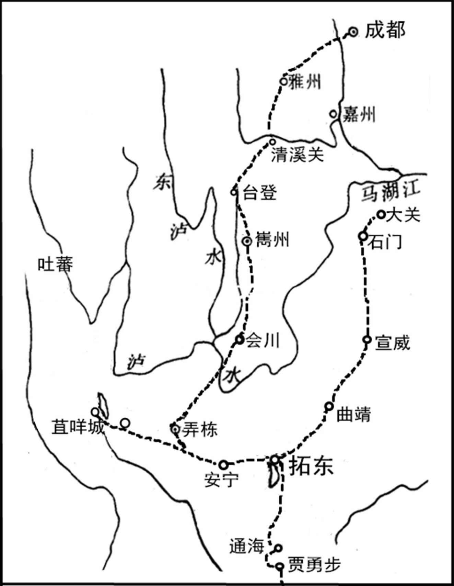
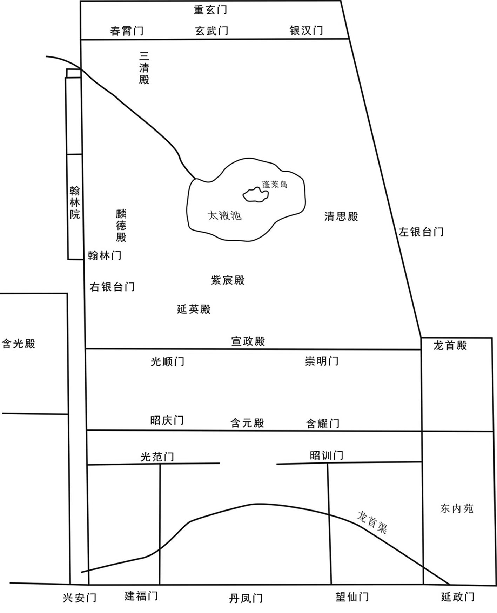
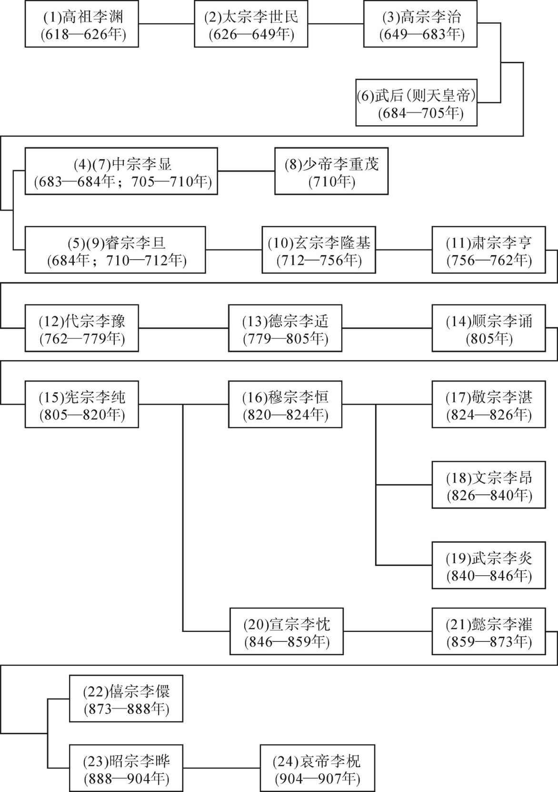
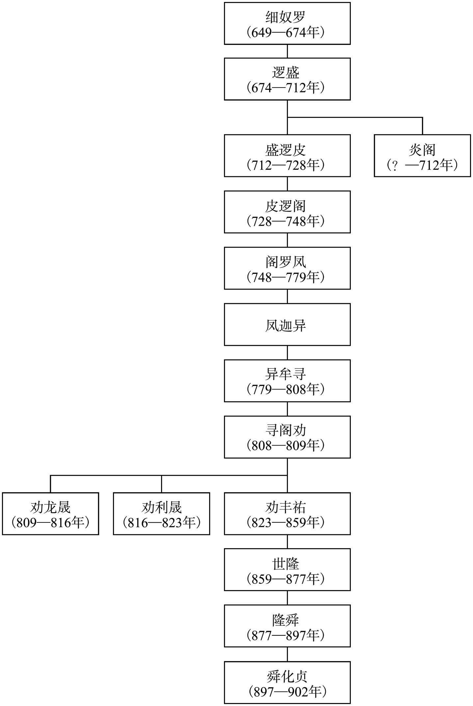

# 目录

南诏归附

宦官弑逆　甘露之变附

朋党之祸

武宗平泽潞

裘甫寇浙东

附录： 
唐朝皇帝世系表

南诏世系表

返回总目录

# 南诏归附

## 【内容提要】

《南诏归附》记载了在唐朝支持下建立的南诏国一度叛离唐朝、归顺吐蕃，又叛离吐蕃、归附唐朝的经过。

唐代的云南地区东部为乌蛮所居，西部为白蛮所居，间或有乌蛮杂处其间。乌蛮主要从事牧畜，“邑落相望，牛马被野”。白蛮则善于农耕，役用耕牛，开辟山田，种植稻麦等作物。乌蛮在政治上居于优势，其贵族曾建立“六诏”（诏，即酋长），即蒙巂（xī）、越析、浪穹、邆（téng）赕（dǎn）、施浪、蒙舍,分布于洱海地区。六诏之一“蒙舍诏”，因其在其他五诏之南，又称“南诏”,其首领为蒙氏。永徽四年（653年）南诏遣使入唐，这是唐与南诏第一次正式联系。武则天时，南诏首领逻盛曾到长安，与唐建立更为密切的联系。唐玄宗开元年间，唐朝封南诏首领盛逻皮为台登郡王，建立了政治相属关系。开元十八年（730年）盛逻皮之子皮逻阁即位，兵力强盛，在唐廷支持下，逐渐吞并另外五诏，统一了洱海地区，筑太和城及大厘城。开元二十六年（738年），唐廷封蒙舍诏主皮逻阁为云南王、越国公，赐名蒙归义，赠予大量文物及乐队。史学界一般都将这一年作为南诏国建立时间。

南诏羽翼丰满后，开始东进，约在天宝五载（746年）占据滇池地区，实力大增，引起唐王朝不满，但为共同对付吐蕃，双方表面上仍维持和平友好的局面。七载，皮逻阁死，其子阁罗凤继位。时唐玄宗沉湎声色，不理朝政，杨国忠专权，用其故人鲜于仲通为剑南节度使，直接管理南诏事务。鲜于仲通骄横暴躁，其部属云南太守张虔陀贪财好色，向南诏征求太甚，导致阁罗凤于天宝九载（750年）起兵叛乱，杀张虔陀，攻陷羁縻州三十余个。

唐廷早对南诏占据滇池不满，现阁罗凤杀死朝廷命官，决定兴师讨伐南诏，派鲜于仲通率八万大军进击。鲜于仲通自恃兵多将广，数次拒绝南诏的求和，迫使南诏被迫向吐蕃求援。四月，在诏、蕃联军的夹击下，唐军兵败西洱河（即洱海）。战后，南诏转而投靠吐蕃，十一载正月初一，吐蕃正式册封阁罗凤为“赞普钟南国大诏”，意即吐蕃赞普之弟云南国王。从此，南诏与吐蕃结盟，共同反对唐廷，成为唐朝严重边患。

天宝十三载（754年）六月，唐侍御史剑南留后李宓率七万大军再次进讨南诏。南诏采用诱敌深入、坚壁不战的策略，使唐军兵疲粮尽，瘟疫流行，在还军途中被南诏军全歼，李宓被擒。杨国忠以启衅由己，失事地方又是自己所管，遂将此败军情由隐下，反报功奏捷，益大发其兵，分道讨伐。前后死于这场战争的唐朝士兵共计近二十万人。朝廷群臣明知此事的原委，但畏惧杨国忠之威，无人敢说，玄宗不知其中缘故，以为天下无事，曾向高力士说道：“朕在位四十余年，今已老矣，看来天下承平，不必劳心，今只将朝廷政事付托给宰相使之办理，边上军情付托给诸将使之防御，朕只恭己无为而已，夫复何忧。”高力士对他说：“陛下深居禁中，不知外面的事。臣闻云南自用兵以来，虽屡有捷报，其实丧了许多人马，都隐匿不闻。又各边节度使专制一方，坐拥强兵，威权太盛，陛下将何以制之。臣恐养成祸乱，一旦窃发，将至不可复救，何谓无忧也。”玄宗心里也有觉悟，所以说：“你且莫言，待我慢慢思量，再做区处。”次年，安史之乱爆发，唐再也无力顾及西南，阁罗凤趁机统一了云南。永泰元年（765年）南诏在柘东城立南诏德化碑，说明叛唐事非得已。

大历十四年（779年），阁罗凤去世，其孙异牟寻即位。十月，南诏、吐蕃联兵二十万分三路进犯西川，企图夺取成都。唐德宗派名将李晟率五千精兵南下，与驻川唐军配合，大败异牟寻众，斩首六千级，并一鼓作气，把诏、蕃联军赶过大渡河。战后，南诏元气大伤，吐蕃却将惨败的罪责归咎于南诏，改封异牟寻为日东王，取消了双方兄弟之国的关系，置南诏于臣属藩邦的地位。从此，吐蕃年年向南诏征收重税，还占据了南诏的险要之地设立营堡，调遣南诏军队出兵助防，使南诏疲惫不堪，异牟寻对吐蕃强烈不满，在其清平官郑回的建议下，开始寻找机会重新归附唐廷。

贞元九年（793年），异牟寻派遣三批使者分别前往内地，向唐王朝表示归附。这三批使者都安全到达了成都。十月，剑南西川节度使韦皋派节度巡官崔佐时携带唐德宗诏书，出使南诏。十年正月初五，异牟寻与崔佐时在点苍山神祠会盟，结束了唐与南诏对峙隔绝四十余年的局面。

点苍山会盟后，异牟寻派人先杀吐蕃在南诏的使者，然后乘吐蕃征调南诏军助其攻打回鹘之机，突然袭击，大破吐蕃。南诏收复了铁桥以东城堡十六座，俘吐蕃十余万人，擒其王五人，与唐南北策应，使吐蕃处于钳形包围中，既不敢东犯河湟，又不能南侵云南，扭转了唐王朝在西南、西北边疆的被动局面。

元和十一年（816年），南诏弄栋节度使王嵯巅杀劝龙晟，立其弟劝利晟为王，独揽大权。太和三年（829年），王嵯巅背盟毁约，起兵叛唐，南诏军很快攻入成都外城，掳掠成千上万能工巧匠和无数金银财宝而回。四年末，南诏遣使入朝谢罪，与唐廷继续保持臣属关系。

## 【原文】

**唐玄宗开元二十六年秋九月戊午，册南诏蒙归义为云南王[1]。归义之先本哀牢夷，地居姚州之西，东南接交趾，西北接吐蕃[2]。蛮语谓王曰诏[3]。先有六诏，曰蒙舍，曰蒙越，曰越（折）［析］，曰浪穹，曰样备，曰越澹，兵力相埒，莫能相一，历代因之，以分其势[4]。蒙舍最在南，故谓之南诏[5]。高宗时，蒙舍细奴逻初入朝[6]。细奴逻生逻盛，逻盛生盛逻皮，盛逻皮生皮逻阁[7]。皮逻阁浸强大，而五诏微弱[8]。会有破渳河蛮之功，乃赂王昱，求合六诏为一[9]。昱为之奏请，朝廷许之，仍赐名归义[10]。于是以兵威胁服群蛮，不从者灭之，遂击破吐蕃，徙居大和城[11]。其后卒为边患[12]。**

## 【注文】

[1]唐（618—907年）：朝代名。公元618年，由唐高祖李渊建立，定都长安（今陕西西安）。公元907年，朱温废唐建梁，唐朝灭亡。唐朝共历二十二帝，在唐太宗统治时期出现“贞观之治”，到唐玄宗时期又形成“开元盛世”，其间还涌现出中国历史上唯一的女皇帝武则天，她曾于公元690—705年改唐为周，定都洛阳，改称神都。唐朝是中国历史上的一个伟大时代，政治开明、经济繁荣、文化发达、疆域辽阔，成为当时世界上最为强大的国家之一。唐朝还是一个开放的帝国，声誉远被海外，与许多国家均有来往，对中国历史及世界文明的发展产生了重大影响。　　玄宗（685年—762年）：即李隆基，唐睿宗第三子，母昭成窦皇后（窦德妃），公元712年至756年在位。公元710年，李隆基与太平公主合谋发动政变，杀死韦皇后，拥其父李旦即位，被立为太子。李隆基在唐睿宗延和元年（712年）受禅即位，改年号为开元。唐玄宗在位时使用过三个年号：先天、开元、天宝。开元年间，社会安定，政治清明，经济空前繁荣，唐朝进入鼎盛时期，后人称这一时期为“开元盛世”。玄宗统治后期，贪图享乐，宠信并重用李林甫等奸臣，终致天宝十四年（755年）发生“安史之乱”，次年逃往四川，太子李亨即位，玄宗被尊为太上皇。唐代宗宝应元年（762年）病死，终年78岁。庙号玄宗。　　开元二十六年：公元738年。开元，唐玄宗自713年至741年间所使用的年号。　　册：册命。古代帝王封立太子、皇后、王妃或各王的命令。　　南诏：古国名。也叫鹤拓、龙尾、苴咩、阳剑。是唐代以乌蛮为主体，包括白蛮等族建立的奴隶制政权。唐初为蒙舍诏，贞观二十三年（649年）细奴逻建大蒙政权，以巍山（今云南巍山彝族回族自治县境）为首府。开元年间，其王皮逻阁在唐朝的支持下统一六诏，迁治太和城（今云南大理南太和村西）。全盛时辖有今云南全部、四川南部、贵州西部等地。社会经济发展不平衡，中心地区农业、手工业发达。使用奴隶劳动。吸收汉族先进生产技术。部分采用了唐朝政治制度。曾多次派遣贵族子弟赴成都、长安学习，统治集团通用汉文。佛教流行。后期向封建社会转化。历传十三王，十王受唐册封。唐昭宗天复二年（902年）为贵族郑买嗣所灭。　　蒙归义：南诏开国之主，因依附唐朝，受唐玄宗赐名归义。在世期间，武力吞并了滇西其他五诏，建立了以巍山为中心的大蒙国，后迁都大理。　　云南：云南郡本属云山县，蜀国刘氏建兴二年置郡。自唐戎州开边县南七十里至曲州，再二千五百里至云南城。

[2]先：先人，家族或民族的较早的一代或几代。　　哀牢夷：古族名。分布在我国西南地区。东汉设哀牢、博南二县。在今云南保山市北。　　姚州：今云南姚安北。　　交趾：今越南北部。　　吐蕃（bō）：中国古代藏族政权名。公元7至9世纪时在青藏高原建立。是由雅隆农业部落为首的部落联盟发展而成的奴隶制政权。吐蕃是唐人对这一政权的称谓。

[3]蛮：中国古代称南方各族为蛮。　　谓：称为，叫作。

[4]先：古代的，先前的。　　六诏：《资治通鉴考异》注：“《新书》‘六诏曰蒙巂（xī）、越析、浪穹、邆（téng）晱（shǎn）、施浪、蒙舍’”。本文所写六诏名系根据窦滂《云南别录》。　　折：《资治通鉴》中为“析”字，“折”字当误。　　兵力：军队实力。　　埒（liè）：同等。　　莫：不。　　一：作动词，统一。　　因：沿袭。　　势：势力。

[5]最在南：在最南面。　　故：所以。

[6]细奴逻：（617—674年）南诏王。649—674年在位。姓蒙氏，又名龙独罗，乌蛮族。唐太宗贞观二十三年（649年）称王，以巍山（今云南巍山境）为首府。唐高宗永徽四年（653年）遣其子逻盛至京师。唐授细奴逻为巍州刺史。　　初：开始。　　入朝：指属国、外国使臣或地方官员谒见天子。

[7]细奴逻生逻盛等句：《资治通鉴考异》载，《新传》“蒙氏父子以名相属，细奴逻生逻盛炎，逻盛炎生炎阁。武后时，逻盛炎身入朝，妻方娠，生盛逻皮，喜曰：‘我又有子，虽死唐地足矣。’炎阁立，死。开元时，弟盛逻皮立，生皮逻阁，授特进，封台登郡王。炎阁未有子时，以阁罗凤为嗣，及生子，还其宗，而名承阁遂不改。”按，逻盛炎之子盛逻皮，岂得云以名相属？既有炎阁，岂得云“我又有子，虽死唐地足矣”？今从《旧南诏传》及《杨国忠传》《云南别录》。　　皮逻阁：（697—748年）南诏第四世王。公元728—748年在位。唐开元年间统一六诏，击败吐蕃，迁治太和城。在南诏的早期发展中起了重要作用。开元二十六年（738年）唐封皮逻阁为“越国公”，赐名归义。入朝于唐，受封为“云南王”。

[8]浸：逐渐。　　微：衰败。　　弱：衰弱。

[9]会：恰巧，正好。　　渳河：渳同“洱”，渳河即西洱河，一称洱河，源出云南省西部洱海，经下关天生桥到平坡入漾濞江。　　功：功劳。　　乃：于是。　　赂（lù）：贿赂。　　王昱：当时任剑南节度使。

[10]奏请：上奏，请示。　　朝廷：借指帝王。　　许：应允。　　仍：依然，照旧。　　赐名：君王赠以名号。

[11]于是：自此。　　兵：武力，战争。　　服：动词，服从，此处使动用法。　　从：顺从，跟从。　　遂：接着。　　徙（xǐ）：迁移。　　大和城：今云南大理白族自治州大理县太和村西。

[12]卒：终于。　　边患：边境遭到侵犯的祸患。

## 【译文】

唐玄宗（李隆基）开元二十六年（738年）秋九月戊午（二十三日），册封南诏蒙归义为云南王。蒙归义的祖先本是哀牢夷人，居住在姚州的西边，东南与交趾相接，西北与吐蕃相接。蛮语言称王为诏。以前有六个诏，名为蒙舍、蒙越、越析、浪穹、样备、越澹，他们的军队实力相当，不能统一，历代沿袭，以此来分散他们的势力。蒙舍在最南部，所以称为南诏。唐高宗（李治）时，蒙舍王细奴逻开始谒见天子。细奴逻生子逻盛，逻盛生子盛逻皮，盛逻皮生子皮逻阁。皮逻阁时南诏逐渐强大，而其余五诏力量衰微。恰巧皮逻阁立有击败渳河蛮的功劳，于是他贿赂王昱，请求把六诏合而为一。王昱为他向朝廷奏请，朝廷准许了他的请求，仍然赠皮逻阁以归义的名号。自此他用武力威胁来使各个蛮族部落服从，有不服从的就将其消灭，接着又击败了吐蕃，移居到大和城。以后终于成为唐边境遭到侵犯的祸患。

## 【原文】

**天宝七载[1]，云南王归义卒，子阁罗凤嗣，以其子凤迦异为阳瓜州刺史[2]。**

## 【注文】

[1]天宝七载：唐玄宗天宝七载，公元748年。天宝，唐玄宗自742至756年间所使用的年号。载，年。

[2]云南王归义卒句：南诏王父子相继，其子必以父号下一字冠于己所号之上。归义本号皮逻阁，帝赐名归义。其子号阁罗凤，是以“阁”字冠其号之上。阁罗凤之子号凤迦异，是以“凤”字冠其号之上。其后至丰祐才改变旧俗。　　卒：死。　　阁罗凤（712—779年）：南诏王。748—779年在位。皮逻阁之子。因屡受云南太守张虔陀侮辱，于唐玄宗天宝九载（750年）发兵袭杀张虔陀。次年，唐剑南节度使鲜于仲通发兵攻太和城，被其大败于西洱河，自此称臣于吐蕃。吐蕃封他为“赞普钟”号东帝。十三载，又大败李宓所帅军于太和城，安史之乱中又乘机攻陷巂州等地，统一西南广大地区。在位期间，任用汉人郑回为清平官，以汉文教贵族子弟，建立各项制度，使南诏成为我国西南方的强大政权。　　嗣：继承。　　阳瓜州：隋炀帝时为郡县二级制。唐高祖又改郡为州。全国共有三百几十个州。以后中国历朝不再设郡。唐代的大州称为府，仍为州级。自从在边境设立节度使后，节度使发展成为州之上、道之下的行政区。唐朝设置阳瓜州，以蒙巂诏王世袭阳瓜州刺史。　　刺史：官名。西汉武帝时，分全国为十三部（州），部置刺史，以六条察问郡县，本为监察官性质，其官阶低于郡守。隋初撤销郡，只有州、县两级，州的长官，除雍州称牧外，余均称刺史。

## 【译文】

唐玄宗天宝七载（748年），云南王归义去世，他的儿子阁罗凤继位，让他的儿子凤迦异担任阳瓜州刺史。

## 【原文】

**九载[1]。杨国忠德鲜于仲通，荐为剑南节度使[2]。仲通性褊急，失蛮夷心[3]。故事，南诏常与妻子俱谒都督，过云南，云南太守张虔陀皆私之[4]。又多所征求，南诏王阁罗凤不应，虔陀遣人詈辱之，仍密奏其罪[5]。阁罗凤忿怨，是岁，发兵反，攻陷云南，杀虔陀，取夷州三十二[6]。**

## 【注文】

[1]九载：天宝九载，公元750年。

[2]杨国忠（？—756年）：唐朝权臣。本名钊，蒲州永乐（今山西芮城西南）人，杨贵妃堂兄。天宝初年，贵妃受宠，因此由监察御史升为侍御史，赐名国忠。不久，兼领十五个以上的职务，权势日盛。推荐鲜于仲通、李宓，两次讨伐南诏，在中原地区大肆征兵，征战中丧师二十万。隐其败状，以捷书上闻。李林甫死，代为右相，兼吏部尚书，又兼领四十余职。专判度支、吏部，结党营私，货赂公行。为巩固权势，与安禄山的矛盾日益加剧。后安禄山举兵叛变。及哥舒翰守潼关，诸将都认为利在守险，不利出战，他以哥舒翰持兵在外，恐其图己，强其速战。哥舒翰不得已出战被擒。潼关不守，他与玄宗仓皇逃往蜀地，至马嵬驿（今陕西兴平西）被士兵杀死。　　德：恩惠。此处作动词，意动用法。　　鲜于仲通（693—755年）：名向，渔阳（今天津蓟州）人，寄籍新政（今四川南部东南）。唐玄宗天宝初年，杨钊（国忠）从军于蜀，贫不能归，他特加周济，并荐于剑南节度使章仇兼琼，送归长安。杨国忠当权，荐他为剑南节度使。天宝十载（751年）他率兵进攻南诏，大败于泸南（今云南姚安境），丧师六万，从此南诏归附吐蕃。杨国忠掩其败状，仍叙其功，荐为京兆尹。后被贬。　　荐：推举，介绍。　　剑南：唐方镇名。唐玄宗开元七年（719年）升剑南支度营田处置兵马经略使置，为玄宗时十节度使之一。治所在益州（今成都市）。领昆明军及益、彭、蜀、汉、眉、绵、梓、遂、邛、剑、荣、陵、嘉、普、资、巂、黎、戎、维、茂、简、龙、雅、泸、合二十五州，约当今四川省中部地区。其后辖境屡有扩大。至德二年（757年）分置剑南东川、剑南西川两节度使。　　节度使：官名。唐初沿北周及隋旧制，于重要地区设总管，后改称都督，总揽数州军事。睿宗景云中（710—711年），薛讷为幽州镇守经略节度大使，贺拔延嗣为凉州都督充河西节度使，始有节度使的称号。玄宗天宝初，沿边有九节度使、一经略使。授职时赐给双旌双节，总揽一区的军、民、财政。所辖区内之各州刺史均为其下属，本身并兼任所驻在之州刺史。

[3]性：性格。　　褊（biǎn）急：气量狭小，性情急躁。　　失：失去。　　蛮夷：古代泛指华夏中原民族以外的少数民族。　　心：人心，这里指拥戴。

[4]故事：过去的惯例。　　俱：一同。　　谒：谒见，进见地位或辈分高的人。　　都督：地方军政长官。都督诸州军事，始见于曹丕即魏王位时，以曹真假节都督雍、凉州诸军事。后渐多，偶有兼领刺史者。西晋初，都督知军事，刺史治民。惠帝时遂兼任。自此都督诸州军事常兼驻地的州刺史，并总揽本地区军民之政。南北朝沿袭。东魏、北齐时，此职为“行台”取代，虽仍有都督诸州军事之官，并不多设。北周及隋，改为总管。唐初为总管，旋改大都督、都督。大都督多由亲王遥领，边地重镇，另加旌节，称节度使。景云二年（711年）以贺拔延嗣为凉州都督充河西节度使。后至辛亥革命前无以都督为地方军政长官者。　　太守：官名。战国时为对郡守的尊称。西汉时始为郡守的正式官名。景帝中元二年（前148年），改郡守为太守。魏、晋、南北朝唯北周称郡守，余均以太守为郡长官。隋大业中及唐天宝年间，改州为郡，官名也称太守。汉太守秩二千石，总管行政、财赋、刑狱，军队虽有都尉，仍归太守控制。佐官（丞、尉、长史）由朝廷任命，属吏（功曹、主簿等）自行辟任。属吏与太守谊同君臣，属吏每称郡府为“本朝”“郡朝”“府朝”。东汉末设州牧后，太守受州牧管辖，权力缩小。因战乱频仍，太守多加将军、都督等官，军事职能加强。西晋末，中原丧乱，太守带将军号者更多。南北朝设州渐多，郡的辖境随之缩小。隋文帝废郡存州，以刺史代太守，罢地方官自辟佐吏之权。隋炀帝废州存郡，唐初复隋开皇之制，玄宗天宝再废州存郡。隋、唐州郡、刺史太守名义屡变，实质并无区别。及肃宗至德二载（757年）改郡为州后，太守不再为正式官名。　　私：奸污。

[5]多所：很多，许多。　　征求：征敛需索。《新唐书·南蛮传上·南诏上》作“求丐”。　　应：答应，允许。　　遣：派遣。　　詈（lì）：骂。　　辱：辱骂，使受到羞耻。　　仍：还。　　密奏：秘密奏知。

[6]忿怨：愤怒，怨恨。　　是岁：这年。　　发兵：调派军队出征作战。　　反：反叛。　　取：攻克，强夺。　　夷州三十二：西南夷三十二个州。

## 【译文】

唐玄宗天宝九载（750年）。杨国忠为了答谢鲜于仲通给的好处，推荐他为剑南节度使。鲜于仲通气量狭小，性情急躁，失去蛮夷各族的人心。按照过去的惯例，南诏王常常与妻子一同来觐见都督，经过云南时，云南太守张虔陀都要奸污他们的妻子。又勒索财物，南诏王阁罗凤没有答应他的要求，张虔陀就派人辱骂他，还秘密奏报他的罪行。阁罗凤很愤恨，这年，他发动军队反叛唐朝廷，攻陷了云南郡，杀掉张虔陀，强夺原归附于唐的西南夷三十二个州。

## 【原文】

**十载夏四月壬午，剑南节度使鲜于仲通讨南诏蛮，大败于泸南[1]。时仲通将兵八万，分二道出戎、巂州，至曲州、靖州[2]。南诏王阁罗凤遣使谢罪，请还所俘掠，城云南而去[3]。且曰：“今吐蕃大兵压境，若不许我，我将归命吐蕃，云南非唐有也。”[4]仲通不许，囚其使[5]。进军至西洱河，与阁罗凤战，军大败，士卒死者六万人，仲通仅以身免[6]。杨国忠掩其败状，仍叙其战功[7]。阁罗凤敛战尸筑为京观，遂北臣于吐蕃[8]。蛮语谓弟为“钟”，吐蕃命阁罗凤为赞普钟，号曰东帝，给以金印[9]。阁罗凤刻碑于国门，言己不得已而叛唐，且曰：“我世世事唐，受其封赏，后世容复归唐，当指碑以示唐使者，知吾之叛非本心也。”[10]**

## 【注文】

[1]十载：天宝十载，公元751年。　　剑南节度使鲜于仲通句：《资治通鉴考异》载《杨国忠传》：“南蛮质子阁罗凤亡归不获，帝怒，欲讨之。国忠荐阆州人鲜于仲通为益州刺史，令帅精兵八万讨南蛮。”《南诏传》：“七年，蒙归义死，诏阁罗凤袭云南王”，不云尝为质子亡归也。九年，姚州自以张虔陀侵之故反，时鲜于仲通已为益州长史。《杨国忠传》与《南诏传》相违。新、旧《唐书》皆如此，恐误。　　讨：征伐，发动攻击。　　大败：在军事对抗中遭受惨重的失败。　　泸南：泸水之南。今云南姚安境。武则天垂拱元年（685年）置长城县，属姚州。天宝初年更名为泸南县。

[2]时：当时。　　将兵：指挥军队。　　分二道：一道出戎州，一道出巂州。自戎州开边县西行七十里至曲州，自巂州西南行八百里渡泸水。　　戎、巂（xī）州：即戎州、巂州。戎州治所在今宜宾市。辖五县：僰道、义宾、开边、南溪、归顺。属梁州。古僰国。秦军破滇，通五尺道，至汉武帝建元六年，遣唐蒙发巴、蜀卒通西南夷自僰道抵牂牁，凿石开道，二十余里，通西南夷，置僰道县，属犍为郡。李雄窃据，此地空废。梁武帝大同十年（544年），先铁讨定夷獠，从此设立戎州，先铁为刺史，以后不改。巂州：治所在今西昌。秦、汉时为邛都国。汉武帝时，以邛都之地为越巂郡，属益州，领十五县。魏晋时当地少数民族政权对中原统治时降时叛。周武帝天和三年（568年）于巂城置严州。隋开皇六年（586年），改为西宁州，开皇十八年（598年）改为巂州。唐朝沿袭。唐至德二年（757年）陷于吐蕃，贞元十三年（797年）被节度使韦皋收复入唐。唐时辖七县：越巂、西泸、苏祁、台登、邛部、昆明、会川。　　曲州：州名。本隋之恭州，古朱提之地。唐武德八年（625年）更名曲州。治所在朱提（今云南昭通）。辖境相当今昭通、鲁甸一带。天宝中地入南诏，徙置于今四川宜宾安边镇西南七十里，唐末废。　　靖州：隋属协州，古夜郎地。武德初年分协州置靖州。

[3]遣使：派遣使者。胡注《资治通鉴》中无此二字。　　谢罪：认错、道歉。　　请：请求。　　还：归还。　　俘掠：俘获掠夺。　　城：动词，筑城。天宝九载南诏攻陷云南城，必有夷毁之处，因此阁罗凤请求筑城以谢罪。　　去：离开。

[4]且：并且。　　今：现在。　　大兵：人数多、声势大的军队。　　压境：逼近边境。　　若：如果。　　将：副词，就要。　　归命：这里指归顺。

[5]囚：囚禁。

[6]士卒：旧指士兵。　　仅以身免：指没有被杀或只身逃出了险境。

[7]掩：遮盖。　　状：情形，状况。　　仍：仍旧。　　叙：评定等级、次第，按功提升。

[8]敛：收拢，聚集。　　筑：修建。　　京观：古代战争，胜者为了炫耀武功，收集敌人的尸体，封土成高冢，称为京观。　　遂：于是，就。　　北：向北。　　臣：动词，臣服。

[9]命：给予（名称等）。　　赞普：吐蕃王号。赞，雄强之意。普，男子。　　号：宣称，称号。　　金印：旧时帝王或高级官员金质的印玺。

[10]国门：指边境。　　不得已：不能不如此，违背心意去做。　　叛：背叛过去的立场或集团而投靠敌对一方,或采取敌对活动。　　事：服侍。　　封赏：古时帝王把官爵或财物奖给臣下。胡注《资治通鉴》作“封爵”。　　后世：所有相继的世代。　　容：允许。　　复：再。　　归：返回。　　当：应该。　　示：把事物摆出来或指出来使人知道；表示。　　本心：本来的心愿。

## 【译文】

唐玄宗天宝十载（751年）夏季四月壬午（三十日），剑南节度使鲜于仲通讨伐南诏，被南诏在泸南打得大败。当时鲜于仲通率领八万军队分两路从戎州、巂州出发，到曲州、靖州。南诏王阁罗凤派遣使者前来谢罪，请求归还所俘获掠夺的东西，把云南城修缮好后离开，并且说：“现在吐蕃重兵逼近边境，如不答应我，我就将归顺吐蕃，云南就不归唐朝所有了。”鲜于仲通没有答应，囚禁了他的使者。进军到西洱河，与阁罗凤交战，唐军大败，士兵死了六万人，鲜于仲通仅只身逃脱。杨国忠掩盖了他失败的情况，仍旧给他按战功评定。阁罗凤收拢聚集战死者的尸体修建成京观，于是北向吐蕃称臣。蛮语称弟弟为“钟”，吐蕃给予阁罗凤为“赞普钟”的名号，号为“东帝”，给他金印。阁罗凤在边境刻石立碑，说明自己不得已背叛唐朝，并且说：“我们世世代代侍奉唐朝，接受他们的官爵和财物，后代如能允许再返回唐朝，应当把此碑指给唐朝使者看，使他们知道我的叛唐不是出自本来的心愿。”

## 【原文】

**制大募两京及河南、北兵以击南诏[1]。人闻云南多瘴疠，未战士卒死者十八九，莫肯应募[2]。杨国忠遣御史分道捕人，连枷送诣军所[3]。旧制，百姓有勋者免征役[4]。时调兵既多，国忠奏先取高勋[5]。于是行者愁怨，父母妻子送之，所在哭声振野[6]。**

## 【注文】

[1]制：帝王的命令。　　大募：大规模招募。　　两京：即西京、东京，指长安、洛阳。　　河南、北：河南，禹贡及周礼职方属豫州，也叫荆河州。春秋为周畿内及宋、卫、郑、许、陈、蔡诸国地，兼秦、晋、楚之疆。战国为东、西周及韩、赵、卫国地。秦置三川、颍川、南阳、砀四郡。汉分属司隶及豫、衮、冀、荆四州，东汉都洛阳，移司隶来治。三国魏通称司隶为司州。晋太康元年（280年），遂定名为司州。永嘉后刘聪、石勒先后据于此。义熙中刘裕克复，仍置司州，景平后入北魏，置为洛州，太和中移都洛阳，复为司州。隋置河南道行台，后建东都，改诸州为河南、荥阳、梁郡、襄城、颍州、汝南、淮阳、弘农、淅阳、南阳、淯杨、淮安、魏郡、汲郡、河内、弋阳等郡。唐分属都畿采访使，河南、河北、淮南、山南东道。河北，舜时分冀州为幽州。禹贡冀衮之域。周礼职方氏，东北为幽州。春秋为燕、晋、卫、齐诸国地。战国为燕、赵、齐、魏四国地。秦置上谷、渔阳、邯郸、巨鹿、东郡等郡，并分得右北平、辽西各郡地。汉为幽、冀、衮三州地。东汉建安中，省幽州入冀州。三国魏复置幽州。晋兼属司州。永嘉后石氏、慕容氏、苻氏先后据此。北魏为幽、冀二州，又增置定、相、平、安、瀛、燕、沧、殷、南营等九州。隋置幽州总管府，后改为涿郡、上谷、渔阳、北平、安乐、河间、博陵、恒山、信都、赵郡、襄国、武定、清河、武阳、渤海等郡。唐分属河北道。　　击：攻打。

[2]闻：听说。　　多：表示数量大，与“少”相对。　　瘴疠：指亚热带潮湿地区流行的恶性疟疾等传染病。　　十八九：十有八九。指绝大多数。　　莫肯：不肯，不愿。　　应募：响应招募。

[3]御史：为监察之官，约自秦始。《汉书·百官公卿表》：“监御史，秦官，掌监郡，汉省。”汉御史因职务不同有侍御史、治书侍御史。曹魏增殿中侍御史。晋又有督运御史、符节御史、检校御史。北朝魏、齐沿设检校御史，隋改为监察御史。隋又改殿中侍御史为殿内侍御史。炀帝省殿内侍御史员数，增监察御史员数，又一度增设从九品的御史。唐有侍御史、殿中侍御史、监察御史。　　道：中国历史上的行政区域名。唐代分全国为十道，为州县之上的一级行政区划，相当于后来的省。　　捕：捉拿。　　枷：旧时套在罪犯脖子上的刑具，用木板制成。　　诣：到。　　所：处所，地方。

[4]旧制：旧的制度。　　勋：特别大的功劳。　　免：免除。　　役：服兵役。

[5]既：已经。　　奏：封建时代臣子对皇帝陈述意见或说明事情。

[6]行者：出行的人。　　愁怨：忧愁怨恨。　　父母妻子：父亲、母亲、妻子、孩子。　　所在：处处。　　振：震动。　　野：民间，与朝廷相对。

## 【译文】

玄宗下诏大批招募两京及河南、河北士兵攻击南诏。人们听说云南一带多流行恶性疟疾等传染病，不及交战士兵就要死掉十之八九，不愿响应招募。杨国忠派遣御史分别到各道捕捉壮丁，用枷锁锁至军队所在地。按照旧的制度，百姓中有功者可免除服兵役。当时调兵的量多，杨国忠上奏皇帝请求先征发功劳大的人。自此应征出发的人忧愁怨恨，父母妻子孩子送别亲人，民间到处是哭声。

## 【原文】

**十一载夏六月甲子(1)，杨国忠奏吐蕃兵六十万救南诏，剑南兵击破之于云南，克故隰州等三城，捕虏六千三百，以道远，简壮者千余人及酋长降者献之[1]。**

## 【注文】

[1]十一载夏六月甲子句：《资治通鉴考异》载，《实录》：“兵部侍郎兼御史中丞、剑南节度使杨国忠破吐蕃于云南，拔故隰州等三城，献俘于朝。”《唐历》：“国忠上言破吐蕃于云南，拔故洪州等三城。”按，国忠时在长安，盖剑南破吐蕃，以国忠领节制，故使之上表献俘耳。时国忠已为大夫，云中丞，误也。隰州，从《实录》。　　十一载：天宝十一载，公元752年。　　救：援救。　　克：战胜、攻下。　　隰（xí）州：州名，隋开皇五年（585年）改西汾州置。治所在隰川（今山西隰县）。辖境相当今山西石楼、隰县、永和、蒲县、大宁和孝义西南部地区。　　捕虏：俘获。　　以：介词，引入相关的原因等。　　简：通“柬”，选择。　　酋长：部落的首领。　　献：恭敬庄严地送给。

## 【译文】

唐玄宗天宝十一载（752年）夏六月甲子日，杨国忠奏报吐蕃出兵六十万援救南诏，剑南兵在云南击败了援军，攻取了原来的隰州等三城，捕获俘虏六千三百人，由于路远，选择强壮的人一千多人及投降的酋长献给朝廷。

## 【原文】

**十三载夏六月，侍御史、剑南留后李宓将兵七万击南诏[1]。阁罗凤诱之深入，至（太）［大］和城，闭壁不战[2]。宓粮尽，士卒罹瘴疫及饥死十七八，乃引还，蛮追击之，宓被擒，全军皆没[3]。杨国忠隐其败，更以捷闻[4]。益发中国兵讨之，前后死者几二十万人，无敢言者[5]。上尝谓高力士曰：“朕今老矣，朝事付之宰相，边事付之诸将，夫复何忧。”[6]力士对曰：“臣闻云南数丧师，又边将拥兵太盛，陛下将何以制之[7]？臣恐一旦祸发，不可复救，何谓无忧也[8]？”上曰：“卿勿言，朕徐思之[9]。”**

## 【注文】

[1]十三载：天宝十三载，公元754年。　　侍御史：官名。汉沿秦置。受命御史中丞，接受公卿奏事，举劾非法，有时受命执行办案、镇压农民起义等任务，号为“绣衣直指”。东汉宣帝曾召侍御史二人治书，后别置治书侍御史。侍御史分掌令曹、印曹、供曹、尉马曹、乘曹。魏晋南北朝时，曹数时有增减，但均不止五曹，治书侍御史也分掌各曹，与汉制不同。北朝魏、齐必对策高第者方能补御史官。唐改治书侍御史为御史中丞，而以侍御史、殿中侍御史、监察御史总为御史台之成员。历代多因之。侍御史掌纠举百官、入阁承诏、知推弹公廨、杂事等事，以知杂事最忙。侍御史，一般可称为侍御。　　留后：官名。唐安史之乱后，节度使不服朝命，遇事或年老不能任事，常以其子弟或亲信将吏代行职务，称节度留后，也有称观察留后的，事后多由朝廷补行任命为正式的节度、观察使。也有士卒自推留后，事后强迫朝廷补行任命为正式节度使或观察使。　　李宓（mì）：杨国忠领剑南节度使，以李宓为留后。

[2]诱：引诱。　　深入：进入到内部或中心。　　大和城：《新唐书》作“太和城”。　　闭壁：关闭城门。谓只守不战。

[3]尽：吃光用完，无半点剩余。　　罹：遭遇，遭受。　　乃：于是，就。　　引：带领。　　没（mò）：覆没，军队被消灭。

[4]隐：隐匿。　　更：调换，改变。　　捷：战胜。　　闻：消息。

[5]益：更加。　　发：派出，送出。　　中国：古时通常泛指中原地区。　　讨：讨伐。　　几：几乎，近乎。

[6]上：君主，皇帝。　　尝：曾经。　　谓：说。　　高力士（684—762年）：唐宦官。高州良德（今广州高州东北）人。本姓冯，唐玄宗时知内侍省事，晋封渤海郡公，四方奏事都经他手，权力极大。安史之乱时，随玄宗到四川。上元元年（760年）被放逐到巫州，两年后赦归，病死途中。　　朕：皇帝自称。　　朝事：朝廷的政事。　　付：托付。　　宰相：最高行政长官的通称。宰，意为主宰，殷为管理家务和奴隶之官。周有执掌国政的太宰，也有掌贵族家务的家宰、掌管一邑的邑宰，实已为官的通称。相，本为相礼之人，字义有辅佐之意。宰相联称，始见于《韩非子·显学》，但唯辽以为正式官名，其他各代所指官名与职权广狭则不同。秦、汉以丞相或相国为宰相，御史大夫为副职。哀帝改丞相为大司徒，东汉由司徒、司空、太尉共同执政。献帝建安中，复置丞相，由曹操担任。魏初以汉之尚书台权大，将原魏王所属的秘书令改为中书监、令。魏、晋遂以中书监、令为宰相，而相国、丞相变为赠官，或为权臣篡夺之阶。吴始终设丞相，蜀汉初设丞相，后改以大将军录尚书事主国政。南北朝制度多变，即是宰相，官名有中书监、中书令、侍中、尚书令、仆射或将军。其位最尊、权最大者则为录尚书事。隋朝整理旧制，定三省制，三省长官内史省的内史令、门下省的纳言、尚书省的尚书令都是宰相。唐改内史省为中书省，内史令为中书令，纳言为侍中。尚书省本无改动，但因太宗曾任尚书令，后不再除人，以左右仆射代为长官。太宗起又以中书令、侍中官高，不常授人，而以其他官职加参议朝政、参知政事等名义，使执行宰相职务。高宗后，始以加“同中书门下三品”“同中书门下平章事”者为宰相。后有官居左右丞相、中书令而实非宰相者。　　边事：边防事务。　　夫复：夫，发语词，无意义。复，又，再。

[7]对：回答。　　臣：官吏对君主的自称。　　丧师：谓战败而损失军队。　　边将：防守边疆的将帅。　　拥兵：拥有军队。　　盛：充足。　　陛下：是臣子对君主的尊称，唐朝以后只用以称皇帝。　　何以：古文句式，意思是以何。用什么。　　制：管束。

[8]祸：灾祸，祸患。　　不可：不可能。　　何谓无忧也：胡注《资治通鉴》作“何得谓无忧也”。　　何谓：说什么，表示愤慨。

[9]卿：自中国唐代开始，君主对臣民的称呼。　　勿：不要。　　徐：缓慢。　　思：考虑。

## 【译文】

唐玄宗天宝十三载（754年）夏六月，侍御史、剑南留后李宓率兵七万攻打南诏。阁罗凤引诱他深入到大和城，关闭城门不与之交战。李宓军的粮食已经吃完，士兵患恶性疟疾等传染病和饿死的有十之七八，李宓于是领兵撤退，蛮军追击他们，李宓被俘，全军覆没。杨国忠隐瞒了他的失败，改为捷报。更多地征发国内士兵讨伐南诏，加上之前鲜于仲通兵败时死的士兵一共死了近二十万人，没有人敢说话批评。玄宗曾对高力士说：“我现在老了，朝廷的政事托付给宰相，边境战事托付给诸位将领，还有什么可忧虑的！”高力士回答说：“我听说在云南多次因战败而损失军队，而且边境的将领拥有的军队太多，您将用什么管束他们？我担心一旦发生灾祸，不可再挽救，说什么没有忧虑呢？”玄宗说：“你不要说，我慢慢考虑一下。”

## 【原文】

**肃宗至德元载[1]。南诏乘乱陷越巂会同军，据清溪关，寻传、骠国皆降之[2]。**

## 【注文】

[1]肃宗：即李亨。唐玄宗第三子。公元756—762年在位。天宝十四年（755年）爆发了安史之乱，次年，玄宗逃往四川，他即位于灵武。在郭子仪和回纥兵的帮助下收复长安、洛阳。宝应元年（762年）宦官李辅国、程元振拥立太子李豫，他忧惊而死。　　至德元载：至德，唐肃宗自756至758年使用的年号。至德元载，公元756年。

[2]乘乱：趁局势混乱。乘，趁着。肃宗至德元载（756年），唐朝发生一系列大事，安禄山称帝叛乱，进攻潼关，唐军大败，玄宗弃长安西逃，至马嵬驿，将士杀死杨国忠，李亨弃玄宗奔灵武，当年七月在灵武称帝，是为肃宗。　　陷：攻破。　　越巂：地名，在四川西昌东南。今作越西。　　会同军：今四川会理西。在越巂会川县，处泸津关要塞。　　据：占据。　　清溪关：在巂州界，自关而南七百二十里至巂州。《洪源志》：清溪关，在黎州西南界。　　寻传：即寻传蛮，唐时中国西南部族。因住在寻传地区而得名。唐初分布在今澜沧江上游以西至祁鲜山以东地带。唐天宝年间阁罗凤讨定。其俗无丝纩，跣足践履榛棘不为苦，持弓矢射豪猪，生食其肉，取其两牙双插髻旁为饰，又以猪皮为条系腰；每战斗，即以笼子笼头，状如兜鍪，南诏曾征之参与攻打唐安南都护府的战争。　　骠国：古代缅甸骠人在今伊洛瓦底江流域建立的国家。古称朱波，在永昌南二千里，距离长安一万四千里，北抵南诏（今云南德宏与缅甸交界地区），东接陆真腊（今泰国、老挝、柬埔寨接壤一带），西接东天竺（今印度东部阿萨姆邦等地），南至海。

## 【译文】

唐肃宗至德元载（756年）。南诏乘唐朝内部动乱之机攻破越巂会同军，占据清溪关，寻传、骠国都向南诏投降。

## 【原文】

**代宗大历十四年[1]。（秋九月）南诏王阁罗凤卒，子凤迦异前死，孙异牟寻立[2]。冬十月丁酉朔，吐蕃与南诏合兵十万，三道入寇，一出茂州，一出扶、文，一出黎、雅[3]。曰：“吾欲取蜀以为东府。”[4]西川节度使崔宁在京师，所留诸将不能御，虏连陷州县，刺史弃城走，士民窜匿山谷[5]。上忧之，趣宁归镇[6]。宁已辞，杨炎言于上曰：“蜀地富饶，宁据有之，朝廷失其外府十四年矣[7]。宁虽入朝，全师尚守其后，贡赋不入，与无蜀同[8]。且宁本与诸将等夷，因乱得位，威令不行[9]。今虽遣之，必恐无功[10]。若其有功，则义不可夺，是蜀地败固失之，胜亦不得也。愿陛下熟察[11]。”上曰：“然则奈何[12]？”对曰：“请留宁，发朱泚所领范阳戍兵数千人杂禁兵往击之，何忧不克[13]？因而得内亲兵于其腹中，蜀将必不敢动，然后更授他帅，使千里沃壤复为国有，是因小害而收大利也[14]。”上曰：“善[15]。”遂留宁。**

## 【注文】

[1]代宗：762—779年在位。唐肃宗长子。名李豫，初名俶（chù）。封广平王，与郭子仪收复两京。为太子时，李辅国专权，李豫对此非常愤恨，即位以后，派人进入李辅国家将其刺杀。田间作物还是青苗之时，即向民间征税，称“青苗钱”。他统治期间，中央软弱无力，藩镇跋扈。在位共十七年，庙号代宗。　　大历：唐代宗自766至779年使用的年号。

[2]异牟寻：（754—808年）南诏王。779—808年在位。阁罗凤之孙。在位期间仍用郑回为清平官，实行弃蕃归唐政策，击败吐蕃，进一步加强了与唐朝的联系，去吐蕃所立帝号。贞元十年（794年）唐册封为南诏王。　　立：指确定继承地位，确立。

[3]朔：农历每月初一。　　合兵：几支军队联合在一起。　　入寇：入侵。　　茂州：州名。唐改汶山郡置，治所在汶山（今茂县）。在今四川北川县西南一百七十里处，汉初为冉駹（máng）国地，汉武帝置汶江县，为汶山郡治。晋移郡治汶山，改县名为席阳。东晋废。隋复置汶山县。唐置茂州。　　扶：扶州，古邓至地，后周天和中，置扶州。唐改同昌郡置，属江南道，治同昌（或为同昌郡），后属吐蕃，故废。今甘肃文县西有扶州镇，即故州治所。　　文：文州，汉阴平之地，隋为曲水县，唐武德三年（620年）置。辖境相当今甘肃文县一带。　　黎：黎州，北周天和三年（568年）置州。隋废。武周大足元年（701年）复置。治所在汉源（今四川汉源北）。　　雅：雅州，隋仁寿四年（604年）置州，因境内雅安山得名。治所在严道（今雅安）。唐辖境相当今四川雅安、名山、荣经、天全、芦山、小金等县地。

[4]蜀：古梁州地，自昔为蜀国，为秦所灭，置蜀郡。汉因之，治成都。东汉益州蜀郡，治成都。三国蜀汉定都于此。晋初为成都国，不久又改为益州蜀郡，治成都。南朝宋、南朝齐因之。隋梁州蜀郡，治成都。唐改成都府。　　东府：府，官署。东府，东边的官署。

[5]西川节度使：管成都府、彭州、蜀州等二十六州，一百一十二县。成都府为其理所。西川，唐方镇名。为剑南西川的简称。唐肃宗至德二年（757年）分剑南节度使西部地置。治所在成都府（今成都市）。辖境屡有变动，长期领有成都府及彭、蜀、汉、眉、嘉、邛、简、资、茂、黎、雅以西诸州，约当今四川成都平原及其以北以西和雅砻江以东地区。　　崔宁：卫州人。宝应初蜀乱，崔宁为利州刺史，转汉州刺史。受宰相杜鸿渐的推荐，为成都尹。历任西川节度使。崔宁在蜀经营甚久，兵力逐渐强盛，已不为唐朝廷所制。大历末年入朝，宰相杨炎与他有私人恩怨，担心他回到蜀地不能为朝廷所制，说服德宗罢免他在蜀的官职。后来崔宁担任灵州大都督。朱泚反叛唐朝时，使用反间计，使唐以为崔宁谋反，遂将其缢杀。　　京师：帝王的都城。　　御：控制，约束以为己用。　　虏：敌人。　　弃城：抛弃城池。　　走：离开。这里指逃跑。　　士民：泛指百姓。　　窜：逃奔，伏匿。　　匿：隐藏。

[6]趣：催促。　　镇：军事上的重要地方。

[7]辞：告别。　　杨炎：字公南。文藻雄丽，豪爽尚气。擅长以片言只语改变别人的主意。唐德宗时拜为门下侍郎、同中书门下平章事（即宰相）。作“两税法”改变租庸调制，有利于发展国家的经济。为人睚眦必报，罢相后，被赐死。后诏复平反，谥号平厉。　　据有：占据、占有。　　外府：京都以外的州郡官署称为外府。　　矣：文言助词，用在句子末尾，相当于“了”。

[8]虽：即使。　　师：军队。　　尚：还。　　贡赋：土贡与军赋的合称。

[9]且：况且。　　等夷：同等。　　得：获取。　　位：职位，地位。　　威令：政令、军令。　　不行：不施行。

[10]必：一定。　　恐：恐怕。　　无功：没有成效。

[11]亦：也。　　熟察：熟，精审，仔细。察，明察。熟察，详察。

[12]然则：连词，用在句子开头，表示“既然这样，那么……”。　　奈何：怎么办。

[13]朱泚（742—784年）：唐幽州昌平（今属北京市）人。初为幽州节度使朱希彩部将，受军众推为留后，被任为卢龙节度使。建中三年（782年）因其弟叛唐，他被免职。次年，泾原兵哗变，他被立为帝，国号秦，年号应天。兴元元年（784年）改国号为汉，不久兵败，逃奔至彭原（今甘肃庆阳南），为部将杀死。　　范阳：唐方镇名。即幽州，后兼卢龙。先天二年（713年）为防御奚、契丹而置幽州节度使，天宝元年（742年）改名范阳，为玄宗时边防十节度使之一。治所在幽州（今北京城西南）。约当今河北怀来、永清、北京市房山以东和长城以南地区。　　戍兵：驻扎在边防地的士兵。　　杂：掺杂。　　禁兵：即禁军。保卫京城或宫廷的军队。　　克：攻下据点，战胜。

[14]因：因利趁便。　　亲兵：随身护卫的士兵，这里指禁兵。

[15]善：表示赞许。

## 【译文】

唐代宗大历十四年（779年）。（秋九月）南诏王阁罗凤去世，他的儿子凤迦异在此之前已经死了，他的孙子异牟寻继立为王。冬十月丁酉朔（初一日），吐蕃与南诏的军队合在一起共十万人，分三路入侵，一路从茂州出发，一路从扶州、文州出发，一路从黎州、雅州出发。说：“我想攻取蜀地作为东边的官署。”西川节度使崔宁在京城长安，所留各将不能抵御南诏的进攻，敌人接连攻陷州县，刺史丢下城逃走，百姓逃到山谷隐藏。代宗对此感到忧虑，督促崔宁返回本镇。崔宁已经辞行，杨炎对代宗说：“蜀地富饶，崔宁占有这个地方，使朝廷失去外府十四年了。崔宁即使入朝，全军还在蜀地把守，不向朝廷缴纳贡赋，和没有蜀地一样。况且崔宁和各位将领都一样，乘着变乱取得节度使之位，政令、军令不施行。现在即使派他去，恐怕一定没有成效。假如他能取得成功，那么从道义上来说就不能夺取他的职权，这是战争失败固然要失去蜀地，获得胜利也不能得蜀地。希望陛下详察。”代宗说：“那么怎么办呢？”杨炎回答说：“请留下崔宁，征发朱泚所统领的范阳守兵数千人掺杂禁兵一起前往攻打南诏，何必忧虑不会取胜呢？因利趁便得以把禁兵安置在他们的心腹之中，蜀地的将领一定不敢轻举妄动，然后改授其他将帅，使方圆千里的肥沃土地重新为国家所有，这是因小害而得大利啊！”代宗说：“好！”于是留下崔宁。

 
唐朝入云南交通路线示意图

## 【原文】

**初，马璘忌泾原都知兵马使李晟功名，遣入宿卫，为右神策都将[1]。上发禁兵四千人，使晟将之，发邠、陇、范阳兵五千，使金吾大将军安邑曲环将之，以救蜀[2]。东川出军，自江油趣白坝，与山南兵合击吐蕃、南诏，破之[3]。范阳兵追及于七盘，又破之，遂克维、茂二州[4]。李晟追击于大渡河外，又破之[5]。吐蕃、南诏饥寒，陨于崖谷死者八九万人[6]。吐蕃悔怒，杀诱导使之来者[7]。异牟寻惧，筑苴咩城，延袤十五里，徙居之[8]。吐蕃封之为日东王。**

## 【注文】

[1]初：当初。　　马璘（lín）：扶风人。自小失去父亲，流荡无业。武术精湛。开元末年，任金吾卫将军，因战功卓越，进迁为检校尚书左仆射，封扶风郡王。曾任泾原节度使达八年之久，任职期间敌人不敢来犯。大历中卒，谥号武。　　忌：嫉妒、憎恨。　　泾原：唐方镇名。大历三年（768年）置，治所在泾州（今甘肃泾川县北）。　　都知兵马使：在唐代节镇设置的武职僚佐，为节将所属的武职牙将。　　李晟（727—792年）：唐将领。字良器，洮州临潭（今属甘肃）人。初在西北边镇为裨将，后调任右神策军都将。德宗时率军讨伐藩镇田悦、朱淘、王武俊的叛乱，朱泚叛据长安，他回师讨平，收复长安。任凤翔、陇右等节度使，兼四镇、北庭行营副元帅，封西平郡王。贞元三年（787年）被解除兵权。　　功名：功绩和名声。　　宿卫：用军队来保卫。　　神策：即神策军。唐天宝十三载（754年）陇右节度使哥舒翰在临洮以西的磨环川置神策军，以成如璆（qiú）为军使。此“神策军”为地名，系军事据点。安史之乱时，如璆使部将卫伯玉将兵千余人入卫，屯于陕州。上元元年（760年），以卫伯玉为神策军节度使，宦官鱼朝恩为观军容使监其军。其时神策军旧地已为吐蕃所有，陕州为暂驻之地，且陕州另有节度使，故“神策军”仅为一支军队之名。卫伯玉与继任的郭英义离任后，观军容使统其军。广德元年（763年），代宗避吐蕃兵，逃往陕州。鱼朝恩率神策军及在陕州各军扈从，悉号神策军。事平后，神策军移屯京师。永泰元年（765年），分神策为左、右厢，始成禁军。贞元二年（786年）改神策左、右厢为左、右神策军，置大将军、统军、将军及长史以下各官，如龙武、神武各军，又加置左右护军中尉各一人，以宦官窦文场、霍仙鸣任之，此后宦官领兵成为定制。其军衣粮较厚，诸军往往自请遥隶，称“神策行营”，众至十五万，势力在诸禁军之上，唐末，朱温尽杀宦官，神策军废。

[2]将：率领。　　邠：唐改新平郡置，属关内道。治新平（或为新平郡）。唐末李茂贞所据。　　陇：唐置，属关内道，治汧源（或为汧源阳郡）。　　安邑：在山西解县东北五十五里，汉安邑县地。北魏析置南安邑县。隋改安邑，属冀州河东郡。唐属河东道河中府。　　曲环：安邑人。喜兵法，善骑射。天宝年间跟随哥舒翰征讨吐蕃。授果毅别将。安史之乱时，守邓州，讨伐史朝义，平定河北，大历年间数次击败吐蕃，名声大震。累迁开府仪同三司，封晋昌郡王。死后赠司空。

[3]东川：唐至德二年（757年）分剑南为东川、西川，各置节度使。东川治梓州（今四川三台），辖区在四川盆地中部。　　江油：今四川江油。汉、魏时为无人之地，晋始置平武县，隋改为江油县。　　趣：通“趋”，趋向，奔向。　　白坝：利州管下景谷县西北有白坝镇城。　　山南：山南道，唐贞观初置，在终南太华之南，故名。东接荆楚，西抵陇蜀，南控大江，北达商华之山，统荆、襄、邓、唐、随、郢、复、均、房、峡、归、夔、万、忠、梁、洋、金、商、凤、兴、利、阆、开、果、合、渝、涪、渠、蓬、壁、巴、通、集等州。治襄州（今湖北襄阳），后分为山南东、西道。　　破：打败，打垮。

[4]七盘：指七盘岭。在四川广元东北与陕西宁强的交界处，上有七盘关，是川陕间重要关隘之一。　　维：维州，古羌地，昔姜维讨伐汶山羌即其地。隋置薛城戍。唐改置维州，属剑南道，治薛城（或为维川郡）。

[5]大渡河：在雅州庐山县。《太平寰宇记》：大渡河，自吐蕃界经雅州诸部落，至黎州东界，流入通望界，于黎州，为南边要害之地。

[6]饥寒：饥饿并且寒冷。　　陨：坠下。　　崖谷：山崖、山谷。

[7]悔怒：后悔、愤恨。　　诱导：劝诱教导，引导。

[8]惧：害怕，畏惧。　　苴（jū）咩城：即羊苴咩城，位于大理苍山中和峰下，在今大理古城及其以西地区。自泸州南渡泸水六百五十里，至羊苴咩城。《旧史》：羊苴咩城，南去大和城十余里，东北至成都二千四百里，去云南城三百里。该城原为“河蛮”所筑。南诏统“六诏”，征服大理各部，同时也统治了该城。异牟寻从太和城迁都于羊苴咩城，并重新加以修筑。唐大历十四年至元至元十一年（779—1274年），羊苴咩城一直是南诏大理国的国都。　　延袤：绵亘，绵延连续。　　徙居：迁居。

## 【译文】

当初，马璘嫉妒泾原都知兵马使李晟的功绩和声名，派他进入长安戍守京师，担任右神策都将。代宗征发禁兵四千人，派李晟率领，征发邠州、陇州、范阳士兵五千人，派金吾大将军安邑人曲环率领，来援救蜀地。东川派军队，从江油奔白坝，与山南兵会合攻击吐蕃、南诏，打败了他们。范阳兵追到七盘，又打败了吐蕃、南诏兵，然后攻占维州、茂州。李晟追击到大渡河外，又打败了他们。吐蕃、南诏的士兵饥寒交迫，坠入山崖峡谷而死的有八九万人。吐蕃非常后悔、愤怒，杀死诱导他们来的人。异牟寻感到害怕，修筑苴咩城，绵延十五里，迁居到那里。吐蕃封他为日东王。

## 【原文】

**德宗贞元三年[1]。初云南王阁罗凤陷巂州，获西泸令郑回[2]。回，相州人，通经术，阁罗凤爱重之[3]。其子凤迦异及孙异牟寻、曾孙寻梦凑皆师事之，每授学，回得挞之[4]。及异牟寻为王，以回为清平官[5]。清平官者，蛮相也，凡有六人，而国事专决于回[6]。五人者事回甚卑谨，有过则回挞之[7]。**

## 【注文】

[1]德宗：即李适。唐代宗子。779—805年在位。代宗时为兵马元帅，讨史朝义，平定河北。在位期间改租庸调为两税法，对藩镇势力采取裁抑政策。建中四年（783年）泾原兵变，他一度逃往奉天（今陕西乾县），从此对藩镇姑息迁就，并用宦官统率禁兵，宦官势力日盛。　　贞元三年：贞元，唐德宗自785—805年使用的年号。贞元三年，公元787年。

[2]获：俘获。　　西泸：西泸县，属巂州，本汉邛都县地，江左置宣化郡，隋废郡，置可泉县，天宝元年改名西泸。　　令：官名。战国、秦、汉时，县的行政长官称令。历代相沿。　　郑回：唐时南诏国清平官（宰相）。汉族。相州（今河南安阳）人。天宝中举明经，授西泸县令。阁罗凤重其学识，赐号蛮利，使教王室子弟读书，授权可以责打生徒，威望非常高。异牟寻继位后，南诏深受吐蕃赋役之苦，他劝异牟寻叛吐蕃归唐，唐德宗贞元十年（794年）双方在点苍山会盟，重归于好。

[3]相州：古州名，即今安阳。北魏置，北魏天兴四年（401年）以邺行台所辖六郡（魏郡、阳平、广平、汲郡、顿丘、清河）改设为相州。州治在邺城（在今安阳市近郊）。永熙三年（534年）冬十月，高欢立清河王子善见（时年11岁）为帝，改元天平，从洛阳迁都于邺，改相州为司州。武定八年（550年）七月，高洋灭东魏，改国号为齐，仍都邺城，司州为都畿。承光元年（577年）正月，周军破邺灭齐。周以司州为相州。　　通：了解，懂得。　　经术：经学。　　爱：爱惜。　　重：尊重，重视。

[4]及：和。　　曾孙：孙子的儿子。　　师事：拜某人为师或以师礼相待。事，侍奉、服侍。　　每：常常，经常。　　授：教，传给。　　学：学问。　　得：可以，能够。　　挞（tà）：用鞭子、棍子等打人。

[5]及：等，到。　　以：用。　　清平官：南诏官名。相当于唐朝宰相，共六人，具体官名有：坦绰、布燮、久赞。继南诏之后的大长和国、大天兴国、大义宁国、大理均沿置。

[6]相：宰相。　　凡：共。　　国事：国家的重大事件（重大问题），泛指一切跟国家有关的具体事情，尤指与政治有关的事。　　专：独自掌握和占有。　　决：断定，拿主意。

[7]甚：很，非常。　　卑谨：谦恭谨慎。　　有过：有过错。

## 【译文】

唐德宗贞元三年（787年）。当初云南王阁罗凤攻占巂州，俘获西泸县令郑回。郑回，是相州人，了解经学，阁罗凤很爱惜和尊重他。他的儿子凤迦异和孙子异牟寻、曾孙寻梦凑都对他以师礼相待，郑回常常给他们传授学问，郑回可以鞭打他们。到异牟寻继承王位后，任命郑回为清平官。清平官，是蛮人的宰相，共有六人，而国家政事独由郑回决断。其余五个人侍奉郑回很谦恭谨慎，有过错郑回就鞭打他们。

## 【原文】

**云南有众数十万，吐蕃每入寇，常以云南为前锋，赋敛重数，又夺其险要地立城堡，岁征兵助防，云南苦之[1]。回因说异牟寻复自归于唐，曰：“中国尚礼义，有惠泽，无赋役。”[2]异牟寻以为然，而无路自致，凡十余年[3]。及西川节度使韦皋至镇，招抚境上群蛮，异牟寻潜遣人因诸蛮求内附[4]。皋奏：“今吐蕃弃好，暴乱盐、夏，宜因云南及八国生羌有归化之心招纳之，以离吐蕃之党，分其势。”[5]上命皋先作边将书以谕之，微观其趣[6]。闰五月己未，韦皋复与东蛮和义王苴那时书，使诇伺导达云南[7]。六月，韦皋以云南颇知书，壬辰，自以书招谕之，令趣遣使入见[8]。**

## 【注文】

[1]众：普通人，这里指民众。　　每：每一次。　　寇：侵略。　　常：时时，不止一次。　　前锋：先锋，先头部队。　　赋敛：田赋、税收。　　重：繁重。　　数（shuò）：屡次，频数。　　险要：地势险峻而处于要冲的地位。　　城堡：城池堡垒。　　岁：每年。　　征兵：调集百姓服兵役。　　助防：帮助防守。　　苦：此处作动词，意动用法。

[2]说（shuì）：用话劝说别人，使他听从自己的意见。　　尚：尊崇、注重。　　礼义：礼法、道义。　　惠泽：惠爱、恩泽。　　赋役：赋税和徭役的合称。赋税指历代统治阶级用强制方法向人民征收的实物、银钱等；徭役即历代统治者强迫人民从事的无偿劳役，包括军役、力役、杂役等。

[3]以为然：以之为然，认为是这样。　　致：达到，实现。

[4]韦皋（745—805年）：唐朝地方官。字城武，京兆万年（今陕西西安）人。因参加平定朱泚叛乱有功，升为陇州（今甘肃陇县）刺史、奉义军节度使。贞元元年（785年）转任西川节度使。四年（788年）遣使与南诏通好，令其与吐蕃绝交，并屡败吐蕃。贞元末年，王叔文当政，他请兼领剑南三川，不得，于是上表请皇太子监国，使顽固派大壮声势，不久，暴病而死。　　招抚：招安，使归附。　　潜：秘密地。　　因：通过，由。　　内附：归附朝廷。

[5]好：友好。　　暴乱：武装骚乱。　　盐：盐州，本秦北地郡地。汉为昫（xù）衍县。西魏置五原郡，后改盐州，以近盐池为名。隋初废，炀帝改置盐川郡。唐复改盐州，属关内道，治五原。　　夏：夏州，唐改朔方郡置，属关内道，治朔方。　　宜：应当。　　八国生羌：指西南地区白狗君、哥邻君等八个部族。　　归化：“入籍”的旧称。　　招纳：接纳。　　离：分开。　　党：这里指党羽、追随者。　　分：分开。　　势：力量。

[6]作：写。　　书：信。　　谕：旧时上告下的通称。也指告诉。　　微：伺察。　　趣：行动，作为。

[7]闰：中国的农历，两年或三年需要加一个月，所加的这个月称“闰月”，平均十九年有七个闰月。　　东蛮：即东谢蛮，古族名。唐代分布在今贵州东北。因其首领姓谢而得名。从事畲（shē）田耕作。无文字，刻木为契。宴聚则击铜鼓。贞观三年（629年）首领谢元深向唐朝贡。唐以其地置应州（今思南、德江一带），以谢元深为刺史，隶黔州都督府。　　苴（jū）那时：据《唐书·韦皋传》记载，（韦）皋为左金吾卫大将军，贞元初代张延赏为西川节度使，初云南蛮羁附吐蕃，其盗塞必以蛮为乡道，皋计得云南，则斩敌右支，乃使招徕之，稍稍通西南裔。明年，蛮大首领以王爵让其兄子乌星，始乌星幼，摄领其部，故请归爵。皋上言，礼让行于殊俗，则怫戾者化，愿皆封以示褒进。诏可，以为顺政王。　　诇（xiòng）：反间为诇。　　伺：探察，侦候。　　导：传递。　　达：到。

[8]颇：很，相当。　　知书：指人有修养。知，懂得。　　趣：赶快。　　入见：入朝觐见。

## 【译文】

云南有民众数十万，吐蕃每次进犯内地，常常以云南为前锋，对南诏百姓征收繁重的赋税，又夺取南诏的险要之地建立城池堡垒，每年征兵帮助防守，云南民众感到很痛苦。郑回趁机劝说异牟寻自己重新归顺唐朝，说：“中国崇尚礼义，对我们有所恩惠，不征收赋税不征发徭役。”异牟寻认为是这样，但自己没有与唐沟通的渠道，这样一共过了十多年。到西川节度使韦皋到边镇镇守时，招抚边境上蛮人各部，异牟寻暗中派人通过蛮人向他表示要求归顺唐朝。韦皋上奏说：“现在吐蕃和我们断绝友好关系，在盐州、夏州制造武装骚乱，应当乘云南及八国生羌有归顺之心时接纳他们，用来分离吐蕃的党羽，分散吐蕃的势力。”德宗命令韦皋先以边将的名义写信给他说明招抚之意，暗中观察他们的动向。贞元三年（787年）闰五月己未（初七日），韦皋又写信给东蛮和义王苴那时，让他派暗探传达到云南。六月，韦皋认为云南很有修养，壬辰（十一日），亲自写信向他表明招抚之意，让他赶快派遣使者入朝觐见。

## 【原文】

**四年夏四月，云南王异牟寻欲内附，未敢自遣使，先遣其东蛮鬼主骠旁、苴梦冲、苴乌星入见[1]。五月乙卯，宴之于麟德殿，赐赉甚厚，封王给印而遣之[2]。**

## 【注文】

[1]四年：唐德宗贞元四年，公元788年。　　欲：想要。　　鬼主：唐宋时分布在中国西南边境部落首领的称号。其俗尚鬼，称王祭者为鬼主，故称其酋长号都鬼主。　　苴梦冲：据《唐书·韦皋传》记载，云南款边求内属，约东蛮鬼主骠旁、苴梦冲等绝吐蕃盟，诏以梦冲为怀化王，而梦冲复与吐蕃盟，皋使别将苏危召之诘其叛，斩于琵琶川。

[2]宴：请人吃饭喝酒,聚会在一起喝酒吃饭。　　麟德殿：是大明宫的国宴厅，建于唐高宗麟德年间（664—665年），毁于唐僖宗光启年间（886年）。　　赐赉（lài）：赏赐，或指赏赐的东西。　　厚：多。　　封王：封骠旁为和义王，苴梦冲为怀化王，苴乌星为顺政王。　　遣：打发。

## 【译文】

唐德宗贞元四年（788年）夏四月，云南王异牟寻想要归附唐朝，没敢自己派遣使者，先派他所属的东蛮鬼主骠旁、苴梦冲、苴乌星入朝觐见。五月乙卯（初八日），朝廷在麟德殿宴请了他们，赏赐的物品非常多，封给他们王号，授予他们王印，送他们回去。

## 【原文】

**冬十月，吐蕃发兵十万将寇西川，亦发云南兵。云南内虽附唐，外未敢叛吐蕃，亦发兵数万屯于泸北[1]。韦皋知云南计方犹豫，乃为书遗云南王，叙其叛吐蕃归化之诚，贮以银函，使东蛮转致吐蕃[2]。吐蕃始疑云南，遣兵二万屯会川，以塞云南趣蜀之路[3]。云南怒，引兵归国[4]。由是云南与吐蕃大相猜阻，归唐之志益坚[5]。吐蕃失云南之助，兵势始弱矣[6]。然吐蕃业已入寇，遂分兵四万攻两林、骠旁，三万攻东蛮，七千寇清溪关，五千寇铜山[7]。皋遣黎州刺史韦晋等与东蛮连兵御之，破吐蕃于清溪关外[8]。**

## 【注文】

[1]内：内心。　　外：表面。　　屯：戍守，驻扎。　　泸北：泸水之北。泸水，《出师表》：五月渡泸，深入不毛。《水经》：若水东北至犍为朱提县西，为泸江水，又东北至僰道县入大江。《方舆纪要》：其源曰若水，下流曰泸水，入金沙江。唐以前以金沙江为泸水，以后以若水为泸水。

[2]计：主意，打算。　　方：正在。　　犹豫：指迟疑不决。对某件事情不确定。　　乃：于是。　　书：书信。　　遗（wèi）：赠予，送给。　　叙：述说。　　归化：归附教化，这里归附唐朝。　　诚：真心。　　贮（zhù）：收藏。　　函：匣，封套。　　转致：转交给。

[3]始：开始。　　疑：怀疑。　　会川：本邛都县，唐高宗上元二年（675年）徙县于会川，因此更名。属剑南道巂州，以獠寇道路川原，并会于此州，故名。后没于南诏。《新志》：会川县属巂州，有泸津关，在会川东南三十里。　　塞：隔。　　趣（qū）：通“趋”。趋向。

[4]引兵：带领军队。

[5]由是：从此。　　大相猜阻：互相间大为猜忌。相，交互。猜阻，猜疑，疑惑。　　志：志愿，志向。　　益：更加。　　坚：不动摇。

[6]兵势：兵力情况。

[7]然：但。　　业已：也作“业以”，已经。　　两林：两林位于湖南省湘西土家族苗族自治州凤凰县西北部，距县城46公里。　　铜山：唐置，属羁縻剑南道。在云南旧滇中道境。《新志》：黎州有铜山要冲十一城。

[8]黎州：唐改沈黎郡置，属剑南道，治汉源（或为汉源郡）。　　连兵：联合兵力。　　御：抵挡。

## 【译文】

唐德宗贞元四年（788年）冬十月，吐蕃派出十万军队将要进犯西川，也征发云南兵。云南王内心虽然归附唐朝，但表面上不敢叛离吐蕃，也发兵数万驻扎在泸水之北。韦皋知道云南王心里正在犹豫，于是写信给云南王，说明了他叛离吐蕃归顺唐朝的真心，把信放在银匣子里，让东蛮转交给吐蕃。吐蕃开始怀疑云南，派兵二万驻守会川，用以隔阻云南通向蜀地的道路。云南王愤怒，把军队撤回境内。从此云南和吐蕃相互之间大加猜疑，南诏归顺唐朝的志向更加坚定。吐蕃由于失去云南的帮助，兵势开始削弱。但吐蕃已经入境进犯，于是分兵四万攻打两林、骠旁，三万攻打东蛮，七千人侵犯清溪关，五千人侵犯铜山。韦皋派遣黎州刺史韦晋等人与东蛮联合兵力抵挡，在清溪关外击败了吐蕃。

## 【原文】

**十一月，吐蕃屡遣人诱胁云南[1]。**

## 【注文】

[1]屡：多次。　　诱胁：威胁利诱。

## 【译文】

唐德宗贞元四年（788年）十一月，吐蕃多次派人威胁利诱云南。

## 【原文】

**五年春二月丁亥，韦皋遗异牟寻书，称：“回鹘屡请佐天子共灭吐蕃，王不早定计，一旦为回鹘所先，则王累代功名虚弃矣。[1]且云南久为吐蕃屈辱，今不乘此时依大国之势以复怨雪耻，后悔无及矣。”[2]云南虽贰于吐蕃，亦未敢显与之绝[3]。冬十二月壬辰，韦皋复以书招谕之[4]。**

## 【注文】

[1]五年：德宗贞元五年，公元789年。　　称：说。　　回鹘（hú）：即回纥（hé）。维吾尔的古称。北魏时，东部铁勒的袁纥部落游牧于鄂尔浑河和色楞格河流域。隋称韦纥。大业元年（605年）因反抗突厥的压迫，与仆固、同罗、拔野古等成立联盟，总称回纥。唐天宝三载（744年）破东突厥，建立政权于今鄂尔浑河流域，居民仍以游牧为生。辖境东起兴安岭，西至阿尔泰山，最盛时曾达中亚费尔干纳盆地。有文字。曾助唐平安史之乱，进一步密切了与唐朝的关系。贞元四年（788年）回纥可汗请唐改称回纥为回鹘，取“回旋轻捷如鹘”之义。开成五年（840年）为黠戛斯所破。部众分三支西迁：一迁吐鲁番盆地，称高昌回鹘或西州回鹘；一迁葱岭西楚河一带，即葱岭西回鹘；一迁河西走廊，称河西回鹘。　　佐：辅佐，辅助。　　天子：古以君权为神所授，故称帝王为天子。　　共：一同，一起。　　灭：消灭。　　早：与迟相对，在时间上靠前。　　定：决定。　　计：主意。　　为……所：被，表被动。　　则：表示假设关系。用于后面的分句，表示假设或推断的结果，相当于“那么”“就”。　　累代：历代，接连几代。　　虚：副词，徒然，白白地。

[2]久：时间副词，长久，长时间。　　屈辱：委屈耻辱。　　依：依仗，仰赖。　　大国：泛指大的国家。　　复怨：复仇。　　雪耻：洗雪耻辱。　　后悔：事后懊悔。　　无及：形容事态发展已没有挽回的余地，来不及。

[3]贰（èr）：背叛。　　显：使人看出来。　　绝：断，绝交。

[4]招谕：指帝王招抚敌对势力的谕旨。亦指以帝王名义对敌对势力进行招抚。

## 【译文】

唐德宗贞元五年（789年）春二月丁亥（十四日），韦皋给异牟寻写信，说：“回鹘多次请求协助天子一起消灭吐蕃，大王不早拿定主意，一旦被回鹘抢先，那么大王几代的功名就白白地丢掉了。况且云南长期遭受吐蕃欺压羞辱，现在不趁此时机仰赖大国的势力来报仇雪耻，后悔来不及了。”云南虽然对吐蕃怀有二心，但也不敢公开和他绝交。冬十二月壬辰（二十五日），韦皋再次写信招抚劝告南诏。

## 【原文】

**七年[1]。韦皋比年致书招云南王异牟寻，终未获报[2]。然吐蕃屡发云南兵，云南与之益少[3]。皋知异牟寻心附于唐。讨击副使段忠义，本阁罗凤使者也，六月丙申，皋遣忠义还云南，并致书敦谕之[4]。冬十二月，吐蕃知韦皋使者在云南，遣使让之[5]。云南王异牟寻绐之曰：“唐使，本蛮也，皋听其归耳，无他谋也。”[6]因执以送吐蕃[7]。吐蕃多取其大臣之子为质，云南愈怨[8]。**

## 【注文】

[1]七年：唐德宗贞元七年，公元791年。

[2]比年：连年。　　致书：写信。　　招：用公开的方式使人来。这里是招抚的意思。　　终：到底。　　获：得到。　　报：回答，回报。

[3]然吐蕃屡发云南兵：胡注《资治通鉴》中为“然吐蕃每发云南兵”。　　与：给。

[4]敦谕：督促，告诉。

[5]让：责备。

[6]绐（dài）:欺哄。　　本：原本。　　听：任凭，随。　　耳：文言助词，而已，罢了。　　他：别的，其他的。　　谋：计谋。

[7]因：连接分句，表示顺承关系，前后两事在时间或事理上相继，可译为“于是”“就”“因而”等。　　执：捕捉。

[8]取：获取。　　质：抵押或抵押品。　　愈：越，更。　　怨：不满，仇恨。

## 【译文】

唐德宗贞元七年（791年）。韦皋连年写信招抚云南王异牟寻，到底没有得到回应。但吐蕃多次征发云南兵，云南王给他的士兵越来越少。韦皋知道异牟寻心里是归附于唐朝的。讨击副使段忠义，本来是阁罗凤的使者，六月丙申（二十七日），韦皋遣送段忠义回云南，并写信敦促云南王。冬十二月，吐蕃知道韦皋的使者在云南，就派使者责备云南王。云南王异牟寻骗他说：“唐朝的使者，本来是蛮族人，韦皋任凭他回来而已，没有别的计谋。”于是把他抓起来送给吐蕃。吐蕃获取云南的许多大臣的儿子作为人质，云南更加怨恨吐蕃。

## 【原文】

**勿邓酋长苴梦冲潜通吐蕃，扇诱群蛮，隔绝云南使者[1]。韦皋遣三部落总管苏（危）［峞］将兵至琵琶川[2]。**

## 【注文】

[1]勿邓：《新唐书·南蛮传》：“勿邓、丰琶、两林皆谓之东蛮，天宝中，皆受封爵。”“勿邓地方千里，有邛部六姓，一姓白蛮也，五姓乌蛮也。又有初裹五姓，皆乌蛮也，居邛部、台登之间。妇人衣黑缯，其长曳地。又有东钦蛮二姓，皆白蛮也，居北谷。妇人衣白缯，长不过膝。又有粟蛮二姓、雷蛮三姓、梦蛮三姓，散处黎、润、戎数州之鄙，皆隶勿邓。勿邓南七十里，有两林部落，有十低三姓，阿屯三姓，亏望三姓隶焉。其南有丰琶部落。阿诺二姓隶焉。两林地虽陋，而诸部推为长，号都大鬼主。”　　潜：秘密地。　　通：串通、勾结。　　扇诱：挑拨引诱。　　隔绝：阻隔，隔断。

[2]三部落：指两林、勿邓、丰邑。　　总管：古代官名,为地方高级军政长官、军事长官或管理专门事务的行政长官。　　峞：音wéi。胡注《资治通鉴》作峞。　　琵琶川：琵琶川在巂州西南徼外。

## 【译文】

勿邓酋长苴梦冲暗中与吐蕃勾结，煽动引诱蛮族各部，阻隔云南使者与唐往来。韦皋派三部落总管苏峞领兵到琵琶川。

## 【原文】

**八年春二月壬寅，执梦冲，数其罪而斩之，云南之路始通[1]。**

## 【注文】

[1]八年：唐德宗贞元八年，公元792年。　　执：捉住。　　数（shǔ）：一一列举。　　罪：作恶或犯法的行为。　　斩：杀。　　通：没有阻塞。

## 【译文】

唐德宗贞元八年（792年）春二月壬寅（十七日），捉住了苴梦冲，一一列举他的罪状后把他杀死，通往云南的道路开始畅通。

## 【原文】

**冬十一月，吐蕃、云南日益相猜，每云南兵至境上，吐蕃辄亦发兵，声言相应，实为之备[1]。辛酉，韦皋复遗云南王书，欲与共击吐蕃，驱之云岭之外，悉平吐蕃城堡，独与云南筑大城于境上，置戍相保，永同一家[2]。**

## 【注文】

[1]日益：副词。表示程度一天比一天加深。　　猜：怀疑。　　境：边界、疆界。　　辄：就。　　声言：声称。　　相应：互相呼应。　　实：真正的。　　备：防备。

[2]驱：赶走。　　云岭：云南境内。本来是汉朝云南县，属益州郡，后汉时分属永昌郡。《南中志》：云南县西高山相连，众山之中，又有山特高大，状如扶风、太一，悠然高峻，与云气相连，视之不见其山，固阴沍（hú）寒，虽五月盛暑不热，所谓云岭也。云岭，为横断山脉的支脉，与宁静山脉接连，斜倚于澜沧、金沙二江之间，其主峰在云南丽江西北三十里之玉龙山，又南抱大理之洱海，为点苍、鸡足、梁王诸大山。　　悉：全，都。　　平：平定，平息。　　独：独自。　　置：设立，布置。　　戍：军队防守。　　相：交互。　　保：保卫。　　同：相同，一样。

## 【译文】

唐德宗贞元八年（792年）冬十一月，吐蕃、云南之间越来越互相猜疑，每当云南兵来到边界，吐蕃也就发兵，声称相互呼应，实际上是做防守的准备。辛酉（初十日），韦皋再次给云南王写信，想要和他一起攻打吐蕃，把吐蕃驱逐到云岭以外，全部扫平吐蕃的城池堡垒，单独和云南在边境上修筑一座大城，布置军队相互防守，双方永远如同一家人一样。

## 【原文】

**九年夏五月，云南王异牟寻遣使者三辈，一出戎州，一出黔州，一出安南，各赍生金、丹砂诣韦皋，金以示坚，丹砂以示赤心，三分皋所与书为信，皆达成都[1]。异牟寻上表请弃吐蕃归唐，并遗皋帛书，自称“唐故云南王孙吐蕃赞普义弟日东王”。[2]皋遣其使者诣长安，并上表贺[3]。上赐异牟寻诏书，令皋遣使慰抚之[4]。冬十月甲子，韦皋遣其节度巡官崔佐时赍诏书诣云南，并自为帛书答之[5]。**

## 【注文】

[1]九年：唐德宗贞元九年，公元793年。　　辈：群，队。　　黔州：今四川彭水县。唐改黔安郡置，属江南道，治彭水（或为黔中郡）。　　安南：越南古称。　　各：各自。　　赍（jī）：把东西送给人。　　生金：未经冶炼的金矿石。　　丹砂：又称辰砂、朱砂、赤丹、汞沙，产于石灰岩、板岩、砂岩中。分布于湖南、湖北、四川、广西、云南、贵州。有解毒防腐作用，外用能抑制或杀灭皮肤细菌和寄生虫。　　示：表明。　　坚：不动摇，不改变。　　赤心：赤诚的心。　　三分：分成三份。　　信：凭信。　　皆：都。　　成都：古蜀山氏国。战国时为秦所灭。张仪与张若建成都，即此。汉置县，为蜀郡治。东汉为益州蜀郡治。三国蜀建都，晋代复为益州蜀郡置。南朝宋、南朝齐沿袭。隋为梁州蜀郡治。唐玄宗到蜀地时，升成都为成都府，属剑南道，县为府治。

[2]表：古代奏章的一种。　　帛书：古人用缣帛写书，称为帛书。从战国开始，在很长时期内，缣帛同竹简、木简是我国书写的主要材料。　　唐故云南王孙：胡注《资治通鉴》作“唐云南王孙”，胡三省批注“乙十六行本‘唐’下有‘故’字”。

[3]长安：秦咸阳地。汉置长安县，为京兆尹治，高帝七年，治都于此。《太平寰宇记》：长安，盖古乡聚名，在渭水南，隔渭水北对秦咸阳宫。楚怀王封项羽为长安侯。汉于其地筑未央宫，置县以长安为名。东汉为司隶京兆尹治。献帝初平中复都此。魏晋为雍州京兆郡治。愍帝时都之，后没于前赵刘曜，及前秦苻健、后秦姚苌（cháng），相继建都。北魏因之。西魏、后周并都于此。故城在今治西北十三里。隋开皇二年，以故都狭小，改建新都于龙首山，改名大兴，与长安并为雍州京兆郡治。唐为关内道京兆府治，又称西京。　　贺：庆贺，道喜。

[4]赐：给，旧时指上级给下级或长辈给小辈。　　慰抚：安抚，抚慰。

[5]节度巡官：在判官、推官之下，衙推之上。巡官，官名。唐时节度观察团练防御使僚属，位居判官、推官之次。　　诏书：帝王布告臣民之书。《后汉书·光武帝纪》李贤注引《汉制度》：帝之下书有四，三曰诏书，“诏书者，诏告也。”　　自：亲自。　　答：答复。

## 【译文】

唐德宗贞元九年（793年）夏五月，云南王异牟寻派遣三批使者，一批从戎州出发，一批从黔州出发，一批从安南出发，各自携带生金、朱砂来到韦皋处，黄金表明其不动摇的决心，朱砂表明其赤诚的心，把韦皋所写的信分成三部分拿来作为凭信，都到达成都。异牟寻上奏表请求背离吐蕃归顺唐朝，并写帛书一封给韦皋，自称“唐故云南王孙吐蕃赞普义弟日东王”。韦皋把他的使者送到长安，并上表祝贺。德宗赐给异牟寻诏书，命令韦皋派遣使者安抚南诏。冬十月甲子（十八日），韦皋派节度巡官崔佐时送诏书到云南，并亲自写帛书答复云南王。

## 【原文】

**十年春正月，崔佐时至云南所都羊苴咩城，吐蕃使者数百人先在其国[1]。云南王异牟寻尚不欲吐蕃知之，令佐时衣牂牁服而入[2]。佐时不可，曰：“我大唐使者，岂得衣小夷之服！”[3]异牟寻不得已，夜迎之[4]。佐时大宣诏书，异牟寻恐惧，顾左右失色，业已归唐，乃歔欷流涕，俯伏受诏[5]。郑回密见佐时教之，故佐时尽得其情，因劝异牟寻悉斩吐蕃使者，去吐蕃所立之号，献其金印，复南诏旧名[6]。异牟寻皆从之，仍刻金契以献[7]。异牟寻帅其子寻梦凑等与佐时盟于点苍山神祠[8]。**

## 【注文】

[1]十年：唐德宗贞元十年，公元794年。　　正（zhēng）月：又称孟春、端月、陬月、柳月、初月、嘉月、新月、开岁。中国农历的第一个月称为正月。　　所都（dū）：所，用在动词前，组成名词性词组，相当于“……的地方”。都，动词，定都。所都，定都的地方。　　羊苴咩城：今云南大理县。也叫羊咀咩。唐德宗发禁卫，及幽州军，大败异牟寻，异牟寻惧，更徙羊苴咩。滇记：“蒙城名都曰苴咩。”《资治通鉴考异》载：《旧传》作“阳苴咩城”，今从《新传》。　　先：原先。

[2]尚：还。　　令：命令。　　衣：穿衣。　　牂（zāng）牁（kē）：牂牁蛮，唐代对牂牁地区少数民族的总称。在昆明东九百里，东距辰州二千四百里，其南一千五百里即交州。其地约当今贵州东部、中南部，首领谢龙羽于隋大业末据其地。唐武德三年（620年）遣使入贡，被授以牂州刺史，封为“夜郎郡公”。胡注《资治通鉴》作牂柯。　　服：服装。　　入：进，从外到内。

[3]不可：不答应。　　岂得：怎能，怎可。

[4]夜：此处作状语，在晚上。　　迎：接。到某个地方等候客人到来。

[5]大：大声。　　宣：宣布，宣读。　　恐惧：害怕，畏惧。　　顾：看。　　左右：身边跟随的人。　　失色：因惊恐而改变脸色。　　欷（xī）歔（xū）：也作“唏嘘”，哭泣后不自主地急促呼吸，抽搭。　　流涕：流泪。涕,古代一般指眼泪,用“泗”指鼻涕。后来“泪”代替了“涕”,“涕”代替了“泗”,“泗”一般不再使用。　　俯伏：俯首伏地，多表示恐惧屈服或极端崇敬。　　受：接受。

[6]密：秘密地。　　尽：全部，都。　　情：实情，情况。　　悉：全。　　号：称号。　　献其金印：献出吐蕃给云南的金印。献，恭敬庄严地送给。　　复：还原，使如前。　　旧名：原来的名称。

[7]仍：还。　　金契：指刻有誓文的契券。

[8]帅：率领。　　盟：旧时指宣誓缔约。　　点苍山：在云南大理县西五里，盘亘三百余里，前襟榆江，背环漾水。《后汉志注》：云南县西北百数十里有山，众山之中特高大，状如扶飞太乙，悠然高峻，与云气相连接，视之不见其山，固阴沍寒，虽五月盛暑不热。　　神祠：祭神的祠堂。

## 【译文】

唐德宗贞元十年（794年）春正月，崔佐时到云南都城羊苴咩城，吐蕃使者数百人原先就在云南。云南王异牟寻还不想让吐蕃知道这件事，命令崔佐时穿牂牁蛮的服装入城。崔佐时不答应，说：“我是大唐的使者，怎能穿夷人小国的服装！”异牟寻没有办法，在夜间迎接他。崔佐时大声宣读诏书，异牟寻害怕，看身边跟随的人都变了脸色，已经归附唐朝，就抽噎流泪，俯首伏地接受诏书。郑回秘密会见崔佐时教过他，所以崔佐时了解云南的全部情况，于是劝异牟寻将吐蕃使者全部杀死，去掉吐蕃所立的称号，献出吐蕃给的金印，恢复南诏原来的名称。异牟寻全都听从了他的建议，还刻成金契献给他。异牟寻带领儿子寻梦凑等人与崔佐时在点苍山神祠立下盟约。

## 【原文】

**先是，吐蕃与回鹘争北庭，大战，死伤颇众，征兵万人于云南[1]。异牟寻辞以国小，请发三千人，吐蕃少之，益至五千，乃许之[2]。异牟寻遣五千人前行，自将数万人踵其后，昼夜兼行，袭击吐蕃，战于神川，大破之，取铁桥等十六城，虏其五王，降其众十余万[3]。戊戌，遣使来献捷[4]。**

## 【注文】

[1]先是：在此以前。　　争：争夺。　　北庭：唐方镇名。先天元年（712年）始设，以辖境在伊州以西，故称伊西；以治所在北庭都护府，节度使例兼北庭都护，故通称北庭，亦称伊西北庭。统辖伊、西、庭三州及北庭都护府境内诸军镇、守捉。开元后与碛西四镇节度使时分时合。贞元六年（790年）地入吐蕃。　　大战：展开大规模战争。

[2]辞：躲避，推托。　　少之：以之为少，认为少，意动用法。　　益：增加。　　乃：才。　　许：应允。

[3]踵：跟随。　　昼夜兼行：白天黑夜不停地行走，形容急速地赶路。昼夜，白天和黑夜。兼行，兼程，一天走两天的路。　　神川：今云南境内金沙江。　　铁桥：在施蛮东南。据《新唐书》：是战也，异牟寻破施、顺二蛮，并掳其王，置白崖城。又据《新志》：自戎州开边县南行，至白崖城，三千里而近。《南诏传》：南诏居永昌、姚州之间，铁桥之南。唐置铁桥，跨金沙江，以通吐蕃。吐蕃于此置铁桥城，为吐蕃十六城之一。　　降：使投降，使动用法。

[4]来：用在动词前，表示要做某事。　　献捷：犹献俘。古代于战胜后进献所获得的俘虏和战利品。

## 【译文】

在此以前，吐蕃与回鹘争夺北庭，发生大规模战争，死伤很多，向云南征兵一万人。异牟寻推托国小，请求派兵三千，吐蕃觉得少，增加到五千人，才应允。异牟寻派五千人在前面行进，自己率领数万人跟随其后，昼夜兼程，袭击吐蕃，与之在神川交战，大败吐蕃，攻取了铁桥等十六个城，俘虏了五个王，使敌众十多万投降。贞元十年（794年）正月戊戌（二十四日），派遣使者向朝廷报捷。

## 【原文】

**夏六月，云南王异牟寻遣其弟凑罗栋献地图、土贡及吐蕃所给金印，请复号南诏[1]。癸丑，以祠部郎中袁滋为册南诏使，赐银窠金印，文曰“贞元册南诏印”[2]。滋至其国，异牟寻北面跪受册印，稽首再拜，因与使者宴，出玄宗所赐银平脱马头盘二以示滋[3]。又指老笛工歌女曰：“皇帝所赐《龟兹乐》，惟二人在耳。”[4]滋曰：“南诏当深思祖考，子子孙孙尽忠于唐。”[5]异牟寻拜曰：“敢不谨承使者之命。”[6]**

## 【注文】

[1]土贡：土贡，语出自《尚书·禹贡》孔安国序之“禹别九州，随山浚川，任土作贡”。相传夏禹根据各地物产不同规定不同的贡纳项目。在租税制度逐步健全以后，上贡并未消失，而成为赋税之外臣属或藩君向君主的进献。其内容多为土产、珍宝、异物。土贡制度是古代重农抑商的一种体现。

[2]祠部：东晋始设祠部，掌祭祀之事，后变为礼部，而以祠部为礼部所属四司之一。　　郎中：官名。始于战国。汉代沿置，属郎中令（汉武帝改光禄勋），秩为比二百石，为皇帝侍卫，管理车、骑、门户，并内充侍卫，外从作战。初分为车郎、户郎、骑郎三类，长官设有车、户、骑三将。东汉时改归五官中郎将、左右中郎将管辖。时又有虎贲郎中，别受虎贲中郎将管辖。汉尚书郎从郎中中选择。晋至南北朝，称尚书曹司的长官为郎中。自隋唐至清，各部皆沿置郎中，分掌各司事务，为尚书、侍郎、丞以下之高级部员。　　袁滋：朗山人，字德深。生性宽宏大量，为人平易近人。博学强记，精通《春秋》，善写篆书、隶书。起官为学庐讲授，后历任授试秘书郎、尚书右丞，出任华州刺史期间，为官清正廉洁，对百姓仁慈有惠泽，离任时百姓遮道不愿让他离去。李纯（即后来的唐宪宗）监国时，拜他为中书侍郎，同平章事，后为山南东道节度使，徙荆南节度使。吴元济谋反时，袁滋试图与之谋好以平叛，但因无功而返，被贬为抚州刺史，不久迁为湖南观察使，累封淮阳郡公。　　银窠：印文空白处以银为之﹐称“银窠”。

[3]北面：面向北。　　跪：古人坐于席上，当表示对长者尊敬，有急要之事或谢罪之时，则跪。其姿势为两膝着地，直身，臀部不着脚跟。　　稽（qǐ）首：指古代跪拜礼，为“九拜”之一。行礼时，施礼者屈膝跪地，左手按右手（掌心向内），拱手于地，头也缓缓至于地。头至地须停留一段时间，手在膝前，头在手后。这是九拜中最隆重的拜礼，常为臣子拜见君王时所用。　　拜：古代表示敬意的一种礼节，两手合于胸前,头低到手。

[4]龟兹乐：是古龟兹的音乐。古龟兹人擅长音乐舞蹈。龟兹乐器有竖箜篌、琵琶、五弦、笙、笛、箫等二十种。龟兹乐曲有《万岁》《藏钩》《七夕相逢》等。胡三省注：唐十部乐有龟兹乐，有弹筝、竖箜篌、琵琶、五弦、横笛、笙、箫、觱（bì）篥（lì）、答腊鼓、毛员鼓、都昙鼓、侯提鼓、鸡娄鼓、腰鼓、担鼓、齐鼓，各一，铜钹二，舞者四人。设五方狮子，高丈余，饰以方色，每狮子有十二人，画衣，执红拂，首加红抹，谓之狮子郎。　　惟：只，仅。

[5]深思：深刻思考；深入地考虑。　　祖考：祖先。　　尽忠：竭尽忠诚。

[6]敢：岂敢，哪敢。　　谨：郑重地、恭敬地。　　命：上级对下级的指示。

## 【译文】

唐德宗贞元十年（794年）夏六月，云南王异牟寻派他的弟弟凑罗栋献地图、土产贡物以及吐蕃所给的金印，请求恢复南诏国号。癸丑日，朝廷任命祠部郎中袁滋为册南诏使，赐给异牟寻银窠金印，上刻文字“贞元册南诏印”。袁滋到南诏后，异牟寻面向北跪着接受册封的印信，叩头再拜后，接着宴请使者，异牟寻出示玄宗所赏赐的两个银平脱马头盘给袁滋看。又指着年老的笛工和歌女说：“皇帝所赐予的《龟兹乐》，只有这两个人在了。”袁滋说：“南诏应当深切地思念祖先，子子孙孙都要向唐朝竭尽忠诚。”异牟寻行拜礼说：“岂敢不恭敬地接受使者的指示。”

## 【原文】

**十一年秋九月丁巳，加韦皋云南安抚使[1]。南诏攻吐蕃昆明城，取之，又虏施、顺二蛮王。[2]**

## 【注文】

[1]十一年：唐德宗贞元十一年，公元795年。　　加：任。　　安抚使：古代官名，由中央派遣处理地方事务的官员。隋代曾设安抚大使，为行军主帅兼职。唐代前期派大臣巡视经过战争或受灾地区，称安抚使。

[2] 昆明城：在西爨（cuàn）西北，有盐池之利。　　施、顺二蛮：都属乌蛮，施蛮在铁桥西北，居大施睒（shǎn）、敛寻睒。顺蛮在剑睒西北四百里。

## 【译文】

唐德宗贞元十一年（795年）秋九月丁巳（二十三日），朝廷任韦皋为云南安抚使。南诏进攻吐蕃昆明城，攻取了此城，又俘虏了施蛮、顺蛮两个蛮王。

## 【原文】

**十五年夏四月，南诏异牟寻遣使与韦皋约，共击吐蕃[1]。皋以兵粮未集，请俟他年[2]。冬十二月，吐蕃众五万分击南诏及巂州，异牟寻与韦皋各发兵御之，吐蕃无功而还。**

## 【注文】

[1]十五年：唐德宗贞元十五年，公元799年。　　约：约定。

[2]以：因。　　兵粮：军粮。　　集：汇集。　　俟：等待。　　他年：将来，以后。

## 【译文】

唐德宗贞元十五年（799年）夏四月，南诏异牟寻派使者与韦皋约定，共同攻击吐蕃。韦皋因为军粮没有筹集好，请南诏等以后再说。冬十二月，吐蕃兵众五万分别攻击南诏及巂州，异牟寻和韦皋各自发兵抵抗，吐蕃没有任何收获而回。

## 【原文】

**宪 宗元和三年冬十二月，南诏异牟寻卒，子寻阁劝立[1]。**

## 【注文】

[1]宪宗：即李纯。805—820年在位。在位期间整顿江淮财赋，以增加财政收入。并利用藩镇间的矛盾，先后平定刘辟、李锜（yí）、吴元济等藩镇的叛乱，其他藩镇也表示归附，形式上获得全国统一，但并未根除藩镇势力。元和十五年（820年）被宦官杀死。此后唐朝形成宦官专权的局面。　　元和三年：唐宪宗元和三年，公元808年。元和，唐宪宗在位时所使用的年号。

## 【译文】

唐宪宗元和三年（808年）冬十二月，南诏异牟寻去世，他的儿子寻阁劝继承王位。

## 【原文】

**四年。云南王寻阁劝卒，子劝龙晟立。[1]**

## 【注文】

[1] 四年：唐宪宗元和四年，公元809年。　　晟：音shèng。

## 【译文】

唐宪宗元和四年（809年）。云南王寻阁劝去世，他的儿子劝龙晟继承王位。

## 【原文】

**十一年春二月，南诏劝龙晟淫虐不道，上下怨疾，弄栋节度王嵯巅弑之，立其弟劝利[1]。劝利德嵯巅，赐姓蒙氏，谓之大容[2]。容，蛮言兄也。**

## 【注文】

[1]十一年：唐宪宗元和十一年，公元816年。　　淫虐：邪恶暴虐。　　不道：无道，胡作非为。　　上下：职位、辈分较高的人和较低的人。　　怨疾：不满，憎恨。　　弄栋：南诏于弄栋川即汉、晋弄栋县地置弄栋节度，为六节度之一。大理时改为统矢府（亦称姚府），元初改为姚州。胡三省注：南诏有六节度，曰弄栋、永昌、银生、剑川、拓东、丽水。　　嵯：音cuó。　　巅：音diān。　　弑：臣杀死君主或子女杀死父母。

[2]大容：大兄，意即兄长、哥哥。容，在南诏语言里是兄长的意思。

## 【译文】

唐宪宗元和十一年（816年）春二月，南诏王劝龙晟淫乱暴虐、胡作非为，境内百姓官员上下对他非常怨恨，弄栋节度使王嵯巅杀死他，拥立他的弟弟劝利为王。劝利感谢王嵯巅的恩德，赐嵯巅姓蒙氏，称他为“大容”。容，在蛮语中是兄的意思。

## 【原文】

**穆宗长庆三年秋七月，南诏劝利卒，国人请立其弟丰祐[1]。丰祐勇敢，善用其众，始慕中国，不与父连名[2]。**

## 【注文】

[1]穆宗：即李恒。821—824年在位。唐宪宗第三子。游幸无常，喜欢宠幸小人，爱好击球、奏乐，喜欢吃丹药，在位时很长时间不上朝理政。穆宗是他的庙号。　　长庆三年：公元823年。长庆，唐穆宗的年号。　　国人：西周、春秋时对居住于国都的人的通称。属于统治阶级，有参与议论国事的权利。国君的废立，卿大夫间内讧的胜负，常由国人的相背而决定。同时国人有服军役和纳军赋的义务，各国军队多以国人作为主力。本文中“国人”特指南诏国的统治阶层，其身份、权利和义务与西周、春秋时的“国人”类似。

[2]勇敢：大胆，果敢。　　善：善于，擅长。　　慕：羡慕，仰慕。　　连名：即父子连名，是父系制时代父名与子名相连的命名制度，产生于母系氏族解体﹑父系氏族确立之后，为确保父系血统按直系血亲承递，私有制出现后，使父系直系亲属特别是直系子孙享有财产继承权。

## 【译文】

唐穆宗长庆三年（823年）秋七月，南诏王劝利去世，南诏人请拥立他的弟弟丰祐为王。丰祐大胆果敢，善于使用他的部下，开始羡慕中国，名字不再与父名相连。

## 【原文】

**文宗太和三年冬十一月丙申，西川节度使杜元颖奏南诏入寇[1]。元颖以旧相，文雅自高，不晓军事，专务蓄积，减削士卒衣粮[2]。西南戍边之卒，衣食不足，皆入蛮境钞盗以自给，蛮人反以衣食资之[3]。由是蜀中虚实动静，蛮皆知之[4]。南诏自嵯巅谋大举入寇，边州屡以告，元颖不之信[5]。嵯巅兵至边城，一无备御。蛮以蜀卒为乡导，袭陷巂、戎二州[6]。甲辰，元颖遣兵与战于邛州南，蜀兵大败，蛮遂陷邛州[7]。诏发东川、兴元、荆南兵以救西川[8]。十二月丁未朔，又发鄂岳、襄邓、陈许等兵继之[9]。己酉，以东川节度使郭钊为西川节度使，兼权东川节度事[10]。**

## 【注文】

[1]文宗：即李昂。827—840年在位。唐穆宗之子，唐敬宗之弟。为宦官王守澄等拥立。励精求治，出宫女三千余人，放五坊鹰犬，省冗食一千二百余元。太和初政号清明。其后宦官挠权，唐文宗依靠李训、郑注等试图消除宦官专权和朋党之争，发动甘露之变，事败，被仇士良等软禁至死，在位十四年。庙号文宗。　　太和三年：公元829年。太和，唐文宗自827至835年间所用的年号，也作大和。　　杜元颖：唐朝名相杜如晦的五世孙。贞元末第进士。历翰林学士。才思敏捷，为唐宪宗、唐穆宗所欣赏。唐穆宗时官至宰相，后为西川节度使，在任上敛取苛重，不修戎备，被贬为循州司马。

[2]旧相：以前的宰相。　　文雅：文才高雅。　　自高：自傲，抬高自己。　　晓：明白，了解。　　专务：专心致力。　　蓄积：积聚，储存。　　减削：削减，降低，减少。

[3]戍边：戍守边疆。　　钞盗：抢劫，偷窃。钞，亦作“抄”。强取，掠夺。　　自给：依靠自己生产的东西满足自己。　　反：反而。　　资：提供。

[4]由是：因此。　　蜀中：蜀，古国名，为秦所灭。在今四川省中部地区，因泛称蜀地为蜀中。　　虚实：虚假和真实，多指对方的内部情况或势力。　　动静：（打听或侦察的）情况。

[5]大举：大兴军旅。　　告：报告。　　不之信：不信之，宾语前置句。

[6]边城：靠近国界的城市。　　备御：防备。　　乡导：乡，通“向”。即“向导”。

[7]邛州：唐析临邛郡置，属剑南道，治临邛（或为临邛郡）。在四川境内。　　陷：攻破。

[8]兴元：唐改汉川郡置，属山南道。因年号为名。　　荆南：唐至德间置方镇名荆南，治荆州（改江陵府），辖区比行政区的江陵府大，常兼有川东及湘西北各一部。荆南节度使的治所在今湖北沙市北。

[9]鄂岳：鄂岳观察使，治所在今湖北武汉，兼有淮南道的安、黄、蕲（qí）三州。　　陈许：陈许节度使，治所在今河南许昌。管许州、陈州二州，十三县。　　继：后援。

[10]郭钊：唐代宗外孙为奉礼郎。太和中拜四川节度使。入为太常卿。为人谦和有礼，恭谨自持。　　权：暂代官职。

## 【译文】

唐文宗太和三年（829年）冬十一月丙申（二十日），西川节度使杜元颖奏报南诏进犯。杜元颖因是德宗时的宰相，自负文才高雅，不懂军事，专心致力于聚集财富，减削士兵的衣服粮食。西南戍守边境的士兵，衣食不够，都进入蛮人境内抢夺盗窃来满足自己的需要，蛮人反而供给他们衣服粮食。因此蜀地境内的形势变化情况，蛮人都知道。南诏自从王嵯巅谋划大兴军旅入犯以来，边境各州多次报告，杜元颖不相信。王嵯巅率兵来到两国国界附近的城镇，这些城镇毫无防备。蛮人用蜀兵作为向导，袭击攻陷了巂州、戎州。甲辰（二十八日），杜元颖派兵与蛮兵在邛州之南交战，蜀兵大败，蛮人于是攻陷邛州。朝廷下诏征发东川、兴元、荆南的士兵援救西川。十二月丁未朔（初一日），又征发鄂岳、襄邓、陈许等地的士兵作为后援。己酉（初三日），任命东川节度使郭钊为西川节度使，兼管东川节度使的事务。

## 【原文】

**嵯巅自邛州引兵径抵成都，庚戌，陷其外郭[1]。杜元颖帅众保牙城以拒之，欲遁去者数四[2]。壬子，贬元颖为邵州刺史[3]。己未，以右领军大将军董重质为神策诸道西川行营节度使，又发太原、凤翔兵赴西川[4]。南诏寇东川，入梓州西郭，钊兵寡弱，不能战，以书责嵯巅[5]。嵯巅复书曰：“杜元颖侵扰我，故兴兵报之耳。”[6]与钊修好而退[7]。**

## 【注文】

[1]自邛州引兵径抵成都：《九域志》：自邛州东至成都二百六十里。自，从。径，径直。抵，到达。　　郭：古代在城的外围加筑的一道城墙。

[2]牙城：唐代藩镇主帅所居之城。　　拒：抵挡，抵抗。　　欲：想要。　　遁：逃跑，逃走。　　数四：犹言再三再四，多次。

[3]贬：降低（封建时代多指官职）。　　邵州：州名。唐贞观十年（636年）改南梁州置。治所在邵阳。辖境相当于今湖南新化以南的资水流域。

[4]右领军大将军：领军，汉末曹操置，为相府属官。建安十二年（207年）改为中领军，领禁兵。魏置领军将军，统五校、中垒、武卫三营。晋省，以中军将军任其职。西晋末，重置领军。东晋一度改为北军中候，旋复原名。南朝宋以领军将军统内军。齐、梁、陈都有领军将军、中领军。梁领军将军号为禁司，统天下兵要。北魏或设领军将军，或设中领军。北齐有领军府，领军将军、中领军掌禁卫宫掖。隋左右领军府不置将军，仅设长史、司马等官，掌十二军籍账、差科、词讼等事。唐左、右领军卫在十六卫内，各设大将军、将军、宿卫官禁。　　董重质：本淮西牙将吴少诚女婿。生性勇敢强悍，识军机，善用兵。曾随吴元济反叛，吴元济失败后，归降于李愬，累官夏绥银宥节度使。训兵立法，羌戎畏服。　　行营：旧时指统帅出征时办公的营帐或房屋，也指专设的机构。　　太原：古冀州地。周并州之域，春秋晋国。战国属赵。秦置太原郡。汉因之，治晋阳。东汉并州太原郡，治晋阳。晋并州太原国，治晋阳。北魏并州太原郡，治晋阳。隋冀州太原郡，治晋阳，唐改太原府，属河东道，治晋阳。太原在唐时还是河东节度使的治所。　　凤翔：唐代方镇。在陕西省治西三百六十里，《禹贡》谓其属雍州之域。春秋及战国时为秦都，德公初居雍，即天兴县。至献公始徙栎阳。始皇并天下，属内史。项羽封章邯为雍王。高帝更名为中地郡，属内史。景帝更名主爵都尉，武帝太初元年更名右扶风，与京兆尹、左冯翊一起称为“三辅”。魏文帝更名为扶风郡。晋太康八年（287年）为秦国。北魏太武帝于州理筑雍城镇，文帝改镇为岐州。隋开皇元年（581年）于州城内置岐阳宫。大业三年（607年）罢州，为扶风郡。唐武德元年（618年）复为岐州。至德元载（756年）改为凤翔郡，乾元元年（758年）改为凤翔府。府境东西一百八十三里，南北三百八十九里。属关内道。上元元年（760年）置兴凤陇节度使，自此为唐后期方镇，领凤翔府、陇州。　　赴：奔赴，奔向。

[5]入梓州西郭：胡注《资治通鉴》作“入梓州西川”。胡三省注：十二行本“川”作“郭”。“川”乃“郭”之误。梓州，唐改新城郡置，属剑南道，治郪（或为梓潼郡）。　　寡弱：势孤力小。　　责：责备。

[6]复书：回信。　　侵扰：侵犯骚扰。　　兴兵：起兵。　　报：报复。

[7]修好：指人与人之间表示友好。　　而：连词，表示顺承关系，相当于“才”。

## 【译文】

王嵯巅从邛州领兵直到成都城下，太和三年（829年）十二月庚戌（初四日），攻克成都外城。杜元颖率领部众保卫牙城抗拒南诏兵，几次想要逃跑。壬子（初六日），贬杜元颖为邵州刺史。己未（十三日），任命右领军大将军董重质为神策诸道西川行营节度使，又征发太原、凤翔兵赶往西川。南诏侵犯东川，进入梓州西城，郭钊的军队势孤力小，不能战斗，写信责备王嵯巅。王嵯巅回信说：“杜元颖侵犯骚扰我们，所以起兵报复他罢了。”与郭钊表示友好才退兵。

## 【原文】

**蛮留成都西郭十日，其始慰抚蜀人，市肆安堵[1]。将行，乃大掠子女、百工数万人及珍货而去[2]。蜀人恐惧，往往赴江，流尸塞江而下[3]。嵯巅自为军殿，及大渡水，嵯巅谓蜀人曰：“此南吾境也，听汝哭别乡国。”[4]众皆恸哭，赴水死者以千计[5]。自是南诏工巧埒于蜀中[6]。嵯巅遣使上表，称：“蛮比修职贡，岂敢犯边，正以杜元颖不恤军士，怨苦元颖，竞为乡导，祈我此行，以诛虐帅[7]。诛之不遂，无以慰蜀士之心，愿陛下诛之。”丁卯，再贬元颖循州司马[8]。诏董重质及诸道兵皆引还。郭钊至成都，与南诏立约，不相侵扰。诏遣中使以国信赐嵯巅[9]。**

## 【注文】

[1]西郭：西边外城。　　慰抚：慰问，安抚。　　市肆：市中店铺。　　安堵：亦作“案堵”“按堵”。安居，不受骚扰。

[2]将行：将要离开。　　掠：夺取。　　子女：年青女子。　　百工：中国古代主管营建制造的工官名称，以后沿用为各种手工业者和手工业行业的总称。　　珍货：贵重的财物。

[3]往往：纷纷。　　赴：跳进，举身投入。　　流尸：在流水中漂浮的尸体。　　塞：堵，填满空隙。

[4]殿：行军走在最后。　　大渡水：古水名。一作大度。古涐水。也作渽（zāi）水、沫水。上源叫大金川。会小金川，始称大渡河。在乐山草鞋渡会青衣江，至乐山市城南入于岷江。此河流急多礁，航行不便。按《汉书·地理志·青衣县》：大渡水东南至南安入渽，是大渡，为今青衣江。渽水，今大渡河。《水经注》则以旄牛徼外之鲜水为大渡水。唐宋以后以渽水为大渡水。　　哭别：离别前痛哭。这里的离别一般作生离死别。　　乡国：这里指家乡故国。

[5]恸（tòng）哭：放声痛哭，号哭。　　以千记：用千作单位来计算，形容数量大。

[6]埒（liè）：同等；（相）等。

[7]比：近来。　　修：从事某种活动。　　职贡：赋税贡品。　　犯边：侵犯边境。　　恤：怜悯。　　怨苦：怨恨痛苦。　　竞：比赛，争逐。　　祈：请求，希望。　　诛：把罪人杀死。　　虐帅：暴虐的统帅。

[8]循州：汉改龙川郡置，属岭南道，取循江为名。治归善（或为海丰郡）。隋开皇十年（590年）置，因循江得名。治所在归善（今惠州市东）。辖境相当于今广东兴宁、陆丰以西，新丰、博罗、惠阳以东地区。　　司马：官名。西周始置。与司徒、司工并称“三司”。掌军政与军赋，为朝廷大臣，常统率六师或八师出征。《诗·大雅·常武》：“王（周宣王）谓尹氏（太史），命程伯休父：左右陈行，戒我师旅，率彼淮浦，省此徐土”。毛传：“程伯休父始命为大司马”。诸侯国与卿大夫也都设有“三有司”。春秋时诸侯多设置，宋国有大司马、少司马。楚国有大司马、左右司马，其职位仅次于令尹。卿大夫也有司马或马正，为武职。战国时魏、燕有司马，楚有左、右司马。魏晋至宋，司马均为军府之官，在将军之下，综理一府之事，参与军事计划。唐为郡的佐官。

[9]中使：帝王宫廷中派出的使者，指宦官。　　国信：两国通使作为凭证的文书符节。

## 【译文】

蛮兵在成都西边外城停留十日，开始时安抚蜀人，街市店铺都很安稳。将要离开时，大肆抢掠年青的妇女、各种工匠数万人以及珍宝财货等而去。蜀人害怕，投江自杀很多，水中尸体塞满江面顺流而下。王嵯巅自己在军中殿后，到了大渡河，王嵯巅对蜀人说：“此河的南面就是我们的境内，听任你们哭别家乡故国吧。”众人都大声痛哭，投水而死的人数以千计。从此南诏工匠的技艺水平和蜀地不相上下。王嵯巅派遣使者向朝廷上表，说：“我们蛮人近年来缴纳贡赋，哪敢进犯边境，正是因为杜元颖不爱惜士兵，士兵怨恨杜元颖，争相当向导，请求我们这次的讨伐之行，用以杀死暴虐的统帅。没杀死他，无法安慰蜀地士人的心，希望陛下杀死他。”太和三年（829年）十二月丁卯（二十一日），再次贬降杜元颖为循州司马。下诏让董重质及各道的军队都退还本镇。郭钊到成都，与南诏订立盟约，不互相侵犯骚扰。下诏派遣宦官将文书赐给王嵯巅。

## 【原文】

**四年[1]。（秋九月）西川节度使郭钊以疾求代，冬十月戊申，以义成节度使李德裕为西川节度使[2]。蜀自南诏入寇，一方残弊，郭钊多病，未暇完补[3]。德裕至镇，作筹边楼，图蜀地形，南入南诏，西达吐蕃[4]。日召老于军旅、习边事者，虽走卒、蛮夷无所间，（诏）［访］以山川、城邑，道路险易，广狭远近，未逾月，皆若身尝涉历[5]。**

## 【注文】

[1]四年：唐文宗大和四年，公元830年。

[2]疾：病。　　求：要求。　　代：代替。　　义成：唐方镇名。唐肃宗上元二年（761年），置滑卫节度使，治滑州（今河南滑县东）。唐代宗广德元年（763年），改号为滑亳节度使。大历七年（772年），代宗赐号为永平军。唐德宗贞元元年（785年），改号为义成军。唐僖宗光启三年（887年），又改名为宣义军。辖区屡有变动，较常领有滑、郑、颖三州。　　李德裕：字文饶。唐敬宗时为浙西观察使。唐文宗时，裴度举荐他做宰相，但被李宗闵、牛僧孺所忌，没能为相。唐武宗时由淮南节度使入为宰相，任宰相六年，其间消弭藩镇之祸，决策制胜，威权独重。唐宣宗即位后，被贬为崖州司户，卒。

[3]一方：一带地方。　　残弊：伤害，毁坏。　　暇：没有事的时候，空闲。　　完补：修缮，修补，补充。

[4]筹边楼：位于四川省理县杂谷脑河岸的薛城镇，李德裕建于唐文宗大和四年（830年）。用以与少数民族首领勾兑关系，联络感情。楼为正方形二层重檐歇山式木结构建筑，通高18米。底楼为正方形，边长7.38米，高4.43米，以外柱12根、内柱4根将其空间隔成进深、面阔各3间。二楼高3.60米，中为方形大厅，边长3.64米。　　图：此处作动词，画图。　　地形：指的是地表各种各样的形态。　　南入南诏，西达吐蕃：蜀自清溪关则南入南诏，逾西山则西达吐蕃。南、西，名词作副词用，作状语，向南，向西。

[5]日：每天。　　召：召集。　　老：历时长久。　　军旅：指有关军队及作战的事。　　习：对某事熟悉。　　虽：即使。　　走卒：供使唤奔走的隶卒、差役。　　间：隔开。　　（诏）［访］以山川、城邑，道路险易：胡注《资治通鉴》作“访以山川、城邑，道路险易”。访，询问调查。　　广狭远近：广狭，宽广和狭窄。远近，远处和近处。　　未逾月：不超过一个月。　　尝：曾经。　　涉历：经历。

## 【译文】

唐文宗大和四年（830年）。（秋九月）西川节度使郭钊因为有病要求替换。冬十月戊申（初七日），任命义成节度使李德裕为西川节度使。蜀地自从南诏进犯以后，这一带被毁坏，郭钊多病，没有时间修补完善。李德裕来到军镇，修建筹边楼，画蜀地地形图，南入南诏，西到吐蕃。每天召集那些长期在军队里、熟悉边防情况的人，即使是士卒或蛮夷人也不漏掉，询问调查山川、城市，道路的险易、宽窄和远近情况。不到一个月，全部像曾经经历过一样熟悉。

## 【原文】

**上命德裕修塞清溪关以断南诏入寇之路，或无土，则以石垒之[1]。德裕上言：“通蛮细路至多，不可塞，惟重兵镇守，可保无虞[2]。但黎、雅以来得万人，成都得二万人，精加训练，则蛮不敢动矣[3]。边兵又不宜多，须力可临制[4]。崔旰之杀郭英乂，张朏之逐张延赏，皆镇兵也。[5]”时北兵皆归本道，惟河中、陈许三千人在成都，有诏来年三月亦归，蜀人恟惧[6]。德裕奏乞郑滑五百人，陈许千人以镇蜀[7]。且言：“蜀兵脆弱，新为蛮寇所困，皆破胆，不堪征戍[8]。若北兵尽归，则与杜元颖时无异，蜀不可保。恐议者云蜀经蛮寇以来，已自增兵[9]。向者蛮寇已逼，元颖始捕市人为兵，得三千余人，徒有其数，实不可用[10]。郭钊募北兵仅得百余人，臣复召募得二百余人，此外皆元颖旧兵也[11]。恐议者又闻一夫当关之说，以为清溪可塞[12]。臣访之蜀中老将，清溪之旁大路有三，自余小径无数，皆东蛮临时为之开通，若言可塞，则是欺罔朝廷[13]。要须大渡水北更筑一城，迤逦接黎州，以大兵守之方可[14]。况闻南诏以所掠蜀人二千及金帛赂遗吐蕃，若使二虏知蜀虚实，连兵入寇，诚可深忧[15]。其朝臣建言者，盖由祸不在身，望人责一状，留入堂案，他日败事，不可令臣独当国宪[16]。”朝廷皆从其请[17]。德裕乃练士卒，葺堡鄣，积粮储以备边，蜀人粗安[18]。**

## 【注文】

[1]修塞：谓修缮堤防，堵塞决口。　　断：断绝，隔绝。　　或：倘若，假使。　　垒：把砖、石等重叠砌起来。

[2]细：小。　　至多：极多。　　重兵：指数量多、实力强的军队。　　镇守：军队驻扎在重要的地方防守。也泛指守护。镇，以武力维持安定。　　保：保证。　　虞：忧虑，忧患。

[3]但：只要。　　以来：以之来，缺宾语。此处为“从……招来”。　　精加训练：加以细致严密的训练。精，细致，严密。加，加以。训练，指有计划有步骤地通过学习和辅导掌握某种技能。　　动：行动。

[4]须：助动词，必要，应当。　　力可临制：其兵力可以被朝廷控制。临制，监临控制。

[5]崔旰（gàn）：是剑南节度使严武的爱将，时任西山都知兵马使。严武死后，他带兵袭击成都，杀节度使郭英，邛、泸、剑三州各举兵讨伐崔旰，蜀中大乱，史称“崔旰之乱”。　　郭英（yì）：字元武。以勇武有名于河陇间。安史之乱时，任秦州都督、陇右采访使。打败安禄山大将高嵩。又统淮南节度兵。唐代宗即位后，拜为尚书右仆射，封定襄郡王。功高自傲，为政苛暴。后拜剑南节度使。袭击崔宁（即崔旰），失败，被普州刺史韩澄杀死。　　张朏（fěi）之逐张延赏：唐德宗建中四年（783年），剑南西山兵马使张朏率部下士兵发起叛变，进入成都，西川节度使张延赏抛下成都，逃奔汉州。在鹿头屯戍的将领叱干遂等人讨伐叛兵，杀掉张朏及其同党，张延赏再次回到成都。张延赏，博涉经史，通吏治。唐大历初年除为河南尹，治行第一。拜为中书侍郎同平章事，即宰相。在地方任职时，受到百姓的爱戴，但为宰相后，饰情复怨，不称所望。死后谥号为“成肃”。　　镇兵：军镇的士兵。

[6]北兵：北方的军队。　　河中：河中节度使管河中府、绛州、晋州、慈州、隰州，三十七县。理所在河中府。　　来年：下一年，第二年。　　恟（xiōng）惧：恐惧，惊骇。

[7]乞：向人讨、要、求。　　郑滑：郑滑节度使管滑州、郑州二州，十四县。治所在滑州。滑州，《禹贡》记其为兖州之域。春秋时为卫国，卫文公自曹邑迁于楚丘，卫成公又迁于帝丘。战国时，属魏。始皇帝五年，拔魏二十城，初置东郡。汉因之，东汉末年，袁绍以曹公为东郡太守。东晋时，慕容德自邺南徙滑台，僭号南燕，都于胙城，至慕容超徙都广固，为南朝宋所灭。宋武帝平定慕容氏之后，尽得河南之地，于此置兖州，仍置东郡。南朝宋的北部边境在此地，其城在古滑台，甚为险固，后属后魏，宋文帝派王玄谟攻打，二十日不能攻克。隋开皇九年，置杞州，开皇十六年改杞州为滑州。隋大业三年改为东郡。唐武德元年罢郡置滑州。

[8]脆弱：经受不起挫折。　　新：不久以前。　　困：困扰；围困，为人所厄阻。　　破胆：吓破了胆。形容惊怖之至。　　不堪：不能胜任，不能承当。　　征戍：远行屯守边疆。

[9]议者：议论的人。　　云：说。　　经：经过，经历。

[10]向者：从前，过去。　　逼：近。　　元颖始捕市人为兵：胡注《资治通鉴》作“元颖始募市人为兵”。　　市人：市民，城市平民。　　徒：白白地。

[11]此外：除此之外。　　旧兵：以前的士兵。

[12]一夫当关：一夫当关万夫莫开，一个人把守关隘，一万人也不能攻克。形容地势十分险要。“一夫当关，万夫莫开”出自唐朝诗人李白《蜀道难》：“剑阁峥嵘而崔嵬，一夫当关，万夫莫开”。

[13]老将：久经战阵的将领。　　旁：附近。　　自余：其余，此外。　　临时：暂时。　　欺罔：欺骗。

[14]要须：必须、需要。　　更：再。　　迤逦接黎州：《九域志》：黎州南至大渡河一百里。迤逦，曲折绵延的样子。　　大兵：人数多、声势大的军队。　　方可：才可以。

[15]况：表示递进关系,相当于“何况”“况且”。　　赂遗：以财物赠送或买通他人。　　虚实：多指对方的内部情况或势力。　　诚：确实，的确。　　深忧：十分担忧。

[16]朝臣：朝廷官员。　　身：本人。　　望：希望。　　人：每人。　　责：责令。　　状：文体的一种，叙述事情的文字。　　堂案：堂，唐大臣议事的政事堂。案，文案。　　他日：将来。　　败事：失败的事。　　独当：单独承当。　　宪：法。

[17]从：按照，采取。

[18]葺（qì）：原指用茅草覆盖房屋。后泛指修理建筑物。　　鄣：交通线上的要塞性城堡。　　粮储：粮食储备。　　备边：守边。　　粗：略微。　　安：平静，稳定。

## 【译文】

皇帝（唐文宗）命令李德裕修缮清溪关来断绝南诏入犯之路，倘若没有土，就用石头垒砌。李德裕上书说：“通往蛮人的小路极多，不可能堵塞，只有派重兵镇守，可以保证无忧。只要从黎州、雅州招到一万人，成都招到二万人，仔细地加以训练，那么蛮人就不敢妄动。边境的军队又不宜太多，其兵力必须可以被朝廷控制。崔旰杀郭英，张朏驱逐张延赏，都是镇兵所为。”当时北方士兵都归还本镇，只有河中、陈许三千人在成都，有诏书说第二年三月他们也回归本道，蜀人感到不安和害怕。李德裕奏请留郑滑五百人、陈许一千人镇守蜀地。并且说：“蜀地士兵经不起挫折，刚刚被蛮人进犯所困扰，都吓破了胆，不能胜任戍守边疆。如果北方士兵都回去，那么就和杜元颖时期没有区别，蜀地就不可能保全。恐怕议论的人会说蜀地经过蛮人进犯以来，已经自己增加兵力了。以前在蛮寇逼近以后，杜元颖才捕捉市民当兵，得到三千多人，虚有其数，实际上并不可用。郭钊招募北方士兵仅得到一百余人，我又招募士兵得到二百余人，除此之外都是杜元颖以前的士兵。恐怕议论的人又听说一夫当关万夫莫开的说法，认为可以堵塞清溪关。我询问了蜀中的老将，清溪关附近大路有三条，其余小路无数，都是东蛮临时开通的，如果说可以堵塞清溪关，那是欺骗朝廷。必须要在大渡河北面再修建一座城堡，与黎州相连，用重兵把守才可以。况且听说南诏用所掠夺的二千蜀人及金帛贿赂吐蕃，如果使吐蕃、南诏知道蜀中的内部情况，联合兵力进犯，实在是令人感到十分忧虑。那些提出建议的朝臣，因为祸患没有涉及自身，希望责令他们每人立一文书，留入政事堂备案，以后出现失败的事情，不可以让我一个人单独承当国法。”朝廷都听从了他的请求。李德裕于是训练士兵，修补城堡要塞，积贮粮食以守边境，蜀人略微安定下来。

## 【原文】

**五年夏五月丙辰，西川节度使李德裕奏遣使诣南诏索所掠百姓，得四千人而还[1]。**

## 【注文】

[1]五年：唐文宗大和五年，公元831年。　　索：要，取。

## 【译文】

唐文宗大和五年（831年）夏五月丙辰（十九日），西川节度使李德裕奏请朝廷派遣使者到南诏索要被掠夺的百姓，得到四千人而回。

* * *

(1) 据陈垣《二十史朔闰表》，天宝十一载六月丙子朔，无甲子日。

# 宦官弑逆**  
****甘露之变附**

## 【内容提要】

唐中期以后，随着唐朝政治的日益腐朽，宦官势力逐渐兴起，他们控制禁卫军，掌握机要大权，肆行干政，到了唐宪宗元和之后，宦官不仅拥有兵权，甚至掌握了皇帝的废立，宪宗本人也被宦官所杀，祸害日烈。宦官专权乱国、乱政、乱军、乱民，朝官和宦官的矛盾极为尖锐。文宗即位后，对宦官之祸有较清醒的认识，决心除掉宦官势力。太和五年（831年）文宗与宰相宋申锡密谋，机泄事败，结果宋申锡被宦官诬告谋反，文宗上当，不仅没有除掉宦官，反而使宦官更加专横。太和九年（835年），李训、郑注当政，向文宗献策先除宦官，并诛杀巨阉韦元素、陈弘志等，受到文宗的倚重。不久，李训为相，郑注出任凤翔节度使，计划里应外合，消灭宦官，夺回皇帝丧失的权力。首先利用分化瓦解的办法，杀死了宦官头子王守澄，十一月壬戌（二十一日），有报左金吾院石榴树天降甘露，唐文宗以观露为名，命宦官头目仇士良等前往查看。仇士良发现有预伏的甲士，知道是谋诛众宦官，遂急忙劫持唐文宗回宫，又立即派禁军捕杀李训等，双方激烈战斗，结果李训、王涯、贾、舒元舆、王璠、郭行余、罗立言、李孝本、韩约等朝廷重要官员被宦官杀死，其家人受到牵连而灭门，郑注在凤翔被监军宦官诱杀，文宗几乎不保。在这次事变后受株连被杀的一千多人，史称“甘露之变”。在这次朝官与宦官的斗争中，朝官一败涂地，朝廷大权完全为宦官掌握，宦官的气焰嚣张到了极点，此后“天下事皆决于北司，宰相行文书而已。宦官气益盛，迫胁天子，下视宰相，陵暴朝士如草芥”，宦官专权更趋严重，文宗哀叹自己为家奴所制，甚至不如周赧王、汉献帝两个亡国之君。到唐武宗会昌四年（844年）才削去仇士良的官爵，没收其家财。唐宣宗即位后大力惩治杀害唐宪宗的乱党，处死流放了很多人，大中八年（854年）下诏宣布：“长庆初年的作乱之臣，叛逆之子，最近流放已尽，其余不是最直系的疏远亲属，一概不问。”十月宣布甘露之变中，只有李训、郑注应当处死，其余人等皆无罪，下诏为宰相王涯、贾等人昭雪冤案。

## 【原文】

**唐宪宗元和十三年[1]。淮西既平，上浸骄侈[2]。户部侍郎、判度支皇甫镈、卫尉卿盐铁转运使程异晓其意，数进羡余，以供其费，由是有宠[3]。镈又以厚赂结吐突承璀[4]。［秋九月］甲辰，镈以本官、异以工部侍郎并同平章事，判使如故[5]。制下，朝野骇愕，至于市道负贩者亦嗤之[6]。**

## 【注文】

[1]唐宪宗：即李纯（778—820），初名淳。唐顺宗长子。贞元四年（788年）封广陵郡王。二十一年（805年）初，立为太子，改名纯。八月即位。刚明果断，志平僭叛。能用李绛、裴度等能臣。擒获吴元济，平淮西，重振中央政府的威望，史称“元和中兴”。晚年信任皇甫镈、程异，服用丹药，多躁怒，被内侍陈弘志等杀害。805—820年在位，庙号宪宗。　　元和十三年：公元818年。元和，唐宪宗在位期间所用的年号。

[2]淮西既平：淮西已经平定。淮西，唐方镇名，治所在今河南汝南。平定淮西，元和九年（814年）九月，彰义（淮西）节度使吴少阳死，其子吴元济匿丧不报，自掌兵权。继而举兵叛乱，威胁东都。第二年正月，宪宗决定对淮西用兵。淄青节度使李师道感到威胁，就采用声言助官军讨吴元济，实际上支持吴元济的两面派手法，企图巩固自己的地位，还派人到京师暗杀了力主对淮西用兵的宰相武元衡。元和十二年（817年）七月，宪宗命自愿亲赴前线的裴度以宰相兼彰义节度使。裴度与李愬等大举进攻吴元济。九月，李愬军首先攻破蔡州，大败淮西军，结束了持续三年的淮西叛乱。　　浸：逐渐。　　骄侈（chǐ）：骄傲奢侈。

[3]户部侍郎：户部，官署名。唐时为六部之一，掌管全国土地、户籍、赋税、财政收支等事务，长官为户部尚书。侍郎，官名，唐时中书、门下、尚书省所属各部均以侍郎为长官之副。　　判度支：判，唐宋官制，以大兼小，即以高官兼较低职位的官称判。度支，官名，唐制，户部的度支司掌管国家的财政收支，户部侍郎检查押署账目。　　皇甫镈（bó）：泾州临泾（今甘肃镇原）人，一说安定朝那（今甘肃平凉西北）人。唐德宗贞元进士，为监察御史，后迁吏部员外郎、判度支，改户部侍郎。蔡州平定的第二年升任同中书门下平章事，为宪宗推荐方士制“长生药”，以求宠信。元和十五年（820年）宪宗服药而导致被暗杀，他被贬为崖州司户参军，卒于贬所。　　卫尉：官名。秦置，掌率卫士守卫宫禁。汉沿置，秩中二千石，为九卿之一，有丞。景帝初改名为中大夫令，后元元年（前143年）复原名。东晋不置。南朝宋孝武帝复置。梁定名为卫尉卿。北魏亦置。北齐称卫尉寺卿。隋开皇三年（583年），废卫尉寺，以其职并入太常与尚书省。十三年（593年），复置，专掌军器、仪仗、帐幕等事，宫门屯兵归监门卫，与汉制不同。唐沿置，设卿、少卿、丞等官，卿秩从三品，领武库、武器、守宫三署。　　盐铁转运使：官名。即盐铁使。唐乾元元年（758年）始置。往往由宰相兼领。初称水陆发运使，管理洛阳、长安间的粮食运输事务。掌管食盐专卖，兼管银、铜、铁、锡采冶，多派朝臣担任，也有淮南节度使兼领的。唐代宗以后，诸道盐铁使常兼诸道转运使，因称盐铁转运使。亦有他称，如转运常平铸钱盐铁使、水陆运盐铁租庸使等。随事立名，沿革不一。胡注《资治通鉴》作“盐铁转运”。　　程异：字师举。长安人。明经出身。任为盐铁使。李愬进攻蔡州时，程异负责调运江南物资助战，不盘剥、不增加赋敛却使物资充裕。后升职为工部侍郎、同中书门下平章事（即宰相），后自请出任巡边使。死后谥号为恭。　　羡余：正赋以外的无名税收，为唐以来巧取豪夺的杂税。　　费：花费、消费。　　有宠：受宠爱。

[4]吐突承璀（cuǐ）：字仁贞。以黄门直东宫。累官左神策中尉。惠昭太子死的时候，他提议立沣王为太子，没成功。唐宪宗死后，唐德宗即位，因对他怀恨在心，借故将他杀死。

[5]镈以本官：皇甫镈以户部侍郎为相，判度支如故。本官，本来的官职。　　工部：官署名。西汉时本由将作大匠、少府等分掌工程、苑囿等事。东汉始以民曹掌缮治、动作、盐池、苑囿。魏以左民尚书领其事。晋以后，尚书屯田、起部（掌工程）、水部（掌航政、水利）等曹，所掌均属工务范围。北齐以祠部尚书辖屯田、起部，以都官尚书辖水部。隋文帝定六部制度，设工部，掌管工程、工匠、屯田、水利、交通等政令。主官为尚书。炀帝时以侍郎为次官。历代沿袭。　　侍郎：官名。西汉侍郎为郎官之一，掌守宫廷门户，充当车骑随从皇帝。东汉在尚书台六曹各设尚书一人，下设侍郎，每曹六人，共三十六人。被选入台者先称守尚书郎，一年后称尚书郎，三年称侍郎。魏以后尚书曹数增多，一尚书辖数曹，遂以郎官掌曹。隋文帝定制，以尚书省统六部，各部尚书下有侍郎数人，分掌本部下各部门，地位相当于后来的司官。门下省之给事黄门侍郎及内史省（唐改中书省）之侍郎，则为主官之副。炀帝改制，以侍郎为各部尚书之副，诸曹侍郎均改称郎。唐沿其制。　　同平章事：官名。唐初制度，以中书令、侍中与尚书左、右仆射为宰相。贞观中，右仆射李靖因病辞职，太宗命于病愈后三两日一至中书门下平章政事，遂有“平章事”之名，时非官衔。高宗命黄门侍郎郭待举等同中书门下平章事，始以“平章事”入官衔。后任宰相必加此衔，简称为同平章事。其命名之意，为与中书、门下共同商议处理政事。　　如故：跟原来一样。

[6]朝野：朝廷与民间。　　骇愕：惊讶，惊愕。　　至于：连词。提出突出事例，表示达到某种程度。竟至于，甚至于。　　市：市，市肆，做买卖的地方。　　负贩：担货贩卖。　　嗤：讥笑，嘲笑。

## 【译文】

唐宪宗元和十三年（818年）。淮西已经平定，唐宪宗逐渐骄傲奢侈。户部侍郎、判度支皇甫镈，卫尉卿、盐铁转运使程异知道他的想法，多次进献羡余，用来供给他花销，因此受到宠爱。皇甫镈又用丰厚的贿赂交结吐突承璀。秋季九月甲辰（二十三日），皇甫镈以户部侍郎之职、程异以工部侍郎之职兼为同平章事，判度支及盐铁转运使之官依然如故。制书颁布后，朝廷大臣与民间百姓都感到惊讶，甚至于市肆道路中担货贩卖的人也对此嘲笑。

## 【原文】

**裴度、崔群极陈其不可，上不听[1]。度耻与小人同列，表求自退，不许[2]。度复上疏，以为：“镈、异皆钱谷吏，佞巧小人，陛下一旦置之相位，中外无不骇笑[3]。况镈在度支，专以丰取刻与为务，凡中外仰给度支之人无不思食其肉[4]。比者裁损淮西粮料，军士怨怒[5]。会臣至行营晓谕慰勉，仅无溃乱[6]。今旧将旧兵悉向淄青，闻镈入相，必尽惊忧，知无可诉之地矣[7]。程异虽人品庸下，然心事和平，可处烦剧，不宜为相[8]。至如镈，资性狡诈，天下共知，唯能上惑圣聪，足见奸邪之极[9]。臣若不退，天下谓臣不知廉耻[10]。臣若不言，天下谓臣有负恩宠[11]。今退既不许，言又不听，臣如烈火烧心，众镝丛体[12]。所可惜者，淮西荡定，河北底宁，承宗敛手削地，韩弘舆疾讨贼，岂朝廷之力能制其命哉[13]！直以处置得宜，能服其心耳[14]。陛下建升平之业，十已八九，何忍还自堕坏，使四方解体乎！”[15]上以度为朋党，不之省[16]。**

## 【注文】

[1]裴度：（765—839）字中立，河东闻喜（今山西闻喜东北）人。唐德宗时进士，任监察御史、起居舍人。元和十年（815年）为门下侍郎、同中书门下平章事。十二年（817年）督师攻破蔡州，擒吴元济，河北藩镇大惧，相继臣服，使藩镇割据一度平息，封为晋国公。数度为相，晚年以宦官擅权，辞官退居洛阳，不干预政事。　　崔群（772—832年）：唐代贝州武城（今山东武城西北）人，字敦诗，号养浩。贞元进士。初为秘书省校书郎。元和初，为翰林学士，迁礼部侍郎，选拔人才较公允。元和十二年（817年），为宰相。因反对用皇甫镈为相，出为湖南观察都团练使。穆宗时，任御史中丞，出任武宁军节度使，被节度副使王智兴所逐。还朝授秘书监，历华、宣二州刺史，荆南节度使，后为吏部尚书。太和六年（832年）卒，年六十一，赠司空。　　极：极力。　　陈：述说。　　不听：不听从别人的意见。

[2]耻：意动用法，认为羞耻。　　小人：指人格卑下的人。　　同列：位次相同。　　表：动词，上表。　　自退：这里指自己辞去（职务）。

[3]上疏：是在朝官员专门上奏皇帝的一种文书形式。　　钱谷吏：主办钱粮、赋税、会计的官。　　佞（nìng）巧：谄佞巧诈。　　一旦：忽然有一天。　　置：安放。　　相位：宰相的位置。　　中外：中，指宫禁之内。亦借指朝廷。中外，这里指朝廷内外。　　骇笑：惊骇嘲笑。

[4]专以……为务：专门从事。　　丰取刻与：刻，刻薄。与，给。丰取刻与，取之于民的多，用之于民的少。多形容残酷剥削。　　仰给（jǐ）：依靠别人供给。　　无不：没有不。　　思：想。

[5]比者裁损淮西粮料：指讨伐吴元济时裁损淮西行营各军的粮食草料。比者，近来。裁损，削减。料，草料。

[6]会：恰巧，正好。　　晓谕：明白地告诉，告知。　　慰勉：安慰鼓励。　　溃乱：溃散混乱。

[7]旧将旧兵：这里是说以前派遣讨伐蔡州的将领、士兵，现在都被派去讨伐李师道。　　淄青：唐方镇名。由原驻守东北的平卢军南下而建立。《新唐书·藩镇传》把它列在“河朔三镇”（即魏博、成德、卢龙）之后。长期辖有淄、青、齐、登、莱、兖、海、沂、密、郓（yùn）、曹、濮（pú）等十二州，统治区域大体包括今黄河以南的山东地区及江苏部分地区。该镇拥兵十余万，不服从中央领导。在经历了侯希逸、李正己、李纳、李师古、李师道五位节帅共五十七年的统治后，最终于唐宪宗元和十四年（819年）被平定。　　惊忧：惊恐忧愁。　　知：知道。　　无可诉之地：这里是说皇甫镈在度支，削减粮草，军士还可以向朝廷诉说，现在皇甫镈被任为宰相，军士就没有可以诉说的地方了。

[8]人品：人的品德。　　庸下：平庸低下。　　心事：心里想的事。　　和平：心平气和。　　处：处理。　　烦剧：繁重的事务。

[9]至如：连词。表示另提一事。至于。　　资性：资质，天性。　　狡诈：阴险狡猾，诡计多端。　　惑：迷惑。　　圣聪：旧称帝王明察之辞。　　足见：可以看出，不难想到。　　奸邪：奸诈邪恶。

[10]廉耻：廉洁的操守和羞耻的感觉。

[11]负：辜负，对不起。　　恩宠：即恩惠与宠爱，谓帝王对臣下的优遇宠幸。

[12]镝：箭头，亦指箭。　　丛：聚集，许多事物凑在一起。　　体：身体。

[13]可惜：值得惋惜。　　荡定：扫荡平定。　　底宁：安宁，安定。　　承宗：即王承宗。契丹人。成德（河北中部）节度使王士真之子，元和四年（809年）三月，王士真病死，承宗自称留后。不久因抗朝命，被削官爵。吴元济反叛的时候，他与吴元济相勾结，吴元济被灭，他大为恐惧，献德、棣二州请降，朝廷诏许他改过自新，恢复他的官爵。　　敛手：缩手，表示不敢妄动。　　舆疾：即舆病，带病上车。　　讨贼：讨伐贼寇。这里指讨伐李师道。　　岂：助词，表示反诘（哪里，如何，怎么）。　　制：约束，管束。　　哉：表示感叹,相当于“啊”。

[14]直：特，但。　　处置：安排，处理。　　得宜：得当，适宜。　　服：动词，使动用法，使顺从。

[15]升平：太平。　　业：功业。　　忍：忍心。　　堕坏：败坏。　　解体：指人心离散。

[16]朋党：原本指一些人为自私的目的而互相勾结，朋比为奸；后来泛指士大夫结党，即结成利益集团。　　省（xǐng）：醒悟。

## 【译文】

裴度、崔群极力述说不可以，唐宪宗不听。裴度认为与小人位次相同感到羞耻，上表要求辞去宰相之职，唐宪宗不准许。裴度再次上疏，认为：“皇甫镈、程异都是掌管钱粮、赋税的官，是谄佞巧诈的小人，陛下突然有一天把他们放在宰相的位置上，朝廷内外没有不惊骇嘲笑的。何况皇甫镈在度支，专门从事过多地收取、刻薄地供给之事，凡是朝廷内外依靠度支供给的人没有不想吃他的肉的。近来裁损淮西的粮食草料，士兵们怨恨愤怒。恰巧我到军营说明安慰，才没有发生溃散混乱的事。现在原来讨伐蔡州的将领和士兵全到淄青镇去了，听说皇甫镈当宰相，一定会惊恐忧愁，知道没有可诉说的地方了。程异虽然人品平庸低下，但心境平和，可以处理繁重的事务，不适宜当宰相。至于皇甫镈，天性阴险狡猾，为天下人所共知，唯独能迷惑帝王，可以看出他奸诈邪恶到了极点。我如果不退位，天下的人会认为我不知道廉耻。我如果不说，天下的人会认为我对不起圣上的恩惠与宠爱。现在我退位既然不准许，说话又不听，感到像烈火烧心，被许多箭射在身体上一样。所惋惜的是，淮西扫荡平定，河北安宁，王承宗束手听命削割土地，韩弘带病讨伐贼寇，哪里是朝廷的力量能约束他们使他们听命的呀！只是处理得当，能使他们心服罢了。陛下建立的太平功业，已经十有八九，怎能忍心自己败坏，使得国家人心离散！”宪宗认为裴度是朋党，没有醒悟。

## 【原文】

**镈自知不为众所与，益为巧谄以自固，奏减内外官俸以助国用[1]。给事中崔植封还敕书，极论之，乃止[2]。植，祐甫之弟子也[3]。**

## 【注文】

[1]与：赞许。　　巧：虚假不实，玩弄花样。　　谄：奉承巴结。　　自固：巩固自己的地位，确保自己的安全。　　官俸：官吏的俸禄、薪水。　　助：帮助。　　国用：国家的费用或经费。

[2]给事中：官名。隋唐时为门下省的要职，在侍中及门下侍郎之下，掌驳正政令的违失。　　崔植：字公修。博通经史，经常奏对朝廷政策的得失。长庆初年累官中书侍郎，同中书门下平章事。唐朝廷收复河朔三镇后，崔植因不懂军事，误将朱克融放回，使得河朔之地重新丢掉，崔植惭愧，出京任华州刺史。　　封还：唐制规定，凡诏敕须经门下省，如认为有失宜的诏书用袋封缄退回。　　敕书：皇帝任官封爵和告诫臣僚的文书。

[3]祐甫：即崔祐甫。字贻孙。进士及第。唐代宗时为中书舍人。为人性格刚直，遇事不阿附权贵。改任中书侍郎，向朝廷推荐人才，不到一年推荐将近八百人，全都受到肯定。淄青李正己上表向朝廷献钱三十万缗，崔祐甫请求将此钱赐给一般的将领和士兵使用，李正己因此感到非常惭愧。崔祐甫死后谥号为文贞。　　弟子：弟弟的儿子。

## 【译文】

皇甫镈自己知道不被大家赞许，更加玩弄花样奉承巴结皇帝来巩固自己的地位，奏请削减朝廷内外官员的俸禄来帮助国家用度。给事中崔植将诏书封合退回，极力论说不能这样做，才停止这样做。崔植，是崔祐甫弟弟的儿子。

## 【原文】

**上晚节好神仙，诏天下求方士[1]。宗正卿李道古先为鄂岳观察使，以贪暴闻，恐终获罪，思所以自媚于上，乃因皇甫镈荐山人柳泌，云能合长生药[2]。［冬十月］甲戌，诏泌居兴唐观炼药[3]。十一月，柳泌言于上曰：“天台山神仙所聚，多灵草，臣虽知之，力不能致，诚得为彼长吏，庶几可求[4]。”上信之。丁亥，以泌权知台州刺史，仍赐服金紫[5]。谏官争论奏，以为“人主喜方士，未有使之临民赋政者”。[6]上曰：“烦一州之力，而能为人主致长生，臣子亦何爱焉[7]？”由是群臣莫敢言。**

## 【注文】

[1]晚节：晚年的节操。　　好（hào）：喜欢。　　求：设法得到。　　方士：我国古代好讲神仙方术的人。以修炼成仙和不死之药等方术骗取统治者的信任。方士同“道士”（通晓方术的人）通用。

[2]宗正卿：官名。宗正，秦置，掌皇室亲属。西汉沿置，为九卿之一。平帝元始四年（4年）改为宗伯。王莽并其职入秩宗。东汉恢复，仍名宗正。掌管宗室名籍分别嫡流，逐年编纂同姓诸侯五世系谱。宗室犯法当受髡（kūn）以上之刑者，须先报宗正，方可执行，诸王犯法，宗正亦多奉命参与审理。汉、魏均用皇室任职。西晋兼用外姓。东晋、宋、齐不置。梁、陈设宗正卿。北魏亦设。北齐以宗正寺为官署名，宗正寺卿为官名。隋、唐、宋相沿设立。　　李道古：皇子。唐宪宗时累官左金吾将军。宪宗喜欢吃丹药，李道古献媚，推荐柳泌给宪宗，不久，宪宗死去，李道古被贬为循州司马。最后因服用丹药吐血而死。　　鄂岳观察使：管鄂州、沔州、安州、黄州、蕲州、岳州六州，理所在鄂州。观察使，官名。唐肃宗乾元元年（758年），改采访处置使为观察处置使，掌考察地方官吏政绩，举善惩恶。后兼管民政，辖一道或数州，凡不设节度使之处，即为一道行政长官，设有节度使之处，多由节度使兼任。　　贪暴：贪婪暴虐。　　闻：出名。　　获罪：得罪。　　思：考虑。　　所以：用什么来。　　媚：逢迎。　　因：通过，特指通过某种关系。　　山人：一般指隐士或与世无争的高人。旧时也指从事卜卦、算命等迷信职业的人。　　柳泌：唐方士。元和间结识宰相皇甫镈、左金吾将军李道古，待诏御林。旋出为台州刺史，驱吏民采药。宪宗服其所进金石药，躁怒，左右多得罪，不久暴死。柳泌在穆宗即位后被杀。　　云：说。　　合：此处为配制之意。

[3]兴唐观：《唐会要》：本司农园地，在长乐坊，开元十八年（730年）造。

[4]天台山：《新志》：台州唐兴县有天台山，宋朝改唐兴县为天台县。天台山在县西一百一十里。《临海记》：天台山超然秀出，山有八重，视之如一，高一万八千丈，周回八百里。　　聚：会合。　　致：求得。　　诚：如果。　　彼：那，那个。　　长吏：地位较高的官员。　　庶几：或许可以。

[5]台州：汉回浦县地，会稽东部都尉理所，汉光武帝改回浦为章安县，吴分章安置临海县，唐武德四年（621年）置海州，五年改台州，因天台山为名。　　服：服装，这里作动词。　　金紫：指“金印紫绶”，也指所佩紫金鱼袋。汉丞相、太尉、大司马、太傅、太师、太保及前后左右将军等高级官员，金印紫绶。晋光禄大夫本为银印青绶，其加金印紫绶者称金紫光禄大夫。北齐以金紫光禄大夫为官名，历代沿置，至明废。唐、宋官衔中有紫金鱼袋之名，紫为紫袍，金鱼袋为佩带之物。三品以上佩金鱼，四品用银，五品用铜。

[6]谏官：对君主的过失直言规劝并使其改正的官吏。　　论奏：指官吏上奏，论述自己意见。　　人主：旧时专指一国之主，即帝王。　　临民赋政：临民，治民。赋，通“敷”。赋政，处理政务。

[7]烦：烦劳。　　爱：吝啬。

## 【译文】

唐宪宗晚年喜欢神仙不老之术，下诏在全国寻求方士。宗正卿李道古先前任鄂岳观察使，以贪婪暴虐闻名，害怕终究要得罪，思考向皇上献媚的办法，于是通过皇甫镈推荐山人柳泌，说他能够制作长生药。元和十三年（818年）［冬十月］甲戌（二十四日），宪宗下诏让柳泌在兴唐观里炼制药物。十一月，柳泌对宪宗说：“天台山是神仙会合的地方，有许多灵草，我虽然知道，但是没有能力将它们弄到手，如果能够成为那里的高级官员，或许可以找到。”宪宗相信了他的话。丁亥（初七日），任命柳泌暂代台州刺史，还赐给他金鱼袋和紫衣。谏官争着上奏，认为“帝王喜欢方士，没有让方士治理百姓处理政务的”。宪宗说：“烦劳一个州的力量，就能够为君主带来长生，做臣子的又有什么可吝啬的？”自此大臣们都不敢谈论此事。

## 【原文】

**十四年[1]。（冬十月）柳泌至台州，驱吏民采药，岁余，无所得而惧，举家逃入山中[2]。浙东观察使捕送京师，皇甫镈、李道古保护之，上复使待诏翰林[3]。服其药，日加躁渴[4]。起居舍人裴潾上言，以为：“除天下之害者受天下之利，同天下之乐者飨天下之福，自黄帝至于文、武，享国寿考，皆用此道也[5]。自去岁以来，所在多荐方士，转相汲引，其数浸繁[6]。借令天下真有神仙，彼必深潜岩壑，惟畏人知[7]。凡候伺权贵之门，以大言自炫奇伎惊众者，皆不轨徇利之人，岂可信其说而饵其药邪[8]？夫药以愈疾，非朝夕常饵之物，况金石酷烈有毒，又益以火气，殆非人五藏所能胜也[9]。古者君饮药，臣先尝之，乞令献药者先自饵一年，则真伪自可辩矣[10]。”上怒，十一月己亥，贬潾江陵令[11]。**

## 【注文】

[1]十四年：唐宪宗元和十四年，公元819年。

[2]驱：逼迫。　　吏民：官吏和庶民。　　岁余：一年多。　　举家：整个家庭，全家。

[3]浙东观察使：管越州、婺州、衢州、处州、温州、台州、明州七州，理所在越州。浙东，唐方镇名。唐肃宗乾元元年（758年）置。治越州（今浙江绍兴）。大致相当于今天浙江省除浙北之外的所有地方。　　保护：作保，袒护。　　复：再。　　待诏：官名。汉凡吏民上书或应朝廷征求者皆待诏公车，听候处置，其特别优异者待诏金马门，以备顾问。唐置翰林院，凡文辞经学之士与具有医卜书画等技能者，均各自置院，给以粮米，使待诏命。　　翰林：翰林院，官署名。唐初置时，以具有文辞、经学、医卜、技艺者，居宫中，备皇帝召见，非正式职官。玄宗初，置翰林待诏，掌表疏批答，应和文章，旋又选文学之士为翰林供奉，与集贤学士分掌制诏书敕。开元二十六年（738年），改翰林供奉为学士，另置学士院，专掌起草拜免将相、号令征伐等重要诏令。

[4]服：饮用或吞服药物。　　日加：日益。

[5]起居舍人：官名。隋炀帝时始置，属内史省。掌记录皇帝日常行动与国家大事。　　裴潾：闻喜人。笃学擅长隶书。元和初为左补阙，后升任起居舍人。唐宪宗喜欢方士，裴潾力谏，被贬为江陵令。唐穆宗即位后，回到中央任职，累官至兵部侍郎，死后谥号为敬。　　除：去掉。　　飨：通“享”，享受。　　黄帝：上古帝王。姓公孙氏，称轩辕氏，也称有熊氏。曾与蚩尤战于涿鹿之野，擒杀蚩尤，被诸侯尊为天子，号黄帝。　　文、武：即周文王、周武王。黄帝、周文王、周武王都是备受后人推崇的明君圣主，是历代帝王的榜样。　　享国：享有其国，指帝王在位年数。　　寿考：长寿。

[6]去岁：去年。　　所在：处处。　　汲引：比喻提拔或荐推人才。　　繁：多。

[7]借令：假设连词，即使。　　岩壑：借指隐者的住所。

[8]候伺：等候。　　权贵：旧指官高势大的人，或者称之为达官贵人。　　大言：夸大的言辞。　　炫：夸耀。　　伎：同“技”。　　不轨：越出正轨，不合法度。　　徇利：徇通“殉”，徇利，不惜身以求利。　　饵：服食。　　邪（yé）：疑问词。

[9]夫：发语词，放在句首表议论，不译。　　愈：原义为病好了，这里作动词用，治好病。　　朝夕：天天。　　金石：丹药。　　酷烈：极其猛烈。　　殆：几乎。　　五藏：中医学术语。指人体的五个机能器官，即心、肺、脾、肝、肾。　　胜：能承受，能承担。

[10]乞：希望。　　辩：为“辨”之误，胡注《资治通鉴》作“辨”，分辨。

[11]江陵：在湖北省治西八百里，春秋楚渚宫地。《水经注》：“今江陵城楚船官地，即春秋时楚宫也”。汉置江陵县，为南郡治，东汉为荆州南郡治，晋和南朝宋、齐、梁俱因之。后入北魏。隋为荆州南郡治，唐为山南道江陵府治。　　令：官名。战国、秦、汉时，县的行政长官称令。历代相沿。

## 【译文】

唐宪宗元和十四年（819年）。（冬十月）柳泌到台州，逼迫官吏百姓采药，一年多，毫无所获。柳泌恐惧，全家逃到山里。浙东观察使派人逮捕柳泌押送至京城，皇甫镈、李道古袒护他，唐宪宗又命柳泌在翰林院待诏。宪宗服用柳泌的药后，日益躁渴。起居舍人裴潾上书，认为：“除去天下祸害的人就能够享受天下的利益，和天下人同享欢乐的人就能够享受天下的福分，从黄帝到周文王、周武王，他们的寿命和在帝位的时间很长，都是这个道理。从去年以来，处处向朝廷推荐方士，方士之间相互举荐，到朝廷来的方士越来越多。如果天下真的有神仙存在，他们必定深深地隐居起来，唯恐被人发现。凡是等候在权贵门前，说大话用奇技巧术哗众取宠的人，都是越出正轨以身求利的人，怎么能相信他们的话而服用他们的药呢？药材是用来治病的，不是天天常吃的东西，况且丹药药性猛烈而有毒性，又增加火气，恐怕不是人的五脏所能承受得了的。古时候君主饮用的药物，都由臣下先尝，请求皇上下令让献药的人自己先吃一年，那么他们所献的药是真是假自然就可以分辨了。”唐宪宗大怒，十一月己亥（二十五日），贬裴潾为江陵令。

## 【原文】

**十五年。初，左军中尉吐突承璀谋立沣王恽为太子，上不许[1]。及上寝疾，承璀谋尚未息[2]。太子闻而忧之，密遣人问计于司农卿郭钊[3]。钊曰：“殿下但尽孝谨以俟之，勿恤其他[4]。”钊，太子之舅也。上服金丹，多躁怒，左右宦官往往获罪，有死者，人人自危[5]。［春正月］庚子，暴崩于中和殿[6]。时人皆言内常侍陈弘志弑逆，其党类讳之，不敢讨贼，但云药发，外人莫能明也[7]。**

## 【注文】

[1]左军中尉：即左神策军中尉。　　沣（fēng）王恽（yùn）：即李恽，初名宽，元和七年（812年）改名为恽。唐宪宗之子，惠昭太子死后，吐突承璀建议立李恽为储副，宪宗没有采纳，立李恒（李宥）为太子，即后来的唐穆宗。宪宗死的当天晚上，吐突承璀也去世，李恽被杀，秘不发丧，过了很久才诏告天下，废朝三日。　　太子：已确定继承帝位或王位的帝王的儿子称为太子。

[2]寝疾：卧病。　　息：停止。

[3]计：计策。　　司农卿：秦时始设，掌谷货，历代名称曾有改变，至唐初时仍沿袭，龙朔二年（662年）改曰司稼卿，咸亨元年（670年）复旧。

[4]殿下：原指殿阶之下，后来成为中国对皇族成员的尊称，次于代表君主的陛下。　　孝谨：孝顺而恭谨。　　俟：等。　　恤：忧虑。

[5]宦官：指中国古代被阉割后失去性能力的中性人，专供帝王及其家族役使。又称寺人、阉（奄）人、阉官、宦者、中官、内官、内臣、内侍、内监等。　　往往：时常。　　获罪：遭罪。

[6]庚子：为干支之一，顺序为第37个。前一位是己亥，后一位是辛丑。　　暴：突然，猝然。　　崩：古代指皇帝死亡。古时为避讳起见，人们对“死”有诸多别称。据《礼记》记载，古时各个等级的人去世时的称谓有所不同：天子曰崩；诸侯曰薨（hōng）；大夫曰卒；士（知识分子）曰不禄；庶人（百姓）曰死。这反映出古代社会严格的等级制度。皇帝地位至高无上，连“死”也有专称，除“崩”外，还有诸如驾崩、晏驾等。如果是一般官员和平民百姓的死亡，则称殁（mò）、殒（yǔn）命、终等。　　中和殿：皇帝去太和殿之前休息，并接受执事官员朝拜的地方。

[7]内常侍：唐代有内侍省，专用宦官，由内侍、内常侍等负责。　　陈弘志（？—835年）：宦官。元和十五年（820年）正月二十晚，传陈弘志与王守澄于中和殿暗杀唐宪宗，对外宣称“暴崩”。联络梁守谦、韦元素等拥立太子李恒继位，是为唐穆宗。陈弘志随后杀死吐突承璀及沣王李恽。太和九年（835年），被唐文宗杀死。　　弑逆：指弑君杀父。亦仅指弑君。　　党类：同党之人。　　讳：因有所顾忌而不敢说或不愿说。　　明：清楚明白。

## 【译文】

唐宪宗元和十五年（820年）。当初，左军中尉吐突承璀密谋拥立沣王李恽为太子，唐宪宗不应允。等到唐宪宗卧病时，吐突承璀的谋划仍未停止。太子听说后十分担忧，秘密派人向司农卿郭钊询问计策。郭钊说：“殿下只需对皇上竭力孝顺恭谨地等着，不要忧虑更多的事情。”郭钊，是太子的舅舅。唐宪宗服用金丹，常常暴躁发怒，身边随从的宦官时常遭罪，有被打死的，每个人都感到自身处境危险。［春正月］庚子（二十七日），唐宪宗在中和殿突然死亡。当时人都说是内常侍陈弘志杀死宪宗的，他的同党因有顾忌而隐瞒真相，不敢追究凶手，只说是药性发作，外面的人都不清楚真相。

## 【原文】

**中尉梁守谦与诸宦官马进潭、刘承偕、韦元素、王守澄等共立太子，杀吐突承璀及沣王恽，赐左右神策军士钱人五十缗，六军、威远人三十缗，左右金吾人十五缗[1]。闰月丙午，穆宗即位于太极殿东序[2]。丁未，辍西宫朝临，集群臣于月华门外[3]。贬皇甫镈为崖州司户，市井皆相贺[4]。壬子，杖杀柳泌及僧大通，自余方士皆流岭表，贬左金吾将军李道古循州司马[5]。**

## 【注文】

[1]中尉：官名。战国赵置，掌荐举人才等事。秦、汉为武官，掌京师治安。武帝太初元年（前104年）改称执金吾。汉诸侯王国亦置，相当于郡的郡尉。唐德宗于神策军置护军中尉，以宦官任职。自此至德宗，中尉皆为宦官领禁兵的专职。　　梁守谦（779—827年）：字虚巳，安定（今陕西西安）人。唐代著名宦官。官至右神策军丽罩中尉开府俄同三司行右卫上将军知内侍省事上柱国邻国公。太和元年（827年）病暴卒。　　王守澄（？—835年）：唐宪宗时宦官。宪宗被陈弘志等杀死后，他与中尉马进潭等册立穆宗，遂知枢密事。文宗即位后他被任命为骠骑大将军，充右军中尉。曾诬告宋申锡谋反，将其贬黜。李训、郑注当权后以仇士良分其权，太和九年（835年）被鸩死。　　人：每人。　　缗：古代计量单位，一缗即一串钱，一串钱为一千文。　　六军：按《新唐书·百官志四上》，左右龙武军、左右神武军、左右神策军为六军。唐中期以后，以左右龙武军、左右神武军、左右羽林军为六军。　　威远：威远军，唐京师南衙的一支禁军。　　左右金吾：即左右金吾卫，唐十六卫的两卫。北周夏官所属，有武环率下大夫、武候率下大夫等官。隋有左右武候，皇帝出行时，先驱后殿，日夜巡查，止宿时司警戒之责。炀帝改为左右候卫，所领军士称佽（cì）飞。唐初未改。龙朔二年（662年），采用汉执金吾旧名，改称左右金吾卫，设大将军、将军及长史、诸曹参军，与其他各卫相同。以后又增设上将军。掌宫中及京城日夜巡查警戒，仍随从皇帝出入。

[2]丙午：为干支之一，顺序为第43个。前一位是乙巳，后一位是丁未。　　即位：开始做帝王或诸侯。　　太极殿：是皇帝主要听政视朝之处。　　东序：古代宫室的东厢房，为藏图书﹑秘籍之所。

[3]辍：中途停止，废止。　　西宫朝临：西宫，即西内。朝临，大行在殡，臣子白天晚上哭。临，哭。　　集：使动用法，使聚在一起。　　月华门：唐东、西内皆有月华门。西内的太极门内的东厢有日华门，西厢有月华门。东内的宣政殿东廊有日华门，西廊有月华门。

[4]崖州：唐改珠崖郡置，属岭南道，治舍城（或为珠崖郡）。　　司户：唐制，府称户曹参军，州称司户参军，县称司户。　　市井：街市。

[5]杖杀：活活将犯人打死；是一种用杖击处死罪犯的行刑方式。　　自余：其余。　　流：放逐，流放，古代五刑之一。　　岭表：古地区名，即岭南。　　左金吾将军：武官名。唐十六卫中有左右金吾卫，金吾卫设大将军、将军及长史、诸曹参军，掌宫中及京城日夜巡查警戒。

## 【译文】

中尉梁守谦和各宦官马进潭、刘承偕、韦元素、王守澄等人共同拥立太子继承皇位，杀死吐突承璀和沣王李恽，赏赐左右神策军士兵每人钱五十缗，六军、威远军每人钱三十缗，左右金吾军士每人钱十五缗。元和十五年（820年）闰正月丙午（初三日），唐穆宗在太极殿东厢即位。丁未（初四日），停止在西宫对宪宗的哀哭，在月华门外召集群臣。贬皇甫镈为崖州司户，街市上的百姓都相互祝贺。壬子（初九日），杖杀柳泌和僧人大通，其余方士一律流放到岭南，贬左金吾将李道古为循州司马。

## 【原文】

**二月丁丑，上御丹凤门楼，赦天下[1]。事毕，盛陈倡优、杂戏于门内而观之[2]。丁亥，上幸左神策军观手搏、杂戏[3]。庚寅，监察御史杨虞卿上疏，以为：“陛下宜延对群臣，周遍顾问，惠以气色，使进忠若趋利，论政若诉冤，如此而不致升平者未之有也。”[4]衡山人赵知微亦上疏谏上游畋无节[5]。上虽不能用，亦不罪也。**

## 【注文】

[1]丁丑：为干支之一，顺序为第14个。前一位是丙子，后一位是戊寅。　　御：皇帝驾临。　　丹凤门：唐大明宫的正南门，始建于唐高宗龙朔二年（662年），于大明宫南墙也即长安城北郭墙东段开辟修建。肃宗至德二年（757年），曾改名“明凤门”，不久复名“丹凤门”，是唐朝皇帝出入宫城的主要通道。　　赦：赦免罪行。

[2]盛：规模大。　　陈：排列。　　倡优：古代称以音乐歌舞或杂技戏谑娱人的艺人。娼妓及优伶的合称。倡，指乐人；优，指伎人。古本有别，后常并称。　　杂戏：古代娱乐形式之一，包括百戏、杂乐、歌舞戏、傀儡戏等。

[3]幸：指封建帝王到达某地。　　手搏：徒手搏斗。

[4]庚寅：为干支之一，顺序为第27个。前一位是己丑，后一位是辛卯。　　监察御史：官名。隋开皇二年（582年）改检校御史为监察御史，始设。唐御史台分为三院，监察御史属察院，品秩不高但权限广。　　杨虞卿：弘农人。进士及第。累迁监察御史。唐穆宗刚即位时，逸游荒志，他上疏谏。李宗闵、牛僧孺辅政时，被引为给事中，后与郑注有隙，被贬为虔州司户参军。　　延对：引见赐对。　　周遍：全面。　　顾问：咨询，询问。　　惠：给人财物或好处。　　气色：态度，神情。　　趋利：追求财利。　　如此：像这样。　　未之有：未有之，宾语提前。

[5]衡山：在湖南衡阳县北九十里，汉湘南县地。三国吴分湘南县置衡山县。晋属荆州衡阳郡。南宋属湘州衡阳郡。南齐因之。隋废。唐初属潭州，神龙三年（707年）属江南道衡州。　　赵知微：衡山人。唐穆宗时以布衣上书，辞旨危切。穆宗诏宰相慰谕，然不能用。　　谏：旧时指对君主、尊长的言行提出批评或劝告。　　游畋（tián）：即游田，出游打猎。　　节：节制，管束。

## 【译文】

唐宪宗元和十五年（820年）二月丁丑（初五日），唐穆宗驾临丹凤门楼，大赦天下。事后，在门里大摆乐舞、杂戏而观看。丁亥（十五日），穆宗亲临左神策军观看徒手搏、杂戏表演。庚寅（十八日），监察御史杨虞卿上奏书进谏，认为：“陛下应当接见群臣，全面咨询他们对朝政的意见，态度要和蔼可亲，使他们对陛下尽忠如同在追求财利，议论朝政就像在诉说冤屈，像这样而天下还不太平的是没有的。”衡山人赵知微也上书进谏穆宗出游打猎没有节制。穆宗即使不能采用他们谏言，也不怪罪他们。

## 【原文】

**秋八月，上甫过公除，即事游畋声色，赐与无节[1]。九月，欲以重阳大宴，拾遗李珏帅其同僚上疏曰：“伏以元朔未改，园陵尚新，虽陛下就易月之期，俯从人欲，而《礼经》著三年之制，犹服心丧[2]。遵同轨之会始离京，告远夷之使未复命[3]。遏密驰禁，盖为齐人，合燕内庭，事将未可[4]。”上不听。**

## 【注文】

[1]甫：刚刚，才。　　公除：指帝王身负国事之重，因公权宜礼制，而除丧服。遵汉制三十七日释服，称为公除。　　赐与：赏赐，赐给。

[2]重阳：亦称“重九节”“茱萸节”，时在农历九月初九。《易经》将九定为阳数，故两九相重称“重九”，两阳相重称“重阳”。是日，民间有登高野游、赏秋、插茱萸、饮菊花酒、吃重阳糕等习俗。重阳节早在战国时代就已形成，到了汉代，渐渐盛行起来。贞元五年（789年），诏以二月一日、三月三日、九月九日为三令节，任文武百官选胜地追赏为乐。　　拾遗：官名。唐垂拱元年（685年）置，与补阙同掌供奉讽谏、荐举人才，位从八品上，稍低于补阙。分左右，左拾遗属门下省，右拾遗属中书省。　　帅：通“率”。　　伏以：伏，俯伏下拜。以，以为，认为。伏以，作为下级对上级的一种报告方式，要伏下身子。　　元朔未改：是指没过一年。《春秋》：“元年春王正月即位。”元朔，一年里的第一个朔日，即正月初一。　　园陵：帝王的墓地。　　易月：古代丧礼。父母之丧，服丧三年，自汉文帝始以日易月，缩短丧期，谓之“易月”。　　《礼经》：即《仪礼》，是古代讲礼节的经典。　　犹：尚且，仍然。　　心丧：泛指无服或释服后的深切悼念。

[3]遵同轨之会：遵，按照，依照。同轨，本指古代华夏诸侯国，《左传·隐公元年》：“天子七月而葬，同轨毕至。”杜预注：“言同轨，以别四夷之国。”这里指邻国。会，聚合。遵同轨之会，皇帝去世，其邻国按照惯例派使者前来吊唁。　　始：才。　　告远夷之使：唐制：国有大丧，遣使宣遗诏于四夷，称告哀使。　　复命：执行命令后回报。

[4]遏密：指皇帝死后禁绝演奏作乐。　　弛禁：解除禁令。　　盖：因为，由于。　　齐人：平民。　　燕：同“宴”。　　未可：不可。

## 【译文】

唐宪宗元和十五年（820年）秋八月，唐穆宗刚刚除去丧服，就沉迷出游打猎歌舞女色，对臣下赏赐没有节制。九月，穆宗想要在重阳节举行盛大宴会，拾遗李珏率领同僚上书进谏说：“臣认为陛下的年号还没改，先帝的陵墓还是新的，即使陛下采取以日易月的丧期，俯从人们的愿望；但是《礼经》写着服丧三年的制度，还应当在心里深切悼念。现在邻国前来吊丧的使者才刚刚离开京城，朝廷赴各国告丧的使者还没有回来禀告。解除丧期的各种禁令，都是为了平民百姓，陛下在后宫设宴，这样的事是不可以的。”穆宗不听。

## 【原文】

**冬十月壬午，群臣入阁，（退）谏议大夫郑覃、崔郾等五人进言：“陛下宴乐过多，畋游无度[1]。今胡寇压境，忽有急奏，不知乘舆所在[2]。又晨夕与近习倡优狎昵，赐与过厚[3]。夫金帛皆百姓膏血，非有功不可与[4]。虽内藏有余，愿陛下爱之，万一四方有事，不复使有司重敛百姓[5]。”时久无阁中论事者，上始甚讶之，谓宰相曰：“此辈何人？”[6]对曰：“谏官。”上乃使人慰劳之曰：“当依卿言。”[7]宰相皆贺，然实不能用也[8]。覃，珣瑜之子也[9]。**

## 【注文】

[1]入阁：欧阳修说：“唐故事，天子日御殿见群臣，曰常参。朔望荐食诸陵寝，有思慕之心，不能临前殿，则御便殿见群臣，曰入阁。”　　退：胡注《资治通鉴》无此字。　　谏议大夫：官名。秦有谏大夫，为郎中令之属官，掌论议，有数十人之多。汉初不置。元狩五年（前118年）初置，属光禄勋（郎中令改名）。东汉改称谏议大夫，仍属光禄勋，秩六百石。后北魏有此官，与光禄勋无隶属关系，为从四品官。北齐置七人，属集书省。北周地官府有任规谏之职的保氏下大夫，相当于谏议大夫。隋、唐谏议大夫属门下省。隋炀帝曾停置。唐复置，秩正四品下。唐高宗曾改为正谏大夫，后又置谏议大夫，属中书省。开元中废正谏大夫，仍以谏议大夫还门下省，凡四人，掌侍从规谏。贞元四年（788年），分左右，各四人，左谏议大夫属门下省，右谏议大夫属中书省。　　郑覃：以父荫补弘文馆校书郎。唐文宗时召为翰林侍讲学士。郑覃精通经术，为人醇笃守正。累官门下侍郎，弘文馆大学士。后迁为太子太师，以病罢相。唐武宗初授为司空。　　崔郾：字广略。进士及第。累迁吏部员外郎，选拔官员亲力亲为，处置得当。唐敬宗即位后，拜为翰林侍讲学士。历任礼部侍郎、虢州观察使、检校吏部尚书。死后谥号为德。　　度：限度。

[2]胡寇压境：这里指吐蕃入侵。　　乘舆：泛指皇帝用的器物。汉蔡邕《独断》上：“车马、衣服、器械、百物曰乘舆。”后用作皇帝的代称。

[3]又：再加上，还有。　　晨夕与近习：胡注《资治通鉴》作“晨夕与”，无“近习”。近习，指君主宠爱亲信的人。　　狎昵：过于亲近而态度不庄重。

[4]金帛：黄金和丝绸，泛指钱物。　　膏血：指用血汗换来的财富。　　与：给予。

[5]内藏：内库，多指宫内的仓库。　　爱：爱惜。　　有司：指官吏。古代设官分职，各有专司，故称有司。　　重敛：苛税。

[6]时：副词，当时。　　阁中论事：唐太宗时规定：入阁，谏官论事。　　讶：惊疑。

[7]使人：派人。　　慰劳：慰问犒劳。　　依：依照，按照。

[8]然：连词，但是，然而。　　实：实际上。

[9]珣（xún）瑜：郑珣瑜，永贞年间为宰相。荥泽人，字元伯。大历中第。授为大理评事，累迁吏部侍郎。任河南尹时，清静惠下。召进门下侍郎，同中书门下平章事，即宰相。唐顺宗时，王叔文弄权，他耻与之同朝，被罢为吏部尚书。死后谥号为文献。

## 【译文】

唐宪宗元和十五年（820年）冬十月壬午（十三日），群臣入偏殿，（退出来）谏议大夫郑覃、崔郾等五人向唐穆宗进言：“陛下宴乐过多，打猎出游没有限度。现在吐蕃侵犯边境，忽然有紧急奏报，不知陛下在何处。还有陛下日夜与亲近的人和乐舞唱戏的伎人过于亲昵，对他们赏赐太多。金银布帛都是百姓的血汗，没有功劳不可以赏给。即使宫内库府所藏有余，也希望陛下爱惜钱财，万一天下发生战事，不至于使官吏再重税搜刮百姓。”当时很久没有谏官入阁论事的了，穆宗对此开始觉得十分惊疑，对宰相说：“这几个是什么人？”宰相回答说：“是谏官。”穆宗于是派人慰问犒劳他们，说：“应当按照你们说的去做。”宰相都祝贺，然而穆宗实际上并没能采用。郑覃，是郑珣瑜的儿子。

## 【原文】

**上尝谓给事中丁公著曰：“闻外间人多宴乐，此乃时和人安，足用为慰。”[1]公著对曰：“此非佳事，恐渐劳圣虑。”[2]上曰：“何故？”对曰：“自天宝以来，公卿大夫竞为游宴，沈酣昼夜，优杂子女，不愧左右[3]。如此不已，则百职皆废，陛下能无独忧劳乎[4]？愿少加禁止，乃天下之福也[5]。”**

## 【注文】

[1]尝：曾经。　　丁公著：字平子。吴人。以明经入仕。李吉甫做宰相时，丁公著被提拔为右补阙，充太子诸王侍读。唐穆宗即位后，累迁为太常卿。　　时和：四时和顺。　　足：足以。　　慰：心安。

[2]佳事：好事。　　恐：恐怕。　　渐：事物的开端。　　劳：烦劳。　　圣虑：帝王的思虑或忧念。

[3]游宴：嬉游宴饮。　　沈：同“沉”。　　酣：酒喝得很畅快。　　优杂子女：指男子妇女混在一起。子女，少年男子和女子。　　愧：感到羞耻。

[4]已：停止。　　职：职务，职责。　　独：语助词，犹“其”。　　忧劳：忧虑劳苦。

[5]少：稍稍，稍微。

## 【译文】

唐穆宗曾经对给事中丁公著说：“听说外面的人经常饮宴游乐，这真是国泰民安，足以令人欣慰。”丁公著说：“这不是好事，恐怕会成为劳烦陛下忧虑的开端。”穆宗问：“什么缘故？”丁公著回答说：“自天宝以来，公卿士大夫争相游乐饮宴，昼夜畅饮，男女混在一起嬉乐，左右的人不以为耻。如此下去，则朝政废弛，陛下岂能不忧虑？希望陛下稍加禁止，就是天下的福分。”

## 【原文】

**十一月，上将幸华清宫，戊午,宰相帅两省供奉官诣延英门，三上表切谏，且言“如此，臣辈当扈从”[1]。求面对，皆不听[2]。谏官伏门下，至暮乃退。己未，未明，上自复道出城，幸华清宫，独公主、驸马、中尉、神策六军使帅禁兵千余人扈从，晡时还宫[3]。**

## 【注文】

[1]帅：胡注《资治通鉴》作“率”。　　两省：指中书省、门下省。　　供奉官：唐代从官的名号。中书省、门下省的官员自左右常侍以下至遗、补、起居郎、舍人，都是供奉官。　　延英门：延英殿门。延英殿，唐代长安大明宫殿之一。建于开元中。乾符中，易名灵芝殿，寻复旧名。位于紫宸殿西。殿院外设有中书省、殿中内省等中枢机构。自代宗起，皇帝欲有咨度，或宰臣欲有奏对，即于此殿召对。因旁无侍卫、礼仪从简，人得尽言。后渐定期开延英殿，成为皇帝日常接见宰臣百官、听政议事之处。　　三：表示多次或多数。　　切谏：直言极谏。　　扈从：随从。

[2]面对：谓当廷奏对。

[3]上自复道出城：穆宗自复道至兴庆宫，从那儿出城，不欲出皇城，使百官知道跟着他。复道，楼阁间上面的架空通道称复道。　　独：仅仅。　　晡时：申时，黄昏时，下午三点到五点。

## 【译文】

唐宪宗元和十五年（820年）十一月，唐穆宗将要到华清宫去游玩，戊午（二十日），宰相率领中书、门下两省的供奉官到延英门，多次上奏直言极谏，并且说“像这样，我们大臣们应当随从”。请求当庭奏对，穆宗都不听。谏官拜伏在延英门下，直到傍晚才退回。己未（二十一日），天还没亮，穆宗从复道出城，去华清宫，只有公主、驸马、中尉、神策军六军军使率禁军一千多人随从，到黄昏时才回宫。

## 【原文】

**穆宗长庆二年冬十一月庚辰，上与宦官击球于禁中，有宦者坠马，上惊，因得风疾，不能履地，自是人不闻上起居[1]。宰相屡乞入见，不报[2]。裴度三上疏请立太子，且请入见。十二月辛卯，上见群臣于紫宸殿，御大绳床，悉去左右卫官，独宦者十余人侍侧，人情稍安[3]。李逢吉进言：“景王已长，请立为太子。”[4]裴度请速下诏，副天下望[5]。上无言[6]。既而两省官亦继有请立太子者[7]。癸巳，诏立景王湛为皇太子[8]。上疾浸瘳[9]。**

## 【注文】

[1]长庆二年：公元822年。长庆，唐穆宗821年至824年所用之年号。　　庚辰：为干支之一，顺序为第17个。前一位是己卯，后一位是辛巳。　　击球：打球，此为打马球。马球，是骑在马上，持棍打球，古称击鞠。　　禁中：指帝王所居宫内，也作“禁内”。帝王所居的宫苑，因不许人随便进出，故称。　　坠马：从马上摔下。　　惊：恐惧，这里指受到惊吓。　　因：因之。　　风疾：指风痹、半身不遂等症。　　履：践踏。　　自是：从此。　　起居：指日常生活作息。

[2]报：回答。

[3]辛卯：为干支之一，顺序为第28个。前一位是庚寅，后一位是壬辰。　　紫宸殿：宫殿名，天子所居。唐时为接见群臣及外国使者朝见庆贺的内朝正殿，在大明宫内。　　绳床：又称胡床，交床。以木交错为足，足前后都有横木。不用时可以收起来，使用时放开即可。　　侍侧：陪侍左右。　　人情：人心，众人的情绪、愿望。　　稍：略微。

[4]李逢吉：字虚舟，陇西人。进士及第。唐宪宗时累官同中书门下平章事，即宰相。生性阴险，苛刻猜忌。裴度平淮西时，他担心裴度功高，秘密阻挠，唐宪宗知道此事后，让他出京任剑南东川节度使。唐穆宗时召入朝内，担任兵部尚书。唐敬宗时李逢吉搜罗党羽十六人，号称“八关十六子”。最终任职尚书左仆射，死后谥号为“成”。　　进言：臣子向君主提出建议或劝谏。　　景王：即唐敬宗李湛。

[5]副：符合。　　望：希望，期望。

[6]上无言：胡注《资治通鉴》无此三字。胡三省注：十二行本“既”上有“上无言”三字；乙十一行本同；退斋校同；张校同，云无注本亦无。

[7]既而：指上件事发生后不久。

[8]癸巳：为干支之一，顺序为第30个。前一位是壬辰，后一位是甲午。

[9]浸瘳（chōu）：浸，逐渐。瘳，数种疾病一起消除（身体全面康复）。浸瘳，逐渐康复。

 
唐大明宫示意图

## 【译文】

唐穆宗长庆二年（822年）冬十一月庚辰（二十四日），唐穆宗和宦官在宫中打马球，有个宦官从马上掉下来，穆宗受到惊吓，因此得了半身不遂症，不能下地走路，自此以后人们听不到穆宗日常作息的消息。宰相多次请求入宫面见，都没有答复。裴度多次上奏请求立皇太子，并请求入宫面见穆宗。十二月辛卯（初五日），穆宗在紫宸殿接见群臣百官，坐在大绳床上，命左右禁卫官都退下，仅留十多个宦官在身边侍候，于是人心略微安定。李逢吉建议：“景王已经长大成人，请立为皇太子。”裴度请求穆宗尽快下诏立，以便符合天下人的期望。穆宗没有说话。接着中书、门下两省的官员也相继有上奏请求立皇太子的。癸巳（初七日），穆宗下诏立景王李湛为皇太子。穆宗的病逐渐康复。

## 【原文】

**三年春正月癸未，赐两军中尉以下钱[1]。二月辛卯，赐统军、军使等锦彩、银器各有差[2]。**

## 【注文】

[1]三年：唐穆宗长庆三年，公元823年。　　癸未：为干支之一，顺序为第20个。前一位是壬午，后一位是甲申。

[2]统军：唐禁中六军各军设统军一人，位次于大将军。　　军使：官名。掌军中的赏功罚罪。　　锦彩：华美的丝织品。锦，胡注《资治通鉴》作“绵”，当为“锦”之误。　　各有差：各有不同。

## 【译文】

唐穆宗长庆三年（823年）春季正月癸未（二十七日），赏赐两军中尉以下将领钱。二月辛卯（初六日），赏赐统军、军使等将领华美的丝织品、银器各有不同。

## 【原文】

**初，翼城人郑注，眇小，目下视，而巧谲倾谄，善揣人意，以医游四方，羇贫甚[1]。尝以药术干徐州牙将，牙将悦之，荐于节度使李愬[2]。愬饵其药颇验，遂有宠，署为牙推，浸预军政，妄作威福，军府患之[3]。监军王守澄以众情白愬，请去之[4]。愬曰：“注虽如是，然奇才也[5]。将军试与之语，苟无可取，去之未晚[6]。”乃使注往谒守澄，守澄初有难色，不得已见之。坐语未久，守澄大喜，延之中堂，促膝笑语，恨相见之晚[7]。明日，谓愬曰：“郑生诚如公言。”[8]自是又有宠于守澄，权势益张。愬署为巡官，列于宾席[9]。注既用事，恐牙将荐己者泄其本末，密以他罪谮之于愬，愬杀之[10]。及守澄入知枢密，挈注以西，为立居宅，赡给之[11]。遂荐于上，上亦厚遇之。**

## 【注文】

[1]翼城：在山西省曲沃县东六十里，《九域志》说翼城县在绛州东北一百里。春秋晋都翼地，也称故绛。汉绛县地。北魏置北绛县，兼置北绛郡。隋废郡，改县名翼城，属冀州绛郡。因县东古翼城为名。唐属河东道绛州。　　郑注（？—835年）：绛州翼城人，本姓鱼，冒姓郑氏，故时号鱼郑。历任昭义节度使等职。助文宗诛王守澄，谋“甘露之变”，失败后被监军张仲清所杀。　　眇（miǎo）小：指形貌矮小瘦弱。　　巧谲（jué）：机巧诡诈。　　倾谄：谄谀。　　揣：估量，忖度。　　羇（jī）：作客在外。

[2]牙将：古代军衔，五千人设正副牙将。　　李愬（773—821年）：唐洮州临潭（今属甘肃）人，李晟之子，字元直。元和十一年（816年）任唐、随、邓节度使，率兵讨伐吴元济的叛乱。次年冬攻克蔡州，生擒吴元济，进授山南东道节度使，封凉国公。十三年（818年）任武宁节度使，和宣武等军共讨淄青节度副大使李师道，后历任昭义、魏博等节度使。

[3]验：有效果。　　署：暂代。　　牙推：官职名，职位在节度推官之下。　　妄作威福：凭借职位，滥用权力。　　军府：这里指节度使府。　　患：忧虑。

[4]监军：监督军队的官员。古代监军皆临时差遣，代表朝廷协理军务，督察将帅。唐玄宗始以宦民为监军。中唐以后，出监诸镇，与统帅分庭抗礼。　　众情：众人的情绪。　　白：陈述。

[5]奇才：才能出众的人。

[6]将军：当时宦官多加诸卫将军，称为内将军。

[7]延：引进，请。　　中堂：正中的厅堂。　　促膝：膝盖对着膝盖，指相对近坐。　　恨：懊悔。

[8]明日：第二天。　　诚：实在，的确。　　公：敬辞，尊称男子。

[9]巡官：节度使的属官，位在判官、推官之后。　　宾席：幕僚。

[10]用事：当权。　　恐：疑虑，恐怕。　　泄：泄露。　　本末：始末，原委。指事实的始末详情。　　谮（zèn）：无中生有地说坏话。

[11]知：主持，管理。　　枢密：枢密院，官署名。唐永泰中始置，本在内廷，用宦官为枢密使，执掌机要事务。　　挈（qiè）：带。　　赡给：周济救助。

## 【译文】

当初，翼城人郑注，身材瘦小，眼睛向下斜视，但机巧诡诈谄谀，善于揣摩别人的意图，以行医行走四方，羁旅他乡，十分贫穷。曾经以配制药物来求得徐州牙将的使用，牙将对他很满意，把他推荐给节度使李愬。李愬服用他的药后很有效果，于是宠信他，命他暂代牙推，郑注逐渐干预军政，滥用职权，作威作福，节度使府的官员都感到忧虑。监军王守澄把众人的情绪告诉李愬，请求把他驱除出去。李愬说：“郑注即使像这样，却是才能出众的人。将军试着和他谈谈，如果一无是处，再驱除也不晚。”于是让郑注去拜见王守澄，王守澄开始还面有难色，不得已接见他。座谈不久，王守澄大喜，把郑注引入中堂，促膝交谈，笑声不断，懊悔相见太晚。第二天，王守澄对李愬说：“郑注的确像您说的那样。”从此以后郑注又得到王守澄的宠信，权势更加扩大。李愬任命他暂代巡官，成为自己的幕僚。郑注掌权之后，恐怕原来推荐自己的牙将泄露自己的身世，秘密地以其他罪名诬告于李愬，李愬杀死牙将。等到王守澄入朝掌管枢密院时，带郑注到京城，给他修建住宅，周济他。接着推荐给穆宗，穆宗也待他很优厚。

## 【原文】

**自上有疾，守澄专制国事，势倾中外[1]。注日夜出入其家，与之谋议，语必通夕，关通赂遗，人莫能窥其迹[2]。始则有微贱巧宦之士，或因以求进，数年之后，达官车马满其门矣[3]。**

## 【注文】

[1]专制：凭自己的意志独断独行，操纵一切。　　国事：指国家的重大事件（重大问题），泛指一切跟国家有关的具体事情，尤指与政治有关的事。　　势倾中外：权势压倒朝廷内外。形容权势极大。

[2]关通：打通关节。　　赂遗：以财物赠送或买通他人。　　窥：窥测。　　迹：踪迹。

[3]微贱：卑微低贱。　　巧宦：善于钻营谄媚的官吏。　　达官：旧指显贵的官吏。

## 【译文】

自从穆宗得病以后，王守澄独自操纵国家政事，权势压倒朝廷内外。郑注日夜出入王守澄家，和他商议谋划，一谈就是通宵，打通关节收受贿赂，别人无法窥测他们的踪迹。开始有些身世卑贱但又善于经营谄媚的人，通过贿赂郑注而求迁升，几年以后，达官贵人的车马挤满了他的家门。

## 【原文】

**四年[1]。初，柳泌等既诛，方士稍复因左右以进，上饵其金石之药[2]。有处士张皋者上疏[3]，以为：“神虑澹则血气和，嗜欲胜则疾疹作[4]。药以攻疾，无疾不可饵也[5]。昔孙思邈有言，‘药势有所偏功，令人藏气不平，借使有疾，用药犹须重慎’[6]。庶人尚尔，况于天子[7]！先帝信方士妄言，饵药致疾，此陛下所详知也，岂得复循其覆辙乎[8]？今朝野之人纷纭窃议，但畏忤旨，莫敢进言[9]。臣生长蓬艾，麋鹿与游，无所邀求，但粗知忠义，欲裨万一耳[10]。”上甚善其言，使求之，不获[11]。**

## 【注文】

[1]四年：唐穆宗长庆四年，公元824年。

[2]稍复：渐渐像以前。

[3]处士：古时候对有德才而隐居不愿做官的人的称呼。

[4]神虑：心神。　　澹（dàn）：恬静、安然的样子。　　血气：是中医用来说明人体能量的名词。　　和：协调。　　嗜欲：指肉体感官上追求享受的要求。　　胜：过盛，占优势。　　疾疹：泛指疾病。　　作：发作。

[5]攻疾：治病。

[6]孙思邈（约581—682年）：唐初医学家。京兆华原（今陕西耀州）人。博涉经史百家及佛典。一生致力于医药研究工作，著有《千金方》《千金翼方》。　　势：力量，威力。　　偏功：胡注《资治通鉴》作“偏助”。　　藏气不平：藏，同“脏”。藏气不平，机体内环境失稳和适应性调节功能失常。　　借使：假如，倘若。

[7]庶人：泛指无官爵的平民，百姓。　　尚尔：尚且如此。　　况于：连词，何况。

[8]妄言：谎言，谬说。　　覆辙：翻过车的道路，比喻过去失败的做法或前人失败的教训。

[9]忤旨：忤，抵触，不顺从。旨，皇帝的意见，命令。忤旨，不顺从皇帝的命令。

[10]蓬艾：指草野，民间。　　麋鹿：又名“四不像”，鹿科，头脸像马，角像鹿，颈像骆驼，尾像驴，在汉朝末年就近乎绝种。　　邀求：要求，企求。　　裨：弥补，补助。　　耳：文言助词，而已，罢了。

[11]善：形容词作动词用，认为好。　　使：派，差遣。　　求：寻找。　　获：得到。

## 【译文】

唐穆宗长庆四年（824年）。当初，柳泌等人被杀后，方士又逐渐通过穆宗左右的人以求进用，穆宗服用他们炼制的金石药物。有一个隐居未仕的处士名叫张皋的上书朝廷，认为：“心神安然的人就血气协调，欲望强烈的人则容易生病。药是用来治病的，没有病就不要吃。以前孙思邈曾说：‘药物的力量有所侧重，会导致人功能失调，假使有病，吃药也要非常慎重。’普通百姓尚且如此，何况天子呢！先帝听信方士的胡言乱语，服用药物导致生病，这个陛下是十分清楚的，岂可再蹈覆辙！现在朝廷内外私下里纷纷议论这件事，但害怕违背陛下的旨意，不敢上书直言。我生长在草莽间，与麋鹿为伍，无所企求，只是大略懂得一些忠义的道理，想要有些裨益罢了。”穆宗十分赞赏张皋的言论，派人去访求他，没能找到。

## 【原文】

**［春正月］庚午，上疾复作[1]。壬申，大渐，命太子监国[2]。宦官欲请郭太后临朝称制，太后曰：“昔武后称制，几倾社稷[3]。我家世守忠义，非武氏之比也。太子虽少，但得贤宰相辅之，卿辈勿预朝政，何患国家不安[4]！自古岂有女子为天下主，而能致唐、虞之理乎[5]！”取制书手裂之[6]。太后兄太常卿钊闻有是议，密上笺曰：“若果徇其请，臣请先帅诸子纳官爵，归田里。”[7]太后泣曰：“祖考之庆，钟于吾兄[8]。”是夕，上崩于寝殿[9]。癸酉，以李逢吉摄冢宰[10]。丙子，敬宗即位于太极东序[11]。**

## 【注文】

[1]庚午：为干支之一，顺序为第7个。前一位是己巳，后一位是辛未。

[2]壬申：为干支之一，顺序为第9个。前一位是辛未，后一位是癸酉。　　大渐：病危。　　监国：是中国古代的一种政治制度，通常是指皇帝外出时，由一重要人物（例如太子）留守宫廷处理国事。也指君主未能亲政，由他人代理朝政。

[3]临朝称制：后妃掌权称“临朝”，后妃掌权之后她的命令叫“称制”。　　武后：指武则天。　　倾：颠覆。　　社稷：古代帝王、诸侯所祭的土神和谷神，代指国家。

[4]贤：有德行，多才能。　　预：干预。

[5]唐、虞：唐尧虞舜的并称，亦指尧与舜的时代，古人以为太平盛世。

[6]制书：唐代的制书，分制书和慰劳制书两种。除用于颁布国家重大制度的命令外，还用于官僚的褒奖嘉勉。　　手：用手，作状语。　　裂：扯裂。

[7]太常：官名。掌宗庙礼仪等事。秦称奉常。西汉改太常。惠帝又改奉常。景帝中元六年（前144年），改定为太常。九卿之一，秩中二千石。属官有太乐、太祝、太常、太史、太卜、太医六令及丞，均官、都水二长及丞，博士及诸陵园也受其管辖。魏、晋及南朝宋、齐所辖变动不多。南朝梁称主官为太常卿。北朝魏为太常。北齐以太常寺为官署名，卿与少卿为主官。北周称大宗伯。隋以后一般均为寺与卿、少卿。　　笺：书信。　　果：确实。　　徇：顺从，依从。　　纳：缴纳，贡献。　　官爵：官职爵位。　　田里：故乡。

[8]祖考：祖先。　　庆：福泽。　　钟：集中。

[9]是夕：当天晚上。　　寝殿：帝王的寝宫，卧室。

[10]癸酉：为干支之一，顺序为第10个。前一位是壬申，后一位是甲戌。　　摄冢宰：摄，代理。冢宰，相传为周之官名。《周礼·天官》：“乃立天官冢宰，使率其属而掌邦治。”唐代职官中并无冢宰，但在皇帝刚死、新皇帝尚未听政之际，命一位宰相（通常是宰相中最有权的一位）“摄冢宰”，主持政务，这时其权较平时宰相为大。

[11]丙子：为干支之一，顺序为第13个。前一位是乙亥，后一位是丁丑。　　敬宗：（810—827），汉族，唐穆宗长子，初封为鄂王，后徒封为景王，于元和四年（809年）六月七日出生于东内大明宫之别殿。他是在长庆二年（822）十二月被册立为皇太子的，长庆四年（824）正月，敬宗先因父亲穆宗健康恶化以太子身份监国，穆宗于公元824年正月病死后，他于同月丙子日继位。第二年改年号为“宝历”。在位两年，为宦官谋杀，终年18岁。谥号睿武愍孝皇帝，庙号敬宗，葬于庄陵（今陕西省三原县东北三十里）。　　太极：即太极宫，建于隋初。隋称大兴宫，唐睿宗景云元年（710年），改称太极宫。因其为唐京的正宫，故又称京大内。唐太极宫实际上是太极宫、东宫、掖庭宫的总称，位于唐长安城中央的最北部。　　东序：东厢房。

## 【译文】

唐穆宗长庆四年（824年）［春正月］庚午（二十日），唐穆宗疾病再次发作。壬申（二十二日），病危，命皇太子代理朝政。宦官想请郭太后亲临朝廷处理国事，太后说：“过去武皇后临朝称制，几乎使国家倾覆。我家世代恪守忠义，绝非武氏所能相比。太子即使年轻，但得到贤能的宰相辅佐，你们这些人不要干预朝政，何必担心国家不安定！自古以来岂有女人主宰天下，而能达到唐尧、虞舜那样的太平盛世的道理？”取过制书用手撕裂。郭太后的哥哥太常卿郭钊听到有这样的建议，秘密写信给郭太后说：“如果您依从他们的请求，我先带领儿子们把自己的官职爵位还给朝廷，返回故乡。”郭太后哭着说：“祖先的福泽，都集中在我哥哥身上。”当天晚上，穆宗在寝宫死去。癸酉（二十三日），朝廷任命李逢吉代理冢宰。丙子（二十六日），唐敬宗在太极宫东厢房即位。

## 【原文】

**自戊寅至庚辰，上赐宦官服色及锦彩、金银甚众，或今日赐绿，明日赐绯[1]。**

## 【注文】

[1]戊寅：为干支之一，顺序为第十五个。前一位是丁丑，后一位是己卯。　　服色：泛指各级官员的服饰。　　绿、绯：唐制四品官官服为深绯，五品官官服为浅绯，六品官官服为深绿，七品官官服为浅绿。绯，红色、深红色。

## 【译文】

从长庆四年（824年）正月戊寅（二十八日）至庚辰（三十日），唐敬宗赏赐宦官各级官员的服饰以及很多锦彩、金银，或者今日赐给绿色官服，明日赐给绯色官服。

## 【原文】

**二月丁未，上幸中和殿击球。自是数游宴、击球、奏乐，赏赐宦官、乐人，不可悉纪[1]。**

## 【注文】

[1]乐人：古代指掌管音乐的官吏。　　悉：尽，全。　　纪：同“记”，记载。

## 【译文】

唐穆宗长庆四年（824年）二月丁未（二十七日），唐敬宗到中和殿击球。此后多次游宴、击球、奏乐，赏赐宦官、乐人的物品，难以全部记载。

## 【原文】

**三月，上视朝每晏，戊辰，日绝高尚未坐，百官班于紫宸门外，老病者几至僵踣[1]。谏议大夫李渤白宰相曰：“昨日疏论坐晚，今晨愈甚，请出阁待罪于金吾仗。”[2]既坐班退，左拾遗刘栖楚独留，进言曰：“宪宗及先帝皆长君，四方犹多叛乱[3]。陛下富于春秋，嗣位之初，当宵衣求理[4]。而嗜寝乐色，日晏方起[5]。梓宫在殡，鼓吹日喧，令闻未彰，恶声遐布[6]。臣恐福祚之不长，请碎首玉阶，以谢谏职之旷[7]。”遂以额叩龙墀，见血不已，响闻阁外[8]。李逢吉宣曰：“刘栖楚休叩头，俟进止[9]。”栖楚捧首而起，更论宦官事，上连挥令出。栖楚曰：“不用臣言，请继以死。”[10]牛僧孺宣曰：“所奏知，门外俟进止。”[11]栖楚乃出，待罪金吾仗。于是宰相赞成其言。上命中使就仗，并李渤宣慰令归。寻擢栖楚为起居舍人，仍赐绯[12]。栖楚辞疾不拜，归东都[13]。**

## 【注文】

[1]晏：迟，晚。　　戊辰：为干支之一，顺序为第5个。前一位是丁卯，后一位是己巳。　　班：朝班。指朝廷上臣下所站的队列。　　僵碚（bó）：跌倒。

[2]李渤：字濬之。洛阳人。致力于学，刚毅正直。元和初任右拾遗。穆宗时任谏议大夫，擢给事中，后出任桂管观察使。太和中拜为太子宾客。　　疏论坐晚：上疏议论皇帝坐朝太晚。疏，奏章，亦指上奏章。坐，就座，这里指皇帝坐朝讨论政事。　　金吾仗：金吾左、右仗，在宣政殿前。

[3]刘栖楚：王承宗荐于李逢吉，擢右拾遗。敬宗立，迁起居郎辞疾归洛阳。未几，即以谏议大夫召，授刑部侍郎，改京兆尹。性诡激，敢为怪行，峻诛罚，不避权豪。出为桂管观察使。有文集二十卷。

[4]富于春秋：年少，年轻。　　嗣位：继承君位。　　宵衣：天不亮就穿衣起身。旧时多用以称颂帝王勤于政事。

[5]嗜：喜欢，爱好。　　方：才。

[6]梓宫：皇帝﹑皇后或重臣的棺材。　　殡：殡宫，古代称下葬前临时安置灵柩的地方。　　令：美善。　　彰：显扬。　　遐布：传播至远方。

[7]福祚：福禄，福分。　　碎首：碎裂头颅。常用以形容敢于死谏的精神或行为。　　谢：谢罪。　　谏职：谏官之职。　　旷：空缺，荒废。

[8]额：额头，脑门。　　龙墀（chí）：指宫殿的赤色台阶或赤色地面。

[9]进止：进退去留。

[10]继以死：接着死。

[11]牛僧孺（779—847年）：字思黯。安定鹑觚（今甘肃灵台）人。贞元进士。唐宪宗元和三年（808年）以贤良方正对策，与李宗闵、皇甫湜指斥市政，语言耿直，激怒宰相李吉甫，长久不得叙用。唐穆宗时累官至户部侍郎、同平章事。唐敬宗时，授武昌节度使。唐文宗即位后，李宗闵当政，屡加推荐，还任兵部尚书、同平章事，是晚唐牛李党争“牛派”首领。执政期间，排斥李德裕党人，主张姑息藩镇。又强令西川节度使李德裕送回吐蕃维州降将悉怛谋。唐武宗时，李德裕为相，他被贬为循州长史。唐宣宗时，还朝病卒。有传奇集《玄怪录》。　　所奏知：所奏之事，皇帝已知道。

[12]寻：不久。　　擢：提拔，提升。

[13]辞：推托。　　拜：授予官职，任命。　　东都：特指洛阳。

## 【译文】

唐穆宗长庆四年（824年）三月，唐敬宗每次上朝都很晚，戊辰（十九日），太阳已经很高了尚未登上宝座，百官在紫宸门外列班等待，老弱有病的人几乎跌倒。谏议大夫李渤对宰相说：“昨天上疏论皇上上朝太晚，今天早晨上朝更晚，请允许我出去到金吾仗前等候皇上治罪。”敬宗上朝结束百官退朝，左拾遗刘栖楚独自留下，对敬宗说：“宪宗皇帝和先帝都是成年后即位，四方还多有叛乱。陛下年纪正轻，即位之初，应当早起晚睡勤于政事以求治理天下。但您却贪睡喜好音乐美色，太阳老高才起。先帝的棺木还停在梓宫，乐队鼓吹声日日喧闹，美好的名声尚未显扬，坏的名声却已远播。我担心国家的福运难以长久，请允许我在玉阶前碰碎头颅，以谢谏官失职之罪。”于是用前额叩撞敬宗前面的台阶，流血不止，叩撞声响彻宫外。李逢吉宣布敬宗的旨意说：“刘栖楚不要再叩头了，听候皇上发落。”刘栖楚用手捧头而起，接着又上奏论宦官专权的问题，敬宗连连挥手令他出去。刘栖楚说：“陛下如果不采纳我的意见，我请求接着死。”牛僧孺宣布敬宗的旨意说：“你所奏之事皇帝已经知道了，到门外听候皇上发落。”刘栖楚于是出去，到金吾仗前等待治罪。至此宰相都赞成刘栖楚的意见。敬宗派宦官到金吾仗前，安抚刘栖楚和李渤，命二人回家。不久提拔刘栖楚为起居舍人，仍然赐予深红色官服。刘栖楚借口有病而不接受，回到东都去了。

## 【原文】

**夏四月。卜者苏玄明与染坊供人张韶善，玄明谓韶曰：“我为子卜，当外殿坐，与我共食[1]。今主上昼夜球猎，多不在宫中，大事可图也[2]。”韶以为然，乃与玄明谋结染工无赖者百余人，丙申，匿兵于紫草车，载以入银台门，伺夜作乱[3]。未达所诣，有疑其重载而诘之者，韶急，即杀诘者，与其徒易服挥兵，大呼趣禁庭[4]。**

## 【注文】

[1]卜者：占卜以预测吉凶的人。　　染坊供人：供役于染坊的人。　　善：友好。

[2]大事可图：可以图谋大事。

[3]以为然：以之为然，认为是这样。　　匿兵于紫草车，载以入银台门：胡注《资治通鉴》断句为“匿兵于紫草，车载以入银台门”。匿，藏。兵，兵器。紫草，生长于砀山山谷及楚地，其根可以用来染紫色。　　银台门：即左银台门，在大明宫东面。　　伺：等待。　　作乱：发动叛乱。

[4]诣（yì）：到某人所在的地方。　　诘（jié）：诘问，追问。　　徒：人（多指坏人）。　　易：改变，更改。　　禁庭：宫廷。

## 【译文】

唐穆宗长庆四年（824年）夏四月。占卜术士苏玄明和供役于朝廷染坊的张韶关系好，苏玄明对张韶说：“我为你占卜，你应当登宫殿宝座，和我共同吃饭。现在皇上昼夜踢球游猎，大多数时间不在宫中，正可以图谋大事。”张韶认为是这样，于是和苏玄明谋划交结染坊工匠无赖者一百多人，丙申（十七日），把兵器藏在紫草车中，运进银台门，待夜黑时发动叛乱。还没到达目的地，有人怀疑他们的车装有很重的东西而加以盘问，张韶着急，立即杀死盘问者，和他的同党换去外衣挥舞兵器，大喊着直奔皇宫。

## 【原文】

**上时在清思殿击球，诸宦者见之，惊骇，急入闭门，走白上，盗寻斩关而入[1]。先是，右神策中尉梁守谦有宠于上，每两军角伎艺，上常佑右军[2]。至是，上狼狈欲幸右军，左右曰：“右军远，恐遇盗，不若幸左军近。”[3]上从之。左神策中尉河中马存亮闻上至，走出迎，捧上足涕泣，自负上入军中，遣大将康艺金将骑卒入宫讨贼[4]。上忧二太后隔绝，存亮复以五百骑迎二太后至军[5]。**

## 【注文】

[1]清思殿：唐代大明宫内建筑。建于贞观八年（634年）。位于左银台门内西北，太和殿之南。　　走：逃跑。　　寻：顷刻，不久。　　斩关：砍断门闩，攻破城门，夺取关隘。形容军队作战勇敢，势不可挡。

[2]角：竞争。　　伎艺：技艺，指手艺或艺术表演等。　　佑：帮助。

[3]至是：到这时。　　狼狈：形容困苦或受窘的样子。

[4]河中：唐改河东郡置河东道河中府，治河东。以地当汾、黄二河之中，为名。　　马存亮：字季明。河中人。宦官。在唐朝宦官中以忠谨著称。元和时累擢左神策中尉。因平息苏玄明叛乱时功劳最高，实封二百户。太和中以右领军卫上将军致仕。　　涕泣：哭泣，流泪。　　自负：自己背。　　康艺金：胡注《资治通鉴》作“康艺全”。“金”当为“全”之误。

[5]二太后：指太皇太后郭氏、皇帝的母亲太后王氏。　　隔绝：隔断，阻隔。　　迎：接。

## 【译文】

敬宗此时正在清思殿击球，各宦官看到这种情况，大为吃惊，急忙进来关闭宫门，跑去告诉敬宗，苏玄明、张韶等人不久攻破宫门冲入。在此以前，右神策军护军中尉梁守谦受到敬宗宠爱，每次左、右神策军比试技艺，敬宗常常为右军助威。到这时，敬宗狼狈不堪想去右神策军营，左右侍从说：“右军路远，恐怕半路遇上盗贼，不如到左军近。”敬宗同意。左神策军护军中尉河中人马存亮听说敬宗到，跑出来迎接，手捧着敬宗的双脚哭泣，亲自把敬宗背到军中，派大将康艺全率骑兵入宫讨伐乱党。敬宗担心两位太后阻隔在宫中，马存亮又派五百骑兵把两位太后接到军中。

## 【原文】

**张韶升清思殿，坐御榻，与苏玄明同食[1]。曰：“果如子言。”玄明惊曰：“事止此邪！”韶惧而走。会康艺金与右军兵马使尚国忠引兵至，合击之，杀韶、玄明及其党，死者狼藉，逮夜始定[2]。余党犹散匿禁苑中，明日，悉擒获之[3]。**

## 【注文】

[1]升：登，上。　　御榻：皇帝的坐卧具。

[2]狼藉：指多而散乱堆积。　　逮：到。

[3]余党：残留的党羽。　　禁苑：帝王宫殿。

## 【译文】

张韶登上清思殿，坐在皇帝的御榻上，和苏玄明一同吃饭。说：“果然像你说的那样。”苏玄明吃惊地说：“难道你所企求的就是这个吗？”张韶畏惧而逃。正在这时，康艺全和右神策军兵马使尚国忠率兵到达，二人合兵讨击，杀死张韶、苏玄明及其同党，尸体遍地堆积，直到夜里方才安定。他们的余党仍有分散藏于宫中的，第二天，全部抓获。

## 【原文】

**时宫门皆闭，上宿于左军，中外不知上所在，人情恇骇[1]。丁酉，上还宫，宰相帅百官诣延英门贺，来者不过数十人。盗所历诸门，监门宦者三十五人法当死，己亥，诏并杖之，仍不改职任[2]。壬寅，厚赏两军立功将士[3]。**

## 【注文】

[1]所在：所在的地方。　　恇（kuāng）骇：惊慌。

[2]历：经过。　　监门：守门人。　　法当死：按照法律应当处死。　　杖：名词作动词用，施以杖刑。　　职任：指官员的职位和职责。

[3]两军：指左右神策军。

## 【译文】

这时宫门都已关闭，敬宗住在左神策军中，朝廷内外都不知道敬宗所在的地方，人心惶惶。长庆四年（824年）四月丁酉（十八日），敬宗回宫，宰相率百官到延英门祝贺，前来的朝官不过数十人。苏、张的同党所经过的宫门，守门的宦官中有三十五人按照法律应当被处死，己亥（二十日），敬宗下诏处以刑杖，仍然不改变他们的职位。壬寅（二十三日），重赏左、右神策军立功的将士。

## 【原文】

**冬十月戊戌，翰林学士韦处厚谏上宴游，曰：“先帝以酒色致疾损寿，臣是时不死谏者，以陛下年已十五故也[1]。今皇子才一岁，臣安敢畏死而不谏乎[2]！”上感其言，赐锦彩百匹，银器四[3]。**

## 【注文】

[1]翰林学士：官名。学士始设于南北朝，唐初常以名儒学士起草诏令而无名号。唐玄宗时，翰林学士成为皇帝心腹，常常能升为宰相。　　韦处厚：字德载，京兆人。进士及第。累官至中书侍郎，同中书门下平章事，即宰相。封陵昌郡公。历事宪、穆、敬、文四个皇帝。生性好学，藏书至万，以献替为己任，百官不敢干以私，称为贤相。　　酒色：酒和女色。　　损寿：减寿。　　死谏：冒死进谏。　　已：已经。　　故：原因。

[2]安敢：怎么敢。安，疑问词，哪里，怎么。　　畏死：畏惧死亡。

[3]感：感动。

## 【译文】

唐穆宗长庆四年（824年）冬十月戊戌（二十三日），翰林学士韦处厚进谏敬宗饮宴游乐，说：“先帝因为酒和女色导致疾病减损了寿命，当时我没有冒死进谏，是因为陛下已经十五岁的缘故。现在陛下的儿子才一岁，我怎么敢畏惧死亡而不进谏呢！”敬宗被他的话感动，赏赐他锦彩一百匹、银器四件。

## 【原文】

**敬宗宝历元年[1]。上游幸无常，昵比群小，视朝月不再三，大臣罕得进见[2]。二月壬午，浙西观察使李德裕献《丹扆六箴》[3]。一曰《宵衣》，以讽视朝稀晚[4]。二曰《正服》，以讽服御乖异[5]。三曰《罢献》，以讽征求玩好[6]。四曰《纳诲》，以讽侮弃谠言[7]。五曰《辨邪》，以讽信任群小。六曰《防微》，以讽轻出游幸[8]。其《纳诲箴》略曰：“汉骜流湎，举白浮钟[9]。魏叡侈汰，陵霄作宫[10]。忠虽不忤，善亦不从。以规为瑱，是谓塞听[11]。”《防微箴》略曰：“乱臣猖蹶，非可遽数[12]。玄服莫辨，触瑟始仆[13]。柏谷微行，豺豕塞路[14]。睹貌献餐，斯可戒惧[15]。”上优诏答之[16]。**

## 【注文】

[1]宝历元年：公元825年。

[2]游幸：指帝王或后妃出游。　　常：规律。　　昵比：亲近。　　群小：众小人。　　视朝：临朝听政。　　罕：稀少。　　进见：谒见。

[3]浙西观察使：浙西，唐代方镇名，亦称镇海军。唐德宗贞元年间，从浙江东西道中分置。观察使治所在润州（今江苏镇江），领润、苏、常、湖、杭、睦六州，大约相当于今浙江北部及江苏的江南镇江以东之地。唐昭宗光化初，钱镠为节度使，迁治杭州（今浙江杭州）。　　丹扆（yǐ）：扆，古代的一种屏风。丹扆，借指君王。　　六箴：六项劝诫之言。箴，古代一种文体，以告诫规劝为主。

[4]讽：用含蓄的话暗示或劝告。

[5]服御：指服饰、车马、器用之类。　　乖异：不近情理的怪事。

[6]玩好：供玩赏的奇珍异宝。

[7]谠言：正直之言。

[8]轻出：随便外出。

[9]汉骜：西汉成帝刘骜。　　流湎：放纵无度。　　举白：干杯。　　浮钟：斟酒满杯。

[10]魏叡（ruì）：魏明帝曹叡。　　侈汰：奢侈无度。　　陵霄：直上云霄。

[11]以规为瑱：把规劝的话当作塞耳的瑱。比喻不听别人的规劝。出处是《国语·楚语上》：“赖君用之也，故言。不然，巴浦之犀牦兕象，其可尽乎！其又以规为瑱也。”规，规劝。瑱，古玉器名，古人冠冕上垂在两侧以塞耳的玉。　　塞听：堵住耳朵。

[12]乱臣：指不守臣道之臣。　　猖獗：任意横行。　　遽：立刻。

[13]玄服莫辨：汉宣帝时，霍氏外孙任宣因谋反被诛杀。任宣之子任章逃亡在渭城地界，黑夜，穿着黑色的衣服入朝，在廊间，拿着戟立于庙门等待。皇帝到来之后，任章意欲行刺，被发现后被杀。玄服，黑色衣服。　　触瑟始仆：汉武帝时侍中仆射马何罗欲行刺武帝，闯入武帝寝宫时误触宝瑟，被发现后杀死。

[14]柏谷微行：指汉武帝到柏谷微行私访的事。《汉武帝故事》：“帝即位，为微行。尝至柏谷，夜投亭长宿，亭长不纳，乃宿逆旅。逆旅翁要少年十余人，皆持弓矢刀刃，令主人妪出遇客。妇谓其翁曰：‘吾观此丈夫非常人也；且有备，不可图也。’天寒，妪酌酒，多与其夫，夫醉，妪自缚其夫，诸少年皆走，妪出谢客，杀鸡作食。平旦，上去还宫，乃召逆旅夫妻见之，赐妪金千斤，擢其夫为羽林郎。”柏谷，在今河南灵宝西南。有柏谷水经此流入黄河，故曰柏谷。微行，帝王或高官便服私访。　　豺豕：豺和野猪。两者均为凶残的兽类，比喻凶狠残暴的恶人。

[15]睹貌献餐：帝王微行的典故。《文选·潘岳〈西征赋〉》：“长傲宾于柏谷，妻睹貌而献餐。”睹貌献餐发生在汉武帝柏谷微行之时。　　戒惧：警惕和畏惧。

[16]优诏：褒美嘉奖的诏书。

## 【译文】

唐敬宗宝历元年（825年）。敬宗出游没有规律，亲近小人，每月上朝听政不过几次，大臣很难谒见他。二月壬午（初八日），浙西道观察使李德裕向敬宗献上《丹扆六箴》。一为《宵衣箴》，规劝敬宗勤政，上朝不要太少太晚。二为《正服箴》，规劝敬宗服饰车马器用之类不要不合制度。三为《罢献箴》，规劝敬宗勿向地方征求珍宝古玩。四为《纳诲箴》，规劝敬宗虚心纳谏，不要侮弄和抛弃百官的正直之言。五为《辨邪箴》，规劝敬宗不要信用小人。六为《防微箴》，规劝敬宗不要轻易外出游玩。其中，《纳诲箴》的大意说：“汉成帝刘骜沉湎酒色，好酒贪杯。魏明帝曹叡骄纵奢侈，修筑陵霄宫阙。他们对忠言虽然不加拒绝，但也不予采纳。把别人的善意规劝当作塞耳用的装饰物，那就是所说的堵塞言路。”《防微箴》大略说：“乱臣贼子肆意横行的事，不胜枚举。汉宣帝时曾遇到趁黑夜不辨服色的刺客任章，汉武帝时侍中仆射马何罗密谋行刺武帝不慎碰到宫中的宝瑟跌倒而被擒。武帝曾到柏谷微服私访，遇到恶人围攻，幸赖一个村妇看武帝面貌不似普通人，因而杀鸡献食，武帝方才脱险。这些前车之鉴实在应当警惕戒惧。”敬宗下诏嘉奖他。

## 【原文】

**冬十月，上欲幸骊山温汤，左仆射李绛、谏议大夫张仲方等屡谏，不听[1]。拾遗张权舆伏紫宸殿下叩头谏曰：“昔周幽王幸骊山，为犬戎所杀；秦始皇葬骊山，国亡；玄宗宫骊山而禄山乱；先帝幸骊山而享年不长。”[2]上曰：“骊山若此之凶邪？我宜一往以验彼言[3]。”十一月庚寅，幸温汤，即日还宫，谓左右曰：“彼叩头者之言，安足信哉[4]！”**

## 【注文】

[1]骊山：在陕西临潼东南，与蓝田县蓝田山相连，也作丽山。　　温汤：温泉。　　左仆射：即尚书左仆射，官名。《汉书·百官公卿表》：“仆射，秦官，自侍中、尚书、博士、郎皆有。古者重武官，有主射以督课之。”一说仆射名称源此。另一说谓合仆人、射人两名而成。本为君主左右小臣。汉承秦制，除上述侍中等外，谒者、期门、军屯吏、驺、宰、永巷宫人均有仆射为其首长，随事立名，如尚书之长称尚书仆射，永巷宫人之长称永巷仆射等。东汉惟尚书、虎贲郎、谒者、中黄门冗从等之长尚称仆射，余多改名，如博士、侍中之长称祭酒。汉献帝建安四年（199年），置左右仆射。后尚书仆射职权日重，他官之长不用此号。晋、南北朝尚有谒者仆射，至隋改称大夫。唐左右仆射为宰相之职。中宗、睿宗时，还有不加同中书门下三品、也不参加议政的仆射，唐玄宗以后，仆射不再加此号。从此仆射就排除于宰相行列之外。　　李绛：字深之。赞皇人。为人正直，敢于直言进谏，经常被小人中伤。擢进士弘辞。元和中历中书舍人。累拜中书侍郎、同中书门下平章事，即宰相。后罢为礼部尚书。宝历初年拜为尚书右仆射。文宗时，为山南西道节度使，封赵郡公。后为乱兵所害。死后谥号为“贞”。　　张仲方（766—837年）：进士及第，登博学宏词科。元和初为仓部员外郎，元和九年（814年）贬遂州司马，后迁河南少尹、郑州刺史。肃宗立，迁谏议大夫。历散骑常侍、京兆尹。左迁华州刺史，开成元年（836年）入为秘书监，二年卒，赠礼部尚书，死后谥号为“成”。

[2]昔周幽王幸骊山，为犬戎所杀：《史记》：周幽王爱褒姒，褒姒不好笑，王欲其笑万方，终不笑。幽王为烽燧，有寇至则举烽火，诸侯悉至而无寇，褒姒乃大笑。幽王悦之，为数举烽火。其后不信，诸侯益不至。西夷犬戎攻幽王，王举烽征兵，兵莫至，遂杀幽王骊山下。周幽王，姓姬，名宫涅，史记作宫湦（shēng），前781—前771年在位，共十一年，周宣王之子，西周第十二代君王，谥号幽王。他贪婪腐败，重用“为人佞巧，善谀好利”的虢石父。犬戎，古族名。中国古代的一个民族，即猃狁，也称西戎，活动于今陕、甘一带。　　秦始皇（前259—前210年）：嬴姓赵氏，名政，因生于赵都邯郸，故又称赵政。秦庄襄王之子，十三岁即王位，三十九岁称皇帝，在位三十七年。秦始皇即位之初，吕不韦为相，宣太后嬖（bì）臣嫪毐受封为长信侯，事无大小皆决断于嫪毐。始皇帝九年（前238年）亲理政事。嫪毐乘他外出之机，发动叛乱，他一举粉碎吕不韦、嫪毐集团，诛杀嫪毐，幽禁太后。次年，免吕不韦相。随后灭六国，创立中国历史上第一个统一的封建中央集权国家，建立皇帝制度，中央实施三公九卿，地方废除分封制，代以郡县制，全国设三十六郡。统一法律、文字、货币和度量衡，北击匈奴，南征百越，修筑万里长城，焚书坑儒，修骊山陵墓。始皇帝三十七年（前210年），于出巡途中，病死。　　禄山：即安禄山（？—757年）。唐朝叛将。父康国人，母突厥人。原名轧荦山，居营州柳城（今辽宁朝阳）。后母嫁安国人安延偃，改姓安，更名禄山。通六蕃语，为互市郎。以骁勇善战，被幽州节度使张守圭赏识，养为假子。后以战功任平卢节度使、营州都督等职。又以各种手段博取玄宗及杨贵妃的欢心，逐日升迁，终至身兼平卢、范阳、河东三镇节度使，士众十五万。天宝十四载（755年）冬，在范阳（今河北涿州）举兵叛变，南下攻入洛阳，次年称帝，国号燕，改元圣武。又遣军入潼关，占领长安，所过烧杀淫掠，其部将史思明攻占河北十三郡地，各地纷起抵抗。肃宗至德二载（757年），为其子安庆绪杀死。　　享年：敬辞，称死者活的寿数。

[3]宜：应当。　　一往：走一次。　　验：检验。

[4]即日：当天。

## 【译文】

唐敬宗宝历元年（825年）冬十月，唐敬宗打算去骊山温泉，左仆射李绛、谏议大夫张仲方等人多次劝阻，敬宗不听。拾遗张权舆拜伏在紫宸殿下叩头进谏说：“过去周幽王到骊山，被犬戎杀死；秦始皇埋葬在骊山，国家灭亡；唐玄宗在骊山建筑宫殿而安禄山叛乱；先帝到骊山而寿命不长。”敬宗说：“骊山像这样凶险吗？我应当亲自前往一次以便验证他说的话。”十一月庚寅（二十一日），敬宗前往骊山温泉，当天返回宫中，对身边的人说：“那个叩头的人所说的话，哪能相信呢？”

## 【原文】

**二年夏六月甲子，上御三殿，令左右军、教坊、内园为击球、手搏、杂戏[1]。戏酣，有断臂碎首者，夜漏数刻乃罢[2]。壬辰，宣索左藏见在银十万两、金七千两，悉贮内藏，以便赐与[3]。**

## 【注文】

[1]二年：唐敬宗宝历二年，公元826年。　　三殿：即唐大明宫之麟德殿。《玉海·宫室·唐三殿》：“三殿者，麟德殿也。一殿而有三面，故名。亦曰三院。结邻郁仪楼即三殿之东西廊也。”　　教坊：唐高祖设教坊，隶属太常寺，专门管理雅乐以外的乐舞百戏。　　内园：内苑。宫内的园圃。

[2]酣：尽兴，痛快。　　夜漏：夜间的时刻。漏，古代滴水计时的器具。　　刻：古代用漏壶计时，一昼夜共一百刻。今用钟表计时，古之一刻约等于十五分钟。

[3]左藏：国库之一，因其在左方而得名，唐代左藏掌钱帛、杂彩及天下赋调。　　见：同“现”。　　以便：为了有利于。

## 【译文】

唐敬宗宝历二年（826年）夏六月甲子（二十八日），唐敬宗亲临三殿，令左右神策军、教坊、内园的人踢球、徒手搏斗、玩杂戏。游玩到兴头时，有人折断胳膊打破头，直到半夜很晚才停。七月壬辰（二十七日），唐敬宗宣旨向左藏库索取现银十万两、金子七千两，都贮备在内藏库中，为了有利于随时赏赐。

## 【原文】

**道士赵归真说上以神仙，僧惟贞、齐贤、正简说上以祷祠求福，皆出入宫禁，上信用其言[1]。山人杜景先请遍历江、岭，求访异人[2]。有润州人周息元，自言寿数百岁，上遣中使迎之[3]。八月乙巳，息元至京师，上馆之禁中山亭[4]。**

## 【注文】

[1]赵归真（？—846年）：唐代道士。曾在敬宗朝充两街道门都教授博士，出入宫掖，人呼赵炼师。向敬宗“说以神仙之术，宜访求异人以师其道”。武宗好道术修摄之事，对赵归真更为宠信。据《旧唐书·武宗本纪》载，开成五年（840年）九月，武宗初即位，便召道士赵归真等八十一人入禁中，修金箓道场，武宗到三殿，“于九天坛亲受法箓”。　　说（shuì）：用话劝说别人，使他听从自己的意见。　　祷祠：泛指祭祀。　　求福：求神赐福。　　宫禁：皇帝所居之处。

[2]江：泛指水道。　　岭：泛指山脉。　　求访：寻觅探访。　　异人：神人，方士。

[3]润州：本东晋侨置南东海郡。隋置润州，取州东润浦为名。不久废除。唐复置，属江南道，治丹徒。

[4]乙巳：为干支之一，顺序为第42个。前一位是甲辰，后一位是丙午。　　馆：旧指招待宾客供应食宿的房舍。这里作动词用，安排住宿。

## 【译文】

道士赵归真向唐敬宗游说神仙术，僧人惟贞、齐贤、正简向敬宗游说祭祀求神赐福，他们都出入皇宫，敬宗听信他们的话。山人杜景先请求敬宗允许自己遍历水道、山脉，寻觅探访神人、方士。有润州人叫周息元的，自称已在世数百年，敬宗派宦官迎接他。宝历二年（826年）八月乙巳（初十日），周息元抵达长安，敬宗把他安排在皇宫中的山亭住宿。

## 【原文】

**上游戏无度，狎暱群小，善击球，好手搏，禁军及诸道争献力士，又以钱万缗付内园令召募力士，昼夜不离侧[1]。又好深夜自捕狐狸。性复褊急，力士或恃恩不逊，辄配流、籍没[2]。宦官小过，动遭捶挞，皆怨且惧[3]。十二月辛丑，上夜猎还宫，与宦官刘克明、田务澄、许文端及击球军将苏佐明、王嘉宪、石从宽、阎惟直等二十八人饮酒[4]。上酒酣，入室更衣，殿上烛忽灭，苏佐明等弑上于室内。刘克明等矫称上旨，命翰林学士路隋草遗制，以绛王悟权句当军国事[5]。壬寅，宣遗制，绛王见宰相百官于紫宸外庑[6]。**

## 【注文】

[1]游戏：游乐玩耍，嬉戏。　　无度：没有节制。　　力士：力气大的人。　　侧：旁边。

[2]褊（biǎn）急：气量狭小，性情急躁。　　恃恩：仗着受恩宠。　　不逊：傲慢无礼。　　辄：总是。　　配：放逐，发配。　　流：放逐，流放，古代五刑之一。　　籍没：登记并没收（家产）入官。

[3]动：往往，常常。　　捶挞：杖击，鞭打。

[4]辛丑：为干支之一，顺序为第38个。前一位是庚子，后一位是壬寅。

[5]矫：假托，诈称。　　路隋（775—835年）：字南式。唐代大臣。一作路随。今冠县人。以父荫授八品官，后举明经，授润州参军事、东都幕府，力陈与吐蕃修好。元和五年（810年）擢拜左补阙，不久，迁起居郎，转司勋员外郎充史馆修撰。穆宗即位，入翰林为侍讲学士，拜谏议大夫。敬宗时，拜为中书舍人、翰林学士。文宗即位后，转兵部侍郎，知制诰。太和二年（828年）拜中书侍郎，加监修国史。太和四年（830年），转门下侍郎，加崇文馆大学士。太和七年（833年）兼太子太师。太和九年（835年），拜检校左仆射，同中书门下平章事，即宰相，在相位15年。后为郑注排挤，出任润州刺史、镇海军节度使、浙西道观察使等职。赴任途中病卒。为人有学识气量，为谏官能直言。曾监修《宪、穆二朝实录》，与韦处厚合撰《六经法言》20卷，自撰《平淮西记》1卷。　　草：草拟，起稿。　　遗制：遗诏。　　绛王：即李悟（？—826年），本名李寮，唐宪宗李纯第六子，母不详。唐德宗贞元二十一年（805年），封文安郡王。元和元年（806年），晋封绛王。七年（812年），改名李悟。宝历二年（826年）十二月八日，刘克明与苏佐明等共同谋害十八岁的唐敬宗，矫制让唐敬宗的叔叔绛王李悟代理监国。枢密使王守澄、中尉梁守谦率禁军讨伐刘克明和苏佐明，拥立李昂（李涵）登基为帝，是为唐文宗。李悟在此次政变中被杀。　　句（gōu）当：处理。

[6] 庑（wǔ）：正房对面和两侧的小屋子。

## 【译文】

唐敬宗游乐嬉戏毫无节制，和身边的小人亲密无间，擅长击球，喜爱徒手搏斗，禁军和各道藩镇争相向皇帝进献力士，又出钱一万缗给内苑命令他们招募力士，这些力士昼夜不离开他的身旁。敬宗还喜欢深夜亲自外出捕捉狐狸。他性情急躁气量狭小，力士们有的恃宠傲慢无礼，总是被发配流放、没收财产。宦官犯小错，常常遭到杖击鞭打，他们都既怨恨又害怕。宝历二年（826年）十二月辛丑（初八日），敬宗夜里打猎后回到宫中，与宦官刘克明、田务澄、许文端和击球军将苏佐明、王嘉宪、石从宽、阎惟直等二十八人喝酒。敬宗酒兴正浓时，到房中换衣服，大殿里的火烛忽然被吹灭，苏佐明等人乘机在房中杀死敬宗。刘克明等人假传敬宗的旨意，命翰林学士路隋起草遗诏，由绛王李悟暂时处理军国政事。壬寅（初九日），宣布敬宗的遗诏，绛王在紫宸殿的外庑接见宰相和百官。

## 【原文】

**克明等欲易置内侍之执权者，于是枢密使王守澄、杨承和，中尉魏从简、梁守谦定议，以卫兵迎江王涵入宫，发左右神策、飞龙兵进讨贼党，尽斩之[1]。克明赴井，出而斩之。绛王为乱兵所害[2]。**

## 【注文】

[1]易置：更换。　　内侍：太监。　　执权：掌权。　　枢密使王守澄、杨承和，中尉魏从简、梁守谦定议：此两枢密使、两中尉被称为“四贵”。枢密使，官名。唐永泰中始置内枢密使，由宦官任职，掌接受表奏及向中书门下传达帝命。唐末，权力更大，至直接指挥公事，侵夺宰相权力。朱温尽杀宦官，以其党蒋玄晖为枢密使，始由士人任其职。　　卫兵：负责警卫的士兵。　　江王涵：江王李涵，即唐文宗。　　飞龙：唐万岁通天元年（696年）在殿中省置飞龙等六厩，饲养皇室马匹，由殿中丞主管以宦官为飞龙使。　　贼党：贼伙，贼众。

[2]乱兵：叛乱的士兵。　　害：杀死。

## 【译文】

刘克明等人打算更换太监中掌权的，于是枢密使王守澄、杨承和，中尉魏从简、梁守谦商定，派卫兵迎接江王李涵入宫，发动左右神策军、飞龙兵讨伐杀害敬宗的贼党，全部斩杀。刘克明跳入井中，被搜出斩杀。绛王被乱兵杀死。

## 【原文】

**时事起苍猝，守澄等以翰林学士韦处厚博通古今，一夕处置，皆与之共议[1]。守澄等欲号令中外，而疑所以为辞[2]。处厚曰：“正名讨罪，于义何嫌？安可依违，有所讳避！”[3]又问：“江王当如何践阼？”[4]处厚曰：“诘朝当以王教布告中外，以已平内难，然后群臣三表劝进，以太皇太后令册命即皇帝位。”[5]当时皆从其言，时不暇复问有司，凡百仪法，皆出于处厚，无不叶宜[6]。**

## 【注文】

[1]事起苍猝：苍，通“仓”。苍猝，仓促。事起苍猝，事情发生得突然。　　守澄等：胡注《资治通鉴》无“等”字。　　博通古今：通晓古今一切知识和事情,形容知识渊博。　　一夕：一夜。

[2]号令：发布号召或命令。　　辞：说辞。

[3]正名：辨正名分，使名实相符。　　讨罪：讨伐罪人。　　嫌：避忌。　　依违：犹豫不决。　　讳避：隐匿回避。

[4]践祚（zuò）：即位，登基，特指皇帝登临皇位。

[5]诘朝：清晨。　　教：令。　　布告：公开宣示，使人人皆知。　　劝进：劝进帝位。古代新的统治者登上帝位所采取的一种形式。　　太皇太后：皇帝对自己的祖母的尊称，或以孙子辈分入即大统的，对尚在世的先帝母亲的尊称，原来是皇太后，晋为太皇太后。　　册命：册立，册封。

[6]仪法：礼仪法度。　　叶：相合，相洽。　　宜：恰当，正好。

## 【译文】

当时事情发生得非常仓促，王守澄等人认为翰林学士韦处厚博通古今，一夜之内处理的事情，都和他共同商议。王守澄等人打算对朝廷内外发布命令，但是担心不知用什么说辞。韦处厚说：“辨正名分讨伐罪人，这是忠君的大义，有什么避忌？怎么可以犹豫不决，有所隐匿回避！”王守澄又问：“江王应当采取什么方式登基？”韦处厚说：“清晨百官上朝时应当以王令宣告天下，声称已经平定宫廷内部的叛乱，这之后群臣三次上表劝进，用太皇太后的命令正式册命江王即皇帝位。”当时王守澄等人都听从韦处厚的话，没时间再去询问有关部门，所有的礼仪法度，都出自韦处厚，没有不合适的。

## 【原文】

**癸卯，以裴度摄冢宰[1]。百官谒见江王于紫宸外庑，王素服涕泣[2]。甲辰，见诸军使于少阳院[3]。赵归真等诸术士及敬宗时佞幸者皆流岭南或边地[4]。**

## 【注文】

[1]癸卯：为干支之一，顺序为第40个。前一位是壬寅，后一位是甲辰。

[2]素服：居丧或遭到其他凶事时所穿的白色衣服。

[3]军使：官名。掌军中的赏功罚罪。　　少阳院：唐代大明宫内建筑，在浴堂殿东，其北有温室、宣徽、清思、太和、珠镜等殿。唐代前期，太子居住太极宫东宫。玄宗以后，太子多随皇帝居住在少阳院。因太子亦称少阳，其居处故称少阳院。玄宗以后，太子多居住大明宫皇帝寝殿旁侧，也就是所谓的“处乘舆所幸别院”制度，唐文宗之后太子继位前才被宦官接进少阳院，这种制度遂废。

[4]佞幸：以谄媚得到君主宠幸的人。　　岭南：指中国南方的五岭之南的地区，相当于现在广东、广西及海南全境，以及湖南及江西等省的部分地区。唐朝岭南道，也包括越南红河三角洲一带。

## 【译文】

唐敬宗宝历二年（826年）十二月癸卯（初十日），任命裴度暂代冢宰。百官在紫宸殿外廊拜见江王，江王身着丧服哭泣。甲辰（十一日），江王在少阳院接见诸位军使。赵归真等术士以及敬宗在世时以谄媚得到宠信的人都被流放到岭南或边远的地区。

## 【原文】

**乙巳，文宗即位。上自为诸王，深知两朝之弊，及即位，励精求治，去奢从俭[1]。诏宫女非有职掌者皆出之，出三千余人[2]。五坊鹰犬，准元和故事，量留校猎外，悉放之[3]。有司供宫禁年支物，并准贞元故事[4]。省教坊、翰林、总监冗食千二百余员，停诸司新加衣粮[5]。御马坊场及近岁别贮钱谷，所占陂田，悉归之有司[6]。先宣索组绣、雕缕之物，悉罢之[7]。敬宗之世，每月视朝不过一二，上始复旧制，每奇日未尝不视朝，对宰相群臣延访政事，久之方罢[8]。待制官旧虽设之，未尝召对，至是屡蒙延问[9]。其辍朝、放朝皆用偶日，中外翕然相贺，以为太平可冀[10]。**

## 【注文】

[1]两朝：指唐穆宗、唐敬宗两朝。　　励精求治：振奋精神,尽力设法治好国家。

[2]职掌：指所主管之事；职务。

[3]五坊：唐代皇宫饲养猎鹰、猎犬等的官署。分雕、鹘、鹞、鹰、狗五坊。　　准：效法。　　量：酌量。　　校猎：设立栅栏以便圈围野兽，然后猎取。

[4]年支物：每年支出的财物。

[5]总监：宫苑的总监。　　冗食：吃闲饭的。冗，闲散的，无用的。　　诸司：内诸司。　　新加衣粮：是指唐敬宗滥施恩惠所增加的衣粮。

[6]陂（bēi）田：陂，山坡。陂田，山田。

[7]组绣：华丽的丝绣服饰。　　雕缕：胡注《资治通鉴》作“雕镂”。

[8]奇日：单日。唐制，天子以单日视朝。　　延访：延请求教，请教。

[9]待制官：官名。唐置。太宗即位，命京官五品以上，更宿中书﹑门下两省，以备访问。永徽中，命弘文馆学士轮番待制于武德殿西门。　　召对：君主召见臣下令其回答有关政事、经义等方面的问题。　　延问：请教询问。

[10]辍朝：皇帝停止临朝听政。　　放朝：唐制，凡遇酷暑或大雨雪，免去群臣入朝参见，叫放朝。　　翕然：一致的样子。　　冀：希望，期望。

## 【译文】

唐敬宗宝历二年（826年）十二月乙巳（十二日），文宗即皇帝位。唐文宗自从被封为亲王后，深知穆宗、敬宗两朝的弊政，到即位以后，励精图治，除去奢侈厉行节俭。下诏凡宫女未担任后宫职务者全部放出，共放三千多人。五坊所养的鹰和猎狗，效法元和年间唐宪宗的旧例，酌量留下供游猎的之外，其余全部放出。相关部门每年供应宫中的日常用品，一律效法贞元年间的旧例。裁减教坊、翰林院和宫苑总监所辖冗余人员一千二百多人，停止对内诸司所辖宦官新增加的衣粮待遇。皇家养马坊场和近年来为皇上另外积存的钱谷，所占用山田，全部归属官吏掌管。此前宣布索取的绣花丝织品、雕饰之物，一律停止。敬宗在世时，每月上朝不过一两次，文宗开始恢复过去的制度，每逢单日没有不去上朝的，向宰相和群臣百官询问朝政大事，很久才结束。朝廷虽然以前设置了待制官，但未曾召集咨询，到这时才多次被文宗召集顾问。辍朝、放朝都安排在双日。朝廷内外都一致相互庆贺，认为天下太平大有希望。

## 【原文】

**文宗太和二年。自元和之末，宦官益横，建置天子在其掌握，威权出人主之右，人莫敢言[1]。［春三月］辛巳，上亲策制举人，贤良方正昌平刘蕡对策，极言其祸[2]。其略曰：“陛下宜先忧者，宫闱将变，社稷将危，天下将倾，海内将乱。”[3]又曰：“陛下将杜篡弑之渐，则居正位而近正人，远刀锯之贱，亲骨鲠之直，辅相得以专其任，庶职得以守其官，奈何以亵近五六人总天下大政[4]？祸稔萧墙，奸生帷幄，臣恐曹节、侯览复生于今日[5]。”又曰：“忠贤无腹心之寄，阍寺恃废立之权，陷先君不得正其终，致陛下不得正其始。”[6]又曰：“威柄陵夷，藩臣跋扈[7]。或有不达人臣之节，首乱者以安君为名，不究《春秋》之微，称兵者以逐恶为义；则政刑不由乎天子，征伐必自于诸侯[8]。”又曰：“陛下何不塞阴邪之路，屏亵狎之臣，制侵陵迫胁之心，复门户扫除之役，戒其所宜戒，忧其所宜忧。既不能治于前，当治于后，既不能正其始，当正其终；则可以虔奉典谟，克承丕构矣[9]。昔秦之亡也失于强暴，汉之亡也失于微弱。强暴则贼臣畏死而害上，微弱则奸臣窃权而震主。伏见敬宗皇帝不虞亡秦之祸，不翦其萌[10]。伏惟陛下深轸亡汉之忧，以杜其渐，则祖宗之鸿业可绍，三五之遐轨可追矣[11]。”又曰：“臣闻昔汉元帝即位之初，更制七十余事，其心甚诚，其称甚美[12]。然而纲纪日紊，国祚日衰，奸宄日强，黎元日困者，以其不能择贤明而任之，失其操柄也[13]。”又曰：“陛下诚能揭国权以归相，持兵柄以归将，则心无不达，行无不孚矣[14]。”又曰：“法宜画一，官宜正名[15]。今分外官中官之员，立南司北司之局，或犯禁于南则亡命于北，或正刑于外则破律于中，法出多门，人无所措，实由兵农势异，而中外法殊也[16]。”又曰：“今夏官不知兵籍，止于奉朝请；六军不主兵事，止于养勋阶[17]。军容合中官之政，戎律附内臣之职[18]。首一戴武弁，疾文吏如仇雠[19]。足一蹈军门，视农夫如草芥[20]。谋不足以翦除凶逆，而诈足以抑扬威福，勇不足以镇卫社稷，而暴足以侵轶里闾[21]。羁绁藩臣，干陵宰辅，隳裂王度，汨乱朝经[22]。张武夫之威，上以制君父，假天子之命，下以御英豪[23]。有藏奸观衅之心，无伏节死难之义，岂先王经文纬武之旨邪[24]？”又曰：“臣非不知言发而祸应，计行而身戮，盖痛社稷之危，哀生人之困，岂忍姑息时忌，窃陛下一命之宠哉[25]！”**

## 【注文】

[1]横：粗暴，凶暴。　　建置天子在其掌握：唐穆宗、唐文宗都是宦官所立。建置，扶植。　　威权：威势和权力。　　右：古代称等级高的。

[2]辛巳：为干支之一，顺序为第18个。前一位是庚辰，后一位是壬午。胡注《资治通鉴》无此二字。本文与十二行本、十一行本同。　　制举：唐代科举制，除地方贡举外，由皇帝亲自在殿廷中策试的称制举。　　贤良方正：汉代选拔统治人才的科目之一。被举荐者对政治得失应直言极谏。如表现特别优秀，则授以官职。历代往往视作非常设之制科。唐宋沿用，设“贤良方正科”。　　昌平：在北京市西北部，汉置军都县，后因之。北魏省昌平入军都，不久改军都为昌平，属东燕州平昌郡。隋属冀州涿郡。唐属河北道幽州。　　刘蕡（fèi）：唐政论家。昌平（今北京昌平南）人。文宗太和二年（828年）应贤良对策，极言宦官擅政之危害，深为考官冯宿等叹服，但冯宿等畏宦官威势，不敢录取，致使舆论哗然。自此，他终生不得仕于朝。原有《刘蕡策》一卷，今佚。　　对策：也作“对册”。古时就政事、经义等设问，由应试者对答，称为对策。自汉起作为取士考试的一种形式。汉文帝二年（前178年）下诏举贤良方正能直言极谏者，十五年（前165年）再诏举贤良能直谏者，并亲自加以策试，其时参加对策者百余人。察举对策制度自此而成立。所谓对策，就是把策题书于简册之上，使应举者作文答问。隋代设进士科，也采用对策之法。唐代进士考试有时务策五道以考察对策者的政见和文辞，制举诸科常常也要对策。　　极言：竭力言说。

[3]宫闱：帝王后宫，后妃住所。　　天下：古时多指中国范围内的全部土地；全国。　　海内：国境之内，全国。

[4]杜：杜绝。　　篡弑（shì）：犹篡杀。谓弑君篡位。　　渐：副词，表示程度或数量的逐步增减。　　骨鲠（gěng）：鲠，鱼骨头。骨鲠，比喻刚直。　　专：独自掌握。　　庶职：普通官职。　　亵近：亲近宠幸。　　总：统领，统管。

[5]祸稔（rěn）萧墙：萧墙，古代宫室内当门的小墙。稔，酝酿。祸稔萧墙，比喻内部发生祸乱。　　帷幄：本指室内悬挂的帐幕，这里指天子决策之处。　　曹节（？―181年）：字汉丰，南阳新野（今河南新野）人，东汉宦官。本籍魏郡，家族世代担任俸禄二千石的官职。汉顺帝初年，曹节以西园骑之职，升任小黄门。汉桓帝时，升任中常侍、奉车都尉。建宁元年（168年），因迎奉汉灵帝之功，封为长安乡侯。同年与长乐五官史朱瑀等诛杀窦武、陈蕃等人，升任长乐卫尉，改封育阳侯。建宁二年（169年），曹节病重，汉灵帝任他为车骑将军。不久病愈，免去车骑将军之职，仍任中常侍，官位特进，不久调任大长秋。光和二年（179年），担任尚书令。光和四年（181年），曹节去世，追赠车骑将军。　　侯览（？—172年）：东汉宦官。山阳防东（今山东单县东北）人。桓帝初，为中常侍。延熹中，因议诛梁冀有功，晋封高乡侯。得势后，受纳货遗以巨万计，前后侵夺人宅三百八十一所、田一百十八顷。又自建宅十六区，皆有高楼池苑，堂阁相望，后被人告发，自杀。

[6]腹心：比喻要害或中心部分。　　阍寺：指宦官。　　废立：废旧君，立新君。　　陷先君不得正其终，致陛下不得正其始：是说宦官杀唐敬宗，扶植唐文宗即位之事。语出《春秋谷梁传》：“元年，春，王。不言正月，定无正也。定之无正，何也？昭公之终，非正终也。”“定之始，非正始也。昭无正终，故定无正始。”

[7]威柄：威权，权力。　　陵夷：衰落，衰败。　　藩臣：本意为拥有封地或封国的亲王或郡王。一般拥有兵权，镇守一方。有封国的亲王、郡王都可以称作藩王，不管是宗室还是外姓。藩王的臣子称为藩臣。这里指藩镇。

[8]究：研究，探求。　　《春秋》：儒家典籍，“五经”之一。是鲁国的编年史，由孔子修订。书中用于记事的语言极为简练，然而几乎每个句子都暗含褒贬之意，被后人称为“春秋笔法”。由于《春秋》的记事过于简略，因而后来出现了很多对《春秋》所记载的历史进行详细记录的“传”，较为有名的是被称为“春秋”的《左传》《公羊传》和《谷梁传》。　　微：即微言大义，包含在精微语言里的深刻道理。微:精深;大义:本指经书的要义，后指深远或深刻的意义。　　政刑：政令和刑罚。　　征伐：讨伐，出兵攻打。　　诸侯：古时帝王所辖各小国的王侯。

[9]阴邪：阴险邪恶。　　屏：除去，屏蔽。　　亵狎：亲近宠幸。　　虔奉：恭谨地承受。　　典谟：经典。　　克承：能够继承。　　丕构：大业。

[10]不虞：不担心，不忧虑。　　翦：同“剪”，剪整齐。　　萌：发芽，开始发生。

[11]伏惟陛下深轸亡汉之忧，以杜其渐：刘蕡担心唐敬宗以荒暴丧命，而文宗会以仁弱不能制宦官。伏惟，下对上的敬辞，多用于奏疏或信函，谓念及，想到。轸，悲痛。以杜其渐，用来防微杜渐。防微杜渐，错误或坏事刚冒头就及时制止，不让它发展。杜，堵住。渐，指事物的开端。　　绍：连续，继续。　　遐轨：古人之遗迹；前人之法度。　　追：追赶，追求。

[12]汉元帝：即刘奭（shì），生于前76年，卒于前33年。西汉皇帝，前49—前33年在位。汉宣帝子。柔仁好儒，以为宣帝以刑名绳下，持刑太深，主张任用儒生。前49年即位，先后以贡禹、薛广德、韦玄成、匡衡等儒生为丞相。统治期间，中央集权削弱，社会危机日深，豪强大地主兼并之风盛行，官奴婢达十余万，西汉王朝日趋衰落。

[13]纲纪：法律制度。　　日紊（wěn）：日益紊乱。　　国祚：皇位，国运。　　奸宄（guǐ）：违法作乱的人。　　黎元：指黎民百姓。　　操柄：把持权柄，掌权。

[14]孚：使信任。

[15]画一：一致，一律。

[16]南司北司：南司又称南衙。唐宰相以下官称南司，因宰相等官署在宫城之南而得名。宫中宦官称为北司，因其机构在皇城之北。宦官列局于玄武门内，两军中尉护诸营于苑中，称为中官，也叫北司。　　措：安排，处置。

[17]夏官：《周礼》分设天、地、春、夏、秋、冬六官。夏官以大司马为长官，掌军事。　　兵籍：士兵的名籍。　　奉朝请：本为贵族、官僚定期朝见皇帝的称谓。是为散官官号。　　养勋阶：胡三省注，“六军，上将军、大将军、将军、统军皆以养勋阶。”勋阶，勋官的等级。

[18]军容：观军容使，唐代后期由监军发展而成的使职﹐由宦官担任﹐全称为观军容宣慰处置使。　　戎律：军机，军务。

[19]弁（biàn）：古代男子戴的帽子。　　仇雠：雠，仇的异形体，与仇同意，仇雠，仇恨，仇怨。

[20]蹈：踏。　　军门：营门。　　草芥：小草。

[21]侵轶：侵犯，袭击。　　里闾：乡里。

[22]羁绁（xiè）：羁，马龙头。绁，绳索，捆。羁绁，控制。　　干陵：侵犯，冒犯。　　隳（huī）裂：毁坏，败坏。　　汩乱：弄乱，扰乱。

[23]张：放纵。　　威：威力，威风。　　制：控制。　　假：伪托，假冒。　　御：统治。　　英豪：英雄豪杰。

[24]衅（xìn）：嫌隙，争端。　　伏节：犹言殉节。指为维护某种事物或追求理想而死。　　死难：殉难。　　经文纬武：治理国家的本领,文的武的都具备。语出唐朝许敬宗《定宗庙乐议》：“虽复圣迹神功，不可得而窥测，经文纬武，敢有寄于名言。”

[25]身戮：即被杀。　　生人：民众。　　姑息：苟且求安，无原则地宽恕别人。　　时忌：当时的禁忌。　　一命：《周礼》：一命受职。后世以授初品官为一命。

## 【译文】

唐文宗太和二年（828年）。自从元和末年以后，宦官日益骄横，皇帝废立都由他们掌握，威势和权力在皇帝之上，人们敢怒而不敢言。［春三月］辛巳（二十五日），唐文宗亲自主持科举考试，贤良方正科考生昌平县人刘蕡在对策中，极力陈述宦官专权之祸。大意说：“陛下应当首先忧虑的是，宫廷即将发生变乱，社稷即将出现危机，天下即将倾覆，国境之内即将发生动乱。”又说：“陛下要杜绝潜在的弑君篡位的危险，就要端正自己的言行，亲近正直的人，远离那些被阉割的低贱之人，亲近耿介正直的人，使宰相得以专掌朝政，普通官员都能忠于职守，怎么能用亲近身边的五六个人总揽天下大政？灾祸酝酿于宫廷内部，身边出现奸邪小人，我担心像曹节、侯览这样的人在今天重生。”又说：“忠正贤良的不能在朝廷的核心地带，宦官仗着废立皇帝的大权，陷害先帝使他不能堂堂正正地终了一生，使陛下不能堂堂正正地开始亲政。”又说：“朝廷威信扫地，藩镇骄横跋扈。或许有不懂人臣礼度的，以安定皇位为名首先发动叛乱，不探究《春秋》中的微言大义，以驱逐恶人为旗号举兵发动内战；那么朝廷的政令和刑罚不出自皇帝，出兵讨伐都出于藩镇。”又说：“陛下为什么不阻塞奸邪小人的门路，屏蔽宠幸的臣子，制止宦官欺凌胁迫之心，恢复清理门户的制度，戒止所应当戒止的，忧虑所应当忧虑的。以前的既然不能治理，应当治理以后的，既然已经没能堂堂正正地开始，就应当堂堂正正地结束；这样就可以恭谨地承受儒家的经典，继承大业了。过去秦朝灭亡是由于皇帝强横残暴，汉朝灭亡是由于皇帝软弱无能。皇帝强横残暴，则乱臣贼子怕死而谋害皇上；皇帝软弱无能，则奸臣窃取朝政大权而威震皇上。敬宗皇帝不忧虑秦朝灭亡的教训，不消灭尚在萌芽中的祸患。希望陛下深切地吸取汉朝灭亡的教训，防微杜渐，那么祖宗的宏图大业就能继承，可以追随三皇五帝的遗迹了。”又说：“我听说过去汉元帝刚即位的时候，革除朝廷弊政七十多件，励精图治之心十分虔诚，所说的话非常美好。然而朝政日益紊乱，国家日益衰败，奸臣日益强横，百姓日益贫困的原因是他没能选拔贤明的大臣给予重任，以致丧失了执掌朝廷的大权。”又说：“陛下如果真的能够把朝廷大权交还宰相，把军权交还大将，那么您的目标没有达不到的，您的所为没有得不到信任的。”又说：“法度应当内外统一，设官任职应当名正言顺。现在朝廷的官制区分为外官、内官，设置南衙、北司两个机构。有人在南衙犯法，就逃往北司躲避；有的在外官那里应受到制裁，在中官那里却逍遥法外。法令出自不同的部门，人们不知所措，实在是由于国家兵和农形势不同，而中官和外官的法律不一样的缘故。”又说：“现在朝廷的兵部不知道兵籍，仅仅上朝时充数装装门面；禁卫六军大将不掌管兵事，仅仅靠勋爵领取俸禄而已。而由宦官担任的军容使掌握军权，藩镇军将都依附于由宦官担任的监军。他们头一戴军帽，就视文官如同仇敌，脚一踏入军门，就鄙视农夫如同草芥。智谋不足以剪除叛乱，诡诈却足以作威作福；勇气不足以保卫国家，而残暴却足以侵掠百姓。他们在地方钳制和欺凌节度使，在朝廷凌辱宰相，败坏法纪，搅乱朝政。施展掌握军权的威势，在朝廷上挟制皇帝，假借皇上的诏令，对下驾驭豪杰。有怀藏奸佞旁观嫌隙之心，无忠义为国家赴难而死的节义，哪里是古代的圣王所倡导的用文武功治理天下的宗旨呀？”又说：“我并非不知道自己的言论会遭到打击报复，即使皇上采纳我的意见我也难免被杀，只是由于痛感国家面临的危机，哀伤百姓身处的困境，怎能苟且求安回避现下的禁忌，窃据陛下所授官职的宠信呢？”

## 【原文】

**［闰月］甲午，贤良方正裴休、李郃、李甘、杜牧、马植、崔玙、王式、崔慎由等二十二人中第，皆除官[1]。考官左散骑常侍冯宿等见刘蕡策，皆叹服，而畏宦官，不敢取[2]。诏下，物论嚣然称屈[3]。谏官御史欲论奏，执政抑之[4]。李郃曰：“刘蕡下第，我辈登科，能无厚颜[5]！”乃上疏，以为：“蕡所对策，汉、魏以来无与为比。今有司以蕡指切左右，不敢以闻，恐忠良道穷，纲纪遂绝。况臣所对不及蕡远甚，乞回臣所授以旌蕡直。”[6]不报。蕡由是不得仕于朝，终于使府御史[7]。牧，佑之孙；植，勋之子；式，起之子；慎由，融之玄孙也[8]。**

## 【注文】

[1]甲午：为干支之一，顺序为第31个。前一位是癸巳，后一位是乙未。　　裴休：字公美，唐代河内（河南济源）人。进士及第。善诗文，尤工书法。官至宰相。　　李郃（hé）：（808—873年），字子玄，号西贞，下灌乡人。自幼刻苦攻读，精经史，擅诗文。太和二年（828年）举贤良方正，至长安赴考。廷试作《观民风赋》和《求友诗》，文宗面试，擢进士第一。授河南府参军。太和四年（830年），升贺州刺史，与妓人叶茂连江行，发明叶子戏。晚年归乡，寄情山水。今有状元楼位于宁远县湾井镇下灌村。著有《骰子彩选格》和《李贺州集》。　　李甘：字和鼎。长庆末进士。太和中，累官至侍御史。时郑注求为宰相。李甘曰：“宰相当先德望，后文艺。郑注何人？欲得宰相！白麻若出，我必坏之！”贬封州司马。著有文一卷，今存诗一首。　　杜牧（803—852年）：唐朝文学家。字牧之，京兆万年（今陕西西安）人。德宗时名相杜佑之孙。太和进士，历官监察御史，黄、池、睦诸州刺史，官终于中书舍人。所作《罪言》，主张削平藩镇，增强兵力，巩固边防，严禁佛教。与李商隐并称“小李杜”。　　马植：扶风人。进士及第，又登制策科，初任寿州团练副使，得秘书省校书郎，三迁饶州刺史。开成初，迁安南都护、御史中丞、安南招讨使。　　崔玙（yú）：字朗士，长庆初进士擢第，又制策登科。开成末，累迁至礼部员外郎。会昌初，以考功郎中知制诰，拜中书舍人。大中五年（851年），迁礼部侍郎。六年，选士，时谓得才。七年，权知户部侍郎，进封博陵子，食邑五百户，转兵部侍郎。　　王式：太原（今山西太原）人。以门荫累官监察御史、晋州刺史，徙安南都护。唐懿宗咸通三年（862年）徐州银刀军发动兵变，唐政府任他为武宁节度使，诛杀变兵数千人。九年（868年），又命他为浙东观察使，镇压裘甫起义。到任后，他开仓赈济，招募土团，俘杀裘甫，终任左金吾大将军。　　崔慎由：字敬止。清河武城（今河北清河西）人。宣宗时工部侍郎、同中书门下平章事。文宗太和初,擢进士第,又登贤良方正制科。宣宗大中初入朝,授右拾遗、员外郎、知制诰。后充翰林学士、户部侍郎、工部侍郎。大中十年（856年）拜相,以本官同中书门下平章事,兼集贤殿大学士,兼修国史,进封上柱国,加太中大夫兼礼部尚书。大中十二年（858年）罢相,改检校礼部尚书、梓州刺史,兼御史大夫,出为剑南东川节度使。懿宗咸通初,转华州刺史、潼关防御、镇国军等使,加检校司空、河中尹、河中晋绛节度使。不久入为吏部尚书。拜太子太保,分司东都。　　中第：专指科举考试及格。　　除官：授官。除，任命官职。

[2]左散骑常侍：官名。汉有散骑，为皇帝侍从，又有中常侍，性质同。东汉省散骑，改以宦官任中常侍。魏文帝并散骑与中常侍为一官，始称散骑常侍，以士人任职。入则规谏过失，备皇帝顾问，出则骑马散从。资深者称祭酒散骑常侍。魏末增加员额，新增者为员外散骑常侍。晋武帝令员外散骑常侍二人与散骑常侍共同轮流值班，称通直散骑常侍。魏、晋散骑常侍与侍中共平尚书奏事。散骑常侍本隶门下，南北朝属集书省。梁曾另设散骑省，旋省。隋属门下省。唐太宗曾以散骑常侍为散官，旋省去，后复置为职事官。高宗显庆二年（657年）分为左右。左散骑常侍二人，正三品下，属门下省。右散骑常侍二人，属中书省。职掌同为规谏过失，侍从顾问，并无实权，而为尊贵之官，常作为将相大臣的加官。　　冯宿（766—836年）：字拱之，东阳塘西冯家楼人。进士及第，任徐州节度使张建封书记。建封卒，冯宿被贬为泉州司户参军。不久，召为太常博士，转虞部、都官二员外郎。元和十二年（817年），从裴度东征，任彰义军节度判官。淮西平定后，升为比部郎中，后累官至左散骑常侍兼集贤殿学士。太和二年（828年），任河南尹。四年（830年），入为工部侍郎，继调刑部侍郎，修《格后敕》30篇。调兵部侍郎，累封长乐县公。九年（835年），任剑南东川节度使，修建城郭，增备兵械，兴修水利，颇多建树。生平与韩愈友善，亦以古文名于时。卒，赠吏部尚书，谥懿。著作有《冯宿集》40卷。　　叹服：赞叹而佩服。

[3]嚣然：扰攘不宁的样子。　　屈：冤屈，委屈。

[4]执政：掌握国家大权的人。　　抑：压制。

[5]下第：科举时代指殿试或乡试没考中应举。　　登科：也称“登第”。科举考中进士。　　厚颜：厚脸，不知羞耻。

[6]指切：指摘；指责。　　闻：使听到。　　旌：表扬。

[7]仕：做官。　　终：最终。　　使府：节度使幕府。　　御史：幕僚所带寄禄官，也称宪官。

[8]佑（735—812年）：杜佑，字君卿，京兆万年（今陕西西安附近）人。唐朝宰相。出身世宦家庭而能体恤民间疾苦，在地方及中央任上均有出色政绩，著有《通典》，开典章制度专史的先河。　　起（760—847年）：王起，字举之，其先为太原人，后家扬州。性孝友。嗜学，读书过目不忘。初为校书郎，补蓝田尉。掌淮南书记。太和末，累迁中书舍人。数上书谏穆宗游畋。历户部尚书，判度支。武宗时，四典贡举，所举皆知名士。终山南、西道节度使，同中书门下平章事，即宰相。死后谥号为“文献”。　　融（653—706年）：崔融，字安成。齐州全节人。初应八科制举，皆及第，累补宫门丞、崇文馆学士。中宗李显为太子时，崔融为侍读，兼侍属文，东宫表疏多出其手。

## 【译文】

唐文宗太和二年（828年）闰三月甲午（初九日），参加贤良方正科考试的考生裴休、李郃、李甘、杜牧、马植、崔玙、王式、崔慎由等二十二人考试合格，都被授予官职。担任考官的左散骑常侍冯宿等人看到刘蕡的对策后，都对他赞叹而佩服，但由于惧怕宦官，而不敢录取。朝廷录取的诏书宣布后舆论哗然，都认为刘蕡委屈。谏官和御史台官员打算上奏反映，被当权者制止。李郃说：“刘蕡落选，而我们却中选，能不感到厚颜无耻吗？”于是上疏，认为：“刘蕡所做的对策，自汉和魏以来没有人能够和他相比。现在有关部门由于刘蕡的对策抨击陛下左右亲信的宦官，不敢把他的对策上报陛下，我担心忠正贤良的读书人入仕做官之路从此没有了，朝廷的法纪至此荡然无存。况且我的对策远不如刘蕡，请求朝廷把授予我的官职转授给刘蕡作为对他的正直的表彰。”没有得到答复。于是刘蕡没能在朝廷任职，到他去世为止都在节度使府担任御史。杜牧是杜佑的孙子；马植是马勋的儿子；王式是王起的儿子；崔慎由是崔融的玄孙。

## 【原文】

**四年[1]。上患宦官强盛，宪宗、敬宗弑逆之党犹有在左右者[2]。中尉王守澄尤专横，招权纳贿，上不能制[3]。尝密与翰林学士宋申锡言之，申锡请渐除其逼[4]。上以申锡沈厚忠谨，可倚以事，擢为尚书右丞[5]。秋七月癸未，以申锡同平章事。**

## 【注文】

[1]四年：唐文宗太和四年，公元830年。

[2]患：忧虑。　　宦官：胡注《资治通鉴》作“宦者”。　　强盛：强大兴盛。

[3]尤：格外。　　专横：任意妄为，专断强横。　　招权：揽权，弄权。　　纳贿：受贿。

[4]宋申锡（760—834年）：字庆臣。历任礼部员外郎、中书舍人、翰林学士，太和四年（830年）任同中书门下平章事，即宰相，太和八年（834年）卒于开州贬所，两年后诏追复尚书右丞、同中书门下平章事，赠兵部尚书，谥曰文懿。　　逼：逼迫，强迫。

[5]沈厚：朴实稳重。　　忠谨：忠诚敬谨。　　尚书右丞：官名，西汉置尚书，光武帝时始分左右丞。尚书左丞佐尚书令，总领纲纪；右丞佐仆射，掌钱谷等事。历代沿置，为尚书令及仆射的属官，隋、唐时至正四品。

## 【译文】

唐文宗太和四年（830年）。唐文宗忧虑宦官势力强大兴盛，杀害唐宪宗、唐敬宗的乱党仍有人在身边。神策军中尉王守澄格外专横跋扈，揽权受贿，文宗无法驾驭。文宗曾经秘密地对翰林学士宋申锡说宦官专权的问题，宋申锡请求逐渐消除宦官的逼迫。文宗认为宋申锡朴实稳重忠诚敬谨，可以信任依靠，提拔他为尚书右丞。秋七月癸未（十一日），任命宋申锡为同平章事。

## 【原文】

**五年春二月，上与宋申锡谋诛宦官，申锡引吏部侍郎王璠为京兆尹，以密旨谕之[1]。璠泄其谋，郑注、王守澄知之，阴为之备[2]。**

## 【注文】

[1]五年：唐文宗太和五年，公元831年。　　引：荐举。　　吏部：官署名。汉成帝置尚书，其一为常侍曹，主公卿事。东汉改称吏部曹，也作吏曹。东汉末，又改称选部。曹魏改为吏部。隋、唐以吏部为六部之首。武则天时曾改称天官，后复原名。吏部侍郎为吏部的副长官。　　王璠（fán）：字鲁玉。元和进士。登弘辞科。历任河南尹、京兆尹。与郑注、李训交好，李训欲铲除宦官，任他为太原节度，李训失败后，王璠被禁军捕杀。按《资治通鉴考异》：在此一系列的事件中，王璠于太和四年（830年）七月为京兆尹，十二月迁左丞，故宋申锡获罪时，京兆尹是崔琯。　　京兆尹：官名。汉武帝太初元年（前104年）始置，为京兆尹长官。三国魏改为太守。西魏、北周、隋建都关中，又改太守为尹。唐初以京师地区为雍州，置雍州牧，常以亲王领牧，使别驾领府事。高宗时，改尹为长史。开元元年（713年），改雍州为京兆府，长史复称京兆尹，又增置少尹为副职。　　密旨：秘密的谕旨。

[2]泄：泄露。　　阴：暗中，暗地里。　　备：防备，准备。

## 【译文】

唐文宗太和五年（831年）春二月，唐文宗和宰相宋申锡密谋诛杀宦官，宋申锡推荐吏部侍郎王璠为京兆尹，把文宗的密旨告诉他。王璠泄露了文宗的密谋，郑注、王守澄得知后，暗中加以防备。

## 【原文】

**上弟漳王凑贤，有人望，注令神策都虞候豆卢著诬告申锡谋立漳王[1]。戊戌，守澄奏之，上以为信然，甚怒。守澄欲即遣二百骑屠申锡家，飞龙使马存亮固争曰：“如此，则京城自乱矣，宜召他相与议其事。”[2]守澄乃止。**

## 【注文】

[1]漳王凑：即李凑，唐穆宗四子。长庆初年封为漳王。唐文宗时为郑注谗言所害，被贬为巢县公。郑注被杀后，唐文宗追赠他为怀懿太子。　　人望：众人所仰望。　　都虞候：军事职官名称。《左传》昭公二十年载，古有虞候官掌山泽物产。北魏末年置虞候都督主管侦察骑兵。隋太子属官有左右虞候，各置开府一人，掌侦察。唐后期，禁军与藩镇皆置虞候、都虞候，为亲信武官。

[2]骑（jì）：一人一马的合称。　　屠：大屠杀，残杀。　　固：坚决地。　　争：辩论，争论。

## 【译文】

文宗的弟弟漳王李凑德才兼备，为众人所仰望，郑注让神策军都虞候豆卢著诬告宋申锡阴谋拥立漳王。太和五年（831年）二月戊戌（二十九日），王守澄奏报文宗，文宗信以为真，大为恼怒。王守澄要派二百个骑兵去屠杀宋申锡全家，飞龙使马存亮坚决地争论说：“像这样，那京城从此就大乱了，最好召集其他宰相一起商议这件事。”王守澄这才作罢。

## 【原文】

**是日旬休，遣中使悉召宰相至中书东门，中使曰：“所召无宋公名。”[1]申锡知获罪，望延英，以笏叩额而退[2]。宰相至延英，上示以守澄所奏，相顾愕眙[3]。上命守澄捕豆卢著所告十六宅宫市品官晏敬则及申锡亲事王师文等于禁中鞫之，师文亡命[4]。三月庚子，申锡罢为右庶子[5]。自宰相大臣无敢显言其冤者，独京兆尹崔琯、大理卿王正雅连上疏，请出内狱付外庭核实，由是狱稍缓[6]。正雅，翃之子也[7]。晏敬则等自诬服，称申锡遣王师文达意于王，豫结异日之知[8]。**

## 【注文】

[1]是日：这天。　　旬休：一月三旬，唐时官吏遇旬则下直而休沐，称为旬休。

[2]笏（hù）：古代君臣在朝廷上相见时手中所拿的狭长板子，用玉、象牙或竹制成，上面可以记事。　　叩额：胡注《资治通鉴》作“扣头”。

[3]愕眙（chì）：愕，惊讶。眙，注视，惊视。愕眙，惊讶地注视。

[4]十六宅：开元以来，皇子多居禁中，诏附苑城为大宫，分院而处，号十王宅，十王指庆王、忠王、棣王、鄂王、仪王、颍王、永王、荣王、延王、济王。其后盛王、仪王、寿王、丰王、恒王、梁王六王又就封入内宅，称为十六宅。　　宫市：宫中有需要买外面市场上的物品，由官吏主持,向市场上卖东西的老百姓买所需要的东西，随时给出价款。贞元末年改由宦官主持。　　品官：唐代称宦官为“品官”。　　晏敬则：宦官，平时专门负责为宗室亲王采办物品。　　亲事：唐代官名，在政府部门中干办具体事务，负责守卫陪从。《通典·职官十七》：六品七品子为亲事。　　鞫（jū）：审问。　　亡命：泛指逃亡。

[5]罢：罢官。　　庶子：官名。传古有“庶子”之官。《周礼·夏官》有官名“诸子”，掌教戒诸侯卿大夫的庶子。战国时，庶子为国君、太子、列侯、相国、县令的侍从之臣，有御庶子、中庶子、少庶子等名称，也称门庭庶子。秦有中庶子、庶子。汉太子侍从官有太子庶子、太子中庶子，前者秩四百石，后者六百石。历代沿置。北齐东宫官，中庶子领门下坊，庶子领典书坊。隋二坊以左右庶子分领。唐以左右庶子分统左右春坊。

[6]显：表现，露出。　　崔琯（guǎn）：博陵安平人。进士及第。制策登科，释褐诸侯府，入朝为尚书郎。太和初，累迁给事中，宣慰幽州称旨。兴元兵乱时，命崔琯平乱褒中，三军寂然从命。后改任工部侍郎。太和四年（830年）冬，拜京兆尹。五年四月，改尚书右丞。　　大理卿：即大理寺卿。大理寺，官署名，古代的最高法庭。秦、汉以廷尉主刑狱，审核各地疑狱重案。西汉景帝、哀帝，东汉末献帝、南朝梁武帝四次改为大理，均仍复旧。北齐定制，以大理寺为官署名，大理寺卿为官名。隋以后沿用。唐制，凡遇重大案件，由大理寺卿与刑部尚书、侍郎会同御史中丞会审，称三司使。　　王正雅：字光谦。进士及第。唐穆宗时为万年县县令，威震豪强。入朝为大理卿，在宋申锡案中，极力为宋申锡争辩，使他免去死罪。　　核实：审核是否属实。

[7]翃（hóng）：即王翃，字宏肱。以军功擢为容管经略使。在容州时，出私财募兵平息叛乱，累官东都留守。死后谥号为“肃”。

[8]诬服：无辜而负罪。　　豫：同“预”。胡注《资治通鉴》无此字。　　异日：以后。　　知：彼此了解，交好的人。

## 【译文】

这天正值宰相休假，文宗派宦官召集全体宰相到中书省东门，宦官说：“皇上召集的名单中没有宋申锡。”宋申锡知道要被治罪，望着延英殿，手执笏板磕头后退下。宰相到延英殿后，文宗拿出王守澄的奏折让宰相看，宰相们吃惊地面面相觑。文宗命令王守澄派人逮捕豆卢著所诬告的十六宅宫市品官晏敬则和宋申锡的亲信侍从王师文等人，押到宫中由宦官审讯，王师文得知消息后逃亡。太和五年（831年）三月庚子（初二日），宋申锡被罢免为右庶子。从宰相到百官没有人敢明确地说宋申锡冤枉，只有京兆尹崔琯、大理卿王正雅接连上疏，请求将此案从宫中交到外庭核实，因此对此案的审理才稍微缓和。王正雅，是王翃的儿子。晏敬则等人自己无辜而服罪，声称是宋申锡派王师文向漳王转达他的意向，预备以后结为至交。

## 【原文】

**狱成，壬寅，上悉召师保以下及台省府寺大臣面询之[1]。午际，左常侍崔玄亮、给事中李固言、谏议大夫王质、补阙卢钧、舒元褒、蒋系、裴休、韦温等复请对于延英，乞以狱事付外覆按[2]。上曰：“吾已与大臣议之矣。”屡遣之出，不退。玄亮叩头流涕曰：“杀一匹夫犹不可不重慎，况宰相乎[3]？”上意稍解，曰：“当更与宰相议之。”[4]乃复召宰相入。牛僧孺曰：“人臣不过宰相，今申锡已为宰相，假使如所谋，复欲何求[5]？申锡殆不至此[6]。”郑注恐覆按诈觉，乃劝守澄请止行贬黜[7]。癸卯，贬漳王凑为巢县公，宋申锡为开州司马[8]。存亮即日请致仕[9]。玄亮，磁州人；质，通五世孙；系，乂之子；元褒，江州人也[10]。晏敬则等坐死及流窜者数十百人，申锡竟卒于贬所[11]。**

## 【注文】

[1]狱成：指经审讯已定案的案件。　　师保：古时辅导和协助帝王的官，有师有保，统称师保。　　台省府寺：御史台三省大理寺。

[2]午际：午初，刚刚到午漏初刻，不是正午时分。　　崔玄亮：字晦叔，磁州人。宪宗时，为监察御史，历密、歙、湖三州刺史。太和中，由谏议大夫迁散骑常侍，终虢州刺史。有《三州倡和集》，今存诗二首。　　李固言（782—860年）：字仲枢。赵郡（今河北赵县）人。唐宪宗元和七年（812年）壬辰科状元及第。为人敦厚。任华州刺史时严惩奸吏，打击地方豪强。他处事认真，不谋私利，不为亲友谋官。为政不计亲疏，主张任人唯贤。任河中节度使期间能革除弊政，后为太子少师、东都留守、太子太傅，死后赠太尉。　　王质（768—836年）：字华卿，太原祁人。元和年中进士。出任岭南管记，历佐淮蔡、许昌、梓潼、兴元四府，累奏兼监察御史。入朝为殿中，迁侍御史、户部员外郎。为旧府延荐、检校司封郎中，赐金紫，充兴元节度副使。入为户部郎中，迁谏议大夫。在宋申锡案中，请求将宋申锡送外庭受审，使宋申锡得以轻判，但为宦官所忌恨，出京任虢州刺史，后为李吉甫、李德裕所器重。召为给事中、河南尹。太和八年（834年），为宣州刺史、兼御史中丞、宣歙团练观察使。死后赠左散骑常侍，谥号“定”。　　补阙：唐武则天时置，秩从七品上，职责为对皇帝进行规谏及举荐人才，与拾遗同掌供奉讽谏。分左右补阙，左补阙属门下省，右补阙属中书省。　　卢钧（778—864年）：字子和，京兆蓝田（今陕西蓝田）人。元和四年（809年）中进士，调补校书郎，累佐诸侯府。太和五年（831年），迁左补阙。因宋申锡案出名。历尚书郎，出为常州刺史。九年（835年），拜给事中。开成元年（836年），出为华州刺史、潼关防御、镇国军等使。会昌初，迁襄州刺史、山南东道节度使。会昌四年（844年），诛刘稹，以卢钧检校兵部尚书，兼潞州大都督府长史、昭义节度、泽潞邢洺磁观察等使。入朝，拜户部侍郎、判度支，迁户部尚书。大中初，检校尚书右仆射、汴州刺史、御史大夫、宣武军节度、宋亳汴颍观察等使，就加检校司空。大中四年（850年），入为太子少师，进位上柱国、范阳郡开国公、食邑二千户。六年，复检校司空、太原尹、北都留守、河东节度使。十一年（857年）九月，以卢钧检校司徒、同中书门下平章事、兴元尹，充山南西道节度使，入为太子太师，卒。　　蒋系（796—872年）：字大中，义兴人。文宗太和初年授昭应尉，直史馆。不久任右拾遗、史馆修撰。参编《宪宗实录》。后调任右补阙。历任膳部员外，工、礼、兵部三部郎中，皆兼史职。文宗开成末年调任谏议大夫，出任桂管观察使。宣宗即位，被召回朝廷，任给事中、集贤殿学士，又调任吏部侍郎。历任兴元、凤翔节度使。懿宗初年，迁为兵部尚书。调任检校尚书右仆射，封淮阳郡公。　　韦温：字弘育，京兆万年人。年十一岁，应两经举登第。释褐太常寺奉礼郎。以书判拔萃，调补秘书省校书郎。调授咸阳尉。其父去世后，为右补阙。因宋申锡案出名。历任侍御史、礼部员外郎、考功员外郎、尚书右丞等职。死后赠工部尚书，谥号“孝”。　　覆按：复审案件。

[3]匹夫：指平民中的男子，也指普通百姓。

[4]意：人或事物流露的情态。这里是怒意。　　解：缓和。

[5]复欲何求：胡注《资治通鉴》作“复与何求”。本文与十二行本、十一行本同。

[6]殆：大概。

[7]止：只。　　贬黜：降低或罢免官职。

[8]县公：爵名。晋始置。历代多沿置，元以后废。　　开州：唐析巴东郡置，属山南道，治开江（或为盛山都）。

[9]致仕：官员辞职回家。源于周代，汉以后形成制度。一般致仕的年龄为七十岁，有疾患则提前。官员以何官称致仕，致仕后的俸禄数目及是否朝见等待遇，与其原官品、功绩及皇帝的恩宠程度有关。也称“休致”。

[10]磁州：隋置，不久废。唐复置，天祐中以与西慈州同名，改为惠州，后复故，治滏阳。　　通：即王通（584—617年）。字仲淹，隋绛州龙门（今山西河津）人。隋教育家，死后，门弟子私谥为“文中子”。　　：即蒋（747—821年），字德源，常州义兴人。博览群书，尤擅长史学。贞元九年（793年），转右拾遗，充史馆修撰。元和二年（807年），迁兵部郎中。改秘书少监，复兼史馆修撰。寻奉诏参与修《德宗实录》。五年（810年），书成奏御，以功拜右谏议大夫。后迁秘书监。居史任二十年，所著《大唐宰辅录》七十卷、《凌烟阁功臣》《秦府十八学士》《史臣》等传四十卷。去世后赠礼部尚书，谥号为“懿”。　　江州：唐改九江郡置江南道江州，治浔阳（或为浔阳郡）。

[11] 坐死：谓坐罪被处死。坐，定罪。　　流窜：流放。　　竟：终于，到底。　　贬所：贬官后被安置的地方。

## 【译文】

已经定案，太和五年（831年）三月壬寅（初四日），文宗将师保以下的官员和御史台三省大理寺的大臣全召集起来当面询问。快到中午时，左常侍崔玄亮、给事中李固言、谏议大夫王质、补阙卢钧、舒元褒、蒋系、裴休、韦温等人再次请求在延英殿面见文宗，乞请将审讯事宜交到外庭复审。文宗说：“我已经和朝廷大臣商议过了。”多次让他们退出，不退。崔玄亮磕头哭着说：“杀掉一个百姓都不能不慎重，何况宰相呢？”文宗的怒意稍稍缓解，说：“应该再和宰相商议。”于是再次召集宰相入朝。牛僧孺说：“做臣下的地位再高也不过是宰相，现在宋申锡已经担任了宰相，假如像他所谋划的（指拥立漳王），他又能得到什么呢？宋申锡大概不至于这样。”郑注恐怕复审使他们的骗局被发觉，于是劝王守澄请文宗只进行降低或罢免官职处理。癸卯（初五日），贬漳王李凑为巢县公，宋申锡为开州司马。马存亮当日请求退休。崔玄亮，是磁州人；王质，是王通的五世孙；蒋系，是蒋的儿子；舒元褒，是江州人。晏敬则等近百人因此案而被判处死刑或被流放。宋申锡最后死在被贬之地。

## 【原文】

**七年[1]。前邠宁行军司马郑注依倚王守澄，权势熏灼，上深恶之[2]。九月丙寅，侍御史李款阁内奏弹注：“内通敕使，外连朝士，两地往来，卜射财贿，昼伏夜动，干窃化权，人不敢言，道路以目。请付法司。”[3]旬日之间，章数十上[4]。守澄匿注于右军，左军中尉韦元素、枢密使杨承和、王践言皆恶注。左军将李弘楚说元素曰：“郑注奸猾无双，卵不除，使成羽翼，必为国患[5]。今因御史所劾，匿军中，弘楚请以中尉意诈为有疾，召使治之，来则中尉延与坐，弘楚侍侧，伺中尉举目，擒出杖杀之。中尉因见上叩头请罪，具言其奸，杨、王必助中尉进言[6]。况中尉有翼戴之功，岂以除奸而获罪乎[7]？”元素以为然，召之。注至，蠖屈鼠伏，佞辞泉涌[8]。元素不觉执手款曲，谛听忘倦[9]。弘楚诇伺，往复再三，元素不顾，以金帛厚遗注而遣之[10]。弘楚怒曰：“中尉失今日之断，必不免他日之祸矣。”因解军职去[11]。顷之，疽发背卒[12]。王涯之为相，注有力焉，且畏王守澄，遂寝李款之奏[13]。守澄言注于上而释之；寻奏为侍御史，充右神策判官，朝野骇叹[14]。**

## 【注文】

[1]七年：唐文宗太和七年，公元833年。

[2]邠（bīn）宁：唐方镇名。乾元二年（759年）置。治所在邠州（今陕西彬县）。　　行军司马：职官名。始建于三国魏元帝咸熙元年（264年），职务相当于军谘祭酒。至唐代在出征将帅及节度使下皆置此职，实具今参谋长的性质。唐后期军事繁兴，多以掌军事实权者充任。　　权势：权力和势力。　　熏灼：比喻以气势凌人。　　恶：讨厌，憎恨。

[3]丙寅：为干支之一，顺序为第3个。前一位是乙丑，后一位是丁卯。　　李款：字言源。长庆间进士及第。为侍御史。弹劾郑注，言辞恳切。郑注死后，迁为江西观察使。　　弹（tán）：弹劾。君主时代担任监察职务的官员检举官吏的罪状。　　敕使：皇帝的使者。　　朝士：朝廷之士，泛称中央官员。　　干窃：干求窃取。　　化权：政权。　　道路以目：在路上遇到不敢交谈，只是以目示意。形容对残暴统治的憎恨和恐惧。语出《史记·周本纪》：“三十四年，王益严，国人莫敢言，道路以目。”　　法司：古代掌司法刑狱的官署。

[4]章：奏章。臣下呈给皇帝的书面报告。

[5]（kòu）：初生的小鸟。　　羽翼：禽鸟的翼翅，这里指势力变强大。

[6]具言：详细告诉。

[7]翼戴：辅佐拥戴。

[8]蠖（huò）屈鼠伏：蠖，尺蠖，尺蠖蛾的幼虫，行动时身体向上弯成弧状，像用大拇指和中指量距离一样，所以叫尺蠖。伏，俯伏。蠖屈鼠伏，形容卑躬屈膝向人讨好的样子。　　泉涌：泉水喷涌。比喻事物源源不断，滔滔不绝。

[9]款曲：诉说衷肠。　　谛听：注意地听，仔细听。

[10]诇（xiòng）伺：窥探，刺探。

[11]解：解除。　　军职：军队中的职务。

[12]疽（jū）：中医指局部皮肤肿胀坚硬而皮色不变的毒疮。

[13]王涯（764—835年）：字广津，太原人。博学工文。贞元八年（792年），擢进士，又举宏辞。历任蓝田尉、左拾遗、翰林学士、起居舍人。元和时，累官中书侍郎，同中书门下平章事，即宰相。穆宗即位，出为剑南、东川节度使。　　有力：有功劳。　　寝：平息，停止。

[14]判官：官名。隋使府始置判官。唐临时派出处理特殊事务的长官有判官。睿宗以后，节度、观察、防御、团练等使皆有判官辅助处理事务，非正官而为僚佐。　　骇叹：惊叹。

## 【译文】

唐文宗太和七年（833年）。前邠宁行军司马郑注依傍王守澄，权势熏天，唐文宗十分憎恨他。九月丙寅（十三日），侍御史李款在阁中上奏弹劾郑注：“郑注在内交结宦官，在外笼络百官，两地往来奔走，收取贿赂，白天潜伏晚上活动，企图窃取大权，人们都敢怒而不敢言，在路上遇到不敢交谈，只是以目示意。请把他交司法部门办理。”在十多天的时间里，连上几十次奏章。王守澄把郑注藏在右神策军中，左军中尉韦元素、枢密使杨承和、王践言都憎恨郑注。左军将李弘楚劝韦元素说：“郑注阴险狡诈举世无双，如果不乘他尚在卵壳或初生的时候除去他，等到羽毛丰满时，必定成为国家的心腹大患。现在由于被御史弹劾，躲藏在军中，我请求以您的名义去见他，借口说您身体有病，请他前来诊治，他来后您请他坐下来，我在旁边侍候，看到您冲我使眼色，就把他抓出去杀掉。然后您面见皇上叩头请罪，把他以往的罪行详细告诉皇上，枢密使杨承和、王践言肯定会帮助您说话。况且您对皇上有拥立的功劳，怎么会因为除去一个奸人而得罪？”韦元素认为对，召请郑注。郑注来后，对韦元素点头哈腰毕恭毕敬，花言巧语滔滔不绝。韦元素不知不觉亲切地拉住他的手诉说衷肠，认真听他说不觉疲倦。李弘楚在旁边刺探，来回几次，韦元素不理，赠给郑注大批金银钱帛送他回去。李弘楚大怒说：“您失去今天诛杀他的机会，将来必然难免遭受他的祸害。”于是辞职而去。不久，背部长毒疮去世。王涯升任宰相时，郑注为他出了不少力，而且王涯惧怕王守澄，于是把李款弹劾郑注的奏章压下来。王守澄在文宗的面前为郑注说话，文宗赦免了他；不久，奏请任命郑注为侍御史，充任右神策军判官，朝廷内外惊叹。

## 【原文】

**冬十二月庚子，上始得风疾，不能言。于是王守澄荐昭义行军司马郑注善医[1]。上征注至京师，饮其药，颇有验，遂有宠。[2]**

## 【注文】

[1]昭义：唐方镇名。又名泽潞。至德元年（756年）置泽潞沁节度使，治所在潞州（今山西长治市）。辖境屡有变动，较长期领有泽、潞、沁三州，相当今山西霍山以东及河北涉县地。　　善：擅长。

[2] 征：征召。

## 【译文】

唐文宗太和七年（833年）冬十二月庚子（十八日），唐文宗开始半身不遂，不能说话。于是王守澄向文宗推荐昭义行军司马郑注擅长医术。文宗征召郑注来京城，吃了他开的药后，很有效果，于是郑注开始得到文宗的宠信。

## 【原文】

**八年夏六月，上以久旱，诏求致雨之方[1]。司门员外郎李中敏上表，以为：“仍岁大旱，非圣德不至，直以宋申锡之冤滥，郑注之奸邪[2]。今致雨之方，莫若斩注而雪申锡[3]。”表留中，中敏谢病归东都[4]。**

## 【注文】

[1]八年夏六月：唐文宗太和八年，公元834年。《资治通鉴考异》：新、旧《唐书》《李中敏传》都认为是太和六年夏上此疏，《开成纪事》《太和摧凶记》都记载是太和八年夏上此疏，《资治通鉴》依后者。　　致：招引，引起。　　方：方法，做法。

[2]司门：官名。《周礼》谓地官司徒所属有司门，掌国门的启闭，检查经过物品，征税并没收违禁品。《左传·文公十一年》：“宋公于是以门赏耏班，使食其征，谓之耏门”。隋初有司门侍郎，唐宋于刑部设司门司，着重检查行人，防备“寇盗奸诈”。　　员外郎：官名。员外为定员外增置之意。三国魏末始置员外散骑常侍，晋初又置员外散骑侍郎。南北朝时，又有殿中员外将军、员外司马督等，都在官名上加“员外”。隋开皇六年（586年），在尚书省二十四司各置员外郎一人，为各司之次官。唐沿其制。　　李中敏：陇西人。元和末进士，性刚褊敢言。历任监察、侍御史。太和中，为司门员外郎。太和六年（832年）夏旱，当时王守澄正宠信郑注，郑注诬构宋申锡后，人人畏惧。上因久旱，诏求致雨之方。中敏上言曰：“仍岁大旱，非圣德不至，直以宋申锡之冤滥，郑注之奸弊。今致雨之方，莫若斩郑注而雪申锡。”士大夫都害怕，李中敏的上疏被留中不下。第二年，中敏谢病归洛阳。李训、郑注被杀，宋申锡冤情被昭雪，召李中敏为司勋员外郎。不久迁刑部郎中，知台杂。其年，拜谏议大夫，任理匦使。提议将投入匦中的意见直接交由皇帝裁决，从之。不久拜为给事中。　　仍岁：连年，多年。　　圣德：犹言至高无上的道德。一般用于古之称圣人者。也用以称帝德。　　冤滥：谓断狱冤枉失实。

[3]雪：作动词，昭雪，洗清冤屈、诬枉。

[4]留中：皇帝把臣下的奏章留在宫禁中，不交议也不批答。　　谢病：托病谢绝会客或自请辞职。

## 【译文】

唐文宗太和八年（834年）夏六月，文宗因为长期干旱，下诏征求能够下雨的方法。司门员外郎李中敏上表，认为：“连年大旱，并非陛下的品德不高，只是由于宋申锡冤案，郑注的行为奸邪不轨。现在求雨的方法，莫过于处死郑注而为宋申锡平反。”李中敏的奏章被留在宫中没有答复，李中敏以身体有病为由辞职回到东都洛阳。

## 【原文】

**李仲言遇赦还东都，郑注引仲言见王守澄，守澄荐于上，以仲言为四门助教[1]。（给事中）事见《朋党之祸》。**

## 【注文】

[1]李仲言（？—835年）：字公垂，后改名为李训。陇西成纪（今甘肃秦安西北）人。擢进士第。太和八年（834年）由宦官王守澄引荐，由四门助教至翰林侍讲。次年升为礼部侍郎、同平章事。与郑注为党援，贬斥宰相李德裕、李宗闵等，先后诛杀宦官陈弘志及王守澄等。后与郑注合谋发动“甘露之变”，失败后逃至终南山，被杀。　　遇赦：遇到大赦。　　四门：学校名，即四门学。四门学，国立学校名。北魏太和十九年（495年），在洛阳立国子、太学、四门小学。四门学始此。北齐改四门小学置，隶国子监，设博士、助教各二十员，学生三百人，教授学生五经文字。隋朝沿置，博士、助教各五员，学生三百六十人。文帝开皇十三年（593年）罢。唐复置，隶国子监，设士、助教各六人，直讲四人，学生一千三百人，五百人为七品以上及侯伯子男之子，八百人为庶人子弟之俊异者。　　助教：古代学官名。是国子监或太学的学官，协助国子祭酒和国子博士教授生徒，又称国子助教。

## 【译文】

李仲言得到赦免返回东都，郑注引荐李仲言见王守澄，王守澄把他推荐给文宗，任命李仲言为四门助教。（给事中）此事详见《朋党之祸》条。

## 【原文】

**秋九月辛亥，征昭义节度副使郑注至京师。[1]**

## 【注文】

[1] 辛亥：辛亥为干支之一，顺序为第48个。前一位是庚戌，后一位是壬子。

## 【译文】

唐文宗太和八年（834年）秋九月辛亥（初三日），文宗命昭义节度副使郑注来京城。

## 【原文】

**冬十月庚寅，以李仲言为翰林侍（读）［讲］学士[1]。十一月丙子，李仲言请改名训。**

## 【注文】

[1]侍讲学士：官名。唐开元十三年（725年）置集贤院侍讲学士与侍读直学士，讨论文史，整理经籍，备皇帝顾问。

## 【译文】

唐文宗太和八年（834年）冬十月庚寅（十三日），任命李仲言为翰林侍讲学士。十一月丙子（三十日），李仲言请求改名为李训。

## 【原文】

**十二月己卯，以昭义节度副使郑注为太仆卿[1]。郭承嘏累上疏言其不可，上不听[2]。于是注诈上表固辞，上遣中使再以告身赐之，不受[3]。**

## 【注文】

[1]己卯：为干支之一，顺序为第16个。前一位是戊寅，后一位是庚辰。　　太仆卿：官名，始置于春秋，掌皇帝的舆马和马政，梁武帝天监七年（508年），将九卿增设为十二卿，太仆卿由此得名。

[2]郭承嘏：字复卿。元和进士。历渭南尉。入朝为监察御史，迁起居舍人。以孝闻名。为侍御史，职方、兵部二员外，兵部郎中。太和六年（832年），拜谏议大夫。经常上疏，言时政得失。文宗以郑注为太仆卿，承嘏论谏激切，郑注很怕他。本官知匦院事。九年（835年），转给事中。开成元年（836年），出为华州刺史、兼御史中丞。死后，家无余财，赠吏部尚书。

[3]固辞：古礼以再次辞让为“固辞”，后以坚决推辞和谦让为“固辞”。　　告身：委任官职的文凭。即官告，或作官诰，授官凭信，似后代任命状。

## 【译文】

唐文宗太和八年（834年）十二月己卯（初三日），唐文宗任命昭义节度副使郑注为太仆卿。郭承嘏多次上疏认为不可，文宗不听。于是郑注假装上表一再辞让，文宗派宦官把任命书授予郑注，郑注不接受。

## 【原文】

**初，宋申锡与御史中丞宇文鼎受密诏诛郑注，使京兆尹王璠掩捕之[1]。璠密以堂帖示王守澄，注由是得免，深德璠[2]。璠又与李训善，于是训、注共荐之，自浙西观察使征为尚书左丞[3]。**

## 【注文】

[1]御史中丞：官名。汉以为御史大夫之佐，也称御史中执法，秩千石，在殿中兰台掌图籍秘书；外督部刺史，监察郡国行政；内领侍御史，考察四方文书计簿，按劾公卿章奏。西汉末，御史大夫改名大司空，中丞遂为御史台长官。从东汉到南北朝，中丞的权威颇重，曹魏一度改称宫正。此时御史大夫废置不常。北魏一度改中丞为中尉。北齐仍以中丞为台长。隋讳“中”（与“忠”同音），有大夫而无中丞。唐时大夫、中丞并置，而大夫往往缺位，仍以中丞为台长。唐中丞秩正四品下。　　宇文鼎：字周重。河南（今河南洛阳）人。宪宗时为御史中丞，文宗时为华州刺史。擅长书法。穆宗初，任右拾遗。历官仓部、左司、吏部员外郎。文宗太和三年（829年），自吏部郎中为御史中丞，兼刑部侍郎。六年（832年）为户部侍郎、判度支。出为华州刺史。八年（834年）坐赃事贬循州刺史。　　掩捕：趁其不备而逮捕。

[2]堂帖：唐代宰相所下的处分文书。因其由政事堂而出，故称堂帖。　　示：表明，把事物拿出来或指出来使别人知道。

[3]尚书左丞：官名。汉成帝建始四年（前29年）置尚书，员五人，丞四人。光武帝减二人，始分左右丞。尚书左丞佐尚书，总领纲纪；右丞佐仆射，掌钱谷等事，秩均四百石。历代沿置，为尚书令及仆射的属官，品级逐渐提高，隋、唐时至正四品。唐尚书左丞总辖吏、户、礼三部，右丞总辖兵、刑、工三部。

## 【译文】

当初，宋申锡和御史中丞宇文鼎接受文宗下达的密诏诛除郑注，派京兆尹王璠去逮捕他。王璠把逮捕文书秘密地拿给王守澄看，郑注因此得以逃脱，十分感激王璠。王璠又和李训关系好，于是李训和郑注一起向文宗推荐王璠，王璠从浙西道观察使征召为尚书左丞。

## 【原文】

**九年夏四月癸巳，以郑注守太仆卿，兼御史大夫，注始受之，仍举仓部员外郎李款自代，曰：“加臣之罪，虽于理而无辜；在款之诚，乃事君而尽节。”[1]时人皆哂之[2]。**

## 【注文】

[1]九年：唐文宗太和九年，公元835年。　　御史大夫：官名。秦始置，西汉沿置，秩中二千石。《汉书·百官公卿表》谓“掌副丞相”。西汉丞相位缺，常以其递补。同书颜师古注引应劭说：“侍御史之率，故称大夫云。”同书《高帝纪》又说皇帝诏书由“御史大夫下相国，相国酂侯下诸侯王”。职务类似后来的尚书令，此为汉初的情况。通常谓御史职掌监察，然主管非御史大夫，而是其下的御史中丞。成帝绥和元年（前8年），仿古制设三公，改大夫为大司空。东汉又改为司空。大司空（司空）不在御史台，“侍御史之率”的名义改属中丞。晋以后多不置御史大夫。唐复置，专掌监察执法。　　仓部：官署名。魏时尚书设有仓部郎。后代沿置其职。唐代曾改为司庾、司储，后恢复旧称。唐以后均为户部所属四司之一，掌管全国仓储出纳之政令。　　自代：代自，代替自己。　　无辜：没有罪。　　节：节操。

[2]哂（shěn）：讥笑。

## 【译文】

唐文宗太和九年（835年）夏四月癸巳（十八日），唐文宗任命郑注为太仆卿，兼御史大夫，郑注这才接受任命，仍然推荐仓部员外郎李款代替自己，说：“李款加给我的罪名，即使从道理说也是无辜的；对于李款来说是他的忠诚，是对皇上竭尽臣子的节操。”当时人们都讥笑他。

## 【原文】

**初，宋申锡获罪，宦官益横，上外虽包容，内不能堪[1]。李训、郑注既得幸，揣知上意，训因进讲，数以微言动上[2]。上见其才辩，意训可与谋大事，且以训、注皆因王守澄以进，冀宦官不之疑，遂密以诚告之[3]。训、注遂以诛宦官为己任，二人相挟，朝夕计议，所言于上无不从，声势烜赫[4]。注多在禁中，或时休沐，宾客填门，赂遗山积[5]。外人但知训、注倚宦官擅作威福，不知其与上有密谋也[6]。上之立也，右领军将军兴宁仇士良有功，王守澄抑之，由是有隙[7]。训、注为上谋，进擢士良以分守澄之权。五月乙丑，以士良为左神策中尉，守澄不悦[8]。**

## 【注文】

[1]包容：宽容大度。　　堪：忍受。

[2]揣：估量，忖度。　　进讲：谓为帝王讲解诗书文史等。　　微言：隐微不显、委婉讽谏的言辞。　　动：触动。

[3]才辩：也作“才辨”。才智机辩。　　意：料想。　　进：任官，出仕。

[4]挟：依仗，依恃。　　声势烜（xuān）赫：形容名声大，权势盛。胡注《资治通鉴》作“炟（dá）”。本文与乙十一行本、孔本同。

[5]休沐：休假。　　宾客：客人的总称。　　填门：门户填塞。形容登门人多。　　赂遗：赠送或买通他人的财物。

[6]擅作威福：滥用职权，作威作福。

[7]兴宁：汉龙川县地，江左置兴宁县，唐属循州。　　仇士良（781—843年）：唐朝宦官。字匡美，循州人。文宗时与李训合谋鸩杀宦官王守澄，李训发动“甘露之变”，失败后，仇士良率禁军戮杀朝臣，此后文宗完全受其控制。他在职25年中，共杀二王、一妃、四宰相，退职后，教唆宦官以声色犬马教养皇帝以固权宠。　　有隙：有嫌隙，有怨恨。

[8]乙丑：为干支之一，顺序为第二个。前一位是甲子，后一位是丙寅。

## 【译文】

当初，宋申锡被判罪后，宦官更加骄横，文宗虽然外表对他们宽容大度，内心却不能忍受。李训、郑注得到文宗宠信后，揣摩了解文宗的心思，于是李训在给文宗讲读经典时，多次委婉地说动文宗。文宗看到他的才智机辩，觉得可以和他商议诛除宦官的大事，而且因为李训、郑注都是通过王守澄做官的，期望宦官不会疑心他们，于是把自己的意图秘密地告诉了他们。李训、郑注于是以诛除宦官为己任，二人相互依赖，昼夜商议对策，凡给文宗的建议文宗无不采纳，声势很大。郑注经常待在宫中，有时休假在家，要求拜见他的人站满他的门前，贿赂他的财物堆积如山。外面的人只知道李训和郑注依靠宦官滥用职权作威作福，不知道他们和文宗密谋诛除宦官。文宗被拥立为皇帝时，右领军将军兴宁人仇士良曾经有功，王守澄压制他，由此心里有了怨恨。李训、郑注为文宗出谋，提拔仇士良以便分割王守澄的权力。太和九年（835年）五月乙丑（二十一日），任命仇士良为左神策军护军中尉，王守澄得知后很不高兴。

## 【原文】

**［秋七月］，李训、郑注为上画太平之策，以为当先除宦官，次复河、湟，次清河北，开陈方略，如指诸掌[1]。上以为信然，宠任日隆[2]。**

## 【注文】

[1]画：同“划”，谋划，策划。　　河：黄河。　　湟：湟水，黄河上游重要支流。　　方略：方针和策略。　　如指诸掌：《论语·八佾》：“或问褅之说。子曰：‘不知也；知其说者之于天下也，其如示诸斯乎！’指其掌。”后比喻对事情非常熟悉了解。

[2]日：副词，一天天地。　　隆：厚，程度深。

## 【译文】

唐文宗太和九年（835年）秋七月，李训、郑注为文宗谋划天下太平的策略，认为应当首先诛除宦官，其次出兵收复河、湟地区，其次平定河北，开陈方略，了如指掌。文宗认为言之有理，宠信日益加深。

## 【原文】

**时人皆言郑注朝夕且为相，侍御史李甘扬言于朝曰：“白麻出，我必坏之于庭。”[1]癸亥，贬甘封州司马[2]。然李训亦忌注，不欲使为相，事竟寝[3]。**

## 【注文】

[1]朝夕：指非常短的时间。　　且：将，将要。　　李甘：字和鼎，长庆末进士。太和中，累官至侍御史。当时郑注求为宰相。李甘出言反对，坐轻肆罪，贬封州司马。著有文一卷，现存诗一首。　　白麻：唐、宋册立皇后、太子，任免将相，决定重大征战等一朝大事，皆由翰林学士以白麻纸书写诏令，不用印，称为白麻。

[2]癸亥：为干支之一，顺序为第60个（最后）。前一位是壬戌，后一位是甲子。　　封州：唐改苍梧郡置，属岭南道，治封州（或为临封郡）。

[3]忌：嫉妒。　　竟：居然。　　寝：停止。

## 【译文】

这时人们都说郑注很快会成为宰相，侍御史李甘在朝廷扬言说：“如果皇上任命郑注为宰相的白麻诏书颁布，我一定要当庭破坏。”太和九年（835年）七月癸亥（二十日），贬李甘为封州司马。然而李训也妒忌郑注，不想让他担任宰相，事情居然被搁置下来。

## 【原文】

**甲子，以国子博士李训为兵部郎中、知制诰，依前侍（读）［讲］学士[1]。**

## 【注文】

[1]国子：即国子监。官署名。西晋咸宁四年（278年）置国子学，教育五品以上官员子弟。后或称国学、太学，属太常。北齐始立专署国子寺，教育贵族子弟。隋开皇十三年（593年）改称国子学，罢隶太常。炀帝改学为监。唐以国子监为教育行政机关，辖国子学、太学、四门学、律学、书学、算学等，国子学教育三品以上官员子弟。　　博士：官名。战国时已有，掌通古今。秦有七十人。汉初沿置，秩比六百石，属奉常。赵岐《孟子题辞》谓文帝于《论语》《孝经》《孟子》《尔雅》皆置博士，立专治一经的博士始此。汉武帝建元五年（前136年）置五经博士后，乃专立儒学一家。宣帝时十二人。东汉十四人，代表治易、书、诗、礼、公羊等儒家经典十四家。博士掌以五经教弟子，国有疑事，掌承问对。魏、晋均置，不用人专一经之制，人数亦时有增减。晋咸宁四年（278年）初置国子学，置国子博士一人。后几度复专经之制。隋开皇十三年（593年）改国子寺为国子学（炀帝改称国子监），罢隶太常。唐因隋制。　　兵部：官署名。隋始置，六部之一，掌管选用武官及兵籍、军械、军令等。两汉尚书职务本不涉军事。曹魏始置五兵（中、外、骑、别、都）尚书，另有有关军事的驾部、车部、库部等曹，各曹设郎。驾部有时也设尚书。隋始合为兵部，以尚书为主官，侍郎为次官。　　制诰：指承命草拟诏令。　　依前：仍旧。

## 【译文】

唐文宗太和九年（835年）七月甲子（二十一日），任命国子博士李训为兵部郎中、知制诰，仍旧为翰林侍讲学士。

## 【原文】

**八月丁丑，以太仆卿郑注为工部尚书，充翰林侍讲学士[1]。注好服鹿裘，以隐沦自处，上以师友待之[2]。注之初得幸，上尝问翰林学士户部侍郎李珏曰：“卿知有郑注乎？亦尝与之言乎？”[3]对曰：“臣岂特知其姓名，兼深知其为人[4]。其人奸邪，陛下宠之，恐无益圣德。臣忝在近密，安敢与此人交通[5]！”戊寅，贬珏江州刺史。**

## 【注文】

[1]尚书：官名。战国时也作掌书，齐、秦均置。秦属少府，为低级官员，在殿中发布文书。秦及汉初与尚冠、尚衣、尚食、尚浴、尚席，称“六尚”。武帝时，因系近臣，地位遂高。成帝置尚书五人，秩六百石，分掌三公曹、常侍曹、二千石曹、户曹、主客曹，职权始重。东汉政事悉归尚书台，各曹尚书地位更见重要，其主客尚书令成为总揽事权的贵官。时尚书分掌各曹，官名只称尚书，不冠以某曹名义。汉灵帝任梁鹄为选部尚书，始用曹名。魏有五曹，晋增为六曹。后尚书台改名尚书省，曹改称部，列曹（各部）尚书遂为贵官。隋以后尚书为六部长官。隋、唐为正三品。　　充：担任。

[2]鹿裘：鹿皮做的大衣。常用为丧服及隐士之服。　　隐沦：隐者。　　师友：老师和朋友。　　待：对待。

[3]李珏：字待价。历任同中书门下平章事、门下侍郎，为文宗山陵使。又贬江西观察使，再贬昭州刺史。宣宗立，内徙郴、舒二州，以太子宾客分司东都。迁河阳节度使。不久检校尚书右仆射、淮南节度使。江淮旱，发仓廪赈流民。死后赠司空，谥号为“贞穆”。

[4]岂特：何止。　　兼：连词，表递进，而且。　　为人：做人和跟人交往的态度。

[5]忝（tiǎn）：辱，有愧于，常用作谦辞。　　近密：指接近帝王的官职。亦指帝王的亲近之臣。　　交通：结交，勾结。

## 【译文】

唐文宗太和九年（835年）八月丁丑（初四日），任命太仆寺卿郑注为工部尚书，担任翰林侍讲学士。郑注喜好穿鹿皮衣服，自命为隐士，文宗把他作为老师、朋友看待。郑注最初得到文宗信任的时候，曾经问翰林学士户部侍郎李珏说：“你知道有郑注这个人吗？过去也曾和他谈过话吗？”李珏回答说：“我不仅知道他的姓名，而且深知他的为人。郑注是一个奸邪小人，陛下宠信他，恐怕对您的圣德没有好处。我作为陛下的亲信臣僚，怎么敢和这种人勾结！”戊寅日，贬李珏为江州刺史。

## 【原文】

**宪宗之崩也，人皆言宦官陈弘志所为。时弘志为山南东道监军，李训为上谋召之，至青泥驿，［九月］癸亥，封杖杀之[1]。**

## 【注文】

[1]山南东道：唐代方镇名。唐玄宗时设山南道，为开元十五道之一，治所设于襄州（今湖北襄阳）。开元之后，分为山南东道和山南西道。唐玄宗天宝中置南阳节度，治邓州（今河南邓州），唐肃宗至德中移治襄州，改名为山南东道，即山南道旧治也，领荆、襄、邓、唐、随、郢、复、均、房、峡、归、夔、万等州，在今秦岭以南，长江以北地区。安史之乱后，梁崇义曾经在这里割据。　　青泥驿：在峣（yáo）关南。峣关在今陕西西安市蓝田县城南，因临峣山得名。自古为关中平原通往南阳盆地的交通要隘。　　封杖杀之：《资治通鉴考异》记载，《旧传》“李训既秉权衡，即谋诛内竖。中官陈弘庆者，自元和末负弑逆之名，忠义之士无不扼腕。……遣人封杖决杀。”按此时李训未为相。本文与胡注《资治通鉴》据《实录》。

## 【译文】

宪宗之死，人们都说是宦官陈弘志干的。此时陈弘志为山南东道监军，李训为文宗献计把他召回来，到了青泥驿，太和九年（835年）［九月］癸亥（二十一日），派人将他杖杀。

## 【原文】

**郑注求为凤翔节度使，门下侍郎、同平章事李固言不可[1]。丁卯，以固言为山南西道节度使，注为凤翔节度使[2]。李训虽因注得进，及势位俱盛，心颇忌注，谋欲中外协势以诛宦官，故出注于凤翔[3]。其实俟既诛宦官并图注也[4]。**

## 【注文】

[1]凤翔节度使：管凤翔府、陇州，十四县，凤翔府为其理所。属关内道。　　门下侍郎：官名。秦、汉有黄门侍郎，与侍中俱管门下众事，为帝王近侍。南北朝时地位逐渐提高，参与朝廷大政。唐天宝元年（742年）改称门下侍郎。至德二载（757年）仍旧名。大历二年（767年）再改为门下侍郎。唐门下侍郎，本正四品上，大历时升为正三品，为门下省长官侍中之副。

[2]山南西道节度使：治所设于兴元府（梁州，今陕西汉中），管辖今陕西汉中、四川东部、重庆西部等地区。唐睿宗景云二年（711年），以山南道所辖区域阔远，分山南道为山南东、山南西二道。据《唐六典》卷三记载，山南西道辖有梁、洋、集、通、开、璧、巴、蓬、渠、涪、渝、合、凤、兴、利、阆、果等共十七州，贯通今川陕两省。唐玄宗开元二十一年（733年）划天下为十五道，再次提及山南道分为东西二道之事，其所辖州县在开元后亦有调整，《元和郡县图志》卷二十二载：山南西道所领州有兴元府（梁州）、洋、利、凤、兴、成、文、扶、集、璧、巴、蓬、通、开、阆、果、渠等十七州，十八县。

[3]协：共同合作。　　出：动词，使动用法，使……出。

[4]其实：实际上。　　图：设法对付。

## 【译文】

郑注请求担任凤翔节度使，门下侍郎、同平章事李固言认为不行。太和九年（835年）九月丁卯（二十五日），任命李固言为山南西道节度使，郑注为凤翔节度使。李训虽然是通过郑注推荐而被提拔的，到他的势力和地位都很大的时候，心中十分嫉妒郑注，密谋在朝廷里应外合诛除宦官，所以使郑注出任凤翔节度使。实际上是等到诛除宦官后同时设法对付郑注。

## 【原文】

**戊辰，以右神策中尉、行右卫上将军、知内侍省事王守澄为左右神策观军容使，兼十二卫统军[1]。李训、郑注为上谋，以虚名尊守澄，实夺之权也[2]。**

## 【注文】

[1]行右卫上将军：隋唐时中央禁军设立的是十六卫军制，行右卫是其中一卫，上将军是其具有实权的最高领导。　　内侍省：官署名。管理宫廷内部事务的机构。北齐始置中侍中省，隋改名为内侍省，设内侍、内常侍等，均用宦官，领内尚食、掖庭、宫闱、奚官、内仆、内府等局。隋炀帝改为长秋监，用士人任令、少令、丞，内承奉（原内常侍）等仍用宦官。唐复改内侍省。高宗时一度改称内侍监，武则天又曾改为司宫台。人员一律用宦官。　　观军容使：官名。唐乾元元年（758年），九节度使合兵讨安庆绪，以宦官鱼朝恩为观军容宣慰处置使，监视各节度使。观军容使之名始此，后当权宦官多称为军容。广德元年（763年），改鱼朝恩官名为天下观军容宣慰处置使，总领禁兵神策军，意在监视大将。　　十二卫：唐因隋制，置十六卫统诸府之兵是隋唐十六卫中遥领府兵的前十二卫，名为左右卫、左右骁卫、左右武卫、左右威卫、左右领军卫和左右金吾卫。至开元年间，府兵制逐渐破坏，于是招募彍（guō）骑十二万，分隶十二卫，每卫万人。　　统军：唐后期，龙武、神武、神策各军大将军之下，各置统军一人或二人，正三品。

[2]虚名：没有实际内容或与实际内容不合的名称、名义等。　　实：实际。　　夺：削除。

## 【译文】

唐文宗太和九年（835年）九月戊辰（二十六日），任命右神策军中尉、行右卫上将军、知内侍省事王守澄为左右神策军观军容使，兼十二卫统军。李训、郑注为文宗策划，让王守澄担任荣誉性的最高级军职以表示对他的尊崇，实际上削除他的兵权。

## 【原文】

**己巳，以御史中丞兼刑部侍郎舒元舆为刑部侍郎，兵部郎中、知制诰、充翰林侍讲学士李训为礼部侍郎，并同平章事[1]。仍命训三二日一入翰林讲《易》[2]。元舆为中丞，凡训、注所恶者，则为之弹击，由是得为相[3]。又上惩李宗闵、李德裕多朋党，以贾及元舆皆孤寒新进，故擢为相，庶其无党耳[4]。**

## 【注文】

[1]己巳：为干支之一，顺序为第6个。前一位是戊辰，后一位是庚午。　　刑部侍郎：刑部，官署名。汉本以廷尉掌刑狱，但东汉时，尚书已涉刑狱。应劭《汉官》谓尚书之二千石曹掌水火、盗贼、词讼、罪法。《晋书·职官志》则谓二千石曹主词讼，中都官曹主水火、盗贼。两说虽异，但尚书掌刑狱则同。魏、晋以后，尚书之三公、比部、都官等曹均关刑狱。南朝之宋、梁、陈，北朝之北齐，均设都官尚书。隋文帝定六部制度，初沿北齐置都官，开皇三年（583年）改称刑部，主官为尚书，次官，炀帝定为侍郎。后代均以刑部掌法律刑狱，与最高法院性质的大理寺并列。　　舒元舆（791—835年）：字升远。婺州东阳（今浙江金华市）人，唐元和八年（813年）进士，初授鄂县县尉，以干练知名。拜监察御史，迁刑部员外郎，改著作郎。文宗时，官同中书门下平章事。反对宦官专权，与李训、郑注谋诛宦官，事机不密，于甘露之变中遇害。　　礼部：官署名。六部之一。隋置。东汉尚书以吏曹兼领祠祀等事。东晋、南北朝有祠部尚书。北齐祠部兼辖屯田、起部掌营造，而吉凶礼制则由殿中尚书管辖。隋文帝定六部制度，始有礼部之名，所辖有礼部、祠部、膳部、主客，屯田、营造等事划归工部，名实始同。唐代将学校、贡举等事划归礼部。主官为尚书，次官为侍郎，历代沿袭。

[2]《易》：中国儒家经典之一，分《经》《传》两部分，《经》据传为周文王所作，由卦、爻两种符号重叠演成64卦、384爻，依据卦象推测吉凶。今本《易经》通过释经表达哲学观点，包含世界观、伦理学说和丰富的朴素辩证法，在中国哲学史上占有重要地位。

[3]弹击：弹劾抨击。

[4]惩：警戒，借鉴。　　孤寒：此处指出身寒微。　　新进：谓初入仕途、新得科第或新被任用。　　庶：但愿，希冀。　　其：用作词缀。不翻译。　　党：朋党。

## 【译文】

唐文宗太和九年（835年）九月己巳（二十七日），任命御史中丞兼刑部侍郎舒元舆为刑部侍郎，兵部郎中、知制诰、充翰林侍讲学士李训为礼部侍郎，并为同平章事。仍然命李训每两三天到翰林院讲解《周易》。舒元舆担任御史中丞时，凡是李训、郑注所厌恶的朝官，一律进行弹劾，因此得以成为宰相。文宗又借鉴李宗闵、李德裕担任宰相时朋比为党的教训，认为贾和舒元舆都是出身寒微而且刚刚入仕不久的朝官，所以擢升为宰相，希冀他们不要结为朋党罢了。

## 【原文】

**训起流人，期年致位宰相，天子倾意任之[1]。训或在中书，或在翰林，天下事皆决于训[2]。王涯辈承顺其风指，惟恐不逮[3]。自中尉、枢密、禁卫诸将，见训皆震慑迎拜叩首[4]。**

## 【注文】

[1]起：出身。　　流人：被流放的人。　　期年：一周年。　　倾意：用尽心思。

[2]决：断定，拿定主意。

[3]承顺：顺从，迎合。　　风指：旨意，意图。　　惟恐：只怕。　　逮：及，到。

[4]震慑：震惊恐惧。　　迎拜：迎见礼拜。　　叩首：叩首礼常见于下级对上级、小辈对长辈。表示恭敬、侍奉、恳求之意。

## 【译文】

李训出身于被流放的罪人，刚刚一年就被任命为宰相，文宗用尽心思地重用他。李训有时在中书省，有时在翰林院，朝廷的大政方针都由他决断。王涯等人顺从他的意旨，唯恐不能达到他的要求。从中尉、枢密使、禁军诸将以下，见到李训都震惊恐惧，迎拜行叩首礼。

## 【原文】

**壬申，以刑部郎中兼御史知杂李孝本权知御史中丞[1]。孝本，宗室之子，依训、注得进[2]。**

## 【注文】

[1]李孝本：宗室之子。累官至刑部郎中，依附于李训、郑注。舒元舆为宰相时，李孝本被任命为知台杂，暂代御史中丞。甘露之变时，李孝本杀宦官十余人，失败后去凤翔投靠郑注。路过咸阳西原，被捕获，族诛。

[2]宗室：同一祖宗的贵族。即国君或皇帝的宗族。中国又称皇族、帝宗、天潢。

## 【译文】

唐文宗太和九年（835年）九月壬申（三十日），任命刑部郎中兼御史知杂李孝本暂代御史中丞。李孝本，是唐宗室之子，依附李训、郑注得到提拔进用。

## 【原文】

**冬十月，李训、郑注密言于上，请除王守澄。辛巳，遣中使李好古就第赐酖，杀之，赠扬州大都督[1]。训、注本因守澄进，卒谋而杀之，人皆快守澄之受佞，而疾训、注之阴狡，于是元和之逆党略尽矣[2]。乙酉，郑注赴镇[3]。**

## 【注文】

[1]就：靠近，走近，趋向。　　第：封建社会官僚贵族的大宅子。　　酖（zhèn）：鸩的异体字，毒酒。　　扬州：古九州之一，《禹贡》：“淮海惟扬州。”《周礼·职方》云“东南曰扬州”，以为江南之气躁劲，厥性轻扬，也说是州界多水，水波扬。秦平天下，置为九江、鄣、会稽、闽中等郡，及南海郡的东部。唐改江都郡置，属淮南道（或为广陵郡）。

[2]快：愉快，高兴。意动用法，以之为快，感到愉快。　　疾：痛恨。　　阴狡：阴险狡猾。　　略：全。

[3]乙酉：为干支之一，顺序为第22个。前一位是甲申，后一位是丙戌。　　镇：此处指军镇。

## 【译文】

唐文宗太和九年（835年）冬十月，李训、郑注秘密地跟文宗说，请求除掉王守澄。辛巳（初九日），文宗派遣宦官李好古前往王守澄的住宅赐毒酒，把他杀死，追赠王守澄为扬州大都督。李训、郑注本来是通过王守澄才被提拔的，最后却密谋把他杀死，人们都为王守澄被奸佞所杀而感到愉快，同时痛恨李训、郑注的阴险狡猾，这样元和末年暗害唐宪宗的逆党全被铲除了。乙酉（十三日），郑注前往军镇上任。

## 【原文】

**庚子，以东都留守、司徒兼侍中裴度兼中书令，余如故[1]。李训所奖拔，率皆狂险之士，然亦时取天下重望以顺人心，如裴度、令狐楚、郑覃皆累朝耆俊，久为当路所轧，置之散地，训皆引居崇秩[2]。由是士大夫亦有望其真能致太平者，不惟天子惑之也[3]。然识者见其横甚，知将败矣[4]。**

## 【注文】

[1]留守：官名。东汉和帝南巡祠园，太尉张禹留守京师。北魏孝文帝南伐，太尉元丕等留守京师。唐皇帝亲征或出巡时，以亲王或大臣留守京师，称京师留守，其陪都与行都也置留守，常以地方行政长官兼任，或以重臣担任。　　司徒：官名。西周始置。西周前期金文都作“司土”，后期“司土”与“司徒”并用。与司马、司工（即司空）合称“三有司”。司徒主管征发徒役，兼管田地耕作与其他劳役，还兼管苑囿、林园及虞、牧。“三有司”在西周王朝为朝廷大臣，诸侯国与卿大夫也都有设置。春秋时，周王朝与诸侯国普遍设置。晋国因僖侯名司徒，改称中军。战国时魏仍设置。西汉哀帝时称丞相为大司徒。东汉称司徒。　　侍中：官名。秦侍中为丞相之“史”（属员），以往来殿内东厢奏事，故名。汉为上起列侯、下至郎中的加官。加此官者可出入宫廷，担任皇帝侍从。侍中任务很杂，须分掌乘舆服物。但此官因身居君侧，常备顾问应对，地位渐趋贵重。武帝因侍中马何罗谋行刺，始令侍中出居宫外。王莽执政时复入，东汉章帝时复出外。秦、汉侍中员额无定。魏、晋定为四人，加官者不在限额内。职责与秦、汉侍中不同，虽仍在近侧，而不任杂务，与散骑常侍同备顾问应对，拾遗补阙，遂成为清要之官。南朝宋文帝以侍中掌机要，梁、陈相沿，往往成为事实上的宰相。北魏尤重其官。隋称纳言，唐复为侍中，为门下省长官，位正二品，与尚书仆射、中书令同居宰相之职。高宗曾改为左相。武则天时曾改为纳言。玄宗开元时曾改黄门监。玄宗天宝时又改为左相，肃宗至德时复原名。　　中书令：官名。汉武帝用宦者掌管文书，称中书谒者，置令与仆射为其长。中书令即中书谒者令之省称。成帝改为中谒者令。东汉不置。曹操为魏王，置秘书令以典尚书奏事。曹丕代汉后，改秘书为中书，置中书令、中书监，同掌机密。晋沿设。南北朝时，中书令一官最为清贵华重，常用有文学才望者任职。北周官制与各代不同，其内史中大夫即是此官。隋废监存令，改称内史令。炀帝时一度改内书令。唐武德三年（620年）复为中书令。高宗曾改为右相。武则天曾改为内史。玄宗开元初一度改为紫微令，天宝初又改为右相。后均复旧。唐中书令为三省长官，真宰相，品级本为三品，大历中升至正二品。然唐初即常以他官用同中书门下三品等名义为宰相，肃宗后，渐以中书令为大将荣衔，并不预政事。

[2]率：大概，大抵。　　狂险：极端阴险。　　重望：很高的声望。　　令狐楚（766—837年）：字壳士。宜州华原（今陕西铜川耀州）人，唐代文学家。贞元进士。宪宗时，擢职方员外郎，知制诰。出为华州刺史，拜河阳怀节度使。入为中书侍郎，同平章事。宪宗去世，为山陵使，因亲吏赃污事贬衡州刺史。死后谥号为“文”。　　耆（qí）俊：耆，六十岁以上的人。耆俊，年老而才能优异者。　　当路：掌握政权者。　　轧：排挤。　　散地：闲散之地。多指闲散的官职。　　崇：高。　　秩：古代官职级别。

[3]士大夫：旧时指官吏或较有声望、地位的知识分子。　　惑：使迷乱。

[4]识者：有见识的人。

## 【译文】

唐文宗太和九年（835年）十月庚子（二十八日），任命东都留守、司徒兼侍中裴度兼中书令，其他职务还像以前一样。李训所推荐提拔的官员，大多都是极端阴险的人，然而有时也任用在朝廷内外都有很高威望的人以顺从民心，如裴度、令狐楚、郑覃都是几朝德高望重的老臣，很久以来被当权者所排挤，担任闲职散官，李训推荐他们都担任位高权重的要职。于是士大夫中也有不少人希望他真的能够辅佐皇上达到天下太平，而不仅仅是迷惑皇帝。然而一些具有见识的人看他那么骄横，预料他将要失败了。

## 【原文】

**十一月丙午，以大理卿郭行余为邠宁节度使[1]。癸丑，以河东节度使、同平章事李载义兼侍中[2]。丁巳，以户部尚书、判度支王璠为河东节度使。戊午，以京兆尹李石为户部侍郎、判度支，以京兆少尹罗立言权知府事[3]。石，神符之五世孙也[4]。己未，以太府卿韩约为左金吾卫大将军[5]。**

## 【注文】

[1]郭行余：进士及第。太和初，累官至楚州刺史。五年（831年），为汝州刺史，兼御史中丞。九月，入为大理卿。与李训交好，被重用。李训欲除宦官，令他募兵，授为邠宁节度使。甘露之变后被族诛。

[2]河东：方镇名。唐玄宗开元二十一年（733年），分天下为十五道，又于边境设置十节度使、三经略守捉使，以遏（è）制民疆少数民族。河东节度使为其中之一，治太原府（今山西太原），管兵五万五千人，所辖相当于今山西省奏称中北部地区。与朔方节度使互为掎（jǐ）角，以防御北方的草原民族。　　李载义（788—837年）：字方谷，唐朝宗室，唐敬宗时为检校户部尚书、御史大夫，封武威郡王，任卢龙节度使。太和七年（833年），任北都留守兼太原尹、骠骑大将军。在任时，回纥不敢侵犯太原。死后被追赠为太尉。

[3]李石：字仲玉。元和进士。唐文宗时以户部侍郎同中书门下平章事，即宰相。进中书侍郎。李石不恤近佞，张朝廷纲纪，欲强王室，为宦官仇士良所忌恨。于是被罢免。唐武宗时拜为留守。　　罗立言：宣州人。贞元进士。宝历初，检校主客员外郎，为盐铁河阴院官。太和中，为司农少卿，主太仓出纳物，以货厚赂郑注，李训也看重他。李训准备铲除宦官时，任罗立言为京兆少尹，知府事。甘露之变后族诛。

[4]神符：即李神符，唐朝宗室。封襄邑王。义宁初，授光禄大夫，封安吉郡公。武德元年（618年），进封襄邑郡王。四年（621年），累迁并州总管。因与突厥颉利可汗交战有功，召拜太府卿。九年（626年），迁扬州大都督。贞观初年，再迁宗正卿。授开府仪同三司。永徽二年（651年）去世，死后赠司空、荆州都督，陪葬献陵，谥号为“恭”。

[5]太府卿：官名。南朝梁武帝置，掌金帛财帑。陈沿置。北朝依南朝制度设置。从北齐经隋、唐均以太府卿为太府寺主官。　　韩约（？—835年）：本名重华。武陵（今常德）人。有才名。元和时，任振武京西营田和籴水运使。他释罪吏900余人，令耕种赎罪，尽偿其赃40余万石，以所余养军。又屯田云州等边地，省库钱1300万。升殿中仲裁侍御史。迁榷盐使、虔州刺史等职。以镇交趾，领安南都护，迁太府卿。太和九年（835年），李训准备铲除宦官，以韩约为左金吾卫大将军，发动甘露之变，失败后被杀。

## 【译文】

唐文宗太和九年（835年）十一月丙午（初五日），任命大理卿郭行余为邠宁节度使。癸丑（十二日），任命河东节度使、同平章事李载义兼侍中。丁巳（十六日），任命户部尚书、判度支王璠为河东节度使。戊午（十七日），任命京兆尹李石为户部侍郎、判度支，任命京兆少尹罗立言暂代理府内政务。李石，是李神符的第五代孙。己未（十八日），任命太府卿韩约为左金吾卫大将军。

## 【原文】

**始，郑注与李训谋，至镇，选壮士数百，皆持白棓，怀其斧，以为亲兵[1]。是月戊辰，王守澄葬于浐水，注奏请入护葬事，因以亲兵自随[2]。仍奏令内臣中尉以下尽集浐水送葬，注因阖门，令亲兵斧之，使无遗类[3]。约既定，训与其党谋：“如此事成，则注专有其功，不若使行余、璠以赴镇为名，多募壮士为部曲，并用金吾、台府吏卒，先期诛宦者，已而并注去之[4]。”行余、璠、立言、约及中丞李孝本，皆训素所厚也，故列置要地，独与是数人及舒元舆谋之，他人皆莫之知也[5]。**

## 【注文】

[1]白棓（bàng）：棓同“棒”，白色大棒。　　怀：作动词，怀揣。　　亲兵：旧时指官员身边的随从护卫。古代军队将领的亲兵一般跟随将领，目的是负责保护将领的安全。平时担负警戒、传讯等任务，战时随将领冲锋陷阵。一般多为同乡、同宗亲属。

[2]浐（chǎn）水：浐河，在陕西。源出蓝田县境之西，稍北行至白鹿原西，即趋京城。

[3]阖（hé）：关闭。　　斧：作动词，用斧子砍。　　遗类：指残存者。

[4]专：独自掌握和占有。　　部曲：隋唐时期指介于奴婢与良人之间，属于贱民。

[5]素：平时，向来。　　莫之知：莫知之。“之”用于否定词后，使宾语提前。

## 【译文】

起初，郑注和李训商议，待郑注到军镇上任后，挑选几百名壮士，每人携带白色大棒，怀揣利斧，作为亲兵。太和九年（835年）十一月戊辰（二十七日），王守澄在浐河旁埋葬，由郑注奏请文宗批准率亲兵护卫葬礼，于是便可带亲兵随从前往。仍旧奏请文宗命内廷中中尉以下所有宦官都到浐河旁为王守澄送葬，郑注就下令关门，命亲兵用利斧砍杀宦官，不留残存者。计划已经约好，李训和他的同党密谋：“如果这个计划成功，那么诛除宦官的功劳就全部都归郑注，不如让郭行余和王璠以赴军镇上任为名，多招募一些壮士作为私兵，同时调动金吾兵、御史台和京兆府的官吏士卒，先于郑注一步诛杀宦官，然后把郑注一并除掉。”郭行余、王璠、罗立言、韩约和御史中丞李孝本，都是李训平常厚待的官员，所以将他们放在重要的地方担任要职，李训只和这几个人以及舒元舆密谋，其他人都不知道。

## 【原文】

**壬戌，上御紫宸殿[1]。百官班定，韩约不报平安，奏称：“左金吾听事后石榴夜有甘露，臣递门奏讫。”[2]因蹈舞再拜，宰相亦帅百官称贺[3]。训、元舆劝上亲往观之，以承天贶，上许之[4]。百官退，班于含元殿[5]。日加辰，上乘软舆出紫宸门，升含元殿[6]。先命宰相及两省官诣左仗视之，良久而还。训奏：“臣与众人验之，殆非真甘露，未可遽宣布，恐天下称贺。”上曰：“岂有是邪？”顾左右中尉仇士良、鱼志弘帅诸宦者往视之[7]。宦者既去，训遽召郭行余、王璠曰：“来受敕旨。”璠股栗不敢前，独行余拜殿下[8]。时二人部曲数百，皆执兵立丹凤门外，训已先使人召之，令入受敕，独东兵入，邠宁兵竟不至[9]。**

## 【注文】

[1]壬戌：为干支之一，顺序为第59个。前一位是辛酉，后一位是癸亥。

[2]报平安：唐朝规定，朝见时，皇帝坐定后，金吾将军要奏报“左右厢内外平安”。　　听事：大厅。　　甘露：甘美的露水。　　递门奏讫：指夜中闻奏，禁门已关，隔门递入上奏。递，传送，传递。讫，用在动词后表示动作已经完成，相当于“了”。

[3]蹈舞：臣下朝贺时对皇帝表示敬意的一种仪节。

[4]贶（kuàng）：赐赠。

[5]含元殿：大明宫的前朝第一正殿，也是唐长安城的标志建筑，建成于龙朔三年（663年），毁于僖宗光启二年（886年），其间逢元旦、冬至，皇帝大多在这里举行大朝贺活动。

[6]日加辰：时间到了辰时，即上午七点至九点。　　软舆：轿子。以裀褥垫着，下面用网支撑，行走时令人举着。

[7]鱼志弘：本名鱼弘志。在《资治通鉴》中时作鱼志弘，为鱼弘志之误。本文与《资治通鉴》同，故有此误。与仇士良同掌禁军，太和九年（835年）爆发甘露之变，鱼弘志诛杀李训、郑注，共杀二王、一妃、四宰相，从此掌握唐朝政权。

[8]股栗：两腿发抖。

[9]兵：兵器。　　东兵：河东兵。“东”前少“河”字。孔本正有“河”字。

## 【译文】

唐文宗太和九年（835年）十一月壬戌（二十一日），唐文宗到紫宸殿。百官列班站定后，韩约不按规定报告平安，奏称：“左金吾大厅后面的石榴树上昨晚发现有甘露降临，我已隔门向皇上报告过了。”于是行舞蹈礼再次下拜称贺，宰相也率领百官向文宗祝贺。李训、舒元舆劝文宗亲自前往观看，以便承受上天的赐予，文宗表示同意。百官退下，列班于含元殿。到辰时，文宗乘轿子出紫宸门，登上含元殿。先命宰相和中书、门下两省的官员到左金吾仗察看甘露，过了很久才回来。李训奏报说：“我和众人去检查过了，不像是真正的甘露，不可匆忙向全国宣布，恐怕全国各地都会向陛下祝贺。”文宗说：“难道还有这种事？”命左右军中尉仇士良、鱼志弘率领诸位宦官前往察看。宦官走后，李训急忙召集郭行余、王璠说：“过来接受皇上的圣旨！”王璠两腿发抖不敢前去，只有郭行余拜倒在殿下接旨。这时二人招募的几百私兵，都手执兵器立在丹凤门外，李训已经先派人去叫他们，命令他们来接受文宗下达的敕令，只有河东兵来了，邠宁兵竟然没有来。

## 【原文】

**仇士良等至左仗视甘露，韩约变色流汗，士良怪之，曰：“将军何为如是？”[1]俄风吹幕起，见执兵者甚众，又闻兵仗声[2]。士良等惊骇走出，门者欲闭之，士良叱之，关不得上[3]。士良等奔诣上告变[4]。训见之，遽呼金吾卫士曰：“来上殿卫乘舆者，人赏钱百缗。”[5]宦者曰：“事急矣，请陛下还宫。”即举软舆，迎上扶升舆，决殿后罘罳，疾趋北出[6]。训攀舆呼曰：“臣奏事未竟，陛下不可入宫。”金吾兵已登殿，罗立言帅京兆逻卒三百余自东来，李孝本帅御史台从人二百余自西来，皆登殿纵击，宦官流血呼冤，死伤者十余人[7]。乘舆迤逦入宣政门，训攀舆呼益急，上叱之，宦官郗志荣奋拳殴其胸，偃于地[8]。乘舆既入，门随阖，宦者皆呼万岁，百官骇愕散出。训知事不济，脱从吏绿衫衣之，走马而出，扬言于道曰：“我何罪而窜谪！”[9]人不之疑。王涯、贾、舒元舆还中书，相谓曰：“上且开延英，召吾属议之。”[10]两省官（诸）［诣］宰相请其故，皆曰：“不知何事，诸公各自便。”[11]士良等知上豫其谋，怨愤，出不逊语，上惭惧，不复言[12]。**

## 【注文】

[1]怪：作动词，感到奇怪。　　何为：为什么。　　如是：如此，这样。

[2]俄：一会儿。　　兵仗：兵器。

[3]叱（chì）：大声责骂。

[4]奔：快跑。　　变：事变。

[5]来：过来。　　乘舆：古代特指天子和诸侯所乘坐的车子。

[6]决：破裂，此处作动词，使动用法，使破裂。　　罘（fú）罳（sī）：张在屋檐或窗上防鸟雀飞入的网，用丝线或铜丝织成。

[7]逻卒：巡逻的士兵。　　御史台：官署名。西汉初御史大夫之官署称御史府。后期改御史大夫为大司空（东汉称司空），御史之长由其副职御史中丞担任。中丞原在殿中兰台办事，为御史之长后仍留台中，因而称其官署为御史台。历代沿袭，并有宪台、兰台的别称。唐高宗时曾以宪台为正式名称。武则天时一度改名肃政台。　　纵击：猛烈攻击。

[8]迤（yǐ）逦（lǐǐ）：逐渐。　　宣政门：唐代宫门名。在宣政殿之前。宣政殿是唐长安城大明宫中的第二大殿，位于含元殿后，紫宸殿前。　　奋拳：挥拳。　　偃：倒下。

[9]不济：不成功。　　衣：名词作动词用，穿衣服。　　走马：骑着马跑。　　扬言：有意说出要做某事的话。　　窜谪：贬官放逐。

[10]且：将要。

[11]请：询问。　　自便：按自己的意思行动。

[12]豫：同“与”，参与。　　怨愤：气愤，怨恨。　　不逊：没有礼貌。　　惭惧：羞愧恐惧。

## 【译文】

仇士良等人到左金吾后院去察看甘露，韩约浑身流汗脸色十分难看，仇士良感到奇怪，问：“将军为什么这样？”过了一会儿一阵风把院中的帐幕吹起来，仇士良发现很多手执兵器的士卒，又听到兵器的碰撞声音。仇士良等人大惊急忙往外跑，守门的士卒正想关门，被仇士良大声责骂，门关不上。仇士良等人急忙跑向文宗报告发生兵变。李训看见他们，急忙喊金吾卫士说：“过来上殿保护皇上的，每人赏钱百缗！”宦官对文宗说：“事情紧急，请陛下回宫！”立刻抬起软轿，迎上前去搀扶文宗上轿，弄破殿后面的丝网，向北急奔而去。李训拉住文宗的软轿大声说：“我奏请朝政还没有完，陛下不可回宫！”金吾兵已经登上含元殿，罗立言率领京兆府巡逻的士卒三百多人从东边冲来，李孝本率领御史台随从二百多人从西边冲来，都登上含元殿猛烈攻击宦官，宦官流着血大声喊冤，死伤十几个人。文宗的软轿逐渐进入宣政门，李训拉着软轿呼喊更加急迫，文宗呵斥李训，宦官郗志荣挥拳殴打李训的胸部，李训被打倒在地。文宗的软轿进入宣政门，大门随即关上，宦官都大呼万岁，百官都大吃一惊四散而走。李训见事情不能成功，脱下随从官吏的绿色官服自己穿上，骑上马逃跑，在路上扬言说：“我有什么罪而被贬逐！”人们不怀疑他。王涯、贾、舒元舆回到中书省，相互商议说：“皇上过一会儿就会开延英殿，召集我们商议朝政。”中书、门下两省的官员来问宰相发生了什么事，他们都说：“不知道怎么回事，诸位各自按照自己的想法行动吧。”仇士良等人知道文宗参与了李训的密谋，十分怨恨愤怒，在文宗面前出言不逊，文宗羞愧惧怕，不再作声。

## 【原文】

**士良等命左右神策副使刘泰伦、魏仲卿等各帅禁兵五百人，露刃出阁门讨贼。王涯等将会食，吏白“有兵自内出，逢人辄杀”[1]。涯等狼狈步走，两省及金吾吏卒千余人填门争出，门寻阖[2]。其不得出者六百余人皆死。士良等分兵闭宫门，索诸司，讨贼党[3]。诸司吏卒及民酤贩在中者皆死，死者又千余人，横尸流血，狼籍涂地，诸司印及图籍、帷幕、器皿俱尽[4]。又遣骑各千余出城追亡者，又遣兵大索城中[5]。舒元舆易服单骑出安化门，禁兵追擒之[6]。王涯徒步至永昌里茶肆，禁兵擒入左军[7]。涯时年七十余，被以桎梏，掠治不胜苦，自诬服，称与李训谋行大逆，尊立郑注[8]。王璠归长兴坊私第，闭门，以其兵自防[9]。神策将至门呼曰：“王涯等谋反，欲起尚书为相，鱼护军令致意。”[10]璠喜，出见之。将趋贺再三，璠知见绐，涕泣而行[11]。至左军，见王涯曰：“二十兄自反，胡为见引？”[12]涯曰：“五弟昔为京兆尹，不漏言于王守澄，岂有今日邪？”璠俛首不言[13]。又收罗立言于太平里，及涯等亲属、奴婢，皆入两军系之[14]。户部员外郎李元皋，训之再从弟也，训实与之无恩，亦执而杀之[15]。故岭南节度使胡证，家钜富，禁兵利其财，托以搜贾，入其家，执其子溵，杀之[16]。又入左常侍罗让、詹事浑鐬、翰林学士黎埴等家，掠其货财，扫地无遗[17]。鐬，瑊之子也[18]。坊市恶少年因之报私仇，杀人，剽掠百货，互相攻劫，尘埃蔽天[19]。**

## 【注文】

[1]会食：相聚进食。

[2]步走：跟着跑。

[3]索：搜寻，寻求。

[4]酤（gū）：卖酒。　　贩：卖东西。　　涂地：谓涂抹、漫布于地。　　图籍：地图和户籍。　　帷幕：帐幕，帷幔。　　器皿：饮食用具，如杯、盘及尊彝之类。后泛指盛东西的日常用具。

[5]亡者：逃亡的人。

[6]安化门：是隋唐长安南面西头第一门，建于隋初。门上有楼。唐肃宗时又称其为达礼门。

[7]徒步：步行。　　茶肆：茶馆。

[8]被：施加。　　桎（zhì）梏（gù）：刑具。脚镣手铐。是中国古代的一种刑具，在手上戴的为梏，在脚上戴的为桎。　　掠治：拷打讯问。　　大逆：封建时代称危害君父、宗庙、宫阙等罪行为“大逆”。为“十恶”之一。

[9]长兴坊：胡注《资治通鉴》作“长兴里”，本文与十二行本同。　　私第：指旧时官员私人所置的住所。　　兵：这里是河东节度的兵。　　自防：自我防备。

[10]呼：大声叫喊。　　护军：官名。护，都统之意。秦有护军都尉。刘邦任陈平为护军中尉。护军所掌为派遣安排诸将等事。后改护军都尉，属大司马。哀帝时改属司寇。平帝时仍名护军。班固曾为大将军中护军，实系幕僚。另有护军将军，始设于汉武帝元光二年（前133年）马邑之谋时。韩安国以护军将军，护诸将军，既为领兵长官，又有监督诸将之权。东汉末，曹操为丞相，以韩浩为护军，又改中护军。魏初以护军将军掌武官选拔，并与领军将军或中领军同掌禁兵。晋、南北朝以资高者为护军将军，次之者为中护军。北齐护军府设将军、中护军，辖四中郎将，掌诸关津，皇帝出则护驾。其性质与前代监督众将者不同。隋十二卫各置护军，为将军的助理，后改名武贲郎将。唐初秦王、齐王府各置左右六府护军。唐宋元明均以上护军、护军为勋官的称号。唐中叶以后，以宦官统领禁兵神策军，有护军中尉及中护军，系主兵之官的称号。当时鱼弘志是右神策护军中尉。　　致意：表示问候。

[11]趋：古同“促”，催促；急速。　　见：助词，表被动。　　绐（dài）：欺哄。

[12]二十兄：王涯排行二十。　　自反：自己谋反。　　胡为：何为，为什么。　　引：牵连，攀供。

[13]俛：同“俯”。

[14]亲属：古代将凡血缘相近的同姓本族和异性外族都称作亲属。　　奴婢：唐代社会阶层被划分为“良人”与“贱人”。奴婢是地位最低的“贱民”。唐代奴婢按照隶属关系可分为官属奴婢和私属奴婢。

[15]再从弟：同曾祖不共祖父而年少于己者。再从，次于至亲而同祖的亲属关系叫从。又次一层，同曾祖的亲属关系叫再从。

[16]钜富：钜，同“巨”。钜富，即巨富，巨额财富。　　托：找理由推辞或躲开。　　执：捕捉。　　溵：音yīn。

[17]罗让：字景宣，会稽（今浙江绍兴）人。以文学而有声誉。举进士贤良方正皆高第。宪宗时，历迁江西观察使。擅长行书，贞元五年（789年）庐群所撰唐襄州新学记为其所书。　　詹事：官名。詹，古时碑志也作“瞻”。《汉书·百官公卿表》颜师古注引应劭曰：“詹，给也。”詹事即给事、执事。秦置，西汉沿置，掌皇后、太子家事。初尚有掌皇太后宫的长信詹事，长信即皇太后所居宫名，后改为长信少府，又因改宫名而改为长乐少府。掌皇后宫詹事，在汉成帝鸿嘉三年（前18年）裁撤。此后，詹事专为东宫官名。东汉不置，魏复置，晋不常置。南北朝以太子詹事为东宫官属之长，北周独称太子宫正及宫尹。隋初复置，旋裁撤。唐有詹事府，以詹事总判府事，正三品，副职为少詹事，辖左右春坊等机构。　　浑鐬（huì）：以荫起家为诸卫参军，历诸卫将军。元和初，出为丰州刺史、天德军使，因贪赃贬为袁州司户。元和五年（810年），征为袁王傅，复赐金紫，迁殿中监。开成初，为寿州刺史。开成三年（838年），入为右金吾卫大将军、知街事，历诸卫大将军，卒。　　埴：音zhí。

[18]瑊（jiān）：浑瑊（736—800年），唐朝名将。本名进。皋兰州（今宁夏青铜峡南）人，铁勒族浑部。历任中郎将、左厢兵马使、大都护、节度使、左金吾卫大将军等职。善骑射，屡立战功，以忠勇著称。在唐平安史之乱中，先后随李光弼、郭子仪、仆固怀恩出战河北，收复两京，讨史朝义。唐永泰年间，大败吐蕃军，生擒蕃将，勇冠诸军。大历年间，屡破吐蕃兵进扰。后又击退回纥军对太原（今太原西南）的进攻，升检校工部尚书、单于大都护等职。建中四年（783年）,败泾原叛军，保住了奉天。兴元元年（784年）,任行营兵马副元帅，击败李怀光叛军一部。因功晋升侍中，封咸宁郡王。不久，又任朔方行营副元帅，参加讨伐李怀光,平定河中（今山西永济西）。加检校司空,出镇河中。深受德宗信任。贞元十五年十二月（800年1月）卒。

[19]坊市：坊，又叫里，或称坊里，是古代城市最基本的单位，是居住区。市，为商品交换的场所。在唐代，不得在居住区内买卖物品。　　剽掠：抢劫掠夺。　　攻劫：攻击掠夺。　　蔽天：遮蔽天空。

## 【译文】

仇士良等人命令左右神策军副使刘泰伦、魏仲卿等各率禁兵五百人，拿着露刃的武器从阁门冲出讨伐乱贼。王涯等人正要聚在一起吃饭，有官吏说：“有士兵从宫中冲出，遇到人就杀。”王涯等人狼狈逃跑，中书、门下两省和金吾卫的官吏和士卒一千多人争着向门外逃跑，大门很快就被关上。尚未逃出的六百多人全被杀死。仇士良等人分兵关闭各个宫门，搜查各官署衙门，讨伐贼党。各官署的官吏士卒以及卖酒做买卖的商贩在里面的都被杀死，死的人又有一千多人，尸体横陈流血遍地，满地狼藉，各官署的大印及地图和户籍、帷帐和日常用品全被毁掉。又派骑兵一千多人出城追击逃亡的，又派兵在京城大搜捕。舒元舆改换服装，一个人骑马从安化门逃出，被骑兵追上逮捕。王涯步行到永昌里的茶馆，被禁兵逮捕押送到左神策军中。王涯这时已七十多岁，被戴上脚镣手铐，遭受拷打询问难以忍受痛苦，自己违心地认罪，说自己和李训一起谋反，企图拥立郑注为皇帝。王璠回到长兴里家中后，闭门不出，用河东节度的兵防卫。神策军将领到他的门口时大声喊道：“王涯等人谋反，朝廷打算任命您为宰相，鱼弘志护军派我们来向您表示问候！”王璠大喜，出来见他。神策将再三催促祝贺他升迁，王璠知道被骗，流着眼泪跟随神策将而去。到了左神策军中，见到王涯说：“你参与谋反，为什么要牵连我？”王涯说：“你过去担任京兆尹时，如果不把宋申锡诛除宦官的计划透露给王守澄，哪里会发生今天的事！”王璠低头不语。又在太平里逮捕了罗立言，以及王涯等人的亲属、奴婢，都关押在左右神策军中。户部员外郎李元皋，是李训的同曾祖堂弟，其实李训对他并没有恩惠，也被逮捕杀死。前岭南节度使胡证，家里非常富有，禁军士卒想掠夺他的财物，借口说贾藏在他家，进入他家，把他的儿子胡溵抓住，杀死。又到左常侍罗让、詹事浑鐬、翰林学士黎埴等人的家中，掠夺财产，一扫而空。浑鐬，是李瑊的儿子。街市中的恶少年也乘机报平日的私仇，随意杀人，剽掠财物，甚至相互攻打，以致尘埃四起，遮天蔽日。

## 【原文】

**癸亥，百官入朝。日出，始开建福门，惟听以从者一人自随，禁兵露刃夹道[1]。至宣政门，尚未开。时无宰相御史知班，百官无复班列[2]。上御紫宸殿，问：“宰相何为不来？”仇士良曰：“王涯等谋反系狱。”因以涯手状呈上，召左仆射令狐楚、右仆射郑覃等升殿示之[3]。上悲愤不自胜，谓楚等曰：“是涯手书乎？”对曰：“是也。”“诚如此，罪不容诛。”因命楚、覃留宿中书，参决机务[4]。使楚草制宣告中外，楚叙王涯、贾反事浮泛，仇士良等不悦，由是不得为相[5]。**

## 【注文】

[1]建福门：是大明宫的南面宫门之一，位于长安城东北角，在丹凤门右边。通过建福门和丹凤门可以进入大明宫。　　听：任凭，随。　　自随：跟随在自己身边。　　夹道：排列在道路两侧。

[2]知：主管。　　无复：没有恢复。

[3]手状：唐时称被告人的自白状。

[4]参决：参与决策。　　机务：机要事务。

[5]反事：谋反的事。　　浮泛：肤浅，不切实、深刻。

## 【译文】

唐文宗太和九年（835年）十一月癸亥（二十二日），百官上朝。太阳出来时，建福门才打开，只准带一名随从进门，禁军手持刀枪夹道防卫。来到宣政门，大门还没打开。这时由于没有宰相和御史大夫管理朝班，百官班列队伍没有恢复。唐文宗亲临紫宸殿，问：“宰相怎么没有来？”仇士良说：“王涯等人谋反被逮捕入狱了。”接着把王涯的自白书递呈给文宗，文宗召左仆射令狐楚、右仆射郑覃上殿前拿王涯的供词给他们看。文宗悲伤气愤得几乎难以自持，问令狐楚等人：“是王涯的亲笔书吗？”回答说：“是。”“果真是这样，罪不容诛。”于是命令令狐楚、郑覃留宿在中书省，参与决策朝廷的机要事务。让令狐楚起草制书宣告于朝廷内外，令狐楚写王涯、贾谋反的事时不切要害不深刻，仇士良等人很不高兴，由此令狐楚没能被擢拔为宰相。

## 【原文】

**时坊市剽掠者犹未止，命左右神策将杨镇、靳遂良等各将五百人分屯通衢，击鼓以警之，斩十余人，然后定[1]。**

## 【注文】

[1]通衢：宽敞平坦而四通八达的道路。　　定：安定。

## 【译文】

这时京城的坊市中剽掠的人仍未停止，朝廷命左右神策军将领杨镇、靳遂良等人各率五百人分别把守大道，敲鼓加以警告，杀了十几个人，这才安定下来。

## 【原文】

**贾变服潜民间经宿，自知无所逃，素服乘驴诣兴安门，自言：“我宰相贾也，为奸人所诬，可送我诣两军。”[1]门者执送西军[2]。李孝本改衣绿，犹服金带，以帽障面，单骑奔凤翔，至咸阳西，追擒之[3]。**

## 【注文】

[1]潜：隐藏。　　经：经过。　　宿：夜。　　兴安门：大明宫南面西来第一门。　　两军：左右神策军。

[2]西军：右神策军，在大明宫西的西内苑中。

[3]金带：金饰的腰带。古代帝王、后妃、文武百官所服腰带，有革、金、玉、银等差别，其制度各代不同，亦多变易。　　障：遮挡。　　咸阳：在今陕西省境内。秦孝公始都于此，称咸阳。地在九嵕（zōng）山之南，渭水之北。山水皆阳，故名咸阳。汉改置渭城。东汉省入长安。北魏为石安县地。隋为泾阳县地。唐复析置咸阳县。属关内道京兆府。

## 【译文】

贾换下官服潜藏在百姓家里过了一夜，自己知道无法逃脱，穿上白色的衣服骑驴到兴安门，自己说：“我是宰相贾，被奸人所污蔑，可以把我送到左右神策军去。”守门人把他押送到右神策军中。李孝本改穿绿色官服，仍旧系着金带，用帽子遮住脸，一个人骑着马直奔凤翔，到了咸阳城西，被追兵逮捕。

## 【原文】

**甲子，以右仆射郑覃同平章事。**

## 【译文】

唐文宗太和九年（835年）十一月甲子（二十三日），任命右仆射郑覃为同平章事。

## 【原文】

**李训素与终南僧宗密善，往投之[1]。宗密欲剃其发而匿之，其徒不可。训出山，将奔凤翔，为盩厔镇遏使宋楚所擒，械送京师[2]。至昆明池，训恐至军中更受酷辱，谓送者曰：“得我者则富贵矣。闻禁兵所在搜捕，汝必为所夺，不若取我首送之。”[3]送者从之，斩其首以来[4]。乙丑，以户部侍郎、判度支李石同平章事，仍判度支。前河东节度使李载义复旧任。左神策出兵三百人，以李训首引王涯、王璠、罗立言、郭行余，右神策出兵三百人，拥贾、舒元舆、李孝本献于庙社，殉于两市[5]。命百官临视，腰斩于独柳之下，枭其首于兴安门外[6]。亲属无问亲疏皆死，孩稚无遗，妻女不死者没为官婢[7]。百姓观者，怨王涯榷茶，或诟詈，或投瓦砾击之[8]。**

## 【注文】

[1]终南：即终南山，在今陕西西安市长安区南五十里。潘岳《关中记》曰：一名中南，言在天之中，居都之南也。《括地志》说：一名中南山，一名太乙山，一名周南山，一名地肺山，一名楚山，一名橘山，一名秦山，在万年县南五十里。柳宗元《终南山碑》曰，终南西至于褒斜，又西至于陇首，以临于戎，东至于商颜，又东至于太华，以距于关。今西起陕甘交界之大散关，东迄秦岭，横亘陕西中部，统名为终南山脉。　　宗密：即圭峰宗密（780—841年），唐代名僧，佛教华严五祖。俗姓何，法名宗密。西充县人。元和二年（807年）出家为僧。去世后谥号“定慧禅师”。是著名佛教思想家，主张“佛儒一源”，认为“顿悟资于渐修”“师说符于佛意”。　　投：投奔，前往依靠别人。

[2]盩（zhōu）厔（zhì）：县名，在陕西省，现在写作“周至”。　　械：木枷和镣铐之类的刑具。

[3]昆明池：在陕西西安市长安区西南，周围四十里。《水经注》 曰：昆明池水上承池（水）于昆明台，北经镐京东秦阿房宫西，又屈而经其北，东北流注堨（è）水陂。　　酷：残忍、暴虐到极点。　　首：头颅。

[4]以来：拿来。

[5]献：献祭。　　庙社：宗庙和土地。　　殉：古代用人或物陪葬。　　两市：唐长安城中东市、西市的合称。

[6]临视：亲临省视。　　腰斩：用重斧从腰部将犯人砍作两截。这种刑罚周代已经出现，直到雍正年间方被废除。　　枭：古代刑罚，把头割下来悬挂在木上。

[7]亲疏：亲近和疏远。　　孩稚：幼儿。　　没（mò）：没收。　　官婢（bì）：古时因罪没入官府作奴婢的女子。

[8]榷（què）茶：唐代以后各代所实行的一种茶叶专卖制度。　　诟詈（lì）：辱骂。　　瓦砾：破碎的砖瓦，碎石头。

## 【译文】

李训向来和终南山的僧人宗密关系亲近，前往投奔他。宗密想为李训剃发把他藏在寺院中，他的徒弟不许。李训出山，打算前往凤翔，被盩厔镇遏使宋楚逮住，戴上脚镣手铐押送到京城。走到昆明池，李训怕到神策军后被毒打污辱，对押送的人说：“抓住我的人就能得到富贵了。听说禁军到处搜捕，你肯定会被他们抢夺，不如拿我的首级送到京城。”押送的人听从他的意见，割下李训的头拿到京城。太和九年（835年）十一月乙丑（二十四日），任命户部侍郎、判度支李石为同平章事，仍旧领有判度支一职。前河东节度使李载义恢复以前的职务。左神策军出兵三百人，以李训的头颅带领王涯、王璠、罗立言、郭行余，右神策军出兵三百人，簇拥着贾、舒元舆、李孝本献祭于宗庙和土地，在东西两市将他们作为献祭用的殉葬品。命令百官前去观看，在独柳树下将其腰斩，把头颅割下悬挂在兴安门外。他们的亲属不分亲疏远近都被杀死，连幼儿也不放过，妻子女儿没被杀死的被没收为官家奴婢。观看的百姓，怨恨王涯搞茶叶专卖，有的辱骂他，有的扔小石头打他。

## 【原文】

**臣光曰：论者皆谓涯、有文学名声，初不知训、注之谋，横罹覆族之祸，愤叹其冤[1]。臣独以为不然[2]。夫颠危不扶，焉用彼相[3]？涯、安高位，饱重禄[4]。训、注小人，穷奸穷险，力取得相[5]。涯、与之比肩，不以为耻[6]。国家危殆，不以为忧[7]。偷合苟容，日复一日，自谓得保身之良策，莫我如也[8]。若使人人如此而无祸，则奸臣孰不愿之哉[9]？一旦祸生不虞，足折刑剭，盖天诛之也，士良安能族之哉[10]！**

## 【注文】

[1]臣光曰：臣司马光评论说。在《资治通鉴》中经常会见到此三字，为司马光在发表议论时所用。　　文学：辞章修养。　　横：意外。　　罹（lí）：遭受，遭遇。　　覆族：灭族。　　愤叹其冤：胡注《资治通鉴》无此四字，本文与十二行本同。愤叹，感慨叹息。

[2]独：独自。

[3]夫（fú）：发语词，放在句首表示后面要发表议论，无实义。　　颠：倾倒，跌。　　危：危险。　　焉：如何。表示承接上文，得出结论。

[4]安：安心。　　饱：满足。　　重禄：厚俸，高薪。

[5]穷：极端。

[6]比肩：并列，居同等地位。

[7]危殆：（形势、生命等）十分危险；危急。

[8]偷合苟容：偷，苟且。奉承迎合别人,使自己能苟且地生活下去。　　保身：保全自己。　　莫我如：莫如我，没有能跟我比的。

[9]若使：假如，假使，如果。　　奸臣：指不忠于君主，弄权误国之臣。　　孰：谁。

[10]足折刑剭（wū）：出自《易》：“鼎折足，覆公（sù），其刑剭。”意思是鼎足折损，以致倾倒出所有的内容物，沾湿了鼎体。刑剭，将有罪之贵族、大臣刑杀于户内，而不在市上施刑。

## 【译文】

臣司马光说：议论的人都认为王涯、贾在辞章修养方面享有声誉，他们最初不知道李训、郑注的密谋，却意外地惨遭灭族的祸患，感慨叹息他们的冤枉。我却不认为是这样。国家出现危险时不能匡扶，还要宰相有什么用？王涯、贾安心地坐在朝廷的高职位上，领取优厚的俸禄。李训、郑注都是小人，极端奸邪和阴险，奋力取得将相之位。王涯、贾和他们居同样的地位，不认为是耻辱。国家危难，不感到忧虑。苟且偷安，一天又一天，自以为获得保护自己的万全良策，没有人能和自己相比。假如人人都像他们这样而不遭受灾祸，那么奸臣谁不愿意这样呢？一旦发生意想不到的灾难，就会鼎倾受刑，大概他们是被上天所诛杀，仇士良怎么能够轻易族灭他们全家呢！

## 【原文】

**王涯有再从弟沐，家于江南，老且贫[1]。闻涯为相，跨驴诣之，欲求一簿尉[2]。留长安二岁余，始得一见，涯待之殊落莫[3]。久之，沐因嬖奴以道所欲，涯许以微官，自是旦夕造涯之门以俟命[4]。及涯家被收，沭适在其第，与涯俱腰斩[5]。**

## 【注文】

[1]江南：江南道。江南道，唐代地方行政区名。道，在隋唐属于监察区名称。唐贞观元年（627年）置，辖境在长江之南，故名。

[2]簿（bù）尉：主簿和县尉。泛指地方官府佐理官员。

[3]殊：特别。　　落莫：冷落。

[4]嬖（bì）奴：得宠的奴仆。　　微官：小官。　　旦夕：早与晚。　　造：拜访（尊贵者）。

[5]收：逮捕，拘押。　　适：刚巧。　　第：大官的住宅。　　俱：都。

## 【译文】

王涯有一个同族兄弟名叫王沐，家住江南，年老而且贫穷。听说王涯担任了宰相，骑着毛驴来见王涯，想求得主簿或县尉一类的小官。在长安待了两年多，才见到王涯，王涯对他十分冷落。过了很久，王沐通过王涯的亲信家奴转达了自己的请求，王涯同意授予他一个小官，从此以后王沐从早到晚拜访王涯家等待任命。到王涯家被拘押时，他正好在王涯的家中，和王涯一起被腰斩。

## 【原文】

**舒元舆有族子守谦，愿而敏，元舆爱之，从元舆者十年[1]。一旦忽以非罪怒之，日加谴责，奴婢辈亦薄之[2]。守谦不自安，求归江南，元舆亦不留，守谦悲叹而去[3]。夕至昭应，闻元舆收族，守谦独免[4]。**

## 【注文】

[1]族子：祖父的亲兄弟的曾孙。　　愿：老实谨慎，恭谨。　　敏：勤勉。　　从：跟随。

[2]一旦：忽然有一天。　　罪：过失，错误。　　谴责：斥责、责备。　　薄：冷淡。

[3]自安：自安其心，自以为安定。　　悲叹：悲伤叹息。

[4]昭应：唐初置会昌，后以太宗昭陵之故，数有征应，因改昭应，属关内道京兆府。　　收族：收捕罪犯的家族。　　免：不被某种事物所涉及。

## 【译文】

舒元舆有一个本族的侄子名叫舒守谦，既老实而又勤勉，舒元舆十分喜欢他。舒守谦跟随舒元舆十年，有一天忽然被舒元舆无端怪罪，成天受到斥责，舒元舆的奴婢们也对他很冷淡。舒守谦内心不安，请求回江南，舒元舆也不挽留，舒守谦悲伤叹息离去。当天晚上舒守谦走到昭应县，听到舒元舆全族被捕的消息，只有他一人幸免。

## 【原文】

**是日，以令狐楚为盐铁转运使，左散骑常侍张仲方权知京兆尹。时数日之间，杀生除拜，皆决于两中尉，上不豫知[1]。**

## 【注文】

[1]杀生除拜：杀，使人失去生命。生，救活，使活。除拜，授官，除旧职拜新官。　　豫知：事先知道。

## 【译文】

这日，任命令狐楚为盐铁转运使，左散骑常侍张仲方暂代京兆尹。当时在几天之内，生杀任免，都由左右神策军中尉决定，文宗事前全然不知。

## 【原文】

**初，王守澄恶宦者田全操、刘行深、周元稹、薛士干、似先义逸、刘英誗等，李训、郑注因之遣分诣盐州、灵武、泾原、夏州、振武、凤翔巡边，命翰林学士顾师邕为诏书赐六道，使杀之[1]。会训败，六道得诏，皆废不行[2]。丙寅，以师邕为矫诏，下御史狱[3]。**

## 【注文】

[1]恶（wù）：讨厌，憎恨。　　誗：音chán。　　盐州：本秦北地郡地。汉为昫（xù）衍县。西魏置五原郡，后改盐州，以近盐池为名。隋初废，炀帝改置盐川郡。唐复改盐州，属关内道，治五原（或为五原郡）。　　灵武：灵武节度使，管灵州、会州、盐州三州，十县，理所在灵州。　　振武：振武节度使，管单于大都督府一府，东受降城一城，麟州、胜州二州，六县，理所为单于大都督府。　　顾师邕：字睦之。性恬约，喜书，寡游合。进士及第。累迁监察御史。李训荐为水部员外郎、翰林学士。甘露之变后被流放儋州，至商山，被赐死。

[2]六道：即盐州、灵武、夏州、泾原、振武、凤翔六道。　　废：废弃。

[3]矫诏：假托皇帝的诏书。

## 【译文】

当初，王守澄厌恶宦官田全操、刘行深、周元稹、薛士干、似先义逸、刘英誗等人，李训、郑注乘机建议派遣他们分别到盐州、灵武、泾原、夏州、振武、凤翔去巡视边防，命翰林学士顾师邕起草诏书给六道，让人杀掉他们。正值李训失败，六道接到诏书，都废弃不执行。太和九年（835年）十一月丙寅（二十五日），以顾师邕伪造诏书之罪，把他送入御史台监狱。

## 【原文】

**先是，郑注将亲兵五百，已发凤翔，至扶风[1]。扶风令韩辽知其谋，不供具，携印及吏卒奔武功[2]。注知训已败，复还凤翔。仇士良等使人赍密敕授凤翔监军张仲清，令取注[3]。仲清惶惑，不知所为[4]。押牙李叔和说仲清曰：“叔和为公以好召注，屏其从兵，于坐取之，事立定矣。”[5]仲清从之，伏甲以待注[6]。注恃其兵卫，遂诣仲清[7]。叔和稍引其从兵，享之于外，注独与数人入[8]。既啜茶，叔和抽刀斩注，因闭外门，悉诛其亲兵[9]。乃出密敕，宣示将士，遂灭注家，并杀副使钱可复、节度判官卢简能、观察判官萧杰、掌书记卢弘茂等及其支党，死者千余人[10]。可复，徽之子；简能，纶之子；杰，俛之弟也[11]。朝廷未知注死，丁卯，诏削夺注官爵，令邻道按兵观变[12]。以左神策大将军陈君奕为凤翔节度使。戊辰夜，张仲清遣李叔和等以注首入献，枭于兴安门，人情稍安，京师诸军始各还营。**

## 【注文】

[1]扶风：今陕西扶风县。汉美阳县地。隋开皇十六年（596年），置岐山县，唐武德三年（620年）分岐山县于围川城，置围川县，贞观八年（634年）改扶风县，属关内道凤翔府。《九域志》曰：凤翔府东至扶风八十里。

[2]供：提供。　　具：饭食或酒席。　　武功：地名，在今陕西境内。古邰国，汉置，东汉废，属司隶右扶风郡。县境南有武功山，西连太白山，最为秀杰，故名。三国魏属雍州扶风郡。晋属雍州始平郡。隋属雍州京兆郡。唐属关内道京兆府。

[3]密敕：秘密诏书。　　取：捕取，逮捕。

[4]惶惑：惶恐疑惑。　　不知所为：不知道怎么办。

[5]押牙：官名，管领仪仗侍卫。　　屏（bǐng）：除去。　　从兵：随从的兵卒。　　立：即刻，马上。

[6]伏甲：埋伏武士或军队。

[7]兵卫：士兵和守卫之具。亦指防卫。

[8]享：宴请，以酒食待客。

[9]啜（chuō）茶：喝茶。

[10]钱可复：进士及第，累官至礼部郎中。太和九年（835年），郑注出镇凤翔，李训选名家子以为宾佐，授可复检校兵部郎中、兼御史中丞，充凤翔节度副使。甘露之变后被凤翔监军使杀害。　　卢简能：字子拙，范阳人。历任为监察御史。郑注出镇凤翔，李训选名家子以为宾佐，卢简能由驾部员外检校司封郎中，充凤翔节度判官。甘露之变后被凤翔监军使杀害。

[11]徽：即钱徽（755—829年），字蔚章或作尉章，浙江吴兴（今湖州市）人。为人清正有节操。进士及第。元和初年入朝，被宪宗称为长者。元和八年（813），赐绯鱼袋。拜中书舍人。元和十一年（816年），因言语有违圣旨，罢翰林学士，降为太子右庶子、虢州刺史。长庆元年（821年），升任礼部侍郎。后历官工部侍郎、华州刺史。文帝即位，召为尚书左丞。以吏部尚书致仕。死后赠尚书右仆射。　　纶：即卢纶，字允言，河中蒲（今山西永济）人，唐代诗人，大历十才子之一。大历六年（771年），宰相元载举荐，授阌乡尉；后由王缙荐为集贤学士，秘书省校书郎，升监察御史。出为陕府户曹、河南密县令。德宗时为昭应令，官至检校户部郎中。　　俛（miǎn）：即萧俛，字思谦，封徐国公，唐穆宗年间宰相。

[12]按兵：止兵不动。

## 【译文】

在此之前，郑注率亲兵五百人,已经从凤翔出发，到达扶凤县。扶凤县令韩辽知道他的阴谋，不给他们供应酒食，携带县印和下属胥吏士卒投奔武功。郑注知道李训已经失败，又返回凤翔。仇士良等人派人携带秘密诏书给凤翔监军张仲清，命令他诛除郑注。张仲清惶恐疑惧，不知道怎么办。押牙李叔和劝张仲清说：“我以您的名义向郑注表示友好召请他，退走他的亲兵，在座席上把他杀死，事情即刻就可成功了。”张仲清听从他的话，设下伏兵等待郑注。郑注依恃他的亲兵，于是前往张仲清处。李叔和引开郑注的亲兵，在门外款待他们，郑注只和几个人进到里面。喝完茶后，李叔和抽刀斩杀郑注，随即关闭外门，将郑注的亲兵全部诛杀。于是出示秘密诏书，向将士宣布，然后杀死郑注全家，并杀死节度副使钱可复、节度判官卢简能、观察判官萧杰、掌书记卢弘茂等人和他们的同党，死的人总共一千多。钱可复，是钱徽的儿子；卢简能，是卢纶的儿子；萧杰，是萧俛的弟弟。朝廷不知道郑注已死，太和九年（835年）十一月丁卯（二十六日），下诏撤销郑注的职务和爵位，命令邻近的藩镇按兵不动观察动静。任命左神策大将军陈君奕为凤翔节度使。戊辰（二十七日）的夜晚，张仲清派李叔和等人献上郑注的首级，郑注的头被挂在兴安门上示众，京城的人心逐渐安定，京师各军开始各自回军营。

## 【原文】

**诏将士讨贼有功及娖队者，官爵、赐赉各有差[1]。右神策军获韩约于崇义坊，己巳，斩之。仇士良等各进阶迁官有差[2]。自是天下事皆决于北司，宰相行文书而已[3]。宦官气益盛，迫胁天子，下视宰相，陵暴朝士如草芥[4]。每延英议事，士良等动引训、注折宰相[5]。郑覃、李石曰：“训、注诚为乱首，但不知训、注始因何人得进？”宦者稍屈，搢绅赖之[6]。时中书惟有空垣破屋，百物皆阙[7]。江西、湖南献衣粮百二十分，充宰相召募从人[8]。辛未，李石上言：“宰相若忠正无邪，神灵所佑，纵遇盗贼，亦不能伤[9]。若内怀奸罔，虽兵卫甚设，鬼得而诛之[10]。臣愿竭赤心以报国，止循故事，以金吾卒导从足矣，其两道所献衣粮，并乞停寝[11]。”从之。**

## 【注文】

[1]娖（chuò）：谨慎,整顿（队伍）。

[2]进阶：晋升官阶。　　迁官：晋升官爵。

[3]行文书：处理公文。　　而已：罢了。

[4]气：气焰，权势。　　迫胁：逼迫，威胁。　　下视：小看，蔑视。　　陵暴：轻辱。　　草芥（jiè）：路边干枯的小草，枯草的一段。比喻不足珍惜的无价值的东西。

[5]动：常常，往往。　　折：挫辱。

[6]屈：压抑。　　搢（jìn）绅：同“缙绅”，有官职的或做过官的人。　　赖：倚靠，依赖。

[7]垣：官署。　　阙：也作“缺”，空缺，缺少。

[8]江西：禹贡扬州之域。春秋楚与吴、越三国之界。战国属楚，秦属九江郡。汉初置豫章郡，属长沙国，元封中分属扬州部刺史，东汉因之。三国属吴，析置庐陵、鄱阳、临川、安成四郡。晋元康中，始析扬、荆二州地置江州。南朝宋、齐因之。梁析置豫、吴、高等州，其后增置较多，不可胜记。隋平陈置洪州总管府，及江、饶、抚、吉、虔、袁等州，大业初复为豫章、九江、庐陵、鄱阳、临川、南康、宜春等郡。唐武德初复置洪州总管府，贞观初属江南道，开元中分属江南西道。　　湖南：禹贡荆州之域。周为荆州南境。春秋战国属楚。秦置长沙郡。汉置桂阳、武陵二郡，建长沙国，后又增置零陵郡。均属荆州。东汉因之。三国蜀吴，增置天门、衡阳、湘东、邵陵、营阳五郡。晋废营阳郡，增置南平郡。惠帝时以桂阳郡属江州，怀帝又析置湘州，南朝宋也为湘州，又增置巴陵郡，后以武陵、巴陵二郡分属郢州。南朝齐因之。梁又增置罗、巴二州。陈增沅州。隋废诸州，改为沅陵、武陵、沣阳、巴陵、长沙、衡山、桂阳、零陵等郡，俱属荆州，唐改置潭州总管府，开元中分属江南西道及山南东道黔中道，广德二年（764年）置湖南观察使。　　分：同“份”。　　充：满足需要。

[9]辛未：为干支之一，顺序为第8个。前一位是庚午，后一位是壬申。　　忠正无邪：忠心正直，没有邪念。

[10]奸罔：欺诈。

[11]导从：官僚出行时，其前驱者称导，后随者称从。　　停寝：止息。

## 【译文】

朝廷下诏对所有讨伐贼党有功的将士以及整顿队伍的，授予不同的官爵，赏赐不等的财物。右神策军在崇义坊抓获韩约，太和九年（835年）十一月己巳（二十八日），斩杀他。仇士良等人各根据功劳大小迁升官阶和官爵。从此以后朝政大事都由北司的宦官决定，宰相仅仅处理公文而已。宦官的气焰更加嚣张，逼迫威胁皇上，鄙视宰相，凌辱百官如同草芥。每逢延英殿商议朝政，仇士良等人常常以李训、郑注为例来挫辱宰相。郑覃、李石说：“李训、郑注的确是谋反的为首者，但不知李训、郑注是由谁推荐提拔的？”宦官的气焰稍微收敛，朝臣都依赖郑覃和李石。当时中书省只有空房破屋，各种用品都缺少。江西、湖南奉献一百二十份的衣粮，供宰相招募随从用。辛未（三十日），李石上言说：“如果宰相忠心正直没有邪念，神灵就会保佑他们，即使遇到盗贼，也不会受到伤害。但如果宰相心怀欺诈，即使警卫严密，也会被鬼神诛杀。我愿意竭尽忠心报效国家，只按照过去的惯例，由金吾士卒作为导从就足够了，江西和湖南两道所奉献的衣粮，请求都停止。”文宗同意。

## 【原文】

**十二月壬申朔，顾师邕流儋州，至商山，赐死[1]。**

## 【注文】

[1]儋（dān）州：汉置儋耳郡，不久省为珠崖郡地。梁置崖州。隋置义伦县为州治，后于县改置珠崖郡。唐改郡为儋州，属岭南道（或为昌化郡）。　　商山：即商岭。在陕西商县东，丹水之南，形如商字，路通武关。又名南山、楚山等。贞元七年（791年），刺史李西华认为此处路险，自蓝田至内乡开新道七百余里。

## 【译文】

唐文宗太和九年（835年）十二月壬申朔（初一日），顾师邕被流放到儋州，师邕走到商山，被赐死。

## 【原文】

**度支奏籍郑注家赀，得绢百余万匹，他物称是[1]。**

## 【注文】

[1]籍：籍没，没收。　　家赀（zī）：赀同“资”，财货。家赀，家产。　　称是：与此相称或相当。

## 【译文】

度支上奏没收郑注的家产，总共得到绢一百万匹，其他财物跟这个数量差不多。

## 【原文】

**庚辰，上问宰相：“坊市安未？”李石对曰：“渐安。然比日寒冽特甚，盖刑杀太过所致[1]。”郑覃曰：“罪人周亲前已皆死，其余殆不足闻[2]。”时宦者深怨李训等，凡与之有瓜葛亲，或暂蒙奖引者，诛贬不已，故二相言之[3]。**

## 【注文】

[1]比日：连日。　　寒冽：寒冷。　　刑杀：处以死刑。　　过：过分，太甚。

[2]周亲：至亲。　　闻：通“问”。

[3]瓜葛：瓜和葛都是蔓生的植物。原指纠缠、纠纷，比喻辗转相连的亲戚关系或社会关系,也泛指两件事情互相牵连的关系。　　暂：胡注《资治通鉴》作“蹔”，蹔同“暂”。　　蒙：受。　　奖引：奖拔。

## 【译文】

唐文宗太和九年（835年）十二月庚辰（初九日），唐文宗问宰相：“京城街坊和集市安定了没有？”李石回答说：“逐渐安定了。不过连日来天气特别寒冷，恐怕是杀人太多的缘故。”郑覃说：“犯人的直系亲属都已被杀，其余恐怕不值得再问罪了。”当时宦官十分痛恨李训等人，凡是和李训他们稍有关系的亲友，或者一时受他们奖拔的人，都不断地被诛杀贬逐，所以两位宰相向文宗说这件事。

## 【原文】

**李训、郑注既诛，召六道巡边使。田全操等怨训、注之谋，在道扬言：“我入城，凡儒服者，无贵贱当尽杀之[1]。”癸未，全操等乘驿疾驱入金光门，京城讹言有寇至，士民惊噪纵横走，尘埃四起[2]。两省诸司官闻之，皆奔散，有不及束带袜而乘马者[3]。郑覃、李石在中书，顾吏卒稍稍逃去，覃谓石曰：“耳目颇异，宜且出避之。”[4]石曰：“宰相位尊望重，人心所属，不可轻也[5]。今事虚实未可知，坚坐镇之，庶几可定[6]。若宰相亦走，则中外乱矣。且果有祸乱，避亦不免。”覃然之。石坐视文案，沛然自若[7]。敕使相继传呼：“闭皇城诸司门。”[8]左金吾大将军陈君赏帅其众立望仙门下，谓敕使曰：“贼至闭门未晚，请徐观其变，不宜示弱。”[9]至晡后，乃定。是日，坊市恶少年皆衣绯皂，执弓刀北望，见皇城闭，即欲剽掠，非石与君赏镇之，京城几再乱矣。时两省官应入直者，皆与其家人辞决[10]。**

## 【注文】

[1]儒服：读书人的衣服。

[2]乘驿：驿，驿马，驿站提供的马匹。乘驿马，骑驿马。　　金光门：长安城西面从北数第二个门。　　讹言：传布的流言，谣言。　　惊噪：惊慌喧哗。　　纵横：杂乱。

[3]束：系。

[4]稍稍：纷纷。　　耳目:这里指看到和听到的情况。

[5]位尊望重：地位高，名望大。　　轻：轻率。

[6]坚:不动摇。　　镇：镇守。

[7]沛然：充盛的样子，盛大的样子。　　自若：镇静自如。

[8]相继：一个接一个，连续不断。　　传呼：传声呼喊。　　皇城：《六典》曰：“唐都城三重：外一重名京城，内一重名皇城，又内一重名宫城，亦名子城。”

[9]望仙门：大明宫城南面有五个门，望仙门在丹凤门的左边。　　徐：缓慢。　　示弱：表示自己软弱,不敢同对方较量。

[10]入直：直，通“值”。入直，即当值、值班。　　辞决：诀别。

## 【译文】

李训、郑注被杀以后，朝廷下令召回六道的巡边使。田全操等人怨恨李训、郑注企图诛杀自己的阴谋，在回京途中扬言说：“我进入京城后，凡是穿读书人衣服的，不管贵贱全部杀死。”太和九年（835年）十二月癸未（十二日），田全操等人乘驿马急速驰入金光门，京城有谣言说盗贼攻进城中，士民百姓惊慌喧哗到处奔逃，尘埃四起。中书、门下两省各司的官员听到谣言，都四散奔逃，有人在乘马逃跑时都来不及系上带袜。郑覃和李石在中书省办公，看到手下的官吏和士卒纷纷逃去，郑覃对李石说：“看到听到的情况不正常，最好暂且出去躲避。”李石说：“宰相地位高名望大，是人心归向之处，不可轻举妄动。现在事情的虚实还不知道，坚持镇守于此，也许很快可以安定。如果宰相也跟着逃走，那么朝廷内外就会大乱。况且真的发生灾祸，就是逃避也难免受害。”郑覃表示同意。李石坐在那里审阅公文，神情自若。敕使不断传声呼喊：“关闭皇城诸司门。”左金吾大将军陈君赏率领手下站在望仙门下，对敕使说：“盗贼来了关门也不晚，请先慢慢地观察情况的变化，不要对盗贼表现出软弱。”到黄昏时，京城才安定下来。这天，街坊和集市中的恶少年都穿着大红色和黑色的衣服，手拿弓箭、刀枪向北眺望，看见皇城门关闭，就要开始剽掠，如果不是李石和陈君赏镇守，京城几乎再次大乱。当时中书、门下两省应当值班的官员，离开家时都和家人诀别。

## 【原文】

**丁亥，诏：“逆人亲党，自非前已就戮及指名收捕者，余一切不问[1]。诸司官吏虽为所胁从，涉于诖误，皆赦之[2]。他人毋得妄相告言及相恐愒见亡匿者，勿复追捕，三日内各听自归本司[3]。”**

## 【注文】

[1]逆人：叛逆的人。　　亲党：亲信党羽。　　自非：倘若不是。　　就戮：被杀。　　一切：一概，一律。

[2]诸司官吏：胡注《资治通鉴》作“诸司官”，本文与十二行本同。　　胁从：被胁迫而随从别人做坏事。　　涉：牵连。　　诖（guà）误：被犯罪人牵连而受到处分或损害。

[3]毋（wú）：不要，不可以。　　妄：乱。　　告言：告发。　　愒（hè）：吓唬。　　亡匿：逃跑并隐藏起来。

## 【译文】

唐文宗太和九年（835年）十二月丁亥（十六日），文宗下诏：“凡叛逆者的亲信党羽，倘若不是以前已经被杀和朝廷指名逮捕的，其余一概不予问罪。各司的官员虽然为人所胁迫，遭受牵连而受到处分的，一律赦免。其他人不得再告发和互相恐吓见到已经逃亡躲藏的人，不再追寻逮捕，三天内听任他们各回自己的官署。”

## 【原文】

**时禁军暴横，京兆尹张仲方不敢诘，宰相以其不胜任，出为华州刺史，以司农卿薛元赏代之[1]。元赏尝诣李石第，闻石方坐听事与一人争辨甚喧，元赏使觇之，云有神策军将诉事[2]。元赏趋入，责石曰：“相公辅佐天子，纪纲四海[3]。今近不能制一军将，使无礼如此，何以镇服四夷[4]！”即趋出上马，命左右擒军将，俟于下马桥，元赏至，则已解衣跽之矣[5]。其党诉于仇士良，士良遣宦者召之，曰：“中尉屈大尹。”[6]元赏曰：“属有公事，行当继至。”[7]遂杖杀之。乃白服见士良，士良曰：“痴书生，何敢杖杀禁军大将！”[8]元赏曰：“中尉大臣也，宰相亦大臣也，宰相之人若无礼于中尉，如之何[9]？中尉之人无礼于宰相，庸可恕乎[10]？中尉与国同体，当为国惜法。元赏已（凶）［囚］服而来，惟中尉死生之[11]。”士良知军将已死，无可如何，乃呼酒，与元赏欢饮而罢[12]。**

## 【注文】

[1]暴横：横行。　　诘（jié）：责备，质问。　　胜任：足以担任。　　华州：西魏置，隋废，唐复置，属关内道。治郑县（或为华阴郡）。　　薛元赏：能推言时弊，擅长理政。太和初自司农少卿出任汉州刺史。迁司农卿、京兆尹。出为武宁节度使。官终昭义节度使。

[2]方：正在。　　听事：官署中的大厅。　　喧：大声说话。　　觇（chān）：暗中察看。　　诉事：陈诉事情。

[3]趋入：快步走进。　　责：责备。　　相公：对宰相的尊称。　　辅佐：辅助、佐理。　　纪纲：法度。　　四海：全国各地。

[4]制：约束，管束。　　镇服：强使服从。　　四夷：对中国边区文化较低各族的泛称。

[5]下马桥：在建福门北。　　跽（jì）：长跪，挺直上身，两膝着地。

[6]屈：屈驾，这里是使动用法。　　大尹：对府县长官的称呼。

[7]属：属下。　　行当：即将，将要。　　继：接着。

[8]白服：待罪的素服。　　痴：傻，无知。

[9]如之何：怎么办。

[10]庸：岂，怎么。　　恕：饶恕，宽恕。

[11]死生：死亡和生存。

[12] 无可如何：没有什么办法。

## 【译文】

当时禁军横行，京兆尹张仲方不敢诘责，宰相认为他不称职，让他出任华州刺史，以司农卿薛元赏代替他。薛元赏曾经到李石的家中，听到李石正坐在厅中和一人大声争论，薛元赏派人窥测，说有一个神策军将正向李石陈诉事情。薛元赏急忙走进去，责备李石说：“宰相辅佐皇上理政，治理天下。现在却不能制服眼前的一个军将，使他对您这样无礼，还拿什么去镇服四周的夷狄之人呢！”随即匆匆出来上马，命左右侍从擒拿军将，到下马桥待命，薛元赏到的时候，军将已被解掉衣服跪在那里。军将的同党向仇士良报告，仇士良派宦官召请薛元赏，说：“中尉叫你屈驾前去。”薛元赏说：“我正有公事，等办完后马上就去。”于是用刑杖把军将打死。接着穿上待罪的素服去见仇士良，仇士良说：“傻书生，怎么敢仗杀禁军的大将！”薛元赏回答说：“中尉是大臣，宰相也是大臣。宰相的人如果对您无礼，该怎么办？您的部下对宰相无礼，怎么可以宽恕呢？您和国家同为一体，应当为国家珍惜法令。我已经穿着罪犯的囚衣而来，是死是生由您决定。”仇士良得知军将已死，没有办法，于是叫人端酒，和薛元赏一起高高兴兴地对饮了结。

## 【原文】

**开成元年春正月辛丑朔，上御宣政殿，赦天下，改元[1]。仇士良请以神策仗卫殿门，谏议大夫冯定言其不可，乃止[2]。定，宿之弟也[3]。**

## 【注文】

[1]开成元年：唐文宗开成元年，公元836年。　　宣政殿：唐长安城大明宫中的第二大殿，位于含元殿后、紫宸殿前。　　赦天下：在新皇帝登基或者皇宫有重大喜庆如改元、立皇后等时，通常会赦免一批罪犯，叫大赦天下。　　改元：指中国封建时期皇帝即位时或在位期间改换年号。每个年号开始的一年称元年。新皇帝即位后，一般都要改变纪年的年号，称为“改元”。同一皇帝在位时也可以改元。

[2]仗卫：手持兵仗侍卫。　　冯定：字介夫。贞元中进士。累迁谏议大夫。甘露之变后，唐文宗改元，仇士良请以神策仗卫殿门，冯定极力反对。又请求允许左右史跟从宰相到延英殿记言。遭到当权者的愤恨，改任为太子詹事，以散骑常侍致仕。死后谥号为“节”。　　言其不可：当时南牙十六卫之兵已名存实亡，但以北军卫南牙，则外朝也将听命于北司，既紊乱纲纪，又增宦官的势焰，所以冯定说不可以。

[3]宿：即冯宿（766—836年），字拱之，婺州东阳人。贞元中进士。长庆时，由比部郎中进知制诰。历工、刑二部侍郎，累封长乐县公，擢东川节度使。命死后薄葬，以书陪葬。谥号为“懿”。著有文集四十卷。

## 【译文】

唐文宗开成元年（836年）春季正月辛丑朔（初一日），唐文宗御临宣政殿，大赦天下，改年号为开成。仇士良请求以神策军护卫殿门，谏议大夫冯定上言说不可以，于是作罢。冯定，是冯宿的弟弟。

## 【原文】

**二月，昭义节度使刘从谏上表请王涯等罪名，且言：“涯等儒生，荷国荣宠，咸欲保身全族，安肯构逆[1]。训等实欲讨除内臣两中尉，自为救死之谋，遂致相杀。诬以反逆，诚恐非辜[2]。设若宰相实有异图，当委之有司，正其刑典[3]。岂有内臣擅领甲兵，恣行剽劫，延及士庶，横被杀伤[4]！流血千门，僵尸万计，搜罗枝蔓，中外恫疑[5]。臣欲身诣阙廷，面陈臧否，恐并陷孥戮，事亦无成[6]。谨当修饰封疆，训练士卒，内为陛下心腹，外为陛下藩垣[7]。如奸臣难制，誓以死清君侧！”[8]丙申，加从谏检校司徒[9]。**

## 【注文】

[1]刘从谏（803—843年）：范阳（今北京）人，唐朝藩镇割据时期任昭义节度使，以忠义自许。甘露之变王涯被杀，刘从谏向朝廷连上奏章为其申冤，因刘从谏兵权在手，宦官对他极为忌惮，宰相郑覃、李石得以继续掌权。此后刘从谏与宦官仇士良反目，为对付仇士良，刘从谏招纳亡命，修整兵械，又榷马牧及商旅，积累了大量资金。他死后，部将奉其弟之子刘稹继任昭义节度使。　　罪名：指罪行；根据犯罪行为的性质和特征所规定的犯罪名称。　　儒生：指遵从儒家学说的读书人。后来泛指读书人。　　荷：承受。　　全：保全。　　安肯：怎么愿意。　　构逆：造反，发动叛乱。

[2]诚恐：唯恐。　　非辜：无罪。

[3]设若：假若，假使。　　正：正当，合适。　　刑典：刑法，法典。

[4]内臣：是指帝王统治时，宫内所使用的官员、太监、护卫官长。这里指宦官。　　擅领：擅自带领。　　甲兵：兵士或军队。　　恣行：任意而行，横行。　　剽劫：抢劫。　　延及：延伸到，扩展到。　　横：不测，意外。

[5]千门：即宫门。汉武帝起建章宫，度为千门万户，后世遂谓宫门为千门。　　僵尸：死尸，尸体。　　搜罗：巡逻搜索。　　枝蔓：比喻牵连、株连。　　恫疑:疑惧。

[6]阙廷:朝廷，亦借指京城。　　面陈：当面陈述。　　臧否（pǐ）：褒贬。评论人物好坏。　　孥戮：诛及子孙。

[7]封疆：分封土地的疆界。　　藩垣：藩篱和垣墙，泛指屏障。

[8]清君侧：指清除君主身旁的坏人。也指王国或藩镇起兵反对朝廷的一种政治斗争手段。

[9]检校：勾稽查核之意，加于官名之上。

## 【译文】

唐文宗开成元年（836年）二月，昭义节度使刘从谏上疏问宰相王涯等人被杀的罪名，并说：“王涯等人都是读书人出身，享受国家的荣华恩宠，都想保全自己和全家的性命，怎会愿意谋反。李训等人实际上是想诛讨宦官左、右神策军中尉，为自身性命考虑，要把他们杀掉。诬陷他们要谋反，恐怕他们是无辜的。假如宰相确实想谋反，也应当交给有关部门，根据法典治罪。怎么能够由宦官擅自率领兵马，恣意抢劫，连累到士大夫和百姓，都意外被杀被伤！宫门外流血遍地，尸体多到以万计数，四处搜捕有牵连的人，朝廷内外恐惧。我本想前往京城，向陛下当面陈述我对朝政得失的看法，但又恐怕连我也被诛及子孙，事情办不成。只有认真治理管辖的藩镇，训练士卒，对内充当陛下的心腹，对外充当捍卫陛下的屏障。如果奸臣难以控制，誓死清除陛下身边的坏人！”丙申（二十六日），任命刘从谏为检校司徒。

## 【原文】

**三月，左仆射令狐楚从容奏：“王涯等既伏辜，其家夷灭，遗骸弃捐[1]。请官为收瘗，以顺阳和之气[2]。”上惨然久之，命京兆收葬涯等十一人于城西，各赐衣一袭[3]。仇士良潜使人发之，弃骨于渭水[4]。**

## 【注文】

[1]从容：私下。　　伏辜:服罪；承担罪责而死。　　夷灭：消灭，杀尽。　　遗骸：遗体。　　弃捐：抛弃。

[2]收瘗（yì）：收殓埋葬。　　阳和之气：阳气。《月令》曰：孟春掩骼埋胔（zì），以死气逆生也。

[3]惨然：形容心里悲伤。　　各赐衣一袭：胡注《资治通鉴》作“各赐一袭”，本文与十二行本同。袭，死者穿的衣服，衣襟在左边。

[4]发：挖掘。　　骨：骸骨。　　渭水：水名。源出甘肃渭源县西。《汉书·地理志》：鸟鼠同穴山，渭水所出。《兰州府志》：在县西北一里二百步，有渭泉，在县西二十里，即渭水源焉。主要流经今甘肃天水、陕西关中平原的宝鸡、成阳、西安、渭南等地，至渭南市潼关县汇入黄河。

## 【译文】

唐文宗开成元年（836年）三月，左仆射令狐楚私下上奏：“王涯等人既然已经被杀，他们的家族也都被灭绝，遗体被丢弃在外。我请求朝廷派人收殓埋葬，以顺应阳气。”文宗悲伤很久，命京兆府派人收集王涯等十一个人的尸体埋葬在京城的西郊，每人各赐给葬服一套。仇士良暗中派人发掘坟墓，把他们的尸骨都丢到渭河里。

## 【原文】

**丁未，皇城留守郭皎奏：“诸司仪仗有锋刃者，请皆输军器使，遇立仗别给仪刀。”[1]从之。**

## 【注文】

[1]皇城留守：按旧制皇帝出行时，设京城留守，此时皇帝在上京而皇城置留守，是按照宦官的意思而设。　　仪仗：古代用于仪卫的兵仗。指帝王、官员出行时护卫所持的旗、伞、扇、兵器等。　　锋刃：刀剑等的尖端和刃口。借指兵器。　　输：缴纳。　　军器使：即军器库使，内诸司使之一。　　立仗：仪仗。　　别给：另外给予。　　仪刀：帝王仪仗队所持的刀。用木料或金属制成，仅用于仪式。

## 【译文】

唐文宗开成元年（836年）三月丁未（初八日），皇城留守郭皎上奏：“各司的仪仗队中有锋利的刀枪的人，请要求一律缴纳给军器库使，到仪仗队列队的时候另外给予用木头做成的仪刀。”文宗表示同意。

## 【原文】

**刘从谏复遣牙将焦楚长上表让官，称：“臣之所陈，系国大体。可听则涯等宜蒙湔洗，不可听则赏典不宜妄加，安有死冤不申而生者荷禄！”[1]因暴扬仇士良等罪恶[2]。辛酉，上召见楚长，慰谕遣之。时士良等恣横，朝臣日忧破家[3]。及从谏表至，士良等惮之[4]。由是郑覃、李石粗能秉政，天子倚之亦差以自强[5]。**

## 【注文】

[1]让官：让官位给别人。这里指辞让检校司徒一职。　　大体：有关大局的重要道理。　　湔（jiān）洗：除去耻辱。　　赏典：赏赐的典礼。　　妄加：胡乱加以。　　申：表白或洗雪冤屈。　　荷禄：接受禄位。

[2]暴扬：暴露传扬。　　罪恶：坏事。

[3]恣横：放纵专横。

[4]惮：畏惧。

[5]粗：略微。　　秉政：掌握政权。　　差：略微，比较。

## 【译文】

刘从谏又派牙将焦楚长上表朝廷辞让授予自己的官职，说：“我所陈述的，都是有关国家大局的重要道理。如能听从就应当为王涯等人平反昭雪，不能听从就不应当乱加奖赏，怎么能不去为含冤而死的官员申冤平反而让我们这些活着的人接受禄位！”于是暴露传扬仇士良等人做的坏事。开成元年（836年）三月辛酉（二十二日），文宗召见焦楚长，好言安抚，然后命他返回。当时仇士良等人放纵专横，百官每天都担心会家破人亡。等到刘从谏的奏表到达，仇士良等人都畏惧它。由此宰相郑覃、李石略微能够主持朝政，文宗依靠他们也略微可以自主。

## 【原文】

**夏（四）［五］月己酉(1)，上御紫宸殿，宰相因奏事拜谢，外间因讹言：“天子欲令宰相掌禁兵，已拜恩矣。”[1]由是中外复有猜阻，人情恟恟，士民不敢解衣寝者数日[2]。乙丑，李石奏请召仇士良等面释其疑。上为召士良等出，上及石等共谕释之，使毋疑惧，然后事解[3]。**

## 【注文】

[1]奏事：有一定身份的大臣向皇帝反映情况、回答咨询或请示。　　拜谢：行礼表示感谢。　　掌：主持，主管。　　拜恩：拜谢恩赐。

[2]猜阻：因猜忌而有隔阂。　　人情恟（xiōng）恟：形容人心动荡不安。恟，恐惧，惊骇。　　寝：睡。

[3]事解：事情得以调和处理。

## 【译文】

唐文宗开成元年（836年）夏五月己酉（十一日），唐文宗上紫宸殿，宰相在向皇帝奏事后行礼表示感谢，宫外有人乘机造谣：“皇上要让宰相统辖禁军，宰相已向皇上下拜谢恩了。”由此朝廷内外又出现猜忌，人心动荡不安，士大夫和百姓好几天都不敢脱掉衣服睡觉。乙丑（二十七日），李石奏请文宗召见仇士良等人当面消除他们的疑忌。文宗为此召仇士良等人出来，文宗和李石等人一同解释说明，让他不要猜疑恐惧，这件事因此得以平息。

## 【原文】

**秋九月丁丑，李石为上言“宋申锡忠直，为谗人所诬，窜死遐荒，未蒙昭雪”[1]。上俯首久之，既而流涕泫然曰：“兹事朕久知其误，奸人逼我，以社稷大计，兄弟几不能保，况申锡，仅全腰领耳[2]。非独内臣，外廷亦有助之者。皆由朕之不明，向使遇汉昭帝，必无此冤矣[3]！”郑覃、李固言亦共言其冤，上深痛恨，有惭色[4]。庚辰，诏悉复申锡官爵，以其子慎微为成固尉[5]。**

## 【注文】

[1]忠直：忠诚正直。　　谗人：爱说别人坏话的小人。　　窜死：被贬逐而死。　　遐荒：边远荒僻之处。

[2]泫（xuàn）然：流泪的样子。　　全：保全。　　腰领：腰和脖子，指身躯，这里指性命。

[3]向使：假使，假令。　　汉昭帝（前94—前74年）：即刘弗陵，西汉皇帝。前87—前74年在位。汉武帝少子。年幼即位。侍中奉车都尉霍光为大司马大将军，受遗诏辅政。时燕王旦谋反，上官桀、桑弘羊等与旦勾结，污蔑霍光专权自恣，不久，上官桀等又谋划废帝，欲立燕王，事泄，上官桀等被族诛，燕王旦自杀。在位期间，执行汉武帝政策，移民屯田。曾多次派兵击败匈奴、乌桓的侵扰。始元六年（前81年）征郡国贤良文学，召开盐铁会议，问民疾苦。死后谥号为昭帝。

[4]痛恨：感到痛心。　　惭色：羞愧的脸色。

[5]成固：即成固县，属兴元府。

## 【译文】

唐文宗开成元年（836年）秋九月丁丑（十一日），李石上疏文宗说“宋申锡忠厚正直，被奸臣诬陷，遭贬逐而死在荒远的地方，没有得到昭雪平反”。文宗低头无言，过了很久，泪流满面地说：“这件事我很早就知道其中的诖误，当时奸臣逼迫我，因为国家大局，自己的兄弟几乎都不能保护，何况是宋申锡，也就仅仅保全他的性命罢了。不光是宦官，百官也有人帮助这些奸臣。都是由于我不贤明，假如宋申锡遇到汉昭帝，肯定不会如此冤枉！”郑覃、李固言也一同说宋申锡冤枉，文宗感到十分痛心，脸上有羞愧的面色。庚辰（十四日），下诏恢复宋申锡的所有官爵，任命他的儿子宋慎微为成固县尉。

## 【原文】

**上自甘露之变，意忽忽不乐，两军球鞠之会十减六七，虽宴享音伎杂遝盈庭，未尝解颜[1]。闲居，或徘徊眺望，或独语叹息[2]。壬午，上于延英谓宰相曰：“朕每与卿等论天下事，则不免愁。”对曰：“为理者不可以速成。”上曰：“朕每读书，耻为凡主。”[3]李石曰：“方今内外之臣，其间小人尚多疑阻，愿陛下更以宽御之，彼有公清奉法如刘弘逸、薛季棱者，陛下亦宜褒赏以劝为善[4]。”甲申，上复谓宰相曰：“我与卿等论天下事，有势未得行者，退饮醇酒求醉耳！”[5]对曰：“此皆臣等之罪也。”**

## 【注文】

[1]甘露之变：唐文宗太和九年（835年）以李训、郑注为首的官僚集团策划诛除当权宦官而未成的事件。安史之乱后唐朝宦官专政日趋严重。他们控制禁卫军，掌握机要大权，肆行干政，甚至任意操纵皇帝的废立生杀，祸害日烈。唐文宗对宦官之祸有较清醒认识，决心铲除宦官势力。太和五年（831年）文宗曾与宰相宋申锡谋诛权阉，机泄事败，宋申锡贬死开州。太和九年（835年）李训、郑注当政，献策先除宦官，并诛杀巨阉韦元素、陈弘志等，受到文宗倚重。不久李训为相，郑注出任凤翔节度使，计划里应外合，消灭宦官。十一月，有报左金吾院石榴树天降甘露，文宗命大宦官仇士良等往查，仇士良等发现预先埋伏的甲士，知道是阴谋，遂急忙劫持文宗回宫。又立即派禁军捕杀李训等，郑注在凤翔也被监军宦官诱杀。此后，宦官专权更趋严重。　　意：人或事物流露的情态。　　忽忽：失意的样子。　　鞠：古代的一种皮球。　　遝（tà）：杂乱。　　解颜：开颜欢笑。

[2]闲居：在家里无事可做。　　徘徊：在一个地方来回走。　　眺（tiào）望：从高处远望。　　独语：自言自语。

[3]凡主：平庸的君主。

[4]疑阻：疑惑隔阻。　　劝：动词，有说服和勉励之意。

[5]甲申：为干支之一，顺序为第21个。前一位是癸未，后一位是乙酉。　　有势未得行者：有些因形势而不能实行的。

## 【译文】

唐文宗自从甘露之变以后，显出闷闷不乐的样子，左、右神策军踢球的集会十减六七，即使在出席宴会时奏乐的伎工遍布庭院，也不曾开颜欢笑。闲暇无事的时候，有时徘徊眺望，有时自言自语地叹息。开成元年（836年）九月壬午（十六日），文宗在延英殿对宰相说：“朕每次和你们商议天下大事，就不免发愁。”宰相说：“治理天下不可能速成。”文宗说：“朕每次读书，都以做碌碌无为的平凡君主为耻。”李石说：“现在皇宫内外的臣僚们，有些小人对陛下还有很多的疑惑隔阂，希望陛下以宽容的态度对待他们,他们中间有人能像刘弘逸、薛季棱那样奉公守法的，陛下也应当加以表彰用以勉励官员们行善。”甲申（十八日），文宗又对宰相说：“我和你们商议天下大事后，有些因形势所迫而无法实行的，退朝后喝浓酒以便借酒浇愁罢了！”宰相说：“这都是我们臣下的罪过。”

## 【原文】

**三年春正月甲子，李石入朝，中途有盗射之，微伤，左右奔散，石马惊，驰归第[1]。又有盗邀击于坊门，断其马尾，仅而得免[2]。上闻之大惊，命神策六军遣兵防卫，敕中外捕盗甚急，竟无所获。乙丑，百官入朝者九人而已。京城数日方安。**

## 【注文】

[1]三年：唐文宗开成三年，公元838年。　　盗：盗贼。　　微：轻微。

[2]邀击：拦击，截击。　　坊门：唐朝诸坊之南皆有门，以时启闭。　　仅：仅能，只能。

## 【译文】

唐文宗开成三年（838年）春季正月甲子（初五日），李石上朝时，半路上有盗贼用弓箭射他，受了轻伤，左右侍从奔跑逃散，李石的马受惊，跑回他的住宅。又有盗贼在街坊的门口进行拦击，斩断马的尾巴,李石幸免于难。唐文宗得知后大惊，下令神策军六军派兵防卫，下敕令命朝廷内外迅速派人捉拿刺客，最后没有捕获。乙丑（初六日），百官仅九个人去上朝。京城几天后才安定下来。

## 【原文】

**中书侍郎、同平章事李石，承甘露之乱，人情危惧，宦官恣横，忘身徇国，故纪纲粗立[1]。仇士良深恶之，潜遣盗杀之，不果[2]。石惧，累表称疾辞位；上深知其故而无如之何[3]。丙子，以石同平章事，充荆南节度使。**

## 【注文】

[1]承：继续，接续。　　危惧：忧虑恐惧。　　忘身：奋不顾身，置生死于度外。　　徇国：为国家利益献出生命。

[2]不果：没有结果，未成事实。

[3]累：连续，累次。　　辞位：辞去职位。　　无如之何：没有什么办法来对付。

## 【译文】

中书侍郎、同平章事李石，在甘露之变后，人心忧虑恐惧、宦官骄横的情况下，为国家舍生忘死，因此朝廷的法制初步恢复。仇士良对他十分痛恨，秘密地派遣盗贼杀他，没有达到目的。李石恐惧，连续上表以身体有病为由请求辞去相位；唐文宗完全明白李石辞职的原因，但没有什么办法来对付。开成三年（838年）正月丙子（十七日），任命李石以同平章事的头衔，充任荆南节度使。

## 【原文】

**太子永之母王德妃无宠，为杨贤妃所谮而死[1]。太子颇好游宴，昵近小人，贤妃日夜毁之[2]。九月壬戌，上开延英，召宰相及两省、御史、郎官，疏太子过恶，议废之，曰：“是宜为天子乎？”[3]群臣皆言：“太子年少，容有改过[4]。国本至重，岂可轻动[5]！”御史中丞狄兼謩论之尤切，至于涕泣[6]。给事中韦温曰：“陛下惟一子，不教，陷之至是，岂独太子之过乎[7]！”癸亥，翰林学士六人、神策六军军使十六人复上表论之，上意稍解。是夕，太子始得归少阳院。如京使王少华等及宦官宫人坐流死者数十人[8]。**

## 【注文】

[1]太子永：即李永。唐文宗子。太和间立为皇太子。喜欢玩乐，不能一直遵循法度。杨妃多次向文宗谮言，建议废其太子之位，为群臣所阻。李永虽然几乎被废，仍不悔改，不久后暴亡。死后谥号为“庄恪”。　　德妃：唐因隋制，有贵妃、淑妃、德妃、贤妃各一人，为夫人，正一品。开元中，唐玄宗以后妃四星，一为后，有后而复置四妃，非典法。于是置惠妃、丽妃、华妃，以代三夫人。其后复置贵妃，是复唐初四妃之制。　　无宠：不受宠。　　谮（zèn）：说别人的坏话，诬陷，中伤。

[2]昵近：亲近。　　毁：诽谤。

[3]壬戌：为干支之一，顺序为第59个。前一位是辛酉，后一位是癸亥。　　郎官：官名。战国始有。本为君主侍从之官。秦、汉属郎中令（汉武帝改为光禄勋），员额不定，最多时达五千人，有议郎、中郎、侍郎、郎中四等。以守卫门户，出充车骑为主要职责，亦随时备帝王顾问差遣。初以任子（因父兄功绩得保任授官者）、赀选（以有相当财产得任官资格者）为充任，武帝从董仲舒议，始使郡国每年保荐孝廉为郎中。两汉郎官常有出任地方长吏的机会，时人视为出仕的重要途径。东汉以尚书台为政务中枢，分曹（相当于后世的部和司）设尚书郎。郎官遂从侍从官变为各行政部门长官，不再隶属光禄勋。魏、晋除尚书郎中，又有秘书郎、著作郎、黄门郎等，以郎为官名的范围渐泛。隋以侍郎为六部尚书之副。唐六部以郎中、员外郎为司官。历代沿置。此外，郎又为散官官阶名称，如隋、唐有朝议郎、通直郎、将仕郎等名目，位列各级大夫之下。以后历代均沿其制，唯具体名目不同。　　疏：分条陈述。

[4]容：允许。

[5]国本：立国的基础、根本。　　轻动：轻举妄动。

[6]狄兼謩（mó）：即狄兼谟，字汝谐。狄仁杰族孙。进士及第。为人刚正。唐文宗时为左拾遗，经常上书言事。累迁御史中丞，官至东京留守。曾弹劾江西观察使吴士矩擅用上供钱数十万，使之贬为蔡州别驾。謩，古同“谟”。　　切：恳切。

[7]陷：陷入，落在不利的境地。　　岂独：难道只是。

[8]如京使：为内廷之职，以武臣担任。

## 【译文】

皇太子李永的母亲王德妃不受唐文宗宠爱，被杨贤妃进谗言诬陷而死。太子十分喜好游乐饮宴，亲近身旁小人，杨贤妃昼夜不停地在文宗面前诽谤太子。开成三年（838年）九月壬戌（初七日），文宗开延英殿，召集宰相以及中书、门下两省大臣，御史和郎官，向大家分条陈述太子的罪过，提议废除他，说：“像他这样适合当天子吗？”群臣都说：“太子年轻，应当容许他改正错误。国家的根本至关重要，岂可轻举妄动！”御史中丞狄兼謩的议论尤其恳切，以至哭泣。给事中韦温说：“陛下只有一个儿子，平时不教导，以致堕落到今天这样，难道只是太子个人的过错吗？”癸亥（初八日），翰林学士六人、神策军六军军使十六人再次上表议论此事，文宗的怒意逐渐缓和。当天晚上，太子才得以回到少阳院。如京使王少华等人以及宦官、宫女因此而牵连被流放或判处死刑的几十个人。

## 【原文】

**冬十月，太子永犹不悛，庚子，暴薨，谥曰庄恪[1]。**

## 【注文】

[1]悛（quān）：悔改。　　暴薨：暴，突然，猝然。薨，古代称诸侯或有爵位的大官死去。暴薨，突然死去。《资治通鉴考异》载：按文宗后见缘橦者而泣曰：“朕为天子，不能全一子！”遂杀刘楚材等，然则太子非良死也。但宫省事秘，外人莫知其详，故《实录》但云“终不悛过，是日暴薨。”　　谥：谥号，古代帝王、大臣、士大夫等死后所追加的称号。　　恪（kè）：谨慎，恭敬。

## 【译文】

唐文宗开成三年（838年）冬十月，皇太子李永仍不改过自新，庚子（十六日），突然去世，谥号为庄恪。

## 【原文】

**四年冬十月，杨妃请立皇弟安王溶为嗣，上谋于宰相，李珏非之[1]。丙寅，立敬宗少子陈王成美为皇太子[2]。丁卯，上幸会宁殿作乐，有童子缘橦，一夫来往走其下如狂[3]。上怪之，左右曰：“其父也。”[4]上泫然流涕曰：“朕贵为天子，不能全一子！”[5]召教坊刘楚材等四人，宫人张十十等责之曰：“构害太子，皆尔曹也，今更立太子，复欲尔邪？”[6]执以付吏，己巳，皆杀之。上因是感伤，旧疾遂增[7]。**

## 【注文】

[1]四年：唐文宗开成四年，公元839年。　　安王溶：即李溶。唐穆宗子，封安王。杨妃建议文宗立李溶为太子，被宰相李珏阻止。文宗死后，仇士良立武宗为帝，将李溶杀死。　　非：不以为然，反对。

[2]少子：最小的儿子。　　陈王成美：即李成美。唐敬宗最幼子。开成二年（837年）为陈王。四年（839年），唐文宗立李成美为皇太子。开成五年（840年），唐文宗死，李珏和杨嗣复要立太子李成美为帝。宦官仇士良不同意，立文宗的弟弟李瀍（唐武宗），杀李成美。

[3]作乐：取乐，寻求快乐。　　童子：指未成年的人。旧时把十四岁以下的男性称作童子。　　缘橦（tóng）：即缘竿，古代百戏杂技中的爬竿节目。　　夫：指成年男子。

[4]怪之：以之为怪，认为奇怪。怪，此处为意动用法。

[5]泫（xuàn）然：流泪的样子，眼泪滴下。

[6]宫人：掌管君主日常生活事务的人。　　构害：谋害，陷害。　　尔曹：你们。　　更立：改立。　　复欲尔邪：还想这样吗？

[7]感伤：因有所感触而悲伤。

## 【译文】

唐文宗开成四年（839年）冬十月，杨妃请求立皇弟安王李溶为太子，文宗和宰相商议，李珏反对。丙寅（十八日），立敬宗的小儿子陈王李成美为皇太子。丁卯（十九日），文宗亲临会宁殿取乐，有一个童子表演爬竿，底下有一人来回奔跑如同一个狂人。文宗感到奇怪，左右侍从说：“那人是这个童子的父亲。”文宗流着泪说：“朕尊贵为天子，却不能保全自己的一个儿子！”召见教坊中的刘楚材等四人、宫女张十十等人斥责说：“陷害皇太子李永，都是你们这些人，现在重新立皇太子，还要这样吗？”把他们逮起来交给官吏，己巳（二十一日），将他们全部杀死。文宗由此而感伤，旧病逐渐加重。

## 【原文】

**十一月乙亥(2)，上疾少间，坐思政殿，召当直学士周墀，赐之酒，因问曰：“朕可方前代何主？”[1]对曰：“陛下尧、舜之主也。”上曰：“朕岂敢比尧、舜，所以问卿者，何如周赧、汉献耳。”[2]墀惊曰：“彼亡国之主，岂可比圣德！”上曰：“赧、献受制于强诸侯，今朕受制于家奴，以此言之，朕殆不如。”因泣下沾襟，墀伏地流涕，自是不复视朝。[3]**

## 【注文】

[1]乙亥：干支之一，顺序为第12个。前一位是甲戌，后一位是丙子。　　少间：病好了一些。　　直学士：官名。唐门下省弘文馆、中书省集贤殿书院皆置学士，掌校理图籍，六品以下称直学士。　　周墀（chí）：长庆二年（822年）中进士，授湖南巡官，入朝为监察御史、集贤殿学士。擅长史学，为唐文宗所赏识。李宗闵镇守山南时，聘用周墀为行军司马。不久召回京都，以考功员外郎兼起居舍人事知制诰。唐武宗时，改任工部侍郎，出京为华州刺史。大中二年（848年）夏五月，官中书门下平章事。大中三年（849年），被罢为剑南东川节度使。后因驸马都尉郑颢上书求情，改为检校尚书右仆射。卒后追赠为司徒。　　方：比拟。

[2]何如：何似，比……怎么样。　　周赧（nǎn）：即周赧王（？—前256年），姓姬，名延，或名赧，皇甫谧说名诞，东周最后一位国王。《竹书纪年》作周隐王，为周慎靓王之子。据传即位于前314年，在位59年，是周朝在位最长的君主。但他在位时期，周王室的影响力仅限于王畿（现在的洛阳附近，当时是周的首都）。周赧王五十九年（前256年），西周公降秦，周亡。　　汉献帝：即刘协（181—234年），东汉皇帝。190—220年在位。汉灵帝子，董卓废少帝而立之，迁都长安。董卓杀皇太后何氏，献帝成为董卓的傀儡。王允诛杀董卓，献帝被李傕（què）劫走。建安元年（196年），被曹操迎归，迁都于许（今河南许昌东），又成曹操的傀儡。当时天下分崩，争战无休。曹操死后，曹丕称帝，刘协被废为山阳公，东汉灭亡。刘协死后谥号为“献帝”。

[3]沾襟（jīn）：襟，衣服的胸前部分。沾襟，浸湿衣襟，多指伤心落泪。　　视朝：临朝听政。《资治通鉴考异》载：高彦修《唐阙史》曰：“文宗开成后常郁郁不乐。五年，春，风痹稍间，坐思政殿，问周墀云云。既而龙姿掩抑，泪落衣襟。汝南公俯伏呜咽，再拜而退。自是不复视朝，以至厌代。”按《实录》，明年，正月，朔，上不康，不受朝贺。四日，帝崩。恐非五年春，今从《新传》，仍置于此。

## 【译文】

唐文宗开成四年（839年）十一月乙亥日，唐文宗病情稍有好转，坐在思政殿，召见直学士周墀，赏赐给他酒喝，就问他：“朕可以和前代的哪些帝王相比？”周墀回答说：“陛下是尧、舜一类的帝王。”文宗说：“朕怎么敢和尧、舜相比，之所以问你的原因是，我是否能跟周赧王和汉献帝相比。”周墀大惊说：“他们都是亡国的帝王，怎么比得上陛下的圣德！”文宗说：“周赧王、汉献帝受制于强大的诸侯，现在朕受制于家奴，从这方面来说，我大概还不如他们。”于是泪湿衣襟，周墀拜伏在地流泪，从此以后文宗不再上朝听政。

## 【原文】

**五年春正月己卯，诏立颍王瀍为皇太弟，应军国事权令句当[1]。且言太子成美年尚冲幼，未渐师资，可复封陈王[2]。时上疾甚，命知枢密刘弘逸、薛季棱引杨嗣复、李珏至禁中，欲奉太子监国[3]。中尉仇士良、鱼弘志以太子之立，功不在己，乃言“太子幼，且有疾，更议所立”。李珏曰：“太子位已定，岂得中变。”士良、弘志遂矫诏立瀍为太弟。是日，士良、弘志将兵诣十六宅，迎颍王至少阳院，百官谒见于思贤殿。瀍沈毅有断，喜愠不形于色，与安王溶皆素为上所厚，异于诸王[4]。**

## 【注文】

[1]五年：唐文宗开成五年，公元840年。　　颍王瀍（chán）：即唐武宗李瀍（814—846年），840—846年在位。唐穆宗第五子，改名炎。始封颍王。唐文宗开成五年（840年），宦官仇士良等矫文宗诏立为皇太弟。在位时，任李德裕为相，对宦官、藩镇稍加抑制，籍没仇士良家财。会昌三年（843年），昭义军节度使刘从谏卒，子刘稹自称留后，企图割据泽（今山西晋城）、潞（今山西长治）。他下令讨伐，收复昭义镇，制止了地方节度使扩大割据的举动。五年，下令灭佛，拆毁寺院，没收寺院田产，勒令僧尼还俗为民，使大量寺院经济控制下的人口重新成为国家编户，史称“会昌灭佛”。死后庙号“武宗”。　　皇太弟：简称太弟，是皇帝正式继承人的封号，通常是皇帝的亲弟。　　句当：办理，掌管。

[2]冲幼：年幼。　　渐：熏染,可染。　　师资：培育，教导。《老子》：“善人者，不善人之师；不善人者，善人之资。”

[3]知枢密：官名，枢密院长官枢密使的别称。唐代宗起以宦官任职，往往干预朝政，甚而废立君主，权极重。

[4]沈毅：即沉毅，深沉宁静。　　愠（yùn）：生气。　　不形于色：不表现在脸上。　　素：向来。　　厚：优待，重视。

## 【译文】

唐文宗开成五年（840年）春正月己卯（初二日），下诏立颍王李瀍为皇太弟，国家大事由他暂代掌管。又说皇太子李成美尚年幼，没有经过培育教导，可再封为陈王。当时文宗病重，命知枢密刘弘逸、薛季棱带杨嗣复、李珏到宫中，打算让他们尊奉太子代理国政。中尉仇士良、鱼弘志因为立皇太子的时候，自己没有功劳，于是说“皇太子年幼，而且有病，建议废除重立”。李珏说：“皇太子的地位已定，怎么能中途改变。”仇士良、鱼弘志假称文宗的诏令立李瀍为皇太弟。当天，仇士良、鱼弘志率禁兵至十六宅宫，迎颍王李瀍到少阳院，百官在思贤殿拜见李瀍。李瀍性情深沉宁静刚毅果断，喜怒不形于色，他和安王李溶都向来为文宗所重视，不同于其他各王。

## 【原文】

**辛巳，上崩于太和殿[1]。以杨嗣复摄冢宰。**

## 【注文】

[1]太和殿：俗称“金銮殿”，皇帝办公的地方。

## 【译文】

唐文宗开成五年（840年）正月辛巳（初四日），唐文宗在太和殿驾崩。任命杨嗣复暂代宰相。

## 【原文】

**癸未，仇士良说太弟赐杨贤妃、安王溶、陈王成美死。敕大行以十四日殡，成服[1]。谏议大夫裴夷直上言期日太远，不听[2]。时仇士良等追怨文宗，凡乐工及内侍得幸于文宗者，诛贬相继[3]。夷直复上言：“陛下自藩维继统，是宜俨然在疚，以哀慕为心，速行丧礼，早议大政，以慰天下[4]。而未及数日，屡诛戮先帝近臣，惊率土之视听，伤先帝之神灵，人情何瞻[5]？国体至重，若使此辈无罪，固不可刑；若其有罪，彼已在天网之内，无所逃伏，旬日之外，行之何晚[6]。”不听。辛卯，文宗始大殓，武宗即位[7]。**

## 【注文】

[1]大行：古代称刚死而尚未定谥号的皇帝、皇后。指新近去世的皇帝，取一去不返之意。　　十四日：《资治通鉴考异》载《武宗实录》：裴夷直上言：“伏见二日敕，令有司以今月十四日攒敛成服。”按文宗以四日崩，岂得二日遽有此敕！必误也。　　殡：把死人送去安葬。　　成服：死者入殓后,其亲属穿着符合各自身份的丧服。

[2]裴夷直：字礼卿。祖籍河东（今山西永济）。唐代诗人。宪宗元和十年（815年）中进士，任右拾遗。文宗时，入朝为左司、吏部两员外郎，迁中书舍人。唐武宗立，出为杭州刺史，又贬为驩州司户参军。唐宣宗时，历任江、华二州刺史，后又复入为兵部郎中。大中十年（856年）授苏州刺史，次年转华州刺史、潼关防御、镇国军等使，官终散骑常侍。夷直有诗名，其诗多为绝句，内容以感怀酬赠之作为多。《全唐诗》录存其《献岁书情》《同乐天中秋夜洛河玩月》《观淬龙泉剑》等诗五十七首，编为一卷。《全唐诗外编》补诗一首，《全唐文》录存其文一篇。

[3]相继：连续不断。

[4]藩维：边防要地。　　继统：继承帝统。　　俨然：严肃庄重的样子。　　在疚：居丧的代称。《记檀弓》：秦穆公吊公子重耳曰：“俨然在疚服之中。”《诗》：闵予小子，嬛嬛在疚。《注》：疚，病也；在忧病之中。　　哀慕：谓因父母、君上之死而哀伤思慕。出自《梁书·处士传·范元琰》：“父灵瑜，居父忧，以毁卒。元琰时童孺，哀慕尽礼。”

[5]惊：使惊恐。　　率土：“率土之滨”之省。谓境域之内。典源：《诗·小雅·北山》：“率土之滨，莫非王臣。”王引之《经义述闻·毛诗中》：“《尔雅》曰：‘率，自也。自土之滨者，举外以包内，犹言四海之内。’”　　视听：看到的和听到的。谓见闻。　　瞻：看。

[6]国体：国家的体统。　　天网：比喻国法。　　逃伏：逃亡隐匿。　　旬日：十天。亦指较短的时日。

[7]大殓：即入殓，把死者装入棺材。

## 【译文】

唐文宗开成五年（840年）正月癸未（初六日），仇士良劝说皇太弟李瀍下令赐杨贤妃、安王李溶、陈王李成美死。下敕令命于本月十四日举行文宗入棺大殓的仪式，亲属按规定穿上丧服。谏议大夫裴夷直上言大殓的日期太远，没有采纳他的意见。这时仇士良等人怨恨文宗，凡是教坊的乐工和曾经被文宗宠爱的宦官，接连不断地被诛杀或贬逐。裴夷直又上言说：“陛下由藩王的身份继承帝位，应当严肃庄重地居丧，以哀伤思慕之心，迅速举行丧礼，早日亲政，以便安抚天下。但没有几天，就多次诛杀先帝的亲近臣僚，使天下人受到传闻的惊扰，伤害先帝的神灵，人们会怎样看待陛下呢？国家的体统最为重要，假如这些人无罪，就不应该对他们处以刑罚；假如有罪，他们已经处于国家法律的天罗地网之中，无法脱逃，等十天后，再加惩罚也不晚。”这个意见没有被采纳。辛卯（十四日），文宗的尸体才入棺，武宗即皇位。

## 【原文】

**冬十一月，开府仪同三司、左卫上将军兼内谒者监仇士良请以开府荫其子为千牛，给事中李中敏判云：“开府阶诚宜荫子，谒者监何由有儿？”[1]士良惭恚[2]。**

## 【注文】

[1]开府仪同三司：官名。开府意为建公府，自选僚属。仪同三司意为非三公官而得享受三公的待遇。三公即司寇、司徒、司空，官名都有“司”字，故称三司。东汉延平元年（106年），邓骘加为车骑将军、仪同三司。官名“仪同三司”始此。曹魏景初三年（239年），任黄权为车骑将军、开府仪同三司。开府仪同三司之官名始此。魏、晋后，将军之开府置官属者称开府仪同三司。南北朝时，渐成官号，不必有开府置官署之实。北齐有开府仪同三司、仪同三司。隋用为散官之名，有上开府仪同三司、开府仪同三司、上仪同三司、仪同三司，官品自从三品至正五品。唐文散官以开府仪同三司为第一阶、从一品。　　内谒者监：宦官职名有谒者，隋、唐内侍省有内谒者监、内谒者。　　荫：恩荫，封建时代子孙因先世有功勋而推恩被赐予官爵。　　千牛：官名。千牛本皇帝防身刀名。北魏置千牛备身，执掌御刀，为君主贴身护卫。北齐左右将军、隋左右领左右府，唐左右千牛卫所属皆有千牛备身，掌执千牛刀宿卫侍从。　　判：为了评价或强调的目的，评定做上符号或记号。　　何由：怎能。

[2]惭恚：羞惭怨恨，羞惭愤怒。

## 【译文】

唐文宗开成五年（840年）冬十一月，开府仪同三司、左卫上将军兼内谒者监仇士良请求朝廷批准以自己开府的资格恩荫授予自己的儿子以千牛备身的职务，给事中李中敏批示说：“按照开府仪同三司的品级的确应当恩荫他的儿子，但谒者监怎能有儿子呢？”仇士良羞惭怨恨。　　

## 【原文】

**武宗会昌元年[1]［春三月］。初，知枢密刘弘逸、薛季棱有宠于文宗，仇士良恶之。上之立，非二人及宰相意，故杨嗣复出为湖南观察使，李珏出为桂管观察使[2]。士良屡谮弘逸等于上，劝上除之。乙未，赐弘逸、季棱死，遣中使就潭、桂州诛嗣复及珏[3]。户部尚书杜悰奔马见李德裕曰：“天子年少，新即位，兹事不宜手滑。”[4]丙申，德裕与崔珙、崔郸、陈夷行三上奏，又邀枢密使至中书，使入奏[5]。以为：“德宗疑刘晏动摇东宫而杀之，中外咸以为冤，两河不臣者由兹恐惧，得以为辞[6]。德宗后悔，录其子孙[7]。文宗疑宋申锡交通藩邸，窜谪至死，既而追悔，为之出涕[8]。嗣复、珏等若有罪恶，乞更加重贬；必不可容，亦当先行讯鞫，俟罪状著白，诛之未晚[9]。今不谋于臣等，遽遣使诛之，人情莫不震骇。愿开延英赐对[10]。”至晡时，开延英，召德裕等入。德裕等泣涕极言：“陛下宜重慎此举，毋致后悔。”上曰：“朕不悔。”三命之坐，德裕等曰：“臣等愿陛下免二人于死，勿使既死而众以为冤。今未奉圣旨，臣等不敢坐。”久之，上乃曰：“特为卿等释之[11]。”德裕等跃下阶舞蹈。上召升坐，叹曰：“朕嗣位之际，宰相何尝比数[12]。李珏、季棱志在陈王，嗣复、弘逸志在安王。陈王犹是文宗遗意，安王则专附杨妃。嗣复仍与妃书，云：‘姑何不效则天临朝？’向使安王得志，朕那复有今日[13]？”德裕等曰：“兹事暧昧，虚实难知[14]。”上曰：“杨妃尝有疾，文宗听其弟玄思入侍月余，以此得通意指[15]。朕细询内人，情状皎然，非虚也[16]。”遂追还二使，更贬嗣复为潮州刺史，李珏为昭州刺史，裴夷直为驩州司户[17]。**

## 【注文】

[1]武宗：即李瀍，也叫李炎。　　会昌元年：公元841年。会昌，唐武宗841—846年所用年号。

[2]湖南观察使：管潭州、衡州、郴州、永州、连州、道州、邵州七州，三十四县。以潭州为其理所。潭州，古长沙郡。　　桂管观察使：唐朝方镇名。全称桂管都防御观察处置等使，设经略观察使一名。治所设在桂州（今广西桂林）。经略观察使兼桂州刺史，领桂、梧、贺、连、柳、富、昭、环、融、古、思唐、龚、象十三州。掌管军、政事务，领戍兵一千名。

[3]乙未：干支之一，顺序为第32个。前一位是甲午，后一位是丙申。

[4]杜悰（cóng）（794—873年）：字允裕（一说永裕），京兆万年（今陕西长安）人。唐中叶宰相杜佑孙，晚唐诗人杜牧堂兄。杜悰以荫迁太子司仪郎，元和九年（814年）娶唐宪宗第十一女岐阳公主为妻，授予从四品上阶的殿中少监，加封银青光禄大夫衔。历官京兆尹、淮南节度使、左仆射兼门下侍郎、同中书门下平章事、剑南东川节度使。复镇淮南，再拜相。以检校司徒为凤翔、荆州节度使，加太傅，封邠国公。　　奔马：这里指径直跑向。　　手滑：因粗心大意而造成操作失误。

[5]崔珙（gǒng）：性威重，擅长治理百姓。唐文宗太和初年，累官泗州刺史，入为太府卿。七年（833年）正月，拜广州刺史、岭南节度使。受到文宗赏识。授为兼检校工部尚书、徐州刺史、兼御史大夫，充武宁军节度、徐泗濠观察使。开成初年，加检校兵部尚书。二年（837年），检校吏部尚书、右金吾大将军，充街使。六月，迁京兆尹。会昌初，李德裕为相，崔珙受到重用，累迁户部侍郎，充诸道盐铁转运等使。寻以本官同中书门下平章事，即宰相，累兼刑部尚书、门下侍郎，进阶银青光禄大夫，兼尚书左仆射。因与崔铉关系不好，又曾经保护刘从谏，被贬为澧州刺史，再贬恩州司马。宣宗即位，以赦召还，为太子宾客，出为凤翔节度使。大中三年（849年），崔铉复知政事，珙辞疾请罢，被驳回。未几，卒。　　崔郸（dān）：进士及第。历任兵部侍郎、吏部侍郎、宣歙观察使、宣州刺史。开成四年（839年）秋，在太常卿任上的崔郸被授予同中书门下平章事，即宰相。又任中书侍郎，授银青光禄大夫。唐武宗继位后，想杀死杨嗣复、李珏二人，李德裕在杜悰建议下，和崔郸及陈夷行、崔珙一同介入，使武宗饶过了杨、李的性命。会昌元年（841年）末，崔郸任西川节度使。唐宣宗继位后，任为淮南节度使，授同中书门下平章事，后卒于淮南任上。　　陈夷行：进士及第。唐敬宗时任侍御史，随后任虞部员外郎。唐文宗继位后，入长安任起居郎，参与编纂唐宪宗年间的史实。后改任司封员外郎。太和五年（831年），升任吏部郎中，后历任翰林学士、谏议大夫、太常少卿、工部侍郎。开成二年（837年），以工部侍郎进为同中书门下平章事，即宰相。开成四年（839年），罢为吏部尚书，改任华州刺史。唐武宗继位后，召陈夷行为御史大夫，不久兼门下侍郎平章事。武宗欲杀杨嗣复、李珏二人，杜悰、李德裕、陈夷行、崔珙、崔郸都劝谏武宗，使杨、李逃脱死罪，改为远贬。会昌二年（842年），陈夷行罢相，任尚书左仆射。后改任太子太保，以检校司空任河中节度使，授代理司空、同中书门下平章事。于会昌四年（844年）卒于任上。　　入奏：入朝向君主进言或上书。

[6]刘晏：字士安，曹州南华（今东明县）人。唐代著名的经济改革家和理财家。幼年才华横溢，号称神童，名噪京师。历任吏部尚书同平章事，领度支、铸钱、盐铁等使。实施了一系列的财政改革措施，为安史之乱后的唐朝经济发展做出了重要贡献。因谗臣当道，被敕自尽。　　动摇：使不稳固。　　东宫：太子居东宫，因以东宫表太子。

[7]录其子孙：这里指贞元五年（789年），擢刘晏之子刘执经为太常博士，刘宗经为秘书郎。录，录用。

[8]藩邸：藩王的邸宅。这里代指藩王。

[9]讯鞫：查问、审问。　　著白：显著，昭著。

[10]赐对：帝王召见臣子对答问题。

[11]释：释放，赦免。

[12]比：偏爱。　　数：比较起来在某方面显得突出。

[13]得志：实现其志愿。

[14]暧昧：模糊，不清晰。

[15]意指：意图，旨意。

[16]皎然：清楚明白的样子。

[17]潮州：即汉南海郡揭阳县。晋安帝义熙九年（413年），于此立义安郡即海阳县。隋开皇十年（590年）罢郡省海阳县，仍于郡廨置义安县，隶属循州。十一年，于义安县立潮州，以潮流往复，因以为名。隋大业三年（607年）罢州为义安郡，唐武德四年（621年）复为潮州。　　昭州：本汉苍梧郡富川县地。三国吴甘露元年（265年）分富川县置平乐县，属始安郡，至隋不改。唐武德四年（621年），于县置乐州，贞观八年（634年）改乐州为昭州，取境内昭潭为名。　　驩（huān）州：古越裳氏地。在秦为象郡。汉平南越，又置九真。吴乌程侯天纪二年（278年），分九真的咸欢县置九德县，属交州。梁武帝于此置德州，隋开皇十八年（598年）改为驩州，取咸驩县为名。大业三年（607年）改为日南郡。唐武德五年（622年）改为南德州，仍置总管府，贞观元年（627年）改为驩州，兼管六个羁縻州。其后辖境缩小。1036年越南李朝改名义安州。　　司户：官名。即司户参军。汉、魏以下，州郡僚佐有户曹掾，主管民户。隋初称户曹参军，隋文帝改司户参军，炀帝改司户书佐。唐于府称户曹参军，州称司户参军，县称司户佐。

## 【译文】

唐武宗会昌元年（841年）春季三月。当初，知枢密刘弘逸、薛季棱受到唐文宗的宠信，仇士良厌恶他们。唐武宗即位，不是出于刘、薛二人和宰相的意思，所以令杨嗣复出任湖南观察使，令李珏出任桂管观察使。仇士良多次在武宗面前说刘弘逸等人的坏话，劝武宗诛除他们。乙未（二十四日），武宗赐刘弘逸、薛季棱死罪，派宦官前往潭州、桂州杀杨嗣复和李珏。户部尚书杜悰径直跑去见李德裕说：“皇上年轻，刚刚即位，这件事不应当让他失误。”丙申（二十五日），李德裕和崔珙、崔郸、陈夷行几次上奏，又邀请枢密使到中书省，让他们入朝上奏。认为：“唐德宗怀疑刘晏动摇自己的皇太子地位因而把他诛杀，朝廷内外的官员都认为刘晏冤枉，河南河北不臣服朝廷的人因而感到恐惧，以此作为对抗朝廷的借口。德宗悔悟，录用他的子孙为官。文宗猜疑宋申锡勾结藩王，贬逐宋申锡以至于死，后来又后悔，为他伤心流泪。杨嗣复、李珏等人如果真有罪恶，请求陛下再加重贬；坚决不能容忍，也应当先进行审讯，等他们的犯罪事实昭著，再杀也不晚。现在陛下不和我们商议，就急忙派使者前往诛杀，人心无不感到震惊。希望陛下开延英殿让我们当面奏对。”直到傍晚，才开延英殿，召见李德裕等人进入。李德裕等人哭泣着竭力言说：“陛下应慎重地对待这件事，不要以后再后悔。”武宗说：“朕不后悔。”几次命李德裕等人坐下，李德裕等人说：“我们希望陛下赦免杨嗣复和李珏二人的死刑，不要使二人死后百官都认为冤枉。现在没有得到陛下圣旨，我们不敢坐。”过了很久，武宗才说：“特意为你们赦免他们。”李德裕等人高兴地跳下台阶向武宗行舞蹈礼。武宗命李德裕等人向前坐下，感叹说：“朕继承皇位的时候，宰相哪里对我特别偏爱过。李珏、薛季棱的意图是立陈王李成美，杨嗣复、刘弘逸的意图是立安王李溶。立陈王还算是文宗的遗言，立安王则是专意阿附杨妃。杨嗣复曾给杨妃写信说：‘您为什么不效法武则天而临朝称帝？’假如安王的意愿得逞，朕哪里还有今日？”李德裕等人说：“这件事不很明朗，是真是假难以得知。”武宗说：“杨妃曾经患病，文宗听任他的弟弟杨玄思到宫中侍候过一个多月，通过他得以沟通意图。朕仔细问过宫中的宦官，事实清楚，绝不是虚构。”于是派人追回诛杀杨嗣复和李珏的使者，再贬杨嗣复为潮州刺史，李珏为昭州刺史，裴夷直为驩州司户。

## 【原文】

**秋八月，加仇士良观军容使。**

## 【译文】

唐武宗会昌元年（841年）秋八月，增加任命仇士良为观军容使。

## 【原文】

**二年夏四月，上信任李德裕，观军容使仇士良恶之[1]。会上将受尊号，御丹凤楼宣赦[2]。或告士良，宰相与度支议草制减禁军衣粮及马刍粟[3]。士良扬言于众曰：“如此，至日，军士必于楼前喧哗[4]。”德裕闻之，乙酉，乞开延英自诉[5]。上怒，遽遣中使宣谕两军：“赦书初无此事。且赦书皆出自朕意，非由宰相，尔安得此言[6]！”士良乃惶愧称谢[7]。**

## 【注文】

[1]二年：唐武宗会昌二年，公元842年。

[2]尊号：中国古代尊崇皇帝、皇后的称号。皇帝的称号有三种：尊号、谥号、庙号。最早尊号与谥号不甚分明，因此起于何时其说不一。尊号字数可以逐年递增；每逢国有喜庆大典，更要增加尊号字数，以至越增越长。　　宣赦：赦，赦书，颁布赦令的文告。赦令，旧时君主发布的减免罪刑或赋役的命令。宣赦，宣布赦书。

[3]度支：官名，即度支使。唐制，户部度支掌国家财政收支，郎中掌收入，员外郎掌支出，侍郎总管检查。开元二十二年（734年），始以他官判度支。安史之乱后，多以户部尚书、侍郎专管度支，或称度支使，权任极重，与盐铁使、判户部或户部使合称三司。　　草制：草拟制书。　　刍：喂牲畜的草。　　粟：小米，俗称谷子。

[4]至日：到那天。　　喧哗：声音大而杂乱。

[5]自诉：自己诉说。

[6]安得：哪里能够得到；怎么能。

[7]惶愧：惶恐羞愧。　　称谢：谢罪。

## 【译文】

唐武宗会昌二年（842年）夏四月，武宗信任宰相李德裕，观军容使仇士良憎恨李德裕。正值武宗即将接受尊号，御临丹凤楼宣赦天下。有人告诉仇士良，宰相和度支商议起草制书减少禁军的衣粮和军马草料谷子。仇士良在众人面前扬言说：“如果这样，到了那天，禁军军士肯定要在丹凤楼前喧哗闹事。”李德裕听到后，乙酉（二十一日），请求武宗开延英殿让自己当面申诉。武宗大怒，立即派宦官转告左、右神策军：“赦书从一开始就没有这种事。况且赦书的内容都出自朕的本意，不是宰相的意思，你们怎能这样讲！”仇士良于是惶恐羞愧连连谢罪。

## 【原文】

**三年夏四月，上虽外尊宠仇士良，内实忌恶之[1]。士良颇觉之，遂以老病求散秩，诏以左卫上将军兼内侍监、知省事[2]。**

## 【注文】

[1]三年：唐武宗会昌三年，公元843年。　　尊宠：尊重宠幸。　　忌恶：憎恶。

[2]散秩：闲散而无一定职守的官位。　　内侍监：即内侍省。　　知：主管。　　省事：即内史省事。

## 【译文】

唐武宗会昌三年（843年）夏四月，唐武宗虽然在外表上尊重宠幸仇士良，心中其实非常憎恶他。仇士良对此颇有感觉，于是以年老多病为由请求辞职担任散官，武宗下诏任命他为左卫上将军兼内侍监，主管内侍省的事宜。

## 【原文】

**六月癸酉，仇士良以左卫上将军、内侍监致仕。其党送归私第，士良教以固权宠之术曰：“天子不可令闲，常宜以奢靡娱其耳目，使日新月盛，无暇更及他事，然后吾辈可以得志[1]。慎勿使之读书，亲近儒生，彼见前代兴亡，心知忧惧，则吾辈疏斥矣[2]。”其党拜谢而去。**

## 【注文】

[1]术：方法，策略。　　闲：无事。　　奢靡：生活奢侈。　　娱：使快乐。　　日新月盛：每天每月都有变化、增加，形容不断发展。　　更：经历。

[2]慎勿：谨慎地不要。　　前代：以前的朝代。　　兴亡：兴盛与衰亡。　　忧惧：忧愁恐惧。　　疏斥：疏远排斥。

## 【译文】

唐武宗会昌三年（843年）六月癸酉（十六日），仇士良以左卫上将军、内侍监的职位退休。他的党羽送他返回家中，仇士良教给他们巩固权力和恩宠的策略说：“对于天子不能让他无事可干，应当经常以奢侈的生活和游戏玩乐让他愉快，每天每月都有变化、增加，使他无暇顾及其他的事情，这样之后我们才可以得志。谨慎地不要让他读书，亲近读书人，天子看到以前各个朝代的兴盛与衰亡，心里感到忧虑恐惧，那么我们就会被排斥疏远。”他的党羽都下拜感谢他然后离去。

## 【原文】

**四年[1]。宦官发仇士良宿恶，于其家得兵仗数千[2]。诏削其官爵，籍没家赀。**

## 【注文】

[1]四年：武宗会昌四年，公元844年。

[2]发：揭发。　　宿恶：大罪恶。

## 【译文】

武宗会昌四年（844年）。宦官揭发仇士良的大罪恶，在他家中搜得数千件兵器。下诏削夺他的官爵，没收他的家产。

## 【原文】

**宣宗大中八年[1]。上自即位以来，治弑宪宗之党，诛窜甚众[2]。虑人情不安，诏：“长庆之初，乱臣、贼子顷流窜已尽，其余族从疏远者一切不问。”[3]**

## 【注文】

[1]唐宣宗（810—859年）：名怡，后改名忱（chén），宪宗第十三子，为宦官所立。唐武宗会昌六年（846年）即位，当年沿用武宗年号。847—859年在位。唐宣宗大中十三年（859年）六月病死，终年50岁。唐宣宗明察沉断，用法无私，从谏如流，重惜官赏，恭谨节俭，惠爱民物，故大中之政，直到唐亡，仍为百姓所怀念，称他为“小太宗”。庙号宣宗，葬贞陵。　　大中八年：公元854年。大中，唐宣宗847—860年所用的年号。

[2]治：惩治。　　诛窜甚众：杀戮了很多人。胡注《资治通鉴》此句前有“宦官、外戚乃至东宫官属”句。

[3]虑人情不安：担心人心惶惶。胡注《资治通鉴》此句后有“丙申”二字。　　贼子：贼人。　　顷：同“倾”，全。　　族：袒免以外之亲。袒免，《唐律疏议》卷第十四：高祖亲兄弟，曾祖堂兄弟，祖再从兄弟，父三从兄弟，身四从兄弟、三从侄、再从侄孙，并缌麻绝服之外，即是“袒免”。　　从：一从、再从、三从兄弟之亲。　　一切：一概，一律。　　问：追究，审讯。

## 【译文】

唐宣宗大中八年（854年）。宣宗自从即皇帝位以来，惩治杀害唐宪宗的逆党，杀戮了许多人。宣宗担心会造成人心不安，下诏：“长庆初年，乱臣、贼子已经全部按罪流放，其余与罪犯较疏远的亲族一概不予追究。”

## 【原文】

**十月，上以甘露之变，惟李训、郑注当死，自余王涯、贾等无罪，诏皆雪其冤[1]。**

## 【注文】

[1]自余：其余，以外。

## 【译文】

唐宣宗大中八年（854年）十月，宣宗认为甘露之变中，只有李训、郑注应当被处死，其余王涯、贾等都无罪，下诏昭雪他们的冤案。

* * *

(1) 据陈垣《二十史朔闰表》，开成元年四月庚午朔，无己酉、乙丑日。当为五月己酉、乙丑。

(2) 据陈垣《二十史朔闰表》，开成四年十一月己卯朔，无乙亥日，乙亥为十二月二十七日。或为己亥之误，己亥为十一月十五日。

# 朋党之祸

## 【内容提要】

《朋党之祸》记载了唐朝后期统治集团内部出现不同派别的争权斗争，其中以李德裕为首的“李党”和以牛僧孺、李宗闵为首的“牛党”之间的斗争最为突出，被称为“牛李党争”。宪宗元和三年（808年），制科考试时，牛僧孺、李宗闵在策论中批评时政，指摘误失，抨击宰相李吉甫，遭李吉甫排斥，久不叙用，从此揭开了牛李党争的序幕。到唐穆宗时，牛僧孺曾一度为相，李吉甫之子李德裕等，指斥李宗闵主持科考舞弊，李宗闵等人被贬官，斗争更趋复杂。于是朝廷内逐渐分化聚合，形成两大集团，即牛、李二党。“牛党”和“李党”两派相互倾轧四十余年。李党领袖李德裕和郑覃皆出身士族高第、宰相之子，皆以门荫入仕，他们主张“朝廷显宦，须是公卿子弟”。其理由是自幼濡染，熟悉朝廷事体，“不教而自成”。郑覃还几次奏罢进士科。而牛党领袖牛僧孺、李宗闵等，来自不同地区，多由进士登第，反对公卿子弟垄断仕途。在对待藩镇的态度上，两派各执一词。李党世代公卿，与中央政权荣枯与俱，支持唐廷抑制强藩，因为节度使强大，影响他们的利益。李吉甫执政时曾“易三十六镇”。李德裕时也支持中央平泽潞刘稹之乱。牛党大多来自地方州郡，与藩镇有千丝万缕的联系，利害相关，主张姑息处之，希望朝廷承认割据事实。在对待周边少数民族政权的问题上，双方态度也相去甚远。李德裕为西川节度使时，收复维州。牛僧孺时居相位，力沮其功。唐朝政府竟下令撤出维州，送还吐蕃降人，以委曲求全了之。两党各以自己一方的利益为出发点，决定好恶，牛党誉之，李党必毁之，李党誉之，牛党也必毁之，两党互相攻讦，互相排斥，除去不同利害，已无明显的政见不同。如牛党久居枢要，便也论起门第，希求与关东士族结姻。李德裕轻视进士，认为他们“祖尚浮华，不根艺实”。但他所援引的也大多是进士出身。为了对抗牛党，他还特别“奖拔孤寒”，即提拔中小地主知识分子。再如当时朝堂宦官擅权，两党争相攀附权阉，以为援助，使腐败的朝廷更加混乱。唐武宗时，李德裕高居相位，将李宗闵贬谪流放封州；宣宗时，牛党得势，李党皆被罢斥，李德裕被贬死崖州。宣宗时牛僧孺病死，牛李党争才告结束。唐文宗为此感慨：“去河北贼易，去朝廷朋党难。”

## 【原文】

**唐穆宗长庆元年[1]。翰林学士李德裕，吉甫之子也，以中书舍人李宗闵尝对策讥切其父，恨之[2]。宗闵又与翰林学士元稹争进取有隙[3]。右补阙杨汝士与礼部侍郎钱徽掌贡举，西川节度使段文昌、翰林学士李绅各以书属所善进士于徽[4]。及榜出，文昌、绅所属皆不预焉，及第者郑朗，覃之弟[5]；裴譔，度之子；苏巢，宗闵之婿；杨殷士，汝士之弟也[6]。文昌言于上曰：“今岁礼部殊不公，所取进士皆子弟无艺，以关节得之。”[7]上以问诸学士，德裕、稹、绅皆曰：“诚如文昌言。”上乃命中书舍人王起等覆试[8]。夏四月丁丑，诏黜朗等十人，贬徽江州刺史，宗闵剑州刺史，汝士开江令[9]。或劝徽奏文昌、绅属书，上必寤[10]。徽曰：“苟无愧心，得丧一致，奈何奏人私书，岂士君子所为邪？”[11]取而焚之，时人多之[12]。绅，敬玄之曾孙；起，播之弟也[13]。自是德裕、宗闵各分朋党，更相倾轧，垂四十年[14]。**

## 【注文】

[1]长庆元年：公元821年。

[2]吉甫：即李吉甫（758—814年），字弘宪，赵郡（今河北赵县）人。以门荫入仕，德宗时，任驾部员外郎，后出为刺史。宪宗即位，征为考功员外郎、知制诰。不久，入为翰林学士、中书舍人，得宪宗信任。元和元年（806年）剑南西川节度使刘闢据蜀，李吉甫请求征发江淮军队，从三峡入川，以分刘闢之力，宪宗从之，同年，西川平。次年，吉甫以中书侍郎同平章事，因赞助平浙西节度使李锜之乱，以功封赞皇县侯，徙赵国公。三年，发生了一起贬谪制科考官和压抑对策高第的牛僧孺等的事件，吉甫因此遭到舆论指责。李吉甫为窦群所劾，遂自请出为淮南节度使。在淮南三年，筑富人、固本二塘，溉田数千顷，又修浚漕渠，使其畅通。六年，吉甫复入为相，奏准精简冗官八百零八员，吏一千七百六十九员，废京城诸僧的庄田、水硙免税之特权，以减轻贫民负担。他还恢复了夏州到天德的废馆（驿站），重新设置久废的宥州，修筑天德军旧城，加强北方防御。元和年间，主张攻取淮西，并负责策划征伐淮西事宜，但他于同年暴疾死。著有《元和国计簿》十卷（已佚）、《百司举要》一卷（已佚）、《元和郡县图志》等。　　中书舍人：官名，负责撰拟诏旨，唐代时常以有文学资望的人充任。　　李宗闵（？—843年）：字损之。贞元进士。唐宪宗元和三年（808年），举贤良方正，与牛僧孺诋切时政，为宰相李吉甫所恶，遭远贬。李吉甫卒，入朝为监察御史，与牛僧孺等结为朋党。唐穆宗即位，拜中书舍人。长庆初年，钱徽主持贡举，他托所亲于钱徽。当时李吉甫之子李德裕在翰林，告钱徽取士不实，李宗闵被贬为剑州刺史。从此两党互相倾轧，史称“牛李党争”。唐文宗太和三年（829年）以本官同平章事，不久引牛僧孺同知政事，凡李德裕之党皆贬逐。太和七年（833年），李德裕为相，罢李宗闵知政事。后被贬为郴州司马，卒于贬所。　　讥切：劝谏。

[3]元稹（779—831年）：字微之，河南（今河南洛阳）人。唐朝诗人。贞元九年（793年）明经及第。元和元年（806年）举制科，对策第一，历左拾遗、监察御史等职，因得罪宦官及守旧官僚，被贬为江陵士曹参军，徙通州司马，改虢州长史。后借重宦官崔潭峻、魏弘简等人援引，逐日升迁。唐穆宗长庆二年（822年），以工部侍郎同平章事。因与宦官勾结，排挤名相裴度，被外调为同州刺史。唐文宗太和年间，死于武昌节度使任所。他长于诗，与白居易相唱和，世称“元白”，号“元和体”。有《乐府古题序》，为新乐府运动倡导者之一。所作传奇《莺莺传》，又名《会真记》，为《西厢记》故事所取材。有《元氏长庆集》。　　进取：本意为上进，这里指提升官职。

[4]杨汝士：字慕巢，虢州弘农人。擅长作诗。唐穆宗元和四年（809年），中进士。任中书舍人。开成元年（836年）由兵部侍郎出镇东川。入为吏部侍郎。官至刑部尚书。　　钱徽（755—829年）：字蔚章或作尉章，浙江吴兴（今湖州市）人。贞元初进士及第。元和初年入朝，任左补阙，后以祠部员外郎升任翰林学士，迁中书舍人，知制诰，被宪宗称为长者。元和八年（813年），改官司封郎中，赐绯鱼袋。元和九年（814年），受宪宗赏识，再拜中书舍人。两年后，因言语有违圣旨，罢翰林学士，降为级别较低的太子侍从官——太子右庶子、虢州刺史。长庆元年（821年），再入朝升任礼部侍郎，专门负责科举考试。因不徇私情，被污蔑选取的进士都是学识浅薄的官宦子弟，反以“取士以私”被劾，贬为江州刺史。后历官工部侍郎、华州刺史。文宗即位，召为尚书左丞。不久，又出任华州刺史，旋即以吏部尚书致仕。死后赠尚书右仆射。　　贡举：“贡”指“贡士”。“举”指乡举里选。《礼记·射义》：“古者天子之制，诸侯岁献贡士于天子。”汉命郡国举孝廉，称贡举。古代官吏向君主荐举人才，泛称贡举。后来主要指科举制度。　　段文昌：为人疏爽。唐穆宗时著名宰相。韦皋荐之为校书郎，拜监察御史，迁祠部郎中，加知制诰。穆宗时，拜中书侍郎平章事。后授西川节度使，同中书门下平章事，治尚宽静。文宗立，拜御史大夫，封邹平郡公，自检校左仆射徙帅荆南。后为剑南、西川节度使以卒。著有文集三十卷，诏诰二十卷，食经五十卷，并传于世。　　李绅（772—846年）：字公垂，吴兴郡乌程县（今浙江省湖州市）人，祖籍亳州（今属安徽），青年时曾在润州无锡（今属江苏）惠山寺读书。27岁考中进士，补国子助教。元和十四年（819年）升为右拾遗。元和十五年任翰林学士，卷入朋党之争，为李党重要人物，任御史中丞、户部侍郎等要职。与李德裕、元稹被誉为三俊。长庆四年（824年），李党失势，李绅被贬为端州（今广东肇庆）司马。宝历元年（825年）至太和四年（830年），李绅历任江州刺史、滁州刺史、寿州刺史，处境有所改善。太和七年（833年），李德裕为相，起用李绅任浙东观察使。开成元年（836年）任河南尹，旋又任汴州刺史、宣武军节度使、宋亳汴颍观察使。开成五年任淮南节度使，后入京拜相，任中书侍郎、同中书门下平章事，即宰相，又为尚书右仆射门下侍郎，封赵国公。居相位4年。会昌四年（844年）因中风辞位。后又出任淮南节度使。会昌六年（846年）病逝扬州，终年74岁。死后赠太尉，谥号为“文肃”。擅长作诗，是新乐府运动的参与者。作有《乐府新题》20首，已佚。其《悯农》诗脍炙人口，妇孺皆知，千古传诵。《全唐诗》存其诗四卷。　　属：通“嘱”。托付。　　善：友好，亲善。

[5]榜：写有考中进士者姓名的公告。　　预：参与。这里指上榜，考上。　　及第：指科举考试应试中选，因榜上题名有甲乙次第，故名。隋唐只用于考中进士。　　郑朗（?—856年）：字有融，河南荥泽（今郑州市）人，唐宰相。郑珣瑜次子，郑覃弟。穆宗长庆元年（821年）登进士甲科，入迁右拾遗。开成中，擢起居郎，累迁谏议大夫，为侍讲学士。会昌初，任给事中，出为华州刺史，迁定州刺史，入拜御史中丞、户部侍郎，出为鄂岳浙西观察使，进义武、宣武二节度使。后入朝历工部尚书、御史大夫，复为工部尚书同中书门下平章事，又迁中书侍郎、集贤殿大学士兼修国史。大中十年（856年），因病辞职，官终太子少师，卒赠司空。　　覃：郑覃，宰相郑珣瑜的儿子，当时任谏议大夫。

[6]譔：音zhuàn。

[7]殊：极，很。　　进士：意即贡举的人才。始见于《礼记·王制》。唐科目以进士科为最重要。当时凡应考之人就叫进士，因其为地方“进”给中央之“士”。录取后称“赐进士及第”。史传常有言“举进士”，此“进士”指应试之人，是否及第尚未可知。　　子弟：这里指纨绔子弟。　　艺：才能，本领。　　关节：旧称暗中行贿、请托说情为通关节。

[8]覆试：再次测试取中的进士以检查其是否具有真才实学，称为覆试。

[9]黜：降职或罢免。　　江州：胡三省注“京师东南二千九百四十八里”。　　剑州：州名，治所在今四川剑阁。唐改普安郡置，属剑南道。因故剑阁县为名（或为普安郡）。胡三省注“京师南一千六百六十二里”。　　开江：古代县级行政区划。春秋战国时属巴国。唐代宗广德元年（763年）改置开江，带开州。

[10]寤：同“悟”，觉悟，认识到。

[11]苟：如果，假使。　　愧心：羞惭之心。　　得丧：得失。指名利的得到与失去。　　私书：隐秘不公开的书信。　　士君子：古代对有气节的士大夫的称呼。

[12]多：赞许，推崇。

[13]李敬玄（615—682年）：亳州谯人。博览群书，尤善五礼。唐高宗时宰相。高宗为太子时，马周荐其才，诏入崇贤馆，兼预侍读。历迁弘文馆学士，太子右庶子，监修国史。后贬为衡州刺史。稍迁扬州大都督府长史，卒，时年六十八岁。撰有《礼论》六十卷、《正论》三卷及文集三十卷，并行于世。　　王播（759—830年）：字明敭（同“扬”），太原（今太原）人。擅长书法。贞元进士。长庆初，历进中书侍郎、同中书门下平章事。太和初拜左仆射，封太原郡公。卒，谥曰“敬”。

[14]更相：交互，互相。　　倾轧：排挤，打击。　　垂：接近，快要。

## 【译文】

唐穆宗长庆元年（821年）。翰林学士李德裕，是李吉甫的儿子，因为中书舍人李宗闵曾经在对策时讽谏他的父亲，怨恨他。李宗闵又和翰林学士元稹争夺升官的机会而有嫌隙。右补阙杨汝士和礼部侍郎钱徽主持贡举，西川节度使段文昌、翰林学士李绅分别写信将和自己关系好的进士托付于钱徽。等到发榜时，段文昌、李绅所托的人都没有考上，考中进士的郑郎，是郑覃的弟弟；裴譔，是裴度的儿子；苏巢，是李宗闵的女婿；杨殷士，是杨汝士的弟弟。段文昌对穆宗说：“今年礼部极不公平，所录取的进士都是纨绔子弟，没有才能，通过请托而被录取。”穆宗以此问各位学士，李德裕、元稹、李绅都说：“确如段文昌所说。”穆宗于是命中书舍人王起等人复试。夏四月丁丑（十一日），下诏罢免郑朗等十人，贬降钱徽为江州刺史，李宗闵为剑州刺史，杨汝士为开江令。有人劝钱徽把段文昌、李绅请托的书信奏报给皇上，皇上一定会明白。钱徽说：“假使内心不感到惭愧，得失是一样的，怎么能将私人书信进呈给皇上，这难道是士人君子的行为吗？”把信拿来烧掉，当时的人都称赞他。李绅，是李敬玄的曾孙；王起，是王播的弟弟。自此以后，李德裕、李宗闵各自分为朋党，相互排挤打击，将近四十年。

## 【原文】

**二年夏六月甲子，裴度、元稹皆罢相，以兵部尚书李逢吉为门下侍郎、同平章事[1]。**

## 【注文】

[1]二年：唐穆宗长庆二年，公元822年。

## 【译文】

唐穆宗长庆二年（822年）夏六月甲子（初五日），裴度、元稹全都免除了宰相职务，任命兵部尚书李逢吉为门下侍郎、同平章事。

## 【原文】

**三年[1]。户部侍郎牛僧孺，素为上所厚[2]。初，韩弘之子右骁卫将军公武为其父谋，以财结中外[3]。及公武卒，弘继薨，稚孙昭宗嗣，主藏奴与吏讼于御史府[4]。上怜之，尽取弘财簿自阅视，凡中外主权，多纳弘货，独朱句细字曰：“某年月日，送户部牛侍郎钱千万，不纳”。[5]上大喜，以示左右曰：“果然，吾不缪知人。”[6]三月壬戌，以僧孺为中书侍郎、同平章事。时僧孺与李德裕皆有入相之望。[7]德裕出为浙西观察使，八年不迁，以为李逢吉排己引僧孺为相，由是牛、李之怨愈深[8]。**

## 【注文】

[1]三年：穆宗长庆三年，公元823年。

[2]牛僧孺（779—847年）：字思黯，安定鹑觚（今甘肃灵台）人。贞元进士。唐宪宗元和三年（808年），以贤良方正对策，与李宗闵、皇甫湜指斥时政，语言鲠直，激怒宰相李吉甫，长久不得叙用。唐穆宗时累官至户部侍郎、同平章事。唐敬宗时，授武昌节度使。唐文宗即位，李宗闵当国，屡加推荐，还任兵部尚书、同平章事。是晚唐牛李党争中的“牛派”首领。执政期间，排斥李德裕党人，主张姑息藩镇，又强令西川节度使李德裕送回吐蕃维州降将悉怛谋。唐武宗时，李德裕为相，他被贬为循州长史。唐宣宗时，还朝病卒。有传奇集《玄怪录》。

[3]韩弘（765—823年）：河南滑州匡城人。为人精明，勤于政事。其舅刘玄佐为宣武节度使后，韩弘升为大理评事，后为宋州南城守将。刘玄佐死后，韩弘为都知兵马使。贞元十二年（796年），淮相吴少诚曾与刘全谅合谋袭取陈、许二州，韩弦继位后，命人将淮西使者斩首，并与朝廷讨伐军会合，攻击吴少诚，屡次获胜。贞元十五年（799年），宣武节度使刘全谅病死，韩弘为留后，加授检校工部尚书，知节度事。上任后，整顿军事，使宣武士卒不敢作乱。韩弘因忠于朝廷，不断升迁，累授检校司空、同中书门下平章事，韩弘却认为官小，唐宪宗正用兵淮西，因此特意优容，加授检校司徒。同时以韩弘为淮西诸军行营都统，让他攻击叛军。韩弘暗中阻挠对淮西的讨伐，养寇自重，每次诸将告捷，韩弘都闷闷不乐。后来，李愬雪夜袭取蔡州，削平淮西，韩弘因功被加授为侍中，封许国公。平卢节度使李师道因叛乱伏诛后，韩弘大惧，表请入朝，被册拜司徒、中书令。长庆三年（823年），被任命为河中节度使，他称病请还长安，再被任命为司徒、中书令，不久，病死于长安，时年58岁。被追赠为太尉，谥号为“隐”。　　右骁卫将军：骁骑将军始于汉武帝时李广之任。魏置为中军，有营兵。晋骁骑与领军、护军、左右卫、游击六将军为六军。南朝梁、陈以旧骁骑将军为云骑将军，又另置左右骁骑将军。北朝魏、齐均置骁骑将军。北周也有左右骁骑率上士、倅长中士、倅长下士，掌骁骑之士。隋、唐为十六卫的两卫。隋开皇十八年（598年），置左右备身府。大业三年（607年），改左右备身府为左右骁骑卫，所领名豹骑。唐武德五年（622年），改称左右骁卫府。后去“府”字，为左右骁卫。唐每卫置上将军、大将军、将军，有长史、录事参军，仓、兵、骑、胄等曹参军。职掌同左右卫。　　公武：即韩公武（？—822年），颍川人（治所在阳翟，今河南省禹州市）。韩弘之子。官右骁卫将军。元和十二年（817年），韩公武、李光颜和乌重胤自北面猛攻，吴元济只好将主力移至汝水，李愬故能在风雪之夜奔袭蔡州。元和中，为秘书郎。韩弘入朝，人多流言，韩公武为方便升迁，拿钱致赠朝中显要，又给钱徽20万，被钱徽拒绝。长庆二年（822年）卒。

[4]稚孙：幼孙，小孙子。　　主藏奴：主管库藏的家奴。　　讼：打官司。

[5]怜：对遭遇不幸的人表示同情，怜悯。　　财簿：记录财产的账本。　　阅视：查看。　　主权：指有实权的官员。主，掌管，主持。　　货：财物。　　细字：小字。

[6]果然：表示事实与所说或所料相符。　　缪：通“谬”，错误。

[7]望：希望。

[8]迁：调动官职，一般指升职。　　排：排斥。　　引：荐举。

## 【译文】

唐穆宗长庆三年（823年）。户部侍郎牛僧孺，向来受到皇上的重视。当初，韩弘的儿子右骁卫将军韩公武为他父亲谋划，用财物交结朝廷内外的人。等到韩公武死了，韩弘接着也去世，幼小的孙子韩昭宗承其家业，掌管库藏的家奴和官吏到御史府打官司。穆宗很同情他，把韩弘的财物账目全部拿来自己查看，看到凡是朝廷内外掌权的人，大多接受了韩弘的贿赂，仅仅用红笔小字写着“某年某月某日，送给户部牛侍郎一千万钱，不接受”。穆宗非常高兴，把账本拿给左右的人看，说：“果然是这样，我没有看错人。”三月壬戌（初七日），任命牛僧孺为中书侍郎、同平章事。当时牛僧孺和李德裕都有入朝为宰相的希望。李德裕被调出担任浙西观察使，八年没有升迁，认为是李逢吉排斥自己引荐牛僧孺为宰相，从此牛僧孺、李德裕之间的怨恨越来越深。

## 【原文】

**李逢吉为相，内结知枢密王守澄，势倾朝野[1]。惟翰林学士李绅每承顾问，常排抑之，拟状至内庭，绅多所臧否[2]。逢吉患之，而上待遇方厚，不能远也[3]。会御史中丞缺，逢吉荐绅清直，宜居风宪之地[4]。上以中丞亦次对官，不疑而可之[5]。会绅与京兆尹兼御史大夫韩愈争台参及他职事，文移往来，辞语不逊[6]。逢吉奏二人不协，冬十月丙戌，以愈为兵部侍郎，绅为江西观察使[7]。韩愈、李绅入谢，上各令自叙其事，乃深寤[8]。壬辰，复以愈为吏部侍郎，绅为户部侍郎。**

## 【注文】

[1]势倾朝野：形容权势极大，压倒一切人。出自《魏书·卢玄传》：“时灵太后临朝，黄门侍郎李神轨势倾朝野，求结婚姻。”

[2]惟翰林学士李绅每承顾问：翰林学士院在内庭，李逢吉给唐穆宗看的除授官吏的文书，穆宗会问李绅是否可以按照执行，故有此言。　　排抑：排斥贬抑。　　拟状：指进状所拟除授官吏的文书。　　内庭：当时翰林学士院在内庭，故以内庭代称翰林学士院。　　臧否（pǐ）：褒贬、评论。

[3]待遇：看待，对待。　　远：使疏远。

[4]清直：清廉正直。　　风宪之地：即御史台。古代御史的职守为观民风、正吏治，故称“风宪”。

[5]次对官：据《资治通鉴》胡三省注考，唐中期后宰相在延英殿问对既退，待制官、巡对官都得以问对，总称次对官，是次于宰相之后而得问对之意。

[6]兼御史大夫：胡注《资治通鉴》无“兼”字，本文与十二行本同。　　韩愈（768—824年）：唐朝文学家、哲学家。字退之，河南河阳（今河南孟州南）人。因其郡望昌黎，自称“昌黎韩愈”，故后人称之为“韩昌黎”。贞元进士，几度做节度使下属官，后官至监察御史。唐宪宗时，随裴度平吴元济，官刑部侍郎。因谏阻宪宗奉迎佛骨，贬潮州刺史。唐穆宗时，官至吏部侍郎。他大力提倡儒学，以继承儒家道统自任，开宋明理学家之先声。并坚决反对佛教和道教，反对藩镇割据。在文学上，他是古文运动的倡导者，主张继承先秦两汉散文传统，反对专讲声律对仗而忽视内容的骈体文。为文气势雄伟，说理透彻，逻辑性强，被尊为“唐宋八大家”之首，有《昌黎先生集》。　　台参：唐代规定京兆尹上任时要到御史台拜见御史中丞，称台参。当时，韩愈以京兆尹兼御史大夫，因此有了免台参的理由。在韩愈与李绅之间就这种情况是否应台参的问题展开了争论。其实，李逢吉让韩愈任京兆尹兼御史大夫，正是想激怒李绅。　　他：其他。　　职事：此处指职务上的事。

[7]协：和谐。

[8]入谢：入朝谢恩。　　深寤：彻底明白。

## 【译文】

李逢吉担任宰相，在宫内交结知枢密使王守澄，权势之大压倒一切人。只有翰林学士李绅每当受到穆宗的询问，常常排斥贬抑他，他进状所拟除授官吏的文书传到内庭，李绅对之多所褒贬评论。李逢吉感到忧虑，而穆宗重视优待他，李逢吉不能使皇帝疏远他。适逢御史中丞空缺，李逢吉推荐李绅清廉正直，适合在御史台任职。穆宗认为御史中丞也是次对官，就没有感到可疑而准许。正好李绅与京兆尹兼御史大夫韩愈争论关于台参及其他职务上的事，相互往来文书，言语多不谦恭。李逢吉奏告二人不和，长庆三年（823年）冬十月丙戌（初五日），任命韩愈为兵部侍郎，李绅为江西观察使。韩愈、李绅入朝拜谢，穆宗让他们各自陈述此事的原委，才彻底明白。壬辰（十一日），又任命韩愈为吏部侍郎，李绅为户部侍郎。

## 【原文】

**四年[1]。初，穆宗既留李绅，李逢吉愈忌之[2]。绅族子虞颇以文学知名，自言不乐仕进，隐居华阳川[3]。及从父耆为左拾遗，虞与耆书求荐，误达于绅[4]。绅以书诮之，且以语于众人[5]。虞深怨之，乃诣逢吉，悉以绅平日密论逢吉之语告之。逢吉益怒，使虞与补阙张又新及从子前河阳掌书记仲言等伺求绅短，扬之于士大夫间[6]。且言“绅潜察士大夫有群居议论者，辄指为朋党，白之于上”。由是士大夫多忌之[7]。**

## 【注文】

[1]四年：唐穆宗长庆四年，公元824年。

[2]忌：害怕，顾虑。

[3]李虞：李绅的同族兄弟之子。自拾遗为河南曹。以辞章修养知名，能精学书，在当时非常有名。　　文学：指辞章修养。　　乐：喜欢，很愿意。　　仕进：入仕，做官。　　华阳川：今陕西商洛商州华阳山南。

[4]从父：旧时对父亲的兄弟之称谓。即“伯父”“叔父”。

[5]诮（qiào）：讥讽。

[6]张又新：字孔昭，深州陆泽人。初应“宏辞”第一，又为京兆解头，元和九年（814年）状元及第，时号为张三头。应辟为广陵从事。历左右补阙。谄事宰相李逢吉，名在“八关十六子”之目。李逢吉任山南节度时，他为司马。李逢吉失败后，张又新被贬为江州刺史。后来依附李训，迁为刑部郎中。李训死后，又贬为申州刺史。官终左司郎。著有《煎茶水记》一卷。　　从子：兄弟的儿子。　　前：过去的。　　河阳：县名。周盟邑，后属晋，名河阳，僖公二十八年（前632年）襄王狩于河阳，即此。汉置县，属河内郡。东汉属司隶河内郡。三国魏因之。晋属司州河内郡。北魏属怀州河内郡。隋属冀州河内郡。唐为河北道孟州治。　　掌书记：官名，为唐代节度使的属官，掌管签奏。　　短：缺点。

[7]忌：警戒，回避。

## 【译文】

唐穆宗长庆四年（824年）。当初，唐穆宗让李绅在京城留任后，李逢吉更加忌恨他。李绅同族兄弟之子李虞由于擅长辞章修养而颇为有名，自称不愿意做官，隐居在华阳川。等到叔父李耆做左拾遗时，李虞给李耆写信请求推荐他做官，却误传到李绅手里。李绅用这封信来讥讽他，并把此事告诉了众人。李虞非常怨恨他，于是到李逢吉那里，把李绅平时私下议论李逢吉的话全部告诉了他。李逢吉更加愤怒，指使李虞和补阙张又新及他的侄子前河阳掌书记李仲言等人观察搜求李绅的缺点，在士大夫之间进行传扬。并且说：“李绅暗中观察士大夫有群集议论的，就指为朋党，告诉皇上。”因此，士大夫大多警惕回避他。

## 【原文】

**及敬宗即位，逢吉与其党快绅失势，又恐上复用之，日夜谋议，思所以害绅者[1]。楚州刺史苏遇谓逢吉之党曰：“主上初听政，必开延英，有次对官，惟此可防。”[2]其党以为然，亟白逢吉曰：“事迫矣，若俟听政，悔不可追。”[3]逢吉乃令王守澄言于上曰：“陛下所以为储贰，臣备知之，皆逢吉之力也[4]。如杜元颖、李绅辈皆欲立深王[5]。”度支员外郎李续之等继上章言之[6]。上时年十六，疑未信。会逢吉亦有奏，言绅谋不利于上，请加贬谪[7]。上犹再三覆问，然后从之[8]。二月癸未，贬绅为端州司马[9]。逢吉仍帅百官表贺，既退，百官复诣中书贺[10]。逢吉方与张又新语，门者弗内[11]。良久，又新挥汗而出，旅揖百官曰：“端溪之事，又新不敢多让。”[12]众骇愕辟易，惮之[13]。右拾遗、内供奉吴思独不贺，逢吉怒，以思为吐蕃告哀使[14]。丙戌，贬翰林学士庞严为信州刺史，蒋防为汀州刺史[15]。严，寿州人，与防皆绅所引也[16]。给事中于敖，素与严善，封还敕书[17]。人为之惧，曰：“于给事为庞、蒋直冤，犯宰相怒，诚所难也[18]。”及奏下，乃言贬之太轻，逢吉由是奖之。**

## 【注文】

[1]快：以之为快，意动用法，对……感到高兴。　　失势：失掉权柄和势力。语出《韩非子·孤愤》：“主上卑而大臣重，故主失势而臣得国。”　　谋议：谋划，计议。　　所以：凭借的事。所，指事之词，指出动作、行为的对象。以，凭借。

[2]楚州：州名，治所在今江苏淮安。汉射阳县地，晋立山阳郡，隋为楚州，至长安二千五百多里。　　听政：（帝王或摄政的人）上朝听取臣子报告，并决定政事；执政。

[3]亟（jí）：急迫地。　　迫：急迫，紧迫。

[4]储贰（èr）:犹储副。太子。　　备：完全。

[5]深王：名察，改名悰，唐宪宗之子，唐穆宗之弟。

[6]章：奏章，臣下呈给皇帝的书面报告。

[7]言绅谋不利于上：胡注《资治通鉴》无“谋”字。　　谪：官吏降级，相当于贬。

[8]覆问：审察询问。

[9]端州：州名，隋开皇九年（589年）置。以境内端溪得名。治所在今广东肇庆市。隋炀帝初置信安郡，唐武德时又为端州，天宝年间改为高安郡，乾元年间复为州。《旧志》：至京师四千九百三十五里。唐代辖境相当今广东肇庆市、高要和高鹤县西北部地。

[10]帅：同“率”。带领。　　表贺：上表庆贺。语出《东观汉记·明帝纪》：“帝令百官采甘露悉会，公卿表贺，奉觞上寿。”

[11]门者：守门人。　　弗：不。　　内：同“纳”，入。

[12]良久：很久。　　旅揖：众人一起作揖。《周礼·夏官·司士》：“大夫以其等旅揖。”郑玄注：“旅，众也。大夫爵同者众揖之。”　　端溪之事：即指李绅贬为端州司马这件事。端州被称为端溪。　　让：退让。

[13]辟易：惊退。

[14]内供奉：官名，是在皇帝左右供职的人。如唐时的侍御史内供奉、翰林供奉等，专备宫中应制。　　告哀使：这里指宣告穆宗死讯的使者。唐制：国有大丧，遣使宣遗诏于四夷，称告哀使。

[15]庞严：寿春人。唐元和进士，长庆元年（821年）应制举贤良方正、能直言极谏科，策入三等，冠制科之首。是月，拜左拾遗。第二年二月，召入翰林为学士。转左补阙，再迁驾部郎中、知制诰。长庆四年（824年），李绅被宰相李逢吉排挤，贬为端州司马。庞严出京任江州刺史。太和二年（828年）二月，上试制举人，命庞严为试官，以裴休为甲等制科之首。庞严再迁为太常少卿。太和五年（831年），暂代京兆尹，以强干不避权豪著称。　　信州：州名，治所在今江西上饶西北。唐上元元年（760年），析饶州的弋阳、衢州的玉山，建、抚二州各三乡，置信州，在长安东南三千八百里。　　蒋防：字子徵（一作子微），又字如城。义兴（宜兴古名）人。唐代文学家。才思敏捷，聪明过人，能诗善文。受到李绅的赏识，任为司封郎知制诰，后升任翰林学士、中书舍人。长庆二年（822年），因“牛李党争”，李绅遭到排斥，蒋防亦受到株连，被贬为汀州刺史。不久，改任连州刺史，大和二年（828年）调任袁州（今江西宜春）刺史。郁郁不得志，年仅44岁就离开了人世。有文集一卷，赋集一卷，《全唐诗》录存其诗12首，《全唐文》收录其赋20篇及杂文6篇。其传奇《霍小玉传》尤为著名。　　汀州：州名，治所在今福建长汀。开元二十六年（738年），开福、抚二州山洞，置汀州，至长安六千一百七十三里。

[16]寿州：唐改淮南郡置，属淮南道，治寿春（或为寿春郡）。

[17]于敖：字蹈中，河南人。以家世、文史盛名。进士及第，历任秘书省校书郎、仓部司勋二员外、万年令，拜右司郎中，出为商州刺史。长庆四年（824年），入为吏部郎中。其年，迁给事中。不久转为工部侍郎，迁刑部，出为宣歙观察使、兼御史中丞。太和四年（830年）八月卒，时年66岁，赠礼部尚书。

[18]难：不容易。

## 【译文】

等到敬宗即皇位时，李逢吉和他的同党对李绅失去权势感到高兴，又怕皇上再度起用他，日夜谋划，考虑加害李绅的办法。楚州刺史苏遇对李逢吉的同党说：“皇上刚刚处理朝政，一定开延英殿，有次对官会提意见，只有这一点应该提防。”他的同党认为是这样，急忙告诉李逢吉说：“事情很紧迫了，假如等到皇上听政，后悔就来不及了。”李逢吉于是让王守澄对敬宗说：“陛下当上皇位继承人的原因，我完全知道，都是李逢吉的功劳。像杜元颖、李绅那伙人都想拥立深王。”度支员外郎李续之等人也相继上奏章说此事。唐敬宗当时十六岁，心中疑虑没有相信。适逢李逢吉也上奏书，说李绅企图不利于皇上，请加以贬斥降职。敬宗仍然再三审察询问，然后听从了他的意见。长庆四年（824年）二月癸未（初三日），贬降李绅为端州司马。李逢吉照旧率领百官上表祝贺，退朝后，百官又到中书省祝贺。遇到李逢吉跟张又新说话，守门人不让大家进去。过了很久，张又新擦着汗走出来，跟百官一起作揖说：“贬降李绅为端州司马的事，又新没敢多加退让。”众人惊骇退走，对此感到害怕。只有右拾遗、内供奉吴思不祝贺，李逢吉恼怒，任吴思为吐蕃告哀使。丙戌（初六日），贬谪翰林学士庞严为信州刺史，蒋防为汀州刺史。庞严是寿州人，和蒋防都是李绅推荐的。给事中于敖，向来和庞严友好，把敕书封好退还。人们为他担忧，说：“于给事为庞严、蒋防申冤，惹宰相发怒，真是不容易。”等到奏书传下，却说贬罚得太轻，李逢吉因此褒奖他。

## 【原文】

**张又新等犹忌绅，日上书言贬绅太轻，上许为杀之。朝臣莫敢言，独翰林侍读学士韦处厚上疏，指述：“绅为逢吉之党所谗，人情叹骇[1]。绅蒙先朝奖用，借使有罪，犹宜容假，以成三年无改之孝，况无罪乎？”[2]于是上稍开寤，会阅禁中文书，有穆宗所封一匣，发之，得裴度、杜元颖、李绅疏请立上为太子，上乃嗟叹，悉焚人所上谮绅书，虽未即召还，后有言者，不复听矣[3]。**

## 【注文】

[1]翰林侍读学士：官名，为翰林学士的属官。唐太宗选耆儒侍读，以质史籍疑义。开元年间，集贤院置侍读直学士。当时，翰林有侍读学士，有侍书学士。　　谗：说别人坏话。　　叹骇：惊叹。

[2]先朝：先帝。　　奖用：奖励任用。　　借使：假设连词，假如，倘若。　　容假：指能够宽容忍让。　　三年无改之孝：源出《论语》：“孔子曰：三年无改于父之道，可谓孝矣。”意思是说，在父亲死后的三年之内不改变其所制订的方针，才可称得上孝。

[3]有穆宗所封一匣：胡注《资治通鉴》作“有穆宗所封文书一匣”。　　发：打开。　　嗟（jiē）叹：感叹声。

## 【译文】

张又新等仍然忌惮李绅，每天上书说李绅贬得太轻，唐敬宗准许杀死他。朝廷官员没有敢说话的，唯独翰林侍读学士韦处厚上奏疏，指出：“李绅被李逢吉同党所谗害，人们惊叹。李绅受先帝奖励任用，假使有罪，也应当宽容，以成全三年不改父亲所定规定的孝道，何况他没有罪呢？”于是敬宗略有所悟，适逢查阅宫中的文书，有穆宗所密封的一个匣子，打开后，看到裴度、杜元颖、李绅请立敬宗为太子的疏奏，敬宗于是嗟叹，把人们上奏诬陷李绅的奏疏全都烧毁了，虽然没有立即召还李绅，但以后有攻击李绅的言论，不再听了。

## 【原文】

**夏四月乙未，以布衣姜洽为补阙，试大理评事陆洿、布衣李虞、刘坚为拾遗[1]。时李逢吉用事，所亲厚者张又新、李仲言、李续之、李虞、刘栖楚、姜洽及拾遗张权舆、程昔范，又有从而附丽之者，时人恶逢吉者，目之为八关、十六子[2]。**

## 【注文】

[1]布衣：古时指平民（平民穿布衣）。　　试：特试官。　　大理评事：官名。隋炀帝置。大理寺的属员，秩正九品，掌推按刑狱。隋员额四十八。唐沿设，先为十人，后增为十二人，掌出使、推覆，秩从八品下。　　洿：音wū。

[2]亲厚：关系亲密，感情深厚。　　附丽：依附，附着。　　目：名词作动词。看作，称为。　　八关、十六子：语出李让夷《敬宗实录》。李让夷是李德裕党人，与李逢吉党对立，故以此说相诋毁。自张又新至程昔范八人，为八关，其附丽者又八人，共十六人，称十六子。

## 【译文】

唐穆宗长庆四年（824年）夏四月乙未（十六日），任命平民姜洽为补阙，任命特试官大理评事陆洿、平民李虞、刘坚为拾遗。当时李逢吉掌权，所亲密的人有张又新、李仲言、李续之、李虞、刘栖楚、姜洽和拾遗张权舆、程昔范，又有追随他们而依附李逢吉的，当时厌恨李逢吉的人，把他们称为八关、十六子。

## 【原文】

**敬宗宝历元年春正月，中书侍郎、同平章事牛僧孺，以上荒淫，嬖幸用事，又畏罪不敢言，但累表求出[1]。乙卯，升鄂岳为武昌军，以僧孺同平章事，充武昌节度使[2]。**

## 【注文】

[1]荒淫：过度迷恋女色，纵情享乐。　　嬖（bì）幸：宠爱，宠幸。　　畏罪：畏惧罪刑。　　累（lěi）：屡次。

[2]乙卯：为干支之一，顺序为第52个。前一位是甲寅，后一位是丙辰。　　武昌军：唐方镇名，治所在今湖北武汉武昌。

## 【译文】

唐敬宗宝历元年（825年）春正月，中书侍郎、同平章事牛僧孺，因为皇上荒淫，宠爱的小人当权，又害怕获罪不敢说话，只是接连上表要求调出京城。乙卯（十一日），鄂岳升格为武昌军，任命牛僧孺以同平章事之职，担当武昌节度使。

## 【原文】

**夏四月癸巳，群臣上尊号曰“文武大圣广孝皇帝”，赦天下。赦文但云“左降官已经量移者，宜与量移”，不言未量移者[1]。翰林学士韦处厚上言：“逢吉恐李绅量移，故有此处置[2]。如此，则应近年流贬官，因李绅一人皆不得量移也[3]。”上即追赦文改之，绅由是得移江州长史[4]。**

## 【注文】

[1]量移：古代遇赦时，把因罪被贬到边远地方的官吏酌量移近任职，称作“量移”。

[2]处置：发落，处理。

[3]近年：最近过去的几年。

[4]长史：官名。战国末年秦已置，李斯至秦，曾任此官，职责不详。汉的相国、丞相、太尉、大将军、骠骑将军、车骑将军、卫将军、前后左右将军，以及建三公后的大司徒、大司马、大司空皆置，为掾属之长，秩皆千石，丞相长史职权尤重。边郡太守也有长史，掌兵马，也助太守掌兵，西域长史后代都护成为护理西域之长。汉末州牧也有长史。魏、晋与两汉略同。南北朝带将军号开府的刺史，属官也有长史，且多兼任首郡（刺史驻地）太守。王府也有长史，诸王幼年出就藩国，州府之事即由长史代行。隋以后，三师、三公无幕僚，三省长官的属员也无长史。唐亲王府、都护府、都督府、将帅（诸卫与出征将帅，不包括节度使）、州府（限于上、中州）设长史。品级高下视所属机构而异，从从三品到七品不等。

## 【译文】

唐敬宗宝历元年（825年）夏四月癸巳（二十日），大臣们为敬宗上尊号为“文武大圣广孝皇帝”，大赦天下。赦文只说：“被贬降的官已经量移的，应该给予量移”，不说没有量移的人。翰林学士韦处厚上奏说：“李逢吉害怕李绅量移，所以有这样的处理。像这样，那么最近几年受到贬谪流放的官员，就因为李绅一人都得不到量移。”敬宗立即追改赦文，李绅因此而得量移为江州长史。

## 【原文】

**冬十月，前河阳掌书记李仲言坐陈留武昭之狱，流象州[1]。**

## 【注文】

[1]陈留武昭之狱：指陈留人武昭以不得用而怨执政，后被李逢吉馋构而死的案子。胡注《资治通鉴》虽无此句，但将此事叙述得更为详尽。　　象州：州名，治所在今广西象州。唐改桂林郡置，属岭南道，治阳寿。

## 【译文】

唐敬宗宝历元年（825年）冬十月，前河阳掌书记李仲言因陈留人武昭之案被定罪，流放到象州。

## 【原文】

**十二月，言事者多称裴度贤，不宜弃之藩镇[1]。上数遣使至兴元劳问度，密示以还期，度因求入朝[2]。逢吉之党大惧。**

## 【注文】

[1]言事：古代专指向君王进谏或议论政事。　　弃：丢弃。　　藩镇：也称方镇，是唐朝中后期设立的军镇。

[2]劳问：表示关切而询问。　　密示：秘密地表明。　　期：日期。

## 【译文】

唐敬宗宝历元年（825年）十二月，议论政事的人大多称赞裴度贤明，不应该放在藩镇。敬宗多次派使者到兴元慰劳裴度，秘密表明召还的日期，裴度于是要求入京朝见。李逢吉的同党大为惊恐。

## 【原文】

**二年春正月壬辰，裴度自兴元入朝，李逢吉之党百计毁之[1]。先是，民间谣云“绯衣小儿坦其腹，天上有口被驱逐。[2]”又长安城中有横亘六冈，如乾象，度宅偶居第五冈[3]。张权舆上言：“度名应图谶，宅占冈原，不召而来，其旨可见。”[4]上虽年少，悉察其诬谤，待度益厚[5]。**

## 【注文】

[1]二年：唐敬宗宝历二年，公元826年。　　百计：想尽或用尽一切办法。　　毁：毁谤，说别人坏话。

[2]民间：在民众之间。　　谣：歌谣。　　绯衣：为裴字。　　腹：即肚，与“度”同音。　　天上有口：是吴字。　　驱逐：赶走。这句民谣指裴度平定了吴元济，是个有才能的人。

[3]横亘（gèn）：绵延横陈。　　冈：山脊，山岭。　　乾象：六十四卦之一，卦形为“”，故说长安城里六条横贯的土冈形状像乾卦。乾卦的第五爻（yáo）的爻辞说：“飞龙在天，利见大人。”意思是说，龙飞上了天，有利于伟大人物的出现。

[4]图谶（chèn）：古代关于宣扬迷信的预言、预兆的书籍。　　旨：意图。

[5]诬谤：造谣中伤；对人进行诬蔑诽谤。

## 【译文】

唐敬宗宝历二年（826年）春正月壬辰（二十四日），裴度从兴元入朝，李逢吉的同党千方百计地诋毁他。起初，民间歌谣说“绯衣小儿坦其腹，天上有口被驱逐”。另外长安城中有六条横贯的高坡，形状像乾卦，裴度的住宅偶然位于第五个高坡。张权舆上书说：“裴度名字和图谶相应，住宅占据山坡上，没有召唤就自己来了，他的意图可以看得出。”皇上即使年少，但也清楚地知道是诬蔑诽谤，更加优待重视裴度。

## 【原文】

**冬十一月甲申，以门下侍郎、同平章事李逢吉同平章事，充山南东道节度使[1]。**

## 【注文】

[1]山南东道：唐方镇名，治所在今湖北襄阳。

## 【译文】

唐敬宗宝历二年（826年）冬十一月甲申（二十一日），任命门下侍郎、同平章事李逢吉仍为同平章事，担任山南东道节度使。

## 【原文】

**文宗太和三年秋八月，征浙西观察使李德裕为兵部侍郎，裴度荐以为相[1]。会吏部侍郎李宗闵有宦官之助，甲戌，以宗闵同平章事。［九月］壬辰，以李德裕为义成节度使。李宗闵恶其逼己，故出之。**

## 【注文】

[1]相：宰相。

## 【译文】

唐文宗太和三年（829年）秋八月，征召浙西观察使李德裕为兵部侍郎，裴度推荐他为宰相。适逢吏部侍郎李宗闵得到宦官的协助，甲戌（二十七日），任命李宗闵为同平章事。［九月］壬辰（十五日），任命李德裕为义成节度使。李宗闵厌恨他逼迫自己，所以把他调到外地。

## 【原文】

**四年春正月辛巳，武昌节度使牛僧孺入朝[1]。李宗闵引荐牛僧孺[2]。辛卯，以僧孺为兵部尚书、同平章事。于是二人相与排摈李德裕之党，稍稍逐之[3]。**

## 【注文】

[1]四年：唐文宗大和四年，公元830年。

[2]引荐：推荐。

[3]相与：共同。　　排摈（bìn）：排斥，排挤。排，挤。摈，斥。　　稍稍：逐渐。

## 【译文】

唐文宗大和四年（830年）春正月辛巳（初六日），武昌节度使牛僧孺入朝。李宗闵向皇上引荐牛僧孺。辛卯（十六日），任命牛僧孺为兵部尚书、同平章事。从此二人相互联合排斥李德裕一党，李党逐渐被驱逐出朝廷。

## 【原文】

**裴度以高年多疾，恳辞机政[1]。六月丁未，以度为司徒、平章军国重事，俟疾损，三五日一入中书[2]。初，裴度征淮西，奏李宗闵为观察判官，由是渐获进用[3]。至是，怨度荐李德裕，因其谢病，九月壬午，以度兼侍中，充山南东道节度使。**

## 【注文】

[1]高年：年老岁数大。　　恳辞：恳切辞让。　　机：事物的枢要，关键。

[2]平章军国重事：官名，唐代凡非侍中、中书令而居宰相职者，往往加同中书门下平章事，简称同平章事。至于平章军国重事，则是让他参与对军国重事的决策，一般性的事件就不再参与了，与同平章事有所不同。　　疾损：病情减轻。

[3]征淮西：指元和年讨吴元济事。　　判官：节度、观察、防御各使都判官，是地方长官的僚属，由本使选任，以备差遣的非正式官员。　　进用：提拔任用。

## 【译文】

裴度由于年老多病，恳切地辞让掌管纪要政事的职务。大和四年（830年）六月丁未（初五日），任命裴度为司徒、平章军国重事，等到病情减轻，每三五天到中书省一次。起初，裴度征讨淮西，奏请李宗闵为观察判官，宗闵因此逐渐获得提拔任用。到这时，李宗闵怨恨裴度推荐李德裕，就趁着他因为得病引退，九月壬午（十一日），命裴度兼任侍中，充任山南东道节度使。

## 【原文】

**冬十月戊申，以义成节度使李德裕为西川节度使。**

## 【译文】

唐文宗大和四年（830年）冬十月戊申（初七日），任命义成节度使李德裕为西川节度使。

## 【原文】

**五年秋九月，吐蕃维州副使悉怛谋请降，李德裕遣行维州刺史虞藏俭将兵入据其城，具奏其状[1]。牛僧孺曰：“吐蕃之境，四面各万里，失一维州，未能损其势。徒弃诚信，有害无益。”上以为然，诏德裕以城归吐蕃，执悉怛谋归之，吐蕃诛之于境上。德裕由是怨僧孺益深。事见《吐蕃叛盟》。**

## 【注文】

[1]五年：唐文宗大和五年，公元831年。　　维州：治所在今四川理县东北。古羌夷地，昔姜维讨汶山羌即其地。隋置薛城戍。唐改置维州，属剑南道，治薛城（或为维川郡）。　　怛：音dá。　　行：兼代官职。唐宋官制以官阶高的官兼管官阶低的官称行某官。　　具奏：备文上奏。　　状：情况。

## 【译文】

唐文宗大和五年（831年）秋九月，吐蕃维州副使悉怛谋请求归降，李德裕派遣行维州刺史虞藏俭率兵进驻此城，备文上奏这个情况。牛僧孺说：“吐蕃的国境，四面各有万里，失去一个维州，不能损害吐蕃的势力。白白地破坏了双方的真诚信任，有坏处没有好处。”文宗认为他说得对，命令李德裕把维州城归还给吐蕃，拘系悉怛谋送还吐蕃，吐蕃在边境上杀死了悉怛谋。李德裕因此更加怨恨牛僧孺。事情见《吐蕃叛盟》。

## 【原文】

**六年冬十一月乙卯，以荆南节度使段文昌为西川节度使[1]。西川监军王践言入知枢密，数为上言：“缚送悉怛谋以快虏心，绝后来降者，非计也。”[2]上亦悔之，尤中书侍郎、同平章事牛僧孺失策[3]。附李德裕者因言“僧孺与德裕有隙，害其功。”[4]上亦疏之[5]。僧孺内不自安，会上御延英，谓宰相曰：“天下何时当太平，卿等亦有意于此乎[6]？”僧孺对曰：“太平无象[7]。今四夷不至交侵，百姓不至流散，虽非至理，亦谓小康[8]。陛下若别求太平，非臣等所及。”退，谓同列曰：“主上责望如此，吾曹岂得久居此地乎！”[9]因累表请罢。十二月乙丑，以僧孺同平章事，［充］淮南节度使[10]。**

## 【注文】

[1]六年：唐文宗太和六年，公元832年。　　荆南：唐方镇名，治所在今湖北江陵。

[2]缚送：捆住押送。　　快：乐意，称心。这里作动词，使动用法。

[3]尤：责怪。　　失策：策划不当或不周，失算。

[4]附：依附。　　害：妒忌。

[5]疏：疏远。

[6]太平：太平即“大平”。“大”指“天下”，“平”指“平定（动乱）”。“大平”就是“大治”。谓时世安宁和平。　　有意：有志向，有愿望。

[7]象：形状。

[8]交侵：迭相侵犯。交，互相。　　流散：流转散失，流落分散。出自《管子·侈靡》：“睹诛流散，则人不眺。”　　至理：至治。指最好的治理；安定昌盛、教化大行的政治局面或时世。　　小康：儒家理想中的所谓政教清明、人民富裕安乐的社会局面，低于“大同”理想。见《礼记·礼运》。后多指境内安宁，社会经济情况较好。

[9]责望：责怪抱怨。

[10]淮南：唐方镇名。辖扬、楚、滁、和、濠、庐、寿、光、宿九州，治所设在扬州。相当于今江苏省北部和安徽省东部地区。

## 【译文】

唐文宗太和六年（832年）冬十一月乙卯（二十七日），任命荆南节度使段文昌为西川节度使。西川监军王践言入宫为知枢密事，多次对文宗说：“捆绑送还悉怛谋使敌寇心里痛快，断绝以后前来投降的人，不是好计策啊。”文宗也感到后悔，责怪中书侍郎、同平章事牛僧孺失策。依附李德裕的人于是说：“牛僧孺与李德裕之间有怨隙，所以妒忌他的功劳。”文宗也疏远牛僧孺。牛僧孺内心感到不安，适逢文宗到延英殿议事，对宰相说：“天下何时能够太平，你们也在考虑这个吗？”牛僧孺回答说：“太平没有迹象。现在四方的外族没有相互侵犯，黎民百姓不至于离散流亡，虽然不是最好的治世，也可以说是小康。陛下如果另外想谋求太平，不是我们这些人所能做得到的。”退出之后，对同僚们说：“皇上这样责怪、抱怨，我们怎能久居于此哪！”于是接连上表请求免职。十二月乙丑（初七日），任命牛僧孺以同平章事之职位，［担任］淮南节度使。

## 【原文】

**臣光曰：君明臣忠，上令下从，俊良在位，佞邪黜远，礼修乐举，刑清政平，奸宄消伏，兵革偃戟，诸侯顺附，四夷怀服，时和年丰，家给人足，此太平之象也[1]。于斯之时，阍寺专权，胁君于内，弗能远也[2]；藩镇阻兵，陵慢于外，弗能制也[3]；士卒杀逐主帅，拒命自立，弗能诘也[4]；军旅岁兴，赋敛日急，骨血纵横于原野，杼轴空竭于里闾，而僧孺谓之太平，不亦诬乎[5]？当文宗求治之时，僧孺任居承弼，进则偷安取容以窃位，退则欺君诬世以盗名，罪孰大焉[6]！**

## 【注文】

[1]俊良：才智过人、身家清白的人。　　在位：居官位，做官。　　佞邪：奸邪。　　黜（chù）远：斥逐，疏远。　　礼修：施行礼教。　　举：兴起。　　刑清：刑罚公正清明。语本《易·豫》：“圣人以顺动，则刑罚清而民服。”　　奸宄（guǐ）：坏人。由内而起叫奸，由外而起叫宄。　　消伏：消失隐藏。　　兵革偃戟：停止战争。兵革，原指兵器衣甲，喻为战争。偃戟，放下武器。　　顺附：顺从附和。　　怀服：内心顺服。　　时和年丰：风调雨顺，五谷丰登。和，和平。年，年成。丰，盛，多。出自《诗经·小雅·华疏》：“万物盛多，人民忠孝，则致时和年丰，故次华黍，岁丰宜黍稷也。”胡注《资治通鉴》无此四字。本文与十二行本同。　　家给（jǐ）人足：家家富裕，人人饱暖。给，丰足、富裕。出自《淮南子·本经训》：“衣食有余，家给人足”。

[2]斯：这个。　　专权：独揽大权。出自《韩非子·孤愤》：“今有国者虽地广人众，然而人主壅蔽，大臣专权，是国为越也。”　　胁君：胁持国君。　　远：疏远。

[3]阻兵：仗恃军队。　　陵慢：欺侮，傲慢。

[4]主帅：指最高将帅；主要将领。　　拒命：抗命，不服从命令。　　诘（jié）：诘问。

[5]兴：兴起。　　骨血：白骨和鲜血。　　原野：平原、旷野。语出《国语·鲁语上》：“大者陈之原野，小者致之市朝。”　　杼（zhù）轴：杼和轴，旧式织布机上管经纬线的两个部件。　　空竭：空虚，罄尽。　　里闾（lǘ）：乡里。闾，古代二十五家为一闾。　　诬：以无为有。

[6]承弼：承，通“丞”，辅佐。弼，辅弼。承弼，此处意为宰相之位。　　偷安：只求目前的安逸；苟安。　　取容：曲从讨好，取悦于人。《吕氏春秋通诠·审分览·任数》：“人臣以不争持位，以听从取容。”考：“取容，讨好别人以求自己安身。”　　窃位：谓才德不称，窃取名位。　　欺君：欺骗君主。　　诬世：欺骗世人。诬，欺骗。　　盗名：窃取名声。

## 【译文】

史臣司马光评论说：君主贤明臣下忠诚，上级下令下级服从，才智过人身家清白的人执掌朝政，奸邪的人被贬逐，推行礼乐教化，刑法公正政治平和，坏人消除，停止战争，诸侯归顺，四周夷狄顺服，风调雨顺五谷丰登，家家富裕人人饱暖，这是太平之世的迹象。在那时，宦官专权，胁迫君主于宫廷之内，不能疏远他们；藩镇仗恃军队，在外欺侮怠慢朝廷，不能制服他们；士兵擅自杀害驱逐主帅，抗拒朝命自立主帅，不能追究他们；连年兴师动众，征收赋税日益紧迫，尸骨鲜血遍布于原野，乡里织布机上的布帛被一扫而空，而牛僧孺却认为是太平之世，不是以无为有吗？在文宗力求治世之时，牛僧孺处于宰相之位，受到进用就苟且偷安取悦皇上来窃取名位，引退时就蒙蔽君主欺骗世人来窃取名声，罪恶没有比这更大的了！

## 【原文】

**丁未(1)，以前西川节度使李德裕为兵部尚书。初，李宗闵与德裕有隙，及德裕还自西川，上注意甚厚，朝夕且为相，宗闵百方沮之，不能[1]。京兆尹杜悰，宗闵党也，尝诣宗闵，见其有忧色，曰：“得非以大戎乎？”[2]宗闵曰：“然。何以相救[3]？”悰曰：“悰有一策，可平宿憾，恐公不能用。”[4]宗闵曰：“何如[5]？”悰曰：“德裕有文学而不由科第，常用此为慊慊，若使之知举，必喜矣。”[6]宗闵默然有间，曰：“更思其次。”[7]悰曰：“不则用为御史大夫[8]。”宗闵曰：“此则可矣。”悰再三与约，乃诣德裕[9]。德裕迎揖曰：“公何为访此寂寥[10]？”悰曰：“靖安相公令悰达意。”[11]即以大夫之命告之[12]。德裕惊喜泣下，曰：“此大门官，小子何足以当之！”[13]寄谢重沓[14]。宗闵复与给事中杨虞卿谋之，事遂中止[15]。虞卿，汝士之从弟也[16]。**

## 【注文】

[1]还自：从……回来，从……返回。　　注意：留心到。引申为看重。　　百方：用多种方法。　　沮：阻止。　　不能：不能实现。

[2]忧色：忧愁的容色。　　得非：莫非是。　　大戎：兵部掌管戎政，长官为尚书，故以隐语称兵部尚书为大戎。

[3]相救：阻止。相，动作由一方来而有一定对象的。救，阻止。《说文》：“救，止也。”

[4]策：计谋，主意，办法。　　平：平息。　　宿憾：旧日积下的仇恨。

[5]何如：如何，怎么办。

[6]科第：科举考试。　　慊慊（qiàn）：遗憾的样子。　　知举：知贡举。举，参加科举考试。

[7]默然：沉默不语的样子。　　有间：片刻，有一会儿。

[8]不：同“否”。

[9]再三：多次。　　约：约定。

[10]迎揖：迎接时作揖为礼。　　寂寥：空廓，冷清的地方。这里有自谦之意。

[11]靖安相公：李宗闵住在长安靖安里，所以这里称靖安相公。　　达意：表达心意。

[12]即：就。　　大夫之命：这里指御史大夫的任命。

[13]大门官：指御史大夫。唐制每当大朝会，御史大夫率领其部下整顿百官的次序，天亮时，排列在宫门外两观。故称大门官。　　小子：晚辈。　　何足：哪里值得。

[14]寄谢：传达，告之。　　重沓（tà）：繁多，重复。

[15]中止：中途停止。

[16]从弟：堂弟。古人以同曾祖父，不同父亲，年幼于己者的同辈男性为从弟。具体又分为两种：同曾祖父，不同祖父，年幼于己者的同辈男性为从祖弟；同祖父，不同父亲，年幼于己者的同辈男性为从父弟，即现在的堂弟。二者统称为从弟。

## 【译文】

唐文宗太和六年（832年）十二月丁未日，任命前西川节度使李德裕为兵部尚书。当初，李宗闵与李德裕有嫌隙，到李德裕从西川返回京城后，文宗对李德裕极为看重，早晚将任他为宰相，李宗闵用各种办法阻止，不能实现。京兆尹杜悰，是李宗闵的同党，曾到李宗闵那里，看到他面色忧虑，说：“难道是因为任命兵部尚书的事吗？”李宗闵说：“是的。怎么阻止呢？”杜悰说：“我有一条计策，可以弭除旧恨，恐怕您不能用。”李宗闵说：“怎么办？”杜悰说：“李德裕有文学才能却不是科举进士出身，常常因此而感到遗憾，如果让他掌管科举考试，一定很高兴。”李宗闵沉默了一会儿，说：“再想一个其次的办法。”杜悰说：“不然的话就任用他为御史大夫。”李宗闵说：“这就可以了。”杜悰再三和他约定好，才来到李德裕这里。李德裕作揖迎接说：“您为何来访我这冷清的地方？”杜悰说：“靖安相公让我来表达心意。”就将御史大夫的任命告诉他。李德裕惊喜地落下了眼泪，说：“这是大门官，晚辈哪里足以担当此任。”再三向李宗闵传达致谢之意。李宗闵又和给事中杨虞卿商议此事，事情于是中途停止。杨虞卿是杨汝士的堂弟。

## 【原文】

**七年春二月丙戌，以兵部尚书李德裕同平章事。德裕入谢，上与之论朋党事，对曰：“方今朝士三分之一为朋党[1]。”时给事中杨虞卿与从兄中书舍人汝士、弟户部郎中汉公、中书舍人张元夫、给事中萧浣等善交结，依附权要，上干执政，下扰有司，为士人求官及科第，无不如志[2]。上闻而恶之，故与德裕言首及之，德裕因得以排其所不悦者[3]。初，左散骑常侍张仲方尝驳李吉甫谥，及德裕为相，仲方称疾不出[4]。三月壬辰，以仲方为宾客分司[5]。**

## 【注文】

[1]方今：现今，而今。

[2]从兄：堂兄。　　汉公：即杨汉公，字用义，虢州弘农（今河南灵宝）人。开始时为兴元府（今陕西南郑）李绛的幕府，李绛因罪死，未受株连，升任户部郎中、史馆撰修，后改任司封郎中。太和九年（835年）受杨虞卿案的株连，降为舒州（今安徽潜山）刺史。后历任湖（今浙江湖州）、亳（今安徽亳州）、苏（今江苏苏州）三州刺史，旋升浙江观察使，转任户部侍郎，又任荆南节度使，回朝任工部尚书。被人弹劾他在任荆南节度使期间有贪赃行为，被降为秘书监。不久又转任国子祭酒。大中元年（847年），唐宣宗即位后，提升他为同州刺史，复升任宣武军节度使，后改任天平（今山东东平）军节度使，死于任所。　　依附：依赖，从属。　　上干执政，下扰有司：向上干涉当政者主持政务，向下阻挠官吏办事。　　志：志愿。

[3]首：首先。　　及：到。

[4]驳李吉甫谥：李吉甫死后，有关部门建议谥为“敬宪”，张仲方曾加以反驳，认为李吉甫不配得到这一谥号。唐宪宗因此将张仲方贬官，赐李吉甫谥号为“忠懿”。唐制：诸职事官三品以上、散官二品以上身亡者，佐吏录行状申考功，责历任勘校，下太常寺拟谥讫，复申考功，都堂集省官议定，然后奏闻。若蕴德丘园，声实名著，虽无官爵，亦奏赐谥曰“先生”。

[5]宾客：官名，太子宾客的简称。晋惠帝命太保卫瓘（guàn）等人为太子宾友，时号为“东宫宾客”，但非官名。唐高宗显庆元年（656年）始置太子宾客之官，定员四人，掌调护侍从规谏，位正三品。　　分司：唐建都长安，以洛阳为东都，朝廷官员之分在东都执行职务者，称为分司，但除侍御史之分司东都者有实权外，仅以分司之名优待退闲之官而已，并无实际职权。

## 【译文】

唐文宗太和七年（833年）春二月丙戌（二十八日），任命兵部尚书李德裕为同平章事。李德裕入朝拜谢，文宗和他议论朋党之事，李德裕回答说：“当今朝臣三分之一的人都是朋党。”当时给事中杨虞卿和堂兄中书舍人杨汝士、弟弟户部郎中杨汉公、中书舍人张元夫、给事中萧浣等人善于交结，依附权贵，向上干涉当政者主持政务，向下阻挠官吏办事，为士人求官及科举及第，没有不如愿以偿的。文宗听说后厌恨他们，所以和李德裕谈话首先提到这个事，李德裕因而能借此排斥自己所不喜欢的人。起初，左散骑常侍张仲方曾驳正李吉甫的谥号，到李德裕当宰相时，张仲方称病不出。三月壬辰（初五日），任命张仲方为太子宾客分司。

## 【原文】

**庚戌，以杨虞卿为常州刺史，张元夫为汝州刺史[1]。他日，上复言及朋党，李宗闵曰：“臣素知之，故虞卿辈臣皆不与美官。”[2]李德裕曰：“给舍非美官而何？”[3]宗闵失色。丁巳，以萧澣为郑州刺史[4]。**

## 【注文】

[1]常州：唐以隋毗陵郡置常州，属江南道，在长安东南二千八百四十三里。治晋陵、武进（或为晋陵郡）。　　汝州：州名，治所在今河南临汝。隋置伊州于襄城郡，唐改襄城郡置河南道汝州。在长安东九百八十二里。治梁（或为临汝郡）。

[2]他日：过些天。　　美官：位高禄厚之官。

[3]给舍：给，给事中。舍，中书舍人。

[4]郑州：州名，治所在今河南郑州。唐改荥阳郡置，属河南道，治管城（或为荥阳郡）。郑州至长安一千一百五里。

## 【译文】

唐文宗太和七年（833年）三月庚戌（二十三日），任命杨虞卿为常州刺史，张元夫为汝州刺史。过些天，文宗又谈到朋党，李宗闵说：“臣向来了解他们，所以对杨虞卿这类人臣都没有给予位高禄厚的官。”李德裕说：“给事中、中书舍人不是位高禄厚的官是什么？”李宗闵听后因吃惊变了脸色。丁巳（三十日），任命萧浣为郑州刺史。

## 【原文】

**夏六月壬申，以工部尚书郑覃为御史大夫。初，李宗闵恶覃在禁中数言事，奏罢其侍讲[1]。上从容谓宰相曰：“殷侑经术颇似郑覃。”[2]宗闵对曰：“覃、侑经术诚可尚，然议论不足听。”李德裕曰：“覃、侑议论，他人不欲闻，惟陛下欲闻之。”后旬日，宣出，除覃御史大夫[3]。宗闵谓枢密使崔潭峻曰：“事一切宣出，安用中书？”[4]潭峻曰：“八年天子，听其自行事亦可矣。”宗闵愀然而止[5]。**

## 【注文】

[1]罢其侍讲：郑覃自工部侍郎进尚书，皆兼翰林侍讲学士。

[2]殷侑（767—838年）：陈郡人。精通经术，以讲习自娱。为人谨慎稳重，有气节，遇事沉着善辩。贞元末年，以五经登第，精于历代沿革礼。元和年间，累官为太常博士。元和八年（813年），唐宪宗以殷侑作为宗正少卿李孝诚的副手出使回纥，还朝后，拜为虞部员外郎。后迁任殷侑为谏议大夫。凡朝廷之得失，悉以陈论。前后上八十四章，以言激切，出为桂管观察使。宝历元年（825年），任检校右散骑常侍、洪州刺史，又转任江西观察使，为官以洁廉著称。入朝又任卫尉卿。唐文宗太和四年（830年），加任检校工部尚书、沧齐德观察使。殷侑刚到任时，当地民生凋敝，数年之后，户口滋饶，仓廪盈积，百姓上表请求为他立德政碑。以功加检校吏部尚书。太和六年（832年），入为刑部尚书，寻复检校吏部尚书、郓州刺史、兼御史大夫，充天平军节度、郓曹濮观察等使。后加官检校右仆射。太和九年（835年），授为刑部尚书。八月，检校右仆射，复为天平军节度使。开成元年（836年），复任刑部尚书。七月，任检校左仆射，出为襄州刺史、山南东道节度使。开成二年（837年）三月，以病求代，以太子宾客分司东都。十一月，复任检校右仆射，又出任忠武节度使、陈许蔡观察使等。开成三年（838年）七月，殷侑在任上去世，时年72岁，朝廷追赠为司空。

[3]宣出：这里指不由宰相进拟，直接宣布。

[4]崔潭峻：唐朝元和年间宦官。早年为荆南监军，与诗人元稹有交往，元稹因崔潭峻之荐，被升为祠部郎中。元和九年（814年）严绶奉命讨伐淮西吴元济，崔潭峻监军。

[5]愀（qiǎo）然：忧愁不快的样子。

## 【译文】

唐文宗太和七年（833年）夏六月壬申（十六日），任命工部尚书郑覃为御史大夫。当初，李宗闵厌恶郑覃在宫中多次议论政事，奏请罢免郑覃翰林侍讲学士之职。文宗私下对宰相说：“殷侑经学很像郑覃。”李宗闵回答说：“郑覃、殷侑的经学之术确实可嘉，但是议论不值得一听。”李德裕说：“郑覃、殷侑的议论，别人不想听，只有陛下想听。”十天后，直接宣布，任命郑覃为御史大夫。李宗闵对枢密使崔潭峻说：“一切事情都由皇上直接宣布，还用中书省干什么？”崔潭峻说：“做了八年的天子，听从他自己决定事情也是可以的。”李宗闵神色忧愁不再说话。

## 【原文】

**乙亥，以中书侍郎、同平章事李宗闵同平章事，充山南西道节度使。**

## 【译文】

唐文宗太和七年（833年）六月乙亥（十九日），任命中书侍郎、同平章事李宗闵以同平章事，担任山南西道节度使。

## 【原文】

**八年[1]。初，李仲言流象州，遇赦，还东都[2]。会留守李逢吉思复入相，仲言自言与郑注善，逢吉使仲言厚赂之。注引仲言见王守澄，守澄荐于上，云仲言善《易》，上召见之。时仲言有母服，难入禁中，乃使衣民服，号王山人[3]。仲言仪状秀伟，倜傥尚气，颇工文辞，有口辩，多权数[4]。上见之，大悦，以为奇士，待遇日隆[5]。仲言既除服，秋八月辛卯，上欲以仲言为谏官，置之翰林[6]。李德裕曰：“仲言向所为，计陛下必尽知之，岂宜置之近侍！”[7]上曰：“然，岂不容其改过。”对曰：“臣闻惟颜回能不二过[8]。彼圣贤之过，但思虑不至，或失中道耳[9]。至于仲言之恶，著于心本，安能悛改邪！”[10]上曰：“李逢吉荐之，朕不欲食言[11]。”对曰：“逢吉身为宰相，乃荐奸邪以误国，亦罪人也[12]。”上曰：“然则别除一官。”对曰：“亦不可。”上顾王涯，涯对曰：“可。”德裕挥手止之，上回顾，适见，色殊不怿而罢[13]。始，涯闻上欲用仲言，草谏疏极愤激，既而见上意坚，且畏其党盛，遂中变[14]。**

## 【注文】

[1]八年：唐文宗大和八年，公元834年。

[2]东都：今河南洛阳。唐显庆二年（657年）以洛阳为东都。武后光宅元年（684年）改称神都，神龙元年复称东都。天宝元年（742年）改称东京。上元二年（761年）停京号，次年复称东都。

[3]母服：服，衣服，特指丧礼穿戴的丧服。母服，为母亲去世而穿的衣服。　　衣：穿衣。作动词。　　民服：平民的衣服。

[4]仪状：仪容形状。　　秀伟：俊秀奇伟。　　倜（tì）傥（tǎng）：不羁，洒脱，不拘束。　　尚气：重气节，重义气。　　工：善于，擅长。　　文辞：文章。　　口辩：能言善辩。　　权数：应变的机智。

[5]隆：深厚。

[6]除服：指守孝期满，脱去丧服。

[7]向：从前。　　所为：所做，作为。　　近侍：谓亲近侍奉帝王之人。

[8]颜回：字子渊，一作颜渊。春秋末鲁国人，为孔子得意门生，以德行见称。他贫而好学，笃于存仁，虽箪食瓢饮，不改其乐。32岁时死去。后人称为“复圣”。

[9]圣贤：圣人与贤人的合称，也指品德高尚、有超凡才智的人。　　思虑：思索考虑。　　中道：这里指中庸之道。

[10]著于心本：自内心显出，出于内心。心本，即心根，根本。　　悛（quān）：改过，悔过。

[11]食言：不履行诺言，失信。

[12]罪人：有罪的人。

[13]怿（yì）：高兴，喜悦。

[14]愤激：愤怒而激动。　　既而：不久。

## 【译文】

唐文宗大和八年（834年）。当初，李仲言被流放到象州，遇到赦免后，回到东都。正值东都留守李逢吉想再入朝为相，李仲言自称与郑注交好，李逢吉就让李仲言厚加贿赂郑注。郑注带领李仲言拜见王守澄，王守澄把他推荐给了文宗，说李仲言精通《易经》，文宗召见了他。当时李仲言正为母亲服丧，难以进入宫中，于是就让他穿平民服装，号称王山人。李仲言仪容形状俊秀奇伟，性格豪放不拘，崇尚义气，很擅长作文章，能言善辩，多有应变的谋略。文宗见到他，非常高兴，认为他是奇人，对待他的恩遇日益隆重。李仲言服完丧之后，秋八月辛卯（十三日），文宗想要任命李仲言为谏官，安排在翰林院。李德裕说：“李仲言以前的所作所为，估计陛下一定都知道，怎么适合将他安排在身边作为近臣！”文宗说：“是这样，岂能不允许他改正过错。”李德裕回答说：“臣听说只有颜回能够不再重犯犯过的错误。他们圣贤犯错误，只是思索考虑不周到所致，偶尔偏失中庸之道罢了。至于李仲言的罪过，已经根植于心中，怎能悔改呢！”文宗说：“是李逢吉推荐的，朕不想不履行诺言。”李德裕回答说：“李逢吉身为宰相，却推荐邪恶之人来贻误国家，也是有罪的人。”文宗说：“那么就另外授予一个官职吧。”李德裕回答说：“也不可以。”文宗回头看着王涯，王涯回答说：“可以。”李德裕挥手制止他，文宗回头，正好看见，非常不高兴而作罢。开始时，王涯听说文宗想用李仲言，起草奏书阻止极为激昂愤慨，不久看到皇上想法坚定，而且害怕朋党的势力强盛，于是中途变卦。

## 【原文】

**寻以仲言为四门助教，给事中郑肃、韩佽封还敕书[1]。德裕将出中书，谓涯曰：“且喜给事中封敕。”[2]涯即召肃、佽谓曰：“李公适留语，令二阁老不用封敕。”[3]二人即行下[4]。明日，以白德裕，德裕惊曰：“德裕不欲封还，当面闻，何必使人传言[5]。且有司封驳，岂复禀宰相意邪[6]？”二人怅恨而去[7]。**

## 【注文】

[1]郑肃（?—847年）：字义敬，荥阳人，出身儒学世家。唐宪宗元和三年（808年）进士，书判拔萃，补兴平尉，历佐使府。文宗大和初入朝为尚书郎。六年（832年）转太常少卿。擅长经学。以谏议大夫兼长史进尚书右丞。文宗开成初（836年）出为陕虢观察使。开成二年（837年），召拜吏部侍郎。后兼太子宾客，为太子李永授经。出为检校礼部尚书、河中节度使。武宗立，累迁户部、兵部尚书，迁山南东道节度使。武宗会昌五年（845年）以检校尚书右仆射同中书门下平章事，与李德裕同心辅政。宣宗即位，迁中书侍郎，罢为荆南节度使。死后赠司空，谥号为“文简”。　　韩佽（cì）：字相之，京兆长安人。进士及第。自襄州从事征拜殿中侍御史，迁刑部员外。宰相牛僧孺镇鄂渚，辟为从事，征拜刑部郎中，转京兆少尹，迁给事中。出为桂州观察使。开成二年（837年），卒，死后赠工部侍郎。

[2]且喜：幸喜。

[3]留语：将出之时留下话。　　阁老：中书省、门下省属官互称阁老。

[4]行下：这里指宣读敕书，执行。

[5]当面闻：会当面说。　　传言：传话。

[6]封驳：指封还皇帝失宜的诏命，驳正臣下有违误的章奏。为唐代门下省给事中之主要职务。

[7]怅恨：惆怅恼恨。

## 【译文】

不久任命李仲言为四门助教，给事中郑肃、韩佽将敕书驳回。李德裕即将从中书省出来，对王涯说：“幸喜给事中驳回敕书。”王涯立即召见郑肃、韩佽，对他们说：“李公刚才留下话，让二位阁老不要驳回敕书。”二人立即宣读下达了敕书。第二天，将此事告诉了李德裕，李德裕吃惊地说：“我不想让你们奉还敕书，会当面告诉你们，何必派人传话。况且有关部门驳回敕书，难道还要按照宰相的意见办吗？”二人惆怅恼恨而去。

## 【原文】

**九月辛亥，征昭义节度副使郑注至京师。王守澄、李仲言、郑注皆恶李德裕，以山南西道节度使李宗闵与德裕不相悦，引宗闵以敌之[1]。壬戌，诏征宗闵于兴元。**

## 【注文】

[1]相悦：互相愉快。引申为合得来。　　敌：对抗。

## 【译文】

唐文宗大和八年（834年）九月辛亥（初三日），征召昭义节度副使郑注到京城。王守澄、李仲言、郑注都厌恨李德裕，由于山南西道节度使李宗闵和李德裕相互不喜欢，就招来李宗闵对抗他。壬戌（十四日），下诏从兴元征召李宗闵。

## 【原文】

**冬十月庚寅，以李宗闵为中书侍郎、同平章事。甲午，以中书侍郎、同平章事李德裕同平章事，充山南西道节度使。是日，以李仲言为翰林侍（读）［讲］学士。给事中高铢、郑肃、韩佽、谏议大夫郭承嘏、中书舍人权璩等争之，不能得[1]。承嘏，晞之孙；璩，德舆之子也[2]。**

## 【注文】

[1]高铢（zhū）：元和六年（811年）进士。穆宗即位，入朝为监察御史，累迁员外郎、吏部郎中。太和五年，拜给事中。七年，为外官监考使。八年十月，文宗用国子助教李仲言为侍讲，高铢率谏官反对。九年，李训、郑注让高铢出任为越州刺史、御史中丞、浙东观察使，远离京城。开成三年（838年），加检校左散骑常侍，不久入朝为刑部侍郎。四年七月，出任河南尹。会昌末，为吏部侍郎。　　权璩（qú）：字大圭，唐宪宗元和初进士。历监察御史，有美称。宰相李宗闵推荐他为中书舍人。李训挟宠，以《周易》博士在翰林，权璩反对。李宗闵被贬时，权璩屡次上表为他辩解，被贬为阆州刺史。后徙郑州。李训被杀后，当时人称赞权璩明祸福大体，能世其家。

[2]晞：即郭晞（？—794年），郭子仪第三子，善骑射，从征伐有功，收复两京，最为出力，累进鸿胪卿。以功拜殿中监。吐蕃、回纥入侵时，加官御史中丞，领朔方军救援邠州，与马璘合兵攻击敌军。在泾水北，斩敌首五千级。朱泚叛乱后，改任太子宾客。累封赵国公。死后赠兵部尚书。　　德舆：即权德舆（759—818年）。字载之，今甘肃秦安人，一说为陕西略阳人，家于润州丹阳（今江苏丹阳）。自幼聪颖，善写文章。建中元年（780年）受辟为淮南黜陟使韩洄从事，官试秘书省校书郎。同年改任试右金吾卫兵曹参军。贞元二年（786年），以大理评事摄监察御史充江西观察使李兼判官。八年（792年），入朝为太常博士，迁左补阙。十年，任起居舍人兼知制诰。后历驾部员外郎、司勋郎中、中书舍人，均掌诰命。十八年（802年）拜礼部侍郎，三掌贡举，号为得人。永贞元年（805年）七月，改户部侍郎。元和初历兵部、吏部侍郎。元和五年（810年），自太常卿拜礼部侍郎同中书门下平章事，即宰相，为政以宽厚为本。八年罢为礼部尚书。历东都留守、刑部尚书等职。十三年（818年）卒于山南东道节度使任所，年五十八。死后赠左仆射，谥号“文”。

## 【译文】

唐文宗大和八年（834年）冬十月庚寅（十三日），任命李宗闵为中书侍郎、同平章事。甲午（十七日），任命中书侍郎、同平章事李德裕以同平章事的身份，充任山南西道节度使。当天，任命李仲言为翰林侍讲学士。给事中高铢、郑肃、韩佽，谏议大夫郭承嘏，中书舍人权璩等人竭力反对，没能成功。郭承嘏，是郭晞的孙子；权璩，是权德舆的儿子。

## 【原文】

**李德裕见上自陈，请留京师，丙午，以德裕为兵部尚书。十一月，李宗闵言李德裕制命已行，不宜自便[1]。乙亥，复以德裕为镇海节度使，不复兼平章事[2]。时德裕、宗闵各有朋党，互相挤援[3]。上患之，每叹曰：“去河北贼易，去朝中朋党难。”**

## 【注文】

[1]制命：敕命。　　自便：按自己的方便行事。

[2]镇海：即镇海军，唐方镇名，治所在今江苏苏州。

[3]挤援：非其党则相挤，同党则相援。挤，排挤。援，牵引，攀附。

## 【译文】

李德裕见到皇上陈述了自己的想法，请求留在京师，大和八年（834年）十月丙午（二十九日），任命李德裕为兵部尚书。十一月，李宗闵说敕命已经宣布，不应该按照自己的方便行事。乙亥（二十九日），又任命李德裕为镇海节度使，不再兼任平章事。当时李德裕、李宗闵各有朋党，非其党则相互排挤，同党则相互为援。文宗对此很忧虑，常常叹息说：“除掉河北叛贼容易，除掉朝中朋党困难。”

## 【原文】

**臣光曰：夫君子小人之不相容，犹冰炭之不可同器而处也[1]。故君子得位则斥小人，小人得势则排君子，此自然之理也[2]。然君子进贤退不肖，其处心也公，其指事也实[3]。小人誉其所好，毁其所恶，其处心也私，其指事也诬[4]。公且实者谓之正直，私且诬者谓之朋党，在人主所以辨之耳[5]。是以明主在上，度德而叙位，量能而授官，有功者赏，有罪者刑，奸不能惑，佞不能移[6]。夫如是则朋党何自而生哉。彼昏主则不然[7]。明不能烛，强不能断，邪正并进，毁誉交至，取舍不在于己，威福潜移于人[8]。于是馋慝得志，而朋党之议兴矣[9]。夫木腐而蠹生，醯酸而蚋集，故朝廷有朋党，则人主当自咎而不当以咎群臣也[10]。文宗苟患群臣之朋党，何不察其所毁誉者为实为诬，所进退者为贤为不肖，其心为公为私，其人为君子为小人[11]？苟实也，贤也，公也，君子也，匪徒用其言，又当进之；诬也，不肖也，私也，小人也，匪徒弃其言，又当刑之[12]。如是虽使之为朋党，孰敢哉！释是不为，乃怨群臣之难治，是犹不种不芸，而怨田之芜也[13]。朝中之党且不能去，况河北贼乎[14]？**

## 【注文】

[1]相容：同时并存，相互包容。　　器：器具。

[2]斥：使退去，使离开。　　得势：取得权势。　　排：除去，推开。　　自然：当然。

[3]不肖：不正派。　　处心：存心，居心。　　公：公正。　　指事：阐明事理，叙述事物。　　实：符合客观情况。

[4]誉：称赞。　　毁：毁谤，说别人坏话。　　私：自私。　　诬：无中生有，捏造。

[5]正直：公正无私；刚直坦率。

[6]度德而叙位，量能而授官：根据德行好坏叙列职位等级，根据才能大小授予官爵。叙，评议等级次第。　　移：改变，变动。

[7]昏主：昏庸的君主。

[8]烛：名词作动词用，洞悉。　　强：强硬。　　断：决断。　　毁誉：毁损与赞誉。　　交至：一起来到。　　取舍：选择，采取和舍去。　　威福：统治者的赏罚之权。语出《书·洪范》：“惟辟作福，惟辟作威。”孔颖达疏：“惟君作福得专赏人也，惟君作威得专罚人也。”　　潜移：无形中变化。

[9]馋慝（tè）：贪婪邪恶。

[10]蠹（dù）:蠹虫。　　醯（xī）：醋。　　蚋（ruì）：昆虫，体长2—3毫米，黑色，头小，触角粗短，复眼明显，翅阔透明，吸食人畜的血液。　　咎：责备。

[11]不肖：不才，不正派。

[12]匪（fěi）徒：不只。匪，非。

[13]释：放下。　　是：这。　　芸：通“耘”，除草。　　芜：草长得多而乱。

[14]党：这里指朋党。

## 【译文】

史臣司马光评论说：君子和小人之间的不相包容，犹如冰和炭不能共同放在一个容器中一样。所以君子掌权就排斥小人，小人得势就排挤君子，这是当然的道理。但君子进用贤能的人斥退不正派的人，他的用心是公正的,他叙述的事物是符合客观情况的。小人赞誉他所喜欢的人，诋毁他所厌恶的人，他的用心是自私的，他叙述的事物是捏造的。公正而符合实际被称为正直，自私而捏造事实被称为朋党，在于君主如何辨别而已。因此贤明的君主在位，根据德行好坏叙列职位等级，根据才能大小授予官爵，有功的给予奖赏，有罪的处以刑罚，狡诈的人不能使之迷惑，巧言善辩不能使之动摇。如果是这样的话，朋党会从哪里产生呢\!那些昏庸的君主就不是这样。聪明不能洞察事物，强硬而不能决断大计，邪恶奸臣和正直忠臣一同进用，诽谤和赞誉一起来到，选择不由自己，权势逐渐下移给他人。于是贪婪邪恶的人得志，而朋党的议论兴起。树木腐朽才产生蛀虫，醋酸才使蚊子聚集，所以朝廷有朋党，那君主应该责怪自己而不应该责怪群臣。文宗如果忧虑群臣之中有朋党，为什么不审察他们所诽谤和赞誉的是真实还是捏造，所进用和斥退的是贤明的人还是不正派的人，他们的用心是公正的还是自私的，他本人是君子还是小人？如果是真实的，贤明的，公正的，就是君子，不只是要听从他的话，还应当提拔他；如果是捏造的，不正派的，自私的，就是小人，不只是不能听他的话，还应当惩罚他。像这样即使让他们结为朋党，谁敢呢？放下这个办法不用，却埋怨群臣难治，这就如同不播种不除草，而埋怨田地荒芜一样。朝廷中的朋党尚且不能除去，更何况河北的叛贼呢？

## 【原文】

**九年[1]。初，李德裕为浙西观察使，漳王傅母杜仲阳坐宋申锡事放归金陵，诏德裕存处之[2]。会德裕已离浙西，牒留后李蟾使如诏旨[3]。至是，左丞王璠、户部侍郎李汉奏德裕厚赂仲阳，阴结漳王，图为不轨[4]。上怒甚，召宰相及璠、汉、郑注等面质之。璠、汉等极口诬之，路隋曰：“德裕不至此。果如所言，臣亦应得罪。”[5]言者稍息。[6]夏四月，以德裕为宾客分司。丙申，以门下侍郎、同平章事路隋同平章事，充镇海节度使，趣之赴镇，不得面辞，坐救李德裕故也[7]。**

## 【注文】

[1]九年：文宗大和九年，公元835年。

[2]傅母：古时负责辅导、保育贵族子女的老年妇人。　　坐：特指办罪的因由。　　宋申锡事：指文宗欲与申锡谋诛宦官，谋泄，而郑注、王守澄诬申锡谋立漳王，致其贬开州司马而死的事。　　金陵：地名，今江苏南京的别称。战国楚置金陵邑。唐为昇州。后晋天福二年（937年），南唐李氏建西都，改为江宁，以江都为东都。　　存：恤问，慰问。

[3]牒：文书，这里作动词。

[4]左丞：官名，即尚书左丞。　　阴：隐秘。

[5]极口：在言谈中极力（称道、赞扬或抨击、抗辩等）。　　不至此：不至于这样。胡注《资治通鉴》作“德裕不至有此”。

[6]稍：稍微。　　息：停止。

[7]以门下侍郎句：胡注《资治通鉴》作“以门下侍郎、同平章事路隋”，本文与十二行本同。按《资治通鉴考异》载，《旧唐书·路隋传》：“德裕贬袁州长史，隋不署奏状，始为郑注所忌，出镇浙西。”按《实录》，隋出镇在德裕贬前四日。今不取。

## 【译文】

唐文宗大和九年（835年）。起初，李德裕任浙西观察使时，漳王的傅母杜仲阳受宋申锡的连累被放归金陵，文宗下诏让李德裕慰问安置她。适逢李德裕已经离开浙西，就下文书让留后李蟾按照诏书上的旨意办事。到这时，左丞王璠、户部尚书李汉奏告李德裕重贿杜仲阳，暗中勾结漳王，图谋不轨。文宗极为愤怒，召集宰相及王璠、李汉、郑注等人当面质问此事。王璠、李汉极力诬告，路隋说：“李德裕不至于这样。如果果真如所说的那样，臣也应该被治罪。”议论的人略微平息。夏四月，任命李德裕为太子宾客分司。丙申（二十一日），任命门下侍郎、同平章事路隋以同平章事之职，充任镇海节度使，催促他奔赴军镇，不得当面辞行，这是因为他援救了李德裕的缘故。

## 【原文】

**初，京兆尹河南贾，性褊躁轻率，与李德裕有隙，而善于李宗闵、郑注[1]。上巳，赐百官宴于曲江[2]。故事，尹于外门下马，揖御史[3]。恃其贵势，乘马直入，殿中侍御史杨俭、苏特与之争[4]。骂曰：“黄面儿敢尔！”坐罚俸[5]。耻之，求出，诏以为浙西观察使。尚未行，戊戌，以为中书侍郎、同平章事。**

## 【注文】

[1]河南：县名，治所在今河南洛阳西郊。　　贾（sù）：字子美，河南人，进士高第。太和初拜中书舍人、礼部侍郎，转兵部，授京兆尹兼御史大夫，封姑臧县男。九年拜中书侍郎同中书门下平章事，加集贤殿大学士。监修国史。其年十一月，发生“甘露寺之变”，与王涯等皆被族诛。　　褊（biǎn）躁：即褊急，指气量狭小，性情急躁。褊，狭小，狭隘。　　善于：与……友好。

[2]上巳：农历三月上旬的巳日为古代节日，自魏以后定为三月初三日。　　曲江：池名，故址在今陕西西安东南，为当时都中第一胜景。

[3]外门：在古代城郭的建筑中，面朝城内的城门称作内门，而朝外的就叫作外门。

[4]殿中侍御史：官名，掌宫中仪卫及京城的纠察。

[5]黄面儿：脸色黄的人。用作詈词。　　罚俸：旧时官吏因过误而停发薪俸若干时日的一种处分。

## 【译文】

起初，京兆尹河南人贾，气量狭小，性情急躁，和李德裕有怨隙，而与李宗闵、郑注友好。上巳节，赐百官在曲江宴会。按照以往惯例，京兆尹在外门下马，向御史作揖。贾依仗他的权势，骑马直接入门，殿中侍御史杨俭、苏特和他发生争执。贾辱骂说：“黄面儿竟敢如此！”因而被治罪扣罚俸禄。贾为此感到羞耻，要求调出京城，诏令命他任浙西观察使。还没有执行，大和九年（835年）四月戊戌（二十三日），任命贾为中书侍郎、同平章事。

## 【原文】

**庚子，制以向日上初得疾，王涯呼李德裕奔问起居，德裕竟不至，又在西蜀征逋悬钱三十万缗，百姓愁困，贬德裕袁州长史[1]。**

## 【注文】

[1]向日：往日，从前。向，从前，往昔。　　呼：招呼。　　奔：趋事恐后。　　逋（bū）：逃亡。　　悬钱：以物抵押的贷款。　　愁困：忧愁困苦。　　袁州：州名，治所在今江西宜春。唐改宜春郡置，属江南道。因袁山为名（或为宜春郡）。

## 【译文】

唐文宗大和九年（835年）四月庚子（二十五日）下诏，因为从前文宗刚得病时，王涯招呼李德裕急速前往问候起居，李德裕竟然没来，又在西蜀征收民间逃亡者的贷款三十万缗，百姓忧愁困苦，贬李德裕为袁州长史。

## 【原文】

**京城讹言郑注为上合金丹，须小儿心肝，民间惊惧，上闻而恶之[1]。郑注素恨京兆尹杨虞卿，与李训共构之，云“此语出于虞卿家人”。[2]上怒，六月，下虞卿御史狱。注求为两省官，中书侍郎、同平章事李宗闵不许，注毁之于上。会宗闵救杨虞卿，上怒，叱出之[3]。壬寅，贬明州刺史[4]。**

## 【注文】

[1]讹（é）言：诈伪的话，谣言。　　小儿：1—15岁的小孩子。　　惊惧：惊慌恐惧。

[2]郑注素恨京兆尹杨虞卿：胡注《资治通鉴》作“郑注素恶京兆尹杨虞卿”。　　构：图谋。这里是构陷之意。

[3]叱（chì）：大声呵斥。　　出：使动用法，使之出。

[4]明州：州名，治所在今浙江宁波。后汉（mào）县地，唐开元二十六年（738年）置明州，位于长安东南四千三百里。

## 【译文】

京城谣传郑注为皇上配制金丹，需要小儿的心肝，民间惊慌恐惧，唐文宗听说后感到非常讨厌。郑注向来痛恨京兆尹杨虞卿，和李训共同陷害他，说“这话出自杨虞卿的家人”。唐文宗恼怒，大和九年（835年）六月，将杨虞卿下入御史狱中。郑注请求做中书、门下两省的官，中书侍郎、同平章事李宗闵不同意，郑注在文宗面前诽谤他。正好李宗闵援救杨虞卿，文宗恼怒，大声呵斥让他出去。壬寅（二十八日），贬李宗闵为明州刺史。

## 【原文】

**左神策中尉韦元素、枢密使杨承和、王践言久居中用事，与王守澄争权不叶，李训、郑注因之出承和于西川，元素于淮南，践言于河东，皆为监军[1]。秋七月甲辰朔，贬杨虞卿虔州司马[2]。**

## 【注文】

[1]左神策中尉：官名，神策为唐禁军名，唐天宝十三年（754年）设于临洮西，贞元时分为左、右厢，置护军中尉，为宦官领禁兵的专职。　　居中：居官朝中。　　叶：通“协”，和谐。

[2]虔州：州名，治所在今江西赣州。汉赣县，晋置南康郡，隋为虔州。唐改南康郡置，属江南道。取虔化水为名（或为南康郡）。位于长安东南四千一十七里。

## 【译文】

左神策军中尉韦元素、枢密使杨承和、王践言长期在朝中掌权，和王守澄争权互相不和，李训、郑注借此调出杨承和到西川，韦元素到淮南、王践言到河东，都担任监军。大和九年（835年）秋七月甲辰朔（初一日），贬杨虞卿为虔州司马。

## 【原文】

**初，李宗闵为吏部侍郎，因驸马都尉沈结女学士宋若宪、知枢密杨承和得为相[1]。及贬明州，郑注发其事，壬子，再贬处州长史[2]。著作郎、分司舒元舆与李训善，训用事，召为右司郎中，兼侍御史知杂，鞫杨虞卿狱[3]。癸丑，擢为御史中丞。元舆，元褒之兄也[4]。贬吏部侍郎李汉为汾州刺史，刑部侍郎萧浣为遂州刺史，皆坐李宗闵之党[5]。**

## 【注文】

[1]驸马都尉：原为掌副车之马近侍官，魏晋以后公主夫婿多授此官，遂成称号而不为官职。　　：音yí。　　女学士：宫中女官名，对有文学才能的宫女的称呼。　　宋若宪：清阳贝州人，生年不详，卒于唐文宗大和末。因文才，与其余四姐妹并称“五宋”。唐文宗以宋若宪善属辞，粹议论，尤见推重。太和末，李训、郑注用事，恶宰相李宗闵，谮言因驸马都尉沈厚赂宋若宪求执政。文宗怒，幽禁宋若宪于外第，赐死。李训、郑注失败后，文宗醒悟到宋若宪蒙冤，追恨不已。宋若宪所作诗，今存一首，诗为应制诗。　　得：能够。

[2]发：揭露。　　处州：州名，治所在今浙江丽水。唐代宗大历十四年（779年），改括州为处州，位于长安东南四千二百七十八里。

[3]著作郎：官名，东汉朝廷藏书处东观有此郎，由名儒充任，负责撰述国史，但尚非官名。三国魏明帝时始为官名，属中书省。晋改属秘书监，称大著作郎，与著作佐郎同掌编纂国史。南朝后期为士族子弟出身之官。隋朝主管著作曹，唐朝主管著作局，掌修撰文字，著作局一度改名司文局，著作郎亦一度改称司文郎中。　　右司郎中：官名。隋炀帝大业三年（607年），尚书都省置左、右司郎，掌都省事务。唐、宋皆置左、右司郎中、员外郎，负责处理都省各司事务。　　侍御史知杂：唐制，侍御史六人，以长在者一人掌管杂事，称知杂。

[4]元褒：舒元褒，江州人，官补阙。大和五年郑注等诬宋申锡谋立漳王案，舒元褒曾与诸大臣乞文宗将案子交外廷复核。

[5]李汉：字南纪，淮阳王李道明六世孙。擢进士第，迁累左拾遗。文宗时，召为屯田员外郎、史馆修撰，论次《宪宗实录》。李宗闵当权时，擢升为知制诰，稍进御史中丞、吏部侍郎。李德裕辅政后，李汉坐李宗闵党出为汾州刺史，后改州司马。诏有司不二十年不得用，几年后徙为绛州长史，遂不复振。大中时，召拜宗正少卿，卒。　　汾州：州名，治所在今山西吉县。汉文帝封代王，都中都，即其地，距离长安一千二百六里。　　遂州：州名，治所在今四川遂宁。本汉德阳县的旧垒，东晋置遂宁郡，后周置遂州，距长安二千三百二十九里。

## 【译文】

当初，李宗闵为吏部侍郎时，通过驸马都尉沈交结女学士宋若宪、知枢密杨承和得以成为宰相。等到李宗闵被贬到明州，郑注揭发了这件事。大和九年（835年）七月壬子（初九日），再贬为处州长史。著作郎、分司舒元舆与李训关系好，李训掌权后，召舒元舆任右司郎中，兼侍御史知杂，审讯杨虞卿之案。癸丑（初十日），擢升为御史中丞。舒元舆，是舒元褒的兄长。贬吏部侍郎李汉为汾州刺史，刑部侍郎萧浣为遂州刺史，他们都是因为是李宗闵的朋党而被定罪。

## 【原文】

**是时李训、郑注连逐三相，威震天下，于是平生丝恩发怨无不报者[1]。又贬左金吾大将军沈为邵州刺史。八月丙子，又贬李宗闵潮州司户。赐宋若宪死。戊寅，再贬沈柳州司户[2]。**

## 【注文】

[1]逐：驱逐。　　三相：指李德裕、路隋、李宗闵。　　威震天下：威名传于全国，震惊世上。出自汉桓宽《盐铁论·非鞅》：“蒙恬却胡千里，非无功也，威震天下，非不强也。”　　平生：平素，往常。　　丝恩发怨：丝、发均作状语，像丝发一样细。丝恩发怨，指极细小的恩怨。

[2]柳州：州名，治所在今广西柳州。唐以桂林郡置，属岭南道。

## 【译文】

当时李训、郑注一连驱逐了三位宰相，威震天下，从此对于平素有丝毫恩德和细微怨恨的人没有不回报的。又贬左金吾大将军沈为邵州刺史。大和九年（835年）八月丙子（初三日），又贬李宗闵为潮州司户。赐宋若宪死罪。戊寅（初五日），再贬沈为柳州司户。

## 【原文】

**丙申，诏以杨承和庇护宋申锡，韦元素、王践言，与李宗闵、李德裕中外连结，受其赂遗，承和可州安置，元素可象州安置，践言可恩州安置，令所在锢送[1]。杨虞卿、李汉、萧浣为朋党之首，贬虞卿虔州司户，汉汾州司马，浣遂州司马[2]。寻遣使追赐承和、元素、践言死[3]。时崔潭峻已卒，亦剖棺鞭尸[4]。**

## 【注文】

[1]庇护：包庇袒护。　　安置：宋时大臣被贬谪后在远处居住，叫“安置”。此处所说虽是唐朝之事，但写作者为宋时人，故使用宋时语言描述。　　恩州：州名，治所在今广东恩平北。　　锢送：锢，禁锢。锢送，加以枷锁押送。

[2]首：领导的人，带头人。

[3]使：奉使命办事的人。

[4]剖棺鞭尸：剖，破开，从中切开。剖棺，破开棺椁。鞭尸，鞭打仇人尸体以报怨泄愤。

## 【译文】

唐文宗大和九年（835年）八月丙申（二十三日）下诏，由于杨承和庇护宋申锡，韦元素、王践言与李宗闵、李德裕内外相互勾结，接受他们的贿赂，杨承和可以安置在州，韦元素可以安置在象州，王践言可以安置在恩州，命令所在地的官署给他们戴上枷锁后送去。杨虞卿、李汉、萧浣是朋党的首领，贬杨虞卿为虔州司马，李汉为汾州司马，萧浣为遂州司马。不久派遣使者追上去，赐杨承和、韦元素、王践言死罪。当时崔潭峻已死，也被开棺鞭尸。

## 【原文】

**己亥，以前庐州刺史罗立言为司农少卿[1]。立言赃吏，以赂结郑注而得之[2]。郑注之入翰林也，中书舍人高元裕草制，言以医药奉君亲，注衔之[3]。奏元裕尝出郊送李宗闵，壬寅，贬元裕阆州刺史[4]。元裕，士廉之六世孙也[5]。**

## 【注文】

[1]庐州：州名，治所在今安徽合肥。唐改庐江郡置，属淮南道。　　司农少卿：官名，为司农寺次官，协助司农卿掌粮食积储、仓廪管理及京朝官禄米供应等事务。

[2]赃吏：赃，贪污受贿或盗窃所得的财物。吏，泛指官吏。赃吏，贪污受贿的官吏。

[3]高元裕（774—850年）：字景圭，河北景县人，进士及第。唐文宗大和初任侍御史，九年（835年）出任阆州刺史。唐文宗开成四年（839年）任御史中丞；唐宣宗大中初年任刑部尚书，次年官至检校吏部尚书、襄州刺史。高元裕为官清廉，生活俭约，通儒术，性格耿直，不惧权贵。　　草：起草。　　医药：医术和制药。　　奉：侍奉。　　君亲：特指君王。　　衔：含在心里。这里指怀恨在心。

[4]阆（làng）州：州名，治所在今四川阆中。唐改巴西郡置，属山南道。

[5]士廉（575—647年）：高士廉，名俭，字士廉，以字行，渤海蓨县（今河北景县）人。唐代开国功臣，凌烟阁二十四功臣之一。北齐清河王高岳之孙，高劢之子。因得罪隋炀帝，被发配岭南，随后中原大乱，被隔绝在外，直到李靖灭萧铣时才得以回归。其人善行政、文学，为李世民心腹，参与玄武门之变的策划。在贞观年间，任义兴郡公安州大都督（今湖北安陆）、益州大都督府长史、吏部尚书等职。主持编撰《氏族志》。贞观二十一年（647年），病逝，追赠司徒、并州都督，谥号“文献”，陪葬昭陵，后又追赠太尉。

## 【译文】

唐文宗大和九年（835年）八月己亥（二十六日），任命前庐州刺史罗立言为司农少卿。罗立言是个贪官污吏，通过用贿赂交结郑注而得官。郑注进入翰林院时，中书舍人高元裕起草诏书，说他以医药之术侍奉君主，郑注对他怀恨在心。奏告高元裕曾出郊送李宗闵，壬寅（二十九日），贬高元裕为阆州刺史。高元裕，是高士廉的六世孙。

## 【原文】

**时注与李训所恶朝士，皆指目为二李之党，贬逐无虚日，班列殆空，廷中恟恟，上亦知之[1]。训、注恐为人所摇，九月癸卯朔，劝上下诏：“应与德裕、宗闵亲旧及门生、故吏，今日以前贬黜之外，余皆不问。”[2]人情稍安。**

## 【注文】

[1]目：看。　　二李：指李德裕、李宗闵。　　贬逐：降职和放逐。　　虚日：间断的日子。　　班列殆空：百官朝见皇帝时，按其职务排成固定的队伍，此即所谓班列。现因被贬斥的太多，朝见时几乎空荡荡的了，所以说“班列殆空”。

[2]摇：动摇。　　亲旧：犹亲故。亲戚故旧。　　门生：学生；科举考试及第的人对主考官的自称。　　故吏：过去的属吏。

## 【译文】

当时郑注与李训所厌恨的朝臣，都被指控为李德裕、李宗闵的朋党，降职和放逐没有间断的日子，朝臣的班列空荡荡的，朝中人心动荡不安，文宗也知道这种情况。李训、郑注担心权势被人所动摇，大和九年（835年）九月癸卯朔（初一日），劝皇上下诏：“所有与德裕、宗闵有亲戚朋友关系的人以及两人的门生、故吏，除今日之前已贬谪罢免的以外，其余的全都不问罪。”人心才逐渐安定。

## 【原文】

**冬十一月，李训等谋诛宦官，败死[1]。事见《宦官弑逆》。**

## 【注文】

[1]谋：图谋，谋求。　　败死：失败而死。

## 【译文】

唐文宗大和九年（835年）冬十一月，李训等人图谋除掉宦官，失败而死。事见《宦官弑逆》。

## 【原文】

**开成元年春三月壬寅，以袁州长史李德裕为滁州刺史[1]。夏四月（乙）［己］卯，以潮州司户李宗闵为衡州司马[2]。凡李训所指为李德裕、宗闵党者，稍稍收复之[3]。**

## 【注文】

[1]滁州：州名，治所在今安徽滁州。唐改新昌郡置，属淮南道。距唐京师长安二千五百六十四里。

[2]衡州：州名，衡阳古称，治所在今湖南衡阳。唐改衡山郡置，属江南道。唐天宝年间将衡州改称衡阳郡，直至唐乾元元年复用衡州。肃宗至德二年置衡州防御使，治衡州（今衡阳市），领衡、涪、岳、潭、郴、邵、永、道八州。

[3]收：接纳。　　复：恢复。

## 【译文】

唐文宗开成元年（836年）春三月壬寅（初三日），任命袁州长史李德裕为滁州刺史。夏四月己卯（初十日），任命潮州司户李宗闵为衡州司马。凡是李训所指为李德裕、李宗闵朋党的人，逐渐接纳恢复官职。

## 【原文】

**三年春正月，杨嗣复欲援进李宗闵，恐为郑覃所沮，乃先令宦官讽上[1]。上临朝，谓宰相曰：“宗闵积年在外，宜与一官。”[2]郑覃曰：“陛下若怜宗闵之远，止可移近北数百里，不宜再用[3]。用之，臣请先避位[4]。”陈夷行曰：“宗闵向以朋党乱政，陛下何爱此纤人？”[5]杨嗣复曰：“事贵得中，不可但徇爱憎。”[6]上曰：“可与一州。”覃曰：“与州太优，止可洪州司马耳。”[7]因与嗣复互相诋讦以为党。[8]上曰：“与一州无伤。”[9]覃等退，上谓起居郎周敬复、舍人魏謩曰：“宰相喧争如此，可乎！”[10]对曰：“诚为不可。然覃等尽忠愤激，不自觉耳。”[11]丁酉，以衡州司马李宗闵为杭州刺史[12]。李固言与杨嗣复、李珏善，故引居大政以排郑覃、陈夷行，每议政之际，是非锋起，上不能决也[13]。**

## 【注文】

[1]三年：即文宗开成三年，公元838年。　　援进：提拔任用。　　沮：阻止。　　讽：用含蓄的话暗示或劝告。

[2]临朝：上朝。此处指皇帝到朝廷上处理政事。　　积年：多年。

[3]止：仅，只。

[4]避位：让位，辞职。

[5]陈夷行：当时任翰林学士、工部侍郎、同中书门下平章事。　　纤人：小人。

[6]得中：合适，正好。　　但：只，只是。　　徇：顺从，曲从。　　爱憎：犹好恶。

[7]优：优待，给予好的待遇。　　洪州：州名，治所在今南昌市。唐改豫章郡置，属江南道。位于唐京师长安东南三千九十里。

[8]诋讦（jié）：讦，斥责别人的过失，揭发别人的隐私。诋讦，诋毁攻讦。

[9]伤：损害。

[10]起居郎：官名，唐制，掌录天子起居法度。皇帝在正殿，起居郎在左，起居舍人在右，有命令就执笔记录。　　謩（mó）：“谟”的异体字。　　喧争：吵闹争夺。

[11]自觉：自己感觉到，自己有所察觉。

[12]杭州：州名，治所在今浙江杭州。　　本句：唐制，中州司马从五品下，上州刺史从三品。李宗闵由中州司马（从五品下）升为上州刺史（从三品）。

[13]引：荐举。　　居：担任。　　排：排斥，排挤。　　锋：比喻事物竞相兴起，层出不穷。　　决：断定，拿定主意。

## 【译文】

唐文宗开成三年（838年）春正月，杨嗣复想要提拔任用李宗闵，担心被郑覃阻止，就先让宦官委婉暗示皇上。文宗上朝议政，对宰相说：“李宗闵连续多年在外，应该给他一个官做。”郑覃说：“陛下如果同情李宗闵离京太远，只可向北移近数百里，不应该再起用他。任用他的话，臣请求先辞去相位。”陈夷行说：“李宗闵以前结朋党扰乱朝政，陛下为什么爱惜这个小人？”杨嗣复说：“处理事情贵在恰当适中，不能只从爱憎出发。”文宗说：“可以让他管一个州。”郑覃说：“掌管一州对他太优待，只可任用他为洪州司马而已。”于是同杨嗣复相互诋毁攻击对方为朋党。文宗说：“让他掌管一州没什么妨碍。”郑覃等人退下后，文宗对起居郎周敬复、起居舍人魏謩说：“宰相这样吵闹争夺，可以吗！”二人回答说：“确实不应该。然而郑覃等人只不过是为了尽忠而激昂愤慨，自己没有觉察而已。”二月丁酉（初九日），任命衡州司马李宗闵为杭州刺史。李固言和杨嗣复、李珏友好，所以荐举他们执掌大权来排挤郑覃、陈夷行，每当商议政事之时，争论是非针锋相对，文宗不能决断。

## 【原文】

**五年春正月，文宗崩，武宗即位[1]。夏五月己卯，门下侍郎、同平章事杨嗣复罢为吏部尚书。秋八月庚午，门下侍郎、同平章事李珏罢为太常卿[2]。**

## 【注文】

[1]五年：即唐文宗开成五年，公元840年。　　武宗：此指唐武宗李瀍。

[2]李珏：字待价。开成年间，为同中书门下平章事，即宰相。后迁任门下侍郎，为文宗山陵使。又贬江西观察使，再贬昭州刺史。宣宗立，内徙郴、舒二州，以太子宾客分司东都。迁河阳节度使。不久检校尚书右仆射、淮南节度使。江淮旱，发仓廪赈流民，以军羡储杀半价赈济灾民。69岁时亡故，死后赠司空，谥号“贞穆”。　　太常卿：官名。掌宗庙礼义等事。秦称奉常。西汉改太常。惠帝又改奉常。景帝中元六年（前144年）改定为太常。九卿之一，秩中二千石。属官有太乐、太祝、太常、太史、太卜、太医六令及丞，均官、都水二长及丞，博士及诸陵园也受其管辖。魏、晋及南朝宋、齐所辖变动不多。南朝梁称主官为太常卿。北朝魏为太常。北齐以太常寺为官署名，卿与少卿为主官。北周称大宗伯。隋以后一般均为寺与卿、少卿，唯元初除外。太常寺所辖机构，自南朝梁起，逐渐增加。隋太常寺凡辖郊社、太庙、诸陵、太祝、衣冠、太乐、清商、鼓吹、太医、太卜、廪牺十一署，数目最多。管辖范围则有所缩小。太史令在北齐尚属太常，至隋改属秘书省。以后各朝，天文历法之官均单独设署。国子博士本属太常，隋开皇中也不再隶属。唐太常寺略依隋制，而废衣冠署，并清商、鼓吹为一署。　　本句：据《资治通鉴》，门下侍郎、同平章事李珏因担任山陵使时，运载文宗皇帝灵柩的龙因故在半路失陷，被免去宰相职务，而担任太常卿。

## 【译文】

唐文宗开成五年（840年）春正月，文宗去世，武宗即位为帝。夏五月己卯（初四日），罢免门下侍郎、同平章事杨嗣复为吏部尚书。秋八月庚午（二十七日），罢免门下侍郎、同平章事李珏为太常卿。

## 【原文】

**初，上之立非宰相意，故杨嗣复、李珏相继罢去[1]。召淮南节度使李德裕入朝。九月甲戌朔，至京师，丁丑，以德裕为门下侍郎、同平章事。**

## 【注文】

[1]立：指君主即位。　　罢：免去，解除。

## 【译文】

当初，武宗被拥立不是出自宰相之意，所以杨嗣复、李珏相继被罢免而去。召淮南节度使李德裕进中央为官。开成五年（840年）九月甲戌朔（初一日），李德裕到达京师长安，丁丑（初四日），任命李德裕为门下侍郎、同平章事。

## 【原文】

**庚辰，德裕入谢，言于上曰：“致理之要，在于辨群臣之邪正[1]。夫邪正二者，势不相容，正人指邪人为邪，邪人亦指正人为邪，人主辨之甚难[2]。臣以为正人如松柏，特立不倚，邪人如藤萝，非附他物不能自起[3]。故正人一心事君，而邪人竞为朋党[4]。先帝深知朋党之患，然所用卒皆朋党之人，良由执心不定，故奸邪得乘间而入也[5]。夫宰相不能人人忠良，或为欺罔，主心始疑，于是旁询小臣，以察执政[6]。如德宗末年，所听任者惟裴延龄辈，宰相署敕而已，此政事所以日乱也[7]。陛下诚能慎择贤才以为宰相，有奸罔者立黜去之，常令政事皆出中书，推心委任，坚定不移，则天下何忧不理哉[8]！”又曰：“先帝于大臣好为形迹，小过皆含容不言，日累月积，以致祸败[9]。兹事大误，愿陛下以为戒[10]。臣等有罪，陛下当面诘之[11]。事苟无实，得以辨明；若其有实，辞理自穷[12]。小过则容其悛改，大罪则加之以诛遣[13]。如此，君臣之际无疑间矣[14]。”上嘉纳之[15]。**

## 【注文】

[1]致理：即致治，使国家在政治上安定清平。致，达到，求得。理，治平。　　要：要点，纲要。　　辨：胡注《资治通鉴》作“辩”。　　邪正：邪恶与正直。

[2]辨：胡注《资治通鉴》作“辩”。

[3]特立：独立，挺立。　　倚：靠着，依赖。　　附：依附。

[4]事：侍奉，服侍。　　竞：比赛，互相争胜。这里是争相之意。

[5]良：确，真。　　由：由于。　　执心：心志专一坚定。　　邪：胡注《资治通鉴》作“人”。

[6]欺罔：欺骗蒙蔽。　　询：询问。　　察：观察，考察。　　执政：掌握国家大权的人。

[7]裴延龄（728—796年）：唐河中河东（今山西永济西）人。唐肃宗时，为泛水县尉，调授太常博士。唐德宗时，擢升为膳部员外郎、集贤院直学士，改祠部郎中，后出为昭应令。贞元八年（792年）以户部侍郎判度支，宰相陆贽认为他不可信任，反对由他掌管财赋。德宗信用不疑，反斥逐陆贽；又认为裴延龄敢言无隐，可借以了解外情。他死后，中外相贺，独德宗嗟惜不止。　　署：签名。

[8]奸罔：邪恶诈伪，欺骗虚妄。　　有奸罔者立黜去之：胡注《资治通鉴》作“有奸罔者立黜去”。　　推心委任：诚心信任。推心，以诚相待。委任，信任。

[9]形迹：礼法，规矩。　　含容：容忍，宽恕。　　日累月积：指长时间不断地积累。同“日积月累”。　　祸败：灾祸与失败。出自：《左传·襄公九年》：“商人阅其祸败之衅，必始于火。”《国语·晋语八》也有言：“民志不厌，祸败无已。”

[10]兹事：兹，这个。兹事，这个事情。　　戒：同“诫”，警诫，诫勉。

[11]面诘（jié）：亲自讯问、查究。诘，诘问。

[12]辨明：分辩明白，申明。辨，通“辩”。　　辞理：指文章的内容和表现形式。

[13]悛改：悔改。　　诛遣：诛杀谴谪。

[14]际：彼此之间。　　疑间：猜忌隔阂。

[15]嘉：赞许。　　纳：接受。

## 【译文】

唐文宗开成五年（840年）九月庚辰（初七日），李德裕入朝拜谢，对武宗说：“治理天下的要点，在于辨别群臣的邪恶和正直。邪恶和正直二者，互相不能容纳，正直之人指邪恶之人为邪恶，邪恶之人也指正直之人为邪恶，君主很难辨别他们。我认为正直之人如同松柏，独立而不依附他人，邪恶之人如同藤萝，不攀附其他物体就不能独自生长。所以正直之人一心侍奉君主，而邪恶之人争相结为朋党。先帝深切地了解朋党的祸害，然而所任用的最终都是结为朋党之人，实在是由于考虑问题不坚定，所以奸邪之人得以乘虚而入。宰相不能人人都是忠正贤良，有的人欺君罔上，君主心中才开始疑忌，于是询问左右的近臣，来审察执掌朝政的大臣。如德宗末年，所听信的只有裴延龄这类人，宰相只不过在诏书上签名罢了，这是政事之所以日益混乱的原因。陛下确实能够慎重地选择贤才作为宰相，有奸邪欺妄的人立即罢免他，经常让政事都能出自中书省，对他们诚心信任，坚定不移，那么何必忧虑天下不能治理呢！”又说：“先帝对于大臣过于拘于礼法，小的过错都宽容不说，日积月累，导致灾祸与失败。这种做法很误事，希望陛下作为警诫。我们这些臣子有了罪过，陛下应该亲自讯问、查究。事情要是失实，就可以分辨明白；假如确有其事，自然理屈词穷。小的过失就允许他们悔改，大的罪过就加以诛杀谴谪。像这样，君主与大臣之间就没有猜忌和隔阂了。”武宗赞许并予以接受。

## 【原文】

**初，德裕在淮南，敕召监军杨钦义，人皆言必知枢密，德裕待之无加礼，钦义心衔之[1]。一旦，独延钦义，置酒中堂，情礼极厚，陈珍玩数床，罢酒，皆以赠之，钦义大喜过望[2]。行至汴州，敕复还淮南，钦义尽以所饷归之[3]。德裕曰：“此何直！”[4]卒以与之。其后钦义竟知枢密。德裕柄用，钦义颇有力焉[5]。**

## 【注文】

[1]知：主管。　　加：更加。　　礼：敬重。

[2]情礼：感情与礼仪。　　珍玩：珍贵的供玩赏的东西。出自《后汉书·独行传·刘翊》：“翊散所握珍玩，唯余车马，自载东归。”　　床：安置器物的架子。　　大喜过望：结果超过了原来所期望的，因而非常高兴。过，超过。望，期望。出自《史记·黥布传》：“淮南王至，上方踞床洗，召布入见，布甚大怒，悔来，欲自杀。出就舍，帐御饮食从官如汉王居，布又大喜过望。”

[3]汴州：州名，治所在今河南开封西北。唐改陈留郡置，属河南道。　　饷：赠送。

[4]直：通“值”，价值，价格。

[5]柄用：被信任而掌权。　　有力：使力，有功劳。

## 【译文】

当初，李德裕在淮南时，皇帝下令召回监军杨钦义，人们都说他一定会主管枢密院，李德裕对待他没有更加敬重，杨钦义对他怀恨在心。忽然有一天，李德裕独自宴请杨钦义，在中堂摆上酒席，对他的感情与礼仪极为深厚，珍宝奇玩陈列了好几架子，酒席散后，把这些全部赠送给了他，杨钦义大喜过望。走到汴州时，皇帝下诏让他再回淮南，杨钦义把李德裕赠送的东西全部归还给他。李德裕说：“这些能值几个钱！”最终都给了杨钦义。后来杨钦义终于主管了枢密院。李德裕被信任而掌权，杨钦义出了很大的力。

## 【原文】

**武宗会昌元年秋八月，以前山南东道节度使、同平章事牛僧孺为太子太师[1]。先是，汉水溢，坏襄州民居，故李德裕以为僧孺罪而废之[2]。**

## 【注文】

[1]太子太师：官名。西晋始置。汉、魏东宫师保，只置太子太傅、少傅。晋武帝咸宁中，备六傅之职，加置太师、少师、太保、少保。因避司马师讳，太师缺笔作太帅。南朝不置。北魏复置，以太子太师、太傅、太保为东宫三太，正二品。北齐沿置，称三师，掌师范训导，辅翊皇太子。隋、唐沿置，隋为正二品，唐为从一品。多为大官所加的虚衔。这里任命牛僧孺为太子太师，貌似恩宠，实际上是变相罢免了他的官职。

[2]汉水：长江最长的支流，流经陕西、湖北两省，在武汉汉口龙王庙汇入长江，河长1577公里。　　溢：充满而流出来，这里指水泛滥成灾。　　坏：形容词作动词，毁坏。　　襄州：州名，治所在今湖北襄阳。唐改襄阳郡置，属山南道。　　民居：民房，百姓居住之所。　　废：废黜，罢官。

## 【译文】

唐武宗会昌元年（841年）秋八月，任命前山南东道节度使、同平章事牛僧孺为太子太师。在此之前，汉水上涨，毁坏了襄州百姓的房屋，所以李德裕认为牛僧孺有罪而罢免他的官职。

## 【原文】

**二年春二月，淮南节度使李绅入朝。丁丑，以绅为中书侍郎、同平章事[1]。**

## 【注文】

[1]本句：胡注《资治通鉴》作“以绅为中书侍郎、同平章事、判度支”。

## 【译文】

唐武宗会昌二年（842年）春二月，淮南节度使李绅入京朝见。丁丑（十二日），任命李绅为中书侍郎、同平章事。

## 【原文】

**三年夏五月，李德裕言太子宾客分司李宗闵与刘从谏交通，不宜置之东都[1]。戊戌，以宗闵为湖州刺史[2]。**

## 【注文】

[1]刘从谏：宝历元年（825年）被任命为昭义节度使。在生前已有不尊重朝廷的倾向，死前又欲其侄刘稹继承其节度使之位，并作了安排。会昌三年（843年），刘从谏死后，刘稹果然欲自任为节度使，并欲迫使朝廷承认。朝廷遂出兵讨伐。推源祸首，刘从谏也就成了罪人。故李德裕以勾结刘从谏作为李宗闵的罪名。　　交通：结交，勾结。　　本句：《资治通鉴》胡三省注：史言李德裕修怨。《考异》曰：《献替记》曰：“四月十九日，上言：‘东都李宗闵，我闻比与从谏交通。今泽潞事如何？可别与一官，不要令在东都。’德裕曰：‘臣等续商量。’上又云：‘不可与方镇，只与一远郡！’德裕又奏云：‘须与一郡！’”此盖德裕自以宿憾因刘稹事害宗闵，畏人讥议，故于《献替记》载此语以隐其迹耳。今从《实录》。

[2]湖州：州名，唐改吴兴郡置，属江南道，治乌程（在今浙江湖州）。

## 【译文】

唐武宗会昌三年（843年）夏五月，李德裕说太子宾客分司李宗闵与刘从谏勾结，不应当安排他在东都。戊戌（初十日），任命李宗闵为湖州刺史。

## 【原文】

**四年秋闰七月壬戌，以中书侍郎李绅同平章事，充淮南节度使。[1]**

## 【注文】

[1] 以中书侍郎李绅同平章事句：胡注《资治通鉴》作“以中书侍郎、同平章事李绅同平章事，充淮南节度使”。

## 【译文】

唐武宗会昌四年（844年）秋闰七月壬戌（十一日），任命中书侍郎李绅以同平章事之职，担任淮南节度使。

## 【原文】

**九月，李德裕怨太子太傅东都留守牛僧孺、湖州刺史李宗闵，言于上曰：“刘从谏据上党十年，太和中入朝，僧孺、宗闵执政，不留之，加宰相纵去，以成今日之患，竭天下力乃能取之，皆二人之罪也。”[1]德裕又使人于潞州求僧孺、宗闵与从谏交通书疏，无所得，乃令孔目官郑庆言从谏每得僧孺、宗闵书疏，皆自焚毁[2]。诏追庆下御史台按问，中丞李回、知杂郑亚以为信然[3]。河南少尹吕述与德裕书，言稹破报至，僧孺出声叹恨[4]。德裕奏述书，上大怒，以僧孺为太子少保分司，宗闵为漳州刺史[5]。戊子，再贬僧孺汀州刺史，宗闵漳州长史[6]。冬十一月，复贬牛僧孺循州长史，李宗闵长流封州[7]。**

## 【注文】

[1]据：占据。　　上党：县名。治所在今山西长治。本汉壶关县地，隋置县，为冀州上党郡治，唐为河东道潞州治所。　　执政：掌管国家政事。　　加：增加。　　纵：放。　　成：事物发展到一定的形态或状况。　　今日：现在。　　竭：尽，用尽。　　取：攻取，夺取。

[2]潞州：州名，治所在今山西长治。唐改上党郡置，属河北道，治上党。　　书疏：奏疏；信札。　　孔目官：吏员名。孔目原指档案目录，唐以此为掌管文书吏员职称，集贤殿即有孔目官，安禄山叛乱前，孔目官严庄曾为之解说图谶。

[3]按问：查究审问。

[4]少尹：官名，唐开元后在诸都各置尹一人、少尹二人，掌佐尹通判府事。　　稹：刘稹（？—844年），刘从谏侄子，从谏死前任命其为牙内都知兵马使，掌握实权。从谏死后，刘稹欲继任为节度使，朝廷命刘稹护送刘从谏灵柩回东都，刘稹不从，朝廷出兵讨伐，刘稹举兵反叛，李德裕用成德、魏博、河中等镇兵力进攻昭义，由刘沔、王茂元一起攻讨刘稹，史称“唐平刘稹泽潞之战”。石雄破昭义军五寨。刘稹军心渐怠，将士愈觉离心，邢州、洺州、磁州相继倒戈。后刘稹被郭谊、王协杀死，泽潞平。传首京师。当时李德裕上奏刘稹之叛是牛僧孺、李宗闵二人之罪，结果牛僧孺被贬汀州刺史，十一月又贬循州（今广东惠州东）长史，李宗闵同时被贬。　　破：打败。　　报：传递消息的文件。　　叹恨：叹息怨恨。

[5]漳州：州名，治所在今福建漳州。唐垂拱元年（685年），分福州西南境置漳州，以南有漳水为名。在唐京师长安东南七千三百里。

[6]戊子：干支之一，顺序为第25个。前一位是丁亥，后一位是己丑。　　汀州：州名。唐开元二十四年（736年）分福州、抚州置州。治所在长汀。

[7]李宗闵：胡注《资治通鉴》作“宗闵”，本文与十二行本同。　　长流：远途流放，长期流放。

## 【译文】

唐武宗会昌四年（844年）九月，李德裕怨恨太子太傅、东都留守牛僧孺和湖州刺史李宗闵，对武宗说：“刘从谏占据上党十年，太和年间入京朝见，牛僧孺、李宗闵执掌朝政，没有把他留在京师，反而加官为宰相放他回去，以致造成现在的祸患，竭尽天下的力量才能攻取他，这都是他们二人的罪过。”李德裕又派人到潞州搜求牛僧孺、李宗闵与刘从谏交往的信札，没有得到，就让孔目官郑庆说刘从谏每次收到牛僧孺、李宗闵的信札，都亲自烧毁。皇帝下诏追查郑庆，把他投入御史台审讯，御史中丞李回、知杂郑亚认为可信。河南少尹吕述给李德裕写信，说打败刘稹的邸报传到时，牛僧孺发出叹息怨恨的声音。李德裕把吕述的信上奏给皇帝，武宗非常愤怒，任命牛僧孺为太子少保分司，李宗闵为漳州刺史。十月戊子（初九日），再贬牛僧孺为汀州刺史，李宗闵为漳州长史。冬十一月，又贬牛僧孺为循州长史，李宗闵长期流放封州。

## 【原文】

**五年春正月，淮南节度使李绅按江都令吴湘盗用程粮钱，强娶所部百姓颜悦女，估其资装为赃，罪当死[1]。湘，武陵之兄子也[2]。李德裕素恶武陵。议者多言其冤，谏官请覆按，诏遣监察御史崔元藻、李稠覆之[3]。还言“湘盗程粮钱有实。颜悦本衢州人，尝为青州牙推，妻亦士族，与前狱异”[4]。德裕以为无与夺，二月，贬元藻端州司户，稠汀州司户[5]。不复更推，亦不付法司详断，即如绅奏，处湘死[6]。谏议大夫柳仲郢、敬晦皆上疏争之，不纳[7]。稠，晋江人；晦，昕之弟也[8]。**

## 【注文】

[1]五年：唐武宗会昌五年，公元845年。　　按：审察。　　江都：县名，在今江苏镇江西北三十八里，战国广陵邑。汉置广陵县。晋以后因之。隋改江阳，后省入江都。唐徙江都于今治，又析置江阳，并为淮南道扬州治。　　程粮钱：官吏因公事远出，须计路程给粮，但路远粮重，就折合成钱，称“程粮钱”。　　所部：所统属的。　　资装：嫁妆。装，用品。

[2]武陵：即吴武陵，信州人，吴元济反，武陵先以诗晓谕之，后以献策讨平之，大和初为太学博士，后出为韶州刺史，以赃贬潘州司户参军卒。

[3]覆：审察；查核。　　李稠（810—877年）：泉州晋江人，唐文宗开成三年（838年）进士，授为监察御史，以为人耿直著称。都察院李绅调查吴湘盗用程粮钱、强娶民女占其资财案，论其为死罪。李稠与崔元藻复查此案，李绸因此被宰相李德裕贬为汀州司户。后累晋升为户部员外郎，迁大理寺丞，擢升刑部右侍郎，转户部左侍郎，累晋职工部尚书兼鄜坊、灵武和易定三镇节度使，以老辞归，唐僖宗乾符四年（877年）卒于家。

[4]衢州：唐析婺州置，属江南道。　　青州：唐置羁縻州，属岭南道。　　牙推：州郡的下级官员。　　士族：一称“世族”。东汉以后在地主阶级内部形成的各地大姓豪族，在政治、经济各方面享有特权。

[5]无与：不给予。　　夺：改变。

[6]推：推问，推究。　　详断：审察判断。

[7]柳仲郢（？—864年）：字谕蒙，京兆华原（今陕西铜川耀州东南）人。幼年好学，常吃熊胆丸，夜里看书能看更久。元和末中进士，为校书郎。会昌五年（845年），任京兆尹。咸通五年（864年）官至太平节度使，同年卒于镇。著有文集二十卷。　　敬晦：字日彰，河中河东（今山西永济）人。进士。大中中，历御史中丞、浙西观察史等。后徙为兖州节度使。生活勤俭，终官太子宾客分司。

[8]晋江：县名，治所在今福建泉州。泉州治晋江县，晋为晋安县地，隋废郡为邑。　　昕：即敬昕，会昌三年（843年）被任命为河阳节度、怀孟观察使。

## 【译文】

唐武宗会昌五年（845年）春正月，淮南节度使李绅查出江都令吴湘盗用程粮钱，强娶所属百姓颜悦的女儿，把女方的嫁妆当作赃物来估算，按罪当处死。吴湘，是吴武陵之兄的儿子。李德裕一向厌恶吴武陵。议论的人大多说他冤枉，谏官请求复查此案，皇帝下诏派遣监察御史崔元藻、李稠复查此案。他们回来说：“吴湘盗用程钱粮属实。颜悦本是衢州人，曾为青州牙推，他的妻子也是士族，与前次所断之案不同。”李德裕认为原来的定案是不容改变的，二月，贬崔元藻为端州司户，李稠为汀州司户。不再对案件复审，也不交给司法官署详加断明，就根据李绅的奏章，判处吴湘死刑。谏议大夫柳仲郢、敬晦都上奏疏对此争议，不被采纳。李稠，是晋江人；敬晦，是敬昕的弟弟。

## 【原文】

**李德裕以柳仲郢为京兆尹；素与牛僧孺善，谢德裕曰：“不意太尉恩奖及此，仰报厚德，敢不如奇章公门馆。”[1]德裕不以为嫌[2]。**

## 【注文】

[1]不意：不料，意想不到。　　太尉：官名。秦至西汉设置，为全国军政首脑，与丞相、御史大夫并称三公。自隋撤销府与僚佐，太尉便成为赏授功臣的赠官，无实权。　　恩奖：谓尊长给予的夸奖或奖励。　　仰报：报答。为了表示自己比对方低得多，必须仰起脸来才能看到对方并与之交接，故加一“仰”字以示尊敬。　　奇章公：指牛僧孺。牛僧孺之先祖牛弘，在隋朝封为奇章公，故时人袭呼之。奇章，县名，属巴州，本汉葭萌县地，梁置奇章县，取县东八里奇章山为名。　　门馆：旧时权贵招待宾客、门客的馆舍。

[2]嫌：猜疑，嫌忌。

## 【译文】

李德裕任用柳仲郢为京兆尹；柳仲郢向来跟牛僧孺友好，他向李德裕拜谢说：“没有想到太尉这样恩惠嘉奖，仰望报答深厚的恩德，怎敢不像在奇章公的门下时那样！”德裕对他不嫌忌。

## 【原文】

**（冬十月）李德裕秉政日久，好徇爱憎，人多怨之[1]。自杜悰、崔铉罢相，宦者左右言其太专，上亦不悦[2]。给事中韦弘质上疏，言宰相权重，不应更领三司钱谷[3]。德裕奏称：“制置职业，人主之柄[4]。弘质受人教导，所谓贱人图柄臣，非所宜言[5]。”十二月，弘质坐贬官，由是众怒愈甚。**

## 【注文】

[1]好徇爱憎：喜欢依从自己的好恶行事。徇，顺从，依从。爱憎，好恶。

[2]专：独裁，专擅，独断独行。

[3]三司：唐时指盐铁使、度支使、户部使，为掌管财赋之官。

[4]制置：规划处理。　　职业：职务。　　柄：权力。

[5]教导：指引。　　贱人图柄臣：胡三省注《传》曰：“下轻其上爵，贱臣图柄臣，则国家动摇而人不静。”这几句意思是，地位低的人轻视帝王的爵禄，地位低的臣子谋求重要的官职，那么国家就不安宁，人心也不稳定。　　非所宜言：说了不该说的话。

## 【译文】

唐武宗会昌五年（845年）冬十月，李德裕执政的日子长了，喜欢依从自己的爱憎行事，人们对他多有不满。自从杜悰、崔铉罢免宰相后，宦官和身边的人都说他太专权，武宗也不高兴。给事中韦弘质上奏疏，说宰相的权力太大，不应该再兼掌三司钱谷。李德裕上奏书说：“制定安置官位职务，是君主的权力。韦弘质受别人的指使，就是所说的低贱的人图谋大臣的权力，说了不应该说的话。”十二月，韦弘质坐罪贬官，从这之后众人更加怨怒。

## 【原文】

**六年春三月甲子，上崩，以李德裕摄冢宰[1]。丁卯，宣宗即位。宣宗素恶德裕之专，即位之日，德裕奉册[2]。既罢，谓左右曰：“适近我者，非太尉邪？每顾我，使我毛发洒淅。”[3]夏四月辛未朔，上始听政。壬申，以门下侍郎、同平章事李德裕同平章事，充荆南节度使[4]。德裕秉权日久，位重有功，众不谓其遽罢，闻之莫不惊骇[5]。甲戌，贬工部尚书、判盐铁转运使薛元赏为忠州刺史，弟京兆少尹权知府事元龟为崖州司户，皆德裕之党也[6]。**

## 【注文】

[1]六年：武宗会昌六年，公元846年。

[2]奉：进献，下对上送东西。

[3]既罢：结束以后。　　适：刚才，方才。　　洒淅：寒栗，肃然之意，这里指令人生畏。

[4]以门下侍郎、同平章事李德裕同平章事：胡注《资治通鉴》作“以门下侍郎、同平章事李德裕同平章政事”，本文与十二行本同。

[5]谓：意料。　　遽：就，竟。

[6]忠州：唐析巴东郡置，属山南道，治临江。

## 【译文】

唐武宗会昌六年（846年）春三月甲子（二十三日），武宗去世，以李德裕摄冢宰。丁卯（二十六日），宣宗即皇位。宣宗向来厌恶李德裕的专权，即位那天，李德裕进献册书。结束后，宣宗对左右的人说：“刚才在我身边的人，不是太尉吗？每当看我时，总使我毛骨悚然。”夏四月辛未朔（初一日），宣宗才开始处理朝政。壬申（初二日），任命门下侍郎、同平章事李德裕以同平章事之职，担任荆南节度使。李德裕掌权时间很久，职位重要立有功劳，众人没想到他会突然罢职，听说这一消息后没有不感到惊骇的。甲戌（初四日），贬工部尚书、判盐铁转运使薛元赏为忠州刺史，他的弟弟京兆少尹代理府事薛元龟为崖州司户，他们都是李德裕的同党。

## 【原文】

**秋七月壬寅，淮南节度使李绅薨。八月，以循州司马牛僧孺为衡州长史，封州流人李宗闵为郴州司马[1]。宗闵未离封州而卒。九月，以荆南节度使李德裕为东都留守，解平章事[2]。**

## 【注文】

[1]郴州：州名，治所在今湖南郴州。唐改桂阳郡置，属江南道。

[2]解：解除。

## 【译文】

唐武宗会昌六年（846年）秋七月壬寅（初三日），淮南节度使李绅去世。八月，任循州司马牛僧孺为衡州长史，流放封州的李宗闵为郴州司马。李宗闵没离开封州就死了。九月，以荆南节度使李德裕为东都留守，解除平章事之职。

## 【原文】

**宣宗大中元年[1]。初，李德裕执政，引白敏中为翰林学士[2]。及武宗崩，德裕失势，敏中乘上下之怒，竭力排之，使其党李咸讼德裕罪，德裕由是自东都留守以太子少保分司[3]。**

## 【注文】

[1]大中元年：公元847年。

[2]白敏中（792—863年）：字用晦，白居易堂弟。晚唐名相，华州下邽人，长庆年间进士。会昌初，为殿中侍御史，转户部员外郎。李德裕荐为知制诰，授翰林学士，迁中书舍人、学士承旨。宣宗时，以兵部侍郎进同平章事。大中五年（851年），出为邠宁节度使。六年，迁西川节度使。治蜀五年，颇有政绩。后迁为荆南节度使。唐懿宗时，为门下侍郎同平章事，即宰相。咸通二年（861年）出任凤翔节度使。卒于镇。

[3]乘：趁着，凭借，利用。　　讼：谴责。

## 【译文】

唐宣宗大中元年（847年）。当初，李德裕执掌朝政时，荐举白敏中为翰林学士。到武宗去世后，李德裕失去权势，白敏中乘上下人等对他恼怒的时候，竭力排斥他，指使他的党羽李咸谴责李德裕的罪行，李德裕自此从东京留守贬为太子少保分司东都。

## 【原文】

**秋九月乙酉，前永宁尉吴汝纳讼其弟湘罪不至死，“李绅、李德裕相表里，欺罔武宗，枉杀臣弟，乞召江州司户崔元藻等对辩。”[1]丁亥，敕御史台鞫实以闻[2]。冬十二月庚戌，御史台奏：“据崔元藻所列吴湘冤状，如吴汝纳之言[3]。”戊午，贬太子少保分司李德裕为潮州司马。**

## 【注文】

[1]永宁：县名，治所在今河南宜阳西北。隋改熊耳置，唐属河南道河南府。　　讼：在法庭上争辩是非曲直，打官司。　　相表里：内外互相配合，共为一体。表里：外表和内里。出自《三国志·魏志·荀彧传》：“彼惩往年之败，将惧而结亲，相为表里。”　　枉杀：无罪而乱加杀害。　　对辩：申辩对答。

[2]鞫：审问。　　实：核实。　　闻：知道，此处作动词，使动用法，使知道。

[3]冤状：冤情。

## 【译文】

唐宣宗大中元年（847年）秋九月乙酉（二十三日），前永宁县尉吴汝纳上书为弟弟吴湘诉讼，说他的罪没有达到判处死刑的地步，“李绅和李德裕内外勾结，欺瞒武宗，冤杀我的弟弟，请求召江州司户崔元藻等人对证。”丁亥（二十五日），下诏命令御史台查问核实后上报结果。冬十二月庚戌（十九日），御史台上书说：“根据崔元藻所列举的吴湘冤情，和吴汝纳所说一致。”戊午（二十七日），贬太子少保分司李德裕为潮州司马。

## 【原文】

**二年秋九月甲子，再贬潮州司马李德裕为崖州司户。**

## 【译文】

唐宣宗大中二年（848年）秋九月甲子（初八日），再贬潮州司马李德裕为崖州司户。

## 【原文】

**三年冬（闰）十（一）［二］月己未(2)，崖州司户李德裕卒。**

## 【译文】

唐宣宗大中三年（849年）冬十二月己未（初十日），崖州司户李德裕去世。

* * *

(1) 据陈垣《二十史朔闰表》，太和六年十二月己未朔，无丁未日。

(2) 据陈垣《二十史朔闰表》，大中三年闰十一月辛巳朔，无己未日，十二月庚戌朔，己未即初十日。

# 武宗平泽潞

## 【内容提要】

昭义节度使刘从谏长期与唐朝廷对抗，唐武宗会昌三年（843年），病重，担心死后被诛灭九族，于是与幕僚张谷、陈扬庭密谋，意欲效法河北诸镇，以其侄刘稹为牙内都知兵马使，从子刘匡周为中军兵马使，孔目王协为押牙亲事兵马使，家奴李士贵为使宅十将兵马使，亲信刘守义、刘守忠、董可武、崔玄度分别统辖亲兵，割据一方，对抗唐廷。同年四月刘从谏病死，刘稹秘不发丧，逼监军崔士康谎奏刘从谏病重，请求朝廷任命刘稹为留后。唐武宗召集众宰相商议此事。当时由于回鹘残余势力尚在，边境还要加强警备，此时再征讨泽潞，国家在财力上会非常困难，因此朝中很多人主张满足刘稹的要求。在这个问题上，李德裕力排众议，认为泽潞与河朔三镇不同，河朔叛乱沿袭已久，人心难以改变，而泽潞位于国家心腹之地，一向忠于朝廷，如果对这样的藩镇采取姑息政策，把军权交给刘稹，那么天下的其他藩镇就会效仿他，朝廷就不会有什么权威了。李德裕又进一步指出：“刘稹主要依仗河朔三镇，只要他们不相互串通，刘稹就无能为力，朝廷向河朔三镇表明用兵只针对泽潞，不针对河北，消除他们的疑虑，并命令成德、魏博协助讨伐，一定会取得成功。”李德裕所述，很有远见，深得唐武宗赞许，于是下诏给成德节度使王元逵、魏博节度使何弘敬维持二镇现状。刘稹见唐朝廷不准其奏，遂公开对抗唐朝廷。五月，武宗诏令削夺刘从谏及刘稹官爵，命王元逵为泽潞北面招讨使，何弘敬为南面诏讨使，与河中节度使陈夷行、河东节度使刘沔、河阳节度使王茂元合力攻讨刘稹。史称“刘稹泽潞之叛”。同年，河东都将杨弁发动兵变，占据太原，派人与刘稹联络，共抗朝廷。双方在战场上互有胜负，唐将石雄入潞州，有七千人随行，过乌岭，破昭义军五寨。而刘稹手下的大将薛茂卿等人也曾给予唐军以极大的打击，立下卓越战功。由于刘稹对功臣既不加官又不封赏，逐渐引起部将的不满。会昌四年正月，杨弁被擒。七月，刘稹心腹高文端归降，邢州刺史崔嘏举州归降。洺州、磁州也相继归降。潞州人闻知邢、洺、磁三州降，大为恐慌。八月，刘稹及其亲信被郭谊、王协杀死，郭、王二人向朝廷请降，持续一年之久的泽潞之乱遂被平定。

## 【原文】

**穆宗长庆二年春二月，昭义监军刘承偕恃恩，陵轹节度使刘悟，数众辱之，又纵其下乱法[1]。阴与磁州刺史张汶谋缚悟送阙下，以汶代之；悟知之，讽其军士作乱，杀汶[2]。围承偕，欲杀之，幕僚贾直言入责悟曰：“公所为如是，欲效李司空邪[3]！此军中安知无如公者，使李司空有知，得无笑公于地下乎[4]！”悟遂谢直言，救免承偕，囚之府舍[5]。**

## 【注文】

[1]恃恩：恃，依仗。恩，恩宠，指帝王对臣下的优遇和宠幸。恃恩，依仗恩宠。唐宪宗去世时，刘承偕对唐穆宗有援立之功，因此恃恩。　　陵铄（shuò）：欺压。　　刘悟（？—825年）：范阳（今北京）人，唐朝藩镇割据时期为平卢节度使李师道部将，后斩杀李师道归附朝廷，转任昭义节度使，初期尚听朝命，后期也割据称雄。　　数：数次，多次。　　众：名词作状语，当着众人的面。　　纵：放任。　　乱法：犯法，违法。

[2]缚：捆绑。　　阙下：宫阙之下，指帝王所居之处。　　军士：兵士。　　作乱：发动叛乱，暴乱。

[3]幕僚：在古代用以称将幕府中参谋、书记等，后泛指文武官署中佐助人员。　　贾直言：先跟随李师道，李师道不恭朝命，直言多次劝他顺从朝廷，师道不从。刘悟斩杀李师道后，贾直言从此跟随刘悟。对刘悟的任何失误差错都尽理箴规，因此名满天下。后被授为检校右庶子、兼御史大夫，仍充任昭义军行军司马。刘悟因听取他的建言，终身不亏臣节。大和九年（835年）三月亡故，死后被赠为工部尚书。　　效：模仿。　　李司空：即李师道，为唐代平卢淄青节度使，加检校司空、同中书门下平章事。唐宪宗元和十年（815年），唐发兵围攻蔡州，他与蔡州联合派刺客至东都周围烧仓库、断桥梁，在长安街衢刺死宰相武元衡，刺伤裴度，并拟焚烧东都宫阙。十三年（818年），蔡州已平，唐军进攻淄青。十四年，部将刘悟叛变，回攻郓州，李师道被杀。

[4]安知：怎么知道。　　使：假使。　　有知：有知觉。　　得无：副词，表示反问或推测，意为“莫不是，该不会，怎能不”。

[5]囚：拘禁。　　府舍：宅地。

## 【译文】

唐穆宗长庆二年（822年）春二月，昭义监军刘承偕依仗唐穆宗的恩宠，欺压节度使刘悟，多次当着众人的面污辱他，又纵容部下违法。暗中和磁州刺史张汶密谋把刘悟捆绑起来送到朝廷，由张汶代替他；刘悟得知这件事后，暗示部下兵士作乱，杀死张汶。士卒围住刘承偕，准备杀他，幕僚贾直言进来责备刘悟说：“您这样做，是想效法李司空吗？您怎么知道军中没有像您一样的人，如果李司空地下有知的话，能不在地下嘲笑您吗？”刘悟于是向贾直言认错，把刘承偕救出来，拘禁在节度使的宅地。

## 【原文】

**三月，上诏刘悟送刘承偕诣京师，悟托以军情，不时奉诏[1]。上问裴度：“宜如何处置？”度对曰：“承偕在昭义，骄纵不法，臣尽知之[2]。悟在行营与臣书，具论其事[3]。时有中使赵弘亮在臣军中，持悟书去，云欲自奏之，不知尝奏不[4]？”上曰：“朕殊不知也，且悟大臣，何不自奏[5]！”对曰：“悟武臣，不知事体[6]。然今事状籍籍如此，臣等面论，陛下犹不能决，况悟当日单辞，岂能动圣听哉[7]！”上曰：“前事勿论，直言此时如何处置[8]。”对曰：“陛下必欲收天下心，止应下半纸诏书，具陈承偕骄纵之罪，令悟集将士斩之，则藩镇之臣，孰不思为陛下效死，非独悟也[9]。”上俯首良久曰：“朕不惜承偕，然太后以为养子[10]。今兹囚絷，太后尚未知之，况杀之乎[11]！卿更思其次。”度乃与王璠等奏请流承偕于远州，必得出，上从之[12]。后月余，悟乃释承偕。加刘悟检校司徒，余如故。自是悟浸骄，欲效河北三镇，招聚不逞，章表多不逊[13]。**

## 【注文】

[1]托：找理由推辞。　　军情：军事情况。　　时：规定的时间。　　奉诏：接受皇帝的命令。

[2]骄纵：骄傲自大，放纵专横。　　不法：不守法纪，放肆妄为。

[3]具论：详细讨论。

[4]不：通“否”。

[5]殊：断，绝。

[6]事体：事理，体统。

[7]事状：事情情况。　　籍籍：纷纷，杂乱。　　单辞：单方面的言辞，一人之言。　　动：震动，摇动。　　听：判断。

[8]直言：只说。

[9]效死：卖力而不顾生命。　　非独：不仅。

[10]以为：“以之为”的省略形式。让他作为。　　养子：收养的非亲生的儿子。

[11]兹：现在。　　絷（zhí）：拘禁。

[12]王璠：胡注《资治通鉴》作“王播”。“璠”当为“播”之误。　　远：偏远。

[13]河北三镇：又称河朔三镇，是唐末位于河朔地区的三个藩镇势力，即卢龙（或称幽州，今北京及长城附近一带）、成德（卢龙以南和山西接壤的地区）、魏博（后改称天雄，渤海湾至黄河以北）。　　招聚：招集，聚集。　　不逞：不得志的人。　　不逊：蛮横，没有礼貌。

## 【译文】

唐穆宗长庆二年（822年）三月，穆宗下诏命刘悟送刘承偕到京城，刘悟假托有军事情况，没有按时接受皇帝的命令。穆宗问裴度：“应当如何处理？”裴度回答说：“刘承偕在昭义，骄横放纵，我全都知道。刘悟讨伐王承宗时在行营曾写信给我，详细说过这个情况。当时宦官赵弘亮在我军中，他拿走了刘悟的这封信，说要亲自向皇上禀报，不知他是否向陛下上奏过？”穆宗说：“朕绝不知道此事，况且刘悟是大臣，为什么不自己上奏？”裴度回答说：“刘悟是武将，不知道事理。不过现在这件事情况这么杂乱，我们向陛下当面说明，陛下仍然不能决断，况且刘悟当时只是一人之言，怎能说动陛下呢？”穆宗说：“以前的事就不说了，只说现在怎么处理？”裴度说：“陛下一定想要收取天下人心的话，只要下达一道诏书，指出刘承偕骄横放纵的罪行，命刘悟集合将士斩杀他，那么全国的藩镇节度使，谁不愿为陛下尽死效忠呢，不仅仅是刘悟！”穆宗低头沉思很久说：“朕不可惜刘承偕，但皇太后把他作为养子。现在拘禁了他，皇太后还不知道，何况杀掉他呢！你再想其次的办法。”于是裴度和王璠等人奏请把刘承偕流放到遥远偏僻的州县，刘悟肯定会释放他，穆宗采纳了他们的意见。过了一个多月，刘悟才释放了刘承偕。唐穆宗任命刘悟为检校司徒，其他的职务同原来一样。从此以后刘悟逐渐骄横，想效仿河朔三镇，招集不得志的人，上奏给朝廷的奏章奏表也往往出言不逊。

## 【原文】

**敬宗宝历元年。昭义节度使刘悟之去郓州也，以郓兵二千自随为亲兵[1]。八月庚戌，悟暴疾薨，子将作监主簿从谏匿其丧，与大将刘武德及亲兵谋，以悟遗表求知留后[2]。司马贾直言入责从谏曰：“尔父提十二州地归朝廷，其功非细，只以张汶之故，自谓不洁淋头，竟至羞死[3]。尔孺子，何敢如此[4]！父死不哭，何以为人？”从谏恐悚不能对，乃发丧[5]。冬十一月，朝廷得刘悟遗表，议者多言上党内镇，与河朔异，不可许[6]。左仆射李绛上疏，以为：“兵机尚速，威断贵定，人情未一，乃可伐谋[7]。刘悟死已数月，朝廷尚未处分，中外人意，共惜事机[8]。今昭义兵众，必不尽与从谏同谋，纵使其半叶同，尚有其半效顺[9]。从谏未尝久典兵马，威惠未加于人[10]。又此道素贫，非时必无优赏[11]。今朝廷但速除近泽潞一将充昭义节度使，令兼程赴镇，从谏未及布置，新使已至潞州，所谓先人夺人之心也[12]。新使既至，军心自有所系。从谏无位，何名主张，设使谋挠朝命，其将士必不肯从[13]。今朝廷久无处分，彼军不晓朝廷之意，欲效顺则恐忽授从谏，欲同恶则恐别更除人，犹豫之间，若有奸人为之画策，虚张赏设钱数，军士觊望，尤难指挥[14]。伏望速赐裁断，仍先下明敕，宣示军众，奖其从来忠节，赐新使缯五十万匹，使之赏设[15]。续除刘从谏一刺史[16]。从谏既粗有所得，必且择利而行，万无违拒[17]。设不从命，臣亦以为不假攻讨[18]。何则[19]？臣闻从谏已禁山东三州军士不许自畜兵刀，足明群心殊未得一，帐下之事亦在不疑[20]。熟计利害，决无即授从谏之理[21]。”时李逢吉、王守澄计议已定，竟不用绛等谋[22]。十二月辛丑，以从谏为昭义留后。刘悟烦苛，从谏济以宽厚，众颇附之[23]。**

## 【注文】

[1]郓州：唐改东平郡置，属河南道，治东平。

[2]暴疾：突然发病。　　将作监：官署名。隋开皇二十年（600年）改将作寺为将作监。唐、宋、辽均用此名。掌管宫室修建。　　主簿：官名。汉置。各级主官属下掌管文书的佐吏。《文献通考》卷六十三：“盖古者官府皆有主簿一官，上自三公及御史府，下至九寺五监以至郡县皆有之。”隋、唐以前，因为是长官的亲吏，权势颇重。魏晋以下统兵开府的大臣幕府中，主簿常参机要，总领府事。隋唐以后，主簿是部分官署与地方政府的事务官。隋唐三省六部不设主簿，唯御史台、诸寺等署设置。　　遗表：古代大臣临终前所写的章表，于卒后上奏。

[3]提：率领。　　尔父提十二州地归朝廷：指元和十四年（819年）二月，刘悟军攻破郓州城府，杀死了淄青节度使李师道，向唐朝廷投降，其他十一州也全部缴械投降之事。十二州，指淄青节度使控制的淄、青、齐、登、莱、兖、海、沂、密、郓、曹、濮十二州之地，大致相当于今山东省几乎全部及江苏省部分地区。　　细：微小的。　　不洁：胡三省注，今人以屎为不洁。

[4]孺子：儿童。

[5]恐悚（sǒng）：惶遽不安。　　发丧：宣布死讯。

[6]河朔：这里指河朔三镇。

[7]机：对事情成败有重要关系的中心环节。　　尚：尊崇，注重。　　威断：果断，决断。　　贵：以某种情况为可贵。　　伐谋：以谋略战胜敌人。

[8]处分：处理，安排。

[9]叶（xié）：相合。　　效顺：表示忠顺，投诚。

[10]典：主持，主管。　　威惠：声威和恩泽。　　加：施加。

[11]优赏：厚加赏赐。

[12]泽潞：指泽潞节度使管辖之域。泽潞节度使管辖五州（潞州、泽州、邢州、洺州、磁州）三十七县。　　兼程：一天走两天的路，指夜以继日，以加倍速度赶路。　　布置：措置，安排。　　先人夺人之心：先于别人去夺取别人的心。出自左丘明《左传·文公七年》：赵盾曰：“先人有夺人之心，军之善谋也。”

[13]位：职位。　　主张：做主，主宰。　　设使：假如，假使。　　挠：扰乱，阻止。　　朝命：朝廷的任命。　　将士：将领和士兵的统称。

[14]处分：处理，安排。　　画策：制订计划、策略。　　虚张：夸大。　　觊（jì）望：希图，企望。

[15]伏望：表希望的敬词。多用于下对上。　　裁断：经过考虑作出判断或决定。　　明敕：明白的训示或告诫。　　从来：向来，历来，一直以来。　　忠节：忠贞而有节操。　　缯：丝织品的总称。　　赏设：犒赏。

[16]续：在原有的上面再加。

[17]粗：略微。　　择利而行：挑选有利的做。　　万无：绝无。　　违拒：违抗，不服从。

[18]设：假使，假如。　　不假：不需要。

[19]何则：为什么。多用于自问自答。

[20]山东：这里指太行山以东。　　畜：保存，收藏。　　帐下：麾下。

[21]熟计：周密地谋划。　　利害:好的方面与坏的方面。

[22]计议：计划商议。

[23]烦苛：繁杂苛细。　　济：补益。

## 【译文】

唐敬宗宝历元年（825年）。昭义节度使刘悟离开郓州时，以郓州兵二千人作为自己的随从亲兵。八月庚戌（初十日），刘悟突然发病去世，他的儿子将作监主簿刘从谏隐瞒父亲去世的消息，和大将刘武德以及亲兵密谋，用刘悟的遗表上奏朝廷请求任命自己为留后。司马贾直言进来责备刘从谏说：“您的父亲当年率领淄青十二州归顺朝廷，功劳不小，只是由于擅杀张汶的缘故，自认为被不洁淋在头上，以至于羞耻而死。你一个小孩子，怎么敢这样！父亲死了不痛哭，如何做人？”刘从谏惶遽不安不能回答，于是宣布死讯。冬十一月，朝廷接到刘悟的遗表，商议的人多数说上党历来是朝廷的内镇，与河朔不同，不应允许。左仆射李绛上疏，认为：“作战用兵的关键在于速度要快，使人敬畏的决断以镇定为贵，乘人心尚未统一的时候，才可以谋略战胜敌人。刘悟已经死去几个月了，朝廷仍然没有对此安排处理，朝廷内外的人心，都感到要珍惜时机。现在昭义的兵马众多，肯定不会都和刘从谏同心合谋，即使有一半与他协同，还有另外一半效忠朝廷。刘从谏未曾长时间主管军权，对将士没有声威和恩泽。另外昭义向来贫穷，没有时机必定不会给予将士优厚的赏赐。现在朝廷只要尽快从泽潞附近选拔一位大将任命为昭义节度使，命令他日夜兼程赶赴军镇，刘从谏来不及安排部署，新的节度使已来到潞州，这就是所谓先于别人去夺取别人的心。新节度使已经到任，军心自然有所依靠。刘从谏没有职位，用什么名义做主，假如他密谋阻挠朝廷的任命，他的将士肯定不会听从。现在朝廷很长时间对昭义无所安排，昭义的将士不明白朝廷的意图，他们想效忠朝廷又恐怕朝廷忽然任命刘从谏，想与刘从谏共同作恶又恐怕朝廷另有任命，正在犹豫之间，如果有奸诈的人给刘从谏出谋划策，夸大赏赐军士的钱数，军士有所企望，就很难指挥了。希望赶快给予裁决，就先公开下诏，向将士明确宣布，奖励他们一直以来忠贞而有节操，赐给新任节度使丝织品五十万匹，命他犒赏将士。再任命刘从谏为一个州的刺史。刘从谏略有所得之后，肯定会挑选有利的做，决不会违抗朝命。假如他不听从朝廷的任命，我认为也不必发兵讨伐。为什么？我听说刘从谏已禁止太行山以东三个州的将士私自储备兵器，足以证明其内部人心并不统一，不必置疑刘从谏的麾下也会有人离心离德。周密地谋划各方面的利害得失，绝没有立即任命刘从谏为昭义留后的理由。”这时李逢吉、王守澄已经计划商议好了，最终不采纳李绛等人的建议。十二月辛丑（初三日），唐敬宗任命刘从谏为昭义留后。刘悟为人繁杂苛细，刘从谏以宽厚待人，众人很拥护他。

## 【原文】

**二年夏季四月戊申，以昭义留后刘从谏为节度使。**

## 【译文】

唐敬宗宝历二年（826年）夏季四月戊申（十一日），唐敬宗任命昭义留后刘从谏为昭义节度使。

## 【原文】

**文宗太和六年冬十（一）［二］月乙亥(1)，昭义节度使刘从谏入朝。**

## 【译文】

唐文宗太和六年（832年）冬十二月乙亥（十七日），昭义节度使刘从谏入京城朝见。

## 【原文】

**七年春正月甲午，加昭义节度使刘从谏同平章事，遣归镇[1]。初，从谏以忠义自任，入朝，欲请他镇[2]。既至，见朝廷事柄不一，又士大夫多请托，心轻朝廷，故归而益骄[3]。**

## 【注文】

[1]遣：纵，放。

[2]忠义：忠贞义烈。　　自任：当作自身的职责。　　欲请他镇：打算请求把自己调到其他方镇。

[3]事柄：权柄，权力。　　请托：以私事相托，走门路，通关节。

## 【译文】

唐文宗大和七年（833年）春正月甲午（初六日），加任昭义节度使刘从谏为同平章事，让他返回本镇。当初，刘从谏以忠贞义烈为己任，来京城朝见文宗，打算请求把自己调到其他方镇。到达京城后，看到朝廷权力不统一，士大夫又大多以私事相托，心里轻视朝廷，因此回到昭义后更加骄傲。

## 【原文】

**开成元年春二月，昭义节度使刘从谏上表请王涯等罪名。语见《宦官弑逆》。**

## 【译文】

唐文宗开成元年（836年）春二月，昭义节度使刘从谏上表问宰相王涯等人被杀的罪名。语见《宦官弑逆》。

## 【原文】

**丙申，加从谏检校司徒。三月，刘从谏复遣（衙）［牙］将焦楚长上表让官，因暴扬仇士良等罪恶。语见《宦官弑逆》。**

## 【译文】

唐文宗开成元年（836年）二月丙申（二十六日），任命刘从谏为检校司徒。三月，刘从谏又派牙将焦楚长上表朝廷辞让授予自己的官职，于是他暴露传扬仇士良等人做的坏事。语见《宦官弑逆》。

## 【原文】

**武宗会昌三年［夏四月］。初，昭义节度使刘从谏累表言仇士良罪恶，士良亦言从谏窥伺朝廷[1]。及上即位，从谏有马高九尺，献之，上不受[2]。从谏以为士良所为，怒杀其马，由是与朝廷相猜恨[3]。遂招纳亡命，缮完兵械，邻境皆潜为之备[4]。从谏榷马牧及商旅，岁入钱五万缗，又卖铁、煮盐亦数万缗[5]。大商皆假以牙职，使通好诸道，因为贩易[6]。商人倚从谏势，所至多陵轹将吏，诸道皆恶之。从谏疾病，谓妻裴氏曰：“吾以忠直事朝廷，而朝廷不明我志，诸道皆不我与[7]。我死，他人立此军，则吾家无炊火矣[8]！”乃与幕客张谷、陈扬庭谋效河北诸镇，以弟右骁卫将军从素之子稹为牙内都知兵马使，从子匡周为中军兵马使，孔目官王协为押牙亲事兵马使，以奴李士贵为使宅十将兵马使，刘守义、刘守忠、董可武、崔玄度分将牙兵[9]。谷，郓州人；扬庭，洪州人也[10]。**

## 【注文】

[1]窥伺：暗中观望，等待时机。

[2]马高九尺：《周礼》：马八尺以上为龙，七尺以上为，六尺以上为马。马高九尺非常稀有。尺，长度计量单位，唐代一尺长29.4厘米到31.7厘米。

[3]猜恨：猜疑怨恨。

[4]亡命：削除户籍而逃亡在外。泛指逃亡，流亡。　　缮完：泛指修缮。　　兵械：兵器。　　邻境：邻近的地域。

[5]榷：专营，专卖。　　商旅：《周礼·冬官考工记》：“国有六职，百工与居一焉。或坐而论道，或作而行之，或审曲面执，以饬五材，以辨民器，或通四方之珍异以资之，或饬力以长地财，或治丝麻以成之。坐而论道，谓之王公；作而行之，谓之士大夫；审曲面执，以饬五材，以辨民器，谓之百工；通四方之珍异以资之，谓之商旅。”商旅即商业买卖。　　岁入：国家、单位等一年财政收入的总和。

[6]牙职：牙前将校级之职。　　因为：此处是“凭借这个进行”的意思。因，依靠、凭借。为，做。　　贩易：贩卖交易。

[7]疾病：重病。　　忠直：忠诚正直。　　与：交往，友好。

[8]炊火：烧饭的烟火。比喻子嗣或人烟。

[9]牙内都知兵马使：即都知兵马使。　　匡周：胡三省注《实录》作“庄周”。今从《一品集》。　　押牙：胡三省注“尽管节度使牙内之事”，是藩帅牙内亲将之职。牙，后讹变为“衙”。　　牙兵：即亲兵或卫兵，是唐末和五代时期特有的一种军队名称，曾在历史上起过重要作用，宋以后消亡。

[10]洪州：唐改豫章郡置，属江南道，治南昌。

## 【译文】

唐武宗会昌三年（843年）夏季四月。当初，昭义节度使刘从谏多次上表揭发仇士良做的坏事，仇士良也向朝廷上言说刘从谏窥伺朝廷。到唐武宗即位以后，刘从谏有一匹高九尺的良马，献给武宗，武宗没有接受。刘从谏认为是仇士良干的，愤怒地杀掉了这匹马，从此以后和朝廷之间相互猜疑怨恨。于是招收亡命之徒，修缮兵器，与昭义邻接的地域都暗中防备他。刘从谏对养马和商业实行专卖，每年收入钱五万缗，此外专卖铁和煮盐收入也有几万缗。大商人都被授予牙职，派他们到各道通好，借机进行贩卖交易。商人依仗刘从谏的权势，每到一个地方往往欺凌将士官吏，各道都厌恶他们。刘从谏病重，对他的妻子裴氏说：“我以忠诚正直对待朝廷，但朝廷却不明白我的心意，各道都不跟我交好。我死了，别人掌管这个军镇，那我们家的香火从此也就断绝了！”于是和幕僚张谷、陈扬庭密谋效法河北藩镇，任命他的弟弟右骁卫将军刘从素的儿子刘稹为牙内都知兵马使，侄子刘匡周为中军兵马使，孔目官王协为押牙亲事兵马使，家奴李士贵为使宅十将兵马使，命令刘守义、刘守忠、董可武、崔玄度分别统辖亲兵。张谷，是郓州人；陈扬庭，是洪州人。

## 【原文】

**从谏寻薨，稹秘不发丧[1]。王协为稹谋曰：“正当如宝历年样为之，不出百日，旌节自至[2]。但严奉监军，厚遗敕使，四境勿出兵，城中暗为备而已[3]。”使押牙姜崟奏求国医，上遣中使解朝政以医往问疾[4]。稹又逼监军崔士康奏称从谏疾病，请命其子稹为留后。上遣供奉官薛士干往谕指，云：“恐从谏疾未平，宜且就东都疗之[5]。俟稍瘳，别有任使[6]。仍遣稹入朝，必厚加官爵。”**

## 【注文】

[1]秘不发丧：暂时不向外宣布死讯。

[2]宝历年样：指唐敬宗宝历元年（825年），刘悟死，刘从谏得袭之事。样，做标准的东西。　　旌节：古代指使者所持的节，以为凭信。后借以泛指信符。唐制中，节度使赐双旌双节。旌以专赏，节以专杀。行则建节，树六纛。　　自至：自然到达。

[3]严奉：郑重地事奉。　　四境：四方疆界，四方边境地区。　　暗：秘密地。

[4]崟：音yín。　　国医：御医。　　解（xiè）：姓。解姓源出有三：一出自姬姓以采食之地邑名为姓；二来源于古代地名；三出自复姓改为单姓而来。　　问疾：探问疾病。

[5]谕指：晓谕帝旨，传达皇帝的旨意。指，通“旨”。　　疗：医治。

[6]瘳（chōu）：病愈。　　任使：差遣，委用。

## 【译文】

刘从谏不久去世，刘稹暂时不向外宣布刘从谏的死讯。王协为刘稹谋划说：“应当按照宝历年间的做法做，不出一百天，朝廷任命你为节度使的旌节自然就会到。只要郑重地事奉监军，优厚地给予敕使，对四方边境地区不要出兵，在城中秘密地防备就行。”命押牙姜崟向朝廷上奏请求派御医前来，武宗派遣宦官解朝政携御医前往昭义探问疾病。刘稹又逼迫监军崔士康上奏说刘从谏病重，请求朝廷任命他的儿子刘稹为留后。武宗派供奉官薛士干出使昭义传达武宗的旨意，说：“恐怕刘从谏的病没好，应让他暂且到东都洛阳医治。等到病情逐渐好转，再另外委用。依然让刘稹到京城朝见，朝廷必定授予优厚的官爵。”

## 【原文】

**上以泽潞事谋于宰相，宰相多以为回鹘余烬未灭，边境犹须警备，复讨泽潞，国力不支，请以刘稹权知军事[1]。谏官及群臣上言者亦然。李德裕独曰：“泽潞事体与河朔三镇不同[2]。河朔习乱已久，人心难化，是故累朝以来，置之度外[3]。泽潞近处腹心，一军素称忠义，尝破走朱滔，擒卢从史[4]。顷时多用儒臣为帅，如李抱真成立此军，德宗犹不许承袭，使李缄护丧归东都[5]。敬宗不恤国务，宰相又无远略，刘悟之死，因循以授从谏[6]。从谏跋扈难制，累上表迫胁朝廷，今垂死之际，复以兵权擅付竖子[7]。朝廷若又因而授之，则四方诸镇谁不思效其所为，天子威令不复行矣。”上曰：“卿以何术制之？果可克否？”对曰：“稹所恃者河朔三镇。但得镇、魏不与之同，则稹无能为也[8]。若遣重臣往谕王元逵、何弘敬，以河朔自艰难以来，列圣许其传袭，已成故事，与泽潞不同[9]。今朝廷将加兵泽潞，不欲更出禁军至山东[10]。其山东三州隶昭义者委两镇攻之[11]。兼令遍谕将士，以贼平之日，厚加官赏。苟两镇听命，不从旁沮桡官军，则稹必成擒矣[12]！”上喜曰：“吾与德裕同之，保无后悔。”遂决意讨稹，群臣言者不复入矣[13]。**

## 【注文】

[1]余烬：比喻残余兵卒，残存者。　　警备：警戒防备。　　权知：暂代。

[2]河朔三镇：即“河北三镇”。

[3]习乱：常乱。　　化：教化。　　置之度外：不予考虑。

[4]腹心：比喻要害或中心部分。　　破走：击溃赶跑。　　朱滔（746—785年）：幽州昌平（今北京昌平西南）人，朱泚的弟弟。唐德宗建中二年（781年）奉唐朝廷之命进攻成德李惟岳，以功权知留后兼御史大夫，进检校司徒，领节度，赐德棣二州，封通义郡王。后与王武俊共同反叛唐朝廷，被王武俊击败，回到幽州，上书唐朝待罪，唐德宗下诏免其罪。贞元元年（785年）六月，朱滔病死。死后赠司徒。　　卢从史（？—810年）：曾任昭义节度使，为人贪婪、好赌，且暗中与叛乱的成德节度使王承宗私通，唐宪宗令吐突承璀秘密将其逮捕。卢从史被押到长安后，唐宪宗当众揭露了他密谋叛乱的野心，将其贬为州司马，不久又流放康州。810年，朝廷下令将卢从史赐死于康州。

[5]顷时：以前。　　儒臣：泛指读书人出身的或有学问的大臣。　　李抱真（733—794年）：本姓安，字太玄，河西人。李抱真以山东三州训练有素的军队，外抗叛军，内安军士，“为群盗所惮”。晚年，追求享受，大起台榭以自娱，又相信炼丹长生不老之说，以致死于丹毒。他死后，唐德宗为之废朝三日,追赠太保。　　承袭：继承（封爵等）。　　护丧：护送灵柩归葬。

[6]不恤：不顾惜。　　国务：国家的事务，国事。　　因循：沿袭。

[7]跋扈：专横暴戾，欺上压下。　　垂死：临近死亡。　　竖子：小子。出自《史记·项羽本纪》：“亚父受玉斗，置之地，拔剑撞而破之，曰：‘唉！竖子不足与谋。夺项王天下者，必沛公也。吾属今为之虏矣！’”

[8]镇：即镇州，唐改恒山郡置，属河北道，治真定，唐后期属成德节度使管辖。　　魏：即魏博。掌管魏、博、贝、卫、澶、相六州。

[9]重臣：朝廷中居要职的大臣。　　王元逵（?—857年）：镇州右司马，兼都知兵马使。王廷凑之子。历任检校工部尚书、镇州大都督府长史、成德军节度使，累迁检校左仆射。唐文宗开成二年（837年），娶寿安公主为妻，加驸马都尉。会昌年间，昭义节度使刘从谏死后，其子刘稹擅领军政，唐武宗命邻藩分地进讨，以王元逵为北面招讨使。王元逵与魏博何弘敬同收山东三州。累迁检校司徒、同中书门下平章事（即宰相）。以击破刘稹之功，加太傅、太原郡开国公，食邑二千户，食实封二百户。大中十一年（857年）二月亡故，册赠太师，谥号为“忠”。　　何弘敬（805—865年）：何进滔之子，唐代灵州（今宁夏永宁西南）人。唐文宗时为御史中丞、御史大夫，赐上柱国勋。唐武宗时袭父位为魏博节度使，封游击将军，金吾卫将军、金吾大将军，银青光禄大夫、户部尚书。唐懿宗即位后，官至同中书门下平章事（即宰相），兼中书令，后被封为楚国公。懿宗咸通六年（865年）册拜检校太尉兼中书令，同月亡故。　　自艰难以来：这里指自安史之乱以来。　　传袭：传授承袭。出自《后汉书·鲜卑传》：“自檀石槐后，诸大人遂世相传袭。”

[10]禁军：帝制或封建时代直接辖属于帝王，担任护卫帝王或皇宫、首都警备任务的军队。

[11]山东三州：即邢州、洺州、磁州。　　隶：附属，属于。

[12]沮桡（ráo）：阻挠。　　成擒：被擒，就擒。也作“成禽”。

[13]遂决意讨稹：胡三省注：“《考异曰》：按《旧纪》《传》及《实录》所载德裕之语，皆出于《伐叛记》。《伐叛记》系于四月刘从谏始亡之时。至此，君相诛讨之意已决，百官集议及宰臣再议，皆备礼耳。德裕之言当在事初，《实录》置此，误也。”决意，拿定主张，决计。

## 【译文】

唐武宗与宰相就泽潞的事情进行商议，宰相们多数认为回鹘的残余还未消灭，边境仍然需要警戒防备，又要征讨泽潞，国家的财力难以支持，请求任命刘稹暂管军务。谏官和百官凡是上言朝廷的也都如此。只有李德裕说：“泽潞的情况和河朔三镇不一样。河朔叛乱已有很长时间，人心难以教化，所以几朝皇上，都对他们不予考虑。泽潞处于国家的心腹地区，将士向来以忠义而闻名，曾经击退朱滔，擒拿卢从史。以前朝廷大多任用文官担任主帅，如李抱真最初成立此军，唐德宗仍不许他的儿子李缄世袭，命令李缄护送父亲的灵柩回归东都洛阳。唐敬宗不顾惜朝政，当时的宰相也缺乏远见卓识，刘悟去世后，沿袭旧例把节度使授给了刘从谏。刘从谏专横暴戾，欺上压下，朝廷难以控制，他多次上表逼迫威胁朝廷。现在临死的时候，又擅自把兵权传给自己的儿子。朝廷如果又沿袭过去的惯例将节度使授给他，那么全国各地的藩镇谁不想效法他们的做法，皇上的军令和政令就不能贯彻执行了。”武宗说：“你有什么办法能够制服他？果真能够奏效吗？”李德裕回答说：“刘稹所依赖的是河朔三镇。如果能使成德和魏博不与他同心，那么刘稹就无能为力了。假如朝廷派遣在朝廷中居要职的大臣前往镇州和魏博，向两镇的节度使王元逵、何弘敬转达皇上的旨意，说明自从安史之乱以后，历代皇上许可他们世袭节度使，已经成为惯例，和泽潞不一样。现在朝廷准备出兵讨伐泽潞，不打算再派禁军攻打太行山以东。山东三州中隶属于昭义的派两镇攻讨它。同时让他向这两个藩镇的将士遍达皇上的旨意，在平定叛贼的那天，朝廷将给予将士优厚的官爵和赏赐。如果这两镇听从朝廷的命令，不从旁阻挠官军的行动，那么刘稹肯定会被官军擒获！”武宗大喜，说：“我和德裕意见一致，保证不后悔。”于是决心讨伐刘稹，百官再有人进言的也不再听。

## 【原文】

**上命德裕草诏赐成德节度使王元逵、魏博节度使何弘敬，其略曰：“泽潞一镇，与卿事体不同，勿为子孙之谋，欲存辅车之势[1]。但能显立功效，自然福及后昆[2]。”丁丑，上临朝，称其语要切，曰：“当如此直告之是也。”[3]又赐张仲武诏，以“回鹘余烬未灭，塞上多虞，专委卿御侮”。[4]元逵、弘敬得诏，悚息听命[5]。**

## 【注文】

[1]事体：情况。　　辅车：比喻事物互为依存的利害关系。　　势：一切事物表现出来的趋向。

[2]后昆：后嗣，子孙。

[3]要切：重要，要紧。

[4]张仲武（？—849年）：祖籍河北清河，唐末时为卢龙节度使，忠于唐朝廷。　　塞上多虞：边境上多忧患。此时回鹘乌介可汗还在黑车子。塞上，军事位置重要的边境地区。多虞，多忧患，多灾难。　　委：派。　　御侮：抵抗外来欺侮。

[5]悚（sǒng）息：因惶惧而屏息。

## 【译文】

武宗命李德裕起草诏书给成德节度使王元逵、魏博节度使何弘敬，大略说：“泽潞这一军镇，和你们两镇的情况不一样，你们不必为自己的子孙考虑而想与刘稹结成相互依存的趋势。只要在讨伐刘稹时卓立战功，自然会福泽你们的子孙。”唐武宗会昌三年（843年）四月丁丑（十九日），武宗上朝时，称赞李德裕起草的诏令切中要害，说：“就应当这样直接告诉他们。”又赐给卢龙节度使张仲武诏书，说：“回鹘的残余还没有消灭干净，边境多忧患，专门委任你抵抗外侮。”王元逵、何弘敬接到朝廷诏令后，都恐惧惊慌表示听从。

## 【原文】

**解朝政至上党，刘稹见朝政曰：“相公危困，不任拜诏[1]。”朝政欲突入，兵马使刘武德、董可武蹑帘而立，朝政恐有他变，遽走出[2]。稹赠赆直数千缗，复遣牙将梁叔文入谢[3]。薛士干入境，俱不问从谏之疾，直为已知其死之意。都押牙郭谊等乃大出军，至龙泉驿迎候敕使，请用河朔事体[4]。又见监军言之，崔士康懦怯，不敢违[5]。于是将吏扶稹出见士众，发丧。士干竟不得入牙门，稹亦不受敕命[6]。谊，兖州人也。解朝政复命，上怒，杖之，配恭陵，囚姜崟、梁叔文[7]。**

## 【注文】

[1]危困：危急困穷，这里指病重。　　任：堪，禁受。

[2]蹑：放轻（脚步）。　　遽：急速。

[3]赆（jìn）：临别时赠送的财物。

[4]龙泉驿：在山西长治，旧置驿，以龙潭水而名。

[5]懦怯：软弱胆小。

[6]牙门：官署，衙门。

[7]复命：执行命令后回报。　　恭陵：位于河南省偃师市缑氏镇滹沱村南，是唐高宗李治第五子、武则天长子李弘的陵墓。

## 【译文】

解朝政来到上党，刘稹会见解朝政说：“相公刘从谏病重，无法出来接诏。”解朝政想突然进去，发现昭义兵马使刘武德、董可武放轻脚步靠着门帘站着，解朝政恐怕有什么变故，急忙走出。刘稹赠送解朝政价值几千缗的财物，又派牙将梁叔文向朝廷拜谢。薛士干抵达昭义境内后，从不询问刘从谏的病情，只是表明他已经知道刘从谏已死的意思。都押牙郭谊等人出动了大批人马，到龙泉驿迎接敕使，请求按照河朔藩镇的做法。又去见监军崔士康，向他表明同样的意图，崔士康性情怯懦，不敢违背。于是部将和官吏扶刘稹出来与将士见面，为刘从谏发丧。薛士干最后竟然未能进入昭义节度使的衙门，刘稹也不接受朝廷对他的敕命。郭谊，是兖州人。解朝政回到京城向武宗汇报出使情况，武宗大怒，用刑仗责打他，发配他到恭陵，囚禁姜崟、梁叔文。

## 【原文】

**辛巳，始为从谏辍朝，赠太傅[1]。诏刘稹护丧归东都。又召见刘从素，令以书谕稹，稹不从[2]。丁亥，以忠武节度使王茂元为河阳节度使，邠宁节度使王宰为忠武节度使。茂元，栖曜之子；宰，智兴之子也[3]。**

## 【注文】

[1]太傅：官名。位列三公，正一品。春秋时晋国设置，为辅弼国君之官。掌制定颁行礼法。《左传·文公六年》：“宣子（赵盾）于是乎始为国政，制事典，正法罪，……既成，以授太傅阳子与太师贾佗，使行诸晋国以为常法。”战国时齐设太傅，楚亦设太傅。战国后废。汉复置，次于太师。历代沿置，多为大官的加衔，并无实职。

[2]又召见刘从素句：令刘稹的父亲刘从素写信告诫刘稹。当时刘从素在朝为右骁卫将军。

[3]栖曜：即王栖曜，唐代濮州濮阳（今濮阳）人。天宝末年因讨伐安禄山有功，被授为右威卫将军、金吾卫将军。广德年间参加镇压袁晁起义，又先后抗拒叛镇李灵曜、李希烈。贞元初拜左龙武大将军，授鄜坊丹延节度使。　　智兴：即王智兴（？—836年），字匡谏，河南温县人。以骁勇果敢著称。淄青节度使李纳谋叛时，王智兴因解徐州之围有功，成为徐州大将，历任滕、丰、沛、狄等州镇将。

## 【译文】

唐武宗会昌三年（843年）四月辛巳（二十三日），开始为刘从谏去世停止上朝，追封他为太傅。命刘稹护送刘从谏的灵柩回东都洛阳。武宗又召见刘从素，命他写信告诫刘稹，刘稹不服从。丁亥（二十九日），任命忠武节度使王茂元为河阳节度使，邠宁节度使王宰为忠武节度使。王茂元，是王栖曜的儿子；王宰，是王智兴的儿子。

## 【原文】

**黄州刺史杜牧上李德裕书，自言：“尝问淮西将董重质以三州之众四岁不破之由，重质以为由朝廷征兵太杂，客军数少，既不能自成一军，事须帖付地主[1]。势羸力弱，心志不一，多致败亡[2]。故初战二年以来，战则必胜，是多杀客军。及二年已后，客军殚少，止与陈许、河阳全军相搏，纵使唐州兵不能因虚取城，蔡州事力亦不支矣[3]。其时朝廷若使鄂州、寿州、唐州只保境，不用进战，但用陈许、郑滑两道全军，帖以宣、润弩手，令其守隘，即不出一岁，无蔡州矣[4]。今者上党之叛，复与淮西不同。淮西为寇仅五十岁，其人味为寇之腴，见为寇之利，风俗益固，气焰已成，自以为天下之兵莫我与敌，根深源阔，取之固难[5]。夫上党则不然。自安、史南下，不甚附隶，建中之后，每奋忠义[6]。是以郳公抱真能窘田悦，走朱滔，常以孤穷寒苦之军，横折河朔强梁之众[7]。以此证验，人心忠赤，习尚专一，可以尽见[8]。刘悟卒，从谏求继，与扶同者，只郓州随来中军二千耳[9]。值宝历多故，因以授之，今才二十余岁，风俗未改，故老尚存，虽欲劫之，必不用命[10]。今成德、魏博虽尽节效顺，亦不过围一城，攻一堡，系累稚老而已[11]。若使河阳万人为垒，窒天井之口，高壁深堑，勿与之战，只以忠武、武宁两军，帖以青州五千精甲，宣、润二千弩手，径捣上党，不过数月，必覆其巢穴矣[12]。”时德裕制置泽潞，亦颇采牧言。**

## 【注文】

[1]黄州：唐改永安郡置，属淮南道，治黄冈。　　杜牧（803—852年）：唐朝文学家，字牧之，京兆万年（今陕西西安）人。德宗时名相杜佑之孙。大和进士，历官监察御史，黄、池、睦诸州刺史，官终中书舍人。所作《罪言》，主张削平藩镇，增强兵力，巩固边防，严禁佛教。又注《孙子兵法》。诗歌以近体诗见长，七言绝句尤为后人推崇。与诗人李商隐齐名，人称“小李杜”。有《樊川文集》传世。　　客军：旧时称由外省调来的军队。　　帖：顺从。　　付：通“附”。归附，附着。　　地主：指住在本地的人。

[2]羸：衰弱。　　败亡：失败而灭亡。

[3]已后：同“以后”。　　殚：用尽。　　陈许：这里指李光颜的军队。　　河阳：这里指乌重胤的军队。　　相搏：互相争斗、搏击。　　唐州兵：这里指李愬的军队。唐州，唐徙春陵郡置，属山南道，初治比阳，昭宗天祐时，朱全忠徙治泌阳，表请更名泌州。　　蔡州：唐改汝南郡置，属河南道。　　支：受得住。

[4]鄂州：唐改江夏郡置，属江南道，治武昌。　　保境：保护境内，使不受侵犯。　　宣：即宣州，唐改宣城郡置，属江南道，治宣城。　　弩手：装备弩的军队。　　隘：险要的地方。

[5]味：体会。　　腴：本义为腹下的肥肉。这里指美好。　　风俗：相沿积久而成的风气、习俗。　　气焰：指一种真的或假的优越感，表现为傲慢的样子或态度。比喻威风、气势（多含贬义）。　　根深：比喻基础深厚，不容易动摇。

[6]建中：唐德宗780—783年间使用的年号，后文李抱真“窘田悦”的时间是在建中二年、三年。　　奋：奋力，施展，发挥。

[7]郳（ní）公抱真：李抱真被封为郳公。　　窘：形容词作动词用，使为难。　　走：使动用法，使败走。　　孤穷：孤立危急。　　强梁：强劲有力；勇武。

[8]忠赤：忠心赤胆。　　习尚：习惯，风尚。

[9]扶同：附和。　　只郓州随来句：胡三省注“刘悟自郓帅滑，自滑徙潞，郓兵二千实从之，唐末所谓元从也”。

[10]值宝历多故句：按宝历元年，以昭义节度使授刘从谏，至此时才十九年。　　劫：威胁，威逼。　　用命：效忠;听命。

[11]尽节：为保全节操而牺牲生命。

[12]窒：塞，阻塞。　　天井：即天井关，在泽州晋城县南，因在太行山上，故也名太行关，关南有天井泉三所，故名。《国策》：桀之居，在天门之险。即此。　　高壁深堑：壁，营垒。堑，护城河，壕沟。筑起高深的营寨，深挖壕沟。形容加强防御。　　忠武、武宁两军：忠武指陈许兵，武宁指徐州兵。武宁，唐方镇名，又称徐泗节度、感化军，治徐州（今江苏徐州），领徐、泗、濠、宿四州。唐德宗贞元四年（788年）设置，以保卫南北运道咽喉汴水埇桥。　　精甲：精锐的军队。　　捣：击垮。　　巢穴：本意为鸟兽藏身的地方，比喻盗匪等盘踞的地方。

## 【译文】

黄州刺史杜牧向宰相李德裕上书，自己说：“我曾经询问淮西大将董重质淮西只有三个州的兵力而受到官军围攻四年却不被攻克的原因，董重质认为是因为朝廷征发的兵力太杂，从外省调来的兵力少，不能独当一面，必须依附于本地的军队。官军势单力弱，众心不齐，经常招致失败。所以在最初交战的两年中，淮西出战必胜，主要是多杀伤从远地调来的军队。到两年以后，从远地调来的军队人数减少，淮西只与陈许、河阳两个军镇的军队作战，即使唐州兵不能乘虚攻取蔡州城，蔡州的兵力也难以支撑了。当时朝廷如果命令鄂州、寿州、唐州只保护境内不受侵犯，不必进攻，只用陈许、郑滑两道全部的兵力攻打淮西，配上宣州、润州的弓箭手，令他们防守险要的地方，不出一年，蔡州就不存在了。现在上党的叛变，又和淮西不一样。淮西割据只五十年，那里的人体会到叛乱的好处，看到叛乱的利益，风俗更加稳固，气焰已经形成，自认为天下的兵马没有哪支敢与我为敌，其基础深厚、根源广阔，攻取它确实困难。上党就不是这样。自安史叛军大举南下时，上党不怎么依附叛军，建中年以后，昭义将士每每施展忠义以报国。所以郳公李抱真使田悦受围困，使朱滔败走，经常凭着孤立危急贫寒困苦的军队，挫败河朔勇武的军队。由此证明，泽潞忠心赤胆，风尚专一，可以充分体现。刘悟去世，刘从谏请求继承他的职位，附和他的，只有从郓州而来的二千亲兵。正值宝历年间朝廷多事之秋，所以任命他为节度使，到现在才二十多年，昭义的风俗未变，过去的将士和官吏也还有不少人在世，虽然刘稹想要胁迫他们，他们肯定不会听命。现在成德、魏博尽管效忠朝廷，也不过是围一城，攻一堡，掳掠那里的男女老少而已。假如朝廷命令河阳出万人修筑营垒，堵塞天井关的通道，筑起高深的营寨，深挖壕沟，不与其作战，而只以忠武、武宁两军，加上青州的五千精锐军队，宣州、润州的二千弓箭手，径直攻击上党，不出几个月，必定倾覆刘稹的巢穴。”当时李德裕正在规划讨伐泽潞，对杜牧的建议也多所采纳。

## 【原文】

**李德裕言于上曰：“议者皆云刘悟有功，稹未可亟诛，宜全恩礼[1]。请下百官议，以尽人情[2]。”上曰：“悟亦何功？当时迫于救死耳，非素心徇国也[3]。藉使有功，父子为将相二十余年，国家报之足矣，稹何得复自立[4]。朕以为凡有功当显赏，有罪亦不可苟免也[5]。”德裕曰：“陛下之言，诚得理国之要[6]。”**

## 【注文】

[1]亟（jí）：急切，迫切。　　全：保全。　　恩礼：上对下的礼遇。

[2]下：这里是下放给，下达。

[3]素心：本心，素愿。　　徇国：为国家利益而献出生命。徇，通“殉”。

[4]藉使：假使。　　何得：怎会，怎能。

[5]显赏：厚赏。　　苟免：苟且免于损害。

[6]理国：治理国家。理，治理、管理。　　要：要点，要领。

## 【译文】

李德裕对武宗说：“议论的人都说刘悟诛杀李师道有功劳，不可急忙诛讨刘稹，应当保全朝廷对他的恩典礼遇。请求陛下将此事交百官讨论，以便让大家充分发表意见。”武宗说：“刘悟有什么功劳？当年他迫于形势为了自救而已，并非一贯忠于朝廷。假使有功劳，他父子二人担任将相职务二十多年，国家对他的报答也足够了，刘稹怎能要世袭自立。朕认为凡是对国家有功的人都应当厚赏，有罪也不可苟且赦免。”李德裕说：“陛下的话，确实得到了治理国家的要领。”

## 【原文】

**夏五月，河阳节度使王茂元以步骑三千守万善；河东节度使刘沔［以］步骑二千守芒车关，步兵一千五百军榆社；成德节度使王元逵以步骑三千守临洺，掠尧山；河中节度使陈夷行以步骑一千守翼城，步兵五百（益）［掠］冀氏[1]。辛丑，制削夺刘从谏及子稹官爵，以元逵为泽潞北面招讨使，何弘敬为南面招讨使，与夷行、刘沔、茂元合力攻讨[2]。**

## 【注文】

[1]万善：《九域志》载，怀州河内县有万善镇。　　刘沔（781—845年）：许州牙将。元和末年随李光颜讨伐吴元济，平定淮西、蔡州后，随李光颜入朝为官，历任盐州刺史、天德军防御使。大和末年，平定河西党项羌叛乱，以军功加检校户部尚书。后为河东节度使、检校尚书左仆射、太原尹、北京留守。与幽州张仲武协力招抚回鹘，以功进位检校司空，寻改滑州刺史、义成军节度使。刘从谏死后，刘稹求为节度使，唐武宗授刘沔为太原节度，充潞府北面招讨使，后为郑滑节度使，进位检校司徒，不久因病回洛阳，授太子太保，卒。　　芒车关：胡三省注，芒车关即昂车关。魏收《地形志》：上党郡沾县有昂车岭，其地当在唐仪州东南界石会关之西。《新唐志》：潞州武乡县北有昂车关。　　榆社：《九域志》：辽州辽山县有榆社镇，唐之榆社县也。榆社县，隋开皇十六年置，唐代为潞州襄垣县理所。因县西北榆社故称为名。　　掠：夺取。　　尧山：原为柏人县，唐天宝元年更名为尧山，属邢州。以唐尧大麓之地为名。　　冀氏：本汉猗氏县地，后魏于古猗氏县城南置冀氏郡及冀氏县，隋废郡存县，唐属晋州。《九域志》：在州东北二百八十里。

[2]招讨使：官名。置于唐贞元年间。后遇战时临时设置，常以大臣、将帅或节度使等地方军政长官兼任。

## 【译文】

唐武宗会昌三年（843年）夏五月，河阳节度使王茂元以三千步兵和骑兵防守万善镇；河东节度使刘沔以二千步兵和骑兵防守芒车关，以一千五百步兵驻扎榆社县；成德节度使王元逵以三千步兵和骑兵防守临洺，夺取尧山；河中节度使陈夷行以一千步兵和骑兵屯守翼城，五百步兵增援冀氏县。辛丑（十三日），下制书剥夺刘从谏和他的侄子刘稹的官爵，任命王元逵为昭义北面招讨使，何弘敬为南面招讨使，与陈夷行、刘沔、王茂元共同出兵攻打讨伐刘稹。

## 【原文】

**先是，河北诸镇有自立者，朝廷必先有吊祭使，次册赠使，宣慰使继往商度军情[1]。必不可与节，则别除一官，俟军中不听出，然后始用兵[2]。故常及半岁，军中得缮完为备。至是，宰相亦欲且遣使开谕，上即命下诏讨之[3]。王元逵受诏之日，出师屯赵州[4]。**

## 【注文】

[1]吊祭使：唐王朝派往周边民族地区或者军镇吊祭其死亡首领的使节。　　册赠使：《大唐开元礼》载：“策赠,敕使册赠诸王,敕使册赠外祖父母,敕使册赠后父母,敕使册赠贵臣,敕使册赠蕃国主。”册赠使有册赠使者与册赠使副两种。　　宣慰使：一般是在唐王朝与周边民族政权或军镇改善关系的情况下派出的慰抚其国的使节。　　商度：揣测，推测，估计。

[2]节：符节。

[3]开谕：启发解说，劝告。

[4]赵州：唐改赵郡置，属河北道，治平棘。《九域志》：镇州南至赵州九十五里。

## 【译文】

在此之前，河北各个藩镇凡是自立为主帅的，朝廷必定先派遣吊祭使，然后册赠使、宣慰使相继前往了解军中情况。肯定不能授予节度使旌节的，就另外授予一个官职，等到出现军中不从命的情况，然后才开始发兵征讨。所以常常到半年，军镇能够做好防守的准备。到这时，宰相仍打算暂且派遣使者劝说，武宗却立即命令下诏讨伐。王元逵接到诏令的当天，出兵屯驻赵州。

## 【原文】

**六月，王茂元遣兵马使马继等将步骑二千军于天井关南科斗店，刘稹遣衙内十将薛茂卿将亲军二千拒之[1]。**

## 【注文】

[1]衙内：唐代称担任警卫的官员。

## 【译文】

唐武宗会昌三年（843年）六月，王茂元派遣兵马使马继等人率步兵和骑兵二千人驻军于天井关南面的科斗店，刘稹派遣衙内十将薛茂卿率亲军二千人抵抗。

## 【原文】

**丙子，诏王元逵、李彦佐、刘沔、王茂元、何弘敬以七月中旬五道齐进，刘稹求降皆不得受[1]。又诏刘沔自将兵取仰车关路以临贼境[2]。秋七月，上遣刑部侍郎兼御史中丞李回宣慰河北三镇，令幽州乘秋早平回鹘，镇、魏早平泽潞[3]。回，太祖之八世孙也。**

## 【注文】

[1]中旬：每月十一日到二十日的十天，为中旬。　　齐：同时。

[2]取：取道。　　仰车关：即昂车关，在山西武乡县西门外，一名卬车，又名芒车，小漳水流经此。　　境：疆界，边界。

[3]李回：字昭度，唐宗室。本名躔（chán），因避武宗庙讳改名回。长庆初年，进士擢第，又登贤良方正制科。强干有吏才，遇事通敏，官曹无不理。以刑部员外郎知台杂，赐绯。开成初年，以库部郎中知制诰，拜中书舍人，赐金紫服。武宗即位，拜工部侍郎，转户部侍郎，判本司事。三年，兼御史中丞。会昌三年，刘稹据潞州，武宗命李回奉使河朔。又至幽州，喻以和协之旨，使幽州张仲武与太原刘沔欣然和解。刘稹叛乱被平息后，李回以本官同平章事，累加中书侍郎，转门下，历户、吏二尚书。大中元年冬，坐与李德裕亲善，改潭州刺史、湖南观察使，再贬抚州刺史。后入朝为兵部尚书，复出为成都尹、剑南西川节度使。死后，赠司徒，谥号为“文懿”。　　宣慰：大臣代表皇帝视察某一地区，宣扬政令，安抚百姓。　　平：平定，平息。

## 【译文】

唐武宗会昌三年（843年）六月丙子（十九日），下诏命王元逵、李彦佐、刘沔、王茂元、何弘敬于七月中旬五道同时进兵讨伐刘稹，刘稹请求投降都不得接受。又下诏命刘沔亲自率兵取道仰车关，兵临昭义的边境。秋七月，武宗派遣刑部侍郎兼御史中丞李回出使安抚河北三镇，令幽州乘秋季早日平定回鹘，令成德和魏博早日平定泽潞的叛乱。李回，是唐太祖的第八代子孙。

## 【原文】

**甲辰，李德裕言于上曰：“臣见向日河朔用兵，诸道利于出境仰给度支[1]。或阴与贼通，借一县,一栅据之，自以为功，坐食转输，延引岁时[2]。今请赐诸军诏指，令王元逵取邢州，何弘敬取洺州，王茂元取泽州，李彦佐、刘沔取潞州，毋得取县[3]。”上从之。**

## 【注文】

[1]利：获利。

[2]栅：营寨。　　坐食：不劳而食。　　转输：运输。　　延引：拖延。　　岁时：时间。

[3]指：意旨，意向。　　县：县城。

## 【译文】

唐武宗会昌三年（843年）七月甲辰（十七日），李德裕对唐武宗说：“我见以前向河朔用兵时，各道感到士兵离开自己管辖区域后由朝廷度支供给军需有利可图，有的秘密与敌军交往，暂借敌人一个县城、一个营地驻屯，谎报战功，坐食朝廷的军需供给，故意拖延时间。现在请陛下下诏给各军，令王元逵攻取邢州，何弘敬攻取洺州，王茂元攻取泽州，李彦佐、刘沔攻取潞州，不许进攻县城。”武宗听从了李德裕的建议。

## 【原文】

**晋绛行营节度使李彦佐自发徐州，行甚缓，又请休兵于绛州，兼请益兵[1]。李德裕言于上曰：“彦佐逗遛顾望，殊无讨贼之意，所请皆不可许，宜赐诏切责，令进军翼城[2]。”上从之。德裕因请以天德防御使石雄为彦佐之副，俟至军中，令代之[3]。乙巳，以雄为晋绛行营节度副使，仍诏彦佐进屯翼城。**

## 【注文】

[1]休兵：使士兵休息。　　益兵：增加兵力，增援。

[2]逗遛：亦作“逗留”，停留，暂时不继续前进。　　顾望：犹豫观望。　　切责：严词斥责。

[3]防御使：官名。唐前期置于西北边镇。至德元年（756年）后，置于中原大都、军事要地，掌管军事，由刺史兼任，后又常与团练使互兼。　　石雄：徐州人。勇敢善战，气盖三军，为官清廉，初为王智兴麾下将领，后调至刘沔麾下，助刘沔守云州。因战功升任丰州防御使，武宁李彦佐讨伐刘稹，停留不前，朝廷下令让石雄任晋绛行营诸军副使，协助李彦佐讨伐刘稹。宣宗即位，石雄改任凤翔节帅。后因被李德裕赏识，而受牵连，拜为有名无实的神武统军。

## 【译文】

晋绛行营节度使李彦佐自徐州出发后，行动十分缓慢，又请求在绛州暂且休整部队，而且请求给他增加兵力。李德裕对唐武宗说：“李彦佐在沿途逗留犹豫观望，根本没有讨伐贼兵的意向，凡是他的请求都不可准许，应当下诏严厉斥责，命他向翼城进发。”武宗同意。李德裕于是请求任命天德防御使石雄为李彦佐的副手，等石雄到军中后，代替李彦佐。会昌三年（843年）七月乙巳（十八日），任命石雄为晋绛行营节度副使，仍然下诏命李彦佐进兵屯驻翼城。

## 【原文】

**刘稹上表自陈：“亡父从谏为李训雪冤，言仇士良罪恶，由此为权幸所疾，谓臣父潜怀异志，臣所以不敢举族归朝[1]。乞陛下稍垂宽察，活臣一方[2]。”何弘敬亦为之奏雪，皆不报。**

## 【注文】

[1]举族：全族。　　归朝：归附朝廷。

[2]垂：敬辞，用于别人（多是长辈或上级）对自己的行动。　　宽：宽厚。　　察：分辨，考察。　　活：救活。

## 【译文】

刘稹上表，自己向朝廷陈诉：“亡父刘从谏曾为李训申冤，指责仇士良的罪恶，因此而遭朝廷中得宠的当权者的憎恨，认为伯父在暗地里心怀异志，所以我不敢按朝廷诏令要求带全族人归顺朝廷。乞请陛下稍稍了解以上情况，给我全族人一条活路。”何弘敬也上奏为刘从谏申冤，武宗都不做答复。

## 【原文】

**李回至河朔，何弘敬、王元逵、张仲武皆具櫜郊迎，立于道左，不敢令人控马，让制使先行，自兵兴以来未之有也[1]。回明辨有胆气，三镇无不奉诏[2]。**

## 【注文】

[1]櫜（gāo）：收藏盔甲弓矢的器具。　　郊迎：古代出郊迎宾，以示隆重、尊敬。　　控马：驾驭马匹。　　制使：皇帝派遣的使者。此处用制使，是为了有别于宦官的敕使。

[2]明辨：明确地分辨，辨别清楚。　　胆气：胆量和勇气。

## 【译文】

李回抵达河朔地区后，何弘敬、王元逵、张仲武都带着櫜到城外迎接，立在道路的左边，不敢让人牵马，让李回走在前面，自从安史之乱以来从来没有这样过。李回能明辨是非而且有胆量和勇气，三个藩镇的节度使没有不表示服从朝廷诏令的。

## 【原文】

**王元逵奏拔宣务栅，击尧山，刘稹遣兵救尧山，元逵击败之[1]。诏切责李彦佐、刘沔、王茂元，使速进兵逼贼境，且称元逵之功以激厉之[2]。加元逵同平章事。**

## 【注文】

[1]拔：夺取军事上的据点。　　宣务栅：在尧山县东北。

[2]激厉：勉励；刺激使奋发。

## 【译文】

王元逵奏报夺取宣务栅，进攻尧山，刘稹派兵援救尧山，被王元逵打败。唐武宗下诏严厉指责李彦佐、刘沔、王茂元，命他们迅速进兵逼近泽潞边境，还称赞王元逵的战功来激励他们。任命王元逵兼任同平章事。

## 【原文】

**八月乙丑，昭义大将李丕来降。议者或谓贼故遣丕降，欲以疑误官军[1]。李德裕言于上曰：“自用兵半年，未有降者，今安问诚之与诈,且须厚赏以劝将来，但不可置之要地耳[2]。”**

## 【注文】

[1]疑误：迷惑贻误。

[2]诚：真心。　　诈：欺骗。　　且：姑且，暂且。　　须：助动词，应当。　　将来：打算来。　　但不可：胡注《资治通鉴》作“但不要”。　　要地：重要的地方。

## 【译文】

唐武宗会昌三年（843年）八月乙丑（初九日），昭义大将李丕来向朝廷投降。议论这件事的人有的认为刘稹故意派李丕投降，想要迷惑贻误官军。李德裕对武宗说：“自从出兵至今已有半年，一直没有人投降，现在不管是真是假，暂且应给予优厚的赏赐用以鼓励打算来投降的将士，只是不要安排到重要的地方罢了。”

## 【原文】

**王元逵前锋入邢州境已逾月，何弘敬犹未出师，元逵屡有密表称弘敬怀两端[1]。丁卯，李德裕上言：“忠武累战有功，军声颇振[2]。王宰年力方壮，谋略可称[3]。请赐弘敬诏，以‘河阳、河东皆阂山险，未能进军，贼屡出兵焚掠晋、绛[4]。今遣王宰将忠武全军径魏博，直抵磁州，以分贼势[5]’。弘敬必惧，此攻心伐谋之术也[6]。”从之，诏宰悉选步骑精兵自相、魏趣磁州[7]。**

## 【注文】

[1]前锋：前头部队，走在军队前面的部队。　　两端：指游移于两者之间的态度。

[2]忠武：唐方镇名。唐肃宗乾元二年（759年），设陈郑颍亳节度使，治郑州（今河南郑州）。唐德宗贞元二年（786年），改设陈许节度使，治许州（今河南许昌）。贞元十年（794年），赐号忠武军。管辖区域屡有变动，较常领有陈、许、蔡三州。唐昭宗龙纪元年（889年），移治所到陈州（今河南淮阳）。五代后梁时改号为匡国军，后唐又恢复忠武军。　　军声：军队的声威、声势。

[3]谋略：计谋策略。　　称：称赞，赞扬。

[4]河阳：黄河北岸。　　阂（hé）：阻隔，阻碍。河阳阂为太行之险。河东阂为石会、昂车之险。

[5]径：经过。　　分：分散。　　势：力量，威力。

[6]攻心：从思想上瓦解敌人的斗志。　　伐谋：用谋略战胜敌人。

[7]相、魏趣磁州：相州东至魏州一百八十里，北至磁州六十里。

## 【译文】

王元逵前锋部队进入邢州境内已超过一个月，何弘敬仍未出兵，王元逵多次秘密地上表朝廷说何弘敬态度游移。会昌三年（843年）八月丁卯（十一日），李德裕对皇帝说：“忠武军多次立有战功，军队的声势很高。王宰年富力强，足智多谋为人们所称道。请求陛下下诏给何弘敬，以‘河阳、河东两道都为山险所隔阻，不能出兵进攻，贼军多次出兵焚烧掠夺晋、绛二州。现在朝廷命王宰率领忠武军的全部人马经过魏博，直抵磁州，以便分散贼军的兵力’。何弘敬肯定恐惧，这就是用攻心伐谋的策略。”武宗听从他的建议，下诏命王宰挑选全部步兵和骑兵的精锐从相、魏二州前往磁州。

## 【原文】

**甲戌，薛茂卿破科斗寨，擒河阳大将马继等，焚掠小寨一十七，距怀州才十余里[1]。茂卿以无刘稹之命，故不敢入。时议者鼎沸，以为“刘悟有功，不可绝其嗣[2]。又从谏养精兵十万，粮支十年，如何可取”。上亦疑之，以问李德裕，对曰：“小小进退，兵家之常[3]。愿陛下勿听外议，则成功必矣。”上乃谓宰相曰：“为我语朝士，有上疏沮议者，我必于贼境上斩之[4]。”议者乃止。**

## 【注文】

[1]怀州：唐改河内郡置，属河北道，治河内。　　才：仅仅。

[2]鼎沸：形容喧闹、混乱。

[3]进退：此处为偏义副词，后退，失败。

[4]沮议：非议，异议。

## 【译文】

唐武宗会昌三年（843年）八月甲戌（十八日），薛茂卿攻破科斗寨，擒获河阳大将马继等人，焚烧掠夺河阳的小营寨十七个，军队距怀州仅仅十几里。薛茂卿因为没有刘稹的命令，所以没敢攻入怀州。朝中议论哗然，认为“刘悟过去有功，不应该讨伐灭绝他的后代。而且刘从谏豢养精兵十万，储存的粮食可以支持十年，怎么能够攻取”。武宗也感到疑惑，以此问李德裕，李德裕回答说：“小小失败，乃兵家常事。希望陛下不要听外人的议论，肯定能够成功！”于是武宗对宰相说：“向百官转达我的话，如果有上疏劝阻讨伐泽潞的，我一定要在贼兵的边境上把他斩首！”议论的人才停止。

## 【原文】

**何弘敬闻王宰将至，恐忠武兵入魏境，军中有变，苍黄出师[1]。丙子，弘敬奏已自将全军渡漳水趣磁州[2]。**

## 【注文】

[1]苍黄：即仓皇，匆促慌张。

[2]漳水：上源有二，一为清漳水，一为浊漳水，均自山西流入，至河北涉县南合流，称为交漳口，东南流为河北河南二省界水，又东北流经临漳县西北，又东北至大名县东北合于卫河。

## 【译文】

何弘敬听说王宰率兵即将到来，恐怕忠武兵进入魏博境内，军中发生变乱，仓促出兵。会昌三年（843年）八月丙子（二十日），何弘敬奏报已亲自率魏博全部人马渡过漳河向磁州进发。

## 【原文】

**庚辰，李德裕上言：“河阳兵力寡弱，自科斗店之败，贼势愈炽[1]。王茂元复有疾，人情危怯，欲退保怀州[2]。臣窃见元和以来诸贼，常视官军寡弱之处并力攻之，一军不支，然后更攻他处[3]。今魏博未与贼战，西军阂险不进，故贼得并兵南下[4]。若河阳退缩，不惟亏沮军声，兼恐震惊洛师[5]。望诏王宰更不之磁州，亟以忠武军应援河阳，不惟扞蔽东都，兼可临制魏博[6]。若虑全军供饷难给，且令发先锋五千人赴河阳，亦足张声势[7]。”甲申，又奏请敕王宰以全军继进，仍急以器械缯帛助河阳窘乏[8]。上皆从之。**

## 【注文】

[1]上言：进呈言辞。　　寡弱：势孤力小。　　炽（chì）：凶猛，激烈，气焰高涨。

[2]危：不安全。　　怯：胆小，没勇气。

[3]窃：私下里。　　更：改变。

[4]西军：指河东晋、绛之兵。

[5]惟：单，只。　　亏：缺损。　　沮：败坏。　　洛师：指洛阳。师，京师，首都。

[6]望诏王宰更不之磁州：胡三省注，魏博既已出师攻磁州，故请诏王宰移军。　　扞蔽：扞，同“捍”。扞蔽，遮挡、护卫。　　临制：监临控制。

[7]虑：胡注《资治通鉴》作“令”。此处与十二行本同。

[8]继进：继续前进。　　窘乏：缺乏，窘困。

## 【译文】

唐武宗会昌三年（843年）八月庚辰（二十四日），李德裕进呈言辞：“河阳的兵力势孤力小，自从在科斗店被打败后，贼兵的气焰越来越嚣张。王茂元现在又在生病，河阳的人都惊慌胆怯，准备退守怀州。我私下里发现自从元和年以来各叛乱之贼，往往窥测官军兵力寡弱的地方合力进攻，被攻打的军队支撑不住，这之后又集中兵力再攻别处。现在魏博还未与贼兵交战，西面的晋绛军由于隔着山险不便进攻，所以贼兵得以集中兵力南下。如果河阳败退，不仅使官军士气受损，而且恐怕震惊东都洛阳。希望陛下下诏命王宰不再前往磁州，急速以忠武军援救河阳，这样不仅能够保障东都安全，而且还可监临控制魏博。假如担心王宰全部人马的军需供给困难，暂且让他征发先锋五千人赶赴河阳，也足以壮大声势。”甲申（二十八日），李德裕又奏请敕命王宰率忠武的全部人马继续前进，仍然急速以军械和丝帛救助河阳的窘困。武宗全部听从。

## 【原文】

**王茂元军万善，刘稹遣牙将张巨、刘公直等会薛茂卿共攻之，期以九月朔围万善[1]。乙酉，公直等潜师先过万善南五里，焚雍店[2]。巨引兵继之，过万善，觇知城中守备单弱，欲专有功，遂攻之[3]。日昃，城且拔，乃使人告公直等[4]。时义成军适至，茂元困急，欲帅众弃城走[5]。都虞候孟章遮马谏曰：“贼众自有前却，半在雍店，半在此，乃乱兵耳[6]。今义成军才至，尚未食，闻仆射走，则自溃矣[7]。愿且强留。”茂元乃止。会日暮，公直等不至，巨引兵退，始登山，微雨晦黑，自相惊曰：“追兵近矣！”[8]皆走，人马相践，坠崖谷死者甚众[9]。**

## 【注文】

[1]期：约定的时间。

[2]潜师：秘密出兵。

[3]觇（chān）：窥探，侦察。　　守备：防守防备。　　单弱：孤单势弱。　　专有功：独占其功。

[4]日昃（zè）：太阳偏西。　　且：将要。

[5]时义成军适至：当时因河阳兵少，令王宰以忠武军合义成兵救援。义成军即滑州兵。适，恰巧。　　困急：困难危急。　　走：逃跑。

[6]孟章遮马谏：胡注《资治通鉴》作“孟章谏”，此处与十二行本同。　　前却：进退。

[7]溃：溃败。

[8]日暮：太阳快落山的时候。　　登山：指登太行阪。阪，山坡。　　晦黑：昏黑，灰黑。

[9]践：践踏。　　崖谷：山崖、山谷。

## 【译文】

王茂元屯军万善，刘稹派遣牙将张巨、刘公直等人会同薛茂卿一起进攻他，约定在会昌三年（843年）九月朔（初一日）包围万善。会昌三年（843年）八月乙酉（二十九日），刘公直等人秘密出兵，先从万善南面五里的地方通过，焚烧雍店。张巨率兵随后应接，经过万善的时候，探知城中守备薄弱，想独占战功，于是攻城。太阳偏西的时候，万善城将要被攻克，才派人去转告刘公直等人。这时义成军恰巧赶到，王茂元情况困乏危急，准备率兵弃城逃走。都虞候孟章拦住他的马进谏说：“贼兵自会有进有退，一半在雍店，一半在这里，是乱兵而已。现在义成兵刚刚到达，还没有吃饭，听到您率兵逃走，就会自行溃败。希望暂且勉强留下。”王茂元这才停止。等到太阳快落山的时候，刘公直仍未率兵到来，张巨引兵退走，刚刚登上太行山坡，下起毛毛细雨天色灰黑，士卒自相惊扰说：“追兵来了！”都逃跑，人马相互践踏，掉下山崖山谷摔死的人很多。

## 【原文】

**上以王茂元、王宰两节度使共处河阳非宜[1]。庚寅，李德裕等奏：“茂元习吏事而非将才，请以宰为河阳行营攻讨使[2]。茂元病愈，止令镇河阳，病困亦免他虞[3]。”九月辛卯，以宰兼河阳行营攻讨使。**

## 【注文】

[1]宜：适宜的事。

[2]习：通晓，熟悉。　　吏事：政事，官务。　　将才：领导指挥军队的才能，这里指有将才的人。

[3]镇：镇守。　　病困：病笃，病势沉重。　　虞：忧虑。

## 【译文】

唐武宗认为王茂元、王宰两个节度使同处河阳一地不是适宜的事。九月庚寅（初四日），李德裕等人上奏说：“王茂元熟悉政事但不是有将才的人，请求任命王宰为河阳行营攻讨使。王茂元病好以后，只让他镇守河阳，即使再病势沉重也没有关系。”九月辛卯（初五日），任命王宰兼河阳行营攻讨使。

## 【原文】

**何弘敬奏拔肥乡、平恩，杀伤甚众[1]。得刘稹榜帖，皆谓官军为贼，云遇之即须痛杀[2]。癸巳，上谓宰相：“何弘敬已克两县，可释前疑[3]。既有杀伤，虽欲持两端，不可得已。”乃加弘敬检校左仆射。**

## 【注文】

[1]肥乡：汉邯沟县地，曹魏置肥乡县，至唐属洺州。《九域志》：肥乡在州东三十五里。　　平恩：汉置侯国，属魏郡，宣帝地节中封许广汉于此。东汉为县，属冀州魏郡。三国魏属冀州广平郡。晋属司州广平郡。北魏为司州广平郡治。隋属冀州武安郡。唐属河北道洺州。《九域志》：平恩在州东九十里。

[2]榜帖：官府的告示。

[3]可释前疑：这里指王元逵密奏何弘敬持两端之事。释，消除。

## 【译文】

何弘敬奏报攻取肥乡、平恩，杀伤很多敌兵。获得刘稹张贴的告示，都把官军称为贼，说如果遇到官军即应痛杀。会昌三年（843年）九月癸巳（初七日），武宗对宰相说：“何弘敬已攻克两县，可以消除以前对他的怀疑。既然他对敌军已经有所杀伤，即使想要态度游移，已经不可能了。”于是加任何弘敬为检校左仆射。

## 【原文】

**丙午，河阳奏王茂元薨。李德裕奏：“王宰止可令以忠武节度使将万善营兵，不可使兼领河阳，恐其不爱河阳州县，恣为侵扰[1]。又，河阳节度先领怀州刺史，常以判官摄事，割河南五县租赋隶河阳[2]。不若遂以五县置孟州，其怀州别置刺史[3]。俟昭义平日，仍割泽州隶河阳节度，则太行之险不在昭义，而河阳遂为重镇，东都无复忧矣。”上采其言。戊申，以河南尹敬昕为河阳节度、怀孟观察使，王宰将行营以扞敌，昕供馈饷而已[4]。**

## 【注文】

[1]领：治理。　　爱：爱惜。　　恣：恣意。　　侵扰：侵犯骚扰。

[2]摄事：治事，理事。　　割：分割，割取。　　租赋：田租，赋税；租税。

[3]不若遂以五县置孟州：胡注《资治通鉴》作“不若遂置孟州”，本文同十二行本。孟州，此时始置孟州，因孟津为名。

[4]扞（hàn）敌：抵御敌人。　　馈饷：粮饷。

## 【译文】

唐武宗会昌三年（843年）九月丙午（二十日），河阳奏报王茂元去世。李德裕上奏说：“只可令王宰以忠武节度使的身份统辖万善军营士兵，不可以让他兼领河阳，以免他不爱惜河阳州县的百姓，恣意侵犯骚扰。另外，河阳节度使以前兼任怀州刺史，通常由判官主持政事，分割河南五个县的租税隶属于河阳。不如就以这五个县设置孟州，给怀州另外任命刺史。等昭义平定之日，仍割泽州隶属河阳节度，那么太行山的天险就不在昭义境内，而河阳因而成为重要的军镇，东都洛阳的安危就不必再忧虑了。”武宗采纳了李德裕的意见。戊申（二十二日），任命河南尹敬昕为河阳节度使、怀孟观察使，王宰率行营兵抵御叛军，敬昕供给粮饷罢了。

## 【原文】

**庚戌，以石雄代李彦佐为晋绛行营节度使，令自冀氏取潞州，仍分兵屯翼城以备侵轶[1]。石雄代李彦佐之明日，即引兵逾乌岭，破五寨，杀获千计[2]。时王宰军万善，刘沔军石会，皆顾望未进[3]。上得雄捷书，喜甚。冬十月庚申，临朝谓宰相曰：“雄真良将。”[4]李德裕因言：“比年前潞州市有男子磬折唱曰：‘石雄七千人至矣。’[5]刘从谏以为妖言，斩之[6]。破潞州者，必雄也。”诏赐雄帛为优赏，雄悉置军门，自依士卒例先取一匹，余悉分将士，故士卒乐为之致死[7]。**

## 【注文】

[1]侵轶：侵犯袭击。

[2]即：就，立刻。　　乌岭：《五代志》曰翼城县有乌岭山。

[3]石会：县名。在山西榆社县西二十五里，西南即武乡的昂车关。唐会昌三年，河东帅刘沔讨泽潞叛帅，守昂车关，壁榆社，取名石会关。即此。

[4]临朝谓宰相曰句：胡三省注，《考异》曰：《献替》《伐叛记》皆云“十月五日，上言石雄破贼”，而《实录》己巳奏到，庚午对宰臣言，乃是十五日。恐误。　　良将：能征善战的将领。出自《孙子·火攻》：“明主慎之，良将警之，此安国全军之道也。”

[5]磬折：弯腰。曲折其身，如磬之形。

[6]妖言：迷惑人的邪恶言论。

[7]匹：量词，用于纺织品或骡、马等。纺织品四丈为一匹。　　致：使达到。　　死：不顾生命。

## 【译文】

唐武宗会昌三年（843年）九月庚戌（二十四日），以石雄代替李彦佐为晋绛行营节度使，令他由冀氏县进兵攻取潞州，仍旧分兵屯守翼城以防备昭义军队的侵犯袭击。石雄代替李彦佐的第二天，就立刻率兵越过乌岭，攻破五座营寨，杀死和擒获的敌军数以千计。这时王宰的军队驻扎在万善，刘沔驻扎在石会，都犹豫观望不前进。唐武宗接到石雄上奏的捷报，大喜。冬季十月庚申（初五日），武宗上朝时对宰相说：“石雄真是能征善战的将领。”李德裕趁机说：“几年前潞州集市上有一个男人弯着腰唱道：‘石雄率七千人来了。’刘从谏认为是迷惑人的邪恶言论，将他斩首。能够攻破潞州的人，肯定是石雄。”武宗下诏命赐予石雄丝帛作为重赏，石雄把丝帛都放在军营门口，自己先按士卒所得的份额拿一匹，其余都分给将士，所以士卒都甘愿为他拼死效力。

## 【原文】

**初，刘沔破回鹘，得太和公主，张仲武疾之，由是有隙[1]。上使李回至幽州和解之，仲武意终不平[2]。朝廷恐其以私憾败事，辛未，徙沔为义成节度使，以前荆南节度使李石为河东节度使[3]。**

## 【注文】

[1]得太和公主：会昌初，回纥部饥，乌介可汗奉太和公主至汉南求食。过杷头峰，犯云、朔、北川。刘沔与幽州张仲武协力招抚回鹘，迎公主还宫。　　疾：妒忌。　　隙：怨恨。

[2]和解：平息纷争，重归于好。　　意：内心。　　不平：愤慨，不满。

[3]私憾：私人间的怨恨。

## 【译文】

当初，刘沔击败回鹘，接回太和公主，张仲武妒忌他，由此二人之间有怨恨。武宗派李回到幽州平息这件事，但张仲武仍然很不满。朝廷担忧张仲武由于私人之间的怨恨而使事情失败，会昌三年（843年）十月辛未（十六日），迁刘沔为义成节度使，任命前荆南节度使李石为河东节度使。

## 【原文】

**忠武军素号精勇，王宰治军严整，昭义人甚惮之[1]。薛茂卿以科斗寨之功，意望超迁[2]。或谓刘稹曰：“留后所求者节耳。茂卿太深入，多杀官军，激怒朝廷，此节所以来益迟也。”由是无赏。茂卿愠怼，密与王宰通谋，十（一）［二］月丁巳，宰引兵攻天井关，茂卿小战，遽引兵走，宰遂克天井关守之[3]。关东西寨闻茂卿不守，皆退走，宰遂焚大小箕村。茂卿入泽州，密使谍召宰进攻泽州，当为内应[4]。宰疑，不敢进，失期不至，茂卿拊膺顿足而已[5]。稹知之，诱茂卿至潞州，杀之，并其族，以兵马使刘公直代茂卿，安全庆守乌岭，李佐尧守雕黄岭，郭僚守石会，康良佺守武乡[6]。僚，谊之侄也。**

## 【注文】

[1]素：向来。　　号：号称，以……著称。　　精勇：精强勇敢。　　严整：严格。　　惮：畏惧。

[2]意望：愿望，希望。　　超迁：越级升迁。

[3]愠（yùn）怼（duì）：恼怒怨恨。

[4]谍：间谍，秘密探听敌方情报的人。　　当为：当作。　　内应：指做内应的人。

[5]拊膺：捶胸，表示哀痛或悲愤。　　顿足：以脚跺地。多形容情绪激昂或极其悲伤、着急。

[6]雕黄岭：在山西沁水县东北一百里，潞州长子县西，一名刁黄山。　　佺：音quán。　　武乡：在山西沁县东北五十里，汉置垣县，后魏改名乡县移治于南亭川，武后加“武”字，属河东道潞州。

## 【译文】

忠武军向来号称精强勇敢，王宰治军严明，昭义人对他十分惧怕。薛茂卿凭借科斗寨战役的功劳，希望能够得到越级升迁。有人对刘稹说：“留后您所企求的不过是节度使的职位罢了。薛茂卿入河阳境内太深，杀死很多官军，激怒了朝廷，这正是朝廷迟迟不任命您的缘故。”于是刘稹对薛茂卿不加赏赐。薛茂卿恼怒怨恨，秘密地和王宰通谋，会昌三年（843年）十二月丁巳（初三日），王宰率兵进攻天井关，薛茂卿稍微一交战，就率兵退走，王宰于是攻克天井关并加以防守。天井关东西两翼的营寨得知薛茂卿失守，也都退走，于是王宰出兵焚掠大小箕村。薛茂卿退回泽州，密派间谍召王宰进攻泽州，自己作为内应。王宰猜疑有诈，不敢出兵，没有按约定的日期到达，薛茂卿只有捶胸顿足罢了。刘稹得知这个情况后，把薛茂卿诱骗到潞州，杀掉他，连同他的宗族一并杀死，命兵马使刘公直代替薛茂卿，命安全庆防守乌岭，李佐尧防守雕黄岭，郭僚防守石会关，康良佺防守武乡县。郭僚，是郭谊的侄子。

## 【原文】

**戊辰，王宰进攻泽州，与刘公直战，不利，公直乘胜复天井关[1]。甲戌，宰进击公直，大破之，遂围陵川，克之[2]。河东奏克石会关。**

## 【注文】

[1]不利：不能取胜。　　乘胜：趁着胜利的形势。　　复：收复。

[2]陵川：县名。在山西晋城东北二百里。汉泫氏县地。北魏高平县地。隋开皇十六年析置陵川县，属冀州长平郡。唐属河东道泽州。

## 【译文】

唐武宗会昌三年（843年）十二月戊辰（十四日），王宰进攻泽州，与刘公直交战，不能取胜，刘公直乘胜收复天井关。甲戌（二十日），王宰进击刘公直，大败刘公直的军队，于是围攻陵川，攻克陵川。河东奏报攻克石会关。

## 【原文】

**洺州刺史李恬，石之从兄也。石至太原，刘稹遣军将贾群诣石，以恬书与石，云：“稹愿举族归命相公，奉从谏丧归葬东都[1]。”石囚群，以其书闻[2]。李德裕上言：“今官军四合，捷书日至，贼势穷蹙，故伪输诚款，冀以缓师，稍得自完，复来侵轶[3]。望诏石答恬书，云：‘前书未敢闻奏。若郎君诚能悔过，举族面缚，待罪境上，则石当亲往受降，护送归阙[4]。若虚为诚款，先求解兵，次望洗雪，则石必不敢以百口保人[5]。’仍望诏诸道乘其上下离心，速进兵攻讨，不过旬朔，必内自生变[6]。”上从之。右拾遗崔碣上疏请受其降，上怒，贬碣邓城令[7]。**

## 【注文】

[1]奉：侍奉。　　归葬：指把尸体运回故乡埋葬。

[2]闻：使知道。

[3]四合：四面合拢。合，对拢。　　日：名词作状语。每日。　　穷蹙（cù）：窘迫，困厄。　　输：表示。　　诚款：忠诚，真诚。　　缓师：延迟出兵。　　自完：自保，自全。

[4]郎君：古代对青年男子的尊称。这里指刘稹。　　悔过：承认并追悔自己的错误。　　面缚：双手反绑于背而面向前。古代用以表示投降。　　待罪：等待惩处。　　归阙：归回朝廷。

[5]诚款：真诚。　　保：作担保。

[6]离心：不同心，不团结。　　旬朔：旬，十日为一旬。朔，农历每月初一。旬朔，十天或一个月，泛指不长的时间。　　变：事变。

[7]邓城：县名。唐改邓县置，属山南道襄州。

## 【译文】

洺州刺史李恬，是李石的堂兄。李石到太原，刘稹派遣军将贾群去见他，把李恬的书信拿给他，说：“刘稹愿率全族人归降您，护送刘从谏的灵柩回东都洛阳埋葬。”李石把贾群拘禁起来，把李恬的信让朝廷知道。李德裕上言：“现在官军四面合围，捷报频传，贼军内外交困，所以伪装投降的诚意，企图用以延迟官军出兵，稍微得以自保，再来侵扰。希望下诏命李石答复李恬，说：‘前此来信没敢向朝廷奏报。如果刘稹真心悔过自新，就把自己和全族亲戚的双手反绑，到边境上待罪投降，那我就会亲自前往接受他的归降，然后护送他到京城。如果刘稹伪装投降，企图先暂缓官军的进攻，进而再让朝廷为他洗冤雪耻，那么我肯定不敢用我宗族一百多人的性命替刘稹作保。’仍然希望下诏给各道，乘刘稹上下不同心的机会，迅速进兵攻讨。不出十天一个月，刘稹的内部肯定会发生变乱。”武宗听从他的建议。右拾遗崔碣上疏请求接受刘稹的归降，武宗愤怒，贬崔碣为邓城令。

## 【原文】

**初，刘沔破回鹘，留兵三千戍横水栅[1]。河东行营都知兵马使王逢奏乞益榆社兵，诏河东以兵二千赴之。时河东无兵，守仓库者及工匠皆出从军，李石召横水戍卒千五百人，使都将杨弁将之诣逢，壬午，戍卒至太原[2]。先是，军士出征，人给绢二匹。刘沔之去，竭府库自随，石初至，军用乏，以己绢益之，人才得一匹[3]。时已岁尽，军士求过正旦而行，监军吕义忠累牒趣之[4]。杨弁因众心之怒，又知城中空虚，遂作乱[5]。**

## 【注文】

[1]横水：在山西长子县西百里。

[2]戍卒：戍守的兵卒。

[3]自随：跟随在自己身边，随身携带。

[4]正旦：正月初一。

[5]空虚：空无，不充实。

## 【译文】

当初，刘沔击败回鹘后，留下三千兵马防戍横水栅。河东行营都知兵马使王逢上奏请求增加榆社的兵力，朝廷诏命河东出兵二千人赴榆社。当时河东无兵可发，守仓库的和工匠都被征发从军，李石召集横水栅的戍卒一千五百人，派都将杨弁率领前往榆社王逢处，会昌三年（843年）十二月壬午（二十八日），戍卒到达太原。在此之前，军士出征，每人赏赐丝绢二匹。刘沔离开河东时，把仓库的储备全部随身带走，李石刚到时，军需物资匮乏，李石把自己的绢拿出来添补，每个士卒也才得到一匹。这时正值年终，士卒请求过了正月初一再上路，监军吕义忠多次下文书催促。杨弁乘士卒心里怨怒，又得知太原城中空虚，于是发动叛乱。

## 【原文】

**四年春正月乙酉朔，杨弁帅其众剽掠城市，杀都头梁季叶，李石奔汾州[1]。弁据军府，释贾群之囚，使其侄与之俱诣刘稹，约为兄弟[2]。稹大喜。石会关守将杨珍闻太原乱，复以关降于稹。**

## 【注文】

[1]四年：唐武宗会昌四年，公元844年。　　城市：是“城”与“市”的组合词。“城”主要是为了防卫，并且用城墙等围起来的地域。《管子·度地》说“内为之城，内为之阔”。“市”则是指进行交易的场所，“日中为市”。　　都头：军职名。唐中期诸军统帅之称，后为一部军队为一都的长官之称。　　李石奔汾州：太原府西南至汾州二百余里。

[2]军府：军中府库，亦用以囚禁俘虏。　　释贾群之囚：释放贾群。之，助词，用在主谓之间，取消句子的独立性。

## 【译文】

唐武宗会昌四年（844年）春季正月乙酉朔（初一日），杨弁率士卒在太原集市剽掠，杀死都头梁季叶，李石逃奔汾州。杨弁占据河东军府，释放了贾群，派自己的侄子和贾群一起前往昭义见刘稹，和刘稹结拜为兄弟。刘稹大喜。石会关守将杨珍听说太原发生兵乱，又以石会关投降刘稹。

## 【原文】

**戊子，吕义忠遣使言状，朝议喧然[1]。或言两地皆应罢兵，王宰又上言：“游弈将得刘稹表，臣近遣人至泽潞，贼有意归附[2]。若许招纳，乞降诏命[3]。”李德裕上言：“宰擅受稹表，遣人入贼中，曾不闻奏，观宰意似欲擅招抚之功[4]。昔韩信破田荣，李靖擒颉利，皆因其请降，潜兵掩袭[5]。止可令王宰失信，岂得损朝廷威命[6]。建立奇功，实在今日，必不可以太原小扰，失此事机[7]。望即遣供奉官至行营，督其进兵，掩其无备，必须刘稹与诸将皆举族面缚，方可受纳[8]。兼遣供奉官至晋绛行营，密谕石雄以王宰若纳刘稹，则雄无功可纪[9]。雄于垂成之际，须自取奇功，勿失此便[10]。”又为相府与宰书，言：“昔王承宗虽逆命，犹遣弟承恭奉表诣张相祈哀，又遣其子知感、知信入朝，宪宗犹未之许[11]。今刘稹不诣尚书面缚，又不遣血属祈哀，置章表于衢路之间，游弈将不即毁除，实恐非是[12]。况稹与杨弁通奸，逆状如此，而将帅大臣容受其诈，是私惠归于臣下，不赦在于朝廷，事体之间，交恐不可[13]。自今更有章表，宜即所在焚之。惟面缚而来，始可容受。”德裕又上言：“太原人心从来忠顺，止是贫虚，赏犒不足[14]。况千五百人何能为事！必不可姑息宽纵[15]。且用兵未罢，深虑所在动心。顷张延赏为张朏所逐，逃奔汉州，还入成都[16]。望诏李石、义忠还赴太原行营，召旁近之兵讨除乱者。”上皆从之。**

## 【注文】

[1]状：情形。　　朝议：朝议有廷议和集议的区别。廷议是有事皇帝口头提出，有争议的当朝议论。集议是有些事皇帝不在朝会中提出，而“下其议”于一定范围的官员，然后再将意见上奏。举行廷议或集议，都是为了有利于皇帝决策。　　喧：声音杂乱。

[2]两地：指并、潞两地。　　游弈将：领兵巡逻的武将。

[3]招纳：招引接纳。

[4]擅受：擅自接受。　　擅招抚之功：独占招安的功劳。招抚，招安，使归附。

[5]韩信破田荣：胡三省注，“荣”当作“横”。韩信破田横，秦朝灭亡后，汉派韩信征讨齐国，当时齐的实权人物是田横，此时已与刘邦的谋臣郦食其约好投降汉，而韩信并不知道此事，当韩信大军到达齐国时虽得知田横已投降汉，但仍将其灭掉。韩信（?—前196年），淮阴（今江苏淮安）人，西汉开国功臣，官拜楚王、上大将军，军事家、战略家和军事理论家。年轻时曾受“胯下之辱”。在军事上，最大的特点是灵活用兵。在战略上，其拜将时的言论，成为楚汉战争胜利的根本方略。著有兵法三篇。汉高祖刘邦病危时，皇后吕氏掌权，将其设计害死。田横（？—前202年），秦末狄县（今山东高青东南）人，原为齐国贵族。秦末天下大乱，狄县的故田齐宗室中的田儋和田荣、田横兄弟抗秦自立。后汉高祖刘邦统一天下，田横率五百门客逃往海岛，刘邦派人招抚，田横被迫乘船赴洛，在途中距洛阳三十里地自杀。海岛五百部属闻田横死，亦全部自杀。　　李靖（571—649年）：字药师，京兆三原（今陕西三原东北）人，唐朝初期著名的将领，军事家。历任刑部、兵部尚书，检校中书令。629年，为代州道行军总管，次年，率骁骑三千夜袭颉利可汗于定襄（今内蒙古和林格尔北），将其击溃。东突厥亡，其部众和所属铁勒诸部都归附唐朝，北方安定。李靖以功进封代国公，任尚书右仆射。后平定吐谷浑。著有《李靖兵法》。　　颉利（？—634年）：即颉利可汗。名咄苾。东突厥可汗，620—630年为汗，启民可汗之子。在位时委任西域诸胡，疏远宗族，引起分裂，对所控制的各部剥削加重，矛盾尖锐。为转移矛盾，于唐武德九年（626年）联合突利可汗，发兵四十万攻唐，兵逼渭水桥北。此后连年大雪，牲畜多死，所控制铁勒诸部纷起反抗。唐贞观三年（629年），唐北联薛延陀夹击突厥，次年，颉利被俘送长安。东突厥灭亡。　　掩袭：突然袭击。

[6]失信：背约；不守信用。　　威命：威信，威望。

[7]事机：行事的时机。

[8]受纳：受取，容纳。

[9]纪：记载。

[10]垂成：将要成功。　　便：方便的时候或顺便的机会。

[11]王承宗（？—820年）：契丹人。成德（河北中部）节度使王士真之子，官副大使。元和四年（809年）三月，王士真病死，承宗自称留后，献德（山东陵县）、棣（山东惠民）二州。不久后悔，囚禁德州刺史薛昌朝。宪宗劝谕王承宗放薛昌朝还镇，王承宗不奉诏。下诏削夺王承宗爵。元和五年（810年），宪宗遣河东、义武、卢龙、横海、魏博、昭义六镇对其进行讨伐。元和十一年（816年），王承宗勾结吴元济，宪宗发六道兵，以十万兵力进行讨伐，两年无功，宪宗被迫罢兵。元和十二年（817年），田弘正大破王承宗于南官，王承宗势蹙请降，唐廷亦因久战乏力，以王承宗为成德军节度使。元和十三年（818年），淮西平定，王承宗迫于形势，献地谢罪。元和十五年（820年），王承宗死。　　逆命：不接受命令。　　祈哀：请求怜悯。

[12]血属：有血缘关系的亲属。　　衢路：道路。

[13]通奸：互相勾结做坏事。　　逆状：叛逆的情状。　　私惠：私人的恩惠。

[14]贫虚：贫乏虚空。

[15]姑息：苟且求安，无原则地宽恕别人。　　宽纵：宽容放纵，不加约束。

[16]顷：刚才，前不久。　　朏：音fěi。　　汉州：唐改广汉郡置，属剑南道，治雒。

## 【译文】

唐武宗会昌四年（844年）正月戊子（初四日），吕义忠派遣使者奏报杨弁兵乱的情况，百官议论哗然。有的人说朝廷对并和潞两地都应停止用兵，王宰又上奏皇帝说：“游弈将收到刘稹的表，我最近派人到泽潞，发现贼军有归降的意图。如果朝廷许可我招降贼军，请求下达诏书。”李德裕上奏说：“王宰擅自接受刘稹的表，派人到贼军中去，却从不向朝廷奏报，我看他的用意似乎是想独占招降刘稹的功劳。过去韩信击败田荣，李靖擒获颉利可汗，都是乘他们请求投降的时候，秘密地出兵袭击。只能让王宰对刘稹失信，怎能损害朝廷的威信。官军建立奇功的机会，就在今天，绝不可由于太原的小小骚扰，丧此行事的时机。希望陛下立即派遣供奉官到前线行营，督促他们急速进兵攻讨，乘敌人没有防备突袭，一定要刘稹和他的部将全都与同族的亲戚一起把双手反绑前来投降，才可接受。再派供奉官到晋绛行营，秘密地告诉石雄，如果王宰招降刘稹成功，那么石雄就没有功劳可以记录。石雄在将要成功的时候，必须要自己主动建立奇功，不要放弃这个机会。”李德裕又为相府起草一封给王宰的信，说：“过去王承宗即使抗拒朝命，还是派自己的弟弟王承恭向宰相张弘靖祈求怜悯，又派遣儿子王知感、王知信入京城，宪宗仍然不许。现在刘稹不把自己反绑起来向你请降，又不派遣亲属请求朝廷怜悯，在野外的道路上向游弈将递交请降的章表，游弈将接到后不及时焚毁，实在恐怕不太妥当。况且刘稹和杨弁勾结为奸，叛逆的情状像这样，而将帅大臣竟然接受他的欺诈，这是把个人的恩惠归于臣下，而不把赦免的名声归于朝廷，从国家大局出发，恐怕不妥。从今以后刘镇再有请降的章表，应当即就地焚毁。只有刘稹把自己反绑着前来投降，才能接受。”李德裕又上奏说：“太原的民心从来就忠于朝廷，只是由于贫乏虚空，对士卒犒赏不足才造成兵变。况且一千五百人怎能成功！决不可对杨弁姑息放纵。而且现在朝廷讨伐昭义还没结束，很担心有人会效法作乱。前不久张延赏被张朏驱逐，逃奔汉州，又返回成都平息叛乱。希望陛下下诏命李石和吕义忠返回太原行营，召集附近的兵马讨伐叛乱。”武宗都听从了他的建议。

## 【原文】

**是时，李石已至晋州，诏复还太原[1]。辛卯，诏王逢悉留太原兵守榆社，以易定千骑，宣武、兖海步兵三千讨杨弁[2]。又诏王元逵以步骑五千自土门入，应接逢军[3]。忻州刺史李丕奏：“杨弁遣人来为游说，臣已斩之，兼断其北出之路，发兵讨之[4]。”**

## 【注文】

[1]晋州：唐改临汾郡置，属河东道，治临汾。

[2]兖海：唐方镇名，又称泰宁军。唐宪宗元和十四年（819年）置沂海观察使，又称兖海观察使，治所设在沂州（今山东临沂），领沂、兖（治今山东兖州）、海（治今江苏连云港）、密（治今河南新密东南）四州。次年升为节度使，治所迁至兖州。唐昭宗乾宁四年（897年）改号泰宁军。

[3]又诏王元逵句：胡三省注，《考异》曰：《实录》：“诏侧近行营量抽兵翦扑。又诏王元逵以兵五千扼土门，张仲武把雁门，以为声援。”今从《伐叛记》。　　土门：在河北获鹿西五里，有土门口，《元和郡县志》：谓即古井陉口，为太行八陉之第五陉。

[4]忻州：隋改秀容郡置，寻废。唐复置。属河东道，治秀容。　　游说：泛指劝说别人采纳其意见、主张。　　兼断其北出之路：恐杨弁之军北出，煽动边疆少数民族与回鹘余众合，故断其路。断，截断。

## 【译文】

这时，李石已到达晋州，武宗诏命他返回太原。会昌四年（844年）正月辛卯（初七日），下诏命王逢将河东兵全部留守榆社县，率易定的一千骑兵、宣武和兖海的三千步兵讨伐杨弁。又命王元逵率五千步兵和骑兵从土门进入，接应王逢的军队。忻州刺史李丕上奏：“杨弁派人前来游说，我已把他斩首，并截断杨弁往北方的出路，同时发兵讨伐杨弁。”

## 【原文】

**辛丑，上与宰相议太原事，李德裕曰：“今太原兵皆在外，为乱者止千余人，诸州镇必无应者。计不日诛翦，惟应速诏王逢进军，至城下必自有变[1]。”上曰：“仲武见镇、魏讨泽潞有功，必有慕羡之心，使之讨太原何如[2]？”德裕对曰：“镇州趣太原路最便近。仲武去年讨回鹘，与太原争功，恐其不戢士卒，平人受害[3]。”乃止。**

## 【注文】

[1]不日：要不了几天。　　诛翦：剪除。

[2]慕羡：羡慕。

[3]戢（jí）：约束。　　平人：平民，百姓。

## 【译文】

唐武宗会昌四年（844年）正月辛丑（十七日），唐武宗和宰相商议太原兵变的事，李德裕说：“现在太原兵都在外面，作乱者仅一千多人，各州镇肯定无人响应。估计不出几天就可剪除，只要赶紧下诏命王逢进兵，到太原城下杨弁的内部就会发生变乱。”武宗说：“张仲武看到成德、魏博讨伐泽潞有功，一定有羡慕之心，让他讨伐太原怎样？”李德裕回答说：“镇州到太原距离最方便也最近。张仲武去年讨伐回鹘时，和前河东节度使刘沔争功，恐怕他不会约束士卒，会使百姓受害。”武宗才作罢。

## 【原文】

**上遣中使马元实至太原，晓谕乱兵，且觇其强弱[1]。杨弁与之酣饮三日，且赂之[2]。戊申，元实自太原还，上遣诣宰相议之。元实于众中大言：“相公须早与之节。”[3]李德裕曰：“何故？”元实曰：“自牙门至柳子列，十五里曳地光明甲，若之何取之[4]？”德裕曰：“李相正以太原无兵，故发横水兵赴榆社[5]。库中之甲尽在行营，弁何能遽致如此之众乎？”元实曰：“太原人劲悍，皆可为兵，弁召募所致耳[6]。”德裕曰：“召募须有货财，李相止以欠军士绢一匹无从可得，故致此乱，弁何从得之[7]？”元实辞屈[8]。德裕曰：“从其有十五里光明甲，必须杀此贼。”因奏称：“杨弁微贼，决不可恕[9]。如国力不及，宁舍刘稹。”河东兵戍榆社者闻朝廷令客军取太原，恐妻孥为所屠灭，乃拥监军吕义忠自取太原[10]。壬子，克之，生擒杨弁，尽诛乱卒。**

## 【注文】

[1]强弱：强大与弱小，指力量大小的程度。

[2]酣饮：畅饮。

[3]大言：夸大其词地说。　　相公：这里是宰相的尊称。

[4]柳子列：因其地列植柳树而名。　　曳（yè）：拖。　　若之何：怎么。

[5]李相：即李石。因他以前曾为宰相，故称其为李相。

[6]劲悍：强悍有力。

[7]货财：货物，财物。

[8]辞屈：理屈词穷。

[9]微贼：因杨弁起自卒伍，驱逐节度使而为帅，故称其为微贼。

[10]妻孥（nú）：妻子和儿子。　　屠灭：杀尽。

## 【译文】

武宗派遣宦官马元实到太原，向乱兵讲明利害，同时窥测杨弁兵力的强弱。杨弁与马元实畅饮了三天，又向马元实行贿。会昌四年（844年）正月戊申（二十四日），马元实从太原返回京城，武宗派马元实到宰相处商议太原的事情。马元实在众人中夸大其词地说：“您应当早日给杨弁节度使符节。”李德裕说：“为什么呢？”马元实说：“从河东节度使衙门到柳子列，十五里地遍地都是光明甲，怎么攻取他？”李德裕说：“李石正是由于太原无兵可发，才命横水栅的戍兵赴榆社增援。库房中的兵器都已带到行营，杨弁怎么能骤然有这么多的兵士呢？”马元实说：“太原人强悍有力，都可当兵，这些兵士都是杨弁招募的。”李德裕说：“招募兵士必须要有财物，李石只是由于欠兵一匹丝绢无处筹得，才导致这场兵乱，杨弁从哪里得到的？”马元实理屈词穷。李德裕说：“跟随杨弁的有十五里光明甲，必须诛杀这个叛贼。”于是上奏说：“杨弁小贼，决不可宽恕。如果国家的财力不足，宁可舍弃刘稹。”在榆社县屯戍的河东兵听说朝廷命其他藩镇的兵马进攻太原，恐怕自己的妻子儿女被他们杀尽，于是拥护监军吕义忠自动出兵攻取太原。壬子（二十八日），攻克太原，活捉杨弁，把乱卒全部诛杀。

## 【原文】

**（三）［二］月乙卯(2)，吕义忠奏克太原。丙辰，李德裕言于上曰：“王宰久应取泽州，今已迁延两月[1]。盖宰与石雄素不叶，今得泽州，距上党犹二百里，而石雄所屯距上党才百五十里[2]。宰恐攻泽州缀昭义大军，而雄得乘虚入上党独有其功耳[3]。又宰生子晏实，其父智兴爱而子之，晏实今为磁州刺史，为刘稹所质[4]。宰之顾望不敢进，或为此也。”上命德裕草诏赐宰，督其进兵，且曰：“朕顾兹小寇，终不贷刑[5]。亦知晏实是卿爱弟，将申大义，在抑私怀[6]。”**

## 【注文】

[1]迁延：延后耽搁，延期。

[2]盖：大概。　　宰与石雄素不叶：胡三省注，王宰父智兴奏石雄罪，流白州，故不叶。

[3]缀：连结。这里有牵制的意思。

[4]爱而子之：子，名词作动词用，意动用法，以……为子。爱而子之，喜爱他把他当儿子看待。　　质：名词作动词，作人质。

[5]督：督促。　　贷：宽恕，饶恕。

[6]私怀：即私衷，个人的心情。

## 【译文】

唐武宗会昌四年（844年）二月乙卯（初二日），吕义忠奏报攻克太原。丙辰（初三日），李德裕对唐武宗说：“王宰早就应当攻取泽州，现在已经拖延了两个月。大概是他和石雄向来不和，现在他攻取了泽州，距离上党还有二百里，而石雄屯驻的地方距离上党只有一百五十里。王宰恐怕攻取泽州后牵制昭义的大军，石雄得以乘虚攻入上党独占战功。另外王宰有一个儿子名叫王晏实，王宰的父亲王智兴喜爱晏实而把他作为自己的儿子对待，晏实现在担任磁州刺史，被刘稹作为人质。王宰观望迟迟不敢进兵，可能是由于这个缘故。”武宗命李德裕起草给王宰的诏令，督促他进兵，并且说：“朕对于刘稹这个小贼，决不宽恕。也知道晏实是你的爱子，希望你申明大义，克制自己的私人感情。”

## 【原文】

**丁巳，以李石为太子少傅分司，以河中节度使崔元式为河东节度使，石雄为河中节度使。**

## 【译文】

唐武宗会昌四年（844年）二月丁巳（初四日），任命李石为太子少傅分司，任命河中节度使崔元式为河东节度使，石雄为河中节度使。

## 【原文】

**己未，石雄拔良马等三寨一堡[1]。辛酉，太原献杨弁及其党五十四人，皆斩于狗脊岭[2]。**

## 【注文】

[1]良马：寨名。在山西沁县东八十里，其地多水草，因置马寨于此。　　寨：多指四面环围的驻军处,营垒。　　堡：军事上防守用的建筑物。

[2]狗脊岭：在陕西平利西五十里，唐时谓之东市。

## 【译文】

唐武宗会昌四年（844年）二月己未（初六日），石雄攻拔昭义的良马等三个营寨及一个城堡。辛酉（初八日），太原把杨弁和他的党羽五十四人献给朝廷，都在长安东市狗脊岭被斩首。

## 【原文】

**壬申，李德裕言于上曰：“事固有激发而成功者[1]。陛下命王宰趣磁州，而何弘敬出师。遣客军讨太原，而戍兵先取杨弁。今王宰久不进军，请徙刘沔镇河阳，仍令以义成精兵二千直抵万善，处宰肘腋之下[2]。若宰识朝廷此意，必不敢淹留[3]。若宰进军，沔以重兵在南，声势亦壮。”上曰：“善。”戊寅，以义成节度使刘沔为河阳节度使。**

## 【注文】

[1]固有：本来就有。　　激发：刺激引发。

[2]肘腋：胳膊肘与胳肢窝。比喻切近之地。

[3]淹留：长期逗留，羁留。

## 【译文】

唐武宗会昌四年（844年）二月壬申（十九日），李德裕对唐武宗说：“事情本来就有给予刺激才能成功的。陛下命王宰攻打磁州，而何弘敬出兵讨伐泽潞。派遣其他军镇的军队诛讨太原的乱兵，结果河东驻屯榆社的戍兵先平定了杨弁的叛乱。现在王宰拖延很久而不进兵，请调刘沔镇守河阳，仍然令他率义成精兵二千人直达万善，使他处于王宰邻近之处。如果王宰理解朝廷的意图，必定不敢再长期逗留。如果王宰出兵，刘沔率领重兵在南面，也壮大了他的声势。”武宗说：“好。”戊寅（二十五日），任命义成节度使刘沔为河阳节度使。

## 【原文】

**王逢击昭义将康良佺，败之，良佺弃石会关退屯鼓腰岭[1]。**

## 【注文】

[1]鼓腰岭：胡三省注，鼓腰岭当在潞州武乡县北。《考异》曰：《实录》：“王宰奏贼将康良佺败，弃石会关，移军入三十里，守鼓腰岭。”按石会关在潞州北，与河东接。宰时在泽州南，何以得败良佺！盖“逢”字误为“宰”。

## 【译文】

王逢攻打昭义将康良佺，打败了他，康良佺弃守石会关，退兵屯守腰鼓岭。

## 【原文】

**夏四月，王宰进攻泽州。**

## 【译文】

唐武宗会昌四年（844年）夏四月，王宰出兵进攻泽州。

## 【原文】

**秋七月辛卯，上与李德裕议以王逢将兵屯翼城，上曰：“闻逢用法太严，有诸？”[1]对曰：“臣亦尝以此诘之，逢言前有白刃，法不严，其谁肯进[2]！”上曰：“言亦有理，卿更召而戒之[3]。”德裕因言刘稹不可赦。上曰：“固然。”[4]德裕曰：“昔李怀光未平，京师蝗、旱，米斗千钱，太仓米供天子及六宫无数旬之储[5]。德宗集百官，遣中使马钦绪询之[6]。左散骑常侍李泌取桐叶抟破，以授钦绪献之[7]。德宗召问其故，对曰：‘陛下与怀光君臣之分如此叶，不可复合矣。’由是德宗意定，既破怀光，遂用为相，独任数年。”上曰：“亦大是奇士[8]。”**

## 【注文】

[1]用法：依法判罪。　　诸：之乎。

[2]诘（jié）：追问，责问。　　白刃：锋利的刀。　　其：表示揣测，反诘。

[3]戒：告诫。

[4]固然：当然，理应如此。

[5]李怀光（729—785年）：唐朝将领。渤海靺鞨人，本姓茹，其先徙幽州，以战功赐姓李氏。隶朔方节度使郭子仪部，安史之乱中以军功累进都虞候，以治军严整著称。德宗初，检校刑部尚书，为宁、庆等州节度使，转邠宁、朔方节度使。奉命抵御吐蕃，吐蕃自是不敢南侵。建中三年（782年），奉命讨魏博镇田悦。次年，泾原兵变，德宗逃奔奉天。朱泚攻奉天，他前往救援，兵败朱泚，因功进副元帅、中书令。德宗因听信卢杞等人挑唆，不让他入朝，他乃联合朱泚反叛，迫使德宗逃往汉中。他率军东占河中（今山西永济西）。贞元元年（785年），兵败自杀。　　斗：容量单位。十升为一斗，十斗为一石。　　太仓：古代京师储谷的大仓。　　六宫：本义是指古代皇后的寝宫，又因六宫为皇后居住之所，所以往往用六宫代指皇后。《周礼·天官·内宰》中有“以阴礼教六宫”的记载。郑玄解释，皇后寝宫有六，其中一正寝，五燕寝，合起来即六宫。至唐代，六宫已非专指皇后，而是泛指后妃。

[6]询：询问。

[7]李泌（722—789年）：唐朝大臣。字长源，京兆（今陕西西安）人，原籍辽东襄平（今辽宁辽阳）。天宝中，为太子李亨属官。为杨国忠所忌，潜遁名山。安禄山叛乱，唐肃宗即位灵武，召他参谋军事。不久为李辅国等所诬陷，复隐衡岳。唐代宗即位，召为翰林学士，出为楚州刺史。唐德宗贞元三年（787年），以陕虢观察使入为中书侍郎、同平章事，即宰相。在相位期间，劝德宗勿猜忌功臣，并建议北和回纥，南连南诏，西结大食，以困吐蕃。德宗纳之。　　抟（tuán）：把东西揉弄成球形。

[8]奇士：非常之士。德行或才智出众的人。

## 【译文】

唐武宗会昌四年（844年）秋七月辛卯（初十日），唐武宗和李德裕商议命王逢率兵屯守翼城县，武宗说：“听说王逢对部下用法太严，有这种事吗？”李德裕回答说：“我曾经当面问过王逢，他说军队打仗前有刀枪，军法不严，士卒谁肯前进！”武宗说：“这样说也有道理，你要再召见他告诫他不要太严了。”李德裕借机说不可赦免刘稹。武宗说：“当然。”李德裕说：“过去李怀光叛乱尚未平定的时候，京城发生蝗灾和旱灾，一斗米涨价到一千钱，太仓存储的米供给天子和六宫不够几十天。德宗召集百官讨论，派宦官马钦绪去询问讨论的结果。左散骑常侍李泌拿桐树叶子用手揉破，送给马钦绪让他转献德宗。德宗召见李泌，问他这是什么意思，李泌回答说：‘陛下和李怀光的君臣关系就像这片树叶一样，不可能再重新复合了。’于是德宗平定李怀光的决心坚定，平定李怀光以后，就任命李泌为宰相，让他主持了几年朝政。”武宗说：“李泌也确实是一个奇才！”

## 【原文】

**闰月，李德裕奏：“镇州奏事官高迪密陈意见二事[1]。其一，以为贼中好为偷兵术，潜抽诸处兵聚于一垒，官军多就迫逐，以致失利，经一两月又偷兵诣他处[2]。官军须知此情，自非来攻城栅，慎勿与战。彼淹留不过三日，须散归旧屯，如此数四空归，自然丧气[3]。官军密遣谍者诇其抽兵之处，乘虚袭之，无不捷矣[4]。其二，镇、魏屯兵虽多，终不能分贼势。何则[5]？下营不离故处，每三两月一深入，烧掠而去[6]。贼但固守城栅，城外百姓贼亦不惜。宜令进营据其要害，以渐逼之[7]。若止如今日，贼中殊不以为惧。望诏诸将各使知之。”**

## 【注文】

[1]闰月：闰月是每逢闰年所加的一个月。阴阳历以朔望月的长度（29.5306日）为一个月的平均值，全年十二月，同回归年（365.2422日）相差约10日21时，故顺置闰，三年闰一个月，五年闰两个月，十九年闰七个月。闰月加在某月之后叫“闰某月”。　　奏事官：方镇派遣牙职入朝奏事，称为奏事官。　　意见：看法，主张。

[2]垒：古代军中作防守用的墙壁。　　迫逐：驱逐。

[3]丧气：丧失士气。

[4]诇（xiòng）：刺探。　　捷：战胜。

[5]何则：为什么，多用于自问自答。

[6]下营：安营。　　故处：旧地。

[7]要害：指地当敌冲，形势险要。

## 【译文】

唐武宗会昌四年（844年）闰七月，李德裕上奏：“镇州奏事官高迪秘密地向朝廷陈述两条意见。其一，认为叛军喜好用偷兵术对付官军，暗中抽调诸处兵马聚集于一个营垒，官军往往逼近其聚兵之处攻击追逐，以致失利，经过一两个月之后叛贼又偷偷地移兵聚于他处。官军必须知道这些情况，如果不是贼众主动来攻掠城堡栅寨，就应谨慎不与贼军交战。贼军在聚屯处停留不会超过三天，一定会分散回归其旧屯居地，这样往返多次不战而空归，自然丧失士气。官军可秘密地派遣间谍探知贼军调出兵马的地方，乘虚袭击，没有不取得胜利的。其二，镇州、魏州兵虽然屯驻很多，但最终不能分散叛军的势力。为什么呢？因为安营总是不离他们原先的驻扎地，每三两个月才派军队深入敌境一次，烧杀掠夺一番就离去。叛贼只要固守其城栅寨，对于城外百姓叛贼当然也不会顾惜。应该命令军队深入进兵占据要害之处扎营，逐渐进逼叛贼老巢。如果仅仅只是像今天的做法，叛军当然不会感到畏惧。希望下诏让各路将领都知道高迪的这两条意见。”

## 【原文】

**刘稹腹心将高文端降，言贼中乏食，令妇人挼穗舂之以给军[1]。德裕访文端破贼之策，文端以为：“官军今直攻泽州，恐多杀士卒，城未易得。泽州兵约万五千人，贼常分兵太半，潜伏山谷，伺官军攻城疲弊，则四集救之，官军必失利[2]。今请令陈许军过乾河立寨，自寨城连延筑为夹城，环绕泽州，日遣大军布陈于外以扞救兵[3]。贼见围城将合，必出大战。待其败北，然后乘势可取[4]。”德裕奏请诏示王宰[5]。**

## 【注文】

[1]挼（ruó）：揉搓。　　舂（chōng）：把东西放在石臼或乳钵里捣，使之破碎或去皮壳。　　穗：禾本植物聚生在茎的顶端的花和果实。

[2]太半：大半。过半数，大部分。　　潜伏：隐藏，埋伏。　　疲弊：也作疲敝，疲劳不堪。　　四集：由四方会集一处。

[3]乾（gān）河：在山西翼城县南。《水经注》：乾河即教水之支川也，其水西与田川水合，西北至浍交入浍。　　夹城：犹夹寨（隔河相对、互为犄角的营寨），用以加固城防。　　布陈：陈列。　　扞：为“捍”的古字，抵御。

[4]败北：打败仗。　　乘势：乘着势头。

[5]诏示：谓以诏书告知臣下。

## 【译文】

刘稹的心腹将领高文端向官军投降，说叛贼军营中缺乏粮食，命令妇女们用手搓麦穗再将麦粒舂碎供给军队。李德裕问高文端破贼的计策，高文端认为：“官军现在直接进攻泽州，恐怕造成士卒大量伤亡，城池未必能够轻易攻破。泽州兵约有一万五千人，叛兵经常分出一大半兵力，暗中埋伏于山谷中，窥探到官军攻城疲惫不堪之时，便从四周集合回救城下，官军一定会遭受失利。现在请求命令陈许的军队渡过乾河扎下营寨，自寨城连延到泽州筑起夹城，环绕泽州，每天派遣大军陈列于夹城外以抵御救兵。叛贼看到环绕泽州的夹城行将合围，必定要出城大战。官军可等到叛军战败后，乘势将泽州城攻破。”李德裕上奏请求将高文端的建议诏告王宰。

## 【原文】

**文端又言：“固镇寨四崖悬绝，势不可攻[1]。然寨中无水，皆饮涧水，在寨东南约一里许[2]。宜令王逢进兵逼之，绝其水道，不过三日，贼必弃寨遁去，官军即可追蹑[3]。前十五里至青龙寨，亦四崖悬绝，水在寨外，可以前法取也[4]。其东十五里则沁州城[5]。”德裕奏请诏示王逢。**

## 【注文】

[1]固镇：在山西沁水县西三十里。　　悬绝：险峻峭绝。

[2]涧水：山涧里的水。　　许：表示程度或大约接近某个数。

[3]遁：逃跑，逃走。　　追蹑：跟踪追寻，追踪。

[4]青龙：山名，在山西沁源县东二十里，青龙河出此。

[5]沁州：本北魏义宁郡。隋时郡废。唐改置沁州，属河东道，治沁源。

## 【译文】

高文端又说：“固镇寨四面悬崖险峻峭绝，其形势险要不可攻取。然而寨中没有水，军士都饮用山涧水，这股涧水在固镇寨以东约一里。应该命令王逢率官军进逼，断绝固镇寨的水道，不超过三天，贼军必定放弃固镇寨逃走，官军就可以跟踪追寻。固镇寨前面十五里到青龙寨，也处于四崖悬绝的山上，水在寨外，可以依照前面的方法攻取。青龙寨以东十五里就是沁州城。”李德裕奏请唐武宗用诏书告诉王逢。

## 【原文】

**文端又言：“都头王钊将万兵戍洺州，刘稹既族薛茂卿，又诛邢洺救援兵马使谈朝议兄弟三人，钊自是疑惧[1]。稹遣使召之，钊不肯入，士卒皆哗噪，钊必不为稹用[2]。但钊及士卒家属皆在潞州，又士卒恐已降为官军所杀，招之必不肯来。惟有谕意于钊，使引兵入潞州取稹，事成之日，许除别道节度使，仍厚有赐与，庶几肯从[3]。”德裕奏请诏何弘敬潜遣人谕以此意。**

## 【注文】

[1]洺州：唐改武安郡置，属河北道，治永年。　　族：名词作动词，灭族。　　兵马使：唐代方镇使府重要的武职僚佐。有都知兵马使、左厢兵马使、右厢兵马使、中军兵马使、宅内兵马使、后院兵马使、马军兵马使、步军兵马使、水军兵马使、骡军兵马使、营田兵马使、作坊兵马使、车坊兵马使、门枪兵马使、镇遏兵马使、防秋兵马使、捉生兵马使、刀斧兵马使等诸名目。　　疑惧：猜疑畏惧。

[2]哗噪：喧哗，吵闹。

[3]谕意：表明意思，示意。　　许：应允。　　庶几：或许可以，表示希望或推测。

## 【译文】

高文端又说：“都头王钊率领士兵万人戍守洺州，刘稹已经将薛茂卿灭族，又诛杀邢洺救援兵马使谈朝义兄弟三人，王钊于是感到猜疑畏惧。刘稹派遣使者召王钊，王钊不肯入潞州城，士卒们也都喧哗吵闹，王钊一定不会为刘稹所用。但王钊及所部士卒家属都在潞州，另外士卒们恐怕自己投降后会被官军所杀，招降他们，他们一定不肯前来。只有向王钊表明意图，使他引兵入潞州攻取刘稹，事成之日，许诺任命他为别道节度使，并给予丰厚的赏赐，或许王钊肯听从。”李德裕奏请唐武宗下诏给何弘敬，暗中派人向王钊告喻皇上的旨意。

## 【原文】

**刘稹年少懦弱，押牙王协、宅内兵马使李士贵用事，专聚货财，府库充溢，而将士有功无赏，由是人心离怨[1]。刘从谏妻裴氏，冕之支孙也，忧稹将败，其弟问，典兵在山东，欲召之使掌军政[2]。士贵恐问至夺己权，且泄其奸状，乃曰：“山东之事，仰成于五舅，若召之，是无三州也。”[3]乃止。**

## 【注文】

[1]懦（nuò）弱：软弱无能。　　离怨：因怨恨而产生的背离之心。

[2]冕：即裴冕，唐肃宗、唐代宗两朝宰相。　　典兵：统领军队，掌管军事。

[3]奸状：诈伪的情状。　　三州：指邢州、洺州、磁州。

## 【译文】

刘稹年轻软弱无能，押牙王协、宅内兵马使李士贵掌权，专事聚敛财货，使府库财货充斥溢满，而部下将士却有功而得不到赏赐，于是人心离散怨恨。刘从谏的妻子裴氏，是裴冕的旁支孙女，忧虑刘稹将遭败亡，她的弟弟裴问，率领军队在太行山以东戍守，裴氏想召裴问回来掌握昭义镇的军政。李士贵担心裴问到来后收夺自己的权柄，并且暴露自己诈伪的情状，就说：“太行山以东的军政大事，全仰仗五舅裴问，如果将裴问召回，太行山以东的这三个州就没了。”于是作罢。

## 【原文】

**王协荐王钊为洺州都知兵马使。钊得众心，而多不遵使府约束，同列高元武、安玉言其有二心[1]。稹召之，钊辞以“到洺州未立少功，实所惭恨，乞留数月，然后诣府[2]”。许之。**

## 【注文】

[1]二心：异心，不忠实。

[2]惭恨：羞愧遗憾。

## 【译文】

王协推荐王钊为洺州都知兵马使。王钊很得部众的心，但往往不遵从节度使府的约束，他的同僚高元武、安玉声言王钊有异心。刘稹召王钊，王钊推辞以“到洺州来没有立下多少功劳，实在是羞愧遗憾，乞求再留任几个月，这之后再到节度使府效劳”。刘稹同意了他的要求。

## 【原文】

**王协请税商人，每州遣军将一人主之，名为税商，实籍编户家赀，至于什器无所遗，皆估为绢匹，十分取其二[1]。率高其估，民竭浮财及糗粮输之，不能充，皆恟恟不安[2]。**

## 【注文】

[1]税：名词作动词，收税。　　籍：名册，户口册。这里作动词，记入名册。　　编户：编入户口的平民。　　什器：指各种生产用具或生活器物。　　估：估价。

[2]率：轻易地。　　浮财：胡三省注，民财非地著，转易以致利者为浮财。一般为金钱、粮食、衣服、什物等动产。　　糗（qiǔ）粮：干粮。

## 【译文】

王协请求向商人收税，每州派遣军将一人主持收税事宜，名义上是向商人收税，实际上是把所有百姓的财产都登记造册，以至于连家庭日用器具也没遗留，全用来估价折算成绢匹，按其价值十分收取其二。动不动就估高价值，百姓虽然竭尽浮财以及存粮缴纳给军府，也无法满足税收的要求，人心全都惶恐不安。

## 【原文】

**军将刘溪尤贪残，刘从谏弃不用[1]。溪厚赂王协，协以邢州富商最多，命溪主之[2]。裴问所将兵号“夜飞”，多富商子弟，溪至，悉拘其父兄[3]。军士诉于问，问为之请，溪不许，以不逊语答之。问怒，密与麾下谋杀溪归国，并告刺史崔嘏，嘏从之[4]。丙子，嘏、问闭城，斩城中大将四人，请降于王元逵。时高元武在党山，闻之，亦降[5]。**

## 【注文】

[1]尤：格外。　　贪残：贪婪凶残。

[2]主：主持，掌管。

[3]拘：捕捉，关押。

[4]嘏：音gǔ。

[5]党山：胡三省注，“党山”恐当作“尧山”。

## 【译文】

军将刘溪格外贪婪凶残，刘从谏对他弃而不用。刘溪用丰厚的财物贿赂王协，王协因为邢州的富商最多，任命刘溪为邢州主税官。裴问所率领的兵将号称“夜飞”，大多是富商子弟，刘溪到邢州，将他们的父兄全部拘捕。军士向裴问申诉，裴问为他们向刘溪求情，刘溪不答应，用极不礼貌的语言回答裴问。裴问大怒，秘密地与麾下谋划杀刘溪归降朝廷，并告知邢州刺史崔嘏，崔嘏同意。会昌四年（844年）闰七月丙子（二十五日），崔嘏、裴问将邢州城关闭，斩城中四员大将，向王元逵请降。当时高元武在党山，听到这件事，也向官军投降。

## 【原文】

**先是使府赐洺州军士布，人一端，寻有帖以折冬赐[1]。会税商军将至洺州，王钊因人不安，谓军士曰：“留后年少，政非己出。今仓库充实，足支十年，岂可不少散之，以慰劳苦之士。使帖不可用也。”乃擅开仓库，给士卒人绢一匹，谷十二石，士卒大喜。钊遂闭城，请降于何弘敬。安玉在磁州，闻二州降，亦降于弘敬。尧山都知兵马使魏元谈等降于王元逵，元逵以其久不下，皆杀之。**

## 【注文】

[1]人：每人。　　端：古代布帛长度名称。　　帖：官府文书，公文。　　折：抵作，对换，以此代彼。

## 【译文】

先前昭义节度使府曾赐给洺州军士布匹，每人得一端，不久使府下帖文以这一端布折充为冬赐。恰值使府派遣的税商军将来到洺州，王钊趁着人心不安，向军士说：“留后年轻，军政命令不是由刘稹自己所出。现在军府仓库充实，足够支付十年的用度，怎么可以不稍微散出一些财物，用以慰劳辛苦备至的人。节度使府下的文书我们不能从命。”于是擅自打开仓库，分给士卒每人绢一匹，谷十二石，士卒大为欢喜。王钊趁势关闭州城门，请求向何弘敬投降。安玉在磁州，听说这两州都已投降，也向何弘敬请求归降。尧山都知兵马使魏元谈等人也降于王元逵，王元逵因为他们据守时间过久而不投降，将他们全都杀掉。

## 【原文】

**八月辛卯，镇、魏奏邢、洺、滋三州降，宰相入贺。李德裕曰：“昭义根本尽在山东，三州降则上党不日有变矣[1]。”上曰：“郭谊必枭刘稹以自赎[2]。”德裕曰：“诚如圣料[3]。”上曰：“于今所宜先处者何事[4]？”德裕请以给事中卢弘正为三州留后，曰“万一镇、魏请占三州，朝廷难于可否”[5]。上从之，诏山南东道兼昭义节度使卢钧乘驿赴镇。**

## 【注文】

[1]根本：根基。

[2]自赎：自己弥补罪过，自己赎罪。

[3]料：估计。

[4]于今：如今，到现在。

[5]德裕请以给事中卢弘正为三州留后：胡注《资治通鉴》作“德裕请以卢弘止为三州留后”，本文与十二行本同。　　可否：可不可以。

## 【译文】

唐武宗会昌四年（844年）八月辛卯（十一日），镇州、魏州向朝廷上奏称邢、洺、滋三州投降，宰相们入朝向唐武宗庆贺。李德裕说：“昭义镇的根基都在太行山以东，邢、洺、滋三州归降朝廷，那上党肯定不久后就会发生变故。”唐武宗说：“郭谊必定会斩下刘稹的首级以赎自己的罪。”李德裕说：“的确像皇上所料想的那样。”唐武宗说：“现在应该先处理的是什么事呢？”李德裕请求任命卢弘正为邢、洺、磁三州的留后，说“万一镇、魏藩镇请求占有三州，朝廷将难以回答”。唐武宗同意，下诏任命山南东道兼昭义节度使卢钧乘驿马赶赴军镇。

## 【原文】

**潞人闻三州降，大惧。郭谊、王协谋杀刘稹以自赎。稹再从兄中军使匡周兼押牙，谊患之，言于稹曰：“十三郎在牙院，诸将皆莫敢言事，恐为十三郎所疑而获罪，以此失山东[1]。今诚得十三郎不入，则诸将始敢尽言，采于众人，必获长策[2]。”稹召匡周谕之，使称疾不入。匡周怒曰：“我在院中，故诸将不敢有异图，我出院，家必灭矣[3]！”稹固请之，匡周不得已，弹指而出[4]。**

## 【注文】

[1]再从兄：同曾祖而年长于己者。堂叔或堂伯的儿子，比自己年长的称为“再从兄”。　　十三郎：刘匡周排行十三。　　牙院：押牙治军之所。

[2]尽言：把话都说完。　　采：采纳，接受。　　长策：万全之计，效用长久的方策。

[3]异图：别的企图。

[4]固：坚决地。　　不得已：无可奈何，不能不如此。　　弹指：表示情绪激越。

## 【译文】

潞州人听说邢、洺、磁三州降唐，大为恐惧。郭谊、王协密谋杀害刘稹向朝廷赎罪。刘稹的远房堂兄中军使刘匡周兼任押牙，郭谊对他有顾虑，对刘稹说：“由于十三郎刘匡周在牙院，诸位将领都不敢说话言事，恐怕为十三郎猜疑而获罪，因此失去了太行山以东三个州。现在只有使十三郎不入牙院，诸位将领才敢于尽其所言，您采纳众人意见，必定能获得万全之计。”刘稹召刘匡周晓以道理，让刘匡周宣称有疾病而不入牙院。刘匡周大怒说：“我在牙院中，诸将领才不敢有别的企图，我若出牙院，刘家必遭毁灭！”刘稹还是坚持要刘匡周出牙院，刘匡周无可奈何，愤怒地离开牙院。

## 【原文】

**谊令稹所亲董可武说稹曰：“山东之叛，事由五舅，城中人人谁敢相保[1]。留后今欲何如？”稹曰：“今城中尚有五万人，且当闭门自守耳[2]。”可武曰：“非良策也。留后不若束身归朝，如张元益，不失作刺史[3]。且以郭谊为留后，俟得节之日，徐奉太夫人及室家、金帛归之东都，不亦善乎[4]？”稹曰：“谊安肯如是？”可武曰：“可武已与之重誓，必不负也。”乃引谊入。稹与之密约既定，乃白其母，母曰：“归朝诚为佳事，但恨已晚[5]。吾有弟不能保，安能保郭谊[6]！汝自图之。”稹乃素服出门，以母命署谊都知兵马使。王协已戒诸将列于外厅，谊拜谢稹已，出见诸将，稹治装于内厅[7]。李士贵闻之，帅后院兵数千攻谊。谊叱之曰：“何不自取赏物，乃欲与李士贵同死乎？”军士乃退，共杀士贵。谊易置将吏，部署军士，一夕俱定[8]。**

## 【注文】

[1]亲：感情好，关系密切。

[2]且当：该当。

[3]束身：捆绑自己。

[4]太夫人：汉制列侯之母称太夫人，后世官吏之母，不论存殁（mò），均称太夫人。这里指刘从谏的妻子裴氏。　　室家：指家庭或家庭中的人。

[5]恨：悔恨。

[6]吾有弟不能保：指裴问以邢州降唐之事。　　保：保证。

[7]治装：整理行装，准备行装。　　内厅：旧式房屋第二进中会客、宴饮、行礼用的厅房。一般是接待重要客人或亲朋好友的。

[8]部署：安排，布置。

## 【译文】

郭谊指使跟刘稹亲近的董可武游说刘稹说：“太行山以东三州的叛变，事情是由您的五舅裴问发起的，上党城中人谁敢保护您。您今后准备怎么办？”刘稹回答说：“现在上党城中尚有五万人，该当紧闭城门坚守吧。”董可武说：“这不是良策。留后您不如将自己捆绑起来归降朝廷，如张元益那样，还不失做一个刺史。暂且让郭谊充任留后，等得到节度使的旌节的时候，从容不迫地奉太夫人以及家室财产归居东都洛阳，不是也很好吗？”刘稹说：“郭谊怎么肯这么做呢？”董可武说：“我已与郭谊立下重誓，必定不会背负誓约的。”于是引郭谊入见刘稹。刘稹与郭谊秘密约定好降唐事宜，然后告诉母亲裴氏，裴氏说：“归降朝廷当然是好事，只是悔恨已经太晚。我弟弟裴问尚不能保证忠于你，又如何能保证郭谊不背负于你呢！请您自己再三考虑吧！”刘稹于是穿着素服出使府牙门，以母亲的命令任郭谊为都知兵马使。王协已经告诫诸将领于使府外庭站立排列，郭谊拜谢刘稹后，出来接见诸位将领，刘稹则于内厅整理行装。李士贵听说事变，率领后院兵数千人攻击郭谊。郭谊向后院兵大喊说：“你们为何不各自求取赏物，而想与李士贵同死吗？”军士于是后退，共同将李士贵杀死。郭谊改换使府将吏，安插自己的亲信，重新部署军士，一个晚上全部就绪。

## 【原文】

**明日，使董可武入谒稹曰：“请议公事。”稹曰：“何不言之？”可武曰：“恐惊太夫人。”乃引稹步出牙门，至北宅，置酒作乐[1]。酒酣，乃言：“今日之事欲全太尉一家，须留后自图去就，则朝廷必垂矜闵[2]。”稹曰：“如所言，稹之心也。”可武遂前执其手，崔玄度自后斩之，因收稹宗族，匡周以下至襁褓中子皆杀之[3]。又杀刘从谏父子所厚善者张谷、陈扬庭、李仲京、郭台、王羽、韩茂章、茂实、王渥、贾庠等凡十二家，并其子、侄、甥、婿无遗[4]。仲京，训之兄；台，行余之子；羽，涯之从孙；茂章、茂实，约之子；渥，璠之子；庠，之子也。甘露之乱，仲京等亡归从谏，从谏抚养之。凡军中有小嫌者，谊日有所诛，流血成泥[5]。乃函稹首，遣使奉表及书降于王宰[6]。首过泽州，刘公直举营恸哭，亦降于宰[7]。**

## 【注文】

[1]北宅：胡三省注，昭义节度使别宅，在使宅之北，故曰北宅。

[2]酒酣：喝酒喝得正香的时候。　　太尉：刘悟赠太尉。　　去就：离去或接近，取舍。　　矜闵：同“矜悯”，哀怜，怜悯。

[3]执其手：握着他的手，拉着他的手。　　收：逮捕，拘押。　　襁褓：襁指婴儿的带子，褓指小儿的被子。襁褓，包婴儿的东西。

[4]厚善：指交情深厚。　　无遗：一点不遗留。

[5]小嫌：小仇隙，小嫌疑。

[6]函：匣，这里作动词，用匣子装。

[7]举：全。　　恸（tòng）哭：放声痛哭。

## 【译文】

第二天，郭谊指使董可武进入谒见刘稹，说：“请您去商讨公事。”刘稹说：“为何不到此对我讲？”董可武说：“恐怕惊动了太夫人。”于是引刘稹步行出了使府牙门，来到北宅，摆设酒宴作乐痛饮。喝酒喝得正香的时候，董可武对刘稹说：“今天的事是想保全太尉一家人，必须您自己决定去留，那朝廷才会怜悯您。”刘稹说：“如您所说，我心里也这么想。”董可武于是上前拉住刘稹的手，崔玄度自后面将刘稹斩首，接着收捕刘稹的宗族家人，自刘匡周以下以至襁褓之中的婴儿全部杀死。又杀死与刘从谏父子交情深厚的张谷、陈扬庭、李仲京、郭台、王羽、韩茂章、韩茂实、王渥、贾庠等总共十二家，并株连他们的子侄、外甥、女婿等，无一人能幸存。李仲京，是李训的兄长；郭台，为郭行余的儿子；王羽，是王涯兄弟的孙子；韩茂章、韩茂实，是韩约的儿子；王渥，是王璠的儿子；贾庠，为贾的儿子。甘露之变时，李仲京等人逃亡投奔刘从谏，刘从谏抚养了他们。凡是军中跟郭谊稍有嫌隙的人都被他所杀，郭谊每天都要杀人，血流在地上碾成了血泥。郭谊将刘稹的首级装在一个匣子里，派遣使者带着表文和书札向王宰投降。刘稹的首级经过泽州，刘公直全营的将士大声痛哭，也投降了王宰。

## 【原文】

**乙未，宰以状闻。丙申，宰相入贺。李德裕奏：“今不须复置邢、洺、磁留后，但遣卢弘正宣慰三州及成德、魏博两道。”上曰：“郭谊宜如何处之[1]？”德裕对曰：“刘稹孺子耳，阻兵拒命，皆谊为之谋主[2]。及势孤力屈，又卖稹以求赏[3]。此而不诛，何以惩恶？宜及诸军在境，并谊等诛之。”上曰：“朕意亦以为然。”乃诏石雄将七千人入潞州，以应谣言[4]。杜悰以馈运不给，谓谊等可赦，上熟视不应[5]。德裕曰：“今春泽潞未平，太原复扰，自非圣断坚定，二寇何由可平[6]。外议以为若在先朝，赦之久矣。”上曰：“卿不知文宗心地不与卿合，安能议乎[7]！”罢卢钧山南东道，专为昭义节度使[8]。**

## 【注文】

[1]宜：应当。

[2]（ái）：傻。　　孺子：小子，含贬义。

[3]势孤力屈：势孤力竭。　　卖：背地里害人以利己，背叛。

[4]应：应验。　　谣言：指流行于民间的歌谣或谚语。

[5]馈运：运送粮食。　　熟视：细看。

[6]坚定：不动摇。

[7]心地：居心，用心。

[8]专：独自掌握和占有。

## 【译文】

唐武宗会昌四年（844年）八月乙未（十五日），王宰将情况奏告朝廷。丙申（十六日），宰相们入朝向唐武宗祝贺。李德裕上奏：“现在不需要再设置邢、洺、磁留后，只需派遣卢弘正去安抚这三州以及成德、魏博两道。”唐武宗说：“郭谊应当如何处置呢？”李德裕回答说：“刘稹只是个傻小子罢了，其调兵抗拒朝廷命令，都是郭谊为他出主意做主。到刘稹势孤力竭时，郭谊又出卖刘稹企求朝廷的赏赐。对这种人不诛除，如何能惩治奸恶的人？应该趁各征讨大军逼迫其境内时，连同郭谊等人一并诛除。”唐武宗说：“朕的想法也是这样。”于是下诏命石雄率领七千人进入潞州，以应验先前的歌谣。杜悰以军饷运输困难不能供给为由，声言郭谊等人可以赦免，唐武宗不予理睬。李德裕说：“今年春天泽潞没有平定，太原又出现骚扰，如果不是皇上的决断不动摇，两处贼寇怎么可能平定。朝外议论认为如果是先朝皇上，像郭谊这种情况早就赦免了。”唐武宗说：“你不知文宗的用心和你不一样，怎么能议论呢！”罢免卢钧山南东道节度使的职务，让他专任昭义节度使。

## 【原文】

**戊戌，刘稹传首至京师。诏：“昭义五州给复一年，军行所过州县免今年秋税[1]。昭义自刘从谏以来，横增赋敛，悉从蠲免[2]。所籍土团，并纵遣归农[3]。诸道将士有功者，等级加赏[4]。”**

## 【注文】

[1]给复：免除赋税徭役。

[2]横增：滥增，不加节制地增加。　　蠲（juān）免：免除。

[3]土团：是唐代后期南方“土军”的构成之一，它常见之于晚唐史籍。意思由当地人组成的武装集团。　　纵遣：释放遣发。　　归农：回乡务农。

[4]等级：分等，逐步。

## 【译文】

唐武宗会昌四年（844年）八月戊戌（十八日），刘稹的首级被传送至京师。唐武宗下诏书：“昭义镇所属的五州免除赋税徭役一年，官军行军所过的州县免除今年秋季的税收。昭义镇自刘从谏以来，所滥增的赋税，全部予以免除。抽调当地平民所组建的土团也全部遣散回家务农。诸道征讨刘稹的军队中有功的，分等级给予赏赐。”

## 【原文】

**郭谊既杀刘稹，日望旌节[1]。既久不闻问，乃曰：“必移他镇。”于是阅鞍马，治行装[2]。及闻石雄将至，惧失色。雄至，谊等参贺毕，敕使张仲清曰：“郭都知告身来日当至[3]。诸高班告身在此，晚牙来受之[4]。”乃以河中兵环毬场，晚牙，谊等至，唱名引入，凡诸将桀黠拒官军者，悉执送京师[5]。**

## 【注文】

[1]日望：每日盼望。

[2]阅：察看。　　鞍马：鞍子和马。　　治：整理。　　行装：外出时所携带的衣物。

[3]参贺：参拜庆贺。　　都知：都知兵马使的简称。郭谊为昭义都知兵马使，故称他为郭都知。　　告身：委任官职的文凭。　　来日：未来的日子，将来某天。

[4]诸高班：诸将。　　晚牙：凡方镇及州县都是早晚两牙，将校吏卒都会集结。

[5]河中兵：由石雄统帅进入潞州的兵。　　环：环绕。　　毬场：古代进行击毬游戏的场地。军中的毬场，亦作屯兵、习武、集结之用。　　唱名：高呼名字。　　桀黠（xiá）：凶悍狡黠。　　执：捕捉。

## 【译文】

郭谊已经杀死刘稹，每日盼望着朝廷授予节度使的旌节。过了很久朝廷对他不闻不问，郭谊于是说：“必定要移往其他藩镇。”于是开始察看自己的鞍马，整理外出的行装。等到听说石雄将到来，大惊失色。石雄到达，郭谊等人参拜庆贺结束，敕使张仲清说：“都知兵马使郭谊的委任状过几天就会到来。诸位将领的委任状在我这里，在晚上到牙院参拜时来接受任命。”于是派河中士兵环绕球场，到晚上在牙门参拜时，郭谊等人来到，张仲清高声点名将他们引入，凡是凶悍狡黠抗拒官军的将领，全都逮捕囚送京师。

## 【原文】

**加何弘敬同平章事。**

## 【译文】

加任何弘敬为同平章事。

## 【原文】

**丁未，诏发刘从谏尸，暴于潞州市三日，石雄取其尸置毬场，斩剉之[1]。**

## 【注文】

[1]发：打开，揭露。　　市：街市。　　斩剉（cuò）：斩杀并碎割尸体。

## 【译文】

唐武宗会昌四年（844年）八月丁未（二十七日），下诏命令掘刘从谏墓，将刘从谏尸首暴露于潞州街市上三天，石雄将刘从谏尸放置于毬场上斩杀并碎割尸体。

## 【原文】

**戊申，加李德裕太尉、赵国公[1]。德裕固辞，上曰：“恨无官赏卿耳。卿若不应得，朕必不与卿。”**

## 【注文】

[1]国公：爵位名。北周封皇子为国公。隋封爵有国公，位次郡王，高于郡公，沿袭至明代。

## 【译文】

唐武宗会昌四年（844年）八月戊申（二十八日），唐武宗加封李德裕为太尉、赵国公。李德裕坚决推辞，唐武宗说：“我只恨没有更好的官赏给你呀。你如果不该得，朕一定不会赏给你。”

## 【原文】

**初，李德裕以韩全义以来，将帅出征屡败，其弊有三[1]。一者，诏令下军前者日有三四，宰相多不预闻[2]。二者，监军各以意见指挥军事，将帅不得专进退。三者，每军各有宦者为监使，悉选军中骁勇数百为牙队，其在陈战斗者皆怯弱之士[3]。每战，监使自有信旗，乘高立马，以牙队自卫，视军势小却，辄引旗先走，陈从而溃[4]。德裕乃与枢密使杨钦义、刘行深议，约敕监军不得预军政，每兵千人听监使取十人自卫，有功随例沾赏[5]。二枢密皆以为然，白上行之。自御回鹘至泽潞罢兵，皆守此制[6]。自非中书进诏意，更无他诏自中出者。号令既简，将帅得以施其谋略，故所向有功[7]。**

## 【注文】

[1]弊：弊病，弊害。

[2]预闻：参与其事并得知内情。

[3]骁勇：勇猛的士卒。　　牙队：卫队。　　陈：通“阵”。　　怯：胆小，懦弱。

[4]信旗：军队中用来指挥进退的旗子。　　小却：稍稍后退。

[5]约敕：亦作“约勅”“约饬”。约敕，约束诫饬。　　随例：按照惯例。　　沾赏：受赏赐。

[6]御：防御，抵御。

[7]所向：谓所指向的地方。

## 【译文】

起初，李德裕认为自唐德宗时韩全义讨吴少诚失败以来，官军将帅出征屡遭失败，其弊病有三个。第一，皇帝的诏令下达于军队之前有三四天时间，宰相大多不能参与其事并得知内情。第二，监军各自用自己的意见来指挥军事，领军将帅不能独自决定军队的进退。第三，每个军队都各有宦官为监军使，他们都选择军队中骁勇精壮的士兵数百人组成卫队，在阵上战斗的士兵则都是一些怯懦体弱的人。每次战斗，监军使有自己指挥进退的信号旗，乘马登高处观察，用卫队自卫，见军队稍有退却，就带着旗帜先逃走，战阵随即溃散。李德裕于是跟枢密使杨钦义、刘行深商议，约束戒饬监军不得干预军政，每一千名士兵听任监军选取十人自卫，有战功时监军可按照惯例受到奖赏。两位枢密使都认为是这样，奏告唐武宗下诏执行。自防御回鹘到泽潞镇的战事平息，都是遵守这个制度。如果不是中书门下宰相们向皇帝进言颁布诏书旨意，就没有其他诏旨自宫禁中颁发出来。号令既简明，将帅们得以施展他们的谋略，所以所向无敌，屡立战功。

## 【原文】

**自用兵以来，河北三镇每遣使者至京师，李德裕常面谕之曰：“河朔兵力虽强，不能自立，须藉朝廷官爵、威命以安军情[1]。归语汝使，与其使大将邀宣慰敕使以求官爵，何如自奋忠义，立功立事，结知明主，使恩出朝廷，不亦荣乎[2]！且以耳目所及者言之，李载义在幽州，为国家尽忠，平沧景，及为军中所逐，不失作节度使，后镇太原，位至宰相[3]。杨志诚遣大将遮敕使马求官，及为军中所逐，朝廷竟不赦其罪。此二人祸福足以观矣[4]。”德裕复以其言白上，上曰：“要当如此明告之。”[5]由是三镇不敢有异志。**

## 【注文】

[1]自立：不需要他人帮助，自己独立。　　藉：同“借”。依靠，利用。

[2]何如：不如。　　自奋：自我奋发而欲有所为。　　恩：恩赐。　　荣：受人敬重，与“辱”相对。

[3]耳目所及：耳朵所能听到的，眼睛所能看到的。就是指所见所闻。　　尽忠：指竭尽忠诚而牺牲生命。　　李载义（788—837年）：字方谷，唐朝宗室、节度使，常山愍王李承乾之后。少年时以勇力见称，被卢龙节度使刘济招入亲军，累升衙前都知兵马使、检校光禄大夫兼监察御史。826年，杀节度使朱延嗣，被封为检校户部尚书、御史大夫、卢龙节度使，武威郡王。不久，兖海节度使李同捷叛乱，据沧、景二州自称节度使，李载义上表朝廷，请求出兵讨伐，得到朝廷的嘉奖，累破贼军，以功加司空。大和三年，沧景乱平，李载义又进位为平章事，实封三百户。831年被部将杨志诚驱逐，投奔长安，被任命为山南西道节度使、兴元尹。833年，改任河东节度使、太原府尹。835年，加侍中。837年，病逝于太原，时年五十，追赠太尉。　　逐：驱逐。

[4]观：示范，显示。

[5]要当：自当，应当。

## 【译文】

自从对泽潞用兵以来，河北三大藩镇每每派遣使者到京师，李德裕常常当面告谕他们说：“河朔的兵力虽然强大，但不能依靠自己的力量独立，必须依靠朝廷的官爵、权威来安定军心。回去告诉你们的节度使，与其派大将邀请宣慰敕使向朝廷求得官爵，不如自己奋发忠义，为朝廷立功做事，结好圣明的天子，使恩赐出自朝廷，不也是光荣的事吗！而且就我自己耳闻目睹的来说，李载义在幽州，为国家尽忠，平定沧景的叛乱，后来被幽州乱军驱逐，而仍不失为节度使，后移镇太原，位至于宰相。杨志诚派遣大将挡住朝廷所派敕使的坐马谋求官爵，后来被所部军队驱逐，朝廷终于也不赦免他的罪。这两个人的福祸足以作为示范。”李德裕又将这些话告诉唐武宗，唐武宗说：“应当这样明白地告诫他们。”自此，河北三镇不敢对朝廷有其他企图。

## 【原文】

**九月，诏以泽州隶河阳节度。**

## 【译文】

唐武宗会昌四年（844年）九月，下诏将泽州隶属河阳镇节度。

## 【原文】

**丁巳，卢钧入潞州。钧素宽厚爱人，刘稹未平，钧已领昭义节度，襄州士卒在行营者，与潞人战，常对陈扬钧之美[1]。及赴镇，入天井关，昭义散卒归之者，钧皆厚抚之，人情大洽，昭义遂安[2]。**

## 【注文】

[1]领：兼任。　　扬：称颂，传播。　　美：指才德或品质的好。

[2]洽（qià）：谐和。

## 【译文】

唐武宗会昌四年（844年）九月丁巳（初七日），卢钧进入潞州。卢钧平素待人宽厚仁爱，刘稹还未被平定时，卢钧已经兼任昭义节度使，襄州士卒在行营的，与潞州人作战时，常对阵喊话宣扬卢钧的美德。到卢钧赴镇上任，入天井关，昭义溃散的士卒归降的，卢钧都厚加抚慰他们，人们之间的感情大为谐和，昭义镇于是安定。

## 【原文】

**刘稹将郭谊、王协、刘公直、安全庆、李道德、李佐尧、刘武德、董可武等至京师，皆斩之。**

## 【译文】

刘稹的部将郭谊、王协、刘公直、安全庆、李道德、李佐尧、刘武德、董可武等人被押送至京师长安，全被斩首。

## 【原文】

**臣光曰：董重质之在淮西，郭谊之在昭义，吴元济、刘稹，如木偶人在伎儿之手耳[1]。彼二人者，始则劝人为乱，终则卖主规利，其死固有余罪[2]。然宪宗用之于前，武宗诛之于后，臣愚以为皆失之[3]。何则？赏奸非义也，杀降非信也，失义与信，何以为国[4]！昔汉光武待王郎、刘盆子止于不死，知其非力竭则不降故也[5]。樊崇、徐宣、王元、牛邯之徒，岂非助乱之人乎[6]？而光武弗杀。盖以既受其降，则不可复诛故也。若既赦而复逃亡叛乱，则其死固无辞矣[7]。如谊等，免死流之远方，没齿不还可矣，杀之，非也[8]。**

## 【注文】

[1]之：结构助词，用在主谓之间，使之成为句子成分。　　木偶人：傀儡。　　伎儿：指歌舞艺人。

[2]规利：谋求利益。　　死有余罪：余罪，犹余辜。死有余罪，形容罪大恶极，即使处死刑也抵偿不了他的罪恶。

[3]失：失策。

[4]为国：治理国家。

[5]汉光武（前6—57年）：即东汉光武帝刘秀。东汉建立者。25—57年在位。西汉高祖九世孙。字文叔，南阳蔡阳（今湖北枣阳西南）人。新莽末，农民大起义爆发，他乘机起兵，加入绿林军，于昆阳大捷中，建立奇功。更始元年（23年），至河北活动，废除王莽苛政，释放囚徒。以恢复汉家制度为号召，取得当地官僚、地主支持，遂与刘玄决裂，镇压并收编铜马等农民起义军，力量不断壮大。建武元年（25年）称帝，定都洛阳，建立东汉政权。后派兵镇压赤眉军，削平各地割据势力，于公元36年统一全国。在位期间，先后九次发布释放奴婢和禁止残害奴婢的命令，并多次下诏书，免罪徒为庶民，减轻租税徭役，发放赈济，兴修水利，并裁并四百余县，精简官吏，节省开支。在中央，加重尚书职权，废除掌握军权的都尉，同时扩大选拔士人充当各级官吏，以巩固中央集权体制。谥号为光武帝。　　王郎（？—24年）：即王昌。新莽末年赵国邯郸（今河北邯郸）人。善卜相，明星历，常以为河北有天子气。后又自称为汉成帝子刘子舆，造谣惑众，阴图大计。更始元年十二月，西汉宗室刘林率车骑数百，晨入邯郸城，止于王宫，立他为天子，刘林为丞相。后刘秀攻破邯郸，他亡走，死于途中。　　刘盆子（10—？）：新莽末年赤眉农民起义军拥立的皇帝。泰山式县（今山东泰安附近）人。原是西汉皇族，初在起义军中牧牛。公元25年立为帝，年号建世。赤眉军攻入长安后，军纪松弛，城中粮尽，被迫撤出。旋被刘秀包围，他与樊崇等俱败降。

[6]樊崇（？—27年）：新莽末年农民起义军领袖。字细君，琅琊（今山东诸城）人。天凤五年（18年），率领百余人在莒县（今山东莒县）起义，不久转入泰山。后在无盐（今山东东平东南）大破王莽军，所部以赤色涂眉，作为徽记，因称为赤眉军。后发展至三十余万人。公元25年，立刘盆子为帝，率军进入长安，消灭背叛绿林军的刘玄政权。后因粮尽撤退，陷入刘秀大军包围中，被迫投降。公元27年，力图再起，未成，未几被刘秀所杀。

[7]辞：借口。

[8]没齿：终身，终生。出自《史记·梁孝王世家》：“是后成王没齿不敢有戏言，言必行之。”　　非：不对。

## 【译文】

史臣司马光说：董重质在淮西叛乱，郭谊又在昭义叛乱，吴元济、刘稹，如同是木偶在耍把戏人的手掌上罢了。那两个人，起初劝主人作乱，最后又卖主谋求利益，被处死当然是死有余辜。然而唐宪宗任用董重质在前，唐武宗诛杀郭谊在后，我虽然愚钝，但认为以上两种处置都是失策。为什么呢？赏赐奸贼是不义，杀死已降的是不守信用，先去义和信，如何能治好国家！过去汉光武帝对待向他投降的王郎、刘盆子仅止于不杀死他们，这是因为汉光武帝知道王郎、刘盆子不到力竭不能抵抗时是不会投降的缘故。樊崇、徐宣、王元、牛邯这帮人，岂能说他们不是助纣为乱之人？而光武帝不杀他们。大概是因为既已接受他们的投降，就不可以再诛杀他们的缘故。如果已经赦免了他们而他们却又逃亡叛乱，那么再行诛杀他们也没什么好说的。像郭谊等人，免去他们的死罪把他们流放到远方，到老也不让他们归还就可以了，杀死他们，是不对的。

## 【原文】

**王羽、贾庠等已为谊所杀，李德裕复下诏称逆贼王涯、贾等已就昭义诛其子孙，宣告中外，识者非之[1]。刘从谏妻裴氏亦赐死[2]。又令昭义降将李丕、高文端、王钊等疏昭义将士与刘稹同恶者，悉诛之，死者甚众。卢钧疑其枉滥，奏请宽之，不从[3]。**

## 【注文】

[1]识者：有见识的人。　　非：不以为然，反对，责备。

[2]赐死：古代皇帝对有过错的罪人赐其物品，让其自行了断，常见有赐毒酒、赐剑、赐绫、赐绳等，由其自毙。妇人多赐绫缎的赐死制度最早产生于商代，贯穿中国古代直至晚清。

[3]枉滥：枉错淫滥，使无辜受害。　　奏请：上奏请求。　　宽：宽待。

## 【译文】

王羽、贾庠等人已经被郭谊所杀，李德裕又以唐武宗的名义下诏宣称逆贼王涯、贾等人在昭义已经诛灭他们的子孙，宣告朝野内外，有见识的人对此不以为然。刘从谏的妻子裴氏也被赐死。又命令昭义镇的降将李丕、高文端、王钊等人陈述昭义镇将士中与刘稹共同作恶的，全部杀死，被杀死的人很多。卢钧疑虑杀人太多会使无辜者受害，奏请朝廷宽待他们，朝廷没有听从。

## 【原文】

**昭义属城有尝无礼于王元逵者，元逵推求得二十余人，斩之，余众惧，复闭城自守[1]。戊辰，李德裕等奏：“寇孽既平，尽为国家城镇，岂可令元逵穷兵攻讨[2]。望遣中使赐城内将士敕，招安之，仍诏元逵引兵归镇，并诏卢钧自遣使安抚[3]。”从之。**

## 【注文】

[1]属城：下属的城邑。　　无礼：通常指下级对上级，或晚辈对长辈等没有礼貌。　　推求：追究。

[2]寇孽（niè）：残匪，匪寇之残余。　　穷兵：滥用武力。

[3]招安：也作“招抚”。劝说使归附；用笼络手段使投降归顺。招安是一个国家的合法政权对不合法的地方或地下民间组织的一种安置行为。

## 【译文】

昭义下属的城邑中有人曾对王元逵无礼，王元逵追究抓到二十余人，处以斩首，其余人感到恐惧，又再关闭城门自守抵抗。会昌四年（844年）九月戊辰（十八日），李德裕等人上奏：“叛寇的残余已经平定，全部成为国家的城镇，怎么可以任由王元逵滥用武力攻打他们。希望皇上派遣宦官赐给昭义下属城邑内的将士敕书，招安他们，同时下诏书命令王元逵率兵返回本镇，并且下诏书给卢钧让他自己派遣使者进行安抚。”唐武宗听从了这个建议。

* * *

(1) 据《资治通鉴》卷二四四，十一月当为十二月之误。

(2) 据《资治通鉴》卷二四七，三月当为二月。

# 裘甫寇浙东

## 【内容提要】

唐朝末年，皇权衰落，出现了“藩镇割据”局面，土地兼并十分严重，赋税剥削苛刻，除加重地税外，更进一步加重了盐茶酒等的税收，广大农民流离失所，民不聊生，怨声载道，不得不铤而走险，起而反抗。浙东为唐朝后期财赋所出之地，历来征敛苛重。唐宣宗大中十三年（859年）十二月，裘甫在浙东攻占象山，次年正月，屡败明州城（今宁波）官兵，冲破剡县，声威大震，进城后，打开府库，赈济穷人，招募壮士，起义队伍很快发展到几千人。当时，浙东观察使郑祶德急忙调集浙东所有唐军，还招募新兵五百人，派正将沈君纵、副将张公暑、望海镇将李珪等三人，领兵包围起义军。裘甫采取诱敌深入、就地歼灭的方针，把起义军撤出剡城，开赴三溪（今属新昌县），起义军一部分列阵于溪北，主力埋伏在溪南。在上游堵水，使下游仅可涉渡。双方接仗后，起义军佯装退败，诱敌涉水追击，唐军中计，半渡时，起义军在上游决壅，致使溪水猛涨，起义军就乘机掩杀，打得唐军几乎全军覆灭，三个唐军将领都被击毙。三溪大捷，大大鼓舞了起义军和百姓的斗志，山间海上小股起义军和各地流亡农民争相投奔，起义军迅速发展到三万人，声威远播中原，裘甫自称天下都知兵马使，改元罗平，铸印名为“天平”，建立了以剡县为中心的农民政权。三月，义军分兵攻打上虞、余姚、慈溪、奉化、宁海等县。又分兵攻打衢州、婺州（金华）、唐兴（天台县）等地，浙东大部分为其所占取。唐王朝对裘甫起义军的迅猛发展极为惊慌，急忙派安南都户王式担任浙东观察使。裘甫起义军又北上余姚（今属浙江），杀县丞和县尉，东破慈溪，进占奉化，抵达宁海（今属浙江），杀掉县令而占据之。义军游骑，一直进逼越州，即唐朝浙东观察使治所。越州城中富民，惶惶不安，备舟裹粮，自夜坐待天明，纷纷准备出逃。城内文武将吏，也与义军秘密联系，以求城破免死。起义形势达到高潮。面对义军蓬勃发展的有利形势，裘甫部将刘暀建议，乘胜力夺越州重镇，北渡长江，攻取扬州，再回师石头城。与唐军隔江相峙，可以控制唐朝财赋之地，作为持久之计。参加义军的唐朝进士王辂，则劝裘甫据险自守，陆耕海渔，急则逃入海岛。但裘甫没有及时采纳二人的建议，犹豫不决，坐失良机。四月，唐朝派出王式对裘甫起义进行镇压，王式来到越州后首先开仓散粮，分化农民。又利用地主“土团子弟”随军配合。等到唐朝诸路大军毕集，立即分兵两路向东、南方向齐进。王式一方面调集各路大军，一方面将流放在江淮的回鹘人和吐蕃人编成骑兵，并以本地数千名地主武装为先导，兵分两路，向起义军进行疯狂的反扑。起义军多次迎战，连战失败，失掉宁海城，于宁海西南的南陈馆又丧失万余人，沿天台山黄罕岭向西北方向逃遁。六月，起义军退守郯城。王式率官军集中兵力攻城，不惜起用龙陂监的牧马，借助吐蕃、回鹘的数百名骑兵的轮番进攻，三天交战八十三次，裘甫和刘睢等起义军首领在突围中被俘，在长安被害。起义军将领刘从简率五百人突围后，亦在大兰山（今浙江余姚南）战败被杀，至此，裘甫义军全部失败。裘甫领导的农民起义军坚持战斗七个月，沉重地打击了唐王朝在浙东的统治。

## 【原文】

**唐宣宗大中十三年冬十二月，浙东贼帅裘甫攻陷象山，官军屡败，明州城门昼闭，进逼剡县，有众百人，浙东骚动[1]。观察使郑祗德遣讨击副刘勍、副将范居植将兵三百，合台州军共讨之[2]。**

## 【注文】

[1]唐宣宗大中十三年：公元859年。　　浙东：唐方镇名。浙江东道的简称。　　裘甫（？—860年）：唐末农民起义军首领。唐宣宗大中十三年十二月，他率众起义于浙东，攻占象山，不久攻占剡县，屯粮积谷，制造器械，士众增至三万人，自称天下都知兵马使，改元罗平，铸印曰“天平”，继而又攻占唐兴、上虞、余姚等县。唐政府派原安南都护王式统众镇压。裘甫起义军领地大部丧失，最后困守剡县，三日中激战八十三次，最终因众寡悬殊，被俘牺牲。起义历时七个月，揭开了全国农民大起义的序幕。　　象山：今浙江象山县。神龙元年（705年）分宁海及置象山县，属台州，广德二年（764年）属明州。　　剡（shàn）县：今浙江嵊州。汉置，属会稽郡。王莽时易名尽忠县。东汉初复称剡县。至北宋宣和三年（1121年），刘合以“剡”有兵火象，奏请朝廷把“剡”改为“嵊”。　　骚动：扰乱不安定，秩序紊乱。

[2]勍：音qíng。

## 【译文】

唐宣宗大中十三年（859年）冬十二月，浙江“贼军”首领裘甫攻陷象山，官军屡次被打败，明州的城门白天紧闭，裘甫率众进逼剡县，统领的部众有一百人，浙东地区一片骚动。浙东观察使郑祗德派遣讨击副使刘勍、副将范居植率兵三百人，会合台州军共同讨伐裘甫。

## 【原文】

**懿宗咸通元年春正月乙卯，浙东军与裘甫战于桐柏观前，范居植死，刘勍仅以身免[1]。乙丑，甫帅其徒千余人陷剡县，开府库，募壮士，众至数千人，越州大恐[2]。**

## 【注文】

[1]懿宗咸通元年：公元860年。　　铜柏观：在台州唐兴县天台山，宋改唐兴县为天台县，铜柏观赐额崇道观。　　仅以身免：仅，才能够；身，自身；免，避免。指没有被杀或只身逃出了险境。

[2]府库：国家收藏文书、财物和兵器的地方。　　募：募选，招募。　　壮士：意气豪壮而勇敢的人。　　越州：今绍兴。唐改会稽郡置，属江南道，治会稽、山阴。

## 【译文】

唐懿宗咸通元年（860年）春季正月乙卯（初四日），唐浙东官军与裘甫军在桐柏观前交战，范居植战死，刘勍只身逃出。乙丑（十四日），裘甫率领部下徒众一千余人攻陷剡县，打开仓库，招募壮丁，部众发展到几千人，越州一带大为慌恐。

## 【原文】

**时二浙久安，人不习战，甲兵朽钝，见卒不满三百[1]。郑祗德更募新卒以益之，军吏受赂，率皆得孱弱者[2]。祗德遣（正）［子］将沈君纵、副将张公署、望海镇将李珪将新卒五百击裘甫[3]。二月辛卯，与甫战于剡西。贼设伏于三溪之南，而陈于三溪之北，壅溪上流，使可涉[4]。既战，阳败走，官军追之，半涉，决壅，水大至，官军大败，三将皆死，官军几尽[5]。**

## 【注文】

[1]习：对某事熟悉。　　甲兵：铠甲和兵器。　　朽：木头等腐烂。　　钝：不锋利。　　见：同“现”，现存。

[2]孱（chán）弱：瘦弱，衰弱。

[3]子将：唐武官名。即小将。唐制，每军大将一人，副二人，分掌军务；子将八人，分掌布列行阵、金鼓及部署队伍。　　望海镇：胡三省注，在明州界，今定海县即其地。元和十四年，浙东观察使薛戎奏望海镇去明州七十余里，俯临大海，与新罗、日本诸藩相望。　　将：率领。

[4]三溪：胡三省注，在今嵊州西南，一溪自新昌东来，一溪自磕下山南来，与新昌溪会于湖塍，曲而西北流，溪流若三派然，故谓“三溪”。　　壅：塞。　　涉：蹚水过河。

[5]阳：同“佯”，假装。　　败走：战败后逃跑。　　决壅（yōng）：除去水道的壅塞。　　几：几乎。　　尽：死亡。

## 【译文】

当时两浙地区长期平安无事，人们不熟悉战阵，铠甲和兵器也都腐朽锈钝，现役士卒不满三百人。郑祗德增募新兵来补充军队，军吏接受贿赂，所招新兵几乎全是体弱无力者。郑祗德派遣子将沈君纵、副将张公署、望海镇将李珪率领新兵五百人袭击裘甫。二月辛卯（初十日），与裘甫军战于剡县以西。裘甫军在三溪之南设下埋伏，而在三溪之北摆阵，堵住溪水的上流，使人可以蹚水过河。已经开始交战，裘甫军假装败走，官军追击，当官军一半人蹚过溪水时，裘甫军将除去水道的壅塞，大水袭来，官军大败，三位领兵将领都战死，官军几乎全部丧命。

## 【原文】

**于是山海诸盗及他道无赖亡命之徒，四面云集，众至三万，分为三十二队[1]。其小帅有谋略者推刘暀，勇力推刘庆、刘从简[2]。群盗皆遥通书币，求属麾下[3]。甫自称天下都知兵马使，改元罗平，铸印曰天平。大聚资粮，购良工，治器械，声震中原[4]。**

## 【注文】

[1]山海：山与海。　　无赖：游手好闲、刁滑强横的人。　　亡命之徒：指逃脱户籍改换姓名、逃亡在外的人。出自《周书·郭彦传》：“亡命之徒，咸从赋役。”　　云集：比喻许多人从各处来，聚集在一起。

[2]刘暀（wǎng）（？—860年）：唐末浙东农民起义军将领。唐宣宗大中十三年末裘甫起义于浙东，称天下都知兵马使，他被推为副使。唐政府派王式前往镇压，他建议急攻越州，沿浙江东岸筑垒拒敌，大集船舰，攻取浙西，过大江攻扬州，扼唐政府财政命脉，然后还军固守石头城，并派人南下攻取福建，裘甫不采纳。起义军频战不利，后困守剡县，被俘牺牲。

[3]书币：泛指修好通聘问的书札礼单和礼品。

[4]中原：是一个地域概念，是指以河南省为核心延及黄河中下游的广大地区，这一地区是中华文明的发源地，被华夏民族视为天下中心。古人常将“中国”“中土”“中州”用作中原的同义语。

## 【译文】

从此山林海岛中的盗贼以及其他地方的无赖亡命之徒，从四面八方聚集而来，裘甫的部众发展到三万人，分为三十二个队。在小的军帅中较有谋略者首推刘暀，有武勇力气者推刘庆、刘从简。群盗都由远处方向裘甫通信送礼，要求归属于他的部下。裘甫自称天下都知兵马使，改年号为罗平，铸造的大印称为天平。大量聚积资财粮草，雇请优良的工匠，制造军用器械，声势浩大震动中原。

## 【原文】

**郑祗德累表告急，且求救于邻道[1]。浙西遣牙将凌茂贞将四百人，宣歙遣牙将白琮将三百人赴之[2]。祗德始令屯郭门及东小江，寻复召还府中以自卫[3]。祗德馈之，比度支常馈多十三倍，而宣、润将士犹以为不足[4]。宣、润将士请土军为导，以与贼战[5]。诸将或称病，或阳坠马，其肯行者必先邀职级，竟不果遣[6]。贼游骑至平水东小江，城中士民储舟裹粮，夜坐待旦，各谋逃溃[7]。**

## 【注文】

[1]告急：报告事情紧急，并请求援助。　　求救：请求援救。

[2]歙：音shè。　　琮：音cóng。

[3]郭门：外城的门。　　东小江：越州有东小江、西小江。东小江出剡溪，至曹娥百官渡而东入海。西小江出诸暨，至钱清渡而东入于海。都称作小江，因为浙江是大江，相较浙江而言。

[4]宣：即宣州，今安徽宣城。唐改宣城郡置，属江南道，治宣城。　　润：即润州。

[5]土军：犹土兵。宋时对本地军队的称呼。《资治通鉴》作者为北宋人，故有此用法。

[6]邀：谋求。

[7]平水东小江：胡三省注，越州，会稽县东南有平水镇，又东逾山，即小江也。北又一小江，源出大木山，南流合于剡江，故系平水东，以别东小江。　　裹粮：携带熟食干粮，以备出征或远行。

## 【译文】

郑祗德一再向朝廷上表告急，并且向相邻的道请求救援。浙西道派遣牙将凌茂贞率领四百人，宣歙镇派遣牙将白琮率领三百人赶往援救。郑祗德开始命令援军屯驻于外城的门外及东小江边，不久又将他们召还帅府用以自卫。郑祗德犒赏援军，所赏钱物比朝廷度支一般发给的要多十三倍，而宣州、润州的将士仍然不满足。宣州、润州的将士要求请当地的土军为前导，以便与裘甫军交战。浙东军诸将领有的假称患病，有的假装从马上跌下来，肯出征的人一定先要求提升官职级别，最后竟无人出征。裘甫军的游骑来到平水东小江，浙东城中的士人百姓准备好船只携带好粮食，从夜晚一直坐到天亮，各自谋划逃跑。

## 【原文】

**朝廷知祗德懦怯，议选武将代之[1]。夏侯孜曰：“浙东山海幽阻，可以计取，难以力攻[2]。西班中无可语者[3]。前安南都护王式，虽儒家子，在安南威服华、夷，名闻远近，可任也[4]。”诸（将）［相］皆以为然，遂以式为浙东观察使，征祗德为宾客[5]。**

## 【注文】

[1]武将：即军事将领。

[2]夏侯孜：字妤学，亳州谯人，累迁婺州刺史、绛州刺史等职。唐宣宗时，自兵部侍郎升为同中书门下平章事（宰相）。唐懿宗登基，进司空，寻罢，以太子少保分司东都。　　幽阻：幽深险阻。　　计取：用计谋取得。　　力攻：以强大的武力攻伐。

[3]西班：指武将。唐凡朝会，文官在东列班，武官在西列班，故称武官为西班。

[4]安南都护：安南，即安南都护府，为唐朝六大都护府之一，是唐朝管理南部边疆地区的主要机构，属岭南道。唐高宗调露元年（679年），以交州都督府改置安南都护府，为岭南五管之一。治所在宋平（今越南河内）。辖境北抵今云南南盘江，南抵越南河静、广平省界，东有广西那坡、靖西和龙州、宁明、防城部分地区，西界在越南红河、黑水之间。都护由交州刺史兼任。唐肃宗至德二年（757年），改名镇南都护府，唐代宗永泰二年（766年），复名安南都护府。自唐玄宗天宝以后，南诏逐渐强大，开始侵夺安南。唐懿宗咸通元年（860年）十二月，府治被攻陷，未几收复；四年（863年）二月，再度被攻陷；六月，废都护府，置行交州于海门镇（今越南海防西北）；七月复置都护府于行交州。七年（866年），复克安南旧治，都护府移故地，并于都护府置静海军，重筑安南城，由节度使兼领都护。五代时期，静海军节度使由当地首领充任，臣属于南汉。后晋高祖天福四年（939年），吴权起兵击败南汉，后废弃。都护，官名。汉神爵二年（前60年）置西域都护，为驻西域地区最高长官，后废置不常。晋、宋以后，广州有西江都护与南江都护，专征讨之任。唐前期先后置安东、安西、安南、安北、单于、北庭六大都护府，各置大都护、副大都护与副都护，掌所辖地区行政、军事与各族事务。　　王式：唐末将领。太原人。以门荫累官监察御史、晋州刺史，徙安南都护。咸通元年，又为浙东观察使，镇压裘甫起义，到任后，他开仓赈济，招募土团，集回鹘流徙人员为骑兵，对起义军进行围攻，俘杀裘甫。唐懿宗咸通三年，徐州银刀军发动兵变，唐政府任他为武宁节度使，诛杀参与兵变的士兵数千人。后官至左金吾大将军。　　威服：以威力慑服。

[5]遂以式为浙东观察使：胡注《资治通鉴》作“遂以式为观察使”，本文与十二行本同。　　宾客：官名。太子宾客的省称，唐朝始置，明朝废除。

## 【译文】

朝廷知道郑祗德懦弱胆怯，讨论挑选武将替代他。夏侯孜说：“浙东地方山海幽深险阻，只可以用计谋攻取，难以用强大的武力攻伐。朝中武将没有谁当得起这份职任。前安南都护王式，虽然是儒家文士的子弟，在安南以威力慑服当地华人、夷人，他的威名远近都知道，可以任用他。”诸位宰相都认为夏侯孜说得有道理，于是任命王式为浙东观察使，将郑祗德召回朝廷任为太子宾客。

## 【原文】

**三月辛亥朔，式入对，上问以讨贼方略[1]。对曰：“但得兵，贼必可破[2]。”有宦官侍侧，曰：“发兵，所费甚大。”[3]式曰：“臣为国家惜费则不然[4]。兵多贼速破，其费省矣。若兵少不能胜贼，延引岁月，贼势益张，则江、淮群盗将蜂起应之[5]。国家用度尽仰江、淮，若阻绝不通，则上自九庙，下及十军，皆无以供给，其费岂可胜计哉[6]！”上顾宦官曰：“当与之兵。”乃诏发忠武、义成、淮南等诸道兵授之。**

## 【注文】

[1]入对：臣下进入皇宫回答皇帝提出的问题或质问。　　方略：计划，权谋。

[2]但：只。

[3]侍侧：陪侍左右。

[4]惜：舍不得。　　不然：不这样。

[5]延引：拖延。　　江淮：指江南、淮南地区。唐朝时设江南道、淮南道，统称江淮。　　蜂起：像群蜂飞舞，纷然并起。

[6]用度：费用，开支。　　仰：依赖，依靠。　　九庙：指帝王的宗庙。古时帝王立庙祭祀祖先，有太祖庙及三昭庙﹑三穆庙，共七庙。王莽增为祖庙五﹑亲庙四，共九庙。后历朝皆沿用此制。　　十军：唐肃宗以后，羽林、龙武、神武、神威、神策皆分左右，号北门十军。元和二年（807年），省神武军，以其兵骑分隶左右神策，而犹存十军之名。　　胜计：计算得尽，算计得清。

## 【译文】

唐懿宗咸通元年（860年）三月辛亥朔（初一日），王式入朝回答皇上的提问，唐懿宗问王式讨伐裘甫的计划。王式回答说：“只要给我军队，贼军必然可以攻破。”有宦官陪侍在唐懿宗身边，说：“调发军队，所需的军费太大。”王式说：“我为国家珍惜费用就不这样。调发的军队多贼军可迅速被消灭，所用军费就可以节省了。若军队少不能战胜贼军，拖延几年，贼军的势力日益壮大，那江、淮之间的群盗就将蜂起响应。国家的开支全部仰仗于江、淮地区，如果这一地区被叛贼阻绝使财赋输送之路不通，就会使上自九庙的祭祀，下及北门十军，都无法供给，那个费用怎能算得出来呢！”唐懿宗望着宦官说：“应当给王式调兵。”于是颁下诏书调发忠武、义成、淮南等道军队交给王式。

## 【原文】

**裘甫分兵掠衢、婺州，婺州押牙房郅、散将楼曾、衢州十将方景深将兵拒险，贼不得入[1]。又分兵掠明州，明州之民相与谋曰：“贼若入城，妻子皆为菹醢，况货财能保之乎！”[2]乃自相帅出财募勇士，治器械，树栅，浚沟，断桥，为固守之备[3]。贼又遣兵掠台州，破唐兴[4]。己巳，甫自将万余人掠上虞，焚之[5]。癸酉，入余姚，杀丞、尉[6]。东破慈溪，入奉化，抵宁海，杀其令而据之[7]。分兵围象山。所过俘其少壮，余老弱者蹂践杀之[8]。**

## 【注文】

[1]分兵：分派军队。　　婺州：唐改东阳郡置，属江南道，治金华。以当天文婺女之分为名。　　郅：音zhì。　　散将：牙将的散员。

[2]相与：互相。　　菹（zū）醢（hǎi）：古代酷刑，把人剁成肉酱。

[3]相帅：即相率，相继，一个接一个。　　树：竖立。　　浚（jù）：疏通，挖深。

[4]唐兴：吴分章安的西界置始平县，晋改为始丰县，宋废。唐武德初，分临海置唐兴县，属江南道台州。宋改名天台。《九域志》：在台州西一百一十里。

[5]上虞：汉古县，唐属越州。《九域志》：在州东一百一十里。

[6]余姚：胡三省注，汉古县，唐属越州。《九域志》：在州东一百四十七里。宋白曰：余姚旧县在余姚山西。《风土记》云：舜支庶所封。舜姓姚，故曰余姚。

[7]慈溪：唐玄宗开元二十六年（738年），分明州的县置慈溪县，在州西三十七里。又分县置奉化县，在州南八十里。　　奉化：春秋越鄞邑。汉置鄞县。晋以后因之。隋省入句章。唐初为郑县地，后析置奉化县，属江南道明州。　　宁海：武德四年，分临海县置宁海县，属台州。《九域志》：在州东北一百七十里。

[8]蹂践：踩踏，践踏。

## 【译文】

裘甫分派军队攻取衢州、婺州，婺州押牙房郅、散将楼曾、衢州十将方景深率领军队据守险要，裘甫军不能进入。裘甫又分兵攻略明州，明州的民众相互谋划说：“贼军如果进入城中，我们的妻子儿子都要被剁成肉酱，家中的财产货物就更加难以保全了！”于是相继捐出自己的财产来招募勇士，制造兵器枪械，竖立栅栏，疏通深挖壕沟，截断桥梁，为固守城池做好准备。裘甫军又派兵攻取台州，攻破唐兴县。咸通元年（860年）三月己巳（十九日），裘甫亲自率领军队一万余人攻取上虞县，焚烧县城。癸酉（二十三日），裘甫率军攻入余姚县，杀县丞、县尉。向东攻破慈溪县，进入奉化县，抵达宁海县，杀死宁海县令占据宁海县城。分一部分军队进围象山。裘甫军所过之处俘虏年轻力壮者，其余老弱的则加以蹂躏摧残后杀死。

## 【原文】

**及王式除书下，浙东人心稍安[1]。裘甫方与其徒饮酒，闻之不乐。刘暀叹曰：“有如此之众，而策画未定，良可惜也[2]。今朝廷遣王中丞将兵来，闻其人智勇无敌，不四十日必至[3]。兵马使宜急引兵取越州，凭城郭，据府库，遣兵五千守西陵，循浙江筑垒以拒之[4]。大集舟舰，得间则长驱进取浙西，过大江，掠扬州货财以自实；还修石头城而守之，宣歙、江西必有响应者[5]。遣刘从简以万人循海而南，袭取福建[6]。如此，则国家贡赋之地尽入于我矣，但恐子孙不能守耳，终吾身保无忧也[7]。”甫曰：“醉矣，明日议之。”暀以甫不用其言，怒，阳醉而出。有进士王辂在贼中，贼客之[8]。辂说甫曰：“如刘副使之谋，乃孙权所为也。彼乘天下大乱，故能据有江东；今中国无事，此功未易成也[9]。不如拥众据险自守，陆耕海渔，急则逃入海岛，此万全策也[10]。”甫畏式，犹豫未决。**

## 【注文】

[1]除书：拜官授职的文书。

[2]策画：亦作“策划”，谋划，计谋。

[3]王中丞：即王式。胡三省注，王式盖检校御史中丞。

[4]凭：依靠，仗恃。　　城郭：城墙和护城河。　　西陵：在越州之西一百二十二里，西兴渡。吴越王钱镠恶西陵之名，改名为西兴。　　循：顺着。　　浙江：江名。古曰渐水，有二源，北源曰新安江，即歙港，一名青溪。《大清一统志》称为西源。南源曰兰溪，《大清一统志》称为东南与西南二源，东南为东阳江，亦名婺港，西南为信安江，亦名衢港，二江流至浙江兰溪县西合流为兰溪，又北至建德县东南与新安江合，又东北经桐庐县为桐江，经富阳县为富春江。又东北至萧山县西，与钱清、曹娥二江合为浙江，一名钱塘江。江中有罗刹石，又名罗刹江。虞喜《志林》：潮水投浙山下折而曲，一云江有反涛，水势折归，故云浙江。

[5]舟舰：战船。　　得间：得到机会；找到漏洞。　　长驱：长途向前驱驰。　　扬州：胡三省注，江、淮之都会也，转运盐铁使及度支之货财聚焉，故刘暀朵颐。　　自实：充实自己。　　宣歙：宣州、歙州。

[6]福建：周七闽地。春秋属越。战国属楚。秦置闽中郡。汉初为闽越国，武帝灭属会稽郡，东齐属会稽南部都尉。三国吴析置建安郡。晋又析置晋安郡，俱属扬州。后改属江州。南朝宋、齐因之。南梁分属东扬州。陈始置闽州。隋为建安、晋安二郡。唐改泉建二州，后改泉州为闽州，开元中，始置福建经略使，属江南东道。

[7]国家贡赋之地：胡三省注，唐自中世以后，贡赋皆仰东南，故云然。

[8]辂：音lù。　　客：名词作动词，作为宾客对待。

[9]孙权（182—252年）：三国时吴国建立者。229—252年在位。字仲谋，吴郡富春（今浙江富阳）人。东汉末，继其兄孙策据江东六郡。孙策死，他在张昭、周瑜等协助下，安抚将士百姓，稳定东吴局势。建安十三年（208年），联合刘备，于赤壁大败曹操。继又联曹反蜀，杀刘备大将关羽，夺取荆州，后又在彝陵之战中大败刘备。黄龙元年（229年），称帝于武昌（今湖北鄂州鄂城），国号吴，旋迁建业（今江苏南京）。在位期间，曾派卫温率领万人船队与夷洲（今台湾）取得联系，又设置典农校尉等农官，管理屯田事务；在山越平定地区设立郡县，促进江南地区的开发。死后，追尊为吴大帝。　　江东：因长江在今安徽南部境内向东北方向斜流，而以此段江为标准确定东西和左右。所指区域有大小之分，主要指今安徽铜陵以东一带，也可指以芜湖为轴心的长江下游南岸地区，文化意义上也包括江北临江的滁州、六合、来安等地。即今皖南、苏南、浙江、江西东部这片地区称作江东。

[10]拥众：拥有众多兵员。　　据险：依凭险要之地防守。　　万全策：绝对可靠、没有任何漏洞的办法。

## 【译文】

等到王式的任命文书颁布后，浙东的民心稍微安定。裘甫正在与部下喝酒，听到这个消息不高兴。刘暀感叹说：“我们有如此众多的军队，而战略计划还没有制定，实在是可惜。现在朝廷派遣王中丞率军队前来，听说这个人智勇双全所向无敌，不超过四十天必然会赶到。兵马使您应该赶快率领军队攻取越州，依靠城墙和护城河，占据官府的仓库，派遣五千军队驻守西陵，沿着浙江修筑堡垒用以抗拒王式的军队。大量收集战船，得着机会就率大军长驱进取浙西，渡过长江，掠取扬州的货物财宝来充实自己；回军后修缮石头城坚守，宣歙、江西地区必定会有人起而响应。派遣刘从简率领军队一万人沿海南征，袭取福建。像这样，那国家的贡赋之地就全部到了我们手中了，只需担心我们的子孙不能守住罢了，我们这辈子可以保证无忧虑了。”裘甫说：“你喝醉了，明天再商议吧。”刘暀因为裘甫不用他的意见，很生气，假装喝醉走了出去。唐朝进士王辂在裘甫军中，被当作宾客对待。王辂劝裘甫说：“如果按刘副使的谋划行事，正是当年孙权所做的。他趁着天下大乱，所以能据有江东之地；现在中原安定无事，想要建立划江称帝的功业不容易办成。不如率领部众占据险要地方拥兵自守，在陆地上耕种在大海中捕鱼，遇到危急情况就逃入海岛，这才是万全的计策。”裘甫畏惧王式，犹豫不能决定。

## 【原文】

**夏四月，式行至柿口，义成军不整，式欲斩其将，久乃释之[1]。自是，军所过若无人。至西陵，裘甫遣使请降，式曰：“是必无降心，直欲窥吾所为，且欲使吾骄怠耳[2]。”乃谓使者曰：“甫面缚以来，当免而死[3]。”**

## 【注文】

[1]不整：不整齐。

[2]骄怠：傲慢懈怠。

[3]而：汝，你。

## 【译文】

唐懿宗咸通元年（860年）夏季四月，王式率大军来到柿口，义成军的军容不整齐，王式想把领兵将领斩首，过了很久才释放。从此，军队所过如入无人之境。行至西陵，裘甫派遣使者来请求投降，王式说：“裘甫必定没有投降的心，只是想来刺探我的动静，并想使我军骄傲懈怠罢了。”于是对使者说：“裘甫把自己捆绑起来亲自来投降，会免他一死。”

## 【原文】

**乙未，式入越州，既交政，为郑祗德置酒，曰：“式主军政，不可以饮，监军但与众宾尽醉。”[1]迨夜，继以烛，曰：“式在此，贼安能妨人乐饮。”[2]丙申，饯祗德于远郊，复乐饮而归[3]。于是始修军令，告馈饷不足者息矣，称疾卧家者起矣，先求迁职者默矣[4]。**

## 【注文】

[1]交政：交接政务。　　置酒：陈设酒宴。　　尽醉：尽情醉酒。

[2]迨夜：到了晚上。　　妨：妨碍。　　乐饮：畅饮。

[3]饯：设酒食送行。

[4]迁职：犹升职。　　默：闭口不说话。

## 【译文】

唐懿宗咸通元年（860年）四月乙未（十五日），王式进入越州，交接政务后，为郑祗德陈设酒宴，王式说：“我因为要主管军政，不能饮酒，监军尽管与众位宾客痛饮而醉。”到了晚上，点上蜡烛继续宴饮，王式说：“有我在这里，叛贼怎么能妨碍我们畅饮。”丙申（十六日），王式到远郊为郑祗德设酒食送行，再次畅饮而归。从此开始重新修订军令，宣告军饷用度不足的人不再吭声了，声称患病卧床的人也起来干事了，要求先升官再出战的人也不再说话了。

## 【原文】

**贼别帅洪师简、许会能帅所部降，式曰：“汝降是也，当立效以自异。”[1]使帅其徒为前锋，与贼战有功，乃奏以官。**

## 【注文】

[1]别帅：偏军的统帅。　　是：对。　　立效：立功。　　异：区别，分别。

## 【译文】

裘甫偏军的统帅洪师简、许会能率所部投降官军，王式说：“你们归降是对的，应当立功以区别于贼寇。”让他们率领原先的部众充当先锋，与裘甫军作战有功的人，王式才上奏朝廷授予官爵。

## 【原文】

**先是，贼谍入越州，军吏匿而饮食之[1]。文武将吏往往潜与贼通，求城破之日免死及全妻子[2]。或诈引贼将来降，实窥虚实，城中密谋屏语，贼皆知之[3]。式阴察知，悉捕索斩之[4]。刑将吏尤横猾者[5]。严门禁，无验者不得出入，警夜周密，贼始不知我所为矣[6]。**

## 【注文】

[1]饮食：名词作动词，供给饮食。

[2]全：保全。

[3]屏语：避人密语。

[4]捕索：搜寻逮捕。

[5]刑：是指对犯罪的处罚；特指对犯人的体罚。出自《史记》：“膑至，庞涓恐其贤于己，疾之，则以法刑断其两足而黥之。”

[6]门禁：门口的戒备防范。　　警夜：夜间警戒。出自《文选·张衡〈西京赋〉》：“卫尉八屯，警夜巡昼。”薛综注：“昼则巡行非常，夜则警备不虞也。”

## 【译文】

先前，裘甫军的间谍偷偷潜入越州，越州军府的官吏把他们藏起来并向他们供应饮食。州府的文武将吏往往暗中与裘甫军勾结，谋求城被攻破的时候能免去一死并保全妻子孩子。有的人假装引裘甫手下的将领来投降，实际上是来窥探军情虚实，城中官府的密谋和避人密语，裘甫军全都知道。王式暗中查明这些，把他们全部逮捕处斩。处罚州府中特别专横狡猾的将吏。严格门口的戒备防范，没有经过检查的人不得出入，夜里安排周密的警戒，裘甫军从此开始不再能探知官军的行动了。

## 【原文】

**式命诸县开仓廪以赈贫乏，或曰：“贼未灭，军食方急，不可散也。”[1]式曰：“非汝所知。”官军少骑卒，式曰：“吐蕃、回鹘比配江、淮者，其人习险阻，便鞍马，可用也[2]。”举籍府中，得骁健者百余人[3]。虏久羁旅，所部遇之无状，因馁甚[4]。式既犒饮，又赒其父母妻子，皆泣拜欢呼，愿效死，悉以为骑卒，使骑将石宗本将之[5]。凡在管内者，皆视此籍之。又奏得龙陂监马二百匹，于是骑兵足矣[6]。或请为烽燧以诇贼远近众寡，式笑而不应[7]。选懦卒，使乘健马，少给之兵，以为候骑[8]。众怪之，不敢问。**

## 【注文】

[1]仓廪：储藏米谷之所。

[2]比配：近来流放的人。

[3]举籍府中，得骁健者百余人：胡三省注，凡吐蕃、回鹘之配隶浙东观察府者，举其籍而取之。举籍，统计人口、田亩等以登记成册。骁健，勇猛强健。

[4]羁旅：长久寄居他乡。　　无状：行为失检，没有礼貌。　　馁：饥饿。

[5]赒（zhōu）：接济。

[6]龙陂：汉颍川郏县摩陂。唐在汝州界置马监。宋白曰：“元和十三年，十一月，赐蔡州群牧号龙陂牧。”

[7]烽燧（suì）：也称烽火台，古代边防报警用的构筑物。　　诇（xiòng）：刺探。

[8]健马：善走的马；壮健的马。　　候骑（jì）：骑兵。

## 【译文】

王式命令越州所属各县打开仓库赈济贫弱乏食的百姓，有人说：“裘甫贼寇还未消灭，军粮正急于要用，不可散发。”王式说：“不是你所能知道的。”唐官军缺少骑兵，王式说：“吐蕃、回鹘近来发配到江、淮的，这些人在艰难险阻的环境中生活惯了，熟悉鞍马骑射，可以用他们。”在官府查阅名册，得到骁勇强健的一百余人。这些胡虏长久寄居他乡，看管他们的军吏对他们态度恶劣，因此非常穷困饥饿。王式既给他们犒劳和饮食，又接济他们的父母妻儿，他们都感恩欢呼哭拜，愿为王式效劳出死力，王式将他们全部配为骑兵，让骑兵将领石宗本统率他们。凡是在越州管辖境内的吐蕃、回鹘族人，均按照这种办法征集。又上奏得到龙陂监马匹二百匹，至此骑兵充足了。有人请求建设烽火台用来警报来犯贼寇的远近、众寡，王式笑着不予回应。选择懦弱的士兵，让他们骑着强健的战马，配以少量的武器，作为骑兵。部下众人感到奇怪，不敢多问。

## 【原文】

**于是阅诸营见卒及土团子弟，得四千人，使导军分路讨贼[1]。府下无守兵，更籍土团千人以补之。乃命宣歙将白琮、浙西将凌茂贞帅本军，北来将韩宗政等帅土团，合千人，石宗本帅骑兵为前锋，自上虞趋奉化，解象山之围，号东路军。又以义成将白宗建、忠［武］将游君楚、淮南将万璘帅本军与台州唐兴军合，号南路军[2]。令之曰：“毋争险易，毋焚庐舍，毋杀平民以增首级，平民胁从者募降之[3]。得贼金帛，官无所问[4]。俘获者，皆越人也，释之。”癸卯，南路军拔贼沃洲寨，甲辰，拔新昌寨，破贼将毛应天，进抵唐兴[5]。**

## 【注文】

[1]导：导引。

[2]以义成将白宗建、忠［武］将游君楚：胡三省注，唐无建忠军，按此时发忠武军从王式，史逸“武”字也。

[3]毋（wú）：不要。　　庐舍：庐，特指田中看守庄稼的小屋。舍，居住的房子。庐舍，泛指房屋。　　胁从：被胁迫而随从别人做坏事。

[4]问：过问。

[5]沃洲：山名。在浙江新昌东二十五里，高百余丈，周十里，北通四明山，下统大溪，与天姥山对峙，道书以为第十二福地，有放鹤峰养马坡，相传支遁放鹤养马处，唐咸通初，裘甫作乱，据此为寨，王式遣兵拔沃洲寨，即此。　　新昌：县名。在浙江嵊州东南四十里，汉剡县地。当时属于剡县界，北宋时置新昌县，在越州东南二百二十里。　　进抵唐兴：胡注《资治通鉴》作“拔”。本文与十二行本同。

## 【译文】

于是王式察看越州城内诸军营现有的士兵以及土团子弟，共计四千人，王式让他们引导官军分路讨伐裘甫军。军府没有守卫的护兵，王式又再征土团兵一千人补充。然后命令宣歙将领白琮、浙西将领凌茂贞率领本部军队，北来将领韩宗政等人率领土团，合起来有一千人，石宗本率领骑兵为前锋，从上虞县赶往奉化，以解象山之围，号称东路军。又命令义成镇将领白宗建、忠武镇将领游君楚、淮南将领万璘率领本部军队与台州唐兴军会合，号称南路军。王式下令说：“不要计较攻击目标是艰险还是容易，不准焚烧老百姓的房屋茅舍，不准杀平民来增加首级冒功，平民被迫参加贼寇的招募他们归降。缴获贼寇的金帛财产，官府不加过问。擒获的俘虏，都是越州本地人，放他们回家。”咸通元年（860年）四月癸卯（二十三日），南路军攻拔裘甫军的沃洲寨，甲辰（二十四日），攻拔新昌寨，击破裘甫部将毛应天，进军直抵唐兴。

## 【原文】

**五月辛亥，浙东东路军破贼将孙马骑于宁海。戊午，南路军大破贼将刘暀、毛应天于唐兴南谷，斩应天。**

## 【译文】

唐懿宗咸通元年（860年）五月辛亥（初二日），浙东东路军在宁海击败裘甫部将孙马骑率领的军队。戊午（初九日），南路军在唐兴县南谷大破裘甫部将刘暀、毛应天的军队，斩杀毛应天。

## 【原文】

**先是，王式以兵少，奏更发忠武、义成军及请昭义军，诏从之。三道军至越州，式命忠武将张茵将三百人屯唐兴，断贼南出之道[1]；义成将高罗锐将三百人，益以台州土军，径趋宁海，攻贼巢穴；昭义将跌戣将四百人，益东路军，断贼入明州之道[2]。庚申，南路军大破贼于海游镇，贼入甬溪洞[3]。戊辰，官军屯于洞口，贼出洞战，又破之。己巳，高罗锐袭贼别帅刘平天寨，破之。自是诸军与贼十九战，贼连败。刘暀谓裘甫曰：“向从吾谋入越州，宁有此困邪[4]！”王辂等进士数人在贼中，皆衣绿，暀悉收斩之，曰：“乱我谋者，此青虫也。”[5]**

## 【注文】

[1]三道军至越州：胡注《资治通鉴》作“三道兵至越州”。

[2]（xié）跌：复姓。　　戣：音kuí。

[3]海游镇：在浙江宁海县南六十里海游岭下，唐王式破裘甫处。也称海游寨。　　甬溪洞：在宁海西南百余里，属唐兴县界，又西则楢溪，产铁。

[4]宁（nìng）：岂，难道。

[5]衣绿：唐代官服七品为绿色。

## 【译文】

在此之前，王式因为军队少，向唐懿宗奏请再调发忠武军、义成军并要求调昭义军，唐懿宗下诏表示同意。忠武、义成、昭义三道兵来到越州，王式命令忠武军将领张茵率领三百人驻屯唐兴县，切断裘甫军往南逃的道路；义成军将领高罗锐率领三百人，加上台州地方军队，径直奔赴宁海县，进攻裘甫军的巢穴；昭义军将领跌戣率领四百人，增援东路军，切断裘甫军进入明州的道路。咸通元年（860年）五月庚申（十一日），南路军在海游镇大破裘甫军，裘甫军逃入甬溪洞。戊辰（十九日），唐官军在洞口屯驻，裘甫军出洞交战，又被打败。己巳（二十日），高罗锐袭击裘甫军偏军统帅刘平天的营寨，攻破营寨。自此唐诸路军队与裘甫军作战十九次，裘甫军连续失败。刘暀对裘甫说：“以前如果您能听从我的谋划进入越州，哪会有今天这样的困境呢！”王辂等几个进士在裘甫军中，都穿绿衣做小官，刘暀将他们全部收捕斩首，说：“破坏我的计谋的，正是你们这些青虫。”

## 【原文】

**高罗锐克宁海，收其逃散之民，得七千余人[1]。王式曰：“贼窘且饥，必逃入海，入海则岁月间未可擒也[2]。”命罗锐军海口以拒之，又命望海镇将云思益、浙西将王克容将水军巡海澨[3]。思益等遇贼将刘从简于宁海东，贼不虞水军遽至，皆弃船走山谷，得其船十七，尽焚之[4]。式曰：“贼无所逃矣，惟黄罕岭可入剡，恨无兵以守之[5]。虽然，亦成擒矣。”裘甫既失宁海，乃帅其徒屯南陈馆下，众尚万余人[6]。辛未，东路军破贼将孙马骑于上疁村，贼将王皋惧，请降[7]。**

## 【注文】

[1]逃散：奔逃离散。

[2]窘：穷困。　　岁月：指短时间。

[3]军：名词作动词，驻扎军队。　　海口：在宁海东北四十余里。　　澨（shì）：水边。

[4]思益等遇贼将刘从简于宁海东：胡注《资治通鉴》作“思益等遇贼将刘简于宁海东”，本文与孔本同。　　不虞：指出乎意料的事。　　遽：立刻，马上。

[5]黄罕岭：胡三省注，在奉化县西北，剡县之东，其路深险。度黄罕岭，则平川四十里至剡。

[6]南陈馆：在宁海西南六十余里。

[7]上疁（liú）村：在宁海西北四十余里。北宋时称上寮山。

## 【译文】

高罗锐攻克宁海县，收集奔逃离散的百姓，得到七千余人。王式说：“贼军窘迫而且饥饿，必然要逃入大海，逃入海岛就不是短时间能擒获的了。”命令高罗锐驻扎军队在海口据守拒敌，又命令望海镇将领云思益、浙西将领王克容率领水军巡逻海岸。云思益等在宁海以东海面与裘甫军将领刘从简遭遇，裘甫军没有料到官军水师这么快就赶到，都弃船上岸逃入山谷，云思益的水军缴获裘甫军十七条船，全部烧毁。王式说：“贼军没有什么地方可逃了，只有黄罕岭可以进入剡县，只遗憾没有兵守在黄罕岭。即使这样，也能擒获。”裘甫已经失去宁海，于是率领部下屯驻南陈馆下，部众还剩一万多人。咸通元年（860年）五月辛未（二十二日），东路军在上疁村击败裘甫军将领孙马骑，裘甫军将领王皋畏惧官军，请求投降。

## 【原文】

**戊寅，浙东东路军大破裘甫于南陈馆，斩首数千级，贼委弃缯帛盈路以缓追者，跌戣令士卒“敢顾者斩”，毋敢犯者[1]。贼果自黄罕岭遁去，六月甲申，复入剡。诸军失甫，不知所在，义成将张茵在唐兴获俘，将苦之，俘曰：“贼入剡矣[2]。苟舍我，我请为军导。”从之。茵后甫一日至剡，壁其东南[3]。府中闻甫入剡，复大恐，王式曰：“贼来就擒耳。”[4]命趣东南两路军会于剡，辛卯，围之。贼城守甚坚，攻之不能拔。诸将议绝溪水以渴之[5]。贼知之，乃出战。三日，凡八十三战，贼虽败，官军亦疲。贼请降，诸将以白式，式曰：“贼欲少休耳，益谨备之，功垂成矣。”[6]贼果复出，又三战。庚子夜，裘甫、刘暀、刘庆从百余人出降，遥与诸将语，离城数十步，官军疾趋断其后，遂擒之。壬寅，甫等至越州，式腰斩暀、庆等二十余人，械甫送京师[7]。**

## 【注文】

[1]级：古代指战时或用刑斩下的人头。　　委弃：丢弃，抛弃。　　盈：充满。　　缓：延迟。

[2]所在：所在的地方。　　苦：使动用法，使痛苦。

[3]壁：名词作动词，筑营垒。

[4]就擒：受擒拿；被捉。

[5]诸将议绝溪水以渴之：胡三省注，剡城东南临溪，西北负山，城中多凿井以引山泉，非绝溪水所能渴，作史者乃北人臆说耳。今浙东诸县皆无城，独剡县有城，尤为完壮。渴，作动词，使动用法，使渴。

[6]诸将以白式：胡注《资治通鉴》作“诸将出白式”，本文与十二行本同。　　谨备：谨慎戒备。

[7]械：木枷和镣铐之类的刑具，这里作动词。

## 【译文】

唐懿宗咸通元年（860年）五月戊寅（二十九日），唐浙东东路军在南陈馆大破裘甫军，数千人被斩首，裘甫军抛弃丝绸缯帛布满道路用来延缓官军的追击。跌戣命令士兵“胆敢顾盼不前的斩首”，没有敢违反的。裘甫军果然从黄罕岭逃去，六月甲申（初五日），再入剡县。裘甫军诸将找不到裘甫，不知道他在何处，唐义成军将领张茵在唐兴县捉到俘虏，将要使他受刑罚之苦，俘虏说：“裘甫军已进入剡县了。如果释放我，我愿意做官军的向导。”张茵听从他的建议。张茵比裘甫晚一天到达剡县，在剡县城东南筑营垒驻扎。官军听说裘甫进入剡县城，又感到非常恐慌，王式说：“裘甫贼是来被捉拿的而已。”命令东南两路军到剡县来会合，六月辛卯（十二日），包围了剡县城。裘甫军的城防守卫十分坚固，官军无法攻拔。各位将领议论断绝溪水使城内人没有水喝。裘甫军知道了这个消息，于是出城交战。三天，共交战八十三次，裘甫军虽战败，官军也很疲倦。裘甫军请求投降，诸位将领告诉王式，王式说：“贼军企图获得稍许休整时间罢了，我们应更加谨慎戒备，大功就要告成了。”裘甫军果然又出城，又与官军交战了三次。庚子（二十一日）晚上，裘甫、刘暀、刘庆率一百多人出城投降，远远地对官军将领喊话，离城几十步，官军迅速赶过去切断他们的后路，于是擒拿住他们。壬寅（二十三日），裘甫等人到了越州，王式将刘暀、刘庆等二十多人施以腰斩之刑，将裘甫用枷锁锁住押送京师。

## 【原文】

**剡城犹未下，诸将已擒甫，不复设备[1]。刘从简帅壮士五百突围走[2]。诸将追至大兰山，从简据险自守，秋七月丁巳，诸将共攻克之[3]。台州刺史李师望募贼相捕斩之以自赎，所降数百人，得从简首，献之。**

## 【注文】

[1]设备：设防，设置军备。

[2]突围：突出敌人包围的作战行动。目的是保存力量，以利再战。

[3]大兰山：一作大岚山。在浙江余姚南八十里，接鄞州界。相传刘纲夫妇于此仙去。其南与四明山相接。东有九曲分水诸岭，深潭曲巘，地极幽折。唐咸通初王式讨裘甫，擒斩之。余党逸入大兰山。北宋明州奉化县西北有大兰山，山在越州分界。

## 【译文】

剡城还没攻下，唐官军诸将已经擒获了裘甫，不再布置防备。刘从简率领勇士五百人突围逃走。官军诸将追到大兰山，刘从简在山上依凭险要之地防守，咸通元年（860年）秋七月丁巳（初九日），唐官军诸军将领率部共同将大兰山攻克。台州刺史李师望招募裘甫军士兵让他们互相捕杀同伙以赎免自己的罪，投降的有数百人，获得刘从简的首级，献出来。

## 【原文】

**诸将还越，式大置酒。诸将乃请曰：“某等生长军中，久更行阵，今年得从公破贼，然私有所不谕者，敢问公之始至，军食方急，而遽散以赈贫乏，何也？”[1]式曰：“此易知耳。贼聚谷以诱饥人，吾给之食，则彼不为盗矣。且诸县无守兵，贼至则仓谷适足资之耳[2]。”又问：“不置烽燧，何也？”式曰：“烽燧所以趣救兵耳，兵尽行，城中无兵以继之，徒警士民，使自溃乱耳。”又问：“使懦卒为候骑而少给兵，何也？”式曰：“彼勇卒操利兵，遇敌且不量力而斗，斗死则贼至不知矣。”[3]皆拜曰：“非所及也。”[4]**

## 【注文】

[1]某：自称之词。指代“我”或本名。　　生长：生活。　　更：经历。　　行（háng）阵：指挥军队，布阵势。　　敢问：一种谦辞，表示向对方提出问题的同时，附带自谦和尊敬的姿态。

[2]仓谷：仓库中贮藏的谷物。　　足资：足以资助。

[3]量力：衡量人的力量和能力。

[4]皆拜曰：胡注《资治通鉴》作“皆曰”。

## 【译文】

诸位将领回到越州，王式大摆筵席犒赏他们。各位将领于是请问王式说：“我们这些人生活在军队里，久经战阵，今年得以跟着您击破贼军，然而私下里有所不明白的，斗胆请问您刚到的时候，军粮正在急用，然而您很快地散放粮食用以赈济贫困的人，这是为什么？”王式说：“这很容易明白。贼军聚集粮食来诱惑饥饿的人，我给他们吃的，那他们就不会做盗贼了。而且各县没有守卫的士兵，贼军到了那仓库的粮食正好足以资助他们罢了。”又问：“不设置烽火台，为什么？”王式说：“烽火台是用来聚集救兵的，兵都派出去了，城里没有兵来作后援，只是惊动士民百姓，使自己溃乱罢了。”又问：“让懦弱的士兵作骑兵而给他们少量的兵器，为什么？”王式说：“那些勇猛的士兵拿着锋利的兵器，遇到敌人会不自量力地与他们搏斗，搏斗而死的话，贼兵来了我们就不知道了。”大家都拜谢他说：“这些谋略不是我们能达到的。”

## 【原文】

**八月，裘甫至京师，斩于东市[1]。加王式检校右散骑常侍，诸将官赏各有差。先是，上每以越盗为忧，夏侯孜曰：“王式才有余，不日告捷矣。”孜与式书曰：“公专以执裘甫为事，军须细大，此期悉力[2]。”故式所奏求无不从，由是能成其功。**

## 【注文】

[1]东市：刑场。汉代在长安东市处决死刑犯,后来泛称刑场为“东市”。

[2]军须：指行军所需粮仗衣物。　　细大：不论大小。　　期：必定。　　悉力：尽力，全力。

## 【译文】

唐懿宗咸通元年（860年）八月，裘甫被押送到京师，在长安东市处斩。王式加官检校右散骑常侍，王式的部下诸将也分别得到赏赐。在此之前，唐懿宗经常因为越州的裘甫造反而忧虑，夏侯孜说：“王式的才干有余，过不了多久就会告捷的。”夏侯孜给王式写信说：“您专心致力于擒获裘甫的事，行军所需的粮仗衣物不管多少，我们一定尽力办好。”因此，王式上奏有所要求朝廷没有不应从的，正因如此才能大功告成。

# 附录：

## 唐朝皇帝世系表

 

## 南诏世系表

