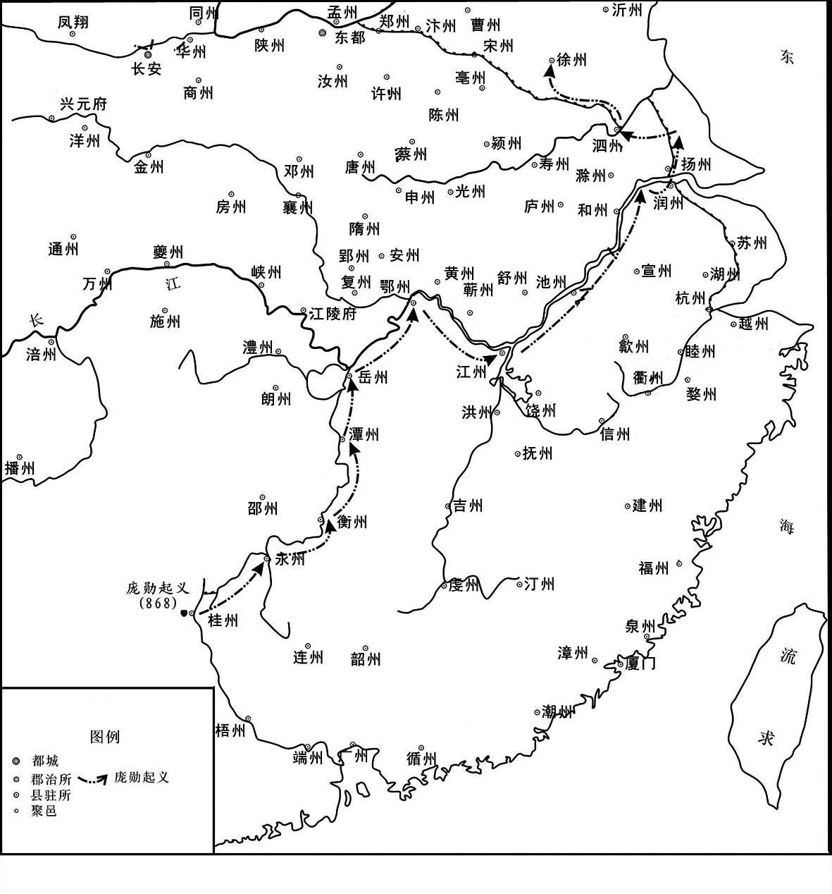
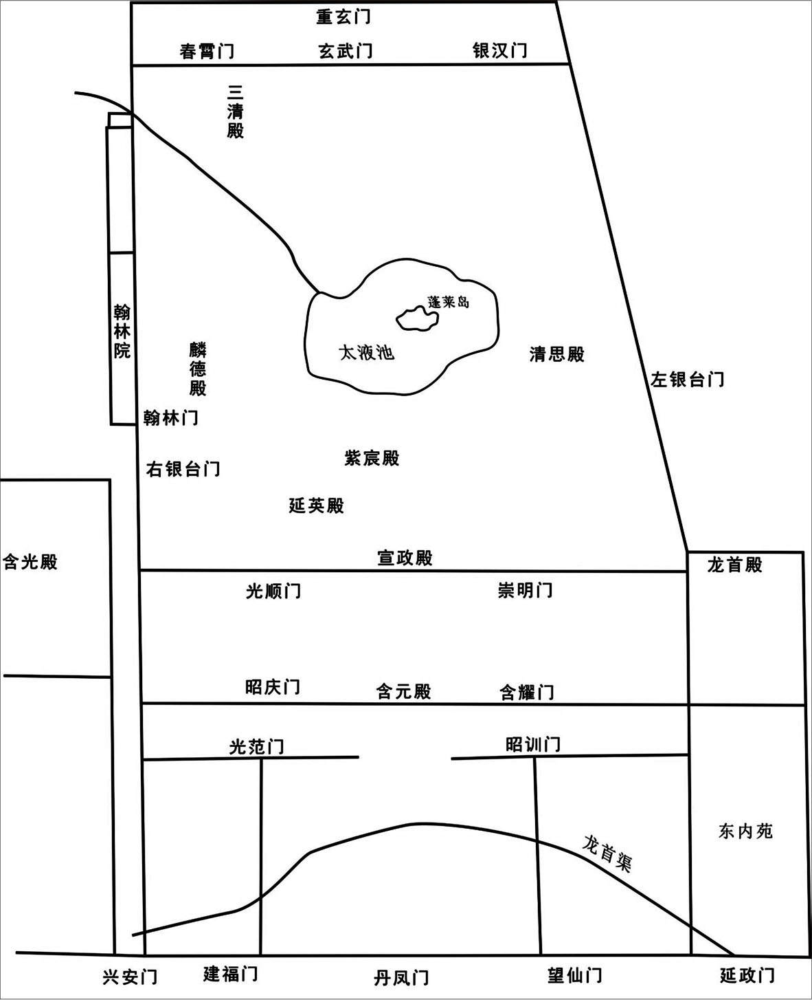
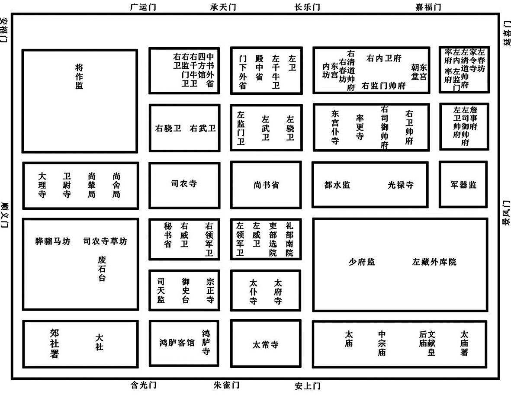
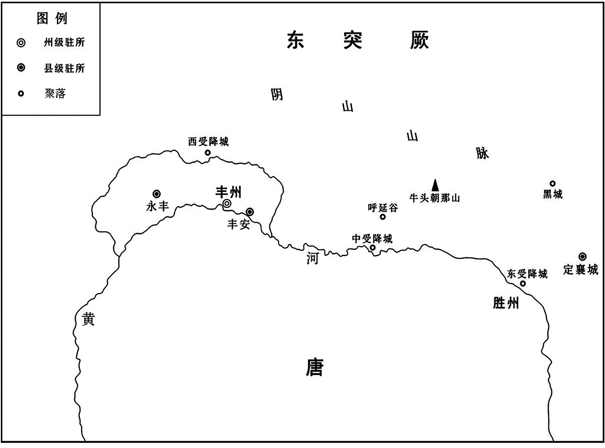
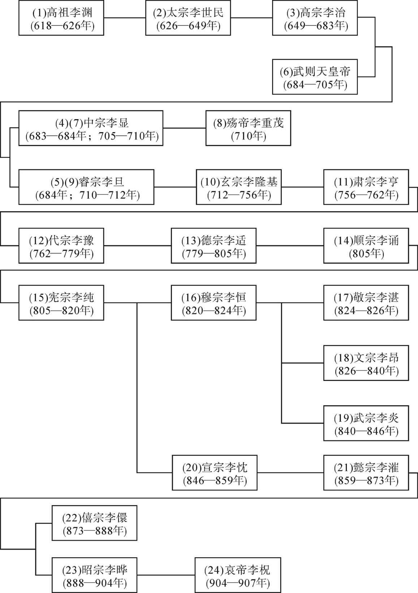
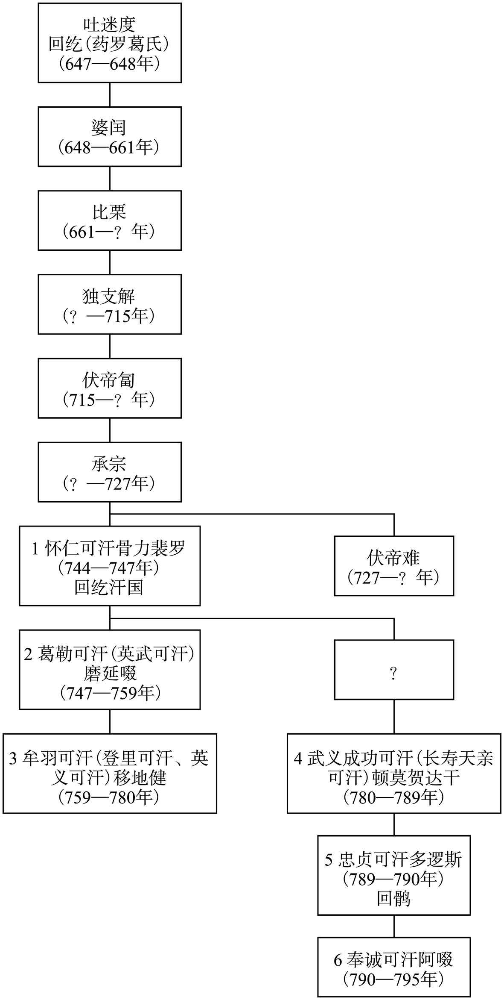
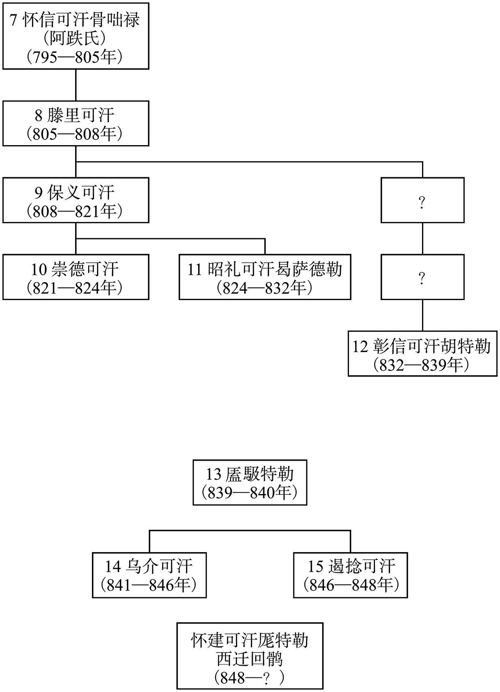
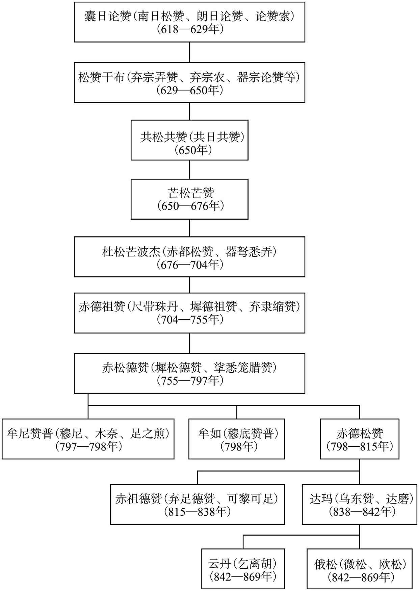
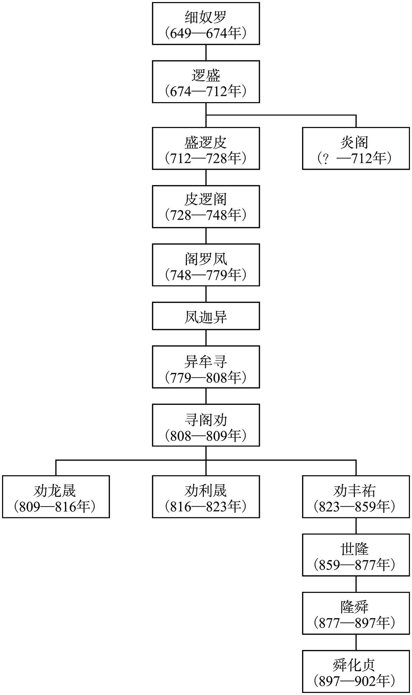

# 目录

庞勋之乱

回鹘叛服

吐蕃衰乱　唐复河湟附

蛮导南诏入寇

李克用归唐

附录： 
回鹘世系表

吐蕃世系表

南诏世系表

返回总目录

# 庞勋之乱

## 【内容提要】

《庞勋之乱》叙述了唐末以庞勋为首的桂林哗变戍卒，打回老家徐州，建立政权，最后被镇压的历史过程。

唐懿宗李漼（cuǐ）咸通四年（863年），南诏进攻安南（治所在今越南河内），攻陷交趾（今越南河内）。唐王朝命徐州节度使孟球招募两千人赴援，其中八百人戍守桂林（今广西桂林）。当初约定三年后轮换。到了咸通九年（868年），这批戍卒已经戍守了六年，还没有能替换回家乡。他们屡次请求返回徐州。当时的徐泗观察使崔彦曾听从亲吏都押牙尹戡（kān）的话，以库藏空虚、派兵替还戍兵的花费太大为理由，要求戍卒再留守一年。已经忍无可忍的戍卒非常愤怒，他们在牙官许佶（jí）、赵可立、姚周、王弘立、张实等九人的带领下，杀死都将王仲甫，拥立粮料判官庞勋为首领，冲入监军院，夺取兵器、铠甲，在桂林发动暴动。然后，经湖南北上，再沿长江东下，过浙西，入淮南，一直打回老家徐州。

他们一路上吸引了很多人参加，队伍迅速壮大。唐王朝发了一道诏令，表示赦免戍兵，允许他们返回家乡。但是徐州节度使崔彦曾已经派兵前去镇压，结果被戍卒打得大败，他们趁势攻取宿州（今安徽宿州）、徐州（今江苏徐州），杀死节度使崔彦曾、尹勘等唐朝官吏。庞勋自称兵马留后，后又称天册将军，声势大振。接着，又攻下濠州（今安徽凤阳）、滁州（今安徽滁州）、和州（今安徽和县）等地，杀死滁州刺史高锡望。南到寿州（今安徽寿县）、庐州（今安徽合肥），北到沂州（今山东临沂），东到海州（今江苏连云港），包括沭阳（今江苏沭阳）、下蔡（今安徽凤台）、乌江（今安徽和县乌江镇）、巢县（今安徽巢湖）等地，被相继攻占，泗州（今江苏宿迁东南）也被长期围困。他们控制了江、淮运输线，切断了唐王朝从江南运输财赋的通道。前去救援的唐军，疲于奔命，屡战屡败。庞勋军则越战越勇，由于这一年江、淮大旱，发生蝗灾，老百姓纷纷参加庞勋队伍，军力大增，发展到二十多万人。

在庞勋之变的规模日益扩大的情况下，唐王朝遣右金吾大将军康承训为义成节度使、徐州行营都招讨使，羽林将军戴可师、神武大将军王晏权分任徐州南、北面行营招讨使，调集各路大军前去镇压；唐王朝还调去了沙陀三部落使朱邪赤心和吐谷（yù）浑、鞑靼（Dádá）、契苾（Qìbì）等部族酋长，各率部众，帮助唐军镇压庞勋。由于轻敌，戴可师被杀于都梁城（今江苏盱眙［Xūyí］北），王晏权也屡战屡败。唐王朝被迫以曹翔代替王晏权，撤换了淮南节度使令狐绹（táo），以马举代替，又任命将军宋威为徐州西北面招讨使，加强唐军的镇压力量。

唐军集中兵力，四面包围了庞勋军，展开全面反攻。庞勋军攻克的地方相继失守，唐军进逼徐州。在此危急时刻，庞勋接受了部下建议，引兵西攻宋州（今河南商丘）、亳州（今安徽亳州），想以此牵制唐军。但当庞勋西行后，他的部下张玄稔（rěn）就投降了唐军，徐州陷落。庞勋西攻宋州不克，转攻亳州，预备折回徐州，但为沙陀骑兵追击，苦战不敌，于咸通十年（869年）九月战死在蕲（qí）县（今安徽省宿州市埇桥区蕲县镇）境内。庞勋领导的桂林戍卒暴动历经一年多时间，归于失败。

庞勋领导的徐泗地区桂林戍卒暴动虽然失败了，但因其发生在唐王朝赖以维持的主要财赋供应地，所以对唐王朝的打击很大。尤其是哗变士卒，转战南方六七个省份，威胁到唐王朝的漕运通道运河，极大地震撼了唐王朝在江、淮地区的统治。后人评价：“唐亡于黄巢，而祸基于桂林。”也就是说，唐朝虽然灭亡于黄巢，但其祸根实早在桂林戍卒暴动中就种下了。这次暴动揭开了唐末大规模暴乱的序幕。

 
庞勋起义北归路线示意图

## 【原文】

**唐懿宗咸通三年秋七月，徐州军乱，逐节度使温璋[1]。初，王智兴既得徐州，募勇悍之士二千人，号银刀、雕旗、门枪、挟马等七军，常以三百余人自卫，露刃坐于两庑夹幕之下，每月一更[2]。其后节度使多儒臣，其兵浸骄，小不如意，一夫大呼，其众和之，节度使辄自后门逃去[3]。前节度使田牟至，与之杂坐饮酒，把臂拊背，或为之执板唱歌[4]。犒赐之费，日以万计，风雨寒暑，复加劳来，犹时喧哗，邀求不已[5]。牟薨，璋代之[6]。骄兵素闻璋性严，惮之[7]。璋开帐慰抚，而骄兵终怀猜忌，赐酒食皆不历口，一旦竟聚噪而逐之[8]。朝廷知璋无辜，乙亥，以璋为邠宁节度使，以浙东观察使王式为武宁节度使[9]。**

## 【注文】

[1]唐（618—907年）：朝代名。618年，由唐高祖李渊建立，定都长安（今陕西西安）。907年，朱温废唐建梁，唐朝灭亡。唐朝共历二十一帝，在唐太宗统治时期出现“贞观之治”，到唐玄宗时期又形成“开元盛世”，其间还涌现出中国历史上唯一的女皇帝武则天，她曾于690年改唐为周，定都洛阳，改称神都。唐朝是中国历史上的一个伟大时代，政治开明、经济繁荣、文化发达、疆域辽阔，成为当时世界上最强大的国家之一。唐朝还是一个开放的帝国，声誉远被海外，与许多国家均有来往，对中国历史和世界文明的发展产生了重大影响。懿（yì）宗：即唐懿宗李漼（cuǐ）（833—873年），本名温，唐宣宗李忱（chén）之子。唐武宗会昌六年（846年）封郓（yùn）王，唐宣宗大中十三年（859年）为宦官王宗实等拥立。唐懿宗在位期间，荒淫挥霍、迷信佛教、朝政败坏，使社会矛盾更加激化，国势日渐衰败，先后爆发浙东裘（qiú）甫暴动和桂林戍卒暴动。咸通十四年（873年）病死，谥号“睿文昭圣恭惠孝皇帝”，葬于简陵。　　咸通：唐懿宗李漼年号，共计十五年，即860—874年。　　徐州：今江苏徐州。唐后期为武宁节度使驻地。　　节度使：官名，唐代开始设立的地方军政长官，意为节制调度，因受职之时朝廷赐以旌（jīng）节，故称此名。节度使成为固定职衔是从唐睿宗李旦景云二年（711年）四月以贺拔延嗣为凉州都督充河西节度使开始的。至唐玄宗开元、天宝年间，沿边境逐渐形成平卢、范阳、河东、朔方、陇右、河西、安西、北庭、剑南、岭南十个节度使。安史之乱后，节度使在内地普遍设置。他们集军、民、财三政于一身，威权颇重，已超过魏晋时期的持节都督。　　温璋（？—870年）：并州祁县（今山西祁县东南）人，一说河内（治今河南沁阳）人。唐代官吏。其父温造曾任礼部尚书，他以父荫累官至大理丞、州刺史。在担任徐泗节度使时，徐州的银刀军因他为政严明，发生兵变，驱逐了他。后来，出任京兆尹，大力整顿京城治安。唐懿宗咸通十一年（870年），因直谏被贬振州司马，自杀身亡。

[2]王智兴（758—836年）：字匡谏，怀州温县（今河南温县）人。唐朝大臣。少年时即以骁勇果敢著称，为徐州衙兵。淄青节度使李纳反叛，派兵攻击徐州。他被派到朝廷求援，解徐州之围，从此成为徐州大将。唐宪宗元和年间，因击退平卢节度使李师道，升任侍御史、御史中丞、沂州刺史、武宁节度副使。唐穆宗长庆初，在参加讨伐河朔三镇叛乱期间，他培植亲兵，号银刀军，逐渐骄纵。后因与节度使崔群不合，将其驱逐，自领军务，成为割据一方的军阀。唐文宗大和初，又因讨伐横海节度使李同捷叛乱，进位侍中，封雁门郡王。大和九年（835年）改任汴州刺史，宣武节度使，死于任上。　　勇悍：勇猛强悍。　　银刀、雕旗、门枪、挟马：唐王智兴所建衙兵名。唐穆宗长庆初年，河朔三镇叛乱，朝廷以王智兴为武宁军节度副使，率领徐州三千兵讨伐，他招募勇悍之士二千人，号银刀、雕旗、门枪、挟马等七军。七军中又以银刀军待遇最为优厚，为近侍亲兵。在他的纵容下，银刀军骄横难制，父子相承，以至继任的节度使都无法有效管理，甚至发生了驱逐节度使温璋的事件。唐懿宗咸通三年（862年），王式出任武宁节度使，尽杀银刀军，其余党亲戚全部发配远处。　　露刃：把兵器露出来。　　庑（wǔ）：堂下周围的廊屋。　　夹幕：古代厅堂廊庑中悬挂的帷幕。　　更：更换，替代。

[3]儒臣：泛指读书人出身的或有学问的大臣。

[4]田牟：生卒年不详。唐代平州卢龙（今河北卢龙）人。成德节度使田弘正之子。为人宽厚，吏治严明。初授神策大将军，历任盐州刺史，鄜坊、天平、武宁、灵武节度使，官至检校尚书左仆射，约死于唐懿宗咸通初，以忠义著称。　　拊（fǔ）背：轻拍肩背，表示抚慰。

[5]犒赐：犒劳赏赐。　　邀求：无理要求。

[6]薨（hōng）：古人对“死”有许多讳称。据《礼记》记载：“天子死曰崩，诸侯死曰薨，大夫死曰卒，士曰不禄，庶人曰死。”这反映出古代社会严格的等级制度。

[7]惮（dàn）：畏惧，害怕。

[8]聚噪：聚众鼓噪。

[9]无辜：没有罪。　　邠（bīn）宁：唐方镇名。唐肃宗乾元二年（759年）置，治所在邠州（今陕西彬州）。辖境屡有变动，较长期领有邠、宁、庆三州，相当于今甘肃东部和陕西彬州、永寿、旬邑、长武等地。唐代宗大历三年（768年），曾一度取消，归并朔方。大历十四年（779年），复置。唐僖宗光启元年（885年），赐号静难军。其后为王行瑜、李继徽等所割据。五代后梁末帝乾化四年（914年）为后梁所并。　　浙东：唐方镇名。唐肃宗乾元元年（758年）置。治越州（今浙江绍兴），领越、衢、婺、台、明、处、温七州。大致相当于今天浙江省除浙北之外的所有地方。　　观察使：官名。唐代后期出现的地方军政长官，全称为观察处置使。唐前期由中央不定期派出使者监察州县。唐中宗神龙二年（706年）置十道巡察使。唐睿宗景云二年（711年）置十道按察使。唐玄宗开元二十一年（733年）改置十五道采访处置使（简称采访使），职如汉代刺史，察访地方官政绩。唐肃宗乾元元年（758年）采访处置使改名为观察处置使。观察处置使负责考核州、县官吏政绩，兼理民事，辖一道或数州。观察使无旌节，地位低于节度使，它的僚属将校略少于节度使。　　王式：生卒年不详，唐末大臣。原籍太原（今山西太原西南），移居扬州（今江苏扬州）。初以门荫为太子正字，累迁殿中侍御史。因结交宦官，被弹劾，出为江陵少尹。唐宣宗时迁晋州刺史，救灾颇有政绩。大中十二年（858年），任安南都护，罢岁赋外搜括，镇压反叛势力和分裂割据势力。唐懿宗咸通元年（860年），调任浙东观察使，镇压裘甫起义，升任检校右散骑常侍。咸通三年（862年），出任武宁节度使，设计尽杀徐州银刀军乱兵。后官至左金吾大将军。　　武宁：唐方镇名。又称徐泗节度、感化军，治徐州（今江苏徐州），领徐、泗、濠、宿四州。唐德宗贞元四年（788年）设置，以保卫南北运道咽喉汴水埇桥。

## 【译文】

唐懿宗咸通三年（862年）秋七月，徐州发生军乱，驱逐了节度使温璋。起初，王智兴取得徐州后，招募勇猛强悍的士兵二千人，号称银刀、雕旗、门枪、挟马等七军，经常带着三百余人自卫，他们露出兵刃坐在州府使院两侧廊屋的夹幕之下，每月轮换一次。此后的节度使大多是儒臣文士，士兵逐渐骄横，稍有不如意，只要一人振臂一呼，其他士兵就一起响应，节度使就从后门逃走。前节度使田牟到了徐州，跟他们不分上下杂坐在一起饮酒，节度使与士兵手把手轻拍背，有时田牟还为士兵们敲着竹板唱歌。用于犒赏士兵的费用，每天以一万计，遇到风雨或寒暑之日，还要加倍慰劳。即使这样，士兵们仍然时常喧哗闹事，不断提出无理要求。田牟去世后，温璋代任徐州节度使。骄兵早就听说温璋性情严厉，心怀畏惧。温璋升帐慰问他们，但骄兵们始终对温璋心怀猜忌，温璋赐予的酒食都不敢喝一口。一天早上，骄兵们聚集在一起，鼓噪着将温璋驱逐出去。朝廷知道温璋没有罪，乙亥（初八日），任命温璋为邠宁节度使，以浙东观察使王式为武宁节度使。

## 【原文】

**忠武、义成两军从王式讨裘甫者犹在浙东，诏式帅以赴徐州，骄兵闻之，甚惧[1]。八月，式至大彭馆，始出迎谒[2]。式视事三日，飨两镇将土，遣还既，擐甲执兵，命围骄兵，尽杀之，银刀都将邵泽等数千人皆死[3]。甲子，敕以徐州先隶淄青道，李洧自归，始置徐海使额[4]。及张建封以威名宠任，特帖濠、泗二州，当时本以控扼淄青、光蔡[5]。自寇孽消弭，而武宁一道职为乱阶[6]。今改为徐州团练使，隶兖海节度[7]。复以濠州归淮南道，更于宿州置宿泗都团练观察使[8]。留将士二千人守徐州，余皆分隶兖、宿[9]。且以王式为武宁节度使，兼徐泗濠宿制置使[10]。委式与监军杨玄质分配将士赴诸道讫，然后将忠武、义成两道兵至汴滑，各遣归本道，身诣京师[11]。其银刀等军逃匿将士，听一月内自首，一切勿问[12]。**

## 【注文】

[1]忠武：唐方镇名。唐肃宗乾元二年（759年），设陈郑颖亳节度使，治郑州（今河南郑州）。唐德宗贞元二年（786年），改设陈许节度使，治许州（今河南许昌）。贞元十年（794年），赐号忠武军。管辖区域屡有变动，较常领有陈、许、蔡三州。唐昭宗龙纪元年（889年），移治所到陈州（今河南淮阳）。五代后梁时改号为匡国军，后唐又恢复忠武军。　　义成：唐方镇名。唐肃宗上元二年（761年），置滑卫节度使，治滑州（今河南滑县东）。唐代宗广德元年（763年），改号为滑亳节度使。大历七年（772年），代宗赐号为永平军。唐德宗贞元元年（785年），改号为义成军。唐僖宗光启三年（887年），又改名为宣义军。辖区屡有变动，较常领有滑、郑、颖三州。　　裘（qiú）甫（？—860年）：剡县（今浙江嵊州）人。唐末农民起义首领，出身于贫苦农民家庭，早年以贩卖私盐为业。唐宣宗大中十三年（859年）十二月，他在浙东发动起义，攻克象山、剡县等地。次年，自称天下都知兵马使，改元罗平，铸印曰天平，建立政权。朝廷急忙调王式担任浙东观察使，前往镇压，结果裘甫被俘后被杀。

[2]大彭馆：在徐州城外。大彭，即传说中的神仙彭祖，寿八百岁，因封于彭城（徐州古称），所以当地人以此命名。　　谒：拜见。

[3]飨（xiǎng）：用酒食招待客人，泛指请人受用。　　擐（huàn）甲执兵：身披铠甲，手拿武器．指准备战斗。　　邵泽（？—862年）：唐末武宁军银刀都将，因骄纵跋扈，被新任节度使王式设计斩杀。

[4]淄（zī）青道：唐方镇名。由原驻守东北的平卢军南下而建立。《新唐书·藩镇传》把它列在“河朔三镇”（即魏博、成德、卢龙）之后。长期辖有淄、青、齐、登、莱、兖、海、沂、密、郓（yùn）、曹、濮（pú）十二州，统治区域大体包括今黄河以南的山东地区以及江苏部分地区。该镇拥兵十余万，不服从朝廷领导。在经历了侯希逸、李正己、李纳、李师古、李师道五位节帅共五十七年的统治后，于唐宪宗元和十四年（819年）被平定。　　李洧（wěi）：高丽人。淄青节度使李正己的从兄，被任命为徐州刺史。正己死后，子李纳继位，进犯宋州。李洧归顺朝廷，授御史大夫，封潮阳郡王。后任徐、海、沂都团练观察使、检校户部尚书。不久病死，赠左仆射。　　徐海使：即徐、海、沂都团练观察使。

[5]张建封（735—800年）：字本立，邓州南阳（今河南南阳）人，寓居兖州（今山东兖州）。唐代中期著名将领，少喜文章，好辩论，慷慨尚武，能文能武，常以武功自许。德宗时，官至寿州刺史。因抗击李希烈叛乱有功，升任徐泗濠节度使，卒于任上，享年66岁。　　濠（háo）：地名。治所在今安徽凤阳。辖境相当于今安徽蚌埠、凤阳、怀远、定远、明光等地。泗：地名。治所在临淮县（今江苏盱眙县对岸，洪泽湖水下），辖地大概相当于今安徽泗县、天长、明光及江苏盱眙、泗洪一带。　　光蔡：唐方镇名，即淮西节度使，是唐朝为了防止安史乱军南下而设置的方镇，初期辖区很大，辖有申、光、蔡三州。安史之乱后，成为不服从中央的地方割据政权。唐宪宗元和十二年（817年），被平定。

[6]孽：邪恶；罪恶。　　消弭（mǐ）：消除（坏事），平息。　　乱阶：祸端，祸根。

[7]徐州团练使：即武宁军。　　兖海节度：唐方镇名，又称泰宁军。唐宪宗元和十四年（819年）置沂海观察使，又称兖海观察使，治所设在沂州（今山东临沂），领沂、兖（治今山东兖州）、海（治今江苏连云港）、密（治今河南新密东南）四州。次年升为节度使，治所迁至兖州。唐昭宗乾宁四年（897年）改号泰宁军。

[8]淮南道：唐方镇名。辖扬、楚、滁、和、濠、庐、寿、光、宿九州，治所设在扬州。相当于今江苏省北部和安徽省东部地区。　　宿州：地名。今安徽省宿州市，位于今安徽省北部。唐宪宗元和四年（809年），割徐州之符离、蕲县及泗州之虹县置宿州，治设埇桥，宿州之名自此始。　　宿泗都团练观察使：唐方镇名。唐懿宗咸通三年（862年）八月置，辖宿、泗等州，治宿州。次年四月即废。

[9]兖：地名，古九州之一。唐高祖武德五年（622）置，治所设在瑕丘，领任城、瑕丘、平陆、袭丘、曲阜、邹、泗水七县。

[10]制置使：官名。唐后期在军事行动前后为控制一方秩序而设的官职。唐宣宗大中五年（851年），始以大臣充诏讨党项行营都统制置等使。

[11]委：任，派，把事交给人办。　　监军：官名。监督军队的官员。古代监军皆临时差遣，代表朝廷协理军务，督察将帅。汉武帝时置监军使者。东汉、魏晋皆有，省称监军，也称监军事。又有军师、军司，亦为监军之职。隋末以御史监军事，唐玄宗始以宦民为监军。中唐以后，出监诸镇，与统帅分庭抗礼。　　杨玄质：生卒年不详。唐代宦官，曾任武宁军监军。　　汴：州名。即今河南开封。管辖开封、浚仪、陈留、雍丘、封丘、尉氏六县，为唐代汴宋节度使治所。　　滑：州名。即今河南滑县。管辖白马、韦城、卫南、胙城、灵昌、酸枣、匡城七县，治白马。　　京师：天子所居的城池。

[12]逃匿：逃跑躲藏。　　听：任凭。　　自首：指犯罪后自动投案。　　问：审讯，追究。

## 【译文】

忠武、义成两镇随王式征讨裘甫的军队还在浙东，唐懿宗下诏给王式，命他率军赶赴徐州。徐州骄兵得知消息，极为恐惧。咸通三年（862年）八月，王式到达大彭馆，七军兵将才出来迎接拜见。王式在徐州处理了三天军务，设宴请忠武、义成两镇将士，声称将遣送他们回本镇，两镇士兵身披铠甲手执武器，王式命令他们将徐州骄兵团团围住，全部斩杀，银刀都将邵泽等数千人全被处死。甲子（二十八日），懿宗下诏认为徐州原先隶属于淄青道，自李洧归附朝廷以来，才开始置徐海节度使这个职位。到张建封镇徐州时因有威名受到宠信重用，特将濠、泗二州拨归徐州领辖，当时的用意本来是以徐州控扼淄青、光蔡两镇。自从贼寇余孽全被消灭之后，武宁一镇的职位就成为祸乱的根源。现在改为徐州团练使，隶属于兖海节度使。又将濠州归还淮南道，再于宿州设置宿泗都团练观察使。留下两千将士驻守徐州，其余军队分别隶属于兖州和宿州两镇。并且以王式为武宁节度使，兼任徐州、泗州、濠州、宿州制置使。委命王式与监军杨玄质分配将士奔赴诸道完毕后，再将忠武、义成两镇军队调至汴州、滑州，分别遣回本镇，王式自己到京师汇报。徐州银刀等七军士兵逃亡躲藏在外的，听凭一个月之内自首，其他一切不再追究。

## 【原文】

**四年冬十一月辛巳(1)，废宿泗观察使，复以徐州为观察府，以濠、泗隶焉[1]。**

## 【注文】

[1]四年：即唐懿宗咸通四年（863年）。

## 【译文】

唐懿宗咸通四年（863年）冬十一月辛巳日，朝廷废除宿泗观察使，再在徐州设观察府，将濠州、泗州隶属于徐州观察府管辖。

## 【原文】

**五年夏五月，敕：“徐州土风雄劲，甲士精强，比因罢节，颇多逃匿[1]。宜令徐泗团练使选募军士三千人赴邕州防戍，待岭外事宁，即与代归[2]。”**

## 【注文】

[1]土风：即民风，指有地方特色的风俗。　　雄劲：强健有力。　　甲士：披甲的战士，泛指士兵。　　精强：精悍强壮。

[2]徐泗团练使：即武宁军。　　邕（yōng）州：即今广西南宁。唐太宗贞观六年（632年）改设，管宣化、武缘、晋兴、朗宁、思笼、封陵、如和七县，治宣化。　　岭外：指五岭以南地区。　　宁：安定。

## 【译文】

唐懿宗咸通五年（864年）夏季五月，颁布敕命：“徐州地方风俗强健刚劲，士兵精悍强壮，近因罢废节度使府，不少人逃亡藏匿。应当命令徐泗团练使选拔招募三千军士赶赴邕州戍守边境，等到岭外战事宁息下来，接替他们的军士到了之后，就让他们回来。”

## 【原文】

**九年。初，南诏陷安南，敕徐泗募兵二千赴援，分八百人别戍桂州，初约三年一代[1]。徐泗观察使（徐）［崔］彦曾，慎由之从子也，性严刻；朝廷以徐兵骄，命镇之[2]。都押牙尹戡、教练使杜璋、兵马使徐行俭用事，军中怨之[3]。戍桂州者已六年，屡求代还，戡言于彦曾，以军帑空虚，发兵所费颇多，请更留旧戍卒一年[4]。彦曾从之。戍卒闻之，怒。都虞候许佶、军校赵可立、姚周、张行实皆故徐州群盗，州县不能讨，招出之，补牙职[5]。会桂管观察使李丛移湖南，新使未至，秋七月，佶等作乱，杀都将王仲甫，推粮料判官庞勋为主，劫库兵北还，所过剽掠，州县莫能御[6]。朝廷闻之，八月，遣高品张敬思赦其罪，部送归徐州，戍卒乃止剽掠[7]。**

## 【注文】

[1]南诏（738—902年）：8世纪崛起于云贵高原的古代王国。由蒙舍部落首领皮逻阁于738年建立。唐初洱海地区部落林立，不相役属，其中有六个较大的部落，称为六诏，分别是蒙巂诏、越析诏、施浪诏、浪穹诏、邆赕诏、蒙舍诏。蒙舍诏在诸诏之南，称为“南诏”。在唐王朝的支持下，南诏先后征服了西洱河地区诸部，灭了其他五诏，统一了洱海地区。为嘉奖南诏皮逻阁统一洱海地区的功勋，唐玄宗于开元二十六年（738年）册封他为“云南王”。唐德宗贞元十年（794年），异牟寻又被封为南诏王，自此世称南诏国，别称鹤拓。唐宣宗大中十四年（860年），世隆改国号为大礼国，自称皇帝。唐昭宗天复二年（902年），权臣郑买嗣推翻蒙氏南诏，自立为王，改国号为“大长和”。　　安南：即安南都护府，为唐朝六大都护府之一，是唐朝管理南部边疆地区的主要机构，属岭南道。唐高宗调露元年（679年），以交州都督府改置安南都护府，为岭南五管之一。治所在宋平（今越南河内）。辖境北抵今云南南盘江，南抵越南河静、广平省界，东有广西那坡、靖西和龙州、宁明、防城部分地区，西界在越南红河、黑水之间。都护由交州刺史兼任。唐肃宗至德二年（757年），改名镇南都护府，唐代宗永泰二年（766年），复名安南都护府。自唐玄宗天宝以后，南诏逐渐强大，开始侵夺安南。唐懿宗咸通元年（860年）十二月，府治被攻陷，未几收复；四年（863年）二月，再度被攻陷；六月，废都护府，置行交州于海门镇（今越南海防西北）；七月复置都护府于行交州。七年（866年），复克安南旧治，都护府移故地，并于都护府置静海军，重筑安南城，由节度使兼领都护。五代时期，静海军节度使由当地首领充任，臣属于南汉。后晋高祖天福四年（939年），吴权起兵击败南汉，后废弃。　　桂州：州名。即今广西桂林。南朝梁置，治始安，唐迁治临桂。辖临桂、全义、灵川、阳朔、永福、建陵、理定、慕化、永丰、荔浦十县。　　别：另外。　　约：商定或预先说定的事。　　代：交换。

[2]［崔］彦曾（？—869年）：崔慎由的侄子。唐清河东武城（今山东武城西北）人，曾在唐宣宗大中末年历任三州刺史。唐懿宗咸通初，为徐州观察使。因为政刚猛，军人多怨之。徐州戍守桂林士兵，到期应当替还，他却听信亲吏尹戡、徐行俭言，命令继续留守，因而激起兵变。咸通九年（868），哗变士兵破城，被杀。　　慎由：即崔慎由，生卒年不详。字敬止，清河东武城（今山东武城西北）人。唐文宗大和初，擢进士第，又登贤良方正制科。唐宣宗大中初入朝，历任右拾遗、知制诰、翰林学士、户部侍郎、工部侍郎等职。大中十年（856年）拜相，以本官同中书门下平章事。后受同僚弹劾，两年后罢相，出任剑南东川节度使。唐懿宗咸通初，转任华州刺史、潼关防御、镇国军等使，加检校司空、河中尹、河中晋绛节度使。不久，入朝任吏部尚书。因病退休，拜太子太保，分司东都。　　严刻：严厉苛刻。

[3]都押牙：武官名。押牙，亦称“押衙”，为管理仪仗的侍卫。所谓“押”，就是掌管，“牙”就是“牙旗”。据唐人李匡乂《资暇集》记载：“武职令有押衙之名。衙宜作‘牙’，此职名，非押其衙府也，盖押牙旗者。”都押牙，是押牙的上级。品阶不太高，多见于藩镇僚属。　　尹戡（kān）：生卒年不详，曾任徐泗观察使崔彦曾手下都押衙之职。　　教练使：唐官名。掌教习士兵。以知兵法、善弓马者充任，置于有军府兵马处。　　杜璋：生卒年不详，曾任徐泗观察使崔彦曾手下教练使之职。　　兵马使：唐代方镇使府重要的武职僚佐。有都知兵马使、左厢兵马使、右厢兵马使、中军兵马使、宅内兵马使、后院兵马使、马军兵马使、步军兵马使、水军兵马使、骡军兵马使、营田兵马使、作坊兵马使、车坊兵马使、门枪兵马使、镇遏兵马使、防秋兵马使、捉生兵马使、刀斧兵马使等名目。　　徐行俭：生卒年不详，曾任徐泗观察使崔彦曾手下兵马使之职。

[4]军帑（tǎng）：军用库藏。

[5]都虞候：军事职官名称。唐后期藩镇将领以都虞候为亲信武官。　　许佶（jí）（？—869年）：唐末桂林（今广西桂林）戍卒兵变领导人之一。徐州（今江苏徐州）人。原任桂林戍军都虞候。唐懿宗李漼咸通九年（868年）因不满上司一再阻止徐、泗戍卒还乡，与军校赵可立等发动兵变，杀都将王仲甫，推庞勋为首，引兵北上，攻克徐州后，任起义军都虞候，为庞勋重要助手。次年，庞勋率军出击，他留守徐州，城破战死。　　军校：任辅助之职的军官。　　赵可立（？—869年）：唐末桂林（今广西桂林）戍卒兵变领导人之一。徐州（今江苏徐州）人。原任桂林戍军军校。咸通九年（868年），与许佶等发动兵变。后被任命为都游弈使，为庞勋重要助手。　　姚周：（？—869年）：唐末桂林（今广西桂林）戍卒兵变领导人之一。徐州（今江苏徐州）人。原任桂林戍军军校。咸通九年（868年），与许佶、赵可立等发动兵变，拥立庞勋，成为叛军悍将。咸通十年（869年），与唐军战败，逃奔宿州，被杀。　　张行实：（？—869年）：唐末桂林（今广西桂林）戍卒兵变领导人之一。徐州（今江苏徐州）人。原任桂林戍军军校。咸通九年（868年），与许佶、赵可立、姚周等发动兵变。　　牙职：唐代藩镇牙前将校级武职。

[6]桂管观察使：唐朝方镇名。全称桂管都防御观察处置等使，设经略观察使一名。治所设在桂州（今广西桂林）。经略观察使兼桂州刺史，领桂、梧、贺、连、柳、富、昭、环、融、古、思唐、龚、象十三州。掌管军、政事务，领戍兵一千名。　　李丛：生卒年不详。唐朝宗室，曾任桂管观察使、湖南观察使之职。　　　湖南：唐朝方镇名，又称湖南道，全称湖南都团练守捉观察处置使。唐代宗广德二年（764年），从江南西道划出设置。“湖南”之名也从此出现。领衡、潭、邵、永、道、郴、连七州。初建时治所在衡州（今湖南衡阳），后迁到潭州（今湖南长沙）。　　都将：亦称都头，武官名。唐中后期，藩镇和禁军中的领兵官称。　　王仲甫（？—868年）：唐代官员，曾任桂林戍卒都将。咸通九年（868年），桂林戍卒哗变，被杀。　　粮料判官：官名。唐后期藩镇使府管理粮草的官员。判官，隋使府始置。唐制，特派担任临时职务的大臣可自选中级官员奏请充任判官，以资佐理。唐睿宗以后，节度、观察、防御、团练等使皆有判官辅助处理事务，亦由本使选充，非正官而为僚佐。五代州府亦置判官，权位渐重。　　庞勋（？—869年）：唐末桂林戍卒兵变领袖。初在戍守桂林的徐、泗军中担任粮料官。咸通四年（863年），唐朝廷曾在徐州、泗州招募士兵两千戍守交趾（今越南河内），其中抽出八百人戍守桂林（今广西桂林）。原定三年调换一次，至咸通九年（868年）已六年仍未调换。于是在都虞候许佶等人的领导下发动兵变，杀死都将王仲甫，被推举为领袖，经湖南、浙西，入淮南，攻克宿州（安徽宿县）、彭城，俘徐泗观察使崔彦曾，自称兵马留后，队伍发展至二十万人。占有今鲁南、皖北、苏北大片地区。唐命康承训为都招讨使，并约沙陀朱邪赤心（后来唐赐名为李国昌）协助镇压。因骄傲轻敌，纪律松懈，加之部众叛变，最后战死。　　剽掠：抢劫掠夺；击杀。

[7]高品：指品级高的宦官。　　张敬思：唐代宦官，生卒年不详。曾受朝廷命出使庞勋领导的哗变部队。　　部送：指押送囚犯、官物、畜产等。

## 【译文】

唐懿宗咸通九年（868年）。起初，南诏军攻陷安南，唐懿宗敕令徐泗镇招募士兵两千人赶往安南增援，分其中八百人另往桂州屯戍，当初约定三年轮换一批。徐泗观察使崔彦曾是崔慎由的侄子，性情严厉苛刻；朝廷因为徐州士兵骄横，任命他镇守此地。都押牙尹戡、教练使杜璋、兵马使徐行俭掌管使府大权，军中将士怨恨他们。戍守桂州的徐泗士兵已戍边六年，屡次请求轮换回乡，尹戡跟崔彦曾说，因为军府库藏空虚，调动军队的费用太多，让他们再留一年。崔彦曾听从了他的建议。戍卒们听到这个消息，感到愤怒。都虞候许佶，军校赵可立、姚周、张行实都是以前徐州的盗贼，州县没有力量征讨，于是招安出山，担任牙职。恰值桂管观察使李丛调往湖南镇守，新任观察使没有到任，秋七月，许佶等人发动叛乱，杀死都将王仲甫，推举粮料判官庞勋为主帅，抢劫军用仓库的兵器结队北上回归。他们在所过之地四处劫掠，地方州县抵御不了。朝廷听到这个消息，八月，遣高品宦官张敬思来赦免戍卒的罪，送他们回归徐州，戍卒们才停止沿途抢劫。

## 【原文】

**九月，庞勋等至湖南，监军以计诱之，使悉输其甲兵[1]。山南东道节度使崔铉严兵守要害，徐卒不敢入境，泛舟沿江东下[2]。许佶等相与谋曰：“吾辈罪大于银刀，朝廷所以赦之者，虑缘道攻劫，或溃散为患耳。若至徐州，必菹醢矣[3]。”乃各以私财造甲兵、旗帜。过浙西，入淮南[4]。淮南节度使令狐绹遣使慰劳，给刍米[5]。都押牙李湘言于绹曰：“徐卒擅归，势必为乱，虽无敕令诛讨，藩镇大臣当临事制宜[6]。高邮岸峻而水深狭，请将奇兵伏于其侧，焚荻舟以塞其前，以劲兵蹙其后，可尽擒也[7]。不然，纵之使得渡淮，至徐州，与怨愤之众合，为患必大。”绹素懦怯，且以无敕书，乃曰：“彼在淮南不为暴，听其自过，余非吾事也。”[8]**

## 【注文】

[1]输：缴纳。　　甲兵：铠甲和兵器。

[2]山南东道：唐代方镇名。唐玄宗时设山南道，为开元十五道之一，治所设于襄州（今湖北襄阳）。开元之后，分为山南东道和山南西道。唐玄宗天宝年间置南阳节度，治邓州（今河南邓州），至唐肃宗至德年间移治襄州，改名为山南东道，即山南道旧治也，领荆、襄、邓、唐、随、郢、复、均、房、峡、归、夔、万等州，相当于今秦岭以南，长江以北地区。安史之乱后，梁崇义曾经在这里割据。　　崔铉（xuàn）（？—869年）：唐代大臣，字台硕，博陵（今河北安平）人。擢进士第，迁中书舍人、学士承旨。唐武宗会昌三年（843年）拜中书侍郎，同中书门下平章事。因与李德裕不和，罢为陕虢观察使。宣宗初，擢河东节度使。大中三年（849年），以御史大夫召，进尚书左仆射，兼门下侍郎，封博陵郡公。大中九年（855年），出为淮南节度使。懿宗咸通初，徙山南东道、荆南二镇，封魏国公。卒于江陵。著有《续会要》四十卷，记载了德宗到宣宗朝的史事。　　泛舟：船行水上。

[3]菹（zū）醢（hǎi）：古代的一种酷刑，即把人剁成肉酱。传说此刑始于夏商时期的暴君桀、纣。汉以后，历代正刑中不再见“菹醢”之名，但此刑实际并没有真正被废除。比如在曹魏，汉法的三族之刑有时也被用来惩罚那些“谋反大逆”者，但事出于临时，不著律令。

[4]浙西：唐代方镇名，亦称镇海军。唐德宗贞元年间，从浙江东西道中分置。观察使治所在润州（今江苏镇江），领润、苏、常、湖、杭、睦六州，大约相当于今浙江北部及江苏的江南镇江以东之地。唐昭宗光化初，钱镠为节度使，迁治杭州（今浙江杭州）。

[5]令狐绹（795—872年）：晚唐大臣、文学家。字子直，京兆华原（今陕西耀州）人。宰相令狐楚之子。性格软弱。唐文宗大和四年（830年）进士，唐武宗时任湖州（今浙江湖州）刺史。唐宣宗时任宰相。唐懿宗时，历任河中、宣武、淮南等节度使。后召入知制诰，辅政十年，拜司空、检校司徒，封凉国公。咸通九年（868年）庞勋乱军攻占徐州（今江苏徐州），曾受命为徐州南面招讨使，屡为庞勋所败。僖宗时改任凤翔（今陕西凤翔）节度使，后又召为太子太保，徙封赵。卒于封地。　　刍：喂牲畜的草。

[6]李湘：唐代官员。生卒年不详，曾任淮南镇都押牙。唐末庞勋之乱时，曾受节度使令狐绹之命增援泗州，兵败被俘。

[7]高邮：今江苏高邮。秦始皇于公元前223年在此筑高台、置邮亭，故名高邮。汉武帝元狩五年（前118年）设高邮县，属广陵国。隋唐沿置。　　荻（di）：荻草，一种水陆两生的草。　　劲兵：精锐的部队。　　蹙：接近，迫近。

[8]懦怯：软弱胆小。

## 【译文】

唐懿宗咸通九年（868年）九月，庞勋等人行至湖南，监军用计策诱骗他们，让他们交出全部武器。山南东道节度使崔铉派兵严守要害之地，徐泗戍卒不敢进入其境内，乘船沿长江东下。许佶等人互相谋划说：“我们犯的罪比当年银刀军要大得多，朝廷之所以赦免我们，是因为考虑到我们沿途攻击抢劫，或者我们逃散成为国家的祸患。如果我们到达徐州，必定要被剁成肉酱。”于是，每人都用自己的私财打造兵器，制作军旗。戍卒经过浙西，进入淮南。淮南节度使令狐绹遣使者慰劳他们，送给喂马的饲料和军队米粮。淮南镇都押牙李湘对令狐绹说：“徐泗戍卒擅自回归，势必造反叛乱，虽然没有敕令诛讨他们，但藩镇大臣应当因事制宜。高邮的江岸高峻水深港狭，请让我率一支奇兵埋伏于江岸旁边，烧着装满柴草的船堵塞他们前行的水路，派精锐部队紧跟其后，可以将他们全部擒获。不这样，放纵他们渡过淮河，回到徐州，与心怀怨愤的民众会合，对国家的祸患一定很大。”令狐绹平素一贯懦弱胆小，加上没有皇帝颁发的敕书，于是说：“他们只要在淮南不行凶逞暴，就听任他们过淮河，其余就不关我的事了。”

## 【原文】

**勋招集银刀等都窜匿者及诸亡命匿于舟中，众至千人[1]。丁巳，至泗州[2]。刺史杜慆飨之于球场，优人致辞[3]。徐卒以为玩己，擒优人，欲斩之，坐者惊散[4]。慆素为之备，徐卒不敢为乱而止。慆，悰之弟也[5]。**

## 【注文】

[1]窜匿：逃窜隐藏。　　亡命：谓削除户籍而逃亡在外。泛指逃亡，流亡。

[2]泗州：北周末置，治宿豫（今江苏宿迁东南）。辖地大约为今泗县、天长、盱眙、明光、泗洪一带。　　

[3]杜慆（tāo）：唐朝官员。生卒年不详。京兆万年（今陕西西安）人，中唐名相杜佑之孙。曾任泗州刺史。　球场：打马球的场地。唐代流行打马球，所以在各地普设球场，除了用来打马球之外，还用来集合、训练、宴赏士兵。　　优人：优子，古代以乐舞、戏谑（xuè）为业的艺人。　　致辞：在仪式上讲表示勉励、感谢、祝贺、哀悼等的话。

[4]玩：戏弄。　　惊散：受惊而逃散。

[5]悰（cóng）：即杜悰（794—873年），字允裕（一说永裕），京兆万年（今陕西长安）人。中唐宰相杜佑之孙，以荫迁太子司仪郎，唐宪宗元和九年（814年），娶岐阳公主为妻，授予殿中少监，加封银青光禄大夫衔。历官京兆尹、淮南节度使、左仆射兼门下侍郎、同中书门下平章事、剑南东川节度使。后以检校司徒为凤翔、荆州节度使，加太傅，封邠国公。

## 【译文】

庞勋招集徐州银刀等七军中逃窜隐藏的人和流亡的人，将他们藏在船里，部众发展到一千人。咸通九年（868年）九月丁巳（二十七日），来到泗州。泗州刺史杜慆在球场为戍卒们设宴，有唱戏的优人向他们致辞。徐州戍卒以为是在戏弄自己，抓住优人，准备杀了他，在座的宾客受惊逃散。杜慆早已做好戒备，徐州戍卒不敢作乱，停止行动。杜慆，是杜悰的弟弟。

## 【原文】

**先是，朝廷屡敕崔彦曾慰抚戍卒擅归者，勿使忧疑[1]。彦曾遣使以敕意谕之，道路相望，勋亦申状相继，辞礼甚恭[2]。戊午，行及徐城，勋与许佶等乃言于众曰：“吾辈擅归，思见妻子耳[3]。今闻已有密敕下本军，至则支分灭族矣。丈夫与其自投网罗，为天下笑，曷若相与戮力同心，赴蹈汤火，岂徒脱祸，兼富贵可求[4]。况城中将士皆吾辈父兄子弟，吾辈一唱于外，彼必响应于内矣。然后遵王侍中故事，五十万赏钱翘足可待也[5]。”众皆呼跃称善。将士赵武等十二人独忧惧，欲逃去，勋悉斩之，遣使致其首于彦曾，且为申状，称：“勋等远戍六年，实怀乡里[6]。而武等因众心不安，辄萌奸计。将士诚知诖误，敢避诛夷[7]！今既蒙恩全宥，辄共诛首恶，以补愆尤。”[8]冬十月甲子，使者至彭城，彦曾执而讯之，具得其情，乃囚之。丁卯，勋复于递中申状，称：“将士自负罪戾，各怀忧疑，今已及苻离，尚未释甲[9]。盖以军将尹戡、杜璋、徐行俭等狡诈多疑，必生衅隙，乞且停此三人职任，以安众心[10]。仍乞戍还将士别置二营，共为一将。”**

## 【注文】

[1]擅：擅自。　　忧疑：忧虑疑惧。

[2]道路相望：在道上可以互相看见，形容人来人往络绎不绝。

[3]徐城：县名。隋文帝开皇十八年（598年）置，治今江苏省泗洪县东南城头乡大徐台子附近，属泗州。隋炀帝大业四年（608年）移治今泗洪南临淮。宋太祖建隆二年（961年）废为镇。

[4]自投网罗：投：进入。比喻自己进入圈套送死。也作自投罗网。　　曷若：何如。用反问的语气表示不如。　　戮力同心：同心协力。　　赴蹈汤火：赴：前往；蹈：踩；汤：热水。形容不畏艰难险阻，奋不顾身。义同赴汤蹈火。

[5]王侍中故事：王侍中，指王智兴，曾官至侍中。故事，是指他在徐州培植亲兵“银刀军”，驱逐节度使崔群，自领军务，成为割据一方的军阀。　　翘足可待：比喻很快就能实现。

[6]赵武（？—868年）：唐末桂林戍卒。唐懿宗咸通九年（868年），参加了庞勋领导的兵变，并随部队打回徐州。因怀疑庞勋割据徐州的计划而被杀。　萌：萌生。

[7]诖（guà）误：欺误，贻误。　　诛夷：杀戮，诛杀。

[8]宥（yòu）：宽容，饶恕，原谅。　　愆（qiān）尤：罪过。

[9]彭城：徐州的古称。其名初见于春秋时代，据先秦典籍《世本》记载：“涿鹿在彭城，黄帝都之。”又传说尧封彭祖于此，为大彭氏国，为彭城之始。公元前221年，秦统一六国，实行郡县制，设彭城县。西汉升为彭城郡。唐代中后期为徐州节度使驻地。　　罪戾（lì）：罪愆。　　苻离：县名。治今安徽宿州东北，曾为州、郡、县三级政府所在地。　　释甲：脱下战衣。

[10]衅隙：裂缝。引申为意见不合，感情有裂痕。

## 【译文】

在此之前，朝廷屡次敕命崔彦曾抚慰从桂林擅自回来的戍卒，以使他们不对官府产生忧虑和猜疑。崔彦曾派遣使者告谕皇帝的旨意，使者一个接着一个在道路上前后相望，庞勋送给崔彦曾的申诉状也一封接着一封，申诉状的言辞相当恭敬。咸通九年（868年）九月戊午（二十八日），庞勋等行至徐城县，庞勋与许佶等人对部众说：“我们擅自归来，是因为思念妻儿罢了。现在听说已有皇帝的密敕到了徐州军府，到徐州我们将被肢解灭族。大丈夫与其自投罗网，为天下人嘲笑，还不如大家同心协力，赴汤蹈火，这样不仅摆脱祸殃，而且可求得富贵。何况徐州城内的将士都是我们的父兄子弟，我们在外一声高喊，他们在城内必然响应。这之后遵照王智兴侍中过去所做的事去办，五十万缗赏钱可以翘足以待了。”众戍卒听后都欢呼称好。只有将士赵武等十二人感到忧虑和恐惧，企图逃跑，庞勋将他们全部处斩，派遣使者将赵武等十二人的首级送交崔彦曾，并且递上申诉状，宣称：“庞勋等人远离家乡戍守桂州六年，实在是怀念故乡故里。而赵武等人因为众人心情不安，就萌生奸计。将士们当然知道被赵武等迷误，怎敢避免诛灭全家的祸患！现在既承蒙观察使的大恩得以免罪保全性命，大家也就立即将首恶分子赵武等十二人诛死，以弥补我们所犯下的罪过。”冬十月甲子（初四日），庞勋的使者来到彭城，崔彦曾将他逮捕并严加审问，全部了解了庞勋的情况，于是囚禁使者。丁卯（初七日），庞勋再次向节度使府递送申诉状，宣称：“将士们身负重罪，每人都心怀疑虑，现在已到达苻离，还没有解下身穿的重甲。这大概是因为徐州军府将领尹戡、杜璋、徐行俭等人狡诈多疑，必定对我们心怀间隙隔阂，乞求暂停这三人的职任，以便安定众心。同时乞求将从桂州回还的戍军将士另外编成两个营，由一个将领管辖。”

## 【原文】

**时戍卒距彭城止四驿，阖城恟惧[1]。彦曾召诸将谋之，皆泣曰：“比以银刀凶悍，使一军皆蒙恶名，歼夷流窜，不无枉滥[2]。今冤痛之声未已，而桂州戍卒复尔猖狂，若纵使入城，必为逆乱，如此则阖境涂地矣[3]。不若乘其远来疲弊，发兵击之，我逸彼劳，往无不捷。”彦曾犹豫未决。团练判官温庭皓复言于彦曾曰：“安危之兆，已在目前，得失之机，决于今日[4]。今击之有三难，而舍之有五害。诏释其罪，而擅诛之，一难也。帅其父兄，讨其子弟，二难也。枝党钩连，刑戮必多，三难也[5]。然当道戍卒若擅归不诛，则诸道戍边者皆效之，无以制御，一害也。将者一军之首，而辄敢害之，则凡为将者何以号令士卒？二害也。所过剽掠，自为甲兵，招纳亡命，此而不讨，何以惩恶？三害也。军中将士，皆其亲属，银刀余党潜匿山泽，一旦内外俱发，何以支吾，四害也[6]。逼胁军府，诛所忌三将，又欲自为一营，从之则银刀之患复起，违之则托此为作乱之端，五害也。惟明公去其三难，绝其五害，早定大计，以副众望[7]。”**

## 【注文】

[1]驿：旧时供传递公文的人中途休息、换马的地方。　　阖（hé）：全，总共。　　恟（xiōng）惧：纷扰惊惧。

[2]枉滥：冤枉淫滥，使无辜受害。

[3]涂地：惨死，遭受残害。

[4]团练判官：官名。唐代节度使、观察使、防御使、团练使均置判官，为地方长官的僚属，辅佐团练使处理政务。　　温庭皓（？—868年）：唐代诗人。太原祁（今山西祁县）人。国子助教温庭筠之弟。唐宣宗大中末，为山南东道节度使徐商从事。唐懿宗咸通中，辟为徐州崔彦曾幕府。庞勋反，命他起草表文求为节度使，遭到拒绝。后被杀，诏赠兵部郎中。

[5]枝党：依附的党羽。　　钩连：勾通连接。　　刑戮：受刑罚后被处死。

[6]支吾：支撑。

[7]明公：旧时对有名位者的尊称。　　副：符合。

## 【译文】

当时，自桂州返乡的戍卒距彭城只有四个驿的路程，徐州城内纷扰惊惧。崔彦曾召部下诸将谋划对策，诸将哭着说：“以前因为银刀等军凶悍，使徐州镇一军都蒙受恶名，大部分被夷灭或流窜山谷，其中不免有冤枉滥杀的。至今冤痛之声仍没有停止，而桂州戍卒又如此猖狂，如果放纵他们入城，必然会造反作乱，这样徐州全境就要遭到屠戮。不如乘他们远道而来精力疲惫，调集军队讨伐他们，我们以逸待劳，战无不胜。”崔彦曾犹豫不决。团练判官温庭皓再向崔彦曾上言说：“安危的征兆，已呈现在眼前，是得还是失，全在于今天的决策。现在讨伐他们有三个难处，而不讨伐他们有五个害处。皇帝既已颁下诏书释免戍卒的罪，而我们擅自讨伐，这是第一个难处。我们率领戍卒的父兄，去讨伐他们的子弟，这是第二个难处。戍卒牵连的党羽多而复杂，追究起来判刑和处死的人必然很多，这是第三个难处。但是本道戍边的士卒擅自归还不讨伐，就会使其他道戍边的士卒都仿效他们，朝廷就会失去对他们的控制，这是第一个害处。将领是一军的首长，而桂林戍卒竟敢擅自杀害，那担任将帅的人怎么能够去号令士兵？这是第二个害处。擅自返乡的戍卒一路上剽掠抢劫，自己制造兵器，招纳亡命之徒，对这样的叛贼不加征讨，又怎么去惩除恶徒？这是第三个害处。徐州军中的将士，都是擅归戍卒的亲属，而银刀等七军的余党潜伏在山谷草泽间，一旦内外勾结一起叛乱，又如何支撑徐州的局面？这是第四个害处。桂州戍卒胁迫军府，诛除他们所忌恨的三名将领，又要求自己成立一个营队，如答应他们的要求，那么当年银刀等七军叛乱的祸患又将重起，如不答应他们，戍卒就会以此为借口发动叛乱，这是第五个害处。只有您能除去三个难处，断绝五个害处，早日决定大计，不辜负大家的期望。”

## 【原文】

**时城中有兵四千三百，彦曾乃命都虞候元密等将兵三千人讨勋，数勋之罪以令士众，且曰：“非惟涂炭平人，实亦污染将士[1]。傥国家发兵诛讨，则玉石俱焚矣。[2]”又曰：“凡彼亲属，无用忧疑，罪止一身，必无连坐[3]。”仍命宿州出兵苻离，泗州出兵于虹以邀之，且奏其状。彦曾戒元密无伤敕使[4]。戊辰，元密发彭城，军容甚盛。诸将至任山北数里，顿兵不进，共思所以夺敕使之计，欲俟贼入馆，乃纵兵击之，遣人变服负薪以诇贼[5]。日暮，贼至任山，馆中空无人，又无供给，疑之，见负薪者执而榜之，果得其情[6]。乃为偶人执旗帜，列于山下而潜遁[7]。比夜，官军始觉之，恐贼潜伏山谷及间道来袭，复引兵退宿于城南，明旦乃进追之[8]。**

## 【注文】

[1]元密（？—868年）：唐末为徐州都虞候，曾受命讨伐庞勋，战死。　　涂炭：陷入泥沼，坠入炭火。比喻极其艰难困苦。　　平人：平民百姓。　　污染：沾染，玷污。

[2]傥：表示假设，相当于“倘若”“如果”。　　玉石俱焚：美玉和石头一起烧坏。比喻好的和坏的一起毁掉。

[3]止：通“只”。　　连坐：中国古代因他人犯罪而使与犯罪者有一定关系的人连带受刑的制度。

[4]虹：县名。汉景帝六年（前151年），封楚元王子刘富为红侯，在今安徽五河县双庙乡董嘴村西南沱湖西岸及湖中立国，属沛郡。王莽当政，废红侯国为虹县。魏晋南北朝时，屡有废省。唐高祖武德四年（621年），复置，治今安徽固镇仁和集。唐太宗贞观八年（634年）迁治今泗县。　　敕使：皇帝的使者。指朝廷派来招抚庞勋的宦官张敬思。

[5]任山：地名。又称银山或北山，在徐州南三堡镇西，是古代通往江淮的必经之道。唐朝在此处设有驿馆，名任山馆。　　纵兵：发兵。　　变服：改变服饰，化装。　　负薪（xīn）：背负柴草。　　诇（xiòng）：侦察；探听。

[6]榜（bàng）：古代刑法之一。杖击或鞭打。泛指击打。

[7]偶人：用土木陶瓷等制成的人形物。

[8]间道：偏僻的或抄近的小路。

## 【译文】

当时，徐州城中有士兵四千三百人，崔彦曾遂命令都虞候元密等率领三千人去讨伐庞勋，历数庞勋的罪恶来号令士兵，并且说：“庞勋等叛卒不但使平民百姓生灵涂炭，实际上也是玷污了广大将士的名声。如果朝廷调集军队来诛讨，恐怕就要玉石俱焚了。”又说：“凡是叛乱戍卒的亲属，都不用忧虑，罪只在一人身上，必定不会受到任何株连。”于是命令宿州派兵到苻离，命令泗州派军队到虹县，截击桂州归来的戍卒，并奏告具体情况。崔彦曾告诫元密不要伤害了敕使张敬思。咸通九年（868年）十月戊辰（初八），元密从彭城出发，军容气势盛大。诸将领率军来到任山以北数里地之外，停止进兵，共同商量救出敕使的计策，准备等到乱兵进入馆驿时，再纵兵攻击他们，派人化装成挑柴卖薪的人侦察敌情。太阳下山之时，叛兵来到任山，馆驿中空无一人，又没有米饭茶水供给，感到怀疑，看见挑柴的人抓来拷问，果然获得了官军的情况。于是，戍卒们做假人拿着旗帜，排列在山下，自己潜逃而去。至夜深时，官军才察觉，恐怕叛乱的戍卒潜伏在山谷或小路边对他们发动偷袭，于是退到城南宿营，第二天早晨才进兵追击他们。

## 【原文】

**时贼已至符离，宿州戍卒五百人出战于濉水上，望风奔溃，贼遂抵宿州[1]。时宿州阙刺史，观察副使焦璐摄州事，城中无复余兵，庚午，贼攻陷之，璐走免[2]。贼悉聚城中货财，令百姓来取之，一日之中，四远云集，然后选募为兵，有不愿者立斩之，自旦至暮，得数千人[3]。于是勒兵乘城，庞勋自称兵马留后[4]。再宿，官军始至，贼守备已严，不可复攻。先是，焦璐闻符离败，决汴水以断北路，贼至，水尚浅可涉，比官军至，已深矣[5]。**

## 【注文】

[1]濉（suī）水：河流名。属淮河水系，为古代鸿沟的支流之一。原上承大梁（开封）鸿沟水，下至小河口（邳县境）入泗水，源远流长，因累受黄河泛滥侵夺，河道多变。　　望风：听到风声；见到动静、气势。　　奔溃：逃散，败逃。

[2]阙：同“缺”。　　焦璐（lù）（？—869年）：唐朝官员。唐懿宗时，任徐州观察副使，代理宿州刺史。庞勋率领哗变士兵攻城时逃走。后被捉处死。　　摄：代理。

[3]云集：比喻许多人从各处来，聚集在一起。

[4]勒兵：操练或指挥军队。　　兵马留后：官职名。唐代中后期，节度使、观察使缺位时，往往以子弟或亲信将吏代行其职，称“节度留后”。也有掌权将领于节度使出缺时自称“观察留后”或“兵马留后”者，事后多由朝廷予以追认，形成长期分裂割据局面。

[5]决：排除阻塞物，疏通水道。　　汴水：河流名。一说晋后隋以前指始于河南荥阳的汴渠，东循狼汤渠、获水，流至今江苏徐州时注入泗水，一说唐宋人称隋所开通济渠的东段为汴水、汴渠或汴河。　　涉：蹚水过河。

## 【译文】

这时乱军已经到了苻离，宿州派出戍卒五百人在濉水上抵抗，官军望风而逃，乱军于是抵达宿州。当时宿州缺刺史，观察副使焦璐掌管州政事务，城内不再有多余的军队，咸通九年（868年）十月庚午（初十），乱军攻陷宿州，焦璐逃出得免一死。乱军将城中的财货全部聚集在一起，让老百姓随意来取，一天之内，四面八方的人汇集而来，然后挑选丁壮参军，不愿参军的人立即被斩首，自清晨到晚上，选得丁壮数千人。于是，派兵登上城楼把守，庞勋自称是兵马留后。第二天晚上官军才赶到，乱军的守备已很严密，不可再攻。起先，焦璐听说苻离官军战败，决开汴水堤企图阻断北面的道路，乱军赶到时，水尚浅可以从中走过，待官军赶来时，水已经很深了。

## 【原文】

**壬申，元密引兵渡水。将围城，会大风，贼以火箭射城外茅舍，延及官军营，士卒进则冒矢石，退则限水火，贼急击之，死者近三百人[1]。元密等以为贼必固守，但为攻取之计。贼夜使妇人持更，掠城中大船三百艘，备载资粮，顺流而下，欲入江湖为盗[2]。以千缣赠张敬思，遣骑送至汴之东境，纵使西归[3]。明旦，官军知贼已去，狼狈追之，士卒皆未食，比追及，已饥乏[4]。贼舣舟堤下而陈于堤外，伏千人于舟中，官军将至，陈者皆走入陂中[5]。密以为畏己，纵兵追之，贼自舟中出，夹攻之，自午及申，官军大败[6]。密引兵走，陷于荷涫，贼追及之，密等诸将及监陈敕使皆死，士卒死者殆千人，其余皆降于贼，无一个还徐者[7]。**

## 【注文】

[1]火箭：将燃烧物附在弓箭头上的武器。　　延及：扩展到，延伸到。　　矢（shǐ）石：箭和垒石，古时守城的武器。

[2]持更：值更守夜。

[3]缣（jiān）：双丝的细绢。

[4]明旦：第二天早晨。　　乏：疲倦。

[5]舣（yǐ）舟：船只停靠岸边。　　陈：布置军队。　　陂（bēi）：水边，池塘。

[6]午：上午十一时到下午一时。　　申：下午三时到五时。

[7]荷涫（guàn）：荷塘。　　监陈：陈通阵。监军，督战。　　殆：大概，几乎，差不多。

## 【译文】

唐懿宗咸通九年（868年）十月壬申（十二日），元密率领军队渡过河。将围困宿州城时，恰值一阵大风吹来，乱军用火箭射城外的茅屋，大火绵延烧到官军的营帐，官军士卒前进则要冒着城上投下的矢石，后退又被大水和大火限制，乱军趁机急攻，杀死官军近三百人。元密等人认为乱军必定要固守宿州城，只为攻城考虑计策。乱军夜晚让妇女击鼓打更，掠夺城中的大船三百艘，装满军资粮食，顺水而下，准备进入江湖做强盗。乱军给中使张敬思丝绢千匹，派遣骑兵护送他至汴州的东面，放他西归长安。第二天一早，官军知道乱军已出城远去，狼狈追赶，士卒们都没吃饭，待追上乱军时，已饥饿疲乏到了极点。乱军把船停靠在堤边在堤外列阵，在船中埋伏了一千余人，官军杀过来时，列于阵前的乱军士卒全逃跑到池泽中。元密以为乱军害怕自己，发兵追击他们，乱军从船中出来，夹击官军，从中午一直战到黄昏，官军大败。元密带兵逃走，陷于荷塘中，乱兵追上来，元密等诸将及监军的中使全被杀，士卒也被杀死上千人，其余人全都投降，没有一个回到徐州城。

## 【原文】

**贼问降卒以彭城人情计谋，知其无备，始有攻彭城之志[1]。乙亥，庞勋引兵北渡濉水，逾山趣彭城[2]。其夕，崔彦曾始知元密败，移牒邻道求救[3]。明日，塞门，选城中丁壮为守备，内外震恐，无复固志。或劝彦曾奔兖州，彦曾怒曰：“吾为元帅，城陷而死，职也[4]。”立斩言者。丁丑，贼至城下，众六七千人，鼓噪动地，民居在城外者，贼皆慰抚，无所侵扰，由是人争归之，不移时，克罗城[5]。彦曾退保子城，民助贼攻之，推草车塞门而焚之，城陷。贼囚彦曾于［大］彭（城）馆，执尹戡、杜璋、徐行俭，刳而锉之，尽灭其族[6]。勋坐听事，盛陈兵卫，文武将吏伏谒，莫敢仰视[7]。即日，城中愿附从者万余人[8]。**

## 【注文】

[1]人情：民情，指人的状况、社会各方面的状况等。　　计谋：对付某人或某种情势的计谋策略。

[2]逾：越过。　　趣：奔向。

[3]牒（dié）：公文。

[4]兖（yǎn）州：古九州之一。传说大禹治水后，按照山川河流的走向，把全国划分为青、徐、扬、荆、豫、冀、兖、雍、梁九州，兖州是其中之一。古兖州相当于今山东西、南部地区。至汉武帝，兖州为十三刺史部之一，约为今山东西南部、河南东部。魏晋时，兖州治所设在廪（lǐn）丘（今山东郓城西北）。东晋末，刘裕平定河南，治所设在滑台（今河南滑县东）。唐高祖李渊武德五年（622）平定徐元朗部，置兖州。治所设在瑕（xiá）丘，领任城、瑕丘、平陆、袭丘、曲阜、邹、泗水七县。　　职：分内应做的事。

[5]不移时：不到一个时辰，犹言不一会。　　罗城：城外的大城。

[6]子城：大城属下的小城，即内城及附郭的瓮城或月城。　　刳（kū）：从中间破开再挖空。　　锉（cuò）：用锉进行切削。

[7]听事：处理政事。　　伏谒：指谒见尊者，伏地通姓名。　　仰视：仰面向上看，或是抬头向上看。

[8]附从：追随跟从。

## 【译文】

乱军问投降的士兵关于彭城内的情况，知道城中没有戒备，便有了攻占彭城的想法。咸通九年（868年）十月乙亥（十五日），庞勋率领军队北渡濉水，越过山岭赶往彭城。这天傍晚，崔彦曾才得知元密战败的情况，写公文向临近各道请求发兵救援。第二天，崔彦曾紧闭城门，选城中的壮丁入伍守备城防，城内外震惊恐慌，没有坚守的决心。有人劝说崔彦曾逃奔兖州，崔彦曾愤怒地说：“我身为元帅，城被攻陷而死，是我的职责。”立即将劝他逃走的人斩首。丁丑（十七日），乱军来到徐州城下，部众有六七千人，击鼓喧哗的声音震天动地，百姓居住在城外的，乱军对他们慰问保护，毫不侵扰，于是，人们争相归附，没有多长时间，攻克了城外的围墙。崔彦曾退到内城进行抵抗，百姓协助乱军攻城，推来装满草的车堵塞城门，放火焚烧，内城被攻陷。乱军将崔彦曾囚禁于大彭馆，逮捕了尹戡、杜璋、徐行俭，将他们开膛剖肚切成碎片，将他们宗族的亲属全部杀死。庞勋坐在徐州军府处理军政大事，卫兵整整齐齐地排列着，文武将吏行跪拜礼，没有人敢抬头看他。这天，城中愿意追随庞勋的达一万余人。

## 【原文】

**戊寅，勋召温庭皓，使草表求节钺。庭皓曰：“此事甚大，非顷刻可成，请还家徐草之[1]。”勋许之。明旦，勋使趣之，庭皓来见勋曰：“昨日所以不即拒者，欲一见妻子耳[2]。今已与妻子别，谨来就死[3]。”勋熟视，笑曰：“书生敢尔，不畏死邪[4]！庞勋能取徐州，何患无人草表。”遂释之。有周重者，每以才略自负，勋迎为上客，重为勋草表，称：“臣之一军，乃汉室兴王之地[5]。顷因节度使刻削军府，刑赏失中，遂致迫逐。陛下夺其节制，翦灭一军，或死或流，冤横无数。今闻本道复欲诛夷，将士不胜痛愤，推臣权兵马留后，弹压十万之师，抚有四州之地[6]。臣闻见利乘时，帝王之资也[7]。臣见利不失，遇时不疑。伏乞圣慈，复赐旌节[8]。不然挥戈曳戟，诣阙非迟[9]。”庚辰，遣押牙张琯奉表诣京师[10]。**

## 【注文】

[1]节钺（yuè）：符节与斧钺。古代授与官员或将帅，作为权力的标志。唐朝时，有符节的各地招讨使、观察使等高阶军官常被统称为节度使。　　徐：缓慢。

[2]趣：催促。　　即：立刻。

[3]谨：郑重地。

[4]熟视：注目细看。

[5]周重：生卒年不详。唐末庞勋领导的桂林哗变戍卒攻克徐州时，被迎为上宾，成为庞勋的谋士，并为他起草了上唐王朝的表章。　　才略：指军事或政治上的才干和谋略。　　自负：自许，自以为了不起。

[6]诛夷：诛戮，诛杀。　　权：姑且，暂且。　　四州之地：指徐、宿、濠、泗四州。

[7]乘时：趁着好时机。

[8]旌节：古代指使者所持的节，以为凭信，后借以泛指信符。唐制，节度使赐双旌双节。旌以专赏，节以专杀。行则建节，树六纛。亦借指节度使，军权。

[9]阙：古代皇宫大门前两边供瞭望的楼，泛指帝王的住所。

[10]张琯（guǎn）：生卒年不详。唐末庞勋领导的桂林哗变戍卒攻克徐州时，任押牙，曾受命携带庞勋表章上奏朝廷。

## 【译文】

唐懿宗咸通九年（868年）十月戊寅（十八日），庞勋将温庭皓召至使府，要他起草给朝廷请求授予徐州节度使节钺的表。温庭皓说；“这件事关系重大，不是顷刻间可以完成的，请让我回家慢慢起草。”庞勋准许了他。第二天早上，庞勋派人去催，温庭皓来到使府见庞勋说：“昨天之所以不立即拒绝起草表文的原因，是想回家看一下妻子儿女。现在已经与妻儿诀别，只是前来送死。”庞勋认真看了温庭皓几眼，笑着说：“书生敢这样，不怕死吗！我庞勋能攻取徐州，还怕找不到人为我起草表文。”于是放走温庭皓。有一个名叫周重的人，常以有文思才略自负。庞勋把他迎来待为上宾。周重为庞勋起草上给朝廷的表文，声称：“我所统领的这个军镇，是汉王朝的龙兴之地。不久前因为节度使对将士太苛刻，滥施刑赏，将士们遂被迫将他驱逐。陛下取消了徐州节度使的设置，消灭一镇军队，有的被处死，有的被流放，含冤而死的不计其数。现在听说本道又企图诛杀将士，将士们愤慨万分，推举我暂任兵马留后，弹压十万军队，抚慰徐、宿、濠、泗四州之地。我听说因势利导不失时机，是帝王的天资。我见到有利的情况而不失时机，遇到好的机会而不迟疑。恳切地希望陛下大发慈悲，再赐给我节度使的符节和旗帜。如果不这样我就统率大军，进攻长安，这不会用多长时间。”庚辰（二十日），庞勋遣押牙张琯带上表文，送往长安。

## 【原文】

**勋以许佶为都虞候，赵可立为都游弈使，党与各补牙职，分将诸军[1]。又遣旧将刘行及将千五百人屯濠州，李圆将二千人屯泗州，梁丕将千人屯宿州，自余要害县镇悉缮完戍守[2]。徐人谓旌节之至不过旬月，愿效力献策者远近辐凑，乃至光、蔡、淮、浙、兖、郓、沂、密群盗皆倍道归之，阗溢郛郭，旬日间米斗直钱二百[3]。勋诈为崔彦曾请翦灭徐州表，其略曰：“一军暴卒，尽可翦除，五县愚民，各宜配隶[4]。”又作诏书，依其所请，传布境内。徐人信之，皆归怨朝廷，曰：“微桂州将士回戈，吾徒悉为鱼肉矣。”[5]**

## 【注文】

[1]都游弈使：职官名。唐代中期以后，凡兵多地广者，均设有“游奕使”官职，主巡营、防遏事宜。

[2]刘行及：生卒年不详。唐末徐州镇将，后投降庞勋，被派遣守卫濠州。　　濠州：地名。治今安徽凤阳。隋文帝开皇二年（582年）置，治钟离县（今安徽凤阳）。因濠水得名。隋炀帝大业初改为钟离郡。唐复改濠州，领钟离、定远、招义三县。辖境相当于今安徽蚌埠、凤阳、怀远、定远、明光等地。　　李圆：生卒年不详。唐末徐州镇将，后投降庞勋，被派遣率兵守卫泗州。　　梁丕：生卒年不详。唐末徐州镇将，后投降庞勋，被派遣率兵守卫宿州。

[3]辐凑：形容人或物聚集像车辐集中于车毂一样。　　光：州名。始建于隋文帝开皇年间，唐朝沿置，治定城（今河南潢川），领定城、殷城、固始、光山、仙居五县。相当于今淮河以南，大别山北麓。　　蔡：州名。北朝时置，隋唐沿置。治所设在汝阳（今河南汝南），领汝阳、汝南、平舆、吴房、西平、朗山、新息、真阳、上蔡、新蔡、褒信、郾（yǎn）城十二县。唐中期为淮西节度使治所。　　淮：地名。梁武帝置淮州，治淮阴（今江苏淮安）。隋文帝开皇元年（581年）改名楚州。此处泛指江淮地区。　　浙：指浙江地区。　　郓（yùn）：州名。隋文帝开皇十年（590年）置，唐朝沿置。治所设在郓城（今山东郓城），领东平、须昌、阳谷、寿张、卢、东阿、郓城、钜（jù）野、平阴、中都十县。唐后期为淄青节度使治所。　　沂（yí）：州名。北周置，治即丘（今山东临沂东南）。隋朝移治临沂。唐朝沿置。领临沂、沂水、费、承、新泰五县。　　密：州名。隋文帝开皇五年（585年）置，治东武（今山东诸城），领诸城、高密、辅唐、莒四县。　　倍道：兼程而行；指一日走两日的路程。　　阗（tián）溢（yì）：充满。　　郛（fú）郭：外城，泛指城郭。

[4]五县：指徐州管辖的彭城、萧、丰、沛、滕五县。

[5]微：没有。　　回戈：掉转兵戈，回师。　　吾徒：我辈，我们这些人。

## 【译文】

庞勋委任许佶为都虞候，赵可立任都游弈使，他的党羽各自被任以牙职，分别率领诸部军队。又派遣徐州旧将刘行及率一千五百人屯驻濠州，派李圆率二千人屯驻泗州，派梁丕率一千人屯驻宿州，其余的要害县镇都修缮守备。徐州人认为朝廷赐给庞勋的节度使符节旌旗不超过十天半月就会到，愿意献策效力的人从远近各地汇集而来，以致光州、蔡州、淮州、浙江、兖州、郓州、沂州、密州等地的群盗兼程赶来归附，使徐州城里城外充满了人，十多天时间一斗米的价钱就涨到二百缗。庞勋伪造崔彦曾向朝廷请求歼灭徐州将士的表文，大概内容是：“徐州一军士卒狂暴，可以全部翦除，附近五县的愚昧民众，都应该发配劳役。”又伪造诏书，称皇帝已批准了他的请求，在境内广为传布。徐州人相信了谣言，把怨恨转向朝廷，说：“如果不是桂州将士挥戈回来，我们就要全部成为任人宰割的鱼肉了。”

## 【原文】

**刘行及引兵至涡口，道路附从者增倍，濠州兵才数百，刺史卢望回素不设备，不知所为，乃开门具牛酒迎之[1]。行及入城，囚望回，自行刺史事[2]。泗州刺史杜慆闻勋作乱，完守备以待之，且求救于江淮。李圆遣精卒百人先入泗州，（慆）封府库，［慆］遣人迎劳，诱之入城，悉诛之。明日，圆至，即引兵围城。城上矢石雨下，贼死者数百，乃敛兵屯城西[3]。勋以泗州当江淮之冲，益发兵助圆攻之，众至万余，终不能克[4]。**

## 【注文】

[1]涡口：涡水入淮处。在今安徽省怀远东北老元塘。　　卢望回（？—869年）：唐朝官员。唐末任濠州刺史。庞勋派刘行及攻取濠州时，开门投降。后被杀。　　不知所为：不知道怎么办。　　具：备，办。　　牛酒：牛肉和酒。古代用作馈赠、犒劳、祭祀的物品。

[2]自行：自己办理。

[3]雨：名词作状语，像下雨一样。　　敛兵：收缩兵力。

[4]冲：要冲，多条重要道路会合的地方。　　益：增加。

## 【译文】

刘行及率军来到涡口，一路上归附从军的人使军队成倍增加，濠州的官军才几百人，刺史卢望回平时从不设防备，不知该怎么办，于是打开城门带着肉和酒出城迎接。刘行及进入城内，囚禁卢望回，自己行使行刺史的职务。泗州刺史杜慆听说庞勋作乱，完缮城内守备，等待乱军前来进攻，并向江淮地区的官军求救。李圆派遣精锐士卒一百人先行进入泗州，杜慆查封州府的仓库，派人来迎接慰劳，将他们诱骗入泗州城，全部杀死。第二天，李圆到达，立即派军队围攻泗州城。城上官军射的箭和投掷的石块像雨点般落下来，乱军被打死的有数百人，李圆于是收兵，屯驻于城西。庞勋因为泗州地处江淮的要冲，增调军队援助李圆攻城，军队达到一万余人，但始终不能攻克泗州城。

## 【原文】

**初，朝廷闻庞勋自任山还趣宿州，遣高品康道伟赍敕书抚慰之[1]。十一月，道伟至彭城。勋出郊迎，自任山至子城三十里，大陈甲兵，号令金鼓响震山谷，城中丁壮悉驱使乘城[2]。宴道伟于球场，使人诈为群盗降者数千人，诸寨告捷者数十辈[3]。复作求节钺表，附道伟以闻[4]。**

## 【注文】

[1]康道伟：生卒年不详。唐代宦官，曾受命招抚庞勋。　　赍（jī）：怀着，带着。

[2]号令：指挥部队军事行动的命令和指示的统称。　　金鼓：金钲（zhēng）和鼓，为军中用器，分别用来退兵和进兵，执金鼓可以号令三军。　　乘城：守城。

[3]辈：群，队。

[4]以闻：使听到。

## 【译文】

起初，朝廷听说庞勋从任山回到宿州，便遣高品宦官康道伟带着皇帝诏敕前去抚慰。咸通九年（868年）十一月，康道伟来到彭城。庞勋到徐州城郊迎接，自任山到徐州的子城三十里的路上，排列大批武装士兵，号令和锣鼓声震动山谷，徐州城内的丁壮居民全被驱赶来守城。庞勋在球场上设宴招待康道伟，派人假装成投降的群盗有数千人，诸营寨赶来告捷的有几十批。庞勋再次让人写了请求充任徐州节度使的表文，让康道伟带回朝廷转交唐懿宗。

## 【原文】

**初，辛云京之孙谠，寓居广陵，喜任侠，年五十不仕，与杜慆有旧，闻庞勋作乱，诣泗州，劝慆挈家避之[1]。慆曰：“安平享其禄位，危难弃其城池，吾不为也。且人各有家，谁不爱之？我独求生，何以安众？誓与将士共死此城耳。”谠曰：“公能如是，仆与公同死[2]。”乃还广陵，与其家诀，壬辰，复如泗州[3]。时民避乱，扶老携幼，塞途而来，见谠，皆止之曰：“人皆南走，子独北行，取死何为！”谠不应。至泗州，贼已至城下，谠急棹小舟得入，慆即署团练判官[4]。城中危惧，都押牙李雅有勇略，为慆设守备，帅众鼓噪，四出击贼，贼退屯徐城[5]。众心稍安。**

## 【注文】

[1]辛谠（dǎng）：生卒年不详。唐代官员、义士。原太原尹辛云京之孙，出身于大族。为人慷慨，重义气，经常救人之急。有拯救时弊、匡扶危难之志，但年过五十，却未出仕。唐懿宗咸通十年（869年），庞勋之乱，杜慆守泗州，形势非常危急。当时，他正寄居在广陵（今江苏扬州），于是投奔杜慆，冲出重围，搬来救兵，解除了围困。因功授泗州团练判官、侍御史。后来，杜慆改任郑滑节度使，以他为幕僚。杜慆死后，辛谠退归江南，隐居终老。追封为金城郡王。　　寓居：寄居，侨居。古代指寄居他国的官僚贵族，后泛指失势寄居他乡的地主绅士等。　　广陵：指扬州。魏晋南北朝时期长江北岸重要都市和军事重镇。春秋末﹐吴于此凿邗沟﹐以通江淮﹐争霸中原。秦置县﹐西汉设广陵国﹐东汉改为广陵郡﹐以广陵县为治所﹐故址在今江苏扬州市。曹魏设郡﹐移治淮阴。吴置广陵县于今扬州。西晋沿魏设广陵郡﹐隶徐州。初治淮阴﹐后移治射阳（今江苏宝应东）。东晋还治。广陵郡辖境相当今江苏﹑安徽交界的洪泽湖和六合以东、长江以北地区。　　任侠：凭借权威、勇力或财力等手段扶助弱小，帮助他人。　　挈（qiè）：带领。

[2]仆：我。

[3]诀：诀别。

[4]棹（zhào）：划船。

[5]李雅：生卒年不详，有勇有谋。庞勋之乱时，任泗州都押牙，曾协助刺史杜慆抗击庞勋。　　鼓噪：古代指战时擂鼓呐喊，以壮声势。

## 【译文】

起初，辛云京的孙子辛谠在广陵寄居，行侠仗义，已五十岁了却不愿入朝做官。辛谠与杜慆以前有交情，听说庞勋在徐州叛乱，来到泗州，劝杜慆携家属躲避。杜慆说：“平安时期享有朝廷的俸禄官位，危难时期抛弃管理的城池，这是我不能干的。况且人人各有自己的家，谁不爱自己的家呢？我独自逃生，用什么来安定众人之心？我发誓和将士与此城同生共死。”辛谠说：“您能这样做，我也与您一起死守。”于是回到广陵，与家人诀别，壬辰（初三日），再返回泗州城。当时百姓为避战乱，扶老携幼逃亡，向南逃亡的道路被人流所堵塞，见到辛谠，都劝阻他说：“人们都往南走，您独自北行，不是去找死吗！”辛谠不回答。来到泗州，乱军已到城下，辛谠拼命地划着小船进入城内。杜慆当即任命辛谠为团练判官。城中人人因情况危急而感到恐惧，都押牙李雅有勇有谋，为杜慆布置守备，率领部众击鼓喧噪，出城四处袭击乱军。乱军退却，屯驻徐城，城内的人心才稍微安定下来。

## 【原文】

**庞勋募人为兵，人利于剽掠，争赴之，至父遣其子，妻勉其夫，皆断首而锐之，执以应募[1]。邻道闻勋据徐州，各遣兵戍守要害。而官军尚少，贼众日滋，官军数不利[2]；贼遂破鱼台近十县[3]。宋州东有磨山，民逃匿其上，勋遣其将张玄稔围之[4]。会旱，山泉竭，数万口皆渴死。或说勋曰：“留后止欲求节钺，当恭顺尽礼以事天子，外戢士卒，内抚百姓，庶几可得[5]。”勋虽不能用，然国忌犹行香，飨士卒必先西向拜谢[6]。癸卯，勋闻敕使入境，以为必赐旌节，众皆贺。明日，敕使至，但责崔彦曾及监军张道谨，贬其官[7]。勋大失望，遂囚敕使，不听归。**

## 【注文】

[1]（chú）：同“锄”。　　锐：形容词作动词用，使动用法，使锋利。

[2]滋：动词，增添，加多。

[3]鱼台：县名。今山东鱼台县。原为方与县。唐肃宗宝应元年（762年），因境内有鲁隐公观鱼台，改名为鱼台，属兖州管辖。

[4]宋州：来源于春秋战国时的宋国，本为殷纣（zhòu）王同父异母哥哥微子的封地。隋朝时在其故地设宋州，治睢（suī）阳（今河南商丘），唐沿置，领宋城、襄邑、宁陵、下邑、谷熟、楚丘、柘（zhè）城、砀（dàng）山、单（shàn）父、虞（yú）城十县。　　磨山：在今河南永城市芒山镇北五公里处。　　张玄稔：生卒年不详，参加了庞勋之乱，为重要将领之一，守卫宿州。后来投降朝廷，帮助镇压庞勋之乱，因功授予右骁卫大将军、御史大夫。

[5]戢（jí）：收敛，约束。　　庶几：或许可以，表示希望或推测。

[6]国忌：旧指帝、后的忌日。　　行香：原是法会仪式之一，指法师主持法会，升座说法时，向他燃香礼敬。也泛指燃香、上香、拈（niān）香。一般所说的“行香”，系指佛事斋会中，由法师和主斋者持香炉绕行坛场中，或引导仪仗巡行街市。据《大宋僧史略》说，“行香”之制始于晋代道安法师。从南北朝开始，朝廷即举办“行香”法会，唐代尤盛。朝廷举办“行香”法会，多用于国忌日。　　飨（xiǎng）：用酒食招待客人，泛指请人受用。

[7]张道谨（？—869年）：宦官。唐末曾任徐州监军，庞勋之乱时被俘，后被杀。

## 【译文】

庞勋招募百姓当兵，人们贪图抢劫所得的财利，争先恐后地赶来参军，甚至父亲送儿子，妻子勉励丈夫，都把锄头磨得很锋利，扛着它作为武器来应募。与徐州相邻的几个道得知庞勋占据了徐州，都各自派遣军队防守要塞据点。但官军人少，乱军越来越多，官军与之多次交战都不利；乱军攻破了鱼台等近十个县。宋州东面有磨山，百姓逃到山上躲藏，庞勋遣部将张玄稔率兵围困。正值天旱，山上的泉水枯竭，数万人全部渴死。有人劝庞勋说：“留后您只是想求得节度使的符节斧杖，应当对当朝天子恭顺尽礼，对外安抚士卒，对内安抚百姓，或许可以获得。”庞勋虽然不能采纳，但在国忌日仍然设斋行香，为将士摆设宴席时必先向西拜谢皇恩。癸卯日（十四日），庞勋听说朝廷派来的使者已经进入徐州境内，认为一定会赐予节度使的符节旌旗，部众都祝贺他。第二天，使者到达，只是谴责崔彦曾以及监军张道谨，贬谪了他们的官职。庞勋大失所望，于是囚禁了朝廷的使者，不让他返回。

## 【原文】

**诏以右金吾大将军承训为义成节度使、徐州行营都招讨使，神武大将军王晏权为徐州北面行营招讨使，羽林将军戴可师为徐州南面行营招讨使，大发诸道兵以隶三帅[1]。承训奏乞沙陀三部落，使朱邪赤心及吐谷浑、达靼、契苾酋长各帅其众以自随，诏许之[2]。**

## 【注文】

[1]右金吾大将军：武官名。唐朝中央宿卫机构十六卫有左、右金吾卫，各设大将军一人，正三品。掌宫中及京城昼夜巡警及京城附近烽候、道路。　　承训：即康承训（809—874年），字敬辞。灵州（治今宁夏灵武西南）人，出身将门。唐宣宗任其为天德军防御使、义武节度使。唐懿宗咸通五年（864年），调任岭南西道节度使，抗击南诏。因假报战功，以病授右武卫大将军，分司东都。九年，任义成军节度使、徐泗行营都招讨使，率沙陀及各镇兵二十万，镇压了庞勋之乱。迁任检校左仆射、同中书门下平章事、河东节度使。后被弹劾作战不力，贬官。僖宗初年卒。　　行营都招讨使：武官名。行营，出征时的军营，亦指军事长官的驻地办事处。招讨使，置于唐德宗贞元年间，后遇战时临时设置，常以大臣、将帅或节度使等地方军政长官兼任。掌管镇压叛乱之事，军中有急事来不及奏报，可便宜行事。　　神武大将军：武官名。唐朝北衙禁军有左、右神武军，始置于唐肃宗至德二载（757年），取灵武元从军士及扈从官子弟充，各设大将军一人，正三品。　　王晏权：唐代官员。生卒年不详。武宁军节度使王智兴的侄子。曾任右武卫将军、安南都护、神武大将军等职，庞勋之乱时，被任命为徐州北面行营招讨使。　　羽林将军：武官名。唐朝北衙禁军设有左、右羽林军，各设大将军一人，正三品，为北衙禁军之首。它最早是由玄武门所置左、右屯营发展而来的，唐高宗龙朔二年（662年）正式改称羽林军。其职掌是统北衙禁军，督摄左、右厢飞骑依仗。　　戴可师（？—869年）：唐代官员。以勇悍嗜杀著称，人称“狼帅”。唐末曾任羽林将军，庞勋之乱时，被任命为徐州南面行营招讨使，因轻敌冒进，中计，战死，所率三万名羽林军全军覆没。

[2]沙陀三部落：又称“代北三部落”或“代北部落”，指沙陀、萨葛（又称薛葛、索葛）、安庆三个部落的联合体。其称呼最早出现在唐文宗开成年间。沙陀，又名处月，以朱邪为氏。原是西突厥十姓部落以外的一部，游牧于今新疆准噶尔盆地西南巴里坤湖一带，隶属轮台，因其地有大沙丘，故而得名。唐末，朱邪部首领朱邪赤心因平定庞勋之乱有功，赐姓李。萨葛、安庆均为昭武九姓胡人部落。其人种特征为深目多须。五代时期，沙陀先后建立了后唐、后晋、后汉、北汉四个政权。　　朱邪赤心（？—887年）：唐末沙陀部首领。姓朱邪。袭父执宜之职，为阴山（今内蒙古境内）都督、代北（今山西省代县北）行营招抚使。唐宣宗大中初，以功迁蔚州（今河北省蔚县）刺史、云州（今山西省大同）守捉使。唐懿宗咸通十年（869年），任太原（今山西省太原）行营招讨、沙陀三部落军使。随康承训镇压庞勋之乱，因功进授大同军节度使，赐姓李，名国昌。唐僖宗乾符三年（876年），其子李克用杀云州防御使段文楚，请为大同防御使留后。朝廷未允，并发诸道之兵追捕无功。赤心寻被任命为大同军防御使，称病未受命。旋为唐军所败，与其子克用逃入鞑靼，后因李克用参与镇压黄巢军、攻破长安有功，赤心被授予代北节度使，不久病死。　　吐谷浑：亦称退浑或吐浑，我国古代西北民族及其所建国名。本为辽东鲜卑慕容部的一支。东晋十六国时期控制了青海、甘肃等地，与南北朝各代都有友好关系。隋朝与之联姻，唐朝时被征服。唐朝中期，被吐蕃驱赶至河东。五代时，开始受辽朝统治，逐渐与各民族融合。　　达靼：又作鞑靼。本来是靺鞨遗种，据《新五代史·四夷附录三》载：“达靼，靺鞨之遗种，本在奚、契丹之东北，后为契丹所攻，而部族分散。”。鞑靼人最早见于唐代突厥文碑铭和某些汉文记载。突厥的覆亡和回鹘的西迁等，一再给鞑靼人提供了向西推进的机会。自唐迄元先后有达怛、达靼、塔坦、鞑靼、达打、达达诸译，其指称范围随时代不同而有异。是多个族群共享的名称，包括以蒙古族为族源之一的游牧民族、在欧洲曾经被金帐汗国统治的部分突厥民族及其后裔。　　契苾（bì）：古族名。铁勒诸部之一，隋唐时居焉耆（今新疆焉耆）西北。唐太宗贞观六年（632年）归附唐朝，徙居河西走廊的甘州（今甘肃张掖）、凉州（今甘肃武威）一带。后北徙乌特勤山。　　酋长：部落首领。

## 【译文】

唐懿宗颁下诏书任命右金吾大将军康承训为义成节度使、徐州行营都招讨使，任命神武大将军王晏权为徐州北面行营招讨使，任命羽林将军戴可师为徐州南面行营招讨使，征发诸藩镇大批军队交给三位统帅指挥。康承训上奏请求派沙陀三部落，让朱邪赤心以及吐谷浑、达靼、契苾等族酋长各自率领其部众跟随他一起征讨，唐懿宗下诏批准。

## 【原文】

**庞勋以李圆攻泗州久不克，遣其将吴迥代之[1]。丙午，复进攻泗州，昼夜不息。时敕使郭厚本将淮南兵千五百人救泗州，至洪泽，畏贼强，不敢进[2]。辛谠请往求救，杜慆许之。丁未夜，乘小舟潜渡淮，至洪泽说厚本，厚本不听，比明复还[3]。己酉，贼攻城益急，欲焚水门，城中几不能御，谠请复往求救[4]。慆曰：“前往徒还，今往何益？”谠曰：“此行得兵则生返，不得则死之。”慆与之泣别。谠复乘小舟负户突围出，见厚本，为陈利害[5]。厚本将从之，淮南都将袁公弁曰：“贼势如此，自保恐不足，何暇救人[6]！”谠拔剑嗔目谓公弁曰：“贼百道攻城，陷在朝夕[7]。公受诏救援而逗留不进，岂惟上负国恩！若泗州不守，则淮南遂为寇场，公讵能独存邪[8]！我当杀公而后止耳！”起，欲击之，厚本趋抱止之，公弁仅免。谠乃回望泗州，恸哭终日，士卒皆为之流涕[9]。厚本乃许分五百人与之，仍问将士，将士皆愿行。谠举身自掷，叩头以谢将士，遂帅之抵淮南岸，望贼方攻城，有军吏言曰：“贼势似已入城，还去则便[10]。”谠逐之，揽得其髻，举剑击之，士卒共救之曰：“千五百人判官，不可杀也。”[11]谠曰：“临陈妄言惑众，必不可舍！”众请不能得，乃共夺之。谠素多力，众不能夺。谠曰：“将士但登舟，我则舍此人。”众竞登舟，乃舍之。士卒有回顾者，则斫之[12]。驱至淮北，勒兵击贼[13]。慆于城上布兵与之相应，贼遂败走，鼓噪逐之，至晡而还[14]。**

## 【注文】

[1]吴迥（jiǒng）（？—869）：唐末庞勋乱军将领。庞勋攻占徐州后，命他围攻泗州（今江苏泗洪），途中击败朝廷援军，攻克都梁城（今江苏盱眙北）。后来，唐军又援救泗州，形势非常不利，被迫撤围。庞勋失败后，他仍继续坚持战斗，后在招义（今江苏盱眙西）战死。

[2]郭厚本：唐朝宦官。生卒年不详。曾任淮南监军。庞勋之乱时，率军驰援泗州，战败被俘。　　洪泽：地名。唐代设有驿馆，名洪泽馆。唐代诗人皇甫冉有《题洪泽馆》诗。地处洪泽湖东畔，因湖设置，借湖得名。

[3]淮：指淮河。古称淮水，与长江、黄河和济水并称“四渎”，现为中国七大江河之一。位于长江和黄河之间，为中国重要的南北地理分界线。发源于河南省的桐柏山，干流流经河南、湖北、安徽、江苏四省，于江苏省扬州市三江营入长江，全长1000多公里。　　比明：等到天亮。

[4]水门：临水的城门。　　几：将近，差一点。

[5]负户：背着门板以挡弓箭。

[6]袁公弁（biàn）：生卒年不详。唐末任淮南都将，庞勋之乱时，曾随敕使郭厚本驰援泗州，见叛军声势浩大，不敢进攻。

[7]嗔（chēn）目：瞪大眼睛，以示不满。

[8]讵（jù）：岂，怎。

[9]恸（tòng）哭：放声痛哭，号哭。

[10]举身：纵身一跳。

[11]髻（jì）：在头顶或脑后盘成各种形状的头发。

[12]斫（zhuó）：用刀、斧等砍。

[13]驱：快跑。　　勒兵：陈兵。

[14]晡（bǔ）：午后三时至五时，傍晚。

## 【译文】

庞勋因为李圆攻泗州城很久都不能攻克，遂遣部将吴迥替代李圆指挥。咸通九年（868年）十一月丙午（十七日），再攻泗州，日夜不停。当时，敕使郭厚本率领淮南军队一千五百人救援泗州，来到洪泽，畏惧乱军强大，不敢前进。辛谠请求前往洪泽求救，杜慆同意。丁未（十八日）夜晚，辛谠乘小船偷渡淮河，来到洪泽，游说郭厚本，郭厚本不听，到天亮辛谠回到泗州城。己酉（二十日），乱军攻城更加急迫，企图焚烧泗州城的水门，城中将士几乎不能抵御，辛谠请求再去洪泽求救。杜慆说：“您前次去徒劳而返，今天再去又有何用？”辛谠说：“这次去能搬来救兵就活着回来，搬不到救兵就死在那里。”杜慆与辛谠流着眼泪告别。辛谠再次乘小船背着门板以挡弓箭突围而出，见到郭厚本，陈说利害。郭厚本正要听从辛谠的劝说，淮南镇都将袁公弁说：“乱军势力这样强大，我们自保恐怕还不够，还有什么余力去援救别人！”辛谠拔出剑，瞪着眼对袁公弁说：“乱军从四面八方进攻泗州城，泗州城沦陷就在朝夕之间。你奉皇上的诏敕率军前来援救，却逗留不前，岂止是辜负国家的恩情！如果泗州城守不住，那么淮南就要成为乱军的战场，你怎么能够独自生存呢？我应当先杀死你，然后自杀！”说着起身，举剑要杀袁公弁，郭厚本忙起来抱住辛谠阻止他，袁公弁才免于一死。辛谠于是回头望着泗州，整天痛哭，士卒们都被感动得流泪。郭厚本才分五百人给辛谠，并询问将士，将士们都表示愿意前往。辛谠伏在地上，向将士们叩头表示感谢，于是率领他们进抵淮河南岸，看见乱军正在进攻泗州城。有一个军吏说：“乱军势强似乎已攻入城内，还是回去为好。”辛谠追上前，抓住该军吏的头发，举起剑要杀他，士兵们一起救他说：“他是一千五百人的判官，不可以杀他。”辛谠说：“临阵信口胡说妖言惑众，绝对不能免他的死！”大家见求情无效，一齐来夺辛谠手中的剑。辛谠很有力气，众人夺不下他的剑。辛谠说：“大家只要登上船，我就放了这个人。”众人竞相登船，辛谠这才放了那名军吏。船上士卒有谁回头看，辛谠即用剑砍谁。船行至淮河北岸，辛谠指挥士卒进攻乱军。杜慆在泗州城上布置军队接应辛谠，乱军被打退，官军敲鼓呼喊着追逐，直到傍晚才回城。

## 【原文】

**庞勋遣其将刘佶将精兵数千助吴迥攻泗州，刘行及自濠州遣其将王弘立引兵会之[1]。戊午，镇海节度使杜审权遣都头翟行约将四千人救泗州。己未，行约引兵至泗州，贼逆击于淮南，围之[2]。城中兵少，不能救，行约及士卒尽死。先是，令狐绹遣李湘将兵数千救泗州，与郭厚本、袁公弁合兵屯都梁城，与泗州隔淮相望。贼既破翟行约，乘胜遂围之。十二月甲子，李湘等引兵出战，大败，贼遂陷都梁城，执湘及郭厚本送徐州，据淮口，漕驿路绝[3]。**

## 【注文】

[1]刘佶：生卒年不详。唐末庞勋乱军将领，曾受命率精兵数千帮助吴迥进攻泗州。　　王弘立（？—869年）：唐末庞勋乱军将领。庞勋攻占徐州及其周围郡县时，他跟从庞勋部将刘行及驻守濠州（今安徽凤阳）。当时，庞勋派兵进攻水路要冲泗州（今安徽泗县），因唐将杜慆坚守，长期进攻不下，刘行及命他率众助攻泗州。他大败唐军，杀唐将戴可师，后被康承训击败于濉水，进攻泗州时战败而死。

[2]镇海：唐代方镇名，亦称浙西观察使。　　杜审权：字殷衡，京兆（今陕西西安）人。生卒年不详。贞观名相杜如晦的六世孙。早年进士及第，受聘为江西观察判官。又以书判拔萃，拜右拾遗，转左补阙。唐宣宗时，担任翰林学士，累迁兵部侍郎、学士承旨。官至中书门下平章事，出为镇海军节度使。因平定庞勋之乱有功，拜尚书左仆射。后为太子太傅，分司东都。死后，赠太师，谥曰德。　　都头：亦称都将。　　翟行约（？—868年）：唐代官员。唐末庞勋之乱时，任镇海军都将，受节度使杜审权之命，率军援救泗州，战死。　　逆击：迎击。

[3]都梁城：地名。在今江苏盱眙北淮河南岸。因地处从江淮通往长安的漕运线，战略地位非常重要。唐末庞勋之乱时，乱军与唐军曾在此反复攻杀。　　淮口：泗水入淮河之河口。　　漕：利用水道转运粮食。　　驿：供传递公文的人中途休息、换马的地方，亦指供传递公文用的马。唐代的驿站分为水驿和陆驿，最盛时全国有水驿260个，陆驿1297个。

## 【译文】

庞勋遣部将刘佶率领精锐军队数千人帮助吴迥围攻泗州，刘行及也从濠州派部将王弘立率领军队前来会合。咸通九年（868年）十一月戊午（二十九日），镇海节度使杜审权派遣都头翟行约率领四千人救援泗州。己未（三十日），翟行约率兵赶到泗州，乱军在淮河南岸阻击镇海军，将翟行约围住。泗州城内兵少，不能出城救援，翟行约及部下士兵全部战死。在此之前，令狐绹派遣李湘率领军队数千人来救援泗州，与郭厚本、袁公弁合兵屯驻在都梁城，与泗州隔着淮河互相能看到。乱叛军既已攻破翟行约军，便乘胜围困淮南军。十二月甲子（初五日），李湘等人率领淮南军出战，被打得大败，乱军于是攻陷都梁城，活捉李湘和郭厚本，押送至徐州，占据淮口，使东南漕运驿传的交通被阻绝。

## 【原文】

**康承训军于新兴，贼将姚周屯柳子，出兵拒之[1]。时诸道兵集者才万人，承训以众寡不敌，退屯宋州。庞勋以为官军不足畏，乃分遣其将丁从实等各将数千人，南寇舒、庐，北侵沂、海，破沭阳、下蔡、乌江、巢县，攻陷滁州，杀刺史高锡望[2]。又寇和州，刺史崔雍遣人以牛酒犒之，引贼登楼共饮，命军士皆释甲，指所爱二人为子弟，乞全之，其余惟贼所处[3]。贼遂大掠城中，杀士卒八百余人。**

## 【注文】

[1]新兴：地名。据《元丰九域志》载：宋州宁陵县有新兴镇。　　屯：戍守，驻扎。　　柳子：地名。在宿州北。据《元丰九域志》载：宿州临汉县有柳子镇。　　拒：抵挡，抵抗。

[2]丁从实：生卒年不详。唐末庞勋叛军将领。曾受命抗击唐军，攻陷滁州（今安徽滁州），杀刺史高锡望。　　舒：州名。位于安徽省西南部、皖河上游。唐高祖武德四年（621年），改隋同安郡为舒州，以古舒国为名，治怀宁（今安徽怀宁），领怀宁、宿松、太湖、望江、同安五县。　　庐：州名。隋文帝开皇三年（583年），改合州为庐州，治所设在合肥（今安徽合肥）。领合肥、慎、巢、庐江、舒城五县。　　海：州名。东魏孝静帝武定七年（549年）置，隋唐延置。治所设在朐（qú）山县（今属江苏连云港），领朐山、东海、沐（mù）阳、怀仁四县。　　沭阳：县名。今江苏沭阳。因其地在沭水之阳，所以东魏孝静帝武定七年（549年）设沭阳郡，北周武帝建德七年（578年）改为沭阳县。　　下蔡：县名。今安徽凤台。古代为州来国。周武王封其弟叔度于蔡（今河南上蔡）．后叔度叛，为周公放逐，复封其子胡于蔡，曰蔡仲。蔡平侯迁至新蔡，后吴国迁蔡昭侯于州来，改为下蔡。秦置县，唐代归颍州管辖。战国时楚国文学家宋玉在《登徒子好色赋》中有“惑阳城，迷下蔡”句，形容女子貌美。　　乌江：县名。今安徽和县乌江镇。秦东城县有乌江亭，西晋武帝太康六年（285年）在其地置乌江县。隋唐时属和州管辖。　　巢县：县名。今安徽巢湖市。原为古巢国地，唐高祖武德七年（624年），因置巢县。　　滁州：州名。隋文帝开皇九年（589年）置，治所在清流（今安徽滁州）。领清流、全椒、永阳三县。　　高锡望（？—869年）：字协中。唐朝官员，时任滁州刺史，死于庞勋之乱。

[3]和州：州名。今安徽和县。北齐文宣帝天保六年（555年）置，隋唐沿置。治所在历阳（今安徽和县历阳），领乌江、历阳二县。　　崔雍：生卒年不详。字顺中，唐朝官员。进士出身，曾任起居郎，唐宣宗大中十年（856年），驸马郑颢知贡举，崔雍推荐的士人，多数登第，当时人称为“崔雍郑颢世界”。他在任和州刺史时，遇庞勋乱军进攻，不仅不抵抗，而且还开城门送酒肉犒劳，致使城中遭洗劫，官军被杀八百多人。后被朝廷赐死。　　释甲：脱下战衣。处：决定，决断。

## 【译文】

康承训率军在新兴驻扎，乱军将领姚周屯驻在柳子，出兵阻击官军。当时，诸道兵集合在新兴的才一万人，康承训因为寡不敌众，退兵到宋州屯驻。庞勋认为官军没有什么可畏惧的，于是分别派遣部下将领丁从实等人各自率领数千人，向南进攻舒州、庐州，向北进攻沂州、海州，攻破沭阳县、下蔡县、乌江县、巢县，攻陷滁州，杀滁州刺史高锡望。又进攻和州，和州刺史崔雍遣人送牛肉美酒犒劳他们，引导乱军登上和州城楼共同饮酒，命令和州官军解去兵甲，指着所喜爱的二人说是自己的子弟，乞求保全生命，其余人随便乱军处分。乱军于是在城中大肆劫掠，杀官军士卒八百余人。

## 【原文】

**泗州援兵既绝，粮且尽，人食薄粥[1]。闰月己亥，辛谠言于杜慆，请出求救于淮、浙，夜帅敢死士十人，执长柯斧，乘小舟，潜往斫贼水寨而出[2]。明旦，贼乃觉之，以五舟遮其前，以五千人夹岸追之。贼舟重行迟，谠舟轻行疾，力斗三十余里，乃得免。癸卯，至扬州，见令狐绹[3]。甲辰，至润州，见杜审权[4]。时泗州久无声问，或传已陷，谠既至，审权乃遣押牙赵翼将甲士二千人，与淮南共输米五千斛、盐五百斛以救泗州[5]。**

## 【注文】

[1]薄粥：稀粥。

[2]闰月：闰月是每逢闰年所加的一个月。阴阳历以朔望月的长度（29．5306日）为一个月的平均值，全年为十二个月，同回归年（365．2422日）相差约十日二十一时，故顺置闰，三年闰一个月，五年闰两个月，十九年闰七个月。闰月加在某月之后叫“闰某月”。　　淮：指淮南镇。　　浙：指浙西镇。　　柯（kē）斧：装柄之斧。

[3]扬州：州名。又称广陵、江都、维扬。今江苏扬州。汉武帝时，在全国设十三刺史部，其中有扬州刺史部，后代沿置。唐代扬州治所设在江都县，领有江都、江阳、六合、海陵、高邮、扬子、天长七县。为淮南节度使治所。

[4]润州：州名。今江苏镇江。隋文帝开皇十五年（595年）置，治所设在丹徒县（今江苏镇江丹徒），领丹徒、丹阳、金坛、延陵、上元、句容六县。为浙西观察使治所。

[5]赵翼：生卒年不详。唐代官员。唐末庞勋之乱时，任浙西押牙，曾受命率军驰援泗州。　　斛（hú）：中国旧量器名，亦是容量单位，一斛本为十斗，后来改为五斗。

## 【译文】

泗州的援兵既已断绝，粮食也将吃尽，人们只能喝稀粥。咸通九年（868年）闰十二月己亥（初十），辛谠对杜慆说，请出城向淮南、浙西求救，夜晚辛谠率领敢死战士十人，手持长柄斧，乘小船，偷偷地砍断乱军水寨栅围栏逃出。次日早晨，乱军才发现，于是派五艘船在前面截击，派五千军队夹河追击。乱军船大体重行动迟缓，辛谠船小轻便划得较快，辛谠与乱军奋力拼斗三十余里，才逃脱。癸卯（十四日），来到扬州，见到令狐绹。甲辰（十五日），来到润州，见到杜审权。当时已很久没有得到泗州的消息，有传言说泗州已沦陷，辛谠到达后，杜审权于是派遣押牙赵翼率领士兵两千人，与淮南镇共同输送大米五千斛、盐五百斛前往泗州援救。

## 【原文】

**戴可师将兵三万渡淮，转战而前，贼尽弃淮南之守。可师欲先夺淮口，后救泗州，壬申，围都梁城。城中贼少，拜于城上曰：“方与都头议出降。”可师为之退五里。贼夜遁，明旦，惟空城[1]。可师恃胜不设备，是日大雾，濠州贼将王弘立引兵数万疾径掩至，纵击官军，官军不及成列，遂大败，将士触兵及溺淮死，得免者才数百人，亡器械、资粮、车马以万计[2]。贼传可师及监军、将校首于彭城。**

## 【注文】

[1]惟：单单，只。

[2]恃：仗着。　　疾径：捷径。　　掩：乘人不备而袭击或捉拿。　　纵击：纵兵袭击。　　触兵：这里指被兵器杀死。　　亡：失去。

## 【译文】

戴可师率领三万官军渡过淮河，转战前进，乱军将淮河以南的守备全部放弃。戴可师企图先夺取淮口，然后援救泗州，咸通九年（868年）闰十二月壬申（十三日），围困都梁城。城中乱军很少，在城上向戴可师拜谢说：“我们正在与都头商议开城出降。”戴可师因此退兵五里。都梁城的乱军乘夜逃走，第二天早晨，只留下一座空城。戴可师自恃打了胜仗不设防备，这天有大雾，濠州城的乱军将领王弘立率领数万军队走捷径突然赶到，纵兵袭击官军，官军还没有来得及摆好阵列，就被打得大败，官军将士大都被乱军杀死和在淮河淹死，幸存的才几百人，丢弃的军械武器、资财军粮、车马数以万计。乱军将戴可师及监军、将校的首级割下，送到彭城。

## 【原文】

**庞勋自谓无敌于天下，作露布散示诸寨及乡村，于是淮南士民震恐，往往避地江左[1]。令狐绹畏其侵轶，遣使诣勋说谕，许为奏请节钺，勋乃息兵俟命[2]。由是淮南稍得收散卒，修守备。**

## 【注文】

[1]自谓：自以为。　　露布：一种写有文字并用以通报四方的帛制旗子，多用来传递军事捷报。　　避地：迁地以避祸。　　江左：即江东，长江以南。

[2]侵轶（yì）：侵犯袭击。　　许：应允。　　息兵：停止用兵。

## 【译文】

庞勋自以为天下无敌，编写捷报向诸营寨及乡村发布，淮南地区的士民震恐惊慌，纷纷渡到长江以南去躲避。令狐绹畏惧乱军的进攻，派遣使者赴庞勋处游说劝谕，同意为庞勋向朝廷奏请节度使的节钺，庞勋才停止进攻等待诏命。自此，淮南镇稍微获得了一些时间得以收集溃败的士卒，修缮防守的装备。

## 【原文】

**时汴路既绝，江、淮往来者皆出寿州。贼既破戴可师，乘胜围寿州，掠诸道贡献及商人货，其路复绝[1]。**

## 【注文】

[1]汴路：指汴河水道。从徐州西沿获水、狼汤渠、汴渠，可直达河南荥阳。大约相当于隋所开通济渠的东段。　　寿州：州名。今安徽寿县。隋文帝杨坚为伐陈军事需要，于开皇八年（588年）在寿春置淮南行台省，翌年，平陈后撤行台省，置寿州总管府，治寿春。唐高祖武德三年（620年）改为寿州，治所设在寿春，初辖寿春、安丰两县，后增辖霍邱、霍山、盛唐（今安徽六安）三县。　　贡献：贡品。

## 【译文】

当时，通往汴州的水陆交通全部中断，江、淮地区与朝廷的往来都得经过寿州。乱军破戴可师军后，乘胜围攻寿州，掠夺诸道贡献给朝廷的财货以及商人的货物，这条通路也被截断。

## 【原文】

**勋益自骄，日事游宴，周重谏曰：“自古骄满奢逸，得而复失，成而复败，多矣，况未得未成而为之者乎[1]！”诸道兵大集于宋州，徐州始惧，应募者益少，而诸寨求益兵者相继。勋乃使其党散入乡村，驱人为兵[2]。又见兵已及数万人，资粮匮竭，乃敛富室及商旅财，十取其七八，坐匿财夷宗者数百家[3]。又，与勋同举兵于桂州者，尤（驱）［骄］暴，夺人资财，掠人妇女，勋不能制[4]。由是境内之民皆厌苦之，不聊生矣[5]。**

## 【注文】

[1]骄满奢逸：形容骄傲自满，放纵奢侈，荒淫无度。同“骄奢淫逸”。

[2]驱：逼迫。

[3]匮：缺乏。　　坐：由…而获罪。　　夷：消灭。

[4]制：约束，管束。

[5]厌：憎恶。　　苦：为某种事物所苦困。　　聊生：赖以生活。

## 【译文】

庞勋更加自负骄傲，每天摆设酒宴游乐，周重劝谏说：“自古以来由于骄傲自满奢侈淫逸，使到手的江山又失去，成功的事业再归失败的事例太多了，况且您尚未得到江山更没成就大业呢！”诸道军队大批聚集在宋州，徐州乱军开始感到惧怕，应募参加乱军的人日益减少，而部下诸营寨相继要求增兵。庞勋于是派遣部下党徒分散进入乡村，驱赶百姓当兵。又因为现在军队已达数万人，军用物资和粮草枯竭，于是收敛富户及商人旅客的财产，十分取其七八分，因为藏匿私财而诛灭宗族的有数百家。另外，与庞勋一同在桂州举兵反叛的人，尤其骄横贪暴，抢夺别人的资财，掠取民间妇女，庞勋不能制止。自此，徐州境内的百姓都厌恶他们，感到痛苦，无法生活下去。

## 【原文】

**王晏权兵数退衄，朝廷命泰宁节度使曹翔代晏权为徐州北面招讨使[1]。前天雄节度使何全皞遣其将薛尤将兵万三千人讨庞勋，翔军于滕、沛，尤军于丰、萧[2]。**

## 【注文】

[1]衄（nǜ）：战败。　　泰宁：唐藩镇名。治兖州（今山东兖州）。　　曹翔：唐代官员。生卒年不详。早年登第，任福州牧。历官昭义、泰宁节度使，金吾大将军。曾任徐州北面招讨使，参与镇压庞勋之乱。

[2]天雄：唐藩镇名。唐代宗广德元年（763年），安史乱将田承嗣投降唐朝，为了笼络河北旧部，置魏博节度使，又号天雄军，治魏州（今河北大名），领魏、博、德、沧、瀛五州，相当于今河北南部、山东西北部之地。　　何全皞（hào）（？—870年）：唐朝将领。他的祖父何进滔在哗变军士支持下，杀死节度使史宪诚，接管了魏博，而后由他的父亲何弘敬接任。何弘敬死后，由他继任。他协助朝廷平定了庞勋叛乱，因功授予检校司空、同中书门下平章事的荣誉衔。由于他治军严苛，士兵动辄受罚，甚至被处死，因此士兵很畏惧他。唐懿宗咸通十一年（870年），传言他要削减士兵的粮食和衣物补贴，激起士兵哗变，被杀。　　薛尤：唐朝将领。生卒年不详。唐末为魏博镇将，参与镇压庞勋叛乱。　　滕（téng）：县名。今山东滕州。传说黄帝有二十四子，赐土得姓者十四人，其第十子封于滕。当时因其地温湿多雨，泉流腾涌，故以“滕”为名。周武王曾封其异母弟叔乡于滕，乃为滕国。秦置县。隋唐时属徐州管辖。　　沛（pèi）：县名。今江苏沛县，汉高祖刘邦故里。春秋战国时，沛地属宋国。宋灭，楚得其地，设县。秦灭六国，建沛县。隋唐时属徐州管辖。　　丰：县名。今江苏丰县。古称凤城、丰邑、秦台。春秋时属宋，秦时建县，别名丰邑。隋唐时属徐州管辖。　　萧：县名。今安徽萧县。原为萧国古邑。春秋时期属宋国，曾复建萧国为宋附庸。宋亡，属楚国，为萧邑。秦时建县，隋唐时属徐州管辖。

## 【译文】

王晏权率领的官军数次战败，朝廷任命泰宁节度使曹翔代替王晏权为徐州北面招讨使。前天雄节度使何全皞遣部下将领薛尤率兵一万三千讨伐庞勋。曹翔驻军于滕县、沛县，薛尤驻军于丰县、萧县。

## 【原文】

**十年春正月，康承训将诸道军七万余人屯柳子之西，自新兴至鹿塘三十里，壁垒相属[1]。徐兵分戍四境，城中不及数千人，庞勋始惧。民多穴地匿其中，勋遣人搜掘为兵，日不过得三二十人[2]。**

## 【注文】

[1]鹿塘：地名。即鹿塘寨，在今安徽凤阳东南。　　壁垒：古时军营的围墙，泛指防御工事。　　相属：相接连，相继。

[2]穴：名词作动词用，挖地洞。

## 【译文】

唐懿宗咸通十年（869年）春正月，康承训率领诸道军队七万余人屯驻于柳子之西，从新兴到鹿塘三十里，官军筑造的堡垒前后相望。徐州军队分别戍守于四周边境，徐州城内的守军不超过几千人，庞勋这才开始感到恐惧。百姓挖地洞躲藏在里面，庞勋派人去挖掘搜查，抓来当兵，每天只能抓到二三十人。

## 【原文】

**勋将孟敬文守丰县，狡悍而兵多，谋贰于勋，自为符谶[1]。勋闻之，会魏博攻丰，勋遣腹心将将三千助敬文守丰，敬文与之约共击魏博军，且誉其勇，使为前锋[2]。新军既与魏博战，敬文引兵退走，新军尽没。勋乃遣使绐之曰：“王弘立已克淮南，留后欲自往镇之，悉召诸将，欲选一人可守徐州者。”敬文喜，即驰诣彭城，未至城数里，勋伏兵擒之，辛酉，杀之[3]。**

## 【注文】

[1]孟敬文（？—869年）：生卒年不详。唐末桂林哗变戍卒首领之一。为人狡猾凶悍，曾受命守丰县（今江苏丰县），因对庞勋有二心，战败后被杀。　　狡悍：狡猾凶悍。　　贰（èr）：变节，背叛。　　符谶（chèn）：符图谶纬的统称。符，一种预言未来的神秘文书；谶，是预示吉凶的隐语。指将要应验的预言、预兆。

[2]前锋：先锋，先头部队。

[3]绐（dài）：欺骗；欺诈。　　驰：车马等奔跑，快跑。　　诣：前往。

## 【译文】

庞勋的部将孟敬文戍守丰县，他为人狡猾而强悍，手下士兵较多，谋划着背叛庞勋，自己制造符谶。庞勋听到这个消息时，正值魏博的军队进攻丰县，庞勋派遣心腹将领率三千人增援孟敬文守丰县。孟敬文与援军相约共同袭击魏博军队，并且称赞援军将领勇猛，让他当先锋打头阵。新到的援军与魏博军交战之后，孟敬文即率领军队撤退，援军全部被歼。庞勋于是派使者哄骗孟敬文说：“王弘立已经攻克淮南，留后想亲自去淮南镇抚，请诸位将领都来徐州商议大计，希望能选一个可以镇守徐州的人。”孟敬文十分高兴，立即骑马赶往徐州。离徐州还有几里路，庞勋预先埋伏好士兵将孟敬文擒获，咸通十年（869年）正月辛酉（初三），将孟敬文处死。

## 【原文】

**徐贼寇海州。时诸道兵戍海州者已数千人，断贼所过桥柱而弗殊，仍伏兵要害以待之[1]。贼过，桥崩，苍黄散乱，伏兵发，尽殪之[2]。其攻寿州者复为南道军所破，斩获数千人[3]。**

## 【注文】

[1]殊：断，绝。

[2]苍黄：匆促慌张。　　殪（yì）：杀死。

[3]斩获：战争中斩首与俘获。

## 【译文】

徐州乱军进攻海州。当时，唐诸道军队在海州戍守的已有几千人，官军砍断乱军必经桥梁的桥墩而不使桥完全断绝，在要害处埋下伏兵等待乱军到来。乱军过桥，桥梁崩塌，士兵们仓皇溃散，伏兵忽然发起攻击，乱军全部被歼灭。庞勋派往进攻寿州的乱军也被南道官兵击败，被斩和被俘的有好几千人。

## 【原文】

**辛谠以浙西之军至楚州，敕使张存诚以舟助之[1]。徐贼水陆布兵，锁断淮流，浙西军惮其强，不敢进[2]。谠曰：“我请为前锋，胜则继之，败则汝走。”犹不可。谠乃募选军中敢死士数十人，牒补职名，先以米舟三艘，盐舟一艘，乘风逆流直进，贼夹攻之，矢著舟板如急雨[3]。及锁，谠帅众死战，斧断其锁，乃得过。城上人喧呼动地，杜慆及将佐皆泣迎之。乙酉，城上望见舟师张帆自东来，识其旗，浙西军也；去城十余里，贼列火船拒之，帆止不进。慆令谠帅死士出迎之，乘战舰冲贼陈而过，见张存诚帅米舟九艘，曰：“将士在道前却，存诚屡欲自杀，仅得至此，今又不进[4]。”谠扬言：“贼不多，甚易与耳。”帅众扬旗鼓噪而前，贼见其势猛锐，避之，遂得入城[5]。**

## 【注文】

[1]楚州：州名。今江苏淮安。隋文帝开皇元年（581年），改淮州为楚州，治淮阴县（今江苏淮安），后移治山阳县。领山阳、盐城、宝应、淮阴四县。　　张存诚：唐代宦官。生卒年不详。唐末为楚州盐军，曾助辛谠抗击庞勋叛军。

[2]锁：名词作动词用，用锁锁住，封锁。　　惮（dàn）：畏惧。

[3]牒（dié）：公文。中国古代官府往来文书的文种名称之一。原是文书载体名称，指用竹或木制成的短简。将短简编连在一起也称为牒。

[4]却：因畏惧或厌恶而后退。

[5]猛锐：勇猛而富有锐气。

## 【译文】

辛谠率领浙西军队赶到楚州，敕使张存诚率领船队前来协助。徐州乱军在水上和陆上布置了军队，封锁截断了淮河的水流。浙西军队畏惧乱军的强大，不敢前进。辛谠说：“我请求当前锋，得胜你们就跟着我前进，失败你们就赶快撤退。”还是得不到同意。辛谠于是招募军中敢于拼死的士兵数十人，在文牒上写下每个人的职位姓名，先驾驶装米的船三艘，装盐的船一艘，乘风逆流直冲泗州城，乱军在两岸夹击，箭头射在船板上犹如急雨。船行至封锁河道的铁锁前，辛谠率领部众奋力死战，用斧砍断铁锁，船得以通过。泗州城上欢呼之声震天动地，杜慆及部下将佐哭着赶来迎接。咸通十年（869年）正月乙酉（二十七日），泗州城上官军望见有战船张帆自东方而来，认出船上的旗帜，是浙西军；离泗州城有十余里，徐州乱军排列火船进行阻挡，使浙西船队拉下船帆无法前进。杜慆命令辛谠率领敢死士兵出城迎接，辛谠乘战船冲过乱军阵地，看见张存诚率领装米的船九艘停在河中，说：“将士们在河道中害怕乱军而不敢前进，我几次要自杀，船也才开到这里，现在船又不敢前进。”辛谠扬言说：“乱军不多，前进并不太难。”于是率领众人扬起军旗打鼓喧噪地前进，乱军见他们来势勇猛而富有锐气，躲避不敢交战，于是船队得以进入泗州城。

## 【原文】

**二月，康承训使朱邪赤心将沙陀三千骑为前锋，陷陈却敌，十镇之兵伏其骁勇。承训尝引麾下千人济涣水，贼伏兵围之，赤心帅五百骑奋楇冲围，拔出承训，贼势披靡，因合击，败之[1]。承训数与贼战，贼军屡败。**

## 【注文】

[1]麾（huī）下：指将帅的部下。　　涣（huàn）水：河流名。自今河南开封东分狼汤渠水东南流经杞（qǐ）县、睢（suī）县南、柘（zhè）城北入安徽境，此下即今浍（huì）河。　　楇（kuǎ）：击。　　拔出：脱出，摆脱。解救。　　披（pī）靡（mǐ）：指风吹到的地方，草木随之倒伏。比喻所到之处，什么也阻挡不了。

## 【译文】

唐懿宗咸通十年（869年）二月，康承训派遣朱邪赤心率领沙陀族三千骑兵为前锋，冲锋陷阵击退徐州乱军，十个藩镇的军队都佩服沙陀骑兵的骁勇善战。康承训曾经率领麾下一千人渡过涣水，乱军伏兵包围他们，朱邪赤心率领五百骑兵奋勇拼杀冲入重围，将康承训救出，乱军望风披靡，官军乘机夹击，将乱军击败。康承训多次与叛军交战，乱军屡遭失败。

## 【原文】

**王弘立自矜淮口之捷，请独将所部三万人破承训，庞勋许之[1]。己亥，弘立引兵渡濉水，夜袭鹿塘寨，黎明围之。弘立与诸将临望，自谓功在漏刻[2]。沙陀左右突围，出入如飞，贼纷扰移避，沙陀纵骑蹂之，寨中诸军争出奋击，贼大败[3]。官军蹙之于濉水，溺死者不可胜纪，自鹿塘至襄城，伏尸五十里，斩首二万余级[4]。弘立单骑走免，所驱掠平民皆散走山谷，不复还营，委弃资粮、器械山积[5]。时有敕，诸军破贼，得农民，皆释之，自是贼每与官军遇，其驱掠之民先自溃。庞勋、许佶以弘立骄惰致败，欲斩之，周重为之说勋曰：“弘立再胜未赏，一败而诛之，弃功录过，为敌报仇，诸将咸惧矣。不若赦之，责其后效[6]。”勋乃释之。弘立收散卒，才得数百人，请取泗州以补过，勋益其兵而遣之。**

## 【注文】

[1]矜（jīn）：自大，自夸。　　独：独自。

[2]临望：登高远望。　　漏刻：漏是指计时用的漏壶，刻是指划分一天的时间单位，它通过漏壶的浮箭来计量一昼夜的时刻。这里比喻时间很短。

[3]蹂（róu）：践踏。

[4]蹙（cù）：紧迫。　　襄城：地名。即襄城寨，在今安徽濉溪。

[5]委弃：丢弃，抛弃。　　山积：堆积如山。

[6]责：责究，诘问。

## 【译文】

王弘立因淮口大捷骄傲自负，请求独自率领所部三万人去进攻康承训，得到庞勋的批准。咸通十年（869年）二月己亥（十一日），王弘立率领军队渡过濉水，夜晚袭击鹿塘寨，第二天黎明时将官军团团围住。王弘立与部下诸将登高远望，自以为很快就会成功。沙陀骑兵左右突围，在乱军中出入如飞，乱军士兵纷纷躲避，沙陀骑兵纵马践踏乱军，鹿塘寨的诸道官军争相出营奋击，乱军大败。官军将乱军逼到濉水之中，淹死的人不可胜数，从鹿塘到襄城，倒伏的尸体长达五十里，斩乱军首级二万多。王弘立骑着马只身逃出，被他驱掠来的平民都逃散到山谷中，不再回营，抛弃的物资粮草、军用器械堆积如山。当时朝廷有令，诸道官军击乱军时，俘获农民，全部释放，于是，乱军每次与官军遭遇，被乱军抓来的农民就自动溃散。庞勋、许佶因为王弘立骄傲自大遭到惨败，想把他抓起来斩首，周重向庞勋求情说：“王弘立多次打胜仗，没有给予奖赏，遭到一次失败，就要诛杀，不记他的功而专录他的过，这等于为敌人报仇，使我部诸将都感到恐惧。不如赦免他，让他戴罪立功以观后效。”庞勋于是释放了王弘立。王弘立收集散卒，才得数百人，请求攻取泗州以补过错，庞勋给他补充军队后派他前往泗州。

## 【原文】

**三月，康承训既破王弘立，进逼柳子，与姚周一月之间数十战。丁亥，周引兵渡水，官军急击之，周退走，官军追之，遂围柳子。会大风，四面纵火，贼弃寨走，沙陀以精骑邀之，屠杀殆尽，自柳子至芳城，死者相枕，斩其将刘丰[1]。周将麾下数十人奔宿州，宿州守将梁丕素与之有隙，开城听入，执而斩之[2]。**

## 【注文】

[1]邀：阻留。　　芳城：地名。《新唐书》作“芳亭”。　　相枕：彼此枕藉，极言其多。　　刘丰（？—869年）：叛军将领，参与了庞勋之乱，为姚周部将，战死。

[2]梁丕：生卒年不详。叛军将领。参与了庞勋之乱，为宿州守将。　　有隙：有嫌隙，有怨恨。　　听：任凭。　　执：捕捉。

## 【译文】

唐懿宗咸通十年（869年）三月，康承训攻破王弘立之后，率军进逼柳子，与姚周在一个月之间交战数十次。丁亥（二十九日），姚周率军渡过涣水，官军乘机急攻乱军，姚周率军撤退，官军追击，于是包围柳子。恰值刮起大风，官军趁势四面放火，乱军抛弃营寨逃走，沙陀以精锐骑兵拦击，将乱军几乎屠杀干净，从柳子到芳城，死尸一个接一个躺在地上，姚周部将刘丰也被斩首。姚周率领麾下数十人投奔宿州，宿州守将梁丕平素与姚周有私仇，开城门让他进入，然后抓起来斩首。

## 【原文】

**庞勋闻之，大惧，与许佶议自将出战[1]。周重泣言于勋曰：“柳子地要兵精，姚周勇敢有谋，今一旦覆没，危如累卵，不若遂建大号，悉兵四出，决死力战[2]。”又劝杀崔彦曾，以绝人望[3]。术士曹君长亦言：“徐州山川不容两帅，今观察使尚在，故留后未兴[4]。”贼党皆以为然。夏四月壬辰，勋杀彦曾及监军张道谨、宣慰使仇大夫，僚佐焦璐、温庭皓等，并其亲属、宾客、仆妾皆死[5]。断淮南监军郭厚本、都押衙李湘手足以示康承训军。勋乃集众扬言曰：“勋始望国恩，庶全臣节[6]。今日之事，前志已乖[7]。自此，勋与诸君真反者也，当扫境内之兵，戮力同心，转败为功耳[8]。”众皆称善。于是命城中男子悉集球场，仍分遣诸将比屋大索，敢匿一男子者族其家[9]。选丁壮，得三万人，更造旗帜，给以精兵[10]。许佶等共推勋为天册将军、大会明王。勋辞王爵。**

## 【注文】

[1]自将：自己率领。

[2]覆没：作战部队彻底溃败，整体不复存在。　　大号：国号、帝号。　　力战：努力奋战。

[3]人望：众人的期望。

[4]术士：古代对从事天文、医药、占卜、修仙等活动的人的统称。　　曹君长：术士。生卒年不详。参与庞勋之乱，出谋划策，曾建议杀徐泗观察使崔彦曾。

[5]宣慰使：职官名。为临时差遣性质，非常制，无官署，不辖军民。如唐宪宗平淄青李师道后，分其地为三镇，曾置淄青十二州宣慰使。　　仇（chóu）大夫（？—869年）：姓仇的大夫，其名及生平事迹不详。大（dà）夫，古代官名。先秦诸侯国中，在国君之下有卿、大夫、士三级。大夫世袭，有封地。秦汉以后，中央要职有御史大夫，备顾问者有谏议大夫、中大夫、光禄大夫等。隋唐以后以大夫为高级官阶的称号。　　仆妾：泛指奴仆婢妾。

[6]庶：希冀。　　臣节：人臣的节操。

[7]乖：谬误。

[8]扫：全，尽其所有。

[9]比屋：家家户户。　　大索：大规模地检查。

[10]更：改变，改换。

## 【译文】

庞勋听说姚周失败，大为惊恐，与许佶商议亲自率领军队出战。周重哭着对庞勋说：“柳子地势险要军队精良，姚周有勇有谋，现在转眼间全军覆没，可知我们已到了极危险的境地，不如立即就建立国号，率领全部军队四出攻击，与官军拼死决战。”周重又劝庞勋杀死崔彦曾，以断绝人们对他的期望。术士曹君长也说：“徐州的山川容不得两位统帅，现在观察使崔彦曾仍然在城中，所以留后您不能兴旺。”乱军党羽都认为是这样。咸通十年（869年）夏四月壬辰（初五日），庞勋杀死崔彦曾及监军张道谨、宣慰使仇大夫，崔彦曾的僚佐焦璐、温庭皓等人，他们的亲属、宾客、奴仆婢妾等也全部处死。砍断淮南监军郭厚本、都押衙李湘的手脚出示给康承训的军队看。庞勋于是集合部众大声说：“庞勋起初希望得到国家的恩典，希冀可以保持做大臣的节义。今天的事已表明，我原先的想法是荒谬的。从此以后，我与诸位是真造反了，应当收集徐州全境的军队，勠力同心去与官军拼斗，转败为胜。”众人都说好。于是命令徐州城中的男子都集中于球场上，同时分别派遣诸将挨家挨户地大肆搜索，敢藏匿一个男子的就灭其全家。挑选壮丁，得到三万人，重新制造旗帜，发给精锐武器。许佶等人共同推戴庞勋为天册将军、大会明王。庞勋辞去王爵。

## 【原文】

**先是，辛谠复自泗州引骁勇四百人迎粮于扬、润，贼夹岸攻之，转战百里乃得出[1]。至广陵，止于公馆，不敢归家，舟载盐米二万石、钱万三千缗，乙未，还至斗山[2]。贼将王弘芝帅众万余拒之于盱眙，密布战舰百五十艘以塞淮流，又纵火船逆之[3]。谠命以长叉托过，自卯战及未，众寡不敌，官军不利[4]。贼缚木于战舰，旁出四五尺为战棚，谠命勇士乘小舟入其下，矢刃所不能及，以枪揭火牛焚之，战舰既然，贼皆溃走，官军乃得过入城[5]。**

## 【注文】

[1]骁勇：勇猛。

[2]公馆：公家修建的馆舍。　　石（dàn）：古汉语中读shí。中国市制容量单位，十斗为一石，一斗为十升。一石约为二百五十斤；一斗约为二十五斤，一升约为两斤半。　　缗（mín）：古代铜钱用线穿连成串，以一千钱为一缗。　　斗山：在今江苏盱眙，亦曰徒山，临淮河；斗山东面，就是古盱眙城。

[3]盱眙：县名。今江苏盱眙。秦置县，秦末反秦义军领袖项梁拥立楚怀王熊槐的孙子熊心为王，以号召天下，仍称楚怀王（后尊为楚义帝），建都于此。唐高祖武德八年（625年），属楚州。武则天光宅元年（684年），改属泗州。　　逆：迎击，迎战。

[4]卯：早晨五点至七点。　　未：午后一点至三点。

[5]火牛：古代火攻的一种战具。用草绑作，点燃以烧敌军。胡三省注曰：火牛，缚草为之，爇（ruò）以烧敌。　　战棚：古代防守用的活动棚屋。　　然：通“燃”。

## 【译文】

在此之前，辛谠再次从泗州率领骁勇士兵四百人到扬州、润州迎接粮草，乱军在河两岸夹击他们，辛谠转战一百里才突围而出。来到广陵，住宿于官府公馆，不敢回家，用船运载盐米二万石、钱一万三千缗，咸通十年（869年）四月乙未（初八日），回到斗山。乱军将领王弘芝率领一万余人在盱眙县阻挡辛谠，乱军在淮河密布战船一百五十艘用以堵塞淮河水道，又放火船迎面冲撞辛谠的船队。辛谠命令将士用长叉摆脱火船，自卯时战到未时，由于寡不敌众，官军战势不利。乱军在战船上绑上木头，从旁边伸出四五尺作为战棚，辛谠派勇士划小船钻入乱军战船战棚下，船上的刀箭均打不到，用长矛绑上草放火烧乱军战船，乱军战船燃烧起来后，乱军都跳船逃走，辛谠于是得以率船队进入泗州城。

## 【原文】

**庞勋以父举直为大司马，与许佶等留守徐州。或曰：“将军方耀兵威，不可以父子之亲，失上下之节[1]。”乃令举直趋拜于庭，勋据桉而受之[2]。时魏博屡围丰县，庞勋欲先击之，丙申，引兵发徐州。**

## 【注文】

[1]举直：即庞举直（？—869年）。庞勋的父亲。庞勋起义时，任命其父为大司马，留守徐州。后来城中投降的唐军叛变，打开城门，致使徐州陷落，他也被杀。　　大司马：职官名。中国古代对中央政府中专司武职的最高长官的称呼。类似于后世的“天下兵马大元帅”，现代的“武装部队总司令”。《周礼·夏官》有大司马，掌邦政。汉承秦制，置丞相御史大夫、太尉。汉武帝罢太尉置大司马。西汉一朝，常以授掌权的外戚，多与大将军、骠骑将军、车骑将军等联称，也有不兼将军号的。东汉初为三公之一，旋改太尉，东汉末年又别置大司马，位在三公之上。魏晋为上公之一，位在三公之上，第一品。南北朝或置或不置，北朝魏、齐的大司马与大将军并为“二大”，典武事，亦在三公之上。陈但为赠官。隋以后废。　　耀：显扬，显现出来。　　节：礼节。

[2]趋拜：趋走拜谒。亦泛指请安、问候时所行礼节。　　桉：同“案”。几案。

## 【译文】

庞勋任命父亲庞举直为大司马，与许佶等人留守徐州。有人对庞勋说：“将军您正向四方炫耀兵威，不可以因为父子之亲，而丧失上下臣节。”于是让庞举直在厅堂向庞勋跪拜谢恩，庞勋坐在椅子上接受父亲的跪拜礼。当时魏博藩镇军队屡次围攻丰县，庞勋企图攻击魏博军，咸通十年（869年）四月丙申（初九日），庞勋率领军队自徐州出发。

## 【原文】

**庞勋夜至丰县，潜入城，魏博军皆不之知[1]。魏博分为五寨，其近城者屯数千人，勋纵兵围之，诸寨救之。勋伏兵要路，杀官军二千人，余皆返走[2]。贼攻寨不克，至夜，解围去。官军畏其众，且闻勋自来，诸寨皆宵溃[3]。曹翔方围滕县，闻魏博败，引兵退保兖州。贼悉毁其城栅，运其资粮，传檄徐州，盛自夸大，谓官军为国贼云[4]。**

## 【注文】

[1]不之知：不知之。“之”，否定句中宾语提前。

[2]返走：回身逃跑。

[3]自来：亲自到来。　　宵溃：谓军队夜间溃逃。

[4]传檄（xí）：传布檄文。　　国贼：指危害国家或出卖国家主权的败类。

## 【译文】

庞勋夜晚来到丰县，偷偷地进入城中，魏博军都不知道。魏博军分为五个营寨，其中靠近丰城的屯驻有数千人，庞勋纵兵将这个营寨围住，其他四寨赶来救援。庞勋在要道上埋下伏兵，杀死官军二千人，其余的官军都回身逃跑。乱军攻不下魏博军的营寨，到了晚上，解围离去。魏博军害怕乱军人多，又听说庞勋亲自到来，五个营寨都乘夜溃逃。曹翔正在围攻滕县，听说魏博军败退，率军退守兖州。乱军将官军的营墙和栅栏全部拆毁，将官军丢弃的物资粮草运走，传檄于徐州，夸大战果，称官军为国贼。

## 【原文】

**马举将精兵三万救泗州，乙巳，分军三道渡淮，至中流，大噪，声闻数里。贼大惊，不测众寡，敛兵屯城西寨[1]。举就围之，纵火焚栅，贼众大败，斩首数千级[2]。王弘立死，吴迥退保徐城，泗州之围始解。泗州被围凡七月，守城者不得寐，面目皆生疮[3]。**

## 【注文】

[1]马举：唐朝官员。生卒年不详。曾任神策大将军、右神武大将军、左卫大将军、秦州经略招讨使、天雄军节度使等职。庞勋之乱爆发后，被任命为扬州都督府司马，充淮南行营招讨使及徐州南面招讨使，率军解泗州之围。因功升任淮南节度使，封扶风县开国伯。　　测：推测。　　敛兵：收缩兵力。

[2]就：趋近，靠近。

[3]寐：睡觉。

## 【译文】

马举率领精锐官军三万人救援泗州，咸通十年（869年）四月乙巳（十八日），将军队分成三路渡淮河，船至河中心，大声喧噪，声音传出数里。乱军极为震惊，不知官军有多少，收兵屯驻于泗州城西寨。马举率军包围乱军，放火焚烧乱军营寨的栅栏，乱军大败，被斩首的达数千人。王弘立战死，吴迥退兵据守徐城，泗州城的围困才被解。泗州城被围总共七个月，守城的官军无法睡觉，脸上和眼睛上都生了疮。

## 【原文】

**庞勋留丰县数日，欲引兵西击康承训。或曰：“天时向暑，蚕麦方急，不若且休兵聚食，然后图之[1]。”或曰：“将军出师数日，摧七万之众，西军震恐，乘此声势，彼破走必矣，时不可失[2]。”庞举直以书劝勋乘胜进军，勋意遂决。丁未，发丰县，庚戌，至萧，约襄城、留武、小睢诸寨兵合五六万人，以二十九日迟明攻柳子[3]。淮南败卒在贼中者逃诣康承训，告以其期，承训得先为之备，秣马整众，设伏以待之[4]。丙辰，襄城等兵先至柳子，遇伏，败走。庞勋既自失期，遽引兵自三十里外赴之，比至，诸寨已败，勋所将皆市井白徒，睹官军势盛，皆不战而溃[5]。承训命诸将急追之，以骑兵邀其前，步卒蹙其后，贼狼狈不知所之，自相蹈藉，僵尸数十里，死者数万人[6]。勋解甲，服布襦而遁，收散卒，才及三千人，归彭城，使其将张实分诸寨兵屯第城驿[7]。**

## 【注文】

[1]向暑：渐热。　　方：正在，正当。　　食：食物，粮食。

[2]摧：摧毁、挫败。　　震恐：惊恐。

[3]留武：地名。即留武寨。今江苏省徐州市铜山区茅村镇有留武村。　　小睢：地名。即小睢寨。在今江苏睢宁。　　迟明：天刚刚亮，还没到早晨的时候。

[4]秣（mò）马：秣，喂牲口。秣马，喂好马。

[5]白徒：未经训练的兵卒，临时征集的壮丁。

[6]邀：阻留。　　蹈藉（jí）：践踏。蹈，践踏，踩。藉，践踏，凌辱。

[7]布襦（rú）：布制的短衣。　　张实：生卒年不详。唐末庞勋叛军将领。　　第城驿：驿站名。在今安徽宿州西。

## 【译文】

庞勋在丰县停留了几天，企图率领军队向西进攻康承训军。有人说：“天气逐渐炎热，养蚕收麦等农事正急需人手，不如暂且休兵聚集粮食，然后再图谋大事。”有人说：“将军亲自出师才几天，就摧毁魏博军七万余人，西面的官军极为恐慌，我军乘着战胜的声势，击破赶走官军是必然的，时机不可失。”庞举直写信劝庞勋乘胜进军，庞勋于是下定心。咸通十年（869年）四月丁未（二十日），庞勋从丰县出发，庚戌（二十三日），到达萧县，约请襄城、留武、小睢诸营寨的乱军来会合，有部众五六万人，定于二十九日黎明进攻柳子。庞勋军中被俘的淮南兵逃到康承训营帐，告诉庞勋进攻的日期，康承训得以事先作好准备，将战马喂饱，将军队排列整齐，埋设伏兵等待乱军来进攻。丙辰（二十九日），襄城等营寨的叛军先赶到柳子，遭到官军的埋伏，战败逃走。庞勋既然自己没有按照规定的时间到达，就急忙率领军队从三十里外赶来，等到到达柳子，诸寨军已经失败，庞勋所率领的将领都是市井无赖，见官军势力强盛，都不战而溃散。康承训命令部下诸将领率兵急追乱军，派骑兵在前面截击，派步兵在后面紧追，乱军狼狈不知往何处逃，自相践踏，尸体布满数十里，死亡达数万人。庞勋脱下铠甲，穿短衣逃走，收集溃散的士卒，仅有三千人，回到彭城，派部将张实分调各营寨的军队屯驻第城驿。

## 【原文】

**勋初起下邳，土豪郑镒聚众三千，自备资粮、器械以应之，勋以为将，谓之义军[1]。五月，沂州遣军围下邳，勋命镒救之，镒帅所部来降。**

## 【注文】

[1]下邳（Pī）：县名。古邳国地。今江苏省睢宁县古邳镇。相传夏代薛人的祖先奚仲，曾任车正，为车的创造者，他被封在邳。后从薛迁到了邳。古代以北为上，南为下。薛城在北，称上邳，邳在南，称下邳。秦置县。曾为徐州刺史治所。隋唐时曾先后归徐州、泗州管辖。　　土豪：地方上有钱有势的家族或个人。　　郑镒（yì）：唐代土豪。唐末庞勋之乱时，聚众三千，自备军资粮食兵器响应，被任为将，称“义军”。后投降唐军。　　义军：古代统治阶级或民间临时组合起来的部队。

## 【译文】

庞勋在下邳县刚兴起的时候，土豪郑镒聚集民众三千人，自备钱粮、兵器军械来响应庞勋，庞勋任命他为将领，称其部队为义军。咸通十年（869年）五月，沂州派遣军队围攻下邳，庞勋命令郑镒前去援救，郑镒率领所部军队投降官军。

## 【原文】

**六月，马举自泗州引兵攻濠州，拔招义、钟离、定远[1]。刘行及设寨于城外以拒守，举先遣轻骑挑战，贼见其众少，争出寨西击之，举引大军数万自他道击其东南，遂焚其寨[2]。贼入固守，举堑其三面而围之[3]。北面临准，贼犹得与徐州通。庞勋遣吴迥助行及守濠州，屯兵北津以相应[4]。举遣别将渡淮击之，斩获数千，平其寨。**

## 【注文】

[1]拔：夺取军事上的据点。　　招义：县名。今安徽省明光市女山湖镇。汉睢陵县地，宋置济阴郡，隋废郡为化明县，唐高祖武德七年（624年），改为招义，属濠州管辖。　　钟离：县名。秦置，在今安徽省凤阳县临淮镇东故城。以古钟离国为名。隋唐时属濠州管辖，为州治所在地。　　定远：县名。今安徽定远县。初为汉曲阳县地，梁改为定远，唐属濠州管辖。

[2]拒守：据险坚守。

[3]堑（qiàn）：挖掘壕沟。

[4]津：渡口。

## 【译文】

唐懿宗咸通十年（869年）六月，马举从泗州率领官军进攻濠州，攻克招义县、钟离县、定远县。刘行及在濠州城外设营寨据守，马举先派遣轻骑兵来挑战，乱军见官军人少，争相出寨向西攻击官军，马举率领大军数万人从另外一条道路攻击其东南面，于是焚烧乱军营寨。乱军进入濠州城坚守，马举在濠州城三面挖壕沟进行包围。北面临淮河，乱军仍然可通过淮河与徐州联络。庞勋派遣吴迥率军协助刘行及守濠州，屯兵于淮河北面的渡口与濠州相呼应。马举派遣别将渡过淮河攻击吴迥，杀死和俘虏乱军几千人，将他的营寨夷为平地。

## 【原文】

**曹翔之退屯兖州也，留沧州卒四千人戍鲁桥。卒擅还，翔曰：“以庞勋作乱，故讨之[1]。今沧卒不从约束，是自乱也[2]。”勒兵迎之，围于兖州城外，择违命者二千人悉诛之。朝廷闻魏博军败，以将军宋威为徐州西北面招讨使，将兵三万屯于丰、萧之间，翔复引兵会之[3]。**

## 【注文】

[1]沧州：州名。今河北沧州。因濒临渤海而得名。北魏孝明帝熙平二年（517年）设州。唐治清池县（今沧州东南），领清池、盐山、长芦、乐陵、饶安、无棣、乾符七县。辖境相当于今天津南部、河北东部及山东北部的部分地区。　　鲁桥：镇名。位于今山东微山北。唐时，为重镇。唐懿宗咸通十年（869年），为平定庞勋之乱，曾有官兵四千人驻扎这里。　　擅：擅自。

[2]从：服从。

[3]宋威：唐朝将领。生卒年不详。曾任神策军将军。唐懿宗咸通十年（869年），被任命为徐州西北面招讨使，参与镇压庞勋之乱。后任右武卫上将军，率军抵御南诏入侵。

## 【译文】

曹翔退到兖州屯驻，留下沧州士兵四千人戍守鲁桥镇。沧州士兵擅自回来，曹翔说：“因为庞勋作乱，所以出兵征讨。现在沧州士卒不服从约束，是自谋叛乱。”派军队迎击逃卒，将沧州士卒围困于兖州城外，选择违抗命令的士兵二千人全部处死。朝廷听说魏博军战败，派将军宋威任徐州西北面诏讨使，率领军队三万人屯驻于丰县、萧县之间，曹翔又率领所部军队与之会合。

## 【原文】

**秋七月，康承训克临涣，杀获万人，遂拔襄城、留武、小睢等寨[1]。曹翔拔滕县，进击丰、沛。贼诸寨戍兵多相帅逃匿，保据山林，贼抄掠者过之，辄为所杀，而五八村尤甚[2]。有陈全裕者为之帅，凡叛勋者皆归之，众至数千人，战守之具皆备，环地数千里，贼莫敢近[3]。康承训遣人招之，遂举众来降，贼党益离[4]。蕲县土豪李衮，杀贼守将，举城降于承训[5]。沛县守将李直诣彭城计事，裨将朱玫举城降于曹翔[6]。直自彭城还，玫逆击，走之。翔发兵戍沛。玫，邠州人也[7]。勋遣其将孙章、许佶各将数千人攻陈全裕、朱玫，皆不克而还[8]。康承训乘胜长驱，拔第城，进抵宿州之西，筑城而守之。庞勋忧懑，不知所为，但祷神饭僧而已[9]。**

## 【注文】

[1]临涣：县名。治在今安徽濉溪县临涣镇。南朝梁设临涣郡，北齐废郡为县。唐归亳州管辖，唐宪宗元和四年（809年），划归宿州。

[2]保据：占据。　　五八村：地名。具体地点不详，约在徐州附近。

[3]陈全裕：生卒年不详。唐末庞勋之乱时，叛军多逃亡山林，奉他为首领，达几千人，后为唐军招降。　　环地：周围。

[4]举众：率众，率领众人。

[5]蕲（qí）县：县名。今安徽宿州埇桥区蕲县镇。原是楚国的蕲邑。秦置蕲县，秦二世元年（前209年），陈胜、吴广起义在蕲县大泽乡（今宿州埇桥区大泽乡）爆发。唐代先后归属徐州、宿州管辖。　　李衮（gǔn）：唐代蕲县土豪。生卒年不详。唐末庞勋之乱时，杀乱军守将，投降唐军。

[6]李直：乱军将领。生卒年不详。唐末庞勋之乱时，曾委任他守卫沛县。　　裨（pí）将：副将；专任一方的将领。　　朱玫（？—886年）：唐代官员。邠州（今陕西彬州）人。原为戍将，曾参与唐末庞勋之乱，任裨将，守卫沛县，后投降唐军。升为邠宁节度使，参与了唐末藩镇混战。唐僖宗中和五年（885年），宦官田令孜挟持唐僖宗返回长安（今陕西西安），命他和凤翔节度使李昌符联合进攻盘踞河中（今山西永济）的王重荣，大败而归，致田令孜挟僖宗再度逃走。他则改附李克用，后又攻入长安，拥立襄王李煴（yūn）为帝，由他专断朝政。他又派王行瑜追击僖宗，因王倒戈而被杀。

[7]邠州：州名。今陕西彬州。原名豳（bīn）州，唐玄宗开元十三年（725年）改为邠州。治所在新平（今彬州），领新平、三水、永寿、宜禄四县。辖境相当于今陕西彬州、长武、旬邑、永寿等地。

[8]孙章：乱军将领。生卒年不详。参与了唐末庞勋之乱。

[9]忧懑（mèn）：发愁烦闷。　　祷（dǎo）神：向神灵祈求保佑。祷，祷告、祷祝、祈祷。　　饭僧：向和尚施舍食物。迷信者修善祈福的行为。饭，名词作动词，给……吃饭。

## 【译文】

唐懿宗咸通十年（869年）秋七月，康承训攻克临涣，杀死和俘获乱军一万人，随即攻克襄城、留城、小睢等营寨。曹翔攻取滕县，进击丰县、沛县。乱军诸营寨的守兵大多相率逃跑藏匿，占据山林自保，乱军抢掠的人经过这里，就被他们所杀，尤其是五八村最为厉害。有一个名叫陈全裕的人是他们的首领，凡是从庞勋那儿叛逃出来的人都归附他，人数多达数千人，作战和防守的武器都具备，周围数千里，乱军不敢靠近他们。康承训派人招降陈全裕，陈全裕于是率领部众归降，乱军党羽更加离散。蕲县土豪李衮杀死乱军守将，全城归降康承训。沛县守将李直到彭城商讨决策，他的裨将朱玫以全县城投降曹翔。李直从彭城返回，朱玫率军迎击他，将李直赶走。曹翔调派官军戍守沛县。朱玫是邠州人。庞勋派遣部将孙章、许佶各自率领数千人进攻陈全裕、朱玫，都不能攻克而退回。康承训于是乘胜率军长驱直入，攻克第城，进军抵达宿州西部，筑城据守。庞勋忧虑万分，不知如何办，只是祈祷神灵保护、施舍斋饭给和尚吃而已。

## 【原文】

**初，庞勋怒梁丕专杀姚周，黜之，使徐州旧将张玄稔代之治州事，以其党张儒、张实等将城中兵数万拒官军[1]。儒等列寨数重于城外，环水自固[2]。康承训围之，张实夜遣人潜出，以书白勋曰：“今国兵尽在城下，西方必虚，将军宜引兵出其不意，掠宋、亳之郊，彼必解围而西[3]。将军设伏要害，迎击其前，实等出城中兵蹙其后，破之必矣。”时曹翔使朱玫击丰，破之，乘胜攻徐城、下邳，皆拔之，斩获万计。勋方忧惧，欲走，得实书，即从其策，使庞举直、许佶守徐州，引兵而西。**

## 【注文】

[1]专：专擅，独断独行。　　黜（chù）：降职或罢免。　　张儒（？—869年）：乱军将领。唐末参与庞勋之乱，率军守卫徐州，抵抗唐军。后因叛徒出卖，被杀。

[2]自固：巩固自身的地位﹐确保自己的安全。

[3]国兵：官军。　　亳（bó）：州名。今安徽亳州。原为古焦国地，汉魏设谯（qiáo）郡，北周时改为亳州。隋又改为谯郡。唐复名亳州，为“十望”州府之一，下辖谯、临涣、酂（zàn）、城父、鹿邑、蒙城、永城、真源八县。

## 【译文】

起初，庞勋对梁丕不经请示就杀了姚周极为愤怒，罢免了他职务，派徐州以前的镇将张玄稔代梁丕掌管宿州的政事，派他的党羽张儒、张实等率领宿州城中的数万军队抗拒官军。张儒等人在宿州城外陈列了好几重营寨，环靠水边借以自固。康承训率军围困他们，张实乘夜派人偷跑出来，给庞勋送上一封密信说：“现在官军都在宿州城下，西部必然空虚，将军应该率领军队出敌不意，攻掠宋州、亳州郊外，敌军必然解宿州之围而西去。将军可在要害处设伏，在前面迎击敌军，我等率宿州城中的军队于敌后追逼，必定能击破敌军。”当时曹翔派朱玫进攻丰县，将其攻克，乘胜进攻徐城、下邳，全都攻拔，斩杀和俘获乱军数以万计。庞勋正忧虑恐惧，想逃走，得到张实的书信，立即听从了他的计策，让庞举直、许佶据守徐州，自己率领军队向西进发。

## 【原文】

**八月壬子，康承训焚外寨，张儒等入保罗城，官军攻之，死者数千人，不能克，承训患之，遣辩士于城下招谕之[1]。张玄稔尝戍边有功，虽胁从于贼，心常忧愤[2]。时将所部兵守子城，夜召所亲数十人谋归国，因稍令布谕，协同者众，乃遣腹心张皋夜出，以状白承训，约期杀贼将举城降[3]。至日，请立青旌为应，使众心无疑[4]。承训大喜，从之。九月丁巳，张儒等饮酒于柳溪亭，玄稔使部将董厚等勒兵于亭西，玄稔先跃马而前，大呼曰：“庞勋已枭首于仆射寨中，此辈何得尚存[5]！”士卒竞进，遂斩张儒等数十人。城中大扰，玄稔谕以归国之计，及暮而定。戊午，开门出降。玄稔见承训，肉袒膝行，涕泣谢罪[6]。承训慰劳，即宣敕，拜御史中丞，赐遗甚厚[7]。**

## 【注文】

[1]辩士：能言善辩之人。

[2]胁从：被胁迫而随从别人做坏事。

[3]子城：大城所属的小城，即内城及附郭的瓮城或月城。　　张皋（gāo）：生卒年不详。参与了唐末庞勋之乱，为张玄稔心腹部将，曾受命联络降唐事宜，后随张玄稔降唐。　　状：情形，状况。　　白：告诉。

[4]青旌：青色的旗帜。木青色主生，故可作为投降不杀标志。

[5]柳溪亭：在宿州城内。唐懿宗咸通十年（869年），庞勋部将张儒等饮酒于此亭，预谋投降官军的张玄稔等杀张儒等于此。　　董厚：生卒年不详。参与了唐末庞勋之乱，为张玄稔部将。后随玄稔降唐。　　枭（xiāo）首：枭是一种动物，传说长得和猫头鹰极为相似。枭的孩子出生后会把父母吃掉，剩下一个头颅。所以后来中国有一种刑法叫作枭首，即把人头砍下挂在城门上示众。　　仆射（yè）寨：指唐军讨伐庞勋叛乱的统帅康承训营寨。康承训时任检校尚书右仆射、义成军节度使、徐泗行营都招讨使。所以称其大营为仆射寨。仆射，职官名。秦始置，汉以后因之。汉代仆射是个广泛的官号，自侍中、尚书、博士、谒者、郎以至于军屯吏、驺、宰、水巷宫人皆有仆射。仆是“主管”的意思，古代重武，主射者掌事，故诸官之长称仆射。后来只有尚书仆射相承不改。魏晋南北朝至宋尚书省的长官为左右仆射，相当于宰相之职。

[6]肉袒（tǎn）：脱去上衣，裸露肢体（古人在祭祀或谢罪时以此表示恭敬或惶恐）。　　膝（xī）行：指屈服或哀求于人，双腿跪着向前挪动。

[7]御史中丞：秦始置。汉朝为御史大夫的次官，或称御史中执法，秩千石。汉哀帝废御史大夫，以御史中丞为御史台长官，后历代相沿，唯官名时有变动。曹操曾改御史中丞为宫正，取其纠弹百官朝仪的职掌而言；北魏亦曾改称中尉。南北朝时，御史大夫时置时废；即令置大夫，亦往往缺位。故中丞实为御史台长官。隋朝因为避讳的缘故，置御史大夫，不置御史中丞。唐、五代、宋均大夫与中丞并置，只是大夫极少除授，仍以中丞为长官。　　遗（wèi）：馈（kuì）赠，给予。

## 【译文】

唐懿宗咸通十年（869年）八月壬子（二十七日），康承训焚毁宿州城外乱军的营寨，张儒等人进保罗城，官军攻城，战死数千人，不能破城，康承训感到担忧，派遣有口才的人在宿州城下大声招谕乱军投降。张玄稔曾经戍边立过功，虽然被贼胁迫反叛，内心却常常感到忧愤。当时他率领军队驻守子城，夜晚召亲信几十人密谋归降朝廷，悄悄让他们劝谕部下，表示赞同的人有很多，于是张玄稔派遣心腹张皋乘夜出城，将情况告知康承训，约定时间在城内杀乱军主将全城投降。到了那天，请官军树立青色旗帜为号表示响应，使众人没有疑虑。康承训喜出望外，表示同意。九月丁巳（初三日），乱军将领张儒等人在柳溪亭饮酒，张玄稔派部将董厚等人在亭西面部署军队，张玄稔先骑着马跑步向前，大声喊：“庞勋已在康仆射的营寨中被砍头示众，张儒这些鼠辈怎么还能在这里偷生！”士卒们争先向前，于是斩张儒等数十人。宿州城内秩序大乱，张玄稔向众人宣谕归降朝廷的计划，到傍晚才安定下来。戊午（初四日），张玄稔打开宿州城门率众出城投降。张玄稔见到康承训，袒胸露臂跪地爬行，流泪请罪。康承训慰劳张玄稔等人，当即宣布唐懿宗的敕令，拜张玄稔为御史中丞，赏赐相当丰厚。

## 【原文】

**玄稔复进言：“今举城归国，四远未知，请诈为城陷，引众趋符离及徐州，贼党不疑，可尽擒也[1]。”承训许之。宿州旧兵三万，承训益以数百骑，皆赏劳而遣之。玄稔复入城，暮发平安火如常日[2]。己未向晨，玄稔积薪数千束，纵火焚之，如城陷军溃之状，直趋符离，符离纳之。既入，斩其守将，号令城中，皆听命，收其兵，复得万人，北趋徐州。庞举直、许佶闻之，婴城拒守[3]。辛酉，玄稔至彭城，引兵围之，按兵未攻，先谕城上人曰：“朝廷唯诛逆党，不伤良人[4]。汝曹奈何为贼城守[5]？若尚狐疑，须臾之间同为鱼肉矣[6]。”于是守城者稍稍弃甲投兵而下[7]。崔彦曾故吏路审中开门纳官军，庞举直、许佶帅其党保子城[8]。日昃，贼党自北门出，玄稔遣兵追之，斩举直、佶首，余党多赴水死，悉捕戍桂州者亲族斩之，死者数千人，徐州遂平[9]。**

## 【注文】

[1]四远：指四方边远之人。

[2]平安火：唐代每三十里置一堠（hòu），每日初夜举烽火报无事，谓之“平安火”。

[3]婴城：环绕城。

[4]良人：平民百姓。

[5]汝曹：你们。曹，辈，们，类。

[6]狐疑：传说狐性多疑，后用以称遇事犹豫不决。　　须臾：表示极短的时间。　　鱼肉：比喻受侵害、受欺压者。

[7]弃甲投兵：放下武器，表示投降。

[8]路审中：唐朝官吏。生卒年不详。庞勋攻陷徐州时，被俘。唐军围攻徐州时，他打开城门，迎接官军，于是徐州陷落。

[9]日昃（zè）：太阳偏西。

## 【译文】

张玄稔再向康承训进言：“我现在带领全宿州城归降朝廷，远方四邻尚不知道，请让我冒充城被攻陷，率部众赴符离和徐州，乱军党羽不会猜疑我，可将他们都擒获。”康承训同意。宿州原有军队三万人，康承训再增补数百骑兵，都给予赏赐慰劳，派遣他们出征。张玄稔再入宿州城，至傍晚时像平常一样点燃平安火。咸通十年（869年）九月己未（初五日）凌晨，张玄稔堆积干柴数千捆，纵火焚烧，做出城被攻陷军队溃散的样子，率领军队直奔符离城，符离乱军收纳张玄稔。入城后，张玄稔率军斩苻离守将，向城中军民发号施令，众人都听从命令，纠集符离城中军队，又收到一万人，向北往徐州进发。庞举直、许佶得知张玄稔叛变的情况，紧闭城门拒守。辛酉（初七日），张玄稔赶到彭城，指挥军队将城围住，按兵不动，先劝谕城上的人说：“朝廷只诛杀乱军逆党，不会伤害好人。你们为什么要为乱军守城呢？如果还迟疑不降，要不了多少时间你们就要同乱军一同成为俎（zǔ）上的鱼肉任人宰割了。”于是守城的人渐渐脱去铠甲、抛下武器，从城上下来。崔彦曾以前的官吏路审中打开徐州城门接纳官军，庞举直、许佶率领部下党羽退到子城拒守。太阳偏西时，庞举直等从北门逃出，张玄稔派遣军队追击，砍下庞举直、许佶的头，其余党羽大都跳到水里淹死。张玄稔将桂州戍卒叛乱者的亲属家族全部逮捕处斩，被杀死的人有好几千，徐州于是被讨平。

## 【原文】

**庞勋将兵二万自石山西出，所过焚掠无遗[1]。庚申，承训始知之，引步骑八万西击之，使朱邪赤心将数千骑为前锋。勋袭宋州，陷其南城，刺史郑处冲守其北城，贼知有备，舍去，渡汴，南掠亳州，沙陀追及之[2]。勋引兵循涣水而东，将归彭城，为沙陀所逼，不暇饮食，至蕲，将济水，李衮发桥，勒兵拒之[3]。贼惶惑，不知所之，至故县西，官军大集，纵击，杀贼近万人，余皆溺死，降者才及千人[4]。勋亦死，而人莫之识，数日乃获其尸。贼宿迁等诸寨皆杀其守将而降[5]。宋威亦取萧县，吴迥独守濠州，不下。冬十月，以张玄稔为右骁卫大将军、御史大夫[6]。**

## 【注文】

[1]石山：地名。在今江苏徐州贾汪区，据范祖禹《读史方舆纪要》卷二十九载：徐州东北四十里有石山驿。又徐州管辖的邳州市八义集镇有石山村。

[2]郑处冲：唐代官员。生卒年不详。唐末庞勋之乱时，任宋州刺史。成功抵御了庞勋的进攻。　　舍：放弃，舍弃。

[3]循：顺着，沿着。　　暇：空闲时间。　　发：打开。

[4]惶惑：惶恐疑惑。　　大集：大会聚。　　纵击：猛烈攻击。

[5]宿迁：县名。今江苏宿迁。秦代置下相县，东晋设宿豫县，唐代宗李豫宝应元年（762年）为避讳，改称宿迁。初隶泗州，后归徐州管辖。

[6]右骁卫大将军：武官名。隋、唐时期实行府兵制，中央设“十六卫”，有左右骁卫。置上将军、大将军（正三品）各一人，将军各二人。掌管宫禁宿卫。　　御史大夫：职官名。御史台长官。秦代始置，负责监察百官，代表皇帝接受百官奏事，管理国家重要图册、典籍，代朝廷起草诏命文书等。西汉沿置，与丞相、太尉合称三公，秩中二千石。成帝绥和元年（前8年），改为大司空。东汉又改为司空。晋以后多不置。唐复置，专掌监察执法。

## 【译文】

庞勋率领军队两万人从石山向西进发，所过之处烧杀抢掠一无所留。咸通十年（869年）九月庚申（初六日），康承训才知道庞勋的动向，率领步兵和骑兵八万人向西讨击庞勋，派遣朱邪赤心率领数千骑兵为前锋。庞勋袭击宋州，攻破宋州的南城，刺史郑处冲据守宋州北城。庞勋等知道城里官军有准备，放弃宋州，渡过汴水，向南攻掠亳州，被沙陀骑兵追上。庞勋率领军队沿涣水向东走，准备回彭城，被沙陀骑兵迫逼，连吃饭的功夫都没有，赶到蕲县，准备渡河，李衮拆断桥梁，部署兵力抵挡他们。乱军惶恐疑惑，不知往哪里去为好，走到蕲县西面，大军赶到，纵兵进击，杀死乱军近一万人，其余的人都被河水淹死，投降的才一千人。庞勋也战死，但没有人认识他，数天后才寻找到他的尸体。乱军在宿迁等地的几个营寨的士兵都杀死守将投降。宋威也攻取萧县，吴迥独自据守濠州城，不能攻下。冬十月，朝廷任命张玄稔为右骁卫大将军、御史大夫。

## 【原文】

**马举攻濠州，自夏及冬不克，城中粮尽，杀人而食之，守军深堑重围以守之。辛丑夜，吴迥突围走，举勒兵追之，杀获殆尽，迥死于招义[1]。**

## 【注文】

[1]突围：突破包围。　　走：逃走。　　勒兵：指挥军队。　　殆尽：几乎没有剩余。

## 【译文】

马举进攻濠州，从夏季到冬季都没有攻克，城中的粮食吃尽，于是杀人充饥，官军深挖壕沟，重重围困，严加防守。咸通十年（869年）十月辛丑（十七日）夜晚，吴迥率军突围逃跑，马举派军队追击，几乎将乱军斩杀擒获干净，吴迥死在招义。

## 【原文】

**以康承训为河东节度使、同平章事，以杜慆为义成节度使[1]。上嘉朱邪赤心之功，置大同军于云州，以赤心为节度使，召见，留为左金吾上将军，赐姓名李国昌，赏赍甚厚[2]。以辛谠为亳州刺史。谠在泗州，犯围出迎兵粮，往返凡十二。及除亳州，上表言：“臣之功，非杜慆不能成也。[3]”赐和州刺史崔雍自尽，家属流康州，兄弟五人皆远贬[4]。**

## 【注文】

[1]河东：方镇名。唐玄宗开元二十一年（733年），分天下为十五道，又于边境设置十节度使、三经略守捉使，以遏（è）制边疆少数民族。河东节度使为其中之一，治太原府（今山西太原），管兵五万五千人，领太原府和汾州、沁州、仪州、岚（lán）州、石州、忻（xīn）州、代州、蔚州、朔（shuò）州、云州十一州。相当于今山西省中北部地区。与朔方节度使互为掎（jǐ）角，以防御北方的草原民族。　　同平章事：官名。同中书门下平章事的简称。平章是商量处理国事的意思。其职能相当于宰相。同平章事初用于唐太宗时。自唐高宗永淳元年（682年）开始，实际担任宰相者，或加以同中书门下平章事的名义。中书、门下二省本为政务中枢，同中书门下平章事即与中书、门下协商处理政务之意。唐后期常作为荣誉衔授予藩镇将领，称“使相”。

[2]嘉：夸奖，赞许。　　大同军：方镇名。唐宣宗分河东节度置大同军节度，治云州（今山西大同）。领云、朔、蔚三州，相当于今山西朔州、大同及河北张家口西，亦称云中节度。唐僖宗中和年间并入河东节度，五代后唐复置，后晋时归辽。　　云州：州名。今山西大同。秦汉设云中郡，治云中（今内蒙古托克托东）；北魏改治盛乐（今内蒙古和林格尔西北土城子）。隋设云州总管府。唐代云州，初治定襄（今山西定襄），后改治云中（今大同），领云中一县，曾为大同军治所。　　左金吾上将军：武官名。隋、唐时期实行府兵制，中央设“十六卫”，有左右金吾卫。置上将军（从二品）、大将军（正三品）各一人，将军（从三品）各二人。掌管宫城宿卫、京师巡逻以及皇帝出巡时禁卫、扈从等事。　　赐姓：多指以国姓赐予功臣，以示褒宠。唐代一般赐姓李。　　赏赍（jī）：赏赐。赍有拿东西给人、赠送的意思。

[3]除：任命官职。　　成：成功。

[4]赐：上给予下。　　自尽：自灭，自杀。　　康州：州名。约在今广东德庆。汉武帝平南越置苍梧（wú）郡，晋末改置晋康郡。唐高祖武德五年（622年）置康州，治端溪（今广东德庆）。管端溪、悦城、都城、晋康四县。辖境相当于今广西东部、广东西北部交界地区。

## 【译文】

唐懿宗任命康承训为河东节度使、同平章事，任命杜慆为义成节度使。唐懿宗嘉奖朱邪赤心的战功，在云州设置大同军，任命朱邪赤心为大同军节度使，召见他，留在朝廷任为左金吾上将军，赐给他姓名叫李国昌，赏赐十分丰厚。任命辛谠为亳州刺史。辛谠在泗州城，突围出城迎接军粮，往返总共十二次。当任命他当亳州刺史时，辛谠向唐懿宗上表说：“我的功劳，没有杜慆是不能成功的。”唐懿宗赐和州刺史崔雍自尽，他的家属被流放到康州，兄弟五人都贬官流放至远方。

## 【原文】

**十一年夏四月，徐贼余党犹相聚闾里为群盗，散居兖、郓、青、齐之间，诏徐州观察使夏侯瞳招谕之[1]。**

## 【注文】

[1]闾（lǘ）里：平民聚居之处。　　青：州名。原为古九州之一。传说大禹分天下为青、徐、扬、荆、豫、冀、兖、雍、梁九州，青州是其中之一。汉武帝时，设十三刺史部，其中有青州刺史部。其范围大体指泰山以东至渤海的广大区域。晋朝以后，范围大大缩小。唐代青州治益都县（今山东青州），领益都、临淄、千乘、临朐、北海、寿光、博昌七县。相当于今山东半岛中部地区。　　齐：州名。春秋战国时属齐国。秦置齐郡。汉高祖六年（前201年）封其长子刘肥为齐王，领齐国及所属七郡。北魏置齐州。唐沿置，治历城（今山东济南历城区），领历城、章丘、亭山、临邑、长清、禹城、临济七县。　　夏侯瞳（tóng）：唐朝官员。唐末庞勋之乱被平定后，时任徐州观察使，曾受命招抚叛军余党。

## 【译文】

唐懿宗咸通十一年（870年）夏四月，徐州叛贼的余党仍然相聚在民间为盗贼，散居在兖州、郓州、青州、齐州之间，诏命徐州观察使夏侯瞳招谕他们投降。

## 【原文】

**五月，上令百官议处置徐州之宜[1]。六月丙午，太子少傅李胶等状，以为：“徐州虽屡构祸乱，未必比屋顽凶，盖由统御失人，是致奸回乘衅[2]。今使名虽降，兵额尚存，以为支郡则粮饷不给，分隶别藩则人心未服，或旧恶相济，更成披猖[3]。惟泗州向因攻守，结衅已深，宜有更张，庶为两便[4]。”诏从之。徐州依旧为观察使，统徐、濠、宿三州，［泗州］为团练使，割隶淮南。冬十一月丁卯，复以徐州为感化军节度[5]。**

## 【注文】

[1]处置：处理。分别事理，使各得其所。　　宜：适宜的事。

[2]太子少傅：东宫官职，正二品。为太子太傅的副职。与太子少师、太子少保合称为“太子三少”或“东宫三少”。负责教习太子学武。后逐渐成为虚衔。　　李胶：唐代官员。生卒年不详。曾任太子少傅。庞勋之乱平定后，曾上书提出处理徐州事务的建议。　　构：造成。　　失人：用错了人。　　奸回：奸恶邪僻。　　乘衅（xìn）：利用机会，趁空子。

[3]兵额：士兵的数额。　　以为：作为。　　支郡：唐五代时，节度使割据一方，统领数州，成为支郡。　　相济：互相帮助。　　披猖：猖獗，猖狂。

[4]结衅：结怨。　　更张：变更或改革。　　两便：对两者都方便。

[5]感化军：唐方镇名。初名武宁军，又称徐泗节度。唐德宗贞元四年（788年）设，以保卫南北运道。唐懿宗咸通十一年（870），改名。

## 【译文】

唐懿宗咸通十一年（870年）五月，唐懿宗令朝廷百官议论如何处置徐州叛乱的事情。六月丙午（二十五日），太子少傅李胶等上奏，认为“徐州虽然屡次发生祸乱，不见得所有的人都凶顽，大概是由于治理地方的官员不得其人，致使奸诈之人乘隙起事。现在虽然将节度使降为观察使，但兵额依然如故，支郡无法提供足够的粮饷，将其交由别的藩镇来管辖军士们必定不服，或许和旧的怨恨搅在一起，造成更大的祸乱。只有泗州向来因为攻守，与其他州结怨已深，应该有所更改，使两者都能相安无事。”懿宗接受了他的建议。诏命徐州依旧设置观察使，统辖徐州、濠州、宿州三州，泗州设置团练使，从徐州割出来改隶淮南。冬十一月丁卯（十九日），又以徐州为感化军节度使。

* * *

(1) 据陈垣《二十史朔闰表》，咸通四年十一月庚寅朔，无辛巳日。

# 回鹘叛服

## 【内容提要】

唐代回鹘又称回纥，维吾尔族的祖先。风俗喜乘高轮车，亦号高车，或称铁勒。回纥人骁勇善战，善于骑射，逐水草而居。隋代回纥臣属于突厥，备受盘剥。隋末东突厥召集回纥巨豪数百人，全部坑杀，回纥忍受不了突厥的奴役，于是反抗。突厥颉利可汗遣骑十万讨伐，被回纥首领菩萨五千骑兵所败。由此菩萨建衙自立，并与薛延陀联合反抗突厥，将突厥击败。唐朝击灭东突厥后，回纥的势力也逐渐兴起，在灭掉薛延陀后，称雄碛北。唐太宗贞观二十年（646年），回纥遣使归顺于唐，唐太宗特至灵武接见。唐朝遂在回纥辖地置六都督府、七州，建燕然都护府。回纥各部首领声明“世为唐臣”，又请修筑“参天至尊道”，沿途设置驿站，以便使者往来。唐朝与回纥双方，各以茶、绢与马匹相交易，互市关系十分密切。到唐玄宗时回纥更加强盛，它占有东起室韦、西到金山、南跨大漠的广大区域，“斥地愈广”，“尽有突厥故地”，十分强大。唐玄宗册封他们的首领为怀仁可汗，依附于唐朝。在安史之乱时，唐肃宗曾请回纥出兵援助，回纥军队帮助唐朝收复东西两京，使唐统治者一直铭记不忘，感恩不已。双方建立了比较频繁的和亲关系，在唐肃宗、唐德宗和唐穆宗时，还先后将宁国公主、咸安公主和太和公主嫁给了当时回纥的可汗。唐德宗贞元四年（788年）回纥在跟唐朝和亲后，请求改名为回鹘，得到唐德宗的同意，从此称回鹘。在经济上，唐政府为了对回纥出兵援助表示感谢，给予回纥优厚的回报，约定每年送给回纥绢两万匹，又约定进行马绢贸易和马茶贸易，这些给回纥的经济发展和商业繁荣带来了巨大的利益，却给唐朝的财政造成了沉重的负担。唐朝和回纥的关系也发生了许多不愉快的事情。回纥在协助唐朝收复洛阳时大肆抢掠，又在边境多次侵扰，给边境人民带来了灾难。唐代宗广德二年（764年）唐将仆固怀恩称乱，阴通回纥，后又引回纥、吐蕃出兵助叛，深入唐境侵扰。经郭子仪说服回纥首领，回纥才退兵而去。回纥统治者内部争权夺利的斗争非常激烈，互相残杀，唐玄宗天宝四载（745年）骨力裴罗死，子默延啜立。唐肃宗乾元二年（759年）默延啜死，次子移地建即位，号牟羽可汗。唐德宗建中元年（780年）前后，牟羽可汗被宰相顿莫贺击杀，揭开了回纥汗国统治者内乱的序幕。从780年到840年间，更迭了十位可汗。在内乱不断的同时，汗国内部又连年自然灾害。唐文宗开成五年（840年）回鹘被黠嘎斯灭亡，回鹘可汗的兄弟嗢没斯等人以及宰相赤心、仆固、特勒那颉啜各自率自己的部落兵马抵达唐朝天德军的边塞一带，依靠和杂居这一地区的各族部落贸易生活，同时请求归附唐朝。唐懿宗咸通七年（866年）黠戛斯派遣将军乙支连几入朝进贡。唐僖宗乾符元年（874年），派遣册立使郗宗莒来到回鹘，将玉册、国印交给灵盐节度使唐弘夫收掌，返回京师。

## 【原文】

**唐玄宗开元四年[1]。突厥默啜北击拔曳固，大破之于独乐水，默啜恃胜不设备，拔曳固迸卒颉质略斩之[2]。默啜之子小可汗立，骨咄禄之子阙特勒击杀之，立其兄左贤王默棘连，是为毗伽可汗[3]。**

## 【注文】

[1]唐玄宗（685—762年）：即李隆基，唐睿宗第三子，母昭成窦皇后（窦德妃），712年至756年在位。公元710年，李隆基与太平公主合谋发动政变，杀死韦皇后，拥其父李旦即位，被立为太子。李隆基在唐睿宗延和元年（712年）受禅即位，改年号为先天。唐玄宗在位时使用过三个年号：先天、开元、天宝。开元年间，社会安定，政治清明，经济空前繁荣，唐朝进入鼎盛时期，后人称这一时期为“开元盛世”。玄宗统治后期，贪图享乐，宠信并重用李林甫等奸臣，终致天宝十四载（755年）发生“安史之乱”，次年逃往四川，太子李亨即位，玄宗被尊为太上皇。唐代宗宝应元年（762年）病死，终年78岁。庙号玄宗。　　开元四年：公元716年。开元，唐玄宗自713至741年间所使用的年号。

[2]突厥：中国古族名。广义包括突厥、铁勒各部落，狭义专指突厥。公元6世纪时，游牧于金山（今阿尔泰山）一带。首领名阿史那。金山形似兜鍪（dōu móu，古代战盔），俗称“突厥”。西魏文帝大统十二年（546年）首领土门击败铁勒，收其众五万余落。废帝元年（552年）破柔然，建政权于今鄂尔浑河流域。疆域最广时，东至辽海，西达西海（今里海，一说咸海），南到阿姆河南，北过贝加尔湖。有文字、官制、刑法、税法等。北朝的统治者与之通婚。人民互相往来，经济文化交流，促进了社会发展。隋开皇二年（582年）分裂为东突厥和西突厥。　　默啜（chuò，？—716年）：后突厥可汗。691—716年为汗。骨咄禄之弟。骨咄禄称汗时，他为突利设（左贤王），后继为汗。证圣元年（695年）受封为迁善可汗。万岁通天元年（696年），助唐攻契丹，受封特进颉跌利施大单于立功报国可汗。圣历元年（698年）率众十万袭唐边，后又屡次犯边。景龙三年（709年）后，出兵黠嘎斯、葛逻禄、拔野古诸部，势力大盛。开元四年（716年）在征讨拔野古部归途中被该部余众杀死。　　北：方位词作状语，向北。　　击：攻击。　　拔曳固：是中国历史上回鹘族的姓氏（源出匈奴），也称作拔野古，拔野固或拔也。拔曳固部初属西突厥，后降唐，但屡次叛唐。　　破：打败，打垮。　　独乐水：今蒙古国土拉河。　　恃（shì）：仗着。　　设备：设防，设置军备。　　迸（bèng）卒：兵败溃散士卒迸走，故称为迸卒。迸，奔散，走散。　　拔曳固迸卒：胡注《资治通鉴》作“遇拔曳固迸卒”。

[3]立：登上帝王、诸侯或某一位置。　　骨咄（duō）禄（？—691年）：即骨笃禄，默啜之兄，后突厥可汗。682—691年为汗。本颉利可汗族人，世袭吐屯（官名），为云中都督府舍利元英部众首领。东突厥亡后，部众南迁，因不堪唐朝压迫，多欲谋反，永淳二年（683年）他逃出云中，聚众占领黑沙城（今内蒙古呼和浩特北），自立为颉跌利施可汗。又设牙帐于都斤山（今鄂尔浑河上游杭爱山之北山），屡扰唐朝边境。天授二年（691年）死，默啜代立。　　阙特勒（685—732年）：后突厥大臣。毗伽可汗之弟。名阙，特勒为官名。默啜可汗时，曾随其兄默棘连征服黠戛斯。唐玄宗开元三年（715年）出征回纥，战功显赫。四年（716年）杀匐俱可汗，立默棘连为毗伽可汗，自任突利设（左贤王），专掌突厥兵马。唐玄宗开元二十年（732年）卒，玄宗令金吾将军张去逸等前往吊祭，立碑（即阙特勒碑），自为碑文（汉文部分），今尚存。　　左贤王：匈奴贵族封号。在匈奴诸王侯中，地位最高，常以太子为之。乌珠留单于时（前8—前13年），以任左贤王者相继死亡，认为此号不祥，曾改称“护于”。与左谷蠡王、右贤王、右谷蠡王合称“四角”，贵于其余王侯。诸左贤王所居在匈奴东部。　　默棘连（？—734年）：一名默矩，后突厥可汗。716—734年为汗。骨咄禄之子。唐玄宗开元四年（716年）默啜可汗被杀后，其子小可汗匐俱继立。骨咄禄次子阙特勒杀小可汗及默啜系亲党，立他为毗伽可汗（一名苾伽可汗），起用老臣暾（tūn）欲谷，招徕降唐各部人民重新返回突厥，与唐朝修好，对周围各部落则出兵征服。开元十五年（727年），吐蕃约突厥联合侵唐，他遣大臣梅录啜献吐蕃书于唐玄宗，玄宗许开受降城互市，每年送缣（jiān）帛数十万匹。开元二十二年（734年），被梅录啜毒死。唐玄宗令宗正卿李佺前往吊祭，并立碑，命史官李融撰碑文（汉文部分）即《毗伽可汗碑》，此碑至今尚存。　　是：这。　　为：是。　　毗伽可汗：即默棘连。可汗，柔然、突厥、回纥、契丹、蒙古等族最高统治者的称号。鲜卑语称“可寒”，公元3世纪时已见。402年，柔然社仑始自称丘（邱）豆代（代，一作伐）可汗。唐杜佑谓：“犹言皇帝”。蒙古语又作“合罕”，窝阔台称合罕，文献中常以“合罕皇帝”专指窝阔台。可汗亦可简称为汗，并加“大”字为尊称，称大汗。

## 【译文】

唐玄宗开元四年（716年）。突厥默啜可汗率兵向北攻打拔曳固部落，在独乐水将其打得大败，默啜可汗仗着获胜不设防备，被拔曳固逃散的士兵颉质略杀死。默啜的儿子小可汗继立，默啜之兄骨咄禄的儿子阙特勒将其杀死，立其兄左贤王默棘连为可汗，这就是毗伽可汗。

## 【原文】

**二十二年冬十二月，突厥毗伽可汗为其大臣梅录啜所毒而死，其弟登利可汗立[1]。**

## 【注文】

[1]二十二年：唐玄宗开元二十二年（734年）。　　为：被。　　登利可汗（？—741年）：突厥可汗，毗伽可汗之子。734年，毗伽为权臣梅录啜毒杀，在毒发之前成功复仇杀死梅录啜。其子伊然可汗继位。伊然可汗寻卒，弟登利可汗继位。登利可汗从叔二人，分典兵马，号左、右杀。登利可汗担心两杀专权，与其母合谋，诱斩右杀，自统其众。开元二十九年（741年）七月，左杀判阙特勒兵攻杀登利可汗。突厥进入全面崩溃阶段。

## 【译文】

唐玄宗开元二十二年（734年）冬十二月，突厥毗伽可汗被他的大臣梅录啜毒死，他的弟弟登利可汗继位。

## 【原文】

**二十九年秋七月，登利从叔判阙特勒攻杀登利，立毗伽可汗之子为可汗[1]。俄为骨咄叶护所杀，骨咄叶护自立为可汗[2]。上以突厥内乱，命左羽林将军孙老奴招谕回纥、葛逻禄、拔悉密等部落[3]。**

## 【注文】

[1]二十九年：唐玄宗开元二十九年（741年）。　　从叔：祖父亲兄弟之子而年幼于父者称为从叔或从叔父。后世称为堂叔，即堂房叔父，父亲的堂弟。

[2]俄：短时间。　　骨咄（duō）叶护（？－742年）：即阿史那骨咄叶护可汗，突厥可汗。开元二十九年（741年）七月，左杀判阙特勒兵攻杀登利可汗，立毗伽可汗之子为可汗；俄而被骨咄叶护所杀，更立其弟；寻又杀其弟，骨咄叶护自立为可汗。唐玄宗以突厥内乱，命左羽林将军孙老奴招谕回纥、葛逻禄、拔悉密等部落。开元三十年（742年）八月，阿史那骨咄叶护可汗被拔悉密、回纥、葛逻禄三部所杀。骨咄，古部族名。亦指其聚居地区。《新唐书·西域传下·骨咄》：“骨咄，或曰珂咄罗。广长皆千里。王治思助建城。多良马、赤豹。”叶护，突厥、回纥的大官名，地位仅次于可汗，通常为可汗之继承人，为可汗子弟及宗族专任、世袭。　　自立：自称为王或自即王位。

[3]上：君主，皇帝。　　以：因为，由于。　　内乱：指国内的叛乱或统治阶级内部的战争。　　左羽林将军：汉有羽林骑，设羽林监，掌送从。历代沿设羽林监，魏、西晋时领营兵，东晋无营兵。北朝魏、齐有羽林监，北周大司马所属有左、右羽林率。隋炀帝改左、右领军卫尉为左、右屯卫，所领兵称羽林。唐龙朔二年（662年）置左、右羽林军，为北衙禁兵。左、右羽林军各有大将军一人，正三品；将军各三人，从三品；并有长史、录事参军事、仓曹参军事、兵曹参军事、胄曹参军事即司阶、中候、司戈、执戟、长上等官。另有左、右翊卫中郎府中郎将，正四品下，及左、右中郎，左、右郎将等官。　　招谕：指帝、王招抚敌对势力的谕旨。亦指以帝、王名义对敌对势力进行招抚。　　回纥：“回纥”一词来自古回纥文，回纥之名来源于部落韦纥、乌护。788年，回纥改名回鹘，取义为“回旋轻捷如鹘”。回纥是铁勒诸部的一支，韦纥居住在土剌河北，乌护居住在天山一带。回鹘一度作为突厥汗国的臣属。突厥汗国强盛时，回纥部落臣服突厥。743年，回纥汗国灭突厥，统一铁勒诸部，回纥逐渐成为铁勒诸部的统称。840年，回鹘汗国瓦解，居住在漠北的回鹘部落大部分南下华北，其余部分分三支西迁，其中一支和天山一带的回鹘结合，还有部分回鹘部落依附黠戛斯。回鹘是奴隶制社会，人逐水草而居，其政权组织沿用突厥汗国制度。回鹘人最初使用突厥文字，后来使用回鹘文，也使用汉文。回纥汗国助唐平定安史之乱、抵御吐蕃对西域的进攻，和唐王朝保持着相当密切的政治、经济和文化往来。　　葛逻禄：亦称葛罗禄、卡尔鲁克、卡勒鲁克等，是6—13世纪中亚的一个操突厥语的游牧部落，是铁勒诸部之一，地处北庭西北，金山（今阿尔泰山）之西，与车鼻部接。鄂尔浑突厥碑文作Qarluq，或Karluk。有三姓，一曰谋落，或谋剌；一曰炽俟，或婆匐；一曰踏实力。故文献中常称为三姓葛逻禄。首领号叶护、伊纳勒，故又号三姓叶护。　　拔悉密：突厥部落，回纥汗国二客部，此名本来是指一种杂色马。游牧于杭爱山中部与南西伯利亚的唐努山一带。以狩猎，牧马为生，也种地，住在桦树木屋中。隋末唐初迁往阿尔泰山一带。他们曾经与乌孙、阿史那、乃蛮反抗柔然。他们很早被突厥征服，阿史那氏是他们的世袭首领，他们后来与葛逻禄、回纥一起击败后突厥。他们曾经在别失八里一带建立汗国，只存在三年，被怀仁可汗征服，其人也同化于回纥。

## 【译文】

唐玄宗开元二十九年（741年）秋七月，登利可汗的堂叔判阙特勒率兵进攻杀害登利可汗，立毗伽可汗的儿子为可汗。不久被骨咄叶护杀死，骨咄叶护自立为可汗。唐玄宗因为突厥发生内乱，命令左羽林将军孙老奴招抚回纥、葛逻禄和拔悉密等部落。

## 【原文】

**天宝元年[1]。突厥拔悉密、回纥、葛逻禄三部共攻骨咄叶护，杀之，推拔悉密酋长为颉跌伊施可汗，回纥、葛逻禄自为左右叶护[2]。突厥余众共立判阙特勒之子为乌苏米施可汗[3]。回纥叶护骨力裴罗遣使入贡，赐爵奉义王[4]。**

## 【注文】

[1]天宝元年：即唐玄宗天宝元年（742年）。天宝，唐玄宗742—756年间所用的年号。

[2]推：推举。　　颉跌伊施可汗（？—744年）：突厥可汗，本是拔悉密酋长。唐玄宗天宝元年（742年）八月，阿史那骨咄叶护可汗被拔悉密、回纥、葛逻禄三部所杀，拔悉密酋长自立为颉跌伊施可汗，回纥、葛逻禄自为左、右叶护。突厥余众共立判阙特勒之子为乌苏米施可汗，唐玄宗天宝三载（744年）八月，乌苏米施可汗被拔悉密部所杀，此时，回纥、葛逻禄共杀拔悉密颉跌伊施可汗。

[3]乌苏米施可汗（？—744年）：突厥可汗。阿史那骨咄可汗被拔悉密、回纥、葛逻禄三部所杀，拔悉密酋长自立为颉跌伊施可汗。突厥余众共立乌苏米施可汗，唐玄宗想招降乌苏米施可汗，可汗不理，唐玄宗派朔方节度使王忠嗣联合拔悉密、回纥、葛逻禄三部击溃乌苏米施。唐玄宗天宝三载（744年）八月，乌苏米施可汗被拔悉密部所杀。

[4]骨力裴罗（？—747年）：回纥可汗。744—747年为汗。唐玄宗天宝三载（744年）统一九姓诸部，与拔悉密、葛逻禄等部联合破后突厥，建立政权，设牙帐于乌德犍山与嗢昆之间，受唐册封为骨咄禄毗伽阙怀仁可汗。奄有突厥故地，称雄漠北。　　遣使：派遣使者。　　入贡：向朝廷进献财物土产。　　赐爵：赐予爵位。

## 【译文】

唐玄宗天宝元年（742年）。突厥拔悉密、回纥、葛逻禄三部共同进攻骨咄叶护，杀死他，推举拔悉密酋长为颉跌伊施可汗，回纥、葛逻禄自封为左、右叶护。突厥其余的部众共同推立判阙特勒的儿子为乌苏米施可汗。回纥叶护骨力裴罗派遣使者到唐朝进贡，唐玄宗赐给他的爵位为奉义王。

## 【原文】

**三载秋八月，拔悉密攻斩突厥乌苏可汗，传首京师[1]。国人立其弟鹘陇匐白眉特勒，是为白眉可汗[2]。于是突厥大乱，敕朔方节度使王忠嗣出兵乘之[3]。会回纥、葛逻禄共攻拔悉密颉跌伊施可汗，杀之[4]。回纥骨力裴罗自立为骨咄禄毗伽阙可汗，遣使言状，上册拜裴罗为怀仁可汗[5]。于是怀仁南据突厥故地，立牙帐于乌德犍山，旧统药逻葛等九姓，其后又并拔悉密、葛逻禄凡十一部，各置都督，每战则以二客部为先[6]。**

## 【注文】

[1]三载：即唐玄宗天宝三载（744年）。天宝纪年从第三年开始均作“载”，如天宝三载。　　拔悉密：胡注《资治通鉴》作“拔悉蜜”。　　乌苏可汗：即乌苏米施可汗。　　传首：传送首级。

[2]鹘陇匐白眉特勒（？—745年）：即白眉可汗，全名阿史那鹘陇匐白眉特勒，最后一任突厥可汗，乌苏米施可汗之弟。唐玄宗天宝三载（744年）八月，乌苏米施可汗被铁勒拔悉密部所杀，白眉可汗即位，唐玄宗派朔方节度使王忠嗣出兵进攻突厥。天宝四载（745年）正月，回纥怀仁可汗击突厥白眉可汗，杀之，献于唐朝长安。后突厥灭亡，阿史那家族完全丧失了草原的统治。　　白眉可汗：即鹘陇匐白眉特勒。

[3]于是：从此。　　大乱：秩序严重破坏；大骚乱。　　敕：帝王的诏书、命令。　　朔方节度使：朔方为唐代方镇。开元时置，治灵州（今宁夏灵武西南）。开元九年置朔方节度使，领单于大都护府，夏、盐、绥、银、丰、胜六州，定远、丰安二军，三受降城。十年，增领鲁、丽、契三州。二十二年，兼关内道采访处置使，增泾、原、宁、庆、陇、鄜、坊、丹、延、会、宥、麟十二州。以匡、长二州隶庆州，安乐、长乐二州隶原州。天宝元年，增领邠州。乾元元年，分镇北大都护府，麟、胜二州，置振武节度使。是年，废关内节度使，罢领单于大都护，以泾、原、宁、庆、坊、鄜、延隶邠宁节度。邠州本豳州，开元十三年以“豳”字类“幽”，改曰邠。　　王忠嗣（705—749年）：唐朝大将。太原祁人，家于华州郑县。原名训，玄宗赐名忠嗣。因累立战功，天宝五载（746年）身兼河西、陇右、朔方、河东四镇节度使，控制万里，全国劲兵重镇均归其掌握，重用将才，李光弼、哥舒翰均为其部下。虽频战皆捷，但总以持重安边为宗旨，坚决反对玄宗攻吐蕃石堡城。后为奸相李林甫疑忌，诬其谋反，免死远贬，死于贬所。　　出兵：出动军队；派出兵力参战。　　乘：趁着，借机。

[4]会：正值。　　拔悉密：胡注《资治通鉴》作“拔悉蜜”。

[5]状：情形，状况。　　册拜：以册书授官。　　怀仁可汗：即骨力裴罗。

[6]故地：旧时所有之地。　　牙帐：将帅树牙旗在军帐之前，故称牙帐。回纥牙帐东有平野，西据乌德犍山，南依嗢（wà）昆水。　　乌德犍山：今鄂尔浑河上游杭爱山之北山。　　旧统：以前统治。　　药逻葛：为回纥可汗之姓。　　并：兼并。　　凡：共。　　都督：军事首长的官名。　　客：外来的。　　先：先锋。

## 【译文】

唐玄宗天宝三载（744年）秋八月，拔悉密进攻斩杀突厥乌苏可汗，将他的首级传送到京师。突厥国人拥立乌苏的弟弟鹘陇匐白眉特勒，这就是白眉可汗。自此突厥秩序严重破坏，唐玄宗下敕命令朔方节度使王忠嗣乘机出兵攻打突厥。正值回纥、葛逻禄共同进攻拔悉密颉跌伊施可汗，杀死他。回纥骨力裴罗自立为骨咄禄毗伽阙可汗，派遣使者向唐朝说明情况，唐玄宗册封骨力裴罗为怀仁可汗。从此怀仁向南占领了突厥的旧地，把牙帐建立在乌德犍山，以前统治药逻葛等九姓，后来又兼并拔悉密、葛逻禄总共十一部，每部都设置都督，每次作战就让两个客部为先锋。

## 【原文】

**四载[1]。回纥怀仁可汗击突厥白眉可汗，杀之。回纥斥地愈广，东际室韦，西抵金山，南跨大漠，尽有突厥故地[2]。怀仁卒，子磨延啜立，号葛勒可汗[3]。**

## 【注文】

[1]四载：即唐玄宗天宝四载（745年）。

[2]斥地：开拓土地。　　愈：更加。　　际：到达。　　室韦：位于内蒙古北部。　　金山：今阿尔泰山。《北史·突厥传》：“魏太武时阿史那居金山之阳，金山形似兜鍪（móu），借号兜鍪突厥。”　　大漠：府名。唐置羁縻府，属陇右道。今阙当在新疆境。　　尽有：全部占有。

[3]卒：死。　　磨延啜：漠北回纥汗国第二任可汗。747—759年为汗。姓药逻葛氏。怀仁可汗骨力裴罗子。《唐会要·回纥传》记“（骨力裴罗）卒，子磨延啜立，国人号为葛勒可汗”，天宝六载（747年）立。葛勒可汗善用兵。曾助唐平安史之乱收复西京长安，娶肃宗女宁国公主，进一步推动了唐与回纥的友好关系。唐肃宗乾元元年（758年）被封为英武威远毗伽阙可汗。于759年卒。　　葛勒可汗：即磨延啜。

## 【译文】

唐玄宗天宝四载（745年）。回纥怀仁可汗进攻突厥白眉可汗，杀死他。回纥扩占的地方越来越广大，东达室韦，西至金山，南跨大漠，占有了突厥的所有旧地。怀仁可汗去世，儿子磨延啜继位，号为葛勒可汗。

## 【原文】

**肃宗至德元载[1]。安禄山之反也，回纥可汗遣使请助国讨贼，宴赐而遣之[2]。**

## 【注文】

[1]肃宗：即李亨。唐玄宗第三子。756—761年在位。天宝十四载（755年）爆发了安史之乱，次年，玄宗逃往四川，他即位于灵武。在郭子仪和回纥兵的帮助下收复长安、洛阳。宝应元年（762年）宦官李辅国、程元振拥立太子李豫，他忧惊而死。　　至德元载：至德，唐肃宗自756至758年使用的年号。至德元载为公元756年。

[2]安禄山（？—757年）：唐朝叛将。父康国人，母突厥人。原名轧荦山，居营州柳城（今辽宁朝阳）。后母嫁安国人安延偃，改姓安，更名禄山。通六蕃语，为互市郎。以骁勇善战，被幽州节度使张守圭赏识，养为假子。后以战功任平卢节度使、营州都督等职。又以各种手段博取唐玄宗和杨贵妃的欢心，逐日升迁，终至身兼平卢、范阳、河东三镇节度使，士众十五万。天宝十四载（755年）冬，在范阳（今河北涿州）举兵叛乱，南下攻入洛阳，次年称帝，国号燕，改元圣武。又遣军入潼关，占领长安，所过烧杀淫掠，其部将史思明攻占河北十三郡地，各地纷起抵抗。肃宗至德二载（757年），为其子安庆绪杀死。　　反：造反。

## 【译文】

唐肃宗至德元载（756年）。安禄山起兵作乱，回纥可汗派遣使者请求帮助唐朝讨伐叛贼，皇上设宴款待、给予赏赐，送他回去。

## 【原文】

**上欲借兵于外夷以张军势，以豳王守礼之子承寀为敦煌王，与仆固怀恩使于回纥以请兵[1]。敦煌王承寀至回纥牙帐，回纥可汗以女妻之，遣其贵臣与承寀及仆固怀恩偕来，见上于彭原[2]。上厚礼其使者而归之，赐回纥女号毗伽公主[3]。回纥可汗遣其臣葛逻支将兵入援，先以二千骑奄至范阳城下[4]。十一月戊午，回纥至带汗谷，与郭子仪军合；辛酉，与同罗及叛胡战于榆林河北，大破之，斩首三万，捕虏一万，河曲皆平[5]。**

## 【注文】

[1]外夷：指外族，也指外国或外国人。　　张：增强，扩大。　　军势：军队的力量，军事实力。　　豳：音bīn。　　守礼：即李守礼（672—741年），本名李光仁，唐高宗李治的孙子，章怀太子李贤的次子，唐朝亲王。唐高宗调露二年（680年）李贤犯下谋逆罪，李光仁与父母同被废为平民，流放到偏僻的巴州。唐睿宗文明元年（684年），李贤在流放地被迫自尽。武则天垂拱元年（685年），武则天诏令恢复李贤雍王爵位，家人得以返还长安。李光仁更名李守礼，封为嗣雍王，授太子冼马官职，但仍与李旦家人幽禁宫中。武则天圣历元年（698年），李旦自皇嗣降封为相王，家人得以外出居住。李守礼也重获自由，改授司议郎中。神龙元年（705年）唐中宗复辟，授予李守礼光禄卿。少帝唐隆元年（710年），唐殇帝遵照中宗遗嘱，视李守礼如同皇子，进封邠王。不久唐睿宗复辟，改授李守礼为左金吾卫大将军、幽州刺史、单于大都护。唐玄宗开元二十九年（741年）去世。唐玄宗恩制加赠太尉官衔，以亲王身份陪葬乾陵。　　承寀（cǎi）：生卒年不详。唐高宗李治曾孙，章怀太子李贤孙，邠王李守礼子。封敦煌王，拜宗正卿。唐玄宗天宝十四载（755年）安史之乱爆发，叛军仅用三十五天时间就控制了河北大部郡县。天宝十五载叛军占领长安、洛阳，进入安史之乱的最高峰。唐军队一败涂地。唐王朝面临危机。无奈之下，唐肃宗在灵武即位两个月后，即至德元年（756）九月，就派遣李承寀、名将仆固怀恩、将军石定番出使回纥，以图借兵。回纥的第二任可汗、英武威远可汗磨延啜也有同唐朝交好、联姻的心愿，于是提出将自己的女儿嫁给李承寀。为达到出使的目的，李承寀即纳其女为妃，被唐朝封为毗伽公主。回纥可汗随即援兵以帮助唐朝平叛，李承寀一行人圆满完成了出使的任务。死后赠司空。　　仆固怀恩（？—765年）：唐朝将领。铁勒族人，世袭都督。安禄山反叛，他跟从郭子仪赴行在，来往征战。唐肃宗至德二载（757年），下冯翊（今陕西大荔）、河东（今山西永济西），袭击潼关，以统领回纥兵收复东西二京有功，封丰国公。肃宗乾元二年（759年），下怀（今河南沁阳）、卫（今河南汲县）二州，累任尚书左仆射兼中书令、朔方节度使，广德元年（763年）叛变，遂屡引回纥、吐蕃攻唐。后率兵至鸣沙（今宁夏青铜峡南），病重，还死灵武（今宁夏灵武西南）。

[2]贵臣：本指公卿大夫位高的家臣，后泛指显贵的大臣。　　偕：一同。　　彭原：郡名。春秋时义渠戎国。战国秦地，始皇初为北地郡。汉为北地上郡地。晋时没于刘聪。西魏始置宁州，立嘉名。隋废。唐改置彭原郡，治定安，也叫宁州；肃宗图恢复，从灵武到彭原，即此。

[3]毗伽公主：药逻葛氏，回纥的公主，756年入唐和亲。

[4]骑：骑兵。　　奄：忽然，突然。　　范阳：唐方镇名。即幽州，后兼卢龙。唐玄宗先天二年（713年）为防御奚、契丹置幽州节度使，天宝元年（742年）改名范阳，为玄宗时边防十节度使之一。治所在幽州（今北京城西南）。约当今河北怀来、永清，北京市房山以东和长城以南地区。

[5]十一月戊午：胡注《资治通鉴》作“十二月戊午”。本文与十二行本同。　　合：聚合，汇聚。　　带汗谷：《新唐书》作“呼延谷”。　　郭子仪（697—781年）：华州郑县（今陕西华县）人。平定安史之乱的主要将领。以武举累迁单于副都护、振远军使、天德军使兼九原太守。唐玄宗天宝十四载（755年），安禄山叛，他任灵武郡太守，充朔方节度使，率本军东讨。破史思明于河北。肃宗即位灵武，他出任兵部尚书、同中书门下平章事（即宰相）。唐肃宗至德二载（757年），以关内、河东副元帅名义，配合回纥兵，统众收复长安、洛阳及河东、河西、河南诸州县，进中书令。肃宗上元中，进封汾阳郡王。唐代宗广德元年（763年）吐蕃侵占京师，代宗东逃，他收拾亡散，收复西京。部将河北副元帅仆固怀恩叛变，纠合回纥、吐蕃攻唐。他说服回纥联唐以拒吐蕃。唐德宗即位，他被尊为尚父，罢兵权。同罗：铁勒人的一个部落。在突厥语中有豹的意思。唐代在突厥人的打击下逐渐分裂，其中部分同罗部众逐渐迁入内地。在安史之乱时期同罗部是安禄山叛军的一部分。　　榆林河：在山西临县北五里，源出黄云山下，西流入湫河。　　河曲：地名。今山西永济东南，黄河自永济折而东入芮城县，谓之河曲。　　平：平定，治理。

## 【译文】

肃宗想要从外族借兵来壮大军队的声势，任命豳王李守礼的儿子李承寀为敦煌王，与仆固怀恩一同出使回纥借兵。敦煌王李承寀来到回纥牙帐，回纥可汗把女儿嫁给他，派自己显贵的大臣与李承寀及仆固怀恩一起来到唐朝，在彭原见到肃宗。肃宗对回纥使者大加赏赐，然后让他们回去，赐回纥可汗的女儿为毗伽公主。回纥可汗派大臣葛逻支率兵进入唐朝帮助平叛，先以骑兵二千突然出现在范阳城下。至德元载（756年）十一月戊午（初八日），回纥兵到达带汗谷，与郭子仪军会合；辛酉（十一日），与同罗及反叛的胡兵在榆林河北岸作战，大获全胜，杀敌三万余人，俘虏一万人，河曲地区全部被平定。

## 【原文】

**二载[1]。怀仁可汗遣其子叶护将精兵四千余人来至凤翔[2]。上引见，宴赐劳予，惟其所欲[3]。初，上欲速得京师，与回纥约曰：“克城之日，土地士庶归唐，金帛子女皆归回纥[4]。”大军入西京，叶护欲如约，广平王俶拜于叶护马前曰：“今始得西京，若遽俘掠，则东京之人皆为贼固守[5]。愿至东京如约[6]。”叶护下马答拜，跪捧王足，曰：“当为殿下径往东京[7]。”胡虏见俶拜者皆泣曰：“广平王真华夷主[8]。”二事详见《安史之乱》[9]。**

## 【注文】

[1]二载：唐肃宗至德二年（757年）。

[2]精兵：训练有素、战斗力强的士兵。　　凤翔：唐代方镇。夏代为雍州之域。春秋及战国时为秦都，德公初居雍，即天兴县。至献公始徙栎阳。始皇并天下，属内史。汉武帝太初元年更名右扶风，与京兆尹、左冯翊一起称为“三辅”。魏文帝更名为扶风郡。晋太康八年（287年）为秦国。北魏太武帝于州理筑雍城镇，文帝改镇为岐州。隋开皇元年（581年）于州城内置岐阳宫。大业三年（607年）罢州，为扶风郡。唐武德元年（618年）复为岐州。至德元载（756年）改为凤翔郡，乾元元年（758年）改为凤翔府。府境东西一百八十三里，南北三百八十九里。属关内道。上元元年（760年）置兴凤陇节度使，自此为唐后期方镇，领凤翔府、陇州。

[3]引见：皇帝接见臣属、少数民族首领与宾客时，皆由大臣引导入见，称引见。　　劳予：慰劳给予。　　欲：愿望。

[4]约：约定。　　克：攻克，攻下。　　士庶：士人和普通百姓，亦泛指人民、百姓。　　金帛：黄金和丝绸。泛指钱物。　　子女：少年男女。

[5]西京：指唐都长安。唐时有三都：西京长安，东都洛阳，北都太原。　　广平王俶（chù）：即唐代宗，原名李俶，后改名为李豫。762—779年在位。封广平王，与郭子仪收复两京。为太子时，李辅国专权，李豫对此非常愤恨，即位以后，派人进入李辅国家将其刺杀。田间作物还是青苗之时，即向民间征税，称“青苗钱”。他统治期间，中央软弱无力，藩镇跋扈。庙号代宗。　　遽：匆忙。　　俘掠：俘获掠夺。　　东京：指洛阳。　　固守：坚守。

[6]愿：希望。　　如约：按照约定行事。

[7]叶护下马答拜：胡注《资治通鉴》作“叶护惊跃下马答拜”。　　跪捧王足：回鹘礼义以拜跪捧足为敬。　　殿下：原指殿阶之下，后来成为中国对皇族成员的尊称，次于代表君主的陛下。汉朝开始称呼太子、诸王为殿下，三国开始皇太后、皇后也称殿下。唐代以后只有皇子、皇后、皇太后可以称为“殿下”。

[8]胡虏见俶拜者皆泣曰：胡注《资治通鉴》作“百姓、军士、胡虏见俶拜者皆泣曰”。胡虏，与中原敌对的北方部族的通称。　　华夷：指汉族与少数民族。主：君主。

[9]安史之乱：唐玄宗天宝十四载（755年）三镇节度使安禄山及其部将史思明发动的叛乱。开元年间（713—741年）唐政府为加强北方边防，在边境要地陆续设置节度使，使其既握有军队又有财权。开元、天宝之际，朝廷日趋腐败，中央实力削弱，藩镇势力却日益增强。其中身兼平卢（治所在营州，今辽宁锦州西）、范阳（治所在幽州，今北京市）、河东（治所在太原，今太原市）三镇节度使的安禄山，扩军积粮，培养私兵，实力日益强大。安禄山见唐玄宗专宠杨贵妃，杨国忠乘机弄权，朝政混乱，渐萌夺权野心。玄宗天宝十四载（755年）冬，安禄山以诛杀杨国忠为名，发兵十五万，号称二十万，从范阳起事叛乱。叛乱突发，而州县素无武备，叛军势不可抗，很快攻占洛阳。第二年安禄山在洛阳称帝，国号燕。不久叛军又破潼关。唐玄宗仓皇出走，逃奔四川。行至马嵬驿（今陕西兴平西），六军哗变，唐玄宗被迫诛杀杨国忠，赐杨贵妃自尽，始得入川。太子李亨赴灵武（今宁夏灵武），自行即位，是为肃宗。肃宗调集各地人马，并从回纥借来骑兵，分兵反击。叛军所至残暴，各地纷起反抗，乱军内部也矛盾重重。肃宗至德二载（757年）安禄山在洛阳被其子安庆绪杀死。唐将郭子仪率军收复长安、洛阳。安庆绪退守邺城（今河南安阳北）。肃宗乾元二年（759年）史思明击破围攻邺城的唐朝九个节度使联兵，杀安庆绪，回范阳自称燕帝。后又攻占洛阳。史思明不久又为儿子史朝义所杀。代宗宝应元年（762年）唐朝借回纥兵收复洛阳，几个主要叛将先后降唐。代宗广德元年（763年）史朝义穷蹙（cù）自杀。安史之乱最后平息。这场叛乱延续八年之久，严重破坏了社会生产。藩镇割据势力也从此急剧发展。此后，统一局面为分裂割据所替代，国势由盛转弱，安史之乱是为重要转折点。

## 【译文】

唐肃宗至德二年（757年）。回纥怀仁可汗派他的儿子叶护率领精兵四千余人来到凤翔。肃宗接见叶护，设宴款待赏赐财物，满足他们所有的愿望。起初，肃宗想要迅速收复京师，与回纥约定：“收复京城之日，土地百姓归唐朝所有，钱物和少年男女全部归回纥。”大军进入西京长安，回纥叶护要按约定办事，广平王李俶拜倒在回纥叶护马前说：“现在才得到西京，如果匆忙抢掠，那么在东京的人就会为叛军死守。希望到东京后再履行约定。”回纥叶护下马答拜，跪下来捧着广平王的脚，说：“我当为殿下直奔东京。”胡人见到广平王李俶下拜都流着眼泪说：“广平王真是汉夷各族的君主。”这两件事详见《安史之乱》。

## 【原文】

**冬十月壬戌，广平王俶入东京，回纥意犹未厌，俶患之[1]。父老请率罗锦万匹以赂回纥，回纥乃止[2]。十一月己丑，以回纥叶护为司空、忠义王，岁遗回纥绢二万匹，使就朔方军受之[3]。**

## 【注文】

[1]厌：满足。　　患：忧虑。

[2]父老：古时乡里管理公共事务的人，多由有名望的老人担任，亦尊称老年人。　　罗锦：有花纹的丝绸。亦泛指精美的丝织品。　　赂：贿赂。　　止：停止。

[3]司空：官名。西周始置。金文都作“司工”，主管土地，兼管土木等建筑工程。与司徒、司马合称“三有司”，为朝廷大臣。诸侯国与卿大夫也都设置。　　岁：年，名词作状语，每年。　　遗：给予。　　匹：量词，指整卷的绸或布。　　就：到。

## 【译文】

唐肃宗至德二年（757年）冬十月壬戌（十八日），广平王李俶进入东京，回纥的欲望仍没有满足，李俶对此感到忧虑。东京父老百姓请求以一万匹丝织品贿赂回纥军，回纥军才停止。十一月己丑（十五日），唐朝任命回纥叶护为司空、封忠义王，每年赠送回纥绢二万匹，让他们到朔方军接受。

## 【原文】

**乾元元年秋七月丁亥，册命回纥可汗曰英武威远毗伽阙可汗，以上幼女宁国公主妻之[1]。以殿中监汉中王瑀为册礼使，右司郎中李巽副之，命左仆射裴冕送公主至境上[2]。戊子，又以司勋员外郎鲜于叔明为瑀副[3]。叔明，仲通之弟也[4]。甲（子）［午］，上送宁国公主至咸阳，公主辞诀曰：“国家事重，死且无恨。”[5]上流涕而还[6]。瑀等至回纥牙帐，可汗衣赭袍、胡帽坐帐中榻上，仪卫甚盛，引瑀等立于帐外[7]。瑀不拜而立，可汗曰：“我与天可汗两国之君，君臣有礼，何得不拜[8]？”瑀与叔明对曰：“向者唐与诸国为婚，皆以宗室女为公主[9]。今天子以可汗有功，自以所生女妻可汗，恩礼至重，可汗奈何以子婿傲妇翁，坐榻上受册命邪[10]！”可汗改容，起受册命[11]。明日，立公主为可敦，举国皆喜[12]。**

## 【注文】

[1]乾元元年：唐肃宗乾元元年（758年）。　　册命：古代帝王封立继承人﹑后妃及诸王大臣的命令。　　幼女：最小的女儿。　　宁国公主：唐肃宗女。始封宁国公主。下嫁郑巽，又嫁薛康衡。乾元元年（758年），再次下嫁回纥英武威远可汗。

[2]殿中监：官名。三国魏置，晋、南朝沿置，南朝宋为七品。北魏亦设。北齐以殿中局为官署名，设监四人。隋称殿内局，有监二人。隋炀帝升局为省，主官称殿内监。唐改为殿中省，主官为殿中监。唐殿中监地位上升，为从三品。北宋殿中监仅存虚名。　　汉中：古梁州地。春秋属蜀。战国秦楚之境。秦置汉中郡。《史记·秦本纪》：“惠文王后十三年，置郡，临汉水之阳，南面汉山。故曰汉中。”汉因之，治南郑。东汉益州汉中郡，治南郑。《元和志》：“张鲁据此，改曰汉宁，魏武复故。后先主斩夏侯渊，遂有南郑等四县地，改属益州，晋为梁州汉中郡。南宋、南齐、北魏俱因之。梁为北梁州汉中郡，治南郑。见《通典》”。隋改汉川。　　瑀：音yǔ。　　右司郎中：官名。隋炀帝大业三年（607年），尚书都省置左、右司郎，掌都省事务。唐、宋皆置左、右司郎中、员外郎，为尚书左、右丞副贰，处理都省各司事务。　　巽：音xùn。　　左仆射：即尚书左仆射，官名。《汉书·百官公卿表》：“仆射，秦官，自侍中、尚书、博士、郎皆有。古者重武官，有主射以督课之。”一说仆射名称源此。另一说谓合仆人、射人两名而成。本为君主左右小臣。汉承秦制，除上述侍中等外，谒者、期门、军屯吏、驺、宰、永巷宫人均有仆射为其首长，随事立名，如尚书之长称尚书仆射，永巷宫人之长称永巷仆射等。东汉惟尚书、虎贲郎、谒者、中黄门冗从等之长尚称仆射，余多改名，如博士、侍中之长称祭酒。汉献帝建安四年（199年），置左、右仆射。后尚书仆射职权日重，他官之长不用此号。晋、南北朝尚有谒者仆射，至隋改称大夫。唐左、右仆射为宰相之职。中宗、睿宗时，还有不加同中书门下三品、也不参加议政的仆射，唐玄宗以后，仆射不再加此号。从此仆射就排除于宰相行列之外。　　裴冕（712—779年）：字章甫，唐河东闻喜人。唐玄宗天宝初年，以门荫入仕，历官渭南县尉、监察御史、殿中侍御史。安史之乱爆发后，唐玄宗仓皇逃往蜀地，诏太子李亨为天下兵马元帅，以裴冕为太子副手。天宝十五年（756）七月，裴冕、杜鸿渐等接太子至灵武，扶太子登基，是为唐肃宗。裴冕以佐辅定策之功，官拜中书侍郎、同中书门下平章事，即宰相，主持军国大政。

[3]司勋：隋吏部有司勋侍郎，炀帝以侍郎为尚书副职的官名，改各司侍郎为郎。唐改为郎中。　　员外郎：官名。员外为定员外增置之意。三国魏末始置员外散骑常侍，晋初又置员外散骑侍郎。南北朝时，又有殿中员外将军、员外司马督等，都在官名上加“员外”。隋开皇六年（586年），在尚书省二十四司各置员外郎一人，为各司之次官。唐沿其制。　　鲜于叔明：名晋，字叔明，渔阳（今天津蓟州）人，寄籍新政（今四川南部东南）。鲜于仲通之弟，赐姓李，又称李叔明。为人诚笃忠实，温良敦厚，少壮之期，豪侠好义，事兄以悌称，与朋以信著，好读诗书，精研元经，远近皆闻。

[4]仲通：即鲜于仲通，名向，渔阳（今天津蓟州区）人，寄籍新政（今四川南部东南）。唐玄宗天宝初年，杨钊（国忠）从军于蜀，贫不能归，他特加周济，并荐于剑南节度使章仇兼琼，送归长安。杨国忠当权，荐他为剑南节度使。天宝十载（751年）他率兵进攻南诏，大败于泸南（今云南姚安境），丧师六万，从此南诏归附吐蕃。杨国忠掩其败状，仍叙其功，荐为京兆尹。后被贬。

[5]咸阳：在今陕西省境内。秦孝公始都于此，称咸阳。地在九嵕（zōng）山之南，渭水之北。山水皆阳，故名咸阳。汉改置渭城。东汉省入长安。北魏为石安县地。隋为泾阳县地。唐复析置咸阳县。属关内道京兆府。　　辞诀：诀别。　　恨：懊悔，不称心。

[6]流涕：流泪。

[7]赭（zhě）袍：即赭黄袍，天子所穿的袍服。因颜色赭黄，故称。　　胡帽：一般多用较厚锦缎制成，也有用乌羊毛制作。帽子顶部，略成尖形，有的周身织有花纹；有的还镶嵌有各种珠宝；有的下沿为曲线帽檐；有的装有上翻的帽耳，耳上饰鸟羽；还有的在口沿部分饰有皮毛。式样众多，繁简不一。　　榻：狭长而较矮的床。　　仪卫甚盛：胡注《资治通鉴》作“仪卫甚严”。　　引：引导，带领。

[8]天可汗：贞观四年，西域各国君主在长安请求唐太宗为“天可汗”，意为天下总皇帝、天下共主。“天可汗”不仅是唐朝皇帝的荣衔，在这天可汗制度内，各成员国均有独立主权，不得互相攻击，而作为盟主的唐帝国，则有一定的权利和义务：通过由天可汗下诏册立，宣示各国的继承人为合法。各国之间的争执，由天可汗派员仲裁。若成员国受到攻击，天可汗要给予援助。天可汗可以调动各国军队组成联军，攻击违反同盟利益的国家。天可汗制度始于唐太宗，唐高宗、武后、唐中宗、唐睿宗、唐玄宗、唐肃宗、唐代宗都曾接受天可汗的尊号。　　何得：怎能。

[9]向者：以往，从前。　　宗室：特指王室。

[10]奈何：用反问的方式表示如何。　　傲：藐视。　　妇翁：妻子的父亲。

[11]改容：改变仪容，动容。

[12]明日：第二天。　　可敦：可汗之妻称可敦，也作“可贺敦”“贺敦”“合屯”“哈敦”。鲜卑、柔然、突厥、回纥、蒙古等族均用此称。吐蕃也用“可敦”称女性统治者。

## 【译文】

唐肃宗乾元元年（758年）秋七月丁亥（十七日），册封回纥可汗为英武威远毗伽阙可汗，把肃宗的小女儿宁国公主嫁给回纥可汗为妻。任命殿中监汉中王李瑀为册礼使，右司郎中李巽为副使，命令左仆射裴冕送宁国公主到边境上。戊子（十八日），肃宗又任命司勋员外郎鲜于叔明为李瑀的副使。鲜于叔明，是鲜于仲通的弟弟。甲午（二十四日），肃宗送宁国公主到咸阳，公主诀别说：“为了国家大事，死而无恨。”肃宗流泪返回。李瑀等人到了回纥的牙账，回纥可汗身着赭黄袍、头戴胡帽坐在帐中的榻上，仪仗和卫兵非常整齐威严，让李瑀等人站在牙帐外面。李瑀不下拜而站着，可汗说：“我和天可汗是两个国家的君主，君臣之间有礼节，你们为什么不下拜？”李瑀与鲜于叔明回答说：“过去我们唐朝与其他的国家通婚，都是以宗室女为公主。现在我们的皇帝因为可汗有功劳，把自己的亲生女儿嫁给可汗为妻，恩重礼厚，可汗怎么要以女婿的身份而傲视岳丈，坐在床上接受册命呢！”可汗改变态度，起身接受册命。第二天，立宁国公主为可敦，举国庆贺。

## 【原文】

**八月，回纥遣其臣骨啜特勒及帝德将骁骑三千助讨安庆绪，上命朔方左武锋使仆固怀恩领之[1]。**

## 【注文】

[1]安庆绪（？—759年）：唐朝叛臣。安禄山次子。初名仁执，玄宗赐名庆绪。为安禄山都知兵马使。其父叛乱称帝，封晋王。至德二载（757年）杀父自立为帝，年号载初。乾元元年（758年）郭子仪等围邺，他求救于史思明，史思明待郭子仪战败后引诱安庆绪出城，将其缢死。　　领：统领。

## 【译文】

唐肃宗乾元元年（758年）八月，回纥可汗派遣他的大臣骨啜特勒与帝德率领精锐骑兵三千来帮助讨伐安庆绪，肃宗命令朔方左武锋使仆固怀恩统领他们。

## 【原文】

**二年春三月甲申，回纥骨啜特勒、帝德等十五人自相州奔还西京，上宴之于紫宸殿，赏赐有差[1]。庚寅，骨啜特勒等辞还行营[2]。**

## 【注文】

[1]二年：唐肃宗乾元二年（759年）。　　相州：古州名，即今安阳。北魏置，北魏天兴四年（401年）以邺行台所辖六郡（魏郡、阳平、广平、汲郡、顿丘、清河）改设为相州。州治在邺城（在今安阳市近郊）。永熙三年（534年）冬十月，高欢立清河王子元善见（时年11岁）为帝，改元天平，从洛阳迁都于邺，改相州为司州。武定八年（550年）七月，高洋灭东魏，改国号为齐，仍都邺城，司州为都畿。承光元年（577年）正月，周军破邺灭齐。周以司州为相州。　　紫宸殿：宫殿名，天子所居。唐时为接见群臣及外国使者朝见庆贺的内朝正殿，在大明宫内。宋敏求《长安志》：宣政殿北曰紫宸门，门内有紫宸殿，即内衙之正殿。　　有差：不一，有区别。

[2]行营：出征时的军营。

## 【译文】

唐肃宗乾元二年（759年）春三月甲申（十八日），回纥将领骨啜特勒、帝德等十五人从相州奔回西京，肃宗在紫宸殿宴请他们，赏赐给他们多少不等的财物。庚寅（二十四日），骨啜特勒等人辞别返回行营。

## 【原文】

**夏四月，回纥毗伽阙可汗卒，长子叶护先遇杀，国人立其少子，是为登里可汗[1]。回纥欲以宁国公主为殉[2]。公主曰：“回纥慕中国之俗，故娶中国女为妇。若欲从其本俗，何必结婚万里之外邪[3]！”然亦为之剺面而哭[4]。秋八月，回纥以宁国公主无子，听归，丙辰，至京师[5]。**

 
唐大明宫示意图

## 【注文】

[1]少子：最小的儿子。　　登里可汗（？—780年）：名移地健，又称作牟羽可汗，是回纥的可汗。759年—780年在位，在位期间相当于中国唐朝中期。

[2]殉：古代用人或物陪葬。

[3]慕：向往。　　俗：习俗。结婚：缔结婚姻关系。　　邪（yé）：同“耶”，表示疑问的语气词。

[4]剺（lí）面：以刀划面。胡三省注：“漠北之俗，死者停尸于帐，子孙及亲属男女各杀牛马，陈于帐前祭之，绕帐走马七匝，诣帐门，以刀剺面，且哭，血泪俱流，如此者七度，乃止。”

[5]听：任凭。

## 【译文】

唐肃宗乾元二年（759年）夏四月，回纥毗伽阙可汗去世，他的长子叶护先前已遇刺身亡，国人立他的小儿子为可汗，这就是登里可汗。回纥想要让宁国公主为毗伽阙可汗殉葬。公主说：“回纥因为羡慕中国的风俗，所以才娶中国女子为妻。如果想遵从你们本来的风俗，何必要同万里之外的中国缔结婚姻关系呢！”但公主还是为毗伽阙可汗割破面颊流血哭泣。秋八月，回纥因为宁国公主没有儿子，任凭她回唐朝，丙辰（二十三日），宁国公主到达京师。

## 【原文】

**宝应元年秋九月，上遣中使刘清潭使于回纥，且征兵讨史朝义[1]。回纥已为朝义所诱，有轻唐之志[2]。上遣仆固怀恩往见之，可汗悦，遣使上表，请助国讨贼[3]。详见《安史之乱》。**

## 【注文】

[1]宝应元年：唐代宗宝应元年（762年）。　　上遣中使刘清潭使于回纥：胡注《资治通鉴》作“上遣中使刘清潭使于回纥，修旧好”。中使，帝王宫廷中派出的使者，指宦官。使，出使。　　征兵：征调军队。　　讨：讨伐。　　史朝义（？—763年）：唐朝叛臣史思明长子。宁夷州突厥族人。史思明叛乱，他留守冀州、相州等地。史思明称帝，他受封为怀王。上元二年（761年）史思明攻陕州（今河南三门峡），声言将杀史朝义。部将骆悦等协助史朝义擒杀史思明，自立为帝，年号显圣。第二年，唐借回纥兵攻破洛阳，史朝义出奔莫州（今河北任丘北）。部将田承嗣、李怀仙等均降唐，史朝义因逃无所归，穷蹙自缢而死。

[2]回纥已为朝义所诱：胡注《资治通鉴》作“回纥登里可汗已为朝义所诱”。　　轻：轻视。　　志：意向。

[3]往：到。　　上表：上奏章。　　请助国讨贼：胡注《资治通鉴》作“请助国讨朝义”。请，愿意。

## 【译文】

唐代宗宝应元年（762年）秋九月，代宗派遣中使刘清潭出使回纥，并想征调军队讨伐史朝义。回纥已经受到史朝义的诱惑，有了轻视唐朝的念头。代宗派仆固怀恩去见他，登里可汗很高兴，派遣使者上奏章，愿意援助唐朝讨伐叛贼。详见《安史之乱》。

## 【原文】

**冬十月，以雍王适为天下兵马元帅[1]。丙寅，上命仆固怀恩与母、妻俱诣行营[2]。雍王适至陕州，回纥可汗屯于河北，适与僚属从数十骑往见之[3]。可汗责适不拜舞，药子昂对以礼不当然[4]。回纥将车鼻曰：“唐天子与可汗约为兄弟，可汗于雍王，叔父也，何得拜舞[5]？”子昂曰：“雍王，天子长子，今为元帅。安有中国储君向外国可汗拜舞乎[6]？且两宫在殡，不应舞蹈[7]。”力争久之，车鼻遂引子昂、魏琚、韦少华、李进各鞭一百，以适年少未谙事，遣归营[8]。琚、少华一夕而死。**

## 【注文】

[1]雍王适：即李适。唐代宗长子。779—805年在位，即唐德宗。代宗时为兵马元帅，讨史朝义，平定河北。在位期间改租庸调为两税法，对藩镇势力，采取裁抑政策。建中四年（783年）泾原兵变，他一度逃往奉天（今陕西乾县），从此对藩镇姑息迁就，并用宦官统率禁兵，宦官势力日盛。　　天下兵马元帅：元帅一词源出《左传·僖公二十七年》：“（晋）作三军，谋元帅”。时元帅意为军中主将，非官名。后周、隋置行军元帅统兵征伐，元帅始为官名。唐置天下兵马元帅、副元帅与行军元帅等，为战时最高统帅，常以皇子、亲王担任，文武官任统帅则称总管。

[2]上命仆固怀恩与母、妻俱诣行营：胡三省注“时登里与怀恩之女俱来，故使怀恩母、妻诣行营以亲结之”。

[3]陕州：今河南陕县。　　河北：陕州的河北县。《括地志》：陕州河北县，本汉大阳县。天宝元年，太守李齐物开三门以利漕运，得古刃，有篆文曰“平陆”，因更名平陆县。　　僚属：指贵族或大官的随员或职员。

[4]拜舞：跪拜与舞蹈。古代朝拜的礼节。　　对：答。　　当然：应当这样。

[5]回纥将车鼻曰：胡注《资治通鉴》作“回纥将军车鼻曰”。　　于：对于。

[6]安有：哪有。　　储君：皇帝的继承人。

[7]在殡：尚未下葬。指太上皇、先帝当时都未下葬。　　舞蹈：古代臣子朝拜帝王时做出特定的舞蹈姿势，是一种礼节。

[8]力争：极力争辩。　　鞭：名词作动词，鞭打。　　谙事：懂事。

## 【译文】

唐代宗宝应元年（762年）冬十月，代宗任命雍王李适为天下兵马元帅。丙寅（二十一日），命令仆固怀恩和他母亲、妻子都到行营去。雍王李适到达陕州，回纥可汗驻扎在河北，李适与僚属随从数十人乘马前往看望他。回纥可汗叱责李适不行拜舞大礼，药子昂回答说按照礼仪不应当这样。回纥将军车鼻说：“唐朝天子与可汗结为兄弟，对雍王来说，可汗是叔父，怎么能不拜舞呢？”药子昂说：“雍王，是天子的长子，现在又是元帅。哪里有中国的储君向外国河汗行拜舞礼的道理呢！况且太上皇和先帝尚未出殡，不应该舞蹈。”据理力争了好长时间，车鼻于是将药子昂、魏琚、韦少华、李进各打一百鞭，以李适年少不懂事，遣送回营。魏琚、韦少华过了一夜就死了。

## 【原文】

**戊辰，诸军发陕州，仆固怀恩与回纥左杀为前锋[1]。回纥入东京，肆行杀掠[2]。详见《安史之乱》。**

## 【注文】

[1]杀：突厥、回纥官名，也作“设”“察”，均突厥语音译。《周书·突厥传》谓：“大官有叶护，次设，次特勤。”《新唐书·突厥传》于叶护下，别举屈律啜、阿波，以下为俟利发等。又谓“其别部典兵者曰设，子弟曰特勒（“勒”为“勤”之误）”。二说虽异，为部落首领则同。“设”又可译为部落。唐时，西突厥分其国为十部，每部令一人统之，号为十设。

[2]肆行：恣意妄为。　　杀掠：抢劫杀戮。

## 【译文】

唐代宗宝应元年（762年）十月戊辰（二十三日），各路军队从陕州出发，仆固怀恩与回纥左杀为前锋。回纥军队进入东京，肆意杀掠。详见《安史之乱》。

## 【原文】

**代宗广德元年春闰正月己酉夜，有回纥十五人犯含光门，突入鸿胪寺，门司不敢遏[1]。**

## 【注文】

[1]代宗：唐肃宗长子。名李豫，初名俶（chù）。封广平王，与郭子仪收复两京。为太子时，李辅国专权，李豫对此非常愤恨，即位以后，派人进入李辅国家将其刺杀。田间作物还是青苗之时，即向民间征税，称“青苗钱”。他统治期间，中央软弱无力，藩镇跋扈。762—779年在位，庙号代宗。　　广德元年：公元763年。　　正月：中国农历的第一个月称为正月。正月，又称孟春、端月、陬月、柳月、初月、嘉月、新月、开岁。　　犯：进攻，侵害。　　含光门：胡三省注，唐太极宫南面三门，中曰朱雀门，东曰安上门，西曰含光门。按朱雀门，太极宫端门也。《雍录》曰：承天门之南，朱雀门之北，宗庙、社稷、百僚廨舍列乎其间，六省、九寺、一台、两监、十八卫以坊里准之。此两门内外，南北各占两街，不为民居。自朱雀门南即市井邑屋，各立坊巷。以此观之，则朱雀街西两坊，百司庶府居之。其门曰含光门。朱雀街东两坊，亦百司庶府居之，其门曰安上门也。　　鸿胪寺：官署名。汉九卿中的大鸿胪。东汉后赞襄礼仪。南朝梁始以署为鸿胪寺，官为鸿胪卿。北齐设卿、少卿各一人。隋开皇时一度废入太常，十三年（593年）复置。唐掌宾客及凶仪之事，领典客、司仪二署。唐鸿胪寺，在朱雀街西第二街北来第一坊，又北即西内宫城。　　门司：守门人。　　遏：阻止。

## 【译文】

唐代宗广德元年（763年）春闰月正月己酉（初五日）夜里，有十五名回纥人侵犯含光门，冲进鸿胪寺，守门人不敢制止他们。

 
唐长安皇城示意图

## 【原文】

**回纥登里可汗归国，其部众所过抄掠，廪给小不如意，辄杀人，无所忌惮[1]。陈郑、泽潞节度使李抱玉欲遣官属置顿，人人辞惮，赵城尉马燧独请行[2]。比回纥将至，燧先遣人赂其渠帅，约毋暴掠，帅遗之旗曰：“有犯令者，君自戮之[3]。”燧取死囚为左右，小有违令，立斩之。回纥相顾失色，涉其境者，皆拱手遵约束[4]。抱玉奇之[5]。**

## 【注文】

[1]廪给：泛指衣食等生活资料供给。　　辄：就。　　无所忌惮：毫无顾忌，任意妄为。

[2]泽潞：唐方镇名。至德元年（756年）置泽潞沁节度使，治所在潞州（今山西长治）。辖境屡有变动，较长期领有泽、潞、沁三州，相当于今山西霍山以东及河北涉县地。　　李抱玉（703—777年）：初名重璋，河西人。系河西大族安兴贵玄孙，后耻与叛军首领安禄山同姓，请求举宗族并赐国姓，遂以李为姓。好骑善射，性格沉毅深谋，小心忠谨。李抱玉戎马一生，为唐朝立有大功，他死后唐代宗为之罢朝三日，追赠太保，谥号为昭武。　　置顿：设置安顿的处所。　　辞惮：因胆怯而推辞。　　赵城：隋义宁元年（617年），分霍邑置赵城县，属晋州。　　马燧（726—795年）：唐朝将领。字洵美，汝州郏城（今河南郏县）人。唐代宗时积功至河阳（今河南孟州南）三城使。大历十一年（776年）参与讨平汴州（今河南开封）叛将李灵曜。十四年，升河东节度使。唐德宗时，藩镇不断叛变，他曾连败魏博镇的田悦，又消灭河中（今山西永济西）叛将李怀光，对挽救唐朝危机作出贡献。贞元三年（787年）因赞助与吐蕃会盟，招致平凉败盟之耻，被免去兵权。　　独：唯独。

[3]渠帅：魁首，首领。　　毋：不要。　　戮：杀。

[4]相顾失色：因惊恐而变了脸色而互看。　　涉：进入。　　拱手：妥协地，顺从地。　　约束：限制，管束。

[5]奇：形容词作动词，意动用法，以…为奇，对…感到惊奇。

## 【译文】

回纥登里可汗回国，他的部众在所经之地搜劫财物，由官府供给他们的衣食稍不如意，就杀人，无所顾忌。陈郑、泽潞节度使李抱玉想派遣下属官吏安置招待和供应的事，人人都因为害怕而推辞，唯独赵城县尉马燧请求去办理。等到回纥军到达时，马燧先派人贿赂他们的首领，约定不得残暴抢劫，首领给了他一面旗说：“如果有违反命令的人，你可以自行杀掉他们。”马燧让死囚作随从，稍有违令，便立即杀掉。回纥人惊恐得变了脸色互看，进入境内的回纥兵，都顺从地遵守管束。李抱玉对此感到惊奇。

## 【原文】

**七月，册回纥可汗为颉咄登密施合俱录英义建功毗伽可汗，可敦为娑墨光亲丽华毗伽可敦，左右杀以下，皆加封赏[1]。**

## 【注文】

[1]颉咄登密施合俱录英义建功毗伽可汗：意为幸福治国英勇伟大、英义建功圣智可汗。　　娑墨：意为得怜。　　毗伽：意为圣智。　　左右杀以下，皆加封赏：左杀封雄朔王，右杀封宁朔王，胡禄都督封金河王，拔览将军封静汉王，诸都督十一人均封为国公。加，给。

## 【译文】

唐代宗广德元年（763年）七月，册封回纥可汗为颉咄登密施合俱录英义建功毗伽可汗，册封可敦为娑墨光亲丽华毗伽可敦，回纥左杀、右杀官职以下的将领，都有封赏。

## 【原文】

**仆固怀恩诱回纥、吐蕃俱入寇。事见《仆固怀恩之叛》。**

## 【译文】

仆固怀恩诱使回纥、吐蕃一齐入境进犯。事见《仆固怀恩之叛》。

## 【原文】

**大历三年[1]。回纥可敦卒，秋七月庚辰，以右散骑常侍萧昕为吊祭使[2]。回纥庭诘昕曰：“我于唐有大功，唐奈何失信，市我马，不时归其直？”[3]昕曰：“回纥之功，唐已报久矣。仆固怀恩之叛，回纥助之，与吐蕃入寇，逼我郊畿[4]。及怀恩死，吐蕃走，然后回纥惧而请和，我唐不忘前功，加惠而纵之[5]。不然，匹马不归矣[6]。乃回纥负约，岂唐失信邪[7]！”回纥惭，厚礼而归之[8]。**

## 【注文】

[1]大历三年：唐代宗大历三年（768年）。

[2]右散骑常侍：官名。汉有散骑，为皇帝侍从，又有中常侍，性质同。东汉省散骑，改以宦官任中常侍。魏文帝并散骑与中常侍为一官，始称散骑常侍，以士人任职。入则规谏过失，备皇帝顾问，出则骑马散从。资深者称祭酒散骑常侍。魏末增加员额，新增者为员外散骑常侍。晋武帝令员外散骑常侍二人，与散骑常侍共同轮流值班，称通直散骑常侍。魏、晋散骑常侍与侍中共平尚书奏事。散骑常侍本隶门下，南北朝属集书省。梁曾另设散骑省，旋省。隋属门下省。唐太宗曾以散骑常侍为散官，旋省去，后复置为职事官。高宗显庆二年（657年）分为左右。左散骑常侍二人，正三品下，属门下省。右散骑常侍二人，属中书省。职掌同为规谏过失，侍从顾问，并无实权，而为尊贵之官，常作为将相大臣的加官。　　萧昕（702—791年）：河南人。少补崇文进士。开元十九年（731年），首举博学宏辞，授阳武县主簿。天宝初，复举宏辞，授寿安尉，再迁左拾遗。萧昕向玄宗推荐张镐，玄宗擢张镐为拾遗，不数年，出入将相。安禄山反叛时，萧昕举荐来瑱任将帅；平息史思明之乱时，来瑱立功颇多。累迁宪部员外郎，为副元帅哥舒翰掌书记。潼关败，间道入蜀，迁司门郎中。寻兼安陆长史，为河南等道都统判官。迁中书舍人，兼扬府司马，佐军仍旧，入拜本官，累迁秘书监。代宗时转国子祭酒。唐代宗大历初年，持节吊回鹘有功，任为常侍。朱泚之乱时，徒步出城，泚急求之，亡窜山谷间。至奉天，迁为太子少傅。唐德宗贞元初年，兼礼部尚书，不久知贡举。贞元五年（789年），致仕还家。七年，卒于家，年九十，德宗为之废朝，谥号为懿。　　吊祭使：唐王朝派往周边民族地区或者军镇吊祭其死亡首领的使节。

[3]庭：名词作状语，表地点，当庭。　　诘：诘责。　　奈何：怎么。　　失信：背约；不守信用。　　市：购买。　　不时：不及时。　　直：通“值”，价值，价格。

[4]与吐蕃入寇：胡注《资治通鉴》作“与吐蕃连兵入寇”。　　郊畿：京城郊外王畿之地。

[5]然后：这之后。　　惠：给人财物或好处。　　纵：放。

[6]不然：不是这样。　　匹马：一匹马。

[7]负约：失信，背约。　　岂……邪：表反问。怎么。

[8]惭：羞愧。　　归：使动用法，使…回。

## 【译文】

唐代宗大历三年（768年）。回纥可敦去世，秋七月庚辰（初九日），任命右散骑常侍萧昕为吊祭使。回纥可汗当庭责问萧昕说：“我对唐朝有大功，唐朝为什么丧失信用，购买我的马，却不准时恢复马价？”萧昕说：“回纥的功劳，唐朝已经报答了很久了。仆固怀恩叛乱的时候，回纥帮助他，跟吐蕃联合侵犯唐朝，进逼我们京畿城郊。等到仆因怀恩去世，吐蕃逃走，这之后回纥惧怕了便向唐朝请求和解，我们唐朝没忘记你们以前的功劳，给你们不少恩惠放你们回去。不是这样的话，你们一个人也回不去。这是回纥违反了协约，怎么说是唐朝失去信用！”回纥可汗惭愧，送给萧昕厚礼让他返回唐朝。

## 【原文】

**四年[1]。初，仆固怀恩死，上怜其有功，置其女宫中，养以为女[2]。回纥请以为可敦，夏五月辛卯，册为崇徽公主，嫁回纥可汗[3]。壬辰，遣兵部侍郎李涵送之，涵奏祠部郎中虞乡董晋为判官[4]。六月丁酉，公主辞行，至回纥牙帐[5]。回纥来言曰：“唐约我为市马，既入，而归我贿不足，我于使人乎取之[6]。”涵惧，不敢对，视晋[7]。晋曰：“吾非无马而与尔为市，为尔赐不既多乎？尔之马岁至，吾数皮而归资，边吏请致诘也[8]。天子念尔有劳，故下诏禁侵犯。诸戎畏我大国之尔与也，莫敢校焉[9]。尔之父子宁而畜马蕃者，非我谁使之[10]？”于是其众皆环晋拜。既又相帅南面序拜，皆举两手曰：“不敢有意大国。”[11]**

## 【注文】

[1]四年：唐代宗大历四年，公元769年。

[2]置：安置。　　怜：怜悯。　　养以为女：当作女儿养。

[3]崇徽公主：仆固怀恩幼女。在她之前，她的两个姐姐就先后远嫁回纥（回鹘）和亲。其中一位姐姐嫁给了牟羽可汗（登里可汗）移地健，被册为“光亲可敦”。光亲可敦在768年病死，移地健指名要仆固怀恩的女儿做妻子，于是唐代宗又将仆固怀恩的幼女封为“崇徽公主”，于769年嫁给登里可汗做可敦（王后）。而早在758年就和亲回纥、拥有唐朝皇族血统的亲王女“小宁国公主”反到位居其下，只当了可汗的妾室。可见仆固氏因父亲是著名将领的缘故，很受回纥和唐朝的重视。崇徽公主嫁给移地健之后生有一个女儿，被称为“少可敦叶公主”或“叶公主”。790年三月，叶公主将忠贞可汗毒死。　　回纥可汗：这里指登里可汗。

[4]兵部侍郎：兵部，官署名。隋始置，六部之一，掌管选用武官及兵籍、军械、军令等。两汉尚书职务本不涉军事。曹魏始置五兵（中、外、骑、别、都）尚书，另有有关军事的驾部、车部、库部等曹，各曹设郎。驾部有时也设尚书。隋始合为兵部，以尚书为主官，侍郎为次官。　　祠部：东晋始设祠部，掌祭祀之事，后变为礼部，而以祠部为礼部所属四司之一。　　郎中：官名。始于战国。汉代沿置，属郎中令（汉武帝改光禄勋），秩为比二百石，为皇帝侍卫，管理车、骑、门户，并内充侍卫，外从作战。初分为车郎、户郎、骑郎三类，长官设有车、户、骑三将。东汉时改归五官中郎将、左右中郎将管辖。时又有虎贲郎中，别受虎贲中郎将管辖。汉尚书郎从郎中中选择。晋至南北朝，称尚书曹司的长官为郎中。自隋唐至清，各部皆沿置郎中，分掌各司事务，为尚书、侍郎、丞以下之高级部员。　　虞乡：汉解县，后魏分置虞乡县。贞观十七年（643年），省解县并入虞乡，二十年，复置解县而省虞乡，天授二年（691年），复分解县置虞乡县，属河中府。宋白曰：后魏太和九年，于今虞乡县西十三里置南解县，周明帝废南解，以虞乡县属绥化郡。　　董晋（723—799年）：字混成，唐河中虞乡（今山西永济）人，官至宰相。董晋在唐玄宗后期中明经，唐肃宗即位后，任为秘书省校书郎，供职翰林。此后，历任汾州司马、淮南节度使崔圆的判官，及主客员外郎等职。唐代宗大历年间，曾随同李涵护送崇徽公主嫁回纥，不辱使命，回朝后拜司勋郎中，后迁转秘书少监、左金吾将军等职。唐德宗即位后，出任华州刺史。四镇之乱时，前往平乱的泾原镇兵路经长安时发生哗变，泾原变兵在长安拥立朱泚为主。朱泚派兵攻华州，董晋弃城赴奉天跟从唐德宗，被封为国子祭酒。不久，出使抚慰恒州，回经河中时，节度使李怀光也起兵反叛朝廷，经董晋劝说，李怀光终不与朱泚勾结。四镇之乱后，董晋迁任左金吾卫大将军、尚书左丞。贞元五年（789年），董晋为门下侍郎、同中书门下平章事（即宰相）。贞元九年（793年），任礼部尚书，兼兵部尚书、东都留守。不久，为尚书左仆射、同中书门下平章事、兼宣武节度副大使。上任后镇压了邓惟恭的反叛，囚送邓惟恭到京师。董晋谦虚谨慎，俭约循旧，在宣武任职五年死去，终年76岁，死后赠太傅，谥曰恭惠。　　判官：官名。隋使府始置判官。唐临时派出处理特殊事务的长官有判官。睿宗以后，节度、观察、防御、团练等使皆有判官辅助处理事务，非正官而为僚佐。

[5]辞行：远行前向人告别。

[6]约：商定或预先说定的事。　　既入：胡注《资治通鉴》作“马既入”。　　贿：财物。　　于：用于句中，位于动词之前，主语之后，使语句和谐，并有加强咏叹意味的作用。

[7]视：看。

[8]尔之马岁至，吾数皮而归资：岁，每年。资，费用，钱财。这句话是说唐对回纥的马市，不论回纥送来的马是死是活，都按价给钱。言下之意，唐对回纥非常宽容，在双方的贸易中肯吃亏。

[9]校：计较。

[10]宁：安宁。　　蕃：茂盛，繁多。

[11]相帅：相继，一个接一个。　　序拜：按次序拜。　　有意：有意图，有企图。

## 【译文】

唐代宗大历四年（769年）。当初，仆固怀恩去世，代宗怜悯他有功劳，将他女儿安置在皇宫中，当作女儿养。回纥可汗请让仆固怀恩之女做他的可敦，夏五月辛卯（二十四日），册封她为崇徽公主，嫁给回纥可汗。壬辰（二十五日），派遣兵部侍郎李涵护送她，李涵奏请祠部郎中虞乡人董晋担任判官。六月丁酉（初一日），公主向代宗辞行，到达回纥可汗的牙帐。回纥可汗让人传话说：“唐朝邀请我卖马，我的马已经送到了唐朝，但付给我的钱财却不够，我是否应该派人去取呢？”李涵害怕，不敢回答，看着董晋。董晋回答说：“我们不是没有马而与你们做交易，唐朝赏赐给你们的东西不是已经很多了吗？你们每年送来的马，我们按马皮数付给你们钱，边地官吏请求天子责问此事。天子考虑到你们有功劳，所以下诏禁止边地官吏侵犯你们的利益。各戎人害怕我大唐与你们友好，都不敢与你们计较。你们父子得到安宁，而牲畜马匹繁育增长，要不是我大唐，谁能使你们这样？”于是回纥可汗的部众都围着董晋向他下拜。后来他们又一起按次序向南面唐朝方向跪拜，都举起双手说：“我们不敢对大国有任何企图。”

## 【原文】

**七年春正月甲辰，回纥使者擅出鸿胪寺，掠人子女，所司禁之，殴击所司，以三百骑犯金光、朱雀门[1]。是日，宫门皆闭，上遣中使刘清潭谕之，乃止。秋七月癸巳，回纥使擅出鸿胪寺，逐长安令邵说至含光门街，夺其马[2]。说乘他马而去，弗敢争[3]。**

## 【注文】

[1]所司：有司。指主管的官吏。　　殴击：殴打。　　金光：金光门，长安城西面中门。　　朱雀门：宫城南门。

[2]回纥使擅出：胡注《资治通鉴》作“回纥又擅出”。　　邵说：相州安阳人。生卒年均不详，约唐肃宗上元元年前后在世。登唐天宝十一载（752年）进士，安史之乱，陷史思明，为史朝义判官。逮史朝义败，归郭子仪。子仪爱其才，留幕府。累迁长安令，秘书少监。德宗立，擢吏部侍郎、太子詹事。在职以才显。邵说与严郢友善。严郢见逐，邵说讽朱泚讼其冤，为草奏。贬归州刺史，卒。邵说著有文集十卷，录入《新唐书·艺文志》传于世。　　含光门：西内宫城之外为皇城，南门三门，西为含光门。

[3]弗敢：不敢。

## 【译文】

唐代宗大历七年（772年）春正月甲辰（二十二日），回纥使者擅自离开鸿胪寺，掳掠百姓的子女，主管部门制止，被他们殴打，又率领三百名骑兵进犯金光门和朱雀门。当天，宫门全部关闭，代宗派遣中使刘清潭劝止他们，才停止。秋七月癸巳（十四日），回纥使者擅自离开鸿胪寺，追逐长安县令邵说到含光门街，夺取了他的马。邵说只好骑别的马离开，不敢争执。

## 【原文】

**八年[1]。回纥自乾元以来岁求和市，每一马易四十缣，动至数万匹，马皆驽瘠无用，朝廷苦之，所市多不能尽其数，回纥待遣继至者常不绝于鸿胪[2]。至是，上欲悦其意，命尽市之[3]。秋七月辛丑，回纥辞归，载赐遗及马价，共用车千余乘。八月壬申，回纥复遣使者赤心以马万匹来求互市[4]。**

## 【注文】

[1]八年：唐代宗大历八年（773年）。

[2]和市：旧时指官府向百姓议价购买货物。唐、宋时期，则变成强行摊派、掠夺民物的制度。　　易：交易，买卖，换。　　缣（jiān）：双经双纬的粗厚织物之古称。汉以后，多用作赏赠酬谢之物，或作货币。唐制布帛四丈为匹，亦谓匹为缣。　　驽：指劣马，走不快的马。　　瘠：身体瘦弱。　　苦：形容词作动词用，意动用法。以……为苦。　　待遣：等待遣送（回去）。　　继至：随后跟着到。

[3]市：购买。

[4]互市：中国历史上中央王朝与外国或异族之间贸易的通称。

## 【译文】

唐代宗大历八年（773年）。回纥从乾元年间以来每年都请求唐朝进行交易，每一匹马换四十匹缣帛，动不动就交换数万匹马，这些马全都瘦弱无用，朝廷为此感到苦恼，往往不能将这些马全部购买，因此在鸿胪寺等待回去和接踵而来的回纥人常常络绎不绝。到这时候，代宗想求得回纥的欢心，下令将他们的马全部买下。秋七月辛丑（二十八日），回纥人辞行归去，车上装载着朝廷赏赐和换马得到的财物，总共用了一千多辆车。八月壬申（二十九日），回纥又派遣使者赤心带了一万匹马前来请求与唐朝贸易。

## 【原文】

**有司以回纥赤心马多，请市千匹。郭子仪以为如此逆其意太甚，自请输一岁俸为国市之，上不许[1]。十一月戊子，命市六千匹。**

## 【注文】

[1]逆：不顺从。　　输：送给，捐献。　　俸：旧指官吏任职的年资。

## 【译文】

有关部门认为回纥赤心的马太多，请求买一千匹。郭子仪认为这样做与回纥所希望的相差太远，请求捐献自己一年的俸禄为国家买马，代宗不同意。大历八年（773年）十一月戊子（十七日），代宗下令购买六千匹马。

## 【原文】

**十年冬十二月，回纥千骑寇夏州，州将梁荣宗破之于乌水[1]。郭子仪遣兵三千救夏州，回纥遁去。**

## 【注文】

[1]十年：唐代宗大历十年（775年）。　　夏州：今陕西靖边县。唐改朔方郡置。属关内道，治朔方。　　破：击溃，攻破。　　乌水：在夏州朔方县。贞观七年（633年），开延化渠，引乌水入库狄泽。

## 【译文】

唐代宗大历十年（775年）冬十二月，回纥一千骑兵进犯夏州，夏州将领梁荣宗在乌水将其打败。郭子仪派遣三千士兵援救夏州，回纥逃离。

## 【原文】

**十一年春二月辛巳，增朔方五城戍兵，以备回纥[1]。**

## 【注文】

[1]十一年：唐代宗大历十一年（776年）。　　五城：朔方先统三受降城并振武、丰安、定远，为六城。时三受降城属振武军，使朔方统丰安、定远、新昌、丰宁、保宁，称为塞下五城。　　备：防备。

## 【译文】

唐代宗大历十一年（776年）春二月辛巳（二十三日），增加戍守朔方五城的军队，以防备回纥。

## 【原文】

**十三年春三月甲戌，回纥使还，过河中，朔方军士掠其辎重，因大掠坊市[1]。秋七月戊午，郭子仪奏以回纥犹在塞上，边人恐惧，请遣邠州刺史浑瑊将兵镇振武军，从之[2]。回纥始去。**

## 【注文】

[1]十三年：唐代宗大历十三年（778年）。　　河中：河中节度使管河中府、绛州、晋州、慈州、隰州，三十七县。理所在河中府。　　朔方军士：此处指留驻河中的朔方军士。　　辎重：行军时由运输部队携带的军械、粮草、被服等物资。　　坊市：坊，又叫里，或称坊里，是古代城市最基本的单位。市，为商品交换的场所。

[2]犹：还。　　塞上：边境地区。　　边人：边民。　　浑瑊（jiān，736—800年）：唐朝名将。本名进。皋兰州（今宁夏青铜峡南）人，铁勒族浑部。历任中郎将、左厢兵马使、大都护、节度使、左金吾卫大将军等职。善骑射，屡立战功，以忠勇著称。在唐平安史之乱中，先后随李光弼、郭子仪、仆固怀恩出战河北，收复两京，讨史朝义。唐永泰年间，大败吐蕃军，生擒其将，勇冠诸军。大历年间，屡破吐蕃兵进扰。后又击退回纥军对太原（今太原西南）的进攻，升检校工部尚书、单于大都护等职。建中四年（783年），败泾原叛军，保住了奉天。兴元元年（784年），任行营兵马副元帅，击败李怀光叛军一部。因功晋升侍中，封咸宁郡王。不久，又任朔方行营副元帅，参加讨伐李怀光，平定河中（今山西永济西）。加检校司空，出镇河中。深受德宗信任。贞元十五年十二月卒。　　镇：以武力维持安定，镇守。　　振武军：在单于都护府城内，秦、汉的云中郡城。宋白曰：即汉定襄郡的盛乐县，在阴山之阳，黄河之北。

## 【译文】

唐代宗大历十三年（778年）春三月甲戌（二十八日），回纥使者回国，路过河中，朔方士兵掠夺了他的辎重，于是回纥人大肆掠夺街坊市井。秋七月戊午（十四日），郭子仪奏称因为回纥人仍在塞上，边地百姓恐惧，请求派遣邠州刺史浑瑊率军镇守振武军，代宗同意。回纥这才离去。

## 【原文】

**十四年秋七月庚辰，诏回纥诸胡在京师者，各服其服，无得效华人[1]。先是，回纥留京师者常千人，商胡伪服而杂居者又倍之，县官日给饔饩，殖赀产，开第舍，市肆，美利皆归之，日纵暴横，吏不敢问[2]。或衣华服，诱取妻妾，故禁之[3]。**

## 【注文】

[1]十四年：唐代宗大历十四年（779年）。　　诏：此时是唐德宗下诏。唐代宗已于大历十四年五月驾崩。　　各服其服：各自穿自己民族的衣服。第一个服是动词，穿衣服；第二个服是名词，衣服。　　效：模仿。

[2]饔（yōng）饩（xì）：泛指接待异国来宾的隆盛的馈赠。饔，熟食。饩，生食。　　殖：兴生财利。　　赀产：赀通“资”。赀产，财产。　　第舍：住宅。　　市肆：集市。肆，店铺。　　美利：丰厚的利润。　　暴横：横行。

[3]华服：汉人的服装。

## 【译文】

唐代宗大历十四年（779年）秋七月庚辰（十三日），唐德宗下诏命令在京师的回纥等各族胡人，各自穿本族的衣服，不许仿效汉人。在此之前，留在京师的回纥人常有一千人，而穿着汉服与汉人杂居的经商胡人又多一倍，县官每天供给生熟食品，他们添置资产，修建宅第，市场上获高利的行业都归他们经营，日益放纵而贪婪横暴，官吏不敢过问。有的人身着汉服，引诱汉人女子娶为妻妾，所以德宗下了禁令。

## 【原文】

**德宗建中元年[1]［夏六月］。初，回纥风俗朴厚，君臣之等不甚异，故众志专一，劲健无敌[2]。及有功于唐，唐赐遗甚厚，登里可汗始自尊大，筑宫殿以居，妇人有粉黛文绣之饰[3]。中国为之虚耗，而虏俗亦坏[4]。及代宗崩，上遣中使梁文秀往告哀，登里骄不为礼[5]。九姓胡附回纥者说登里，以中国富饶，今乘丧伐之，可有大利[6]。登里从之，欲举国入寇。其相顿莫贺达干，登里之从父兄也，谏曰：“唐，大国也，无负于我[7]。吾前年侵太原，获羊马数万，可谓大捷，而道远粮乏，比归，士卒多徒行者[8]。今举国深入，万一不捷，将安归乎[9]？”登里不听。顿莫贺乘人心之不欲南寇也，举兵击杀之，并九姓胡二千人，自立为合骨咄禄毗伽可汗，遣其臣聿达干与梁文秀俱入见，愿为藩臣，垂发不剪，以待册命[10]。乙卯，命京兆少尹临漳源休册顿莫贺为武义成功可汗[11]。**

## 【注文】

[1]德宗：即李适。唐代宗子。779—805年在位。代宗时为兵马元帅，讨史朝义，平定河北。在位期间改租庸调为两税法，对藩镇势力，采取裁抑政策。建中四年（783年）泾原兵变，他一度逃往奉天（今陕西乾县），从此对藩镇姑息迁就，并用宦官统率禁兵，宦官势力日盛。　　建中元年：780年。

[2]风俗：指长期相沿积久而成的风尚、习俗。　　朴厚：朴实厚道；质朴诚厚。　　劲健：强健有力。

[3]有功于唐：指助唐平定安史之乱。　　尊大：至高至大，尊贵伟大。　　粉黛：白粉和黑粉。　　文绣：刺绣华美的丝织品或衣服。

[4]虚耗：白白地消耗。

[5]崩：君主时代用以称帝王死。

[6]九姓胡：《新唐书》以康、安、曹、石、米、何、火寻、戊地、史为昭武九姓，即所谓九姓胡。

[7]顿莫贺达干（？—789年）：药罗葛氏，是回纥的第四任可汗，在位期间相当于中国唐朝中期。他是怀仁可汗之孙，登里可汗堂兄，为登里可汗的宰相。780年，因在对唐朝关系上意见不合，牟羽可汗为顿莫贺达干所杀。顿莫贺达干继承汗位，称合骨咄禄毗伽可汗。他和唐朝积极改善关系，唐德宗册封他为武义成功可汗。当时，李泌建议唐德宗北联回纥，南联南诏，西联大食，共同抵御吐蕃。788年，唐德宗将女儿咸安公主嫁给了他，册封他为汨咄禄长寿天亲毗伽可汗。长寿天亲可汗改国号为回鹘。次年，死。

[8]太原：古冀州地。周并州之域，春秋晋国。战国属赵。秦置太原郡。汉因之，治晋阳。东汉为并州太原郡，治晋阳。晋为并州太原国，治晋阳。北魏为并州太原郡，治晋阳。隋为冀州太原郡，治晋阳，唐改太原府，属河东道，治晋阳。太原在唐时还是河东节度使的治所。　　徒行：步行。因道远粮乏，士兵杀马而食，故而士卒多步行。

[9]安：疑问词。哪里，怎么。

[10]合骨咄禄毗伽可汗：即顿莫贺达干。　　蕃臣：蕃，通“藩”，藩屏之臣，大臣。

[11]京兆少尹：官名。汉武帝太初元年（前104年）始置京兆尹，唐开元元年（713年），改雍州为京兆府，长史复称京兆尹，又增置少尹为副职。　　临漳县：属相州，本邺县地，东魏孝静帝分邺县，于邺城中置临漳县。　　源休：相州临漳（今河北省临漳县）人，累授监察御史、殿中侍御史、青苗使判官，迁虞部员外郎。出潭州刺史，入为主客郎中，迁给事中、御史中丞、左庶子。其妻即吏部侍郎王翊女也。因小忿而离，妻族上诉，下御史台验理，休迟留不答款状，除名，配流溱州。久之，移岳州。　　武义成功可汗：即顿莫贺达干。

## 【译文】

唐德宗建中元年（780年）夏季六月。当初，回纥的风俗朴实厚道，君臣间的等级差异不甚显著，所以能够大家一条心，强劲雄健无所匹敌。等到为唐朝立了功劳，唐朝赐赠给的物品甚为丰厚，登里可汗开始妄自尊大起来，修建了宫殿搬进去居住，身边的妇女也搽粉画眉，有刺绣华美的服饰。大唐因为他们而财力空虚，而回纥的风俗也败坏了。到代宗驾崩后，德宗派遣中使梁文秀前往回纥通报噩耗，登里态度骄傲不按礼节接待来使。依附回纥的九姓胡人劝说登里，认为大唐富饶，现在乘大唐忙于丧事发起进攻，可以获得巨大的好处。登里听从了他们的劝说，打算举国入侵大唐。回纥宰相顿莫贺达干是登里的堂兄，劝谏说：“唐朝是个大国，没有对不起我们。前年我们入侵太原，获得羊马数万，可以称得上大捷了，但是路途遥远粮食缺乏，等到归国时，士兵大多徒步行走。现在又要举国深入唐朝境内，万一不能取得胜利，那将如何撤军回国呢？”登里不肯听从。顿莫贺乘回纥民心不愿意南下侵犯之机，发兵击杀登里及九姓胡人二千人，自立为合骨咄禄毗伽可汗，派遣大臣聿达干与梁文秀一齐入朝觐见，表示愿意做朝廷的藩臣，不剪垂发，等待朝廷的诏命。乙卯（二十二日），德宗命令京兆少尹临漳人源休册封顿莫贺为武义成功可汗。

## 【原文】

**秋八月甲午，振武留后张光晟杀回纥使者突董等九百余人[1]。突董者，武义可汗之叔父也。代宗之世，九姓胡常冒回纥之名，杂居京师，殖货纵暴，与回纥共为公私之患[2]。上即位，命突董尽帅其徒归国，辎重甚盛。至振武，留数月，厚求资给，日食肉千斤，他物称是，纵樵牧者暴践禾稼，振武人苦之[3]。光晟欲杀回纥，取其辎重，而畏其众强，未敢发。九姓胡闻其种族为新可汗所诛，多道亡，突董防之甚急[4]。九姓胡不得亡，又不敢归，乃密献策于光晟，请杀回纥。光晟喜其党类自离，许之[5]。上以陕州之辱，宝应元年，德宗为元帅时，见回纥于陕州。心恨回纥。光晟知上旨，乃奏称：“回纥本种非多，所辅以强者，群胡耳[6]。今闻其自相鱼肉，顿莫贺新立，移地健有孽子，及国相、梅录各拥兵数千人相攻，国未定[7]。彼无财则不能使其众，陛下不乘此际除之，乃归其人与之财，正所谓‘借寇兵赍盗粮’者也，请杀之[8]。”三奏，上不许。光晟乃使副将过其馆门，故不为礼。突董怒，执而鞭之数十。光晟勒兵掩击，并群胡尽杀之，聚为京观[9]。独留二胡使归国为证，曰：“回纥鞭辱大将，且谋袭据振武，故先事诛之。”[10]上征光晟为右金吾将军，遣中使王嘉祥往致信币[11]。回纥请得专杀者以复仇，上为之贬光晟为睦王傅，以慰其意[12]。**

## 【注文】

[1]留后：官名。唐安史之乱后，节度使不服朝命，遇事或年老不能任事，常以子弟或亲信代行职务，称节度留后或观察留后。亦有士卒自推留后，事后强迫朝廷补行任命为正式节度使或观察使。　　张光晟：京兆盩厔人。天宝末年，曾有恩于王思礼，后被王思礼擢升为兵马使，累奏特进，试太常少卿，委以心腹。后为代州刺史。大历末年，迁单于都护、兼御史中丞、振武军使。建中元年，回纥突董梅录领众并杂种胡等自京师还国，舆载金帛，相属于道。光晟讶其装橐颇多，潜令驿吏以长锥刺之，则皆辇归所诱致京师妇人也。遂给突董及所领徒悉令赴宴，酒酣，光晟伏甲尽拘而杀之，死者千余人，唯留二胡归国复命。遂部其妇人，给粮还京，收其金帛，赏赉军士。后回纥遣使来诉，上不欲甚阻蕃情，征拜右金吾将军。回纥犹怨怼不已，又降为睦王傅，寻改太仆卿。朱泚叛逆，任张光晟为节度使兼宰相。后张光晟潜使于李晟，有归顺之意，但不被唐朝廷接受，被杀。　　突董：胡注《资治通鉴》作“董突”。下同。

[2]杂居：指若干民族在一个地区居住。　　殖货：增殖财货。　　纵暴：恣意暴虐。　　公私之患：公家和私人的祸患。

[3]称是：与此相称或相当。　　纵：放纵。　　樵牧：打柴放牧。　　暴践：糟蹋。　　禾稼：谷类作物的统称。

[4]种族：部族。　　道亡：在途中逃亡。

[5]党类：同类，党羽。

[6]本种：自己的种族。

[7]自相鱼肉：比喻内部自相残杀。鱼肉，以人为鱼肉;比喻残杀。　　移地健：登里可汗名移地健。　　孽子：庶子，非正妻所生之子。　　梅录：胡三省注，宋白曰：梅录，回鹘将军号。柳公绰帅河东时，有梅录将军李畅入贡。

[8]际：时候。　　借寇兵赍盗粮：赍，资助。把武器借给了贼兵，把粮食送给了盗匪。比喻帮助自己的敌人增强力量。引李斯谏秦王逐客之言。

[9]京观：古代战争，胜者为了炫耀武功，收集敌人的尸体，封土成高冢，称为京观。

[10]独留二胡：胡注《资治通鉴》作“独留一胡”。　　袭据：亦作“袭踞”。出其不意地攻占。

[11]征：征召。　　右金吾将军：武官名。唐十六卫中有左右金吾卫，金吾卫设大将军、将军及长史、诸曹参军，掌宫中及京城日夜巡查警戒。　　信币：书信与财物。币，古人用作礼物的丝织品，泛指财物。

[12]专杀者：指无须禀命而可诛戮的人。　　睦王：即睦王李述，唐德宗的弟弟。　　慰：使人心里安适。

## 【译文】

唐德宗建中元年（780年）秋八月甲午（初三日），振武留后张光晟杀死回纥使者突董等九百多人。突董是武义可汗的叔父。代宗在位期间，九姓胡经常假冒回纥的名义，杂居在京城，增值财货恣意暴虐，与回纥一起成为公家和私人的祸害。德宗即位后，命令突董带领他的党徒全部回国，他们带走的辎重很多。走到振武时，逗留了几个月，索求丰厚的供给，每天吃肉一千斤，用去的其他物品与此相当，放纵砍柴放牧的回纥人糟蹋庄稼，振武的百姓都感到痛惜。张光晟打算杀死这些回纥人，取得他们的辎重，但又忌惮回纥人多势强，不敢发起行动。九姓胡人听说他们的部族被回纥新即位的可汗所杀，很多人在途中逃亡，突董对九姓胡人的防范很严密。九姓胡人既不能逃走，又不敢回来，于是向张光晟秘密献策，请求杀掉回纥人。张光晟因九姓胡人与回纥人自相背离而感到高兴，允许九姓胡的请求。德宗因陕州之辱，唐代宗宝应元年（762年），唐德宗做元帅的时候，在陕州见过回纥人。心中痛恨回纥人。张光晟知道了德宗的心思，于是奏称：“回纥本族人数并不很多，能够辅助回纥强盛起来的，是那群胡人而已。现在听说他们之间自相残害，顿莫贺新近即位，移地健有个庶生的儿子，还有国相、梅录都各自拥兵数千人，相互攻杀，国内尚未安定。他们没有资财便不能指使他们的部众，陛下不乘这一时机铲除他们，却要放他们的人回国，还给他们财物，这正是人们所说的‘把武器借给了贼兵，把粮食送给了盗匪’的做法啊，请将他们杀掉。”几次上奏，德宗都没有允许。于是张光晟便让副将在回纥人居住的房舍门前往来，故意做出不礼貌的行为。突董大怒，捉住副将将他抽打了数十鞭。张光晟率领士兵袭击回纥，连同九姓胡人一齐杀掉，尸首堆积成京观。只留下两个胡人让他们回国去做见证，说：“回纥人用鞭子抽打羞辱大将，而且图谋偷袭占领振武城，所以才先行诛杀了他们。”德宗征召张光晟为右金吾将军，派遣中使王嘉祥前去送书信和礼物。回纥请求得到无须禀命而可诛戮的人为族人报仇，德宗因此贬张光晟为睦王傅，用以慰解回纥人。

## 【原文】

**三年[1]。张光晟之杀突董也，上欲遂绝回纥，召册可汗使源休还太原。久之，乃复遣休送突董及翳密施、大小梅录等四丧还其国，可汗遣其宰相颉子思迦等迎之[2]。颉子思迦坐大帐，立休等于帐前雪中，诘以杀突董之状，欲杀者数四，供待甚薄，留五十余日乃得归[3]。可汗使人谓之曰：“国人皆欲杀汝以偿怨，我意则不然[4]。汝国已杀突董等，我又杀汝，如以血洗血，污益甚耳。今吾以水洗血，不亦善乎[5]！唐负我马直绢百八十万匹，当速归之[6]。”遣其散支将军康赤心随休入见，休竟不得见可汗而还[7]。［夏六月］己卯，至长安，诏以帛十万匹，金银十万两偿其马直[8]。休有口辩，卢杞恐其见上得幸，乘其未至，先除光禄卿[9]。**

## 【注文】

[1]三年：唐德宗建中三年（782年）。

[2]颉子思迦：胡注《资治通鉴》作“颉子斯迦”。《新唐书·回鹘传》作“颉干伽”。下同。

[3]数四：再三再四。多次。　　供待：款待，招待。

[4]偿怨：指回报别人对自己的怨恨。

[5]以水洗血：指消除冤仇，以求和好。

[6]唐负我马直绢百八十万匹：胡注《资治通鉴》作“唐负我马直百八十万匹”。本文与十二行本同。

[7]竟：终于，到底。

[8]偿：抵偿。

[9]口辩：能言善辩。　　卢杞：唐朝大臣。字子良，滑州灵昌（今河南滑县西南）人。唐德宗初年，征为御史中丞。升任门下侍郎、同中书门下平章事（即宰相）。虽居相位，但嫉贤妒能。陷害大臣杨炎、颜真卿、张镒等人。田悦、李惟岳等藩镇叛乱，他以筹军资为名，任户部侍郎赵赞为判度支，搜人财货，任意榜棰，强行借贷，封其柜窖，长安为之罢市。又请税间架、算除陌，怨黩之声嚣然天下。建中四年（783年）泾原兵变，京师失守，朔方节度使李怀光又屡上疏斥其罪恶，遂贬职，死于灃州（今湖南灃县）。　　得幸：得到皇上或权贵的宠幸。　　光禄卿：官名。南朝梁改光禄勋为光禄卿，掌宫殿门户。北齐称光禄寺卿，除宫殿门户外，兼掌皇室膳食、帐幕器物。隋开皇三年（583年）废光禄寺入司农，十二年再置，仍设卿、少卿等官，专司皇室膳食，辖太官、肴藏、良酝、掌醢四署。唐沿隋制。高宗一度改光禄寺卿为司宰寺卿，武则天又一度改为司膳寺卿，后均复旧。历代沿置，清末废。

## 【译文】

唐德宗建中三年（782年）。张光晟诛杀突董，德宗打算就此与回纥断绝关系，诏命册可汗使源休返回太原。过了很久，德宗又派遣源休护送突董以及翳密施、大小梅录等四人的遗体归还回纥，回纥可汗派遣他的宰相颉子思迦等人迎接源休。颉子思迦坐在大帐里，让源休等人站立在帐子前面的雪地中，诘问诛杀突董的情状，屡次打算杀掉源休等人，对他们的待遇非常差，他们滞留了五十余日才得以回国。可汗让人对源休说：“我国百姓都想要杀死你们以抵偿旧日的怨仇，我的意思却不是这样。你国已经杀了突董等人，我再杀了你们，像以血洗血，污浊便愈发严重了。现在我以水洗血，不也是很好吗！唐朝欠我马价绢一百八十万匹，应当快快归还给我。”派遣他的散支将军康赤心随同源休入朝觐见，源休始终未能见到可汗便返还了。［夏六月］己卯（二十八日），到达长安，朝廷下诏命令以帛十万匹、金银十万两偿还回纥的马价。源休有口才，能言善辩，卢杞唯恐他见了皇上而得到宠幸，趁着他未到长安，抢先任命他为光禄卿。

## 【原文】

**四年[1]。两河之用兵也，王武俊召回纥兵，使绝李怀光等粮道[2]。怀光等已西去，而回纥达干将回纥千人、杂虏二千人适至幽州北境[3]。朱滔因说之，欲与俱诣河南取东都，应接朱泚，许以河南子女、金帛赂之[4]。滔娶回纥女为侧室，回纥谓之朱郎，且利其俘掠，许之[5]。**

## 【注文】

[1]四年：唐德宗建中四年（783年）。

[2]两河之用兵也：胡注《资治通鉴》中无，此句为作者所加。两河，河北、河南。当时河北朱滔、河南李纳等人叛乱。王武俊（735—801年）：唐朝节度使。契丹族怒皆部人。上元中，为史思明恒州（今河北正定）刺史李宝臣裨将。李宝臣归国为恒、定（今河北定县）等州节度使，他充本军先锋兵马使。后从李宝臣之子李惟岳叛变，继而杀死李惟岳，传首长安，被唐朝授为恒州刺史、恒冀都团练观察使。后因唐廷收其所辖赵（今河北赵县）、定二州，遂与幽州镇朱滔、魏博镇田悦联合叛唐，互相称王，分居所部，自称赵王。兴元元年（784年），唐德宗大赦反侧，遂削国号归唐，被授为成德军节度使。　　绝：断绝。　　李怀光（729—785年）：唐朝将领。渤海靺鞨人，本姓茹，其先徙幽州，以战功赐姓李氏。隶朔方节度使郭子仪部，安史之乱中以军功累进都虞候，以治军严整著称。德宗初，检校刑部尚书，为宁、庆等州节度使，转邠宁、朔方节度使。奉命抵御吐蕃，吐蕃自是不敢南侵。建中三年（782年），奉命讨魏博镇田悦。次年，泾原兵变，德宗逃奔奉天。朱泚攻奉天，他前往救援，兵败朱泚，因功进副元帅、中书令。德宗因听信卢杞等人挑唆，不让他入朝，他乃联合朱泚反叛，迫使德宗逃往汉中。他率军东占河中（今山西永济西）。贞元元年（785年），兵败自杀。　　粮道：指军队运送军粮等补给的通路。

[3]达干：柔然、突厥、回纥等族官名。亦作“塔寒”或“达官”。始见于柔然。突厥、回纥为统兵官。蒙古国及元代为爵名，作“达刺罕”“答儿罕”“达儿罕”。初为有功免除差役赋税者之号，后地位逐渐提高，用作功臣封号。迄至清。　　杂虏：旧时对边疆少数民族的蔑称。　　适：刚巧。　　幽州：本古冀州地。《周礼·职方》：东北曰幽州，言北方太阴，故以幽冥为号。一说，因幽都山为名，《山海经》有幽都山。秦平天下，置为渔阳、上谷、右北平、辽西等郡。隋唐时为北方军事重镇。五代石晋割入辽。辽改析津府。

[4]朱滔（746—785年）：幽州昌平（今北京昌平西南）人，朱泚的弟弟。唐德宗建中二年（781年）奉唐朝廷之命进攻成德李惟岳，以功权知留后兼御史大夫，进检校司徒，领节度，赐德、棣二州，封通义郡王。后与王武俊共同反叛唐朝廷，被王武俊击败，回到幽州，上书唐朝待罪，唐德宗下诏免其罪。贞元元年（785年）六月，朱滔病死。死后赠司徒。　　因：趁机。　　河南：《禹贡》及《周礼·职方》属豫州，也叫荆河州。春秋为周畿内及宋、卫、郑、许、陈、蔡诸国地，兼秦、晋、楚之疆。战国为东、西周及韩、赵、卫国地。秦置三川、颍川、南阳、砀四郡。汉分属司隶及豫、衮、冀、荆四州，东汉都洛阳，移司隶来治。三国魏通称司隶为司州。晋太康元年，遂定名为司州。永嘉后刘聪、石勒先后据于此。义熙中刘裕克复，仍置司州，景平后入于北魏，置为洛州，太和中移都洛阳，复为司州。隋置河南道行台，后建东都，改诸州为河南、荥阳、梁郡、襄城、颍州、汝南、淮阳、弘农、淅阳、南阳、淯杨、淮安、魏郡、汲郡、河内、弋阳等郡。唐分属都畿采访使，河南、河北、淮南、山南东道。　　东都：即洛阳。唐时有三都：西都长安，东都洛阳，北都太原。　　朱泚（742—784年）：唐幽州昌平（今属北京市）人。初为幽州节度使朱希彩部将，受军众推为留后，被任命为卢龙节度使。建中三年（782年）因其弟叛唐，他被免职。次年，泾原兵哗变，他被立为帝，国号秦，年号应天。兴元元年（784年）改国号为汉，不久兵败，逃奔至彭原（今甘肃庆阳南），为部将杀死。　　许以河南子女、金帛赂之：胡注《资治通鉴》作“许以河南子女赂之”。本文与十二行本同。

[5]侧室：妾，偏房。　　利：名词作动词用，贪图好处。　　许：答应。

## 【译文】

唐德宗建中四年（783年）。两河地区大动干戈，王武俊召来回纥兵马，让回纥人断绝李怀光等人运粮的通道。李怀光等人已经西去，而回纥达干带领回纥一千人、各族杂兵两千人恰好来到幽州北部边境。朱滔趁机劝说回纥人，打算与回纥人一起到河南攻取东都洛阳，接应朱泚，答应用河南的女子、金帛来贿赂回纥。朱滔娶回纥女子作为偏房，回纥人称朱滔为朱郎，而且贪图对河南地区的俘获掳掠的好处，答应了朱滔。

## 【原文】

**兴元元年夏五月乙亥，李抱真、王武俊距贝州三十里而军[1]。回纥达干见朱滔请战，回纥败走[2]。事见《藩镇连兵》。**

## 【注文】

[1]兴元元年：唐德宗兴元元年（784年）。　　李抱真（733—794年）：本姓安，字太玄，河西人。李抱真以山东三州训练有素的军队，外抗叛军，内安军士，“为群盗所惮”。晚年，追求享受，大起台榭以自娱，又相信炼丹长生不老之说，以致死于丹毒。他死后，唐德宗为之废朝三日，追赠太保。　　贝州：唐改清河郡置，属河北道，治清河。五代因之。宋改恩州。　　军：驻扎。

[2]败走：指战败后逃跑。

## 【译文】

唐德宗兴元元年（784年）夏五月乙亥（初五日），李抱真、王武俊在距离贝州三十里的地方驻军。回纥达干见朱滔请求出战，回纥战败逃走。事见《藩镇连兵》。

## 【原文】

**贞元三年[1]［秋九月］。回纥合骨咄禄可汗屡求和亲，且请昏，上未之许[2]。会边将告乏马，无以给之，李泌言于上曰：“陛下诚用臣策，数年之后，马贱于今十倍矣。”[3]上曰：“何故？”对曰：“愿陛下推至公之心，屈己徇人，为社稷大计，臣乃敢言[4]。”上曰：“卿何自疑若是！”[5]对曰：“臣愿陛下北和回纥，南通云南，西结大食、天竺，如此，则吐蕃自困，马亦易致矣[6]。”上曰：“三国当如卿言，至于回纥，则不可。”[7]泌曰：“臣固知陛下如此，所以不敢早言[8]。为今之计，当以回纥为先，三国差缓耳[9]。”上曰：“唯回纥卿勿言。”泌曰：“臣备位宰相，事有可否在陛下，何至不许臣言[10]！”上曰：“朕于卿言皆听之矣，至于和回纥，宜待子孙；于朕之时，则固不可。”[11]泌曰：“岂非以陕州之耻邪？”上曰：“然。韦少华等以朕之故受辱而死，朕岂能忘之[12]！属国家多难，未暇报之，和则决不可，卿勿更言[13]。”泌曰：“害少华等乃牟羽可汗，陛下即位，举兵入寇，未出其境，今合骨咄禄可汗杀之[14]。然则今可汗乃有功于陛下，宜受封赏，又何怨邪！其后张光晟杀突董等九百余人，合骨咄禄竟不敢杀朝廷使者，然则合骨咄禄固无罪矣。”上曰：“卿以和回纥为是，则朕固非邪？”对曰：“臣为社稷计而言，若苟合取容，何以见肃宗、代宗于天上[15]！”上曰：“容朕徐思之[16]。”自是泌凡十五余对，未尝不论回纥事，上终不许[17]。泌曰：“陛下既不许回纥和亲，愿赐臣骸骨[18]。”上曰：“朕非拒谏，但欲与卿较理耳，何至遽欲去朕邪！”[19]对曰：“陛下许臣言理，此固天下之福也。”上曰：“朕不惜屈己与之和，但不能负少华辈[20]。”对曰：“以臣观之，少华辈负陛下，非陛下负之也。”上曰：“何故？”对曰：“昔回纥叶护将兵助讨安庆绪，肃宗但令臣宴劳之于元帅府，先帝未尝见也[21]。叶护固邀臣至其营，肃宗犹不许。及大军将发，先帝始与相见。所以然者，彼戎狄豺狼也，举兵入中国之腹，不得不过为之防也[22]。陛下在陕，富于春秋，少华辈不能深虑，以万乘元子径造其营，又不先与之议相见之仪，使彼得肆其桀骜，岂非少华辈负陛下邪[23]？死不足偿责矣。且香积之捷，叶护欲引兵掠长安，先帝亲拜之于马前以止之，叶护遂不敢入城[24]。当时观者十万余人，皆叹息曰：‘广平王真华夷主也。’然则先帝所屈者少，所伸者多矣。叶护乃牟羽之叔父也。牟羽身为可汗，举全国之兵赴中原之难，故其志意骄矜，敢责礼于陛下[25]。陛下天资神武，不为之屈[26]。当是之时，臣不敢言其他，若可汗留陛下于营中，欢饮十日，天下岂得不寒心哉[27]！而天威所临，豺狼驯扰，可汗母捧陛下于貂裘，叱退左右，亲送陛下乘马而归[28]。陛下以香积之事观之，则屈己为是乎？不屈为是乎？陛下屈于牟羽乎？牟羽屈于陛下乎？”上谓李晟、马燧曰：“故旧不宜相逢[29]。朕素怨回纥，今闻泌言香积之事，朕自觉少理。卿二人以为何如？”对曰：“果如泌所言，则回纥似可恕。”上曰：“卿二人复不与朕，朕当奈何？”泌曰：“臣以为回纥不足怨，向来宰相乃可怨耳[30]。今回纥可汗杀牟羽，其国人有再复京城之勋，夫何罪乎[31]？吐蕃幸国之灾，陷河、陇数千里之地，又引兵入京城，使先帝蒙尘于陕，此乃百代必报之仇，况其赞普至今尚存，宰相不为陛下别白言此，乃欲和吐蕃以攻回纥，此为可怨耳[32]。”上曰：“朕与之为怨已久，又闻吐蕃劫盟，今往与之和，得无复拒我，为夷狄之笑乎[33]？”对曰：“不然。臣曩在彭原，今可汗为胡禄都督，与今国相白婆帝皆从叶护而来，臣待之颇亲厚，故闻臣为相而求和，安有复相拒乎[34]！臣今请以书与之约，称臣，为陛下子，每使来不过二百人，印马不过千匹，无得携中国人及商胡出塞[35]。五者皆能如约，则主上必许和亲。如此，威加北荒，旁詟吐蕃，足以快陛下平昔之心矣[36]。”上曰：“自至德以来，与为兄弟之国，今一旦欲臣之，彼安肯和乎？”对曰：“彼思与中国和亲久矣，其可汗、国相素信臣言，若其未谐，但应再发一书耳[37]。”上从之。**

## 【注文】

[1]贞元三年：唐德宗贞元三年（787年）。

[2]昏：因为古代婚礼是在傍晚举行，故引申为婚礼。

[3]李泌（722—789年）：唐朝大臣。字长源，京兆（今陕西西安）人，原籍辽东襄平（今辽宁辽阳）。天宝中，为太子李亨属官。为杨国忠所忌，潜遁名山。安禄山叛乱，唐肃宗即位灵武，召他参谋军事。不久为李辅国等所诬陷，复隐衡岳。唐代宗即位，召为翰林学士，出为楚州刺史。唐德宗贞元三年（787年），以陕虢观察使入为中书侍郎、同平章事，即宰相。在相位期间，劝德宗勿猜忌功臣，并建议北和回纥，南连南诏，西结大食，以困吐蕃。德宗纳之。

[4]屈己徇人：委屈自己，依从他人。徇，顺从、依从。　　社稷：古代帝王、诸侯所祭的土神和谷神，代指国家。

[5]若是：像这样，如此。

[6]大食：即阿拉伯。原为一伊朗部族之称，后为中国唐、宋时期对阿拉伯人、阿拉伯帝国的专称和对伊朗语地区穆斯林的泛称。唐代以来的中国史书，如《通典》《旧唐书》《新唐书》《唐会要》《宋史》《辽史》《资治通鉴》等，均称阿拉伯帝国为大食国。　　天竺：唐初将印度统称为天竺。

[7]三国：这里指云南、大食、天竺。　　至于回纥，则不可：唐德宗做雍王时曾在陕州见回纥可汗受辱，因此恨回纥，不肯与之和亲。

[8]固：本来。

[9]为今之计：从当前的处境打算，从当前的情况出发，先解决眼前的急难。　　差：略微。　　缓：延迟。

[10]备位：居官的自谦之词。谓愧居其位不过聊以充数。

[11]至于和回纥：胡注《资治通鉴》作“至于回纥”。本文与十六行本同。

[12]韦少华等以朕之故受辱而死：唐德宗以雍王的身份在陕州见回纥可汗，回纥可汗要求德宗行拜舞礼，韦少华等人据理力争，被鞭打一百，第二天韦少华死去。上文所说“陕州之辱”“陕州之耻”都指此事。

[13]属：是，动词。　　未暇：没有时间顾及。　　报：回报。　　更言：再说。

[14]牟羽可汗：即登里可汗。

[15]苟合取容：苟且迎合，取悦于人。　　何以见肃宗、代宗于天上：胡三省注，凡人言死，则曰见某人于地下。人主之前，尊君之祖、父，则曰见于天上，言其神灵在天，死则将得见之。

[16]容：让。　　徐：缓慢。

[17]凡：共。　　对：奏对。臣属当面回答皇帝提出的问题。　　未尝：加在否定词前，构成双重否定。

[18]赐骸骨：古代大臣请求致仕（即告老还乡）的婉辞。

[19]拒谏：拒绝规劝。　　何至：何至于，岂有。　　去：离开。

[20]屈己：委屈自己。　　负：辜负，对不起人。

[21]昔回纥叶护句：讨伐安庆绪时，代宗为广平王，担任元帅。　　宴劳：设宴慰劳。

[22]所以然：所以，是指存在的原因；然，指事情的表象。所以然，指的是事发背后事物之间存在的联系。　　戎狄：泛指华夏族以外的民族。

[23]富于春秋：年少。　　元子：天子和诸侯的嫡长子。　　造：造访，拜访。　　桀骜：性情倔强不驯顺。

[24]香积：寺庙。　　叶护欲引兵掠长安：胡注《资治通鉴》作“叶护欲引兵入长安”。

[25]故其志意骄矜：胡注《资治通鉴》作“故其志气骄矜”。骄矜，指一个人骄傲专横、傲慢无礼、自尊自大等。

[26]天资：指所谓人与生俱来的资质。　　神武：神明威武。

[27]寒心：因失望而痛心。

[28]天威：指帝王的威严。　　貂裘：用貂的毛皮制作的衣服。　　叱：大声责骂。

[29]故旧：旧交，旧友。

[30]不足：不值得。　　向来：先前。

[31]其国人有再复京城之勋：胡三省注，回纥，至德二载与代宗复两京，宝应元年又与帝复东京，是有再复京城之勋。勋，特殊功劳。

[32]幸：因……而高兴。　　蒙尘：古代称指王公大臣逃亡在外。　　此乃百代必报之仇，况其赞普至今尚存：胡注《资治通鉴》作“此乃必报之仇，况其赞普尚存”。本文与十六行本同。此句是说，牟羽可汗已死，则回纥为可恕。赞普尚存，则国仇当必复。　　别白：指分辨明白。

[33]吐蕃劫盟：指吐蕃宰相尚结赞诈盟，伏军劫盟坛唐朝使臣及随从官员的事件。

[34]曩（nǎng）：以往，从前。

[35]印马：古代烙有印记的马匹。《唐六典》：有诸监马印。凡诸监马驹，以小官字印印左膊，以年辰印印右髀，以监名依左、右厢印印尾侧。若形容端正，拟送尚乘者，则不须印监名。至三岁起，脊量强弱渐以飞字印印右膊。细马、次马俱以龙形印印项左。送尚乘者，于尾侧依左、右闲印以三花。其余杂马上乘者，以风字印印左膊，以飞字印印右髀。经印之后，简入别所者，各以新入处监名印印左颊。官马赐人者，以赐字印配诸军。及充传送驿者，以出字印并印右颊。诸蕃马印随部落各为印识。此所谓印马者，回纥以马来与中国为互市，中国以印印之也。

[36]詟（zhé）：震慑。

[37]素信：一向信任。　　谐：成功。　　书：信。

## 【译文】

唐德宗贞元三年（787年）九月。回纥合骨咄禄可汗屡次谋求通好，而且请求通婚，德宗没有应允。适逢边疆的将领报告缺少马匹，朝廷没有马匹供给，李泌对德宗说：“陛下果真能够采用我的策略，几年以后，马匹的价格便只是现在的十分之一了。”德宗说：“为什么？”李泌回答说：“希望陛下能够用极为公正的态度对待此事，委屈自己顺从别人，为国家大计着想，我才敢说出来。”德宗说：“你怎么如此疑虑！”李泌回答说：“我希望陛下在北面与回纥和好，在南面与云南交往，在西面与大食、天竺结交，如果这样，那么吐蕃就会自然困难起来，马匹也容易得到了。”德宗说：“对于云南、大食、天竺三国就按你说的办吧，至于回纥，那不行。”李泌说：“我本来就知道陛下是这样的，所以不敢早点说出来。为了当前考虑，应当把回纥排在首位，其余三国可以略微往后排些。”德宗说：“只有回纥你不要说。”李泌说：“我占着宰相的职位，裁定事情的可行与不可行取决于陛下，哪至于不允许我讲话呢！”德宗说：“朕对于你所说的话完全听从了，至于与回纥和好，应该等到朕的子孙去解决；在朕在位时期，那是肯定不行的。”李泌说：“莫不是由于陛下在陕州受到的耻辱吧？”德宗说：“是啊。韦少华等人由于朕的缘故蒙受羞辱而死，朕怎么会忘记！那时正值国家多难，没有余暇来报复他们，和好是断然不行的，你不用再说了。”李泌说：“残害韦少华等人的是牟羽可汗，陛下即位后，他发兵前来侵犯，还没有走出国境，现在的合骨咄禄可汗便将他杀了。这样说来，那么现在的可汗对陛下是有功劳的，应当受到封拜赏赐，又哪里有什么怨恨呢！此后张光晟杀了突董等九百多人，合骨咄禄还是不敢诛杀朝廷的使者，既然这样，那么合骨咄禄当然没有罪过了。”德宗说：“你认为与回纥和好是对的，那朕当然是不对的了？”李泌回答说：“我是为国家大计讲这番话的，倘若我去迎合陛下以求容身，让我怎么到天上去见肃宗、代宗呢！”德宗说：“让我慢慢想一想吧。”自此以后李泌共奏对了十五次以上，没有一次不谈论有关回纥的事情，德宗始终不肯答应下来。李泌说：“既然陛下不肯答应与回纥和好，希望准许我退休。”德宗说：“朕不是不接受规劝，只是朕想与你比较其中的道理罢了，你怎么至于马上就要离开朕呢！”李泌回答说：“陛下允许我讲清道理，这当然是国家的福气。”德宗说：“朕并不顾惜委屈自己去与回纥和好，但朕不能够辜负了韦少华这些人。”李泌回答说：“在我看来，是韦少华这些人辜负了陛下，不是陛下辜负了他们。”德宗说：“为什么？”李泌回答说：“过去回纥叶护领兵帮助朝廷讨伐安庆绪，肃宗仅仅让我在元帅府设宴慰劳他们，先帝并不曾接见他们。叶护坚持邀请我到他的营垒去，肃宗仍然不肯答应。及至大军将要出发时，先帝才与他们见面。这样做的原因，是因为回纥是戎狄，豺狼成性，他们发兵进入中原腹地，我们不能不特别小心防备他们。陛下在陕州时，还很年轻，韦少华这些人不能周密计虑，引着万乘之主的长子径直前往回纥营垒，而且事先没有与回纥议定相见的礼仪，致使他们得以肆意凶暴，这难道不是韦少华这些人辜负了陛下吗？他们就是死了也不能够偿清罪责。而且香积寺大捷时，叶护准备领兵开进长安掠夺，先帝亲自在他马前施礼来制止他，叶护于是不敢开进长安城。当时看到这一情景的有十万多人，都叹息着说：‘广平王真是华夏与蛮夷的共主啊。’然而先帝委曲求全时较少，而伸展抱负时却较多。叶护是牟羽的叔父。牟羽作为可汗，率领着全国兵马奔赴中原的祸难，所以他的心志与气度傲慢自负，敢于向陛下要求礼遇。陛下天生的资质神明威武，没有被他所屈服。在那个时刻，我不敢说别的，如果牟羽可汗将陛下留在营中，欢饮十天酒，天下百姓难道不会感到痛心吗！然而天子的威严降临，连豺狼也驯顺起来了，可汗的母亲向陛下双手献上貂皮衣服，喝退周围的人，亲自送陛下乘马而归。陛下从香积寺的事情来看，是委屈了陛下呢，还是没有委屈陛下呢？这是陛下向牟羽屈服了呢，还是牟羽向陛下屈服了呢？”德宗对李晟、马燧说：“故人最好别再见面。朕素来怨恨回纥，现在听李泌说了香积寺的事情，朕觉着自己理亏。你们二人有什么看法？”二人回答说：“果真像李泌讲的那样，那么回纥似乎可以宽恕。”德宗说：“你们二人也不赞成朕的做法，朕应当怎么办呢？”李泌说：“我认为回纥不值得怨恨，以前的宰相才是应当怨恨的。现在回纥可汗杀了牟羽，他们回纥人又立下两次收复京城的功勋，有什么罪过呢！吐蕃庆幸我国发生灾祸，攻陷了河陇地区几千里地，还领兵进入京城，致使先帝流亡陕州，这才是百代必报的仇恨，何况当时的赞普现在还在呢，宰相不向陛下将这件事情分辨明白，就准备与吐蕃和好以便进攻回纥，这才是应当怨恨的啊。”德宗说：“朕与回纥结下的怨仇时间太长，又听说吐蕃在会盟时设伏，现在前往与他们通好，不是要再次拒绝我们，被夷狄之人耻笑吗？”李泌回答说：“不是这样。以前我在彭原时，现在的可汗当时担任胡禄都督，他与现在的国相白婆帝一起跟随叶护前来，我接待他们颇为亲善优厚，所以他们听说我出任宰相便向我们请求和好，怎么会再次拒绝我们呢！现在请让我写一封书信与他们约定，让可汗称臣，做陛下的儿子，每次派来的使者随员不能超过二百人，互市的马匹不能超过一千匹，不允许携带汉人以及胡族商人到塞外去。如果回纥能够遵守这五条约定，那么陛下就一定要答应与他们和好。这样，陛下的声威可以延展到北部荒远的地方，从侧面震慑吐蕃，足以快慰陛下平素的志向了。”德宗说：“自从至德年间以来，我们与回纥两国结成兄弟关系，现在一下子打算让他们做臣属，他们怎么肯和好呢？”李泌回答说：“他们想与大唐和好已经有很长时间了，他们的可汗、国相向来相信我的话，如果不能把事情处理妥善的话，只需要再发一封书信就可以了。”德宗听从了李泌的建议。

## 【原文】

**既而回纥可汗遣使上表称儿及臣，凡泌所与约五事，一皆听命。上大喜，谓泌曰：“回纥何畏服卿如此？”对曰：“此乃陛下威灵，臣何力焉[1]。”上曰：“回纥则既和矣，所以招云南、大食、天竺奈何？”对曰：“回纥和，则吐蕃已不敢轻犯塞矣。次招云南，则是断吐蕃之右臂也。云南自汉以来臣属中国，杨国忠无故扰之使叛，臣于吐蕃，苦于吐蕃赋役重，未尝一日不思复为唐臣也[2]。大食在西域为最强，自葱岭尽西海，地几半天下，与天竺皆慕中国，代与吐蕃为仇，臣故知其可招也[3]。”癸亥，遣回纥使者合阙将军归，许以咸安公主妻可汗，归其马价绢五万疋[4]。**

## 【注文】

[1]威灵：威望。力：力量。

[2]云南：本汉时哀牢夷，后汉永平年间，开始臣属中原，其地在汉永昌郡界。　　杨国忠（？—756年）：唐朝权臣。本名钊，蒲州永乐（今山西芮城西南）人，杨贵妃堂兄。天宝初年，贵妃受宠，因此由监察御史升为侍御史，赐名国忠。不久，兼领十五余使，权势日盛。推荐鲜于仲通、李宓，两次讨伐南诏，在中原地区大肆征兵，征战中丧师二十万。隐其败状，以捷书上闻。李林甫死，代为右相，兼吏部尚书，又兼领四十余使。专判度支、吏部，结党营私，货赂公行。为巩固权势，与安禄山的矛盾日益加剧。后安禄山举兵叛变。及哥舒翰守潼关，诸将都认为利在守险，不利出战，他以哥舒翰持兵在外，恐其图己，强其速战。哥舒翰不得已出战被擒。潼关不守，他与玄宗仓皇逃往蜀地，至马嵬驿（今陕西兴平西）被士兵杀死。

[3]代：世代。　　西域：指玉门关、阳关以西，葱岭即今帕米尔高原以东，巴尔喀什湖东、南及新疆广大地区。　　葱岭：汉《西域传》：西则限以葱岭，其南山东出金城，与汉南山属焉。《西河旧事》：上悉生葱，故名。今喀喇阔鲁穆山。与昆仑体势相连形如曲尺，由昆仑迤而东北为阿勒腾塔格山、阿斯腾塔格山，即班氏所谓南山。由葱岭迤，而东北为腾格里山、博克达山，即班氏所谓北山。　　西海：唐置羁縻州，属陇右道条支府，在今新疆境内。

[4]妻：名词作动词，做妻子，嫁给。　　疋：同“匹”。

## 【译文】

不久回纥可汗派遣使者上表自称儿称臣，凡是李泌与他们约定的五件事情，全部听从命令。德宗非常高兴，对李泌说：“怎么回纥这样畏惧折服于你呢！”李泌回答说：“这是陛下的威望，我有什么力量！”德宗说：“回纥已经通和了，又应当怎样招抚云南、大食和天竺呢？”李泌回答说：“与回纥和好了，吐蕃就已经不敢轻易侵犯边界了。接下来招抚云南，就是砍断吐蕃右边的臂膀。云南自汉朝以来就臣属于中国，杨国忠没缘由地搅扰他们而使他们背叛朝廷，臣服于吐蕃，他们被吐蕃的繁重赋役搅得困苦不堪，没有一天不想再做唐朝的臣属。大食在西域各国中是最强盛的，由葱岭起直抵西海边，地域几乎占了天下的一半，大食与天竺都仰慕中国，世代与吐蕃有仇怨，所以我知道他们是可以招抚的。”贞元三年（787年）九月癸亥（十三日），德宗打发回纥使者合阙将军回国，答应将咸安公主嫁给可汗，还给他们马钱绢五万匹。

## 【原文】

**四年[1]。回纥合骨咄禄可汗得唐许婚，甚喜，遣其妹骨咄禄毗伽公主及大臣妻并国相跌都督以下千余人来迎可敦，辞礼甚恭，曰：“昔为兄弟，今为子婿，半子也。若吐蕃为患，子当为父除之。”因詈辱吐蕃使者以绝之[2]。冬十月戊子，回纥至长安，可汗仍表请改回纥为回鹘，许之。**

## 【注文】

[1]四年：唐德宗贞元四年（788年）。

[2]詈（lì）辱：詈骂侮辱。　　绝：断绝。

## 【译文】

唐德宗贞元四年（788年）。回纥合骨咄禄可汗得到唐朝允许通婚的消息后，非常高兴，派遣他的妹妹骨咄禄毗伽公主以及大臣的妻子和国相跌都督以下一千多人前来迎接可汗的可敦，措辞与礼仪都很恭敬，说：“以前两国结为兄弟，如今可汗是皇上的女婿，是皇上的半个儿子了。如果吐蕃危害朝廷，儿子自当为父亲除去他们。”于是回纥詈骂侮辱吐蕃的使者，与吐蕃断绝往来。冬十月戊子（十四日），回纥使者来到长安，可汗上表请求将回纥改称为回鹘，德宗同意。

## 【原文】

**庚子，册命咸安公主，加回鹘可汗号长寿天亲可汗[1]。十一月，以刑部尚书关播为送咸安公主兼册回鹘可汗使[2]。**

## 【注文】

[1]长寿天亲可汗（？—789年）：名顿莫贺达干，药罗葛氏，是回纥的第四任可汗，在位期间相当于中国唐朝中期。他是怀仁可汗之孙，牟羽可汗移地健的堂兄，牟羽可汗在位时任命他为宰相。

[2]刑部尚书：刑部，官署名。汉本以廷尉掌刑狱，但东汉时，尚书已涉刑狱。应劭《汉官》谓尚书之二千石曹掌水火、盗贼、词讼、罪法。《晋书·职官志》则谓二千石曹主词讼，中都官曹主水火、盗贼。两说虽异，但尚书掌刑狱则同。魏、晋以后，尚书之三公、比部、都官等曹均关刑狱。南朝之宋、梁、陈，北朝之北齐，均设都官尚书。隋文帝定六部制度，初沿北齐置都官，开皇三年（583年）改称刑部，主官为尚书，次官，炀帝定为侍郎。后代均以刑部掌法律刑狱，与最高法院性质的大理寺并列。　　关播（719—797年）：字务元。汲（今河南卫辉）人，唐德宗时的宰相，关羽的后人。为人谨小慎微，庸碌无能，是奸相卢杞提拔并控制的傀儡，玄宗天宝末进士，累官礼部侍郎。德宗时拜同中书门下平章事，后又任兵部尚书，以太子少师致仕。

## 【译文】

唐德宗贞元四年（788年）十月庚子（二十六日），德宗册封咸安公主，加封回鹘可汗为长寿天亲可汗。十一月，任命刑部尚书关播为护送咸安公主兼册回鹘可汗使。

## 【原文】

**五年冬十二月庚午，闻回鹘天亲可汗薨，戊寅，遣鸿胪卿郭锋册命其子为登里罗没密施俱录忠贞毗伽可汗[1]。先是，安西、北庭皆假道于回鹘以奏事，故与之连和[2]。北庭去回鹘尤近，回鹘诛求无厌，又有沙陀六千余帐与北庭相依[3]。及三葛禄、白服突厥皆附于回鹘，回鹘数侵掠之[4]。吐蕃因葛禄、白服之众以攻北庭，回鹘大相颉干迦斯将兵救之[5]。**

## 【注文】

[1]五年：唐德宗贞元五年（789年）。　　闻：听。　　鸿胪卿：鸿胪寺官职名。汉九卿中的大鸿胪。东汉后主赞襄礼仪。南朝梁始以署为鸿胪寺，官为鸿胪卿。北齐设卿、少卿各一人。隋开皇时一度废入太常，十三年（593年）复置。唐掌宾客及凶仪之事，领典客、司仪二署。

[2]安西：唐太宗时平高昌置安西都护府，后改镇西。治所在今新疆吐鲁番招哈和屯。　　北庭：唐方镇名。唐玄宗先天元年（712年）始设，辖境在伊州以西。治所在北庭都护府，节度使兼北庭都护，故通称北庭。　　假道：经由，取道。当时安西与北庭为吐蕃所隔，不能通过河陇之路回朝奏事，故假道于回鹘。　　连和：联合，交好。

[3]回鹘诛求无厌：胡注《资治通鉴》作“诛求无厌”，本文与十六行本同。诛求，诛杀敲诈，强制征收。　　相依：相互依靠。

[4]三葛禄：指葛逻禄三部：谋剌、婆匐、踏实力。在北庭西北，金山之西。　　白服突厥：《新唐书》作“白眼突厥”。

[5]大相：相当于我国古代的丞相、宰相。

## 【译文】

唐德宗贞元五年（789年）冬十二月庚午（初三日），德宗听说回鹘天亲可汗去世，戊寅日，派遣鸿胪卿郭锋册封他的儿子为登里罗没密施俱录忠贞毗伽可汗。在此之前，安西、北庭都向回鹘借道以便向朝廷奏报事情，所以与回鹘交好。北庭距离回鹘尤其近，回鹘对其需索无止境，又有沙陀六千多帐与北庭相互依靠。并且三葛禄部、白服突厥都依附于回鹘，回鹘屡次侵扰劫掠他们。吐蕃利用葛禄、白服突厥的人去攻打北庭，回鹘的大相颉干迦斯领兵救援。

## 【原文】

**六年[1]。回鹘忠贞可汗之弟弑忠贞而自立，其大相颉干迦斯西击吐蕃未还[2]。夏四月，次相帅国人杀篡者，而立忠贞之子阿啜为可汗，年十五[3]。**

## 【注文】

[1]六年：唐德宗贞元六年（790年）。

[2]回鹘忠贞可汗之弟弑忠贞而自立：《新传》曰：“可汗为少可敦叶公主所毒死，可汗之弟乃自立。”本文与《实录》同。弑，封建时代称臣杀君、子杀父母。

[3]次相：副丞相。　　篡：夺取，指臣子夺取皇位。　　阿啜（？—795年）：即奉诚可汗，名阿啜，药罗葛氏，是回鹘的第六任可汗，他是忠贞可汗的幼子。唐德宗贞元六年（790年），忠贞可汗被仆固怀恩的外孙女、少可敦叶公主毒死，忠贞可汗的弟弟趁乱即位。大将颉干迦斯从西征吐蕃的前线返还，杀死篡位者，拥立忠贞可汗的幼子阿啜为新可汗，称汨咄录毗伽可汗。唐朝册封他为奉诚可汗。颉干迦斯专权，唐朝的安西都护府、北庭都护府被吐蕃侵占，回鹘也趁机捞得好处。

## 【译文】

唐德宗贞元六年（790年）。回鹘忠贞可汗的弟弟杀了忠贞可汗而自立为可汗，回鹘的大相颉干迦斯向西进击吐蕃还没回来。夏四月，回鹘的次相率领国中百姓杀了篡位者，而拥立忠贞可汗的儿子阿啜为可汗，阿啜十五岁。

## 【原文】

**回鹘颉干迦斯与吐蕃战不利，吐蕃急攻北庭。北庭人苦于回鹘诛求，与沙陀酋长朱邪尽忠皆降于吐蕃，节度使杨袭古帅麾下二千人奔西州[1]。六月，颉干迦斯引兵还国，次相恐其有废立，与可汗皆出郊迎，俯伏自陈擅立之状，曰：“今日惟大相死生之。”[2]盛陈郭锋所赍国信，悉以遗之[3]。可汗拜且泣曰：“儿愚幼，若幸而得立，惟仰食于阿多，国政不敢豫也[4]。”虏谓父为阿多[5]。颉干迦斯感其卑屈，持之而哭，遂执臣礼，悉以所遗颁从行者，己无所受[6]。国中由是稍安。**

## 【注文】

[1]朱邪尽忠：朱邪铁勒的后代、朱邪骨咄支之子、朱邪执宜之父，沙陀人。安史之乱之后，回纥占领西域，而吐蕃则趁乱占据河西、陇右（今甘肃）。沙陀人受回纥挤压，于是投靠吐蕃，唐德宗贞元五年（789年）与其联军攻占庭州。后来，吐蕃为防止沙陀与回纥勾结，将其迁至甘州（今甘肃张掖），封朱邪尽忠为统军大论，常为吐蕃先锋。德宗贞元十六年（800年）左右，回纥攻占凉州，吐蕃以沙陀驻地靠近凉州，试图将其再次迁往黄河以西的高原地区。唐宪宗元和四年（809年），沙陀不愿西迁，朱邪尽忠率全体部众投奔唐朝。吐蕃追杀，沙陀人且战且走，三万人中仅剩下两千人到达灵州（今宁夏吴忠），朱邪尽忠战死，其子朱邪执宜继位。　　麾下：原意为将帅指挥的旗帜之下，此为引申意，部下。　　西州：今新疆吐鲁番东南。唐置，属陇右道，治高昌。

[2]废立：帝王废置皇后﹑太子，诸侯或大臣废旧君立新君。　　俯伏：趴在地上；表示低头屈服。　　自陈：自己陈述。　　擅立：擅自拥立。　　状：情形，状况。　　死生：死亡和生存。

[3]盛陈：隆重地陈列。　　悉：全。

[4]仰食：依靠他人而得食。　　国政：国家的政事。　　豫：古同“与”，参与。

[5]虏谓父为阿多：《唐韵》：北人呼父曰阿爹。

[6]卑屈：谦恭委屈。　　颁：发下。

## 【译文】

回鹘颉干迦斯与吐蕃交战不利，吐蕃加紧进攻北庭。北庭人苦于回鹘的搜刮，便与沙陀酋长朱邪尽忠一起向吐蕃投降，北庭节度使杨袭古率领部下二千人逃奔西州。贞元六年（790年）六月，颉干迦斯领兵回国，次相唯恐他再立别的可汗，便与可汗一同前往郊外迎接，跪在地上陈述自己擅自拥立的情况，说：“我的生死现在只有让大相来决定了。”隆重地陈列郭锋带来的传国印信，全部交给了颉干迦斯。可汗一边跪拜一边哭泣着说：“孩儿年幼无知，如果有幸被立为可汗，唯有依赖阿爹过活，不敢过问国家政事。”回鹘人将父亲称作阿多。颉干迦斯被他的谦卑委屈所感动，扶着他哭了，于是颉干迦斯以为臣的礼节对待可汗，将可汗交给他的物品全部发给随行的人们，自己一点也没有接受。回鹘国内从此渐渐安定下来。

## 【原文】

**秋，颉干迦斯悉举国兵数万召杨袭古将复北庭，又为吐蕃所败，死者太半[1]。袭古收余众数百将还西州，颉干迦斯绐之曰：“且与我同至牙帐，当送君还朝。”[2]既而留不遣，竟杀之。安西由是遂绝，莫知存亡，而西州犹为唐固守[3]。**

## 【注文】

[1]颉干迦斯悉举国兵数万召杨袭古：胡注《资治通鉴》作“颉干迦斯悉举国兵数万”。本文与十六行本同。　　将：将要。　　复：收复。

[2]绐（dài）：欺骗，欺诈。　　当送君还朝：胡注《资治通鉴》无此五字。本文与十六行本同。

[3]莫知存亡：胡三省注，北庭既陷于吐蕃，安西路绝，故莫知其音问。　　固守：意思是保卫和防守得非常坚固。

## 【译文】

唐德宗贞元六年（790年）秋季，颉干迦斯率领全国兵马数万人召请杨袭古，将要收复北庭，再次被吐蕃打败，死了一大半。杨袭古收拾残余兵马数百人准备返回西州，颉干迦斯欺骗他说：“暂且和我一起到牙帐，我应当送你回朝廷。”接着颉干迦斯将他扣留不让他回去，最后将他杀死。由此安西与朝廷的联系便断绝了，也不知安西是存是亡，然而西州仍然在为唐朝固守。

## 【原文】

**葛禄乘胜取回鹘之浮图川，回鹘震恐，悉迁西北部落于牙帐之南以避之[1]。遣达北特勒梅录随郭锋偕来，告忠贞可汗之丧，且求册命。先是，回鹘使者入中国，礼容骄慢，刺史皆与之钧礼[2]。梅录至丰州，刺史李景略欲以气加之，谓梅录曰：“闻可汗新没，欲申吊礼。”[3]景略先据高垄而坐，梅录俯偻前哭[4]。景略抚之曰：“可汗弃代，助尔哀慕[5]。”梅录骄容猛气，索然俱尽[6]。自是，回鹘使至，皆拜景略于庭，威名闻塞外[7]。冬十月辛亥，郭锋始自回鹘还。**

## 【注文】

[1]浮图川：在乌德犍山西北。

[2]礼容：礼制仪容。　　骄慢：傲慢无理。　　刺史：官名。西汉武帝时，分全国为十三部（州），部置刺史，以六条察问郡县，本为监察官性质，其官阶低于郡守。隋初撤销郡，只有州、县两级，州的长官，除雍州称牧外，余均称刺史。　　钧礼：待以平等之礼。

[3]丰州：治所在今内蒙古临河东。唐改五原郡置，属关内道，治九原。后陷西夏。　　李景略（750－804年）：幽州良乡人，契丹族，唐朝中期任丰州刺史，有谋略，忠于唐朝。武则天时期契丹名将李楷固的后人，初任幽州功曹，大历年间入朔方节度使李怀光幕府。被授为大理司直，升监察御史。朱泚之乱平定后，李怀光有谋反之意，李景略劝说无效，从此辞职退归。其后灵武节度杜希全将其延入幕府，不久李景略升任殿中侍御史兼丰州刺史、西受降城使。丰州北扼回纥，回纥使者来中国，必然由此经过，前任官员懦弱，因此使者大多骄横不法，只有李景略守法不屈，回纥也畏惧他的威严，引起杜希全的妒忌，贬李景略为袁州司马。杜希全死后，李景略再任左羽林将军。唐德宗调李景略为太原少尹、节度行军司马，准备接任河东节度使，有回纥使者经过太原，认出李景略后跪拜说：“非丰州李端公耶？不拜麾下久矣，何其瘠也。”李说认为李景略抢了自己的威风，颇为不满，于是暗中贿赂宦官窦文场，准备除去李景略。一年后，有传言说回纥骑兵将南下阴山，丰州须有守卫，唐德宗以李景略为丰州刺史兼御史大夫、天德军西受降城都防御使。李景略节用约己，与士同甘苦。在任期间，派人凿通咸应、永清二渠，灌溉良田数百顷，整修武器，防御回纥犯边，号令严明，军声雄冠北边，回纥也甚畏之，贞元二十年（804年），死于任上，时年五十五岁。　　没（mò）：通“殁”。死。　　申：表明。

[4]垄：田地分界高起的埂子。　　俯偻：低头曲背。

[5]弃代：去世。代，世。　　助：辅助。　　哀慕：谓因父母、君上之死而哀伤思慕。

[6]猛气：勇猛的气势或气概。　　索然：离散零落，空乏的样子。

[7]威名：因有惊人的力量或武功而得到的很大的威望。　　塞外：古代指长城以北的地区。也称塞北。

## 【译文】

葛禄部乘胜攻取回鹘的浮图川，回鹘震惊恐惧，将西北的部落全部迁徙到牙帐的南面来躲避葛禄部。回鹘派遣达北特勒梅录跟随郭锋一同来到唐朝，上报忠贞可汗的丧事，而且请求封立新可汗。在此之前，回鹘的使者来到大唐时，礼节和容色骄横傲慢，刺史都与他们平礼相待。梅录来到丰州时，刺史李景略打算在气概上压倒他，对梅录说：“听说可汗最近去世，我要向你表示哀悼的礼节。”李景略首先靠着高的土埂坐了下来，梅录在他前面低头曲背地哭泣着。李景略安慰他说：“可汗离开人世，我与你一样悲哀地怀念他。”梅录骄横的容色和凶猛的气势，全都消失得干干净净。自此以后，回鹘使者前来，都要在庭中礼拜李景略，李景略的威望与名声传播到边塞以外。贞元六年（790年）冬季十月辛亥（十九日），郭锋才从回鹘返回。

## 【原文】

**七年春二月癸卯，遣鸿胪少卿庾铤册回鹘奉诚可汗[1]。**

## 【注文】

[1]七年：唐德宗贞元七年（791年）。　　庾铤（dìng）：《实录》作“康（chán）”。　　奉诚可汗：即阿啜。

## 【译文】

唐德宗贞元七年（791年）春二月癸卯（十二日），派遣鸿胪少卿庾铤册立回鹘奉诚可汗。

## 【原文】

**十一年夏四月，回鹘奉诚可汗卒，无子，国人立其相骨咄禄为可汗[1]。骨咄禄本姓跌氏，辩慧有勇略，自天亲时典兵马用事，大臣、诸酋长皆畏服之[2]。既为可汗，冒姓药葛罗氏，遣使来告丧[3]。自天亲可汗以上子孙幼稚者，皆内之阙庭[4]。**

## 【注文】

[1]十一年：唐德宗贞元十一年（795年）。

[2]跌氏：与回纥同出特勒而异种。　　辩慧：聪明而富于辩才。　　勇略：勇敢而有谋略。　　天亲：天亲可汗，即合骨咄禄。　　典：主持，主管。

[3]冒姓药葛罗氏：回纥可汗姓药葛罗。骨咄录舍其本姓，冒其姓以嗣其国。冒，假冒。　　告丧：报丧。

[4]内：同“纳”，收入。　　阙庭：亦作“阙廷”，朝廷。

## 【译文】

唐德宗贞元十一年（795年）夏四月，回鹘奉诚可汗去世，没有子嗣，国中的人们拥立他的国相骨咄禄为可汗。骨咄禄本来姓跌氏，聪明善辩且勇敢有谋略，自从天亲可汗以来他便掌管军事执掌大权，大臣和各部酋长都敬畏服从于他。骨咄禄当了可汗以后，冒充姓药葛罗氏，派遣使者前来上报丧事。将天亲可汗以前各可汗年纪幼小的子孙后代，全部收入朝廷。

## 【原文】

**五月庚寅，遣秘书监张荐册拜回鹘可汗骨咄禄为腾里逻羽录没密施合胡禄毗伽怀信可汗[1]。**

## 【注文】

[1]秘书监：官名。东汉延熹二年（159年）始置。属太常寺，典司图籍。后省。魏文帝又置，掌艺文图籍，初属少府。晋初并入中书。永平（291年）时又置，并统著作局，掌三阁图书。宋与晋同。梁为秘书省长官，北朝亦置。隋炀帝时曾称秘书省令。唐高宗时曾改称太史，旋复旧。　　张荐（744—804年）：字孝举，深州陆泽人，张鷟之孙。敏锐有文辞，专治《周官》《左氏春秋》，占对详辨，为颜真卿叹赏。大历中，任史官。代宗、德宗时，充史馆修撰，为裴延龄所忌。三使回纥、回鹘、吐蕃，累官御史中丞。死后谥号为宪。著有文集三十卷，及《灵怪集》三卷，《新唐书艺文志》并行于世。《灵怪集》已佚，有不少篇章收录在《太平广记》中，是晚唐较好的传奇小说集。

## 【译文】

唐德宗贞元十一年（795年）五月庚寅（二十四日），德宗派遣秘书监张荐册封回鹘可汗骨咄禄为腾里逻羽录没密施合胡禄毗伽怀信可汗。

## 【原文】

**顺宗永贞元年[1]。回鹘怀信可汗卒，遣鸿胪少卿孙杲临吊，册其嗣为腾里野合俱录毗伽可汗[2]。**

## 【注文】

[1]顺宗（761—806年）：即李诵。唐朝皇帝。805年在位。唐德宗长子。大历十四年（779年）立为皇太子。贞元二十一年（805年）正月即帝位。任用王伾、王叔文为翰林学士，在韩泰、韩晔、柳宗元、刘禹锡、陈谏、凌准、程异、韦执谊等支持下，从事改革德宗以来弊政，贬斥贪官，罢去宫市，停止盐铁使月进钱和地方进奉，并试图收回宦官兵权，史称“永贞革新”。旋中风。同年八月，宦官俱文珍等勾结部分官僚和藩镇，迫其退位，传位太子李纯，贬王伾等人，史称“永贞内禅”。次年病死。庙号顺宗。　　永贞元年：公元805年。永贞为唐顺宗使用的年号。

[2]杲：音gǎo。　　临吊：临丧哭吊。

## 【译文】

唐顺宗永贞元年（805年）。回鹘怀信可汗去世，宪宗派遣鸿胪少卿孙杲前往吊唁，将怀信可汗的后嗣册立为腾里野合俱录毗伽可汗。

## 【原文】

**宪宗元和元年[1]。回鹘入贡，始以摩尼偕来，于中国置寺处之[2]。其法日晏乃食，食荤而不食湩酪[3]。回鹘信奉之，可汗或与议国事。**

## 【注文】

[1]宪宗：即李纯。805—820年在位。在位期间整顿江淮财赋，以增加财政收入。并利用藩镇间的矛盾，先后平定刘辟、李锜（qí）、吴元济等藩镇的叛乱，其他藩镇也表示归附，形式上获得全国统一，但并未根除藩镇势力。元和十五年（820年）被宦官杀死。此后唐朝形成宦官专权的局面。　　元和：唐宪宗在位时所使用的年号，自806年至820年。

[2]摩尼：即摩尼教僧人。摩尼教是一个源自古代波斯宗教祆教的宗教，为公元3世纪中叶波斯人摩尼（Mani）所创立。胡三省注，回鹘之摩尼，犹中国之僧也。其教与天竺又异。按《唐书会要》十九卷：回鹘可汗王令明教僧进法入唐。大历三年六月二十九日，敕赐回鹘摩尼，为之置寺，赐额为大云光明。六年正月，敕赐荆、洪、越等州各置大云光明寺一所。《唐史补》：蕃人常与摩尼僧议政，京城为之立寺。其法，日晚乃食，饮水茹荤而不食乳酪。其大摩尼，数年一度来往本国，小者年转。《唐史回鹘列传》：元和初，再朝献，始以摩尼至，日晏乃食。可汗常与共国也。

[3]日晏：天色已晩，日暮。　　荤：辛臭菜。　　湩（dòng）酪：奶酪。湩，乳汁。

## 【译文】

唐宪宗元和元年（806年）。回鹘入京进贡，开始带着摩尼教僧人一同前来，朝廷在国内设置寺院安置他们居住。根据摩尼教僧人的规矩，日暮时分才开始进食，可以吃荤腥食品，但不能够食用奶酪。回鹘信奉摩尼教，回鹘可汗有时要与摩尼教僧人商讨国家大事。

## 【原文】

**三年春二月戊寅，咸安大长公主薨于回鹘[1]。三月，回鹘腾里可汗卒。夏五月丙午，册回鹘新可汗为爱登里啰汩密施合毗伽保义可汗[2]。**

## 【注文】

[1]三年：唐宪宗元和三年（808年）。

[2]保义可汗（？—821年）：回鹘可汗。808—821年为汗。自称爱登里啰汩密施合毗伽可汗，又称天可汗，唐封为保义可汗。元和四年（809年），改回纥为回鹘。曾率军击败吐蕃，收复北庭和龟兹，又击败葛逻禄部，扩张至拔贺那国。十一年，被吐蕃击败。

## 【译文】

宪宗元和三年（808年）二月戊寅（二十六日），咸安大长公主在回鹘去世。三月，回鹘腾里可汗去世。夏五月丙午（二十五日），宪宗将回鹘的新任可汗册封为爱登里啰汩密施合毗伽保义可汗。

## 【原文】

**八年冬十月，回鹘发兵度碛南，自柳谷西击吐蕃[1]。壬寅，振武、天德军奏回鹘数千骑至鹈泉，边军戒严[2]。**

## 【注文】

[1]八年：唐宪宗元和八年（813年）。　　碛：沙漠。　　柳谷：《新志》：西州交河县北二百一十里，经柳谷渡。

[2]天德军：初名大安军（一作天安军），隶属于唐关内道丰州，其两处治所皆位于今内蒙古巴彦淖尔市阴山山脉南麓，与前套地区的振武军为中晚唐时期（755—907年）唐朝北方边疆的重要军事机构。天德军置有都防御使之职，因驻军量是唐朝河套军镇中最少的一个军镇，实力也比河套东部平原的振武军弱，一直也未能像振武军一样升格为节度。最早的天德军节度使，始见于911年的五代后梁时期。唐朝前期，河套内外驻防城群体尽归朔方节度使统管，后期驻防城群体分别划归于灵盐、夏州、天德军和振武军四个方镇统辖。　　（pì）鹈（tí）泉：在西受降城北三百里。　　戒严：在战时或其他非常情况下所采取的严密防备措施。

## 【译文】

唐宪宗元和八年（813年）冬十月，回鹘派兵越过沙漠来到大漠南面，由柳谷向西进攻吐蕃。壬寅（二十三日），振武、天德军奏称有回鹘骑兵数千人来到鹈泉，边疆上的军队都在警戒防备。

## 【原文】

**九年春二月，李吉甫奏请复置宥州，以备回鹘，上从之[1]。先是，回鹘屡请婚，朝廷以公主出降，其费甚广，故未之许[2]。礼部尚书李绛上言，以为：“回鹘凶强，不可无备，淮西穷蹙，事要经营[3]。今江、淮大县，岁所入赋有二十万缗者，足以备降主之费，陛下何爱一县之赋，不以羁縻劲虏[4]？回鹘若得许婚，必喜而无猜，然后可以修城堑，蓄甲兵，边备既完，得专意淮西，功必万全[5]。今既未降公主而虚弱西城，碛路无备，更修天德以疑虏心[6]。万一北边有警，则淮西遗丑复延岁月之命矣。傥虏骑南牧，国家非（走）［步］兵二万，骑五千，则不足以抗御[7]。借使一岁而胜之，其费岂特降主之比哉[8]！”上不听。**

## 【注文】

[1]九年春二月句：胡注《资治通鉴》无此句，系作者所加。九年，唐宪宗元和九年（814年）。　　李吉甫（758—814年）：字弘宪。赵郡（今河北赵县）人。以门荫入仕，德宗时，任驾部员外郎，后出为刺史。宪宗即位，征为考功员外郎、知制诰。不久，入为翰林学士、中书舍人，得宪宗信任。元和元年（806年）剑南西川节度使刘闢据蜀，李吉甫请求征发江淮军队，从三峡入川，以分刘闢之力，宪宗从之，同年，西川平。次年，李吉甫以中书侍郎同平章事，因赞助平浙西节度使李锜之乱，以功封赞皇县侯，徙赵国公。三年，发生了一起贬谪制科考官和压抑对策高第的牛僧孺等的事件，李吉甫因此遭到舆论指责。李吉甫为窦群所劾，遂自请出为淮南节度使。在淮南三年，筑富人、固本二塘，溉田数千顷，又修浚漕渠，使其畅通。六年，李吉甫复入为相，奏准精简冗官八百零八员、吏一千七百六十九员，废京城诸僧的庄田、水硙免税主特权，以减轻贫民负担。他还恢复了夏州到天德的废馆（驿站），重新设置久废的宥州，修筑天德军旧城，加强北方防御。元和年间，主张攻取淮西，并负责策划征伐淮西事宜，但他于同年暴疾死。著有《元和国计簿》十卷（已佚）、《百司举要》一卷（已佚）、《元和郡县图志》等。　　宥州：宋白曰：宥州应接天德，南援夏州，治长泽县，本汉三封县地。

[2]未之许：不允许，不同意。

[3]礼部：官署名。六部之一。隋置。东汉尚书以吏曹兼领祠祀等事。东晋、南北朝有祠部尚书。北齐祠部兼辖屯田、起部掌营造，而吉凶礼制则由殿中尚书管辖。隋文帝定六部制度，始有礼部之名，所辖有礼部、祠部、膳部、主客，屯田、营造等事划归工部，名实始同。唐代将学校、贡举等事划归礼部。主官为尚书，次官为侍郎，历代沿袭。　　李绛（763—830年）：字深之。擢进士、宏辞，补渭南尉，拜监察御史。唐宪宗元和二年（807年），授翰林学士，俄知制诰，元和六年（811年）拜绛中书侍郎、同中书门下平章事，即宰相。封高邑男。后以足疾求免，罢为礼部尚书，后入为兵部尚书。文宗即位后，召李绛为太常卿，以检校司空为山南西道节度使，累封赵郡公。大和四年（830年），山南兵变，李绛遇害，时年六十七。册赠李绛为司徒，谥曰贞。大中初年，朝廷将李绛画像挂在凌烟阁作为表彰与纪念。　　淮西：贞观元年（627年），唐太宗为省并州、郡，主要依山川形势划全国为十道。其中有淮南道。后分为淮南西道和淮南东道。淮南西道简称淮西。　　穷蹙（cù）：窘迫，困厄。　　经营：计划和组织。

[4]羁縻：笼络控制。　　劲虏：虏，中国古代对北方外族的贬称。劲虏，强虏。

[5]猜：警惕，提防。　　城堑：护城河。　　边备：边防。　　完：完备。专意：专心，心思专用于某事。　　万全：万无一失。

[6]虚弱：空虚薄弱，这里为使动用法。　　西城：指西受降城。　　碛路：多沙石的道路。　　天德：指徙受降城于天德。

[7]傥：表示假设，相当于“倘若”“如果”。　　南牧：南下放牧，引申指北方少数民族南侵。　　国家非步兵二万：胡注《资治通鉴》作“国家非步兵三万”。

[8]借使：假设连词。假如，倘若。　　岂特：难道只是，何止。　　降主：指下嫁公主。　　比：能够相匹。

## 【译文】

唐宪宗元和九年（814年）春二月，李吉甫奏请重新设置宥州，以便防备回鹘，宪宗听从了这个建议。在此之前，回鹘屡次请求通婚，朝廷因为公主出国下嫁，开支很大，所以没有答应。礼部尚书李绛进言，认为：“回鹘凶猛强悍，对他们不能够没有防备，淮西穷困窘迫，有的事情需要图谋规划。现在江淮地区的大县，每年上缴的赋税有达到二十万缗的，足够备办下嫁公主的费用，陛下为什么要珍惜一个县的赋税，不肯拿来约束强劲的回鹘呢？假如回鹘得到通婚的许可，肯定感到高兴不再提防，在此之后可以修治城池沟堑，积蓄铠甲兵器，在边疆的防备完备后，能够专心对付淮西，必定获得成功，万无一失。现在既没有下嫁公主而使西受降城虚弱难支，对大漠的通路毫无防备，还要修筑天德城而使异族心中感到疑虑。万一北部边疆出现警报，那淮西的残余小丑便又能够苟延残喘拖延时间了。倘若回鹘的骑兵南下入侵，国家没有步兵两万人、骑兵五千人，就不足以抵御。假使需要用一年时间战胜回鹘，所需要的费用又怎么能与只是下嫁公主的开销相比呢！”宪宗不听从。

## 【原文】

**十二年[1]。回鹘屡请尚公主，有司计其费近五百万缗，时中原方用兵，故上未之许[2]。二月辛卯朔，遣回鹘摩尼僧等归国，命宗正少卿李诚使回鹘谕意，以缓其期[3]。**

## 【注文】

[1]十二年：唐宪宗元和十二年（817年）。

[2]尚：仰攀婚姻。

[3]摩尼僧等归国：胡三省注，史炤曰：元和初，回鹘再朝献，始以摩尼至。摩尼至京师，岁往来西市，商贾颇与囊橐为奸，至是遣归国也。　　谕意：表明意思，示意。　　期：日期。

## 【译文】

唐宪宗元和十二年（817年）。回鹘屡次请求娶公主，有关部门计算所需费用将近五百万缗，当时中原地区正在用兵打仗，所以宪宗没有答应回鹘的请求。二月辛卯朔（初一日），宪宗打发回鹘的摩尼教僧人等回国，命令宗正少卿李诚出使回鹘晓示朝廷的用意，以便延缓通婚的日期。

## 【原文】

**十五年[1]。宪宗之末，回鹘遣合达干来求婚尤切，宪宗许之[2]。三月癸卯朔，遣合达干归国[3]。**

## 【注文】

[1]十五年：唐宪宗元和十五年（820年）。

[2]末：末年。　　尤切：更加迫切。

[3]朔：农历每月初一。

## 【译文】

唐宪宗元和十五年（820年）。唐宪宗末年时，回鹘派遣大臣合达干来唐朝求婚更加迫切，宪宗同意了回鹘的请求。三月癸卯朔（初一日），送合达干回国。

## 【原文】

**穆宗长庆元年夏四月丙戌，册回鹘嗣君为登啰羽录没蜜施句主毗伽崇德可汗[1]。五月丙申朔，回鹘遣都督、宰相等五百余人来迎公主[2]。癸亥，以太和长公主嫁回鹘[3]。公主，上之妹也。吐蕃闻唐与回鹘婚，六月辛未，寇青塞堡，盐州刺史李文悦击却之[4]。戊寅，回鹘奏以万骑出北庭，万骑出安西，拒吐蕃，以迎公主。**

## 【注文】

[1]穆宗：即李恒。821—824年在位。唐宪宗第三子。游幸无常，喜欢宠幸小人，爱好击球、奏乐，喜欢吃丹药，在位时很长时间不上朝理政。穆宗是他的庙号。长庆元年：公元821年。长庆，唐穆宗的年号。　　嗣君：继位的国君。

[2]迎：往迎，常特指迎亲。胡注《资治通鉴》作“逆”。

[3]太和长公主：唐宪宗女，母不详。始封“太和公主”，出嫁时唐朝册为“仁孝端丽明智上寿可敦”，高昌回纥则称她为“金莲公主”。归国后晋为“定安大长公主”。她是唐代晚期的公主，是第四位、也是唐代最后一位和亲回鹘的正牌公主。

[4]青塞堡：《新书·吐蕃传》作“清塞堡”。　　盐州：今陕西的定边。本秦北地郡地。汉为昫衍县。西魏置五原郡，后改盐州，以近盐池为名。隋初废，炀帝改置盐川郡。唐复改为盐州，属关内道，治五原。　　李文悦：担任盐州刺史时，宪宗元和十四年（819年）冬十月，吐蕃十五万人以飞梯、鹅车攻城，李文悦力抗吐蕃二十七日。最后由灵武牙将史敬奉解其围。入京担任右金吾将军。再出京担任丰州刺史、天德军防御使。唐文宗大和二年（828年），迁升为灵武节度使。转为兖海节度使，癸酉，死于任上。

## 【译文】

唐穆宗长庆元年（821年）夏四月丙戌（二十日），册封回鹘新任的君主为登啰羽录没蜜施句主毗伽崇德可汗。五月丙申朔（初一日），回鹘派遣都督、宰相等五百人来唐朝迎接公主。癸亥（二十八日），以太和长公主嫁给回鹘可汗。公主是穆宗的妹妹。吐蕃听到唐朝和回鹘国通婚的消息，六月辛未（初七日），入侵青寨堡，盐州刺史李文悦率兵击退吐蕃兵。戊寅（十四日），回鹘上奏已经派出一万名骑兵到北庭，一万名骑兵到安西，抵抗吐蕃侵扰，以便迎接公主。

## 【原文】

**二年[1]。裴度之讨幽、镇也，回鹘以兵从[2]。朝议以为不可，遣中使止之[3]。回鹘遣其臣李义节将三千人已至丰州北，却之，不从。诏发缯帛七万匹以赐之，［春三月］甲寅，始还[4]。**

## 【注文】

[1]二年：唐穆宗长庆二年（822年）。

[2]裴度（765—839年）：字中立，河东闻喜（今山西闻喜东北）人。唐德宗时进士，任监察御史、起居舍人。元和十年（815年）为门下侍郎、同中书门下平章事。十二年（817年）督师攻破蔡州，擒吴元济，河北藩镇大惧，相继臣服，使藩镇割据一度平息，封为晋国公。数度为相，晚年以宦官擅权，辞官退居洛阳，不干预政事。　　讨：讨伐。　　镇：镇州，唐改恒山郡置，属河北道，治真定。　　回鹘以兵从：胡注《资治通鉴》作“回鹘请以兵从”。

[3]止：制止。

[4]缯帛：丝绸之统称。　　春三月：胡注《资治通鉴》无此三字。　　始：才。

## 【译文】

唐穆宗长庆二年（822年）。裴度征讨幽州和镇州时，回鹘请求出兵参战。朝廷认为不可以，派遣宦官出使制止他们。回鹘派遣大臣李义节率领三千人马已到达丰州的北部，宦官命李义节退回，李义节不听。穆宗下诏发放丝织品七万匹赠送回鹘国，春三月甲寅（二十三日），李义节才率兵退回。

## 【原文】

**四年[1]。回鹘崇德可汗卒，弟曷萨特勒立[2]。**

## 【注文】

[1]四年：唐穆宗长庆四年（824年）。

[2]曷萨特勒：即昭礼可汗，跌氏，是回鹘的第十一任可汗，保义可汗之子，崇德可汗的弟弟。崇德可汗去世，曷萨特勒继立为爱登里啰汩没密施合毗伽可汗。唐朝册封他为昭礼可汗。

## 【译文】

唐穆宗长庆四年（824年）。回鹘崇德可汗去世，他的弟弟曷萨特勒被立为可汗。

## 【原文】

**敬宗宝历元年春三月辛酉，遣司门郎中于人文册回鹘曷萨特勒为爱登里啰汩没密施合毗伽昭礼可汗[1]。**

## 【注文】

[1]敬宗（810—826年）：汉族，唐穆宗长子，初封为鄂王，后徙封为景王，于元和四年（809年）六月七日出生于东内大明宫之别殿。他是在长庆二年（822年）十二月被册立为皇太子的。长庆四年（824年）正月，敬宗先因父亲穆宗健康恶化以太子身份监国，穆宗随即病逝，他即继位。第二年改年号为“宝历”。在位两年，为宦官谋杀，终年18岁。谥号睿武愍孝皇帝，庙号敬宗；葬于庄陵（今陕西三原东北三十里）。　　司门：官名。《周礼》谓地官司徒所属有司门，掌国门的启闭，检查经过物品，征税并没收违禁品。隋初有司门侍郎，唐宋于刑部设司门司，着重检查行人，防备“寇盗奸诈”。元以后废。

## 【译文】

唐敬宗宝历元年（825年）春三月辛酉（十七日），派遣司门郎中于人文册封回鹘曷萨特勒为爱登里啰汩没密施合毗伽昭礼可汗。

## 【原文】

**文宗大和六年春三月，回鹘昭礼可汗为其下所杀，从子胡特勒立[1]。**

## 【注文】

[1]文宗：即李昂。827—840年在位。唐穆宗之子，唐敬宗之弟。为宦官王守澄等拥立。励精求治，出宫女三千余人，放五坊鹰犬，省冗食一千二百余元。太和初政号清明。其后宦官挠权，唐文宗依靠李训、郑注等试图消除宦官专权和朋党之争，发动甘露之变，事败，被仇士良等软禁至死，在位十四年。庙号文宗。　　大和六年：公元832年。大和，唐文宗自827—835年间所用的年号，也作太和。　　从子：兄弟的儿子。　　胡特勒（？—839年）：即彰信可汗。跌氏，是回鹘的第十二任可汗，昭礼可汗的侄子。唐文宗大和六年（832年），昭礼可汗被部下所杀，胡特勒继立为爱登里啰汩没密施合句录毗伽可汗。大和七年（833年），唐朝册封他为彰信可汗。唐文宗开成四年（839年），宰相掘罗勿造反，联合沙陀朱邪赤心共攻可汗，胡特勒兵败被杀。

## 【译文】

唐文宗大和六年（832年）春三月，回鹘昭礼可汗被部下杀死，他的侄子胡特勒被立为可汗。

## 【原文】

**七年夏四月丙戌，册回鹘新可汗为爱登里啰汨没蜜施合句禄毗伽彰信可汗[1]。**

## 【注文】

[1]七年：唐文宗大和七年（833年）。　　爱登里啰汨没蜜施合句禄毗伽彰信可汗：即彰信可汗胡特勒。

## 【译文】

唐文宗大和七年（833年）夏四月丙戌（二十九日），册封回鹘新可汗为爱登里啰汨没蜜施合句禄毗伽彰信可汗。

## 【原文】

**开成四年[1]。回鹘相安允合、特勒柴革谋作乱，彰信可汗杀之[2]。相掘罗勿将兵在外，以马三百赂沙陀朱邪赤心，借其兵共攻可汗[3]。可汗兵败，自杀，国人立（）馺特勒为可汗[4]。会岁疫，大雪，羊马多死，回鹘遂衰[5]。赤心，执宜之子也[6]。**

## 【注文】

[1]开成四年：唐文宗开成四年，公元839年。开成，唐文宗836—840年所用的年号。

[2]谋：密谋。

[3]掘罗勿（？—840年）：文宗开成四年（839年）掘罗勿引沙陀攻彰信可汗，彰信可汗兵败自杀。第二年（840年），回鹘将军名末录贺引黠嘎斯十万兵马进攻回鹘并杀死掘罗勿，回鹘汗国政权随之瓦解，部众也四散流亡。

[4]：音ké。　　馺：音sà。

[5]疫：瘟疫。

[6]执宜：即朱邪执宜，山西代北沙陀部落酋长，唐朝中期以后叛离吐蕃内附。唐宪宗元和四年（809年），吐蕃与回纥争夺甘州和凉州，战事不利，于是准备将沙陀部众调往黄河以北参战，沙陀酋长朱邪尽忠与其子朱邪执宜议定东迁归唐，于是率领部落三万户东迁，吐蕃派出大军围追堵截，沙陀部众且战且走，由洮河进至石门关，前后数百战，杀叶蕃军无数，朱邪尽忠战死，余部万余人由朱邪执宜率领进入山西代北地区，得到唐朝灵盐节度使范希朝的收留，屯守神武川之黄花堆，部落改号为“阴山北沙陀”。元和五年（810年）宪宗讨伐成德节度使王承宗，朱邪执宜奉命以骑兵七百为前锋，所向有功，战事平定后，因功迁蔚州刺史。元和八年（813年），回纥部落过碛南攻取西受降城、柳谷地，朝廷命朱邪执宜屯天德以备之。元和九年至十二年，唐朝发动讨伐淮西节度使吴元济的战役，唐穆宗长庆元年（821年）再次讨伐成德节度使，朱邪执宜均率所部参加，立有大功，此后入朝留任宿卫，被拜金吾将军。大和四年（830年），柳公绰上奏授其阴山府都督、代北行营招抚使。大约在唐文宗开成年间（836—840年），朱邪执宜病死。

## 【译文】

唐文宗开成四年（839年）。回鹘宰相安允合、特勒柴革密谋作乱，被彰信可汗杀死。宰相掘罗勿正率兵在外，用三百匹马贿赂沙陀酋长朱邪赤心，借沙陀兵一起攻打彰信可汗。可汗兵败，自杀，国内人民立馺特勒为可汗。适逢草原连年发生瘟疫，天下大雪，羊马大批死亡，回鹘于是逐渐衰落。朱邪赤心，是朱邪执宜的儿子。

## 【原文】

**五年[1]。初，伊吾之西，焉耆之北，有黠戛斯部落，即古之坚昆，唐初结骨也，后更号黠戛斯[2]。乾元中为回鹘所破，自是隔阂，不通中国[3]。其君长曰阿热，建牙青山，去回鹘牙橐驼行四十日[4]。其人悍勇，吐蕃、回鹘常赂遗之，假以官号。回鹘既衰，阿热始自称可汗。回鹘遣相国将兵击之，连兵二十余年，数为黠戛斯所败，詈回鹘曰：“汝运尽矣，我必取汝金帐。”金帐者，回鹘可汗所居帐也。及掘罗勿杀彰信可汗，立馺，回鹘别将句录莫贺引黠戛斯十万骑攻回鹘，大破之，杀馺及掘罗勿，焚其牙帐荡尽[5]。回鹘诸部逃散。其相馺职、特勒厖等十五部西奔葛逻禄，一支奔吐蕃，一支奔安西[6]。可汗兄弟嗢没斯等及其相赤心、仆固、特勒那颉啜各帅其众抵天德塞下，就杂虏贸易谷食，且求内附[7]。冬十月丙辰，天德军使温德彝奏：“回鹘溃兵侵逼西城，亘六十里，不见其后[8]。边人以回鹘猥至，恐惧不安[9]。”诏振武军节度使刘沔屯云迦关以备之[10]。**

## 【注文】

[1]五年：唐文宗开成五年（840年）。

[2]伊吾：今新疆哈密。本汉伊吾卢故国地，明帝取之，以后多为屯田兵镇之所，未为郡县。晋始置伊吾县，属凉州敦煌郡。北魏兼置伊吾郡，不久为戎胡所据。唐贞观初内附，复置伊吾县，为陇右道伊州治，后陷吐蕃，废。　　焉耆：在新疆吐鲁番市高昌区西八百五十里，汉焉耆国，地近匈奴，劫杀都护，终王莽世不能讨，东汉班超发鄯善八国兵，讨斩其主，始内属。历晋至隋，常入贡。犹称汉时旧国。唐灭焉耆置府，属陇右道。　　黠戛斯：唐代西北黠戛斯民族名。地处回纥西北，约当今叶尼塞河上游，萨彦岭以北，安加拉河以南地区。是今柯尔克孜族的先民。　　坚昆：中国古代北方少数民族名。唐代称“黠戛斯”，元代称“吉尔吉斯”，清代称为“布鲁特”。《史记》作鬲昆；《汉书》除保留鬲（隔）昆称号外，通称之为坚昆；《魏略·西戎传》亦作坚昆。

[3]隔阂：指阻隔，隔绝。

[4]去：距离。　　青山：在剑河西。　　橐（tuó）驼：即“骆驼”。

[5]别将：唐代制度，军官中设有别将一职。《旧唐书·职官志》说：“左右亲士府统军各一人，掌率左右别将，侍卫陪从。”在各折冲府也设别将。又，别将一般也用作偏将的代称。

[6]厖：音máng。

[7]嗢没斯：汉姓名李思忠，封怀化郡王，唐朝回鹘将领。840年回鹘汗国灭亡，他投降唐武宗，从此为唐朝效力。840年黠戛斯人在可汗阿热的率领下打败回鹘，杀死了回鹘可汗馺和宰相掘罗勿。嗢没斯和宰相赤心、仆固及贵族那颉啜率领一部分人到达唐朝边境的天德城（在今内蒙古巴彦淖尔市）。李德裕敦促接受嗢没斯投降。842年夏，嗢没斯和2200名回鹘贵族被允许投降，被封为左金吾卫大将军和怀化郡王。同时，嗢没斯去长安向武宗纳贡。武宗封他的军队为归义军，任他为归义军使，并赏赐牙旗、豹尾、刀器及冠带等。武宗赐嗢没斯姓名李思忠。843年春，归义军解散。　　谷食：供食用的谷物。谓粮食。　　内附：归附朝廷。

[8]侵逼：侵犯逼迫。　　亘：连绵不断。

[9]猥：众，多。

[10]刘沔（781—845年）：许州牙将。元和末年随李光颜讨伐吴元济，平定淮西、蔡州后，随李光颜入朝为官，历任盐州刺史、天德军防御使。大和末年，平定河西党项羌叛乱，以军功加检校户部尚书。后为河东节度使、检校尚书左仆射、太原尹、北京留守。与幽州张仲武协力招抚回鹘，以功进位检校司空，寻改滑州刺史、义成军节度使。刘从谏死后，刘稹求为节度使，唐武宗授刘沔为太原节度，充潞府北面招讨使，后为郑滑节度使，进位检校司徒，不久因病回洛阳，授太子太保，卒。　　云迦关：单于府有云迦关。振武节度使治单于府。亦作“云伽关”。

## 【译文】

唐文宗开成五年（840年）。当初，在伊吾的西面，焉耆的北方，有一个部落名叫黠戛斯，就是古代的坚昆，唐初的结骨，后来改名黠戛斯。唐肃宗乾元年间黠戛斯被回鹘击败，从此以后被回鹘阻隔，和唐朝断绝联系。黠戛斯的君长称为阿热，在青山建立牙帐，距离回鹘牙帐骑骆驼要走四十天。黠戛斯人剽悍勇敢，吐蕃和回鹘常常贿赂他们，授予官位名号。回鹘衰落以后，阿热开始自称可汗。回鹘派宰相率兵攻击黠戛斯，双方交战二十多年，回鹘多次被黠戛斯击败，黠戛斯辱骂回鹘说：“你的运数已经到了尽头，我必定要夺取你的金帐。”金帐，是回鹘可汗居住的帐幕。等到回鹘的掘罗勿杀死彰信可汗，拥立馺，回鹘别将句录莫贺率领黠戛斯十万骑兵攻打回鹘，把他们打得大败，杀死馺和掘罗勿，把回鹘的牙帐全部焚烧掉。回鹘各部落四散逃亡。宰相馺职、特勒厖等十五个部落往西方逃跑投奔葛逻禄，一支投奔吐蕃，一支逃到安西。回鹘可汗的兄弟嗢没斯等人以及宰相赤心、仆固、特勒那颉啜各自率自己的部落兵马抵达唐朝天德军的边塞一带，靠近各族部落买卖粮食，同时请求归附唐朝。冬十月丙辰（十四日），天德军使温德彝奏报：“回鹘的逃兵侵逼西受降城，连绵六十里，看不到尾。边防的居民由于回鹘人大举而至，恐惧不安。”唐武宗下诏命振武节度使刘沔出兵屯守云迦关以防备回鹘。

## 【原文】

**武宗会昌元年春二月，回鹘十三部近牙帐者立乌希特勒为乌介可汗，南保错子山[1]。秋八月，天德军使田牟、监军韦仲平欲击回鹘以求功，奏称：“回鹘叛将嗢没斯等侵逼塞下，吐谷浑、沙陀、党项皆世与为仇，请自出兵驱逐[2]。”上命朝臣议之，议者皆以为嗢没斯等叛可汗而来，不可受，宜如牟等所请，击之便[3]。上以问宰相，李德裕以为：“穷鸟入怀，犹当活之[4]。况回鹘屡建大功，今为邻国所破，部落离散，穷无所归，远依天子，无秋毫犯塞，奈何乘其困而击之[5]！宜遣使者镇抚，运粮食以赐之，此汉宣帝所以服呼韩邪也[6]。”陈夷行曰：“此所谓借寇兵资盗粮也，不如击之。”[7]德裕曰：“彼吐谷浑等各有部落，见利则锐敏争进，不利则鸟惊鱼散，各走巢穴，安肯守死为国家用[8]！今天德城兵才千余，若战不利，城陷必矣。不若以恩义抚而安之，必不为患[9]。纵使侵暴边境，亦须俟征诸道大兵讨之，岂可独使天德击之乎！”[10]**

## 【注文】

[1]武宗（814—846年）：840-846年在位。唐穆宗第五子，原名李瀍，后改名李炎。始封颖王。唐文宗开成五年（840年），宦官仇士良等矫文宗诏立为皇太弟。在位时，任李德裕为相，对宦官、藩镇稍加抑制，籍没仇士良家财。会昌三年（843年），昭义军节度使刘从谏卒，子刘稹自称留后，企图割据泽（今山西晋城）、潞（今山西长治市）。他下令讨伐，收复昭义镇，制止了东方节度使扩大割据的举动。五年，下令灭佛，拆毁寺院，没收寺院田产，勒令僧尼还俗为民，使大量寺院经济控制下的人口重新成为国家编户，史称“会昌灭佛”。死后庙号“武宗”。　　会昌元年：841年。会昌，武宗使用的年号。　　乌介可汗（？—846年）：即乌希特勒，回鹘汗国贵族，昭礼可汗葛萨特勒之弟，彰信可汗胡特勒之叔，于回鹘汗国灭亡后的第二年（841年）自立为汗。乌介在率部南迁的过程中从黠嘎斯人手中抢回唐送于回鹘和亲的太和公主并以此为由请表唐朝以求册封，唐因回鹘曾助其平定安史之乱有功而立即派出使者带粮食等物前往乌介驻地慰问赈济，并册封乌介为可汗。乌介不断向唐提出借粮借兵，希望唐助其复国的条件，唐朝不能满足乌介的要求，乌介于是对唐的边境进行骚扰。843年初，正当乌介率部进犯振武军之时，河东节度使刘沔命麟州刺史石雄、都知兵马使王逢，率沙陀朱邪赤心三部及契苾拓跋骑兵对其进行反击，并于此役打败乌介致其东逃至室韦。846年，乌介被其宰相逸隐啜所杀，后逸隐啜立乌介弟葛捻为汗，但最终此部回鹘为室韦人所吞并。　　错子山：《新唐书》：䴙（bì）鹈（tí）泉北十里入碛，经麚（jiā）鹿山、鹿耳山至错甲山。胡三省注，据李德裕言，错子山东距释迦泊三百里。

[2]侵逼：侵犯逼迫。　　吐谷浑：藏族称之为阿柴，是西晋至唐朝时期位于祁连山脉和黄河上游谷地（今青海）的一个古代国家。因其统治地区位于黄河以南，统治者又被封为“河南王”，因此被南朝称为河南国或河南，后不复见。东晋十六国时期控制了青海、甘肃等地，与南北朝各国都有友好关系。隋朝与之联姻。被唐朝征服，加封青海王。唐朝中期，被吐蕃驱赶至河东，唐后期称之为退浑、吐浑。五代时期开始受辽国统治。　　塞下：边塞附近。亦泛指北方边境地区。　　党项：古代北方少数民族，属西羌族的一支，因此也被称为“党项羌”。羌族发源于今青海省东南部黄河地区。汉代时，羌族大量内迁到河陇及关中一带。此时的党项族过着原始游牧部落生活。他们以部落为划分单位，以姓氏作为部落名称，逐渐形成了著名的党项八部，其中以拓跋氏最为强盛。隋朝时，部分党项羌开始内附，追随中原政权。唐朝时，经过两次内迁，党项逐渐集中到甘肃东部、陕西北部一带，包括灵州、庆州、夏州、银州、绥州、延州、胜州等州，仍以分散的部落为主。他们与室韦、内迁的土谷浑及汉族杂居相处。经济以畜牧业为主。唐中央多在党项民族聚集地设立羁縻州进行管理，有功的党项部落酋长被任命为州刺史或其他官职。唐末黄巢起义时，党项族宥州刺史拓跋思恭有功，被封为夏国公，赐姓李。至此，党项拓跋氏集团有了领地，辖境包括夏、银（今陕西榆林东南）、绥（今绥德）、宥（今靖边东）、静（今米脂东）等五州之地，握有兵权，成为一个名副其实的藩镇。　　世：世代。　　驱逐：驱赶或强迫离开。

[3]便：方便的时候或顺便的机会。

[4]李德裕：字文饶。唐敬宗时为浙西观察使。唐文宗时，裴度举荐他做宰相，但被李宗闵、牛僧孺所忌，没能为相。唐武宗时由淮南节度使入为宰相，任宰相六年，其间消弭藩镇之祸，决策制胜，威权独重。唐宣宗即位后，被贬为崖州司户，卒。　　穷鸟入怀：穷鸟，困窘的鸟；怀，投入怀抱。比喻处境困难而投靠别人。出处《三国志·魏志·邴原传》：“政窘急，往投原。”裴松之注引《魏氏春秋》：“政投原曰：‘穷鸟入怀。’原曰：‘安知斯怀之可入邪？’”

[5]回鹘屡建大功：指助唐收复东西二京，平定安史之乱。　　秋毫：指秋天鸟兽身上新长的细毛，后用来比喻最细微的事物。

[6]镇抚：安抚。　　汉宣帝：名刘询（前90—前49年），西汉皇帝，谥号宣帝。前74—前49年在位。字次卿，西汉武帝曾孙。幼年育于祖母史氏家，居于民间，少年时出入三辅，俱知闾里奸邪、吏治得失，通达黄老刑名之学。汉昭帝死后，为霍光迎入为帝。在位期间，励精图治，置西域都护，加强边防。甘露二年（前52年）匈奴呼韩邪单于称臣降服，威震域外。　　呼韩邪（？—前31）：匈奴单于。名稽侯珊，汉宣帝神爵四年（前52年）立为单于。后遭其兄郅支单于所败，甘露二年（前52年）归附汉朝。三年率部南迁，至汉光禄塞下（今内蒙古固阳西南）。在汉政权的支持下，恢复了对匈奴的统治权。彼此修好，汉以王昭君嫁之，此后，匈奴与汉保持和好关系长达六十余年。　　所以：……的原因。

[7]陈夷行：进士及第。唐敬宗时任侍御史，随后任虞部员外郎。唐文宗继位后，入长安任起居郎，参与编纂唐宪宗年间的史实。后改任司封员外郎。大和五年（831年），升任吏部郎中，后历任翰林学士、谏议大夫、太常少卿、工部侍郎。开成二年（837年），以工部侍郎进为同中书门下平章事，即宰相。开成四年（839年），罢为吏部尚书，改任华州刺史。唐武宗继位后，召陈夷行为御史大夫，不久兼门下侍郎平章事。会昌二年（842年），陈夷行罢相，任尚书左仆射。后改任太子太保，以检校司空任河中节度使，授代理司空、同中书门下平章事。于会昌四年（844年）卒于任上。　　资：资助。

[8]锐敏：精明敏捷。　　鸟惊鱼散：像鸟惊飞，像鱼溃散而逃。形容军队因受惊扰而乱纷纷地四下溃散。

[9]恩义：恩情。

[10]亦须俟征诸道大兵讨之：胡注《资治通鉴》作“亦须征诸道大兵讨之”。俟，等。

## 【译文】

唐武宗会昌元年（841年）春二月，回鹘邻近可汗牙帐的十三个部落拥立乌希特勒为乌介可汗，往南驻守于错子山。秋八月，天德军使田牟、监军韦仲平想出兵攻击回鹘以求立功，奏称：“回鹘的叛将嗢没斯等人侵犯逼迫边塞，吐谷浑、沙陀、党项都和回鹘世代为仇，请求朝廷批准我们出兵驱逐回鹘。”武宗命百官商议，议论的人都认为嗢没斯等人叛变可汗而来，不可以接受他的归附，应当批准田牟等人的请求，寻机攻击回鹘。武宗又问宰相，李德裕认为：“鸟飞不动了落到人的怀里，尚且应当保护存活。何况回鹘多次立有大功，现在回鹘被邻国打败，部落分离逃散，穷困无所依靠，远来归附皇上，对边塞并无丝毫侵犯，为什么要乘他们困顿的时候攻击他们呢！朝廷应当派遣使者前往安抚他们，运送粮食赈济他们，这也就是当年汉宣帝之所以能使匈奴呼韩邪单于臣服的原因。”陈夷行说：“这就是所谓借给乱人兵马资助盗贼粮食，不如出兵攻打他们。”李德裕说：“吐谷浑等族各有许多部落，有利可图就争先出兵进攻，形势不利则像鸟兽一样四散而去，各回自己的巢穴，怎么肯尽死为国家效力呢！现在天德城仅有一千多士卒，如果出战不利，该城必定失陷。不如对回鹘用恩德和大义进行安抚，他们肯定不会成为国家的祸害。假如回鹘果真侵掠边境，也需等到征发到各道大批的军队讨伐他们，怎么能让天德军独自出兵攻击呢！”

## 【原文】

**时诏以鸿胪卿张贾为巡边使，使察回鹘情伪，未还[1]。上问德裕曰：“嗢没斯等请降，可保信乎[2]？”对曰：“朝中之人臣不敢保，况敢保数千里外戎狄之心乎[3]！然谓之叛将，则恐不可。若可汗在国，嗢没斯等帅众而来，则于体固不可受[4]。今闻其国败乱无主，将相逃散，或奔吐蕃，或奔葛逻禄，惟此一支远依大国。观其表辞，危迫恳切，岂可谓之叛将乎！况嗢没斯等自去年九月至天德，今年二月始立乌介，自无君臣之分[5]。愿且诏河东、振武严兵保境以备之，俟其攻犯城镇，然后以武力驱除[6]。或于吐谷浑等部中小有钞掠，听自仇报，亦未可助以官军[7]。仍诏田牟、仲平毋得邀功生事，常令不失大信，怀柔得宜，彼虽戎狄，必知感恩[8]。”辛酉，诏田牟约勒将士及杂虏，毋得先犯回鹘[9]。九月戊辰朔，诏河东、振武严兵以备之[10]。牟，布之弟也[11]。**

## 【注文】

[1]张贾：张弘靖之从侄。官至兵部尚书。

[2]请降：向对方请求投降。　　保：保证。

[3]况：何况。

[4]体：国体。　　固：当然。

[5]自无：自然没有。　　分（fèn）：本分，身份。

[6]且：暂且。　　严兵：陈兵，部署军队。　　保境：保护境内，使不受侵犯。

[7]钞掠：胡注《资治通鉴》作“抄掠”。

[8]毋得：不得。　　邀功：求取功劳。　　怀柔：指用政治手段笼络其他的民族或国家，使其归附自己。　　得宜：得当，适宜。

[9]约勒：约束。　　杂虏：这里指吐谷浑、沙陀、党项等部落。

[10]备：防备。

[11]布：即田布，田弘正之子，死于史宪诚之乱。

## 【译文】

这时唐武宗下诏命鸿胪卿张贾为巡边使，让他侦察回鹘的虚实情况，还没有返回。武宗问李德裕说：“回鹘嗢没斯等人请求投降，你能保证他们守信用吗？”李德裕回答说：“对于朝廷中的人我都不敢保证，何况是对几千里之外戎狄的心呢！不过要说嗢没斯等人是回鹘的叛将，则恐怕不妥。如果回鹘的可汗还在位，嗢没斯等人率部落来投降，从两国关系的大局考虑的确不能接受。现在听说回鹘国败乱无主，大将和宰相都逃跑离散，有的投奔吐蕃，有的投奔葛逻禄，只有嗢没斯这一支远来依附我国。看他们请求归附的上表，感觉他们现在确实情况窘迫，归附的心也十分恳切，怎么能说他们是叛将呢！何况嗢没斯等人从去年九月抵达天德，而回鹘国今年二月才立乌介可汗，他们之间自然没有君臣关系。希望陛下下诏命河东、振武两道严阵以待做好防守的准备，等到回鹘进犯城镇，然后以武力驱除。如果回鹘对吐谷浑等其他部族的部落稍有掠夺，听任他们出兵报仇，也不可以出动官军助战。同时下诏命田牟、韦仲平不得为了立功而妄生事端，常常训令他们对回鹘不要失去大的信义，给予适当的笼络和安抚，回鹘虽然是戎狄之人，也一定会对朝廷感恩不尽的。”会昌元年（841年）八月辛酉（二十四日），武宗下诏命田牟约束将士和各族胡人，不得首先出兵侵犯回鹘。九月戊辰朔（初一日），下诏命河东、振武对回鹘严加防备。田牟，是田布的弟弟。

## 【原文】

**李德裕请遣使慰抚回鹘，且运粮三万斛以赐之。上以为疑，闰月己亥，开延英，召宰相议之[1]。陈夷行于候对之所，屡言资盗粮不可[2]。德裕曰：“今征兵未集，天德孤危[3]。傥不以此粮啖饥虏，且使安静，万一天德陷没，咎将谁归[4]？”夷行至上前，遂不敢言。上乃许以谷二万斛赈之[5]。**

## 【注文】

[1]延英：唐代长安大明宫殿之一。建于开元中。乾符中，易名灵芝殿，寻复旧名。位于紫宸殿西。殿院外设有中书省、殿中内省等中枢机构。自代宗起，皇帝欲有咨度，或宰臣欲有奏对，即于此殿召对。因旁无侍卫、礼仪从简，人得尽言。后渐定期开延英殿，成为皇帝日常接见宰臣百官、听政议事之处。

[2]候对之所：唐自德宗以后，群臣请求在延英殿奏对。

[3]集：聚合。　　孤危：孤立危急。

[4]啖：吃。　　安静：安定平静。　　咎：指过失，罪过，怪罪，处分等。　　谁归：归谁。

[5]许：事先答应给别人东西。　　斛：中国旧量器名，亦是容量单位。一斛本为十斗，后来改为五斗。　　赈：用财物救济。

## 【译文】

李德裕请求朝廷派遣使者慰问安抚回鹘，同时运粮三万斛给回鹘。武宗怀疑这样做是否妥当，会昌元年（841年）闰九月己亥（初三日），开延英殿，召集宰相商议。陈夷行在等候问对的地方，一再对李德裕说不能用粮食帮助盗贼。李德裕说：“现在朝廷征发兵马尚未会集，天德城孤立无援。如果不用这些粮食给回鹘人吃，使他们暂且安定下来，万一天德城被回鹘攻陷，谁担当这个罪责？”于是陈夷行在武宗面前，不敢再说反对的话。武宗于是同意运粮二万斛赈济回鹘。

## 【原文】

**冬十一月，李德裕上言：“今回鹘破亡，太和公主未知所在。若不遣使访问，则戎狄必谓国家降主虏庭，本非爱惜，既负公主，又伤虏情[1]。请遣通事舍人苗缜赍诏诣嗢没斯，令转达公主，兼可卜嗢没斯逆顺之情[2]。”从之。**

## 【注文】

[1]虏庭：古时对少数民族所建政权的贬称。　　本：原来，本来。　　爱惜：疼爱，爱护。　　情：感情。

[2]通事舍人：始置于东晋，管理外交事务。　　转达：作为中间人而进行传递或传达。　　卜：推断，预料。　　逆顺：逆，不顺从。顺，顺从。

## 【译文】

唐武宗会昌元年（841年）冬十一月，李德裕上言说：“现在回鹘国破人亡，太和公主不知去向。如果不派遣使者访问寻找，那么戎狄必定会认为国家把公主嫁给可汗，本来就不珍惜，既辜负公主，又伤害回鹘的感情。请求派遣通事舍人苗缜携带陛下的诏书去见嗢没斯，让他转送公主，也可试探嗢没斯对朝廷的真正态度。”武宗批准。

## 【原文】

**初，黠戛斯既破回鹘，得太和公主，自谓李陵之后，与唐同姓，遣达干十人奉公主归之于唐[1]。回鹘乌介可汗引兵邀击达干，尽杀之，质公主，南度碛，屯天德军境上[2]。公主遣使上表，言可汗已立，求册命。乌介又使其相颉干伽斯等上表，借振武一城以居公主、可汗[3]。十二月庚辰，制遣右金吾大将军王会等慰问回鹘，仍赈米二万斛。又赐乌介可汗敕书，谕以：“宜帅部众，渐复旧疆，漂寓塞垣，殊非良计[4]。”又云：“欲借振武一城，前代未有此比。或欲别迁善地，求大国声援，亦须且于漠南驻止。朕当许公主入觐，亲问事宜[5]。傥须应接，必无所吝[6]。”**

## 【注文】

[1]李陵（？—前74年）：西汉将领。字少卿，陇西成纪人。名将李广之孙。善骑射。西汉武帝时，为骑都尉。天汉二年（前99年），率五千步兵出居延千余里击匈奴，遇敌骑十万，陷入重围，他奋勇突击，连战九天，终因粮尽矢绝，寡不敌众，被迫投降，后病死于匈奴。

[2]质：抵押。

[3]居：名词作动词，使居住。

[4]漂寓：漂泊寄居。　　塞垣：北方边境地带。　　殊非：绝不是。　　良计：善策，妙计。

[5]入觐：入朝进见帝王。

[6]吝：吝啬。

## 【译文】

当初，黠戛斯打败回鹘以后，俘虏了太和公主，自称是汉朝李陵的后裔，与唐朝皇帝同姓，派遣达干十人送公主回唐。回鹘乌介可汗率兵截击达干，达干的人都被杀死，乌介可汗以太和公主为人质，往南越过沙漠，屯兵于天德军边境。太和公主派遣使者上表朝廷，说回鹘新可汗已经继位，请求朝廷册封。乌介可汗又让他的宰相颉干迦斯等人上表朝廷，请求暂借振武城以便让太和公主和乌介可汗居住。会昌元年（841年）十二月庚辰（十四日），武宗下制命右金吾大将军王会等人前往慰问回鹘，并赈济米二万斛。又赐给乌介可汗敕书，说：“你应当率领部落兵马，逐渐收复失去的国土，漂荡在外暂时寓居边塞，绝不是好的计策。”又说：“你提出想借振武城，前代没有这样的先例。如果你们打算迁移到其他好地方，请求我大唐声援，也须把牙帐设置在沙漠以南。我同意太和公主来京城觐见，亲自向她询问有关情况。如果你们确实需要朝廷应接的话，我们肯定不会吝啬。”

## 【原文】

**二年春正月，朝廷以回鹘屯天德、振武北境，以兵部郎中李拭为巡边使，察将帅能否[1]。拭，鄘之子也[2]。二月，河东节度使苻澈修杷头烽旧戍，以备回鹘[3]。李德裕奏请增兵镇守，及修东、中二受降城以壮天德形势，从之[4]。**

## 【注文】

[1]二年：唐武宗会昌二年（842年）。　　拭：音shì。　　能否：有才能与否。

[2]鄘（yōng）：李鄘（？—820年），字建侯。江夏人，大历进士，被李怀光看中，任为监察御史。李怀光反叛，李鄘暗通唐朝，事泄，被囚于狱中。李怀光死后，襄州节度使嗣曹王皋致礼延辟，署从事，奏兼殿中侍御史。入为吏部员外郎。后为徐州宣慰使。迁吏部郎中。唐顺宗即位后，拜为御史中丞，迁京兆尹、尚书右丞。元和初，因京师多盗，复选为京兆尹，擒奸禁暴，威望甚著。不久拜检校礼部尚书、凤翔尹、凤翔陇右节度使。不久，迁镇太原，入为刑部尚书、兼御史大夫、诸道盐铁转运使。元和五年，出为扬州大都督府长史、淮南节度使，加检校左仆射。元和十二年，征拜门下侍郎、同平章事，即宰相。李鄘推辞，以疾归第。改授户部尚书。很快换为检校左仆射，兼太子宾客，分司东都。不久以太子少傅致仕。元和十五年八月卒，赠太子太保，谥号肃。

[3]杷（pá）头烽：北临大碛，东望云、朔，西望振武。

[4]受降城：唐时亦称河外三城，初以接受匈奴贵族投降而建，至唐朝时因后突厥汗国的兴起，成为黄河外侧驻防城群体，汉受降城及三受降城皆筑于北纬40度线以北的河套北岸及漠南草原。　　壮：增加勇气和力量。　　形势：指人事上的强弱盛衰之势。

## 【译文】

唐武宗会昌二年（842年）春正月，朝廷因为回鹘屯居天德、振武北边边境，任命兵部郎中李拭为巡边使，让他考察将帅的军事才能。李拭，是李鄘的儿子。二月，河东节度使苻澈修筑杷头烽旧有的营垒，以便防备回鹘。李德裕奏请增兵镇守杷头烽，同时修筑东受降城和中受降城以便壮大天德的防守阵势，武宗同意。

 
三受降城分布示意图

## 【原文】

**回鹘复奏求粮，及寻勘吐谷浑、党项所掠，又借振武城[1]。诏遣内使杨观赐可汗书，谕以城不可借，余当应接处置[2]。**

## 【注文】

[1]寻勘：寻找探测。

[2]余：其余，其他。

## 【译文】

回鹘又上奏朝廷请求赈济粮食，以及寻找被吐谷浑、党项所掠夺的人口，再次请求借振武城。唐武宗下诏命内使杨观送给可汗敕书，说振武城不能借给，其他要求应当接受给予处理。

## 【原文】

**三月戊申，李拭巡边还，称振武节度使刘沔有威略，可任大事[1]。时河东节度使苻澈疾病，庚申，以沔代之，以金吾上将军李忠顺为振武节度使。遣将作少监苗缜册命乌介可汗，使徐行，驻于河东，俟可汗位定然后进[2]。既而可汗屡侵扰边境，缜竟不行。**

## 【注文】

[1]威略：声威谋略。

[2]将作少监：将作监，官署名，负责掌管宫殿修建。自隋开皇二十年（600年）改将作寺为将作监，隋、唐、宋、辽均用此名。将作少监，官名，为将作监副职。　　徐：缓慢。

## 【译文】

唐武宗会昌二年（842年）三月戊申（十三日），李拭巡边回来，报告说振武节度使刘沔很有声威谋略，可以担当大任。这时河东节度使苻澈患病，庚申（二十五日），唐武宗任命刘沔代替苻澈，任命金吾上将军李忠顺为振武节度使。派遣将作少监苗缜册命乌介可汗，要求他暂缓起程，暂时驻在河东，等乌介可汗的地位巩固后再前往册封。后来可汗多次侵扰边境，苗缜终于未能成行。

## 【原文】

**回鹘嗢没斯以赤心桀黠难知，先告田牟，云赤心谋犯塞[1]。乃诱赤心并仆固杀之。那颉啜收赤心之众七千帐东走[2]。河东奏：“回鹘兵至横水，杀掠兵民，今退屯释迦泊东。”李德裕上言：“释迦泊西距可汗帐三百里，未知此兵为那颉所部？为可汗遣来？宜且指此兵云不受可汗指挥，擅掠边鄙[3]。密诏刘沔、武仲先经略此兵，如可以讨逐，事亦有名[4]。摧此一支，可汗必自知惧[5]。”**

## 【注文】

[1]桀黠：凶悍狡黠。

[2]颉：音jié。　　众：兵，军队。

[3]擅掠：擅自侵掠。　　边鄙：靠近边界的地方边疆，边远的地方。

[4]武仲：胡注《资治通鉴》作“仲武”。本文疑有误。即张仲武（？—849年），范阳（治今北京城西南）人，祖籍河北清河，唐末名将。先为蓟北雄武军使。唐武宗会昌元年（841年），被任命为卢龙留后。第二年，正式任节度使。同年，大破回纥大将那颉啜，又攻契丹与奚族，任东面回纥招抚使，降服回纥。唐宣宗大中三年（849年），病死于任上。　　经略：筹划治理。　　名：做某事时用来作依据的称号。

[5]摧：折断，伤害，毁坏。

## 【译文】

回鹘嗢没斯因为赤心桀骜狡黠、内心难测，先告诉天德军使田牟，说赤心密谋侵犯边塞。然后设计诱杀赤心和仆固。那颉啜收留赤心的人七千帐部落往东逃去。河东奏报：“回鹘兵已到横水，杀掠士卒百姓，现在退到释迦泊东屯守。”李德裕上言说：“释迦泊往西距离乌介可汗的牙帐三百里，不知这部分回鹘兵是那颉啜率领的，还是可汗派来的？我们应当说这部分回鹘兵不听可汗的指挥，擅自侵掠边境。下密诏给刘沔、张仲武，命他们先筹划治理这部分回鹘兵，如果可以讨伐驱逐的话，也算是师出有名。摧毁这一支回鹘兵，可汗自己肯定会感到害怕。”

## 【原文】

**夏四月庚辰，天德都防御使田牟奏回鹘侵扰不已，不俟朝旨，已出兵三千拒之[1]。壬午，李德裕奏：“田牟殊不知兵[2]。戎狄长于野战，短于攻城，牟但应坚守以待诸道兵集，今全军出战，万一失利，城中空虚，何以自固[3]？望亟遣中使止之[4]。如已交锋，即诏云、朔、天德以来羌、浑各出兵奋击回鹘，凡所虏获，并令自取[5]。回鹘羁旅二年，粮食乏绝，人心易动，宜诏田牟招诱降者，给粮转致太原，不可留于天德[6]。嗢没斯诚伪虽未可知，然要早加官赏[7]。纵使不诚，亦足为反间[8]。且欲奖其忠义，为讨伐之名，令远近诸蕃知但责可汗犯顺，非欲尽灭回鹘[9]。石雄善战无敌，请以为天德都团练副使，佐田牟用兵[10]。”上皆从其言。**

## 【注文】

[1]都防御使：官名。唐代开始设置的地方军事长官。唐代防御史全称为防御守捉使。有都防御使、州防御使两种。州防御使最早见于圣历元年（698年），唐王朝以夏州都督领盐州防御使。都防御使管辖数州，地位低于节度使。唐代后期，随着藩镇势力的扩大，都防御使也有升级为节度、观察使的。防御使、都防御使本只负责一州或数州的军事，因常由刺史或观察使兼任，故他们实际上是唐朝后期一个州或一个方镇的军政长官。与防御使同等地位的是团练使，但两官不并置，或名团练，或名防御，视地而异。　　不已：不止，继续不停。　　朝旨：朝廷的旨意。　　拒：抵挡，抵抗。

[2]殊：特别。　　兵：军事。

[3]野战：在野外进行的战斗。

[4]望：希望，期望。　　亟：急切，迫切。

[5]交锋：锋刃相接，指双方交战。

[6]羁旅：长久寄居他乡。

[7]官赏：授加官爵和赏赐。

[8]反间：诱使敌方的间谍或其他人反为我用，制造其内讧而伺机取胜。

[9]但：只。　　责：诘问。　　犯顺：进犯。

[10]石雄：徐州人。勇敢善战，气盖三军。随王智兴讨伐李同捷，因战功显赫被任为壁州刺史。王智兴嫉妒石雄的才能，诬陷其谋反，但唐文宗爱惜石雄的才能，没有杀他，只是流放白州而已。后来改任陈州长史。党项扰乱河西，朝廷使石雄隶属振武刘沔军，大败羌人立下功劳。唐武宗会昌初年，回鹘进犯，连年抢掠云、朔，把牙帐建在了五原塞下。武宗下诏令石雄任天德防御副使，兼任朔州刺史，辅助刘沔驻守云州。刘沔与石雄用计突袭回鹘，迎回公主，石雄因此晋任丰州防御使。后以行营诸军副使，协助李彦佐讨伐刘稹有功，被就地拜授为行营节度使，代替李彦佐。后来石雄迁任到河中。石雄派七千士卒径直逼近潞州，接受刘稹的大将郭谊的投降。晋升为检校兵部尚书，改任到河阳。唐宣宗即位，石雄改任凤翔节帅。石雄一贯得到李德裕的赏识提拔，李德裕被免去宰相后，石雄也被替代返回，被拜授为有名无实的神武统军。　　都团练副使：团练使，全名团练守捉使，唐代官制，负责一方团练（自卫队）的军事官职。唐初团练使有都团练使、州团练使二种，皆负责统领地方自卫队，地位低于节度使。一般都团练使多由观察使兼任，州团练使常由刺史兼任。副使为其副职。　　佐：辅助，帮助。　　用兵：调兵遣将，指挥战争。

## 【译文】

唐武宗会昌二年（842年）夏四月庚辰（十六日），天德都防御使田牟上奏回鹘不断侵扰边境，没有等到朝廷下令，已经出兵三千抵抗回鹘。壬午（十八日），李德裕上奏说：“田牟特别不懂军事。戎狄骑兵擅长野战，而不善于攻城，田牟只要坚守天德城等待各道兵集结，现在他率领全部兵力出战，万一失利，而城中空虚，将来怎样防守天德城呢？希望陛下快派宦官去阻止他。如果他已经和回鹘交战，就请下诏命云州、朔州和天德附近的党项和吐谷浑各自出兵奋勇攻击回鹘，凡是他们所俘虏缴获的战利品，都一律归己。回鹘至今已流亡在边境两年，粮食缺乏断绝，人心易于动摇，陛下应当下诏命田牟引诱投降的，给予粮食，把他们转送到太原，不可以让其留在天德。嗢没斯对朝廷的态度虽然还不清楚，但是也应早日加官进赏。即使他归降朝廷的用心不诚，也足以起到离间他们的作用。况且朝廷奖赏他忠心归降，可作为今后讨伐叛乱的理由，让远近周围的戎狄部落明白朝廷只是指责乌介可汗侵犯边境，并非要灭绝回鹘。石雄善战而无人能敌，请任命他为天德都团练副使，辅佐田牟用兵。”武宗全部听取了他的意见。

## 【原文】

**初，太和中，河西党项扰边，文宗召石雄于白州，隶振武军为裨将，屡立战功，以王智兴故，未甚进擢[1]。至是，德裕举用之[2]。**

## 【注文】

[1]白州：唐析合浦郡置，属岭南道，治南昌。　　裨将：副将；专任一方的将领。　　王智兴（758—836年）：字匡谏，河南温县人。唐朝大臣，有功于朝廷，后期割据不听朝命。少年时即以骁勇果敢著称，因在平息淄青节度使李纳谋叛中立功，成为徐州大将，历任滕、丰、沛、狄等州镇将。元和年间，淮西节度使吴元济叛乱，平卢节度使李师道图谋割据，侵犯徐州，王智兴将其击败，又击败王朝晏、姚海等两万精兵，因功升任侍御史、本军都押衙。后来，王智兴率徐州士兵八千人进击李师道，大破敌军于金乡，攻克鱼台，以功迁御史中丞，乱平，授沂州刺史。长庆初年，河朔复乱，朝廷以王智兴为检校左散骑常侍、兼御史大夫，充武宁军节度副使、河北行营都知兵马使，徐州精兵全归他指挥，又被授为检校工部尚书、徐州刺史、御史大夫、武宁军节度、徐泗濠观察使。自此，王智兴务积财贿，有了割据的野心。大和初年，平定李同捷之叛，进位侍中，改任许州刺史、忠武军节度、陈许蔡等州观察使。大和九年五月，改任汴州刺史、宣武军节度、宋亳汴颍观察等使。开成元年七月，王智兴死于任上，时年79岁，葬于洛阳榆林之北原。　　隶：隶属。　　进擢：得到提拔。

[2]举用：举荐使用。

## 【译文】

当初，大和年间，河西的党项人侵扰边境，唐文宗把石雄从白州召回，任命他为振武军的副将，石雄在振武军屡立战功，因为王智兴的缘故，没有得到擢拔。至此，被李德裕推荐而得到任用。

## 【原文】

**甲申，嗢没斯帅其国特勒、宰相等二千二百余人来降。**

## 【译文】

唐武宗会昌二年（842年）四月甲申（二十日），嗢没斯率回鹘特勒、宰相等二千二百多人前来归降。

## 【原文】

**五月戊申，遣鸿胪卿张贾安抚嗢没斯等，以嗢没斯为左金吾大将军、怀化郡王，其次酋长官赏有差[1]。赐其部众米五千斛，绢三千匹。**

## 【注文】

[1]怀化：南齐宁蛮府怀化郡，治怀化，在今四川境内。

## 【译文】

唐武宗会昌二年（842年）五月戊申（十四日），派遣鸿胪卿张贾安抚嗢没斯等人，任命嗢没斯为左金吾大将军、怀化郡王，其余酋长给予不同的任命和赏赐。赐给嗢没斯的部众米五千斛，绢三千匹。

## 【原文】

**那颉啜帅其众自振武、大同，东因室韦、黑沙，南趣雄武军，窥幽州[1]。卢龙节度使张仲武遣其弟仲至将兵三万迎击，大破之，斩首捕虏不可胜计，悉收降其七千帐，分配诸道[2]。那颉啜走，乌介可汗获而杀之。**

## 【注文】

[1]雄武军：在蓟县（今属天津市）东北，唐天宝六载（747年），安禄山筑城，其后置军使于此，为州境要地。会昌二年（842年），回鹘部将那颉啜南趣雄武军窥幽州，节度使张仲武遣军败之，又广明初李克用拒卢龙帅李可举于雄武军，即此。　　窥：暗中察看。

[2]分配：安排，分派。

## 【译文】

那颉啜率领他的部落从振武、大同，向东经过室韦、黑沙，向南到雄武军，暗中察看幽州。卢龙节度使张仲武派遣他的弟弟张仲至率兵三万人迎战，大败那颉啜，斩首和俘虏的人不计其数，全部收降他的七千帐部落，分配到各道安置。那颉啜逃走，被乌介可汗擒获斩首。

## 【原文】

**时乌介众虽衰减，尚号十万，驻牙于大同军北闾门山[1]。杨观自回鹘还，可汗表求粮食、牛羊，且请执送嗢没斯等[2]。诏报以：“粮食听自以马价于振武籴三千石[3]。牛，稼穑之资，中国禁人屠宰[4]。羊，中国所鲜，出于北边杂虏，国家未尝科调[5]。嗢没斯自本国初破，先投塞下，不随可汗已及二年，虑彼猜嫌，穷迫归命[6]。前可汗正以猜虐无亲，致内离外叛[7]。今可汗失地远客，尤宜深矫前非[8]。若复骨肉相残，则可汗左右信臣谁敢自保[9]！朕务在兼爱，已受其降[10]。于可汗不失恩慈，于朝廷免亏信义，岂不两全事体，深叶良图[11]。”**

## 【注文】

[1]衰减：衰退减弱。　　尚：还，仍然。　　号：宣称。　　驻牙：将帅或方面大员驻扎﹑统辖某地。牙，牙旗。

[2]且：而且。　　执送：逮捕押送。

[3]以马价于振武籴（dí）三千石（dàn）：籴，买米。回鹘自唐肃宗、唐代宗以来，以马与唐朝互市，随其值而偿其价。

[4]稼穑：泛指农业劳动。

[5]鲜（xiǎn）：少。　　杂虏：旧时对边疆少数民族的蔑称。　　科调：即科配，谓官府摊派正项赋税外的临时加税。

[6]彼：这里指乌介可汗。　　猜嫌：猜忌嫌怨。　　穷迫：穷困窘迫。　　归命：归顺，投诚。

[7]猜虐：猜忌暴虐。　　无亲：没有亲近、贴心的人。

[8]深：深入、彻底。　　矫：匡正，纠正。　　前非：以往的错误或罪恶。

[9]骨肉相残：比喻自相残杀。出自《晋书·刘元海载记》：“今司马氏骨肉相残，四海鼎沸，兴邦复业，此其时矣。”

[10]务：致力。　　兼爱：指同时爱不同的人或事物。

[11]恩慈：宠爱慈惠。　　两全：顾全双方。　　叶：相合，相洽。　　良图：好意。

## 【译文】

这时乌介可汗虽然势力衰弱，但仍号称有十万人，他的牙旗设在大同军以北的闾门山。杨观出使回鹘回到京城，乌介可汗上表，请求朝廷赈济粮食和牛羊，并把嗢没斯等人逮捕送还。武宗下诏答复说：“朝廷听任你们用马匹在振武换取三千石粮食。牛，是百姓耕地所用的牲畜，中国的法律禁止随便屠宰。羊，是中国稀少牲畜，大多出于北边杂居的各夷族部落，国家未曾向他们调配。嗢没斯自从回鹘刚刚被黠戛斯击败，就率先投奔到天德边塞，已经有两年没有随从可汗了，他担心受到乌介可汗的猜忌，穷困走投无路才归降朝廷的。前可汗也正是由于猜忌臣下残虐无道，以至于内外无亲众叛亲离。现在可汗失地远来客居于边塞，特别应当痛改前非。如果仍然兄弟之间互相残杀，那么可汗左右的亲信大臣谁能保证自己不受害呢！朕从来都尽力平等爱人，已经接受了他的归降。对于可汗来说不致失去兄弟间的恩爱仁慈，对于朝廷来说也不致亏欠信义，岂不两全其美，希望你深切地领会朕的一片好意。”

## 【原文】

**嗢没斯入朝。六月甲申，以嗢没斯所部为归义军，以嗢没斯为左金吾大将军，充军使[1]。秋七月，嗢没斯请置家太原，与诸弟竭力捍边[2]。诏刘沔存抚其家[3]。**

## 【注文】

[1]归义军：唐宣宗大中五年（851年）至约宋仁宗景祐三年（1036年）的沙州地方政权。沙州即自汉至隋的煌郡，唐初改名为沙州，下辖煌﹑寿昌二县，州治煌（今甘肃敦煌城西）。　　充：担任，担当。　　军使：官名。掌军中的赏功罚罪。

[2]竭力：尽力，尽心。　　捍边：保卫边境。

[3]存抚：安抚，慰抚。

## 【译文】

嗢没斯来京朝拜。会昌二年（842年）六月甲申（二十一日），唐武宗授予嗢没斯所统辖的部落为归义军，任命嗢没斯为左金吾大将军，充任归义军使。秋七月，嗢没斯请求把家属安置在太原，和自己的兄弟们尽力防守边境。唐武宗下诏命刘沔安抚并供养嗢没斯的家属。

## 【原文】

**乌介可汗复遣其相上表，借兵助复国，又借天德城，诏不许。初，可汗往来天德、振武之间，剽掠羌、浑，又屯杷头烽北[1]。朝廷屡遣使谕之，使还漠南，可汗不奉诏[2]。李德裕以为：“那颉啜屯于山北，乌介恐其与奚、契丹连谋邀遮，故不敢远离塞下[3]。望敕张仲武谕奚、契丹与回鹘共灭那颉啜，使得北还。”及那颉啜死，可汗犹不去。议者又以为回鹘待马价；诏尽以马价给之，又不去。八月，可汗帅众过杷头烽南，突入大同川，驱掠河东杂虏、牛马数万，转斗至云州城门[4]。刺史张献节闭城自守，吐谷浑、党项皆挈家入山避之[5]。庚午，诏发陈、许、徐、汝、襄阳等兵屯太原及振武、天德，俟来春驱逐回鹘。**

## 【注文】

[1]杷头烽：在山西朔州。

[2]奉诏：接受皇帝的命令。

[3]奚：库莫奚的简称，是中国北方古代民族名。南北朝时自号库莫奚﹐隋唐简称为奚。“库莫奚”一词是鲜卑语音译，为蒙古语“沙”“沙粒”“沙漠”之意。自公元4世纪的北魏时期起，直至13世纪的元代，在历史上活动近千年之久。　　契丹：中国古代游牧民族，居住在蒙古及中国东北地区，采取半农半牧生活。古契丹有八部，涅里是辽的始祖。契丹人有三年选一次可汗的习惯，早期可汗都在大贺氏家族中产生，中期在遥辇氏中产生，最后由契丹迭剌部耶律氏族夷里堇建立统一的契丹。唐代末年，契丹贵族首领耶律阿保机乘机建立了与五代和北宋相始终的辽朝。契丹人的风俗习惯与汉人不同。契丹人髡发，服装通常为长袍左衽，圆领窄袖，裤脚放靴筒内。契丹人住所为毡帐，皇帝的御帐称为捺钵。　　连谋：合谋。　　邀遮：拦阻。

[4]驱掠：驱迫掠夺。　　转斗：转战。　　云州：古平城之地，为山西大同的前身。

[5]挈家：携带家眷。

## 【译文】

乌介可汗再次派遣宰相上表朝廷，请求借兵帮助他恢复回鹘国，再次请求借天德城，武宗下诏不准。当初，乌介可汗率兵往来于天德和振武之间，剽掠党项和吐谷浑部落，又屯驻在杷头烽的北面。朝廷多次派遣使者告诫他，让他返回沙漠以南，可汗拒不听命。李德裕认为：“那颉啜屯驻在山的北面，乌介可汗恐怕他和奚人、契丹人同谋阻击自己，所以不敢远离边塞。希望敕命张仲武传达朝廷的命令，让奚人、契丹人与回鹘共同消灭那颉啜，使得乌介可汗得以返回。”等到那颉啜被杀，乌介可汗仍不走。议论的人认为乌介可汗是等待朝廷支付他马匹的价钱；武宗下诏命将回鹘和国家交易的马匹价钱全部支付，回鹘人还是不走。会昌二年（842年）八月，乌介可汗率兵越过杷头烽以南，突击进入大同川，掠夺驱赶杂居的戎狄部众、牛马数万，转战到云州城门下。云州刺史张献节闭门坚守，吐谷浑、党项族部落都携家带口逃入山中躲避。庚午（初八日），武宗下诏征发陈州、许州、徐州、汝州、襄阳等地的兵力屯防太原和振武、天德，待来年春天出兵驱逐回鹘。

## 【原文】

**丁丑，赐嗢没斯与其弟阿历支、习勿啜、乌罗思皆姓李氏，名思忠、思贞、思义、思礼。国相爱邪勿姓爱，名弘顺，仍以弘顺为归义军副使[1]。**

## 【注文】

[1]爱邪勿：回鹘人，《姓氏考略》：“唐时，回鹘国相有爱邪勿，赐姓爱，名弘顺。”唐武帝时，爱邪勿随回鹘首领来唐，唐武帝赐予他们汉族姓名。爱弘顺后来为唐朝驻守太原，子孙尽居于中原，他们就沿用赐姓为姓氏，称为爱氏。

## 【译文】

唐武宗会昌二年（842年）八月丁丑（十六日），唐武宗赐予嗢没斯和他的弟弟阿历支、习勿啜、乌罗思都姓李，分别名叫李思忠、李思贞、李思义、李思礼。宰相爱邪勿姓爱，名叫爱弘顺，任命爱弘顺为归义军副使。

## 【原文】

**上遣回鹘石戒直还其国，赐可汗书，谕以：“自彼国为纥吃斯所破，来投边境，抚纳无所不至[1]。今可汗尚此近塞，未议还蕃，或侵掠云、朔等州，或钞击羌、浑诸部[2]。遥揣深意，似恃姻好之情[3]。每观踪由，实怀驰突之计[4]。中外将相咸请诛翦，朕情深屈己，未忍幸灾[5]。可汗宜速择良图，无贻后悔[6]。”**

## 【注文】

[1]纥吃斯：即黠戛斯。　　抚纳：安抚招纳。　　无所不至：没有达不到的。

[2]尚：暂且。　　钞：同“抄”。

[3]揣：揣摩。　　似恃姻好之情：指回鹘以太和公主为质要挟唐。姻好，姻亲。

[4]踪由：踪迹，形迹。　　驰突：快跑猛冲。

[5]咸：都。　　诛翦：剪除。　　幸：使动用法，使遇。

[6]贻：遗留。

## 【译文】

唐武宗让回鹘人石戒直返回回鹘，携带给乌介可汗的书信，告谕说：“自从你们国家被黠戛斯灭亡以后，你率领残余部落远来投居我国边境，朝廷对你们接纳安抚无所不周。现在可汗暂住在边塞，不打算返回，有时侵犯掠夺云州、朔州等地，有时攻击剽掠党项、吐谷浑等各族部落。朕猜想你的用意，似乎是依恃有太和公主的姻亲关系任意而为。每次观察你们的行踪，实际上怀有肆意妄为的用心。朝廷内外的将相大臣都一致要求诛讨你们，朕为了两国深切的情意宁愿自己受委屈，也不忍使你们遭受灾难。可汗应当迅速作出正确抉择，以免将来后悔。”

## 【原文】

**上又命李德裕代刘沔答回鹘相颉干迦斯书，以为：“回鹘远来依投，当效呼韩邪遣子入侍，身自入朝，及令太和公主入谒太皇太后，求哀乞怜，则我之救恤无所愧怀[1]。而乃睥睨边城，桀骜自若，邀求过望，如在本蕃，又深入边境，侵暴不已，求援继好，岂宜如是[2]！来书又云胡人易动难安，若令忿怒，不可复制。回鹘为纥吃斯所破，举国将相遗骸弃于草莽，累代可汗坟墓隔在天涯[3]。回鹘忿怒之心不施于彼，而蔑弃仁义，逞志中华，天地神祇，岂容如此[4]！（事）昔郅支不事大汉，竟自夷灭，往事之戒，得不在怀[5]！”**

## 【注文】

[1]依投：投靠别人，以求帮助。　　效：模仿。　　太皇太后：简称太皇、太后，或称太母，是古代中国皇帝及东亚地区部分时代的君主法定祖母的正式封号。　　求哀乞怜：向别人乞求怜悯、帮助。　　救恤：救济抚恤。　　愧怀：愧，因有缺点、错误或未能尽责等而感到不安。怀，心里存有。愧怀，心里存有愧意。

[2]睥睨（pìnì）：眼睛斜着向旁边看，形容高傲的样子。　　邀求：要求，企求。　　过望：超过原来的希望。　　侵暴：侵犯暴掠。　　继好：继续和好，多指两国之间的关系。

[3]遗骸：遗骨，尸体。　　草莽：丛生的杂草。　　累代：历代，接连几代。　　天涯：在天的边缘处，喻距离很远。

[4]忿怒：愤怒。　　蔑弃：轻视，鄙弃。　　逞志：快心，称愿，得逞。　　神祇：“神”指天神，“祇”指地神，“神祇”泛指神。

[5]郅（zhì）支（？—前36年）：名呼屠吾斯，匈奴分裂为南北两部之后的北匈奴第一代单于，曾击败大宛、乌孙等国，强迫四方各族进贡，威震西域，一度领导了匈奴的短暂复兴，最后被汉朝远征军击灭。　　事：服侍。　　夷灭：消灭；杀尽。

## 【译文】

唐武宗又命李德裕代刘沔起草答复回鹘宰相颉干迦斯的书信，信中说：“回鹘远来投靠，应当效法当年匈奴呼韩邪单于，派遣儿子入京侍卫，亲自来京城拜见皇帝，并让太和公主来京城看望太皇太后，向朝廷乞求怜悯，那么朝廷救济你们也就无愧于心了。但是你们却鄙视我国的边防军将，桀骜不驯，不断提出非分的要求，就好像是在自己部落中一样，还出兵深入到我国境内，侵扰掠夺不已，你们一再请求援助两国和好，难道就是这样吗！来信又说回鹘人性情躁动难以安定，如果不满足要求把他们激怒，就无法制止。回鹘被黠戛斯灭亡，全国的将相大臣的遗骨都被抛弃在荒草中，历代可汗的陵墓远隔天边。回鹘人的怒气不往黠戛斯身上发泄，却蔑视朝廷抛弃仁义，在我国逞威，天地神灵如果知道的话，怎么能够容忍你们这样做！过去匈奴郅支单于不顺从汉朝，结果被消灭，前车之鉴，怎能不认真思考！”

## 【原文】

**戊子，李德裕等上言：“若如前诏，河东等三道严兵守备，俟来春驱逐，乘回鹘人困马羸之时，又官军免盛寒之苦，则幽州兵宜令止屯本道，以俟诏命[1]。若虑河冰既合，回鹘复有驰突，须早驱逐，则当及天时未寒，决策于数日之间[2]。以河朔兵益河东兵，必令收功于两月之内[3]。今闻外议纷纭，互有异同，傥不一询群情，终为浮辞所挠[4]。望令公卿集议[5]。”诏从之。时议者多以为宜俟来春。**

## 【注文】

[1]来春：明年春天。　　羸：瘦弱。　　盛寒：严寒，极寒。

[2]决策：定出计策、办法。

[3]收功：取得成功。

[4]纷纭：（言论、事情等）多而杂乱。　　浮辞：虚浮不实的话。　　挠：使别人的事情不能顺利进行；阻止。

[5]公卿：泛指高官。　　集议：共同评议。

## 【译文】

唐武宗会昌二年（842年）八月戊子（二十七日），李德裕等人上言说：“如果按照陛下前日所下诏书，命河东等三道严兵守备，等来年春天出兵驱逐回鹘，可乘回鹘人困马乏的时机，又可免除官军严冬出兵不堪寒冷的苦恼，则应当命幽州兵暂且屯防本道，等待朝廷诏令。如果陛下担忧黄河在冬天结冰后，回鹘再次纵兵侵扰，打算早日出兵驱逐他们，那么就应当在天气尚未寒冷以前，几天之内作出决策。用河朔兵扩充河东军队，一定要让战斗在两个月内完成。现在听说朝廷议论纷纷，对作战方案各持己见，如果不广泛听取百官意见，恐怕陛下的决心终究会被某些不切实际的意见所阻挠。希望召集百官共同商议。”武宗同意。当时议论的人多数认为等明年春天出兵为妥。

## 【原文】

**九月，以刘沔兼招抚回鹘使，如须驱逐，其诸道行营兵权令指挥[1]。以张仲武为东面招抚回鹘使，其当道行营兵及奚、契丹、室韦等并自指挥[2]。以李思忠为河西党项都将、回鹘西南面招讨使[3]。皆会军于太原。令沔屯雁门关[4]。**

## 【注文】

[1]须：须要。　　权：暂且，姑且。

[2]张仲武：见“武仲”。　　并：一齐。　　自：亲自。

[3]李思忠：即嗢没斯。　　河西：这里指北河之西。

[4]雁门关：在山西代县西北三十里，即陉岭关。唐时在雁门山上，双关陡绝，雁度其间，故名。

## 【译文】

唐武宗会昌二年（842年）九月，任命刘沔兼招抚回鹘使，如果一定要出兵驱逐回鹘，凡各道抵达前线的行营兵马由刘沔暂时指挥。任命张仲武为东面招抚回鹘使，本道的行营兵和奚、契丹、室韦的部落兵一并由他指挥。任命李思忠为河西党项都将、回鹘西南面招讨使。各道兵马都赶赴太原集中。命刘沔率兵屯防雁门关。

## 【原文】

**初，奚、契丹羁属回鹘，各有监使岁督其贡赋，且诇唐事[1]。张仲武遣牙将石公绪统二部，尽杀回鹘监使等八百余人。仲武破那颉啜，得室韦酋长妻子。室韦以金帛、羊马赎之，仲武不受，曰：“但杀回鹘监使则归之[2]。”**

## 【注文】

[1]羁属：羁縻从属。　　事：情况。

[2]但杀回鹘监使则归之：胡注《资治通鉴》作“但杀监使则归之”。本文与十二行本同。

## 【译文】

当初，奚、契丹隶属于回鹘，回鹘在这两个民族的部落中分别设置监使每年督征上贡回鹘的赋税，并且侦察唐朝的动向。张仲武命牙将石公绪统辖这两部，把回鹘的监使等八百多人杀光。张仲武打败那颉啜后，俘获室韦酋长的妻子。室韦用金帛、羊马来赎，张仲武拒不接受，说：“只要杀死回鹘的监使就把她送回去。”

## 【原文】

**癸卯，李德裕等奏：“河东奏事官孙俦适至，云回鹘移营近南四十里[1]。刘沔以为此必契丹不与之同，恐为其掩袭故也[2]。据此事势，正堪驱除[3]。臣等问孙俦，若与幽州合势，迫逐回鹘，更须益几兵[4]？俦言不须多益兵，唯大同兵少，得易定千人助之足矣。”上皆从之。诏河东、幽州、振武、天德各出大兵，移营稍前，以追回鹘[5]。**

## 【注文】

[1]奏事官：地方上派遣入朝奏事的官员。　　俦：音chóu。　　移营：转移营地。

[2]掩袭：突然袭击。

[3]事势：指事情的趋势，形势。　　堪：能够，可以。

[4]合势：合力，协力。　　迫逐：驱逐。

[5]大兵：人数多、声势大的军队。

## 【译文】

唐武宗会昌二年（842年）九月癸卯（十二日），李德裕等人上奏：“河东奏事官孙俦刚才来京城，报告说回鹘往南移近了四十里。刘沔认为这肯定是契丹与回鹘不和，回鹘恐怕被契丹袭击的缘故。根据这个情况，现在正是出兵驱除回鹘的好时机。我们已问孙俦，如果和幽州联合，逼迫驱逐回鹘，还要增加多少兵力？孙俦说不用增加多少，只是大同军的兵力少，只要得易定一千人援助就足够了。”武宗都给以批准。下诏命河东、幽州、振武、天德各出动大军，军营逐渐向边境迁移，以便逼迫回鹘。

## 【原文】

**李思忠请与契苾、沙陀、吐谷浑六千骑合势击回鹘。乙巳，以银州刺史何清朝、蔚州刺史契苾通分将河东蕃兵诣振武，受李思忠指挥[1]。通，何力之五世孙[2]。**

## 【注文】

[1]银州：本汉西河郡地。北周置真乡、开光二郡，兼置银州。隋初二郡都入雕阴郡，而银州如故，治儒林，不久废除，以县属雍州雕阴郡。　　蔚州：今河北省蔚县，盛唐时东临易州，南接恒州、定州，西倚云州，北枕妫州。商周时期为代国，秦代置代郡，直至西晋。北周时始置蔚州，隋代时废，唐代复置，属河东道。

[2]何力：即契苾何力。契苾种帐，大和中附于振武。契苾何力，太宗时来朝，遂留宿卫。

## 【译文】

李思忠请求和契苾、沙陀、吐谷浑的六千骑兵联合攻击回鹘。会昌二年（842年）九月乙巳（十四日），命银州刺史何清朝、蔚州刺史契苾通分别率领河东各族蕃兵前往振武，受李思忠指挥。契苾通，是契苾何力的第五代孙子。

## 【原文】

**冬十月，黠戛斯遣将军踏布合祖等至天德军，言：“先遣都吕施合等奉公主归之大唐，至今无声问，不知得达，或为奸人所隔[1]？今出兵求索，上天入地，期于必得[2]。”又言：“将徙就合罗川，居回鹘故国，兼已得安西、北庭达靼等五部落[3]。”十一月辛卯朔，昭义节度使刘从谏上言，请出步兵五千讨回鹘，诏不许[4]。**

## 【注文】

[1]声问：亦作声闻，音信。　　奸人：邪恶、狡诈的人。　　隔：阻隔。

[2]求索：寻找，搜寻。　　上天入地：上天堂，入地狱。表示无所畏惧，决心去做。比喻为实现某种目的而四处奔走。　　期于：希望达到，目的在于。

[3]就：到。　　合罗川：今额济纳河，即内蒙古西部额济纳旗境东河、西河。　　回鹘故国：回鹘旧居薛延陀北娑陵水上，离长安七千里。开元中破突厥，徙牙乌德鞬山、昆河之间，南距汉高阙塞一千七百里。

[4]昭义：唐方镇名。又名泽潞。至德元年（756年）置泽潞沁节度使，治所在潞州（今山西长治）。辖境屡有变动，较长期领有泽、潞、沁三州，相当于今山西霍山以东及河北涉县地。　　刘从谏（803—843年）：范阳（今北京）人，唐朝藩镇割据时期任昭义节度使，以忠义自许。甘露之变王涯被杀，刘从谏向朝廷连上奏章为其申冤，因刘从谏兵权在手，宦官对他极为忌惮，宰相郑覃、李石得以继续掌权。此后刘从谏与宦官仇士良反目，为对付仇士良，刘从谏招纳亡命，修整兵械，又榷马牧及商旅，积累了大量资金。他死后，部将奉其弟之子刘稹继任昭义节度使。

## 【译文】

唐武宗会昌二年（842年）冬十月，黠戛斯派遣将军踏布合祖等人到天德军，说：“以前我国派遣都吕施合等人保护太和公主返归大唐，至今没有消息，不知是已经回到长安，或是被奸人阻隔在半路上了？现在我们出兵搜寻，即使是上天入地，也决心找到。”又说：“我国即将迁居合罗川，占据回鹘国以往的疆域，而且已经占得安西、北庭和居住在那里的鞑靼等五个部落。”十一月辛卯朔（初一日），昭义节度使刘从谏上言朝廷，请求出动本道步兵五千人征讨回鹘，武宗下诏不准许。

## 【原文】

**上遣使赐太和公主冬衣，命李德裕为书赐公主，略曰：“先朝割爱降婚，义宁家国，谓回鹘必能御侮，安静塞垣[1]。今回鹘所为，甚不循理[2]。每马首南向，姑得不畏高祖、太宗之威灵[3]！欲侵扰边疆，岂不思太皇太后之慈爱！为其国母，足得指挥[4]。若回鹘不能禀命，则是弃绝姻好[5]。今日已后，不得以姑为词[6]。”**

## 【注文】

[1]为书：写信。　　略：大致。　　先朝：指先帝。　　割爱：舍弃所爱。降婚：下嫁。　　义：意思。　　宁：形容词作动词，使平静。　　御侮：抵抗外来欺侮。　　安静：使安稳平静。

[2]循理：依照道理或遵循规律。

[3]每：常常，经常。　　马首南向：指向南入侵中原地带。　　姑：指太和公主。太和公主是唐宪宗的女儿，唐武宗的姑姑。　　得不：难道不。　　高祖：指唐高祖李渊（566—635年）。618—626年在位。字叔德，祖籍陇西成纪（今甘肃秦安西北）人，一说陇西狄道人，一说钜鹿郡人。祖李虎，西魏八柱国之一，父昞，北周安州总管。隋炀帝大业十三年（617年），任太原留守。时农民起义已席卷全国，隋帝国已土崩瓦解。在其部下及次子李世民的帮助下，举兵反隋。是年末，攻入长安。立炀帝孙杨侑为帝，改元义宁。次年，逼杨侑退位自立，国号唐，建元武德。后逐渐镇压各地农民起义军及地方割据势力，统一全国。武德九年（626年），李世民发动“玄武门之变”，被迫传位，自称太上皇。死后庙号高祖。　　太宗：指唐太宗李世民（599—649年）。李渊次子，627—649年在位。隋炀帝大业十三年（617年），随父于太原起兵反隋，进入关中。唐建国后，封秦王，任尚书令。后统兵消灭薛仁杲、刘武周、王世充等割据势力，镇压窦建德、刘黑闼等农民起义军，成为统一战争中的主要统帅。武德九年（626年），发动“玄武门之变”，杀死太子李建成及齐王李元吉，迫使李渊传让皇位。次年（627年），改元贞观。在位期间，推行均田制、租庸调法和府兵制度。吸取隋王朝败亡教训，竭力把赋役控制在法定范围内；耐心接受臣僚意见，“从谏如流”；发展科举制度，在统治中努力做到不计亲疏、门第、种族选拔人才；下令编修《氏族志》，以现行官爵高低定门户等第，削弱门阀制度影响；贯彻“中国既安，四夷自服”的方针，不轻率发动战争，但却坚决抵抗少数民族统治者对内地的侵扰。贞观四年（630年）击灭东突厥。在蒙古高原设置行政机构。九年，击败西部的吐谷浑。十四年击灭高昌，打通西域门户。十五年，以文成公主出嫁吐蕃赞普松赞干布，使汉藏两族人民的关系空前密切。晚年，生活走向奢侈，营建日广，并发动对高丽的战争。死后庙号太宗。　　威灵：威望。

[4]国母：在君主制国家用来指王后，有“全国之母”的意思。　　指挥：发令调遣。

[5]禀命：奉行命令，接受命令。　　弃绝：抛弃，不要。

[6]以……为词：拿……作借口，以……的名义。

## 【译文】

唐武宗派遣使者给太和公主送去冬装，命李德裕写信给太和公主，大概意思是：“先帝割爱让您嫁给回鹘可汗，目的是为了国家安宁，认为回鹘肯定能抵御外来侵略，保卫朝廷边疆。现在回鹘的所作所为，根本不遵循常理。往往铁骑南下，难道姑姑就不惧怕高祖、太宗在天上的威灵！想要侵扰边疆，难道不想想太皇太后对您的慈爱！您作为回鹘的国母，足能发令调遣他们。如果回鹘不听您的命令，那么就是断绝两国长期和亲的友好关系。从今以后，回鹘不得再以姑姑的名义和朝廷交往。”

## 【原文】

**十二月，李忠顺奏击回鹘，破之。**

## 【译文】

唐武宗会昌二年（842年）十二月，李忠顺奏报进攻了回鹘，打败了回鹘军。

## 【原文】

**三年春正月，回鹘乌介可汗帅众侵逼振武，刘沔遣麟州刺史石雄、都知兵马使王逢帅沙陀朱邪赤心三部及契苾、拓跋三千骑袭其牙帐，沔自以大军继之[1]。雄至振武，登城望回鹘之众寡，见毡车数十乘，从者皆衣朱碧，类华人[2]。使谍问之，曰：“公主帐也[3]。”雄使谍告之曰：“公主至此，家也，当求归路。今将出兵击可汗，请公主潜与侍从相保，驻车勿动[4]。”雄乃凿城为十余穴，引兵夜出，直攻可汗牙帐[5]。至其帐下，虏乃觉之。可汗大惊，不知所为，弃辎重走，雄追击之。庚子，大破回鹘于杀胡山，可汗被疮，与数百骑遁去，雄迎太和公主以归[6]。斩首万级，降其部落二万余人。丙午，刘沔捷奏至。**

## 【注文】

[1]三年：唐武宗会昌三年，公元843年。　　麟州：今陕西神木北。唐置，属关内道，治新秦。　　拓跋：党项的部落。　　袭：袭击，乘其不备，偷偷地进攻。

[2]众寡：多或少。　　毡车：以毛毡为篷的车子。　　乘：量词。古代兵车，一车四匹马拉叫“一乘”。　　衣：穿衣服。　　朱：红色。　　碧：青绿色。类：类似。　　华人：华夏人。

[3]谍：秘密探听敌方情报的人。

[4]潜：秘密地。　　相保：互相救助，共同保卫。　　驻：停留在一个地方。

[5]城：都邑四周用作防御的高墙。　　穴：洞，窟窿。

[6]杀胡山：在今包头市西北。　　被疮：受伤。

## 【译文】

唐武宗会昌三年（843年）春正月，回鹘乌介可汗率兵逼近振武，刘沔派遣麟州刺史石雄、都知兵马使王逢率领沙陀朱邪赤心三部以及契苾、拓跋三千骑兵袭击可汗的牙帐，刘沔率大军随后赶来。石雄到达振武后，登到城上察看回鹘有多少兵马，发现回鹘的队伍中有十来辆毡车，跟随毡车的人都穿着红色和青绿色的衣服，类似汉人。派侦探前去询问，回答说：“这是太和公主的帐幕。”石雄派侦探去告诉公主说：“公主到这里，就是到家啦，应当寻找回家的路。现在官军即将出兵袭击可汗，请公主秘密地和侍从相互保护，毡车驻守原地，不要乱动。”石雄于是下令从城里向城外挖凿十多个地道，半夜率兵从地道冲出，直攻可汗的牙帐。石雄的兵马抵达可汗牙帐外，回鹘兵才发觉。可汗大惊失色，不知所措，丢弃辎重逃走，石雄率兵追击。庚子（十一日），在杀胡山大败回鹘兵，可汗受伤，和几百名骑兵逃走，石雄迎接太和公主返回。斩首回鹘军一万人，收降回鹘部落二万多人。丙午（十七日），刘沔上奏朝廷的捷报到达京城。

## 【原文】

**李思忠入朝，自以回鹘降将，惧边将猜忌，乞并弟思贞等及爱弘顺皆归阙庭，上从之[1]。乌介可汗走保黑车子族，其溃兵多诣幽州降[2]。**

## 【注文】

[1]自以：自己认为。　　降将：投降的将领。　　惧：害怕。　　边将：防守边疆的将帅。　　猜忌：猜疑妒忌。　　阙庭：朝廷。　　上从之：胡注《资治通鉴》无此三字，本文与十二行本同。

[2]黑车子：唐、五代时东北地区部族之一，善作车帐，其人知孝义，地贫无所产。　　溃兵：溃败的军队。

## 【译文】

李思忠来京城朝拜，自己因为是回鹘的降将，惧怕朝廷边防将领的猜忌，乞请自己和弟弟李思贞等人以及爱弘顺都留居京城，武宗听从了他的要求。乌介可汗逃走依附于黑车子族，他的溃散的士兵大多到幽州投降。

## 【原文】

**二月辛未，黠戛斯遣使者注吾合索献名马二，诏太仆卿赵蕃饮劳之[1]。甲戌，上引对，班在勃海使之上[2]。**

## 【注文】

[1]注吾合索：注吾，少数民族的姓氏。合，猛。索，左。合索，武猛善左射者。　　太仆卿：官名。秦、汉至南朝宋、齐，均称太仆。梁天监七年（508年），改称太仆卿。饮劳：以酒食慰劳。

[2]引对：皇帝召见臣僚询问对答。　　班：排列。　　勃海：即渤海国，是中国唐朝时期以粟末靺鞨族为主体建立的统治东北地区的地方民族政权。698年，粟末靺鞨首领大祚荣建立靺鞨国，自号震国王。713年，唐玄宗册封大祚荣为渤海郡王，统辖忽汗州，加授忽汗州都督。从此粟末靺鞨政权以渤海为号，成为唐朝版图内的一个羁縻州。762年，唐廷诏令渤海为国。都城初驻旧国（今吉林敦化），742年迁至中京显德府（今吉林和龙），755年迁至上京龙泉府（今黑龙江宁安），785年再迁东京龙原府（今吉林珲春），794年复迁上京龙泉府。渤海深受唐朝文化熏陶，享有“海东盛国”的美誉。926年，渤海国为辽国所灭，传国十五世，历时229年，本身并不与渤海相连。

## 【译文】

唐武宗会昌三年（843年）二月辛未（十二日），黠戛斯派遣使者注吾合索向唐武宗奉献两匹名马，武宗命太仆卿赵蕃设宴慰劳他。甲戌（十五日），武宗召见各族使者，命注吾合索列班于勃海国使者的前面。

## 【原文】

**上欲令赵蕃就颉戛斯求安西、北庭，李德裕等上言：“安西去京师七千余里，北庭五千余里，借使得之，当复置都护，以唐兵万人戌之[1]。不知此兵于何处追发，馈运从何道得通[2]。此乃用实费以易虚名，非计也[3]。”上乃止。**

## 【注文】

[1]去：距离。　　借使：假使。　　都护：都护府是汉、唐等时代中原王朝为防卫边境和统治周边民族而设置的军事机关。唐代曾设六都护府。都护府长官称为都护。　　戌：驻守。

[2]馈运：运送粮食。

[3]虚名：与实际不符的名誉。　　计：策略。

## 【译文】

唐武宗打算命赵蕃出使黠戛斯要求把安西、北庭归还唐朝，李德裕等人上言说：“安西离京城长安七千多里，北庭五千多里，假如黠戛斯归还，朝廷就必须重新设置都护府，征发一万名唐兵防守。不知道这么多的兵力从哪里征发，军需物资从哪条路打通运输。这实在是耗费大量的钱财去换取没有实际意义的好名声，不是好计策。”武宗于是作罢。

## 【原文】

**黠戛斯求册命，李德裕奏宜与之结欢，令自将兵求杀使者罪人及讨黑车子[1]。上恐加可汗之名即不修臣礼，踵回鹘故事求岁遗及卖马，犹豫未决[2]。德裕奏：“黠戛斯已自称可汗，今欲藉其力，恐不可吝此名[3]。回鹘有平安、史之功，故岁赐绢二万匹，且与之和市[4]。黠戛斯未尝有功于中国，岂敢遽求赂遗乎[5]！若虑其不臣，当与之约，必如回鹘称臣，乃行册命。又当叙同姓以亲之，使执子孙之礼[6]。”上从之。**

## 【注文】

[1]结欢：交好。　　杀使者罪人：黠戛斯遣使者送太和公主，为回鹘所杀。　　讨：讨伐。

[2]修：遵循。　　踵：继承。　　故事：先例。　　岁遗：每年进献的钱物。

[3]藉：同“借”。

[4]平安、史之功：指回纥帮助唐朝平息安史之乱。

[5]遽：就，竟。　　赂遗：赠送或买通他人的财物。

[6]执子孙之礼：按照子孙的礼节行礼。

## 【译文】

黠戛斯请求唐武宗正式册封自己为可汗，李德裕上奏认为应当跟黠戛斯结交友好，让他率兵搜捕当年杀黠戛斯送太和公主返唐使者的回鹘罪犯以及出兵征讨黑车子族。武宗恐怕册封黠戛斯可汗以后黠戛斯就不再对朝廷遵循臣子的礼节，按照回鹘以往的惯例要求朝廷每年赐给他们丝绢以及卖马交易，犹豫不决。李德裕上奏说：“黠戛斯已经自称可汗，现在朝廷要想借助他的势力，恐怕不应当吝惜这个名号。回鹘当年有平定安史之乱的大功，所以才每年赐予丝绢二万匹，并在边境进行交易。黠戛斯未曾对国家有功，怎敢随便要求朝廷的贿赂赠予呢！如果担忧黠戛斯不再称臣纳贡，可以和他约定，必须像回鹘可汗当年向朝廷称臣那样，才能进行册封。同时应当和他叙说同姓的关系以便更加亲近，让他按照同姓子孙的礼节对待皇上。”武宗批准。

## 【原文】

**庚寅，太和公主至京师，改封安定大长公主，诏宰相帅百官迎谒于章敬寺前[1]。公主诣光顺门，去盛服，脱簪珥，谢回鹘负恩和亲无状之罪[2]。上遣中使慰谕，然后入宫。阳安等六公主不来慰问安定公主，各罚俸物及封绢[3]。**

## 【注文】

[1]安定：《新唐书》作“定安”。　　迎谒：迎接谒见。　　章敬寺：位于长安通化门外。大历二年（767年），鱼朝恩献出通化门外所赐庄宅修造章敬寺，以为章敬太后求福。章敬寺修得穷极壮丽，城中的木材不够用，乃拆毁曲江亭馆、华清宫观楼、百司行廨以及将相没官的住宅，其土木之役逾万亿。

[2]光顺门：唐代皇宫大明宫城门。在紫宸门之西。光顺门内则有明义殿、承欢殿等建筑。　　盛服：华丽而整齐的服饰。　　脱簪珥：女子褪去簪珥的行为是谢罪的意思。簪珥，古代发饰、耳饰的一种，属于瑱类。

[3]阳安等六公主：胡注《资治通鉴》作“阳安等六［七］公主”。阳安公主，唐顺宗之女。不来慰问安定公主的有阳安、宣城、真宁、义宁、临真、真源、义昌七位公主。　　封：封赏。

## 【译文】

唐武宗会昌三年（843年）二月庚寅（十九日），太和公主抵达京城，改封为安定大长公主，下诏命宰相率领百官在章敬寺前迎接拜见她。公主到光顺门时，脱去华丽的服装，卸掉头上的首饰，对于回鹘辜负国家的恩德以及自己和亲未达到预期目的表示谢罪。武宗派宦官慰问公主，这之后让她回到宫中。阳安等六位公主没有出宫来慰问安定公主，各扣罚俸禄以及朝廷赏赐给她们的丝绢。

## 【原文】

**三月，以太仆卿赵蕃为安抚黠戛斯使。上命李德裕草赐黠戛斯可汗书，谕以“贞观二十一年黠戛斯先君身自入朝，授左屯卫将军、坚昆都督，迄于天宝，朝贡不绝[1]。比为回鹘所隔，回鹘凌虐诸蕃，可汗能复仇雪怨，茂功壮节，近古无俦[2]。今回鹘残兵不满千人，散投山谷，可汗既与为怨，须尽歼夷，傥留余烬，必生后患[3]。又闻可汗受氏之原，与我同族，国家承北平太守之后，可汗乃都尉苗裔[4]。以此合族，尊卑可知。今欲册命可汗，特加美号，缘未知可汗之意，且遣谕怀[5]。待赵蕃回日，别命使展礼[6]。”自回鹘至塞上及黠戛斯入贡，每有诏敕，上多命德裕草之。德裕请委翰林学士，上曰：“学士不能尽人意，须卿自为之[7]。”**

## 【注文】

[1]贞观二十一年：胡三省注，当作贞观二十二年。　　身自：亲自。　　朝贡：古时谓藩属国或外国使臣入朝﹐贡献方物。

[2]比：以前。　　凌虐：欺侮，虐待。　　茂功：盛大的功绩。　　壮节：壮烈的节操。　　无俦：没有能够与之相比。

[3]歼夷：诛灭。　　烬：残余。　　后患：以后的祸患。

[4]原：“源”的古字。水源，水流起头的地方，这里是根本、根由的意思。胡注《资治通鉴》作“源”。　　北平太守：即李广。李广（？—前119年），西汉名将。陇西成纪（今甘肃秦安西北）人。猿臂善射。文帝时，以击匈奴有功封散骑常侍。景帝、武帝时，任陇西、北地等郡太守。元光元年（前134年）为卫尉。后任右北平太守，先后与匈奴七十余战，以勇敢善战著称，匈奴称之为“飞将军”，数年不敢犯界。元狩四年（前119年），随大将军卫青攻匈奴，以失道被责，自杀。　　都尉：即李陵。　　苗裔：子孙后代。

[5]美号：褒扬赞美的称号。　　缘：因为。

[6]展礼：行礼，施礼。

[7]翰林学士：官名。学士始设于南北朝，唐初常以名儒学士起草诏令而无名号。唐玄宗时，翰林学士成为皇帝心腹，常常能升为宰相。

## 【译文】

唐武宗会昌三年（843年）三月，任命太仆卿赵蕃为安抚黠戛斯使。武宗命李德裕起草赐黠戛斯可汗书，说：“贞观二十一年黠戛斯的祖辈酋长亲自来长安拜见太宗，被任命为左屯卫将军、坚昆都督，到天宝年间，向朝廷贡献不绝。近年来被回鹘阻挠隔断，回鹘凌辱虐待周围的各藩国，可汗能够举兵而报仇雪恨，劳苦功高，近代以来无人可比。现在回鹘的残兵不到一千人，散居在山谷中，可汗既然和回鹘有深仇大恨，就应当把回鹘全部歼灭，如果留下残余，将来必有后患。听说可汗姓氏的渊源，和我大唐同族，大唐是汉朝北平太守李广的后代，可汗是汉朝都尉李陵的后裔。按照这种情况我们合为同族一姓，尊卑上下的名分也就很清楚了。现在朝廷打算册封你为可汗，特意授予你美好的名号，但由于还不知道可汗的意向，暂且先派使者传达朝廷的意图。等赵蕃返回后，再另外派遣使者正式册封。”自从回鹘亡国后逃到边境，以及黠戛斯来长安上贡，武宗每次发布诏书敕令，大多命李德裕起草。李德裕请求委托翰林学士起草，武宗说：“翰林学士所写不能尽如人意，需要你亲自动手。”

## 【原文】

**刘沔奏：“归义军回鹘三千余人及酋长四十三人准诏分隶诸道，皆大呼，连营据滹沱河，不肯从命，已尽诛之[1]。回鹘降幽州者前后三万余人，皆散隶诸道。”**

## 【注文】

[1]准：根据，依据。　　连营：扎营相连。　　滹（hū）沱河：源出山西繁峙县东泰戏山。《山海经》：泰戏之山，滹沱之水出焉。西南流经崞县东，又南至忻县之忻口镇，折而东流经五台县南，定襄县北。

## 【译文】

河东节度使刘沔奏报：“归义军回鹘三千多人，以及酋长四十三人按照陛下诏令分别隶属各道，回鹘人得知后，都大声喧哗，扎营相连占据滹沱河，不肯听从诏令，已经被全部诛杀。回鹘乌介可汗被官军打败逃亡后，溃散的兵马相继有三万多人投降幽州，都被分散隶属各道。”

## 【原文】

**六月，黠戛斯可汗遣将军温仵合入贡[1]。上赐之书，谕以速平回鹘、黑车子，乃遣使行册命。秋七月，上遣刑部侍郎兼御史中丞李回宣慰河北三镇，令幽州乘秋早平回鹘[2]。**

## 【注文】

[1]仵：音wǔ。

[2]刑部侍郎：为刑部尚书之副。　　李回：字昭度，本名躔，以避武宗庙讳。长庆初，进士擢第，又登贤良方正制科。强干有吏才，遇事通敏，官曹无不理。开成初，以库部郎中知制诰，拜中书舍人，赐金紫服。武宗即位，拜工部侍郎，转户部侍郎，判本司事。三年，兼御史中丞。会昌三年，刘稹据潞州，朝廷问罪。武宗命李回出使河朔。李回对魏博何弘敬、镇冀王元逵说泽潞密迩王畿，不同河北，魏、镇两藩，允许世袭，但朝廷不许刘稹世袭。朝廷让魏、镇两藩只收山东三郡。弘敬、元逵俯偻从命。幽州张仲武与太原刘沔攻回鹘，两人不和，李回至幽州调解，张仲武欣然释憾。潞州战事平息后，李回以本官同平章事，累加中书侍郎，转门下，历户、吏二尚书。武宗去世，李回充任山陵使，后为成都尹、剑南西川节度。大中元年冬，坐与李德裕亲善，改潭州刺史、湖南观察使，再贬抚州刺史。白敏中、令狐绹罢相，入朝为兵部尚书，复出为成都尹、剑南西川节度使。卒，赠司徒，谥曰文懿。　　河北三镇：又称河朔三镇，是范阳节度使、成德节度使、魏博节度使等三个节度使的合称，是指唐朝末年藩镇割据时位于河朔地区的三个藩镇势力，即范阳（又称幽州或卢龙）、成德（幽州以南和山西接壤的地区）、魏博（后改称天雄）。

## 【译文】

唐武宗会昌三年（843年）六月，黠戛斯可汗派遣将军温仵合来长安向唐朝贡献物产。武宗写信给黠戛斯可汗，让他从速平定回鹘和黑车子。唐朝派遣使者正式册命他为可汗。秋七月，唐武宗命刑部侍郎兼御史中丞李回出使安抚河北的幽州、成德、魏博三个藩镇，令幽州乘秋季早日平定回鹘余部。

## 【原文】

**四年春三月，黠戛斯遣将军谛德伊斯难珠等入贡，言欲徙居回鹘牙帐，请发兵之期集会之地[1]。上赐诏，谕以：“今秋可汗击回鹘、黑车子之时，当令幽州、太原、振武、天德四镇出兵要路，邀其亡逸，便申册命，并依回鹘故事[2]。”**

## 【注文】

[1]四年：唐武宗会昌四年，公元844年。　　徙居：迁居。　　请：询问。　　期：规定的时间。

[2]要路：重要的道路。　　邀：阻留。　　亡逸：逃亡的人。　　申：陈述。

## 【译文】

唐武宗会昌四年（844年）春三月，黠戛斯可汗派遣将军谛德伊斯难珠等人来京城贡献物产，说可汗打算迁居原回鹘国可汗居住的牙帐，请示出兵回鹘的日期以及和唐兵会合的地点。武宗下诏给黠戛斯可汗说：“今年秋季可汗出兵攻击回鹘和黑车子的时候，将下令让幽州、太原、振武、天德四个藩镇出兵交通要道，拦击回鹘和黑车子的逃亡人员，就宣布册封可汗，一切按照册封回鹘国可汗的惯例。”

## 【原文】

**朝廷以回鹘衰微，吐蕃内乱，议复河、湟四镇十八州[1]。乃以给事中刘濛为巡边使，使之先备器械糗粮及诇吐蕃守兵众寡[2]。又令天德、振武、河东训卒砺兵，以俟今秋黠戛斯击回鹘，邀其溃败之众南来者，皆委濛与节度团练使详议以闻[3]。濛，晏之孙也[4]。**

## 【注文】

[1]河、湟四镇十八州：胡三省注，开元之盛，陇右、河西分为两镇而已。盖沦陷之后，吐蕃分为四镇也。十八州：秦、原、河、渭、兰、鄯、阶、成、洮、岷、临、廓、叠、宕、甘、凉、瓜、沙也。

[2]给事中：官名。隋唐时为门下省的要职，在侍中及门下侍郎之下，掌驳正政令的违失。　　刘濛：字仁泽，刘晏之孙。举进士，累官度支郎中。会昌年间提拔为给事中，因才智过人，为宰相李德裕所器重。当时朝廷经略河湟一带，他调粮运饷，供给军械，从没有过贻误。宣宗立，德裕罢斥岭南，他亦被牵连贬为郎州刺史。后又诏升为大理卿，卒于任。　　器械：武器。　　糗（qiǔ）粮：干粮。

[3]训卒：训练士卒。　　砺兵：磨快兵器。　　委：任，派，把事交给人办。　　详议：审议。　　闻：使听到。

[4]刘晏：字士安，曹州南华（今山东东明）人。唐代著名的经济改革家和理财家。幼年才华横溢，号称神童，名噪京师。历任吏部尚书同平章事，领度支、铸钱、盐铁等使。实施了一系列的财政改革措施，为安史之乱后的唐朝经济发展作出了重要的贡献。因谗臣当道，被敕自尽。

## 【译文】

朝廷因为回鹘衰落势微，吐蕃国发生内战，商议收复河、湟地区四个藩镇十八个州的失地。于是任命给事中刘濛为巡边使，让他先准备兵器干粮并侦察吐蕃防守兵力多少。又命天德、振武、河东训练士卒磨快兵器，等待今年秋季黠戛斯攻击回鹘残余时，拦击回鹘向南逃亡的残兵败将，上述部署都委托刘濛和节度使、团练使详细商议后向朝廷报告。刘濛，是刘晏的孙子。

## 【原文】

**秋九月，李德裕奏：“幽州奏事官言，诇知回鹘上下离心，可汗欲之安西，其部落言亲戚皆在唐，不如归唐[1]。又与室韦已相失，计其不日来降，或自相残灭[2]。望遣识事中使赐仲武诏，谕以镇、魏已平昭义，惟回鹘未灭，仲武犹带北面招讨使，宜早思立功[3]。”**

## 【注文】

[1]幽州奏事官言：胡注《资治通鉴》作“据幽州奏事官言”。

[2]相失：互相失望。　　计：估计。　　不日：要不了几天，不久。

[3]识事：懂得事理。

## 【译文】

唐武宗会昌四年（844年）秋九月，李德裕上奏：“幽州奏事官说，探知回鹘上下离心，可汗想迁往安西，而其部落声称亲戚都在唐朝，不如归降大唐。加上回鹘与室韦已经相互失望，估计过不了几天回鹘就会前来投降，或者自相残杀而灭亡。希望派遣懂得事理的宦官使者往幽州赐给张仲武诏书，告谕说镇州、魏州藩镇军队已讨平昭义的叛乱，只有回鹘还未消灭，张仲武仍然带着北面招讨使的头衔，应该尽早想着立功报国。”

## 【原文】

**五年夏四月壬寅，以陕虢观察使李拭为册黠戛斯可汗使[1]。五月，册黠戛斯可汗为宗英雄武诚明可汗。**

## 【注文】

[1]五年：唐武宗会昌五年，公元845年。　　陕虢（guó）观察使：下辖陕州、虢州、华州，治陕州（今河南三门峡）。759年，管理潼关。760年，改为陕西节度使，兼神策军。761年，华州归镇国军节度使。762年，改为陕西观察使。763年，增加虢州。779年废除。781年，设立陕西防御使，783年为节度使，784年废除。785年，改为陕虢都防御观察陆运使。883年，设立陕虢节度使，889年建号保义军节度使。

## 【译文】

唐武宗会昌五年（845年）夏四月壬寅（二十六日），任命陕虢观察使李拭为册封黠戛斯可汗使。五月，册封黠戛斯可汗为宗英雄武诚明可汗。

## 【原文】

**六年[1]。乌介可汗之众稍稍降散，国相逸隐啜杀乌介于金山，立其弟特勒遏捻为可汗[2]。**

## 【注文】

[1]六年：唐武宗会昌六年，公元846年。

[2]乌介可汗之众稍稍降散：胡注《资治通鉴》作“回鹘乌介可汗之众稍稍降散及冻馁死”。稍稍，逐渐，渐渐。降散，归顺和逃散。　　国相逸隐啜杀乌介于金山：乌介可汗自杀胡山之败，窜于黑车子族，今为其下所杀。　　遏捻：硖跌氏，是回鹘的第十五任可汗。846年，乌介可汗为宰相隐逸啜所杀，隐逸啜立其弟弟遏捻特勒为遏捻可汗。848年，遏捻可汗率残部五千，投奔库莫奚酋长硕舍朗。848年，卢龙节度使张仲武讨奚，遏捻可汗惧，挟妻葛禄、子特勒毒斯驰九骑夜委众西奔，漠北回鹘彻底灭亡。

## 【译文】

唐武宗会昌六年（846年）。乌介可汗的人逐渐归顺或逃散，回鹘宰相逸隐啜在金山将乌介可汗杀死，立乌介可汗的弟弟特勒遏捻为可汗。

## 【原文】

**册黠戛斯可汗使者以国丧未行，或以为僻远小国，不足与之抗衡；回鹘未平，不应遽有建置[1]。诏百官集议，事遂寝[2]。**

## 【注文】

[1]国丧：旧指皇帝、皇后、太上皇、太后的丧事，在一定的时间内禁止宴乐婚嫁，以示哀悼。　　或：有的人。　　僻远：偏僻边远。　　抗衡：彼此对抗，不相上下。　　建置：建立设置。

[2]寝：息，止。

## 【译文】

册封黠戛斯可汗的使者因为国丧而未前行，有人认为黠戛斯是僻远小国，不足以与大国抗衡；回鹘王国的侵扰并未平定，不应该马上有所建置。唐宣宗下诏请百官来集体讨论此事，册封黠戛斯可汗的事于是搁置起来。

## 【原文】

**宣宗大中元年春二月庚午，加卢龙节度使张仲武同平章事，赏其屡破回鹘也。夏五月，幽州节度使张仲武大破诸奚[1]。六月，以鸿胪卿李业为册黠戛斯英武诚明可汗使。**

## 【注文】

[1]宣宗（810—859年）：名怡，后改名忱（chén），宪宗第十三子，为宦官所立。唐武宗会昌六年（846年）即位，当年沿用武宗年号。847—859年在位。唐宣宗明察沉断，用法无私，从谏如流，重惜官赏，恭谨节俭，惠爱民物，故大中之政，直到唐亡，仍为百姓所怀念，称他为“小太宗”。庙号宣宗，葬贞陵。　　大中元年：公元847年。大中，唐宣宗和唐懿宗847—860年所用的年号。　　卢龙节度使：又称范阳节度使、幽州节度使，是唐朝在今河北地区设置的节度使，天宝十节度使之一。安史之乱的根据地，后直到五代割据河北，为河北三镇之一。

## 【译文】

唐宣宗大中元年（847年）春二月庚午（初四日），加封卢龙节度使张仲武同平章事，以奖赏他击破回鹘的功劳。夏五月，幽州节度使张仲武率军大破各奚族部落。六月，任命鸿胪卿李业为册封黠戛斯英武诚明可汗使。

## 【原文】

**二年[1]。回鹘遏捻可汗仰给于奚王石舍朗，及张仲武大破奚众，回鹘无所得食，日益耗散，至是所存贵臣以下不满五百人，依于室韦[2]。使者入贺正，过幽州，张仲武使归取遏捻等[3]。遏捻闻之，夜与妻葛禄子特勒毒斯等九骑西走，余众追之不及，相与大哭[4]。室韦分回鹘众为七，七姓共分之[5]。居三日，黠戛斯遣其相阿播帅诸胡兵号七万来取回鹘，大破室韦，悉收回鹘余众归碛北。犹有数帐潜窜山林，钞盗诸胡[6]。其别部厖勒先在安西，亦自称可汗，居甘州，总碛西诸城，种落微弱，时入献见[7]。**

## 【注文】

[1]二年：唐宣宗大中二年（848年）。

[2]仰给：依赖。　　耗散：消耗离散。　　贵臣：显贵的大臣。胡注《资治通鉴》作“贵人”。

[3]使者：这里指回鹘使者。　　正：正旦。即春节，每年的正月初一。

[4]相与：共同，一道。

[5]室韦分回鹘众为七：室韦有岭西部、山北部、黄头部、如者部、婆莴部、讷北部、骆丹部，共七姓，都居住在柳城东北。

[6]钞盗：抢劫，盗窃。

[7]厖：音máng。　　甘州：治所在今甘肃张掖。唐改张掖郡置，属陇右道。以州东有甘峻山为名。后为吐蕃所据。　　总：统领，统管。　　种落：种族部落。　　时：常常，经常。　　献见：进贡觐见。

## 【译文】

唐宣宗大中二年（848年）。回鹘遏捻可汗生活依赖奚王石舍朗，到张仲武大破奚族部众时，回鹘没有地方可求得食物，部众日益消耗离散，到这时所留下的显贵以下人员还不满五百人，依附于室韦部族。回鹘派遣使者入唐朝祝贺正旦佳节，路过幽州，张仲武让使者回去擒取遏捻可汗等人。遏捻可汗听到这个消息，连夜与妻子葛禄、儿子特勒毒斯等九人骑马向西逃走，回鹘余众追遏捻可汗不着，一起痛哭。室韦将回鹘余众分为七个部分，由室韦族的七姓部落平分。待了三天，黠戛斯派遣宰相阿播率领诸胡族之兵号称七万来夺取回鹘人，大破室韦部族，将回鹘余众全部收归沙漠之北。还有几帐回鹘人秘密地逃窜到山林之中，攻掠劫取诸胡部落。回鹘别部厖勒起先在安西，也自称可汗，居住于甘州，总领沙漠以西诸城镇，回鹘部落已很微弱，时常入唐朝进宫觐见大唐皇帝。

## 【原文】

**十年春三月辛亥，诏以：“回鹘有功于国，世为婚姻，称臣奉贡，北边无警[1]。会昌中虏廷丧乱，可汗奔亡，属奸臣当轴，遽加殄灭[2]。近有降者，云已厖历今为可汗，尚寓安西，俟其归复牙帐，当加册命[3]。”**

## 【注文】

[1]十年：唐宣宗大中十年（856年）。　　奉贡：纳贡。

[2]虏廷：亦作“虏庭”。古时对少数民族所建政权的贬称。　　丧乱：死亡祸乱。后多以形容时势或政局动乱。　　奔亡：逃亡。　　属：系，是。　　当轴：官居要职；掌握大权。　　殄（tiǎn）灭：消灭，灭绝。

[3]已厖历：即厖勒。　　寓：暂居之舍，此处名词作动词，暂居。

## 【译文】

唐宣宗大中十年（856年）三月辛亥（初八日），唐宣宗颁布诏书说：“回鹘曾有功于国家，世代与皇室通婚姻，向我大唐皇帝称臣进贡，使我北部边境平安无事。会昌年间回鹘王廷动荡，可汗逃亡，当时正值奸臣李德裕掌握大唐中枢朝政，于是对回鹘残部加以歼灭。近来有归降我朝的，说现在已厖历为回鹘可汗，还寓居于安西地区，等到他收复牙帐时，朕将正式册命他为回鹘国可汗。”

## 【原文】

**冬十月，上遣使诣安西镇抚回鹘。使者至灵武，会回鹘可汗遣使入贡，十一月辛亥，册拜为嗢禄登里罗日没密施合俱录毗伽怀建可汗，以卫尉少卿王端章充使[1]。**

## 【注文】

[1]灵武：灵武节度使，管灵州、会州、盐州三州，十县，理所在灵州。　　嗢禄登里罗日没密施合俱录毗伽怀建可汗：胡注《资治通鉴》作“嗢禄登里罗泊没密施合俱录毗伽怀建可汗”。　　卫尉少卿：官名。秦置，掌率卫士守卫宫禁。汉沿置，秩中二千石，为九卿之一，有丞。景帝初改名为中大夫令，后元年（前143年）复原名。东晋不置。南朝宋孝武帝复置，梁定名为卫尉卿。北魏亦置，北齐称卫尉寺卿。隋开皇三年（583年），废卫尉寺，以其职并入太常与尚书省。十三年（593年）复置，专掌军器、仪仗、帐幕等事，宫门屯兵归监门卫，与汉制不同。唐沿置，设卿、少卿、丞等官，卿秩从三品，领武库、武器、守宫三署。

## 【译文】

唐宣宗大中十年（856年）冬十月，唐宣宗派遣使者到安西镇抚慰回鹘。使者来到灵武，正值回鹘可汗派遣使臣入唐朝进贡，十一月辛亥（十二日），唐宣宗册拜回鹘可汗为嗢禄登里罗日没密施合俱录毗伽怀建可汗，以卫尉少卿王端章充当册封使。

## 【原文】

**十一年冬十月，王端章册立回鹘可汗，道为黑车子所塞，不至而还[1]。辛卯，贬端章贺州司马[2]。**

## 【注文】

[1]十一年：唐宣宗大中十一年（857年）。　　道：道路。　　为………所：被动句，被。

[2]贬：降低官职。　　贺州：唐改临贺郡置，属岭南道，治临贺。　　司马：官名。西周始置。与司徒、司工并称“三司”。掌军政与军赋，为朝廷大臣，常统率六师或八师出征。《诗·大雅·常武》：“王（周宣王）谓尹氏（太史），命程伯休父：左右陈行，戒我师旅，率彼淮浦，省此徐土。”毛传：“程伯休父始命为大司马”。诸侯国与卿大夫也都设有“三有司”。春秋时诸侯多设置，宋国有大司马、少司马。楚国有大司马、左右司马，其职位仅次于令尹。卿大夫也有司马或马正，为武职。战国时魏、燕有司马，楚有左右司马。魏晋至宋，司马均为军府之官，在将军之下，综理一府之事，参与军事计划。唐为郡的佐官。

## 【译文】

唐宣宗大中十一年（857年）冬十月，王端章赴安西册立回鹘可汗，因道路被黑车子所阻，没有到达而返回。辛卯（二十七日），唐宣宗将王端章贬为贺州司马。

## 【原文】

**懿宗咸通四年秋八月，黠戛斯遣其臣合伊难支表求经籍及每年遣使走马请历，又欲讨回鹘，使安西以来悉归唐，不许[1]。**

## 【注文】

[1]懿宗咸通四年：公元863年。　　表：给皇帝上的奏章，这里作动词。　　经籍：儒家经书。　　走马：这里指驰马禀报或传递文书。　　历：推算年、月、日和节气的方法。

## 【译文】

唐懿宗咸通四年（863年）秋八月，黠戛斯派遣大臣合伊难支上表请求取唐朝的书籍并要求每年派遣使者往来颁布唐的历法，又想要征讨回鹘，使安西广大地区全部归附唐朝，唐懿宗不予批准。

## 【原文】

**七年冬十二月，黠戛斯遣将军乙支连几入贡，奏遣鞍马迎册立使及请亥年历日[1]。**

## 【注文】

[1]七年：唐懿宗咸通七年，公元866年。　　鞍马：这里指骑马的人。　　亥年：这里指明年，因咸通七年为丙戌年，下一年为丁亥年。　　历日：历书。

## 【译文】

唐懿宗咸通七年（866年）冬十二月，黠戛斯派遣将军乙支连几入朝进贡，奏称已派人骑马去迎接唐朝的册立使并请求颁发明年的历法。

## 【原文】

**僖宗乾符元年[1]。初，回鹘屡求册命，诏遣册立使郗宗莒诣其国[2]。会回鹘为吐谷浑嗢末所破，逃遁不知所之，诏宗莒以玉册、国信授灵盐节度使唐弘夫掌之，还京师[3]。**

## 【注文】

[1]僖宗（862—888年）：即李儇（xuān）。初名李俨（yǎn）。唐懿宗第五子。唐懿宗咸通十四年（873年）由宦官拥立，时年十二，其政事交宦官田令孜。时灾旱连年，人民生活困苦，官员盘剥沉重。乾符元年（874年），濮州王仙芝发动起义。次年，黄巢起于冤句，唐末农民大起义爆发。王仙芝失败后，起义军由黄巢率领，并于广明元年（880年）占领长安，逼他逃亡入蜀。中和四年（884年），黄巢起义失败，次年三月他虽重回长安，然唐朝已近灭亡的尾声。死后庙号僖宗。　　乾符元年：公元874年。乾符，唐僖宗874—879年使用的年号。

[2]郗：音xī。　　莒：音jǔ。

[3]玉册：帝王祭祀告天的册书。　　国信：国印。　　灵盐节度使：即灵武节度使、朔方节度使。

## 【译文】

唐僖宗乾符元年（874年）。起初，回鹘屡次请求唐朝给予册命，唐僖宗下诏派遣册立使郗宗莒来到回鹘。正值回鹘被吐谷浑嗢末攻破，可汗不知逃往何处，唐僖宗诏命郗宗莒将玉册、国印交给灵盐节度使唐弘夫收掌，返回京师。

# 吐蕃衰乱**  
**唐复河湟附

## 【内容提要】

频繁的战争削弱了吐蕃的国力，进入9世纪以后，吐蕃开始由盛转衰，不能再向外扩张。到唐文宗时，吐蕃统治阶级的内部矛盾日趋激化，王室内部互相争夺，使吐蕃陷于分裂，吐蕃只能拥兵自守，无力对外扩张。吐蕃达磨赞普荒淫残暴，国内离心离德，危机四伏，达磨赞普死后，佞相与王妃氏拥立3岁的乞离胡为赞普，自己摄政，大臣不服，而大相结都那被杀，吐蕃帝国崩溃。洛门川讨击使论恐热起兵反叛企图夺取赞普之位，对鄯州节度使尚婢婢发动了攻击。论恐热残忍暴虐不得人心，尚婢婢有谋略受到吐蕃民众的拥护，并且对唐朝怀有友好的感情，在政治上具有一定的进步性，开始曾把论恐热打得大败。会昌三年（843年），论恐热自称国相，以二十万军队攻鄯州节度使尚婢婢，遭四万人埋伏而败，次年（844年），退守薄寒山（今甘肃陇西）。会昌五年（845年）十二月，又集结军队攻尚婢婢，又大败，尚婢婢遂向河湟一带发布论恐热的罪状，支持唐人后裔归唐。大中三年（849年），屯军河源军（今青海西宁）的尚婢婢轻敌，败于论恐热，兵驱甘州，留拓跋怀光居守鄯州。事后，论恐热欲投靠唐朝，求做河渭节度使，唐朝不许，不久因乏粮奔廓州。会昌四年（844年）三月，唐朝利用吐蕃诸部的甘青内乱，拟复河湟四镇十八州，派刘濛为巡边使，命令他储备粮饷、军械，探听吐蕃兵力的虚实。唐宣宗大中二年（848年），沙州人张义潮发动起义，唐人群起响应，很快占领了沙州，吐蕃守将惊惧逃走。接着，张义潮又派兵攻取瓜、伊、西、甘、肃、兰、鄯、河、岷、廓十州。于是“河湟之地，尽入于唐”。大中五年（851年），张义潮遣其兄张议潭奉沙、瓜等十一州地图入朝，唐宣宗在沙州置归义军，以张义潮为节度使，大中十一年（857年）吐蕃将尚延心以河湟二州降唐，河陇地区又重新为唐朝所控制。咸通三年（862年），散居于甘、肃、瓜、沙、河、渭、岷、廓、叠、宕十州之间的嗢末部，开始向唐朝进贡。咸通四年（863年）春二月，唐朝廷在秦州设置天雄军，以成州、河州、渭州三州之地隶属于它，任命前左金吾将军王晏实为天雄军观察使。唐懿宗咸通七年（866年）十月，拓跋怀光率领五百骑兵进入廓州，活捉论恐热，将他处死，唐朝廷将论恐热余众全部迁于岭南地区，吐蕃从此以后衰亡灭绝，乞离胡君臣下落不明。

## 【原文】

**唐文宗开成三年[1]。吐蕃彝泰赞普卒，弟达磨立[2]。彝泰多病，委政大臣，由是仅能自守，久不为边患[3]。达磨荒淫残虐，国人不附，灾异相继，吐蕃益衰[4]。**

## 【注文】

[1]开成三年：公元838年。

[2]彝泰赞普：即弃足德赞，彝泰是他的年号。816—838年在位。曾多次遣使入唐求盟。长庆三年（823年）建“唐蕃会盟碑”，崇信佛教，开成三年（838年）为灭佛贵族缢杀。《考异》：“彝泰卒及达磨立，《实录》《续会要》皆无之。今据《补国史》。”　　达磨：（？—842年）吐蕃末代赞普。841—842年在位。弃足德赞弟。灭佛派贵族杀弃足德赞，拥立他为赞普。他下令废佛教，次年被信佛派贵族所杀。因无子，王后氏立内侄乞离胡为赞普，另一派大臣立宗室俄松为赞普，致使吐蕃发生分裂，政权瓦解。

[3]自守：自保，自为守卫。　　边患：边境遭到侵犯的祸患。

[4]附：归附。　　相继：一个跟着一个，连续不断。

## 【译文】

唐文宗开成三年（838年）。吐蕃彝泰赞普去世，他的弟弟达磨继立。彝泰在位时经常生病，把朝政委托给大臣，因此仅能自保，很久没有成为唐朝边境的祸患。达磨荒淫残虐，国内人心不归附他，灾害和怪异的现象连续不断地发生，吐蕃更加衰弱。

## 【原文】

**武宗会昌二年冬十二月丁卯，吐蕃遣其臣论普热来告达磨赞普之丧，命将作少监李璟为吊祭使[1]。刘沔奏移军云州[2]。**

## 【注文】

[1]会昌二年：公元842年。　　吐蕃遣其臣论普热来告达磨赞普之丧，命将作少监李璟为吊祭使句：胡三省注，《会要》曰“会昌二年赞普卒，至十二月遣论赞等来告丧”。《考异》曰“《实录》：丁卯，吐蕃赞普卒，遣使告丧，废朝三日。赞普立仅三十余年，有心疾，不知国事，委政大臣焉。命将作少监李璟为吊祭使”。据《补国史》，彝泰卒后又有达磨赞普，此年卒者达磨也。《文宗实录》不书彝泰赞普卒，《旧传》及《续会要》亦皆无达磨。《新书》据《补国史》，疑《文宗实录》阙略，故他书皆因而误。彝泰以元和十一年立，至此二十七年，然开成三年已卒。达磨立至此五年，而《实录》云仅三十年，亦是误以达磨为彝泰也。将作监，官署名。自隋开皇二十年（600年）改将作寺为将作监。隋、唐、宋、辽均用此名。掌管宫室修建。

[2]移军：转移军队。

## 【译文】

唐武宗会昌二年（842年）冬十二月丁卯（初八日），吐蕃派遣大臣论普热前来报告达磨赞普去世的消息，朝廷任命将作少监李璟为吊祭使。刘沔奏报已将军队转移到云州。

## 【原文】

**初，吐蕃达磨赞普有佞幸之臣，以为相[1]。达磨卒，无子，佞相立其妃氏兄尚延力之子乞离胡为赞普，才三岁，佞相与妃共制国事，吐蕃老臣数十人皆不得豫政事[2]。首相结都那见乞离胡不拜，曰：“赞普宗族甚多，而立氏子，国人谁服其令，鬼神谁飨其祀，国必亡矣[3]。比年灾异之多，乃为此也[4]。老夫无权，不得正其乱以报先赞普之德，有死而已[5]。”拔刀剺面，恸哭而出[6]。佞相杀之，灭其族，国人愤怒。又不遣使诣唐求册立。**

## 【注文】

[1]佞幸：以谄媚得到君主宠幸的人。

[2]：音chēn。　　豫：同“预”，参与。胡注《资治通鉴》作“预”。

[3]宗族：亦称“家族”“族”。指父系单系亲属集团，即以一成年男性为中心（称“宗子”或“族长”），按照父子相承的继嗣原则上溯下延，这是宗族的主线。主线旁有若干支线，支线排列的次序根据与主线之间的血缘关系的远近而决定。族内有家，因此族又是家庭的联合体。　　飨（xiǎng）：祭祀，祭献。

[4]比年：连年，每年。

[5]正：匡正。　　德：恩德。

[6]恸哭：放声痛哭，号哭。

## 【译文】

当初，吐蕃达磨赞普有一个以谄媚得到宠信的大臣，达磨任命他为宰相。达磨去世后，没有儿子，这个佞相立达磨的妃子氏的哥哥尚延力的儿子乞离胡为赞普，乞离胡年仅三岁，佞相就和氏一起专制朝政，吐蕃的几十个老臣都不能参与朝廷政事。首席宰相结都那见到乞离胡不下拜，说：“赞普的同族很多，但立氏家的孩子为赞普，国内人民谁服从他的命令，鬼神谁享用他的祭祀，国家一定会灭亡。近年来灾害和怪异的事很多，也是这个原因。我没有权力，无法匡正紊乱以报答达磨赞普的恩德，只有一死罢了。”拔出刀割破脸面，痛哭而出。佞相将他杀死，诛灭了他的家族，国内人民非常愤怒。乞离胡又不派遣使者到唐朝来请求正式的册立。

## 【原文】

**洛门川讨击使论恐热性悍忍，多诈谋，乃属其徒告之曰：“贼舍国族立氏，专害忠良，以胁众臣[1]。且无大唐册命，何名赞普[2]？吾当与汝属举义兵，入诛妃及用事者，以正国家。天道助顺，功无不成。”遂说三部落，得万骑[3]。是岁，与青海节度使同盟举兵，自称国相。**

## 【注文】

[1]洛门川：在渭州陇西县东南，东汉来歙破隗纯于落门，即此。　　论恐热：姓末，名农力。胡三省注，《补国史》曰：吐蕃国法不呼本姓，但王族则曰论，官族则曰尚，其中字即蕃号也。热者，例皆言之，如中华呼郎。　　悍忍：凶暴残忍。　　诈：诡计，坏主意。　　属：同“嘱”。　　忠良：忠诚正直的人。　　胁：逼迫、恐吓。

[2]名：称说。

[3]说（shuì）：说服。　　三部落：吐蕃分布在河、陇之地的部落。也有人认为是吐浑、党项、嗢末。

## 【译文】

洛门川讨击使论恐热生性凶暴残忍，奸诈而有谋略，于是对部下说：“叛贼舍弃达磨赞普的宗族后代而拥立家的儿子，专门坑害朝廷的忠良大臣，来逼迫群臣。而且没有大唐皇帝的正式册命，怎么能称为赞普呢？我要和你们一起共举义兵，攻入国都诛讨氏和当权的宰相，以便匡正国家纪纲。天道是帮助正义的一方的，我们一定会成功。”接着劝说了三个部落，获得一万骑兵。这一年，和青海节度使同盟起兵，自称国相。

## 【原文】

**至渭州，遇国相尚思罗屯薄寒山，恐热击之，思罗弃辎重西奔松州，恐热遂屠渭州[1]。思罗发苏毗、吐谷浑、羊同等兵合八万，保洮水，焚桥拒之[2]。恐热至，隔水语苏毗等曰：“贼臣乱国，天遣我来诛之，汝曹奈何助逆[3]？我今已为宰相，国内兵我皆得制之，汝不从，将灭汝部落。”苏毗等疑，不战，恐热引骁骑涉水，苏毗等皆降[4]。思罗西走，追获，杀之，恐热尽并其众，合十余万。自渭州至松州，所过残灭，尸相枕藉[5]。**

## 【注文】

[1]渭州：今甘肃陇西东南。唐置，属关内道，治平凉，后没于吐蕃。　　辎重：行军时有运输部队携带的军械、粮草、被服等物资。　　思罗弃辎重西奔松州句：胡三省注，王涯曰：从陇州青川镇入吐蕃界直抵故松州之城，是吐蕃旧置节度之所。　　屠：大屠杀，残杀。

[2]苏毗：文明程度较高的藏族国家，在今西藏日喀则地区的南木林县一带。属西羌种。　　羊同：指古象雄王国。史称羌同、羊同。在7世纪前达到鼎盛。　　洮水：源出青海境西倾山，南流为巴尔西河，又东流入甘肃临潭县称为洮河，又东经岷县北，又西北折经康乐县西，又北经临洮县西，又西北至洮沙县西北入于黄河。

[3]语（yù）：动词，告诉。　　逆：背叛者。

[4]骁（xiāo）骑：勇猛的骑兵。

[5]渭州：胡注《资治通鉴》作“渭川”。本文与十二行本同。　　获：捉获。　　枕藉：物体纵横相枕而卧，言其多而杂乱。

## 【译文】

到达渭州，遇到国相尚思罗正屯驻在薄寒山，论恐热率兵进攻他，尚思罗丢弃辎重向西逃奔松州，论恐热于是大肆屠杀渭州的军民。尚思罗征发苏毗、吐谷浑、羊同等各部落士兵共八万人，据守洮河，焚烧桥梁以抗拒论恐热。论恐热率兵抵达洮河后，隔着河水对苏毗等部落说：“叛臣祸乱国家，上天派我率兵前来诛讨他，你们为什么帮助叛贼？现在我已经身为宰相，国内的兵马我都可以调遣指挥，你们不服从，将来灭掉你们的部落。”苏毗等部落心中疑惑，不再作战，论恐热率勇猛的骑兵渡河，苏毗等部落全部投降。尚思罗向西逃走，被追上擒获，杀死，论恐热将尚思罗的兵马全部合并入自己的军队，共计十多万人。论恐热率军从渭州到松州，凡是经过的地方都被毁灭，尸体纵横相枕而卧。

## 【原文】

**三年[1]。吐蕃鄯州节度使尚婢婢世为吐蕃相，婢婢好读书，不乐仕进，国人敬之[2]。年四十余，彝泰赞普强起之，使镇鄯州[3]。婢婢宽厚，沈勇有谋略，训练士卒多精勇[4]。论恐热虽名义兵，实谋篡国，忌婢婢，恐袭其后，欲先灭之[5]。六月，大举兵击婢婢，旌旗杂畜千里不绝[6]。至镇西，大风震电，天火烧杀裨将十余人，杂畜以百数[7]。恐热恶之，盘桓不进[8]。婢婢谓其下曰：“恐热之来，视我如蝼蚁，以为不足屠也[9]。今遇天灾，犹豫不进，吾不如迎伏以却之，使其志益骄而不为备，然后可图也[10]。”乃遣使以金帛牛酒犒师，且致书言：“相公举义兵以匡国难，阖境之内孰不向风[11]。苟遣一介，赐之折简，敢不承命，何必远辱士众，亲临下藩[12]。婢婢资性愚僻，惟嗜读书，先赞普授以藩维，诚为非据，夙夜惭惕，惟求退居[13]。相公若赐以骸骨，听归田里，乃惬平生之素愿也[14]。”恐热得书喜，遍示诸将曰：“婢婢惟把书卷，安知用兵。待吾得国，当位以宰相，坐之于家，亦无所用也。”乃复为书，勤厚答之，引兵归[15]。婢婢闻之，抚髀笑曰：“我国无主，则归大唐，岂能事此犬鼠乎！”[16]**

## 【注文】

[1]三年：唐武宗会昌三年，公元843年。

[2]鄯州：今青海乐都。唐改西平郡置，属陇右道。　　尚婢婢：吐蕃末期鄯州节度使。本姓没卢，名赞心牙，羊同人，被赞普可黎可足（弃足德赞）征召为官。唐武宗会昌二年（842年），吐蕃赞普朗达玛（达磨）被佛教僧人所杀，时任洛门川讨击使的论恐热，西征讨伐篡位的云丹，大败宰相尚思罗的八万大军，成为青藏高原上最有实力的势力，自称宰相。鄯州（今青海海东乐都）节度使尚婢婢不服论恐热，会昌三年（843年），论恐热以大军二十万攻击尚婢婢，却被尚婢婢的四万军队击败，几乎全军覆没。会昌四年（844年），论恐热再攻鄯州，还是大败。唐宣宗大中三年（849年），屯军河源军（今青海西宁）的尚婢婢轻敌，败于论恐热，兵驱甘州（今甘肃张掖）。论恐热和尚婢婢会战二十四年，唐懿宗咸通七年（866年）十月，论恐热被尚婢婢部将拓跋怀光所杀。

[3]强：使用强力，硬性地，强行。　　起：起用。

[4]沈勇：即沉勇，沉着而勇敢。　　精勇：精强勇敢。

[5]篡国：篡夺君位或政权。

[6]六月：胡注《资治通鉴》作“是月”。此事发生在六月。　　旌旗：可指旗帜、旗号；也借指战将、军士，象征权力。　　杂：多种多样的。

[7]镇西：镇西军，在河州西一百八十里。

[8]盘桓：徘徊，逗留。

[9]蝼（lóu）蚁：即蝼蛄和蚂蚁，比喻力量弱小、无足轻重的动物或人。

[10]犹豫：亦作“犹移”。迟疑不决。　　伏：匍匐，趴下。

[11]犒师：犒劳军队。　　匡：拯救。　　国难：国家的灾难。　　阖（hé）：全。　　向风：归依，仰慕。

[12]苟：随便。　　一介：一人。　　折简：信札。

[13]愚僻：愚蠢偏执。　　藩维：边防要地。　　非据：用为才不称职的谦辞。　　夙夜：日夜，朝夕。　　惭惕：羞愧惶恐。

[14]惬：满足。　　素愿：平素的愿望。

[15]勤厚：即勤重。惜重，爱重。

[16]髀（bì）：大腿。　　犬鼠：这里指奸佞小人。

## 【译文】

唐武宗会昌三年（843年）。吐蕃鄯州节度使尚婢婢世代担任吐蕃宰相，尚婢婢爱好读书，不愿做官，国内人民都很敬重他。尚婢婢四十多岁，彝泰赞普强行起用他，让他镇守鄯州。尚婢婢性情宽厚大度，深沉果敢有谋略，训练的士卒大多精锐勇敢。论恐热虽然自称是义兵，实际上密谋篡夺国家大权，忌恨尚婢婢，恐怕尚婢婢袭击他的后方，打算先歼灭了他。六月，论恐热大举出兵进攻尚婢婢，旌旗和各种家畜长达一千里绵延不绝。到达镇西时，碰到大风雷电，雷电引起的大火烧死了副将十几个，各种牲畜几百头。论恐热心中厌恶，徘徊不敢前进。尚婢婢对部下说：“论恐热带兵前来，把我们看作是无足轻重的蝼蛄和蚂蚁，以为可以轻易地消灭。现在遇到天灾，犹豫不敢前进，我们不如假装欢迎以便让他退兵，使他更加骄横而不防备，然后再图谋消灭他。”于是派遣使者用金银丝帛牛酒犒劳论恐热的军队，并且写信给论恐热说：“您大举义兵来挽救国家的危难，吐蕃全境内谁不仰慕归依您。您随便派遣一个使者，送一封信来，我怎么敢不从命？何必兴师动众，劳您大驾亲临鄯州。我生性愚笨偏执，只是爱好读书，已经去世的赞普命我镇守边境，我实在是才不称职，昼夜惶恐不安，只求能够辞职引退。假如您同意我辞职回家，任我回归田里，也就了却了我平生的愿望。”论恐热接到尚婢婢的信后大喜，拿给各位将领看说：“尚婢婢只知道读书，哪里懂得用兵作战。等我夺取国家大权，就任命他为宰相，让他坐在家里，也不会有所作为。”于是回信给尚婢婢，用好言好语答复，随后引兵退去。尚婢婢听说后，拍着大腿笑着说：“我国没有赞普，就归降大唐，怎能服侍这种奸佞小人呢！”

## 【原文】

**秋九月，吐蕃论恐热屯大夏川，尚婢婢遣其将厖结心及莽罗薛吕将精兵五万击之[1]。至河州南，莽罗薛吕伏兵四万于险阻，厖结心伏万人于柳林中，以千骑登山，飞矢系书骂之[2]。恐热怒，将兵数万追之，厖结心阳败走，时为马乏不进之状[3]。恐热追之益急，不觉行数十里，伏兵发，断其归路，夹击之[4]。会大风飞沙，溪谷皆溢，恐热大败，伏尸五十里，溺死者不可胜数，恐热单骑遁归[5]。**

## 【注文】

[1]大夏川：在河州大夏县西，有大夏水，汉代古县。　　厖：音máng。

[2]河州：今甘肃临夏东北。晋置，寻废。隋改置枹罕郡。唐复改河州，属陇右道，治枹罕。　　险阻：险要阻塞之地。　　柳林：柳树林。　　飞矢：飞驰的箭。

[3]阳：同“佯”，假装。　　时：常常，经常。　　乏：疲倦。

[4]夹击：即夹攻，从两面同时攻击。

[5]伏尸：倒在地上的尸体，指死者。　　溺（nì）死：水淹致死。　　不可胜数：数也数不过来，形容极多。也作“不可胜计”。胜，尽。　　单骑：一人一马，独自骑马。

## 【译文】

唐武宗会昌三年（843年）秋九月，吐蕃论恐热屯驻在大夏川，尚婢婢派遣部将厖结心和莽罗薛吕率五万精兵攻击他。到了河州的南面，莽罗薛吕率四万人埋伏在险要阻塞的地方，厖结心率一万人埋伏在柳树林中，令一千骑兵登山，把辱骂论恐热的信系在箭上射向论恐热的军营。论恐热大怒，率兵几万人追击，厖结心假装失败逃走，时时表现出马匹困乏跑不动的样子。论恐热追得更急，不知不觉已追了几十里，这时伏兵发动，切断他的归路，前后夹击。恰巧刮起大风，飞沙走石，山谷中的溪水全部四溢而出，论恐热大败，将士尸体倒在地上五十里，淹死者不计其数，论恐热一人骑马逃回。

## 【原文】

**四年[1]。朝廷以吐蕃内乱，议复河、湟，乃以给事中刘濛为巡边使，使先备器械糗粮，诇吐蕃众寡以闻[2]。**

## 【注文】

[1]四年：唐武宗会昌四年（844年）。

[2]朝廷以吐蕃内乱句：胡注《资治通鉴》作“朝廷以回鹘衰微，吐蕃内乱，议复河、湟四镇十八州。乃以给事中刘濛为巡边使，使之先备器械糗粮，及诇吐蕃守兵众寡。”内乱：指国内的叛乱或统治阶级内部的战争。

## 【译文】

唐武宗会昌四年（844年）。朝廷因为吐蕃内部发生叛乱，商议收复河、湟地区，于是任命给事中刘濛为巡边使，让他先准备武器粮食，刺探吐蕃有多少兵马奏报朝廷。

## 【原文】

**吐蕃论恐热之将岌藏丰赞恶恐热残忍，降于尚婢婢。恐热发兵击婢婢于鄯州，婢婢分兵为五道拒之。恐热退保东谷，婢婢为木栅围之[1]。恐热突围走保薄寒山，余众皆降于婢婢[2]。**

## 【注文】

[1]东谷：《九域志》：河州东南一十五里有东谷堡，宋熙宁七年（1074年）置。　　婢婢为木栅围之：胡注《资治通鉴》作“婢婢为木栅围之，绝其水原”。

[2]恐热突围走保薄寒山：胡注《资治通鉴》作“恐热将百余骑突围走保薄寒山”。

## 【译文】

吐蕃论恐热的部将岌藏丰赞厌恶论恐热残忍无道，投降尚婢婢。论恐热出兵在鄯州攻击尚婢婢，尚婢婢将军队分成五支兵马拒抗他。论恐热退兵守卫东谷堡，尚婢婢命将士用木栅栏围困论恐热。论恐热突围逃跑据守薄寒山，其余的将士都投降了尚婢婢。

## 【原文】

**五年[1]。吐蕃论恐热复纠合诸部击尚婢婢，婢婢遣厖结藏将兵五千拒之，恐热大败，与数十骑遁去[2]。婢婢传檄河、湟，数恐热残虐之罪曰：“汝辈本唐人，吐蕃无主，则相与归唐，毋为恐热所猎如狐兔也[3]。”于是诸部从恐热者稍稍引去[4]。**

## 【注文】

[1]五年：唐武宗会昌五年（845年）。

[2]复：再，重来。　　纠合：聚集，集合。

[3]传檄：传布檄文。　　残虐：残暴狠毒。

[4]稍稍：逐渐，渐渐。　　引去：离去。

## 【译文】

唐武宗会昌五年（845年）。吐蕃论恐热又聚集各部落攻击尚婢婢，尚婢婢派遣厖结藏率领五千兵抵抗，论恐热被打得大败，同几十个骑兵一起逃走。尚婢婢传布檄文于河、湟地区，历数论恐热的残忍暴虐罪行说：“你们本来是大唐的臣民，吐蕃没有了国王，那就应该相互归顺唐朝，不应该被论恐热像狐狸兔子一样猎取！”从此各部跟从论恐热的逐渐离他而去。

## 【原文】

**宣宗大中元年夏五月，吐蕃论恐热乘武宗之丧，诱党项及回鹘余众寇河西[1]。诏河东节度使王宰将代北诸军击之[2]。宰以沙陀朱邪赤心为前锋，自麟州济河，与恐热战于盐州，破走之[3]。**

## 【注文】

[1]大中元年：公元847年。　　河西：唐方镇名。治所在凉州（今甘肃武威）。辖境相当于今甘肃省河西走廊。安史之乱后地入吐蕃。

[2]代北诸军：指陉岭以北诸军。

[3]朱邪赤心：即李国昌，李克用之父。　　济：渡过。　　河：黄河。

## 【译文】

唐宣宗大中元年（847年）夏五月，吐蕃论恐热趁唐武宗去世的机会，引诱党项族和回鹘的残余部众入侵唐朝河西地区。唐宣宗颁下诏书令河东节度使王宰率领代北各支军队讨伐论恐热。王宰任命沙陀族酋领朱邪赤心为前锋，从麟州渡过黄河，在盐州与论恐热交战，论恐热被打败逃走。

## 【原文】

**二年冬十二月，凤翔节度使崔珙奏破吐蕃，克清水[1]。清水先隶秦州，诏以本州未复，权隶凤翔[2]。吐蕃论恐热遣其将莽罗急藏将兵二万略地西鄙，尚婢婢遣其将拓跋怀光击之于南谷，大破之，急藏降[3]。**

## 【注文】

[1]二年：唐宣宗大中二年（848年）。　　崔珙（gǒng）：以书判拔萃高等，累佐使府。性威重，尤精吏术。唐文宗大和初年，任泗州刺史，后为太府卿。大和七年（833年）正月，拜广州刺史、岭南节度使。高瑀镇徐州，承智兴之后，军骄难制，军士数犯法，上欲择威望之帅以临之，久难其才。于是以王茂元代崔珙镇广南，授崔珙兼检校工部尚书、徐州刺史、兼御史大夫，充武宁军节度、徐泗濠观察使。唐文宗开成初年，加检校兵部尚书。二年，检校吏部尚书、右金吾大将军，充街使。六月，迁为京兆尹。是岁，京畿旱，崔珙奏浐水入内者，十分量减九分，赐贫民溉田，从之。会昌初年，因与权相李德裕亲厚，迁为户部侍郎，充诸道盐铁转运等使。不久以本官同中书门下平章事，累兼刑部尚书、门下侍郎，进阶银青光禄大夫，兼尚书左仆射。后被贬为澧州刺使，再贬恩州司马。宣宗即位，以赦召还，为太子宾客，出为凤翔节度史。　　清水：胡三省注，宋白曰：清水，汉旧县，其地即秦仲始所封。《九域志》：清水县在秦州九十里。宋白曰：长兴中，移清水县于上邽镇。《九域志》之清水，长兴所移也。

[2]秦州：唐改天水郡置，属陇右道，治成纪。

[3]略地：占领土地，侵占土地。　　西鄙：西面边境。　　拓跋怀光：尚婢婢部将，唐朝将领。大中二年（848年）十二月，吐蕃论恐热派遣部将莽罗急藏率兵两万占领西部边境的土地，拓跋怀光在南谷抗击，大败之。大中四年（850年）九月，论恐热攻婢婢。婢婢粮乏不利，留其将拓跋怀光守鄯州（今青海乐都），自率部落三千余人至甘州（今甘肃张掖）西。咸通七年（866年）二月，论恐热居于廓州（今青海化隆西南），欲纠合周围部落再犯唐边，皆不从。其仇人言于尚婢婢部将拓跋怀光。八月，怀光率五百骑兵袭击廓州，擒论恐热，数其罪而斩之，献其首级于唐。

## 【译文】

唐宣宗大中二年（848年）冬十二月，凤翔节度使崔珙上奏朝廷称击败吐蕃，攻克清水县。清水县起先隶属于秦州，朝廷颁下诏书：因秦州尚未收复，暂时隶属于凤翔。吐蕃论恐热派遣部将莽罗急藏率兵二万占领西部边境的土地，尚婢婢派遣部将拓跋怀光在南谷抗击论恐热，大败论恐热军，莽罗急藏投降尚婢婢。

## 【原文】

**三年春二月，吐蕃论恐热军于河州，尚婢婢军于河源军[1]。婢婢诸将欲击恐热，婢婢曰：“不可，我军骤胜而轻敌，彼穷困而至死，战必不利[2]。”诸将不从。婢婢知其必败，据河桥以待之，诸将果败。婢婢收余众，焚桥归鄯州[3]。**

## 【注文】

[1]三年：唐宣宗大中三年（849年）。　　河源军：在鄯州东。胡三省注，宋白曰：河源军置在湟州东西，本赵充国亭堠也。

[2]骤胜：屡次胜利。　　穷困：走投无路。　　不利：不顺利，不能取胜。

[3]婢婢知其必败二句：胡三省注，据河桥，则兵败而退者有归路。败兵既渡，焚桥阻河，则可以截论恐热之追掩。史言尚婢婢善兵。

## 【译文】

唐宣宗大中三年（849年）春二月，吐蕃论恐热在河州屯军，尚婢婢在河源军屯军。尚婢婢部下各将领企图攻击论恐热，尚婢婢说：“不行，我军屡次胜利而产生了轻敌思想，敌军因战败走投无路只有拼死战斗才能求生，现在接战对我军必然不利。”各位将领不肯听从。尚婢婢知道他们必然失败，占据河桥等待败军的归来，诸将进击果然失败。尚婢婢收集余众，焚烧河桥率军退回鄯州。

## 【原文】

**吐蕃秦、原、安乐三州及石门等七关来降，以太仆卿陆耽为宣谕使，诏泾原、灵武、凤翔、邠宁、振武皆出兵迎应接[1]。夏六月，泾原节度使康季荣取原州及石门、驿藏、木峡、制胜、六磐、石峡六关[2]。秋七月丁巳，灵武节度使朱叔明取长乐州[3]。甲子，邠宁节度使张君绪取萧关[4]。甲戌，凤翔节度使李玭取秦州[5]。诏邠宁节度权移军于宁州，以应接河西。八月乙酉，改长乐州为威州[6]。**

## 【注文】

[1]吐蕃秦、原、安乐三州及石门等七关来降：胡三省注，高宗时，吐谷浑为吐蕃所逼，徙于鄯州，不安其居，又徙于灵州之境。咸亨三年（672年），以灵州故鸣沙县地置安乐州以居之。安史之乱，吐蕃取安乐州，吐谷浑又徙朔方、河东之境。原州界有石门、驿藏、制胜、石峡、木靖、木峡、六磐七关。　　耽：音dān。　　泾原：唐方镇名。大历三年（768年）置，乾宁后号“彰义军”，治泾州（今甘肃泾川北）。长期辖有泾、原二州，相当于今甘肃、宁夏的六盘山以东，浦河以西地区。天复初为凤翔李茂贞所并。

[2]康季荣：大中六年（852年）至八年任徐泗节度使，擅用官钱二百万缗，事发后，季荣请以家财偿之。朝廷准许。大中十二年担任武宁节度使。康季荣治军残虐。大中十三年四月，士兵哗乱，驱逐康季荣。朝廷以左金吾大将军田牟为武宁节度使。　　原州：本治高平，安史之乱后没于吐蕃。　　驿藏：唐原州七关之一。《民国固原县志》记载，驿藏关即瓦亭关也。此关筑于瓦亭山西麓。瓦亭既是东汉邮亭名，又是瓦亭关名。由于驿站和关城在同一城内，唐时便名为驿藏关，即今固原南瓦亭。

[3]长乐州：胡三省注，“长乐”当作“安乐”。宋白曰：安乐州置于灵州鸣沙县。

[4]萧关：县名。属原州。

[5]玭：音pín。　　秦州：本治上邽。宋白曰：时治成纪，在旧州南一百里。

[6]改长乐州为威州：宋白曰：灵州鸣沙县本汉富平县地。后周立会州，隋立环州，以大河环曲为名。唐神龙中，默啜寇掠，移县于废丰安城，咸通三年归复，以旧县基置安乐州，大中三年，改为威州。

## 【译文】

吐蕃控制的秦、原、安乐三州以及石门等七座关隘向唐朝投降，唐宣宗任命太仆卿陆耽为宣谕使，颁发诏令让泾原、灵武、凤翔、邠宁、振武等镇都派出军队去接应。大中三年（849年）夏季六月，泾原节度使康季荣攻取原州和石门、驿藏、木峡、制胜、六磐、石峡六座关隘。秋季七月丁巳（初六日），灵武节度使朱叔明攻取长乐州。甲子（十三日），邠宁节度使张君绪攻取萧关县。甲戌（二十三日），凤翔节度使李玭攻取秦州。唐宣宗下诏令邠宁节度使暂将军队移驻于宁州，以便接应河西地区。八月乙酉（初四日），改长乐州为威州。

## 【原文】

**河、陇老幼千余人诣阙，己丑，上御延喜门楼见之，欢呼舞跃，解胡服，袭冠带，观者皆呼万岁[1]。诏：“募百姓垦辟三州、七关土田，五年不租税[2]。自今京城罪人应配流者皆配十处[3]。四道将吏能于镇戍之地为营田者，官给牛及种粮[4]。温池盐利可赡边陲，委度支制置[5]。其三州、七关镇戍之卒皆倍给衣粮，仍二年一代[6]。道路建置堡栅，有商旅往来贩易及戍卒子弟通传家信，关镇毋得留难[7]。其山南、剑南边境有没蕃州县，亦令量力收复[8]。”**

## 【注文】

[1]延喜门：在皇城东北角。《六典》：皇城东面二门，北曰延喜，南曰景风。延喜门则承天门外横街，东直通通化门。　　冠：帽子。　　带：古代的配饰。

[2]垦辟：开垦。

[3]十处：指上面所说三州、七关。

[4]四道：指泾原、邠宁、灵武、凤翔。　　营田：宋白曰：史臣曰：营田之名，盖缘边多隙地，蕃兵镇戍，课其播殖以助军须（需），谓之屯田。其后中原兵兴，民户减耗，野多闲田，而治财赋者如沿边例开置，名曰营田。行之岁久，不以兵，乃招致农民强户，谓之营田户。复有主务败阙犯法之家，没纳田宅，亦系于此。自此诸道皆有营田务。

[5]温池：神龙元年（705年），置温池县，属灵州，同年属威州，县有盐池。盐利：卖盐的利益。　　边陲（chuí）：边地。

[6]代：新老交替。

[7]堡栅：用土石、木栅或其他障碍物构筑的防御设施。　　留难：无理阻止，故意刁难。

[8]有没蕃州县：胡三省注，广德以来，西羌内侵山南巡内，阶、成陷没。文州移治剑南，西山诸州亦多有没于吐蕃者。按阶州时为武州。宋白曰：阶州，汉武都之地，后魏平武都，筑城于仙陵山，置武都镇，西魏始置武州。大历初，与秦州俱没于吐蕃，大中三年收复，复立武州，景历元年改阶州。

## 【译文】

河西、陇右地区的百姓老幼一千余人来到长安，大中三年（849年）八月己丑（初八日），唐宣宗登上延喜门楼接见他们，这些人欢呼雀跃，脱下胡人服装，戴上唐人的冠带，围观的人都高呼万岁。唐宣宗颁发诏书：“招募百姓开垦三州、七关的土地农田，五年免收租税。自今以后凡京城长安的罪人应发配流放的全都发配到这十个地方。泾原、邠宁、灵武、凤翔四道的将领官吏能在镇戍的地方经营田的，由官府发给耕牛和种粮。温池的盐利可以用来赡养边地，委任度支办理。凡三州、七关的镇守戍卫的士卒都加倍发给衣服和粮食，依旧每两年一轮换。在通往边陲的道路上建置城堡栅寨，凡有商旅往来贩卖贸易以及戍军士兵的子弟寄家信的，据守关镇的官员不得无理阻止、故意刁难。山南、剑南边境地区有陷没于吐蕃的州县，也命他们量力收复。”

## 【原文】

**冬闰十一月丁酉，宰相以克复河、湟，请上尊号[1]。上曰：“宪宗常有志复河、湟，以中原方用兵，未遂而崩[2]。今乃克成先志耳，其议加顺、宪二庙尊谥以昭功烈[3]。”禄山之乱，河右暨鄯、武、叠、宕等郡皆没于吐蕃，代宗宝应元年又陷秦、渭、临洮，广德元年复陷河、兰、岷、廓，德宗（正）［贞］元二年陷安西，北庭、陇右州县尽矣[4]。**

## 【注文】

[1]克复：以武力收复。　　尊号：指古代尊崇皇帝、皇后的称号。

[2]中原方用兵：当时唐正在两河用兵。　　遂：顺利完成，成功。

[3]克：能够。　　成：完成。　　昭：显扬，显示。　　功烈：功勋业绩。

[4]河右：河西的别名。　　叠：即叠州，北周建德中置，治叠川县（今甘肃迭部县境内）。辖境约相当今甘肃省迭部县及其附近一带。唐初移治合川县（今迭部县）。为陇右道十二州之一。广德后地入吐蕃，州废。元复置，属宣政院辖地。后又废。　　宕：即宕州，周武帝天和元年（566年），北周大将田弘灭宕昌国。以其地为宕州，设宕州总管府，治阳宕县（今甘肃宕昌南阳），辖宕昌、甘松二郡。隋开皇四年（584年），废宕州总管府。十八年（598年），宕州治良恭县（阳宕改）。大业三年（607年），改宕州为宕昌郡。唐高祖武德元年（618年），改宕昌郡为宕州。唐玄宗开元二年（714年），置陇石节度使，宕州属之。玄宗天宝元年（742年），改宕州为怀道郡，领怀道、良恭两县。肃宗至德三载（758年），怀道郡复改宕州。广德元年（763年），宕州陷入吐蕃。　　临洮：古称狄道，自古为西北名邑，陇右重镇。周安王十八年（前384年），秦献公灭西戎部族狄、桓，建立狄道、桓道二县，是临洮建置的起始。至秦昭襄王二十七年（前280年），置陇西郡，郡治狄道。东晋十六国时，属武始郡。唐初，置临州，后置狄道郡。安史之乱后，陷入吐蕃。　　兰：即兰州，秦时分天下为三十六郡，兰州一带属陇西郡。西汉初，依秦建制，兰州仍为陇西郡辖地。西汉昭帝始元元年（前86年）在今兰州始置金城县，属天水郡。昭帝始元六年（前81年），又置金城郡。东汉建武十二年（36年）并金城郡于陇西郡。安帝永初四年（110年），西羌起义，金城郡地大部被占，郡治由允吾迁至襄武（今甘肃陇西县），十二年后又迁回允吾。东汉末年，分金城郡新置西平郡，从此，金城郡治由允吾迁至榆中（今榆中县城西）。西晋建立后，仍置金城郡。西晋末年，前凉永安元年（314年），分金城郡所属的枝阳、令居二县，又与新立的永登县（在今兰州市红古区窑街附近）三县合置广武郡，同年，金城郡治由榆中迁至金城，从此金城郡治与县治同驻一城。隋文帝开皇三年（583年），改金城郡为兰州，置总管府。因城南有皋兰山，故名兰州。大业三年（607年），改子城县为金城县，复改兰州为金城郡，领金城、狄道二县，郡治金城。大业十三年（617年），金城校尉薛举起兵反隋，称西秦霸王，建都金城。不久迁都于天水，后为唐所灭。唐武德二年（619年）复置兰州。八年置都督府。显庆元年（656年），又改为州。天宝元年（742年）复改为金城郡。乾元二年（759年）又改金城郡为兰州，州治五泉，管辖五泉、广武二县。宝应元年（762年）兰州被吐蕃所占，大中二年（848年），河州人张义潮起义，收复陇右十一州地，兰州又归唐属。然而此时的唐朝已经衰落，无力西顾。不久就被党项族占据。　　岷：即岷州。秦穆公三十七年（前623年），岷县进入秦国版图。始皇二十六年（前221年），统一中国，秦朝的疆域“西至临洮羌中”，临洮县为今岷县境内设县之始。南北朝时期，设临洮郡，治所在今岷县，下辖赤水、石门、龙城三县。魏文帝大统十年（544年），始设岷州，并设同和郡，改原临洮县为溢乐县，岷州、同和郡治所在溢乐县（今岷县），因境内有岷山，故名岷州。辖区规模相当于今岷县、宕昌一带。一度被废，隋恭帝义宁二年（618年）改临洮邵置岷州。唐天宝元年（742年），改隋置岷州为和政郡。肃宗乾元元年（758年）复置岷州，领溢乐（今岷县）、祐川、和政（均在今岷县境内）三县。安史之乱后，吐蕃势力渐强，乘机侵入陇右。肃宗上元二年（761年）吐蕃攻陷岷州。在300多年的历史时期为吐蕃占据，直至北宋中期“熙河之役”期间复归中央王朝统属。　　廓：即廓州，北周初以吐谷浑浇河城（今青海贵德南）置廓州，唐移治化隆（今青海化隆西）。北至鄯州百八十里，东南至河州凤林县二百八十里。　　陇右：最早约出现于汉末魏初，但溯其渊源，“陇右”一词则由陕甘界山的陇山（六盘山）而来。古人以西为右，故称陇山以西为陇右。古时也称陇西。唐太宗贞观元年（627年），分全国为十道，以东起陇山，西达沙洲的地域始设陇右道。其地域包括今甘肃、新疆大部分地区和青海湖以东地区。唐睿宗景云二年（711年），以黄河为界，东设陇右道，西设河西道。至此，“陇右”作为地域范围，就有了广义、狭义之分。广义的陇右等同于“十道”时期的陇右道辖域，狭义的陇右指今甘肃省黄河以东、青海省青海湖以东至陇山的地区。

## 【译文】

唐宣宗大中三年（849年）冬季闰十一月丁酉（十七日），唐朝宰相以收复河、湟地区为由，请给唐宣宗上尊号。唐宣宗说：“宪宗常有志要收复河、湟地区，因为当时中原正在用兵，没能如愿而去世。现在得以够完成先辈的遗志罢了，应该议论给顺宗、宪宗二庙加上尊贵的谥号以昭示先辈的功烈。”安禄山叛乱，河右暨鄯、武、叠、宕等郡都被吐蕃占领，唐代宗宝应元年（762年）又失去了秦、渭、临洮，代宗广德元年（763年）又丢掉河、兰、岷、廓，唐德宗贞元二年（786年）失去安西，至此北庭、陇右的州县全部丧失。

## 【原文】

**四年春二月，以秦州隶凤翔[1]。**

## 【注文】

[1]四年：唐宣宗大中四年（850年）。　　以秦州隶凤翔：秦州本属陇右节度，当时刚恢复建置，因此属凤翔。

## 【译文】

唐宣宗大中四年（850年）春二月，将秦州隶属于凤翔。

## 【原文】

**秋九月，吐蕃论恐热遣僧莽罗蔺真将兵于鸡项关南造桥，以击尚婢婢军于白土岭[1]。婢婢遣其将尚铎罗榻藏将兵据临蕃军以拒之，不利，复遣磨离罴子、烛卢巩力将兵据氂牛峡以拒之[2]。巩力请“按兵拒险，勿与战，以奇兵绝其粮道，使进不得战，退不得还，不过旬月，其众必溃”。罴子不从。巩力曰：“吾宁为不用之人，不为败军之将。”称疾，归鄯州。罴子逆战，败死[3]。婢婢粮乏，留拓跋怀光守鄯州，帅部落二千余人就水草于甘州西[4]。恐热闻婢婢弃鄯州，自将轻骑五千追之。至瓜州，闻怀光守鄯州，遂大掠河西鄯、廓等八州，杀其丁壮，劓刖其羸老及妇人，以槊贯婴儿为戏，焚其室庐，五千里间，赤地殆尽[5]。**

## 【注文】

[1]鸡项关、白土岭：胡三省注，《水经注》：左南津西六十里有白土城，城西北有白土川水。其地在唐河州凤林县西。以此推之，鸡项关亦在河州界。

[2]罴：音pí。　　氂：音máo。

[3]逆：迎。

[4]二千余人：胡注《资治通鉴》作“三千余人”。　　甘州：胡三省注，宋白曰：甘州，西南至肃州福禄县赤柳涧三百三十里。肃州，南至吐蕃界四百里。

[5]瓜州：东南至肃州界三百四十里。古西戎地，《左传》：“昔秦人迫逐乃祖吾离于瓜。”汉为敦煌地。后魏置瓜州，取故地为名。寻改义州。隋废。唐复置，属陇右道，治晋昌。后陷废。今甘肃瓜州西三十五里。　　劓（yì）刖（yuè）：割鼻断足。　　羸老：衰弱的老人。　　槊：杆儿比较长的矛。　　贯：穿。　　赤地：光秃秃的土地，灾荒后的不毛之地。　　殆尽：几乎罄尽。

## 【译文】

唐宣宗大中四年（850年）秋九月，吐蕃论恐热派遣僧人莽罗蔺真率兵驻扎在鸡项关南造桥，以便在白土岭攻击尚婢婢军队。尚婢婢派遣他的部将尚铎罗榻藏率兵据守临蕃军以抵抗论恐热军，接战不利，尚婢婢又派遣磨离罴子、烛卢巩力统率军队据守氂牛峡来抗拒论恐热的进攻。烛卢巩力请求“按兵不动据守险要之地，不与敌军接战，出奇兵断绝敌军的粮道，使敌军进不能作战，退又不得回还，不过一个月，敌军必然溃败”。磨离罴子不听从。烛卢巩力说：“我宁愿成为不被任用的人，也不愿成为败军之将。”于是宣称有病，回到鄯州。磨离罴子迎战论恐热军，失败而死。尚婢婢军缺乏粮草，留下拓跋怀光据守鄯州，率领部落二千余人逐水草来到甘州西部地区。论恐热听说尚婢婢放弃鄯州，亲自统率轻骑五千人追赶。追到瓜州，听说拓跋怀光据守鄯州，于是在河西鄯州、廓州等八州地方大肆杀掠，将青壮年男子杀死，将老弱者和妇女割鼻断足，用槊刺穿婴儿作为游戏，焚烧居民的住房，使五千里的地方，几乎全部成为不毛之地。

## 【原文】

**五年春二月壬戌，天德军奏摄沙州刺史张义潮遣使来降[1]。义潮，沙州人也。时吐蕃大乱，义潮阴结豪杰，谋自拔归唐。一旦，帅众被甲噪于州门，唐人皆应之，吐蕃守者惊走，义潮遂摄州事，奉表来降[2]。以义潮为沙州防御使。**

## 【注文】

[1]五年：唐宣宗大中五年（851年）。　　春二月：胡注《资治通鉴》作“春正月”。本文与十二行本同。　　摄：代理。　　沙州：唐改敦煌郡置，属陇右道，治敦煌。后没于吐蕃。　　张义潮（？—872年）：唐末将领。一作张议潮，沙州敦煌人。安史叛乱后，唐西部边防军大部东撤，吐蕃势力乘机东进，河西、陇右各州相继为其攻占，直至唐末，吐蕃内乱，他率各族人民驱逐吐蕃守将，相继收复约相当于今天新疆东部及甘肃西部的十一州土地。大中五年，唐宣宗任他为沙州防御使。同年，他遣使奉地图户籍入长安。唐政府在沙州置归义军，任他为节度使。咸通八年，入朝，任右神武统军，后死于长安。

[2]被（pī）甲：身穿铠甲。　　噪：许多人大喊大叫，喧哗，鼓动。　　惊走：受惊而逃走。

## 【译文】

唐宣宗大中五年（851年）春二月壬戌（十九日），唐天德军上奏称代理沙州刺史的张义潮派遣使者前来归降。张义潮是沙州人。当时吐蕃发生大变乱，张义潮暗中交结豪杰，谋划攻取沙州归降唐朝。一天早晨，张义潮率领部众全副武装在州门前喧噪鼓动，原属唐朝的百姓全都响应他，吐蕃的守将惊慌逃走，于是张义潮代理沙州军政事务，向唐朝上表归降。唐宣宗任命张义潮为沙州防御使。

## 【原文】

**吐蕃论恐热残虐，所部多叛[1]。拓跋怀光使人说诱之，其众或散归部落，或降于怀光[2]。恐热势孤，乃扬言于众曰：“吾今入朝于唐，借兵五十万来诛不服者，然后以渭州为国城，请唐册我为赞普，谁敢不从[3]！”五月，恐热入朝，上遣左丞李景让就礼宾院问所欲[4]。恐热气色骄倨，语言荒诞，求为河渭节度使[5]。上不许，召对三殿，如常日胡客，劳赐遗还[6]。恐热怏怏而去，复归落门川，聚其旧众，欲为边患[7]。会久雨，乏食，众稍散，才有三百余人，奔于廓州。**

## 【注文】

[1]残虐：残暴狠毒。

[2]散归：胡注《资治通鉴》作“散居”。本文与十二行本同。

[3]势孤：势力孤单。　　扬言：对外宣扬或故意散布某种言论。　　国城：国都。

[4]左丞：官名。汉成帝建始四年（前29年）置尚书，员五人，丞四人。光武帝减二人，始分左右丞。尚书左丞佐尚书令，总领纲纪；右丞佐仆射，掌钱谷等事，秩均四百石。历代沿置，为尚书令及仆射的属官，品级逐渐提高，隋唐至正四品。　　李景让：字后己，并州文水（今山西文水）人。性方毅有守。大中年间（847—859年）历进御史大夫，出拜西川节度使，官至太子少保、分司东都，封酒泉县南。卒赠太子太保，谥号为“孝”。

[5]骄倨：傲慢不恭。　　荒诞：荒唐，虚妄不可信。

[6]三殿：即大明宫的麟德殿。因一殿而有三面，得名。

[7]怏怏：不高兴，不满意。　　聚其旧众：恐热本吐蕃落门川讨击使，因此有原有的军队。

## 【译文】

吐蕃论恐热残暴狠毒，所率的部众大多叛离。拓跋怀光派人游说劝诱他们，论恐热的部众有的离散回到部落，有的投降拓跋怀光。论恐热的势力越来越孤单，于是向其部众扬言说：“我现在要朝拜大唐，向唐朝借兵五十万人来诛讨不服从我的人，然后将渭州当作国都，请大唐皇帝册封我为吐蕃赞普，谁敢不服从我！”大中五年（851年）五月，论恐热朝见大唐皇帝，唐宣宗派遣左丞李景让到礼宾院问论恐热有什么要求。论恐热态度傲慢不恭，说话荒唐，请求唐宣宗任命他为河渭节度使。唐宣宗不答应，在三殿召见问对，就像对待一般的胡人宾客，稍事慰劳赐给一些东西后让他回去。论恐热不高兴地离开，又回到落门川，聚集他原先的部众，企图作乱成为唐朝的边患。正赶上下了很久的雨，缺乏粮食，其部众逐渐散去，仅剩下三百余人，投奔到廓州。

## 【原文】

**冬十月，张义潮发兵略定其旁瓜、伊、西、甘、肃、兰、鄯、河、岷、廓十州，遣其兄义泽奉十一州图籍入见，于是河、湟之地尽入于唐[1]。十一月，置归义军于沙州，以义潮为节度使、十一州观察使；又以义潮判官曹义金为归义军长史[2]。**

## 【注文】

[1]略定：攻克平定。　　旁：旁边。　　伊：唐在今新疆境内所置三州之一。领伊吾、柔远、纳职三县，治伊吾（今新疆哈密）。贞观四年（630年）初置时名“西伊州”，六年去“西”字。天宝、至德时改为名伊吾郡。　　西：唐在今新疆境内所置三州之一。唐贞观十四年（640年）灭高昌氏王朝﹐以其地设西昌州，并设安西都护府于交河城（今新疆吐鲁番西）。显庆三年（658年）都护府移治龟兹。开元二年（714年）设天山军于州城内，驻兵五千，马五百匹。安史之乱后﹐吐蕃陷陇右﹐西域被隔断﹐当地居民闭境固守﹐至贞元七年（791年）始为吐蕃占领。咸通七年（866年）﹐北庭回鹘仆固俊破吐蕃取得西州﹐名义上复归于唐﹐成为归义军节度使所辖的一州。　　奉：敬献。　　十一州：指瓜、伊、西、甘、肃、兰、鄯、河、岷、廓十州加沙州，共十一州。胡三省注，宋白曰：瓜州，西至沙州二百八十里，西北至伊州九百里。西州，东至伊州七百五十里。甘州，西至肃州四百二十里。肃州，西至瓜州五百二十六里。兰州，西至鄯州四百九十里。鄯州，南至廓州二百八十里。河州，东北至兰州三百里。岷州，北至兰州狄道县五百三十四里，西北至河州大夏县三百六十三里。

[2]长史：按《新唐书·百官志》：节度使有行军司马、节度副使、判官、支使等。兼都督、都护则有长史。

## 【译文】

唐宣宗大中五年（851年）冬十月，张义潮调发军队攻克平定了他旁边的瓜、伊、西、甘、肃、兰、鄯、河、岷、廓十州之地，派遣他的兄长张义泽入朝觐见唐宣宗，敬献十一州的地图和户籍，从此河、湟之地全部归入唐朝版图。十一月，唐宣宗在沙州置归义军，任命张义潮为归义军节度使、十一州观察使；又任命张义潮的判官曹义金为归义军长史。

## 【原文】

**七年[1]。度支奏：“自河、湟平，每岁天下所纳钱九百二十五万余缗，内五百五十万余缗租税，八十二万余缗榷酤，二百七十八万余缗盐利[2]。”**

## 【注文】

[1]七年：唐宣宗大中七年（853年）。

[2]榷（què）酤（gū）：汉以后历代政府所实行的酒专卖制度，也泛指一切管制酒业取得酒利的措施。

## 【译文】

唐宣宗大中七年（853年）。度支奏告：“自从平定河、湟地区，每年天下所收缴的钱有九百二十五万余缗，其中五百五十万余缗是租税，八十二万余缗是专卖酒的税钱，二百七十八万余缗是卖盐的利益。”

## 【原文】

**十一年冬十月己巳，以秦成防御使李承勋为泾原节度使[1]。承勋，光弼之孙也[2]。先是，吐蕃酋长尚延心以河、渭二州部落来降，拜武卫将军。承勋利其羊马之富，诱之入凤林关，居秦州之西[3]。承勋与诸将谋执延心，诬云谋叛，尽掠其财，徙其众于荒远[4]。延心知之，因承勋军宴，坐中谓承勋曰：“河、渭二州，土旷人稀，因以饥疫[5]。唐人多内徙三川，吐蕃皆远遁于叠、宕之西，二千里间寂无人烟[6]。延心欲入见天子，请尽帅部众分徙内地，为唐百姓，使西边永无扬尘之警，其功亦不愧于张义潮矣[7]。”承勋欲自有其功，犹豫未许。延心复曰：“延心既入朝，部落内徙，但惜秦州无所复恃耳。”承勋与诸将相顾默然[8]。明日，诸将言于承勋曰：“明公首开营田，置使府，拥万兵，仰给度支，将士无战守之劳，有耕市之利[9]。若从延心之谋，则西陲无事，朝廷必罢使府，省戍兵，还以秦州隶凤翔，吾属无所复望矣。”承勋以为然，即奏延心为河、渭都游弈使，统其众居之[10]。**

## 【注文】

[1]十一年：唐宣宗大中十一年（857年）。

[2]光弼：即李光弼（708—764年），唐代大将。营州柳城（今辽宁朝阳）契丹族人。少年即入军旅，任左卫亲府左郎将。天宝八载（749年），任朔方节度副使，知留后事。安禄山叛乱，充河东节度副使，知节度事，与郭子仪进军河北，捣安禄山后防，收常山等十余郡。乾元二年（759年），与九节度兵围安庆绪于邺城（今河南安阳）。史思明自范阳来救，他被击败，退守河阳（今河南孟州南）。克怀州（今河南沁阳）后，宦官鱼朝恩建议代宗强令他收复东都。他不得已出战，败于北邙山。宝应元年（762年），出镇徐州（今江苏徐州）。次年，派其部将张伯仪镇压浙东袁晁起义。

[3]凤林关：河州凤林县北有凤林关。凤林，汉属白石县地，唐天宝元年，以关名县。

[4]执：捕捉。　　诬：诬蔑。　　荒远：遥远的地方。

[5]因：趁机。　　承：接受。　　军宴：在军中所设宴席，称为军宴。

[6]三川：指平凉川、蔚茹川、落门川。　　寂：冷清。

[7]扬尘：指战争。

[8]相顾：互视，互看。　　默然：沉默不语。

[9]明公：旧时对有名位者的尊称。　　使府：指秦成防御使府。　　耕市：指农商。耕，这里指营田。

[10]游弈使：唐代武官名，负责率领游兵巡逻。　　统其众居之：胡注《资治通鉴》作“使统其众居之”。

## 【译文】

唐宣宗大中十一年（857年）冬十月己巳（初五日），任命秦成防御使李承勋为泾原节度使。李承勋是李光弼的孙子。先前，吐蕃酋长尚延心率河州、渭州两州的部落归降唐朝，被任为武卫将军。李承勋贪图尚延心的羊马财富，将尚延心引诱到凤林关，居住在秦州以西。李承勋与其部下诸将又谋划逮捕尚延心，诬称他谋叛，将他的财产全部抢来，并将他的部众迁徙于荒远的地区。尚延心知道李承勋的阴谋，趁着参加李承勋军宴的机会，在座席之中对李承勋说：“河州、渭州两州之地，土地空旷人烟稀少，因此常闹饥荒瘟疫。唐朝人多内迁到平凉川、蔚茹川、落门川这三川地区，吐蕃人也都远远地逃遁到叠、宕以西地区，这里二千里地寂静无人烟。尚延心我想入朝廷去见大唐天子，请求率领部众分别迁徙到内地，成为唐朝的百姓，使唐朝的西部边境永远不再出现战争的警报，这样的功劳也不亚于张义潮了。”李承勋企图独占这个功劳，犹豫没有答应。尚延心又说：“我入朝进见后，部落迁徙到内地，只是可惜秦州不再有所依恃了。”李承勋与部下诸将互相看看沉默不语。第二天，各位将领对李承勋说：“您首先在秦州开置营田，设置防御使府，拥有军队万人，由朝廷度支发给军饷，将士们没有作战守御的劳苦，却能收到耕垦交易的厚利。如果听从尚延心的谋划，那么西部边陲没有战事，朝廷必定要罢除防御使府，裁减戍边军队，将秦州归还凤翔镇管辖，我们就再也没有什么希望了。”李承勋认为对，即向唐宣宗上奏请求任命尚延心为河、渭都游弈使，统率他的部众居住于这两州之地。

## 【原文】

**懿宗咸通三年[1]。嗢末始入贡[2]。嗢末者，吐蕃之奴号也[3]。吐蕃每发兵，其富室多以奴从，往往一家至十数人，由是吐蕃之众多。及论恐热作乱，奴多无主，遂相纠合为部落，散在甘、肃、瓜、沙、河、渭、岷、廓、叠、宕之间，吐蕃微弱者反依附之[4]。**

## 【注文】

[1]咸通三年：公元862年。

[2]嗢：音wà。　　入贡：向朝廷进献财物土产。

[3]奴号：奴隶的称号。

[4]微弱：弱小。

## 【译文】

唐懿宗咸通三年（862年）。嗢末开始向唐朝进贡。嗢末是吐蕃奴隶的称号。吐蕃每次调发军队，富有的人家多有奴隶随从，往往一家奴隶多达十几人，所以吐蕃军队的人数众多。到论恐热作乱时，奴隶大多没有主人，于是自己纠集在一起合成部落，散布在甘州、肃州、瓜州、沙州、河州、渭州、岷州、廓州、叠州、宕州之间，吐蕃奴隶主中一些势力微弱的反而依附他们。

## 【原文】

**四年春二月，置天雄军于秦州，以成、河、渭三州隶焉，以前左金吾将军王晏实为天雄观察使[1]。**

## 【注文】

[1]四年：唐懿宗咸通四年（863年）。　　置天雄军于秦州：胡三省注，代宗姑息田承嗣，以天雄军号宠魏博，寻以其悖傲，削之。今复于秦州置天雄军，至于唐末，魏博复天雄军号，秦州不复号天雄矣。　　王宴实：王宰之子。王宰的父亲王智兴待他如自己的儿子。

## 【译文】

唐懿宗咸通四年（863年）春二月，唐朝廷在秦州设置天雄军，以成州、河州、渭州三州隶属于它，任命前左金吾将军王晏实为天雄军观察使。

## 【原文】

**三月，归义节度使张义潮奏，自将蕃、汉兵七千克服凉州[1]。**

## 【注文】

[1]克服：收复。　　凉州：唐改武威郡置，属陇右道，治姑臧，后陷于吐蕃。

## 【译文】

唐懿宗咸通四年（863年）三月，归义军节度使张义潮上奏朝廷，自己率领由蕃族、汉族七千人组成的军队收复凉州。

## 【原文】

**七年春二月，归义节度使张义潮奏，论恐热寓居廓州，纠合旁侧诸部，欲为边患，皆不从[1]。所向尽为仇敌，无所自容[2]。仇人以告拓跋怀光于鄯州，怀光引兵击破之[3]。闰三月，吐蕃寇邠宁，节度使薛弘宗拒却之[4]。**

## 【注文】

[1]七年：唐懿宗咸通七年（866年）。　　寓居：寄居。

[2]无所自容：胡注《资治通鉴》作“无所容”。

[3]鄯州：南至廓州一百八十里。

[4]邠宁：唐方镇名。乾元二年（759年）置。治所在邠州（今陕西彬州）。辖境屡有变动，较长期领有邠、宁、庆三州，相当于今甘肃东部的环江、马连河流域以东及陕西彬州、永寿、旬邑、长武等地。大历时曾一度罢并朔方。光启元年（885年）号静难军。其后为王行瑜、李继徽等所割据。五代后梁乾化四年（914年）为后梁所并。

## 【译文】

唐懿宗咸通七年（866年）春二月，归义军节度使张义潮上奏，论恐热寄居在廓州，纠集附近诸吐蕃部落，企图侵犯唐边境，诸部落都不听从。无论到哪都是论恐热的仇敌，论恐热无处容身。他的仇人到鄯州将论恐热的处境报告给拓跋怀光，拓跋怀光率领军队打败论恐热。闰三月，吐蕃的军队侵犯唐邠宁镇，邠宁节度使薛弘宗率军抵抗，将吐蕃军击退。

## 【原文】

**冬十月，拓跋怀光以五百骑入廓州，生擒论恐热，先刖其足，数而斩之，传首京师[1]。其部众东奔秦州，尚延心邀击破之，悉奏迁于岭南[2]。吐蕃自是衰绝，乞离胡君臣不知所终[3]。**

## 【注文】

[1]数：一一列举。

[2]岭南：指中国南方的五岭之南的地区，相当于现在广东、广西及海南全境，以及湖南及江西等省的部分地区。唐朝岭南道，也包括越南红河三角洲一带。

[3]衰绝：衰亡，衰落灭绝。

## 【译文】

唐懿宗咸通七年（866年）冬十月，拓跋怀光率领五百骑兵进入廓州，活捉论恐热，先砍断他的脚，一一列举他的罪恶将他处死，将论恐热的头传送到唐朝长安。论恐热的部众向东投奔秦州，尚延心拦击并打败他们，尚延心奏告唐朝廷，请将论恐热余众全部迁于岭南地区。吐蕃从此以后衰亡灭绝，乞离胡君臣下落不明。

# 蛮导南诏入寇

## 【内容提要】

唐宣宗时，安南经略使李涿贪暴自私，以极为低廉的价格强买蛮人的牛马，虐待居民，引起了蛮族各部的强烈不满。在林西原旁边有七绾洞蛮，有名叫李由独的酋长，在南诏的拓东节度使的劝诱下，开始率领其部众向南诏王称臣，从此以后安南开始有蛮患。同时，南诏王丰祐对唐要求南诏减少使者随从的人数很不满意，就不按时向唐朝入贡，并经常侵扰唐朝边境。859年，唐宣宗驾崩，丰祐也恰巧去世，丰祐的儿子酋龙立为南诏王，因对唐的礼数不周，唐不肯给酋龙行册封礼，酋龙于是自称皇帝，改国号为大礼，派遣军队攻陷唐朝的播州。

860年，安南引南诏兵合三万余人，乘虚攻破唐安南交趾城。第二年，唐兵收复安南。同年，南诏兵攻破邕州，掳掠人口，原有居民十不存一。862年，南诏又攻安南，唐派前湖南观察使蔡袭指挥滑、徐汴、荆襄、潭鄂等诸道军队共三万人抵御南诏军。南诏军见唐兵势强盛，引兵退去。十二月，南诏军围住交趾城，第二年（863年），攻破交趾城，蔡袭及其手下的人几乎全部战死。南诏两次破安南，唐人被杀被俘不下十五万。南诏将善阐节度使杨思缙率兵二万守安南，周围山洞里的夷人、獠人不分远近都归降于杨思缙。唐退守岭南东、西道。四月，唐义武军节度使康承训被任命为岭南西道节度使，并调发荆州、襄州、洪州、鄂州等四道军队一万人由他率领赴邕州。十二月，南诏军队入寇西川地区。唐懿宗咸通五年（864年）三月，康承训来到邕州，蛮军的侵寇更加凶猛，因康承训不设哨兵，被南诏杀死八千士兵。南诏军将邕州城围住，康承训不知如何是好，这时一名小校率勇士三百人，趁夜出城，火烧南诏军的营帐，康承训立即向朝廷上表奏告胜利，声称大破南诏蛮寇，朝廷给予奖励，受奖的人都是康承训的子弟、亲信，烧蛮军营帐的天平军小校却没升迁一级，自此以后军中怨恨愤怒。866年，唐安南都护高骈大破南诏军，杀三万余人，南诏败军逃走。唐懿宗命安南、邕州、西川诸军各保疆界，不得进攻南诏，又遣使去劝导说，南诏如愿恢复和约，唐一概不追问。当时唐朝已经全部腐朽，迫近崩溃，边境大小地方官无不贪暴昏懦，朝廷尽管说各守疆界，地方官依然为私利制造边衅。869年，南诏军入侵西川，攻破沿路州县。870年，围攻成都。875年，高骈为西川节度使，才驱逐南诏军过大渡河，收复所失州县。在战争期间，南诏的入侵给西南人民带来了严重的灾难，唐朝为应付南诏战争，征兵运粮，使得国库空虚，许多士兵死于战火和瘴疠中，百姓穷困逃亡山泽，而南诏也付出了巨大的代价。884年，南诏迎娶唐宗室女儿安化长公主，唐朝和南诏终以和亲友好结束了长达十五年的征战。

## 【原文】

**唐宣宗大中十二年[1]。初，安南都护李涿为政贪暴，强市蛮中马牛，一头止与盐一斗[2]。又杀蛮酋杜存诚，群蛮怨怒，导南诏侵盗边境[3]。峰州有林西原，旧有防冬兵六千，其旁七绾洞蛮，其酋长曰李由独，常助中国戍守，输租赋[4]。知峰州者言于涿，请罢戍兵，专委由独防遏[5]。于是由独势孤，不能自立[6]。南诏拓东节度使以书诱之，以甥妻其子，补拓东押牙，由独遂帅其众臣于南诏[7]。自是安南始有蛮患。六月，蛮寇安南[8]。**

## 【注文】

[1]唐宣宗大中十二年：公元858年。

[2]安南：越南古称安南。　　李涿：胡三省注，《考异》曰：《实录》，或作“琢”，或作“涿”。樊绰《蛮书》亦作“涿”。《实录》及《新唐书》皆有《李涿传》，听之子也。大中三年，自洺州刺史除义昌节度使。九年九月，自金吾将军除平卢节度使，不云曾为安南都护。按都护位卑，琢既为义昌节度使，不应为都护。疑作都护者别一李涿，非听子也。　　贪暴：贪婪暴虐。　　市：购买。　　蛮：指南方的少数民族。　　止：只。

[3]导：指引，带领。　　侵盗：侵犯劫夺。胡三省注，《考异》曰：《旧纪》：“琢侵刻獠民，群獠引林邑蛮攻安南府。”按《蛮书》，寇安南者南诏，非林邑也。

[4]峰州：在越南河西省境内，古安南西北。　　林西原：在峰州西。　　防冬兵：南方炎热瘴病流行，冬天瘴气轻，蛮族往往乘此时进犯边境，所以设置防冬兵。　　洞蛮：古代对南方少数民族的蔑称。

[5]防遏：防备遏止。

[6]于是：因此。　　自立：能自持自守，不为外力所动。

[7]拓东：交趾在南诏东，南诏于东境置拓东节度使，谕意开拓东境。《新唐志》：自戎州开边县七十里，至曲州，又一千九百七十五里，至拓东城。拓东城有诸葛亮石刻，文：“碑即仆，蛮为汉奴”。　　押牙：亦称“押衙”。唐宋官名。管领仪仗侍卫。牙，后讹变为“衙”。唐李匡乂《资暇集》卷中：“武职令有押衙之名。衙宜作‘牙’，此职名，非押其衙府也，盖押牙旗者。”

[8]六月：胡注《资治通鉴》作“是月”。此事记录在《资治通鉴》中唐宣宗大中十二年六月条下。胡三省注，《考异》曰：《实录》无涿除安南年月。《蛮书》云：“自大中八年，安南都护擅罢林西原防冬戍卒，洞主李由独等七绾首领被蛮诱引，复为亲情，日往月来，渐遭侵轶”。又曰：“桃花人，本属安南林原西七绾洞主大首领李由独管辖，亦为境上戍卒，每年亦纳赋税。自大中八年被峰州知州官申文状与李涿，请罢防冬将健六千人，不要味、真、登等州境上防遏。其由独兄弟所不禁，被蛮柘东节度使与书信，将外甥嫁与由独小男，补柘东押衙，自此后七绾洞悉为蛮收管。”《旧纪》：“咸通四年，十一月，刘蜕等言：令狐绹受李涿贿，除安南，生蛮寇。”《实录》：“咸通二年六月，诏：‘如闻李涿在安南日，杀害杜存诚，贪残颇甚，致令溪洞怀怨。’”据此，则本因李涿贪暴无谋以致蛮寇，明矣。然则大中八年至十一年，《旧纪》《实录》不言蛮为边患，盖但时于边境小有钞盗，未敢犯州县；至此寇安南，而《旧纪》《实录》始载之。又不知此寇安南，即郑言《平剡录》所谓至锦田步时非也。

## 【译文】

唐宣宗大中十二年（858年）。起初，安南都护李涿为政贪婪暴虐，强行购买蛮人的马牛，一头只给盐一斗。又杀死蛮人酋长杜存诚，广大蛮人怨恨愤怒，引导南诏军队侵犯唐朝边境。峰州有林西原，原有防冬兵六千人，在林西原旁边有七绾洞蛮，其酋长名叫李由独，经常协助中国戍守边境，向唐朝州县地方官输纳租赋。掌管峰州的地方官向李涿上言，请求罢去林西原的防冬兵，把防守蛮寇的责任交给李由独。因此李由独势力孤单，不能自守。南诏的拓东节度使给李由独写信劝诱他叛唐，并将外甥女嫁给李由独的儿子，补任李由独为南诏国拓东押牙，李由独于是率领其部众向南诏王称臣。从此以后安南开始有蛮患。六月，蛮军侵寇安南。

## 【原文】

**十三年[1]。初，韦皋在西川，开青溪道以通群蛮，使由蜀入贡[2]。又选群蛮子弟聚之成都，教以书数，欲以慰悦羁縻之，业成则去，复以他子弟继之[3]。如是五十年，群蛮子弟学于成都者殆以千数，军府颇厌于禀给[4]。又蛮使入贡，利于赐与，所从傔人浸多，杜悰为西川节度使，奏请节减其数，诏从之[5]。南诏丰祐怒，其贺冬使者留表付雟州而还[6]。又索习学子弟，移牒不逊，自是入贡不时，颇扰边境[7]。**

## 【注文】

[1]十三年：唐宣宗大中十三年（859年）。

[2]韦皋（745—805年）：唐朝地方官。字城武，京兆万年人。初任监察御史，权知陇州行营留后事。因参加平定朱泚叛乱有功，升陇州刺史、奉义军节度使。贞元元年，转任西川节度使。四年，遣使与南诏通好，令其与吐蕃绝交，并屡败吐蕃。贞元末，王叔文当政，他请兼领剑南三川，以为支持改革条件，不得。乃上表请皇太子（宪宗）监国，使顽固派大壮声势。不久，暴病死。　　西川：唐方镇名。为剑南西川的简称。唐肃宗至德二年（757年）分剑南节度使西部地置。治所在成都府（今成都市）。辖境屡有变动，约当今四川成都平原及其以北以西和雅砻江以东地区。　　青溪道：即青溪关路。　　入贡：向朝廷进献财物土产。

[3]成都：古蜀山氏国。战国时为秦所灭。张仪与张若建成都。即此。汉置县，为蜀郡治。东汉为益州蜀郡治。三国蜀建都，晋代复为益州蜀郡置。南朝宋、南朝齐沿袭。隋为梁州蜀郡治。唐玄宗到蜀地时，升成都为成都府，属剑南道，县为府治。　　书数：六艺中的六书、九数之学。　　慰悦：安抚而使之悦服。　　羁縻：引申为笼络控制。　　业：学业。　　他：其他。　　子弟：年轻的一代，学生。　　继：接着。

[4]如是：像这样。　　殆：大概，几乎。

[5]傔（jiàn）人：随从佐吏，随身的差役。

[6]贺冬：庆贺冬至节。　　付：给予。　　巂（xī）州：治所在今西昌。秦、汉时为邛都国。汉武帝时，以邛都之地为越巂郡，属益州，领十五县。魏晋时当地少数民族政权对中原统治时降时叛。北周武帝天和三年（568年）于巂城置严州。隋开皇六年（586年），改为西宁州，开皇十八年（598年）改为巂州。唐朝沿袭。唐至德二载（757年）陷于吐蕃，贞元十三年（797年）被节度使韦皋收复入唐。唐时辖七县：越巂、西泸、苏祁、台登、邛部、昆明、会川。

[7]索：讨取，要。　　移牒：以正式公文通知平行机关或人。　　不逊：没有礼貌，骄傲，蛮横。　　自是：从此。　　不时：不按时。　　颇：很，相当地。

## 【译文】

唐宣宗大中十三年（859年）。当初，韦皋在西川时，开辟青溪道通往南诏蛮人各族，让他们通过新开的道路由蜀地向朝廷入贡。又选拔蛮人各族的子弟聚居于成都，教他们六书九数之学，希望以安抚而使之悦服来笼络控制他们，群蛮子弟学成后就回去，其他子弟继续再来成都学习。像这样过了五十年，南诏群蛮子弟在成都学习的几乎有上千人，西川军府对供应留学生资粮非常厌烦。另外南诏蛮人的使者向朝廷入贡时，贪图朝廷丰厚的赏赐，所带的随从佐吏越来越多，杜悰做西川节度使时，奏请减少南诏使者随从的人数，唐宣宗下诏同意了杜悰的奏请。南诏王丰祐感到愤怒，他派往长安的贺冬使者将贺表留下交给巂州就回去了。丰祐又向杜悰索回留学成都的子弟，送交给杜悰的牒文也出言不逊，从此以后不按时向唐朝入贡，常常侵扰唐朝边境。

## 【原文】

**会宣宗崩，遣中使告哀[1]。时南诏丰祐适卒，子酋龙立，怒曰：“我国亦有丧，朝廷不吊祭；又诏书乃赐故王[2]。”遂置使者于外馆，礼遇甚薄[3]。使者还，具以状闻[4]。上以酋龙不遣使来告丧，又名近玄宗讳，遂不行册礼[5]。酋龙乃自称皇帝，国号大礼，改元建极，遣兵陷播州[6]。**

## 【注文】

[1]告哀：报丧。

[2]丧：丧事。　　吊祭：吊唁死者。

[3]外馆：客舍。　　礼遇：此处指受到的待遇。　　薄：冷淡，不热情。

[4]具：完备，详尽。　　状：陈述。

[5]名近玄宗讳：酋龙名龙，与唐玄宗名李隆基的隆音同，古人为君王避讳，名字中不可以与君王相同或相近。　　册礼：册立、册封的礼仪。

[6]国号大礼：云南国号为大礼或大理，自此始。　　改元：指中国封建时期皇帝即位时或在位期间改换年号。每个年号开始的一年称元年。新皇帝即位后，一般都要改变纪年的年号，称为“改元”。同一皇帝在位时也可以改元。　　播州：即今贵州遵义。西汉元光五年（前130年），置犍为郡，郡治鳖县。元鼎六年（前111年），于夜郎地置牂牁郡。南北朝时先后属平夷郡、平蛮郡。唐贞观九年（635年），以隋牂牁郡之牂牁县置郎州，领恭水、高山、贡山、柯盈、邪施、释燕六县。属黔中道，唐宣宗大中十三年，被云南攻陷。

## 【译文】

正值唐宣宗驾崩，唐懿宗派遣中使到南诏国告哀。当时南诏王丰祐恰巧也去世，丰祐的儿子酋龙继位，愤怒地说：“我国也有国丧，唐朝廷为什么不派使者来吊祭；而且颁下的诏书还仍然赐给已故的国王。”于是将唐朝使者安置于外面的馆舍，对他的待遇很微薄。使者回到朝廷，将情况全部向唐懿宗汇报。唐懿宗以酋龙不派遣使者入朝告丧，而且酋龙的名字与唐玄宗的名字近音，于是也不给酋龙行册封礼。酋龙于是自称皇帝，国号为大礼，改年号为建极，派遣军队攻陷唐朝的播州。

## 【原文】

**懿宗咸通元年冬十月，安南都护李鄠复取播州[1]。十二月戊申，安南土蛮引南诏兵合三万余人乘虚攻交趾，陷之[2]。都护李鄠与监军奔武州[3]。**

## 【注文】

[1]安南都护李鄠（hù）复取播州：胡三省注，播州属黔中道，大中十三年，为云南所陷。此非安南巡属也。李鄠越境收复，欲以为功，而不知蛮兵乘虚已陷安南也。

[2]土蛮：旧指仡佬族。　　交趾：在越南河内西北。汉置，隋改交趾，为扬州交趾郡治。唐为岭南道安南府治。

[3]武州：《新唐志》：邕管所领，又有显州、武州、沈州，后皆废省。据此，则武州当在宜州界。

## 【译文】

唐懿宗咸通元年（860年）冬十月，安南都护李鄠收复播州。十二月戊申（初三日），安南当地的仡佬族人勾结南诏军队共三万人乘虚进攻交趾，攻陷交趾城。安南都护李鄠与监军逃奔到武州。

## 【原文】

**二年春正月，诏发邕管及邻道兵救安南，击南蛮[1]。夏六月癸丑，以盐州防御使王宽为安南经略使[2]。时李鄠自武州收集土军，攻群蛮，复取安南[3]。朝廷责其失守，贬儋州司户[4]。鄠初至安南，杀蛮酋杜守澄，其宗党遂诱道群蛮陷交趾。朝廷以杜氏强盛，务在姑息，冀收其力用，乃赠守澄父存诚金吾将军，再举鄠杀守澄之罪，长流崖州[5]。**

## 【注文】

[1]二年：唐懿宗咸通二年（861年）。　　邕管：唐朝政区。贞观六年（632年）置邕州大都督府，永徽（650—655年）后隶岭南五府经略使，上元（674—675年）后置邕管经略使。设经略使一员，驻邕州。掌管军、政事务，统戍兵一千七百名。

[2]防御使：官名。唐前期置于西北边镇。至德元年（756年）后，置于中原大都、军事要地，掌管军事，由刺史兼任，后又常与团练使互兼。　　经略使：官名。唐贞观二年（628年）于沿边重要地区设置，为边防军事长官，后多由节度使兼任。

[3]土军：犹土兵。宋时对本地军队之称。《资治通鉴》作者为北宋人，故有此用法。

[4]儋（dān）州：在今海南省。

[5]务：致力。　　姑息：迁就，纵容。　　举：揭发。　　长流：远途流放，长期流放。　　崖州：唐武德四年，以隋朱崖郡为崖州。自雷州徐闻县南，舟行四百三十里，渡大海，达崖州。

## 【译文】

唐懿宗咸通二年（861年）春正月，唐懿宗颁下诏书调发邕管以及相邻诸道的军队援救安南，讨击南蛮。夏六月癸丑（初十日），任命盐州防御使王宽为安南经略使。当时李鄠自武州收集当地土军，攻讨群蛮，收复安南。朝廷责备李鄠失守，贬官为赡州司户。李鄠初到安南时，杀蛮族酋长杜守澄，杜守澄的宗党于是诱导群蛮攻陷交趾。朝廷因为杜氏宗族强盛，对他们尽量姑息，希望将杜氏的影响力为朝廷所用，于是赠杜守澄的父亲杜存诚为金吾将军，再次揭发李鄠杀杜守澄的罪过，将他长期流放于崖州。

## 【原文】

**秋七月，南蛮攻邕州，陷之[1]。先是，广、桂、容三道共发兵三千人戍邕州，三年一代[2]。经略使段文楚请以三道衣粮自募土军以代之，朝廷许之，所募才得五百许人[3]。文楚入为金吾将军，经略使李蒙利其阙额衣粮以自入，悉罢遣三道戍卒，止以所募兵守左、右江，比旧十减七八，故蛮人乘虚入寇[4]。时蒙已卒，经略使李弘源至镇才十日，无兵以御之，城陷，弘源与监军脱身奔峦州[5]。二十余日，蛮去乃还。弘源坐贬建州司户[6]。文楚时为殿中监，复以为邕管经略使，至镇，城邑居人十不存一。文楚，秀实之孙也。**

## 【注文】

[1]南蛮：胡注《资治通鉴》作“南诏”。　　邕州：古南越城，晋置晋兴郡，隋废郡为宣化县，唐武德四年，于此置南晋州，贞观六年，改邕州，至长安五千六百里。

[2]广：即广州，唐改南海郡置，属岭南道，治南海、番禺二县。　　桂：即桂州，唐改始安郡置，属岭南道，治临桂。　　容：即容州，唐析合浦、永平二郡地置，属岭南道，治普宁。因容山为名。　　一代：替换一次。

[3]段文楚（？—878年）：段秀实次孙。当时邕州防卒定额三千，系发自广、桂、容三州，定三年换防，众不安心，难当边防应急大任。文楚禀奏委实，拟请收回或遣散原旅，其饷直拨经略使，招募地方丁壮充任防务。所奏被允，但仅募得五百即被诏回长安，任金吾将军，警备京城，邕州经略使李蒙继任。李蒙停募兵，以文楚所募五百人戍边，兵饷大多侵吞。当年秋天，李蒙去逝，李弘源继任。但到职十日，南蛮乘机入侵，果寡不敌众，李弘源与监军弃城逃奔峦州。蛮兵占领邕州二十多日撤退，李弘源重返任所，不久贬为建州司户，段文楚（时任从三品殿中省殿中监）复任邕州经略使。邕州经蛮兵劫掠，民十不存一，凋敝不堪。有人以“城圮池废，人户残耗”各条弹劾段文楚，言邕州之难乃段文楚改变防务旧制所致。段文楚又被降为威卫将军的分司。唐僖宗继位，复任段文楚为大同防御使兼水陆发运使。乾符五年（878年），因代北连年荒旱，百姓饥寒，故军需不供，漕运不济，运粮一石运费以倍计，且承运重役常使供差者破产毙命。段文楚怜悯百姓，严命缩减军士衣米。此举引起其部非议。云州沙陀兵马使李尽忠乘机派康君立秘达蔚州，怂恿沙陀副兵马使李克用起兵，以取而代之。随之李尽忠连夜率部攻入云州，扣押段文楚。二月四日，李克用率部五万驰抵云州，军驻斗鸡台（今山西大同城郊），在南城楼将段文楚凌迟处死。唐代沙陀之乱由此而起。

[4]阙：空缺。　　入：进项，收入。　　止：只。　　左、右江：左江，江名，为鬱江上流之南源。一名丽江。右江，源出田州，西北流入鬱江。

[5]脱身：指逃出险境或摆脱一切。　　峦州：秦桂林郡地，唐置淳州，后改峦州，至京师五千三百里，西至邕州三百里。

[6]建州：西周时期为“七闽”地，秦时属闽中郡。东汉建安元年（196年）析侯官县北乡置建安县，是福建历史上最早设置的五个县之一，属会稽郡。三国吴永安三年（260年）置建安郡，治建安县。晋元康元年（291年）属江州。南朝陈永定初属闽州，后属丰州。隋开皇九年（589年）废郡为县，属泉州，大业三年（607年）废州，复置建安郡（郡治今福州）。唐武德四年（621年）始置建州，“福建”之名即为福州、建州各取首字而来。天宝元年（742年）改建安郡，乾元元年（758年）复为建州，属江南东道。　　司户：官名。汉魏以下有户曹掾，主民户。北齐称户曹参军。唐制：府称户曹参军，州称司户参军，县称司户。宋亦设司户参军，兼司仓之职。元废。

## 【译文】

唐懿宗咸通二年（861年）秋七月，南蛮进攻唐朝的邕州，攻陷。先前，广州、桂州、容州三道共调发军队三千人戍守邕州，每三年一轮换。经略使段文楚请求用三道的衣粮自己招募当地土军来替代三州戍卒，朝廷准许，段文楚才招募了约五百人。段文楚回朝廷任金吾将军，经略使李蒙贪图兵员缺额的衣粮，将其收入自己的腰包，将三道的戍卒全部罢免遣走，只让自己所招募的兵戍守左江、右江地区，比原有军队减少了十分之七八，所以南蛮乘虚入侵。这时李蒙已经去世，经略使李弘源到镇上任才十天，没有军队抵御南蛮的进犯，城被攻陷，李弘源与监军逃出来投奔到峦州。二十多天，南蛮退去，李弘源等人才回到邕州。李弘源因此被贬为建州司户。段文楚当时任殿中监，唐懿宗再任他为邕管经略使，段文楚来到邕州，城邑内居民已十不存一。段文楚，是段秀实的孙子。

## 【原文】

**杜悰上言：“南诏向化七十年，蜀中寝兵无事，群蛮率服[1]。今西川兵食单寡，未可轻与之绝，且应遣使吊祭，晓谕清平官等以新王名犯庙讳，故未行册命，待其更名谢恩，然后遣使册命，庶全大体[2]。”上从之，命左司郎中孟穆为吊祭使[3]。未发，会南诏寇巂州，攻邛崃关，穆遂不行[4]。**

## 【注文】

[1]南诏向化七十年：胡三省注，贞元间，南诏复向化。向化，归服。　　蜀中：蜀，古国名，为秦所灭。有今四川省中部地。因泛称蜀地为“蜀中”。　　寝兵：停止战争。　　率服：相率服从，亦指顺服。

[2]轻：随便。　　晓谕：明白地告诉，告知，与古代官方有关。　　清平官：南诏官名。相当于唐朝宰相，共六人，具体官名有：坦绰、布燮、久赞。继南诏之后的大长和国、大天兴国、大义宁国、大理均沿置。　　庙讳：封建时代称皇帝父祖的名讳。　　庶：也许，或许。　　大体：有关大局的重要道理。

[3]左司：官署名。为尚书都省办事机构。隋、唐、五代皆置，隋朝有郎一员，唐朝有郎中、员外郎各一员，为尚书左丞副贰，掌监督管理吏部、户部、礼部十二司政务。

[4]邛崃关：在四川荣经县西八十里，《唐书》：大和六年，李德裕复邛崃关，以夺蛮险，地当云南大路，为扼蕃夷要害。

## 【译文】

杜悰向唐懿宗上言：“南诏归服于唐朝已七十年，蜀中地区罢兵无战事，群蛮都听命服从。现在西川的军队和粮草都很单薄，不可以轻易与南诏断绝关系，而且我们应该派遣使者去吊祭，向南诏清平官等晓谕大义，告知南诏新国王的名字触犯了我玄宗皇帝的庙讳，因此才没有给他颁行册命，等到新国王改名并向大唐皇帝谢恩后，会派遣使者去册命，也许这样能顾全大体。”唐懿宗表示同意，任命左司郎中孟穆为吊祭使。还没有出发，恰值南诏军队侵寇巂州，攻打邛崃关，孟穆于是不能成行。

## 【原文】

**三年春二月，南诏复寇安南，经略使王宽数来告急，朝廷以前湖南观察使蔡袭代之，仍发许滑、徐汴、荆襄、潭鄂等道兵合三万人授袭以御之[1]。兵势既盛，蛮遂引去。邕管经略使段文楚坐变更旧制，左迁威卫将军分司[2]。**

## 【注文】

[1]三年：唐懿宗咸通三年（862年）。　　合三万：胡注《资治通鉴》作“各三万”。本文与十二行本同。胡注《资治通鉴》疑有误。　　许：即许州，唐改颍川郡置，属河南道，治长社。　　滑：即滑州，唐析东郡置，属河南道，治白马。　　徐：即徐州，古九州之一。《禹贡》：“海岱及淮惟徐州”。盖取舒缓之义。周灭商，以徐州并于青州。秦平天下，置为泗水、薛郡及琅邪郡之西境。唐改彭城郡置，属河南道，治彭城。　　汴：即汴州，唐改陈留郡置，属河南道，治浚仪。　　荆：即荆州，古九州之一。《禹贡》：“荆及衡阳惟荆州。”秦平天下，置为南郡、黔中、长沙，及南阳郡之东境。唐改南郡置。　　襄：即襄州，唐改襄阳郡置，属山南道，治襄阳。　　潭：即潭州，唐改长沙郡置，属江南道，治长沙。取昭潭为名。　　鄂：即鄂州，唐改江夏郡置，属江南道，治武昌。

[2]变更旧制：指招募土军代替广、桂、容戍军。变更，改变更动。旧制，旧的制度。　　左迁：降低官职调动。　　分司：唐建都长安，以洛阳为东都，朝廷官员之分在东都执行职务者，称为分司，但除侍御史之分司东都者有实权外，仅以分司之名优待退闲之官而已，并无实际职权。

## 【译文】

唐懿宗咸通三年（862年）春二月，南诏再派遣军队侵寇安南，经略使王宽几次向朝廷告急，朝廷派前湖南观察使蔡袭取代王宽，并且调发许滑、徐汴、荆襄、潭鄂等道军队共三万人交蔡袭指挥以抵御南诏军。唐军兵势强盛，南诏军于是引兵退去。邕管经略使段文楚因改换旧制度被治罪，降职迁任威卫将军分司东都。

## 【原文】

**岭南旧分五管，广、桂、邕、容、安南皆隶岭南度使，蔡京奏请分岭南为两道节度，从之[1]。五月，敕以广州为东道，邕州为西道，又割桂管龚、象二州，容管藤、岩二州隶邕管[2]。寻以岭南节度使韦宙为东道节度使，以蔡京为西道节度使[3]。**

## 【注文】

[1]五管：唐永徽时在岭南设立的五个行政管辖区。

[2]龚：即龚州，唐析藤州置，属岭南道，治平南，因龚江为名。　　象：即象州，唐改桂林郡置，属岭南道，治阳寿。　　藤：即藤州，汉猛陵县地，唐改永平郡置，至京师五千六百里。属岭南道，治镡津。

[3]韦宙：唐代官吏。京兆万年（今陕西西安）人。曾任支郎中、太原节度副使等官职，兼通医术，所撰有《集验独行方》十二卷，原书已佚，后代医书，如《图经本草》存有少数佚文。

## 【译文】

岭南地区过去分为五管，广、桂、邕、容、安南都隶属于岭南节度使，蔡京奏请唐懿宗将岭南分成两道来节度管理，唐懿宗同意。咸通三年（862年）五月，敕命以广州为东道，邕州为西道，又割桂管所辖的龚州、象州二州，容管所辖的藤州、岩州二州隶属于邕管。不久任命岭南节度使韦宙为岭南东道节度使，任命蔡京为岭南西道节度使。

## 【原文】

**蔡袭将诸道军在安南，蔡京忌之，恐其立功，奏称：“南蛮远遁，边徼无虞，武夫邀功，妄占戍兵，虚费馈运[1]。盖以荒陬路远，难于覆验，故得肆其奸诈[2]。请罢戍兵，各返本道。”朝廷从之。袭累奏群蛮伺隙日久，不可无备，乞留戍兵五千人；不听[3]。袭以蛮寇必至，交趾兵食皆阙，谋力两穷，作十必死状申中书[4]。时相信京之言，终不之省[5]。**

## 【注文】

[1]诸道军：胡注《资治通鉴》作“诸道兵”。　　边徼（jiào）：边境。　　无虞：没有忧患，太平无事。　　武夫：指军人。　　妄：虚妄。　　虚费：白白地消耗。

[2]荒陬（zōu）：荒远的角落。　　覆验：重新审理，复核。　　奸诈：奸伪狡猾。

[3]伺隙：查看可利用的机会；伺机。伺，观察；隙，空子、机会。

[4]谋力：谋臣与力士。　　中书：官署名，即中书省。唐代中书与门下、尚书三省同为中央行政总汇，由中书决策，验门下后交尚书省执行。

[5]时相信京之言：当时宰相苟求省馈运之费，因此蔡京的话容易被接受。相，宰相。　　终：到底。　　省：察看。

## 【译文】

蔡袭率领诸道兵在安南，蔡京对他极为猜忌，恐怕他立功，向唐懿宗上奏称：“南蛮军已经遁逃远去，边境没有忧患，一些军人为了邀取战功，虚妄地扩充戍兵，使朝廷白白地消耗了大量军需补给品和运费。大概由于地处荒山路途遥远，朝廷对武将报的情况难以查对，所以使得他们肆意施展奸诈之谋。请求陛下罢去安南的戍兵，让各阵军队归还本道。”朝廷同意。蔡袭连续向朝廷上奏称群蛮对安南窥伺很久，不可以没有防备，乞求留下戍兵五千人；朝廷不听他的奏请。蔡袭认为蛮军必定要入侵，交趾的军队和粮食都缺乏，既无谋士又无军力，写了十道必死的状子向朝廷中书省申诉。当时宰相相信蔡京的话，对蔡袭的申述始终不理。

## 【原文】

**秋八月，岭南西道节度使蔡京为政苛惨，设炮烙之刑，阖境怨之，遂为邕州军士所逐，奔藤州[1]。诈为敕书及攻讨使印，募乡丁及旁侧土军以攻邕州[2]。众既乌合，动辄溃败，往依桂州，桂州人怨其分裂，不纳[3]。京无所自容，敕贬崖州司户，不肯之官，还至零陵，敕赐自尽[4]。以桂管观察使郑愚为岭南西道节度使[5]。**

## 【注文】

[1]岭南西道：岭南分二节镇，西道治邕州。　　苛惨：过于严厉狠毒。　　炮烙：用烧红的铁烙人的刑罚。　　阖：全。

[2]诈：假装。　　敕书：皇帝任官封爵和告诫臣僚的文书。敕最早是由西汉的戒书发展而来的。后经魏晋南北朝继承沿用，至唐宋元代敕书的种类有所增加。明清时期，敕的用途更为广泛，规格形式也更为完备。

[3]乌合：形容人群没有严密组织而临时凑合。　　动辄：动不动就。　　桂州人怨其分裂：指怨恨他割桂管巡属隶西道节度之事。　　纳：接纳。

[4]无所自容：没有自己得以容身的地方。　　之：动词，往，到。　　官：名词作动词，做官。　　零陵：汉置，为零陵郡治。东汉移郡治泉陵，属荆州零陵郡。晋因之。南朝宋属湘州零陵郡。南朝齐因之。隋省入湘源。今广西全县西南七十八里。

[5]郑愚：番禺人。唐开成二年（837年）进士，曾任秘书省校书郎，咸通初年（860年）授桂营观察史，咸通三年，岭南西道节度使蔡京施行苛政，竟至官逼民反，朝廷命郑愚代之，任邕州刺史兼御史大夫。当时邕州既有南诏入寇，又有岭南东道兵变，局势岌岌可危。郑愚独力支持，才使得邕州安然无损。唐僖宗晋升他为中书门下平章事，即丞相。881年，黄巢起义军攻入广州，随后又移师直指京城长安，他再度临危受命，被召回京，官拜尚书左仆射（即左丞相），在任三年，病故于任上。

## 【译文】

唐懿宗咸通三年（862年）秋八月，岭南西道节度使蔡京为政苛刻残暴，使用炮烙的刑罚，辖境内人们对他怨恨万分，于是蔡京被邕州军士驱逐出境，投奔到藤州。假造皇帝的敕书以及攻讨使的印信，招募乡村壮丁及附近州县的土军进攻邕州。蔡京召来的军队既是乌合之众，一接触敌军就溃散败退，蔡京只好投靠桂州，桂州人怨恨他分割桂管所辖区域，不肯接纳他。蔡京无地容身，唐懿宗下敕命将他贬为崖州司户，蔡京不肯去崖州做官，回到零陵，唐懿宗赐他自杀。任桂管观察使郑愚为岭南西道节度使。

## 【原文】

**冬十一月，南诏帅群蛮五万寇安南，都护蔡袭告急[1]。敕发荆南、湖南两道兵二千，桂管义征子弟三千诣邕州，受郑愚节度[2]。**

## 【注文】

[1]告急：报告事情紧急，并请求援助。

[2]荆南：唐至德间置方镇名荆南，治荆州（改江陵府），辖区比行政区的江陵府大，常兼有川东及湘西北各一部。荆南节度使的治所在今湖北沙市北。　　义征子弟：指应募从军的子弟。　　节度：指挥。

## 【译文】

唐懿宗咸通三年（862年）冬十一月，南诏派遣将领率群蛮军队五万人入寇安南，都护蔡袭向朝廷告急。唐懿宗下诏调发荆南、湖南两道军队二千人，调发桂管应募从军的子弟三千人到邕州，接受郑愚的指挥。

## 【原文】

**岭南东道节度使韦宙奏：“蛮寇必向邕州，若不先保护，遽欲远征，恐蛮于后乘虚扼绝饷道[1]。”乃敕蔡袭屯海门，郑愚分兵备御[2]。十二月，袭又求益兵，敕山南东道发弩手千人赴之[3]。时南诏已围交趾，袭婴城固守，救兵不得至[4]。**

## 【注文】

[1]岭南东道：唐懿宗咸通三年（862年），岭南道被划分为岭南东道与岭南西道，岭南东道治广州，辖今广东大部。　　扼：把守，控制。　　绝：隔而难通。　　饷道：运军粮的道路。

[2]海门：镇名。在广西博白县西南百五十里，旧为入安南之道。　　备御：防备。

[3]弩手：弓弩手。

[4]婴城固守：倚仗城墙坚守。婴，缠绕、围绕。

## 【译文】

岭南东道节度使韦宙上奏朝廷：“南诏蛮寇必定要入侵邕州，如果不先作保护，就急于派军队远征，恐怕蛮军在后面乘虚阻绝运粮的通道。”于是唐懿宗敕命蔡袭率军屯驻于海门镇，命令郑愚分兵做好防御准备。咸通三年（862年）十二月，蔡袭又向朝廷请求增调军队，唐懿宗下敕令山南东道调弓弩手一千人前往。这时南诏军队已围住交趾城，蔡袭倚仗城墙坚守，唐朝救兵没能赶到。

## 【原文】

**四年春正月，南诏陷交趾，蔡袭左右皆尽，徒步力战，身集十矢，欲趣监军船，船已离岸，遂溺海死[1]。幕僚樊绰携其印浮渡江[2]。荆南、江西、鄂岳、襄州将士四百余人，走至城东水际，荆南虞候元惟德等谓众曰：“吾辈无船，入水则死，不若还向城，与蛮斗[3]。人以一身易二蛮，亦为有利[4]。”遂还向城，入东罗门，蛮不为备，惟德等纵兵杀蛮二千余人[5]。逮夜，蛮将杨思缙始自子城出救之，惟德等皆死[6]。**

## 【注文】

[1]四年：唐懿宗咸通四年，公元863年。　　矢：箭。　　溺：淹没在水里。　　溺海死：胡三省注，蔡袭死矣，而十必死之状，曾无朝臣一人为之申理。自是之后，唐之纪纲大坏，凡藩镇有片言只字，则朝廷耸动，唯恐拂其意，朝臣反与之开通，依以为外主矣。

[2]浮：漂在水面上。

[3]江西：禹贡扬州之域。春秋楚与吴、越三国之界。战国属楚，秦属九江郡。汉初置豫章郡，属长沙国，元封中分属扬州部刺史，东汉因之。三国属吴，析置庐陵、鄱阳、临川、安成四郡。晋元康中，始析扬、荆二州地置江州。南朝宋、齐因之。梁析置豫、吴、高等州，其后增置较多，不可胜记。隋平陈置洪州总管府，及江、饶、抚、吉、虔、袁等州，大业初复为豫章、九江、庐陵、鄱阳、临川、南康、宜春等郡。唐武德初复置洪州总管府，贞观初属江南道，开元中分属江南西道。　　鄂岳：鄂岳观察使，治所在今湖北武汉，兼有淮南道的安、黄、蕲（qí）三州。　　水际：水边。　　虞候：官名。《左传·昭公二十年》载，古有虞候官掌山泽物产。北魏末年置虞候都督主管侦察骑兵。隋太子属官有左、右虞候，各置开府一人，掌侦察。唐后期，禁军与藩镇皆置虞候、都虞候，为亲信武官。

[4]易：换，交换。　　有利：有利益，有好处。

[5]东罗门：安南罗城东门。

[6]逮夜：到了晚上。　　子城：城内的小城。

## 【译文】

唐懿宗咸通四年（863年）春正月，南诏的军队攻陷交趾，蔡袭左右的人全战死，他徒步奋力拼杀，身上中了十箭，企图爬上监军的船，可船已离岸，于是被海水淹死。蔡袭的幕僚樊绰携带都护大印游泳渡过马门江。荆南、江西、鄂岳、襄州戍边将士四百余人，走到交趾城东边临海的地方，荆南虞候元惟德等人对大家说：“我们没有船，入海只有死路一条，不如回到城里去与南诏蛮人搏斗。如果每人能以一条命换蛮人两条命，也算有好处。”于是返回交趾城，从东罗门进入，蛮军没有防备，元惟德等人纵兵杀死蛮军两千余人。到了晚上，蛮兵将领杨思缙才从子城出来救援，元惟德等人全部战死。

## 【原文】

**南诏两［陷］交趾所杀虏且十五万人[1]。留兵二万，使思缙据交趾城，谿洞夷、獠无远近皆降之[2]。诏诸道兵赴安南者悉召还，分保岭南东、西道[3]。**

## 【注文】

[1]且：将近。

[2]谿：同“溪”。　　獠：獠也指中国的一个古民族——僚族，分布在今广东、广西、湖南、四川、云南、贵州等地。

[3]岭南东：胡注《资治通鉴》作“岭南”，本文与十二行本同。

## 【译文】

南诏两次攻陷交趾，被杀和被俘的唐人达十五万。南诏留下军队二万人，让杨思缙据守交趾城，周围山洞里的夷人、獠人不分远近都归降于杨思缙。唐懿宗下诏将安南的诸道军队全部调回，分别驻守岭南东、西道。

## 【原文】

**三月，南蛮寇左、右江，浸逼邕州[1]。郑愚惧，自言儒臣无将略，请任武臣[2]。朝廷召义武节度使康承训诣阙，欲使之代愚，仍诏选军校数人，士卒数百人自随[3]。夏四月，康承训至京师，以为岭南西道节度使，发荆、襄、洪、鄂四道兵万人与之俱[4]。**

## 【注文】

[1]浸：渐渐。

[2]将略：用兵的谋略。

[3]康承训：灵州（治今宁夏灵武西南）人。出身将门。宣宗擢为天德军防御使，迁至义武节度使。咸通五年（864年），调任岭南西道节度使，御南诏，以不设斥候而败。旋因小校斫营得小胜，乃伪称大捷，而受赏者皆亲信子弟，斫营者不迁一级。授右武卫大将军，分司东都。九年，任义成军节度使、徐泗行营都招讨使，镇压庞勋起义军。次年，以沙陀军为前锋，攻杀宠勋，得为河东节度使。后被劾作战不力，贬官。僖宗初年卒。　　诣阙：到朝廷，到皇宫。

[4]洪：即洪州，唐改豫章郡置，属江南道，治南昌。　　俱：一起。

## 【译文】

唐懿宗咸通四年（863年）三月，蛮军侵寇左江、右江地区，渐渐进逼邕州。郑愚恐惧，自称儒臣没有将才战略，请求朝廷任命武臣为节度使。朝廷将义武军节度使康承训召至朝廷，想让他替代郑愚，还颁下诏书让康承训在义武军中选将领数人，士兵几百人随同前往。夏四月，康承训到了京师长安，唐懿宗任命他为岭南西道节度使，调发荆州、襄州、洪州、鄂州等四道军队一万人与他同行。

## 【原文】

**五月乙亥，废容管，隶岭南西道以供军食，复以龚、象二州隶桂管[1]。六月，废安南都护府，置行交州于海门镇，以右监门将军宋戎为行交州刺史，以康承训兼领安南及诸军行营。秋七月，复置安南都护府于行交州，以宋戎为经略使，发山东兵万人镇之[2]。**

## 【注文】

[1]隶岭南西道以供军食：胡注《资治通鉴》作“隶岭南西道”，本文与十二行本同。　　复以龚、象二州隶桂管：去年龚、象二州隶属岭南西道。

[2]发：征发，征调。　　镇：以武力维持安定。

## 【译文】

唐懿宗咸通四年（863年）五月乙亥（十三日），唐朝廷废除容管，将其隶属于岭南西道以便供给军队粮食，再将龚州、象州二州隶属于桂管。六月，废除安南都护府，在海门镇设置行交州，任命右监门将军宋戎为行交州刺史，以康承训兼领安南以及诸军行营。秋七月，在行交州重新设置安南都护府，任命宋戎为安南经略使，调发山东诸道兵一万人镇守安南。

## 【原文】

**时诸道兵援安南者屯聚岭南，江西、湖南馈运者皆泝湘江入澪渠、漓水，劳费艰涩，诸军乏食[1]。润州人陈磻石上言，请造千斛大舟，自福建运米泛海，不一月至广州[2]。从之，军食以足。然有司以和雇为名，夺商人舟，委其货于岸侧，舟入海或遇风涛没溺，有司囚系纲吏、舟人，使偿其米，人颇苦之[3]。**

## 【注文】

[1]泝（sù）湘江入澪渠、漓水：胡三省注，郦道元曰：湘、漓同源，分为二水，南则漓水，北则湘川。湘、漓之间，陆地广百余步，谓之始安峤。汉伐南越，出零陵，下漓水，即此路也。湘水出零陵始安县阳朔山，自零陵西南，谓之澪渠。泝，逆着水流的方向走。　　劳费：谓耗费人力或物力。　　艰涩：艰难，艰涩。

[2]福建：周七闽地。春秋属越。战国属楚。秦置闽中郡。汉初为闽越国，武帝灭属会稽郡，东齐属会稽南部都尉。三国吴析置建安郡。晋又析置晋安郡，俱属扬州。后改属江州。南朝宋、齐因之，梁分属东扬州，陈始置闽州。隋为建安、晋安二郡。唐改泉、建二州，后改泉州为闽州，开元中，始置福建经略使，属江南东道。

[3]和雇：历代官府出钱雇用技工、民匠从事劳役制作。　　纲：唐、宋时成批运输货物的组织。

## 【译文】

当时诸道救援安南的军队都屯集在岭南，江西、湖南为大军运输军需粮饷的人都溯湘江而上进入澪渠、漓江，役夫劳累艰苦，运费极高，在岭南的诸道军缺乏粮食。润州人陈磻石上言朝廷，请求建造能载千斛粮食的大船，从福建运米渡海，不到一个月就能到达广州。得到朝廷的批准，岭南的军粮得到满足。但主管的官吏以和雇的名义，抢夺商人的船只，将商人的商品货物堆积在海岸边，运粮船入海若遇上风暴海涛沉没，主管官吏就逮捕押船运粮的官吏、船夫，逼使他们偿还米价，使运粮的人们感到非常痛苦。

## 【原文】

**八月，岭南东道节度使韦宙奏，蛮寇必向邕州，请分兵屯容、藤州[1]。冬十二月，南诏寇西川。**

## 【注文】

[1]蛮寇必向邕州：胡注《资治通鉴》作“蛮必向邕州”。　　容、藤州：容、藤二州相距二百七十里。

## 【译文】

唐懿宗咸通四年（863年）八月，岭南东道节度使韦宙奏告朝廷，说蛮军必定要向邕州入侵，请求分兵屯驻于容州、藤州。冬十二月，南诏军队入寇西川地区。

## 【原文】

**五年春正月丙午，西川奏，南诏寇巂州，刺史喻士珍破之，获千余人[1]。诏发右神策兵五千及诸道兵戍之[2]。忠武大将颜庆复请筑新安、遏戎二城，从之[3]。**

## 【注文】

[1]五年：唐懿宗咸通五年（864年）。

[2]神策：唐天宝十三载（754年），陇右节度使哥舒翰在临洮以西的磨环川置神策军，以成如璆（qiú）为军使。此神策军为地名，系军事据点。安史之乱时，如璆使部将卫伯玉将兵千余人入卫，屯于陕州。上元元年（760年），以卫伯玉为神策军节度使，宦官鱼朝恩为观军容使监其军。其时神策军旧地已为吐蕃所有，陕州为暂驻之地，且陕州另有节度使，故神策军仅为一支军队之名。卫伯玉与继任的郭英义离任后，观军容使统其军。广德元年（763年），代宗避吐蕃兵，逃往陕州。鱼朝恩率神策军及在陕州的各军扈从，悉号神策军。事平后，神策军移屯京师。永泰元年（765年），分神策为左、右厢，始成禁军。贞元二年（786年）改神策左、右厢为左、右神策军，置大将军、统军、将军及长史以下各官，如龙武、神武各军，又加置左右护军中尉各一人，以宦官窦文场、霍仙鸣任之，此后宦官领兵成为定制。其军衣粮较厚，诸军往往自请遥隶，称“神策行营”，众至十五万，势力在诸禁军之上，唐末，朱温尽杀宦官，神策军废。

[3]新安、遏戎：此二城大概筑于巂州界内。

## 【译文】

唐懿宗咸通五年（864年）春正月丙午（十九日），西川奏告朝廷，南诏入侵巂州，巂州刺史喻士珍将蛮军击败，俘获一千余人。唐懿宗颁布诏令调发右神策军五千人以及诸道军队戍守西川。忠武军大将颜庆复请求修筑新安、遏戎二座城堡，朝廷批准了他的请求。

## 【原文】

**以容管经略使张茵兼句当交州事[1]。益海门镇兵满二万五千人，令茵进取安南[2]。**

## 【注文】

[1]句（gòu）当交州事：当时交州寄治海门，欲使张茵进兵。句当，管理，掌管。

[2]进取：进攻。

## 【译文】

任命容管经略使张茵兼管交州事。增加海门镇军队使驻军达二万五千人，命令张茵进攻安南。

## 【原文】

**二月己巳，以刑部尚书、盐铁转运使李福同平章事、充西川节度使[1]。**

## 【注文】

[1]盐铁转运使：官名。即盐铁使。唐乾元元年（758年）始置。掌食盐专卖，兼管银铜铁锡采冶，多是派朝臣担任，亦有淮南节度使兼领的。诸道盐铁使常兼诸道转运使，因而称盐铁转运使。亦有他称，如转运租庸盐铁使、度支盐铁转运使、转运常平铸钱盐铁使、水陆运盐铁租庸使等。随事立名，沿革不一。

## 【译文】

唐懿宗咸通五年（864年）二月己巳（十二日），任命刑部尚书、盐铁转运使李福以同平章事之职充任西川节度使。

## 【原文】

**三月，康承训至邕州，蛮寇益炽，诏发许、滑、青、汴、兖、郓、宣、润八道兵以授之[1]。承训不设斥候[2]。南诏帅群蛮近六万寇邕州，将入境，承训乃遣六道兵凡万人拒之，以獠为导，绐之。敌至，不设备，五道兵八千人皆没，惟天平军后一日至，得免[3]。承训闻之，惶怖不知所为[4]。节度副使李行素帅众治壕栅，甫毕，蛮军已合围[5]。留四日，治攻具，将就，诸将请夜分道斫蛮营，承训不许[6]。有天（水）［平］小校再三力争，乃许之[7]。小校将勇士三百，夜，缒而出，散烧蛮营，斩五百余级[8]。蛮大惊，间一日，解围去[9]。承训乃遣诸军数千追之，所杀虏不满三百级，皆溪獠胁从者。承训腾奏告捷，云大破蛮贼，中外皆贺[10]。夏四月，加康承训检校右仆射，赏破蛮之功也[11]。自余奏功受赏者，皆承训子弟、亲昵，［烧］营小校不迁一级，由是军中怨怒，声流道路[12]。**

## 【注文】

[1]康承训：时为岭南西道节度使。　　炽：凶猛。　　宣：即宣州，唐改宣城郡置，属江南道，治宣城。

[2]斥候：古代的侦察兵，据传起源于汉代。分骑兵和步兵，一般由行动敏捷的军士担任，是一个相当重要的兵种。

[3]没：覆灭，败亡。　　天平军：即郓兵。　　免：逃避灾难或罪过。

[4]惶怖：恐惧。

[5]壕：底部安放竹刺的护城沟壑。　　栅：栅栏，指用竹、木、铁条等做成的阻拦物。　　甫：方才，刚刚。　　合围：四周环围。多指作战或打猎时从四面包围。

[6]攻具：攻城用的器械。　　将就：快要成功。　　斫：用刀斧砍。

[7]小校：古代军队中的一个称呼，一般是职位低级的军官。

[8]缒（zhuì）：系在绳子上放下去。　　斩五百余级：胡注《资治通鉴》作“斩首五百余级”。

[9]间：隔开。　　解围：解除被敌军包围的危险。

[10]腾：传递文书。

[11]检校：勾稽核查之意，加于官名之上。南北朝以他官派办某事，加“检校”，如检校秘书等，非正式官衔。隋唐时入衔。唐肃宗时有检校郎官，使用范围扩大。凡带此字样者均系诏除的加官。

[12]亲昵：指亲近的人。包括亲属、亲戚、亲信等。　　烧营小校：胡注《资治通鉴》作“烧营将校”。　　声流：消息流传。　　道路：路上的人，指众人。

## 【译文】

唐懿宗咸通五年（864年）三月，康承训来到邕州，蛮军的侵寇更加凶猛，唐懿宗下诏书调发许州、滑州、青州、汴州、兖州、郓州、宣州、润州八道军队交他指挥。康承训不设哨兵。南诏军率群蛮近六万人侵寇邕州，即将进入边境，康承训才派六道兵总计一万人去抵抗，以獠人为前导，被獠人哄骗。敌军到了，唐军不设防备，五道的军队八千人全被消灭，只有天平军晚一天赶到，得以幸免。康承训得知消息，惶恐不知道怎么办才好。节度副使李行素率领部众开挖壕沟修筑栅栏，刚结束，蛮军已将邕州城围住。蛮军留在城下四天，制造攻城器械，行将完工，城内唐军诸将请求趁夜分几路兵攻击蛮军营帐，康承训不允许。有一位天平军小校再三力争，康承训才同意。天平军小校率领勇士三百人，趁夜，用绳索由城上吊出，到处放火烧蛮军的营帐，斩蛮军首级五百余级。蛮军大为惊恐，只停留了一天，即解围而去。康承训于是派遣诸道军队数千人追击，所杀和俘获蛮军不过三百人，都是被南诏胁从入伍的诸溪獠人。康承训立即向朝廷上表奏告胜利，声称大破南诏蛮寇，朝廷内外都表示祝贺。夏四月，唐懿宗加给康承训检校右仆射的官衔，奖赏他大破蛮军的功劳。其余上报给朝廷而受到奖赏的人，都是康承训的子弟、亲信，烧蛮军营帐的小校却没升迁一级，自此以后军中怨恨愤怒，流言蜚语传布于道路。

## 【原文】

**秋七月，西川奏，两林鬼主邀南诏蛮，败之，杀获甚众[1]。保塞城使杜守连不从南诏，帅众诣黎州降[2]。**

## 【注文】

[1]两林鬼主：胡三省注，史炤曰：两林部落，东蛮国也，去勿邓国七十里，地虽狭而诸部推为长，号大鬼王。

[2]黎州：今四川汉源北。唐改沈黎郡置，属剑南道，治汉源。

## 【译文】

唐懿宗咸通五年（864年）秋七月，西川奏告朝廷，称两林部落酋长截击蛮军，将蛮军击败，杀死和俘获很多南诏军。保塞城使杜守连不服从蛮军的命令，率领部众到黎州归降唐朝。

## 【原文】

**岭南东道节度使韦宙具知康承训所为，以书白宰相[1]。承训亦自疑惧，累表辞疾，乃以承训为右武卫大将军、分司，以容管经略使张茵为岭南西道节度使，复以容管四州别为经略使[2]。时南诏知邕州空竭，不复入寇，茵久之不敢进军取安南。夏侯孜荐骁卫将军高骈代之，乃以骈为安南都护、本管经略招讨使，茵所将兵悉以授之[3]。骈，崇文之孙也[4]。**

## 【注文】

[1]白：陈述。

[2]容管：《新唐书·方镇表》：咸通元年，罢容管，以所管州隶邕管。　　别：另外。

[3]夏侯孜：字妤学，亳州谯人，累迁婺州剌史、绛州刺史等职。唐宣宗时，自兵部侍郎升为同中书门下平章事（宰相）。唐懿宗登基，进司空，寻罢，以太子少保分司东都，唐代宰相。　　高骈（pián）（？—887年）：唐末大将。字千里，幽州人，世代为禁军将领。乾符六年进为扬州大都督府长史、淮南节度副大使知节度事。至淮南，修缮城垒，招募军旅，次年升为淮南节度使、诸道行营都统。在镇压黄巢起义时，他坐镇扬州，企图保存实力，割据一方。唐僖宗下令夺其兵权。后部将自相火拼，为部将毕师铎杀死。

[4]崇文：即高崇文（746—809年），幽州（今北京一带）人，祖籍渤海蓚县（今河北景县），先祖为山东（太行山以东）汉族名门渤海高氏。唐代名将。贞元年间，随韩全义镇守长武城（今陕西长武），累官至金吾将军。贞元五年（789年）夏，在佛堂原大破吐蕃军，迁长武城都知兵马使。元和元年（806年），刘辟叛乱，高崇文任检校工部尚书、兼御史大夫平叛。当年九月，高崇文连破刘辟军，从阆州（今四川阆中）直扑梓州（今四川三台）。刘辟命人在鹿头山（今四川德阳东北）筑城，以八道栅力阻，高崇文派高霞寓攻下鹿头城以东的万胜堆（今四川德阳东北），八战皆胜，次年二月，段文昌开门投降。高崇文进入成都，秋毫无犯，市肆不惊，刘辟等二十余口被押送回京师，蜀境遂平。元和三年（808年）冬，被加封为同中书门下平章事、邠宁庆节度使、南平郡王。元和四年（809年），病故，追赠司徒，谥号威武。

## 【译文】

岭南东道节度使韦宙对康承训的所作所为全部知道，写信告诉宰相。康承训自己也感到疑虑恐惧，多次向朝廷上表请求辞官养病，于是任康承训为右武卫大将军、分司东都，任命容管经略使张茵为岭南西道节度使，又将容管所辖四州另外设置经略使。这时南诏知道邕州财物已经空竭，不再入寇，张茵坐镇邕州很久不敢进军收复安南。夏侯孜推荐骁卫将军高骈代张茵为岭南西道节度使，于是任命高骈为安南都护、本管经略招讨使，将张茵统领的军队全部交给高骈指挥。高骈，是高崇文的孙子。

## 【原文】

**六年夏四月，杨收建议，以蛮寇积年未平，两河兵戍岭南，冒瘴雾物故者十六七，请于江西积粟，募强弩三万人，以应接岭南，道近便，仍建节以重其权[1]。从之。五月辛丑，置镇南军于洪州[2]。巂州刺史喻士珍贪狯，掠两林蛮以易金[3]。南诏复寇巂州，两林蛮开门纳之，南诏尽杀戍卒，士珍降之。壬寅，以桂管观察使严为镇南节度使[4]。，震之［从］孙也[5]。**

## 【注文】

[1]六年：唐懿宗咸通六年，公元865年。　　杨收：唐诗人。字藏之，同州冯翊（今陕西大荔）人，家居苏州。杨收少以神童著称。武宗会昌元年（841年）登进士第，杜悰辟为淮南节度推官，奏授校书郎。宣宗时，马植奏为渭南尉，充集贤校理。历任监察御史、太常博士。累迁长安令、吏部员外郎。懿宗咸通二年（861年）充翰林学士，加库部郎中。后又迁中书舍人，加学士承旨，迁兵部侍郎。咸通四年（863年），以本官同中书门下平章事。以交趾未复，南蛮扰乱，请治军江西，以壮出岭之师。乃于洪州置镇南军，屯兵积粟，以饷南海。天子嘉之，进位尚书右仆射、太清太微宫使、弘文馆大学士，晋阳县男、食邑三百户。稍务华靡，为杨玄价所倾，罢相，出为宣歙观察使。又贬为端州司马，长流州。咸通十年（809年），赐死。杨收博闻强记，所赋立就。《全唐诗》录存其短诗三首，《全唐诗逸》补其诗一首。　　积年：多年，累年。　　瘴雾：瘴气。　　故：死亡。　　积粟：贮存谷物。　　近便：近捷方便。　　建节：执持符节。古代使臣受命，必建节以为凭信。　　权：能支配或指挥别人的力量。

[2]镇南军：唐置，治洪州。上元初曰江南西节度使，领洪、虔、江、吉、袁、信、抚七州。今江西除东北、东南两部外皆其地，后改为观察使，咸通中又改为镇南军节度，寻又改为观察使，时钟传据其地，后梁开平末并于淮南，南唐因之，宋亦置镇南军节度。　　洪州：治所在今南昌。

[3]贪狯（kuài）：贪婪狡猾。

[4]：音zhuàn。

[5]震：严震。严震镇兴元时，唐德宗因朱泚之叛流离奉天，严震有迎奉之功。

## 【译文】

唐懿宗咸通六年（865年）夏四月，杨收建议，因为南诏蛮寇的侵扰多年不能平定，两河军队远戍岭南，由于瘴气而患病死掉的人有十分之六七，请求在江西贮存粮食，招募强健的弓弩手三万人，用以应接岭南，道路近捷方便，并且在江西建节设军镇以加重江西镇帅的权力。唐懿宗听了他的建议。五月辛丑（二十一日），在洪州设置镇南军。巂州刺史喻士珍贪鄙狡猾，掠夺两林蛮人部落的财物换取黄金。南诏再次侵寇巂州，两林蛮族人打开城门接纳南诏军，南诏军入巂州城杀尽唐军戍卒，喻士珍投降南诏。壬寅（二十二日），任命桂管观察使严为镇南军节度使。严，是严震的从孙。

## 【原文】

**秋七月，高骈治兵于海门，未进。监军李维周恶骈，欲去之，屡趣骈使进军[1]。骈以五千人先济，约维周发兵应援[2]。骈既行，维周拥余众，不发一卒以继之。九月，骈至南定，峰州蛮众近五万，方获田，骈掩击，大破之，收其所获以食军[3]。**

## 【注文】

[1]恶：厌恶。　　去：除掉。　　趣：督促，催促。

[2]济：过河。　　应援：接应援助。

[3]南定：唐高祖武德四年，分交趾所管宋平县置南定县，时属安南府。宋白曰：南定县，汉日南郡西捲县地。　　获：收割。　　食：名词作动词，给……吃。

## 【译文】

唐懿宗咸通六年（865年）秋七月，高骈在海门整治军队，尚未进兵。监军李维周讨厌高骈，想将高骈除掉，多次催促高骈赶快向安南进军。高骈派五千人先渡海进发，与李维周约好让他发兵支援。高骈既已出发，李维周接管其余留在海门的军队，不调发一兵一卒继后跟进。九月，高骈率军来到南定县，峰州的蛮军将近五万人，正在田里收割，高骈突然袭击，大破蛮军，得蛮人所收获的稻米用来供应军粮。

## 【原文】

**七年春三月戊寅，以河东节度使刘潼为西川节度使[1]。初，南诏围巂州，东蛮浪稽部竭力助之，遂屠其城[2]。卑笼部怨南诏杀其父兄，导忠武戍兵袭浪稽，灭之。南诏由是怨唐。南诏遣清平官董成等诣成都，节度使李福盛仪卫以见之[3]。故事，南诏使见节度使，拜伏于庭。成等曰：“骠信已应天顺人，我见节度使当抗礼[4]。”传言往返，自旦至日中不决[5]。将士皆愤怒，福乃命捽而殴之，因械系于狱[6]。刘潼至镇，释之，奏遣还国。诏召成等至京师，见于别殿，厚赐劳而遣之[7]。**

## 【注文】

[1]七年：唐懿宗咸通七年（866年）。　　刘潼：字子固，唐朝南华人。出身于官宦之家，系浙西观察使刘逻之曾孙。自幼好学，进士及第，累官祠部郎中，屡建奇功。大中初年，讨伐党项羌叛乱，军中缺乏口粮。时宰相李德裕知刘潼才干，说“河湟供军，非子莫属”，任刘潼为供军使。河湟收复后，调师屯守，仍以刘潼负责军需供应。后奉令返都任京兆少尹。山南有人造反，刘潼前往陈述利害，善言安抚。刘潼曾多次就边防事宜上奏朝廷，很多建议被朝廷采纳，因功升为右谏议大夫。后又相继出任朔方、灵武、昭义、河东、西川节度使。当时李福讨伐南诏，出兵不利，刘潼至，以和平方式解决，安定了边疆。刘潼有功于朝，后加封检校尚书右仆射。去世后赠司空。

[2]东蛮：即东谢蛮，古族名。唐代分布在今贵州东北。因其首领姓谢而得名。从事畲（shē）田耕作。无文字，刻木为契。宴聚则击铜鼓。贞观三年（629年）首领谢元深向唐朝贡。唐以其地置应州（今思南、德江一带），以谢元深为刺史，隶黔州都督府。

[3]盛：盛大，此处作状语。　　仪卫：仪仗与卫士的统称。

[4]骠信：即国君。胡三省注，南诏自寻梦凑以来，自称骠信，夷语君也，因僭号，自谓应天顺人。　　抗礼：行平等的礼。

[5]日中：日头正当午，指中午。

[6]捽（zuó）：揪，抓。　　械系：戴上镣铐，拘禁起来。

[7]别殿：正殿以外的殿堂。

## 【译文】

唐懿宗咸通七年（866年）春三月戊寅（初二日），任命河东节度使刘潼为西川节度使。起初，南诏围困巂州，东蛮浪稽部竭力协助南诏军，于是屠杀了巂州城的百姓。卑笼部族怨恨南诏杀害他们的父兄，引导唐忠武镇戍兵袭击浪稽部落，将浪稽部消灭。南诏从此怨恨唐朝。南诏派遣清平官董成等人到成都，节度使李福排列盛大的仪仗队来迎接他。按以前的惯例，南诏的使者见唐朝的节度使，要在院庭伏拜行礼。董成等人说：“南诏骠信已应天顺人，我见节度使应当分庭抗礼。”传话的人来回往返，从早晨直到中午无法决定。西川将士对此都极为愤怒，李福于是命令将士揪往董成等人殴打，将他们戴上镣铐拘禁于监狱。刘潼来到西川镇，将董成等人释放，并奏请唐懿宗遣董成等人回南诏国。唐懿宗诏令董成等人至京师长安，在别殿接见他们，给予丰厚的赏赐慰劳将他们遣送回南诏。

## 【原文】

**夏六月，南诏酋龙遣善阐节度使杨缉思助安南节度使段酋迁守交趾，以范昵些为安南都统，赵诺眉为扶邪都统[1]。监［陈］敕使韦仲宰将七千人至峰州，高骈得以益其军，进击南诏，屡破之[2]。捷奏至海门，李维周皆匿之，数月无声问[3]。上怪之，以问维周，维周奏骈驻军峰州，玩军不进[4]。上怒，以右武卫将军王晏权代骈镇安南，召骈诣阙，欲重贬之[5]。是月，骈大破南诏蛮于交趾，杀获甚众，遂围交趾城[6]。**

## 【注文】

[1]善阐：善阐府，南诏别都，在交趾西北。　　杨缉思：胡注《资治通鉴》作“杨缉”。本文与十二行本同。　　段酋迁：唐懿宗咸通元年（860年），段酋迁乘唐安南都护府李鄠率部收复播州之机，领兵三万余人攻陷交趾县，尔后在禁卫军朱努佉苴配合下，坚守交趾。咸通二年（861年），南诏王命其转用兵力进攻邕州。咸通三年（862年）二月，南诏复发兵进攻安南，咸通四年（863年）一月攻破交趾城，杨思缙统兵两万镇守，主力于三月进攻左、右江，进逼邕州。咸通五年（864年）南诏发兵六万继续进攻邕州。咸通七年（866年）六月，南诏王世隆命段酋迁在杨思缙配合下，于十月二十五日攻破交趾，段酋迁、范昵些、赵诺眉等三万多将士战死，杨思缙自杀。　　扶邪：按《实录》，扶邪县属罗伏州，大概是南诏所置。

[2]监陈：即监阵，意为督战。

[3]声问：音信，音讯。

[4]怪之：以之为怪。　　玩军：按兵不动。胡注《资治通鉴》作“玩寇”。

[5]王宴权：王智兴之子。　　重：加重。

[6]是月句：胡注《资治通鉴》在此句前有“晏权，智兴之从子也”。

## 【译文】

唐懿宗咸通七年（866年）夏六月，南诏国王酋龙派遣善阐节度使杨缉思帮助安南节度使段酋迁驻守交趾，任命范昵些为安南都统，赵诺眉为扶邪都统。监阵敕使韦仲宰率领七千人赶到峰州，高骈的军队得到补充，进攻南诏，屡次打败南诏军队。高骈告捷的奏表送至海门，李维周全部收藏起来，使朝廷好几个月得不到高骈的音信。唐懿宗咸到奇怪，遣使问李维周，李维周上奏唐懿宗称高骈驻军于峰州，按兵不动。唐懿宗大怒，任命右武卫将军王晏权代替高骈镇守安南，召高骈还朝，企图对高骈重贬降官。当月，高骈在交趾大破南诏蛮军，杀死和俘获大量蛮军士兵，于是兵围交趾城。

## 【原文】

**高骈围交趾十余日，蛮困蹙甚[1]。城且下，会得王晏权牒，已与李维周将大军发海门，骈即以军事授韦仲宰，与麾下百余人北归[2]。先是，仲宰遣小使王惠赞，骈遣小校曾衮入告交趾之捷，至海中，望见旌旗东来，问游船，云新经略使与监军也[3]。二人谋曰：“维周必夺表留我。”乃匿于岛间，维周过，即驰诣京师。上得奏，大喜，即加骈检校工部尚书，复镇安南。骈至海门而还。**

## 【注文】

[1]困蹙：处境困窘。

[2]城且下：城将要被攻克。下，名词作动词，攻克。

[3]旌旗：旗帜的总称。　　游船：游弋的船只。

## 【译文】

高骈围困交趾城十多天，蛮军处境非常困窘。城将要被攻克，恰好得到新任安南主帅王晏权的牒文，宣称已经与李维周率领大军从海门出发，高骈得到牒文后立即将军事大权交给韦仲宰，与麾下士兵一百余人北归。在此之前，韦仲宰派遣小使王惠赞，高骈派遣小校官曾衮入朝廷报告交趾大捷，行至海中，望见有挂着大旗的船队东来，问在海上游弋的船夫，说是新任经略使与监军的船队。王惠赞与曾衮互相商量说：“李维周必定要收夺我们告捷的表文并扣留我们。”于是在海岛间躲藏，待李维周的船队过去，即赶往京师长安。唐懿宗得到高骈和韦仲宰的告捷奏表，大为高兴，立即加给高骈检校工部尚书的官衔，再让他镇守安南。高骈行至海门又回到交趾。

## 【原文】

**王晏权暗懦，动禀李维周之命[1]。维周凶贪，诸将不为之用，遂解重围，蛮遁去者太半[2]。骈至，复督励将士攻城，遂克之，杀段酋迁及土蛮为南诏乡导者朱道古，斩首三万余级，南诏遁去[3]。骈又破土蛮附南诏者二洞，诛其酋长，土蛮帅众归附者万七千人。**

## 【注文】

[1]暗懦：愚昧懦弱。　　动：行动。　　禀：承受。

[2]凶贪：凶暴贪婪。　　太半：大半。古代记数有所超过称“太”。

[3]督励：督导勉励。　　土蛮：胡三省注，蛮居安南界内者为土蛮。

## 【译文】

王晏权昏庸胆小，一切行动都听命于监军李维周。李维周凶暴贪婪，诸道将领不听他的调遣，于是交趾城的重围得以解开，蛮军逃出去的有一大半。高骈赶到交趾，重新督导勉励将士攻城，于是将交趾城攻下，杀段酋迁以及为南诏军队作向导的当地蛮人朱道古，斩杀蛮军首级三万余级，南诏军逃走。高骈又击败依附于南诏聚居于两个洞中的当地蛮族人，处死这两个蛮族的酋长，当地土蛮率部众归附唐朝的有一万七千人。

## 【原文】

**冬十一月，壬子，赦天下。诏安南、邕州、西川诸军各保疆域，勿复进攻南诏[1]。委刘潼晓谕，如能更修旧好，一切不问[2]。**

## 【注文】

[1]疆域：国境，领土。

[2]更：改。　　修旧好：结成以往那样的友好关系。

## 【译文】

唐懿宗咸通七年（866年）冬十一月，壬子（十一日），大赦天下。下诏给安南、邕州、西川诸军，要求他们各自保护自己的疆域，不要再进攻南诏。委派西川节度使刘潼告谕南诏，如果南诏能再与大唐修复旧好，唐朝将对南诏既往不咎。

## 【原文】

**置静海军于安南，以高骈为节度使[1]。自李涿侵扰群蛮为安南患，殆将十年，至是始平。[2]骈筑安南城，周三千步，造屋四十余万间[3]。**

## 【注文】

[1]置静海军于安南：胡三省注，自此迄宋朝，安南遂为静海军节镇。静海军，唐朝藩镇，首府在交州。本为安南经略使，乾元初改为安南节度，领管内二十一州。唐懿宗咸通七年（866年），在安南都护高骈从南诏手中夺回交趾之后，于是“诏置静海军于安南，授骈节度使”。高骈改为静海军节度使，建衙宋平县（今越南河内）。

[2]自李涿侵扰群蛮：胡注《资治通鉴》作“自李涿侵扰安南”。

[3]周：绕一圈，即周长。　　步：中国旧制长度单位，一步等于五尺。

## 【译文】

唐朝廷在安南设置静海军，任命高骈为节度使。自从李涿侵扰蛮族各部导致安南祸患以来，已经差不多十年了，到这时才得以平定。高骈建筑安南城，城周长三千步，建造房屋四十余万间。

## 【原文】

**八年春二月，自安南至邕、广，海路多潜石覆舟，静海节度使高骈募工凿之，漕运无滞[1]。**

## 【注文】

[1]八年：唐懿宗咸通八年（867年）。　　潜石：隐在水下的石头。　　覆舟：翻船。　　漕运：指中国历史上从内陆河流和海路运送官粮到朝廷和运送军粮到军区的系统，包括开发运河、制造船只、征收官粮及军粮等。

## 【译文】

唐懿宗咸通八年（867年）春二月，从安南到邕州、广州，海路有很多暗礁使船触礁沉没，静海节度使高骈招募工匠凿开暗礁，使海上漕运不受阻滞。

## 【原文】

**西川近边六姓蛮，常持两端，无寇则称效顺，有寇必为前锋[1]。卑笼部独尽心于唐，与群蛮为仇，朝廷赐姓李，除为刺史。节度使刘潼遣将将兵助之，讨六姓蛮，焚其部落，斩首五千余级。**

## 【注文】

[1]近边：接近边疆。　　六姓蛮：指蒙蛮、夷蛮、讹蛮、狼蛮、勿邓蛮、白蛮。　　持：保持。　　两端：指游移于两者之间的态度。　　效顺：表示忠顺；投诚。

## 【译文】

西川接近边疆的地方有六姓蛮族，常保持游移于唐朝与南诏之间的态度，南诏不入侵时则对唐朝表示忠顺，南诏来侵时一定会充当南诏的前锋。只有卑笼部尽心效忠于唐朝，与群蛮各族成为仇敌，朝廷赐卑笼部姓李，任命为刺史。节度使刘潼派遣将领率军帮助卑笼部，讨伐六姓蛮，焚烧六姓蛮族的部落帐篷，斩蛮人首级五千余级。

## 【原文】

**冬十二月，加岭南东道节度使韦宙同平章事。**

## 【译文】

唐懿宗咸通八年（867年）冬十二月，加给岭南东道节度使韦宙同平章事头衔。

## 【原文】

**九年夏六月，凤翔少尹李师望上言：“巂州控扼南诏，为其要冲，成都道远，难以节制[1]。请建定边军，屯重兵于巂州，以邛州为理所[2]。”朝廷以为信然，以师望为巂州刺史，充定边军节度，眉蜀邛雅嘉黎等州观察，统押诸蛮，并统领诸道行营、制置等使[3]。师望利于专制方面，故建此策[4]。其实邛距成都才百六十里，巂距邛千里，其欺罔如此。**

## 【注文】

[1]九年：唐懿宗咸通九年（868年）。　　少尹：唐代制度，凡州升为府者，其刺史称为府尹。下设少尹两人，为府尹之副职。《旧唐书·职官志二》说：“魏晋已下，州府有治中，隋文帝改为司马，炀帝改为赞礼，又改为丞，武德改为治中，永徽避高宗名改为司马，开元初改为少尹”。　　上言：进呈言辞。　　控扼：控制。　　要冲：多条重要道路会合的地方。　　节制：指挥管辖。

[2]邛州：唐析临邛郡置，属剑南道，治临邛（或为临邛郡）。在四川境内。　　理所：即治所，古代指地方政权的政府驻地所在。

[3]以为信然：认为可信。　　眉：即眉州，本南齐通郡地。西魏置眉州，因峨眉山为名。隋并入眉山郡。唐复析置，属剑南道，治通义。　　蜀：即蜀州，唐改晋原郡置，属剑南道，治晋原。　　雅：即雅州，隋仁寿四年（604年）置州，因境内雅安山得名。治所在严道（今雅安）。唐辖境相当于今四川雅安、名山、荣经、天全、芦山、小金等地。　　统押：统管督率。

[4]专制：独自掌握政权。　　建：提出。

## 【译文】

唐懿宗咸通九年（868年）夏六月，凤翔少尹李师望向朝廷进言：“巂州控扼南诏，是通往南诏的交通要冲，成都道路遥远，对巂州难以指挥管辖。请求建置定边军，在巂州屯驻重兵，以邛州为定边军的治所。”朝廷以为可信，任命李师望为巂州刺史，充当定边军节度使，眉州、蜀州、邛州、雅州、嘉州、黎州等州观察使，统领诸蛮，并统领诸道行营、制置使等。李师望企图获得专制一方的权力，所以提出这个建议。其实邛州距离成都才一百六十里，巂州距离邛州达千里之遥，李师望欺骗朝廷竟到了如此地步。

## 【原文】

**秋九月戊戌，以山南东道节度使卢耽为西川节度使，以有定边军之故，不领统押诸蛮、安抚等使[1]。**

## 【注文】

[1]以有定边军之故，不领统押诸蛮、安抚等使：胡三省注，既分西川置定边军，则诸蛮皆在定边军巡内。领，统领。

## 【译文】

唐懿宗咸通九年（868年）秋九月戊戌（初八日），任命山南东道节度使卢耽为西川节度使，因为设置了定边军的缘故，西川节度使不再兼领统押诸蛮、安抚等使。

## 【原文】

**十年[1]。初，南诏遣使杨酋庆来谢释董成之囚，定边节度使李师望欲激怒南诏以求功，遂杀酋庆[2]。西川大将恨师望分裂巡属，阴遣人致意南诏，使入寇[3]。师望贪残，聚私货以百万计，戍卒怨怒，欲生食之，师望以计免[4]。朝廷征还，以太府少卿窦滂代之[5]。滂贪残又甚于师望，故蛮寇未至而定边固已困矣[6]。**

## 【注文】

[1]十年：唐懿宗咸通十年（869年）。　　释：释放。

[2]南诏遣使杨酋庆来谢释董成之囚：胡注《资治通鉴》作“南诏遣使者杨酋庆来谢释董成之囚”。咸通元年（860年）至乾符元年（874年），南诏曾两陷安南、邕管，一破黔中，四犯西川，但世隆又在李福任西川节度使时派清平官董成到成都致书李福，李福囚禁董成，唐僖宗下诏释放董成，并召到京师便殿接见后送还。即此。

[3]分裂巡属：指分西川巡属邛、巂等州别立定边军之事。巡属，统属的地方。　　阴：暗中，暗地里。　　致意：向人表达心意。

[4]贪残：贪婪凶残。　　私货：私人的财物。　　欲生食之：想要活活把他吃了。

[5]征还：召回。　　太府少卿：官名。南朝梁武帝置，掌金帛财帑。陈沿置。北魏依南朝制度设置。从北齐经隋唐至宋，均以太府卿为太府寺主官。少卿即主官之副。

[6]固已：本来已经。　　困：困窘。

## 【译文】

唐懿宗咸通十年（869年）。起初，南诏派遣使者杨酋庆来到唐朝对释放董成表示感谢，定边节度使李师望想激怒南诏以邀取功名，于是杀死杨酋庆。西川大将痛恨李师望把西川所属的地方分给定边军，暗中派遣人向南诏表露，招引南诏入寇。李师望贪鄙残暴，聚敛的私财宝货数以百万计，戍卒们怨恨他，想要活活把他吃了，李师望用计辞去定边军节度使的官位。朝廷召他回来，任命太府少卿窦滂代替他。窦滂贪鄙残酷比李师望更甚，所以南诏蛮寇还没到来而定边军就已经困窘了。

## 【原文】

**十月，南诏骠信酋龙倾国入寇，引数万众击董春乌部，破之[1]。十一月，蛮进寇巂州，定边都头安再荣守清溪关，蛮攻之，再荣退屯大渡河北，与之隔水相射九日八夜[2]。蛮密分军伐木开道，逾雪坡，奄至沐源川，滂遣兖海将黄卓帅五百人拒之，举军覆没[3]。十二月丁酉，蛮衣兖海之衣，诈为败卒，至江岸呼船，已济，众乃觉之，遂陷犍为，纵兵焚掠陵、荣二州之境[4]。后数日，蛮军大集于陵云寺，与嘉州对岸，刺史杨忞与定边监军张允琼勒兵拒之[5]。蛮潜遣奇兵自东津济，夹击官军，杀忠武都将颜庆师，余众皆溃，忞、允琼脱身走[6]。壬子，陷嘉州。庆师，庆复之弟也。**

## 【注文】

[1]倾国：耗尽国力。　　董春乌部：西川附塞蛮。

[2]清溪关：在西川汉源县南，接越巂县界。古时西南夷入犯必经此道。唐贞元中，韦皋屡破吐蕃兵于关外，大和中，李德裕徙关于中城，乾符中，复以兵戍之，为唐时重镇。　　大渡河：在雅州庐山县。《太平寰宇记》：大渡河，自吐蕃界经雅州诸部落，至黎州东界，流入通望界，黎州，为南边要害之地。

[3]蛮密分军伐木开道：胡注《资治通鉴》作“蛮密分军开道”。　　雪坡：雪岭之坡。　　沐源川：在嘉州罗目县界。麟德二年（665年），开生獠，置罗目县及沐州。后废沐州，以罗目属嘉州，宋朝又废罗目为镇，属峨眉县。嘉州犍为县有沐川镇。　　举军：全军。

[4]江：此江为青衣江。　　犍（qián）为：汉郡名，后周置武阳县，隋开皇初，改犍为，因山为名。唐属嘉州。《九域志》：在州东南一百二十里。　　陵：即陵州，唐改隆山郡置，属剑南道，治仁寿，因陵井为名。　　荣：即荣州，唐析资阳郡置，属剑南道，治旭川，五代入蜀。因荣德山为名。

[5]陵云寺：在嘉州（今四川乐山）南山。开元年间，僧人海通于渎江、沫水、濛水三江之会，悍流怒浪之滨，凿山为弥勒大像，高逾三百六十尺，大像外建七层阁用以保护。　　嘉州：汉犍为郡南安县地。梁武帝立青州，取青衣以为名。西魏改青州为眉州，取峨眉山为名。后周复为青州，又改名嘉州，取汉嘉郡以为名。隋又改名眉州，唐复名为嘉州，别置眉州于汉武阳县地。　　忞：音mīn。　　勒兵：指挥军队。

[6]奇兵：出乎敌人意料而突然袭击的军队。　　津济：渡河。

## 【译文】

唐懿宗咸通十年（869年）十月，南诏骠信酋龙倾全国之力进犯唐边境，派数万军队进击董春乌部，将该部攻破。十一月，蛮军进一步入侵巂州，唐定边军都头安再荣据守清溪关，蛮军攻打他，安再荣退兵屯驻于大渡河以北，与蛮军隔水互相射箭九天八夜。蛮军秘密地分派军队开辟道路，越过雪坡，突然来到沐源川，窦滂派遣兖海镇将黄卓率领五百人拒敌，全军覆没。十二月丁酉（十四日），蛮军穿上唐兖海镇军人的衣服，假装成逃归的败兵，到江岸呼叫渡船，已渡过河，唐军士众才发觉，于是南诏攻陷犍为，纵兵焚烧抢劫陵州、荣州二州所辖之境。几天以后，蛮军大批集结于陵云寺，与嘉州隔岸相对，刺史杨忞与定边军监军张允琼指挥军队抗拒蛮军。蛮军暗中派遣一支奇兵从江东面渡过，夹击唐朝官军，杀死忠武都将颜庆师，残余的官军全部溃逃，杨忞、张允琼从战场上逃走。壬子（二十九日），蛮军攻陷嘉州。颜庆师，是颜庆复的弟弟。

## 【原文】

**窦滂自将兵拒蛮于大渡河，骠信诈遣清平官数人诣滂结和，滂与语，未毕，蛮乘船筏争渡，忠武、徐宿两军结陈抗之[1]。滂惧，自经于帐中[2]。徐州将苗全绪解之，曰：“都统何至于是！”全绪与安再荣及忠武将勒兵出战，滂遂单骑宵遁[3]。三将谋曰：“今众寡不敌，明旦复战，吾属尽矣。不若乘夜攻之，使之惊乱，然后解去。”于是夜入蛮军，弓弩乱发，蛮大惊，三将乃全军引去。蛮遂进陷黎、雅，民窜匿山谷，败军所在焚掠，滂奔导江[4]。邛州军资储偫皆散于乱兵之手，蛮至，城已空，通行无碍矣[5]。诏左神武将军颜庆复将兵赴援。**

## 【注文】

[1]徐宿：旧武宁军，以其军数次叛乱，罢节镇。　　结陈：结成战阵。陈，战阵。

[2]自经：上吊自杀。

[3]宵遁：乘夜逃跑。

[4]蛮遂进陷黎、雅：胡注《资治通鉴》作“蛮进陷黎、雅”。　　导江：本刘蜀所置都安县，后周改为汶山，唐改为导江，属彭州。《九域志》：在州西九十里。

[5]偫（zhì）：积储，储备。

## 【译文】

窦滂亲自率领军队在大渡河抗拒蛮军，南诏骠信假装派遣清平官数人到窦滂处请求缔结和约，窦滂与他们说话，还没有说完，蛮军就乘坐木筏争相渡河，唐忠武军、徐宿军结成战阵进行抵抗。窦滂害怕，在帐篷里自缢。徐州将领苗全绪解开绳带，说：“都统何至于这样做！”苗全绪与安再荣以及忠武军将领指挥军队出战，窦滂于是一个人骑着马乘夜逃走。三位将领谋划说：“今天我军寡不敌众，明天白天再战，我军将全部覆没。不如乘夜进攻，使蛮军惊慌混乱，然后领兵离去。”于是率领军队乘夜攻入蛮军中，用弓箭乱射，蛮军惊慌失措，三将于是率领全部唐军离去。蛮军于是进军攻陷黎州、雅州，当地百姓逃窜到山谷中躲藏，战败的唐军在所过之处烧杀抢劫，窦滂逃奔到导江县。邛州的军用物资全部散于乱兵手中，蛮军赶到，邛州城已空，蛮军于是得以通行无阻。唐懿宗下诏书派左神武将军颜庆复率领军队奔赴救援。

## 【原文】

**十一年春正月，西川之民闻蛮寇将至，争走入成都[1]。时成都但有子城，亦无壕，人所占地各不过一席许，雨则戴箕盎以自庇[2]。又乏水，取摩诃池泥汁澄而饮之[3]。将士不习武备，节度使卢耽召彭州刺史吴行鲁使摄参谋，与前泸州刺史杨庆复共修守备，选将校，分职事，立战棚，具炮檑，造器备，严警逻[4]。先是，西川将士多虚职名，亦无禀给[5]。至是，揭榜募骁勇之士，补以实职，厚给粮赐，应募者云集[6]。庆复乃谕之曰：“汝曹皆军中子弟，年少材勇，平居无由自进[7]。今蛮寇凭陵，乃汝曹取富贵之秋也，可不勉乎[8]！”皆欢呼踊跃。于是列兵械于庭，使之各试所能，两两角胜，察其勇怯而进退之，得选兵三千人，号曰“突将”[9]。行鲁，彭州人也。**

## 【注文】

[1]十一年：唐懿宗咸通十一年（870年）。

[2]但有：只有。　　席：供坐卧铺垫的用具。　　许：表示大约某个数。　　箕：盛土、石、糠、灰等垃圾的竹编器具。　　盎（àng）：腹大口小的盛物洗物的瓦盆。　　自庇：掩护自己。

[3]摩诃（hē）池：《成都记》：摩诃池在张仪子城内。隋蜀王杨秀取土筑广于城，因为池。有胡僧见之曰：“摩诃宫毗罗。”盖胡僧谓“摩诃”为大，“宫毗罗”为龙，谓此池广大有龙耳。因名摩诃池。或曰萧摩诃所开，非也。池在成都县东南十二里。

[4]彭州：唐析成都府置，属剑南道，治九陇。　　摄：代理。　　参谋：官名。唐后期节度使幕僚之一，掌参与谋划。　　泸州：唐改泸川郡置，属剑南道，治泸川。　　战棚：古代城墙上防守用的活动棚屋。　　具：准备。　　檑：滚木，古代守城用的大圆木头。用来自上而下地压敌人。　　警逻：警戒巡逻。

[5]虚职：有名义而没有实际权力和责任的职务。　　禀给：即禀食，官家给食。

[6]揭榜：发榜。　　实职：名副其实的职位。　　云集：比喻许多人从各处来，聚集在一起。

[7]材勇：有智有勇。　　平居：平日，平素。

[8]凭陵：侵犯，欺辱。　　汝曹：你们。　　勉：努力。

[9]角胜：较量胜负。

## 【译文】

唐懿宗咸通十一年（870年）春正月，西川百姓听说蛮军将要入侵，争相跑进成都。当时成都只有内城，连护城壕也没有，每人平均所占不过一席之地，下雨天只好戴簸箕和瓦盆以避雨淋。又缺乏饮水，取摩诃池泥汁待沉淀后饮用。军队不知如何防守，节度使卢耽召彭州刺史吴行鲁充当参谋，与前泸州刺史杨庆复共同修复守备，选拔将校，分配职事，搭起临时战棚，储存石炮和檑木，修造军用器械，在城内设警备巡逻。在此之前，西川将士中很多是虚额职名，也没有固定的粮饷给养。到此时，揭榜公开招募骁勇之士，补充充实军官队伍，厚给粮饷，因而应募的人很多。杨庆复于是教谕他们说：“你们都是军人子弟，年轻有为有智有勇，平时太平无事没有施展才能的机会。而今南蛮入侵欺凌百姓，这正是你们报效国家获取富贵的时刻，你们能够不勉力而为吗？”应募者都欢呼雀跃。于是在大庭排列各式兵器，让应募者各试所能，让他们两人一组较量胜负，考察选用勇者辞退怯者，选得精兵三千人，号称“突将”。吴行鲁，是彭州人。

## 【原文】

**戊午，蛮至眉州，耽遣同节度副使王偃等赍书见其用事之臣杜元忠，与之约和[1]。蛮报曰：“我辈行止，只系雅怀。”[2]**

## 【注文】

[1]眉州：今四川眉山市。　　用事之臣：当权的大臣。　　约：共同议定的要遵守的条款。　　和：和解。

[2]行止：行动。　　系：留意。　　雅怀：高雅的胸怀。

## 【译文】

唐懿宗咸通十一年（870年）正月戊午（初五日），蛮军行至眉州，卢耽派遣同节度副使王偃等人带着书信往见蛮军掌权的大臣杜元忠，与他约定讲和。南诏方面回答说：“我们的行动，都尊重您的良好意图”。

## 【原文】

**南诏进军新津，定边之北境也[1]。卢耽遣同节度副使谭奉祀致书于杜元忠，问其所以来之意，蛮留之不还。耽遣使告急于朝，且请遣使与和，以纾一时之患[2]。朝廷命知四方馆事、太仆卿支详为宣谕通和使[3]。蛮以耽待之恭，亦为之盘桓，而成都守备由是粗完[4]。**

## 【注文】

[1]新津：汉武阳县，后周改为新津，唐属蜀州。《九域志》：在州东南七十里。

[2]纾：解除，延缓。

[3]四方馆事：《晏公类要》：旧仪，于通事舍人中，以宿长一人总知馆事，谓之馆主，凡四方贡纳及章表皆受而进之。唐自中世以后，始以他官判四方馆事。

[4]盘桓：徘徊，逗留。　　粗完：略微完成。

## 【译文】

南诏进军新津，这是定边军的北部边境。卢耽派遣同节度副使谭奉祀把信送给杜元忠，质问南诏军来犯意图，杜元忠将谭奉祀扣留不让他回来。卢耽遣使向朝廷告急，并请派遣使者与南诏请和，以缓解当前的边患。朝廷任命知四方馆事、太仆卿支详为宣谕通和使。南诏军见卢耽待他们相当恭顺，也就稍事盘桓，而成都城内的守备由此得以大致完工。

## 【原文】

**甲子，蛮长驱而北，陷双流[1]。庚午，耽遣节度副使柳槃往见之，杜元忠授槃书一通，曰：“此通和之后，骠信与军府相见之仪也[2]。”其仪以王者自处，语极骄慢[3]。又遣人负彩幕至城南，云欲张陈蜀王厅以居骠信[4]。**

## 【注文】

[1]双流：汉广都县地，隋置双流县，唐属成都府。《九域志》：在府南四十里。

[2]槃：音pán。　　仪：按程序进行的礼节。

[3]自处：自居，自持。　　骄慢：骄傲怠慢。

[4]负：驮，背。　　彩幕：彩色的帷幕。　　张陈：陈设。　　蜀王厅：隋蜀王杨秀镇蜀，起厅事，极为宏壮。　　居：动词，居住。

## 【译文】

唐懿宗咸通十一年（870年）正月甲子（十一日），南诏军队长驱北进，攻陷双流。庚午（十七日），卢耽派遣节度副使柳槃入南诏军见其统帅，杜元忠给柳槃一封书信，说：“这是通和之后，我南诏骠信与贵节度使府相见的礼仪。”其信中所规定的礼仪以王者自居，言语极端骄傲怠慢。又派人将彩色的帷幕搬到成都城南，声称要在城内蜀王厅布置以便南诏骠信居住。

## 【原文】

**癸酉，废定边军，复以七州归西川[1]。是日，蛮军抵成都城下。前一日，卢耽遣先锋游弈使王昼至汉州诇援军，且趣之。时兴元六千人、凤翔四千人已至汉州，会窦滂以忠武、义成、徐宿四千人自导江奔汉州，就援军以自存[2]。丁丑，王昼以兴元、资、简兵三千余人军于毗桥，遇蛮前锋，与战，不利，退保汉州[3]。时成都日望援军之至，而窦滂自以失地，欲西川相继陷没以分其责[4]。每援军自北至，辄说之曰：“蛮众多于官军数十倍，官军远来疲弱，未易遽前[5]。”诸将信之，皆狐疑不进[6]。成都十将李自孝阴与蛮通，欲焚城东仓为内应，城中执而杀之[7]。后数日，蛮果攻城，久之，城中无应而止。**

## 【注文】

[1]七州：指邛、眉、蜀、雅、嘉、黎、巂七州。

[2]兴元：唐改汉川郡置，属山南道。因年号为名，五代为梁州。　　汉州：唐改广汉郡置，属剑南道，治雒。　　就：靠近，走近。　　自存：保全自己。

[3]资：即资州，唐改资阳郡置，属剑南道，治盤石。　　简：即简州，隋置，后并入蜀郡。唐复置，属剑南道，治阳安。五代入蜀。　　毗（pí）桥：在汉州南界。

[4]日望：天天盼望。日，名词作状语，每日。望，盼望。　　窦滂自以失地：指失定边军之事。失地，丧失土地。

[5]官军远来疲弱：胡注《资治通鉴》作“官军远来疲弊”。

[6]狐疑：疑虑，猜测。

[7]阴与蛮通：暗地里跟蛮人勾结。　　内应：隐藏在对方内部做策应工作。

## 【译文】

唐懿宗咸通十一年（870年）正月癸酉（二十日），唐废定边军，将其所领七州重新归西川节度使管辖。当天，南诏军队进抵成都城下。前一天，卢耽派遣先锋游弈使王昼到汉州探看援军的情况，并催促他们。当时兴元兵六千人、凤翔兵四千人已到达汉州，碰上窦滂以忠武、义成、徐宿兵四千人从导江来到汉州，与援军会合以自保。丁丑（二十四日），王昼率兴元、资州、简州之兵三千余人驻军在毗桥，与南诏军前锋遭遇，王昼出战失利，退保汉州。当时成都军民日夜盼望援军到来，而窦滂自己因为辖地尽失，希望西川也相继失陷以便分担和减轻自己的罪责。每有援军自北而至，就前去游说：“南蛮兵众多于官军数十倍，官军远道而来疲惫不堪，不合适贸然前进。”唐援军将领相信他，都狐疑不敢前进。成都十将李自孝暗中与南诏军勾结，企图焚城东仓为蛮军做内应，被城中军民逮捕处死。几天后，蛮军果然来攻城，过了很久，没有得到城中李自孝的接应而停止了进攻。

## 【原文】

**二月癸未朔，蛮合梯冲四面攻成都，城上以钩缳挽之使近，投火沃油焚之，攻者皆死[1]。卢耽以杨庆复、摄左都押牙李骧各帅突将出战，杀伤蛮二千余人[2]。会暮，焚其攻具三千余物而还。蜀人素怯，其突将新为庆复所奖拔，且利于厚赏，勇气自倍，其不得出者皆愤郁求奋[3]。后数日，贼取民篱，重沓湿而屈之，以为蓬，置人其下，举以抵城而之，矢石不能入，火不能然[4]。庆复熔铁汁以灌之，攻者又死。**

## 【注文】

[1]合：结合到一起。　　梯冲：古代攻城之具，云梯与冲车。云梯，攻城或救火时用的长梯。　　缳（huán）：屈转其索如环钩，施于末端。　　沃油：把油从上浇下。

[2]突将：冲锋突阵的勇将，突击队。

[3]愤郁：愤恨抑郁。　　求奋：请求奋战。

[4]篱：篱笆。　　重沓：重叠堆积。　　屈：使弯曲。　　蓬：胡三省注，当作“篷”。编竹以覆舟曰篷。言湿篱而屈之，状如舟之眠篷也。　　：音zhǔ。砍，斫。　　然：同“燃”。

## 【译文】

唐懿宗咸通十一年（870年）二月癸未朔（初一日），蛮军架云梯和冲车向成都城四面围攻，城上唐军用环钩套住云梯拉近城墙，向下浇滚烫的沸油并投火焚烧，城下攻城的蛮军都被烧死。卢耽命杨庆复、摄左都押牙李骧各率突将出城作战，杀伤蛮军二千余人。到日暮之时，焚烧南诏攻城器械三千余具回到城中。蜀人一向懦怯，他的突击队是最近选拔出来的勇士，而且给赏优厚，勇气百倍，不能出城作战的人心中愤懑抑郁，个个请缨求战。几天之后，南诏军取民间的篱笆，用水浇湿后编成竹篷，兵将在其下，举着进抵城下，城上矢石不能穿过篷盖，火也不能使其燃烧。杨庆又熔铁汁向下灌，攻城的蛮军又死。

## 【原文】

**乙酉，支详遣使与蛮约和。丁亥，蛮敛兵请和[1]。戊子，遣使迎支详。时颜庆复以援军将至，详谓蛮使曰：“受诏诣定边约和，今云南乃围成都，则与向日诏旨异矣[2]。且朝廷所以和者，冀其不犯成都也，今矢石昼夜相交，何谓和乎[3]！”蛮见和使不至，庚寅，复进攻城。辛卯，城中出兵击之，乃退。**

## 【注文】

[1]敛兵：收缩兵力。

[2]向日：以往，从前。

[3]冀：希望。　　相交：相接。　　何谓：说什么，用于表示愤慨。

## 【译文】

唐懿宗咸通十一年（870年）二月乙酉（初三日），支详派遣使者与南诏约定和好。丁亥（初五日），南诏收兵请和。戊子（初六日），派遣使者迎接支详。当时颜庆复以为唐援军将赶到，支详对南诏的使者说：“我受诏到定边城约和，现在你们云南却围攻成都，这就与我以前所受的诏旨相违背。况且朝廷所以约和的原因，是希望你们不要侵犯成都，而今昼夜箭石相接，怎么谈得上是请和呢！”南诏军见和使不到，庚寅（初八日），又攻城。辛卯（初九日），城中出兵迎击，南诏军才退。

## 【原文】

**初，韦皋招南诏以破吐蕃，即而蛮诉以无甲弩，皋使匠往教之，数岁，蛮中甲弩皆精利[1]。又，东蛮苴那时、勿邓、梦冲三部助皋破吐蕃有功，其后边吏遇之无状，东蛮怨唐深，自附于南诏，每从南诏入寇，为之尽力，得唐人，皆虐杀之[2]。**

## 【注文】

[1]招：引来。　　诉：倾吐。　　甲弩：甲胄和弓弩。　　匠：工匠。　　精利：精良锐利。

[2]遇：对待。　　无状：行为失检，没有礼貌。

## 【译文】

起初，韦皋招引南诏军队来进攻吐蕃，后来南诏军声称没有甲胄弓弩，韦皋派工匠去南诏教其制造，几年后，南诏所造兵甲弓弩都很精良锋利。另外，东蛮苴那时、勿邓、梦冲三部协助韦皋击破吐蕃军队有功劳，而后来唐朝的边境官吏却对他们非常恶劣，东蛮非常怨恨唐朝，自己依附于南诏，经常随南诏军入侵唐朝边境，为南诏尽力，凡捕获唐人，都虐待并杀死。

## 【原文】

**朝廷贬窦滂为康州司户，以颜庆复为东川节度使，凡援蜀诸军皆受庆复节制。癸巳，庆复至新都，蛮分兵往拒之[1]。甲午，与庆复遇，庆复大破蛮军，杀二千余人，蜀民数千人争操芟刀、白棓以助官军，呼声震野[2]。乙未，蛮步骑数万复至。会右武卫上将军宋威以忠武军二千人至，即与诸军会战，蛮军大败，死者五千余人，退保星宿山。威进军沱江驿，距成都三十里[3]。蛮遣其臣杨定保诣支详请和，详曰：“宜先解围退军。”定保还，蛮围城如故[4]。城中不知援军之至，但见其数来请和，知援军必胜矣。戊戌，蛮复请和，使者十返，城中亦依违答之[5]。蛮以援军在近，攻城尤急，骠信以下，亲立矢石之间。庚子，官军至城下，与蛮战，夺其升迁桥[6]。是夕，蛮自烧攻具遁去，比明，官军乃觉之[7]。**

## 【注文】

[1]新都：《九域志》：新都县在成都府北四十五里。　　分兵：分派军队。往：去，到。

[2]遇：相遇。　　芟（shān）刀：一种农具，外形似特大号的镰刀，主要用于打草、收割庄稼等。　　白棓（bàng）：大棒。

[3]沱江驿：在成都府新繁县。《禹贡》：岷山导江，别为沱。

[4]如故：跟原来一样。

[5]依违：模棱两可。

[6]升迁桥：即升仙桥。秦时李冰所起，旧名七星桥。

[7]比明：等到天明。

## 【译文】

朝廷将窦滂贬为康州司户，任颜庆复为东川节度使，凡援救蜀地的诸路军队全都受颜庆复节制。咸通十一年（870年）二月癸巳（十一日），颜庆复到达新都，南诏分兵前往抵抗。甲午（十二日），南诏军与颜庆复军相遇，颜庆复指挥唐军大破蛮军，杀死二千多人，蜀中百姓数千人拿着芟刀和木棒争相赶来助战，呼喊声震动山野。乙未（十三日），蛮军步骑数万人又到。恰好唐右武卫上将军宋威率忠武军二千人赶到，与唐军会合攻打蛮军，蛮军被杀得大败，死者五千多人，蛮军退守星宿山。宋威率军进至沱江驿，距成都三十里。南诏再派遣使臣杨定保往支详处请和，支详说：“应先解成都围再退军。”杨定保回到军中，南诏军依然围困成都城。成都城内不知道唐援军已至，但见到南诏屡派使者来请和，知道援军一定胜利了。戊戌（十六日），南诏来请和，使者往返十次，城中也不给予明确答复。南诏军因为唐援军就在成都附近，攻城更加急迫，骠信以下军官，都亲自立于矢石之间。庚子（十八日），唐官军赶到城下，与蛮军接战，夺得南诏的升迁桥。这天晚上，南诏军烧毁攻城器具逃走，到第二天天亮，唐军才察觉。

## 【原文】

**初，朝廷使颜庆复救成都，命宋威屯绵、汉为后继[1]。威乘胜先至城下，破蛮军，功居多，庆复疾之[2]。威饭士欲追蛮军，城中战士亦欲与北军合势俱进，庆复牒威，夺其军，勒归汉州[3]。蛮至双流，阻新穿水，造桥未能成，狼狈失度[4]。三日桥成，乃得过，断桥而去。甲兵、服物遗弃于路，蜀人甚恨之[5]。黎州刺史严师本收散卒数千保邛州，蛮围之二日，不克，亦舍去[6]。**

## 【注文】

[1]绵、汉：二州名，绵州、汉州。绵州，唐改金山郡置，属剑南道，治巴西。后继：居后续进的部队。

[2]疾：嫉妒。

[3]饭：名词作动词，给……吃饭。　　夺：强取。

[4]新穿水：《九域志》：蜀州新津县有新穿镇。　　失度：失去常态，这里指失去控制。

[5]服物：衣服器物。

[6]舍去：放弃离开。

## 【译文】

起初，朝廷派颜庆复去救援成都，命宋威率军屯于绵州、汉州作后继。宋威乘胜先到成都城下，战胜蛮军，所立战功最多，颜庆复妒嫉他。宋威令士兵赶紧吃饭企图追击蛮军，成都城中的战士也想与自北而来的唐军合势共同追击，颜庆复写文书给宋威，夺取他的兵权，令宋威回到汉州。蛮军退至双流，被新穿水阻挡，桥没造好，军队狼狈拥挤失去控制，三天后造好桥，才得以通过新穿水，弄断桥梁而去。他们的兵器、衣服器物遗弃在路上，蜀人非常痛恨。黎州刺史严师本收集散卒数千人据保邛州，南诏军围困了两天，不能攻克，南诏军也只得舍城离去。

## 【原文】

**颜庆复始教蜀人筑壅门城，穿堑引水满之，植鹿角，分营铺，蛮知有备，自是不复犯成都矣[1]。**

## 【注文】

[1]雍门城：城门之外，别筑垣墙以遮城门，谓之雍门，即所谓八卦墙。　　鹿角：古代一种防卫性的工事，即把带枝杈的树木削尖半埋入地，围起来阻截敌人，因形似鹿角而名。　　营铺：分立寨屋称营，用来给士卒居住。城上分立小屋，使守卒居住在里面用以候望，称为铺。

## 【译文】

颜庆复开始教蜀中百姓筑壅门城，挖壕沟引水灌满，在城外插木杈为鹿角，在城上分立营寨，南诏知唐人已严加守备，自此之后不再进犯成都了。

## 【原文】

**十二年夏四月，以门下侍郎同平章事路岩为西川节度使[1]。**

## 【注文】

[1]十二年：唐懿宗咸通十二年（871年）。　　门下侍郎：官名。秦汉有黄门侍郎，与侍中俱管门下众事，为帝王近侍。南北朝时地位逐渐提高，参与朝廷大政。唐天宝元年（742年）改称门下侍郎。至德二载（757年）仍旧名。大历二年（767年）再改为门下侍郎。唐门下侍郎，本正四品上，大历时升为正三品，为门下省长官侍中之副。

## 【译文】

唐懿宗咸通十二年（871年）夏四月，任命门下侍郎同平章事路岩为西川节度使。

## 【原文】

**十四年[1]。南诏寇西川，又寇黔南，黔中经略使秦匡谋兵少不敌，弃城奔荆南，荆南节度使杜悰囚而奏之[2]。六月乙未，敕斩匡谋，籍没其家赀[3]。**

## 【注文】

[1]十四年：唐懿宗咸通十四年（873年）。

[2]秦匡谋：凤翔人。

[3]家赀：家中的财产。

## 【译文】

唐懿宗咸通十四年（873年）。南诏派军队侵犯西川，又侵犯黔南，黔中经略使秦匡谋因兵少不能抵御，弃黔中城逃奔荆南，荆南节度使杜悰将秦匡谋囚禁起来并奏告朝廷。六月乙未（初二日），唐懿宗下令将秦匡谋斩首，没收他的家产。

## 【原文】

**西川节度使路岩，喜声色游宴，委军府政事于亲吏边咸、郭筹，皆先行后申，上下畏之[1]。尝大阅，二人议事，默书纸相示而焚之，军中以为有异图，惊惧不安[2]。朝廷闻之，十一月戊辰，徙岩荆南节度使。**

## 【注文】

[1]声色：歌舞和女色。　　游宴：嬉游宴饮。　　军府：军中府库。　　政事：行政事务。　　亲吏：心腹之吏。

[2]大阅：大规模地检阅军队。　　默：不说话，不出声。　　书纸：写在纸上。　　异图：别有企图。

## 【译文】

唐西川节度使路岩，喜好声色游宴，将节度使军府的政事委托给其亲信的官吏边咸、郭筹，边咸、郭筹处置军政事务时都是先自行其是然后才申报给路岩，军府上下官吏对二人十分畏惧。有一次大规模地检阅军队，二人在军府中议事，不说话却互相在纸条上写字传阅后烧毁，军府官兵以为二人别有企图，惊恐不安。朝廷听到这些情况后，咸通十四年（873年）十一月戊辰（初七日），将路岩调任为荆南节度使。

## 【原文】

**僖宗乾符元年冬十一月，南诏寇西川，作浮梁，济大渡河[1]。防河都知兵马使、黎州刺史黄景复俟其半济击之，蛮败走，断其浮梁[2]。蛮以中军多张旗帜当其前，而分兵潜出上下流各二十里，夜作浮梁，诘朝俱济，袭破诸城栅，夹攻景复[3]。力战三日，景复阳败走，蛮尽锐追之，景复设三伏以待之，蛮过三分之二，乃发伏击之，蛮兵大败，杀二千余人，追至大渡河南而还，复修完城栅而守之[4]。蛮归，至之罗谷，遇国中发兵继至，新旧相合，钲鼓声闻数十里[5]。复寇大渡河，与唐夹水而军。诈云求和，又自上下流潜济，与景复战连日。西川援军不至，而蛮众日益，景复不能支，军遂溃[6]。**

## 【注文】

[1]浮梁：浮桥。

[2]半济：渡河渡过一半。

[3]中军：主将的代称。春秋时期，行军作战分左、右、中或上、中、下三军，主将在中军指挥，后世遂以其称主将。　　诘朝（zhāo）：平明，清晨。

[4]阳：同“佯”，假装。　　尽锐：派出所有的精锐部队。　　修完：整修使完好。　　三伏：三处埋伏。

[5]新：继至之兵。　　钲（zhēng）鼓：金钲和鼓，为军中用器，金钲用来退兵，鼓用来进兵。

[6]支：支撑。

## 【译文】

唐僖宗乾符元年（874年）冬十一月，南诏军侵犯西川，架浮桥，渡过大渡河。唐防河都知兵马使、黎州刺史黄景复等南诏军队渡过一半时发起攻击，蛮军被打败逃走，唐军将浮桥弄断。蛮军以中路军举着许多旗帜走在前面，而分兵两路偷偷地潜往大渡河上游和下游各二十里，夜里造起浮桥，第二天早上全部渡过大渡河，袭击攻破唐军各城堡栅寨，夹击黄景复军。黄景复率唐军奋力拼战了三天，假装败走，蛮军派出所有的精锐部队追击，黄景复设三处埋伏等待他们，等蛮军通过了三分之二，于是发伏兵攻击，蛮兵大败，被杀死二千多人，唐军追到大渡河以南才还军，又修复好城栅进行防守。蛮军回国，到达之罗谷，遇到南诏国内发出的援兵，新旧两军相合，锣鼓声震荡数十里。再举兵入侵大渡河，与唐军夹水对峙。南诏假称求和，暗中却又自上游和下游偷渡，与黄景复率领的唐军连日激战。由于西川援军不能到达，而蛮军日渐增加，黄景复支撑不住，唐军于是溃散。

## 【原文】

**十二月，南诏乘胜陷黎州，入邛崃关，攻雅州[1]。大渡河溃兵奔入邛州，成都惊扰，民争入城，或北奔他州[2]。城中大为守备，而堑垒比向时严固[3]。骠信使其坦绰遗节度使牛丛书云：“非敢为寇也，欲入见天子，面诉数十年为谗人离间冤抑之事[4]。傥蒙圣恩矜恤，当还与尚书永敦邻好[5]。今假道贵府，欲借蜀王厅留止数日，即东上[6]。”丛素懦怯，欲许之，杨庆复以为不可，斩其使者，留二人，授以书，遣还。书辞极数其罪，詈辱之，蛮兵及新津而还[7]。丛恐蛮至，豫焚城外，民居荡尽，蜀人尢之[8]。诏发河东、山南西道、东川兵援之，仍命天平节度使高骈诣西川制置蛮事[9]。**

## 【注文】

[1]雅州：今四川雅安。《九域志》：雅州东北至邛州一百六十里。

[2]大渡河溃兵：即黄景复军。　　北：作状语，向北。

[3]堑垒：深壕高垒的防御工事。

[4]坦绰：为南诏掌管政事的清平官之首，相当于宰相。　　面诉：当面倾吐。　　谗人：说别人坏话的人。　　离间：从中挑拨，造成分离。　　冤抑：冤屈。

[5]矜恤：怜悯抚恤。　　敦：崇尚。　　邻好：睦邻友好。谓邻居或邻国相友善。出自《北史·陆逞传》：“初修邻好，盛选行人。”

[6]假道：经由，取道。　　留止：停留，居住。　　即东上：诈言将自成都东上长安。

[7]极数：尽量数说。　　詈辱：詈骂侮辱。　　及：到。　　新津：胡三省注，宋白曰：新津县，本汉犍为郡武阳县地。李膺《益州记》云：皂里江津之所，曰新津。《元和郡县图志》卷三十一：周闵帝元年，于此立新津县。《九域志》：县在蜀州东南七十里。

[8]豫：同“预”。预先。　　荡尽：清除干净。　　尢（yōu）：“尤”的古体字，怨恨。

[9]制置：处理。

## 【译文】

唐僖宗乾符元年（874年）十二月，南诏乘胜攻陷黎州，进入邛崃关，攻击雅州。大渡河溃散下来的唐兵逃入邛州，成都一片惊慌，百姓争相逃入成都城，有的人向北逃奔其他州府。成都城中加强守备，修筑的堑壕与堡垒比以前更加坚固。南诏骠信派遣他的坦绰给唐节度使牛丛送信说：“我们不敢侵犯唐境，是想入朝见唐天子，当面诉说数十年来南诏受小人离间所遭受的冤屈事。若蒙唐天子的圣恩怜悯和抚恤，我们就将与牛尚书永远建立睦邻友好的关系。现在借道来到贵军府，希望能借成都城内的蜀王厅留住数天，然后我们就东上长安。”牛丛一向胆小懦怯，想要准许南诏的要求，杨庆复认为这样做不可以，斩杀南诏使者，留下二人，给他们书信，让他们回去。牛丛的回信中尽数蛮军侵犯唐境的罪恶，对他们恶语辱骂，南诏军进至新津后退走。牛丛恐怕蛮军来攻，事先放火焚烧成都城外，城外的居民住屋被烧了个精光，蜀地百姓非常怨恨。唐僖宗下诏调发河东、山南西道、东川的军队救援成都，并且命令天平军节度使高骈前往西川处理对蛮军作战之事。

## 【原文】

**二年春正月丙戌，以高骈为西川节度使。高骈至剑州，先遣使走马开成都门[1]。或谏曰：“蛮寇逼近成都，相公尚远，万一豨突，奈何[2]？”骈曰：“吾在交趾破蛮三十万众，蛮闻我来，逃窜不暇，何敢辄犯成都！今春气向暖，数十万人蕴积城中，生死共处，污秽郁蒸，将成疠疫，不可缓也[3]。”使者至成都，开门纵民出，各复常业，乘城者皆下城解甲，民大悦[4]。蛮方攻雅州，闻之，遣使请和，引兵去。骈又奏：“南蛮小丑，易以枝梧[5]。今西川新旧兵已多，所发长武、鄜坊、河东兵，徒有劳费，并乞勒还[6]。”敕止河东兵而已。**

## 【注文】

[1]剑州：州名，治所在今四川剑阁。唐改普安郡置，属剑南道。因故剑阁县为名（或为普安郡）。胡三省注：“京师南一千六百六十二里。”

[2]相公：旧时对男子的敬称。　　豨（xī）突：像野猪受惊而乱奔。比喻人之横冲直撞，流窜侵扰。

[3]向暖：趋暖。　　蕴积：蕴藏，积聚。　　郁蒸：气压低，湿度大，气温高。　　疠疫：瘟疫。

[4]复：恢复。　　常业：各阶层人民的本业，主要的职业。　　乘城：守城。出自《汉书·陈汤传》：“望见单于于城上立五采幡织，数百人披甲乘城。”颜师古注：“织读曰帜。”“乘谓登之备守也。”　　解甲：脱下战衣。指军事行动间歇期间的休息。

[5]枝梧：抗拒。

[6]鄜（fū）坊：这里指鄜坊节度使。又称渭北节度使，为唐朝、五代在今陕北中部设立的节度使。　　乞：请求，希望。

## 【译文】

唐僖宗乾符二年（875年）春正月丙戌（初二日），任命高骈为西川节度使。高骈来到剑州，先派遣使者骑马让成都打开城门。有人劝他说：“南诏蛮寇已逼近成都，您距成都尚很远，万一受到惊扰，怎么办？”高骈说：“我在交趾大破蛮军三十万众，蛮军听说我来了，逃窜都来不及，怎么敢侵犯成都！现在春季气候转暖，数十万军民拥挤在城中，活人与死人共处，污秽郁积发散，恐怕发生瘟疫，打开城门不可迟缓。”使者赶到成都，打开城门让百姓出城，使他们各自恢复日常行业，守城的军人也都下城解去兵甲，百姓非常高兴。蛮军正进攻雅州，听到消息，派遣使者向唐军请和，引兵离去。高骈又上奏朝廷：“南蛮小丑，很容易对付。现在西川新兵旧兵已有很多，原先征发来支援的长武、鄜坊、河东军队，只是徒然耗费军饷，请求让这些军队回去。”朝廷只是下令让河东兵回去而已。

## 【原文】

**高骈至成都，明日，发步骑五千追南诏，至大渡河，杀获甚众，擒其酋长数十人，至成都，斩之[1]。修复邛崃关、大渡河诸城栅，又筑城于戎州马湖镇，号平夷军，又筑城于沐源川，皆蛮入蜀之要道也，各置兵数千戍之[2]。自是蛮不复入寇。骈召黄景复责以大渡河失守，腰斩之[3]。骈又奏请自将本管及天平、昭义、义成等军共六万人击南诏，诏不许[4]。**

## 【注文】

[1]明日：第二天。　　步骑：步兵和骑兵。　　杀获：斩杀捕获。

[2]戎州：治所在今宜宾市。辖五县：僰道、义宾、开边、南溪、归顺。　　皆蛮入蜀之要道也：胡注《资治通鉴》作“皆蛮入蜀之要路也”。

[3]腰斩：从腰部把人斩为两截，是古代“五刑”之一，比斩首的刑罚重。

[4]本管：主管。这里指西川兵。

## 【译文】

高骈到达成都，第二天，调发步兵和骑兵五千人追击南诏军队，至大渡河，俘获和杀死很多南诏军人，擒获了几十个南诏酋长，送到成都斩杀。修复邛崃关、大渡河诸城堡、栅寨，又在戎州马湖镇筑城，号称平夷军，又在沐源川筑城，这些城堡都是南诏入蜀的要路，各置数千士兵戍守。自此以后蛮军不再敢侵犯蜀地。高骈将黄景复召来，指责他在大渡河失守，处以腰斩之刑。高骈又上奏朝廷，请求亲自率领自己的主管地及天平、昭义、义成等军队共六万人进击南诏，唐僖宗下诏不允许。

## 【原文】

**先是，南诏督爽屡牒中书，辞语怨望，中书不答[1]。卢携奏称：“如此，则蛮益骄，谓唐无以答，宜数其十代受恩以责之[2]。然自中书发牒，则嫌于体敌，请赐高骈及岭南西道节度使辛谠诏，使录诏白，牒与之[3]。”从之。**

## 【注文】

[1]都爽：南诏官名。爽相当于唐朝的省。都爽为统管三省的官。胡三省注，南诏清平官坦绰、布燮、久赞之下，有幕爽，主兵；琮爽，主户籍；慈爽，主礼；罚爽，主刑；劝爽，主官人；厥爽，主工作；万爽，主财用；引爽，主客；禾爽，主商贾。　　怨望：怨恨，心怀不满。　　答：搭理。

[2]卢携（824—880年）：字子升，范阳（今河北涿州）人。大中九年（855年）进士，被授予集贤校理，出任佐使府。咸通年间，历任右拾遗、殿中侍御史。后转任员外郎中、长安县令、郑州刺史。又被召进朝中，授职谏议大夫。乾符元年（874年），以本官被征召充任翰林学士，授职中书舍人。后又升迁户部侍郎、学士承旨。乾符四年（877年）以本官任同中书门下平章事，又升任门下侍郎，兼任兵部尚书，弘文馆大学士。王仙芝在河南起事，卢携举荐宋威、齐克让、曾衮等有将帅谋略的，被朝廷任用为招讨使。乾符五年（878年），黄巢起义势如破竹，浙江总督崔璆等人上书，请求朝廷下诏委任黄巢节制广州军政，皇上下旨命宰相们议定，卢携反对。后被免去宰相之职而降为太子宾客分司。乾符六年（879年），因举荐高骈有功，卢携重新辅佐政事。卢携在朝廷内部倚仗田令孜，在朝廷外边依靠高骈，朝廷军政大权全靠他来运筹。后来起义军攻破潼关，卢携被再次罢宰相职务，任太子宾客，当天夜晚服毒自尽。卢携工于书法，曾将《翰林隐术》、右军《笔势论》、徐吏部《论书》、窦臮《字格》《永字八法势论》，删繁选要，以为其篇。　　十代受恩：胡三省注，南诏之先曰细奴逻，高宗朝，遣使入朝，生逻盛炎，逻盛炎生炎阁，炎阁死，弟盛逻皮立。盛逻皮生皮逻阁，玄宗赐名归义，于开元间合六诏为一，而国始强。归义子曰阁罗凤，阁罗凤子曰凤迦异，凤迦异子曰异牟寻，异牟寻子曰寻阁劝，寻阁劝子曰劝龙晟，劝龙晟弟曰劝利，劝利弟曰丰祐，丰祐死后酋龙立。自细奴逻至酋龙十三代，中间凤迦异未立而死，而丰祐、酋龙与唐为敌，是受恩十代也。

[3]嫌：嫌疑。　　体敌：彼此地位相等，不分上下尊卑。　　辛谠：故太原尹云京之孙。性慷慨，重然诺，专务赈人之急。咸通十年（869年），庞勋起义，辛谠助杜慆守泗州，以功授为泗州团练判官、侍御史。杜慆迁任郑滑节度，辛谠从之，为宾佐。杜慆死后，辛谠退隐江东。　　录诏白：即录白。记录诏文。

## 【译文】

在此之前，南诏督爽屡次向唐中书门下送牒文，措辞中满怀怨恨，中书省不予回答。卢携上奏称：“像这样，南蛮必定越来越骄横，以为唐廷无言以对，应该历数南诏十代受恩于唐，责备他们负义背恩。然而由朝廷中书省发牒文，却有将南蛮置于与朝廷平起平坐地位的嫌疑，请将诏文赐予高骈及岭南西道节度使辛谠，让他们抄录诏文，给南诏下牒文。”唐僖宗听从了他的建议。

## 【原文】

**三年春三月，南诏遣使诣高骈求和，而盗边不息，骈斩其使者[1]。蛮之陷交趾也，虏安南经略判官杜骧妻李瑶[2]。瑶，宗室之疏属也[3]。蛮遣瑶还，递木夹以遗骈，称“督爽牒西川节度使”，辞极骄慢[4]。骈送瑶京师。甲辰，复牒南诏，数其负累圣恩德、暴犯边境、残贼欺诈之罪，安南、大渡覆败之状，折辱之[5]。**

## 【注文】

[1]三年：唐僖宗乾符三年（876年）。　　盗边：侵犯边境。

[2]骧：音xiāng。

[3]疏属：关系疏远的宗族。

[4]递木夹：古代传递并保护文书用木制夹板。胡三省注，递牒，以木夹之，故云木夹。范成大《桂海虞衡志》曰：绍兴元年，安南与广西帅司及邕通信问，用两漆板夹系文书，刻字其上，谓之木夹。按宋白《续通典》，诸道州府巡院传递敕书，皆有木夹。是中国亦用木夹也。

[5]暴犯：侵害。　　残贼：残忍暴虐。　　安南、大渡覆败之状：指唐懿宗咸通七年，高骈破蛮于安南。唐僖宗乾符二年，高骈破蛮于大渡河。　　折辱：使受挫折和污辱。

## 【译文】

唐僖宗乾符三年（876年）春三月，南诏派遣使者到高骈处求和，却不停地侵扰边境，高骈斩杀南诏使者。南诏攻陷交趾的时候，掳走唐安南经略判官杜骧的妻子李瑶。李瑶，是唐朝皇帝宗室远亲。南诏送李瑶回唐朝，让她给高骈传送一个木夹文书，文书中说“督爽牒西川节度使”，言辞极其傲慢。高骈将李瑶送回京师。甲辰（二十六日），再向南诏送上牒文，历数南诏辜负唐朝的恩德、残暴地侵犯唐朝边境、杀害百姓欺罔狡诈的罪恶，蛮军在安南、大渡河惨遭失败的情状，羞辱他们。

## 【原文】

**冬十月，西川节度使高骈筑成都罗城，使僧景仙规度，周二十五里，悉召县令庀徒赋役，吏受百钱以上皆死[1]。蜀土疏恶，以甓甃之，（还）［环］城十里内取土，皆铲丘垤平之，无得为坎陷以害耕种[2]。役者不过十日而代，众乐其均，不费扑挞而功办[3]。自八月癸丑筑之，至十一月戊子毕工[4]。役之始作也，骈恐南诏扬声入寇，虽不敢决来，役者必惊扰，乃奏遣景仙游行入南诏，说谕骠信使归附中国，仍许妻以公主，因与议二国礼仪，久之不决[5]。骈又声言欲巡边，朝夕通烽火，至大渡河而实不行，蛮中惴恐[6]。由是讫于城成，边候无风尘之警[7]。先是，西川将吏入南诏，骠信皆坐受其拜。骈以其俗尚浮屠，故遣景仙往，骠信果帅其大臣迎拜，信用其言[8]。**

## 【注文】

[1]罗城：为了加强防守，在城墙外加建的凸出形城圈。　　景仙：僧人。《新唐书》称浮屠景仙。　　规度：规划测度。　　悉召县令：把县令都召来。成都府领成都、华阳、新都、犀浦、新繁、双流、广都、郫、温江、灵池十县。　　庀（pǐ）徒：聚集工匠、役夫。

[2]疏恶：粗劣。　　甓（pì）甃（zhòu）：砖壁。　　丘垤（dié）：小山丘，小土堆。　　坎陷：低洼，下陷。　　害：使受损伤。

[3]扑挞（tà）：鞭打。　　功办：功成，获得预期的结果，达到目的。办：成，成功。

[4]毕工：工程结束。

[5]决来：一定来。　　乃奏遣景仙游行入南诏：胡注《资治通鉴》作“乃奏遣景仙讬游行入南诏”。游行，漫游。

[6]烽火：古代边防军事通信的重要手段，烽火的燃起是表示国家战事的出现。　　惴恐：恐惧。

[7]讫：到。　　边候：古代边境上伺望侦察的土堡，哨所。　　风尘：比喻战乱。

[8]浮屠：佛陀。　　信用：信任和采用。

## 【译文】

唐僖宗乾符三年（876年）冬十月，西川节度使高骈在成都修筑罗城，让和尚景仙规划测度，罗城周长二十五里，将所辖县的县令全部召来让他们召集民夫分派工役，县吏受贿超过百钱以上者都处死。蜀中土质粗劣，制成砖块，在环城十里内取土，取土后又挖丘将原取土处填平，不准破坏田地造成坑洼而损害耕种。各县赴役的农民不超过十天就轮换，众人认为派役均平都乐于接受，不用皮鞭督役而达到目的。从八月癸丑（初九日）开始筑城，到十一月戊子（十五日）工程结束。罗城开始修筑的时候，高骈恐怕南诏扬言入侵，虽然不一定来，但必定会造成役夫的惊慌，于是上奏派遣和尚景仙云游进入南诏，劝说南诏骠信归附中国，并且许以唐朝公主和亲，景仙与南诏骠信议论两国礼仪上的问题，长时间没有结果。高骈又声言要巡视边境，自早至晚烽火通天，来到大渡河却并不前行，南诏蛮人惶恐不安。于是一直到罗城筑完，边防哨所没有出现一点警报。先前，西川将吏进入南诏，南诏骠信都坐着接受他们的跪拜礼。高骈却以南诏有崇尚佛教的风俗，特意派遣景仙前往，南诏骠信果然率国中大臣迎拜景仙，相信并采用景仙所说的话。

## 【原文】

**四年[1]。南诏酋龙嗣立以来，为边患殆二十年，中国为之虚耗，而其国中亦疲弊[2]。酋龙卒，谥曰景庄皇帝。子法立，改元贞明承智大同，国号鹤拓，亦号大封人[3]。法好田猎、酣饮，委国事于大臣[4]。**

## 【注文】

[1]四年：唐僖宗乾符四年（877年）。

[2]酋龙嗣立：唐宣宗大中十三年，酋龙即位。嗣立，继承君位。　　疲弊：困顿衰落。引申为国力薄弱。

[3]国号鹤拓，亦号大封人：《通鉴考异》曰：徐云虔《南诏录》曰“南诏别名鹤拓，其后亦自号大封人，是以封为国号也”。

[4]田猎：狩猎。　　酣饮：畅饮。

## 【译文】

唐僖宗乾符四年（877年）。南诏酋龙继承王位以来，成为唐朝的边患几乎二十年，朝廷为抵御其侵犯致使府库虚耗，而南诏也国力衰落。酋龙去世，谥酋龙号为景庄皇帝。他的儿子法继位，改年号为贞明承智大同，国号为鹤拓，又号称大封人。南诏王法喜欢打猎和饮酒，将国家大政委交给大臣处理。

## 【原文】

**闰二月，岭南西道节度使辛谠奏，南诏遣陁西段嵯宝等来请和，且言“诸道兵戍邕州岁久，馈饷之费，疲弊中国，请许其和，使羸瘵息肩”，诏许之[1]。谠遣大将杜弘等赍书币，送嵯宝还南诏，但留荆南、宣歙数军戍邕州，自余诸道兵十减其七[2]。**

## 【注文】

[1]陁（tuó）西：南诏官名。相当于唐朝的判官。　　嵯：音cuó。胡注《资治通鉴》作“瑳”。下同。　　羸瘵（zhài）：病困。瘵，痨病。　　息肩：让肩头得到休息。比喻卸除责任或免除劳役。

[2]宣歙（shè）：宣州、歙州。歙州，即徽州，古代州郡，位于安徽省南部，辖地为今黄山市、绩溪县及江西婺源县。宋徽宗宣和三年（1121年），改歙州为徽州。

## 【译文】

唐僖宗乾符三年（876年）闰二月，唐岭南西道节度使辛谠上奏，称南诏派遣陁西段嵯宝来请求和好，并且说：“我诸道军队在邕州戍守多年，军队粮饷费用使得中原疲弊，请求允许与南诏和好，使病弱的人民得到喘息的机会。”唐僖宗下诏准许。辛谠派遣大将杜弘等人带着书信和钱物，送段嵯宝回南诏国，只留下荆南、宣歙等数支军队戍守邕州，其余诸道军队裁减十分之七。

## 【原文】

**五年夏四月，南诏遣其酋望赵宗政来请和亲，无表，但令督爽牒中书，请为弟而不称臣[1]。诏百官议之，礼部侍郎崔澹等以为：“南诏骄僭无礼，高骈不达大体，反因一僧呫嗫卑辞诱致其使，若从其请，恐垂笑后代[2]。”高骈闻之，上表与澹争［辩］。诏谕解之。**

## 【注文】

[1]五年：唐僖宗乾符五年（878年）。　　酋望：南诏官名，是一种清平官，位在大将之下、久赞之上。

[2]崔澹：字知之，博陵安平（今属河北）人。唐朝官吏、诗人。父崔玙，兄弟八人并显贵，时谓崔氏八龙。大中十三年登第，终吏部侍郎。　　不达大体：胡注《资治通鉴》作“不识大体”。　　一僧：指景仙。　　呫（tiè）嗫（niè）：低语。　　垂笑：留下笑柄。

## 【译文】

唐僖宗乾符五年（878年）夏四月，南诏派遣酋望赵宗政来唐朝请求和亲，没有上给唐朝皇帝的表文，却让督爽上牒文给中书省，请求对唐朝皇帝称弟而不称臣。唐僖宗下诏让百官议论这件事，礼部侍郎崔澹等人认为：“南诏王骄横僭越实属无礼，高骈不识大体，反倒因为一介和尚的主意就卑辞诱来南诏国的使者，如果听从南诏的请求，恐怕要给后代留下笑柄。”高骈听到这番议论，上表朝廷与崔澹争辩。唐僖宗下诏劝解高骈。

## 【原文】

**五月，邕州大将杜弘送段嵯宝至南诏，逾年而还[1]。甲辰，辛谠复遣摄巡官贾宏、大将左瑜、曹朗使于南诏。**

## 【注文】

[1]逾年：一年以后。杜弘上年闰二月送段嵯宝。

## 【译文】

唐僖宗乾符五年（878年）五月，邕州大将杜弘将段嵯宝护送到南诏，一年多后才回国。甲辰（初八日），辛谠再派遣摄巡官贾宏、大将左瑜、曹朗出使南诏。

## 【原文】

**冬十二月，南诏使者赵宗政还其国。中书不答督爽牒，但作西川节度使崔安潜书意，使安潜答之[1]。**

## 【注文】

[1]作：当作。　　崔安潜：字进之，河南人，为唐朝宰相崔慎由之弟。善于作诗，进士及第。唐懿宗咸通年间，历任观察使、忠武军节度使，镇守许州，曾率军镇压过黄巢起义军及以王仙芝为首的农民起义军。死后，被朝廷追赠为太子太师，谥贞孝。

## 【译文】

唐僖宗乾符五年（878年）冬十二月，南诏的使者赵宗政回到本国。唐中书省不回答南诏督爽的牒文，而以西川节度使崔安潜的名义写了一封信，让崔安潜答复南诏。

## 【原文】

**六年春正月，贾宏等未至南诏，相继卒于道中，从者死亦太半[1]。时辛谠已病风痹，召摄巡官徐云虔，执其手曰：“谠已奏朝廷发使入南诏，而使者相继物故，奈何[2]？吾子既仕则思徇国，能为此行乎[3]？谠恨风痹，不能拜耳。”因呜咽流涕[4]。云虔曰：“士为知己死。明公见辟，恨无以报德，敢不承命[5]。”谠喜，厚具资装而遣之[6]。**

## 【注文】

[1]六年：唐僖宗乾符六年（879年）。

[2]病风痹：风痹病，中医学指因风寒湿侵袭而引起的肢节疼痛或麻木的病症。　　物故：亡故，去世。

[3]仕：做官。　　徇国：徇通“殉”，徇国，为国家利益而献出生命。

[4]呜咽：低声哭泣。亦指悲泣声。

[5]明公：旧时对有名位者的尊称。　　见：被。　　辟：授予官职。　　承命：受命。

[6]具：准备，备办。　　资装：备办旅费、盘缠。

## 【译文】

唐僖宗乾符六年（879年）春正月，贾宏等人没能到达南诏，相继在途中去世，随从他们出使的人员也死了一大半。这时辛谠已得了风痹病，召来摄巡官徐云虔，握着他的手说：“我已经向朝廷上奏请求派遣使者入南诏，但使者相继去世，怎么办？你既然入仕做官就应该想着报效国家，是否能出使南诏？我痛恨自己患风痹，不能拜你呀。”说完后就痛哭流泪。徐云虔回答说：“士为知己者死。明公能任用我，我一直恨自己没有机会报答恩德，岂敢不尊您的命令。”辛谠十分高兴，给徐云虔准备丰厚的行装和钱物送走他。

## 【原文】

**二月丙寅，云虔至善阐城，骠信见大使抗礼，受副使已下拜[1]。己巳，骠信使慈双羽、杨宗就馆谓云虔曰：“贵府牒欲使骠信称臣，［奉］表贡方物[2]。骠信已遣人自西川入唐，与唐约为兄弟，不则舅甥[3]。夫兄弟、舅甥，书币而已，何表贡之有！”云虔曰：“骠信既欲为弟、为甥，骠信景庄之子，景庄岂无兄弟，于骠信为诸父，骠信为君，则诸父皆称臣，况弟与甥乎！且骠信之先，由大唐之命，得合六诏为一，恩德深厚，中间小忿，罪在边鄙[4]。今骠信欲修旧好，岂可违祖考之故事乎[5]！顺祖考，孝也；事大国，义也；息战争，仁也；审名分，礼也。四者皆合，德也，可不勉乎[6]！”骠信待云虔甚厚，以木夹二授云虔，其一上中书门下，其一牒岭南西道，然犹未肯奉表称贡[7]。**

## 【注文】

[1]大使：古代官名。　　已：同“以”。

[2]贵：敬辞，尊称与对方有关的事物时用。　　方物：本地产物，土产。

[3]不则：否则。　　舅甥：舅舅和外甥关系。

[4]小忿：极小的怨恨。

[5]祖考：祖先。胡注《资治通鉴》作“祖宗”。

[6]四者皆合，德也：胡注《资治通鉴》作“四者皆令德也”。

[7]骠信待云虔甚厚句：胡注《资治通鉴》在此句之下有“云虔留善阐十七日而还。骠信”几字。

## 【译文】

唐僖宗乾符六年（879年）二月丙寅（初六日），徐云虔来到善阐城，南诏骠信见到唐朝大使徐云虔行平等的礼，徐云虔接受副使以下人员的跪拜。己巳（初九日），骠信派慈双羽、杨宗到馆舍对徐云虔说：“贵节度使府的牒文想使南诏骠信称臣，向唐朝奉表贡献方物。骠信已经派遣人从西川进入唐廷，与唐朝皇帝约为兄弟，要不就约为舅甥。不管是兄弟，还是舅甥，通书信或输钱币而已，哪有上表纳贡的道理！”徐云虔说：“骠信既然想称弟或甥，骠信是已故景庄王酋龙的儿子，景庄岂能没有兄弟，他们是骠信的叔父辈，骠信为君主，叔父辈对骠信也都要称臣，何况是弟和甥呢！况且骠信的先祖，是由大唐册立，才得以将六诏合而为一，唐朝皇帝对南诏有深恩厚德，虽然中间有些小的摩擦，但罪过都在于边境官吏。现在骠信想与唐朝重修旧好，怎么能违背祖宗的惯例呢？顺从祖先，是孝；服事大国，是义；平息战争，是仁；正定名分，是礼。这四项，都是最高的美德，难道不可勉力而行吗！”骠信以厚礼对待徐云虔，将两个木夹文书交给徐云虔，一片是交中书省的，一片是给岭南西道的，但仍然不肯向唐朝廷奉表称臣纳贡。

## 【原文】

**广明元年春三月庚午，以左金吾大将军陈敬瑄为西川节度使，代崔安潜[1]。安南军乱，节度使曾衮出城避之，诸道兵戍邕管者往往自归[2]。**

## 【注文】

[1]广明元年：唐僖宗广明元年（880年）。　　陈敬瑄（？—893年）：田令孜之兄。因田令孜故，擢为左金吾卫将军、检校尚书右仆射、西川节度使。后为检校左仆射、同中书门下平章事，即宰相。云南叛乱时，请遣使与和亲，再加检校司徒兼侍中，封梁国公。田令孜获罪后，陈敬瑄被流放端州。昭宗即位后，陈敬瑄被召为左龙武统军。景福二年，西川节度副大使、知节度事王建阴令左右告敬瑄、令孜养死士，谋反，于是斩陈敬瑄于家。

[2]军乱：军队叛乱。　　自归：擅自返回。

## 【译文】

唐僖宗广明元年（880年）春三月庚午（十七日），任命左金吾大将军陈敬瑄为西川节度使，代替崔安潜。安南发生军队叛乱，节度使曾衮逃到城外躲避，诸道戍守邕管的士兵纷纷擅自返归。

## 【原文】

**赵宗政之还南诏也，西川节度使崔安潜表以崔澹之议为是，且曰：“南诏小蛮，本云南一郡之地，今遣使与和，彼谓中国为怯，复求尚主，何以拒之[1]？”上命宰相议之，卢携、豆卢瑑上言：“大中之末，府库充实[2]。自咸通以来，蛮两陷安南、邕管，一入黔中，四犯西川，征兵运粮，天下疲弊，逾十五年，租赋太半不入京师，三使、内库由兹虚竭，战士死于瘴疠，百姓困为盗贼，致中原榛杞，皆蛮故也[3]。前岁冬，蛮不为寇，由赵宗政未归[4]。去岁冬，蛮不为寇，由徐云虔复命，蛮尚有冀望[5]。今安南子城为叛卒所据，节度使攻之未下，自余戍卒多已自归，邕管客军又减其半[6]。冬期且至，傥蛮寇侵轶，何以支梧[7]？不若且遣使臣报复，纵未得其称臣奉贡，且不使之怀怨益深，坚决犯边，则可矣。”乃作诏赐陈敬瑄，许其和亲，不称臣。令敬瑄录诏白，并移书与之，仍增赐金帛。以嗣曹王龟年为宗正少卿充使，以徐云虔为副使，别遣内使，共赍诣南诏[8]。**

## 【注文】

[1]以崔澹之议为是：胡注《资治通鉴》作“以崔澹之说为是”。是，认为对。　　云南：刘蜀分建宁、永昌置云南郡。　　怯：胆小，没勇气。　　尚主：封建社会，男子与公主结婚叫“尚主”。

[2]豆卢瑑（zhuàn）：胡注《资治通鉴》作“琢”。河东人。大中十三年（859年）登进士科。咸通末年，累迁兵部员外郎，转户部郎中知制诰，召充翰林学士，拜中书舍人。乾符年间，累迁户部侍郎、学士承旨。乾符六年（879年），拜平章事，即宰相。　　府库：旧指国家贮藏财物、兵甲的处所。

[3]三使：指度支、户部、盐铁。　　内库：皇宫的府库。　　榛杞（qǐ）：泛指丛生的灌木。　　瘴疠：感受瘴气而生的疾病。亦泛指恶性疟疾等病。

[4]由：由于。

[5]冀望：期望，希望。胡注《资治通鉴》作“觊望”。

[6]节度使：这里指曾衮。　　客军：旧时称由外省调来的军队。

[7]傥：连词，表假设，倘若，如果。　　侵轶：侵犯袭击。　　支梧：同“支吾”，对付，应付。胡注《资治通鉴》作“枝梧”。

[8]宗正：官名。秦置，掌皇室亲属。西汉沿置，为九卿之一。平帝元始四年（4年）改为宗伯。王莽并其职入秩宗。东汉恢复，仍名宗正。掌管宗室名籍分别嫡疏，逐年编纂同姓诸侯五世系谱；宗室犯法当受髡（kūn）以上刑者，须先报宗正，方可执行，诸王犯法，宗正亦多奉命参与审理。汉魏均用皇室任职。西晋兼用外姓。东晋、宋、齐不置。梁、陈设宗正卿。北魏亦设。北齐以宗正寺为官署名，宗正寺卿为官名。隋唐宋相沿设立。　　内使：即中使，宦官。

## 【译文】

赵宗政回到南诏，西川节度使崔安潜上表朝廷说崔澹的议论是对的，并且说：“南诏小蛮，本来不过是云南一郡之地，现在派遣使者与我朝和好，是他们以为中国怯弱，如果再来求娶公主，用什么理由拒绝他呢？”唐僖宗命宰相议论此事，卢携、豆卢瑑说：“大中末年，府库充实。自咸通年间以来，蛮军两次攻陷安南、邕管，一次侵入黔中，四次进犯西川，朝廷征兵运粮，天下百姓疲弊，超过十五年，有大半租赋不能输入京师，度支、户部、盐铁三使和禁宫内库由此空竭，战士死于瘴气瘟疫，百姓因贫困而结伙为盗贼，以致中原地区土地荒芜，这都是由于南诏蛮人的缘故。前年冬季，南诏蛮人没有侵犯唐境，是由于赵宗政还没有回国。去年冬季，南诏蛮人没有侵犯唐境，是由于徐云虔自南诏回朝复命，使南诏蛮人尚存有约和的希望。现在安南子城被叛乱的士卒占据，节度使曾衮攻城不能攻下，其余戍卒大多已擅自返回，邕管外来的诸道军又减少了一半。冬季就要来临，倘若蛮军入寇侵犯，将如何对付？不如暂且派遣使臣往南诏给予答复，即使不能使得南诏王向大唐皇帝称臣纳贡，也不会使他们对我大唐王朝怀抱更深的怨恨而坚决地进犯我边境，这就可以了。”于是唐僖宗令作诏书给西川节度使陈敬瑄，准许与南诏和亲，可以不向唐朝称臣。命令陈敬瑄抄录诏书，并将书派人送往南诏，又增赐黄金玉帛。任命嗣曹王李龟年为宗正少卿充当使臣，任命徐云虔为副使，另外还派遣宦官随同，一同带着书信前往南诏。

## 【原文】

**中和元年秋八月，宗正少卿嗣曹王龟年自南诏还，骠信上表款附，请悉遵诏旨[1]。**

## 【注文】

[1]中和元年：唐僖宗中和元年（881年）。　　款附：诚心归附。　　悉：全，都。

## 【译文】

唐僖宗中和元年（881年）秋八月，宗正少卿嗣曹王李龟年由南诏归还，南诏骠信上表表示愿意诚心归附，请求全部遵从唐朝皇帝的旨意行事。

## 【原文】

**二年秋七月，南诏上书请早降公主，诏报以方议礼仪[1]。**

## 【注文】

[1]二年：唐僖宗中和二年（882年）。　　南诏上书请早降公主：嗣曹王李龟年出使南诏，唐僖宗以宗室女为安化长公主，许婚。降，下嫁。　　方议：正在商议。

## 【译文】

唐僖宗中和二年（882年）秋七月，南诏王上书请求尽早下嫁公主，唐僖宗颁诏告诉南诏王，正在商议公主出嫁的礼仪。

## 【原文】

**三年秋七月，南诏遣布燮杨奇肱来迎公主[1]。诏陈敬瑄以书辞以“銮舆巡幸，仪物未备，俟还京邑，然后出降[2]”。奇肱不从，直前至成都。冬十月，以宗女为安化长公主妻南诏[3]。**

## 【注文】

[1]三年：唐僖宗中和三年（883年）。　　布燮：南诏官名，为清平官之一。

[2]诏陈敬瑄以书：胡注《资治通鉴》作“诏陈敬瑄与书”。　　銮舆：皇帝的车驾。也叫銮驾。　　仪物：指用于礼仪的器物。

[3]宗女：君主同宗的女儿。即宗室之女。　　妻：名词作动词，做妻子，嫁给。

## 【译文】

唐僖宗中和三年（883年）秋七月，南诏王派遣布燮杨奇肱来迎娶公主。唐僖宗下诏给陈敬瑄写信推辞说：“皇帝外出巡幸，公主婚嫁的礼仪物品尚未准备齐全，等皇帝回到京师，之后再办公主婚事。”杨奇肱没有听从，直接前往成都去见唐僖宗。冬十月，唐僖宗诏令以宗室的女儿为安化长公主嫁给南诏王。

# 李克用归唐

## 【内容提要】

唐僖宗乾符五年（878年）任命朱邪赤心为大同军节度使，赐名李国昌。这样就使沙陀李氏成为北方的一个藩镇，势力逐渐增强，割据称雄的野心开始滋长。李克用是李国昌的儿子，勇猛无敌，为部下所推服，李国昌迁为振武节度使时，李克用为沙陀军副兵马使，戍守蔚州。当时，代北地区饥荒频仍，朝廷漕运来的粮食续不上，大同防御使段文楚减扣军士衣粮，用刑法严峻，士兵怨怒。云州沙陀兵马使李尽忠暗中派遣康君立到蔚州劝说李克用起兵，除掉段文楚而代替他。李尽忠连夜率领牙兵攻下牙城，将段文楚及其判官柳汉璋逮捕入狱，自己暂掌州事，派遣人召请李克用来主政。李克用率领他的部众赶到云州，入防御使府处理政事，并想父子分据振武、大同两镇。唐朝没有准许他的要求，而是任命前大同军防御使卢简方为振武节度使，任命振武节度使李国昌任大同节度使。李国昌得到唐僖宗任命为大同节度使的制书时，将制书毁掉，杀死监军，不接受卢简方来代替他，与李克用合兵攻陷遮虏军，进而攻击宁武和岢岚军。唐朝廷下令让昭义节度使李钧、幽州节度使李可举与吐谷浑酋长赫连铎、白义诚，沙陀族酋长安庆，萨葛部酋长米海万，联合兵力在蔚州讨伐李国昌父子。唐僖宗广明元年（880年），沙陀李克用军侵入雁门关，进犯忻州、代州。二月，沙陀军队二万余人进逼晋阳，攻陷太谷。唐朝廷任命李琢为蔚朔节度使，李琢统率军队万人驻屯代州，与卢龙节度使李可举、吐谷浑都督赫连铎共同讨伐沙陀。七月，大破李克用军，杀死七千余人，李尽忠、程怀信都被杀死。又在雄武军境内打败李克用军，杀死上万人。李琢、赫连铎进攻蔚州，李国昌被打败，其部众全部溃散，只身与李克用及同族人向北逃入鞑靼。唐僖宗中和二年（882年）李克用侵犯蔚州，由于当时爆发了黄巢领导的农民起义，为了挽救唐朝的灭亡，镇压农民起义，唐朝廷同意召请李克用父子，十一月，李克用带领一万七千沙陀人马从岚州、石州赶往河中。十二月，任命忻、代等州留后李克用为雁门节度使。李克用率领四万兵到河中，讨伐黄巢。

## 【原文】

**唐僖宗乾符五年[1]。振武（军）节度使李国昌之子克用为沙陀副兵马使，戍蔚州[2]。时河南盗贼蜂起，云州沙陀兵马使李尽忠与牙将康君立、薛志勤、程怀信、李存璋等谋曰：“今天下大乱，朝廷号令不复行于四方，此乃英雄立功名富贵之秋也[3]。吾属虽各拥兵众，然李振武功大官高，名闻天下，其子勇冠诸军，若辅以举事，代北不足平也[4]。”众以为然。君立，兴唐人；存璋，云州人；志勤，奉诚人也[5]。**

## 【注文】

[1]唐僖宗乾符五年：公元878年。

[2]李国昌（？—887年）：唐沙陀部首领，本名朱邪赤心。袭父执宜职，为阴山都督、代北行营招抚使。宣宗大中初，因战功，迁蔚州刺史、云州守捉使。懿宗咸通十年（869年），任太原行营招讨、沙陀三部落军使，从康承训镇压庞勋起义，进大同军节度使，赐姓李，名国昌。僖宗乾符三年（876年），其子李克用杀云州防御使段文楚，请为大同防御留后。朝廷不许，发诸道兵追捕无功。未几，命他为大同军防御使。他不受命，旋为唐军所败，与其子李克用逃入鞑靼。后因李克用参与镇压黄巢起义军，攻破长安有功，以他为代北节度使，不久卒。　　克用：即李克用（856—908年），唐末将领。沙陀部人，别号李鸦儿。因一目失明，又号“独眼龙”。唐末，其父朱邪赤心为振武节度使，他为云中守捉使。僖宗乾符五年（878年），云州兵变，引他杀云州防御使段文楚，遂自请为留后。唐廷发兵讨伐，他与父北逃鞑靼。黄巢入据长安，唐任命河东监军陈景思为代北起军使，召募沙陀等少数民族军入援，并荐他为雁门节度使。他引军攻入关中，迫黄巢撤出长安，以功授河东节度使。僖宗中和四年（884年），他又引军渡河，败黄巢军于中牟，起义军从此不振。后长期割据河东，与占据汴州的朱温对峙，战争连年。死后其子李存勖灭后梁，建立后唐，尊他为太祖。　　沙陀：古部落名。西突厥别部。唐贞观年间居金莎山之阳、蒲类海之东，以境内有大碛（今名古尔班通古特沙漠），故号沙陀突厥。李克用、石敬瑭、刘知远并称沙陀三族。　　戍：军队防守。　　蔚（yù）州：在今河北省。宋白曰：蔚州，秦、赵间亦为代郡之地，后魏置怀荒、御夷二镇于此。东魏于此置北灵丘郡，北周大象二年（580年），置蔚州，唐开元初，移郡治于灵丘西南一百三十里，西至朔州三百八十里。

[3]河南盗贼蜂起：指王仙芝、黄巢起义。蜂起，像群蜂飞舞，纷然并起。　　　李尽忠（？—880年）：沙陀人。唐僖宗乾符五年（878年），王仙芝、黄巢起义，唐朝统治受到严重威胁，李尽忠鼓动李克用趁机割据，唐僖宗广明元年（880年）被唐蔚朔节度使李琢所败而死。　　康君立（847—894年）：唐末五代间将领。蔚州兴唐（今河北行唐）人。唐僖宗乾符年间，为云州（今山西大同）牙校，后与薛铁山、程怀信、王行审等共推举李克用为大同军防御留后，授左都押牙。入关之后，参与镇压黄巢起义军。李克用镇守太原，他受任检校工部尚书、先锋军使，汾州刺史，昭义节度使等。跟随李克用转战各地，立下汗马功劳。唐昭宗景福元年（892年），康君立任检校司徒，封食邑千户。二年（893年），奉李克用之命进击李存孝，以功加检校太保，后为李克用所毒死，时年48岁。李存孝死后，李克用十分惋惜。后唐明宗即位之后，感念他的旧事，下诏追赠他为太傅。　　薛志勤（837—899年）：小字铁山，蔚州奉诚（治今河北蔚县）人。早年是云州牙将，是振武节度使（治朔州）李国昌的亲信。乾符五年（878年）与李尽忠、康君立等共推李国昌之子李克用为留后，以功授右牙都校。薛志勤曾随李克用入长安镇压黄巢起义。李克用至汴州，朱温在上源驿置酒席为李克用庆功，礼貌恭敬，李克用却边喝酒边骂朱温。朱温心里很不平，但故作镇定，半夜趁李克用大醉，发兵包围上源驿。李克用被部下郭景铢用冷水泼醒，与薛志勤对门外射击，射死数十人。不久天降大雨，薛志勤扶着李克用翻墙突围，缒城得出，监军陈景思等三百多人不及逃出，全被诛杀。官至昭义节度使。　　李存璋（？—922年）：字德璜，云中（今山西大同）人，唐晋王李克用养子，军事将领。李存璋先后追随李克用及其子李存勖。唐僖宗乾符二年（875年），李存璋为李克用将校。因云州防御使段文楚削减军食，诸军不满，李存璋等借机纠集万人，发动兵变，拥李克用入云州，杀段文楚。唐中和二年（882年），李克用率部协助唐廷镇压黄巢领导的农民起义。李存璋随军南下，因战功授国子祭酒，同时兼管万肚、雄威等军。唐乾宁元年（894年），李存璋从李克用讨伐幽州节度使李匡俦，改义儿军使，唐光化二年（899年）授泽州刺史。唐天复二年（902年），李存璋随李嗣昭讨伐云州都将王晖，事后，李存璋改任教练使，检校司空。后梁开平二年（908年）李克用军攻击围困潞州（今山西长治）的梁军时，李存璋率丁夫烧寨、破梁军夹营，开出两条通路，因功转任检校司徒。后梁乾化四年（914年），李存璋迁汾州刺史，打败后梁大将尹皓。后梁贞明二年（916年），李存璋率汾州兵驰援晋阳，因功迁大同防御使，应、蔚、朔等州知兵马使。同年秋，契丹攻蔚州，契丹主耶律阿保机遣使求索钱物，李存璋斩其来使。契丹兵逼云州，李存璋固守不退，因抵抗有功，加检校太傅，任大同军节度使，应、蔚等州观察使。李克用死后，李存璋辅佐李存勖。任河东马步都虞候兼军城使时，他抑强扶弱，严明法纪。同时，献计献策，消除内患。李克用之弟李克宁，阴谋废李存勖自立，李存璋支持李存勖，捕杀李克宁及其党羽。后梁龙德二年（922年），李存璋病死在云州任上。后唐建立后，庄宗李存勖追赠他为太保、平章事。后晋高祖天福初（936年），追赠太师。　　秋：指某一时期、某一时刻、是……的时候了。

[4]属：侪辈。指同一类人。　　李振武功大官高：指李国昌讨平庞勋，于当时功为大，帅振武，于诸将官为高。　　代北：唐方镇名。中和二年（882年）置。治所在代州（今代县），领忻、代二州，相当于今山西云中山以东，系舟山以北、繁峙以西和旧长城、恒山以南地区。次年号代北。宋太平兴国中废。　　不足：不难。

[5]兴唐：隋分灵丘县置安边县，中废；唐开元十二年（724年），复置，治横野军，至德三载（758年），更名为兴唐县，属蔚州。　　奉诚：贞观二十二年（648年），以内属奚可度者部落置饶乐都督府，开元二十二年（734年）更名为奉诚都督府。

## 【译文】

唐僖宗乾符五年（878年）。振武节度使李国昌的儿子李克用做沙陀副兵马使，防守蔚州。当时河南地区的盗贼蜂拥而起，云州沙陀兵马使李尽忠与牙将康君立、薛志勤、程怀信、李存璋等人谋划说：“现在天下大乱，唐朝廷的号令不再能行于四方，这正是英雄树立功名获取富贵的时候。我们虽然各自拥有军队，但振武节度使李国昌功大官高，名闻天下，他的儿子也勇冠诸军，如果我们辅佐他们来举事，代北就不难平定了。”众人觉得是这样。康君立，是兴唐人；李存璋，是云州人；薛志勤，是奉诚人。

## 【原文】

**会大同防御使段文楚兼水陆发运使，代北荐饥，漕运不继，文楚颇减军士衣、米，又用法稍峻，军士怨怒[1]。尽忠遣君立潜诣蔚州说克用起兵，除文楚而代之[2]。克用曰：“吾父在振武，俟我禀之。”君立曰：“今机事已泄，缓则生变，何暇千里禀命乎[3]！”于是尽忠夜帅牙兵攻牙城，执文楚及判官柳汉璋等系狱，自知军州事，遣召克用[4]。克用帅其众趣云州，行收兵，二月庚午，至城下，众且万人，屯于斗鸡台下[5]。壬申，尽忠遣使送符印，请克用为防御留后[6]。癸酉，尽忠械文楚等五人送斗鸡台下，克用令军士冎而食之，以骑践其骸[7]。甲戌，克用入府舍视事[8]。令将士表求敕命，朝廷不许[9]。**

## 【注文】

[1]大同：胡三省注，宋白曰：朔州马邑县，贞观以来已为大同军职，开元五年，分鄯阳县之东三十里，置大同军以戍边，后于军内置马邑，征汉旧名也。建中间马燧自鄯阳移朔州于马邑县。　　水陆发运使：官名。唐开元二年（714年），于陕州置水陆发运使掌漕运。宋初置京畿东西水陆发运使，后有江淮、两浙发运使兼制置茶盐事，淮南、江、浙、荆湖制置茶盐兼都大发运使，又有三门白波发运使、陕府三门发运使。南宋初，发运使只掌购买食粮，乾道六年（1170年）废。　　荐饥：荐，再。再岁五谷不熟曰荐饥，意为连年饥荒。　　漕运：古代由官方督管的水道运输。　　不继：续不上。　　颇：很，甚。　　法：刑法。　　峻：严厉。

[2]说（shuì）：说服。　　除：去掉。　　代：代替。

[3]机事：机密之事。　　泄：泄露。

[4]牙城：这里指云州的牙城。　　执文楚及判官柳汉璋等系狱：胡注《资治通鉴》作“执文楚及判官柳汉璋系狱”。

[5]行收兵：行军途中招收士兵。收兵，招收士兵。　　且：将近。

[6]符印：符节印信等凭证物的统称。

[7]械：名词作动词，用脚镣手铐等刑具拘禁起来。　　冎：同“剐”，封建时代一种残酷的死刑，把人的身体割成许多块。　　践：践踏。　　骸（hái）：骸骨，尸骨。

[8]视事：旧时指官吏到职办公。

[9]表求：上表请求。

## 【译文】

正值大同防御使段文楚兼任水陆发运使，当时代北地区连年饥荒，朝廷漕运来的粮食续不上，段文楚减扣了很多军士的衣粮，而且用刑法比较严峻，士兵们怨恨愤怒。李尽忠暗中派遣康君立到蔚州劝说李克用起兵，除掉段文楚而代替他。李克用说：“我的父亲在振武，请等我禀告他后作决定。”康君立说：“现在机密已经泄漏，行动迟缓就恐怕发生变故，哪有时间往返千里禀报呢！”于是李尽忠连夜率领牙兵攻下牙城，将段文楚及其判官柳汉璋等人逮捕入狱，自己暂掌州事，派遣人请李克用来。李克用率领他的部众赶往云州，行军途中招收士兵，乾符五年（878年）二月庚午（初四日），到达云州城下，其部众将近万人，驻扎在斗鸡台下。壬申（初六日），李尽忠派遣使者送给李克用符印，请李克用任防御留后。癸酉（初七日），李尽忠将段文楚等五人用脚镣手铐等刑具拘禁起来押送到斗鸡台下，李克用令士兵们用刀剐他们身上的肉吃，又让马践踏他们的尸骨。甲戌（初八日），李克用入防御使府处理政事。命令将士们上表朝廷请求皇帝的正式任命，朝廷不同意。

## 【原文】

**李国昌上言：“乞朝廷速除大同防御使；若克用违命，臣请帅本道兵讨之，终不爱一子以负国家[1]！”朝廷方欲使国昌谕克用，会得其奏，乃以司农卿支详为大同军宣慰使，诏国昌语克用，令迎候如常仪，除克用官，必令称惬[2]。又以太仆卿卢简方为大同防御使。**

## 【注文】

[1]乞：引申为请求，希望。　　终：毕竟，终究。　　负：违背，背弃。

[2]司农卿：秦时始设，掌谷货，历代名称曾有改变，至唐初时仍沿袭，龙朔二年（662年）改曰司稼卿，咸亨元年（670年）复旧。　　语：告诉。　　惬（qiè）：快意，满足。

## 【译文】

李国昌上奏说：“请求朝廷尽快任命大同防御使；倘若李克用违抗朝廷命令，我请求率领本道兵马讨伐他，终究不会因为爱惜自己的一个儿子而背弃国家！”朝廷正想让李国昌去劝谕李克用，恰好得到他的奏状，于是任命司农卿支详为大同军宣慰使，下诏命李国昌告诉李克用，要求李克用用平常的礼仪迎候支详，朝廷会给李克用官职，必定会使他满意。又任命太仆卿卢简方为大同防御使。

## 【原文】

**朝廷以李克用据云中，夏四月，以前大同军防御使卢简方为振武节度使，以振武节度使李国昌为大同节度使，以为克用必无以拒也[1]。**

## 【注文】

[1]云中：唐天宝元年（742年）改云州置。治所在云中（今山西大同）。辖境同云州。乾元元年（758年）复改云州。　　以为克用必无以拒也：胡三省注，是时朝议谓使李国昌以父临子，子必无以拒，岂知李国昌父子欲兼据两镇。拒，抵挡，抵抗。

## 【译文】

朝廷由于李克用占据云中，乾符五年（878年）夏季四月，任命前大同军防御使卢简方为振武节度使，任命振武节度使李国昌任大同节度使，认为这样李克用必定没有办法抵抗。

## 【原文】

**李国昌欲父子并据两镇，得大同制书，毁之，杀监军，不受代，与李克用合兵陷遮虏军，进击宁武及岢岚军[1]。卢简方赴振武，至岚州而薨[2]。**

## 【注文】

[1]两镇：这里指大同、振武两镇。　　制书：唐代的制书，分制书和慰劳制书两种。除用于颁布国家重大制度的命令外，还用于官僚的褒奖嘉勉。　　不受代：不接受代替。　　遮虏军：在洪谷东北，也叫遮虏平。　　宁武及岢岚军：妫州怀戎县西有宁武军，非此；此当在遮虏平南。岚州岚谷县有岢岚军。按宋白《续通典》，云州东去宁武、妫州路，至幽州七百里。朔州西至岢岚军二百二十里。此李国昌合云、朔之兵东西攻掠，既陷遮虏，东击宁武，西击岢岚。此即妫州之西宁武军。岢岚军在岚州东北百里。

[2]岚州：今山西岚县北。唐析楼烦郡置，属河东道。五代因之。宋属河东路。金属河东北路，俱治宜芳。元废。后复置，属中书省冀宁路，明降为县。

## 【译文】

李国昌企图父子俩同时据有大同、振武两个军镇，得到唐僖宗任命为大同节度使的制书时，将制书毁掉，杀死监军，不接受卢简方来代替他，与李克用合兵攻陷遮虏军，进而攻击宁武和岢岚军。卢简方赴振武上任，到岚州时去世。

## 【原文】

**丁巳，河东节度使窦浣发民堑晋阳[1]。己未，以都押衙康传圭为代州刺史，又发土团千人戍代州[2]。土团至城北，娖队不发，求优赏[3]。时府库空竭，浣遣马步都虞候邓虔往慰谕之，土团冎虔，床舁其尸入府[4]。浣与监军自出慰谕，人给钱三百、布一端，众乃定。押牙田公锷给乱军钱布，众遂劫之以为都将，赴代州，浣借商人钱五万缗以助军。朝廷以浣为不才，六月，以前昭义节度使曹翔为河东节度使[5]。**

## 【注文】

[1]堑：防御用的壕沟。这里作动词用，挖壕沟。　　晋阳：在今山西太原晋源。春秋晋国都，后为赵氏食邑，定公十三年，赵鞅入于晋阳以叛，即此。汉置县，为太原郡治，东汉为并州太原郡治。北魏为并州太原郡治。隋为冀州太原郡治。唐为河东道太原府治。宋改平晋。

[2]都押衙：胡注《资治通鉴》作“都押牙”。　　代州：汉置县，后魏废。战国时赵雁门郡地。秦因之。汉为雁门郡。北周移肆州治此。隋改为代州，治雁门县，不久仍为雁门郡。唐复置代州，也称雁门郡。宋称代州。金称代州。元省雁门县入州。明废州为县。不久仍称代州。清直隶山西省。民国改为代县，属山西雁门道。　　戍：胡注《资治通鉴》作“赴”。

[3]娖（chuò）：整顿队伍。　　优赏：优厚的赏赐。

[4]床：名词作状语，用床。　　舁（yú）：抬。

[5]不才：没有才能。

## 【译文】

唐僖宗乾符五年（878年）五月丁巳（二十二日），唐河东节度使窦浣调发民夫在晋阳周围挖防御用的壕沟。己未（二十四日），任命都押衙康传圭为代州刺史，又调发地方的土团一千人防守代州。土团行至晋阳城北，整顿好队伍后却不出发，向窦浣请求丰厚的赏赐。当时河东府库空竭，窦浣派遣马步都虞候邓虔前往慰问劝谕，土团将邓虔活剐，用床将邓虔尸体抬入节度使府。窦浣与监军亲自出城向土团宣谕慰问，每人给钱三百、布一端，土团才安定下来。押牙田公锷给乱军发放钱、布，士兵们将田公锷劫持让他当都将，奔赴代州，窦浣借商人五万缗钱用以援助军队。朝廷认为窦浣没有才能，六月，任命前昭义节度使曹翔为河东节度使。

## 【原文】

**沙陀焚唐林、崞县，入忻州境[1]。**

## 【注文】

[1]唐林：县名。唐置，属河东道代州。宋废入崞。在今山西原平。　　崞（guō）县：县名。在山西代县西南六十里，汉原平县地。北魏析置石城，隋改崞县，属冀州雁门郡。唐属河东道代州。五代因之。宋属河东路代州。元升州，属中书省冀宁路。明复降为县，属山西省太原府代州。清属山西省代州。民国三年六月，划归山西省雁门道。　　忻州：在今山西忻州。隋开皇十八年于肆州城置忻州。大业二年省。唐武德元年复置。天宝元年改为定襄郡，乾元元年复为忻州。五代、宋、金、元、明皆不改。清雍正二年升为直隶州，领定襄、静乐二县。民国元年改为忻县，即今忻府区。

## 【译文】

沙陀军队焚烧唐林、崞县，入侵忻州境内。

## 【原文】

**冬十月，诏昭义节度使李钧、幽州节度使李可举与吐谷浑酋长赫连铎、白义诚、沙陀酋长安庆、萨葛酋长米海万合兵讨李国昌父子于蔚州[1]。十一月甲午，岢岚军翻城应沙陀[2]。丁未，以河东宣慰使崔季康为河东节度、代北行营招讨使。沙陀攻石州，庚戌，崔季康救之[3]。**

## 【注文】

[1]李可举：原为回纥阿布思部落人。845年，唐朝卢龙节度使张仲武出动大军击破回纥，李可举之父李茂勋率众投降，因其善骑射，性情沉毅，颇受张仲武的器重。849年至876年，张仲武、周、张允伸、张公素、李茂勋相继任卢龙节度使，李茂勋死后，传位于其子李可举，不久，黄巢起义军攻入长安，李可举与吐谷浑都督赫连铎合击叛唐的沙陀酋长李国昌，大败之，李国昌与子李克用投奔鞑靼。885年，李可举因义武节度使王处存暗通李克用，深为忧虑，便与成德节度使王镕结盟，准备夺取义武。同年，李可举派遣大将李全忠率军六万攻击义武节度使属下的易州，裨将刘仁恭挖地道入，攻克，但是成德军队却被李克用击败，王处存乘势反攻，以精兵三千攻易州，李全忠轻敌无备，大败，丢失了易州，此战之后，李全忠惧罪，集结残兵败将，反击幽州。李可举猝不及防，无力反抗，全族登楼自焚而死。　　赫连铎：唐吐谷浑酋长。唐开成年间其父率三千帐吐谷浑人归附唐朝，被封为吐谷浑都督。其父死后，赫连铎继位为酋长。乾符年间，沙陀李国昌、李克用父子扰乱代北，他奉命与卢龙节度使及吐谷浑各部落击败李氏父子。广明元年（880年），因功被任为云州刺史、大同军防御使。李克用为河东节度使，屡攻云州。大顺元年（890年），赫连铎在卢龙节度使李匡威的帮助下打败了李克用，次年，云州被李克用攻破，赫连铎逃入吐谷浑。大顺元年（890年）四月，赫连铎、李匡威上表请讨伐李克用。五月，诏削李克用官爵，下令征讨李克用。以赫连铎为北面招讨副使。李匡威攻蔚州（今山西灵丘），赫连铎引吐蕃、黠戛斯众数万攻遮虏军，先胜后败，为河东将李嗣源所破，李匡威、赫连铎皆败走。李克用取晋、绛二州，上表讼冤，朝廷震恐。　　萨葛：又称为“薛葛”“索葛”，这一名词开始出现在唐末，最初是沙陀三部落之中由粟特人所组成的一个部落，五代时期则演变为一个地方行政机构“索葛府”，并在后唐以后逐渐消失。

[2]十一月甲午：胡注《资治通鉴》作“十一月”。本文与十二行本同。　　翻：翻越。　　城：都邑四周用作防御的高墙。

[3]石州：唐置，属河东道，治离石。五代因之。宋属河东路。金属河东北路。元属中书省冀宁路。明省入石州，后改州名为永宁。

## 【译文】

唐僖宗乾符五年（878年）冬十月，下诏令昭义节度使李钧、幽州节度使李可举与吐谷浑酋长赫连铎、白义诚，沙陀族酋长安庆，萨葛部酋长米海万联合兵力在蔚州讨伐李国昌父子。十一月甲午（初三日），岢岚军翻越城墙接应沙陀军。丁未（十六日），任命河东宣尉使崔季康为河东节度、代北行营招讨使。沙陀军攻打石州，庚戌（十九日），崔季康率兵援救石州。

## 【原文】

**十二月，崔季康及昭义节度使李钧与李克用战于洪谷，两镇兵败，钧战死[1]。昭义兵还至代州，士卒剽掠，代州民杀之殆尽，余众自鸦鸣谷走归上党[2]。**

## 【注文】

[1]洪谷：堡名。在山西岢岚县南四十里，唐乾符五年，崔季康、李钧及李克用战于此。路通离石界。

[2]鸦鸣谷：在忻州东北。

## 【译文】

唐僖宗乾符五年（878年）十二月，崔季康和昭义节度使李钧率军与李克用率领的沙陀军在洪谷大战，唐河东、昭义二镇兵被打败，李钧战死。昭义兵退回到代州，士卒四处抢劫，几乎被代州百姓杀光，残余兵从鸦鸣谷逃回上党。

## 【原文】

**广明元年春正月，沙陀入雁门关，寇忻、代[1]。二月庚戌，沙陀二万余人逼晋阳[2]。辛亥，陷太谷[3]。遣汝州防御使博昌诸葛爽帅东都防御兵救河东[4]。**

## 【注文】

[1]广明元年：唐僖宗广明元年（880年）。

[2]逼：接近，靠近。

[3]太谷：本汉阳邑县，隋开皇十八年，改名为太谷，因县西太谷为名。

[4]汝州：州名，治所在今河南临汝。隋置伊州于襄城郡，唐改襄城郡置河南道汝州。在长安东九百八十二里。治梁（或为临汝郡）。　　博昌：汉古县名，北魏置乐安郡及乐安县，隋时改乐安县为博昌县，唐时属青州。

## 【译文】

唐僖宗广明元年（880年）春正月，沙陀军队侵入雁门关，进犯忻州、代州。二月庚戌（二十六日），沙陀军队二万余人进逼晋阳。辛亥（二十七日），攻陷太谷。朝廷派遣汝州防御使博昌人诸葛爽率领东都防御兵援救河东。

## 【原文】

**夏四月丁酉，以太仆卿李琢为蔚、朔等州招讨都统、行营节度使。琢，听之子也[1]。**

## 【注文】

[1]听：即李听，李晟之子。

## 【译文】

唐僖宗广明元年（880年）夏四月丁酉（十四日），朝廷任命太仆卿李琢为蔚、朔等州招讨都统、行营节度使。李琢，是李听的儿子。

## 【原文】

**以李琢为蔚朔节度使，仍充都统[1]。六月庚子，李琢奏沙陀二千来降。琢将兵万人屯代州，与卢龙节度使李可举、吐谷浑都督赫连铎共讨沙陀[2]。李克用遣大将高文集守朔州，自将其众拒可举于雄武军[3]。铎遣人说文集归国，文集执克用将傅文达与沙陀酋长李友金、萨葛都督米海万、安庆都督史敬存皆降于琢，开门迎官军。友金，克用之族父也[4]。**

## 【注文】

[1]都统：官名。前秦建元十九年（383年），秦王苻坚进攻东晋时，置少年都统，统率禁卫军羽林郎。前秦末年，置河西鲜卑大都统，为河西地区少数民族首领官号。北齐门下省所统尚衣局，设都统二人，掌皇帝衣服及玩物。唐后期为讨伐藩镇与镇压农民起义，乾元元年（758年）置都统，或总管五道，或总管三道兵马，上元末年（761年）省，大中年间又置。后因所置过多，中和二年（882年），又置诸道行营都都统，统率各都统。

[2]琢将兵万人：胡注《资治通鉴》作“琢时将兵万人”。

[3]朔州：唐改马邑置，属河东道，治善阳。五代石晋割入契丹。辽属西京道。宋属云中府路。金属西京路。元属中书省大同路。明省善阳县入州，属山西省大同府。清属山西省朔平府。

[4]族父：泛指同族伯叔父。

## 【译文】

任命李琢为蔚朔节度使，并仍旧担任都统。广明元年（880年）六月庚子（十八日），李琢上奏称沙陀有二千人来归降。李琢统率军队万人驻屯代州，与卢龙节度使李可举、吐谷浑都督赫连铎共同讨伐沙陀。李克用派遣大将高文集据守朔州，自己率军在雄武军抗拒李可举。赫连铎派人游说高文集归附国家，高文集逮捕李克用的部将傅文达和沙陀酋长李友金、萨葛都督米海万、安庆都督史敬存，都投降了李琢，开城门迎接唐官军。李友金，是李克用的族父。

## 【原文】

**秋七月，李克用自雄武军引兵还击高文集于朔州，李可举遣行军司马韩玄绍邀之于药儿岭，大破之，杀七千余人，李尽忠、程怀信皆死[1]。又败之于雄武军之境，杀万人。李琢、赫连铎进攻蔚州，李国昌战败，部众皆溃，独与克用及宗族北入达靼[2]。诏以铎为云州刺史、大同军防御使，吐谷浑白义成为蔚州刺史，萨葛米海万为朔州刺史，加李可举兼侍中[3]。**

## 【注文】

[1]邀：阻拦，截击。　　药儿岭：在雄武军西。　　李尽忠、程怀信：二人与李克用同起兵于蔚州和朔州。

[2]宗族：同族同宗的人。　　达靼：即鞑靼。古族名。最早见于唐代记载，为突厥统治下的一个部落。突厥衰亡后，鞑靼逐渐成为强大的部落。

[3]侍中：官名。秦侍中为丞相之“史”（属员），以往来殿内东厢奏事，故名。汉为上起列侯、下至郎中的加官。加此官者可出入宫廷，担任皇帝侍从。侍中任务很杂，须分掌乘舆服物。但此官因身居君侧，常备顾问应对，地位渐趋贵重。武帝因是侍中马何罗谋行刺，始令侍中出居宫外。王莽执政时复入，东汉章帝时复出外。秦、汉侍中员额无定。魏、晋定为四人，加官者不在限额内。职责与秦、汉侍中不同，虽仍在近侧，而不任杂务，与散骑常侍同备顾问应对，拾遗补阙，遂成为清要之官。南朝宋文帝以侍中掌机要，梁、陈相沿，往往成为事实上的宰相。北魏尤重其官。隋称纳言，唐复为侍中，为门下省长官，位正二品，与尚书仆射、中书令同居宰相之职。高宗曾改为左相。武则天时曾改为纳言。玄宗开元时曾改黄门监。玄宗天宝时又改为左相，肃宗至德时复原名。

## 【译文】

唐僖宗广明元年（880年）秋七月，李克用自雄武军率领军队在朔州还击高文集部，李可举派遣行军司马韩玄绍在药儿岭截击，大破李克用军，杀死七千余人，李尽忠、程怀信都被杀死。又在雄武军境内打败李克用军，杀死上万人。李琢、赫连铎进攻蔚州，李国昌被打败，其部众全部溃散，只身与李克用及同族人向北逃入鞑靼。唐僖宗下诏任命赫连铎为云州刺史、大同军防御使，任命吐谷浑人白义成为蔚州刺史，萨葛人米海万为朔州刺史，加任李可举兼任侍中。

## 【原文】

**达靼，本靺羯之别部也，居于阴山[1]。后数月，赫连铎阴赂达靼，使取李国昌父子。李克用知之。时与其豪帅游猎，置马鞭木叶或悬针，射之无不中，豪帅心服[2]。又置酒与饮，酒酣，克用言曰：“吾得罪天子，愿效忠而不得。今闻黄巢北来，必为中原患，一旦天子若赦吾罪，得与公辈南向，共立大功，不亦快乎[3]？人生几何，谁能老死沙碛邪[4]！”达靼知无留意，乃止[5]。**

## 【注文】

[1]达靼，本靺羯（Mòhé）之别部也句：欧阳修曰：靺鞨本在奚、契丹东北，后为契丹所攻，部族分散，居阴山者自号达靼。洪景卢曰：蕃语以华言译之，皆得其近似耳。天竺，语转而为捐笃、身毒；秃发，语转而为吐蕃；达靼，乃靺鞨也。契丹之读如喫（chī），惟《新唐书》有音。冒顿（Mòdú）读如墨突，惟《晋书音义》有之。别部，氏族的分支。阴山，在内蒙古自治区中部，东西走向，西起狼山、乌拉山，中为大青山、灰腾梁山，南为凉城山、桦山，东为大马群山。

[2]时：经常。　　豪帅：首领。　　木叶：树叶。

[3]黄巢（？—884年）：唐末农民大起义领袖。曹州冤句（今山东菏泽东南）人，私盐贩出身。唐僖宗乾符二年（875年），响应王仙芝起义，转战于今山东、河南一带。次年，王仙芝在蕲州（今湖北蕲春西南）接受唐政府招安，遭到起义群众反对。他痛斥王仙芝，自此与王仙芝分道扬镳。五年，王仙芝战死，余部归他领导。同年被推为王，号冲天大将军，年号王霸，设置官署。遂引军渡江，经今江西、浙江入福建。六年，攻占广州。因士兵疾疫，同年十月，乃由湖南入湖北，转而东向。广明元年（880年）七月，自采石渡江北上，十一月，攻克洛阳。十二月，占领唐都长安，即帝位，国号大齐，年号金统。但起义军所经之地，旋即放弃，既不派兵驻守，又不建立地方政权，占领长安后又不派兵追赶逃亡的僖宗等人。数十万大军全部进入长安，军粮匮乏，各地唐军纷纷合围，大将朱温叛变投敌，起义军陷入困境。中和三年（883年），他率众撤出长安，入河南，攻占蔡州，围陈州达三百日。唐军又相继集中，起义军屡战失利。他撤军东进，士众败亡殆尽。四年，至泰山狼虎谷，为敌军追及，自杀死，起义失败。　　快：痛快。

[4]沙碛（qì）：沙漠。

[5]达靼知无留意句：胡三省注，赫连铎盖说诱达靼豪帅，以李克用父子才勇，久留达靼，必将并有其部落，故使杀之。而克用与其豪帅言，欲与之南向勤王，达靼豪帅知其志大，决不肯久居阴山，图并其部落，然彼既无图我之心，我何苦杀之，遂止。

## 【译文】

达靼本是靺羯族的分支，居住阴山一带。以后几个月，赫连铎暗中贿赂达靼，让他们捕送李国昌父子。李克用知道了这个阴谋。经常与达靼的首领出游巡猎，将马鞭、木叶或悬针放在远处当靶子，没有不中的，达靼的首领心里佩服。又设酒宴与达靼的首领对饮，喝到兴头上，李克用说：“我得罪了大唐天子，想要为唐效忠而没有门路。现在听说黄巢大军北进，必定成为中原的大患，一旦大唐天子要赦免我的罪过，就能跟你们一起南下，共立大功，不是也很痛快吗？人生并不长久，谁愿意老死于沙漠之中呢！”达靼知道李克用并无留在达靼的意思，于是停止谋害李克用。

## 【原文】

**中和元年[1]。代北监军陈景思帅沙陀酋长李友金及萨葛安庆、吐谷浑诸部入援京师。瞿稹、李友金说陈景思召李克用。事见《黄巢之乱》。**

## 【注文】

[1]中和元年：唐僖宗中和元年（881年）。

## 【译文】

唐僖宗中和元年（881年）。代北监军陈景思率领沙陀族酋长李友金和萨葛安庆、吐谷浑等部族军队进入关中救援京师。瞿稹、李友金劝说陈景思召回李克用。事见《黄巢之乱》。

## 【原文】

**李克用牒河东，称奉诏将兵五万讨黄巢，令具顿递，招讨使郑从谠闭城以备之[1]。克用屯于汾东，从谠犒劳，给其资粮，累日不发[2]。李克用自至城下大呼，求与从谠相见，从谠登城谢之。癸亥，复求发军赏给，从谠以钱千缗、米千斛遗之。甲子，克用纵沙陀剽掠居民，城中大骇[3]。从谠求救于振武节度使契苾璋，璋引突阙、吐谷浑救之，破沙陀两寨，克用追战至晋阳城南，璋引兵入城，沙陀掠阳曲、榆次而去[4]。夏六月，李克用遇大雨，己亥，引兵北还，陷忻、代二州，因留居代州[5]。郑从谠遣教练使论安等军百井以备之[6]。秋七月，论安自百井擅还，郑从谠不解韡衫，斩之，灭其族[7]。更遣都头温汉臣将兵屯百井。契苾璋引兵还振武。**

## 【注文】

[1]牒：中国古代官府往来文书的文种名称之一。　　顿递：置备酒食邮驿以供军用。缘道设酒食以供军为顿，置邮驿为递。　　招讨使郑从谠：胡注《资治通鉴》作“郑从谠”。

[2]犒劳：指用酒食犒赏慰劳，出自《吕氏春秋·悔遇》：“使人臣犒劳以璧，膳以十二牛。”　　资粮：战资、粮草。

[3]骇：震惊。

[4]突阙：胡注《资治通鉴》作“突厥”，本文疑有误。　　阳曲：汉晋阳、汾阳、狼孟三县地。东汉末移置阳曲县于此，三国魏属并州太原郡。晋属并州太原国。北魏属肆州永安郡。隋文帝自以姓杨，故恶阳曲之号，乃改此县为阳直，不久改为汾阳县。唐复故，属河东道太原府。五代因之。　　榆次：春秋晋魏榆地。汉置榆次县，属太原郡。东汉属并州太原郡。三国魏因之。晋属并州太原国。北魏属并州太原郡。北齐改置中都。隋复故，属冀州太原郡。唐属河东道太原府。五代因之。

[5]己亥：胡注《资治通鉴》无此二字，本文与十二行本同。　　忻、代二州：忻、代原属河东，中和二年割隶雁门。

[6]百井：镇名。金置，属河东北路太原府。今山西阳曲县东北七十里，有柏井铺，有人认为即为故镇。

[7]韡：同“靴”。

## 【译文】

李克用发牒文给河东节度使府，称奉诏率兵五万征讨黄巢，要求节度使府准备酒食邮驿以供军用，招讨使郑从谠紧闭城门对李克用严加戒备。李克用屯军于汾东，郑从谠派人去犒劳，送给李克用军资粮草，李克用驻留多日而不开拔。李克用亲自来到晋阳城下大声呼喊，要求与郑从谠相见，郑从谠登上城楼向李克用致谢。中和元年（881年）五月癸亥（十六日），又要求发给粮饷赏钱，郑从谠送给钱千缗、米千斛。甲子（十七日），李克用放纵沙陀军抢掠居民，城中大为震惊。郑从谠派人向振武节度使契苾璋求救，契苾璋率领突厥、吐谷浑兵赶来援救，攻破沙陀军两个寨，李克用率大军追击契苾璋军到晋阳城南，契苾璋率军进入晋阳城，李克用率沙陀军队抢掠阳曲、榆次后离去。夏六月，李克用军遇到大雨，己亥（二十三日），领军北还，攻陷忻州、代州两个州，于是留居在代州。郑从谠派遣教练使论安等率军驻扎在百井以防备沙陀军。秋七月，论安擅自从百井率军返回，河东节度使郑从谠没让论安脱靴解衣，就处以斩刑，诛灭其家族。另外派遣都头温汉臣率领军队在百井屯兵，契苾璋率军回到振武。

## 【原文】

**二年[1]。李克用寇蔚州，三月，振武节度使契苾璋奏与天德、大同共讨克用。诏郑从谠与相知应接[2]。**

## 【注文】

[1]二年：唐僖宗中和二年（882年）。

[2]知：彼此了解。　　应接：接应。

## 【译文】

唐僖宗中和二年（882年）。李克用侵犯蔚州，三月，唐振武节度使契苾璋上奏朝廷请求与天德军、大同军共同讨伐李克用。唐僖宗颁诏书让郑从谠与他们互相了解接应。

## 【原文】

**李克用虽累表请降，而据忻、代州，数侵掠并、汾，争楼烦监[1]。义武节度使王处存与克用世为婚姻，［冬十月］，诏处存谕克用：“若诚心款附，宜且归朔州俟朝命；若暴横如故，当与河东、大同共讨之。”[2]**

## 【注文】

[1]楼烦监：胡三省注，本属陇右节度，以岚州刺史兼领之，至德后，属内飞龙使，贞元十五年，始别置监牧使。

[2]王处存：按《新唐书·王处存传》，世籍神策军，家京兆万年县胜业里，为天下高赀。李国昌父子必利其富而与之结为婚姻关系。　　款附：诚心归附。　　横暴：强横凶恶。　　当与河东、大同共讨之：胡注《资治通鉴》作“当与河东、大同军共讨之”。当时，郑从谠在河东军为帅，赫连铎在大同军为帅。

## 【译文】

李克用虽然多次进呈表文请求投降，却占据忻州、代州，经常入侵抢掠并州、汾州，争夺楼烦监。义武节度使王处存与李克用是世代姻亲，中和二年（882年）冬十月，唐僖宗诏令王处存告诫李克用：“如果是诚心归附，就应当暂且回到朔州等待朝廷的命令；如果仍像从前一样强横凶恶，就会与河东和大同的官军一同讨伐你。”

## 【原文】

**行营都监杨复光说王重荣，使以朝旨谕郑从谠召克用使平黄巢[1]。王铎以墨敕召李克用，谕郑从谠[2]。十一月，克用将沙陀万七千自岚、石路趣河中。十二月，以忻、代等州留后李克用为雁门节度使[3]。李克用将兵四万至河中，讨黄巢。余事并见《黄巢之乱》。**

## 【注文】

[1]行营都监杨复光句：胡注《资治通鉴》无此句，为作者所加，概括前文。　　杨复光（843—884年）：唐末宦官。福建人。本姓乔，为宦官杨玄价所收养，故改姓杨。唐末农民起义爆发后，他历任唐将曾元裕、宋威、王铎诸军监军。曾诱王仙芝大将尚君长降唐，尚君长在求降途中，被唐将宋威击杀。黄巢入长安后，唐忠武节度使周岌投降，他劝周岌复归唐朝。又引沙陀李克用军自太原进攻关中，迫使义军撤离长安，因功封为弘农郡公。　　王重荣（？—887年）：唐末将领。太原祁（今山西祁县）人。唐僖宗广明初为河中马部都虞候。黄巢攻入长安，他跟随河中节度使李都投降。后因黄巢屡派使征调河中物资及士兵，他迫使李都叛巢，李都无奈乃出走，他遂为河中留后。不久任河中节度使，与宦官杨复光联合，召李克用领兵南下，迫使黄巢军撤出长安。以功升太尉，同中书门下平章事，即宰相。宦官田令孜欲夺其盐池之利，他抗命不允，遂引李克用之兵进攻关中，致使僖宗再次出逃。邠宁节度使朱玫立李煴为帝，后朱玫被杀。李煴逃往河中。他杀李煴，拥僖宗复回长安，僖宗光启三年（887年）为部下所杀。

[2]墨敕：由皇帝亲笔书写，不经外廷盖印而直接下达的命令。

[3] 雁门节度使：唐方镇名。中和二年（公元882年）置。治所在代州（今代县），领忻、代二州，相当于今山西云中山以东，系舟山以北，繁峙以西和旧长城、恒山以南地区。次年号代北。宋太平兴国中废。

## 【译文】

行营都监杨复光劝说王重荣，让他以朝廷的旨意劝说郑从谠召李克用平定黄巢之乱。王铎就以皇上亲笔书写的敕书召李克用，劝解郑从谠。中和二年（882年）十一月，李克用带领一万七千沙陀人马从岚州、石州赶往河中。十二月，任命忻、代等州留后李克用为雁门节度使。李克用率领四万兵到河中，讨伐黄巢。其他的事见《黄巢之乱》。

# 附录：

## 唐朝皇帝世系表

 

## 回鹘世系表

 

 

## 吐蕃世系表

 

## 南诏世系表

