# 目录

黄巢之乱

藩镇之乱

杨行密据淮南

王建据蜀

附录： 
唐朝皇帝世系表

后梁世系表

五代十国时期吴国世系表

五代十国时期前蜀世系表

返回总目录

# 黄巢之乱

## 【内容提要】

《黄巢之乱》叙述了唐僖宗李儇（xuān）乾符五年（878年）至中和四年（884年）间，由冤句（今山东菏泽西南）人黄巢领导的反抗唐朝政府的农民起义的历史。

唐僖宗乾符元年（874年），王仙芝领导几千人在长垣（今河南长垣东北）揭竿而起。次年六月，王仙芝攻克濮州（治今山东鄄城北）和曹州（治今山东曹县西北），部众增至数万。这时，黄巢率领数千人在冤句起兵，响应王仙芝，更大规模的农民暴动爆发了。

面对农民暴动的迅猛发展，唐朝政府急忙调兵遣将进行镇压。乾符三年（876年）七月，王仙芝在沂州（治今山东临沂）被诸道行营招讨使宋威打败，于是采取避实击虚、流动作战的方针，转而进军河南，转战湖北。乾符四年（877年）二月，黄巢攻陷郓州（治今山东东平西北），斩杀节度使薛崇。当年七月，王仙芝、黄巢联合出兵进攻宋州（治今河南商丘南），意图切断运河交通，但不久后分兵。次年，王仙芝在黄梅（今湖北黄梅西北）兵败被曾元裕部斩杀，余部逃奔亳州（治今安徽亳州）投靠黄巢。此后，黄巢被推举为王，自称“冲天太保均平大将军”，改元“王霸”，并设官分职，建立统一的领导机构。尔后，转战黄河、淮河流域，进军长江下游一带，从浙江、福建攻入岭南。然后，挥师北伐。广明元年（880年），攻陷东都洛阳。同年底，占领唐朝都城长安（今陕西西安），建立“大齐政权”，登基称帝，建年号为“金统”。以尚让为太尉兼中书令，赵璋为侍中，孟楷、盖洪为尚书左、右仆射，皮日休为翰林学士。唐朝官员，四品以下留用。

广明二年（881年），唐军反攻长安，黄巢率军暂时撤出，驻军灞（bà）上。唐军入城后烧杀掳掠，不得民心。黄巢率军趁夜反攻，将唐军驱逐出城。中和二年（882年），唐朝军队再次反攻，负责东部防务的黄巢大将朱温在同州（治今陕西大荔）投降唐军，被任命为右金吾大将军，赐名朱全忠。次年四月，黄巢率军撤出长安，经蓝田（今陕西蓝田）向河南退却。中和四年（884年）春天，沙陀贵族李克用率领四万军队，自河中南渡，连败黄巢军于太康、汴河一带。黄巢败走山东。同年六月，黄巢在撤至泰山狼虎谷（今山东莱芜西南）时自刎身亡（一说为部下林言所杀）。此后，黄巢侄子黄皓率残部到处流窜，号“浪荡军”。唐昭宗李晔天复元年（901年），黄皓被湘阴土豪邓进思所杀，唐末农民暴动至此结束。

黄巢起义是唐代历史上规模最大的一次农民暴动，沉重打击了唐王朝的腐朽统治，加速了唐朝的灭亡。

## 【原文】

**唐僖宗乾符元年春正月丁亥，翰林学士卢携上言，以为：“陛下初临大宝，宜深念黎元[1]。国家之有百姓，如草木之有根柢，若秋冬培溉，则春夏滋荣[2]。臣窃见关东去年旱灾，自虢至海，麦才半收，秋稼几无，冬菜至少，贫者碨蓬实为面，蓄槐叶为齑[3]。或更衰羸，亦难采拾[4]。常年不稔，则散之邻境[5]。今所在皆饥，无所依投，坐守乡闾，待尽沟壑[6]。其蠲免余税，实无可征[7]。而州县以有上供及三司钱，督趣甚急，动加捶挞，虽撤屋伐木，雇妻鬻子，止可供所由酒食之费，未得至于府库也[8]。或租税之外，更有他徭。朝廷傥不抚存，百姓实无生计。乞敕州县，应所欠残税，并一切停征，以俟蚕麦[9]。仍发所在义仓，亟加赈给，行之不可稽缓[10]。”敕从其言，而有司竟不能行，徒为空文而已。冬十月，以吏部侍郎郑畋、户部侍郎卢携并守本官，同平章事[11]。**

## 【注文】

[1]唐：即唐朝（618—907年）。隋炀帝大业十三年（617年），驻守太原的唐国公李渊在晋阳（今山西太原西南）起兵，攻克长安。次年，李渊称帝，建立唐朝，年号武德，定都长安，开启了李唐王朝的历史。此后，唐太宗李世民、唐玄宗李隆基相继开创了“贞观之治”“开元盛世”，唐朝达到鼎盛时期。唐玄宗天宝十四年（755年），安史之乱爆发，唐朝由盛转衰。至天祐四年（907年）朱温篡位灭亡，唐朝共历二十二位皇帝（含武则天），历时二百九十年，它在政治、经济、文化等方面都取得了辉煌的成就，是当时世界上最强盛的国家。　　僖宗：即唐僖宗李儇（862—888年），唐朝第十九位皇帝，唐懿（yì）宗李漼（cuǐ）第五子，初名李俨。唐懿宗病重弥留之际，他在宦官的扶持下被立为皇太子。唐僖宗继位后，沉溺于游乐，朝廷政务一概委任宦官田令孜处理，唐朝统治越来越黑暗，终于爆发了大规模的农民暴动，导致了唐王朝的土崩瓦解。　　乾符：唐僖宗李儇所用年号，共计六年，即公元874年至879年。　　翰林学士：官名。学士始设于南北朝，唐初有秦府十八学士。武则天当政时，曾设立北门学士。到唐玄宗李隆基时，设立翰林学士，成为皇帝的心腹。唐德宗李适以后，翰林学士成为皇帝最亲近的顾问兼秘书官员，经常值宿皇宫禁中，承命撰草任免诏书、册立太子、宣布征伐或大赦等重要文告，有“内相”之称。　　卢携（？—880年）：字子升，范阳（今河北涿州）人。唐宣宗大中九年（855年）进士。初为浙东节度府属官，后任户部侍郎、翰林学士承旨。乾符五年（878年），升任同中书门下平章事，不久迁任中书侍郎、刑部尚书、弘文馆大学士。在朝中内倚宦官田令孜，外靠藩镇高骈。次年，因围剿黄巢农民起义军时与郑畋政见不和，遂被免相。同年复拜相。广明元年（880年），黄巢大军攻破潼关后，他被再次免相，当夜服毒自尽。　　陛下：皇帝的专有称号。“陛”本指宫殿台阶。据东汉蔡邕（yōng）《独断》记载，大臣与皇帝对话，因距离较远，先呼立陛下，大臣之言，由彼上达。陛下之称，即由此而来。　　大宝：登基帝位。出自《易·系辞下》：“圣人之大宝曰位。”　　黎元：指黎民百姓。

[2]根柢（dǐ）：草木的根。

[3]关东：隋唐时称函谷关或潼关以东地区为“关东”。　　虢（guó）：州名。隋文帝开皇三年（583年）置，治所设在卢氏县（今河南卢氏）。隋炀帝大业初年废。唐高祖武德元年（618年）复置。唐太宗贞观八年（634年）治所移至弘农县（今河南灵宝）。唐时辖境大致相当于今河南西部灵宝、栾川以西、伏牛山以北地。　　碨（wèi）：磨。　　齑（jī）：切碎的腌菜。

[4]或更衰羸（léi），亦难采拾：有的百姓更为衰弱，连采野菜的能力都没有。

[5]稔（rěn）：庄稼成熟。

[6]沟壑（hè）：借指野死之处或困厄之境。

[7]蠲（juān）免：免除、除去。

[8]上供：指唐朝后期地方应上交朝廷的赋税。唐朝后期，逐渐形成了新的朝廷和地方分割赋税的制度，即将中央政府直接控制的各州的赋税分为三：一部分上交给朝廷，即上供；一部分输送于节度使、观察使府，亦称留使；一部分留作本州用度，称为留州。　　三司钱：此指户部、度支、盐铁使所征收的商税、杂税，以及粮、盐的赊卖款。　　趣（cù）：古同“促”，催促，急促。　　雇妻鬻（yù）子：卖妻子、儿女。　　所由：即所由吏。此指催督租税的差役。

[9]敕（chì）：帝王的诏书、命令。

[10]义仓：国家或地方储粮备荒的仓库。

[11]吏部侍郎：官名。唐朝吏部副长官，协助吏部尚书掌管全国官吏的任免、考课、升降、勋封、调动等事务。隋唐时期的吏部是六部（吏部、户部、礼部、工部、兵部、刑部）之首。　　郑畋（tián）（约823—882年）：字台文，荥阳（今河南荥阳）人。唐武宗会昌二年（842年）进士。初任秘书省校书郎，累迁户部侍郎、翰林学士承旨。唐僖宗乾符元年（874年），任兵部侍郎、同平章事。封荥阳郡侯。黄巢率军攻占长安（今陕西西安）后，他奉命留守关中（今陕西中部秦川及甘肃南部之地）抗击黄巢。但不久就因病解职，死于成都（今四川成都）。　　户部侍郎：官名。唐朝户部副长官，协助户部尚书掌管全国土地户籍、财税钱谷、仓廪库藏等政务。　　同平章事：官名，即同中书门下平章事的简称。唐初，中书省、门下省、尚书省综理政务，三省长官中书令、侍中、左右仆射并为宰相。宰相议事的政事堂初设于门下省，后移到中书省。后来皇帝又指令其他官员参与朝政，加以“同中书门下三品”或“同中书门下平章事”的头衔，亦为宰相。到唐末五代，以节度使而兼同平章事的，则为虚衔，被称为“使相”。

## 【译文】

唐僖宗李儇乾符元年（874年）春季正月丁亥（二十七日），翰林学士卢携上书禀奏：“陛下刚刚登基，应当注重关心百姓疾苦。国家拥有百姓，就像草木有根基一样。倘若秋冬适时栽培浇水，那么春夏就会繁茂兴旺。据臣观察，关东去年遭受旱灾，从虢州到东海之滨，小麦只有一半收成，秋季庄稼几乎没有收获，冬菜就更少了。百姓中的穷户磨压蓬籽为面，采摘槐树叶当菜。更为穷困不堪的百姓，连拾蓬籽、采槐树叶的力气都没有了。以往没有收成的时候，百姓便逃散到相邻地区。如今，到处都闹饥荒，没有一处可以投靠，百姓只好坐守乡里，等待饿死沟壑。那些被免征的税，实际上根本就征收不来。然而，各州县却因有向朝廷进供以及向户部、转运、盐铁三司上交钱款的任务，加紧督促百姓交税，动不动就用棍棒捶挞那些无法交齐税款的百姓。一般百姓即使是拆毁住屋，砍伐门前树木，甚至出卖妻子儿女，所得的钱也只能供给催督租税吏卒们的酒食费用，一文钱也没能交到国库。有的地方除租税之外，还有其他各类徭役。朝廷如果再不抚恤救济，他们实在没有生路了。希望陛下下令州县，一律停止征收所欠的余税和其他徭役，等蚕丝和麦子有收成后再做打算。此外，还应当启用义仓储粮，赈济灾民，此事决不可以再拖延了。”唐僖宗李儇于是下诏按此建议办理。然而地方竟不照办，唐僖宗的诏令成为一纸空文。冬季十月，朝廷任命吏部侍郎郑畋、户部侍郎卢携以原职任同平章事。

## 【原文】

**上年少，政在臣下，南牙北司互相矛楯[1]。自懿宗以来，奢侈日甚，用兵不息，赋敛愈急[2]。关东连年水旱，州县不以实闻，上下相蒙，百姓流殍，无所控诉，相聚为盗，所在蜂起[3]。州县兵少，加以承平日久，人不习战，每与盗遇，官军多败。是岁濮州人王仙芝始聚众数千，起于长垣[4]。**

## 【注文】

[1]南牙北司：即南衙、北司。唐代以宰相为首的政府机构称为南衙，由宦官掌握的各种机构称为北司。这是由这些机构在宫城和皇城中的位置而得名的。唐时，宰相议政的政事堂及中书、门下二省在宫城内南部，尚书省及六部、九卿、三监则在宫城之南的皇城内；宦官的机构内侍省本在宫城的西南角，但宦官出入宫掖，常在宫城北部。南北的对称，唐初就已出现。到唐中期以后，由于皇帝的宠信，宦官逐渐掌握权力，干预政事。安史之乱后，由宦官充任的使职逐渐增多，势力远在一些朝官之上。当时，朝廷为与地方机构相对应设立了许多由宦官掌握的使职，通称为司，因此有北司之称。唐后期，宦官和朝臣的斗争非常激烈。他们各自拉拢一部分藩镇势力相互对抗，使朝政更加混乱。　　楯（dùn）：同“盾”。

[2]懿（yì）宗：即唐懿宗李漼（cuǐ）（833—873年），本名温，唐宣宗李忱之子。会昌六年（846年）封郓（yùn）王。大中十三年（859年），唐宣宗病危，他被宦官王宗实等矫诏立为皇太子。不久唐宣宗病逝，他即位于灵柩前。他在位期间，唐朝国势日渐衰败，先后爆发了浙东裘甫起义、桂林戍军庞勋起义，南诏亦屡次入侵，然而他不思进取，宠信宦官，专心事佛，置危亡于不顾，致使唐朝政局更加风雨飘摇。咸通十四年（873年），病逝，谥号“睿文昭圣恭惠孝皇帝”，葬于简陵（今陕西富平）。

[3]流殍（piǎo）：流浪饿死。

[4]是岁：《资治通鉴》记载王仙芝暴动发生在乾符元年（874年）。关于这个问题在史学界有不同意见，大多数学者认为，应在乾符二年（875年）初。　　濮（pú）州：州名。隋文帝开皇十六年（596年）置，治所在鄄（juàn）城县（今山东鄄城北）。隋炀帝大业初年废置。唐高祖武德四年（621年）复置，辖境相当于今山东鄄城及河南濮阳南部地区。　　王仙芝（？—878年）：唐末濮州（今山东鄄城北）人，唐末农民暴动领袖之一。唐僖宗乾符元年（874年）聚众起义，称“均平天补大将军兼海内诸豪都统”。乾符五年（878年），在蕲州黄梅（今湖北黄梅西北）兵败被杀。　　长垣：地名，位于今河南长垣东北附近。

## 【译文】

唐僖宗李儇年少，军政大权都掌握在大臣手中，南衙朝官与北衙宦官为了争权夺利，矛盾很深。自唐懿宗李漼以来，奢侈浪费日益严重，又因连年用兵，赋税更加繁重。潼关以东地区连年遭受水旱灾害，州县地方不如实上报，上下互相蒙蔽，官吏贪赃，百姓或流浪或饿死，无处控诉，于是就相聚为强盗，在各地蜂拥而起。州县地方兵少，又加上天下太平已久，士兵们已不习惯于作战，每次与盗贼遭遇，官军大多战败。这一年，濮州人王仙芝聚集数千人在长垣起兵。

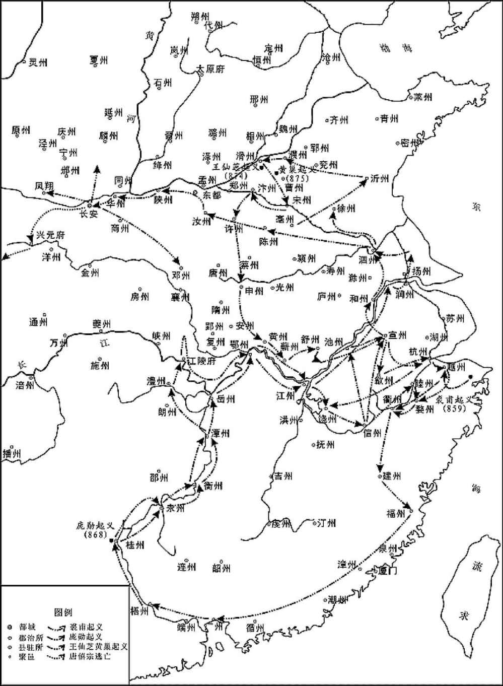 
唐末农民大起义示意图

## 【原文】

**二年。初，上之为普王也，小马坊使田令孜有宠，及即位，使知枢密，遂擢为中尉[1]。上时年十四，专事游戏，政事一委令孜，呼为“阿父”。令孜颇读书，多巧数，招权纳贿，除官及赐绯紫皆不关白于上[2]。每见，常自备果食两盘，与上相对饮啖，从容良久而退。上与内园小儿狎昵，赏赐乐工、伎儿，所费动以万计，府藏空竭[3]。令孜说上籍两市商旅宝货悉输内库，有陈诉者付京兆杖杀之，宰相以下，钳口莫敢言[4]。**

## 【注文】

[1]小马坊使：唐代内府诸司之一，掌饲养本坊御马等事，由宦官担任。唐懿宗李漼咸通年间，宦官田令孜曾任此职。　　田令孜（？—893年）：唐朝宦官，字仲则，本姓陈，蜀（今四川）人。唐懿宗咸通年间，入内侍省为宦官，任小马坊使。后唐僖宗李儇提升他至左神策军中尉、左监门卫大将军。他恃宠横暴，把持朝政。在黄巢率军进逼长安时，挟持僖宗逃往四川。最终被养子永平节度使王建杀死。　　知：主管。　　枢密：即枢密使，官名，始置于唐中期，以宦官充任。唐后期，担任枢密使的宦官逐渐侵夺宰相权力，直接指挥公事，干预朝政，以至参与废立皇帝，权倾一时。五代时改由士人充任，后又逐渐被武臣所掌握，办事机构也日益完善。但到了宋代，逐渐转为以文官担任，职权范围逐步缩小。　　中尉：即神策军中尉，唐德宗李适（kuò）贞元十二年（796年）置，有左、右二员，由宦官充任，掌管禁军。神策军中尉的设置使宦官的权力进一步扩大，成为唐末宦官专权的军事保证。

[2]除官：授予官职。　　绯（fēi）紫：指红色和紫色官服，为古时高官的服饰。

[3]内园小儿：唐代禁苑中供使唤的杂役。　　狎（xiá）昵（nì）：指过于亲近而态度不庄重。　　乐工：指歌舞演奏艺人。　　伎儿：指歌舞艺人。

[4]说（shuì）：劝说、说服。　　两市：唐代都城长安城中东市、西市的合称。东市靠近三大内（西内太极宫、东内大明宫、南内兴庆宫），周围坊里多为皇室贵族和达官显贵宅第，而西市则距三内较远，周围多平民百姓住宅。据中国社会科学院（原中国科学院）考古研究所西安唐城工作队1959至1962年对两市遗址的勘察与实测，东市遗址范围在今陕西西安碑林区咸宁路以南，西安铁路局以北，安东街以东，西安交通大学以西；西市遗址在今陕西西安莲湖区中国航空器材公司西北分公司以南，东桃园桥以北，东桃园以东，糜家桥以西的范围。唐政府对长安城市场实行严格的定时贸易与夜禁制度，两市大门早晚随唐长安城城门、街门和坊门共同启闭，并设有门吏专管。　　内库：唐朝皇宫的府库。　　京兆：府名。唐玄宗开元元年（713年）改雍州置，治所设在长安、万年二县（今陕西西安），辖境相当于今陕西秦岭以北、铜川以南，武功、乾县以东，蒲城、渭南以西地区。　　杖杀：唐朝一种用重杖击打并处死罪犯的行刑方式。　　宰相：中国古代最高行政长官的通称。

## 【译文】

唐僖宗乾符二年（875年）。之前，唐僖宗李儇为普王时，负责养马的小马坊使田令孜很受他的宠信。等到李儇登基当上皇帝后，便任命田令孜为主管机要的枢密使，进而又提拔为掌管禁军的神策军中尉。当时唐僖宗李儇仅十四岁，喜好游戏玩乐，国家政事一概委托田令孜办理，并尊称其为“阿父”。田令孜很喜好读书，聪明伶俐，鬼点子很多，他独揽大权，收受贿赂，封官拜爵和赏赐高官厚禄都不向唐僖宗禀报。每次面见唐僖宗，他总是自备两盘点心，与皇帝对坐吃喝，从容过了好长时间才告退。唐僖宗和宫内杂役亲热戏耍，赏赐奏乐、歌舞艺人所用经费，动辄数以万计，以致宫内府库空竭。田令孜就怂恿唐僖宗将长安城东、西两市商贩的货物全部没收归入内库，凡敢陈诉的就交给京兆府以乱棍打死。自宰相以下的满朝文武大臣都闭口吞声，不敢说话。

## 【原文】

**夏六月，王仙芝及其党尚君长攻陷濮州、曹州，众至数万[1]。天平节度使薛崇出兵击之，为仙芝所败[2]。**

## 【注文】

[1]尚君长（？—878年）：唐末起义军将领，籍贯字号均不详。唐僖宗李儇乾符元年（874年），与王仙芝一同起兵于长垣（今河南长垣东北）。次年，跟随王仙芝攻占濮州（治今山东鄄城北）、曹州（治今山东曹县西北）。后又跟随王仙芝转战山东、河南等地区。不久，为唐军所杀。　　曹州：州名。北周武帝宇文邕改西兖州置，治所设在左城县（隋改为济阴县，今山东曹县西北）。隋炀帝大业、唐玄宗天宝、唐肃宗至德年间一度改为济阴郡，后复为曹州。唐时辖境大致相当于今山东菏泽、曹县、成武、东明及河南兰考、民权等地。

[2]天平：唐后期藩镇之一。唐宪宗元和十四年（819年），唐军平定淄青节度使李师道后，从淄青节度所领州中分出曹州、郓州、濮州，置郓曹濮节度使。次年，赐号为天平军节度使，治所设在郓州（治今山东东平西北），领郓州、曹州（治今山东曹县西北）、濮州（治今山东鄄城北）。唐懿宗咸通年间曾一度增领齐州（治今山东济南）、棣州（治今山东惠民东南）。唐昭宗乾宁四年（897年）为朱全忠所并，仍置天平军节度使。　　节度使：官名，唐代开始设立的地方军政长官，意为节制调度，因受职之时朝廷赐以旌（jīng）节，故称此名。节度使成为固定职衔是从唐睿宗景云二年（711年）四月以贺拔延嗣为凉州都督充河西节度使开始的。至唐玄宗开元、天宝年间，沿边逐渐形成平卢、范阳、河东、朔方、陇右、河西、安西、北庭、剑南、岭南共十个节度使。他们集军、民、财三政于一身，威权颇重，已超过魏晋时期的持节都督。　　薛崇（？—877年）：唐末官吏，唐懿宗咸通八年（867年）任兵部员外郎，咸通十年（869年）任兵部郎中。后又担任天平节度使，参与镇压王仙芝起义。唐僖宗乾符四年（877年）三月，兵败被黄巢杀死。

## 【译文】

唐僖宗乾符二年（875年）夏季六月，王仙芝率领部将尚君长攻占了濮州、曹州等地区，军队扩大至数万人。天平节度使薛崇率兵出击，结果被王仙芝打败。

## 【原文】

**冤句人黄巢亦聚众数千人应仙芝[1]。巢少与仙芝皆以贩私盐为事，巢善骑射，喜任侠，粗涉书传，屡举进士不第，遂为盗，与仙芝攻剽州县，横行山东，民之困于重敛者争归之，数月之间，众至数万[2]。**

## 【注文】

[1]冤句（qú）：地名。在今山东菏泽西南。　　黄巢（？—884年）：唐末农民起义领袖，曹州冤句（今山东菏泽西南）人，盐贩出身。唐僖宗乾符元年（874年）王仙芝起义，翌年黄巢起兵响应。乾符五年（878年）王仙芝败死于湖北，他被推举为“冲天太保均平大将军”，率众攻取江、浙、闽、粤等地，并于广明元年（880年）北上攻陷洛阳（今河南洛阳）、长安，自号为帝，国号大齐。黄巢攻克长安之后，未能乘胜追击，消灭唐王朝的残余势力，又缺乏相应的经济政策，最后被唐军反攻打败，自杀。

[2]私盐：指违反政府有关禁令而私自生产、运输、销售的食盐。私盐的产生和泛滥与古代政府的食盐专卖政策关系密切。　　进士：创立于隋朝。中国古代科举制度中，通过最后一级中央朝廷考试者，称为进士，是古代科举殿试及第者之称，意为可以进授爵位之人。殿试是中国古代科举中最高级别的考试，录取分为三甲：一甲三名，赐“进士及第”的称号，第一名称状元，第二名称榜眼，第三名称探花；二甲若干名，赐“进士出身”的称号；三甲若干名，赐“同进士出身”的称号。　　山东：地区名。古代通称崤山（今河南洛宁西北）以东的河南、河北地区为山东。

## 【译文】

冤句人黄巢聚集了数千人响应王仙芝。黄巢年轻时与王仙芝都以贩卖私盐为生计。黄巢善于骑马射箭，性格侠义，粗略涉读经书史传，多次参加进士考试都没有考中，于是就做了强盗，与王仙芝攻掠州、县，在崤山以东一带横行。饱受官府重征暴敛之苦的百姓都争先恐后地投奔他。几个月时间，起义军便达到了数万人。

## 【原文】

**群盗侵淫，剽掠十余州，至于淮南，多者千余人，少者数百人[1]。诏淮南、忠武、宣武、义成、天平五军节度使、监军亟加讨捕及招怀[2]。十二月，王仙芝寇沂州，平卢节度使宋威表请以步骑五千别为一使，兼帅本道兵所在讨贼[3]。乃以威为诸道行营招讨草贼使，仍给禁兵三千，甲骑五百[4]。因诏河南方镇所遣讨贼都头并取威处分[5]。**

## 【注文】

[1]侵淫：亦作“浸淫”，逐渐扩展。

[2]诏：皇帝布告天下臣民的文书。唐代，诏书一般由中书省起草，门下省审核颁行，尚书省执行。　　淮南：唐方镇名。唐肃宗至德元年（756年）置，治所设在扬州（今江苏扬州）。辖境屡有变动，长期管辖的有扬州、楚州（治今江苏淮安）、滁州（治今安徽滁州）、和州（治今安徽和县）、寿州（治今安徽寿县）、庐州（治今安徽合肥）、舒州（治今安徽潜山），辖境大致相当于今江苏、安徽两地区长江以北，淮河以南地区的大部分。唐昭宗景福元年（892年）为杨行密占据。　　忠武：唐方镇名。唐德宗贞元十年（794年）以陈许节镇为忠武军，治所设在许州（今河南许昌）。唐昭宗龙纪元年（889年）治所迁移到陈州（今河南淮阳）。　　宣武：唐方镇名。唐德宗建中二年（781年）置，治所设在宋州（今河南商丘南）。唐德宗兴元元年（784年）治所迁至汴州（今河南开封）。辖境屡有变动，主要管辖的地区大致包括汴、宋（治今河南商丘）、亳（治今安徽亳州）、颖（治今安徽阜阳）等四州，大致相当于今河南开封、封丘、尉氏、沈丘以东，山东单县及安徽颍上、阜阳、蒙城、涡阳、亳州、砀（dàng）山等地。　　义成：唐方镇名。唐德宗贞元元年（785年）以永平军改名，治所设在滑州（今河南滑县东）。唐僖宗光启二年（886年）更名为宣义军。　　监军：也称监军事、督军。秦汉时为临时委任的皇帝使者，负责监督出征的将帅，不常置。唐代中期以后成为常设官员，诸方镇及出征军队皆设有此官，多以宦官充任。直到唐昭宗天复三年（903年），朱温尽杀宦官，唐代宦官监军制度告终，至此监军制度亦走向衰落。　　亟（jí）：急切。

[3]沂（yí）州：州名。北周改北徐州置，治所在即丘县（今山东临沂西）。隋初移治临沂县（今山东临沂），辖境大致相当于今山东沂河本支流域及沂水、新泰等地。隋炀帝大业初年、唐玄宗天宝年间曾一度改称琅邪郡。唐肃宗乾元元年（758年）复称沂州。　　平卢：唐方镇名。唐玄宗开元七年（719年）置，治所设在营州（今辽宁朝阳），唐肃宗上元元年（760年）治所迁移至青州（今山东青州）。辖境大致在今济南、淄博到威海的山东东部、中部一带。唐德宗贞元四年（788年）治所又迁移至郓州（今山东东平西北）。唐宪宗元和十四年（819年）治所迁回青州。　　宋威（？—878年）：唐朝大臣，唐僖宗时为平卢节度使。乾符二年（875年）为诸道行营招讨草贼使，指挥河南诸镇兵马，镇压王仙芝、黄巢起义军。乾符四年（877年）劫持向宦官杨复光投降的黄巢部将尚君长，冒称获俘。次年，以年老久病，罢招讨使，返回青州，不久去世。　　表：古代的一种特殊文体，为大臣写给君主的呈文。

[4]诸道行营招讨草贼使：官名。招讨使置于唐德宗贞元年间，为战时权置军事长官，掌管镇压暴乱和招降伐叛事务，其下有副使等。任命时多冠以某某道名或战争方位名。　　甲骑：身披铠甲的骑兵。

[5]方镇：又称“道”，唐代凌驾于州县之上的地方行政机关，是依山川形势而划分的监察区域。唐太宗贞观年间分全国为十道，唐玄宗李隆基时分天下为十五道，至唐代后期，全国已被划分成四十余道。各道设采访处置使，最初并无地方实权，类似于汉代的刺史。安史之乱后，地方割据兴起，方镇（道）成为事实上的地方行政机构。

## 【译文】

群盗的势力逐渐扩大，劫掠了十多个州，到达淮南地区时，每伙强盗多者一千余人，少者几百人。朝廷于是下诏命令淮南、忠武、宣武、义成、天平五军节度使、监军加紧讨伐追捕，而且进行招降与安抚。乾符二年（875年）十二月，王仙芝率领军队进攻沂州。平卢节度使宋威上表申请拨给他五千名步兵、骑兵，另给自己一个招讨使名义，兼带本道兵前往镇压。朝廷于是任命宋威为诸道行营招讨草贼使，配给三千禁军、五百骑兵，统一归宋威指挥。于是诏告河南方镇所派的讨贼都头一并接受宋威的调遣。

## 【原文】

**三年春二月，敕福建、江西、湖南诸道观察、刺史皆训练士卒；又令天下乡村各置刀弓鼓板以备群盗[1]。三月，以左仆射王铎兼门下侍郎、同平章事[2]。**

## 【注文】

[1]福建：即福建道。唐肃宗上元元年（760年）置，治所设在福州（今福建福州）。唐代宗大历六年（771年）废，置都团练观察处置使，管辖福州、建州、泉州、漳州、汀州等五州的二十四县，辖境约今福建大部分地区。　　江西：即唐代江南西道。唐玄宗开元二十一年（733年）分江南道中部置，治所设在洪州（今江西南昌）。辖境相当于今江西、湖南两省大部和皖南、粤北、鄂东南的部分地区。安史之乱后，湖北南部设鄂岳道，湖南设湖南观察使，江南西道只剩今江西地区。　　湖南：即湖南道。唐代宗广德二年（764年）设置湖南观察使，治所设在衡州（今湖南衡阳）。大历四年（769年）治所移至潭州（今湖南长沙），辖境约今湖南长沙以南和广东连江流域地区。唐僖宗中和三年（883年）改为钦化军节度，光启元年（885年）改为武安军节度。仍通称湖南。　　观察：即观察使。唐代后期出现的地方军政长官，全称为观察处置使。唐前期常由中央不定期派出使者监察州县。唐中宗神龙二年（706年）置十道巡察使。唐睿宗景云二年（711年）置十道按察使。唐玄宗开元二十一年（733年）改置十五道采访处置使（简称采访使），职如汉代刺史，察访地方官政绩。唐肃宗乾元元年（758年）采访处置使改名为观察处置使。观察处置使负责考核州、县官吏政绩，还兼理民事，辖一道或数州。观察使无旌节，地位低于节度使，它的僚属将校略少于节度使。　　刺史：官名，又称郡守、太守，州郡最高行政长官。始置于汉代，本为中央临时派到地方的监察官员。后来，随着职权的进一步扩大，逐渐变成地方常设的行政军事长官。　　鼓板：战鼓及盾牌。

[2]左仆射（yè）：官名，亦称尚书左仆射。东汉末置，为尚书台副长官，位在右仆射之上，辅佐尚书令处理政务。如尚书令缺，则代掌尚书省事务。隋文帝时，尚书左仆射为朝廷首相。唐初，大抵继承隋文帝时制度，尚书省置仆射总领政务，与中书令、侍中同掌相权。房玄龄为左仆射前后达二十年，号称贤相。唐中宗、睿宗以后，仆射被逐渐排除于宰相行列之外。唐代后期常以仆射为节度、观察等使的加官，用以表示其品秩的高下。此时仆射成为虚职，不但不是宰相，连尚书省本省事务也不过问。　　王铎（？—884年）：字昭范，太原（今山西太原西南）人。唐武宗李炎会昌年间进士。唐懿宗李漼时任中书舍人、礼部侍郎。唐懿宗咸通十二年（871年），由礼部尚书进同中书门下平章事，后出为宣武节度使。唐僖宗乾符二年（875年），复任宰相并自请督军镇压北上的黄巢起义军，担任荆南节度使，诸道行营都统，镇守江陵。中和四年（884年），任义昌节度使，赴任路上被魏博节度使乐彦祯之子乐从训所杀。　　门下侍郎：官名。秦、汉有黄门侍郎，与侍中俱管门下众事，为帝王近侍。南北朝时地位逐渐提高，参与朝廷大政。唐玄宗天宝元年（742年），改称门下侍郎，为门下省的副长官，正三品。

## 【译文】

唐僖宗乾符三年（876年）春季二月，唐僖宗下诏命令福建、江西、湖南诸道观察、刺史训练本道士卒；同时又命令全国各地乡村自备刀、弓、鼓、盾，以防备群盗。三月，任命左仆射王铎兼任门下侍郎、同平章事。

## 【原文】

**秋七月，宋威击王仙芝于沂州城下，大破之，仙芝亡去。威奏仙芝已死，纵遣诸道兵，身还青州[1]。百官皆入贺。居三日，州县奏仙芝尚在，攻剽如故。时兵始休，诏复发之，士皆忿怨思乱。八月，仙芝陷阳翟、郏城，诏忠武节度使崔安潜发兵击之[2]。安潜，慎由之弟也[3]。又命昭义节度使曹翔将步骑五千及义成兵卫东都宫，以左散骑常侍曾元裕为招讨副使，守东都[4]。又诏山南东道节度使李福选步骑二千守汝、邓要路[5]。仙芝进逼汝州，诏邠宁节度使李侃、凤翔节度使令狐绹选步兵一千、骑兵五百守陕州、潼关[6]。九月丙子，王仙芝陷汝州，执刺史王镣[7]。镣，铎之从父兄弟也[8]。东都大震，士民挈家逃出城。乙酉，敕赦王仙芝、尚君长罪，除官以招谕之。仙芝陷阳武，攻郑州，昭义监军判官雷殷符屯中牟，击仙芝，破走之[9]。**

## 【注文】

[1]青州：州名。西汉武帝刘彻所置十三刺史部之一。东晋时治所设在东阳城（今山东青州）。隋炀帝大业、唐玄宗天宝年间一度改称北海郡。唐肃宗乾元元年（758年）复称青州，辖境相当于今山东潍坊、博兴、广饶、青州、临朐（qú）、昌乐、寿光等地。

[2]阳翟：县名，治所在今河南禹州。　　郏（jiá）城：县名。治所在今河南郏县。　　崔安潜：生卒年不详，字进之，清河武城（今山东武城西）人。唐懿宗咸通年间，担任忠武军节度使。唐僖宗出逃蜀中时，任命他为太子少师。平卢节度使王敬武死后，朝廷又任命他为平卢节度使，加授检校太师兼侍中，但王敬武之子王师范拒绝他入境，他只得返回，被朝廷任命为太子太傅。

[3]慎由：即崔慎由，生卒年不详，字敬止，清河武城（今山东武城西）人。唐文宗太和初年，考中进士。唐宣宗大中年间担任右拾遗、充翰林学士、户部侍郎，后出为湖南观察使。回朝后，又作为刑部侍郎治理浙西。后任户部侍郎，不久升任工部尚书。大中十年（856年），以本官加同中书门下平章事，监修国史，加任太中大夫兼礼部尚书。大中十二年（858年），出为剑南东川节度使。唐懿宗咸通初年，担任华州刺史，后改任河中节度使。

[4]昭义：唐方镇名。唐代宗大历元年（766年）置，治所设在相州（今河南安阳）。大历十二年（777年）与泽潞节度使合为一镇。唐德宗建中元年（780年），治所迁往潞州（今山西长治），辖境有泽（治今山西晋城）、潞（治今山西长治）、磁（治今河北磁县）、邢（治今河北邢台）、洺（治今河北永年东南）五州，大致相当于今河北隆尧、内丘以南，邱县、肥乡、巨鹿以西，邯郸、涉县以北，山西浊潼河、丹河流域和沁水、阳城等地。唐僖宗中和以后因李克用占据泽、潞二州，昭义军便分为二：一个治所设在邢州（今河北邢台），另一个治所设在潞州（今山西长治）。唐昭宗天复初年再度合二为一，治所设在潞州。　　曹翔（？—878年）：唐末官吏，历任福州刺史、昭义节度使、金吾大将军。乾符五年（878年）转任河东节度使，曾率军与沙陀军作战，同年暴卒。　　东都：指洛阳，因其地处古洛水北岸而得名。中国历史上著名的古都之一，先后有东汉、西晋、北魏等十几个朝代建都于此。　　左散骑常侍：官名。汉有散骑，为皇帝侍从，又有中常侍。三国魏文帝曹丕将散骑与中常侍合为一官，称散骑常侍，以士人任职。唐太宗李世民曾以散骑常侍为散官。唐高宗显庆二年（657年），分为左右：左散骑常侍二人，属门下省；右散骑常侍二人，属中书省。职掌同为规谏过失，侍从顾问，并无实权，而为尊贵之官，常常作为将相大臣的加官。　　曾元裕：唐朝将领。生卒年不详。唐僖宗乾符二年（875年）任左散骑常侍充招讨副使，防守东都（今河南洛阳）。乾符五年（878年）在黄梅（今湖北黄梅西北）击破王仙芝，因功任平卢节度使，镇守青州（山东青州）。　　招讨副使：招讨使副职，位在招讨使下。

[5]山南东道：唐方镇名。贞观年间，唐太宗根据地形地势划分军事区域统一部署，共有十道，山南道为其一。唐玄宗开元后，以山南道所部阔远，于是分山南道为山南东、西二道，其中，山南东道治所设在襄州（今湖北襄阳），辖境相当于今湖北长江以北、河南西南部及重庆东部的万州地区。　　李福：字能之，陇西（今甘肃陇西）人，生卒年不详。唐文宗大和七年（833年）进士，累迁尚书郎，出为商、郑、汝、颍四州刺史。唐宣宗大中时，担任检校工部尚书、滑州刺史、兼御史大夫，充义成军节度、郑滑颍观察使。后入为刑部侍郎，累迁刑部、户部尚书。唐僖宗乾符初年，以检校右仆射、襄州刺史、兼御史大夫充山南东道节度。参与镇压王仙芝、黄巢起义，因功升任检校司空、同平章事，终于太子太傅。　　汝：即汝州。隋炀帝大业二年（606年）改伊州置，治所设在承休县（今河南临汝），次年改置襄城郡。唐高祖李渊武德四年（621年）复置伊州，唐太宗贞观八年（634年）复名汝州，治所设在梁县（今河南临汝）。　　邓：即邓州，隋文帝开皇七年（587年）改荆州置，治所设在穰县（今河南邓州）。隋炀帝大业初年改置南阳郡。唐高祖武德初年复置邓州。

[6]邠（bīn）宁：唐方镇名。唐肃宗乾元二年（759年）置，治所设在邠州（今陕西彬州）。辖境屡有变动，长期领辖有邠、宁（治今甘肃宁县）、庆（治今甘肃庆城）三州，大致相当于今甘肃东部的环江、马连河流域以东及陕西彬州、永寿、旬邑、长武等地。唐僖宗光启元年（885年）号静难军。后为朱玫、王行瑜等割据。唐昭宗乾宁后为李茂贞占据。　　李侃：唐末将领，生卒年不详。曾任邠宁节度使，参与镇压黄巢起义。　　凤翔：唐方镇名。唐肃宗上元元年（760年）置，治所设在凤翔府（今陕西凤翔），统领凤翔府、陇州（治今陕西陇县东南），唐宣宗大中年间曾一度增领秦州（治今甘肃秦安西北）。辖境大致相当于今陕西宝鸡、岐山、凤翔、麟游、扶风、眉县、周至等地。因地处关中西部，东接京畿，南通巴蜀，西连甘青，素为兵家必争之地，战略地位十分重要。　　令狐绹（795—872年）：唐朝京兆华原（今陕西耀州东南）人，字子直。唐文宗大和四年（830年）中进士，初入仕途任弘文馆校书郎。开成年间，为左拾遗，累官至户部员外郎。唐宣宗时，官至宰相。唐懿宗时，历任河中、宣武、淮南等道节度使。后召入知制诰，辅政十年，拜司空、检校司徒，封凉国公。咸通九年（868年），庞勋起义军攻占徐州（今江苏徐州），令狐绹受命为徐州南面招讨使，但屡被庞勋打败。僖宗时被任命为凤翔（今陕西凤翔）节度使，后又召为太子太保，徙封赵。卒于封地。　　陕州：州名。北魏孝文帝太和十一年（487年）置，治所设在陕县（今河南三门峡西）。辖境相当于今河南三门峡、陕县、洛宁、渑池、灵宝等地以及山西平陆、芮城、运城东北部地区，以后辖境逐渐缩小。隋炀帝大业年间废置，唐高祖武德元年（618年）复置，唐玄宗天宝元年（742年）改为陕郡，唐肃宗乾元元年（758年）复为陕州，后升为节度使。　　潼关：位于今陕西潼关东北黄河南岸。因地处黄河渡口，位居晋、陕、豫三省要冲，扼长安至洛阳驿道的要冲，是进出三秦的锁钥，所以成为汉末以来东入中原、西出关中的必经之地及关防要隘，历来为兵家必争之地。

[7]王镣：字德耀，生卒年不详，祖籍太原（今山西太原），后迁扬州（今江苏扬州）。唐懿宗、僖宗朝宰相王铎的堂弟。富有词学，于唐懿宗咸通中进士及第，累官主客员外郎。僖宗乾符二年（875年）迁左司郎中、汝州刺史。次年，王仙芝攻破汝州城，被俘，贬为韶州司马。官终太子宾客。

[8]从父兄弟：即叔伯堂兄弟。从父首先表示一种关系，表示具有同一祖父的关系，后加“兄弟”等词来描述自己与另一人的辈分距离。

[9]阳武：县名，郑州所属县，治今河南原阳。　　郑州：州名。隋文帝开皇元年（581年）改荥州置，治所在成皋县（今河南荥阳西北）。唐太宗贞观七年（633年）治所迁至管城县（今河南郑州）。唐玄宗天宝初年改为荥阳郡，唐肃宗乾元初复置郑州。　　判官：官名。唐朝节度、观察、防御、团练等使属官。唐制，特派担任临时职务的大臣可自选中级官员奏请充任判官，以辅佐政务。判官位在行军司马之下，分判仓、兵、骑、胄（zhòu）四曹事务。　　雷殷符：生卒年不详，唐末官吏，曾任昭义监军判官，参与镇压王仙芝、黄巢起义。曾在中牟打败王仙芝，挫败了王仙芝继续北上、攻打东都洛阳的计划。　　中牟（móu）：县名。西汉置，治所在今河南中牟东。北魏太武帝太平真君八年（447年）省，北魏宣武帝景明初年复置。北周武帝保定五年（565年）移治圃田城（今河南中牟西）。隋文帝开皇初年更名内牟，开皇十八年（598年）改名圃田县。唐高祖武德三年（620年）复名中牟县。

## 【译文】

唐僖宗乾符三年（876年）秋季七月，宋威在沂州城下攻击王仙芝，大破起义军，王仙芝逃跑。宋威上奏朝廷称王仙芝已死，请求遣散各路军马，自己也返回青州。百官都入朝向唐僖宗李儇祝贺。过了三天，地方州县上奏说王仙芝还活着，并且和以前一样攻掠他们。当时，诸道军队刚刚休整，又得到重新征发的诏令，士卒心怀怨恨，甚至有了作乱的念头。八月，王仙芝攻陷阳翟、郏城。唐僖宗下诏命令忠武节度使崔安潜发兵讨伐，崔安潜是崔慎由的弟弟。又命令昭义节度使曹翔率领五千名步兵、骑兵及义成兵保卫东都洛阳。任命左散骑常侍曾元裕为招讨副使，戍守东都。又下诏命令山南东道节度使李福挑选两千名步兵、骑兵扼守汝州、邓州等要道。此时，王仙芝军队进逼汝州，朝廷命令邠宁节度使李侃、凤翔节度使令狐绹挑选一千名步兵、五百名骑兵镇守陕州、潼关。九月丙子（初二日），王仙芝攻陷汝州，活捉刺史王镣。王镣是王铎的叔伯兄弟。消息传来，东都洛阳内外震动，士兵与百姓都带领家眷逃出城外。乙酉（十二日），唐僖宗下诏赦免王仙芝、尚君长，并给二人授职拜官，企图招降他们。王仙芝攻陷阳武，又转攻郑州，昭义监军判官雷殷符屯兵中牟，抵御王仙芝，王仙芝兵败而逃。

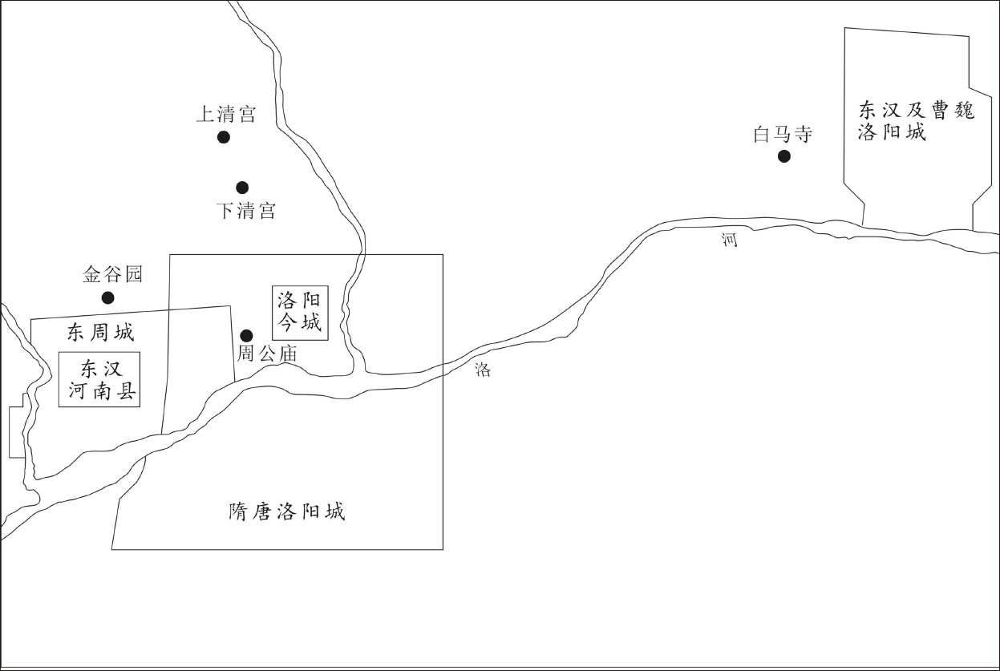 
洛阳城历代变迁示意图

## 【原文】

**冬十月，仙芝南攻唐、邓[1]。十一月，王仙芝攻郢、复二州，陷之[2]。十二月，王仙芝攻申、光、庐、寿、舒、通等州[3]。淮南节度使刘邺奏求益兵，敕感化节度使薛能选精兵数千助之[4]。**

## 【注文】

[1]唐：即唐州。唐高祖武德五年（622年）改显州置，治所在比阳县（今河南泌阳）。唐玄宗天宝初改为淮安郡，唐肃宗乾元初复名唐州。唐哀帝天祐三年（906年）移治泌阳县（今河南唐河），后改名泌州。

[2]郢：即郢州。西魏文帝大统十七年（551年）置，治所在长寿县（今湖北钟祥）。北周改为石城郡，隋文帝开皇初复称郢州。隋炀帝大业初改为竟陵郡，唐高祖武德四年（621年）复为郢州。唐太宗贞观初废。贞观十七年（643年）又复置。唐玄宗天宝元年（742年）改为富水郡，唐肃宗乾元元年（758年）复名郢州。唐时辖境大致相当于今湖北钟祥、京山两地。　　复：即复州。北周武帝宇文邕置，治所设在建兴县（隋改为沔阳县，在今湖北仙桃西南）。隋炀帝大业初年改为沔阳郡。唐高祖武德五年（622年）改为复州，治所在竟陵县（今湖北天门）。唐太宗贞观七年（633年）又移治沔阳县。唐玄宗天宝元年（742年）改为竟陵郡。唐肃宗乾元元年（758年）改为复州。唐敬宗宝历二年（826年）移治竟陵县。辖境相当于今湖北仙桃、天门、监利、洪湖等地。

[3]申：即申州。北周改郢州置，治所设在义阳郡（今河南信阳）。隋炀帝大业二年（606年）改名义州。唐复名申州。唐玄宗天宝元年（742年）一度改为义阳郡，唐肃宗乾元元年（758年）又复为申州。　　光：即光州。隋文帝开皇年间置，治所设在光城县（今河南光山）。唐睿宗太极元年（712年），治所迁至定城县（今河南潢川）。辖境大致包括今河南潢川、光山、固始、息县、商城、新县、淮滨等地。　　庐：即庐州。隋文帝开皇三年（583年）改合州置，治所在合肥县（今安徽合肥西）。辖境相当于今安徽合肥、六（lù）安、霍山、庐江、巢湖等地。隋炀帝大业三年（607年）改为庐江郡。唐高祖武德三年（620年）复为庐州，治所移至今安徽合肥，属淮南道。　　寿：即寿州。唐高祖武德三年（620年）改淮南郡置，治所设在寿春（今安徽寿县）。唐玄宗天宝元年（742年）复称淮南郡。唐肃宗乾元初复名寿州，隶属于淮南节度使。唐昭宗天复二年（902年），封淮南节度使杨行密为吴王，寿州为吴国地。　　舒：即舒州。唐高祖武德四年（621年）改同安郡置，治所设在怀宁县（今安徽潜山），辖境相当今安徽天柱山、三官山以南，长江以北地区。唐玄宗天宝元年（742年）复为同安郡，唐肃宗至德二载（757年）又改盛唐郡，唐肃宗乾元元年（758年）复为舒州。　　通：即通州。经查阅史书，淮南道无通州，据胡三省考证，此“通州”当为“蕲州”之误。蕲州，北周以罗州改置，治所在齐昌县（隋改蕲春县，今湖北蕲春北）。唐辖境相当今湖北长江以北，巴河以东地区。

[4]刘邺（？—880年）：字汉藩，润州句容（今江苏句容）人。唐懿宗、僖宗朝宰相。进士出身。唐宣宗大中十四年（860年），擢左拾遗，召为翰林学士。唐懿宗咸通十一年（870年），充翰林学士承旨，旋为户部侍郎充诸道盐铁转运使，改兵部侍郎。次年拜相，任礼部尚书、同中书门下平章事。唐僖宗乾符元年（874年）免相，任使相节度淮南。后被黄巢军杀死。　　感化：唐方镇名。唐德宗建中三年（782年）置徐海沂密都团练观察使。唐德宗贞元四年（788年）置徐泗濠节度使，治所设在徐州（今江苏徐州）。贞元后时废时置，称号屡变。唐顺宗永贞元年（805年）置武宁军节度使，领徐、泗（治今江苏泗洪东南）、濠（治今安徽凤阳东北）、宿（治今安徽宿州）四州，辖境大致相当于今安徽池河、江苏淮河以北，即江苏丰县，山东滕州、郯城以南，安徽濉溪、怀远以东地区。唐懿宗咸通十年（869年）复置徐泗观察使，次年更号为感化军节度使。唐僖宗中和初年，为时溥所据。唐昭宗李晔景福初年，为朱温所并。唐昭宗天复二年（902年）罢。　　薛能（约817—880年）：字太拙，汾州（治今山西汾阳）人。晚唐著名诗人。唐武宗会昌六年（846年）进士。曾任滑州观察判官。唐懿宗咸通年间，代理嘉州刺史，又先后担任度支、刑部郎中、同州刺史、京兆尹等职。咸通十二年（871年），出任感化军节度使。他一生仕宦他乡，游历众多地方，诗多寄送赠答、游历登临之作。晚唐一些著名诗人多有诗与其唱和。

## 【译文】

唐僖宗乾符三年（876年）冬季十月，王仙芝向南进攻唐州、邓州。十一月，王仙芝攻克了郢州、复州。十二月，王仙芝进攻申州、光州、庐州、寿州、舒州、蕲州等地。淮南节度使刘邺上奏朝廷请求增兵救援，唐僖宗敕令感化节度使薛能率领数千精兵前往援助。

## 【原文】

**郑畋以言计不行，称疾逊位，不许；乃上言：“自沂州奏捷之后，仙芝愈肆猖狂，屠陷五六州，疮痍数千里[1]。宋威衰老多病，自妄奏以来，诸道尤所不服，今淹留亳州，殊无进讨之意[2]。曾元裕拥兵蕲、黄，专欲望风退缩[3]。若使贼陷扬州，则江南亦非国有[4]。崔安潜威望过人，张自勉骁雄良将，宫苑使李瑑西平王晟之孙，严而有勇[5]。请以安潜为行营都统，瑑为招讨使代威，自勉为副使代元裕[6]。”上颇采其言。招讨副使、都监杨复光奏尚君长弟让据查牙山，官军退保邓州[7]。**

## 【注文】

[1]逊位：让位，退位。　　沂州奏捷：指宋威上奏朝廷击破王仙芝于沂州城下一事。　　疮痍：战争给地方所造成的创伤。

[2]妄奏：指宋威假报王仙芝已死之事。　　亳（bó）州：州名，为宣武军所领州。治今安徽亳州，唐时辖境相当今安徽亳州、蒙城、涡阳及河南永城、鹿邑等地。

[3]黄：即黄州。隋文帝开皇五年（585年）改衡州置，治所在南安县（后改黄冈县，在今湖北武汉）。隋炀帝大业初改为永安郡。唐高祖武德初复为黄州，唐玄宗天宝初改为齐安郡，唐肃宗乾元初复为黄州。辖境大致相当于今湖北武汉、黄冈、大悟等地区。唐僖宗中和五年（885年）治所迁至黄冈县（今湖北黄冈）。

[4]扬州：州名。隋文帝开皇九年（589年）改吴州置，治所在江都县（今江苏扬州）。隋炀帝大业初改为江都郡。唐高祖武德九年（626年）改邗（hán）州为扬州。唐玄宗天宝元年（742年）改为广陵郡。唐肃宗乾元元年（758年）复为扬州。辖境相当于今江苏六合以北以东，高邮湖、兴化以南，长江以北地区及安徽天长等地。

[5]张自勉（830—902年）：字敏文。曾任左威卫上将军、东南面行营招讨使、颍州刺史等。唐僖宗乾符四年（877年），王仙芝、黄巢进攻宋州，张自勉率领忠武兵救援宋州。此后，多次受命镇压王仙芝、黄巢领导的起义军。　　宫苑使：官名。唐代始置，掌京城宫苑囿园土地。多由宦官担任此职。　　李瑑（zhuàn）：生卒年不详。西平王李晟孙子，曾担任宫苑使、招讨使。　　西平王晟（shèng）：即李晟（727—793年），唐代名将。字良器，洮州临潭（今甘肃临潭）人。勇武有才，善于骑射。初为边镇裨将，因功升至右神策军都将。唐德宗时讨平朱泚叛乱，收复长安，因功担任凤翔、陇右、泾原三镇节度使，兼行营副元帅，封西平郡王。唐德宗贞元三年（787年），册封为太尉、中书令，不久罢兵权。贞元九年（793年），病逝，被追赠为太师，谥号“忠武”。

[6]行营都统：官名。唐后期为讨伐藩镇和镇压农民暴动，设诸道行营都统，为各道出征兵的统帅。

[7]都监：官名。唐朝中期以后，出兵作战常以宦官为监军，因督察多路兵马，故称“都监”。　　杨复光（843—883年）：本姓乔，唐末闽州（治今福建福州）人。因自幼被宦官杨玄价收养，而改姓杨。唐末农民起义爆发后，历任唐将曾元裕、宋威、王铎的监军，曾诱降王仙芝。黄巢攻入长安（今陕西西安）后，唐忠武节度使周岌投降，他劝周岌复归唐朝，并袭杀黄巢使者。后又并蔡州割据者秦宗权部分军队，将他们分为八都，并任天下兵马都监。黄巢大将朱温驻守同州（治今陕西大荔），他遣使招降，又引沙陀李克用军自太原进攻关中，迫使黄巢军撤离长安，因功加开府仪同三司、同华制置使，封弘农郡公，赐号“资忠辉武匡国平难功臣”。唐僖宗中和三年（883年）六月，突然得病，不久去世。死后赠“观军容使”，谥“忠肃”。　　让：即尚让（？—884年），尚君长之弟，唐末农民战争领导人之一，生卒年不详。先随王仙芝起义，后投黄巢。唐僖宗广明元年（880年），任大齐政权太尉中书令。后随黄巢撤出长安，驻守太康（今河南太康）。黄巢军败，尚让降于唐将时溥。也有学者认为他与黄巢同时战死。　　查牙山：又作“嵖岈山”，在今河南遂平西。

## 【译文】

郑畋因自己的计策不被朝廷采纳，于是借口患病而要求去职逊位，但未获批准；于是又向唐僖宗李儇上奏：“自从宋威在沂州妄自报捷以后，王仙芝越发放肆猖狂，攻陷了五六个州，数千里国土满目疮痍。宋威年老多病，自从失实妄奏以来，诸道对他更为不服，现在他久留亳州，根本没有进兵讨伐的计划。曾元裕拥兵于蕲州、黄州一带，一心观望形势退缩不前。如果让贼兵攻陷了扬州，那么整个江南地区就不再为国家所管辖了。臣认为崔安潜威望过人，张自勉是一名骁勇的良将，宫苑使李瑑是西平王李晟的孙子，既威严又勇敢。请陛下任命崔安潜为行营都统，李璩为招讨使代替宋威，张自勉为副使代替曾元裕。”唐僖宗采纳了郑畋的建议。招讨副使、都监杨复光上奏朝廷，报尚君长的弟弟尚让占据查牙山，唐官军退保邓州。

## 【原文】

**王仙芝攻蕲州。蕲州刺史裴渥，王铎知举时所擢进士也[1]。王镣在贼中，为仙芝以书说渥[2]。渥与仙芝约，敛兵不战，许为之奏官，镣亦说仙芝，许以如约。渥乃开城延仙芝及黄巢辈三十余人入城，置酒，大陈货贿以赠之，表陈其状。诸宰相多言：“先帝不赦庞勋，期年卒诛之。今仙芝小贼，非庞勋之比，赦罪除官，益长奸宄[3]。”王铎固请，许之，乃以仙芝为左神策军押牙兼监察御史，遣中使以告身即蕲州授之[4]。仙芝得之甚喜，镣、渥皆贺。未退，黄巢以官不及已，大怒曰：“始者共立大誓，横行天下，今独取官赴左军，使此五千余众安所归乎[5]！”因殴仙芝，伤首，其众喧噪不已。仙芝畏众怒，遂不受命，大掠蕲州，城中之人，半驱半杀，焚其庐舍。渥奔鄂州，敕使奔襄州，镣为贼所拘[6]。贼乃分其军三千余人从仙芝及尚君长，二千余人从巢，各分道而去[7]。**

## 【注文】

[1]裴渥：生卒年不详。唐朝官吏，进士出身。曾任兵部员外郎、蕲州刺史。唐僖宗乾符三年（876年），试图招安王仙芝未果。　　知举：即知贡举，为主管科举考试的官。唐初由考功员外郎担任，唐玄宗李隆基开元年间，以员外郎官职低微，于是改由礼部侍郎担任此职，从此，选拔士人由礼部主持。

[2]贼：唐朝统治者对王仙芝、黄巢等起义军的称呼。

[3]先帝：此指唐僖宗李儇之父唐懿宗李漼。　　庞勋（？—869年）：唐末桂林戍卒起义军领袖。初在戍守桂林的徐州、泗州军中任粮料官。唐懿宗咸通四年（863年），唐朝政府在徐州、泗州募兵戍守桂林（今广西桂林）。原定戍卒三年调换一次，但至咸通九年（868年）已满五年仍未调换。于是戍边士兵发动兵变，庞勋被推举为领袖，经湖南、浙西，入淮南，攻克宿州（今安徽宿州），称兵马留后。之后，北渡濉水，取彭城（今江苏徐州），俘虏唐徐泗观察使崔彦曾等，得到民众的热烈响应，队伍很快发展至二十万人，占有今鲁南、皖北、苏北大片地区。唐朝政府于是任命康承训为都招讨使，并约沙陀朱邪赤心（之后唐赐名为李国昌）协助镇压。最后，庞勋为唐军所败，战死于蕲县（今安徽宿州南）河边。庞勋领导的桂林戍卒赵义揭开了唐末农民大起义的序幕。

[4]左神策军押牙：神策军有左、右二军，为宦官所掌握的禁卫军。押牙也作“押衙”，唐朝掌管仪仗侍卫的官员。所谓“押”就是“掌管”，“牙”就是“牙旗”，可以理解为“掌管牙旗的官员”，引申为“掌管仪仗的侍卫”。牙，后来也作“衙”。　　监察御史：官名。隋文帝开皇二年（582年）改检校御史为监察御史。唐监察御史属察院。品位不高，但权限很广，掌管监察百官、巡视郡县、纠正刑狱、整肃朝仪等事务。　　中使：内诸司使的简称，指由宦官担任的各种使职差遣，如监军使、宣徽使、观军容使、内枢密使、少阳院使等。它是与由朝臣担任的外使相对应而言的。它的数量很多，据《资治通鉴》《旧唐书》《新唐书》《册府元龟》等史籍的不完全统计，就达五十余种。到唐后期，政治重心由部司诸曹转向使职差遣，内诸司使的权力地位大大加强，可出使各地，传达诏命，任免将相，甚至废立皇帝。　　告身：任命官职的文凭，也称委任状。唐末官爵冗滥，有很多空白告身，可以随时填写人名。此处赐给张雄、冯弘铎的告身，即是高骈任诸道都统时朝廷赐给的空白告身。

[5]左军：即左神策军。　　五千余众：王仙芝、黄巢初起义时，数月之间部众达到数万。而此时才五千余人，概因游动作战，聚散无常所致。

[6]鄂州：州名。隋文帝开皇九年（589年）改郢州置，治所设在江夏县（今湖北武汉）。隋炀帝大业、唐玄宗天宝初年一度改为江夏郡。唐肃宗乾元元年（758年）后复为鄂州。辖境相当于今湖北武汉、嘉鱼、黄石、长江以南以东以西地区。　　敕使：即皇帝派出的使者。　　襄州：州名。西魏恭帝元年（554年）改雍州置，治所在襄阳县（今湖北襄阳）。隋炀帝大业初改为襄阳郡。唐高祖武德四年（621年）复置襄州，唐辖境相当于今湖北襄阳、谷城、老河口、南漳、宜城等地。唐玄宗天宝元年（742年）又改为襄阳郡，肃宗乾元初复为襄州。

[7]分道而去：从此王仙芝、黄巢分兵作战。王仙芝转战赣、鄂，死于黄梅。黄巢北攻齐、鲁，转向淮南、浙西，进入闽、广。其后回师北上，攻陷东都洛阳，进而又向西进军，攻入长安，随即称帝。

## 【译文】

王仙芝进攻蕲州。蕲州刺史裴渥是王铎主持科举时所选拔的进士。王镣被俘后，在起义军中替王仙芝写信劝说裴渥。于是裴渥与王仙芝约定，双方休兵不战，并答应向朝廷上奏为王仙芝求官。王镣也劝王仙芝答应这个合约。于是裴渥打开城门请王仙芝及黄巢等三十余人进城，并置酒设宴，将大量钱物赠送给王仙芝等人。裴渥上表朝廷陈述这一情况，朝中宰相大多都认为：“先帝唐懿宗都不赦免庞勋，当年就将庞勋铲除。现在王仙芝不过是一小贼，连庞勋之类都不如。如果赦罪授官，只能是更加助长了奸坏小人的气焰。”只有王铎坚持请求招降王仙芝，朝廷最终同意了王铎的建议。于是，任用王仙芝为左神策军押牙兼监察御史，派宦官带着委任状前往蕲州授给王仙芝。王仙芝得到委任状后非常高兴，王镣、裴渥都前来祝贺。还没等王仙芝退出蕲州，黄巢便因朝廷没给自己职位，而勃然大怒，他痛斥王仙芝道：“当初我们共同立下誓言，将来要横行天下，现在你独自接受朝廷的官位，到长安为禁军左军军官，让我们这五千人归于何处？”因而殴打王仙芝，把王仙芝的头打伤了。其部下也吵嚷不休。王仙芝畏惧众怒，于是拒绝了朝廷的任命，在蕲州大肆掠夺，城中百姓一半被赶跑，一半被杀掉，住宅也被烧毁。裴渥逃到鄂州，皇帝派来的使者逃至襄州，王镣被起义军拘押。起义军从此分兵行动，三千多人跟随王仙芝和尚君长，两千多人跟随黄巢北上。

## 【原文】

**四年春二月，王仙芝陷鄂州。黄巢陷郓州，杀节度使薛崇[1]。三月，黄巢陷沂州。夏四月，黄巢与尚让合军保查牙山。**

## 【注文】

[1]郓（yùn）州：州名。隋文帝开皇十年（590年）置，治所设在万安县（后改郓城县，在今山东郓城东），隋炀帝大业初改为东平郡。唐高祖武德初复为郓州，唐太宗贞观八年（634年）治所迁至须昌县（今山东东平西北）。唐玄宗天宝初改为东平郡，唐肃宗乾元初复为郓州。辖境相当于今山东郓城巨野、嘉祥、梁山、东平等地。

## 【译文】

唐僖宗乾符四年（877年）春季二月。王仙芝进攻鄂州。黄巢攻陷郓州，杀死了节度使薛崇。三月，黄巢又攻克了沂州。夏季四月，黄巢与尚让合军保卫查牙山。

## 【原文】

**（六月）［秋七月］庚申，王仙芝、黄巢攻宋州，三道兵与战，不利，贼遂围宋威于宋州[1]。甲寅，左威卫上将军张自勉将忠武兵七千救宋州，杀贼二千余人，贼解围遁去[2]。王铎、卢携欲使张自勉以所将兵受宋威节度，郑畋以为威与自勉已有疑忿，若在麾下，必为所杀，不肯署奏[3]。八月辛未，铎、携诉于上，求罢免；庚辰，畋请归浐川养疾，上皆不许[4]。王仙芝陷安州[5]。**

## 【注文】

[1]宋州：州名。隋文帝开皇十六年（596年）置，治所设在睢阳县（今河南商丘南）。隋炀帝大业初改为梁郡。唐高祖武德初复为宋州，唐玄宗天宝元年（742年）改为睢阳郡，唐肃宗乾元元年（758年）又复为宋州。辖境相当于今河南商丘、柘城、睢县、宁陵、虞城、夏邑以及安徽砀山，山东曹县、单县等地。　　三道兵：指平卢、宣武、忠武三道军队。

[2]甲寅：疑有误。这个时间应该在二十一日之后。　　左威卫上将军：官名，十六卫上将军之一。唐德宗贞元二年（786年）置，为左威卫最高统兵官，从二品，职同左右卫上将军，负责宫禁宿卫。

[3]署奏：在奏章上署名。

[4]浐（chǎn）川：河谷名，指浐水（位于今陕西西安东）谷地。浐水为灞河支流，源出陕西蓝田西南秦岭山中，在今陕西西安东入灞水，号“关中八川”之一。

[5]安州：州名。西魏文帝大统十六年（550年）置，治安陆县（今湖北安陆）。北周静帝宇文阐大象初改名郧州，旋复名安州。唐辖境相当于今湖北安陆、云梦、应城、广水、孝感等地。

## 【译文】

唐僖宗乾符四年（877年）秋季七月庚申（二十一日），王仙芝、黄巢进攻宋州，平卢、宣武、忠武三道军队迎战，最终官军失利，起义军将宋威包围在宋州城内。甲寅（十五日），左威卫上将军张自勉率领七千名忠武兵救援宋州，杀死起义军两千多人，解除了宋州之围，起义军逃走。宰相王铎、卢携想让张自勉将他所率领的部队接受宋威调遣，宰相郑畋则认为宋威与张自勉因互相猜忌而结怨，若将张自勉置于宋威指挥之下，必定会被宋威杀害，便不肯在奏章上署名。八月辛未（初三日），王铎、卢携在唐僖宗面前指诉郑畋，要求罢免郑畋职务。庚辰（十二日），郑畋请求回浐川养病，唐僖宗对两方面的请求都没批准。王仙芝攻陷了安州。

## 【原文】

**乙卯，王仙芝陷随州，执刺史崔休征[1]。山南东道节度使李福遣其子将兵救随州，战死。福奏求援兵，遣左武卫大将军李昌言将凤翔五百骑赴之，仙芝遂转掠复、郢[2]。忠武大将张贯等四千人与宣武兵援襄州，自申、蔡间道逃归[3]。诏忠武节度使崔安潜、宣武节度使穆仁裕遣人约还[4]。**

## 【注文】

[1]随州：州名。西魏时置，治所在随县（今湖北随州）。隋炀帝大业初改为汉东郡。唐高祖武德三年（620年）复为随州，玄宗天宝初改为汉东郡，肃宗乾元初复为随州。辖境相当于今湖北随州、枣阳等地。王仙芝攻陷安州、随州，《旧唐书》《新唐书》及《资治通鉴》均记载为唐僖宗乾符四年（877年）八月事。但据岑仲勉《通鉴隋唐纪比事质疑》“王仙芝陷安州”及“王仙芝陷随州”条，攻破此二州，当在起义军由郢，复东向蕲、黄时，是乾符三年（876年）底的事。　　崔休征：唐朝官吏，生卒年不详，曾任随州刺史。唐僖宗乾符四年（877年），王仙芝攻陷随州，被俘。

[2]左武卫大将军：官名。隋十二卫大将军之一，置一人，正三品。唐沿隋制，置一人，辖两将军，为左武卫最高统兵官，统领左武卫禁军，掌宫禁宿卫。朝会时，身披铠甲，执兵器盾牌及旌旗等，列为左右。　　李昌言（？—884年）：唐末藩镇节帅，唐僖宗广明二年（881年）至中和四年（884年）担任凤翔节度使。中和三年（883年），被授予同中书门下平章事衔，为使相。曾参与镇压黄巢起义，死后由他的弟弟李昌符继任。

[3]张贯：生卒年不详，唐末忠武节度使崔安潜部将。曾参与镇压王仙芝、黄巢起义。　　自申、蔡间道逃归：忠武与宣武兵自许昌开赴襄阳，行至半路，即从申（治今河南信阳）、蔡（治今河南汝南）二州之间小路逃回本镇。

[4]穆仁裕：唐朝官吏，生卒年不详，曾任宣武节度使。曾参与镇压王仙芝、黄巢起义。　　约还：约束、告诫，使其仍赴援襄州。

## 【译文】

唐僖宗乾符四年（877年）九月乙卯（十七日），王仙芝率军攻陷随州，俘虏了刺史崔休征。山南东道节度使李福派他的儿子带兵前往营救，结果战死。李福上奏朝廷请求援兵。朝廷派左武卫大将军李昌言率领凤翔五百骑兵前往增援。王仙芝于是转向攻掠复州、郢州两地。忠武军大将张贯等四千人与宣武军本来一同前去救援襄州，但他们却从申州、蔡州两处抄近道逃回本州。唐僖宗命令忠武节度使崔安潜、宣武节度使穆仁裕派人劝诫张贯等将士继续前往襄州救援。

## 【原文】

**冬十月，郑畋与王铎、卢携争论用兵于上前，畋不胜，退复上奏，以为：“自王仙芝俶扰，崔安潜首请会兵讨之，继发士卒，罄供资粮[1]。贼往来千里，涂炭诸州，独不敢犯其境。又以本道兵授张自勉，解宋州围，使江、淮漕运流通，不输寇手[2]。今蒙尽以自勉所将七千兵令张贯将之隶宋威。自勉独归许州，威复奏加诬毁[3]。因功为辱，臣窃痛之。安潜出师，前后克捷非一，一旦强兵尽付他人，良将空还，若勍寇忽至，何以枝梧[4]？臣请以忠武四千人授威，余三千人使自勉将之，守卫其境，既不侵宋威之功，又免使安潜愧耻。”时卢携不以为然，上不能决。畋复上言：“宋威欺罔朝廷，败衄狼籍[5]。又闻王仙芝七状请降，威不为闻奏，朝野切齿，以为宜正军法[6]。迹状如此，不应复典兵权。愿与内大臣参酌，早行罢黜[7]。”不从。**

## 【注文】

[1]俶（chù）扰：骚扰、扰乱。　　罄（qìng）供资粮：竭本镇所有以供出征战士的物资粮食。

[2]漕运：中国古代王朝将征自田赋的部分粮食经水路解往京师或其他指定地点的运输方式，即利用水道（河道和海道）调运粮食。运送粮食的目的是供宫廷消费、百官俸禄、军饷支付和民食调剂。这种粮食称漕粮，漕粮的运输称漕运。狭义的漕运仅指通过运河并沟通天然河道转运漕粮的河运而言。

[3]许州：州名。北周静帝大定元年（581年）改郑州置，治所在长社县（今河南许昌）。隋朝时治所设在颍川县（今河南许昌），隋炀帝大业三年（607年）改为颍川郡。唐高祖武德四年（621年）复为许州，治所设在长社县（今河南许昌）。唐玄宗天宝元年（742年）改为颍川郡，唐肃宗乾元元年（758年）复为许州。辖境相当于今河南许昌、长葛、鄢陵、扶沟、临颍、舞阳等地。许州位于河南中部，历来是群雄逐鹿之地。

[4]勍（qíng）寇：强敌，劲敌。　　枝梧（wú）：抗拒、抵触。

[5]欺罔（wǎng）：欺骗、蒙蔽。　　败衄（nǜ）：战败、失败。

[6]七状：七次上表。

[7]内大臣：即由宦官任职的两枢密使和左右神策军护军中尉。

## 【译文】

唐僖宗乾符四年（877年）冬季十月，郑畋与王铎、卢携在唐僖宗面前争论如何用兵讨伐王仙芝等，郑畋说服不了王铎、卢携，于是退朝后再次上奏称：“自从王仙芝叛乱开始，崔安潜最先请求派军队共同讨伐他，紧接着又调发士兵，用尽全部经费、粮草。贼兵四处剽掠，往来千里，不少州县遭到破坏，唯独不敢侵犯崔安潜的辖境。崔安潜又把本道兵授予张自勉指挥，解除了宋州之围，使江、淮之间的漕运得以畅通，东南财赋不致落入贼寇之手。现在陛下又将张自勉所率领的七千名将士全部交给张贯统领，隶属于宋威，而让张自勉独自返回许州。宋威还上奏对张自勉加以诬蔑和诋毁。张自勉因功反受屈辱，臣深感痛心。崔安潜出兵征讨王仙芝以来，前后打了不少胜仗。一旦把强兵交给了别人，良将空手而归，倘若强寇忽然来袭，用什么来抵御敌人呢！臣请求将忠武军中的四千兵马交给宋威指挥，其余三千人仍由张自勉率领，守卫他的辖境，这样既没有侵夺宋威的功劳，又能避免崔安潜的耻辱、羞愧感。”卢携不同意这个建议，唐僖宗也无法决定。郑畋又上奏：“宋威欺骗蒙蔽朝廷，被贼军打得一败涂地。还听说王仙芝曾七次上表请求投降，宋威都不上奏朝廷，朝廷内外对此都恨得咬牙切齿。臣认为应该将他处以军法。宋威劣迹昭彰，不应该再让他执掌兵权，希望陛下与两枢密使和左右神策军护军中尉商议，尽早罢免宋威的官职。”唐僖宗没有答应。

## 【原文】

**黄巢寇掠蕲、黄，曾元裕击破之，斩首四千余级，巢遁去。**

## 【译文】

黄巢率军攻掠蕲州、黄州，曾元裕打败了他，斩首四千余，黄巢率部逃走。

## 【原文】

**十一月，招讨副都监杨复光遣人说谕王仙芝，仙芝遣尚君长等请降于复光，宋威遣兵于道中劫取君长等[1]。十二月，威奏与君长等战于颍州西南，生擒以献[2]。复光奏君长等实降，非威所擒。诏侍御史归仁绍等鞫之，竟不能明[3]。斩君长等于狗脊岭[4]。**

## 【注文】

[1]请降于复光：当时杨复光在邓州驻军，王仙芝在郢州。尚君长请求投降，中途须经颍州。

[2]颍州：州名。北魏孝明帝时置，治所在汝阴县（今安徽阜阳）。北齐废。唐高祖武德四年（621年）改置信州，武德六年（623年）复为颍州，唐玄宗天宝初改为汝阴郡，唐肃宗乾元初复为颍州。辖境相当于今安徽阜阳、颍上、阜南、太和、界首、临泉等地。

[3]侍御史：官名。亦称御史、侍御。西汉置，属御史大夫，由御史中丞统领。掌受纳章奏、纠举百官、出监郡国、收捕有罪官吏，平时给事殿中。魏、晋、南北朝、隋、唐亦置。唐时侍御史为从六品下，属台院（御史台三院之一），掌纠察内外，受制出使及分判御史台内部事务。侍御史与门下省给事中、中书省中书舍人共同掌管冤狱的审理，称为“三司受事”，或“小三司”。中唐以后常作为外官。　　归仁绍：生卒年不详，苏州吴（今江苏苏州）人，山南西道节度使归融之子。唐懿宗咸通十年（869年）状元及第。唐僖宗乾符四年（877年）为侍御史，受命审查黄巢军将领尚君长受降一事，但终未查明。后历任度支郎中、御史中丞、礼部侍郎等。　　鞫（jū）：审问。

[4]狗脊岭：地名，在唐长安城东市（今陕西西安）内。

## 【译文】

唐僖宗乾符四年（877年）十一月，招讨副使、都监杨复光派人说服王仙芝，王仙芝于是派尚君长等向杨复光请降，宋威派兵在中途将尚君长等人劫走。十二月，宋威上奏说与尚君长等在颍州西南交战，活捉尚君长等献给朝廷。杨复光上奏朝廷称尚君长等人实际是投降而来，并非宋威所擒获。唐僖宗下诏命侍御史归仁绍等审问这件事，最终没能查明真相。于是将尚君长等人斩首于狗脊岭。

## 【原文】

**黄巢陷匡城，遂陷濮州，诏颍州刺史张自勉将诸道兵击之[1]。**

## 【注文】

[1]匡城：县名，即长垣县。隋文帝开皇十六年（596年）置，治所在今河南长垣西南。

## 【译文】

黄巢攻取匡城县，继而又攻陷了濮州。唐僖宗下诏命令颍州刺史张自勉率领诸道军队予以还击。

## 【原文】

**王仙芝寇荆南。节度使杨知温，知至之兄也，以文学进，不知兵[1]。或告贼至，知温以为妄，不设备[2]。时汉水浅狭，贼自贾堑渡[3]。**

## 【注文】

[1]节度使：此指荆南节度使，唐方镇名。唐肃宗至德二载（757年）置，治所在荆州（后升江陵府，在今湖北江陵）。辖境时有变动，较长期领辖有今湖北江陵、石首等地区以西，重庆丰都、垫江以东的长江流域和湖南洞庭湖以西地区。唐哀帝李柷天祐二年（905年）为朱全忠所并，仍以高季兴为节度使。　　杨知温：生卒年不详，唐末虢州弘农（今河南灵宝）人，进士出身。唐末历任河南尹、陕虢观察使、襄州刺史、山南东道节度使等职。　　知至：即杨知至，字几之，生卒年不详，虢州弘农（今河南灵宝）人，杨知温的弟弟。唐武宗会昌四年（844年）进士。历任京兆尹、工部侍郎、户部侍郎等职。唐僖宗乾符二年（875年）秋天，蝗虫遮天蔽日，所过之处，庄稼都被吃得精光。杨知至却上奏道：“蝗虫进入京城管辖之地，不食庄稼，都抱着丛生的灌木死去了。”于是当朝宰相纷纷向唐僖宗道贺。这就是“杨知至奏蝗不吃稼”典故的由来。

[2]设备：与现代汉语意义不同，这里是“防备”的意思。

[3]汉水：即汉江，古称沔（miǎn）水，为长江最长支流。源出陕西西南宁强，东南流经陕西南部、湖北西北部和中部，至武汉汇入长江。　　贾堑：地名。在今湖北钟祥南汉水北岸。

## 【译文】

王仙芝进犯荆南。荆南节度使杨知温是杨知至的哥哥，因通晓文章而走上仕途，但不懂军事。有人禀报起义军已到，杨知温还以为是谣言，不做防御的准备。当时正值汉水水浅河窄时期，起义军便从贾堑渡过汉水。

## 【原文】

**五年春正月丁酉朔，大雪，知温方受贺，贼已至城下，遂陷罗城，将佐共治子城而守之[1]。及暮，而知温犹不出。将佐请知温出抚士卒，知温纱帽皂裘而行，将佐请知温擐甲，以备流矢[2]。知温见士卒拒战，犹赋诗示幕僚。遣使告急于山南东道节度使李福，福悉其众自将救之。时有沙陀五百在襄阳，福与之俱，至荆门，遇贼，沙陀纵骑奋击，破之[3]。仙芝闻之，焚掠江陵而去[4]。江陵城下旧三十万户，至是死者什三四。**

## 【注文】

[1]朔：农历每月的初一。　　受贺：唐时凡元旦、冬至，诸州镇长官都在衙门接受属下将吏祝贺。　　罗城：外城。　　子城：即内城或附在城垣上的瓮城或月城。

[2]纱帽：也叫“乌纱帽”，古代官员戴的一种帽子，用纱制成，故名。后用作官职的代称。　　皂裘（qiú）：黑色的皮衣。　　流矢（shǐ）：乱飞的箭。

[3]沙陀：中国古代部族名。曾为西突厥别部之一，即沙陀突厥。唐太宗贞观年间居于金莎山（今尼赤金山）以南，蒲类海（今新疆巴里坤湖）以东。其境内有大碛（指沙漠，今古尔班通古特沙漠），而得此称。唐懿宗时因平乱之功，首领被赐姓李。五代李克用、后晋创建者石敬瑭、后汉创建者刘知远均为沙陀族人。　　荆门：县名，治所设在今湖北荆门。其地为从江陵北去襄阳必经之道，地势险要，北通京豫，南达湖广，东瞰吴越，西带川秦，素有荆楚门户之称。

[4]江陵：县名。治所在今湖北江陵。

## 【译文】

唐僖宗乾符五年（878年）春季正月丁酉朔（初一日），天降大雪，杨知温正在接受新年祝贺，起义军已经来到城下并攻入外城，将佐们合力修整内城加强守卫。到了黄昏时分，杨知温还没有出节度使府，将领们请他出来抚慰士卒，杨知温头戴纱帽，身着黑皮衣走了出来，将领们又请他穿上铠甲以防流箭。杨知温看到士兵们抗击敌人，还写诗给幕僚们欣赏，同时派遣使者向山南东道节度使李福告急。李福调动所有兵马并亲自率领前来救援。当时有五百名沙陀族士兵驻守在襄阳，李福与他们会合后一并前往荆南，到荆门时，遇到起义军，沙陀军纵马奋力攻击，大败起义军。王仙芝听到这个消息，在江陵焚烧、抢劫一番后，扬长而去。江陵城下以前有三十万户，在这次战争中被杀的占到了十分之三四。

## 【原文】

**壬寅，招讨副使曾元裕大破王仙芝于申州东，所杀万人，招降散遣者亦万人。敕以宋威久病，罢招讨使，还青州；以曾元裕为招讨使，颍州刺史张自勉为副使[1]。**

## 【注文】

[1]还青州：宋威本平卢节度使，故令还其治所。

## 【译文】

唐僖宗乾符五年（878年）正月壬寅（初六日），招讨副使曾元裕在申州东部击败了王仙芝的军队，杀死了一万人，招降、遣散的也有一万人。因为宋威久病，朝廷命令免去他的招讨使职务，返回青州镇所；任命曾元裕为招讨使，颍州刺史张自勉为招讨副使。

## 【原文】

**二月，贬杨知温为郴州司马[1]。**

## 【注文】

[1]郴（chēn）州：州名。隋文帝开皇九年（589年）置，治所在郴县（今湖南郴州）。隋炀帝大业初改为桂阳郡。唐高祖武德四年（621年）复为郴州，唐玄宗天宝元年（742年）改为桂阳郡，唐肃宗乾元元年（758年）复为郴州。辖境相当于今湖南永兴以南的耒（lěi）水流域和蓝山、嘉禾、临武、宜章等地。　　司马：官名，州、郡佐官。魏晋以后，刺史带将军开府者则置为幕僚。隋初废，置治中为郡府幕僚。隋文帝开皇三年（583年）改治中为司马，隋炀帝时废置。唐高祖武德初年复置治中，唐高宗继位后，又将诸州治中改为司马。司马掌本府军事，大致相当于后世的参谋长。

## 【译文】

唐僖宗乾符五年（878年）二月，杨知温被贬为郴州司马。

## 【原文】

**曾元裕奏大破王仙芝于黄梅，杀五万余人，追斩仙芝，传首，余党散去[1]。黄巢方攻亳州未下，尚让帅仙芝余众归之，推巢为王，号冲天大将军，改元王霸，署官属[2]。巢袭陷沂州、濮州。既而屡为官军所败，乃遗天平节度使张禓书，请奏之[3]。诏以巢为右卫将军，令就郓州解甲，巢竟不至[4]。**

## 【注文】

[1]黄梅：县名。隋文帝开皇十八年（598年）改新蔡县置，治所在今湖北黄梅西北。　　传首：将首级传送京师。

[2]冲天大将军：唐末农民起义领袖黄巢的称号，全称为“冲天太保均平大将军”。　　改元：皇帝即位时或在位期间改换年号。每个年号开始的第一年称元年。　　王霸：黄巢所用年号，共计三年，即公元878至880年。

[3]张禓（？—878年）：字号不详。唐朝官吏，曾任天平节度使。

[4]右卫将军：官名。三国魏元帝咸熙二年（265年）晋王司马炎分中卫将军置。西晋初属中军将军，后隶于中领军（领军将军），职掌宫禁宿卫，是中央禁军主要将领。隋初置为十二卫中右卫的副长官，辅佐右卫大将军掌宫掖禁御、督摄仗卫。隋炀帝时改称右翊卫将军。唐朝复置为右卫府副长官，从三品。　　解甲：投降。

## 【译文】

曾元裕上奏，称在黄梅打败了王仙芝，杀了五万多人，追击并斩杀了王仙芝，并把他的首级传送到了京师长安，王仙芝的余部散去。此时，黄巢正在进攻亳州，尚未攻下来，尚让率领王仙芝的余部投奔于他，推举黄巢为王，号称“冲天太保均平大将军”，改年号为王霸，设立百官，任命官署。接下来，黄巢相继占领了沂州、濮州。此后，黄巢军队屡次被唐朝军队击败，于是就写信给天平节度使张裼，表示愿意投降，请向朝廷上奏任命官职。唐僖宗得到奏文后，下诏任命黄巢为右卫将军，命他在郓州解散军队，黄巢最终没有从命。

## 【原文】

**加山南东道节度使李福同平章事，赏救荆南之功也。**

## 【译文】

加封山南东道节度使李福同平章事，以嘉奖他救援荆南的功劳。

## 【原文】

**三月，群盗陷朗州、岳州[1]。招讨使曾元裕屯荆、襄，黄巢自濮州掠宋、汴，乃以副使张自勉充东南面行营招讨使[2]。黄巢攻卫南，遂攻叶、阳翟[3]。诏发河阳兵千人赴东都，与宣武、昭义兵二千人共卫宫阙[4]。以左神武大将军刘景仁充东都应援防遏使，并将三镇兵，仍听于东都募兵二千人[5]。景仁，昌之孙也[6]。又诏曾元裕将兵径还东都，发义成兵三千守轘辕、伊阙、河阴、武牢[7]。**

## 【注文】

[1]朗州：州名。隋文帝开皇十六年（596年）改嵩州置，治所在武陵县（今湖南常德）。辖境大致相当于今湖南桃源以东沅江流域。炀帝大业、唐玄宗天宝、肃宗至德间改为武陵郡。后复为朗州。　　岳州：州名。隋文帝开皇九年（589年）改巴州置，治所在巴陵县（今湖南岳阳）。隋炀帝大业初年改为罗州，唐高祖武德六年（623年）复改岳州。唐玄宗天宝元年（742年）更名巴陵郡，唐肃宗乾元元年（758年）又复为岳州。

[2]荆：即荆州，当时荆南道治所所在地。为汉武帝所置十三刺史部之一，辖境相当于今湖北、湖南两省及河南、广东、广西、贵州一部分，东汉治所在汉寿县（今湖南常德东北）。其后屡有迁徙。东晋时移治江陵县（今湖北江陵）。晋以后辖境渐小，唐时仅有湖北松滋至石首间长江流域和北部今荆门、当阳等地。唐肃宗上元元年（760年）升为江陵府。　　汴：即汴州。北周宣帝宇文赟（yūn）改梁州置，治所设在浚仪县（今河南开封西北）。隋炀帝大业初废置，隋恭帝杨侑义宁元年（617年）复置。唐时迁治所至今河南开封，唐玄宗天宝元年（742年）改为陈留郡，唐肃宗乾元元年（758年）复为汴州。　　东南面行营招讨使：相当于东南方面军征剿司令。

[3]卫南：县名。隋文帝开皇十六年（596年）置楚丘县，不久改名卫南县，治所在今河南滑县东。唐高宗仪凤元年（676年）治所迁至城西北滨河之新城，唐武后永昌元年（689年）又移治故城之南。　　叶：即叶县，治所在今河南叶县西南。

[4]卫宫阙：此处指防卫东都洛阳。

[5]左神武大将军：官名。唐中期以后，由皇帝直接统率的禁军，共六军。左神武军为六军之一，其最高指挥官称“左神武大将军”。　　刘景仁：字号、生卒年不详，唐末将领，曾任左神武大将军、东都应援防遏使等。　　东都应援防遏使：官名，相当于东都洛阳支援卫戍司令，指挥河阳、宣武、昭义三镇军队。　　三镇：指河阳、宣武、昭义。

[6]昌：即刘昌（738—801年），字公明，汴州开封（今河南开封）人，行伍出身。唐玄宗天宝末年，他跟随张介然讨伐安禄山。唐德宗贞元三年（787年），迁四镇、北庭行营兼泾原节度，官至检校尚书右仆射。

[7]（huán）辕：关塞名。东汉灵帝刘宏中平元年（184年）所设“八关”之一，在今河南偃师东南辕山上。　　伊阙：关塞名。东汉灵帝中平元年（184年）置，在今河南洛阳南伊阙山上。　　河阴：县名。唐玄宗开元二十二年（734年），为便利东南漕运，在今河南荥阳北古汴河口筑河阴仓，并置县，其治所在今河南荥阳北。　　武牢：即虎牢关，唐避其祖李虎讳，改名武牢，故址在今河南荥阳西北大怀山上，地势险要，为历代兵家必争之地。

## 【译文】

唐僖宗乾符五年（878年）三月，一群盗贼攻占了朗州、岳州。招讨使曾元裕率军屯驻荆州、襄州，黄巢自濮州进攻宋、汴二州。朝廷于是任命招讨副使张自勉充任东南面行营招讨使。黄巢率兵进攻卫南，继而又进攻叶县和阳翟等县。唐僖宗下诏调发一千名河阳兵前往东都洛阳，与两千名宣武、昭义兵共同保卫东都。又任命左神武大将军刘景仁充任东都应援防遏使，并统率河阳、宣武、昭义三镇军队，又同意他在东都洛阳招募两千兵马。刘景仁是刘昌的孙子。唐僖宗又诏令曾元裕率军直接返回东都，调发三千名义成兵守卫辕、伊阙、河阴、武牢四个关隘要地。

## 【原文】

**王仙芝余党王重隐陷洪州，江西观察使高湘奔湖口[1]。贼转掠湖南，别将曹师雄掠宣、润[2]。诏曾元裕、杨复光引兵救宣、润。黄巢引兵渡江，攻陷虔、吉、饶、信等州[3]。**

## 【注文】

[1]王重隐：生卒年不详。唐末农民起义军领袖，王仙芝旧将。在王仙芝被杀后，他率领余部渡江转战江南、浙西等地，攻陷洪州（治今江西南昌），与黄巢相互呼应。　　洪州：州名。隋文帝开皇九年（589年）改豫章郡置，因州治内有洪崖井得名。治所设在豫章县（唐代宗宝应初年改为钟陵县，唐德宗贞元中改名南昌县，即今江西南昌）。隋炀帝大业及唐玄宗天宝、唐肃宗至德年间曾一度改称豫章郡。唐肃宗乾元元年（758年）后仍为洪州。唐时辖境相当于今江西修水、锦江流域及南昌、进贤、丰城等地。　　高湘：生卒年不详，唐末官吏。唐僖宗初年，被召为太子右庶子。后迁任礼部侍郎、江西观察使。乾符五年（878年），王仙芝余党王重隐攻陷洪州，他奔亡湖口（今江西湖口）。　　湖口：地名，即今江西鄱阳湖水入长江之口，在今江西湖口。

[2]别将：官名。唐代军官中设有别将一职，职掌侍卫陪从。此外，在各折冲府也设别将。别将一般也用作偏将的代称。　　曹师雄：生卒年不详。唐末王仙芝起义军将领，王重隐部别将。王仙芝被杀后，曹师雄跟随王重隐率领余部在南方活动，与黄巢相互呼应。　　宣：即宣州。隋文帝开皇九年（589年）改南豫州置，治所在宣城县（今安徽宣城）。隋炀帝大业及唐玄宗天宝、唐肃宗至德年间，曾改为宣城郡，后复为宣州。唐时辖境相当于今安徽长江以南，黄山、九华山以北及江苏溧水、溧阳以西地区。　　润：即润州。隋文帝开皇十五年（595年）置，以州东有润浦得名，治所在延陵县（今江苏镇江），辖境相当于今江苏镇江、丹阳、句容、金坛等地。隋炀帝大业三年（607年）废置。唐高祖武德三年（620年）复置，治所改名丹徒县（今江苏镇江）。唐玄宗天宝元年（742年）又改为丹阳郡。唐肃宗乾元元年（758年）复名润州。

[3]虔（qián）：即虔州。隋文帝开皇九年（589年）以南康郡改置，因虔化水而得名，治所在赣县（今江西赣州西南，后徙今赣州）。隋炀帝大业、唐玄宗天宝、唐肃宗至德间复为南康郡，后仍为虔州。唐时辖境相当于今江西赣州以南赣江流域。　　吉：即吉州。隋灭陈后置，治所在庐陵县（今江西吉水北）。隋炀帝大业三年（607年）改为庐陵郡。唐高祖武德五年（622年）复为吉州。唐高宗永淳元年（682年）迁治今江西吉安。唐玄宗天宝元年（742年）改为庐陵郡。唐肃宗乾元元年（758年）复为吉州。　　饶：即饶州。隋文帝开皇九年（589年）改鄱阳郡置，治所在鄱阳县（今江西鄱阳）。隋炀帝大业三年（607年）改为鄱阳郡。唐高祖武德四年（621年）复为饶州。唐玄宗天宝元年（742年）又改为鄱阳郡。唐肃宗乾元元年（758年）复为饶州。唐时辖境相当今江西鄱江、信江两流域（婺源、玉山除外）。　　信：即信州。唐肃宗乾元元年（758年）置，治所在上饶县（今江西上饶西北）。辖境相当于今江西贵溪以东，怀玉山以南地区。

## 【译文】

王仙芝余党王重隐攻陷了洪州，江西观察使高湘逃奔湖口。起义军转而剽掠湖南，王重隐部别将曹师雄抢掠了宣州、润州。朝廷命令曾元裕、杨复光率军救援宣州、润州。黄巢领兵渡过长江，攻陷了虔州、吉州、饶州、信州。

## 【原文】

**夏四月，诏以东都军储不足，贷商旅富人钱谷以供数月之费，仍赐空名殿中侍御史告身五通，监察御史告身十通，有能出家财助国稍多者赐之[1]。时连岁旱、蝗，寇盗充斥，耕桑半废，租赋不足，内藏虚竭，无所佽助[2]。兵部侍郎、判度支杨严三表自陈才短，不能济办，乞解使务，辞极哀切，诏不许[3]。**

## 【注文】

[1]谷：庄稼和粮食的总称。　　殿中侍御史：官名。唐代殿中侍御史掌宫门、库藏及纠察殿庭供奉朝会仪式，又以二人分掌左、右巡，负责京师治安、京畿军兵。初为二员，后增至六员，还有内供奉、里行等添差。隶属于御史台的殿院，位从七品下，地位低于侍御史。中唐以后，又作为外官的宪衔。　　通：量词。

[2]内藏虚竭：指各家各户积蓄耗尽。　　无所佽（cì）助：无人出来应诏资助。

[3]兵部侍郎：官名。隋炀帝大业三年（607年）置，为尚书省兵部副长官，辅佐兵部尚书处理兵部事务。唐沿置，官四品下，掌全国武官选用和兵籍、军械、军令等政务。唐中期以后，尚书多由他官兼领，由此兵部事务实际上由兵部侍郎主持。　　判度支：官名。唐代特派的主持户部度支司事务的官员。户部度支司是唐代最高财务主管机构。安史之乱后，军费开支浩大，度支司事务繁杂，往往以他官兼管度支事务，度支职司也超过本司的范围。开元年间，朝廷特派其他大臣总领度支事务，即判度支。所派大臣可能是户部的官员，也可能是户部以外的官员。　　杨严（？—878年）：字凛之，同州冯翊（治今陕西大荔）人，唐懿宗朝宰相杨收的弟弟。唐武宗会昌四年（844年）进士。唐懿宗咸通年间，历任给事中、工部侍郎、翰林学士等职。杨收为相时，出任浙东观察使。唐肃宗乾符年间，以兵部侍郎判度支。

## 【译文】

唐僖宗乾符五年（878年）夏季四月，唐僖宗下诏，因东都洛阳军需储存不足，向商旅富人借贷钱粮以供数月的费用，并赐下空白的殿中侍御史委任状五份，监察御史委任状十份，来赐予那些能捐出较多家财帮助国家的人。但是当时连年发生旱灾、蝗灾，加之盗贼猖狂，农耕和蚕桑多半废弃，租赋收不上来，内府储藏空虚，以致没有人能拿出钱来。兵部侍郎、判度支杨严三次上表朝廷陈述自己能力不足，无法办理此事，请求解除职务，言辞极其恳切，但唐僖宗没有批准。

## 【原文】

**五月丁酉，郑畋、卢携皆罢为太子宾客分司[1]。**

## 【注文】

[1]太子宾客：官名。唐高宗显庆元年（656年）置，为太子东宫属官。负责侍从规谏，保卫太子。后多用作罢退大臣的加衔，不任实职。　　分司：唐代以洛阳为东都，仿效京师官府，另置职官机构，在此任职者即称分司。除分司御史有监察职责外，其余皆为闲职，一般用以安置老臣。

## 【译文】

唐僖宗乾符五年（878年）五月丁酉（初二日），郑畋、卢携都被免职为太子宾客、分司。

## 【原文】

**六月，王仙芝余党剽掠浙西[1]。朝廷以荆南节度使高骈先在天平，有威名，仙芝党多郓人，乃徙骈为镇海节度使[2]。**

## 【注文】

[1]浙西：方镇名，浙江西道的简称。唐肃宗乾元元年（758年）置，治所初在升州（今江苏南京），后徙治苏州（今江苏苏州）、宣州（今安徽宣城）；唐德宗贞元后治所又屡有变动，先后移至润州（今江苏镇江）、杭州（今浙江杭州）。初期辖境约包括今江苏、安徽、浙江、江西四省各一部分；贞元后缩减为今浙江新安江以北，江苏长江以南及茅山以东地区。唐德宗建中二年（781年）改号镇海军节度。

[2]高骈（821—887年）：晚唐名将。字千里，先世为渤海人，后迁居幽州（今北京西南）。出生于禁军世家。唐懿宗咸通年间曾担任安南都护，屡败南诏军，收复交趾（今越南北部，治河内）。后历任天平、西川、荆南、镇海、淮南等五镇节度使及诸道行营都统，统率诸军镇压黄巢起义。曾遣部将张璘屡败黄巢军。后因中黄巢缓兵之计，大将张璘阵亡，高骈由此不敢再战，致使黄巢顺利渡江，攻陷长安。此后至长安收复的三年间，高骈割据一方，未出一兵一卒救援京师，唐僖宗下令夺其兵权。晚年，迷信神仙道术，重用方士吕用之，上下离心，后被部将毕师铎所杀。　　在天平，有威名：高骈曾率军收复交趾，声威大振。　　镇海：唐方镇名。唐德宗建中二年（781年）改浙江西道节度使号镇海军节度，治所在润州（今江苏镇江）。唐昭宗景福二年（893年）移治杭州（今浙江杭州）。

## 【译文】

唐僖宗乾符五年（878年）六月，王仙芝的余党在浙西一带抢掠。朝廷因荆南节度使高骈以前在天平军中有威名，而王仙芝党羽大多是郓州人，于是转调高骈为镇海节度使。

## 【原文】

**秋八月，黄巢寇宣州，宣歙观察使王凝拒之，败于南陵[1]。巢攻宣州不克，乃引兵入浙东，开山路七百里，攻剽福建诸州[2]。**

## 【注文】

[1]宣歙（shè）：唐方镇名。唐肃宗乾元元年（758年）置观察使，治所设在宣州（今安徽宣城），领宣、歙（治今安徽歙县）、饶（治今江西鄱阳）三州，辖境大致包括今安徽南部，江西婺源，江苏溧水、溧阳、高淳等地。次年废。唐代宗大历元年（766年）复置，改领宣、歙、池三州及采石军使。唐宪宗元和六年（811年）罢领采石军使。景福元年（892年），唐昭宗为了利用杨行密稳定江南局势，升宣歙观察使为宁国军节度使。　　王凝（821—878年）：字致平，进士出身。历任中书舍人、湖南团练观察使、盐铁转运使等。曾率部打退黄巢军对宣城的围攻。　　南陵：县名。南朝梁武帝普通六年（525年）置，治所在今安徽贵池西南。唐高祖武德初年移治今安徽繁昌西。武周长安四年（704年）又移治今安徽南陵。

[2]浙东：方镇名，浙江东道的简称。置于唐肃宗乾元元年（758年），治所在越州（今浙江绍兴），辖越、婺（治今浙江金华）、台（治今浙江临海）、明（治今浙江宁波）、衢（治今浙江衢州）、温（治今浙江温州）、处［治今浙江丽（lí）水］七州，辖境相当于今浙江衢江流域和浦阳江流域以东地区。唐僖宗中和以后，先后建号义胜军、威胜军、镇东军。

## 【译文】

唐僖宗乾符五年（878年）秋季八月，黄巢进犯宣州，宣歙观察使王凝率军抵御，结果在南陵击败了他。黄巢因未能攻克宣州，于是率军进入浙东，开辟山路七百里，进攻福建各州。

## 【原文】

**九月，平卢军奏节度使宋威薨[1]。辛丑，以诸道行营招讨使曾元裕领平卢节度使[2]。**

## 【注文】

[1]薨（hōng）：古代指诸侯死亡。为避讳起见，人们对“死”取了诸多别称。据《礼记》记载：天子曰崩；诸侯死曰薨；大夫死曰卒；士（知识分子）死曰不禄；庶人死曰死。唐制，凡丧三品以上称薨。

[2]诸道行营招讨使：官名，相当于各道特遣兵团征剿司令。

## 【译文】

唐僖宗乾符五年（878年）九月，平卢军上奏朝廷称节度使宋威去世。辛丑（初九日），朝廷任命诸道行营招讨使曾元裕领平卢节度使。

## 【原文】

**冬十二月甲戌，黄巢陷福州，观察使韦岫弃城走[1]。**

## 【注文】

[1]福州：州名。唐玄宗开元十三年（725年）改闽州置，治所在闽县（今福建福州）。天宝元年（742年）改为长乐郡，唐肃宗乾元元年（758年）复为福州。　　韦岫（xiù）：字伯起，生卒年不详，京兆万年（今陕西西安）人，唐大中年间进士。曾任泗州刺史、福建观察使等。　　走：在古代汉语中“走”是逃跑的意思。

## 【译文】

唐僖宗乾符五年（878年）冬季十二月甲戌（十三日），黄巢攻陷福州，观察使韦岫弃城逃跑。

## 【原文】

**六年春正月，镇海节度使高骈遣其将张璘、梁缵分道击黄巢，屡破之，降其将秦彦、毕师铎、李罕之、许勍等数十人[1]。巢遂趣广南。彦，徐州人；师铎，冤句人；罕之，项城人也[2]。**

## 【注文】

[1]张璘（？—880年）：唐末镇海节度使高骈部将。曾参与镇压黄巢起义，并屡战屡胜。唐僖宗广明元年（880年），因中黄巢缓兵之计而战死。　　梁缵（zuǎn）（？—887年）：唐末高骈部将，曾屡次击败黄巢起义军，并收降黄巢起义军将领秦彦、毕师铎等。高骈晚年迷信神仙道术，重用方士吕用之，他曾屡劝高骈提防吕用之，但未被采纳，后因惧怕罹祸而逃走。唐僖宗光启三年（887年），遭杨行密杀戮。　　秦彦（？—888年）：本名秦立，徐州（治今江苏徐州）人。原为徐州军卒，后加入黄巢起义军。黄巢战败后，又降于高骈，历任和州刺史、宣歙观察使。唐僖宗光启三年（887年）入扬州，自领淮南节度使。次年，被杨行密击败，投奔秦宗衡，同年，被秦宗衡部将孙儒杀死。　　毕师铎（？—888年）：冤句（今山东菏泽西南）人，原为黄巢部将。唐僖宗乾符六年（879年）投降高骈，任淮南都将。唐僖宗光启三年（887年）毕师铎再次反叛，斩杀高骈。后为杨行密所败，投奔孙儒。唐僖宗文德元年（888年），被孙儒所杀。　　李罕之（842—899年）：陈州项城（今河南沈丘）人（一说河阳人），生性残暴，绰号“李摩云”。初随黄巢起义，后投降高骈，任光州刺史。此后又相继投奔李克用、朱全忠。唐昭宗光化二年（899年）病逝。后梁朱全忠开平二年（908年），诏赠中书令。　　许勍（qíng）：生卒年不详。初为黄巢部将，后投降淮南节度使高骈，担任滁州刺史。

[2]广南：指五岭以南地区，为今广东、广西及越南北部一带。　　徐州：州名。西汉武帝所置十三刺史部之一，辖境相当于今山东东南部和江苏长江以北地区。东汉治所在郯县（今山东郯城），三国魏时移治彭城县（今江苏徐州），东晋初治所南迁京口（今江苏镇江）。隋炀帝大业及唐玄宗天宝、唐肃宗至德间曾改为彭城郡，后复为徐州，治所迁回彭城县。　　项城：县名。隋文帝开皇初改秣陵县置，治所设在今河南沈丘。

## 【译文】

唐僖宗乾符六年（879年）春季正月，镇海节度使高骈派他的部下张璘、梁缵分道进攻黄巢，屡次击败黄巢军。黄巢部将秦彦、毕师铎、李罕之、许勍等几十人投降高骈。黄巢于是急奔广南。秦彦是徐州人，毕师铎是冤句人，李罕之是项城人。

## 【原文】

**上以群盗为忧，王铎曰：“臣为宰相之长，在朝不足分陛下之忧，请自督诸将讨之。”乃以铎守司徒兼侍中，充荆南节度使、南面行营招讨都统[1]。**

## 【注文】

[1]守：唐代加官、加职、加衔等制度运用十分普遍。以官阶低的人任较高职务的称“守某官”，以官阶高的人任较低职务的称“行某官”。　　司徒：职官名。传说尧舜时代即有此官，负责管理民众、土地及教化等事情，职位相当于宰相。周朝时称为地官大司徒，被尊为“五官”（司徒、司马、司空、司士、司寇）之一。汉哀帝刘欣时，改丞相为大司徒，与大司马、大司空并列为“三公”。魏晋南北朝隋唐时期以太尉、司徒、司空为三公，正一品。多为加衔和荣誉衔，授予位高权重者。　　侍中：官名。秦始置，是列侯以下至郎中的加官，以其往来东厢奏事，故谓之侍中。两汉沿置，为正规官职外的加官之一。因侍从皇帝左右，出入宫廷，与闻朝政，逐渐变为亲信贵重之职。晋以后，曾相当于宰相。隋因避讳改称纳言，又称侍内。唐复称，为门下省长官，为宰相之职。安史之乱以后，侍中经常用来加授给元勋功臣，逐渐变成虚衔。唐末五代时，以节度使而兼侍中也是虚衔，称为“使相”。　　南面行营招讨都统：职官名，相当于南方面军征剿总指战官。

## 【译文】

唐僖宗因群盗作乱而忧愁，王铎对唐僖宗说：“臣身为宰相之首，在朝中不能分担陛下的忧愁，请批准我亲自督领诸将前去讨伐群盗。”于是，任命王铎为司徒兼侍中，担任荆南节度使、南面行营招讨都统。

## 【原文】

**泰宁节度使李系，晟之曾孙也，有口才而实无勇略，王铎以其家世良将，奏为行营副都统兼湖南观察使，使将精兵五万并土团屯潭州，以塞岭北诸之路，拒黄巢[1]。**

## 【注文】

[1]泰宁：唐方镇名。唐宪宗元和十四年（819年）置沂海观察使，又称兖海观察使，治所设在沂州（今山东临沂），领沂、兖（治今山东兖州）、海（治今江苏连云港）、密（治今河南新密东南）四州。次年升为节度使，治所迁至兖州。唐昭宗乾宁四年（897年）以沂海节度使号泰宁军。　　李系：生卒年不详，李晟曾孙。时为唐朝南面行营副都统兼湖南观察使，参与镇压黄巢起义。　　行营副都统：前秦苻坚建元十九年（383年），征二十岁以下富家子弟充军，以秦州主簿赵盛之为少年都统，都统之名始于此。唐玄宗天宝年间置天下兵马大元帅，都统诸道节度使，后遂以都统为官名。唐肃宗乾元年间，设都统总领数道军政，后又置诸道行营都统为统帅，职掌征伐，兵罢则省。行营副都统为行营都统副职。　　土团：唐代后期南方“土军”的构成之一，即由当地人组成的武装集团。　　潭州：州名。隋文帝开皇九年（589年）改湘州置，治所在长沙县（今湖南长沙）。隋炀帝大业初年改为长沙郡。唐高祖武德四年（621年）复为潭州。　　岭北：地区名，即指五岭以北地区，今湖南、江西南部。

## 【译文】

泰宁节度使李系，是李晟的曾孙，口才很好而实际上却无勇无谋。王铎认为他家族世代都是良将，上奏朝廷请求任命他为行营副都统兼湖南观察使，率领五万名精兵连同土团，驻扎在潭州，以镇守岭北的通道，阻止黄巢北进。

## 【原文】

**五月，黄巢与浙东观察使崔璆、岭南东道节度使李迢书，求天平节度使[1]。二人为之奏闻，朝廷不许。巢复上表求广州节度使，上命大臣议之[2]。左仆射于琮以为：“广州市舶宝货所聚，岂可令贼得之[3]。”亦不许。乃议别除官。六月，宰相请除巢率府率，从之[4]。**

## 【注文】

[1]崔璆（qiú）（？—883年）：字致美，清河武城（今山东武城西）人。曾任浙东观察使。唐僖宗广明元载（880年），黄巢率军攻入长安，任命当时罢职在京的崔璆为宰相。中和三年（883年），唐军收复长安，被杀。　　岭南东道：唐方镇名。唐玄宗开元二十一年（733年）置岭南五府经略讨击使，为唐玄宗时边防十节度经略使之一。唐肃宗至德元载（756年）升为岭南节度使，治所在广州（今广东广州），辖境大致相当于今广东钦山港以东大部分地区（连州、连山、连南等地除外）。唐懿宗咸通三年（862年）分为东、西两道：岭南东道节度使治广州；岭南西道节度使治邕（yōng）州（今广西南宁）。　　李迢（？—879年）：晚唐官吏，曾任岭南东道节度使，参与镇压黄巢起义，后兵败被俘。黄巢命令他草拟奏表给朝廷，李迢宁死不屈，最后被杀。

[2]广州节度使：即岭南东道节度使。

[3]于琮（？—880年）：字礼用，京兆高陵（今陕西高陵）人（一作河南人）。唐宣宗大中十二年（858年）进士，宣宗驸马（娶唐宣宗女广德公主为妻）。初以门资为吏，累迁兵部侍郎判户部。唐懿宗咸通八年（867年）拜相，因被人诬陷，贬为山南东道节度使。后被攻入京师的黄巢义军诛杀。　　市舶：往来贸易的中外海船。唐在广州设市舶司，以负责与海外的贸易等事。

[4]率府率：太子武卫官，“率”为“率府”之长，副长官称为“副率”。唐朝时期，“率府”下设太子卫、司御、清道、监门、内率府，各分左、右，共十率府，每府设一长，即“率府率”。

## 【译文】

唐僖宗乾符六年（879年）五月，黄巢写信给浙东观察使崔璆、岭南东道节度使李迢，请求担任天平节度使的职位。崔璆、李迢二人为他上奏朝廷，但朝廷不准。黄巢又上表请求担任广州节度使。唐僖宗召集大臣们讨论这件事。左仆射于琮说：“广州是通商船舶载运珍贵物品的集中地，怎么能让贼人控制呢！”唐僖宗也没有答应。于是，商议授予黄巢别的官职。六月，宰相提请授予黄巢太子率府率职务。唐僖宗同意了这个意见。

## 【原文】

**秋九月，黄巢得率府率告身，大怒，诟执政，急攻广州，即日陷之，执节度使李迢，转掠岭南州县[1]。巢使迢草表述其所怀，迢曰：“予代受国恩，亲戚满朝，腕可断，表不可草[2]。”巢杀之。**

## 【注文】

[1]诟（gòu）执政：辱骂当朝宰相。

[2]代受国恩：世代蒙受朝廷恩典。

## 【译文】

唐僖宗乾符六年（879年）秋季九月，黄巢得到太子率府率官职的委任状，非常生气，辱骂当朝宰相，并率军加紧攻打广州。当天攻下广州，活捉节度使李迢，转而抢掠岭南各州县。黄巢命令李迢草拟奏表，说明他要担任广州节度使的想法，李迢说：“我家世世代代受朝廷恩典，家族中很多成员都在朝廷中任职，哪怕砍断我的手腕，也不能草拟奏表。”黄巢于是将他杀死。

## 【原文】

**黄巢在岭南，士卒罹瘴疫死者什三四，其徒劝之北还，以图大事，巢从之[1]。自桂州编大栰数千，乘暴水沿湘江而下，历衡、永州，十月癸未，抵潭州城下[2]。李系婴城不敢出战，巢急攻，一日陷之，系奔朗州[3]。巢尽杀戍兵，流尸蔽江而下。尚让乘胜进逼江陵，众号五十万。时诸道兵未集，江陵兵不满万人。王铎留其将刘汉宏守江陵，自帅众趣襄阳，云欲会刘巨容之师[4]。铎既去，汉宏大掠江陵，焚荡殆尽，士民逃窜山谷；会大雪，僵尸满野[5]。后旬余，贼乃至[6]。汉宏，兖州人也，帅其众北归为群盗[7]。**

## 【注文】

[1]瘴：即瘴气，热带山林中致人疾病的湿热蒸郁之气。

[2]桂州：州名。南朝梁武帝天监六年（507年）置，以桂江为名。治所在武熙县（今广西柳州东南）。大同六年（540年）移治始安县（今广西桂林）。隋炀帝大业元年（605年）改为始安郡。唐高祖武德四年（621年）复为桂州。唐太宗贞观八年（634年）治所始安县更名为临桂县。辖境大致相当于今广西龙胜、永福以东，荔浦以北地区。唐玄宗天宝元年（742年）仍为始安郡，唐肃宗至德二载（757年）改名为建陵郡，乾元元年（758年）复为桂州。　　栰（fá）：同“筏”。　　湘江：长江主要支流之一。发源于广西海洋山，上游称海洋河，在湖南永州与潇水汇合，开始称湘江，向东流经永州、衡阳、株洲、湘潭、长沙，至湘阴入洞庭湖后归长江。　　衡：即衡州。隋文帝开皇九年（589年）置，以衡山得名，治所在衡阳县（今湖南衡阳）。辖境大致相当于今湖南衡山和常宁、耒阳间的湘江流域。隋炀帝大业及唐玄宗天宝、唐肃宗至德间曾改为衡山郡。乾元初复为衡州。　　永州：州名。隋文帝开皇九年（589年）置，治所在零陵县（今湖南永州）。辖境大致相当于现在湖南祁阳以上的潇湘流域。隋炀帝大业初年改为零陵郡，唐初复为永州。唐玄宗天宝元年（742年）又改零陵郡，肃宗乾元元年（758年）复为永州。

[3]婴城：绕城守备。

[4]刘汉宏（？—886年）：兖州（治今山东兖州）人，唐末军事将领。少时无赖，曾为兖州小吏。唐僖宗时，参与镇压王仙芝起义，但他素有野心，途中劫持军队物资而投奔起义军。乾符末年复降于唐，历任宿州刺史、浙东节度使、义胜军节度使。此后，据有江淮七州之地的他野心膨胀，屡次与董昌、钱镠交战。公元886年，被钱镠斩首。　　刘巨容（826—889年）：字德量，徐州（今江苏徐州）人。唐末名将，曾任明州刺史、山南东道节度使、南面行营招讨使、兼天下兵马先锋开道供军粮料使、检校司空，封彭城县侯。参与镇压庞勋赵义与黄巢起义。后被宦官田令孜所杀。

[5]焚荡：焚毁。

[6]旬：十天为一旬。

[7]兖（yǎn）州：州名。汉武帝所置十三刺史部之一。东汉治所在昌邑县（今山东金乡西北）。魏、晋时，兖州治廪丘（今山东郓城西北）。东晋末，刘裕平河南，治滑台（今河南滑县东旧滑城）。南朝宋文帝元嘉十三年（436年）移治邹山（今山东邹城东南），又寄治彭城（今江苏徐州），元嘉二十年（443年）废，元嘉三十年（453年）复治，治所在瑕丘（今山东郓城西）。隋炀帝大业二年（606年）改为鲁州，次年又改为鲁郡。唐太宗贞观十四年（640年）置兖州都督府，辖兖、泰、沂三州。唐玄宗天宝元年（742年）改为鲁郡。唐肃宗乾元元年（758年）再改兖州，同时设兖海节度使，隶属河南道，辖兖、海、沂、密四州。唐时治瑕丘（今山东兖州），辖境相当于今山东兖州、曲阜、泰安、邹城、泗水、微山、金乡、宁阳等地。

## 【译文】

黄巢军在岭南，十分之三四的士兵染上瘟疫而死，他的部下劝他返回北方，以便谋取大业。黄巢听从了这个建议。军队到达桂林，编成木竹大筏几千个，乘涨水沿湘江而下，经衡州、永州，乾符六年（879年）十月癸未（二十七日），抵达潭州城下，李系绕城固守，不敢出战。黄巢军队猛烈进攻，一天就攻占了此城，李系逃奔朗州。黄巢杀尽了戍守潭州的唐朝军队，满江的尸首顺流而下。尚让率军乘胜进逼江陵，军队号称五十万。当时，唐朝各路兵马还没集结，守卫江陵的军队还不到万人。王铎留下部将刘汉宏镇守江陵，自己则率领军队赶赴襄阳，说是要与刘巨容军队会师。王铎离开后，刘汉宏便大肆抢掠江陵，焚烧殆尽，百姓们逃窜到山谷里。此时适逢大雪天，僵尸满山遍野。十几天后，黄巢的军队才来到。刘汉宏是兖州人，率领他的部队回到北方做了强盗。

## 【原文】

**十一月，黄巢北趣襄阳，刘巨容与江西招讨使、淄州刺史曹全晸合兵屯荆门以拒之[1]。贼至，巨容伏兵林中，全晸以轻骑逆战，阳不胜而走，贼追之，伏发，大破贼众，乘胜逐北，比至江陵，俘斩其什七八，巢与尚让收余众渡江东走。或劝巨容：“穷追，贼可尽也。”巨容曰：“国家喜负人，有急则抚存将士，不爱官赏，事宁则弃之，或更得罪[2]。不若留贼，以为富贵之资。”众乃止。全晸渡江追贼，会朝廷以泰宁都将段彦谟代为招讨使，全晸亦止[3]。由是贼势复振，攻鄂州，陷其外郭，转掠饶、信、池、宣、歙、杭等十五州，众至二十万[4]。**

## 【注文】

[1]淄州：州名。隋文帝开皇十六年（596年）置，治所设在贝丘县（后改为淄川县，即今山东淄博）。隋炀帝大业初省。唐高祖武德元年（618年）复置，仍治淄川县，辖境相当于今山东邹平、高青、淄博及桓台、博兴部分地。唐玄宗天宝元年（742年）改置为淄川郡。唐肃宗乾元元年（758年）复为淄州。　　曹全晸（zhěng）（819—880年）：字文宣，开封（今河南开封）人。出身于官宦世家，少年时即以忠孝闻名，智勇过人，精于骑马射箭。唐懿宗咸通年间中举，任河南都尉，因平贼有功，不久擢升为淄州刺史。黄巢起义时，他被任命为江西招讨使，率兵南下讨伐。唐僖宗广明元年（880年），升任天平节度使兼东面副都统，在与黄巢大军作战时阵亡。

[2]国家喜负人：指朝廷赏罚不公，常常言而无信。　　不爱官赏：不惜官职赏赐。爱，吝惜。

[3]段彦谟（？—882年）：字号不详，晚唐军事将领，曾参与镇压黄巢起义。历官江西招讨使、荆南节度使。后被监军宦官朱敬玫所杀。

[4]外郭：即外郭城，中国古代城市建筑的重要构成部分，是城市内面积最大的部分，功能为居民商业区，同时也作为城市的外围，拱卫内城。　　池：州名。唐高祖武德四年（621年）置，治所在秋浦县（今安徽贵池）。唐太宗贞观元年（627年）废，唐代宗永泰元年（765年）复置。辖境大致相当于今安徽贵池、青阳、东至等地。　　歙：州名。隋文帝开皇九年（589年）置，治所在海宁县（今安徽休宁东）。隋炀帝大业三年（607年）改为新安郡。大业十三年（617年）移治歙县（今安徽歙县）。唐高祖武德初复为歙州，唐玄宗天宝元年（742年）改为新安郡，唐肃宗乾元元年（758年）复为歙州。唐时辖境相当于今安徽歙县、绩溪、黟（yī）县、休宁、祁门及江西婺源等地。自唐朝开始，歙州（治今安徽歙县）就成为文房四宝的重要产地之一，其代表作徽墨、歙砚、澄纸、汪笔均是文房四宝中的贡品和名品，备受各方墨客的青睐。　　杭：州名。隋文帝开皇九年（589年）置，治所在余杭县（今浙江杭州余杭西），次年移治钱唐县（今浙江杭州）。隋炀帝大业三年（607年）改名余杭郡。唐高祖武德四年（621年）复名杭州，因避国号讳，将治所“钱唐县”改为“钱塘县”。唐玄宗天宝元年（742年）复名余杭郡。唐肃宗乾元元年（758年）又改为杭州。

## 【译文】

唐僖宗乾符六年（879年）十一月，黄巢往北急奔襄阳，山南东道节度使刘巨容与江西招讨使、淄州刺史曹全晸合兵屯扎在荆门阻击黄巢。黄巢军队到来后，刘巨容将兵埋伏在树林中，曹全晸以轻装骑兵迎战，表面装作战败而逃，黄巢军队追击，此时伏兵突起，大破黄巢军。唐朝军队乘胜往北追赶，等到江陵时，已经俘虏、斩杀了十分之七八的黄巢军队。黄巢与尚让收领残余部队渡江东走。有人劝刘巨容说：“倘若一直追下去，贼兵可以完全消灭！”刘巨容说：“国家经常做对不起人的事情，有急事时就抚慰将士，不惜官职赏赐，等到事情平息了就抛弃在一边，有的还反遭惩罚。不如留着贼寇作为我们求得富贵的条件。”他的部队就不再追赶了。曹全晸渡江追赶贼兵，正遇朝廷任命的泰宁都将段彦谟为代理招讨使，曹全晸也停止不追了。黄巢的势力因此又发展起来，于是攻打鄂州，攻陷其外城，转而又抢劫饶、信、池、宣、歙、杭等十五州，军队很快发展到二十万人。

## 【原文】

**十二月，以王铎为太子宾客分司[1]。**

## 【注文】

[1]太子宾客分司：参见前文“太子宾客”“分司”条注。王铎因江陵之败被罢免都统之职，授予虚职。

## 【译文】

唐僖宗乾符六年（879年）十二月，任命王铎为太子宾客、分司。

## 【原文】

**初，兵部尚书卢携尝荐高骈可为都统，至是骈将张璘等屡破黄巢，乃复以携为门下侍郎、平章事，凡关东节度使王铎、郑畋所除者多易置之[1]。**

## 【注文】

[1]兵部尚书：官名。西魏置，尚书省兵部长官，西魏恭帝三年（556年）罢。隋文帝开皇元年（581年）复置为兵部长官。唐朝沿置，为统管全国军事的行政长官。唐中期以后，多由宰相兼领。　　关东节度使：亦称“镇国节度使”，唐方镇名。唐肃宗上元二年（761年）置，治所设在华州（今陕西华县），辖华州（今陕西华县）、同州（今陕西大荔），辖境大致相当于今陕西黄河以西，澄城、华县以东，陇海路以北，梁山以南地区。唐代宗广德元年（763年）废置，唐昭宗光化元年（898年）复置。

## 【译文】

当初，兵部尚书卢携曾推荐高骈可以担任都统，现在高骈率张璘等多次击败黄巢，于是唐僖宗又任命卢携为门下侍郎、同平章事，凡关东诸镇中由王铎、郑畋所提拔的节度使多数被更换改任了。

## 【原文】

**广明元年春二月，左拾遗侯昌业以盗贼满关东，而上不亲政事，专务游戏，赏赐无度，田令孜专权无上，天文变异，社稷将危，上疏极谏[1]。上大怒，召昌业至内侍省，赐死[2]。**

## 【注文】

[1]广明：唐僖宗李儇的年号，共计两年，即公元880年至881年。　　左拾遗：古代设立的谏诤机构。武则天垂拱元年（685年）置，为门下省属官，职权类似于现在的监察部门。　　侯昌业（？—880年）：唐朝官吏，出身寒门。唐僖宗广明元年（880年），时任左拾遗的侯昌业见黄巢等起兵关东，而唐僖宗耽于游乐，不理朝政，赏赐无度，加之大宦官田令孜专权跋扈，心忧社稷，于是上疏苦苦规劝。唐僖宗览疏大怒，召侯昌业至内侍省，赐其自尽。　　天文变异：天象变化异常。唐僖宗乾符五年（878年）发生旱灾，次年出现日蚀。　　社稷（jì）：古代帝王、诸侯所祭的土神和谷神。亦作国家的代称。

[2]内侍省：官署名，皇帝的近侍机构，即由宦官组成的管理宫廷内部事务的机构。北齐初置侍中省和长秋寺；隋初改称内侍省，后称长秋监，参用宦官和士人。唐代或称内侍省，或称内侍监、司宫，专用宦官。职掌侍奉天子、传达诏旨、守御宫门、洒扫内廷、内库出纳和照料皇帝的饮食起居等事务。下设掖庭局（掌宫人簿帐、女工）、宫闱局（掌宫闱锁钥，侍从皇后祭享等）、奚官局（掌管官奴、工役及其丧葬供给等）、内仆局（职掌皇后车乘并随侍左右）、内府局（保管宫中珠玉宝货，供给日用之物）、太子内坊局（职掌太子宫的供应等）等六局。

## 【译文】

唐僖宗李儇广明元年（880年）春季二月，左拾遗侯昌业看到盗贼横行潼关以东各地，而唐僖宗不理政事，只知道一味游玩，赏赐没有节制，宦官田令孜专权祸国，根本没把皇帝放在眼里，加上天象变化异常，国家处在危险之中，于是上书直言劝谏。唐僖宗看了奏章非常生气，把侯昌业召到内侍省，赐他自尽。

## 【原文】

**上善骑射、剑槊、法算，至于音律、蒱博，无不精妙[1]。好蹴鞠、斗鸡，与诸王赌鹅，鹅一头至直五十缗[2]。尤善击球，尝谓优人石野猪曰：“朕若应击球进士举，须为状元[3]。”对曰：“若遇尧、舜作礼部侍郎，恐陛下不免驳放[4]。”上笑而已。**

## 【注文】

[1]剑槊（shuò）：槊，长矛。此处泛指兵器。　　法算：即数学一类的技能，唐国子监设有算学博士，教《九章算术》《五经算术》《缀术》等。　　蒱（pú）博：一种博戏。

[2]蹴（cù）鞠（jū）：又名“蹋鞠”“蹴球”“蹴圆”“踢圆”“筑球”等。“蹴”即用脚踢，“鞠”系皮制的球，“蹴鞠”即用脚踢球。它是中国一项古老的体育运动，与今天的足球类似。但古人踢“足球”的花样比现代足球要多得多，大致有双球门踢法、单球门踢法、打球等几类。其中打球又有十种踢法，分别为：一人场踢法，即一人独踢，用头、肩、背、臀、胸、腹、膝等身体部位支配球，比赛时，球手们轮流表演，以花样多者为赢；二人场踢法，即二人传接对踢，既讲究花样又需要配合默契；其余几种，分别是三到十人为一组，彼此传踢，互相配合完成一些花样动作。　　斗鸡：古代的一种游戏，又名打鸡、咬鸡、军鸡。中国是世界上驯养斗鸡的国家之一。唐代文学家韩愈曾用诗描写斗鸡的场面：“裂血失鸣声，啄殷甚饥馁，对起何急惊，随旋诚巧绐。”　　缗（mín）：古代钱的计量单位，即一贯，用绳穿连成串的一千文钱。

[3]击球：又称“击鞠”“打马球”，古代一种骑在马上打球的游戏。所用马球是用质轻韧性好的木料做成，空心或实以柔物，球大若拳，外涂红漆，彩绘花纹，亦称“彩球”“画球”“七宝球”“珠球”。球杖为木质，长数尺，杖头一端呈月牙形，亦绘有彩色花纹，类似于今冰球棍。游戏规则是在马上持鞠杖击球，往来驰骋，以先得球而击过球门者为胜，因此打马球不仅要练球技，还要习马术。唐代皇帝多好打马球，故唐代宫廷大内中马球之风尤甚。据载，唐代宫廷内马球场有多出，且质量考究，“平望若砥，下看如镜”。　　优人：古代以乐舞、戏谑为业的艺人。　　石野猪：生卒年不详，唐末乐舞艺人。　　朕：我。中国古代从秦始皇时起专用作皇帝自称。　　状元：科举考试中，殿试考取一甲（第一等）第一名。

[4]尧：传说中的上古帝王。姓伊祁，名放勋，史称唐尧。十五岁时在唐县封山下受封为唐侯。二十岁时，其兄帝挚为形势所迫让位于他，成为中国原始社会末期的部落联盟长。他在位七十年，其间定历法、施德政、抗天灾、建国制、选贤能，政绩卓著，为政勤俭朴素，体恤民众，被视为仁君的典范。九十岁时禅让于舜。　　舜：传说中的上古帝王。名重华，生于姚墟，故姚姓。因建国于虞，故称为虞舜或有虞氏。从《楚辞·天问》看，舜应为商代的始祖神，与商代卜辞高祖夔相当。相传舜在年轻的时候，就以孝行而闻名。他摄位三十年，后受禅为天子，建都蒲阪（今山西永济）。舜共在位四十八年，在位期间励精图治，重修历法，巡守各地，祭祀名山，召见诸侯，考察民情，并将天下分为十二州，以河道确定各州的边界。后在南巡时死于苍梧之野，葬于江南九疑山。　　礼部侍郎：官名。隋唐时礼部副长官，正四品下，掌天下礼仪、祭享、贡举等事。　　驳（bó）放：驳其谬误而予以贬黜。

## 【译文】

唐僖宗善于骑马射箭，喜欢弄剑舞槊，并擅长阴阳算学，至于音律、蒱博，无不精通。此外，还喜好踢足球、斗鸡，和诸王赌鹅，一只鹅的价格竟达到五十缗。更擅长打马球，他曾对艺人石野猪说：“我如果参加击球进士科举考试，必定得状元。”石野猪答道：“假如遇尧、舜担任礼部侍郎，恐怕陛下就要落榜了。”唐僖宗听了只是笑笑而已。

## 【原文】

**度支以用度不足，奏借富户及胡商货财，敕借其半[1]。盐铁转运使高骈上言：“天下盗贼蜂起，皆出于饥寒，独富户、胡商未耳[2]。”乃止。高骈奏改杨子院为发运使[3]。**

## 【注文】

[1]度支：官名。掌管全国财赋的统计与支调。

[2]盐铁转运使：唐后期主管盐、铁、茶专卖及征税的使职。

[3]杨子院：官署名。杨，当作“扬”。即盐铁转运使扬州巡院的简称。在今江苏扬州南附近。　　发运使：官名，唐僖宗广明元年（880年）改杨子院置。掌管漕运等事宜。

## 【译文】

度支官因为开支费用不够，奏请借富户及胡族商人的钱财。唐僖宗下诏命令富户、胡商将其一半财产借给国家。盐铁转运使高骈上奏说：“天下盗贼蜂起，都是因为饥寒所迫，唯独富户、胡商没有参与！”唐僖宗于是撤销了诏令。高骈奏请改杨子院为发运使。

## 【原文】

**三月，淮南节度使高骈遣其将张璘击黄巢，屡捷，卢携奏以骈为诸道行营兵马都统[1]。骈乃传檄征天下兵，且广召募，得土客之兵共七万，威望大振，朝廷深倚之[2]。夏四月，张璘渡江击贼帅王重霸，降之[3]。屡破黄巢军，巢退保饶州，别将常宏以其众数万降[4]。璘攻饶州，克之，巢走。**

## 【注文】

[1]诸道行营兵马都统：相当于各战区特遣兵团总指战官。唐僖宗广明元年（880年），高骈调任淮南节度使，升任诸道行营兵马都统，被授予节制诸道大权，成为唐末诸藩中的强镇。

[2]土客之兵：土兵，指淮南当地之兵；客兵，指诸道派遣之兵。

[3]王重霸：生卒年不详。字定大，唐末参加黄巢起义，任草军别部帅。高骈派遣张璘率军镇压起义军，他兵败后投降唐朝，授通奉大夫。他为人狡诈，善于溜须拍马。朱温纂唐建梁后，任太子少傅，加尚书，以光禄卿退休。

[4]常宏：生卒年不详。唐末黄巢起义军别将，后投降唐朝。

## 【译文】

唐僖宗广明元年（880年）三月，淮南节度使高骈派遣部将张璘进攻黄巢，屡战屡胜。卢携上奏请求任命高骈为诸道行营兵马都统。高骈于是发布告示招募天下兵马，最终招募到淮南本地兵和客籍兵共七万人。高骈声威大振，朝廷特别倚重他。夏季四月，张璘渡江袭击黄巢部将王重霸，迫使他投降。又屡次打败黄巢军队，黄巢退保饶州，其别将常宏率领几万名士兵向唐朝军队投降。张璘占据了饶州，黄巢逃走。

## 【原文】

**以诸葛爽为北面行营副招讨[1]。五月，以汝州防御使诸葛爽为振武节度使[2]。**

## 【注文】

[1]诸葛爽（？—886年）：山东博昌（今山东博兴）人，唐末军事将领。原为庞勋部下小校，投降唐朝后，任汝州防御使，后升任振武节度使、夏绥银节度使。唐僖宗广明元年（880年），黄巢攻陷京师长安，唐僖宗诏命他率领代北行营兵马，赴援关中。他率军进至栎阳，得知唐僖宗已经出奔蜀中，于是投降黄巢，被任命为河阳节度使。黄巢失败后，又归顺朝廷，进位检校司徒。

[2]防御使：官名，全称为防御守捉使。唐初置于西北边镇，安史之乱时分设于中原军事要地，负责一州或数州的军事，因常由刺史或观察使兼任，故他们实际上是唐朝后期一个州或一个方镇的军政长官。唐肃宗宝应元年（762年）五月，诏停各州防御使。但不久，唐代宗又复置，并一直延续到唐末五代。　　振武：唐方镇名。唐中宗景龙二年（708年）置，治所设在东受降城（今内蒙古托克托西南，黄河东岸）。唐玄宗天宝四载（745年），治所迁至单于都护府城（今内蒙古和林格尔西北）。唐肃宗乾元元年（758年），唐朝从朔方军节度使中分置振武军节度使，治所仍在单于都护府（今内蒙古和林格尔西北），辖境大致相当于今陕西绥德以北及内蒙古南部地区。内蒙古文物工作队于1960年对和林格尔以北土城子古城进行考古发掘，随后在《文物》（1961年第9期）发表《和林格尔县土城子试掘纪要》，首次确定此城为唐代单于都护府和振武军节度使的治所。此外，在和林格尔城北还曾出土了唐朝振武节度使李玉祥墓志铭。

## 【译文】

朝廷任命诸葛爽为北面行营副招讨。广明元年（880年）五月，任命汝州防御使诸葛爽为振武节度使。

## 【原文】

**黄巢屯信州，遇疾疫，卒徒多死。张璘急击之，巢以金啖璘，且致书请降于高骈，求骈保奏[1]。骈欲诱致之，许为之求节钺[2]。时昭义、感化、义武等军皆至淮南，骈恐分其功，乃奏贼不日当平，不烦诸道兵，请悉遣归，朝廷许之[3]。贼诇知诸道兵已北渡淮，乃告绝于骈，且请战[4]。骈怒，令璘击之，兵败，璘死，巢势复振。六月，黄巢别将陷睦州、婺州[5]。庚戌，黄巢攻宣州，陷之。**

## 【注文】

[1]啖（dàn）：以利诱人。

[2]节钺（yuè）：符节与斧钺。古代授予官员或将帅，作为权力的标志。

[3]义武：唐方镇名，又称易定节度使。唐德宗建中三年（782年）置，治所设在定州（今河北定州），统领定、易（治今河北易县）、沧（治今河北沧州东南）三州，辖境大致相当于今河北太行山、曲阳、无极以东，涞水、容城、安国、深泽以西地区。唐僖宗乾符六年（879年）后为王处存、王处直等割据。

[4]诇（xiòng）知：侦察得知。　　告绝：宣告决裂。

[5]睦州：州名。隋文帝仁寿三年（603年）置，治所设在雉山县（今浙江淳安西）。隋炀帝大业初改为遂安郡。唐高祖武德四年（621年）复为睦州。武则天万岁通天二年（697年）治所迁至建德县（今浙江建德东北）。唐玄宗天宝元年（742年）改为新定郡。唐肃宗乾元元年（758年）复为睦州。辖境大致相当于今浙江桐庐、建德、淳安等地。　　婺（wù）州：州名。隋文帝开皇中置，治所在吴宁县（今浙江金华）。隋炀帝大业初改为东阳郡。唐高祖武德四年（621年）复为婺州，治所在金华县（今浙江金华）。唐玄宗天宝元年（742年）又改为东阳郡。唐肃宗乾元元年（758年）复为婺州。辖境相当于今浙江金华、兰溪、浦江、义乌、东阳、永康、武义等地。

## 【译文】

黄巢军队驻扎在信州，遇上了瘟疫，很多士兵病死，张璘趁机猛攻贼军，黄巢以金钱引诱张璘，而且写信要求降于高骈，求高骈向朝廷保奏他。高骈此时也想引诱抓获黄巢，随即答应替他请求符节和斧钺。当时昭义、感化、义武等军都到了淮南。高骈担心这些军队抢占了他的功劳，就奏报朝廷称贼军很快即可平定，不劳各路兵马，请全数调回，朝廷同意了这个请求。黄巢军队探知各路军队已经北渡淮河，便宣布与高骈决裂，公开讨战。高骈大怒，命张璘出击，结果张璘战死，黄巢势力又振作起来。广明元年（880年）六月，黄巢的别将攻下睦州、婺州。庚戌（二十八日），黄巢攻克宣州。

## 【原文】

**秋七月，黄巢自采石渡江，围天长、六合，兵势甚盛[1]。淮南将毕师铎言于高骈曰：“朝廷倚公为安危，今贼数十万众乘胜长驱，若涉无人之境，不据险要之地以击之，使逾长淮，不可复制，必为中原大患[2]。”骈以诸道兵已散，张璘复死，自度力不能制，畏怯不敢出兵，但命诸将严备自保而已[3]。且上表告急，称：“贼六十余万屯天长，去臣城无五十里[4]。”先是，卢携谓骈有文武长才，若悉委以兵柄，黄巢不足平[5]。朝野虽有谓骈不足恃者，然犹庶几望之。及骈表至，上下失望，人情大骇。诏书责骈散遣诸道兵，致贼乘无备渡江。骈上表言：“臣奏闻遣归，亦非自专。今臣竭力保卫一方，必能济办。但恐贼迤逦过淮，急宜敕东道将士善为御备[6]。”遂称风痹，不复出战[7]。**

## 【注文】

[1]采石：地名，即采石矶。原名牛渚矶。三国吴时更名采石矶，位于今安徽马鞍山长江东岸。此地江面狭窄，形势险要，自古为江防重地。　　天长：县名。唐玄宗天宝元年（742年），为庆祝唐玄宗生日，割江都、六合、高邮三县置千秋县。天宝七载（748年）改千秋县置天长县，治所在今安徽天长。　　六合：隋文帝开皇四年（584年）改尉氏县置，治所即今江苏六合。

[2]长淮：关名。在今安徽凤阳西北淮河南岸。

[3]诸道兵：指昭义、感化、义武等三镇军队。

[4]里：长度单位，一里等于五百米。

[5]兵柄：兵权。

[6]迤（yǐ）逦（lǐ）：连续不断、辗转曲折。　　东道：潼关以东诸道。

[7]风痹：亦称“行痹”，中医学指因风寒湿侵袭而引起的肢节疼痛或麻木的病症。临床表现为肢体酸痛，痛而游走无定处。

## 【译文】

唐僖宗广明元年（880年）秋季七月，黄巢军自采石渡过长江，包围天长、六合，兵势非常强盛。淮南将军毕师铎对高骈说：“朝廷完全倚靠您，现在数十万的贼兵乘胜长驱而进，如入无人之境，如果不占据险要之地以抗击他们，让他们跨过长淮，就再不能控制住他们了，他们必定成为中原的大患！”高骈因为诸道兵马已经撤回，张璘又战死，估计自己不能够抵制敌人，于是心生胆怯而不敢出兵，只命将领们严加防备，自保而已。同时又上表告急称：“六十余万贼兵屯扎天长，离臣下的守城已经不到五十里。”先前，卢携认为高骈文武才能超群，若将全部兵权交给他，平定黄巢军队易如反掌。朝廷内外虽然有说高骈不足以完全依靠的，但还是多少寄希望于他。及至高骈表章一到，朝廷上下全都失望，人心极度恐惧。皇上下诏责备高骈遣散诸道兵马，以致贼兵趁其不备而渡江。高骈上表说：“臣是奏明朝廷后才遣返各道军队的，不是臣独断专行。现在臣竭力保卫一方，一定能取得成功。只是担心贼兵陆续渡过淮河，应该尽快下敕命给东道将士妥善做好抵御准备。”于是，高骈就说患风湿痹症，不再出战。

## 【原文】

**诏河南诸道发兵屯溵水，泰宁节度使齐克让屯汝州，以备黄巢[1]。**

## 【注文】

[1]溵（yīn）水：隋文帝开皇十六年（596年）置，治所在今河南商水南。　　齐克让：唐朝将领，生卒年不详，曾任泰宁军节度使、汝郑把截制置都指挥使，参与镇压黄巢起义。唐僖宗光启二年（886年），遭时任天平军节度使朱瑄的堂弟朱瑾袭击而被逐出泰宁，朱瑾就此控制泰宁并被任为泰宁军节度使，此后齐克让下落不明。

## 【译文】

朝廷下诏命令河南各道调兵屯驻溵水，泰宁节度使齐克让屯驻汝州，以防备黄巢。

## 【原文】

**辛酉，以淄州刺史曹全晸为天平节度使兼东面副都统[1]。**

## 【注文】

[1]东面副都统：武官名，大致相当于东面军副总指挥官。

## 【译文】

唐僖宗广明元年（880年）七月辛酉（初九日），朝廷任命淄州刺史曹全晸为天平节度使兼东面副都统。

## 【原文】

**九月，黄巢众号十五万，曹全晸以其众六千与之战，颇有杀获。以众寡不敌，退屯泗上，以俟诸军至并力击之，而高骈竟不之救，贼遂击全晸，破之[1]。**

## 【注文】

[1]泗上：即泗州。北周静帝大象二年（580年）改安州置，治所设在宿预县（今江苏宿迁东南）。隋文帝大业初改为下邳郡，唐高祖武德四年（621年）复为泗州。唐玄宗开元二十三年（735年）移治临淮县（今江苏泗洪东南，盱眙西北，淮水西岸）。辖境大致相当于今江苏泗洪、泗阳、宿迁、涟水、灌南、邳州、睢宁及安徽泗县等地区。天宝元年（742年）改为临淮郡，唐肃宗乾元元年（758年）复为泗州。

## 【译文】

唐僖宗广明元年（880年）九月，黄巢军队号称十五万，曹全晸率领六千名士兵与黄巢交战，颇有一些战果，但终因寡不敌众，撤到泗上，等待援军到来后再合力打击敌人。然而此时高骈没有前去救援，黄巢军队于是击败了曹全晸。

## 【原文】

**徐州遣兵三千赴溵水，过许昌[1]。徐卒素名凶悖，节度使薛能自谓前镇彭城，有恩信于徐人，馆之球场[2]。及暮，徐卒大噪，能登子城楼问之，对以供备疏阙，慰劳久之方定，许人大惧[3]。时忠武亦遣大将周岌诣溵水，行未远，闻之，夜引兵还，比明，入城，袭击徐卒，尽杀之[4]。且怨能之厚徐卒也，遂逐之。能将奔襄阳，乱兵追杀之，并其家，岌自称留后[5]。汝郑把截制置使齐克让恐为岌所袭，引兵还兖州[6]。于是诸道兵屯溵水者皆散。黄巢遂悉众渡淮，所过不虏掠，惟取丁壮以益兵。**

## 【注文】

[1]许昌：县名。三国魏文帝黄初二年（221年）置，治所在今河南许昌东。

[2]彭城：徐州古称。秦统一后置彭城县（治今江苏徐州）。至隋时设徐州，后改彭城郡。唐初，徐州与彭城郡名称多次互易，中后期徐州为节度使驻地。

[3]供备疏阙：供应准备粗劣不全。

[4]周岌（jí）（？—884年）：唐代忠武军节度使。最早在许州驻守，后投降黄巢。唐军收复长安后，又投降唐军，并与杨复光商议，力抗朱温。唐僖宗中和三年（883年）十一月，杨复光部将鹿晏弘攻陷许州（治今河南许昌），周岌被其杀死。

[5]留后：唐代节度使、观察使缺位时设置的代理职称。唐玄宗时，宰相或大臣遥领节度使、节度使出征或入朝，常置留后知节度事，以后成为惯例。安史之乱后，藩镇跋扈，河北三镇和淄青、淮西诸镇的节度使多于临死时遗表请以子弟为留后；也有节度使死后，军中拥立他的子弟或大将为留后的。朝廷往往予以承认，随后即补行任命为正式节度使或观察使。

[6]汝郑把截制置使：齐克让本为泰宁节度使，为防御黄巢西进，调任汝州，担任汝郑把截制置使。把截制置使为唐朝后期在用兵前后为控制地方秩序所设置的官吏。

## 【译文】

徐州派出三千兵马赶赴溵水，途经许昌。徐州兵素有凶悍之名，节度使薛能自以为以前镇守彭城时，有恩于徐州人，便将士兵安排在球场宿营。到了黄昏，徐州兵开始大吵大闹起来，薛能登上内城城楼询问怎么回事，回答说因供应太简单而不足，薛能解释安慰了好长时间才安定下来。许昌人十分恐惧。当时忠武方面也派大将周岌前往溵水，没走多远，听到这个情况，连夜带兵返回。及至拂晓，进入许昌城，袭击徐州兵，将其全部杀掉了。而且怨恨薛能厚待徐州兵，便赶走了他。薛能投奔襄阳，结果他和家属都被乱兵追杀。周岌于是自称留后。汝郑把截制置使齐克让害怕被周岌袭击，于是带兵返回兖州去了。这样，驻扎在溵水的各路军队都散去了。黄巢便率领全部军队渡过淮河，所经之处，秋毫无犯，只选取青壮男子补充兵力。

## 【原文】

**冬十月，以诸葛爽为夏绥节度使[1]。黄巢陷申州，遂入颍、宋、徐、兖之境。**

## 【注文】

[1]夏绥：唐方镇名。唐德宗贞元三年（787年）为防御党项、吐蕃置，治所设在夏州（今陕西靖边北），辖境屡次变迁，长期领有夏、绥（治今陕西绥德）、银（治今陕西榆林）、宥（治今内蒙古鄂托克前旗）等四州，辖境大致相当于今陕西长城、清涧河以北，秃尾河流域以南及内蒙古南部地区。唐僖宗中和二年（882年）改号定难军，自此以后为党项族拓跋思恭及其子孙所据。

## 【译文】

唐僖宗广明元年（880年）冬季十月，任命诸葛爽为夏绥节度使。黄巢攻陷申州，于是进入颍州、宋州、徐州、兖州境内。

## 【原文】

**十一月，诏河东节度使郑从谠以本道兵授诸葛爽及代州刺史宋玫，使南讨黄巢[1]。乙卯，以代北都统李琢为河阳节度使[2]。**

## 【注文】

[1]河东：唐方镇名。唐玄宗开元十八年（730年）改太原以北诸军州节度置，负责防御突厥，治所在太原（今山西太原西南），领太原及石（治今山西吕梁）、岚（治今山西岚县）、汾（治今山西汾阳）、沁（治今山西沁源）、仪（治今山西左权）、忻（治今山西忻州）、代（治今山西代县）等州，辖境约为今山西内长城以南，左权、榆社、沁源、灵石、中阳以北地区。唐德宗兴元元年（784年）号保宁军，唐德宗贞元三年（787年）复称河东节度使。　　郑从谠（dǎng）（？—887年）：字正求，郑州荥阳（今河南荥阳）人。初为秘书省校书郎，累迁至刑部尚书。唐僖宗乾符五年（878年），任中书侍郎、吏部尚书、同中书门下平章事。广明元年（880年）免相，任河东节度使，讨伐李国昌，参与镇压黄巢起义。中和三年（883年）复拜相，后任太子太保。唐末天下大乱，藩镇大多不听朝命，只有郑从谠知人善任，清正廉明，忠于朝廷。　　代州：州名。隋文帝开皇五年（585年）改肆州置，治所在广武县（今山西代县），辖境大致相当于今山西代县、原平、五台、繁畤、灵丘等地区。隋炀帝大业初改为雁门郡，唐初复为代州，唐玄宗天宝元年（742年）又改雁门郡，唐肃宗乾元元年（758年）又复为代州。唐僖宗中和二年（882年），置雁门节度使。　　宋玫：生卒年不详。唐末官吏，曾任代州刺史，参与镇压黄巢起义。

[2]代北：泛指今山西恒山及河北小五台山以北地区。　　李琢：生卒年不详，出身将门。历任义昌、平卢、镇海三镇节度使，检校尚书右仆射，蔚朔等州节度使，曾参与镇压黄巢起义，后贬为刺史。　　河阳：唐方镇名，全称河阳三城节度使，又名怀卫节度使，因治河阳三城得名。唐德宗建中二年（781年）置，治所在河阳三城的北中城（今河南孟州西南），长期领有河阳三城和五县（后又置孟州）及怀、卫二州，辖境大致相当于今河南黄河故道以北，太行山以南，浚县以西及黄河南岸孟津、荥阳的汜水、广武等地。

## 【译文】

唐僖宗广明元年（880年）十一月，唐僖宗下诏，命令河东节度使郑从谠将本道兵交付给诸葛爽及代州刺史宋玫指挥，让他们南下讨伐黄巢。乙卯（初五日），朝廷任命代北都统李琢为河阳节度使。

## 【原文】

**初，黄巢将渡淮，豆卢瑑请以天平节钺授巢，俟其到镇讨之[1]。卢携曰：“盗贼无厌，虽与之节，不能止其剽掠，不若急发诸道兵扼泗州，汴州节度使为都统，贼既前不能入关，必还掠淮、浙，偷生海渚耳[2]！”从之。既而淮北相继告急，携称疾不出，京师大恐[3]。庚申，东都奏黄巢入汝州境。辛酉，以河中都虞候王重荣权知留后[4]。**

## 【注文】

[1]豆卢瑑（zhuàn）（？—881年）：字希真，河东（今山西永济）人。唐宣宗大中十三年（859年）进士。唐懿宗咸通末年，任翰林学士、中书舍人。唐僖宗朝，任户部侍郎、同中书门下平章事等职。后黄巢起义军攻入长安，被杀。

[2]汴州节度使：又称宣武军节度使。　　海渚（zhǔ）：海边。

[3]淮北：地区名。指今江苏、安徽、河南三省淮河以北地区。

[4]河中：唐方镇名。唐肃宗至德二载（757年）置，治所在蒲州（后升为河中府，治今山西永济西南蒲州镇）。辖境屡有变迁，较长期领有河中、晋（治山西临汾西南）、绛（治今山西新绛）、慈（治今山西吉县）、隰（xí）（治今山西隰县）五府州地，相当于今山西霍州、汾西、石楼以南和垣曲、安泽以西地区。唐僖宗光启初年赐军号为护国军，唐昭宗天复初年为朱全忠占据。　　王重荣（？—887年）：唐末军事将领，河中（今山西永济西南）人，唐僖宗广明年间担任河中马部都虞候。黄巢攻入长安后，投降起义军。后又投降唐朝，任河中节度使，镇压黄巢起义军。与宦官杨复光部联合，召河东李克用军南下，迫使黄巢离开长安，因功进太尉、同中书门下平章事。唐僖宗光启元年（885年）因与宦官田令孜争夺盐池之利，引李克用军攻入关中，致使唐僖宗外逃。次年，拥唐僖宗复归长安。光启三年（887年），为部下所杀。

## 【译文】

当初，黄巢即将渡过淮河，豆卢瑑请唐僖宗将天平节度使的凭信、斧钺授予黄巢，等他赴镇后再讨伐他。卢携说：“盗贼的野心没有满足的时候，即使给他凭信，也不能制止他们剽掠，不如马上调集各路兵马扼守泗州，任命汴州节度使为都统，这样贼兵无法入关，必然会返回抢掠淮河、浙江一带，在沿海一带苟且偷生而已。”唐僖宗听从了卢携的意见。没过多久，淮北相继告急，卢携就称病不再出来，京师长安一片恐慌。广明元年（880年）十一月庚申（初十日），东都洛阳上奏称黄巢军队已经进入汝州境内。辛酉（十一日），朝廷任命河中都虞候王重荣暂时担任河中留后。

## 【原文】

**汝郑把截制置都指挥使齐克让奏黄巢自称天补大将军，转牒诸军云：“各宜守垒，勿犯吾锋。吾将入东都，即至京邑，自欲问罪，无预众人[1]。”上召宰相议之。豆卢瑑、崔沆请发关内诸镇及两神策军守潼关[2]。壬戌，日南至，上开延英，对宰相泣下[3]。观军容使田令孜奏：“请选左右神策军弓弩手守潼关，臣自为都指挥制置把截使[4]。”上曰：“侍卫将士不习征战，恐未足用。”令孜曰：“昔安禄山构逆，玄宗幸蜀以避之[5]。”崔沆曰：“禄山众才五万，比之黄巢，不足言矣。”豆卢瑑曰：“哥舒翰以十五万众不能守潼关，今黄巢众六十万，而潼关又无哥舒之兵[6]。若令孜为社稷计，三川帅臣皆令孜腹心，比于玄宗则有备矣[7]。”上不怿，谓令孜曰：“卿且为朕发兵守潼关。”是日，上幸左神策军，亲阅将士。令孜荐左军马军将军张承范、右军步军将军王师会、左军兵马使赵珂[8]。上召见三人，以承范为兵马先锋使兼把截潼关制置使，师会为制置关塞粮料使，珂为句当塞栅使，令孜为左右神策军、内外八镇及诸道兵马都指挥制置招讨等使，飞龙使杨复恭为副使[9]。**

## 【注文】

[1]汝郑把截制置都指挥使：官名。临时设置的军队指挥官，以堵截黄巢起义军。　　牒（dié）：原是文书载体名称，指用竹或木制成的短简。将短简编连在一起也称为牒。唐宋时期，“牒”成为国家规定的文种名称，用于不相统属的各官府之间行文。　　京邑：指都城长安。　　问罪：谴责朝廷的罪恶。　　无预：无关、无涉。

[2]崔沆（hàng）（？—880年）：字内融，博陵（今河北安平）人，宰相崔铉之子，进士出身。曾任礼部侍郎、中书侍郎兼工部尚书等职。乾符二年（875年），任主考官时，录取了一个名叫崔瀣（xiè）的成绩很差的考生，被讥为“座主门生，沆瀣一气”。乾符五年（878年）拜相，任户部侍郎、同中书门下平章事。广明元年（880年）底，黄巢起义军攻入长安后，被杀。　　关内：地区名，指潼关以西的京畿附近。　　两神策军：即左、右神策军，唐后期主要禁卫军。本是陇右节度使所属驻守临洮城西的军队，安史之乱中，这支军队由军将卫伯玉率领入援，后被宦官鱼朝恩控制。唐代宗广德元年（763年），吐蕃进犯，鱼朝恩领军护驾，入居禁中，从此而为禁军。唐德宗时进一步扩充，贞元十二年（796年），置左右神策军护军中尉，以宦官充任，成为宦官掌权甚至废立皇帝的工具。唐僖宗时，神策军在黄巢之乱中溃败，僖宗避难蜀地，由宦官田令孜招募新神策军。由于宦官控制了神策军及其他禁军，同时也控制了长安城及整个关中地区，从而造成宦官集团长期专权的局面，它对唐后期的政治和社会有重大影响。唐昭宗天复三年（903年），朱温诛杀宦官，神策军同时被解散。

[3]日南至：一年之中，有一天日影最短，这时的太阳在最南方，古人把这一天叫日南至，也就是冬至。　　延英：宫殿名，即延英殿。建于唐玄宗开元年间，位于长安大明宫内。殿外设有中书省等中枢机构。自唐代宗起，此殿成为皇帝召对宰相及重要官员听政议事之处。因旁无侍卫、礼仪从简，因此人得尽言，从而对唐代的政治生活以及史籍修撰发生过重要影响。但由于史籍中关于延英殿的位置、修建时间等问题的记载或相互抵牾（wǔ）、各持一端，或语焉不详、颇有疏漏，致使现在学术界众说纷纭。

[4]观军容使：官名，全称为观军容宣慰处置使。原为节制、监察出征军队而设。唐肃宗乾元元年（758年），郭子仪、李光弼等九镇节度使围攻安庆绪，因郭子仪、李光弼皆为元勋，难相统属，故不置元帅，而以宦官鱼朝恩为观军容宣慰处置使，总监九军，成为事实上的统帅。后成为禁军的最高军职，以宦官掌权者充任。

[5]安禄山（703—757年）：营州（今辽宁朝阳）人。父亲是胡人，母亲是突厥人。本名阿荦山（一作轧荦山），后因其母亲嫁给胡人安延偃，而改为安禄山。唐玄宗开元二十八年（740年）为平卢兵马使、营州都督。天宝元年（742年）任平卢节度使。天宝三载（744年），为范阳节度使。在此后的十几年中，他飞黄腾达，至天宝十载（751年）时，他已身兼范阳、卢龙、河北三镇节度使，拥有兵众二十余万。随着权力欲望的膨胀，天宝十四载（755年）安禄山拥兵自重，以“清君侧”为由发动叛乱，相继占领了洛阳和唐都长安，使强大的唐帝国开始走向衰落。天宝十五载（756年），安禄山自称雄武皇帝，国号大燕，改元圣武元年。唐肃宗至德二载（757年），被其子安庆绪杀死。　　构逆：叛逆、反叛。此指安史之乱。安史之乱是指安禄山、史思明起兵反对唐朝的一次叛乱。自唐玄宗天宝十四载（755年）至唐代宗宝应元年（762年）结束，前后达八年之久，是唐朝由盛而衰的转折点。　　玄宗：即唐玄宗李隆基（685—762年），清朝为避讳康熙皇帝玄烨之名，故而多称其为唐明皇。唐睿宗李旦第三子。公元712年至756年在位。他在位期间，提拔贤能，任命姚崇、宋璟等贤相，励精图治，开创了唐朝最为鼎盛的时期，史称“开元盛世”。但他在位后期宠爱杨贵妃，怠慢朝政，宠信奸臣李林甫、杨国忠等，加上政策失误和重用安禄山等侫臣，导致了后来长达八年的安史之乱，唐朝从此走向衰弱。唐肃宗李亨即位后，尊他为太上皇。

[6]哥舒翰（？—757年）：唐朝名将，西突厥别部突骑施首领，哥舒部落人。官任陇右节度使，后兼河西节度使，封平西郡王。唐玄宗天宝十四载（755年），安禄山在范阳发动叛乱，朝廷任命哥舒翰率领十多万蕃汉军队镇守潼关。次年，杨国忠建议唐玄宗命令哥舒翰出潼关作战，结果在灵宝会战中为安禄山伏兵所败，哥舒翰被俘，潼关失守。后被杀。唐代宗时，追赠太尉，谥“武愍”。目前，在今甘肃临洮城南街有“哥舒翰纪功碑”一座，据传为唐玄宗御笔。　　无哥舒之兵：指连十五万兵也没有。

[7]三川：唐代剑南西川、剑南东川及山南西道三镇的合称。唐玄宗开元二十一年（733年）分山南道为东、西两道，东道治所在襄州（今湖北襄阳），辖原山南道东部地；西道治所在梁州（后改兴元府，今陕西汉中），辖原山南道西部地，东、西两道各置采访处置使。唐肃宗至德二载（757年）又分剑南节度使地为东川、西川二部。剑南东川治所在梓州（今四川三台），广德、大历时曾一度并入剑南西川，唐末为王建所并，五代前蜀改为武德军节度使。剑南西川治所设在成都府（今四川成都），唐末王建以此建为五代前蜀。唐肃宗至德后把剑南东川、剑南西川、山南西道三镇统称为剑南三川。

[8]左军马军将军：即左神策军马军将军。唐军的行军序列，全军按右虞候马军、右虞候步军、右军马军、右军步军、前军马军、前军步军、中军马军、中军步军、后军马军、后军步军、左军马军、左军步军、左虞候马军、左虞候步军的次序行军。　　张承范：唐朝官吏，生卒年不详。唐僖宗时，曾率领军队守卫潼关以阻止黄巢军队。但神策军中多为长安富室子弟，最终潼关失守，黄巢军队直指都城长安。　　右军步军将军：即右神策军步军将军。　　王师会（？—880年）：唐朝官吏。曾担任右神策军步军将军，后以制置关塞粮料使的职务镇守潼关，阻击黄巢军队，但最终兵败自杀。　　兵马使：官名。唐中后期置，在节度使之下，统率兵马，其官阶未见记载。　　赵珂：唐朝官吏，生卒年不详，曾以句当塞栅使的身份镇守潼关。

[9]兵马先锋使兼把截潼关制置使：官名。临时设置的军队指挥官，以堵截黄巢起义军。　　制置关塞粮料使：官名。临时设置的军队指挥官，负责后勤事务。　　句（gōu）当塞栅使：官名。临时因事命官，掌防御工事。句：同“勾”。　　左右神策军、内外八镇及诸道兵马都指挥制置招讨等使：左、右神策军及各战区道派遣军总指挥暨军政征剿司令，相当于镇压黄巢起义军的唐朝军队总指挥。　　飞龙使：官名。武则天万岁通天元年（696年）置，以宦官充任，初掌仗内飞龙厩马。唐玄宗天宝（742—756年）时犹属闲厩使，唐代宗以后扩其权，闲厩御马职权皆归飞龙使。　　杨复恭（？—894年）：字子烙，闽县（今福建福州）人，本姓林，后投到大宦官杨玄翼门下，成其养子，并改姓杨。其家世代权宦。因通文墨，常监各藩镇军。唐僖宗时，因参与镇压庞勋起义有功，由河南监军升为宣徽使，不久迁为枢密使。黄巢起义军攻克长安（今陕西西安）后，因与田令孜有矛盾，称病退居蓝田（今陕西蓝田）。田令孜失势后，复任枢密使。唐僖宗回京师后，任左神策军中尉、六军十二卫观军容使，封魏国公。唐僖宗去世，拥立唐昭宗，专典禁兵，操纵朝政。唐昭宗大顺二年（891年），被解除兵权，出任凤翔监军。后被李茂贞杀死。

## 【译文】

汝郑把截制置都指挥使齐克让奏报朝廷说黄巢自称为天补大将军，并转发文告通知各部队：“你们应该各自守卫壁垒，不要触犯我的兵锋。我将要进入东都洛阳，接着就到京师长安，我会向朝廷问罪，与各位没有任何关系。”唐僖宗召集宰相讨论这件事。豆卢瑑、崔沆主张调关内诸镇及两神策军镇守潼关。广明元年（880年）十一月壬戌（十二日），这天是冬至，皇上召开延英殿会议，与宰相大臣等相对而泣，观军容使田令孜上奏说：“请挑选左右神策军弓弩手守卫潼关，臣亲自担任都指挥制置把截使。”唐僖宗说：“侍卫、将士都不熟习征战，恐怕不顶用。”田令孜说：“以前安禄山谋反，唐玄宗躲到蜀地避险。”崔沆说：“安禄山的兵众才五万，无法与黄巢相比。”豆卢瑑说：“哥舒翰以十五万兵不能守潼关，现在黄巢兵众六十万，而潼关又没有当年哥舒翰那样的强兵。如果田令孜为国家考虑，蜀中三川将帅都是田令孜的心腹，与唐玄宗相比则算有备无患了。”唐僖宗听了很不高兴，对田令孜说：“你暂时先为朕调兵守卫潼关。”当天，唐僖宗视察左神策军，亲自检阅将士。田令孜推荐左军马军将军张承范，右军步军将军王师会、左军兵马使赵珂。皇上召见他们三人，任命张承范为兵马先锋使兼把截潼关制置使，王师会为制置关塞粮料使，赵珂为句当寨栅使，田令孜为左右神策军、内外八镇及诸道兵马都指挥制置招讨等使，飞龙使杨复恭为副使。

## 【原文】

**癸亥，齐克让奏：“黄巢已入东都境，臣收军退保潼关，于关外置寨。将士屡经战斗，久乏资储，州县残破，人烟殆绝，东西南北不见王人，冻馁交逼，兵械刓弊，各思乡闾[1]。恐一旦溃去，乞早遣资粮及援军。”上命选两神策弩手得二千八百人，令张承范等将以赴之。丁卯，黄巢陷东都，留守刘允章帅百官迎谒[2]。巢入城，劳问而已，闾里晏然。允章，乃之曾孙也[3]。田令孜奏募坊市人数千以补两军[4]。辛未，陕州奏东都已陷。壬申，以田令孜为汝、洛、晋、绛、同、华都统，将左右军东讨[5]。是日，贼陷虢州。以神策将罗元杲为河阳节度使[6]。**

## 【注文】

[1]王人：王臣。　　兵械刓（wán）弊：兵器损坏，锋刃用钝。

[2]留守：皇帝出巡或亲征时指定亲王或大臣留守京城，称京城留守；洛阳是唐王朝陪都，常设留守，多以地方行政长官兼任，或以重臣担任。　　刘允章：唐朝官吏，生卒年不详，字蕴中，洺州广平人，进士出身。累官至翰林学士承旨、礼部侍郎，出为鄂州观察使、检校工部尚书，后迁东都留守。黄巢义军攻克洛阳后，率东都留守官员迎降，后罢官居家。　　谒（yè）：拜见。

[3]乃：即刘乃（？—784年），字永夷，洺州广平人，唐玄宗天宝年间进士。他自幼聪明好学，历任殿中侍御史、检校仓部员外、民部郎中，并充浙江留后、给事中等职。唐德宗建中四年（783年），发生泾原兵变，他受朱泚逼迫，于兴元元年（784年）绝食而死。

[4]坊市：唐朝政府为更好地维护统治，对城内的居民和商业活动进行严格控制并形成了一套完整的制度，坊市制便是其中的典型。“坊”与“市”是两个概念。“坊”是古代城市最基本的单位。“市”则为商品交换的场所。唐代城市实行严格的坊市制度，将商业区和居住区分开，居住区内禁止经商。

[5]洛：即洛州。唐初改河南郡置，治所设在洛阳县（今河南洛阳东北），唐玄宗开元元年（713年）改为河南府。　　晋：即晋州。北魏孝庄帝建义元年（528年）改唐州置，治所在白马城（今山西临汾）。北齐后废。唐高祖武德元年（618年）又以平阳郡复置，治所在临汾县（今山西临汾西南），唐时辖境相当于今山西临汾、霍州、洪洞、浮山、汾西、安泽等地区。　　绛（jiàng）：即绛州。北周明帝武成二年（560年）改东雍州置，治所在龙头城（今山西闻喜东北）。隋炀帝大业初改为绛郡。唐高祖武德元年（618年）复为绛州，治所在正平县（今山西新绛），唐玄宗天宝元年（742年）改为绛郡，唐肃宗乾元元年（758年）复为绛州，辖境相当于今山西曲沃、侯马、稷山、新绛、绛县、翼城、垣曲、闻喜等地区。　　同：即同州。西魏废帝元钦三年（554年）改华州置，治所在武乡县（今陕西大荔）。隋炀帝大业三年（607年）省。唐高祖武德元年（618年）复置，辖境大致为今陕西大荔、合阳、韩城、澄城、白水等地。唐玄宗天宝元年（742年）改置冯翊郡，唐肃宗乾元元年（758年）复为同州。　　华：即华州。西魏废帝元钦三年（554年）改东雍州置，治所在郑县（今陕西华县）。隋炀帝大业三年（607年）废。唐高祖武德初复置，武则天垂拱元年（685年）改为太州，唐中宗神龙元年（705年）复为华州，唐玄宗天宝元年（742年）改为华阴郡，唐肃宗乾元元年（758年）复为华州。唐时辖境相当于今陕西华县、华阴、潼关等地区及渭南部分地区。华州前据华山，后临泾渭，左控潼关，右阻蓝田关，历来为关中军事重地。　　左右军：即左、右神策军。

[6]罗元杲（gǎo）：生卒年不详。唐末宦官田令孜的心腹，曾任河阳节度使。唐僖宗广明元年（880年），为选择西川节度使的人选，唐僖宗命令他与杨师立、牛勖（xù）、陈敬暄等人“击球赌三川”。

## 【译文】

唐僖宗广明元年（880年）十一月癸亥（十三日），刘克让上奏说：“黄巢已进入东都洛阳境内，我军退保潼关，在关外安营扎寨。将士经过多次战斗，军用物资长期缺乏，州县残破不堪，地方上人烟几乎断绝，向东西南北方向环视，都不见皇家使者，将士们饥寒交迫，武器大多都已损坏，每个人都思乡想家。非常担心他们很快会散溃而去，乞求早日调来经费、粮草和援军。”唐僖宗于是在两神策军中选出两千八百名弓箭手，命令张承范等带领前去救援。丁卯（十七日），黄巢攻克东都洛阳，留守刘允章率文武百官迎降。黄巢进城，只是慰问一下而已，街坊巷里平静安然。刘允章是刘乃的曾孙。田令孜奏报募集城坊数千名市民补充神策军。辛未（二十一日），陕州奏报称东都洛阳已失陷。壬申（二十二日），以田令孜为汝、洛、晋、绛、同、华等六州都统，率领左、右神策军讨伐黄巢。就在当天，黄巢军队攻下虢州。朝廷任命神策将领罗元杲为河阳节度使。

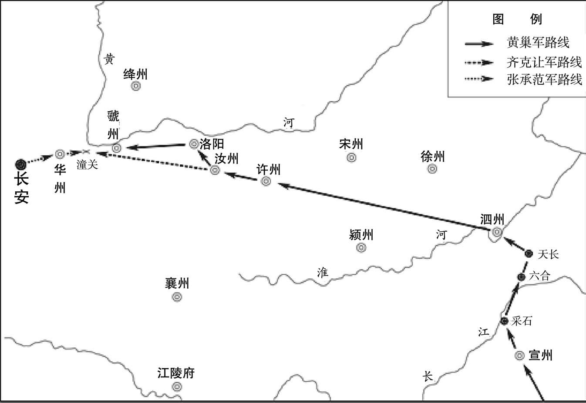 
黄巢军进军洛阳示意图

## 【原文】

**乙亥，张承范等将神策弩手发京师[1]。神策军士皆长安富家子，赂宦官窜名军籍，厚得廪赐，但华衣怒马，凭势使气，未尝更战陈[2]。闻当出征，父子聚泣，多以金帛雇病坊贫人代行，往往不能操兵[3]。是日，上御章信门楼临遣之[4]。承范进言：“闻黄巢拥数十万之众，鼓行而西，齐克让以饥卒万人依托关外，复遣臣以二千余人屯于关上，又未闻馈饷之计，以此拒贼，臣窃寒心，愿陛下趣诸道精兵，早为继援[5]。”上曰：“卿辈第行，兵寻至矣。”丁丑，承范等至华州。会刺史裴虔余徙宣歙观察使，军民皆逃入华山，城中索然，州库唯尘埃鼠迹，赖仓中犹有米千余斛，军士裹三日粮而行[6]。**

## 【注文】

[1]弩：一种装有臂的弓，主要由弩臂、弩弓、弓弦和弩机等部分组成。虽然弩的装填时间比弓长很多，但是它比弓的射程更远，杀伤力更强，命中率更高，对使用者的要求也比较低，是古代一种威力很大的远距离杀伤武器。

[2]长安：即唐朝都城长安（今陕西西安）。1956年以来，考古工作者多次对该城遗址进行勘查发掘。根据考古发掘，长安城外郭城为长方形，东西（由春明门到金光门）长9721米，南北（由明德门到宫城北面玄武门偏东处）长8651米，总面积约84平方公里。先后发掘了大明宫的含元殿和麟德殿、兴庆宫的勤政务本楼，以及西市、青龙寺、西明寺、外郭城的明德门、皇城的含光门等建筑遗址。　　窜名：挂名。　　廪（lǐn）赐：古时指由官府供给的俸禄、粮食和赏赐。　　华衣怒马：鲜艳的衣服，健壮的马匹。　　凭势使气：凭借宦官的势力而气焰嚣张。　　更（gēng）战陈：经历过战斗。陈，同“阵”。

[3]病坊：唐在京城中设置病坊，收养贫穷有病者。　　不能操兵：拿不动武器。

[4]章信门：宫门，在唐长安城太极宫。唐僖宗广明元年（880年）十二月，黄巢将入潼关，唐僖宗登章信门遣将东征。

[5]鼓行而西：整队向西行进，直指长安。鼓，击鼓进军。　　馈饷：运送粮食。

[6]裴虔余：生卒年不详。唐末官吏，曾任兵部郎中。唐僖宗乾符元年（874年）改任太常少卿，后又担任华州刺史、宣歙观察使等，参与镇压黄巢起义。　　徙：古代有调任的意思。　　华山：山名。在今陕西华阴南。　　索然：空寂。　　斛（hú）：旧量器名，亦是容量单位。古代常用容量单位由小到大有升、斗、斛（石）、釜、钟，通常学者们认为斛和石相通。自秦汉开始它们之间都是十进制，南宋末年改为五斗为一斛。

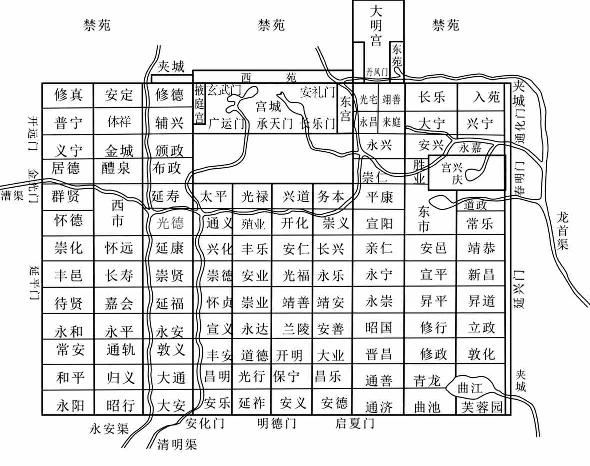 
唐长安城示意图

## 【译文】

唐僖宗广明元年（880年）十一月乙亥（二十五日），张承范等率领神策军弓箭手从京师出发。神策军士都是长安富家子弟，是通过贿赂宦官才得以登上军籍的，就是为获得优厚的饷给和赐赏，他们只会穿着华丽服装、骑着高头大马，依仗宦官的势力任意横行，但从未经历过战争，一听说要去出征打仗，父子们相聚在一起抱头痛哭，大多数出钱雇佣住在病坊的穷人去顶替，这些人往往连兵器都不会用。这天，唐僖宗到章信门楼为他们送行。张承范进言说：“听说黄巢几十万大军，正大张旗鼓地往西而来，齐克让率领一万多名饥饿的士兵驻扎在关外，又派调我以两千多人屯扎在关上，却没听说有发军饷的计划，凭借我们这样的力量抵抗贼兵，我私下里感到非常寒心。希望陛下催促各道精兵，早些来增援我们。”唐僖宗答道：“你们只管先出发吧，援兵不久就到。”丁丑（二十七日），张承范等到达华州，正赶上刺史裴虔余调任宣歙观察使，军民都逃入华山，城里冷冷清清，州的仓库到处是尘埃和老鼠活动的痕迹。幸好仓里还有一千多斛米，军士们便带着三天的粮食，继续前进。

## 【原文】

**十二月庚辰朔，承范等至潼关，搜菁中，得村民百许，使运石汲水，为守御之备[1]。与齐克让军皆绝粮，士卒莫有斗志[2]。是日，黄巢前锋军抵关下，白旗满野，不见其际[3]。克让与战，贼小却[4]。俄而巢至，举军大呼，声振河、华[5]。克让力战，自午至酉始解，士卒饥甚，遂喧噪，烧营而溃，克让走入关[6]。关左有谷，平日禁人往来，以榷征税，谓之“禁坑”[7]。贼至仓猝，官军忘守之，溃兵自谷而入，谷中灌木寿藤茂密如织，一夕践为坦涂[8]。承范尽散其锱囊以给士卒，遣使上表告急，称：“臣离京六日，甲卒未增一人，馈饷未闻影响[9]。到关之日，巨寇已来，以二千余人拒六十万众，外军饥溃，蹋开禁坑[10]。臣之失守，鼎镬甘心；朝廷谋臣，愧颜何寄[11]！或闻陛下已议西巡，苟銮舆一动，则上下土崩[12]。臣敢以犹生之躯，奋冒死之语，愿与近密及宰臣熟议，未可轻动[13]。急征兵以救关防，则高祖、太宗之业庶几犹可扶持，使黄巢继安禄山之亡，微臣胜哥舒翰之死[14]。”**

## 【注文】

[1]菁（jīng）中：茂密的草木丛中。　　汲（jí）水：从下往上打水。

[2]绝粮：军用粮食断绝。

[3]白旗：表示投降的旗帜。

[4]却：后退。

[5]俄而：不一会。　　声振河、华：指黄巢军队声势之盛，震撼山河。　　河、华：指黄河与华山。潼关地处华山与黄河之间。

[6]自午至酉：从上午十一点至下午七点。从汉代开始，根据太阳升起的时间，古人将一昼夜区分为十二个时辰并采用十二地支（即子、丑、寅、卯、辰、巳、午、未、申、酉、戌、亥）计时法来记录这十二时辰，每个时辰相当于两个小时，夜晚十一时到凌晨一时是子时，凌晨一时到三时是丑时。以此类推，晚上九时到十一时为亥时。

[7]榷（què）：专营、专卖。由官府专卖茶，以独占其利。

[8]寿藤：蔓生植物的一种。

[9]锱（zī）囊：辎重和囊橐（tuó）。辎重指随军之物，囊橐指私人行装。

[10]外军：指齐克让的泰宁军。

[11]鼎镬（huò）：指古代的一种酷刑，即将犯人用鼎或大锅煮死。镬，大锅。

[12]西巡：谓西行入蜀。　　銮（luán）舆（yú）：皇帝的车驾。

[13]近密：指两中尉、两枢密。　　熟议：周密地商议。

[14]高祖：即唐高祖李渊（566—635年）。唐朝开国皇帝，出身于北朝的关陇贵族，七岁袭封唐国公。隋末天下大乱时，李渊乘势从太原起兵，攻占长安。公元618年，称帝，改国号为唐，定都长安（今陕西西安），不久后便统一全国。玄武门之变后，退位为太上皇。唐太宗贞观九年（635年）病逝。谥号太武皇帝，庙号高祖，葬在献陵。唐高宗上元元年（674年）八月，改上尊号为神尧皇帝。　　太宗：即唐太宗李世民（599—649年），陇西成纪（治今甘肃秦安西北）人，唐高祖李渊与窦皇后的次子。初封秦王。曾随父李渊南征北战，为唐朝开国立下汗马功劳。唐高祖武德九年（626年）六月，发动“玄武门之变”，杀死大哥李建成和四弟李元吉。三天后，被立为皇太子。李渊退位后，他旋即登基即位。在位期间，他虚心纳谏、厉行节约、轻徭薄赋，让百姓休养生息，使得社会出现国泰民安的局面，开创了历史上著名的“贞观之治”，为此后的“开元盛世”奠定了重要的基础。　　微臣胜哥舒翰之死：指为国捐躯重于哥舒翰被俘投降而死。

## 【译文】

唐僖宗广明元年（880年）十二月庚辰朔（初一日），张承范抵达潼关，在茂密的草木丛中，搜寻到一百多名村民，让他们搬运石头和打水，做守城御敌的准备。张承范与齐克让的部队都断了粮食，士兵根本没有斗志。这天，黄巢前锋军队抵达潼关，白旗满山遍野，一眼望不到边。齐克让与其交锋，黄巢前锋军队稍微退却了一点。不一会儿黄巢大军到了，全军大呼，声震黄河、华山。齐克让奋力而战，从午时到酉时才收兵，士兵们都饿坏了，就喧闹起来，烧了军营溃散而去，齐克让逃进潼关。潼关东面有山谷，平时禁止百姓往来，专门用来征税，叫作“禁坑”。黄巢军队突然到来，官军忘记派兵把守，逃散的官军进入山谷，谷里的灌木长藤茂密得仿佛织到了一起，一夜之间就被踏为平道。张承范将全部辎重和私囊散发给士卒，并派使者上表告急，说：“臣离京六日，士兵没增加一人，粮饷也杳无音信。到潼关之日，强大的敌军已经来到，我用两千多人抗拒六十万敌军，在关外的齐克让军因饥饿溃散，踏开禁坑。我如果失守，即使投身油锅也甘心，但朝廷的宰相谋臣们脸往哪放呢？有消息说陛下已经讨论往西逃到蜀中，假使銮驾一动，则上下如土崩瓦解一样。臣敢用还活着的身躯，冒死说几句话，希望陛下与亲近的人及宰相大臣们仔细反复地商议，不可以轻易而动，抓紧征兵以救潼关之防，那么唐高祖、唐太宗的创立的帝业也许还可以维持，让黄巢成为继安禄山之后的败亡者，这样我就比哥舒翰死得更有价值。”

## 【原文】

**辛巳，贼急攻潼关，承范悉力拒之，自寅及申，关上矢尽，投石以击之[1]。关外有天堑，贼驱民千余人入其中，掘土填之，须臾即平，引兵而度[2]。夜，纵火焚关楼俱尽。承范分兵八百人，使王师会守禁坑，比至，贼已入矣。壬午旦，贼夹攻潼关，关上兵皆溃，师会自杀[3]。承范变服，帅余众脱走[4]。至野狐泉，遇奉天援兵二千继至，承范曰：“汝来晚矣[5]！”博野、凤翔军还至渭桥，见所募新军衣裘温鲜，怒曰：“此辈何功而然，我曹反冻馁[6]！”遂掠之，更为贼乡导以趣长安[7]。**

## 【注文】

[1]自寅及申：形容从早上战斗到下午。寅，凌晨三到五点；申，下午三到五点。

[2]天堑：指天然形成的隔断交通的大壕沟。　　须臾（yú）：极短的时间；片刻。

[3]旦：早晨、早上。

[4]变服：换上便衣。

[5]野狐泉：地名。在今陕西潼关东北旧潼关之西。　　奉天：唐高宗病逝后，葬于“乾陵”（今陕西乾县境内的梁山上）。武则天光宅元年（684年），将乾陵一带设为奉天县，治所在今陕西乾县。唐昭宗时又将奉天县改为乾州。

[6]博野：县名。北魏宣武帝景明元年（500年）改博陆县置，以地居博水之野而得名，治所在今河北蠡（lí）县。隋属河间郡。唐属深州。司马光《资治通鉴》卷二五四胡三省《注》：“博野军，即唐穆宗长庆二年（822年）李寰率以归京师之兵也。”　　渭桥：位于今陕西西安西北渭河上。　　所募新军：指田令孜新招募的左右神策两军。　　衣裘（qiú）：专指皮裘，或泛指衣服。

[7]乡导：即向导。

## 【译文】

唐僖宗广明元年（880年）十二月辛巳（初二日），黄巢军队猛攻潼关，张承范全力抗拒，从早晨一直打到下午，关上的箭都射完了，便投掷石块打击黄巢军队。潼关外有一条自然形成的壕沟，黄巢军驱赶着一千多名百姓投入沟中，掘土填充，不一会儿就填平了，他们便领兵渡过壕沟。夜里，放火烧毁关楼。张承范分出八百士兵，由王师会率领前往镇守禁坑。等王师会赶到禁坑时，起义军已经进来了。壬午（初三日）早晨，黄巢军夹攻潼关，关上士兵溃散而逃，王师会自杀。张承范换上便装，率残余部队逃走了。到野狐泉时，遇见从奉天而来的两千援兵，张承范说：“你们来晚了！”博野、凤翔军退至渭桥，看到所招募的新兵都穿着华丽温暖的衣服，愤怒地说：“这些人有什么功劳可以享受如此待遇，我们反而挨冻受饿！”于是就抢掠了新兵，还给起义军做向导，直奔长安。

## 【原文】

**贼之攻潼关也，朝廷以前京兆尹萧廪为东道转运粮料使，廪称疾，请休官，贬贺州司户[1]。**

## 【注文】

[1]京兆尹：首都地区的最高行政长官，所谓京，是极大的意思，兆则表示数量众多。唐初京师所在地的行政机构称为雍州府，以亲王担任雍州牧，唐太宗、唐中宗、唐睿宗未即位之前都曾担任过这一职务。唐玄宗开元元年（713年），改雍州为京兆府，治所在长安、万年二县（今陕西西安）。　　萧廪（？—900年）：字富侯，出身于官宦之家。唐懿宗咸通三年（862年）进士，官至尚书郎、中书舍人、京兆尹等。唐僖宗逃亡后，避乱河北。唐昭宗光化三年（900年）逝世。　　东道转运粮料使：相当于东路粮秣供应总监。　　休官：退休。　　贺州：州名。隋文帝开皇九年（589年）置，治所设在临贺县（今广西贺州东南）。隋炀帝大业初废。唐高祖武德四年（621年）复置，唐玄宗天宝元年（742年）改为临贺郡，唐肃宗乾元元年（758年）复为贺州。辖境大致相当于今广西贺州、钟山、富川等地区。

## 【译文】

起义军攻打潼关，朝廷任命前京兆尹萧廪为东道转运粮料使。萧廪装病，申请退休，结果被贬为贺州司户。

## 【原文】

**黄巢入华州，留其将乔钤守之，河中留后王重荣请降于贼[1]。癸未，制以巢为天平节度使[2]。甲申，以翰林学士承旨、尚书左丞王徽为户部侍郎，翰林学士、户部侍郎裴澈为工部侍郎，并同平章事[3]。以卢携为太子宾客分司。田令孜闻黄巢已入关，恐天子责已，乃归罪于携而贬之，荐徽、澈为相。是夕，携饮药死。澈，休之从子也[4]。**

## 【注文】

[1]乔钤：生卒年不详。唐末黄巢农民起义军将领。黄巢进军关中之初，曾留乔钤驻守华州，以扼守关中的东大门。

[2]制：古代帝王的命令。

[3]翰林学士承旨：官名。唐玄宗时设翰林学士院，置翰林学士六员。翰林学士承旨即为翰林学士院首席翰林学士，唐宪宗元和元年（806年）置，承担起草任免将相大臣、册立太子、宣布征伐或大赦等重要文告，权势极重，号称内相。　　尚书左丞：官名。汉成帝建始四年（前29年）置尚书。汉光武帝刘秀时，始分左右丞。尚书左丞辅佐尚书令，掌吏民文书章奏及尚书台中法纪；右丞辅佐仆射，掌钱谷等事。此后历代沿置，品级逐渐提高，隋、唐时至正四品。唐中期以后，与尚书右丞实际主持尚书省日常政务，权任甚重。　　王徽（约818—891年）：字昭文，京兆杜陵（今陕西西安东南）人。唐宣宗大中十一年（857年）进士，历任右拾遗、殿中侍御史、翰林学士承旨、中书舍人、户部侍郎、兵部侍郎、尚书左丞、同平章事等职。唐僖宗广明元年（880年）黄巢攻克潼关，他被俘，后趁机逃走，参与镇压黄巢起义。他为官正直，敢于犯颜直谏。　　裴澈（？—887年）：字深源，孟州济源（今河南济源）人，唐懿宗咸通时登进士第。唐僖宗广明元年（880年）拜相，任工部侍郎同中书门下平章事。黄巢军攻入长安后，跟随唐僖宗出逃，免相改任鄂岳观察使。唐僖宗中和三年（883年）再次拜相，任中书侍郎兼兵部尚书同中书门下平章事。唐僖宗光启三年（887年），因李煴称帝时受伪职，被杀。　　工部侍郎：官名，唐朝六部（即吏部、户部、礼部、兵部、刑部、工部）中工部的副长官，掌营建之政令与工部庶务。唐中叶以后，尚书渐成虚衔，侍郎成为实际长官，主持部务。

[4]休：即裴休（791—864年），字公美，河东闻喜（今山西运城闻喜，一作孟州济源）人。他出生于官宦之家，善文章，工书法，信仰佛教。唐德宗长庆年间进士。官至监察御史、兵部侍郎、诸道盐铁转运使、同中书门下平章事，封河东县子。

## 【译文】

黄巢进入华州，留下他的部将乔钤据守，河中留后王重荣向黄巢请降。广明元年（880年）十二月癸未（初四日），唐僖宗下诏任命黄巢为天平节度使。甲申（初五日），任命翰林学士承旨、尚书左丞王徽为户部侍郎，翰林学士、户部侍郎裴澈为工部侍郎，二人并为同平章事。任命卢携为太子宾客，分司东都。田令孜听说黄巢已入潼关，害怕天子责备自己，于是将罪责都推到卢携身上，并贬了他的官职，推荐王徽、裴澈为宰相。当天晚上，卢携服毒自杀。裴澈是裴休的侄子。

## 【原文】

**百官退朝，闻乱兵入城，布路窜匿。田令孜帅神策兵五百奉帝自金光门出，惟福、穆、泽、寿四王及妃嫔数人从行，百官皆莫知之[1]。上奔驰昼夜不息，从官多不能及。车驾既去，军士及坊市民竞入府库盗金帛[2]。**

## 【注文】

[1]金光门：唐长安外郭城西面中门，遗址在今陕西西安西。根据历史文献及考古资料分析，唐长安外郭城西共有三门，由北而南，第一叫开远门，第二叫金光门，第三叫延平门。　　福、穆、泽、寿四王：都是唐僖宗的兄弟。

[2]府库：唐朝国家贮藏财物、兵甲的处所。　　帛：古代称丝织物为帛。包括锦、绣、绫、罗、绢、（shī）、绮、缣（jiān）、绸等，曾在中国古代长期作为实物货币使用。

## 【译文】

百官退朝后，听说起义军已经进入长安城，纷纷逃窜躲避起来。田令孜率领五百名神策军保护唐僖宗从金光门逃走。只有福王、穆王、泽王、寿王及数个妃嫔随行，百官都不知道。皇上逃奔很快，日夜兼程，跟从的官员大多跟不上。唐僖宗的车驾离去后，士兵和街坊市民争相进入皇家库府抢劫金银绸缎。

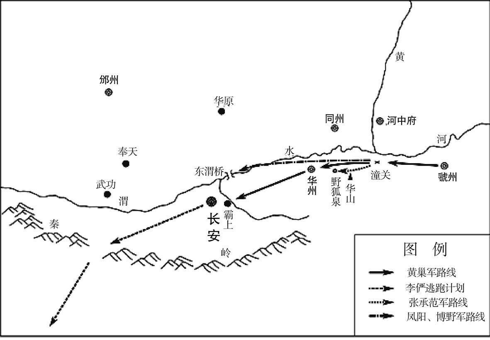 
黄巢起义军进军长安示意图

## 【原文】

**晡时，黄巢前锋将柴存入长安，金吾大将军张直方帅文武数十人迎巢于霸上[1]。巢乘金装肩舆，其徒皆被发，约以红缯，衣锦绣，执兵以从，甲骑如流，辎重塞涂，千里络绎不绝[2]。民夹道聚观，尚让历谕之曰：“黄王起兵，本为百姓，非如李氏不爱汝曹，汝但安居毋恐[3]。”巢馆于田令孜第[4]。其徒为盗久，不胜富，见贫者，往往施与之。居数日，各出大掠，焚市肆，杀人满街，巢不能禁[5]。尤憎官吏，得者皆杀之。**

## 【注文】

[1]晡时：从下午三时至下午五时，又名日铺、夕食等。　　柴存：生卒年不详，唐末黄巢起义军将领。初随王仙芝起义，王仙芝死后，他在黄巢领导下南征北战。唐僖宗广明元年（880年）起义军攻克长安时为前锋，后事迹不详。　　金吾大将军：武官名，唐代置，掌金吾卫军令。　　张直方（？—881年）：范阳（治今北京西南）人，唐朝将领。卢龙节度使张仲武之子。因父之功，封为金吾大将军。唐僖宗中和元年（881年），黄巢进入长安，他率文武官员到灞上迎接。不过，他并非真心投降，而且还收留了唐朝大臣豆卢瑑、崔沆、于琮等数百人，又与凤翔节度使郑畋暗通消息，事情败露后，被诛三族。　　霸上：即长安城东北的霸水旁，位于今陕西西安东。霸水上建有霸桥，唐时迎送宾客，常到此处。霸，一般作“灞”。

[2]金装肩舆：用黄金装饰以人工扛抬的交通工具，犹今滑竿。　　约：束、缠。　　辎（zī）重：行军时由运输部队携带的军械、粮草、被服等物资的总称。

[3]李氏：指李唐王朝。唐朝皇室自称出自陇西李氏，又追认老子李耳为其祖先。不过也有人对此说法表示怀疑，认为唐朝皇室带有浓厚的鲜卑血统。

[4]馆：动词，居住在。

[5]市肆：市中店铺。

## 【译文】

下午三点到五点的时候，黄巢前锋将领柴存进入长安，金吾大将军张直方率领文武官员数十人到霸上迎接黄巢。黄巢乘坐金装轿子，他的部下都披着长发，并用红丝带扎束起来，身穿锦绣衣裳，手持兵刃侍从。铁甲骑兵如同流水一样涌进长安，辎重车辆塞满了道路，千里之内，络绎不绝。长安老百姓夹道聚集观看。尚让向百姓宣传：“黄王起兵，本是为了百姓，不会像李氏皇帝那样不爱你们，你们只管安居，不要害怕。”黄巢住在了田令孜的府邸。由于他的部下长期为盗，很是富有，见到贫困无依的人，往往施舍钱财给他们。住了几天，将士们都出去抢劫，焚烧街市上的店铺，满大街杀人，黄巢也禁止不住。他们尤其憎恨官吏，凡是被抓到了的都杀掉。

## 【原文】

**上趣骆谷，凤翔节度使郑畋谒上于道次，请车驾留凤翔[1]。上曰：“朕不欲密迩巨寇，且幸兴元，征兵以图收复[2]。卿东扞贼锋，西抚诸蕃，纠合邻道，勉建大勋[3]。”畋曰：“道路梗涩，奏报难通，请得便宜从事[4]。”许之。戊子，上至壻水，诏牛勖、杨师立、陈敬瑄，谕以京城不守，且幸兴元，若贼势犹盛，将幸成都，宜豫为备拟[5]。**

## 【注文】

[1]骆谷：谷名。关中通往汉中的谷道之一，在今陕西周至西南。此处似指骆谷道，即秦岭南北交通的要道。　　道次：路上临时停留之所。

[2]密迩：靠近。　　兴元：府名。唐德宗兴元元年（784年）升梁州置，治所设在南郑县（今陕西汉中东），辖境相当于今陕西汉中、城固、南郑、勉县以及宁强北部地区。

[3]扞（hàn）：同“捍”。

[4]梗涩：阻塞而不通畅。

[5]壻（xù）水：即骆谷壻水驿，今地不详。壻水，水名。源出陕西佛坪，西流经秦岭南麓，折东南经城固入汉水。　　牛勖（xù）：生卒年不详，唐朝将领，田令孜的腹心，唐僖宗朝曾任山南西道节度使。　　杨师立（？—884年）：唐朝将领。因当权宦官田令孜的关系得以成为剑南东川节度使。唐僖宗中和三年（883年），授予同中书门下平章事的宰相荣衔，封中山县开国公。但他后来与田令孜及陈敬瑄产生矛盾，在随后的军事冲突中，被陈敬瑄击败，自杀而死。　　陈敬瑄（？—893年）：唐朝将领，因是唐僖宗朝当权宦官田令孜之兄而得以任职左神策军，并升任左金吾卫将军。约在唐僖宗广明元年（880年），田令孜推荐自己的心腹牛勖、杨师立、陈敬瑄三人为山东西道、剑南东川、剑南西川节度使人选，并通过打马球来决定，陈敬瑄因拔得头筹而被任命为剑南西川节度使。中和二年（882年）夏，加封为检校司徒、侍中，封梁国公。唐昭宗继位后，他起兵抗命。最后被王建攻杀。　　成都：府名。唐肃宗至德二载（757年）改蜀郡置，治所在成都、蜀二县（今四川成都）。　　备拟：作好准备以待需要时。

## 【译文】

唐僖宗赶往骆谷的途中，凤翔节度使郑畋在道旁参见唐僖宗，请求唐僖宗能够留在凤翔。唐僖宗说：“我不愿住在离强贼很近的地方，暂且先到兴元，征调各路士兵以图收复京师。你留在这里往东可以抵挡贼寇锋芒，向西能抚慰各个少数民族，并联合邻近藩镇，努力建立杀贼大功。”郑畋说：“现在道路不通，奏报难以经常禀报，希望允许我根据具体情况适当处理事务。”唐僖宗答应了他的要求。广明元年（880年）十二月戊子（初九日），唐僖宗到达壻水，下诏给牛勖、杨师立、陈敬瑄，由于京师失守，暂时先到兴元。如果盗贼势力还很嚣张，我便要去成都，应当预先做好准备。

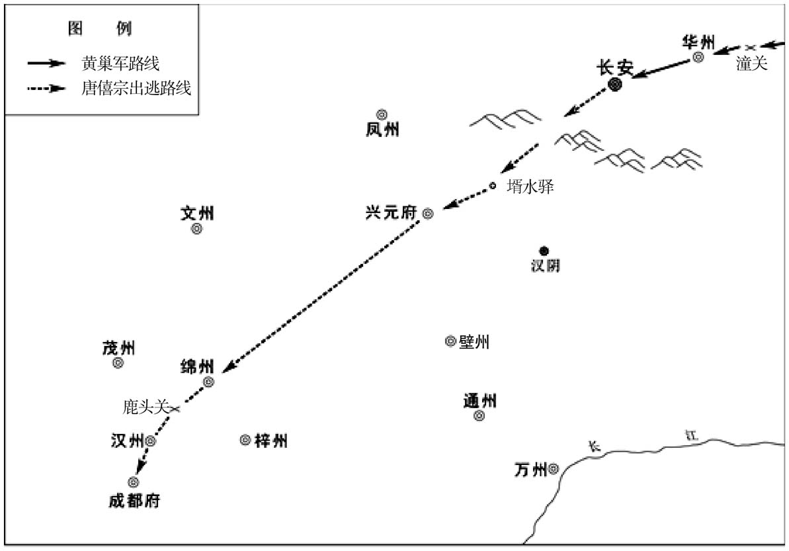 
唐僖宗出逃西川路线示意图

## 【原文】

**庚寅，黄巢杀唐宗室在长安者无遗类。**

## 【译文】

唐僖宗广明元年（880年）十二月庚寅（十一日），黄巢把留在长安城中的唐朝皇族杀得一个不剩。

## 【原文】

**辛卯，巢始入宫。壬辰，巢即皇帝位于含元殿，画皁缯为衮衣，击战鼓数百以代金石之乐[1]。登丹凤楼，下赦书[2]。国号大齐，改元金统[3]。谓广明之号，去唐下体而着黄家日月，以为己符瑞[4]。唐官三品已上悉停任，四品以下位如故。以妻曹氏为皇后。以尚让为太尉兼中书令，赵璋兼侍中，崔璆、杨希古并同平章事，孟楷、盖洪为左右仆射、知左右军事，费传古为枢密使[5]。以太常博士皮日休为翰林学士[6]。璆，邠之子也，时罢浙东观察使在长安，巢得而相之[7]。**

## 【注文】

[1]含元殿：宫殿名，大明宫的前朝第一正殿，也是唐长安城的标志性建筑，建成于唐高宗龙朔三年（663年），毁于唐僖宗光启二年（886年）。其间逢元日、冬至，皇帝大多在这里举行大朝贺活动。自20世纪50年代后期起，中国科学院考古工作者对含元殿进行了大规模的调查发掘工作，初步确定含元殿建于龙首塬南坡上，主殿坐落在三层夯筑的大台上，面阔十一间，进深四间，四周设副阶。主殿东西两侧各建有栖风阁和翔鸾阁，殿阁之间有曲尺形长廊连接，并在长廊转折处有转角建筑，在塬下东南和西南处还建有东西朝堂。　　衮（gǔn）衣：又称衮服，古代帝王所穿的上面绣有龙纹图案的礼服。黄巢仓促即帝位时没来得及准备绣有龙纹图案的礼服，就身着画有龙纹图案的礼服。　　金石之乐：使用钟磬等乐器演奏的音乐。常指庙堂之乐。

[2]丹凤楼：即大明宫南面丹凤门城楼，故称丹凤楼。唐代帝王常在此处宣布重要政事。　　赦书：颁布赦令的文告。

[3]大齐：黄巢所建立的政权国号。唐僖宗广明元年（880年），黄巢攻下长安，即位于含元殿，国号大齐，并改元金统。　　金统：黄巢所用的年号，共计五年，即公元880年至884年。

[4]谓广明之号，去唐下体而著黄家日月，以为己符瑞：广明这个年号，是“唐”字去“丑”“口”而加“黄”字为“廣”，合“日”“月”而为“明”；亦即“广明”乃黄家日月，表明“黄”当代“唐”。故黄巢认为广明之号是自己的符瑞。

[5]太尉：官名。战国时秦国置，掌赏罚爵禄。秦汉置为最高武职，或作为皇帝的军事顾问，或临时出任军事统帅，平时不直接控制军权，且不常置。汉武帝刘彻元狩四年（前119年）置大司马以代之。东汉光武帝建武二十七年（51年）复置，取代大司马成为三公（即丞相、太尉、御史大夫）之首，常与太傅参录尚书事，综理国家军政大事，权任甚重。后逐渐成为虚衔或加官。至隋唐时期，无具体职掌，多作为朝廷重臣的加官。　　中书令：官名。三国魏文帝黄初年间置，与中书监并为中书省长官，位在中书监下，掌皇帝诏命的起草与发布，并典尚书奏事，权任颇重。隋朝因避隋文帝杨忠讳改称内史令、内书令。唐高祖武德三年（620年）复置，为中书省长官，掌草拟诏敕，呈奏表章并草拟批答，参与朝政机要。唐中后期，其职逐渐成为文武大臣的荣誉职位，不实际参与政事，且不常置。　　赵璋：生卒年不详，唐末黄巢起义军将领。唐僖宗广明元年（880年）黄巢建立大齐政权，被任命为宰相。　　杨希古：字尚之，虢州弘农（治今河南灵宝）人，生卒年不详。家世显赫，进士出身，曾任户部郎中、尚书右丞。唐僖宗广明元年（880年），黄巢起义军攻入长安，建立大齐政权，他被任命为宰相。　　孟楷（？—883年）：唐末黄巢起义军将领。唐僖宗广明元年（880年）黄巢建立大齐政权时被任命为尚书仆射。起义军东撤时，他率军万余人为前锋进攻蔡州（治今河南汝南），击败秦宗权，遂移兵转攻陈州（治今河南淮阳），后于项城（今河南周口东南）战败被俘遇害。　　盖洪：生卒年不详，唐末黄巢起义军将领。唐僖宗广明元年（881年）黄巢建立大齐政权时，他被任命为尚书仆射。　　知左右军事：黄巢将军队分为左右军，交付两人分别掌管。黄巢的大齐政权，在形式上采取了唐的不少官号，如设置了中书令、侍中、同平章事、尚书左右仆射、枢密使、翰林学士等官。　　费传古：生卒年不详，唐末黄巢起义军将领。唐僖宗广明元年（880年）黄巢建立大齐政权后，被任命为枢密使。

[6]太常博士：官名。西汉置，掌参议国家礼仪制度、应答顾问、教授诸生，隶属于太常。东汉沿置，设博士祭酒一人统领。晋以后沿置，职称清要，品级不高。　　皮日休：字袭美，一字逸少，竟陵（今湖北天门）人。约生于公元834年至839年间，卒于公元902年以后。曾隐居鹿门山，自号鹿门子，又号间气布衣、醉吟先生。晚唐著名诗人，与陆龟蒙齐名，世称“皮陆”。唐懿宗咸通八年（867年）进士，曾任苏州军事判官、著作佐郎、太常博士、毗陵副使等职。后参加黄巢起义，任翰林学士。起义失败后不知所踪。著有《皮子》《文薮》。

[7]邠（bīn）：即崔邠（754—815年），字处仁，清河武城（今山东武城西）人。少年时就考中进士，又中贤良方正科。唐德宗贞元年间，任渭南尉、拾遗、补阙等职，以敢言著称。后以兵部员外郎知制诰至中书舍人，任礼部侍郎、吏部侍郎、太常卿等职。在唐宪宗元和年间，曾主持科举考试。死后追赠吏部尚书，谥“文简”。

## 【译文】

唐僖宗广明元年（880年）十二月辛卯（十二日），黄巢进入皇宫。壬辰（十三日），黄巢在含元殿登上皇帝宝座，身穿临时画有龙纹图案的黑丝绸衣服作为天子礼服，敲战鼓数百下以代替金石音乐。登上丹凤楼，颁布赦书。建国号为大齐，改年号为金统。黄巢认为唐僖宗的年号“广明”，是去掉唐字下面部分而突出黄家日月，以此作为自己的符瑞。又下令唐朝官员三品以上的全部停职，四品以下的留任。立妻子曹氏为皇后。以尚让担任太尉兼中书令，赵璋兼任侍中，崔璆、杨希古都担任同平章事，孟楷、盖洪担任左右仆射，主持左右军事，费传古担任枢密使。任命太常博士皮日休担任翰林学士。崔璆是崔邠的儿子，当时被罢免了浙东观察使等职务，住在长安，黄巢得到他以后，便任命他为宰相。

## 【原文】

**诸葛爽以代北行营屯栎阳，黄巢将砀山朱温屯东渭桥，巢使温诱说之，爽遂降于巢[1]。巢以诸葛爽为河阳节度使。爽赴镇，罗元杲发兵拒之，士卒皆弃甲迎爽，元杲逃奔行在[2]。**

## 【注文】

[1]栎阳：县名。唐高祖武德元年（618年）改广阳县置，治所设在今陕西临潼东北。　　砀（dàng）山：县名。隋文帝开皇十八年（598年）置，治所在今安徽砀山东。　　朱温（852—912年）：砀山（今安徽砀山东）人。唐僖宗乾符四年（877年）加入黄巢起义军，任大齐政权同州防御使。唐僖宗中和二年（882年）投降唐朝，赐名“全忠”，并被任命为右金吾卫大将军、河中行营招讨副使，参与镇压起义军。后逐渐成为唐末最强大的军阀割据势力，占有黄河流域地区。唐昭宗天复三年（903年），被任命为太尉、兼中书令、宣武等军节度使、诸道兵马副元帅，晋爵梁王。天祐元年（904年），杀害唐昭宗，拥立年仅十三岁的李柷（chù）为唐哀帝，自任摄政。开平元年（907年），废唐哀帝，自立为帝，改名为朱晃，建国号梁，定都开封，史称后梁。乾化二年（912年），被他的儿子朱友珪杀死。　　东渭桥：参见前文“渭桥”条。

[2]行在：即“行在所”，皇帝所在的地方。本指京师，后泛指皇帝所到之处。

## 【译文】

诸葛爽率领代北行营屯驻栎阳，黄巢部将砀山人朱温屯驻东渭桥，黄巢让朱温去劝诱诸葛爽，诸葛爽于是投降了黄巢。黄巢任命诸葛爽为河阳节度使。诸葛爽前去上任，罗元杲派兵抗拒，士卒都丢掉武器铠甲迎接诸葛爽，罗元杲只好逃奔唐僖宗所在的地方。

## 【原文】

**郑畋还凤翔，召将佐议拒贼。皆曰：“贼势方炽，且宜从容以俟兵集，乃图收复。”畋曰：“诸君劝畋臣贼乎？”因闷绝仆地，甃伤其面，自午至明旦，尚未能言[1]。会巢使者以赦书至，监军袁敬柔与将佐序立宣示，代畋草表署名以谢巢[2]。监军与巢使者宴，乐奏，将佐以下皆哭。使者怪之，幕客孙储曰：“以相公风痹不能来，故悲耳[3]。”民间闻者无不泣。畋闻之曰：“吾固知人心尚未厌唐，贼授首无日矣[4]。”乃刺指血为表，遣所亲间道诣行在[5]。召将佐谕以逆顺，皆听命，复刺血与盟。然后完城堑，缮器械，训士卒，密约邻道合兵讨贼，邻道皆许诺，发兵会于凤翔。时禁军分镇关中者尚数万，闻天子幸蜀，无所归，畋使人招之，皆往从畋，畋分财以结其心，军势大振[6]。**

## 【注文】

[1]闷绝：因痛苦而昏过去。　　甃（zhòu）伤其面：郑畋仆地时脸被井壁磕伤。

[2]袁敬柔（855—905年）：唐末宦官，曾任凤翔监军，参与镇压黄巢起义。　　序立：按官职高低依次站立。

[3]幕客：古代以西东分宾主，做官僚们私人秘书的“幕客”，都称为“西宾”，又称“西席”，主人称为“东家”。　　孙储：生卒年不详，唐末凤翔节度使郑畋幕僚，后官至天雄节度使，兵部尚书兼京兆尹，参与镇压黄巢起义。　　相公：旧时对宰相的敬称。此指郑畋。

[4]授首：被杀。

[5]刺指血：刺手指以血写表。

[6]禁军分镇关中者：即神策军在关中地区设置的八镇之兵。

## 【译文】

郑畋回到凤翔，召集将领讨论抵御贼兵的事宜。大家都说：“贼兵势头正在强盛时，应当等待各路兵马汇集后，再计划收复长安之事。”郑畋说：“你们要劝我投降贼军吗？”接着昏倒在地，面部也被井壁磕伤了，从午间到第二天早晨，还不能说话。此时，黄巢使者携带赦书来到，监军袁敬柔与将佐们按次序站好接受赦书，并代替郑畋草拟表章以感谢黄巢。监军举行宴会招待黄巢使者，音乐奏响，将佐们都流下了眼泪。使者感到奇怪，幕僚孙储说：“那是因为军府相公郑畋患风痹病不能参加宴会，所以感到伤心啊！”民间百姓听说这件事后，没有不落泪的。郑畋听说后说：“我原本就知道人心还没厌弃唐朝，贼军被砍掉头的日子为期不远了！”于是刺破手指写下血表，派遣亲信抄近道送到皇帝所在地。又召集部将说明反叛与忠顺的道理，部下官兵都听从他的命令，再次刺血立下誓约。然后修整城壕，修缮兵器，训练士卒，秘密联系邻近藩镇军队一同讨伐贼军。邻近各道都答应发兵到凤翔集合。当时，分镇关中的神策军尚有数万人，听说天子到蜀地去了，没地方投归，郑畋于是派人召集他们，他们便都跟随了郑畋。郑畋分发钱财给他们，用以团结他们，于是军队的气势大振。

## 【原文】

**丁酉，车驾至兴元，诏诸道各出全军收复京师。**

## 【译文】

唐僖宗广明元年（880年）十二月丁酉（十八日），唐僖宗到达兴元，下诏命各地藩镇出动全部军队收复京师。

## 【原文】

**己亥，黄巢下令，百官诣赵璋第投名衔者复其官[1]。豆卢瑑、崔沆及左仆射于琮、右仆射刘邺、太子少师裴谂、御史中丞赵蒙、刑部侍郎李溥、京兆尹李汤扈从不及，匿民间，巢搜获，皆杀之[2]。广德公主曰：“我唐室之女，誓与于仆射俱死[3]。”执贼刃不置，贼并杀之[4]。发卢携尸，戮之于市。将作监郑綦、库部郎中郑系义不臣贼，举家自杀[5]。左金吾大将军张直方虽臣于巢，多纳亡命，匿公卿于复壁，巢杀之[6]。**

## 【注文】

[1]名衔：类似于今天的名片，上面书写有官位和姓名。

[2]太子少师：官名。与太子少保、太子少傅合称“太子三少”或“东宫三少”。西晋始置，掌奉皇太子。隋唐沿置，多为虚衔。　　裴谂（shěn）（？—881年）：唐代官吏。唐宣宗大中年间，任太中大夫、检校右散骑常侍、御史大夫、宣州刺史、宣歙观察使、刑部侍郎、上柱国。封河东男，赐金鱼袋。唐僖宗广明元年（881年）为黄巢所杀。　　御史中丞：官名。秦置，为御史大夫主要属官。西汉沿置，外督诸州刺史，内领侍御史，监察百官，并参治刑狱。东汉时为御史台长官，主管监察、执法，权任甚重。唐朝置为御史台次官，辅助御史大夫监督百官，初为正五品上，唐武宗会昌二年（842年）升为正四品下。唐中叶以后，又常作为观察使及州刺史的加衔。　　赵蒙（？—881年）：字不欺，新安（今河南新安）人，后徙居京兆奉天（今陕西乾县）。唐宣宗大中九年（855年）状元及第。唐僖宗乾符三年（876年）由谏议大夫迁给事中，次年迁御史中丞。广明元年（881年）为黄巢所杀。　　刑部侍郎：官名。刑部副长官，辅佐刑部尚书处理司法行政事务。　　李溥（？—881年）：唐末官吏，曾任刑部侍郎。唐僖宗广明元年（881年）为黄巢所杀。　　李汤（？—881年）：唐文宗朝宰相李宗闵侄子。累官给事中、京兆尹。唐僖宗广明元年（881年）为黄巢所杀。　　扈从：帝王随从人员之称。

[3]广德公主（？—881年）：唐宣宗李忱之女，于琮之妻。据《新唐书·公主传》记载，于琮被杀，公主求同死，没有应允，后赐自缢。

[4]不置：不放。

[5]将作监：官名。掌修建宫室宗庙、城门、官署及其他土木工程。　　郑綦（qí）（？—881年）：唐末将作监。唐僖宗广明元年（881年），黄巢军队进入长安，他不肯投降而自杀。　　库部郎中：唐代库部长官。库部，官署名。掌戎器、卤簿、仪仗制造及收藏。始置于曹魏，为尚书诸郎曹之一。两晋、南朝沿置。北魏曾直属尚书省，设尚书为长官。北齐属度支尚书。隋为兵部四司之一。设侍郎、员外郎为正副长官。唐改为郎中、员外郎。　　郑系（？—881年）：唐末官吏，曾任库部郎中。唐僖宗广明元年（881年），黄巢军队进入长安后，他不肯投降而自杀。

[6]左金吾大将军：唐武官名。在唐德宗李适贞元二年（786年）置上将军前，为左金吾卫长官，掌宫中、京城巡警，及烽候、道路、水草事务。左金吾卫是唐南衙禁军机构名，十六卫之一。　　复壁：即夹墙，两重而中空，可藏物或匿人。

## 【译文】

唐僖宗广明元年（880年）十二月己亥（二十日），黄巢下令，凡是百官到宰相赵璋住宅投报名衔者都恢复其官职。豆卢瑑、崔沆及左仆射于琮、右仆射刘邺、太子少师裴谂、御史中丞赵濛、刑部侍郎李溥，京兆尹李汤由于没有来得及跟随唐僖宗逃走，藏匿在民间，被黄巢军队搜了出来，全部被杀。广德公主说：“我是唐皇室的公主，愿与驸马于琮一同去死。”抓住行刑士兵的刀刃不放，结果黄巢军把她一起杀了。还挖出宰相卢携的尸首，在大庭广众之下砍杀。将作监郑綦、库部郎中郑系，宁死也不投降黄巢，全家自杀。左金吾大将军张直方虽然向黄巢称臣，但收留了许多逃亡人，把公卿大臣藏在夹墙里面，事情败露后，黄巢便杀了他。

## 【原文】

**初，枢密使杨复恭荐处士河间张浚，拜太常博士，迁度支员外郎[1]。黄巢逼潼关，浚避乱商山[2]。上幸兴元，道中无供顿，汉阴令李康以骡负糗粮数百驮献之，从行军士始得食[3]。上问康：“卿为县令，何能如是？”对曰：“臣不及此，乃张浚员外教臣。”上召浚诣行在，拜兵部郎中[4]。**

## 【注文】

[1]处士：古时候称有德才而隐居不愿做官的人。后泛指没有做过官的读书人。　　河间：隋炀帝大业初年置，治所在今河北河间。　　张浚（？—903年）：字禹川，河间（今河北河间）人，中书舍人张仲素孙子。唐僖宗乾符年间，被枢密使杨复恭举荐为太常博士，后历任度支员外郎、兵部郎中、谏议大夫。唐僖宗光启三年（887年），自兵部侍郎、诸道租庸使，拜同平章事。次年，任中书侍郎。唐昭宗大顺元年（890年），为河东行营都招讨制置宣慰使，曾率军征讨李克用，战败而回。次年，罢相，出为鄂岳观察使，再贬连州刺史。唐昭宗乾宁二年（895年），自绣州司户为太子宾客，后拜兵部尚书，领租庸使。乾宁四年（897年），被免去租庸使职务，改任尚书右仆射。唐昭宗光化三年（900年），罢租庸使。不久以左仆射致仕，退居洛阳（今河南洛阳）。唐昭宗天复三年（903年），为朱全忠所杀。　　度支员外郎：官名。唐朝度支司副长官，掌管全国财政收支。属户部，从六品上。

[2]商山：山名，又名商洛山，位于今陕西商州东南，地形险阻。黄巢事先派兵扼守蓝田道，所以兵败后得由此路逃跑。

[3]供顿：供应，即提供食宿及行旅所需之物。　　汉阴：县名。唐肃宗至德二载（757年）以安康县改置，治所在今陕西石泉东南。　　李康：生卒年不详，唐末曾担任汉阴县令。　　糗（qiǔ）粮：干粮。　　驮：牲畜负载之物曰驮。亦作量词，一驮百斤。

[4]兵部郎中：官名。唐代设于兵部的佐官。兵部是中央最高军事机关。唐代尚书省兵部的兵部司设有两名郎中、两名员外郎，他们各有分工，一位郎中主管全国在役将士的服役名簿，另一位郎中掌派遣在役军人的名数。

## 【译文】

当初，枢密使杨复恭向唐僖宗推荐了一个处士河间人张浚，任命为太常博士，后升任为度支员外郎。黄巢逼近潼关时，张浚避乱于商山。唐僖宗来到兴元，中途没有食宿供应，汉阴令李康用骡子运送数百驮干粮献给唐僖宗，随行军士才有饭吃。唐僖宗问李康：“你是一个县令，怎么能做到这样？”李康回答：“臣的确是没有考虑到这些，都是张浚员外教我这么做的。”唐僖宗于是召张浚到他住处，任命为兵部郎中。

## 【原文】

**义（成）［武］节度使王处存闻长安失守，号哭累日，不俟诏命，举军入援，遣二千人间道诣兴元卫车驾[1]。**

## 【注文】

[1]王处存（831—895年）：唐朝官吏，京兆万年（今陕西西安）人，为长安城中富豪，拥有数百万家财。初为右军镇使，历骁卫将军、左军巡使。唐僖宗乾符六年（879年），迁检校刑部尚书、定州制置使、义武军节度使。广明元年（880年），黄巢起义军攻克长安，唐僖宗出逃并任命他为东南面行营招讨使、京城东面都统，率军收复长安。因功进检校司徒、同中书门下平章事。

## 【译文】

义武节度使王处存听说长安失守，痛哭了好几天，不等到朝廷的诏命，就率军前来救援，并派遣二千人抄近路赶往兴元保卫皇帝。

## 【原文】

**黄巢遣使调发河中，前后数百人，吏民不胜其苦。王重荣谓众曰：“始吾屈节以纾军府之患，今调财不已，又将征兵，吾亡无日矣，不如发兵拒之[1]。”众皆以为然，乃悉驱巢使者杀之。巢遣其将朱温自同州，弟黄邺自华州合兵击河中[2]。重荣与战，大破之，获粮仗四十余船，遣使与王处存结盟，引兵营于渭北[3]。陈敬瑄闻车驾出幸，遣步骑三千奉迎，表请幸成都。时从兵浸多，兴元储偫不丰，田令孜亦劝上，上从之[4]。**

## 【注文】

[1]纾（shū）：解除，延缓。

[2]黄邺（？—883年）：又名黄思邺，唐末起义军将领，曹州冤句（今山东菏泽西南）人，黄巢弟弟。唐僖宗中和二年（882年）九月，被黄巢任命为华州刺史。起义失败后，被杀于泰山狼虎谷。

[3]粮仗：粮食与兵器。　　渭北：地区名。指渭水以北地区。渭水是黄河的第一大支流，发源于甘肃渭源的鸟鼠山，由陕西潼关汇入黄河，流域包括今甘肃、宁夏、陕西地区。

[4]储偫（zhì）：储备的物资。

## 【译文】

黄巢派使者到河中征调钱粮兵役，前后去了数百人，官民苦不堪言。王重荣于是对众人说：“开始时我屈节臣服于贼，是求缓解军府的灾患。现在贼军征调钱财没有节制，又来征兵，我们早晚要死在他们手里，不如出兵抗拒他。”部将们都表示赞同，于是把黄巢的使者全部杀掉了。黄巢派部将朱温自同州，他的弟弟黄邺自华州合兵进攻河中。王重荣迎战，大破敌军，缴获粮食器械四十多船，并派使者与义武节度使王处存结盟，率领军队在渭河以北安营扎寨。陈敬瑄听说唐僖宗出逃兴元，于是派三千名步兵和骑兵前去迎接，上奏请求唐僖宗到成都来。当时跟随的兵马越来越多，兴元储备的物资不足，田令孜也劝皇上到成都，唐僖宗同意了。

## 【原文】

**中和元年春正月，车驾发兴元[1]。辛未，上至绵州，东川节度使杨师立谒见[2]。**

## 【注文】

[1]中和：唐僖宗年号，共计五年，即公元881年至885年。

[2]绵州：州名。隋文帝开皇五年（585年）置，治所在巴西县（今四川绵阳东）。隋炀帝大业初改为金山郡。唐高祖武德元年（618年）复为绵州，唐玄宗天宝元年（742年）又改为巴西郡，唐肃宗乾元元年（758年）恢复旧称绵州。辖境大致相当于今四川绵阳、江油、安县等地。　　东川：唐方镇名，剑南东川节度使的简称。唐肃宗至德二载（757年）分剑南节度使东部地置，治所在梓州（今四川三台）。辖境屡有变动，长期领有梓、遂（治今四川遂宁）、绵（治今四川绵阳东）、普（治今四川安岳北）、陵（治今四川仁寿东）、泸（治今四川泸州）、荣（治今四川荣县西）、剑（治今四川剑阁）、龙（治今四川平武东南）、昌（治今重庆荣昌南）、渝（治今重庆）、合（治今重庆合川）等十二州，约当今四川盆地中部涪江流域以西，沱江下游流域以东以及剑阁、青川等地。唐代宗广德、大历时曾一度并入剑南西川。唐末为王建所并。

## 【译文】

唐僖宗中和元年（881年）春季正月，唐僖宗从兴元出发。辛未（二十二日），到达绵州，东川节度使杨师立参见。

## 【原文】

**壬申，以工部侍郎、判度支萧遘同平章事[1]。**

## 【注文】

[1]萧遘（ɡòu）（？—887年）：字得圣，祖籍南兰陵（今江苏武进），唐德宗时宰相萧复曾孙。从小就有大志。唐懿宗咸通五年（864年），中状元，授秘书省校书郎。黄巢军队占领长安后，被拜为同中书门下平章事，封楚国公。唐僖宗光启三年（887年），被赐死。

## 【译文】

唐僖宗中和元年（881年）正月壬申（二十三日），任命工部侍郎、判度支萧遘同平章事。

## 【原文】

**郑畋约前朔方节度使（田）［唐］弘夫、泾原节度使程宗楚同讨黄巢[1]。巢遣其将王晖赍诏召畋，畋斩之，遣其子凝绩诣行在，凝绩追及上于汉州[2]。丁丑，车驾至成都，馆于府舍[3]。上遣中使趣高骈讨黄巢，道路相望，骈终不出兵。上至蜀，犹冀骈立功，诏骈巡内刺史及诸将有功者，自监察至常侍，听以墨敕除讫奏闻[4]。**

## 【注文】

[1]朔方：唐方镇名。又作灵盐、灵武、灵州。唐玄宗开元元年（713年）置，治所在灵州（今宁夏灵武西南）。初期辖境较广，以后逐渐缩小。长期领有灵、威二州及定远等军、丰宁等城，约为今除盐池以外的整个宁夏地区。唐僖宗光启三年（887年）后，为韩遵、韩逊等割据。　　唐弘夫（？—881年）：唐末曾任行军司马、朔方节度使，参与镇压黄巢起义。唐僖宗中和元年（881年），在收复长安的战斗中，被黄巢杀死。　　泾原：唐方镇名。唐代宗大历三年（768年）置，治所在泾州（今甘肃泾川北），领泾、原（治今宁夏固原）、渭（治今甘肃平凉）、武（治今甘肃武都）等四州，辖境相当于今甘肃、宁夏的六盘山以东、蒲河以西地区。唐昭宗乾宁元年（894年）号“彰义军”。唐昭宗天复初年为李茂贞占据。　　程宗楚（？—881年）：唐末曾任泾原节度使，参与镇压黄巢起义。僖宗中和元年（881年），在收复长安的战斗中，被黄巢杀死。

[2]王晖（？—881年）：唐末黄巢农民起义军将领。曾受命招降唐将郑畋，却反被其杀死。　　赍（jī）：怀抱着，带着。　　凝绩：即郑凝绩，唐僖宗朝宰相郑畋之子。字裕圣，荥阳（今河南荥阳）人，生卒年不详。曾担任兵部侍郎、壁州刺史、彭州刺史等职。　　汉州：州名。武则天垂拱二年（686年）置，治所在雒（luò）县（今四川广汉）。唐玄宗天宝初年改为德阳郡，唐肃宗乾元初年复为汉州。辖境相当于今四川广汉、德阳、绵竹、什邡等地。

[3]府舍：即西川节度使府。

[4]自监察至常侍：从监察御史到散骑常侍。　　听：听任，同意。　　墨敕：又称“墨诏”，指由皇帝亲自发出的命令，不必经外廷签署同意。此外，由皇帝授意可自主授官者，也称墨敕除官。

## 【译文】

凤翔节度使郑畋约前朔方节度使唐弘夫、泾原节度使程宗楚共同讨伐黄巢。黄巢派部将王晖带着诏书去招降郑畋，郑畋杀了使者，并派自己的儿子郑凝绩前往皇帝那里，郑凝绩在汉州追上了唐僖宗。中和元年（881年）正月丁丑（二十八日），唐僖宗到达成都，住在了节度使府。唐僖宗派宦官督促淮南节度使高骈出兵讨伐黄巢，虽然前后派出了许多批使者，但高骈还是不肯出兵。皇上到达蜀地，还希望高骈讨贼立功，于是下诏给高骈，在他管辖之内从刺史到部将凡是建立功劳的人，从监察御史到散骑常侍，听凭他以墨敕形式自行任命，然后奏报朝廷就可以了。

## 【原文】

**二月（乙）［己］卯朔，以太子少师王铎守司徒兼门下侍郎、同平章事[1]。丙申，加郑畋同平章事。加淮南节度使高骈东面都统[2]。加河东节度使郑从谠兼侍中，依前行营招讨使[3]。**

## 【注文】

[1]乙卯：严衍《通鉴补》改“乙”作“己”。

[2]东面都统：临时官职，相当于东面军团总指挥官。

[3]行营招讨使：临时官职，掌管镇压暴动和招降讨叛事务。唐宋多以重臣大将兼任，事毕撤销。

## 【译文】

唐僖宗中和元年（881年）二月己卯朔（初一日），唐僖宗任命太子少师王铎代理司徒兼门下侍郎、同平章事。丙申（十八日），加封郑畋同平章事。加封淮南节度使高骈东面都统。加封河东节度使郑从谠兼侍中，依旧担任先前的行营招讨使。

## 【原文】

**代北监军陈景思帅沙陀酋长李友金及萨葛、安庆、吐谷浑诸部入援京师[1]。至绛州，将济河，绛州刺史瞿稹，亦沙陀也，谓景思曰：“贼势方盛，未可轻进，不若且还代北募兵[2]。”遂与景思俱还雁门[3]。**

## 【注文】

[1]陈景思：唐朝宦官，生卒年不详。曾任代北监军，率领沙陀及其他民族军队参与镇压黄巢起义。　　李友金：沙陀人，李克用叔父，生卒年不详。唐将李涿攻蔚州李克用时，朔州刺史高文集与李友金降唐，故李友金得以与陈景思南赴京师。　　萨葛：古代北方部落。为沙陀部落之一，唐代后期主要活动于今山西境内。　　安庆：古代北方部落。为沙陀部落之一，唐代后期活动于今山西境内。　　吐谷（yù）浑：古代西北民族。原为游牧于辽东徒河一带的鲜卑慕容部一支。西晋末，首领吐谷浑率部众一千七百余户沿阴山西迁，至今甘肃、青海等地，征服当地氐羌部落。至其孙叶延时，以吐谷浑为族称。统治集团慕容鲜卑受汉文化影响较深，兼并氐、羌，势力渐强。夸吕（540—591年在位）继位后，称汗建国。曾与隋朝联姻。唐初，政权分成东西两部。唐高宗咸亨三年（672年），因受吐蕃攻击，迁至宁夏中部。唐肃宗时，迁往朔方和河东，部族分散，被称作退浑、吐浑。

[2]瞿稹（zhěn）：沙陀人，生卒年不详，曾任绛州刺史等职务。

[3]雁门：唐方镇名。唐僖宗中和二年（882年）以大同节度改置，治所在代州（今山西代县），领忻、代二州，大致相当于今山西云中山以东，系舟山以北，繁峙以西和旧长城、恒山以南地区。中和三年（883年）号“代北”。

## 【译文】

代北监军陈景思率沙陀酋长李友金及萨葛、安庆、吐谷浑诸部前来援救京师。到绛州，刚要过黄河，绛州刺史沙陀人瞿稹对陈景思说：“贼兵的势力正在强盛的时候，不可以轻率进军，不如暂时回代北招募士兵。”于是，瞿稹与景思一同返回了雁门。

## 【原文】

**以枢密使杨复光为京城西南面行营都监[1]。**

## 【注文】

[1]京城西南面行营都监：即京城长安西南面主持军事事务的官员。

## 【译文】

任命枢密使杨复光为京城西南面行营都监。

## 【原文】

**黄巢以朱温为东南面行营都虞候，将兵攻邓州，三月辛亥，陷之，执刺史赵戎，因戍邓州以扼荆、襄[1]。**

## 【注文】

[1]都虞候：武官名。唐代后期，藩镇多置此官，以亲信充任，为军中执法官。　　赵戎：生卒年不详，唐末曾担任邓州刺史，后被朱温俘虏。

## 【译文】

黄巢任命朱温为东南面行营都虞候，带兵进攻邓州。中和元年（881年）三月辛亥（初三日），朱温攻克了邓州，活捉刺史赵戎。因此朱温就戍守邓州，以控制荆州、襄州地区。

## 【原文】

**壬子，加陈敬瑄同平章事。甲寅，敬瑄奏遣左黄头军使李将兵击黄巢[1]。**

## 【注文】

[1]黄头军：因以黄帕包头，故名。唐代曾先后出现过六支“黄头军”，此处指崔安潜所置的西川黄头军。　　李（chán）：唐末将领，生卒年不详。曾担任左黄头军使，参与镇压黄巢起义。

## 【译文】

唐僖宗中和元年（881年）三月壬子（初四日），加封陈敬瑄同平章事。甲寅（初六日），陈敬瑄上奏请求派遣左黄头军使李进攻黄巢。

## 【原文】

**辛酉，以郑畋为京城四面诸军行营都统，赐畋诏：“凡蕃、汉将士赴难有功者，并听以墨敕除官[1]。”畋奏以泾原节度使程宗楚为副都统，前朔方节度使唐弘夫为行军司马[2]。黄巢遣其将尚让、王播帅众五万寇凤翔，畋使弘夫伏兵要害，自以兵数千，多张旗帜，疏陈于高冈[3]。贼以畋书生，轻之，鼓行而前，无复行伍[4]。伏发，贼大败于龙尾陂，斩首二万余级，伏尸数十里[5]。**

## 【注文】

[1]蕃：泛指外族，是用来区分华夏和蛮夷的称呼。

[2]行军司马：官名。始设于三国魏元帝咸熙元年（264年），职务相当于军谘祭酒。唐代出征将帅及节度使下皆置此职，具有今参谋长的性质。唐后期军事行动频繁，多以掌实权者充任，协助主将指挥战斗。

[3]王播：《新唐书》作“王墦”。生卒年不详，唐末黄巢起义军将领。

[4]行伍：古代军队编制，二十五人为行，五人为伍。后用“行伍”泛指军队。这里指排列的行列。

[5]龙尾陂：地名。一作龙尾坡，在今陕西岐山东。

## 【译文】

唐僖宗中和元年（881年）三月辛酉（十三日），任命郑畋为京城四面诸军行营都统，赐其诏书：“凡是汉族和其他非汉族将士赴难有功者，都可以用墨敕授予他们官职。”郑畋奏请任命泾原节度使程宗楚为副都统，前朔方节度使唐弘夫为行军司马。黄巢派部将尚让、王播统帅五万大军进攻凤翔，郑畋命令唐弘夫在要害地区埋伏，自己则带领数千士兵，摆设了许多旗帜，稀疏地陈兵于高岗之上。黄巢军认为郑畋是书生，看不起他，击鼓前进，队伍毫无秩序。这时唐朝伏兵突然冲出，黄巢军大败于龙尾陂，被杀死者达二万多人，伏卧在地上的尸体连绵数十里。

## 【原文】

**有书尚书省门为诗以嘲贼者，尚让怒，应在省官及门卒，悉抉目倒悬之，大索城中能为诗者尽杀之，识字者给贱役，凡杀三千余人[1]。**

## 【注文】

[1]尚书省：官署名。唐朝最高行政机构，与中书省、门下省合称三省，共同掌管国家大政。尚书省主要负责执行诏令，处理行政事务。以尚书令为长官，但多缺而不置，以尚书左、右仆射为实际长官，省中日常政务由尚书左、右丞处理。下设吏、户、礼、兵、刑、工六部，以各部尚书为长官，分领二十四司，以各司郎中为长官，分别处理政务。唐中期以后，尚书省及六部职责渐为宰相及诸使职代替。　　应：一应、一切。　　抉（jué）目：挖出眼珠。

## 【译文】

有人在尚书省门上写诗来嘲笑起义军，尚让大发雷霆，认为是尚书省的官吏及守门的士卒所为，于是把他们的眼珠全都挖掉，倒吊起来。同时，还在全城搜捕会作诗的人，全部杀掉，凡是识字的都罚做劳役，一共杀了三千多人。

## 【原文】

**瞿稹、李友金至代州募兵，逾旬得三万人，皆北方杂胡，屯于崞西，弓广悍暴横，稹与友金不能制[1]。友金乃说陈景思曰：“今虽有众数万，苟无威望之将以统之，终无成功。吾兄司徒父子，勇略过人，为众所服，骠骑诚奏天子，赦其罪，召以为帅，则代北之人一麾响应，狂贼不足平也[2]。”景思以为然，遣使诣行在言之，诏如所请。友金以五百骑赍诏诣达靼迎之，李克用帅达靼诸部万人赴之[3]。**

## 【注文】

[1]胡：中国古代对外族的称呼，通常指中国北方及西方的游牧民族，主要包括匈奴、鲜卑、氐、羌、吐蕃、突厥、蒙古、契丹、女真等部落，带有藐视的意义。　　崞（guō）西：即代州崞县（治今山西原平北）的西边。

[2]司徒父子：指李国昌、李克用父子。李国昌由于平定庞勋有功，授检校司徒官职。　　骠（piào）骑：即骠骑大将军，武官名。东汉置为临时统帅，统军出征，不常设置。晋、南北朝置为正式官号，位高于骠骑将军，多作为朝廷重臣的加官。唐朝置为武散官，从一品。自高力士以来，宦者多加此官。此借以称陈景思。陈景思官至骠骑将军，故以其官爵称呼他。　　一麾（huī）响应：一招手，人们就像回声一样立即应和。

[3]达靼（dá）：又作达怛、塔坦、鞑靼、达达、塔塔儿等，古代北方民族。唐中叶始见于史载，称“三十鞑靼”“九姓鞑靼”。分布于突厥以东，契丹之北，为突厥统治下的部落。唐末，漠南达靼数万之众被李克用父子招募为军进入中原，参与镇压农民起义和权力角逐。后达靼人逐渐成为蒙古高原的主体居民，鞑靼一名也渐演变为对蒙古高原各部的泛称。　　李克用（856—908年）：本姓朱耶氏，西突厥小部沙陀人。唐僖宗乾符五年（878年），杀大同防御使段文楚，占据云州（治云中，今山西大同）。唐僖宗广明元年（880年），黄巢攻入长安，他率军镇压黄巢起义军。唐僖宗中和三年（883年），黄巢退出长安，他因功受封河东节度使。从此以太原为据点，发展为割据势力。唐昭宗乾宁二年（895年），封为晋王。此后长期割据河东，与占据汴州的朱温对峙，连年战争。唐哀帝天祐四年（907年），朱温代唐称帝，国号梁，改元开平，史称后梁。李克用仍用唐“天祐”年号，以复兴唐朝为名与后梁争雄。次年，病死，其子李存勖称帝后，追尊他为后唐太祖。

## 【译文】

瞿稹、李友金前往代州招募兵马，仅仅过了十天，就招募到三万人，都是北方的少数部族，于是屯扎在崞县西。这些新招募的士兵彪悍横暴，瞿稹与李友金都无法管制他们。李友金就对陈景思说：“现在虽然有几万兵马，但如果没有威望高的将领统管，最后还是不能成功的。我的兄长李国昌和他的儿子李克用，勇力谋略超人，为众人所敬服，倘若您诚恳地上奏天子，赦免他们的罪，召他们为帅，那么代北的人就会一呼百应，镇压猖狂的反贼也就易如反掌了。”陈景思表示同意，于是派使者到皇帝那里去禀明这个意思，唐僖宗答应了他们的请求。于是李友金带领五百名骑兵拿着诏书到达靼迎接李克用父子，李克用率达靼各部一万人前往代州。

## 【原文】

**群臣追从车驾者稍稍集成都，南、北司朝者近二百人，诸道及四夷贡献不绝，蜀中府库充实，与京师无异，赏赐不乏，士卒欣悦[1]。**

## 【注文】

[1]四夷：古代中国对四方其他民族的统称，指东夷、西戎、南蛮、北狄。　　贡献：进奉，进贡。

## 【译文】

追随皇帝的大臣逐渐在成都集合，南衙、北司前来朝见的近二百人，各地藩镇及四方民族进贡接连不断，蜀地府库充实，与京城没有什么区别，赏赐也不缺乏，士兵们都很高兴。

## 【原文】

**黄巢得王徽，逼以官，徽阳瘖不从[1]。月余，逃奔河中，遣人间道奉绢表诣行在[2]。诏以徽为兵部尚书。前夏绥节度使诸葛爽复自河阳奉表自归，即以为河阳节度使。宥州刺史拓跋思恭，本党项羌也，纠合夷夏兵会鄜延节度使李孝昌于鄜州，同盟讨贼[3]。**

## 【注文】

[1]阳瘖（yīn）：装聋，同“喑（yīn）”。

[2]间道：偏僻的小路。

[3]宥（yòu）州：州名。唐玄宗开元二十六年（738年）置，以安置自江淮迁回的胡户，取“宽宥”为名。治所在延恩县（今内蒙古鄂托克旗南），辖境相当于今内蒙古乌海及鄂托克旗一带。唐宪宗元和十五年（820年）移治长泽县（今内蒙古鄂托克旗东南）。　　拓跋思恭（？—886年）：唐末党项族首领。初为夏州偏将，唐懿宗咸通末年占据宥州，自称刺史。黄巢军队攻入长安后，出兵镇压起义军，唐僖宗任命他为左武卫将军，权知夏绥节度使。唐僖宗中和二年（882年），加封京城西面都统、检校司空、同中书门下平章事。黄巢之乱平定后，封夏国公，赐姓李，拜夏州节度使。嗣襄王李煴变乱时，唐僖宗诏命他出兵，但还未发兵便去世了。　　党项：中国古代西北民族，属西羌族的一支。南北朝末期分布在今青海东南部黄河上游地区。隋朝时，部分党项族开始内附。唐朝时，经过两次内迁，党项族逐渐集中到甘肃东部、宁夏和陕西北部一带，他们与内迁的土谷浑及汉族杂居相处，以畜牧业为主。唐朝政府多在党项族聚集地设立羁縻州进行管理，有功的党项部落酋长被任命为州刺史或其他官职。

鄜（fū）延：即鄜州、延州。鄜州：州名。西魏废帝三年（554年）以北华州改名，治所在杏城（今陕西黄陵西南）。隋炀帝大业三年（607年）移治洛交县（今陕西富县），改为鄜城郡。唐高祖武德元年（618年）复为鄜州，仍治洛交县。领有洛交、三川、伏陆、洛川、中部、鄜城六县。辖境约为当今陕西甘泉以南，宜君及黄陵以北洛河中游地区。次年，分中部、鄜城二县设坊州，辖境后缩小为今陕西甘泉、富县及洛川北部地区。唐玄宗天宝元年（742年）改置洛交郡，唐肃宗乾元元年（758年）复为鄜州。延州：州名。西魏废帝三年（554年）改东夏州置，治所在今陕西延安东北，辖境相当于今陕西延安、安塞、延长、延川、志丹等地区。　　李孝昌：唐末官吏，生卒年不详。曾任鄜延节度使，参与镇压黄巢起义。

## 【译文】

黄巢俘虏了王徽，逼他做官，王徽装聋不肯从命。一个多月以后，逃奔到河中，派人抄近道把写在绢布上的表章送到皇上行宫。唐僖宗任命他为兵部尚书。前夏绥节度使诸葛爽又从河阳向朝廷上表表示要复归唐朝，就再任命他为河阳节度使。宥州刺史拓跋思恭，本是党项羌人，纠集各族士兵在鄜州与鄜延节度使李孝昌会合，共同约定讨伐贼寇。

## 【原文】

**奉天镇使齐克俭遣使诣郑畋求自效[1]。甲子，畋传檄天下藩镇，合兵讨贼[2]。时天子在蜀，诏令不通，天下谓朝廷不能复振，及得畋檄，争发兵应之。贼惧，不敢复窥京西。**

## 【注文】

[1]自效：投军效力。

[2]藩镇：屏藩之镇。唐初，设都督于要地，主管军事防务，统率相应兵力。唐睿宗景云年间设节度使，授以行政、财政、司法、监察等事权，辖区已超过一州。安史之乱后，唐朝廷仍以安史旧将担任魏博、成德、幽州三镇节度使。以后山东、江淮地区也仿设节度使，形成藩镇林立的局面。这些藩镇在辖区内自行任免官吏，管辖州县；掌管财政税收，不向朝廷缴纳；拥有强悍兵力。这样节度使名为唐朝的屏藩之镇，实为割据一地的军阀。藩镇之间、藩镇与朝廷之间不断争战，割据局面延续了百余年。

## 【译文】

奉天镇使齐克俭派使者到郑畋处要求效力。中和元年（881年）三月甲子（十六日），郑畋将檄文布告天下藩镇，要求集合军队共同讨伐贼寇。当时，天子在蜀地，诏令不能送达，天下都以为朝廷不可能再振兴起来了，等得到了郑畋的檄文，争相发兵响应。黄巢军非常恐惧，不敢再窥视长安以西地区。

## 【原文】

**夏四月戊寅朔，加王铎兼侍中。以拓跋思恭权知夏绥节度使[1]。**

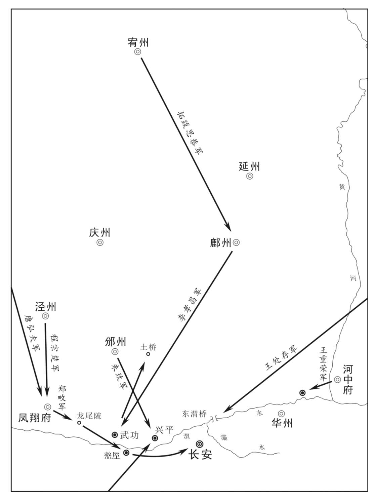 
唐末勤王军集结关中示意图

## 【注文】

[1]权知：暂时代理。

## 【译文】

唐僖宗中和元年（881年）夏季四月戊寅朔（初一日），加封王铎兼侍中。任命拓跋思恭暂时代理夏绥节度使。

## 【原文】

**黄巢以其将王玫为邠宁节度使，邠州通塞镇将朱玫起兵诛之，让别将李重古为节度使，自将兵讨巢[1]。是时唐弘夫屯渭北，王重荣屯沙苑，王处存屯渭桥，拓跋思恭屯武功，郑畋屯盩厔[2]。弘夫乘龙尾之捷，进薄长安[3]。**

## 【注文】

[1]王玫：生卒年不详，唐末黄巢起义军将领，曾任邠宁节度使。　　通塞镇：军镇名。故址在今陕西彬县北部，为关中通往西北部的驻防要地。　　朱玫（？—886年）：邠州（治今陕西彬县）人。唐末军事将领，曾任通塞镇将，后升任邠宁节度使。唐僖宗光启元年（885年），宦官田令孜挟持唐僖宗返回长安，与他及凤翔（治今陕西凤翔）节度使李昌符联合进攻盘踞河中的王重荣，大败而归，田令孜挟持唐僖宗再度逃走。朱玫改附李克用，后又攻入长安，拥李煴为帝，专断朝政，又派王行瑜追击唐僖宗。后因王行瑜倒戈而被杀。　　李重古：生卒年不详，唐末朱玫的部将。曾任邠宁节度使，率军镇压黄巢起义。

[2]沙苑：地名。又名沙阜、沙窝，在今陕西大荔南渭河与北洛河之间。　　武功：县名。治所在今陕西武功西北。　　盩厔（Zhōu zhì）：县名。西汉武帝置，治所在今陕西周至东。北周武帝建德三年（574年）治所迁至今陕西周至。唐玄宗天宝元年（742年）改为宜寿，唐肃宗至德二载（757年）复为盩厔。

[3]龙尾之捷：指唐僖宗中和元年（大齐金统二年，881年）三月，京城四面诸军行营都统郑畋率部在龙尾陂击败黄巢宰相尚让的战斗。

## 【译文】

黄巢任命他的部将王玫为邠宁节度使，邠州通塞镇守将朱玫起兵杀死了王玫，并任命别将李重古为节度使，自己则率兵进攻黄巢。当时，唐弘夫屯兵渭北，王重荣屯兵沙苑，王处存屯兵渭桥，拓跋思恭屯兵武功，郑畋屯兵盩厔。唐弘夫乘龙尾陂之捷，进兵逼近长安。

## 【原文】

**壬午，黄巢帅众东走，程宗楚先自延秋门入，弘夫继至，处存帅锐卒五千夜入城[1]。坊市民喜，争讙呼出迎官军，或以瓦砾击贼，或拾箭以供官军[2]。宗楚等［恐］诸将分其功，不报凤翔、鄜、夏[3]。军士释兵入第舍，掠金帛、妓妾[4]。处存令军士首系白为号，坊市少年或窃其号以掠人[5]。贼露宿霸上，诇知官军不整，且诸军不相继，引兵还袭之，自诸门分入，大战长安中，宗楚、弘夫死。军士重负不能走，是以甚败，死者什八九[6]。处存收余众还营。**

## 【注文】

[1]延秋门：唐长安禁苑城西面南门。

[2]讙（huān）呼：欢呼，“讙”通“欢”。　　瓦砾：破碎的砖头瓦片。

[3]不报凤翔、鄜、夏：不向凤翔节度使郑畋和鄜延节度使李孝昌及夏绥节度使拓跋思恭通报进入长安城之事。

[4]妓妾：古代称歌女、表演歌舞的女子和旧时男人娶的小老婆。

[5]白：束发用的丝带。

[6]重负：士兵掠夺财物甚多，负担沉重。

## 【译文】

唐僖宗中和元年（881年）四月壬午（初五日），黄巢军队向东撤退，程宗楚首先从延秋门入城，唐弘夫紧接着赶到，王处存率领五千名精锐士卒也在夜里进入了长安城，街坊中的百姓非常高兴，争先恐后欢呼着出来迎接官军，有的人用碎石瓦块投掷贼寇，有的人拾箭供给官军。程宗楚等担心其他将领分享他的功劳，就没有向凤翔节度使郑畋和鄜延节度使李孝昌及夏绥节度使拓跋思恭通报进城之事。进城后的官军都放下兵器，私自闯入民宅，抢劫金银财帛和妓妾。王处存命令士兵头扎白丝带为记号，街坊市面上的无赖少年有的也利用这种标记去掠抢钱财。黄巢军队露宿在霸上，侦查了解到官军军纪败坏，而且各军兵马还没有赶到，便带兵返回袭击长安，从各门分头进入城中，双方在长安城里交战，程宗楚、唐弘夫战死。官军抢劫来的财物太重了，以致行动不便，最终被黄巢军队打败，十之八九的人都被杀死。王处存收拾残兵返回驻地。

## 【原文】

**丁亥，巢复入长安，怒民之助官军，纵兵屠杀，流血成川，谓之“洗城[1]”。于是诸军皆退，贼势愈炽。贼所署同州刺史王溥、华州刺史乔谦、商州刺史宋岩，闻巢弃长安，皆帅众奔邓州，朱温斩溥、谦，释岩使还商州[2]。**

## 【注文】

[1]纵兵屠杀：据《新唐书·黄巢传》记载：“杀八万人”。

[2]王溥（？—881年）：唐末黄巢部将。曾被任命为同州刺史。黄巢撤出长安后，率领军队逃奔邓州，后被朱温杀死。　　乔谦（？—881年）：黄巢部将，曾被任命为华州刺史。黄巢撤出长安后，率领军队逃奔邓州，后被朱温杀死。　　商州：州名。北周武帝宣政元年（578年）改洛州置，治所在上洛县（今陕西商洛）。隋炀帝大业、唐玄宗天宝、唐肃宗至德间为上洛郡，后复为商州。唐时辖境相当于今陕西秦岭以南，洵河以东及湖北郧（yún）西等地。　　宋岩：生卒年不详，唐末黄巢部将。曾被任命为商州刺史。黄巢撤出长安后，率领军队逃奔邓州。后被朱温释放，返还商州。

## 【译文】

唐僖宗中和元年（881年）四月丁亥（初十日），黄巢再次进入长安，非常恼火长安百姓帮助官军，于是放纵士兵进行屠杀，血流成河，叫作“洗城”。于是，唐朝各路军队纷纷撤退，黄巢军的势力更加猖獗。黄巢军所任命的同州刺史王溥、华州刺史乔谦、商州刺史宋岩，听说黄巢放弃长安，都率领军队逃奔邓州，朱温杀了王溥、乔谦，释放了宋岩，命他回商州镇守。

## 【原文】

**庚寅，拓跋思恭、李孝昌与贼战于王桥，不利[1]。**

## 【注文】

[1]王桥：地名。在今陕西西安西北汉长安城东。

## 【译文】

唐僖宗中和元年（881年）四月庚寅（十三日），拓跋思恭、李孝昌与黄巢军队在王桥交战，很不顺利。

## 【原文】

**诏以河中留后王重荣为节度使。**

## 【译文】

下诏任命河中留后王重荣为节度使。

## 【原文】

**贼众上黄巢尊号曰承天应运启圣睿文宣武皇帝[1]。**

## 【注文】

[1]尊号：指古代尊崇皇帝、皇后的称号。一般用于外交、礼仪、祭祀等。古代皇帝尊号一般很长，因为大臣们会尽量把好的词语都加在皇帝身上。尊号一般在皇帝在世之时便开始有群臣上请，并不断加长。如唐玄宗李隆基的尊号是“开元天地天宝圣文神武孝德应道皇帝”。

## 【译文】

黄巢军给黄巢上尊号为“承天应运启圣睿文宣武皇帝”。

## 【原文】

**有双雉集广陵府舍，占者以为野鸟来集，城邑将空之兆[1]。高骈恶之，乃移檄四方，云将入讨黄巢，悉发巡内兵八万，舟二千艘，旌旗甲兵甚盛[2]。五月乙未(1)，出屯东塘[3]。诸将数请行期，骈托风涛为阻，或云时日不利，竟不发[4]。**

## 【注文】

[1]雉：野鸡。　　占者：以占卜为职业的人。古代常用龟壳、铜钱、竹签、纸牌或星象等手段和征兆来推断未来的吉凶祸福。

[2]旌：古代用羽毛装饰的旗子。又指普通的旗子。

[3]东塘：地名。位于今江苏扬州东。

[4]时日不利：时辰不吉利。

## 【译文】

有一对野鸡降落在广陵府屋顶上，占卜的人认为野鸡来集，是城市将要变空的前兆。高骈非常讨厌这件事，于是向四方发布文告，声称将要率兵入关讨伐黄巢，调动辖区内的全部八万兵力，两千艘战船，军旗和全副武装的战士非常威武强盛。中和元年（881年）五月乙未，高骈出兵驻扎在东塘。部将们多次请示出发日期，高骈以风浪太大为借口，或说时日不吉利，始终没有发兵。

## 【原文】

**黄巢之克长安也，忠武节度使周岌降之。岌尝夜宴，急召监军杨复光，左右曰：“周公臣贼，将不利于内侍，不可往[1]。”复光曰：“事已如此，义不图全。”即诣之。酒酣，岌言及本朝，复光泣下，良久曰：“丈夫所感者恩义耳。公自匹夫为公侯，奈何舍十八叶天子而臣贼乎[2]！”岌亦流涕，曰：“吾不能独拒贼，故貌奉而心图之。今日召公，正为此耳。”因沥酒为盟[3]。是夕，复光遣其养子守亮杀贼使者于驿[4]。时秦宗权据蔡州，不从岌命，复光将忠武兵三千诣蔡州，说宗权同举兵讨巢[5]。宗权遣其将王淑将兵三千从复光击邓州，逗留不进，复光斩之，并其军[6]。分忠武八千人为八都，遣牙将鹿晏弘、晋晖、王建、韩建、张造、李师泰、庞从等八人将之[7]。王建，舞阳人；韩建，长社人；晏弘、晖、造、师泰，皆许州人也[8]。复光帅八都与朱温战，败之，遂克邓州，逐北至蓝桥而还[9]。**

## 【注文】

[1]召监军杨复光：杨复光为忠武监军，原屯驻在邓州。朱温攻陷邓州后，杨复光遂至许州依附周岌。　　内侍：称杨复光。

[2]丈夫：犹言大丈夫。指有所作为的人。　　匹夫：古代指平民中的男子，亦泛指平民百姓。　　十八叶：自唐高祖李渊至唐僖宗李儇十八世。其中不计武则天，唐僖宗是第十八代皇帝。

[3]沥（lì）酒：洒酒于地，表示祝愿或起誓。

[4]守亮：即杨守亮（？—894年），本姓訾（zī）名亮，曹州（今山东曹县西北）人。宦官杨复光在平定江西黄巢起义军时，收他为养子，于是改姓杨，名守亮。早年为扈跸（bì）都将，后在杨复恭的提拔下，官至山南西道节度使。唐昭宗乾宁元年（894年），欲投奔河东节度使李克用，行至华州（治今陕西华县）时被韩建擒获，处斩。　　驿：古时专供传递文书者或来往官吏中途住宿、补给、换马的处所。

[5]秦宗权（？—889年）：蔡州上蔡（今河南上蔡）人，一作许州（今河南许昌）人。初为许州牙将，唐僖宗广明元年（880年），驱逐蔡州刺史，占据蔡州。同年冬，黄巢军攻入潼关，唐僖宗逃奔四川，他因进攻起义军有功授蔡州奉国军节度使。唐僖宗中和三年（883年），黄巢退出关中，进入河南。他迎战失败，投降黄巢。黄巢失败后，他于光启元年（885年）在蔡州（治今河南汝南）称帝，并攻占了陕州（治今河南三门峡西）、洛州（治今河南洛阳）等二十多个州，一时成为中原地区实力最为强大的军阀集团。随后，与盘踞汴州（今河南开封）的宣武节度使朱温展开争霸。唐僖宗文德元年（888年），在与朱温的交战中，战败被擒，后被押送至京师斩首。　　蔡州：州名。隋炀帝大业初改溱州置，治所在汝阳县（今河南汝南）。后改为汝南郡。唐初改为豫州，唐玄宗天宝元年（742年）改名汝南郡，唐肃宗乾元元年（758年）复为豫州，唐代宗宝应元年（762年）改为蔡州。辖境大致在今河南淮河以北，桐柏山以东，洪河上游以南地区。

[6]王淑（？—881年）：唐末秦宗权的部将，因跟随宦官杨复光进攻邓州时逗留不进被杀。

[7]八都：唐末禁军名。置于唐僖宗时期。由忠武监军杨复光从诸军中挑选骁勇善战者组成，任命鹿晏弘、韩建等八人为都将，分别统辖一千人（即一都）。　　牙将：统帅牙军的将领。唐末节度使专门组织一支保护牙城与使牙的军队，叫作牙军，或称衙兵。他们有时也被派到外地作战。牙军是藩镇中最精锐的军队，常由节度使派遣心腹将领统领，是藩镇对抗朝廷、进行割据的重要武装力量。　　鹿晏弘（？—886年）：唐末将领，许州（治今河南许昌）人，宦官杨复光部下。黄巢攻陷长安（今陕西西安），唐僖宗逃到成都（今四川成都），他跟随杨复光镇压黄巢军队。黄巢战败后，杨复光任命他为都将。唐僖宗中和二年（882年），他又被任命为山南西道节度使。后被蔡州刺史秦宗权杀死。　　晋晖（844—923年）：字光远，许州（治今河南许昌）人。唐末忠武军牙将，曾跟从宦官杨复光镇压黄巢起义军。黄巢军队占领长安后，唐僖宗逃亡蜀地，他跟随王建与韩建等人率领忠武军迎接唐僖宗，担任“随驾五都”之一。唐僖宗返回长安后，他被任命为神策军使。后辅弼王建，累官至检校太尉兼中书令，封弘农郡王。1974年，在四川成都东北郊附近出土了前蜀晋晖墓志铭。按墓铭晋晖死于前蜀后主王衍乾德五年（923年），享年79岁，其生年当为唐武宗会昌四年（844年）。　　王建（847—918年）：字光图，陈州项城（今河南沈丘）人，一作许州舞阳（今河南舞钢）人，田令孜养子。黄巢起义时投效唐朝军队，隶属于忠武军。唐朝都城长安沦陷时他奋不顾身护驾，号为“随驾五都”之一，是忠武八都的都将之一。唐僖宗返回长安后，任命他为禁军将领。光启二年（886年），唐僖宗逃往兴元（今陕西汉中），任命他为“清道使”。唐昭宗大顺二年（891年），他率领精兵攻破鹿头关（今四川德阳北），占据汉州（治今四川广汉），进攻彭州（治今四川彭州），大败陈敬瑄，不久攻占成都（今四川成都）。到唐昭宗乾宁四年（897年），已占有东川梓（治今四川三台）、渝（治今重庆）等州，遂有两川兼三峡之地。唐昭宗天复二年（902年），取得山南西道控制权。次年，封为蜀王，成为当时最大的割据势力。后梁开平元年（907年），朱温篡唐。同年九月，王建在成都称帝，国号蜀。他在位时期，励精图治，注重农桑，兴修水利，扩张疆土，实行“与民休息”的政策。　　韩建（855—912年）：唐末军事将领。字佐时，许州长社（今河南许昌）人。初为蔡州军校，后随杨复光镇压黄巢起义。黄巢退出长安后，他率部迎接唐僖宗返京，被任命为潼关防御使、华州刺史、节度使。唐昭宗光化元年（898年），他被封为太傅、许国公。后参与唐末军阀混战，战败后投降朱温。后梁代唐后，任司徒、同平章事、诸道盐铁转运使、陈许蔡观察使等职。后梁太祖乾化二年（912年），被乱兵所杀。　　张造：生卒年不详，唐末龙州（治今四川平武东南）人。原为忠武军牙将，曾跟从宦官杨复光镇压黄巢起义。唐僖宗中和四年（884年），与王建等弃鹿晏弘而投靠田令孜，为“随驾五都”之一。后追随前蜀王建，官至茂州刺史。　　李师泰：唐末将领，生卒年不详，许州（治今河南许昌）人。初为忠武军牙将，曾跟随杨复光镇压黄巢起义。唐僖宗中和四年（884年），与王建等弃鹿晏弘而投靠田令孜，为“随驾五都”之一，担任忠州刺史。后跟随王建前往西川，历官蜀州刺史、节度判官。　　庞从：唐末将领，生卒年不详。初为忠武军牙将，曾跟随杨复光镇压黄巢起义。

[8]舞阳：县名。秦置，治所在今河南舞阳西北，南朝宋废。唐玄宗开元四年（716年）复置，唐宪宗元和十三年（818年）移治吴城镇（今河南舞阳东）。　　长社：县名。西汉置，治所在今河南长葛东北。东魏孝静帝元善见武定七年（549年）治所迁至颍阴县（今河南许昌）。隋炀帝开皇初更名颍川县，唐初复名长社县。

[9]蓝桥：地名。在今陕西蓝田东南。

## 【译文】

黄巢攻克长安时，忠武节度使周岌投降了黄巢。周岌曾经在晚上设宴，紧急宴请唐监军杨复光，杨复光的左右随从劝说道：“周公投降了贼寇，将会不利于您，不能前去。”杨复光说：“事情已经这样，我只能舍生取义。”于是去见周岌。酒喝到畅快时，周岌说到唐朝，杨复光落泪，过了好久说：“最能打动大丈夫的是恩义，您从一个普通人成为公侯，为什么要抛弃立国十八代的天子而投降黄巢呢？”周岌听后也哭着说：“我没有能力单独抵抗贼寇，所以表面上投敌而内心在想如何打败他。今天请您来，正是为了这件事。”于是洒酒为盟。当天晚上，杨复光派养子杨守亮在驿馆杀了黄巢的使者。当时秦宗权占据了蔡州，不听从周岌的命令，杨复光率领三千名忠武兵来到蔡州，劝秦宗权一同举兵讨伐黄巢。秦宗权派部将王淑率领三千名士兵跟随杨复光进攻邓州，王淑因逗留不进，被杨复光斩杀，吞并了他的军队。而后分忠武八千人为八都，调牙将鹿晏弘、晋晖、王建、韩建、张造、李师泰、庞从等八人率领。王建是舞阳人，韩建是长社人，鹿晏弘、晋晖、张造、李师泰都是许州人。杨复光率领八都与朱温交战，击败了他，于是攻克了邓州，往北追击敌军到蓝桥而回。

## 【原文】

**昭义节度使高浔会王重荣攻华州，克之[1]。**

## 【注文】

[1]高浔（xún）（？—881年）：唐末官吏，高骈侄孙。曾任陕虢观察使、昭义节度使等。曾参与镇压黄巢起义军，在石桥（今陕西华县西）被黄巢将领李详打败。唐僖宗中和元年（881年），被部将成麟杀死。

## 【译文】

昭义节度使高浔会同王重荣一起进攻华州，攻了下来。

## 【原文】

**六月戊戌，以郑畋为司空兼门下侍郎、同平章事，都统如故[1]。**

## 【注文】

[1]司空：官名。西周始置，位次三公，与司马、司寇、司士、司徒并称五官，主管水利、土木工程和官府手工业等。此后历代沿置。隋唐虽设司空，为三公之一，但仅是一种崇高的虚衔，多为大臣的加官。

## 【译文】

唐僖宗中和元年（881年）六月戊戌（二十二日），任命郑畋为司空兼门下侍郎、同平章事，仍旧担任原先的都统职务。

## 【原文】

**邠宁节度副使朱玫屯兴平，黄巢将王播围兴平，玫退屯奉天及龙尾陂[1]。**

## 【注文】

[1]兴平：县名。初名始平县，唐中宗景龙四年（710年），吐蕃遣使迎和亲公主（金城公主）入藏，唐中宗亲送金城公主至此，并将此县改名为金城县。唐肃宗至德二载（757年）又改金城县为兴平县。治所设在今陕西兴平。

## 【译文】

邠宁节度副使朱玫驻扎在兴平，黄巢部将王播包围兴平，朱玫退兵驻扎在奉天及龙尾陂。

## 【原文】

**西川黄头军使李将万人，巩咸将五千人屯兴平，为二寨，与黄巢战，屡捷；陈敬瑄遣神机营使高仁厚将二千人益之[1]。**

## 【注文】

[1]军使：官名。掌军中的赏功罚罪。　　巩咸：生卒年不详，唐末将领。曾参与镇压黄巢起义。　　神机营使：武官名。剑南西川节度使下设置的负责火器制造的官员。　　高仁厚（？—886年）：唐末将领。曾任剑南西川神机营使，参与镇压黄巢起义。后叛陈敬瑄，被杀。

## 【译文】

剑南西川黄头军使李率领一万军队，巩咸率领五千军队驻扎在兴平，设立两个营寨，在与黄巢军队的交锋中，多次战胜。西川节度使陈敬瑄命令神机营使高仁厚率领两千人前往增援。

## 【原文】

**初，车驾至成都，蜀军赏钱人三缗。田令孜为行在都指挥处置使，每四方贡金帛，辄颁赐从驾诸军无虚月，不复及蜀军，蜀军颇有怨言[1]。秋七月丙寅，令孜宴土客都头，以金杯行酒，因赐之，诸都头皆拜而受[2]。西川黄头军使郭琪独不受，起言曰：“诸将月受俸料，丰赡有余，常思难报，岂敢无厌[3]。顾蜀军与诸军同宿卫，而赏赉悬殊，颇有觖望，恐万一致变[4]。愿军容减诸将之赐以均蜀军，使土客如一，则上下幸甚[5]。”令孜默然有间，曰：“汝尝有何功？”对曰：“琪生长山东，征戍边鄙，尝与党项十七战，契丹十余战，金创满身[6]。又尝征吐谷浑，伤胁肠出，线缝复战。”令孜乃自酌酒于别樽以赐琪[7]。琪知其毒，不得已，再拜饮之。归，杀一婢，吮其血以解毒，吐黑汁数升[8]。遂帅所部作乱，丁卯，焚掠坊市。令孜奉天子保东城，闭门登楼，命诸军击之。琪引兵还营，陈敬瑄命都押牙安金山将兵攻之，琪夜突围出，奔广都[9]。**

## 【注文】

[1]行在都指挥处置使：唐僖宗临时设置的使职，相当于行宫总指挥官兼军政总监。　　虚月：空月。古代指没有贡物的月份。

[2]土客都头：土军指蜀军，客军指从驾诸军。都头，本指诸军统帅，后来一部之军称为一都，其部帅即称都头。宋各军指挥使下设此官，属低级军官。宋代州县捕快头目亦有此称。

[3]郭琪：生卒年不详，唐末将领。曾任西川黄头军使。后因不满田令孜的行为，逃奔淮南节度使高骈。　　俸料：唐代官员的薪水，一般发禄米或钱。

[4]赏赉（lài）：赏赐。　　觖（jué）望：抱怨、不满意。

[5]军容：官名，观军容使的简称。参见前文“观军容使”条注。

[6]契丹：古代东北民族，北魏时始见于史籍。源于东湖，为鲜卑的一支。分布于今内蒙古西拉木伦河和老哈河一带，以游牧、狩猎和捕鱼为业。隋朝时，契丹各部已形成松散的部落联盟。唐朝初年，正式形成大贺氏为首的部落联盟。唐太宗时，契丹归附唐朝，唐太宗贞观二十二年（648年），唐朝在契丹住地设置松漠都督府，以契丹首领窟哥为松漠都督，并赐姓李氏。唐玄宗时，契丹内部动乱不已，再加对唐朝战争的失败，使氏族部落组织大部溃散。唐哀帝天祐四年（907年），耶律阿保机成为部落联盟首领，他在位期间统帅契丹军马，连年对外掠夺，俘掠大批奴隶和牲畜，不断扩大统治地区，使契丹的势力逐渐强大起来。后梁末帝贞明二年（916年）建立契丹国（后改称辽）。　　金创：中医名词，指金刃对人体所致的创伤。

[7]樽（zūn）：古代盛酒的器具。

[8]婢：旧时供有钱人家役使的女奴。

[9]都押牙：督管押牙的官员。押牙是唐朝设置的官名，所谓“押”就是“掌管”，“牙”就是“牙旗”，可以理解为“掌管牙旗的官员”，引申为“管领仪仗的侍卫”。牙，后来也作“衙”。　　安金山：生卒年不详，唐末剑南西川节度使陈敬瑄部将。曾奉陈敬瑄之命，围剿西川黄头军使郭琪的叛乱。　　广都：县名。唐高宗龙朔二年（662年）置，县治在今四川双流东南。

## 【译文】

当初，唐僖宗到达成都时，蜀地军队每人赏钱三缗。田令孜担任行在都指挥处置使，每逢四方贡献金钱布帛，就颁赐给随驾诸军，而且每月都有，不再发给蜀军，蜀军多有怨言。中和元年（881年）秋季七月丙寅（二十日），田令孜宴请四川土军和外来客军的都头，用金杯来行酒，顺势把金杯赠送给大家，众都头都拜谢接受。唯独西川黄头军使郭琪不接受，站起来说道：“诸将每月都有国家的俸禄，丰富有余，常常想到难以答报，岂敢贪得无厌！现在蜀军和诸军一同守卫，而赏赐却十分悬殊，蜀军颇有不满，我非常担心发生事变。希望田军容能够减少诸将的赏赐，并均给蜀军，使土著和客军一样，则上下都很庆幸了。”田令孜沉默了一会儿，说：“你曾经有什么功劳？”回答：“郭琪生长在山东，戍守在边防地区，曾经与党项交战十七次，与契丹交战十几次，全身都是战伤，又曾征伐吐谷浑，肋下受伤，肠子流出，用线缝上后又去战斗。”田令孜就从别的酒器中斟酒赐给郭琪，郭琪知道里面有毒，不得已，再拜后喝下。郭琪回家后杀了一个奴婢，喝她的血来解毒，吐出黑毒汁好几升。于是率部队反叛。丁卯（二十一日），郭琪军队焚烧抢劫了市场和居民区。田令孜保护着唐僖宗退保东城，关闭城门登上城楼，命令诸军攻打他。郭琪领兵回营，陈敬瑄命都押牙安金山带兵进攻，郭琪趁夜色突围出去，逃往广都。

## 【原文】

**上日夕专与宦官同处，议天下事，待外臣殊疏薄[1]。庚午，左拾遗孟昭图上疏，以为：“治安之代，遐迩犹应同心；多难之时，中外尤当一体[2]。去冬车驾西幸，不告南司，遂使宰相、仆射以下悉为贼所屠，独北司平善[3]。况今朝臣至者，皆冒死崎岖，远奉君亲，所宜自兹同休等戚[4]。伏见前夕黄头军作乱，陛下独与令孜、敬瑄及诸内臣闭城登楼，并不召王铎以下及收朝臣入城。翌日，又不对宰相，亦不宣慰朝臣[5]。臣备位谏官，至今未知圣躬安否，况疏冗乎[6]？傥群臣不顾君上，罪固当诛；若陛下不恤群臣，于义安在！夫天下者，高祖、太宗之天下，非北司之天下。天子者，四海九州岛之天子，非北司之天子[7]。北司未必尽可信，南司未必尽无用。岂天子与宰相了无关涉，朝臣皆若路人[8]。如此，恐收复之期，尚劳宸虑，尸禄之士，得以晏安[9]。臣躬被宠荣，职在裨益，虽遂事不谏，而来者可追[10]。”疏入，令孜屏不奏。辛未，矫诏贬昭图嘉州司户，遣人沉于蟇颐津，闻者气塞而莫敢言[11]。**

## 【注文】

[1]宦官：是中国古代专供皇帝及其家族役使的官员。先秦和西汉时期并非全是阉人。自东汉开始，则专指被阉割后失去性能力的人。又称寺人、阉官、宦者、中官等。　　外臣：外廷之臣，即朝官。

[2]孟昭图（？—881年）：唐朝官吏。唐僖宗时任左拾遗，因直言进谏，为宦官田令孜所恶，贬为嘉州司户参军。赴任途中，被田令孜所派刺客沉杀于蟇（má）颐津。孟昭图死后，后人为纪念他，在岸边建造了一个祠堂，称为孟昭图祠。　　治安：政治清明，社会安定。　　遐迩（ěr）：远近。　　中外：宫中与外廷。

[3]平善：平安完好。

[4]同休等戚：即休戚与共。休戚，喜乐悲伤。

[5]翌（yì）日：明日，第二天。　　不对宰相：不召集宰相一起商讨政事。

[6]疏冗（rǒng）：指居于散位之官。

[7]四海九州：犹言天下。泛指中原。《礼记·祭义》中详细记载“四海”为东海、西海、南海、北海，《尚书·禹贡》中记载的九州为冀、豫、雍、扬、兖、徐、梁、青、荆。

[8]了无关涉：全无关系。

[9]尸禄：居位食禄而不做事。

[10]职在裨益：谏官之责在于裨补缺漏。　　虽遂事不谏，而来者可追：语见《论语·八佾（yì）》（“成事不说，遂事不谏，既往不咎”）和《论语·微子》（“往者不可谏，来者犹可追”），意思是过去的事已不可挽回，未来的事还可以借鉴。

[11]矫诏：假托或假传的皇帝诏书，或者篡改皇帝的诏令。　　嘉州：州名。北周时期置，治所设在平羌县（今四川乐山东北），取“郡土嘉美”之意。隋炀帝大业二年（606年）并入眉州。大业三年（607年）改为眉山郡。唐高祖武德元年（618年）又改为嘉州。治所迁至龙游县（今四川乐山），辖境大致相当于今四川乐山、峨眉山、夹江、犍为、沐川、马边等地。唐玄宗天宝初改为犍（qián）为郡，唐肃宗乾元初复为嘉州。　　蟇颐津：津渡名。在今四川眉山东。蟇，蟆的异体字。

## 【译文】

唐僖宗整日与宦官在一起，讨论国家事情，对待朝臣特别疏远淡薄。中和元年（881年）七月庚午（二十四日），左拾遗孟昭图上书，说：“政局安定年代，远近尚且应该同心协力，多难之时，朝廷内外更应当团结一致。去年冬天皇帝西行，没有告诉南衙的朝官，于是使得宰相、仆射以下的官员，全部被贼寇所杀，只有北司平安无事。况且今天来到的朝臣，都是冒着生命危险，经过崎岖之路，远道来拥戴皇上的，应当从此与他们休戚与共。臣看到前几天黄头军作乱，陛下只与田令孜、陈敬瑄以及内侍诸臣闭城登楼，并没有召王铎以下的人，也不让朝臣进城。第二天，又没有召见宰相问对，也不宣召和安慰朝臣。臣是谏官，至今不知圣上平安与否，何况疏远的散官呢？倘若群臣不顾君上，他们的罪过应当斩首；如果陛下不体恤群臣，道义上说得通吗！唐朝天下是高祖、太宗的天下，不是北司的天下；天子是四海九州的天子，不是北司的天子。北司未必人人可信，南司未必全无用处。岂有天子与宰相毫无关涉，与朝臣如同陌路之人的事情！这样下去，恐怕收复长安之期还有待时日，那些行尸受禄之士得以宴享安定。臣是身受宠信荣华的谏官，职责就是要对朝廷有所帮助，虽然过去的事不可挽回，但未来还是可以追补的。”奏疏递上去之后，田令孜拦下没禀奏皇帝。辛未（二十五日），田令孜假借皇帝名义下诏贬孟昭图为嘉州司户，又派人把他沉进蟇颐津中淹死，听到这件事的人都义愤填膺而不敢言语。

## 【原文】

**鄜延节度使李孝昌、权夏州节度使拓跋思恭屯东渭桥，黄巢遣朱温拒之。**

## 【译文】

鄜延节度使李孝昌、代理夏州节度使拓跋思恭驻扎在东渭桥，黄巢派遣朱温前往抵抗。

## 【原文】

**以义武节度使王处存为东南面行营招讨使，以邠宁节度副使朱玫为节度使。**

## 【译文】

任命义武节度使王处存为东南面行营招讨使，以邠宁节度副使朱玫为节度使。

## 【原文】

**秋八月，高浔与黄巢将李详战于石桥，浔败，奔河中，详乘胜复取华州[1]。巢以详为华州刺史。**

## 【注文】

[1]李详：生卒年不详，唐末黄巢起义军将领。曾于石桥击败唐将高浔，收复华州（治今陕西华县）等地，黄巢任命他为华州刺史。　　石桥：又名西石桥，在今陕西华县西石堤河上。

## 【译文】

唐僖宗中和元年（881年）秋季八月，昭义节度使高浔与黄巢将领李详在石桥交战，高浔战败逃往河中，李详乘胜攻取了华州。黄巢于是任命李详为华州刺史。

## 【原文】

**以权知夏绥节度使拓跋思恭为节度使。**

## 【译文】

任命代理夏绥节度使拓跋思恭为节度使。

## 【原文】

**九月，李孝昌、拓跋思恭与尚让、朱温战于东渭桥，不利，引去。**

## 【译文】

唐僖宗中和元年（881年）九月，李孝昌、拓跋思恭与尚让、朱温在东渭桥交战，失利，率军撤退。

## 【原文】

**初，高骈与镇海节度使周宝俱出神策军，骈以兄事宝[1]。及骈先贵，有功，浸轻之[2]。既而封壤相邻，数争细故，遂有隙[3]。骈檄宝入援京师，宝治舟师以俟之，怪其久不行[4]。访诸幕客，或曰：“高公幸朝廷多故，有并吞江东之志，声云入援，其实未必非图我也，宜为备。”宝未之信，使人觇骈，殊无北上意[5]。会骈使人约宝面会瓜洲议军事，宝遂以言者为然，辞疾不往[6]。且谓使者曰：“吾非李康，高公复欲作家门功勋以欺朝廷邪[7]！”骈怒，复遣使责宝：“何敢轻侮大臣？”宝诟之曰：“彼此夹江为节度使，汝为大臣，我岂坊门卒邪[8]？”由是遂为深仇。骈留东塘百余日，诏屡趣之，骈上表托以宝及浙东观察使刘汉宏将为后患。辛亥，复罢兵还府，其实无赴难心，但欲禳雉集之异耳[9]。**

## 【注文】

[1]周宝（810—884年）：字上珪（guī），平州卢龙（今河北卢龙）人，唐末军事将领。唐武宗会昌年间，以善击毬为神策军打毬军将，入值宿卫，与高骈皆隶属于右神策军，后擢为金吾将军、泾原节度使。黄巢义军攻陷长安后，他率军护驾，屡次与起义军作战。唐僖宗中和二年（882年），进平章事，兼天下租庸副使，封汝南郡王，调任镇海节度使。他在职期间溺于声色，不亲政事，导致部将作乱。兵败后被钱镠（liú）杀死。朝廷追赠他为太保。

[2]浸轻之：逐渐看不起周宝。

[3]封壤相邻：两人所管辖的地区，高骈是淮南，周宝是浙西，只隔着一条长江。

[4]舟师：水军。

[5]觇（chān）：暗中察看。

[6]瓜洲：又称瓜步洲，在今江苏扬州南。本系长江中的沙洲，唐中叶后与北岸陆地相连。

[7]吾非李康：唐宪宗元和元年（806年），刘辟任西川节度使，李康任东川节度使，刘辟想兼有东川地，于是发兵进攻东川，把李康围困在梓州（今四川三台），随后攻陷梓州俘虏李康。而此时唐宪宗命左神策行营节度使高崇文、神策京西行营兵马使李元奕、山南西道节度使严砺共同出兵讨伐刘辟。刘辟于是将李康送还给高崇文，以求减免自己的罪过。高崇文由于李康兵败失守梓州，将其处死。　　作家门功勋：指高崇文斩东川节度使李康。高崇文乃高骈之祖。

[8]坊门卒：长安城居住区共一百零六坊，每坊皆有墙有门，每门皆有守卒。

[9]禳（ráng）：祈求消除灾殃。

## 【译文】

当初，高骈和镇海节度使周宝都出身于神策禁军，高骈把周宝当作哥哥。等到高骈先升了官，立了战功，就逐渐看不起周宝了。后来，两人所管辖的区域又相邻，多次因小事情发生争执，于是两人之间产生了矛盾。高骈命令周宝入关援救京城，周宝准备好船只和军队等待出发，但对高骈久无动静感到非常奇怪。于是就向幕僚求教，有的说：“高公庆幸朝廷多发生事变，让他好吞并江东一带。他虽然口口声声说要进京援救，其实未必不是想借机除掉我们。我们应该及时提前准备。”周宝开始没有相信。于是命人前去窥探，得知高骈根本没有北上的意思。正赶上高骈让人来约周宝到瓜洲会面商讨进军的事情，周宝认为幕僚说的有道理，于是借口生病无法前往。并对使者说：“我不是李康，高公又想在家门口寻找借口，假称谋反而收捕大将，作为自己的功勋来欺骗朝廷吗！”高骈听后十分生气，又派使者责备周宝：“你为何敢轻慢侮辱大臣？”周宝也回骂说：“我们彼此隔江做节度使，你是大臣，我难道是看管街坊市门的小吏吗？”从此，两人就结下了深仇。高骈在东塘停留了一百多天，皇帝多次督促他出兵，高骈上表称周宝及浙东观察使刘汉宏将要成为后患而不肯发兵。中和元年（881年）九月辛亥（初六日），高骈又撤兵回府，其实他并没有北上抗贼之心，只是想要避让双雉齐集府衙屋顶的灾异之兆罢了。

## 【原文】

**忠武监军杨复光屯武功。凤翔行军司马李昌言将本军屯兴平。时凤翔仓库虚竭，犒赏稍薄，粮馈不继。昌言知府中兵少，因激怒其众，冬十月，引军还袭府城。郑畋登城与士卒言，其众皆下马罗拜曰：“相公诚无负我曹[1]。”畋曰：“行军苟能戢兵爱人，为国灭贼，亦可以顺守矣[2]。”乃以留务委之，即日西赴行在。**

## 【注文】

[1]罗拜：罗列而拜、围绕着下拜。

[2]戢（jí）兵：本义为息兵。此指收敛约束士兵。　　顺守：以武力夺取天下为逆取，以文教治理天下为顺守。此处引申为以武力逐帅为逆取，讨贼立功而任节度使为顺守。

## 【译文】

忠武监军杨复光屯兵武功，凤翔行军司马李昌言率领军队屯驻兴平。当时凤翔仓库空虚，给将士们的犒赏比较少，粮食也供给不上。李昌言知道凤翔节度使府中兵力很少，所以乘机煽动部下，中和元年（881年）冬季十月，领兵回袭凤翔节度使府城。郑畋登城对士兵喊话，李昌言的部下都下马跪拜说：“相公实在没有对不起我们的事情。”郑畋说：“行军司马李昌言假如能收兵爱护百姓，为国消灭贼寇，也可以说是顺守了。”于是就委任李昌言为凤翔留守，自己当天就西赴成都觐见皇帝。

## 【原文】

**天平节度使曹全晸与贼战死，军中立其兄子存实为留后[1]。**

## 【注文】

[1]存实：即曹存实（？—882年），天平节度使曹全晸侄子，开封（今河南开封）人。唐僖宗中和元年（881年），曹全晸在镇压黄巢起义军时战死，曹存实被军中拥立为天平留后。次年，在抵抗魏博节度使韩简的进攻中，战死。

## 【译文】

天平节度使曹全晸战死，军中拥立他哥哥的儿子曹存实为留后。

## 【原文】

**十一月，孟楷、朱温袭鄜、夏二军于富平，二军败，奔归本道[1]。**

## 【注文】

[1]鄜、夏二军：即李孝昌鄜延兵与拓跋思恭夏绥兵。　　富平：京兆府所属县，治今陕西富平西南。

## 【译文】

唐僖宗中和元年（881年）十一月，孟楷、朱温在富平袭击李孝昌的鄜延军与拓跋思恭的夏绥军，两军战败，逃回本道。

## 【原文】

**郑畋至凤州，累表辞位[1]。诏以畋为太子少傅分司，以李昌言为凤翔节度行营招讨使[2]。**

## 【注文】

[1]凤州：州名。因西界有凤凰山而名，西魏废帝三年（554年）改南岐州置，治所在梁泉县（今陕西凤县东北）。隋炀帝大业三年（607年）改为河池郡。唐高祖武德元年（618年）复改凤州，唐玄宗天宝元年（742年）又改河池郡，唐肃宗乾元元年（758年）仍改凤州。

[2]太子少傅：官名。“东宫三少”或“太子三少”之一。太子太师、太子太傅、太子太保都是东宫官职，负责教习太子。太子少师、太子少傅、太子少保均是他们的副职，隋唐时逐渐成为虚衔。

## 【译文】

郑畋到达凤州，屡次上表请求辞去官职。下诏改任郑畋为太子少傅，分司东都，任命李昌言为凤翔节度行营招讨使。

## 【原文】

**十二月，以感化留后时溥为节度使[1]。赐夏州号定难军[2]。**

## 【注文】

[1]时溥（？—893年）：彭城（今江苏徐州）人，唐末军事将领。唐僖宗中和元年（881年），时任牙将的他率兵入关镇压黄巢起义军，行至河阴（今河南荥阳北），军士哗变，于是返归徐州（治今江苏徐州），驱逐节度使支详，他被拥立为留后，后又被正式任命为节度使。中和三年（883年），他发兵征讨黄巢，捷报频传，因功授东面兵马都统。又合兵追击黄巢部将尚让。中和四年（884年），尚让叛降，黄巢死，黄巢之甥林言亦降。时溥论功第一，获封检校司徒、同中书门下平章事，晋升检校太尉，兼中书令，受封巨鹿郡王。朱温不服，与他产生矛盾，从此双方争战不息。唐昭宗景福二年（893年），徐州被攻破，时溥自焚而死。

[2]夏州：即夏绥节度使，因其驻守夏州，故又称夏州节度使。参见前文“夏绥”条注。

## 【译文】

唐僖宗中和元年（881年）十二月，任命感化留后时溥为节度使。赐夏州号为定难军。

## 【原文】

**王铎以高骈为诸道都统无心讨贼，自以身为首相，发愤请行，恳款流涕，至于再三，上许之[1]。**

## 【注文】

[1]恳款：诚恳，恳切。

## 【译文】

王铎因为高骈为诸道都统却无心讨伐贼寇，考虑到自己身为宰相，便决心要求亲自前往督战，诚恳真切地流下了眼泪，经再三请求，最终获得唐僖宗同意。

## 【原文】

**二年春正月辛亥，以王铎兼中书令，充诸道行营都都统，权知义成节度使，俟罢兵复还政府[1]。高骈但领盐铁转运使，罢其都统及诸使[2]。听王铎自辟将佐，以太子少师崔安潜为副都统[3]。辛未，以周岌、王重荣为都都统左右司马，诸葛爽及宣武节度使康实为左右先锋使，时溥为催遣纲运租赋防遏使[4]。以右神策观军容使西门思恭为诸道行营都都监[5]。又以王处存、李孝昌、拓跋思恭为京城东北西面都统，以杨复光为南面行营都监使。又以中书舍人郑昌图为义成节度行军司马，给事中郑畯为判官，直弘文馆王抟为推官，司勋员外郎裴贽为掌书记[6]。昌图，从谠之从祖兄弟；畯，畋之弟；搏，玙之曾孙；贽，坦之子也[7]。又以陕虢观察使王重盈为东面都供军使[8]。重盈，重荣之兄也。**

## 【注文】

[1]充：担任。　　都都统：官名。总领诸道行营都统的长官。　　政府：唐时称宰相治理政务之处为政府，即政事堂。

[2]但领盐铁转运使：淮南为南北交通要冲，故仍保留高骈盐铁转运使之职。

[3]辟：征召推举授官。

[4]康实：生卒年不详，唐末官吏。曾任宣武节度使，唐僖宗任命他为王铎的左右先锋使，讨伐黄巢起义军。　　时溥为催遣纲运租赋防遏使：江南纲运，自江淮而来，皆由徐州境内通过，故以时溥担任此职。

[5]西门思恭：生卒年不详，唐后期宦官。历任左军辟仗使、左监门卫上将军、右卫上将军、右神策观军容使。唐僖宗中和二年（882年），被任命为诸道行营都都监，参与镇压黄巢起义。

[6]中书舍人：官名。西晋置，为中书省属官，掌呈奏案章。东晋时与中书通事合为一职，称中书通事舍人。南朝梁复称中书舍人，专掌草拟诏敕，兼掌呈奏文书章表。隋朝称内史舍人、内书舍人。唐高祖武德三年（620年）复置，职掌起草诏令，参与机密，权力日重。但唐中期后，其草拟诏敕的权力渐为翰林学士所夺，权任遂轻。　　郑昌图（？—887年）：字光业，开封（今河南开封）郑氏北祖之后。唐懿宗咸通十三年（872年）中状元。他身材魁梧，不拘小节，胸怀大度。曾任凤翔副使、中书舍人、义成节度行军司马、户部侍郎等职，参与镇压黄巢起义。　　给（jǐ）事中：官名。秦置，为朝中官员的加官，加此官衔者可以出入宫禁，侍从皇帝左右。西汉沿置，为中朝要职。魏晋时仍作为加官，但也可单授，五品，属散骑省。南朝设为职事官，掌收发文书，谏诤皇帝，属集书省。北魏置为内朝官，派驻外朝诸曹，参掌政务，并进行监察，从六品上。北齐属集书省，从六品上。隋炀帝大业三年（607年）于门下省置给事郎，掌省读奏案。唐高祖武德三年（620年）改名给事中，为门下重职，处理门下省日常事务，具体负责审议封驳诏敕奏章，有异议可直接批改驳回，权任颇重，正五品上。　　郑畯：生卒年不详，荥阳（今河南荥阳）人，郑畋的弟弟。唐末曾任给事中、判官等职，参与镇压黄巢起义。　　直弘文馆：即弘文馆直学士，为六品以下官，属门下省。掌校对图籍。　　推官：唐末节度使的属官之一，掌刑狱等事。　　王抟（tuán）（？—900年）：字昭逸，咸阳（今陕西咸阳）人，进士，唐昭宗乾宁年间累官右仆射。当时宦官专权，唐昭宗与另一宰相崔胤商议诛灭宦官。他认为不可操之过急，以免激起变故。崔胤于是诬陷他是宦官党羽，而引起唐昭宗的疑忌。唐昭宗光化二年（899年），朱全忠上书诬告他与宦官勾结。次年，被贬为崖州司户参军，随即被害。　　司勋员外郎：官名，为司勋郎中的副职，是吏部的重要佐官。唐代尚书省所辖吏部，下置四司，其中司勋，由郎中、员外郎主其政。员外郎二人，均从六品上。　　裴贽（？—905年）：字敬臣，河东闻喜（今山西闻喜）人，唐懿宗咸通十三年（872年）进士。曾任主客、司勋两员外郎。唐僖宗中和二年（882年），为义成节度使郑昌图辟为掌书记。后擢右补阙、御史中丞。唐昭宗光化三年（900年），由礼部尚书转为刑部尚书，不久拜中书侍郎兼刑部尚书，同中书门下平章事，充集贤殿大学士。在当时的大臣中，裴贽以风纪严明著称。唐哀帝天祐二年（905年），以司空致仕。朱温篡位后，他被贬为青州司户参军，不久被杀。后唐同光二年（924年），追赠司徒。　　掌书记：官名。唐中宗景龙元年（707年）始置于行军府，为唐代外官之一。唐玄宗开元以后，诸节度使下亦置掌书记，为节度使府中的秘书官员，主要负责府内各种表奏、命令、书信的拟制。

[7]玙（yú）：即王玙（？—768年），雍州咸阳（今陕西咸阳）人。自幼习礼学，精通祭祀礼仪。历仕唐玄宗、唐肃宗二朝。唐玄宗晚年推崇老子之道，好神仙事，王玙以鬼神献媚，颇得玄宗宠幸，被擢为太常博士、侍御史、祠祭使。唐肃宗即位，迁太常卿，以祠祭、祈福受宠。唐肃宗乾元三年（760年），任蒲、同、绛等州节度使，不久以中书侍郎同中书门下平章事。但因资望浅，不服众议，次年罢为刑部尚书，出为淮南节度使，仍兼祠祭使。后召入，迁太子少师。不久，病卒，赠开府仪同三司，谥“简怀”。　　坦：即裴坦（795—874年），字知进，河东闻喜（今山西闻喜）人，福建观察使裴乂之子，唐文宗大和八年（834年）进士。曾任左拾遗、史馆修撰，历任职方郎中、礼部侍郎、华州刺史等职。唐懿宗咸通十二年（871年），任山南东道节度使。唐僖宗乾符元年（874年），升任中书侍郎、同中书门下平章事，不久死于任上。

[8]陕虢（guó）观察使：唐方镇名。唐高祖至德元年（756年）置，治所设在陕州（今河南陕县）。唐昭宗龙纪元年（889年），改为保义军，治所设在凤翔府（今陕西凤翔）。　　王重盈（？—895年）：唐末将领，河中（今山西永济西南）人，王重荣的哥哥。以雄武矫健著称，历任河中节度使、检校太师、中书令、河中尹，封琅琊郡王。参与镇压黄巢起义，后病死。

## 【译文】

唐僖宗中和二年（882年）春季正月辛亥（初八日），任命王铎兼任中书令，担任诸道行营都都统，暂时代理义成节度使，等待战事平息后再返还朝廷。高骈只兼任盐铁转运使，罢免他的都统及其他诸使职务。允许王铎自己任命将佐，以太子少师崔安潜为副都统。辛未（二十八日），任命周岌、王重荣为都都统左右司马，诸葛爽及宣武节度使康实为左右先锋使，时溥为催遣纲运租赋防遏使，任命右神策观军容使西门思恭为诸道行营都都监。又任命王处存、李孝昌、拓跋思恭为京城东北西面都统，以杨复光为南面行营都监使。又任命中书舍人郑昌图为义成节度行军司马，给事中郑畯为判官，直弘文馆王抟为推官，司勋员外郎裴贽为掌书记。郑昌图是郑从谠的叔伯兄弟，郑畯是郑畋的弟弟，王抟是王玙的曾孙，裴贽是裴坦的儿子。又任命陕虢观察使王重盈为东面都供军使。王重盈是王重荣的哥哥。

## 【原文】

**黄巢以朱温为同州刺史，令温自取之。二月，同州刺史米诚奔河中，温遂据之[1]。**

## 【注文】

[1]米诚：生卒年不详，唐朝官吏。唐僖宗朝曾任同州刺史一职。

## 【译文】

黄巢任命朱温为同州刺史，命令朱温前去攻取同州。中和二年（882年）二月，同州刺史米诚逃奔河中，朱温便占据了同州。

## 【原文】

**己卯，以太子少傅分司郑畋为司空兼门下侍郎、同平章事，召诣行在，军务一以咨之。以王铎兼判户部事。**

## 【译文】

唐僖宗中和二年（882年）二月己卯（初六日），任命太子少傅分司东都郑畋为司空兼门下侍郎、同平章事。召他到成都行宫，军务一律与他商议。任命王铎兼管户部事务。

## 【原文】

**朱温寇河中，王重荣击败之。**

## 【译文】

朱温进攻河中，王重荣打败了他。

## 【原文】

**以李昌言为京城西面都统，朱玫为河南都统[1]。**

## 【注文】

[1]河南：据胡三省注称，当时朱玫担任邠宁节度使，不可能出关东统河南诸镇，因此，此处河南当指自龙门河东至蒲津一带大河南岸。但岑仲勉却认为这种说法只是向字面求解而未察唐代朝廷当时的军事布置。当时朱玫镇邠宁，在长安以西，因有黄巢军驻扎的缘故，因此朱玫不可能兼顾长安以东的蒲津一带。经考证，河南实为“渭南”之误。参见岑仲勉《通鉴隋唐纪比事质疑》“朱玫为河南都统”条。　　渭南：县名。西魏废帝二年（553年）改南新丰县置，治所在今陕西渭南东南。隋文帝开皇十四年（594年）移治今陕西渭南。

## 【译文】

任命李昌言为京城西面都统，朱玫为河南都统。

## 【原文】

**以右神策将军齐克俭为左右神策军、内外八镇兼博野奉天节度使。赐鄜坊军号保大[1]。**

## 【注文】

[1]鄜坊：唐方镇名。唐肃宗上元元年（760年）置，治所设在坊州（今陕西黄陵西南），领坊、鄜（治今陕西富县）、丹（治今陕西宜川）、延（治今陕西延安东北）四州。唐德宗建中四年（783年），治所迁至鄜州（今陕西富县）。唐僖宗中和二年（882年）号为保大军。

## 【译文】

任命右神策将军齐克俭为左右神策军、内外八镇兼博野、奉天节度使。赐给鄜坊军保大称号。

## 【原文】

**夏四月，王铎将两川、兴元之军屯灵感寺，泾原屯京西，易定、河中屯渭北，邠宁、凤翔屯兴平，保大、定难屯渭桥，忠武屯武功，官军四集[1]。黄巢势日蹙，号令所行，不出同、华[2]。民避乱，皆入深山筑栅自保，农事俱废，长安城中斗米直三十缗。贼买人于官军以为粮，官军或执山栅之民鬻之，直数百缗，以肥瘠论价[3]。**

## 【注文】

[1]两川：东川和西川的合称。唐肃宗至德二载（757年），剑南道置东川、西川两节度使，因有两川之称。　　灵感寺：建于唐初，又名西明寺，位于今陕西西安长安区江留村。本为永兴王府家佛堂，唐太宗李世民贞观二十三年（649年）改为灵感寺。灵感寺为玄奘弟子圆测法师驻锡之所、道宣法师住所、宏法法师道场。　　易定：即义武节度使。　　保大、定难：原鄜坊节度赐号为保大军，参见前文“鄜坊”条注。原夏绥节度赐号为定难军，参见前文“夏绥”条注。

[2]不出同、华：当时黄巢大将朱温占据同州，李详占据华州，其余地方非黄巢所控制，故号令只行此二州。

[3]直：通“值”。　　肥瘠（jí）：指肥瘦。

## 【译文】

唐僖宗中和二年（882年）夏季四月，王铎率领两川、兴元军屯驻灵感寺，泾原军屯驻京西，易定军、河中军则屯兵渭北，邠宁军、凤翔军屯驻兴平，保大军、定难军屯扎渭桥，忠武军屯武功，官军从四面八方汇集而来。黄巢势力则越来越小，号令推行已不出同、华二州。百姓为了躲避战乱，都跑进深山，筑起堡寨围栏保护自己，农业生产全都荒废，长安城里一斗米值三十缗。黄巢军只好向官军买人当粮食吃，官军有的抓住山寨里的百姓就卖给他们，一个人值数百缗，并按人的肥瘦来论价。

## 【原文】

**五月，加淮南节度使高骈兼侍中，罢其盐铁转运使。骈既失兵柄，又解利权，攘袂大诟，遣幕僚顾云草表自诉，言辞不逊[1]。其略曰：“是陛下不用微臣，固非微臣有负陛下。”又曰：“奸臣未悟，陛下犹迷，不思宗庙之焚烧，不痛园陵之开毁[2]。”又曰：“王铎偾军之将，崔安潜在蜀贪黩，岂二儒生能戢强兵[3]？”又曰：“今之所用，上至帅臣，下及裨将，以臣所料，悉可坐擒[4]。”又曰：“无使百代有抱恨之臣，千古留刮席之耻[5]。臣但虑寇生东土，刘氏复兴，即轵道之灾，岂独往日[6]。”又曰：“今贤才在野，憸人满朝，致陛下为亡国之君，此子等计将安出[7]！”上命郑畋草诏切责之[8]。其略曰：“绾利则牢盆在手，主兵则都统当权；直至京北、京西、神策诸镇，悉在指挥之下，可知董制之权；而又贵作司徒，荣为太尉，以为不用，如何为用乎[9]？”又曰：“朕缘久付卿兵柄，不能翦荡元凶，自天长漏网过淮，不出一兵袭逐，奄残京国，首尾三年[10]。广陵之师，未离封部，忠臣积望，勇士兴讥，所以擢用元臣，诛夷巨寇[11]。”又曰：“从来倚仗之意，一旦控告无门，凝睇东南，惟增凄恻[12]。”又曰：“谢玄破苻坚于淝水，裴度平元济于淮西，未必儒臣不如武将[13]。”又曰：“宗庙焚烧，园陵开毁，龟玉毁椟，谁之过与[14]！”又曰：“奸臣未悟之言，何人肯认？陛下犹迷之语，朕不敢当。”又曰：“卿尚不能缚黄巢于天长，安能坐擒诸将！”又曰：“卿云刘氏复兴，不知谁为魁首？比朕于刘玄、子婴，何太诬罔[15]！”又曰：“况天步未倾，皇纲尚整，三灵不昧，百度俱存，君臣之礼仪，上下之名分，所宜遵守，未可堕陵[16]。朕虽冲人，安得轻侮[17]！”骈臣节既亏，自是贡赋遂绝。**

## 【注文】

[1]兵柄：兵权。　　利权：财权。唐僖宗于这年春季正月罢高骈都统，罢免了他督率诸道的兵权；现在又罢免他的盐铁转运使，是解其财权。　　攘袂（rǎng mèi）大诟：暴跳大骂。攘袂，捋袖伸臂，发怒的样子。　　草表自诉：书写章奏，自我申诉。　　言辞不逊：指高骈所上奏章，语言犯上，失人臣礼。

[2]奸臣：高骈所指奸臣为王铎、崔安潜等。　　不思宗庙之焚烧，不痛园陵之开毁：此二句所说之事，指唐僖宗广明元年（880年）十二月，黄巢军队攻入长安，宗庙与皇陵遭兵火之灾。宗庙，指唐皇室祖庙。园陵，指唐皇帝诸陵。

[3]偾（fèn）军之将：败军之将。此指唐僖宗乾符六年（879年），王铎为南面行营招讨都统，镇守江陵，为黄巢所败。　　崔安潜：当时跟从唐僖宗逃亡蜀中，为太子少师。王铎代高骈为诸道行营都统，以崔安潜为副，故高骈记恨他们。　　贪黩：贪污。　　戢强兵：指控御骄兵悍将。

[4]裨（pí）将：副将。

[5]刮席之耻：借东汉末淮阳王刘玄故事讥讽唐僖宗。据《汉纪》载，淮阳王刘玄即帝位于洛阳，王莽败后，迁都长安，面对官吏、宫女，羞怍汗颜，俯首刮席不敢视。刮席：以手擦席，形容手足无措的样子。

[6]刘氏复兴：此句的意思是说将有汉高祖刘邦那样的人兴起于山东草泽之中。　　轵道之灾：高骈引秦王子婴亡国之君事例斥责唐僖宗。轵道：亭名，在陕西咸阳东北。公元前206年，秦王子婴在轵道亭投降于刘邦。

[7]憸（xiān）人：小人，奸邪之人。

[8]切责：切直批驳，痛加申斥。

[9]绾（wǎn）利：此指高骈曾为盐铁使，专有江淮盐利。绾，专擅。　　牢盆：煮盐器。此指江淮盐利。　　京北、京西：指京北、京西行营。　　神策：即神策军。　　董制：总领。　　司徒：高骈为西川节度使时，曾进位检校司徒，故称。　　太尉：两京沦陷后，唐僖宗为了笼络高骈，特进位检校太尉。

[10]缘久：已有很久。　　元凶：此指黄巢。　　漏网过淮：此指唐僖宗广明元年（880年），黄巢北上围攻天长，高骈畏怯，避战自保，致使黄巢过淮一事。　　奄残京国：指黄巢攻陷都城长安，“残破国家”。　　首尾三年：唐僖宗广明元年（880年）十二月黄巢攻入长安，至中和二年（882年），前后已有三年。

[11]广陵之师：指高骈所领淮南之师。广陵：即淮南节度治所扬州，唐玄宗天宝年间一度改称广陵郡。　　积望：怨恨已多。　　兴讥：奋起指斥。　　元臣：大臣。此指宰相王铎。　　巨寇：大盗。此指黄巢。

[12]凝睇（dì）：注视。　　凄恻：悲伤。唐僖宗一向重用、依恃高骈，而高骈抵御黄巢很不得力，致使黄巢军渡过淮河。消息传到京师，上下失望，人情大骇。作为皇帝，面对这种局面，无所赴告，只能注视东南局势的恶化，增加悲伤。

[13]谢玄破苻坚于淝水：此指东晋谢玄在淝水击破前秦苻坚一事。淝水之战为中国历史上著名的以少胜多的战例，是东晋时期北方的前秦向南方的东晋发起的战役，结果前秦战败而衰落灭亡，北方各民族纷纷脱离了前秦的统治。而东晋则趁此北伐，把边界线推进到黄河流域，并且此后数十年间东晋保持了再无外族侵略的局面。谢玄（343—388年）：字幼度，陈郡阳夏（今河南太康）人。东晋名将，出身名门望族。曾在淝水之战中大败苻坚。苻（fú）坚（338—385年）：字永固，十六国前秦皇帝，公元357年至385年在位。在位前期励精图治，使前秦基本统一北方；但后来在伐晋的淝水之战中大败，自此一蹶不振，又遭到之前投降的鲜卑、羌人的背叛而出逃，最后被羌人姚苌所杀。淝水：即今东肥河。发源于今安徽合肥西南紫蓬山，向北分流为二，一支流入巢湖，一支则由西北流至寿县经八公山南入淮水。当时秦晋两军作战的地点在后一条水上。　　裴度平元济于淮西：此指唐宪宗元和年间裴度平定藩镇淮西时的蔡州（今河南汝南）之战。裴度（765—839年）：唐宪宗、唐穆宗、唐敬宗、唐文宗朝宰相。字中立，河东闻喜（今山西闻喜）人。自幼饱读经史，能诗善文，唐德宗贞元五年（789年）进士及第。历任司封郎中、中书舍人、御史中丞、门下侍郎、同中书门下平章事、山南西道节度使（治今陕西汉中）、山南东道节度使（治今湖北襄阳）、河东节度使（治今山西太原）等。曾率兵讨平淮西割据者吴元济势力，使唐朝一度出现中兴局面。元济：即吴元济（783—817年），唐宪宗李纯时叛藩首领之一，淮西节度使吴少阳长子，沧州清池（今河北沧州东南）人。唐宪宗元和九年（814年）吴少阳去世，吴元济秘不发丧，假托吴少阳之名上表，请求任命自己为留后。朝廷不同意，便自领军务，发兵四处焚掠。唐宪宗发兵讨伐，双方相持数年。元和十二年（817年），唐宪宗派宰相裴度赶赴淮西督师进攻蔡州城，城破吴元济被擒，随后斩于长安（今陕西西安）。淮西：淮南西道节度使简称，方镇名。唐肃宗至德元载（756年）置，是唐朝为了防止安禄山叛军南下设置的方镇，治所设在蔡州（今河南汝南），辖境大致相当于今河南漯河以南、信阳以北地区。唐代宗大历十四年（779年）改号淮宁军，同年又改为申光蔡节度使。唐德宗贞元十四年（798年）改号彰义军。唐宪宗元和十二年（817年）再改淮西节度使。

[14]龟玉毁椟（dú）：语出《论语·季氏》：“虎兕（sì）出于柙（xiá），龟玉毁于椟中，是谁之过与？”龟玉、宝龟和宝玉，皆为国家重器，借指国运。椟，木匣。龟玉毁于椟中，典守者不得辞其过。比喻辅佐之臣失职而使国运毁败。今国运衰落，像高骈这样的守土封疆大臣，难辞其咎。

[15]刘玄（？—25年）：字圣公，南阳蔡阳（今湖北枣阳西南）人，西汉皇族后裔，汉光武帝刘秀族兄。王莽地皇四年（23年），刘玄被绿林军拥立为帝，年号更始，历史上又称更始帝。更始三年（25年），在赤眉军和刘秀大军的夹击之下，更始政权土崩瓦解，刘玄向赤眉军出降，不久被杀。后刘秀大将邓禹遵刘秀之意将刘玄葬在了长安附近的霸陵。　　子婴：即嬴子婴（？—前206年），秦始皇的嫡长孙，扶苏之子，秦朝末代皇帝，在位仅47天。性格隐忍软弱。秦二世胡亥被杀后，宦官赵高迎立子婴继位。刘邦进入关中，到达灞上后，子婴用绳索反绑自己，携带传国玉玺投降。刘邦没有处死子婴，而是把他交给随行的吏员看管。不久，项羽亦率领大军到达关中，刘邦因无力抗争撤退。项羽入咸阳城后，杀死子婴，秦朝至此灭亡。

[16]天步未倾：天步，天行，指星象运行。天步未倾，指天行有度，喻国运兴隆。　　皇纲：即朝纲。此指帝王的权柄、纲纪。　　三灵：即三光，日、月、星。三灵不昧，喻政通人和。　　百度：各种法度。此指百官有司遵循的法度，与上文“皇纲”相对，亦是互文。　　堕（huī）陵：败坏废弛。堕，古同“隳”，毁坏。

[17]冲人：年少之人。时僖宗二十一岁，故谦称冲人。

## 【译文】

唐僖宗中和二年（882年）五月，唐朝政府加封淮南节度使高骈兼侍中，罢免了他盐铁转运使的职务。高骈既失去了兵权，又被解除了财权，勃然大怒，命令幕僚顾云草拟表章向皇帝诉苦，言辞极不恭顺。大意说：“是陛下不重用微臣我，绝不是微臣我有对不起陛下之处。”又说：“朝廷的奸臣没有醒悟，陛下仍然迷茫，不忧虑宗庙被焚烧，不痛惜皇陵被掘毁。”又说：“王铎乃是败军之将，崔安潜在蜀地贪污腐化，岂有两个儒生能管辖强兵的道理？”又说：“现在所用的将帅，上到帅臣，下至一般将士，按我的估计，全都将被活捉。”还说：“不要给百代以下留下怀恨抱遗的忠臣范例，不要给千古之后留下汉朝淮阳王那样的刮席之耻。我只担心盗寇生于东土，刘邦这样的人将再次兴起，像秦王子婴轵首投降之灾，难道仅仅只有从前才会发生的事吗？”又说：“现在贤臣在民间，奸臣却布满朝廷，致使陛下成为亡国之君，这些人能想出什么办法来！”唐僖宗命令郑畋起草诏书严厉责备高骈。大意说：“若讲实利，你曾经拥有江淮一带的盐利，如说管理军事，你曾当都统，京北、京西、神策等藩镇，全在你的指挥之下，可以说拥有监督和决定的大权；而且又拥有尊贵和荣耀的司徒和太尉之位。你却说没有重用你，那怎样才算重用呢？”又说：“朕本来好久以前就把兵权交付于你，你既不能翦灭和扫荡黄巢军队，让他们从天长漏网渡过淮河，你又没有出一兵一卒去追击敌人，结果让贼兵占据和摧残京都，前后已经三年。你所率领的广陵军没有离开过自己的辖地半步，忠臣们已经埋怨你很长时间了，勇士们也都纷纷议论你，因此朕才提拔元老大臣去诛灭黄巢。”又说：“朕一向非常依仗你，但黄巢军渡过淮河。消息传到京师，上下失望，人情大骇。我作为皇帝，面对这种局面，无所赴告，只能注视东南局势的恶化，增加悲伤！”又说：“谢玄在淝水大破前秦苻坚，裴度在淮西扫平吴元济之乱，可见文臣未必不如武将。”又说：“宗庙焚烧，园陵掘毁，龟玉在木匣中被毁，这是谁的罪过呢？”又说：“你说‘奸臣没有醒悟’，什么人能够赞同你的说法呢？‘陛下依然迷茫’的说法，朕也不敢承担。”又说：“你在天长尚且连黄巢都不能捉住，怎么能‘活捉其他将领’呢！”又说：“你说刘氏复兴，不知谁是头目？你把朕比作刘玄、子婴，你不也太污蔑和欺罔朕了吗！”又说：“况且，我朝国运未衰，皇朝纲纪整齐，日、月、光三灵不乱，各种制度尚存，君臣的礼节，上下的名分，应该遵守，不可废毁。朕虽然年幼，怎么可以轻慢侮辱！”高骈既然已经有失为臣的礼节，从此也就断绝了向朝廷的进贡。

## 【原文】

**黄巢攻兴平，兴平诸军退屯奉天。**

## 【译文】

黄巢进攻兴平，兴平诸军撤军驻扎在奉天。

## 【原文】

**秋七月，以保大留后东方逵为节度使，充京城东面行营招讨使[1]。**

## 【注文】

[1]东方逵：生卒年不详，唐末官吏。唐僖宗时曾任保大留后、保大节度使、应城东面行营招讨使，参与镇压黄巢起义。唐僖宗中和三年（883年），加封同平章事。

## 【译文】

唐僖宗中和二年（882年）秋季七月，任命保大留后东方逵为节度使，担任京城东面行营招讨使。

## 【原文】

**八月，黄巢所署同州防御使朱温屡请益兵以扞河中，知右军事孟楷抑之，不报[1]。温见巢兵势日蹙，知其将亡，亲将胡真、谢瞳劝温归国[2]。九月丙戌，温杀其监军严实，举州降王重荣[3]。温以舅事重荣，王铎承制以温为同华节度使，使瞳奉表诣行在[4]。瞳，福州人也。李祥以重荣待温厚，亦欲归之，为监军所告，黄巢杀之，以其弟思邺为华州刺史[5]。**

## 【注文】

[1]抑之：按下朱温所上请兵奏章，不报黄巢。

[2]日蹙（cù）：一天比一天缩小。　　胡真：生卒年不详，江陵（今湖北江陵）人。身材魁梧，善于骑马射箭。早年曾担任县吏，后加入唐末黄巢起义军，为朱温部将。力劝朱温投降唐朝，历任检校刑部尚书、滑州节度留后、郑滑节度使、检校右仆射、右金吾卫大将军、宁远军节度使、容州刺史、检校太保等职。卒赠太傅。　　谢瞳：字子明，生卒年不详，福州（今福建福州）人。唐懿宗咸通年间举进士不第，留居长安。黄巢攻陷长安后，投入朱温部下。力劝朱温投降唐朝，授予检校屯田员外郎，赐绯衣。历任陵州刺史、通州刺史、亳州团练使兼太清宫使、宣义军节度副使等职，治理滑州十几年，户口和兵力都有增加。最后，官至大中大夫、检校右仆射。

[3]严实（？—882年）：黄巢派驻朱温军队的监军。朱温投降唐朝时，被杀死。

[4]以舅事重荣：朱温母王氏，与王重荣同姓，所以认王重荣为舅舅。　　同华：方镇名。唐肃宗上元元年（760年）分河中的同（今陕西大荔）、华（今陕西华县）二州置。唐德宗兴元元年（784年）以同州为奉诚军。唐昭宗乾宁二年（895年）又更名为匡国军。唐哀帝天祐三年（906年）省。

[5]思邺：即黄思邺，又作黄邺。

## 【译文】

唐僖宗中和二年（882年）八月，黄巢任命的同州防御使朱温屡次要求增兵，以捍卫河中，主管右军事的孟楷把这件事压下来，没有上报。朱温看到黄巢兵势日益减弱，知道他必将灭亡，亲信部将胡真、谢瞳也都劝朱温归顺朝廷。九月丙戌（十七日），朱温杀死监军严实，带领全州投降王重荣。朱温把王重荣认作舅舅来侍奉。王铎依照皇帝命令任命朱温为同华节度使，派遣谢瞳携带表章到唐僖宗的行宫报告。谢瞳是福州人。李详因为王重荣厚待朱温，也想归降，被监军告发，黄巢便杀了他，任命他的弟弟黄思邺为华州刺史。

## 【原文】

**［冬十月］，以朱温为右金吾大将军、河中行营招讨使，赐名全忠[1]。（冬十月）以平卢大将王敬武为留后[2]。时诸道兵皆会关中讨黄巢，独平卢不至，王铎遣都统判官、谏议大夫张浚往说之[3]。敬武已受黄巢官爵，不出迎，浚见敬武责之曰：“公为天子藩臣，侮慢诏使；不能事上，何以使下[4]！”敬武愕然，谢之。既宣诏，将士皆不应，浚徐谕之曰：“人生当先晓逆顺，次知利害[5]。黄巢前日贩盐虏耳，公等舍累叶天子而臣之，果何利哉[6]？今天下勤王之师皆集京畿，而淄青独不至[7]。一日贼平，天子返正，公等何面见天下之人乎[8]！不亟往分功名，取富贵，后悔无及矣。”将士皆改容引咎，顾谓敬武曰：“谏议之言是也[9]。”敬武即发兵从浚而西。**

## 【注文】

[1]右金吾大将军：武官名。在唐德宗贞元二年（786年）置上将军前，为右金吾卫长官，掌京城巡警。

[2]王敬武（？—889年）：青州（今山东青州）人，晚唐军事将领。初隶平卢军，为偏校。唐僖宗中和二年（882年），占据青州后自任留后，并投降于黄巢。唐朝军队收复长安后，转向效忠唐朝，进封检校太尉、同中书门下平章事。

[3]关中：地区名。泛指函谷关以西，相当于今陕西中部地区。　　都统判官：官名。唐节度、观察、防御诸使的僚属，佐理政事。　　谏议大夫：官名，通常称为言官、谏官。掌顾问应对，议论政事得失。唐制，谏议大夫分左、右，分属于中书省、门下省，正四品下。

[4]藩臣：指镇守一方的大臣。

[5]逆顺：逆，反叛朝廷；顺，归服朝廷。

[6]贩盐虏：指黄巢贩盐出身。　　累叶天子：指唐朝天子。累叶是“累世”的意思。

[7]京畿（jī）：首都长安（今陕西西安）所在地及其行政官署所管辖地区。　　淄青独不至：唐肃宗上元二年（761年），将平卢与淄沂两镇合并为淄青平卢节度使。故此以淄青指代平卢留后王敬武。

[8]天子返正：天子返回京师。

[9]引咎：把过失归在自己身上。

## 【译文】

唐僖宗中和二年（882年）冬季十月，任命朱温为右金吾大将军、河中行营招讨使，赐名全忠。（冬十月）任命平卢大将王敬武为留后。当时各道军队都会集关中讨伐黄巢，只有平卢军没有来。王铎派都统判官、谏议大夫张浚前去劝说。王敬武已经接受了黄巢的官爵，不肯出来迎接，张浚见到王敬武后责备他说：“您是为天子镇守一方的大臣，却侮辱怠慢宣诏的使臣，你如果不能效忠皇上，还怎么能指挥属下呢？”王敬武非常惊愕，向他道歉。张浚宣读完诏书，将士们都不说话，张浚就慢慢开导他们说：“人生应当先明白逆顺的道理，然后才能懂得利害关系。黄巢从前只是一个贩私盐的卑贱之人，你们抛弃数代唐朝天子而效忠于他，到底有什么好处？现在天下勤王的军队全部聚集到京畿一带，而只有淄青军没有到。一旦贼寇被平定，天子返回长安，你们还有什么脸面见天下的人呢？现在还不赶紧去分一些功名，争取富贵，否则后悔都来不及了。”王敬武的将士们都转变了态度，检讨错误，回头对王敬武说：“谏议大夫的话是对的。”王敬武于是发兵随张浚西进。

## 【原文】

**黄巢兵势尚强，王重荣患之，谓行营都监杨复光曰：“臣贼则负国，讨贼则力不足，奈何[1]？”复光曰：“雁门李仆射骁勇，有强兵，其家尊与吾先人尝共事相善，彼亦有徇国之志，所以不至者，以与河东结隙耳[2]。诚以朝旨谕郑公而召之，必来，来则贼不足平矣。”东面宣慰使王徽亦以为然[3]。时王铎在河中，乃以墨敕召李克用，谕郑从谠。十一月，克用将沙陀万七千自岚、石路趣河中[4]。**

## 【注文】

[1]臣贼：指向黄巢称臣。　　负国：背叛朝廷。

[2]雁门：当时李克用据代州，故以李克用为雁门节度使。　　家尊：古代对别人父亲的尊称。此指李克用之父李国昌。　　先人尝共事相善：此指杨复光的养父杨玄价。杨玄价曾监盐州军，李克用父子归国，先由盐州，故与之相善。　　徇国之志：为国牺牲的志向。　　河东：指河东节度使郑从谠。　　结隙：此指李克用与郑从谠结隙。唐僖宗中和元年（881年），李克用称奉诏率领五万军队讨伐黄巢，命令郑从谠准备酒食以供军。郑从谠闭城自守，李克用大掠河东而归。

[3]宣慰使：官名。唐置，为朝廷所派宣谕敕命，安抚民众的使臣。

[4]岚：即岚州。唐高祖武德六年（623年）以东会州改名，治所在宜芳县（今山西岚县北），辖境相当今山西岚县、静乐、岢岚、兴县等地。唐玄宗天宝元年（742年）改为楼烦郡。唐肃宗乾元元年（758年）复为岚州。　　石：即石州。北周武帝建德六年（577年）改西汾州置，治所设在离石县（今山西离石），辖境当今山西离石、临县、中阳地区。隋大业初省。唐高祖武德初复置，唐玄宗天宝元年（742年）更名昌化郡，唐肃宗乾元元年（758年）复为石州。

## 【译文】

黄巢的兵势还很强大，王重荣为此十分担心，对行营都监杨复光说：“臣服于贼便对不起国家，讨伐贼兵又力量不足，怎么办呢？”杨复光说：“雁门李克用仆射骁勇善战，拥有强大的兵力，他的父亲和我的先人曾经共事，相处得很好，他们也有为国献身的志向，他之所以不来，是因为与河东节度使郑从谠结仇的缘故。如果朝廷拟诏劝告郑从谠，而召李克用，李克用必定前来，只要他来了，平定贼军就不成问题了。”东面宣慰使王徽也认为很有道理。当时王铎在河中地区，就用墨敕召调李克用，并把这件事告诉了郑从谠。中和二年（882年）十一月，李克用率领一万七千名沙陀族士兵自岚州、石州出发，赶赴河中。

## 【原文】

**李详旧卒共逐黄思邺，推华阴镇使王遇为主，以华州降王重荣[1]。王铎承制以遇为刺史[2]。**

## 【注文】

[1]华阴：县名。西汉高帝八年（前199年）改宁秦邑置，治所在今陕西华阴东南。北魏孝文帝太和十一年（487年），治所迁至今陕西大荔。北魏孝明帝孝昌二年（526年）复还旧治。隋炀帝大业五年（609年），治所再次移至今陕西华阴。　　王遇：生卒年不详，参加唐末农民起义，为黄巢将领。唐僖宗中和元年（881年），投降唐朝。曾任华阴镇使、华州刺史。

[2]承制：谓秉承皇帝旨意而行事。

## 【译文】

李详过去的士卒共同驱逐黄思邺，推举华阴镇使王遇为首领，以华州投降王重荣。王铎按照皇帝授权任命王遇为刺史。

## 【原文】

**十二月，以忻、代等州留后李克用为雁门节度使[1]。李克用将兵四万至河中，遣从父弟克修先将兵五百济河尝贼[2]。初，克用弟克让为南山寺僧所杀，其仆浑进通归于黄巢[3]。自高浔之败，诸军皆畏贼，莫敢进[4]。及克用军至，贼惮之曰：“鸦军至矣，当避其锋[5]。”克用皆衣黑，故谓之鸦军。巢乃捕南山寺僧十余人，遣使赍诏书及重赂，因浑进通诣克用以求和。克用杀僧，哭克让，受其赂以分诸将，焚其诏书，归其使者，引兵自夏阳渡河，军于同州[6]。**

## 【注文】

[1]忻：即忻州。隋文帝开皇十八年（598年）置，治所在秀容县（今山西忻州）。隋炀帝大业三年（607年）省。唐高祖武德元年（618年）复置，唐玄宗天宝元年（742年）更名定襄郡，唐肃宗乾元元年（758年）复为忻州。忻州素有“晋北锁钥”之称。

[2]从父弟：堂弟。从父，即父亲的兄弟。　　克修：即李克修（860—890年），李克用的叔伯兄弟，字崇远，沙陀部人，唐末应州（今山西应县）人。自幼善于骑马射箭，多次跟随父亲征战。参与镇压庞勋起义，因功担任朔州刺史。李克用镇守雁门时，他升任奉诚军使。李克用入关镇压黄巢起义，他担任先锋，因剿灭黄巢起义军有功，迁为检校刑部尚书、左营军使。唐僖宗中和三年（883年），出任昭义节度使。死于任上。　　尝贼：试探黄巢军的虚实。

[3]克让：即李克让（？—881年），沙陀人，李克用之弟。自幼善于骑马射箭，在担任振武军校时，参与镇压王仙芝起义，因功提拔为金吾卫将军，宿卫京师。后在守卫潼关时被黄巢大军打败，逃入终南山庙中，被和尚所杀。　　浑进通：生卒年不详，李克让的奴仆。李克让被杀后，投降了黄巢。

[4]高浔之败：唐僖宗中和元年（881年）八月，昭义节度使高浔与黄巢军将领李详在石桥交战，战败后逃奔河中。

[5]鸦（yā）军：李克用从小就骁勇善战，军中号“李鸦儿”。其所率沙陀兵皆着黑衣，称“鸦儿军”。

[6]夏阳：县名。唐肃宗乾元三年（760年）改河西县置，属河中府，治所在今陕西合阳东南，黄河西岸。

## 【译文】

唐僖宗中和二年（882年）十二月，任命忻、代等州留后李克用为雁门节度使。李克用领兵四万到达河中，派遣叔伯兄弟李克修先带五百兵马渡过黄河试探黄巢起义军的虚实。当初，李克用的弟弟李克让被终南山的和尚所杀，他的仆人浑进通投降了黄巢。自高浔被黄巢军击败后，诸军都非常畏惧起义军，不敢前进。等到李克用的军队到了，起义军害怕地说：“鸦军到了，应当避开他们的锋芒。”李克用的军队都穿黑衣，所以称之为“鸦军”。黄巢于是逮捕了终南山的和尚十几人，派使者携带诏书和丰厚的财物，随浑进通到李克用那里去求和。李克用杀死和尚，为他的弟弟李克让之死痛哭流涕。李克用接受黄巢送来的财物，分给了手下将领，烧毁了黄巢的诏书，把他的使者遣返回去，领兵从夏阳渡过黄河，驻扎在同州。

## 【原文】

**三年春正月，李克用将李存贞败黄揆于沙苑[1]。己巳，克用进屯沙苑。揆，巢之弟也。王铎承制以克用为东北面行营都统，以杨复光为东面都统监军使，陈景思为北面都统监军使[2]。乙亥，制以中书令充诸道行营都统王铎为义成节度使，令赴镇。田令孜欲归重北司，称铎讨黄巢久无功，卒用杨复光策，召沙陀而破之，故罢铎兵柄以悦复光[3]。又以副都统崔安潜为东都留守，以都都监西门思恭为右神策中尉，充诸道租庸兼催促诸道进军等使[4]。令孜自以建议幸蜀，收传国宝、列圣真容、散家财犒军为己功，令宰相、藩镇共请加赏[5]。上以令孜为十军兼十二卫观军容使[6]。**

## 【注文】

[1]李存贞：生卒年不详，唐末李克用的部将。曾参与镇压黄巢起义，并于唐僖宗中和三年（883年）正月，在沙苑（今陕西大荔西南）打败黄巢的弟弟黄揆。　　黄揆（kuí）（？—884年）：曹州冤句（今山东菏泽西南）人，黄巢的弟弟。唐僖宗乾符二年（875年），跟随黄巢响应王仙芝起义。中和三年（883年）沙苑之战时，为李克用部将李存贞所败。不久又被李克用军击败。次年，与黄巢同时死在泰山狼虎谷。

[2]监军使：官名。唐玄宗开元二十年（732年）始置，为各道方镇的监军官府长官，负责监视刑赏、纠察违谬，由宦官充任，下设副使、判官、小使等属官。唐昭宗天复三年（903年）废。五代时亦置。

[3]归重北司：即重掌北司大权。　　兵柄：田令孜见黄巢势力已衰，杨复光之功必成，故罢王铎兵权取悦杨复光。

[4]诸道租庸兼催促诸道进军等使：官名。相当于全国物资调节总监兼督促各战区道进军特使。

[5]幸蜀：唐僖宗广明元年（880年）十二月黄巢起义军直趋长安，田令孜率领五百名神策军护卫唐僖宗逃亡成都。　　传国宝：指传国玉玺。古代皇帝用的印叫玺。根据记载，皇帝有六玺，即皇帝行玺、皇帝之玺、皇帝信玺、天子行玺、天子之玺、天子信玺。六玺的用途各不相同，由符节令丞掌管。传国玉玺不在这六玺之内，因为它是用来代表正统的，所谓“真命天子”必须拥有这个玉玺。　　列圣真容：唐朝历代皇帝画像。

[6]十军：即神策十军。田令孜随唐僖宗入蜀，募神策新军五十四都，分为十军。　　十二卫：指南衙十二卫。唐禁兵分为南、北衙。南衙指诸卫兵，北衙为禁军。隋炀帝大业三年（607年）始以称左右翊卫、左右骁骑卫、左右武卫、左右屯卫、左右御卫、左右侯卫为十二卫。每卫统一军，设大将军一人，将军二人。下辖骠骑府、车骑府，分设骠骑将军、车骑将军，再下为大都督、帅都督、都督，形成了统一的指挥管理系统。唐沿置，改名左右卫、左右骁卫、左右武卫、左右威卫、左右领军卫与左右金吾卫。

## 【译文】

唐僖宗中和三年（883年）春季正月，李克用部将李存贞在沙苑击败了黄揆。己巳（初二日），李克用进驻沙苑。黄揆是黄巢的弟弟。王铎按照皇帝的命令任命李克用为东北面行营都统，任命杨复光为东面都统监军使，陈景思为北面都统监军使。乙亥（初八日），皇帝任命中书令充诸道行营都统王铎为义成节度使，命令他赶赴镇所。田令孜想把大权揽归北司，便说王铎讨伐黄巢很久不见成功，最终采用了杨复光的策划，召来沙陀而击败黄巢，所以罢免了王铎的兵权来取悦杨复光；又任命副都统崔安潜为东都留守，任命都都监西门思恭为右神策中尉，担任诸道租庸兼催促诸道进军等使。田令孜自认为建议皇帝出巡蜀地，收藏传国玉玺和先帝们的真容画像、散发家财来犒劳军队都是自己的功劳，于是让宰相、藩镇共同请求给他加赏。唐僖宗任命田令孜为十军兼十二卫观军容使。

## 【原文】

**二月壬子，李克用进军乾阬，与河中、易定、忠武军合[1]。尚让将十五万众屯于梁田陂，明日，大战，自午至晡，贼大败，俘斩数万，伏尸三十里[2]。巢将王蟠、黄揆袭华州，据之，王遇亡去[3]。甲子，李克用进围华州，黄思邺、黄揆婴城固守，克用分骑屯渭北。**

## 【注文】

[1]乾阬：地名，在今陕西大荔西。

[2]梁田陂：又名良田坡，在今陕西华县西南。

[3]王蟠：生卒年不详，唐末黄巢起义军将领。曾与黄揆一起攻克华州。

## 【译文】

唐僖宗中和三年（883年）二月壬子（十五日），李克用进军乾阬，与河中、易定、忠武军会合。尚让率领十五万军队驻扎于梁田陂。第二天，两军大战。自中午一直打到黄昏，起义军大败，被俘虏、杀死的达数万人，方圆三十里布满了尸体。黄巢将领王蟠、黄揆袭击并攻占了华州，王遇逃走。甲子（二十七日），李克用围攻华州，黄巢部将黄思邺、黄揆据城固守。李克用分骑兵驻扎在渭北。

## 【原文】

**加凤翔节度使李昌言同平章事。**

## 【译文】

加封凤翔节度使李昌言同平章事。

## 【原文】

**黄巢兵数败，食复尽，阴为遁计，发兵三万搤蓝田道[1]。三月壬申，遣尚让将兵救华州。李克用、王重荣引兵逆战于零口，破之[2]。克用进军渭桥，骑军在渭北，克用每夜令其将薛志勤、康君立潜入长安，燔积聚，斩虏而还，贼中大惊[3]。**

## 【注文】

[1]阴为遁计：秘密计划逃跑。　　搤（è）：控制、把守。“搤”同“扼”。　　蓝田道：蓝田，县名，治所在今陕西蓝田。蓝田道是通往武关南下之路。

[2]零口：镇名，位于今陕西临潼东。

[3]薛志勤（836—899年）：小名铁山，蔚州（治今河北蔚县）奉诚人，原任云州牙将，为沙陀李国昌的亲信。唐僖宗乾符五年（878年），与李尽忠、康君立等执杀州帅，共推李国昌之子沙陀副兵马使李克用为留后。后跟从李克用镇压黄巢起义军，并参加唐末军阀混战。因功官至昭义节度使，死于任所。　　康君立（846—894年）：唐末五代将领，蔚州兴唐（今河北行唐）人。唐僖宗乾符年间为云州（治今山西大同）牙校，曾与薛铁山、程怀信、王行审等共推李克用为大同军防御留后，授左都押牙。后随李克用参与镇压黄巢起义，历任检校工部尚书、汾州（治今山西汾阳）刺史、昭义节度使等职。唐昭宗景福二年（893年），奉李克用之命进攻李存孝，因功加检校太保。后被李克用毒死。　　燔（fán）：焚烧。

## 【译文】

黄巢军队屡战屡败，粮食又吃完了，暗自打算撤退事宜，于是调遣三万军队扼守蓝田要道。中和三年（883年）三月壬申（初六日），黄巢派遣尚让率领军队救援华州。李克用、王重荣率军在零口迎战，尚让被击败。李克用进军渭桥，骑兵在渭北活动。李克用每天晚上命令部将薛志勤、康君立潜入长安，焚烧储积的粮草物资，斩杀俘获的人后才返回。黄巢军中极度惊恐。

## 【原文】

**己丑，以河中行营招讨副使朱全忠为宣武节度使，俟克复长安，令赴镇。癸巳，李克用等拔华州，黄揆弃城走。**

## 【译文】

唐僖宗中和三年（883年）三月己丑（二十三日），任命河中行营招讨副使朱全忠为宣武节度使，等收复长安时，再让他赴任镇守。癸巳（二十七日），李克用等攻克了华州，黄揆弃城逃走。

## 【原文】

**夏四月，李克用与忠武将庞从、河中将白志迁等引兵先进，与黄巢军战于渭南，一日三战，皆捷[1]。义成、义武等诸军继之，贼众大奔[2]。甲辰，克用等自光泰门入京师，黄巢力战不胜，焚宫室遁去[3]。贼死及降者甚众，官军暴掠，无异于贼，长安室屋及民所存无几。巢自蓝田入商山，多遗珍宝于路，官军争取之，不急追，贼遂逸去[4]。**

## 【注文】

[1]白志迁：生卒年不详，唐末河中节度使王重荣的部将，曾参与镇压黄巢起义。

[2]奔：逃跑、溃散。

[3]光泰门：唐禁苑的东南门，在长安城北，位于浐、灞河交汇处的西岸，为秦汉时灞桥的西端，亦为故轵道亭所在地。唐禁苑有十座城门：南面有三座城门，分别为景耀门、芳林门、光化门；城东面有两座城门，分别为光泰门、昭应门；城西面有两门，分别为延秋门和玄武门；城北面有三座城门，即启运门、饮马门、永泰门。

[4]逸：逃跑。

## 【译文】

唐僖宗中和三年（883年）夏季四月，李克用与忠武将庞从、河中将白志迁等率兵作为先锋出发，在渭南与黄巢军交战，一天三次战斗，全部获胜。义成、义武等军继而进攻，黄巢军大量奔逃。甲辰（初八日），李克用等从光泰门进入京城，黄巢军奋力抵抗，未能取胜，于是烧掉宫室逃走。黄巢军战死的、投降的特别多。官军开始疯狂抢劫，跟贼兵没有什么区别。长安宫室、房屋及百姓所剩无几。黄巢自蓝田进入商山，将大量珍宝扔在路上，官军只顾着争抢，黄巢军因此得以逃脱。

## 【原文】

**杨复光遣使告捷，百官入贺。诏留忠武等军二万人，委大明宫留守王徽及京畿制置使田从异部分，守卫长安[1]。五月，加朱玫、李克用、东方逵同平章事。升陕州为节度，以王重盈为节度使。又建延州为保塞军，以保大行军司马、延州刺史李孝恭为节度使[2]。克用时年二十八，于诸将最少，而破黄巢复长安，功第一，兵势最强，诸将皆畏之[3]。克用一目微眇，时人谓之“独眼龙[4]”。**

## 【注文】

[1]大明宫：唐代长安城宫殿建筑群，位于城东北部的龙首原，是唐朝的政治中心，始建于唐太宗贞观八年（634年），原名永安宫，建造初衷是为了给太上皇李渊居住，以尽孝道。但大明宫尚未建成，李渊就离开了人世，大明宫的修建于是停止。唐高宗龙朔二年（662年），再次扩建，次年迁入大明宫，从此成了大唐帝国新的政治中心。唐昭宗乾宁三年（896年），大明宫毁于兵火。大明宫是中国古代最为宏伟的宫殿建筑群，同时也是世界上最大的宫殿建筑群之一。中国科学院考古研究所在1957—1962年、1980—1984年曾多次对此遗址进行勘察和重点发掘，比较清楚地了解了大明宫的形制、布局和建筑基址的结构。宫内主要遗址有麟德殿、蓬莱殿、延英殿、清思殿、三清殿、大福殿、珠镜殿、承香殿、含冰殿、紫兰殿、元武殿、大角观、玄武门、太液池等。　　制置使：官名。唐后期在用兵前后为控制地方秩序而设置，位在刺史之下。　　田从异：生卒年不详，唐末官吏。历任忠武都监使、京畿制置使等。曾参与镇压黄巢起义。

[2]延州：州名。西魏废帝三年（554年）改东夏州置，治所在今陕西延安东北，辖境相当于今陕西延安、安塞、延长、延川、志丹等地区。　　保塞军：方镇名。唐僖宗中和三年（883年）置，治所设在延州（今陕西延安东北），领延、鄜二州，辖境大致相当于今陕西志丹、子长以南，洛川、黄陵以北，黄龙山以西地区。唐昭宗光化元年（898年）改宁塞军，同年又改卫国军，增领丹州，辖境东南部扩大，涵括今陕西宜川。五代梁开平初年复名保塞军。　　李孝恭：生卒年不详，唐末官吏。曾任保大行军司马、延州刺史、保塞节度使等。

[3]最少：最年轻、最年少。

[4]一目微眇（miǎo）：一只眼睛稍微有点瞎。

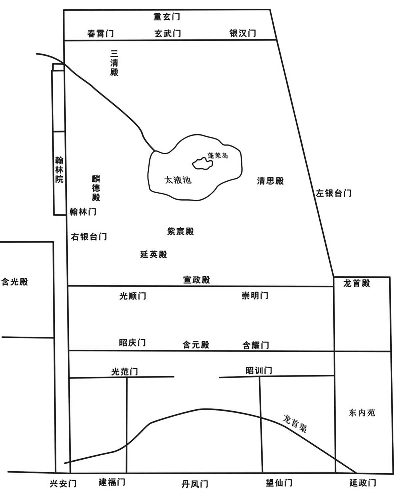 
唐大明宫示意图

## 【译文】

杨复光派使者向唐僖宗告捷，百官都进朝祝贺。唐僖宗诏令留下忠武等军两万人，并委派大明宫留守王徽及京畿制置使田从异调遣，守卫都城长安。中和三年（883年）五月，加封朱玫、李克用、东方逵同平章事。将陕州建置提升为节度，任命王重盈为节度使。又在延州建立保塞军，任命保大行军司马、延州刺史李孝恭为节度使。李克用当时年仅二十八岁，在所有参战将领中最为年轻，而击败黄巢收复长安，功劳居第一位，他的军队势力最强盛，其他将领都很害怕他。李克用的一只眼睛稍微有点瞎，时人称他为“独眼龙”。

## 【原文】

**诏以崔璆家贵身显，为黄巢相，首尾三载，不逃不隐，于所在斩之。**

## 【译文】

唐僖宗下诏称崔璆出身富贵，位居显要，却担任黄巢宰相，前后三年，不逃走也不藏匿，所以就在他的所在地将他处斩。

## 【原文】

**黄巢使其骁将孟楷将万人为前锋，击蔡州，节度使秦宗权逆战而败。［贼］进攻其城，宗权遂称臣于巢，与之连兵。**

## 【译文】

黄巢命令他的猛将孟楷率领一万名士兵为前锋，袭击蔡州。节度使秦宗权迎战而被击败，黄巢军进攻蔡州城，秦宗权于是向黄巢称臣，与他联兵作战。

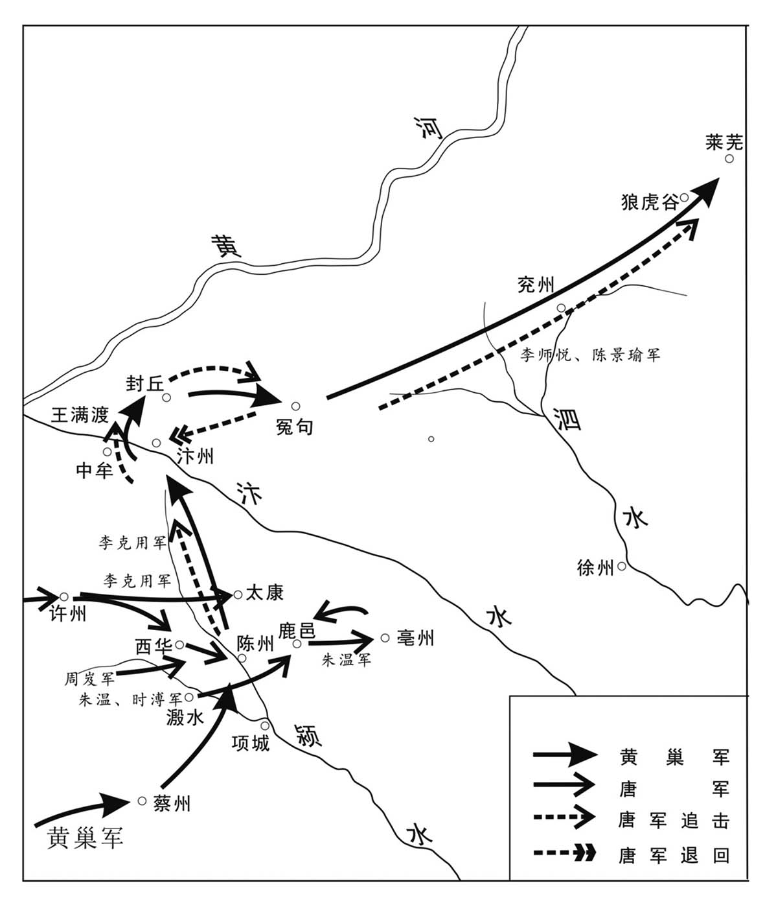 
唐朝军队围剿黄巢军示意图

## 【原文】

**初，巢在长安，陈州刺史宛丘赵犨谓将佐曰：“巢不死长安，必东走，陈其冲也[1]。且巢素与忠武为仇，不可不为之备[2]。”乃完城堑，缮甲兵，积刍粟，六十里之内民有资粮者，悉徙之入城[3]。多募勇士，使其弟昶、珝，子麓林分将之[4]。孟楷既下蔡州，移兵击陈，军于项城。犨先示之弱，伺其无备袭击之，杀获殆尽，生擒楷，斩之。巢闻楷死，惊怒，悉众屯溵水。六月，与秦宗权合兵围陈州，掘堑五重，百道攻之[5]。陈人大恐，犨谕之曰：“忠武素著义勇，陈州号为劲兵，况吾家久食陈禄，誓与此州存亡[6]。男子当求生于死中，且徇国而死，不愈于臣贼而生乎[7]！有异议者斩。”数引锐兵开门出击贼，破之。巢益怒，营于州北，立宫室、百司，为持久之计[8]。时民间无积聚，贼掠人为粮，生投于碓硙，并骨食之，号给粮之处曰“舂磨寨”[9]。纵兵四掠，自河南、许、汝、唐、邓、孟、郑、汴、曹、濮、徐、兖等数十州，咸被其毒[10]。**

## 【注文】

[1]陈州：州名。唐高祖武德元年（618年）改淮阳郡置，治所设在宛丘（今河南淮阳）。唐玄宗天宝元年（742年）改为淮阳郡，唐肃宗乾元元年（758年）复名陈州。辖地大致相当于今河南淮阳、太康、西华、项城、商水、沈丘等地。　　宛丘：地名，位于今河南淮阳。　　赵犨（chōu）（824—889年）：唐末大臣，宛丘（今河南淮阳）人。以死守陈州（治今河南淮阳），抗拒黄巢起义军而闻名。唐僖宗中和三年（883年），加封为检校兵部尚书、右仆射。中和五年（885年），任蔡州节度使。唐僖宗文德元年（888年），加检校司徒，授浙西节度使。唐昭宗龙纪元年（889年），以平黄巢、秦宗权的功劳，加平章事，充忠武军节度使。后病死于陈州。　　冲：要道。赵犨分析黄巢如不在长安被消灭，一定向东逃跑。那么，陈州就是必经之路。

[2]忠武：即忠武军。黄巢初起兵时，与宋威、张自勉等累战。宋威、张自勉皆为忠武兵。　　不可不为之备：陈州属忠武军，故赵犨要求大家不可不防备。

[3]城堑（qiàn）：即护城河。　　刍（chú）粟：饲料和粮食。

[4]其弟昶（chǎng）、珝（xǔ）：据《旧五代史》卷十四《梁书·赵犨传》载：赵昶、赵珝分别为赵犨的二弟与三弟。赵昶（？—895年）：字大东。赵犨为陈州刺史时，担任防御都指挥使。此后历任检校右仆射、忠武军节度使，参与镇压黄巢起义。后死于镇上。赵珝：生卒年不详，字有节。赵犨为陈州刺史时，担任亲从都知兵马使。后历任检校右仆射，遥领处州刺史、行军司马、检校司空、忠武军留后。唐昭宗光化二年（899年），加检校太保、同平章事。次年，进封天水郡公。　　麓林：即赵麓林，赵犨的儿子，生卒年不详，曾参与镇压黄巢起义。

[5]掘堑五重，百道攻之：黄巢军在陈州城外挖了五道壕沟，从四面八方发起进攻。

[6]素著义勇：向来以义勇著称。　　陈禄：此指陈州俸禄。

[7]臣贼：向贼称臣。“臣”此处用作动词。

[8]百司：各官署有司。

[9]碓（duì）：舂米的设备。　　硙（wéi）：石磨。　　舂（chōng）磨寨：设碓硙之处。

[10]河南：即河南府。唐玄宗开元元年（713年）改洛州置，治所设在洛阳县（今河南洛阳东北），辖境大致相当于今山东、河南黄河故道以南、淮河中下游以北地区。　　孟：州名。唐武宗会昌三年（843年）置，治所在今河南孟州南，辖境相当于今河南孟州、济源、温县以及荥阳北部地区。　　咸被其毒：都受其残害。

## 【译文】

当初，黄巢在长安时，陈州刺史宛丘人赵犨对部下说：“黄巢如果不死在长安，必定会往东逃窜，陈州首当其冲。而且，黄巢之前与忠武军结有仇恨，不能不防备。”于是，修整城堑，修缮兵器铠甲，积聚草料粮食，六十里以内的百姓有钱财粮食的，都迁进城里。招募大量勇士，让他的弟弟赵昶、赵珝，儿子赵麓林分别统领。孟楷已经攻下了蔡州，便调兵遣将进攻陈州，驻扎在项城。赵犨先表示军力薄弱，等起义军没有防备之时，突然发动袭击，黄巢军几乎全被杀死或俘虏。孟楷被活捉，处死。黄巢听说孟楷已死，既生气又害怕，把全部兵马驻扎于溵水。中和三年（883年）六月，黄巢与秦宗权合兵包围陈州，挖掘五层深的沟壕，用各种方法攻城。陈州百姓十分害怕，赵犨开导说：“忠武军素来以义勇著称，陈州兵号称劲兵，何况我们长期享受陈州俸禄，发誓与本州共存亡。大丈夫应当求生存于死拼之中，况且殉国而死，难道不比臣服于贼军而苟活强吗！凡是有不同意见的，一律处斩！”赵犨多次率领精锐部队出城击败黄巢军队。黄巢更加愤怒，扎营于陈州北部，建筑宫室、设置百官，做持久攻城的计划。当时民间已经没有粮食，贼军便抢人当粮食吃，活活投到磨里，连骨头一并吃掉，称提供粮食的地方为“舂磨寨”。此外，还放纵士兵四出抢劫，河南、许州、汝州、唐州、邓州、孟州、郑州、汴州、曹州、濮州、徐州、兖州等数十州都遭受破坏。

## 【原文】

**宣武节度使朱全忠帅所部数百［人］赴镇，秋七月丁卯，至汴州。时汴宋荐饥，公私穷竭，内外骄军难制，外为大敌所攻，无日不战，众心危惧，而全忠勇气益振[1]。诏以黄巢未平，加全忠东北面都招讨使。**

## 【注文】

[1]荐饥：接连发生饥荒。　　内外：张敦仁《通鉴识误》校正云：“‘外’应作‘则’”。

## 【译文】

宣武节度使朱全忠率领数百名士兵赶赴镇所。中和三年（883年）秋季七月丁卯（初三日），抵达汴州。当时汴州、宋州连年闹灾荒，国库资财乏匮，百姓穷困潦倒，内则军队难以控制，外则被强敌进攻，连日战争，百姓心里充满恐惧，而朱全忠的勇气却更加高昂。唐僖宗颁布诏书，因黄巢还没有被平定，加封朱全忠为东北面都招讨使。

## 【原文】

**以李克用为河东节度使，召郑从谠诣行在。克用乃自东道过榆次，诣雁门省其父[1]。**

## 【注文】

[1]榆次：县名。县治在今山西榆次。　　省（xǐng）其父：此指回家看望父亲朱邪赤心。朱邪赤心（？—887年），唐末沙陀部首领。姓朱邪，历任阴山（今内蒙古境内）都督、代北（今山西代县）行营招抚使。唐宣宗大中初年，因功迁蔚州（治今河北蔚县）刺史、云州（治今山西大同）守捉使。唐懿宗咸通十年（869年），任太原（今山西太原）行营招讨、沙陀三部部落军使。参与镇压庞勋起义，因功进大同军（治云州，今山西大同）节度使，赐姓李，名国昌。唐僖宗乾符年间，因其子李克用擅自杀死云州防御使段文楚，遭到唐朝军队征讨而逃奔鞑靼。后因李克用平定黄巢有功，朱邪赤心被拜为代北节度使，不久病逝。

## 【译文】

唐僖宗任命李克用为河东节度使，召郑从谠到皇帝行营。李克用就从东道经过榆次，到雁门看望他的父亲。

## 【原文】

**司徒、门下、同平章事郑畋罢为太子太保[1]。**

## 【注文】

[1]门下：即门下侍郎。　　太子太保：东宫官职。西晋始置，负责教导太子，并保护太子安全，为东宫三师（太子太师、太子太傅、太子太保）之一，从一品，一般以位高望重的大臣兼任，亦有专任者。后来逐渐发展为虚衔，作为加官。

## 【译文】

司徒、门下侍郎、同平章事郑畋被罢免为太子太保。

## 【原文】

**九月，感化节度使时溥营于溵水，加溥东面兵马都统。**

## 【译文】

唐僖宗中和三年（883年）九月，感化军节度使时溥在溵水安营扎寨，朝廷加封他为东面兵马都统。

## 【原文】

**十二月，赵犨遣人间道求救于邻道，于是周岌、时溥、朱全忠皆引兵救之。全忠与黄巢之党战于鹿邑，败之，斩首二千余级，遂引兵入亳州而据之[1]。**

## 【注文】

[1]鹿邑：县名。隋文帝开皇十八年（598年）改武平县置，县治在今河南鹿邑西。

## 【译文】

唐僖宗中和三年（883年）十二月，赵犨派人抄近路向邻道求救。于是，周岌、时溥、朱全忠都领兵援救。朱全忠与黄巢军队在鹿邑交战，打败了敌人，杀死两千多人，于是率军进占亳州。

## 【原文】

**四年。（春正月）黄巢兵尚强，周岌、时溥、朱全忠不能支，共求救于河东节度使李克用。二月，克用将蕃、汉兵五万出天井关[1]。河阳节度使诸葛爽辞以河桥不全，屯兵万善以拒之[2]。克用乃还兵自陕、河中渡河而东。**

## 【注文】

[1]天井关：关名，又名太行关，在今山西晋城南。

[2]河桥：即河阳桥，连接河阳三城（北城、中潬城、南城）的河桥，在今河南孟州西南、孟津东北黄河上，是唐代由洛阳去黄河以北必经的一座浮桥。诸葛爽原为夏绥银节度使，黄巢进攻长安时，曾投降并被任命为河阳节度使。后又投归唐朝，诏拜节度使。此次李克用救陈，诸葛爽害怕，于是借口河阳桥尚未完工，不肯假道，屯兵万善以抵抗。　　万善：地名，在今河南沁阳北。

## 【译文】

唐僖宗中和四年（884年）春季正月。黄巢兵力还很强盛，周岌、时溥、朱全忠无法抵御，一致向河东节度使李克用求救。二月，李克用率领五万名各族士兵从天井关出发。河阳节度使诸葛爽借口河桥尚未竣工，在万善驻兵阻挡李克用军队通过。李克用便回师从陕州、河中渡过黄河继续向东前进。

## 【原文】

**三月，朱全忠击黄巢瓦子寨，拔之[1]。巢将陕人李唐宾、楚丘王虔裕降于全忠[2]。**

## 【注文】

[1]瓦子寨：黄巢拆民居以为寨屋，叫作瓦子寨。

[2]李唐宾（？—889年）：唐末峡（今河南三门峡西）人。初为黄巢起义军尚让偏将，后降朱温，最后被朱珍杀死。　　楚丘：县名。隋文帝开皇六年（586年）改己氏县置，治所在今山东曹县东南。　　王虔裕（？—890年）：唐末朱温部将，琅琊临沂（今山东临沂）人，后改居楚丘（今山东曹县东南）。从小就勇敢有胆识，力大，擅长射箭。唐僖宗乾符年间，跟随诸葛爽造反。后归顺朝廷，辗转成为宣武节度使朱温部下，参与镇压黄巢起义，多立有战功。后在晋汴争霸中遇害。

## 【译文】

唐僖宗中和四年（884年）三月，朱全忠进攻黄巢占据的瓦子寨，并攻克了它。黄巢将领陕州人李唐宾、楚丘人王虔裕投降了朱全忠。

## 【原文】

**黄巢围陈州几三百日，赵犨兄弟与之大小数百战，虽兵食将尽，而众心益固。李克用会许、汴、徐、兖之军于陈州。时尚让屯太康，夏四月癸巳，诸军进拔太康[1]。黄思邺屯西华，诸军复攻之，思邺走[2]。黄巢闻之惧，退军故阳里，陈州围始解[3]。**

## 【注文】

[1]太康：县名。隋文帝开皇七年（587年）改阳夏县置。唐时属陈州，治所设在今河南太康。

[2]西华：县名。西汉置，治所在今河南西华南。西晋初省，晋惠帝永康元年（300年）复置。隋文帝开皇十八年（598年）改为鸿沟县，隋炀帝大业初复名西华县，治所移至今河南西华。唐高祖武德初更名为箕城县，唐睿宗景云初复改为西华县。

[3]故阳里：地名。唐属陈州，在陈州城北（今河南淮阳北）。

## 【译文】

黄巢包围陈州近三百天，赵犨兄弟跟他打了大小数百仗，虽然军粮即将吃完，但军心却更加稳固。李克用在陈州与许州、汴州、徐州、兖州等州的军队会师。当时，尚让屯兵于太康，中和四年（884年）夏季四月癸巳（初三日），各路大军攻克了太康。黄思邺驻扎在西华，唐朝军队又前往攻打，黄思邺逃跑。黄巢闻讯后非常惊慌，退军到故阳里，陈州才得以解围。

## 【原文】

**朱全忠闻巢将至，引军还大梁[1]。五月癸亥，大雨，平地三尺，黄巢营为水所漂，且闻李克用至，遂引兵东北趣汴州，屠尉氏[2]。尚让以骁骑五千进逼大梁，至于繁台；宣武将丰人朱珍、南华庞师古击却之[3]。全忠复告急于李克用。丙寅，克用与忠武都监使田从异发许州，戊辰，追及黄巢于中牟北王满渡，乘其半济，奋击，大破之，杀万余人，贼遂溃[4]。尚让率其众降时溥，别将临晋李谠、曲周霍存、甄城葛从周、冤句张归霸及从弟归厚帅其众降朱全忠[5]。巢逾汴而北，己巳，克用追击之于封丘，又破之[6]。庚午夜，复大雨，贼惊惧东走，克用追之，过胙城、匡城[7]。巢收余众近千人，东奔兖州。辛未，克用追至冤句，骑能属者才数百人，昼夜行二百余里，人马疲乏，粮尽，乃还汴州欲裹粮复追之，获巢幼子及乘舆、器服、符印，得所掠男女万人，悉纵遣之。**

## 【注文】

[1]大梁：城名。战国魏惠王三十一年（前339年）自安邑迁都于此，故址在今河南开封西北。秦始皇二十二年（前225年）灭魏时被毁。南北朝、隋唐通称今河南开封为大梁。

[2]尉氏：县名。县治在今河南尉氏。

[3]骁骑：精壮的骑兵。　　繁台：地名，又名吹台，在今河南开封东南。相传为春秋时师旷（春秋时著名乐师）吹乐之台。　　丰：县名。县治在今江苏丰县。　　朱珍（？—889年）：唐末朱温部将。徐州丰县（治今江苏丰县）人。早年参加黄巢起义军，后跟随朱温投降唐朝，参与镇压黄巢和秦宗权的军事斗争。在上源驿事件中，受命围攻晋王李克用。又在唐末军阀争霸战中，多立有战功。他曾帮助朱温在宣武军创立军制，选将练兵。后因触怒朱温，被绞死。　　南华：县名。唐玄宗天宝元年（742年）改离弧县置，治所在今山东菏泽西北。　　庞师古（？—897年）：唐末朱温的部将。初名从，曹州南华（今山东菏泽西北）人。早年曾参加黄巢起义军，后追随朱温投降唐朝，参与镇压黄巢和秦宗权的军事斗争。历任都指挥使、徐州节度使、检校司徒等职。在唐末军阀争霸战中，多立有战功。唐昭宗乾宁四年（897年），在进攻割据淮南的杨行密时，兵败而死。

[4]王满渡：渡口名。在今河南中牟北古汴河上。

[5]临晋：县名。唐玄宗天宝十二载（753年）以桑泉县改名，治所在今山西临猗西南。　　李谠（？—890年）：唐末河中临晋（今山西临猗西南）人。早年曾浪迹于关中和陇东一带，为人勇武彪悍，颇讲义气。唐僖宗广明元年（880年），黄巢攻克长安时，参加起义军，被任命为内枢密使。后投靠朱温，历任骑军都将、元从骑将、检校右仆射。曾参与讨伐秦宗权和王师范，多立有战功。唐昭宗大顺元年（890年），在晋汴争霸战中，因违抗军令，被朱温所杀。　　曲周：县名。西汉武帝建元四年（前137年）置，治所在今河北曲周东北，西晋后省。隋文帝开皇六年（586年）复置，隋炀帝大业二年（606年）又省。唐高祖武德四年（621年）又置。　　霍存（？—893年）：唐末朱温部将。洛州曲周（治今河北曲周东北）人，骁勇善战，擅长骑马射箭。早年曾参加黄巢起义军，担任将领。后投靠朱温，任曹州刺史，兼诸军都指挥使。参与唐末军阀混战，在讨伐秦宗权、时溥和晋汴争霸中，多立有战功。唐昭宗景福二年（893年），在进攻郓州（今山东东平西北）时，与朱瑾大战，被流箭射中而死。　　甄（zhēn）城：县名。治所在今山东鄄城北。　　葛从周（？—916年）：唐末五代后梁名将。字通美，濮州鄄城（今山东鄄城北）人。为人豁达，富有谋略，早年曾在黄巢起义军中担任军校，后投靠朱温，参与唐末军阀混战，因勇猛善战，成为朱温的一员勇将。在讨伐秦宗权的战争中，曾救过朱温的命。朱温废唐建立后梁，被任命为左金吾卫上将军，后又改授右卫上将军。后梁末帝朱友贞时，又被封为潞州节度使，加官开府仪同三司、检校太师，兼侍中，封陈留郡王。死后，追赠太尉。　　张归霸（？—908年）：唐末五代后梁名将。字正臣，冤句（今山东菏泽西南）人（《旧五代史》卷十六《梁书·张归霸传》作清河［今山东临清一带］人）。自幼喜好兵术，乾符年间参加黄巢起义军，被任命为左番功臣。后投靠朱温，在唐末军阀混战中，立有战功。唐昭宗光化二年（899年），迁莱州刺史，拜左卫上将军、曹州刺史。朱温建立后梁，被拜为右龙虎统军、左骁卫上将军。开平二年（908年），授河阳节度使，不久加同平章事。病死后，追赠太傅。　　归厚：即张归厚（？—912年），张归霸的叔伯弟弟，唐末五代后梁名将。字德坤，冤句（今山东荷泽西南）人（《旧五代史》卷十六《梁书·张归霸传》作清河［今山东临清一带］人）。自幼骁勇善战，富有谋略，尤其擅长使用弓箭和长矛。早年曾参加黄巢起义军，唐僖宗中和四年（884年），投靠朱温，担任军校。参与唐末军阀混战，在作战中，常以少击众，无往不胜，多立有战功。历任中军指挥使，洺州、绛州、晋州刺史，右神武统军，左羽林统军等职。后梁代唐后，任亳州团练使、镇国军节度使、陕虢观察处置等使。梁太祖乾化二年（912年），病死，追赠太师。

[6]封丘：县名。县治在今河南封丘。

[7]胙（zuò）城：县名。隋文帝开皇十八年（598年）置，治所设在今河南延津东北。

## 【译文】

朱全忠听说黄巢即将到来，于是带兵返回了大梁。中和四年（884年）五月癸亥（初三日），天下大雨，平地水深达三尺，黄巢军营被淹，而且听说李克用到了，黄巢便领兵往东北奔汴州而去，屠戮了尉氏城。尚让率领五千名骁勇骑兵逼近大梁，到达繁台；宣武将领丰县人朱珍、南华人庞师古击退了他们。朱全忠又向李克用告急。丙寅（初六日），李克用与忠武都监使田从异调兵许州，戊辰（初八日），在中牟北部王满渡追上了黄巢，乘他渡河刚到一半时发起攻击，大败黄巢军队，杀敌一万多人，黄巢军溃散而逃。尚让率部向时溥投降，别将临晋人李谠、曲周人霍存、甄城人葛从周、冤句人张归霸及他的叔伯弟弟张归厚纷纷率部下向朱全忠投降。黄巢渡过汴河向北逃去。己巳（初九日），李克用在封丘追上了黄巢，又打败了他。庚午（初十日）夜，又降大雨，黄巢军惊恐地向东逃窜，李克用继续追击，经过胙城、匡城。黄巢收拾残兵近千人，向东逃窜到兖州。辛未（十一日），李克用追到冤句，骑兵中能跟上他的只有几百人，昼夜兼程行军二百多里，人困马乏，粮食也吃光，于是返回汴州想要补充粮食后再继续追赶。李克用缴获了黄巢的小儿子及他的坐轿、衣服用品、大印等，并收容、遣散了黄巢所抢掠的一万多名男女百姓。

## 【原文】

**庚辰，时溥遣其将李师悦将兵万人追黄巢[1]。**

## 【注文】

[1]李师悦（？—896年）：唐末武宁军节度使时溥牙将。唐僖宗光启元年（885年）六月，在瑕丘（今山东兖州）追上黄巢并给予他最后的致命一击，导致黄巢逃入泰山狼虎谷，自刎身亡。因功受封湖州刺史。唐僖宗文德元年（888年），升湖州为忠国军，又担任节度使。

## 【译文】

唐僖宗中和四年（884年）五月庚辰（二十日），时溥派遣部将李师悦率领一万名士兵追击黄巢。

## 【原文】

**六月甲辰，武宁将李师悦与尚让追黄巢至瑕丘，败之[1]。巢众殆尽，走至狼虎谷，丙午，巢甥林言斩巢兄弟、妻子首，将诣时溥，遇沙陀博野军，夺之，并斩言首以献于溥[2]。**

## 【注文】

[1]瑕丘：县名。唐时县治在今山东兖州。

[2]狼虎谷：地名，亦名莱芜谷，在今山东莱芜西南。　　林言（？—884年）：黄巢外甥，早年参加唐末农民起义。唐僖宗广明元年（880年），随黄巢攻入长安，担任控鹤军使，成为黄巢身边指挥禁军的一名重要将领。唐僖宗中和四年（884年），黄巢兵败泰山狼虎谷，自刎身亡，他割下黄巢的首级准备献给武宁节度使时溥，结果在半路上遇到沙陀军，被杀。　　巢兄弟：指黄巢及其两个弟弟黄揆、黄邺。　　将诣时溥：将要到时溥那里去。

## 【译文】

唐僖宗中和四年（884年）六月甲辰（十五日），武宁将军李师悦与尚让追击黄巢到瑕丘，打败了他。黄巢军队几乎全军覆灭，余部逃到狼虎谷。丙午（十七日），黄巢的外甥林言砍下黄巢兄弟、妻子和孩子们的人头，将要到时溥那里去投降，在半路上遇到沙陀博野军。沙陀博野军将黄巢等人的头颅抢去，还砍下林言的脑袋，一并献给了时溥。

## 【原文】

**秋七月壬午，时溥遣使献黄巢及家人首并姬妾，上御大玄楼受之[1]。宣问姬妾：“汝曹皆勋贵子女，世受国恩，何为从贼[2]？”其居首者对曰：“狂贼凶逆，国家以百万之众，失守宗祧，播迁巴、蜀[3]。今陛下以不能拒贼责一女子，置公卿将相于何地乎！”上不复问，皆戮之于市。人争与之酒，其余皆悲怖昏醉，居首者独不饮不泣，至于就刑，神色肃然[4]。**

## 【注文】

[1]上：指唐僖宗。　　大玄楼：成都罗城正南门楼。成都罗城为高骈所建，竣工时高骈以《周易》占卦，得“大畜”卦，因卦象取名大玄楼。

[2]宣问：唐僖宗亲自审问。　　勋贵子女：有功勋、地位的官宦人家的子女。

[3]宗祧（tiāo）：宗庙。宗，祖庙；祧，远祖之庙。　　播迁：迁徙流落。　　巴、蜀：指黄巢起义军攻占长安，唐都城失守，僖宗逃往四川。

[4]悲怖：伤心恐惧。　　神色肃然：神情脸色肃穆坦然。

## 【译文】

唐僖宗中和四年（884年）秋季七月壬午（二十四日），时溥派遣使者献上黄巢及其家人的头颅，还有他的妻妾。皇上登临大玄楼接受。并且亲自审问她们说：“你们都是功臣贵族的子女，世世代代享受国家恩典，为什么要跟从贼军呢？”为首的那个女子回答说：“虽然猖狂的贼寇凶残叛逆，但国家拥有百万兵力却还是宗庙失守，流亡到巴、蜀地区。现在陛下因不能抗拒贼军而责备一个弱女子，那将置朝廷公卿、将相大臣于何地呢？”皇上被问得答不上来，于是就不再问话，下令把这些女子全部押到闹市上斩首。人们都抢着给她们送酒，其他女子都因伤心恐惧而喝得昏昏沉沉、酩酊大醉，只有那个为首的不喝也不哭，直到行刑前，神色依然肃穆平静。

## 【原文】

**上以长安宫室焚毁，故久留蜀未归。王徽知京兆尹事，招抚流散，户口稍归，复缮治宫室，百司粗有绪[1]。冬十月，关东藩镇表请车驾还京师。**

## 【注文】

[1]户口稍归：流亡在外的人户逐渐回来。

## 【译文】

唐僖宗因为长安宫殿烧毁，所以一直留在蜀地没有返回。王徽主管京兆尹的工作，招抚流散到各地的百姓，长安居民逐渐回来了一些。又修缮宫殿，百官办公场所也大概有了些头绪。中和四年（884年）冬季十月，关东藩镇上表请求皇帝返回京师。

## 【原文】

**十二月，凤翔节度使李昌言病，表弟昌符知留后[1]。昌言薨，制以昌符为凤翔节度使。**

## 【注文】

[1]昌符：即李昌符（？—887年），晚唐军事将领。唐僖宗中和四年（884年），他的哥哥凤翔（今陕西凤翔）节度使李昌言病重，上表请求任命他为凤翔留后。李昌言死后，唐僖宗任命他为凤翔节度使。唐僖宗光启三年（887年），唐僖宗准备重返长安，先到凤翔。李昌符借口长安宫殿还没有修复，请求唐僖宗暂时留驻，得到唐僖宗同意。同年，他突然袭击唐僖宗在凤翔的行宫，但很快被击败，全家于是逃往陇州。唐僖宗命令武定节度使李茂贞讨伐。后陇州刺史薛知筹杀了李昌符全家。李茂贞就此接管凤翔。

## 【译文】

唐僖宗中和四年（884年）十二月，凤翔节度使李昌言病重，上表请求让他的弟弟李昌符主持留后。李昌言死后，唐僖宗下诏任命李昌符为凤翔节度使。

## 【原文】

**时黄巢虽平，秦宗权复炽，命将出兵，寇掠邻道，陈彦侵淮南，秦贤侵江南，秦诰陷襄、唐、邓，孙儒陷东都、孟、陕、虢，张晊陷汝、郑，卢瑭攻汴、宋，所至屠翦焚荡，殆无孑遗[1]。其残暴又甚于巢，军行未始转粮，车载盐尸以从[2]。北至卫、滑，西及关、辅，东尽青、齐，南出江、淮，州镇存者仅保一城，极目千里，无复烟火[3]。上将还长安，畏宗权为患。**

## 【注文】

[1]复炽：又强盛起来。　　陈彦：生卒年不详，唐末秦宗权的部将，曾率军攻扰淮南。　　秦贤：生卒年不详，唐末秦宗权的部将，曾率军攻扰江南。　　江南：道名。唐太宗贞观元年（627年）置，辖境在长江之南，故名。治越州（今浙江绍兴），辖境包括今上海、浙江、福建、江西、湖南全省以及江苏、安徽、湖北、四川四省长江以南部分和贵州东北部地区。唐玄宗开元二十一年（733年）分为江南东、江南西和黔中三道。此处泛指长江以南地区。　　秦诰：生卒年不详，唐末秦宗权部将，曾率军攻陷襄、唐、邓等州。　　孙儒（？—892年）：蔡州（今河南汝南）人，唐末军事将领。原为秦宗权部将，为人残暴，曾随秦宗权投降黄巢。黄巢死后，秦宗权称帝，他率军攻占洛阳（今河南洛阳）、孟州（治今河南孟州南）、陕州（治今河南三门峡）、虢（guó）州（治今河南灵宝）等地。唐僖宗光启三年（887年），淮南节度使高骈被部将所杀，淮南陷入混乱，秦宗权命令他的弟弟秦宗衡率他南下争夺扬州（治今江苏扬州）。不久，他杀死秦宗衡自立为主，占据扬州一带，称“土团白条军”，兵势强盛，后被唐朝封为淮南节度使。此后，孙儒与原高骈部将杨行密展开征战，争夺淮南。唐昭宗景福元年（892年），在与杨行密决战时，被俘处死。　　张晊：生卒年不详，唐末秦宗权部将，曾率军攻陷汝、郑等州。　　卢瑭：生卒年不详，唐末秦宗权部将，曾率军攻陷汴、宋等州。　　屠翦焚荡：烧杀抢掠，无所不为。　　殆无孑（jié）遗：几乎没有遗漏。孑遗：遗留，剩余。

[2]转粮：转运军粮。　　盐尸：用盐腌渍人的尸体，用作军粮。

[3]卫：即卫州。北周武帝宣政元年（578年）置，治所在朝歌县（今河南淇县）。隋炀帝大业初改置汲郡，移治卫县（今河南淇县东）。唐高祖武德初复为卫州，唐太宗贞观元年（627年）移治汲县（今河南卫辉），唐玄宗天宝初改为汲郡，唐肃宗乾元初复为卫州。　　滑：即滑州。隋文帝开皇十六年（596年）改杞州置，治所设在白马县（今河南滑县东）。隋炀帝大业二年（606年）改为兖州。唐初复为滑州，唐玄宗天宝元年（742年）改为灵昌郡，唐肃宗乾元元年（758年）复为滑州。唐时辖境相当于今河南滑县、延津、长垣等地区。　　关、辅：函谷关及京畿一带。辅，京城附近的地方。　　齐：即齐州。北魏献文帝皇兴三年（469年）改冀州置，治所在历城县（今山东济南）。隋炀帝大业初改为齐郡。唐高祖武德元年复为齐州，唐玄宗天宝初改为临淄郡，旋改齐郡，唐肃宗乾元初又复为齐州。　　江、淮：泛指淮河、长江下游一带。

## 【译文】

当时黄巢起义虽已平定，但秦宗权的势力又强大起来，他命令将领们出兵抢掠邻近各道，陈彦侵犯淮南，秦贤侵犯江南，秦诰攻陷襄州、唐州、邓州，孙儒攻陷东都洛阳、孟州、陕州、虢州，张晊攻占汝州、郑州，卢瑭攻汴州、宋州，所到之处烧杀抢掠，几乎什么都没有剩下。其残暴程度比黄巢还要厉害。秦宗权的军队出发时没有转运粮草，于是就把盐腌的尸体放在车上充当粮食。北到卫州、滑州，西至关辅地区，东尽青州、齐州，南出江淮地区，州镇残存者仅能保全一城而已，千里之内，人烟断绝。唐僖宗将要返回长安，又担心秦宗权将成为祸患。

## 【原文】

**光启元年春正月戊午，下诏招抚之[1]。己卯，车驾发成都，陈敬瑄送至汉州而还。二月丙申，至凤翔，三月丁卯，至京师。荆棘满城，狐兔纵横，上凄然不乐[2]。己巳，赦天下，改元[3]。时朝廷号令所在，惟河西、山南、剑南、岭南数十州而已[4]。**

## 【注文】

[1]光启：唐僖宗所用年号，共计四年，即公元885年至888年。

[2]狐兔纵横：狐狸和野兔到处乱跑，形容京师一片荒凉残破景象。

[3]改元：此指唐僖宗改元光启。

[4]河西：即河西道。唐睿宗景云二年（711年），将黄河以西的陇右道分出，设置河西道，置河西节度使，治所设在凉州（今甘肃武威）。辖境相当于今甘肃河西走廊一带。　　剑南：即剑南道。唐太宗贞观元年（627年）置，以在剑阁之南而得名。唐玄宗开元以后治所在益州（今四川成都）。辖境相当于今四川涪江流域以西，大渡河流域和雅砻江下游以东，云南澜沧江、哀牢山以东，曲江、南盘江以北，以及贵州水城、普安以西和甘肃文县一带。

## 【译文】

光启元年（885年）春季正月戊午（初二日），唐僖宗下诏招抚秦宗权。己卯（二十三日），唐僖宗从成都出发返回长安。陈敬瑄送到汉州才回去。二月丙申（初十日），到达凤翔，三月丁卯（十二日），到达京城。只见长安城长满荆棘，狐狸与野兔到处乱窜，皇上心中无比凄凉，闷闷不乐。己巳（十四日），大赦天下，改年号为光启元年。当时，朝廷能够命令的范围，只有河西、山南、剑南、岭南等道的数十州而已。

* * *

(1) 据陈垣《二十史朔闰表》，中和元年五月戊申朔，无乙未日。

# 藩镇之乱

## 【内容提要】

《藩镇之乱》记载了唐僖宗李儇（xuān）光启元年（885年）到唐昭宗李晔光化元年（898年）间皇室衰微、藩镇之间互相争战的历史。

光启元年（885年），黄巢起义被镇压，唐僖宗回到长安（今陕西西安）。在此之前，安邑（今山西运城东北）、解县（今山西运城西南）两盐池的税利为河中节度使王重荣所控制，神策中尉田令孜想要夺回这两个盐池的税利，便调任王重荣为泰宁节度使。王重荣自以为收复京师有功，却被田令孜排挤，于是拒绝调任。田令孜便联合邠宁节度使朱玫和凤翔节度使李昌符讨伐王重荣。王重荣向河东节度使李克用求援，李克用领兵前来相救，双方在沙苑（在今陕西大荔南）交战，结果官军战败。李克用率军进逼京城，田令孜再次带领唐僖宗逃到凤翔（今陕西凤翔）。朱玫和李昌符二人倒戈转而与李克用、王重荣和好。

唐僖宗逃到凤翔后，朱玫乘机将因病而没有逃走的襄王李煴（yūn）挟持到长安，将他立为傀儡（kuǐ lěi）皇帝，改元“建贞”，尊唐僖宗为太上皇。朱玫自己担任神策军使，诸道盐铁、转运等使，独揽相权。朱玫的立帝揽权行为激起了王重荣、李昌符及李克用的憎恨，他们转而合攻朱玫。当时朱玫的部将王行瑜与李茂贞作战，连连败退，唯恐朱玫怪罪，于是率领军队返回长安，斩杀了朱玫及其党羽，李煴投奔河中，被王重荣杀死。文德元年（888年），唐僖宗终于又回到了京师长安，但不久便在武德殿去世。

唐昭宗李晔即位时二十三岁，正当英年，一心振作皇室，想要整肃宦官与藩镇以挽回国家的颓运。唐昭宗景福二年（893年），李茂贞恃功骄横，对朝廷极其不逊，公然上表毁谤唐昭宗。唐昭宗大为震怒，决定出兵讨伐，但反为李茂贞所败。李茂贞于是领兵进军长安问罪。唐昭宗最终以宰相杜让能的性命化解了一难。唐昭宗乾宁二年（895年），邠宁节度使王行瑜与凤翔节度使李茂贞及镇国节度使韩建因朝廷没有满足其官吏任免要求，便率领军队攻入长安杀死宰相韦昭度、李溪，并谋废唐昭宗，另立吉王李保为帝。李克用得知情况后，率领军队前往救援，同年十一月，攻克龙泉镇（今陕西旬邑东北）。王行瑜逃往梨园寨（今陕西淳化），再逃回邠州（治今陕西彬县），向李克用请降被拒，于是弃城逃跑，为其部下所杀。此时，李茂贞自知实力不敌，便向皇帝谢罪，唐昭宗于是命令李克用停止讨伐。此后，李茂贞再次进犯长安，唐昭宗被迫逃往河东，中途被华州刺史韩建挟持至华州（治今陕西华县）。唐昭宗在这里居住了将近三年，直到乾宁五年（898年）。

## 【原文】

**唐僖宗光启元年。初，田令孜在蜀募新军五十四都，每都千人，分隶两神策，为十军以统之，又南牙、北司官共万余员[1]。是时藩镇各专租税，河南北、江淮无复上供，三司转运无调发之所，度支惟收京畿、同、华、凤翔等数州租税，不能赡，赏赉不时，士卒有怨言[2]。令孜患之，不知所出。先是，安邑、解县两池盐皆隶盐铁，置官榷之[3]。中和以来，河中节度使王重荣专之，岁献三千车以供国用[4]。令孜奏复如旧制隶盐铁[5]。夏四月，令孜自兼两池榷盐使，收其利以赡军[6]。重荣上章论诉不已[7]。遣中使往谕之，重荣不可。时令孜多遣亲信觇藩镇，有不附己者，辄图之。令孜养子匡佑使河中，重荣待之甚厚，而匡佑傲甚，举军皆愤怒[8]。重荣乃数令孜罪恶，责其无礼，监军为讲解，仅得脱去。匡佑归以告令孜，劝图之。五月，令孜徙重荣为泰宁节度使，以泰宁节度使齐克让为义武节度使，以义武节度使王处存为河中节度使，仍诏李克用以河东军援处存赴镇。**

## 【注文】

[1]蜀：指今四川地区。　　都：唐朝后期军队编制单位。其将领称为都将、都头。

[2]河南北：即河南道、河北道。河南道：唐贞观十道、开元十五道之一。唐太宗贞观元年（627年）置，辖境相当于今山东、河南两省黄河故道以南（唐河、白河流域除外），江苏、安徽两省淮河以北地区。唐玄宗开元二十一年（733年）置河南道采访处置使，治所在汴州（今河南开封）。同年于东都附近地区分置都畿道，辖境因而缩小。唐肃宗乾元元年（758年）废。但作为地理区划一直沿用至五代。河北道：唐贞观十道、开元十五道之一。唐太宗贞观元年（627年）置，辖境相当于今北京、天津、河北全境，辽宁大部分地区，以及河南、山东两省古黄河以北地区。唐玄宗开元二十一年（733年）置河北道采访处置使，治所在魏州（今河北大名东北）。唐肃宗乾元元年（758年）废。但作为地理区划一直沿用至五代。　　江：即江南道。唐太宗贞观元年（627年）置，辖境在长江之南，故名。治越州（今浙江绍兴），辖境包括今上海、浙江、福建、江西、湖南全省以及江苏、安徽、湖北、四川四省长江以南部分和贵州东北部地区。唐玄宗开元二十一年（733年）分为江南东、江南西和黔中三道。　　淮：即淮南道。唐贞观十道、开元十五道之一。唐太宗贞观元年（627年）置，辖境相当于今淮河以南，长江以北，东至海，西至今湖北广水、应城、汉川、汉阳等地。唐玄宗开元二十一年（733年）置淮南道采访处置使，治所在扬州（今江苏扬州）。唐肃宗乾元元年（758年）废。但作为地理区划一直沿用至五代。　　三司：唐后期户部、盐铁、度支的合称，分别掌管租赋、盐铁专卖、财政收支事务，由一名亲信大臣专掌其事。

[3]安邑：县名。隋朝改南安邑县置，治所在今山西运城东北。唐肃宗至德二载（757年）更名虞邑县，唐代宗大历四年（769年）复名安邑县。　　解（xiè）县：县名。唐高祖武德元年（618年）改虞乡县置，治所在今山西运城西南。　　池盐：安邑、解县境内均有内陆盐湖。尤其是解池，为著名的产池盐区。　　盐铁：此指盐铁转运使。

[4]专之：此指专盐池之利。

[5]旧制：以前的制度。　　隶：隶属于。

[6]榷（què）盐使：官名，唐朝专设的主管食盐产销专卖事务的使职。唐肃宗乾元元年（758年）开始实行盐专卖制度，安邑、解县两池盐属度支使管理。唐德宗李适贞元十六年（800年）置榷盐使，掌安邑、解县两池盐专卖及查禁私盐。唐宪宗元和十五年（820年），又改河北税盐使为榷盐使。榷盐使设置之初，一般由朝廷派人充任，盐利归属中央所有。到唐后期，中央已失去对地方的控制，两池榷盐使则由河中节度使专掌，盐利尽归地方。

[7]章：指奏章。　　论诉：辩解诉说。

[8]养子：收养的非亲生的儿子。收领养子作为一种社会现象，通常是为了继承家业或传宗承嗣。但值得注意的是，唐末五代时期，出于政治、军事目的，在社会上层形成了一股收领养子的风气。安史之乱后，唐朝逐渐丧失了对藩镇的控制，藩镇割据局面形成，养子制度也随之在各藩镇军队中蔓延开来。这些养子在当时动乱的社会和王朝迭兴的历史中扮演了重要角色，产生了巨大影响。　　匡佑：即田匡佑，田令孜的养子，生卒年不详。曾奉田令孜命出使河中，企图说服王重荣交出两池盐利。王重荣厚礼相待，但田匡佑极为傲慢。王重荣斥责他无礼，并历数田令孜的罪状。田匡佑回京后，把王重荣的举止向养父汇报。田令孜大怒，于是联合邠宁节度使朱玫、凤翔节度使李昌符等讨伐王重荣。

## 【译文】

唐僖宗光启元年（885年）。当初，田令孜在蜀地募集新军五十四都，每都一千人，分别隶属于左、右神策军，共组成十个军进行统率，还有南牙朝官、北司宦官共一万多人。当时各藩镇独占田租赋税，河南道、河北道、江南道、淮南道不再向朝廷进贡，盐铁、度支、户部等三司转运钱粮却没有调取征发的地方，度支只是收取京畿、同州、华州、凤翔等几个州的租税，无法满足朝廷需要，也不能按时给予奖赏，军中士卒颇有怨言。田令孜非常担心，但也不知道该如何解决这一问题。以前，安邑、解县两地的池盐都隶属于盐铁使，设置官吏专门经营。中和元年以来，河中节度使王重荣独自占据池盐收入，每年只献上三千车盐以供国家需用。田令孜上奏请求将安邑、解县两地盐池按旧制归盐铁使管辖。夏季四月，田令孜亲自兼任两池榷盐使，收取盐利以供养军队。王重荣多次上奏辩论申诉，唐僖宗派遣中使前去劝说，可王重荣仍不罢休。当时，田令孜派遣了很多亲信去窥探各藩镇的虚实，凡有不依附于自己的，就要想办法除掉。田令孜的养子田匡佑被派往河中，王重荣待他特别优厚，但是田匡佑非常傲慢，全军上下都怨恨他。王重荣于是列举了田令孜的罪恶，指责田匡佑放肆无礼。监军从中劝解，田匡佑才得以脱身。田匡佑回去后，把情况告诉了田令孜，并劝他设法整治王重荣。五月，田令孜调任王重荣为泰宁节度使，原泰宁节度使齐克让为义武节度使，原义武节度使王处存调任河中节度使，又命令李克用率河东军援助王处存前赴镇所。

## 【原文】

**王重荣自以有复京城功，为田令孜所摈，不肯之兖州，累表论令孜离间君臣，数令孜十罪；令孜结邠宁节度使朱玫、凤翔节度使李昌符以抗之[1]。王处存亦上言：“幽、镇兵新退，臣未敢离易、定[2]。且王重荣无罪，有大功于国，不宜轻有改易，摇藩镇心[3]。”诏趣其上道。八月，处存引军至晋州，刺史冀君武闭城不内而还[4]。**

## 【注文】

[1]复京城功，为田令孜所摈（bìn）：唐僖宗中和三年（883年），王重荣与李克用在零口（今陕西临潼东）击败黄巢军队，收复长安（今陕西西安）。之后，王重荣占据河中，垄断盐池之利。田令孜亲自兼任两池榷盐使，并将王重荣调任泰宁节度使，王重荣拒绝赴任。

[2]幽：即幽州，治所设在范阳县（今北京），辖境相当于今北京、河北东北部和辽宁西部一些地区。南面是冀州（河北南部），西面是并州（山西东部、北部），北面和东面则是长城以外。汉至西晋期间设有幽州刺史部。隋炀帝时改名涿郡，唐玄宗天宝年间又改名范阳郡。唐肃宗乾元元年（758年）复名幽州。　　镇：即镇州，治所设在真定县（今河北正定），唐宪宗元和十五年（820年）改恒州置，辖境相当于今河北石家庄、井陉、行唐、正定、阜平、栾城、平山、灵寿、藁（gǎo）城等地，属河北道。　　易：州名。隋文帝开皇元年（581年）置，治所在易县（今河北易县）。隋炀帝大业初年改为上谷郡。唐高祖武德四年复为易州，辖境相当于今河北内长城以南，安新、满城以北，南拒马河以西。唐玄宗天宝元年（742年）又改为上谷郡，唐肃宗乾元元年（758年）复为易州。　　定：州名。北魏道武帝天兴三年（400年）改安州置，治所设在卢奴县（今河北定州）。隋炀帝大业年间、唐玄宗天宝年间曾短暂改称博陵郡，唐肃宗乾元元年（758年）复为定州。

[3]有大功于国：指唐僖宗中和三年（883年），收复都城长安的功劳。

[4]冀君武：生卒年不详。唐末河中节度使王重荣部将，参加收复京师长安的战斗，曾任晋州刺史。后事不详。　　不内（nà）：不纳。因为当时河中节度领辖晋、绛、慈、隰等州，所以晋州刺史冀君武关闭城门不让王处存进入。内，古同“纳”。

## 【译文】

王重荣认为自己有收复京城的功劳，却被田令孜所排斥，便不肯去兖州任职，多次上表陈诉田令孜挑拨皇帝与臣僚的关系，并列举出田令孜十大罪状；田令孜联合邠宁节度使朱玫、凤翔节度使李昌符与他对抗。这时，王处存也上表皇帝说：“幽州、镇州军队刚刚退走，我不敢轻易离开易州、定州。况且王重荣没有罪过，而且还为国家立过大功，不应该轻易调换他的官职，以免动摇藩镇的忠心。”唐僖宗下诏命令他尽早启程赴任。光启元年（885年）八月，王处存率领军队到达晋州，刺史冀君武紧闭城门不让他进去，王处存只好率军返回。

## 【原文】

**冬十月，王重荣求救于李克用，克用方怨朝廷不罪朱全忠，克用怨全忠事见诸镇相攻[1]。选兵市马，聚结诸胡，议攻汴州[2]。报曰：“待吾先灭全忠，还扫鼠辈如秋叶耳[3]。”重荣曰：“待公自关东还，吾为虏矣。不若先除君侧之恶，退擒全忠易矣[4]。”时朱玫、李昌符亦阴附朱全忠，克用乃上言：“玫、昌符与全忠相表里，欲共灭臣[5]。臣不得不自救，已集蕃、汉兵十五万，决以来年济河，自渭北讨二镇[6]。不近京城，保无惊扰。既诛二镇，乃旋师灭全忠，以雪雠耻。”上遣使者谕释，冠盖相望。**

## 【注文】

[1]不罪：不加罪。朱全忠曾进攻李克用，朝廷没有降罪，李克用对此颇有怨言。

[2]市马：买马。　　诸胡：李克用为沙陀人。带有藐视的意义。

[3]报：答复王重荣。　　还扫鼠辈：意思是说等消灭朱全忠之后，再来铲除田令孜、朱玫、李昌符等人。

[4]关东：隋唐时称函谷关或潼关以东地区为“关东”。当时朱全忠驻守汴州（治今河南开封），故云。　　君侧之恶：指皇帝身边的宦官田令孜等人。

[5]阴附：暗中依附。　　上言：向皇帝进言。　　相表里：互为补充。

[6]二镇：指邠宁节度使朱玫、凤翔节度使李昌符。

## 【译文】

唐僖宗光启元年（885年）冬季十月，王重荣向李克用求救，李克用正抱怨朝廷不治朱全忠的罪，李克用怨恨朱全忠一事参见《诸镇相攻》。于是挑选士兵、购买马匹，集结各胡族部落，商议进攻汴州。他给王重荣回话说：“等我先消灭了朱全忠，回来再收拾这些鼠辈，就像秋风扫落叶一样容易。”王重荣说：“等您从关东回来，我早就成俘虏了。不如先除掉皇上身边的恶人，然后回兵擒拿朱全忠就容易多了。”当时朱玫、李昌符也暗中依附朱全忠，李克用于是上疏道：“朱玫、李昌符和朱全忠内外勾结，互为表里，想共同消灭我。我不得不自救，现已召集了十五万蕃、汉士兵，决定明年渡过黄河，从渭河北面讨伐朱玫、李昌符。我不靠近京城，保证您不受到惊扰。除掉他们两人后，再乘胜挥兵消灭朱全忠，以报仇雪恨。”皇帝接连不断地派使者前往李克用处进行调解。

## 【原文】

**朱玫欲朝廷讨克用，数遣人潜入京城，烧积聚，或刺杀近侍，声云克用所为，于是京师震恐，日有讹言[1]。令孜遣玫、昌符将本军及神策、鄜延、灵夏等军合三万人屯沙苑，以讨王重荣[2]。重荣发兵拒之，告急于克用，克用引兵赴之。十一月，重荣遣兵攻同州，刺史郭璋出战，败死[3]。重荣与玫等相守月余，克用兵至，与重荣俱壁沙苑，表请诛令孜及玫、昌符[4]。诏和解之，克用不听。十二月癸酉，合战，玫、昌符大败，各走还本镇，溃军所过焚掠[5]。克用进逼京城，乙亥夜，令孜奉天子自开远门出幸凤翔[6]。初，黄巢焚长安宫室而去，诸道兵入城纵掠，焚府寺、民居什六七，王徽累年补葺，仅完一二，至是复为乱兵焚掠，无孑遗矣[7]。**

## 【注文】

[1]近侍：皇帝身边的侍臣，指宦官。　　声云：声言。　　讹言：谣言，诈伪的话。

[2]灵夏：即灵州、夏州。灵州：北魏孝明帝孝昌中置，治所在今宁夏灵武西南，后废。唐初复置，唐玄宗天宝元年（742年）改为灵武郡，唐肃宗乾元元年（758年）复为灵州。夏州：北魏孝文帝太和十一年（487年）改统万镇置，治所设在岩绿县（今陕西靖边东北）。隋炀帝大业、唐玄宗天宝、唐肃宗至德年间曾改为朔方郡，后复为夏州。唐时辖境约当今陕西大理河以北的红柳河流域及内蒙古杭锦旗、乌审旗等地。唐末以后为党项族拓跋氏所居，后在此建立西夏政权。

[3]郭璋（？—885年）：唐末官吏，曾任同州刺史。唐僖宗光启元年（885年），王重荣率兵进攻同州，战败被杀。

[4]壁：营垒。此处用作动词，意为驻扎。

[5]合战：交锋。

[6]开远门：唐长安外郭城西面北门，遗址在今陕西西安西。根据历史文献及考古资料分析，唐长安外郭城共有十二座城门，南面正中为明德门，东西分别为启夏门、安化门；东面正中为春明门，南北分别为延兴门、通化门；西面正中为金光门，南北分别为延平门、开远门。北面西段正中为景耀门，东西分别为芳林门、光化门（北面的中段和东段分别与宫城北墙和大明宫南墙重合）。　　幸：古代皇帝到达某地。

[7]府寺、民居：府第寺庙及百姓住宅。

## 【译文】

朱玫想让朝廷讨伐李克用，多次派人潜入京城，烧毁仓库财物，或者刺杀近臣，放出风声说是李克用所为，于是京城长安震惊恐惧，每天都有谣言传出。田令孜派遣朱玫、李昌符率领各自的军队及神策军，鄜州、延州、灵州、夏州等地军队共三万人，驻扎在沙苑，以讨伐王重荣。王重荣出兵进行抵御，并向李克用告急，李克用带兵前去救援。光启元年（885年）十一月，王重荣派兵进攻同州，刺史郭璋出城迎战，战败被杀。王重荣与朱玫等相持一个多月，李克用的军队赶到，与王重荣一起在沙苑筑起营垒，上表朝廷请求诛杀田令孜、朱玫、李昌符。唐僖宗下诏劝双方和解，李克用不听。十二月癸酉（二十三日），两军交战，朱玫、李昌符大败，各自逃回原来的镇所，败军经过之处，烧杀抢掠，无所不做。李克用进逼京城长安，乙亥（二十五日）夜，田令孜护送唐僖宗从长安城的开远门逃奔凤翔。当初，黄巢离开长安时纵火烧毁了宫殿房舍，各道军队进城后大肆抢掠，十分之六七的官府、寺庙、民舍都被焚毁，经王徽多年来修葺，也只完成了十分之一二，如今又遭乱兵焚烧抢掠，就没什么遗留的了。

## 【原文】

**二年春正月，李克用还军河中，与王重荣同表请大驾还宫，因罪状田令孜，请诛之[1]。上复以飞龙使杨复恭为枢密使。戊子，令孜请上幸兴元，上不从。是夜，令孜引兵入宫，劫上幸宝鸡，黄门卫士从者才数百人，宰相朝臣皆不知[2]。翰林学士承旨杜让能宿直禁中，闻之，步追乘舆，出城十余里，得人所遗马，无羁勒，解带系颈而乘之，独追及上于宝鸡[3]。明日，乃有太子少保孔纬等数人继至[4]。让能，审权之子；纬，戣之孙也[5]。宗正奉太庙神主，至鄠，遇盗，皆失之[6]。朝士追乘舆者至盩厔，为乱兵所掠，衣装殆尽。庚寅，上以孔纬为御史大夫，使还召百官，上留宝鸡以待之[7]。**

## 【注文】

[1]大驾：皇帝出行的车驾，也作帝王的代称。

[2]引兵入宫：率领军队进入凤翔行宫。　　宝鸡：县名。唐肃宗至德二载（757年）改陈仓县置，治所设在今陕西宝鸡。　　黄门：此指宦官。汉朝黄门令、中黄门、小黄门等皆由宦者充任，故魏、晋以后“黄门”常用作对宦官的泛称。

[3]杜让能（841—893年）：字群懿，京兆杜陵（今陕西西安东南）人，唐懿宗咸通十四年（873年）进士。曾任宣武节度使王铎推官。后历任右补阙、侍御史、起居郎、礼部员外郎、兵部员外郎。广明元年（880年），随唐僖宗逃往成都，三度迁为中书舍人，不久又充翰林学士，迁户部侍郎。光启元年（885年），升礼部尚书，进阶银青光禄大夫，再转兵部尚书、翰林学士承旨。后又随僖宗出逃汉中，被擢同平章事，加授金紫光禄大夫，拜特进、中书侍郎，兼兵部尚书、集贤殿大学士，封襄阳郡公。文德元年（888年），昭宗即位，加授开府仪同三司、尚书右仆射，封晋国公，赐铁券。景福二年（893年），李茂贞进兵京城。唐昭宗无奈赐他自尽，以熄兵乱。　　禁中：此指行宫。禁中原指皇宫禁令所及范围之内，也作“禁内”。　　乘舆：原指皇帝所乘车马，此指唐僖宗。　　羁（jī）勒：套在马头上带嚼口的笼头。　　解带系颈：因遗马没有络头，故解下衣带系在马颈上乘骑。

[4]太子少保：官名。与太子少师、太子少傅合称“太子三少”或“东宫三少”。西晋始置，负责保护太子安全。隋唐沿置，多为虚衔。　　孔纬（？—895年）：字化文，曲阜（今山东曲阜）人，孔子后裔。唐僖宗、唐昭宗两朝宰相。唐宣宗大中十三年（859年）状元，初为秘书省校书郎，崔慎由镇守梓州时，被举荐为从事，后跟从崔铉为扬州支使，再迁监察判官，又被宰相杨收奏封为长安尉，值弘文馆，进为监察御史、礼部员外郎、考功员外郎至翰林学士知制诰。唐僖宗光启二年（886年）拜相，后加司徒，封鲁国公。卒于相位，赠太尉。

[5]审权：即杜审权，生卒年不详，字殷衡，京兆杜陵（今陕西西安东南）人，唐初杜如晦六世孙，进士。初仕江西观察判官，后拜右拾遗，转左补阙。唐宣宗时，累迁兵部侍郎、翰林学士承旨。唐懿宗即位，进同中书门下平章事，迁门下侍郎。为官持重少言，治事勤谨。咸通四年（863年），出为镇海军节度使。曾积极参与镇压庞勋起义。进检校司空，入为尚书左仆射，封襄阳郡公，兼任河中忠武节度使，世称“小杜公”。卒，赠太子太师，谥（shì）“德”。　　戣（kuí）：即孔戣（753—825年），字君严，冀州（今河北冀州）人，进士。先后担任国子祭酒、吏部侍郎、右散骑常侍、尚书左丞、岭南节度使等职。唐宪宗元和元年（806年），因敢言直谏，指责时弊，被任命为谏议大夫。

[6]宗正：官名。掌管皇帝亲族或外戚勋贵等有关事务，一般由皇族担任。　　太庙：古代皇帝为祭拜祖先而营建的庙宇。　　神主：宗庙内所设已故国君的牌位。此指唐代已死去的君主牌位。　　鄠（hù）：县名。西汉置，治所在今陕西西安鄠邑区北。隋炀帝大业十年（614年）移治今陕西西安鄠邑区。

[7]御史大夫：官名。秦始置，负责监察百官，代表皇帝接受百官奏事，管理国家重要图册、典籍，代朝廷起草诏命文书等。西汉沿置，与丞相、太尉合称“三公”。晋以后多不置。唐朝复置，专掌监察执法。

## 【译文】

唐僖宗光启二年（886年）春季正月，李克用率军返回河中，与王重荣共同上表请唐僖宗返回长安，并列举田令孜的罪状，请求将他处死。唐僖宗再次任命飞龙使杨复恭为枢密使。戊子（初八日），田令孜请皇帝到兴元去，唐僖宗不同意。当夜，田令孜带领军队进入行宫，劫持唐僖宗至宝鸡，跟从的宦官、卫士仅几百人，宰相和朝中大臣都不知道。翰林学士承旨杜让能这天正在唐僖宗行宫值宿。听说此事后，跑步追赶唐僖宗，跑出凤翔城十多里路，得到一匹别人遗弃的马，没有笼头缰绳，他就解下腰带绑在马脖子上，独自骑马追到宝鸡赶上唐僖宗。第二天，太子少保孔纬等人才陆续赶到。杜让能是杜审权的儿子，孔纬是孔戣的孙子。宗正官一行人马护送着太庙神主牌位到鄠县，中途遇上强盗，牌位全部丢失。追赶唐僖宗的朝中百官到了盩厔，又被乱兵抢掠，衣服行装损失殆尽。庚寅（初十日），唐僖宗任命孔纬为御史大夫，派他回去召集百官前来，唐僖宗留在宝鸡等他们。

## 【原文】

**时田令孜弄权，再致播迁，天下共忿疾之[1]。朱玫、李昌符亦耻为之用，且惮李克用、王重荣之强，更与之合[2]。萧遘因邠宁奏事判官李松年至凤翔，遣诏朱玫亟迎车驾，癸巳，玫引步骑五千至凤翔[3]。孔纬诣宰相，欲宣诏召之；萧遘、裴澈以令孜在上侧，不欲往，辞疾不见[4]。纬令台吏趣百官诣行在，皆辞以无袍笏[5]。纬召三院御史，泣谓：“布衣亲旧有急，犹当赴之，岂有天子蒙尘，为人臣子累召而不往者邪[6]！”御史请办装数日而行，纬拂衣起曰：“吾妻病垂死且不顾，诸君善自为谋，请从此辞[7]。”乃诣李昌符请骑卫送至行在，昌符义之，赠装钱，遣骑送之。**

## 【注文】

[1]弄权：官员为了私利不择手段、玩弄权术的行为。　　播迁：流离迁徙。唐僖宗初因躲避黄巢而逃往蜀地，现在又要流离失所，皆因田令孜弄权所致。

[2]更与之合：朱玫、李昌符耻为田令孜所用，所以反过来与李克用、王重荣合作。

[3]奏事判官：唐末藩镇及诸道派遣入京及到皇帝行在奏事的幕府判官，称作奏事判官。　　李松年：唐末官吏，生卒年不详，曾任邠宁节度使奏事判官。

[4]上侧：皇帝身边。　　辞疾不见：称病推辞。萧遘等因为田令孜在皇帝身边，故推辞不见孔纬。

[5]台吏：古指中央政府机构的属官。　　袍笏（hù）：上朝的礼服和笏板。笏，即“朝笏”，古代大臣朝见皇帝时手中所执的狭长板子，用玉、象牙或竹片制成，以为指画及记事之用，也叫“手板”。

[6]三院御史：隋唐时期的中央监察机构为御史台。御史台所属机构有台院、殿院和察院，分别由侍御史、殿中侍御史和监察御史任职。统称三院御史。三院职掌分明，侍御史主要负责监察中央文武百官，殿中侍御史纠察朝会时百官失仪，监察御史主要监察地方上的文武官员，三者共同构成一个十分严密的监察系统。　　布衣：借指平民百姓。古代平民不能衣锦绣，故称。　　蒙尘：指皇帝流亡或失位，遭受垢辱。

[7]拂衣：提衣，表示激动、生气。　　辞：诀别，不再见面。

## 【译文】

当时田令孜玩弄权势，导致唐僖宗再次流离迁徙，天下百姓都痛恨他。朱玫、李昌符也因被田令孜利用而感到羞耻，而且又害怕实力强大的李克用、王重荣，于是改变态度与李克用、王重荣合作。萧遘见邠宁奏事判官李松年到达凤翔，便派他招呼朱玫赶紧去迎接唐僖宗。光启二年（886年）正月癸巳（十三日），朱玫率领五千名步兵、骑兵来到凤翔。孔纬见到宰相，想要宣读诏令请他们前往宝鸡。萧遘、裴澈因田令孜在皇帝身边，不想去，就推脱有病不见孔纬。孔纬又命令台吏催促朝中百官前去皇帝那里，但他们都以没有官袍、朝笏为由辞拒。孔纬又召见三院御史，哭着说：“普通平民的亲朋旧友遇到危难时，还应当前去帮忙。哪里有天子蒙难流亡在外，做臣下的被多次召请仍不前往的！”御史大夫们请求先给几天时间整理行装再启程前往，孔纬甩动衣袖起身说道：“我妻子都快病死了，我都顾不上，你们如此为自己打算，那我就告辞吧！”于是到李昌符那里，请派骑兵护送他回到宝鸡，李昌符赞赏他的忠心义举，便送给他行装和财物，并派遣骑兵护送他回去。

## 【原文】

**邠宁、凤翔兵追逼乘舆，败神策指挥使杨晟于潘氏，钲鼓之声闻于行宫[1]。田令孜奉上发宝鸡，留禁军守石鼻为后拒[2]。置感义军于兴、凤二州，以杨晟为节度使，守散关[3]。时军民杂糅，锋镝纵横，以神策军使王建、晋晖为清道斩斫使[4]。建以长剑五百前驱奋击，乘舆乃得前。上以传国宝授建，使负之以从，登大散岭[5]。李昌符焚阁道丈余，将摧折，王建扶掖上自烟焰中跃过[6]。夜宿板下，上枕建膝而寝。既觉，始进食，解御袍赐建曰：“以其有泪痕故也。”车驾才入散关，朱玫已围宝鸡。石鼻军溃，玫长驱攻散关，不克。嗣襄王煴，肃宗之玄孙也，有疾，从上不及，留遵涂驿，为玫所得，与之俱还凤翔[7]。庚戌，李克用还太原[8]。**

## 【注文】

[1]指挥使：官名。唐僖宗时始置的领兵将领，唐末、五代藩镇多置。　　杨晟（shèng）（？—894年）：唐末官吏。初仕凤翔节度使李昌符，多次立有战功。离开凤翔（今陕西凤翔）后，历任驾前五十四军都指挥使、威胜军节度使、检校司空，守大散关。后在王建进攻成都（今四川成都）时，兵败被杀。　　潘氏：地名。在今陕西宝鸡东北。　　钲（zhēng）鼓：即钲和鼓。古代行军时用以指挥进退的两种乐器。　　行宫：指京城以外供帝王出行时居住的宫室，也指皇帝出京后临时寓居的官署或住宅。

[2]石鼻：地名，又名石鼻寨。位于今陕西宝鸡东。

[3]感义：唐方镇名，唐僖宗光启二年（886年）置，治所设在凤州（今陕西凤县东北），领兴（今陕西略阳）、凤二州。唐昭宗乾宁四年（897年）改为昭武军。唐昭宗天复初为王建占据。　　散关：即大散关，关中四关（即东潼关、西大散关、南武关、北萧关）之一，位于陕西宝鸡西南大散岭上。地处秦岭咽喉，扼川陕间交通，为古代兵家必争之地。

[4]军民杂糅（róu）：军队和老百姓混杂在一起。　　锋镝（dí）纵横：交战的刀锋和箭头纵横飞舞。形容当时行在所处境地艰险。　　神策军使：官名，为神策军长官，为临时差遣的使职，在左、右神策大将军之上。

[5]大散岭：山名，在今陕西宝鸡西南。

[6]阁道：即栈道。古时架设于陡峻地段提供给行人、物资运输的通道。　　摧折：栈道折断。　　扶掖：搀扶。

[7]嗣襄王煴（yūn）：即李煴（？—886年），唐朝宗室，唐肃宗李亨玄孙，袭封襄王。唐僖宗光启二年（886年），邠宁节度使朱玫攻入长安，唐僖宗逃往凤翔（今陕西凤翔），他因病滞留，被朱玫俘获。随后被朱玫拥立为帝，改元建贞，建置百官，尊唐僖宗为太上皇。不久王行瑜攻入长安，诛杀朱玫。他逃亡河中，被河中节度使王重荣杀死。　　肃宗：即唐肃宗李亨（711—762年），初名嗣升，唐玄宗李隆基第三子。先后获封陕王、忠王。唐玄宗开元二十六年（738年），被立为太子，并改名李亨。天宝十五载（756年），随唐玄宗逃往四川。马嵬驿兵变后，被唐玄宗任为天下兵马大元帅，领朔方、河东、平卢节度使，负责平定叛乱。同年七月，即位于灵武（今宁夏灵武西南），改年号为“至德”，尊唐玄宗为太上皇。安史之乱平定后，他开始宠信宦官李辅国、程元振等，宦官势力日益嚣张。宝应元年（762年），李辅国、程元振拥立太子李豫为帝，他受惊而死。葬于建陵（今陕西醴泉东北）。　　玄孙：第五代孙。　　遵涂驿：驿站名，在大散关东北，亦称石鼻驿。

[8]太原：县名。隋文帝开皇十年（590年）置，治所在今山西太原西南。

## 【译文】

邠宁、凤翔的军队追赶逼近唐僖宗，在潘氏打败了神策军指挥使杨晟，激战的钲鼓声在唐僖宗的行宫都能听见。田令孜又挟持唐僖宗从宝鸡出逃，留下禁军驻守石鼻寨断后，又在兴州、凤州置感义军，任命杨晟为节度使，镇守散关。当时逃难的百姓与军队混杂难辨，刀箭纵横交错，唐僖宗任命神策军使王建、晋晖为清道斩斫使。王建率领五百人手持长剑奋勇开路，唐僖宗才得以通过。唐僖宗把传国玉玺交给王建，让他背上随行，翻越大散岭。李昌符放火将登山的栈道烧掉一丈多，快要折断了，王建搀扶着唐僖宗从烟火中跳过。晚上，住在临时搭建的板屋里，唐僖宗枕着王建的腿入睡，睡醒后才吃点东西。唐僖宗解下自己的御袍赐给王建说：“这件衣服上留有我的泪痕，所以赏赐给你！”唐僖宗的车驾刚刚进入散关，朱玫就包围了宝鸡。石鼻守军溃败而逃，朱玫长驱直入进攻散关，但没有攻下来。嗣襄王李煴，是唐肃宗的玄孙，因为患病，没能跟上唐僖宗，便留在遵涂驿，被朱玫抓获。朱玫带他一同回到凤翔。光启二年（886年）正月庚戌（三十日），李克用回到太原。

## 【原文】

**二月，王重荣、朱玫、李昌符复上表请诛田令孜。朱玫、李昌符使山南西道节度使石君涉栅绝险要，烧邮驿，上由他道以进，山谷崎岖，邠军迫其后，危殆者数四，仅得达山南[1]。三月壬午，石君涉弃镇逃归朱玫[2]。癸未，凤翔百官萧遘等罪状田令孜及其党韦昭度，请诛之[3]。初，昭度因供奉僧澈结宦官，得为相。澈师知玄鄙澈所为，昭度每与同列诣知玄，皆拜之，知玄揖使诣澈啜茶[4]。山南西道监军冯翊严遵美迎上于西县，丙申，车驾至兴元[5]。**

## 【注文】

[1]山南西道：唐方镇名。唐玄宗开元二十一年（733年）分山南道西部地置，治所在梁州（后改兴元府，今陕西汉中）。唐肃宗上元二年（761年）置山南西道观察使，后为山南西道节度观察处置使。唐德宗建中元年（780年）升山南西道节度使。领梁、洋（治今陕西洋县）、集（治今四川南江）、壁（治今四川通江）、果（治今四川南充东北）、文（治今甘肃文县西南）、通（治今四川达州）、巴（治今四川巴中）、兴（治今陕西略阳）、凤（治今陕西凤县）、利（治今四川广元）、开（治今重庆开县）、渠（治今四川渠县）、蓬（治今四川仪陇南）等州，辖境相当于今陕西南部汉中地区，四川广元、南充以东及甘肃东南部地区。　　石君涉：唐朝官吏，生卒年不详，曾担任山南西道节度使。唐僖宗光启二年（886年），受李昌符之命用栅栏木柴阻塞所有险要道路，烧毁驿马车站，拦截唐僖宗南下。　　栅绝险要：在险要处设置栅栏阻绝交通。　　邮驿：传递文书、供应食宿和车马的驿站。　　邠军：此指朱玫的军队。朱玫为邠宁节度使，故云。　　山南：即山南道。唐太宗贞观元年（627年）置，治所在襄州（今湖北襄阳），辖境大致相当于今河南、陕西南部，甘肃东南部，四川北部，湖北西部和重庆。唐玄宗开元二十一年（733年）分为东、西两道。根据上下文，此处指山南西道。

[2]弃镇：山南西道节度使石君涉与朱玫等结党，皇帝车驾猝至，故弃镇而逃。

[3]韦昭度（？—895年）：字正纪，京兆（今陕西西安）人。唐懿宗咸通八年（867年）进士。唐僖宗乾符年间，累迁尚书郎、知制诰、中书舍人。唐僖宗广明二年（881年），黄巢起义军攻陷京师，他跟随唐僖宗至成都（今四川成都），拜户部侍郎。中和元年（881年），权知礼部贡举。次年，以本官同平章事，兼吏部尚书。返回长安（今陕西西安）后，授司空、太保，兼侍中。唐昭宗即位后，守中书令，封岐国公。后被王行瑜派人杀于都亭驿（位于今陕西西安）。

[4]知玄（？—881年）：僧人。字后觉，俗姓陈，法名知玄，眉州洪雅（今四川洪雅）人。自幼聪明，精通各种经籍。十一岁削发于宁夷寺，学习经纶。十三岁时，便升座讲经，僧俗都虔心倾听。唐宣宗时奉诏进京，赐赠紫袈裟。唐僖宗时赐号“悟达国师”，并赐沉香宝座。　　同列：同在朝班的官员，即同事。　　揖：拱手礼。知玄鄙视韦昭度等人，故只行一拱手礼。　　啜（chuò）茶：喝茶。

[5]冯（Píng）翊（yì）：县名。隋炀帝大业三年（607年）改武乡县置，治所在今陕西大荔。　　严遵美：宦官，生卒年不详。曾任左军容使，以忠谨著称，非常痛恨杨复恭等专权跋扈。后跟随唐昭宗迁往凤翔，退休辞官后隐居青城山。　　西县：县名。隋炀帝大业三年（607年）以嶓冢县改名，治所在今陕西勉县西。

## 【译文】

唐僖宗光启二年（886年）二月，王重荣、朱玫、李昌符再度上表请求诛杀田令孜。朱玫、李昌符又派遣山南西道节度使石君涉在险要的地方安设断路栅栏，烧毁邮传驿站，唐僖宗一行不得不改由其他道路前行。山谷小路崎岖不平，朱玫的军队又紧追其后，险情频发，最后才勉强到达山南。三月壬午（初三日），石君涉放弃镇所，逃奔朱玫。癸未（初四日），留在凤翔的百官萧遘等列举了田令孜及其党羽韦昭度的罪状，奏请杀掉他们。当初，韦昭度因侍奉僧人澈而得以与宦官勾结，最后当上宰相。澈的师傅知玄鄙视澈的所作所为，韦昭度每次与澈一同去拜见知玄，知玄便拱手让他们去澈那里喝茶。山南西道监军冯翊人严遵美在西县迎接唐僖宗。丙申（十七日），唐僖宗到达兴元。

## 【原文】

**戊戌，以御史大夫孔纬、翰林学士承旨兵部尚书杜让能并为兵部侍郎、同平章事。保銮都将李等败邠军于凤州[1]。诏加王重荣应接粮料使，使调本道谷十五万斛以继国用[2]。重荣表称令孜未诛，不奉诏[3]。以尚书左丞卢渥为户部尚书，充山南西道留后[4]。以严遵美为内枢密使[5]。遣王建帅部兵戍三泉，晋晖及神策军使张造帅四都兵屯黑水，修栈道以通往来[6]。以建遥领壁州刺史[7]。将帅遥领州镇自此始。**

## 【注文】

[1]保銮都将：官名。为皇帝卫士统兵官，唐朝末年置。　　李（chán）：唐末将领，生卒年不详，曾任左黄头军使、保銮都将等，参与镇压黄巢起义。

[2]应接粮料使：官名。临时加官，负责为朝廷提供粮饷。　　本道：王重荣时为河中节度使，驻守蒲州（治今山西永济西南），属河东道。

[3]奉诏：接受皇帝命令。

[4]卢渥（820—905年）：字子章，祖籍范阳（今河北涿州），后迁洛阳（今河南洛阳）。唐宣宗大中年间进士。曾任中书舍人、陕虢（guó）观察使。唐僖宗广明元年（880年），授国子祭酒，转御史中丞兼尚书左丞。唐僖宗光启二年（886年），拜户部尚书、山南西道留后，迁尚书右仆射，太子太师。后以检校司徒退休。　　户部尚书：官名。户部长官，总掌户部事务。唐太宗贞观二十三年（649年），改民部为户部，民部尚书随之改为户部尚书，正三品。唐中期以后，钱谷等政务常为他官所掌，户部事务逐渐被度支、盐铁、转运等使所侵，加上户部的权利转到侍郎手中，尚书多成为他官所带的空衔。

[5]内枢密使：即枢密使。唐代枢密使之职全由宦官充任，因此也称内枢密使。

[6]三泉：县名。北魏宣武帝正始中置，治所在今四川广元东北嘉陵江畔，后省。唐高祖武德四年（621年）复置，唐玄宗天宝元年（742年）移治今陕西宁强西北阳平关。　　四都兵：从驾部队分为五都，王建以一都驻守三泉，晋晖、张造以四都驻守黑水。都，唐代禁军以千人为一都。　　黑水：地名，位于今陕西略阳东南，黑水与沮水交汇处。　　栈道：即阁道。

[7]遥领：担任职名，但不亲往镇所任职。　　壁州：州名。唐高祖武德八年（625年）分巴、集二州置，治所设在诺水县（天宝时改名通江，即今四川通江）。因县西有一壁山为名。唐玄宗天宝元年（742年）改为始宁郡，唐肃宗乾元元年（758年）复为壁州。辖境相当于今四川通江和万源部分地区。

## 【译文】

唐僖宗光启二年（886年）三月戊戌（十九日），任命御史大夫孔纬、翰林学士承旨、兵部尚书杜让能一同担任兵部侍郎、同平章事。保銮都将李等在凤州打败了朱玫的军队。唐僖宗下诏加封王重荣为应接粮料使，让他调拨本道十五万斛粮食以备国家需用。王重荣上表说田令孜还未被诛杀，不能奉行诏令。又任命尚书左丞卢渥为户部尚书，充任山南西道留后。任命严遵美为内枢密使。派遣王建率本部军队驻守三泉，晋晖及神策军使张造率领四都军屯驻黑水，修复栈道以便通行。任命王建遥领壁州刺史。军中将帅隔地兼任州镇长官从这时开始。

## 【原文】

**朱玫以田令孜在天子左右，终不可去，言于萧遘曰：“主上播迁六年，中原将士冒矢石，百姓供馈饷，战死饿死，什减七八，仅能复京城[1]。天下方喜车驾还宫，主上更以勤王之功为敕使之荣，委以大权，使坠纲纪，骚扰藩镇，召乱生祸[2]。玫昨奉尊命来迎大驾，不蒙信察，反类胁君。吾辈报国之心极矣，战贼之力殚矣，安能垂头弭耳，受制于阍寺手哉[3]！李氏孙尚多，相公盍改图以利社稷乎[4]？”遘曰：“主上践阼十余年，无大过恶，正以令孜专权肘腋，致坐不安席，上每言之，流涕不已[5]。近日上初无行意，令孜陈兵帐前，迫胁以行，不容俟旦[6]。罪皆在令孜，人谁不知。足下尽心王室，止有引兵还镇，拜表迎銮[7]。废立重事，伊、霍所难，遘不敢闻命[8]。”玫出，宣言曰：“我立李氏一王，敢异议者斩！”**

## 【注文】

[1]冒矢石：出入战阵之中。矢石，指箭与石。古代作战，发矢抛石以打击敌人。

[2]勤王：指皇帝有难，臣下起兵救援皇帝。　　敕使之荣：谓皇帝反而把救援皇室的功劳归于宦官田令孜。“敕使”指田令孜。　　骚扰藩镇：指唐僖宗光启元年（885年）田令孜调任河中节度使王重荣为泰宁节度使，原泰宁节度使齐克让为义武节度使，原义武节度使王延存为河中节度使一事。

[3]极：至，达到最高程度。　　垂头弭（mǐ）耳：俯首帖耳。　　阍（hūn）寺：太监的贱称。

[4]李氏：指李唐王朝。唐朝皇室自称出自陇西李氏，又追认老子李耳为其祖先。不过也有人对此说法表示怀疑，认为唐朝皇室带有浓厚的鲜卑血统。　　相公：此指萧遘。　　盍（hé）：何不，表示反问或疑问。　　改图：改变计划。此指劝萧遘另立新帝。

[5]践阼（zuò）：即位；登基。帝王嗣位或祭祀时所登之阶称“阼”。唐僖宗于公元873年即位，至此时已十三年。　　肘腋：比喻切近的地方。

[6]初无行意：唐僖宗开始时并没有离开长安的意思。　　俟（sì）旦：等到天亮。

[7]引兵还镇，拜表迎銮：带兵回到邠宁节度使的治所，上表迎接唐僖宗返回长安。

[8]废立重事：废掉皇帝，另立新君，乃朝廷大事。　　伊、霍：即伊尹和霍光。伊尹是商朝初年的大臣，他曾把纵欲无度的商王太甲废黜并流放；霍光是西汉大臣，他曾废除即位后淫乱不堪的皇帝刘贺，另立汉宣帝刘询。

## 【译文】

朱玫因为田令孜在唐僖宗身边，始终无法把他除掉，便对萧遘说：“皇上在外颠沛流离已经六年了，中原的将士们冒着箭林石雨去打仗，老百姓供应粮饷，战死饿死的人，十去七八，才仅仅得以收复京城长安。天下百姓正为皇上返回京城皇宫而高兴，可皇上却把救援皇室的功劳归于田令孜，将朝廷大权委任给他，致使朝纲败坏，藩镇受到骚扰，以致招来今日的祸患。我昨天奉您的命去迎接皇上，不但没有得到大家的信任和理解，反而像在威胁皇帝。臣的报国之心最为赤诚，征讨贼军竭尽全力，现在怎能俯首顺耳，任凭那些宦官摆布制裁呢！大唐皇室李氏的子孙还有很多，您为何不为国家大计考虑而另做打算呢？”萧遘答道：“皇帝登基已有十多年，没有什么大的过错，只因田令孜独揽专权，以致他坐立不安。皇上每说到此事，便泪流不止。最近皇上根本不想走，但田令孜在皇上的住所布满了军队，胁迫皇上出走，不容等到天亮。所有的罪过都在田令孜，大家有谁不知道呢！您对皇室忠心耿耿，正应该率领军队返回镇所，上表朝廷请求皇帝回京。而废立皇帝这样的大事，古代贤人伊尹、霍光尚且感到很难，我不能听从你的命令。”朱玫出去后，宣称：“我要立李家的一个子孙来当皇帝，敢有不同意见的一律斩首！”

## 【原文】

**夏四月壬子，玫逼凤翔，百官奉襄王煴权监军国事，承制封拜、指挥，仍遣大臣入蜀迎驾，盟百官于石鼻驿[1]。玫使萧遘为册文，遘辞以文思荒落，乃使兵部侍郎、判户部郑昌图为之[2]。乙卯，煴受册[3]。玫自兼左右神策十军使，帅百官奉煴还京师，以郑昌图同平章事、判度支盐铁户部，各置副使，三司之事一以委焉。河中百官崔安潜等上襄王笺，贺受册[4]。**

## 【注文】

[1]权监军国事：代行处理国政、军事。唐以来称代理官职为“权”。皇帝外出，太子或诸王代为处理国政，称为“监国”。　　封拜：拜官授爵。

[2]册文：皇帝的诏书。凡册立皇后、太子，封王、尊贤，都要有册书。　　文思荒落：作文的思路荒疏衰退。此为萧遘推辞之语。　　判：以高官兼任低职或以他官兼临时所设要职者，称判。　　户部：官署名，尚书省六部之一。唐太宗贞观二十三年（649年）改民部为户部，置尚书一人，侍郎二人，下设户部、度支、金部、仓部四司，分掌全国田地和户籍统计、赋税征收、货币发行、仓廪储备等。唐中期后，度支、盐铁、转运等使逐渐取代了户部的职权。至五代后唐，设三司，户部成为三司中的一个机构。

[3]受册：接受册封。

[4]河中百官：唐僖宗出奔，百官没有跟随而逃往河中的，称“河中百官”。　　笺（jiān）：文体名，书札、奏记一类，多呈太子、诸王、皇后。

## 【译文】

唐僖宗光启二年（886年）夏季四月壬子（初三日），朱玫逼迫留在凤翔的百官尊奉襄王李煴暂时监管军国大事，受命授任指挥各官，仍派大臣进入蜀地迎接唐僖宗，在石鼻驿与百官盟誓。朱玫让萧遘写册立李煴的文书，萧遘以自己文思已经荒废为由拒绝。朱玫于是让兵部侍郎、判户部郑昌图撰写册文。乙卯（初六日），李煴接受册封的符命。朱玫自己兼任左、右神策十军使，率领百官护送李煴返回京城长安，任命郑昌图同平章事，判度支、盐铁、户部，又各设置一名副使，三司的政务全部委任给他一人。留在河中的百官崔安潜等奉上笺表，祝贺襄王李煴接受册封。

## 【原文】

**田令孜自知不为天下所容，乃荐枢密使杨复恭为左神策中尉、观军容使，自除西川监军使，往依陈敬瑄[1]。复恭斥令孜之党，出王建为利州刺史，晋晖为集州刺史，张造为万州刺史，李师泰为忠州刺史[2]。**

## 【注文】

[1]左神策中尉：即左神策军中尉。　　西川：唐方镇名。唐肃宗至德二载（757年）分剑南节度使地为东川、西川二部。西川治所设在成都（今四川成都），辖境屡有变动，长期领有成都府及彭（治今四川彭州）、蜀（治今四川崇州）、汉（治今四川广汉）、眉（治今四川眉山）、嘉（治今四川乐山）、邛（qióng）（治今四川邛崃）、简（治今四川简阳西北）、资（治今四川资中）、茂（治今四川茂县）、黎（治今四川汉源北）、雅（治今四川雅安）等州，辖境大致相当于今四川成都平原及其以北、以西和雅砻江以东地区。唐末王建以此建立五代前蜀。

[2]利州：州名。西魏废帝三年（554年）改西益州置，治所设在兴安县（今四川广元），辖境大致相当于今四川广元、旺苍。隋炀帝大业初年改为义城郡。唐高祖武德元年（618年）复为利州，唐玄宗天宝元年（742年）改为益昌郡，唐肃宗乾元元年（758年）仍改为利州。　　集州：州名。北周武帝天和五年（570年）置，治所设在难江县（今四川南江），辖境相当于今四川南江和通江、旺苍部分地区。隋炀帝大业初废。唐高祖武德元年（618年）复置。唐玄宗天宝初改符阳郡。唐肃宗乾元初复改集州。　　万州：州名。唐太宗贞观八年（634年）改浦州置，治所在南浦县（今重庆万州），辖境相当于今重庆万州、梁平等地。唐玄宗天宝元年（742年）改为南浦郡，唐肃宗乾元元年（758年）复为万州。　　忠州：州名。唐太宗贞观八年（634年）改临州置，治所设在临江县（今重庆忠县），辖境相当于今重庆忠县、丰都、垫江、石柱等地。

## 【译文】

田令孜自己知道天下人不会饶恕他，于是推荐枢密使杨复恭为左神策中尉、观军容使，自己担任西川监军使，前往投奔陈敬瑄。杨复恭排斥田令孜的党羽，任命王建为利州刺史，晋晖为集州刺史，张造为万州刺史，李师泰为忠州刺史。

## 【原文】

**五月，朱玫以中书侍郎、同平章事萧遘为太子太保，自加侍中、诸道盐铁转运等使[1]。加裴澈判度支，郑昌图判户部。以淮南节度使高骈兼中书令，充江淮盐铁转运等使、诸道行营兵马都统，淮南右都押牙、和州刺史吕用之为岭南东道节度使[2]。大行封拜，以悦藩镇。遣吏部侍郎夏侯潭宣谕河北，户部侍郎杨陟宣谕江淮诸藩镇，受其命者什六七，高骈仍奉笺劝进[3]。**

## 【注文】

[1]中书侍郎：官名。唐高祖武德三年（620年）置，为中书省副长官，协助中书令管理中书省事务，正四品上。唐中期以后，中书令常缺而不授，中书侍郎实际主持中书省事务。唐代宗时进为正三品。

[2]诸道行营兵马都统：官名。相当于各战区特遣兵团总指挥官。唐僖宗广明元年（880年），高骈调任淮南节度使，升任诸道行营兵马都统，被授予节制诸道大权，成为唐末诸藩中的强镇。　　和州：州名。北齐文宣帝天保六年（555年）置，治所设在历阳郡（今安徽和县）。隋炀帝大业初年省。唐高祖武德初年复置，唐玄宗天宝元年（742年）更名历阳郡，唐肃宗乾元元年（758年）复为和州。　　吕用之（？—887年）：鄱阳（今江西鄱阳）人，方士，其父为茶商。唐僖宗中和二年（882年），以好谈神仙为淮南节度使高骈所赏识。后同张守一、诸葛殷等共同蛊惑高骈，离间其旧将，逐渐掌握军权。中和五年（885年）高骈部将毕师铎起兵反叛，他仓皇逃往庐州刺史杨行密处。唐僖宗光启三年（887年），被杨行密处以腰斩，满门族灭。

[3]夏侯潭：生卒年不详，唐末官吏，亳州谯（今安徽亳州）人，相国夏侯孜之子，进士，曾任礼部侍郎、吏部侍郎。　　杨陟：唐末官吏，生卒年不详，曾任户部侍郎。朱玫拥立襄王李煴后，派他前往江、淮地区宣布伪命。　　奉笺劝进：高骈上书襄王李煴，劝他即位为皇帝。

## 【译文】

唐僖宗光启二年（886年）五月，朱玫任命中书侍郎、同平章事萧遘为太子太保，加封自己为侍中、各道盐铁转运等使。加封裴澈判度支，郑昌图判户部。任命淮南节度使高骈兼任中书令，充任江淮盐铁转运等使、各道行营兵马都统。任命淮南右都押牙、和州刺史吕用之担任岭南东道节度使。用封官拜爵的方法来取悦各地的藩镇。派吏部侍郎夏侯潭到黄河以北，户部侍郎杨陟到江淮地区分别传达旨意，各地藩镇接受命令的有十分之六七，高骈于是奉上表笺劝襄王李煴称帝。

## 【原文】

**初，凤翔节度使李昌符与朱玫同谋立襄王，既而玫自为宰相，专权，昌符怒，不受其官，更通表兴元[1]。诏加昌符检校司徒[2]。**

## 【注文】

[1]通表兴元：李昌符向唐僖宗上表，表示拥护皇帝还朝。

[2]检校：官名。检校，勾稽查核之意，属于加官。南北朝以他官派办某事，加“检校”，非正式官衔。唐中前期，加“检校”官职虽非正式拜授，但有权行使该事职，相当于“代理”官职。唐中后期，“检校”官职均为散官或加官，不具有事职权，主要表达深受恩宠。安史之乱后，“检校”官职盛行，使用范围扩大。

## 【译文】

当初，凤翔节度使李昌符与朱玫一同谋划拥立襄王李煴，而襄王即位后，朱玫自己担任宰相，独揽大权，李昌符大怒，不肯接受他的封官，改变立场向在兴元的唐僖宗进呈表章。唐僖宗下诏加封李昌符为检校司徒。

## 【原文】

**朱玫遣其将王行瑜将邠宁、河西兵五万追乘舆，感义节度使杨晟战数却，弃散关走，行瑜进屯凤州[1]。**

## 【注文】

[1]王行瑜（？—895年）：唐末将领，邠州（今陕西彬县）人。初仕邠宁节度使朱玫。唐僖宗光启二年（886年），朱玫拥立李煴为帝，令他追击外逃的唐僖宗，因失败而倒戈杀死朱玫。后唐僖宗任命他为邠宁节度使。唐昭宗景福元年（892年），与凤翔节度使李茂贞联合，擅自攻取汉中（今陕西汉中）。次年，迫使唐昭宗李晔杀死宰相杜让能。唐昭宗乾宁二年（895年），又与李茂贞及镇国节度使韩建攻入长安杀死宰相韦昭度、李溪，并谋废唐昭宗李晔，另立李保为帝。后被李克用击败，外逃时被部下杀死。

## 【译文】

朱玫派遣他的将领王行瑜率领邠宁、河西五万名士兵追赶唐僖宗，感义节度使杨晟多次战败后退，最后放弃散关逃走，王行瑜于是进兵驻扎在凤州。

## 【原文】

**是时诸道贡赋多之长安，不之兴元，从官卫士皆乏食，上涕泣，不知为计。杜让能言于上曰：“杨复光与王重荣同破黄巢，复京城，相亲善，复恭其兄也。若遣重臣往谕以大义，且致复恭之意，宜有回虑归国之理。”上从之，遣右谏议大夫刘崇望使于河中，赍诏谕重荣[1]。重荣即听命，遣使表献绢十万匹，且请讨朱玫以自赎[2]。**

## 【注文】

[1]刘崇望（838—899年）：字希徒，河南（今河南洛阳西）人，唐懿宗咸通十五年（874年）进士。唐僖宗时，为剑南节度使崔安潜属官。唐僖宗中和年间，河中节度使王重荣与宦官田令孜争盐池利，引李克用军队入关，唐僖宗再次出逃，他奉命从蜀中前往河中劝说王重荣归顺，以功擢翰林学士。唐昭宗龙纪元年（889年）拜相，任中书侍郎、同中书门下平章事。唐昭宗景福元年（892年）免相。后历任武宁军节度使、兵部尚书。

[2]自赎：自己主动立功赎罪。

## 【译文】

此时，各道的贡赋大多送往长安，而没有送给在兴元的唐僖宗。跟随唐僖宗的官员与士兵都缺乏粮食，唐僖宗悲伤流泪，不知道该怎么办。杜让能对唐僖宗说：“杨复光与王重荣共同打败黄巢，收复京城长安，两人关系很好，杨复恭是杨复光的哥哥。如果皇上派重臣前往，向他们申明大义，并且转达杨复恭的心意，他们或许会回心转意归顺朝廷。”唐僖宗采纳了他的意见，派遣右谏议大夫刘崇望出使河中，带着诏书告谕王重荣。王重荣当即接受圣命，派使者上表，献出十万匹绢，并请求讨伐朱玫来赎罪。

## 【原文】

**戊戌，襄王煴遣使者至晋阳，赐李克用诏，言：“上至半涂，六军变扰，苍黄晏驾，吾为藩镇所推，今已受册[1]。”朱玫亦与克用书，克用闻其谋皆出于玫，大怒。大将盖寓说克用曰：“銮舆播迁，天下皆归咎于我。今不诛玫黜李煴，无以自湔洗[2]。”克用从之，燔诏书，囚使者，移檄邻道，称：“玫敢欺藩方，明言晏驾[3]。当道已发蕃、汉三万兵进讨凶逆，当共立大功[4]。”寓，蔚州人也[5]。**

## 【注文】

[1]晋阳：地名，今山西太原西南。　　六军：周制，天子有六军。此指朝廷的军队。　　苍黄：匆促、慌张。　　晏驾：皇帝死亡的讳辞。此处说唐僖宗晏驾应当是制造谎言。

[2]盖寓（？—905年）：蔚州（治今山西灵丘）人，李克用心腹。为人通达黠慧，很有智谋，善于揣测李克用的意图。李克用任雁门节度使时，他担任都押牙、岚州刺史。等李克用转镇太原时，担任左都押牙、检校左仆射。李克用与他商议决断大事时，对他言听计从，每次出兵征伐都让他跟随。唐昭宗乾宁二年（895年），追随李克用入关讨伐王行瑜，被特授检校太保、容管观察经略使、开国侯。唐昭宗光化元年（898年），担任检校太傅，被封为成阳郡公。　　黜（chù）：废免。　　湔（jiān）洗：洗刷污秽，比喻改过自新。

[3]燔（fán）：烧。　　移：即移书，古代公文文种之一。起源于春秋战国时期，当时官吏互通信函，称作遗书，又称贻书，后改称移书，多用于不相统属的官署之间。　　檄：用以征召、晓喻或声讨的文书。　　藩方：即藩镇。

[4]当道：本道。

[5]蔚州：州名。北魏孝庄帝永安年间以怀荒、御夷二镇置，后徙治今山西平遥西北。北周时治所迁至今山西灵丘。隋炀帝大业二年（606年）省。唐高祖武德六年（623年）复置。辖境大致相当于今山西灵丘、广灵、天镇及河北蔚（yù）县、阳原、涞源等地。

## 【译文】

唐僖宗光启二年（886年）五月戊戌（二十日），襄王李煴派使者到晋阳赐给李克用诏书，说：“皇上走到半路上，六军突然发动骚乱，皇帝受惊而亡，我受各地藩镇拥戴、推举，现已接受册封。”朱玫也写信给李克用。李克用听说拥立襄王李煴这件事是朱玫谋划的，勃然大怒。大将盖寓劝他说：“现在皇上流亡在外，天下百姓都归罪于我们。如果不诛杀朱玫，废掉李煴，就无法洗清我们自己。”李克用听从了他的意见，于是烧毁诏书，囚禁使者，向邻近各道发出檄文，称：“朱玫竟敢欺骗各个藩镇，宣称皇上已经驾崩。我已派遣三万名蕃、汉军队讨伐逆贼朱玫，大家当共同建立这个大功。”盖寓，是蔚州人。

## 【原文】

**六月，以扈跸都将杨守亮为金商节度、京畿制置使，将兵二万出金州，与王重荣、克用共讨朱玫[1]。守亮本姓訾，名亮，曹州人，与弟信皆为杨复光假子，更名守亮、守信[2]。**

## 【注文】

[1]扈跸（hù bì）：神策五十四都之一。古代称护从皇帝车驾为扈跸。　　金商：唐方镇名。唐僖宗光启元年（885年）升金商都防御使为节度，治所设在金州（今陕西安康西北）。　　金州：州名。西魏废帝三年（554年）改东梁州置，治所设在西城县（今陕西安康西北，汉江北岸）。隋炀帝大业三年（607年）废。唐高祖武德元年（618年）复改西城郡为金州，治所不变。唐玄宗天宝元年（742年）改为安康郡，唐肃宗至德二载（757年）又改为汉南郡，唐肃宗乾元元年（758年）仍复为金州。唐时辖境相当于今陕西石泉以东，旬阳以西汉水流域。

[2]信：即杨守信，生卒年不详，杨复恭的养子，曾任商州防御使、玉山军使。唐昭宗大顺二年（891年），有人告发杨复恭将要谋反，唐昭宗下令发兵进攻杨复恭私宅，杨复恭带领他逃往汉中，起兵反抗朝廷，兵败阆州（今四川阆中）。　　假子：即养子。

## 【译文】

唐僖宗光启二年（886年）六月，扈跸都将杨守亮被任命为金商节度使、京畿制置使，率领二万军队离开金州，与王重荣、李克用共同讨伐朱玫。杨守亮，本姓訾，名亮，曹州人，与弟弟訾信都是杨复光的养子，改姓名叫杨守亮、杨守信。

## 【原文】

**李克用遣使奉表，称：“方发兵济河，除逆党，迎车驾，愿诏诸道与臣协力。”先是，山南之人皆言克用与朱玫合，人情恟惧。表至，上出示从官，并谕山南诸镇，由是帖然[1]。然克用表犹以朱全忠为言，上使杨复恭以书谕之，云“俟三辅事宁，别有进止[2]”。**

## 【注文】

[1]帖然：安定。

[2]以朱全忠为言：以弹劾朱全忠为进谏内容。　　三辅：地区名。西汉时京畿所在京兆尹、左冯翊、右扶风的合称，辖境相当于今陕西关中地区。

## 【译文】

李克用派使者上表说：“我现在正率军渡过黄河，铲除逆党，迎接圣驾，希望皇上发布诏书命令各道与我同心协力，为国效劳。”起先，山南的百姓都传说李克用与朱玫联合，人心惶惶。等到李克用的表章一到，唐僖宗拿给随从的官员传看，并且告谕山南各镇，于是人心安定了下来。然而李克用奏表中仍坚持要朝廷惩治朱全忠，唐僖宗便让杨复恭写信告诉他：“等到京畿一带平定后，我会另有安排的。”

## 【原文】

**秋七月，王行瑜进攻兴州，感义节度使杨晟弃镇走，据文州，诏保銮都将李、扈跸都将李茂贞、陈佩屯大唐峰以拒之[1]。茂贞，博野人，本姓宋，名文通，以功赐姓名。**

## 【注文】

[1]兴州：州名。西魏废帝三年（554年）改东益州置，治所设在汉曲县（隋朝之后改名顺政县，今陕西略阳）。隋炀帝大业三年（607年）改为顺政郡。唐高祖武德元年（618年）复改兴州，唐玄宗天宝元年（742年）又改顺政郡，唐肃宗乾元元年（758年）仍复为兴州。唐时辖境相当于今陕西略阳地区。　　文州：州名。北周明帝二年（558年）改葭芦郡置，治所在建昌县（今甘肃文县西南）。隋炀帝大业初废。唐高祖武德初复置，治所在曲水县（今甘肃文县西），辖境相当于今甘肃文县地区。唐玄宗天宝初改为阴平郡，唐肃宗乾元初复为文州。　　李茂贞（856—924年）：唐末军事将领。字正臣，深州博野［今河北蠡（lí）县］人。本姓宋，名文通。因击败黄巢部将尚让有功，迁神策军指挥使。唐僖宗逃往兴元（今陕西汉中东）时，又因护驾有功，迁武定军节度使，赐名李茂贞。唐僖宗返回长安后，封陇西郡王。唐昭宗大顺二年（891年），担任凤翔和山南西道节度使，封秦王，成为关中最强大的藩镇。此后两次进犯京师，逼杀宰相韦昭度等。唐昭宗光化年间，进封岐王。朱温代唐建梁后，他仍用唐年号，开岐王府。同光元年（923年），后唐建立，他上表称臣。次年病卒。　　陈佩：唐末将领，生卒年不详，参与与朱玫、王行瑜的割据混战。　　大唐峰：地名，在今陕西略阳东南。

## 【译文】

唐僖宗光启二年（886年）秋季七月，王行瑜进攻兴州，感义节度使杨晟放弃镇所逃走，占据文州。唐僖宗下诏命令保銮都将李、扈跸都将李茂贞、陈佩驻扎在大唐峰进行抵御。李茂贞，是博野人，本姓宋，名文通，因功赐给他这个名字。

## 【原文】

**九月，朱玫将张行实攻大唐峰，李等击却之[1]。金吾将军满存与邠军战，破之，复取兴州，进守万仞寨[2]。**

## 【注文】

[1]张行实：生卒年不详，朱玫部将。曾参与唐末桂林（今广西桂林）戍卒起义。后被朝廷招安。

[2]金吾将军：官名。唐置，分左、右，掌昼夜巡警，纠察不法。　　满存：唐朝官吏，生卒年不详。历任神策行营先锋使、虢州刺史、金吾将军等。唐僖宗光启二年（886年），他率军收复被朱玫攻占的兴州（治今陕西略阳）、凤州（治今陕西凤县东北），因功升任凤州防御使、感义军节度使，累官至检校司徒、同中书门下平章事。　　万仞寨：地名，在今陕西略阳西北。

## 【译文】

唐僖宗光启二年（886年）九月，朱玫部将张行实进攻大唐峰，李等人把他击退了。金吾将军满存与邠宁军作战，打败了他们，又收复了兴州，进兵驻守万仞寨。

## 【原文】

**长安百官太子太师裴璩等劝进于襄王煴，冬十月，煴即皇帝位，改元建贞，遥尊上为太上元皇圣帝[1]。**

## 【注文】

[1]太子太师：东宫官职。西晋始置，负责教导太子。与太子太傅，太子太保并称为“东宫三师”。一般以位高望重的大臣兼任。后逐渐发展为虚衔，仅仅作为加官。　　裴璩（qú）：宇挺秀，生卒年不详。历任翰林学士、朝议郎、守尚书户部郎中、知制诰、柱国、太子太师、赐紫金鱼袋。官至检校司空。　　建贞：襄王李煴所用年号，仅三个月，即公元886年十月至十二月。　　上：此指唐僖宗。

## 【译文】

在长安的百官及太子太师裴璩等人劝襄王李煴称帝，光启二年（886年）冬季十月，李煴即皇帝位，改年号为建贞，遥尊唐僖宗为太上元皇圣帝。

## 【原文】

**十一月，田令孜至成都请寻医，许之。**

## 【译文】

唐僖宗光启二年（886年）十一月，田令孜要求到成都医病，获得了同意。

## 【原文】

**十二月戊寅(1)，诸军拔凤州，以满存为凤州防御使。**

## 【译文】

唐僖宗光启二年（886年）十二月戊寅，各路军队攻下凤州，任命满存为凤州防御使。

## 【原文】

**杨复恭传檄关中，称：“得朱玫首者，以静难节度使赏之[1]。”王行瑜战数败，恐获罪于朱玫，与其下谋曰：“今无功，归亦死，曷若与汝曹斩玫首，定京城，迎大驾，取邠宁节钺乎[2]？”众从之。甲寅，行瑜自凤州擅引兵归京师。玫方视事，闻之怒，召行瑜责之曰：“汝擅归，欲反邪？”行瑜曰：“吾不反，欲诛反者朱玫耳。”遂擒斩之，并杀其党数百人。诸军大乱，焚掠京城，士民无衣，冻死者蔽地。裴澈、郑昌图帅百官二百余人奉襄王奔河中，王重荣诈为迎奉，执煴杀之，囚澈、昌图，百官死者殆半。**

## 【注文】

[1]首：首级、头颅。　　静难：唐僖宗光启元年（885年）改邠宁节度使为静难军。参见前文“邠宁”条注。

[2]数败：王行瑜多次被李、满存等打败。

## 【译文】

杨复恭向关中地区传送檄文，说：“谁能斩下朱玫的人头，就让他担任静难节度使作为奖赏。”王行瑜多次被打败，担心被朱玫治罪，便与部下商量说：“现在没有战功，回去也是死路一条。不如和你们一起砍下朱玫的脑袋，迎接皇帝回来，获取邠宁节度使的职位，怎么样呢？”部下同意他的意见。光启二年（886年）十二月甲寅（初十日），王行瑜从凤州擅自率军返回长安。朱玫正在处理政事，听说他回来了，勃然大怒，叫来王行瑜，责备他说：“你擅自回来，是想谋反吗？”王行瑜回答说：“我不造反，只是想杀掉造反的人朱玫而已。”于是捉住朱玫，把他斩了，并杀掉了他的数百名党羽。各路军队大乱，焚烧抢掠京城，老百姓没有衣服穿，满地都是被冻死的。裴澈、郑昌图率领二百多名官员护送襄王李煴逃往河中，王重荣假装出来迎接，抓住李煴，把他杀了，囚禁了裴澈、郑昌图，百官将近一半都被杀了。

## 【原文】

**王重荣函襄王煴首送行在，刑部请御兴元城南门献馘，百官毕贺[1]。太常博士殷盈孙议，以为：“煴为贼臣所逼，正以不能死节为罪耳[2]。礼，公族罪在大辟，君为之素服不举[3]。今煴已就诛，宜废为庶人，令所在葬其首[4]。其献馘称贺之礼，请俟朱玫首至而行之。”从之。盈孙，侑之孙也[5]。**

## 【注文】

[1]函襄王煴首：把襄王李煴首级装在匣子里。函：匣子。此处用作动词。　　刑部：官署名。隋文帝开皇三年（583年）置，为尚书省六部之一，以刑部尚书为长官，掌管国家的法律、刑狱等事务。唐代沿置，与御史台、大理寺合称三司，共同审理重大案件。　　御：皇帝亲临。　　馘（guó）：古代割下敌人的左耳，用以计功。此指襄王李煴的首级。

[2]殷盈孙（？—889年）：唐文宗朝刑部尚书殷侑之孙。曾担任成都掾、太常博士、秘书少监等职务。他熟悉各种典章，曾数次上疏论辩礼仪制度。　　正以不能死节为罪耳：此指李煴是被朱玫等所逼才登上皇位的，其罪仅仅是不能以死殉节罢了。死节：守节义而死。

[3]大辟：中国古代死刑的总称。秦汉以前，实施大辟的方法很多，如枭首、车裂、弃市、腰斩、戮、醢（hǎi）、脯等，极为残酷。秦汉以来，死刑一般不再使用大辟名，而用具体的刑名如斩、绞等。隋唐以后很少使用大辟为刑名。　　素服不举：不穿丧服。

[4]庶人：除奴婢外，无官、爵及秩品者均泛称庶人。史籍中也常常能见到被罢免官职的人或被削籍的宗室称为“庶人”的记载。

[5]侑（yòu）：即殷侑（767—838年），陈州（治今河南淮阳）人。唐德宗贞元末年进士。唐宪宗元和中任太常博士，曾出使回纥，不辱使命，归拜虞部员外郎。王承宗反叛时，他奉命前往诏谕，使其归顺，迁谏议大夫。后因论为政得失时言语激切，被外调为桂管观察使。唐敬宗宝历初年，先后担任洪州刺史、浙西观察使，任职期间以廉洁著称，后召为卫尉卿。唐文宗大和年间，担任检校工部尚书，沧济德观察使，在沧州一带招集流散，赈济百姓，使生产得到发展。后调任天平军节度使，郓、曹、濮观察使，革除了过去藩镇不向朝廷贡赋的做法，积极向朝廷上交赋税。此后历任检校右仆射、刑部尚书、襄州刺史、山南东道节度使、忠武节度使陈许蔡观察使等。

## 【译文】

王重荣将襄王李煴的首级装在匣子里，派人送到唐僖宗那里，刑部奏请皇帝亲临兴元城南门接受进献，百官都前来祝贺。太常博士殷盈孙建议说：“李煴是被朱玫等所逼才登上皇位的，其罪仅仅是不能以死殉节罢了。根据礼制，公族的人犯了死罪，国君要为他穿上丧服，停止奏乐。现在李煴已经伏诛，应当废为平民，命令所在地埋葬他的首级。那个进献祝贺的礼仪，请等到朱玫的首级送来以后再举行。”唐僖宗接受了意见。殷盈孙，是殷侑的孙子。

## 【原文】

**三年春正月，以邠州都将王行瑜为静难军节度使，扈跸都头李茂贞领武定节度使，扈跸都头杨守宗为金商节度使，右卫大将军顾彦朗为东川节度使，金商节度使杨守亮为山南西道节度使[1]。二月戊辰，削夺三川都监田令孜官爵，长流端州[2]。然令孜依陈敬瑄，竟不行。**

## 【注文】

[1]都将：官名。统领禁军，掌侍卫皇帝左右，亦奉命出征，在外镇守。职权颇重，多以镇将或三都大官担任。　　武定：唐方镇名。唐僖宗光启元年（885年）置，治所设在洋州（今陕西西乡），辖境大致相当于今陕西、甘肃、四川交界地区。唐昭宗天复年间为王建占据。　　杨守宗：生卒年不详，杨复光的养子。曾参与镇压黄巢起义。唐僖宗光启三年（887年），担任金州刺史、金商节度使等，权知许州（治今河南许昌）事。后官至忠武节度使。　　右卫大将军：禁军将领。晋武帝时始置左、右卫将军，掌管禁军。南北朝沿置。隋初置左、右卫大将军各一人，正三品，掌京师府兵，位居各禁军将领之首。隋炀帝大业三年（607年）改为左、右翊卫大将军。唐高祖武德五年（622年）复为左、右卫府大将军。唐高宗龙朔二年（662年）去府字，改称左、右卫大将军，为唐朝十六卫的左、右卫长官，负责宫禁宿卫，总制五府及外府。唐德宗时，改居左、右卫上将军之下。　　顾彦朗（？—891年）：丰县（今内蒙古五原）人。初为天德军小校，参与镇压黄巢起义，协助收复都城长安，因功任命为右卫大将军。唐僖宗光启年间担任东川节度使、同中书门下平章事。

[2]端州：州名。隋文帝开皇九年（589年）置，治所设在高要县（今广东高要）。因境内有端溪得名。隋炀帝大业三年（607年）改为信安郡。唐高祖武德四年（621年）复名端州，辖高要、平兴二县。唐玄宗天宝元年（742年）又改为高要郡，唐肃宗乾元元年（758年）复为端州。

## 【译文】

唐僖宗光启三年（887年）春季正月，任命邠州都将王行瑜为静难军节度使，扈跸都头李茂贞兼任武定节度使，扈跸都头杨守宗为金商节度使，右卫大将军顾彦朗为东川节度使，金商节度使杨守亮为山南西道节度使。二月戊辰（二十四日），削除三川都监田令孜的官爵，长期流放到端州。但是田令孜依附陈敬瑄，竟然抗命不去端州。

## 【原文】

**三月癸未，诏伪宰相萧遘、郑昌图、裴澈，于所在集众斩之，皆死于岐山[1]。时朝士受煴官甚众，法司皆处以极法；杜让能力争之，免者什七八[2]。**

## 【注文】

[1]伪：指襄王李煴称帝时所任命的官员。　　岐山：县名。隋文帝开皇十六年（596年）改三龙县置，治所在今陕西岐山东北。唐太宗贞观八年（634年），治所移至今陕西岐山。岐山县是周王朝发祥之地，从周太王迁岐到周平王东迁近四百年间，这里一直是西周的中心。有周公庙、凤雏遗址，并出土大量周朝文物，其中以青铜器最为著名。

[2]法司：即刑部。　　极法：极刑，死刑。

## 【译文】

唐僖宗光启三年（887年）三月癸未（初九日），下诏将李煴称帝时所任命的宰相萧遘、郑昌图、裴澈在他们所在地斩首示众，他们都死在岐山县。当时朝廷中士人接受李煴封官的很多，刑部准备把他们都处以死刑；杜让能竭力争辩，最后十分之七八的人都免于一死。

## 【原文】

**壬辰，车驾至凤翔，节度使李昌符恐车驾还京，虽不治前过，恩赏必疏，乃以宫室未完，固请驻跸府舍，从之[1]。**

## 【注文】

[1]不治前过：不追究李昌符先前与朱玫一起追杀唐僖宗的罪过。　　驻跸府舍：皇帝出行，中途暂住。此指李昌符欲取得唐僖宗信任，一再请求唐僖宗暂住凤翔府。

## 【译文】

唐僖宗光启三年（887年）三月壬辰（十八日），唐僖宗到达凤翔，节度使李昌符担心皇上回到京城后，虽然不惩治他以前的罪过，但赏赐必定会很少，于是就以宫室还没有修缮完毕为理由，坚持请求唐僖宗留住凤翔府宅，唐僖宗同意了他的要求。

## 【原文】

**夏六月戊申，天威都头杨守立与凤翔节度使李昌符争道，麾下相驱，帝命中使谕之，不止[1]。是夕，宿卫皆严兵为备。己酉，昌符拥兵烧行宫，庚戌，复攻大安门[2]。守立与昌符战于通衢，昌符兵败，帅麾下走保陇州[3]。杜让能闻难，挺身步入侍上[4]。韦昭度质其家于军中，誓诛反贼，故军士力战而胜之。守立，复恭之假子也。壬子，以扈驾都将武定节度使李茂贞为陇州招讨使，以讨昌符[5]。**

## 【注文】

[1]天威都：为唐僖宗新招募的神策五十四都之一。　　杨守立：生卒年不详，杨复恭养子，原名胡弘立。曾任天威军使，勇冠六军，为人所畏。唐昭宗即位后想除掉杨复恭，但又怕他作乱，于是收买他，赐名李顺节，命他掌管六军各屯营营门的钥匙，后又提为神策军的天威都头，赐镇海节度使加同平章事。　　麾（huī）下：部将。麾，将帅用以指挥军队的旗帜。

[2]大安门：凤翔行宫门。

[3]通衢（qú）：四通八达的大道。　　陇州：州名。西魏废帝三年（554年）改东秦州置，因境内有陇山而得名，治所在汧（qiān）阴县（今陕西陇县东南）。北周明帝二年（558年），治所迁至今陕西陇县。北周武帝天和年间、隋炀帝大业初年曾一度废置。唐高祖武德元年（618年）复置。唐玄宗天宝初改汧阳郡。唐肃宗乾元初复为陇州。辖境相当今陕西陇县、千阳、甘肃华亭及陕西宝鸡部分地区。

[4]步入侍：步行到宫中侍奉。

[5]招讨使：官名。置于唐德宗贞元年间，为战时权置军事长官，掌管镇压暴乱和招降伐叛事务。兵罢则停，其下有副使等，任命时多冠以某某道名或战争方位名。

## 【译文】

唐僖宗光启三年（887年）夏季六月戊申（初六日），天威都头杨守立与凤翔节度使李昌符争抢道路，双方部下相互殴打，皇帝派宦官前去调解，但没有止住。这天晚上，宫中值宿的守卫都严阵以备，以防不测。己酉（初七日），李昌符带领士兵烧毁了行宫，庚戌（初八日），又进攻大安门。杨守立与李昌符在街道上交战，李昌符战败，率领军队退到陇州。杜让能听说发生变乱，挺身徒步跑进宫中侍卫皇上。韦昭度用自己的家人作为人质押在军中，发誓要诛杀造反的贼兵，所以士兵们奋力作战，战胜了叛军。杨守立，是杨复恭的养子。壬子（初十日），任命扈驾都将武定节度使李茂贞为陇州招讨使，讨伐李昌符。

## 【原文】

**秋八月壬寅朔，李茂贞奏陇州刺史薛知筹以城降，斩李昌符，灭其族[1]。丙子(2)，以李茂贞同平章事，充凤翔节度使。以韦昭度守太保兼侍中[2]。**

## 【注文】

[1]薛知筹：生卒年不详，唐末担任陇州刺史，后投降李茂贞。

[2]太保：官名。西周始置，为监护与辅弼国君之官。历代沿置，多为大臣加衔，并无实职。与太师、太傅合称“三公”，正一品。

## 【译文】

唐僖宗光启三年（887年）秋季八月壬寅朔（初一日），李茂贞奏报说陇州刺史薛知筹献出他的守城投降，杀死李昌符，灭了他的全族人。丙子，任命李茂贞为同平章事，充任凤翔节度使。任命韦昭度守太保兼侍中。

## 【原文】

**文德元年春二月乙亥，上不豫，壬午，发凤翔，己丑，至长安[1]。庚寅，赦天下，改元。以韦昭度为中书令。三月己亥，上疾复作，壬寅，大渐[2]。皇弟吉王保长而贤，群臣属望[3]。十军观军容使杨复恭请立其弟寿王杰[4]。是日下诏，立杰为皇太弟，监军国事[5]。右军中尉刘季述遣兵迎杰于六王宅，入居少阳院，宰相以下就见之[6]。癸卯，上崩于灵符殿[7]。遗制，太弟杰更名敏，以韦昭度摄冢宰[8]。昭宗即位，体貌明粹，有英气，喜文学，以僖宗威令不振，朝廷日卑，有恢复前烈之志，尊礼大臣，梦想贤豪，践阼之始，中外忻忻焉[9]。冬十月辛卯，葬惠圣恭定孝皇帝于靖陵，庙号僖宗[10]。**

## 【注文】

[1]文德：唐僖宗李儇所用年号，共计约一年，即公元888年二月至十二月。唐僖宗文德元年（888年）三月唐昭宗李晔即位沿用。　　不豫：天子有病的讳称。　　发凤翔：从凤翔出发。

[2]渐：病情加剧。

[3]保：即吉王李保，唐懿宗第六子，唐僖宗异母兄弟，唐懿宗咸通十三年（872年）封吉王。唐昭宗即位后，王行瑜等本想废黜唐昭宗，改立他为帝。但这时李克用已在河东起兵，王行瑜、李茂贞与韩建返回各自镇所，谋废之事不了了之。

[4]杰：即唐昭宗李晔（867—904年），原名杰，又名敏，唐懿宗第七子，唐僖宗弟弟。唐懿宗咸通十三年（872年）封寿王。唐僖宗乾符三年（876年）领幽州卢龙军节度使。文德元年（888年）唐僖宗去世，他被当时掌权的宦官杨复恭立为皇太弟监国，改名李敏。即皇帝位后，又改名李晔。他在位期间，内有宦官专权，外有军阀混战，为挽回颓势，于是重视人才选拔，提高宰相地位，并厉行节约，重新组建中央禁军，抑佛崇道，重视儒学，收到一定成效。大顺二年（891年），除掉杨复恭，并采取各种手段打击宦官。曾以武力维护朝廷权威，终因缺乏实力而受制于藩镇。天祐元年（904年）已成为傀儡的他被朱温杀死，葬于和陵（今河南偃师），庙号“昭宗”，谥号“圣穆景文孝皇帝”。

[5]皇太弟：储君的一种，简称太弟，经选定继承皇位的皇弟。

[6]刘季述（？—901年）：唐朝宦官。曾任枢密使。唐僖宗文德元年（888年），与杨复恭合谋拥立唐昭宗登基帝位。唐昭宗乾宁二年（895年），升任左神策军中尉。唐昭宗光化三年（900年），与右神策军中尉王仲先、内枢密使王彦范等发动政变，囚禁唐昭宗，拥立太子李裕为帝。次年，左神策军将孙德昭、周承诲等领兵入宫，复立昭宗，他和王仲先等被杀。　　六王宅：唐僖宗兄弟八人，除僖宗外，分别为李侹（tǐng）、李保、李杰、李佾（yì）、李佶（jí）、李偘（kǎn）、李倚。凉王李侹早死，现有六王，居六王宅。　　少阳院：亦称东宫，在大明宫内。自从唐德宗贞元以来，太子一直居住在少阳院。关于少阳院的位置，一说在门下省或浴堂殿之东，一说在翰林院北。光化三年（900年），刘季述等即在此院幽禁昭宗。

[7]灵符殿：宫殿名。唐大明宫东内苑有灵符应圣院，灵符殿疑即此院之殿。文德元年（888年），唐僖宗卒于此殿。

[8]摄冢（zhǒng）宰：总领百官，为首席辅政。冢宰，古官名。《周官》记载：“冢宰掌邦治，统百官，均四海。”这里借为首辅之意。

[9]卑：指朝纲衰微。　　前烈：前辈君主，如唐太宗、唐玄宗等。　　中外忻（xīn）忻：朝野欣喜的样子。当时藩镇割据，社会动乱。唐昭宗初政，百姓期望能有所作为。

[10]惠圣恭定孝皇帝：唐僖宗的谥号。谥号是古代帝王、贵族、大臣等死后，依其生平事迹所给予的称号。一般而言，帝王后妃的谥号由礼部官员议定，再由皇上颁赐。贵族、大臣、士大夫的谥号则由朝廷直接赐予。　　庙号：古代皇帝死后在太庙里立室奉祀时追尊的名号。学术界一般认为，庙号起源于商朝，此后历代沿袭。最初非常严格，并非立庙者都有庙号。一般由继位皇帝按照“祖有功而宗有德”的标准议立，开国君主一般称祖、继嗣君主有治国才能者为宗。自魏晋南北朝起，庙号开始泛滥。

## 【译文】

唐僖宗文德元年（888年）春季二月乙亥（初七日），唐僖宗患病，壬午（十四日），从凤翔出发，己丑（二十一日），抵达长安。庚寅（二十二日），大赦天下，改年号为文德。任命韦昭度为中书令。三月己亥（初二日），唐僖宗的病再次发作，壬寅（初五日），病情加重。唐僖宗的弟弟吉王李保年长而且贤明，群臣都对他抱有希望。神策十军观军容使杨复恭请求拥立唐僖宗的弟弟寿王李杰。当天下诏，立李杰为皇太弟，监领军国大事。右军中尉刘季述派兵到六王的住处迎接李杰，住进少阳院，宰相以下官吏纷纷拜见。癸卯（初六日），唐僖宗在灵符殿驾崩。留下遗诏，皇太弟李杰更名为李敏，派韦昭度代理宰相的职位。唐昭宗即皇帝位，他体貌精明强干，有威武气概，喜好文学，由于唐僖宗时皇威法令不振，朝廷的威望越来越低，唐昭宗有恢复先帝功业的志向，尊敬礼遇大臣，想得到贤士豪杰，登基伊始，朝廷上上下下的人都非常高兴。冬季十月辛卯（二十七日），在靖陵安葬了惠圣恭定孝皇帝，庙号僖宗。

## 【原文】

**昭宗龙纪元年[1]。上将祀圆丘[2]。故事，中尉、枢密皆衫侍从[3]。禧宗之世已具襕笏，至是，又令有司制法服[4]。孔纬及谏官、礼官皆以为不可，上出手札谕之曰：“卿等所论至当[5]。事有从权，勿以小瑕遂妨大礼[6]。”于是宦官始服剑佩侍祠[7]。［冬十一月］己酉，祀圆丘，赦天下。**

## 【注文】

[1]龙纪：唐昭宗李晔所用年号，共计一年，即公元889年。

[2]圆丘：古时祭天的圆形高坛。是古代皇帝举行郊祀，行祭天礼的祭坛。

[3]故事：先前的典章制度。　　衫侍从：皇帝祭天时，神策军中尉以及枢密使等宦官都要穿着前襟、后襟分开的衣服侍从。

[4]襕（lán）：古时上下衣相连的服装。　　法服：指冕服剑佩。

[5]手札：亲手写的书信。　　至当：非常正确。

[6]从权：变通、机变。

[7]侍祠：跟随皇帝参与祭祀礼。

## 【译文】

唐昭宗龙纪元年（889年）。皇帝将在圆丘举行祭天大典。按照旧例，中尉、枢密都身着前襟、后襟分开的衣服随从服侍。唐僖宗时，这些人已经穿上了上下衣相连的衣服并且手持笏板，这时，又下令有关部门制作礼服。孔纬和谏官、礼官们都认为不可以，皇帝亲手写信告诉他们说：“你们所讨论的都十分正确。但是事情要衡量大小轻重，不要因为小的瑕疵妨害了朝廷的礼节。”于是宦官开始穿上佩剑的冕服随侍祠堂。［冬季十一月］己酉（二十一日），在圆丘举行祭天大典，大赦天下。

## 【原文】

**上在藩邸，素疾宦官[1]。及即位，杨复恭恃援立功，所为多不法，上意不平，政事多谋于宰相，孔纬、张浚劝上举大中故事抑宦者权。复恭常乘肩舆至太极殿[2]。他日，上与宰相言及四方反者，孔纬曰：“陛下左右有将反者，况四方乎！”上矍然问之，纬指复恭曰：“复恭陛下家奴，乃肩舆造前殿，多养壮士为假子，使典禁兵，或为方镇，非反而何[3]？”复恭曰：“子壮士欲以收士心，卫国家，岂反耶？”上曰：“卿欲卫国家，何不使姓李而姓杨乎？”复恭无以对。**

## 【注文】

[1]藩邸：诸侯王的府第。

[2]太极殿：太极宫的前殿。唐初，皇帝在此处接见群臣，处理政务。大明宫修建后，唐王朝的皇帝由太极宫搬到大明宫居住和处理朝政。

[3]矍（jué）然：非常惊惶的样子。　　造：到，去。　　前殿：正殿。　　使典禁兵：杨复恭任命养子杨守立为天威军使，杨守信为玉山军使。　　或为方镇：杨复恭任命养子杨守贞为龙剑节度使，杨守忠为武定节度使，杨守厚为绵州刺史，其余为州刺史者很多。

## 【译文】

皇帝在寿王府的时候，非常憎恨宦官。等到登位以后，杨复恭倚仗着拥立的功劳，所作所为多不合法，皇帝心中很不满意，政事大多与宰相商量，孔纬、张浚劝皇上按照宣宗大中年间旧例抑制宦官的权力。杨复恭经常坐着轿子到太极殿来。有一天，唐昭宗与宰相谈到四处造反的人，孔纬说：“您身边就有要谋反的，何况四方呢！”唐昭宗非常吃惊，孔纬指着杨复恭说：“杨复恭是您的家奴，竟敢乘坐轿子到前殿，并收养许多壮士做养子，让他们掌管禁军，或担任方镇节度使，这不是谋反又是什么呢？”杨复恭答道：“把壮士收做养子是为了收拢军心，保卫国家，怎么是谋反呢？”唐昭宗说：“你想保卫国家，为什么不让他们姓李而姓杨呢？”杨复恭无言以对。

## 【原文】

**复恭假子天威军使杨守立本姓胡，名弘立，勇冠六军，人皆畏之。上欲讨复恭，恐守立作乱，谓复恭曰：“朕欲得卿胡子在左右。”复恭见守立于上，上赐姓名李顺节，使掌六军管钥，不期年，擢至天武都头，领镇海节度使，俄加［同］平章事[1]。及谢日，台吏申请班见百僚，孔纬判不集；顺节至中书，色不悦[2]。他日，语微及之，纬曰：“宰相师长百僚，故有班见。相公职为都头，而于政事堂班见百僚，于意安乎[3]？”顺节不敢复言。朱全忠求领盐铁，孔纬独执以为不可，谓进奏吏曰：“朱公须此职，非兴兵不可[4]。”全忠乃止。**

## 【注文】

[1]管钥：锁匙。　　俄：短时间。

[2]台：唐代称尚书省为中台，门下省为东台，中书省为西台，统称“台省”。　　班见：百官排列依次见面。　　中书：即中书省，官署名。三国魏文帝皇初（220—226年）初置，掌草拟诏令，呈奏案章，为掌管国家机要的中枢机构。晋、南北朝沿置，北魏时除掌草拟诏令外，还兼掌侍从、伎乐、司法等。隋朝因避讳改称内史省、内书省。唐高祖武德三年（620年）复置，与门下省、尚书省共同掌管国家政务的制定与执行。唐高宗时曾一度改称西台，武则天时称凤阁，唐玄宗时称紫微省，民间称中堂。主要职责是负责草拟和颁发皇帝的诏令。凡尚书省所上奏折、台谏所陈章疏、内外臣僚奏章均由中书省草拟批复意见。唐中宗即位以后，将宰相商议军国大事的政事堂（中书门下）迁到中书省。中书省长官为中书令，副长官为中书侍郎。但到唐后期，多不设中书令，以中书侍郎掌省务。

[3]师长百僚：宰相辅佐皇帝，总领百官，故称师长百僚。　　政事堂：唐代宰相处理政务的处所。唐高祖武德年间，因中书省起草诏令、门下省职掌封驳，常有争论，便在门下省加设政事堂，令两省长官在此先达成共同意见。最初仅三省长官，即中书令、侍中、左右仆射方能与会，后又加以他官参加政事堂会议，称为参知政事等。唐中宗即位后，裴炎自门下侍中迁中书令，政事堂也随之迁往中书省。唐玄宗开元年间，将政事堂改称为中书门下，仍俗称政事堂。

[4]领盐铁：即担任盐铁使。　　进奏吏：进奏院的官吏。唐代藩镇皆在京师设置官邸，并置进奏官，职掌章奏、诏令及各种文书的投递、承转。

## 【译文】

杨复恭的养子天威军使杨守立本来姓胡，名弘立，英勇在六军中排第一，大家都害怕他。皇帝想要讨伐杨复恭，担心杨守立作乱，于是对杨复恭说：“我想要你的养子杨守立跟随我左右。”杨复恭带领杨守立拜见皇上，皇帝赐给他姓名叫李顺节，让他掌管六军各营营门的钥匙，不到一年，提升至神策军的天武都头，兼任镇海节度使，不久又加封同平章事。等到谢恩的那一天，台省的官吏申请李顺节按班次和百官相见，孔纬否决这一申请，不准召集百官；李顺节到中书省后，脸色很不高兴。有一天，李顺节说话中涉及这件事，孔纬说：“宰相位居百官之首，所以能按班次和百官相见。你的职位是神策军天武都头，而要在政事堂按班次会见百官，你能心安理得吗？”李顺节不敢再讲这件事了。朱全忠请求兼领盐铁专卖的职务，孔纬一个人坚持认为不可以，对进奏皇帝的官吏说：“朱全忠谋求这个职位，非兴兵造反不可。”朱全忠这才作罢。

## 【原文】

**大顺二年秋八月，六军十二卫观军容使、左军中尉杨复恭总宿卫兵，专制朝政，诸假子皆为节度使、刺史，又养宦官子六百人，皆为监军[1]。假子龙剑节度使守贞、武定节度使守忠不输贡赋，上表讪薄朝廷[2]。上舅王瓌求节度使，上访于复恭，复恭以为不可[3]。环怒，［诟］之。环出入禁中，颇用事，复恭恶之，奏以为黔南节度使[4]。至吉柏津，令山南西道节度使杨守亮覆诸江中，宗族、宾客皆死，以舟败闻[5]。上知复恭所为，深恨之。**

## 【注文】

[1]大顺：唐昭宗李晔所用第二个年号，共两年，即公元890年至891年。

[2]龙剑：唐方镇名。唐昭宗景福元年（892年）置，一说唐僖宗光启二年（886年）置。治所设在龙州（今四川江油北），统领龙、剑（治今四川剑阁）、利（治今四川广元）、阆（治今四川阆中）等四州，辖境大致相当于今四川北川以东、梓潼以北、旺苍南部以西，平武、青川及陕西宁强以南地区。唐末为杨守贞占据。　　守贞：即杨守贞，生卒年不详，唐末杨复恭的养子，曾任龙剑节度使。唐昭宗大顺二年（891年），跟随杨复恭以讨伐李顺节的名义，共同带兵对抗朝廷。　　守忠：即杨守忠，生卒年不详，唐末杨复恭的养子，曾任武定节度使。唐昭宗大顺二年（891年），跟随杨复恭以讨伐李顺节的名义，共同带兵对抗朝廷。

[3]瓌（guī）（？—891年）：即王瓌，唐昭宗的舅舅。曾向唐昭宗请求担任节度使，但因杨复恭从中阻挠而未获同意，于是恼羞成怒大骂杨复恭。后杨复恭请求唐昭宗任命他为黔南节度使，但在赴任途中，遭杨复恭暗害而亡。　　访：商议。

[4]黔南：唐方镇名。唐玄宗开元二十六年（738年）置五溪经略使，天宝十五载（756年）升为节度使。后又称黔州观察使，唐昭宗大顺元年（890年）改为武泰军节度使，治所设在黔州（今重庆彭水），天复三年（903年）治所迁至涪州（今重庆涪陵）。

[5]吉柏津：一作桔柏津，渡口名，在利州益昌北（今四州广元西南）。因益昌驿中有古柏，当地人叫作桔柏，并以此为渡口名。此处指王瓌取道兴元至吉柏津。　　覆诸江中：把王瓌的船翻没到江中。江，此指嘉陵江。　　宾客：投靠在贵族、官僚、豪强门下的一种非同宗的依附者，又称客。宾客为主人营治产业，出谋划策，奔走效命。如遇战乱，宾客常被主人征发作战。　　舟败：因船毁坏失事。

## 【译文】

唐昭宗李晔大顺二年（891年）秋季八月，六军十二卫观军容使、左神策军中尉杨复恭总领宿卫军权，在朝中独揽大权，他的养子们都担任节度使、刺史，此外又收养了六百名宦官养子，他们都做了监军。养子龙剑节度使杨守贞、武定节度使杨守忠不再向朝廷交纳贡赋，甚至上表奏章讥讽朝廷。唐昭宗的舅舅王瓌请求担任节度使，唐昭宗征询杨复恭的意见，杨复恭认为不可以。王瓌大怒，痛骂杨复恭。王環出入禁中，颇有权力，杨复恭十分憎恨他，于是上奏皇帝请求派他担任黔南节度使。走到吉柏津时，杨复恭暗中命令山南西道节度使杨守亮在江中把他的船弄翻，王瓌族人、宾客都被淹死了，然后向皇帝报告说是船坏了的缘故。唐昭宗知道这是杨复恭所为，于是对他更是深恶痛绝。

## 【原文】

**李顺节既宠贵，与复恭争权，尽以复恭阴事告上，上乃出复恭为凤翔监军。复恭愠怼，不肯行，称疾，求致仕[1]。九月乙卯，以复恭为上将军，致仕，赐以几杖[2]。使者致诏命还，复恭潜遣心腹张绾刺杀之[3]。**

## 【注文】

[1]愠怼（duì）：气愤怨恨。　　致仕：中国古代官吏年老退休称为“致仕”，即交还官职之意。该制度始于周朝，汉代逐渐完备。唐制规定凡年满七十岁的官吏均应退休。退休后的俸禄等待遇，由其原官品、功绩及皇帝的恩宠程度来决定。

[2]上将军：官名。战国时魏、秦、燕、齐等国置，为督军征战的主帅，金印紫绶，位次于上卿，职掌为典京师兵卫，或屯兵边境。西汉沿置，地位较高，简称上将。唐朝官制，上将军为负责宫禁宿卫的十六卫长官，从二品，大将军为副长官，正三品。　　几杖：几案与手杖，供老人平时靠身和走路时扶持。赐几杖，指皇帝赐给年老退休大臣拐杖，以示恩宠。

[3]张绾（wǎn）（？—891年）：唐末杨复恭的心腹。唐昭宗大顺二年（891年），杨复恭辞官退休，朝廷使者下达诏命返回时，杨复恭暗中派他刺杀了使者。

## 【译文】

李顺节受宠显贵后，开始和杨复恭争夺权力，把杨复恭所有的秘密事情都告诉了皇帝，唐昭宗于是黜退杨复恭，派他做凤翔监军。杨复恭心怀怨恨，不肯赴任，推说有病，要求辞去官职。大顺二年（891年）九月乙卯（初八日），皇帝用上将军的职位批准杨复恭退休归隐，并赐给他几案和手杖。皇帝的使者送去皇帝的诏命后返回，杨复恭暗中派遣他的心腹张绾把使者刺杀了。

## 【原文】

**冬十月，杨复恭居第近玉山营，假子守信为玉山军使，数往省之[1]。或告复恭与守信谋反，乙酉，上御安喜门，陈兵自卫，命天威都将李顺节、神策军使李守节将兵攻其第[2]。张绾帅家众拒战，守信引兵助之，顺节等不能克[3]。丙戌，禁军守含光门，俟其开，欲出掠两市，遇刘崇望，立马谕之曰：“天子亲在街东督战，汝曹皆宿卫之士，当于楼前杀贼立功，勿贪小利，自取恶名[4]。”众皆曰：“诺[5]。”遂从崇望而东。守信之众望见兵来，遂溃走。守信与复恭挈其族自通化门出，趣兴元，永安都头权安追之，擒张绾，斩之[6]。复恭至兴元，杨守亮、杨守忠、杨守贞及绵州刺史杨守厚同举兵拒朝廷，以讨李顺节为名[7]。守厚，亦复恭假子也。**

## 【注文】

[1]居第：住宅。　　玉山营：军营名。此时玉山军使是杨复恭的养子杨守信。

[2]安喜门：即朱雀街东之安上门。始建于隋文帝开皇二年（582年），为唐长安皇城东南门，遗址在今陕西西安东南。唐肃宗至德年间，曾一度改名为先天门，但很快又改回原名。唐末韩建修复长安城时留作南门。　　李守节：生卒年不详，曾担任神策军使。大顺二年（891年），奉唐昭宗命与李顺节率兵围攻杨复恭。

[3]家众：杨复恭私养的家丁。

[4]含光门：唐朝长安皇城西南门，遗址在今陕西西安西南。隋文帝开皇年间建造，门上建有楼观，门下开三门洞。门内，东为唐代朝廷主管民族事务与外事接待以及凶丧之仪的鸿胪寺所在地，西为祭祀土地五谷神的大社和郊社署。唐昭宗时期，长安城遭到破坏。匡国节度使韩建以皇城改筑新城时，封闭了含光门三门洞中的中门洞与西门洞，仅保留了东门洞。1984年，考古工作者修葺西安城墙时发掘出此门三门洞，发现了门洞石槛遗物和门柱遗迹。

[5]诺：答应的声音，表示同意。一般用于上下级之间。

[6]挈（qiè）：带领。　　通化门：唐长安外郭城东北门，遗址在今陕西西安东郊。此门建于隋初，唐肃宗至德三载（758年）改名达礼门，后又复名。门西对皇城延喜门，与宫城南面的横街处于一直线上。因它临近宫城和大明宫，皇帝多在此为大臣饯行。　　永安都：唐僖宗新招募的神策五十四都之一。　　权安：生卒年不详，唐末神策五十四都的永安都头。唐昭宗大顺二年（891年），率军擒获并斩杀了杨复恭的心腹张绾。

[7]守厚：即杨守厚（？—894年），杨复恭的养子，曾任绵州刺史。后跟随杨复恭以讨伐李顺节的名义，率军对抗朝廷。

## 【译文】

唐昭宗大顺二年（891年）冬季十月，杨复恭居住的地方靠近玉山营，他的养子杨守信担任玉山军使，多次前去看望他。有人向皇帝报告说杨复恭与杨守信阴谋造反，乙酉（初八日），唐昭宗御驾安喜门，安排士兵以求自卫，命令天威都将李顺节、神策军使李守节率军进攻杨复恭的住宅。张绾率领杨复恭家里的人进行抵抗，杨守信也率军前来援助，李顺节等人一时无法取胜。丙戌（初九日），禁军守卫含光门，等到城门打开后，便想要出来掠夺东、西两市，此时正好遇上刘崇望，他停下来对这些士兵说：“皇帝亲自在街东指挥战斗，你们都是朝廷宿卫的士兵，应该在楼前击杀寇贼，建立功名，不要贪图小利，留下恶名啊。”大家齐声答道：“是！”于是都跟随刘崇望向东前进。杨守信的士兵远远望见皇帝禁军冲杀过来，都溃散逃跑了。杨守信和杨复恭带着他们的族人从通化门逃出，跑往兴元府，永安都头权安追赶他们，捉到张绾，把他斩了。杨复恭到达兴元后，杨守亮、杨守忠、杨守贞及绵州刺史杨守厚以讨伐李顺节的名义，一起带兵抗拒朝廷。杨守厚，也是杨复恭的养子。

## 【原文】

**十二月，天威都将李顺节恃恩骄横，出入常以兵自随[1]。两军中尉刘景宣、西门君遂恶之，白上，恐其作乱[2]。戊子，二人以诏召顺节，顺节入至银台门，二人邀顺节于仗舍坐语，供奉官似先知自后斩其首，从者大噪而出[3]。于是天威、捧日、登封三都大掠永宁坊，至暮乃定[4]。百官表贺。**

## 【注文】

[1]出入常以兵自随：按历朝制度，除皇宫守卫外其他人员不许带兵器上朝，以保证皇帝的安全。但一些功臣、权臣，在皇帝的特许下，可以佩着剑穿着鞋上朝，这被视为极大的优遇，称之为“剑履上殿”。

[2]两军中尉：即左、右神策军中尉。　　刘景宣：唐末宦官，生卒年不详，禁军将领，时任神策军中尉。唐昭宗大顺二年（891年），与西门君遂合谋杀死杨复恭的养子天威军使李顺节。　　西门君遂（？—893年）：唐末宦官，禁军统领。杨复恭被贬后，唐昭宗任命他为右神策军中尉、观军容使，掌管宫内大权。唐昭宗景福二年（893年），他与宰相杜让能策划讨伐李茂贞，但朝廷军队战败而归，李茂贞进逼京城，唐昭宗无奈之下只好斩杀他，以向李茂贞道歉。

[3]银台门：唐大明宫东有左银台门，西有右银台门。唐时翰林院、学士院都在银台门附近，后因以“银台门”指代翰林院。　　仗舍：仪卫所居。　　供奉官：官名。置于唐朝，原本是从官。唐高宗时，因常居住在大明宫，故在大明宫另外设置从官，称为“东头供奉官”；而西边大内的原有从官也不废除，称为“西头供奉官”。供奉官掌宫内侍奉之事。

[4]捧日、登封：皆为神策五十四都之一。　　永宁坊：位于朱雀门东第三街。“坊”为古代城市里面的居民区。古代把全城分割为若干封闭的“坊”作为居住区，“坊”四周筑有高墙，坊门由吏卒管理。

## 【译文】

唐昭宗大顺二年（891年）十二月，天威都将李顺节依仗皇帝对他的恩宠骄横跋扈，进出皇宫时常常随身携带兵器。两军中尉刘景宣、西门君遂非常憎恨他，向皇帝报告，担心他会作乱。戊子（十二日），二人用唐昭宗的诏令召李顺节前来，李顺节进入银台门，二人邀请他到仪仗所在的房间聊天，供奉官似先知从后面砍下李顺节的首级，跟随李顺节的卫兵大声呼喊着跑出去了。于是神策军的天威、捧日、登封三都的士兵大肆掠夺永宁坊，到了晚上才逐渐平息。文武百官向唐昭宗上表贺喜。

## 【原文】

**杨守亮欲自金商袭京师，昭信防御使冯行袭逆击，大破之[1]。**

## 【注文】

[1]金商：即金州和商州。　　昭信：唐方镇名。唐僖宗光启元年（885年）升金商都防御使为节度使。同年，罢节度，置昭信军防御使，治所设在金州（今陕西安康），隶属于山南东道。　　冯行袭（？—910年）：字正臣，唐末、五代初将领。均州武当（今湖北丹江口）人。他身材魁岸雄壮，脸上有青色胎记，时人称他为“冯青面”。原为山南节度使刘巨容部将。唐僖宗中和年间，他驱逐刺史吕烨，占领均州，被刘巨容任命为刺史。占领金州后，又被任命为昭信防御使。唐昭宗天复四年（904年），兼领武定军节度使。唐哀帝天祐三年（906年），调任匡国节度使。次年，朱全忠篡唐称帝，他前往归附，官至司空，封长乐王。

## 【译文】

杨守亮想从金州、商州袭击京师，昭信防御使冯行袭率军迎击，大败他的军队。

## 【原文】

**景福元年春正月，凤翔李茂贞、静难王行瑜、镇国韩建、同州王行约、秦州李茂庄五节度使上言：“杨守亮容匿叛臣杨复恭，请出军讨之，乞加茂贞山南西道招讨使[1]。”朝议以茂贞得山南不可复制，下诏和解之，皆不听。**

## 【注文】

[1]景福：唐昭宗李晔所用第三个年号，共计两年，即公元892年至893年。　　王行约：生卒年不详，王行瑜的弟弟，曾任同州节度使。　　秦州：州名。西晋武帝泰始五年（269年）分雍、凉、梁三州置，治所设在冀县（今甘肃甘谷东）。太康七年（286年）移治上邽县（今甘肃天水）。辖境相当于今甘肃定西、静宁以南，清水以西，陕西凤县、略阳和四川平武以北，青海黄河以南贵德及甘肃临潭、迭部等以东的渭河、西汉水、白龙江上游和洮河流域等地。唐宣宗大中三年（849年）治所迁至成纪县（今甘肃秦安西北），辖境缩小至今甘肃武山以东的渭水上游地区。　　李茂庄：生卒年不详，李茂贞的兄弟。历任秦州节度使、天雄节度使、同平章事。

## 【译文】

唐昭宗景福元年（892年）春季正月，凤翔李茂贞、静难王行瑜、镇国韩建、同州王行约、秦州李茂庄等五位节度使向唐昭宗报告说：“杨守亮窝藏叛臣杨复恭，请求出军讨伐他，要求加封李茂贞为山南西道招讨使。”朝中大臣商议认为如果李茂贞占据山南西道地区，就不可能再控制住他了，于是唐昭宗下诏调停李茂贞与杨守亮的矛盾，但双方都不听。

## 【原文】

**二月，李茂贞、王行瑜擅举兵击兴元[1]。茂贞表求招讨使不已，遗杜让能、西门（重）［君］遂书，陵蔑朝廷[2]。上意不能容，御延英，召宰相、谏官议之。时宦者有阴与二镇相表里者，宰相相顾不敢言，上不悦。给事中牛徽曰：“先朝多难，茂贞诚有翼卫之功[3]。诸杨阻兵，亟出攻讨，其志亦在疾恶，但不当不俟诏命耳[4]。比闻兵过山南，杀伤至多[5]。陛下傥不以招讨使授之，使用国法约束，则山南之民尽矣[6]。”上曰：“此言是也。”乃以茂贞为山南西道招讨使。**

## 【注文】

[1]擅：不听从皇帝命令而擅自发兵。

[2]表求：上表要求朝廷任命他为招讨使。　　遗：送给。　　陵蔑：欺侮蔑视。

[3]牛徽：生卒年不详，唐朝宰相牛僧孺之孙，又名牛勋美，安定鹑觚（今甘肃灵台）人。唐懿宗咸通八年（867年）进士，历任殿中侍御史、吏部员外郎等。唐僖宗广明年间，历任检校左散骑常侍、中书舍人、给事中、刑部尚书等职，曾以孝义闻名一时。

[4]诸杨：指杨复恭、杨守亮、杨守信、杨守贞等人。

[5]比：近来。

[6]傥（tǎng）：倘若、如果。

## 【译文】

唐昭宗景福元年（892年）二月，李茂贞、王行瑜擅自带兵进攻兴元。李茂贞多次上表要求担任招讨使，又写信给杜让能、西门君遂，信中侮辱朝廷。唐昭宗无法容忍，亲临延英殿，召来宰相、谏官商议这件事。当时宦官里有暗中和这两镇互相往来的，宰相们互相看着都不敢说话，唐昭宗很不高兴。给事中牛徽说：“先朝皇帝多次蒙难，李茂贞确实有辅佐、保卫的功劳。几位姓杨的将领，仗着自己有实力，不服从朝廷，李茂贞紧急出兵去讨伐，他的心意也是痛恨那些反叛的恶贼，只是不应当不等朝廷的诏令就擅自出兵罢了。最近听说军队经过山南，杀伤了很多人。陛下如果不任命他为招讨使，用国家的法律来约束他，那么山南的百姓就要被斩尽杀绝了。”皇上说：“这话很对。”于是任命李茂贞为山南西道招讨使。

## 【原文】

**夏四月，天威军使贾德晟以李顺节之死，颇怨愤，西门（重）［君］遂恶之，奏而杀之[1]。德晟麾下千余骑奔凤翔，李茂贞由是益强。**

## 【注文】

[1]贾德晟（？—892年）：唐末将领，与李顺节同为天威军使。李顺节被杀后，颇感愤怒，西门君遂随后上奏将他赐死。

## 【译文】

唐昭宗景福元年（892年）夏天四月，天威军使贾德晟因为李顺节的死，非常愤怒。西门君遂憎恨他，于是上奏朝廷杀了他。贾德晟部下一千多名骑兵逃往凤翔，李茂贞的实力更加强大了。

## 【原文】

**五月，加邠宁节度使王行瑜兼中书令。**

## 【译文】

唐昭宗景福元年（892年）五月，加封邠宁节度使王行瑜兼任中书令。

## 【原文】

**秋七月己巳，李茂贞克凤州，感义节度使满存奔兴元[1]。茂贞又取兴、洋二州，皆表其子弟镇之[2]。**

## 【注文】

[1]奔兴元：满存于唐僖宗光启二年（886年）占据凤州，现被李茂贞击败，于是逃奔兴元投靠杨守亮。

[2]洋：即洋州，州名。西魏废帝元年（552年）置，治所设在丰宁县（今陕西西乡西）。隋炀帝大业初废。唐高祖武德元年（618年）复置，治所迁至西乡县（今陕西西乡）。辖境大致相当于今陕西西乡、洋县、镇巴、佛坪等地。唐玄宗天宝元年（742年）改为洋川郡，天宝十五载（756年）治所再迁至兴道县（今陕西洋县）。唐肃宗乾元元年（758年）复为洋州。

## 【译文】

唐昭宗景福元年（892年）秋季七月己巳（二十七日），李茂贞攻克凤州，感义节度使满存逃往兴元。李茂贞又攻取了兴州、洋州，于是上表朝廷请求委任他的子弟镇守。

## 【原文】

**八月辛丑，李茂贞攻拔兴元，杨复恭、杨守亮、杨守信、杨守贞、杨守忠、满存奔阆州[1]。茂贞表其子继密权知兴元府事[2]。**

## 【注文】

[1]阆（làng）州：州名。唐玄宗先天元年（712年）改隆州置，治所设在今四川阆中。辖境相当于今四川苍溪、阆中、南部等地。唐玄宗天宝元年（742年）改为阆中郡，唐肃宗乾元元年（758年）复为阆州。

[2]继密：即李继密（？—902年），李茂贞的养子，原名王万弘。唐昭宗光化元年（898年），担任山南西道节度使一职。唐昭宗天复二年（902年），被王建军队打败而投降王建，后因不堪凌辱而投水自杀。

## 【译文】

唐昭宗景福元年（892年）八月辛丑（三十日），李茂贞攻克兴元，杨复恭、杨守亮、杨守信、杨守贞、杨守忠、满存奔往阆州。李茂贞上表朝廷请求委任他的养子李继密暂时主持兴元府的事务。

## 【原文】

**二年春正月，凤翔节度使李茂贞自请镇兴元。诏以茂贞为山南西道兼武定节度使，以中书侍郎、同平章事徐彦若同平章事，充凤翔节度使，又割果、阆二州隶武定军[1]。茂贞欲兼得凤翔，不奉诏。**

## 【注文】

[1]徐彦若（？—901年）：字俞之，新郑（今河南新郑西南）人，唐懿宗时宰相徐商之子。唐懿宗咸通十二年（871年）进士。唐僖宗时以尚书郎知制诰，拜中书舍人。唐昭宗大顺二年（891年）拜相，任户部尚书同中书门下平章事。后又加尚书左仆射、监修国史、开府仪同三司、弘文馆大学士，封齐国公。唐昭宗光化三年（900年）被权臣崔胤排挤免相，出为清海军节度使、岭南东道节度使，死于任上。　　果：即果州，州名。唐高祖武德四年（621年）分隆州南充、相如二县置，治所设在南充（今四川南充东北），因境内有果山得名，辖境相当于今四川南充、蓬安、西充、营山、岳池等地。唐玄宗天宝元年（742年）改为南充郡。唐肃宗乾元元年（758年）复为果州。

## 【译文】

唐昭宗景福二年（893年）春季正月，凤翔节度使李茂贞自己请求镇守兴元。朝廷下诏封李茂贞为山南西道兼武定节度使，任命中书侍郎、同平章事徐彦若为同平章事，充任凤翔节度使，又割出果州、阆州隶属于武定军。李茂贞想要同时兼任凤翔节度使，不接受皇帝的诏令。

## 【原文】

**秋七月，李茂贞恃功骄横，上表及遗杜让能书，辞语不逊。上怒，欲讨之。茂贞又上表，略曰：“陛下贵为万乘，不能庇元舅之一身，尊极九州岛，不能戮复恭之一竖[1]。”又曰：“今朝廷但观强弱，不计是非。”又曰：“约衰残而行法，随盛壮以加恩，体物锱铢，看人衡纩[2]。”又曰：“军情易变，戎马难羁，唯虑甸服生灵，因兹受祸，未审乘舆播越，自此何之[3]！”上益怒，决讨茂贞，命杜让能专掌其事。让能谏曰：“陛下初临大宝，国步未夷，茂贞近在国门，臣愚以为未宜与之构怨，万一不克，悔之无及[4]。”上曰：“王室日卑，号令不出国门，此乃志士愤恨之秋。药弗瞑眩，厥疾弗瘳[5]。朕不能甘心为孱懦之主，愔愔度日，坐视陵夷[6]。卿但为朕调兵食，朕自委诸王用兵，成败不以责卿[7]。”让能曰：“陛下必欲行之，则中外大臣共宜协力以成圣志，不当独以任臣[8]。”上曰：“卿位居元辅，与朕同休戚，无宜避事[9]。”让能泣曰：“臣岂敢避事。况陛下所欲行者，宪宗之志也，顾时有所未可，势有所不能耳[10]。但恐他日臣徒受晁错之诛，不能弭七国之祸也[11]。敢不奉诏，以死继之[12]！”上乃命让能留中书，计划调度，月余不归[13]。崔昭纬阴结邠、岐，为之耳目，让能朝发一言，二镇夕必知之[14]。李茂贞使其党纠合市人数百千人，拥观军容使西门君遂马诉曰：“岐帅无罪，不宜致讨，使百姓涂炭[15]。”君遂曰：“此宰相事，非吾所及。”市人又邀崔昭纬、郑延昌肩舆诉之，二相曰：“兹事主上专委杜太尉，吾曹不预知[16]。”市人因乱投瓦石，二相下舆走匿民家，仅自免，丧堂印及朝服[17]。上命捕其唱帅者诛之，用兵之意益坚[18]。京师民或亡匿山谷，严刑所不能禁。八月，以嗣覃王嗣周为京西招讨使，神策大将军李副之[19]。**

## 【注文】

[1]万乘：古时常用以称呼天子。　　庇：保护、护卫。　　元舅：此指王瓌。王瓌为唐昭宗的舅父。　　九州：中国古代典籍中所记载的夏、商、周时代的地域区划，后成为中国的代称。据《尚书·禹贡》记载，大禹将天下分为九州，分别是冀州、兖州、青州、徐州、扬州、荆州、梁州、雍州和豫州。　　一竖：一个匹夫。竖，对人的鄙称，即“小子”。

[2]约衰残而行法，随盛壮以加恩：制约势力弱的藩镇而用刑法加以约束，随着势力强盛，就对他们施加恩赏。　　体物锱（zī）铢：处事斤斤计较。锱铢，古代很小的重量单位，比喻极其微小的数量。六铢为一锱，四锱为一两。　　纩（kuàng）：絮衣服的新丝绵。这里喻作仰人鼻息，即依靠别人，不能自主。

[3]戎马：战马。　　羁（jī）：束缚。　　甸服：“五服”之一。古代王畿外围的地方，由近及远分为侯服、甸服、绥服、要服、荒服，合称五服。

[4]国步：国家的前途与命运。　　夷：平坦。

[5]药弗瞑眩，厥疾弗瘳（chōu）：吃药不到头晕目眩的程度，病是不能痊愈的。此二句以吃药比喻治理国家。唐昭宗认为面对目前的形势应该下大剂量的药，动大手术。

[6]孱（chán）懦：懦弱。　　愔（yīn）愔：平静安闲的样子。　　陵夷：衰落。

[7]调兵食：调集军用粮草。

[8]中外大臣：指朝廷内外文武百官。

[9]元辅：即宰相。以其辅佐皇帝而位居百官之首，故称。　　休戚：喜乐与忧愁。

[10]宪宗之志：唐宪宗即位后，励精图治，重用贤良，改革弊政，勤勉政事，力图中兴，从而取得了削藩的巨大成果，并重振朝廷的威望，史称“元和中兴”。

[11]晁（cháo）错（前200—前154年）：西汉官吏，颍川（今河南禹州南）人。汉文帝刘恒时，因文才出众任太常掌故，后历任太子舍人、博士、太子家令、贤文学。在教导太子中说理深刻，辩才非凡，被太子刘启（即后来的汉景帝）尊为“智囊”。汉景帝即位后，担任御史大夫，推行重农抑商政策，主张削藩以强化中央集权。吴、楚等七国以“清君侧”为借口起兵叛乱，晁错最终被腰斩于长安东市。　　弭（mǐ）：消除。　　七国之祸：即“七王之乱”，发生于西汉景帝三年（前154年）。当时以吴王刘濞为中心的七个刘姓宗室诸侯由于不满汉景帝削藩，于是以“诛晁错，清君侧”为借口起兵叛乱。参与叛乱的共有七位诸侯王，分别为吴王刘濞、楚王刘戊、赵王刘遂、济南王刘辟光、淄川王刘贤、胶西王刘昂、胶东王刘雄渠，所以称为“七王之乱”（又称“七国之乱”）。后被窦婴、周亚夫平定。这场叛乱的平定，为后来汉武帝刘彻继续清除地方王国势力奠定了的基础。

[12]继：承受。

[13]不归：不回家。

[14]崔昭纬（？—895年）：清河（今河北清河西北）人，字蕴曜。唐僖宗中和三年（883年）状元，出身望族。唐昭宗大顺二年（891年）拜相，任户部侍郎同中书门下平章事。在任期间，内结宦官，外通藩镇。于唐昭宗乾宁二年（895年）罢相，授为尚书右仆射，再贬梧州司马。在去梧州的路上，唐昭宗再次下诏，列出他五项大罪，赐死。　　邠、岐：此指邠宁节度使王行瑜、凤翔节度使李茂贞。　　耳目：侦察消息的人。

[15]拥：包围，阻塞。　　岐帅：此指李茂贞。

[16]邀：迎，遮阻。　　肩舆：用人力抬扛的代步工具，内部设有软椅以坐人。唐制，朝臣上朝皆乘马，年老有病者可乘肩舆。　　杜太尉：指杜让能。

[17]堂印：宰相所用的官印。　　朝服：朝会时的礼服。

[18]唱帅：带头人。

[19]嗣覃（tán）王嗣周：即覃王继承人李嗣周，生卒年不详。曾任京西招讨使。唐昭宗乾宁四年（897年），被任命为凤翔节度使。覃王，原为郯王，后为避唐武宗李炎讳，改“郯”为“覃”。　　神策大将军：官名。唐神策军长官，正二品，由宦官担任此职。唐末，朱全忠杀宦官，罢神策军，此职亦废。　　李：唐末禁军将领，生卒年不详，曾任神策大将军、京西招讨副使。

## 【译文】

唐昭宗景福二年（893年）秋季七月，李茂贞依仗有功而骄横跋扈，向皇帝上表以及写信给杜让能，辞语很不恭顺。唐昭宗十分愤怒，想要讨伐他。李茂贞又上书，大意是：“您贵为万乘之君，却不能保护皇舅王瓌一人的性命，作为天下最受尊崇的人，却不能杀杨复恭这样一个小子。”又说：“现在朝廷只看各节度使是强是弱，而不计较事情的是非曲直。”又说：“对势力弱的，朝廷加以约束，施以刑法，随着势力强盛，就对他们施加恩赏，处理事情根据它的轻重给以不同的安排，看人则权衡利害关系而仰人鼻息，不能自主。”又说：“军中情形变化很大，战争的胜负很难控制，我只是担心京城和附近一带的百姓，会因此而遭受灾祸，不知道您流离迁徙，今后还要到哪里去！”唐昭宗更加愤怒，决心讨伐李茂贞，命令杜让能专门负责这件事。杜让能进谏说：“陛下刚刚登基，天下还未平定，李茂贞又离京城很近，臣以为不应该与他结怨，万一讨伐失败，后悔都来不及了啊。”唐昭宗说：“皇室的地位越来越低，朝廷的命令在都城以外不能推行，这是有志之士痛心疾首、悲愤难平的时候啊！吃药不到头昏眼花的程度，病是不会痊愈的。我不能心甘情愿地做一个软弱无能的国君，默默地过日子，坐在那里眼看着别人来欺侮。你只管给我调集军粮，我自己委派各王来统率军队，不管成功与否，都不会追究你的责任。”杜让能说：“如果您一定要去讨伐，则朝廷内外大臣应该共同协力来完成皇上的大志，不应当把这一重任只交给我一个人。”唐昭宗说：“你现在位于首辅的位置，与我应当同休戚共命运，不应该遇事躲避。”杜让能哭着说：“我怎么敢躲避这件事呢！况且陛下所要做的这件事，是当年宪宗皇帝的心愿，只是时机还不成熟，形势还不允许罢了。只恐怕以后我会像汉景帝时的晁错一样遭受杀身大祸，还不能平息七国叛乱的灾难。我怎么敢不奉行诏令，以死来报国呢！”唐昭宗于是命令杜让能留在中书省，策划调度，一个多月没有回家。崔昭纬暗地勾结邠州、岐州，做他们的耳目，杜让能早晨说的一句话，邠、岐二镇晚上一定就会知道。李茂贞指使其党羽纠集成百上千的百姓围在观军容使西门君遂的马前诉说：“李茂贞没有罪过，不应讨伐他，使老百姓遭受战争的灾难。”西门君遂说：“这是宰相的事情，不是我所管辖的。”那些百姓又拦住崔昭纬、郑延昌的轿子诉说，二位宰相答道：“这件事皇帝专门委任杜让能办理，我们事先都不知道。”百姓向他们乱投瓦石，两位宰相只能下了轿子到百姓家里躲藏起来，才没有受伤，他们二人的官印和朝服都丢失了。皇帝下令逮捕发起这次闹事的人，把他们杀了，出兵讨伐的意愿更加坚决。京城里的老百姓有的逃到山谷中躲藏起来，即使动用严酷的刑罚也不能禁止。八月，以覃王的继承人李嗣周为京西招讨使，神策大将军李为招讨副职。

## 【原文】

**九月乙亥，覃王嗣周帅禁军三万送凤翔节度使徐彦若赴镇，军于兴平。李茂贞、王行瑜合兵近六万，军于盩厔以拒之。禁军皆新募市井少年，茂贞、行瑜所将皆边兵百战之余，壬午，茂贞等进逼兴平，禁军皆望风逃溃[1]。茂贞等乘胜进攻三桥，京师大震，士民奔散，市人复守阙请诛首议用兵者[2]。崔昭纬心害太尉、门下侍郎、同平章事杜让能，密遗茂贞书曰：“用兵非主上意，皆出于杜太尉耳。”甲申，茂贞陈于临皋驿，表让能罪，请诛之[3]。让能言于上曰：“臣固先言之矣，请以臣为解[4]。”上涕下不自禁，曰：“与卿诀矣[5]。”是日，贬让能梧州刺史，制辞略曰：“弃卿士之臧谋，构藩垣之深衅，咨询之际，证执弥坚[6]。”又流观军容使西门君遂于儋州，内枢密使李周潼于崖州，段诩于州[7]。乙酉，上御安福门斩君遂、周潼、诩，再贬让能雷州司户[8]。遣使谓茂贞曰：“惑朕举兵者三人也，非让能之罪[9]。”以内侍骆全瓘、刘景宣为左右军中尉[10]。**

## 【注文】

[1]市井：古代城邑中集中买卖货物的场所。

[2]三桥：地名。位于今陕西西安西。　　守阙（què）：守在宫门之外。

[3]临皋驿：驿站名。在唐朝都城长安（今陕西西安）城西。

[4]以臣为解：用我问罪以解除兵乱。

[5]诀：永别。

[6]梧州：州名。唐高祖武德四年（621年）置，治所设在苍梧县（今广西梧州）。辖境相当于今广西梧州、苍梧、藤县及蒙江下游地区。

[7]儋（dān）州：州名。唐高祖武德五年（622年）改儋耳郡置，治所设在义伦县（今海南儋州西北）。辖境相当今海南儋州、昌江、东方等地。唐玄宗天宝元年（742年）改为昌化郡。唐肃宗乾元元年（758年）复为儋州。　　李周潼（？—892年）：唐末官吏，曾任内枢密使。唐昭宗景福元年（892年），被流放到崖州，后被处斩。　　崖州：州名。南朝梁置，治所设在义伦县（今海南儋州西北）。隋废。唐高祖武德四年（621年）复置，治所迁至舍城县（今海南海口）。初置时辖境大致包括今海南地区，到唐时仅有今海南海口、文昌、琼海、定安、澄迈等地。唐玄宗天宝元年（742年）改为珠崖郡。唐肃宗乾元元年（758年）复旧。　　段诩（xǔ）（？—892年）：唐末官吏。唐昭宗景福元年（892年），李茂贞进逼都城长安，唐昭宗将他流放州，后被处斩。　　（huān）州：州名。唐高祖武德五年（622年）置，治所在安人县（今越南义安）。唐太宗贞观年间治所迁至九德县（今越南荣市）。

[8]安福门：唐长安皇城西北门，遗址在今陕西西安城西墙玉祥门之南。它虽然是皇城门，却靠近太极宫，它的右边紧接太极宫南墙。　　雷州：州名。唐太宗贞观八年（634年）改东合州为雷州，治所设在海康县（今广东雷州），辖境相当于今广东雷州半岛大部分地区。唐玄宗天宝、唐肃宗至德年间曾改名海康郡。　　司户：官名，掌户籍、赋税、仓库交纳等事。

[9]三人：指西门君遂、李周潼和段诩。

[10]内侍：官名。北魏置，为内官，多由权贵宗室子弟充任。隋为内侍省长官，由宦官担任，掌宫廷内部事务，从四品上。隋炀帝大业三年（607年）改名为长秋令，参用士人。唐沿置，全由宦官充任。　　骆全瓘（guàn）：唐末宦官，生卒年不详。唐昭宗景福元年（892年）西门君遂被斩首后，接任左军中尉。

## 【译文】

唐昭宗景福二年（893年）九月乙亥（初十日），覃王李嗣周率领三万名禁军护送凤翔节度使徐彦若前往镇所，驻扎在兴平。李茂贞、王行瑜联军将近六万人，驻扎在盩厔进行抵御。朝廷禁军都是刚招募而来的市井少年，李茂贞、王行瑜所带领的都是身经百战的边防士兵，壬午（十七日），李茂贞等逼近兴平，禁军都望风逃散。李茂贞等人乘胜进攻三桥，京师震惊，士兵和百姓四处奔走，百姓又守在皇宫门前请求诛杀首先提议出兵征讨的人。崔昭纬存心要陷害太尉、门下侍郎、同平章事杜让能，暗中送信给李茂贞说：“这次出兵征讨不是皇帝的意图，都是杜让能出的主意。”甲申（十九日），李茂贞在临皋驿摆好阵势，上表历数杜让能的罪过，请求诛杀他。杜让能听后对唐昭宗说：“我本来早就说过了，现在请让我承担罪责来解除战事吧。”唐昭宗不禁流下眼泪．说：“我只能与你诀别了。”这一天，就把杜让能贬为梧州刺史，诏书大略说：“因没有听取卿士们很好的意见，与藩镇们结下了很深的矛盾，在讨论、商量的时候，又非常固执地坚持自己的意见。”又流放观军容使西门君遂到儋州，内枢密使李周潼到崖州，段诩到　　州。乙酉（二十日），皇帝亲临安福门，将西门君遂、李周潼、段诩斩首，将杜让能再贬为雷州司户。皇帝派遣使者对李茂贞说：“鼓动我出兵的，是西门君遂、李周潼、段诩这三个人，不是杜让能的罪过。”任命内侍骆全瓘、刘景宣为左、右军中尉。

## 【原文】

**壬辰，以东都留守韦昭度为司徒、门下侍郎、同平章事，御史中丞崔胤为户部侍郎、同平章事[1]。胤，慎由之子也，外宽弘而内巧险，与崔昭纬深相结，故得为相。季父安潜谓所亲曰：“吾父兄刻苦以立门户，终为缁郎所坏[2]！”缁郎，胤小字也[3]。**

## 【注文】

[1]崔胤（853—904年）：唐末清河武城（今山东武城西）人，字昌遐，又字垂休，唐宣宗朝宰相崔慎由之子。唐昭宗乾宁二年（895年）进士，历任中书舍人、御史中丞、兵部侍郎、吏部侍郎，后又以本官加同平章事。他最初依附宰相崔昭纬，后因有朱温做外援，把持朝政，挟持唐昭宗。曾前后四次担任宰相，被称为“崔四人”。此后，他害怕朱温抢夺自己的权力，密谋执掌兵权，被朱温杀死。

[2]缁郎：崔胤的乳名。

[3]小字：乳名、小名。

## 【译文】

唐昭宗景福二年（893年）九月壬辰（二十七日），任命东都留守韦昭度为司徒、门下侍郎、同平章事，御史中丞崔胤为户部侍郎、同平章事。崔胤，是崔慎由的儿子，他外表上看起来很宽宏大量，实际上内心里却奸诈阴险，和崔昭纬互相勾结，关系很密切，所以能够担任宰相。他的叔父崔安潜对亲近的人说：“我的父亲、哥哥辛勤劳苦为崔家创立基业，最终要败在缁郎的手中！”缁郎，是崔胤的小名。

## 【原文】

**李茂贞勒兵不解，请诛杜让能然后还镇，崔昭纬复从而挤之[1]。冬十月，赐让能及其弟户部侍郎弘徽自尽[2]。复下诏布告中外，称：“让能举枉错直，爱憎系于一时；鬻狱卖官，聚敛逾于巨万[3]。”自是朝廷动息皆禀于邠、岐，南北司往往依附二镇，以邀恩泽[4]。有崔、王超者，为二镇判官，凡天子有所可否，其不逞者，辄诉于、超，二人则教茂贞、行瑜上章论之，朝廷小有依违，其辞语已不逊[5]。**

## 【注文】

[1]勒兵：统率军队。

[2]弘徽（？—893年）：即杜弘徽，杜让能的弟弟，唐末官吏，历任中书舍人、户部侍郎、弘文馆学士、主持馆事。唐昭宗景福二年（893年），同哥哥杜让能一同被赐死。

[3]举枉错直：意思是说选拔邪恶的人，罢黜正直的人。出自《论语·为政》：“举直错诸枉，则民服；举枉错诸直，则民不服。”　　系于一时：凭一时的感情。　　鬻狱：受贿而枉断官司。

[4]动息：行动举止。　　禀：报告。

[5]崔（chán）：生卒年不详，清河武城（今山东武城西）人。唐昭宗乾宁初年，曾担任邠州判官。后与李茂贞、王行瑜密谋造反，事情败露被擒。　　王超：生卒年不详，唐末官吏，曾担任岐州判官，后与李茂贞、王行瑜密谋造反，事情败露被擒。　　朝廷小有依违，其辞语已不逊：朝廷稍有不同意见，李茂贞、王行瑜的奏章便出言不逊。依违，模棱两可，引申为不同意见。

## 【译文】

李茂贞率领军队仍不解除对京城的军事威胁，他要求诛杀杜让能后才返回凤翔，崔昭纬又在皇帝面前施加压力排挤杜让能。景福二年（893年）冬季十月，皇帝命令杜让能和他的弟弟户部侍郎杜弘徽自尽。又下诏向朝廷内外宣告，说：“杜让能举用违法的人而弃用正直的人，对人的喜好和憎恶都凭一时决定，没有原则；他还收受贿赂，乱断诉讼，卖官卖爵，搜刮成千上万的钱财。”从此以后，朝廷的一举一动都要向邠州、岐州报告，朝廷官员和宫内宦官也往往依附李茂贞、王行瑜以获得恩赏提拔。有崔王超这两个人，是邠州、岐州的判官，凡是皇帝所批示的意见，只要有人不满意，他们就去告诉崔、王超，这两个人就唆使李茂贞、王行瑜送上表章进行论辩，朝廷稍微有些不同意，他们的言辞就不客气了。

## 【原文】

**制复以茂贞为凤翔节度使兼山南西道节度使、守中书令，于是茂贞尽有凤翔、兴元、洋、陇、秦等十五州之地。以徐彦若为御史大夫。**

## 【译文】

皇帝下诏重新任命李茂贞为凤翔节度使兼山南西道节度使，代理中书令，于是李茂贞占有了凤翔、兴元、洋州、陇州、秦州等十五个州。朝廷任命徐彦若为御史大夫。

## 【原文】

**邠宁节度使、守侍中兼中书令王行瑜求为尚书令[1]。韦昭度密奏称：“太宗以尚书令执政，遂登大位，自是不以授人臣。惟郭子仪以大功拜尚书令，终身避让[2]。行瑜安可轻议！”十一月，以行瑜为太师，赐号尚父，仍赐铁券[3]。**

## 【注文】

[1]尚书令：官名。始于秦，掌在宫中收发公文，为诸尚书之长，属少府。西汉沿置，后职权加重，掌收纳章奏，传达诏令，并参议政务。东汉置为尚书台长官，总领国家政务，权任甚重。魏晋南北朝时，为尚书省长官，参议军国大事，总领日常政务，成为百官之长。隋、唐时，位居三省长官之首，正二品。以其位望尊崇，多缺而不授。

[2]郭子仪（697—781年）：中唐名将，华州郑县（今陕西华县）人，以武举高第入仕从军，累迁至九原太守、朔方节度右兵马使。唐玄宗天宝十四载（755年），安史之乱爆发后，任朔方节度使，率军收复洛阳、长安，因功晋升为中书令，封汾阳郡王。唐代宗时，叛将仆固怀恩勾结吐蕃、回纥进犯关中地区，他正确地采取了结盟回纥，打击吐蕃的策略，保卫了国家的安宁。他戎马一生，历仕唐玄宗、唐肃宗、唐代宗、唐德宗四朝，曾两度担任宰相，享有崇高的威望和声誉。

[3]太师：古时三公之首，为辅弼国君之官。晋朝避司马师讳，曾改作“太宰”。之后又复称太师，多为重臣加衔，作为最高荣典以示恩宠，并无实职。　　尚父：周武王尊吕尚为尚父，之后逐渐成为皇帝尊礼大臣所加的尊号。　　铁券：古代皇帝颁发给功臣、重臣的铁制契券，又叫“免死券”，持券者具有免死或其他特权。契券采用铁质，取其坚固耐久之意，表示誓约世代相沿，永远遵守。

## 【译文】

邠宁节度使、代理侍中兼中书令的王行瑜请求担任尚书令。韦昭度秘密上奏说：“唐太宗当初以尚书令执政．由此登上帝位，自此之后不再将这个官职授给大臣。只有郭子仪凭借大功被拜为尚书令．但他终身推辞谦让。王行瑜怎可轻易要求这个官职呢！”景福二年（893年）十一月，任命王行瑜为太师，赐给“尚父”名号，仍按旧制赐给铁券。

## 【原文】

**乾宁元年春正月，李茂贞入朝，大陈兵自卫，数日归镇[1]。**

## 【注文】

[1]乾宁：唐昭宗李晔所用年号，共计五年，即公元894年至898年。

## 【译文】

唐昭宗乾宁元年（894年）春季正月，李茂贞入朝，安排了大量士兵保卫自己，几天后返回镇所。

## 【原文】

**六月戊午，以翰林学士承旨、礼部尚书李溪同平章事[1]。方宣制，水部郎中、知制诰刘崇鲁出班掠麻恸哭[2]。上召崇鲁问其故，对言：“溪奸邪，依附杨复恭、西门君遂得在翰林，无相业，恐危社稷[3]。”溪竟罢为太子少傅。溪，墉之孙也[4]。上师溪为文，崔昭纬恐溪为相，分已权，故使崇鲁沮之[5]。溪十表自讼，丑诋崇鲁：“父符受赃枉法，事觉自杀[6]。弟崇望与杨复恭深交。崇鲁庭拜田令孜，为朱玫作劝进表，乃云臣交结内臣，何异抱赃唱贼[7]！且故事，巾縿带，不入禁庭[8]。臣果不才，崇鲁自应上章论列，岂于正殿恸哭[9]。为国不祥，无人臣礼，乞正其罪。”诏停崇鲁见任，溪犹上表不已，乞行诛窜，表数千言，诟詈无所不至[10]。**

## 【注文】

[1]礼部尚书：官名。北魏置，为礼部长官，主管天下礼仪、祭祀、宴餐等政令。唐沿置，兼掌贡举考试事务，正三品。　　李溪（？—894年）：应为李磎，字景望，唐末江都（今江苏扬州）人。唐宣宗大中年间进士。历任宣武节度从事、河阳节度从事、水部郎中。唐僖宗乾符三年（876年），自刑部郎中改任户部郎中，分司东都洛阳。后又迁吏部郎中兼史馆修撰。唐僖宗光启年间，相继担任户部侍郎、翰林学士承旨、礼部尚书。唐昭宗时，迁礼部尚书，中书门下平章事。唐昭宗乾宁元年（894年），被李茂贞、王行瑜杀于都亭驿（位于今陕西西安）。

[2]水部郎中：官名。唐代工部水部司长官，掌修水利、治河渠及舟船赋税等水事。　　知制诰：官名。唐置，初期以中书舍人草拟诏命敕令，称为知制诰。至唐玄宗开元年间，常以尚书省诸司郎中等负责诏令，称为兼知制诰。此后翰林学士入院一年后便加此称，专掌皇帝诏令，因用白麻纸书写，亦称“白麻”，或称“内制”。此外，还经常委派其他官员加知制诰，负责起草一般官员的任免及其他制诏，称为“外制”，因制诏用黄麻纸书写，亦称“黄麻”。这种情况在唐代后期尤为盛行。　　刘崇鲁：生卒年不详，字郊文，滑州胙（zuò）城（今河南延津北）人，刘崇望弟弟。唐僖宗广明元年（880年）进士。任左补阙、翰林学士。李克用攻关中时，唐僖宗逃往蜀地，邠宁节度使朱玫立襄王李煴为帝，他被任为史馆修撰。李煴被杀后，唐僖宗免其死罪。唐昭宗景福年间，以水部郎中知制诰，与宰相崔昭纬关系密切。崔昭纬失宠被杀后，他被贬为崖州司户参军。　　麻：翰林学士所撰写的各种诏书都用白麻纸。

[3]相业：担任宰相的能力。

[4]墉（yōng）：即李墉（？—820年），字建侯，江夏（今湖北武汉）人。唐代宗大历年间（766—779年）进士。曾在藩镇李怀光部下任职，官至监察御史。李怀光叛唐后，他将叛军虚实密报朝廷。唐德宗贞元元年（785年）李怀光死后，他升任殿中御史，后又迁吏部郎中，进御史中丞、尚书右丞。唐宪宗元和年间，先后担任京兆尹、凤州大都督府长史、刑部尚书、淮南节度使、门下侍郎、同平章事。

[5]上师溪为文：唐昭宗向李溪学习写文章。　　沮：阻止。

[6]自讼：为自己辩护。　　符：即刘符，生卒年不详，刘崇鲁的父亲。唐懿宗咸通年间（860—874年）进士，一说宝历二年（826年）进士，后担任蔡州刺史等。

[7]庭拜：指刘崇鲁曾在朝堂上叩拜田令孜。　　劝进表：指刘崇鲁受朱玫指使劝襄王李煴即帝位的表章。　　内臣：指杨复恭、西门君遂等。　　抱赃唱贼：自己抱着赃物却喊捉贼。

[8]（shī）巾：粗绸巾。　　縿（shān）带：浅色带。古代浅色衣带为丧服。

[9]论列：议论陈述。

[10]见任：现任职务。　　诟詈（lì）：辱骂。

## 【译文】

唐昭宗乾宁元年（894年）六月戊午（二十七日），任命翰林学士承旨、礼部尚书李溪为同平章事。正在宣读诏令的时候，水部郎中、知制诰刘崇鲁走出百官队伍，夺过诏书大声痛哭。皇帝召见刘崇鲁，问他什么原因，刘崇鲁答道：“李溪是个奸恶小人，依附杨复恭、西门君遂，才得以在翰林院任职，根本没有做宰相的才能，我担心他会危害天下啊。”李溪因此被贬为太子少傅。李溪，是李墉的孙子。唐昭宗曾跟他学写文章，崔昭纬担心李溪当上宰相，会夺走自己的权力，所以指使刘崇鲁出来阻止。此后，李溪连续十次上书为自己争辩，同时辱骂刘崇鲁说：“刘崇鲁的父亲刘符贪赃枉法，事情败露后自杀。他的弟弟刘崇望与杨复恭交情很深。刘崇鲁曾在庭中跪拜田令孜，受朱玫指使呈上劝襄王李煴即位的表章，现在竟说我结交宦官，这与怀抱赃物口喊捉贼有什么两样！况且按惯例，戴着粗绸巾系着浅色衣带的人不能进入禁宫内廷。我如果真的没有能力，刘崇鲁自然应该上奏章论述列举，怎么能在宫中正殿上大声痛哭呢！这对国家来讲是不吉祥的，他丧失了做臣子的礼节，请求治他的罪。”皇上下诏罢免刘崇鲁的职务，李溪还不断上表，乞请诛杀或流放刘崇鲁，表文长达数千字，什么侮辱、谩骂的话都写出来了。

## 【原文】

**秋七月，李茂贞遣兵攻阆州，拔之，杨复恭、杨守亮、杨守信帅其族党犯围走[1]。杨复恭、守亮、守信将自商山奔河东，至乾元，遇华州兵，获之[2]。八月，韩建献于阙下，斩于独柳[3]。李茂贞献复恭遗守亮书，诉致仕之由云：“承天门乃隋家旧业，大侄但积粟训兵，勿贡献[4]。吾于荆榛中立寿王，才得尊位[5]。废定策国老，有如此负心门生天子[6]！”**

## 【注文】

[1]犯围：冲出包围。

[2]乾元：县名。唐肃宗乾元元年（758年）改安业县置，治所设在今陕西柞（zhà）水。　　华州兵：即镇国军节度使韩建的士兵。

[3]阙下：官阙之下。　　独柳：唐代处斩死刑犯一般选在闹市区。唐肃宗后，除在长安城两市之外，又在独柳处斩死刑犯。经考证发掘，初步确定独柳位于唐长安城的皇城西南角。

[4]承天门：遗址在今陕西西安莲湖公园南墙处，为太极宫正南门，上面建有高大的门楼，门内外都有东西门廊。据文献记载，此门是隋文帝开皇二年（582年）修建大兴宫时建造的，当时名为广阳门。隋文帝仁寿元年（601年）改称昭阳门。李渊建唐后，于唐高祖武德元年（618年）改称顺天门。唐中宗神龙元年（705年）又改称承天门。唐代各朝皇帝颁布诏令、赦书或许多朝会庆典等，多在承天门举行，所以当时有“前朝”之称。　　隋：即隋朝（581—618年）。公元581年，杨坚篡夺北周政权建立隋朝。此后又发兵消灭南朝陈政权，完成统一，结束了自魏晋以来长达近三百年的动荡局面。隋文帝在位期间励精图治，开创了历史上著名的“开皇之治”。隋炀帝时营建东都洛阳，开凿大运河，沟通南北交通，开创科举制并初步完善，三省六部制也运行顺畅。但隋炀帝后期统治腐朽，穷奢极欲，隋朝如同秦朝一样成为短命王朝。公元617年，太原留守李渊在晋阳起兵，很快占领长安，拥立隋恭帝杨侑继位。次年，李渊逼迫隋恭帝禅位。公元619年，皇泰主杨侗被迫禅位给王世充，隋朝灭亡。　　大侄：杨守亮为杨复光的养子，故杨复恭称为大侄。　　积粟训兵：积聚粮草训练部队保存实力。

[5]荆榛：比喻纷乱。　　寿王：唐昭宗在称帝前被封为寿王。

[6]定策国老：决定国策的元老。这里是杨复恭自指。　　门生天子：杨复恭自恃有勤王之功，称天子为门生。

## 【译文】

唐昭宗乾宁元年（894年）秋季七月，李茂贞派兵进攻并攻下了阆州，杨复恭、杨守亮、杨守信率领他们的族人、党羽冲出包围逃走。杨复恭、杨守亮、杨守信从商山逃往河东，到达乾元时，遇上华州军队，被他们抓获。八月，韩建把他们献给朝廷，在独柳将他们全部斩首。李茂贞献上杨复恭给杨守亮的书信，上面这样诉说辞官的原因：“唐朝江山本来是隋朝的旧基业，你只管储存粮食训练军队，不要向朝廷进贡。我当初在乱世中拥立寿王，这才使他得到了皇位。但他即位后却废掉了我这个制定国家大策的功臣元老，世上竟有这样忘恩负义的门生天子吗！”

## 【原文】

**二年。崔昭纬与李茂贞、王行瑜深相结，得天子过失，朝廷机事，悉以告之。邠宁节度副使崔，昭纬之族也，李溪再入相，昭纬使告行瑜曰：“向者尚书令之命已行矣，而韦昭度沮之。今又引李溪为同列，相与荧惑圣听，恐复有杜太尉之事[1]。”行瑜乃与茂贞表称溪奸邪，昭度无相业，宜罢居散秩[2]。上报曰：“军旅之事，朕则与藩镇图之。至于命相，当出朕怀。”行瑜等论列不已，三月，溪复罢为太子少师。**

## 【注文】

[1]荧惑：迷惑、炫惑。

[2]散秩：闲散而无实权的官职。

## 【译文】

唐昭宗乾宁二年（895年）。崔昭纬与李茂贞、王行瑜紧密勾结，把自己知道的皇帝过失、朝廷的机密要事，都告诉李茂贞和王行瑜。邠宁节度副使崔，也是崔昭纬的同族，李溪再度担任丞相时，崔昭纬让崔告诉王行瑜：“之前皇帝任命你担任尚书令的诏令已经颁发了，然而却被韦昭度从中阻拦。如今他又引荐李溪为宰相，共同迷惑皇帝的圣听，我担心又要有杜让能那样的事发生了。”王行瑜便联合李茂贞共同上表说李溪奸诈邪恶，韦昭度没有丞相的才能，应罢免他们的职务，让他们担任闲散的职位。唐昭宗回答说：“军队征战的事情，我和各藩镇共同商议。至于任命宰相，应该出自我的意愿。”王行瑜等人便不停上书争辩。三月，李溪又被罢免相位，改任太子少师。

## 【原文】

**王珂，李克用之壻也[1]。克用表重荣有功于国，请赐其子珂节钺[2]。王珙厚结王行瑜、李茂贞、韩建三帅，更上表称珂非王氏子，请以珂为陕州，珙为河中[3]。上谕以先已允克用之奏，不许。**

## 【注文】

[1]王珂（？—901年）：河中（今山西永济西南）人，河中节度使王重荣的侄子（后过继给王重荣），李克用的女婿，曾任河中节度使。朱温围攻河中，王珂在没有外援的情况下请求投降。朱温从洛阳赶到河中受降，将他举族迁往大梁（今河南开封西北）。后被朱温派人杀死。　　壻（xù）：古同“婿”。

[2]有功于国：指打败黄巢、废黜襄王李煴等事。

[3]王珙（？—899年）：河中节度使王重盈之子。在与王珂争夺河中节度使失败后，代替伯父王重霸担任陕州节度使。在任期间，残忍好杀，为政苛酷，后被部将李璠（fán）杀死。

## 【译文】

王珂是李克用的女婿。李克用曾上表称王重荣有功于国家，请求赐给他的儿子王珂代表节度使的符节和斧钺。王珙用丰厚的礼物去讨好王行瑜、李茂贞、韩建三位节度使，三人轮流上表称王珂不是王重荣的儿子，请求任命王珂为陕州刺史，王珙为河中节度使。唐昭宗传谕说已经先同意了李克用的奏请，便不再答应他们的要求。

## 【原文】

**初，王行瑜求尚书令不获，由是怨朝廷。畿内有八镇兵，隶左右军[1]。合阳镇近华州，韩建求之；良原镇近邠州，王行瑜求之[2]。宦官曰：“此天子禁军，何可得也。”王珂、王珙争河中，行瑜、建及茂贞皆为珙请，不能得，耻之。珙使人语三帅曰：“珂不受代，而与河东婚姻，必为诸公不利，请讨之[3]。”行瑜使其弟匡国节度使行约攻河中，珂求救于李克用[4]。行瑜乃与茂贞、建各将精兵数千入朝。五月，至京师，坊市皆窜匿，上御安福门以待之，三帅盛陈甲兵，拜伏舞蹈于门下[5]。上临轩，亲诘之曰：“卿辈不奏请俟报，辄称兵入京城，其志欲何为乎[6]？若不能事朕，今日请避贤路。”行瑜、茂贞流汗不能言，独韩建粗述入朝之由。上与三帅宴，三帅奏称：“南北司互有朋党，堕紊朝政[7]。韦昭度讨西川失策，李溪作相不合众心，请诛之[8]。”上未之许。是日，行瑜等杀昭度、溪于都亭驿，又杀枢密使康尚弼及宦官数人[9]。又言：“王珂、王珙嫡庶不分，请除王珙河中，徙王行约于陕，王珂于同州[10]。”上皆许之。始，三帅谋废上，立吉王保。至是闻李克用已起兵于河东，行瑜、茂贞各留兵二千宿卫京师，与建皆辞还镇。李克用闻三镇兵犯阙，即日遣使十三辈发北部兵，期以来月渡河入关[11]。**

## 【注文】

[1]八镇兵：军队名称。唐末神策军分为两大部分，即京城驻军和畿内八镇军。

[2]合阳：县名。治所设在今陕西合阳。　　良原：县名。隋炀帝大业年间置，治所设在今甘肃灵台西北。唐德宗贞元元年（785年）废，贞元四年（788年）复置。

[3]婚姻：结亲。

[4]匡国：唐、五代方镇名。唐昭宗乾宁二年（895年）改奉诚军置，治所在同州（今陕西大荔）。唐哀帝天祐三年（906年）省。五代后梁复置，改名为忠武军。

[5]舞蹈：朝拜帝王的礼节。

[6]轩：殿堂前檐下的平台。

[7]朋党：因政见不同而形成的相互倾轧的宗派集团。在中国古代官场，士大夫结党是常事，发生朋党之争也是常事，譬如唐朝的牛李党争。自唐宪宗元和年间开始，朝廷大臣逐渐分化，形成以牛僧孺为首的“牛党”和以李德裕为首的“李党”，两派相互倾轧四十余年。直到唐宣宗时牛僧孺病死，牛李党争才告结束。

[8]讨西川：西川节度使陈敬瑄对抗朝廷的命令，韦昭度与王建率军讨伐，三年没能获胜。

[9]都亭驿：驿站名。在长安（今陕西西安）朱雀门外西街。　　康尚弼（？—895年）：唐末宦官，曾任枢密使。唐昭宗乾宁二年（895年）为王行瑜所杀。

[10]嫡：指正妻及其所生子女。　　庶：指姬妾及其所生子女。

[11]犯阙：率军进攻皇宫。　　十三辈：十三批使者。　　北部兵：代北各蕃落之兵。

## 【译文】

当初，王行瑜请求担任尚书令未获批准，从此怨恨朝廷。京城长安管辖区内有八镇军队，隶属左、右神策军。合阳靠近华州，韩建请求管辖这个地方；良原靠近邠州，王行瑜请求管辖。宦官们说：“这些都是皇帝禁军驻扎的地方，怎么能让他们得到呢！”王珂、王珙争夺河中，王行瑜、韩建以及李茂贞都替王珙请求，最终没有成功，他们感到很耻辱。王珙派人告诉他们说：“王珂不接受我的替代而做了河东李克用的女婿，这一定对你们不利，请发兵讨伐他。”王行瑜派他的弟弟匡国节度使王行约攻打河中，王珂向李克用求救。王行瑜于是和李茂贞、韩建各率领数千精兵开赴朝廷。五月，到达京城长安，长安百姓都逃跑躲藏起来，皇帝来到安福门等待他们，三位统帅排开全副武装的士兵，在安福门下行跪拜礼。皇帝走到门楼前，责问他们说：“你们没有奏请朝廷，便擅自举兵前来京城，你们到底想做什么？如果不想事奉朕，今天朕就退位让给贤明的人！”王行瑜、李茂贞汗流浃背不能回答，只有韩建粗略地说明了入朝的理由。皇上与三帅共享酒宴，他们上奏说：“朝中大臣和宫内宦官互相勾结，结党营私，致使朝政紊乱。韦昭度讨伐西川失利，李溪担任宰相不合众心，请杀掉他们。”皇帝没有答应。这天，王行瑜等人在都亭驿杀死韦昭度、李溪，还杀了枢密使康尚弼和数名宦官。他们又向唐昭宗说：“王珂、王珙的任用不分嫡庶和尊卑，请任命王珙为河中节度使，将王行约调到陕州，王珂调到同州。”皇帝都允许了。本来，三帅谋划废黜唐昭宗，拥立吉王李保为帝。这时听说李克用已从河东发兵，王行瑜、李茂贞各留下二千名士兵守卫京城，与韩建一同辞别皇帝返回镇所。李克用听说三位节度使率领军队侵犯京师，当天就派遣十三批使者去征发北部蕃族部落军队，约定下个月渡过黄河进入潼关。

## 【原文】

**六月辛卯，以前均州刺史孔纬、绣州司户张浚并为太子宾客[1]。壬辰，以纬为吏部尚书，复其阶爵，癸巳，拜司空兼门下侍郎、同平章事；以张浚为兵部尚书、诸道租庸使[2]。时纬居华州，浚居长水，上以崔昭纬等外交藩镇，朋党相倾，思得骨鲠之士，故骤用纬、浚[3]。纬以有疾，扶舆至京师，见上，涕泣固辞，上不许[4]。张浚、孔纬谪徙事见诸镇相攻[5]。**

## 【注文】

[1]均州：州名。隋文帝开皇五年（585年）改丰州置，因境内有均水而得名。治所在武当县（今湖北丹江口西北）。在隋炀帝大业年间、唐太宗贞观年间、唐玄宗天宝年间曾短暂废置。　　绣州：州名。唐高祖武德六年（623年）改林州置，治所设在常林县（今广西桂平南），辖境大致相当于今广西平南、桂平两地南部地区。

[2]吏部尚书：官名。唐朝置为吏部长官，正三品，多由宰相兼或为外官带衔，不理部务。　　租庸使：官名。主持国家的税政。唐玄宗开元十一年（723年），以宇文融为勾当租庸地税使，租庸使自此开始设置。此后杨国忠等人继任，专事聚敛。唐德宗以后，因租庸调制改为两税法，租庸使不再设置。唐僖宗时因镇压黄巢起义的需要，又一度任命租庸使，征敛军用资粮。

[3]长水：县名。隋恭帝义宁元年（617年）改长渊县置，治所即今河南洛宁西。　　骨鲠（gěng）：正直。　　骤用：紧急起用。

[4]扶舆：带病乘车。

[5]诸镇相攻：唐代安史之乱后出现的中央集权削弱、藩镇强大、互相争战的局面。当时节度使独揽一方军政财权，职位由子弟或部将承袭，不受中央政令管辖。至9世纪初，全国藩镇达四十余个，他们互相攻伐，或联合对抗中央。朝廷屡次策划削弱藩镇，收效甚微。此局面延续近两个世纪。

## 【译文】

唐昭宗乾宁二年（895年）六月辛卯（初五日），任命前任均州刺史孔纬、绣州司户张浚同为太子宾客。壬辰（初六日），任命孔纬为吏部尚书，恢复他的官爵，癸巳（初七日），又任命他为司空兼门下侍郎、同平章事；任命张浚为兵部尚书、诸道租庸使。当时孔纬住在华州，张浚住在长水，唐昭宗因为崔昭纬等在外交结藩镇，在内朋党倾轧，很想起用正直人才，所以突然提拔孔纬、张浚。孔纬因为有病，乘着车子来到京城，见到皇帝，流着眼泪坚决推辞官职，皇帝不准许。张浚、孔纬谪徙一事参见《诸镇相攻》。

## 【原文】

**李克用大举蕃、汉兵南下，上表称王行瑜、李茂贞、韩建称兵犯阙，贼害大臣，请讨之，又移檄三镇，行瑜等大惧[1]。克用军至绛州，刺史王瑶闭城拒之[2]。克用进攻，旬日拔之，斩瑶于军门，杀城中违拒者千余人。秋七月丙辰朔，克用至河中，王珂迎谒于路。**

## 【注文】

[1]三镇：指王行瑜、李茂贞、韩建三位节度使。

[2]王瑶（？—895年）：唐末官吏，曾任绛州刺史。唐昭宗乾宁二年（895年），李克用率领军队进攻绛州，兵败被杀。

## 【译文】

李克用率领蕃族和汉人军队大举南下，向皇帝上表声称王行瑜、李茂贞、韩建派兵进犯京城，残杀朝中大臣，请求讨伐他们，又送去檄文给王行瑜、李茂贞、韩建三人，王行瑜等非常恐惧。李克用的军队到达绛州，绛州刺史王瑶关闭城门进行抵抗。李克用发动进攻，用了十天时间，就攻占了该城，在军营门前杀了王瑶，并杀死城里一千多抵抗的人。乾宁二年（895年）秋季七月丙辰朔（初一日），李克用到达河中，王珂亲自到路上去迎接拜见他。

## 【原文】

**匡国节度使王行约败于朝邑，戊午，行约弃同州走，己未，至京师[1]。行约弟行实时为左军指挥使，帅众与行约大掠西市[2]。行实奏称同、华已没，沙陀将至，请车驾幸邠州。庚申，枢密使骆全瓘奏请车驾幸凤翔，上曰：“朕得克用表，尚驻军河中。就使沙陀至此，朕自有以枝梧，卿等但各抚本军，勿令摇动[3]。”**

## 【注文】

[1]朝邑：县名。西魏文帝大统六年（540年）改南五泉县置，治所设在今陕西大荔东南。唐肃宗乾元三年（760年）改为河西县，唐代宗大历五年（770年）恢复为朝邑县。

[2]行实：即王行实，生卒年不详，王行约的弟弟，曾担任同州节度使、左军指挥使。　　左军：唐昭宗乾宁二年（895年）邠宁节度使王行瑜留在都城长安的军队。

[3]枝梧：抗拒、对付。

## 【译文】

匡国节度使王行约在朝邑被打败了，乾宁二年（895年）七月戊午（初三日），王行约放弃同州逃走，己未（初四日），到达京城长安。他的弟弟王行实当时担任左军指挥使，率领部下与王行约一起在长安西市大肆掠夺。王行实上奏称同州、华州已陷落，李克用的沙陀军队就要到来，请皇帝到邠州去。庚申（初五日），枢密使骆全瓘奏请皇上到凤翔，唐昭宗说：“我已得到李克用的奏章，他们还驻军在河中。即使他的沙陀兵来到这里，我自有办法对付，你们只要各自安抚好手下的军队，不要动摇军心。”

## 【原文】

**右军指挥使李继鹏，茂贞假子也，本姓名阎珪，与骆全瓘谋劫上幸凤翔[1]。中尉刘景宣与王行实知之，欲劫上幸邠州。孔纬面折景宣，以为不可轻离宫阙[2]。向晚，继鹏连奏请车驾出幸，于是王行约引左军攻右军，鼓噪震地。上闻乱，登承天楼欲谕止之，捧日都头李筠将本军于楼前侍卫[3]。李继鹏以凤翔兵攻筠，矢拂御衣，着于楼桷，左右扶上下楼[4]。继鹏复纵火焚宫门，烟炎蔽天。时有盐州六都兵屯京师，素为两军所惮，上急召令入卫；既至，两军退走，各归邠州及凤翔[5]。城中大乱，互相剽掠，上与诸王及亲近幸李筠营，护跸都头李居实帅众继至[6]。**

## 【注文】

[1]右军：唐昭宗乾宁二年（895年）凤翔节度使李茂贞留在都城长安的军队。　　李继鹏（？—895年）：李茂贞的养子，本名阎珪，曾任右军指挥使。唐昭宗乾宁二年（895年），与骆全瓘策划劫持唐昭宗前往凤翔。同年，李克用奉诏进入同州，移兵渭桥，李茂贞惧怕，杀他斩首，请罪休兵。

[2]面折：当面指斥。

[3]承天楼：即承天门楼。　　李筠：生卒年不详，唐懿宗咸通十二年（871年）状元，曾担任神策五十四都之一的捧日都头。

[4]拂：掠过。　　桷（jué）：方形的椽子。

[5]盐州：州名。西魏废帝三年（554年）以西安州改置，治所设在今陕西定边。隋炀帝大业三年（607年）改为盐川郡，辖境相当于今陕西定边、宁夏盐池一带。唐复改为盐州。唐玄宗天宝、唐肃宗乾元年间曾改为五原郡。

[6]护跸都：神策五十四都之一。　　李居实：生卒年不详，唐末禁军将领，曾担任神策五十四都之一的护跸都头。

## 【译文】

右军指挥使李继鹏是李茂贞的养子，本名阎珪，与骆全瓘合谋计划劫持皇帝到凤翔去。中尉刘景宣与王行实知道后，则想劫持皇帝到邠州。孔纬当面斥责刘景宣，认为不可以轻易地离开长安皇宫。傍晚时分，李继鹏接连上奏请求圣驾出发，于是王行约率领左军攻打李继鹏的右军，鼓声、喧闹声震天动地。唐昭宗听说发生变乱，登上承天楼，想下令制止他们，捧日都头李筠率领自己的军队在承天楼前护卫皇帝。李继鹏率领凤翔军队攻打李筠，流箭擦过皇帝的衣服，落在承天楼的楼椽上，身边的侍卫赶紧搀扶着皇帝下楼。李继鹏又纵火焚烧宫门，浓烟遮住了天空。当时盐州六都军队驻扎在京师，左、右军都很怕他们，皇上赶紧召集他们入宫保驾；他们到了以后，左、右两军都撤退，各自返回邠州及凤翔。此时长安城中大乱，士兵互相掠夺，皇帝与各王都到李筠的军营躲避，护跸都头李居实率领部下随后赶到。

## 【原文】

**或传王行瑜、李茂贞欲自来迎车驾，上惧为所迫，辛酉，以筠、居实两都兵自卫，出启夏门趣南山，宿莎城镇[1]。士民追从车驾者数十万人，比至谷口，暍死者三之一，夜复为盗所掠，哭声震山谷[2]。时百官多扈从不及，户部尚书、判度支及盐铁转运使薛王知柔独先至，上命权知中书事及置顿使[3]。**

## 【注文】

[1]启夏门：隋唐长安外郭城南面东起第一门，建于隋初，遗址位于今陕西西安南郊。唐高宗永徽五年（654年）上建门楼。根据目前考古发掘，启夏门遗址东西长35米，南北长15米，面积约525平方米。据《唐两京城坊考》记载：“门处西南二里有圆丘及先农、藉田二坛。”　　南山：即终南山，又称中南山、太乙山，指秦岭山脉中段陕西境内，西起武功，东到蓝田这一部分。　　莎城镇：镇名。在长安城南，位于今陕西西安东南。

[2]谷口：南山山谷口。　　暍（yē）：中暑。

[3]薛王知柔：即李知柔，生卒年不详，薛王李业之曾孙，祖籍陇西成纪（今甘肃秦安）人。唐宗室，初袭薛王，后为宗正卿、京兆尹。在任期间主持修筑郑渠、白渠，颇受百姓欢迎。唐昭宁乾宁二年（895年）拜相，任同中书门下平章事。后又相继出任清海军节度使、检校太傅兼侍中，死于任上。　　置顿使：官名，唐玄宗时始置，又称“知顿使”，为皇帝出行时，负责先行安排宿驿设营等事务的官员。

## 【译文】

有人传说王行瑜、李茂贞要亲自迎接圣驾，唐昭宗害怕被他们逼迫，乾宁二年（895年）七月辛酉（初六日），命令李筠、李居实的两都军队进行护卫，出了启夏门急奔南山，住在了莎城镇。跟从皇帝的士兵与百姓有几十万人，等到达南山的谷口，三分之一的人都因中暑而死，夜里又遭强盗掠夺抢劫，哭声震动山谷。当时朝廷百官大多数来不及跟从皇帝，只有户部尚书、判度支及盐铁转运使薛王李知柔首先赶到，唐昭宗命令他暂时主持中书省事务并兼任置顿使。

## 【原文】

**壬戌，李克用入同州。崔昭纬、徐彦若、王抟至莎城。甲子，上徙幸石门镇，命薛王知柔与知枢密院刘光裕还京城，制置守卫宫禁[1]。丙寅，李克用遣节度判官王瓌奉表问起居。丁卯，上遣内侍郗廷昱赍诏诣李克用军，令与王珂各发万骑同赴新平，又诏彰义节度使张以泾原兵控扼凤翔[2]。**

## 【注文】

[1]石门镇：镇名，确址待考。　　制置：经营谋划。

[2]郗廷昱：唐末宦官，曾任内侍官。唐昭宗乾宁二年（895年），奉命携带诏书前往李克用大营，命李克用及王珂发兵同赴邠州讨伐王行瑜。　　新平：县名。隋文帝开皇四年（584年）置，治所设在今陕西彬州。　　彰义：方镇名。唐昭宗乾宁元年（894年）以泾原节度使改号“彰义军”。治所设在泾州（今甘肃泾川北），领泾、原（治今宁夏固原）、渭（治今甘肃平凉）、武（治今甘肃武都）等四州，辖境相当于今甘肃、宁夏的六盘山以东、蒲河以西地区。唐昭宗天复初年为李茂贞占据。　　张：生卒年不详，唐末官吏，曾担任彰义军节度使。

## 【译文】

唐昭宗乾宁二年（895年）七月壬戌（初七日），李克用进入同州。崔昭纬、徐彦若、王抟到达莎城。甲子（初八日），唐昭宗转移到石门镇，命令薛王李知柔和知枢密院刘光裕返回京城，设置军队来守卫皇宫。丙寅（十一日），李克用派遣节度判官王瓌持奏表问候皇上起居生活。丁卯（十二日），唐昭宗派内侍郗廷昱带着诏书前往李克用的军营，命令他和王珂各出动一万名骑兵共同赶赴新平讨伐王行瑜，又下诏命令彰义节度使张带领泾原的军队控制凤翔的李茂贞。

## 【原文】

**李克用遣兵攻华州，韩建登城呼曰：“仆于李公未尝失礼，何为见攻？”克用使谓之曰：“公为人臣，逼逐天子。公为有礼，孰为无礼者乎！”会郗廷昱至，言李茂贞将兵三万至盩厔，王行瑜将兵至兴平，皆欲迎车驾。克用乃释华州之围，移兵营渭桥。**

## 【译文】

李克用派遣军队进攻华州，韩建登上城楼大喊道：“我对您从未有过失礼，为什么要进攻我？”李克用派人对他说：“你作为臣子，却逼迫驱逐天子。如果这也算有礼，那天下还有什么算是无礼呢！”当时正赶上郗廷昱来到，他对李克用说，李茂贞领率三万军队到达了盩厔，王行瑜的军队抵达了兴平，都想迎接唐昭宗圣驾去他们那里。李克用于是解除了对华州的围攻，把部队扎营在渭桥。

## 【原文】

**以薛王知柔为清海节度使、同平章事，仍权知京兆尹、判度支、充盐铁转运使，俟反正日赴镇[1]。**

## 【注文】

[1]清海：唐方镇名。唐昭宗乾宁二年（895年）以岭南东道节度使改名。

## 【译文】

任命薛王李知柔为清海节度使、同平章事，仍然代理京兆尹、判度支、充任盐铁转运使，等到叛乱平定后再赴镇就任。

## 【原文】

**上在南山旬余，士民从车驾避乱者日相惊曰：“邠、岐兵至矣。”上遣延王戒丕诣河中趣李克用令进兵[1]。壬午，克用发河中。八月，上遣供奉官张承业诣克用军[2]。承业，同州人，屡奉使于克用，因留监其军。己丑，克用进军渭桥，遣其将李存真为前锋。辛卯，拔永寿，又遣史俨将三千骑诣石门侍卫[3]。癸巳，遣李存信、存审会保大节度使李思孝攻王行瑜梨园寨，擒其将王令陶等献于行在[4]。思孝本姓拓跋，思恭之弟也。李茂贞惧，斩李继鹏，传首行在。上表请罪，且遣使求和于克用。上复遣延王戒丕、丹王允谕克用，令且赦茂贞，并力讨行瑜，俟其殄平，当更与卿议之[5]。且命二王拜克用为兄。**

## 【注文】

[1]延王戒丕：即李戒丕，生卒年不详，唐宗室，袭封延王。唐昭宗乾宁二年（895年），奉命前往河中，催促李克用下令出兵援助。

[2]张承业（？—923年）：字继元，本姓康，同州（今陕西大荔）人，唐末宦官，被内常侍张泰收为养子，改名为张承业。后为晋王李克用所重用，担任监军，并辅佐李克用父子建立后唐。后梁龙德三年（923年），李存勖欲即帝位，张承业力谏无效，后忧虑而死。

[3]永寿：县名。治所设在今陕西永寿北。　　史俨（？—916年）：唐末雁门（今山西代县）人，最初为河东节度使李克用亲将，曾跟随李克用镇压黄巢起义军，骁勇善战，屡建战功。唐昭宗乾宁三年（896年），他与李承嗣投奔杨行密。次年，他率领军队在清口（今江苏清江西南）打败朱温的军队，斩杀庞师古。

[4]李存信（862—902年）：原名张污落，唐末回鹘人，沙陀首领李克用养子。早年为牧羊奴，后因善骑射，受到李克用重用。被李克用收为养子，赐名李存信。黄巢起义军攻陷长安后，李克用率军入关，他屡有功勋，受封为马步军都指挥使。此后，又跟随李克用四出征伐，因功担任郴州刺史。唐昭宗乾宁三年（896年），连续被罗弘信、刘仁恭等击败，于是称病不再随从李克用出战。　　存审：即李存审（862—924年），唐末五代将领。原姓符，名存，字德详，陈州宛丘（今河南淮阳）人。初为光州刺史李罕之部小校，后归附晋王李克用，被任命为义儿军使，并赐姓名为李存审。他勇敢善战，屡立战功。后梁末帝龙德二年（922年），他率军平定成德镇将张文礼叛乱，因功加检校太傅兼侍中。后唐庄宗同光二年（924年），因遭郭崇韬排挤，他病中出任幽州卢龙节度使，当年病卒。　　李思孝：生卒年不详，鲜卑族，唐末官吏，本姓拓跋，拓跋思恭的弟弟，曾任保大节度使，率军征讨邠州节度使王行瑜。　　梨园寨：地名，位于今陕西淳化。　　王令陶：生卒年不详，唐末王行瑜部将，后被唐朝军队擒获。

[5]丹王允：即李允，生卒年不详，唐朝宗室，承袭丹王。　　殄（tiǎn）：消灭。

## 【译文】

唐昭宗在南山逗留了十余天，跟随前来避乱的百姓每天都惊慌失措地互相传说：“邠州、岐州的军队到了！”唐昭宗派延王李戒丕前往河中，督促李克用发兵。乾宁二年（895年）七月壬午（二十七日），李克用的军队从河中出发。八月，唐昭宗派供奉官张承业到李克用军营。张承业是同州人，曾多次奉命出使李克用处，因而留下担任监军。己丑（初五日），李克用的军队向渭桥进军，派遣他的部将李存贞为先锋。辛卯（初七日），占领永寿城，又派史俨率三千名骑兵到石门侍卫皇帝。癸巳（初九日），派遣李存信、李存审会同保大节度使李思孝攻打王行瑜的梨园寨，俘虏王行瑜的部将王令陶等，把他们押送到皇帝那里。李思孝本姓拓跋，是拓跋思恭的弟弟。李茂贞非常害怕，于是斩杀李继鹏，把他的头颅送到皇帝那里。呈上表章请求治他的罪，并派使者向李克用求和。皇帝再次派遣延王李戒丕、丹王李允传谕李克用，命令他暂时赦免李茂贞，同心协力去讨伐王行瑜，等到消灭了王行瑜，朝廷再和他商量如何处理李茂贞。并且命令延王李戒丕、丹王李允拜李克用为兄长。

## 【原文】

**戊戌，削夺王行瑜官爵。癸卯，以李克用为邠宁四面行营都招讨使，保大节度使李思孝为北面招讨使，定难节度使李思谏为东面招讨使，彰义节度使张为西面招讨使[1]。克用遣其子存勖诣行在，年十一，上奇其状貌，抚之曰：“儿方为国之栋梁，他日宜尽忠于吾家[2]。”克用表请上还京，上许之。令克用遣骑三千驻三桥为备御。辛亥，车驾还京师。壬子，司空兼门下侍郎、平章事崔昭纬罢为右仆射。以护国留后王珂、卢龙留守刘仁恭各为本镇节度使[3]。**

## 【注文】

[1]李思谏（？—908年）：原名拓跋思谏，唐末党项族首领，拓跋思恭的弟弟。因在平定黄巢之乱时立有战功，赐姓李。唐昭宗乾宁二年（895年）拓跋思恭去世，他接任定难节度使，封夏国公，任检校司徒、同中书门下平章事。王行瑜反叛后，朝廷以李思谏为东面招讨使。后梁开平元年（907年），授检校太尉、兼侍中。

[2]存勖（xù）：即李存勖（885—926年），沙陀人，本姓朱邪氏，唐末河东节度使、晋王李克用长子，五代后唐政权建立者。自幼喜欢骑马射箭，胆力过人，为李克用所宠爱。开平二年（908年），李克用病死，李存勖承袭晋王位。之后经过多年的南征北战，逐渐强大起来。龙德三年（923年），在魏州（治今河北大名）称帝，国号“唐”，史称后唐，是为后唐庄宗。同年十二月灭后梁，实现了对中国北方的统一。同光四年（926年）在魏州兵乱中被杀。

[3]护国：唐僖宗光启初年改号河中节度使为护国军。　　卢龙：方镇名，又称幽州节度使、范阳节度使。唐玄宗先天二年（713年）设置幽州节度使，负责防御奚、契丹，治所设在幽州（范阳郡，治今北京西南），统辖幽州、檀州（治今北京密云）、蓟州（治今天津蓟州区）、妫（guī）州（治今河北怀来）、涿州（治今河北涿州）、莫州（治今河北任丘北）、瀛州（治今河北河间）、平州（治今河北任丘）、营州（治今辽宁朝阳，唐末迁至今河北昌黎）等九州。唐玄宗天宝元年（742年），改为范阳节度使。安禄山以范阳、河东、平卢为根据地，发动叛乱，建立大燕，史称安史之乱。安史之乱结束后，改为幽州节度使，因领卢龙军，又称卢龙节度使。　　刘仁恭（？—914年）：深州（今河北深州西）人。本为原卢龙节度使李可举麾下将领。唐僖宗光启元年（885年）在进攻易州的一场战役中，以挖地道进城的方法攻陷城池，因此被军中号为“刘窟头”。后投靠李克用。唐昭宗乾宁元年（894年），协助李克用攻克幽州。次年，被任命为卢龙节度使，但很快又背叛李克用。后梁末帝乾化二年（914年），李存勖攻破幽州，他被杀身亡。

## 【译文】

唐昭宗乾宁二年（895年）八月戊戌（十四日），朝廷下令革除王行瑜的官职、爵位。癸卯（十九日），任命李克用为邠宁四面行营都招讨使，保大节度使李思孝为北面招讨使，定难节度使李思谏为东面招讨使，彰义节度使张为西面招讨使。李克用派他儿子李存勖来到唐昭宗的行宫，李存勖当时只有十一岁，皇上看他相貌不凡十分惊奇，抚摸着他说：“你是国家的栋梁之材，将来应该尽忠于我大唐李家。”李克用上表请求皇上返回京城，唐昭宗同意了。命令李克用派遣三千名骑兵驻扎三桥做好防御工作。辛亥（二十七日），唐昭宗回到长安。壬子（二十八日），司空兼门下侍郎、同平章事崔昭纬被罢为右仆射。朝廷委任护国留后王珂、卢龙留守刘仁恭分别担任本镇的节度使。

## 【原文】

**时宫室焚毁，未暇完葺，上寓居尚书省，百官往往无袍笏仆马。以李克用为行营都统。**

## 【译文】

当时京师宫殿已被焚毁，还没有来得及修建整理，皇帝暂时住进尚书省，朝廷百官往往没有上朝的衣袍、笏板、仆人和马匹。任命李克用为行营都统。

## 【原文】

**九月癸亥，孔纬薨。**

## 【译文】

唐昭宗乾宁二年（895年）九月癸亥（初十日），孔纬去世。

## 【原文】

**李克用急攻梨园，王行瑜求救于李茂贞，茂贞遣兵万人屯龙泉镇，自将兵三万屯咸阳之旁[1]。克用请诏茂贞归镇，仍削夺其官爵，欲分兵讨之。上以茂贞自诛继鹏，前已赦宥，不可复削夺诛讨，但诏归镇，仍令克用与之和解[2]。以昭义节度使李罕之检校侍中，充邠宁四面行营副都统。史俨败邠宁兵于云阳，擒云阳镇使王令诲等，献之[3]。**

## 【注文】

[1]龙泉镇：地名。在今陕西旬邑东北。　　咸阳：县名。位于关中平原中部，地处九峻山之南，渭水之北，山水俱阳，故名“咸阳”。秦始皇统一全国后，咸阳成为全国政治、经济、文化和交通中心。隋朝时并入京兆郡。唐高祖武德元年（618年）分泾阳、始平二县复置，治所设在杜邮亭（今陕西咸阳东北）。武则天时因其母杨氏顺陵在咸阳北原，曾改咸阳为“赤县”。唐中宗神龙元年（705年），升为次畿。

[2]赦宥（yòu）：赦罪宽免。

[3]云阳：县名。治所设在今陕西泾阳北。　　王令诲：生卒年不详，曾任云阳镇使。唐昭宗乾宁二年（895年），在与史俨的交战中，兵败被俘。

## 【译文】

李克用率领军队猛攻梨园，王行瑜向李茂贞求救，李茂贞派遣军队一万人驻扎在龙泉镇，自己率领三万军队驻扎在咸阳附近。李克用请求朝廷下令让李茂贞返回凤翔镇所，仍然削夺他的官职、爵位，想分兵去讨伐他。皇帝认为李茂贞自己杀了李继鹏，不久前已经赦免了他，不可以再削除他的官职、爵位去讨伐他，只是下令让他回到自己的凤翔镇所，仍然希望李克用与李茂贞和解。又任命昭义节度使李罕之为检校侍中，充任邠宁四面行营副都统。史俨在云阳打败了王行瑜的邠宁军队，抓住了云阳镇使王令诲等人，献给朝廷。

## 【原文】

**冬十月丙戌，河东将李存真败邠宁军于梨园北，杀千余人。自是梨园闭壁不敢出。**

## 【译文】

唐昭宗乾宁二年（895年）冬季十月丙戌（初三日），河东将领李存真在梨园北打败了王行瑜的邠宁军队，杀死一千多人。从此梨园军队坚守城池，不敢出战。

## 【原文】

**贬右仆射崔昭纬为梧州司马。**

## 【译文】

右仆射崔昭纬被贬为梧州司马。

## 【原文】

**魏国夫人陈氏，才色冠后宫，上以赐李克用[1]。**

## 【注文】

[1]魏国夫人陈氏（？—941年）：唐末、五代襄州（治今湖北襄阳）人。本为唐昭宗的宫嫔，李克用奉诏讨伐王行瑜，为了鼓励和笼络李克用，唐昭宗将她赏赐给李克用。陈氏知书达理，才貌双全，李克用非常宠爱她。唐昭宗光化元年（898年）后，李克用常独居深宫，嫔妃们很少有机会侍奉他，只有陈氏经常能被召见。陈氏天性恬淡，并不因受宠而骄傲，李克用常称呼她为“阿媎（jiě）”。等到李克用死后，陈氏落发为尼，法名智愿。后来居于洛阳佛寺中，后唐庄宗李存勖赐号“建法大师”。后明宗李嗣源又改赐为“圆惠大师”。

## 【译文】

魏国夫人陈氏，她的才能姿色在后宫中名列第一，皇帝把她赐给李克用。

## 【原文】

**克用令李罕之、李存信等急攻梨园；城中食尽，弃城走。罕之等邀击之，所杀万余人，克梨园等三寨，获王行瑜子知进及大将李元福等[1]。克用进屯梨园。庚寅，王行约、王行实烧宁州遁去[2]。克用奏请以匡国节度使苏文建为静难节度使，趣令赴镇，且理宁州，招抚降人[3]。**

## 【注文】

[1]知进：即王知进，生卒年不详，王行瑜之子。唐昭宗乾宁二年（895年），在梨园与李克用的部将李罕之、李存信等交战中，兵败被俘。　　李元福：生卒年不详，唐末王行瑜部将。唐昭宗乾宁二年（895年），在梨园与李克用的部将李罕之、李存信等交战中，兵败被俘。

[2]宁州：州名。西魏废帝三年（554年）改豳（bīn）州置，治所设在定安县（今甘肃宁县）。隋炀帝大业三年（607年）改为北地郡。唐高祖武德元年（618年）复为宁州。唐玄宗天宝元年（742年）改为彭原郡。唐肃宗乾元元年（758年）复为宁州。辖境相当于今甘肃宁县、正宁，陕西彬州、长武、旬邑、永寿等地。

[3]苏文建：唐末军事将领，生卒年不详。唐昭宗乾宁年间历任匡国军节度使、静难军节度使、昭武军节度使，加同平章事。　　理宁州：管理宁州。

## 【译文】

李克用命令李罕之、李存信等加紧攻打梨园；城中粮食已经吃完了，王行瑜的军队弃城逃走。李罕之等拦截阻击，杀死一万多人，攻下了梨园等三个寨子，俘获了王行瑜的儿子王知进和大将李元福等人。李克用进军驻扎在梨园。庚寅（初七日），王行约、王行实放火烧毁宁州后逃跑。李克用上奏朝廷请求任命匡国节度使苏文建为静难节度使，督促他赶快赴镇就任，暂时先处理宁州事务，着手安抚前来投降的人。

## 【原文】

**上迁居大内。**

## 【译文】

唐昭宗迁回到皇宫居住。

## 【原文】

**王行瑜以精甲五千守龙泉寨，李克用攻之。李茂贞以兵五千救之，营于镇西。李罕之击凤翔兵，走之，十一月丁巳，拔龙泉寨。行瑜走入邠州，遣使请降于李克用。**

## 【译文】

王行瑜率领五千名精壮士兵镇守龙泉寨，李克用带军攻打。李茂贞率领五千名士兵援救王行瑜，在龙泉镇的西面扎下营寨。李罕之攻打李茂贞的凤翔军队，凤翔军队逃走了，乾宁二年（895年）十一月丁巳（初五日），攻下了龙泉寨。王行瑜逃入邠州，派使者向李克用请求投降。

## 【原文】

**李克用引兵逼邠州，王行瑜登城号哭，谓克用曰：“行瑜无罪，迫胁乘舆，皆李茂贞及李继鹏所为，请移兵问凤翔，行瑜愿束身归朝[1]。”克用曰：“王尚父，何恭之甚？仆受诏讨三贼臣，公预其一，束身归朝，非仆所得专也[2]。”丁卯，行瑜挈族弃城走，克用入邠州，封府库，抚居人，命指挥使高爽权巡抚军城，奏趣苏文建赴镇[3]。行瑜走至庆州境，部下斩行瑜，传首[4]。**

## 【注文】

[1]束身：自缚。

[2]尚父：即王行瑜。唐昭宗曾赐号王行瑜为“尚父”，故称。但此时王行瑜的尚父赐号已削夺，李克用仍这样称呼他，有讽刺挖苦意味。　　三贼臣：指王行瑜、李茂贞与韩建。

[3]居人：居民，百姓。　　高爽：生卒年不详，唐末李克用部将。曾任指挥使，跟随李克用参与唐末割据争霸。

[4]庆州：州名。隋文帝开皇十六年（596年）置，治所在今甘肃庆阳，辖境大致相当于今甘肃庆阳和宁夏南部一带。隋炀帝大业三年（607年）改为弘化郡。唐高祖武德元年（618年）复为庆州，唐玄宗天宝元年（742年）改为安化郡，唐肃宗至德元载（756年）又改为顺化郡，唐肃宗乾元初年恢复庆州旧名。

## 【译文】

李克用率领军队逼近邠州，王行瑜登上城楼，放声痛哭，对李克用说：“我没有罪过，胁迫皇上的事情都是李茂贞和李继鹏所为，请您率军到凤翔去讨伐李茂贞，我愿意自己捆绑起来归顺朝廷。”李克用说：“你身为‘尚父’，为什么这样谦恭呢？我接受皇帝诏令讨伐三个贼臣，你是其中的一个，你想自己捆绑起来归顺朝廷，这不是我可以擅自做主的。”乾宁二年（895年）十一月丁卯（十五日），王行瑜带着族人弃城逃跑了，李克用进入邠州，封闭了官府库房，安抚城中百姓，命指挥使高爽暂时代理城中事务，上奏朝廷催促苏文建赴镇上任。王行瑜逃到庆州境内，部下将其杀死，并把他的头颅送到朝廷。

## 【原文】

**李克用旋军渭北。**

## 【译文】

李克用回军驻扎在渭水北边。

## 【原文】

**加静难节度使苏文建同平章事。**

## 【译文】

加封静难节度使苏文建为同平章事。

## 【原文】

**十二月乙酉，李克用军于云阳。乙未，进克用爵晋王，加李罕之兼侍中，以河东大将盖寓领容管观察使，自余克用将佐子孙并进官爵[1]。**

## 【注文】

[1]晋王：李克用由陇西郡王进爵晋王。　　容管：唐方镇名，全称“容州管内观察使”。唐玄宗天宝十四载（755年）置，治所设在容州（今广西北流），唐肃宗上元元年（760年）升为容管观察使，辖境大致包括今广西玉林、钦州及梧州所属的岑溪一带。

## 【译文】

唐昭宗乾宁二年（895年）十二月乙酉（初三日），李克用的军队驻扎在云阳。乙未（十三日），朝廷晋封李克用为晋王，加封李罕之兼任侍中，任命河东大将盖寓担任容管观察使，李克用的其余部将、佐吏以及儿子、孙子都进封官职爵位。

## 【原文】

**李克用遣掌书记李袭吉入谢恩，密言于上曰：“比年以来，关辅不宁，乘此胜势，遂取凤翔，一劳永逸，时不可失。臣屯军渭北，专俟进止[1]。”上谋于贵近，或曰：“茂贞复灭，则沙陀大盛，朝廷危矣[2]。”上乃赐克用诏，褒其忠款，而言：“不臣之状，行瑜为甚。自朕出幸以来，茂贞、韩建自知其罪，不忘国恩，职贡相继，且当休兵息民。”克用奉诏而止。既而私于诏使曰：“观朝廷之意，似疑克用有异心也[3]。然不去茂贞，关中无安宁之日。”又诏免克用入朝，将佐或言：“今密迩阙廷，岂可不入见天子。”克用犹豫未决，盖寓言于克用曰：“向者王行瑜辈纵兵狂悖，致銮舆播越，百姓奔散。今天子还未安席，人心尚危，大王若引兵渡渭，窃恐复惊骇都邑。人臣尽忠，在于勤王，不在入觐，愿熟图之[4]。”克用笑曰：“盖寓尚不欲吾入朝，况天下之人乎！”乃表称：“臣总帅大军，不敢径入朝觐，且惧部落士卒侵扰渭北居人。”辛亥，引兵东归。表至京师，上下始安，诏赐河东士卒钱三十万缗。克用既去，李茂贞骄横如故，河西州县多为茂贞所据，以其将胡敬璋为河西节度使[5]。**

## 【注文】

[1]李袭吉（？—906年）：唐末洛阳（今河南洛阳东）人，唐僖宗乾符末年进士。黄巢起义爆发后，曾避祸于河中，投靠节度使李都，被提拔为盐铁判官。王重荣代替李都后，因其不喜文士，他便投奔李克用，担任掌书记。唐僖宗光启三年（887年），迁节度副使，跟随李克用讨伐王行瑜，后拜为右谏议大夫，深受重用。唐哀帝天祐三年（906年）死在太原，追赠礼部尚书。　　关辅：即关中与三辅的合称，相当于今陕西关中地区。

[2]贵近：身边的显贵之臣。　　复灭：又灭亡。指李茂贞继王行瑜后而灭亡。

[3]异心：贰心，指反叛之心。

[4]入觐（jìn）：入宫朝见皇帝。

[5]胡敬璋（？—908年）：唐末李茂贞部将，曾为河西节度使、延州节度使。

## 【译文】

李克用派遣掌书记李袭吉到朝廷感谢皇帝的恩惠，秘密对皇帝说：“近些年来，关辅地区不安宁，乘着现在战胜的大好形势，攻取凤翔，可以一劳永逸，这个时机不能丢失了。臣下现在屯军于渭北，专门等待皇帝的命令以便行动。”唐昭宗与朝中显贵大臣商量，有人说：“李茂贞如果被消灭，那么李克用的沙陀军队就会强盛起来，到时朝廷就危险了。”唐昭宗于是颁赐诏书给李克用，褒奖他对朝廷的忠贞，又说：“逆臣罪恶表现，王行瑜最为突出。自从我这次离开京城出巡各地以来，李茂贞、韩建都知道了自己的罪过，他们没有忘记朝廷的恩惠，进贡的物品一批接着一批，而且也应该让军队休息，让百姓安宁了。”李克用接到诏令后就停止了进军。不久他私下对朝廷传达诏令的使臣说：“我看朝廷的意思，好像怀疑我李克用有别的用意。然而不除掉李茂贞，关中就没有安宁的日子。”唐昭宗又下诏免除了李克用入朝觐见。他的将领佐吏中有人说：“现在我们离朝廷很近，怎么能不进京拜见皇帝呢！”李克用犹豫不决，盖寓对李克用说：“以前王行瑜等人放纵士兵背叛朝廷，使得皇帝流离失所，百姓奔散逃亡。如今皇帝回去不久还没有安定下来，人心还惶恐不安，您若带兵渡过渭河进入京师，我担心京城会再次惊恐不安。做臣子的对朝廷尽忠，在于为皇室解危，而不在于入朝拜见，希望您仔细考虑！”李克用笑着说：“盖寓尚且不要我进入朝中，更何况是天下的百姓呢！”于是向朝廷上表称：“臣统率大军，不敢随意入朝拜见皇帝，并且担心部下士兵会侵扰渭水北边的百姓。”乾宁二年（895年）十二月辛亥（二十九日），李克用率领军队向东返回晋阳。他的表章送到京城，京城这才安定下来，唐昭宗下诏赐给河东军队三十万缗赏钱。李克用离开后，李茂贞又像以往一样骄纵蛮横，河西一带的州县大多被李茂贞占领了，他任命部将胡敬璋为河西节度使。

## 【原文】

**三年夏五月戊子，遣中使赐崔昭纬死，行至荆南追及，斩之，中外咸以为快。**

## 【译文】

唐昭宗乾宁三年（896年）夏季五月戊子（初八日），朝廷派遣宦官赐崔昭纬自尽，行至荆南时追上了崔昭纬，把他杀死，朝廷内外都感到大快人心。

## 【原文】

**初，李克用屯渭北，李茂贞、韩建惮之，事朝廷礼甚恭[1]。克用去，二镇贡献渐疏，表章骄慢。上自石门还，于神策两军之外，更置安圣、捧宸、保宁、宣化等军，选补数万人，使诸王将之[2]。嗣延王戒丕、嗣覃王嗣周又自募麾下数千人。茂贞以为欲讨己，语多怨望，嫌隙日构[3]。茂贞亦勒兵，扬言欲诣阙讼冤，京师士民争亡匿山谷[4]。上命通王滋及嗣周、戒丕分将诸军以卫近畿，戒丕屯三桥[5]。茂贞遂表言：“延王无故称兵讨臣，臣今勒兵入朝请罪[6]。”上遽遣使告急于河东。六月，茂贞引兵逼京畿，覃王与战于娄馆，官军败绩[7]。**

## 【注文】

[1]屯渭北：李克用自邠宁返回时屯兵于渭北。

[2]安圣、捧宸（chén）、保宁、宣化：均为皇帝的亲军，置于唐昭宗乾宁三年（896年）。

[3]嫌隙日构：由猜疑而形成的仇怨一天天形成。

[4]讼冤：辩明冤屈。

[5]通王滋：即李滋（844—897年）（《旧唐书》误作咸通四年即公元863年去世），唐宣宗李忱之子。唐武宗会昌六年（846年），封为夔（kuí）王。郓王李漼即位为唐懿宗后，改称通王。唐昭宗乾宁三年（896年），与睦王、济王、韶王、彭王、韩王、沂王、陈王等统率安圣、奉宸、保宁、宣化军保卫京师。后遭韩建诬陷擅权，而被唐昭宗解除兵权。次年被韩建杀死。

[6]勒兵：统帅军队。勒兵入朝请罪，此为威胁唐昭宗的言论。

[7]娄馆：地名，在今陕西兴平西。

## 【译文】

当初，李克用驻扎在渭水以北，李茂贞、韩建都十分畏惧他，对朝廷非常恭敬。李克用离开以后，李茂贞、韩建向朝廷进献的贡品越来越少了，上给皇帝的表章也变得越来越骄慢不逊。唐昭宗从石门返回京城长安后，在左、右神策军以外，另设了安圣、捧宸、保宁、宣化等军，挑选增补了数万人，由各王率领。继任的延王李戒丕、覃王李嗣周又各自招募部下数千人。李茂贞以为朝廷扩充军队是想讨伐他，说话中有很多抱怨，和朝廷的裂痕一天天加深。李茂贞也调兵遣将，并且扬言说要到朝廷去诉讼冤屈，京城里的百姓争先恐后地逃亡、隐匿到山谷里去。唐昭宗命令通王李滋和李嗣周、李戒丕分别率领各军保卫京师，李戒丕驻扎在三桥。李茂贞上表说：“延王李戒丕无缘无故地发动军队来讨伐我，我现在只有带领军队到朝廷来请罪了。”唐昭宗赶紧派使者向河东节度使李克用告急。乾宁二年（895年）六月，李茂贞率领军队逼近京畿一带，覃王李嗣周在娄馆迎战，被打败了。

## 【原文】

**秋七月，茂贞进逼京师[1]。延王戒丕曰：“今关中藩镇无可依者，不若自鄜州济河，幸太原，臣请先往告之[2]。”辛卯，诏幸鄜州。壬辰，上出至渭北；韩建遣其子从允表请幸华州，上不许[3]。以建为京畿都指挥、安抚制置及开通四面道路催促诸道纲运等使。而建奉表相继，上及从官亦惮远去，癸巳，至富平，遣宣徽使元公讯召建，面议去留[4]。甲午，建诣富平见上，顿首涕泣言：“方今藩臣跋扈者非止茂贞[5]。陛下若去宗庙园陵，远巡边鄙，臣恐车驾济河，无复还期[6]。今华州兵力虽微，控带关辅，亦足自固。臣积聚训厉十五年矣，西距长安不远，愿陛下临之，以图兴复[7]。”上乃从之。乙未，宿下邽，丙申，至华州，以府署为行宫[8]。建视事于龙兴寺[9]。茂贞遂入长安，自中和以来所葺宫室市肆，燔烧俱尽[10]。**

## 【注文】

[1]进逼京师：李克用曾在消灭王行瑜后要求乘势进攻凤翔，说“不去茂贞，关中无安宁之日”，现在李克用所言果真应验。

[2]自鄜州济河：当时因为韩建在华州，李茂贞的养子李继瑭在同州，故不敢经过同州，而由鄜州渡河前往太原。

[3]从允：即韩从允，生卒年不详，韩建之子，许州长社（今河南许昌）人。唐昭宗乾宁三年（896年），奉父亲韩建命前往长安请求唐昭宗前往华州。

[4]宣徽使：官名。宣徽院长官，唐宪宗元和年间置，由宦官充任，负责管理北司诸使、宦官名籍（包括供奉于内廷的各种匠人），各种郊祀、朝会、宴会、典礼的供应与服务，以及检视内外进贡物品，权位显贵。由于宣徽院分为南、北两院，因此宣徽使也设有宣徽南、北院使两名，另有副使两名。天祐二年（905年），朱温诛灭宦官后，改用士人担任宣徽院南、北使，从此结束了唐代历史上宦官把持宣徽使的局面。五代后唐时，曾一度参用宦官和士人共掌宣徽使。　　元公讯：生卒年不详，唐末宦官，曾担任宣徽使。

[5]顿首：即叩首，九拜之一。古人席地而坐，姿势和跪差不多，行顿首拜时，取跪姿，先拱手伏地，然后以头叩地，随即抬头，因为头触地时间很短，只是略作停顿，故叫顿首。

[6]宗庙：此指唐朝皇室祖庙。　　园陵：此指唐朝皇帝诸陵。　　边鄙：指太原。意指距离京城较远。

[7]训厉：训练士兵，磨砺兵器。　　十五年：根据历史文献记载，韩建担任华州刺史的时间在光启元年（885年）唐僖宗返回长安时，距今应是十二年。

[8]下邽（guī）：县名，治所在今陕西渭南北。

[9]龙兴寺：寺庙名。

[10]燔（fán）烧俱尽：唐僖宗中和三年（883年），长安宫殿曾被黄巢纵火焚烧。黄巢撤退后，留守长官王徽略加修建。唐僖宗光启元年（885年），唐僖宗第二次逃亡时宫殿被官军焚毁。光启二年（886年），王行瑜杀死朱玫，再次焚毁宫殿。唐僖宗文德元年（888年），唐僖宗回京，再加修建。唐昭宗乾宁二年（895年），唐昭宗出奔石门，凤翔军纵火焚烧宫殿，回来后再加修建。至今，凤翔军再度纵火焚烧，宫殿遂成一片废墟。

## 【译文】

唐昭宗乾宁二年（895年）秋季七月，李茂贞进军逼近京城长安。延王李戒丕说：“现在关中地区的藩镇没有一个可依靠的，不如从鄜州渡过黄河，到太原去，臣请求先去太原告诉他们。”辛卯（十二日），唐昭宗下诏要出巡鄜州。壬辰（十三日），唐昭宗到达渭北；韩建派他的儿子韩从允携带表章请求唐昭宗到华州去，唐昭宗没有答应。朝廷任命韩建为京畿都指挥使、安抚制置使和开通四面道路催促诸道纲运使等职。然而韩建接二连三地呈上要唐昭宗到华州的表章，唐昭宗及随从官员也不愿走得太远，癸巳（十四日），到达富平，派遣宣徽使元公讯去召见韩建，和他当面商量去太原还是到华州。甲午（十五日），韩建到富平拜见皇上，他下跪磕头哭着说：“现在藩镇骄横跋扈的，不只是李茂贞一个人。您如果离开了先主的宗庙、园陵，到边远的地方去巡视，臣担心您渡过黄河以后，再也没有返回的机会了。如今华州的兵力虽然微弱，但控制了关中三辅一带，也完全可以自保。臣在这里积聚物资，训练军队，已经有十五年了，华州距离西边的京城长安也不远，希望皇帝您能驾临华州，以图兴复中原。”唐昭宗听从了他的建议。乙未（十六日），唐昭宗住在下邽，丙申（十七日），到达华州，把韩建的节度使府临时作为行宫住处。韩建在龙兴寺处理政事。此时，李茂贞进入长安，把唐僖宗中和以来所修复的宫室、市场都烧了。

## 【原文】

**乙巳，以中书侍郎、同平章事崔胤同平章事，充武安节度使[1]。上以胤，崔昭纬之党也，故出之。**

## 【注文】

[1]武安：唐方镇名。唐代宗李豫广德二年（764年）置湖南道，设观察使，治所设在衡州（今湖南衡阳）。唐代宗大历四年（769年）治所迁至潭州（今湖南长沙）。辖境相当于今湖南长沙以南和广东连江流域地区。唐僖宗中和三年（883年）升湖南观察使为钦化军节度使。唐僖宗光启元年（885年）再改为武安军节度使，治所依旧设在潭州（今湖南长沙）。

## 【译文】

唐昭宗乾宁二年（895年）七月乙巳（二十六日），任命中书侍郎、同平章事崔胤为同平章事，充任武安节度使。唐昭宗认为崔胤是崔昭纬的同党，所以将他调出朝廷。

## 【原文】

**丙午，以翰林学士承旨、尚书左丞陆扆为户部侍郎、同平章事[1]。扆，陕人也。**

## 【注文】

[1]陆扆（yǐ）（846—905年）：字祥文，本名允迪，陆贽族孙。原籍苏州嘉兴（今浙江嘉兴），后迁居陕州（今河南三门峡）。唐僖宗光启二年（886年）进士。唐昭宗乾宁初年，担任兵部侍郎、翰林学士承旨、尚书左丞，封嘉兴县男。乾宁三年（896年）为户部侍郎、同中书门下平章事。次年，授工部尚书，后转兵部尚书、中书侍郎同平章事。唐昭宗光化三年（900年）兼任户部尚书，封吴郡开国公。唐昭宗被害后，被贬为濮州司户参军，被杀于滑州白马驿（今河南滑县东）。

## 【译文】

唐昭宗乾宁二年（895年）七月丙午（二十七日），任命翰林学士承旨、尚书左丞陆扆为户部侍郎、同平章事。陆扆，是陕州人。

## 【原文】

**宰相畏韩建，不敢专决政事。八月丙辰，诏建关议朝政；建上表固辞，乃止[1]。韩建移檄诸道，令共输资粮诣行在。李克用闻之，叹曰：“去岁从余言，岂有今日之患！”又曰：“韩建天下痴物，为贼臣，弱帝室，是不为李茂贞所擒，则为朱全忠所虏耳[2]。”因奏将与邻道发兵入援。**

## 【注文】

[1]关议：参与议论。　　上表固辞：上奏表坚决推辞。有学者认为，韩建不愿入朝，并非畏避权势，而是由于自己目不知书，故坚决推辞。

[2]痴物：傻瓜。　　弱：使动用法，使皇室衰弱。

## 【译文】

宰相们畏惧韩建，不敢擅自决定政事。乾宁二年（895年）八月丙辰（初八日），朝廷下诏命令韩建参议朝政；韩建上表坚决推辞，这才作罢。韩建向各道发出檄文，命令他们向唐昭宗所在地输送物资粮食。李克用听说后，感慨地说：“去年皇帝如果听从我的话，哪还会有今天的灾祸呢！”又说：“韩建是天下最愚笨的人，替乱臣贼子削弱大唐皇室，他这样做不是被李茂贞抓住，就是被朱全忠俘虏。”于是上奏表示将要联合相邻各道发兵前来救援。

## 【原文】

**上愤天下之乱，思得奇杰之士不次用之[1]。国子博士朱朴自言得为宰相，月余可致太平[2]。上以为然，乙丑，以朴为左谏议大夫、同平章事。朴为人庸鄙迂僻，无他长，制出，中外大惊[3]。丙寅，加韩建兼中书令。**

## 【注文】

[1]奇杰之士：奇异超群的人才。　　不次：不按寻常的次序，意即破格提拔任用。

[2]国子博士：官名。西晋武帝咸宁年间（275—280年）置，为国子学属官，掌教授学生，由品行清高、精通经典者充任。此后历代沿置。唐代国子博士分授五经，正五品上。　　朱朴（？—897年）：襄州（今湖北襄阳）人。唐昭宗乾宁三年（896年）为道士许岩士引荐拜相，任左谏议大夫同中书门下平章事。为政腐儒木讷、没有才能。次年，因许岩士势力衰败而随之被免相，不久被韩建诛杀。

[3]庸鄙：平庸粗鄙。　　迂僻：迂腐寡陋。

## 【译文】

唐昭宗愤慨天下战乱不断，想得到杰出的人才破格任用。国子博士朱朴毛遂自荐，称如果能做宰相的话，只要一个多月就可以使天下太平。唐昭宗相信了他的话，乾宁二年（895年）八月乙丑（十七日），任命朱朴为左谏议大夫、同平章事。朱朴为人庸俗迂腐，没有其他才能，唐昭宗的诏令颁布以后，朝廷内外都大吃一惊。丙寅（十八日），加封韩建兼任中书令。

## 【原文】

**九月，崔胤出镇湖南，韩建之志也[1]。胤密求援于朱全忠，且教之营东都宫阙，表迎车驾。全忠与河南尹张全义表请上迁都洛阳[2]。全忠仍请以兵二万迎车驾，且言崔胤忠臣，不宜出外。韩建惧，复奏召胤为相，遣使谕全忠以且宜安静，全忠乃止。乙未，复以胤为中书侍郎、同平章事。以翰林学士承旨、兵部侍郎崔远同平章事[3]。远，珙弟玙之孙也[4]。**

## 【注文】

[1]出镇湖南：指出任武安节度使。

[2]河南尹：唐朝河南府的行政长官。安史之乱后，河南尹常兼东都副留守，或兼御史中丞主持东都洛阳政务。河南：即河南府。唐玄宗开元元年（713年）改洛州置，治所设在洛阳县（今河南洛阳东北），辖境大致相当于今山东、河南黄河故道以南、淮河中下游以北地区。　　张全义（852—926年）：初名言，又作居言，字国维，濮州临濮（今山东鄄城西南）人，出身农家。黄巢攻陷长安时，他被俘虏，被任为吏部尚书、水运使。黄巢败亡后，投降河阳（今河南孟州东南）节度使诸葛爽，担任裨校一职，因屡立战功，又迁为泽州（今山西晋城）刺史。唐僖宗光启三年（887年）被任命为河南尹，镇守洛阳。后因政绩卓著，朝廷将他赐名为张全义。朱温建梁称帝后，兼任河阳节度使，累官至中书令、天下兵马副元帅，封魏王，赐名宗奭（shì）。后唐庄宗灭梁后，归降后唐，被任为太师、尚书令，封齐王。

[3]崔远（？—905年）：博陵安平（今河北安平）人，河中节度使崔玙孙子，唐昭宗龙纪元年（889年）进士。唐昭宗大顺初年以员外郎知制诰，充翰林学士，拜中书舍人。唐昭宗乾宁三年（896年）拜相，任兵部侍郎同中书门下平章事，封博陵县男。唐昭宗光化三年（900年）免相，任兵部尚书。后为柳璨所嫉恨，被贬莱州刺史，再贬白州司户，不久赐死于滑州白马驿（今河南滑县东）。

[4]珙：即崔珙（？—849年），博陵安平（今河北安平）人。唐文宗大和年间，历官泗州刺史、太府卿、广州刺史、岭南节度使等。唐文宗开成初年，入为右金吾大将军，迁京兆尹。唐武宗会昌初年，累迁户部侍郎、诸道盐铁转运使，不久又以本官同中书门下平章事，累兼刑部尚书、门下侍郎，进阶银青光禄大夫，兼尚书左仆射。后因与宰相崔铉不和，贬为澧州刺史，再贬为恩州司马。唐宣宗即位后，为太子宾客，出为凤翔节度使。　　玙：即崔玙（yú），字朗士，生卒年不详，博陵安平（今河北安平）人，唐穆宗长庆年间进士。始为礼部员外郎。唐武宗会昌初年，以考功郎中知制诰，拜中书舍人。唐宣宗大中年间，迁礼部侍郎、兵部侍郎，进封博陵子。

## 【译文】

唐昭宗乾宁二年（895年）九月，崔胤被调出京城镇守湖南，这是韩建的意思。崔胤暗中向朱全忠请求援助，并且要他整修东都洛阳的宫殿，向朝廷上表迎接皇帝到洛阳去。朱全忠与河南尹张全义上表朝廷请求迁都洛阳。朱全忠请求率领二万名士兵迎接皇上，并说崔胤是忠臣，不应调往京外任职。韩建惧怕了，又上奏唐昭宗请求再任命崔胤为宰相，派使者告谕朱全忠暂且停止行动，朱全忠这才停止了行动。乙未（十七日），再次任命崔胤为中书侍郎、同平章事。任命翰林学士承旨、兵部侍郎崔远为同平章事。崔远，是崔珙弟弟崔玙的孙子。

## 【原文】

**丁酉，贬中书侍郎、同平章事陆扆为硖州刺史[1]。崔胤恨扆代已，诬扆，云党于李茂贞而贬之。己亥，以朱朴兼户部，凡军旅财赋之事，上一以委之。以孙偓为凤翔四面行营都统，又以前定难节度使李思谏为静难节度使兼副都统[2]。冬十月壬子，加孙偓行营节度招讨处置等使。丁巳，以韩建知京兆尹兼把截使[3]。戊午，李茂贞上表请罪，愿得自新，仍献助修宫室钱，韩建复佐佑之，竟不出师。**

## 【注文】

[1]硖（xiá）州：州名。北周改拓州置，治所设在夷陵（今湖北宜昌），辖境大致相当于今湖北宜昌、远安、宜都等地。

[2]孙偓（wò）：字龙光，生卒年不详，武邑（今河北武邑）人。唐僖宗乾符五年（878年）状元，曾任右补阙、长水县令，累官京兆尹。唐昭宗乾宁二年（895年）拜相，任户部侍郎同中书门下平章事。后为凤翔四面行营都统、兼礼部尚书、行营节度诸军都统招讨处置等使。乾宁四年（897年）免相，贬为衡州司马，死在任上。

[3]把截使：此指京城把截使，唐朝末年置，掌京城守卫事务。“把截”为“把守拦截”之意。

## 【译文】

唐昭宗乾宁二年（895年）九月丁酉（十九日），中书侍郎、同平章事陆扆被贬为硖州刺史。崔胤忌恨陆扆取代了自己的位置，于是诬陷他与李茂贞结党营私，所以朝廷将他贬职。己亥（二十一日），任命朱朴兼管户部，凡是军事费用和财赋之事，唐昭宗全交给他一个人处理。任命孙偓为凤翔四面行营都统，又任命前定难节度使李思谏为静难节度使兼凤翔四面行营副都统。冬季十月壬子（初五日），加封孙偓行营节度招讨处置等使。丁巳（初十日），任命韩建暂时代理京兆尹兼把截使。戊午（十一日），李茂贞向朝廷上表请罪，希望能够得到悔过自新的机会，又进献帮助修复长安宫室的钱财，此时韩建又替他求情，朝廷竟然不再出动军队去讨伐李茂贞了。

## 【原文】

**四年春正月甲申，韩建奏：“防城将张行思等告睦、济、韶、通、彭、韩、仪、陈八王谋杀臣，劫车驾幸河中[1]。”建恶诸王典兵，故使行思等告之。上大惊，召建谕之，建称疾不入，令诸王诣建自陈[2]。建表称：“诸王忽诣臣理所，不测事端[3]。臣详酌事体，不应与诸王相见。”又称：“诸王当自避嫌疑，不可轻为举错。陛下若以友爱含容，请依旧制，令归十六宅，妙选师傅，教以诗书，不令典兵预政[4]。”且曰：“乞散彼乌合之兵，用光麟趾之化[5]。”建虑上不从，仍引麾下精兵围行宫，表疏连上。上不得已，是夕，诏诸王所领军士并纵归田里，诸王勒归十六宅，其甲兵并委韩建收掌[6]。建又奏：“陛下选贤任能，足清祸乱，何必别置殿后四军，显有厚有薄之恩，乖无偏无党之道[7]！且所聚皆坊市无赖奸猾之徒，平居犹思祸变，临难必不为用，而使之张弓挟刃，密迩皇舆，臣窃寒心[8]。乞皆罢遣。”诏亦从之。于是殿后四军二万余人悉散，天子之亲军尽矣。捧日都头李筠，石门扈从功第一，建复奏斩于大云桥[9]。建又奏：“玄宗之末，永王璘暂出江南，遽谋不轨[10]。代宗时吐蕃入寇，光启中朱玫乱常，皆援立宗支以系人望[11]。今诸王衔命四方者，乞皆召还[12]。”又奏：“诸方士出入禁庭，眩惑圣听，宜皆禁止，无得入宫[13]。”诏悉从之。建既幽诸王于别第，知上意不悦，乃奏请立德王为太子，欲以解之[14]。丁亥，诏立德王祐为皇太子，仍改名裕。**

## 【注文】

[1]张行思：唐末官吏，生卒年不详，曾担任华州防城将。唐昭宗乾宁四年（897年），受韩建指使，控告睦、济、韶、通、彭、韩、仪、陈等八王谋划劫持皇上。　　睦、济、韶、通、彭、韩、仪、陈八王：皆唐皇室嗣王。睦王、韶王、韩王为唐代宗之后，彭王为唐肃宗之后，陈王为唐文宗之后，济王、通王、仪王不详，皆失其名。

[2]自陈：自己陈述解释。

[3]理所：办公地点。

[4]十六宅：唐朝诸王共居的宅第，位于长安城安国寺（故址在今陕西西安）东。唐武宗、唐宣宗都是从十六宅中迎立登位的。唐初诸王都有封地，开府后就前往封地居住。但事实上，从武则天时代起，新封诸王便不再前往封地。按规定，诸王在京城必须集中居住，因此，诸王府逐渐形成一定规模。皇子年幼时居住在宫中，成年封王后，就前往宅地居住。唐玄宗开元十三年（725年），于安国寺东修缮大宅，分十院，号为“十王宅”，后来又有六王就封，居于宅内，于是有了“十六宅”的称谓。而事实上唐玄宗朝总共就封的有十九王，但“十六宅”的称谓就此固定下来，成为一个约定俗成的称呼。　　诗书：即《诗经》《尚书》等儒家经典书籍。《诗经》，又称《诗三百》，六经（《易》《书》《诗》《礼》《乐》《春秋》）之一，它是中国最早的一部诗歌汇编，编集自西周初年（前11世纪）至春秋中叶（前6世纪）大约五百年间的诗歌共计三百零五篇，其体制分风（即各诸侯国的土风歌谣）、雅（即西周王畿地区的正声雅乐）、颂（即宗庙祭祀的舞曲歌词）三大类，从不同角度不同层面，反映出西周和春秋时期的政治动态和社会生活。《尚书》，又称《书》《书经》，分为《虞书》《夏书》《商书》《周书》，它是中国最古老的一部著作，也是第一部有关上古历史文件和部分追述古代事迹著作的汇编，它保存了商周特别是西周初期的一些重要史料，是中国现存最早的史书。

[5]麟趾之化：即《麟之趾》，《诗·周南》的篇名。此篇赞美周文王子孙繁衍而多贤，一说是赞美周公旦的子孙，后人遂以麟趾比喻子孙的贤能。

[6]纵归：放归。

[7]殿后四军：指唐昭宗乾宁三年（896年），于左、右神策军之外设置的安圣、捧宸、保宁、宣化四军。　　显有厚有薄之恩，乖无偏无党之道：意在指责唐昭宗不应该别置殿后四军，表现出对禁军恩厚，对其他军队恩薄，背离了无偏无党之道。

[8]平居：国家安定时。　　密迩皇舆：在皇帝身边。

[9]石门扈从：指唐昭宗乾宁二年（895年），王行瑜等侵犯京师时，李筠护驾之功。　　大云桥：地名，在华州大云寺前，位于今陕西华县境内。据历史文献记载，武则天时曾命令天下各州修建大云寺以藏《大云经》。

[10]玄宗之末，永王璘暂出江南：此处误。永王李璘调出京城到江南任职，应在唐肃宗至德元载、二载（756—757年）间，不是在唐玄宗末年。　　永王璘：即李璘（约721—757年），唐玄宗李隆基之子，唐肃宗李亨弟弟，唐玄宗开元十三年（725年）封永王。唐肃宗时，担任山南、江西、岭南、黔中四道节度使，欲割据江陵，擅自分兵进攻吴郡、广陵，最终兵败被杀。

[11]代宗：即唐代宗李豫（727—779年），唐肃宗李亨长子。初名俶（chù），后改名豫。十五岁时被封为广平王。安史之乱爆发后，随唐肃宗至灵武（今宁夏灵武西南），任为“兵马大元帅”，统帅诸将收复长安、洛阳，晋封楚王，后封成王。即帝位后，重用李辅国、鱼朝恩等人，大权旁落；对安史降将采取姑息政策，加上讨伐魏博节度使田承嗣失败，致使藩镇割据局面形成，朝廷政治经济进一步恶化。在位十八年，终年五十三岁，庙号代宗，谥号睿文孝武皇帝，葬于元陵（今陕西富平西北）。　　吐蕃入寇：自安史之乱爆发后，精锐边兵皆征发内地，边境留兵单弱。唐代宗时，吐蕃连年入侵中原。　　朱玫乱常：唐僖宗光启二年（886年），邠宁节度使朱玫逼凤翔百官奉襄王李煴为帝，自为宰相专权。　　援立宗支：指吐蕃入寇时立广武王李承密为帝，唐僖宗光启二年（886年）朱玫立李煴为帝。

[12]衔命：指延王李戒丕、覃王李嗣周、通王李滋等分别领军在近京畿各处守卫。

[13]方士：中国古代擅长神仙方术、可通神鬼的人。此外，道教中服药炼丹，以求长生不老的人也称方士。此指许岩士等人。

[14]德王：即李裕（？—905年），唐昭宗李晔长子。唐昭宗大顺二年（891年）封德王。唐昭宗乾宁四年（897年）封为皇太子。唐昭宗光化三年（900年），被左神策军中尉刘季述、内枢密使王彦范等人拥立为帝。政变失败后，他又降为德王。天祐二年（905年），被朱全忠部将蒋玄晖杀死。

## 【译文】

唐昭宗乾宁四年（897年）春季正月甲申（初八日），韩建向朝廷上奏说：“防城将张行思等控告睦、济、韶、通、彭、韩、仪、陈八王计谋杀害我，要劫持皇帝到河中去。”韩建憎恨各王掌管军队，所以指使张行思控告他们。唐昭宗大为吃惊，召见韩建想弄清此事，韩建称病不来，便下令诸王到韩建处自己陈述。韩建上表道：“各王忽然到我住处来，我猜测不出会发生什么事。我仔细斟酌了这件事情，认为不应该和各王见面。”又说道：“各王应该自己避开嫌疑，不能轻举妄动。皇帝如果因为兄弟手足之情想要宽容他们，那么请按照旧制，命令他们回到十六宅居住，选好老师，教习《诗经》《尚书》，而不是让他们主管军队并参与朝政。”并且说：“请求解散各王手下没有组织纪律的士兵，用来发扬《诗·周南·麟之趾》所称述的教化。”韩建担心皇帝不听从他的意见，便带领手下精兵包围了皇帝的行宫，屡次上书。唐昭宗不得已，这天晚上，下诏命令各王所率领的军中士兵全部解散回家，勒令各王回到十六宅，他们的盔甲、兵器一起交给韩建掌管。韩建又上奏道：“皇帝挑选贤良任用能人，足可以清除祸乱，何必还要另外安置殿后四军，显出您的恩德有厚有薄，这样与无偏无党的王道相背离！况且这四支亲军所聚兵马大都是市井无赖奸猾之徒，在太平盛世时还想着作乱惹祸，当朝廷面临灾难时一定不会为您效力，而现在却让这些人张着弓拿着剑，紧跟在您的身边，我实在为您感到担心害怕，请把他们全部解散。”皇帝颁下诏书，也听从了韩建的意见。于是殿后四军二万多人都被解散，皇帝的亲军全部没有了。捧日都头李筠，当初在石门镇跟从保卫皇帝，功劳第一，韩建又上奏朝廷在大云桥把他杀了。接着韩建再上奏说：“唐玄宗末年，永王李璘暂时调出京城到江南任职，图谋不轨。唐代宗时吐蕃入侵，唐僖宗光启年间朱玫作乱，他们都是靠着拥立皇帝的宗亲来笼络民心。现在各王是奉您的命令到各地为官的，请求把他们都召回来。”还上奏说：“那些鼓吹仙术的方士出入宫廷，迷惑您的听闻，应该禁止他们出入皇宫。”皇帝下诏全部同意。韩建把各王幽禁在他们的府第，知道唐昭宗肯定不高兴，于是奏请立德王李祐为太子，以此来缓解矛盾。丁亥（十一日），唐昭宗下诏立德王李祐为皇太子，又改名李裕。

## 【原文】

**己亥，罢孙偓凤翔四面行营节度等使，以副都统李思谏为宁塞节度使[1]。**

## 【注文】

[1]宁塞：唐方镇名。唐僖宗中和三年（883年）置保塞军节度，治所设在延州（今陕西延安东北），领延、鄜二州，辖境约为今陕西志丹、子长以南，洛川、黄陵以北，黄龙山以西地区。唐昭宗光化元年（898年）赐号为宁塞军，同年又改卫国军。

## 【译文】

唐昭宗乾宁四年（897年）正月己亥（二十三日），罢免孙偓的凤翔四面行营节度等使的职位，任命副都统李思谏为宁塞节度使。

## 【原文】

**二月乙亥，门下侍郎、同平章事孙偓罢守本官，中书侍郎、同平章事朱朴罢为秘书监[1]。朴既秉政，所言皆不效，外议沸腾[2]。太子詹事马道殷以天文，将作监许岩士以医得幸于上，韩建诬二人以罪而杀之，且言偓、朴与二人交通，故罢相[3]。**

## 【注文】

[1]本官：孙偓原为礼部尚书。　　秘书监：官名。东汉桓帝延熹二年（159年）置，属太常，掌国家收藏的图书秘籍以及文字的校定。后省。三国魏文帝黄初年间（220—226年）复置，为秘书署长官，掌艺文图籍。西晋初罢，西晋惠帝永平元年（291年）复置，为秘书寺长官，兼统著作局，掌修撰国史及管理图书。南北朝时为秘书省长官。隋炀帝时曾改称秘书令。唐高祖武德（618—626年）初复置，从三品，负责国家典籍的收藏与书写校勘。

[2]秉政：执政。　　不效：不奏效。朱朴担任宰相时曾夸口“月余可致天下太平”。　　沸腾：众议激烈，群情激愤。

[3]太子詹事：官名。战国时秦国置，主要掌管皇太子宫中事务。秦、西汉沿置，掌东宫供御、警卫、刑狱、食邑、车马等事务，与太子太傅、少傅分领东宫属官。东汉未置，魏复置，但不常设。晋、南北朝沿置，但因太子太傅、少傅多以重臣兼领，成为不理实务的虚职，太子詹事便总领东宫属官，辅佐太子掌管宫中事务，权任颇重。唐朝置为太子詹事府长官，职掌与晋、南北朝时相同，正三品。　　马道殷（？—897年）：唐末官吏，曾任太子詹事。因擅长天文地理学，得到唐昭宗宠信，后受到韩建诬告，被杀。　　许岩士（？—897年）：唐昭宗时道士，曾任将作监。因精于医药，得到唐昭宗宠信，后遭韩建诬告而被杀。

## 【译文】

唐昭宗乾宁四年（897年）二月乙亥（三十日），门下侍郎、同平章事孙偓被免去官衔，只留本职。中书侍郎、同平章事朱朴被贬为秘书监。朱朴担任宰相以后，当初说过的话都没有兑现，朝廷内外议论纷纷。太子詹事马道殷凭借通晓天文知识、将作监许岩士凭借医术精湛得到唐昭宗的宠信，韩建于是诬陷二人有罪把他们杀了，并且说孙偓、朱朴与二人串通，所以朝廷罢免了他们的宰相职务。

## 【原文】

**夏六月，李茂贞表王建攻东川，连兵累岁，不听诏命。甲寅，贬建南州刺史[1]。乙卯，以茂贞为西川节度使；以覃王嗣周为凤翔节度使。覃王赴镇，李茂贞不受代，围覃王于奉天[2]。秋七月，韩建移书李茂贞，茂贞解奉天之围，覃王归华州。**

## 【注文】

[1]南州：州名。唐高祖武德二年（619年）置，治所设在隆阳县［今重庆綦（qí）江北］，唐玄宗先天元年（712年）治所改称南川县。唐玄宗天宝元年（742年）改为南川郡。唐肃宗乾元元年（758年）复为南州。

[2]不受代：李茂贞不肯将凤翔节度使的职位授予覃王李嗣周。

## 【译文】

唐昭宗乾宁四年（897年）夏季六月，李茂贞上表朝廷称王建进攻东川，连年征伐，不听从朝廷的诏令。甲寅（初十日），贬王建为南州刺史。乙卯（十一日），任命李茂贞为西川节度使；任命覃王李嗣周为凤翔节度使。覃王李嗣周赴镇上任，李茂贞不接受他来替代自己的位置，于是将覃王李嗣周围困在奉天。秋季七月，韩建写信给李茂贞，李茂贞才解除了对奉天的包围，覃王李嗣周回到华州。

## 【原文】

**八月，上欲幸奉天亲讨李茂贞，令宰相议之，宰相切谏，乃止。**

## 【译文】

唐昭宗乾宁四年（897年）八月，唐昭宗想到奉天亲自讨伐李茂贞，命令宰相商议这件事，宰相们极力劝谏，唐昭宗这才作罢。

## 【原文】

**延王戒丕还［自］晋阳，韩建奏：“自陛下即位以来，与近辅交恶，皆因诸王典兵，凶徒乐祸，致銮舆不安[1]。比者臣奏罢兵权，实虑不测之变。今闻延王、覃王尚苞阴计，愿陛下圣断不疑，制于未乱，则社稷之福[2]。”上曰：“何至于是！”数日不报。建乃与知枢密刘季述矫制发兵围十六宅，诸王被发，或缘垣，或登屋，或升木，呼曰：“宅家救儿[3]！”建拥通、仪、睦、济、韶、彭、韩、陈、覃、延、丹十一王至石堤谷，尽杀之，以谋反闻[4]。**

## 【注文】

[1]交恶：关系恶劣。

[2]苞：通“包”。　　制于未乱：制止于未乱之时。韩建欲杀诸王已很久了，只是因害怕李克用而未敢动手。延王李戒丕从晋阳返回华州，韩建知李克用军队无法到达，故坚决请求诛杀各王。

[3]矫制：假托皇帝的诏命。　　被（pī）发：散发。被，古同“披”。　　缘垣：爬上短墙。　　升木：爬树。　　宅家：此指皇帝。唐末宫中称天子为宅家。

[4]石隄谷：地名，位于今陕西华县西。

## 【译文】

延王李戒丕从晋阳返回华州，韩建上奏说：“自从陛下即位以来，和京师附近的藩镇关系恶化，都是由于各王掌管军队，一些凶恶的匪徒幸灾乐祸，致使陛下流离失所。最近臣上奏罢免各王的兵权，是忧虑会发生难以防备的变乱。现在听说延王李戒丕、覃王李嗣周仍在酝酿阴谋，望陛下您明察，在变乱还未发生时控制住，这将是国家的福分啊。”唐昭宗说：“怎么可能到这种程度！”几天都没有答复他。韩建于是与知枢密刘季述伪造诏书发兵围攻各王居住的十六宅，各王披头散发，有的爬上墙头，有的登上屋顶，有的爬到树上，高声惊呼：“皇上快救我们啊！”韩建将通王、仪王、睦王、济王、韶王、彭王、韩王、陈王、覃王、延王、丹王等十一王挟持到石隄谷，全部斩首，以他们谋反的罪名向唐昭宗禀告。

## 【原文】

**贬礼部尚书孙偓为南州司马。秘书监朱朴先贬夔州司马，再贬郴州司户[1]。**

## 【注文】

[1]夔（kuí）州：州名。唐高祖武德二年（618年）改信州置，治所在奉节县（今重庆奉节东），辖境相当于今重庆奉节、云阳、巫山、巫溪等地。唐玄宗天宝元年（742年）改为云安郡，唐肃宗乾元元年（758年）复为夔州。

## 【译文】

贬礼部尚书孙偓为南州司马。秘书监朱朴先被贬为夔州司马，再被贬为郴州司户。

## 【原文】

**九月，以彰义节度使张琏为凤翔西北行营招讨使，以讨李茂贞[1]。复以王建为西川节度使、同平章事。削夺新西川节度使李茂贞官爵，复姓名宋文通[2]。**

## 【注文】

[1]张琏：生卒年不详，唐末官吏，曾任彰义节度使。唐昭宗乾宁四年（897年）加同中书门下平章事。同年九月，被任命为凤翔西北行营招讨使，奉命讨伐李茂贞。

[2]宋文通：李茂贞原名。唐僖宗光启二年（886年），他因功被赐名李茂贞。

## 【译文】

唐昭宗乾宁四年（897年）九月，任命彰义节度使张琏为凤翔西北行营招讨使，以讨伐李茂贞。再次任命王建为西川节度使、同平章事。削夺新西川节度使李茂贞的官职爵位，恢复他原来的姓名宋文通。

## 【原文】

**右拾遗张道古上疏，称：“国家有五危、二乱[1]。昔汉文帝即位未几，明习国家事[2]。今陛下登极已十年，而曾不知为君驭臣之道[3]。太宗内安中原，外开四夷，海表之国，莫不入臣[4]。今先朝封域日蹙几尽[5]。臣虽微贱，窃伤陛下朝廷社稷，始为奸臣所弄，终为贼臣所有也[6]。”上怒，贬道古施州司户，仍下诏罪状道古，宣示谏官[7]。道古，青州人也。**

## 【注文】

[1]右拾遗：官名，为唐代谏官，分左拾遗与右拾遗。武则天垂拱元年（685年）置，负责规谏皇帝及举荐人才。左拾遗属门下省，右拾遗属中书省。　　张道古（？—908年）：字子美，青州临淄（今山东淄博）人，一说沧州蒲台（今山东博兴）人。初为成德军节度使王镕幕僚。唐昭宗景福年间登进士第，先后担任著作郎、右拾遗。当时藩镇割据，他上《五危二乱表》，得罪权贵，被贬为施州司户参军。王建据蜀称帝后，任武部郎中。

[2]汉文帝：即汉文帝刘恒（前203—前157年），汉朝第三任皇帝，汉高祖刘邦第四子，汉惠帝刘盈弟弟。最初被立为代王，分封于晋阳（今山西太原西南）。汉惠帝死后，吕后立非正统的少帝。此后，吕后、吕禄企图发动政变夺取帝位。刘恒在周勃、陈平支持下诛灭诸吕势力，登上皇帝宝座，即汉文帝。他在位二十三年间，是汉朝从国家初定走向繁荣昌盛的过渡时期。他和他的儿子汉景帝统治时期，政治稳定，经济生产得到显著发展，历来被视为封建社会的“治世”，被史家誉为“文景之治”。

[3]登极已十年：登基帝位。唐昭宗于文德元年（888年）继位，至此已有十年。　　驭臣：统帅控制臣下。

[4]海表：海外。此处泛指周边之处。

[5]封域：疆域。

[6]窃伤：暗自伤心。

[7]施州：州名。北周武帝建德三年（574年）置，治所设在沙渠县（隋改清江县，今湖北恩施），辖境大致相当于今湖北建始、五峰等地以西。

## 【译文】

右拾遗张道古上疏，说：“现在国家有五个危难、两个祸乱。过去汉文帝即位不久，就已经明白熟悉了国家的事务。现在陛下登基已有十年了，却还不知道君主驾驭臣下的有效方法。唐太宗对内平定中原，对外开拓四方番夷的疆土，天下的国家，没有不到朝廷里来称臣归附的。现在先朝的疆土日益缩小，几乎丧尽。臣下我虽然微贱，内心却为皇帝、朝廷、国家感到担忧，开始时受到奸臣的玩弄，到最后就要被乱臣贼子篡夺了。”唐昭宗大怒，将张道古贬为施州司户，又下诏历数张道古的罪状，宣示给朝廷谏官看。张道古，是青州人。

## 【原文】

**光化元年春正月，上下诏罪已息兵，复李茂贞姓名、官爵，应诸道讨凤翔兵皆罢之[1]。**

## 【注文】

[1]光化：唐昭宗李晔所用年号，共计四年，即公元898年至901年。

## 【译文】

唐昭宗光化元年（898年）春季正月，唐昭宗颁布诏书检讨自己的过失，下令各藩镇停止战争，恢复李茂贞的姓名、官职、爵位，将各道讨伐凤翔李茂贞的军队全部撤回。

## 【原文】

**李茂贞、韩建皆致书于李克用，言大驾出幸累年，乞修和好，同奖王室，兼乞丁匠助修宫室[1]。克用许之。**

## 【注文】

[1]累年：多年。　　乞修和好：要求重归和好。　　奖：辅佐。　　丁匠：工匠。

## 【译文】

李茂贞、韩建都写信给李克用，说皇帝离开京城出巡行已经好几年了，希望能重归于好，共同辅佐大唐皇室，同时请求李克用派工匠帮助修复宫室。李克用答应了他们的建议。

## 【原文】

**初，王建攻东川，顾彦晖求救于李茂贞，茂贞命将出兵救之，不暇东逼乘舆，诈称改过，与韩建共翼戴天子[1]。又闻朱全忠营洛阳宫，累表迎车驾，茂贞、韩建惧，请修复宫阙，奉上归长安。诏以韩建为修宫阙使，诸道皆助钱及工材，建使都将蔡敬思督其役[2]。既成，二月，建自往视之。**

## 【注文】

[1]顾彦晖（？—897年）：唐末将领，丰州（今内蒙古五原）人，顾彦朗的弟弟，初与其兄同为天德军小校。后因镇压黄巢起义军有功，顾彦朗被任命为东川节度使，他被任命为汉州刺史。顾彦朗死后，他接任东川节度使。唐昭宗乾宁四年（897年），素有吞噬东川之心的王建向东川发动进攻，他最终兵败自杀。　　不暇：无暇，顾不上。李茂贞因出兵援助顾彦晖抵御王建，顾不上向东发兵威逼唐昭宗。　　翼戴：辅佐拥戴。

[2]修宫阙使：临时设置的官职，负责都城长安皇宫的修复工作。　　蔡敬思：唐朝官吏，生卒年不详。历任华州刺史、左武卫大将军、右武卫上将军等。唐昭宗光化元年（898年），负责监督修复皇宫的工程。

## 【译文】

当初，王建攻打东川，顾彦晖向李茂贞求救，李茂贞派遣部将率领军队前往救援，无暇向东逼迫皇帝，因此假称已改过自新，与韩建一起辅助拥戴皇帝。等到听到朱全忠在洛阳营建宫室，多次上表朝廷要迎接皇帝去洛阳，李茂贞、韩建非常害怕，请求立即修复京城长安的宫殿，并护送唐昭宗返回长安。皇帝下诏任命韩建为修宫阙使，各道都援助修复资金和建工材料，韩建派遣都将蔡敬思监督修复宫殿的事宜。宫殿修复完成后，光化元年（898年）二月，韩建亲自前往长安察看。

## 【原文】

**复以李茂贞为凤翔节度使。**

## 【译文】

再次任命李茂贞为凤翔节度使。

## 【原文】

**秋八月庚戌，改华州为兴德府[1]。己未，车驾发华州，壬戌，至长安。甲子，赦天下，改元。**

## 【注文】

[1]兴德府：唐昭宗光化元年（898年）升华州置，治所在郑县（今陕西渭南华州区）。不久又复为华州。

## 【译文】

唐昭宗光化元年（898年）秋季八月庚戌（十三日），改华州为兴德府。己未（二十二日），唐昭宗从华州出发，壬戌（二十五日），到达长安。甲子（二十七日），大赦天下，改年号为光化。

* * *

(1) 据陈垣《二十史朔闰表》，光启二年十二月乙巳朔，无戊寅日。

(2) 光启三年八月壬寅朔，无丙子日。

# 杨行密据淮南

## 【内容提要】

《杨行密据淮南》详细记载了淮南节度使杨行密打败毕师铎、秦彦、孙儒、葛从周、庞师古的进攻以及平定田頵叛乱，占据淮南地区的历史过程。

淮南节度使高骈晚年昏庸，宠信方士吕用之。吕用之诛杀老将，引起部将不满。唐僖宗李儇（xuān）光启三年（887年），高骈部将毕师铎反叛，召宣州观察使秦彦助战，联合高邮镇将郑汉章起兵进攻广陵（今江苏扬州），囚禁高骈。此时吕用之假借高骈的名义，任命庐州（今安徽合肥）刺史杨行密为行军司马，命他率军增援广陵。杨行密为了能控制淮南，于是率领所有军队前往救援。同年十月，杨行密在广陵击败了毕师铎、秦彦，自称淮南留后。战败后的毕师铎投奔秦宗权的部将孙儒，孙儒杀死毕师铎后发兵围攻扬州（治今江苏扬州），欲一举消灭杨行密，将扬州收归己有。杨行密采纳袁袭的建议，放弃扬州，先退守庐州，后攻克宣州（治今安徽宣城），再向东、南、西三个方向发展，占领苏州（治今江苏苏州）、常州（治今江苏常州）、润州（治今江苏镇江）、滁（chú）州（治今安徽滁州）、和州（治今安徽和县）等地。杨行密这样的军事布局，使得占有扬州的孙儒受到三面包围，孙儒于是率领军队进攻宣州，最终被杨行密打败。唐昭宗景福元年（892年），朝廷任命杨行密为淮南节度使、中书令。唐昭宗乾宁二年（895年），又进封检校太傅、同中书门下平章事。

乾宁四年（897年），朱温占据兖（yǎn）州（治今山东兖州）、郓（yùn）州（治今山东东平西北）后，便对杨行密所占的淮南地区发动大规模进攻。他派遣大将葛从周和庞师古分别率领军队大举南下，杨行密亲自领兵迎战，他掘开河堤淹没庞师古军营，同时命朱瑾率领水军侧面夹击，庞师古战败被杀。葛从周得知庞师古阵亡的消息，也仓皇撤军，淮南军队乘胜追击，葛从周所率领的军队几乎全军覆没。朱全忠得知前方败讯，无奈之下只好返回汴州（治今河南开封）。此次战役后，朱全忠吞并淮南的企图遭到毁灭性的打击，杨行密因此得以固守江淮地区，为建立割据一方的政权奠定了基础。

唐昭宗天复二年（902年），朝廷加封杨行密东面行营都统、中书令、吴王。次年，宁国节度使田頵与润州团练使安仁义起兵反叛杨行密，并派人到寿州（治今安徽寿县）与奉国节度使朱延寿联络，共同抗吴。杨行密的部将李神福、台蒙、王景仁在芜湖（今安徽芜湖）击溃田頵的军队，宣州之战以杨行密的胜利而结束。唐哀帝李柷（chù）天祐二年（905年）十一月，杨行密去世，谥武忠王。

## 【原文】

**唐僖宗中和二年。初，淮南节度使高骈好神仙，有方士吕用之坐妖党亡命归骈，骈厚待之，补以军职。用之，鄱阳茶商之子也，久客广陵，熟其人情，炉鼎之暇，颇言公私利病，骈益奇之，稍加信任[1]。骈旧将梁缵、陈珙、冯绶、董瑾、俞公楚、姚归礼素为骈所厚，用之欲专权，浸以计去之，骈遂夺缵兵，族珙家，绶、瑾、公楚、归礼咸见疏[2]。**

## 【注文】

[1]鄱阳：地名，位于今江西鄱阳。　　广陵：淮南节度治所所在地，即今江苏扬州。

[2]陈珙（？—882年）：唐末高骈部将。曾参与镇压黄巢起义军，屡立战功，得到高骈重用。高骈晚年迷信神仙道术，重用方士吕用之。唐僖宗中和二年（882年），在吕用之的蛊惑下，高骈下令将他处死。　　冯绶：唐末高骈部将，生卒年不详。曾任淮南押衙，参与镇压黄巢起义军，屡立战功，得到高骈重用。高骈晚年迷信神仙道术，重用方士吕用之，他被高骈疏远。　　董瑾：唐末高骈部将，生卒年不详。参与镇压黄巢起义军，屡立战功，得到高骈重用。高骈晚年迷信神仙道术，重用方士吕用之，他也被高骈疏远。　　俞公楚：唐末高骈部将，曾任左骁雄军使。吕用之掌权后非常专横，他对此非常不满。后遭吕用之诬陷而被杀。　　姚归礼：唐末高骈部将，曾任右骁雄军使。他脾气耿直，敢于直接明说，尤其痛恨吕用之的所作所为，最后遭吕用之诬陷而被杀。　　族：即族刑。古代一种严酷刑法，一人犯死罪而牵连他的父母妻子等整个家族被杀。族刑最早出现在商代，而后又相继出现了“夷三族”“夷五族”与“夷九族”。

## 【译文】

唐僖宗中和二年（882年）。当初，淮南节度使高骈爱好神仙之术，有个方士吕用之因受妖党一事牵连而逃奔高骈，高骈厚待他，补授他军职。吕用之原是鄱阳茶商的儿子，长期居住在广陵，熟悉这里的人情世故，在炼丹制药的空闲时间，谈了不少关于官场和私家的利弊得失，所以高骈认为他是一个奇才，于是逐渐信任他。高骈的旧将梁缵、陈珙、冯绶、董瑾、俞公楚与姚归礼一向受到高骈的重视，吕用之想要专权，就想办法铲除他们，高骈于是剥夺了梁缵的兵权，灭了陈珙全族，冯绶、董瑾、俞公楚和姚归礼也被高骈疏远了。

## 【原文】

**用之又引其党张守一、诸葛殷共蛊惑骈[1]。守一本沧、景村民，以术干骈，无所遇，贫困甚，用之谓曰：“但与吾同心，勿忧不富贵[2]。”遂荐于骈，骈宠待埒于用之[3]。殷始自鄱阳来，用之先言于骈曰：“玉皇以公职事繁重，辍左右尊神一人佐公为理，公善遇之[4]。欲其久留，亦可縻以人间重职[5]。”明日，殷谒见，诡辨风生，骈以为神，补盐铁剧职[6]。骈严洁，甥侄辈未尝得接坐[7]。殷病风疽，搔扪不替手，脓血满爪，骈独与之同席促膝，传杯器而食[8]。左右以为言，骈曰：“神仙以此试人耳[9]。”骈有畜犬，闻其腥秽，多来近之[10]。骈怪之。殷笑曰：“殷尝于玉皇前见之，别来数百年犹相识。”骈与郑畋有隙，用之谓骈曰：“宰相有遣剑客来刺公者，今夕至矣。”骈大惧，问计安出，用之曰：“张先生尝学斯术，可以御之[11]。”骈请于守一，守一许诺。乃使骈衣妇人之服，潜于他室，而守一代居骈寝榻中，夜掷铜器于阶，令铿然有声，又密以囊盛彘血洒于庭宇，如格斗之状[12]。及旦，笑谓骈曰：“几落奴手。”骈泣谢曰：“先生于骈，乃更生之惠也[13]。”厚酬以金宝。有萧胜者，赂用之求盐城监，骈有难色[14]。用之曰：“用之非为胜也，近得上仙书，云有宝剑在盐城井中，须一灵官取之[15]。以胜上仙左右之人，欲使取剑耳。”骈乃许之。胜至监数月，函一铜匕首以献，用之见，稽首曰：“此北帝所佩，得之则百里之内五兵不能犯[16]。”骈乃饰以珠玉，常置座隅[17]。用之自谓磻溪真君，谓守一乃赤松子，殷乃葛将军，胜乃秦穆公之壻也[18]。**

## 【注文】

[1]张守一（？—887年）：唐末高骈宠臣、方士吕用之党羽。原为沧州、景州一带普通村民，因吕用之的推荐而受到高骈重用，后与吕用之一同蛊惑高骈。唐僖宗光启三年（887年），杨行密率兵进攻广陵时，他与吕用之两人被斩于三桥（在今陕西西安西）。　　诸葛殷（？—887年）：唐末高骈宠臣、方士吕用之党羽。因方士吕用之的推荐而受到高骈重用，后与吕用之一同蛊惑高骈。他为官贪婪，曾在担任盐铁使期间敛财数十万贯。唐僖宗光启三年（887年），毕师铎率兵进攻广陵时，被擒杀。　　蛊（gǔ）惑：迷惑。

[2]沧：即沧州。北魏孝明帝熙平二年（517年）置。唐玄宗李隆基天宝元年（742年）改为景城郡，治所设在清池县（今河北沧州东南），辖境相当于今天津海河以南，静海和河北青县、泊头以东，东光及山东宁津、乐陵、无棣以北地区。唐肃宗乾元元年（758年）复称沧州。　　景：即景州。唐德宗贞元二年（786年）置，治所设在弓高县（今河北东光西北），辖境相当于今河北东光、阜城、景县、吴桥、宁津及山东德州等地。

[3]埒（liè）：相等、等同。

[4]玉皇：即道教中的玉皇大帝，全称“昊天金阙无上至尊自然妙有弥罗至真玉皇上帝”，又称“昊天通明宫玉皇大帝”“玄穹高上玉皇大帝”，居住在玉清宫。道教认为玉皇为众神之王，在道教神阶中神权最大。玉皇大帝除统领天、地、人三界神灵之外，还管理宇宙万物的兴隆衰败、吉凶祸福。　　左右尊神：此指张守一、诸葛殷。

[5]縻（mí）：羁縻，笼络。

[6]盐铁剧职：当时高骈兼任盐铁转运使，因此他补授诸葛殷一个有关盐铁转运方面的要职。

[7]接坐：同席而坐。

[8]风疽（jū）：病名，即湿疹。　　搔扪不替手：用手抓挠不停。

[9]试人：考验人。

[10]腥秽：腥臭、秽气。

[11]术：法术。

[12]榻（tà）：狭长而较矮的床，亦泛指床。　　彘（zhì）：猪。

[13]更生：再生，重新获得生命。

[14]萧胜：生卒年不详，唐末吕用之党羽。曾通过贿赂吕用之而被高骈任命为盐城监，掌管盐亭盐务，并催收盐税。　　盐城监：官名。唐末盐城县（今江苏盐城）南有盐亭，为海岸煮盐的场所，专门设置盐城监以管盐亭，并催收盐税。

[15]灵官：道教的护法天神。中国古代道教有五百灵官的说法。

[16]函：装入匣中。　　稽（qǐ）首：古代的一种跪拜礼，为“九拜”之一。行礼时，施礼者屈膝跪地，左手按右手（掌心向内），拱手于地，头也缓缓至于地。头至地须停留一段时间，手在膝前，头在手后。这是九拜中最隆重的拜礼，常为臣子拜见君王时所用。　　北帝：即北极帝君，道教大神之一，全称北方真武玄天上帝，又称“真武大帝”“玄天上帝”，为统理北方、统领所有水族（故兼水神）的道教民间神祇。

[17]座隅（yú）：座位的旁边。

[18]磻（pán）溪真君：本为姜太公吕尚的名号，吕用之以他的姓附会为神仙名。磻溪，水名，位于今陕西宝鸡东南。传说为吕尚（姜太公）钓鱼之处。　　赤松子：又名赤诵子，秦汉传说中的上古仙人，号“左圣南极南岳真人左仙太虚真人”。相传为神农时雨师，能入火自焚，随风雨而上下。曾服用水玉这种药物袪病延年，并把这种方法教给神农氏。传说炎帝的小女儿曾追随他学习道法，也成了神仙中人，与他一起隐遁出世。　　秦穆公之壻（xù）：即萧史，善吹箫。据汉朝刘向《列仙传》记载，萧史幼年家贫，以茅竹为舍。夜间风起，削竹呜呜有声，他由此得到启发而发明了箫管。秦穆公有个名叫弄玉的女儿，聪明漂亮，最喜欢吹笙。秦穆公将她嫁给萧史，并筑凤台供他们居住。数年后，弄玉乘凤，萧史乘龙，夫妇二人一同升天而去。这便是“乘龙快婿”一词的由来。此处，萧胜亦以此来附会。秦穆公（？—前621年），一作秦缪公，嬴姓，名任好，春秋时代秦国国君（在部分史料中他被认定为春秋五霸之一），公元前659年至前621年在位。他在位期间非常重视人才，获得百里奚、蹇（jiǎn）叔、丕豹、公孙支等贤臣的辅佐。曾协助晋文公回到晋国夺取君位。周襄王时曾出兵攻打蜀国和其他位于函谷关以西的国家，开地千里，因而被周襄王任命为西方诸侯之伯，遂称霸西戎。壻：古同“婿”。

## 【译文】

吕用之又引荐他的同党张守一、诸葛殷共同迷惑高骈。张守一本来是沧州、景州一带村民，他设法用道术求得高骈的重任，但一直没有机会，穷困到了极点，吕用之对他说：“只要你与我同心，就不愁富贵。”于是向高骈推荐他，高骈宠爱他如同对待吕用之一样。诸葛殷刚从鄱阳来的时候，吕用之预先对高骈说：“玉皇大帝觉得你公务繁忙，特派他身边的一尊神来辅助您处理政事，您要好好地对待他。如果想要他长久留下来的话，也可用一个人间的重职来安置他。”第二天，诸葛殷拜见高骈，诡辩连篇，满口鬼话，高骈以为他是神仙，补授他关于盐铁方面的重要官职。高骈本来特别讲究干净，外甥、侄子们都未曾同他挨身而坐。此时诸葛殷患有风疽，不停地用手抓挠，指甲里都是脓血，高骈却偏偏跟他同席促膝交谈，推杯换盏地吃喝。左右部下提醒他，高骈说：“这是神仙考验我们罢了！”高骈养了一条狗，闻到诸葛殷的腥臭味，就慢慢地靠近了他。高骈感到奇怪。诸葛殷笑道：“我曾经在玉皇大帝前见过它们，分别了数百年，他还认识我。”高骈与郑畋有矛盾，吕用之对高骈说：“宰相派剑客来刺杀你，今夜就要到！”高骈非常害怕，问吕用之怎么办，吕用之说：“张守一曾学过制服剑客的招数，他可以对付刺客。”高骈于是向张守一求救，张守一答应了。张守一让高骈穿上妇人的衣服，藏到其他屋里，而张守一住在高骈床榻上，夜深人静时，张守一往台阶上抛掷铜器，使它产生碰撞的声音，又偷偷把用口袋装的猪血洒在庭院里，像是经历过一场格斗的样子。第二天早晨，他笑着对高骈说：“刺客差一点落到我们手里！”高骈流着泪谢道：“先生对我，真是再生的大恩人啊！”于是用金银财宝重重地酬谢他。有个叫萧胜的人，通过贿赂吕用之以谋求盐城监一职，高骈表现出很为难的样子。吕用之说：“我不是为这个萧胜的人，而是最近得到上仙的书信，说在盐城井中有宝剑，必须有一个灵官前去才能取出来。因为萧胜是上仙身边的人，所以为他求此官职，是想要让他取剑啊！”高骈答应了他的要求。萧胜上任盐城监数月后，用盒子装着一把铜匕首献给高骈，吕用之看见后，稽首说：“这是北帝的佩剑，得到它则百里之内五兵都不能前来侵犯。”高骈于是用珠玉来装饰它，经常摆在座位旁边。吕用之自称是磻溪真君，称张守一为赤松子，诸葛殷是葛将军，萧胜是秦穆公的女婿。

## 【原文】

**用之又刻青石为奇字，云“玉皇授白云先生高骈”，密令左右置道院香案[1]。骈得之，惊喜。用之曰：“玉皇以公焚修功著，将补真官，计鸾鹤不日当降此际。用之等谪限亦满，必得陪幢节同归上清耳[2]。”是后，骈于道院庭中刻木鹤，时着羽服跨之，日夕斋醮，炼金烧丹，费以巨万计[3]。**

## 【注文】

[1]奇字：新朝王莽时六体书之一，大抵根据古文加以改变而成。　　道院：道士居住的地方。　　香案：放置香炉烛台的条桌。

[2]焚修功著：焚香修行功德显著。　　真官：仙官，即有官职的仙人。　　鸾鹤：鸾与鹤。相传为仙人所乘。　　谪限：仙人谪降人间的期限。　　幢（chuáng）节：旌旗、符节，为节度使的仪仗，此指高骈。　　上清：道家所称的三清境之一。道教以为在人界、天界之外，还有太清、玉清、上清等三清境，是神仙居住的仙境，分别居住着太清道德天尊、玉清元始天尊、上清灵宝天尊。

[3]羽服：用鸟的羽毛织成的衣服。此谓高骈幻想穿上羽服即可像鸟一样飞上天堂。　　斋醮（jiào）：供斋醮神，是道教设坛祈祷的一种仪式。　　烧丹：指道士用朱砂炼药。

## 【译文】

吕用之又在青石上刻些古文奇字，说“玉皇授白云先生高骈”，并秘密命令手下的人把它放在道院香案前。高骈看到这块刻字石碑，又惊又喜。吕用之说：“玉皇大帝认为您焚香修炼功绩显著，将要补授真正的仙官，预计鸾鹤不久就会降临这里。我吕用之等人下谪的期限也快到了，一定能够陪同您到上清仙境去！”此后，高骈便在道院的庭院里雕刻木鹤，时常穿着羽毛装饰的衣服骑坐在木鹤上，早晚都进行斋戒醮拜，烧炼金丹，花费的钱财以巨万计。

## 【原文】

**用之微时，依止江阳后土庙，举动祷祈[1]。及得志，白骈崇大其庙，［极］江南工材之选，每军旅大事，以少牢祷之[2]。用之又言神仙好楼居，说骈作迎仙楼，费十五万缗，又作延和阁，高八丈。**

## 【注文】

[1]微时：指未显贵之时。　　依止：依傍栖息。　　江阳：县名。隋炀帝大业初年改邗（hán）江县置，治所在今江苏扬州。后废。唐太宗贞观十八年（644年）复置。　　后土庙：即土神庙，在扬州城东南。　　举动祷祈：一举一动必先祈祷。

[2]崇大：修高加大。　　少牢：古代祭祀时专用的羊和猪等祭祀品。

## 【译文】

吕用之在卑微的时候，借住在江阳县的后土庙，一举一动都先要祈祷。等到得志后，请求高骈扩建这座庙宇，全部选用江南最好的工匠和最好的材料，每逢军队有什么大事，就用猪、羊等来祭祀祈祷。吕用之又说神仙喜欢居住在阁楼上，劝高骈建造迎仙楼，花费十五万缗钱，又建了延和阁，阁楼高达八丈。

## 【原文】

**用之每对骈呵叱风雨，仰揖空际，云有神仙过云表；骈辄随而拜之[1]。然常厚赂骈左右，使伺骈动静，共为欺罔，骈不之悟[2]。左右小有异议者，辄为用之陷死不旋踵，但潜抚膺鸣指，口不敢言[3]。骈倚用之如左右手，公私大小之事皆决于用之，退贤进不肖，淫刑滥赏，骈之政事于是大坏矣[4]。**

## 【注文】

[1]云表：云外。

[2]欺罔：欺骗蒙蔽。出自《论语·雍也》：“可欺也，不可罔也。”

[3]不旋踵（zhǒng）：不转动脚跟，形容迅速。　　但潜抚膺（yīng）鸣指，口不敢言：憎恨吕用之的人，只能暗地里捶胸弹指，敢怒不敢言。

[4]淫刑：滥用刑罚。　　滥赏：随意奖赏。

## 【译文】

吕用之常常在高骈面前呼风唤雨，对着天空仰面作揖行礼，说是有神仙在云中经过；高骈随即跟着揖拜天空。吕用之常常用重金贿赂高骈身边的人，让他们窥伺高骈的一举一动，共同欺骗迷惑高骈，高骈从未发觉。身边服侍人员稍有不同的意见，随即就被吕用之陷害致死，其他的人只能暗地里捶拍胸脯敲响手指表示不满，却不敢说出来。高骈倚重吕用之就像左右手一样，公事、私事、大事、小事都由吕用之决定，吕用之辞退贤能的人，任用一些无才无能的小人，滥用刑罚，随意奖赏，高骈的政业从此遭到极大的破坏。

## 【原文】

**用之知上下怨愤，恐有窃发，请置巡察使[1]。骈即以用之领之，募险狯者百余人，纵横闾巷间，谓之“察子”，民间呵妻詈子，靡不知之[2]。用之欲夺人赀财，掠人妇女，辄诬以叛逆，搒掠取服，杀其人而取之，所破灭者数百家，道路以目[3]。将吏士民虽家居，皆重足屏气[4]。**

## 【注文】

[1]窃发：暗中告发。　　巡察使：官名。唐前期由朝廷派出的巡察地方水旱灾害的官职，多以五品以上官员充任，负责考察当地官吏政绩优劣，赈济灾民。

[2]险狯：险恶奸猾。　　闾（lǘ）巷：即里巷，即小的街道。泛指乡里民间。　　察子：官府的密探。

[3]搒（péng）掠：拷打。　　道路以目：意思是说在当时暴政统治下，百姓在路上相遇时不敢交谈，只彼此用眼睛示意而已。出自《国语·周语》：“国人莫敢言，道路以目。”

[4]重足屏气：并脚站着，忍住呼吸不发出声音，形容恐惧肃静的样子。

## 【译文】

吕用之知道淮南府上上下下都十分怨恨他，担心有人暗中揭发他的罪行，于是提议设置巡察使。高骈就让吕用之兼任这一职务，他招募了一百多名险阴狡猾的人，这些人在闾巷之间来回巡探，被称为“察子”，百姓呵斥妻子或者打骂儿女的小事，他们没有一件不知道的。吕用之想要夺取别人财钱，抢掠他人妇女，就诬陷他们犯了叛逆罪，严刑拷打直至他们屈服，然后把人杀掉再夺取所要的东西，被他毁灭的家庭有数百户，人们在道路上见了面只能用眼睛示意，不敢说话。将士、百姓即使住在家里，也都并脚站着，屏住呼吸不敢出声。

## 【原文】

**用之又欲以兵威胁制诸将，请选募诸军骁勇之士二万人，号左右莫邪都[1]。骈即以张守一及用之为左右莫邪军使，署置将吏如帅府，器械精利，衣装华洁，每出入，导从近千人。**

## 【注文】

[1]胁制：强迫，控制。　　莫邪（yé）：以宝剑莫邪之名命其军，取锐利的意思。“莫邪”本为人名，春秋时著名铸剑师干将的妻子。据陆广微《吴地记·将门》记载，吴王阖闾（lǘ）使干将、莫邪铸剑，最终将铸成的宝剑分别以他们的名字命名。此后，干将、莫邪就成为锋利宝剑的代称，用以比喻锋利的武器。

## 【译文】

吕用之又想用军队来控制、制服淮南各位将领，于是请求在各军队中挑选招募骁勇的二万名士兵，组成左、右莫邪都。高骈任命张守一和吕用之分别担任左、右莫邪军使，可以和节度使府一样任命将吏，武器军械精良锋利，衣服装备华丽整洁，他们俩每次进出，随从人员都将近一千名。

## 【原文】

**用之侍妾百余人，自奉奢靡，用度不足，辄留三司纲输其家[1]。用之犹虑人泄其奸谋，乃言于骈曰：“神仙不难致，但恨学道者不能绝俗累，故不肯降临耳[2]。”骈乃悉去姬妾，谢绝人事，宾客、将吏皆不得见。有不得已见之者，皆先令沐浴斋祓，然后见，拜起才毕，已复引出[3]。由是用之得专行威福，无所忌惮，境内不复知有骈矣。**

## 【注文】

[1]侍妾：俗称姬妾、小妻。在实行一夫一妻多妾制度的古代中国，各个妻子之间的地位不平等，这种差别就是嫡庶之分。嫡是指正妻及其所生子女，庶指侍妾及其所生子女。　　自奉：自己的生活供养。　　奢靡：指生活奢侈，挥霍无度。　　纲：指户部、度支、盐铁三司从淮南发往朝廷的货物。本应上供朝廷，此时被吕用之扣留。

[2]绝俗累：弃绝人间俗事。俗累，指生活琐事。

[3]沐浴：古代皇帝祭天拜祖、僧人诵经念佛之前，先要沐浴，以表示心洁崇敬。　　祓（fú）：古代习俗，用斋戒沐浴等方法除灾求福。

## 【译文】

吕用之的侍妾有一百多人，他们的生活奢侈浪费，花费不够时就留下户部、度支、盐铁三司运往京师的物资。吕用之担心别人泄漏他的奸计，于是对高骈说：“要让神仙来其实并不难，只是让人感到遗憾的是学道之人不能断绝世俗的拖累，所以神仙不肯降临！”高骈于是把姬妾全部赶走，谢绝人间事务，宾客、将吏们都无法见到高骈。在不得已要接见的时候，都先叫他们沐浴斋戒，然后才接见，等参拜完毕起身后，就被打发出去了。这样一来，吕用之就能够专权行事，作威作福，毫无忌惮，以致淮南境内百姓不再知道有高骈这个人了。

## 【原文】

**三年春三月，以淮南押牙合肥杨行愍为庐州刺史[1]。行愍本庐州牙将，勇敢，屡有战功，都将忌之，白刺史郎幼复遣使出戍于外[2]。行愍过辞，都将以甘言悦之[3]。问其所须，行愍曰：“正须汝头耳！”遂起斩之，并将诸营，自称八营都知兵马使。幼复不能制，荐于高骈，请以自代。骈以行愍为淮南押牙，知庐州事，朝廷因而命之。**

## 【注文】

[1]合肥：县名。西汉置，治所在今安徽合肥西，东汉改为侯国。三国魏复为县，治所迁至今安徽合肥西北。唐朝时，治所迁至今安徽合肥。　　杨行愍（mǐn）（852—905年）：即杨行密，五代十国时吴国建立者。字化源，庐州合肥（今安徽合肥）人。唐末，响应黄巢起义，被官军抓获。得释后从州兵渐升至牙将，后任庐州刺史，隶属于淮南节度使高骈。唐昭宗龙纪元年（889年），担任宣州观察使，然后趁势向东、南、西三个方向发展，占领苏州（治今江苏苏州）、常州（治今江苏常州）、润州（治今江苏镇江）、滁州（治今安徽滁州）、和州（治今安徽和县）等地，势力急剧扩大，领地包括了现在的安徽、江苏、浙江和江西、湖北等地。唐昭宗景福元年（892年），占据扬州（治今江苏扬州），拜淮南节度使。唐昭宗乾宁二年（895年）进同中书门下平章事、弘农郡王。唐昭宗天复二年（902年）进中书令、封吴王。在位四年后去世，其子杨溥即帝位时追尊他为武皇帝，庙号太祖。

[2]郎幼复：生卒年不详，高骈部将，曾任舒州刺史。后任镇海军留后，镇守浙西。

[3]甘言：谄媚奉承的话。

## 【译文】

唐僖宗中和三年（883年）春季三月，任命淮南押牙合肥人杨行愍为庐州刺史。杨行愍本是庐州牙将，勇敢善战，多次立有战功，都将妒忌他，于是向刺史郎幼复建议将杨行愍调往外地戍守。杨行愍到都将处辞行时，都将用甜言蜜语来取悦他。问他还需要什么，杨行愍说：“只需要你的人头而已！”于是起身杀了都将，统一率领各营军队，自称为八营都知兵马使。郎幼复不能管束他，就向高骈推荐，请求让他来代替自己的职务。高骈任命杨行愍为淮南押牙，管理庐州事务，朝廷随后任命杨行愍为庐州刺史。

## 【原文】

**初，吕用之因左骁雄军使俞公楚得见高骈。用之横甚，或以咎公楚，公楚数戒用之少自敛，无相累；用之衔之[1]。右骁雄军使姚归礼气直敢言，尤疾用之所为，时面数其罪，常欲手刃之。癸未夜，用之与其党会倡家，归礼潜使人爇其室，杀貌类者数人，用之易服得免[2]。明旦，穷治其事，获纵火者，皆骁雄之卒[3]。用之于是日夜谮二将于骈[4]。未几，骈使二将将骁雄卒三千袭贼于慎县，用之密以语行愍，云公楚、归礼欲袭庐州[5]。行愍发兵掩之，二将不为备，举军尽殪[6]。以二将谋乱告骈，骈不知用之谋，厚赏行愍。**

## 【注文】

[1]咎：归罪。因吕用之专权跋扈，于是有人归罪于俞公楚。　　衔：怀恨。

[2]倡家：即妓院。倡，通“娼”。　　爇（ruò）：放火焚烧。

[3]旦：早上。　　穷治：追究。

[4]谮（zèn）：进谗言。

[5]慎县：县名。西汉置，治所在今安徽颍上西北。

[6]掩之：乘人不备而进攻。　　殪（yì）：死，杀死。

## 【译文】

当初，吕用之由于左骁雄军使俞公楚的推荐才得以见到高骈。吕用之蛮横无理，有人因此怪罪俞公楚，俞公楚多次劝告吕用之要稍为收敛一些，不要拖累到他；吕用之便对俞公楚怀恨在心。右骁雄军使姚归礼脾气直爽，敢于明说，特别痛恨吕用之的所作所为，经常在大庭广众之下当面列举吕用之的罪过，多次想要亲手杀死他。癸未（十七日）夜里，吕用之与他的同党在妓院里聚会，姚归礼暗中派人烧了吕用之的房子，杀了好几个长得像吕用之的人，吕用之换了衣服才得以逃脱。第二天早上，吕用之全力追查这件事，抓住了放火的人，都是骁雄军的士兵。吕用之于是一天到晚向高骈诬陷中伤俞公楚、姚归礼两人。不久，高骈派俞公楚、姚归礼率领三千名骁雄军前往慎县袭击贼寇，吕用之秘密告诉杨行愍，称俞公楚、姚归礼想要偷袭庐州。杨行愍于是发兵袭击他们，俞公楚、姚归礼毫无防备，最终全军覆没。吕用之又对高骈说他们两人阴谋作乱，高骈不知这是吕用之的计谋，还重赏了杨行愍。

## 【原文】

**四年春三月，高骈从子左骁卫大将军澞疏吕用之罪状二十余幅，密以呈骈，且泣曰：“用之内则假神仙之说蛊惑尊听，外则盗节制之权残贼百姓[1]。将佐惧死，莫之敢言。岁月浸深，羽翼将成，苟不除之，恐高氏奕代勋庸，一朝扫地矣[2]。”因呜咽不自胜。骈曰：“汝醉邪！”命扶出。明日，以澞状示用之，用之曰：“四十郎尝以空乏见告，未获遵命，故有此憾[3]。”因出澞手书数幅呈之[4]。骈甚惭，遂禁澞出入。后月余，以澞知舒州事。**

## 【注文】

[1]左骁卫大将军：武官名，掌宫禁宿卫。隋炀帝大业三年（607年）改左、右备身府为左右骁卫府，各置大将军一人，统领左、右骁卫。唐沿隋制，置左右骁卫府。唐高宗龙朔二年（662年）去“府”字，武则天光宅元年（684年）至唐中宗神龙元年（705年）曾一度改称左、右武威大将军。神龙年间恢复旧称。　　澞（yú）：即高澞（？—884年），唐末淮南节度使高骈侄子，曾任左骁卫大将军，屡立战功。高骈晚年迷信仙术，重用方士吕用之。他因揭发吕用之的罪行，而遭到吕用之的诬陷，被调往舒州（治今安徽潜山）任职。唐僖宗中和四年（884年），群盗吴迥、李本攻打舒州。他弃城逃走，被高骈斩杀。　　疏：分条陈述。　　假：凭借。　　蛊惑尊听：吕用之借神仙之说迷惑高骈。　　节制：指挥管辖。

[2]奕代：一代接一代。高骈为南平郡王高崇文之孙，父亲高承明为神策虞候。世代担任禁军将领。　　勋庸：功劳。

[3]四十郎：此指高澞，因他在堂兄弟中排行四十，故称。　　空乏：财用缺少。

[4]手书：亲笔写的书信。

## 【译文】

唐僖宗中和四年（884年）春季三月，高骈的侄子左骁卫大将军高澞列举出吕用之的罪状，写了二十多页纸，他秘密地呈给高骈，哭着说：“吕用之在府内假借神仙名义蛊惑您的视听，在府外滥用指挥使的权力残害百姓。将领们都怕被处死，没有人敢说话。随着时间的推移，吕用之的羽翼将要长成，如果现在不除掉他的话，只怕高氏世世代代所建立的功勋会毁于一旦。”由于过度哀伤悲泣，不能言语。高骈说：“你已经喝醉了！”下令把他扶出去。第二天，高骈把高澞的诉状拿给吕用之看，吕用之说：“高澞曾因贫穷求救于我，但我没有帮助他，所以才有这样遗憾的事情发生。”说完就拿出高澞写的几封书信交给高骈看。高骈感到十分惭愧，于是禁止高澞出入府中。一个多月后，命令他前去掌管舒州政务。

## 【原文】

**群盗陈儒攻舒州，澞求救于庐州。杨行愍力不能救，谋于其将李神福[1]。神福请不用寸刃而逐之[2]。乃多赍旗帜，间道入舒州。顷之，引舒州兵建庐州旗帜而出，指画地形，若布大陈状，贼惧，宵遁[3]。神福，洺州人也[4]。久之，群盗吴迥、李本复攻舒州，澞不能守，弃城走，骈使人就杀之。杨行愍遣其将合肥陶雅、清流张训等将兵击吴迥、李本，擒斩之，以雅摄舒州刺史[5]。秦宗权遣其弟将兵寇庐州，据舒城，杨行愍遣其将合肥田頵击走之[6]。**

## 【注文】

[1]李神福（855—904年）：唐末五代时洺州（今河北永年东南）人。初为高骈部将，后投奔杨行密，任其亲校，并与杨行密联姻。后因军功累迁都指挥使、舒州刺史、昇（shēng）州刺史、鄂岳行营招讨使等。唐昭宗天祐元年（904年），率兵攻打杜洪，进军途中患病，返回广陵（今江苏扬州），不久病逝。

[2]寸刃：泛指极小的武器。

[3]陈：通“阵”，战阵。　　宵遁：乘夜逃跑。

[4]洺（míng）州：州名。北周武帝宣政元年（578年）置，因境有洺水，故名。治所设在广年县（隋改永年县，在今河北永年东南），辖境大致相当于今河北邯郸、武安和鸡泽、永年、曲周、肥乡等地。隋炀帝大业初改为武安郡。唐高祖武德初复为洺州。唐玄宗天宝元年（742年）改为广平郡。唐肃宗乾元元年（758年）复为洺州。

[5]陶雅（857—913年）：字国华，合肥（今安徽合肥）人，唐末杨行密部将。为政宽厚待民，善于用兵，历任舒州刺史、池州刺史、歙（shè）州刺史、西南招讨使、加同平章事。　　清流：县名。隋文帝开皇十八年（598年）改新昌县置，治所设在今安徽滁州。　　张训：生卒年不详，杨行密部将，滁州清流（今安徽滁州）人。生性勇敢强悍，人称“大口张”。历官常州刺史、尚书左仆射。杨行密封吴王后，升任司徒。杨行密死后，他辞官回乡，死后追赠太傅、清河郡公。　　摄：代理。

[6]舒城：县名。唐玄宗开元二十三年（735年）置，治所设在今安徽舒城。　　田頵（858—903年）：字德臣，庐州合肥（今安徽合肥）人，唐末吴王杨行密部将，历任马步军都虞候、宁国节度使、检校太保、同中书门下平章事、宣州节度使等。后因向杨行密求池、歙为属州未果，而心生怨恨，于是据宣州反叛杨行密，但事情败露，被乱军杀死。

## 【译文】

盗贼陈儒攻打舒州，高澞向庐州杨行愍求救。杨行愍自知力量不足，于是就与他的部将李神福商议。李神福表示可以不用一寸兵刃就可以赶走群盗。杨行愍准许后，李神福便携带很多旗帜，抄近道进入舒州。很快，率领舒州的士兵撑起庐州旗帜出城，指点规划地形，好像在布置大阵一般，群贼非常害怕，连夜就逃跑了。李神福，是洺州人。过了很久，群盗首领吴迥、李本再次攻打舒州，高澞守不住了，弃城逃走，高骈命人斩杀了他。杨行愍派遣他的部将合肥人陶雅、清流人张训等率领军队攻击吴迥、李本，擒获并杀死了他们，任命陶雅代理舒州刺史。秦宗权派遣他的弟弟率军进犯庐州，占据舒城，杨行憨命令部将合肥人田頵将他赶走了。

## 【原文】

**光启二年夏四月壬子，朱玫奉襄王煴权监军国事，承制封拜。五月，以和州刺史吕用之为岭南东道节度使。用之建牙开幕，一与骈同，凡骈之腹心及将校能任事者，皆逼以从己，诸所施为，不复咨禀[1]。骈颇疑之，阴欲夺其权，而根蒂已固，无如之何[2]。用之知之，甚惧，访于其党前度支巡官郑杞、前知庐州事董瑾[3]。杞曰：“此固为晚矣。”用之问策安出，杞曰：“曹孟德有言：‘宁我负人，无人负我[4]。’”明日与瑾共为书一缄授用之，其语秘，人莫有知者。**

## 【注文】

[1]一与骈同：一切设置与高骈相同。　　咨禀：征询意见和禀告。

[2]根蒂：花及瓜果与枝茎相连的部分。此处比喻为基础、根基。

[3]巡官：官名。唐朝节度﹑观察﹑团练﹑防御使属官，位在判官﹑推官之下。负责巡视财务、赋税。　　郑杞（？—887年）：唐末吕用之的亲信，曾任度支巡官。吕用之失势后，他归顺毕师铎，被任命为海陵监事。他到达海陵后，暗中记录海陵镇遏使高霸的一言一行，并报告给毕师铎。后高霸获得他的文书，将他处斩。

[4]曹孟德：即曹操（155—220年），字孟德，沛国谯（qiáo）县（今安徽亳州）人，三国曹魏政权奠基人。他出身低微，父亲为宦官养子。黄巾军起义爆发后，受命担任骑都尉。东汉献帝建安元年（196年），迎汉献帝都许昌（今河南许昌东），取得了政治上的优势。之后又打败袁术、吕布等割据势力，逐渐统一了北方。建安二十一年（216年），受封为魏王。延康元年（220年），病死于洛阳。曹丕称帝后，追尊为武帝。　　宁我负人，无人负我：出自《三国志·魏书·武帝纪》裴松之注引孙盛《杂记》。东汉末年，曹操躲避董卓的追捕，路过故人吕伯奢家，吕伯奢杀猪宰羊相迎，曹操听到磨刀声，以为吕伯奢要加害于他，于是杀了吕伯奢全家八口逃走。事后说：“宁我负人，毋人负我。”郑杞此言是劝吕用之杀掉高骈。

## 【译文】

唐僖宗光启二年（886年）夏季四月壬子（初二日），朱玫拥戴襄王李煴暂行监理军国事务，以皇帝的名义进行封官拜爵。五月，任命和州刺史吕用之为岭南东道节度使。吕用之建立衙门开设幕府，完全和高骈相同，凡是高骈的心腹以及将校能担任重任的，都迫使他们听从自己的指挥，所作所为已不再咨询和禀告高骈了。高骈对此非常怀疑，暗中打算夺回他的权力，但是吕用之已经根深蒂固，没有办法可以对付他。吕用之知道高骈意图后，非常害怕，询问他的党羽前任度支巡官郑杞、前主管庐州政事董瑾。郑杞说：“高骈现在才怀疑你，已经晚了。”吕用之又问该怎么办，郑杞说：“曹操曾经说过一句话：‘宁可我辜负别人，也不能让别人辜负我。’”第二天，郑杞与董瑾共同写了一封信，密封后交给吕用之，信中的内容非常机密，没有人知道它的内容。

## 【原文】

**冬十二月，寿州刺史张翱遣其将魏虔将万人寇庐州，庐州刺史杨行愍遣其将田頵、李神福、张训拒之，败虔于褚城[1]。滁州刺史许勍袭舒州，刺史陶雅奔庐州[2]。高骈命行愍更名行密。**

## 【注文】

[1]张翱：生卒年不详，高骈的部将，曾担任寿州刺史等职务。　　魏虔：寿州刺史张翱的部将，生卒年不详。唐僖宗光启二年（886年），他奉张翱命进攻庐州（今安徽合肥），被杨行密的部将李神福打败。　　褚城：地名，在今安徽合肥西北。

[2]滁州：州名。隋文帝开皇初改南谯州置，治所设在新昌县（后改清流县，今安徽滁州）。隋炀帝大业初废。唐高祖武德三年（620年）复置。辖境相当于今安徽滁州和全椒、来安等地。

## 【译文】

唐僖宗光启二年（886年）冬季十二月，寿州刺史张翱派遣他的部将魏虔率领一万多名士兵侵犯庐州，庐州刺史杨行愍派遣他的部将田頵、李神福、张训迎战，并在褚城打败了魏虔。滁州刺史许勍袭击舒州，舒州刺史陶雅逃奔庐州。高骈命杨行愍改名为杨行密。

## 【原文】

**三年夏四月，高骈闻秦宗权将寇淮南，遣左厢都知兵马使毕师铎将百骑屯高邮[1]。时吕用之用事，宿将多为所诛，师铎自以黄巢降将，常自危[2]。师铎有美妾，用之欲见之，师铎不许。用之因师铎出，窃往见之，师铎惭怒，出其妾，由是有隙[3]。师铎将如高邮，用之待之加厚，师铎益疑惧，谓祸在旦夕[4]。师铎子娶高邮镇遏使张神剑女，师铎密与之谋，神剑以为无是事[5]。神剑名雄，人以其善用剑，故谓之“神剑”。时府中藉藉，亦以为师铎且受诛，其母使人语之曰：“设有是事，汝自努力前去，勿以老母、弱子为累[6]。”师铎疑未决。**

## 【注文】

[1]高邮：县名。西汉武帝元狩五年（前118年）置，因秦置“邮亭”于此得名。治所在今江苏高邮。

[2]降将：毕师铎于唐僖宗乾符六年（879年）投降高骈。

[3]因：趁。　　出：弃逐。　　有隙：怨恨。

[4]如：前往。

[5]镇遏使：简称镇使，节度使属官，掌军镇防守事务。　　张神剑：原名张雄，曾任高邮镇遏使。由于擅长用剑，时人称他为“神剑”。唐僖宗光启三年（887年），他与高骈部将毕师铎、郑汉章联合发动叛乱，攻陷扬州（治今江苏扬州），幽禁高骈。后因向毕师铎索要钱财没能如愿，于是投奔杨行密。杨行密因担心他叛乱，将他处死。

[6]藉（jí）藉：同“籍籍”，形容喧哗纷乱的样子。

## 【译文】

唐僖宗光启三年（887年）夏季四月，高骈听说秦宗权将要进犯淮南，于是派左厢都知兵马使毕师铎率领一百名骑兵驻扎在高邮。当时吕用之独掌大权，高骈的部将多数被他杀掉，毕师铎认为自己是从黄巢那里投降过来的将领，常常感到安全受到威胁。毕师铎有个貌美的姬妾，吕用之想要看看她，毕师铎没有同意。吕用之就趁毕师铎外出的机会，偷偷地前去看她，毕师铎恼羞成怒，于是休掉了小妾，从此，毕师铎与吕用之之间有了隔阂。毕师铎将要到高邮去，吕用之待他更加亲善，这使他更加怀疑和恐惧，认为大祸就要来临。毕师铎的儿子娶了高邮镇遏使张神剑的女儿，毕师铎私底下与张神剑商讨对策，张神剑认为没有这样的事。张神剑，原名雄，人们因为他善于用剑，所以称他为“神剑”。这时，州府中也传说纷纷，认为毕师铎将要被诛杀，他的母亲派人告诉毕师铎：“如果真有那样的事，你尽管自己努力去，不要被年老的母亲、年幼的孩子连累了。”毕师铎仍然犹豫不决。

## 【原文】

**会骈子四十三郎者素恶用之，欲使师铎帅外镇将吏共疏用之罪恶，闻于其父，密使人绐之曰：“用之比来频启令公，欲因此相图，已有委曲在张尚书所，宜备之[1]。”师铎问神剑曰：“昨夜使司有文书，翁胡不言[2]？”神剑不寤，曰：“无之[3]。”师铎内不自安，归营，谋于腹心，皆劝师铎起兵诛用之。师铎曰：“用之数年以来，人怨鬼怒，安知天不假手于我诛之邪[4]？淮宁军使郑汉章，我乡人，昔归顺时副将也，素切齿于用之，闻吾谋，必喜[5]。”乃夜与百骑潜诣汉章，汉章大喜，悉发镇兵及驱居民合千余人从师铎至高邮。师铎诘张神剑以所得委曲，神剑惊曰：“无有[6]。”师铎声色浸厉，神剑奋曰：“公何见事之暗！用之奸恶，天地所不容。况近者重赂权贵得岭南节度，复不行，或云谋窃据此土。使其得志，吾辈岂能握刀头事此妖物邪[7]！要剐此数贼以谢淮海，何必多言[8]！”汉章喜，遽命取酒，割臂血沥酒共饮之[9]。乙巳，众推师铎为行营使，为文告天地，移书淮南境内，言诛用之及张守一、诸葛殷之意。以汉章为行营副使，神剑为都指挥使。**

## 【注文】

[1]绐（dài）：欺骗。　　比来：近来。　　频启令公：多次向高骈禀告。令公，对中书令的尊称。襄王李煴曾加高骈中书令，故称。　　因此相图：趁此次毕师铎去高邮的机会加害于他。　　委曲：原意为事情的底细和原委。此指机密文书。　　张尚书：此指镇遏使张神剑。

[2]使司：此指淮南节度使。　　文书：指公文、书信等。　　翁：亲家翁。　　胡：为何。

[3]寤（wù）：古同“悟”，理解、明白。

[4]假手：利用他人为自己做事。此言吕用之的行为激起天怒人怨，除掉吕用之是天意。

[5]淮宁：方镇名。唐代宗大历十四年（779年）以淮南西道节度使号淮宁军。　　郑汉章：生卒年不详，唐末冤句（今山东菏泽西南）人，早年参加黄巢起义军，后投归唐朝，担任淮宁军使。唐僖宗光启三年（887年）他与左厢都知兵马使毕师铎、高邮镇遏使张神剑驱逐为祸数年的方士吕用之，并囚禁了高骈。　　乡人：同乡。毕师铎、郑汉章都是冤句（今山东菏泽西南）人。

[6]诘（jié）：追问、质问。

[7]刀头：刀身，对刀柄而言。手握刀头比喻时刻处于危险之中。　　妖物：吕用之是方士，故称他为妖物。

[8]剐（guǎ）：割肉离骨。　　数贼：指吕用之、张守一、诸葛殷等。　　淮海：地区名。此指扬州以北的淮河下游地区。

[9]遽（jù）：立刻、马上。

## 【译文】

高骈的儿子四十三郎非常憎恨吕用之，他想要毕师铎率领外边的镇将、官吏共同疏奏吕用之的罪恶，让他父亲知道这些情况，于是秘密命人欺骗毕师铎说：“吕用之近来频繁向父亲控告您，想要用这个办法加害于您，已经有机密文书在张神剑那里了，您应当早作防备啊。”毕师铎问张神剑说：“昨天夜里淮南节度使司有机密文书来，我与你是亲家，你为什么不说？”张神剑不明白，回答说：“没有这事。”毕师铎内心很不安，回到兵营后，便跟心腹们商议，他们都劝毕师铎起兵杀掉吕用之。毕师铎说：“吕用之当政这几年以来，大家都怨恨他，连神鬼也发怒了，怎么知道上天不会借用我的手去杀掉他呢？淮宁军使郑汉章是我的同乡，当年归顺唐朝时是一名副将，向来对吕用之切齿痛恨，听说我的谋划后他必定高兴。”于是连夜率领一百名骑兵秘密会见郑汉章，郑汉章听说后十分高兴，迅速调动全部军队以及驱使百姓，总共一千多人跟随毕师铎前往高邮。毕师铎质问张神剑得到的机密文书，张神剑吃惊地说：“没有机密文书。”毕师铎声音越来越大，脸色越来越严厉，张神剑激愤地说：“您观察事情怎么这样不清楚啊！吕用之奸恶，为天地所不容。何况近来又通过贿赂当朝权贵得到岭南节度使的官职，但又不前去赴任，有人说吕用之有窃据淮南地区的阴谋。假如他的目的得以实现，我们这些人怎么能握着刀头去侍奉他这个妖孽呢！我们要将这几个乱臣贼子千刀万剐，以谢罪于淮海地区的百姓，不必再多说了。”郑汉章听后十分高兴，命人拿酒来，割破手臂，让血滴在酒中，共喝血酒结盟。光启三年（887年）四月乙巳（初二日），大家推举毕师铎为行营使，撰写文告祭祀天地，在淮南境内发布檄文，宣布要诛杀吕用之以及张守一、诸葛殷的意图。任命郑汉章为行营副使，张神剑为都指挥使。

## 【原文】

**神剑以师铎成败未可知，请以所部留高邮，曰：“一则为公声援，二则供给粮饷。”师铎不悦。汉章曰：“张尚书谋亦善，苟终始同心，事捷之日，子女玉帛相与共之，今日岂可复相违[1]！”师铎乃许之。戊申，师铎、汉章发高邮。庚戌，诇骑以白高骈，吕用之匿之。**

## 【注文】

[1]事捷之日：胜利的时候。

## 【译文】

张神剑因毕师铎此次出师成败无法预料，于是请求将自己带领的部队留在高邮，说：“这样做，一则做您的声援，二则可以供给粮食和军需品。”毕师铎很不高兴。郑汉章说：“张尚书考虑得很周全，假如我们始终同心协力，事情成功那一天，俘获的男女和金银财宝大家一起享用，现在怎么能意见不一致呢！”毕师铎这才同意。光启三年（887年）四月戊申（初五日），毕师铎、郑汉章从高邮出发。庚戌（初七日），侦察骑兵向高骈报告这一情报，吕用之隐瞒了这条消息没有上报。

## 【原文】

**毕师铎兵奄至广陵城下，城中惊扰[1]。壬子，吕用之引麾下劲兵，诱以重赏，出城力战。师铎兵少却，用之始得断桥塞门为守备。是日，骈登延和阁，闻喧噪声，左右以师铎之变告。骈惊，急召用之诘之，用之徐对曰：“师铎之众思归，为门卫所遏，适已随宜区处，计寻退散[2]。傥或不已，正烦玄女一力士耳，愿令公勿忧[3]。”骈曰：“近者觉君之妄多矣，君善为之，勿使吾为周侍中。”言毕惨沮久之，用之惭懅而退[4]。**

## 【注文】

[1]奄：忽然，急遽。

[2]随宜区处：根据具体情况分别采取措施。

[3]玄女：全称为“九天玄女”，俗称“九天娘娘”“九天玄女娘娘”。原为中国古代神话中的女神，后经道教增饰奉为女仙。传说她是一位法力无边的女神。因除暴安民有功，玉皇大帝才敕封她为九天玄女、九天圣母。尽管她在民俗信仰中的地位并不显赫，但她是一位正义之神，是扶助英雄铲恶除暴的应命女仙，在道教神仙中的地位非常重要。

[4]惨沮：伤心丧气。　　惭懅（jù）：羞惭。

## 【译文】

毕师铎率领的军队很快来到广陵城下，城中一片惊恐慌乱。光启三年（887年）四月壬子（初九日），吕用之率领精兵，以丰厚的赏赐作为诱惑，命令他们出城迎战。毕师铎的军队稍微后退了一点，吕用之才得以拆断桥梁、堵塞城门，做好守卫的准备。这天，高骈登上延和阁，听到喧噪的声音，身边的人把毕师铎叛变的消息告诉了他。高骈十分吃惊，赶紧召来吕用之询问，吕用之慢慢地回答：“毕师铎的军队想要回来，被门卫阻拦住了，刚才已经做了适当处理，估计很快就会散去。如果毕师铎的军队不肯离开，只有请九天玄女手下的一位大力士来平定他们了，请您不必为此担心。”高骈说：“近来我觉得你有很多诬罔言行，您要好自为之，不要让我像周宝那样身败名裂。”说完，神情伤心沮丧了很长时间，吕用之羞愧地退了出去。

## 【原文】

**师铎退屯山光寺，以广陵城坚兵多，甚有悔色[1]。癸丑，遣其属孙约与其子诣宣州，乞师于观察使秦彦，且许以克城之日迎彦为帅[2]。会师铎馆客毕慕颜自城中逃出，言：“众心离散，用之忧窘，若坚守之，不日当溃[3]。”师铎乃悦。是日未明，骈召用之，问以事本末，用之始以实对[4]。骈曰：“吾不欲复出兵相攻，君可选一温信大将，以我手札谕之，若其未从，当别处分[5]。”用之退，念诸将皆仇敌，往必不利于已，甲寅，遣其所部讨击副使许戡赍骈之委曲及用之誓状并酒殽出劳师铎[6]。师铎始亦望骈旧将劳问，得以具陈用之奸恶，披泄积愤，见戡至，大骂曰：“梁缵、韩问何在？乃使此秽物来[7]！”戡未及发言，已牵出斩之。乙卯，师铎射书入城，用之不发，即焚之[8]。**

## 【注文】

[1]山光寺：唐代古刹，曾是隋帝的北宫，位于今江苏扬州北。

[2]孙约：生卒年不详，唐末毕师铎部将。唐僖宗光启三年（887年），奉毕师铎命带领他的儿子前往宣州，请求观察使秦彦出兵支援。

[3]馆客：门客。　　毕慕颜：生卒年不详，唐末毕师铎门客。

[4]本末：事情从头到尾的经过。

[5]温信：温和诚信。

[6]许戡（kān）（？—887年）：唐末吕用之的党羽，曾任讨击副使，后被毕师铎杀死。　　誓状：吕用之与毕师铎的约誓文书。状：一种上行文书，起源于汉代。汉代的“状”主要是臣僚为皇帝察举官吏时列其罪状或才能，或对某事进行评论列其好坏时使用的文体。魏晋以后，百姓诉讼开始使用“状”。从此，下级向上级陈述事实和百姓向官府申诉均可使用这一文体。这个时期的状类文书，有“诉状”“牒状”等。隋唐时，臣僚向皇帝说明情况、反映问题，也使用“状”。　　酒殽（yáo）：酒菜。殽通“肴”，荤菜。

[7]披泄：敞开胸怀发泄。　　韩问（？—887年）：唐末高骈旧将，曾跟随高骈征战南北，多次立有战功。唐僖宗光启三年（887年），杨行密攻破广陵（今江苏扬州）时，跳井自杀。　　秽物：丑恶肮脏的东西。此为辱骂许戡的话。

[8]射书：用箭传送书信。

## 【译文】

毕师铎的军队退到山光寺驻扎下来，因为广陵城池坚固，兵力众多，毕师铎有些后悔了。光启三年（887年）四月癸丑（初十日），毕师铎派遣他的部将孙约与其儿子到宣州去，向观察使秦彦请求援兵，并且许诺他等广陵城攻下来时迎接他去做统帅。恰好此时毕师铎的门客毕慕彦从城里逃出来。说：“城中众心离散，吕用之困窘忧愁，如果我们能够坚持围守，不用几天吕用之就会溃散。”毕师铎听后才高兴起来。这天天还没亮，高骈叫来吕用之，询问事情的始末，吕用之才将实情告诉了高骈。高骈说：“我不想再出兵互相攻打了，您可选一位温和诚实的大将，带上我的亲笔信前去告知毕师铎，若是他们不听从，再另做考虑。”吕用之退了下去，想到各将领与自己都是仇敌，如果派他们前去的话必然会对自己不利，甲寅（十一日），吕用之派遣手下的讨击副使许戡携带高骈写的信、吕用之的誓词及美酒佳肴出城慰劳毕师铎。毕师铎起初也希望高骈以前的将领前来慰问，能够全部说出吕用之的奸恶，发泄一下心中压抑已久的愤恨，当看到来人是许戡时，便破口大骂道：“梁缵、韩问他们在什么地方？怎么派这个可恶的人来！”许戡还没来得及开口说话，就被拉出去杀了。乙卯（十二日），毕师铎用箭将信射入城里，吕用之既没有打开，也不上报高骈，就烧掉了。

## 【原文】

**丁巳，用之以甲士百人入见骈于延和阁下，骈大惊，匿于寝室，久而后出，曰：“节度使所居，无故以兵入，欲反邪[1]？”命左右驱出。用之大惧，出子城南门，举策指之曰：“吾不可复入此[2]。”自是高、吕始判矣。**

## 【注文】

[1]甲士：披甲的战士。泛指士兵。

[2]举策：举鞭。

## 【译文】

唐僖宗光启三年（887年）四月丁巳（十四日），吕用之率领一百名全副武装的士兵前往延和阁去见高骈，高骈大为吃惊，藏在寝室里，过了很久才出来，说：“这里是节度使的住处，你无故带兵进来，想造反吗？”高骈命令身边的人将他们赶出去。吕用之害怕了，从内城南门逃出，举着马鞭，指着广陵城说：“我不能再进入这个地方了。”从此高骈、吕用之分道扬镳。

## 【原文】

**是夜，骈召其从子前左金吾卫将军杰密议军事[1]。戊午，署杰都牢城使，泣而勉之，以亲信五百人给之[2]。用之命诸将大索城中丁壮，无问朝士、书生，悉以白刃驱缚登城，令分立城上，自旦至暮，不得休息[3]。又恐其与外寇通，数易其地，家人饷之，莫知所在[4]。由是城中人亦恨师铎入城之晚也。**

## 【注文】

[1]左金吾卫将军：唐武官名，十六卫将军之一。唐高宗龙朔二年（662年），改左候卫将军置左金吾卫将军，职掌宫城宿卫。　　杰：即高杰，生卒年不详，高骈侄子，曾担任左金吾卫将军、牢城使等。

[2]署：临时任命。　　都牢城使：官名。州、镇重要统兵军官，负责防御城池。

[3]大索：大规模搜捕。为加强对人民的控制，隋朝曾下令整顿户籍，要求各州县按照户籍上注明的年龄大小，逐户进行核对，称之为“大索貌阅”，即按户籍上登记的年龄和本人体貌核对，检查是否谎报年龄，诈老诈小。如有不实，保长等要办罪。通过检查，大量隐漏户口被查出，增加了政府控制的人口和赋税收入。大索的目的在于搜括隐匿人口，而貌阅目的则在于责令官员亲自当面检查年貌形状，以便查出那些已达成丁之岁，而用诈老、诈小的办法逃避承担赋役的人。唐代继承隋法，把貌阅加以完善及制度化。　　朝士：泛指朝廷官吏。　　白刃：刀子。

[4]饷之：给他们送饭食。

## 【译文】

这天晚上，高骈叫来他的侄子前左金吾卫将军高杰秘密商量军务。光启三年（887年）四月戊午（十五日），高骈暂任高杰为都牢城使，流着眼泪勉励他，并将五百名亲信士兵拨给他。吕用之命令各个将领大举搜索城中壮年男子，不论是朝中官员，还是普通书生，都用锋利的刀子逼迫并捆绑他们登上城墙，命令他们分别站立在城墙上防守，从早晨到晚上，不许休息。吕用之又担心他们和城外的军队暗中往来，多次变更他们防守的地方，家里人给他们送饭，都不知道他们在什么地方。因此城里的百姓恨不得毕师铎早日进城。

## 【原文】

**骈遣大将石锷以师铎幼子及其母书并骈委曲至杨子谕师铎，师铎遽遣其子还，曰：“令公但斩吕、张以示师铎，师铎不敢负恩，愿以妻子为质[1]。”骈恐用之屠其家，收师铎母妻子置使院[2]。**

## 【注文】

[1]石锷：生卒年不详，唐末高骈部将。　　杨子：县名。唐高宗永淳元年（682年）置，治所设在今江苏扬州南。　　质：留作保证的人，即人质。当时毕师铎母亲、妻子和孩子尚在扬州城内。

[2]使院：唐朝节度使、观察使以及节度留后处理政务的官署。

## 【译文】

高骈派遣他的大将石锷带着毕师铎幼小的儿子和他母亲的书信以及高骈亲笔信到扬子县交给毕师铎，毕师铎很快就送还他的儿子，说：“只要您杀掉吕用之、张守一，我绝不敢辜负您的恩惠，我愿意用我的妻子孩子做人质。”高骈担心吕用之会屠杀毕师铎一家，便将毕师铎的母亲、妻子和儿子安置在节度使使院里。

## 【原文】

**辛酉，秦彦遣其将秦稠将兵三千至杨子助师铎[1]。壬戌，宣州军攻南门，不克。癸亥，又攻罗城东南隅，城几陷者数四。甲子，罗城西南隅守者焚战格以应师铎，师铎入城以内其众[2]。用之帅其众千人力战于三桥北，师铎垂败，会高杰以牢城兵自子城出，欲擒用之以授师铎，用之乃开参佐门北走[3]。骈召梁缵以昭义军百余人保子城[4]。乙丑，师铎纵兵大掠。骈不得已，命彻备，与师铎相见于延和阁下，交拜如宾主之仪，署师铎节度副使、行军司马，仍承制加左仆射，郑汉章等各迁官有差[5]。**

## 【注文】

[1]秦稠（？—887年）：唐末秦彦部将，曾奉秦彦的命令率领军队前往扬子县援助毕师铎。唐僖宗光启三年（887年），杨行密进攻广陵（今江苏扬州），他奉命率军抵御，兵败被杀。

[2]战格：作战时所设置的防御栅。

[3]参佐门：唐朝广陵城外城北门，位于今江苏扬州。

[4]昭义：梁缵本为昭义军将领，屡次劝说高骈提防吕用之，但高骈不听。梁缵很害怕，便自己解除了兵权。现在高骈把原昭义军还给他，故称梁缵所率之军为昭义军。

[5]彻备：撤除戒备。彻，通“撤”。

## 【译文】

唐僖宗光启三年（887年）四月辛酉（十八日），秦彦派遣他的部将秦稠率领三千名士兵前往扬子县增援毕师铎。壬戌（十九日），宣州军队攻打南门，没有攻下来。癸亥（二十日），又进攻外城的东南角，有好多次几乎就要攻下来了。甲子（二十一日），外城西南角的守将烧毁了防守木栅来响应毕师铎，毕师铎入城后接收了里面的军队。吕用之率领一千名士兵在三桥以北顽强抵御，毕师铎快要抵挡不住了，恰巧此时高杰率领牢城兵从内城杀出，想要捉住吕用之交给毕师铎，吕用之打开参佐门向北逃走。高骈命令梁缵率领一百多名昭义军保卫内城。乙丑（二十二日），毕师铎放纵士兵大肆掠夺。高骈不得已，下令撤除防备，和毕师铎在延和阁下以宾主的礼节见面，高骈任命毕师铎为节度副使、行军司马，并且按照皇帝的旨意加封左仆射，郑汉章等人也都程度不同地提升了官职。

## 【原文】

**左莫邪都虞候申及，本徐州健将，入见骈，说之曰：“师铎逆党不多，诸门尚未有守者，请令公及此选元从三十人，夜自教场门出，比师铎觉之，追不及矣[1]。然后发诸镇兵还取府城，此转祸为福也。若一二日事定，浸恐艰难，及亦不得在左右矣。”言之且泣，骈犹豫不听。及恐语泄，遂窜匿，会张雄至东塘，及往归之[2]。**

## 【注文】

[1]申及：生卒年不详，原为高骈部将，担任左莫邪都虞候，常为高骈出谋划策。后投奔张雄。　　教场门：唐广陵城内城城门，位于今江苏扬州。

[2]张雄（？—893年）：唐末军事将领，江苏涟水（今江苏涟水）人。早年投靠感化节度使时溥，后因受到时溥怀疑，便离开徐州（今江苏徐州），南渡长江。后历任苏州刺史、升州刺史等。

## 【译文】

左莫邪都虞候申及，原来是徐州的勇猛健将，进城拜见高骈，对他说：“毕师铎的逆党还不多，各城门还没有守卫者，请您选择早就跟随您的亲信三十人，夜里从教场门出去，等到毕师铎发觉后，已经来不及追赶了。然后再发动各镇军队，回来夺取广陵城，这是转祸为福的策略啊！如果过了一两天大局已定，恐怕形势就更加危险紧迫了，我申及也不能侍奉您了。”说完掉下泪来，高骈犹豫不决，没有接受他的劝告。申及害怕自己所说的话泄漏出去，就逃走躲藏了起来，此时张雄到了扬州东塘，申及便前往投靠他。

## 【原文】

**丙寅，师铎果分兵守诸门，搜捕用之亲党，悉诛之。师铎入居使院，秦稠以宣军千人分守使宅及诸仓库。（丙寅）［丁卯］，骈牒请解所任，以师铎兼判府事。**

## 【译文】

唐僖宗光启三年（887年）四月丙寅（二十三日），毕师铎果然分兵防守各个城门，搜捕吕用之的亲信党羽，把他们全部杀死。毕师铎住进节度使府院内，秦稠率领一千名宣州士兵分别守住官吏住宅以及各个仓库。丁卯（二十四日），高骈向朝廷呈上公文请求解除自己担任的职务，任命毕师铎兼管淮南节度使事务。

## 【原文】

**师铎遣孙约至宣城，趣秦彦过江[1]。或说师铎曰：“仆射向者举兵，盖以用之辈奸邪暴横，高令公坐自聋瞽，不能区理，故顺众心为一方去害[2]。今用之既败，军府廓然，仆射宜复奉高公而佐之，但总其兵权以号令，谁敢不服[3]？用之乃淮南一叛将耳，移书所在，立可枭擒[4]。如此则外有推奉之名，内得兼并之实，虽朝廷闻之，亦无亏臣节[5]。使高公聪明，必知内愧；如其不悛，乃机上肉耳[6]。奈何以此功业付之他人，岂惟受制于人，终恐自相鱼肉[7]。前日秦稠先守仓库，其相疑已可见[8]。且秦司空为节度使，庐州、寿州其肯为之下乎[9]？仆见战攻之端未有穷已，岂惟淮南之人肝脑涂地，窃恐仆射功名成败未可知也[10]。不若及今亟止秦司空，勿使过江，彼若粗识安危，必未敢轻进[11]。就使他日责我以负约，犹不失为高氏忠臣也[12]。”师铎大以为不然，明日，以告郑汉章。汉章曰：“此智士也[13]。”散求之，其人畏祸，竟不复出。**

## 【注文】

[1]宣城：县名。隋炀帝大业初改宛陵县置，治所设在今安徽宣城。

[2]仆射：高骈已按照皇帝的旨意加封毕师铎为左仆射，故称。　　聋瞽（gǔ）：耳聋眼瞎，这里是比喻高骈糊涂，没有观察力。

[3]廓然：平静的样子。

[4]枭（xiāo）擒：擒获斩首。枭，原指一种与鸱鸺（chī xiū）相似的鸟。后演变成一种古代刑罚，即把人的头颅割下后悬挂起来。

[5]无亏臣节：表面上拥戴高骈，实际上取而代之，这样做对于朝廷来说，亦未失去作为臣子的礼节。

[6]机上肉：案板上的肉，比喻任人宰割。

[7]自相鱼肉：自己人互相当作鱼肉一般任意宰割，比喻内部自相残杀。此指秦彦到来，早晚要与毕师铎自相残杀。

[8]秦稠先守仓库：秦稠为秦彦部将，协助毕师铎攻击吕用之时，抢先占据府库。

[9]秦司空：此指秦彦，因他曾任宣歙观察使、司空，故称。　　庐州：指庐州刺史杨行密。　　寿州：指寿州刺史张翱。

[10]战攻之端：战争的苗头。

[11]亟止：立即制止。　　粗识：略识大体。

[12]负约：违背盟约。

[13]智士：郑汉章认为这个人对形势的分析非常正确，所以特别赞赏他。

## 【译文】

毕师铎派遣孙约前往宣城，催促秦彦赶快渡过长江。有人劝毕师铎说：“您之前举兵，是因为吕用之这些人奸邪残暴，高骈却如同耳聋眼瞎一样，难以料理政务，所以您顺乎民心为地方铲除祸害。现在吕用之已经失败了，军府已经平静下来，您应当仍旧侍奉、辅佐高骈，只要您掌握军权来发号施令，谁敢不服从呢？吕用之只是淮南的一个叛将而已，把逮捕他的公文发往他所在的地方，马上就可以擒获他。这样，对外有推崇高骈的美名，对内则得兼并军队的实利，即使朝廷知道后，也无损于做臣子的节操。倘若高骈聪明的话，一定会从内心感到羞愧；如果他还不知改过，那他就是案上一块可以任意宰割的肉罢了。您为什么把这样的功业白白送给别人呢，那样的话不仅受到别人的制约，最终恐怕会互相残杀啊！之前秦稠派兵先守住仓库，可疑之处已经显现。况且如果秦彦当了淮南节度使，庐州的杨行密、寿州的张翱能够俯首称臣吗？我看战争还没有结束，岂止淮南地区的百姓惨遭战祸，人头落地，恐怕您的功名成败也难以预测了。不如现在赶忙阻止秦彦，不要让他渡过长江，他假如能够揣度安全和危险所在，一定不敢轻易前进。即使以后他责备我们违背先前的盟约，您仍然不失为高骈的忠臣啊！”毕师铎听后不以为然，第二天，毕师铎将这话告诉了郑汉章。郑汉章说：“这是一个有智谋的人！”于是派人四处寻找他，那个人担心惹祸，竟然再也不露面了。

## 【原文】

**戊辰，骈迁家出居南第，师铎以甲士百人为卫，其实囚之也[1]。是日，宣军以所求未获，焚进奉两楼数十间，宝货悉为煨烬[2]。己巳，师铎于府厅视事，凡官吏非有兵权者皆如故，复迁骈于东第[3]。自城陷，诸军大掠，昼夜不已。至是，师铎始以先锋使唐宏为静街使，禁止之[4]。**

## 【注文】

[1]南第：广陵城城南的宅第。

[2]进奉两楼：高骈储放贡物的府库楼。　　煨（wēi）烬：灰烬。

[3]东第：广陵城城东的宅第。

[4]先锋使：官名。唐朝中后期，征讨战争中先头部队的领兵将领称为“先锋使”。　　唐宏：生卒年不详，唐末毕师铎部将，曾任先锋使。唐僖宗光启三年（887年），毕师铎攻占广陵（今江苏扬州）后，曾任命他为静街使，负责维持秩序，制止各军四处掠夺。　　静街使：临时设置的官职，负责维持秩序，制止各军四处掠夺。

## 【译文】

唐僖宗光启三年（887年）四月戊辰（二十五日），高骈全家迁往城南的府第，毕师铎派遣一百名全副武装的士兵护送，实际是将高骈软禁起来。当天，宣城军队因为要求没有获得满足，便放火烧了进奉两楼几十间房屋，里面的珍宝、货物全部化为灰烬。己巳（二十六日），毕师铎在节度使府中处理政务，凡是官吏没有兵权的都担任原先的职位，又把高骈迁往城东的府第。自从毕师铎入城后，各路军队大肆掠夺，昼夜不停。到这时，毕师铎开始任命先锋使唐宏担任静街使，禁止军队四处烧杀抢掠。

## 【原文】

**骈先为盐铁使，积年不贡奉，货财在扬州者，填委如山[1]。骈作郊天、御楼六军立仗仪服，及大殿元会、内署行幸供张器用，皆刻镂金玉、蟠龙蹙凤数十万事，悉为乱兵所掠，归于闾阎，张陈寝处其中[2]。**

## 【注文】

[1]盐铁使：高骈于唐僖宗乾符六年（879年）担任盐铁使，唐僖宗中和二年（882年）解职。　　填委：纷集，堆积。

[2]郊天：即祀天，古代帝王在郊外祭祀天神。　　元会：又称正会，皇帝元旦朝会群臣，接受朝贺的礼仪。　　供张：即“供帐”，祭祀用的帷帐﹑用具﹑饮食等物。　　金玉：黄金与白玉，后泛指珠宝。　　蟠龙：指民间传说中蛰伏在地而未升天的龙，其呈盘曲环绕状。在中国古代建筑中，一般把盘绕在柱上的龙和装饰桩梁上的龙称为“蟠龙”。　　闾阎：原指里巷的门，此处借指平民百姓。

## 【译文】

高骈原先担任盐铁使时，多年不向朝廷进贡，所以留在扬州的货物财宝，堆积得像小山一样。高骈制作的郊天祭祀大典和皇帝登楼宣布大赦时六军所用的仪仗服饰，以及大殿中举行元旦盛会、内府官署中供皇帝到来时使用的器物，都镶嵌上黄金白玉，上面雕刻着盘旋的蛟龙、屈缩的彩凤，总共有几十万件，全部被乱兵掠夺一空，散落到了民间，摆放在寝室里。

## 【原文】

**庚午，获诸葛殷，杖杀之，弃尸道旁，怨家抉其目，断其舌，众以瓦石投之，须臾成冢[1]。吕用之之败也，其党郑杞首归师铎，师铎署杞知海陵监事[2]。杞至海陵，阴记高霸得失，闻于师铎[3]。霸获其书，杖杞背，断手足，刳目截舌，然后斩之[4]。**

## 【注文】

[1]冢（zhǒng）：坟墓。此指瓦石堆成像冢一样的小山。

[2]海陵：县名。西汉置，属临淮郡。东汉时废。西晋武帝太康二年（281年）复置。唐高祖武德三年（620年）改名吴陵县，武德七年（624年）复称海陵县，治所在今江苏泰州。　　监事：官名。唐、五代时部分官署置，为掌管具体事务的下级官员，秩正九品至从九品不等。

[3]阴记：暗中记下。当时高霸为海陵镇遏使。　　高霸（？—887年）：唐末高骈旧将。唐僖宗中和年间，任海陵镇遏使，统帅三万军队镇守海陵（今江苏泰州）。唐僖宗光启三年（887年），归附杨行密。同年，为杨行密斩杀。

[4]刳（kū）目：挖出眼珠。

## 【译文】

唐僖宗光启三年（887年）四月庚午（二十七日），毕师铎抓住诸葛殷，用棍棒打死了他，把尸体扔在路旁，他的仇家挖出他的眼睛，割断他的舌头，人们用瓦砾石块扔他，不一会就堆成像坟墓一样的小山。吕用之失败时，他的党羽郑杞首先投降毕师铎，毕师铎任命他为海陵监事。郑杞到海陵任职后，暗中记下高霸的缺点过失，报告给毕师铎。高霸截获了他写的记录，用棍棒击打他的背部，砍断他的手脚，挖下他的眼睛，割下他的舌头，然后将他处斩。

## 【原文】

**辛未，高骈密以金遗守者，毕师铎闻之，壬午(1)，复迎骈入道院，收高氏子弟甥侄十余人同幽之[1]。**

## 【注文】

[1]道院：此指高骈所建造的道观。

## 【译文】

唐僖宗光启三年（887年）四月辛未（二十八日），高骈暗中赠送黄金给看守他的士兵，毕师铎听说了这件事，五月壬午（初九日），又把高骈接到道院居住，并将高骈的儿子、兄弟、外甥、侄子十多人全部囚禁起来。

## 【原文】

**毕师铎之攻广陵也，吕用之诈为高骈牒，署庐州刺史杨行密行军司马，追兵入援。庐江人袁袭说行密曰：“高公昏惑，用之奸邪，师铎悖逆，凶德参会，而求兵于我，此天以淮南授明公也，趣赴之[1]。”行密乃悉发庐州兵，复借兵于和州刺史孙端，合数千人赴之[2]。五月，至天长。郑汉章之从师铎也，留其妻守淮口，用之帅众攻之，旬日不克，汉章引兵救之。用之闻行密至天长，引兵归之[3]。**

## 【注文】

[1]庐江：县名。隋文帝开皇初年置，治所在今安徽庐江。　　袁袭（？—889年）：唐末淮南节度使杨行密幕僚，庐江（今安徽庐江）人。杨行密担任庐州刺史时，他便是心腹谋士，力劝杨行密乘淮南节度使高骈部属互相争战之机，攻占扬州（治今江苏扬州）。此后孙儒率军攻打扬州，又劝杨行密撤归庐州，过江袭取宣州。对杨行密割据江淮起到非常重要的作用。　　凶德参会：指高骈的昏庸，吕用之的奸诈，毕师铎的犯逆，三种凶德会合在一起。参，通“三”。　　明公：此指杨行密。

[2]孙端：生卒年不详，唐僖宗中和三年（883年）占据和州（今安徽和县），担任和州刺史一职，参与杨行密进攻广陵（今江苏扬州）的军事行动。

[3]引兵归之：指吕用之率领军队归附杨行密。

## 【译文】

毕师铎进攻广陵时，吕用之假借高骈的名义颁发公文，任命庐州刺史杨行密为行军司马，命他派军队来广陵救援。庐江人袁袭劝杨行密说：“高骈昏庸糊涂，吕用之奸诈邪恶，毕师铎叛逆作乱，三个凶恶的人聚集到一起，现在来请求我们出兵救援，这是老天把淮南授给您啊，您应该赶紧前往。”杨行密于是调发庐州所有的军队，又向和州刺史孙端求借军队，集合数千人马开赴广陵。五月，到达天长。当初郑汉章跟随毕师铎出征广陵时，留下他的妻子守卫淮口，吕用之便率军攻打淮口，十多天仍没有攻下，郑汉章率领军队回来救援。当吕用之听说杨行密到达天长，便带领军队回去了。

## 【原文】

**张神剑求货于毕师铎，师铎报以俟秦司空之命，神剑怒，亦以其众归杨行密。及海陵镇遏使高霸、曲溪人刘金、盱眙人贾令威，悉以其众属焉，行密众至万七千人[1]。张神剑运高邮粮以给之。**

## 【注文】

[1]曲溪：地名，位于今江苏盱眙（Xū yí）西南。唐僖宗光启三年（887年），为杨行密占据。　　刘金：生卒年不详，曲溪（今江苏盱眙西南）人。唐僖宗光启三年（887年），与海陵镇遏使高霸、盱眙人贾令威等人一同归附杨行密。　　贾令威：生卒年不详，盱眙（今江苏盱眙）人。唐僖宗光启三年（887年），与海陵镇遏使高霸、曲溪（今江苏盱眙西南）人刘金等人一同归附杨行密。　　盱眙：县名，治所设在今江苏盱眙。

## 【译文】

张神剑向毕师铎索要财物，毕师铎回答说要等秦彦的命令，张神剑大怒，于是率领他的部众投奔杨行密。另外海陵镇遏使高霸、曲溪人刘金、盱眙人贾令威全都率领他们的军队归附杨行密，杨行密的军队达到了一万七千人。张神剑运来高邮的粮食以供给杨行密的部队。

## 【原文】

**甲午，秦彦将宣歙兵三万余人，乘竹筏沿江而下，赵晖邀击于上元，杀溺殆半[1]。丙申，彦入广陵，自称权知淮南节度事，仍以毕师铎为行军司马，补池州刺史赵锽为宣歙观察使[2]。戊戌，杨行密帅诸军抵广陵城下，为八寨以守之，秦彦闭城自守。**

## 【注文】

[1]上元：县名。唐肃宗上元二年（761年）改江宁县置，治所在今江苏南京。

[2]赵锽：生卒年不详，唐末秦彦部将，任池州刺史。唐僖宗光启三年（887年），秦彦攻占广陵（今江苏扬州）后，任命他为宣歙观察使。

## 【译文】

唐僖宗光启三年（887年）五月甲午（二十一日），秦彦率领三万多名宣歙士兵乘着竹筏沿长江顺流而下，赵晖在上元拦截阻击他们，杀死、淹死的士兵将近一半。丙申（二十三日），秦彦进入广陵城，自称暂时管理淮南节度使事务，仍以毕师铎为行军司马，补授池州刺史赵锽为宣歙观察使。戊戌（二十五日），杨行密率领各路军队抵达广陵城下，安设八个营寨守住广陵周围的通道，秦彦紧闭城门自守。

## 【原文】

**六月戊午，秦彦遣毕师铎、秦稠将兵八千出城西击杨行密，稠败死，士卒死者什七八。城中乏食，樵采路绝，宣州军始食人[1]。**

## 【注文】

[1]樵采：打柴。　　路绝：道路不通。

## 【译文】

唐僖宗光启三年（887年）六月戊午（十六日），秦彦派遣毕师铎、秦稠率领八千名士兵出城，向西攻打杨行密，秦稠战败被杀，十分之七八的士兵战死。此时城里缺粮，出外打柴的路也被断绝了，秦彦的宣州军队开始吃人充饥。

## 【原文】

**秋八月，秦彦以前苏州刺史张雄兵强，冀得其用，以仆射告身授雄，以尚书告身三通授裨将冯弘铎等[1]。广陵人竞以金玉珠缯诣雄军贸食，通犀带一得米五升，锦衾一得糠五升[2]。雄军既富，不复肯战，未几，复助杨行密。**

## 【注文】

[1]苏州：隋文帝开皇九年（589年）改吴州置，治所设在吴县（今江苏苏州）。隋炀帝大业初年复为吴州，后又改为吴郡。唐高祖武德四年（621年）复名苏州，唐玄宗天宝元年（742年）改为吴郡，唐肃宗乾元元年（758年）复为苏州。唐时辖境大致相当于今江苏苏州、常熟以东，浙江桐乡、海盐东北及上海大部分地区。　　冯弘铎：唐末军事将领，生卒年不详，江苏涟水（今江苏涟水）人。早年投靠感化节度使时溥，以功升任牙将，后因受到时溥怀疑，他离开徐州，南渡长江。唐昭宗景福二年（893年），升州刺史张雄病死后，他接任刺史一职。唐昭宗天复二年（902年），又担任武宁节度使。后依附杨行密，担任淮南节度副使等。

[2]缯（zēng）：丝织品的总称。　　贸食：换东西吃。贸，以物换物。　　通犀：又称“通天犀”“骇鸡犀”“鸡骇犀”“灵犀”。一种犀牛角，角中相通，故名。　　锦衾（qīn）：锦绣的被子。　　糠：稻、麦、谷子等的子实所脱落的壳或皮。

## 【译文】

唐僖宗光启三年（887年）秋季八月，秦彦因为前苏州刺史张雄的兵力强盛，希望他能为自己所用，因此将仆射的官衔授给张雄，将尚书的委任状三份授给副将冯弘铎等人。广陵人争相用金银珠宝、丝绸等物到张雄的军营里换取粮食，一根通天犀带只能换五升大米，一床锦缎被子只能换五升粗糠。张雄的军队已经很富足，就不愿再去交战，不久，又去协助杨行密。

## 【原文】

**丁卯，彦悉出城中兵万二千人，遣毕师铎、郑汉章将之，陈于城西，延袤数里，军势甚盛[1]。行密安卧帐中，曰：“贼近告我。”牙将李宗礼曰：“众寡不敌，宜坚壁自守，徐图还师[2]。”李涛怒曰：“吾以顺讨逆，何论众寡[3]？大军至此，去将安归！涛愿将所部为前锋，保为公破之。”涛，赵州人也[4]。行密乃积金帛麰米于一寨，使羸弱守之，多伏精兵于其旁，自将千余人冲其陈[5]。兵始交，行密阳不胜而走，广陵兵追之，入空寨，争取金帛麰米，伏兵四起，广陵众乱，行密纵兵击之，俘斩殆尽，积尸十里，沟渎皆满，师铎、汉章单骑仅免[6]。自是秦彦不复言出师矣。**

## 【注文】

[1]延袤（mào）：绵延而连续。

[2]李宗礼：生卒年不详，唐末杨行密部将，曾担任牙将一职，参与杨行密进攻广陵（今江苏扬州）的战争。　　坚壁：坚守营垒。　　徐图：慢慢地想办法。

[3]李涛：生卒年不详，唐末赵州（今河北赵县）人，唐末杨行密部将。

[4]赵州：州名。初名棘蒲，春秋时晋国领地，韩赵魏三家分晋后，棘蒲为赵国所有。西汉初为平棘侯国，西汉文帝刘恒时改为平棘县。三国时，平棘县属于魏国。南北朝时，一度为北齐领地，称为赵州。隋文帝开皇元年（581年）改称赵郡。开皇三年（583年）复名赵州，治所设在平棘（今河北赵县）。唐玄宗天宝初年又改为赵郡，唐肃宗乾元年间复为赵州。赵州南汶河上的安济桥，即举世闻名的赵州桥，由著名匠师李春设计和建造，是当今世界上现存最早、保存最完善的古代敞肩石拱桥。

[5]麰（móu）米：大麦。　　羸：瘦弱、瘦小。

[6]阳：古同“佯”，假装。　　沟渎：沟渠。

## 【译文】

唐僖宗光启三年（887年）八月丁卯（二十六日），秦彦出动城中全部一万二千名士兵，派遣毕师铎、郑汉章率领他们，在广陵城西列阵，绵延几里地，军队气势很盛。杨行密安安稳稳地睡在营帐中，说：“敌寇靠近时再来告诉我。”牙将李宗礼说：“敌众我寡，我们应该紧闭城垒自我防守，再慢慢想办法退军。”李涛愤怒地说：“我们奉命讨伐逆贼，怎么能谈论士兵的多少呢？军队已经来到这里，还能退到什么地方去！我愿意率领自己的部下担任前锋，保证为您打败贼寇。”李涛，是赵州人。杨行密于是把金银、布帛、粮食都储放在一个营寨，派遣瘦弱的士兵防守，在旁边埋伏了很多精壮士兵，自己率领一千多人冲向敌阵。双方军队开始交战后，杨行密假装战败后退，广陵军紧追其后，进入没有兵力防守的那个营寨，士兵们争先恐后地抢夺金银、布帛、粮食，埋伏的士兵从四面发起进攻，广陵军大乱，杨行密指挥军队猛烈进攻，几乎将广陵军全部消灭，堆积的尸体有十里长，沟壑都已经填满了，毕师铎、郑汉章乘单骑逃走，仅仅免于一死。从此，秦彦再不提出兵的事情了。

## 【原文】

**九月，高骈在道院，秦彦供给甚薄，左右无食，至然木像煮革带食之，有相啖者[1]。彦与毕师铎出师屡败，疑骈为厌胜，外围益急，恐骈党有为内应者[2]。有妖尼王奉仙言于彦曰：“扬州分野极灾，必有一大人死，自此喜矣[3]。”甲戌，命其将刘匡时杀骈，并子弟甥侄无少长皆死，同坎瘗之[4]。乙亥，杨行密闻之，帅士卒缟素向城大哭三日[5]。**

## 【注文】

[1]然：古同“燃”。

[2]厌胜：意即“厌而胜之”，指用法术诅咒或祈祷以达到制胜所厌恶的人、物或魔怪的目的，为古代方士的一种巫术。

[3]分野：古代占星术中的一种概念，大约起源于春秋战国时期。中国古代占星家为了用天象变化来占卜人间的吉凶祸福，将天上星空区域与地上的国州互相对应，称作分野。古代占星术认为，天区发生的天象预兆着地上对应区域的吉凶。

[4]刘匡时：生卒年不详，唐末秦彦部将。唐僖宗光启三年（887年），奉秦彦命杀死高骈。　　同坎瘗（yì）之：同穴埋葬。

[5]缟（gǎo）素：白色的绢，引申为白色。此指丧服。

## 【译文】

唐僖宗光启三年（887年）九月，高骈住在道院中，秦彦供给他的食物非常少，身边的人都没有东西吃，以至于烧木像、煮皮带来吃，有的甚至吃人肉。秦彦与毕师铎出师多次失败，怀疑是高骈用了“厌胜”的巫术来诅咒他们，广陵城外的围攻越来越紧迫，秦彦又担心高骈的党羽有做内应的人。有一个妖邪尼姑王奉仙对秦彦说：“扬州上空的天象预示将有大的灾害发生，必须杀死一个地位高的人，从此就能转危为安了。”甲戌（初四日），秦彦派遣他的部将刘匡时杀掉高骈，连高骈的儿子、兄弟、外甥、侄子，无论年龄大小，一律处死，把他们同埋在一个大坑中。乙亥（初五日），杨行密听到了这个消息，率领士兵穿着丧服面向广陵城大哭了三天。

## 【原文】

**冬十月，秦彦遣郑汉章将步骑五千出击张神剑、高霸寨，破之，神剑奔高邮，霸奔海陵。**

## 【译文】

唐僖宗光启三年（887年）冬季十月，秦彦派遣郑汉章率领五千名步兵、骑兵进攻张神剑、高霸的营寨，取得了胜利，张神剑逃往高邮，高霸逃往海陵。

## 【原文】

**杨行密围广陵且半年，秦彦、毕师铎大小数十战，多不利。城中无食，米斗直钱五十缗，草根木实皆尽，以堇泥为饼食之，饿死者太半[1]。宣军掠人诣肆卖之，驱缚屠割如羊豕，讫无一声，积骸流血，满于坊市[2]。彦、师铎无如之何，嚬蹙而已[3]。外围益急，彦、师铎忧懑，殆无生意，相对抱膝，终日悄然[4]。行密亦以城久不下，欲引还[5]。己巳夜，大风雨，吕用之部将张审威帅麾下士三百，晨伏于西壕，俟守者易代，潜登城，启关纳其众，守者皆不斗而溃[6]。先是，彦、师铎信重尼奉仙，虽战陈日时，赏罚轻重，皆取决焉。至是复咨于奉仙曰：“何以取济[7]？”奉仙曰：“走为上策。”乃自开化门出，奔东塘[8]。行密帅诸军合万五千人入城，以梁缵不尽节于高氏，为秦、毕用，斩于戟门之外[9]。韩问闻之，赴井死。以高骈从孙愈摄副使，使改殡骈及其族[10]。城中遗民才数百家，饥羸非复人状，行密辇西寨米以赈之[11]。行密自称淮南留后。**

## 【注文】

[1]堇（jīn）泥：黏土。

[2]豕（shǐ）：猪。

[3]嚬（pín）蹙：皱眉蹙额，表示忧虑和难过。

[4]忧懑（mèn）：忧愁烦闷。　　殆无生意：几乎没有活下去的念头。

[5]引还：带兵退回庐州（今安徽合肥）。

[6]张审威：生卒年不详，原为唐末吕用之部将，后依附杨行密。唐僖宗光启三年（887年），率领三百名士兵首先进入广陵（今江苏扬州），为杨行密最终击败秦彦、毕师铎等人起到重要作用。　　壕：护城河。　　启关：指城门的开启与关闭。

[7]取济：取得成功。此指挽救危局。

[8]开化门：广陵内城城门，位于今江苏扬州。

[9]不尽节：没有履行做臣子的义节。此指梁缵原为高骈部将，现为秦彦、毕师铎所用。　　戟（jǐ）门：因立戟于门，故名。古代帝王外出，在止宿处插戟为门。唐代有立戟于门的制度，庙社宫殿及各级官府依级别立戟数不同，庙社宫殿门前立二十四戟，东宫门前立十八戟，一品官员门前立十六戟，二品官员及京兆、河南、太原尹、大都督、大都护门前立十四戟，三品官员及上都督、中都督、上都护、上州门前立十二戟，下都督、下都护、中州、下州门前立十戟。因此“戟门”有时也代称显贵之家或显赫的官署。

[10]愈：即高愈（？—887年），高骈侄孙。唐僖宗光启三年（887年），杨行密攻占广陵（今江苏扬州）后，委任他为淮南副使，负责重新安葬高骈和被害的族人。但还未等安葬结束，他就暴病而亡。　　改殡：重新安葬。

[11]辇（niǎn）：用车拉。

## 【译文】

杨行密围攻广陵城已经将近半年，秦彦、毕师铎与他交战大大小小几十次，多数都战败了。城中已经没有粮食，一斗米价值五十缗钱，连草根、树皮都吃光了，人们就用黏土做成饼子充饥，超过一半的人都饿死了。宣州士兵抢人到市场里去卖，驱赶、捆绑、屠杀他们就好像羊、猪一样，始终没有说一句话，堆积的尸骸、流淌的鲜血，布满了住宅与市场。秦彦、毕师铎也没有什么办法，只能皱眉蹙额而已。城外的围攻更加猛烈，秦彦与毕师铎忧心忡忡，几乎没有生存下去的勇气，两个人抱着膝盖相对而坐，一天到晚都是一副忧愁的样子。杨行密此时也因为广陵城这么久还没有攻下，想要带领军队回去。光启三年（887年）十月己巳（二十九日）夜里，刮起了大风，下起了大雨，吕用之的部将张审威率领三百名士兵，凌晨埋伏在西边的壕堑中，等到守城士兵换班时，偷偷登上城墙，打开城门让军队进去，守卫城门的士兵没有抵抗就溃散逃跑了。起初，秦彦、毕师铎非常信赖和倚重妖尼王奉仙，即使是作战列阵、赏罚轻重的事情都听从她的意见。现在二人又前去咨询王奉仙：“怎么样才能渡过这个难关呢？”王奉仙说：“逃跑是最好的对策。”于是，秦彦、毕师铎就从开化门逃出，前往东塘。杨行密率领各路军队总共一万五千人进入广陵城，因为梁缵对高骈没有尽到臣子的忠节，反为秦彦、毕师铎效力，就在戟门外将梁缵斩首。韩问听到这个消息后，便投井自杀了。杨行密委任高骈的侄孙高愈代理副使的职务，让他重新改葬高骈及其族人。城里剩下的百姓仅有几百家，饥饿瘦弱得不像人的样子，杨行密便从广陵城西的营寨中搬运军粮来赈济他们。杨行密自称淮南留后。

## 【原文】

**秦宗权遣其弟宗衡将兵万人渡淮，与杨行密争扬州，以孙儒为副，张佶、刘建锋、马殷及宗权族弟彦晖皆从[1]。十一月辛未，抵广陵城西，据行密故寨，行密辎重之未入城者为蔡人所得[2]。秦彦、毕师铎至东塘，张雄不纳，将渡江趣宣州。宗衡召之，乃引兵还，与宗衡合。**

## 【注文】

[1]宗衡：即秦宗衡（？—887年），秦宗权弟弟，蔡州上蔡（今河南上蔡）人，一作许州（今河南许昌）人。唐僖宗光启三年（887年），秦宗权和杨行密争夺淮南地区，秦宗权派他率领孙儒、刘建峰等将领渡过淮河，攻打广陵（今江苏扬州）。当年被部将孙儒杀死。　　张佶（jí）（？—911年）：京兆长安（今陕西西安）人，唐末秦宗权部将。唐僖宗光启三年（887年），淮南节度使高骈被部将所杀，淮南陷入混乱，他跟随秦宗衡南下争夺广陵（今江苏扬州）。唐昭宗乾宁初年，担任行军司马。后梁太祖朱温开平初年，任朗州永顺军节度使，累加检校太傅、同平章事。乾化元年（911年）病死，追赠侍中。　　刘建锋（？—896年）：字锐端，蔡州朗山（今河南确山）人。初与孙儒等同仕秦宗权。秦宗权被杀后，他收集散卒，自立为首领，统兵攻掠江西所属洪州（治今江西南昌）、虔州（治今江西赣州）等州。唐昭宗乾宁元年（894年）占据潭州（治今湖南长沙），杀武安节度使邓处讷，自称节度留后，后拜武安军节度使。后因奸淫部将之妻而被杀。　　马殷（852—930年）：字霸图，许州鄢（yān）陵（今河南鄢陵）人，五代十国时楚国第一代君主。唐昭宗乾宁年间，历任马步军都指挥使、武安军节度使等。朱温建后梁，他受封为楚王。后唐灭梁后，他建国承制，自置官属，保持楚境的独立和地方安定，发展经济，使楚国在五代十国中强盛一时。后唐明宗天成五年（930年）病逝。　　彦晖：即秦彦晖，生卒年不详，蔡州上蔡（今河南上蔡）人，一作许州（今河南许昌）人，秦宗权族弟，马殷部将。唐昭宗乾宁三年（896年），静江节度使刘士政占据桂州（治今广西桂林），他奉马殷命攻占桂州，生擒刘士政。五代后梁初年，他又先后击败淮南将刘存、雷彦恭，相继占据岳州（治今湖南岳阳）、朗州（治今湖南常德），后累官至检校太傅，为马殷建立楚国起到重要作用。

[2]故寨：杨行密攻广陵，在城西扎寨，现蔡州军队又据西寨。　　蔡：即蔡州。唐僖宗广明元年（880年），秦宗权驱逐蔡州刺史，占据蔡州。

## 【译文】

秦宗权派遣他的弟弟秦宗衡率领一万名士兵渡过淮河，与杨行密争夺扬州，并任命孙儒为副将，张佶、刘建锋、马殷及秦宗权的族弟秦彦晖都跟随前往。光启三年（887年）十一月辛未（初二日），秦宗衡的军队抵达广陵城西，占据了杨行密以前攻城时建立的营寨，杨行密一些没有运进城去的器械、粮草等物，都被秦宗衡的军队缴获。秦彦、毕师铎到了东塘，张雄拒不接纳他们，他们准备渡过长江到宣州去。此时秦宗衡召请他们，秦彦、毕师铎于是率军返回，与秦宗衡会合。

## 【原文】

**未几，宗权召宗衡还蔡，拒朱全忠。孙儒知宗权势不能久，称疾不行。宗衡屡促之，儒怒，甲戌，与宗衡饮酒，座中手刃之，传首于全忠[1]。宗衡将安仁义降于行密[2]。仁义，本沙陀将也，行密悉以骑兵委之，列于田頵之上。儒分兵掠邻州，未几，众至数万，以城下乏食，与彦、师铎袭高邮。**

## 【注文】

[1]手刃：亲手杀之。

[2]安仁义（？—905年）：原为秦宗权部将。唐僖宗光启三年（887年），秦宗权派他的弟弟秦宗衡夺取江淮，他也随军南下。孙儒杀死秦宗衡后，他投奔杨行密，担任润州团练使、润州刺史等。唐昭宗天复三年（903年），他举兵反叛杨行密，攻占常州（今江苏常州），杨行密随即派遣王茂章、李德诚等率军讨伐。唐哀帝天祐二年（905年），杨行密收复润州（治今江苏镇江），他兵败被斩。

## 【译文】

不久，秦宗权召秦宗衡返回蔡州，去抵御朱全忠。孙儒知道秦宗权的势力不会太长久，便推托有病不肯随行。秦宗衡多次催促他，孙儒十分恼怒，光启三年（887年）十一月甲戌（初五日），孙儒同秦宗衡一起饮酒时，就在座位上将秦宗衡杀了，并将他的首级送到朱全忠那里。秦宗衡的部将安仁义也投降了杨行密。安仁义，原是沙陀军将领，杨行密将所有骑兵都交给他带领，地位在田頵之上。孙儒分兵抢掠邻近的几个州，不久，兵力就增至几万人，由于城中缺粮，孙儒便与秦彦、毕师铎袭击高邮。

## 【原文】

**辛巳，高邮镇遏使张神剑帅麾下二百人逃归扬州。丙戌，孙儒屠高邮。戊子，高邮残兵七百人溃围而至，杨行密虑其为变，分隶诸将，一夕尽坑之[1]。明日，杀神剑于其第。杨行密恐孙儒乘胜取海陵，壬寅(2)，命镇遏使高霸帅其兵民悉归府城，曰：“有违命者，族之。”于是数万户弃资产，焚庐舍，挈老幼迁于广陵。戊戌，霸与弟暀、部将余绕山、前常州刺史丁从实至广陵，行密出郭迎之，与霸、暀约为兄弟，置其将卒于法云寺[2]。**

## 【注文】

[1]坑：活埋。也有学者认为坑杀是古代中国军队作战的一项惯例，战胜的一方将战败一方阵亡者的尸体堆积在大路两侧，覆土夯实，形成一个个大金字塔形的土堆，号为“京观”或“武军”，用以夸耀武功。

[2]暀（wàng）：即高暀（？—887年），高霸弟弟。唐僖宗光启三年（887年），与哥哥高霸一同迁往广陵（今江苏扬州），投靠杨行密。同年，被杨行密杀死于法云寺。　　余绕山（？—887年）：唐末高霸部将。唐僖宗光启三年（887年），与高霸、高暀一同迁往广陵（今江苏扬州），投靠杨行密。同年，为杨行密所杀。　　常州：州名。隋文帝开皇九年（589年）置，治所设在常熟县（今江苏常熟西北）。隋炀帝大业初改为毗陵郡，治所迁至晋陵县（今江苏常州，唐分置武进县，同为州治）。唐高祖武德三年（620年）复置，辖境相当于今江苏常州、无锡、江阴、宜兴等地。　　丁从实（？—887年）：唐末高霸部将，历任镇海牙将、常州刺史。唐僖宗光启三年（887年），与高霸、高暀一同迁往广陵（今江苏扬州），投靠杨行密。同年，为杨行密所杀。　　约：盟约。杨行密为了安定高霸兄弟的心，所以出城相迎，约为兄弟。　　法云寺：寺庙名，在广陵（今江苏扬州）城内。据历史文献记载，此庙始建于唐代。寺院坐北朝南，由放生池、金刚殿、大雄宝殿、观音阁及左右配殿组成。

## 【译文】

唐僖宗光启三年（887年）十一月辛巳（十二日），高邮镇遏使张神剑率领部下二百多人出逃归附扬州的杨行密。丙戌（十七日），孙儒在高邮大肆屠杀。戊子（十九日），高邮的残余士兵七百人突出包围到达扬州，杨行密担心他们发生变乱，于是把他们分属给各个将领，一个晚上他们全部被活埋。第二天，又将张神剑杀死在他的府第里。杨行密担心孙儒乘胜夺取海陵，壬寅，命令镇遏使高霸率领他的士兵和百姓全部迁回到广陵府城，说：“如有违抗命令的人，斩杀灭族。”于是几万户百姓抛弃资产、焚烧房屋，扶老携幼地迁入广陵城。戊戌（二十九日），高霸与弟弟高暀、部将余绕山、前常州刺史丁从实到达广陵，杨行密到城外去迎接，和高霸、高暀结拜为兄弟，将他们的将领、士兵安置在法云寺。

## 【原文】

**朝廷以淮南久乱，闰月，以朱全忠兼淮南节度使、东南面招讨使[1]。**

## 【注文】

[1]闰月：阴历中的一种现象，阴历是按照月亮的圆缺安排大月和小月，一个月的长度约是29.5日，这样一年共354天，与阳历的一年相差11天。如果按上述规定制定历法，就会出现天时与历法不合、时序错乱颠倒的怪现象。为克服这一缺点，古人在天文观测的基础上，找出了“闰月”的办法，即每隔二到四年，增加一个月，增加的这个月为闰月。

## 【译文】

朝廷因淮南长久以来战乱不停，光启三年（887年）闰十一月，任命朱全忠兼任淮南节度使、东南面招讨使。

## 【原文】

**杨行密欲遣高霸屯天长以拒孙儒，袁袭曰：“霸，高氏旧将，常挟两端，我胜则来，不胜则叛。今处之天长，是自绝其归路也，不如杀之。”己酉，行密伏甲，执霸及丁从实、余绕山皆杀之。又遣千骑掩杀其党于法云寺，死者数千人。是日大雪，寺外数坊地皆赤。高暀出走，明日获而杀之。**

## 【译文】

杨行密想派遣高霸驻扎在天长以抗击孙儒，袁袭劝说道：“高霸是高氏的旧将，经常摇摆不定，我们胜利了就来投奔我们，失败了他就叛变。现在把他安置在天长，就断了他的归路，不如把他杀了。”光启三年（887年）闰十一月己酉（初十日），杨行密埋伏士兵，捉住高霸及丁从实、余绕山，把他们都杀了。又派遣一千名骑兵到法云寺去袭击高霸的部将，杀死数千人。这一天，下了大雪，法云寺外几条街的地面被都染成了红色。高暀逃走，第二天也被抓住杀死了。

## 【原文】

**吕用之之在天长也，绐杨行密曰：“用之有银五万铤，埋于所居，克城之日，愿备麾下一醉之资[1]。”庚戌，行密阅士卒，顾用之曰：“仆射许此曹银，何食言邪[2]？”因牵下，械系，命田頵鞫之，云与郑杞、董瑾谋，因中元夜邀高骈至其第建黄箓斋，乘其入静，缢杀之，声言上升[3]。因令莫邪都帅诸军推用之为节度使。是日，腰斩用之，怨家刳裂立尽，并诛其族党[4]。军士发其中堂，得桐人，书骈姓名于胸，桎梏而钉之[5]。袁袭言于行密曰：“广陵饥弊已甚，蔡贼复来，民必重困，不如避之[6]。”甲寅，行密遣和州将延陵宗以其众二千人归和州[7]。乙卯，又命指挥使蔡俦将兵千人，辎重数千两，归于庐州[8]。**

## 【注文】

[1]铤（dìng）：古通“锭”，专门铸成的各种形态的金银块，用以货币流通。

[2]食言：没有实现诺言，说话不算话。

[3]中元：即七月十五日。中元节又称亡人节、七月半，为道教三大鬼节（清明、中元、寒衣）之一。根据相关文献记载：“道经以正月十五日为上元，七月十五日为中元，十月十五日为下元。”此外，中元节与除夕、清明节、重阳节为中国传统节日里祭祖的四大节日。民间多在此日怀念亲人，并对未来寄予美好的祝愿。　　黄箓（lù）斋：道家洁斋法之一。道教设此斋，普召天神、地祇、人鬼，设坛祈祷，追忏罪根，祈求升仙界。　　入静：道家的一种修行方法，即在室内静坐，排除一切杂念，以接天神。　　缢杀：勒颈致死。

[4]腰斩：最残酷的死刑执行方式之一，从罪犯腰部将罪犯切成两段（或两段以上）的刑罚，其目的是延长罪犯死亡的时间，增加其痛苦。这种刑罚周代已经出现，直到清雍正朝才被废除。

[5]中堂：厅堂的正中。　　桐人：即桐木偶，桐木作的人形。古时为巫蛊时用。　　桎（zhì）梏（gù）：脚镣手铐。

[6]蔡贼：此指孙儒。

[7]延陵宗：生卒年不详，唐末和州刺史孙端部将。唐僖宗光启三年（887年），杨行密向和州借兵进攻广陵（今江苏扬州），孙端派他率领军队前往协助杨行密。

[8]蔡俦（chóu）（？—893年）：唐末官吏，曾任庐州刺史，后归附孙儒。孙儒兵败后，他率军抵御杨行密，其间挖掘了杨行密祖父的坟墓。唐昭宗景福二年（893年），杨行密攻陷庐州，他兵败被杀。　　两：通“辆”。

## 【译文】

吕用之在天长时，欺骗杨行密说：“我有五万锭银子，埋在居住的地方，等攻克城池的时候，我愿意用它犒劳您的部下。”光启三年（887年）闰十一月庚戌（十一日），杨行密检阅士兵，回头对吕用之说：“你许诺给他们的银子，为什么没有兑现啊？”于是将他拉了下去，戴上刑具，命令田頵审问他，报告说吕用之同郑杞、董瑾谋划利用七月十五日中元节的晚上，邀请高骈到他的府第去举行黄箓斋，趁他入静时，用绳子勒死他，对外则声称高骈已经升天成为神仙了。随后就命令莫邪都帅各将推举他为淮南节度使。这天，将吕用之腰斩了，和他有冤仇的人挖他的尸体，割他的皮肉，一会儿就分割完了，接着又诛杀吕用之的族人、同党。士兵们打开吕用之的厅堂，得到一个桐木雕刻的人，胸部写着高骈的姓名，手脚戴着刑具，身上钉着钉子。袁袭对杨行密说：“广陵城饥饿的情况已经非常严重，孙儒的蔡州军队如果再次来袭，百姓一定会更加穷困，不如暂时躲开他。”甲寅（十五日），杨行密派遣和州将领延陵宗率领他的部下两千人回到和州。乙卯（十六日），又命令指挥使蔡俦率领一千名士兵，带着几千辆车的军用物资回到庐州。

## 【原文】

**朱全忠遣内（容）［客］将张廷范致朝命于杨行密，以行密为淮南节度副使，又以宣武行军司马李璠为淮南留后，遣牙将郭言将兵千人送之[1]。**

## 【注文】

[1]张廷范（？—905年）：唐末清河（今河北清河）人。因善于奉承，受到朱温的宠信，迁为御营使，后进金吾卫将军、河南尹。唐昭宗乾宁元年（894年），自宋州刺史迁为武宁军节度使。后因与宰相柳璨关系密切，迁为太常卿。唐哀帝天祐二年（905年），柳璨被杀，他被贬为莱州司户，最终受车裂而死。　　李璠（fán）（？—892年）：朱温部将。唐僖宗光启年间曾担任宣武节度使府行军司马、淮南留后等。唐昭宗景福元年（892年），在与朱瑄的交战中阵亡。　　郭言（？—893年）：唐末将领，朱温部将，原为太原（今山西太原西南）人，后迁往南阳新野（今河南新野）。初为朱温裨校，后因屡立战功，担任宿州刺史、检校右仆射。唐昭宗景福二年（893年），时溥大举进攻宿州（今安徽宿州南），他被流箭击中而亡。

## 【译文】

朱全忠派遣内客将张廷范向杨行密传达朝廷的命令，任杨行密为淮南节度副使，又任命宣武行军司马李璠为淮南留后，派遣牙将郭言率领一千名士兵护送他赴任。

## 【原文】

**文德元年春正月甲寅，孙儒杀秦彦、毕师铎、郑汉章。彦等之归秦宗衡也，其众犹二千余人，其后稍稍为儒所夺。裨将唐宏知其必及祸，恐并死，乃诬告彦等潜召汴军。儒杀彦等，以宏为马军使[1]。**

## 【注文】

[1]马军使：官名，掌管骑兵。

## 【译文】

唐僖宗文德元年（888年）春季正月甲寅（十六日），孙儒杀死秦彦、毕师铎与郑汉章。秦彦等人投奔秦宗衡时，他们的军队还有两千多人，后来这些军队渐渐被孙儒吞并。秦彦的裨将唐宏知道将要大祸临头，害怕受到牵连，于是诬告秦彦等人暗中召集汴州朱全忠。孙儒于是杀死秦彦等人，任命唐宏为马军使。

## 【原文】

**张守一与吕用之同归杨行密，复为诸将合仙丹，又欲干军府之政，行密怒而杀之[1]。**

## 【注文】

[1]仙丹：道教为追求长生不死和成仙所炼制的丹药。

## 【译文】

张守一当初与吕用之一同归附杨行密，他又给各个将领炼制仙丹，又想干预军中的政事，杨行密一怒之下将他杀死。

## 【原文】

**张廷范至广陵，杨行密厚礼之。及闻李璠来为留后，怒，有不受之色[1]。廷范密使人白全忠，宜自以大军赴镇，全忠从之。至宋州，廷范自广陵逃来，曰：“行密未可图也。”甲子，李璠至，言徐军遮道，全忠乃止[2]。二月，朱全忠奏以杨行密为淮南留后。**

## 【注文】

[1]不受：不接受朝命。杨行密对于朝廷任命他为淮南节度副使的决定很不满意。

[2]徐军：此指感化节度使时溥的军队。

## 【译文】

张廷范到达广陵，杨行密以隆重的礼节接待他。等到听说李璠担任留后的消息后，非常生气，显出不接受的神色。张廷范秘密派人告诉朱全忠，应该亲自率领大军前来镇守，朱全忠听从了他的建议。到达宋州时，张廷范从广陵逃了出来，说：“现在还不是图谋杨行密的时候。”文德元年（888年）正月甲子（二十六日），李璠也赶来，说时溥的徐州军队阻拦道路，朱全忠这才停止前往。二月，朱全忠上奏朝廷请求任命杨行密为淮南留后。

## 【原文】

**夏四月壬午，孙儒袭扬州，克之。杨行密出走，儒自称淮南节度使。行密将奔海陵，袁袭劝归庐州，再为进取之计，从之。**

## 【译文】

唐僖宗文德元年（888年）夏季四月壬午（十五日），孙儒袭击并攻占了扬州。杨行密逃走，孙儒自称淮南节度使。杨行密想逃往海陵，袁袭劝他回庐州去，再作进兵的打算，杨行密听从了他的建议。

## 【原文】

**秋八月，杨行密畏孙儒之逼，欲轻兵袭洪州。袁袭曰：“钟传定江西已久，兵强食足，未易图也[1]。赵锽新得宣州，怙乱残暴，众心不附[2]。公宜卑辞厚币说和州孙端、上元张雄，使自采石济江侵其境，彼必来逆战，公自铜官济江会之，破锽必矣[3]。”行密从之，使蔡俦守庐州，帅诸将济自糁潭[4]。**

## 【注文】

[1]钟传（？—906年）：唐末军事将领，高安（今江西高安）人。初为小校，曾率军镇压王仙芝起义军，占据抚州（治今江西抚州）。后又驱逐江西观察使高茂卿，占据洪州（今江西南昌），被朝廷任命为镇南军节度使，进而拜太保、中书令，封南平王。他一生崇佛，前后盘踞江西二十余年。

[2]怙（hù）乱：乘祸乱而活动，犹言趁火打劫。怙，依靠，凭恃。

[3]卑辞厚币：谦卑的言辞，丰厚的财物。　　铜官：即铜官渚，位于今安徽铜陵南。

[4]糁潭：镇名。位于今安徽无为西南长江北岸，南与铜陵隔江相望。

## 【译文】

唐僖宗文德元年（888年）秋季八月，杨行密担心受到孙儒的逼迫，想率领轻兵突袭洪州。袁袭说：“钟传占据江西已经很久了，兵力强盛，粮食充足，不容易攻取。赵锽刚刚占据宣州，统治残暴，大家都不依附他。您最好用谦虚的言辞、丰厚的财物去游说和州的孙端，上元的张雄，使他们从采石渡过长江进入宣州，赵锽必定前来迎战，您再从铜官渡过长江与他们会合，这样一定可以击破赵锽。”杨行密同意了他的意见，于是命令蔡俦防守庐州，自己则率领众将领从糁潭渡过长江。

## 【原文】

**孙端、张雄为赵锽所败。锽将苏塘、漆朗将兵二万屯曷山[1]。袁袭曰：“公引兵急趋曷山，坚壁自守，彼求战不得，谓我畏怯，因其怠，可破也。”行密从之。塘等大败，遂围宣州。锽兄乾之自池州帅众救宣州，行密使其将陶雅击乾之于九华，破之[2]。乾之奔江西，以雅为池州制置使。**

## 【注文】

[1]苏塘：生卒年不详，唐末赵锽部将。唐僖宗文德元年（888年），杨行密率领军队进攻宣州（治今安徽宣城），他奉命与漆朗率领军队驻守在曷（hé）山（今安徽当涂西南）。　　漆朗：生卒年不详，唐末赵锽部将。唐僖宗文德元年（888年），杨行密率领军队进攻宣州（治今安徽宣城），他奉命与苏塘率领军队驻守在曷山（今安徽当涂西南）。

[2]乾之：即赵乾之，生卒年不详，赵锽的哥哥。唐僖宗文德元年（888年），在得知宣州被围的消息后，他由池州领兵前往增援，中途遭到陶雅伏击，兵败逃往江西。　　九华：山名。即今安徽青阳西九华山。旧名九子山，唐朝诗人李白认为他的山峰如莲华，于是改名九华山。

## 【译文】

孙端、张雄被赵锽击败。赵锽的部将苏塘、漆朗率领二万军队驻扎在曷山。袁袭说：“您带领士兵快速赶到曷山，加固壁垒自守，不要迎战，他们求战不得，就会认为我们胆怯害怕了。乘着他们懈怠时，我们就可以击败他们了。”杨行密听从了他的意见。最终苏塘等人大败，杨行密于是包围了宣州。赵锽的哥哥赵乾之从池州率领军队救援宣州，杨行密派遣他的部将陶雅在九华山阻击并打败了他。赵乾之逃往江西，杨行密任命陶雅为池州制置使。

## 【原文】

**昭宗龙纪元年夏五月甲辰，润州制置使阮结卒，钱镠以静江都将成及代之[1]。**

## 【注文】

[1]昭宗：即唐昭宗李晔。　　阮结（843—889年）：唐末钱塘（今浙江杭州）人，字韬文，初为钱镠亲校。唐僖宗中和二年（882年），因击败刘汉宏有功，授散骑常侍。唐僖宗光启三年（887年），担任户部尚书。唐僖宗文德元年（888年），担任润州制置使，加刑部尚书。　　卒：去世。古时各等级人去世时的称谓有所不同。　　钱镠（852—932年）：字具美（一作巨美），小字婆留，杭州临安（今浙江临安）人。唐末为杭州八都都指挥使，参与镇压唐末农民起义军。唐僖宗光启三年（887年），被任命为左卫大将军、杭州刺史，与杨行密在苏州（治今江苏苏州）、常州（治今江苏常州）间交战，后占领苏、常，被授予镇海军节度使（治润州，今江苏镇江），加同中书门下平章事。唐昭宗时封彭城郡王，浙江东道节度使（治今江苏苏州）。曾率兵征讨董昌并大获全胜，占有越州（今浙江绍兴）等地。唐昭宗天复二年（902年），封越王。两年后，又封为吴王。唐朝灭亡后，被后梁太祖朱温封为吴越王兼淮南节度使。公元924年，自称吴越（十国之一）国王，定都杭州。　　静江都：唐末钱镠的一支军队，驻扎在今浙江杭州城外钱塘江沿江一带。　　成及（847—913年）：字宏济，唐末五代钱塘（今浙江杭州）人。钱镠为团练使时，他担任副使，常为钱镠出谋划策，又与钱镠结为儿女亲家。唐僖宗光启年间，他奉命征讨薛朗，因功授兵部尚书兼常州防御使。唐昭宗乾宁三年（896年），他又担任苏州刺史。杨行密攻破苏州时，他兵败被俘，次年被释放。后官至镇海、保大、彰义等节度使，进授司徒、太傅。

## 【译文】

唐昭宗龙纪元年（889年）夏季五月甲辰（十三日），润州制置使阮结去世，钱镠委派静江都将成及接替阮结担任润州制置使。

## 【原文】

**六月，杨行密围宣州，城中食尽，人相啖。指挥使周进思据城逐赵锽，锽将奔广陵，田頵追擒之[1]。未几，城中执进思以降。行密入宣州，诸将争取金帛，徐温独据米囷，为粥以食饿者[2]。温，朐山人也[3]。锽将宿松周本，勇冠军中，行密获而释之，以为裨将[4]。锽既败，左右皆散，惟李德诚从锽不去，行密以宗女妻之[5]。德诚，西华人也。行密表言于朝，诏以行密为宣歙观察使。**

## 【注文】

[1]周进思：生卒年不详，初为赵锽部将，任指挥使等。唐昭宗龙纪元年（889年），杨行密进攻宣州（治今安徽宣城）时，他发动兵变，驱逐赵锽，占据宣州。不久，被宣州城守军擒获，献于杨行密。杨行密自此进入宣州。

[2]徐温（862—927年）：字敦美，海州朐（qú）山（今江苏连云港西南）人，南唐建立者李昪（biàn）（徐知诰）养父。本为唐末淮南节度使、吴王杨行密帐下右衙指挥使，曾为杨行密献计献策，协助杨行密翦除异己。杨行密去世后，杨渥嗣位。他与左衙指挥使张灏发动政变，共掌军政。公元908年，他杀死杨渥，立杨行密次子杨隆演为帝，不久，又杀死张灏而独揽大权。公元915年，受封为管内水陆马步诸军都指挥使、两浙都招讨使、守侍中、齐国公，镇守润州（今江苏镇江）。公元919年，受封大丞相、都督中外诸军事、诸道都统、镇海节度使、宁国节度使、守太尉兼中书令、东海郡王。公元927年去世，被追封为齐王，谥忠武王。　　囷（qūn）：圆形的谷仓。

[3]朐山：地名，今江苏连云港西南。

[4]宿松：县名，治所设在今安徽宿松。　　周本（862—938年）：唐末宿松（今安徽宿松）人，曾为宣歙观察使赵锽部将。唐昭宗龙纪元年（889年），杨行密率军攻占宣州（治今安徽宣城），他兵败被俘，后被释放，授为裨将。此后由于屡建奇功，在杨行密受封为淮南节度使时，他被授为淮南马步使，协助掌管兵权。后唐建立后，受封为雄武将军、德胜节度使、安西大将军、西平王。他虽受唐封，但守地仍在吴国境内，悉心辅佐吴主杨浦。后因不能保住吴国，愤恨成疾，忧郁而死，谥恭烈。

[5]李德诚（862—940年）：唐末西华（今河南西华）人，初为宣歙观察使赵锽部将。唐昭宗龙纪元年（889年），赵锽战败后，他投奔杨行密，被任命为淮南马步军使。因擒获安仁义有功，受封润州刺史，后为抚州节度使。南唐李昪升元三年（939年），受封为太师，先后封南平王、赵王。

## 【译文】

唐昭宗龙纪元年（889年）六月，杨行密围困宣州，此时城里的食物都吃光了，以致出现了人吃人的情况。指挥使周进思占据宣州城赶走了赵锽，赵锽逃往广陵，田頵追上了他，将他抓住。不久，城里的人捉住周进思向杨行密投降。杨行密进入宣州城，各将领争着去掠夺金银布帛，只有徐温占据了米仓，煮粥给饥饿的人吃。徐温，是朐山人。赵锽的将领宿松人周本，勇冠三军，杨行密俘虏他后又释放了他，任命他为副将。赵锽失败后，军队溃散，只有李德诚跟随赵锽，杨行密将同宗的女儿嫁给李德诚为妻。李德诚是西华人。杨行密上表朝廷，唐昭宗于是下诏任命杨行密为宣歙观察使。

## 【原文】

**朱全忠与赵锽有旧，遣使求之。行密谋于袁袭，袭曰：“不若斩首以遗之。”行密从之。未几，袭卒，行密哭之曰：“天不欲成吾大功邪？何为折吾股肱也[1]！吾好宽，而袭每劝我以杀，此其所以不寿与？”孙儒遣兵攻庐州，蔡俦以州降之。**

## 【注文】

[1]股肱（gōng）：股，腿；肱，手臂。股肱常用来比喻得力的助手。

## 【译文】

朱全忠与赵锽有旧交情，于是派遣使者前往杨行密处请求释放赵锽。杨行密与袁袭等商议，袁袭说：“不如砍下赵锽的首级送给朱全忠。”杨行密同意了。不久，袁袭病死，杨行密哭着说：“这是上天不想让我成就大功业啊？为什么要夺走我的得力助手啊！我喜好宽容，而袁袭每每劝我杀人，这难道是他不能长寿的原因吗？”孙儒派遣军队攻打庐州，蔡俦献出庐州城向他投降。

## 【原文】

**冬十月，以给事中杜儒休为苏州刺史[1]。钱镠不悦，以知州事沈粲为制置指挥使[2]。杨行密遣马步都虞候田頵等攻常州。十一月，田頵攻常州，为地道入城。中宵，旌旗甲兵出于制置使杜棱之寝室，遂虏之，以兵三万戍常州[3]。**

## 【注文】

[1]杜儒休（？—890年）：又作杜孺休，字休之，杜佑重孙。唐昭宗龙纪元年（889年），担任苏州刺史。后被钱镠部将沈粲杀死。

[2]沈粲：生卒年不详，唐末钱镠部将。唐昭宗龙纪元年（889年），他被任命为制置使。曾奉命杀死苏州刺史杜儒休。　　制置指挥使：官名，简称制置使。钱镠任命沈粲为制置指挥使，控制军权，意图架空苏州刺史杜儒休。

[3]中宵：中夜，半夜。　　杜稜（líng）：字腾云，生卒年不详，唐末新城（今浙江富阳）人。初仕杭州刺史董昌，担任东安都将，保卫乡里。后润州（今江苏镇江）牙将刘浩驱逐刺史周宝，拥戴薛朗为帅。他奉命征讨，夺取常州（今江苏常州），救回周宝，因功升任常州制置使。唐昭宗大顺二年（891年），董昌叛立为王，他奉朝廷命全力抗击，于战略要冲东安（今浙江富阳西）依山筑城御守，与叛军浴血奋战，杜稜军凭高制胜，于是东安周围各地纷纷投靠东安赖以存活。杜稜因此声名大振，进官行军司马，累迁润州刺史。

## 【译文】

唐昭宗龙纪元年（889年）冬季十月，任命给事中杜儒休为苏州刺史。钱镠不高兴，任命主持苏州事务的沈粲为制置指挥使。杨行密派遣马步都虞候田頵等人进攻常州。十一月，田頵进攻常州，挖通地道进入城中。半夜，旌旗、全副武装的士兵出现在制置使杜棱的寝室中，将他俘虏了，田頵于是派遣三万名士兵驻守常州。

## 【原文】

**十二月戊寅，孙儒自广陵引兵渡江。壬午，逐田頵，取常州，以刘建锋守之。儒还广陵，建锋又逐成及，取润州。**

## 【译文】

唐昭宗龙纪元年（889年）十二月戊寅（二十一日），孙儒从广陵率领军队渡过长江。壬午（二十五日），赶走田頵，攻占了常州，并委任刘建锋防守。孙儒返回广陵，刘建锋又赶走成及，攻下润州。

## 【原文】

**大顺元年春正月，汴将庞师古等众号十万，渡淮，声言救行密，攻下天长，壬子，下高邮。二月，庞师古引兵深入淮南，己巳，与孙儒战于陵亭，师古兵败而还[1]。**

## 【注文】

[1]陵亭：地名，在今江苏兴化南。

## 【译文】

唐昭宗大顺元年（890年）春季正月，汴州将领庞师古等人率领号称十万的军队渡过淮河，扬言要去救援杨行密，攻占了天长，壬子（二十五日），又攻占了高邮。二月，庞师古率领军队深入淮南地区，己巳（十三日），与孙儒在陵亭交战，庞师古战败退了回去。

## 【原文】

**杨行密遣其将马敬言将兵五千，乘虚袭据润州[1]。李友将兵二万屯青城，将攻常州[2]。安仁义、刘威、田頵败刘建锋于武进，敬言、仁义、頵屯润州[3]。友，合肥人；威，慎县人也。**

## 【注文】

[1]马敬言：生卒年不详，唐末杨行密的部将。唐昭宗大顺元年（890年），奉命偷袭并占据润州（治今江苏镇江）。

[2]李友（？—890年）：生卒年不详，合肥（今安徽合肥）人，唐末杨行密部将。唐昭宗大顺元年（890年），奉命驻守青城（今江苏常州）。同年，在与孙儒的交战中，兵败被杀。　　青城：地名，位于今江苏常州。

[3]刘威（857—914年）：慎县（今安徽颍上西北）人。初任杨行密牙将。唐昭宗大顺元年（890年），他率军在武进（今江苏常州）打败刘建锋。此后参与杨行密讨伐孙儒的战争，因功被任为庐州刺史，后升任镇南军节度使，镇守洪州（治今江西南昌）。　　武进：县名，治所在今江苏常州。

## 【译文】

杨行密派遣他的部将马敬言率领五千名士兵，乘虚攻占润州。李友率领两万军队驻扎在青城，准备进攻常州。安仁义、刘威、田頵在武进打败了刘建锋，马敬言、安仁义、田頵驻扎在润州。李友，是合肥人；刘威，是慎县人。

## 【原文】

**三月，赐宣歙军号宁国，以杨行密为节度使[1]。**

## 【注文】

[1]宁国：大顺元年（890年），唐昭宗李晔为了利用杨行密稳定江南局势，升宣歙观察使为宁国军节度使。

## 【译文】

唐昭宗大顺元年（890年）三月，赐宣歙军号为宁国军，任命杨行密为节度使。

## 【原文】

**夏六月，孙儒求好于朱全忠，全忠表为淮南节度使。未几，全忠杀其使者，复为仇敌。**

## 【译文】

唐昭宗大顺元年（890年）夏季六月，孙儒向朱全忠请求和好，朱全忠上表朝廷请求任命孙儒为淮南节度使。不久，朱全忠又杀了孙儒的使者，双方又成了仇敌。

## 【原文】

**秋八月丙寅，孙儒攻润州。**

## 【译文】

唐昭宗大顺元年（890年）秋季八月丙寅（十三日），孙儒进攻润州。

## 【原文】

**苏州刺史杜孺休到官，钱镠使沈粲害之[1]。会杨行密将李友拔苏州，粲奔孙儒[2]。**

## 【注文】

[1]杜孺休：即杜儒休。

[2]奔孙儒：钱镠欲把杀害杜孺休的罪过归于沈粲而杀死他，沈粲于是投奔孙儒。

## 【译文】

苏州刺史杜孺休赴苏州就任，钱镠指使沈粲杀害了他。此时正逢杨行密的部将李友攻下苏州，沈粲于是投奔孙儒。

## 【原文】

**九月，杨行密以其将张行周为常州制置使[1]。闰月，孙儒遣刘建锋攻拔常州，杀行周，遂围苏州。冬十二月己丑，孙儒拔苏州，杀李友。安仁义等闻之，焚润州庐舍，夜遁[2]。儒使沈粲守苏州，又遣其将归传道守润州[3]。**

## 【注文】

[1]张行周（？—890年）：唐末杨行密部将，曾任常州制置使。唐昭宗大顺元年（890年），在与孙儒部将刘建锋的交战中，兵败被杀。

[2]庐舍：即房舍。　　遁（dùn）：逃避、躲闪。

[3]归传道：生卒年不详，唐末孙儒部将。唐昭宗大顺元年（890年），奉孙儒命镇守润州（治今江苏镇江）。

## 【译文】

唐昭宗大顺元年（890年）九月，杨行密任命他的部将张行周为常州制置使。闰九月，孙儒派刘建锋攻下了常州，杀死张行周，顺势包围苏州。冬季十二月己丑（初八日），孙儒攻占苏州，杀死李友。安仁义等人听说后，烧掉润州的房舍，连夜逃跑了。孙儒派遣沈粲镇守苏州，又派他的部将归传道镇守润州。

## 【原文】

**二年春正月，孙儒尽举淮、蔡之兵济江，癸酉，自润州转战而南，田頵、安仁义屡败退，杨行密城戍皆望风奔溃[1]。儒将李从立奄至宣州东溪，行密守备尚未固，众心危惧[2]。夜，使其将合肥台蒙将五百人屯溪西，蒙使士卒传呼，往返数四，从立以为大众继至，遽引去[3]。儒前军至溧水，行密使都指挥使李神福拒之[4]。神福阳退以示怯，儒军不设备，神福夜帅精兵袭之，俘斩千人。**

## 【注文】

[1]城戍：戍守城池的士兵。

[2]李从立：生卒年不详，唐末孙儒部将，曾参与孙儒与杨行密的军阀混战。唐昭宗大顺二年（891年），他被杨行密的部将李神福打败。　　奄至：忽然来到。　　东溪：即宣城宛溪，在今安徽宣城南。

[3]台蒙（855—904年）：字顶云，合肥（今安徽合肥）人，唐末杨行密部将。早年跟随杨行密在庐州（治今安徽合肥）起兵，骁勇善战，历任泗州防御使、涟水制置使。田頵反叛后，他受命平叛，围攻宣州（治今安徽宣城），阵斩田頵。因功授检校太保、宣州观察使。

[4]溧（lì）水：县名。隋文帝开皇十八年（598年）置，治所在今江苏溧阳。

## 【译文】

唐昭宗大顺二年（891年）春季正月，孙儒率领淮南、蔡州的全部军队渡过长江，癸酉（二十二日），自润州转战南下，田頵、安仁义多次战败后退，杨行密的城戍部队都望风溃逃。孙儒的部将李从立迅速到达宣州东溪，杨行密守卫工作还没有做好，军中人心惶惶。夜里，杨行密派遣他的部将合肥人台蒙率领五百名士兵驻扎在宛溪西边，台蒙命令士卒来回传叫呼喊，往返多次，李从立以为杨行密的大部队来了，急速率领军队离开了。孙儒的先锋部队到达溧水，杨行密命令都指挥使李神福率军抵御。李神福表面上假装退兵，孙儒军队不设防备，李神福夜里率领精锐的士兵去偷袭他，俘虏、斩首了一千人。

## 【原文】

**夏四月，杨行密遣将刘威、朱延寿将兵三万击孙儒于黄池，威等大败[1]。延寿，舒城人也。**

## 【注文】

[1]朱延寿（？—902年）：舒城（今安徽舒城）人，唐末杨行密妻弟，因骁勇善战，人称“朱三郎”。曾跟随杨行密相继打败秦彦、毕师铎以及孙儒等，屡立战功。历任寿州团练使、奉国军节度使。后因欲发动叛乱而被擒杀。　　黄池：地名，位于今安徽当涂东南。

## 【译文】

唐昭宗大顺二年（891年）夏季四月，杨行密派遣他的部将刘威、朱延寿率领三万名士兵前往黄池攻打孙儒，刘威等大败而归。朱延寿，是舒城人。

## 【原文】

**孙儒军于黄池，五月，大水，诸营皆没，乃还扬州，使其将康暀据和州，安景思据滁州[1]。杨行密遣其将李神福攻和、滁，康暀降，安景思走。**

## 【注文】

[1]康暀：生卒年不详，原为唐末孙儒部将。唐昭宗大顺二年（891年），他奉孙儒命镇守和州（治今安徽和县）。后被杨行密部将李神福打败，出城投降。　　安景思：生卒年不详，唐末孙儒部将。唐昭宗大顺二年（891年），奉孙儒的命令镇守滁州（治今安徽滁州），后被杨行密的部将李神福打败，溃散而逃。

## 【译文】

孙儒的军队驻扎在黄池，大顺二年（891年）五月，黄池发生洪水，各个军营被水淹没了，孙儒于是返还扬州，并派他的部将康暀据守和州，安景思据守滁州。杨行密派遣他的部将李神福进攻和州、滁州，康暀投降，安景思逃走。

## 【原文】

**秋七月，朱全忠遣使与杨行密约共攻孙儒。儒恃其兵强，欲先灭行密，后敌全忠，移牒藩镇，数行密、全忠之罪，且曰：“俟平宣、汴，当引兵入朝，除君侧之恶[1]。”于是悉焚扬州庐舍，尽驱丁壮及妇女渡江，杀老弱以充食。行密将张训、李德诚潜入扬州，灭余火，得谷数十万斛以赈饥民[2]。泗州刺史张谏贷数万斛以给军，训以行密之命馈之，谏由是德行密[3]。［八月］乙未，孙儒自苏州出屯广德，杨行密引兵拒之[4]。儒围其寨，行密将上蔡李简帅百余人力战，破寨，拔行密出之[5]。**

## 【注文】

[1]宣、汴：分别指杨行密、朱全忠。　　除君侧之恶：清除皇帝身旁的奸臣。

[2]赈：救济。由于孙儒焚房舍、杀老弱，而杨行密以谷赈民，所以，扬州百姓恨孙儒而感激杨行密。

[3]张谏：生卒年不详，唐末时溥部将，曾任泗州刺史。唐昭宗景福元年（892年），他率领军队向朱全忠投降。

[4]广德：县名。东汉灵帝中平二年（185年）置，治所在今安徽广德西南。隋废。唐肃宗至德二载（757年）改绥安县复置，治所迁至今安徽广德。

[5]上蔡：县名。隋炀帝大业初年改武津县置，治所在今河南上蔡。　　李简（861—929年）：唐末官吏，上蔡（今河南上蔡）人。初为杨行密亲将，参与杨行密与孙儒之间的军阀混战，官至常州刺史、武昌军节度使，远镇鄂州（治今湖北武汉）。南吴高祖杨隆演武义元年（919年），加镇西大将军兼侍中。

## 【译文】

唐昭宗大顺二年（891年）秋季七月，朱全忠派遣使者与杨行密相约共同讨伐孙儒。孙儒依仗自己的兵力强盛，计划先消灭杨行密，然后再讨伐朱全忠，孙儒传递文告给各个藩镇，列举杨行密、朱全忠的罪状，并且说：“等平定宣州、汴州以后，就带领军队进入朝廷，清除皇帝身边的坏人。”于是焚烧了扬州的所有房屋，驱赶所有的壮年男子和妇女渡过长江，杀掉老弱用来充当食物。杨行密的部将张训、李德诚暗中潜入扬州，扑灭余下的火苗，获得几十万斛粮食，用以赈济饥饿的百姓。泗州刺史张谏要求借几万斛粮食来供给军队的需求，张训用杨行密的命令把粮食赠送给他，张谏因此非常感激杨行密的恩德。八月乙未（十八日），孙儒从苏州出发，驻军在广德，杨行密率领军队前去阻击。孙儒包围了他的营寨，杨行密的部将上蔡人李简率领一百多人奋力作战，冲破营寨，将杨行密从包围中救出。

## 【原文】

**冬十二月，孙儒焚掠苏、常，引兵逼宣州。钱镠复遣兵据苏州。儒屡破杨行密之兵，旌旗辎重亘百余里[1]。行密求救于钱镠，镠以兵食助之。**

## 【注文】

[1]亘（gèn）：延续不断。

## 【译文】

唐昭宗大顺二年（891年）冬季十二月，孙儒焚烧掠夺了苏州、常州，率领军队逼近宣州。钱镠再次派遣军队占据苏州。孙儒多次打败杨行密的军队，旌旗、器械、物资连绵不断延伸了一百多里。杨行密向钱镠请求救援，钱谬派遣士兵并运送食物去帮助他。

## 【原文】

**景福元年春正月，杨行密谓诸将曰：“孙儒之众十倍于我，吾战数不利，欲退保铜官，如何？”刘威、李神福曰：“儒扫地远来，利在速战[1]。宜屯据险要，坚壁清野以老其师，时出轻骑抄其馈饷，夺其俘掠[2]。彼前不得战，退无资粮，可坐擒也[3]。”戴友规曰：“儒与我相持数年，胜负略相当[4]。今悉众致死于我，我若望风弃城，正堕其计[5]。淮南士民从公渡江及自儒军来降者甚众，公宜遣将先护送归淮南，使复生业。儒军闻淮南安堵，皆有思归之心，人心既摇，安得不败！”行密悦，从之。友规，庐州人也。**

## 【注文】

[1]扫地：集中全部军力。

[2]清野：作战时，暂时转移周围的人口、牲畜、财物、粮食，清除附近的房屋、树木等，使敌人无所获取。　　老其师：疲困孙儒的军队。

[3]资粮：指军用粮草。

[4]戴友规：生卒年不详，唐末庐州（治今安徽合肥）人，杨行密幕僚。唐昭宗景福元年（892年），杨行密与孙儒大战，兵败后打算逃走，他力劝杨行密坚持留守。杨行密采用了他的建议，大败孙儒军队，占据扬州（治今江苏扬州）。　　相持数年：从唐僖宗光启三年（887年）杨行密、孙儒争夺扬州，到这时已经有五年了。

[5]悉众致死：集中全部军队以死相拼。

## 【译文】

唐昭宗景福元年（892年）春季正月，杨行密对各个将领说：“孙儒军队是我军的十倍，我们和他作战，已多次失利，我想要退兵防守铜官，你们认为如何？”刘威、李神福说：“孙儒调动全部兵马远道而来，意图速战速决。我们应当据守险要地方，坚固壁垒并移除粮草，使他的军队疲困衰弱，不时地派出轻骑去抄掠他们运送的粮饷，夺取他们抢夺来的物资。使他们前进无法作战，后退又没有物资粮饷，擒获他们就指日可待了。”戴友规说：“孙儒与我们相持好几年了，双方胜负大致相当。现在他率领全部军队和我们决一死战，如果我们现在弃城，正好中了他的计谋。淮南的士民跟随您渡江的和从孙儒军队中前来投降的人很多，您应当先护送他们回淮南去，让他们恢复生产。孙儒的士兵听说淮南的百姓都安居乐业了，便会有返回故乡的想法，这样他们的人心必然动摇，孙儒怎么能不败呢！”杨行密非常高兴，听从了他们的意见。戴友规，是庐州人。

## 【原文】

**二月，孙儒围宣州。初，刘建锋为孙儒守常州，将兵从儒击杨行密，甘露镇使陈可言帅部兵千人据常州[1]。行密将张训引兵奄至城下，可言仓猝出迎，训手刃杀之，遂取常州。行密别将又取润州。**

## 【注文】

[1]甘露镇：镇名。在润州（今江苏镇江）东有甘露寺，唐敬宗宝历年间，李德裕修建此寺，恰逢降有甘露，故以甘露为寺名。后孙儒因寺而置甘露镇。此文断句疑似有误，根据前后文意思，当为“初，刘建锋为孙儒守常州，将兵从儒击杨行密，甘露镇使陈可言帅部兵千人据常州”。　　陈可言（？—892年）：唐末官吏，曾任甘露镇使。唐昭宗景福元年（892年），占据常州（治今江苏常州），在与杨行密部将张训的交战中，兵败被杀。

## 【译文】

唐昭宗景福元年（892年）二月，孙儒围困宣州。当初，刘建锋奉孙儒的命令守卫常州，后来率领军队跟随孙儒进攻杨行密，甘露镇使陈可言率领一千名士兵据守常州。杨行密的部将张训率领军队很快到达城下，陈可言匆忙出来迎战，被张训挥刀杀死，张训于是攻占了常州。杨行密的别将又攻占了润州。

## 【原文】

**夏五月，杨行密屡败孙儒兵，破其广德营，张训屯安吉，断其粮道[1]。儒食尽，士卒大疫，遣其将刘建锋、马殷分兵掠诸县。六月，行密闻儒疾疟，戊寅，纵兵击之。会大雨，晦冥，儒军大败，安仁义破儒五十余寨，田頵擒儒于陈，斩之，传首京师，儒众多降于行密[2]。**

## 【注文】

[1]安吉：县名。东汉灵帝中平二年（185年）置，治所设在今浙江安吉西南。隋文帝开皇年间废置，隋恭帝义宁二年（618年）复置。唐玄宗开元二十六年（738年）治所迁至今浙江安吉。

[2]晦冥：昏暗。

## 【译文】

唐昭宗景福元年（892年）夏季五月，杨行密多次打败孙儒的军队，攻破他在广德的军营，张训驻扎在安吉，切断了孙儒供给粮饷的道路。孙儒的粮食吃完了，士兵又染上了瘟疫，他于是派遣部将刘建锋、马殷分兵抢掠各县。六月，杨行密听说孙儒得了疟疾，戊寅（初六日），杨行密率军进攻孙儒。正好遇到倾盆大雨，天昏地暗，孙儒的军队大败，安仁义攻破了孙儒五十多个营寨，田頵在军阵中捉住了孙儒，把他杀了，将首级传送到京师，孙儒的士兵大多投降了杨行密。

## 【原文】

**丁酉，杨行密帅众归扬州。秋七月丙辰，至广陵，表田頵守宣州，安仁义守润州。先是，扬州富庶甲天下，时人称“扬一益二”，及经秦、毕、孙、杨兵火之余，江、淮之间，东西千里扫地尽矣[1]。**

## 【注文】

[1]扬一益二：天下富庶扬州（治今江苏扬州）居第一，益州（治今四川成都）居第二，经济地位超过了当时的都城长安、东都洛阳。“扬一益二”是对唐代东南、西南两大都市，即扬州、成都经济发展的谚语表述。　　秦、毕、孙、杨：指秦彦、毕师铎、孙儒、杨行密。四人先后争夺扬州，时间长达六年之久。

## 【译文】

唐昭宗景福元年（892年）六月丁酉（二十五日），杨行密率领军队返回扬州。秋季七月丙辰（十四日），到达广陵，上表朝廷请求任命田頵镇守宣州，安仁义镇守润州。先前，扬州富庶居天下第一，当时人称“扬州第一，益州第二”，经过秦彦、毕师铎、孙儒、杨行密等人连年的战争，长江、淮河之间，东西一千里就像扫过地一样，什么东西都没能留下来。

## 【原文】

**秋八月，以杨行密为淮南节度使、同平章事，以田頵知宣州留后，安仁义为润州刺史。孙儒降兵多蔡人，行密选其尤勇健者五千人，厚其廪赐，以皂衣蒙甲，号“黑云都”，每战，使之先登陷陈，四邻畏之[1]。**

## 【注文】

[1]皂衣：黑色衣服。　　黑云都：唐末杨行密牙军名称。杨行密打败孙儒，收编降军，从中选取勇猛强悍者五千人，豢（huàn）养于府第，待遇甚优，成为征战的一支劲旅。因为他们的铠甲上都蒙有黑衣，故称黑云都。都，是亲军的称号。　　陷陈：冲入敌阵。

## 【译文】

唐昭宗景福元年（892年）秋季八月，任命杨行密为淮南节度使、同平章事，委任田頵主持宣州留后事务，安仁义担任润州刺史。从孙儒处投降来的士兵很多都是蔡州人，杨行密从中挑选五千名特别勇敢健壮的人，给他们丰厚的待遇和赏赐，穿着黑衣，披着铠甲，号称“黑云都”，每次作战，都派遣他们首先冲锋陷阵，周围相邻的军队都非常惧怕他们。

## 【原文】

**行密以用度不足，欲以茶盐易民布帛。掌书记舒城高勖曰：“兵火之余，十室九空，又渔利以困之，将复离叛[1]。不若悉我所有，易邻道所无，足以给军。选贤守令，劝课农桑，数年之间，仓库自实[2]。”行密从之。田頵闻之曰：“贤者之言，其利远哉[3]！”行密驰射武伎皆非所长，而宽简有智略，善抚御将士，与同甘苦，推心待物，无所猜忌[4]。尝早出，从者断马秋，取其金，行密知而不问，他日复早出如故，人服其度量[5]。**

## 【注文】

[1]高勖（xù）：生卒年不详，舒城（今安徽舒城）人，唐末杨行密部将。早年跟随杨行密起兵淮南，担任掌书记等职务。　　渔利：用不正当的手段谋取利益。

[2]劝课农桑：即劝谕百姓勤勉于农事。中国古代最高统治者经常发布劝农诏书，责成地方官吏以劝农桑为其责任，在农忙时节要保证农民不违农时播种、收获。

[3]其利远哉：这项措施所带来的好处必将非常深远。

[4]驰射武伎：骑马射箭武艺。　　推心待物：待人接物能够推心置腹。

[5]马秋：驾车时络于马后的革带。

## 【译文】

杨行密因为军费不足，想用茶叶和食盐来换取百姓的布帛。掌书记舒城人高勖说：“战争刚刚结束，十户人家有九户是空的，如果再向他们捞取利益使他们的生活更困难，他们将会再一次叛离我们。不如用我们所有的东西和缺少这类东西的邻近各道进行贸易，这样就足以供应军队的需要了。此外，再挑选贤明能干的太守、县令，让他们提倡、勉励百姓经营农业生产，几年时间，仓库自然就会充实起来。”杨行密听从了高勖的建议。田頵听后说：“贤明人的话，带来的利益是长远的！”杨行密对于骑马射箭这些技艺都没有什么特长，但是他宽厚俭朴，又有智慧谋略，善于安抚将士，与他们同甘共苦，待人接物能推心置腹，没有任何猜疑妒忌。有一天，他早晨外出，跟随的人剪断了马后部的革带，拿走了上面装饰的黄金，杨行密知道后也不去追问，仍和以前一样在早晨外出，大家都佩服他的度量。

## 【原文】

**淮南被兵六年，士民转徙几尽[1]。行密初至，赐与将吏，帛不过数尺，钱不过数百，而能以勤俭足用。非公宴，未尝举乐。招抚流散，轻徭薄敛，未及数年，公私富庶，几复承平之旧[2]。**

## 【注文】

[1]被兵六年：自唐僖宗光启三年（887年）毕师铎率领军队进入扬州（治今江苏扬州），淮南地区开始遭受战乱，至今已六年。

[2]轻徭薄敛：减轻徭役和征收轻微的租税。这是中国古代思想家关于减轻人民徭役和赋税负担的财政思想，在春秋前期就有出现。晋文公（公元前636—前628年在位）为图霸业，曾提出“薄赋敛”的政策。后齐国晏婴也力主“薄赋”。孔丘反对重税，主张“敛从其薄”，提出十取其一的薄敛政策和民富自然国富的观点。战国时期的孟轲把薄赋敛作为王政的重要内容。荀况则较明确地从生产角度出发，主张“轻田野之税，平关市之征，省商贾之数，罕兴力役，无夺农时，如是，则国富矣”。轻税可以增加财政收入，可以鼓励百姓从事生产，从而达到富国强兵的目的。

## 【译文】

淮南遭受战乱灾难已长达六年之久，百姓几乎全部迁移走了。杨行密刚到这里时，赏赐给将领、官吏的东西，布帛不过几尺，钱不过几百，然而他能够靠着勤奋节俭来满足军队的需用。不是官方的宴会，从来不奏乐。他招集安抚流散的百姓，实行轻徭薄赋，没过多久，官府和百姓都富裕起来了，几乎恢复到以前太平盛世的状况。

## 【原文】

**冬十一月，庐州刺史蔡俦发杨行密父祖墓，与舒州刺史倪章连兵，遣使送印于朱全忠以求救[1]。全忠恶其反复，纳其印，不救，且牒报行密，行密谢之。行密遣行营都指挥使李神福将兵讨俦。**

## 【注文】

[1]倪章：生卒年不详，唐末官吏，曾任舒州刺史。唐昭宗景福元年（892年），他与庐州刺史蔡俦联合军队反叛，后被杨行密打败。

## 【译文】

唐昭宗景福元年（892年）冬季十一月，庐州刺史蔡俦发掘杨行密祖父的坟墓，与舒州刺史倪章联合军队，派使者送上印信向朱全忠求救。朱全忠厌恶蔡俦反复无常，收下他送来的印信，但不派兵去救援，并且给杨行密通报消息，杨行密对朱全忠表示感谢。杨行密派遣行营都指挥使李神福率领军队讨伐蔡俦。

## 【原文】

**二年夏四月，李神福围庐州，甲午，杨行密自将诣庐州，田頵自宣州引兵会之。秋七月丁亥，杨行密克庐州，斩蔡俦。左右请发俦父母冢，行密曰：“俦以此得罪，吾何为效之[1]！”八月丙辰，杨行密遣田頵将宣州兵二万攻歙州，歙州刺史裴枢城守，久不下[2]。时诸将为刺史者多贪暴，独池州团练使陶雅宽厚得民，歙人曰：“得陶雅为刺史，请听命[3]。”行密即以雅为歙州刺史，歙人纳之。雅尽礼见枢，送之还朝。枢，遵庆之曾孙也[4]。冬十月，舒州刺史倪章弃城走，杨行密以李神福为舒州刺史。**

## 【注文】

[1]发俦父母冢：挖掘蔡俦父母的坟墓。因蔡俦曾挖杨行密祖父坟，故有此议，以为报复。

[2]裴枢（840—905年）：字纪圣，绛州闻喜（今山西闻喜）人，唐肃宗朝宰相裴遵庆的曾孙，唐懿宗咸通十一年（870年）进士。初为秘书省校书郎，后迁蓝田尉。唐昭宗龙纪元年（889年），受拜给事中，改任京兆尹。唐昭宗大顺年间，累授为右庶子，后出为歙州刺史。唐昭宗乾宁元年（894年）入为右散骑常侍。唐昭宗天复元年（901年）拜相，任户部侍郎同中书门下平章事。同年免相，左迁工部尚书。后因与朱全忠关系密切，于天复三年（903年）再次拜相，任门下侍郎同中书门下平章事兼吏部尚书、监修国史。唐哀帝天祐二年（905年），因忤朱全忠意而被贬为尚书左仆射，随即被杀。

[3]团练使：官名，全称为团练守捉使。唐时在不设节度使、防御使的地区陆续设置团练使。团练使负责一方或一州军事，地位低于节度使，等同于防御使。分都团练使、州团练使两种。都团练使负责方镇的军事，多由观察使兼任；州团练使负责一州的军事，常由刺史兼任。

[4]遵庆：即裴遵庆（685—775年），字少良，绛州闻喜（今山西闻喜）人，出身于世家大族河东裴氏，自幼好学不倦，博览群经。初以门荫累迁吏部员外郎。唐肃宗上元二年（761年），官至宰相，任黄门侍郎，同中书门下平章事。唐代宗广德元年（763年）免相，任太子少傅。后又改任吏部尚书。

## 【译文】

唐昭宗景福二年（893年）夏季四月，李神福围攻庐州，甲午（二十六日），杨行密亲自率领军队前往庐州，田頵从宣州率领军队来和他会合。秋季七月丁亥（二十一日），杨行密攻克庐州，杀死了蔡俦。左右部将请求挖掘蔡俦父母的坟墓，杨行密说：“蔡俦正是因此获罪，我为什么要去效法他呢！”八月丙辰（二十一日），杨行密派遣田頵率领两万名宣州士兵进攻歙州，歙州刺史裴枢据城固守，很长时间都没有攻下来。当时各个担任刺史的将领大多贪婪残暴，只有池州团练使陶雅待人宽厚，深得民心。歙州百姓说：“如果让陶雅担任歙州刺史，我们就听从您的命令。”杨行密于是任命陶雅为歙州刺史，歙州百姓就接纳了他。陶雅完全按礼节去看望裴枢，并送他回朝。裴枢，是裴遵庆的曾孙。冬季十月，舒州刺史倪章弃城逃走，杨行密任命李神福为舒州刺史。

## 【原文】

**乾宁元年春三月，黄州刺史吴讨举州降杨行密[1]。夏五月，武昌节度使杜洪攻黄州，杨行密遣行营都指挥使朱延寿等救之[2]。冬十二月，吴讨畏杜洪之逼，纳印请代于杨行密，行密以先锋指挥使瞿章权知黄州[3]。**

## 【注文】

[1]吴讨：生卒年不详，鄂州永兴（今湖北阳新）人，以当地民团起家占据黄州（治今湖北黄冈），后被唐朝政府招安，任命为黄州刺史。唐昭宗乾宁元年（894年），投靠杨行密。

[2]武昌：唐方镇名。唐代宗永泰元年（765年）置鄂岳观察使。唐宪宗元和元年（806年）升为武昌军节度使，治所设在鄂州（今湖北武昌），领鄂州、岳州（治今湖南岳阳）、蕲州（治今湖北蕲春北）、黄州（治今湖北武汉）等四州。唐僖宗光启年间为杜洪所占据，唐昭宗天祐年间为淮南杨行密占据。　　杜洪（？—907年）：唐末军事将领。伶官出身，早年以演戏为生。唐僖宗乾符年间，黄巢起义爆发，他参加起义军，授为牙将。唐僖宗光启二年（886年），占据鄂州（治今湖北武汉），自称武昌军节度留后，后被任命为武昌军节度使。

[3]纳印：交纳印信。　　瞿章：生卒年不详，唐末杨行密部将，曾任先锋指挥使。唐昭宗乾宁元年（894年），杨行密任命他暂时主持黄州事务。唐昭宗乾宁三年（896年），在与朱全忠部将朱友恭的交战中，兵败被俘。

## 【译文】

唐昭宗乾宁元年（894年）春季三月，黄州刺史吴讨献州投降杨行密。夏季五月，武昌节度使杜洪进攻黄州，杨行密派遣行营都指挥使朱延寿等人率军前去救援。冬季十二月，吴讨害怕杜洪逼近，于是向杨行密递交官印，请求派人前来接任，杨行密任命先锋指挥使瞿章主持黄州事务。

## 【原文】

**二年春（二）［正］月，杨行密表朱全忠罪恶，请会易定、兖、郓、河东兵讨之。**

## 【译文】

唐昭宗乾宁二年（895年）春季正月，杨行密上表朝廷列举朱全忠的罪过，请求会同易定、兖州、郓州、河东军队一同讨伐他。

## 【原文】

**三月，杨行密浮淮至泗州，防御使台蒙盛饰供帐，行密不悦。既行，蒙于卧内得补绽衣，驰使归之[1]。行密笑曰：“吾少贫贱，不敢忘本。”蒙甚惭。行密攻濠州，拔之，执刺史张璲[2]。丁亥，行密围寿州。夏四月，杨行密围寿州，不克，将还。庚寅，其将朱延寿请试往更攻，一鼓拔之，执刺史江从勖[3]。行密以延寿权知寿州团练使。未几，汴兵数万攻寿州，州兵少，吏民忷惧[4]。延寿制，军中每旗二十五骑[5]。命黑云队长李厚将十旗击汴兵，不胜。延寿将斩之，厚称众寡不敌，愿益兵更往，不胜则死。都押牙汝阳柴再用亦为之请，乃益以五旗[6]。厚殊死战，再用助之，延寿悉众乘之，汴兵败走。厚，蔡州人也。行密又遣兵袭涟水，拔之[7]。**

## 【注文】

[1]补绽衣：衣缝裂开，修补衣上的破孔。

[2]濠州：州名。隋文帝开皇二年（582年）改西楚州置，治所设在钟离县（今安徽凤阳东北），因濠水而得名。隋炀帝大业初改为钟离郡。唐肃宗乾元间复改濠州，辖境大致相当于今安徽蚌埠、定远、凤阳、明光等地。　　张璲：生卒年不详，唐末时溥部将，曾任濠州刺史。唐昭宗景福元年（892年），他率领军队向朱全忠投降。唐昭宗乾宁二年（895年），在与杨行密的交战中，兵败被俘。

[3]试往更攻：试着再去攻打。　　一鼓：一次冲锋。古代作战，击鼓进军。擂第一通鼓为一鼓。　　江从勖：生卒年不详，唐朝官吏，曾任寿州刺史。唐昭宗乾宁二年（895年），在与杨行密的交战中，兵败被俘。

[4]忷惧：忧恐，恐惧。

[5]骑：一人一马谓一骑。

[6]汝阳：县名。治所设在今河南汝南。　　柴再用（？—935年）：唐末五代汝阳（今河南汝南）人。初名存，孙儒部将。孙儒失败后，归附杨行密，屡立战功，被授为光州刺史。杨行密建立吴国后，历任武昌军节度使、军马都指挥使、得胜军节度使等。

[7]涟水：县名。隋文帝开皇五年（585年）以襄贲县改名，治所在今江苏涟水。

## 【译文】

唐昭宗乾宁二年（895年）三月，杨行密渡过淮河到达泗州，防御使台蒙大肆装饰营帐来接待他，杨行密对此很不高兴。杨行密走后，台蒙在他住过的营帐内发现一件补过的衣服，便赶紧派人把那件衣服送还杨行密。杨行密笑着说：“我小时候家里贫穷，出身低微，现在不敢忘本啊！”台蒙听后感到十分惭愧。杨行密进攻并占据了濠州，抓住刺史张璲。丁亥（三十日），杨行密围攻寿州。夏季四月，杨行密围困寿州，没有攻下来，准备退兵回去。庚寅（初三日），他的部将朱延寿请求再攻打一次，果然一鼓作气把寿州打下来了，捉住刺史江从勖。杨行密任命朱延寿代理寿州团练使。没过几天，朱全忠的几万名汴州军队攻打寿州，城中兵力不足，官吏和百姓都惶恐不安。朱延寿规定，军队每一面旗帜下设二十五名骑兵。他下令黑云队长李厚率领十旗骑兵去袭击汴州军队，没有取胜。朱延寿打算斩杀李厚，李厚说因为寡不敌众，希望能再增加兵力出战，如果还不能获胜则甘愿一死。都押牙汝阳人柴再用也替他求情，朱延寿于是给他增加五旗的骑兵。李厚拼死作战，柴再用也帮助他，朱延寿率领全部军队乘机发起攻击，汴州军队最终战败退走。李厚，是蔡州人。杨行密又派遣军队袭击涟水，将它攻下来了。

## 【原文】

**三年夏五月，淮南将朱延寿奄至蕲州，围其城。大将贾公铎方猎，不得还，伏兵林中，命勇士二人衣羊皮，夜入延寿所掠羊群，潜入城，约夜半开门，举火为应，复衣皮返命[1]。公铎如期引兵至城南，门中火举，力战，突围而入。延寿惊曰：“吾常恐其溃围而出，反溃围而入，如此，城安可猝拔！”乃白行密，求军中与公铎有旧者持誓书金帛往说之，许以婚[2]。寿州团练副使柴再用请行，临城与语，为陈利害。数日，公铎及刺史（马）［冯］敬章请降[3]。以敬章为左都押牙，公铎为右监门卫将军[4]。延寿进拔光州，杀刺史刘存[5]。**

## 【注文】

[1]贾公铎：生卒年不详，蔡州上蔡（今河南上蔡）人。初仕秦宗权，后与冯敬章占据蕲州（治今湖北蕲春北），担任牙将等职务，割据一方。唐昭宗乾宁二年（895年），投靠杨行密，任右监门卫将军。

[2]誓书：写有盟约和诺言的书信。

[3]冯敬章：生卒年不详。唐僖宗光启三年（887年），与贾公铎占据蕲州（治今湖北蕲春北），自称蕲州刺史，割据一方。唐昭宗乾宁二年（895年），投靠杨行密，任左都押牙。

[4]右监门卫将军：唐朝十六卫将军之一。唐高宗龙朔二年（662年）改右监门府将军置，协掌宫城各个城门禁卫及门籍。

[5]刘存（？—895年）：唐朝官吏，曾任光州刺史。唐昭宗乾宁二年（895年）杨行密进攻光州，他兵败被杀。

## 【译文】

唐昭宗乾宁三年（896年）夏季五月，杨行密的部将朱延寿突然出现在蕲州，包围了蕲州城。蕲州大将贾公铎此时正在郊外打猎，无法返回，于是把军队埋伏在树林中，命令两名勇士身上披着羊皮，趁夜色混入朱延寿所掠夺的羊群中，偷偷进入城内，与城内的人约定半夜开门，以点火为应，他们又披着羊皮回来复命。贾公铎按照约定时间于半夜率领军队到达城南，此时门里火把高高举起，贾公铎奋力作战，突破包围进入城内。朱延寿吃惊地说：“我常常担心他们会突破包围冲出去，他们却反而冲破包围进来了，像这样，蕲州城怎么能够马上攻下来呢！”朱延寿于是禀告杨行密，请求派遣军队中与贾公铎有旧交情的人携带盟誓书信和金银布帛前去说服他，并且许诺和他结成姻亲。寿州团练副使柴再用请求前往，到城下与贾公铎谈话，陈述利弊得失。几天后，贾公铎及刺史冯敬章请求投降。杨行密任命冯敬章为左都押牙，贾公铎为右监门卫将军。朱延寿进军攻占光州，杀死光州刺史刘存。

## 【原文】

**四年春二月，诏以杨行密为江南诸道行营都统，以讨武昌节度使杜洪。夏四月，杜洪为杨行密所攻，求救于朱全忠。全忠遣其将聂金掠泗州，朱友恭攻黄州[1]。行密遣右黑云都指挥使马珣等救黄州[2]。黄州刺史瞿章闻友恭至，弃城拥众南保武昌寨[3]。五月辛巳，朱友恭为浮梁于樊港，进攻武昌寨，壬午，拔之，执瞿章，遂取黄州[4]。马珣等皆败走。**

## 【注文】

[1]聂金：生卒年不详，唐末朱全忠部将。唐昭宗乾宁三年（896年），他奉朱全忠的命令，率领军队掳掠泗州（治今江苏泗洪东南）。　　朱友恭（？—904年）：唐末后梁时将领。本姓李，名彦威，寿春（今安徽寿县）人。初为朱全忠家童，后被朱全忠收为养子，赐名朱友恭。曾跟随朱温出征，因军功累迁都指挥使、汝州刺史、颍州刺史、武宁军留后。唐昭宗东迁洛阳（今河南洛阳）后，他被任命为左龙虎统军，负责保卫宫阙（què）。后奉朱全忠密旨，与氏叔琮（cóng）一起杀死唐昭宗，后因怠慢军政，被贬崖州司户，恢复其本姓名，与氏叔琮同日赐死。

[2]马珣：生卒年不详，庐江（今安徽庐江）人。初为杨行密偏将。唐昭宗乾宁初年，担任舒州刺史。乾宁三年（896年），担任右黑云都指挥使。

[3]武昌寨：位于今湖北鄂州。

[4]樊港：水名，即今湖北鄂州西北樊溪，东北入长江。

## 【译文】

唐昭宗乾宁四年（897年）春季二月，唐昭宗下诏任命杨行密为江南诸道行营都统，前去讨伐武昌节度使杜洪。夏季四月，杜洪受到杨行密的攻击，于是向朱全忠求救。朱全忠派遣他的部将聂金掳掠泗州，朱友恭进攻黄州。杨行密于是派遣右黑云都指挥使马珣等救援黄州。黄州刺史瞿章听说朱友恭的军队到了，就放弃黄州城，带领部下往南防守武昌寨。五月辛巳（初七日），朱友恭在樊港搭建浮桥，进攻武昌寨。壬午（初八日），攻克了武昌寨，活捉了刺史瞿章，顺势攻占了黄州。马珣等人兵败逃走。

## 【原文】

**朱全忠既得兖、郓，甲兵益盛，秋九月，乃大举击杨行密，遣庞师古以徐、宿、宋、滑之兵七万壁清口，将趣扬州，葛从周以兖、郓、曹、濮之兵壁安丰，将趣寿州，全忠自将屯宿州；淮南震恐[1]。**

## 【注文】

[1]宿：即宿州。唐宪宗元和四年（809年）置，因古宿国而得名。治所最初设在虹县（今安徽五河西），后来迁至符离县（今安徽宿州北）。辖境大致相当于今安徽北淝河以东，濉（suī）溪以南，泗县以西，淮河以北地区。唐文宗大和三年（829年）废，大和七年（833年）复置，治所迁至今安徽宿州南。　　清口：又称泗口、清河口，为古泗水入淮之口，位于今江苏清江西南。　　安丰：县名。南朝梁置，治所设在今安徽寿县西南。

## 【译文】

朱全忠取得兖州、郓州以后，军队力量更加强盛，乾宁四年（897年）秋季九月，他率领军队大举进击杨行密，派遣庞师古率领徐州、宿州、宋州、滑州的七万军队在清口设置壁垒，准备进攻扬州，派遣葛从周率领兖州、郓州、曹州、濮州的军队在安丰设置壁垒，准备进攻寿州。朱全忠亲自率领军队屯驻在宿州。淮南军民知道后非常震惊恐惧。

## 【原文】

**杨行密与朱瑾将兵三万拒汴军于楚州，别将张训自涟水引兵会之，行密以为前锋[1]。庞师古营于清口，或曰：“营地污下，不可久处[2]。”不听。师古恃众轻敌，居常弈棋。朱瑾壅淮上流，欲灌之[3]。或以告师古，师古以为惑众，斩之。十一月癸酉，瑾与淮南将侯瓒将五千骑潜渡淮，用汴人旗帜，自北来趣其中军[4]。张训逾栅而入，士卒苍黄拒战，淮水大至，汴军骇乱。行密引大军济淮，与瑾等夹攻之，汴军大败，斩师古及将士首万余级，余众皆溃。葛从周屯于寿州西北，寿州团练使朱延寿击破之，退屯濠州，闻师古败，奔还。行密、瑾、延寿乘胜追之，及于淠水[5]。从周半济，淮南兵击之，杀溺殆尽，从周走免。遏后都指挥使牛存节弃马步斗，诸军稍得济淮，凡四日不食，会大雪，汴卒缘道冻馁死，还者不满千人[6]。全忠闻败，亦奔还。行密遗全忠书曰：“庞师古、葛从周非敌也，公宜自来淮上决战[7]。”**

## 【注文】

[1]朱瑾（867—918年）：唐末军事将领，天平节度使朱瑄堂弟，宋州下邑（今河南夏邑）人。初为朱瑄牙将。唐僖宗光启二年（886年）赶走兖州节度使齐克让，自称留后。他曾与朱瑄一起，帮助朱温打败秦宗权。唐昭宗乾宁四年（897年），朱瑄被朱温杀死，他逃奔杨行密，与杨行密联合军队在青口（今江苏清江西南）大败朱温，使朱温不敢再窥淮南。杨行密于是任命他为行营副都统、平卢军节度使、同中书门下平章事。后梁贞明四年（918年），他击杀徐温之子徐知训未遂，自杀身亡。　　楚州：州名。隋文帝开皇元年（581年）置，治所设在寿张县（后改淮阴县，今江苏淮安西南）。开皇十二年（592年），治所迁至山阳县（今江苏淮安）。隋炀帝大业初废。唐高祖武德八年（625年）又改东楚州置，辖境大致相当于今江苏淮河以南，盱眙以东，宝应、盐城以北地区。唐玄宗天宝、唐肃宗至德时曾改为淮阴郡。

[2]污（wū）下：低陷。

[3]壅（yōng）：堵塞。

[4]侯瓒：生卒年不详，字信美，城濮（今山东鄄城西南）人，唐末杨行密部将。　　中军：古代行军作战分左、中、右或上、中、下三军，主将常常在中军指挥。

[5]淠（pì）水：水名，又名白沙河，即今安徽淠河。源出霍山西南，向北流经六安，至正阳关流入淮河。

[6]牛存节（852—915年）：唐末五代后梁将领。本名礼，字赞贞，青州博昌（今山东博兴）人。初为宣义军小将，后屡建战功，累官至邢州团练使、元帅府左都押衙、右千牛卫上将军、右龙武统军、左龙武统军、兴州马步都指挥使、同州节度使、郓州节度使、淮南西北面行营招讨使等职务，进封开国公。梁末帝朱友贞即位后，他率军镇守天平（治郓州，今山东东平西北），以功进封太尉。

[7]公宜自来淮上决战：“清口之战”是淮南杨行密和宣武朱全忠之间爆发的一次具有决定性意义的战争。清口之战后，朱全忠吞并淮南的企图遭到毁灭性的打击，杨行密因此得以固守江淮地区，为建立割据一方的政权奠定了基础。清口之战的胜利，还使江淮地区避免再受到战火摧残，有利于这一地区社会经济的恢复和发展。

## 【译文】

杨行密与朱瑾率领三万名士兵在楚州抵御朱全忠的汴州军队，别将张训从涟水率领军队与他们会合，杨行密任命他为前锋。庞师古在清口安营扎寨，有人劝他说；“这里地势低下，不能长久停留。”庞师古没有听从。他倚仗人多轻视对手，常在军营中以下棋作乐。朱瑾堵住淮水的上游，想要用淮水灌淹庞师古的营地。有人告诉庞师古，庞师古认为他造谣惑众，把他杀了。乾宁四年（897年）十一月癸酉（初二日），朱瑾与淮南将领侯瓒率领五千名骑兵，悄悄渡过淮河，打着汴州军队的旗帜，从北面直接奔赴庞师古的中军。张训越过栅栏冲进营帐，庞师古的士兵匆忙进行抵抗，此时，淮水汹涌来到，汴州军队惊慌失措，阵脚大乱。杨行密率领军队渡过淮水，与朱瑾等人两面夹攻庞师古，汴州军队大败，庞师古及一万多名将领、士兵被杀，剩余士兵也纷纷溃散。葛从周屯兵于寿州西北，寿州团练使朱延寿打败了他的军队，葛从周后退到濠州，听说庞师古兵败，便逃了回去。杨行密、朱瑾、朱延寿乘胜追击，一直追到淠水。葛从周的军队刚刚渡了一半河，淮南军队发动进攻，有的被杀，有的溺死，葛从周的军队几乎全军覆没，葛从周逃走才免于一死。遏后都指挥使牛存节下马步行战斗，各路军队方得以渡过淮河，汴州军队连续四天没有粮食吃，同时又下起了大雪，冻死的、饿死的汴州士兵布满道路，回来的还不到一千人。朱全忠听到战败的消息后，也急忙逃了回去。杨行密写信给朱全忠说：“庞师古、葛从周都不是我的对手，您应该亲自来淮水和我决一死战。”

## 【原文】

**行密大会诸将，谓行军副使李承嗣曰：“始吾欲先趣寿州，副使云不如先向清口，师古败，从周自走，今果如所料[1]。”赏之钱万缗，表承嗣领镇海节度使。行密待承嗣及史俨甚厚，第舍、姬妾，咸选其尤者赐之，故二人为行密尽力，屡立功，竟卒于淮南。行密由是遂保据江、淮之间，全忠不能与之争。**

## 【注文】

[1]李承嗣（866—920年）：唐末五代河东节度使李克用部将，雁门（今山西代县）人。唐僖宗中和二年（882年），随李克用到关中镇压黄巢起义军，因功授汾州司马。唐僖宗光启年间，他到渭桥迎接、扈从唐僖宗。唐僖宗还朝后，赐封他为迎銮功臣、检校工部尚书、岚州刺史。唐昭宗乾宁三年（896年），他与史俨投奔杨行密，被任命为淮南行军副使。

## 【译文】

杨行密召集各位将领进行庆贺，他对行军副使李承嗣说：“开始我想先进攻寿州，你说不如先去清口，庞师古失败后，葛从周自然就逃走了，现在果然如你所料。”于是赏给他一万缗钱，并向朝廷上表请求任命他兼任镇海节度使。杨行密对待李承嗣和史俨两人非常优厚，房屋府第，爱姬美妾，都挑选最好的赏赐给他们，所以他们对杨行密也是尽心尽力，多次建立战功，最后死在淮南。杨行密从此占据长江、淮河一带，朱全忠再也不能与他争夺。

## 【原文】

**光化元年春正月，两浙、江西、武昌、淄青各遣使诣阙，请以朱全忠为都统，讨杨行密[1]。诏不许。**

## 【注文】

[1]两浙：浙江东道和浙江西道的合称。　　淄（zī）青：方镇名，又名平卢，或淄青平卢。唐肃宗上元二年（761年）改青密节度使置，治所设在青州（今山东青州），统领青、淄（治今山东淄博）、齐（治今山东济南）、沂（治今山东临沂）、密（治今山东诸城）、海（治今江苏连云港西南）等州，辖境大致相当于今山东除临清、聊城以外的地区，为当时最强大的方镇之一。唐德宗贞元四年（788年），治所迁至郓州（今山东东平西北）。唐宪宗元和十四年（819年），治所又迁回青州（今山东青州）。唐懿宗咸通后辖区大为缩小，仅为今山东东北部半省之地。唐僖宗中和二年（882年），为王敬武、王师范父子割据。唐哀帝天祐二年（905年）又为朱全忠所据。

## 【译文】

唐昭宗光化元年（898年）春季正月，两浙的钱镠、江西的钟传、武昌的杜洪、淄青的王师范分别派遣使者到朝廷来，请求任命朱全忠为都统，讨伐杨行密。唐昭宗下诏不同意。

## 【原文】

**二年春正月，杨行密与朱瑾将兵数万攻徐州，军于吕梁，朱全忠遣骑将张归厚救之[1]。朱全忠自将救徐州，杨行密闻之，引兵去。汴人追及之于下邳，杀千余人[2]。全忠行至辉州，淮南兵已退，乃还[3]。**

## 【注文】

[1]吕梁：地名，位于今江苏徐州东南。

[2]下邳：县名。秦置，治所在今江苏睢宁西北。

[3]辉州：州名。唐昭宗光化二年（899年），宣武节度使朱全忠为光耀故里，奏请在他的家乡砀山置辉州，领砀山、单父、成武、虞城四县，治所设在砀山（今安徽砀山东）。光化三年（900年），治所迁至单父（今山东单县）。

## 【译文】

唐昭宗光化二年（899年）春季正月，杨行密与朱瑾率领数万军队进攻徐州，驻扎在吕梁，朱全忠派遣骑兵将领张归厚救援徐州。朱全忠亲自率领军队去救援徐州，杨行密听到这个消息后，率领军队撤离了。汴州军队在下邳追上了他们，杀死一千多人。朱全忠到达辉州时，淮南军队已经退走，于是返回汴州。

## 【原文】

**三年。加杨行密兼侍中。**

## 【译文】

唐昭宗光化三年（900年）。加封杨行密兼任侍中。

## 【原文】

**天复二年春三月，上以左金吾将军李俨为江、淮宣谕使，书御（衣）［札］赐杨行密，拜行密东面行营都统、中书令、吴王，以讨朱全忠[1]。以朱瑾为平卢节度使，冯弘铎为武宁节度使，朱延寿为奉国节度使[2]。加武安节度使马殷同平章事。淮南、宣歙、湖南等道立功将士，听用都统牒承制迁补，然后表闻[3]。俨，张浚之子也，赐姓李。**

## 【注文】

[1]天复：唐昭宗所用年号，共计四年，即公元901年至904年。　　左金吾将军：官名。与右金吾将军共同掌管宫中及京城宿卫，维护治安，纠察不法。　　李俨：生卒年不详，张浚之子，名播，唐末河间（今河北河间）人。初为校书郎，后迁右拾遗、左金吾将军、江淮宣谕使等。父亲张浚被朱全忠杀害后，他归附杨行密。唐昭宗赐给他姓名为李俨。　　宣谕使：官名，负责宣谕朝廷旨意。

[2]平卢：即淄青或淄青平卢。　　武宁：唐方镇名。唐德宗建中三年（782年）置徐海沂密都团练观察使。唐德宗贞元四年（788年）置徐泗濠节度使，治所设在徐州（今江苏徐州）。贞元后时废时置，称号屡变。唐顺宗永贞元年（805年）置武宁军节度使，治所仍在徐州（今江苏徐州），领徐、泗（治今江苏泗洪东南）、濠（治今安徽凤阳东北）、宿（治今安徽宿州）四州，辖境大致相当于今安徽池河、江苏淮河以北，江苏丰县，山东滕州、郯城以南，安徽濉溪、怀远以东地区。唐懿宗咸通十年（869年）复置徐泗观察使，次年更号为感化军节度使。唐僖宗中和初年，为时溥所据。唐昭宗景福初年，为朱温所并。唐昭宗天复二年（902年）罢。　　奉国：唐方镇名。唐僖宗中和二年（882年）升蔡州防御使置，治所设在蔡州（今河南汝南）。唐昭宗乾宁四年（897年）增领申州（治今河南信阳）、和州（治今安徽和县）。

[3]湖南：即湖南道。

## 【译文】

唐昭宗天复二年（902年）春季三月，唐昭宗任命左金吾将军李俨为江、淮宣谕使，亲笔写信赐给杨行密，授予杨行密东面行营都统、中书令、吴王，用以讨伐朱全忠。任命朱瑾为平卢节度使，冯弘铎为武宁节度使，朱延寿为奉国节度使。加封武安节度使马殷同平章事。淮南、宣歙、湖南等道立功的将士，听任杨行密用行营都统牒文，按照皇帝的旨意进行迁升递补，然后再上表朝廷。李俨，是张浚的儿子，皇帝赐给他姓李。

## 【原文】

**武宁节度使冯弘铎介居宣、扬之间，常不自安；然恃楼船之强，不事两道[1]。宁国节度使田頵欲图之，募弘铎人造战舰。工人曰：“冯公远求坚木，故其船堪久用，今此无之。”頵曰：“第为之，吾止须一用耳。”弘铎将冯晖、颜建说弘铎先击頵，弘铎从之，（师）［帅］众南上，声言攻洪州，实袭宣州也[2]。杨行密使人止之，不从[3]。六月辛巳，頵帅舟师逆击于葛山，大破之[4]。**

## 【注文】

[1]宣、扬：“宣”指宣歙田頵；“扬”指扬州杨行密。　　楼船：有叠层的大战船。　　两道：此指宣歙和扬州。

[2]冯晖：生卒年不详，唐末武宁节度使冯弘铎部将，曾为冯弘铎出谋划策。　　颜建：生卒年不详，唐末武宁节度使冯弘铎部将，曾为冯弘铎献计献策。

[3]使人止之：当时杨行密为南面诸道都统，故派人前去制止。

[4]葛山：应作“曷山”，参见前文“曷山”条注。

## 【译文】

武宁节度使冯弘铎位于宣州的田頵和扬州的杨行密之间，常常感到不安全；但依仗着自己有强大的战船，不事奉宣州的田頵和扬州的杨行密。宁国节度使田頵想要讨伐他，于是招募冯弘铎的工匠建造战舰。工匠说：“冯弘铎到很远的地方搜寻坚硬的木料，所以他的战船能够长久使用，现在这里没有这种木料。”田頵说：“你们只管建造吧，我只需用一次就行了。”冯弘铎的部将冯晖、颜建劝说冯弘铎要先发制人，冯弘铎听从了他们的意见，于是率领军队南上，扬言攻打洪州，实际上是袭击宣州。杨行密派人前去阻止他，但冯弘铎没有听从。天复二年（902年）六月辛巳（初七日），田頵率领水军在曷山迎战冯弘铎，把他打得大败。

## 【原文】

**冯弘铎收余众沿江将入海，杨行密恐其为后患，遣使犒军，且说之曰：“公徒众犹盛，胡为自弃于沧海之外。吾府虽小，足以容公之众，使将吏各得其所，如何？”弘铎左右皆恸哭听命。弘铎至东塘，行密自乘轻州迎之，从者十余人，常服，不持兵，升弘铎舟慰谕之，举军感悦[1]。署弘铎淮南节度副使，馆给甚厚。**

## 【注文】

[1]常服：日常所穿服装，不着戎装。　　慰谕：抚慰；宽慰晓喻。

## 【译文】

冯弘铎收集残余部队沿着长江顺流而下，准备入海，杨行密担心他将来成为祸害，于是派使者去犒劳他的军队，并且劝他说：“你的军队还很强盛，为什么要把自己弃置于海外呢。我的淮南府舍虽然很小，但足以容纳你的军队，让将士官吏们都得到合适的安置，你意下如何呢？”冯弘铎身边的将士官吏全都大声痛哭听从命令。冯弘铎到达东塘，杨行密亲自乘坐装备轻便的小船迎接他，跟随的只有十多个人，穿着便服，没有带兵器，登上冯弘铎的船，安慰晓谕他，全军都感激欢喜。杨行密委任冯弘铎为淮南节度副使，供给他的食宿条件都非常优厚。

## 【原文】

**初，弘铎遣牙将丹徒尚公乃诣行密求润州，行密不许[1]。公乃大言曰：“公不见听，但恐不敌楼船耳。”至是，行密谓公乃曰：“颇记求润州时否？”公乃谢曰：“将吏各为其主，但恨无成耳。”行密笑曰：“尔事杨叟如冯公，无忧矣[2]。”行密以李神福为升州刺史[3]。**

## 【注文】

[1]丹徒：县名。唐高祖武德三年（620年）改延陵县置，治所在今江苏镇江。　　尚公乃：生卒年不详，原为冯弘铎牙将。唐昭宗天复二年（902年），跟随冯弘铎一同归附杨行密。

[2]杨叟：杨行密自称。

[3]升州。州名。唐肃宗乾元元年（758年）以江宁郡改置，治所在上元县（今江苏南京），辖境大致相当于今江苏南京及句容、溧阳等地。唐肃宗上元二年（761年）废。唐僖宗光启三年（887年）复置。

## 【译文】

当初，冯弘铎派遣牙将丹徒人尚公乃前往杨行密处请求将润州归于自己管辖，杨行密没有答应。尚公乃大声嚷道：“你若不肯听从，恐怕抵挡不住我们大船的攻击。”到此时，杨行密对尚公乃说：“还记得你当初要求润州时所说的话吗？”尚公乃谢罪说：“将吏各为其主，只恨没有成功罢了。”杨行密笑着说：“你侍奉我如同侍奉冯弘铎一样，就没有什么可忧虑的了。”杨行密任命李神福为升州刺史。

## 【原文】

**杨行密发兵讨朱全忠，以副使李承嗣权知淮南军府事。军吏欲以巨舰运粮，都知兵马使徐温曰：“运路久不行，葭苇堙塞，请用小艇，庶几易通[1]。”军至宿州，会久雨，重载不能进，士有饥色，而小艇先至，行密由是奇温，始与议军事。行密攻宿州，久不克，竟以粮运不继引还。**

## 【注文】

[1]葭（jiā）苇：芦苇。　　堙（yīn）塞：堵塞。自黄巢起义、高骈叛乱至今，江淮漕运与京师长安（今陕西西安）断绝已经有二十一年，故水运早已堙塞。

## 【译文】

杨行密率领军队讨伐朱全忠，派遣副使李承嗣代理淮南节度使府中的事务。军中的官吏想要用大船运送粮食，都知兵马使徐温说：“水路已经很久没通行了，芦苇堵塞了航道，请用小艇运送，也许比较容易通行。”军队到达宿州，正遇上长时间降雨，装载很多物资的大船不能前进，士兵们没有足够的粮食吃，然而小艇先到了，解决了粮食问题，杨行密因此认为徐温才能出众，开始和他商议军中大事。杨行密进攻宿州，没有攻下，因为粮食运送跟不上而退兵回到扬州。

## 【原文】

**冬十月，李俨至扬州，杨行密始建制敕院，每有封拜，辄以告俨，于紫极宫玄宗像前陈制书，再拜然后下[1]。**

## 【注文】

[1]制敕院：官署名。唐末杨行密置，每有制书，都在此院拟定，在紫极宫玄宗像前陈放后再下发。　　紫极宫：即老子庙。原名玄元皇帝宫，各个州、府皆有。唐玄宗天宝二年（743年）改用此名。

## 【译文】

唐昭宗天复二年（902年）冬季十月，李俨来到扬州，杨行密开始建立制敕院，每次有封爵拜官，都告诉李俨，在紫极宫玄宗像前面陈列制书，再行拜礼，然后下发。

## 【原文】

**三年春正月，杨行密承制加朱瑾东面诸道行营副都统、同平章事，以升州刺史李神福为淮南行军司马、鄂岳行营招讨使，舒州团练使刘存副之，将兵击杜洪。洪将骆殷戌永兴，弃城走，县民方诏据城降[1]。神福曰：“永兴大县，馈运所仰，已得鄂之半矣。”**

## 【注文】

[1]骆殷：生卒年不详，唐末杜洪部将。唐昭宗天复三年（903年），杨行密派遣军队讨伐杜洪，他奉命镇守永兴（今湖北阳新），后弃城逃跑。　　永兴：县名。南朝梁始置，治所在今湖北阳新东。隋初省，隋文帝开皇十八年（598年）复置，治所迁至今湖北阳新。

## 【译文】

唐昭宗天复三年（903年）春季正月，杨行密秉承皇帝旨意加封朱瑾为东面诸道行营副都统、同平章事，任命升州刺史李神福为淮南行军司马、鄂岳行营招讨使，任命舒州团练使刘存为副招讨使，率领军队进攻杜洪。杜洪的将领骆殷守卫永兴，弃城逃走，县中百姓方诏占据永兴城投降。李神福说：“永兴是一个大县，是输送军用物资和粮食的依靠，得到永兴等于已经得到鄂州的一半了。”

## 【原文】

**三月，淮南将李神福围鄂州，望城中积荻，谓监军尹建峰曰：“今夕为公焚之[1]。”建峰未之信。时杜洪求救于朱全忠，神福遣部将秦皋乘轻舟至滠口，举火炬于树杪[2]。洪以为救兵至，果焚荻以应之。**

## 【注文】

[1]积荻（dí）：堆积了很多芦荻。　　尹建峰：生卒年不详，唐末淮南李神福部将，曾任监军。唐昭宗天复三年（903年），跟随李神福参与讨伐杜洪的战争。

[2]秦皋：生卒年不详，唐末淮南李神福部将。唐昭宗天复三年（903年），跟随李神福参与讨伐杜洪的战争。　　滠口：地名，滠水注入长江的地方，即今湖北武汉东北。　　杪（miǎo）：树枝的细梢。

## 【译文】

唐昭宗天复三年（903年）三月，淮南将领李神福包围鄂州，望见城里堆积的芦荻，对监军尹建峰说：“今天晚上我替您把它烧了。”尹建峰不相信。当时杜洪向朱全忠求救，李神福派遣部将秦皋搭乘装备轻便的小船到达滠口，在树梢高举火炬。杜洪以为救兵到了，果然焚烧芦荻作为响应。

## 【原文】

**夏四月，杜洪求救于朱全忠，全忠遣其将韩勍将万人屯滠口，遣使语荆南节度使成汭、武安节度使马殷、武贞节度使雷彦威，令出兵救洪[1]。汭畏全忠之强，且欲侵［江］淮之地以自广，发舟师十万沿江东下[2]。汭作巨舰，三年而成，制度如府署，谓之“和州载”，其余谓之“齐山”“截海”“劈浪”之类甚众[3]。掌书记李珽谏曰：“今每舰载甲士千人，稻米倍之，缓急不可动也[4]。吴兵剽轻，难与角逐[5]。武陵、长沙皆吾仇也，岂得不为反顾之虑乎[6]！不若遣骁将屯巴陵，大军与之对岸，坚壁勿战，不过一月，吴兵食尽自遁，鄂围解矣[7]。”汭不听。珽，憕之五世孙也[8]。**

## 【注文】

[1]韩勍（qíng）：生卒年不详，唐末朱全忠部将，曾任左龙虎军统军。唐昭宗天复三年（903年），他奉命率军前往滠口（今湖北武汉东北）增援杜洪。后梁建立后，他与郢王朱友圭密谋发动兵变杀死朱温。后又被朱友圭任命为西面行营招讨使，讨伐朱友谦。　　成汭（？—903年）：原名郭禹，唐末青州（治今山东青州）人，一说淮西（治今河南汝南）人，唐末军事将领。唐僖宗时，为蔡州军校，后担任荆南节度使，又封检校太尉、中书令、上谷郡王。唐昭宗天复三年（903年），淮南节度使杨行密围攻鄂州（治今湖北武汉）杜洪时，他奉朱温的命令亲自率军前往增援，后被淮南将领李神福击败，投江自杀。　　武贞：唐方镇名。唐昭宗乾宁年间置，治所在澧州（今湖南澧县东南），领澧、朗（治今湖南常德）、溆（治今湖南洪江）三州，辖境相当于今湖南澧水、沅水中下游流域。唐昭宗光化年间，改名为武平军节度使。　　雷彦威：生卒年不详，唐末军事将领，曾任武贞节度使。唐昭宗天复三年（903年），他趁荆南节度使成汭出兵增援鄂州（治今湖北武汉）杜洪时，乘虚袭取江陵（今湖北江陵）。

[2]自广：扩大自己的地盘。

[3]制度：指船的大小、长短、规模。　　和州载：战舰名。取义为船的规模简直像把府衙载在船上一样。　　齐山：战舰名。取义为船如山一样高。　　截海：战舰名。取义为船如海一样广阔。　　劈浪：战舰名。取义为船的行驶速度极快。

[4]李珽（tǐng）（？—913年）：字公度，唐末陇西敦煌（今甘肃敦煌）人。唐僖宗朝进士。初为校书郎，后擢升监察御史。唐僖宗中和三年（883年），任宣武节度使朱全忠掌书记。朱全忠即位后，任命他为考功员外郎、知制诰，再迁兵部郎中、崇政院学士。后出为匡国军留后、左谏议大夫兼宣徽副使。不久死于兵乱。

[5]吴兵：当时杨行密已被封为吴王，故称他的军队为吴兵。

[6]武陵：县名。隋改临沅县置，治所设在今湖南常德。　　长沙：县名。隋文帝开皇九年（589年）改临湘县置，治所在今湖南长沙。

[7]巴陵：县名。西晋武帝太康元年（280年）置，治所设在今湖南岳阳。

[8]憕：即李憕（？—755年），并州文水（今山西文水）人，进士，自幼聪敏好学。唐玄宗开元初为咸阳尉（一说为成安尉）。唐玄宗开元九年（721年），转入御史宇文融幕府为判官，代行监察御史，后提升为监察御史，历任兵部郎中、吏部郎中、给事中。开元二十八年（740年），出为河南少尹。天宝初年，调任清河太守，升广陵长史。天宝十一载（752年），任河东太守兼采访处置使，改升尚书右丞、京兆尹。因受杨国忠排挤改任光禄卿东都留守，后死于安史之乱，朝廷追赠他为“司徒”。唐肃宗至德二载（757年），追赠他为忠烈公。

## 【译文】

唐昭宗天复三年（903年）夏季四月，杜洪请求朱全忠救援，朱全忠派遣他的部将韩勍率领一万军队屯驻在滠口，派使者前去告诉荆南节度使成汭、武安节度使马殷、武贞节度使雷彦威，命令他们出动军队救援杜洪。成汭害怕朱全忠的强大，并且想要占据江、淮的土地扩充自己的地盘，于是调发十万名水兵沿长江东下。成汭建造巨大的战舰，花了三年时间才建成，这艘战舰规模样式就好像陆上府第官署一般，称为“和州载”，其余的战舰称为“齐山”“截海”“劈浪”等，数量很多。掌书记李珽劝谏说：“现在每艘战舰装载士兵一千人，稻米又增加了一倍，遇到紧急情况战舰不能移动。杨行密的军队剽掠轻捷，难以对抗。武陵雷彦威、长沙马殷都是我们的仇敌，怎么能不考虑后顾之忧呢！不如派骁勇的将领屯兵巴陵，与他们隔岸相对，我们坚守营垒不要出战，不出一个月，杨行密军队的粮食吃完了就会自己退走，鄂州的包围自然也就解除了。”成汭没有听从。李珽，是李憕的五世孙。

## 【原文】

**五月，成汭行未至鄂州，马殷遣大将许德勋将舟师万余人，雷彦威遣其将欧阳思将舟师三千余人会于荆江口，乘虚袭江陵，庚戌，陷之，尽掠其人及货财而去[1]。将士亡其家，皆无斗志[2]。李神福闻其将至，自乘轻舟前觇之，谓诸将曰：“彼战舰虽多而不相属，易制也，当急击之[3]。”壬子，神福遣其将秦裴、杨戎将众数千逆击汭于君山，大破之[4]。因风纵火，焚其舰，士卒皆溃，汭赴水死，获其战舰二百艘[5]。韩勍闻之，亦引兵去。**

## 【注文】

[1]许德勋：蔡州朗山（今河南确山）人。早年为马殷部将。唐昭宗天复三年（903年），担任岳州刺史。后唐明宗李嗣源天成二年（927年），马殷建立楚国，他被任命为右丞相，与左丞相姚彦章同掌朝政。不久，进位为侍中，后病死。　　欧阳思：生卒年不详，唐末雷彦威部将。唐昭宗天复三年（903年），他奉雷彦威的命令率领军队偷袭江陵（今湖北江陵）。　　荆江口：地名。一名西江口，又名三江口，在今湖南岳阳北，为洞庭湖水入长江之处。

[2]将士：此处指成汭将士。

[3]属：连接。

[4]秦裴（853—912年）：唐末慎县（今安徽颍上西北）人，唐末淮南节度使杨行密部将。唐昭宗大顺元年（890年），任检校左散骑常侍。唐昭宗光化元年（898年），顾全武攻陷苏州，他独守昆山，抗敌数月，直到弹尽粮绝，为保全一城百姓而降。后担任升州刺史，又以功迁江西制置使。唐昭宗天复三年（903年），奉李神福的命令率领军队在君山（今湖南岳阳西南）打败成汭军队。　　杨戎：生卒年不详，唐末淮南节度使杨行密部将。唐昭宗天复三年（903年），他奉李神福的命令率领军队在君山（今湖南岳阳西南）打败成汭军队。　　君山：地名。一名洞庭山，又名湘山，位于今湖南岳阳西南。

[5]因风：趁着风势。　　汭赴水死：成汭自唐僖宗文德元年（888年）袭据江陵（今湖北江陵），历时十六年而亡。

## 【译文】

唐昭宗天复三年（903年）五月，成汭还未到达鄂州，马殷就派遣大将许德勋率领一万多名水军，雷彦威派遣他的部将欧阳思率领三千多名水军在荆江口会合，乘虚袭击江陵，庚戌（初十日），他们攻下了江陵，把江陵的百姓和财物全部掠夺一空后离去。成汭将士听到家破人亡的消息后，都没有了斗志。李神福得知成汭的军队即将到达，便亲自乘坐小船前去察看，对各个将领说：“他们的战舰虽然很多，但互相之间没有连接，很容易制服，应当急速攻击他们！”壬子（十二日），李神福派遣他的部将秦裴、杨戎率领数千名士兵在君山迎击成汭，大破他的军队。并乘着风势放火焚烧他的战舰，成汭士兵纷纷溃散逃跑，成汭也投水自杀，李神福缴获了成汭二百艘战舰。韩勍听到这个消息后，也率领士兵退回去了。

## 【原文】

**［八月］初，宁国节度使田頵破冯弘铎，诣广陵谢杨行密，因求池、歙为巡属，行密不许。行密左右下及狱吏皆求赂于頵，頵怒曰：“吏知吾将下狱邪！”及还，指广陵南门曰：“吾不可复入此矣！”頵兵强财富，好攻取。行密既定淮南，欲保境息民，每抑止之，頵不从。及解释钱镠，頵尤恨之，阴有叛志[1]。李神福言于行密曰：“頵必反，宜早图之。”行密曰：“頵有大功，反状未露，今杀之，诸将人人自危矣[2]。”頵有良将曰康儒，与頵谋议多不合，行密知之，擢儒为庐州刺史[3]。頵以儒为贰于己，族之。儒曰：“吾死，田公亡无日矣。”頵遂与润州团练使安仁义同举兵，仁义悉焚东塘战舰。**

## 【注文】

[1]解释钱镠：解除对钱镠的包围。唐昭宗天复二年（902年），杨行密命令田頵进攻钱镠，包围杭州（治今浙江杭州）。此时，命令田頵返回。

[2]大功：田頵跟随杨行密起兵于庐州（治今安徽合肥），先后协助杨行密击败孙儒及冯弘铎等人。

[3]康儒（？—902年）：唐末田頵部将，曾任行营都指挥使。唐昭宗天复二年（902年），杨行密任命他为庐州刺史。不久被田頵杀死。　　擢：提升。杨行密提拔康儒，意在离间康儒和田頵的关系。

## 【译文】

唐昭宗天复三年（903年）八月。当初，宁国节度使田頵打败冯弘铎，亲自到广陵向杨行密表示感谢，并要求将池州、歙州划给他作为自己巡视的属地，杨行密没有答应。杨行密左右的人以及狱吏都向田頵索要财物，田頵发怒说：“难道你们这些狱吏知道我将被关进监狱吗！”等到回去时，指着广陵城的南门说：“我不能再进入此城了！”田頵兵力强盛，财物充足，喜好讨伐掠取。杨行密平定淮南后，想让百姓安定生活，恢复生产，因此压抑阻止他，但田頵不听。等到杨行密与钱镠关系亲善友好，田頵就更加痛恨杨行密，暗中有了叛变的想法。李神福对杨行密说：“田頵一定会谋反，您应当早做准备。”杨行密说：“田頵立有大功，谋反的迹象还没有显露出来，现在若杀了他，各个将领都将人人自危！”田頵有一位名叫康儒的良将，与田頵的意见大多不合，杨行密知道后，提拔康儒为庐州刺史。田頵认为康儒对自己有二心，就杀掉他的全族。康儒说：“我死了，你的死期也不远了。”田頵于是与润州团练使安仁义一同起兵，安仁义烧毁了杨行密在扬州东塘的战舰。

## 【原文】

**頵遣二使诈为商人，诣寿州约奉国节度使朱延寿，行密将尚公乃遇之，曰：“非商人也。”杀一人，得其书，以告行密。行密召李神福于鄂州，神福恐杜洪邀之，宣言奉命攻荆南，勒兵具舟楫，及暮，遂沿江东下，始告将士以讨田頵。**

## 【译文】

田頵派遣两名使者伪装成商人，到寿州约请奉国节度使朱延寿，杨行密的部将尚公乃遇到了他们，说：“他们不是商人。”尚公乃杀死其中一个人，得到了田頵的书信，禀报给杨行密。杨行密从鄂州召来李神福，李神福担心杜洪进行拦击，便扬言奉命攻打荆南，部署士兵准备船只，到黄昏时，就顺着长江东下，这才告诉将士们是去讨伐田頵。

## 【原文】

**己丑，安仁义袭常州，常州刺史李遇逆战，极口骂仁义[1]。仁义曰：“彼敢辱我，必有备。”乃引去。壬辰，行密以王茂章为润州行营招讨使，击仁义，不克，使徐温将兵会之[2]。温易其衣服、旗帜皆如茂章兵，仁义不知益兵，复出战，温奋击，破之。**

## 【注文】

[1]李遇（？—912年）：生卒年不详，唐末淮南杨行密部将，历任常州刺史、宣州观察使等，为杨行密成功占据淮南立下汗马功劳。后因不满徐温秉政，被柴再用杀死。　　逆战：迎战，迎击。

[2]王茂章（？—914年）：唐末庐州合肥（今安徽合肥）人，后因避梁王朱温家讳，改名王景仁。年少时便追随杨行密起事，由亲信小校累官至润州（今江苏镇江）团练使。杨行密死后，因与杨渥不和，投奔吴越，先后任镇东军（今浙江绍兴）节度副使、宁国军（今安徽宣城）节度使。朱全忠称帝后，派人召他到洛阳（今河南洛阳），仍任宁国军节度使，加同中书门下平章事，但只是朝奉请，不居实职。后又担任北面招讨使，与后晋军交战，兵败柏乡（今河北柏乡）。不久，因疽（jū）发病死，追赠太师。

## 【译文】

唐昭宗天复三年（903年）八月己丑（二十二日），安仁义进攻常州，常州刺史李遇迎战，在阵前破口大骂安仁义。安仁义说：“他敢侮辱我，一定早有准备。”于是率领军队回去了。壬辰（二十五日），杨行密任命王茂章为润州行营招讨使，讨伐安仁义，没有取胜，又派徐温率军前去和王茂章会合。徐温改换军队的衣服、旗帜，都与王茂章军队一样，安仁义不知道是对方的援军，便再次出战，徐温奋力攻击，打败了安仁义。

## 【原文】

**行密夫人，朱延寿之姊也。行密狎侮延寿，延寿怨怒，阴与田頵通谋。頵遣前进士杜荀鹤至寿州，与延寿相结；又遣至大梁告朱全忠[1]。全忠大喜，遣兵屯宿州以应之。荀鹤，池州人也。**

## 【注文】

[1]杜荀鹤（846—907年）：唐代诗人，字彦之，号九华山人，唐末池州石埭（今安徽石台）人，出身寒微，唐昭宗大顺二年（891年）进士。曾被宣州节度使田頵辟为从事。唐昭宗天复三年（903年），田頵起兵反叛杨行密，派他到大梁（今河南开封）与朱温联络。田頵死后，得到朱温的厚遇，授翰林学士、主客员外郎。他的诗多反映社会矛盾及民生疾苦，抨击黑暗现实。

## 【译文】

杨行密的夫人是朱延寿的姐姐。杨行密曾戏弄侮辱朱延寿，朱延寿恼羞成怒，暗中与田頵勾结谋反。田頵派遣进士杜荀鹤到寿州去，与朱延寿互相勾结；又派他前往大梁告诉朱全忠。朱全忠听后非常高兴，于是派遣军队屯驻在宿州以接应他们。杜荀鹤，是池州人。

## 【原文】

**九月，朱延寿谋颇泄，杨行密诈为目疾，对延寿使者多错乱所见，或触柱仆地。谓夫人曰：“吾不幸失明，诸子皆幼，军府事当悉以授三舅[1]。”夫人屡以书报延寿，行密又自遣召之，阴令徐温为之备。延寿至广陵，行密迎及寝门，执而杀之。部兵惊扰，徐温谕之，皆听命。遂斩延寿兄弟，黜朱夫人。**

## 【注文】

[1]三舅：即朱延寿。朱延寿在家排行第三。

## 【译文】

唐昭宗天复三年（903年）九月，朱延寿的阴谋逐渐泄露了出来，杨行密知道后假装患了眼病，与朱延寿的使者讲话时常常认错东西，有时还撞到柱子上跌倒。杨行密对夫人朱氏说：“我不幸失明了，孩子们还年幼，军府的事情应当全部交给三舅去处理。”朱氏多次写信告诉朱延寿，杨行密又亲自派遣使者召唤朱延寿到广陵来，暗中却命令徐温做好防备工作。朱延寿到达广陵，杨行密在卧室门口迎接他，把他抓起来杀了。他的部下惊乱失措，徐温晓谕他们，他们都听从了命令。于是斩杀了朱延寿的兄弟，废黜了夫人朱氏。

## 【原文】

**初，延寿赴召，其妻王氏谓曰：“君此行吉凶未可知，愿日发一使以安我。”一日，使不至，王氏曰：“事可知矣。”部分僮仆，授兵阖门，捕骑至，乃集家人，聚宝货，发百燎焚府舍，曰：“妾誓不以皎然之躯为仇人所辱[1]。”赴火而死。延寿用法严，好以寡击众，尝遣二百人与汴兵战，有一人应留者，请行，延寿以违命，立斩之。**

## 【注文】

[1]部分：在古代汉语中是部署的意思。　　僮仆：仆人，仆役。　　阖门：关闭家门。　　百燎：上百支火炬。

## 【译文】

起初，朱延寿应召前往广陵时，他的妻王氏对他说：“您这次去广陵，吉凶难以预知，希望每天派遣一个使者回来给我报平安。”有一天，使者没有来，王氏说：“事情已经明白了。”于是布置僮仆，发给他们兵器，关闭大门，杨行密派遣来逮捕他们的骑兵一到，她就召集家人，聚拢珍宝财物，点燃上百支火炬焚烧府舍，说：“我发誓不把自己洁白无瑕的身体让仇人侮辱。”说完就跳到火里自杀了。朱延寿执法严厉，喜好以少胜多，曾经派遣二百人与汴州军队作战，有一个士兵应该留下，却请求前去杀敌，朱延寿认为他违抗命令，立即将他斩首。

## 【原文】

**田頵袭升州，得李神福妻子，善遇之[1]。神福自鄂州东下，頵遣使谓之曰：“公见机，与公分地而王，不然，妻子无遗[2]。”神福曰：“吾以卒伍事吴王，今为上将，义不以妻子易其志。頵有老母，不顾而反，三纲且不知，乌足与言乎[3]！”斩使者而进，士卒皆感励。頵遣其将王（檀）［坛］、汪建将水军逆战[4]。丁未，神福至吉阳矶，与坛、建遇，坛、建执其子承鼎示之，神福命左右射之[5]。神福谓诸将曰：“彼众我寡，当以奇取胜。”及暮，合战，神福阳败，引舟溯流而上。坛、建追之，神福复还，顺流击之。坛、建楼船大列火炬，神福令军中曰：“望火炬辄击之。”坛、建军皆灭火，旗帜交杂，神福因风纵火，焚其舰。坛、建大败，士卒焚溺死者甚众。戊申，又战于皖口，坛、建仅以身免[6]。获徐绾，行密以槛车载之，遗钱镠[7]。镠剖其心以祭（周）［高］渭[8]。**

## 【注文】

[1]田頵袭升州：唐昭宗天复二年（902年），杨行密任命李神福为升州刺史。当时杨行密又派遣李神福攻打鄂州（治今湖北武汉），故田頵乘虚偷袭。

[2]见机：识机微，辨情势。

[3]三纲：即君为臣纲、父为子纲、夫为妻纲。出自汉章帝时班固编撰的《白虎通义·三纲六纪》。“三纲”要求为臣、为子、为妻的必须绝对服从于君、父、夫，同时也要求君、父、夫为臣、子、妻作出表率。它反映了封建社会中君臣、父子、夫妇之间的一种特殊的道德关系。

[4]王坛：生卒年不详，唐末官吏，曾任婺州刺史。唐昭宗光化二年（899年）投靠田頵。唐昭宗天复三年（903年），他跟随田頵一同反叛杨行密，奉命驻守芜湖（今安徽芜湖）。田頵战败后，他出城向杨行密投降。　　汪建：生卒年不详，唐朝末年田頵部将。唐昭宗天复三年（903年），跟随田頵一同反叛杨行密，奉命驻守芜湖（今安徽芜湖）。田頵战败后，他出城向杨行密投降。

[5]吉阳矶：地名，在今安徽东至西北。　　承鼎：即李承鼎，生卒年不详，李神福的儿子，田頵进攻升州（治今江苏南京）时被俘。

[6]皖口：地名，为皖水注入长江之口，在今安徽安庆西南。

[7]徐绾（wǎn）（？—903年）：原为孙儒部将。唐昭宗景福元年（892年）孙儒战败被杀后，他投奔钱镠，被任命为右都指挥使。唐昭宗天复二年（902年），他与许再思发动叛乱，策划谋杀钱镠，最终失败。后被钱镠杀死。　　槛车：囚车。

[8]高渭（？—902年）：湖州刺史高彦之子。曾奉父亲高彦命帮助钱镠平定徐绾、许再思叛乱，但被徐绾杀死。徐绾被李神福生擒后，杨行密把他装入囚车，送给钱镠；钱镠把徐绾的心脏挖出来祭奠他。

## 【译文】

田頵袭击升州，俘获李神福的妻子和儿子，对他们很好。李神福自鄂州东下，田頵派使者对他说：“您如能见机行事，我与您分地称王，不然的话，您的妻子和儿子就活不了了。”李神福说：“我从士兵开始便跟随吴王杨行密，现在成为上将，从道义上说不能因为妻儿改变自己的志向。田頵家有老母，毫不顾念而反叛，连君为臣纲、父为子纲、夫为妻纲的道理尚且不知道，哪里值得再和你说呢！”于是杀掉使者继续率军前进，士兵们都感动振奋。田頵派他的部将王坛、汪建率领水军迎战。天复三年（903年）九月丁未（初十日），李神福到达吉阳矶，与王坛、汪建相遇，王坛、汪建捉住他的儿子李承鼎给他看，李神福命令身边的人向他们放箭。李神福对各个将领说：“他们人多，我们人少，应当出奇兵来取胜。”到了傍晚，两军激战，李神福假装战败，带领战船逆流而逃。王坛、汪建随后追赶，此时李神福又调转船头返回，顺流而下进行攻击。王坛、汪建的战船排列着大量火炬，李神福命令军中说：“看见火炬就要进攻。”王坛、汪建军队于是熄灭了火炬，旗帜交错杂乱，李神福顺着风势放火，焚烧他们的战船。王坛、汪建大败，很多士兵都被烧死、淹死了。戊申（十一日），双方又在皖口交战，王坛、汪建仅仅保住了性命。李神福擒获徐绾，杨行密用囚车押着徐绾送到钱镠那里。钱谬挖出徐绾的心，用来祭奠高渭。

## 【原文】

**頵闻坛、建败，自将水军逆战。神福曰：“贼弃城来，此天亡也。”临江坚壁不战，遣使告行密，请发步兵断其归路。行密遣涟水制置使台蒙将兵应之。王茂章攻润州，久未下，行密命茂章引兵会蒙击頵。**

## 【译文】

田頵听说王坛、汪建战败的消息后，亲自率领水军迎战。李神福说：“叛贼抛弃守城而来，这是上天要灭亡他啊。”李神福临江坚守壁垒不与田頵交战，并派使者禀报杨行密，请求派遣步兵断绝田頵的归路。杨行密于是派遣涟水制置使台蒙率领军队增援。王茂章进攻润州，很久没有攻下，杨行密命令王茂章率领军队与台蒙会合后一同攻打田頵。

## 【原文】

**田頵闻台蒙将至，自将步骑逆战，留其将郭行悰以精兵二万及王坛、汪建水军屯芜湖，以拒李神福[1]。觇者言蒙营寨褊小，才容二千人。頵易之，不召外兵。蒙入頵境，番陈而进，军中笑其怯[2]。蒙曰：“頵宿将，多谋，不可不备。”冬十月戊辰，与頵遇于广德，蒙先以杨行密书遍赐頵将，皆下马拜受。蒙因其挫伏，纵兵击之，頵兵遂败。又战于黄池，兵交，蒙伪走，頵追之，遇伏大败，奔还宣州城守，蒙引兵围之。頵亟召芜湖兵还，不得入。郭行悰、王坛、汪建及当涂、广德诸戌皆帅其众降[3]。行密以台蒙已破田頵，命王茂章复引兵攻润州。**

## 【注文】

[1]郭行悰：生卒年不详，唐末田頵部将。唐昭宗天复三年（903年），跟随田頵一同反叛杨行密，后奉命驻守芜湖（今安徽芜湖）。田頵被打败后，他投降杨行密。　　芜湖：县名。西汉置，治所在今安徽芜湖。

[2]番陈：分兵数部，迭相列阵。陈，通“阵”。

[3]当涂：县名。东晋成帝咸康末年置，治所设在今安徽南陵东南。隋文帝开皇九年（589年）治所迁至姑熟（今安徽当涂）。

## 【译文】

田頵听说台蒙即将到达，便亲自率领步兵、骑兵迎战，留下部将郭行悰率领两万名精兵以及王坛、汪建的水军屯驻芜湖，用来抵御李神福。侦察兵说台蒙营寨狭小，只能容纳两千人。田頵改变了主意，不召集其他军队助战。台蒙进入田頵的地界，把军队分成几部，轮流列阵前进，军中有人笑他怯懦。台蒙说：“田頵是久经沙场的老将，足智多谋，不可不防。”天复三年（903年）冬季十月戊辰（初二日），台蒙与田頵在广德相遇，台蒙先把杨行密的书信赐给田頵的各个将领，这些将领都下马叩拜接受了。台蒙趁田頵将士士气受到挫折的时候，发起攻击，田頵军队于是大败。此后双方又在黄池交战，军队一交手，台蒙假装逃走，田頵率领军队追击，遇到埋伏，被打得大败，逃回宣州，台蒙率兵包围宣州。田頵紧急召回驻守在芜湖的军队，但无法进城。郭行悰、王坛、汪建以及当涂、广德各地戍守的将领都率领各自的军队投降。杨行密因为台蒙已经打败田頵，于是命令王茂章仍旧率领军队去攻打润州。

## 【原文】

**十（一）［二］月乙亥(3)，田頵帅死士数百出战，台蒙阳退以示弱。頵兵逾濠而斗，蒙急击之。頵不胜，还走城，桥陷坠马，斩之。其众犹战，以頵首示之，乃溃，蒙遂克宣州。**

## 【译文】

唐昭宗天复三年（903年）十二月乙亥（初九日），田頵率领数百名敢死队员出战，台蒙假装败退表示兵力软弱。当田頵军队越过濠沟继续进攻的时候，台蒙快速进行反击。田頵战败，想逃回城，结果桥梁陷落，田頵掉下马来，被斩首。田頵的士兵还在坚持战斗，直到看见台蒙拿出田頵的首级，才溃散逃亡，台蒙于是攻克了宣州。

## 【原文】

**初，行密与頵同闾里，少相善，约为兄弟[1]。及頵首至广陵，行密视之泣下，赦其母殷氏，行密与诸子皆以子孙礼事之。**

## 【注文】

[1]闾里：平民百姓居住的地方。

## 【译文】

当年，杨行密与田頵住在同一乡里，从小就很要好，两人结为兄弟。等到田頵的首级送到广陵，杨行密看到后不禁感伤落泪，于是赦免田頵的母亲殷氏，并和自己的孩子以儿孙的礼节来侍奉她。

## 【原文】

**行密以李神福为宁国节度使，神福以杜洪未平，固让不拜。宣州长史合肥骆知祥善治金谷，观察牙推沈文昌为文精敏，尝为頵草檄骂行密，行密以知祥为淮南支计官，文昌为节度牙推[1]。文昌，湖州人也[2]。**

## 【注文】

[1]长史：官名。战国秦置，为顾问参谋之职。西汉沿置，丞相、太尉、御史大夫及将军府皆置为僚属之长，总管府务，职任颇重。东汉时三公府、诸将军府及边郡沿置，领府中诸曹事务。隋、唐时期诸王府、都督府以及各州府等沿置，大都督府长史可兼本镇节度使职。但唐中期以后，长史的职权渐为幕僚所取代，渐成闲职。骆知祥：生卒年不详，合肥（今安徽合肥）人，初仕宁国节度使田頵，担任宣州长吏。唐昭宗天复三年（903年）田頵战败后，杨行密赦免了他，任命他为淮南支计官，后升任盐铁判官。徐温秉政后，命令他掌管财赋，后迁中书侍郎。　　金谷：钱与米，指财务。　　牙推：又名“衙推”，节度使、观察使、团练使属官，位次于节度使推官。　　沈文昌：生卒年不详，湖州（今浙江湖州）人，初仕宁国节度使田頵。唐昭宗天复三年（903年）田頵战败被杀后，杨行密赦免了他，任命他为节度牙推。　　支计官：官名。原为唐节度使支度判官，唐末各个藩镇将领改用此称，掌财赋、粮谷等事务。

[2]湖州：州名。隋文帝仁寿二年（602年）置，治所设在乌程县（今浙江湖州）。隋炀帝大业初年废置。唐高祖武德四年（621年）复置，唐玄宗天宝元年（742年）改为吴兴郡，唐肃宗乾元元年（758年）复为湖州。

## 【译文】

杨行密任命李神福为宁国节度使，李神福因杜洪还没有平定，坚决推辞，不肯接受。宣州长史合肥人骆知祥善于管理钱财粮食，观察牙推沈文昌写文章精妙敏捷，曾经替田頵起草檄文辱骂杨行密，杨行密任命骆知祥为淮南支计官，沈文昌为节度牙推。沈文昌，是湖州人。

## 【原文】

**初，頵每战不胜，辄欲杀钱传瓘，其母及宣州都虞候郭师从常保护之[1]。师从，合肥人，頵之妇弟也。頵败，传瓘归杭州，钱镠以师从为镇东都虞候[2]。**

## 【注文】

[1]钱传瓘（guàn）（887—941年）：字明宝，杭州临安（今浙江临安）人，吴越王钱镠第五子（一说第七子）。自唐昭宗乾宁元年（894年）起，历任盐铁发运巡官、衙内都指挥使、湖州刺史、镇海军节度副使、土客诸军都指挥使、两浙节度观察留后、镇海镇东等军节度使、杭州越州大都督长史等。后唐长兴三年（932年），钱镠去世，他袭封吴越国王。后晋天福六年（941年），杭州大火，宫室被烧，他因受惊而发病身亡，谥文穆。　　郭师从（？—944年）：合肥（今安徽合肥）人，初仕田頵，为宣州都虞候。唐昭宗天复三年（903年），田頵战败被杀后，钱镠任命他为镇东都虞侯，累迁浙西营田副使。忠献王钱弘佐时，拜同参相府事。

[2]镇东：即原浙江东道。

## 【译文】

当初，田頵每次作战都不能取胜，想要杀死钱传瓘，他的母亲和宣州都虞候郭师从经常保护钱传瓘。郭师从，是合肥人，田頵的妻弟。田頵失败后，钱传瓘返回杭州，钱镠任命郭师从为镇东都虞候。

## 【原文】

**天祐元年春三月，以淮南行军司马李神福为鄂岳招讨使，复将兵击杜洪[1]。朱全忠遣使请舍鄂岳，复修旧好，行密报曰：“俟天子还长安，然后罢兵修好[2]。”**

## 【注文】

[1]天祐：唐昭宗开始使用的年号，天祐元年八月唐哀帝李柷即位沿用。共计四年，即天祐元年（904年）闰四月至天祐四年（907年）三月。天祐四年三月李柷禅位于朱温。此后，前蜀王建、南汉刘隐、吴越钱镠等割据政权仍奉行唐天祐年号。

[2]报：答复。杨行密的意图是扩大地盘，朱全忠的意图是篡夺皇位。此时朱全忠无力救援杜洪，故要求修复友好关系，而杨行密假借护卫皇帝而答应。

## 【译文】

唐昭宗天祐元年（904年）春季三月，杨行密任命淮南行军司马李神福为鄂岳招讨使，再度率军进攻杜洪。朱全忠派使者去见杨行密，请他不要派兵攻打鄂岳，修复往日友好的关系，杨行密回复说：“等皇帝返回长安，然后休战重归旧好。”

## 【原文】

**秋八月，淮南将李神福攻鄂州未下，会疾病，还广陵，杨行密以舒州团练使泌阳刘存代为招讨使[1]。神福寻卒。宣州观察使台蒙卒，以其子渥为宣州观察使[2]。**

## 【注文】

[1]泌阳：县名。唐玄宗天宝元年（742年）改上马县置，治所在今河南唐河。　　刘存代：生卒年不详，唐末杨行密部将，泌阳（今河南唐河）人，曾任舒州团练使。

[2]渥（wò）：即杨渥（886—908年），字承天（亦作奉天），杨行密长子。初任宣州观察使。唐哀帝天祐二年（905年），杨行密去世，他继位为吴王，仍沿用唐朝年号。在位期间，他沉湎于击球饮酒，四处游玩，荒淫无度，朝政被权臣徐温、张颢（hào）把持。后梁太祖开平二年（908年），他被徐温、张颢杀死，庙号“烈祖”，谥“威王”，后改谥“景王”。

## 【译文】

唐昭宗天祐元年（904年）秋季八月，淮南将领李神福进攻鄂州，没有攻下，身患疾病，于是回到广陵，杨行密任命舒州团练使泌阳人刘存代为招讨使。不久，李神福去世。宣州观察使台蒙去世，杨行密任命自己的儿子杨渥为宣州观察使。

## 【原文】

**昭宣帝天祐二年[1]。润州团练使安仁义勇决得士心，故淮南将王茂章攻之，逾年不克。杨行密使谓之曰：“汝之功，吾不忘也。能束身自归，当以汝为行军副使，但不掌兵耳[2]。”仁义不从。茂章为地道入城，遂克之。仁义举族登楼，众不敢逼。先是，攻城诸将见仁义辄骂之，惟李德诚不然，至是仁义召德诚登楼，谓曰：“汝有礼，吾今以为汝功。”且以爱妾赠之。乃掷弓于地。德诚掖之而下，并其子斩于广陵市。**

## 【注文】

[1]昭宣帝：即唐末帝李柷（892—908年），原名祚（zuò），唐昭宗李晔第九子。唐昭宗乾宁四年（897年），受封辉王。唐昭宗天复三年（903年），在朱温的拥立下，被封为诸道兵马元帅。唐昭宗天祐元年（904年），朱温杀死唐昭宗，年仅十三岁的李柷被扶上皇位。在位期间，朝政被朱温把持，他成为傀儡皇帝。天祐四年（907年），将皇位禅让给朱温，而被废为济阴王，不久迁至曹州（治今山东菏泽），唐朝至此灭亡。次年，被朱温杀害，谥“哀皇帝”，庙号景宗。

[2]汝之功：安仁义曾跟随杨行密，率军打败孙儒，平定宣州（治今安徽宣城）、润州（治今江苏镇江）。自唐昭宗景福元年（892年），安仁义开始占据润州，至此已有十四年。

## 【译文】

唐昭宣帝天祐二年（905年）。润州团练使安仁义有勇有谋，深得军心，所以淮南将领王茂章攻打润州，一年多也没有攻下。杨行密派遣使者对安仁义说：“你之前的功劳我不会忘记。如果能束身自缚归来，我任命你为行军副使，只是不掌兵权罢了。”安仁义没有投降。王茂章通过挖地道进了城，占据了润州。安仁义带领全族登上城楼，王茂章的士兵不敢逼近。此前，攻城的各个将领望见安仁义就骂他，仅有李德诚没有这样做，到这时，安仁义召李德诚登楼，对他说：“你有礼节，我现在就用自己让你立功。”还将自己的爱妾赠给了他。于是，把弓箭扔在地上。李德诚挟持安仁义走下了城楼，安仁义连同他的儿子一同被斩于广陵街市。

## 【原文】

**二月，朱全忠遣其将曹延祚将兵与杜洪共守鄂州，庚子，淮南将刘存攻拔之，执洪、延祚及汴兵千余人送广陵，悉诛之[1]。行密以存为鄂岳观察使。**

## 【注文】

[1]曹延祚（？—905年）：唐末朱全忠部将。唐哀帝天祐二年（905年），朱全忠派他率军与杜洪共同守卫鄂州（治今湖北武汉），随后在与淮南将李存的交战中，兵败被俘，送至广陵（今江苏扬州）斩首。　　攻拔之：淮南军队自唐昭宗天复二年（902年）进攻鄂州（治今湖北武汉），至此时才攻克。

## 【译文】

唐昭宣帝天祐二年（905年）二月，朱全忠派遣他的部将曹延祚率军与杜洪共同守卫鄂州，庚子（十一日），淮南将领刘存攻下鄂州，活捉了杜洪、曹延祚以及—千多名汴州士兵，并把他们送到广陵，全部斩首。杨行密任命刘存为鄂岳观察使。

## 【原文】

**冬十一月庚辰，吴武忠王杨行密薨，将佐共请宣谕使李俨承制授杨渥淮南节度使、东南诸道行营都统，兼侍中、弘农郡王[1]。**

## 【注文】

[1]吴：即五代十国中的吴（902—937年），又名杨吴、南吴、弘农、淮南，杨行密所建立。唐昭宗景福元年（892年），杨行密担任淮南节度使，开始割据江淮（一说以这年杨行密任淮南节度使，作为吴的开国纪元）。唐昭宗天复二年（902年），杨行密受封为吴王，建都广陵（今江苏扬州），称江都府。杨行密注意招集流亡，奖励农桑，使江淮一带社会经济有所恢复。吴国最强盛时，辖境大致包括了今天的江苏、浙江、安徽、江西和湖北的一部分。唐哀帝天祐二年（905年），杨行密去世，其子杨渥继位，大权旁落。后梁末帝贞明五年（919年），杨隆演称吴国王，并改元武义，正式建国。后晋高祖天福二年（937年），被南唐所灭。吴国共历四主三十六年。　　武忠：杨行密谥号。

## 【译文】

唐昭宣帝天祐二年（905年）冬季十一月庚辰（二十六日），吴武忠王杨行密去世，他的将佐共同请求宣谕使李俨秉承皇帝的意旨任命杨渥为淮南节度使、东南诸道行营都统，兼侍中，弘农郡王。

* * *

(1) 据陈垣《二十史朔闰表》，光启三年四月甲辰朔，无壬午日，壬午当为五月初九日。

(2) 据陈垣《二十史朔闰表》，光启三年十一月庚午朔，无壬寅日。

(3) 据《资治通鉴》卷二六四，十一月当为十二月之误。

# 王建据蜀

## 【内容提要】

《王建据蜀》记载了唐末王建率军攻占成都（今四川成都），占据剑南西川（治今四川成都）、剑南东川（治今四川三台）、山南西道（治今陕西汉中）等剑南三川的历史。

王建年轻时以贩卖私盐为生。黄巢起义爆发后，他投效唐朝军队，隶属于忠武军。唐僖宗乾符元年（874年），黄巢起义军攻入长安（今陕西西安），宦官杨复光整顿勤王军队，成立八都，选拔王建、鹿晏弘等人为各都的都头。不久，杨复光死于河中（治今山西永济西南），鹿晏弘率领八都奔往西川，路过兴元（今陕西汉中），自称留后。王建、晋晖等人担心被鹿晏弘杀害，于是投奔成都，被宦官观军容使田令孜收为养子。唐僖宗将他们率领的军队分为五都，赐号“随驾五都”。唐僖宗返回都城长安后，王建等人因护驾有功，被任命为禁军将领，负责宫廷护卫。此后，田令孜与河中节度使王重荣争夺盐利，王重荣便联合河东军队进攻长安，唐僖宗只得再次出逃，先到达凤翔（今陕西凤翔），后又转到兴元（今陕西汉中）。王建被任命为清道使，负责保护玉玺和唐僖宗的安全。宦官杨复恭接替田令孜担任观容军使后，将王建调出京城，担任蜀地的壁州（治今四川通江）刺史。王建以此为资本，相继攻下了附近的阆州（治今四川阆中）和利州（治今四川广元），自此开始了他占据蜀地的历程。

唐昭宗大顺二年（891年），王建率领军队攻破西川设防要地鹿头关（今四川德阳北），占据汉州（治今四川广汉），继而进攻彭州（治今四川彭州），大败陈敬瑄军队，不久攻占成都，陈敬瑄与田令孜开门投降。在占有西川之后，王建开始把目光投向东川。从唐昭宗乾宁二年（895年）起，他多次派遣养子王宗涤攻打东川。乾宁四年（897年），王建军队攻破梓州（治今四川三台），东川节度使顾彦晖自杀。朝廷于是任命王宗涤为东川节度使。这样，王建控制了东、西两川之地。唐昭宗天复二年（902年），王建又取得山南西道控制权。次年，唐昭宗加封西川节度使王建为司徒，晋爵为蜀王。王建于是成为当时最大的割据势力之一。

唐哀帝天祐四年（907年），朱温代唐称帝，建立梁朝。同年九月，王建也在成都称帝，国号蜀，史称前蜀。王建在位时期，励精图治，注重农桑，兴修水利，扩大疆土，实行“与民休息”的政策，强盛时疆域大致相当于今四川大部、甘肃东南部、陕西南部、湖北西部等地。

## 【原文】

**唐僖宗广明元年春三月庚午，以左金吾大将军陈敬瑄为西川节度使。敬瑄，许州人，田令孜之兄也。初，崔安潜镇许昌，令孜为敬瑄求兵马使，安潜不许。敬瑄因令孜得隶左神策军，数岁，累迁至大将军[1]。令孜见关东群盗日炽，阴为幸蜀之计，奏以敬瑄及其心腹左神策大将军杨师立、牛勖、罗元杲镇三川。上令四人击球赌三川，敬瑄得第一筹，即以为西川节度使，代安潜[2]。夏六月庚寅，陈敬瑄至成都。**

## 【注文】

[1]大将军：即左神策大将军。唐代左神策军最高指挥官。实际上由宦官以护军中尉及护军的名义从中控制。

[2]第一筹：在击球比赛中，以先得球而击过球门者为胜，即第一筹。

## 【译文】

唐僖宗广明元年（880年）春季三月庚午（十七日），任命左金吾大将军陈敬瑄为西川节度使。陈敬瑄，是许州人，田令孜的哥哥。当初，崔安潜镇守许昌，田令孜为陈敬瑄谋求兵马使一职，崔安潜没有答应。陈敬瑄通过田令孜加入左神策军的军籍。经过数年，累迁至大将军。田令孜看到关东盗贼势力日益强盛，暗中做好逃到蜀地避乱的计划，他上奏朝廷请求任命陈敬瑄及他的心腹左神策大将军杨师立、牛勖、罗元杲镇守三川。唐僖宗命令四人通过击球比赛来决定谁去镇守三川，陈敬瑄取得第一场胜利，唐僖宗就任命他代替崔安潜担任西川节度使。夏季六月庚寅（初八日），陈敬瑄到达成都。

## 【原文】

**中和三年秋七月，左骁卫上将军杨复光卒于河中[1]。八都将鹿晏弘等各以其众散去，王建、韩建、张造、晋晖、李师泰各帅其众与之俱。田令孜密遣人以厚利诱之，二建帅众数千逃奔行在[2]。令孜皆养为假子，赐与巨万，拜诸卫将军，使各将其众，号随驾五都[3]。**

## 【注文】

[1]左骁卫上将军：武官名。唐德宗贞元二年（786年）置，为左骁卫的最高指挥官，位在左骁卫大将军之上，职掌宫禁宿卫。　　河中：此指河中府。治所设在河东县（今山西永济西南），辖境相当于今山西西南部龙门山以南，稷山、运城、芮（ruì）城等以西，及陕西大荔南部等地。

[2]二建：此指王建、韩建。

[3]诸卫将军：唐十六卫上将军、大将军的统称。唐朝军制：左右卫、左右骁卫、左右武卫、左右威卫、左右领军卫、左右金吾卫、左右监门卫、左右千牛卫等十六卫，每卫设上将军、大将军各一人。　　随驾五都：唐僖宗广明元年（880年）黄巢攻入长安，唐僖宗避乱蜀地，王建与晋晖、韩建、张造、李师泰等五人率领军队前往皇帝行在。唐僖宗于是将他们的军队分成五都，仍然由王建、晋晖、韩建、张造、李师泰率领，号称“随驾五都”。

## 【译文】

唐僖宗中和三年（883年）秋季七月，左骁卫上将军杨复光在河中去世。八都将鹿晏弘等各自率领部下离去，王建、韩建、张造、晋晖、李师泰分别率领部下与他一同前去。田令孜暗中派人用丰厚的好处引诱他们，韩建、王建率领几千人马逃奔到成都唐僖宗那里。田令孜把他们收为养子，赏赐给他们大量钱财，封他们为各卫将军，让他们各自率领自己的军队，号称“随驾五都”。

## 【原文】

**光启元年秋九月戊申，以陈敬瑄为三川及峡内诸军都指挥制置等使[1]。**

## 【注文】

[1]峡内：指三峡地区的归州（治今湖北秭归）、峡州（治今湖北宜昌）一带。

## 【译文】

唐僖宗光启元年（885年）秋季九月戊申（二十七日），任命陈敬瑄为三川及峡内诸军都指挥制置等使。

## 【原文】

**二年夏四月，田令孜荐枢密使杨复恭为左神策中尉、观军容使，自除西川监军使，往依陈敬瑄。复恭斥令孜之党，出王建为利州刺史。**

## 【译文】

唐僖宗光启二年（886年）夏季四月，田令孜推荐枢密使杨复恭为左神策军中尉、观军容使，自己担任西川监军使，前去投靠陈敬瑄。杨复恭排斥田令孜的党羽，把王建调出担任利州刺史。

## 【原文】

**三年春三月，山南西道节度使杨守亮忌利州刺史王建骁勇，屡召之；建惧，不往。前龙州司仓周庠说建曰：“唐祚将终，藩镇互相吞噬，皆无雄才远略，不能戡济多难[1]。公勇而有谋，得士卒心，立大功者，非公而谁？然葭萌四战之地，难以久安[2]。阆州地僻人富，杨茂实，陈、田之腹心，不修职贡，若表其罪，兴兵讨之，可不战而擒也[3]。”建从之，召募溪洞酋豪，有众八千，沿嘉陵江而下，袭阆州，逐其刺史杨茂实而据之[4]。自称防御使，招纳亡命，军势益盛，守亮不能制。部将张虔裕说建曰：“公乘天子微弱，专据方州，若唐室复兴，公无种矣[5]。宜遣使奉表天子，仗大义以行师，蔑不济矣[6]。”部将綦毋谏复说建养士爱民，以观天下之变，建皆从之[7]。**

## 【注文】

[1]龙州：州名。西魏废帝元钦二年（553年）置，治所设在江油县（今四川平武东南）。唐太宗贞观元年（627年）改为龙门州，唐肃宗乾元元年（758年）复改龙州。辖境大致相当于今四川平武、青川、江油等地。　　司仓：官名，司仓参军事的省称，司仓长官。司仓：隋文帝杨坚开皇三年（583年）改仓曹置，初以从事为长官，开皇十二年（592年）改从事为参军。设置于各卫、率、王府及各州、郡、县，负责租赋、公廨（xiè）、庖（páo）厨、仓库、市肆等事务。隋炀帝大业三年（607年）改参军为书佐。唐沿置，但将州、郡以上参军改名为参军事。县参军称为佐。　　周庠（xiáng）：生卒年不详，许州（治今河南许昌）人。唐僖宗光启年间担任龙州司仓。后投靠利州刺史王建，追随王建南征北战，累官至御史中丞。前蜀高祖王建武成三年（910年），他被任命为中书侍郎、同平章事。王衍继位后，他被拜为司徒、同平章事、武平军节度使、云南安抚使，不久病死。　　祚（zuò）：皇位。

[2]葭（jiā）萌：县名。东汉改葭明县置，治所在今四川广元西南。

[3]杨茂实：生卒年不详，唐末田令孜心腹，曾任阆州刺史。唐僖宗光启三年（887年），在与王建的交战中，战败逃走。　　陈、田：此指陈敬瑄、田令孜。

[4]溪洞：亦作“溪峒”。古时指部分苗族、侗族、壮族及其聚居地区。　　嘉陵江：即今嘉陵江，源出陕西凤县东北嘉陵谷，西南流到略阳北纳西汉水，到四川广元昭化纳白龙江，到重庆入长江。

[5]张虔裕：生卒年不详，许州（治今河南许昌）人，唐末王建部将。唐僖宗光启三年（887年），王建占据阆州（治今四川阆中），自称防御使。他建议王建遣使奉表皇帝，用朝廷的名义控制西川，被王建采纳。　　无种：没有传宗接代的人。意谓灭门之灾。

[6]仗：凭恃。　　蔑不济矣：没有不成功的。

[7]綦（qí）毋（wú）谏：生卒年不详，唐末许州（治今河南许昌）人，一说荆南（治今湖北江陵）人，王建部将。唐僖宗光启三年（887年），王建占据阆州（治今四川阆中），他劝王建养士爱民，以伺时机夺取蜀地。綦毋，复姓。

## 【译文】

唐僖宗光启三年（887年）春季三月，山南西道节度使杨守亮嫉恨利州刺史王建骁勇善战，多次召令他前往自己的镇所；王建担心被害，始终没去。前龙州司仓周庠劝王建说：“唐朝国运将要结束，现在藩镇之间相互吞并，但都没有雄才大略，无法拯救这个多灾多难的天下。您有勇有谋，深得士兵拥护，建功立业的人，除了您还有谁呢？但是葭萌是个容易四面受敌的地方，难以长久安定。而阆州地理位置偏远，百姓生活富裕，刺史杨茂实是陈敬瑄、田令孜的心腹，不服从朝廷的管辖，不缴纳税贡，如果上表朝廷列举他的罪状，率领军队进行讨伐，一交战便能擒获他。”王建采纳了他的意见，召请溪洞部落首领，聚集八千人马，沿着嘉陵江而下，袭击阆州，赶走刺史杨茂实，攻占了他的领地。王建自称防御史，招收接纳四处逃亡的人，军势更加强盛起来，杨守亮已经无法控制他了。王建的部将张虔裕劝说王建说：“您乘着天子的势力还微弱，独自占据一方，如果唐朝皇室复兴起来，您就要遭受灭族之灾啊。您应该派遣使臣向皇帝进呈表章，以大义统率军队，没有不能战胜的。”部将綦毋谏也规劝王建，让他招才纳贤，爱护百姓，静观局势的变化，王建都听从了这些劝诫。

## 【原文】

**初，建与东川节度使顾彦朗俱在神策军同讨贼。建既据阆州，彦朗畏其侵暴，数遣使问遗，馈以军食，建由是不犯东川。**

## 【译文】

当初，王建与东川节度使顾彦朗都在神策军中，共同讨伐贼寇。王建占领阆州后，顾彦朗害怕受到他的侵犯，多次派使者问候和馈赠礼物，又供给他军粮，王建于是没有侵犯东川。

## 【原文】

**陈敬瑄恶顾彦朗与王建相亲，恐其合兵图已，冬十一月，谋于田令孜[1]。令孜曰：“建，吾子也，不为杨兴元所容，故作贼耳[2]。今折简召之，可致麾下[3]。”乃遣使以书召之，建大喜，诣梓州见彦朗曰：“十军阿父见召，当往省之[4]。因见陈太师，求一大州，若得之，私愿足矣[5]。”乃留其家于梓州，帅麾下精兵二千，与从子宗鐬、假子宗瑶、宗弼、宗侃、宗弁俱西[6]。**

## 【注文】

[1]相亲：王建与顾彦朗原来都在神策军中，后顾彦朗担任东川节度使，王建据阆州（今四川阆中）后，顾彦朗多次遣使问候，并馈赠军饷。

[2]吾子：唐僖宗中和四年（884年），王建害怕鹿晏弘猜忌，与张造、晋晖等逃往成都，田令孜收他为养子。　　杨兴元：即杨守亮。杨守亮为山南西道节度使，治所设在兴元（今陕西汉中），故称杨兴元。

[3]折简：即写信，亦作“折柬”。

[4]梓州：州名。隋文帝开皇末年改新州置，治所设在昌城县（隋炀帝大业初改为郪县，今四川三台）。隋炀帝大业初年改为新城郡，唐高祖武德元年（618年）复为梓州，唐玄宗天宝元年（742年）又改为梓潼郡，唐肃宗乾元元年（758年）复为梓州。唐时辖境大致相当于今四川三台、盐亭、射洪等地。　　阿父：即田令孜。田令孜曾为神策十军观军容使，又是王建义父，故称。

[5]陈太师：即陈敬瑄。唐僖宗自成都返回长安后，进封陈敬瑄为检校太师，故称。

[6]从子：侄子。　　宗鐬（huì）：即王宗鐬（？—924年），王建侄子。王建占据阆州（今四川阆中）后，他被任命为都知兵马使。后因讨伐剑南东川有功，迁广都镇遏使，累官至山南节度使、同平章事。　　宗瑶：即王宗瑶，生卒年不详，唐末王建养子，燕（治今北京）人，本姓姜，名郅，子宝臣。王建进攻阆州时，他为先锋、十九都都头、左威猛都知兵马。后因功授蜀州刺史、北路行营都指挥使、嘉州刺史。唐昭宗天复年间，授武信军节度使。王建建立蜀国后，他被加封为中书令。王衍即位后，受封临淄郡王。　　宗弼：即王宗弼（？—925年），王建养子，原名魏弘夫，许州（今河南许昌）人，曾跟随王建南征北战，因功授中书令兼北面行营招讨使。前蜀高祖光天元年（918年），王建病重，他被任命为马步军都指挥使，共同接受遗诏辅佐新君。后主王衍即位后，他被任命为太师兼中书令。不久获封巨鹿王，随后又晋封为齐王。前蜀咸康元年（925年），为后唐魏王李继岌所杀。　　宗侃：即王宗侃，生卒年不详，唐末王建养子，雅州（治今四川雅安）人，本名田师侃。累军功拜太保、兼侍中。前蜀王建武成初年，他兼任中书令。后主王衍继位后，他被封为乐安王，加尚父，后又进封魏王，不久病死。　　宗弁（biàn）：即王宗弁，生卒年不详，唐末王建养子，本名鹿弁，曾任蜀州刺史。

## 【译文】

陈敬瑄对顾彦朗与王建交好耿耿于怀，担心他们会联合军队来对付自己，光启三年（887年）冬季十一月，陈敬瑄和田令孜商议。田令孜说：“王建是我的养子，因为杨守亮容不下他，所以做了贼寇。现在我写封信召他，他一定会到你的手下效力的。”于是派遣使者给王建送去信函召请他，王建看到信后非常高兴，前往梓州会见顾彦朗说：“神策十军观军容使我的义父田令孜召见我，我应该前去。并顺便拜见陈太师，请求赐封一个大州，如果得到了，我的愿望就满足了。”王建把家人留在梓州，率领二千名精兵，和侄子王宗鐬，养子王宗瑶、王宗弼、王宗侃、王宗弁一起向西出发。

## 【原文】

**建至鹿头关，西川参谋李乂谓敬瑄曰：“王建，虎也，奈何延之入室？彼安肯为公下乎[1]！”敬瑄悔，亟遣人止之，且增修守备。建怒，破关而进，败汉州刺史张顼于绵竹，遂拔汉州，进军学射山，又败西川将句惟立于蚕此，又拔德阳[2]。敬瑄遣使让之，对曰：“十军阿父召我来，及门而拒之，重为顾公所疑，退无归矣[3]。”田令孜登楼慰谕之，建与诸将于清远桥上髡发罗拜，曰：“今既无归，且辞阿父作贼矣[4]。”顾彦朗以其弟彦晖为汉州刺史，发兵助建急攻成都，三日不克而退，还屯汉州。敬瑄告难于朝，诏遣中使和解之[5]。又令李茂贞以书谕之，皆不从。**

## 【注文】

[1]鹿头关：古关名。唐置，在今四川德阳北鹿头山上。相传古时有张鹿头于此造宅，故以为山名。为西川防守要地。　　李乂（yì）：生卒年不详，唐末西川节度使陈敬瑄部将，曾任西川参谋。

[2]张顼（xū）：生卒年不详，唐末西川节度使陈敬瑄部将，曾任汉州刺史。唐僖宗光启三年（887年），他率领军队在绵竹（今四川绵竹）与王建交战，最终战败而归。　　绵竹：县名。隋炀帝大业二年（606年）改孝水县置，治所在今四川绵竹。　　学射山：山名。初名斛石山，在今四川成都北。　　句惟立：生卒年不详，唐末西川节度使陈敬瑄部将。唐僖宗光启三年（887年），他率领军队在蚕此（今四川成都北）与王建交战，最终战败而归。　　蚕此：地名，在今四川成都北。　　德阳：县名。唐高祖武德三年（620年）置，治所在今四川德阳。

[3]让：责备。　　顾公：此指顾彦朗。

[4]清远桥：古桥名，位于今四川成都南。　　髡（kūn）发：剃去头发。

[5]告难：报告王建进攻成都的事情。

## 【译文】

王建到达鹿头关，西川参谋李乂对陈敬瑄说：“王建是一只猛虎，为何引他入室呢？他怎么肯做您的下属呢！”陈敬瑄后悔了，于是急忙派人去阻止他，并增修防御工事。王建听说后大怒，攻破鹿头关继续前进，在绵竹打败汉州刺史张顼，攻下汉州，继续进军学射山，又在蚕此打败西川将领句惟立，又攻下了德阳。陈敬瑄派遣使者责备王建，王建回答说：“神策十军观军容使、我的义父叫我来，到了门口反而拒绝我，又加上被顾彦朗怀疑，我进退两难没有出路了。”田令孜登上城楼安慰和劝阻他，王建和各将领在清远桥上剪去头发罗列参拜，说：“现在既然没有了投靠的地方，只得告别您去做贼寇了。”顾彦朗任命他的弟弟顾彦晖为汉州刺史，率领军队前去增援王建，猛烈进攻成都，三天还没有攻下来，就退兵回去，驻扎在汉州。陈敬瑄向朝廷告发王建进攻成都一事，唐僖宗下诏派遣使者对他们进行调解。又下令李茂贞用书信教谕他们，双方都没有听从。

## 【原文】

**文德元年春三月，王建攻彭州，陈敬瑄救之，乃去[1]。建大掠西川，十二州皆被其患[2]。夏五月，陈敬瑄方与王建相攻，贡赋中绝[3]。建以成都尚强，退无所掠，欲罢兵，周庠、綦毋谏以为不可。庠曰：“邛州城堑完固，食支数年，可据之，以为根本[4]。”建曰：“吾在军中久，观用兵者不倚天子之重则众心易离。不若疏敬瑄之罪，表请朝廷，命大臣为帅而佐之，则功庶可成。”乃使庠草表，请讨敬瑄以赎罪，因求邛州。顾彦朗亦表请赦建罪，移敬瑄他镇以靖两川。**

## 【注文】

[1]彭州：州名。唐武则天垂拱二年（686年）置，治所在九陇县（今四川彭州），辖境大致相当于今四川彭州、都江堰等地。

[2]十二州：即西川节度使所统辖的益州（治今四川成都）、彭州（治今四川彭州）、蜀州（治今四川崇州）、汉州（治今四川广汉）、嘉州（治今四川乐山）、眉州（治今四川眉山）、邛州（治今四川邛崃）、简州（治今四川简阳）、资州（治今四川资中）、雅州（治今四川雅安）、黎州（治今四川汉源北）、茂州（治今四川茂县）等十二州。

[3]贡赋中绝：朝贡断绝。陈敬瑄在此之前常向朝廷输送贡赋，由于与王建发生战争，贡赋断绝。王建恰好抓住这一罪名离间陈敬瑄和朝廷的关系。

[4]邛（qióng）州：州名。南朝梁置，唐朝初年治所设在仪政（今四川邛崃东南），唐高宗显庆年间治所迁至临邛（今四川邛崃），辖境大致相当于今四川邛崃、大邑、蒲江等地。

## 【译文】

唐僖宗文德元年（888年）春季三月，王建进攻彭州，陈敬瑄派遣军队前去救援，王建这才离开。王建大肆掠夺西川地区，益、彭、蜀、汉、嘉、眉、邛、简、资、雅、黎、茂等十二州都遭受他的祸害。夏季五月，陈敬瑄与王建相互进攻，因而中断了向朝廷的进贡纳赋。王建因为成都军队还很强盛，后退又没有地方可以抢掠，于是想要收兵，周庠、綦毋谏认为不可。周庠说：“邛州的城墙沟堑完整坚固，粮食能够维持好几年，可以占据这个地方作为根基。”王建说：“我在军营中的时间已经很长了，观察那些统率军队的人，如果不倚仗皇帝的威望，部众就很容易离心。不如上疏陈述陈敬碹的罪过，请求朝廷派大臣来做将帅，我们辅佐他，那么就有成功的希望了。”于是命令周庠起草表文，请求讨伐陈敬瑄以赎自己的罪过，并趁机索求邛州。顾彦朗也上表请求朝廷赦免王建的罪过，并调任陈敬瑄到别的镇所去，以安抚东、西两川。

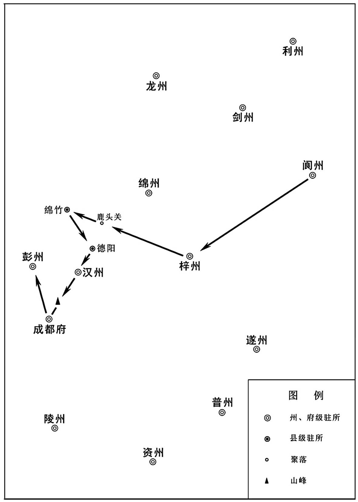 
王建进攻西川路线示意图

## 【原文】

**初，黄巢之乱，上为寿王，从僖宗幸蜀[1]。时事出仓猝，诸王多徒行，至山谷中，寿王疲乏不能前，卧磻石上[2]。田令孜自后至，趣之。王曰：“足痛，幸军容给一马[3]。”令孜曰：“此深山，安得马！”以鞭抶王使前，王顾而不言，心衔之[4]。及即位，遣人监西川军，令孜不奉诏[5]。上方愤藩镇跋扈，欲以威制之[6]。会得彦朗、建表，以令孜所恃者敬瑄耳，六月，以韦昭度兼中书令，充西川节度使兼两川招抚、制置等使，征敬瑄为龙武统军[7]。**

## 【注文】

[1]上：即唐昭宗李晔（867—904年）。

[2]仓猝：也作“仓卒”，突然。　　磻石：即盘石，扁厚的大石。磻通“盘”。

[3]军容：即观军容使，田令孜时为神策十军观军容使，故称。

[4]鞭抶（chì）：笞打、鞭打。

[5]不奉诏：不接受皇帝的命令。当时田令孜依仗陈敬瑄，故不愿离开西川。

[6]跋扈：专横暴戾。

[7]招抚、制置等使：官名。招抚使：掌招降安抚讨伐事务。制置使：经划边防军务，控制地方秩序。　　龙武统军：官名，禁卫军统领官。龙武：唐代禁军名。唐太宗李世民从禁军中选出善于射箭的一百人，号为百骑。武则天时改为千骑，唐中宗时改为万骑，分左、右营。唐玄宗开元二十六年（738年），分羽林军置左、右龙武军，设左、右龙武大将军各一人，以左、右万骑营隶之，皆用功臣子弟，建制同左、右羽林军。

## 【译文】

当初，黄巢发动叛乱，唐昭宗为寿王，跟着唐僖宗逃往蜀地。当时由于仓促上路，各王大多步行，到了山谷中，寿王李晔疲乏不堪，无法前进，躺在一块大石头上。田令孜从后面赶来，催促他快走。寿王说：“我的脚很疼，希望能给我一匹马。”田令孜说：“这里是深山，哪里有马！”于是用鞭子抽打寿王，让他起来继续走，寿王回头看着他没有说话，但却怀恨在心。等到李晔即位后，派人前去监领西川军，田令孜不接受诏书。唐昭宗正愤恨各地藩镇骄横跋扈，想要用威力来制服他们。此时恰好得到顾彦朗、王建上的表章，认为田令孜之所以有恃无恐依靠的是陈敬瑄，文德元年（888年）六月，任命韦昭度兼中书令，代理西川节度使兼两川招抚、制置等使，调任陈敬瑄为龙武统军。

## 【原文】

**王建军新都，时绵竹土豪何义阳、安仁费师勤等所在拥兵自保，众或万人，少者千人[1]。建遣王宗瑶说之，皆率众附于建，给其资粮，建军复振。**

## 【注文】

[1]新都：县名。唐高祖武德四年（621年）置，治所在今四川成都。　　何义阳：生卒年不详，唐末绵竹地区土豪，后投归王建。　　安仁：县名。唐高祖武德三年（620年）置，治所在今四川大邑东南。　　费师勤：生卒年不详，唐末安仁地区土豪，后投归王建。

## 【译文】

王建驻扎在新都，当时绵竹的土豪何义阳、安仁的费师勤等人，各在当地组建军队用来保卫自己，人数多的有一万人，少的也有一千人。王建派遣王宗瑶前去说服他们，他们都率领部众前来归附王建，供给他财物粮食，王建的军队又振作起来了。

## 【原文】

**［冬十月］，陈敬瑄、田令孜闻韦昭度将至，治兵完城以拒之。**

## 【译文】

唐僖宗文德元年（888年）冬季十月，陈敬瑄、田令孜听说韦昭度将要到来，于是训练士卒、修整城池以抵拒他。

## 【原文】

**初，感义节度使杨晟既失兴、凤，走据文、龙、成、茂四州[1]。王建攻西川，田令孜以晟己之故将，假威戎军节度使，使守彭州[2]。王建攻彭州，陈敬瑄遣眉州刺史山行章将兵五万壁新繁以救之[3]。**

## 【注文】

[1]成：即成州。西魏废帝二年（553年）改南秦州置，治所设在洛谷城（今甘肃西和南）。隋朝时，治所迁至上禄县（今甘肃礼县南）。隋炀帝大业三年（607年）改为汉阳郡。唐高祖武德元年（618年）复改成州。唐玄宗天宝元年（742年）改为同谷郡。唐肃宗乾元元年（758年）复为成州。唐懿宗咸通十三年（872年），治所迁至同谷县（今甘肃成县）。辖境大致相当于今甘肃礼县、西和、成县等地。　　茂：即茂州。唐太宗贞观八年（634年）改南会州置，治所在汶山（今四川茂县），辖境大致相当于今四川茂县、北川、汶川等地。

[2]己之故将：杨晟原为神策军指挥使，故田令孜说是他的故将。　　威戎：唐方镇名。唐僖宗文德元年（888年）改彭州防御使为威戎军节度使。治所设在彭州（今四川彭州），领彭州、成州（治今甘肃成县）、文州（治今甘肃文县西）、龙州（治今四川平武东南）、茂州（治今四川茂县）等五州。

[3]眉州：州名。西魏废帝三年（554年）改青州置，治所设在通义县（今四川眉山）。隋炀帝大业年间废。唐高祖武德二年（619年）复置。唐玄宗天宝、唐肃宗乾元时曾改通义郡。辖境相当于今四川眉山、彭山、丹棱、洪雅、青神等地。　　山行章：唐末五代官吏，官任眉州刺史。唐昭宗龙纪元年（889年），奉陈敬瑄的命令抵御王建，战败投降。唐昭宗乾宁四年（897年），授都押牙，镇守黎州（治今四川汉源北）。后与当地少数民族首领勾结策划反叛，事情败露后被杀。　　新繁：县名。北周改繁县置，治所在今四川成都北。隋文帝开皇初年废，唐高祖武德三年（620年）复置。

## 【译文】

当初，感义节度使杨晟失守兴州、凤州后，逃走占据文州、龙州、成州、茂州四个州。王建进攻西川，田令孜因为杨晟是自己神策军的旧将，便任命杨晟代理威戎军节度使，镇守彭州。王建进攻彭州，陈敬瑄派遣眉州刺史山行章率领五万军队驻扎在新繁，以便援助杨晟。

## 【原文】

**十二月丁亥，以韦昭度为行营招讨使，山南西道节度使杨守亮副之，东川节度使顾彦朗为行军司马。割邛、蜀、黎、雅置永平军，以王建为节度使，治邛州，充行营诸军都指挥使[1]。戊子，削陈敬瑄官爵。**

## 【注文】

[1]蜀：即蜀州。唐武则天垂拱二年（686年）分益州置，治所设在晋原县（今四川崇州），辖境相当于今四川崇州、新津及都江堰部分地区。唐玄宗天宝元年（742年）改为唐安郡。唐肃宗乾元元年（758年）复为蜀州。　　黎：即黎州。北周武帝天和三年（568年）置，治所设在沉黎县（今四川汉源东北）。隋废。唐武则天大足元年（701年）复置，治所移至汉源县（今四川汉源北）。唐玄宗天宝元年（742年）改为洪源郡。唐肃宗乾元元年（758年）复为黎州，为剑南西部边防要地，辖境相当于今四川汉源、石棉、峨边及泸定、冕宁、越西部分地区。　　雅：即雅州。隋文帝仁寿四年（604年）置，治所设在蒙山县（后改严道县，今四川雅安）。隋炀帝大业三年（607年）改为临邛郡。唐高祖武德元年（618年）复为雅州。唐玄宗天宝、唐肃宗至德时一度改为卢山郡。唐肃宗乾元元年（758年）复为雅州。辖境大致相当于今四川雅安、名山、荥经、芦山等地。　　永平军：唐方镇名。唐僖宗文德元年（888年）置，治所设在邛州（今四川邛崃），领邛、蜀（治今四川崇州）、黎（治今四川汉源北）、雅（治今四川雅安）等四州。唐昭宗大顺二年（891年）王建攻占成都（今四川成都），占据剑南西川，永平军节度使遂废入剑南西川节度使。

## 【译文】

唐僖宗文德元年（888年）十二月丁亥（二十四日），朝廷任命韦昭度为行营招讨使，山南西道节度使杨守亮为副使，东川节度使顾彦朗为行军司马。划出邛州、蜀州、黎州、雅州设置永平军，任命王建为节度使，治所设在邛州，充任行营诸军都指挥使。戊子（二十五日），削去陈敬瑄的官职爵位。

## 【原文】

**昭宗龙纪元年春正月戊申，王建大破山行章于新繁，杀获近万人，行章仅以身免。杨晟惧，徙屯三交[1]。行章屯蒙阳，与建相持[2]。冬十二月甲子，王建败山行章及西川骑将宋行能于广都[3]。行能奔还成都，行章退守眉州。壬申，行章请降于建。**

## 【注文】

[1]三交：地名，位于今四川成都附近。

[2]蒙阳：县名。唐高宗仪凤二年（677年）置，因在蒙江之北，故名。治所设在今四川彭州东。

[3]宋行能：生卒年不详，唐末五代西川节度使陈敬瑄的骑兵将领。唐昭宗龙纪元年（889年），在广都（今四川双流东南）被王建打败，逃回成都（今四川成都）。

## 【译文】

唐昭宗龙纪元年（889年）春季正月戊申（十六日），王建在新繁大败山行章，斩杀、俘获将近一万人，山行章仅能逃脱性命。杨晟十分害怕，于是将军队调到三交驻扎。山行章驻扎在蒙阳，与王建相互对峙。冬季十二月甲子（初七日），王建在广都打败山行章和西川骑兵将领宋行能。宋行能逃回成都，山行章退守眉州。壬申（十五日），山行章向王建请求投降。

## 【原文】

**大顺元年春正月壬寅，王建攻邛州，陈敬瑄遣其大将彭城杨儒将兵三千助刺史毛湘守之[1]。湘出战，屡败。杨儒登城，见建兵盛，叹曰：“唐祚尽矣。王公治众严而不残，殆可以庇民乎[2]？”遂帅所部出降。建养以为子，更其姓名曰王宗儒。乙巳，建留永平节度判官张琳为邛南招安使，引兵还成都[3]。琳，许州人也。陈敬瑄分兵布寨于犀浦、郫、导江等县，发城中民户一丁，昼则穿重壕，采竹木，运砖石，夜则登城，击柝巡警，无休息[4]。韦昭度营于唐桥，王建营于东阊门外[5]。建事昭度甚谨。辛亥，简州将杜有迁执刺史员虔嵩降于建，建以有迁知州事[6]。**

## 【注文】

[1]杨儒：生卒年不详，彭城（今江苏徐州）人。初为陈敬瑄部将，后投奔王建，被王建收为养子，更名为王宗儒。　　毛湘（？—890年）：唐末田令孜亲信，曾任邛州刺史。唐昭宗大顺元年（890年），王建攻打邛州，在救援无望的情况下，他为保护邛州城内的百姓，而让将领任可知杀死自己以向王建投降。

[2]王公：此指王建。　　庇：保护、荫庇。

[3]张琳：生卒年不详，王建心腹，唐末许州（治今河南许昌）人。曾任永平节度判官。唐昭宗乾宁四年（897年）王建在攻打东川顾彦晖时，他奉命守卫成都（今四川成都）。王建建蜀后，担任眉州刺史等。　　邛南：地区名。指邛水以南，今四川南部一带。　　招安使：官名。掌征伐、招降事务，不常设。

[4]犀（xī）浦（pǔ）：县名。唐武则天垂拱二年（686年）分成都县置，治所在今四川郫（pí）县东南。　　郫：县名。秦始置，在今四川成都郫都区。　　导江：县名。唐高祖武德二年（619年）以灌宁县改名，治今四川都江堰东。　　柝（tuò）：旧时巡夜者击以报时的木梆。

[5]唐桥：桥名。即郫（pí）江桥，位于今四川成都东南。

[6]简州：州名。隋文帝仁寿三年（603年）置，治所在阳安县（今四川简阳西北）。隋炀帝大业二年（606年）废。唐高祖武德三年（620年）复置。唐玄宗天宝元年（742年）改为阳安郡。唐肃宗乾元元年（758年）复为简州。辖境约为今四川简阳和金堂东南部分地区。　　杜有迁：生卒年不详，唐末将领。唐昭宗大顺元年（890年），他活捉简州刺史员虔嵩后出城向王建投降，王建任命他主持简州事务。　　员（yùn）虔嵩：生卒年不详，唐末官吏，曾任简州刺史。唐昭宗大顺元年（890年），被杜有迁活捉，献给王建。

## 【译文】

唐昭宗大顺元年（890年）春季正月壬寅（十五日），王建进攻邛州，陈敬瑄派遣他的大将彭城人杨儒率领三千士兵援助刺史毛湘守城。毛湘出城迎战，多次败阵。杨儒登上城楼，看见王建军队气势非常强盛，叹道：“唐朝气数已尽。王建治理军队严厉而不残暴，大概可以保护百姓？”于是率部众出城投降。王建收他为养子，改名为王宗儒。乙巳（十八日），王建留下永平节度判官张琳担任邛南招安使，自己率领军队回到成都。张琳，是许州人。陈敬瑄派兵到犀浦、郫、导江等县分别安营扎寨，城内百姓每户征发一个壮丁，白天挖战壕，采伐竹木，搬运砖石，夜晚就登上城楼，敲击木梆巡逻，不得休息。韦昭度在唐桥扎营，王建在东阊门外扎营。王建事奉韦昭度特别恭谨。辛亥（二十四日），简州将领杜有迁活捉刺史员虔嵩后出城向王建投降，王建任命杜有迁主持简州事务。

## 【原文】

**夏四月乙丑，陈敬瑄遣蜀州刺史任从海将兵二万救邛州，战败，欲以蜀州降王建[1]。敬瑄杀之，以徐公代为蜀州刺史[2]。丙寅，嘉州刺史朱实举州降于建[3]。丙子，僰道土豪文武坚执戎州刺史谢承恩降于建[4]。**

## 【注文】

[1]任从海（？—890年）：初为陈敬瑄部将，任蜀州刺史。唐昭宗大顺元年（890年），他打算投降王建，结果消息泄露，被陈敬瑄杀死。

[2]徐公（shù）：生卒年不详，唐末陈敬瑄部将。唐昭宗大顺元年（890年）接替任从海担任蜀州刺史一职。

[3]朱实：生卒年不详，初为陈敬瑄部将，曾任嘉州刺史。唐昭宗大顺元年（890年），投降王建。

[4]僰（bó）道：县名。西汉置，治所在今四川宜宾西南。北周武帝保定三年（563年）改为外江县。隋炀帝大业初年恢复旧称。唐武宗会昌三年（843年）治所移至今四川宜宾东北长江北岸。　　文武坚：生卒年不详，僰道（今四川宜宾东北）人。唐昭宗大顺元年（890年），他活捉戎州刺史谢承恩后出城向王建投降，王建收他为养子，改名王宗阮。唐昭宗乾宁四年（897年），率军攻占泸州（治今四川泸州），杀死泸州刺史马敬儒。同年，任渝州刺史。唐昭宗天祐元年（904年），率军打败忠义节度使赵匡凝的军队。　　戎州：州名。南朝梁大同十年（544年）置，治所设在僰道县（今四川宜宾东北）。隋炀帝大业初改为犍为郡。唐高祖武德元年（618年）复为戎州，并将治所移至南溪县（今四川宜宾）。唐太宗贞观年间治所迁回僰道县（今四川宜宾东北）。唐玄宗天宝元年（742年）更名南溪郡。唐肃宗乾元元年（758年）复为戎州。唐穆宗长庆中又移治南溪县（今四川宜宾）。唐武宗会昌初年还治僰道县（今四川宜宾东北）。辖境相当于今四川宜宾地区。　　谢承恩：生卒年不详，唐末官吏，曾任戎州刺史。唐昭宗大顺元年（890年），被土豪文武坚抓住并献给王建。

## 【译文】

唐昭宗大顺元年（890年）夏季四月乙丑（初十日），陈敬瑄派遣蜀州刺史任从海率领两万军队前去救援邛州，结果战败，任从海想要献出蜀州向王建投降。陈敬瑄杀死任从海，并任命徐公代理蜀州刺史。丙寅（十一日），嘉州刺史朱实献出全州向王建投降。丙子（二十一日），僰道土豪文武坚抓住戎州刺史谢承恩向王建投降。

## 【原文】

**六月丁巳，茂州刺史李继昌帅众救成都，己未，王建击斩之[1]。辛酉，资、简都制置应援使谢从本杀雅州刺史张承简，举城降建[2]。秋八月，王建退屯汉州。陈敬瑄括富民财以供军，置征督院，逼以桎梏棰楚，使各自占[3]。凡有财者如匿赃、虚占、急征，咸不聊生。**

## 【注文】

[1]李继昌（？—890年）：唐末陈敬瑄部将，曾任茂州刺史。唐昭宗大顺元年（890年），他率军救援成都（今四川成都），被王建杀死。

[2]资：即资州，治所在今四川资中。　　谢从本：生卒年不详，唐朝官吏，曾任资、简都制置应援使。唐昭宗大顺元年（890年），杀死雅州刺史张承简，投降王建，被王建收为养子，并改名王宗本。唐昭宗天复三年（903年），受封武泰留后。　　张承简（？—890年）：唐末官吏，曾任雅州刺史。唐昭宗大顺元年（890年）被资、简都制置应援使谢从本杀死。　　举城降建：雅州（治今四川雅安）与邛州（治今四川邛崃）接壤，王建攻打邛州，谢从本担心受到攻击，于是以雅州投降。

[3]征督院：唐末陈敬瑄临时设置的监督搜刮富民财物的机构。　　棰楚：施以杖刑。　　自占：自己申报财产数目。

## 【译文】

唐昭宗大顺元年（890年）六月丁巳（初三日），茂州刺史李继昌率领军队救援成都，己未（初五日），王建打败并杀死李继昌。辛酉（初七日），资州、简州都制置应援使谢从本杀死雅州刺史张承简，献出雅州城向王建投降。秋季八月，王建退兵驻扎在汉州。陈敬瑄搜刮富裕百姓的财产以供应军需，设置征督院，使用脚镣手铐并用木棍鞭打百姓，命令他们说出自己的财物。凡是有财物隐藏不报的，或者本来没有财物而强占他人的，或者有见物紧急征用来的，这些人都无法生存了。

## 【原文】

**九月，邛州刺史毛湘本田令孜亲吏，王建攻之急，食尽，救兵不至。壬戌，湘谓都知兵马使任可知曰：“吾不忍负田军容，吏民何罪！尔可持吾头归王建[1]。”乃沐浴以俟刃。可知斩湘及二子降于建，士民皆泣。甲戌，建持永平旌节入邛州，以节度判官张琳知留后[2]。缮完城隍，抚安夷獠，经营蜀、雅[3]。冬十月癸未朔，建引兵还成都，蜀州将李行周逐（李）［徐］公举城降建[4]。**

## 【注文】

[1]都知兵马使：简称兵马使。　　任可知：生卒年不详，唐末邛州刺史毛湘的将领，曾担任都知兵马使。唐昭宗大顺元年（890年），他杀死邛州刺史毛湘后，投降王建。

[2]旌节：古时对地方高级官员赐予的权力凭证。唐朝官制中，节度使赐双旌双节，能够行使军政大权。

[3]夷獠（lǎo）：泛指少数民族。

[4]李行周：生卒年不详，唐末蜀州将领。唐昭宗大顺元年（890年），投降王建。

## 【译文】

唐昭宗大顺元年（890年）九月，邛州刺史毛湘本是田令孜的亲信，王建攻打邛州越来越猛烈，城内的粮食都吃光了，但救援军队还没有到。闰九月壬戌（初九日），毛湘对都知兵马使任可知说：“我不忍辜负田令孜，可是城中的官吏百姓有什么罪呢！你可以拿我的人头去投降王建。”说完，毛湘沐浴更衣等待砍头。任可知杀死毛湘以及他的两个儿子向王建投降，城中的官吏百姓都痛哭流泪。甲戌（二十一日），王建手持永平节度使的旌节进入邛州，任命节度判官张琳主持留后事务。王建修复城池，抚恤安定夷獠边民，谋划治理蜀州、雅州。冬季十月癸未朔（初一日），王建率领军队返回成都，蜀州将领李行周驱逐徐公，献出蜀州城向王建投降。

## 【原文】

**二年。（春二月）韦昭度将诸道兵十余万讨陈敬瑄，三年不能克，馈运不继[1]。朝议欲息兵，［春］三月乙亥，制复敬瑄官爵，令顾彦朗、王建各帅众归镇[2]。**

## 【注文】

[1]三年：自唐僖宗文德元年（888年）任命韦昭度为行营招讨使开始讨伐陈敬瑄，至此已有三年。

[2]归镇：顾彦朗归梓州（治今四川三台），王建归邛州（治今四川邛崃）。

## 【译文】

唐昭宗大顺二年（891年）。（春季二月）韦昭度率领各道十多万兵马讨伐陈敬瑄，历时三年仍未成功，军粮物资的运送供应不上。朝中大臣商议想要停战退兵，春季三月乙亥（二十五日），朝廷下令恢复陈敬瑄的官职爵位，命令顾彦朗、王建各自率领军队返回本镇。

## 【原文】

**夏四月，成都城中乏食，弃儿满路。民有潜入行营贩米入城者，逻者得之，以白韦昭度，昭度曰：“满城饥甚，忍不救之！”释勿问。亦有白陈敬瑄者，敬瑄曰：“吾恨无术以救饿者，彼能如是，勿禁也。”由是贩者浸多，然所致不过斗升。截筒，径寸半，深五分，量米而鬻之，每筒百余钱，饿殍狼籍[1]。军民强弱相陵，将吏斩之不能禁。乃更为酷法，或断腰，或斜劈，死者相继，而为者不止，人耳目既熟，不以为惧[2]。吏民日窘，多谋出降，敬瑄悉捕其族党杀之，惨毒备至。内外都指挥使、眉州刺史成都徐耕性仁恕，所全活数千人[3]。田令孜曰：“公掌生杀而不刑一人，有异志邪[4]？”耕惧，夜取俘囚戮于市[5]。**

## 【注文】

[1]饿殍（piǎo）狼籍：饿死的人纵横满地。

[2]断腰：酷刑之一，即用重斧从腰部将犯人砍成两截。这种刑罚早在周代即已出现，直到清朝雍正年间才废除。

[3]徐耕：生卒年不详，唐末成都（今四川成都）人，田令孜部将，曾任内外都指挥使、眉州刺史，后投降王建。据《十国春秋》记载，他有两个女儿，自幼饱读经书，相貌出众。王建建蜀后，二人被选入宫。小徐女受封淑妃，后生下皇子王宗鼎；大徐女受封贤妃，后生下皇子王衍。王衍嗣位后，尊生母大徐妃为顺圣皇太后，尊小徐女为翊圣皇太后，外祖父徐耕累官至骠骑大将军。

[4]异志：有反叛之心。

[5]戮（lù）：屠杀。

## 【译文】

唐昭宗大顺二年（891年）夏季四月，成都城内缺少粮食，满街都是被丢弃的孩子。百姓中有人暗中潜入围城的军营贩米进城，被巡逻的士兵抓到，禀报了韦昭度，韦昭度说：“全城百姓都在饥饿中挣扎，怎么能忍心不救他们呢！”于是释放了被抓住的百姓，没有追究责任。也有的人将这种情况禀告给了陈敬瑄，陈敬瑄说：“我非常痛心没有办法拯救这些饥饿的人，他们能这样做，不要禁止。”于是贩卖粮食的人越来越多，然而这些人所携带的粮食不过一斗几升。他们截断竹筒，直径一寸半，深度五分，用这个量米来卖，每一筒米卖出一百多钱，城中饿死的人遍地都是。士兵和百姓强者欺负弱者，将领、官吏斩杀他们也无法禁止。于是订立了一套更加残酷的刑法，或者把人从腰部砍断，或者把人斜劈成两半，被处死的人前后相继不绝，然而犯法的人仍然禁止不住，百姓对酷刑耳闻目睹，就不再害怕了。官吏、百姓的处境日益窘迫，很多人打算出城投降，陈敬瑄将这些人的族人和同党全部杀死，残酷狠毒到了极点。内外都指挥使、眉州刺史成都人徐耕性情仁慈宽厚，受他保护、救活的有几千人。田令孜问：“你掌管生杀大权，却不惩罚一人，难道有反叛之心吗？”徐耕十分害怕，连夜将俘虏的囚犯在市街上杀了。

## 【原文】

**王建见罢兵制书，曰：“大功垂成，奈何弃之[1]！”谋于周庠，庠劝建请韦公还朝，独攻成都，克而有之。建表称：“陈敬瑄、田令孜罪不可赦，愿毕命以图成功。”昭度无如之何，由是未能东还。建说昭度曰：“今关东藩镇迭相吞噬，此腹心之疾也。相公宜早归庙堂，与天子谋之[2]。敬瑄，疥耳，当以日月制之，责建可办也[3]。”昭度犹豫未决。庚子，建阴令东川将唐友通等擒昭度亲吏骆保于行府门，脔食之，云其盗军粮[4]。昭度大惧，遽称疾，以印节授建，牒建知三使留后兼行营招讨使，即日东还[5]。建送至新都，跪觞马前，泣拜而别[6]。昭度甫出剑门，即以兵守之，不复内东军[7]。昭度至京师，除东都留守[8]。**

## 【注文】

[1]制书：古代皇帝诏令的一种。唐代主要用于大赏重罚、授以高官厚爵、改革旧政、宽赦降虏等。

[2]庙堂：太庙的明堂。是古代帝王祭祀、议事的地方。常借指朝廷。

[3]疥（jiè）（xuǎn）：指疥疮和癣两种皮肤病。㿅同“癣”。　　以日月制之：再用一些时间就可以制服它，意即取胜指日可待。

[4]阴令：暗中命令。　　唐友通：生卒年不详，唐末东川节度使顾彦朗的部将。唐昭宗大顺二年（891年）受王建的指使杀死韦昭度的亲信将领骆保。　　骆保（？—891年）：唐末韦昭度部将。唐昭宗大顺二年（891年），被东川将领唐友通杀死。　　脔（luán）：切成块的肉。

[5]三使：指节度使、招抚使、制置使。

[6]觞（shāng）：古代盛酒器。此处指向人敬酒。

[7]甫（fǔ）：刚刚。　　剑门：县名。唐武则天圣历二年（699年）置，治所设在今四川剑阁东北剑门。

[8]京师：即唐朝都城长安（今陕西西安）。

## 【译文】

王建看到皇帝颁布的休战诏令，说：“大功即将告成，怎么能放弃呢！”于是与周庠商议，周庠劝王建请韦昭度回朝．自己独自进攻成都，攻陷后占为己有。王建于是上表朝廷说：“陈敬瑄、田令孜罪不可赦，我愿意竭尽全力效命以求取得成功。”韦昭度对他没办法，因此也没能东返长安。王建劝韦昭度道：“现在关东地区的藩镇互相侵略吞并，这是朝廷的心腹大患啊。您应该早些回到京师，与皇帝商议此事。陈敬瑄，就像疥疮皮癣一样，再用一些时日就可以制服，责成我王建去办就行了。”韦昭度犹豫不决。大顺二年（891年）四月庚子（二十一日），王建暗中命令东川将领唐友通等在行府门前擒获韦昭度的亲信将领骆保，并把他剁成肉块吃掉，说他盗用了军粮。韦昭度十分恐惧，马上推说有病，把印章、旌节授予王建，发布公文任命王建掌管节度使、招抚使、制置使等三使的留后事务，并兼任行营招讨使，韦昭度当天启程返回京师。王建送行到新都，在马前跪下向韦昭度敬酒，落泪跪拜后才分别。韦昭度刚离开剑门，王建立即命令士兵守住城门，不再让东面的军队进来。韦昭度回到京师，被任命为东都留守。

## 【原文】

**建急攻成都，环城烽堑亘五十里[1]。有狗屠王鹞请诈得罪亡入城说之，使上下离心，建遣之[2]。鹞入见陈敬瑄、田令孜，则言建兵疲食尽将遁矣。出则鬻茶于市，阴为吏民称建英武，军势强盛。由是敬瑄等懈于守备，而众心危惧[3]。建又遣其将京兆郑渥诈降以觇之，敬瑄以为将，使乘城，既而复以诈得归[4]。建由是悉知城中虚实，以渥为亲从都指挥使，更姓名曰王宗渥。**

## 【注文】

[1]烽堑：即烽火台，又称烽燧，俗称烽堠（hòu）、烟墩、墩台，古时用于点燃烟火传递重要消息的高台，古代重要军事防御设施，为防止敌人入侵而修建。遇有敌情发生，则白天施烟，夜间点火，台台相连，传递消息。

[2]狗屠：宰狗为业的人。　　王鹞（yào）：生卒年不详，唐朝末年人，以宰狗为业。

[3]众心危惧：人人心里害怕。王鹞在陈敬瑄、田令孜面前说王建兵疲食尽，使其放松防守；在官吏百姓中散布王建兵势强大，使得人人自危。

[4]郑渥（wò）（？—925年）：京兆（治今陕西西安）人，初为王建牙将，在夺取成都（今四川成都）的战争中，因功被王建收为养子，更名为王宗渥，后为魏王李继岌所杀。　　乘城：登上城墙。

## 【译文】

王建加紧攻打成都，环绕成都城烽火堑壕绵延五十里。有个叫王鹞的宰狗屠夫，请求假装获罪逃入城中去游说，让城内的百姓和陈敬瑄离心，王建于是派他前去。王鹞入城后拜见了陈敬瑄、田令孜，对他们说王建士兵疲乏、粮食也吃完了，就要逃走了。王鹞到市场上去卖茶，暗中对官吏、百姓们称述王建英勇威武，军势强盛。这样一来，陈敬瑄等人放松了守备，而城内百姓心里却感到恐惧。王建又派遣他的部将京兆人郑渥假装投降以便进入城中探究虚实，陈敬瑄竟然任命他为将领，让他登上城楼进行巡视，不久郑渥又采用欺诈的方法出城回到军营。因此王建对城中的虚实情况了如指掌，任命郑渥为亲从都指挥使，更改姓名叫王宗渥。

## 【原文】

**秋八月，王建攻陈敬瑄益急，敬瑄出战辄败，巡内州县率为建所取。威戎节度使杨晟时馈之食，建以兵据新都，彭州道绝[1]。敬瑄出慰勉士卒，皆不应。辛丑，田令孜登城谓建曰：“老夫向于公甚厚，何见困如是？”建曰：“父子之恩岂敢忘[2]。但朝廷命建讨不受代者，不得不然[3]。傥太师改图，建复何求[4]！”是夕，令孜自携西川印节诣建营授之，将士皆呼万岁。建泣谢，请为父子如初。壬寅，敬瑄开城迎建。癸卯，建入城，自称西川留后。**

## 【注文】

[1]彭州道绝：新都（今四川成都）在彭州（治今四川彭州）与成都（治今四川成都）中间，为杨晟运送粮食给陈敬瑄的必经之路。王建占据新都后，彭州至成都的道路无法通行。

[2]父子之恩：王建曾为田令孜的养子。

[3]不受代者：此指陈敬瑄。唐僖宗文德元年（888年），朝廷任命韦昭度为西川节度使兼两川招抚制置使，征陈敬瑄为龙武统军。陈敬瑄、田令孜不接受朝命，故王建称他为“不受代者”。

[4]太师：此指陈敬瑄。陈敬瑄曾任检校太师，故称。

## 【译文】

唐昭宗大顺二年（891年）秋季八月，王建加紧进攻陈敬瑄，陈敬瑄每次出战都被打败，他管辖内的州县大多被王建占据了。威戎节度使杨晟常常送粮食给陈敬瑄，王建出兵占据了新都，通往彭州的道路断绝了。陈敬瑄出来慰问勉励士兵时，士兵们都不响应。辛丑（二十四日），田令孜登上城楼对王建说：“老夫从前对你不薄，现在为什么如此围困我？”王建说：“义父对我的恩惠我怎么敢忘记。只是朝廷命令我讨伐不接受职务调动的人，我才不得不这样做。如果陈敬瑄能改变意图，我王建还有什么要求呢！”当晚，田令孜亲自携带西川节度使的印章和旌节到王建的军营中授给他，将领、士兵们都高呼万岁。王建万分感谢，掉下了眼泪，请求恢复父子关系。壬寅（二十五日），陈敬瑄打开城门迎接王建。癸卯（二十六日），王建进入城内，自称西川留后。

## 【原文】

**初，陈敬瑄之拒朝命也，田令孜欲盗其军政，谓敬瑄曰：“三兄尊重，军务烦劳，不若尽以相付，日具记事咨呈，兄但高居自逸而已[1]。”敬瑄素无智能，忻然许之[2]。自是军事皆不由己，以至于亡。建表敬瑄子陶为雅州刺史，使随陶之官，明年罢归，寓居新津，以一县租赋赡之[3]。**

## 【注文】

[1]拒朝命：即拒绝接受皇帝的命令交出西川地区，前往担任神武统军一职。　　三兄：陈敬瑄排行第三，故称。　　尽以相付：把军政大权全部交给田令孜。　　咨呈：呈送陈敬瑄征求意见。　　自逸：自己享受安逸。

[2]忻然：高兴的样子。忻，通“欣”。

[3]陶：即陈陶，生卒年不详，陈敬瑄之子。唐昭宗大顺二年（891年），陈敬瑄投降后，王建上奏朝廷请求任命他为雅州刺史，并让他的父亲陈敬瑄随他一同就任。　　之官：到任所去。此指陈敬瑄随他的儿子陈陶到任所去。陈敬瑄当初凭借击球比赛赢得西川节度使，至今已有十二年。　　新津：县名。北周闵帝元年（557年）置，治所在今四川新津东。隋文帝开皇年间治所迁至今四川新津。

## 【译文】

当初，陈敬瑄抗拒朝廷的命令，田令孜想窃取他的军政大权，对陈敬瑄说：“您现在位尊权重，但军队中的事务既繁重又辛苦，不如全部托付给我，我每天将事情详细记载下来请示您，您只要高高在上，坐享安逸就可以了。”陈敬瑄本来就没有智谋才能，于是很高兴地答应了。自此以后军中事务都不由自己决定，以至于灭亡。王建上表朝廷奏请任命陈敬瑄的儿子陈陶为雅州刺史，让陈敬瑄跟随陈陶到雅州的任所去，第二年，陈敬瑄罢官回到家乡，居住在新津，用一个县的田租赋税供养他。

## 【原文】

**癸丑，建分遣士卒就食诸州。更文武坚姓名曰王宗阮，谢从本曰王宗本。陈敬瑄将佐有器干者，建皆礼而用之。**

## 【译文】

唐昭宗大顺二年（891年）九月癸丑（初六日），王建分别派遣士兵到各州去解决粮草问题。改文武坚的姓名为王宗阮，改谢从本的姓名为王宗本。凡是陈敬瑄部将中有器量才干的，王建都以礼相待并重用他们。

## 【原文】

**九月，东川节度使顾彦朗薨，军中推其弟彦晖知留后。**

## 【译文】

唐昭宗大顺二年（891年）九月，东川节度使顾彦朗去世，军中将士拥立他的弟弟顾彦晖掌管留后事务。

## 【原文】

**冬十月癸未，以永平节度使王建为西川节度使。甲申，废永平军。建既得西川，留心政事，容纳直言，好施乐士，用人各尽其才，谦恭俭素。然多忌好杀，诸将有功名者，多因事诛之。**

## 【译文】

唐昭宗大顺二年（891年）冬季十月癸未（初六日），任命永平节度使王建为西川节度使。甲申（初七日），废除永平军。王建得到西川后，注重政务，容忍采纳直言批评，喜好施恩，乐于接纳贤士，用人各尽其才，待人谦虚恭敬，生活节俭素朴。然而他性格多疑常常杀人，各将领有功劳的，大多被他找借口杀了。

## 【原文】

**十二月，以顾彦晖为东川节度使，遣中使宋道弼赐旌节[1]。杨守亮使杨守厚囚道弼，夺其旌节，发兵攻梓州。癸卯，彦晖求救于王建。甲辰，建遣其将华洪、李简、王宗侃、王宗弼救东川[2]。建密谓诸将曰：“尔等破贼，彦晖必犒师，汝曹于行营报宴，因而执之，无烦再举[3]。”宗侃破守厚七砦，守厚走归绵州[4]。彦晖具犒礼，诸将报宴，宗弼以建谋告之，彦晖乃以疾辞。**

## 【注文】

[1]宋道弼（？—900年）：唐末宦官，曾任枢密使。唐昭宗乾宁元年（894年）杨复恭死后，他与景务修专制朝政。唐昭宗光化三年（900年），宰相崔胤在朱全忠的支持下，将他罢黜为荆南监军。后被唐昭宗赐死。

[2]华洪（？—902年）：唐末王建部将，颍川（治今河南许昌）人。曾跟从王建南征北战，因功被王建收为养子，更名为王宗涤。累官东川节度使、加同平章事、山南东道节度使。他勇敢而有谋略，很得将士爱戴，为此被王建怀疑猜忌。唐昭宗天复二年（902年），成都（今四川成都）修建府门，用朱丹彩绘，城中百姓称作“画红”楼，与华洪名字相应。王宗佶等人忌妒他有功，制造流言进行中伤，王建命亲随指挥使唐道袭绞杀了他。王建称帝后，下诏为他雪冤，恢复原有官爵。　　李简：生卒年不详，原为王建牙将，官至邛州刺史。唐昭宗大顺二年（891年），他受命与华洪率兵援助东川顾彦晖。

[3]犒（kào）师：用酒食或财物慰劳军队。　　报宴：答谢宴会。

[4]砦（zhài）：同“寨”。

## 【译文】

唐昭宗大顺二年（891年）十二月，任命顾彦晖为东川节度使，朝廷派遣宦官宋道弼赐给他旌节官印。杨守亮命令杨守厚囚禁宋道弼，夺走了他所携带的旌节，出动军队进攻梓州。癸卯（二十七日），顾彦晖向王建求救。甲辰（二十八日），王建派遣部将华洪、李简、王宗侃、王宗弼救援东川。王建暗中对各位将领说：“你们打败贼寇后，顾彦晖一定会犒劳你们的军队，你们就在行营中举行的庆功宴会上，顺便把他抓起来，我们就不必再动用军队进攻他了。”王宗侃攻破了杨守厚的七个军寨，杨守厚逃回绵州。顾彦晖准备了犒劳的礼物，各位将领也设宴答谢，王宗弼把王建的阴谋告诉了顾彦晖，顾彦晖于是推托有病没有出席。

## 【原文】

**景福元年。威（武）［戎］节度使杨晟与杨守亮等约攻王建，二月丁丑，晟出兵掠新繁、汉州之境，使其将吕荛将兵二千会杨守厚攻梓州[1]。建遣行营都指挥使李简击荛，斩之。辛丑，王建遣族子嘉州刺史宗裕、雅州刺史王宗侃、威信都指挥使华洪、茂州刺史王宗瑶将兵五万攻彭州，杨晟逆战而败，宗裕等围之[2]。杨守亮遣其将符昭救晟，径趋成都，营三学山[3]。建亟召华洪还[4]。洪疾驱而至，后军尚未集，以数百人夜去昭营数里多击更鼓；昭以为蜀军大至，引兵宵遁[5]。**

## 【注文】

[1]吕荛（ráo）（？—892年）：唐末杨晟部将。唐昭宗景福元年（892年），为王建派遣的行营都指挥使李简所杀。

[2]族子：同族兄弟之子，从子则是亲兄弟的儿子。故在宗族关系上，从子比族子近。　　宗裕：即王宗裕，生卒年不详，王建族子，初为王建牙校。王建镇守西川时，担任嘉州刺史，后为东川留守。前蜀建国之初，为总成都城内外诸军事，后再出为东川节度副大使，受封通王。

[3]符昭：生卒年不详，唐末杨守亮的部将。唐昭宗景福元年（892年），奉杨守亮的命令，他率领军队救援杨晟。　　三学山：地名，位于今四川金堂东北。

[4]亟召：紧急召还。华洪为王建军中的勇将，故急召他返回。

[5]更鼓：报更的鼓。华洪多击更鼓是为迷惑符昭。

## 【译文】

唐昭宗景福元年（892年）。威戎节度使杨晟与杨守亮等人相约一起攻打王建，二月丁丑（初二日），杨晟出兵掠夺新繁、汉州等地，派遣他的部将吕荛率领两千名士兵与杨守厚会合一同攻打梓州。王建派遣行营都指挥使李简抗击吕荛，将吕荛斩杀。辛丑（二十六日），王建派遣族子嘉州刺史王宗裕、雅州刺史王宗侃、威信都指挥使华洪、茂州刺史王宗瑶率领五万军队进攻彭州，杨晟迎战失败，王宗裕等人包围了他。杨守亮派遣他的部将符昭救援杨晟，符昭直奔成都，在三学山安营扎寨。王建急忙召回华洪。华洪快速赶到，后面的军队还没来得及集结，华洪便连夜率领几百人到离符昭营寨几里的地方，频繁敲打更鼓；符昭以为王建大军到了，便连夜率军逃走了。

## 【原文】

**三月，左神策勇胜三都都指挥使杨子实、子迁、子钊，皆守亮之假子也，自渠州引兵救杨晟，知守亮必败，壬子，帅其众二万降于王建[1]。**

## 【注文】

[1]勇胜三都：神策五十四都中的三都。唐僖宗时，田令孜曾在蜀地募集新军五十四都，每都一千人，分别隶属于左、右两神策军。　　杨子实：生卒年不详，唐末杨守亮的养子，曾任禁军将校。唐昭宗景福元年（892年），率领军队投降王建。　　子迁：即杨子迁，生卒年不详，唐末杨守亮的养子，曾任禁军将校。唐昭宗景福元年（892年）率领军队投降王建。　　子钊：即杨子钊，生卒年不详，唐末杨守亮的养子，曾任禁军将校。唐昭宗景福元年（892年），率领军队投降王建。　　渠州：州名。南朝梁武帝大同三年（537年）置，一说南朝梁武帝大通三年（529年）置。隋炀帝大业三年（607年）改为宕（dàng）渠郡。唐高祖武德元年（618年）复为渠州。唐玄宗天宝元年（742年）改为潾（lín）山郡。唐肃宗乾元元年（758年）复为梁州。治所设在流江县（今四川渠县），辖境大致相当于今四川渠县、大竹、邻水、广安等地。

## 【译文】

唐昭宗景福元年（892年）三月，左神策勇胜三都都指挥使杨子实、杨子迁、杨子钊，都是杨守亮的养子，他们从渠州率领军队救援杨晟，知道杨守亮必败无疑，壬子（初八日），率领两万部众向王建投降。

## 【原文】

**杨晟遗杨守贞、杨守忠、杨守厚书，使攻东川，以解彭州之围，守贞等从之。神策督将窦行实戍梓州，守厚密诱之为内应[1]。守厚至涪城，行实事泄，顾彦晖斩之[2]。守厚遁去。守贞、守忠军至，无所归，盘桓绵、剑间，王建遣其将吉谏袭守厚，破之[3]。癸亥，西川将李简邀守忠于钟阳，斩获三千余人[4]。夏四月，简又破守厚于铜，斩获三千余人，降万五千人；守忠、守厚皆走[5]。**

## 【注文】

[1]窦行实（？—892年）：唐末将领，曾任神策督将，戍守梓州（治今四川三台）。唐昭宗景福元年（892年），因暗中勾结杨守厚，被顾彦晖杀死。

[2]涪（fú）城：隋文帝开皇十六年（596年）改安城县置，治所在今四川三台西北。

[3]盘桓：逗留不进的样子。　　剑：即剑州。唐玄宗先天二年（713年）改始州置，治所设在普安县（今四川剑阁），辖境相当于今四川剑阁、梓潼等地。　　吉谏：生卒年不详，唐末王建牙将。唐昭宗景福元年（892年），因打败杨守厚有功，被王建收为养子，改名王宗黯。唐昭宗天复初年，因讨平杜法从，进官兼侍中。前蜀王建永平三年（913年），他协助后主王衍继位，封琅邪郡王。

[4]钟阳：地名，位于今四川绵阳东北。

[5]铜：地名，位于今四川绵阳东。

## 【译文】

杨晟写信给杨守贞、杨守忠和杨守厚，希望他们进攻东川，以解除彭州的包围，杨守贞等人听从了他的话。神策督将窦行实戍守梓州，杨守厚秘密引诱他做内应。杨守厚到达涪城，窦行实做内应的事情泄露，顾彦晖杀了他。杨守厚也逃走了。杨守贞、杨守忠的军队到达后，无处可去，于是在绵州、剑州之间徘徊逗留，王建派遣他的部将吉谏袭击杨守厚，将他打败。景福元年（892年）三月癸亥（十九日），西川将领李简在钟阳迎击杨守忠的军队，杀死、俘虏三千多人。夏季四月，李简又在铜打败了杨守厚，斩杀、抓获三千多人，前来投降的有一万五千多人；杨守忠、杨守厚都逃跑了。

## 【原文】

**秋七月，王建围彭州，久不下，民皆窜匿山谷。诸寨日出俘掠，谓之“淘虏”，都将先择其善者，余则士卒分之，以是为常。有军士王先成者，新津人，本书生也，世乱，为兵，度诸将惟北寨王宗侃最贤，乃往说之曰：“彭州本西川之巡属也，陈、田召杨晟割四州以授之，伪署观察使，与之共拒朝命[1]。今陈、田已平，而晟犹据之[2]。州民皆知西川乃其大府，而司徒乃其主也，故大军始至，民不入城而入山谷避之，以俟招安[3]。今军至累月，未闻招安之命，军士复从而掠之，与盗贼无异，夺其赀财，驱其畜产，分其老弱妇女以为奴婢，使父子兄弟流离愁怨[4]。其在山中者，暴露于暑雨，残伤于蛇虎，孤危饥渴，无所归诉[5]。彼始以杨晟非其主而不从，今司徒不加存恤，彼更思杨氏矣[6]。”宗侃恻然，不觉屡移其床，前问之[7]。先成曰：“又有甚于是者。今诸寨每旦出六七百人，入山淘虏，薄暮而返，曾无守备之意[8]。赖城中无人耳，万一有智者为之画策，［使］乘虚奔突，先伏精兵千人于门内，登城望淘虏者稍远，出弓弩手炮［手］各百人，攻寨之一面，随以役卒五百，负薪土填壕为道，然后出精兵奋击，且焚其寨；又于三面城下各出耀兵，诸寨咸自备御，无暇相救，城中得以益兵继出，如此能无败乎[9]？”宗侃矍然曰：“此诚有之，将若之何？”先成请条列为状以白王建，宗侃即命先成草之，大指言：“今所白之事，须四面通共，宗侃所司止于北面，或所白可从，乞以牙举施行[10]。”事凡七条：“其一，乞招安山中百姓[11]。其二，乞禁诸寨军士及子弟，无得一人辄出淘虏，仍表诸寨之旁七里内听樵牧，敢越表者斩[12]。其三，乞置招安寨，中容数千人，以处所招百姓。宗侃请选所部将校谨干者为招安将，使将三十人，昼夜执兵巡卫[13]。其四，招安之事，须委一人总领。今榜帖既下，诸寨必各遣军士入山招安，百姓见之，无不惊疑，如鼠见狸，谁肯来者[14]？欲招之必有其术，愿降帖付宗侃专掌其事[15]。其五，乞严勒四寨指挥使，悉索前日所虏彭州男女老幼，集于营场，有父子、兄弟、夫妇自相认者，即使相从，牒具人数，部送招安寨，有敢私匿一人者斩。仍乞勒府中诸营，亦令严索，有自军前先寄归者，量给资粮，悉部送归招安寨[16]。其六，乞置九陇行县于招安寨中，以前南郑令王丕摄县令，设置曹局，抚理百姓，择其子弟之壮者，给帖使自入山，招其亲戚[17]。彼知司徒严禁侵掠，前日为军士所虏者皆获安堵，必欢呼踊跃，相帅下山，如子归母，不日尽出。其七，彭州土地宜麻，百姓未入山时多沤藏者，宜令县令晓谕，各归田里，出所沤麻鬻之，以为资粮，必渐复业[18]。”建得之大喜，即行之，悉如所申[19]。明日，榜帖至，威令赫然，无敢犯者。三日，山中民竞出，赴招安寨如归市，寨不能容，斥而广之[20]。浸有市井，又出麻鬻之。民见村落无抄暴之患，稍稍辞县令，复故业。月余，招安寨皆空。**

## 【注文】

[1]王先成：生卒年不详，唐末新津（今四川新津）人，王建部下。唐昭宗景福元年（892年），杨晟支持杨复恭反叛朝廷，王建派兵围攻杨晟所据的彭州（治今四川彭州）。他向王建献出七条计策，协助王建攻克彭州。　　度（duó）：揣度。　　陈、田：此指陈敬瑄、田令孜。　　割四州：此指唐僖宗文德元年（888年）陈敬瑄、田令孜授予杨晟的文（治今甘肃文县西）、龙（治今四川平武东南）、成（治今甘肃成县）、茂（治所今四川茂县）四州。

[2]之：根据上下文，此指彭州。

[3]大府：亦称会府，指节度使府。　　司徒：指王建。王建曾任检校司徒，故称。

[4]累月：数月。王建的军队自唐昭宗景福元年（892年）二月抵达，至今已有六个月。　　赀（zī）财：资财。

[5]暑雨：酷暑和雨水。因百姓逃至山中无房屋居住，无奈忍受着酷暑和雨淋。

[6]存恤：慰问抚恤。

[7]恻然：忧伤的样子。

[8]薄暮：临近傍晚。　　曾：副词，简直，竟然。

[9]赖：所仗。　　薪土：柴草和土。　　耀兵：显示炫耀以迷惑敌人。

[10]四面通共：四面采取共同行动。当时王建率领军队围攻彭州（治今四川彭州），在彭城四面安营扎寨，王宗裕、王宗侃、华洪、王宗瑶各据一面。

[11]招安：也作“招抚”，即用笼络手段使其投降，归顺朝廷。

[12]表：标记。此处用如动词，树立标记。　　听樵牧：任凭百姓打柴放牧。

[13]谨干者：严谨干练的人。

[14]榜帖：布告。　　狸：也叫“钱猫”“山猫”“狸猫”，这种动物体大如猫，圆头大尾，全身浅棕色，有许多褐色斑点，从头到肩有四条棕褐色纵纹，两眼内缘向上各有一条白纹。

[15]降帖：下发军帖。帖，写有军令的柬帖。

[16]府：此指成都府。　　量：用作动词。给以一定数量的粮食和军费。

[17]九陇行县：唐昭宗景福元年（892年）置，位于今四川彭州附近。　　南郑：县名。战国秦置，治所在今陕西汉中东。西魏废帝三年（554年）改为光义县。隋文帝开皇初年复名南郑县。　　县令：又称令，官名。战国时各国置，为县的行政长官。秦、汉以后，人口在万户以上的县设县令为长官。魏晋南北朝、隋唐时期沿置，依所治县的大小，户的多少而品秩不同。

[18]沤（òu）：浸泡。“麻”被收割后，需将麻茎在水中浸泡一段时间，使它自然发酵，以达到脱皮取麻的目的。

[19]悉如所申：一切都按照王宗侃所申述的办理。

[20]归市：赶赴集市。在古代京师、郡、国乃至大县城内，官府在指定地区设立进行贸易的市，与百姓居住的“里”或“坊”严格分开。市场周围有垣墙，商人和百姓只能由市门出入。市门按时开闭，并设有管理市场事务的官署。

## 【译文】

唐昭宗景福元年（892年）秋季七月，王建包围彭州，很久还没有攻下来，当地百姓都逃到山谷里躲起来。王建所属的各个营寨士兵每天都出去掳掠抢劫，称为“淘虏”，抢来的财物，军中将领先挑选好的，剩下的就分给士兵们，大家都习以为常。军中有个军士叫王先成，是新津人，他本来是读书人，因为社会动乱，就当了兵，他忖度王建手下各将领中，只有北寨的王宗侃最为贤明，于是前往王宗侃处游说：“彭州本来是西川的属地，陈敬瑄、田令孜召来杨晟，分割出文、龙、成、茂四个州授予他，伪造命令叫他担任观察使，和他联合起来共同抗拒朝廷的命令。现在陈敬瑄、田令孜已被平定，但杨晟仍然占据着彭州。彭州百姓都知道西川是他们的节度使府，而检校司徒王建是他们的长官，所以大军刚刚到达的时候，百姓不入城而到山谷中躲避，以等待王建的招抚。现在大军到这里已经好几个月了，没有听到招抚的命令，相反纵容士兵抢掠他们，与盗贼没有什么区别，士兵们抢劫他们的钱财，驱赶他们的牲畜，把年老体弱的人及妇女分给士兵做奴婢，使父子兄弟流离失所愁苦哀怨。那些在山谷里的百姓，暴露在酷暑暴雨中，不时受到蛇虎残伤，孤苦饥渴，无处倾诉。他们开始时因为杨晟不是他们的长官而不听从他的命令，如今王建对他们不加慰问救济，他们就更加思念杨晟了。”王宗侃感到很凄惨，不知不觉多次移动座位，到王先成面前问话。王先成继续说：“还有比这更危险的。现在各个军寨每天早上出动六七百人，到山谷中去搜掠百姓财物，一直到傍晚才回来，根本没有守寨防备的意图。幸好彭州城中没有一个出谋划策的人，万一有个足智多谋的人为杨晟出谋划策，使他们乘我们空虚时出来袭击，先在门内埋伏一千名精兵，登上城楼看士兵外出抢掠时，便出动弓箭手、炮手各一百人，攻打营寨的一面，随后再派遣五百名役卒，背着柴草、土块填平壕沟垫好道路，然后出动精兵奋力进攻，焚烧营寨；紧接着又在另外三面城下派出耀武扬威的军队，各个营寨都自己防御敌人，无暇互救，城中能够不断增加士兵进行补充，如果事实果真如此，能够不打败仗吗？”王宗侃听后猛然惊醒，担心地问：“如果真的出现这样的情况，该怎么办呢？”王先成请求逐条列举写成疏状向王建报告，王宗侃当即就让他起草状文，大意是说：“现在所禀报的事情，需要围城的王宗裕、王宗侃、华洪、王宗瑶四寨共同联合行动，我王宗侃所管辖的只有北面，如果所禀报的事情可以依从，那么请求用节度使的名义来推举施行。”状中总共写了七条：“第一，请求招抚山中的百姓。第二，请禁止各个营寨士兵及子弟出寨抢掠，在各个营寨旁立下石碑，七里范围内可以任意砍柴、放牧，有敢越过石碑的一律斩首。第三，请设立招安寨，里面可容纳几千人，以安置招回来的百姓。我王宗侃请求挑选部下中恭谨、干练的将领做招安将领，命令他们率领三十人，不分白天黑夜拿着兵器巡逻保卫。第四，招抚百姓的事情必须委托一个人统领。现在文告已经公布，各个军寨一定会分头派士兵到山中去招抚，百姓如果看到了一定会惊慌疑惧，就像老鼠见到狸猫一样，有谁肯来呢？招安必须要有办法，希望颁布文书让王宗侃专门负责此事。第五，请严格命令四寨的指挥使，把前些日子俘虏来的彭州男女老幼，全部集合在军营场中，如有父子、兄弟、夫妇自己相认的，就让他们团聚，牒文中写清人数，把他们都送到招安寨，有敢私下藏匿一人的就把他斩首。再请求命令成都府中的各个军营，也要他们严格清查，有先前从军队前沿送去的百姓，酌量给他们资财、粮食，然后全部送到招安寨。第六，请在招安寨中设置九陇行县，任命前任南郑县令王丕代理县令的职务，县内设置曹局，用来安抚百姓，选择他们子弟中健壮的人，给他们文书让他们到山中去招集自己的亲戚。他们知道王建严格禁止侵扰掠夺，前些日子被士兵们俘虏去的人，都得到了很好的安置，一定会欢呼跳跃，相继下山，好像孩子回到母亲怀抱一般，不用几天全部都出来了。第七，彭州土地适宜种麻，百姓还没有入山时，把很多沤过的麻藏起来了，应该让县令告诉百姓，让他们各自归田务农，取出沤麻到市场上去换取钱粮，这样一定会恢复旧业。”王建得到疏状后非常高兴，立即下令实行，全部按照他申述的那样做。第二天，告示送到了各个军营，威严的军令清晰醒目，没有人敢触犯。三天后，山中百姓争先下山奔赴招安寨，就好像赶集一样，招安寨容纳不下了，就开辟地盘扩建寨子。慢慢有了可做买卖的市场，百姓把麻拿出来卖掉。百姓见村落里没有抢掠的，便逐渐辞别了县令，回到家乡重操旧业。一个月后，招安寨全都空了。

## 【原文】

**秋八月辛丑，李茂贞攻拔兴元，杨复恭、杨守亮、杨守信、杨守贞、杨守忠、满存奔阆州。**

## 【译文】

唐昭宗景福元年（892年）秋季八月辛丑（三十日），李茂贞攻克兴元，杨复恭、杨守亮、杨守信、杨守贞、杨守忠和满存一同逃奔阆州。

## 【原文】

**冬十二月壬午，王建遣其将华洪击杨守亮于阆州，破之。建遣节度押牙延陵郑顼使于朱全忠，全忠问剑阁，顼极言其险[1]。全忠不信，顼曰：“苟不以闻，恐误公军机。”全忠大笑。**

## 【注文】

[1]延陵：县名。西晋武帝太康二年（281年）置，治所在今江苏丹阳西南。隋文帝开皇九年（589年）治所迁至京口（今江苏镇江）。后省。唐高祖武德三年（620年）复置，治所迁回今江苏丹阳西南。　　郑顼（xū）：生卒年不详，王建部将，唐末延陵（今江苏丹阳西南）人。曾任节度押牙，后历任宣徽北院使、内枢密使等。前蜀武成三年（910年），出为果州刺史。　　剑阁：道路名。即剑阁道。三国时诸葛亮开，为川、陕间主要通道。位于今四川剑阁东北大剑山、小剑山之间。

## 【译文】

唐昭宗景福元年（892年）冬季十二月壬午（十二日），王建派遣他的部将华洪在阆州进攻杨守亮的军队，并将他打败。王建又派节度押牙延陵人郑顼出使到朱全忠那里，朱全忠询问剑阁的情况，郑顼极力述说那里地势险要。朱全忠不信，郑顼说：“假如不相信我的话，恐怕要误了您的军机大事。”朱全忠听后哈哈大笑。

## 【原文】

**二年春正月，东川留后顾彦晖既与王建有隙，李茂贞欲抚之使从已，奏请更赐彦晖节，诏以彦晖为东川节度使[1]。茂贞又奏遣知兴元府事李继密救梓州，未几，建遣兵败东川、凤翔之兵于利州。彦晖求和，请与茂贞绝，乃许之。**

## 【注文】

[1]有隙：有隔阂，裂痕。唐昭宗大顺二年（891年），杨守亮进攻东川，王建派兵救援，想趁此机会占据东川，从此与顾彦晖有了仇怨。　　更赐：唐昭宗大顺二年（891年），朝廷曾派使者赐给顾彦晖符节，被杨守厚夺走，李茂贞因此请求重新赐节。

## 【译文】

唐昭宗景福二年（893年）春季正月，东川留后顾彦晖与王建有矛盾，李茂贞便想招抚顾彦晖让他跟随自己，于是上奏朝廷请再赐给顾彦晖节度使旌节，唐昭宗颁诏任命顾彦晖为东川节度使。李茂贞又上奏请求派遣主持兴元府事务的李继密救援梓州，不久，王建派兵在利州打败了东川、凤翔的军队。顾彦晖向王建请和，表示将与李茂贞断绝往来，王建答应了。

## 【原文】

**二月甲戌，加西川节度使王建同平章事。王建屡请杀陈敬瑄、田令孜，朝廷不许。夏四月乙亥，建使人告敬瑄谋作乱，杀之新津。又告田令孜通凤翔书，下狱死。建使节度判官冯涓草表奏之，曰：“开匣出虎，孔宣父不责他人；当路斩蛇，孙叔敖盖非利己[1]。专杀不行于阃外，先机恐失于彀中[2]。”涓，宿之孙也[3]。**

## 【注文】

[1]冯涓：生卒年不详，字信之，婺州东阳（今浙江东阳）人，一说信都（今河北冀州）人。唐宣宗大中十一年（857年）进士（《北梦琐言》作大中四年，即公元850年），授京兆府参军。后隐居商山（今陕西商洛东南）十年。唐昭宗景福年间，王建任命他为翰林学士、西川节度判官。他屡次劝谏王建，后拜前蜀御史大夫。　　开匣出虎：打开笼子放出老虎。语出《论语·季氏》：“虎兕（sì）出于柙，龟玉毁于椟中，是谁之过与？”大意是老虎犀牛从笼子里跑出来，龟壳玉器在匣子里毁坏了，这是谁的过错？孔子这句话是说看守者失职，要对上述事故负责。冯涓反用此典，是为王建杀死陈敬瑄、田令孜二人的行为辩护。　　孔宣父：即孔子（前551—前479年），名丘，字仲尼，东周时期鲁国陬（zōu）邑（今山东曲阜）人。春秋末期政治家、思想家、教育家、社会活动家，儒家思想创始人。相传他曾修《诗》《书》，订《礼》《乐》，序《周易》，撰《春秋》。他一生从事传道、授业、解惑，被尊称“至圣先师，万世师表”。相传他有弟子三千，贤弟子七十二人，曾带领弟子周游列国。他的弟子及其再传弟子把他及其弟子的言行语录和思想记录下来，整理编成《论语》。孔子的思想与学说对后世产生了极其深远的影响。孔子和战国时期儒家代表人物之一的孟子，被合称为“孔孟”。唐玄宗开元二十七年（739年），封孔子为文宣王，故称孔宣父。　　当路斩蛇：语出《论语·季氏》：“当路斩蛇，孙叔敖盖非利己。”古代传说见了两头蛇的人要死去。孙叔敖幼时在路上见了两头蛇，把它杀死埋了，为的是担心别人再见到两头蛇。冯涓用此典，以孙叔敖的做法比喻王建杀死陈敬瑄、田令孜是为民除害。　　孙叔敖（？—前593年）：春秋时期楚国名臣，被誉为中国第一循吏。郢（今湖北江陵纪南城，一说今湖北宜城楚皇城）人。公元前601年，出任楚国令尹（楚相），辅佐楚庄王在公元前597年的邲（bì）之战中大败晋军，奠定了楚国称霸的伟业。在他的悉心治理下，楚国进入了政治、经济、文化发展的全盛期。

[2]专杀：没有请命的情况下杀死陈敬瑄、田令孜。　　阃（kǔn）外：郭门以外，后指统兵在外的将领。　　彀（gòu）中：本指弓弩射程范围。后用于比喻牢笼、圈套。

[3]宿：即冯宿（767—836年），字拱之，婺州东阳（今浙江东阳）人，一说信都（今河北冀州）人。唐德宗贞元年间进士，初为徐州节度使张建封掌书记。后入朝为太常博士，迁都官员外郎。唐宪宗元和十二年（817年）跟随裴度东征，为彰义军节度判官，后因功擢升比部郎中。唐文宗大和二年（828年），任河南尹，累官至剑南东川节度使、检校礼部尚书，封长乐县公。

## 【译文】

唐昭宗景福二年（893年）二月甲戌（初五日），加封西川节度使王建同平章事。王建多次请求杀掉陈敬瑄、田令孜二人，朝廷都没有允许。夏季四月乙亥（初七日），王建派人告发陈敬瑄阴谋作乱，在新津把他杀了。又告发田令孜和凤翔的李茂贞暗中书信来往，把他关进监狱处死了。王建派遣节度判官冯涓草拟表文上奏唐昭宗，说：“打开木笼放出猛虎，孔子不责备别人；在路上杀死两头蛇，孙叔敖不是为了自己。统兵在外的将领如果不能行使专杀的权力，那么重要的时机就要在奸臣的圈套中丧失。”冯涓，是冯宿的孙子。

## 【原文】

**乾宁元年夏五月，王建攻彭州，城中人相食，彭州内外都指挥使赵章出降[1]。王先成请筑龙尾道，属于女墙[2]。丙子，西川兵登城，杨晟犹帅众力战，刀子都虞候王茂权斩之[3]。获彭州马步使安师建，建欲使为将，师建泣谢曰：“师建誓与杨司徒同生死，不忍复戴日月，惟速死为惠[4]。”再三谕之，不从，乃杀之，礼葬而祭之。更赵章姓名曰王宗勉，王茂权名曰宗训，又更王钊名曰宗谨，李绾姓名曰王宗绾[5]。**

## 【注文】

[1]赵章：生卒年不详。唐僖宗广明元年（880年），黄巢建立大齐政权，任命他为宰相。后跟随杨晟，任彭州内外都指挥使。唐昭宗乾宁元年（894年），王建围攻彭州（治今四川彭州）时，他率军向王建投降，被王建收为养子，更名为王宗勉。

[2]龙尾道：旧时城外至城上盘旋而上的隥（dèng）道。　　女墙：又叫“睥（bì）睨（nì）”，指城墙顶上的小墙，建于城墙顶的内侧，一般比垛口低，起拦护作用，是在城墙壁上再设的另一道墙。

[3]王茂权（？—914年）：唐僖宗乾宁元年（894年），王建围攻彭州（治今四川彭州）时，他率军向王建投降，被王建收为养子，更名为王宗训。后担任武泰军节度使，镇守黔州（治今重庆彭水）。他任职期间贪赃枉法，凶恶残暴，后被王建杀死。

[4]马步使：官名。唐末置于节度使衙前，领马步军，兼理刑狱诉讼等。　　安师建（？—894年）：唐末杨晟部将，曾任彭州马步使。唐僖宗乾宁元年（894年）杨晟被杀后，他誓死不屈，后为王建所杀。　　杨司徒：此指杨晟。　　复戴日月：重新换日月于头顶。意谓更换主人，投靠王建。

[5]王钊：生卒年不详。唐僖宗乾宁元年（894年），王建围攻彭州（治今四川彭州）时，他率军向王建投降，被王建收为养子，更名为王宗谨。后历任戎州刺史、凤翔四面行营使等。　　李绾（wǎn）：生卒年不详。唐僖宗乾宁元年（894年），王建围攻彭州（治今四川彭州）时，他率军向王建投降，被王建收为养子，更名为王宗绾。王建攻破东川后，他被任命为武定军节度使。前蜀王建永平年间，拜马步都指挥使、兼中书令、北路行营都制置使。后与王宗瑶等同受遗命辅政。王衍继位后，封临洮王。

## 【译文】

唐昭宗乾宁元年（894年）夏季五月，王建进攻彭州，城中百姓没有粮食吃，就吃人充饥，彭州内外都指挥使赵章出城向王建投降。王先成请求修筑龙尾道，连接到城上的短墙。丙子（十五日），西川军队登上城楼，杨晟仍率领军队奋力抗击，刀子都虞候王茂权将他杀死。活捉彭州马步使安师建，王建想任命他做将领，安师建哭着谢绝：“我誓与杨晟同生死，不忍再苟活于世上，只求快把我处死就是恩惠了。”王建再三劝他，安师建不听，王建只好将他杀死，按礼埋葬并祭奠他。改赵章的姓名为王宗勉，改王茂权的姓名为王宗训，又改王钊的姓名为王宗谨，改李绾的姓名为王宗绾。

## 【原文】

**秋七月，绵州刺史杨守厚卒，其将常再荣举城降王建[1]。**

## 【注文】

[1]常再荣：生卒年不详，唐末杨守厚部将。唐僖宗乾宁元年（894年），杨守厚去世，他率领军队向王建投降。

## 【译文】

唐昭宗乾宁元年（894年）秋季七月，绵州刺史杨守厚去世，他的部将常再荣献出绵州城向王建投降。

## 【原文】

**二年秋九月，王建遣简州刺史王宗瑶等将兵赴难，甲戌，军于绵州[1]。时王镇犯阙[2]。**

## 【注文】

[1]难：此指唐昭宗乾宁二年（895年）侍中兼中书令王行瑜擅权，要求担任尚书令，韦昭度认为不可，于是唐昭宗任命李溪为相。对此王行瑜十分恼怒，便联合凤翔节度使李茂贞及镇国节度使韩建攻入长安（今陕西西安），杀死韦昭度、李溪，并谋废唐昭宗。

[2]王镇：此指静难节度使王行瑜、凤翔节度使李茂贞、镇国节度使韩建。

## 【译文】

唐昭宗乾宁二年（895年）秋季九月，王建派遣简州刺史王宗瑶等率领军队去为朝廷解难，甲戌（二十一日），王宗瑶在绵州安营扎寨。当时静难节度使王行瑜、凤翔节度使李茂贞、镇国节度使韩建进犯京师皇宫。

## 【原文】

**冬十一月，雅州刺史王宗侃攻拔利州，执刺史李继颙，斩之[1]。**

## 【注文】

[1]李继颙（yóng）（？—895年）：凤翔节度使李茂贞部将，曾任利州刺史。唐僖宗乾宁二年（895年），被王建养子王宗侃杀死。

## 【译文】

唐昭宗乾宁二年（895年）冬季十一月，雅州刺史王宗侃攻占利州，俘虏利州刺史李继颙，并杀死了他。

## 【原文】

**十二月甲申，阆州防御使李继雍、蓬州刺史费存、渠州刺史陈璠各帅所部兵奔王建[1]。**

## 【注文】

[1]李继雍：生卒年不详，初为凤翔节度使李茂贞部将，任阆州防御使。唐昭宗乾宁二年（895年），投奔西川节度使王建。　　蓬州：州名。北周武帝天和四年（569年）置，治所设在安固县（今四川营山东北）。隋炀帝大业初废。唐高祖武德元年（618年）复置。唐玄宗开元二十九年（741年）治所迁至大寅县（唐代宗广德初改名蓬池县，今四川仪陇南）。唐玄宗天宝元年（742年）改为咸安郡。唐肃宗至德二载（757年）改为蓬山郡，唐肃宗乾元元年（758年）复为蓬州。辖境相当于今四川仪陇及营山、渠县等地。　　费存：生卒年不详，初为凤翔节度使李茂贞部将，担任蓬州刺史。唐昭宗乾宁二年（895年），投奔西川节度使王建。　　陈璠（fán）：生卒年不详，初为凤翔节度使李茂贞部将，担任渠州刺史。唐昭宗乾宁二年（895年），投奔西川节度使王建。

## 【译文】

唐昭宗乾宁二年（895年）十二月甲申（初二日），阆州防御使李继雍、蓬州刺史费存、渠州刺史陈璠各自率领军队投奔王建。

## 【原文】

**王建奏东川节度使顾彦晖不发兵赴难，而掠夺辎重，遣泸州刺史马敬儒断峡路，请兴兵讨之[1]。戊子，华洪大破东川兵于楸林，俘斩数万，拔楸林寨[2]。**

## 【注文】

[1]泸州：州名。南朝梁大同中置，治所在江阳县（隋炀帝大业初年改为泸川县，今四川泸州）。隋炀帝大业、唐玄宗天宝初年一度改为泸川郡。唐肃宗乾元初年复称泸州。　　马敬儒（？—897年）：唐末顾彦晖部将，曾任泸州刺史。唐昭宗乾宁四年（897年），为王建养子王宗阮杀死。

[2]楸（qiū）林：地名，位于今四川三台东北。

## 【译文】

王建向朝廷上奏说，东川节度使顾彦晖不发兵为朝廷解难，却掠夺我的军用物资和粮草，又派泸州刺史马敬儒切断峡路，请求出兵讨伐顾彦晖。乾宁二年（895年）十二月戊子（初六日），华洪在楸林大败东川军队，俘虏、杀死了数万人，攻占了楸林寨。

## 【原文】

**丙申，王建攻东川，别将王宗弼为东川兵所擒，顾彦晖畜以为子。戊戌，通州刺史李彦昭将部兵二千降于建[1]。**

## 【注文】

[1]通州：州名。西魏废帝二年（553年）改万州置，治所设在石城县（今四川达州）。辖境相当今四川达州、开江、宣汉、万源及重庆城口等地。隋炀帝大业初年、唐玄宗天宝年间曾一度改为通川郡。　　李彦昭：生卒年不详，原为凤翔节度使李茂贞部将，曾任通州刺史。唐昭宗乾宁二年（895年），率领军队向王建投降。

## 【译文】

唐昭宗乾宁二年（895年）十二月丙申（十四日），王建攻打东川节度使顾彦晖，别将王宗弼被东川军队抓获，顾彦晖将王宗弼收为养子。戊戌（十六日），通州刺史李彦昭率领两千多部下投降王建。

## 【原文】

**三年春正月，西川将王宗夔攻拔龙州，杀刺史田昉[1]。闰月丁亥，果州刺史张雄降于王建[2]。**

## 【注文】

[1]王宗夔：唐末王建养子，生卒年不详。初任军校，因征战有功，累官至兼中书令。前蜀光天元年（918年），他与王宗弼等接受遗诏共同辅政。王衍即位后，封为琅琊郡王。　　田昉（fǎng）（？—896年）：原为唐末凤翔节度使李茂贞部将，曾任龙州刺史。唐昭宗乾宁三年（896年），与王建养子王宗夔交战，结果战败被杀。

[2]张雄：生卒年不详，原为凤翔节度使李茂贞部将，曾任果州刺史。唐昭宗乾宁三年（896年），他率领军队投归王建。此外，据严衍《通鉴补正略》，此处“张雄”有误，应为“周雄”。

## 【译文】

唐昭宗乾宁三年（896年）春季正月，西川将领王宗夔攻占龙州，杀死龙州刺史田昉。闰正月丁亥（初五日），果州刺史张雄投降王建。

## 【原文】

**夏五月丙戌，上遣中使诣梓州和解两川，王建虽奉诏还成都，然犹连兵未解[1]。荆南节度使成汭与其将许存溯江略地，尽取滨江州县[2]。武泰节度使王建肇弃黔州，收余众保丰都[3]。存又引兵西取渝、涪二州[4]。汭以其将赵武为黔州留后，存为万州刺史[5]。赵武数攻丰都，王建肇不能守，与存皆降于王建。建忌存勇略，欲杀之，掌书记高烛曰：“公方总揽英雄以图霸业，彼穷来归我，奈何杀之[6]！”建使戍蜀州，阴使知蜀州王宗绾察之。宗绾密言存忠勇谦厚，有良将才，建乃舍之，更其姓名曰王宗播。**

## 【注文】

[1]两川：此指西川节度使王建、东川节度使顾彦晖。

[2]许存（？—923年）：字昌远，上蔡汝阳（今河南汝南）人。原为成汭部将，后投降王建，被王建收为养子，改名王宗播。后历任汉州刺史、加检校太保、金吾卫上将军、彭州团练使等。王衍继位后，受封太子少傅。

[3]武泰：唐、五代方镇名。唐昭宗大顺元年（890年）改黔州观察使置，治所设在黔州（今重庆彭水）。唐昭宗天复三年（903年）治所迁至涪州（今重庆涪陵）。五代前蜀治所迁回黔州（今重庆彭水）。　　王建肇（zhào）：生卒年不详，原为唐末成汭部将，曾任武泰节度使。唐昭宗乾宁三年（896年），投降王建。　　黔州：州名。北周武帝建德三年（574年）改奉州置，治所设在今重庆彭水。隋炀帝大业三年（607年）改为黔安郡。唐高祖武德元年（618年）复改黔州。唐玄宗天宝元年（742年）改黔中郡，唐肃宗乾元元年（758年）又复称黔州。唐时辖境大致相当于今重庆彭水、黔江等地。　　丰都：县名。隋恭帝义宁二年（618年）置，治所设在今重庆丰都。

[4]渝：即渝州。隋文帝开皇元年（581年）改楚州置，治所设在巴县（今重庆），辖境相当于今重庆江北、涪陵、长寿、巴南及璧山、永川、江津、南川、武隆等地。隋炀帝大业初年改为巴郡。唐高祖武德元年（618年）复为渝州，并分置涪州，辖境缩小，仅有今重庆江北、巴南和江津、璧山、永川等地。唐玄宗天宝初改为南平郡，唐肃宗乾元初复为渝州。

[5]赵武：生卒年不详，唐末成汭部将。唐昭宗乾宁三年（896年），被任命为黔州（治今重庆彭水）留后。

[6]高烛：生卒年不详，曾任唐末王建掌书记，多次为王建出谋划策。

## 【译文】

唐昭宗乾宁三年（896年）夏季五月丙戌（初六日），唐昭宗派遣宦官前往梓州，劝说东川节度使顾彦晖、西川节度使王建和解，王建虽然奉诏回到成都，却仍然布置军队，没有停止进攻的势态。荆南节度使成汭与他的部将许存沿长江逆流而上侵掠土地，把沿岸州县都掠取了。武泰节度使王建肇放弃黔州，收集剩余的军队守卫丰都。许存又率领军队向西攻占了渝、涪两个州。成汭任命他的部将赵武为黔中留后，许存为万州刺史。赵武多次进攻丰都，王建肇无法抵抗，于是与许存都投降了王建。王建忌恨许存有勇有谋，想杀掉他，掌书记高烛说：“您正在招揽英雄豪杰以谋求称霸的大业，他处境困难前来投靠我们，为什么要杀掉他呢！”王建于是任命许存守卫蜀州，暗中派管理蜀州事务的王宗绾监视他。王宗绾秘密向王建汇报说，许存忠勇谦慎，有良将的才干，王建这才放弃了杀他的念头，将他的姓名改为王宗播。

## 【原文】

**秋八月癸丑，以王建为凤翔西面行营招讨使。**

## 【译文】

唐昭宗乾宁三年（896年）秋季八月癸丑（初五日），任命王建为凤翔西面行营招讨使。

## 【原文】

**四年春二月戊午，王建遣邛州刺史华洪、彭州刺史王宗佑将兵五万攻东川，以戎州刺史王宗谨为凤翔西面行营先锋使，败凤翔将李继徽等于玄武[1]。继徽本姓杨，名崇本，茂贞之假子也。**

## 【注文】

[1]王宗佑（？—911年）：王建养子。曾任彭州刺史，因攻东川有功，改授邛州刺史，后累官兼侍中。前蜀永平元年（911年），他与王宗贺、唐道袭为三招讨使讨伐李茂贞，结果前蜀战败，他最后无功而返。不久去世。　　王宗谨：即王钊，参见前文“王钊”条注。　　李继徽（？—914年）：本姓杨，名崇本，原为李茂贞养子，官至静难军节度使。唐昭宗光化四年（901年），投降朱全忠，恢复旧名杨崇本。后因朱全忠奸淫他的妻子，再次投靠李茂贞。唐昭宗天复四年（904年），与李茂贞一起讨伐朱全忠，败于美原（今陕西铜川东南）。后被他的儿子杨彦鲁毒死。　　玄武：县名。隋文帝开皇初年改伍城县置，治所在今四川中江东南。唐宪宗元和以后治所迁至今四川中江。

## 【译文】

唐昭宗乾宁四年（897年）春季二月戊午（十三日），王建派遣邛州刺史华洪、彭州刺史王宗佑率领五万军队攻打东川节度使顾彦晖，任命戎州刺史王宗谨为凤翔西面行营先锋使，在玄武打败了凤翔将领李继徽等人。李继徽本来姓杨，名崇本，是李茂贞的养子。

## 【原文】

**庚申，王建以决云都知兵马使王宗侃为应援开峡都指挥使，将兵八千趋渝州，决胜都知兵马使王宗阮为开江防送进奉使，将兵七千趋泸州[1]。辛未，宗侃取渝州，降刺史牟崇厚[2]。癸酉，宗阮拔泸州，斩刺史马敬儒，峡路始通。凤翔将李继昭救梓州，留偏将守剑门，西川将王宗播击擒之[3]。**

## 【注文】

[1]决云都：本为唐忠武军所属的一支军队。王建入蜀后，将这支军队进行扩编，成为他属下的一支主力军队，为他创建前蜀政权立下汗马功劳。　　决胜都：唐末王建入蜀时所创建的军队，后成为前蜀的禁卫军。

[2]牟崇厚：生卒年不详，唐末官吏，曾任渝州刺史。唐昭宗乾宁四年（897年），与王宗侃交战，结果战败而降。

[3]李继昭（？—913年）：原名孙德昭，盐州五原（今陕西定边）人。唐昭宗光化三年（900年），宦官刘季述等废唐昭宗立太子李裕，他应宰相崔胤命，与都将董彦弼、周承诲于次年元旦杀死刘季述等，迎唐昭宗复位，因功拜同平章事，充静海节度使，赐姓名李继昭，时称“三使相”。后梁建立后，任左领卫大将军，后拜左金吾大将军。

## 【译文】

唐昭宗乾宁四年（897年）二月庚申（十五日），王建任命决云都知兵马使王宗侃为应援开峡都指挥使，率领八千军队奔赴渝州，任命决胜都知兵马使王宗阮为开江防送进奉使，率领七千军队奔赴泸州。辛未（二十六日），王宗侃占领渝州，渝州刺史牟崇厚投降。癸酉（二十八日），王宗阮攻占泸州，杀死泸州刺史马敬儒，峡路从此打通。凤翔将领李继昭救援梓州，留下偏将守卫剑门，西川将领王宗播进攻并擒获了他。

## 【原文】

**夏四月，以右谏议大夫李洵为两川宣谕使，和解王建及顾彦晖[1]。**

## 【注文】

[1]李洵：生卒年不详，曾任右谏议大夫。唐昭宗乾宁四年（897年），被任命为两川宣谕使，劝说东川节度使顾彦晖、西川节度使王建和解。

## 【译文】

唐昭宗乾宁四年（897年）夏季四月，任命右谏议大夫李洵为两川宣谕使，劝说东川节度使顾彦晖、西川节度使王建和解。

## 【原文】

**五月丙戌，王建以节度副使张琳守成都，自将兵五万攻东川。更华洪姓名曰王宗涤。**

## 【译文】

唐昭宗乾宁四年（897年）五月丙戌（十二日），王建命令节度副使张琳守卫成都，自己率领五万军队进攻东川节度使顾彦晖。改华洪的姓名为王宗涤。

## 【原文】

**六月，李茂贞表王建攻东川，连兵累岁，不听诏命，甲寅，贬建南州刺史。乙卯，以茂贞为西川节度使。癸亥，王建克梓州南寨，执其将李继宁[1]。丙寅，宣谕使李洵至梓州，己巳，见建于张杷砦，建指执旗者曰：“战士之情，不可夺也[2]。”**

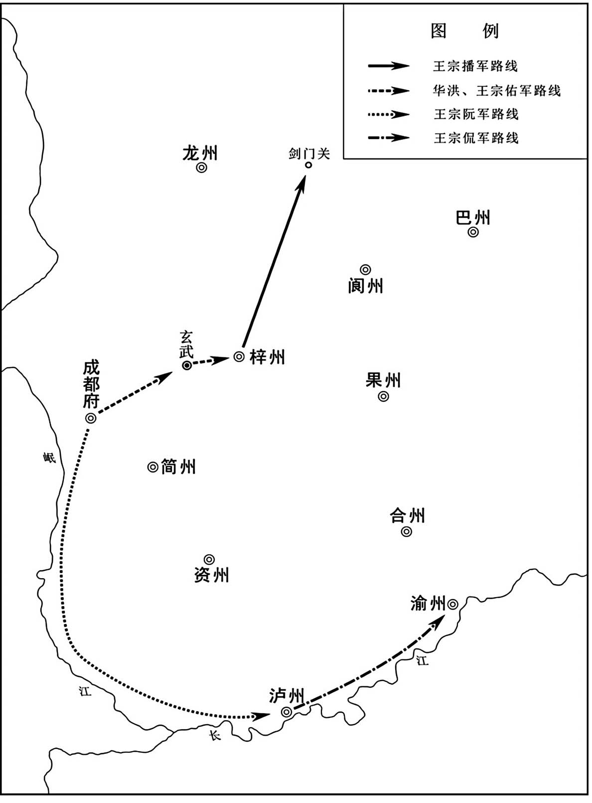 
王建进攻东川路线示意图

## 【注文】

[1]南寨：地名，位于今四川三台南。　　李继宁：生卒年不详，唐末东川节度使顾彦晖部将。唐昭宗乾宁四年（897年），在与王建的交战中，战败被俘。

[2]张杷砦：镇名，位于今四川三台南。

## 【译文】

唐昭宗乾宁四年（897年）六月，李茂贞向朝廷上表说，王建进攻东川，已经好几年了，从不听从朝廷的命令，甲寅（初十日），唐昭宗下诏贬王建为南州刺史。乙卯（十一日），任命李茂贞为西川节度使。癸亥（十九日），王建攻克梓州南寨，活捉守将李继宁。丙寅（二十二日），宣谕使李洵到达梓州，己巳（二十五日），李洵在张杷砦会见王建，王建指着手举战旗的将士说；“进攻东川是军中士兵的意愿，不可强夺。”

## 【原文】

**王建与顾彦晖五十余战，九月癸酉朔，围梓州。蜀州刺史周德权言于建曰：“公与彦晖争东川三年，士卒疲于矢石，百姓困于输挽[1]。东川群盗多据州县，彦晖懦而无谋，欲为偷安之计，皆啖以厚利，恃其救援，故坚守不下。今若遣人谕贼帅以祸福，来者赏之以官，不服者威之以兵，则彼之所恃，反为我用矣。”建从之，彦晖势益孤。德权，许州人也。**

## 【注文】

[1]周德权（？—911年）：唐末五代许州（治今河南许昌）人，王建妻弟，曾任蜀州刺史、眉州刺史等。王建称帝后，累迁太保、中书令。　　输挽：运送物资。

## 【译文】

王建与顾彦晖交战五十多次，乾宁四年（897年）九月癸酉朔（初一日），王建围攻梓州。蜀州刺史周德权对王建说：“您与顾彦晖争夺东川已有三年了，士兵们对打仗已感到疲乏，老百姓对运送军用物资也感到困乏。东川州县大多被群盗占据，顾彦晖懦弱无能，又没有计谋，只想用苟且偷安的方法，用丰厚的利益来引诱他们，依仗他们的救援，所以能坚守梓州，使我们攻不下来。现在不如派人去向盗贼的头目说明利害关系，如前来投靠则赏给他官职，不肯服从就派出军队进行威逼，这样顾彦晖所依仗的力量，反而被我们利用了。”王建采纳了他的意见，顾彦晖的势力越来越薄弱。周德权，是许州人。

## 【原文】

**复以王建为西川节度使、同平章事。**

## 【译文】

再次任命王建为西川节度使、同平章事。

## 【原文】

**冬十月壬子，知遂州侯绍帅众二万，乙卯，知合州王仁威帅众千人，戊午，凤翔将李继溥以援兵二千，皆降于王建[1]。建攻梓州益急。庚申，顾彦晖聚其宗族及假子共饮，遣王宗弼自归于建。酒酣，命其假子瑶杀已及同饮者，然后自杀[2]。建入梓州，城中兵尚七万人，建命王宗绾分兵徇昌、普等州，以王宗涤为东（州）［川］留后[3]。**

## 【注文】

[1]遂州：州名。北周闵帝元年（557年）置，治所设在方义县（今四川遂宁）。隋炀帝大业初年、唐玄宗天宝初年曾一度改为遂宁郡。辖境相当于今四川遂宁、蓬溪，重庆潼南等地。　　侯绍：生卒年不详，东川节度使顾彦晖部将，负责处理遂州（治今四川遂宁）政务。唐昭宗乾宁四年（897年），率领军队向王建投降。　　合州：州名。西魏恭帝三年（556年）置，因涪江、嘉陵江在州南合流而得名。治所设在石镜县（今重庆合川）。隋文帝开皇末改为涪州，隋炀帝大业初改为涪陵郡。唐高祖武德元年（618年）复为合州。唐玄宗天宝、唐肃宗至德时一度改称巴川郡。辖境相当于今四川武胜和重庆合川、铜梁、大足等地。　　王仁威：生卒年不详，东川节度使顾彦晖将领，负责处理合州政务。唐昭宗乾宁四年（897年），率领军队向王建投降。　　李继溥：生卒年不详，原为凤翔节度使李茂贞的将领。唐昭宗乾宁四年（897年），率领军队向王建投降。

[2]瑶：即顾瑶（？—897年），唐末东川节度使顾彦晖养子。

[3]昌：即昌州。唐肃宗乾元元年（758年）置，治所最初设在昌元县（今重庆荣昌东南）。后因泸水蛮反叛迁往静南（今重庆荣昌西北）。唐僖宗光启元年（885年），再迁至大足县（今重庆大足）。辖境大致相当于今重庆永川、大足、荣昌和四川隆昌一带。　　普：即普州。北周武帝建德四年（575年）置，治所设在安岳县（今四川安岳北）。隋炀帝大业初废。唐高祖武德二年（619年）复置。唐玄宗天宝元年（742年）改为安岳郡，唐肃宗乾元元年（758年）复为普州。辖境大致相当于今四川安岳、遂宁、乐至及重庆潼南部分地区。

## 【译文】

唐昭宗乾宁四年（897年）冬季十月壬子（初十日），主持遂州事务的侯绍率领二万军队，乙卯（十三日），主持合州事务的王仁威率领一千部众，戊午（十六日），凤翔将领李继溥率领增援东川的二千军队，都投降了王建。王建攻打梓州越来越猛烈。庚申（十八日），顾彦晖聚集他的宗族和养子们一同喝酒，把之前擒获的西川将领王宗弼遣返到王建那里。喝酒喝得正酣时，顾彦晖命令他的养子顾瑶将自己和一同饮酒的人全部杀死，然后再自杀。王建进入梓州，城中还有七万军队，王建命令王宗绾分兵前往昌州、普州等州巡视，任命王宗涤为东川留后。

## 【原文】

**十二月壬戌，王建自梓州还，戊辰，至成都。**

## 【译文】

唐昭宗乾宁四年（897年）十二月壬戌（二十一日），王建从梓州返回，戊辰（二十七日），到达成都。

## 【原文】

**光化元年春正月，以兵部尚书刘崇望同平章事，充东川节度使。夏五月，朝廷闻王建已用王宗涤为东川留后，乃召刘崇望还，为兵部尚书，仍以宗涤为留后。秋九月己丑，东川留后王宗涤言于王建，以东川封疆五千里，文移往还，动逾数月，请分遂、合、泸、渝、昌五州别为一镇，建表言之。冬十月丁巳，以东川留后王宗涤为节度使。**

## 【译文】

唐昭宗光化元年（898年）春季正月，任命兵部尚书刘崇望为同平章事，充任东川节度使。夏季五月，朝廷得知王建已任命王宗涤为东川留后，于是召回刘崇望，任命他为兵部尚书，仍然以王宗涤为东川留后。秋季九月己丑（二十二日），东川留后王宗涤对王建说，东川受封的疆域有五千里，文书往返投送，动辄超过几个月，请求将遂、合、泸、渝、昌等五州分出去另外设置一个镇，王建向朝廷上表报告这件事。冬季十月丁巳（二十一日），任命东川留后王宗涤为节度使。

## 【原文】

**三年春二月庚申，以西川节度使王建兼中书令。夏六月癸亥，加东川节度使王宗涤同平章事。秋七月甲寅，以西川节度使王建兼东川信武军两道都指挥制置等使[1]。**

## 【注文】

[1]信武军：疑为“武信军”误。武信军为唐五代方镇名。唐昭宗乾宁四年（897年）置，治所设在遂州（今四川遂宁），辖境大致相当于今四川遂宁、江安和重庆大足以东，四川武胜、重庆渝北以西地区。

## 【译文】

唐昭宗光化三年（900年）春季二月庚申（初二日），任命西川节度使王建兼任中书令。夏季六月癸亥（初七日），加任东川节度使王宗涤为同平章事。秋季七月甲寅（二十九日），任命西川节度使王建兼任东川、武信军两道都指挥制置等使。

## 【原文】

**天复元年春三月，东川节度使王宗涤以疾求代，王建表马步使王宗裕为留后。**

## 【译文】

唐昭宗天复元年（901年）春季三月，东川节度使王宗涤因病请求派人接替自己，王建上表朝廷请求任命马步使王宗裕为留后。

## 【原文】

**闰六月，道士杜从法以妖妄诱昌、普、合三州民作乱，王建遣王宗黯将兵会东川、武信兵讨之[1]。龙台镇使王宗侃等讨杜从法，平之[2]。**

## 【注文】

[1]杜从法：生卒年不详，唐末道士。唐昭宗天复元年（901年），引诱昌（治今重庆大足）、普（治今四川安岳北）、合（治今重庆合川）三州百姓叛乱。后被王建平定。　　妖妄：指荒诞言论、妖术等旁门左道。　　王宗黯：即吉谏，参见前文“吉谏”条注。

[2]龙台镇：镇名，位于今四川安岳。

## 【译文】

唐昭宗天复元年（901年）闰六月，道士杜从法用妖法妄言鼓动昌州、普州、合州三州百姓作乱，王建派遣王宗黯率领军队会同东川、武信的军队前往讨伐。龙台镇使王宗侃等讨伐杜从法，平定了叛乱。

## 【原文】

**二年春二月，西川兵至利州，昭武节度使李继忠弃镇奔凤翔，王建以剑州刺史王宗伟为利州制置使[1]。**

## 【注文】

[1]李继忠：生卒年不详，唐末昭武节度使。唐昭宗天复二年（902年），被西川节度使王建击败，逃往凤翔（今陕西凤翔），依附于李茂贞。　　王宗伟：生卒年不详，唐末西川节度使王建养子，曾任剑州刺史、利州制置使等。

## 【译文】

唐昭宗天复二年（902年）春季二月，西川军队到达利州，昭武节度使李继忠放弃镇所逃往凤翔，王建任命剑州刺史王宗伟为利州制置使。

## 【原文】

**秋八月，西川军请假道于兴元，山南西道节度使李继密遣兵戍三泉以拒之[1]。辛丑，西川前锋将王宗播攻之，不克，退保山寨。亲吏柳修业谓宗播曰：“公举族归人，不为之死战，何以自保[2]？”宗播令兵众曰：“吾与汝曹决战，取功名，不尔，死于此。”遂破金牛、黑水、西县、褒城四寨[3]。军校秦承厚攻西县，矢贯左目，达于右目，镞不出[4]。王建自舐其创，脓溃镞出。王宗播（屯）［攻］马盘寨，继密战败，奔还汉中[5]。西川军乘胜至城下，王宗涤帅众先登，遂克之，继密请降，迁于成都；得兵三万，骑五千。宗涤入屯汉中。王建曰：“继密残贼三辅，”以其降，不忍杀，复其姓名曰王万弘，不时召见。诸将陵易之，万弘终日纵酒，俳优辈亦加戏诮[6]。万弘不胜忧愤，醉投池水而卒。**

## 【注文】

[1]假（jiǎ）道：借路。

[2]柳修业：生卒年不详，王宗播心腹，曾任孔目官。多次劝说王宗播要谨慎镇静以逃避灾祸。

[3]金牛：县名。唐高祖武德三年（620年）置，治所在今陕西宁强北。　　褒城：县名。隋文帝仁寿元年（601年）改褒内县置，治所在今陕西汉中西北。

[4]秦承厚：生卒年不详，唐末王建部将，曾任军校。　　镞（zú）：箭头。

[5]马盘寨：地名，位于今陕西汉中褒城西。　　汉中：位于陕西西南部，北倚秦岭，南屏大巴山，西接甘肃，南通四川，东北与安康、西安、宝鸡相邻。素有西北“小江南”和秦巴“聚宝盆”的美誉。唐初属山南道。唐玄宗开元二十一年（733年），山南道分为东、西两道，汉中属山南西道。唐代的汉中是秦岭以南的军事重镇，设在这里的山南道统管了唐王朝西南半壁河山。到了唐代中后期，这里又成为唐德宗、唐僖宗的避难所。汉中因护驾有功，唐德宗把他的年号“兴元”赐给汉中，又改梁州为兴元府，开创了中国历史上以帝王年号命府名的先河。

[6]俳（pái）优：古代以乐舞谐戏为业的艺人。

## 【译文】

唐昭宗天复二年（902年）秋季八月，西川军队请求在兴元借路，山南西道节度使李继密派遣军队戍守三泉进行抗拒。辛丑（二十八日），西川前锋将领王宗播率领军队攻打三泉，没有攻下，于是退兵驻守山上的营寨。亲吏柳修业对王宗播说：“您全族都归顺了西川，不为他拼死战斗，以什么自保呢？”王宗播于是命令他的部将说：“我和你们一起与敌人决战，取得功名，不然的话，就死在这里。”于是率军攻克金牛、黑水、西县、褒城四寨。军校秦承厚进攻西县时，箭穿过左眼，直到右眼，箭头还没有出来。王建亲自用舌头舔他的伤口，脓血溃流，箭头这才出来。王宗播进攻马盘寨，李继密战败，逃回汉中。西川军队乘胜追到汉中城下，王宗涤率众先登上城墙，于是攻克了汉中，李继密请求投降，被押往成都；西川又得到三万名士兵，五千名骑兵。王宗涤进入汉中城内驻扎。王建说：“李继密残害京畿三辅地区，”但因为他已投降，王建没忍心杀他，恢复李继密原来的姓名王万弘，随时召见。但西川将领常常凌辱他，王万弘终日毫无节制地饮酒，连戏子艺人也戏弄他。王万弘最终不堪忧愤，喝醉后投入水池自杀了。

## 【原文】

**诏以王宗涤为山南西道节度使。宗涤有勇略，得众心，王建忌之。建作府门，绘以朱丹，蜀人谓之“画红楼”，建以为宗涤姓名应之，王宗佶等疾其功，复构以飞语[1]。建召宗涤至成都，诘责之，宗涤曰：“三蜀略平，大王听谗，杀功臣可矣[2]！”建命亲随马军都指挥使唐道袭夜饮之酒，缢杀之，成都为之罢市，连营涕泣，如丧亲戚[3]。建以指挥使王宗贺权兴元留后[4]。道袭，阆州人也，始以舞童事建，后浸预谋画。**

## 【注文】

[1]朱丹：朱红色。　　应之：王宗涤原名华洪，与“画红”谐音。　　王宗佶（jí）（？—908年）：本姓甘，洪州（治今江西南昌）人，王建养子，以军功累迁武信军节度使。唐哀帝天祐四年（907年），王建称帝，他被拜为中书令。后屡次请求担任大司马，王建怀疑他谋反，于是将他处死。　　飞语：流言。指没有根据的话或恶意的诽谤。

[2]三蜀：汉初分蜀郡置广汉郡，武帝又分置犍为郡，合称三蜀。其地约为今四川中部、贵州及云南北部地区。唐代，称“东川”“西川”及“汉川”为“三蜀”。

[3]唐道袭（？—913年）：阆州（治今四川阆中）人。初以舞童身份侍奉王建，后因屡为王建出谋划策，而担任亲随马军都指挥使等。唐哀帝天祐四年（907年），王建称帝，他先后被任命为枢密使、太子少保等。前蜀永平元年（911年），他奉命讨伐李茂贞，结果战败，无功而返。永平三年（913年），他上奏王建说太子王元膺阴谋作乱，请求派禁军加强宿卫，结果被王元膺杀死。

[4]王宗贺：生卒年不详，王建养子。唐昭宗天复二年（902年），担任山南西道留后。前蜀永平元年（911年），与王宗佑、唐道袭等出任招讨使，率领军队征讨李茂贞，结果战败，无功而返。后加封中书令。

## 【译文】

唐昭宗下诏任命王宗涤为山南西道节度使。王宗涤有勇有谋，深得众心，王建嫉妒他。王建修建节度使府大门，用朱红色涂饰绘画，蜀人称它为“画红楼”，王建认为这与王宗涤原来的姓名“华洪”应和，王宗佶等人也妒忌王宗涤的功劳，又制造流言蜚语诬蔑他。王建召王宗涤到成都，责问他，王宗涤说：“三蜀大致平定，您听信谗言，可以杀功臣了！”王建命令亲随马军都指挥使唐道袭晚上与王宗涤饮酒，把他勒死，成都百姓听说后，纷纷罢市，连军营士兵都伤心流泪，像死了亲戚一样。王建任命指挥使王宗贺暂时担任兴元留后。唐道袭，是阆州人，开始以舞童的身份侍奉王建，后来渐渐为王建出谋划策。

## 【原文】

**九月戊申，武定节度使李思敬以洋州降王建[1]。冬十月，王建攻拔兴州，以军使王宗浩为兴州刺史[2]。**

## 【注文】

[1]李思敬：生卒年不详，唐朝官吏，曾任武定节度使。唐昭宗天复二年（902年），投降王建。

[2]王宗浩（？—911年）：唐末王建养子，曾任兴州刺史、马步使等。永平元年（911年），他跟随唐道袭等人征讨李茂贞，结果战败溺死于嘉陵江。

## 【译文】

唐昭宗天复二年（902年）九月戊申（初五日），武定节度使李思敬献出洋州向王建投降。冬季十月，王建攻陷兴州，任命军使王宗浩为兴州刺史。

## 【原文】

**三年夏四月，王建出兵秦、陇，乘李茂贞之弱也。遣判官韦庄入贡，亦修好于朱全忠[1]。全忠遣押牙王殷报聘，建与之宴[2]。殷言：“蜀甲兵诚多，但乏马耳。”建作色曰：“当道江山险阻，骑兵无所施。然马亦不乏，押牙少留，当共阅之[3]。”乃集诸州马，大阅于星宿山，官马八千，私马四千，部队甚整[4]。殷叹服。建本骑将，故得蜀之后，于文、黎、维、茂州市胡马，十年之间，遂及兹数[5]。**

## 【注文】

[1]韦庄（约836—910年）：字端己，唐末五代京兆杜陵（今陕西西安）人，唐朝花间派词人，与温庭筠齐名，并称“温韦”。为人疏旷不拘，任性自用。唐昭宗乾宁元年（894年）进士，授校书郎、左补阙。后被两川宣谕和协使李询辟为判官。在四川时结识王建，任其掌书记。唐哀帝天祐四年（907年），朱温篡唐，他力劝王建称帝。王建建立前蜀后，他参与制订前蜀开国制度，后终身仕蜀，官至吏部侍郎兼同平章事。《全唐诗》编有他的诗五卷、补遗一卷，其中《秦妇吟》曾长期流传。他的词清新明朗，善用白描手法，语言朴素自然，有直接抒写情怀之作，在花间词派中独树一帜，有《浣花集》。　　入贡：入朝贡献。

[2]王殷：生卒年不详，唐末朱温部将，曾任押牙、皇城使、宣徽副使等。　　报聘：报答回访。

[3]作色：脸上变色。

[4]星宿山：山名，又名升仙山，在今四川成都北。

[5]骑将：王建当初在杨复光部下为骑兵将领。　　维：即维州。唐高祖武德七年（624年）置，治所在薛城县（五代前蜀改名保宁县，在今四川理县东北）。

## 【译文】

唐昭宗天复三年（903年）夏季四月，王建乘李茂贞势力削弱的时机，出兵进攻秦州、陇州。派遣判官韦庄到京师进贡，又向朱全忠谋求和好。朱全忠派遣押牙王殷前去回访，王建设宴招待。王殷说：“蜀地士兵确实很多，只是缺少马匹罢了。”王建变了脸色说：“蜀地道路险恶，山河阻隔，骑兵无法施展身手。然而马匹也不缺少，请押牙多留住几日，一起检阅一下。”王建于是调集各州马匹，在星宿山举行大规模检阅，官马有八千匹，私马有四千匹，部队十分整齐。王殷赞叹佩服。王建本是骑兵将领，所以在得到蜀地以后，在文州、黎州、维州、茂州买了许多胡地出产的马匹，十年之间，就达到了这个数目。

## 【原文】

**秋八月庚辰，加西川节度使西平王王建守司徒，进爵蜀王[1]。**

## 【注文】

[1]进爵蜀王：即由西平王进封为蜀王。

## 【译文】

唐昭宗天复三年（903年）秋季八月庚辰（十三日），加封西川节度使、西平王王建守司徒，晋爵为蜀王。

## 【原文】

**天祐元年春二月，上遣间使以御札告难于王建[1]。时朱全忠劫车驾还洛阳。建以邛州刺史王宗佑为北路行营指挥使，将兵会凤翔兵迎车驾。至兴平，遇汴兵，不得进而还。建始自用墨制除官，云：“俟车驾还长安表闻。”**

## 【注文】

[1]御札：皇帝的书札、手诏。

## 【译文】

唐昭宗天祐元年（904年）春季二月，皇上派遣密使携带亲笔信札向王建通报急难。这时朱全忠挟持天子车驾返回洛阳。王建任命邛州刺史王宗佑为北路行营都指挥使，率领军队会同凤翔军队迎接唐昭宗。到达兴平后，遇到汴州军队的阻挡，无法前进，只好返回。王建开始擅自用皇帝亲笔诏书的名义任命官员，说：“等候陛下回到长安后再上表奏报。”

## 【原文】

**王建赋敛重，人莫敢言。冯涓因建生日献颂，先美功德，后言生民之苦。建愧谢曰：“如君忠谏，功业何忧！”赐之金帛。自是赋敛稍损。**

## 【译文】

王建征收赋税很重，但没有人敢说。冯涓借王建生日的机会进献颂词，先赞美他的功德，后又陈述百姓的困苦。王建听后非常惭愧，道歉说：“如果都像您这样忠言直谏，成就功业还有什么可忧虑的呢！”于是赐给他金帛。从此赋税稍有减少。

## 【原文】

**二年冬十一月，昭宗之丧，朝廷遣告哀使司马卿宣谕王建，至是始入蜀境[1]。西川掌书记韦庄为建谋，使武定节度使王宗绾谕卿曰：“蜀之将士，世受唐恩，去岁闻乘舆东迁，凡上二十表，皆不报。寻有亡卒自汴来，闻先帝已罹朱全忠弑逆[2]。蜀之将士方日夕枕戈，思为先帝报仇[3]。不知今兹使来，有何事宣谕？舍人宜自图进退[4]。”卿乃还。**

## 【注文】

[1]昭宗之丧：天祐元年（904年），朱全忠派左龙武统军朱友恭、右龙武统军氏叔琮、枢密使蒋玄晖弑杀唐昭宗。　　告哀使：朝廷派出报丧的官员。　　司马卿：生卒年不详，唐朝官吏，曾任中书舍人。唐哀帝天祐二年（905年），以告哀使的身份进入蜀地，不久返回东都洛阳（今河南洛阳）

[2]寻：不久。　　亡卒：逃亡至蜀的汴州士兵。　　罹（lí）：遭遇。　　弑（shì）逆：指弑君杀父。

[3]枕戈：枕着兵器，随时准备战斗。

[4]舍人：即中书舍人。

## 【译文】

唐哀帝天祐二年（905年）冬季十一月，唐昭宗遇害，朝廷派遣告哀使司马卿前往成都宣谕王建，到这时朝廷官吏才进入蜀地。西川掌书记韦庄建议王建，派武定节度使王宗绾告诉司马卿说：“蜀地将士，世世代代深受唐朝恩惠，去年听说皇上东迁洛阳，我们共呈上二十道表文，都没有回音。不久前有逃兵从汴州来，才听说先帝已遭朱全忠杀害。蜀地将士正日夜枕戈以待，准备为先帝报仇。不知今天您受命而来，有何事向我们宣谕呢？舍人您应该自己考虑去留。”司马卿于是返回洛阳。

## 【原文】

**三年冬十月丙戌，王建始立行台于蜀，建东向舞蹈，号恸，称：“自大驾东迁，制命不通，请权立行台，用李晟、郑畋故事，承制封拜[1]。”仍以榜帖告谕所部藩镇州县。**

## 【注文】

[1]行台：又称“行尚书台”或“行台省”，是魏晋南北朝隋唐时期尚书台（省）派驻地方的常设机构。行台多设置于边远及冲要地区，开始时仅掌与军务有关的事情，后逐渐处理政务。　　号恸（tòng）：放声痛哭。　　大驾东迁：指唐昭宗被挟持至东都洛阳（今河南洛阳）。　　制命：皇帝的诏命。　　故事：此指王建沿用李晟、郑畋曾权宜拜官的先例，自行拜官授爵。唐德宗建中四年（783年），李晟在平定朱泚（cǐ）叛乱中，委任自己的裨将赵光铣、唐良臣、女婿张彧分别担任洋州刺史、利州刺史、剑州刺史，后又自行任命张彧为京兆尹。郑畋在黄巢进入长安时为京城四面诸军行营都统，他自行任命泾原节度使程宗楚为副都统，前朔方节度使唐弘夫为行军司马。

## 【译文】

唐哀帝天祐三年（906年）冬季十月丙戌（初六日），王建开始在蜀地建立行台，王建面向东方行舞拜礼，放声痛哭，声称：“自从先帝东迁洛阳，朝命不能通达，请暂时设立行台，采用李晟、郑畋的先例，秉承皇帝旨意封官拜爵。”并用榜帖通告所属的藩镇州县。

## 【原文】

**后梁（武帝）［太祖］开平元年秋九月，蜀王会将佐议称帝，皆曰：“大王虽忠于唐，唐已亡矣，此所谓‘天与不取’者也[1]。”冯涓独献议请以蜀王称制，曰：“朝兴则未爽称臣，贼在则不同为恶。”王不从，涓杜门不出。王用安抚副使、掌书记韦庄之谋，帅吏民哭三日；己亥，即皇帝位，国号大蜀[2]。辛丑，以前东川节度使兼侍中王宗佶为中书令，韦庄为左散骑常侍、判中书门下事，阆州防御使唐道袭为内枢密使[3]。庄，见素之孙也[4]。**

## 【注文】

[1]后梁：朝代名（907—923年），五代十国之一，是五代的第一个朝代。公元907年，梁王朱全忠篡唐称帝，国号“梁”，建都开封，史称后梁。因皇帝姓朱，为与南北朝时的南梁相区别，故又称朱梁。后梁共历三帝十七年。盛时疆域约为今河南、山东两省，陕西、湖北的大部以及河北、安徽、江苏、山西、甘肃、宁夏、辽宁的一部分。其间长期与后唐前身即河东的晋国争霸直至亡国。　　太祖：即梁太祖朱全忠。　　开平：后梁太祖朱全忠所用年号，共计五年，即公元907年至911年。

[2]安抚副使：官名。唐朝凡遇战乱或水旱灾害，常由中央派遣安抚使巡视战争或受灾地区，并考察当地官吏政绩优劣。倘若节度使兼任安抚使，则另置安抚副使一人。　　大蜀：即前蜀，五代时十国之一。唐昭宗大顺二年（891年），王建攻占成都（今四川成都），任成都尹、剑南西川节度使，是为王氏据蜀的开始。唐昭宗天复三年（903年），王建晋封为蜀王。唐末帝天祐四年（907年），王建称帝，建国号蜀，定都成都（今四川成都），史称前蜀。盛时疆域大致包括今四川、重庆和甘肃东南部、陕西南部、湖北西部。后梁末帝贞明四年（918年），王建去世，他的儿子王衍继位。后唐庄宗同光三年（925年），李存勖发兵攻蜀，王衍投降，前蜀至此灭亡。前蜀共历二主、三十五年。

[3]中书门下：官署名。唐、五代宰相处理政事的场所。唐玄宗前称政事堂，初设于门下省，唐高宗时迁至中书省。唐玄宗开元十一年（723年），改政事堂为中书门下，下设吏、枢机、兵、户、刑礼等五房。政事堂印也改为中书门下印。中书门下体制建立以后，中书门下成为宰相府署，独立于三省机构之上。　　内枢密使：前蜀沿袭唐制设枢密使一职，并以“内”字表明其内朝官的属性，称为内枢密使，与外朝士大夫担任的官职相区别。

[4]见素：即韦见素（697—762年），字会微，京兆万年（今陕西西安）人。唐高宗朝进士。唐玄宗天宝五载（746年），担任江西、山南、黔中、岭南道黜涉使，负责整顿吏治，颇有威望。后迁吏部侍郎，加银青光禄大夫。唐玄宗天宝十三载（754年），担任武部尚书、同中书门下平章事、集贤院学士，知门下事。曾多次提醒唐玄宗提防安禄山谋反。安史之乱时，跟随唐玄宗避乱蜀地，任左相，加金紫光禄大夫，封豳（bīn）国公。唐肃宗即位后，拜尚书左仆射，罢知政事，授太子太师，加开府仪同三司。唐肃宗宝应元年（762年）去世，赠司空，谥“忠贞”。

## 【译文】

后梁太祖朱全忠开平元年（907年）秋季九月，蜀王王建召集部将僚佐商议称帝的事，部将僚佐都说：“大王虽然忠于唐朝，然而唐朝现在已经灭亡，这就是‘上天给予而不取’啊。”唯独冯涓献计请求以蜀王代行皇帝事，说：“这样做，朝廷复兴时就没有失去臣子的忠节，逆贼在时就不与其同流合污。”王建没有听从，冯涓闭门不出。王建采用安抚副使、掌书记韦庄的策谋，率领官吏百姓大哭三天；己亥（二十五日），王建即皇帝位，国号大蜀。辛丑（二十七日），任命前东川节度使兼侍中王宗佶为中书令，韦庄为左散骑常侍、判中书门下事，阆州防御使唐道袭为内枢密使。韦庄，是韦见素的孙子。

## 【原文】

**蜀主虽目不知书，好与书生谈论，粗晓其理。是时唐衣冠之族多避乱在蜀，蜀主礼而用之，使修举故事，故其典章文物有唐之遗风。**

## 【译文】

蜀主王建虽然目不识字，却喜好与读书人谈论，粗略地知晓书中的道理。当时，唐朝的贵族官宦大多在蜀地躲避战乱，蜀主王建以礼相待，并让他们研究编纂典故成例，所以蜀地的典章礼乐制度颇有唐朝遗风。

## 【原文】

**蜀主长子校书郎宗仁幼以疾废，立其次子秘书少监宗懿为遂王[1]。**

## 【注文】

[1]校书郎：官名。东汉置，掌典校收藏于兰台的图书典籍，又称校书郎中。三国魏时秘书省置校书郎。唐朝秘书省与弘文馆皆置此职，掌校对典籍，订正讹误，从九品上。　　宗仁：即王宗仁，生卒年不详，前蜀高祖王建长子，陈州项城（今河南沈丘）人，一作许州舞阳（今河南舞钢）人，封为卫王。秘书少监：官名。唐时为秘书省副长官，协助秘书监进行国家典籍的收藏与书写校勘，从四品上。前蜀沿置。　　宗懿：即王宗懿（892—913年），字昌美，陈州项城（今河南沈丘）人，一作许州舞阳（今河南舞钢）人，前蜀高祖王建次子。前蜀天复七年（907年），被封为遂王。武成元年（908年），被立为太子，后改名王元坦、王元膺。他在任太子期间，骄横跋扈。永平三年（913年），内枢密使唐道袭上奏王建说他阴谋作乱，请派禁军加强宿卫。他得知后，出兵杀死唐道袭。王建随即派兵镇压，他被杀死，并被废为庶人。

## 【译文】

蜀主王建的长子校书郎王宗仁小时候因病致残，王建于是立他的次子秘书少监王宗懿为遂王。

# 附录：

## 唐朝皇帝世系表

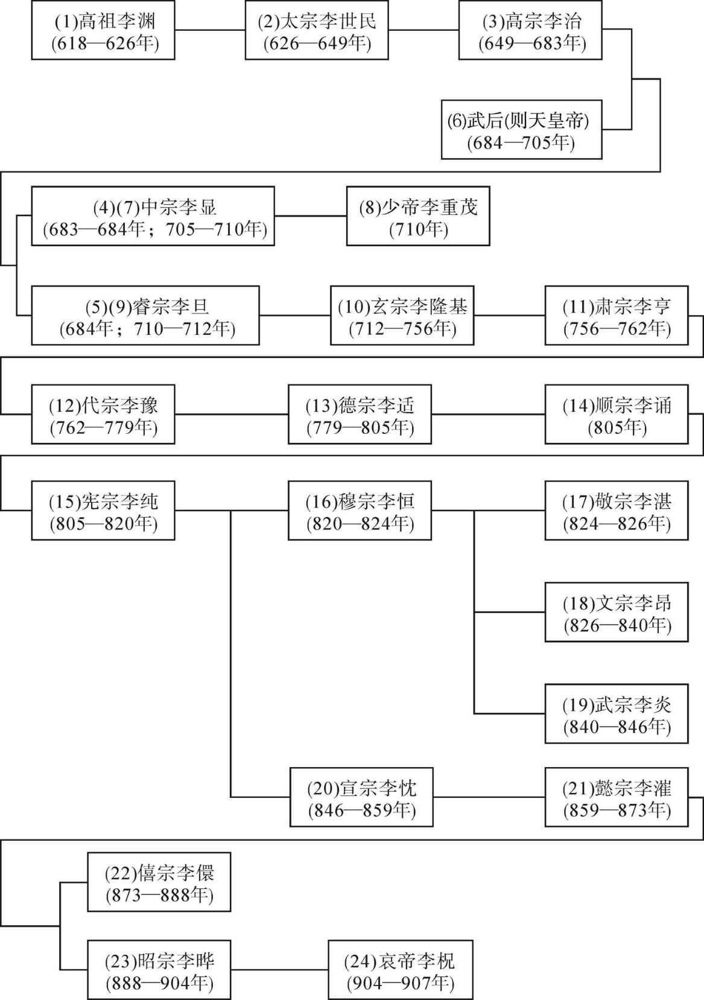 

## 后梁世系表

 

## 五代十国时期吴国世系表

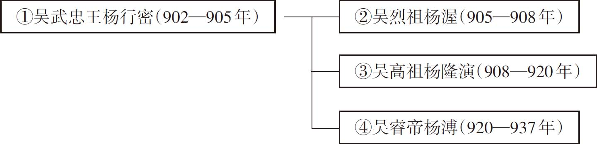 

## 五代十国时期前蜀世系表

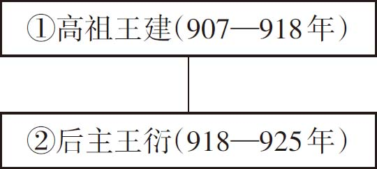

