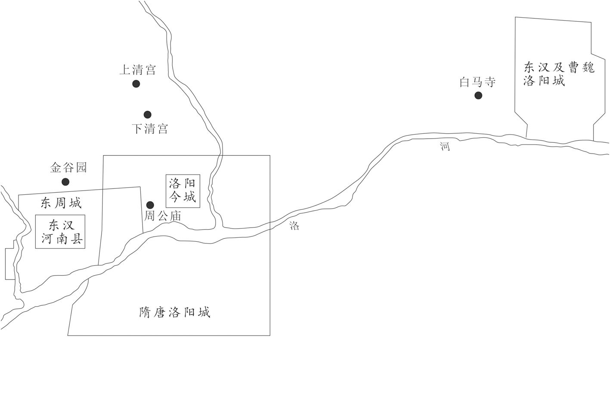
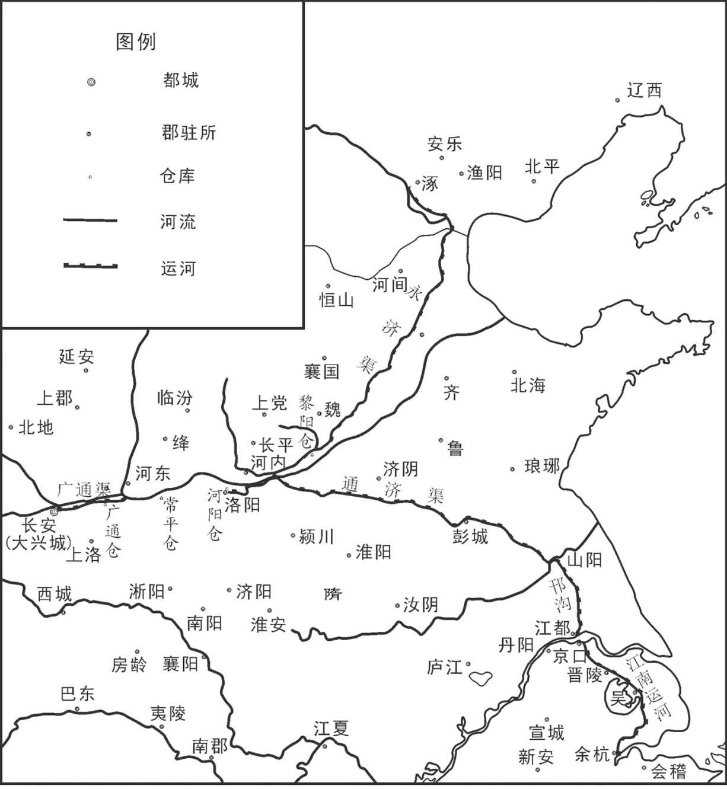
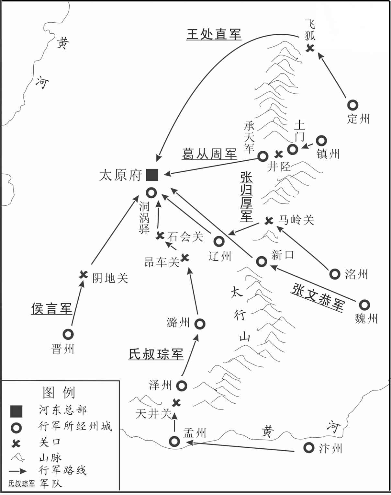
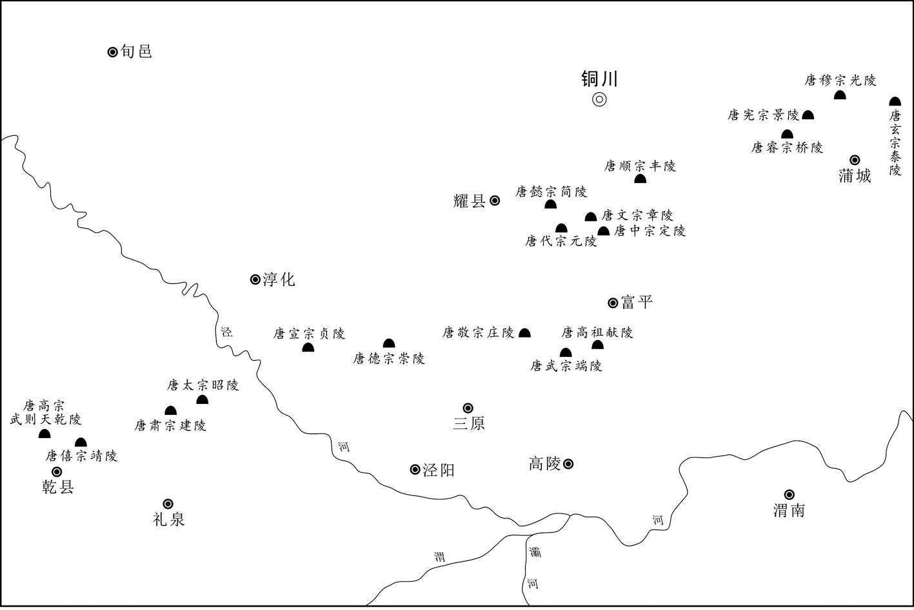
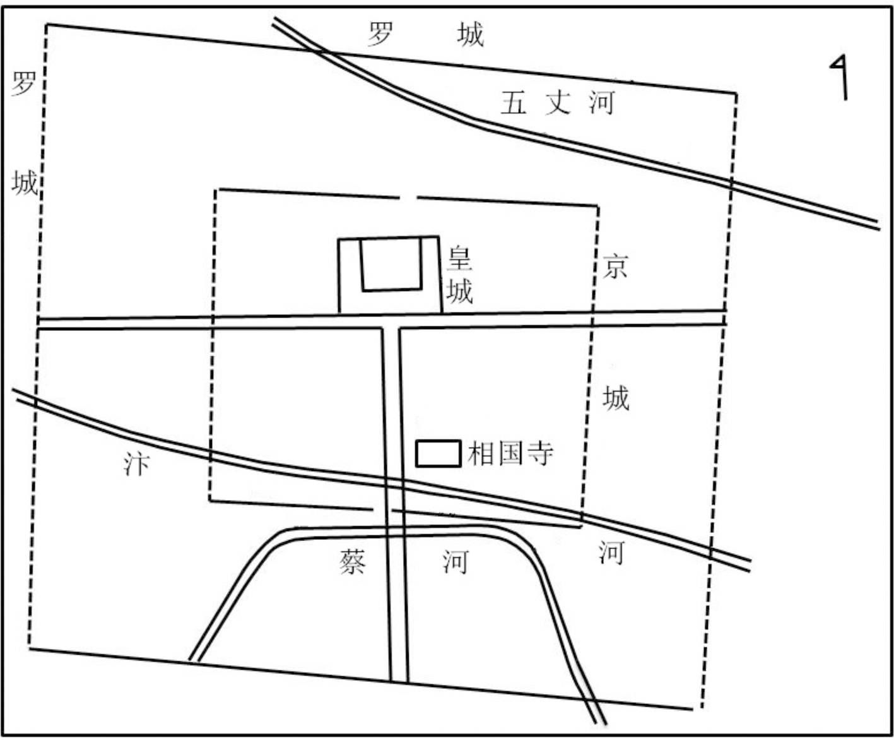
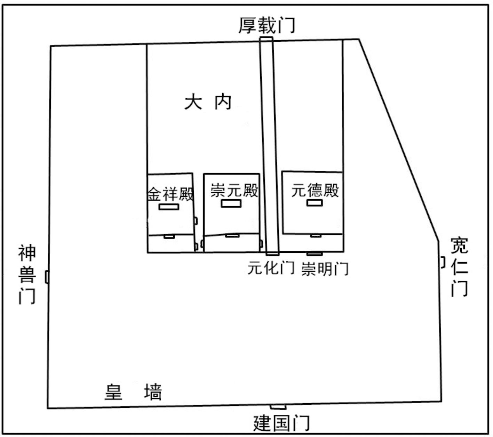
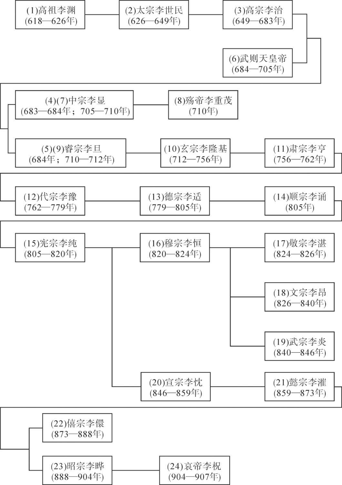
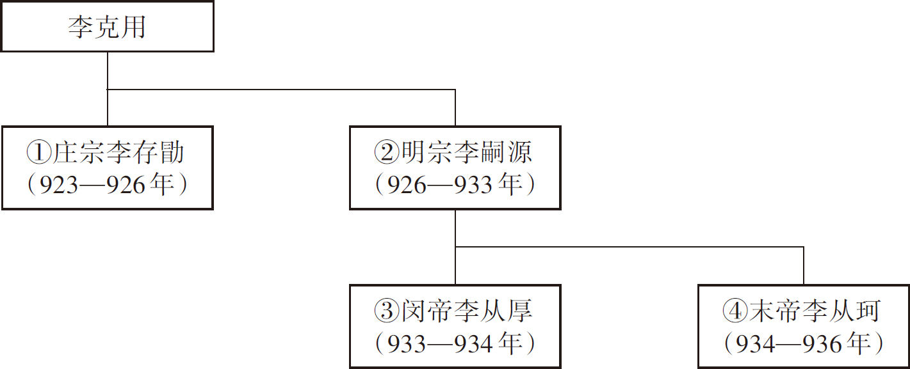
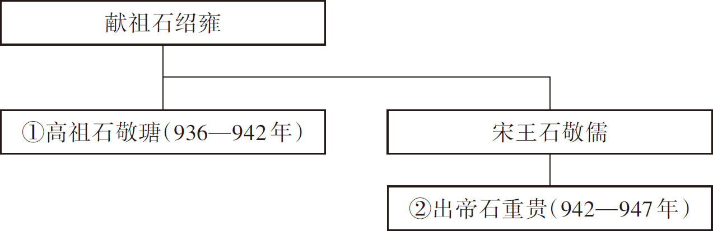
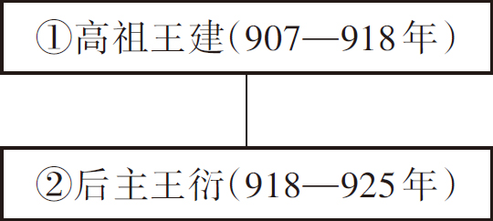

# 目录

诸镇相攻

朱温取淄青

朱温篡唐　崔胤诛宦官附

郢王篡弑

李氏据凤翔　岐蜀相攻附

附录： 
唐朝皇帝世系表

后梁世系表

后唐世系表

后晋世系表

五代十国时期前蜀世系表

返回总目录

# 诸镇相攻

## 【内容摘要】

《诸镇相攻》详细记载了唐僖宗李儇（xuān）广明元年（880年）至唐昭宗李晔天复二年（902年）藩镇混战的史实。

从唐僖宗光启元年（885年）开始，朱温首先联合时溥（pǔ）、朱瑄（xuān）等，集中对付恃强称帝的秦宗权，并于唐昭宗龙纪元年（889年）将他消灭。接下来，朱温又狡诈地对付曾经相助他的朱瑄。他制造借口，诬陷朱瑄引诱士兵叛变，并命令葛从周袭击曹州（治今山东曹县西北），打败朱瑄、朱瑾（jǐn）兄弟。此后，朱温又将矛头指向淮南地区，原淮南节度使高骈在争战中被杀。唐昭宗任命朱温兼任淮南节度使、东南面招讨使，这遭到淮南杨行密的反对，也受到占据徐州（治今江苏徐州）的时溥的抵制。朱温于是向东进军，对付时溥和原先逃脱的朱瑾兄弟。朱温率兵攻克徐州，时溥及他的族人自焚身亡。次年，朱温与朱瑾兄弟大战，以火攻取胜，最后擒杀朱瑄，朱瑾逃奔杨行密。经过多年的征战，朱温扫清了众多对手，完全控制了黄河以南、淮河以北的中原地区。

朱温在相继征服河北、河中之后，于唐昭宗大顺元年（890年）把矛头转向河东节度使李克用。当初，李克用打败黄巢属将尚让，因功升任检校司空、同中书门下平章事、河东节度使。从此以后，河东成为李克用的大本营。黄巢起义军逼近朱温辖地时，朱温求救于李克用，李克用为扩充地盘，派遣军队夹攻黄巢起义军。朱温为答谢李克用出兵相助，特地在汴州上源驿（位于今河南开封）设宴款待。此时的李克用年轻气盛，自认为对朱温有恩，因此在酒席上异常骄横，不把朱温放在眼里。当天晚上，被惹怒的朱温包围驿馆，李克用在亲随的保护下才得以逃脱。从此，双方战争不断。李克用与朱温争霸中原的过程中，重要的地区应数魏博了。长期以来，魏博的牙兵极为强悍，但也骄横无比，经常邀功请赏，稍不如意便哗变杀死主帅，另外拥立将帅。魏博节度使乐彦祯被牙兵杀死后，罗弘信担任节度使。乐彦祯之子乐从训只得逃奔朱温，请求派兵援助。朱温便发兵魏博。李克用派遣军队救助朱瑾兄弟，军队借道魏博。李克用的部将李存信大败而归，从此魏博与河东关系断绝。

罗弘信死后，他的儿子罗绍威继任魏博节度使。此后，刘仁恭率军攻占魏博，罗绍威于是向朱温求救。朱温大将葛从周率领军队打败刘仁恭。罗绍威对朱温异常感激，为进一步拉拢罗绍威，朱温又与罗绍威联姻，巩固魏博这个盟友。朱温得到魏博，安定北方后，又向西攻克河中（今山西永济西），然后猛攻晋阳（今山西太原西南）。最初李克用屡战屡败，后期通过重新部署军队，最终打败了朱温，但此后数年无力再与朱温对抗了。

## 【原文】

**唐僖宗广明元年冬十一月，以忠武大将周岌为忠武节度使[1]。初，薛能遣牙将上蔡秦宗权调发至蔡州，闻许州乱，托云赴难，选募蔡兵，遂逐刺史，据其城[2]。及周岌为节度使，即以宗权为蔡州刺史。先是，秋九月，周岌逐节度使薛能自称留后，至是遂授以节度使[3]。**

## 【注文】

[1]唐：即唐朝（618—907年）。隋炀帝杨广大业十三年（617年），驻守太原的唐国公李渊在晋阳（今山西太原西南）起兵，攻克长安（今陕西西安）。次年，李渊称帝，建立唐朝，年号武德，定都长安，开启了李唐王朝的历史。此后，唐太宗李世民、唐玄宗李隆基相继开创了“贞观之治”“开元盛世”，唐朝达到鼎盛时期。天宝十四载（755年），安史之乱爆发，唐朝由盛转衰。至天祐四年（907年）朱温篡位灭亡，唐朝共历21位皇帝（含武则天），历时290年，它在政治、经济、文化等方面都取得了辉煌的成就，是当时世界上最强盛的国家。　　僖宗：即唐僖宗李儇（862—888年），唐朝第十九位皇帝，唐懿（yì）宗李漼（cuǐ）第五子，初名李俨。唐懿宗病重弥留之际，他在宦官的扶持下被立为皇太子。唐僖宗继位后，沉溺于游乐，朝廷政务一概委任宦官田令孜处理，唐朝统治越来越黑暗，终于爆发了大规模的农民暴动，导致了唐王朝的土崩瓦解。　　广明：唐僖宗李儇所用年号，共计两年，即公元880年至881年。　　忠武：唐、五代方镇名。唐德宗贞元十年（794年）以陈许节镇为忠武军，治所设在许州（今河南许昌）。唐昭宗龙纪元年（889年）治所迁至陈州（今河南淮阳）。辖境大致相当于今河南长葛以南至舞钢、沈丘、太康、淮阳以西至襄城。唐僖宗光启初年为秦宗权所占据。　　周岌（jí）（？—884年）：唐末忠武军节度使。最早驻守许州（治今河南许昌），后投降黄巢。唐军收复长安（今陕西西安）后，他又投降唐军，并与杨复光商议，力抗朱温。唐僖宗中和三年（883年）杨复光病逝。次年十一月，他被杨复光部将鹿晏弘杀死。　　节度使：官名。唐代开始设立的地方军政长官，意为节制调度，因受职之时朝廷赐以旌（jīng）节，故称此名。节度使成为固定职衔是从唐睿宗景云二年（711年）四月以贺拔延嗣为凉州都督充河西节度使开始的。至唐玄宗开元、天宝年间，沿边逐渐形成平卢、范阳、河东、朔方、陇右、河西、安西、北庭、剑南、岭南共十个节度使。他们集军、民、财三政于一身，威权颇重，已超过魏晋时期的持节都督。

[2]薛能（约817—880年）：字太拙，汾州（治今山西汾阳）人。晚唐著名诗人。唐武宗会昌六年（846年）进士。曾任滑州观察判官。唐懿宗咸通年间，先后担任度支、刑部郎中、同州刺史、京兆尹、感化军节度使等。他一生仕宦他乡，游历众多地方，诗多寄送赠答、游历登临之作。晚唐一些著名诗人多有诗与其唱和。　　牙将：统帅牙军的将领。唐末节度使专门组织一支保护牙城与使牙的军队，叫做牙军，或称衙兵。他们有时也被派到外地作战。牙军是藩镇中最精锐的军队，常由节度使派遣心腹将领统领，是藩镇对抗朝廷、进行割据的重要武装力量。　　上蔡：县名。隋炀帝大业初年改武津县置，治所在今河南上蔡。　　秦宗权（？—889年）：蔡州上蔡（今河南上蔡）人，一作许州（治今河南许昌）人。初为许州牙将，唐僖宗广明元年（880年），驱逐蔡州刺史，占据蔡州。同年冬，黄巢军入关，唐僖宗逃奔四川，他因进攻起义军有功授蔡州奉国军节度使。唐僖宗中和三年（883年），黄巢退出关中，进入河南。他迎战失败，投降黄巢。黄巢失败后，他于光启元年（885年）在蔡州（治今河南汝南）称帝，并攻占陕州（治今河南三门峡西）、洛州（治今河南洛阳）等二十多个州，成为当时中原地区实力最为强大的军阀。随后，与盘踞汴州（今河南开封）的宣武节度使朱温展开争霸。唐僖宗文德元年（888年），在与朱温的交战中，战败被擒，后被押送至京师斩首。　　蔡州：州名。隋炀帝大业初改溱州置，治所在汝阳县（今河南汝南）。后改为汝南郡。唐初改为豫州，唐玄宗天宝元年（742年）改名汝南郡，唐肃宗乾元元年（758年）复为豫州，唐代宗宝应元年（762年）改为蔡州。辖境大致在今河南淮河以北，桐柏山以东，洪河上游以南地区。　　许州：州名。北周静帝大定元年（581年）改郑州置，治所在长社县（今河南许昌）。隋朝时治所设在颍川县（今河南许昌），隋炀帝大业初改为颍川郡。唐高祖武德四年（621年）复为许州，治所设在长社县（今河南许昌）。唐玄宗天宝元载（742年）改为颍川郡，唐肃宗乾元元年（758年）复为许州。辖境大致相当于今河南许昌、长葛、鄢陵、扶沟、临颍、舞阳等地。许州位于河南中部，历来是群雄逐鹿之地。　　刺史：官名，又称郡守、太守，州郡最高行政长官。始置于汉代，本为中央临时派到地方的监察官员。后随着职权的进一步扩大，逐渐变成地方常设的行政军事长官。

[3]留后：唐代节度使、观察使缺位时设置的代理职称。唐玄宗时，宰相或大臣遥领节度使、节度使出征或入朝，常置留后知节度事，以后成为惯例。安史之乱后，藩镇跋扈，河北三镇和淄青、淮西诸镇的节度使多于临死时遗表请以子弟为留后；也有节度使死后，军中拥立他的子弟或大将为留后的。朝廷往往予以承认，随后即补行任命为正式节度使或观察使。

## 【译文】

唐僖宗广明元年（880年）冬季十一月，任命忠武大将周岌为忠武节度使。起初，薛能派遣牙将上蔡人秦宗权调发军队前往蔡州，听说许州发生叛乱，便借口前去救难，挑选招募蔡州人为兵，然后赶走蔡州刺史，占据了蔡州。等到周岌担任忠武节度使，便任命秦宗权为蔡州刺史。在此以前，秋季九月，周岌驱逐节度使薛能自称留后，到此时被任命为节度使。

## 【原文】

**中和元年秋八月，武宁节度使支详遣牙将时溥、陈璠将兵五千人入关讨黄巢[1]。溥至东都，自知留后[2]。溥送详归朝，璠杀之。诏以溥为武宁留后。溥表璠为宿州刺史[3]。**

## 【注文】

[1]中和：唐僖宗所用年号，共计五年，即公元881年至885年。　　武宁：疑误。唐懿宗咸通年间武宁军已改为感化军。据《新唐书·方镇表》记载，咸通十一年（870年）“置徐泗观察使，寻赐号感化军节度使”。自此至唐朝灭亡，都未曾恢复武宁旧称，故此处武宁当作感化节度使。感化：唐方镇名。唐德宗建中三年（782年）置徐海沂（yí）密都团练观察使。唐德宗贞元四年（788年）置徐泗濠（háo）节度使，治所设在徐州（今江苏徐州）。贞元后时废时置，称号屡变。唐顺宗永贞元年（805年）置武宁军节度使，领徐、泗（治今江苏泗洪东南）、濠（治今安徽凤阳东北）、宿（治今安徽宿州）四州，辖境大致相当于今安徽池河、江苏淮河以北，即江苏丰县，山东滕（téng）州、郯（tán）城以南，安徽濉（suī）溪、怀远以东地区。唐懿宗咸通十年（869年）复置徐泗观察使，次年更号为感化军节度使。唐僖宗中和初年，为时溥所据。唐昭宗景福初年，为朱温所并。唐昭宗天复二年（902年）罢。　　支详（？—881年）：唐末军阀，历任四方馆事、太仆卿、宣谕通和使、司农卿、大同宣尉使、感化军节度使等，参与镇压黄巢起义。唐僖宗中和元年（881年），被部将陈璠杀死。　　时溥（？—893年）：彭城（今江苏徐州）人，唐末军阀。唐僖宗中和元年（881年），时任牙将的他率兵入关镇压黄巢起义军，行至河阴（今河南荥阳东北），军士哗变，返归徐州（治今江苏徐州），驱逐节度使支详，他被拥立为留后，后又被朝廷正式任命为节度使。中和三年（883年），他发兵征讨黄巢，捷报频传，因功授东面兵马都统。又合兵追击黄巢部将尚让。中和四年（884年），尚让叛降，黄巢死，黄巢之甥林言亦降。时溥论功第一，获封检校司徒、同中书门下平章事，晋升检校太尉，兼中书令，受封巨鹿郡王。朱温不服，与他产生矛盾，从此双方争战不息。唐昭宗景福二年（893年），徐州被攻破，时溥自焚而死。　　陈璠（fán）（？—881年）：唐末官吏。初与时溥结为兄弟，后任时溥副将。唐僖宗中和元年（881年），他杀死感化军节度使支详，随后被任命为宿州刺史，但不久便被时溥杀死。　　关：此指潼关，位于今陕西潼关东北黄河南岸。因地处黄河渡口，位居晋、陕、豫三省要冲，扼长安（今陕西西安）至洛阳（今河南洛阳）驿道的要冲，是进出三秦的锁钥，所以成为汉末以来东入中原、西出关中的必经之地及关防要隘，历来为兵家必争之地。　　黄巢（？—884年）：唐末农民起义领袖，曹州冤句（今山东菏泽西南）人，盐贩出身。唐僖宗乾符元年（874年）王仙芝起义，翌年黄巢起兵响应。乾符五年（878年）王仙芝败死于湖北，他被推举为“冲天太保均平大将军”，率众攻取江、浙、闽、粤等地，并于广明元年（880年）北上攻陷洛阳、长安，自号为帝，国号大齐。黄巢攻克长安后，未能乘胜追击，消灭唐王朝的残余势力，又缺乏相应的经济政策，最后被唐军反攻打败，自杀。

[2]东都：此指洛阳。洛阳：因其地处古洛水北岸而得名。中国历史上著名的古都之一，先后有东汉、西晋、北魏等十几个朝代建都于此。

[3]表：古代的一种特殊文体，为大臣写给君主的呈文。　　宿州：州名。唐宪宗元和四年（809年）置，因古宿国得名。治所初设虹县（今安徽五河西），后移治符离县（今安徽宿州北）。辖境大致为今安徽北淝河以东，濉溪以南，泗县以西，淮河以北地区。唐文宗大和三年（829年）废，大和七年（833年）复置，治所迁至今安徽宿州南。

 
**洛阳城历代变迁示意图**

## 【译文】

唐僖宗中和元年（881年）秋季八月，武宁节度使支详派遣牙将时溥、陈璠率领五千兵马进入关中讨伐黄巢。时溥到达东都洛阳后，自称武宁军留后。时溥将支详送回朝廷，陈璠杀死了他。唐僖宗下诏任命时溥为武宁军留后。时溥上奏朝廷请求任命陈璠为宿州刺史。

## 【原文】

**忠武监军杨复光奏升蔡州为奉国军，以秦宗权为防御使[1]。**

## 【注文】

[1]监军：也称监军事、督军。秦汉时为临时委任的皇帝使者，负责监督出征的将帅，不常置。唐代中期以后成为常设官员，诸方镇及出征军队皆设有此官，多以宦官充任。直到唐昭宗天复三年（903年），朱温尽杀宦官，唐代宦官监军制度告终，至此监军制度也走向衰落。　　杨复光（843—883年）：本姓乔，唐末闽州（治今福建福州）人。因自幼被宦官杨玄价收养，而改姓杨。唐末农民起义爆发后，历任唐将曾元裕、宋威、王铎的监军，曾诱降王仙芝。黄巢攻入长安（今陕西西安）后，唐忠武节度使周岌投降，他劝周岌复归唐朝，并袭杀黄巢使者。后又并蔡州割据者秦宗权部分军队，将他们分为八都，并任天下兵马都监。黄巢大将朱温驻守同州（治今陕西大荔），他遣使招降，又引沙陀李克用军自太原进攻关中，迫使黄巢军撤离长安，因功加开府仪同三司、同华制置使，封弘农郡公，赐号“资忠辉武匡国平难功臣”。唐僖宗中和三年（883年）六月，突然得病，不久去世。死后赠“观军容使”，谥“忠肃”。　　防御使：官名，全称为防御守捉使。唐初置于西北边镇，安史之乱时分设于中原军事要地，负责一州或数州的军事，因常由刺史或观察使兼任，故他们实际上是唐朝后期一个州或一个方镇的军政长官。唐肃宗宝应元年（762年），诏停各州防御使。唐代宗时复置，并一直延续到唐末五代。

## 【译文】

忠武军监军杨复光上奏朝廷请将蔡州升为奉国军，任命秦宗权为防御使。

## 【原文】

**秋九月，昭义十将成麟杀节度使高浔，引兵还据潞州[1]。天井关戍将孟方立起兵攻麟，杀之[2]。方立，邢州人也[3]。**

## 【注文】

[1]昭义：唐方镇名。唐代宗大历元年（766年）置，治所设在相州（今河南安阳）。大历十二年（777年）与泽潞节度使合为一镇。唐德宗建中元年（780年），治所迁往潞州（今山西长治），辖境有泽（治今山西晋城）、潞（治今山西长治）、磁（治今河北磁县）、邢（治今河北邢台）、洺（治今河北永年东南）五州，大致相当于今河北隆尧、内丘以南，邱县、肥乡、巨鹿以西，邯郸、涉县以北，山西浊潼河、丹河流域和沁水、阳城等地。唐僖宗中和以后因李克用占据泽、潞二州，昭义军便分为二：一个治所设在邢州（今河北邢台），另一个治所设在潞州（今山西长治）。唐昭宗天复初年再度合二为一，治所设在潞州。　　十将：官名，又称什将，是唐代藩镇行军作战的先锋和整训军队的军将，位在兵马使下。　　成麟（？—881年）：初为昭义节度使高浔部将。唐僖宗中和元年（881年），他杀死高浔，占据潞州（治今山西长治）。后被孟方立杀死。　　高浔（xún）（？—881年）：唐末官吏，高骈侄孙。曾任陕虢（guó）观察使、昭义节度使等。曾参与镇压黄巢起义军，在石桥（今陕西华县西）被黄巢将领李详打败。唐僖宗中和元年（881年），被部将成麟杀死。　　潞（lù）州：州名。北周武帝宣政元年（578年）置，治所设在襄垣县（今山西襄垣北）。隋文帝杨坚开皇时移治壶关县（今山西壶关东南），唐移治上党县（今山西长治）。辖境约当今山西长治、武乡、襄垣、沁县、黎城、屯留、平顺、长子、壶关及河北涉县等地。

[2]天井关：一名太行关，在今山西晋城南。　　孟方立（？—889年）：邢州（治今河北邢台）人，唐末军阀。唐僖宗中和元年（881年），因功升任昭义节度使属下的泽州天井关守将。昭义节度使高浔被成麟杀死后，他率军从天井关进入潞州（今山西长治），自称留后，后依附于宣武节度使朱全忠。唐昭宗龙纪元年（889年），在与李克用部将李罕之、李存孝的交战中，战败自杀。

[3]邢州：州名。隋文帝开皇十六年（596年）置，治所设在龙冈县（今河北邢台）。唐时辖境大致相当于今河北巨鹿、广宗以西，泜（zhī）河以南及沙河以北地区。

## 【译文】

唐僖宗中和元年（881年）秋季九月，昭义军十将成麟杀死节度使高浔，率领军队返回潞州。天井关守将孟方立率军攻打并杀死了成麟。孟方立，是邢州人。

## 【原文】

**冬十二月，以感化留后时溥为节度使[1]。**

## 【注文】

[1]感化：参见前文“武宁”条注。

## 【译文】

唐僖宗中和元年（881年）冬季十二月，任命感化留后时溥为感化军节度使。

## 【原文】

**二年秋八月，魏博节度使韩简亦有兼并之志，自将兵三万攻河阳，败节度使诸葛爽于修武[1]。爽弃城走，简留兵戍之，因掠邢、洺而还[2]。**

## 【注文】

[1]魏博：方镇名。唐代宗广德元年（763年）所置河北三镇之一。治所设在魏州（治今河北大名东北）。辖境屡有变动，较长期领有魏、博（今山东聊城东北）、贝（今河北清河西）、卫（今河南卫辉）、澶（今河南清丰西南）、相（今河南安阳）六州，相当今山东武城、高唐、聊城、莘县以西，河北清河、威县、成安以东，河南新乡、浚（xùn）县、清丰以北地区。唐昭宗天祐元年（904年）改号天雄军。五代时为梁所并。　　韩简（？—883年）：唐末军阀。先后担任魏博留后、魏博节度使。乾符三年（876年），唐僖宗授予他同中书门下平章事的宰相荣衔。唐僖宗中和年间被封为郡王（《旧唐书》作昌黎郡王，《新唐书》作魏郡王）。唐僖宗中和三年（883年），被部下杀死。　　河阳：唐方镇名，全称河阳三城节度使，又名怀卫节度使，因治河阳三城而得名。唐德宗建中二年（781年）置，治所在河阳三城的北中城（今河南孟州西南），长期领有河阳三城和五县（后又置孟州）及怀、卫二州，辖境约今河南黄河故道以北，太行山以南，浚（xùn）县以西及黄河南岸孟津、荥（xíng）阳的汜（sì）水、广武等地。　　诸葛爽（？—886年）：山东博昌（今山东博兴）人，唐末军阀。原为庞勋部下小校，后归顺朝廷，历任汝州防御使、振武节度使、夏绥（suí）银节度使等。唐僖宗广明元年（880年），黄巢攻占长安（今陕西西安），唐僖宗诏命他率军增援关中。当他抵达栎（yuè）阳（今陕西临潼东北）时，得知唐僖宗已经出奔蜀中，便投降黄巢，被任命为河阳节度使。黄巢失败后，他又归顺朝廷，进位检校司徒。　　修武：县名。治所设在今河南获嘉。

[2]洺（míng）：即洺州。北周武帝宣政元年（578年）置，因境内有洺水而得名，治所设在广年县（隋改永年县，在今河北永年东南），辖境大致相当于今河北邯郸、武安和鸡泽、永年、曲周、肥乡等地。隋炀帝大业初改为武安郡。唐高祖武德初复为洺州。唐玄宗天宝元年（742年）改为广平郡。唐肃宗乾元元年（758年）复为洺州。

## 【译文】

唐僖宗中和二年（882年）秋季八月，魏博节度使韩简也有兼并的意图，亲自率领三万军队进攻河阳，在修武打败了节度使诸葛爽。诸葛爽弃城逃跑，韩简派遣军队在此驻守，顺势掠夺邢州、洺州一番后返回。

## 【原文】

**九月，黄巢所署同州防御使朱温杀其监军严实，举州降王重荣[1]。王铎承制以温为同华节度使[2]。**

## 【注文】

[1]同州：州名。西魏废帝三年（554年）改华州置，治所在武乡县（今陕西大荔）。隋炀帝大业三年（607年）省。唐高祖武德元年（618年）复置，辖境大致为今陕西大荔、合阳、韩城、澄城、白水等地。唐玄宗天宝元年（742年）改置冯翊郡，唐肃宗乾元元年（758年）复为同州。　　朱温（852—912年）：五代后梁开国皇帝。又名朱晃，砀（dàng）山（今安徽砀山东）人。唐僖宗乾符四年（877年）加入黄巢起义军，任大齐政权同州防御使。唐僖宗中和二年（882年）投降唐朝，赐名“全忠”，并被任命为右金吾卫大将军、河中行营招讨副使，参与镇压起义军。后逐渐成为唐末最强大的军阀割据势力，占有黄河流域地区。唐昭宗天复三年（903年），被任命为太尉、兼中书令、宣武等军节度使、诸道兵马副元帅，进爵梁王。天祐元年（904年），杀害唐昭宗，拥立年仅十三岁的李柷（zhù）为唐哀帝，自任摄政。开平元年（907年），废唐哀帝，自立为帝，改名为朱晃，建国号梁，定都开封，史称后梁。乾化二年（912年），被他的儿子朱友珪杀死。　　严实（？—882年）：唐末黄巢派驻朱温军队的监军。朱温投降唐朝时，被杀死。　　王重荣（？—887年）：唐末军阀，河中（今山西永济西南）人，唐僖宗广明年间担任河中马部都虞候。黄巢攻入长安后，投降起义军。后又投降唐朝，任河中节度使，镇压黄巢起义军。与宦官杨复光部联合，召河东李克用军南下，迫使黄巢离开长安，因功进太尉、同中书门下平章事。唐僖宗光启元年（885年），因与宦官田令孜争夺盐池之利，引李克用军攻入关中，致使唐僖宗外逃。次年，拥唐僖宗复归长安。光启三年（887年），为部下所杀。

[2]王铎（duó）（？—884年）：字昭范，太原（今山西太原西南）人。唐武宗会昌年间进士。曾任中书舍人、礼部侍郎。唐懿宗咸通十二年（871年），由礼部尚书进同中书门下平章事，后出为宣武节度使。唐僖宗乾符二年（875年），复任宰相并自请督军镇压北上的黄巢起义军，后担任荆南节度使、诸道行营都统，镇守江陵（今湖北江陵）。唐僖宗中和四年（884年），被任命为义昌节度使，赴任途中被魏博节度使乐彦祯之子乐从训杀死。　　承制：秉承皇帝旨意行事。　　同华：唐方镇名。唐肃宗上元元年（760年）分河中的同（今陕西大荔）、华（今陕西华县）二州置，治所在华州（今陕西华县）。唐德宗兴元元年（784年）以同州为奉诚军。唐昭宗乾宁二年（895年）又更名为匡国军。唐哀帝天祐三年（906年）省。

## 【译文】

唐僖宗中和二年（882年）九月，黄巢任命的同州防御使朱温杀死监军严实，率领同州所有军队投降王重荣。王铎按照皇帝旨意任命朱温为同华节度使。

## 【原文】

**冬十月，韩简复引兵击郓州，节度使曹存实逆战，败死[1]。天平都将下邑朱瑄收余众，婴城拒守，简攻之不下[2]。诏以瑄权知天平留后[3]。**

## 【注文】

[1]郓（yùn）州：州名。隋文帝开皇十年（590年）置，治所万安县（后改郓城县，在今山东郓城东），隋炀帝大业初改为东平郡。唐高祖武德初复为郓州，唐太宗贞观八年（634年）治所迁至须昌县（今山东东平西北）。唐玄宗天宝初改为东平郡，唐肃宗乾元初复为郓州。辖境相当于今山东郓城巨野、嘉祥、梁山、东平等地。　　曹存实（？—882年）：天平节度使曹全晸（zhěng）侄子，开封（今河南开封）人。唐僖宗中和元年（881年），曹全晸在镇压黄巢起义军时战死，他被拥立为天平留后。次年，他在抵抗魏博节度使韩简的进攻中，战败被杀。

[2]天平：唐后期藩镇之一。唐宪宗元和十四年（819年），唐军平定淄青节度使李师道后，从淄青节度所领州中分出曹州、郓州、濮州，置郓曹濮节度使。次年，赐号为天平军节度使，治郓州（治今山东东平西北），领郓州、曹州（治今山东曹县西北）、濮州（治今山东鄄城北）。唐懿宗咸通年间曾一度增领齐州（治今山东济南）、棣州（治今山东惠民东南）。唐昭宗乾宁四年（897年）为朱全忠所并，仍置天平军节度使。　　下邑：县名。治所设在今河南夏邑。　　朱瑄（？—897年）：唐末宋州下邑（今河南夏邑）人。初入伍为小校，后以功授濮州刺史、郓州马步军都统。唐僖宗光启年间，任太平军节度使，后官至检校太尉、同平章事。唐昭宗乾宁四年（897年），朱温部将庞师古攻陷郓州，他兵败被杀。

[3]权知：以朝廷临时差派某地的名义治事，在官衔前常带“知”字。“知”为主持之意。“权知”则为暂时代理的意思，以后遂被沿用，如“权知枢密院事”“权知某州事”等。

## 【译文】

唐僖宗中和二年（882年）冬季十月，韩简再次出兵进攻郓州，天平节度使曹存实迎战，结果战败身亡。天平都将下邑人朱瑄招收余部，环绕城池拒敌死守，韩简无法攻克郓州。唐僖宗下诏任命朱瑄暂任天平留后。

## 【原文】

**以朱温为右金吾大将军、河中行营招讨副使，赐名全忠[1]。**

## 【注文】

[1]右金吾大将军：武官名。在唐德宗贞元二年（786年）置上将军前，为右金吾卫长官，掌京城巡警。　　河中：方镇名。唐肃宗至德二载（757年）置，治所在蒲州（后升为河中府，治今山西永济西南蒲州镇）。辖境屡有变迁，较长期领有河中、晋（治山西临汾西南）、绛（治今山西新绛）、慈（治今山西吉县）、隰（xí）（治今山西隰县）五府州地，相当今山西霍州、汾西、石楼以南和垣曲、安泽以西地区。唐僖宗光启初年赐军号为护国军，唐昭宗天复初年为朱全忠占据。　　招讨使：官名。置于唐德宗贞元年间，为战时权置军事长官，掌管镇压暴乱和招降伐叛事务。兵罢则停，其下有副使等，任命时多冠以某某道名或战争方位名。

## 【译文】

任命朱温为右金吾大将军、河中行营招讨副使，赐名为朱全忠。

## 【原文】

**十二月，以忻、代等州留后李克用为雁门节度使[1]。事见《李克用归唐》[2]。**

## 【注文】

[1]忻（xīn）：即忻州。隋文帝杨坚开皇十八年（598年）置，治所在秀容县（今山西忻州）。隋炀帝大业三年（607年）省。唐高祖李渊武德元年（618年）复置，唐玄宗李隆基天宝元年（742年）更名定襄郡，唐肃宗乾元元年复为忻州。忻州素有“晋北锁钥”之称。　　代：即代州。隋文帝开皇五年（585年）改肆州置，治所在广武县（今山西代县），辖境相当于今山西代县、原平、五台、繁畤、灵丘等地区。隋炀帝大业、唐玄宗天宝初年一度改称雁门郡，唐肃宗乾元元年（758年）复称代州。唐僖宗中和二年（882年），置雁门节度使。　　李克用（856—908年）：本姓朱耶氏，西突厥小部沙陀人。唐僖宗乾符五年（878年），杀死大同防御使段文楚后，占据云州（治今山西大同）。唐僖宗广明元年（880年），黄巢攻入长安，他率军镇压黄巢起义军。唐僖宗中和三年（883年），黄巢退出长安，他因功授封河东节度使。从此以太原为据点，发展为割据势力。唐昭宗乾宁二年（895年），封为晋王。此后长期割据河东，与占据汴州的朱温对峙，连年战争。唐哀帝天祐四年（907年），朱温代唐称帝，国号梁，改元开平，史称后梁。李克用仍用唐“天祐”年号，以复兴唐朝为名与后梁争雄。次年，病死，其子李存勖称帝后，追尊他为后唐太祖。　　雁门：唐方镇名。唐僖宗中和二年（882年）分河东节度忻、代二州为雁门节度使。治所设在代州（今山西代县）。唐僖宗光启年间，并入河东节度。

[2]李克用归唐：乾符五年（878年），唐僖宗任命朱邪赤心为大同军节度使，赐名为李国昌，沙陀李氏从此成为北方的一个藩镇。同年，李国昌的儿子李克用乘机率军袭击唐防御使段文楚，占据云州（治今山西大同）。黄巢起义爆发后，为镇压农民起义，唐朝被迫同意招请李克用父子。李克用迅速扩充军队，成功镇压了黄巢起义。

## 【译文】

唐僖宗中和二年（882年）十二月，任命忻州、代州等州留后李克用为雁门节度使。事见《李克用归唐》。

## 【原文】

**孟方立既杀成麟，引兵归邢州，潞人请监军吴全勖知留后[1]。是岁，王铎墨制以方立知邢州事，方立不受，遂迁昭义军于邢州，自称留后，表其将李殷锐为潞州刺史[2]。**

## 【注文】

[1]吴全勖（xù）：生卒年不详，唐朝宦官，曾任潞州监军。

[2]墨制：亦作“墨敕”，由皇帝亲笔书写，不经外廷盖印而直接下达的命令。　　李殷锐（？—883年）：唐末昭义节度使孟方立部将，曾任潞州刺史。唐僖宗中和三年（883年），他在与李克用的弟弟李克修的交战中，兵败被杀。

## 【译文】

孟方立杀死成麟后，率领军队回到邢州，潞州人请求监军吴全勖主持留后事宜。这年，王铎受命让孟方立主持邢州事务，孟方立拒不接受，于是把昭义军调往邢州，自称昭义军留后，上表朝廷请求任命他的部将李殷锐为潞州刺史。

## 【原文】

**三年春正月，成德节度使常山忠穆王王景崇薨，军中立其子节度副使镕知留后事，时镕生十年矣[1]。**

## 【注文】

[1]成德：唐方镇名，又称恒冀节度使、镇冀节度使。唐代宗宝应元年（762年）置。治所设在恒州（今河北正定）。辖境屡有变动，长期领有恒、冀（治今河北冀州）、深（治今河北深州西南）、赵（治今河北赵县）等四州，约当今河北沙河，漳沱河下游以南，老漳河以西和泜河以北地区。　　忠穆：王景崇的谥号。　　王景崇（846—883年）：唐末军阀，字孟安。唐僖宗时，担任成德军节度使。后因平定庞勋叛乱有功，进爵为同中书门下平章事、检校太尉，兼中书令，封赵国公。唐僖宗乾符五年（878年）又进封常山王、检校太傅。唐僖宗中和三年（883年）去世，谥“忠穆”，他的儿子王镕继位为成德军节度使。　　薨（hōng）：古代指诸侯死亡。为避讳起见，人们对“死”取了诸多别称。据《礼记》记载：天子死曰崩；诸侯死曰薨；大夫死曰卒；士（知识分子）死曰不禄；庶人死曰死。唐制，凡丧三品以上称薨。　　镕（róng）：即王镕（873—921年），唐朝成德节度使王景崇之子。唐僖宗中和三年（883年），王景崇去世，当时年仅十岁的他继位为成德军节度使。中和五年（885年），加开府仪同三司，检校太保，封常山郡王。唐僖宗文德元年（888年），进位太傅。唐昭宗大顺元年（890年），加检校太师。后为中书令，册拜太师。朱温建立后梁后，封他为赵王。后梁末帝贞明七年（921年），被部将王德明杀死，割据一百六十余年的成德军从此消失。

## 【译文】

唐僖宗中和三年（883年）春季正月，成德节度使常山忠穆王王景崇去世，成德军拥立他的儿子节度副使王镕主持留后事务，当时王镕只有十岁。

## 【原文】

**以天平留后朱瑄为节度使。**

## 【译文】

任命天平留后朱瑄为节度使。

## 【原文】

**［二月］初，光州刺史李罕之为秦宗权所攻，弃州奔项城，［帅］余众归诸葛爽，爽以为怀州刺史[1]。韩简攻郓州，半年不能下。爽复袭取河阳，朱瑄请和，简乃舍之，引兵击河阳[2]。爽遣罕之逆战于武陟，魏军大败而还[3]。大将澶州刺史乐行达先归，据魏州，军中共立行达为留后，简为部下所杀[4]。己未，以行达为魏博留后[5]。**

## 【注文】

[1]光州：州名。隋文帝开皇年间置，治所设在光城县（今河南光山）。唐睿宗太极元年（712年），治所迁至定城县（今河南潢川）。辖境大致包括今河南潢川、光山、固始、息县、商城、新县、淮滨等地。　　李罕之（842—899年）：陈州项城（今河南沈丘）人，生性残暴，绰号“李摩云”。初随黄巢起义，后投降高骈，任光州刺史。此后又相继投奔李克用、朱全忠。唐昭宗光化二年（899年）病逝。后梁太祖开平二年（908年），诏赠中书令。　　项城：县名。隋开皇初改秣陵县置，治所在今河南沈丘。　　怀州：州名。北魏献文帝天安二年（467年）置，治所设在野王（隋改名河内，今河南沁阳），唐时辖境大致相当于今河南焦作、沁阳、武陟、修武、博爱、获嘉等地。

[2]爽复袭取河阳：唐僖宗中和二年（882年），韩简打败诸葛爽，攻占河阳（今河南孟州西南）。

[3]武陟（zhì）：县名。隋文帝开皇十六年（596年）置，治所在今河南武陟南。隋炀帝大业年间废，唐高祖武德四年（621年）复置。　　魏军：此指韩简的军队。

[4]澶（chán）州：州名。唐高祖武德四年（621年）分黎州澶水和魏州顿丘、观城等县置。唐太宗贞观元年（627年）废。唐代宗大历七年（772年）以魏州顿丘、临黄两县复置，治所设在顿丘县（今河南清丰西南）。辖境大致相当于今河南清丰、范县及山东莘县部分地区。　　乐行达（？—888年）：唐末魏州（治今河北大名东北）人，初为魏博军校。韩简任魏博节度使后，他被提升为马步军都虞候，后转任博州刺史、澶州刺史。韩简被部下所杀后，唐僖宗任命他为节度使。唐僖宗中和四年（884年），被赐名为乐彦祯，获授左仆射、同中书门下平章事。唐僖宗文德元年（888年），因魏博百姓不满他的统治而辞官，在龙兴寺出家为僧。

[5]己未：中国古代用干支纪年、月、日。即以甲、乙、丙、丁、戊、己、庚、辛、壬（rén）、癸（guǐ）十天干和子、丑、寅、卯、辰、巳（sì）、午、未、申、酉、戌、亥十二地支按照顺序组合起来纪年、月、日，如甲午、乙未等。六十年（月、日）为一周期，周而复始，循环不已。

## 【译文】

唐僖宗中和三年（883年）二月。起初，光州刺史李罕之受到秦宗权的进攻，便放弃光州逃往项城，率领剩余的士兵归附诸葛爽，诸葛爽任命他为怀州刺史。韩简进攻郓州，半年也没能攻下。诸葛爽又袭击攻取河阳，朱瑄请求讲和，韩简便放弃进攻郓州，率领军队进攻河阳。诸葛爽派遣李罕之在武陟迎战，结果魏州军队大败而归。魏博大将澶州刺史乐行达抢先返回，占领了魏州，军营上下便共同拥立乐行达为魏州留后，韩简被部下杀害。己未（二十二日），朝廷任命乐行达为魏博留后。

## 【原文】

**以王镕为成德留后。**

## 【译文】

任命王镕为成德军留后。

## 【原文】

**三月己丑，以河中行营招讨副使朱全忠为宣武节度使，俟克复长安令赴镇[1]。夏六月，宣武节度使朱全忠帅所部数百人赴镇，秋七月丁卯，至汴州[2]。**

## 【注文】

[1]宣武：唐、五代方镇名。唐德宗建中二年（781年）改汴宋军置，治所设在宋州（今河南商丘南）。唐德宗兴元元年（784年）治所迁至汴州（今河南开封）。辖境屡有变动，主要管辖汴、宋（治今河南商丘）、亳（治今安徽亳州）、颍（治今安徽阜阳）等四州，大致相当于今河南开封、封丘、尉氏、沈丘以东，山东单（shàn）县及安徽颍上、阜阳、蒙城、涡阳、亳州、砀山等地。唐僖宗中和三年（883年），朱温担任宣武军节度观察等使，并以此为据点，历时二十五年，逐步吞并中原诸镇，取代唐朝，建立后梁。后梁太祖开平元年（907年）改汴州为开封府。开平三年（909年）别置宣武军节度于宋州，领宋、亳、辉（治今山东单县）、颍四州。后唐庄宗同光元年（923年）改为归德军，而改开封府为汴州，复置宣武军。　　长安：即唐朝都城长安（今陕西西安）。1956年以来，考古工作者多次对该城遗址进行勘查发掘。根据考古发掘，长安城外郭城为长方形，东西（由春明门到金光门）长972l米，南北（由明德门到宫城北面玄武门偏东处）长865l米，总面积约84平方公里。先后发掘了大明宫的含元殿和麟德殿、兴庆宫的勤政务本楼，以及西市、青龙寺、西明寺、外郭城的明德门、皇城的含光门等建筑遗址。

[2]汴（biàn）州：州名。北周宣帝改梁州置，治所设在浚仪县（今河南开封西北）。隋炀帝大业初废置，隋恭帝杨侑义宁元年（617年）复置。唐时迁治所至今河南开封，唐玄宗天宝元年（742年）改称陈留郡，唐肃宗乾元元年（758年）复为汴州。辖境约为今河南开封全境及新乡南部的封丘。

## 【译文】

唐僖宗中和三年（883年）三月己丑（二十三日），任命河中行营招讨副使朱全忠为宣武节度使，等待收复都城长安的时候再前往镇所。夏季六月，宣武节度使朱全忠率领数百名士兵赶赴镇所，秋季七月丁卯（初三日），到达汴州。

## 【原文】

**以成德留后王镕、魏博留后乐行达、天平留后朱瑄为本道节度使。**

## 【译文】

任命成德留后王镕、魏博留后乐行达、天平留后朱瑄分别为本道节度使。

## 【原文】

**昭义节度使孟方立，以潞州地险人劲，屡篡主帅，欲渐弱之，九月，乃迁治所于邢州，大将家及富室皆徙山东，潞人不悦[1]。监军祁审诲因人心不安，使武乡镇使安居受潜以蜡丸乞师于李克用，请复军府于潞州[2]。冬十月，克用遣其将贺公雅等赴之，为方立所败；又遣李克修击之[3]。克修，克用弟也。辛亥，取潞州，杀其刺史李殷锐。是后克用每岁出兵争山东，三州之人半为俘馘，野无稼穑矣[4]。**

## 【注文】

[1]山东：唐昭义节度使镇所设在潞州（治今山西长治），称邢（治今河北邢台）、洺（治今河北永年东南）、磁（治今河北磁县）三州为山东，即指今河北南部邯郸、邢台地区。

[2]祁审诲：生卒年不详，唐末官吏，曾任昭义监军。　　武乡：县名。唐武则天时改乡县置，治所在今山西武乡东。　　镇使：官名，镇遏使的省称。节度使属官，掌军镇防守事务。　　安居受（？—890年）：唐末官吏，曾任武乡镇使。唐僖宗中和三年（883年），他奉昭义监军祁审诲的命令通过蜡丸传递消息请求李克用出兵，希望把军府重新设在潞州。唐昭宗大顺元年（890年），潞州军发生叛乱，节度使李克恭被杀死，他被推举为留后。当时潞州的冯霸拥有三千骑兵，拒绝招安。他被迫逃往长子（今山西长子），被乡村小吏杀死。　　蜡丸：蜡制成的中空球形物。古人用以装书信，以防泄漏。

[3]贺公雅：生卒年不详，唐末河东李克用部将。唐僖宗中和三年（883年），他奉李克用的命令率领军队进攻潞州，结果被孟方立打败。　　李克修（860—890年）：李克用的叔伯兄弟，字崇远，沙陀部人，唐末应州（今山西应县）人。自幼善于骑马射箭，多次跟随父亲征战。参与镇压庞勋起义，因功担任朔州刺史。李克用镇守雁门时，升任奉诚军使。李克用入关镇压黄巢起义，他担任先锋，因剿灭黄巢起义军有功，迁为检校刑部尚书、左营军使。唐僖宗中和三年（883年），出任昭义节度使。死于任上。

[4]三州：此指邢、洺、磁三州。磁州：置于隋文帝开皇十年（590年），治滏阳县（即今河北磁县）。因州西北有慈石山，出磁石，故名。隋炀帝大业二年（606年）省。唐高祖武德元年（618年）分相州复置。唐太宗贞观元年（627年）又省。唐代宗永泰元年（765年）复置。辖境相当于今河北邯郸、磁县及武安等地。唐哀帝天祐三年（906年）改名惠州。五代时后唐复名磁州。　　馘（guó）：古代战时割取所杀敌人的左耳，用以计功。亦指所割下的左耳。　　稼穑（sè）：播种和收获，泛指农业劳动。稼，播种五谷。穑，收获谷物。

## 【译文】

昭义节度使孟方立，因为潞州地势险要、百姓强劲勇猛，曾经数次强夺主帅，所以想逐渐削弱这里的力量。九月，孟方立将镇所迁到邢州，军中将领的家属和富贵人家都搬到山东，潞州百姓很不高兴。监军祁审诲因为人心不稳定，于是派遣武乡镇使安居受偷偷地通过蜡丸传递消息请求李克用出兵，希望把军府重新设在潞州。中和三年（883年）冬十月，李克用派遣他的将领贺公雅等人前往，结果被孟方立打败；李克用又派遣李克修前去进攻。李克修，是李克用的弟弟。辛亥（十八日），李克修攻下潞州，杀死潞州刺史李殷锐。此后，李克用每年都派出军队争夺山东的地盘，邢州、洺州、磁州三州的百姓有一半被俘获，田野里见不到庄稼。

## 【原文】

**四年春正月，赐魏博节度使乐行达名彦祯。**

## 【译文】

唐僖宗中和四年（884年）春季正月，赐魏博节度使乐行达姓名为乐彦祯。

## 【原文】

**周岌、时溥、朱全忠以黄巢兵尚强，共求救于河东节度使李克用[1]。夏（四）［五］月甲戌，李克用至汴州，营于城外。朱全忠固请入城，馆于上源驿[2]。全忠就置酒，声乐、馔具皆精丰，礼貌甚恭。克用乘酒使气，语颇侵之，全忠不平。薄暮，罢酒，从者皆沾醉，宣武将杨彦洪密与全忠谋，连车树栅以塞衢路，发兵围驿而攻之，呼声动地[3]。克用醉，不之闻。亲兵薛志勤、史敬思等十余人格斗，侍者郭景铢灭烛，扶克用匿床下，以水沃其面，徐告以难，克用始张目援弓而起[4]。志勤射汴人，死者数十。须臾，烟火四合，会大雨，震电，天地晦冥，志勤扶克用帅左右数人逾垣突围，乘电光而行，汴人把桥，力战得度，史敬思为后拒，战死。克用登尉氏门，缒城得出，监军陈景思等三百余人，皆为汴人所杀[5]。杨彦洪谓全忠曰：“胡人急则乘马，见乘马者则射之。”是夕，彦洪乘马适在全忠前，全忠射之，殪[6]。**

## 【注文】

[1]河东：方镇名。唐玄宗开元十八年（730年）改太原以北诸军州节度置，负责防御突厥，治所设在太原（今山西太原西南），领太原及石州（治今山西吕梁）、岚州（治今山西岚县）、汾州（治今山西汾阳）、沁州（治今山西沁源）、仪州（治今山西左权）、忻州（治今山西忻州）、代州（治今山西代县）等州，辖境大致相当于今山西内长城以南，左权、榆社、沁源、灵石、中阳以北地区。唐德宗兴元元年（784年）号“保宁军”，唐德宗贞元三年（787年）复称河东节度使。

[2]上源驿：馆驿名，在今河南开封。

[3]沾醉：饮酒大醉，胸襟沾湿，不能自持。　　杨彦洪（？—884年）：唐末宣武节度使朱全忠部将。曾参与谋害河东节度使李克用，发兵放火围攻上源驿（今河南开封），后在兵乱中被朱全忠射杀。　　衢（qú）：四通八达的道路。

[4]薛志勤（836—898年）：小名铁山，蔚州（治今河北蔚县）奉诚人，原任云州牙将，为沙陀李国昌的亲信。唐僖宗乾符五年（878年），与李尽忠、康君立等执杀州帅，共推李国昌之子沙陀副兵马使李克用为留后。后跟从李克用镇压黄巢起义军，并参加唐末军阀混战。因功官至昭义节度使，死于任所。　　史敬思（？—884年）：唐末河东节度使李克用部将。唐僖宗中和四年（884年），朱温发兵围攻上源驿（今河南开封），李克用仓皇逃出。他为保护李克用撤退，力战而死。　　郭景铢（zhū）：生卒年不详，河东节度使李克用的侍卫。唐僖宗中和四年（884年），朱温发兵围攻上源驿（今河南开封），他成功保护李克用撤退。

[5]尉氏门：汴州城南门。后梁太祖开平元年（907年）改为高明门，后晋高祖天福三年（938年）改为薰风门。根据考古资料，汴州城共开七座城门。　　缒（zhuì）：系在绳子上放下去。　　陈景思（？—884年）：唐末河东节度使李克用部将。唐僖宗中和四年（884年），朱温发兵围攻上源驿（今河南开封），李克用仓皇逃出。他为保护李克用撤退，力战而死。

[6]殪（yì）：杀死。

## 【译文】

周岌、时溥、朱全忠因为黄巢兵势强大，于是共同向河东节度使李克用请求救援。中和四年（884年）夏季五月甲戌（十四日），李克用到达汴州，在城外安营扎寨。朱全忠坚持请李克用进入城内，安排他在上源驿住宿。朱全忠为李克用置办酒席招待，有精彩的歌舞音乐、丰盛的美食佳肴，对待李克用非常礼貌，特别恭敬。李克用乘着酒兴大发脾气，多次言语中伤朱全忠，朱全忠心里愤愤不平。到了傍晚，酒宴结束，李克用的随从都饮酒大醉，胸襟沾湿而不能自持，宣武将杨彦洪秘密和朱全忠谋划，把马车连起来用树木做栅栏以堵塞主要道路，然后派出军队包围上源驿攻打李克用，呼喊声惊天动地。此时，李克用大醉，没有听见。他的亲兵薛志勤、史敬思等十几人展开激烈的搏杀，侍卫郭景铢扑灭蜡烛，搀扶李克用藏到床下，用凉水浇李克用的脸，慢慢地告诉他所发生的事情，李克用开始睁开眼睛拉着弓箭起来。薛志勤射死几十个汴州士兵。不一会儿，浓烟烈火从四面扑来，此时恰好天下大雨，雷电交加，天昏地暗，薛志勤搀扶着李克用率领身边的几名卫兵，越过墙垣突破包围，乘着闪电的光亮前进，汴州士兵扼守渡桥，他们经过激烈的交战才得以脱身，史敬思在后面阻击掩护，最终战死。李克用登上汴州城的尉氏门，顺着绳子爬下城墙，才得以逃出，监军陈景思等三百余人，都被汴州士兵杀害。杨彦洪对朱全忠说：“胡人遇有急事就乘骑马匹，您见到骑马的人就用箭射他。”这天晚上，杨彦洪恰巧骑着马出现在朱全忠的面前，朱全忠当即射箭，杀死了杨彦洪。

## 【原文】

**克用妻刘氏多智略，左右先脱归者以汴人为变告[1]。刘氏神色不动，立斩之，阴召大将约束，谋保军以还。比明，克用至，欲勒兵攻全忠。刘氏曰：“公比为国讨贼，救东诸侯之急，今汴人不道，乃谋害公，自当诉之朝廷。若擅举兵相攻，则天下孰能辨其曲直？且彼得以有辞矣。”克用从之，引兵去，但移书责全忠[2]。全忠复书曰：“前夕之变，仆不之知。朝廷自遣使者与杨彦洪为谋，彦洪既伏其辜，惟公谅察。”**

## 【注文】

[1]刘氏（？—925年）：李克用正室夫人，代北（今山西恒山北）人。李克用封晋王时，她被封为秦国夫人。自从李克用代北起兵，她就常跟随李克用征战。她为人明敏多智略，熟悉兵机战略，经常教导侍妾骑马射箭，尽心辅佐李克用。她一生无子，生性贤惠不妒忌，经常劝李克用善待侍妾曹氏，她与曹氏也相处得甚为融洽。后唐庄宗同光元年（923年）四月，曹氏之子庄宗李存勖册封刘氏为皇太妃。同光三年（925年）五月，刘氏病死，葬于魏州（治今河北大名东北）。

[2]移书：即行移文书，古代公文文种之一。起源于春秋战国时期，当时官吏互通信函，称作遗书，又称贻书，后改称移书，多用于不相统属的官署之间。

## 【译文】

李克用的妻子刘氏足智多谋，李克用身边的人有的先从汴州城内逃脱回去，把汴州城内朱全忠发动变乱一事告诉她。刘氏不动声色，立刻斩杀逃回来的人，暗中召集各位将领加以控制，谋划保全官军回去。等到天亮，李克用回到军中，打算立即率领军队攻打朱全忠。刘氏说：“您现在为国讨贼，挽救东面各路官军的燃眉之急，现在汴州朱全忠不仁道，居然想谋害您，您自然应当向朝廷申诉。如果擅自举兵攻打他，那么天下的人谁还能辨明这件事的是非曲直？而且那样会让朱全忠有话可说了。”李克用采纳了她的意见，带领军队离去，只是写信责备朱全忠。朱全忠回信说：“前天晚上的变乱，我实在不知道。是朝廷派来的使臣与杨彦洪相谋划的，杨彦洪已经伏罪处死，望您谅解明察。”

## 【原文】

**克用养子嗣源年十七，从克用自上源出矢石之间，独无所伤[1]。嗣源本胡人，名邈佶烈，无姓。克用择军中骁勇者多养为子，名回鹘张政之子曰存信，振武孙重进曰存进，许州王贤曰存贤，安敬思曰存孝，皆冒姓李氏[2]。丙子，克用至许州故寨，求粮于周岌，岌辞以粮乏，乃自陕济河还晋阳[3]。**

## 【注文】

[1]嗣源：即后唐明宗李嗣源（867—933年），沙陀部人，生于应州金城（今山西应县），原名邈佶（jí）烈。因擅于骑马射箭，被李克用收为养子，并获赐姓名为李嗣源。早年追随李克用父子征战，屡立战功，先后担任代州刺史、相州刺史、昭德军节度使、天平军节度使、蕃汉内外马步军总管。后唐庄宗同光四年（926年），魏州发生兵变，他奉命镇压，不料军队哗变，他被迫反叛。随后杀死李存勖，自称监国，后称帝，改名李亶（dàn）。他登基后革除弊政，减轻刑罚，提倡节俭，任用贤臣，并减免赋税，发展经济，使后唐一度出现繁荣景象。但他晚年疑心过重，随便杀戮大臣，致使群臣离心，他也在兵乱中惊恐而死。　　矢（shǐ）：箭。

[2]名：改名。用如动词。　　回鹘（hú）：古代北方及西北民族。原称回纥，唐德宗时改称回鹘。回鹘部落联盟以药罗葛为首，驻牧在仙娥河（今蒙古色楞格河）和温昆河（今蒙古鄂尔浑河）流域。从唐太宗贞观二十年（646年）回纥汗国建立，到唐文宗开成五年（840年）汗国灭亡的近二百年里，回鹘曾协助唐朝平定安史之乱、抵御吐蕃对西域的进攻，和唐王朝保持着相当密切的政治、经济和文化往来。位于漠北的回鹘汗国灭亡后，分三支西迁和南迁到了新疆和甘肃，后形成今维吾尔族和裕固族。　　存信：即李存信（862—902年），原名张污落，唐末回鹘人，沙陀首领李克用养子。早年为牧羊奴，因善于骑射，而受到李克用重用。被李克用收为养子后，改名为李存信。黄巢起义军攻陷长安后，李克用率军入关，他屡建功勋，受封为马步军都指挥使。此后，又跟随李克用四出征伐，因功担任郴州刺史。唐昭宗乾宁三年（896年），连续被罗弘信、刘仁恭等击败，于是称病不再随从李克用出战。　　振武：唐方镇名。唐中宗景龙二年（708年）置，治所设在东受降城（今内蒙古托克托西南，黄河东岸）。唐玄宗天宝四载（745年），治所迁至单于都护府城（今内蒙古和林格尔西北）。唐肃宗乾元元年（758年），从朔方军节度使中分置振武军节度使，治所仍在单于都护府（今内蒙古和林格尔西北），辖境约今陕西绥德以北及内蒙古南部地区。内蒙古文物工作队于1960年对和林格尔以北土城子古城进行考古发掘，首次确定此城为唐代单于都护府和振武军节度使的治所。此外，在和林格尔城北还曾出土了唐朝振武节度使李玉祥墓志铭。　　存进：即李存进（856—922年），原名孙重进，初为唐末岚州刺史汤群部校，后依附于河东节度使李克用，被收为养子，并改名李存进。此后他不断立功，被任命为石州刺史。后唐庄宗李存勖即位初年，他入朝为步军右都检校司空，授行营马军都虞候、检校司徒，兼任西南面行营招讨使。天祐十二年（915年），担任天雄军都巡按使。天祐十六年（919年），以本职兼领振武节度使。　　存贤：即李存贤（860—924年），字子良，本姓王，名贤，许州（今河南许昌）人。唐僖宗时加入黄巢军，李克用进攻黄巢起义军时，他率领军队投降李克用，被李克用收为养子，并赐名李存贤。后追随李克用、李存勖逐鹿中原，屡立战功，历任蔚州刺史、沁州刺史、武州刺史、山北团练使，加检校司徒。同光元年（923年），李存勖灭后梁建立后唐，他被授为右武卫上将军。次年，任幽州卢龙节度使，不久病死。

[3]陕：即陕州。北魏孝文帝太和十一年（487年）置，治所设在陕县（今河南三门峡西），辖境相当于今河南三门峡、陕县、洛宁、渑池、灵宝等地以及山西平陆、芮城、运城东北部地区，以后辖境逐渐缩小。隋炀帝大业年间废置，唐高祖武德元年（618年）复置，唐玄宗李隆基天宝元年（742年）改为陕郡，唐肃宗乾元元年（758年）复为陕州。　　河：此指黄河。　　晋阳：地名，位于今山西太原西南。

## 【译文】

李克用的养子李嗣源十七岁，跟随李克用从上源驿突围出来，枪林弹雨之中，唯独他没有受伤。李嗣源本来是北方的胡人，名叫邈佶烈，没有姓。李克用挑选军中骁勇善战的人收作养子，回鹘人张政的儿子起名为存信，振武人孙重进起名为存进，许州人王贤起名为存贤，安敬思起名为存孝，都冠以李姓。中和四年（884年）五月丙子（十六日），李克用来到许州原来的营寨，向周岌请求支援军粮，周岌以粮食缺乏为由拒绝了，李克用于是从陕州渡过黄河回到晋阳。

## 【原文】

**夏六月，蔡州节度使秦宗权纵兵四出，侵噬邻道[1]。天平节度使朱瑄有众三万，从父弟瑾勇冠军中[2]。宣武节度使朱全忠为宗权所攻，势甚窘，求救于瑄，瑄遣瑾将兵救之，败宗权于合乡[3]。全忠德之，与瑄约为兄弟[4]。**

## 【注文】

[1]侵噬（shì）：侵犯吞并。

[2]瑾：即朱瑾（867—918年），唐末军阀，天平节度使朱瑄堂弟，宋州下邑（yì）（今河南夏邑）人。初为朱瑄牙将。唐僖宗光启二年（886年）驱逐兖（yǎn）州节度使齐克让，自称留后。曾与朱瑄一起，帮助朱温打败秦宗权。唐昭宗乾宁四年（897年），朱瑄被朱温杀死，他逃奔杨行密，与杨行密联军在青口（今江苏清江西南）击败朱温，使朱温不敢再窥淮南。后被杨行密任命为行营副都统、平卢军节度使、同中书门下平章事。后梁末帝贞明四年（918年），击杀徐温之子徐知训，但随即被子城使翟虔等追杀，翻墙逃跑时，不慎摔折腿骨，于是自刎而死。

[3]势甚窘（jiǒng）：形势极为紧迫困难。　　合乡：县名。治所在今山东滕州东。

[4]约为兄弟：订立盟约。朱全忠与朱瑄同姓，故结为兄弟。

## 【译文】

唐僖宗中和四年（884年）夏季六月，蔡州节度使秦宗权放纵士兵四处出击，侵略邻近各道。天平节度使朱瑄拥有军队三万人，他的叔伯弟弟朱瑾勇猛过人，在军中可称第一。宣武节度使朱全忠受到秦宗权的进攻，处境十分紧迫，于是向朱瑄求救，朱瑄派遣朱瑾带领军队前去救援，在合乡打败了秦宗权。朱全忠很感激他，于是和朱瑄结为兄弟。

## 【原文】

**秋七月，朱全忠击秦宗权，败宗权于溵水[1]。**

## 【注文】

[1]溵（yīn）水：隋文帝开皇十六年（596年）置，治所在今河南商水南。

## 【译文】

唐僖宗中和四年（884年）秋季七月，朱全忠进攻秦宗权，在溵水将秦宗权打败。

## 【原文】

**李克用至晋阳，大治甲兵，遣榆次镇将雁门李承嗣奉表诣行在，自陈：“有破黄巢大功，为朱全忠所图，仅能自免，将佐以下从行者三百余人，并牌印皆没不返[1]。全忠仍牓东都、陕、孟，云臣已死，行营兵溃，令所在邀遮屠翦，勿令漏失，将士皆号泣冤诉，请复仇雠[2]。臣以朝廷至公，当俟诏命，拊循抑止，复归本道[3]。乞遣使按问，发兵诛讨，臣遣弟克勤将万骑在河中俟命[4]。”时朝廷以大寇初平，方务姑息，得克用表，大恐，但遣中使赐优诏和解之[5]。克用前后凡八表，称：“全忠妬功疾能，阴狡祸贼，异日必为国患[6]。惟乞下诏削其官爵，臣自帅本道兵讨之，不用度支粮饷。”上累遣杨复恭等谕指，称：“吾深知卿冤，方事之殷，姑存大体[7]。”克用终郁郁不平。时藩镇相攻者，朝廷不复为之辨曲直[8]。由是互相吞噬，惟力是视，皆无所禀畏矣。**

## 【注文】

[1]榆次：县名，治所在今山西榆次。　　李承嗣（866—920年）：唐末五代河东节度使李克用部将，雁门（今山西代县）人。唐僖宗中和二年（882年），随李克用到关中镇压黄巢起义军，因功授汾州司马。唐僖宗光启年间，他到渭桥迎接、扈从唐僖宗。唐僖宗还朝后，赐封他为迎銮功臣、检校工部尚书、岚州刺史。唐昭宗乾宁三年（896年），他与史俨投奔杨行密，被任命为淮南行军副使。　　行在：即行在所，皇帝所在的地方。本指京师，后泛指皇帝所到之处。　　牌印：官吏行使职权或表示身份的令牌印信。

[2]牓（bǎng）：古同“榜”。　　孟：即孟州。唐武宗会昌三年（843年）置，治所在今河南孟州南，辖境大致相当于今河南孟州、济源、温县以及荥阳北部地区。　　雠（chóu）：古同“仇”。

[3]俟（sì）：等到。　　拊（fǔ）：古同“抚”，安抚，抚慰。

[4]克勤：即李克勤，生卒年不详，沙陀人。唐末河东节度使李克用的弟弟。

[5]大寇初平：指黄巢起义军刚刚被消灭。黄巢起义爆发于唐僖宗乾符五年（878年），至中和四年（884年）被镇压。　　中使：内诸司使的简称，指由宦官担任的各种使职差遣，如监军使、宣徽使、观军容使、内枢密使、少阳院使等。它是与由朝臣担任的外使相对应而言的。它的数量很多，据《资治通鉴》、两《唐书》、《册府元龟》等史籍的不完全统计，就达五十余种。到唐后期，政治重心由部司诸曹转向使职差遣，内诸司使的权力地位大大加强，可出使各地，传达诏命，任免将相，甚至废立皇帝。

[6]妬（dù）：同“妒”。　　异日：将来。

[7]杨复恭（？—894年）：字子烙，闽县（今福建福州）人，本姓林，后投到大宦官杨玄翼门下，成其养子，并改姓杨。其家世代权宦。因通文墨，常监各藩镇军。唐僖宗时，因参与镇压庞勋起义有功，由河南监军升为宣徽使，不久迁为枢密使。黄巢起义军攻克长安（今陕西西安）后，因与田令孜有矛盾，称病退居蓝田（今陕西蓝田）。田令孜失势后，复任枢密使。唐僖宗回京师后，任左神策军中尉、六军十二卫观军容使，封魏国公。唐僖宗去世，拥立唐昭宗，专典禁兵，操纵朝政。唐昭宗大顺二年（891年），被解除兵权，出任凤翔监军。后被李茂贞所杀。　　指：古同“旨”。

[8]藩镇：屏藩之镇。唐初，设都督于要地，主管军事防务，统率相应兵力。唐睿宗景云年间设节度使，授以行政、财政、司法、监察等事权，辖区已超过一州。安史之乱后，唐朝廷仍以安史旧将担任魏博、成德、幽州三镇节度使。以后山东、江淮地区也仿设节度使，形成藩镇林立的局面。这些藩镇在辖区内自行任免官吏，管辖州县；掌管财政税收，不向朝廷缴纳；拥有强悍兵力。这样节度使名为唐朝的屏藩之镇，实为割据一地的军阀。藩镇之间、藩镇与朝廷之间不断征战，割据局面延续了百余年。

## 【译文】

李克用到达晋阳，大规模修整盔甲武器训练士兵，并派遣榆次镇将雁门人李承嗣携带表文前往唐僖宗那里，李克用在表文中陈述道：“臣有打败黄巢的大功，不料却遭到朱全忠的暗算，仅仅保全了性命，身边的将领辅佐官员之下跟随的三百多人，以及朝廷授给的牌印全都落到朱全忠手中。朱全忠还在东都洛阳、陕州、孟州张贴告示，说臣已经死了，军营中的人马溃散，他命令各地拦截阻击全部斩杀，想要斩草除根，为此军营中的将领和士兵都哭诉冤屈，请求出兵报仇。臣认为朝廷能够主持公道，应当等皇上颁发了诏命再行动，因此安抚军队遵循朝纲，制止他们要擅自报仇的请求，又回到原来的营地。现在恳求皇上派遣使臣审查讯问这一事件，发兵讨伐朱全忠，臣派弟弟李克勤率领一万名骑兵在河中等待朝廷的命令。”当时朝廷认为黄巢贼寇刚刚平灭，应当休养生息，接到李克用的表文，大为吃惊，立即派宦官赐发褒嘉奖励李克用的诏书，劝二人和解。李克用先后共八次进呈表文，称：“朱全忠嫉功妒能，是阴险狡诈的乱臣贼子，将来一定会成为国家的祸患。请求皇上颁发诏令削去他的官职和爵位，臣自己率本道兵马讨伐他，而且不用朝廷支给粮食和军饷。”唐僖宗多次派遣杨复恭等人向李克用传达谕令：“我深知你的冤屈，但现在正值多事之秋，您暂且还是以大局为重吧。”对此李克用一直愤愤不平。当时藩镇互相攻打，朝廷不再为他们分辨是非曲直。于是各藩镇互相吞并，只看谁的实力大小，都不再向朝廷请示禀报，无所畏惧。

## 【原文】

**八月，李克用奏请割麟州隶河东，又奏请以弟克修为昭义节度使，皆许之[1]。由是昭义分为二镇，进克用爵陇西郡王。克用奏罢云蔚防御使，依旧隶河东，从之[2]。**

## 【注文】

[1]麟州：州名。唐玄宗开元十二年（724年）置，不久废置。唐玄宗天宝元年（742年）复置，治所设在新秦县（今陕西神木北），辖境大致相当于今陕西神木地区。

[2]云蔚：唐方镇名，又称大同军防御使。唐武宗会昌三年（843年）置，治所设在云州（今山西大同）。唐僖宗中和四年（884年）废置。

## 【译文】

唐僖宗中和四年（884年）八月，李克用上奏朝廷请求将麟州归于河东节度使管辖，又奏请任命他的弟弟李克修为昭义节度使，朝廷都准许了。从此昭义分为两个军镇，李克用晋爵位为陇西郡王。李克用上奏请求裁撤云蔚防御使，下辖各州仍归河东节度使管辖，朝廷也依从了。

## 【原文】

**冬十二月，义昌节度使兼中书令王铎过魏州，魏博节度使乐彦祯之子从训，伏卒数百人于漳南高鸡泊，围而杀之，彦祯奏云“为盗所杀”，朝廷不能诘[1]。**

## 【注文】

[1]义昌：唐方镇名，又称横海节度使。唐玄宗开元十四年（726年）置，治所设在沧州（今河北沧州东南），辖境大致相当于今天津马厂减河以南，运河以东，山东津浦铁路线以东，黄河以北及博兴北部地区。　　中书令：官名。三国魏文帝黄初年间置，与中书监并为中书省长官，位在中书监下，掌皇帝诏命的起草与发布，并典尚书奏事，权任颇重。隋朝因避隋文帝杨忠讳改称内史令、内书令。唐高祖武德三年（620年）复置，为中书省长官，掌草拟诏敕，呈奏表章并草拟批答，参与朝政机要。唐中后期，其职逐渐成为文武大臣的荣誉职位，不实际参与政事，且不常置。　　从训：即乐从训（？—888年），唐末魏州（治今河北大名东北）人，魏博节度使乐彦祯之子。曾任六州都指挥使、相州刺史等。后被罗弘信杀死。　　漳南：县名。隋文帝开皇十八年（598年）置，治所设在今河北故城东北。　　高鸡泊：地名，位于今河北故城西南。

## 【译文】

冬季十二月，义昌节度使兼中书令王铎经过魏州时，魏博节度使乐彦祯的儿子乐从训在彰南高鸡泊一带埋伏数百名士兵，围攻并将王铎杀掉，乐彦祯上奏说“王铎被盗贼杀害”，朝廷无法责问。

## 【原文】

**光启元年春正月，秦宗权寇颍、亳，朱全忠败之于焦夷[1]。**

## 【注文】

[1]光启：唐僖宗所用年号，共计四年，即公元885年至888年。　　颍（yǐng）：即颍州。北魏孝明帝时置，治所在汝阴县（今安徽阜阳）。北齐废。唐高祖武德四年（621年）改置信州，武德六年（623年）复为颍州，唐玄宗天宝初改为汝阴郡，唐肃宗乾元初复为颍州。辖境相当于今安徽阜阳、颍上、阜南、太和、界首、临泉等地。　　亳（bó）：即亳州。北周末改南兖州置，治所设在今安徽亳州，唐时辖境相当于今安徽亳州、蒙城、涡阳及河南永城、鹿邑等地。　　焦夷：县名。治所设在今安徽亳州东南。

## 【译文】

唐僖宗光启元年（885年）春季正月，秦宗权进犯颍州、亳州，朱全忠在焦夷打败了他。

## 【原文】

**三月，秦宗权称帝，置百官。诏以武宁节度使时溥为蔡州四面行营兵马都统以讨之。**

## 【译文】

唐僖宗光启元年（885年）三月，秦宗权自称皇帝，设置百官。朝廷下诏命令武宁节度使时溥为蔡州四面行营兵马都统，讨伐秦宗权。

## 【原文】

**卢龙节度使李可举、成德节度使王镕，恶李克用之强，而义武节度使王处存与克用亲善，为侄邺娶克用女[1]。又，河北诸镇惟义武尚属朝廷，可举等恐其窥伺山东，终为己患，乃相与谋曰：“易、定，燕、赵之余也[2]。”约共灭处存而分其地。又说云中节度使赫连铎使攻克用之背[3]。可举遣其将李全忠将兵六万攻易州，镕遣将将兵攻无极[4]。处存告急于克用，克用遣其将康君立等将兵救之[5]。**

## 【注文】

[1]卢龙：唐方镇名，又称幽州节度使、范阳节度使。唐玄宗先天二年（713年）置幽州节度使，负责防御奚、契丹，治所设在幽州（今北京西南），统辖幽州、檀州（治今北京密云）、蓟州（治今天津蓟县）、妫（guī）州（治今河北怀来东南）、涿州（治今河北涿州）、莫州（治今河北任丘北）、瀛州（治今河北河间）、平州（治今河北任丘）、营州（治今辽宁朝阳，唐末迁至今河北昌黎）等九州。唐玄宗天宝元年（742年），改为范阳节度使。安禄山以范阳、河东、平卢为根据地，发动叛乱，建立大燕，史称安史之乱。安史之乱结束后，改为幽州节度使，因领卢龙军，又称卢龙节度使。　　李可举（？—885年）：回纥阿布思部落人，卢龙节度使李茂勋之子。唐僖宗乾符三年（876年），接替他的父亲担任卢龙节度使。光启元年（885年），部将李全忠发动叛乱，他猝不及防，无力反抗，最后自焚而死。　　义武：唐方镇名，又称易定节度使。唐德宗建中三年（782年）置，治所设在定州（今河北定州），统领定、易（治今河北易县）、沧（治今河北沧州东南）三州，辖境大致相当于今河北太行山、曲阳、无极以东，涞水、容城、安国、深泽以西地区。唐僖宗乾符六年（879年）后为王处存、王处直等割据。　　王处存（831—895年）：京兆万年（今陕西西安）人，为长安城中富豪，拥有数百万家财。初为右军镇使，历骁卫将军、左军巡使。唐僖宗乾符六年（879年），迁检校刑部尚书、定州制置使、义武军节度使。广明元年（880年），黄巢起义军攻克长安，唐僖宗出逃并任命他为东南面行营招讨使、京城东面都统，率军收复长安。因功进检校司徒、同中书门下平章事。　　邺：即王邺，生卒年不详，王处存侄子，李克用女婿。

[2]河北诸镇：黄河以北的各个藩镇。据《元和郡县图志》记载，黄河以北共有六镇，分别是河阳节度使、魏博节度使、成德军节度使、横海军节度使、义武军节度使及卢龙节度使。　　易：即易州。隋文帝开皇元年（581年）置，治所设在易县（今河北易县）。隋炀帝大业初年改为上谷郡。唐高祖武德四年（621年）复为易州，辖境相当于今河北内长城以南，安新、满城以北，南拒马河以西。唐玄宗天宝元年（742年）又改为上谷郡，唐肃宗乾元元年（758年）复为易州。　　定：即定州。北魏道武帝天兴三年（400年）改安州置，治所设在卢奴县（今河北定州）。隋炀帝大业年间、唐玄宗天宝年间曾短暂改称博陵郡，唐肃宗乾元元年（758年）复为定州。

[3]赫连铎（？—894年）：晚唐军阀。原为吐谷（yù）浑酋长，封阴山府都督。后参与讨伐庞勋叛军及讨伐李国昌、李克用父子。唐僖宗广明元年（880年），因功被任为云州刺史、大同军防御使。后被李克用杀死。

[4]李全忠（？—886年）：唐末范阳（今河北涿州）人，卢龙节度使李可举部将。唐僖宗光启初年，奉命攻打易（治今河北易县）、定（治今河北定州）二州，战败后率领部众袭取幽州（治今北京西南），逼死李可举，拜为留后。　　无极：县名。因境内有无极山而得名。治所设在今河北无极。

[5]康君立（847—894年）：唐末将领，蔚州兴唐（今河北行唐）人。唐僖宗乾符年间担任云州牙校，后与薛铁山、程怀信、王行审等共同推举李克用为大同军防御留后，他被授为左都押牙。入关之后，参与镇压黄巢起义军。因功相继担任检校工部尚书、昭义节度使等。唐昭宗景福二年（893年），他奉李克用命进击李存孝，以功加检校太保。后因不慎触怒李克用而遭囚禁致死。

## 【译文】

卢龙节度使李可举、成德节度使王镕忌恨李克用实力强大，但义武节度使王处存与李克用关系亲密友好，王处存的侄子王邺娶了李克用的女儿为妻。另外，河北各镇中只有王处存所统辖的义武军仍服从于朝廷，李可举等人担心他有占据山东的意图，最终成为自己的后患，于是他们互相谋划说：“易州、定州，是燕、赵的旧有属地。”相约一起消灭王处存，然后瓜分他的土地。又说服云中节度使赫连铎进攻李克用的后方。李可举派遣他的部将李全忠率领六万军队进攻易州，王镕派遣他的部将率领军队攻打无极。王处存向李克用告急，李克用派遣部将康君立等人带领军队前往救援。

## 【原文】

**夏五月，卢龙兵攻易州，裨将刘仁恭穴地入城，遂克之[1]。仁恭，深州人也[2]。李克用自将救无极，败成德兵。成德兵退保新城，克用复进击，大破之，拔新城[3]。成德兵走，追至九门，斩首万余级[4]。**

## 【注文】

[1]刘仁恭（？—914年）：深州（今河北深州西）人。本为原卢龙节度使李可举麾下将领。唐僖宗光启元年（885年）在进攻易州的一场战役中，以挖地道进城的方法攻陷城池，因此被军中号为“刘窟头”。后投靠李克用。唐昭宗乾宁元年（894年），协助李克用攻克幽州。次年，被任命为卢龙节度使，但很快又背叛李克用。后梁末帝乾化四年（914年），李存勖攻破幽州，他被杀身亡。

[2]深州：州名。隋文帝开皇十六年（596年）置，以故深城为名，治所设在安平县（今河北安平）。隋炀帝大业二年（606年）省。唐高祖武德四年（621年）复置，治所迁至饶阳县（今河北饶阳）。唐太宗贞观十七年（643年）又省。唐玄宗先天二年（713年）复置，唐肃宗乾元元年（758年），治所迁至陆泽县（即今河北深州西），辖境相当于今河北深州、安平、饶阳、辛集等地。

[3]新城：县名。唐文宗大和六年（832年）置，治所在今河北高碑店东南。

[4]九门：县名。治所在今河北藁（gǎo）城西北。

## 【译文】

唐僖宗光启元年（885年）夏季五月，卢龙军队攻打易州，副将刘仁恭挖地道进入城内，最终攻克易州。刘仁恭，是深州人。李克用亲自率领军队救援无极，打败成德的军队。成德军退到新城，李克用再次发动进攻，大破守兵，攻占了新城。成德军逃跑，李克用追到九门，斩杀一万余人。

## 【原文】

**卢龙兵既得易州，骄怠，王处存夜遣卒三千蒙羊皮造城下，卢龙兵以为羊也，争出掠之，处存奋击，大破之，复取易州，李全忠走。李全忠既丧师，恐获罪，收余众还袭幽州[1]。六月，李可举窘急，举族登楼自焚死，全忠自为留后。**

## 【注文】

[1]幽州：州名。治所设在蓟县（今北京），辖境相当于今北京、河北东北部和辽宁西部一些地区。南面是冀州（河北南部），西面是并州（山西东部、北部），北面和东面则是长城以外。汉至西晋期间设有幽州刺史部。隋炀帝时改名涿郡，唐玄宗天宝年间又改名范阳郡。唐肃宗乾元元年（758年）复名幽州。

## 【译文】

卢龙军队占据易州后，便骄傲松懈下来，王处存趁夜色派遣三千名士兵蒙着羊皮来到易州城下，卢龙军以为是羊群，争先恐后地出城掠夺，王处存率军奋力攻打，大破卢龙军队，又夺回了易州，李全忠逃跑。李全忠损兵折将，担心会被治罪，于是召集剩下的士兵回去袭取幽州。光启元年（885年）六月，李可举因形势紧迫，率领全族人登上幽州城楼自焚而死，李全忠便自称幽州留后。

## 【原文】

**秦宗权陷东都。**

## 【译文】

秦宗权攻陷了东都洛阳。

## 【原文】

**秋七月，以李全忠为卢龙留后。**

## 【译文】

唐僖宗光启元年（885年）秋季七月，任命李全忠为卢龙留后。

## 【原文】

**乙巳，右补阙常浚上疏，以为：“陛下姑息藩镇太甚，是非功过，骈首并足，致天下纷纷若此，犹未之寤，岂可不念骆谷之艰危，复怀西顾之计乎？宜复振典刑，以威四方[1]。”田令孜之党言于上曰：“此疏传于藩镇，岂不致其猜忿[2]。”庚戌，贬浚万州司户，寻赐死[3]。**

## 【注文】

[1]右补阙：官名。唐武则天垂拱元年（685年）置，为中书省谏官，与门下省左补阙对置（唐代门下省称左省，中书省称右省，故属于门下省者，称左补阙，属于中书省者，称右补阙）。负责规谏皇帝，并举荐人才，从七品上，品秩不高，却颇受重视，充任者都是政绩杰出的地方官。　　常浚（？—885年）：唐朝官吏，曾任右补阙。唐僖宗光启元年（885年），因上书主张削藩，先被贬为万州司户，后被赐死。　　寤（wù）：古同“悟”，理解、明白。　　骆谷：谷名。关中通往汉中的谷道之一，位于今陕西周至西南。此处似指骆谷道，即秦岭南北交通的要道。唐僖宗广明元年（880年），黄巢军攻入长安，唐僖宗逃至骆谷，故云“骆谷之艰危”。　　西顾：指唐僖宗西奔成都（今四川成都）。

[2]田令孜（？—893年）：唐朝宦官，字仲则，本姓陈，蜀（今四川）人。唐懿宗咸通年间，入内侍省为宦官，任小马坊使。后唐僖宗李儇提升他至左神策军中尉、左监门卫大将军。他恃宠横暴，把持朝政。在黄巢率军进逼长安（今陕西西安）时，挟持僖宗逃往四川。最终被养子王建杀死。　　之党：据《通鉴考异》，此指韦昭度。韦昭度（？—895年），字正纪，京兆（今陕西西安）人。唐懿宗咸通八年（867年）进士。唐僖宗乾符年间，累迁尚书郎、知制诰、中书舍人。唐僖宗广明二年（881年），黄巢起义军攻陷京师，他跟随唐僖宗至成都，拜户部侍郎。中和元年（881年），权知礼部贡举。次年，以本官同平章事，兼吏部尚书。返回长安后，授司空、太保，兼侍中。唐昭宗即位后，守中书令，封岐国公。后被王行瑜派人杀于都亭驿（位于今陕西西安）。　　忿（fèn）：生气，恨。

[3]万州：州名。唐太宗贞观八年（634年）改浦州置，治所设在南浦县（今重庆万州），辖境相当于今重庆万州、梁平等地。唐玄宗天宝元年（742年）改为南浦郡，唐肃宗乾元元年（758年）复为万州。　　司户：官名。掌户籍、赋税、仓库交纳等事。

## 【译文】

唐僖宗光启元年（885年）七月乙巳（二十三日），右补阙常浚呈上奏章，他认为：“陛下太放纵藩镇了，是非曲直功劳过错，齐头并足不分高低，致使天下纷纷攘攘如此混乱，可是皇上对此还不醒悟，怎么能不想想骆谷时的艰难险境，难道还有西走蜀地的打算吗？现在应该重新整顿一下朝纲法纪，以使四方敬畏朝廷的威严。”田令孜的党羽对唐僖宗说：“常浚这个奏疏的内容若是传到各藩镇，岂不引起他们猜忌和怨恨。”庚戌（二十八日），贬常浚为万州司户，不久赐死。

## 【原文】

**秦宗权攻邻（州）道二十余州，陷之。唯陈州距蔡百余里，兵力甚弱，刺史赵犨日与宗权战，宗权不能屈[1]。诏以犨为蔡州节度使。犨德朱全忠之援，与全忠结婚，凡全忠所调发，无不立至[2]。**

## 【注文】

[1]陈州：州名。唐高祖武德元年（618年）改淮阳郡置，治所在宛丘（今河南淮阳）。唐玄宗天宝元年（742年）改为淮阳郡，唐肃宗乾元元年（758年）复名陈州。辖地大致相当于今河南淮阳、太康、西华、项城、商水、沈丘等地。　　赵犨（chōu）（824—889年）：唐末大臣，宛丘（今河南淮阳）人。以死守陈州（治今河南淮阳），抗拒黄巢起义军而闻名。唐僖宗中和三年（883年），加封为检校兵部尚书、右仆射。中和五年（885年），任蔡州节度使。唐僖宗文德元年（888年），加检校司徒，授浙西节度使。唐昭宗龙纪元年（889年），以平黄巢、秦宗权的功劳，加平章事，充忠武军节度使。后病死于陈州。

[2]结婚：缔结婚姻关系。

## 【译文】

秦宗权攻打邻近各道二十多个州，都攻克了。只有陈州距离蔡州一百多里，兵力较弱，刺史赵犨每日与秦宗权交战，秦宗权不能使赵犨屈服。唐昭宗下诏任命赵犨为蔡州节度使。赵犨感激朱全忠的援助，于是与朱全忠联姻，但凡朱全忠有所调动分派，赵犨马上就到。

## 【原文】

**冬十月癸丑，秦宗权败朱全忠于八角[1]。**

## 【注文】

[1]八角：地名，位于今河南开封西。

## 【译文】

唐僖宗光启元年（885年）冬季十月癸丑（初二日），秦宗权在八角打败了朱全忠。

## 【原文】

**二年秋七月，秦宗权陷许州。**

## 【译文】

唐僖宗光启二年（886年）秋季七月，秦宗权攻陷了许州。

## 【原文】

**八月，卢龙节度使李全忠薨，以其子匡威为留后[1]。**

## 【注文】

[1]匡威：即李匡威（？—893年），唐末范阳（今河北涿州）人，卢龙节度使李全忠的儿子。唐僖宗光启二年（886年），接替他的父亲李全忠担任卢龙节度使。唐昭宗景福二年（893年），他率兵援救成德军节度使王镕时，被弟弟李匡筹兵变夺位，只得逃往成德投靠王镕。后企图夺取王镕的辖区，被王镕杀死。

## 【译文】

唐僖宗光启二年（886年）八月，卢龙节度使李全忠去世，朝廷任命他的儿子李匡威为卢龙留后。

## 【原文】

**九月，李克修攻孟方立，甲午，擒其将吕臻于焦冈，拔故镇、武安、临洺、邯郸、沙河；以大将安金俊为邢州刺史[1]。冬十月，李克修攻邢州，不克而还。**

## 【注文】

[1]吕臻（zhēn）：生卒年不详，唐末孟方立部将。唐僖宗光启二年（886年），他在与河东将领李克修的交战中，兵败被俘。　　焦冈：地名，在今河北武安西。　　故镇：又名固镇，位于今河北武安西南。　　武安：县名。秦置，治所设在今河北武安西南。北魏后治所迁至今河北武安。　　临洺：县名。县治在今河北永年西，唐属河北道洺州。　　邯郸：县名。秦置，治所设在今河北邯郸西南。隋文帝开皇六年（586年），治所迁至今河北邯郸。　　沙河：县名。隋文帝开皇十六年（596年）置，治所设在今河北沙河北。　　安金俊（？—890年）：唐末李克修部将，曾任邢州刺史、邢沼团练使等。唐昭宗大顺元年（890年），他跟随李克用攻打云州防御使赫连铎，赫连铎向卢龙节度使李匡威请求救援。他在与李匡威的交战中，被乱箭击中身亡。

## 【译文】

唐僖宗光启二年（886年）九月，李克修攻打孟方立，甲午（十八日），李克修在焦冈擒获孟方立的将领吕臻，攻克故镇、武安、临洺、邯郸、沙河；任命大将安金俊为邢州刺史。冬季十月，李克修进攻邢州，未能攻克，便率军返回了。

## 【原文】

**十二月，秦宗权遣孙儒将兵攻陷郑州，进陷河阳，儒自称留后[1]。**

## 【注文】

[1]孙儒（？—892年）：蔡州（今河南汝南）人，唐末割据军阀。原为秦宗权部将，为人残暴，曾随秦宗权投降黄巢。黄巢死后，秦宗权称帝，他率军攻占洛阳（今河南洛阳）、孟州（治今河南孟州南）、陕州（治今河南三门峡）、虢州（治今河南灵宝）等地。唐僖宗光启三年（887年），淮南节度使高骈被部将所杀，淮南陷入混乱，秦宗权命令他的弟弟秦宗衡率他南下争夺扬州（治今江苏扬州）。不久，他杀死秦宗衡自立为主，占据扬州一带，称“土团白条军”，兵势强盛，后被唐朝封为淮南节度使。此后，他与原高骈部将杨行密展开征战，争夺淮南。唐昭宗景福元年（892年），在与杨行密决战时，被俘处死。　　郑州：州名。隋文帝开皇元年（581年）改荥州置，治所在成皋县（今河南荥阳西北）。唐太宗贞观七年（633年）治所迁至管城县（今河南郑州）。唐玄宗天宝初年改为荥阳郡，唐肃宗乾元初复置郑州。辖境大致相当于今河南郑州、荥阳、新郑、中牟及原阳西南。

## 【译文】

唐僖宗光启二年（886年）十二月，秦宗权派遣孙儒率领军队攻克郑州，进而攻占河阳，孙儒自称留后。

## 【原文】

**天平牙将朱瑾逐泰宁节度使齐克让，自称留后，朝廷因以瑾为泰宁节度使[1]。**

## 【注文】

[1]泰宁：唐方镇名。唐宪宗元和十四年（819年）置沂海观察使，又称兖海观察使，治所设在沂州（今山东临沂），领沂、兖（治今山东兖州）、海（治今江苏连云港）、密（治今河南新密东南）四州。次年升为节度使，治所迁至兖州（治今山东兖州）。唐僖宗乾符三年（876年），建号泰宁军节度使。　　齐克让：唐朝将领，生卒年不详，曾任汝郑把截制置都指挥使、泰宁军节度使，参与镇压黄巢起义。唐僖宗光启二年（886年），遭时任天平军节度使朱瑄的堂弟朱瑾袭击而被逐出泰宁，朱瑾就此控制泰宁并被任为泰宁军节度使，此后齐克让下落不明。

## 【译文】

天平牙将朱瑾赶走泰宁节度使齐克让，自称泰宁留后，朝廷于是任命朱瑾为泰宁节度使。

## 【原文】

**三年。秦宗权自以兵力十倍于朱全忠，而数为全忠所败，耻之，欲悉力以攻汴州。全忠患兵少，二月，以诸军都指挥使朱珍为淄州刺史，募兵于东道，期以初夏而还[1]。**

## 【注文】

[1]指挥使：官名。唐僖宗时始置的领兵将领，唐末、五代藩镇多置。　　朱珍（？—889年）：唐末军阀朱温部将，徐州丰县（今江苏丰县）人。早年加入黄巢起义军，后跟随朱温投降唐朝，参与镇压黄巢和秦宗权的军事斗争。在上源驿事件中，他受命围攻晋王李克用。又在唐末军阀争霸战中，多立有战功。他曾帮助朱温在宣武军创立军制，选将练兵。后因触怒朱温，被绞死。　　淄（zī）州：州名。隋文帝开皇十六年（596年）置，治贝丘县（后改为淄川县，即今山东淄博）。隋炀帝大业初省。唐高祖武德元年（618年）复置，治所不变，辖境相当于今山东邹平、高青、淄博及桓台、博兴部分地区。唐玄宗天宝元年（742年）改为淄川郡。唐肃宗乾元元年（758年）复为淄州。

## 【译文】

唐僖宗光启三年（887年）。秦宗权因为自己兵力要强于朱全忠十倍，却多次被朱全忠打败而感到耻辱，于是想集中全部兵力攻打汴州。朱全忠担心兵力太少，二月，委任诸军都指挥使朱珍为淄州刺史，前往东道招募军队，预计初夏时节返回。

## 【原文】

**夏四月，朱珍至淄青旬日，应募者万余人，又袭青州，获马千匹[1]。辛亥，还至大梁，朱全忠喜曰：“吾事济矣[2]。”时蔡人方寇汴州，其将张晊屯北郊，秦贤屯板桥，各有众数万，列三十六寨，连延二十余里[3]。全忠谓诸将曰：“彼蓄锐休兵，方来击我，未知朱珍之至，谓吾兵少畏怯，自守而已。宜出其不意，先击之。”乃自引兵攻秦贤寨，士卒踊跃争先。贤不为备，连拔四寨，斩万余级，蔡人大惊，以为神。**

## 【注文】

[1]淄青：唐方镇名，又名淄青平卢节度使，或平卢节度使。唐肃宗上元二年（761年）改青密节度使置，治所设在青州（今山东青州），统领青、淄（治今山东淄博）、齐（治今山东济南）、沂（治今山东临沂）、密（治今山东诸城）、海（治今江苏连云港西南）等州，辖境大致相当于今山东除临清、聊城以外的地区，为当时最强大的方镇之一。唐德宗贞元四年（788年）治所迁至郓州（今山东东平西北）。唐宪宗元和十四年（819年）还治青州（今山东青州）。唐懿宗咸通后辖区大为缩小，仅为今山东东北部半省之地。唐僖宗中和二年（882年），为王敬武、王师范父子割据。唐哀帝天祐二年（905年）又为朱全忠所据。　　青州：州名。西汉武帝刘彻所置十三刺史部之一。东晋时治所设在东阳城（今山东青州）。隋炀帝大业、唐玄宗天宝年间一度改称北海郡。唐肃宗乾元元年（758年）复称青州，辖境相当于今山东潍坊、博兴、广饶、青州、临朐（qú）、昌乐、寿光等地区。

[2]大梁：城名。战国魏惠王三十一年（前339年）自安邑迁都于此，故址在今河南开封西北。秦始皇二十二年（前225年）灭魏时被毁。南北朝、隋唐通称今河南开封为大梁。

[3]张晊（zhì）：生卒年不详，唐末军阀秦宗权部将，曾奉命率军攻占汝（治今河南临汝）、郑（治今河南郑州）等州。　　秦贤：生卒年不详，唐末军阀秦宗权部将，曾奉命率军进攻江南地区。　　板桥：地名，位于今河南开封西。

## 【译文】

唐僖宗光启三年（887年）夏季四月，朱珍到达淄青十余天，应募的士兵就有一万多人，朱珍又率军进攻青州，缴获千匹战马。辛亥（初八日），朱珍回到大梁，朱全忠高兴地说：“我的事业成功了。”当时蔡州军队正侵扰汴州，蔡州军队的将领张晊在汴州城的北郊驻扎，秦贤驻扎在板桥，他们各有数万军队，排成三十六个营寨，连绵二十多里。朱全忠对各位将领说：“敌人养精蓄锐休整军队，现在才来攻打我们，但不知朱珍军队已经回来，认为我们军队弱小害怕胆怯，闭城固守而已。我们应当乘他们没有准备，抢先进攻。”于是朱全忠亲自率军进攻秦贤的营寨，手下士兵踊跃向前。秦贤没有防备，结果被朱全忠接连攻克四个营寨，斩杀一万多人，蔡州军队大为震惊，认为是神兵降临了。

## 【原文】

**全忠又使牙将新野郭言募兵于河阳、陕、虢，得万余人而还[1]。**

## 【注文】

[1]新野：县名，治所设在今河南新野。　　郭言（？—893年）：唐末将领，朱温部将，原为太原（今山西太原西南）人，后迁往南阳新野（今河南新野）。初为朱温裨校，后因屡立战功，担任宿州刺史、检校右仆射。唐昭宗景福二年（893年），时溥大举进攻宿州（今安徽宿州南），他被流箭击中而亡。　　虢（guó）：州名。隋文帝开皇三年（583年）置，治所设在卢氏县（今河南卢氏）。隋炀帝大业初废。唐高祖武德元年（618年）复置。唐玄宗贞观八年（634年）移治弘农县（今河南灵宝）。唐时辖境大致相当于今河南西部灵宝、栾川以西，伏牛山以北地。

## 【译文】

朱全忠又派遣牙将新野人郭言到河阳、陕州、虢州招募军队，召集了一万多人回来。

## 【原文】

**蔡将卢塘屯于万胜，夹汴水而军，以绝汴州运路，朱全忠乘雾袭之，掩杀殆尽[1]。于是蔡兵皆徙就张晊，屯于赤冈。全忠复就击之，杀二万余人。蔡人大惧，或军中自相惊。全忠乃还大梁，养兵休士。**

## 【注文】

[1]卢塘：生卒年不详，唐末秦宗权部将。唐僖宗光启元年（885年），他率领军队攻打汴州（治今河南开封），攻陷附近二十余州。所过之处屠残百姓，焚烧城邑，致使当地人烟断绝，百姓生灵涂炭。　　万胜：地名，位于今河南中牟西北。　　汴水：隋通济渠、唐广济渠东段的称呼，自隋至北宋为中原通往东南沿海地区的主要水运干道。自今河南荥阳北引黄河东南流，经今开封及杞县、睢县、宁陵、商丘、夏邑、永城等地，复东南经今安徽宿州、灵璧、泗县和江苏泗洪，至盱眙（Xū yí）对岸入淮河。

## 【译文】

蔡州军队将领卢塘驻扎在万胜，他在汴水两侧安置军营，以便断绝汴州城的运输道路，朱全忠乘着大雾突袭敌营，卢塘的军队几乎被杀光了。于是，蔡州的军队都转移到张晊那里，在赤岗安营扎寨。朱全忠又乘胜攻打他们，斩杀二万多人。蔡州人十分恐惧，有时在军营内就自相惊慌起来。朱全忠于是回到大梁，休养整顿军队。

## 【原文】

**五月丙子，朱全忠出击张晊，大破之。秦宗权闻之，自郑州引精兵会之。**

## 【译文】

唐僖宗光启三年（887年）五月丙子（初三日），朱全忠出兵攻打张晊，大破张晊军队。秦宗权听说后，从郑州率领精兵赶来与张晊汇合以抗击朱全忠。

## 【原文】

**朱全忠求救于兖、郓，朱瑄、朱瑾皆引兵赴之，义成军亦至[1]。辛巳，全忠以四镇兵攻秦宗权于边孝村，大破之，斩首二万余级[2]。宗权宵遁，全忠追之，至阳武桥而还[3]。全忠深德朱瑄，兄事之。蔡人之守东都、河阳、许、汝、怀、郑、陕、虢者，闻宗权败，皆弃去[4]。宗权发郑州，孙儒发河阳，皆屠灭其人，焚其庐舍而去。宗权之势，自是稍衰。**

## 【注文】

[1]兖：即兖州。汉武帝所置十三刺史部之一。东汉治所在昌邑县（今山东金乡西北）。魏、晋时，兖州治廪丘（今山东郓城西北）。东晋末，刘裕平河南，治滑台（今河南滑县东旧滑城）。南朝宋文帝元嘉十三年（436年）移治邹山（今山东邹城东南），又寄治彭城（今江苏徐州），元嘉二十年（443年）废，元嘉三十年（453年）复治，治所在瑕丘（今山东郓城西）。隋炀帝大业二年（606年）改为鲁州，次年又改为鲁郡。唐太宗贞观十四年（640年）置兖州都督府，辖兖、泰、沂三州。唐玄宗天宝元年（742年）改为鲁郡。唐肃宗乾元元年（758年）再改兖州，同时设兖海节度使，隶属河南道，辖兖、海、沂、密四州。唐时治瑕丘（今山东兖州），辖境相当于今山东兖州、曲阜、泰安、邹城、泗水、微山、金乡、宁阳等地。　　义成：方镇名。唐德宗贞元元年（785年）以永平军改名，治所设在滑州（今河南滑县东），领滑、郑（治今河南郑州）、陈（治今河南淮阳）三州。唐昭宗大顺元年(890年)更名为宣义军。

[2]边孝村：地名，位于今河南开封北。

[3]阳武桥：地名，位于今河南原阳东南。

[4]汝（rǔ）：即汝州。隋炀帝大业二年（606年）改伊州置，治所设在承休县（今河南临汝），次年改置襄城郡。唐高祖武德四年（621年）复置伊州，唐太宗李世民贞观八年（634年）复命汝州，治所设在梁县（今河南临汝）。

## 【译文】

朱全忠向兖州、郓州请求救援，朱瑄、朱瑾都率领军队前往，义成军也赶来救援。光启三年（887年）五月辛巳（初八日），朱全忠集中四镇的军队在汴州北郊的边孝村攻打秦宗权，将他打败，斩杀两万余人。秦宗权连夜逃跑，朱全忠追赶他，直到阳武桥才返回。朱全忠十分感激朱瑄，把他当作兄弟对待。蔡州军队中护守东都、河阳、许州、汝州、怀州、郑州、陕州、虢州的人，听说秦宗权战败后，都纷纷弃城而去。秦宗权征发郑州，孙儒征发河阳，都大肆屠杀那里的百姓，焚烧当地的房屋后离去。秦宗权的势力自此逐渐衰弱。

## 【原文】

**秋八月，朱全忠欲兼兖、郓，而以朱瑄兄弟有功于已，攻之无名，乃诬瑄招诱宣武军士，移书诮让。瑄复书不逊，全忠遣其将朱珍、葛从周袭曹州，壬子，拔之，杀刺史丘弘礼[1]。又攻濮州，与兖、郓兵战于刘桥，杀数万人，朱瑄、朱瑾仅以身免[2]。全忠与兖、郓始有隙。**

## 【注文】

[1]葛从周（？—916年）：唐末五代后梁名将。字通美，濮州鄄（juàn）城（今山东鄄城北）人。为人豁达，富有谋略，早年曾在黄巢起义军中担任军校，后投靠朱温，参与唐末军阀混战，因勇猛善战，成为朱温的一员勇将。在讨伐秦宗权的战争中，曾救过朱温的命。朱温废唐建立后梁，他被任命为左金吾卫上将军，后又改授右卫上将军。后梁末帝时，又被封为潞州节度使，加官开府仪同三司、检校太师，兼侍中，封陈留郡王。死后，追赠太尉。　　曹州：州名。北周武帝宇文邕改西兖州置，治所设在左城县（隋改为济阴县，今山东曹县西北）。隋炀帝大业、唐玄宗天宝、唐肃宗至德年间一度改为济阴郡，后复为曹州。唐时辖境大致相当于今山东菏泽、曹县、成武、东明及河南兰考、民权等地。　　丘弘礼（？—887年）：唐末官吏，曾任曹州刺史。唐僖宗光启三年（887年），他在与朱全忠部将朱珍、葛从周的交战中，兵败被杀。

[2]濮（pú）州：州名。隋文帝开皇十六年（596年）置，治所在鄄城县（今山东鄄城北）。隋炀帝大业初年废置。唐高祖李渊武德四年（621年）复置，辖境相当于今山东鄄城及河南濮阳南部地区。　　刘桥：地名，位于今山东菏泽东北。

## 【译文】

唐僖宗光启三年（887年）秋季八月，朱全忠想要兼并兖州、郓州，可是因为朱瑄兄弟对自己有功，进攻他们又师出无名，于是诬陷朱瑄招纳引诱宣武军士兵，写信责备他。朱瑄在给朱全忠的回信中言语不逊，朱全忠于是派遣部将朱珍、葛从周袭击曹州，壬子（十一日），攻占了曹州，杀死曹州刺史丘弘礼。朱全忠的军队接着又进攻濮州，在刘桥与兖州、郓州的军队交战，斩杀几万人，朱瑄、朱瑾仅仅保住了性命。朱全忠从此与兖州的朱瑄、郓州的朱瑾结下了怨仇。

## 【原文】

**九月，朱珍攻濮州，朱瑄遣其弟罕将步骑万人救之[1]。辛卯，朱全忠逆击罕于范，擒斩之[2]。冬十月丁未，朱珍拔濮州，刺史朱裕奔郓[3]。珍进兵攻郓，瑄使裕诈遗珍书，约为内应。珍夜引兵赴之，瑄开门纳汴军，闭而杀之，死者数千人，汴军乃退。瑄乘胜复取曹州，以其属郭词为刺史[4]。**

## 【注文】

[1]罕：即朱罕（？—887年），唐末宋州下邑（今河南夏邑）人，朱瑄弟弟。唐僖宗光启三年（887年），他奉命率领军队前往救援濮州（治今山东鄄城北），在与朱全忠的交战中，兵败被杀。

[2]范：地名，位于今山东梁山西北。

[3]朱裕：生卒年不详，唐末朱瑄部将，曾任濮州刺史。唐僖宗光启三年（887年），朱全忠部将朱珍攻占濮州（治今山东鄄城北），他逃亡依附于朱瑄。

[4]郭词（？—891年）：唐末朱瑄部将，曾任曹州刺史。唐昭宗大顺二年（891年），被曹州将领郭铢（zhū）杀死。

## 【译文】

唐僖宗光启三年（887年）九月，朱珍攻打濮州，朱瑄派遣他的弟弟朱罕率领一万步兵、骑兵前去救援。辛卯（二十一日），朱全忠在范县迎战朱罕，将朱罕擒获斩杀。冬季十月丁未（初七日），朱珍攻占濮州，刺史朱裕逃往郓州。朱珍接着进攻郓州，朱瑄让朱裕假装给朱珍写一封信，约朱珍做内应。朱珍信以为真，当天夜里便前赴郓州，朱瑄打开城门迎接汴州军队，然后关门斩杀，杀死数千人，汴州军队于是撤退。朱瑄乘胜收复了曹州，委任属下郭词为刺史。

## 【原文】

**初，宣武都指挥使朱珍与排陈斩斫使李唐宾勇略、功名略相当，全忠每战，使二人偕往，无不捷，然二人素不相下[1]。珍使迎其妻于大梁，不白全忠，全忠怒，追还其妻，杀守门者，使亲吏蒋玄晖召珍，以（汉）［唐］宾代总其众[2]。馆驿巡官冯翊敬翔谏曰：“朱珍未易轻取，恐其猜惧生变[3]。”全忠悔，使人追止之。珍果自疑，［十一月］丙子夜，珍置酒召诸将。唐宾疑其有异图，斩关奔大梁，珍亦弃军单骑继至。全忠两惜其才，皆不罪，遣还濮州，因引兵归。全忠多权数，将佐莫测其所为，惟敬翔能逆知之，往往助其所不及。全忠大悦，自恨得翔晚，凡军机、民政悉以咨之。**

## 【注文】

[1]李唐宾（？—889年）：唐末峡（今河南三门峡西）人。初为黄巢起义军尚让偏将，后依附于朱温，最后被朱珍杀死于萧县（今安徽萧县西北）。

[2]蒋玄晖（？—905年）：唐末朱温心腹。唐昭宗迁往洛阳（今河南洛阳），任命他为枢密使。天复四年（904年），他与龙武统军朱友恭、氏叔琮（cóng）杀害唐昭宗，不遗余力地协助朱温获得帝位，但最终被朱温杀死。

[3]馆驿巡官：官名。据《新唐书·百官志》，“节度使条”下有“馆驿巡官四人”，位列判官、推官之下，为节镇重要僚属之一。　　冯翊（Píng yì）：县名。隋炀帝大业三年（607年）改武乡县置，治所在今陕西大荔。　　敬翔（？—923年）：字子振，同州冯翊（今陕西大荔）人。自幼爱好读书，擅长文章写作，应用敏捷自如。黄巢起义军攻陷长安（今陕西西安），他客居于大梁（今河南开封），为朱温所识，此后多次参与策谋，深受朱温信任。历任检校礼部尚书、检校右仆射、太府卿等。朱温称帝后，又先后担任知崇政院事、兵部尚书、金銮殿大学士等，后被封为平阳郡侯。后梁末帝龙德三年（923年），后唐庄宗李存勖（xù）攻入开封，他自杀身亡。　　猜惧：猜疑而恐惧。

## 【译文】

当初，宣武都指挥使朱珍与排阵斩斫使李唐宾勇猛与胆略、功劳与名望不相上下，朱全忠每次出战，都让二人陪同，所到之处战无不胜，可是朱珍、李唐宾二人却一向互不服气。朱珍派人从大梁接来他的妻子，事前没有禀告朱全忠，朱全忠大怒，派人追回他的妻子，杀死守卫城门的士兵，让他的亲信蒋玄晖召回朱珍，并让李唐宾代替朱珍总管他的军队。馆驿巡官冯翊人敬翔进谏说：“朱珍不可轻易取代，恐怕他会猜疑畏惧发动变乱。”朱全忠后悔了，于是派人追赶蒋玄晖让他返回。朱珍果然开始怀疑，光启三年（887年）十一月丙子（初七日）夜晚，朱珍设置酒席召请各位将领。李唐宾怀疑他有叛乱的图谋，于是斩杀关卡士兵奔赴大梁，朱珍也只身一人骑马随后追到大梁。朱全忠爱惜这两人的才能，都没有降罪，命令他们返回濮州，二人便率领军队返回。朱全忠善于玩弄权术，将领对他的所作所为都难以预测，只有敬翔能预先知道，往往帮助朱全忠完善他没有考虑周全的事情。朱全忠十分高兴，以得到敬翔太晚而感到遗憾，从此所有机要军务、地方行政事宜都和敬翔商议。

## 【原文】

**己亥，秦宗权陷郑州。**

## 【译文】

唐僖宗光启三年（887年）十一月己亥（三十日），秦宗权攻陷了郑州。

## 【原文】

**朝廷以淮南久乱，闰月，以朱全忠兼淮南节度使、东南面招讨使[1]。**

## 【注文】

[1]闰月：阴历中的一种现象，阴历是按照月亮的圆缺安排大月和小月，一个月的长度约是29.5日，这样一年共354天，与阳历的一年相差11天。如果按上述规定制定历法，就会出现天时与历法不合、时序错乱颠倒的怪现象。为了克服这一缺点，古人在天文观测的基础上，找出了“闰月”的办法，即每隔二到四年，增加一个月，增加的这个月为闰月。　　淮南：唐方镇名。唐肃宗至德元载（756年）置，治所在扬州（今江苏扬州）。辖境屡有变动，长期管辖的有扬州、楚州（治今江苏淮安）、滁州（治今安徽滁州）、和州（治今安徽和县）、寿州（治今安徽寿县）、庐州（治今安徽合肥）、舒州（治今安徽潜山），辖境大致相当于今江苏、安徽两地区长江以北，淮河以南地区的大部分。唐昭宗景福元年（892年）为杨行密占据。

## 【译文】

朝廷因为淮南长期战乱不停，光启三年（887年）闰十一月，任命朱全忠兼任淮南节度使、东南面招讨使。

## 【原文】

**朱全忠以宣武行军司马李璠为淮南留后，遣牙将郭言将兵千人送之，感化节度使时溥自以于全忠为先进，官为都统，顾不得淮南，而全忠得之，意甚恨望[1]。全忠以书假道于溥，溥不许。璠至泗州，溥以兵袭之，郭言力战，得免而还[2]。徐、汴始构怨。**

## 【注文】

[1]行军司马：官名。始建于三国魏元帝咸熙元年（264年），职务相当于军谘祭酒。唐代出征将帅及节度使下皆置此职，具有今参谋长的性质。唐后期军事行动频繁，多以掌实权者充任，协助主将指挥战斗。　　李璠（？—892年）：朱温部将。唐僖宗光启年间曾担任宣武节度使府行军司马、淮南留后等。唐昭宗景福元年（892年），在与朱瑄的交战中阵亡。　　都统：唐后期为讨伐藩镇与镇压农民起义而设置的军事官职。唐肃宗乾元元年（758年）始置，唐僖宗中和二年（882年），又置诸道行营都统，统率各都统。

[2]泗（sì）州：州名。北周静帝大象二年（580年）改安州置，治所在宿预县（今江苏宿迁东南）。隋文帝大业初改为下邳郡，唐高祖武德四年（621年）复为泗州。唐玄宗开元二十三年（735年）移治临淮县（今江苏泗洪东南，盱眙西北，淮水西岸）。辖境大致相当于今江苏泗洪、泗阳、宿迁、涟水、灌南、邳州、睢宁及安徽泗县等地区。唐玄宗天宝元年（742年）改为临淮郡，唐肃宗乾元元年（758年）复为泗州。

## 【译文】

朱全忠委任宣武行军司马李璠为淮南留后，派遣牙将郭言率领一千名士兵护送他赴任，感化节度使时溥自认为在朱全忠之前进入仕途，官至都统，不能管领淮南，而被朱全忠获得，心里十分不满。朱全忠写信给时溥，希望让李璠借道经过他那里，时溥没有答应。李璠到达泗州，时溥出兵袭击，郭言奋力而战，才得以脱死逃回。徐州、汴州从此结下了仇怨。

## 【原文】

**十二月癸巳，秦宗权所署山南东道留后赵德陷荆南，节度使张瓌留其将王建肇守城而去，遗民才数百家[1]。**

## 【注文】

[1]山南东道：唐方镇名。贞观年间，唐太宗根据地形地势划分军事区域统一部署，共有十道，山南道为其一。唐玄宗开元后，以山南道所部阔远，于是山南道分为山南东、西二道，其中，山南东道治所设在襄州（今湖北襄阳），辖境相当于今湖北长江以北、河南西南部及重庆东部的万州地区。　　赵德（yīn）（？—892年）：字光仪，蔡州（治今河南汝南）人。初为秦宗权帐下部将，参与镇压黄巢起义，因功被封为申州刺史。秦宗权失败时，他转而依附朱全忠，历任忠义节度使、蔡州四面行营副都统等，封淮安郡王。　　荆南：方镇名。唐肃宗至德二载（757年）置，治所在荆州（后升江陵府，在今湖北江陵）。辖境时有变动，较长期领有今湖北江陵、石首等地区以西，重庆丰都、垫江以东的长江流域和湖南洞庭湖以西地区。唐哀帝天祐二年（905年）为朱全忠所并，仍以高季兴为节度使。　　张瓌（guī）（？—888年）：唐末官吏，初任淮南将，后受到吕用之排挤，反叛高骈而投靠荆南节度使陈儒。此后又发动叛乱，杀死陈儒，自称荆南节度使。唐僖宗光启三年（887年），秦宗权派遣赵德进攻荆南（治今湖北江陵）。次年，他兵败被杀。　　王建肇（zhào）：生卒年不详，原为唐末荆南节度使张瓌部将，曾任武泰节度使。唐昭宗乾宁三年（896年），投降王建。

## 【译文】

唐僖宗光启三年（887年）十二月癸巳（二十五日），秦宗权任命的山南东道留后赵德攻陷荆南，荆南节度使张瓌留下部将王建肇守卫荆南城，然后率军离去，荆南城中剩下的百姓只有几百家。

## 【原文】

**文德元年春正月，蔡将石璠将万余人寇陈、亳，朱全忠遣朱珍、葛从周将数千骑击擒之[1]。癸亥，以全忠为蔡州四面行营都统，代时溥，诸镇兵皆受全忠节度[2]。**

## 【注文】

[1]文德：唐僖宗李儇所用年号，共计约一年，即文德元年（888年）二月至十二月。唐僖宗文德元年（888年）三月，唐昭宗李晔即位沿用。　　石璠：生卒年不详，唐末秦宗权部将。唐僖宗文德元年（888年），他在与朱全忠部将朱珍、葛从周的交战中，战败被俘。

[2]行营都统：官名。唐后期为讨伐藩镇和镇压农民暴动，设诸道行营都统，为各道出征兵的统帅。

## 【译文】

唐僖宗文德元年（888年）春季正月，蔡州将领石璠率领一万余名士兵侵扰陈州、亳州，朱全忠派遣朱珍、葛从周率领数千骑兵出击并擒获了石璠。癸亥（二十五日），任命朱全忠为蔡州四面行营都统，取代时溥，各镇都受朱全忠的指挥调遣。

## 【原文】

**二月，魏博节度使乐彦祯骄泰不法，发六州民筑罗城，方八十里，人苦其役[1]。其子从训尤凶险，既杀王铎，魏人皆恶之[2]。从训聚亡命五百余人为亲兵，谓之子将，牙兵疑之，藉藉不安[3]。从训惧，易服逃出，止于近县，彦祯因以为相州刺史[4]。从训遣人至魏运甲兵、金帛，交错于路，牙兵益疑。彦祯惧，请避位，居龙兴寺为僧，众推都将赵文知留后事[5]。从训引兵三万至城下，文不出战，众复杀之，推牙将贵乡罗弘信知留后事[6]。弘信引兵出与从训战，败之。从训收余众保内黄，魏人围之[7]。先是，朱全忠将讨蔡州，遣押牙雷邺以银万两请籴于魏[8]。牙兵既逐彦祯，杀邺于馆。从训既败，乃求救于全忠。**

## 【注文】

[1]六州：此指魏州（治今河北大名东北）、博州（治今山东聊城）、贝州（治今河北清河）、相州（治今河南安阳）、澶州（治今河南濮阳西南）、卫州（治今河南卫辉）等六州。　　罗城：指外郭城。

[2]杀王铎：唐僖宗中和四年（884年），王铎被授以沧景节度使，启程赴任。王铎平素奢侈聚敛，起程时服饰华丽，财货连车载运。途经魏州（治今河北大名东北），魏博节度使乐彦祯之子乐从训率军杀死王铎，劫掠了他的资财、侍妾。乐彦祯奏称王铎为盗所杀。朝廷虽怀疑，却无法追查，更无法治其罪，最终不了了之。

[3]牙兵：亲兵或卫兵。“牙”通“衙”，唐朝节度使是独镇一方的将帅，他们出镇，赐双旌双节，称官署为牙，称所树之旗为牙旗，称所居之城为牙城，所居之屋为牙宅，称所亲之将为牙将，卫队为牙队，而亲兵则称牙兵。

[4]相州：州名。唐高祖武德元年（618年）置，唐玄宗天宝元年（742年）改为邺郡，唐肃宗乾元元年（758年）复名相州，治所设在安阳（今河南安阳），辖地大致相当于今河南安阳、林州、内黄及河北成安、广平、魏县等地。

[5]赵文（？—888年）：唐僖宗文德元年（888年），乐彦祯离任魏博节度使，隐居到龙兴寺出家为僧。军中一致推举他主持魏博留后事宜。不久，乐从训率领三万军队到达魏州城下，他不敢出战，众人又将他杀死，推举罗弘信掌管魏博留后事宜。

[6]贵乡：县名，治所在今河北大名。　　罗弘信（836—898年）：字德孚，魏州贵乡（今河北大名）人。初仕魏博节度使韩简、乐彦贞，官至裨将。唐僖宗文德元年（888年），乐彦祯被杀，乐从训在朱温支持下率军进攻魏州（治今河北大名东北）。他率领军队打败乐从训，自称魏博节度使。唐昭宗即位后，封他为豫章郡公。死后，追封他为北平郡王，谥庄肃。

[7]内黄：县名。西汉置，治所在今河南内黄西北。隋文帝开皇六年（586年），治所迁至今河南内黄。

[8]押牙：官名，亦作“押衙”。唐末方镇使府掌衙内事务的官员，负责仪仗、侍卫，有左、右押牙，左、右厢都押牙等。　　雷邺（？—888年）：唐末朱温部将，曾任押牙。唐僖宗文德元年（888年），他奉命携带白银一万两到魏州请求购买粮食，结果被魏州牙兵杀死。　　籴（dí）：买粮食。

## 【译文】

唐僖宗文德元年（888年）二月，魏博节度使乐彦桢骄横不法，征发魏、博、贝、相、澶、卫等六州的百姓在魏州城墙外修筑外城，方圆八十里，百姓都苦于沉重的劳役。乐彦桢的儿子乐从训更为凶狠险恶，他杀死王铎后，魏州百姓都憎恨他。乐从训募集了五百多名亡命之徒组成亲兵，称为“子将”，魏州牙兵感到疑虑，喧闹不安。乐从训十分畏惧，更换衣服乔装打扮逃出魏州城，停留在附近州县，乐彦祯于是委任乐从训为相州刺史。乐从训派人到魏州运送甲胄武器、金银布帛，运送的人来往于道路，牙兵更加怀疑。乐彦祯害怕出事，主动请求离开魏博节度使的官位，隐居到龙兴寺出家为僧，大家公推都将赵文主持魏博留后事宜。乐从训率领三万军队到达魏州城下，赵文不敢出战，众人又把他杀掉，推举牙将贵乡人罗弘信掌管魏博留后事宜。罗弘信带领军队出城与乐从训交战，打败了乐从训。乐从训于是收集剩余人马退保内黄，魏州军队随着围攻内黄。在这之前，朱全忠想要讨伐蔡州，派遣押牙将雷邺带着一万两白银到魏州请求购买粮食。魏州牙兵已经驱逐了节度使乐彦祯，便在馆舍将雷邺斩杀。乐从训失败以后，便向朱全忠请求救援。

## 【原文】

**初，河阳节度使李罕之与河南尹张全义刻臂为盟，相得欢甚[1]。罕之勇而无谋，性复贪暴，意轻全义，闻其勤俭力穑，笑曰：“此田舍一夫耳[2]。”全义闻之，不以为忤。罕之屡求谷帛，全义皆与之；而罕之征求无厌，河南不能给，小不如所欲，辄械河南主吏至河阳杖之，河南将佐皆愤怒[3]。全义曰：“李太傅所求，奈何不与[4]！”竭力奉之，状若畏之者，罕之益骄。罕之所部不耕稼，专以剽掠为资，啖人为粮[5]。至是悉其众攻绛州，绛州刺史王友遇降之[6]。进攻晋州，护国节度使王重盈密结全义以图之[7]。全义潜发屯兵，夜乘虚河阳，黎明，入三城，罕之逾垣步走，全义尽俘其家，遂兼领河阳节度使[8]。罕之奔泽州，求救于李克用[9]。**

## 【注文】

[1]河南尹：唐朝河南府的行政长官。安史之乱后，河南尹常兼东都副留守，或兼御史中丞主持东都洛阳政务。　　河南：即河南府。唐玄宗开元元年（713年）改洛州置，治所设在洛阳县（今河南洛阳东北），辖境大致相当于今山东、河南黄河故道以南、淮河中下游以北地区。　　张全义（852—926年）：初名言，又作居言，字国维，濮州临濮（今山东鄄城西南）人，出身农家。黄巢攻陷长安时，他被俘虏，被任为吏部尚书、水运使。黄巢败亡后，投降河阳（今河南孟州东南）节度使诸葛爽，担任裨校一职，因屡立战功，又迁为泽州（今山西晋城）刺史。唐僖宗光启三年（887年）被任命为河南尹，镇守洛阳。后因政绩卓著，朝廷将他赐名为张全义。朱温建梁称帝后，兼任河阳节度使，累官至中书令、天下兵马副元帅，封魏王，赐名宗奭（shì）。后唐庄宗灭梁后，归降后唐，被任为太师、尚书令，封齐王。　　刻臂：古人盟誓的一种形式，割臂出血以昭信义。

[2]力穑（sè）：尽力耕作。

[3]谷：庄稼和粮食的总称。

[4]李太傅：指李罕之，因他曾担任太傅，故称。

[5]啖（dàn）：吃。

[6]绛（jiàng）州：州名。北周明帝武成二年（560年）改东雍州置，治所在龙头城（今山西闻喜东北）。隋炀帝大业初改为绛郡。唐高祖武德元年（618年）复为绛州，治所在正平县（今山西新绛），唐玄宗天宝元年（742年）改为绛郡，唐肃宗乾元元年（758年）复为绛州，辖境相当于今山西曲沃、侯马、稷山、新绛、绛县、翼城、垣曲、闻喜等地区。　　王友遇：生卒年不详，唐末官吏，曾任绛州刺史。唐僖宗文德元年（888年），李罕之率领军队攻打绛州（今山西新绛），他率军投降。

[7]晋州：州名。北魏孝庄帝建义元年（528年）改唐州置，治所设在白马城（今山西临汾）。北齐后废。唐高祖武德元年（618年）又以平阳郡复置，治所在临汾县（今山西临汾西南），唐时辖境相当于今山西临汾、霍州、洪洞、浮山、汾西、安泽等地区。　　护国：唐方镇名。唐肃宗至德二载（757年）置，称河东节度使，治所在蒲州（后升为河中府，治今山西永济西南蒲州镇）。辖境屡有变迁，较长期领有河中、晋（治山西临汾西南）、绛（治今山西新绛）、慈（治今山西吉县）、隰（xí）（治今山西隰县）五府州地，相当于今山西霍州、汾西、石楼以南和垣曲、安泽以西地区。唐僖宗光启初年赐军号为护国军，唐昭宗天复初年为朱全忠占据。　　王重盈（？—895年）：唐末将领，河中（今山西永济）人，王重荣哥哥。以雄武矫健著称，历任河中节度使、检校太师、中书令、河中尹，封琅琊郡王。参与镇压黄巢起义，后病死。

[8]三城：指河阳境内于黄河孟津两岸及河中洲上所修筑的北中城、中（dàn）城、南城的总称。北中城在今河南孟州西南黄河北岸，北魏孝文帝太和二十年（496年）筑；中城在北城南黄河中沙洲上，东魏孝静帝元象元年（538年）筑，并置河阳关于此；南城在中城南黄河南岸，亦筑于东魏孝静帝元象元年（538年），三面临河。

[9]泽州：州名。唐高祖武德元年（618年）置，治所设在濩泽县（今山西阳城）。武德八年（625年）移治端氏县（今山西沁水东）。唐太宗贞观元年（627年）又移治晋城（今山西晋城）。唐玄宗天宝元年（742年）改称高平郡，唐肃宗乾元元年（758年）复名泽州。辖地大致相当于今山西东南部晋城、阳城、沁水、高平、陵川等地。

## 【译文】

当初，河阳节度使李罕之与河南尹张全义在臂膀刺字结盟，彼此相处十分融洽。李罕之有勇无谋，性情又贪婪粗暴，内心轻视张全义，他听说张全义非常节俭而且注重耕种，便笑道：“这不过是个田间的农夫罢了。”张全义听说后，并没有和他计较。李罕之多次向张全义索要谷物布帛，张全义每次都给他；可是李罕之索要没有止境，河南也无力供给，可是稍不满足李罕之的要求，他就用刑具将河南的官吏押到河阳用棍棒殴打，河南的将领佐官都非常愤怒。张全义说：“太傅李罕之所要的东西，怎么能不给呢！”张全义竭力顺从，样子好像害怕李罕之似的，李罕之因此更加骄横起来。李罕之的部下不耕种粮食，专门通过抢劫掠夺搜刮资财，吃人肉当作粮食。这时，李罕之率领全部人马攻打绛州，绛州刺史王友遇投降。李罕之又进攻晋州，护国节度使王重盈秘密同张全义图谋对付李罕之。张全义暗中发兵，夜里乘李罕之防备空虚攻打河阳，黎明时分，张全义的军队已经占领了河阳三城，李罕之翻过城墙徒步逃跑，张全义擒获了他的全部家人，于是兼领河阳节度使。李罕之逃至泽州，向李克用请求救援。

## 【原文】

**三月，朱全忠裹粮于宋州，将讨秦宗权。会乐从训来告急，乃移军屯滑州，遣都押牙李唐宾等将步骑三万攻蔡州，遣都指挥使朱珍等分兵救乐从训[1]。自白马济河，下黎阳、临河、李固三镇，进至内黄，败魏军万余人，获其将周儒等十人[2]。**

## 【注文】

[1]宋州：州名。隋文帝开皇十六年（596年）置，治所在睢阳县（今河南商丘南）。隋炀帝大业初改为梁郡。唐高祖武德初复为宋州，唐玄宗天宝元年（742年）改为睢阳郡，唐肃宗乾元元年（758年）又复为宋州。辖境相当于今河南商丘、柘城、睢县、宁陵、虞城、夏邑以及安徽砀山，山东曹县、单县等地。　　滑州：州名。隋文帝开皇十六年（596年）改杞州置，治所设在白马县（今河南滑县东）。隋炀帝大业二年（606年）改为兖州。唐初复为滑州，唐玄宗天宝元年（742年）改为灵昌郡，唐肃宗乾元元年（758年）复为滑州。唐时辖境相当于今河南滑县、延津、长垣等地区。

[2]白马：县名。因其地有白马山而得名。治所在今河南滑县东。　　黎阳：地名，在今河南浚县北。　　临河：县名。隋文帝开皇六年（586年）改东黎县置，治所在今河南浚县东北。　　李固：地名，在今河南大名西。　　周儒：生卒年不详，魏州军队将领。唐僖宗文德元年（888年），他在与朱温部将朱珍的交战中，战败被俘。

## 【译文】

唐僖宗文德元年（888年）三月，朱全忠在宋州裹带粮食，准备讨伐秦宗权。此时正赶上乐从训前来请求救援，朱全忠于是把军队调到滑州驻扎，派遣都押牙李唐宾等率领三万名步兵、骑兵进攻蔡州，命令都指挥使朱珍等人分别带领军队去救援乐从训。朱珍等人从白马渡过黄河，攻克了黎阳、临河、李固三镇，到达内黄，打败魏州军队一万余人，擒获魏州军队将领周儒等十人。

## 【原文】

**李克用以其将康君立为南面招讨使，督李存孝、薛阿檀、史俨、安金俊、安休休五将，骑七千，助李罕之攻河阳[1]。张全义婴城自守，城中食尽，求救于朱全忠，以妻子为质[2]。夏四月，朱全忠遣其将丁会、葛从周、牛存节将兵数万救河阳[3]。李存孝令李罕之以步兵攻城，自帅骑兵逆战于温，河东军败，安休休惧罪，奔蔡州[4]。汴人分兵欲断太行路，康君立等惧，引兵还[5]。全忠表丁会为河阳留后，复以张全义为河南尹。会，寿春人；存节，博昌人也[6]。全义德全忠出已，由是尽心附之，全忠每出战，全义主给其粮（使）［仗］无乏。**

## 【注文】

[1]李存孝（？—894年）：唐末将领，原名安敬思，唐末代州（治今山西代县）人，后被李克用收为养子，追随李克用南征北战，骁勇善战，常为先锋，出入阵中。历任汾州刺史、邢台留后等。后因李存信进谗言，被李克用车裂。　　薛阿檀（？—894年）：唐末李克用沙陀军将领，曾率领军队跟随李克用南征北战，屡立战功。各将领都嫉妒他。他于是秘密跟李存孝相交往。李存孝被杀以后，他害怕事情败露，自杀身亡。　　史俨（？—916年）：唐末雁门（今山西代县）人。初为河东节度使李克用亲将，跟随李克用镇压黄巢起义军，骁勇善战，屡建战功。唐昭宗乾宁三年（896年），他与李承嗣投奔杨行密。次年，他率领军队在清口（今江苏清江西南）打败朱温的军队，斩杀庞师古。　　安休休：唐末李克用部将。

[2]质：即人质。

[3]丁会（？—910年）：字道隐，唐末安徽寿春（今安徽寿县）人。最初他参加黄巢起义军，为朱温部将。朱温投降唐朝后，他被封为都押衙，南征北战，多次立有战功，历任怀州刺史、滑州留后、河阳节度使、昭义军节度使等。因不满朱温代唐，便归附晋王李克用，李克用赐他上等府第，位列诸将之上。李克用之子李存勖建立后唐政权后，曾任命他为都招讨使。　　牛存节（852—915年）：唐末五代后梁将领。本名礼，字赞贞，青州博昌（今山东博兴）人。初为宣义军小将，后屡建战功，累官至邢州团练使、元帅府左都押衙、右千牛卫上将军、右龙武统军、左龙武统军、兴州马步都指挥使、同州节度使、郓州节度使、淮南西北面行营招讨使等，进封开国公。梁末帝朱友贞即位后，他镇守天平（治郓州，今山东东平西北），以功进封太尉。

[4]温：县名。西汉置，治所在今河南温县西南。北齐废。隋文帝开皇十六年（596年）复置。唐高祖武德四年（621年）改为李城县，不久又复为温县，治所迁至今河南温县。

[5]太行路：在今河南沁阳北、山西晋城南太行山中。

[6]寿春：县名。治所在今安徽寿县。　　博昌：县名。西汉始置，治所设在今山东博兴东南。唐高宗总章二年（669年）治所迁至今山东博兴，时属青州。

## 【译文】

李克用任命部将康君立为南面招讨使，督帅李存孝、薛阿檀、史俨、安金俊、安休休等五位将领，率领七千骑兵，协助李罕之进攻河阳。张全义据城固守，因城中粮食吃光了，于是向朱全忠求救，并以妻子和子女做为人质。文德元年（888年）夏季四月，朱全忠派遣部将丁会、葛从周、牛存节率领数万人马救援河阳。李存孝命令李罕之率领步兵攻城，自己率领骑兵在温县迎战，河东军队大败，安休休害怕获罪，于是逃奔蔡州。朱全忠分兵想要截断河阳以北的太行路，康君立等人恐惧，于是率军返回。朱全忠上表朝廷请求任命丁会为河阳留后，任命张全义为河南尹。丁会，是寿春人；牛存节，是博昌人。张全义感激朱全忠救出自己，因此诚心实意地归附他，朱全忠每次出战，张全义都负责供给粮食、兵器，从来没有缺乏。

## 【原文】

**李罕之为泽州刺史，领河阳节度使。罕之留其子颀事克用，身还泽州，专以寇钞为事，自怀、孟、晋、绛数百里间，州无刺史，县无令长，田无麦禾，邑无烟火者，殆将十年[1]。河中、绛州之间有摩云山，绝高，民保聚其上，寇盗莫能近，罕之攻拔之，时人谓之李摩云[2]。**

## 【注文】

[1]颀（qí）：即李颀，生卒年不详，陈州项城（今河南沈丘）人，唐末李罕之之子。李罕之担任泽州刺史、河阳节度使后，留下他担任李克用的部将，充当人质。　　邑：古时大城市叫都，小城市为邑。

[2]摩云山：山名，位于今山西永济、新绛之间。

## 【译文】

李罕之担任泽州刺史，兼任河阳节度使。李罕之留下他的儿子李颀侍奉李克用，自己回到泽州，专门侵扰抢掠，自怀州、孟州、晋州、绛州数百里的范围，州府没有刺史，县里没有县令县长，田间见不到谷麦庄稼，村落小城看不到百姓做饭的烟火，这种情况持续了将近十年。河中、绛州之间有座摩云山，绝壁高峰，百姓都聚集在这座山上自保，贼寇强盗无法靠近，李罕之率军占据了这座山，因此当时的百姓都叫他“李摩云”。

## 【原文】

**乐从训移军洹水，罗弘信遣其将程公信击从训，斩之，与父彦祯皆枭首军门[1]。癸巳，遣使以厚币犒全忠军，请修好，全忠乃召军还。诏以罗弘信权知魏博留后。**

## 【注文】

[1]洹（huán）水：县名。北周武帝建德六年（577年）置，治所在今河北魏县西南。　　程公信：生卒年不详，唐末罗弘信部将。唐僖宗文德元年（888年），他奉罗弘信的命令率领军队追击并斩杀了乐从训。　　枭（xiāo）首：古代一种刑罚，即把人的头颅割下后悬挂起来。

## 【译文】

乐从训率领军队转移到洹水，罗弘信命令他的部将程公信率军攻打乐从训，将乐从训斩首，与他的父亲乐彦祯一起在军营大门悬首示众。文德元年（888年）四月癸巳（二十六日），罗弘信派使者带着重金慰问犒劳朱全忠的军队，希望与他和好，朱全忠于是召令军队返回。唐僖宗颁布诏令，任命罗弘信暂代魏博留后。

## 【原文】

**加李克用兼侍中，五月己亥，加朱全忠兼侍中[1]。**

## 【注文】

[1]侍中：官名。秦始置，是列侯以下至郎中的加官，以其往来东厢奏事，故谓之侍中。两汉沿置，为正规官职外的加官之一。因侍从皇帝左右，出入宫廷，与闻朝政，逐渐变为亲信贵重之职。晋以后，曾相当于宰相。隋因避讳改称纳言，又称侍内。唐复称，为门下省长官，为宰相之职。安史之乱以后，侍中经常用来加授给元勋功臣，逐渐变成虚衔。唐末五代时，以节度使而兼侍中也是虚衔，称为“使相”。

## 【译文】

加封李克用兼任侍中，文德元年（888年）五月己亥（初三日），加封朱全忠兼侍中。

## 【原文】

**赵德既失荆南，且度秦宗权必败，壬寅，举山南东道来降，且自托于朱全忠。全忠表请以德諲自副，制以山南东道为忠义军，以德諲为节度使，充蔡州四面行营副都统。**

## 【译文】

赵德已经失去荆南，并推测秦宗权必将失败，文德元年（888年）五月壬寅（初六日），赵德率领山南东道军队向朱全忠投降，并且把他自己托付给朱全忠。朱全忠上表朝廷请求任命赵德为自己的副手，唐僖宗颁发诏令，将山南东道改为忠义军，任命赵德为节度使，充任蔡州四面行营副都统。

## 【原文】

**朱全忠既得洛、孟，无西顾之忧，乃大发兵击秦宗权，大破宗权于蔡州之南，克北关门[1]。宗权退守中州，全忠分诸将为二十八寨以环之[2]。**

## 【注文】

[1]洛：即洛州。唐初改河南郡置，治所设在洛阳县（今河南洛阳东北），唐玄宗开元元年（713年）改为河南府。　　北关门：城门名，蔡州（治今河南汝南）城北门。

[2]中州：城名。此指唐末蔡州中城，位于今河南汝南。

## 【译文】

朱全忠占据洛州、孟州后，没有西面的顾虑，于是大举进攻秦宗权，在蔡州南面大败秦宗权军队，攻克北关门。秦宗权后退驻守中州，朱全忠分派各位将领设置二十八个营寨，把秦宗权包围起来。

## 【原文】

**六月，置佑国军于河南府，以张全义为节度使[1]。**

## 【注文】

[1]佑国军：唐方镇名。唐僖宗文德元年（888年）置，治所设在河南府（今河南洛阳东北）。唐昭宗天祐元年（904年），治所迁至京兆府（今陕西西安）。后梁开平三年（909年）改称永平军。　　河南府：唐玄宗开元元年（713年）改洛州置，治所在洛阳县（今河南洛阳东北）。

## 【译文】

唐僖宗文德元年（888年）六月，在河南府设置佑国军，任命张全义为节度使。

## 【原文】

**秋七月，李罕之引河东兵寇河阳，丁会击却之。**

## 【译文】

唐僖宗文德元年（888年）秋季七月，李罕之率领河东军队进攻河阳，丁会率军击退李罕之。

## 【原文】

**以权知魏博留后罗弘信为节度使。**

## 【译文】

任命代理魏博留后罗弘信为节度使。

## 【原文】

**八月戊辰，朱全忠拔蔡州南城。九月，朱全忠以馈运不继，且秦宗权残破不足忧，引兵还。丙申，朱珍将兵五千送楚州刺史刘瓒之官[1]。冬十月，徐兵邀朱珍、刘瓒不听前，珍等击之，取沛、滕二县，斩获万计[2]。**

## 【注文】

[1]楚州：州名。隋文帝开皇元年（581年）置，治所设在寿张县（后改淮阴县，今江苏淮安西南），开皇十二年（592年），治所迁至山阳县（今江苏淮安）。隋炀帝大业初废。唐高祖武德八年（625年）又改东楚州置，辖境大致相当于今江苏淮河以南，盱眙以东，宝应、盐城以北地区。唐玄宗天宝、唐肃宗至德时曾改为淮阴郡。　　刘瓒（zàn）：唐末官吏，生卒年不详，曾任楚州刺史。

[2]徐兵：当时时溥驻守徐州（治今江苏徐州），故称时溥军队为徐兵。　　沛：县名。治所在今江苏沛县。　　滕：县名。隋文帝开皇十六年（596年）置，治所在今山东滕州。

## 【译文】

唐僖宗文德元年（888年）八月戊辰（初三日），朱全忠攻克蔡州南城。九月，朱全忠因为粮食输送跟不上，并且认为秦宗权的军队已经残败不堪，不值得忧虑，便带领军队返回。丙申（初二日），朱珍率领五千士兵护送楚州刺史刘瓒赴任。冬季十月，时溥的徐州军队半路拦击朱珍、刘瓒，不让他们前往楚州，朱珍等攻打徐州军队，夺取沛县、滕县，斩杀擒获一万余人。

## 【原文】

**孟方立遣其将奚忠信将兵袭辽州，李克修邀击，擒之[1]。**

## 【注文】

[1]奚忠信：生卒年不详，唐末孟方立部将，曾任昭义行军司马。唐僖宗文德元年（888年），他奉命率军袭击辽州（今山西左权），在与李克修的交战中，兵败被俘。　　辽州：州名。隋文帝开皇十六年（596年）置，治所设在乐平县（今山西昔阳西南）。隋炀帝大业初废。唐高祖武德三年（620年）复置，治所迁至辽山县（今山西左权）。辖境大致相当于今山西左权、和顺、榆社等地。

## 【译文】

孟方立派遣部将奚忠信率领军队袭击辽州，李克修半路拦截，大败奚忠信的军队，并抓获了奚忠信。

## 【原文】

**十一月，时溥自将步骑七万屯吴（旌）［康］镇，朱珍与战，大破之[1]。朱全忠又遣别将攻宿州，刺史张友降之[2]。**

## 【注文】

[1]吴康镇：镇名，位于今江苏丰县南。

[2]张友：生卒年不详，唐末将领，曾任宿州刺史。唐僖宗文德元年（888年），朱全忠派遣别将进攻宿州（治今安徽宿州），他兵败投降。

## 【译文】

唐僖宗文德元年（888年）十一月，时溥亲自率领七万步兵、骑兵驻扎在吴康镇，朱珍与他交战，时溥大败。朱全忠又派遣别将攻打宿州，宿州刺史张友投降。

## 【原文】

**丙申，秦宗权别将攻陷许州，执忠武留后王蕴，复取许州[1]。**

## 【注文】

[1]王蕴：生卒年不详，唐末朱全忠部将。秦宗权战败后，朱全忠任命他为忠武军留后。唐僖宗文德元年（888年），秦宗权别将进攻许州（治今河南许昌），他兵败被俘。

## 【译文】

唐僖宗文德元年（888年）十一月丙申（初三日），秦宗权的别将攻陷许州，擒获了忠武军留后王蕴，又收复了许州。

## 【原文】

**十二月，蔡将申丛执宗权，折其足而囚之，降于全忠[1]。全忠表丛为蔡州留后。**

## 【注文】

[1]申丛（？—889年）：原为秦宗权部将。唐僖宗文德元年（888年），他发动兵变囚禁秦宗权，向朱全忠投降。朱全忠于是奏请朝廷任命他为蔡州留后。唐昭宗龙纪元年（889年），他被蔡州将领郭璠杀死。

## 【译文】

唐僖宗文德元年（888年）十二月，蔡州军队将领申丛抓获秦宗权，砍断他的脚囚禁起来，然后向朱全忠投降。朱全忠上表朝廷请求任命申丛为蔡州留后。

## 【原文】

**昭宗龙纪元年春正月，汴将庞师古拔宿迁，军于吕梁，时溥逆战，大败，还保彭城[1]。**

## 【注文】

[1]昭宗：即唐昭宗李晔（867—904年），原名杰，又名敏，唐懿宗第七子，唐僖宗弟弟。唐懿宗咸通十三年（872年）封寿王。唐僖宗乾符三年（876年）领幽州卢龙军节度使。文德元年（888年）唐僖宗去世，他被当时掌权的宦官杨复恭立为皇太弟监国，改名李敏。即皇帝位后，又改名李晔。他在位期间，内有宦官专权，外有军阀混战，为挽回颓势，于是重视人才选拔，提高宰相地位，并厉行节约，重新组建中央禁军，抑佛崇道，重视儒学，收到一定成效。大顺二年（891年），除掉杨复恭，并采取各种手段打击宦官。曾以武力维护朝廷权威，终因缺乏实力而受制于藩镇。天祐元年（904年）已成为傀（kuǐ）儡（lěi）的他被朱温杀死，葬于和陵（今河南偃师），庙号“昭宗”，谥号“圣穆景文孝皇帝”。　　龙纪：唐昭宗李晔所用年号，共计一年，即龙纪元年（889年）正月至十二月。　　庞师古（？—897年）：唐末军阀朱温部将。初名从，曹州南华（今山东菏泽西北）人。早年参加黄巢起义军，后追随朱温投降唐朝，参与镇压黄巢和秦宗权的军事斗争。历任都指挥使、徐州节度使、检校司徒等职。在唐末军阀争霸战中，多立有战功。唐昭宗乾宁四年（897年），在进攻割据淮南的杨行密时，兵败身亡。　　宿迁：县名。唐代宗宝应元年（762年）置，治所在今江苏宿迁东南。　　吕梁：地名，位于今江苏徐州东南。　　彭城：县名。秦置，治所设在今江苏徐州。

## 【译文】

唐昭宗龙纪元年（889年）春季正月，汴州将领庞师古攻克宿迁，驻扎在吕梁，时溥前去迎战，结果大败，退回彭城固守。

## 【原文】

**壬子，蔡将郭璠杀申丛，送秦宗权于汴，告朱全忠，云丛谋复立宗权[1]。全忠以璠为淮西留后[2]。**

## 【注文】

[1]郭璠：生卒年不详，原为秦宗权部将。唐昭宗龙纪元年（889年），他杀死申丛，并向朱全忠投降。朱全忠于是委任他为淮西留后。

[2]淮西：淮南西道节度使简称，方镇名。唐肃宗至德元载（756年）置，是唐朝为了防止安禄山叛军南下设置的方镇，治所设在蔡州（今河南汝南），辖境大致相当于今河南漯河以南、信阳以北地区。唐代宗大历十四年（779年）改号淮宁军，同年又改为申光蔡节度使。唐德宗贞元十四年（798年）改号彰义军。唐宪宗元和十二年（817年）再改淮西节度使。

## 【译文】

唐昭宗龙纪元年（889年）正月壬子（二十日），蔡州军队将领郭璠杀死申丛，将秦宗权送到汴州，对朱全忠说申丛筹划再次拥立秦宗权。朱全忠于是任命郭璠为淮西留后。

## 【原文】

**二月，朱全忠送秦宗权至京师，斩于独柳[1]。京兆尹孙揆监刑，宗权于槛车中引首谓揆曰：“尚书察宗权岂反者邪？但输忠不效耳[2]。”观者皆笑。揆，逖之族孙也[3]。**

## 【注文】

[1]独柳：唐代处斩死刑犯一般选在闹市区。唐肃宗后，除在长安城两市之外，又在独柳处斩死刑犯。经考证发掘，初步确定独柳位于唐长安城的皇城西南角。

[2]京兆尹：首都地区的最高行政长官，所谓京，是极大的意思，兆则表示数量众多。唐初京师所在地的行政机构称为雍州府，以亲王担任雍州牧，唐太宗、唐中宗、唐睿宗未即位之前都曾担任过这一职务。唐玄宗开元元年（713年），改雍州为京兆府，治所在长安、万年二县（今陕西西安）。　　孙揆（kuí）（？—890年）：字圣圭，唐末博州武水（今山东聊城西南）人，进士。历任中书舍人、户部巡官、京兆尹、兵马招讨制置宣慰副使等。唐昭宗大顺元年（890年），担任昭义军节度使。后在与李克用的交战中，战败被杀。被追赠为左仆射。　　槛车：囚车。　　尚书：对孙揆的尊称。唐京兆尹为重任，往往出为节镇，内迁尚书侍郎，故称。

[3]逖（tì）：即孙逖（696—761年），唐末博州武水（今山东聊城西南）人。自幼能文，才思敏捷。唐玄宗朝曾任刑部侍郎、太子左庶子、少詹事等职，位终太子詹事。他在任期间知人善任，重用人才，亲自录用的颜真卿、李华等人均成为朝廷重臣。现有作品《宿云门寺阁》《赠尚书右仆射》《晦日湖塘》等传世。

## 【译文】

唐昭宗龙纪元年（889年）二月，朱全忠把秦宗权送到京师长安，在独柳将他斩首。京兆尹孙揆主持行刑，秦宗权从槛车中伸出头对孙揆说：“尚书您看我是谋反的人吗？只是献纳忠心而没有功效罢了。”围观的百姓都笑了。孙揆，是孙逖的族孙。

## 【原文】

**三月，加朱全忠兼中书令，进爵东平郡王[1]。全忠既克蔡州，军势益盛。加奉国节度使赵德中书令[2]。加蔡州节度使赵犨同平章事，充忠武节度使，以陈州为治所[3]。**

## 【注文】

[1]郡王：古代爵位名。秦始皇统一天下后，将“皇帝”作为天子的称号。汉朝建立后，汉高祖刘邦分封功臣及皇子为王，这时的“王”正式成为爵位名。西晋武帝司马炎封孙永为东莞郡王，自此王爵分为亲王和郡王两级。唐朝皇太子、诸王与亲王之子承恩泽者皆封郡王。

[2]奉国：唐方镇名。唐僖宗中和二年（882年）升蔡州防御使置，治所在蔡州（今河南汝南）。唐昭宗乾宁四年（897年）增领申州（治今河南信阳）、和州（治今安徽和县）。中和二年（882年），唐僖宗任命秦宗权为节度使。文德元年（888年），任命赵德为忠义节度使。秦宗权死后，奉国节度使一职未再授予他人。故此处“奉国”似为“忠义”之误。

[3]同平章事：官名，即同中书门下平章事的简称。唐初，中书省、门下省、尚书省综理政务，三省长官中书令、侍中、左右仆射并为宰相。宰相议事的政事堂初设于门下省，后移到中书省。后来皇帝又指令其他官员参与朝政，加以“同中书门下三品”或“同中书门下平章事”的头衔，亦为宰相。到唐末五代，以节度使而兼同平章事的，则为虚衔，被称为“使相”。　　治所：古代指地方政权的政府驻地所在，包括省治、府治、州治、县治等。

## 【译文】

唐昭宗龙纪元年（889年）三月，朝廷加封朱全忠兼任中书令，晋爵为东平郡王。朱全忠攻克蔡州后，军队气势更加强盛。朝廷加封奉国节度使赵德为中书令。加封蔡州节度使赵犨为同平章事，充任忠武节度使，以陈州为忠武节度使的治所。

## 【原文】

**夏五月，李克用大发兵，遣李罕之、李存孝攻孟方立，六月，拔磁、洺二州。方立遣大将马溉、袁奉韬将兵数万拒之，战于琉璃陂，方立兵大败，二将皆为所擒，克用乘胜进攻邢州[1]。方立性猜忌，诸将多怨，至是皆不为方立用。方立惭惧，饮药死。弟摄洺州刺史迁素得士心，众奉之为留后，求援于朱全忠[2]。全忠假道于魏博，罗弘信不许。全忠乃遣大将王虔裕将精甲数百，间道入邢州共守[3]。**

## 【注文】

[1]马溉：生卒年不详，唐末孟方立部将。唐昭宗龙纪元年（889年），他在与李克用的部将李罕之、李存孝的交战中，兵败被俘。　　袁奉韬（？—898年）：初仕唐末孟方立。唐昭宗龙纪元年（889年），他在与李克用的部将李罕之、李存孝的交战中，兵败被俘。后协助李克用攻占邢州（治今河北邢台）。历任河东牙将、磁州刺史。唐昭宗光化元年（898年），他在与朱全忠的部将葛从周交战中，兵败自杀。　　琉璃陂：地名，在今河北邢台西南。

[2]迁：即孟迁，生卒年不详。孟方立死后，他被推举为昭义军留后。唐昭宗大顺元年（890年），他向李克用投降，被委任为汾州刺史。《旧唐书·昭宗纪》《新五代史·庄宗纪》记载孟迁为孟方立的弟弟，《新唐书·孟方立传》记载他为孟方立的儿子，《旧五代史·武皇纪》又记载他为孟方立的侄子。

[3]王虔裕（？—890年）：唐末朱温部将，琅琊临沂（今属山东）人，后改居楚丘（今山东曹县东南）。从小胆识过人，力大，擅长射箭。唐僖宗乾符年间，跟随诸葛爽造反。后归顺朝廷，辗转成为宣武节度使朱温部下，参与镇压黄巢起义，多立有战功。后在晋汴争霸中遇害。

## 【译文】

唐昭宗龙纪元年（889年）夏季五月，李克用大举发兵，派遣李罕之、李存孝进攻孟方立，六月，攻克磁州、洺州。孟方立派遣大将马溉、袁奉韬率领数万军队抗击，双方在琉璃陂展开激战，孟方立的军队大败，马溉、袁奉韬都被俘虏，李克用乘胜进攻邢州。孟方立性情猜忌，属下将领多有怨恨，到现在谁也不肯为他效力。孟方立惭愧害怕，于是服毒自杀。他的弟弟代理洺州刺史孟迁一向深得士兵的拥护，大家拥戴他为昭义军留后，孟迁向朱全忠求援。朱全忠想借道经过魏博，罗弘信没有答应。朱全忠于是派遣大将王虔裕率数几百名精锐士兵，通过偏僻的小路进入邢州，与孟迁共同防守。

## 【原文】

**朱珍拔萧县，据之，与时溥相拒，朱全忠欲自往临之[1]。珍命诸军皆葺马厩，李唐宾部将严郊独惰慢，军吏责之，唐宾怒，见珍诉之[2]。珍亦怒，以唐宾为无礼，拔剑斩之，遣骑白全忠，云唐宾谋叛。淮南左司马敬翔恐全忠乘怒，仓猝处置违宜，故留使者，逮夜，然后从容白之，全忠果大惊[3]。翔因为画策，诈收唐宾妻子系狱，遣骑往慰抚，全忠从之，军中始安[4]。秋七月，全忠如萧县，未至，珍出迎，命武士执之，责以专杀而诛之。诸将霍存等数十人叩头为之请，全忠怒，以床掷之，乃退[5]。丁未，至萧县，以庞师古代珍为都指挥使。八月丙子，全忠进攻时溥壁，会大雨，引兵还。**

## 【注文】

[1]萧县：县名。秦置，治所在今安徽萧县西北。隋文帝开皇六年（586年）改名为龙城县，开皇十八年（598年）又改名临沛县，隋炀帝大业初年复名萧县。

[2]严郊：生卒年不详，唐末李唐宾部将。

[3]左司马：官名。唐末节度使重要属官，职掌军政。

[4]系狱：囚禁于牢狱。

[5]霍存（？—893年）：唐末朱温部将，洛州曲周（治今河北曲周东北）人，骁勇善战，擅长骑马射箭。早年曾参加黄巢起义军，担任将领。后投靠朱温，任曹州刺史，兼诸军都指挥使。参与唐末军阀混战，在讨伐秦宗权、时溥和晋汴争霸中，多立有战功。唐昭宗景福二年（893年），在进攻郓州（今山东东平西北）时，与军阀朱瑾大战，被流箭射中而死。

## 【译文】

朱珍攻占萧县，与时溥军队对阵，朱全忠想亲自前往指挥作战。朱珍于是命令各军都修缮马厩，唯独李唐宾的部将严郊懒惰怠慢，军中官吏斥责他，李唐宾很生气，去见朱珍申诉此事。朱珍发怒，认为李唐宾无礼，拔剑将他杀了，朱珍派遣骑兵去告诉朱全忠，说李唐宾图谋叛乱。淮南左司马敬翔担心朱全忠发怒时仓猝处理，免不了失当欠妥，所以把朱珍派来的使者留下，直到深夜，才从容不迫地把这件事告诉朱全忠，朱全忠听后果然大为震惊。敬翔趁机为朱全忠出谋划策，假装逮捕李唐宾的妻子和儿子关押在监狱，并派遣骑兵前往慰问安抚朱珍，朱全忠听从了这个意见，军中这才逐渐安定下来。秋季七月，朱全忠前往萧县，还未到达，朱珍出城迎接，朱全忠命令武士把他抓起来，以擅自杀人罪要将他处死。霍存等几十位将领跪下磕头为朱珍求情，朱全忠很恼怒，用坐卧器具投打他们，这些将领才退去。龙纪元年（889年）五月丁未（十七日），朱全忠到达萧县，任命庞师古代替朱珍担任都指挥使。八月丙子（十七日），朱全忠进攻时溥的营垒，适逢天下大雨，不得不带兵返回萧县。

## 【原文】

**大顺元年春正月，李克用急攻邢州，孟迁食竭力尽，执王虔裕及汴兵以降[1]。克用以安金俊为邢洺团练使[2]。**

## 【注文】

[1]大顺：唐昭宗李晔所用年号，共计两年，即公元890年至891年。

[2]团练使：官名，全称为团练守捉使。唐时在不设节度使、防御使的地区陆续设置团练使，负责一方或一州军事，地位低于节度使，等同于防御使。分都团练使、州团练使两种。都团练使负责方镇的军事，多由观察使兼任；州团练使负责一州的军事，常由刺史兼任。

## 【译文】

唐昭宗大顺元年（890年）春季正月，李克用猛烈进攻邢州，孟迁粮食吃尽兵力疲惫，抓住王虔裕，带着汴州军队向李克用投降。李克用任命安金俊为邢洺团练使。

## 【原文】

**二月，李克用将兵攻云州防御使赫连铎，克其东城[1]。铎求救于卢龙节度使李匡威，匡威将兵三万赴之。丙子，邢洺团练使安金俊中流矢死，河东万胜军申信叛降于铎[2]。会幽州军至，克用引还。**

## 【注文】

[1]云州：州名。唐太宗贞观十四年（640年）置，治所在定襄县（后改为云中县，在今山西大同）。辖境相当于今山西右玉以东至阳高，怀仁、浑源以北至内蒙古察哈尔右翼前旗、兴和、河北尚义等地。唐高宗永淳元年（682年）废，唐玄宗开元十八年（730年）复置。唐玄宗天宝初年改称云中郡，唐肃宗乾元元年（758年）复为云州。

[2]万胜军：河东节度使李克用的一支部队。　　申信：生卒年不详，原为唐末河东节度使李克用所率领的万胜军使。唐昭宗大顺元年（890年），他率领军队投降云州防御使赫连铎。

## 【译文】

唐昭宗大顺元年（890年）二月，李克用率领军队进攻云州防御使赫连铎，攻克云州东城。赫连铎向卢龙节度使李匡威请求救援，李匡威带领三万军队前去救援。丙子（二十日），邢洺团练使安金俊在激战中被乱箭击中身亡，河东万胜军使申信叛变，向赫连铎投降。此时正好幽州援军赶到，李克用便率领军队返回了。

## 【原文】

**时溥求救于河东，李克用遣其将石君和将五百骑赴之[1]。**

## 【注文】

[1]石君和：生卒年不详，唐末李克用部将。唐昭宗大顺元年（890年），他曾奉命率领军队援助时溥，后被朱友裕俘获。

## 【译文】

时溥向河东节度使请求救援，李克用派遣他的部将石君和率领五百名骑兵前去增援。

## 【原文】

**李克用巡潞州，以供具不厚，怒昭义节度使李克修，诟而笞之[1]。克修惭愤成疾，三月，薨。克用表其弟决胜军使克恭为昭义留后[2]。**

## 【注文】

[1]供具：摆设酒食的器具。此处指供应给与。

[2]军使：官名。掌管军中的赏功罚罪。　　克恭：即李克恭（？—890年），唐末五代时后唐将领。沙陀部人，李克修弟弟。唐昭宗龙纪年间，担任决胜军使。唐昭宗大顺初年，李克修死后，他接任昭义节度使。在任期间，他骄横不法，不习军政，后为牙将安居受杀死。

## 【译文】

李克用巡视潞州，因为供给的酒食等不够丰厚，便对昭义节度使李克修发怒，责骂并鞭打了他一顿。李克修羞愧怨愤以致身患重病，大顺元年（890年）三月，便死去了。李克用上呈表章请求任命他的弟弟决胜军使李克恭为昭义留后。

## 【原文】

**夏四月，宿州将张筠逐刺史张绍光，附于时溥，朱全忠帅诸军讨之[1]。溥出兵掠砀山，全忠遣牙内都指挥使朱友裕击之，杀三千余人，擒石君和[2]。友裕，全忠之子也。**

## 【注文】

[1]张筠（yún）（？—937年）：唐末五代将领，海州（治今江苏连云港）人。唐昭宗大顺元年（890年），他驱逐宿州刺史张绍光，向时溥投降，因功授宿州刺史。后时溥与朱温不和，梁军攻打宿州（治今安徽宿州），他被擒获。朱温赦免了他并任命他为四镇客将、长直军使，累拜宣徽使、右卫上将军、永平军节度使、大安尹等。　　张绍光：唐末五代将领，生卒年不详，曾任宿州刺史等。

[2]砀山：县名。隋文帝开皇十八年（598年）置，治所设在今安徽砀山东。　　朱友裕（？—904年）：字端夫，砀山（今安徽砀山东）人，朱温长子。自幼善于骑射，跟随父亲朱温四处征战。性格宽厚，颇得军心。历任宣武军牙校、检校左仆射、衙内马步都指挥使、检校司空、武宁军节度留后、天平军留后、检校司徒、奉国军节度留后、护国军节度留后、华州节度使、检校太保、兴德尹等。唐昭宗天祐元年（904年），他在讨伐杨崇本叛乱时病死。后追封为彬王，又追赠太师。他的过早去世使朱全忠在传位问题上犹豫不决，最终导致父子、兄弟之间互相残杀。

## 【译文】

唐昭宗大顺元年（890年）夏季四月，宿州将领张筠驱逐刺史张绍光，依附于时溥，朱全忠于是率领各路军队讨伐张筠。时溥出兵到砀山一带抢劫，朱全忠派遣牙内都指挥使朱友裕进攻时溥的军队，杀死三千余人，擒获石君和。朱友裕，是朱全忠的儿子。

## 【原文】

**赫连铎、李匡威请讨李克用。朱全忠亦上言：“克用终为国患，今因其败，臣请帅汴、滑、孟三军与河北三镇共除之。乞朝廷命大臣为统帅[1]。”**

## 【注文】

[1]河北三镇：又称河朔三镇，是卢龙节度使（范阳节度使）、成德节度使、魏博节度使等三个节度使的合称。安史之乱结束后，唐朝为了笼络河北降将，先后任命李怀仙为卢龙节度使，张忠志为成德节度使，田承嗣为魏博节度使。由于这三镇都在唐朝的河北道，故称河北三镇。

## 【译文】

赫连铎、李匡威上表朝廷请求讨伐李克用。朱全忠也上奏说：“李克用最终必定成为国家的祸患，现在趁他兵败的机会，我请求率领汴州、滑州、孟州三路军队与河北三镇的军队共同去消灭他。恳请朝廷任命大臣充任统帅。”

## 【原文】

**初，张浚因杨复恭以进，复恭中废，更附田令孜而薄复恭[1]。及复恭再用事，深恨之。上知浚与复恭有隙，特亲倚之。浚亦以功名为己任，每自比谢安、裴度[2]。克用之讨黄巢屯河中也，浚为都统判官[3]。克用薄其为人，闻其作相，私谓诏使曰：“张公好虚谈而无实用，倾覆之士也。主上采其名而用之，他日交乱天下，必是人也。”浚闻而衔之。上从容与浚论古今治乱，浚曰：“陛下英睿如此，而中外制于强臣，此臣日夜所痛心疾首也[4]。”上问以当今所急，对曰：“莫若强兵以服天下。”上于是广募兵于京师，至十万人。**

## 【注文】

[1]张浚（？—903年）：字禹川，河间（今河北河间）人，中书舍人张仲素孙子。唐僖宗乾符年间，被枢密使杨复恭举荐为太常博士，后历任度支员外郎、兵部郎中、谏议大夫。唐僖宗光启三年（887年），自兵部侍郎、诸道租庸使，拜同平章事。次年，任中书侍郎。唐昭宗大顺元年（890年），为河东行营都招讨制置宣慰使，率军征讨李克用，战败而回。次年，罢相，出为鄂岳观察使，再贬连州刺史。唐昭宗乾宁二年（895年），自绣州司户为太子宾客，后拜兵部尚书，领租庸使。乾宁四年（897年），被免去租庸使职务，改任尚书右仆射。唐昭宗光化三年（900年），罢租庸使。不久以左仆射致仕，退居洛阳（今河南洛阳）。唐昭宗天复三年（903年），为朱全忠所杀。

[2]谢安（320—385年）：东晋政治家、书法家。字安石，陈郡阳夏（今河南太康）人。西晋末，他避乱于江南，深得王导等人器重，任征西大将军桓温帐下司马，后累迁郡太守、侍中、吏部尚书等职。孝武帝亲政后，他被任命为中书监、录尚书事，不久又迁任司徒。他仿效王导为政，镇以和静，务存大纲，善于调节君臣、大族之间的关系，使东晋统治集团出现了少有的和睦局面。尤其是在淝水之战中打败了号称百万的前秦军队，致使前秦一蹶不振，为东晋赢得几十年的安静和平。但战后功名太盛被皇帝猜忌，于是前往广陵（今江苏扬州）避祸，后病死。　　裴度（765—839年）：唐宪宗、唐穆宗、唐敬宗、唐文宗朝宰相。字中立，河东闻喜（今山西闻喜）人。自幼饱读经史，能诗善文，唐德宗贞元五年（789年）进士。历任司封郎中、中书舍人、御史中丞、门下侍郎、同中书门下平章事、山南西道节度使、山南东道节度使、河东节度使等，封晋国公，世称裴晋公。后又以拥立唐文宗有功，进位至中书令。他曾率兵讨平淮西割据者吴元济势力，使唐朝一度出现中兴局面。

[3]都统判官：当时王铎为都统，张浚为判官。判官：官名。唐朝节度、观察、防御、团练等使属官。唐制，特派担任临时职务的大臣可自选中级官员奏请充任判官，以辅佐政务。判官位在行军司马之下，分判仓、兵、骑、胄（zhòu）四曹事务。

[4]陛下：皇帝的专有称号。“陛”本指宫殿台阶。据东汉蔡邕（yōng）《独断》记载，大臣与皇帝对话，因距离较远，先呼立陛下，大臣之言，由彼上达。陛下之称，即由此而来。　　中外制于强臣：指内则受制于宦官，外则受制于方镇。

## 【译文】

当初，张浚凭借杨复恭的提拔而得到升官，但杨复恭失宠后，张浚便依附田令孜而疏远了杨复恭。等到杨复恭再次当权时，便对张浚深怀忌恨。唐昭宗知道张浚与杨复恭有隔阂，便格外地亲近倚重张浚。张浚也以立功成名作为自己的大任，常常把自己比作谢安、裴度。李克用讨伐黄巢时驻扎在河中，张浚担任都统判官。李克用蔑视他的为人，听说他做了宰相，私下对传达诏令的使臣说：“张浚喜好空谈而不务实，是个颠覆朝廷的人。皇上听信他的虚名而重用他，将来祸乱天下，必定是这个人。”张浚听说后怀恨在心。唐昭宗从容地与张浚谈论从古到今乱世治理之道，张浚说：“陛下这样英明聪慧，却在内在外受制于宦官、藩镇，这是我日夜所痛心疾首的事。”唐昭宗问他现在最为紧迫的事情是什么，张浚回答道：“任何事情都不如增强军队以威服天下重要。”唐昭宗于是在京师大规模招募军队，人数达到十万之多。

## 【原文】

**及全忠等请讨克用，上命三省、御史台四品以上议之，以为不可者什七六，杜让能、刘崇望亦以为不可[1]。浚欲倚外势以挤杨复恭，乃曰：“先帝再幸山南，沙陀所为也[2]。臣常虑其与河朔相表里，致朝廷不能制[3]。今两河藩镇共请讨之，此千载一时[4]。但乞陛下付臣兵柄，旬月可平。失今不取，后悔无及。”孔纬曰：“浚言是也[5]。”复恭曰：“先朝播迁，虽藩镇跋扈，亦由居中之臣措置未得其宜。今宗庙甫安，不宜更造兵端[6]。”上曰：“克用有兴复大功，今乘其危攻之，天下其谓我何[7]？”纬曰：“陛下所言，一时之体也；张浚所言，万世之利也。昨计用兵馈运、犒赏之费，一二年间未至匮乏，在陛下断志行之耳。”上以二相言叶，僶俛从之，曰：“兹事今付卿二人，无贻朕羞[8]！”**

## 【注文】

[1]三省：即尚书省、门下省、中书省的合称。中书省掌制令决策，门下省掌封驳审议。凡军国要政，皆由中书省预先定策，并草为诏敕，交门下省审议复奏，然后交由尚书省颁发执行。“中书取旨，门下封驳，尚书奉行”是三省分工原则，从而彼此制约，以掌管国家大政。凡中央各部、寺、监及地方各部门所呈上的奏章，重要的必须通过尚书省交门下省审议后，方送中书省呈请皇帝批阅或草拟批答。　　御史台：官署名。东汉置，管理国家图书档案，负责监察内外百官，审核疑案。名义上属少府，以御史中丞为长官，领治书侍御史、侍御史等。魏晋南北朝沿置，但不再属少府。北魏以御史中尉为长官。隋朝以御史大夫为长官，但实际上由治书侍御史主持台务。唐朝在御史台下设三院，即台院、殿院与察院。唐高宗以后虽以御史大夫为长官，但实际由台院的侍御史主持台务。五代沿置。　　三省、御史台四品以上：即指尚书左右丞及六部侍郎，门下、中书省左右谏议以上，御史台中丞以上。　　杜让能（841—893年）：字群懿，京兆杜陵（今陕西西安东南）人，唐懿宗咸通十四年（873年）进士。曾任宣武节度使王铎推官。后历任右补阙、侍御史、起居郎、礼部员外郎、兵部员外郎。广明元年（880年），跟随唐僖宗逃往成都，三度迁为中书舍人，不久又充任翰林学士，迁户部侍郎。唐僖宗光启元年（885年），升礼部尚书，进阶银青光禄大夫，再转兵部尚书、翰林学士承旨。后又随唐僖宗出逃汉中，被擢为同平章事，加授金紫光禄大夫，拜特进、中书侍郎，兼兵部尚书、集贤殿大学士，封襄阳郡公。文德元年（888年），唐昭宗即位，加授开府仪同三司、尚书右仆射，封晋国公，赐铁券。唐昭宗景福二年（893年），李茂贞进兵京城。唐昭宗无奈赐他自尽，以平息兵乱。　　刘崇望（838—899年）：字希徒，河南（治今河南洛阳）人，唐懿宗咸通十五年（874年）进士。唐僖宗时，为剑南节度使崔安潜属官。唐僖宗中和年间，河中节度使王重荣与宦官田令孜争盐池利，引李克用军队入关，唐僖宗再次出逃，他奉命从蜀中前往河中劝说王重荣归顺，以功擢翰林学士。唐昭宗龙纪元年（889年）拜相，任中书侍郎同中书门下平章事。唐昭宗景福元年（892年）免相，出任武宁军节度使。

[2]先帝：此指唐僖宗李儇。　　再幸山南：指唐僖宗第二次逃亡山南。唐僖宗光启二年（886年），李克用请求诛杀田令孜，田令孜便挟持唐僖宗奔赴兴元（今陕西汉中东）。　　沙陀：中国古代部族名。曾为西突厥别部之一，即沙陀突厥。唐太宗贞观年间居于金莎山（今尼赤金山）以南，蒲类海（今新疆巴里坤湖）以东。其境内有大碛（指沙漠，今古尔班通古特沙漠），而得此称。唐懿宗时因平乱之功，首领被赐姓李。五代李克用、后晋创建者石敬瑭、后汉创建者刘知远均为沙陀族人。

[3]河朔：地区名，泛指黄河以北的地区，故有“河朔三镇”“河朔五镇”之称。

[4]两河藩镇：此指河南藩镇朱全忠、河北藩镇李匡威。

[5]孔纬（？—895年）：字化文，曲阜（今山东曲阜）人，孔子后裔。唐僖宗、唐昭宗两朝宰相。唐宣宗大中十三年（859年）状元，初为秘书省校书郎，崔慎由镇守梓州时，他被举荐为从事，后跟从崔铉为扬州支使，再迁监察判官，又被宰相杨收奏封为长安尉，值弘文馆，进为监察御史、礼部员外郎、考功员外郎至翰林学士知制诰。唐僖宗光启二年（886年）拜相，后加司徒，封鲁国公。卒于相位，赠太尉。

[6]播迁：流离迁徙。唐僖宗曾因避黄巢之乱、藩镇之乱两次出逃。　　宗庙：古代帝王、诸侯祭祀祖宗的庙宇。

[7]兴复大功：指破黄巢、收复京城长安的功劳。

[8]二相：此指孔纬、张浚。　　僶俛（mǐn miǎn）：努力，勉力。此处有勉强不得已的意思。　　无贻（yí）朕羞：不要给我留下羞辱。唐昭宗此言是担心李克用太过强大，如果讨伐不成功，反使国家受累。

## 【译文】

等到朱全忠等人请求讨伐李克用，唐昭宗命令尚书省、门下省、中书省和御史台四品以上官员共同商议这件事，他们中认为不可以兴兵讨伐的占到了十分之六七，杜让能、刘崇望也认为不能这样做。张浚此时想靠外部势力来排挤杨复恭，于是说：“先帝第二次巡幸山南，是李克用所率领的沙陀军队导致的。我经常担心他们会与黄河以北的藩镇内外勾结，以致朝廷无法控制。现在河南的朱全忠、河北的李匡威共同请求讨伐李克用，这是千载难逢的时机。只请求陛下授予我统领军队的大权，一个月就可以消灭李克用。如果错失良机，必将后悔莫及啊。”孔纬说：“张浚说得对。”杨复恭说：“先帝流离迁徙，虽说是藩镇骄横跋扈造成的，但朝中大臣举止不当措施不力也是很重要的原因。现在国家刚刚安定，不应当再兴兵出战。”唐昭宗说：“李克用有打败黄巢收复京城的大功，现在趁着他危难而攻打他，天下将怎么评价我呢？”孔纬说：“皇上说的，是一时的考虑；而张浚所说，是对今后世代的大利啊。昨天臣计算调遣军队、运送物资、犒劳奖赏的费用，一两年内都不缺乏，陛下要当机立断啊。”唐昭宗认为张浚和孔纬两位丞相说的一致，勉强听从了他们的意见，说：“此事现在交付给你们二人去处理，但不要给朕带来羞辱。”

## 【原文】

**五月，诏削夺克用官爵、属籍，以浚为河东行营都招讨、制置、宣慰使，京兆尹孙揆副之[1]。以镇国节度使韩建为都虞候兼供军粮料使，以朱全忠为南面招讨使，王镕为东面招讨使，李匡威为北面招讨使，赫连铎副之[2]。**

## 【注文】

[1]属籍：皇族的名册。李克用原为沙陀人，他的父亲朱邪赤心曾协助唐朝镇压庞勋起义，而获赐姓李。同时，李克用立有军功，故编入属籍。　　制置使：官名。唐后期在用兵前后为控制地方秩序而设置，位在刺史之下。　　宣慰使：官名。唐置，为朝廷所派宣谕敕命，安抚民众的使臣。

[2]镇国：方镇名。唐肃宗上元二年（761年）置，治所设在华州（今陕西华县），辖华州、同州（今陕西大荔），辖境大致相当于今陕西黄河以西，澄城、华县以东，陇海路以北，梁山以南地区。　　韩建（855—912年）：唐末割据军阀。字佐时，许州长社（今河南许昌）人。初为蔡州军校，后随杨复光镇压黄巢起义。黄巢退出长安后，率部迎接唐僖宗返京，被任命为潼关防御使、华州刺史、节度使。唐昭宗光化元年（898年），被封为太傅、许国公。后参与唐末军阀混战，战败后投降朱温。后梁代唐后，任司徒、平章事、诸道盐铁转运使、陈许蔡观察使等职。后梁太祖朱温乾化二年（912年），被乱兵所杀。　　都虞候：武官名。唐代后期，藩镇多置此官，以亲信充任，为军中执法官。　　供军粮料使：官名。临时设置的军事长官，负责粮草供应等事务。

## 【译文】

唐昭宗大顺元年（890年）五月，唐昭宗下诏削去李克用的官职爵位及赐他李姓后所编的属籍，任命张浚为河东行营都招讨、制置、宣慰使，京兆尹孙揆为副职。任命镇国节度使韩建为都虞候兼供军粮料使，任命朱全忠为南面招讨使，王镕为东面招讨使，李匡威为北面招讨使，赫连铎为副使。

## 【原文】

**浚奏给事中牛徽为行营判官[1]。徽曰：“国家以丧乱之余，欲为英武之举，横挑强寇，离诸侯心，吾见其颠沛也。”遂以衰疾固辞。徽，僧孺之孙也[2]。**

## 【注文】

[1]给（jǐ）事中：官名。秦置，为朝中官员的加官，加此官衔者可以出入宫禁，侍从皇帝左右。西汉沿置，为中朝要职。魏晋时仍作为加官，但也可单授，五品，属散骑省。南朝设为职事官，掌收发文书，谏诤皇帝，属集书省。北魏置为内朝官，派驻外朝诸曹，参掌政务，并进行监察，从六品上。北齐属集书省，从六品上。隋炀帝大业三年（607年）于门下省置给事郎，掌省读奏案。唐高祖武德三年（620年）改名给事中，为门下重职，处理门下省日常事务，具体负责审议封驳诏敕奏章，有异议可直接批改驳回，权任颇重，正五品上。　　牛徽：生卒年不详，唐朝宰相牛僧孺之孙，又名牛勋美，安定鹑觚（Chún gū）（今甘肃灵台）人。唐懿宗咸通八年（867年）进士，历任殿中侍御史、吏部员外郎等。唐僖宗广明年间，担任检校左散骑常侍、中书舍人、给事中、刑部尚书等职，曾以孝义闻名一时。

[2]僧孺：即牛僧孺（779—847年），唐穆宗、文宗朝宰相。字思黯，安定鹑觚（今甘肃灵台）人。唐德宗贞元二十一年（805年）进士。唐宪宗元和三年（808年），以贤良方正对策，直言批评时政，为宰相李吉甫所斥，很长一段时间不得叙用。至唐穆宗时累官至户部侍郎同平章事。唐敬宗即位后，进封奇章郡公。后出任武昌军节度使。唐文宗大和三年（829年），再次入相，任兵部尚书同平章事。在朝与李宗闵交结，同为“牛党”首领，极力排斥李德裕党，两派相互倾轧四十余年，史称“牛李党争”。唐武宗即位后，李德裕当权，他被罢为太子少师。唐武宗会昌四年（844年），再被贬为循州长史。唐宣宗时，召为太子少师。后病逝，追赠太尉。

## 【译文】

张浚奏请朝廷任命给事中牛徽为行营判官。牛徽说：“国家刚刚经历了先帝逝世和战乱，现在采取威武壮举，粗暴挑起与李克用强兵的战斗，离间各藩镇的归心，我看天下又要动荡变乱了。”于是以年纪大身体有病为借口坚决拒绝担任行营判官。牛徽，是牛僧儒的孙子。

## 【原文】

**李克恭骄恣，不晓军事。潞人素乐李克修之简俭，且死非其罪，潞人怜之，由是将士离心。初，潞人叛孟氏，牙将安居受等召河东兵以取潞州[1]。及孟迁以邢、洺、磁州归李克用，克用宠任之，以迁为军城都虞候，群从皆补右职，居受等咸怨且惧[2]。**

## 【注文】

[1]孟氏：指原昭义节度使孟方立。

[2]右职：古代崇右，以右为上、为贵。此指重要的职位。

## 【译文】

李克恭骄横放纵，不懂军事。潞州人一向对李克修的简朴节约有好感，并且他不是因为自身的罪过而致死，潞州百姓都怜悯他，因此军中将领士兵离心离德。当初，潞州人背叛昭义节度使孟方立，牙将安居受等人召来河东军队攻取潞州。等到孟迁将邢州、洺州、磁州献给李克用后，李克用更加宠信他，并委以重任，任命孟迁为军城都虞候，跟随他的人都补授了重要的职位，安居受等人对此既怨恨又惧怕。

## 【原文】

**昭义有精兵号“后院将”。克用既得三州，将图河朔，令李克恭选后院将尤骁勇者五百人送晋阳，潞人惜之[1]。克恭遣牙将李元审及小校冯霸部送晋阳，至铜鞮，霸劫其众以叛，循山而南，至于沁水，众已三千人[2]。李元审击之，为霸所伤，归于潞。庚子，克恭就元审所馆视之，安居受帅其党作乱，攻而焚之，克恭、元审皆死。众推居受为留后，附于朱全忠。居受使召冯霸，不至。居受惧，出走，为野人所杀。霸引兵入潞，自为留后。时朝廷方讨克用，闻克恭死，朝臣皆贺。全忠遣河阳留后朱崇节将兵入潞州，权知留后[3]。克用遣康君立、李存孝将兵围之。**

## 【注文】

[1]三州：此指邢州、洺州及磁州。

[2]李元审（？—890年）：唐末军官，曾任李克恭牙将。唐昭宗大顺元年（890年），安居受率军反叛，他兵败被杀。　　冯霸：生卒年不详，唐末军官，原为李克恭小校。唐昭宗大顺元年（890年），他带领军队发动叛乱，打败李元审。不久，又率领军队进入潞州（治今山西长治），自任昭义留后。　　铜鞮（dī）：县名。治所设在今山西沁县西南。　　沁水：县名。西汉置，治今河南济源东北。北齐废。隋文帝开皇十八年（598年）重置，治今山西沁水。

[3]朱崇节：生卒年不详，唐末朱温部将，曾任河阳留后、昭义留后等。

## 【译文】

昭义有支精兵号称“后院将”。李克用得到邢、洺、磁三州后，想要进一步占据黄河以北地区，于是命令李克恭挑选“后院将”中特别勇敢善战的五百人送到晋阳，潞州人对此颇感惋惜。李克恭派遣牙将李元审和小校冯霸把他们成批送到晋阳，队伍到达铜鞮时，冯霸劫持这批人马叛逃，沿着高山向南前进，到达沁水时，兵力已扩充至三千人。李元审率军追击，被冯霸打伤，于是返回潞州。大顺元年（890年）五月庚子（十五日），李克恭到李元审的馆舍去看望他，此时安居受率领军队发动叛乱，攻打并焚烧了李元审的馆舍，李克恭、李元审都死于变乱之中。众人推举安居受为留后，依附朱全忠。安居受派人召请冯霸，冯霸不肯来。安居受有些害怕，于是离开潞州，结果为乡下人所杀。冯霸于是带领军队进入潞州，自任昭义留后。当时朝廷正兴兵讨伐李克用，听说李克恭死了，朝廷大臣都向唐昭宗表示庆贺。朱全忠派遣河阳留后朱崇节率兵进入潞州，暂任昭义留后。李克用派遣康君立、李存孝率军包围潞州。

## 【原文】

**壬子，张浚帅诸军五十二都及邠、宁、鄜、夏杂虏合五万人发京师，上御安喜楼饯之[1]。浚屏左右言于上曰：“俟臣先除外忧，然后为陛下除内患[2]。”杨复恭窃听，闻之。两军中尉饯浚于长乐坂，复恭属浚酒，浚辞以醉，复恭戏之曰：“相公杖钺专征，作态邪[3]？”浚曰：“俟平贼还，方见作态耳！”复恭益忌之。**

## 【注文】

[1]都：唐朝后期军队编制单位。其将领称为都将、都头。　　邠（bīn）：即邠州。唐玄宗开元十三年（725年）改豳（bīn）州置，治所设在新平（今陕西彬县），辖境大致相当于今陕西彬县、长武、旬邑、永寿等地。　　宁：即宁州。西魏废帝三年（554年）改豳（bīn）州置，治所设在定安县（今甘肃宁县）。隋炀帝大业三年（607年）改为北地郡。唐高祖武德元年（618年）复为宁州。唐玄宗天宝元年（742年）改为彭原郡。唐肃宗乾元元年（758年）复为宁州。辖境相当于今甘肃宁县、正宁等地。　　鄜（fū）：即鄜州。西魏废帝三年（554年）以北华州改名，治所在杏城（今陕西黄陵西南）。隋炀帝大业三年（607年）移治洛交县（今陕西富县），改为鄜城郡。唐高祖武德元年（618年）复为鄜州，仍治洛交县。领有洛交、三川、伏陆、洛川、中部、鄜城六县。辖境约当今陕西甘泉以南，宜君及黄陵以北洛河中游地区。次年，分中部、鄜城二县设坊州，辖境后缩小为今陕西甘泉、富县及洛川北部地区。唐玄宗天宝元年（742年）改置洛交郡，唐肃宗乾元元年（758年）复为鄜州。　　夏：即夏州。北魏孝文帝太和十一年（487年）改统万镇置，治所设在岩绿县（今陕西靖边东北）。隋炀帝大业、唐玄宗天宝、唐肃宗至德年间曾改为朔方郡，后复为夏州。唐时辖境约当今陕西大理河以北的红柳河流域及内蒙古杭锦旗、乌审旗等地。唐末以后为党项族拓跋氏所居，后在此建立西夏政权。　　安喜楼：位于今陕西西安。

[2]内患：此指杨复恭。

[3]两军：即左、右神策军，唐朝后期主要禁卫军。本是陇右节度使所属驻守临洮城西的军队，安史之乱爆发后，这支军队由军将卫伯玉率领入援，后被宦官鱼朝恩控制。唐代宗广德元年（763年），吐蕃进犯，鱼朝恩领军护驾，入居禁中，从此而为禁军。唐德宗时进一步扩充，贞元十二年（796年），置左右神策军护军中尉，以宦官充任，成为宦官掌权甚至废立皇帝的工具。唐僖宗时，神策军在黄巢之乱中溃败，唐僖宗避难蜀地，由宦官田令孜招募新神策军。由于宦官控制了神策军及其他禁军，同时也控制了长安城及整个关中地区，从而造成宦官集团长期专权的局面，它对唐后期的政治和社会有重大影响。唐昭宗天复三年（903年），朱温诛杀宦官，神策军同时被解散。　　中尉：即神策军中尉，唐德宗贞元十二年（796年）置，有左、右二员，由宦官充任，掌管禁军。神策军中尉的设置使宦官的权力进一步扩大，成为唐末宦官专权的军事保证。　　长乐坂：地名，即长乐坡，位于今陕西西安东北浐（chǎn）河西岸。　　属（zhǔ）：倾注，引申为劝酒。　　钺（yuè）：即斧钺。古代授予官员或将帅，为权力的标志。

## 【译文】

唐昭宗大顺元年（890年）五月壬子（二十七日），张浚率领各路军队五十二都及邠州、宁州、鄜州、夏州的各少数民族共五万人从京师长安出发，唐昭宗亲临安喜楼为他们饯行。张浚屏退身边的人后对唐昭宗说：“等臣先清除外忧，然后再为皇上您解除内患。”杨复恭偷听到这些话。两军中尉在长乐坂给张浚饯行，杨复恭向张浚敬酒，张浚以已经喝醉为托辞而辞谢，杨复恭开玩笑地说：“您亲执兵钺率军出征，现在是故作姿态吗？”张浚说：“等我消灭了贼寇回到京师，再让你看我的故作姿态。”杨复恭更加忌恨他了。

## 【原文】

**癸丑，削夺李罕之官爵。六月，以孙揆为昭义节度使，充招讨副使。**

## 【译文】

唐昭宗大顺元年（890年）五月癸丑（二十八日），朝廷削夺李罕之的官职爵位。六月，朝廷任命孙揆担任昭义节度使，充任招讨副使。

## 【原文】

**张浚会宣武、镇国、静难、凤翔、保大、定难诸军于晋州[1]。**

## 【注文】

[1]静难：方镇名。唐肃宗乾元二年（759年）置邠宁节度使，治所设在邠州（今陕西彬县）。辖境屡有变动，长期领有邠、宁（治今甘肃宁县）、庆（治今甘肃庆城）三州，辖境大致相当于今甘肃东部的环江、马连河流域以东及陕西彬县、永寿、旬邑、长武等地。唐僖宗光启元年（885年）改号静难军。后为朱玫、王行瑜等割据。唐昭宗乾宁后为李茂贞占据。　　凤翔：唐方镇名。唐肃宗上元元年（760年）置，治所设在凤翔府（今陕西凤翔），统领凤翔府、陇州（治今陕西陇县东南），唐宣宗大中年间曾一度增领秦州（治今甘肃秦安西北）。辖境大致相当今陕西宝鸡、岐山、凤翔、麟游、扶风、眉县、周至等地。因地处关中西部，东接京畿（jī），南通巴蜀，西连甘青，素为兵家必争之地，战略地位十分重要。　　保大：唐方镇名。唐肃宗上元元年（760年）置，称鄜延节度使，治所设在坊州（今陕西黄陵西南），领坊、鄜（治今陕西富县）、丹（治今陕西宜川）、延（治今陕西延安东北）四州，相当于今陕西中部富县、延安、宜川等地。唐德宗建中四年（783年）移治鄜州（今陕西富县）。唐僖宗中和二年（882年）改号保大军。　　定难：方镇名。唐德宗贞元三年（787年）为防御党项、吐蕃置夏绥节度使，治所设在夏州（今陕西靖边北），辖境屡次变迁，长期领有夏、绥（治今陕西绥德）、银（治今陕西榆林）、宥（yòu）（治今内蒙古鄂托克前旗）四州，大致相当于今陕西长城、清涧河以北，秃尾河流域以南及内蒙古南部地区。唐僖宗中和二年（882年）改号定难军，自此以后为党项族拓跋思恭及其子孙所据。

## 【译文】

张浚联合宣武、镇国、静难、凤翔、保大、定难各节度使的军队在晋州会师。

## 【原文】

**秋七月，官军至阴地关，朱全忠遣骁将葛从周将千骑潜自壶关夜扺潞州，犯围入城[1]。又遣别将李谠、李重胤、邓季筠将兵攻李罕之于泽州，又遣张全义、朱友裕军于泽州之北，为从周应援[2]。季筠，下邑人也。全忠奏“臣已遣兵守潞州，请孙揆赴镇”。张浚亦恐昭义遂为汴人所据，分兵二千，使揆将之趣潞州。**

## 【注文】

[1]阴地关：关名。又名汾水关，位于今山西灵石西南。　　壶关：一名壶口关。因山形似壶，于此置关，故名。位于今山西长治东南壶口。

[2]李谠（dǎng）（？—890年）：唐末河中临晋（今山西临猗西南）人。早年曾浪迹于关中和陇东一带，为人勇武彪悍，颇讲义气。唐僖宗广明元年（880年），黄巢攻克长安时，参加起义军，被任命为内枢密使。后投靠朱温，历任骑军都将、元从骑将、检校右仆射。曾参与讨伐军阀秦宗权和王师范，屡立战功。唐昭宗大顺元年（890年），在晋汴争霸战中，因违抗军令，为朱温所杀。　　李重胤（？—890年）：宋州下邑（今河南夏邑）人。初入黄巢起义军，以刚悍著称，后率军归降朱温，被任为先锋步军都头，官至右厢马步军指挥使。唐昭宗大顺元年（890年），在晋汴争霸战中，因违抗军令，被朱温所杀。　　邓季筠（？—912年）：唐末五代将领。宋州下邑（今河南夏邑）人。初入黄巢起义军，为朱温部将。朱温篡唐后，他被任命为郑州刺史、华州防御使，累官至检校司空。后梁太祖乾化二年（912年），被朱温处死。

## 【译文】

唐昭宗大顺元年（890年）秋季七月，唐朝官军到达阴地关，朱全忠派遣骁将葛从周率领一千名骑兵趁着夜色偷偷从自壶关出发抵达潞州，冲破外围进入潞州城。朱全忠又派遣他的将领李谠、李重胤、邓季筠带领军队在泽州攻打李罕之，还派遣张全义、朱友裕率领军队驻扎在泽州的北面，作为葛从周的援军。邓季筠，是下邑人。朱全忠上奏说“臣已派遣军队守护潞州，请派孙揆前往藩镇上任”。张浚也担心昭义会被朱全忠占据，于是分出两千军队，命令孙揆带领奔赴潞州。

## 【原文】

**八月乙丑，揆发晋州，李存孝闻之，以三百骑伏于长子西谷中[1]。揆建牙杖节，褒衣大盖，拥众而行[2]。存孝突出，擒揆及赐旌节中使韩归范、牙兵五百余人，追击余众于（刀）［刁］黄岭，尽杀之[3]。存孝械揆及归范，系以素练，徇于潞州城下曰：“朝廷以孙尚书为潞帅，命韩天使赐旌节，葛仆射可速归大梁，令尚书视事[4]。”遂以献于克用。克用囚之，既而使人诱之，欲以为河东副使。揆曰：“吾天子大臣，兵败而死，分也，岂能复事镇使邪[5]！”克用怒，命以锯锯之，锯不能入。揆骂曰：“死狗奴，锯人当用板夹，汝岂知邪？”乃以板夹之，至死，骂不绝声。**

## 【注文】

[1]长子：县名。隋文帝开皇十八年（598午）以寄氏县改名，治所在今山西长子。

[2]褒衣：宽大的长衣。　　大盖：即清凉伞。

[3]旌：古代用羽毛装饰的旗子。又指普通的旗子。　　韩归范：生卒年不详，唐昭宗朝宦官。唐昭宗大顺元年（890年），他被李存孝擒获，献给李克用。　　刁黄岭：地名，在今山西长子西。

[4]系：用绳捆系。　　素练：白色的绢。　　韩天使：指宦官韩归范。韩归范携带天子的诏命，故称。　　视事：就职主持政事。

[5]分也：分内之事，意谓以身殉职。

## 【译文】

唐昭宗大顺元年（890年）八月乙丑（十二日），孙揆从晋州出发，李存孝听说后，派遣三百名骑兵埋伏在长子西面山谷中。孙揆打着昭义节度使的牙旗，手执节度使的旌节，身穿宽大的衣服，头顶清凉伞，在部众的簇拥下行进。李存孝突然出击，擒获了孙揆和颁赐节度使旌节的宦官韩归范以及牙兵五百余人，又追击剩余的军队直到刁黄岭，全部斩杀。李存孝给孙揆和韩归范戴上刑具，又用白色的布带捆绑起来，在潞州城下说：“朝廷任命孙尚书为潞州统帅，派使韩归范来赐发节度使旌节，葛从周你可以立即返回大梁了，好让孙揆到职就任。”于是，李存孝把孙揆和韩归范捆绑着献给李克用。李克用将他们囚禁起来，不久派人去劝诱孙揆，想委任他为河东副使。孙揆说：“我是天子委派的大臣，兵败而死是应当的，怎能屈服侍奉镇守一方的节度使呢！”李克用大怒，命人用锯子锯断孙揆的身体，但是锯不进去。孙揆骂道：“该死的狗奴才！锯人应当用木板夹起来，这些你们哪里知道？”于是用板夹住他，孙揆直到死还骂不绝声。

## 【原文】

**李罕之告急于李克用，克用遣存孝将五千骑救之。**

## 【译文】

李罕之向李克用告急，李克用派遣李存孝率领五千名骑兵前去救援。

## 【原文】

**九月壬寅，朱全忠军于河阳。汴军之初围泽州也，呼李罕之曰：“相公每恃河东，轻绝当道。今张相公围太原，葛仆射入潞府，旬日之间，沙陀无穴自藏，相公何路求生邪[1]？”及李存孝至，选精骑五百，绕汴寨呼曰：“我沙陀之求穴者也，欲得尔肉以饱士卒，可令肥者出斗。”汴将邓季筠，亦骁将也，引兵出战，存孝生擒之。是夕，李谠、李重胤收众遁去，存孝、罕之随而击之，至马牢山，大破之，斩获万计，追至怀州而还[2]。存孝复引兵攻潞州，葛从周、朱崇节弃潞州而归。戊申，全忠庭责诸将挠败之罪，斩李谠、李重胤而还。**

## 【注文】

[1]恃河东：依仗李克用。　　轻绝：轻易断绝往来。　　太原：县名。隋文帝开皇十年（590年）置，治所在今山西太原西南。

[2]马牢山：山名，又名马头山，在今山西晋城东南。

## 【译文】

唐昭宗大顺元年（890年）九月壬寅（十九日），朱全忠的军队驻扎在河阳。朱全忠的汴州军队开始围攻泽州时，向李罕之喊话道：“你常常倚仗河东节度使李克用，轻易与汴州军队绝交。现在张浚包围太原，葛从周进入潞州府，一个月之内，李克用的沙陀军便无藏身之地，你到时候去哪里求生啊？”等到李存孝的援军赶到泽州，挑选五百名精壮骑兵，绕着汴州军队的营寨大喊说：“我们就是沙陀军寻找藏身之地的人，现在要拿你们身上的肉来喂饱我们的士兵，可以让肥胖的人出来决斗。”汴州军队将领邓季筠也是骁勇之将，他带领军队出营交战，结果被李存孝活捉。这天晚上，李谠、李重胤收拢残余力量逃走，李存孝、李罕之跟随追击，在马牢山打败了李谠、李重胤的军队，斩杀俘虏以万计算，一直追到怀州才返回。李存孝又带领军队进攻潞州，葛从周、朱崇节放弃潞州城逃回。戊申（二十五日），朱全忠当庭责斥各将领战败的罪过，斩杀了李谠、李重胤，然后率军返回。

## 【原文】

**李克用以康君立为昭义留后，李存孝为汾州刺史[1]。存孝自谓擒孙揆功大，当镇昭义，而君立得之，愤恚不食者数日，纵意刑杀，始有叛克用之志。**

## 【注文】

[1]汾（fén）州：州名。唐高祖武德三年（620年）改浩州置，治所设在隰城县（今山西汾阳）。

## 【译文】

李克用任命康君立为昭义留后，李存孝为汾州刺史。李存孝自认为擒获孙揆功劳最大，应当由他充任昭义留后，但却被康君立抢去这一官职，李存孝气愤怨恨，连续几天没有吃饭，随意惩罚斩杀属下士兵，开始产生了背叛李克用的意图。

## 【原文】

**李匡威攻蔚州，虏其刺史邢善益[1]。赫连铎引吐蕃、黠戛斯众数万攻遮虏平，杀其军使刘胡子[2]。克用遣其将李存信击之，不胜。更命李嗣源为存信之副，遂破之。克用以大军继其后，匡威、铎皆败走，获匡威之子武州刺史仁宗及铎之壻，俘斩万计[3]。李嗣源性谨重廉俭，诸将相会，各自诧勇略，嗣源独默然，徐曰：“诸君喜以口击贼，嗣源但以手击贼耳。”众惭而止。**

## 【注文】

[1]蔚州：州名。北魏永安中以怀荒（今河北张北）、御夷（今河北赤城北）二镇置，后治所迁至今山西平遥西北。北周移治灵丘县（今山西灵丘）。隋炀帝大业初废。唐高祖武德六年（623年）复置，治所在阳曲县（今山西太原北），次年移治繁畤县（今山西繁峙西）。武德八年（625年）再次移治秀容县北恒州城（今山西忻州西北）。唐太宗贞观五年（631年）还治灵丘县（今山西灵丘）。唐玄宗开元初移治安边县（今河北蔚县）。唐时辖境相当于今河北蔚（yù）县、涞源、阳原及山西灵丘、广灵、天镇、阳高等地。　　邢善益（？—898年）：唐末将领，曾任蔚州刺史、洺州刺史等。唐昭宗光化元年（898年），朱全忠攻占洺州（治今河北永年东南），他兵败被杀。

[2]吐蕃（bō）：唐时藏族建立的政权。7世纪初，吐蕃赞普（君主）松赞干布统一西藏高原，建立政权，定都逻些（也作“逻娑”）（今西藏拉萨）。8世纪后半期势力最为强盛。尤其是安史之乱爆发后，吐蕃向东、向南扩展，取得了唐朝在西域的大片土地。疆域达到极盛，西起葱岭（今帕米尔高原）与大食（阿拉伯帝国）接壤，东至现今甘肃陇山、四川盆地西缘，北起天山山脉以南、居延海，南至青藏高原南麓与印度次大陆北部的喜马拉雅山脉与天竺（今南亚次大陆）接壤。9世纪中叶，吐蕃政权瓦解。曾两次与唐联姻。唐蕃通使频繁，经济文化联系密切。　　黠（xiá）戛斯：古代西北民族。汉时称“坚昆（又作鬲昆、隔昆）”，南北朝至隋称“结骨（又作护骨、契骨、纥骨）”，唐时称“黠戛斯（又作纥扢斯）”。主要分布在今俄罗斯叶尼塞河上游流域。唐太宗贞观二十二年（648年），开始与唐交往，唐在其地置坚昆都督府。到7世纪中叶，受回鹘统治。唐文宗开成五年（840年），回鹘汗国内部因争权内讧，黠戛斯人趁机攻灭回鹘汗国，势力开始强大，后与唐朝交往不断。　　遮虏平：故址在今山西岢（kě）岚东南，唐置遮虏军于此。　　刘胡子（？—890年）：唐末遮虏军军使。唐昭宗大顺元年（890年），他在与赫连铎的交战中，兵败被杀。

[3]武州：州名。西魏废帝置，治所设在安育（北周改将利县，今甘肃武都东南）。隋文帝大业初废。唐高祖武德元年（618年）复置，唐玄宗天宝初改武都郡，唐肃宗乾元初复为武州。辖境大致相当于今甘肃武都及康县。后没入吐蕃而废。　　仁宗：即李仁宗，生卒年不详，唐末李匡威之子，范阳（今河北涿州）人。唐昭宗大顺元年（890年），他在与李克用的交战中战败被俘。　　壻（xù）：古同“婿”，女婿。

## 【译文】

李匡威进攻蔚州，抓获蔚州刺史邢善益。赫连铎带领吐蕃、黠戛斯的数万军队进攻遮虏平，斩杀了军使刘胡子。李克用派遣大将李存信进攻李匡威、赫连铎，但未能胜利。李克用又命令李嗣源为李存信副将，最终打败了李匡威、赫连铎。李克用率领大军随后赶到，李匡威、赫连铎战败逃跑，李克用擒获了李匡威的儿子武州刺史李仁宗和赫连铎的女婿，俘获斩杀以万计算。李嗣源性格谨慎，廉洁节俭，各位将领相聚，纷纷自夸有勇有谋，唯独李嗣源保持沉默，他慢慢地说：“各位喜好用嘴皮子攻打贼寇，我李嗣源只用手去攻打贼寇。”大家都羞愧得不说话了。

## 【原文】

**冬十月乙酉，朱全忠自河阳如滑州视事，遣使者请粮马及假道于魏以伐河东，罗弘信不许。又请于镇，镇人亦不许[1]。全忠乃自黎阳济河击魏。**

## 【注文】

[1]镇：即镇州。唐宪宗元和十五年（820年）改恒州置，治所设在真定县（今河北正定），辖境相当于今河北石家庄、井陉、行唐、正定、阜平、栾城、平山、灵寿、藁城等地，时属河北道。

## 【译文】

唐昭宗大顺元年（890年）冬季十月乙酉（初三日），朱全忠从河阳前往滑州处理政务，派遣使者向魏州请求供给粮草和马匹，并借道经过魏州去讨伐河东节度使李克用，罗弘信没有答应。朱全忠又向镇州提出同样的请求，镇州人也没有准许。朱全忠于是从黎阳渡过黄河攻打魏州。

## 【原文】

**官军出阴地关，游兵至于汾州。李克用遣薛志勤、李承嗣将骑三千营于洪洞，李存孝将兵五千营于赵城[1]。镇国节度使韩建以壮士三百夜袭存孝营，存孝知之，设伏以待之。建兵不利，静难、凤翔之兵不战而走，禁军自溃。河东兵乘胜逐北，扺晋州西门，张浚出战，又败，官军死者近三千人。静难、凤翔、保大、定难之军先渡河西归，浚独有禁军及宣武军合万人，与韩建闭城拒守，自是不敢复出。存孝引兵攻绛州，十一月，刺史张行恭弃城走[2]。存孝进攻晋州，三日，与其众谋曰：“张浚宰相，俘之无益；天子禁兵，不宜加害。”乃退五十里而军。浚、建自含口遁去[3]。存孝取晋、绛二州，大掠慈、隰之境[4]。**

## 【注文】

[1]洪洞：县名。隋恭帝义宁元年（617年）改杨县置，以县北有洪洞岭，故名，治所设在今山西洪洞。　　赵城：县名。隋恭帝义宁元年（617年）置，治所在今山西洪洞北。唐朝治所迁至今山西洪洞。

[2]张行恭：生卒年不详，唐末将领，曾任绛州刺史。唐昭宗大顺元年（890年），他在与李存孝的交战中，战败逃跑。

[3]含口：地名，位于今山西绛县西南。

[4]慈：即慈州。唐太宗贞观八年（634年）改南汾州置，治所在吉昌县（五代唐改吉乡县，即今山西吉县）。因境有慈乌戍，故名。唐玄宗天宝元年（742年）改为文城郡，唐肃宗乾元元年（758年）复为慈州。辖境大致相当于今山西乡宁、吉县等地。　　隰：即隰州。隋文帝开皇五年（585年）改西汾州置，治所设在隰川县（即今山西隰县）。辖境大致约为今山西石楼、隰县、永和、蒲县、大宁和孝义西南部。隋炀帝大业三年（607年）改称龙泉郡。唐高祖武德元年（618年）复为隰州。唐玄宗天宝元年（742年）改为大宁郡。唐肃宗乾元元年（758年）复名隰州。

## 【译文】

张浚统领的唐朝官军从阴地关出发，游击的军队到达汾州。李克用派遣薛志勤、李承嗣率领三千名骑兵在洪洞安营扎寨，李存孝率兵五千在赵城设置营寨。镇国节度使韩建派出三百名壮士夜袭李存孝的军营，李存孝事先知道了，于是设下埋伏等待韩建的到来。韩建军没有得手，静难、凤翔军队也未经交战就后撤，禁军溃散。李克用的河东军队乘胜追击，一直追到晋州城的西门，张浚率军出城交战，再次以失败告终，近三千官兵被杀。静难、凤翔、保大、定难各路大军抢先渡过黄河往西回奔，张浚只剩下长安禁军和宣武军队总共一万人，与韩建关闭晋州城门坚守，不敢出兵迎战。李存孝带领军队进攻绛州，大顺元年（890年）十一月，绛州刺史张行恭弃城逃走。李存孝乘胜进攻晋州，围攻了三天，与属下商议说：“张浚身为宰相，我们俘获他也没有什么好处；天子的禁兵不应当斩杀。”于是后退五十里扎营。张浚、韩建从含口逃走。李存孝占据了晋、绛二州，大肆掠夺慈州、隰州一带。

## 【原文】

**先是，克用遣韩归范归朝，附表讼冤，言：“臣父子三代，受恩四朝，破庞勋，翦黄巢，黜襄王，存易定，致陛下今日冠通天之冠，佩白玉之玺，未必非臣之力也[1]。若以攻云州为臣罪，则拓跋思恭之取鄜、延，朱全忠之侵徐、郓，何独不讨[2]？赏彼诛此，臣岂无辞！且朝廷当阽危之时，则誉臣为韩、彭、伊、吕；及既安之后，则骂臣为戎、羯、胡、夷[3]。今天下握兵立功之臣，独不惧陛下他日之骂乎？况臣果有大罪，六师征之，自有典刑，何必幸臣之弱而后取之邪？今张浚既出师，则固难束手，已集藩、汉兵五十万，欲直扺蒲、潼，与浚格斗。若其不胜，甘从削夺。不然，方且轻骑叫阍，顿首丹陛，诉奸回于陛下之扆座，纳制敕于先帝之庙庭，然后自拘司败，恭俟质[4]。”表至，浚已败，朝廷震恐。浚与韩建逾王屋至河阳，撤民屋为栰以济河，师徒失亡殆尽[5]。**

## 【注文】

[1]归朝：唐昭宗大顺元年（890年），韩归范与孙揆一起被擒，李克用遣送他回朝。　　父子三代：李克用祖父朱邪执宜曾协助唐朝平定吴元济，父亲朱邪赤心协助唐朝平定庞勋，李克用协助唐朝剿灭黄巢叛乱，父子三代皆有功于唐朝。　　四朝：此指唐武宗、唐宣宗、唐懿宗、唐僖宗四朝。　　庞勋（？—869年）：唐末桂林戍卒起义军领袖。初在戍守桂林的徐州、泗州军中任粮料官。唐懿宗咸通四年（863年），唐朝政府在徐州、泗州募兵戍守桂林（今广西桂林）。原定戍卒三年调换一次，但至咸通九年（868年）已满五年仍未调换。于是戍边士兵发动兵变，庞勋被推举为领袖，经湖南、浙西，入淮南，攻克宿州（今安徽宿州），称兵马留后。之后，北渡濉水，取彭城（今江苏徐州），俘虏唐徐泗观察使崔彦曾等，得到民众的热烈响应，队伍很快发展至二十万人，占有今鲁南、皖北、苏北大片地区。唐朝政府于是任命康承训为都招讨使，并约沙陀朱邪赤心（之后唐赐名为李国昌）协助镇压。最后，庞勋为唐军所败，战死于蕲县（今安徽宿州南）河边。庞勋领导的桂林戍卒赵义揭开了唐末农民大起义的序幕。　　襄王：即李煴（yūn）（？—886年），唐朝宗室，唐肃宗李亨玄孙，袭封襄王。唐僖宗光启二年（886年），邠宁节度使朱玫攻入长安，唐僖宗逃往凤翔（今陕西凤翔），他因病滞留，被朱玫俘获。随后被朱玫拥立为帝，改元建贞，建置百官，尊唐僖宗为太上皇。不久王行瑜攻入长安，诛杀朱玫。他逃亡河中，被河中节度使王重荣杀死。后葬以庶人。　　易定：指唐僖宗光启元年（885年），李克用援救义武节度使王处存，打败卢龙、成德军队一事。

[2]攻云州：此次诏讨李克用，起因于唐昭宗大顺元年（890年）二月李克用进攻云州（治今山西大同）。云州防御使赫连铎、卢龙节度使李匡威和朱全忠上表朝廷请求讨伐李克用。　　拓跋思恭（？—886年）：唐末党项族首领。初为夏州偏将，唐懿宗咸通末年占据宥州，自称刺史。黄巢军队攻入长安后，出兵镇压起义军，唐僖宗任命他为左武卫将军，权知夏绥节度使。唐僖宗中和二年（882年），加封京城西面都统、检校司空、同中书门下平章事。黄巢之乱平定后，封夏国公，赐姓李，拜夏州节度使。嗣襄王李煴变乱时，唐僖宗诏命他出兵，但还未发兵便去世了。　　延：即延州。西魏废帝三年（554年）改东夏州置，治所在今陕西延安东北，辖境相当于今陕西延安、安塞、延长、延川、志丹等地。

[3]韩：即韩信（约前231—前196年），淮阴（今江苏淮安）人，西汉开国功臣，“汉初三杰”之一。曾先后被封为齐王、楚王，后贬为淮阴侯。为汉朝的建立立下赫赫功劳，但后来却遭到汉高祖刘邦的猜忌，最后被安上谋反的罪名而遭处死。　　彭：即彭越（？—前196年），昌邑（今山东巨野）人，西汉开国功臣。曾被拜为魏相国、建成侯，楚汉战争结束后又被封为梁王。与韩信、英布并称为“汉初三杰”，后因被告发谋反，为汉高祖刘邦所杀。　　伊：即伊尹，名挚，为夏末商初著名的历史人物。他曾帮助商汤消灭夏桀，又在商初辅佐三代五王，是中国历史上的一代名相。　　吕：即吕尚（约前1156—约前1017年），古代名臣。姓姜，名尚，字子牙。他是商周之际杰出的政治家、军事家，是西周文、武、成王三代宰辅，为西周王朝的建立和巩固立下了卓著功勋。　　戎（róng）、羯（jié）、胡、夷（yí）：均为古代少数民族的名称。四字连用是对沙陀人李克用的蔑称。从文字上是与上句“韩、彭、伊、吕”相对。戎，古族名，北方地区少数民族的泛称。羯，古族名，源于小月支，后散居山西上党一带，与汉人杂处。胡，古代对北方和西方各少数民族的泛称。夷，古代对东方少数民族的泛称。

[4]叫阍（hūn）：指旧时吏民因冤屈等原因向朝廷申诉。　　顿首：即叩首，九拜之一。古人席地而坐，姿势和跪差不多，行顿首拜时，取跪姿，先拱手伏地，然后以头叩地，随即抬头，因为头触地时间很短，只是略作停顿，故叫顿首。　　丹陛：亦作丹墀，古时宫殿前的台阶多饰红色，故名，亦借称朝廷或皇帝。　　扆（yǐ）座：亦作“扆坐”，指帝王的座位。　　司败：司寇的别称。主管纠察刑狱与司法审讯。　　质：腰斩的刑具。，通“斧”。

[5]王屋：山名，位于今山西阳城与河南济源之间。　　栰（fá）：渡水用的竹木排。张浚率众翻越王屋山到达黄河边，但没有船只，故拆民房造木排渡河。

## 【译文】

在此之前，李克用曾放韩归范回到朝廷，附带表章诉说冤屈：“臣父子三代蒙受唐武宗、唐宣宗、唐懿宗、唐僖宗四朝皇帝的恩德，攻破庞勋叛逆，翦灭黄巢贼寇，废黜襄王李煴，保住易州、定州，陛下您今天头戴帝王的冠冕，身佩洁白的玉玺，这些不能说没有臣的功劳。如果因臣进攻云州而认为臣有罪，那么拓跋思恭攻占鄜州、延州，朱全忠攻打徐州、郓州，为什么朝廷不讨伐呢？同样的举动，那里受到奖赏，这里却遭受讨伐，臣怎么会没有话说呢！当朝廷处在危难之时，就赞誉臣为当今的韩信、彭越、伊尹、吕尚；等到安定之后，就辱骂臣为北戎、羯人、胡人、蛮夷。现在天下握有重兵而立有战功的人，难道就不害怕陛下将来辱骂他们吗？况且臣如果真有弥天大罪，派出朝廷的军队进行征伐，自然有刑法惩处，为何趁臣军力衰弱之时而攻伐呢？现在张浚既然出师，臣当然不能束手就擒，臣已经集结藩、汉五十万军队，打算直抵蒲州、潼关，与张浚决一死战。如果不能获胜，臣甘心被革除官职削去爵位。否则，臣就率领军队入京，到殿阶前磕头，在陛下的屏风宝座前诉说奸臣的罪状，到先帝的庙堂前，将诏令敕书交还，然后再把自己捆绑起来送到司寇那里，恭候用刑被斩。”表章到达朝廷的时候，张浚已经战败，朝中群臣十分震惊惶恐。张浚与韩建越过王屋山到达河阳，拆除百姓房屋做成木筏以便渡过黄河，军队几乎全部覆没。

## 【原文】

**是役也，朝廷倚朱全忠及河朔三镇，及浚至晋州，全忠方连兵徐、郓，虽遣将攻泽州而身不至。行营乃求兵粮于镇、魏，镇、魏倚河东为扞蔽，皆不出兵[1]。惟华、邠、凤翔、鄄、夏之兵会之，兵未交而孙揆被擒，幽、云俱败，杨复恭复从中沮之，故浚军望风自溃[2]。**

## 【注文】

[1]扞（hàn）蔽：屏藩，起掩护作用。

[2]鄄：应为“鄜”。前文张浚联合宣武、镇国、静难、凤翔、保大、定难各军在晋州（治今山西临汾西南）会师。华为镇国军，邠为静难军，鄜为保大军，夏为定难军，故此处应为“鄜”。

## 【译文】

这次战役，朝廷想倚重朱全忠和河朔三镇的力量，但等到张浚到达晋州，朱全忠方才联合徐州、郓州的军队，虽然派遣将领进攻泽州，但自己没有亲临前线。张浚的行营于是向镇州、魏州求助军队和粮食，可是镇州、魏州把李克用的河东军队当作自己的屏障，都拒不出兵。只有华州、邠州、凤翔、鄄州（当为鄜州）、夏州的军队前去与张浚会合，军队还没有交战，孙揆就被擒获，幽州李匡威、云州赫连铎战败，杨复恭此时又从中作梗，因此张浚的军队一战即溃，望风而逃。

## 【原文】

**十二月辛丑，汴将丁会、葛从周击魏，渡河，取黎阳、临河，庞师古、霍存下淇门、卫县，朱全忠自以大军继之[1]。**

## 【注文】

[1]淇门：镇名。在今河南卫辉东北淇河、卫河交汇处，即今河南滑县东南。　　卫县：县名。北周武帝宣政元年（578年）置，治所设在朝歌（隋改卫县，今河南淇县）。唐贞观初年移治汲县（今河南卫辉）。

## 【译文】

唐昭宗大顺元年（890年）十二月辛丑（二十日），汴州将领丁会、葛从周进攻魏州，渡过黄河，占领了黎阳、临河，庞师古、霍存占领了淇门、卫县，朱全忠率领大军随后赶到。

## 【原文】

**二年春正月，罗弘信军于内黄。丙辰，朱全忠击之，五战皆捷，至永定桥，斩首万余级[1]。弘信惧，遣使厚币请和。全忠命止焚掠，归其俘，还军河上。魏博自是服于汴。**

## 【注文】

[1]永定桥：位于今河南内黄西南卫河上。

## 【译文】

唐昭宗大顺二年（891年）春季正月，罗弘信率领军队驻扎在内黄。丙辰（初五日），朱全忠率领军队进攻罗弘信，五战全胜，到达永定桥，斩杀罗弘信军队一万余人。罗弘信非常害怕，于是派使者带着丰厚的礼物向朱全忠求和。朱全忠命令军队停止焚烧掠夺，释放俘虏，返回河阳驻扎。魏博罗弘信从此服从于汴州朱全忠。

## 【原文】

**庚申，制以太保、门下侍郎、同平章事孔纬为荆南节度使，中书侍郎、同平章事张浚为鄂岳观察使[1]。以翰林学士承旨、兵部侍郎崔昭纬同平章事，御史中丞徐彦若为户部侍郎、同平章事[2]。昭纬，慎由从子；彦若，商之子也[3]。杨复恭使人劫孔纬于长乐坡，斩其旌节，资装俱尽，纬仅能自免。李克用复遣使上表曰：“张浚以陛下万代之业，邀自已一时之功，知臣与朱温深仇，私相连结。臣今身无官爵，名为罪人，不敢归陛下藩方，且欲于河中寄寓，进退行止，伏俟指麾。”诏再贬孔纬均州刺史，张浚连州刺史[4]。赐克用诏，悉复其官爵，使归晋阳。二月，加李克用守中书令，复李罕之官爵，再贬张浚绣州司户[5]。**

## 【注文】

[1]太保：官名。西周始置，为监护与辅弼国君之官。历代沿置，多为大臣加衔，并无实职。与太师、太傅合称“三公”，正一品。　　门下侍郎：官名。秦、汉有黄门侍郎，与侍中俱管门下众事，为帝王近侍。南北朝时地位逐渐提高，参与朝廷大政。唐玄宗天宝元年（742年），改称门下侍郎，为门下省的副长官，正三品。　　中书侍郎：官名。唐高祖武德三年（620年）置，为中书省副长官，协助中书令管理中书省事务，正四品上。唐中期以后，中书令常缺而不授，中书侍郎实际主持中书省事务。唐代宗时进为正三品。　　鄂岳：方镇名。唐代宗永泰元年（765年）置。唐宪宗元和元年（806年）升为武昌军节度使，治所设在鄂州（今湖北武昌），领鄂州、岳州（治今湖南岳阳）、蕲州（治今湖北蕲春北）、黄州（治今湖北武汉）等四州。唐僖宗光启年间为杜洪所占据，唐昭宗天祐年间为淮南杨行密占据。　　观察使：官名。唐代后期出现的地方军政长官，全称为观察处置使。唐前期常由中央不定期派出使者监察州县。唐中宗神龙二年（706年）置十道巡察使。唐睿宗景云二年（711年）置十道按察使。唐玄宗开元二十一年（733年）改置十五道采访处置使（简称采访使），职如汉代刺史，察访地方官政绩。唐肃宗乾元元年（758年）采访处置使改名为观察处置使。观察处置使负责考核州、县官吏政绩，还兼理民事，辖一道或数州。观察使无旌节，地位低于节度使，其僚属将校略少于节度使。

[2]翰林学士承旨：官名。唐宪宗元和元年（806年）置，为翰林学士院首席翰林学士，承担起草任免将相大臣、册立太子、宣布征伐或大赦等重要文告，权势极重，号称内相。　　兵部侍郎：官名。隋炀帝大业三年（607年）置，为尚书省兵部副长官，辅佐兵部尚书处理兵部事务。唐沿置，官四品下，掌全国武官选用和兵籍、军械、军令等政务。唐中期以后，尚书多由他官兼领，由此兵部事务实际上由兵部侍郎主持。　　崔昭纬（？—895年）：唐末清河（今河北清河西北）人，字蕴曜。唐僖宗中和三年（883年）状元，出身望族。唐昭宗大顺二年（891年）拜相，任兵部侍郎、同中书门下平章事。在任期间，内结宦官，外通藩镇。唐昭宗乾宁二年（895年）罢相，授为尚书右仆射，再贬梧州司马。在去梧州的路上，唐昭宗再次下诏，列出他五项大罪，赐死。　　御史中丞：官名。秦置，为御史大夫主要属官。西汉沿置，外督诸州刺史，内领侍御史，监察百官，并参治刑狱。东汉时为御史台长官，主管监察、执治，权任甚重。唐朝置为御史台次官，辅助御史大夫监督百官，初为正五品上，唐武宗会昌二年（842年）升为正四品下。唐中叶以后，又常作为观察使及州刺史的加衔。　　徐彦若（？—901年）：字俞之，新郑（今河南新郑西南）人，唐懿宗朝宰相徐商之子。唐懿宗咸通十二年（871年）进士。唐僖宗时以尚书郎知制诰，拜中书舍人。唐昭宗大顺二年（891年）拜相，任户部侍郎、同中书门下平章事。后又加尚书左仆射、监修国史、开府仪同三司、弘文馆大学士，封齐国公。唐昭宗光化三年（900年）被权臣崔胤排挤免相，出为清海军节度使、岭南东道节度使，死于任上。　　户部侍郎：官名。唐朝户部副长官，协助户部尚书掌管全国土地户籍、财税钱谷、仓廪库藏等政务。

[3]慎由：即崔慎由，生卒年不详，字敬止，清河武城（今山东武城西）人。唐文宗大和初年，考中进士。唐宣宗大中年间担任右拾遗、充翰林学士、户部侍郎，后出为湖南观察使。回朝后，又作为刑部侍郎治理浙西。后任户部侍郎，不久升任工部尚书。唐宣宗大中十年（856年），以本官加同中书门下平章事，监修国史，加任太中大夫兼礼部尚书。大中十二年（858年），出为剑南东川节度使。唐懿宗咸通初年，担任华州刺史，后改任河中节度使。　　商：即徐商，字义声，一字秋卿，郑州新郑（今河南新郑西南）人。唐文宗大和五年（831年）进士。唐武宗会昌三年（843年）充翰林学士，后拜中书舍人，累官山南东道节度使。入京为御史大夫。唐宣宗大中八年（854年），拜河中节度使。唐懿宗咸通年间，历任刑部尚书、诸道盐铁转运使、兵部尚书、兵部侍郎同中书门下平章事。唐懿宗咸通六年（865年）罢相，出任检校右仆射、江陵尹、荆南节度观察使。后入京担任吏部尚书，累迁太子太保，不久去世。

[4]均州：州名。隋文帝开皇五年（585年）改丰州置，因境内有均水而得名。治所设在武当县（今湖北丹江口西北）。隋炀帝大业、唐太宗贞观、唐玄宗天宝年间曾短暂废置。　　连州：州名。隋文帝开皇十年（590年）置，治所设在桂阳县（今广东连州）。隋炀帝大业初改为熙平郡。唐高祖武德四年（621年）复称连州，唐玄宗天宝元年（742年）改称连山郡，唐肃宗乾元元年（758年）又改为连州。辖境大致相当于今广东连州、阳山等地。

[5]绣州：州名。唐高祖武德六年（623年）改林州置，治所设在常林县（今广西桂平南），辖境大致相当于今广西平南、桂平两地南部地区。

## 【译文】

唐昭宗大顺二年（891年）正月庚申（初九日），唐昭宗颁布诏令，任命太保、门下侍郎、同平章事孔纬为荆南节度使，任命中书侍郎、同平章事张浚为鄂岳观察使。任命翰林学士承旨、兵部侍郎崔昭纬为同平章事，御史中丞徐彦若为户部侍郎、同平章事。崔昭纬，是崔慎由的侄子；徐彦若，是徐商的儿子。杨复恭派人在长乐坡拦路抢劫孔纬，斩断了他的节度使旌旗节钺，抢光了资财行装，孔纬仅能保住自身一命而已。李克用再次派遣使者向唐昭宗进呈表章说：“张浚用陛下世世代代的基业，来谋取他自己一时的功名，他知道臣与朱温有着很深的怨仇，便与朱温在暗中勾结。臣现在身上已没有官职爵位，是被朝廷指名讨伐的罪人，不敢再回去做陛下的藩镇，只是想在河中一带留居，是进是退如何举动，敬候朝廷指示。”唐昭宗下诏再贬孔纬为均州刺史，张浚为连州刺史。同时，赐给李克用诏书，恢复了他的官职爵位，让他回到晋阳。二月，加封李克用守中书令，恢复李罕之的官职爵位，再贬张浚为绣州司户。

## 【原文】

**三月，张浚至蓝田，逃奔华州依韩建，与孔纬密求救于朱全忠[1]。全忠上表为纬、浚讼冤，朝廷不得已，并听自便。纬至商州而还，亦寓居华州[2]。**

## 【注文】

[1]蓝田：县名，治所在今陕西蓝田。　　华州：州名。西魏废帝三年（554年）改东雍州置，治所在郑县（今陕西华县）。隋炀帝大业三年（607年）废。唐高祖武德初复置，武则天垂拱元年（685年）改为太州，唐中宗神龙元年（705年）复为华州，唐玄宗天宝元年（742年）改为华阴郡，唐肃宗乾元元年（758年）复为华州。唐时辖境相当于今陕西华县、华阴、潼关等地区及渭南部分地区。华州前据华山，后临泾渭，左控潼关，右阻蓝田关，历来为关中军事重地。

[2]商州：州名。北周武帝宣政元年（578年）改洛州置，治所在上洛县（今陕西商洛）。隋炀帝大业、唐玄宗天宝、唐肃宗至德年间改称上洛郡，后复为商州。唐时辖境相当于今陕西秦岭以南、洵河以东及湖北郧（yún）西等地。

## 【译文】

唐昭宗大顺二年（891年）三月，张浚到达蓝田，逃奔华州依附韩建，与孔纬一起秘密向朱全忠求救。朱全忠进呈表章，为孔纬、张浚诉冤，朝廷不得已，答应了朱全忠，任由孔纬、张浚选择去处。孔纬到达商州后返回，也在华州留居下来。

## 【原文】

**夏四月，李克用大举击赫连铎，败其兵于河上，进围云州[1]。秋七月，李克用急攻云州，赫连铎食尽，奔吐谷浑部，既而归于幽州[2]。克用表大将石善友为大同防御使[3]。**

## 【注文】

[1]河上：汉高祖刘邦元年（前206年）置，后改为冯翊，辖区相当于郡级，大致在今陕西渭河以北，泾河以东，洛河中、下游地区。

[2]吐谷（yù）浑：古代西北民族。原为游牧于辽东徒河一带的鲜卑慕容部一支。西晋末，首领吐谷浑率部众一千七百余户沿阴山西迁，至今甘肃、青海等地，征服当地氐羌部落。至其孙叶延时，以吐谷浑为族称。统治集团慕容鲜卑受汉文化影响较深，兼并氐、羌，势力渐强。夸吕（540—591年在位）继位后，称汗建国。曾与隋朝联姻。唐初，政权分成东、西两部。唐高宗咸亨三年（672年），因受吐蕃攻击，迁至宁夏中部。唐肃宗时，迁往朔方和河东，部族分散，被称作退浑、吐浑。

[3]石善友：生卒年不详，唐末河东节度使李克用部将。曾任云州刺史、大同防御使、振武军节度使、安北都护等。

## 【译文】

唐昭宗大顺二年（891年）夏季四月，李克用大举进攻赫连铎，在河上打败了他，接着围攻云州。秋季七月，李克用猛烈进攻云州，赫连铎粮食吃完，逃奔吐谷浑部，后又归附幽州。李克用上表朝廷请求任命大将石善友为大同防御使。

## 【原文】

**邢洺节度使李存孝劝李克用攻镇州，克用从之。八月，克用南巡泽潞，遂涉怀孟之境。**

## 【译文】

邢洺节度使李存孝劝说李克用进攻镇州，李克用采纳了他的意见。大顺二年（891年）八月，李克用到南面的泽州、潞州一带巡视，于是进入怀州、孟州境内。

## 【原文】

**朱全忠遣其将丁会攻宿州，克其外城。冬十月壬午，宿州刺史张筠降于丁会。**

## 【译文】

朱全忠派他的部将丁会攻打宿州，攻克了外城。大顺二年（891年）冬季十月壬午（初五日），宿州刺史张筠投降丁会。

## 【原文】

**李克用攻王镕，大破镇兵于龙尾冈，斩获万计，遂拔临城，攻元氏、柏乡，李匡威引幽州兵救之[1]。克用大掠而还，军于邢州。**

## 【注文】

[1]龙尾冈：地名，位于今河北临城西北。　　临城：县名。唐玄宗天宝元年（742年）改房子县置，治所在今河北临城。　　元氏：西汉时置，治所在今河北元氏西北。隋末治所迁至今河北元氏。　　柏乡：县名。隋文帝开皇十六年（596年）置，治所设在今河北柏乡。

## 【译文】

李克用攻打王镕，在龙尾岗大败镇州军队，斩首、俘虏的人数以万计，于是攻克临城，接着又进攻元氏、柏乡，李匡威率领幽州军队前来救援。李克用军队大肆掠夺一番之后返回，率领军队驻扎在邢州。

## 【原文】

**十一月，曹州都将郭铢杀刺史郭词，降于朱全忠[1]。泰宁节度使朱瑾将万余人攻单州[2]。**

## 【注文】

[1]郭铢（zhū）：生卒年不详，唐末将领，曾任曹州都将。唐昭宗大顺二年（891年），他杀死曹州刺史郭词后，向朱全忠投降。

[2]单（shàn）州：州名。唐末置，治所在今山东单县。

## 【译文】

唐昭宗大顺二年（891年）十一月，曹州都将郭铢杀死刺史郭词，向朱全忠投降。泰宁节度使朱瑾带领一万余人攻打单州。

## 【原文】

**乙丑，时溥将刘知俊帅众二千降于全忠[1]。知俊，沛人，徐之骁将也，溥军自是不振。全忠以知俊为左右开道指挥使。**

## 【注文】

[1]刘知俊（？—917年）：唐末五代徐州沛县（今江苏沛县）人，字希贤。初奉感化节度使时溥，担任列校，深得时溥器重。后因才略胆量超人而遭人嫉妒。唐昭宗大顺二年（891年），他率领军队投降朱温，担任左开道指挥使。朱温称帝后，累官检校太尉，封大彭郡王。后因佑国军节度使王重师无罪被杀，他投奔李茂贞，加封检校太尉、中书令、泾州节度使。后又投奔前蜀王建，担任武信节度使等。后被王建视为隐患，被杀身亡。

## 【译文】

唐昭宗大顺二年（891年）十一月乙丑（十九日），时溥的将领刘知俊率领二千军队向朱全忠投降。刘知俊，是沛县人，徐州军队的一名骁勇大将，时溥军队从此一蹶不振。朱全忠任命刘知俊为左右开道指挥使。

## 【原文】

**十二月乙酉，汴将丁会、张归霸与朱瑾战金乡，大破之，杀获殆尽，瑾单骑走免[1]。**

## 【注文】

[1]张归霸（？—908年）：唐末五代后梁名将。字正臣，冤句（今山东菏泽西南）人（《旧五代史》卷十六《梁书·张归霸传》作清河［今山东临清一带］人）。自幼喜好兵术，唐僖宗乾符年间参加黄巢起义军，被任命为左番功臣。后投靠朱温，在唐末军阀混战中，立有战功。唐昭宗光化二年（899年），迁莱州刺史，拜左卫上将军、曹州刺史。朱温建立后梁，被拜为右龙虎统军、左骁卫上将军。开平二年（908年），授河阳节度使，不久加同平章事。病死后，追赠太傅。　　金乡：县名，治所在今山东金乡。

## 【译文】

唐昭宗大顺二年（891年）十二月乙酉（初九日），汴州军队将领丁会、张归霸在金乡与朱瑾交战，朱瑾大败，他的军队几乎全军覆灭，朱瑾一人骑马逃跑免于一死。

## 【原文】

**景福元年春正月，王镕、李匡威合兵十余万攻尧山，李克用遣其将李嗣勋击之，大破幽、镇兵，斩获三万[1]。**

## 【注文】

[1]景福：唐昭宗李晔所用年号，共计两年，即公元892年至893年。　　尧山：地名，位于今河北隆尧西北。　　李嗣勋：生卒年不详，唐末李克用部将。跟随李克用南征北战，多次立下战功，曾协助李克用打败王镕等割据军阀。

## 【译文】

唐昭宗景福元年（892年）春季正月，王镕、李匡威联合军队一共十余万人进攻尧山，李克用派遣部将李嗣勋率军抵抗，大败幽州、镇州军队，斩首俘虏了三万人。

## 【原文】

**二月戊寅，朱全忠出兵击朱瑄，遣其子友裕将兵前行，军于斗门[1]。甲申，朱全忠至卫南，朱瑄将步骑万人袭斗门，朱友裕弃营走，瑄据其营[2]。全忠不知，乙酉，引兵趣斗门，至者皆为郓人所杀。全忠退军瓠河，丁亥，瑄击全忠，大破之，全忠走[3]。张归厚于后力战，全忠仅免，副使李璠等皆死[4]。朱全忠奏贬河阳节度使赵克裕，以佑国节度使张全义兼河阳节度使[5]。朱全忠连年攻时溥，徐、泗、濠三州民不得耕获，兖、郓、河东兵救之皆无功，复值水灾，人死者什六七[6]。溥困甚，请和于全忠，全忠曰：“必移镇乃可。”溥许之。全忠乃奏请移溥他镇，仍命大臣镇徐州[7]。诏以门下侍郎、同平章事刘崇望同平章事，充感化节度使，以溥为太子太师[8]。溥恐全忠诈而杀之，据城不奉诏，崇望及华阴而还[9]。**

## 【注文】

[1]斗门：地名。即斗门城，位于今河南濮阳。

[2]卫南：县名。隋文帝杨坚开皇十六年（596年）置楚丘县，不久改名卫南县，治所在今河南滑县东。唐高宗仪凤元年（676年）治所迁至城西北滨河之新城，武后永昌元年（689年）又移治故城之南。

[3]瓠（hù）河：镇名。因近古瓠子河而得名，在今山东鄄城西北。

[4]张归厚（？—912年）：张归霸的叔伯弟弟，唐末五代后梁名将。字德坤，冤句（今山东菏泽西南）人（一作清河［今山东临清一带］人）。自幼骁勇善战，富有谋略，尤其擅长使用弓箭和长矛。早年曾参加黄巢起义军，唐僖宗中和四年（884年）投靠朱温，担任军校。参与唐末军阀混战，在作战中，常以少击众，无往不胜，多立有战功。历任中军指挥使，洺州、绛州、晋州刺史，右神武统军，左羽林统军等职。后梁代唐后，任亳州团练使、镇国军节度使、陕虢观察处置使等。后梁太祖乾化二年（912年），病死，追赠太师。

[5]赵克裕（？—896年）：唐末五代河阳（今河南孟州西南）人。少为牙将，勤学好礼，曾任虎牢关使。唐僖宗光启年间，率部依附于朱温。后随朱温南征北战，屡立战功，先后担任亳州刺史、郑州刺史。他在任期间重视农战之备，善于安置流民，后死于任上。

[6]连年：朱全忠与时溥交战始于唐僖宗光启三年（887年），至今已历时五年。濠：即濠州。隋文帝开皇二年（582年）改西楚州置，治所设在钟离县（今安徽凤阳东北），因濠水而得名。隋炀帝大业初改为钟离郡。唐肃宗乾元间复改濠州，辖境大致相当于今安徽蚌埠、定远、凤阳、明光等地。

[7]徐州：州名。西汉武帝所置十三刺史部之一，辖境相当于今山东东南部和江苏长江以北地区。东汉治所在郯县（今山东郯城），三国魏时移治彭城县（今江苏徐州），东晋初治所南迁京口（今江苏镇江）。隋炀帝大业及唐玄宗天宝、唐肃宗至德年间曾改为彭城郡，后复为徐州，治所迁回彭城县（今江苏徐州）。

[8]太子太师：东宫官职。西晋始置，负责教导太子。与太子太傅、太子太保并称为“东宫三师”。一般以位高望重的大臣兼任。后逐渐发展为虚衔，仅仅作为加官。

[9]华阴：县名。西汉高帝八年（前199年）改宁秦邑置，治今陕西华阴东南。北魏孝文帝太和十一年（487年），移治今陕西大荔。北魏孝明帝孝昌二年（526年）还治今陕西华阴东南。隋炀帝大业五年（609年），治所又移至今陕西华阴。

## 【译文】

唐昭宗景福元年（892年）二月戊寅（初三日），朱全忠率军进攻朱瑄，派遣他的儿子朱友裕督率军队前行，在濮阳斗门城驻扎下来。甲申（初九日），朱全忠到达卫南，朱瑄率领一万步兵、骑兵袭击斗门，朱友裕弃营逃走，朱瑄占据了他的营寨。朱全忠不知道此事，乙酉（初十日），他带领军队赶往斗门，到达那里的人都被朱瑄的郓州军队斩杀。朱全忠退到瓠河驻扎下来，丁亥（十二日），朱瑄进攻朱全忠，朱全忠兵败逃跑。张归厚在后面竭力阻击掩护，朱全忠才得以脱身，免于一死，副使李璠等都在交战中阵亡。朱全忠上奏朝廷请求将河阳节度使赵克裕贬职，以佑国节度使张全义兼河阳节度使。朱全忠连年攻打时溥，徐州、泗州、濠州三州百姓都无法耕种收获，兖州、郓州、河东的军队前去救援时溥，但都没有成功，此时又赶上闹水灾，十分之六七的百姓都死了。时溥乏困至极，于是向朱全忠请求和解，朱全忠说：“你必须迁移镇所才可以。”时溥答应了朱全忠的要求。朱全忠于是上奏朝廷请让时溥调往其他镇所，任命新的大臣镇守徐州。唐昭宗于是下诏任命门下侍郎、同平章事刘崇望为同平章事，充任感化节度使，任命时溥为太子太师。时溥担心朱全忠欺诈而谋杀他，依然占据徐州而不奉行朝廷诏令，刘崇望到达华阴后又返回长安。

## 【原文】

**忠义节度使赵德薨，子匡凝代之[1]。**

## 【注文】

[1]匡凝：即赵匡凝，赵德之子，生卒年不详，字光仪，唐末蔡州（治今河南汝南）人，历任唐州刺史、忠义节度使、检校太尉，兼中书令。唐昭宗光化年间，朱全忠的部将康怀英攻占邓州（治今河南邓州），他开始依附于朱全忠，担任荆襄节度使，但他对朝廷的贡赋仍未停止。朱全忠篡唐称帝，他投靠淮南杨行密。后被掌握吴国大权的徐温杀害。

## 【译文】

忠义节度使赵德去世，他的儿子赵匡凝代任忠义节度使。

## 【原文】

**三月，李克用、王处存合兵攻王镕，癸丑，拔天长镇[1]。戊午，镕与战于新市，大破之，杀获二万余人[2]。辛酉，克用退屯栾城[3]。诏和解河东及镇、定、幽四镇。**

## 【注文】

[1]天长镇：镇名，位于今河北井陉西南。

[2]新市：镇名。唐高祖武德五年（622年），废新市县为新市镇，在今河北正定东北。

[3]栾（luán）城：县名。东汉改关县置，治所在今河北赵县西北。西晋废。北魏孝文帝太和十一年（487年）复置，治所迁至今河北栾城西。

## 【译文】

唐昭宗景福元年（892年）三月，李克用、王处存联合军队进攻王镕，癸丑（初九日），攻占了天长镇。戊午（十四日），王镕与李克用、王处存在新市展开激战，结果大败李克用、王处存联军，斩杀俘获了两万余人。辛酉（十七日），李克用退守栾城。唐昭宗颁发诏令劝河东及镇州、定州、幽州四镇和解。

## 【原文】

**夏四月，李匡威出兵侵云、代，壬寅，李克用始引兵还。**

## 【译文】

唐昭宗景福元年（892年）夏季四月，李匡威出兵进攻云州、代州，壬寅（二十九日），李克用开始从镇州率领军队返回。

## 【原文】

**秋八月，李克用北巡至天宁军，闻李匡威、赫连铎将兵八万寇云州，遣其将李君庆发兵于晋阳[1]。克用潜入新城，伏兵于神堆，擒吐谷浑逻骑三百，匡威等大惊[2]。丙申，君庆以大军至，克用迁入云州。丁酉，出击匡威等，大破之。己亥，匡威等烧营而遁，追至天成军，斩获不可胜计[3]。**

## 【注文】

[1]天宁军：唐方镇名，今地不详。　　李君庆（？—899年）：唐末李克用部将，曾任蕃、汉马步都指挥使等。后因与朱温的作战中，违命后退，被李克用处死。

[2]新城：即新平城，在今山西山阴北。　　神堆：又名黄花堆，在今山西山阴东北。

[3]天成军：方镇名。唐置，治所在今山西天镇。

## 【译文】

唐昭宗景福元年（892年）秋季八月，李克用往北巡视到达天宁军，听说李匡威、赫连铎率领八万军队侵犯云州，便派遣属下将领李君庆从晋阳率军出发。李克用偷偷潜入新城，在神堆设下伏兵，擒获吐谷浑的三百名巡逻骑兵，李匡威等大为震惊。丙申（二十五日），李君庆率领大军赶到，李克用便迁入云州。丁酉（二十六日），李克用率军攻打李匡威等人，李匡威等被打得大败。己亥（二十八日），李匡威等人烧毁营寨后逃跑，李克用的军队一直追到天成军，斩首俘虏的人不可胜数。

## 【原文】

**九月，时溥迫监军奏称将士留已，冬十月，复以溥为侍中、感化节度。朱全忠奏请追溥新命，诏谕解之。**

## 【译文】

唐昭宗景福元年（892年）九月，时溥逼迫监军上奏朝廷称将士要挽留他自己，冬季十月，朝廷又任命时溥为侍中、感化节度使。朱全忠上奏朝廷请求追回对时溥的任命，唐昭宗下诏劝朱全忠与时溥和解。

## 【原文】

**初，邢、洺、磁州留后李存孝与李存信俱为李克用假子，不相睦[1]。存信有宠于克用，存孝在邢州，欲立大功以胜之，乃建议取镇冀，存信从中沮之，不时听许[2]。及王镕围尧山，存孝救之，不克。克用以存信为蕃、汉马步都指挥使，与存孝共击之。二人互相猜忌，逗遛不进。克用更遣李嗣勋等击破之。存信还，谮存孝无心击贼，疑与之有私约[3]。存孝闻之，自以有功于克用，而信任顾不及存信，愤怨，且惧及祸，乃潜结王镕及朱全忠，上表以三州自归于朝廷，乞赐旌节及会诸道兵讨克用[4]。诏以存孝为邢洺磁节度使，不许会兵。**

## 【注文】

[1]假子：即养子。

[2]镇冀：一作恒冀，即成德军，参见前文“成德”条注。

[3]谮（zèn）：诬陷。

[4]潜结：暗中勾结。　　三州：即邢、洺、磁三州。

## 【译文】

当初，邢州、洺州、磁州的留后李存孝与李存信都是李克用的养子，但他们相互之间并不和睦。李存信深得李克用的宠爱，李存孝在邢州，想要立大功来超过李存信，于是建议攻取镇冀，李存信从中阻挠，李克用常常听从李存信的建议。等到王镕包围尧山，李存孝前去救援，未能获胜。李克用便任命李存信为蕃、汉马步都指挥使，与李存孝共同进攻王镕。李存孝、李存信二人互相猜忌，军队逗留不前。李克用改派李嗣勋等出兵打败了王镕。李存信回来后，诬陷李存孝根本不想攻打贼寇，怀疑他与贼寇暗中勾结。李存孝听说后，自认为有功于李克用，可是李克用对自己的信任反不如对李存信，心中很是愤恨，又怕大祸降临，于是暗中与王镕及朱全忠勾结，向朝廷上呈表章，以邢州、洺州、磁州三州归顺朝廷，并请求赏赐给他节使度的旌旗节钺，并会同各道军队讨伐李克用。唐昭宗颁发诏令，任命李存孝为邢州、洺州、磁州节度使，但不同意他们联军讨伐李克用。

## 【原文】

**十一月，时溥濠州刺史张璲、泗州刺史张谏以州附于朱全忠[1]。**

## 【注文】

[1]张璲（suì）：生卒年不详，唐末时溥部将，曾任濠州刺史。唐昭宗景福元年（892年），他率领军队向朱全忠投降。唐昭宗乾宁二年（895年），在与杨行密的交战中，兵败被俘。　　张谏：生卒年不详，唐末时溥部将，曾任泗州刺史。唐昭宗景福元年（892年），他率领军队向朱全忠投降。

## 【译文】

唐昭宗景福元年（892年）十一月，时溥的濠州刺史张璲、泗州刺史张谏分别献出濠州、泗州，归附朱全忠。

## 【原文】

**乙未(1)，朱全忠遣其子友裕将兵十万攻濮州，拔之，执其刺史邵伦，遂令友裕移兵击时溥[1]。**

## 【注文】

[1]邵伦：生卒年不详，唐末朱瑄部将，曾任濮州刺史。唐昭宗景福元年（892年），在与朱全忠之子朱友裕的交战中，兵败被俘。

## 【译文】

唐昭宗景福元年（892年）十一月乙未，朱全忠派遣他的儿子朱友裕率领十万军队攻打濮州，占领了濮州，并抓获濮州刺史邵伦，朱全忠又命令朱友裕调转军队攻打时溥。

## 【原文】

**二年春正月，时溥遣兵攻宿州，刺史郭言战死。**

## 【译文】

唐昭宗景福二年（893年）春季正月，时溥率领军队攻打宿州，刺史郭言战死。

## 【原文】

**二月，李克用引兵围邢州，王镕遣牙将王藏海致书解之[1]。克用怒，斩藏海，进兵击镕，败镕兵于平山[2]。辛巳，攻天长镇，旬日不下。镕出兵三万救之，克用逆战于叱日岭下，大破之，斩首万余级，余众溃去[3]。河东军无食，脯其尸而啖之[4]。**

## 【注文】

[1]王藏海（？—893年）：唐末王镕部将，曾任牙将。唐昭宗景福二年（893年），被河东节度使李克用斩杀。

[2]平山：县名。唐肃宗至德元载（756年）改房山县置，治所在今河北平山。

[3]叱日岭：山名，在今河北井陉西北。

[4]脯（fǔ）：肉干。

## 【译文】

唐昭宗景福二年（893年）二月，李克用率军包围邢州，王镕派遣牙将王藏海给李克用送去书信劝解。李克用大怒，杀了王藏海，进兵攻打王镕，在平山打败王镕的军队。辛巳（十二日），李克用进攻天长镇，十天都没有攻下。王镕率领三万军队前去救援，李克用在叱日岭下迎战，大败王镕的军队，斩首一万余，剩下的士兵都逃散了。河东军队没有粮食吃，就把被杀士兵的尸体制成肉干吃掉。

## 【原文】

**时溥求救于朱瑾，朱全忠遣其将霍存将骑兵三千军曹州以备之。瑾将兵二万救徐州，存引兵赴之，与朱友裕合击徐、兖兵于石佛山下，大破之，瑾遁归兖州[1]。辛卯，徐兵复出，存战死。**

## 【注文】

[1]石佛山：山名，在今江苏徐州南。

## 【译文】

时溥向朱瑾请求救援，朱全忠派遣部将霍存率领三千骑兵驻守曹州以防朱瑾的进攻。朱瑾率领二万军队前往救援徐州，霍存率军迎战，他与朱友裕在石佛山下联合攻击徐州、兖州的军队，结果朱瑾军大败，朱瑾逃回兖州。景福二年（893年）二月辛卯（二十二日），徐州军队再次出战，霍存战死。

## 【原文】

**李克用进下井陉，李存孝将兵救王镕，遂入镇州，与镕计事[1]。镕又乞师于朱全忠，全忠方与时溥相攻，不能救，但遗克用书，言“邺下有十万精兵，抑而未进[2]”。克用复书，言“傥实屯军邺下，颙望降临。必欲真决雌雄，愿角逐于常山之尾[3]”。甲午，李匡威引兵救镕，败河东兵于元氏，克用引还邢州。镕犒匡威于藁城，辇金帛二十万以酬之[4]。**

## 【注文】

[1]井陉（xíng）：县名。西汉置，治所在今河北井陉西北。北齐省。隋文帝开皇六年（586年）复置。

[2]邺下：即邺县。治所在今河北临漳西南。

[3]颙（yóng）望：仰望，表示敬仰。　　常山：本名恒山，为五岳之一北岳。汉代因避文帝刘恒讳，而改名常山。在今河北曲阳西北，与山西接壤。

[4]藁城：县名。西汉置，治所在今河北藁城西南。隋炀帝大业二年（606年）治所迁至今河北藁城。

## 【译文】

李克用进军攻下井陉，李存孝率领军队救援王镕，于是进入镇州，和王镕商议攻防事宜。王镕又向朱全忠请求增援，朱全忠此时正与时溥交战，无法前去救援，不过写信给李克用，说“我在邺下驻有十万精兵，只因我的控制才不准进攻”。李克用回信，说“如果真驻军在邺下，那么我期望大军的到来。如果我们一定要分出胜负，请到常山脚下决战”。景福二年（893年）二月甲午（二十五日），李匡威率领军队救援王镕，在元氏打败了河东军队，李克用率领军队回到邢州。王镕在藁城犒劳李匡威，运来二十万金、银、布、帛给李匡威，作为酬谢。

## 【原文】

**朱友裕围彭城，时溥数出兵，友裕闭壁不战。朱瑾宵遁，友裕不追，都虞候朱友恭以书谮友裕于全忠，全忠怒，驿书下都指挥使庞师古，使代之将，且按其事[1]。书误达于友裕，友裕大惧，以二千骑逃入山中，潜诣砀山，匿于伯父全昱之所[2]。全忠夫人张氏闻之，使友裕单骑诣汴州见全忠，泣涕拜伏于庭，全忠命左右捽抑，将斩之，夫人趋就抱之，泣曰：“汝舍兵众束身归罪，无异志明矣[3]。”全忠悟而舍之，使权知许州。友恭，寿春人李彦威也，幼为全忠家僮，全忠养以为子[4]。张夫人，砀山人，多智略，全忠敬惮之，虽军府事，时与之谋议。或将兵出，至中涂，夫人以为不可，遣一介召之，全忠立为之返。庞师古攻佛山寨，拔之，自是徐兵不敢出[5]。**

## 【注文】

[1]朱友恭（？—904年）：唐末后梁将领。本姓李，名彦威，寿春（今安徽寿县）人。初为朱全忠家僮，后被朱全忠收为养子，赐名朱友恭。曾跟随朱温出征，因军功累迁都指挥使、汝州刺史、颍州刺史、武宁军留后。唐昭宗东迁洛阳（今河南洛阳）后，他被任命为左龙虎统军，负责保卫宫阙（què）。后奉朱全忠密旨，与氏叔琮（cóng）一起杀死唐昭宗，但随后朱友恭也被杀死。

[2]二千骑：据《资治通鉴》胡三省考校应为“二十骑”。薛居正《旧五代史》中《元贞张后传》作“二十骑”，《朱友裕传》作“数骑”。　　全昱（yù）：即朱全昱（？—916年），原名朱昱，朱全忠长兄。朱全忠称帝后，被封为广王。朱友珪杀死朱全忠后，他被任命为宋州节度使。后因病去世，赠尚书令，谥“德靖”。

[3]张氏（？—904年）：原名张惠，后梁太祖朱温嫡妻，后梁末帝朱友贞生母，砀山（今安徽砀山东）人。初封魏国夫人。唐昭宗天复二年（902年），被封为梁王妃。唐昭宗天祐元年（904年）病死。后梁太祖开平元年（907年），被追封为贤妃。后梁末帝朱友贞即位后，被追谥为元贞皇太后。她贤明精悍，敢做敢言，经常进言规劝朱温，被誉为“五代第一后”。　　捽（zuó）抑：揪住头发，按住头颈。

[4]家僮：亦作“家童”，古时对私家奴仆的统称。

[5]佛山寨：即石佛山寨。

## 【译文】

朱友裕包围了彭城，时溥多次出兵挑战，朱友裕都紧闭营寨拒不出战。朱瑾在石佛山下被打败后连夜逃走，朱友裕没有追赶，都虞候朱友恭写信给朱全忠诬告朱友裕，朱全忠看信后大怒，当即通过驿站传信给都指挥使庞师古，命令他代替朱友裕统领军队，并审查此事。不料书信误传至朱友裕手里，朱友裕看后非常害怕，于是带领二千骑兵逃入深山中，秘密到达砀山，藏在伯父朱全昱那里。朱全忠夫人张氏听说后，让朱友裕单人骑马到汴州拜见朱全忠，在厅堂上痛哭流涕跪下求饶，朱全忠命令身边侍卫揪住他的头发，按住他的脖子，要把他拉出去处斩，张夫人急忙跑过去抱住朱友裕，流着泪说：“他丢下军队只身一个人回来请罪，显然没有别的意图啊。”朱全忠听后顿时醒悟，于是免除对朱友裕的刑罚，命他暂且主持许州事务。朱友恭，即寿春人李彦威，小时候就是朱全忠的家僮，后被朱全忠收为养子，张夫人，是砀山人，足智多谋，朱全忠对她既敬重又惧怕，即使是军府大事，也常常与她商议。有时朱全忠率领军队出征，走到中途，张夫人认为这次出征不可取，只派一人前去召请，朱全忠便立刻返回。庞师古进攻并攻占了石佛山营寨，徐州军队从此不敢再出来作战。

## 【原文】

**李匡威之救王镕也，将发幽州，家人会别，弟匡筹之妻美，匡威醉而淫之[1]。三月，匡威自镇州还，至博野，匡筹据军府自称留后，以符追行营兵[2]。匡威众溃归，但与亲近留深州，进退无所之，遣判官李抱真入奏，请归京师[3]。京师屡更大乱，闻匡威来，坊市人恐，曰：“金头王来图社稷[4]。”士民或窜匿山谷。王镕德其以己故致失地，迎归镇州，为筑第，父事之。**

## 【注文】

[1]匡筹：即李匡筹（？—894年），唐末范阳（今河北涿州）人，李全忠之子，李匡威弟弟。唐昭宗景福二年（893年），夺取他的哥哥李匡威的卢龙节度使之位。次年遭到河东李克用的攻打，逃往沧州（治今河北沧州东南）。后在与义昌节度使卢彦威的交战中，兵败被杀。

[2]博野：县名。北魏宣武帝景明元年（500年）改博陆县置，以地居博水之野而得名，治所在今河北蠡（lí）县。隋属河间郡。唐属深州。

[3]李抱真：生卒年不详，唐末李匡威判官。据张敦仁《资治通鉴刊本识误》，应为李正抱。

[4]坊市：“坊”与“市”是两个概念。“坊”是古代城市最基本的单位，一般为居民区；“市”则为商品交换的场所。

## 【译文】

李匡威前去救援王镕，将要从幽州出发时，家里人与他送别，弟弟李匡筹的妻子相貌美丽，李匡威喝醉酒后将她奸淫。景福二年（893年）三月，李匡威从镇州返回，到达博野时，李匡筹占据节度使府自称留后，带着节度使符节前往博野追回李匡威行营的军队。李匡威的部众立即溃散投归幽州，只有李匡威与几名亲近的士兵留在了深州，无处进退，于是派遣判官李抱真入朝上奏，请求回到京师长安。京师因屡次遭受战乱，听说李匡威要回来，街头巷尾的百姓大为恐慌，都说：“金头王李匡威回来是要图谋篡位啊。”长安的士人百姓有的逃窜到山谷中藏匿起来。王镕感激李匡威是因为援救自己而失去镇所，便将他迎接到了镇州，为他建造了府第，当作父亲一样侍奉他。

## 【原文】

**夏四月，汴军攻徐州，累月不克。通事官张涛以书白朱全忠，云：“进兵时日非良，故无功[1]。”全忠以为然。敬翔曰：“今攻城累月，所费甚多，徐人已困，旦夕且下，使将士闻此言，则懈于攻取矣。”全忠乃焚其书。癸未，全忠自将如徐州。戊子，庞师古拔彭城，时溥举族登燕子楼自焚死[2]。己丑，全忠入彭城，以宋州刺史张廷范知感化留后，奏乞朝廷除文臣为节度使[3]。**

## 【注文】

[1]累月：数月。自唐昭宗景福元年（892年）十一月进攻徐州（治今江苏徐州），到现在已五个月。　　通事官：官名。掌管呈递奏章、传达皇帝旨意等。　　张涛：生卒年不详，唐末朱全忠部将，曾任通事官。

[2]燕子楼：楼名。在今江苏徐州。因楼飞檐挑角，形如飞燕，故名。

[3]张廷范（？—905年）：唐末清河（今河北清河）人。因善于奉承，受到朱温宠信，历任御营使、金吾卫将军、河南尹等。唐昭宗乾宁元年（894年），自宋州刺史迁任武宁军节度使。后因与宰相柳璨（càn）关系密切，迁为太常卿。唐哀帝天祐二年（905年），柳璨被杀，他被贬为莱州司户，最终受车裂而死。

## 【译文】

唐昭宗景福二年（893年）夏季四月，汴州军队进攻徐州，连续几个月未能攻克。通事官张涛写信给朱全忠，说：“进军的时机没有把握好，所以没有成功。”朱全忠认为说得很有道理。敬翔说：“现在我们已经进攻好几个月了，耗费人力财力相当大，时溥的徐州军队也已困乏不堪，攻下徐州是早晚的事了，如果让军中将士知道张涛的这些话，那么进攻的决心就会松懈。”朱全忠烧毁了张涛所写的书信。癸未（十五日），朱全忠亲自率领军队到达徐州。戊子（二十日），庞师古攻克彭城，时溥全族人登上燕子楼自焚而死。己丑（二十一日），朱全忠进入彭城，委任宋州刺史张廷范主持感化留后事宜，奏请朝廷任命文臣为这里的节度使。

## 【原文】

**李匡威在镇州，为王镕完城堑，缮甲兵，训士卒，视之如子。匡威以镕年少，且乐真定土风，潜谋夺之[1]。李抱真自京师还，为之画策，阴以恩施悦其将士。王氏在镇久，镇人爱之，不徇匡威。匡威忌日，镕就第吊之，匡威素服衷甲，伏兵劫之[2]。镕趋抱匡威曰：“镕为晋人所困，几亡矣，赖公以有今日。公欲得四州，此固镕之愿也[3]。不若与公共归府，以位让公，则将士莫之拒矣。”匡威以为然，与镕骈马，陈兵入府。会大风，雷雨，屋瓦皆振。匡威入东偏门，镇之亲军闭之，有屠者墨君和自缺垣跃出，拳殴匡威甲士，挟镕于马上，负之登屋[4]。镇人既得镕，攻匡威，杀之，并其族党。镕时年十七，体疏瘦，为君和所挟，颈痛头偏者累日。李匡筹奏镕杀其兄，请举兵复冤，诏不许。**

## 【注文】

[1]真定：县名。唐时治所在今河北正定。

[2]就第：到李匡威住宅。　　素服衷甲：在丧服内穿上盔甲。

[3]四州：即镇州（治今河北正定）、冀州（治今河北冀州）、深州（治今河北深州西）、赵州（治今河北赵县）等四州。当时为王镕所统辖。

[4]墨君和：生卒年不详，幼名三旺。世代以屠宰为业。他长得浓眉大眼，眼珠鼓出，皮肤黝黑，长相酷似昆仑奴（唐末一位有名的武艺高强的人）。

## 【译文】

李匡威留在镇州，帮助王镕整治护城堑壕，修缮盔甲武器，训练士兵，把王镕当成自己的儿子一样看待。李匡威因为王镕年龄小，并且喜欢真定的水土风气，便秘密谋划夺取镇州。李抱真从京师回来后，替他出谋划策，暗中施恩并讨好王镕的将士。王氏坐镇镇州时间已经很长了，镇州人都很爱戴他，不愿屈服于李匡威。在李匡威父亲祭奠之日，王镕到他的府第吊唁，李匡威的白色孝服内裹着铠甲，并埋伏士兵劫持王镕。王镕跑上去抱住李匡威说：“我王镕被晋人李克用围困时，几乎就要兵败身亡了，依靠您的救援才有了今天。您想得到镇州、冀州、深州、赵州这四个州，这本来是我的心愿。不如与您一起到节度使军府，把节度使的位置让给您，这样军中将士就没谁再反抗了。”李匡威认为说得很有道理，于是与王镕并排骑着马，列兵进入军府。此时正赶上大风狂起，雷雨交加，房屋上的瓦都被震动。李匡威进入东偏门，镇州王镕的亲军就把门关闭，有个叫墨君和的屠夫从矮墙的豁口跳出，用拳头猛打李匡威的贴身甲士，将王镕从马背上夹在腋下，背着他登上房屋。镇州人看见王镕得救，便进攻李匡威，将他杀死，李匡威的同族党羽也一同被杀掉。王镕当时才十七岁，身体单薄，被墨君和夹住后，竟好几天脖子疼痛脑袋偏斜。李匡筹上奏朝廷说王镕杀死了他的哥哥，要求出兵讨伐，唐昭宗没有允许。

## 【原文】

**幽州将刘仁恭将兵戍蔚州，过期未代，士卒思归。会李匡筹立，戍卒奉仁恭为帅，还攻幽州，至居庸关，为府兵所败[1]。仁恭奔河东，李克用厚待之。**

## 【注文】

[1]居庸关：关隘名，位于今北京昌平西北。该关地形极为险要，翠峰重叠，花木郁茂，山鸟争鸣，有“居庸叠翠”之称。

## 【译文】

幽州将领刘仁恭率军守卫蔚州，过了期限还没有士兵来换防，军中士兵都有了思乡之情。此时正赶上李匡筹自称节度使，戍守士兵都推举刘仁恭为统帅，返回攻打幽州，到达居庸关，被李匡筹的幽州节度使府军队打败。刘仁恭逃奔河东，李克用十分优厚他。

## 【原文】

**六月，李匡筹出兵攻王镕之乐寿、武强，以报杀匡威之耻[1]。**

## 【注文】

[1]乐寿：县名。隋文帝仁寿元年（601年）改广城县置，县治在今河北献县西南。隋炀帝大业十三年（617年）移治今河北献县。　　武强：县名，一作武疆县。晋置，治所设在今河北武强西南。后经多次废置，唐朝时治所设在今河北武强。

## 【译文】

唐昭宗景福二年（893年）六月，李匡筹出兵进攻王镕所辖的乐寿、武强两地，以报王镕杀死哥哥李匡威的耻辱。

## 【原文】

**秋七月，王镕遣兵救邢州；李克用败之于平山，壬申，进击镇州。镕惧，请以兵粮二十万助攻邢州，克用许之。克用治兵于栾城，合镕兵三万进屯任县，李存信屯琉璃陂[1]。**

## 【注文】

[1]任县：县名。西汉初置，治所设在今河北任县东。唐高祖武德四年（621年），治所迁治今河北任县东北，后又迁至今河北任县。

## 【译文】

唐昭宗景福二年（893年）秋季七月，王镕派遣军队救援邢州；李克用在平山打败了王镕军队，壬申（初六日），李克用进攻镇州。王镕害怕，请求交出二十万担军粮用来援助李克用进攻邢州，李克用答应了。李克用在栾城整训军队，会合王镕的军队总共三万人进军到任县驻扎下来，李存信驻扎在琉璃陂。

## 【原文】

**八月，朱全忠命庞师古移兵攻兖州，与朱瑾战，屡破之。**

## 【译文】

唐昭宗景福二年（893年）八月，朱全忠命令庞师古调动军队进攻兖州，与朱瑾交战，多次打败朱瑾。

## 【原文】

**九月，李存孝夜犯李存信营，虏奉诚军使孙考老[1]。李克用自引兵攻邢州，掘堑筑垒环之[2]。存孝时出兵突击，堑垒不能成。河东牙将袁奉韬密使人谓存孝曰：“大王惟俟堑成即归晋阳，尚书所惮者独大王耳，诸将非尚书敌也。大王若归，咫尺之堑安能沮尚书之锋锐邪[3]！”存孝以为然，按兵不出。旬日堑垒成，飞走不能越，存孝由是遂穷。汴将邓季筠从克用攻邢州，轻骑逃归。朱全忠大喜，使将亲军。**

## 【注文】

[1]奉诚：唐方镇名。唐德宗兴元元年（784年）置，治所设在同州（今陕西大荔）。唐昭宗乾宁二年（895年）又改名为匡国军。唐哀帝天祐三年（906年）省。　　孙考老：生卒年不详，唐末李存信的奉诚军使。唐昭宗景福二年（893年），李存孝偷袭李存信的军营，他被擒获。

[2]堑（qiàn）：壕沟。　　环之：包围邢州。

[3]大王：此指李克用。李克用时封陇西郡王，故称。　　尚书：此指李存孝。李存孝时为检校尚书，故称。　　咫（zhǐ）尺：周制八寸为咫，十寸为尺。咫尺即接近或刚满一尺，形容距离近。

## 【译文】

唐昭宗景福二年（893年）九月，李存孝趁夜色偷袭李存信的营寨，虏获了奉诚军使孙考老。李克用亲自率军进攻邢州，环绕邢州城挖掘堑壕修筑营垒。李存孝不时派出军队突然袭击，使他的堑壕营垒不能建成。河东牙将袁奉韬秘密派人对李存孝说：“陇西郡王李克用只是等着堑壕营垒修成就返回晋阳，您所怕的只有大王一个人，其他各位将领都不是尚书您的敌手。大王李克用如果返回晋阳，几尺宽的堑壕怎么能阻止住尚书您的锋芒兵势呢！”李存孝信以为真，便止住军队不再出城袭击。十天后壕堑环垒修造完毕，即使插上翅膀飞也越不过去，李存孝因此处境艰难。汴州将领邓季筠这时也跟着李克用攻打邢州，他乘马轻装逃回汴州。朱全忠见到他后大喜，命令他统领亲军。

## 【原文】

**十二月，汴将葛从周攻齐州刺史朱威，朱瑄、朱瑾引兵救之[1]。**

## 【注文】

[1]齐州：州名。北魏献文帝皇兴三年（469年）改冀州置，治所设在历城县（今山东济南）。隋炀帝大业初改为齐郡。唐高祖武德元年复为齐州。唐玄宗天宝初改为临淄郡，不久又改为齐郡。唐肃宗乾元初复称齐州。　　朱威：生卒年不详，唐末将领，曾任齐州刺史。

## 【译文】

唐昭宗景福二年（893年）十二月，汴州将领葛从周攻打齐州刺史朱威，朱瑄、朱瑾率军前去救援。

## 【原文】

**乾宁元年春正月，以李匡筹为卢龙节度使[1]。**

## 【注文】

[1]乾宁：唐昭宗李晔所用年号，共计五年，即公元894年至898年。

## 【译文】

唐昭宗乾宁元年（894年）春季正月，任命李匡筹为卢龙节度使。

## 【原文】

**二月，朱全忠自将击朱瑄，军于鱼山，瑄与朱瑾合兵攻之，兖、郓兵大败，死者万余人[1]。**

## 【注文】

[1]鱼山：山名，位于今山东东阿南。

## 【译文】

唐昭宗乾宁元年（894年）二月，朱全忠亲自率领军队攻打朱瑄，在鱼山安营扎寨，朱瑄与朱瑾合兵进攻朱全忠的营地，结果兖州、郓州军队大败，死亡一万多人。

## 【原文】

**三月，邢州城中食尽，甲申，李存孝登城谓李克用曰：“儿蒙王恩得富贵，苟非困于谗慝，安肯舍父子而从仇雠乎！愿一见王，死不恨[1]。”克用使刘夫人视之。夫人引存孝出见克用，存孝泥首谢罪曰：“儿粗立微劳，存信逼儿，失图至此[2]。”克用叱之曰：“汝遗朱全忠、王镕书，毁我万端，亦存信教汝乎？”囚之，归于晋阳，车裂于牙门[3]。存孝骁勇，克用军中皆莫及。常将骑兵为先锋，所向无敌，身被重铠，腰弓髀槊，独舞铁楇陷阵，万人辟易[4]。每以二马自随，马稍乏，就陈中易之，出入如飞。克用惜其才，意临刑，诸将必为之请，因而释之。既而诸将疾其能，竟无一人言者。既死，克用为之不视事者旬日，私恨诸将，而于李存信竟无所谴。又有薛阿檀者，其勇与存孝相侔，诸将疾之，常不得志，密与存孝通[5]。存孝诛，恐事泄，遂自杀。自是克用兵势浸弱，而朱全忠独盛矣[6]。克用表马师素为邢洺节度使[7]。**

## 【注文】

[1]谗慝（tè）：指邪恶奸佞之人。

[2]泥首：用泥涂头面，表示自辱服罪。后指顿首至地。

[3]车裂：又称磔（zhé），民间俗称五马分尸，是中国古代的一种酷刑。即把人的头和四肢分别绑在五辆车上，套上马匹，分别向不同的方向拉，把人的身体硬撕裂为五块。　　牙门：古代军营门口置牙旗，故称营门为“牙门”。

[4]髀槊（bì shuò）：长矛。　　铁楇（kuǎ）：长铁链一端系着巨锤，俗称“流星锤”。

[5]侔（móu）：相等，齐。

[6]浸弱：逐渐衰弱。李克用自翦羽翼，所以力量渐弱。

[7]马师素：生卒年不详，唐末李克用部将。曾任邢州刺史、邢洺节度使。唐昭宗光化元年（898年），葛从周进攻邢州（治今河北邢台），他弃城逃跑。

## 【译文】

唐昭宗乾宁元年（894年）三月，邢州城中粮食吃完了，甲申（二十一日），李存孝登上城楼对围困他的李克用说：“儿臣蒙受大王的恩德才有今天的富贵，若不是被奸邪小人逼迫，我怎么能舍弃父子之情而去跟随您的仇人呢！我愿再见大王一面，便死而无憾了。”李克用让刘夫人去看望李存孝。刘夫人带着李存孝出城拜见李克用，李存孝跪在地上向李克用磕头认罪说：“儿臣刚立了一点功劳，李存信便威逼我，以至于失去考虑到这种地步。”李克用斥责说：“你写给朱全忠、王镕的信，大肆诋毁我，也是李存信威逼你的吗？”于是把李存孝囚禁起来，送回晋阳，在牙门将李存孝车裂处死。李存孝是骁勇之将，在李克用的军中谁都无法与他相比。他常常带领骑兵为先锋，所向无敌，他身披沉重铠甲，腰挎弓箭长矛，独自挥舞铁锤冲进敌阵，成千上万的敌军在他面前都丧胆逃退。他每次都带着两匹马跟随作战，骑着的马稍微疲乏，他就在阵地上改骑另一匹马，出入如飞。李克用怜惜他的英武才能，以为在临行刑时，各位将领一定会为他求情，李克用便可以顺水推舟释放他。可各位将领都忌妒他的才能，竟然没有一个人出来说话。李存孝被处死后，李克用为此十多天不处理政务，心中憎恨手下将领，可是对李存信竟没有什么责罚。还有一个叫薛阿檀的将领，他的勇猛与李存孝不相上下，军中各将领也嫉妒他，薛阿檀不得志，于是秘密与李存孝交好。李存孝被处死后，他害怕事情泄露，于是自杀了。从此，李克用军队的势力衰弱下去，朱全忠却独自强盛。李克用上表朝廷请求任命马师素为邢洺节度使。

## 【原文】

**夏五月，朱瑄、朱瑾求救于河东，李克用遣骑将安福顺及弟福庆、福迁督精骑五百假道于魏，渡河应之[1]。**

## 【注文】

[1]安福顺：生卒年不详，唐末李克用部将。唐昭宗乾宁元年（894年），李克用派遣他和他的弟弟安福庆、安福迁率领军队救援朱瑄、朱瑾，后在与朱全忠的部将朱友恭的交战中，兵败被俘。　　福庆：即安福庆，安福顺的弟弟，生卒年不详，唐末李克用部将。唐昭宗乾宁元年（894年），跟随他的哥哥安福顺率领军队救援朱瑄、朱瑾，后在与朱全忠的部将朱友恭的交战中，兵败被俘。　　福迁：即安福迁（？—894年），安福顺的弟弟，唐末李克用部将。唐昭宗乾宁元年（894年），跟随他的哥哥安福顺率领军队救援朱瑄、朱瑾，后在与朱全忠的部将朱友恭的交战中，兵败被杀。

## 【译文】

唐昭宗乾宁元年（894年）夏季五月，朱瑄、朱瑾向河东节度使李克用请求救援，李克用派遣他的骑兵将领安福顺和他的弟弟安福庆、安福迁指挥五百名精壮骑兵借道经过魏州，渡过黄河前去救援。

## 【原文】

**六月，李克用大破吐谷浑，杀赫连铎，擒白义诚[1]。**

## 【注文】

[1]白义诚：生卒年不详，唐末吐谷浑首领。因讨沙陀李国昌父子立功，被任命为蔚州刺史。唐昭宗乾宁元年（894年），在与李克用的交战中，兵败被俘。

## 【译文】

唐昭宗乾宁元年（894年）六月，李克用大破吐谷浑军队，杀死赫连铎，擒获白义诚。

## 【原文】

**秋八月，昭义节度使康君立诣晋阳谒李克用，克用会诸将饮博，酒酣，克用语及李存孝，流涕不已[1]。君立素与李存信善，一言忤旨，克用拔剑斫之，囚于马步司[2]。九月庚申朔，出之，君立已死[3]。克用表云州刺史薛志诚为昭义留后[4]。**

## 【注文】

[1]谒（yè）：拜见。　　饮博：即饮酒博戏。博戏，是中国古代的一种棋戏。据史书记载，一套完整的博戏应包括棋局、棋子、箸（骰子）等。一般由两人玩，行棋方法主要包括大博、小博两种。西汉以前的玩法为大博，即对博的双方各在己方棋盘的曲道上排列好六枚棋子，其中一枚代表“枭”，五枚称作“散”，用箸六个。对博时，双方先轮流掷箸，根据掷得的“箸”的数量多少行棋。六博行棋时，双方要互相逼迫，对博的胜负以杀“枭”来决定，这与象棋中以杀将夺帅为胜相类似。东汉时期出现了小博，这种博法是一方执白棋六枚，一方执黑棋六枚，此外双方还各有一枚圆形棋子，称作“鱼”，将它们分别布于棋盘十二曲格道上，两头当中名为“水”，“鱼”便置于“水”中。行棋的多少是根据掷箸的数字而决定，哪一枚棋子先进到规定的位置，即可竖起，称为“骁棋”（或称枭棋）。随后这枚“骁棋”便可入于“水”中，吃掉对方的“鱼”，称为“牵鱼”。每牵一次鱼，获博筹二根，如能首先牵到三次鱼，得六根博筹，即算获胜。六博最初是一种带有比赛性质的娱乐活动，后来逐渐发展成一种赌博手段。

[2]忤旨：此指违反李克用的用意。　　斫（zhuó）：砍。　　马步司：官署名。唐朝后期河东节度使等镇所立掌诉讼刑狱的衙署。以牙校充任都虞候、判官等。

[3]朔（shuò）：阴历初一。

[4]薛志诚（？—898年）：唐末李克用部将，曾任云州刺史、昭义节度使。

## 【译文】

唐昭宗乾宁元年（894年）秋季八月，昭义节度使康君立到晋阳拜见李克用，李克用召集各位将领一起喝酒玩博戏，喝到酒酣时，李克用说到李存孝，顿时流泪不止。康君立平时与李存信的关系非常好，不慎一句话触怒了李克用，李克用拔剑便向康君立砍去，又将他囚禁在马步司。九月庚申朔（初一日），李克用释放康君立，可是此时康君立已经死了。李克用于是上表朝廷请求任命云州刺史薛志诚为昭义留后。

## 【原文】

**冬十月，刘仁恭数因盖寓献策于李克用，愿得兵万人取幽州[1]。克用方攻邢州，分兵数千，欲纳仁恭于幽州，不克。李匡筹益骄，数侵河东之境。克用怒，十一月，大举兵攻匡筹，拔武州，进围新州[2]。**

## 【注文】

[1]盖寓（？—905年）：蔚州（治今山西灵丘）人，李克用心腹。为人通达黠慧，很有智谋，善于揣测李克用的意图。李克用任雁门节度使时，他担任都押牙、岚州刺史。等李克用转镇太原时，担任左都押牙、检校左仆射。李克用与他商议决断大事时，对他言听计从，每次出兵征伐都让他跟随。唐昭宗乾宁二年（895年），追随李克用入关讨伐王行瑜，被特授检校太保、容管观察经略使、开国侯。光化元年（898年），担任检校太傅，被封为成阳郡公。

[2]新州：州名。唐僖宗光启年间置，治所设在永兴县（今河北涿鹿），辖境大致相当于今河北涿鹿、怀来等地。

## 【译文】

唐昭宗乾宁元年（894年）冬季十月，刘仁恭多次通过盖寓向李克用献计献策，希望李克用能够给他一万军队前去攻取幽州。李克用此时正在攻打邢州，于是分出几千人马，想交给刘仁恭前去进攻幽州，可是刘仁恭最终没能攻克幽州。幽州的李匡筹更加骄纵起来，数次侵犯李克用的河东地区。李克用大怒，十一月，发动军队大规模进攻李匡筹，攻陷武州，围攻新州。

## 【原文】

**十二月，李匡筹遣大将将步骑数万救新州，李克用选精兵逆战于段庄，大破之，斩首万余级，生擒将校三百人，以练之，徇于城下[1]。是夕，新州降。辛亥，进攻妫州[2]。壬子，匡筹复发兵出居庸关，克用使精骑当其前以疲之，遣步将李存审自他道出其背，夹击之，幽州兵大败，杀获万计[3]。甲寅，李匡筹挈其族奔沧州，义昌节度使卢彦威利其辎重、妓妾，遣兵攻之于景城，杀之，尽俘其众[4]。存审本姓符，宛丘人，克用养以为子[5]。丙辰，克用进军幽州，其大将请降。匡筹素暗懦，初据军府，兄匡威闻之，谓诸将曰：“兄失弟得，不出吾家，亦复何恨！但惜匡筹才短，不能保守，得及二年，幸矣[6]。”**

## 【注文】

[1]段庄：地名。位于今河北涿鹿东南。

[2]妫（guī）州：州名。唐太宗贞观八年（634年）改北燕州置，治所设在怀戎县（今河北涿鹿西南）。武则天长安二年（702年）移治清夷军城（河北怀来东南）。辖境大致相当于今河北张家口、宣化、怀来、怀安、涿鹿及北京延庆等地。唐玄宗天宝初年改为妫川郡。唐肃宗乾元元年（758年）复称妫州。

[3]李存审（862—924年）：唐末五代将领。原姓符，名存，字德详，陈州宛丘（今河南淮阳）人。初为光州刺史李罕之部小校，后归附晋王李克用，被任命为义儿军使，并赐姓名为李存审。他勇敢善战，屡立战功。后梁末帝龙德二年（922年），他率军平定成德镇将张文礼叛乱，因功加检校太傅兼侍中。后唐庄宗同光二年（924年），因遭郭崇韬排挤，他病中出任幽州卢龙节度使，当年病卒。

[4]卢彦威：生卒年不详，唐末将领，曾任义昌节度使。唐昭宗光化元年（898年），他与卢龙节度使刘仁恭互争盐利。刘仁恭派遣他的儿子刘守文率领军队进攻沧州（治今河北沧州），他最终弃城逃跑。　　景城：县名。隋文帝开皇十八年（598年）改成平县置，治所设在今河北沧州西。

[5]宛丘：县名。隋文帝开皇初改项县置，治所在今河南淮阳。

[6]二年：李匡筹于唐昭宗景福二年（893年）占据幽州自称留后，至此仅有两年。

## 【译文】

唐昭宗乾宁元年（894年）十二月，李匡筹派遣大将率领数万名步兵、骑兵前去增援新州，李克用挑选精壮士兵在段庄迎战，大破李匡筹的援军，斩首一万余人，活捉将校三百多人，用绳索捆绑起来，在城下示众。当天傍晚，新州军队便向李克用投降。辛亥（二十三日），李克用进攻妫州。壬子（二十四日），李匡筹又派遣军队出居庸关，李克用选派精锐骑兵阻击他的前锋以使李匡筹的军队疲惫，又派遣步兵将领李存审从其他道路绕到背后，进行夹击，李匡筹的幽州军队大败，被斩杀擒获的人数以万计。甲寅（二十六日），李匡筹携带家人逃奔沧州，义昌节度使卢彦威看上了李匡筹的行李资财、歌妓妻妾，于是派出军队在景城攻打他们，将李匡筹杀死，俘获其所有人马。李存审本来姓符，宛丘人，后被李克用收为养子。丙辰（二十八日），李克用向幽州进军，幽州的大将请求投降。李匡筹平素愚昧懦弱，当他刚刚出任幽州节度使时，他的哥哥李匡威知道后，对各位将领说：“哥哥失去而弟弟得到，仍然没有出我们的家门，有什么可遗恨的呢！只可惜李匡筹缺乏才干，无法保住，能占据两年已经值得庆幸了。”

## 【原文】

**二年春正月，幽州军民数万，以麾盖歌鼓迎李克用入府舍[1]。克用命（符）［李］存审、刘仁恭将兵略定巡属[2]。**

## 【注文】

[1]麾（huī）盖：将帅用的旌旗、伞盖，泛称仪仗。

[2]巡属：此指幽州（治今北京西南）、檀州（治今北京密云）、蓟州（治今天津蓟县）、妫州（治今河北怀来东南）、涿州（治今河北涿州）、莫州（治今河北任丘北）、瀛州（治今河北河间）、平州（治今河北任丘）及营州（治今辽宁朝阳，唐末迁至今河北昌黎）等州。

## 【译文】

唐昭宗乾宁二年（895年）春季正月，幽州士兵百姓几万人张起旌旗伞盖、敲锣打鼓、载歌载舞欢迎李克用进入卢龙节度使军府。李克用命令李存审、刘仁恭带领军队巡视安抚卢龙节度使所属的各个州县。

## 【原文】

**癸（未）［亥］，朱全忠遣其将朱友恭围兖州，朱瑄自郓以兵、粮救之，友恭设伏，败之于高梧，尽夺其饷，擒河东将安福顺、安福庆[1]。**

## 【注文】

[1]癸未：应为癸亥。唐昭宗乾宁二年（895年）正月癸未为二十五日，与后文时间矛盾，故应为癸亥即初五。　　高梧：地名，位于今山东郓城西北。

## 【译文】

唐昭宗乾宁二年（895年）正月癸亥（初五日），朱全忠派遣部将朱友恭围攻朱瑾据守的兖州，朱瑄从郓州率领军队携带粮草前去救援，朱友恭设下埋伏，在高梧打败了朱瑄的军队，把朱瑄携带的军饷全部夺走，并擒获河东将领安福顺、安福庆。

## 【原文】

**二月，李克用表刘仁恭为卢龙留后，留兵戍之；壬子，还晋阳。妫州人高思继兄弟有武干，为燕人所服，克用皆以为都将，分掌幽州兵[1]。部下士卒皆山北之豪也，仁恭惮之[2]。久之，河东兵戍幽州者暴横，思继兄弟以法裁之，所诛杀甚多。克用怒，以让仁恭，仁恭诉称高氏兄弟所为，克用俱杀之。仁恭欲收燕人心，复引其诸子置帐下，厚抚之。**

## 【注文】

[1]高思继（？—895年）：唐末五代妫州（治今河北怀来东南）人。初为幽州节度使李匡威戍将。李匡威被弟弟李匡筹篡权，晋王李克用招他率领军队前去镇压，李匡筹弃城逃走。高氏弟兄分掌幽州军队，军令严明。驻守幽州的部分河东军队野蛮横行，他军法严厉，处决了一些戍军，引起李克用不满，终被李克用设计杀害。

[2]山北：妫州（治今河北怀来东南）、檀州（治今北京密云）皆在幽州（治今北京西南）西山之北。

## 【译文】

唐昭宗乾宁二年（895年）二月，李克用上表朝廷请求任命刘仁恭为卢龙留后，留军驻守幽州；壬子（二十四日），李克用回到晋阳。妫州人高思继兄弟勇猛强干，为燕地一带百姓所折服，李克用任命他们为都将，分别掌管幽州的军队。高氏兄弟部下士兵多半是幽州山北等地的豪杰之士，刘仁恭害怕他们。时间长了，守卫幽州的河东军队越来越残暴横行，高思继兄弟将他们绳之以法，杀死了许多人。李克用大怒，责备刘仁恭，刘仁恭便说这是高思继兄弟干的，李克用于是把高氏兄弟全部杀了。刘仁恭想收买燕地百姓的心，便又把高氏兄弟的几个儿子安排在军中帐下，并厚待他们。

## 【原文】

**三月，加王镕兼侍中。**

## 【译文】

唐昭宗乾宁二年（895年）三月，加封王镕兼任侍中。

## 【原文】

**夏六月辛卯，以前均州刺史孔纬、绣州司户张浚并为太子宾客[1]。壬辰，以纬为吏部尚书，复其阶爵[2]。癸巳，以张浚为兵部尚书、诸道租庸使[3]。**

## 【注文】

[1]太子宾客：官名。唐高宗显庆元年（656年）置，为太子东宫属官。负责侍从规谏，保卫太子。后多用作罢退大臣的加衔，不任实职。

[2]吏部尚书：官名。唐朝置为吏部长官，正三品，多由宰相兼或为外官带衔，不理部务。

[3]兵部尚书：官名。西魏置，尚书省兵部长官，西魏恭帝三年（556年）罢。隋文帝开皇元年（581年）复置为兵部长官。唐朝沿置，为统管全国军事的行政长官。唐中期以后，多由宰相兼领。　　租庸使：官名。主持国家的税政。唐玄宗开元十一年（723年），以宇文融为勾当租庸地税使，租庸使自此开始设置。此后杨国忠等人继任，专事聚敛。德宗以后，因租庸调制改为两税法，租庸使不再设置。僖宗时因镇压黄巢起义的需要，又一度任命租庸使，征敛军用资粮。

## 【译文】

唐昭宗乾宁二年（895年）夏季六月辛卯（初五日），朝廷任命前均州刺史孔纬、绣州司户张浚同为太子宾客。壬辰（初六日），任命孔纬为吏部尚书，恢复他的官级爵位。癸巳（初七日），任命张浚为兵部尚书、诸道租庸使。

## 【原文】

**九月，朱全忠自将击朱瑄，战于梁山，瑄败，走还郓[1]。**

## 【注文】

[1]梁山：汉时又作良山，在今山东梁山南、东平湖西，周围地区古称梁山泊。

## 【译文】

唐昭宗乾宁二年（895年）九月，朱全忠亲自率领军队攻打朱瑄，在梁山展开激战，朱瑄战败，逃回郓州。

## 【原文】

**冬十月，朱全忠遣都将葛从周击兖州，自以大军继之，癸卯，围兖州。**

## 【译文】

唐昭宗乾宁二年（895年）冬季十月，朱全忠派遣都将葛从周进攻兖州，自己则亲率大军跟随在后，癸卯（二十日），朱全忠的军队包围兖州。

## 【原文】

**义武节度使王处存薨，军中推其子节度副使郜为留后[1]。**

## 【注文】

[1]郜（gào）：即王郜，王处存之子，曾任义武节度副使。唐昭宗乾宁二年（895年），王处存去世，他接任义武留后、义武节度使。

## 【译文】

义武节度使王处存去世，军中将士推举他的儿子节度副使王郜为留后。

## 【原文】

**十一月，齐州刺史朱琼举州降于朱全忠[1]。琼，瑾之从父兄也。**

## 【注文】

[1]朱琼（？—895年）：唐末朱瑾堂兄，曾任齐州刺史。唐昭宗乾宁二年（895年），献出齐州投降朱温。朱温于是挟持他到郓州去招降朱瑾，命令朱瑾交出符印投降。到达后，他被朱瑾部下董怀进擒住，随即被朱瑾斩首。

## 【译文】

唐昭宗乾宁二年（895年）十一月，齐州刺史朱琼献出齐州向朱全忠投降。朱琼，是朱瑾的堂兄。

## 【原文】

**朱瑄遣其将贺瓌、柳存及河东将何怀宝将兵万余人袭曹州，以解兖州之围[1]。瓌，濮阳人也[2]。丁卯，全忠自中都引兵夜追之，比明，至巨野南，及之，屠杀殆尽，生擒瓌、存、怀宝，俘士卒三千余人[3]。是日晡后，大风，沙尘晦冥，全忠曰：“此杀人未足耳[4]。”下令所得之俘尽杀之。庚午，缚瓌等徇于兖州城下，谓朱瑾曰：“卿兄已败，何不早降？”朱瑾伪遣使请降于朱全忠，全忠自就延寿门下与瑾语[5]。瑾曰：“欲送符印，愿使兄琼来领之。”辛巳，全忠使琼往，瑾立马桥上，伏骁果董怀进于桥下，琼至，怀进突出，擒之以入，须臾，掷首城外[6]。全忠乃引兵还，以琼弟玭为齐州防御使，杀柳存、何怀宝，闻贺瓌名，释而用之[7]。**

## 【注文】

[1]贺瓌（858—919年）：字光远，濮州（治今山东鄄城北）人。最初跟从濮州刺史朱瑄。唐僖宗光启初年，任郓州马步军都指挥使、检校工部尚书。后投降朱全忠，先后担任曹州刺史、相州刺史、左龙虎统军、宣义军节度使，封开国侯、检校太傅。梁末帝贞明年间病死于军中。　　柳存（？—895年）：唐末朱瑄部将。唐昭宗乾宁二年（895年），在与朱全忠军队的交战中，兵败被杀。　　何怀宝（？—895年）：唐末李克用部将。唐昭宗乾宁二年（895年），在与朱全忠军队的交战中，兵败被杀。

[2]濮阳：县名。治所在今河南濮阳西南。

[3]中都：县名。唐玄宗天宝元年（742年）以平陆县改名，治所在今山东汶上。　　巨野：县名。治所在今山东巨野东北。

[4]晡（bū）：即申时，又名日晡、夕食等，十二时辰之一，午后三时至五时。古时人们把一天划分为十二个时辰，分别以地支（子、丑、寅、卯、辰、巳、午、未、申、酉、戌、亥）为名称，每个时辰相等于现在的两小时。从半夜起算，半夜十一点到一点是子时，以此类推。

[5]延寿门：兖州（治今山东兖州）城门。

[6]伏：潜伏、埋伏。　　骁果：勇猛敢死之士。　　董怀进：生卒年不详，唐末朱瑾骁将。唐昭宗乾宁二年（895年），他奉朱瑾的命令藏身于吊桥下而擒获了朱琼。

[7]玭（pín）：即朱玭，唐末朱琼的弟弟，跟随哥哥一同投降朱全忠，历任齐州防御使、齐州刺史、武肃军防御使，加检校司空。

## 【译文】

朱瑄派遣将领贺瓌、柳存和河东将领何怀宝率领一万多将士进攻曹州，以解除汴州军队对兖州的围攻。贺瓌，是濮阳人。乾宁二年（895年）十一月丁卯（十五日），朱全忠从中都率军连夜追击贺瓌的军队，第二天拂晓，到达巨野南部，追上了贺瓌的军队，几乎将他们全部杀光，贺瓌、柳存、何怀宝被活捉，俘掳士兵三千多人。这天傍晚，狂风大作，沙尘蔽日，朱全忠说：“这是杀人还不够数的原因。”于是下令将俘虏全部杀掉。庚午（十八日），朱全忠将贺瓌等人捆绑起来在兖州城下巡示，对朱瑾说：“您的哥哥已经被我打败，你为何不早点投降呢？”朱瑾假装派使者向朱全忠请降，朱全忠亲自到延寿门下与朱瑾商谈。朱瑾说：“我可以交出符印，但希望我的堂兄朱琼前来领取。”辛巳（二十九日），朱全忠派朱琼前去领取符印，朱瑾骑着马站立在兖州城的桥上，他命令勇猛果敢的董怀进躲藏在桥下，朱琼来到桥上，董怀进突然从桥下奔出，抓获朱琼带入兖州城内，不一会儿，朱琼的人头被扔到城外。朱全忠于是带领军队返回汴州，委任朱琼的弟弟朱玭为齐州防御使，斩杀了柳存、何怀宝，听说贺瓌的名气，释放并留用了他。

## 【原文】

**朱全忠之去兖州也，留葛从周将兵守之，朱瑾闭城不复出。从周将还，乃扬言“天平、河东救兵至，引兵西北邀之”，夜半潜归故寨。瑾以从周精兵悉出，果出兵攻寨。从周突出奋击，杀千余人，擒其都将孙汉筠而还[1]。**

## 【注文】

[1]孙汉筠：唐末朱瑾都将。唐昭宗乾宁二年（895年），朱温的部将葛从周攻打兖州（治今山东兖州），他兵败被擒。

## 【译文】

朱全忠离开兖州时，留下葛从周带领军队继续围困兖州，朱瑾关闭城门不再出战。葛从周想要返回，于是扬言说“天平、河东的救兵已到，我们到西北方向去拦截他们”，半夜时，葛从周又偷偷回到原来的营寨。朱瑾以为葛从周的精兵都已经撤走，果然出兵攻打葛从周的营寨。葛从周突然从营寨中杀出，斩杀一千余人，擒获朱瑾的都将孙汉筠之后返回。

## 【原文】

**朱瑄、朱瑾屡为朱全忠所攻，民失耕稼，财力俱弊，告急于河东。李克用遣其大将史俨、李承嗣将数千骑，假道于魏以救之。**

## 【译文】

朱瑄、朱瑾一再受到朱全忠的进攻，百姓无法耕种收获，财力人力都非常困乏，于是向河东李克用告急。李克用派遣他的大将史俨、李承嗣率领数千骑兵，借道经过魏州前去救援。

## 【原文】

**三年春闰正月，李克用遣蕃、汉都指挥使李存信将万骑假道于魏以救兖、郓，军于莘县[1]。朱全忠使人谓罗弘信曰：“克用志吞河朔，师还之日，贵道可忧。”存信戢众不严，侵暴魏人；弘信怒，发兵三万夜袭之。存信军溃，退保洺州，丧士卒什二三，委弃资粮、兵械万数。史俨、李承嗣之军隔绝，不得还。弘信自是与河东绝，专志于汴。全忠方图兖、郓，畏弘信议其后，弘信每有赠遗，全忠必对使者北向拜授之，曰：“六兄于予，倍年以长，固非诸邻之比[2]。”弘信信之，全忠以是得专意东方。**

## 【注文】

[1]莘县：县名。隋炀帝大业初改清邑县置，治所设在今山东莘县。

[2]六兄：罗弘信排行第六，故称。　　倍年：年龄比朱全忠大。这一年，罗弘信六十一岁，朱全忠四十五岁。

## 【译文】

唐昭宗乾宁三年（896年）春季闰正月，李克用派遣藩、汉都指挥使李存信率领一万骑兵借道经过魏州前往救援兖州、郓州，在莘县安营扎寨。朱全忠派人对罗弘信说：“李克用的意图是吞并河朔地区，他的军队返回之时，你那里令人担忧啊。”李存信管理军队不严，侵扰残害魏州百姓；罗弘信大怒，发兵三万夜袭李存信的军队。李存信的军队溃败，退到洺州据守，士兵损失了十分之二三，丢弃资财粮食兵器数以万计。史俨、李承嗣的军队也被魏州军队隔绝，无法返回。罗弘信从此与河东李克用决裂，专心依附于汴州的朱全忠。朱全忠正在筹划攻打兖州、郓州，担心罗弘信在背后算计他，罗弘信每次向他馈赠礼物时，朱全忠一定当着罗弘信使者的面向北跪拜接受，说：“六兄对我来说，是长辈，绝对不是其他方镇可以相比的。”罗弘信相信了他，朱全忠得以专心攻打东面的朱瑄、朱瑾。

## 【原文】

**二月，朱全忠荐兵部尚书张浚，上欲复相之。李克用表请发兵击全忠，且言：“浚朝为相，臣则夕至阙廷。”京师震惧，上下诏和解之。**

## 【译文】

唐昭宗乾宁三年（896年）二月，朱全忠向朝廷推举兵部尚书张浚，唐昭宗想要重新任命张浚为宰相。李克用上表朝廷请求派遣军队讨伐朱全忠，并说：“如果张浚早晨做了宰相，臣晚上就要赶到朝廷。”京师上下震惊恐惧，唐昭宗赶忙颁布诏书劝李克用与朱全忠和解。

## 【原文】

**三月，朱全忠遣庞师古将兵伐郓州，败郓兵于马颊，遂抵其城下[1]。**

## 【注文】

[1]马颊：古九河之一，为古黄河下游一分支。位于今山东北部，从今山东西部高唐西南分支，东北流经平原、商河、阳信、无棣等地区。

## 【译文】

唐昭宗乾宁三年（896年）三月，朱全忠派遣庞师古率军讨伐郓州，在马颊打败郓州军队，直抵郓州城下。

## 【原文】

**夏四月，李克用击罗弘信，攻洹水，杀魏兵万余，进攻魏州。**

## 【译文】

唐昭宗乾宁三年（896年）夏季四月，李克用进攻罗弘信，在洹水发动进攻，杀死罗弘信的军队一万多人，接着进军攻打魏州。

## 【原文】

**五月，李克用攻魏博，侵掠遍六州[1]。朱全忠召葛从周于郓州，使将兵营洹水以救魏博，留庞师古攻郓州。六月，克用引兵击从周，汴人多凿坎于陈前，战方酣，克用之子铁林指挥使落落马遇坎而踬，汴人生擒之[2]。克用自往救之，马亦踬，几为汴人所获。克用顾射汴将一人，毙之，乃得免。克用请修好以赎落落，全忠不许，以与罗弘信，使杀之。克用引军还。**

## 【注文】

[1]六州：此指魏博节度使统辖的魏州（治今河北大名东北）、博州（治今山东聊城）、贝州（治今河北清河）、相州（治今河南安阳）、澶州（治今河南濮阳西南）、卫州（治今河南卫辉）等六州。

[2]铁林指挥使：官名。李克用铁林军的指挥官。　　落落：即李落落（？—896年），李克用之子，曾任铁林指挥使。唐昭宗乾宁三年（896年），被朱全忠擒杀。　　踬（zhì）：被东西绊倒。

## 【译文】

唐昭宗乾宁三年（896年）五月，李克用攻打魏博，侵扰抢掠了魏州、博州、贝州、卫州、澶州、相州等六州。朱全忠从郓州召回葛从周，让他率军驻扎在洹水以便救援魏博，留下庞师古在东面继续攻打郓州。六月，李克用率军进攻葛从周，汴州军队在阵前筑起沟坎，双方交战正激烈时，李克用的儿子铁林指挥使李落落的战马碰上沟坎被绊倒，被汴州军队活捉。李克用自己前去营救，马也被绊倒，几乎要被汴州军队擒获。李克用回身一箭射死一名汴州军队的将领，才得以逃身。李克用向朱全忠请求和好以赎回李落落，朱全忠没有答应，把李落落交给了罗弘信，让他杀死李落落。李克用率领军队退回。

## 【原文】

**葛从周自洹水引兵济河，屯于杨刘，复击郓，及兖、郓、河东之兵战于故乐亭，破之[1]。兖、郓属城皆为汴人所据，屡求救于李克用，克用发兵赴之，为罗弘信所拒，不得前，兖、郓由是不振。**

## 【注文】

[1]杨刘：镇名，位于今山东东阿东北。　　故乐亭：今址不详，有待进一步考证。

## 【译文】

葛从周率军从洹水出发渡过黄河，驻扎在杨刘，接着又攻打郓州，与兖州、郓州、河东的军队在故乐亭交战，打败了兖州、郓州、河东军队。兖州、郓州所属的城镇都被汴州的朱全忠占据，朱瑄、朱瑾多次向李克用求救，李克用派遣军队前去救援，结果被罗弘信阻截，无法前进，兖州、郓州从此一蹶不振。

## 【原文】

**秋九月，河东将李存信攻临清，败汴将葛从周于宗城北，乘胜至魏州北门[1]。冬十月，李克用自将攻魏州，败魏兵于白龙潭，追至观音门[2]。朱全忠复遣葛从周救之，屯于洹水，全忠以大军继之，克用乃还。十一月，朱全忠还大梁，复遣葛从周东会庞师古攻郓州。**

## 【注文】

[1]临清：县名。北魏孝文帝太和二十一年（497年）置，治所在今河北临西西。　　宗城：县名。隋文帝仁寿元年（601年）改广宗县置，治所在今河北威县东。

[2]白龙潭：地名，在今河北魏县东南。　　观音门：魏州（治今河北大名东北）外郭城西门。

## 【译文】

唐昭宗乾宁三年（896年）秋季九月，河东将领李存信进攻临清，在宗城北部打败了汴州军队将领葛从周，乘胜进军直达魏州城的北门。冬季十月，李克用亲自率军进攻魏州罗弘信，在白龙潭打败魏州军队，一直追赶到魏州外城的观音门。朱全忠又派遣葛从周前去救援，驻扎在洹水，朱全忠亲率大军随后赶到，李克用于是返回晋阳。十一月，朱全忠回到大梁，又派遣葛从周向东与庞师古的军队会合后一起攻打郓州。

## 【原文】

**四年春正月，庞师古、葛从周并兵攻郓州，朱瑄兵少食尽，不复出战，但引水为深壕以自固。辛卯，师古等营于水西南，命为浮梁。癸巳，潜决壕水。丙申，浮梁成，师古夜以中军先济[1]。瑄闻之，弃城奔中都，葛从周逐之，野人执瑄及妻子以献[2]。朱全忠入郓州，以庞师古为天平留后。**

## 【注文】

[1]中军：古代行军作战分左、右、中或上、中、下三军，主将常常在中军指挥。

[2]城：指郓州城。朱瑄自唐僖宗中和二年（882年）取得郓州，前后割据十六年。

## 【译文】

唐昭宗乾宁四年（897年）春季正月，庞师古、葛从周联合军队攻打郓州，朱瑄兵少粮尽，不再出来迎战，只引来河水灌满深壕，以坚守城池。辛卯（十五日），庞师古等在水流的西南面扎营，命令军队建造浮桥。癸巳（十七日），庞师古、葛从周偷偷挖开堑壕放水。丙申（二十日），浮桥造成，庞师古当夜派遣中军先行过桥。朱瑄听说后，放弃郓州城逃奔中都，葛从周随即追击，乡下农夫抓住朱瑄和他的妻子儿女献给汴州军队。朱全忠自此进入郓州，任命庞师古为天平留后。

## 【原文】

**朱瑾留大将康怀贞守兖州，与河东将史俨、李承嗣掠徐州之境以给军食[1]。全忠闻之，遣葛从周将兵袭兖州。怀贞闻郓州已失守，汴兵奄至，遂降。二月戊申，从周入兖州，获瑾妻子。朱瑾还，无所归，帅其众趋（汴）［沂］州，刺史尹处宾不纳，走保海州，为汴兵所逼，与史俨、李承嗣拥州民渡淮，奔杨行密[2]。行密逆之于高邮，表瑾留武宁节度使[3]。全忠纳瑾之妻，引兵还，张夫人逆于封丘，全忠以得瑾妻告之[4]。夫人请见之，瑾妻拜，夫人答拜，且泣曰：“兖、郓与司空同姓，约为兄弟，以小故恨望，起兵相攻，使吾姒辱于此[5]。他日汴州失守，吾亦如吾姒之今日乎！”全忠乃送瑾妻于佛寺为尼。斩朱瑄于汴桥。于是郓、齐、曹、棣、兖、沂、密、徐、宿、陈、许、郑、滑、濮皆入于全忠[6]。惟王师范保淄青一道，亦服于全忠[7]。李存信在魏州，闻兖、郓皆陷，引兵还。**

## 【注文】

[1]康怀贞（？—918年）：又名康怀英（因避后梁末帝朱友贞讳而改名），兖州（今山东兖州）人，后梁名将。原为唐末朱瑾帐下列校，后投降于朱温，被任命为宣武军军校，累立战功。后梁建立后，历任右卫上将军、侍卫诸军都指挥使、保义军节度使兼西路行营副招讨使等。后梁太祖开平四年（910年），改任华州节度使。后梁太祖乾化二年（912年），任河中行营都招讨使，与晋军战于白径岭（今山西运城东），但战败而归。次年，任永平军节度使。后死于任上。

[2]沂（yí）州：州名。北周改北徐州置，治所在即丘县（今山东临沂西）。隋初移治临沂县（今山东临沂），辖境大致相当于今山东沂河本支流域及沂水、新泰等地。隋炀帝大业初年、唐玄宗天宝年间曾一度改称琅邪郡。唐肃宗乾元元年（758年）复称沂州。　　尹处宾：生卒年不详，唐末官吏，曾任沂州刺史。　　海州：州名。东魏孝静帝武定七年（549年）以青、冀二侨州改名，治所设在龙沮县（今江苏灌云西南）。北齐移治朐县（今江苏连云港西南）。隋炀帝大业、唐玄宗天宝、唐肃宗至德年间曾改为东海郡。唐时辖境大致相当于今江苏连云港、东海、沭阳、赣榆、灌云、灌南及新沂、滨海部分地区。　　杨行密（852—905年）：原名杨行愍（mǐn），唐末军阀，五代十国时吴国建立者。字化源，庐州合肥（今安徽合肥）人。唐末，响应黄巢起义，被官军抓获。得释后从州兵渐升至牙将，后任庐州刺史，隶属于淮南节度使高骈。唐昭宗龙纪元年（889年），担任宣州观察使，然后趁势向东、南、西三个方向发展，占领苏州（治今江苏苏州）、常州（治今江苏常州）、润州（治今江苏镇江）、滁州（治今安徽滁州）、和州（治今安徽和县）等地，势力急剧扩大，领地包括了现在的安徽、江苏、浙江和江西、湖北等地。唐昭宗景福元年（892年），占据扬州（治今江苏扬州），拜淮南节度使。唐昭宗乾宁二年（895年）进同中书门下平章事、弘农郡王。唐昭宗天复二年（902年）进中书令、封吴王。在位四年后去世，其子杨溥即帝位时追尊他为武皇帝，庙号太祖。

[3]高邮：县名。西汉武帝元狩五年（前118年）置，因秦置“邮亭”于此而得名。治所在今江苏高邮。

[4]封丘：县名。县治在今河南封丘。

[5]姒（sì）：古时称妯娌（zhóu lǐ）间年长者为姒。

[6]郓、齐、曹、棣、兖、沂、密、徐、宿、陈、许、郑、滑、濮皆入于全忠：郓州（治今山东东平西北）、齐州（治今山东济南）、曹州（治今山东曹县西北）、棣州（治今山东惠民东南）属天平军，兖州（治今山东兖州）、沂州（治今山东临沂）、密州（治今山东诸城）属泰宁军，徐州（治今江苏徐州）、宿州（治今安徽宿州）属感化军，陈州（治今河南淮阳）、许州（治今河南许昌）属忠武军，郑州（治今河南郑州）、滑州（治今河南滑县）、濮州（治今山东鄄城北）属宣义军，以上十四州共五镇之地，都纳入朱全忠的版图。

[7]王师范（873—907年）：青州（今山东青州）人，王敬武之子。王敬武病逝后，他袭父职担任平卢节度使。唐昭宗天复元年（901年），朱温奔赴凤翔（今陕西凤翔）谋劫唐昭宗，他乘机西掠兖（治今山东兖州）、密（治今山东诸城）等州，并击杀朱温大将朱友宁。后朱温挥师东进，他兵败投降。朱温灭唐建立后梁之后，以他曾杀害朱氏亲属为由，将他及他的亲族全部杀死。

## 【译文】

朱瑾留下大将康怀贞守卫兖州，自己则与河东将领史俨、李承嗣抢掠徐州以补充军粮。朱全忠听说后，派遣葛从周率军袭击兖州。康怀贞听说郓州已经失守，汴州军队突然前来，于是向朱全忠投降。乾宁四年（897年）二月戊申（初三日），葛从周进入兖州城，抓获朱瑾的妻子和儿女。朱瑾返回兖州时，无处可归，便率领军队奔赴沂州，刺史尹处宾没有接纳他们，朱瑾无奈只好又奔往海州固守，又受到汴州军队的追击，朱瑾便与史俨、李承嗣驱赶海州的百姓渡过淮河，投奔杨行密。杨行密在高邮迎接他们，并上表朝廷请求任命朱瑾遥领武宁节度使。朱全忠收纳了朱瑾的妻子和儿女，带领军队返回汴州，朱全忠的妻子张夫人在封丘迎接他们，朱全忠把收纳朱瑾妻子的事告诉了张夫人。张夫人请求与朱瑾妻子见面，朱瑾妻子下拜，张夫人以同样的礼节答谢，并且流着泪说：“兖州的朱瑾、郓州的朱瑄和司空朱全忠同姓，他们结为兄弟，但因为一点小事而产生怨恨，竟兵戎相见互相攻打，以致使嫂子你受到这样的侮辱。将来有一天汴州失守，我也会像您今天这样吧！”朱全忠于是把朱瑾的妻子送到佛寺当了尼姑。朱全忠在汴桥斩了朱瑄。于是郓州、齐州、曹州、棣州、兖州、沂州、密州、徐州、宿州、陈州、许州、郑州、滑州、濮州都归于朱全忠统管。只有王师范保住淄青一道，他也服从了朱全忠。这时，李存信在魏州，听说兖州、郓州都被朱全忠攻占，于是率军返回晋阳。

## 【原文】

**淮南旧善水战，不知骑射，及得河东、兖、郓兵，军声大振。史俨、李承嗣皆河东骁将，李克用深惜之，遣使间道诣杨行密请之。行密许之，亦遣使诣克用修好。**

## 【译文】

淮南节度使杨行密的军队以往擅长水战，而不熟悉骑马射箭，等得到河东、兖州、郓州的人马后，军队声势大为振作。史俨、李承嗣都是河东节度使李克用手下的勇猛战将，李克用对他们到杨行密那里很是惋惜，于是派使者从小道前往杨行密处，请求放回史俨、李承嗣。杨行密同意了，并且派出使者到李克用那里重修和好。

## 【原文】

**初，李克用取幽州，表刘仁恭为节度使，留戍兵及腹心将十人典其机要，租赋供军之外，悉输晋阳。及上幸华州，克用征兵于仁恭，又遗成德节度使王镕、义武节度使王郜书，欲与之共定关中，奉天子还长安[1]。仁恭辞以契丹入寇，须兵扞御，俟敌退然后承命[2]。克用屡趣之，使者相继，数月，兵不出。克用移书责之，仁恭抵书于地慢骂，囚其使者，欲杀河东戍将，戍将遁逃获免。克用大怒，八月，自将击仁恭。**

## 【注文】

[1]关中：地区名。泛指函谷关以西，相当于今陕西中部地区。

[2]契丹：古代东北民族，北魏时始见于史籍。源于东湖，为鲜卑的一支。分布于今内蒙古西拉木伦河和老哈河一带，以游牧、狩猎和捕鱼为业。隋朝时，契丹各部已形成松散的部落联盟。唐朝初年，正式形成以大贺氏为首的部落联盟。唐太宗时，契丹归附唐朝，唐太宗贞观二十二年（648年），唐朝在契丹住地设置松漠都督府，以契丹首领窟哥为松漠都督，并赐姓李氏。唐玄宗时，契丹内部动乱不已，再加对唐朝战争的失败，使氏族部落组织大部溃散。唐哀帝天祐四年（907年），耶律阿保机成为部落联盟首领，他在位期间统帅契丹军马，连年对外掠夺，俘掠大批奴隶和牲畜，不断扩大统治地区，使契丹的势力逐渐强大起来。后梁末帝贞明二年（916年）建立契丹国（后改称辽）。　　扞御：抵御。

## 【译文】

当初，李克用攻取幽州，上表朝廷请求任命刘仁恭为节度使，留下戍守士兵和亲信将领十余人掌管机要事务，田租赋税除了供给军需之外，全部运送到晋阳。等到唐昭宗避难华州，李克用向刘仁恭征调军队，又给成德节度使王镕、义武节度使王郜写信，想和他们共同平定关中的叛乱，奉送天子返回京师长安。刘仁恭推辞说契丹人正在入侵抢掠，需要用兵抵御，等到契丹人被打退后再按命西行。李克用再三催促，接二连三地派出使者前往幽州，几个月过去了，刘仁恭依然没有出兵。李克用写信责备他，刘仁恭把信摔到地上大肆谩骂，把派来的使者囚禁起来，还想杀掉留在幽州驻守的河东将领，那些守将立即逃跑才免遭杀身之祸。李克用大怒，八月，亲自率领军队讨伐刘仁恭。

## 【原文】

**秋九月丁丑，李克用至安塞军，辛巳，攻之[1]。幽州将单可及引骑兵至，克用方饮酒，前锋白：“贼至矣[2]！”克用醉，曰：“仁恭何在？”对曰：“但见可及辈。”克用瞋目曰：“可及辈何足为敌！”亟命击之。是日大雾，不辨人物，幽州将杨师侃伏兵于木瓜涧，河东兵大败，失亡太半[3]。会大风雨震电，幽州兵解去。克用醒而后知败，责大将李存信等曰：“吾以醉废事，汝曹何不力争！”**

## 【注文】

[1]安塞军：方镇名。据《旧唐书·德宗纪》载，唐德宗贞元十年（794年），以延州刺史李如暹（xiān）所部蕃落赐名曰安塞军。位于妫州（治河北怀来东南）之西，蔚州（治今河北蔚县）之东。

[2]单可及（？—899年）：唐末卢龙节度使刘仁恭部将，英勇善战，号称“单无敌”。唐昭宗光化二年（899年），在与李思安的交战中，战败被杀。

[3]杨师侃：生卒年不详，唐末卢龙节度使刘仁恭部将。唐昭宗乾宁四年（897年），他与单可及率领军队在木瓜涧（今河北涞源东南）打败河东节度使李克用的军队。　　木瓜涧：地名，位于今河北涞源东南。

## 【译文】

唐昭宗乾宁四年（897年）秋季九月丁丑（初五日），李克用到达安塞军，辛巳（初九日），发动进攻。幽州将领单可及率领骑兵赶到这里，此时李克用正在喝酒，前锋将士报信说：“幽州的贼寇已经到了。”李克用喝得大醉，问：“刘仁恭在哪里？”回答说：“只见到单可及等人。”李克用瞪着眼说：“单可及之辈哪里是我的对手！”当即下令向幽州军队发动进攻。这天大雾弥漫，分辨不清人和物，幽州将领杨师侃在木瓜涧设下埋伏，李克用的河东军队在交战中大败，损失大半人马。此时适逢狂风暴雨电闪雷鸣，幽州军队于是撤了回去。李克用醒来后才知道军队战败，于是责备李存信等人说：“我因为喝醉酒而耽误大事，你们为什么不极力劝阻我呢！”

## 【原文】

**冬十月，刘仁恭奏称：“李克用无故称兵见讨，本道大破其党于木瓜涧，请自为统帅以讨克用。”诏不许。又遗朱全忠书，全忠奏加仁恭同平章事，朝廷从之。仁恭又遣使谢克用，陈去就不自安之意。克用复书略曰：“今公仗钺控兵，理民立法，擢士则欲其报德，选将则望彼酬恩[1]。己尚不然，人何足信？仆料猜防出于骨肉，嫌忌生于屏帷，持干将而不敢授人，捧盟盘而何词着誓[2]！”**

## 【注文】

[1]理民立法：治理百姓，颁布法令。此指割据一方。

[2]屏帷：屏风和帷幕。此指家族亲信内部。　　干将：本为人名，春秋时著名铸剑师。据陆广微《吴地记·将门》记载：吴王阖闾（hé lǘ）使干将及其妻子莫邪铸剑，最终将铸成的宝剑分别以他们的名字命名。此后，干将、莫邪就成为锋利宝剑的代称，用以比喻锋利的武器。

## 【译文】

唐昭宗乾宁四年（897年）冬季十月，刘仁恭上奏朝廷称：“李克用无故发兵来讨伐我，我已在木瓜涧大败他的军队，请允许我自己做统帅来征伐李克用。”唐昭宗下诏不同意。刘仁恭又写信给朱全忠，朱全忠奏请加封刘仁恭为同平章事，朝廷同意了他的意见。刘仁恭又派使者去向李克用道歉，陈述自己离开李克用后无法自安的心情。李克用回信大意说：“现在你持有斧钺符节，掌握兵权，管理百姓，颁布法令，提拔人才要让他报答你的恩德，选用将领希望他酬谢你的恩惠。你自己都没有以身作则，对别人又怎么能充分信任呢？我认为你对亲人骨肉会有猜忌之心，对于身边的谋臣武将也会嫌弃嫉妒，你手持利剑而不敢转授他人，那么你手捧盟誓之盘时在誓词里又能说些什么呢！”

## 【原文】

**光化元年春三月，义昌节度使卢彦威性残虐，又不礼于邻道[1]。与卢龙节度使刘仁恭争盐利，仁恭遣其子守文将兵袭沧州，彦威弃城挈家奔魏州，罗弘信不纳，乃奔汴州[2]。仁恭遂取沧、景、德三州，以守文为义昌留后[3]。仁恭兵势益盛，自谓得天助，有并吞河朔之志。为守文请旌节，朝廷未许。会中使至范阳，仁恭语之曰：“旌节吾自有之，但欲得长安本色耳，何为累章见拒？为吾言之[4]。”其悖慢如此。**

## 【注文】

[1]光化：唐昭宗李晔所用年号，共计四年，即公元898年至901年。

[2]守文：即刘守文（？—909年），深州（治今河北深州西）人，唐末卢龙节度使刘仁恭长子，五代十国时燕国皇帝刘守光的哥哥。曾任义昌节度使。后被刘守光杀死。

[3]景：即景州。唐德宗贞元二年（786年）置，治所设在弓高县（今河北东光西北），辖境相当于今河北东光、阜城、景县、吴桥、宁津及山东德州等地。　　德：即德州。隋文帝开皇九年（589年）置，治所设在安德县（今山东陵县）。隋炀帝大业、唐玄宗天宝初年一度改称平原郡。唐肃宗乾元元年（758年）复为德州。辖境相当于今山东平原、德州及河北吴桥、景县等地。

[4]范阳：县名。唐高祖武德七年（624年）改涿县置，治所在今河北涿州。

## 【译文】

唐昭宗光化元年（898年）春季三月，义昌节度使卢彦威性情残虐，对邻近各道也不以礼相待。他与卢龙节度使刘仁恭争夺盐利，刘仁恭派遣他的儿子刘守文带领军队袭击沧州，卢彦威放弃沧州城，携带家眷逃奔魏州，罗弘信没有接纳他们，卢彦威又投奔到汴州。刘仁恭于是占取了沧州、景州、德州等三州，委任刘守文为义昌留后。刘仁恭军队势力更加强盛，自以为得到上天的帮助，于是产生了并吞河朔的野心。刘仁恭向朝廷为刘守文请求节度使的旌旗节钺，朝廷没有准许。正赶上宦官到达范阳，刘仁恭对他说：“节度使的旌旗节钺我自己就有，只是想得到京师长安颁发的正宗官职而已，为什么我多次上书都被拒绝？请你回去替我把事情说一说。”刘仁恭竟然如此傲慢无礼。

## 【原文】

**朱全忠与刘仁恭修好，会魏博兵击李克用。夏四月丁未，全忠至巨鹿城下，败河东兵万余人，逐北至青山口[1]。**

## 【注文】

[1]青山口：地名，位于今河北邢台西北。

## 【译文】

朱全忠与刘仁恭建立友好关系，此时恰逢魏博军队攻打李克用。光化元年（898年）夏季四月丁未（初八日），朱全忠来到巨鹿城下，打败河东李克用的军队一万余人，一直追赶到青山口。

## 【原文】

**丁（未）［卯］，朱全忠遣葛从周分兵攻洺州，戊辰，拔之，斩刺史邢善益。**

## 【译文】

唐昭宗光化元年（898年）四月丁卯（二十八日），朱全忠派遣葛从周分兵攻打洺州，戊辰（二十九日），葛从周攻陷洺州，斩杀刺史邢善益。

## 【原文】

**（夏）五月，葛从周攻邢州，刺史马师素弃城走。辛未，磁州刺史袁奉滔自刭[1]。全忠以从周为昭义留后，守邢、洺、磁三州而还。**

## 【注文】

[1]袁奉滔：即袁奉韬，参见前文“袁奉韬”条注。

## 【译文】

唐昭宗光化元年（898年）五月，葛从周进攻邢州，刺史马师素弃城逃跑。辛未（初三日），磁州刺史袁奉韬自杀。朱全忠委任葛从周为昭义留后，守卫邢州、洺州、磁州三州，自己返回汴州。

## 【原文】

**秋八月，上欲藩镇相与辑睦，以太子宾客张有孚为河东、汴州宣慰使，赐李克用、朱全忠诏，又令宰相与之书，使之和解[1]。克用欲奉诏，而耻于先自屈，乃致书王镕，使通于全忠，全忠不从。**

## 【注文】

[1]张有孚：生卒年不详，唐末官吏，曾任太子宾客。唐昭宗光化元年（898年），他被任命为河东、汴州宣慰使，劝说李克用、朱全忠和解。

## 【译文】

唐昭宗光化元年（898年）秋季八月，唐昭宗希望藩镇之间和睦相处，于是任命太子宾客张有孚为河东、汴州宣慰使，向李克用、朱全忠颁赐诏书，又命令宰相写信给他们，让他们和解。李克用想要接受诏书与朱全忠讲和，但又不愿意自己率先表示屈服，于是给王镕写信，让他和朱全忠沟通解释，但朱全忠拒绝和解。

## 【原文】

**九月，魏博节度使罗弘信薨，军中推其子节度副使绍威知留后[1]。**

## 【注文】

[1]绍威：即罗绍威（877—910年），字端己，魏州（治今河北大名东北）人，魏博节度使罗弘信之子。罗弘信死后，袭父位为魏博节度使。唐昭宗天复末年，累官至检校太傅，兼侍中，封长沙王，赐号“忠勤宣力致理功臣”。朱温灭唐建立后梁之后，他被封为邺王，官至太师、中书令。

## 【译文】

唐昭宗光化元年（898年）九月，魏博节度使罗弘信去世，军中将士推举他的儿子节度副使罗绍威主持留后事宜。

## 【原文】

**冬十月，李克用遣其将李嗣昭、周德威将步骑三万出青山，将复山东三州[1]。壬寅，进攻邢州。葛从周出战，大破之。嗣昭等引兵退入青山，从周追之，将扼其归路，步兵自溃，嗣昭不能制。会横冲都将李嗣源以所部兵至，谓嗣昭曰：“吾辈亦去，则势不可支矣，我试为公击之[2]。”嗣昭曰：“善。我请从公后。”嗣源乃解鞍厉镞，临高布陈，左右指画，邢人莫之测[3]。嗣源直前奋击，嗣昭继之，从周乃退。德威，马邑人也[4]。**

## 【注文】

[1]李嗣昭（？—922年）：字益光，本姓韩，初名进通，汾州太谷县（今山西太谷）人，李克用弟弟代州刺史李克柔的养子。他多次跟随李克用征战，颇受器重，历任衙内指挥使、蕃汉马步都指挥使、昭义军节度使等。他精悍果敢，胆略过人，一生征战无数，最终血洒疆场，以身殉国。　　周德威（？—918年）：字镇远，小字阳五，马邑（今山西朔州东北）人。唐昭宗乾宁年间，跟随李克用进攻王行瑜，以功由铁林军使升任检校左仆射、衙内指挥使。唐哀帝天祐三年（906年），迁检校太保、代州刺史、蕃汉马步军都指挥使。后梁太祖开平二年（908年），因功授振武节度使、同中书门下平章事。次年，授蕃汉马步总管。他一生用兵持重，能攻善守，常出奇制胜，为后唐的建立立下汗马功劳。　　青山：县名。治所在今河北邢台西北。　　山东三州：此指太行山以东磁（治今河北磁县）、邢（治今河北邢台）、洺（治今河北永年东南）三州。

[2]横冲都：唐昭宗乾宁三年（896年），李克用派遣李存信率领三万军队救援朱瑄、朱瑾。罗弘信夜袭李存信的军营，李嗣源奋力反击逼退罗弘信。李克用为表彰李嗣源的功劳，即以他所率五百骑号“横冲都”。

[3]厉镞（zú）：磨砺箭头。

[4]马邑：县名。唐玄宗开元五年（717年）置，治所在今山西朔州东北。

## 【译文】

唐昭宗光化元年（898年）冬季十月，李克用派遣将领李嗣昭、周德威率领三万步兵、骑兵从青山出发，打算收复山东的邢、洺、磁三州。壬寅（初六日），李嗣昭、周德威进攻邢州。葛从周出城迎战，大败李嗣昭、周德威的军队。李嗣昭等率军退回青山，葛从周率军跟随追击，截断河东军队的退路，李嗣昭军队的步兵自行溃散，李嗣昭无法控制。此时，适逢横冲都将李嗣源带领军队赶到，他对李嗣昭说：“如果我们也逃走，那么河东军队的势力就支持不住了，让我试着为你攻打葛从周的邢州军。”李嗣昭说：“太好了。我愿意跟随在您的后边。”李嗣源于是命令骑兵解下鞍具，磨砺箭头，登上高处布置作战阵容，左右来回指指画画，邢州军队揣测不出李嗣源的意图。李嗣源率领军队径直向前奋勇进攻，李嗣昭随后紧跟，葛从周的军队于是向后败退。周德威，是马邑人。

## 【原文】

**以罗绍威知魏博留后。十一月，以魏博留后罗绍威为节度使。**

## 【译文】

任命罗绍威为代理魏博留后。光化元年（898年）十一月，任命魏博留后罗绍威为魏博节度使。

## 【原文】

**十二月，昭义节度使薛志勤薨，旬日无帅，李罕之擅引泽州兵夜入潞州，据之。以状白克用曰：“薛铁山死，州民无主，虑不逞者为变，故罕之专命镇抚，取王裁旨[1]。”克用怒，遣人让之。罕之遂遣其子颢请降于朱全忠，克用遣李嗣昭将兵讨之[2]。**

## 【注文】

[1]薛铁山：即薛志勤。他初名铁山，故称。

[2]颢（hào）：即李颢，生卒年不详，唐末李罕之的儿子。唐昭宗光化元年（898年），李罕之将他充当人质，向朱全忠投降。

## 【译文】

唐昭宗光化元年（898年）十二月，昭义节度使薛志勤去世，十几天的时间没有统帅，李罕之擅自率领泽州军队趁夜进入潞州，占据了潞州城。然后把情况告诉李克用，说：“薛铁山去世，潞州百姓没有主帅，我担心不法之徒会发动变乱，因此未作请示就擅自进入潞州城镇守安抚，请大王您裁定。”李克用大怒，派人责备他。李罕之于是派遣他的儿子李颢去向朱全忠请求投降，李克用则派李嗣昭带领军队讨伐李罕之。

## 【原文】

**二年春正月，朱全忠表李罕之为昭义节度使。**

## 【译文】

唐昭宗光化二年（899年）春季正月，朱全忠上表朝廷请求任命李罕之为昭义节度使。

## 【原文】

**刘仁恭发幽、沧等十二州兵十万，欲兼河朔，攻贝州，拔之，城中万余户尽屠之，投尸清水[1]。由是诸城各坚守不下。仁恭进（于）［攻］魏州，营于城北。魏博节度使罗绍威求救于朱全忠。三月，朱全忠遣其将李思安、张存敬将兵救魏博，屯于内黄[2]。癸卯，全忠以中军军于滑州。刘仁恭谓其子守文曰：“汝勇十倍于思安，当先虏鼠辈，后擒绍威耳。”乃遣守文及其妹壻单可及将精兵五万，击思安于内黄。丁未，思安使其将袁象先伏兵于清水之右，思安逆战于繁阳，阳不胜而却[3]。守文逐之，及内黄之北，思安勒兵还战，伏兵发，夹击之，幽州兵大败，斩可及，杀获三万人，守文仅以身免。可及，幽州骁将，号“单无敌”，燕军失之丧气。思安，陈留人也[4]。**

## 【注文】

[1]十二州：此指幽州（治今北京西南）、檀州（治今北京密云）、蓟州（治今天津蓟县）、妫州（治今河北怀来东南）、涿州（治今河北涿州）、莫州（治今河北任丘北）、瀛州（治今河北河间）、平州（治今河北任丘）、营州（治今辽宁朝阳，唐末迁至今河北昌黎）、景州（治今河北东光西北）、德州（治今山东德州陵城）及沧州（治今河北沧州）等州。　　贝州：州名。北周武帝宣政元年（578年）分相州置，治所在武城县（隋改名为清河县，今河北清河西北）。辖境大致包括今河北清河、威县、临西、故城，山东临清、夏津、武城等地区。　　清水：上游即今河南卫辉以上卫河，汉、魏以前在今河南淇县南入黄河，晋以后改道东会淇水入白沟，隋以后自今河南新乡以下成为永济渠的一部分，清水之名渐废。

[2]李思安（861—912年）：五代时后梁开国功臣之一。字贞臣，陈留张亭里（今河南开封南）人。早年效力于宣武将军杨彦洪。唐僖宗中和三年（883年），宣武节度使朱温举行阅兵，见到李思安相貌雄奇，十分欣赏，于是特赐名为李思安。此后追随朱温四处征战，曾生擒秦宗权的大将柳行实，北拒孙儒，屡有战功，升任诸军都指挥使，后官至检校左仆射、亳州刺史。后梁乾化年间，出任相州刺史。他自认不得志，无心理政，朱温闻讯大怒，贬他为柳州司户，不久赐死。　　张存敬（？—901年）：谯郡（今安徽亳州）人，朱温部将。追随朱温征战，多立战功。历任诸军都虞候、检校兵部尚书、行营都指挥使等。

[3]袁象先（864—924年）：宋州下邑（今河南夏邑）人，朱全忠外甥。历任宣武军内外马步军都指挥使，宿、洛、陈三州刺史，左龙武统军，在京马步军都指挥使等。后因协助后梁末帝朱友贞登基帝位有功，累官至宣武军节度使。李存勖灭亡后梁后，他投降李存勖，被赐姓名李绍安，不久病逝。　　繁阳：县名。西汉时治所在今河南内黄西北。后经多次废置，唐太宗贞观元年（627年）并入内黄县。

[4]陈留：县名，治所在今河南开封东南。

## 【译文】

刘仁恭征发幽州、沧州等十二州的十万军队，想兼并河朔，首先攻占了贝州，城内一万余户百姓全遭屠杀，尸体被扔弃到清河水中。从此各城都顽强固守不投降。刘仁恭又进攻魏州，在城北安营扎寨。魏博节度使罗绍威向朱全忠求救。光化二年（899年）三月，朱全忠派遣部将李思安、张存敬带领军队前去救援，驻扎在内黄。癸卯（初十日），朱全忠派中军驻守在滑州。刘仁恭对儿子刘守文说：“你的勇气能力胜过李思安十倍，你应当首先俘虏这些无能鼠辈，然后再擒获罗绍威。”刘仁恭于是派遣刘守文和他的妹夫单可及带领五万精兵，在内黄攻打李思安。丁未（十四日），李思安派遣部将袁象先在清水右岸设下埋伏，李思安在繁阳迎战，假装不能取胜而后退。刘守文追击他们，到了内黄北部，李思安率领军队回头迎战，此时伏兵也发起进攻，两面夹击刘守文，结果幽州军被打得大败，单可及被杀，三万人被斩杀、擒获，刘守文仅仅免于一死。单可及是幽州的骁勇将领，号称“单无敌”，刘仁恭的军队失去单可及后大伤元气。李思安是陈留人。

## 【原文】

**时葛从周自邢州将精骑八百已入魏州。戊申，仁恭攻上水关、馆陶门，从周与宣义牙将贺德伦出战，顾门者曰：“前有大敌，不可返顾[1]。”命阖其扉[2]。从周等殊死战，仁恭复大败，擒其将薛突厥、王郐郎[3]。明日，汴、魏乘胜合兵击仁恭，破其八寨，仁恭父子烧营而遁。汴、魏之人长驱追之，至临清，拥其众入永济渠，杀溺不可胜纪[4]。镇人亦出兵邀击于东境，自魏至沧，五百里间僵尸相枕[5]。仁恭自是不振，而全忠益横矣。德伦，河西胡人也[6]。**

 
**隋朝大运河示意图**

## 【注文】

[1]上水关：地名，在今河北大名北。　　馆陶门：魏州城北门，此门向北为馆陶县，故名。　　贺德伦（？—915年）：唐末五代后梁将领，河西（甘肃武威）人，后居滑州（治今河南滑县）。初为滑州牙将，后跟随朱温南征北战，以功累迁平卢军节度使、昭德军节度使。后被监军张承业杀死。

[2]阖（hé）：关闭。　　扉（fēi）：门扇。

[3]薛突厥：生卒年不详，刘仁恭部将。唐昭宗光化二年（899年），他在与朱全忠的部将葛从周的交战中，兵败被俘。　　王郐（kuài）郎：生卒年不详，刘仁恭部将。唐昭宗光化二年（899年），他在与朱全忠的部将葛从周的作战中，兵败被俘。

[4]永济渠：此指河北临清附近的永济渠段。永济渠是继隋炀帝开通济渠、邗沟之后开凿的又一重要运河。它自今河南武陟南引沁水东北流，经新乡、卫辉、滑县、浚县、内黄，入河北经魏县、大名、馆陶、临西、清河，又入山东经武城、德州，复入河北经吴桥、东光、南皮、沧县、青县、静海而达于天津，又折向西北经武清、廊坊抵达北京，是隋朝调运河北地区（即当时黄河以北、太行山以东的河北道）粮食的主要渠道，也是对北方用兵时输送人员与战备物资的运输线。

[5]镇人：此指镇州王镕的军队。

[6]河西：即河西道。唐睿宗景云二年（711年），分黄河以西的陇右道置河西道，设河西节度使，治所在凉州（今甘肃武威），辖境相当于今甘肃河西走廊一带。

## 【译文】

当时葛从周从邢州率领八百名精壮骑兵进入魏州。光化二年（899年）三月戊申（十五日），刘仁恭进攻上水关、馆陶门，葛从周与宣义牙将贺德伦出来迎战，回头对守卫城门的人说：“前面有大敌，不可以有返回的念头。”命令关上城门。葛从周等人殊死战斗，刘仁恭再次被打得大败，他的将领薛突厥、王郐郎被擒获。第二天，汴州军队和魏州军队乘胜追击刘仁恭，攻破他的八个营寨，刘仁恭父子烧毁营帐后逃跑。汴州军队和魏州军队长驱直追，到达临清，把刘仁恭的军队逼进永济渠，被斩杀和溺死的人数不胜数。镇州的王镕也从东边边境一带出兵拦击刘仁恭，从魏州到沧州五百里的范围内，尸体一个挨着一个。刘仁恭从此一蹶不振，而朱全忠更加骄横。贺德伦，是河西胡人。

## 【原文】

**刘仁恭之攻魏州也，罗绍威遣使修好于河东，且求救。壬午(2)，李克用遣李嗣昭将兵救之。会仁恭已为汴兵所败，绍威复与河东绝，嗣昭引还。**

## 【译文】

刘仁恭进攻魏州时，罗绍威派遣使者向河东李克用谋求和好，并请求救援。光化二年（899年）三月壬午，李克用派遣李嗣昭带领军队前去救援。此时正好刘仁恭已被汴州军队打败，罗绍威于是又与河东李克用断绝关系，李嗣昭率领军队返回。

## 【原文】

**葛从周乘破幽州之势，自土门攻河东，拔承天军[1]。别将（尉）氏叔琮自马岭入，拔辽州乐平，进军榆次[2]。李克用遣内牙军副周德威击之。叔琮有骁将陈章，号“陈夜叉”，为前锋，请于叔琮曰：“河东所恃者周杨五，请擒之，求一州为赏[3]。”克用闻之，以戒德威，德威曰：“彼大言耳。”战于洞涡，德威微服往挑战，谓其属曰：“汝见陈夜义即走[4]。”章果逐之，德威奋铁挝击之，坠马，生擒以献。因击叔琮，大破之，斩首三千级。叔琮弃营走，德威追之，出石会关，又斩千余级[5]。从周亦引还。**

## 【注文】

[1]土门：关隘名，即井陉关，在今河北井陉西北井陉山上。　　承天军：方镇名。唐肃宗乾元初年置，治所在今山西平定东北。

[2]氏叔琮（cóng）（？—904年）：尉氏（今河南尉氏）人，五代时后梁开国名将。初为庞师古部将，因作战勇猛，屡立战功，而升任指挥使、许州刺史、检校右仆射等。唐昭宗天祐元年（904年），他与朱友恭同受朱全忠密旨，杀死唐昭宗。后朱全忠为了洗清自己，将他贬为白州司户，并强迫他自尽。　　马岭：山名，在今山西太谷东南。　　乐平：县名。治所在今山西昔阳。

[3]陈章：生卒年不详，唐末氏叔琮部将。因作战勇猛，被时人称为“陈夜叉”。唐昭宗光化二年（899年），他在与李克用部将周德威的交战中，轻敌兵败被俘。　　周杨五：即周德威，因他小字杨五，故称。

[4]洞涡：水名。又名同过水，即今山西潇河，源出今山西昔阳西，流经榆次，于清徐东入汾河。

[5]石会关：关名，位于今山西榆社西。

## 【译文】

葛从周趁着打败幽州军队的气势，从土门攻打河东军队，攻克承天军。汴州军队的别将尉氏人氏叔琮从马岭攻入，攻占辽州乐平，进军榆次。李克用派遣内牙军副周德威抗击。氏叔琮手下有一员猛将叫陈章，绰号“陈夜叉”，是军中前锋，他向氏叔琮请示说：“河东李克用所依靠的是周德威，请让我去擒获他，给我一个州作为奖赏。”李克用听说后，告诫周德威让他有所戒备，周德威说；“陈章不过是说大话罢了。”双方在洞涡展开激战，周德威身穿便服前往挑战，并对部将说：“你们见到陈夜叉就撤退。”陈章果然追赶，周德威奋力挥舞铁挝将陈章打坠在地，活捉了陈章，并把他献给了李克用。周德威又趁势进攻氏叔琮，大败氏叔琮，斩杀三千人。氏叔琮放弃营寨逃跑，周德威紧追不舍，一直追出石会关，又杀死一千余人。葛从周也率领军队返回。

## 【原文】

**丁巳，朱全忠遣河阳节度使丁会攻泽州，下之。**

## 【译文】

唐昭宗光化二年（899年）三月丁巳（二十四日），朱全忠派遣河阳节度使丁会进攻泽州，最终攻占了泽州。

## 【原文】

**夏五月，李克用遣蕃、汉马步都指挥使李君庆将兵攻李罕之，己亥，围潞州。朱全忠出屯河阳，辛丑，遣其将张存敬救之，壬寅，又遣丁会将兵继之。大破河东兵，君庆解围去。克用诛君庆及其裨将伊审、李弘袭，以李嗣昭为蕃、汉马步都指挥使，代之攻潞州[1]。**

## 【注文】

[1]伊审（？—899年）：唐末蕃、汉马步都指挥使李君庆的部将。唐昭宗光化二年（899年），因作战不利，与李君庆一同被李克用斩杀。　　李弘袭（？—899年）：唐末蕃、汉马步都指挥使李君庆的部将。唐昭宗光化二年（899年），因作战不利，与李君庆一同被李克用斩杀。

## 【译文】

唐昭宗光化二年（899年）夏季五月，李克用派遣藩、汉马步都指挥使李君庆率军攻打李罕之，己亥（初七日），李君庆围攻潞州。朱全忠派出军队驻扎在河阳，辛丑（初九日），朱全忠派遣部将张存敬前去增援李罕之，壬寅（初十日），又派丁会率领军队增援。河东军队被打得大败，李君庆放弃对潞州的包围后返回。李克用斩杀了李君庆及他的裨将伊审、李弘袭，任命李嗣昭为藩、汉马步都指挥使，接替李君庆继续进攻潞州。

## 【原文】

**六月乙丑，李罕之疾亟。丁卯，全忠表罕之为河阳节度使，以丁会为昭义节度使。未几，又以其将张归霸守邢州，遣葛从周代会守潞州。**

## 【译文】

唐昭宗光化二年（899年）六月乙丑（初三日），李罕之病重。丁卯（初五日），朱全忠上表朝廷请求任命李罕之为河阳节度使，丁会为昭义节度使。不久，朱全忠又委派部将张归霸据守邢州，派遣葛从周代替丁会据守潞州。

## 【原文】

**丁丑，李罕之薨于怀州。**

## 【译文】

唐昭宗光化二年（899年）六月丁丑（十五日），李罕之在怀州去世。

## 【原文】

**秋七月，朱全忠召葛从周于潞州，使贺德伦守之。八月丙寅，李嗣昭引兵至潞州城下，分兵攻泽州。己巳，汴将刘玘弃泽州走，河东兵进拔天井关，以李存璋为泽州刺史[1]。贺德伦守城不出，李嗣昭日以铁骑环其城，捕刍牧者，附城三十里禾黍皆刈之[2]。乙酉，德伦等弃城宵遁，趣壶关，河东将李存审伏兵邀击之，杀获甚众。葛从周以援兵至，闻德伦等已败，乃还。**

## 【注文】

[1]刘玘（qǐ）（？—926年）：唐末五代汴州雍丘（今河南杞县）人。其家世代为宣武军牙将。曾跟随朱温四处征伐，屡立战功，被授为牙将，历任滑、徐、襄三州都指挥使。后梁贞明年间，他被任命为晋州节度使、检校太保，镇守晋州（治今山西临汾）前后八年。后唐明宗天成元年（926年），朝廷任命他为武胜军节度使。但在赴任途中得病去世，朝廷追赠为侍中。　　李存璋（？—922年）：字德璜，唐末五代云中（今山西大同）人，晋王李克用的养子，一生追随李克用、李存勖父子。历任泽州刺史、牢城使、检校司空等。他不仅长于征战，而且善于辅政。李克用死后，他尽心辅佐李存勖。后梁末帝龙德二年（922年），死于云州任上。后唐建立后，庄宗李存勖不忘他辅弼征战之功，追赠太保。后晋高祖天福元年（936年），追赠太师。

[2]刍（chú）牧者：割草放牧的人。　　禾黍（shǔ）：泛指黍、稷、稻、麦等粮食作物。　　刈（yì）：割除。多用于草或谷类。

## 【译文】

唐昭宗光化二年（899年）秋季七月，朱全忠召回在潞州的葛从周，命令贺德伦守卫潞州。八月丙寅（初五日），李嗣昭带领军队到达潞州城下，分兵进攻泽州。己巳（初八日），汴州军队将领刘玘放弃泽州逃跑，河东军队攻克了天井关，李克用委任李存璋为泽州刺史。贺德伦关闭城门拒不出战，李嗣昭每天派出骑兵环绕潞州城巡游，并且抓捕割草放牧的人，将潞州城附近三十里的庄稼全部割光。乙酉（二十四日），贺德伦等人放弃城池连夜逃跑，奔赴壶关，河东将领李存审埋伏士兵拦截攻打，斩杀、俘虏了很多人。葛从周率领援军赶到，听说贺德伦已经战败，于是带领军队返回。

## 【原文】

**三年夏四月，朱全忠遣葛从周帅兖、郓、滑、魏四镇兵十万击刘仁恭。五月，仁恭遣使卑辞厚礼求救于河东，李克用遣周德威将五千骑出黄泽攻邢、洺以救之[1]。**

## 【注文】

[1]黄泽：关名。今山西左权东南。

## 【译文】

唐昭宗光化三年（900年）夏季四月，朱全忠派遣葛从周率领兖州、郓州、滑州、魏州四镇十万军队攻打卢龙节度使刘仁恭。五月，刘仁恭派遣使者用卑恭的言辞、丰厚的礼品到河东请求援助，李克用于是派遣周德威率领五千骑兵从黄泽关出发进攻邢州、洺州以救援刘仁恭。

## 【原文】

**六月，刘仁恭将幽州兵五万救沧州，营于乾宁军，葛从周将精兵逆战于老鸦堤，大破仁恭，斩首三万级，仁恭走保瓦桥[1]。秋七月，李克用复遣都指挥使李嗣昭将兵五万攻邢、洺以救仁恭，败汴军于内丘[2]。王镕遣使和解幽、汴，会久雨，朱全忠召从周还。**

## 【注文】

[1]乾宁军：方镇名。唐昭宗乾宁中置，治所设在今河北青县。　　老鸦堤：地名。在今河北青县东南。　　瓦桥：桥名。又称瓦子济桥，在今河北雄县。

[2]内丘：县名。治所在今河北内丘。

## 【译文】

唐昭宗光化三年（900年）六月，刘仁恭率领五万幽州军队前去救援沧州，在乾宁军扎营，葛从周率领精锐部队在老鸦堤迎战，大败刘仁恭的军队，斩首敌军三万余人，刘仁恭退到瓦桥自保。秋季七月，李克用又派遣都指挥使李嗣昭率领五万军队进攻邢州、洺州以救援刘仁恭，在内丘打败了汴州军队。王镕派遣使者前去调解幽州刘仁恭、汴州朱全忠的关系，此时适逢长久下雨，朱全忠召回葛从周。

## 【原文】

**八月，李嗣昭又败汴军于沙门河，攻洺州[1]。乙丑，朱全忠引兵救之，未至，嗣昭拔洺州，擒刺史朱绍宗[2]。全忠命葛从周将兵击嗣昭。**

## 【注文】

[1]沙门河：疑为“沙河县”，参见前文“沙河”条注。

[2]朱绍宗：生卒年不详，唐末朱全忠部将，曾任洺州刺史。唐昭宗光化三年（900年），他在与河东节度使李克用的部将李嗣昭交战中，兵败被俘。

## 【译文】

唐昭宗光化三年（900年）八月，李嗣昭又在沙门河打败汴州军队，乘胜进攻洺州。乙丑（十六日），朱全忠率领军队前去救援，但还未到达，李嗣昭便已攻克洺州，擒获了刺史朱绍宗。朱全忠于是派遣葛从周率领军队进攻李嗣昭。

## 【原文】

**九月，葛从周自邺县渡漳水，营于黄龙镇[1]。朱全忠自将中军三万，涉洺水置营[2]。李嗣昭弃城走，从周设伏于青山口，邀击，大破之。**

## 【注文】

[1]邺县：县名。在今河南安阳。　　漳水：水名，即今漳河。有清漳河与浊漳河两支上源，分别出自山西长子和沁县，二源至今河南林州会合，流入河南安阳北，下游河道屡有变化。　　黄龙镇：地名。在今河北永年西南。

[2]洺水：又称寝水、千步水、南易水，河流名，即今洺河。上游有南洺河、北洺河两条主要支流，分别发源于河北武安西北部的深山区摩天岭两侧，向东南流经武安大部分地区。干流在今河北永年。

## 【译文】

唐昭宗光化三年（900年）九月，葛从周率领军队从邺县渡过漳水，在黄龙镇安营扎寨。朱全忠亲自率领三万中军，渡过洺水安营扎寨。李嗣昭放弃洺州城逃走，葛从周在青山口设下埋伏，拦击李嗣昭，最终将李嗣昭的军队打得大败。

## 【原文】

**朱全忠以王镕与李克用交通，移兵伐之，下临城，逾滹沱，攻镇州南门，焚其关城[1]。全忠自至元氏，镕惧，遣判官周式诣全忠请和[2]。全忠盛怒，谓式曰：“仆屡以书谕王公，竟不之听。今兵已至此，期于无舍！”式曰：“镇州密迩太原，困于侵暴，四邻各自保，莫相救恤，王公与之连和，乃为百姓故也。今明公果能为人除害，则天下谁不听命？岂惟镇州。明公为唐桓、文，当崇礼义以成霸业，若但穷威武，则镇州虽小，城坚食足，明公虽有十万之众，未易攻也[3]。况王氏秉旄五代，时推忠孝，人人欲为之死，庸可冀乎[4]？”全忠笑揽式袂，延之帐中曰：“与公戏耳[5]。”乃遣客将开封刘捍入见镕，镕以其子节度副使昭祚及大将子弟为质，以文缯二十万犒军[6]。全忠引还，以女妻昭祚。**

## 【注文】

[1]交通：结交、勾结。　　滹（hū）沱：即滹沱河，为子牙河的支流。发源于山西繁峙，东流至河北献县，与子牙河的另一支流滏阳河相汇入海。　　关城：古代城市城门外建造一圈城墙为主城门，称为关城。

[2]周式：生卒年不详，唐末王镕部将，曾担任判官。唐昭宗光化三年（900年），朱全忠率领军队讨伐王镕，他奉命前往朱全忠营中请求和解。

[3]桓：即齐桓公（？—前643年），春秋时期齐国国君，公元前685年至前643年在位。在位期间任用管仲为相，使齐国国力逐渐强盛。公元前681年，齐桓公在甄（zhēn）（今山东鄄城）召集宋、陈等四国诸侯会盟，成为第一个充当盟主的诸侯。当时中原华夏各诸侯苦于戎狄等部落的攻击，于是齐桓公打出“尊王攘夷”的旗号，北击山戎，南伐楚国，成为中原第一个霸主，受到周天子赏赐。但他晚年昏庸，管仲去世后，任用易牙、竖刁等小人，最终在内乱中饿死。　　文：即晋文公（前697—前628年），姬姓，名重（chóng）耳，春秋中前期晋国国君，晋献公之子，晋惠公之兄，公元前636年至前628年在位。即位前，曾流亡国外十九年；后在秦国援助之下，于六十二岁时回国继位。继位后，在赵衰、狐偃、贾佗、先轸（zhěn）、魏武子、介之推等人的辅助下，晋国国力渐强。公元前633年（周襄王十九年），宋国都城商丘被楚军包围。公元前632年初，晋文公率兵救宋，为报答在他流亡国外时楚国的款待，下令军队退避三舍（九十里），在卫国的城濮（今河南范县）大败楚军。晋文公主持践土之盟，成为春秋时期又一霸主。

[4]秉旄（máo）五代：王氏家族自王庭凑于唐穆宗长庆二年（822年）担任成德军节度使，历经王元逵、王绍鼎与弟弟王绍懿、王景崇，至王镕共五代。

[5]袂（mèi）：衣袖，袖口。

[6]客将：官名。唐末藩镇置，负责赞导宾客。位望不轻，往往升转至大官。　　开封：县名。唐代治所设在今河南开封。　　刘捍（？—909年）：开封（今河南开封）人。最初追随朱温，任宣武客将。朱温称帝后，历任左天武指挥使、元从亲军都虞候、左龙虎统军、佑国军留后。同州节度使刘知俊反叛，将刘捍抓住送往凤翔李茂贞处，随即便被李茂贞杀死。后梁太祖开平四年（910年），赠太傅。后梁末帝即位后，又追赠太尉。　　昭祚：即王昭祚（？—921年），唐末王镕之子。唐昭宗光化三年（900年），朱全忠率领军队进攻王镕，王镕派他到朱全忠处充当人质求和。朱全忠返回后，将女儿嫁给他为妻。后梁末帝贞明七年（921年），他与父亲王镕被王德明杀死。　　文缯（zēng）：绣花或织成图案的丝织品。

## 【译文】

朱全忠因王镕与李克用暗中勾结，于是率军讨伐王镕，攻下临城，渡过滹沱河，攻打镇州南门，烧毁镇州关城。朱全忠亲自率军来到元氏，王镕十分害怕，于是派遣判官周式前往朱全忠处讲和。朱全忠勃然大怒，对周式说：“我多次写信劝谕王镕，竟不听我的话。现在我的军队已经到此，决不会放弃！”周式说：“镇州紧邻太原，处在被侵犯损害的境地，四邻又都只顾自己保存实力，不相互援救，王公与李克用交好，是为了百姓免受灾难的缘故。现在您能够为百姓除掉祸害，那么天下谁不听从您的命令呢？何止一个镇州。明公您正如唐朝的齐桓公、晋文公，您应当崇尚礼义以成就霸业，如果只用武力逼迫，那么镇州虽小，但城池坚固，粮食充足，您虽有十万之众，但也不易攻下。况且王氏接受朝廷的任命已有五代，世上推认他们忠孝，人人都想为他们献身，难道还希望打败他吗？”朱全忠听后笑着挽起周式的衣袖，请他进入营帐中，说：“我和您开玩笑而已。”朱全忠于是派遣客将开封人刘捍进入镇州城会见王镕，王镕将儿子节度副使王昭祚及大将子弟作为人质，并赠送二十万花绢来犒劳朱全忠的军队。朱全忠率军返回，把女儿嫁给王昭祚为妻。

## 【原文】

**成德判官张泽言于王镕曰：“河东，勍敌也，今虽有朱氏之援，譬如火发于家，安能俟远水乎[1]？彼幽、沧、易定犹附河东，不若说朱公乘胜兼服之，使河北诸镇合而为一，则可以制河东矣[2]。”镕复遣周式往说全忠。全忠喜，遣张存敬会魏博兵击刘仁恭。甲寅，拔瀛州[3]。冬十月丙辰，拔景州，执刺史刘仁霸[4]。辛酉，拔莫州[5]。**

## 【注文】

[1]张泽：生卒年不详，唐末成德节度使王镕部将，曾担任判官，多次为王镕出谋划策。　　勍（qíng）敌：同“劲敌”。

[2]幽、沧、易定：此指刘仁恭、刘守文、王郜。

[3]瀛（yíng）州：州名。北魏孝文帝太和十一年（487年）置，治所在赵都军城（隋置河间县，即今河北河间）。唐时辖境大致相当于今河北博野、肃宁、高阳、蠡县、献县、河间、大城等地。

[4]刘仁霸：生卒年不详，唐末刘仁恭部将，曾任景州刺史。唐昭宗光化三年（900年），他在与朱温部将张存敬的交战中，兵败被俘。

[5]莫州：州名。唐睿宗景云二年（711年）置鄚（mò）州，唐玄宗开元十三年（725年）改“鄚”为“莫”。治所设在莫县（今河北任丘北），辖境相当于今河北保定、清苑、任丘、文安及安新、雄县、霸州等地南部。

## 【译文】

成德判官张泽对王镕说：“河东李克用是劲敌，现在虽然有朱氏的援助，但好比家中失火，哪里能够等待远水呢？那幽州刘仁恭、沧州刘守文、易州定州王郜还依附于河东，不如说服朱全忠乘胜一并降服他们，使河北诸镇合而为一，就可以制服河东了。”王镕再次派遣周式去说服朱全忠。朱全忠听后十分高兴，于是命令张存敬会合魏博军队攻打刘仁恭。光化三年（900年）九月甲寅（二十九日），攻克瀛州。冬季十月丙辰（初二日），攻占景州，擒获景州刺史刘仁霸。辛酉（初七日），又夺取了莫州。

## 【原文】

**张存敬攻刘仁恭，下二十城，将自瓦桥趣幽州，道泞不能进，乃引兵西攻易定。辛巳，拔祁州，杀刺史杨约[1]。**

## 【注文】

[1]祁（qí）州：州名。唐昭宗景福二年（893年）置，治所设在无极（今河北无极）。　　杨约（？—900年）：唐末祁州刺史。唐昭宗光化三年（900年），张存敬进攻祁州（治今河北无极），他兵败被杀。

## 【译文】

张存敬率军攻打刘仁恭，拿下二十座城池，准备从瓦桥奔赴幽州，因道路泥泞军队无法前进，于是率领军队向西攻打易定。光化三年（900年）十月辛巳（二十七日），攻陷祈州，斩杀祈州刺史杨约。

## 【原文】

**张存敬攻定州，义武节度使王郜遣后院都知兵马使王处直将兵数万拒之[1]。处直请依城为栅，俟其师老而击之。孔目官梁汶曰：“昔幽、镇合兵三十万攻我，于时我军不满五千，一战败之。今存敬兵不过三万，我军十倍于昔，奈何示怯，欲依城自固乎[2]！”郜乃遣处直逆战于沙河，易定兵大败，死者过半，余众拥处直奔还。甲申，王郜弃城奔晋阳，军中推处直为留后。存敬进围定州，丙申(3)，朱全忠至城下，处直登城呼曰：“本道事朝廷尽忠，于公未尝相犯，何为见攻？[3]”全忠曰：“何故附河东？”对曰：“吾兄与晋王同时立勋，封疆密迩，且昏姻也，修好往来，乃常理耳。请从兹改图[4]。”全忠许之，乃归罪于梁汶而族之，以谢全忠，以缯帛十万犒师[5]。全忠乃还，仍为处直表求节钺。处直，处存之母弟也。**

## 【注文】

[1]后院都知兵马使：官名。后院军指挥官。唐中世以来，方镇多置后院军。　　王处直（862—922年）：河北地区重要藩镇将领。唐末京兆万年（今陕西西安）人，字允明，义武节度使王处存的同母弟弟。初为定州后院军都知兵马使。公元900年，投靠朱全忠，被任命为义武节度使。后梁建立后，封为北平王。公元1994年，河北曲阳灵山西燕川村一座古墓被盗掘，后根据墓内遗存文物及墓志认定为王处直的坟墓。墓志盖顶刻有篆书“唐故易定祁等州节度观察处置等使检校太师兼中书令北平王太原郡王公府君墓志铭”六行三十六字。

[2]孔目官：官名。掌管文书簿籍财务等事。唐代府州、方镇皆设。因事无大小，一孔一目皆经其手，故称孔目。　　梁汶（？—900年）：曾任唐末义武节度使王郜孔目官。唐昭宗光化三年（900年），被王处直处死。　　昔：此指唐僖宗光启元年（885年）幽州李可举、镇州王镕进攻王处存。

[3]丙申：此处误，本年十月无此日。

[4]同时立勋：王处直之兄王处存与李克用镇压黄巢起义同时立功。　　昏姻：即亲家，姻亲关系。王处存之子王邺娶李克用的女儿为妻。

[5]族：即族刑。古代一种严酷刑法，一人犯死罪而牵连他的父母妻子儿女等整个家族被杀。族刑最早出现在商代，而后又相继出现了“夷三族”“夷五族”与“夷九族”。　　缯（zēng）帛（bó）：古代对丝织品的总称。

## 【译文】

张存敬攻打定州，义武节度使王郜派遣后院都知兵马使王处直率领数万军队抵抗。王处直请求围绕城池设立栅栏，等到敌军疲乏懈怠时再发起攻击。孔目官梁汶说：“从前幽州、镇州三十万联军攻打我们，当时我军不满五千人，一战便打败了他们。现在张存敬的军队不过三万人，我军的力量是当年的十倍，为什么要怯懦而依城自我固守呢！”王郜便派王处直在沙河迎战，结果易定军队被打得大败，死伤过半，残余的士兵簇拥着王处直逃奔回来。光化三年（900年）十月甲申（三十日），王郜弃城投奔晋阳，军中将士拥立王处直为留后。张存敬进而围攻定州，十一月丙申（十二日），朱全忠到达定州城下，王处直登城高呼道：“我侍奉朝廷竭诚尽忠，对您未曾有过冒犯，为何要进攻我呢？”朱全忠问：“你为什么依附于河东呢？”王处直回答道：“我哥哥和晋王李克用一同讨平黄巢立功，辖地疆界非常接近，又是儿女亲家，互相来往，也属常理。请允许我另作打算。”朱全忠答应了，王处直于是归罪于梁汶而灭了梁氏一族，以此向朱全忠谢罪，并赠十万缯帛犒劳朱全忠的军队。朱全忠返回后，上表朝廷请求授予王处直节度使的节钺。王处直，是王处存同母弟弟。

## 【原文】

**刘仁恭遣其子守光将兵救定州，军于易水之上[1]。全忠遣张存敬袭之，杀六万余人。由是河北诸镇皆服于全忠。**

## 【注文】

[1]守光：即刘守光（？—914年），深州（治今河北深州西）人，刘仁恭之子。初与父妾私通，而遭鞭笞。后袭囚父亲，掳杀兄弟刘守文。随后被朱温任命为卢龙节度使、同平章事。后梁乾化元年（911年），他自称大燕皇帝，改元应天。后梁乾化四年（914年），他在与李存勖的交战中，战败被杀。　　易水：水名。即今河北中部易水河，有北、中、南三源，均出今河北易县南部，东流入涞水（约当今南拒马河）。

## 【译文】

刘仁恭派遣他的儿子刘守光率领军队救援定州，驻扎在易水之上。朱全忠派遣张存敬袭击他，杀死六万多人。从此河北诸镇全部服从于朱全忠。

## 【原文】

**先是，王郜告急于河东，李克用遣李嗣昭将步骑三万下太行，攻怀州，拔之，进攻河阳[1]。河阳留后侯言不意其至，狼狈失据，嗣昭坏其羊马城[2]。会佑国军将阎宝引兵救之，力战于壕外，河东兵乃退[3]。宝，郓州人也。**

## 【注文】

[1]太行：山名，又名五行山、王母山、女娲山。为山西东部、东南部与河北、河南两省的天然界山。

[2]侯言：生卒年不详，朱全忠部将，曾任河阳留后。　　羊马城：古时为防守御敌而在城外修筑的类似城圈的工事。

[3]阎宝（？—922年）：字琼美，郓州（治今山东东平西北）人。初为兖州朱瑾牙将。朱瑾战败后，与康怀英等投靠朱全忠。此后历任洺州、随州、宿州、郑州刺史，官至邢、洺节度使。后梁末帝贞明年间，进位检校太尉、同平章事。

## 【译文】

先前，王郜向河东告急，李克用派遣李嗣昭率领三万步兵、骑兵，越过太行山，攻打并占据怀州，又顺势进攻河阳。河阳留后侯言没想到河东军队来得这样快，狼狈不堪，不知如何防守，李嗣昭毁坏了河阳城外的羊马城。此时适逢佑国军将领阎宝率领援军赶到，双方在护城河外激烈交战，河东军队这才退走。阎宝，是郓州人。

## 【原文】

**天复元年春正月，朱全忠既服河北，欲先取河中以制河东，己亥，召诸将谓曰：“王珂驽材，恃太原自骄汰。吾今（继）［断］长蛇之腰，诸君为我以一绳缚之[1]。”庚子，遣张存敬将兵三万自汜水渡河出含山路以袭之，全忠以中军继其后[2]。戊申，存敬至绛州。晋、绛不意其至，皆无守备，庚戌，绛州刺史陶建钊降之[3]。壬子，晋州刺史张汉瑜降之[4]。全忠遣其将侯言守晋州，何守绛州，屯兵二万，以扼河东援兵之路[5]。朝廷恐全忠西入，急赐诏和解之，全忠不从。**

## 【注文】

[1]天复：唐昭宗所用年号，共计四年，即公元901年至904年。　　王珂（？—901年）：河中（今山西永济西南）人，河中节度使王重荣的侄子（后过继给王重荣），李克用的女婿，曾任河中节度使。朱温围攻河中，他在没有外援的情况下请求投降。朱温从洛阳赶到河中受降，将他举族迁往大梁（今河南开封西北）。后朱温派人将他杀死。　　长蛇之腰：朱全忠把河东、河中两镇连衡以通长安比喻为长蛇，现在攻取河中，是断长蛇之腰。

[2]汜（sì）水：河流名。源出今河南巩义东南，向北流经今河南荥阳西北汜水镇西，北入黄河。　　含山：在今山西新绛东。

[3]陶建钊：生卒年不详，唐末绛州刺史。唐昭宗天复元年（901年），朱全忠派遣部将张存敬进攻绛州（治今山西新绛），他兵败投降。

[4]张汉瑜：生卒年不详，唐末晋州刺史。唐昭宗天复元年（901年），他在与朱全忠的部将张存敬的交战中，兵败投降。后被任命为河阳节度使。天复四年（904年），朱全忠控制朝政，他被任命为宰相。

[5]何（yīn）：生卒年不详，朱全忠部将。

## 【译文】

唐昭宗天复元年（901年）春季正月，朱全忠已经降服河北诸镇，想要先夺取河中来控制河东，己亥（十六日），朱全忠召集众将领说：“王珂是个才能平庸的人，依仗太原李克用而骄横奢侈。我现在要进攻河中，斩断长蛇的腰，各位替我用一根绳索把它捆绑起来。”庚子（十七日），朱全忠派遣张存敬率领三万军队从汜水渡过黄河，由含山路出兵袭击河中，朱全忠率领中军跟在后面。戊申（二十五日），张存敬到达绛州。晋州、绛州没想到张存敬突然率军前来，没有任何防守戒备，庚戌（二十七日），绛州刺史陶建钊投降。壬子（二十九日），晋州刺史张汉瑜投降。朱全忠派遣部将侯言守卫晋州，何守卫绛州，驻军二万人，以扼制河东援兵的道路。朝廷害怕朱全忠的军队向西攻入潼关，急忙颁赐诏书，调解他们重归和好，朱全忠没有听从。

## 【原文】

**珂遣间使告急于李克用，道路相继。克用以汴人先据晋、绛，兵不得进。珂妻遗克用书曰：“儿旦暮为俘虏，大人何忍不救！”克用报曰：“今贼兵塞晋、绛，众寡不敌，进则与汝两亡，不若与王郎举族归朝[1]。”珂又遗李茂贞书，言：“天子新返正，诏藩镇无得相攻，同奖王室[2]。今朱公不顾诏命，首兴兵相加，其心可见。河中若亡，则同华、邠、岐俱不自保[3]。天子神器拱手授人，其势必然矣[4]。公宜亟帅关中诸镇兵，固守潼关，赴救河中。仆自知不武，愿于公西偏授一小镇，此地请公有之。关中安危，国祚修短，系公此举，愿审思之[5]。”茂贞素无远图，不报。**

## 【注文】

[1]王郎：自晋以来，岳父呼女婿为郎。

[2]李茂贞（856—924年）：唐末军阀。字正臣，深州博野［今河北蠡（lí）县］人。本姓宋，名文通。因击败黄巢部将尚让有功，迁神策军指挥使。唐僖宗逃往兴元（今陕西汉中东）时，又因护驾有功，迁武定军节度使，赐名李茂贞。唐僖宗返回长安后，封陇西郡王。唐昭宗大顺二年（891年），担任凤翔和山南西道节度使，封秦王，成为关中最强大的藩镇。此后两次进犯京师，逼杀宰相韦昭度等。唐昭宗光化年间，进封岐王。朱温代唐建梁后，他仍用唐年号，开岐王府。同光元年（923年），后唐建立，他上表称臣。次年病卒。

[3]岐：即岐州。北魏孝文帝太和十一年（487年）置，治所设在雍县（今陕西凤翔东南），辖境大致包括今陕西周至、麟游、太白、宝鸡、陇县一带。隋朝治所迁至今陕西凤翔。隋炀帝大业、唐玄宗天宝年间一度改称扶风郡。

[4]神器：代表国家政权的实物，如玉玺、宝鼎之类。借指帝位。

[5]国祚：帝王的皇位，国家的命运。

## 【译文】

王珂派遣密使向李克用告急，使者在路上相继不断。李克用认为汴州军队先已占据晋州、绛州，援兵无法前进。王珂的妻子李氏写信给李克用说：“女儿早晚要成为俘虏了，父亲大人怎么忍心见死不救呢！”李克用回答说：“现在贼兵已经占据晋州、绛州，我军寡不敌众，前进就要与你同归于尽，不如你和王郎率领全族归顺朝廷。”王珂又写信给李茂贞，说：“天子刚刚恢复君位，诏命藩镇不要相互攻击，要共同辅佐朝廷。现在朱全忠不顾天子的命令，首先发兵攻击我，他的意图显而易见。河中倘若落入朱全忠的手中，那么同华、邠州、岐州必将无法自保。天子的政权将拱手授予朱全忠，这将是必然的趋势。明公您应赶紧率关中各藩镇的军队，坚决守卫潼关，前来援救河中。我自知不是军事干将，愿意在您西面接受一个小镇，这里就归您所有。关中的安危，国家命运的长短，就在您的这一举动了，希望您慎重考虑。”李茂贞向来没有长远计划，没有答复。

## 【原文】

**二月甲寅朔，河东将李嗣昭攻泽州，拔之。**

## 【译文】

唐昭宗天复元年（901年）二月甲寅朔（初一日），河东将领李嗣昭进攻并占领了泽州。

## 【原文】

**乙卯，张存敬引兵发晋州，己未，至河中，遂围之。王珂势穷，将奔京师，而人心离贰，会浮梁坏，流澌塞河，舟行甚难，珂挈其族数百人欲夜登舟，亲谕守城者，皆不应[1]。牙将刘训曰：“今人情扰扰，若夜出涉河，必争舟纷乱，一夫作难，事不可知。不若且送款存敬，徐图向背[2]。”珂从之。壬戌，珂植白幡于城隅，遣使以牌印请降于存敬[3]。存敬请开城，珂曰：“吾于朱公有家世事分，请公退舍，俟朱公至，吾自以城授之[4]。”存敬从之，且［使］走白全忠。**

## 【注文】

[1]浮梁：浮桥。　　流澌：江河解冻时流动的冰块。

[2]刘训：生卒年不详，字遵范，隰州永和（今山西永和）人。初为河东节度使李克用部将。后归附王珂，任隰州防御都将等职。后又投归后唐庄宗李存勖，历任瀛州刺史、左监卫大将军、襄州节度使等。

[3]白幡（fān）：白旗，表示投降。

[4]家世事分：此指家世有亲谊情分。朱全忠本是黄巢部将，杀死监军后投降王珂的叔父河中节度使王重荣（王珂后来出继给王重荣，因此又是王重荣的养子），把王重荣当做舅父尊奉。

## 【译文】

唐昭宗天复元年（901年）二月乙卯（初二日），张存敬率领军队从晋州出发，己未（初六日），到达河中，开始围攻城池。王珂处境十分危急，打算逃奔京师，可此时人心涣散，恰巧赶上浮桥坏了，流冰堵塞河道，船只很难航行，王珂携带亲族数百人想趁夜坐船逃走，他亲自通知守城的士兵，但士兵们都没有答应。牙将刘训说：“现在人心惶惶，如果夜里出城渡河，必定争抢上船出现混乱，一人作乱，事情就难以预料了。不如暂且先向张存敬表示投诚，再慢慢考虑是归顺还是反抗。”王珂听从了他的意见。壬戌（初九日），王珂在城墙角上竖起白旗，派遣使者拿着牌印向张存敬请求投降。张存敬让王珂打开城门，王珂说：“我对于朱公有家世亲谊情分，请您退后，等朱公到了，我自然把城池交给他。”张存敬听从他的要求，并且派人前去禀告朱全忠。

## 【原文】

**乙丑，全忠至洛阳，闻之喜，驰往赴之[1]。戊辰，至虞乡，先哭于重荣之墓，尽哀，河中人皆悦[2]。珂欲面缚牵羊出迎，全忠遽使止之曰：“太师舅之恩何可忘，若郎君如此，使仆异日何以见舅于九泉[3]！”乃以常礼出迎，握手歔欷，联辔入城[4]。全忠表张存敬为护国军留后。王珂举族迁于大梁，其后全忠遣珂入朝，遣人杀之于华州[5]。全忠闻张夫人疾亟，遽自河中东归。李克用遣使以重币请修好于全忠，全忠虽遣使报之，而忿其书辞蹇傲，决欲攻之[6]。**

## 【注文】

[1]喜：朱全忠听到王珂投降的消息后非常高兴。

[2]虞乡：县名。北周武帝保定元年（561年）以绥化县改名，治所设在今山西永济东北。隋炀帝大业九年（613年）治所迁至今山西运城西南。唐高祖武德元年（618年）改名解县，另置虞乡县于今山西永济东虞乡。

[3]面缚：双手反绑于背而面向前。古代用以表示投降。　　牵羊：古代战败投降的仪式，表示犒劳军队。　　太师舅：此指王重荣。朱温于唐僖宗中和二年（882年）向王重荣投降，朝廷任命朱温为同华节度使，并赐名朱全忠。　　九泉：死人埋葬的地方。古人打井，当掘到地下深处时，就会有泉源。地下水从黄土里渗出来，常常带有黄色，所以古人就把很深的地下叫做“黄泉”。古时有种迷信，认为人死后要到“阴曹地府”去，“阴曹地府”在很深的地下，于是就把“九”字和“泉”字相搭配，称为“九泉”。

[4]歔欷（xū xī）：哀叹抽泣声。　　联辔（pèi）：骑马并肩而行。

[5]杀之：王重荣于唐僖宗广明元年（880年）占据河中（今山西永济西南），历经王重盈及王珂，前后共二十二年。

[6]蹇（jiǎn）傲：傲慢。

## 【译文】

唐昭宗天复元年（901年）二月乙丑（十二日），朱全忠到达洛阳，听到王珂投降的消息后非常高兴，于是急速赶赴河中。戊辰（十五日），朱全忠到达虞乡，先到王珂父亲王重荣的墓前哭祭致哀，河中人都非常喜悦。王珂想反绑双手牵羊出城迎接，朱全忠急忙派人阻止他说：“太师舅父的恩德我怎么能忘记，如果公子您这样做，让我将来在九泉之下怎么见舅父！”于是王珂用常礼出城相迎，二人握手哀叹，然后并驾进城。朱全忠上表朝廷请求任命张存敬为护国军留后。王珂全族迁往大梁，随后朱全忠派遣王珂进京入朝，又派人在华州将他杀死。朱全忠听说张夫人病危，赶紧从河中向东返回。李克用派遣使者给朱全忠送去厚礼，请求重归于好，朱全忠虽然也派遣使者前去答复，但十分气愤李克用的书信辞语傲慢，于是决定讨伐他。

## 【原文】

**加幽州节度使刘仁恭、魏博节度使罗绍威并兼侍中。**

## 【译文】

加封幽州节度使刘仁恭、魏博节度使罗绍威都兼任侍中。

## 【原文】

**三月癸未朔，朱全忠至大梁。癸卯，遣宿州刺史氏叔琮等将兵五万攻李克用，入自太行，魏博都将张文恭入自磁州新口，葛从周以兖、郓兵会成德兵入自土门，洺州刺史张归厚入自马岭，义武节度使王处直入自飞狐，权知晋州侯言以慈、隰、晋、绛兵入自阴地[1]。叔琮入天井关，进军昂车[2]。辛亥，沁州刺史蔡训以城降，河东都将盖璋诣侯言降，即令权知沁州[3]。壬子，叔琮拔泽州，刺史李存璋弃城走。叔琮进攻潞州，昭义节度使孟迁降之。河东屯将李审建、王周将步军一万、骑二千诣叔琮降，叔琮进趣晋阳[4]。夏四月乙卯，叔琮出石会关，营于洞涡驿。张归厚引兵至辽州，丁巳，辽州刺史张鄂降[5]。别将白奉国会成德兵自井陉入，己未，拔承天军，与叔琮烽火相应[6]。**

## 【注文】

[1]张文恭：生卒年不详，唐末魏博节度使罗绍威都将，曾参与讨伐河东节度使李克用的战争。　　新口：地名，位于今河南武安西。　　飞狐：关隘名。在今河北蔚县东南。

[2]昂车：关隘名。即昂车关，一名芒车关，在今山西武乡东北。

[3]沁州：州名。隋文帝开皇十六年（596年）置，治所在今山西沁源，辖境大致包括今山西沁源地区。隋炀帝大业初废。唐高祖武德元年（618年）复置，唐玄宗天宝元年（742年）改为阳城郡，唐肃宗乾元元年（758年）复为沁州。　　蔡训：疑误。据严衍《通鉴补正略》，应为唐末沁州刺史蔡诃。唐昭宗天复元年（901年），他率军向朱温投降。　　盖璋：疑误。据严衍《通鉴补正略》，应为唐末河东节度使李克用都将盖玮。唐昭宗天复元年（901年），他率军向朱温投降，朱温随即让他暂任沁州刺史。

[4]李审建：生卒年不详，李克用部将。唐昭宗天复元年（901年），他率军向朱温投降。　　王周：生卒年不详，李克用部将。唐昭宗天复元年（901年），他率军向朱温投降。

[5]张鄂：生卒年不详，曾任辽州刺史。唐昭宗天复元年（901年），洺州刺史张归厚率军攻打辽州（治今山西左权），他战败投降。

[6]白奉国：生卒年不详。曾参与朱温讨伐河东节度使李克用的军事行动。

## 【译文】

唐昭宗天复元年（901年）三月癸未朔（初一日），朱全忠回到大梁。癸卯（二十一日），朱全忠派遣宿州刺史氏叔琮等率领五万军队攻打李克用，从太行山进军，魏博都将张文恭从磁州新口进军，葛从周率领兖州、郓州军队会同成德军从土门进攻，洺州刺史张归厚从马岭进攻，义武节度使王处直从飞狐进攻，暂任晋州刺史的侯言率领慈州、隰州、晋州、绛州的军队从阴地关进攻。氏叔琮进入天井关后，继续进军昂车关。辛亥（二十九日），沁州刺史蔡训献出沁州城投降，河东都将盖璋向侯言投降，朱全忠随即任命他暂为沁州刺史。壬子（三十日），氏叔琮攻克泽州，刺史李存璋弃城逃走。氏叔琮进攻潞州，昭义节度使孟迁投降。河东屯兵将领李审建、王周率领一万步军、二千骑兵向氏叔琮投降，氏叔琮率军奔赴晋阳。夏季四月乙卯（初三日），氏叔琮率军出石会关，在洞涡驿安营扎寨。张归厚率领军队到达辽州，丁巳（初五日），辽州刺史张鄂投降。别将白奉国会同成德军自井陉进入辽州，己未（初八日），攻克承天军，与氏叔琮用烽火传递信号，相互接应。

## 【原文】

**氏叔琮等引兵抵晋阳城下，数挑战，城中大恐。李克用登城备御，不遑饮食[1]。时大雨积旬，城多颓坏，随加完补。河东将李嗣昭、李嗣源凿暗门，夜出攻汴垒，屡有杀获。李存进败汴军于洞涡。时汴军既众，刍粮不给，久雨，士卒疟利，全忠乃召兵还[2]。五月，叔琮等自石会关归，诸道军亦退。河东将周德威、李嗣昭以精骑五千蹑之，杀获甚众。先是，汾州刺史李瑭举州附于汴军，克用遣其将李存审攻之，三日而拔，执瑭斩之[3]。氏叔琮过上党，孟迁挈族随之南徙[4]。朱全忠遣丁会代守潞州。**

 
**朱温进攻李克用示意图**

## 【注文】

[1]遑（huáng）：间暇。

[2]刍粮：粮草。　　疟利：疟疾和泄泻。利，通“痢”。

[3]李瑭（？—901年）：曾任汾州刺史。初为李克用部将，后投降朱温。唐昭宗天复元年（901年），李克用派遣部将李存审率兵攻打李瑭，李瑭最终兵败被斩。

[4]上党：地名，位于今山西长治。因其地势险要，自古以来为兵家必争之地，素有“得上党可望得中原”之说。

## 【译文】

氏叔琮等率领军队抵达晋阳城下，多次叫阵挑战，城中军民非常惶恐。李克用于是登城守备，无暇顾及喝水吃饭。当时接连下了十多天大雨，城墙多处坍塌毁坏，李克用命令随时加以修补。河东将领李嗣昭、李嗣源从城内挖凿暗门密道，乘夜冲出攻袭氏叔琮军队的营垒，屡次袭击都有所收获。同时，李存进在洞涡驿打败了汴州军队。当时汴州军队人数众多，粮草供给不足，再加上长时间下雨，很多士兵得了疟疾和痢疾，朱全忠于是命令军队返回。天复元年（901年）五月，氏叔琮等率军从石会关返回，其他各道军队也都退师。河东将领周德威、李嗣昭率领五千精锐骑兵偷偷跟踪追击，杀死许多汴州士兵。原先，汾州刺史李瑭以全州投降汴州军队，这时，李克用派遣他的部将李存审进攻李瑭，三天便攻克了汾州，擒获并斩杀了李瑭。氏叔琮经过上党，孟迁率全族人随他南迁。朱全忠派遣丁会代守潞州。

## 【原文】

**六月，李克用遣其将李嗣昭、周德威将兵出阴地关攻隰州，刺史唐礼降之；进攻慈州，刺史张瓌降之[1]。**

## 【注文】

[1]唐礼：生卒年不详，曾任隰州刺史。唐昭宗天复元年（901年），李克用派遣李嗣昭、周德威率军从阴地关（今山西灵石西南）出发进攻隰州（治今山西隰县），他率领军队投降。

## 【译文】

唐昭宗天复元年（901年）六月，李克用派遣李嗣昭、周德威率领军队从阴地关出发进攻隰州，刺史唐礼投降；李克用的军队又进攻慈州，刺史张瓌投降。

## 【原文】

**二年春正月，河东将李嗣昭、周德威攻慈、隰。朱全忠闻有河东兵，二月戊寅朔，旋军河中。李嗣昭等攻慈、隰，下之，进逼晋、绛。己丑，全忠遣兄子友宁将兵会晋州刺史氏叔琮击之[1]。李嗣昭等袭取绛州，汴将康怀英复取之。嗣昭等屯蒲县，乙未，汴军十万营于蒲南，叔琮夜帅众断其归路而攻其垒，破之，杀获万余人[2]。己亥，全忠自河中赴之，乙巳，至晋州。**

## 【注文】

[1]友宁：即朱友宁（？—903年），字安仁，朱温侄子。小时饱读诗书，长大喜好兵法。历任龚州刺史、柳州刺史、岭南西道节度使等。多次随朱温作战，剿灭秦宗权后，负责押送秦宗权至长安。与王师范作战时，曾在齐州（治今山东济南）、兖州（治今山东兖州）、营丘（今山东淄博东北）多次击败王师范军，后在石楼（约在今山东淄博东北）作战时，兵败被杀。后梁建立后，追赠安王。

[2]蒲县：县名。隋炀帝大业二年（606年）以蒲子县改名，治今山西蒲县西南。唐高祖武德元年（618年）移治今山西蒲县。　　蒲南：即蒲县之南。

## 【译文】

唐昭宗天复二年（902年）春季正月，河东将领李嗣昭、周德威进攻慈州、隰州。朱全忠听说河东军队攻打慈州等地，二月戊寅朔（初一日），朱全忠回军河中。李嗣昭等攻克慈州、隰州，向晋州、绛州进逼。己丑（十二日），朱全忠派他哥哥的儿子朱友宁率领军队会同晋州刺史氏叔琮抵抗河东军队。李嗣昭等袭取绛州，汴州将领康怀英又收复绛州。李嗣昭等在蒲县安营扎寨，乙未（十八日），汴州十万军队在蒲南扎营，氏叔琮趁夜率领军队断绝李嗣昭归路，并进攻他们的营垒，将河东军队打得大败，斩杀俘获了一万多人。己亥（二十二日），朱全忠从河中出发，乙巳（二十八日），到达晋州。

## 【原文】

**三月戊午，氏叔琮、朱友宁进攻李嗣昭、周德威营。时汴军横陈十里，而河东军不过数万，深入敌境，众心忷惧。德威出战而败，密令嗣昭以后军先去，德威寻引骑兵亦退。叔琮、友宁长驱乘之，河东［军］惊溃，擒克用子廷鸾，兵仗辎重委弃殆尽[1]。朱全忠令叔琮、友宁乘胜遂攻河东。**

## 【注文】

[1]廷鸾：即李廷鸾，生卒年不详，李克用之子，西突厥小部沙陀人。唐昭宗天复二年（902年），他在与朱全忠军队的交战中，兵败被俘。

## 【译文】

唐昭宗天复二年（902年）三月戊午（十二日），氏叔琮、朱友宁进攻李嗣昭、周德威的营寨。当时汴州军队横阵十里，而河东军队不过数万人，且深入敌境，士兵们都十分害怕。周德威出战失败，密令李嗣昭率领后军先撤，周德威随后也率领骑兵撤退。氏叔琮、朱友宁长驱直追，河东军队惊恐溃散，李克用的儿子李廷鸾也被擒获，兵器粮草等几乎全部抛弃。朱全忠命令氏叔琮、朱友宁乘胜进攻河东。

## 【原文】

**李克用闻嗣昭等败，遣李存信以亲兵逆之，至清源，遇汴军，存信走还晋阳[1]。汴军取慈、隰、汾三州。辛酉，汴军围晋阳，营于晋祠，攻其西门[2]。周德威、李嗣昭收余众依西山得还。城中兵未集，叔琮攻城甚急，每行围，褒衣博带，以示闲暇[3]。**

## 【注文】

[1]清源：县名。隋文帝开皇十六年（596年）置，治所在今山西清徐。隋炀帝大业二年（606年）废。唐高祖武德元年（618年）复置。

[2]晋祠：原为晋王祠（唐叔虞祠），为纪念晋（汾）王及母后邑姜后而兴建。位于今山西太原西南悬瓮山麓。正殿右侧有泉，为晋水发源处。唐太宗贞观二十二年（648年）李世民御制晋祠之铭，立碑于祠。祠内有几十座古建筑，素以雄伟的建筑群、高超的塑像艺术闻名于世。其中难老泉、侍女像、圣母像被誉为“晋祠三绝”。

[3]褒衣博带：宽大的衣服和腰带，为古代儒生的服式。

## 【译文】

李克用听说李嗣昭等战败的消息后，派遣李存信率领亲兵迎战，李存信到达清源，遇到汴州军队，又逃回晋阳。汴州军队夺取了慈、隰、汾三州。天复二年（902年）三月辛酉（十五日），汴州军队包围晋阳，在晋祠扎营，攻打晋阳城的西门。周德威、李嗣昭收集余兵，沿着西山得以返回晋阳。城中军队尚未集结，氏叔琮攻城非常紧急，他每次巡视攻城军队时，总是穿着宽袍大带，借以表示悠闲从容。

## 【原文】

**克用昼夜乘城，不得寝食。召诸将议走保云州，李嗣昭、李嗣源、周德威曰：“儿辈在此，必能固守。王勿为此谋摇人心。”李存信曰：“关东、河北皆受制于朱温，我兵寡地蹙，守此孤城，彼筑垒穿堑环之，以积久制我，我飞走无路，坐待困毙耳[1]。今事势已急，不若且入北虏，徐图进取。”嗣昭力争之，克用不能决。刘夫人言于克用曰：“存信北川牧羊儿耳，安知远虑[2]！王常笑王行瑜轻去其城，死于人手，今日反效之耶[3]？且王昔居达靼，几不自免，赖朝廷多事，乃得复归[4]。今一足出城，则祸变不测，塞外可得至耶？”克用乃止。居数日，溃兵复集，军府浸安。克用弟克宁为忻州刺史，闻汴寇至，中涂复还晋阳，曰：“此城吾死所也，去将何之[5]！”众心乃定。**

## 【注文】

[1]关东：隋唐时称故函谷关（今河南灵宝东北）或今潼关以东地区为“关东”。此地为陕西、山西、河南三省要冲，历代为军事要地。　　蹙：音cù。

[2]北川：代（今山西代县）北之地皆平川，故称北川，泛指今内蒙古草原。

[3]王行瑜（？—895年）：唐末将领，邠州（今陕西彬县）人。初仕邠宁节度使朱玫。唐僖宗光启二年（886年），朱玫拥立李煴为帝，令他追击外逃的唐僖宗，因失败而倒戈杀死朱玫。后唐僖宗任命他为邠宁节度使。唐昭宗景福元年（892年），与凤翔节度使李茂贞联合，擅自攻取汉中（今陕西汉中）。次年，迫使唐昭宗杀死宰相杜让能。唐昭宗乾宁二年（895年），又与李茂贞及镇国节度使韩建攻入长安杀死宰相韦昭度、李溪，并谋废唐昭宗李晔，另立李保为帝。后被李克用打败，外逃时被部下杀死。

[4]达靼（dá）：又作达怛、塔坦、鞑靼、达达、塔塔儿等，古代北方民族。唐中叶始见于史载，称“三十鞑靼”“九姓鞑靼”。分布于突厥以东，契丹之北，为突厥统治下的部落。唐末，漠南达靼数万之众被李克用父子招募为军进入中原，参与镇压农民起义和权力角逐。后达靼人逐渐成为蒙古高原的主体居民，“鞑靼”一名也渐演变为对蒙古高原各部的泛称。

[5]克宁：即李克宁（？—908年），李克用弟弟。曾任奉诚军使、辽州刺史、云州防御使、忻州刺史等。曾跟随李克用入关讨伐王行瑜，充任马步军都将，以功授检校司徒。天祐初年，授内外都制置、管内蕃汉都知兵马使、检校太保，充振武节度使。后梁太祖开平二年（908年），李克用病死，李存勖于同月袭晋王位，李克宁试图夺位。李存勖办完丧事后，便设计将李克宁杀死。

## 【译文】

李克用昼夜守在城上，不能睡觉吃饭。他召集各位将领商议退保云州事宜，李嗣昭、李嗣源、周德威说：“儿臣等都在此，一定能守住。您不要做退守云州的打算，以免动摇军心。”李存信说：“关东、河北现在都受朱温的控制，我们兵力缺乏、地方狭小，固守这个孤城，对方若筑垒挖壕包围此城，长时间围困我们，我们就插翅难飞，只能坐以待毙了。现在形势已经非常紧张，不如暂且进入北方达靼地区，再慢慢考虑进取。”李嗣昭极力争辩，李克用也犹豫不决。刘夫人对李克用说：“李存信是北川的牧羊娃而已，怎么会有深谋远虑呢！您常笑话王行瑜轻易弃城偷走，死于敌人之手，今天反倒要效法他吗？况且您过去住在达靼，几乎不能自免，幸亏此时朝廷正处于多事之秋，这才得以再次回来。今天您的一只脚出了城池，就会立即发生意外祸乱，哪里还能到达塞外呢？”李克用这才打消了逃跑的计划。几天之后，逃散的士兵又集结起来，李克用的军府渐渐安定。李克用的弟弟李克宁为忻州刺史，听说汴州军队到了，中途返回晋阳，说：“此城是我战死的地方，离开这座城池，我还能去哪呢！”军心这才安定下来。

## 【原文】

**壬戌，朱全忠还河中，遣朱友宁将兵西击李茂贞军于兴平、武功之间[1]。李嗣昭、李嗣源数将敢死士夜入氏叔琮营，斩首捕虏，汴军惊扰，备御不暇。会大疫，丁卯，叔琮引兵还。嗣昭与周德威将兵追之，及石会关，叔琮留数马及旌旗于高岗之颠。嗣昭等以为有伏兵，乃引去，复取慈、隰、汾三州。自是，克用不敢与全忠争者累年。**

## 【注文】

[1]兴平：县名。初名始平县，唐中宗景龙四年（710年），吐蕃遣使迎和亲公主（金城公主）入藏，唐中宗亲送金城公主至此，并将此县改名为金城县。唐肃宗至德二载（757年）又改金城县为兴平县。治所设在今陕西兴平。　　武功：县名。治所在今陕西武功西北。

## 【译文】

唐昭宗天复二年（902年）三月壬戌（十六日），朱全忠回到河中，派遣朱友宁率兵向西进攻李茂贞，驻扎在兴平、武功之间。李嗣昭、李嗣源多次率领敢死士兵夜袭氏叔琮的军营，斩杀敌军、捕捉俘虏，汴州军队惊慌失措，无暇防备。恰好当地流行瘟疫，丁卯（二十一日），氏叔琮率领军队撤走。李嗣昭与周德威率领军队追赶，追到石会关，氏叔琮在高坡顶上留下几匹马和旌旗。李嗣昭以为有伏兵，于是率军退走，又攻占了慈、隰、汾三州。从此，李克用很多年不敢与朱全忠相争。

## 【原文】

**克用以使引咨幕府曰：“不贮军食，何以聚众？不置兵甲，何以克敌？不修城池，何以扞御？利害之间，请垂议度[1]。”掌书记李袭吉献议，略曰：“国富不在仓储，兵强不由众寡，人归有德，神固害盈。聚敛宁有盗臣，苛政如有猛虎，所以鹿台将散，周武以兴；齐库既焚，晏婴入贺[2]。”又曰：“伏以变法不若养人，改作宁如旧贯[3]。韩建蓄财无数，首事朱温；王珂变法如麻，一朝降贼。中山城非不峻，蔡上兵非不多，前事甚明，可以为戒[4]。且霸国无贫主，强将无弱兵。伏愿大王崇德爱人，去奢省役，设险固境，训兵务农。定乱者选武臣，制理者选文吏，钱谷有司，刑法有律[5]。诛赏由我，则下无威福之弊；迎密多正，则人无谮谤之忧。顺天时而绝欺诬，敬鬼神而禁淫祀，则不求富而国富，不求安而自安[6]。外破元凶，内康疲俗，名高五霸，道冠八元[7]。至于（索）［率］闾阎，定间架，增曲蘖，检田畴，开国建邦，恐未为切[8]。”**

## 【注文】

[1]幕府：即幕僚。

[2]掌书记：官名。唐中宗景龙元年（707年）始置于行军府，为唐代外官之一。唐玄宗开元以后，诸节度使下亦置掌书记，为节度使府中的秘书官员，主要负责府内各种表奏、命令、书信的拟制。　　李袭吉（？—906年）：唐末洛阳（今河南洛阳）人，唐僖宗乾符末年进士。黄巢起义爆发后，他避祸于河中，投靠节度使李都，被提拔为盐铁判官。王重荣代替李都后，因其不喜文士，他便转投李克用，担任掌书记。唐僖宗光启三年（887年），迁节度副使，跟随李克用讨伐王行瑜，后拜为右谏议大夫，深受重用。唐哀帝天祐三年（906年）死在太原，追赠礼部尚书。　　人归有德：语出《商书·咸有一德》：“惟民归于一德”，意即百姓归心于有德之人。　　神固害盈：语出《周易·谦卦》彖（tuàn）辞：“鬼神害盈而福谦”，意思是说鬼神的本性是损害盈满者。　　聚敛宁有盗臣：语出《礼记·大学》：“百乘之家，不畜聚敛之臣。与其有聚敛之臣，宁有盗臣。”意为与其有聚敛民财（贪污、受贿）的家臣，不如有盗窃府库钱财的家臣。　　苛政有如猛虎：语出《礼记·檀弓下》：“夫子曰：‘小子识之，苛政猛于虎也。’”指残酷压迫剥削百姓的政策比老虎还要凶恶暴虐。　　鹿台：古台名，相传为商纣王所建，位于今河南淇县。周武王伐纣，商纣王在牧野（河南新乡）迎战，结果战败，于是逃至鹿台自焚而死。　　周武：即周武王姬发，西周王朝开国君主，周文王次子。因其兄伯邑考被商纣王所杀，故得以继位。他继承父亲遗志，消灭商朝，建立西周王朝，表现出卓越的军事、政治才能，成为中国历史上的一代明君。死后谥号“武”，史称周武王。　　晏婴（前578—前500年）：又称晏子，字仲，夷维（今山东高密）人，齐国上大夫晏弱之子。以生活节俭、谦恭下士著称。齐灵公二十六年（前556年）他的父亲晏弱病死，他继任为上大夫。历官灵公、庄公、景公三朝，辅政长达四十余年。现存晏婴墓在山东淄博齐都镇永顺村东南。

[3]改作宁如旧贯：语出《论语·先进》：“鲁人为长府，闵子骞曰：‘仍旧贯，如之何？何必改作？’”指改变制度比不上原来的旧法。

[4]中山：即定州。　　蔡上：即蔡州。

[5]钱谷有司：指钱谷出纳簿籍考核分明，则贪污奸弊之事自然消失。　　刑法自律：指依律定刑，则官吏们不得随意决断。

[6]淫祀：指不合礼制的祭祀。

[7]元凶：此指朱全忠。　　五霸：又作“五伯”。春秋时期，周天子失去了往日的权威，天子反而依附于强大的诸侯。一些强大的诸侯国为了争夺霸权，互相征战，争做霸主，先后有五位诸侯称霸，史称“春秋五霸”。而对于五霸究竟指哪五位诸侯，历来有不同的说法。目前史学界至少出现过六种说法：据《史记》载，为“齐桓公、秦穆公、晋文公、楚庄王、宋襄公”；据《辞通》载，为“齐桓公、秦穆公、晋文公、楚庄王、郑庄公”；据《四子讲德论》载，为“齐桓公、秦穆公、晋文公、楚庄王、越王勾践”；据《白虎通·号篇》载，为“齐桓公、秦穆公、晋文公、楚庄王、吴王阖闾”；据《汉书注·诸侯王表》载，为“齐桓公、秦穆公、晋文公、宋襄公、吴王夫差”；据《荀子·王霸》载，为“齐桓公、晋文公、楚庄王、吴王阖闾、越王勾践”。　　八元：相传古时高辛氏有才子八人，即伯奋、仲堪、叔献、季仲、伯虎、仲熊、叔豹、季狸，他们英明诚恳，称为“八元”。

[8]曲蘖（niè）：酒母。蘖，酿酒用的发酵剂。

## 【译文】

李克用以节度使文书咨询幕府，说：“不储备军粮，用什么来聚集兵众？不添置兵器铠甲，用什么战胜敌人？不修筑城池，用什么来捍卫防御？利益与危害之间，请大家商议思考。”掌书记李袭吉献计，大意说：“国家富裕不在于仓库储备，兵力强大不在于人数多少，百姓投靠有德行的国君，鬼神原本降灾骄盈之人。与其有聚敛搜刮的官吏，不如有盗窃破坏的臣子，苛政如同吃人的猛虎一样，所以散发鹿台的财物，周武王由此兴盛；齐国仓库被火烧毁，晏婴入朝祝贺。”又说：“我认为变更法制不如教化百姓，改行新制不如继承旧制。韩建蓄积财宝不计其数，首先事奉朱温；王珂变更法制像乱麻一样多，一个早上就投降了敌人。王郜不能守卫定州，不是因为中山城不险峻，秦宗权被擒，不是因为蔡上的军队不多，前面的这些事情非常明显，都可以引以为戒。况且称霸诸侯的国家没有贫穷的君主，强将的手下没有软弱的士兵。希望您能够崇尚德政，爱护百姓，去除奢侈，减省劳役，设立险关，巩固边境，训练军队，力劝农业。可挑选武臣平定叛乱，可选派文官治理政事，钱财粮谷出纳有簿册登记，用刑执法都有律令可依。诛杀奖赏的大权由自己掌握，那么下面就没有作威作福的弊病；身边亲近的人多是正人君子，那么人们就没有被谗言毁谤的忧患。顺应天时而杜绝欺诈妄诬，敬奉鬼神而禁止不合礼制的祭祀，那么不求富裕而国家富强，不求安定而自己安定。对外可以打败元凶祸首，对内可以振兴康复元气，名声可以超过春秋五霸，道义可以超过上古八元。至于统计里巷户口，确定房产税，增加酒税，核查田亩之数，这些对于建国立邦，恐怕不是最迫切的事情。”

## 【原文】

**克用亲军皆沙陀杂虏，喜侵暴良民，河东甚苦之。其子存勖以为言，克用曰：“此辈从吾攻战数十年，比者帑藏空虚，诸军卖马以自给[1]。今四方诸侯皆重赏以募士，我若急之，则彼皆散去矣，吾安与同保此乎！俟天下稍平，当更清治之耳。”存勖幼警敏，有勇略。克用为朱全忠所困，封疆日蹙，忧形于色。存勖进言曰：“物不极则不返，恶不极则不亡[2]。朱氏恃其诈力，穷凶极暴，吞灭四邻，人怨神怒。今又攻逼乘舆，窥觎神器，此其极也，殆将毙矣[3]。吾家代袭忠贞，势穷力屈，无所愧心。大人当遵养时晦，以待其衰，奈何轻为沮丧，使群下失望乎[4]！”克用悦，即命酒奏乐而罢。**

## 【注文】

[1]存勖：即李存勖（885—926年），沙陀人，本姓朱邪氏，唐末河东节度使、晋王李克用长子，五代后唐政权建立者。自幼喜欢骑马射箭，胆力过人，为李克用所宠爱。开平二年（908年），李克用病死，他承袭晋王位。之后经过多年的南征北战，逐渐强大起来。龙德三年（923年），他在魏州（治今河北大名东北）称帝，国号“唐”，史称后唐，是为后唐庄宗。同年攻灭后梁，实现了对中国北方的统一。他即位后灭掉前蜀，荆南、淮南等国相继朝贡，但他为政苛酷，任用宦官，滥用民力，终被乱兵所杀。　　帑（tǎng）：古代指收藏钱财的府库或钱财。

[2]物不极则不返，恶不极则不亡：即“物极必反、恶极必亡”。

[3]乘舆（yú）：指皇帝所乘的车马。常用以代指皇帝。　　窥觎（yú）：伺隙图谋。　　此其极也：此即上言“物不极不反”之意。谓朱全忠已发展到了极限，即将走向反面。

[4]遵养时晦：语出《诗经·周颂·酌》：“于铄王师，遵养时晦。”意谓身处乱世要将自己的才能或锋芒隐蔽起来不外露，以待时机。

## 【译文】

李克用的亲军都是沙陀各族，喜好侵害良民百姓，河东地区的百姓十分痛苦。他的儿子李存勖将这个问题指了出来，李克用说：“这些人跟我一起征战数十年，过去府库空虚，各军都靠卖马来维持供给。现在四方藩镇都用重赏来招募将士，我倘若逼紧了他们，那么他们就会散去，我怎么与他们共同保卫基业呢！等天下稍稍平定一些，再妥善地整治清理他们吧。”李存勖自幼机警敏捷，有勇有谋。李克用被朱全忠围困，疆域一天比一天缩小，满面忧愁。李存勖进言说：“物不极则不返，恶不极则不亡。朱全忠依仗他的奸诈和力量，穷凶极恶，吞并四邻，百姓怨恨，天神愤怒。现在又进攻逼迫皇上，窥视帝位，这就是走到极点了，他就快要灭亡了。我家世代忠贞不渝，现在势穷力亏，处境困难，但问心无愧。您应当忍耐静观，暂时收起锋芒，等待他的衰弱，您为什么轻易就灰心沮丧，使属下失望呢！”李克用十分高兴，立即吩咐摆酒奏乐尽欢而散。

* * *

(1) 据陈垣《二十史朔闰表》，景福元年十一月辛丑朔，无乙未日。疑为己未之误。己未为十九日。

(2) 据陈垣《二十史朔闰表》，光化二年三月甲午朔，无壬午日。

(3) 据陈垣《二十史朔闰表》，光化三年十月乙卯朔，无丙申日，丙申当为十一月十二日。

# 朱温取淄青

## 【内容摘要】

《朱温取淄（zī）青》记载了唐昭宗天复三年（903年）到唐昭宣帝天祐二年（905年）间朱温扩张势力范围的历史过程。

唐昭宗天复年间，凤翔节度使李茂贞等人将唐昭宗挟持到凤翔（今陕西凤翔），朱温率领诸道军队包围凤翔。李茂贞通过宦官韩全诲矫诏降罪于朱温，令四方藩镇出师讨伐。诏书到达青州（今山东青州），素来以忠义自许的王师范决心起兵进攻朱温。他分遣诸将袭击朱温的后方，但是除刘成功夺取兖州（治今山东兖州）外，其他人都因计划泄漏而被擒。朱温得知王师范背叛盟约，大怒不已，迅速命令朱友宁率军前去讨伐。朱友宁屡次打败王师范军。不得已，王师范向淮南节度使杨行密求救，于是杨行密派遣部将王茂章率军前去救援王师范。而此时朱友宁却被胜利冲昏头脑，产生轻敌情绪，不久便被王茂章打败，朱友宁也被杀死。朱温得到这个消息后，便派遣曹州刺史杨师厚再攻王师范。杨师厚屡败平卢军，进屯青州城下。王师范害怕，于是派遣副使李嗣业及弟弟王师悦到杨师厚营中乞求投降，还请求以弟弟王师鲁作为人质。当时，朱温听说李茂贞、杨崇本将要起兵进逼京城，害怕他们再劫持唐昭宗西去凤翔，便想要迎接皇上前往洛阳，于是接受王师范的投降，当即任命王师范暂时为淄青留后。

唐哀帝天祐二年（905年）正月，朱温任命李振代替王师范主持青州事务。二月，李振到达青州，王师范全族西迁。到达大梁（今河南开封西北），朱温以客人之礼对待王师范。三月，任命王师范为河阳节度使。至此，朱温夺取了淄青地区。

## 【原文】

**唐昭宗天复三年春正月，平卢节度使王师范，颇好学，以忠义自许，为治有声迹[1]。朱全忠围凤翔，韩全诲以诏书征藩镇兵入援乘舆，师范见之，泣下沾衿，曰：“吾属为帝室藩屏，岂得坐视天子困辱如此！各拥强兵，但自卫乎[2]！”会张浚自长水亦遗之书，劝举义兵[3]。师范曰：“张公言正合吾意，夫复何疑！虽力不足，当死生以之[4]！”**

## 【注文】

[1]平卢：方镇名。唐玄宗开元七年（719年）置，治所设在营州（今辽宁朝阳）。其后治所屡有变动：唐肃宗上元元年（760年）治所迁至青州（今山东青州）；唐德宗贞元四年（788年）治所又迁至郓州（今山东东平西北）；唐宪宗元和十四年（819年）治所迁回青州（今山东青州）。辖境大致在今济南、淄博到威海的山东东部、中部一带。　　声迹：治理政事有名声且有实绩。

[2]朱全忠（852—912年）：即朱温。　　韩全诲（？—903年）：唐末宦官，为宦官韩文约的养子。唐昭宗时，奉命监凤翔军，后入朝任内枢密使，迁左神策军中尉、骠骑大将军。唐昭宗天复元年（901年），朱温率领汴州军队诛杀宦官，他挟持唐昭宗逃往凤翔（今陕西凤翔）倚靠李茂贞。李茂贞兵败后，他与朱温和解。天复三年（903年），被李茂贞杀死。　　诏书：皇帝布告臣民的文书。　　沾衿（jīn）：泪水沾湿衣襟。衿，同“襟”。　　藩屏：屏障，常用来比喻卫国的重臣。

[3]长水：县名。隋恭帝义宁元年（617年）改长渊县置，治所即今河南洛宁西。

[4]张公：这里是对张浚的敬称。

## 【译文】

唐昭宗天复三年（903年）春季正月，平卢节度使王师范，十分爱好学习，常以忠诚正义自勉，治理政事既有名望又有业绩。朱全忠包围凤翔时，韩全诲用唐昭宗的诏书调集各藩镇的军队前来援救皇帝，王师范见到诏书后，不禁潸然泪下，打湿了衣襟，说：“我们作为皇室的藩镇重臣，怎能坐视天子受困受辱到如此地步呢！我们各自拥有强兵，难道只是保卫自己吗！”正好张浚也从长水写信给他，劝他兴举正义之兵。王师范说：“张公这话正合我意，我还犹豫顾虑什么呢！虽然我的力量不足，但也应当将生死置之度外！”

## 【原文】

**时关东兵多从全忠在凤翔，师范分遣诸将诈为贡献及商贩，包束兵仗，载以小车，入汴、徐、兖、郓、齐、沂、河南、孟、滑、河中、陕、虢、华等州，期以同日俱发，讨全忠[1]。适诸州者多事泄被擒，独行军司马刘取兖州[2]。时泰宁节度使葛从周悉将其兵屯邢州，先遣人为贩油者入城，诇其虚实及兵所从入[3]。丙午，将精兵五百夜自水窦入，比明，军城悉定，市人皆不知[4]。据府舍，拜从周母，每旦省谒；待其妻子，甚有恩礼；子弟职掌，供亿如故[5]。**

## 【注文】

[1]河中：此指河中府。治所设在河东县（今山西永济西南），辖境相当于今山西西南部龙门山以南，稷山、运城、芮（ruì）城等以西，及陕西大荔南部等地。

[2]刘（xún）（857—920年）：密州安丘（今山东安丘）人。唐末五代后梁名将，有“一步百计”之称。原为王师范部将。唐昭宗天复元年（901年），朱温胁迫唐昭宗东迁，他奉王师范命袭取兖州（治今山东兖州）。天复三年（903年），王师范被朱温打败，随后他以兖州投降朱温，被任命为保大节度使。后梁时，历任右金吾上将军、右威卫上将军、左龙武统军、侍卫亲军马步军都指挥使、泰宁军节度使、同平章事等。曾平定同州节度使刘知俊、徐州节度使蒋殷叛乱。后梁末帝贞明六年（920年），因遭尹皓、段凝等人诬陷而被毒杀。

[3]诇（xiòng）：侦察。

[4]水窦（dòu）：下水孔道。　　军城：此指泰宁军的牙城。

[5]省（xǐng）谒（yè）：省视；探望。

## 【译文】

当时关东的军队大多跟随朱全忠在凤翔，王师范分别派遣各个将领假扮为进献贡品的使者和商贩，将兵器包裹起来，装在小车里，进入汴州、徐州、兖州、郓州、齐州、沂州、河南、孟州、滑州、河中、陕州、虢州、华州等州，约定同一天发兵，讨伐朱全忠。前往各州的人大多因事情泄露而被擒，唯独行军司马刘取得了兖州。当时泰宁节度使葛从周率领所有军队屯驻邢州，刘先派人扮作卖油的商贩进入城中，打探城内虚实及军队入城的路线。天复三年（903年）正月丙午（初四日），刘率领五百精兵趁夜色从水洞入城，拂晓时分，泰宁军牙城内全部平定，百姓还都不知道。刘占据军府，拜见葛从周的母亲，每天早晨问安；对待葛从周的妻子，很有礼貌；葛从周子弟所担当的职务及物资供应都与往常一样。

## 【原文】

**是日，青州牙将张居厚帅壮士二百将小车至华州东城，知州事娄敬思疑其有异，剖视之[1]。其徒大呼，杀敬思，攻西城。崔胤在华州，帅众拒之，不克，走至商州，追获之[2]。**

## 【注文】

[1]张居厚：生卒年不详，唐末王师范部将，曾任青州牙将。　　知州事：以朝廷临时差派某地的名义治事，在官衔前常带“知”字。“知”为主管、掌管之意。其暂时代者称权知，以后遂被沿用，如“权知枢密院事”“权知某州事”等。　　娄敬思（？—903年）：曾主持华州事务。唐昭宗天复三年（903年），被青州牙将张居厚杀死。

[2]崔胤（yìn）（853—904年）：唐末清河武城（今山东武城西）人，字昌遐，又字垂休，唐宣宗朝宰相崔慎由之子。唐昭宗乾宁二年（895年）进士，历任中书舍人、御史中丞、兵部侍郎、吏部侍郎，后又以本官加同平章事。他最初依附宰相崔昭纬，后因有朱温做外援，把持朝政，挟持唐昭宗。曾前后四次担任宰相，被称为“崔四人”。此后，他害怕朱温抢夺自己的权力，密谋执掌兵权，被朱温杀死。　　在华州：崔胤于唐昭宗天复元年（901年）率百官迁于华州。

## 【译文】

这天，青州牙将张居厚率领二百名壮士推着小车来到华州东城，主持华州事务的娄敬思怀疑他有异常行动，于是仔细搜查小车上的物品。张居厚的士兵于是大呼大喊，杀死娄敬思，进攻西城。崔胤当时在华州，率领部众进行抵抗，张居厚没有成功攻占华州，于是逃到商州，崔胤追上擒获了他。

## 【原文】

**全忠留节度判官裴迪守大梁，师范遣走卒赍书至大梁，迪问以东方事，走卒色动[1]。迪察其有变，屏人问之，走卒具以实告[2]。迪不暇白全忠，亟请马步都指挥使朱友宁将兵万余人东巡兖、郓[3]。友宁召葛从周于邢州，共攻师范。全忠闻变，亦分兵先归，使友宁并将之。**

## 【注文】

[1]节度判官：官名。节度使属官之一，正七品，位在行军司马之下，分判仓、兵、骑、胄（zhòu）四曹事务，多由藩镇自行任命。　　裴迪：生卒年不详，字升之，唐末五代河东闻喜（今山西闻喜北）人，朱温部将。为人明敏，善于理财。朱温镇宣武时，他被任为节度判官。朱温征战四方，常留下他负责调遣兵赋。后累迁刑部尚书、太常卿。朱全忠称帝后，被拜为右仆射。　　走卒：衙前奔走的亲兵、差役。　　赍（jī）：携带。　　色动：惊慌失色。

[2]屏人：让左右的人退避。

[3]不暇：没时间，来不及。　　都指挥使：领兵将领。唐僖宗时始置，唐末五代藩镇多置。

## 【译文】

朱全忠留下节度判官裴迪驻守大梁，王师范派遣差役携带书信前往大梁，裴迪向他询问东边王师范的事情，差役的脸色变了。裴迪察觉到这些变化，便叫身边的人都退下，单独问这个差役，差役就把实情都说了。时间紧迫，裴迪来不及禀告朱全忠，赶紧让马步都指挥使朱友宁率兵一万余人巡视东部的兖州、郓州。朱友宁从邢州召来葛从周，共同进攻王师范。朱全忠听说事变的消息后，也分出军队先行返回，由朱友宁统一率领。

## 【原文】

**王师范遣使以起兵告李克用，克用贻书褒赏之。河东监军张承业亦劝克用发兵救凤翔[1]。克用攻晋州，闻车驾东归，乃罢。**

## 【注文】

[1]张承业（？—923年）：字继元，本姓康，同州（今陕西大荔）人，唐末宦官，被内常侍张泰收为养子，改名为张承业。后为晋王李克用所重用，担任监军，并辅佐李克用父子建立后唐。后梁龙德三年（923年），李存勖欲即帝位，张承业力谏无效，后忧虑而死。

## 【译文】

王师范派遣使者将起兵的事情告诉李克用，李克用回信称赞他。河东监军张承业也劝李克用发兵救援凤翔。李克用于是进攻晋州，但听说唐昭宗已经返回京城，于是停止进兵。

## 【原文】

**三月戊午，朱全忠至大梁。王师范弟师鲁围齐州，朱友宁引兵击走之[1]。师范遣兵益刘军，友宁击取之。由是兖州援绝，葛从周引兵围之。友宁进攻青州，戊辰，全忠引四镇及魏博兵十万继之[2]。**

## 【注文】

[1]师鲁：即王师鲁（？—907年），青州（今山东青州）人，王敬武之子，王师范弟弟。后梁太祖开平元年（907年），被朱全忠杀死。

[2]四镇：即朱全忠当时所担任的宣武（治汴州，今河南开封）、宣义（治滑州，今河南滑县东）、天平（治郓州，今山东东平西北）、护国（治河中府，今山西永济西南）四镇节度使。

## 【译文】

唐昭宗天复三年（903年）三月戊午（十七日），朱全忠抵达大梁。王师范的弟弟王师鲁此时正围攻齐州，朱友宁率领军队击退了他。王师范于是派兵增援刘军，朱友宁歼灭了王师范派出的援军。从此兖州的援助断绝了，葛从周率军包围了兖州。朱友宁进攻青州，戊辰（二十七日），朱全忠率领四镇及魏博军队十万人随后赶到。

## 【原文】

**夏四月，王师范求救于淮南。乙未，杨行密遣其将王茂章以步骑七千救之，又遣别将将兵数万攻宿州[1]。全忠遣其将康怀英救宿州，淮南兵遁去[2]。**

## 【注文】

[1]王茂章（？—914年）：唐末庐州合肥（今安徽合肥）人，后因避梁王朱温家讳，改名王景仁。年少时追随杨行密起事，由亲信小校累官至润州（今江苏镇江）团练使。杨行密死后，因与杨渥不和，投奔吴越，先后任镇东军（治今浙江绍兴）节度副使、宁国军（治今安徽宣城）节度使。朱全忠称帝后，派人召他到洛阳（今河南洛阳），仍任宁国军节度使，加同中书门下平章事，但只是朝奉请，不居实职。后又担任北面招讨使，与后晋军交战，兵败柏乡（今河北柏乡）。不久，因疽（jū）发病死，赠太师。　　别将：官名。唐代军官中设有别将一职，职掌侍卫陪从。此外，在各折冲府也设别将。别将一般也用作偏将的代称。

[2]康怀英（？—918年）：原名康怀贞，后避后梁末帝朱友贞讳，而改名怀英。

## 【译文】

唐昭宗天复三年（903年）夏季四月，王师范向淮南节度使杨行密求救。乙未（二十五），杨行密派遣部将王茂章率领七千步兵、骑兵前去救援王师范，又派别将率领数万士兵攻打宿州。朱全忠随即派遣部将康怀英率军前去救援宿州，淮南军队于是撤退。

## 【原文】

**五月，朱友宁攻博昌，月余不拔。朱全忠怒，遣客将刘捍往督之。捍至，友宁驱民丁十余万，负木石，牵牛驴，诣城南筑土山，既至，并人畜、木石排而筑之，冤号声闻数十里，俄而城陷，尽屠之。进拔临淄，抵青州城下，遣别将攻登、莱[1]。**

## 【注文】

[1]临淄：县名。县治在今山东淄博东北，时属青州。　　登：即登州。唐高祖武德四年（621年）置，治所在文登县（今山东文登）。后废。武则天如意元年（692年）复置，治所在牟（mù）平县（今山东烟台牟平）。唐中宗神龙三年（707年）治所移至蓬莱县（今山东蓬莱）。唐玄宗天宝元年（742年）一度改称东牟郡。唐肃宗乾元元年（758年）复称登州。辖境相当于今山东龙口、栖霞、乳山以东一带。　　莱：即莱州。隋文帝开皇五年（585年）改光州置，治所在掖县（今山东莱州）。隋炀帝大业、唐玄宗天宝初年一度改称东莱郡。唐肃宗乾元元年（758年）复称莱州。辖境相当于今山东莱州、招远、即墨、莱阳、平度、莱西、海阳、青岛等地。

## 【译文】

唐昭宗天复三年（903年）五月，朱友宁率军进攻博昌，一个多月都没有攻克。朱全忠大怒，于是派遣客将刘捍前去督战。刘捍到达后，朱友宁命令士兵驱赶壮丁十余万人，背着木石，牵着牛驴，到城南修筑土山，到达指定地点后，又命令连人带牲畜及木石放到一起筑成土山，喊冤号哭声传出几十里以外，不久，博昌被朱友宁攻下，城中百姓全部被杀死。朱友宁又进兵攻克临淄，率领军队直抵青州城下，派遣别将率军攻打登州、莱州。

## 【原文】

**淮南将王茂章会王师范弟莱州刺史师诲攻密州，拔之，斩其刺史刘康乂，以淮海都游奕使张训为刺史[1]。**

## 【注文】

[1]师诲：即王师诲（？—907年），青州（今山东青州）人，王敬武之子，王师范弟弟。曾任莱州刺史。后梁太祖开平元年（907年），被朱全忠杀死。　　密州：州名。隋文帝开皇五年（585年）改胶州置，因境内有密水而得名。治所在东武县（后改为诸城县，今山东诸城）。隋炀帝大业、唐玄宗天宝、唐肃宗至德年间一度改称高密郡，后复称密州。唐时辖境相当于今山东莒（jǔ）南、临朐（qú）以东，胶州、安丘以南地区。　　刘康乂（yì）（？—903年）：寿州安丰（今安徽寿县西南）人。曾参与镇压黄巢起义。又跟随朱温四处征战，屡立战功。历任诸军壕寨使、检校右仆射兼领军卫、密州刺史。唐昭宗天复三年（903年），密州被王师范叛军攻破，刘康乂也被杀死。　　都游奕使：官名。负责军事巡逻侦察。　　张训：生卒年不详，清流（今安徽滁州）人。生性勇敢强悍，人称“大口张”。曾任常州刺史、尚书左仆射。杨行密封吴王后，升任司徒。杨行密死后，他告老还乡，不久去世，追赠太傅、清河郡公。

## 【译文】

淮南将领王茂章会同王师范的弟弟莱州刺史王师诲进攻密州，将城攻破，杀死刺史刘康乂，任命淮海都游弈（奕）使张训为密州刺史。

## 【原文】

**六月乙亥，汴兵拔登州。师范帅登、莱兵拒朱友宁于石楼，为两栅[1]。丙子夜，友宁击登州栅，栅中告急，师范趣茂章出战，茂章按兵不动[2]。友宁破登州栅，进攻莱州栅。比明，茂章度其兵已疲，乃与师范合兵出战，大破之[3]。友宁旁自峻阜驰骑赴敌，马仆，青州将张土枭斩之，传首淮南[4]。两镇兵遂北至米河，俘斩万计，魏博之兵殆尽[5]。**

## 【注文】

[1]石楼：地名。约在临淄（今山东淄博东北）附近。　　两栅：即登州栅、莱州栅。　　栅：栅垒，用于军事上的防御。

[2]趣（cù）：古同“促”。催促。

[3]度（duó）：考虑。

[4]峻阜：高峻的山岗。　　枭（xiāo）：原指一种与鸱鸺（chī xiū）相似的鸟。后演变成一种古代刑罚，即把人的头颅割下后悬挂起来。　　首：首级、头颅。

[5]两镇兵：此指王师范所率领的平卢军与王茂章所率领的淮南军。　　米河：确址不详，有待进一步考证。

## 【译文】

唐昭宗天复三年（903年）六月乙亥（初六日），汴州军队攻克登州。王师范率领登州、莱州军队，在石楼抵抗朱友宁的军队，设置了两道栅垒。丙子（初七日）夜里，朱友宁率军进攻登州栅垒，登州栅垒情况紧急，王师范催促王茂章出战，王茂章按兵不动。朱友宁攻占登州栅垒后，又进攻莱州栅垒。接近天明时，王茂章估计朱友宁的军队已经疲惫，于是与王师范合兵反攻，大败朱友宁的军队。朱友宁从高峻的土山上纵马出击敌人，不料战马失蹄跌倒，青州将领张土斩下他的头颅，并送到淮南示众。平卢、淮南两镇兵追击朱友宁的败军到米河，俘获、斩杀万余人，魏博军队几乎全军覆灭。

## 【原文】

**全忠闻友宁死，自将兵二十万，昼夜兼行赴之。秋七月壬子，至临朐，命诸将攻青州[1]。王师范出战，汴兵大破之。王茂章闭垒示怯，伺汴兵稍懈，毁栅而出，驱驰疾战，战酣退坐，召诸将饮酒，已而复战。全忠登高望见之，问降者，知为茂章，叹曰：“使吾得此人为将，天下不足平也。”至晡，汴兵乃退。茂章度众寡不敌，是夕，引军还。全忠遣曹州刺史杨师厚追之，及于辅唐[2]。茂章命先锋指挥使李虔裕将五百骑为殿，虔裕殊死战，师厚擒而杀之[3]。师厚，颍州人也。**

## 【注文】

[1]临朐（qú）：县名。西汉置，县治在今山东临朐。唐朝沿置，时属青州。

[2]杨师厚（？—915年）：五代后梁名将，颍州斤沟（今安徽太和）人。原为李罕之部将，李罕之兵败后投降朱温。后跟随朱温征李茂贞、平王师范、讨赵匡凝、克刘知俊，屡立战功，累迁检校右仆射、曹州刺史。乾化三年（913年），助朱友贞即帝位。此后事无巨细，末帝朱友贞必与他商议。后官至检校太师，兼中书令，封邺王。乾化五年（915）三月，于镇州（今河北正定）病逝。　　辅唐：县名。唐肃宗乾元二年（759年）以安丘县改名，治所在今山东安丘，时属密州。

[3]李虔裕（？—903年）：唐末王茂章部将，曾任先锋指挥使。　　殿：即殿后，行军时走在最后的军队。

## 【译文】

朱全忠听说朱友宁战死，于是亲率二十万大军，昼夜兼程赶赴前线。天复三年（903年）秋季七月壬子（十四日），朱全忠抵达临朐，命令各将领进攻青州。王师范出兵迎战，被汴州兵打得大败。王茂章闭垒不出表示怯懦，等汴州军队稍微松懈时，率军破栅而出，驱马激战，打到激烈的时候，退后休息，召集各将领饮酒，饮完酒后再冲出奋战。朱全忠登高看见他，问投降的人，知道是王茂章，叹道：“假使我能得到此人为将，天下何愁不为我平定呢。”黄昏时分，汴州军队才撤退。王茂章考虑到敌众我寡，无法取胜，当晚便率军返回。朱全忠派曹州刺史杨师厚率兵追击，到辅唐时赶上了王茂章的军队。王茂章命令先锋指挥使李虔裕率领五百骑兵殿后，李虔裕殊死作战，最终被杨师厚抓住杀掉了。杨师厚是颍州人。

## 【原文】

**张训闻茂章去，谓诸将曰：“汴人将至，何以御之？”诸将请焚城大掠而归。训曰：“不可。”封府库，植旗帜于城上，遣羸弱居前，自以精兵殿其后而去[1]。全忠遣左踏白指挥使王檀攻密州，既至，望旗帜，数日乃敢入城，见府库城邑皆完，遂不复追[2]。训全军而还。全忠以檀为密州刺史。**

## 【注文】

[1]府库：唐朝国家贮藏文书、财物、兵甲的处所。　　羸（léi）：瘦弱。

[2]踏白：唐代侦察兵叫“踏白”，其任务有三：一是搜索探路，防止敌人设伏；二是查明敌情；三是军事突袭。担任侦察的部队叫“踏白军”。　　王檀（866—916年）：五代时后梁将领，字众美，京兆（今陕西西安）人。少时喜读兵书，颇有韬略。初为朱温小校，后跟随朱温四处征战，屡建战功，官至检校太师、同中书门下平章事，封琅邪郡王。后梁末帝贞明二年（916年），在兵变中被杀。

## 【译文】

张训听说王茂章离去，便对各将领说：“汴州军队就要来了，我们应该怎么防守呢？”各将领请求放火烧掉城池，大掠一番后返回淮南。张训说：“不能这样做。”便封上府库，在城头插上旗帜，然后让年老体弱士兵在前，自己率领精兵断后。朱全忠派遣左踏白指挥使王檀攻打密州，王檀到达后，看见城上旗帜，数日后才敢进城，王檀见府库、城池都完整无损，于是不再追击张训。张训军队得以安全返回。朱全忠任命王檀为密州刺史。

## 【原文】

**八月戊辰朔，朱全忠留齐州刺史杨师厚攻青州，身归大梁。**

## 【译文】

唐昭宗天复三年（903年）八月戊辰朔（初一日），朱全忠留下齐州刺史杨师厚攻打青州，自己返回大梁。

## 【原文】

**杨师厚屯临朐，声言将之密州，留辎重于临朐[1]。九月癸卯，王师范出兵攻临朐，师厚伏兵奋击，大破之，杀万余人，获师范弟师克[2]。明日，莱州兵五千救青州，师厚邀击之，杀获殆尽，遂徙寨抵其城下。**

## 【注文】

[1]辎（zī）重：行军时由运输部队携带的军械、粮草、被服等物资的总称。

[2]师克：即王师克（？—907年），青州（今山东青州）人，王敬武之子，王师范弟弟。后梁太祖开平元年（907年），被朱全忠杀死。

## 【译文】

杨师厚驻军于临朐，声称将要进军密州，把器械粮草等留在了临朐。天复三年（903年）九月癸卯（初六日），王师范出兵攻打临朐，杨师厚设下的伏兵奋力攻击，大败王师范的军队，斩杀一万余人，活捉了王师范的弟弟王师克。第二天，莱州五千军队救援青州，杨师厚率军拦击，莱州援军几乎全军覆灭，于是将营寨移至青州城下。

## 【原文】

**戊午，王师范遣副使李嗣业及弟师悦请降于杨师厚，曰：“师范非敢背德，韩全诲、李茂贞以朱书御札使之举兵，师范不敢违[1]。”仍请以其弟师鲁为质。时朱全忠闻李茂贞、杨崇本将起兵逼京畿，恐其复劫天子西去，欲迎车驾都洛阳，乃受师范降，选诸将使守登、莱、淄、棣等州，即以师范权淄青留后[2]。师范仍言先遣行军司马刘将兵五千据兖州，非其自专，愿释其罪。亦遣使语。**

## 【注文】

[1]李嗣业：生卒年不详，唐末王师范部将，曾任平卢节度副使。　　师悦：即王师悦（？—907年），青州（今山东青州）人，王敬武之子，王师范弟弟。后梁太祖开平元年（907年），被朱全忠杀死。　　御札：古代帝王向臣僚下达指令的专用文种之一。凡中书省代替皇帝颁发的布告、登封、郊祀、宗祀以及大号令等，均用“御札”。

[2]杨崇本（？—914年）：唐末五代时李茂贞的养子，取名李继徽，官至静难军节度使。唐昭宗光化四年（901年），投降朱全忠，恢复旧名杨崇本。后因朱全忠奸淫他的妻子，再次投靠李茂贞。唐昭宗天复四年（904年），与李茂贞一起讨伐朱全忠，败于美原（今陕西铜川东南）。后被他的儿子杨彦鲁毒死。　　京畿：都城所在地及其行政官署所管辖地区。唐朝都城长安，位于今陕西西安。　　棣：即棣州。隋文帝开皇六年（586年）置，治所在阳信县（今山东阳信西南）。隋炀帝大业二年（606年）改为沧州，次年又改为渤海郡。唐高祖武德四年（621年）复称棣州，武德八年（625年）废。唐太宗贞观十七年（643年）又置，并将治所迁至厌次县（今山东惠民东南）。唐玄宗天宝元年（742年）改为乐安郡。唐肃宗乾元元年（758年）复称棣州。唐时辖境相当于今山东滨州、惠民、商河、阳信、利津等地。

## 【译文】

唐昭宗天复三年（903年）九月戊午（二十一日），王师范派遣副使李嗣业及弟弟王师悦向杨师厚请求投降，说：“我王师范并不敢违背道德，韩全诲、李茂贞用皇帝的御书命令我起兵，王师范不敢违背。”还请求以弟弟王师鲁作为人质。当时，朱全忠听说李茂贞、杨崇本将要起兵进逼京城，害怕他们再劫持唐昭宗西去凤翔，便想要迎接皇上前往洛阳，于是接受了王师范的投降，朱全忠选择诸将守卫登州、莱州、淄州、棣州等州，当即任命王师范暂时为淄青留后。王师范就势解释先前派遣行军司马刘率兵五千占据兖州，并非他擅自做主，希望免除刘的罪过。王师范也派使者告诉了刘。

## 【原文】

**葛从周攻兖州，刘使从周母乘板舆登城，谓从周曰：“刘将军事我不异于汝，新妇辈皆安居。人各为其主，汝可察之[1]。”从周歔欷而退，攻城为之缓[2]。悉简妇人及民之老疾不足当敌者出之，独与少壮者同辛苦，分衣食，坚守以扞敌[3]。号令整肃，兵不为暴，民皆安堵。久之，外援既绝，节度副使王彦温逾城出降，城上卒多从之，不可遏[4]。遣人从容语彦温曰：“军士非素遣者，勿多与之俱。”又遣人徇于城上曰：“军士非素遣从副使而敢擅往者，族之。”士卒皆惶惑不敢出。敌人果疑彦温，斩之城下，由是众心益固。及王师范力屈，从周以祸福谕之，曰：“受王公命守此城，一旦见王公失势，不俟其命而降，非所以事上也。”及师范使者至，［冬十月］丁丑，始出降。从周为具赍装，送诣大梁。曰：“降将未受梁王宽释之命，安敢乘马衣裘乎[5]！”乃素服乘驴至大梁[6]。全忠赐之冠带，辞，请囚服入见，不许。全忠慰劳，饮之酒，辞以量小。全忠曰：“取兖州量何大邪[7]？”以为元从都押牙[8]。是时四镇将吏皆功臣旧人，一旦以降将居其上，诸将具军礼拜于庭，坐受自如，全忠益奇之[9]。未几，表为保大留后。葛从周久病，全忠以康怀英为泰宁节度使代之。**

## 【注文】

[1]板舆：古时老人的一种代步工具，即由人扛抬的板车。

[2]歔欷（xū xī）：悲泣；叹息。

[3]扞（hàn）：同“捍”。

[4]王彦温（？—903年）：唐末刘部将，曾任河东牙内指挥使、节度副使。唐昭宗天复三年（903年），葛从周率军攻打兖州，因兖州外援断绝，王彦温越过城墙出去投降，刘设计使得敌人怀疑王彦温，把他杀死在城下。

[5]衣裘（qiú）：穿毛皮衣。

[6]素服：白色衣服。此指囚服。　　乘驴：在古代，首将被俘，载以用驴。

[7]量何大邪：朱全忠请刘喝酒，刘以酒量小而推辞。但当时王师范所派出的众多将领中，唯独刘夺取兖州。

[8]元从：自始即相随从的人。目前中国考古发现有“元从都押衙记”铜印一枚，长方形，背铸鼻钮，钮顶呈半圆形，片状。体轻且薄，通体褐色，间有绿锈斑。印文为窄边朱文楷书两行六字“元从都押衙记”。“元从”始于唐高祖的“元从禁军”，凡被授予者，皆享有一定的特权。“元从都押衙”系军帅亲重之官。　　都押牙：督管押牙的官员。押牙是唐朝设置的官名，所谓“押”就是“掌管”，“牙”就是“牙旗”，可以理解为“掌管牙旗的官员”，引申为“管领仪仗的侍卫”。牙，后来也作“衙”。

[9]旧人：跟随朱全忠很久的人。

## 【译文】

葛从周攻打兖州时，刘让葛从周的母亲乘坐板车登上城楼，对葛从周说：“刘将军侍奉我不差于你，你的妻子现在都很安全。人各为其主，你要仔细考虑这件事啊。”葛从周抽噎叹息而退，攻城也因此放缓了。刘挑选出妇女和年老有病不能御敌的人，让他们全都出去，自己与城中年轻力壮的士兵同辛苦，分衣食，共同坚守城池抗御敌人。刘的军队号令整齐严肃，士兵不做残暴的事，百姓都很安定。时间久了，兖州的外援已经断绝，节度副使王彦温越过城墙出去投降，城上的士兵也有很多跟从他，刘无法制止。刘于是派人不慌不忙地对王彦温说：“军中士兵平素不归你调遣，不要带他们一起前去投降。”又派人到城上巡城说：“军中士兵平时不归副使调遣的，胆敢擅自跟随投降，则诛灭全族。”士兵听后都惶恐不安，不敢再出城。敌人果然怀疑王彦温，把他杀死在城下，由此刘军队的军心更加稳固。等到王师范屡次被汴州军打败，葛从周用祸福得失劝他投降，刘说：“我受王公的命令守卫这座城池，一旦看见王公失去权势，不等他的命令就投降，这不是侍奉上级的态度啊。”等到王师范劝降的使者到达后，天复三年（903年）冬十月丁丑（十一日），刘出城投降。葛从周给刘准备行装，送他前往大梁。刘说：“降将没得到梁王宽释的命令，怎敢骑马穿裘呢！”于是穿着囚犯的衣服骑着驴前往大梁。朱全忠赐给刘衣冠腰带，刘辞谢，请求穿着囚服进见，朱全忠不允许。朱全忠慰劳他，让他饮酒，刘以酒量小推辞。朱全忠说：“你夺取兖州，胆量多么大啊？”朱全忠任命刘为元从都押牙。这时四镇的将领官吏都是朱全忠的功臣和跟随他很久的人，唯独刘以降将的身份居于他们之上，各将领都用军礼在庭上拜见他，刘坐着从容受礼，朱全忠更加惊奇。不久，朱全忠上表朝廷请求任命刘为保大留后。葛从周长期患病，朱全忠任命康怀英为泰宁节度使，代替葛从周。

## 【原文】

**昭宣帝天祐二年春正月庚午，朱全忠命李振知青州事，代王师范[1]。**

## 【注文】

[1]昭宣帝：即唐末帝李柷（chù）（892—908年），原名祚（zuò），唐昭宗李晔第九子。唐昭宗乾宁四年（897年），受封辉王。唐昭宗天复三年（903年），在朱温的拥立下，被封为诸道兵马元帅。唐昭宗天祐元年（904年），朱温杀死唐昭宗，年仅十三岁的李柷被扶上皇位。在位期间，朝政被朱温把持，他成为傀儡皇帝。天祐四年（907年），禅位给朱温，被废为济阴王，不久迁至曹州（治今山东菏泽），唐朝灭亡。次年，被朱温杀害，谥“哀皇帝”，庙号景宗。　　天祐：唐昭宗李晔开始使用的年号，天祐元年（904年）八月唐哀帝李柷即位沿用。共计四年，即天祐元年（904年）闰四月至天祐四年（907年）三月。天祐四年（907年）三月李柷禅位于朱温。此后，前蜀王建、南汉刘隐、吴越钱镠（liú）等割据政权仍奉行唐天祐年号。　　李振（？—923年）：字兴绪，河西（治今甘肃武威）人，唐朝中兴功臣、潞州节度使李抱真曾孙。他智谋过人，深得朱全忠的器重，先后担任宣义军节度副使、检校司徒授予殿中监、户部尚书等。宦官刘季述废唐昭宗，他力劝朱全忠铲除宦官，使唐昭宗得以复位。他为朱全忠争霸以及取代唐朝建立后梁立下了汗马功劳。后被后唐庄宗李存勖杀死。

## 【译文】

唐哀帝天祐二年（905年）春季正月庚午（十一日），朱全忠任命李振主持青州事务，代替王师范。

## 【原文】

**二月，李振至青州，王师范举族西迁，至濮阳，素服乘驴而进[1]。至大梁，全忠客之[2]。表李振为青州留后。**

## 【注文】

[1]素服乘驴：至濮阳已入朱全忠巡属境内，故囚服乘驴以请罪。

[2]客之：以客礼接待。

## 【译文】

唐哀帝天祐二年（905年）二月，李振到达青州，王师范全族西迁，到达濮阳后，换上囚服骑驴前进。到达大梁，朱全忠以客人相待。上表朝廷请求任命李振为青州留后。

## 【原文】

**三月庚午，以王师范为河阳节度使。**

## 【译文】

唐哀帝天祐二年（905年）三月庚午（十一日），任命王师范为河阳节度使。

# 朱温篡唐**  
****崔胤诛宦官附**

## 【内容摘要】

《朱温篡唐》记载了朱温（朱全忠）逼迫唐昭宣帝李柷（chù）让位，进而篡夺唐朝政权，开始五代后梁统治的历史。

朱温原是黄巢起义军将领，于唐僖宗中和二年（882年）投降唐朝，被任命为左金吾卫大将军、河中行营副招讨使，并赐名全忠。后因讨伐黄巢有功被提升为宣武节度使。在唐末藩镇混战的过程中，朱温相继打败秦宗权、罗弘信、朱瑄兄弟、李克用等割据军阀，成为势力最为强大的藩镇之一。

文德元年（888年），唐僖宗病死。宦官杨复恭等拥立唐僖宗的弟弟昭宗李晔即位。宦官韩全诲与朝官崔胤之间的争斗更为激烈，宦官韩全诲勾结凤翔节度使李茂贞，宰相崔胤则依仗朱温为后援。唐昭宗天复元年（901年），崔胤征召宣武节度使朱温率军进入长安（今陕西西安），密谋诛杀宦官。韩全诲于是挟持唐昭宗至凤翔（今陕西凤翔）。朱温随即率领军队包围凤翔，打败李茂贞，然后挟持唐昭宗返回长安，并诛杀数百名宦官。朱温顺势又吞并了关中地区，党羽遍及长安禁军，实力威震天下。朱温自以为天下再无敌手，于是加紧了篡位夺权的行动计划。

唐昭宗天祐元年（904年），朱温假传圣旨将政治敌手宰相崔胤、京兆尹郑元规等全都捕杀，消除了朝廷内部的隐患。为了防止其他藩镇再度劫持唐昭宗，他率领十几万大军兵逼京师，挟持唐昭宗迁都洛阳（今河南洛阳）。随后，御营使张廷范按朱温事先的命令，驱使士兵将长安的宫殿、官署、民房全部拆毁，将木料建材浮于渭水，沿河而下，长安从此成了一片废墟。到了洛阳，唐昭宗所有护卫都被换成朱温的人。唐昭宗的一举一动都处在朱温的监视掌握之中。同年，朱温秘密派遣判官李振到洛阳，与枢密使蒋玄晖、左龙武统军朱友恭、右龙武统军氏叔琮等密谋，深夜闯入宫中，刺杀唐昭宗，并拥立年仅十三岁的辉王李祚为皇太子，之后又假传皇后懿旨，令太子在唐昭宗灵前即位，是为唐昭宣帝。朱温为了进一步扫除篡权夺位的障碍，在天祐二年（905年），派蒋玄晖将德王李裕等九个王子全部勒死。接着又把那些对他不满、心怀怨怒的朝臣贬斥出京。从此，朝廷大权牢牢掌握在了朱温手中。

后梁开平元年（907年），朱温在大梁（今河南开封）登基称帝，改国号为“梁”，取代了统治近三百年的唐王朝，中国从此进入了五代十国时期。

## 【原文】

**唐昭宗光化三年春二月，以吏部尚书崔胤同平章事，充清海节度使[1]。**

## 【注文】

[1]清海：唐方镇名。唐玄宗开元二十一年（733年）置岭南五府经略讨击使，为唐玄宗时边防十节度经略使之一。唐肃宗至德元载（756年）升为岭南节度使，治所在广州（今广东广州）。大致相当于今广东钦山港以东大部分地区（连州、连山、连南等地除外）。唐懿宗咸通三年（862年）分为东、西两道：岭南东道节度使治广州；岭南西道节度使治邕（yōng）州（今广西南宁）。唐昭宗乾宁二年（895年）改岭南东道节度使为清海军节度使。

## 【译文】

唐昭宗光化三年（900年）春季二月，任命吏部尚书崔胤为同平章事，充任清海节度使。

## 【原文】

**司空、门下侍郎、同平章事王抟明达有度量，时称良相[1]。上素疾宦官枢密使宋道弼、景务修专横，崔胤日与上谋去宦官，宦官知之[2]。由是南北司益相憎疾，各结藩镇为援以相倾夺[3]。抟恐其致乱，从容言于上曰：“人君当务明大体，无所偏私。宦官擅权之弊，谁不知之？顾其势未可猝除，宜俟多难渐平，以道消息。愿陛下言勿轻泄以速奸变。”胤闻之，谮抟于上曰：“王抟奸邪，已为道弼辈外应。”上疑之。及胤罢相，意抟排己，愈恨之。及出镇广州，遗朱全忠书，具道抟语，令全忠表论之[4]。全忠上言：“胤不可离辅弼之地，抟与敕使相表里，同危社稷[5]。”表连上不已，上虽察其情，迫于全忠，不得已，胤至湖南复召还[6]。六月，以胤为司空、门下侍郎、同平章事，抟罢为工部侍郎[7]。以道弼监荆南军，务修监青州军[8]。戊辰，贬抟溪州刺史，己巳，又贬崖州司户；道弼长流州，务修长流爱州[9]。是日，皆赐自尽。抟死于蓝田驿，道弼、务修死于霸桥驿[10]。于是胤专制朝政，势震中外，宦官皆侧目，不胜其愤。**

## 【注文】

[1]司空：官名。西周始置，位次三公，与司马、司寇、司士、司徒并称五官，主管水利、土木工程和官府手工业等。此后历代沿置。隋唐虽设司空，为三公之一，但仅是一种崇高的虚衔，多为大臣的加官。　　王抟（tuán）（？—900年）：字昭逸，咸阳（今陕西咸阳）人，进士，唐昭宗乾宁年间累官右仆射。当时宦官专权，唐昭宗与另一宰相崔胤商议诛灭宦官，他认为不可操之过急，以免激起变故。崔胤于是诬陷他是宦官党羽。唐昭宗光化二年（899年），朱全忠上书诬告他与宦官勾结。次年，被贬为崖州司户参军，随即被害。

[2]枢密使：官名。始置于唐中期，以宦官充任。唐后期，担任枢密使的宦官逐渐侵夺宰相权力，直接指挥公事，干预朝政，以至参与废立皇帝，权倾一时。五代时改由士人充任，后又逐渐被武臣所掌握，办事机构也日益完善。但到了宋代，逐渐转为以文官担任，职权范围逐步缩小。　　宋道弼（？—900年）：唐末宦官，曾任枢密使。唐昭宗乾宁元年（894年）杨复恭死后，他与景务修专制朝政。唐昭宗光化三年（900年），宰相崔胤在朱全忠的支持下，将他罢黜为荆南监军。后被唐昭宗赐死。　　景务修（？—900年）：唐末宦官，曾任枢密使。唐昭宗乾宁元年（894年）杨复恭死后，他与宋道弼专制朝政。唐昭宗光化三年（900年），宰相崔胤在朱全忠的支持下，将他罢黜为青州监军。后被唐昭宗赐死。

[3]南北司：即南衙北司。唐代以宰相为首的政府机构称为南衙，由宦官掌握的各种机构称为北司。这是由这些机构在宫城和皇城中的位置而得名的。唐时，宰相议政的政事堂及中书、门下二省在宫城内南部，尚书省及六部、九卿、三监则在宫城之南的皇城内；宦官的机构内侍省本在宫城的西南角，但宦官出入宫掖，常在宫城北部。南北的对称，唐初就已出现。到唐中期以后，由于皇帝的宠信，宦官逐渐掌握权力，干预政事。安史之乱后，由宦官充任的使职逐渐增多，势力远在一些朝官之上。当时，朝廷为与地方机构相对应设立了许多由宦官掌握的使职，通称为司，因此有北司之称。唐后期，宦官和朝臣的斗争非常激烈。他们各自拉拢一部分藩镇势力相互对抗，使朝政更加混乱。

[4]广州：州名。治所设在番禺县（今广东广州），辖境相当于今广州、广东珠江流域、广西桂江下游地区。唐代置市舶司，为外商海舶聚集之地。

[5]辅弼：佐助，此指宰相。　　敕使：皇帝的使者，此指宦官。　　社稷（jì）：古代帝王、诸侯所祭的土神和谷神。亦用作国家的代称。

[6]湖南：方镇名。唐代宗广德二年（764年）置湖南观察使，治所设在衡州（今湖南衡阳）。唐代宗大历四年（769年）治所移至潭州（今湖南长沙），辖境约为今湖南长沙以南和广东连江流域地区。唐僖宗中和三年（883年）改为钦化军节度。

[7]工部侍郎：官名，唐朝六部（即吏部、户部、礼部、兵部、刑部、工部）中工部的副长官，掌营建之政令与工部庶务。唐中叶以后，尚书渐成虚衔，侍郎成为实际长官，主持部务。

[8]监：也称监军事、督军。秦汉时为临时委任的皇帝使者，负责监督出征的将帅，不常置。唐代中期以后成为常设官员，诸方镇及出征军队皆设有此官，多以宦官充任。直到唐昭宗天复三年（903年），朱温尽杀宦官，唐代宦官监军制度告终，至此监军制度亦走向衰落。

[9]溪州：州名。武则天天授二年（691年）分辰州置，治所设在大乡县（今湖南永顺东南），辖境相当于今湖南永顺、保靖、古丈、龙山等地。　　崖州：州名。南朝梁置，治所设在义伦县（今海南儋州西北）。隋废。唐高祖武德四年（621年）复置，治所迁至舍城县（今海南海口）。初置时辖境大致包括今海南地区，到唐时仅有今海南海口、文昌、琼海、定安、澄迈等地。唐玄宗天宝元年（742年）改为珠崖郡。唐肃宗乾元元年（758年）复旧。　　（huān）州：州名。隋文帝开皇十八年（598年）改德州置，治所设在九德县（今越南义安），辖境相当于今越南河静和义安南部。唐高祖武德五年（622年）改名南德州，唐太宗贞观元年（627年）又改为演州，唐玄宗天宝元年（742年）再改为日南郡，唐肃宗乾元元年（758年）复称州。　　爱州：州名。南朝梁武帝普通四年（523年）置，治所设在移风县（今越南清化）。隋炀帝大业三年（607年）改为九真郡。唐高祖武德五年（622年）复为爱州，辖境大致相当于今越南清化。

[10]蓝田驿：驿站名。位于今陕西蓝田东南。　　霸桥驿：驿站名。位于今陕西西安东灞桥西北附近。

## 【译文】

司空、门下侍郎、同平章事王抟为人明白通达，宽宏大量，被当时人称为良相。唐昭宗素来痛恨宦官枢密使宋道弼、景务修专横跋扈，崔胤每天与唐昭宗谋划除掉宦官，宦官也知道这事。因此南司、北司之间更加互相憎恨，各自勾结藩镇作为自己的后援，互相倾轧。王抟担心这样会引发内乱，就从容不迫地对唐昭宗进言说：“君主行事应当务求明白大体，无所偏私。宦官擅权的弊病，谁不知道呢？只是他们的势力无法迅速去除，应当等候各种灾难渐渐平息，通过正当途径逐渐消灭。希望陛下的话不要轻易泄露，以免加速发生变乱。”崔胤听说这话，就向唐昭宗诬陷王抟说：“王抟奸诈邪恶，已经成为宋道弼等的外应。”唐昭宗怀疑崔胤所说的话。等到崔胤被罢免了宰相职务，崔胤就猜想是王抟排挤自己，于是更加痛恨他。等到崔胤出京镇守广州，他写信给朱全忠，将王抟对唐昭宗说过的话全部告诉了朱全忠，并让朱全忠上表朝廷来评价这件事。朱全忠上书朝廷说：“崔胤不能离开辅佐陛下的宰相之位，王抟与敕使内外勾结，一起危害社稷。”朱全忠的表章接连呈进，唐昭宗虽然知道内情，但迫于朱全忠，不得已，在崔胤行至湖南时又召他返回京师。光化三年（900年）六月，唐昭宗任命崔胤为司空、门下侍郎、同平章事，王抟被贬为工部侍郎。任命宋道弼出任荆南监军，景务修出任青州监军。戊辰（十二日），贬王抟为溪州刺史，己巳（十三日），又贬为崔州司户；宋道弼被流放州，景务修流放爱州。当天，三人都被赐令自杀。王抟死于蓝田驿，宋道弼、景务修死于霸桥驿。于是，崔胤操纵朝廷政权，权倾朝野，宦官都侧目而视，极端愤怒。

## 【原文】

**初，崔胤与上密谋尽诛宦官，及宋道弼、景务修死，宦官益惧。上自华州还，忽忽不乐，多纵酒，喜怒不常，左右尤自危。于是左军中尉刘季述，右军中尉王仲先，枢密使王彦范、薛齐偓等阴相与谋曰：“主上轻佻多变诈，难奉事，专听任南司，吾辈终罹其祸[1]。不若奉太子立之，尊主上为太上皇，引岐、华兵为援，控制诸藩，谁能害我哉[2]！”**

## 【注文】

[1]左军：即左神策军，唐后期主要禁卫军之一。他与右神策军本是陇右节度使所属驻守临洮城西的军队，安史之乱中，这支军队由军将卫伯玉率领入援，后被宦官鱼朝恩控制。唐代宗广德元年（763年），吐蕃进犯，鱼朝恩领军护驾，入居禁中，从此而为禁军。唐德宗时进一步扩充，贞元十二年（796年），置左、右神策军护军中尉，以宦官充任，成为宦官掌权甚至废立皇帝的工具。唐僖宗时，神策军在黄巢之乱中溃败，僖宗避难蜀地，由宦官田令孜招募新神策军。由于宦官控制了神策军及其他禁军，同时也控制了长安城及整个关中地区，从而造成宦官集团长期专权的局面，它对唐后期的政治和社会有重大影响。唐昭宗天复三年（903年），朱温诛杀宦官，神策军同时被解散。　　刘季述（？—901年）：唐朝宦官，曾任枢密使。唐僖宗文德元年（888年），与杨复恭合谋拥立唐昭宗登基帝位。唐昭宗乾宁二年（895年），升任左神策军中尉。唐昭宗光化三年（900年），与右神策军中尉王仲先、内枢密使王彦范等发动政变，囚禁唐昭宗，拥立太子李裕继位。次年，左神策军将孙德昭、周承诲等领兵入宫，复立唐昭宗，他和王仲先等被杀。　　右军：参见前文“左军”条注。　　王仲先（？—901年）：唐末右神策军中尉。唐昭宗光化三年（900年），他与左神策军中尉刘季述、内枢密使王彦范等发动政变，囚禁唐昭宗，拥立太子李裕为帝。次年，左神策军将孙德昭、周承诲等领兵入宫，复立昭宗，他被杀身亡。　　王彦范（？—901年）：唐末枢密使。唐昭宗光化三年（900年），他与左神策军中尉刘季述等人发动政变，囚禁唐昭宗，拥立太子李裕为帝。次年，左神策军将孙德昭、周承诲等领兵入宫，复立唐昭宗，他被杀身亡。　　薛齐偓（wò）（？—901年）：唐末枢密使。唐昭宗光化三年（900年），他与左神策军中尉刘季述、内枢密使王彦范等发动政变，囚禁唐昭宗，拥立太子李裕为帝。次年，左神策军将孙德昭、周承诲等领兵入宫，复立唐昭宗，他投井身亡。　　罹（lí）：遭受苦难或不幸。

[2]岐：此指李茂贞（856—924年）。　　华：此指韩建（855—912年）。

## 【译文】

当初，崔胤与唐昭宗密谋铲除所有宦官，等到宋道弼、景务修死后，宦官们更加恐惧。唐昭宗从华州回到京城后，精神恍惚，抑郁不乐，常常纵情饮酒，喜怒无常，身边的人尤其人人自危。于是左军中尉刘季述，右军中尉王仲先，枢密使王彦范、薛齐偓等人暗中商量说：“主上轻佻多变，难以侍奉，所有政务都听任宰相崔胤处理，我们必将遭受他的祸害。现在不如立太子为帝，尊主上为太上皇，招岐州李茂贞、华州韩建的军队作为后援，控制各个藩镇，那样谁还能加害我们呢！”

## 【原文】

**十一月，上猎苑中，因置酒，夜醉归，手杀黄门、侍女数人[1]。明旦，日加辰巳，宫门不开[2]。季述诣中书白崔胤曰：“宫中必有变。我内臣也，得以便宜从事，请入视之[3]。”乃帅禁军千人破门而入，访问，具得其状。出谓胤曰：“主上所为如是，岂可理天下！废昏立明，自古有之，为社稷大计，非不顺也[4]。”胤畏死，不敢违。庚寅，季述召百官，陈兵殿庭，作胤等连名状，请太子监国，以示之，使署名[5]。胤及百官不得已，皆署之。上在乞巧楼，季述、仲先伏将士千人于门外，与宣武进（奉）［奏］官（陈）［程］岩等十余人入请对[6]。季述、仲先甫登殿，将士大呼，突入宣化门，至思政殿前，逢宫人，辄杀之[7]。上见兵入，惊堕床下，起，将走，季述、仲先掖之令坐[8]。宫人走白皇后，后趋至，拜请曰：“军容勿惊宅家，有事取军容商量[9]。”季述等乃出百官状白上，曰：“陛下厌倦大宝，中外群情，愿太子监国，请陛下保颐东宫。”上曰：“昨与卿曹乐饮，不觉太过，何至于是？”对曰：“此非臣等所为，皆南司众情，不可遏也。愿陛下且之东宫，待事小定，复迎归大内耳。”后曰：“宅家趣依军容语。”即取传国宝以授季述，宦官扶上与后同辇，嫔御侍从者才十余人，适少阳院[10]。季述以银挝画地数上曰：“某时某事，汝不从我言，其罪一也。”如此数十不止。乃手锁其门，镕铁锢之，遣左军副使李师虔将兵围之，上动静辄白季述，穴墙以通饮食，凡兵器针刀皆不得入[11]。上求钱帛，俱不得，求纸笔亦不与。时大寒，嫔御公主无衣衾，号哭闻于外[12]。季述等矫诏令太子监国，迎太子入宫[13]。辛卯，矫诏令太子嗣位，更名缜，以上为太上皇，皇后为太上皇后[14]。甲午，太子即皇帝位，更名少阳院曰问安宫。**

## 【注文】

[1]苑中：唐朝都城长安皇城北面禁苑，苑城东抵霸陵，西连汉长安故城，南至唐京城，北枕渭水。位于今陕西西安北。　　黄门：汉朝黄门令、中黄门、小黄门等职皆由宦官充任。故魏、晋以后亦作为宦官的泛称。

[2]辰：十二时辰之一，指上午七时至九时。　　巳：十二时辰之一，指上午九时至十一时。

[3]中书：即中书省，官署名。三国魏文帝黄初（220—226年）初置，掌草拟诏令，呈奏案章，为掌管国家机要的中枢机构。晋、南北朝沿置，北魏时除掌草拟诏令外，还兼掌侍从、伎乐司法等。隋朝因避讳改称内史省、内书省。唐高祖武德三年（620年）复置，与门下省、尚书省共同掌管国家政务的制定与执行。唐高宗时曾一度改称西台，武则天时称凤阁，唐玄宗时称紫微省，民间称中堂。主要职责是负责草拟和颁发皇帝的诏令。凡尚书省所上奏折、台谏所陈章疏、内外臣僚奏章均由中书省草拟批复意见。唐高宗以后，将宰相商议军国大事的政事堂（中书门下）迁到中书省。中书省长官为中书令，副长官为中书侍郎。但到唐后期，多不设中书令，以中书侍郎掌省务。　　内臣：此指宦官。　　便（biàn）宜：根据实际情况或临时变化斟酌处理。

[4]废昏立明：废掉昏君，拥立明主。

[5]太子监国：太子代行处理国政。监国是中国古代的一种政治制度，通常指皇帝外出时，由太子留守宫廷处理国事。也指君主未能亲政，由他人代理朝政。

[6]乞巧楼：唐时宫中乞巧的彩楼。据五代王仁裕《开元天宝遗事》载：“宫中以锦结成楼殿，高百尺，上可以胜数十人，陈以瓜果酒炙，设坐具以祀牛女二星，嫔妃各以九孔针五色线向月穿之，过者为得巧之候，动清商之曲，宴乐达旦，谓之乞巧楼。”乞巧：旧时风俗，又称“女儿节”。传说牛郎织女于每年农历七月初七晚在天河相会，这天晚上，妇女多陈瓜果于庭内敬牛郎织女，并向织女乞求智巧。乞巧的方式大多是姑娘们穿针引线验巧，做些小物品赛巧，摆上些瓜果乞巧，方式不同，各有趣味。　　程岩：生卒年不详，曾任唐末宣武进奏官。

[7]宣化门：位于唐朝大明宫东部（今陕西西安东北）左银台门内。　　思政殿：唐朝大明宫内（今陕西西安东北）紫宸殿西为延英殿，延英殿南即为思政殿。天子于此殿接见群臣。

[8]掖（yè）：挟持。

[9]军容：此指刘季述。因刘季述担任观军容使，故称。

[10]传国宝：此指传国玉玺（xǐ）。古代皇帝用的印叫玺。根据记载，皇帝有六玺，即皇帝行玺、皇帝之玺、皇帝信玺、天子行玺、天子之玺、天子信玺。六玺的用途各不相同，由符节令丞掌管。传国玉玺不在这六玺之内，因为它是用来代表正统的，所谓“真命天子”必须拥有这个玉玺。　　嫔御：帝王侍妾、宫女。　　少阳院：位于大明宫内（今陕西西安东北）。关于它的具体位置，李肇《翰林志》和《隋唐两京丛考》记载此宫在翰林院以北。而阁本《大明宫图》则记载少阳院位于含耀门内、弘文馆和史馆以东。

[11]李师虔（？—901年）：曾任唐末左神策军副使。唐昭宗光化三年（900年），参与刘季述等人发动的谋废唐昭宗的政变。次年，唐昭宗赐他自尽。

[12]衾（qīn）：指被子。

[13]矫诏：伪造或假传的皇帝诏书，或者篡改皇帝的诏令。

[14]缜（zhěn）：即太子李裕（？—905年），唐昭宗李晔长子。唐昭宗大顺二年（891年）封德王。唐昭宗乾宁四年（897年）封为皇太子。唐昭宗光化三年（900年），被左神策军中尉刘季述、内枢密使王彦范等人拥立为帝。政变失败后，他又降为德王。天祐二年（905年），被朱全忠部将蒋玄晖杀死。

## 【译文】

唐昭宗光化三年（900年）十一月，唐昭宗到禁苑中打猎，因此摆酒纵饮，夜里大醉回宫，随手杀了宦官、侍女数人。第二天早晨，都已经过了辰巳时分，宫门仍没有打开。刘季述到中书省告诉崔胤说：“宫中一定发生变故了。我是内臣，能够根据实际情况自行斟酌处理，请求进宫察看发生了什么事情。”于是刘季述率领千名禁军破门而入，经过讯问，了解了全部情况。刘季述出来对崔胤说：“皇上这样的行为，怎能治理天下啊！废黜昏君，拥立明主，自古就有这样做的，为了国家大计，这样做不是逆叛。”崔胤担心被杀，不敢违抗。庚寅（初六日），刘季述召集文武百官，在殿廷布置军队，起草崔胤等请太子代管国事的联名状，刘季述把联名状出示给他们看，让他们签名。崔胤及文武百官不得已，都署上了自己的名字。皇上正在乞巧楼，刘季述、王仲先在门外埋伏一千名全副武装的将士，与宣武进奏官程岩等十余人进楼请求奏对。刘季述、王仲先刚登殿，将士大声呼喊，突然冲入宣化门，到思政殿前，遇到宫人就杀。唐昭宗见士兵闯入，被吓得掉下床，起来将要逃走，刘季述、王仲先架着让他坐下。宫人跑去禀告皇后，何皇后快步赶来，跪下请求说：“军容使不要惊吓皇上，有事与军容使商量。”于是刘季述等人拿出文武百官的联名状，禀告唐昭宗说：“陛下厌倦国事，内外群情都希望太子代行管理国家事务，请陛下到东宫颐养天年。”唐昭宗说：“昨日与卿等玩乐饮酒，不觉喝得太多，怎么今天就到了这种地步？”刘季述答道说：“这不是我们写的，都是南司朝官的要求，无法阻止。希望陛下暂时前去东宫，等事态稍稍平定些，再迎接您回宫吧。”皇后说：“皇上依从军容的话。”立即取出传国玉玺交给刘季述，宦官扶着唐昭宗和皇后同乘一车，与嫔御侍从只有十余人前往少阳院。刘季述用银挝画地，数落唐昭宗道：“某时某事，你不听我话，这是一条罪。”如此斥责数十条还没停止。刘季述锁上少阳院的门，熔化铁水将锁灌实，派遣左军副使李师虔率领军队包围少阳院，将唐昭宗的一举一动全部报告给刘季述，又在墙上挖了个洞给唐昭宗递送食物，凡是兵器针刀都不能送进去。唐昭宗要些钱帛，都不给，求纸笔也不给。当时天气十分寒冷，嫔御公主没有衣被，号哭声传到墙外。刘季述等假传唐昭宗的诏书，命令太子李裕监理国事，并迎太子入宫。辛卯（初七日），刘季述等又假传唐昭宗的诏书，命令太子继承皇位，并更名为缜，以唐昭宗为太上皇，何皇后为太上皇后。甲午（十四日），太子即皇帝位，把少阳院改名叫问安宫。

## 【原文】

**季述加百官爵秩，与将士皆受优赏，欲以求媚于众。杀睦王倚，凡宫人、左右、方士、僧、道为上所宠信者皆榜杀之[1]。每夜杀人，昼以十车载尸出，一车或止一两尸，欲以立威。将杀司天监胡秀林，秀林曰：“军容幽囚君父，更欲多杀无辜乎[2]！”季述惮其言正而止。季述等欲杀崔胤，而惮朱全忠，但解其度支、盐铁、转运使而已[3]。**

## 【注文】

[1]睦王倚：即睦王李倚（？—900年），唐懿宗李漼第八子。唐懿宗咸通十三年（872年）封睦王。唐昭宗光化三年（900年），被宦官刘季述杀害。唐昭宗天复初年，被追赠为恭哀太子。　　方士：中国古代擅长神仙方术、可通神鬼的人。此外，道教中服药炼丹，以求长生不老的人也称方士。　　榜杀：鞭笞致死。

[2]司天监：官名。唐肃宗乾元元年（758年）由太史令改置，为司天台长官，掌天文历数，官从三品。　　胡秀林：唐末五代天文历算家，生卒年不详。唐昭宗时任司天监，与太子少詹事边冈、均州司马王墀共同修制《景福崇元历》。后投奔前蜀王建，仍任司天监，并于前蜀武成二年（909年）创制“永昌历”，后又著有《正象历经》一卷。

[3]度支：官名。掌管全国财赋的统计与支调。　　盐铁：唐末五代主管盐、铁、茶专卖及征税的使职。盐指食盐的生产及专卖，铁泛指矿冶（包括银、铜、铁、锡等）的征税，茶在唐代认为是山泽之利，故其征税亦由盐铁使主管。　　转运使：中唐以后设置的主管运输的中央或地方官职。唐代建都长安，因关中地狭，粮食不足，每年要从江淮地区调粮入关。唐玄宗时期，朝廷官员激增，加之军需民用，粮食需求增大，漕运对于朝廷的重要性随之增加，于是设专使水陆转运使，掌洛阳、长安间粮食运输事务。安史之乱后，朝廷财政全仗江淮地区盐铁之税，又设盐铁使。后来盐铁、转运二使合二为一，由宰相或重臣兼任。

## 【译文】

刘季述给百官加封爵位，参与将士都受到优厚的奖赏，想以此向众人讨好。刘季述杀死睦王李倚，凡是唐昭宗宠信的宫人、侍臣、方士、僧侣、道士一律用木棍打死。刘季述每天夜里都杀人，白天用十辆车载着尸体运出，一辆车有时只有一两具尸体，他想以此树立淫威。刘季述等将要杀司天监胡秀林，胡秀林说：“军容使囚禁君父，还想要多杀无辜之人吗！”刘季述对胡秀林这番刚正的话心生畏惧，便没有杀他。刘季述等想要杀死崔胤，但畏惧朱全忠，于是就只解除了崔胤的度支、盐铁、转运使而已。

## 【原文】

**崔胤密致书全忠，使兴兵图返正。左仆射致仕张浚在长水，见张全义于洛阳，劝之匡复；又与诸藩镇书劝之[1]。**

## 【注文】

[1]左仆射（yè）：官名，亦称尚书左仆射。东汉末置，为尚书台副长官，位在右仆射之上，辅佐尚书令处理政务。如尚书令缺，则代掌尚书省事务。隋文帝时，尚书左仆射为朝廷首相。唐初，大抵继承隋文帝时制度，尚书省置仆射总领政务，与中书令、侍中同掌相权。房玄龄为左仆射前后达二十年，号称贤相。唐中宗、睿宗以后，仆射被逐渐排除于宰相行列之外。唐代后期常以仆射为节度、观察等使的加官，用以表示其品秩的高下。此时仆射成为虚职，不但不是宰相，连尚书省本省事务也不过问。　　致仕：中国古代官吏年老退休称为“致仕”，即交还官职之意。该制度始于周朝，汉代逐渐完备。唐制规定凡年满七十岁的官吏均应退休。退休后的俸禄等待遇，由其原官品、功绩及皇帝的恩宠程度来决定。

## 【译文】

崔胤秘密写信给朱全忠，请求他起兵重新扶立唐昭宗。左仆射张浚退休后住在长水，他到洛阳拜见张全义，劝张全义帮助唐昭宗恢复君位；又写信给各藩镇劝说他们。

## 【原文】

**进士无棣李愚客游华州，上韩建书，略曰：“仆每读书，见君臣父子之际，有伤教害义者，恨不得肆之市朝[1]。明公居近关重镇，君父幽辱月余，坐视凶逆而忘勤王之举，仆所未谕也[2]。仆窃计中朝辅弼，虽有志而无权，外镇诸侯，虽有权而无志。惟明公忠义，社稷是依。往年车辂播迁，号泣奉迎，累岁供馈，再复庙朝，义感人心，至今歌咏[3]。此时事势，尤异前日。明公地处要冲，位兼将相[4]。自宫闱变故，已涉旬时，若不号令率先以图反正，迟疑未决，一朝山东侯伯唱义连衡，鼓行而西，明公求欲自安，其可得乎[5]？此必然之势也。不如驰檄四方，谕以逆顺，军声一振，则元凶破胆，旬浃之间，二竖之首传于天下，计无便于此者[6]。”建虽不能用，厚待之。愚坚辞而去。**

## 【注文】

[1]进士：创立于隋朝。中国古代科举制度中，通过最后一级中央朝廷考试者，称为进士，是古代科举殿试及第者之称，意为可以进授爵位之人。殿试是中国古代科举中最高级别的考试，录取分为三甲：一甲三名，赐“进士及第”的称号，第一名称状元，第二名称榜眼，第三名称探花；二甲若干名，赐“进士出身”的称号；三甲若干名，赐“同进士出身”的称号。　　无棣：县名。隋文帝开皇六年（586年）置，治所在今山东无棣。　　李愚（？—935年）：字子晦，唐末五代渤海无棣（今山东无棣）人。因倾慕晏婴（字平仲）为人，故初名晏平。少时立志求学，遍阅经史，崇尚古文。为人端正磊落。初在沧州卢彦威部下为安陵簿。唐昭宗光化三年（900年），宦官刘季述等发动宫廷政变，他上书京畿安抚制置使韩建，劝他发兵救驾兴复唐室。他见韩建不采纳他的建议，便辞离帅府，避难于洛阳（今河南洛阳）。唐昭宗天复元年（901年），应试中举，任河南府参军。后梁末帝即位后，被召为左拾遗，不久转为膳部员外郎，再迁司勋员外郎、崇政院直学士。后梁末帝贞明年间因违抗圣旨，降为邓州观察判官。后唐庄宗同光三年（925年），任主客郎中，不久被召为翰林学士。后唐明宗天成元年（926年），以本职主持贡举，继而改任翰林承旨、兵部侍郎。后唐明宗长兴元年（930年），充任太常卿。次年改任中书侍郎平章事、集贤殿大学士。长兴三年（932年），转任门下侍郎平章事，监修国史，并兼兵部尚书，完成《创业功臣传》三十卷。后唐闵帝应顺元年（934年），任左仆射。同年五月，后唐末帝即位，充任太徽宫使、宏文馆大学士。因与刘煦政见不和，李愚仍守左仆射职，而刘煦罢相。后唐末帝清泰二年（935年），因病去世。李愚在中国九经的传承上做出了突出的贡献，在他的倡导下开始了雕版印刷，使得大量有价值的优秀传统文化得以保存。　　肆之市朝：将罪大恶极的人斩杀于市集示众。肆，古代指人处死刑后暴尸示众。

[2]明公：古时对有名位者的尊称。

[3]车辂（lù）：大车。此专指天子车驾。　　庙朝：宗庙和朝廷。

[4]位兼将相：韩建时为兴德府尹兼同州节度使，加中书令，拜太傅，进封许国公。

[5]宫闱变故：此指唐昭宗被囚禁。　　反正：此指唐昭宗恢复皇位。　　山东：地区名。古代通称崤山（今河南洛宁西北）以东的河南、河北地区为山东。

[6]旬浃（jiā）：满十天。亦指较短的时日。古代以干支纪日，称自甲至癸十日为浃日。　　二竖：指刘季述、王仲先。竖，古代骂人之语。

## 【译文】

进士无棣人李愚客居华州，给韩建上书，大意说：“我每读书，看到君臣父子之间，有伤教化害礼义的，恨不能把他杀死并陈尸于市。明公您现在居守临近潼关的重镇，皇上被幽禁受辱一个多月了，您坐视凶贼叛逆而不出兵救援皇上，我实在不能理解。我私下考虑，在朝中辅佐皇上的大臣，虽有志向却无实权，京外的藩镇强臣有实权而又无志向。只有明公您忠贞仁义，是国家社稷的依靠。之前皇上流离失所，您痛哭流涕，连年供给馈赠，重新恢复宗庙、朝廷，正义感动人心，至今仍受到百姓的歌颂。现在事态尤其与往日不同。明公您地处要冲，位兼将相。自从宫廷政变以来，至今已过十天，如果您不首先号令天下带头谋划归复正道，迟疑不决，一旦山东地区的藩镇倡议联合，大张旗鼓发兵西进，明公您想要求得自安，难道能够得到吗？这是必然之势。不如迅速向四方发布文告，晓谕逆顺邪正之理，这样军队声威一振，则元凶破胆，十天左右，刘季述、王仲先两个内宫小臣的脑袋便可传送于天下，没有比这更为便利的计策了。”韩建虽然不采纳他的建议，但是厚礼相待。李愚坚决推辞而去。

## 【原文】

**朱全忠在定州行营，闻乱，丁未，南还。十二月戊辰，至大梁。季述遣其养子希度诣全忠，许以唐社稷输之[1]。又遣供奉官李奉本以太上皇诰示全忠[2]。全忠犹豫未决，会僚佐议之。或曰：“朝廷大事，非藩镇所宜预知。”天平节度副使李振独曰：“王室有难，此霸者之资也。今公为唐桓、文，安危所属。季述一宦竖耳，乃敢囚废天子，公不能讨，何以复令诸侯！且幼主位定，则天下之权尽归宦官矣，是以太阿之柄授人也[3]。”全忠大悟，即囚希度、奉本，遣振如京师诇事[4]。既还，又遣亲吏蒋玄晖如京师，与崔胤谋之，又召程岩赴大梁。**

## 【注文】

[1]希度：即刘希度（？—901年），刘季述养子。唐昭宗光化三年（900年），他奉刘季述命前往大梁（今河南开封西北）晋见朱全忠，但被朱全忠囚禁。次年，朱全忠听说刘季述等人被杀，将他与李奉本等一同处死。

[2]供奉官：官名。置于唐朝，掌宫内侍奉之事。原本是从官。唐高宗时，因常居住在大明宫，故在大明宫另外设置从官，称为“东头供奉官”；而西边大内的原有从官也不废除，称为“西头供奉官”。五代时，成为武人的专有官名，其常规职司是在皇帝身边充当武官侍从，其最重要的作用是奉命出使，使命多与军事有关。　　李奉本（？—901年）：唐末供奉官。唐昭宗光化三年（900年），奉刘季述的命，携带太上皇唐昭宗的诰命前往大梁（今河南开封西北）晋见朱全忠，但被朱全忠囚禁。次年，朱全忠听说刘季述等人被杀，将他与刘希度等一同处死。　　诰（gào）：古代皇帝对大臣的命令。

[3]太阿：古亦作“泰阿”，古代楚国宝剑名。相传为春秋时欧冶子、干将所铸。此处喻指国家政权。

[4]京师：即唐朝都城长安（今陕西西安）。

## 【译文】

朱全忠在定州巡视军营，听到京城发生变乱，光化三年（900年）十一月丁未（二十三日），南下返回。十二月戊辰（十四日），到达大梁。刘季述派养子刘希度到大梁晋见朱全忠，答应将大唐社稷交给他。又派供奉官李奉本携带太上皇唐昭宗的诰命给朱全忠看。朱全忠犹疑不决，于是召集幕僚商议此事。有的官员说：“朝廷的大事，不是藩镇应当干预的。”唯独天平节度副使李振说：“王室有难，这是成就霸业的时机。现在您是唐朝的齐桓公、晋文公啊，国家的安危完全取决于您。刘季述不过是一个宦官罢了，竟敢囚禁废黜天子，您若不讨伐他，将来怎么能号令诸侯呢！况且幼主君位确定，那么国家大权就全归宦官了，这是把太阿剑柄交给他们啊。”朱全忠恍然大悟，于是囚禁了刘希度、李奉本，派李振到京师去侦察情况。李振回来后，朱全忠又派亲吏蒋玄晖到京师，与崔胤密谋策划，又召程岩赶赴大梁。

## 【原文】

**太子即位累旬，藩镇笺表多不至[1]。王仲先性苛察，素知左右军多积弊，及为中尉，钩校军中财谷，得隐没为奸者，痛捶之，急征所负，将士颇不安。有盐州雄毅军使孙德昭为左神策指挥使，自刘季述等废立，常愤惋不平[2]。崔胤闻之，遣判官石戬与之游。德昭每酒酣必泣，戬知其诚，乃密以胤意说之曰：“自上皇幽闭，中外大臣至于行间士卒，孰不切齿[3]？今反者独季述、仲先耳，公诚能诛此二人，迎上皇复位，则富贵穷一时，忠义流千古。苟狐疑不决，则功落他人之手矣。”德昭谢曰：“德昭小校，国家大事，安敢专之。苟相公有命，不敢爱死[4]。”戬以白胤，胤割衣带手书以授之。德昭复结右军清远都将董彦弼、周承诲，谋以除夜伏兵安福门外以俟之[5]。**

## 【注文】

[1]笺表：呈送皇帝的表奏。

[2]盐州：州名。西魏废帝元钦三年（554年）以西安州改置，此后名称时有变动，隋炀帝大业三年（607年）曾改为盐川郡，唐玄宗天宝、唐肃宗乾元年间曾改为五原郡。治所设在今陕西定边，辖境相当于今陕西定边、宁夏盐池一带。　　孙德昭（？—913年）：盐州五原（今陕西定边）人。唐昭宗光化三年（900年），宦官刘季述等废唐昭宗立太子李裕，他应宰相崔胤命，与都将董彦弼、周承诲于次年正月初一杀死刘季述等，迎唐昭宗复位，因功拜同平章事，充静海节度使，赐姓名李继昭，时称“三使相”。后梁建立后，任左领卫大将军，后拜左金吾大将军。

[3]石戬（jiǎn）：生卒年不详，唐末曾任度支盐铁判官。唐昭宗光化三年（900年），刘季述等发动政变囚禁唐昭宗，他奉宰相崔胤命，成功劝说孙德昭出兵镇压刘季述叛乱。

[4]相公：古时对宰相的敬称，此指崔胤。

[5]清远都：神策五十四都之一。唐僖宗光启年间，田令孜在蜀地募集新军五十四都，每都一千人，分别隶属于左、右神策军。　　董彦弼（？—903年）：唐末官吏，曾任右军清远都将。唐昭宗光化三年（900年），宦官刘季述等废唐昭宗立太子李裕，他与孙德昭、周承诲于次年正月初一杀死刘季述等，迎唐昭宗复位，因功拜同平章事，担任宁远节度使，赐姓名李彦弼。时称“三使相”。唐昭宗天复三年（903年），李茂贞被朱温打败后，杀死韩全诲与朱温和解，他也同时被杀。　　周承诲（？—903年）：唐末官吏，曾任右军清远都将。唐昭宗光化三年（900年），宦官刘季述等废唐昭宗立太子李裕，他与孙德昭、董彦弼于次年正月初一杀死刘季述等，迎唐昭宗复位，因功拜同平章事，担任岭南西道节度使，赐姓名李继诲。时称“三使相”。唐昭宗天复三年（903年），李茂贞被朱温打败后，杀死韩全诲与朱温和解，他也同时被杀。　　除夜：除夕。　　安福门：唐长安皇城西北门，遗址在今陕西西安城西墙玉祥门之南。它虽然是皇城门，却靠近太极宫，它的右边紧接太极宫南墙。

## 【译文】

太子即位已经几十天了，各藩镇应奏进的笺表大多不到。王仲先性情苛刻细察，向来知道左右军积弊很多，等到担任中尉，重新核对军中财粮，查到隐没钱谷为奸的人，就痛加鞭打，紧急追回他们所欠的钱粮，将士们颇感不安。有盐州雄毅军使孙德昭担任左神策指挥使，自从刘季述等废黜唐昭宗，拥立太子之后，经常愤怨不平。崔胤听说后，派遣判官石戬与他交往。孙德昭每次饮酒到酣畅时一定哭泣，石戬知道他诚实，就秘密按照崔胤的意思劝他说：“自从太上皇被幽禁以来，内外大臣以及军队士兵，谁不咬牙切齿？如今造反的只有刘季述、王仲先二人而已，您如果能杀掉这两个人，迎接太上皇复位，则会富贵穷极一时，忠义流芳千古啊。如果犹豫不决，那么功劳便落入他人之手了。”孙德昭叩谢说：“我仅仅是一个小校，国家大事岂敢专擅。假如相公有命令，臣必将赴汤蹈火。”石戬把孙德昭的情况禀报给崔胤，崔胤割下衣带，亲笔书写命令，交给孙德昭。孙德昭又结交右军清远都将董彦弼、周承诲，商量在除夕夜里伏兵安福门外，俟机行事。

## 【原文】

**天复元年春正月乙酉朔，王仲先入朝，至安福门，孙德昭擒斩之，驰诣少阳院叩门呼曰：“逆贼已诛，请陛下出劳将士[1]。”何后不信，曰：“果尔，以其首来。”德昭献其首，上乃与后毁扉而出。崔胤迎上御长乐门楼，帅百官称贺[2]。周承诲擒刘季述、王彦范继至，方诘责，已为乱挺所毙。薛齐偓赴井死，出而斩之。灭四人之族，并诛其党二十余人[3]。宦官奉太子匿于左军，献传国宝。上曰：“裕幼弱，为凶竖所立，非其罪也。”命还东宫，黜为德王，复名裕。丙戌，以孙德昭同平章事，充静海节度使，赐姓名李继昭[4]。**

## 【注文】

[1]乙酉朔：唐昭宗天复元年（901年）正月朔日是甲申，乙酉为初二，故“乙酉朔”有误。

[2]长乐门：唐长安宫城东南门，位于今陕西西安。

[3]四人之族：此指王仲先、刘季述、王彦范、薛齐偓。

[4]静海：方镇名。唐懿宗咸通七年（866年）改安南都护府置，治所设在交州（治宋平县，今越南河内），辖境约为今云南南部，广西西南部，老挝甘蒙北部、万象东部及越南义静以北地区。

## 【译文】

唐昭宗天复元年（901年）春季正月乙酉朔（初一日），王仲先入宫朝见，走到安福门，孙德昭将他捉住杀死，随即迅速前往少阳院敲门高喊道：“逆贼王仲先已被杀死，请陛下出来慰劳将士。”何皇后不信，说：“若是真的，拿他的人头来。”孙德昭于是献上王仲先的首级，唐昭宗才与何皇后破门而出。崔胤迎接唐昭宗登上长乐门楼，率领文武百官称颂庆贺。周承诲擒获刘季述、王彦范随后到达，唐昭宗正准备责问他们的谋逆罪行，他们就已被乱棍打死了。薛齐偓投井而死，被捞出来斩了首级。唐昭宗诛杀了王仲先、刘季述、王彦范、薛齐偓四人全家，并把他们的党羽二十余人处死。宦官侍奉太子藏在左军之中，并献出传国宝玺。唐昭宗说：“李裕年幼懦弱，被凶恶小人立为皇帝，不是他的罪过。”命令他回到东宫，废黜为德王，并恢复旧名李裕。丙戌（初二日），唐昭宗任命孙德昭为同平章事，担任静海节度使，赐姓名为李继昭。

## 【原文】

**丁亥，崔胤进位司徒，胤固辞，上宠待胤益厚[1]。**

## 【注文】

[1]司徒：职官名。传说尧舜时代即有此官，负责管理民众、土地及教化等事情，职位相当于宰相。周朝时称为地官大司徒，被尊为“五官”（司徒、司马、司空、司士、司寇）之一。汉哀帝刘欣时，改丞相为大司徒，与大司马、大司空并列为“三公”。魏晋南北朝隋唐时期以太尉、司徒、司空为三公，正一品。多为加衔和荣誉衔，授予位高权重者。

## 【译文】

唐昭宗天复元年（901年）正月丁亥（初三日），朝廷晋升崔胤为司徒，崔胤坚决辞谢，唐昭宗对崔胤的宠信待遇更加优厚。

## 【原文】

**己丑，朱全忠闻季述等诛，折程岩足，械送京师，并刘希度、李奉本等皆斩于都市。由是益重李振。**

## 【译文】

唐昭宗天复元年（901年）正月己丑（初五日），朱全忠听说刘季述等人被诛杀，就把程岩的双脚折断，戴上刑具解送到京师长安，并将刘希度、李奉本等在闹市斩首。从此，朱全忠更加器重李振。

## 【原文】

**庚寅，以周承诲为岭南西道节度使，赐姓名李继诲，董彦弼为宁远节度使，赐姓李，并同平章事，与李继昭俱留宿卫，十日乃出还家，赏赐倾府库，时人谓之“三使相[1]”。癸巳，进朱全忠爵东平王。**

## 【注文】

[1]岭南西道：唐方镇名。唐玄宗开元二十一年（733年）置岭南五府经略讨击使，为唐玄宗时边防十节度经略使之一。唐肃宗至德元载（756年）升为岭南节度使，治所在广州（今广东广州），辖境大致相当于今广东钦山港以东大部分地区（连州、连山、连南等地除外）。唐懿宗咸通三年（862年）分为东、西两道：岭南西道节度使治邕（yōng）州（今广西南宁），岭南东道节度使治广州。　　宁远：方镇名。唐肃宗上元元年（760年）置容管观察使，治所设在容州（治北流县，今广西北流；唐宪宗元和年间徙治普宁县，今广西容县）。辖境大致包括今广西玉林、钦州及梧州所属的岑溪一带。唐昭宗乾宁四年（897年）升容管观察使为宁远军节度使。　　使相：唐末五代时，以节度使加同平章事衔的称为“使相”，为虚衔，实际上不行使宰相的权力。

## 【译文】

唐昭宗天复元年（901年）正月庚寅（初六日），朝廷任命周承诲为岭南西道节度使，赐姓名为李继诲，任命董彦弼为宁远节度使，赐姓李，并为同平章事，与李继昭一起留在宫中直宿警卫，十天才出宫回家休息一日，赏赐他们的财物几乎用尽了府库所有，当时人称他们为“三使相”。癸巳（十三日），朱全忠晋爵为东平王。

## 【原文】

**丙午，敕：“近年宰臣延英奏事，枢密使侍侧，争论纷然；既出，又称上旨未允，复有改易，挠权乱政。自今并依大中旧制，俟宰臣奏事毕，方得升殿承受公事[1]。”赐两军副使李师虔、徐彦孙自尽，皆刘季述之党也。**

## 【注文】

[1]延英：宫殿名，即延英殿。建于唐玄宗开元年间，位于长安大明宫内。殿外设有中书省等中枢机构。自唐代宗起，此殿成为皇帝召对宰相及重要官员听政议事之处。因旁无侍卫、礼仪从简，因此人得尽言，从而对唐代的政治生活以及史籍修撰发生过重要影响。但由于史籍中关于延英殿的位置、修建时间等问题的记载或相互抵牾（wǔ）、各持一端，或语焉不详、颇有疏漏，致使现在学术界众说纷纭。　　大中：唐宣宗李忱的年号，共计十四年，即公元847年至860年。　　徐彦孙（？—901年）：宦官刘季述的党羽，曾任右神策军副使。唐昭宗天复元年（901年），刘季述被杀后，唐昭宗赐他自尽。

## 【译文】

唐昭宗天复元年（901年）正月丙午（二十二日），唐昭宗颁布敕书：“近年宰相在延英殿上奏时，枢密使在旁侍立，争论不休；出来后，又说皇上旨意尚未允准，又进行更改变动，篡权乱政。从今以后一并按照唐宣宗大中年间的旧制，等到宰相奏事完毕，枢密使才能登殿承接办理公事。”赐令左、右两军副使李师虔、徐彦孙自尽，因为他们都是刘季述的党羽。

## 【原文】

**凤翔、彰义节度使李茂贞来朝[1]。加茂贞守尚书令，兼侍中，进爵岐王[2]。**

## 【注文】

[1]彰义：方镇名。唐昭宗乾宁元年（894年）以泾原节度使改号“彰义军”。治所设在泾州（今甘肃泾川北），领泾、原（治今宁夏固原）、渭（治今甘肃平凉）、武（治今甘肃武都）等四州，辖境相当于今甘肃、宁夏的六盘山以东、蒲河以西地区。唐昭宗天复初年为李茂贞占据。

[2]守：唐代加官、加职、加衔等制度运用十分普遍。以官阶低的人任较高职务的称“守某官”，以官阶高的人任较低职务的称“行某官”。　　尚书令：官名。始于秦，掌在宫中收发公文，为诸尚书之长，属少府。西汉沿置，后职权加重，掌收纳章奏，传达诏令，并参议政务。东汉置为尚书台长官，总领国家政务，权任甚重。魏晋南北朝时，为尚书省长官，参议军国大事，总领日常政务，成为百官之长。隋、唐时，位居三省长官之首，正二品。以其位望尊崇，多缺而不授。

## 【译文】

凤翔、彰义节度使李茂贞前来入朝。朝廷加封李茂贞守尚书令，兼任侍中，晋爵为岐王。

## 【原文】

**刘季述、王仲先既死，崔胤、陆扆上言：“祸乱之兴，皆由中官典兵[1]。乞令胤主左军，扆主右军，则诸侯不敢侵陵，王室尊矣。”上犹豫两日未决。李茂贞闻之，怒曰：“崔胤夺军权未得，已欲翦灭诸侯。”上召李继昭、李继诲、李彦弼谋之，皆曰：“臣等累世在军中，未闻书生为军主。若属南司，必多所变更，不若归之北司为便。”上乃谓胤、扆曰：“将士意不欲属文臣，卿曹勿坚求。”于是以枢密使韩全诲、凤翔监军使张彦弘为左右中尉[2]。全诲，亦前凤翔监军也。又征前枢密使致仕严遵美为两军中尉、观军容处置使[3]。遵美曰：“一军犹不可为，况两军乎[4]！”固辞不起。以袁易简、周敬容为枢密使[5]。**

## 【注文】

[1]陆扆（yǐ）（846—905年）：字祥文，本名允迪，陆贽族孙。原籍苏州嘉兴（今浙江嘉兴），后迁居陕州（今河南三门峡）。唐僖宗光启二年（886年）进士。唐昭宗乾宁初年，担任兵部侍郎、翰林学士承旨、尚书左丞，封嘉兴县男。乾宁三年（896年）为户部侍郎、同中书门下平章事。次年，授工部尚书，后转兵部尚书、中书侍郎同平章事。唐昭宗光化三年（900年）兼任户部尚书，封吴郡开国公。唐昭宗被害后，被贬为濮州司户参军，被杀于滑州白马驿（今河南滑县东）。　　中官：宦官。

[2]张彦弘（？—903年）：初以宦官身份担任凤翔监军，后任右神策军中尉。唐昭宗天复元年（901年），朱温逼近长安（今陕西西安），他协助韩全诲挟持唐昭宗逃往凤翔。后被李茂贞斩杀。

[3]严遵美：生卒年不详，唐末宦官，曾任左军容使。他非常痛恨杨复恭等专权跋扈，以忠谨著称。后跟随唐昭宗迁往凤翔，退休辞官后隐居青城山（今四川都江堰西南）。　　观军容处置使：官名，全称为观军容宣慰处置使。原为节制、监察出征军队而设。唐肃宗乾元元年（758年），郭子仪、李光弼等九镇节度使围攻安庆绪，因郭子仪、李光弼皆为元勋，难相统属，故不置元帅，而以宦官鱼朝恩为观军容宣慰处置使，总监九军，成为事实上的统帅。后成为禁军的最高军职，以宦官掌权者充任。

[4]一军：此指左神策军。

[5]袁易简（？—903年）：唐末宦官，曾任枢密使。唐昭宗天复三年（903年），被李茂贞杀死。　　周敬容（？—903年）：唐末宦官，曾任枢密使。唐昭宗天复三年（903年），被李茂贞杀死。

## 【译文】

刘季述、王仲先已死，崔胤、陆扆向唐昭宗进言道：“祸乱的发生，都是因为宦官掌握兵权。请让崔胤主管左军，陆扆主管右军，如果这样诸侯便不敢侵犯王室，王室的权威就受到尊崇了。”唐昭宗犹豫两天没有作出决断。李茂贞听后愤怒地说：“崔胤还未夺得军权，便准备消灭诸侯了。”唐昭宗召集李继昭、李继诲、李彦弼商量这件事，他们都说：“我等世世代代在军中任职，没听说过书生担任军队主帅的。如果军队隶属于南司，必有许多事项需要变更，不如把军队归于北司掌管较为方便。”唐昭宗于是对崔胤、陆戾说：“将士们的意见是不想让军队由文臣辖管，你们不要再强求了。”于是任命枢密使韩全诲、凤翔监军使张彦弘为左右中尉。韩全诲从前也是凤翔监军。朝廷又征召告老在家的前枢密使严遵美为左、右两军中尉、观军容处置使。严遵美说：“一军况且不能掌管，何况两军呢！”坚决辞谢不出。朝廷任命袁易简、周敬容为枢密使。

## 【原文】

**李茂贞辞还镇，崔胤以宦官典兵终为肘腋之患，欲以外兵制之，讽茂贞留兵三千于京师，充宿卫，以茂贞假子继筠将之[1]。左谏议大夫万年韩偓以为不可，胤曰：“兵自不肯去，非留之也[2]。”偓曰：“始者何为召之邪？”胤无以应。偓曰：“留此兵则家国两危，不留则家国两安。”胤不从。**

## 【注文】

[1]继筠：即李继筠（？—903年），唐末凤翔节度使李茂贞的养子。唐昭宗天复元年（901年），他率领三千军队宿卫京师。后率军大掠京师长安，协助韩全诲等挟持唐昭宗逃往凤翔。李茂贞被朱温打败后，杀死韩全诲与朱温和解，他也同时被杀。

[2]谏议大夫：官名，通常称为言官、谏官。掌顾问应对，议论政事得失。唐制，谏议大夫分左、右，分属中书省、门下省，正四品下。　　万年：县名。西汉置，治所在今陕西临潼东北。北周明帝二年（558年）移治今陕西西安西北。隋文帝开皇三年（583年）又将治所迁至今陕西西安，并改名为大兴县。唐高祖武德元年（618年）复称万年县。唐玄宗天宝七载（748年）又改称咸宁。唐肃宗乾元元年（758年）恢复旧称。　　韩偓（约842—约923年）：晚唐诗人，京兆万年（今陕西西安）人。字致尧（一作致光），小字冬郎，自号玉山樵人。自幼聪明好学，十岁便能赋诗。唐昭宗龙纪元年（889年）进士。历任左拾遗、左谏议大夫、度支副使、翰林学士等。天复元年（901年），随唐昭宗前往凤翔，迁兵部侍郎，进翰林承旨。后因不满朱全忠专权而被贬斥，于是弃官南下依附闽王王审知。在此期间，朝廷曾两次诏令他回朝复职，但他都没有答应。他的诗多写艳情，词藻华丽，有“香奁（lián）体”之称。但亦有感时伤乱之作。

## 【译文】

李茂贞辞别朝廷返回镇所，崔胤认为宦官统兵终究是身边的祸患，想用藩镇的军队牵制他们，于是劝李茂贞留下三千军队守卫京师，充任皇宫的宿值警卫，由李茂贞的养子李继筠率领。左谏议大夫万年人韩偓认为这样做不妥，崔胤说：“士兵自己不肯回去，不是我挽留他们。”韩偓说：“开始为什么要召请他们前来京师呢？”崔胤没法回答。韩偓又说：“留下这些军队，家庭和国家都有危险，不留下这些军队，家庭和国家都会平安。”崔胤没有听从。

## 【原文】

**夏四月甲戌，上谒太庙[1]。丁丑，赦天下，改元[2]。**

## 【注文】

[1]太庙：古代皇帝为祭拜祖先而营建的庙宇，即帝王的祖庙。

[2]赦（shè）：以皇帝命令的方式对某个时期的特定罪犯或一般罪犯免除或减轻罪责或刑罚。古时常在皇帝登基、更换年号、册立皇后等情况下，以施恩为名，颁布赦令，赦免犯人。　　改元：皇帝即位时或在位期间改换年号。每个年号开始的第一年称元年。

## 【译文】

唐昭宗天复元年（901年）夏季四月甲戌（二十二日），唐昭宗到太庙拜谒。丁丑（二十五日），大赦天下，改年号为天复。

## 【原文】

**初，杨复恭为中尉，借度支卖曲之利一年以赡两军，自是不肯复归[1]。至是，崔胤草赦，欲抑宦官，听酤者自造曲，但月输榷酤钱[2]。两军先所造曲，趣令减价卖之，过七月无得复卖。崔胤之罢两军卖曲也，并近镇亦禁之。李茂贞惜其利，表乞入朝论奏。韩全诲请许之。茂贞至京师，全诲深与相结；崔胤始惧，阴厚朱全忠益甚，与茂贞为仇敌矣。**

## 【注文】

[1]曲：酿酒时引起发酵的块状物，用某种霉菌和大麦、大豆、麸皮等制成。

[2]榷酤（què gū）：亦称“榷酒酤”“榷酒”“酒榷”，汉以后历代政府所实行的酒专卖制度。也泛指一切管制酒业取得酒利的措施。

## 【译文】

当初，杨复恭担任中尉时，借用度支使司卖酒曲一年所得的利润供应两军的需用，从此不再愿意归还。至此，崔胤起草赦免文告，想要抑制宦官势力，听任卖酒的人自己制造酒曲，只是每月缴纳卖酒税。两军原先所造酒曲，促令减价卖掉，过了七月就不许再卖了。崔胤不仅禁止两军卖酒曲，连同附近各藩镇也一并禁止。李茂贞舍不得这笔利益，于是上表请求入朝论奏此事。韩全诲请求允许他进京。李茂贞到京师后，韩全诲与他深相交结；崔胤这才开始害怕，暗中对朱全忠更加推崇厚待，与李茂贞成为仇敌。

## 【原文】

**上之返正也，中书舍人令狐涣、给事中韩偓皆预其谋，故擢为翰林学士，数召对，访以机密[1]。涣，绹之子也[2]。时上悉以军国事委崔胤，每奏事，上与之从容，或至然烛。宦官畏之侧目，事无大小，皆咨胤而后行。胤志欲尽除之，韩偓屡谏曰：“事禁大甚。此辈亦不可全无，恐其党迫切，更生他变。”胤不从。六月丁卯，上独召偓问曰：“敕使中为恶者如林，何以处之？”对曰：“东内之难，敕使谁非同恶。处之当在正旦，今已失其时矣[3]。”上曰：“当是时，卿何不为崔胤言之？”对曰：“臣见陛下诏书，云‘自刘季述等四家之外，其余一无所问’。夫人主所重，莫大于信，既下此诏，则守之宜坚，若复戮一人，则人人惧死矣。然后来所去者已为不少，此其所以忷忷不安也。陛下不若择其尤无良者数人，明示其罪，置之于法，然后抚谕其余，曰：‘吾恐尔曹谓吾心有所贮，自今可无疑矣。’乃择其忠厚者使为之长，其徒有善则奖之，有罪则惩之，咸自安矣。今此曹在公私者以万数，岂可尽诛邪[4]！夫帝王之道，当以重厚镇之，公正御之，至于琐细机巧，此机生则彼机应矣，终不能成大功，所谓理丝而棼之者也[5]。况今朝廷之权散在四方，苟能先收此权，则事无不可为者矣。”上深以为然，曰：“此事终以属卿。”**

## 【注文】

[1]返正：此指唐昭宗重新登位。　　中书舍人：官名。西晋置，为中书省属官，掌呈奏案章。东晋时与中书通事合为一职，称中书通事舍人。南朝梁复称中书舍人，专掌草拟诏敕，兼掌呈奏文书章表。隋朝因避文帝讳，称内史舍人、内书舍人。唐高祖武德三年（620年）复置，职掌起草诏令，参与机密，权力日重。但唐中期后，其草拟诏敕的权力渐为翰林学士所夺，权任遂轻。　　令狐涣：生卒年不详，敦煌（今甘肃敦煌）人，居于华原（今陕西耀州东南），唐宣宗朝宰相令狐绹之子。登进士第，位至中书舍人。天复年间，唐昭宗恢复皇位时，他与给事中韩偓参与谋划，因功被唐昭宗提拔为翰林学士。　　翰林学士：官名。学士始设于南北朝，唐初有秦府十八学士。武则天当政时，曾设立北门学士。到唐玄宗李隆基时，设立翰林学士，成为皇帝心腹。唐德宗李适以后，成为皇帝最亲近的顾问兼秘书官员，经常值宿皇宫禁中，承命撰草任免诏书、册立太子、宣布征伐或大赦等重要文告，有“内相”之称。

[2]绹（táo）：即令狐绹（795—872年），敦煌（今甘肃敦煌）人，居于华原（今陕西耀州东南），字子直，唐宪宗朝宰相令狐楚之子。唐文宗大和四年（830年）进士，先后担任过弘文馆校书郎、左拾遗、左补阙、户部员外郎、右司郎中。唐武宗时担任湖州刺史。唐宣宗时，官至宰相。唐懿宗时，历任河中、宣武、淮南等节度使，后召入知制诰，辅政十年，拜司空、检校司徒，封凉国公。唐僖宗时，任凤翔节度使，后又任太子太保，封赵国公。

[3]东内之难：此指宦官刘季述废黜唐昭宗之事。　　正旦：正月初一。此指唐昭宗于天复元年（901年）正月诛杀刘季述、王仲先等人一事。

[4]公私者：公，指在职宦官；私，指宦官私养的养子，即不在职的宦者。

[5]理丝而棼（fén）：整理蚕丝如果不找出头绪会越弄越乱。语出《左传·隐公四年》鲁众仲之语：“臣闻以德和民，不闻以乱；以乱，犹治丝而棼之也。”比喻解决问题的方法不对头，反而会将问题搞得更加复杂。

## 【译文】

唐昭宗重新登位以后，中书舍人令狐涣、给事中韩偓都参与谋划，所以都被提升为翰林学士，多次召见问答，询问机密大事。令狐涣，是令狐绹的儿子。当时唐昭宗把所有的军国大事都委托给崔胤处理，崔胤每次奏事，唐昭宗都与他从容商量，有时直到天黑点上蜡烛的时候。宦官非常害怕崔胤，全都侧目以视，不敢正视他，事情无论大小，一律先征求崔胤意见然后再去办理。崔胤也决心除掉全部宦官，韩偓屡次劝谏说：“事情禁忌做得太过分。宦官也不可能完全没有，恐怕他们的同党被逼急了，会发生其他变故。”崔胤不接受劝告。天复元年（901年）六月丁卯（十七日），唐昭宗单独召见韩偓问道：“宦官敕使中作恶的人像林木一样多，用什么办法处置他们呢？”韩偓答道：“先前东宫政变，敕使中谁没有参与作恶呢。处置他们应当在元旦诛杀刘季述的时候进行，现在已经失去惩治他们的时机了。”唐昭宗说：“那时，你为什么不对崔胤说呢？”答说：“臣见陛下诏书说‘除刘季述等四个家族以外，其余人一律不问罪’。作为国家的君主，最重要的就是信誉，既然已经颁布这个诏书，就应该坚决遵守，倘若再杀一人，就人人自危了。不过从那以后除去的人已经不少了，这就是他们所以吵嚷不安的原因。陛下不如挑选他们当中特别不好的几个人，明白宣示他们的罪行，依法惩治，然后安抚晓谕其他人，说：‘我担心你们认为我怀恨在心，从今以后你们可以不用怀疑了。’于是选择那些忠厚老实的人担任他们的长官，他们当中有善行的就奖励，有罪过的就惩罚，这样便全都安定下来了。现在在官府和私家的宦官有数万人，怎么可能全部杀光呢！陛下应对的办法，应当是用重赏厚禄来安定他们，以公正无私来驾驭他们，至于那些琐细机巧之举，这里用了，那里对付的方法就出来了，终究不能成就大功业，这就是所谓理丝而越理越乱啊！何况现在朝廷的权力分散在四方藩镇手中，如果能够先收回这些权力，那么事情就没有不可以办的了。”唐昭宗认为说得很对，说：“此事最后就交给你来办理吧。”

## 【原文】

**闰六月，崔胤请上尽诛宦官，但以宫人掌内诸司事。宦官属耳，颇闻之。韩全诲等涕泣求哀于上，上乃令胤，有事封疏以闻，勿口奏[1]。宦官求美女知书者数人，内之宫中，阴令诇察其事，尽得胤密谋，上不之觉也。全诲等大惧，每宴聚，流涕相诀别，日夜谋所以去胤之术。胤时领三司使，全诲等教禁军对上喧噪，诉胤减损冬衣[2]。上不得已，解胤盐铁使。**

## 【注文】

[1]封疏：将奏章密封起来。

[2]三司：唐后期户部、盐铁、度支的合称，分别掌管租赋、盐铁专卖、财政收支事务，由一名亲信大臣专掌其事。

## 【译文】

唐昭宗天复元年（901年）闰六月，崔胤请求唐昭宗杀掉所有宦官，只用宫人掌管内廷各司的事务。宦官耳闻，听到了一些。韩全诲等哭着向唐昭宗哀求，唐昭宗于是指示崔胤，有事将奏疏密封起来再递上，不要口头奏请。宦官找到识字的美女数人，送进内宫，暗中让她们侦察内情，全部掌握了崔胤的秘密计划，唐昭宗却没有觉察到。韩全诲等知道崔胤的计划后非常害怕，每次宴饮聚会，都流着眼泪相互诀别，日夜谋划能够除去崔胤的办法。崔胤当时兼任户部、度支、盐铁三司使，韩全诲等教唆警卫宫禁的军队向唐昭宗喧哗吵闹，申诉崔胤减少将士的冬季衣服。唐昭宗不得已，解除了崔胤的盐铁使职务。

## 【原文】

**时朱全忠、李茂贞各有挟天子令诸侯之意，全忠欲上幸东都，茂贞欲上幸凤翔[1]。胤知谋泄事急，遗朱全忠书，称被密诏，令全忠以兵迎车驾，且言：“昨者返正，皆令公良图，而凤翔先入朝，抄取其功[2]。今不速来，必成罪人，岂惟功为他人所有，且见征讨矣。”全忠得书，秋七月甲寅，遽归大梁发兵[3]。**

## 【注文】

[1]挟天子令诸侯：语出《后汉书·袁绍传》：“且今州城粗定，兵强士附，西迎大驾，即官邺都，挟天子而令诸侯，畜士马以讨不庭，谁能御之？”意即挟持皇帝，并用皇帝的名义发号施令。　　东都：唐以洛阳为东都。

[2]令公：当时朱全忠进检校太师兼中书令，故称。

[3]遽（jù）：急、仓促。

## 【译文】

当时朱全忠、李茂贞各有挟持天子以号令诸侯的意图，朱全忠想要唐昭宗到东都洛阳来，而李茂贞想要唐昭宗驾临凤翔。崔胤知道谋杀宦官的计划已经泄露，事情紧迫，就写信给朱全忠，假称奉有秘密诏书，令朱全忠派遣军队迎接皇上车驾，并说：“前次皇帝能够恢复君位，都是您的妙计，但是凤翔李茂贞先入朝，夺取了这一功劳。现在您若不快来，必定成为有罪之人，岂止功劳为他人所有，而且要被征讨了。”朱全忠收到信后，天复元年（901年）秋季七月甲寅（初五日），急忙返回大梁发兵。

## 【原文】

**八月甲申，上问韩偓曰：“闻陆扆不乐吾返正，正旦易服，乘小马出启夏门，有诸[1]？”对曰：“返正之谋，独臣与崔胤辈数人知之，扆不知也。一旦忽闻宫中有变，人情能不惊骇，易服逃避，何妨有之？陛下责其为宰相无死难之志则可也，至于不乐返正，恐出于谗人之口，愿陛下察之[2]。”上乃止。**

## 【注文】

[1]启夏门：隋唐长安外郭城南面东起第一门，建于隋初，遗址位于今陕西西安南郊。唐高宗永徽五年（654年）上建门楼。根据目前考古发掘，启夏门遗址东西长35米，南北长15米，面积约525平方米。据《唐两京城坊考》记载：“门处西南二里有圆丘及先农、藉田二坛。”

[2]谗人：进谗言的人。

## 【译文】

唐昭宗天复元年（901年）八月甲申（初五日），唐昭宗问韩偓说：“听说陆扆不乐意看到我恢复君位，在正旦那天换了衣服，骑着小马出了启夏门，有这件事吗？”韩偓答道：“您恢复君位的计划，只有我与崔胤等几个人知道，陆扆不知道。忽然听说宫中有变乱，人之常情，岂能不惊慌害怕，换了衣服逃跑躲避，有什么妨碍呢？陛下责备他身为宰相没有遇难挺身而死的志气是可以的，至于不乐意皇上恢复君位，恐怕这是出自谗佞小人之口，希望陛下明察。”唐昭宗这才停止了追究。

## 【原文】

**韩全诲等惧诛，谋以兵制上，乃与李继昭、李继诲、李彦弼、李继筠深相结，继昭独不肯从。他日，上问韩偓：“外间何所闻？”对曰：“惟闻敕使忧惧，与功臣及继筠交结，将致不安，亦未知其果然不耳[1]。”上曰：“是不虚矣。比日继诲、彦弼辈语渐倔强，令人难耐。令狐涣欲令朕召崔胤及全诲等于内殿置酒和解之，何如？”对曰：“如此则彼凶悖益甚。”上曰：“为之奈何？”对曰：“独有显罪数人，速加窜逐，余者许其自新，庶几可息。若一无所问，彼必知陛下心有所贮，益不自安，事终未了耳。”上曰：“善。”既而宦官恃党援已成，稍不遵敕旨。上或出之使监军，或黜守诸陵，皆不行，上无如之何[2]。**

## 【注文】

[1]功臣：此指李继昭、李继诲与李彦弼等人。

[2]黜（chù）守诸陵：贬斥去守卫诸皇陵。唐朝共有二十一个皇帝，这二十一位皇帝共建有二十座皇陵（武则天与高宗合葬乾陵）。除唐朝最后两位皇帝，即唐昭宗建和陵于河南洛阳，唐哀帝建温陵于山东菏泽以外，其余十八座皇陵都在今陕西咸阳。因唐代建都于关中地区，故这十八座帝陵号称“关中十八陵”。

 
**唐代关中帝王陵分布示意图**

## 【译文】

韩全诲等人担心被杀，谋划用武力挟制唐昭宗，于是与李继昭、李继诲、李彦弼、李继筠深相交结，只有李继昭不肯依从。一天，唐昭宗问韩偓：“你在外面听到什么消息了吗？”韩偓答道：“只听说宦官担忧害怕，与功臣李继昭、李继诲、李彦弼以及李继筠相结交，将要导致不安，不知道是否真的这样。”唐昭宗说：“这件事不假。这些天来，李继诲、李彦弼等人说话越来越固执强硬，令人难以忍耐。令狐涣想要朕在内殿召见崔胤及韩全诲等人，摆酒使他们和解，你认为如何？”韩偓答道：“这样做，韩全诲他们就会更加凶恶狂悖了。”唐昭宗说：“那怎么办呢？”答道：“只有公开对明显有罪过的几个人治罪，迅速将他们放逐，其余的人允许他们改过自新，也许还可以平息。如果一个也不问罪，韩全诲他们一定知道陛下怀恨在心，更加不能安宁，事情终究没有了结。”唐昭宗说：“好。”不久宦官自恃党援已经结成，渐渐不遵从圣旨。唐昭宗把他们或是派出去做监军，或是贬斥去守卫皇家陵寝，他们都没有去，唐昭宗也无可奈何。

## 【原文】

**九月癸丑，上急召韩偓，谓曰：“闻全忠欲来除君侧之恶，大是尽忠，然须令与茂贞共其功[1]。若两帅交争，则事危矣。卿为我语崔胤，速飞书两镇，使相与合谋，则善矣。”壬戌，上又谓偓曰：“继诲、彦弼辈骄横益甚，累日前与继筠同入，辄于殿东令小儿歌以侑酒，令人惊骇[2]。”对曰：“臣必知其然，兹事失之于初。当正旦立功之时，但应以官爵、田宅、金帛酬之，不应听其恣出入禁中[3]。此辈素无知识，数求入对，或妄论朝政，或僭易荐人，稍有不从，则生怨望[4]。况惟知嗜利，为敕使以厚利雇之，令其如此耳[5]。崔胤本留卫兵，欲以制敕使也，今敕使卫兵相与为一，将若之何？汴兵若来，必与岐兵斗于阙下，臣窃寒心[6]。”上但愀然忧沮而已。**

## 【注文】

[1]除君侧之恶：清除皇帝身旁的奸臣。本应是正义之举，但在古代往往成为叛乱者反抗朝廷的理由。历史上第一次著名的清君侧事件发生在西汉景帝年间。当时御史大夫晁错向皇帝上疏，建议削藩，为汉景帝所采纳。而当时的各藩国中，以吴、楚的实力最强，吴王刘濞（bì）为保住自己的实力，于是纠集包括楚国在内的七个藩国，以“诛晁错、清君侧”为名，发动叛乱，史称“七国之乱”。汉景帝为了平息叛乱，只好将晁错杀掉，但叛乱并没有因此而停止。

[2]侑（yòu）酒：劝酒，为饮酒者助兴。

[3]禁中：也作“禁内”，指帝王所居皇宫禁令所及范围之内。

[4]入对：官吏当面回答皇帝提出的问题。　　僭（jiàn）：超越本分。

[5]敕使：此指韩全诲等宦官。

[6]汴兵：此指汴州朱全忠的军队。　　岐兵：此指岐州李茂贞的军队。　　阙（què）：宫殿。

## 【译文】

唐昭宗天复元年（901年）九月癸丑（初五日），唐昭宗紧急召见韩偓，对他说：“听说朱全忠想要来京师清除朕身边的恶人，这是竭尽忠诚，但是必须叫他与李茂贞共同建立这一功劳。如果两帅相互争斗，那么事情就危险了。你替我告诉崔胤，立即飞速送信给朱全忠和李茂贞，使他们共同策划，那就好了。”壬戌（十四日），唐昭宗又对韩偓说：“李继诲、李彦弼等人骄傲专横得更加厉害，几天前与李继筠共同入宫，就在大殿东侧命令宫中杂役唱歌劝酒，令人惊慌害怕。”韩偓答道：“我知道他们一定会这样做的，这件事失策在当初。当正旦他们立功的时候，只应该用官爵、田宅、金帛酬劳他们，不应该听任他们随便出入宫禁。这些人向来没有知识，屡次要求入朝奏对，有的胡乱议论朝政，有的僭越更改荐举人选，稍有不从，便产生怨恨。况且他们这些人只知道谋取利益，被敕使韩全诲厚利雇佣收买，指使他们这么做。崔胤原来留下卫兵，是要用来遏制宦官的，现在宦官、卫兵相互结为一体，将怎么办呢？朱全忠的汴州军队如果到京师长安来，必定和李茂贞的岐州军队在宫前展开激烈的争斗，我暗中失望痛心。”唐昭宗只能满面愁容，沮丧不已。

## 【原文】

**冬十月戊戌，朱全忠大举兵发大梁。**

## 【译文】

唐昭宗天复元年（901年）冬季十月戊戌（二十日），朱全忠率领大军从大梁出发。

## 【原文】

**韩全诲闻朱全忠将至，丁酉，令李继诲、李彦弼等勒兵劫上，请幸凤翔，宫禁诸门皆增兵防守，人及文书出入搜阅甚严。上遣人密赐崔胤御札，言皆凄怆，末云：“我为宗社大计，势须西行，卿等但东行也[1]。惆怅！惆怅！”**

## 【注文】

[1]宗社：宗庙和社稷的合称，泛指国家。　　西行：此指前往凤翔（今陕西凤翔）。

## 【译文】

韩全诲听说朱全忠将要到达京城，天复元年（901年）十月丁酉（十九日），命令李继诲、李彦弼等人率领卫兵劫持唐昭宗，前往凤翔，并增兵防守皇宫各门，入宫的人及文书出入搜查检阅非常严格。唐昭宗派人秘密地给崔胤送去亲笔书信，言语都很凄凉悲伤，末尾说：“我为了宗庙社稷的大计，势必西去凤翔，你们只管往东走吧。惆怅！惆怅！”

## 【原文】

**戊戌，上遣赵国夫人出语韩偓：“朝来彦弼辈无礼极甚，欲召卿对，其势未可[1]。”且言：“上与皇后但涕泣相向。”自是，学士不复得对矣[2]。**

## 【注文】

[1]赵国夫人：生卒年不详，名宠颜。此处唐昭宗命她将宫廷变故通告给韩偓。

[2]学士：此指翰林学士，参见前文“翰林学士”条注。

## 【译文】

唐昭宗天复元年（901年）十月戊戌（二十日），唐昭宗派遣赵国夫人出宫到翰林院告诉韩偓：“早晨李彦弼等人无礼之极，想要召你来入宫答对，形势不允许了。”并且说：“皇上与皇后只是相对哭泣。”从此之后，翰林学士不能再进宫应对了。

## 【原文】

**癸卯，全诲等令上入召百官，追寝正月丙午敕书，悉如咸通以来近例[1]。是日，开延英，全诲等即侍侧，同议政事。**

## 【注文】

[1]入：唐代皇帝于朔望日在便殿接见群臣，称“入”。唐代朝参制度规定，文武五品以上在京职事官，以及两省供奉官、监察御史、员外郎、太常博士，每日朝参皇帝，称为常参官。皇帝每天御正殿宣政殿或含元殿见群臣，后来改为单日御朝，双日休朝，是为正御朝参，又称常朝。议政事时只有宰臣留下，其余官员皆鱼贯而出。每月朔、望日（即初一、十五），要举行较大的朝会。这时不仅常参官，凡九品以上在京文武职事官都赴朝参，称为朔望朝。唐玄宗开元以前朔望朝也是在宣政殿举行，之后改在便殿进行。便殿即紫宸殿，在宣政殿的后面，须从门而入，故称“入”。　　正月丙午敕书：指前文依照大中旧制，等到宰臣奏事完毕，枢密使才能登殿承接办理公事的敕书。　　咸通：唐懿宗李漼的年号，共计十五年，即公元860年至874年。咸通十四年（873年）七月唐僖宗李儇即位沿用。

## 【译文】

唐昭宗天复元年（901年）十月癸卯（二十五日），韩全诲等人命令唐昭宗入合召见百官，宣布停止执行正月丙午（二十二日）颁布的敕书，完全恢复咸通以来“宰臣奏事，枢密使侍侧”的制度。当天，打开延英殿，韩全诲等人在旁侍立，共同商议政事。

## 【原文】

**丁未，神策都指挥使李继筠遣部兵掠内库宝货、帐帷、法物，韩全诲遣人密送诸王、宫人先之凤翔[1]。**

## 【注文】

[1]内库：皇宫内的府库。　　法物：古代帝王仪仗队所用的器物，如乐器、车驾、卤（lǔ）簿等。　　宫人：妃嫔、宫女的通称。

## 【译文】

唐昭宗天复元年（901年）十月丁未（二十九日），神策都指挥使李继筠派遣士兵掠夺内廷仓库的珍宝财货、帷帐、皇帝车驾礼器，韩全诲派人秘密送诸王、宫人先行前往凤翔。

## 【原文】

**戊申，朱全忠至河中，表请车驾幸东都，京城大骇，士民亡窜山谷。是日，百官皆不入朝，阙前寂无人。**

## 【译文】

唐昭宗天复元年（901年）十月戊申（三十日），朱全忠到达河中，上表朝廷请求唐昭宗前往东都洛阳，京城百姓大为惊愕，士民纷纷逃往山谷中。这天，文武百官都不入朝，宫门前寂静无人。

## 【原文】

**十一月己酉朔，李继筠等勒兵阙下，禁人出入，诸军大掠。士民衣纸及布襦者，满街极目[1]。韩建以幕僚司马邺知匡国留后[2]。朱全忠引四镇兵七万趣同州，邺迎降。**

## 【注文】

[1]布襦（rú）：布做的短袄。　　满街极目：满街都是，望不到边。

[2]司马邺（？—910年）：字表仁，河内温（今河南温县）人，唐左武卫大将军司马之子。唐昭宗天复年间被韩建任命为匡国节度留后。后归附朱温，并奉命招降韩建。后梁建立后，任右武卫上将军。后梁太祖开平四年（910年），奉命出使两浙，乘船渡海，漂流至耽罗国，溺水身亡。　　匡国：唐、五代方镇名。唐昭宗乾宁二年（895年）改奉诚军置，治所在同州（今陕西大荔）。唐哀帝天祐三年（906年）省。五代后梁复置，改名为忠武军。

## 【译文】

唐昭宗天复元年（901年）十一月己酉朔（初一日），李继筠等率军守在宫门前面，禁止人出入，各军队开始大肆掠夺。城中士兵百姓穿着纸片和粗布短衣的，满街比比皆是，望不到边。韩建以幕僚司马邺担任匡国留后。朱全忠率领四镇军队约七万人奔赴同州，司马邺出城投降。

## 【原文】

**韩全诲等以李继昭不与之同，遏绝不令见上。时崔胤居第在开化坊，继昭帅所部六千余人及关东诸道兵在京师者共守卫之，百官及士民避乱者皆往依之[1]。庚戌，上遣供奉官张绍孙召众官，崔胤等皆表辞不至[2]。**

## 【注文】

[1]开化坊：唐长安城坊名，位于今陕西西安。小雁塔塔院内有荐福寺，该寺原址就在此坊内，是唐太宗李世民的女儿襄成公主的旧宅。坊，古代城市里面的居民区。

[2]张绍孙：生卒年不详，曾任供奉官。

## 【译文】

韩全诲等因李继昭不与他们共同行事，于是阻止他拜见唐昭宗。当时崔胤的府第在开化坊，李继昭于是率领属下六千多人与关东各道在京师的军队共同守卫着，百官及士民中避乱的人都前往那里依附。天复元年（901年）十一月庚戌（初二日），唐昭宗派遣供奉官张绍孙召集文武百官，崔胤等人都上表推辞，没有前来。

## 【原文】

**壬子，韩全诲等陈兵殿前，言于上曰：“全忠以大兵逼京师，欲劫天子幸洛阳，求传禅[1]。臣等请奉陛下幸凤翔，收兵拒之。”上不许，杖剑登乞巧楼[2]。全诲等逼上下楼，上行才及寿春殿，李彦弼已于御院纵火[3]。是日冬至，上独坐思政殿，翘一足，一足蹋阑干，庭无群臣，旁无侍者[4]。顷之，不得已，与皇后、妃嫔、诸王百余人皆上马，恸哭声不绝，出门，回顾禁中，火已赫然。是夕，宿鄠县[5]。**

## 【注文】

[1]传禅：转让帝王之位。

[2]杖剑：持剑。

[3]寿春殿：位于唐代大明宫（今陕西西安东北）内。天复元年（901年），唐昭宗曾在这里宴请李茂贞；天复三年（903年）又在这里宴请朱全忠。　　御院：在长安大明宫（今陕西西安东北）紫宸殿西北，近金銮殿。

[4]冬至：又称“冬节”“长至节”“亚岁”等，中国农历节气之一，时间在每年阳历的12月21日至23日之间，这一天是北半球全年中白天最短、夜晚最长的一天。在这一天，中国北方大部分地区有吃饺子的习俗。　　阑干：通“栏杆”。

[5]鄠（hù）县：县名。西汉置，治所在今陕西户县北。隋炀帝大业十年（614年）移治今陕西户县。

## 【译文】

唐昭宗天复元年（901年）十一月壬子（初四日），韩全诲等在殿前布置军队，对唐昭宗说：“朱全忠率领大军逼近京师，想要劫持天子前往洛阳，要求把帝位禅让给他。臣等请求陛下前往凤翔，募集军队进行抵抗。”唐昭宗不允许，拿着宝剑登上乞巧楼。韩全诲等逼迫唐昭宗下楼，唐昭宗刚走到寿春殿，李彦弼已在御院放火。这天是冬至，唐昭宗独自坐在思政殿，翘着一只脚，另一脚踏着栏杆，庭院内没有文武官员，旁边也没有侍奉的人。过了一会儿，不得已，唐昭宗与皇后、妃嫔、诸王等百余人全都上马，痛哭之声连绵不绝，唐昭宗走出宫门后，回望宫中，火光冲天。这天晚上，唐昭宗住在鄠县。

## 【原文】

**朱全忠遣司马邺入华州谓韩建曰：“公不早知过自归，又烦此军少留城下矣。”是日，全忠自故市引兵南渡渭，韩建遣节度副使李巨川请降，献银三万两助军，全忠乃西南趣赤水[1]。**

## 【注文】

[1]故市：地名，位于今陕西渭南东北渭河以北。　　渭：即渭水，黄河第一大支流，发源于甘肃渭源的鸟鼠山，由陕西潼关汇入黄河，流域包括今甘肃、宁夏、陕西地区。　　李巨川（？—901年）：字下己，陇西（今甘肃陇西）人。唐僖宗乾符年间进士。王重荣镇守河中时，他担任掌书记。王重荣为部将所杀，他被贬为兴元参军。后任华州刺史韩建掌书记。他文思敏捷，闻名天下，深受唐昭宗赏识，被授为谏议大夫。唐昭宗天复元年（901年），奉韩建命出使河中，被朱全忠杀死。　　赤水：水名。即今陕西华县西渭河支流赤水。

## 【译文】

朱全忠派司马邺进入华州对韩建说：“您如果不早点知道自己的过错而投降的话，又要烦劳这支军队留在您的城下稍住一段时间了。”这一天，朱全忠从故市率军南渡渭水，韩建派遣节度副使李巨川请求投降，进献白银三万两资助军需，朱全忠于是率军向西南奔赴赤水。

## 【原文】

**癸丑，李茂贞迎车驾于田家硙，上下马慰接之[1]。甲寅，车驾至盩厔，乙卯，留一日[2]。**

## 【注文】

[1]田家硙：地名，位于今陕西户县、周至之间。

[2]盩厔（zhōu zhì）：县名。西汉武帝置，治所在今陕西周至东。北周武帝建德三年（574年）治所迁至今陕西周至。唐玄宗天宝元年（742年）改为宜寿，唐肃宗至德二年（757年）复称盩厔。

## 【译文】

唐昭宗天复元年（901年）十一月癸丑（初五日），李茂贞在田家硙迎接唐昭宗的车驾，唐昭宗下马慰问接待。甲寅（初六日），唐昭宗的车驾到达盩厔，乙卯（初七日），唐昭宗在盩厔留住了一天。

## 【原文】

**朱全忠至零口西，闻车驾西幸，与僚佐议，复引兵还赤水[1]。左仆射致仕张浚说全忠曰：“韩建，茂贞之党，不先取之，必为后患。”全忠闻建有表劝天子幸凤翔，乃引兵逼其城。建单骑迎谒，全忠责之，对曰：“建目不知书，凡表章书檄，皆李巨川所为。”全忠以巨川尝为建画策，斩之军门。谓建曰：“公许人，可即往衣锦[2]。”丁巳，以建为忠武节度使，理陈州，以兵援送之。以前商州刺史李存权知华州，徙忠武节度使赵珝为匡国节度使[3]。车驾之在华州也，商贾辎凑，韩建重征之，二年，得钱九百万缗[4]。至是，全忠尽取之。**

## 【注文】

[1]零口：地名，位于今陕西临潼东。

[2]许人：韩建是许州长社（今河南许昌）人，故称。　　衣锦：《史记·项羽本记》记载：“富贵不归故乡，如衣锦夜行，谁知之者？”此处引用这个典故，意思是让韩建回河南老家。

[3]李存权：生卒年不详，曾任商州刺史。唐昭宗天复元年（901年），朱全忠委任他主持华州事务。　　赵珝（xǔ）：生卒年不详，字有节，宛丘（今河南淮阳）人，赵犨（chōu）的弟弟。赵犨为陈州刺史时，他担任亲从都知兵马使。后历任检校右仆射，遥领处州刺史、行军司马、检校司空等。唐昭宗光化二年（899年），加检校太保、同平章事。次年，进封天水郡公。唐昭宗天复元年（901年），朱全忠委任他为忠武节度使。

[4]辎凑：车辐集中于轴心，比喻人物聚集一处。当时华州为皇帝行在，故商贾云集。　　缗（mín）：古代钱的计量单位，即一贯，用绳穿连成串的一千文钱。

## 【译文】

朱全忠到达零口西边，听说唐昭宗已经往西行进，于是与僚佐商议，又率领军队返回赤水。退休在家的左仆射张浚劝告朱全忠说：“韩建是李茂贞的同党，不先消灭他，将来必为后患。”朱全忠又听说韩建曾有表章奏请天子前往凤翔，于是率军逼近华州。韩建单骑迎接拜谒，朱全忠责问他，韩建答道：“我目不识字，凡是表奏之事，都是李巨川所为。”朱全忠因为李巨川常常为韩建出谋划策，将他在军门斩首。朱全忠又对韩建说：“你是许州人，可以立即衣锦还乡了。”天复元年（901年）十一月丁巳（初九日），朱全忠任命韩建为忠武节度使，治理陈州，并派兵护送他赴任。以前商州刺史李存权主持华州政务，调任忠武节度使赵珝为匡国节度使。唐昭宗在华州的时候，商贾集聚，韩建向商贾征收重税，二年间得钱九百万缗。到这个时候，朱全忠全部据为己有。

## 【原文】

**是时京师无天子，行在无宰相，崔胤使太子太师卢渥等二百余人列状，请朱全忠西迎车驾，又使王溥至赤水见全忠计事全[1]。忠复书曰：“进则惧胁君之谤，退则怀负国之惭，然不敢不勉。”戊午，全忠发赤水。辛酉，以兵部侍郎卢光启权勾当中书事[2]。车驾留岐山三日，壬戌，至凤翔[3]。**

## 【注文】

[1]卢渥（820—905年）：字子章，祖籍范阳（今河北涿州），后迁洛阳（今河南洛阳）。唐宣宗大中年间进士。曾任中书舍人、陕虢（guó）观察使。唐僖宗广明元年（880年），授国子祭酒，转御史中丞兼尚书左丞。唐僖宗光启二年（886年），拜户部尚书、山南西道留后，迁尚书右仆射，太子太师。后以检校司徒退休。　　王溥（？—905年）：唐末大臣，字德润。进士及第。唐昭宗天复元年（901年），任中书侍郎、同中书门下平章事。天复三年（903年）免相，任太子宾客分司东都。不久复任太常卿、工部尚书。后被贬为淄州司户参军。唐昭宣帝天祐二年（905年），被赐自尽。

[2]卢光启（？—903年）：字子忠，进士。曾任兵部侍郎、左谏议大夫、吏部侍郎等。唐昭宗天复元年（901年），宦官韩全诲将唐昭宗挟持到凤翔（今陕西凤翔），他跟随前往，拜同中书门下平章事。不久，被罢为太子太保，改任吏部侍郎。天复三年（903年），唐昭宗依从朱全忠、崔胤的要求，贬斥了包括他在内的所有从长安随到凤翔的朝官。后因事赐死。

[3]岐山：县名。隋文帝开皇十六年（596年）置，治所在今陕西岐山东北。唐太宗贞观八年（634年）治所迁至今陕西岐山。

## 【译文】

这时候京城里没有皇帝，皇帝所到之处没有宰相，崔胤让太子太师卢渥等二百余人列状，请朱全忠西迎唐昭宗，又派遣王溥前往赤水与朱全忠商议迎驾事宜。朱全忠回信道：“如果进军则害怕遭受胁迫君王的毁谤，后退又心怀辜负国家的羞愧，然而不敢不勉力自己前进。”天复元年（901年）十一月戊午（初十日），朱全忠从赤水出发。辛酉（十三日），以兵部侍郎卢光启暂时处理中书事务。唐昭宗在岐山逗留了三天，壬戌（十四日），到达凤翔。

## 【原文】

**朱全忠至长安，宰相帅百官班迎于长乐坡[1]。明日行，复班辞于临皋驿[2]。全忠赏李继昭之功，初令权知匡国留后，复留为两街制置使，赐与甚厚。继昭尽献其兵八千人。**

## 【注文】

[1]班迎：列班迎接。　　长乐坡：地名，即长乐坂，位于今陕西西安东北浐河西岸。

[2]班辞：列班送行。　　临皋驿：驿站名。位于唐朝都城长安（今陕西西安）城西。根据文献记载，唐代以长安为中心。从长安辐射向外地的主要交通线上分布有约一千六百余个驿站。

## 【译文】

朱全忠到达长安，宰相率领百官在长乐坡列班迎接。第二天，朱全忠西行，崔胤率文武百官又在临皋驿列队送别。朱全忠赏识李继昭保卫崔胤及文武百官的功劳，起初让他暂时主持匡国留后，然后又留他担任两街制置使，赏赐特别优厚。李继昭于是将自己所辖的八千人马全部献给了朱全忠。

## 【原文】

**全忠使判官李择、裴铸入奏事，称奉密诏及得崔胤书，令臣将兵入朝[1]。韩全诲等矫诏答以：“朕避灾至此，非宦官所劫，密诏皆崔胤诈为之，卿宜敛兵归保土宇[2]。”茂贞遣其将符道昭屯武功以拒全忠，癸亥，全忠将康怀贞击破之[3]。**

## 【注文】

[1]李择：生卒年不详，朱全忠部将，曾任判官。　　裴铸：生卒年不详，朱全忠部将，曾任判官。

[2]土宇：此指疆土；国土。

[3]符道昭（？—908年）：唐末、后梁大臣。淮西（治今河南汝南）人，性格勇敢果断，有武略。初为秦宗权心腹，负责监督诸军。后为骑将，因善于布阵，而勇闻于时。秦宗权失败后，投靠凤翔李茂贞，被其收为养子，并改名为继远。后归附朱全忠，授任秦州节度使、同平章事，屡有战功。朱全忠称帝后，委任他掌管兵权，与康怀英等攻打潞州（今山西长治），但历时一年多仍未攻克，后被李克用所发援军打败，符道昭战死。

## 【译文】

朱全忠派遣判官李择、裴铸前往凤翔奏事，声称奉密诏并得到崔胤书信，命令他带领军队进京朝见。韩全诲等假传唐昭宗的诏令答道：“我在此避难，不是被宦官劫持，秘密诏令都是崔胤伪造的，你应尽快收兵回师，保卫属地的田宅领土。”李茂贞派遣他的部将符道昭驻守武功以抵御朱全忠，天复元年（901年）十一月癸亥（十五日），朱全忠的部将康怀贞攻占了武功。

## 【原文】

**丁卯，以卢光启为右谏议大夫，参知机务[1]。**

## 【注文】

[1]机务：机要事务。

## 【译文】

唐昭宗天复元年（901年）十一月丁卯（十九日），朝廷任命卢光启为右谏议大夫，参与主持机要事务。

## 【原文】

**戊辰，朱全忠至凤翔，军于城东。李茂贞登城谓曰：“天子避灾，非臣下无礼；谗人误公至此。”全忠报曰：“韩全诲劫迁天子，今来问罪，迎扈还宫。岐王苟不预谋，何烦陈谕！”上屡诏全忠还镇，全忠乃拜表奉辞。辛未，移兵北趣邠州。**

## 【译文】

唐昭宗天复元年（901年）十一月戊辰（二十日），朱全忠抵达凤翔，驻扎在城东。李茂贞登上城楼对他说：“天子在此避灾，并非臣下无礼劫持而来；是小人的谗言蒙蔽了您。”朱全忠答道：“韩全诲等劫持天子，现在我来问罪，迎护皇上回宫。岐王您如果没有参与谋划，何必劳您解释这些呢！”唐昭宗多次下诏让朱全忠返回镇所，朱全忠于是上表辞行。辛未（二十三日），朱全忠率领军队向北奔赴邠州。

## 【原文】

**甲戌，制守司空兼门下侍郎、同平章事崔胤责授工部尚书，户部侍郎、同平章事裴枢罢守本官[1]。**

## 【注文】

[1]制：古代帝王的命令。　　工部尚书：官名。六部（即吏部、户部、礼部、兵部、刑部、工部）中工部的长官，负责掌管国家各项工程及工匠、屯田、水利、交通等事务，正三品。但唐中期以后逐渐成为虚衔，实际部务由工部侍郎主管。　　裴枢（840—905年）：字纪圣，绛州闻喜（今山西闻喜）人，唐肃宗朝宰相裴遵庆的曾孙，唐懿宗咸通十二年（871年）进士。初为秘书省校书郎，后迁蓝田尉。唐昭宗龙纪元年（889年），受拜给事中，改任京兆尹。唐昭宗大顺年间，累授为右庶子，后出为歙（shè）州刺史。唐昭宗乾宁元年（894年）入为右散骑常侍。唐昭宗天复元年（901年）拜相，任户部侍郎、同中书门下平章事。同年免相，左迁工部尚书。后因与朱全忠关系密切，于天复三年（903年）再次拜相，任门下侍郎、同中书门下平章事兼吏部尚书、监修国史。唐哀帝天祐二年（905年），因忤朱全忠意而被贬为尚书左仆射，随即被杀。

## 【译文】

唐昭宗天复元年（901年）十一月甲戌（二十六日），朝廷下制书命守司空兼门下侍郎、同平章事崔胤受责改授工部尚书，户部侍郎、同平章事裴枢罢免同平章事，只任本官。

## 【原文】

**乙亥，朱全忠攻邠州。丁丑，静难节度使李继徽请降，复姓名杨崇本[1]。全忠质其妻于河中，令崇本镇邠州。**

## 【注文】

[1]李继徽（？—914年）：原名杨崇本，参见前文“杨崇本”条注。

## 【译文】

唐昭宗天复元年（901年）十一月乙亥（二十七日），朱全忠攻打邠州。丁丑（二十九日），静难节度使李继徽请求投降，恢复原姓名杨崇本。朱全忠将杨崇本的妻子作为人质迁居河中，令杨崇本仍然镇守邠州。

## 【原文】

**全忠之西入关也，韩全诲、李茂贞以诏命征兵河东，茂贞仍以书求援于李克用[1]。克用遣李嗣昭将五千骑自沁州趣晋州，与汴兵战于平阳北，破之[2]。乙亥，全忠发邠州，戊寅，次三原[3]。十二月癸未，崔胤至三原见全忠，趣之迎驾。己丑，全忠遣朱友宁攻盩厔，不下。戊戌，全忠自往督战，盩厔降，屠之。全忠令崔胤帅百官及京城居民悉迁于华州。**

## 【注文】

[1]关：即今陕西潼关。

[2]平阳：县名。治所在今山西临汾西南。

[3]次：驻扎。　　三原：县名。唐高祖武德四年（621年）置，治所在今陕西三原东北。

## 【译文】

朱全忠率军向西进入潼关时，韩全诲、李茂贞以皇帝的命令向河东征调军队，李茂贞又送书信给李克用请求救援。李克用派遣李嗣昭率领五千骑兵从沁州赶赴晋州，与汴州军队在平阳北部交战，打败了汴州军队。天复元年（901年）十一月乙亥（二十七日），朱全忠从邠州发兵，戊寅（三十日），在三原安营驻扎。十二月癸未（初五日），崔胤前往三原会见朱全忠，催促他迎驾。己丑（十一日），朱全忠派遣朱友宁进攻盩厔，没有攻下。戊戌（二十日），朱全忠亲自前去督战，守卫盩厔的军队投降，被全部屠杀了。朱全忠让崔胤率领文武百官及京城的居民全部迁往华州。

## 【原文】

**朱全忠之入关也，戎昭节度使冯行袭遣副使鲁崇矩听命于全忠[1]。韩全诲遣中使二十余人分道征江、淮兵屯金州以胁全忠，行袭尽杀中使，收其诏敕送全忠[2]。又遣中使征兵于王建，朱全忠亦遣使乞师于建[3]。建外修好于全忠，罪状李茂贞，而阴劝茂贞坚守，许之救援。以武信节度使王宗佶、前东川节度使王宗涤等为扈驾指挥使，将兵五万，声言迎车驾，其实袭茂贞山南诸州[4]。**

## 【注文】

[1]戎昭：方镇名。唐僖宗光启元年（885年）升金商都防御使为节度使。唐昭宗光化元年（898年）罢节度，置昭信军防御使，治所设在金州（今陕西安康），隶属于山南东道。天复元年（901）十二月，改为戎昭节度使。唐哀帝天祐二年（905年）改为武定节度使，并移治均州（今湖北丹江口西北）。　　冯行袭（？—910年）：字正臣，均州武当（今湖北丹江口）人，唐末军阀。他身材魁岸雄壮，脸上有青色胎记，时人称他为“冯青面”。原为山南节度使刘巨容部将。唐僖宗中和年间，他驱逐刺史吕烨，占领均州，被刘巨容任命为刺史。占领金州后，又被任命为昭信防御使。唐昭宗天复四年（904年），兼领武定军节度使。唐哀帝天祐三年（906年），调任匡国节度使。次年，朱全忠篡唐称帝，他前往归附，官至司空，封长乐王。　　鲁崇矩：生卒年不详，曾任戎昭节度副使。

[2]金州：州名。西魏废帝三年（554年）改东梁州置，治所设在西城县（今陕西安康西北，汉江北岸）。隋炀帝大业三年（607年）废。唐高祖武德元年（618年）复改西城郡为金州，治所不变。唐玄宗天宝元年（742年）改为安康郡，唐肃宗至德二载（757年）又改为汉南郡，唐肃宗乾元元年（758年）仍复为金州。唐时辖境相当于今陕西石泉以东，旬阳以西汉水流域。

[3]王建（847—918年）：字光图，唐末陈州项城（今河南沈丘）人，一作许州舞阳（今河南舞钢）人，田令孜养子。黄巢起义时投效唐朝军队，隶属于忠武军。唐朝都城长安沦陷时他奋不顾身护驾，号为“随驾五都”，为忠武八都的都将之一。唐僖宗返回长安后，他被任命为禁军将领。光启二年（886年），唐僖宗逃往兴元（今陕西汉中），任命他为“清道使”。唐昭宗大顺二年（891年），他率领精兵攻破鹿头关（今四川德阳北），占据汉州（治今四川广汉），进攻彭州（治今四川彭州），大败陈敬瑄，不久攻占成都（今四川成都）。到唐昭宗乾宁四年（897年），已占有东川梓（治今四川三台）、渝（治今重庆）等州，遂有两川兼三峡之地。唐昭宗天复二年（902年），取得山南西道控制权。次年，封为蜀王，成为当时最大的割据势力。后梁开平元年（907年），朱温篡唐。同年九月，王建在成都称帝，国号蜀。他在位时期，励精图治，注重农桑，兴修水利，扩张疆土，实行“与民休息”的政策。

[4]武信：唐、五代方镇名。唐昭宗乾宁四年（897年）置，治所设在遂州（今四川遂宁），辖境大致相当于今四川遂宁、江安，重庆大足以东，四川武胜、重庆渝北以西地区。　　王宗佶（jí）（？—908年）：本姓甘，洪州（治今江西南昌）人，王建养子，以军功累迁武信军节度使。唐哀帝天祐四年（907年），王建称帝，他被拜为中书令。后屡次向王建请求担任大司马，王建怀疑他谋反，于是将他处死。　　东川：方镇名，剑南东川节度使的简称。唐肃宗至德二载（757年）分剑南节度使东部地置，治所在梓州（今四川三台）。辖境屡有变动，长期领有梓、遂（治今四川遂宁）、绵（治今四川绵阳东）、普（治今四川安岳北）、陵（治今四川仁寿东）、泸（治今四川泸州）、荣（治今四川荣县西）、剑（治今四川剑阁）、龙（治今四川平武东南）、昌（治今重庆荣昌南）、渝（治今重庆）、合（治今重庆合川）等十二州，约当今四川盆地中部涪江流域以西，沱江下游流域以东以及剑阁、青川等地。唐代宗广德、大历时曾一度并入剑南西川。唐末为王建所并。　　王宗涤（？—902年）：原名华洪，唐末王建部将，颍川（治今河南许昌）人。曾跟从王建南征北战，因功被王建收为养子，更名为王宗涤。累官东川节度使、加同平章事、山南东道节度使。他勇敢而有谋略，深得将士爱戴，为此遭王建怀疑猜忌。唐昭宗天复二年（902年），成都（今四川成都）修建府门，用朱丹彩绘，城中百姓称作“画红”楼，与华洪名字相应。王宗佶等人忌妒他有功，制造流言进行中伤，王建命亲随指挥使唐道袭绞杀了他。王建称帝后，下诏为他雪冤，恢复原有官爵。　　山南：即山南道。唐太宗贞观元年（627年）置，治所在襄州（今湖北襄阳），辖境大致相当于今河南、陕西南部，甘肃东南部，四川北部，湖北西部和重庆。唐玄宗开元二十一年（733年）分为东、西两道。东道治所在襄州（今湖北襄阳），辖原山南道东部地；西道治所在梁州（后改兴元府，今陕西汉中），辖原山南道西部地。

## 【译文】

朱全忠进入潼关时，戎昭节度使冯行袭派副使鲁崇矩听从朱全忠的命令。韩全诲派遣宦官二十余人分道征调江、淮的军队驻扎在金州以胁迫朱全忠，冯行袭将宦官全部杀死，并收缴他们携带的诏令和敕书送给朱全忠。韩全诲又派遣宦官向王建征兵，朱全忠也派遣使者向王建请求派遣军队协助。王建表面与朱全忠亲善友好，把罪状都归到李茂贞身上，而暗中又劝李茂贞坚持固守，答应他派兵救援。并以武信节度使王宗佶、前东川节度使王宗涤等为扈驾指挥使，率领五万军队，号称要迎接天子车驾，实际上是袭击李茂贞的山南各州。

## 【原文】

**二年春正月，朱全忠复屯三原，又移军武功。河东将攻慈、隰，以分全忠兵势[1]。**

## 【注文】

[1]河东将：此指李嗣昭、周德威。

## 【译文】

唐昭宗天复二年（902年）春季正月，朱全忠率领军队再次驻扎三原，不久又移驻武功。河东将领李嗣昭、周德威攻打慈州、隰州，以便分散朱全忠的兵势。

## 【原文】

**丁卯，以给事中韦贻范为工部侍郎、同平章事[1]。**

## 【注文】

[1]韦贻范（？—902年）：字垂宪。唐昭宗天复二年（902年），经李茂贞举荐，由给事中迁工部侍郎、同中书门下平章事。他担任宰相期间倚仗权臣桀骜不恭，同年因病卒于相位。

## 【译文】

唐昭宗天复二年（902年）正月丁卯（二十日），朝廷任命给事中韦贻范为工部侍郎、同平章事。

## 【原文】

**丙子，以给事中严龟充岐、汴和协使，赐朱全忠姓李，与李茂贞为兄弟，全忠不从[1]。**

## 【注文】

[1]严龟：生卒年不详，盐亭县（治今四川盐亭）人，唐末官吏，曾任给事中。唐昭宗天复二年（902年），他被任命为岐、汴协和使，负责调解朱全忠和李茂贞之间的矛盾，但最终以失败告终。此外，他通晓医学，所著《食法》十卷是中国较早的食疗专著之一，颇为后人重视。　　和协使：官名。临时设置，负责调解矛盾。

## 【译文】

唐昭宗天复二年（902年）正月丙子（二十九日），朝廷任命给事中严龟担当岐州、汴州和协使，赐朱全忠姓李，与李茂贞为兄弟，朱全忠没有听从命令。

## 【原文】

**三月庚戌，上与李茂贞及宰相、学士、中尉、枢密宴，酒酣，茂贞及韩全诲亡去[1]。上问韦贻范曰：“朕何以巡幸至此[2]？”对曰：“臣在外不知。”固问之，不对。上曰：“卿何得于朕前妄语云不知？”又曰：“卿既以非道取宰相，当于公事如法[3]。若有不可，必准故事[4]。”怒目视之，微言曰：“此贼兼须杖之二十[5]。”顾谓韩偓曰：“此辈亦称宰相！”贻范屡以大杯劝上，上不即持，贻范举杯直及上颐[6]。**

## 【注文】

[1]宰相：中国古代最高行政长官的通称。“宰”的意思是主宰，“相”本为相礼之人，字义有辅佐之意。

[2]巡幸：旧时帝王巡视各地，或微服私访，或外出游乐，或出逃避难等。

[3]非道：不正常的途径。

[4]故事：旧例，过去的做法。

[5]杖：中国古代的刑罚，即用大竹板或大荆条击打犯人脊背或臀腿部。杖刑的起源很早，《尚书·舜典》便有“鞭作官刑”的说法，意即用鞭杖惩罚失职的官吏。至南北朝梁武帝时，杖刑列入刑书，成为一项正式的刑罚手段。

[6]颐（yí）：面颊，腮。

## 【译文】

唐昭宗天复二年（902年）三月庚戌（初四日），唐昭宗与李茂贞及宰相、学士、中尉、枢密使一起宴饮，酒喝到畅快时，李茂贞与韩全诲逃走。唐昭宗问韦贻范说：“我为何巡幸到这里？”韦贻范答道：“臣在外面，不知道原因。”唐昭宗坚持追问，韦贻范不回答。唐昭宗说：“你为何在朕面前妄说什么也不知道呢？”又说：“你既然已用不正当的手段取得宰相职位，凡公事都要按照国法办理。如果办得不妥当，一定要按旧例贬黜问罪。”唐昭宗怒目瞪着韦贻范，小声说：“这贼子同时要杖责二十下。”唐昭宗回头对韩偓说：“这种人也能担任宰相！”韦贻范多次用大杯向唐昭宗劝酒，唐昭宗不去接酒杯，韦贻范便举杯直到唐昭宗的脸边。

## 【原文】

**夏四月丁酉，崔胤自华州诣河中，泣诉于朱全忠，恐李茂贞劫天子幸蜀，宜以时迎奉，势不可缓。全忠与之宴，胤亲执板为全忠歌以侑酒。**

## 【译文】

唐昭宗天复二年（902年）夏季四月丁酉（二十一日），崔胤从华州出发前往河中，向朱全忠哭诉，担心李茂贞劫持天子前往蜀地，应及时迎回唐昭宗，形势不能再有延缓。朱全忠和崔胤宴饮，崔胤亲自执板敲打节拍为朱全忠唱歌劝酒。

## 【原文】

**五月，凤翔人闻朱全忠且来，皆惧。癸丑，城外居民皆迁入城。己未，全忠将精兵五万发河中，至东渭桥，遇霖雨，留旬日[1]。**

## 【注文】

[1]东渭桥：位于今陕西西安东北，桥长约五百米。东汉时建造，修建时间晚于中渭桥和西渭桥，是由长安（今陕西西安）至栎阳（今陕西临潼）的必经之路。

## 【译文】

唐昭宗天复二年（902年）五月，凤翔百姓听说朱全忠的军队要来，都十分害怕。癸丑（初八日），城外居民都迁入城中。己未（十四日），朱全忠率领五万精兵从河中出发，到达东渭桥，遇到连日阴雨，逗留了十天。

## 【原文】

**庚午，工部侍郎、平章事韦贻范遭母丧，宦官荐翰林学士姚洎为相[1]。洎谋于韩偓，偓曰：“若图永久之利，则莫若未就为善。傥出上意，固无不可。且汴军旦夕合围，孤城难保，家族在东，可不虑乎？”洎乃移疾，上亦自不许。六月丙子，以中书舍人苏检为工部侍郎、同平章事[2]。时韦贻范在草土，荐检及姚洎于李茂贞，上既不用洎，茂贞及宦官恐上自用人，协力荐检，遂用之[3]。**

## 【注文】

[1]姚洎（jì）：生卒年不详，五代后梁官吏，累官御史大夫，封吴兴郡（今浙江湖州）开国侯。后梁太祖朱全忠乾化三年（913年）拜相，任中书侍郎、同中书门下平章事。但任相后表现平庸。后梁末帝朱友贞贞明二年（916年）免相。

[2]苏检（？—903年）：字圣用，唐朝大臣，京兆武功县（今陕西武功西北）人，唐昭宗乾宁元年（894年）进士。初为洋州刺史。天复元年（901年），唐昭宗避难于凤翔府（今陕西凤翔），他奔赴行在，拜中书舍人。次年，被任命为工部侍郎、同中书门下平章事，成为宰相。唐昭宗返回京师后，他为崔胤与朱全忠所害，流放赐死。

[3]草土：居丧。居丧者睡在草垫上枕着土块，故名。

## 【译文】

唐昭宗天复二年（902年）五月庚午（二十五日），工部侍郎、平章事韦贻范的母亲死了，宦官推荐翰林学士姚洎为宰相。姚洎与韩偓商量，韩偓说：“如果从长远利益考虑，不如推辞不去就职为好。如果是出自皇上本意，那没什么不可以的。况且汴州军队早晚要包围这里，孤城已经难保，家族在东面，可以不考虑吗？”姚洎于是称病不去，唐昭宗也没有同意他担任宰相。六月丙子（初二日），朝廷任命中书舍人苏检为工部侍郎、同平章事。当时韦贻范居家守丧，向李茂贞推荐苏检和姚洎，唐昭宗既然不能用姚洎，李茂贞及宦官担心唐昭宗自己选拔用人，便协力推荐苏检，唐昭宗于是任用了苏检。

## 【原文】

**丁丑，朱全忠军于虢县[1]。甲申，李茂贞大出兵，自将之，与朱全忠战于虢县之北，大败而还，死者万余人。丙戌，全忠遣其将孔勍出散关攻凤州，拔之[2]。丁亥，全忠进军凤翔城下。全忠朝服向城而泣曰：“臣但欲迎车驾还宫耳，不与岐王角胜也。”遂为五寨环之。**

## 【注文】

[1]虢县：县名。隋炀帝大业三年（607年）改洛邑县置，治所在今陕西宝鸡。

[2]孔勍（qíng）（847—926年）：字鼎文，兖州（治今山东兖州）人。初为朱全忠军中小校，累迁齐州防御使、唐邓节度使。后梁末帝贞明年间，任山南东道节度使。后梁灭亡后，他投归后唐，担任昭义节度使，不久，以太子太师的身份致仕。　　散关：即大散关，关中四关（即东潼关、西大散关、南武关、北萧关）之一，位于陕西宝鸡西南大散岭上。地处秦岭咽喉，扼川陕间交通，为古代兵家必争之地。　　凤州：州名。西魏废帝三年（554年）改南岐州置，因西界有凤凰山而名。治所设在梁泉县（今陕西凤县东北）。隋炀帝大业、唐玄宗天宝年间曾改为河池郡。唐肃宗乾元元年（758年）复称凤州。

## 【译文】

唐昭宗天复二年（902年）六月丁丑（初三日），朱全忠驻军虢县。甲申（初十日），李茂贞亲自统率大军，与朱全忠在虢县北面交战，结果被朱全忠打得大败而回，死亡一万余人。丙戌（十二日），朱全忠派遣他的部将孔勍从散关出发攻打凤州，攻克了凤州。丁亥（十三日），朱全忠进军至凤翔城下。朱全忠穿上朝服向城哭泣道：“臣只想迎接圣上回宫罢了，不是和岐王角逐胜败啊。”于是扎下五个营寨包围了凤翔城。

## 【原文】

**秋七月。韦贻范之为相也，多受人赂，许以官。既而母丧罢去，日为债家所噪。亲吏刘延美所负尤多，故汲汲于起复，日遣人诣两中尉、枢密及李茂贞求之[1]。甲戌，命韩偓草贻范起复制，偓曰：“吾腕可断，此制不可草[2]！”即上疏“论贻范遭忧未数月，遽令起复，实骇物听，伤国体”。学士院二中使怒曰：“学士勿以死为戏！”偓以疏授之，解衣而寝，二使不得已奏之。上即命罢草，仍赐敕褒赏之。八月乙亥朔，班定，无白麻可宣[3]。宦官喧言韩侍郎不肯草麻，闻者大骇。茂贞入见上曰：“陛下命相而学士不肯草麻，与反何异？”上曰：“卿辈荐贻范朕不之违，学士不草麻朕亦不之违。况彼所陈，事理明白，若之何不从！”茂贞不悦而出，至中书，见苏检曰：“奸邪朋党，宛然如旧[4]。”扼腕者久之。贻范犹经营不已，茂贞语人曰：“我实不知书生礼数，为贻范所误，会当于邠州安置。”贻范乃止，刘延美赴井死。**

## 【注文】

[1]刘延美（？—902年）：唐末韦贻范的亲信。唐昭宗天复二年（902年），韦贻范谋复相位未能成功，负债累累的他投井身亡。

[2]起复制：起草重新任命韦贻范为相的诏命。

[3]乙亥朔：疑误。查陈垣《二十史朔闰表》，唐昭宗天复二年（902年）八月朔日为甲戌，乙亥是初二。　　班定：上朝时百官立班已定。　　白麻：唐制，翰林学士所撰写的各种诏书都用白麻纸。此指学士院拒绝起草重新任命韦贻范的诏书。

[4]朋党：因政见不同而形成的相互倾轧的宗派集团。在中国古代官场，士大夫结党是常事，发生朋党之争也是常事，譬如唐朝的牛李党争。自唐宪宗元和年间开始，朝廷大臣逐渐分化，形成以牛僧孺为首的“牛党”和以李德裕为首的“李党”，两派相互倾轧四十余年。直到唐宣宗时牛僧孺病死，牛李党争才告结束。

## 【译文】

唐昭宗天复二年（902年）秋季七月。韦贻范担任丞相时，经常接受贿赂，然后许给官职。后来因母亲去世免官居丧，每天被讨债的人上门吵闹骚扰。亲吏刘延美所欠的债更多，所以急切盼望韦贻范能够起复再用，每天派人去两中尉、枢密及李茂贞处求情。甲戌（三十日），唐昭宗命令韩偓草拟起复韦贻范的制书，韩偓答道：“我的手腕可以折断，但这份制书不能草拟！”立即上疏辩论道：“韦贻范遭母丧回家守丧没几个月，马上将他重新任命，实在骇人听闻，有损国家的体面。”左军中尉韩全诲等派去监视学士院的二位宦官大怒道：“学士不要把生死当作儿戏！”韩偓把奏疏交给他们，脱去衣服就睡觉了，两个宦官不得已把奏疏呈进。唐昭宗立即命令停止草拟制书，并赐敕令褒扬奖赏韩偓。八月乙亥朔（初一日），朝廷百官已经站定，但没有拜相的诏书可以宣布。宦官喧哗说韩侍郎不肯草拟起用诏书，听到的人都大为惊骇。李茂贞见到唐昭宗说：“陛下命令起用丞相的诏书，学士竟不肯草拟，这与造反有什么两样？”唐昭宗说：“你们推荐韦贻范时，我没有反对，学士不草拟诏书，我也不反对。况且他所陈述的，事理明白，我为什么不依从呢！”李茂贞听了不高兴，从宫内出来，到中书省，见苏检说：“奸邪朋党，还同过去一样。”愤恨不已。韦贻范仍然不停地筹划活动，李茂贞对人说：“我确实不知书生们的礼数，被韦贻范所蒙蔽，应当将他安置在邠州。”韦贻范这才停止活动，刘延美投井而死。

## 【原文】

**保大节度使李茂勋将兵屯三原救李茂贞，朱全忠遣其将康怀英、孔勍击之，茂勋遁去[1]。茂勋，茂贞之从弟也[2]。**

## 【注文】

[1]李茂勋（？—926年）：深州博野（今河北博野）人，李茂贞堂弟。初为凤翔都将，后任鄜州节度使，累官至兼侍中。唐昭宗天复二年（902年），他率领军队向朱全忠投降，并改名李周彝。后梁建立后，历任河阳节度使、金吾上将军、左卫上将军，后以太子太傅致仕。后唐庄宗同光年间，复名李茂勋。后因病去世。

[2]从弟：同曾祖父，不同父亲，年幼于己者的同辈男性为从弟。

## 【译文】

保大节度使李茂勋率领军队驻扎在三原以援救李茂贞，朱全忠派遣他的部将康怀英、孔勍攻击他，李茂勋逃走。李茂勋，是李茂贞的堂弟。

## 【原文】

**庚戌(1)，李茂贞出兵夜击奉天，虏汴将倪章、邵棠以归[1]。乙未，茂贞大出兵与全忠战，不胜；暮归，汴兵追之，几入西门[2]。**

## 【注文】

[1]奉天：唐高宗病逝后，葬于乾陵（今陕西乾县境内的梁山上）。武则天光宅元年（684年），将乾陵一带设为奉天县，治所在今陕西乾县。唐昭宗时又将奉天县改为乾州。　　倪章：生卒年不详，朱全忠部将。唐昭宗天复二年（902年），他在与李茂贞的交战中，兵败被俘。　　邵棠：生卒年不详，朱全忠部将。唐昭宗天复二年（902年），他在与李茂贞的交战中，兵败被俘。

[2]西门：即凤翔城（今陕西凤翔）西门。

## 【译文】

唐昭宗天复二年（902年）八月庚戌，李茂贞趁着夜色出兵攻打奉天，俘虏了汴州将领倪章、邵棠而回。乙未（二十一日），李茂贞派遣大批军队出城与朱全忠交战，没有取胜；到黄昏时才返回，汴州军队追击，险些进入凤翔城的西门。

## 【原文】

**己亥，再起复前户部侍郎、同平章事韦贻范，使姚洎草制。贻范不让，即表谢，明日视事。**

## 【译文】

唐昭宗天复二年（902年）八月己亥（二十五日），朝廷再次起用前户部侍郎、同平章事韦贻范，命令姚洎草拟制书。韦贻范不做推辞，立即上表谢恩，第二天就到职办公。

## 【原文】

**九月乙巳，朱全忠以久雨，士卒病，召诸将议引兵归河中。亲从指挥使高季昌、左开道指挥使刘知俊曰：“天下英雄，窥此举一岁矣[1]。今茂贞已困，奈何舍之去！”全忠患李茂贞坚壁不出，季昌请以谲计诱致之，募有能入城为谍者[2]。骑士马景请行，曰：“此行必死，愿大王录其妻子[3]。”全忠恻然止之，景不可。时全忠遣朱友伦发兵于大梁，明日将至，当出兵迓之[4]。景请因此时给骏马杂众骑而出，全忠从之，命诸军皆秣马饱士。丁未旦，偃旗帜潜伏，无得妄出，营中寂如无人。景与众骑偕出，忽跃马西去，诈为逃亡，入城告茂贞曰：“全忠举军遁矣，独留伤病者近万人守营，今夕亦去矣，请速击之。”于是茂贞开门，悉众攻全忠。全忠鼓于中军，百营俱出，纵兵击之，又遣数百骑据其城门，凤翔军进退失据，自蹈藉，杀伤殆尽。茂贞自是丧气，始议与全忠连和，奉车驾还京，不复以诏书勒全忠还镇矣。全忠表季昌为宋州团练使。**

## 【注文】

[1]高季昌（858—928年）：初名季昌，后改为季兴（避后唐庄宗李存勖祖父李国昌的名讳），字贻（yí）孙，陕州峡石（今河南三门峡东南）人。曾跟随朱温南征北战，以军功任荆南兵马留后。后梁太祖开平元年（907年），朱温称帝，他被任命为荆南节度使。后唐庄宗同光三年（925年），获封南平王，后割据称王。他在位期间，根据国势，坚持保境安民、善事朝廷的原则，境内因而得以安定。后因病去世，葬于江陵（今湖北江陵）。

[2]坚壁不出：坚守壁垒，不出去与敌方作战。　　谲（jué）计：诡计。

[3]马景：生卒年不详，唐末朱全忠的骑士。唐昭宗天复二年（902年），他毛遂自荐帮助朱全忠打败李茂贞，迎奉唐昭宗返回京城长安。

[4]朱友伦（？—903年）：唐末宋州砀山（今安徽砀山）人，朱全忠侄子。自幼聪明有悟性，喜好笔墨，通晓声律，擅长骑射。初任宣武军校，后任右武卫将军。天复三年（903年），唐昭宗返回长安后，他被任命为宁远军节度使、检校司徒，赐号为迎銮毅勇功臣。后以留住长安宿卫为名，监视唐昭宗。因击球坠马而死。朱全忠即位后追封密王。　　迓（yà）：迎接。

## 【译文】

唐昭宗天复二年（902年）九月乙巳（初二日），朱全忠因为长期下雨，士兵生病，就召集众将领商议率军返回河中。亲从指挥使高季昌、左开道指挥使刘知俊说：“天下英雄，暗中观察我们此举已经一年了。现在李茂贞已经困难窘迫，为什么放弃这里回到河中去呢！”朱全忠担心李茂贞坚守不出，高季昌提出用计引诱他出城，于是招募有能力进城担当暗探的人。骑士马景请求前往，说：“这次去我必然会死，只请求您收养抚恤我的妻子儿女。”朱全忠悲伤地阻止他，马景坚决要去。当时朱全忠已让朱友伦从大梁发兵，第二天将要到达，应当出兵接应他们。马景请求借此时机将骏马混在众骑中一起出去，朱全忠答应了他，命令各军都将马匹喂足、将士吃饱。丁未（初四日）早晨，朱全忠命令将士放倒旗帜，秘密埋伏，禁止行人出营，营中静寂如同无人。马景与众骑兵一起从营中出来，忽然跃马西去，假装逃跑，进城告诉李茂贞说：“朱全忠的军队撤退了，只留下将近一万名负伤患病的人镇守大营，这些伤员今天晚上也撤走，请您迅速去攻击他们。”于是李茂贞打开城门，率领全部军队进攻朱全忠的营寨。朱全忠在中军猛击战鼓，士兵们听到战鼓，迅速出兵进攻李茂贞的军队，朱全忠又派数百骑兵占据城门，凤翔的军队进退两难，相互践踏，几乎全军覆没。李茂贞大伤元气，才开始商议与朱全忠讲和，同意迎奉唐昭宗返回京城长安，不再以诏书勒令朱全忠返回镇所了。朱全忠上表朝廷请求任命高季昌为宋州团练使。

## 【原文】

**辛亥，李茂贞尽出骑兵于邻州就刍粮。壬子，朱全忠穿蚰蜒壕围凤翔，设大铺、铃架以绝内外[1]。**

## 【注文】

[1]蚰蜒（yóu yán）壕：迂回曲折的壕沟。　　大铺：唐代凡行军安营扎寨的时候，四面设大铺，以犬守卫警戒。敌人来则犬群吠，使营中有所警备。　　铃架：唐代兵营的戒严﹑报警设施，即围在营房四周的木架上挂铃，当敌人接触它时会发出响声，以便反击迎战。

## 【译文】

唐昭宗天复二年（902年）九月辛亥（初八日），李茂贞派出全部骑兵到邻州去征运粮草。壬子（初九日），朱全忠在凤翔城四周挖掘迂回曲折的壕沟，又设下由狗守护的大铺，绕营放置铃架，断绝凤翔城内外的联系。

## 【原文】

**冬十月戊寅夜，李茂贞假子彦询帅三团步兵奔于汴军，己卯，李彦韬继之[1]。庚辰，朱全忠遣幕僚司马邺奉表入城。甲申，又遣使献熊白[2]。自是献食物、缯帛相继。上皆先以示李茂贞，使启视之，茂贞亦不敢启。丙戌，复遣使请与茂贞议连和，民出城樵采者皆不抄掠。丁亥，全忠表请修宫阙及迎车驾。己丑，遣国子司业薛昌祚、内使王延缋赍诏赐全忠[3]。**

## 【注文】

[1]彦询：即李彦询，生卒年不详，李茂贞养子。唐昭宗天复二年（902年），他率领军队投降朱全忠。　　团：军队编制单位。　　李彦韬（？—927年）：本名温韬，祖籍京兆华原（今陕西耀州）。年轻时聚众为盗，后被李茂贞收为养子，改名李彦韬。李茂贞以华原县为耀州，建义胜军，由他担任节度使。后归降后梁，后梁改义胜军为静胜军，他被任为节度使，并恢复温姓，更名昭图。他在镇七年间，关中地区几乎所有唐朝皇陵都被他盗掘，许多珍贵文物被毁坏。后梁灭亡后，他又归顺后唐，改名李绍冲。后唐明宗即位，他被放归田里，不久又流放德州（治安德县，今山东陵县），赐死。

[2]熊白：熊背上的脂肪。

[3]国子司业：官名。隋炀帝大业三年（607年）置，为国子监次官，辅佐国子祭酒掌管全国教育事务，从四品。唐沿置。　　薛昌祚：生卒年不详，曾任国子监司业。　　内使：即中使。后梁为避朱全忠讳，改“中”为“内”。　　王延缋：生卒年不详，唐末宦官。

## 【译文】

唐昭宗天复二年（902年）冬季十月戊寅（初六日）夜，李茂贞的养子李彦询率领三团步兵投奔汴州军队，己卯（初七日），李彦韬随后也投降了汴州军队。庚辰（初八日），朱全忠派遣幕僚司马邺奉表进入凤翔城。甲申（十二日），又派遣使者进献熊脂。从此以后，朱全忠不断地向唐昭宗进献食物、丝绸。唐昭宗都先给李茂贞，让他打开看，李茂贞也不敢启封。丙戌（十四日），朱全忠又派遣使者请求与李茂贞商议讲和，出城砍柴的百姓都不检查没收。丁亥（十五日），朱全忠上表朝廷请求修复宫阙迎接唐昭宗回京。己丑（十七日），朝廷派遣国子司业薛昌祚、内使王延缋带着诏书赐给朱全忠。

## 【原文】

**癸巳，茂贞复出兵击汴军城西寨，败还。全忠以绛袍衣降者，使招呼城中人，凤翔军夜缒去及因樵采去不返者甚众[1]。是后茂贞或遣兵出击汴军，多不为用，散还。茂贞疑上与全忠有密约，壬寅，更于御院北垣外增兵防卫。**

## 【注文】

[1]绛袍：深红色的袍。

## 【译文】

唐昭宗天复二年（902年）十月癸巳（二十一日），李茂贞又出兵攻打汴州军队在凤翔城西的营寨，失败退回。朱全忠给投降者穿上绛红色长袍，让他们招呼城中的人，凤翔城内趁夜顺着绳子爬下城逃走的士兵以及趁着出城打柴离去不回的人很多。此后，李茂贞有时派兵出城攻击汴州军队，但大多不按他的命令行事，逃散回城。李茂贞怀疑唐昭宗与朱全忠有密约，壬寅（三十日），又在御院北墙外增兵防卫。

## 【原文】

**十一月癸卯朔，保大节度使李茂勋帅其众万余人救凤翔，屯于城北阪上，与城中举烽相应。**

## 【译文】

唐昭宗天复二年（902年）十一月癸卯朔（初一日），保大节度使李茂勋率领一万多名士兵前来救援凤翔，驻扎在城北山坡上，点燃烽火与城中相互呼应。

## 【原文】

**甲辰，上使赵国夫人诇学士院二使皆不在，亟召韩偓、姚洎，窃见之于土门外，执手相泣。洎请上速还，恐为他人所见，上遽去。**

## 【译文】

唐昭宗天复二年（902年）十一月甲辰（初二日），唐昭宗派赵国夫人探明学士院二使都不在，便急召韩偓、姚洎，偷偷在土门外与他们会面，君臣拉着手相对哭泣。姚洎请求唐昭宗赶快回去，担心被别人看见，唐昭宗急忙离去。

## 【原文】

**朱全忠遣其将孔勍、李晖将兵乘虚袭鄜、坊[1]。壬子，拔坊州。甲寅，大雪，汴军冒之夕进，五鼓抵鄜州城下[2]。鄜人不为备，汴军入城，城中兵尚八千人，格斗至午，鄜人始败，擒留后李继璙[3]。勍抚存李茂勋及将士之家，安堵无扰。命李晖权知军府事，茂勋闻之，引兵遁去。**

## 【注文】

[1]李晖：生卒年不详，朱全忠部将。　　坊：即坊州。唐高祖武德二年（619年）分鄜州置，因境内马坊而得名。唐玄宗天宝元年（742年）改为中部郡，唐肃宗乾元元年（758年）复名坊州。治所设在中部县（今陕西黄陵西南），辖地相当于今陕西黄陵、宜君。

[2]五鼓：即五更。中国古代把夜晚分成五个时段，用鼓打更报时。其中，一更在戌时，即晚七点至九点；二更在亥时，即晚九点至十一点；三更在子时，即晚十一点至凌晨一点；四更在丑时，即凌晨一点至三点；五更在寅时，即凌晨三点至五点。此处特指第五更的时候。

[3]李继璙（liáo）：生卒年不详，曾任鄜州留后。唐昭宗天复二年（902年），他在与朱全忠的交战中，兵败被俘。

## 【译文】

朱全忠派遣他的部将孔勍、李晖率军乘虚袭击鄜州、坊州。天复二年（902年）十一月壬子（初十日），攻克坊州。甲寅（十二日），天降大雪，汴州军队冒雪乘夜进军，五鼓时分到达鄜州城下。鄜州人没有防备，汴州军队入城，城中尚有八千士兵。双方激烈战斗至午时，鄜州军队被打败，汴州军队擒获了鄜州留后李继璙。孔勍安抚慰问李茂勋和将士的家眷，使城中逐渐安定。朱全忠任命李晖暂时主持节度使军府事务，李茂勋听到这个消息，率领军队逃走。

## 【原文】

**汴军每夜鸣鼓角，城中地如动[1]。攻城者诟城上人云“劫天子贼”，乘城者诟城下人云“夺天子贼”。是冬，大雪，城中食尽，冻馁死者不可胜计。或卧未死，肉已为人所冎[2]。市中卖人肉斤直钱百，犬肉直五百[3]。茂贞储偫亦竭，以犬彘供御膳[4]。上鬻御衣及小皇子衣于市以充用，削渍松柹以饲御马[5]。**

## 【注文】

[1]鼓角：即战鼓和号角，军队用以报时、警众或发出号令。

[2]冎（guǎ）：即剐。

[3]直：同“值”。

[4]偫（zhì）：储备。　　犬彘（zhì）：狗和猪。

[5]鬻（yù）：卖。　　柹（fèi）：指砍木头掉下来的碎片。

## 【译文】

汴州军队每夜都击鸣战鼓和号角，城中好像地震一样。攻城的人辱骂城上人是“劫天子的贼”，守城的人骂城下的人是“夺天子的贼”。这年冬天，天降大雪，城中粮食吃完了，冻死饿死的人不计其数。有的人躺在地上还没死，身上的肉就被人割走了。街市中卖人肉，一斤值一百钱，狗肉一斤值五百钱。李茂贞储备的食物也吃完了，用狗肉、猪肉供应唐昭宗的膳食。唐昭宗在市上卖掉自己及小皇子的衣服来补充日常生活费用，削松木片浸水来喂御马。

## 【原文】

**丙子(2)，户部侍郎、同平章事韦贻范薨[1]。**

## 【注文】

[1]薨（hōnɡ）：古代诸侯死亡曰薨。

## 【译文】

唐昭宗天复二年（902年）十一月丙子，户部侍郎、同平章事韦贻范去世。

## 【原文】

**癸亥，朱全忠遣人薙城外草以困城中[1]。甲子，李茂贞增兵守宫门，诸宦官自度不免，至相尤怨。**

## 【注文】

[1]薙（tì）：除草。

## 【译文】

唐昭宗天复二年（902年）十一月癸亥（二十一日），朱全忠派人将城外的草全部割除，以加重城内的困境。甲子（二十二日），李茂贞增兵守卫宫门，宦官们自己估计不能幸免，互相埋怨。

## 【原文】

**苏检数为韩偓经营入相，言于茂贞及中尉、枢密，且遣亲吏告偓。偓怒曰：“公与韦公自贬所召归，旬月致位宰相，讫不能有所为。今朝夕不济，乃欲以此相污邪！”**

## 【译文】

苏检多次为韩偓筹划晋升宰相之职，对李茂贞及中尉、枢密使说，并派亲信告知韩偓。韩偓大怒道：“您与韦公从贬谪到被召回，一个月的时间就升至宰相职位，至今没有作为。现在的形势非常危险，还想要拿这个职位来玷污我吗！”

## 【原文】

**十二月，李茂勋遣使请降于朱全忠，更名周彝。于是茂贞山南州镇皆入王建，关中州镇皆入全忠，坐守孤城，乃密谋诛宦官以自赎。遗全忠书曰：“祸乱之兴，皆由全诲。仆迎驾至此，以备他盗。公既志匡社稷，请公迎扈还宫，仆以弊甲雕兵，从公陈力。”全忠复书曰：“仆举兵至此，正以乘舆播迁；公能协力，固所愿也[1]。”**

## 【注文】

[1]乘舆播迁：唐昭宗流徙在外。“乘舆”此指唐昭宗。

## 【译文】

唐昭宗天复二年（902年）十二月，李茂勋派遣使者向朱全忠请求投降，并改名为李周彝。于是李茂贞所辖的山南州镇都归属于王建，关中州镇都落入朱全忠的手中，李茂贞坐守孤城，于是密谋诛杀宦官来赎罪。他写信给朱全忠说：“祸乱的发生，都是因韩全诲而起。我迎接皇上到凤翔，是为了防备别人劫持。您既有匡扶社稷的志向，就请您迎接并扈从皇上回宫，我会带领破甲残兵，跟从您效力。”朱全忠回信道：“我率领军队来到这里，正是因为皇上颠沛流离；您能够同我协力合作，这当然是我所希望的。”

## 【原文】

**丁酉，上召李茂贞、苏检、李继诲、李彦弼、李继岌、李继远、李继忠食，议与朱全忠和[1]。上曰：“十六宅诸王以下，冻馁死者日有数人[2]。在内诸王及公主、妃嫔，一日食粥，一日食汤饼，今亦竭矣。卿等意如何？”皆不对。上曰：“速当和解耳。”凤翔兵十余人遮韩全诲于左银台门，諠骂曰：“阖境涂炭，阖城馁死，正为军容辈数人耳[3]。”全诲叩头诉于茂贞，茂贞曰：“卒辈何知！”命酌酒两杯，对饮而罢。又诉于上，上亦谕解之。李继昭谓全诲曰：“昔杨军容破杨守亮一族，今军容亦破继昭一族邪[4]！”慢骂之，遂出降于全忠，复姓符，名道昭[5]。**

## 【注文】

[1]李继忠：生卒年不详，唐末昭武节度使。唐昭宗天复二年（902年），被西川节度使王建击败，逃往凤翔（今陕西凤翔），依附于李茂贞。

[2]十六宅：唐朝诸王共居的宅第，位于长安城安国寺（故址在今陕西西安）东。唐武宗、唐宣宗都是从十六宅中迎立登位的。唐初诸王都有封地，开府后就前往封地居住。但事实上，从武则天时代起，新封诸王便不再前往封地。按规定，诸王在京城必须集中居住，因此，诸王府逐渐形成一定规模。皇子年幼时居住在宫中，成年封王后，就前往宅地居住。唐玄宗开元十三年（725年），于安国寺东修缮大宅，分十院，号为“十王宅”，后来又有六王就封，居于宅内，于是有了“十六宅”的称谓。而事实上唐玄宗朝总共就封的有十九王，但“十六宅”的称谓就此固定下来，成为一个约定俗成的称呼。

[3]银台门：唐代长安大明宫东有左银台门，西有右银台门。当时皇帝在凤翔（今陕西凤翔），凤翔行宫也设左、右银台门。

[4]杨军容：即杨复恭。因他时任观军容使，故称。　　杨守亮（？—894年）：本姓訾（zī）名亮，曹州（治今山东曹县西北）人。宦官杨复光在平定江西黄巢起义军时，收他为养子，于是改姓杨，名守亮。早年为扈跸（bì）都将，后在杨复恭的提拔下，官至山南西道节度使。唐昭宗乾宁元年（894年），欲投奔河东节度使李克用，行至华州（治今陕西华县）时被韩建擒获，被斩。

[5]复姓符，名道昭：疑误。李继昭原名应为孙德昭。而符道昭是李继远的原名。

## 【译文】

唐昭宗天复二年（902年）十二月丁酉（二十五日），唐昭宗召集李茂贞、苏检、李继诲、李彦弼、李继岌、李继远、李继忠到行宫吃饭，商议与朱全忠讲和。唐昭宗说：“十六宅诸王以下，每天都有几人被冻死、饿死。在内宫的诸王、公主、妃嫔，一天喝粥，一天吃汤饼，现在也没有粮食了。你们认为应该怎么办呢？”他们都不回答。唐昭宗说：“应当赶快和解了。”凤翔军中十余名士兵在左银台门拦住韩全诲，大声喧嚷斥骂道：“全境百姓遭受灾难，生灵涂炭，全城都饿死，都是因为你们几个军容使的缘故。”韩全诲向李茂贞叩头诉说这件事，李茂贞说：“士兵们知道什么！”命人斟酒两杯，与韩全诲对饮后散去。韩全诲又向唐昭宗诉说，唐昭宗也开导劝解他一番。李继昭对韩全诲说：“当年杨军容毁了杨守亮一族，今天军容你也要毁了李继昭一族啊！”李继昭辱骂韩全诲后，就出城归降朱全忠，恢复原姓符，名道昭。

## 【原文】

**三年春正月甲辰，遣殿中侍御史崔构、供奉官郭遵诲诣朱全忠营[1]。丙午，李茂贞亦遣牙将郭启期往议和解[2]。**

## 【注文】

[1]殿中侍御史：官名。唐代殿中侍御史掌宫门、库藏及纠察殿庭供奉朝会仪式，又以二人分掌左、右巡，负责京师治安、京畿军兵。初为二员，后增至六员，还有内供奉、里行等添差。隶属于御史台的殿院，位从七品下，地位低于侍御史。中唐以后，又作为外官的宪衔。　　崔构：生卒年不详，曾任殿中侍御史。唐昭宗天复三年（903年），奉命前往朱全忠军营议和。　　郭遵诲：生卒年不详，曾任供奉官。唐昭宗天复三年（903年），奉命前往朱全忠军营议和。

[2]郭启期：生卒年不详，李茂贞的牙将。唐昭宗天复三年（903年），他奉李茂贞的命令前往朱全忠军营议和。

## 【译文】

唐昭宗天复三年（903年）春季正月甲辰（初二日），朝廷派遣殿中侍御史崔构、供奉官郭遵诲前往朱全忠的军营。丙午（初四日），李茂贞也派遣牙将郭启期前往朱全忠军营商议和解。

## 【原文】

**戊申，李茂贞独见上，中尉韩全诲、张彦弘、枢密使袁易简、周敬容皆不得对。茂贞请诛全诲等与朱全忠和解，奉车驾还京。上喜，即遣内养帅凤翔卒四十人收全诲等，斩之[1]。以御食使第五可范为左军中尉，宣徽南院使仇承坦为右军中尉，王知古为上院枢密使，杨虔朗为下院枢密使[2]。是夕，又斩李继筠、李继诲、李彦弼及内诸司使韦处廷等十六人[3]。己酉，遣韩偓及赵国夫人诣全忠营，又遣使囊全诲等二十余人首以示全忠，曰：“向来胁留车驾，惧罪离间，不欲协和，皆此曹也。今朕与茂贞决意诛之，卿可晓谕诸军，以豁众愤。”辛亥，全忠遣观察判官李振奉表入谢。**

## 【注文】

[1]内养：泛指宦官。

[2]御食使：官名。职掌御膳，由宦官充任，内诸司使之一。　　第五可范（？—903年）：宦官，曾任御食使、左军中尉等。唐昭宗天复三年（903年），被朱全忠杀死。“第五”为复姓。　　宣徽南院使：官名，为宣徽南院长官（宣徽院分南、北两院，因此宣徽使也设有宣徽南、北院使两名，另有副使两名）。唐宪宗元和年间置，由宦官充任，负责管理北司诸使、宦官名籍（包括供奉于内廷的各种伎术人），各种郊祀、朝会、宴会、典礼的供应与服务以及检视内外进贡物品，权位显贵。唐昭宗天祐二年（905年），朱温诛灭宦官后，改用士人担任宣徽院南、北使，从此结束了唐代历史上宦官把持宣徽使的局面。五代后唐时，曾一度参用宦官和士人共掌宣徽使。　　仇（qiú）承坦：生卒年不详，宦官，曾任宣徽南院使。唐昭宗天复三年（903年），被任命为右军中尉，负责掌管禁军。　　王知古：生卒年不详，曾任上院枢密使。　　上院枢密使：官名。唐末枢密院分东、西院，东院为上院，西院为下院，各设枢密使一名。　　杨虔朗：生卒年不详，曾任下院枢密使。　　下院枢密使：详见前文“上院枢密使”条注。

[3]内诸司使：简称内使、中使。　　韦处廷（？—903年）：唐末宦官，唐昭宗天复三年（903年）被杀。

## 【译文】

唐昭宗天复三年（903年）正月戊申（初六日），李茂贞单独拜见唐昭宗，中尉韩全诲、张彦弘、枢密使袁易简、周敬容都没能参与议事。李茂贞请求诛杀韩全诲等人与朱全忠和解，护送唐昭宗返回长安。唐昭宗听后非常高兴，随即派遣宦官率领凤翔四十余士兵收押韩全诲等人，并将他们斩首。任命御食使第五可范为左军中尉，宣徽南院使仇承坦为右军中尉，王知古为上院枢密使，杨虔朗为下院枢密使。当天晚上，又杀了李继筠、李继诲、李彦弼和内诸司使韦处廷等十六余人。己酉（初七日），唐昭宗派遣韩偓和赵国夫人前往朱全忠军营，又派遣使者用口袋装着韩全诲等二十余人的首级给朱全忠看，说：“以前胁迫扣留天子车驾，挑拨离间，不愿亲睦合作的，都是这些人。现在我与李茂贞已经将他们杀死，你可以通知将士，以平众愤。”辛亥（初九日），朱全忠派观察判官李振上表进城谢罪。

## 【原文】

**全诲等已诛，而全忠围犹未解。茂贞疑崔胤教全忠欲必取凤翔，白上急召胤，令帅百官赴行在。凡四降诏，三赐朱书御札，言甚切至，悉复故官爵，胤竟称疾不至。茂贞惧，自致书于胤，辞甚卑逊。全忠亦以书召胤，且戏之曰：“吾未识天子，须公来辨其是非。”胤始来。**

## 【译文】

韩全诲等已经被杀死，但朱全忠的包围并没有解除。李茂贞怀疑是崔胤让朱全忠一定要攻占凤翔城，于是禀告唐昭宗紧急召见崔胤，命令他率领百官到凤翔的行宫来。前后共四次下诏，三次赐给朱笔御札，言语非常恳切，恢复他的一切官职与爵位，崔胤竟然称病不到。李茂贞害怕，亲自写信给崔胤，言语非常谦逊恭敬。朱全忠也写信召崔胤，并与他开玩笑说：“我不认识天子，得您来辨别真假。”崔胤这才来到凤翔。

## 【原文】

**甲寅，凤翔始启城门。丙辰，全忠巡诸寨，至城北，有凤翔兵自北山下，全忠疑其逼己，遣兵击之，擒其将李继钦[1]。上遣赵国夫人、冯翊夫人诣全忠营诘其故，全忠遣亲吏蒋玄晖奉表入奏[2]。**

## 【注文】

[1]李继钦：生卒年不详，唐末凤翔节度使李茂贞的部将。唐昭宗天复三年（903年），李茂贞与朱全忠停战和解后，他率领一批凤翔士兵从凤翔城北山下来，朱全忠怀疑他们是来攻打自己，于是发兵进攻，他兵败被俘。

[2]冯翊（Píng yì）夫人：史籍缺载，有待进一步考证。

## 【译文】

唐昭宗天复三年（903年）正月甲寅（十二日），凤翔城门打开了。丙辰（十四日），朱全忠巡视各个营寨，到城北时，有一批凤翔军队从北山上下来，朱全忠怀疑他们是来攻打自己的，于是派兵攻击他们，擒获他们的将领李继钦。唐昭宗派遣赵国夫人、冯翊夫人前往朱全忠的营中询问原因，朱全忠派遣亲信蒋玄晖携带表文入城向唐昭宗陈奏。

## 【原文】

**李茂贞请以其子侃尚平原公主，又欲以苏检女为景王秘妃以自固[1]。平原，何后之女也，后意难之[2]。上曰：“且令我得出，何忧尔女。”后乃从之。壬戌，平原公主嫁李侃，纳景王妃苏氏。**

## 【注文】

[1]侃：即李侃，又名李继侃，生卒年不详，李茂贞之子。唐昭宗天复三年（903年），迎娶唐昭宗的女儿平原公主为妻。唐哀帝天祐三年（906年），奉李茂贞命到西川做人质，王建任用他主管彭州事务。　　平原公主：唐昭宗李晔与何皇后之女，生卒年不详。唐昭宗天复三年（903年），嫁给李茂贞之子李侃。唐昭宗返回长安时，她留在凤翔（今陕西凤翔）。次年，唐昭宗被朱温杀死，平原公主下落不明。　　景王秘：即李秘（？—905年），唐昭宗李晔第六子。唐昭宗乾宁四年（897年）封景王。唐哀帝天祐二年（905年），被朱温杀死。

[2]何后（？—905年）：唐昭宗李晔皇后，梓州（今四川三台）人。李晔为寿王时入侍，因才貌双全，深得李晔喜爱。李晔即位后，被立为淑妃。唐昭宗乾宁年间，被册立为皇后。唐哀帝即位，尊为皇太后，号积善太后。唐哀帝天祐二年（905年），被朱温杀死，并被废为庶人。

## 【译文】

李茂贞请求让自己的儿子李侃娶平原公主为妻，又想把苏检的女儿嫁给景王李秘为妃，借以巩固自己的地位。平原公主，是何皇后的女儿，何皇后感到为难。唐昭宗说：“先让我们能出去，女儿有什么可担忧的。”何皇后这才依从。壬戌（二十日），平原公主嫁给了李侃，景王李秘娶苏氏为妃。

## 【原文】

**时凤翔所诛宦官已七十二人，朱全忠又密令京兆搜捕致仕不从行者诛九十人[1]。**

## 【注文】

[1]京兆：即京兆尹。　　不从行者：指未跟从唐昭宗至凤翔（今陕西凤翔），而闲居京师长安（今陕西西安）的宦官。

## 【译文】

当时在凤翔被杀的宦官已达七十二人，朱全忠又密令京兆尹搜捕辞官在家、没有随行到凤翔的宦官，捕杀了九十人。

## 【原文】

**甲子，车驾出凤翔，幸全忠营。全忠素服待罪，命客省使宣释罪，去三仗，止报平安，以公服入谢[1]。全忠见上，顿首流涕；上命韩偓扶起之。上亦泣，曰：“宗庙、社稷，赖卿再安；朕与宗族，赖卿再生。”亲解玉带以赐之[2]。少休，即行。全忠单骑前导十许里，上辞之。全忠乃令朱友伦将兵扈从，自留部分后队，焚撤诸寨。友伦，存之子也[3]。是夕，车驾宿岐山。丁卯，至兴平，崔胤始帅百官迎谒。复以胤为司空、门下侍郎、同平章事，领三司如故。己巳，入长安。**

## 【注文】

[1]客省使：官名。唐末置，掌接待外国与少数民族使者，及文武官员朝见皇帝礼仪。原由宦官担任该职，朱温诛杀宦官后多为武将任职。　　三仗：唐朝天子侍卫分为五仗：一为供奉仗，由左右卫担任；二为亲仗，由亲卫担任；三为勋仗，由勋卫担任；四为翊仗，由翊卫担任；五为散手仗，由亲、勋、翊三卫担任。五仗皆带刀侍卫，列坐于东西廊下。　　公服：又称“官服”“从省服”，为古代官吏在衙署内处理公务时所穿的一种服装。与祭服、朝服相比，公服的形制较为简便，省略了许多繁琐的挂佩。

[2]玉带：此指用玉装饰的皇帝腰带。

[3]存：即朱存，朱全忠哥哥。他与朱全忠跟随黄巢进攻广州时战死。朱全忠称帝后，追封他为朗王。

## 【译文】

唐昭宗天复三年（903年）正月甲子（二十二日），唐昭宗车驾从凤翔出发，到达朱全忠的军营。朱全忠穿上素服，等待处罚，唐昭宗命客省使宣布谕旨，宽释罪过，撤去亲、勋、翊三卫立仗，只留左、右金吾将军报告平安，让朱全忠穿上公服进内谢恩。朱全忠见到唐昭宗，叩头流泪；唐昭宗命令韩偓扶起朱全忠。唐昭宗也抽泣，说：“宗庙、社稷，依赖您才能再次安定；我与皇族，依仗您才能再度逢生。”唐昭宗亲自解下玉带赐给朱全忠。稍事休息，唐昭宗就上路出发了。朱全忠单独骑马在前引导十余里，唐昭宗与他告别。朱全忠命令朱友伦率兵护送，自己留下部署后面军队，焚烧撤除各个营寨。朱友伦，是朱存的儿子。当晚，唐昭宗驻扎在岐山。丁卯（二十五日），到达兴平，崔胤这才率领百官迎驾。唐昭宗又任命崔胤为司空、门下侍郎、同平章事，领户部、度支、盐铁三司，与从前一样。己巳（二十七日），唐昭宗进入长安。

## 【原文】

**庚午，全忠、崔胤同对。胤奏：“国初承平之时，宦官不典兵豫政。天宝以来，宦官浸盛[1]。贞元之末，［分］羽林卫为左、右神策军以便卫从，始令宦官主之，以二千人为定制[2]。自是参掌机密，夺百司权，上下弥缝，共为不法。大则构扇藩镇，倾危国家；小则卖官鬻狱，蠹害朝政[3]。王室衰乱，职此之由，不剪其根，祸终不已。请悉罢内诸司使，其事务尽归之省寺，诸道监军俱召还阙下[4]。”上从之。是日，全忠以兵驱宦官第五可范已下数百人于内侍省，尽杀之，冤号之声，彻于内外[5]。其出使外方者，诏所在收捕诛之。止留黄衣幼弱者三十人，以备洒扫[6]。又诏成德节度使王镕选进五十人充敕使，取其土风深厚，人性谨朴也。上愍可范等或无罪，为文祭之。自是宣传诏命皆令宫人出入。其两军内外八镇兵悉属六军，以崔胤兼判六军十二卫事[7]。**

## 【注文】

[1]天宝：唐玄宗李隆基的年号，共计十五年，即公元742年至756年。

[2]贞元：唐德宗李适的年号，共计二十一年，即公元785年至805年。　　羽林卫：即“羽林军”。唐太宗贞观十二年（638年），于玄武门设置“左右屯营”。唐高宗龙朔二年（662年），改“左右屯营”为“左右羽林军”；武则天垂拱元年（685年），羽林军脱离南衙十二卫建制，正式成为独立的北衙禁军。

[3]构扇：连结扇动。　　蠹（dù）害：侵害，祸害。

[4]省寺：指中央官署。省，指中书省、门下省等；寺，指大理寺、太常寺等。

[5]内侍省：官署名。皇帝的近侍机构，是由宦官组成的管理宫廷内部事务的机构。北齐初置侍中省和长秋寺；隋初改称内侍省，后称长秋监，参用宦官和士人。唐代或称内侍省，或称内侍监、司宫，专用宦官。职掌侍奉天子、传达诏旨、守御宫门、洒扫内廷、内库出纳和照料皇帝的饮食起居等事务。下设掖庭局（掌宫人名册、簿账、罪没女奴婢等）、宫闱局（掌宫闱锁钥，侍从皇后祭享等）、奚官局（掌管官奴、工役及其丧葬供给等）、内仆局（职掌皇后车乘并随侍左右）、内府局（保管宫中珠玉宝货，供给日用之物）、太子内坊局（职掌太子宫的供应等）等六局。

[6]黄衣：指宦官中品秩较低者。

[7]内外八镇：此指左、右神策军所统内外八镇兵。　　六军：唐代指北衙禁军，即左右羽林、左右龙武、左右神武等北衙六军。左右羽林军由左右屯营发展而来，唐高宗时改称羽林军，职掌北衙禁兵，督摄左右厢飞骑仪仗。唐玄宗开元二十六年（738年）从羽林军中分置左右万骑营，别置左右龙武军，职掌同羽林军。唐肃宗至德二载（757年），又置左右神武军。　　十二卫：指南衙十二卫。唐禁兵分为南、北衙。南衙指诸卫兵，北衙为禁军。隋炀帝大业三年（607年）始称左右翊卫、左右骁骑卫、左右武卫、左右屯卫、左右御卫、左右侯卫为十二卫。每卫统一军，设大将军一人，将军二人。下辖骠骑府、车骑府，分设骠骑将军、车骑将军，再下为大都督、帅都督、都督，形成了统一的指挥管理系统。唐沿置，改名左右卫、左右骁卫、左右武卫、左右威卫、左右领军卫与左右金吾卫。

## 【译文】

唐昭宗天复三年（903年）正月庚午（二十八日），朱全忠、崔胤一同上奏。崔胤称：“建国之初太平的时候，宦官不掌管军权、干预朝政。天宝以来，宦官逐渐强盛。贞元末年，分羽林卫为左、右神策军以便随从护卫，开始令宦官掌管他们，以二千人为定制。从此宦官参与掌管机密事务，侵夺百司权力，上下勾结遮掩，做了很多不法之事。大则勾结煽动藩镇，倾覆危害国家；小则以官爵狱讼做买卖，败坏朝政。朝廷衰微扰乱，正是由于这个缘由，不铲除它的根源，祸患不能终止。请罢免所有内诸司使，他们掌管的事务尽归省寺管理，各道监军全都召回京城。”唐昭宗听从了他的意见。当天，朱全忠派兵驱赶宦官第五可范以下数百人到内侍省，将他们全部杀死，呼冤喊屈、号啕大哭之声，响彻内外。宦官中有出使外地的，诏令所在地方把他们收捕处死。只留下品秩卑微的幼弱宦官三十人，负责洒水扫地等。又诏令成德节度使王镕选进五十人充当敕使，因为那里民风淳厚，人性谨朴。唐昭宗怜悯第五可范等人有的没罪，于是写了祭文来祭奠他们。从此宣诏传令都让宫人办理。左、右神策军所辖的内外八镇兵都归属左右羽林、左右龙武、左右神武等六军，任命崔胤兼领六军十二卫事务。

## 【原文】

**臣光曰[1]：宦者用权，为国家患，其来久矣[2]。盖以出入宫禁，人主自幼及长与之亲狎，非如三公六卿，进见有时，可严惮也[3]。其间复有性识儇利，语言辩给，善伺候颜色，承迎志趣，受命则无违迕之患，使令则有称惬之效[4]。自非上智之主，烛知物情，虑患深远，侍奉之外，不任以事，则近者日亲，远者日疏[5]。甘言悲辞之请有时而从，浸润肤受之诉有时而听[6]。于是黜陟刑赏之政，潜潜移于近习而不自知，如饮曲酒，嗜其味而忘其醉也[7]。黜陟刑赏之柄移，而国家不危乱者，未之有也。**

## 【注文】

[1]臣光曰：是主持编写《资治通鉴》的司马光针对书中所记某些史事发表的评论，即“史论”。它是《通鉴》的重要内容，既凸显了司马光的政治意识、历史观点，又表明了他“穷探治乱之迹，上助圣明之鉴”的编书意图。《资治通鉴》对史事的评论，除标明“臣光曰”之外，也引载了很多前人的评论。

[2]宦者用权：从中国历史来看，东汉、唐、明三朝后期，是宦官专权最严重的时期。唐代宦官专权是从唐中期开始的。安史之乱后，宦官因拥立有功而权力增大。后来又直接掌握了兵权，宦官开始有恃无恐地干预朝政，连皇帝也任由他们摆布。

[3]亲狎（xiá）：亲近狎昵。　　三公六卿：泛指王公大臣。

[4]儇（xuān）利：敏捷伶俐。　　称惬：称心满意。

[5]烛知：洞悉。　　物情：物理人情。

[6]浸润肤受：指君主答应宦官甜言卑辞的请求，听从逐渐渗透的谗言诬告。语出《论语·颜渊》：“浸润之谮，肤受之诉不行焉，可谓明也矣。”浸润，比喻语言如物受水渗透，以渐而进。肤受，皮肤感受，比喻粗浅不实之言。　　愬（sù）：同“诉”。

[7]黜陟（chù zhì）：黜，废免。陟，提升。黜陟指人才的进退、官吏的升降。

## 【译文】

史臣司马光评论说：宦官专权，成为国家的祸患，这种现象已经存在很久了。大概因为这些宦官能够出入宫廷禁地，君主从小到大与他们关系亲密，不像三公六卿，进见有一定的时间，严肃可畏。宦官中间又有的性情乖巧，言语敏捷，善于察颜观色，迎合皇帝的意愿与兴趣，接受命令就没有违逆抵触的顾虑，使唤差遣就有称心满意的效果。如果不是圣明的君主，做不到通晓事物的情理，考虑祸患的深远，除了让他们侍奉生活以外，不委任他们掌管事务，那么近在内宫的宦官就会日益亲近，远在外朝的百官就会日益疏远了。君主就会时常应允甜言悲辞的请求，听从逐渐渗透的诉说。于是罢免、升迁、刑罚、奖赏的政务，就无形中转由亲信宦官掌握，如同饮用美酒一样，喜好它的味道而忘记它能醉人了。罢免、升迁、刑罚、奖赏的权力已经转移，而国家不发生危险祸乱，是从来没有过的。

## 【原文】

**东汉之衰，宦官最名骄横，然皆假人主之权，依凭城社，以浊乱天下，未有能劫胁天子如制婴儿，废置在手，东西出其意，使天子畏之若乘虎狼而挟蛇虺，如唐世者也[1]。所以然者非他，汉不握兵，唐握兵故也。**

## 【注文】

[1]东汉：朝代名（25—220年），又称后汉，是中国历史上继秦朝与西汉之后的又一个大一统王朝。公元25年，刘秀称帝，定都洛阳，东汉历史自此开始。汉明帝刘庄和汉章帝刘炟（dá）在位期间，东汉进入全盛时期，史称“明章之治”。但到东汉中后期，宦官弄权，外戚跋扈，政治黑暗，导致“黄巾之乱”爆发。公元190年，又逢“董卓之乱”，皇帝大权旁落，地方豪强也趁势崛起，揭开了东汉末年军阀混战的大幕，魏、蜀、吴三足鼎立局面形成。公元220年，曹丕逼迫汉献帝让位，在洛阳称帝，国号“魏”，史称曹魏，东汉历史自此结束。东汉在文化方面有显著成就，如蔡伦改进造纸术，张衡发明地动仪和浑天仪，佛教也在此时传入中国。　　骄横：东汉中后期多由幼主临朝，政权多落入皇太后为首的外戚手中。皇帝成年后，不甘于外戚专权局面，便依靠身边的宦官发动政变，这样，宦官在皇帝支持下形成政治集团而操纵政权。由于宦官没有社会基础，缺乏政治才干，因而导致政治更加腐败。文人官吏和外戚集团起而反对宦官，宦官在皇帝支持下进行反击和镇压，因而导致党锢之祸，使得东汉统治日趋腐败，政局更加混乱。　　城社：城墙和土地庙。比喻宦官在皇帝左右，有如城墙上的狐狸、土地庙里的老鼠，有所依仗，不怕熏烧，凭仗皇帝之势作恶。　　蛇虺（huǐ）：泛指蛇类。亦用以比喻凶残狠毒的人。

## 【译文】

东汉衰亡时，宦官骄傲专横最为闻名，然而他们都是借助君主的权力，如同城狐社鼠有所仗恃凭依，来扰乱天下，也没像唐朝这样，劫持胁迫天子如同控制婴儿，废黜、拥立皇帝的权力都在宦官手中，往东往西均出自宦官的意志，使皇帝害怕他们就如同骑着猛虎恶狼而腋下夹着毒蛇一样。之所以如此并不是别的原因，是东汉宦官不掌握兵权，唐代宦官掌握兵权的缘故。

## 【原文】

**太宗鉴前世之弊，深抑宦官，无得过四品[1]。明皇始隳旧章，是崇是长，晚节令高力士省决章奏，乃至进退将相，时与之议，自太子、王公皆畏事之，宦官自此炽矣[2]。及中原板荡，肃宗收兵灵武，李辅国以东宫旧隶参豫军谋，宠过而骄，不复能制，遂至爱子、慈父皆不能庇，以忧悸终[3]。代宗践阼，仍遵覆辙，程元振、鱼朝恩相继用事，窃弄刑赏，壅蔽聪明，视天子如委裘，陵宰相如奴虏[4]。是以来瑱入朝，遇谗赐死；吐蕃深侵郊甸，匿不以闻，致狼狈幸陕[5]。李光弼危疑愤郁，以陨其生；郭子仪摈废家居，不保丘垄；仆固怀恩冤抑无诉，遂弃勋庸，更为叛乱[6]。德宗初立，颇振纪纲，宦官稍绌[7]。而返自兴元，猜忌诸将，以李晟、浑瑊为不可信，悉夺其兵，而以窦文场、霍仙鸣为中尉，使典宿卫，自是太阿之柄落其掌握矣[8]。宪宗末年，吐突承璀欲废嫡立庶，以成陈洪志之变[9]。宝历狎昵群小，刘克明与苏佐明为逆，其后绛王及文、武、宣、懿、僖、昭六世，皆为宦官所立，势益骄横[10]。王守澄、仇士良、田令孜、杨复恭、刘季述、韩全诲为之魁杰，自称“定策国老”，目天子为门生，根深蒂固，疾成膏肓，不可救药矣[11]。文宗深愤其然，志欲除之，以宋申锡之贤，犹不能有所为，反受其殃[12]。况李训、郑注反复小人，欲以一朝谲诈之谋，剪累世胶固之党，遂至涉血禁涂，积尸省户，公卿大臣，连颈就诛，阖门屠灭，天子阳瘖纵酒，饮泣吞气，自比赧、献，不亦悲乎[13]！以宣宗之严毅明察，犹闭目摇首，自谓畏之[14]。况懿、僖之骄侈，苟声色球猎足充其欲，则政事一以付之，呼之以父，固无怪矣[15]。贼污宫阙，两幸梁、益，皆令孜所为也[16]。昭宗不胜其耻，力欲清涤，而所任不得其人，所行不由其道[17]。始则张浚覆军于平阳，增李克用跋扈之势，复恭亡命于山南，启宋文通不臣之心，终则兵交阙庭，矢及御衣，漂泊莎城，流寓华阴，幽辱东内，劫迁岐阳[18]。崔昌遐无如之何，更召朱全忠以讨之[19]。连兵围城，再罹寒暑，御膳不足于粮糒，王侯毙踣于饥寒[20]。然后全诲就诛，乘舆东出，翦灭其党，靡有孑遗，而唐之庙社因以丘墟矣[21]。然则宦者之祸，始于明皇，盛于肃、代，成于德宗，极于昭宗。《易》曰：“履霜坚冰至[22]。”为国家者，防微杜渐，可不慎其始哉！此其为患章章尤著者也，自余伤贤害能，召乱致祸，卖官鬻狱，沮败师徒，蠹害烝民，不可遍举[23]。**

## 【注文】

[1]太宗：即唐太宗李世民（599—649年），陇西成纪（治今甘肃秦安西北）人，唐高祖李渊与窦皇后的次子。曾随父亲李渊南征北战，为唐朝开国立下汗马功劳。唐朝建立后，历任尚书令、右翊卫大将军，进封秦王。率军消灭薛仁杲（gǎo）、刘武周、王世充、窦建德、刘黑闼（tà）等势力，为安定全国功绩卓著，因功加号天策上将，位在王公之上。唐高祖武德九年（626年）六月，发动“玄武门之变”，杀死大哥李建成和四弟李元吉。三天后，被立为皇太子。李渊退位后，登基即位。在位期间，虚心纳谏、厉行节约、轻徭薄赋、使百姓休养生息，使得唐朝出现国泰民安的局面，开创了历史上著名的“贞观之治”，为此后的“开元盛世”奠定了重要的基础。　　品：即官品，区分官员地位高低的等级。

[2]明皇：即唐玄宗李隆基（685—762年），清朝为避讳康熙皇帝玄烨之名，故而多称其为唐明皇。唐睿宗李旦第三子。公元712年至756年在位。在位期间，提拔贤能，任命姚崇、宋璟等贤相，励精图治，开创了唐朝最为鼎盛的时期，史称“开元盛世”。但他在位后期宠爱杨贵妃，怠慢朝政，宠信奸臣李林甫、杨国忠等，加上政策失误和重用安禄山等侫臣，导致了后来长达八年的安史之乱，唐朝从此走向衰弱。唐肃宗李亨即位后，尊他为太上皇。　　隳（huī）：毁坏。　　是崇是长：语出《尚书·牧誓》：“乃惟四方之多罪逋逃，是崇是长，是信是使，是以为大夫卿士。”此指唐玄宗宠幸宦官。据史书记载，开元、天宝年间，宦官黄衣以上三千人，衣紫者达千余人。最高受封为三品将军。　　高力士（684—762年）：唐代宦官。本名冯元一，高州良德（今广东高州东北）人。他幼年入宫，被高延福收为养子，改名高力士。他聪敏过人，受到武则天的赏识。曾帮助唐玄宗平定韦皇后和太平公主叛乱，深得唐玄宗宠信，先后被授为冠军大将军、右监门卫大将军、骠骑大将军，封渤海郡公。唐玄宗天宝十四载（755年），安禄山、史思明发动安史之乱，攻陷京师长安，他随唐玄宗逃亡入蜀，后因功受封齐国公。天宝十五载（756年）唐肃宗即位，他随唐玄宗还京，加开府仪同三司。唐肃宗上元元年（760年），遭李辅国诬陷，流放巫州（治今湖南怀化）。唐肃宗宝应元年（762年），遇赦还京，行至朗州（今湖南常德）时，听闻唐玄宗、唐肃宗已死，哀恸而卒，陪葬唐玄宗泰陵（位于今陕西蒲城金栗山）。

[3]肃宗：即唐肃宗李亨（711—762年），初名嗣升，唐玄宗李隆基第三子。先后获封陕王、忠王。唐玄宗开元二十六年（738年），被立为太子，并改名李亨。天宝十五载（756年），随唐玄宗逃往四川。马嵬驿兵变后，被唐玄宗任为天下兵马大元帅，领朔方、河东、平卢节度都使，负责平定叛乱。同年七月，即位于灵武（今宁夏灵武西南），改年号为“至德”，尊唐玄宗为太上皇。安史之乱平定后，他开始宠信宦官李辅国、程元振等，宦官势力日益嚣张。宝应元年（762年），李辅国、程元振拥立太子李豫为帝，他受惊而死。葬于建陵（今陕西醴泉东北）。　　灵武：隋炀帝大业三年（607年）置，治所在今宁夏灵武西南。　　李辅国（704—762年）：唐肃宗朝当权宦官。本名静忠，曾赐名护国，后改辅国。原是高力士的仆役，四十多岁时主管宫廷的马匹簿籍，后进入东宫侍从太子李亨。安史之乱时，劝说太子李亨继承帝位。唐肃宗即位后，被加封为元帅府行军司马，掌握兵权，权势渐显。曾以唐肃宗的名义逼唐玄宗迁居西内太极宫。唐肃宗病危时，他与程元振合谋拥立太子李豫即位，被册封为司空兼中书令。自此，他手握禁军，更加骄横。唐代宗罢免他的官职后，派人将他刺死。　　东宫旧隶：太子宫旧吏。李辅国原为唐肃宗太子家令。　　爱子：指唐肃宗长子唐代宗李豫（727—779年）。初名俶（chù），后改名豫。十五岁时被封为广平王。安史之乱爆发后，随唐肃宗至灵武（今宁夏灵武西南），任为“兵马大元帅”，统帅诸将收复长安、洛阳，晋封楚王，后封成王。即帝位后，重用李辅国、鱼朝恩等人，大权旁落；对安史降将采取姑息政策，加上讨伐魏博节度使田承嗣失败，致使藩镇割据局面形成，朝廷政治经济进一步恶化。在位十八年，终年五十三岁，庙号代宗，谥号睿文孝武皇帝，葬于元陵（今陕西富平西北）。　　慈父：指唐肃宗父亲唐玄宗李隆基。

[4]践阼（jiàn zuò）：即位；登基。帝王嗣位或祭祀时所登之阶称“阼”。　　覆辙：指唐代宗仍宠用宦官程元振、鱼朝恩，重蹈唐玄宗、唐肃宗的覆辙。　　程元振（？—764年）：唐代宦官，京兆三原（今陕西三原）人。因拥立唐代宗之功，官拜骠骑大将军。唐代宗宝应元年（762年），被任命为元帅府行军司马，掌握禁军。次年，吐蕃趁安史之乱占领河陇地区，程元振知情不报；吐蕃、回纥勾结唐将入侵，一度直逼长安。他被贬为平民，藏匿于同党家里，伺机卷土重来。后被人揭发，流放溱洲（治今重庆綦江南），病死于江陵途中（今湖北江陵）。　　鱼朝恩（722—770年）：唐代宦官，泸州泸川（今四川泸县）人。安史之乱时，曾随唐玄宗出逃，侍奉太子李亨，极受重用，历任左监门卫将军、观军容宣慰处置使等，掌管九节度使的数十万大军，开启了宦官掌握兵权的先例。吐蕃兵犯河陇时，他以保驾出逃有功，被任命统率京师神策军，后开始掌握朝廷大权。他专擅政事，威慑百官，迫害无辜，贪贿暴敛。后被唐代宗派人杀死。　　委裘：即帝位虚设。

[5]来瑱（？—763年）：邠州永寿（今陕西永寿）人。自小随父征战，因功升为殿中侍御史、北庭行军司马。唐玄宗天宝中期官至赞善大夫、颍川太守。安史之乱爆发后，他坚守颍川（今河南许昌），因功升任防御使。唐肃宗乾元二年（759年），官至山南东道节度使。后召入京担任兵部尚书、同中书门下平章事，充山陵使。唐代宗广德元年（763年），受宦官程元振诬陷，被唐代宗赐死。

[6]李光弼（708—764年）：唐朝名将。营州柳城（今辽宁朝阳）人，契丹族。自幼好学，善于骑射。唐玄宗天宝十五载（756年）初，经郭子仪推荐担任河东节度使，参与平定安史之乱，以功授守司空兼兵部尚书、中书门下平章事，进封魏国公。唐肃宗乾元二年（759年），担任天下兵马副元帅。后又参与镇压浙东袁晁领导的农民起义。唐代宗广德二年（764年），因惧怕宦官程元振陷害，不肯入朝，后因病去世。　　郭子仪（697—781年）：中唐名将，华州郑县（今陕西华县）人，以武举高第入仕从军，累迁至九原太守、朔方节度右兵马使。安史之乱爆发后，担任朔方节度使，率军收复洛阳、长安，因功晋升为中书令，封汾阳郡王。唐代宗时，叛将仆固怀恩勾结吐蕃、回纥进犯关中地区，他正确地采取了结盟回纥、打击吐蕃的策略，保卫了国家的安宁。他戎马一生，历仕唐玄宗、唐肃宗、唐代宗、唐德宗四朝，曾两度担任宰相，享有崇高的威望和声誉。　　丘垄：坟墓。　　仆固怀恩（？—765年）：铁勒族人。安史之乱时，跟随郭子仪、李光弼作战，骁勇果敢，屡立战功。又与回纥关系良好，曾出使回纥借兵，并嫁二女与回纥和亲。平乱之后，因遭宦官骆奉先、鱼朝恩等构陷，愤怨殊深，于唐代宗广德二年（764年）被迫谋反。不久病死。

[7]德宗：即唐德宗李适（kuò）（742—805年），唐肃宗长孙、唐代宗长子。唐代宗时，担任天下兵马大元帅，率领诸将讨伐史朝义，平定河北。唐代宗广德二年（764年），被立为皇太子。大历十四年（779年）即位。唐德宗是一位很想有所作为的皇帝，即位初便罢免地方岁贡，并采纳宰相杨炎建议，废除庸调制，颁行“两税法”，增加国家财政收入；革除唐代宗朝姑息藩镇的弊政，坚决削弱藩镇割据，企图加强中央集权；采取李泌北和回纥，南通南诏，西结大食、天竺，以困吐蕃的计划，使中唐政局稳定下来。但泾原兵变后，文官武将的相继失节与宦官集团的忠心护驾所形成的强烈反差使他放弃了以往的观念，自此对藩镇一再姑息迁就。在执政后期，委任宦官担任禁军统帅，在全国范围内增收茶叶等多种苛捐杂税，导致民怨日重，社会矛盾日益加剧。贞元二十一年（805年），唐德宗因病去世。　　绌（chù）：古同“黜”，罢免、革除。

[8]兴元：府名。唐德宗兴元元年（784年）升梁州置，治所设在南郑县（今陕西汉中东），辖境相当于今陕西汉中、城固、南郑、勉县以及宁强北部地区。　　李晟（shèng）（727—793年）：唐朝名将。字良器，洮州临潭（今甘肃临潭）人。初于西北边镇任裨将，屡立战功。唐代宗时，屡败吐蕃，因功担任神策军都将。唐德宗时，率军讨伐河北藩镇田悦、朱滔、王武俊等；平定朱泚叛乱，收复长安。后拜司徒兼中书令，授凤翔、陇右节度使，封西平郡王。因兵权过大，引起唐德宗猜忌，于是转任太尉、中书令，兵权被削夺。唐德宗贞元九年（793年），因病去世，谥“忠武”，赠太师。　　浑瑊（jiān）（736—799年）：唐朝名将。原名进，皋兰州（今宁夏吴忠西南）铁勒九姓浑部人。曾随李光弼、郭子仪征讨安史叛军及吐蕃，屡立战功，官至左金吾卫大将军。又与李晟合力讨平朱泚叛乱，继而与马燧平定李怀光叛乱。唐德宗贞元三年（787年）奔赴平凉（今属甘肃）与吐蕃会盟。会盟时，吐蕃设计劫盟，他只身逃出，不久扼守奉天（今陕西乾县），防御吐蕃入寇京师。后官至检校司徒、兼中书令。　　窦文场：生卒年不详，唐德宗朝宦官，禁军将领。唐德宗建中四年（783年），泾原兵在长安（今陕西西安）叛乱，唐德宗召禁军不至，只有他与霍仙鸣率宦官百人保护唐德宗逃出长安。唐德宗还京后，疏忌宿将，将禁军交给他与霍仙鸣二人分掌。唐德宗贞元十二年（796年）设立左、右神策护军中尉，以统帅禁军，他被任命为左神策护军中尉。唐代宦官统掌禁军从此成为定制。　　霍仙鸣（？—798年）：唐德宗朝宦官，禁军将领。唐德宗建中四年（783年）泾原兵在长安（今陕西西安）叛乱，唐德宗召禁军不至，只有他与窦文场率宦官百人保护唐德宗逃出长安。德宗还京后，疏忌宿将，于贞元十二年（796年）设立左、右神策护军中尉，他被任命为右神策护军中尉，与窦文场分掌禁军。

[9]宪宗：即唐宪宗李纯（778—820年），初名淳，唐顺宗长子。唐德宗贞元四年（788年）封广陵郡王。唐顺宗永贞元年（805年），册封为皇太子，并改名为李纯。同年即帝位。即位以后，励精图治，重用贤良，改革弊政，取得了削藩的巨大成果，并重振了朝廷的威望，史称“元和中兴”。但晚年渐骄奢，好神仙，赋税日重，放任宦官专权。唐宪宗元和十五年（820年）正月，被宦官杀死，葬于景陵（今陕西蒲城西北）。　　吐突承璀（cuǐ）（？—820年）：唐朝宦官，字仁贞。初在太子李纯东宫中充当宦官，后由于性情聪敏，被提拔为掖廷局博士。唐宪宗即位后，对他倍加宠信，先后加官晋爵，历任左监门将军、左神策护军中尉、左街功德使等，封蓟国公，成为当时宦官中颇有权势的人物。唐宪宗元和十五年（820年），他谋废宪宗嫡子穆宗李恒，而立澧王李恽为太子未果。穆宗即位后，将他处斩。　　陈洪志：应为陈弘志（？—835年），宦官。唐宪宗元和年间，他联合宦官王守澄与吐突承璀争权，弑唐宪宗而立唐穆宗。太和九年（835年），被唐文宗杀死。

[10]宝历：唐敬宗李湛的年号，共计三年，即公元825年至827年。　　刘克明（？—826年）：唐朝宦官。唐敬宗宝历二年（826年），他与苏佐明二人合谋，弑敬宗。然后假造遗诏让绛王李悟继承帝位，但遭到宦官王守澄等人反对，王守澄率领神策军征讨，并与宰相裴度迎立江王李昂，是为文宗。刘克明投井自杀。　　苏佐明：生卒年不详，宦官，曾任击球军将、神策军将等。唐敬宗宝历二年（826年），他与刘克明二人合谋，弑敬宗。然后假造遗诏让绛王李悟继承帝位。但遭到宦官王守澄等反对，王守澄率领神策军征讨，并与宰相裴度迎立江王李昂，是为文宗。　　为逆：宝历二年（826年），刘克明、苏佐明二人合谋，弑唐敬宗。　　绛王：本名李寮（liáo）（？—826年），唐宪宗李纯第六子，母不详。唐德宗贞元二十一年（805年），封文安郡王。唐宪宗元和元年（806年），进封绛王，后改名李悟。唐敬宗宝历二年（826年），刘克明与苏佐明等共同杀死十八岁的唐敬宗李湛，并矫诏让他代理监国。枢密使王守澄、中尉梁守谦率禁军讨伐刘克明和苏佐明，他也随即被杀。　　文：即唐文宗李昂（809—840年），原名涵，陇西成纪（今甘肃秦安西北）人。唐穆宗次子，唐敬宗之弟。始封江王。唐敬宗宝历二年（826年），被宦官王守澄等拥立为帝。在位十四年，当时藩镇割据，宦官专政，他颇思图治，裁汰官员、谋诛宦官。但朝臣朋党相互倾轧，官员调动频繁，甚至皇帝的废立生杀均掌握在宦官手中。唐文宗本人也形同傀儡，最后抑郁而死。　　武：即唐武宗李炎（814—846年），唐穆宗第五子，唐文宗弟弟。始封颍王。唐文宗开成五年（840年），被宦官仇士良等拥立为帝。他在位期间，任用李德裕为相，使“牛李党争”中的李党处于鼎盛时期。在李德裕的执政下，国家渐渐回复元气，被称为“会昌中兴”。他崇信道教，于会昌五年（845年）下令禁止佛教，拆毁佛寺，没收大量寺院土地，从而扩大了唐朝政府的税源，巩固了中央集权，史称“会昌灭佛”。后因服金丹中毒而亡，葬于端陵（今陕西三原），谥“至道昭肃孝皇帝”。　　宣：即唐宣宗李忱（810—859年），唐宪宗之子，唐穆宗弟弟，唐敬宗、唐文宗、唐武宗的叔叔。初名李怡，唐穆宗长庆元年（821年）封光王。会昌六年（846年）唐武宗去世，他被宦官马元贽等拥立为帝，并改名忱。他即位后，把唐武宗朝宰相李德裕贬出朝廷，至死也未能还朝。又重用牛党的白敏中为相，延续几十年的牛李党争最后以李党的彻底失败告终。一改唐武宗做法，复兴佛教。大中八年（854年），与宰相令狐绹策划诛杀宦官，但事情泄露，南衙北司之争愈益严重。因他勤于政事，性格明察，史有“小太宗”之称。大中十三年（859年），因食用仙丹中毒身亡，谥号“圣武献文孝皇帝”，葬于贞陵（今陕西泾阳）。　　懿（yì）：即唐懿宗李漼（cuǐ）（833—873年），唐宣宗李忱长子，本名温。初封郓（yùn）王。大中十三年（859年），唐宣宗病危，他被宦官王宗实等矫诏立为皇太子。不久唐宣宗病逝，他即位于灵柩前。他在位期间，唐朝国势日渐衰败。先后爆发了浙东裘甫起义、桂林戍军庞勋起义，南诏亦屡次入侵，然而唐懿宗不思进取，宠信宦官，专心事佛，置危亡不顾，致使唐朝政局更加风雨飘摇。咸通十四年（873年）病逝，谥号“睿文昭圣恭惠孝皇帝”，葬于简陵（今陕西富平）。　　皆为宦官所立：即王守澄拥立唐文宗，仇士良、鱼弘志拥立唐武宗，马元贽拥立唐宣宗，王宗实拥立唐懿宗，刘行深、韩文约拥立唐僖宗，杨复恭拥立唐昭宗。

[11]王守澄（？—835年）：唐朝宦官。元和末年，唐宪宗被毒死，他与中尉马进潭、梁守谦、刘承偕、韦元素等拥立穆宗为帝，任枢密使。之后又拥立唐文宗，升任骠骑大将军、右神策军中尉。他一生历仕唐宪宗、穆宗、敬宗、文宗四朝，专擅朝政十余年。他执政期间，排斥异己，陷害大臣，弑皇帝，收受贿赂，中饱私囊，使朝纲紊乱。大和九年（835年），被唐文宗赐毒酒而死。　　仇士良（781—843年）：唐朝宦官，字匡美，循州兴宁（今广东兴宁东北）人。唐宪宗、唐文宗时任内外五坊使，后升任左神策军中尉兼左街功德使。甘露事变后，加特进、右骁卫大将军。他趁皇帝昏庸、朋党相争之机，玩弄权术，稳步高升，从一个侍候太子的一般太监，历任监军、左神策军中尉、骠骑大将军、观军容使兼统左右军、知内侍省事等要职，封楚国公，死后还追赠扬州大都督。他在任期间，欺上瞒下，排斥异己，横行不法，贪酷残暴，先后杀二王、一妃、四宰相，使当时朝政变得更加昏暗和混乱。　　膏肓（huāng）：中医学称心脏下部为膏，隔膜为肓。后多指病情非常严重，已没有办法医治。也用以指事态非常严重，已无再造之功。

[12]宋申锡（760—833年）：字庆臣，进士。自幼好学能文，才思敏捷。唐穆宗长庆初年，拜监察御史，迁起居舍人。唐敬宗宝历二年（826年），任礼部员外郎，不久迁任翰林侍讲学士。唐文宗大和年间，历任户部郎中、知制诰、中书舍人、翰林学士、尚书右丞、同中书门下平章事。后被王守澄诬陷企图推翻唐文宗改立其皇弟，贬开州司马，后卒于贬所。谥“文懿”。

[13]李训（？—835年）：唐代大臣。初名仲言，字公垂，陇西成纪（今甘肃秦安西北）人，进士。唐文宗大和八年（834年）由宦官王守澄引荐，由四门助教升任翰林侍讲。次年，迁任礼部侍郎、同平章事。担任宰相后，与郑注联合，杀死陈弘志、杨承和、韦之素、王践言、王守澄等罪大恶极宦官。同年，与文宗密谋乘朝会之机，伪称石榴树上有甘露，令宦者头目仇士良等前往观看，乘机将之诛杀。不慎事情泄露，他被杀身亡。　　郑注（？—835年）：绛州翼城（今山西翼城）人。本姓鱼，后改姓郑，时称“鱼郑”。为人诡谲狡险，处世微贱，曾为江湖游医，后由宦官王守澄推荐，任昭义节度副使等。唐文宗大和九年（835年），迁任工部尚书，并充翰林侍讲学士。后协助唐文宗杀死王守澄，出任凤翔节度使，并拟与李训里应外合率部入京，密谋一举消灭宦官势力。“甘露之变”后，李训败露，他被监军张仲清杀死。　　谲诈之谋：此指甘露之变。即唐文宗大和九年（835年），唐文宗不甘被宦官所控制，便与李训、郑注谋划诛杀宦官，以夺回丧失的皇权。唐文宗谎称宫中石榴树上有甘露，令宦者头目仇士良等前往观看，想乘机将其诛杀。但事情泄露，仇士良大杀朝官，受株连被杀的有一千多人，史称“甘露之变”。　　阳瘖（yīn）：亦作“阳喑”，装哑。　　赧（nǎn）：即周赧王（？—前256年），东周末代国王，姬姓，名延，周慎靓王之子，公元前314年至前256年在位。后为秦国所灭。　　献：即汉献帝刘协（181—234年），东汉最后一任皇帝，公元189年至220年在位。字伯和，又字合，祖籍沛县（今江苏沛县），生于洛阳（今河南洛阳），汉灵帝刘宏第三子。初封陈留王。公元189年，被董卓拥立为帝。董卓被王允和吕布诛杀后，他被董卓部将李傕（jué）等挟持，后逃出长安，辗转流徙。公元196年，被曹操迎至许（今河南许昌），成为曹操的傀儡。公元220年，曹丕自立为帝，他被废为山阳公，东汉王朝遂亡。公元234年，因病去世，葬于禅陵（今河南修武），谥“孝献皇帝”。

[14]摇首：摇头。形容惊讶、害怕得说不出话来。

[15]球：即击球，又称“击鞠”“打马球”，古代一种骑在马上打球的游戏。所用马球是用质轻韧性好的木料做成，空心或实以柔物，球大若拳，外涂红漆，彩绘花纹，亦称“彩球”“画球”“七宝球”“珠球”。球杖为木质，长数尺，杖头一端呈月牙形，亦绘有彩色花纹，类似于今冰球棍。游戏规则是在马上持鞠杖击球，往来驰骋，以先得球而击过球门者为胜，因此打马球不仅要练球技，还要习马术。唐代皇帝多好打马球，故唐代宫廷大内中马球之风尤甚。据载，唐代宫廷内马球场有多出，且质量考究，“平望若砥，下看如镜”。

[16]贼污宫阙：指黄巢攻入长安（今陕西西安）。　　幸梁、益：李克用进逼京城（今陕西西安），田令孜挟持唐僖宗至兴元（梁州治所，今陕西汉中）。黄巢攻入长安（今陕西西安），唐僖宗出奔成都（益州治所，今四川成都）。

[17]清涤：清洗、清除。

[18]平阳：此指晋州。　　宋文通：即李茂贞。李茂贞原名宋文通。　　终则兵交阙庭，矢及御衣：唐昭宗乾宁二年（895年），邠宁节度使王行瑜、镇国节度使韩建、凤翔节度使李茂贞进攻京师。凤翔将领李继鹏与神策军捧日都头李筠战于承天楼，箭矢射及皇帝御衣。　　莎城：地名，在长安城南（今陕西西安东南）。　　岐阳：县名。唐贞观七年（633年）置，治所在今陕西岐山东北。

[19]崔昌遐：即崔胤，字昌遐。

[20]粮糒（bèi）：干粮。

[21]孑（jié）遗：残存，剩余。

[22]《易》：又称《易经》《周易》，中国儒家经典之一。其内容分为“经”和“传”两部分。其中，“经”由卦符、卦名、卦辞、爻（yáo）辞、爻题构成，共六十四卦辞、三百八十六爻辞（包含乾卦的“用九”爻，坤卦的“用六”爻），合计四百五十条，四千九百多字；“传”共计七种十篇，即《彖（tuàn）传》上、下，《象传》上、下，《系辞》上、下，《文言》《说卦》《序卦》《杂卦》，又称“十翼”，是对《经》的解释和发挥。一般认为是卜筮（shì）记录，内容涉及自然现象、历史人物事件、人事行为得失、吉凶断语等。由于在内容上涉及古代的宇宙生成论、天人合一论，并具有丰富的朴素辩证法思想，所以一般认为它又是一部具有丰富内容的哲理书。　　履霜坚冰至：出自《易·坤卦》初六爻辞：“履霜坚冰至。”意谓行走在有霜的地面上，便可知道凝结成坚冰的时节快要到了。喻指唐代宦官之所以专横跋扈，酿成大祸，并非一朝一夕之故。

[23]自余：至于其他。　　沮败：败坏。　　烝（zhēng）民：泛指百姓。

## 【译文】

唐太宗李世民鉴于前代的弊病，对宦官严加抑制，他们的官阶不得超过四品。到唐玄宗李隆基时破坏了之前的规章制度，尊崇重用宦官，晚年让高力士省阅批复奏章，甚至任免将军、宰相，也时常与他商议，自太子到王公都十分畏惧他，宦官的势焰从此开始兴旺起来。等到中原动荡，唐肃宗李亨在灵武即位，撤回军队，李辅国以东宫旧属的身份参与军机，过分的宠信使他骄横放纵，不能再加控制，唐肃宗竟连爱子、慈父都不能庇护，终因忧虑恐惧而死。唐代宗李豫即位，重蹈前世覆辙，程元振、鱼朝恩相继担任要职，暗中玩弄刑赏大权，阻塞蒙蔽皇帝的视听，视天子如同丢弃的裘衣，欺凌宰相就像对待奴隶。所以来瑱入京朝见，遇谗言而被赐死；吐蕃深入侵犯京师郊野，宦官竟隐匿军情不行奏报，以致唐代宗狼狈逃往陕州。李光弼忧愤成疾，因此丧生；郭子仪被排斥罢官，赋闲家居，竟没能保住祖坟；仆固怀恩被冤枉压制，无处申诉，于是舍弃勋位，改为叛乱。唐德宗李适刚即位，大力整顿法纪，宦官稍被贬斥。但自兴元返京后，猜忌众将领，认为李晟、浑瑊不可信任，于是剥夺了他们的兵权，而任命窦文场、霍仙鸣为中尉，让他们主管宫禁的值宿警卫，从此军权落入他们手中。唐宪宗李纯末年，吐突承璀想废嫡立庶，最终酿成陈洪志的政变。宝历年间，唐敬宗李湛过分亲近宦官，刘克明与苏佐明叛逆，其后绛王李悟及唐文宗李昂、唐武宗李炎、唐宣宗李忱、唐懿宗李漼、唐僖宗李儇、唐昭宗李晔六世皇帝，都是宦官所立，宦官的势力更加骄横。王守澄、仇士良、田令孜、杨复恭、刘季述、韩全诲是宦官中的首领，自称“定策国老”，将天子看作他们的门生，根深蒂固，病入膏肓，不可救药了。唐文宗李昂深深愤恨这种局面，立志除掉他们，以宋申锡那样贤德的人，尚且不能有所作为，反而遭受祸殃。何况李训、郑注这些反复无常的小人，想要用一个早晨的奸诈计谋，剪除数代胶黏固结的死党，竟至鲜血流满宫禁道路，尸体堆积台省门前，公卿大臣接连被杀，满门抄斩，天子假装哑巴，纵情饮酒，泪流满面，不敢出声，自比周赧王、汉献帝，不是可悲吗！以唐宣宗李忱的严正刚毅、明察秋毫，尚且闭目摇头，自称害怕。何况唐懿宗李漼、唐僖宗李儇那样骄奢淫逸，只要歌舞美女、踢球游猎能满足欲望，就将一切政事交付宦官，称呼宦官为父亲，这就不足为奇了。贼寇玷污宫廷，导致天子两次逃往梁州、益州，都是田令孜所造成的。唐昭宗李晔不能忍受这样的耻辱，想要尽力清洗，而他所任用的人不合适，采取的各种措施也不恰当。开始是张浚军队在平阳全军覆没，增加了李克用专横跋扈的气势，杨复恭流亡于山南，开启了宋文通的不臣叛君之心，最终结果是在皇宫里交战，箭头射中了皇帝的衣服，唐昭宗李晔被迫漂泊莎城，流离失所于华阴，被幽禁在东宫受辱，后来又被劫持到岐阳。崔胤无计可施，于是再召朱全忠讨伐他们。朱全忠发兵包围岐阳城，再次遭受寒暑之苦，唐昭宗的御膳连干粮都供应不上，王侯遭受饥寒饿死冻僵。然后韩全诲被杀，唐昭宗东行，剪除韩全诲的同党，一个不留，然而唐朝的宗庙社稷因此成了坟墓废墟。这样看来宦官的祸乱，始于唐玄宗，盛于唐肃宗、唐代宗，成于唐德宗，到唐昭宗时到达了极点。《易经》说：“行于霜上而知道严寒冰冻将要到来。”治理国家的人，要防微杜渐，怎么可以不慎重对待事物的开端呢！以上这些是宦官专权的最显著的事例，此外诸如伤害贤才，招致祸乱灾难，贿卖官爵讼狱，败坏军队纪律，残害平民百姓的事例，无法一一列举。

## 【原文】

**夫寺人之官，自三王之世，载于《诗》《礼》，所以谨闺闼之禁，通内外之言，安可无也[1]？如《巷伯》之疾恶，寺人披之事君，郑众之辞赏，吕强之直谏，曹日升之救患，马存亮之弭乱，杨复光之讨贼，严遵美之避权，张承业之竭忠，其中岂无贤才乎[2]？顾人主不当与之谋议政事，进退士大夫，使有威福足以动人耳[3]。果或有罪，小则刑之，大则诛之，无所宽赦，如此虽使之专横，孰敢哉！岂可不察臧否，不择是非，欲草薙而禽狝之，能无乱乎[4]？是以袁绍行之于前而董卓弱汉，崔昌遐袭之于后而朱氏篡唐，虽快一时之忿，而国随以亡[5]。是犹恶衣之垢而焚之，患木之蠹而伐之，其为害岂不益多哉！孔子曰：“人而不仁，疾之已甚，乱也[6]。”斯之谓矣。**

## 【注文】

[1]寺人：宫中侍御的宦官。　　三王：指夏、商、周三代君主。历代史籍对此有不同的记载：《谷梁传》记载为夏禹、商汤、周武王；《孟子》记载为夏禹、商汤、周文王；《尸子》记载为商汤、周文王、周武王。　　《诗》：即《诗经》，又称《诗三百》，六经（《易》《书》《诗》《礼》《乐》《春秋》）之一。它是中国最早的一部诗歌汇编，编集自西周初年（前11世纪）至春秋中叶（前6世纪）大约五百年间的诗歌共计三百零五篇，其体制分风（即各诸侯国的土风歌谣）、雅（即西周王畿地区的正声雅乐）、颂（即宗庙祭祀的舞曲歌词）三大类，从不同角度不同层面反映出西周和春秋时期的政治动态和社会生活。　　《礼》：六经之一，又称《仪礼》《礼经》《士礼》，为中国古代记载典礼仪节的著作，与《周礼》《礼记》合称“三礼”。　　闺闼（tà）：宫禁的门户。也借指宫禁。

[2]《巷伯》：诗名。这是一首怒斥造谣诬陷者的诗。“巷伯”即“寺人”、宦官，也就是诗作者本人。他是一位遭受过政治诬陷而蒙冤受屈的人。　　寺人披：一作勃鞮（dī）、履鞮，生卒年不详，春秋时晋国宦官。晋国内乱时，公子重耳出逃，他两次奉命追杀重耳未遂。重耳回国即位（即晋文公）后，没有杀他。后晋国大臣吕甥、郤（xì）芮（ruì）欲焚烧宫室谋杀晋文公，他为了赎罪，揭露了他们的阴谋，使晋文公平定了叛乱。　　郑众（？—114年）：东汉宦官，字季产，南阳（今河南鲁山东南）人。汉章帝刘炟时以小黄门迁中常侍。汉和帝刘肇（zhào）时加位钩盾令，以不附外戚而得宠信。永元四年（92年），他与汉和帝密谋诛灭外戚窦宪及其党羽，因功授大长秋，封鄛（cháo）乡侯。此后，汉和帝常与他商议国事。　　吕强（？—184年）：东汉宦官。字汉盛，成皋（今河南荥阳）人。曾任小黄门，后迁中常侍。汉灵帝刘宏时封都乡侯。曾上书请求排斥奸佞，任用忠良，轻徭薄赋，劝课农桑。黄巾起义爆发，他又建言应当释放党人，诛杀贪官。后受中常侍赵忠等诬陷，汉灵帝派人拘捕他。他愤而自杀。　　曹日升：唐肃宗时宦官，生卒年不详，曾多次奉命出使宣慰藩镇。　　马存亮：生卒年不详，字季明，河中（今山西永济西）人，唐朝宦官。唐宪宗朝任左神策军副使、左监门卫将军、知内侍省事，进左神策中尉。唐敬宗时，张韶企图谋反，他率军救驾，并尽捕乱党，后升任内飞龙使。唐文宗大和年间，官至右领军卫大将军。

[3]士大夫：旧时指官吏或较有声望、地位的知识分子。

[4]臧否（zāng pǐ）：褒贬，评论人物好坏。　　草薙（tì）：像除草似的加以杀戮。

[5]袁绍（？—202年）：东汉末年世族豪强。字本初，汝南汝阳（今河南商水西南）人，出身名门望族（其家族有“四世三公”之称）。初为司隶校尉，后与大将军何进合谋诛杀宦官，事情泄露，何进被杀，他率军入宫尽诛宦官。董卓专权后，因政见不合，他逃往冀州（治今河北冀州），打败了割据幽州的军阀公孙瓒，势力达到顶点。但在东汉献帝建安五年（200年）的官渡（今河南中牟东北）之战中大败于曹操。建安七年（202年），因病去世。　　董卓（？—192年）：东汉末年军阀，字仲颖，陇西临洮（今甘肃岷县）人。汉灵帝中平年间，担任前将军、并州牧。后率兵进入洛阳，废少帝，立献帝，专断朝政。他为人残忍嗜杀，倒行逆施，后被亲信吕布杀死。　　朱氏篡唐：朱全忠于唐哀帝天祐四年（907年）篡唐建梁。

[6]孔子（前551—前479年）：名丘，字仲尼，东周时期鲁国陬（zōu）邑（今山东曲阜）人。春秋末期政治家、思想家、教育家、社会活动家，儒家思想创始人。相传他曾修《诗》《书》，订《礼》《乐》，序《周易》，撰《春秋》，一生从事传道、授业、解惑，被尊称为“至圣先师，万世师表”。相传他有弟子三千，贤弟子七十二人，曾带领弟子周游列国。他的弟子及再传弟子把他及其弟子的言行语录和思想记录下来，整理编成《论语》。孔子的思想与学说对后世产生了极其深远的影响。孔子和战国时期儒家代表人物之一的孟子，被合称为“孔孟”。　　人而不仁，疾之已甚，乱也：语出《论语·泰伯》，意思是说人如果不仁慈，痛恨过分，就要发生祸乱了。

## 【译文】

寺人的官职，开始于三王时代，记载于《诗》《礼》，为了谨严皇宫内室的门禁，传达皇宫内外的消息，怎么可以没有呢？如《巷伯》的痛恨邪恶，寺人披的忠诚侍奉，郑众的辞却赏赐，吕强的直言规劝，曹日升的解救患难，马存亮的消弭祸乱，杨复光的讨伐逆贼，严遵美的避让权位，张承业的竭尽忠诚，他们中间难道没有贤才吗？只是国君不应当与他们商议谋划国家政务及进退升降官吏的大事，使他们有作威作福左右他人的条件罢了。他们当中若真有犯罪的，小罪则处刑，大罪就杀死，绝不宽恕赦免，这样即使允许他们专横跋扈，又有谁敢呢！怎么能够不详察善恶，不区别是非，想要像割除蔓草、捕杀禽兽那样赶尽杀绝，能够没有祸乱吗？因此，袁绍实行屠杀于前而董卓削弱汉室，崔胤重复杀戮于后而朱全忠篡夺大唐江山，虽痛快地发泄了一时之愤，而国家也随之灭亡了。这就像厌恶衣服上的污垢就烧掉衣服，害怕树木上的蛀虫就砍掉树木，这样造成的祸害不是更多吗！孔子说：“人如果不仁慈，痛恨过分，就要发生祸乱了。”说的就是这个道理。

## 【原文】

**三年春二月壬申朔，诏：“比在凤翔所除官，一切停[1]。”时宦官尽死，惟河东监军张承业、幽州监军张居翰、清海监军程匡柔、西川监军鱼全禋及致仕严遵美，为李克用、刘仁恭、杨行密、王建所匿得全，斩他囚以应诏[2]。**

## 【注文】

[1]停：凡由凤翔府李茂贞、韩全诲所任命的官吏，全部罢免。

[2]张居翰（858—928年）：宦官，字德卿，唐掖廷令张从玫养子。唐昭宗时任范阳军监军，与刘仁恭交好。唐昭宗天复年间屠杀宦官时，由于节度使刘仁恭的保护，得免一死。后跟随晋王李克用，担任昭义监军。后唐庄宗李存勖时，担任枢密使，却不恃势弄权。后唐明宗李嗣源时，请求回归乡里。后病死于长安（今陕西西安）。　　程匡柔：生卒年不详，宦官，曾任清海监军。唐昭宗天复年间屠杀宦官时，由于节度使杨行密的保护，得免一死。　　西川：方镇名。唐肃宗至德二载（757年）分剑南节度使地为东川、西川二部。西川治所设在成都（今四川成都），辖境屡有变动，长期领有成都府及彭（治今四川彭州）、蜀（治今四川崇州）、汉（治今四川广汉）、眉（治今四川眉山）、嘉（治今四川乐山）、邛（qióng）（治今四川邛崃）、简（治今四川简阳西北）、资（治今四川资中）、茂（治今四川茂县）、黎（治今四川汉源北）、雅（治今四川雅安）等州，辖境大致相当于今四川成都平原及其以北、以西和雅砻江以东地区。唐末王建以此建立五代前蜀。　　鱼全禋（yīn）：生卒年不详，宦官，曾任西川监军。唐昭宗天复年间屠杀宦官时，由于节度使王建的保护，得免一死。

## 【译文】

唐昭宗天复三年（903年）春季二月壬申朔（初一日），唐昭宗颁布诏令：“前段时间在凤翔府任命的官员，全部解除职务。”当时宦官都被杀死，只有河东监军张承业、幽州监军张居翰、清海监军程匡柔、西川监军鱼全禋和退休居家的严遵美，被李克用、刘仁恭、杨行密、王建藏匿起来而保住了性命，用杀死其他囚犯的方法应付诏书。

## 【原文】

**甲戌，门下侍郎、同平章事陆扆责授沂王傅分司[1]。车驾还京师，赐诸道诏书，独凤翔无之。扆曰：“茂贞罪虽大，然朝廷未与之绝。今独无诏书，示人不广。”崔胤怒，奏贬之。宫人宋柔等十一人皆韩全诲所献，及僧、道士与宦官亲厚者二十余人，并送京兆杖杀[2]。**

## 【注文】

[1]沂王：即李禋（？—905年），唐昭宗第四子。唐昭宗乾宁元年（894年），封沂王。唐哀帝天祐二年（905年），被朱温所派部将蒋玄晖勒死。　　分司：唐代以洛阳为东都，仿效京师官府，另置职官机构，在此任职者即称分司。除分司御史有监察职责外，其余皆为闲职，一般用以安置老臣。

[2]宋柔（？—903年）：宫女。唐昭宗天复元年（901年），被韩全诲派至皇宫暗中侦探崔胤和唐昭宗。天复三年（903年），被杀。

## 【译文】

唐昭宗天复三年（903年）二月甲戌（初三日），门下侍郎、同平章事陆扆受到责罚，被贬为辅佐沂王李禋的东都分司。唐昭宗回到京城后，给各道颁赐诏书，唯独凤翔节度使李茂贞没有。陆扆说：“李茂贞罪过虽大，但朝廷并未与他断绝关系。现在唯独没有将诏书颁给他，让人觉得不宽宏大量。”崔胤勃然大怒，奏请贬斥陆扆。宫女宋柔等十一人全部是韩全诲献进宫的，这批宫女以及与宦官亲密的和尚、道士等二十余人，一起送交京兆尹乱杖打死。

## 【原文】

**上谓韩偓曰：“崔胤虽尽忠，然比卿颇用机数。”对曰：“凡为天下者，万国皆属之耳目，安可以机数欺之。莫若推诚直致，虽日计之不足，而岁计之有余也[1]。”**

## 【注文】

[1]日计之不足，而岁计之有余也：语出《庄子·庚桑楚》，意即以短暂的时日来看觉得不足，而以长久的岁月来计算就有余了。比喻积少成多。也比喻凡事只要持之以恒，就能有很大收获。

## 【译文】

唐昭宗对韩偓说：“崔胤虽然竭尽忠诚，可比你多用心机权术。”韩偓说：“凡治理天下的人，全国上下都在看着你的所作所为，哪里能够用心机权术欺骗蒙蔽他们。不如推心置腹直截了当，虽然按日计算收获不充足，而按年计算收获就有剩余了。”

## 【原文】

**丙子，工部侍郎、同平章事苏检，吏部侍郎卢光启，并赐自尽[1]。丁丑，以中书侍郎、同平章事王溥为太子宾客分司，皆崔胤所恶也。**

## 【注文】

[1]吏部侍郎：官名。唐朝吏部副长官，协助吏部尚书掌管全国官吏的任免、考课、升降、勋封、调动等事务。隋唐时期的吏部是六部（吏部、户部、礼部、工部、兵部、刑部）之首。

## 【译文】

唐昭宗天复三年（903年）二月丙子（初五日），工部侍郎、同平章事苏检，吏部侍郎卢光启，被赐自尽。丁丑（初六日），以中书侍郎、同平章事王溥为太子宾客分司，他们都是崔胤憎恶的人。

## 【原文】

**戊寅，赐朱全忠号回天再造竭忠守正功臣，赐其僚佐敬翔等号迎銮协赞功臣，诸将朱友宁等号迎銮果毅功臣，都头以下号四镇静难功臣。**

## 【译文】

唐昭宗天复三年（903年）二月戊寅（初七日），唐昭宗赐朱全忠号“回天再造竭忠守正功臣”，赐他的属官敬翔等号“迎銮协赞功臣”，将领朱友宁等号“迎銮果毅功臣”，都头以下号“四镇静难功臣”。

## 【原文】

**上议褒崇全忠，欲以皇子为诸道兵马元帅，以全忠副之。崔胤请以辉王祚为之[1]。上曰：“濮王长[2]。”胤承全忠密旨，利祚冲幼，固请之[3]。己卯，以祚为诸道兵马元帅。庚辰，加全忠守太尉，充副元帅，进爵梁王，以胤为司徒兼侍中[4]。胤恃全忠之势，专权自恣，天子动静皆禀之[5]。朝臣从上幸凤翔者，凡贬逐三十余人。刑赏系其爱憎，中外畏之，重足一迹[6]。**

## 【注文】

[1]辉王祚（zuò）：即唐末帝李柷（892—908年），原名祚。唐昭宗乾宁四年（897年），受封辉王。

[2]濮王：唐昭宗之子。新、旧《唐书》皆无濮王，据胡三省注，是德王裕改封。

[3]冲幼：幼稚、年龄较小。

[4]太尉：官名。战国时秦国置，掌赏罚爵禄。秦汉置为最高武职，或作为皇帝的军事顾问，或临时出任军事统帅，平时不直接控制军权，且不常置。汉武帝元狩四年（前119年）置大司马以代之。东汉光武帝刘秀建武二十七年（51年）复置，取代大司马成为三公（即丞相、太尉、御史大夫）之首，常与太傅参录尚书事，综理国家军政大事，权任甚重。后逐渐成为虚衔或加官。至隋唐时期，无具体职掌，多作为朝廷重臣的加官。

[5]自恣（zì）：放任，为所欲为。　　禀之：唐昭宗的一举一动都有人向崔胤禀告。

[6]重（chóng）足一迹：两脚相叠站立，只有一个足迹。形容恐惧不敢妄动。

## 【译文】

唐昭宗与群臣商议嘉奖尊崇朱全忠，想要任命皇子担任诸道兵马元帅，以朱全忠担任副元帅。崔胤请求让辉王李祚担任诸道兵马元帅。唐昭宗说：“濮王年长一些好。”崔胤秉承朱全忠的秘密旨意，以李祚年龄幼小，对自己有利，坚决请求以李祚为元帅。天复三年（903年）二月己卯（初八日），任命李祚为诸道兵马元帅。庚辰（初九日），唐昭宗加封朱全忠代理太尉，充任诸道兵马副元帅，进封爵位为梁王，任命崔胤为司徒兼侍中。崔胤依仗朱全忠的势力，独揽朝政，恣意妄为，唐昭宗的一举一动都要向他禀报。扈从唐昭宗前去凤翔的大臣，降低官职和放逐外地的共三十多人。朝廷的刑罚、赏赐都取决于他的爱憎，朝廷内外的官吏都非常惧怕他，叠足而立，不敢妄动。

## 【原文】

**以敬翔守太府卿，朱友宁领宁远节度使[1]。全忠表苻道昭同平章事，充天雄节度使，遣兵援送之秦州，不得至而还[2]。**

## 【注文】

[1]太府卿：官名。南朝梁武帝置，掌金帛财帑。唐沿置，为太府寺长官。

[2]天雄：方镇名。本秦州防御守捉使。唐宣宗大中三年（849年）升为秦、成两州经略使，治所在秦州（今甘肃天水）。辖境相当于今甘肃天水、清水、张家川、庄浪、秦安、会宁、甘谷、礼县、成县、西和及通渭地区。唐懿宗咸通五年（864年），升为天雄军节度，南境扩大至今甘肃康县、武都。五代改为雄武军。　　秦州：州名。西晋武帝泰始五年（269年）分雍、凉、梁三州置，治所设在冀县（今甘肃甘谷东）。太康七年（286年）移治上邽县（今甘肃天水）。辖境相当于今甘肃定西、静宁以南，清水以西，陕西凤县、略阳和四川平武以北，青海黄河以南贵德及甘肃临潭、迭部等以东的渭河、西汉水、白龙江上游和洮河流域等地。唐宣宗大中三年（849年）治所迁至成纪县（今甘肃秦安西北），辖境缩小至今甘肃武山以东的渭水上游地区。

## 【译文】

任命敬翔守太府卿，朱友宁兼任宁远节度使。朱全忠上表朝廷请求任命符道昭为同平章事，充任天雄节度使，并派兵护送他前往秦州赴任，但没能到达而返回。

## 【原文】

**初，翰林学士承旨韩偓之登进士第也，御史大夫赵崇知贡举[1]。上返自凤翔，欲用偓为相，偓荐崇及兵部侍郎王赞自代[2]。上欲从之，崔胤恶其分已权，使朱全忠入争之。全忠见上曰：“赵崇轻薄之魁，王赞无才用，韩偓何得妄荐为相！”上见全忠怒甚，不得已，癸未，贬偓濮州司马[3]。上密与偓泣别，偓曰：“是人非复前来之比，臣得远贬及死，乃幸耳，不忍见篡弑之辱。”**

## 【注文】

[1]御史大夫：官名。秦始置，负责监察百官，代表皇帝接受百官奏事，管理国家重要图册、典籍，代朝廷起草诏命文书等。西汉沿置，与丞相、太尉合称“三公”。晋以后多不置。唐朝复置，专掌监察执法。　　赵崇（？—905年）：唐末官吏，曾任御史大夫。唐哀帝天祐二年（905年），太子太保致仕的他被贬为曹州司户，不久被赐自尽。　　知贡举：为主管科举考试的官。唐初由考功员外郎担任，唐玄宗开元年间，以员外郎官职低微，于是改由礼部侍郎担任此职，从此，选拔士人由礼部主持。

[2]王赞（？—905年）：唐末官吏，曾任兵部侍郎。唐哀帝天祐二年（905年），被贬为潍州司户，不久被赐自尽。

[3]司马：官名。州、郡佐官。魏晋以后，刺史带将军开府者则置为幕僚。隋初废，置治中为郡府幕僚。隋文帝开皇三年（583年）改治中为司马，隋炀帝时废置。唐高祖武德初年复置治中，唐高宗继位后，又将诸州治中改为司马。司马掌本府军事，大致相当于后世的参谋长。

## 【译文】

当初，翰林学士承旨韩偓考中进士时，御史大夫赵崇担任主考官。唐昭宗从凤翔回来后，想要任命韩偓为宰相，韩偓推荐赵崇及兵部侍郎王赞代替自己。唐昭宗想依从，可是崔胤憎恶他们分享自己的权力，就让朱全忠入宫争辩反对。朱全忠见唐昭宗说：“赵崇轻佻浮薄之极，王赞没有才能，韩偓怎么随便推荐他们为宰相！”唐昭宗见朱全忠非常生气，无可奈何，天复三年（903年）二月癸未（十二日），贬韩偓为濮州司马。唐昭宗秘密与韩偓洒泪告别，韩偓说：“朱全忠这个人不能再与从前相比了，我能够被贬往远离京师的地方任职到死，是件非常幸运的事情，不忍心见到篡权杀君的耻辱。”

## 【原文】

**己丑，上令朱全忠与李茂贞书，取平原公主，茂贞不敢违，遽归之。**

## 【译文】

唐昭宗天复三年（903年）二月己丑（十八日），唐昭宗让朱全忠写信给李茂贞，要接回平原公主，李茂贞不敢违背，赶紧将平原公主送回长安。

## 【原文】

**壬辰，以朱友裕为镇国节度使。乙未，全忠奏留步骑万人于故两军，以朱友伦为左军宿卫都指挥使；又以汴将张廷范为宫苑使，王殷为皇城使，蒋玄晖充街使[1]。于是全忠之党布列遍于禁卫及京辅。**

## 【注文】

[1]宫苑使：官名。掌京城宫苑囿园土地，多由宦官担任此职。　　王殷：生卒年不详，朱温部将，曾任押牙、皇城使、宣徽北院使等。　　皇城使：官名。掌皇城拱卫。　　街使：官名。掌京城街道治安，以及修桥种树等事，常以金吾将军充任，故亦称金吾街使。

## 【译文】

唐昭宗天复三年（903年）二月壬辰（二十一日），朝廷任命朱友裕为镇国节度使。乙未（二十四日），朱全忠奏请留下步兵、骑兵一万人，补充以前京城神策两军营署，任命朱友伦为左军宿卫都指挥使；又任命汴州将领张廷范为宫苑使，王殷为皇城使，蒋玄晖担任街使。于是朱全忠党羽遍布宫苑和京辅各处。

## 【原文】

**戊戌，全忠辞归镇，留宴寿春殿，又饯之于延喜楼[1]。上临轩泣别，令于楼前上马。上又赐全忠诗，全忠亦和进；又赐《杨柳枝辞》五首[2]。百官班辞于长乐驿[3]。崔胤独送至霸桥，自置饯席，夜二鼓，胤始还入城[4]。上复召对，问以全忠安否，置酒奏乐，至四鼓乃罢[5]。**

## 【注文】

[1]延喜楼：即延喜门楼。延喜门位于唐长安皇城东北门，遗址在今陕西西安。

[2]《杨柳枝辞》：本作《折杨柳》，至隋始为宫词。

[3]长乐驿：地名。唐武则天圣历元年（698年）置，在今陕西西安东北。

[4]霸桥：地名，位于今陕西西安东。唐时迎送宾客，常到此处，折柳赠别。　　二鼓：中国古代把夜晚分成五个时段，用鼓打更报时。二鼓即夜间九点至十一点。

[5]四鼓：即凌晨一点到三点。

## 【译文】

唐昭宗天复三年（903年）二月戊戌（二十七日），朱全忠辞别唐昭宗返回大梁，唐昭宗先在寿春殿设宴挽留，又在延喜楼为他饯行。唐昭宗亲临楼前长廊与朱全忠洒泪辞别，让他在楼前便可上马。唐昭宗又赐诗给朱全忠，朱全忠也和附一首进献唐昭宗；唐昭宗又赐《杨柳枝辞》五首。文武官员在长乐驿列班送行。崔胤独自送到霸桥，自摆酒席饯行，直到二更时分，崔胤才回城。唐昭宗又召他进宫询问朱全忠平安与否，并设酒奏乐，直到四鼓时分才结束。

## 【原文】

**李克用使者还晋阳，言崔胤之横。克用曰：“胤为人臣，外倚贼势，内胁其君，既执朝政，又握兵权。权重则怨多，势侔则衅生，破家亡国，在眼中矣。”**

## 【译文】

李克用的使者从京师回到晋阳，讲述崔胤专横霸道的情形。李克用说：“崔胤作为臣子，在外倚靠强贼的势力，在内胁迫自己的君主，既把持朝政，又握有兵权。权力过重则结怨多，势均力敌就要生出事端，国破家亡，近在眼前了。”

## 【原文】

**夏五月，崔胤奏：“左右龙武、羽林、神策等军名存实亡，侍卫单寡[1]。请每军募步兵四将，每将二百五十人，骑兵一将百人，合六千六百人，选其壮健者分番侍卫[2]。”从之，令六军诸卫副使京兆尹郑元规立格召募于市[3]。**

## 【注文】

[1]龙武：唐代禁军名。唐太宗李世民从禁军中选出善于射箭的一百人，号为百骑。武则天时改为千骑，唐中宗时改为万骑，分左、右营。唐玄宗开元二十六年（738年），分羽林军置左、右龙武军，设左、右龙武大将军各一人，以左、右万骑营隶之，皆用功臣子弟，建制同左、右羽林军。

[2]将：军队编制单位。

[3]郑元规（？—904年）：唐末官吏，曾任刑部尚书、京兆尹、六军诸卫副使等。后被朱温杀死。　　格：唐代法律，分律、令、格、式四种，均具同等效力。“律”即刑法科条，是唐代法律的主体部分，其留传后世者即《唐律疏议》；“令”是明确封建等级尊卑贵贱的制度，当时有《永徽令》《开元令》等；“格”以补律，是官署、官吏必须遵守的常规，当时有《贞观初格》《永徽格》《开元格》等；“式”以补格，是诸官署的行政法规，当时有《永徽式》《开元式》等。

## 【译文】

唐昭宗天复三年（903年）夏季五月，崔胤上奏道：“左右龙武、羽林、神策等军名存实亡，侍卫力量单薄。请在每军招募步兵四将，每将二百五十人，招募骑兵一将，为一百人，共计六千六百人，从中挑选出健壮的士兵分班轮流侍从护卫。”唐昭宗答应了这个请求，命令六军诸卫副使京兆尹郑元规订立标准在街市招募。

## 【原文】

**冬十月辛巳，宿卫都指挥使朱友伦与客击球于左军，坠马而卒。全忠悲怒，疑崔胤故为之，凡与同戏者十余人尽杀之，遣其兄子友谅代典宿卫[1]。**

## 【注文】

[1]友谅：即朱友谅（？—923年），朱全忠兄朱全昱之子。初封衡王，后袭封广王。唐昭宗天祐元年（904年），时任宿卫都指挥使的他奉朱全忠的命令杀死宰相崔胤，并率领军队进入长安（今陕西西安），胁迫唐昭宗迁往洛阳（今河南洛阳）。后梁太祖乾化年间，担任宣武军节度使。后被后唐军所杀。

## 【译文】

唐昭宗天复三年（903年）冬季十月辛巳（十五日），宿卫都指挥使朱友伦与客人在左军军营击球，不慎坠马而死。朱全忠十分悲愤，怀疑是崔胤故意害死的，因此将那些与朱友伦一同打马球的人全部杀死，并派他哥哥的儿子朱友谅接替皇宫中的值宿警卫任务。

## 【原文】

**初，崔胤假朱全忠兵力以诛宦官，全忠既破李茂贞，并吞关中，威震天下，遂有篡夺之志。胤惧，与全忠外虽亲厚，私心渐异，乃谓全忠曰：“长安密迩茂贞，不可不为守御之备。六军十二卫，但有空名，请召募以实之，使公无西顾之忧。”全忠知其意，曲从之，阴使麾下壮士应募以察其变。胤不之知，与郑元规等缮治兵仗，日夜不息。及朱友伦死，全忠益疑胤，且欲迁天子都洛，恐胤立异。**

## 【译文】

当初，崔胤借助朱全忠的兵力诛杀宦官，朱全忠已经打败李茂贞，吞并关中地区，威震天下，便产生了篡夺帝位的野心。崔胤非常害怕，他与朱全忠表面上虽然亲厚，但内心里逐渐背离，他对朱全忠说：“长安离李茂贞的军队非常近，不可不做守备。六军十二卫，只有空名，请求招募人马补充力量，使您消除西面的忧虑。”朱全忠知道他的意图，勉强同意了他的要求，暗中派部下壮士应募来观察他的变化。此时崔胤并不知情，与郑元规等修缮武器，治理军队，日夜不停。等到朱友伦摔死，朱全忠更加怀疑崔胤，并且想挟持唐昭宗迁都洛阳，以防止崔胤另立异论阻止。

## 【原文】

**天祐元年春正月，全忠密表司徒兼侍中，判六军十二卫事，充盐铁、转运使，判度支崔胤，专权乱国，离间君臣，并其党刑部尚书兼京兆尹、六军诸卫副使郑元规，威远军使陈班等，皆请诛之[1]。乙巳，诏责授胤太子少傅分司，贬元规循州司户，班溱州司户[2]。丙午，下诏罪状胤等。以裴枢判左三军事，充盐铁、转运使，独孤损判右三军事兼判度支[3]。胤所募兵并纵遣之。以兵部尚书崔远为中书侍郎，翰林学士、左拾遗柳璨为右谏议大夫，并同平章事[4]。璨，公绰之从孙也[5]。戊申，朱全忠密令宿卫都指挥使朱友谅以兵围崔胤第，杀胤及郑元规、陈班并胤所亲厚者数人。**

## 【注文】

[1]刑部尚书：官名。隋文帝开皇三年（583年）置，为刑部长官，掌管司法行政事务，正三品。唐沿置，但中期以后渐成虚衔，由刑部侍郎实际主持部务。　　威远军：神策五十四都之一。　　陈班（？—904年）：崔胤党羽，曾任威远军使。唐昭宗天祐元年（904年），被贬为溱州司户。后被朱温杀死。

[2]太子少傅：官名。“东宫三少”或“太子三少”之一。太子太师、太子太傅、太子太保都是东宫官职，负责教习太子。太子少师、太子少傅、太子少保均是他们的副职，隋唐时逐渐成为虚衔。　　循州：州名。唐高祖武德五年（622年）置，以境内有循江得名。设总管府，属岭南道。唐玄宗天宝元年（742年）改为海丰郡，唐肃宗乾元元年（758年）复名循州。治所设在归善县（今广东惠州东），辖地大致相当于今广东惠州、兴宁、陆丰、新丰、博罗等地。　　溱州：州名。唐太宗贞观十七年（643年）置，治所设在荣懿县（今重庆綦江东南），辖境大致相当于今重庆綦江南部、南川南部及贵州正安西北部。

[3]左三军：即左龙武、左神武、左神策。　　独孤损（？—905年）：唐昭宗、唐哀帝朝宰相。字又损，洛阳（今河南洛阳）人。唐昭宗天复三年（903年），拜兵部侍郎、同中书门下平章事。唐昭宗天祐元年（904年），进门下侍郎，兼户部尚书。次年出任静海军节度使。后为朱全忠所杀。　　右三军：即右龙武、右神武、右神策。

[4]崔远（？—905年）：博陵安平（今河北安平）人，河中节度使崔玙（yú）孙子，唐昭宗龙纪元年（889年）进士。唐昭宗大顺初年，以员外郎知制诰，充翰林学士，拜中书舍人。唐昭宗乾宁三年（896年）拜相，任兵部侍郎、同中书门下平章事，封博陵县男。唐昭宗光化三年（900年）免相，任兵部尚书。后为柳璨所嫉恨，被贬莱州刺史，再贬白州司户，不久赐死于滑州白马驿（今河南滑县东）。　　左拾遗：官名。唐代谏官，武则天垂拱元年（685年）置，为门下省属官，职权类似于现在的监察部门。　　柳璨（？—905年）：字炤之，一作昭之，河东（今山西永济）人，一说京兆华原（今陕西耀州东南）人。唐昭宗光化二年（899年）进士，后入史馆为直学士。唐昭宗天复年间任左拾遗，入为翰林学士。因依附朱全忠，于唐昭宗天祐元年（904年）担任右谏议大夫、同平章事，改中书侍郎、判户部，累封河东县伯，又进司空。他在任期间，与枢密使蒋玄晖勾结，陷害朝臣，又为朱全忠篡唐自立而效力。后因背叛朱全忠，被贬为登州刺史，随即被杀。

[5]公绰：即柳公绰（765—832年），字宽，小字起之，河东（今山西永济）人，一说京兆华原（今陕西耀州东南）人。性格庄重严谨，喜交朋友豪杰，聪敏好学，政治、军事、文学样样精通。先后担任渭南尉、殿中侍御史、吏部尚书等。唐宪宗时为鄂岳观察史，因讨吴元济有功，受任京兆尹。后迁河东节度使、户部尚书、检校左仆射。他任职期间，执法严厉，敢于直言。唐文宗大和六年（832年）去世，赠太子太保，谥“元”。

## 【译文】

唐昭宗天祐元年（904年）春季正月，朱全忠秘密上表揭发司徒兼侍中，判六军十二卫事，充盐铁、转运使，判度支崔胤专权乱国，离间君臣关系，连同他的党羽刑部尚书兼京兆尹、六军诸卫副使郑元规，威远军使陈班等，奏请全部处死。乙巳（初九日），唐昭宗下诏谴责并改授崔胤为太子少傅、分司东都，贬郑元规为循州司户，陈班为溱州司户。丙午（初十日），唐昭宗下诏列举崔胤等人的罪状。任命裴枢掌管左三军事务，充任盐铁、转运使，独孤损掌管右三军事务兼判度支。崔胤所招募的士兵一概遣返。任命兵部尚书崔远为中书侍郎，翰林学士、左拾遗柳璨为右谏议大夫，都为同平章事。柳璨，是柳公绰的侄孙子。戊申（十二日），朱全忠密令宿卫都指挥使朱友谅率兵包围崔胤的住宅，杀死崔胤及郑元规、陈班以及崔胤的亲信数人。

## 【原文】

**初，上在华州，朱全忠屡表请上迁都洛阳，上虽不许，全忠常令东都留守佑国节度使张全义缮修宫室[1]。全忠之克邠州也，质静难军节度使杨崇本妻子于河中，崇本妻美，全忠私焉，既而归之。崇本怒，使谓李茂贞曰：“唐室将灭，父何忍坐视之乎！”遂相与连兵，侵逼京畿，复姓名为李继徽。**

## 【注文】

[1]上在华州：乾宁三年（896年）至乾宁四年（897年），唐昭宗在华州。　　佑国：方镇名。唐僖宗文德元年（888年）置，治所设在河南府（今河南洛阳东北）。唐昭宗天祐元年（904年），治所迁至京兆府（今陕西西安）。后梁太祖开平三年（909年）改称永平军。

## 【译文】

当初，唐昭宗在华州时，朱全忠屡次上表请求唐昭宗迁都洛阳，唐昭宗都没有答应，但朱全忠却常常命令东都留守佑国节度使张全义修缮宫室。当朱全忠攻克邠州后，将静难军节度使杨崇本的妻子作为人质留在河中，杨崇本的妻子容貌美丽，朱全忠与她通奸，后来又把她送回给杨崇本。杨崇本知情后大怒，派遣使者对李茂贞说：“唐室将要灭亡，父亲您怎么忍心坐视不管呢！”于是两人联合出兵，逼进京城，杨崇本又恢复姓名为李继徽。

## 【原文】

**己酉，全忠引兵屯河中。丁巳，上御延喜楼，朱全忠遣牙将寇彦卿奉表，称“邠、岐兵逼畿甸，请上迁都洛阳[1]”。及下楼，裴枢已得全忠移书，促百官东行。戊午，驱徙士民，号哭满路，骂曰：“贼臣崔胤召朱温来倾覆社稷，使我曹流离至此！”老幼襁属，月余不绝[2]。**

## 【注文】

[1]寇彦卿（862—918年）：字俊臣，大梁（今河南开封）人，出身牙将之家。初为朱温押牙，因善骑射，被称为神将。朱温称帝后，他先后担任华州节度使、加检校太保、左金吾卫大将军、河阳节度使等。朱友贞即位后，他又遥领兴元节度使、东南面行营都招讨使、右金吾卫上将军。后梁末帝贞明初年，授邓州节度使。他一生精明有才干，善事人主，但恃宠作威，嫉贤妒能，喜好杀戮，遭民众唾骂。

[2]襁（qiǎng）属：连续不断。襁，穿钱的绳索。

## 【译文】

唐昭宗天祐元年（904年）正月己酉（十三日），朱全忠率兵驻扎在河中。丁巳（二十一日），唐昭宗到延禧楼，朱全忠派遣牙将寇彦卿奉上奏表，称“邠州、岐州的军队逼近京城，请皇上迁都洛阳”。等唐昭宗下了楼，裴枢已经收到朱全忠迁都的文书，催促文武百官东行。戊午（二十二日），被驱赶迁移的士人百姓，号哭声充满道路。他们骂道：“贼臣崔胤召来朱温前来颠覆国家，使我们颠沛流离到这种地步！”扶老携幼鱼贯而行，一个多月没断。

## 【原文】

**壬戌，车驾发长安，全忠以其将张廷范为御营使，毁长安宫室、百司及民间庐舍，取其材，浮渭沿河而下，长安自是遂丘墟矣[1]。**

## 【注文】

[1]御营使：官名。唐末五代时为皇帝出巡而设，掌行营守卫。　　百司：朝廷大臣、王公以下百官的总称。

## 【译文】

唐昭宗天祐元年（904年）正月壬戌（二十六日），唐昭宗从长安出发，朱全忠任命他的部将张廷范为御营使，拆毁长安的宫室、官署及民间房舍，取出木材，抛入渭河之中，顺黄河漂浮东下，长安自此成为废墟了。

## 【原文】

**全忠发河南北诸镇丁匠数万，令张全义治东都宫室，江、浙、湖、岭诸镇附全忠者皆输货财以助之[1]。**

## 【注文】

[1]河南北诸镇：即黄河以南以北各个藩镇。据《元和郡县图志》记载，黄河以北共六镇，分别是河阳节度使（治怀州，今河南洛阳东北黄河北岸）、魏博节度使（治魏州，今河北大名）、成德军节度使（治镇州，今河北正定）、横海军节度使（治沧州，今河北沧州东南）、义武军节度使（治定州，今河北定州）、卢龙节度使（治幽州，今北京西南）。　　江、浙、湖、岭：“江”指鄂岳的杜洪、洪州的钟传；“浙”指两浙的钱镠；“湖”指潭州的马殷、澧州的雷彦威；“岭”指岭南的刘隐。此时他们都依附朱全忠。

## 【译文】

朱全忠征发河南、河北各镇丁匠数万人，命令张全义营建东都宫室，江、浙、湖、岭诸镇归附朱全忠的，都运送钱物到洛阳来帮助修建。

## 【原文】

**甲子，车驾至华州，民夹道呼万岁。上泣谓曰：“勿呼万岁，朕不复为汝主矣！”馆于兴德宫，谓侍臣曰：“鄙语云：‘纥干山头冻杀雀，何不飞去生处乐？’朕今漂泊，不知竟落何所[1]！”因泣下沾襟，左右莫能仰视。**

## 【注文】

[1]兴德宫：位于华州（治今陕西华县）境内。　　纥干：山名。又名纥真山，位于今山西大同东。

## 【译文】

唐昭宗天祐元年（904年）正月甲子（二十八日），唐昭宗到达华州，百姓夹道欢呼万岁。唐昭宗哭泣着对他们说：“不要呼我万岁，我不再是你们的君主了！”当晚住在兴德宫，对侍臣说：“俗语说：‘纥干山头快要冻死的山雀，为什么不到能够活的地方去快乐？’朕今天漂泊至此，不知最终会落到何处！”泪水打湿了衣襟，身边的人都不忍抬头仰视。

## 【原文】

**二月乙亥，车驾至陕，以东都宫室未成，驻留于陕。丙子，全忠自河中来朝，上延全忠入寝室，见何后，后泣曰：“自今大家夫妇委身全忠矣[1]。”**

## 【注文】

[1]大家：宫中近臣或后妃对皇帝的称呼。

## 【译文】

唐昭宗天祐元年（904年）二月乙亥（初十日），唐昭宗到达陕州，因为东都洛阳的宫室还没有建成，于是先停留暂住在陕州。丙子（十一日），朱全忠从河中前来朝见，唐昭宗邀请朱全忠进入寝室，见到何皇后，何皇后哭着说：“从今天开始，我们夫妇就委身于您了。”

## 【原文】

**三月丁未，以朱全忠兼判左、右神策及六军诸卫事[1]。癸丑，全忠置酒私第，邀上临幸[2]。乙卯，全忠辞上，先赴洛阳督修宫室。上与之宴，群臣既罢，上独留全忠及忠武节度使韩建饮，皇后出，自捧玉卮以饮全忠，晋国夫人可证附上耳语[3]。建蹑全忠足，全忠以为图已，不饮，阳醉而出[4]。全忠奏以长安为佑国军，以韩建为佑国节度使，以郑州刺史刘知俊为匡国节度使。丁巳，上复遣间使以绢诏告急于王建、杨行密、李克用等，令纠帅藩镇以图匡复，曰：“朕至洛阳则为所幽闭，诏敕皆出其手，朕意不得复通。”**

## 【注文】

[1]判左、右神策及六军诸卫事：崔胤死后，朱全忠统辖所有禁军。

[2]私第：朱全忠在陕州（治今陕西华县）的住所。

[3]玉卮（zhī）：玉制的酒杯。　　晋国夫人：即晋国夫人可证（？—904年），姓不详。唐昭宗天祐元年（904年），朱全忠以阴谋杀害自己的罪名将她处斩。

[4]阳：古同“佯”，假装。

## 【译文】

唐昭宗天祐元年（904年）三月丁未（十二日），唐昭宗任命朱全忠兼判左、右神策军及六军诸卫事务。癸丑（十八日），朱全忠在私宅摆设酒宴，邀请唐昭宗前去赴宴。乙卯（二十日），朱全忠辞别昭宗，先赶赴洛阳监督修建宫室。唐昭宗与他一同宴请群臣，酒宴结束后，唐昭宗单独留下朱全忠及忠武节度使韩建继续饮酒，此时何皇后走出来，亲自捧着玉杯请朱全忠饮酒，晋国夫人可证附在唐昭宗耳旁悄悄说话。韩建踩了一下朱全忠的脚，朱全忠怀疑他们要暗算自己，便不喝，假装喝醉而离去。朱全忠奏请将长安改为佑国军，任命韩建为佑国节度使，任命郑州刺史刘知俊为匡国节度使。丁巳（二十二日），唐昭宗又派密使携带绢书向王建、杨行密、李克用等告急，命令他们集结统帅藩镇来设法匡复国家，说：“朕到洛阳就会被朱全忠幽禁起来，诏令敕书都出自他的手，朕的旨意就不能再传达了。”

## 【原文】

**夏四月辛巳，朱全忠奏洛阳宫室已成，请车驾早发，表章相继。上累遣宫人谕以皇后新产，未任就路，请俟十月东行。全忠疑上徘徊俟变，怒甚，谓牙将寇彦卿曰：“汝速至陕，即日促（百）官［家］发来[1]。”闰月丁酉，车驾发陕，壬寅，全忠逆于新安[2]。上之在陕也，司天监奏：“星气有变，期在今秋，不利东行。”故上欲以十月幸洛。至是，全忠令医官许昭远告医官使阎祐之、司天监王墀、内都知韦周、晋国夫人可证等谋害元帅，悉收杀之[3]。**

## 【注文】

[1]官家：古代对皇帝的称呼。《资治通鉴·晋成帝咸康三年》胡三省注：“或曰：五帝官天下，三王家天下，故兼称之。”因皇帝要至公无私，故称“官家”。

[2]新安：县名。治所在今河南新安。

[3]许昭远：生卒年不详，唐末五代医官。　　医官使：官名。唐末置，为医官之长，掌皇帝医药之事。　　阎祐之（？—904年）：唐末官吏，曾任医官使。唐昭宗天祐元年（904年），朱全忠以阴谋杀害自己的罪名将他处斩。　　王墀（chí）（？—904年）：唐末官吏，曾任司天监。唐昭宗天祐元年（904年），朱全忠以阴谋杀害自己的罪名将他处斩。　　内都知：官名。唐置，为总领内侍省事务的职事官。　　韦周（？—904年）：唐末官吏，曾任内都知。唐昭宗天祐元年（904年），朱全忠以阴谋杀害自己的罪名将他处斩。　　元帅：此指朱全忠。

## 【译文】

唐昭宗天祐元年（904年）夏季四月辛巳（十六日），朱全忠上奏称洛阳宫室已经建成，请唐昭宗早些出发，表章连续不断，一再催促。唐昭宗多次派遣宫人告诉他皇后刚刚生完孩子，无法承受路上的颠簸，请等到十月再东行。朱全忠怀疑唐昭宗故意徘徊不前等待事变，勃然大怒，对牙将寇彦卿说：“你速到陕州，即日催促唐昭宗出发来洛阳。”闰四月丁酉（初三日），唐昭宗从陕州出发，壬寅（初八日），朱全忠在新安迎接。唐昭宗在陕州的时候，司天监曾奏称：“星气有变化，时间就在今年秋天，东行不利。”所以唐昭宗希望十月前往洛阳。这时，朱全忠命令医官许昭远检举揭发医官使阎祐之、司天监王墀、内都知韦周、晋国夫人可证等谋害元帅朱全忠，于是将他们全部斩首。

## 【原文】

**癸卯，上憩于谷水[1]。自崔胤之死，六军散亡俱尽，所余击球供奉、内园小儿共二百余人，从上而东[2]。全忠犹忌之，为设食于幄，尽缢杀之，豫选二百余人，大小相类者，衣其衣服，代之侍卫。上初不觉，累日乃寤。自是上之左右职掌使令皆全忠之人矣。**

## 【注文】

[1]谷水：水名，即涧水上流。源出河南陕县东崤山谷阳谷，东流经渑池，又东合涧水为涧河，至今河南洛阳西南至洛水。

[2]内园小儿：唐代禁苑中供使唤的杂役。

## 【译文】

唐昭宗天祐元年（904年）四月癸卯（初九日），唐昭宗在谷水边休息。自从崔胤被杀之后，六军全都逃散，剩下的击球供奉、内园小儿共二百余人，跟从唐昭宗东行。朱全忠非常忌恨这些人，就在幄帐内为他们设置食物，将他们全部勒死，预先挑选大小相似的二百余人，穿上他们的衣服，代替他们侍从护卫。唐昭宗开始还没觉察，过了几天才发觉。从此唐昭宗身边管事调遣的全是朱全忠的人了。

## 【原文】

**甲辰，车驾发谷水，入宫，御正殿，受朝贺[1]。乙巳，御光政门，赦天下，改元[2]。更命陕州曰兴唐府。诏讨李茂贞、杨崇本。戊［寅］申，敕内诸司惟留宣徽等九使外，余皆停废，仍不以内夫人充使[3]。以蒋玄晖为宣徽南院使兼枢密使，王殷为宣徽北院使兼皇城使，张廷范为金吾将军、充街使，以韦震为河南尹兼六军诸卫副使，又征武宁留后朱友恭为左龙武统军，保大节度使氏叔琮为右龙武统军，典宿卫，皆全忠之腹心也[4]。**

## 【注文】

[1]正殿：即主殿，当时以洛阳贞观殿为正殿。

[2]光政门：唐洛阳宫城（今河南洛阳）南面设有三门，位于东边的门为长乐门。天祐元年（904年），唐昭宗迁都洛阳后，更改宫门名，改长乐门为光政门。

[3]宣徽等九使：即宣徽南北院、小马坊、丰德库、御厨、客省、阁门、飞龙、庄宅等九使。　　内夫人：唐宋时宫廷女官名。侍帝左右，记其起居。

[4]金吾将军：官名。唐置，分左、右，掌昼夜巡警，纠察不法。　　韦震：生卒年不详，原名肇，字东卿，雍州万年（今陕西西安）人。他机警灵敏，能言善辩，初任朱温都统判官，后任郓州留后。唐昭宗迁都洛阳后，担任河南尹、六军诸卫副使等。后梁建立后，改任太子太傅。后梁末帝朱友贞即位后，加封为太师。　　龙武统军：官名，为禁卫军统领官。

## 【译文】

唐昭宗天祐元年（904年）四月甲辰（初十日），唐昭宗从谷水出发，进入洛阳皇宫，升座正殿，接受文武官员的朝贺。乙巳（十一日），唐昭宗前往光政门，大赦天下，改年号为天祐。将陕州改名为兴唐府。唐昭宗颁布诏令讨伐李茂贞、杨崇本。寅申，朝廷下令宫内各司只留下宣徽南北院、小马坊、丰德库、御厨、客省、阁门、飞龙、庄宅等九使，其余都停止废除，仍旧不让内夫人充任各司使。任命蒋玄晖为宣徽南院使兼枢密使，王殷为宣徽北院使兼皇城使，张廷范为金吾将军、充任街使，任命韦震为河南尹兼六军诸卫副使，又征召武宁留后朱友恭为左龙武统军，保大节度使氏叔琮为右龙武统军，主管宫中值宿警卫，这些人都是朱全忠的心腹亲信。

## 【原文】

**癸丑，以张全义为天平节度使。**

## 【译文】

唐昭宗天祐元年（904年）四月癸丑（十九日），任命张全义为天平节度使。

## 【原文】

**乙卯，以全忠为护国、宣武、宣义、忠武四镇节度使[1]。**

## 【注文】

[1]四镇节度使：朱全忠原为宣武、天平、宣义、护国四镇节度使。唐昭宗天祐元年（904年），因迁都洛阳（今河南洛阳），不为方镇，张全义改任天平军节度使，故朱全忠又兼任忠武节度使，仍为四镇。

## 【译文】

唐昭宗天祐元年（904年）四月乙卯（二十一日），朝廷任命朱全忠为护国、宣武、宣义、忠武四镇节度使。

## 【原文】

**五月，帝宴朱全忠及百官于崇勋殿，既罢，复召全忠宴于内殿[1]。全忠疑，不入。帝曰：“全忠不欲来，可令敬翔来。”全忠擿翔使去，曰：“翔亦醉矣[2]。”辛未，全忠东还；乙亥，至大梁。**

## 【注文】

[1]崇勋殿：位于洛阳（今河南洛阳）皇宫正殿贞观殿北。贞观殿在前宫，又称前殿、正衙，元旦、冬至等大朝会在此举行。而崇勋殿在后宫，又称内朝、阁内，平时常朝在此举行。　　内殿：皇帝平时召见大臣和处理国事的宫殿。

[2]擿（tī）：指使。

## 【译文】

唐昭宗天祐元年（904年）五月，唐昭宗在崇勋殿宴请朱全忠以及文武百官，宴席结束后，唐昭宗又在内殿宴请朱全忠。朱全忠怀疑唐昭宗要谋害自己，没有进去。唐昭宗说：“朱全忠不想来，可以让敬翔来。”朱全忠命令敬翔离开，说：“敬翔也喝醉了。”辛未（初七日），朱全忠往东返回镇所；乙亥（十一日），回到大梁。

## 【原文】

**初，朱全忠自凤翔迎车驾还，见德王裕眉目疏秀，且年齿已壮，恶之，私谓崔胤曰：“德王尝奸帝位，岂可复留！公何不言之[1]？”胤言于帝。帝问全忠，全忠曰：“陛下父子之间，臣安敢窃议，此崔胤卖臣耳。”帝自离长安，日忧不测，与皇后终日沈饮，或相对涕泣。全忠使枢密使蒋玄晖伺察帝，动静皆知之。帝从容谓玄晖曰：“德王朕之爱子，全忠何故坚欲杀之？”因泣下，啮中指血流[2]。玄晖具以语全忠，全忠愈不自安。**

## 【注文】

[1]恶之：朱全忠企图篡夺帝位，意欲立年幼皇子为君以便控制。当看到德王李裕容貌清秀且已长大，若将他立为太子会对自己不利，所以很厌恶他。

[2]啮（niè）：咬。

## 【译文】

当初，朱全忠从凤翔迎接唐昭宗返回长安时，看见德王李裕眉目清秀，而且年龄已渐长大，非常厌恶他，于是私下对崔胤说：“德王李裕曾窃据帝位，哪里能够再留下他！您为何不启奏皇上呢？”崔胤向唐昭宗转达了朱全忠的话。唐昭宗问朱全忠，朱全忠说：“陛下父子之间的事情，臣怎么敢私下议论，这是崔胤出卖我罢了。”唐昭宗自从离开长安后，日夜忧虑发生不测，终日与何皇后沉溺在酒中，或者相对哭泣。朱全忠命令枢密使蒋玄晖监视唐昭宗，一举一动他都知道。唐昭宗从容地对蒋玄晖说：“德王李裕是我的爱子，朱全忠为什么一定要杀他呢？”说着眼泪流下，咬破中指流血不止。蒋玄晖将这些事情告诉了朱全忠，朱全忠更加不安。

## 【原文】

**时李茂贞、杨崇本、李克用、刘仁恭、王建、杨行密、赵匡凝移檄往来，皆以兴复为辞[1]。全忠方引兵西讨，以帝有英气，恐变生于中，欲立幼君，易谋禅代[2]。乃遣判官李振至洛阳，与玄晖及左龙武统军朱友恭、右龙武统军氏叔琮等图之。**

## 【注文】

[1]兴复：迎唐昭宗返回长安，兴复唐朝社稷。

[2]西讨：讨伐岐州、邠州。

## 【译文】

当时李茂贞、杨崇本、李克用、刘仁恭、王建、杨行密、赵匡凝互相往来传送檄文，都以兴复朝廷为借口。朱全忠正要率领军队向西讨伐岐州、邠州，因唐昭宗颇有英气，恐怕宫中发生变故，于是想要另立幼君，易于谋求禅让取代唐朝皇帝。于是朱全忠派遣判官李振前往洛阳，与蒋玄晖及左龙武统军朱友恭、右龙武统军氏叔琮谋划此事。

## 【原文】

**八月壬寅，帝在椒殿，玄晖选龙武牙官史太等百人夜叩宫门，言军前有急奏，欲面见帝[1]。夫人裴贞一开门见兵，曰：“急奏何以兵为[2]？”史太杀之。玄晖问：“至尊安在[3]？”昭仪李渐荣临轩呼曰：“宁杀我曹，勿伤大家[4]。”帝方醉，遽起，单衣绕柱走，史太追而弑之。渐荣以身蔽帝，太亦杀之。又欲杀何后，后求哀于玄晖，乃释之。**

## 【注文】

[1]椒殿：宫殿名。在洛阳宫（今河南洛阳），为皇后居住的宫殿。　　牙官：官名。唐为方镇、州、府属官，供官衙前差遣。五代之后，成为武臣的代名词。　　史太：生卒年不详，曾任龙武牙官。天祐元年（904年），他奉朱全忠的命令率军杀死唐昭宗。

[2]夫人：帝王嫔妃的名称。据《礼记·曲礼下》记载：“天子有后，有夫人，有嫔，有世妇，有妻，有妾。”　　裴贞一（？—904年）：河东（今山西永济）人，唐昭宗李晔夫人。唐昭宗天祐元年（904年），被朱全忠部将史太杀死。

[3]至尊：此指唐昭宗。

[4]昭仪：帝王嫔妃的名称。西汉元帝始置。隋唐时，皇后、夫人之下有昭仪。　　李渐荣（？—904年）：唐昭宗李晔昭仪。由于唐末政治动荡，史籍缺失，关于李渐荣何时入宫、何时封为昭仪，史书没有明确记载。唐昭宗天祐元年（904年），被朱全忠部将史太杀死。

## 【译文】

唐昭宗天祐元年（904年）八月壬寅（十一日），唐昭宗在何皇后的椒殿内，蒋玄晖挑选龙武牙官史太等一百人在夜里敲击宫门，说军前有紧急军务禀报，要面见唐昭宗。夫人裴贞一开门看到士兵，说：“紧急禀奏军务何必要带士兵呢？”史太上前杀死了她。蒋玄晖问：“皇上在哪里？”昭仪李渐荣在殿前平台上大呼：“宁可杀死我们，也不要伤害皇帝。”此时唐昭宗已经喝醉，听到呼声后迅速起身，身穿单衣绕着柱子逃跑，史太追上并把他杀死。李渐荣用身体掩护唐昭宗，最终也被史太杀死。史太又想杀死何皇后，何皇后向蒋玄晖哀求，才被放了。

## 【原文】

**癸卯，蒋玄晖矫诏称李渐荣、裴贞一弑逆，宜立辉王祚为皇太子，更名柷，监军国事[1]。又矫皇后令，太子于柩前即位[2]。宫中恐惧，不敢出声哭。丙午，昭宣帝即位，时年十三。**

## 【注文】

[1]监军国事：皇帝外出或缺位时，太子或诸王代为处理国政，称为“监国”。

[2]柩（jiù）：已装尸体的棺材。

## 【译文】

唐昭宗天祐元年（904年）八月癸卯（十二日），蒋玄晖伪造诏令称李渐荣、裴贞一谋杀唐昭宗，应当立辉王李祚为皇太子，并改名为柷，代理军国政事。又假传皇后命令，太子在灵柩前即位。宫中一片恐惧，不敢哭出声来。丙午（十五日），昭宣帝李柷即位，当时年仅十三岁。

## 【原文】

**冬十月，朱全忠闻朱友恭等弑昭宗，阳惊，号哭，自投于地曰：“奴辈负我，令我受恶名于万代。”癸巳，至东都，伏梓宫，恸哭流涕[1]。又见帝自陈非己志，请讨贼[2]。先是，护驾军士有掠米于市者，甲午，全忠奏朱友恭、氏叔琮不戢士卒，侵扰市肆，友恭贬崖州司户，复姓名李彦威，叔琮贬白州司户，寻皆赐自尽[3]。彦威临刑大呼曰：“卖我以塞天下之谤，如鬼神何！行事如此，望有后乎！”**

## 【注文】

[1]梓（zǐ）宫：皇帝的棺材。因以梓木造成，故名。

[2]帝：此指唐昭宣帝李柷。　　贼：即杀唐昭宗之贼。

[3]白州：州名。唐高祖武德六年（623年）改南州置，治所在博白县（今广西博白）。唐玄宗天宝元年（742年）改称南昌郡，唐肃宗乾元元年（758年）复为白州。

## 【译文】

唐昭宗天祐元年（904年）冬季十月，朱全忠听说朱友恭等杀死唐昭宗的消息，假装十分震惊，号啕大哭，自己扑倒在地上说：“奴才们害死我了，让我千秋万代蒙受恶名。”癸巳（初三日），朱全忠到达东都洛阳，伏在唐昭宗的灵柩上痛哭流涕。又进见昭宣帝李柷，陈述杀死唐昭宗不是自己的心意，请求讨伐乱臣贼子。在此之前，护驾军士有在街市上抢米的，甲午（初四日），朱全忠上奏朝廷称朱友恭、氏叔琮管理士兵失职，侵扰街市店铺，将朱友恭贬为崖州司户，恢复原姓名李彦威，氏叔琮贬为白州司户，不久这二人都被赐自尽。李彦威自杀前大声呼喊说：“出卖我来堵塞天下的指责，但你能拿鬼神怎么样！如此做事，必将断子绝孙！”

## 【原文】

**丙申，天平节度使张全义来朝。丁酉，复以全忠为宣武、护国、宣义、天平节度使[1]。以全义为河南尹兼忠武节度使，判六军诸卫事。乙巳，全忠辞赴镇，庚戌，至大梁。**

## 【注文】

[1]“复以……”一句：朱全忠原为宣武、天平、宣义、护国四镇节度使，后因迁都洛阳（今河南洛阳），改任护国、宣武、宣义、忠武四镇节度使。现在又恢复朱全忠为宣武、护国、宣义、天平四镇节度使。

## 【译文】

唐昭宗天祐元年（904年）十月丙申（初六日），天平节度使张全义来到洛阳朝见皇帝。丁酉（初七日），再次任命朱全忠为宣武、护国、宣义、天平节度使。任命张全义为河南尹兼忠武节度使，判六军诸卫事。乙巳（十五日），朱全忠辞行前往镇所，庚戌（二十日），到达大梁。

## 【原文】

**昭宣帝天祐二年春二月戊戌，全忠使蒋玄晖邀昭宗诸子德王裕、棣王祤、虔王禊、沂王禋、遂王祎、景王秘、祁王祺、雅王禛、琼王祥，置酒九曲池，酒酣，悉缢杀之，投尸池中[1]。**

## 【注文】

[1]棣王祤（yǔ）：即棣王李祤（？—905年），唐昭宗李晔次子，生母不详。唐昭宗乾宁元年（894年），获封棣王。唐哀帝天祐二年（905年），被朱全忠部将蒋玄晖杀死。　　虔王禊（xì）：即虔王李禊（？—905年），唐昭宗第三子，生母不详。唐昭宗乾宁元年（894年），获封虔王。唐哀帝天祐二年（905年），被朱全忠部将蒋玄晖杀死。　　遂王祎（yī）：即遂王李祎（？—905年），唐昭宗第五子。唐昭宗乾宁元年（894年），封遂王。唐哀帝天祐二年（905年），被朱全忠部将蒋玄晖杀死。　　祁王祺（qí）：即祁王李祺（？—905年），唐昭宗李晔第七子。唐昭宗乾宁四年（897年），封祁王。唐哀帝天祐二年（905年），被朱全忠部将蒋玄晖杀死。　　雅王禛（zhēn）：即雅王李禛（？—905年），唐昭宗第八子，生母不详。唐昭宗光化元年（898年），封雅王。唐哀帝天祐二年（905年），被朱全忠部将蒋玄晖杀死。　　琼王祥：即琼王李祥（？—905年），唐昭宗第十子。唐昭宗光化元年（898年），封琼王。唐哀帝天祐二年（905年），被朱全忠部将蒋玄晖杀死。　　九曲池：位于唐长安城禁苑中（今陕西西安北）。

## 【译文】

唐昭宣帝李柷天祐二年（905年）春季二月戊戌（初九日），朱全忠命令蒋玄晖邀请唐昭宗的儿子德王李裕、棣王李祤、虔王李禊、沂王李禋、遂王李祎、景王李秘、祁王李祺、雅王李禛、琼王李祥，在九曲池摆酒，正喝得畅快时，把他们全都勒死，抛尸九曲池中。

## 【原文】

**三月戊寅，以门下侍郎、同平章事独孤损同平章事，充静海节度使；以礼部侍郎河间张文蔚同平章事[1]。甲申，以门下侍郎、同平章事裴枢为左仆射，崔远为右仆射，并罢政事。初，柳璨及第，不四年为宰相，性倾巧轻佻。时天子左右皆朱全忠腹心，璨曲意事之。同列裴枢、崔远、独孤损皆朝廷宿望，意轻之，璨以为憾。和王傅张廷范本优人，有宠于全忠，奏以为太常卿[2]。枢曰：“廷范勋臣，幸有方镇，何藉乐卿？恐非元帅之旨[3]。”持之不下。全忠闻之，谓宾佐曰：“吾尝以裴十四器识贞纯，不入浮薄之党；观此议论，本态露矣[4]。”璨因此并远、损谮于全忠，故三人皆罢。**

## 【注文】

[1]礼部侍郎：官名。隋唐时礼部副长官，正四品下，掌天下礼仪、祭享、贡举等事。　　河间：县名。隋炀帝大业初年置，治所在今河北河间。　　张文蔚（？—908年）：字右华，河间（今河北河间）人。唐僖宗乾符年间进士。唐昭宗乾宁年间，以祠部郎中知制诰，拜中书舍人。天祐元年（904年），唐昭宗迁都洛阳后，他被拜为中书侍郎、同中书门下平章事。唐哀帝天祐四年（907年），朱全忠称帝后，又被任命为宰相。后死于任上。

[2]和王：即和王李福，生卒年不详，唐昭宗李晔第十三子，生母不详。唐昭宗天祐元年（904年）始封和王，其后事迹不详。　　优人：古代以乐舞、戏谑为业的艺人。　　太常卿：官名。汉魏以来多作为太常的尊称。南朝梁定为正式官称，为十二卿之一，掌宗庙祭祀礼乐及教育等事宜。北齐置为太常寺长官。唐沿置，正三品。

[3]乐卿：即太常卿。因其掌管礼乐，故被称为“乐卿”。

[4]裴十四：指裴枢。因其排行第十四，故称。

## 【译文】

唐昭宣帝天祐二年（905年）三月戊寅（十九日），任命门下侍郎、同平章事独孤损为同平章事，充任静海节度使；任命礼部侍郎河间人张文蔚为同平章事。甲申（二十五日），任命门下侍郎、同平章事裴枢为左仆射，崔远为右仆射，一并停止参与政事。当初，柳璨考中进士，不到四年的时间便担任了宰相，性情乖巧轻浮。当时唐昭宗身边都是朱全忠的心腹，柳璨与他们周旋，想办法迎合他们。同时位列宰相的裴枢、崔远、独孤损都是朝廷素负重望的人，心里都轻视他，柳璨于是怀恨在心。和王李福的师傅张廷范原本是宫中戏子，受到朱全忠的宠信，柳璨奏请任命他为太常卿。裴枢说：“张廷范是有功劳的大臣，最好有一方州镇来安置他，为什么要任命他为掌管礼乐的太常卿呢？这恐怕不是元帅的意思。”双方相持不下。朱全忠听说后，对宾客和幕僚们说：“我常认为裴枢有见识真诚淳朴，不是轻浮浅薄之人；从这番议论来看，他的本来面目显露出来了。”柳璨借此机会在朱全忠面前诬陷裴枢、崔远和独孤损，最后这三人都被罢免了宰相之职。

## 【原文】

**夏五月乙丑，彗星长竟天[1]。柳璨恃朱全忠之势，恣为威福。会有星变，占者曰：“君臣俱灾，宜诛杀以应之[2]。”璨因疏其素所不快者于全忠曰：“此曹皆聚徒横议，怨望腹诽，宜以之塞灾异。”李振亦言于全忠曰：“朝廷所以不理，良由衣冠浮薄之徒，紊乱纲纪[3]。且王欲图大事，此曹皆朝廷之难制者也，不若尽去之。”全忠以为然。癸酉，贬独孤损为棣州刺史，裴枢为登州刺史，崔远为莱州刺史。乙亥，贬吏部尚书陆扆为濮州司户，工部尚书王溥为淄州司户。庚辰，贬太子太保致仕赵崇为曹州司户，兵部侍郎王赞为潍州司户[4]。自余或门胄高华，或科第自进，居三省台阁，以名检自处，声迹稍著者，皆指以浮薄，贬逐无虚日，缙绅为之一空[5]。辛巳，再贬裴枢为泷州司户，独孤损为琼州司户，崔远为白州司户[6]。**

## 【注文】

[1]彗星：太阳系中的一类小天体，运动时后面有个形状像扫把的尾巴，因此又俗称“扫把星”。按迷信说法，如果彗星出现，预示将有战事或灾害发生。　　竟天：形容彗星长贯天空。

[2]星变：指彗星出现。　　占者：以占卜为业的人。

[3]衣冠：古时士以上戴冠，衣冠连称，引申为士大夫。

[4]太子太保：东宫官职。西晋始置，负责教导太子，并保护太子安全，为东宫三师（太子太师、太子太傅、太子太保）之一，从一品，一般以位高望重的大臣兼任，亦有专任者。后来逐渐发展为虚衔，作为加官。　　潍（wéi）州：州名。隋文帝开皇十六年（596年）置，治所设在下密县（今山东潍坊东）。以境有潍水，故名。隋炀帝大业二年（606年）省。唐高祖武德二年（619年）复置，治所设在北海县（今山东潍坊），辖境大致相当于今山东昌乐、昌邑、潍坊及寿光东部。

[5]缙（jìn）绅：古代称有官职的或做过官的人。

[6]泷（shuāng）州：州名。唐高祖武德四年（621年）置，治所设在今广东罗定。唐玄宗天宝元年（742年）改称开阳郡。唐肃宗乾元元年（758年）复为泷州。　　琼州：州名。唐太宗贞观五年（631年）置。唐玄宗天宝元年（742年）改为琼山郡，唐肃宗乾元元年（758年）复称琼州。治所设在琼山（今海南海口），辖地相当于今海南海口、安定、临高、琼海等地。

## 【译文】

唐昭宣帝天祐二年（905年）夏季五月乙丑（初七日），彗星尾长贯穿天空。柳璨依仗朱全忠的势力，恣意作威作福。适逢有彗星出现，占卜的人说：“君臣都有灾祸，请诛杀一些人以顺应天意。”柳璨于是向朱全忠上书列举他平日不喜欢的人，说：“这些人都聚众横加评议，心里对朝廷多有怨恨，应该用他们来消除灾祸。”李振也对朱全忠说：“朝政不能治理的缘故，确实是由于官员中的轻浮浅薄之徒紊乱法纪。况且大王想要图谋大事，这些人都是朝廷中难于制服的人，不如全部除去他们。”朱全忠认为说得很对。癸酉（十五日），贬独孤损为棣州刺史，裴枢为登州刺史，崔远为莱州刺史。乙亥（十七日），贬吏部尚书陆扆为濮州司户，工部尚书王溥为淄州司户。庚辰（二十二日），贬已经退休的太子太保赵崇为曹州司户，兵部侍郎王赞为潍州司户。剩下有的出身豪门，有的科举及第，在三省台阁任职，能够以自己的名分约束自己，声誉政绩稍微显著的人，都被指为轻浮浅薄，贬官每天都在进行，朝廷官员为之一空。辛巳（二十三日），再贬裴枢为泷州司户，独孤损为琼州司户，崔远为白州司户。

## 【原文】

**六月戊子朔，敕裴枢、独孤损、崔远、陆扆、王溥、赵崇、王赞等并所在赐自尽。时全忠聚枢等及朝士贬官者三十余人于白马驿，一夕尽杀之，投尸于河[1]。初，李振屡举进士，见不中第，故深疾缙绅之士，言于全忠曰：“此辈常自谓清流，宜投之黄河，使为浊流[2]。”全忠笑而从之。振每自汴至洛，朝臣必有窜逐者，时人谓之鸱枭[3]。见朝士皆颐指气使，旁若无人。**

## 【注文】

[1]白马驿：位于渭州白马县，故址在今河南滑县东。驿站是古代供传递宫府文书和军事情报的人或来往官员途中食宿、换马的场所。

[2]清流：指德行高洁负有名望的士大夫。

[3]鸱枭（chī xiāo）：鸟名，即猫头鹰。多用于比喻奸邪恶人。

## 【译文】

唐昭宣帝天祐二年（905年）六月戊子朔（初一日），朝廷敕令赐裴枢、独孤损、崔远、陆扆、王溥、赵崇、王赞等同时在所在地自尽。当时朱全忠把裴枢等人及被贬斥的朝中官员三十余人聚集在滑州白马驿，一个晚上将他们全部杀死，将尸体投入河中。起初，李振多次参加进士考试，都没有考中，所以非常痛恨科举出身的官员，于是对朱全忠说：“这些人常常自称为清流，应该把他们投入黄河，使他们成为浊流。”朱全忠笑着依从了他。李振每次从汴州前往洛阳，朝臣必定有被放逐的，当时人们都称他为“鸱枭”。他见到朝士都肆意骄纵，旁若无人。

## 【原文】

**全忠尝与僚佐及游客坐于大柳之下，全忠独言曰：“此木宜为车毂[1]。”众莫应。有游客数人起应曰：“宜为车毂。”全忠勃然厉声曰：“书生辈好顺口玩人，皆此类也。车毂须用夹榆，柳木岂可为之[2]！”顾左右曰：“尚何待？”左右数十人，捽言“宜为车毂”者，悉扑杀之。**

## 【注文】

[1]车毂（gǔ）：车轮中心插轴的部分。泛指车轮。

[2]夹榆：树名。木质地坚硬，色赤，用来制造器具，坚固耐久。

## 【译文】

朱全忠曾与僚佐及游客坐在大柳树下面，朱全忠自言自语地说：“这棵柳树适合做车毂。”众人没有响应。有几名游客起来附和道：“适合做车毂。”朱全忠勃然大怒，声音严厉地说：“书生之辈好顺口附和以玩弄人。车毂要用榆木制作，柳木怎能用来做车毂呢！”朱全忠环视左右说：“还等什么？”左右数十人，揪住说“适合做车毂”的游客全部打死。

## 【原文】

**冬十月丙戌朔，以朱全忠为诸道兵马元帅，别开幕府[1]。是日，全忠部署将士，将归大梁，忽变计，欲乘胜击淮南。敬翔谏曰：“今出师未逾月，平两大镇，辟地数千里，远近闻之，莫不震慑[2]。此威望可惜，不若且归息兵，俟衅而动。”不听。**

## 【注文】

[1]幕府：本指将帅在外的营帐，后亦泛指军政大吏的府署，或借指将帅。

[2]两大镇：即荆南、忠义两大藩镇。

## 【译文】

唐昭宣帝天祐二年（905年）冬季十月丙戌朔（初一日），朝廷任命朱全忠为诸道兵马元帅，另外开设元帅府。这一天，朱全忠部署将士，将要返回大梁，忽然改变计划，想要乘胜进攻淮南。敬翔直谏道：“现在出军还没到一个月，就已经平定了荆南、忠义两大藩镇，开辟疆域数千里，远近闻名，没有不震慑的。这个威望应该珍惜，不如先回去休整部队，等待有利时机。”朱全忠不听。

## 【原文】

**辛卯，朱全忠发襄州[1]。壬辰，至枣阳，遇大雨[2]。自申州抵光州，道险狭涂潦，人马疲乏，士卒尚未冬服，多逃亡[3]。全忠使人谓光州刺史柴再用曰：“下，我以汝为蔡州刺史，不下，且屠城[4]。”再用严设守备，戎服登城，见全忠，拜伏甚恭，曰：“光州城小兵弱，不足以辱王之威怒。王苟先下寿州，敢不从命[5]！”全忠留其城东旬日而去。**

## 【注文】

[1]襄州：州名。西魏恭帝拓跋廓元年（554年）改雍州置，治所在襄阳县（今湖北襄阳）。隋炀帝大业、唐玄宗天宝初年一度改称襄阳郡。唐时辖境相当于今湖北襄阳、谷城、老河口、南漳、宜城等地。

[2]枣阳：县名。治所在今湖北枣阳。

[3]申州：州名。北周改郢（yǐng）州置，治所设在义阳郡（今河南信阳）。隋炀帝大业二年（606年）改名义州。唐复名申州。唐玄宗天宝年间一度改为义阳郡，唐肃宗乾元元年（758年）又复为申州。

[4]柴再用（？—935年）：唐末五代汝阳（今河南汝南）人。初名存，孙儒部将。孙儒失败后，归附杨行密，屡立战功，被授为光州刺史。杨行密建立吴国后，历任武昌军节度使、军马都指挥使、得胜军节度使等。

[5]寿州：州名。唐高祖武德三年（620年）改淮南郡置，治所设在寿春（今安徽寿县）。唐玄宗天宝元年（742年）复称淮南郡。唐肃宗乾元初复名寿州，隶属于淮南节度使。唐昭宗天复二年（902年），封淮南节度使杨行密为吴王，寿州为吴国地。

## 【译文】

唐昭宣帝天祐二年（905年）十月辛卯（初六日），朱全忠从襄州出发。壬辰（初七日），到达枣阳，遇到大雨。从申州到光州，道路崎岖狭窄，满是烂泥积水，士兵战马疲乏，士兵没有冬衣穿，很多人逃跑了。朱全忠派人对光州刺史柴再用说：“如果投降，我让你担任蔡州刺史，不献城归降，我就屠灭全城。”柴再用严加防守戒备，换上军装登上城门，看见朱全忠，拜伏在地恭敬地说：“光州城小兵弱，不足以惹大王动威发怒。大王如果先攻克寿州，我怎敢不从命呢！”朱全忠留驻城东十天后离去。

## 【原文】

**戊申，朱全忠发光州，迷失道百余里，又遇雨，比及寿州，寿人坚壁清野以待之[1]。全忠欲围之，无林木可为栅，乃退屯正阳[2]。**

## 【注文】

[1]清野：古代作战时，暂时转移周围的人口、牲畜、财物、粮食，清除附近的房屋、树木等，使敌人无所获取。

[2]正阳：地名，位于今安徽寿县西南。

## 【译文】

唐昭宣帝天祐二年（905年）十月戊申（二十三日），朱全忠从光州出发，迷失道路一百余里，又遇到大雨，等军队到达寿州时，寿州百姓已经坚壁清野，严阵以待。朱全忠想围困寿州城，但是没有树木可用来修建栅栏，于是退兵驻扎在正阳。

## 【原文】

**十一月丙辰，朱全忠渡淮而北，柴再用抄其后军，斩首三千级，获辎重万计。全忠悔之，躁忿尤甚。丁卯，至大梁。**

## 【译文】

唐昭宣帝天祐二年（905年）十一月丙辰（初二日），朱全忠渡过淮河往北走，柴再用绕道袭击他的后军，斩首三千余，获得器械粮草数以万计。朱全忠非常后悔，更加暴躁发怒。丁卯（十三日），朱全忠到达大梁。

## 【原文】

**先是，全忠急于传禅，密使蒋玄晖等谋之。玄晖与柳璨等议，以魏、晋以来，皆先封大国，加九锡、殊礼，然后受禅，当次第行之[1]。乃先除全忠诸道元帅，以示有渐，仍以刑部尚书裴迪为送告使[2]。全忠大怒。宣徽副使王殷、赵殷衡疾玄晖权宠，欲得其处，因谮之于全忠曰：“玄晖、璨等欲延唐祚，故逗留其事以须变[3]。”玄晖闻之，惧，自至寿春，具言其状。全忠曰：“汝曹巧述闲事以沮我，借使我不受九锡，岂不能作天子邪？”玄晖曰：“唐祚已尽，天命归王，愚智皆知之。玄晖与柳璨等非敢有背德，但以今兹晋、燕、岐、蜀皆吾勍敌，王遽受禅，彼心未服，不可不曲尽义理，然后取之，欲为王创万代之业耳[4]。”全忠叱曰：“奴果反矣！”玄晖惶遽辞归，与璨议行九锡。时天子将郊祀，百官既习仪，裴迪自大梁还，言全忠怒曰：“柳璨、蒋玄晖等欲延唐祚，乃郊天也[5]。”璨等惧，庚午，敕改用来年正月上辛[6]。**

## 【注文】

[1]魏、晋：指东汉政权瓦解，三国到两晋这段时期，即从公元220年至420年。　　九锡：古代“锡”通“赐”。九锡是古代皇帝赐给诸侯、大臣有殊勋者的九种礼器，即车马、衣服、乐、朱户、纳陛、虎贲（bēn）、斧钺（yuè）、弓矢、鬯（chàng）。这些礼器通常是天子才能使用，赏赐形式上的意义远大于使用价值，可以说这是最高礼遇的表示。　　殊礼：特殊礼遇，如“入朝不趋”“拜赞不名”“剑履上殿”等。

[2]送告使：为颁发授官凭证及封赠而临时设置的官职。

[3]赵殷衡（884—931年）：原姓孔名循，朱全忠乳母的养子。后逐渐显贵，历任宣徽北院副使、右威卫大将军、租庸使等。曾与蒋玄晖等共同参与弑唐昭宗。后又谗杀蒋玄晖。朱温即位后，与安重诲暗中争权夺利，被安重诲发觉，出任忠武节度使。

[4]晋、燕、岐、蜀：分别指李克用、刘仁恭、李茂贞和王建。

[5]郊祀：古代皇帝于郊外祭祀天地。因其祭天之坛设于都城南郊，祭地之坛设于北郊，故称郊祀。　　习仪：唐制，皇帝行大祀，百官皆先习仪，受誓戒，然后行事。

[6]上辛：每月上旬的辛日。古人常用干支纪日，干即天干：甲、乙、丙、丁、戊、己、庚、辛、壬、癸；支即地支：子、丑、寅、卯、辰、巳、午、未、申、酉、戌、亥。上辛指每月上旬中带有天干“辛”的日子，被视为吉利之日。

## 【译文】

在此之前，朱全忠急于让唐哀帝传位给自己，于是秘密派蒋玄晖等人谋划此事。蒋玄晖与柳璨等商议，认为自从魏、晋以来，都先封大国，加九锡及特殊的礼遇，然后受禅即位，应当依次有序进行。于是先封朱全忠为诸道元帅，用以表示有先后次序，仍然任命刑部尚书裴迪担任送告使。朱全忠勃然大怒。宣徽副使王殷、赵殷衡都非常嫉恨蒋玄晖专权得宠，想要得到他的地位，因此向朱全忠诬陷蒋玄晖说：“蒋玄晖、柳璨等想要延长唐朝国运，所以拖延禅位的事情，以待情况发生变化。”蒋玄晖听说后，非常害怕，亲自来到寿春，详细地说明这件事的情况。朱全忠说：“你们巧言陈述无关紧要的事情来阻止我，假使我不受封九锡之礼，难道就不能做天子吗？”蒋玄晖说：“唐朝的气数已尽，天命归您，不论愚笨还是聪明的人都知道。我蒋玄晖与柳璨等不敢违背恩德，只是考虑到现在晋、燕、岐、蜀都是我们的劲敌，大王突然受禅，他们心中必然不服，不可不谨慎行事，不能不设法尽理尽义，然后再取得帝位，这是为大王创造万代基业啊。”朱全忠大声责骂说：“你果然要谋反！”蒋玄晖惊惧立即告辞返回洛阳，与柳璨商议颁行九锡之礼的事情。当时天子将要举行郊祀，百官正在练习礼节仪式，裴迪从大梁返回洛阳，传达了朱全忠发怒时说的话：“柳璨、蒋玄晖等想要延长唐朝的基业，才郊祀祭天。”柳璨等非常害怕，天祐二年（905年）十一月庚午（十六日），敕令改用第二年正月上旬的辛日郊祀。

## 【原文】

**柳璨、蒋玄晖等议加朱全忠九锡，朝士多窃怀愤邑，礼部尚书苏循独言曰：“梁王功业显大，历数有归，朝廷速宜揖让[1]。”朝士无敢违者。辛巳，以全忠为相国，总百揆，以宣武、宣义、天平、护国、天雄、武顺、佑国、河阳、义武、昭义、保义、戎昭、武定、泰宁、平卢、忠武、匡国、镇国、武宁、忠义、荆南等二十一道为魏国，进封魏王，仍加九锡[2]。全忠怒其稽缓，让不受。十二月戊子，命枢密使蒋玄晖赍手诏诣全忠谕指。癸巳，玄晖自大梁还，言全忠怒不解。甲午，柳璨奏称：“人望归梁王，陛下释重负，今其时也。”即日遣璨诣大梁达传禅之意，全忠拒之。**

## 【注文】

[1]礼部尚书：官名。北魏置，为礼部长官，主管天下礼仪、祭祀、宴餐等政务。唐沿置，兼掌贡举考试事务，正三品。　　苏循（？—922年）：唐僖宗咸通年间进士，曾任礼部尚书。为人巧佞，善于阿谀奉承。唐哀帝天祐四年（907年），朱全忠篡位后，他被任命为册礼副使。　　历数：指帝王继承的次序。古代迷信说法，认为帝位相承和天象运行次序相应。　　揖让：即让位于贤。

[2]相国：隋唐时，对实际任宰相者的尊称。　　总百揆（kuí）：总领国政和百官。　　武顺：唐、五代方镇名。唐哀帝天祐二年（905年）以成德军改名，治所在镇州（今河北正定）。　　保义：方镇名。唐昭宗龙纪元年（889年）置，治所设在陕州（今河南陕县）。　　武定：方镇名。唐僖宗光启元年（885年）置，治所设在洋州（今陕西西乡），辖境大致相当于今陕西、甘肃、四川交界地区。唐昭宗天复年间为王建所占据。　　忠义：方镇名。唐僖宗文德元年（888年）改山南东道节度置，治所设在襄州（今湖北襄阳）。唐哀帝天祐三年（906年），复名山南东道。　　二十一道：据胡三省注，二十一道领六十九州：宣武领汴（治今河南开封）、宋（治今河南商丘）、亳（治今安徽亳州）、颖（治今安徽阜阳）等四州；宣义领滑（治今河南滑县东）、郑（治今河南郑州）、陈（治今河南淮阳）三州；天平领郓（治今山东东平西北）、曹（治今山东曹县西北）、濮（治今山东鄄城北）、济（治今山东东阿）四州；护国领河中（治今山西永济西南）、晋（治今山西临汾西南）、绛（治今山西新绛）、慈（治今山西吉县）、隰（治今山西隰县）五州；天雄领魏（治今河北大名东）、博（治今山东聊城）、贝（治今河北清河）、卫（治今河南卫辉）、澶（治今河南濮阳西南）、相（治今河南安阳）六州；武顺领镇（治今河北正定）、冀（治今河北冀州）、深（治今河北深州西南）、赵（治今河北赵县）四州；佑国领京兆（治今陕西西安）、商（治今陕西商洛）、华（治今陕西华县）三州；河阳领孟（治今河南孟州西南）、怀（治今河南沁阳）二州；义武领定（治今河北定州）、沧（治今河北沧州东南）、易（治今河北易县）三州；昭义领潞（治今山西长治）、泽（治今山西晋城）二州；保义领磁（治今河北磁县）、邢（治今河北邢台）、洺（治今河北永年东南）三州；戎昭领金（治今陕西安康西北）、均（治今湖北丹江口西北）、房（治今湖北房县）三州；武定领洋州（治今陕西西乡）；泰宁领兖（治今山东兖州）、沂（治今山东临沂）、密（治今山东诸城）三州；平卢领青（治今山东青州）、淄（治今山东淄博）、齐（治今山东济南）、棣（治今山东惠民）、登（治今山东蓬莱）、莱（治今山东莱州）六州；忠武领陈（治今河南淮阳）、许（治今河南许昌）二州；匡国领同州（治今陕西大荔）；镇国领陕（治今河南三门峡）、虢（治今河南灵宝）二州；武宁领徐（治今江苏徐州）、宿（治今安徽宿州）二州；忠义领襄（治今湖北襄阳）、邓（治今河南邓州）、随（治今湖北随州）、郢（治今湖北钟祥）、唐（治今河南唐河）、复（治今湖北天门）、安（治今湖北安陆）七州；荆南领荆（治今湖北江陵）、归（治今湖北秭归）、峡（治今湖北宜昌）三州。

## 【译文】

柳璨、蒋玄晖等商议加朱全忠九锡之礼，朝廷官员大多心怀愤怨，唯独礼部尚书苏循说：“梁王朱全忠功业显赫，天道所归，朝廷应该迅速将皇位让给他。”朝中官吏没人敢违抗。天祐二年（905年）十一月辛巳（二十七日），任命朱全忠为相国，总理一切事务，以宣武、宣义、天平、护国、天雄、武顺、佑国、河阳、义武、昭义、保义、戎昭、武定、泰宁、平卢、忠武、匡国、镇国、武宁、忠义、荆南等二十一道为魏国，进封朱全忠为魏王，并加九锡之礼。朱全忠指责行事迟缓，辞让不接受。十二月戊子（初四日），派枢密使蒋玄晖携带亲笔诏书前往朱全忠处宣旨。癸巳（初九日），蒋玄晖从大梁返回，说朱全忠的怒气没有消解。甲午（初十日），柳璨奏称：“梁王是众望所归，陛下放下沉重负担，现在正是时候。”即日派遣柳璨前往大梁传达禅让帝位的意思，朱全忠拒绝接受。

## 【原文】

**初，璨陷害朝士过多，全忠亦恶之[1]。璨与蒋玄晖、张廷范朝夕宴聚，深相结，为全忠谋禅代事。何太后泣遣宫人阿秋、阿虔达意玄晖，语以他日传禅之后，求子母生全[2]。王殷、赵殷衡谮玄晖，云“与柳璨、张廷范于积善宫夜宴，对太后焚香为誓，期兴复唐祚”[3]。全忠信之，乙未，收玄晖及丰德库使应顼、御厨使朱建武系河南狱，以王殷权知枢密，赵殷衡权判宣徽院事[4]。全忠三表辞魏王、九锡之命，丁酉，诏许之，更以为天下兵马元帅，然全忠已修大梁府舍为宫阙矣。是日，斩蒋玄晖，杖杀应顼、朱建武。庚子，省枢密使及宣徽南院使，独置宣徽使一员，以王殷为之，赵殷衡为副使。辛丑，敕罢宫人宣传诏命及参随视朝[5]。追削蒋玄晖为凶逆百姓，令河南揭尸于都门外，聚众焚之。**

## 【注文】

[1]陷害朝士：唐哀帝天佑二年（905年），朱全忠将裴枢等三十余人杀害于白马驿（今河南滑县东）。

[2]阿秋（？—905年）：唐末何太后的宫人。唐哀帝天祐二年（905年），何太后被朱全忠杀死后，她也被杀死。　　阿虔（？—905年）：唐末何太后的宫人。唐哀帝天祐二年（905年），她与阿秋一起被朱温杀死。　　子母：唐哀帝李柷及德王李裕皆何太后所生。唐昭宗已死，德王李裕与诸弟相继被害。此处子母即指唐哀帝和太后。

[3]积善宫：洛阳（今河南洛阳）宫中宫殿。唐哀帝即位时，尊何皇后为皇太后，并移居积善宫，称为积善太后。

[4]应顼（xū）（？—905年）：唐末丰德库使。唐哀帝天祐二年（905年），被朱全忠杀死。　　御厨使：官名。唐置，为内诸司使之一，掌御厨，初由宦官充任，唐末改用文武官。　　朱建武（？—905年）：唐末御厨使。唐哀帝天祐二年（905年），被朱全忠杀死。　　河南狱：狱名。唐代东都洛阳（今河南洛阳）监狱，管辖洛阳刑事案件，亦承理部分诏狱。河南府狱由河南府尹管辖，下设法曹参军事、典狱管理，与京兆（今陕西西安）府狱同具有中央监狱和地方监狱的双重性质。

[5]罢宫人宣传诏命：唐昭宗天复三年（903年），朱全忠诛杀宦官后，以内夫人宣传诏命，现在予以停止。

## 【译文】

当初，柳璨陷害朝中官吏过多，朱全忠也厌恶他。柳璨与蒋玄晖、张廷范日夜饮宴聚会，深相交结，为朱全忠谋划禅让帝位的事情。何太后哭着派宫人阿秋、阿虔向蒋玄晖转达意愿，说日后禅让帝位后，请保母子的生命安全。王殷、赵殷衡诬陷蒋玄晖，说他“与柳璨、张廷范等在积善宫夜宴，对何太后焚香发誓，约定匡复唐朝国运”。朱全忠相信了王殷等人说的话，天祐二年（905年）十二月乙未（十一日），将蒋玄晖和丰德库使应顼、御厨使朱建武收捕押赴河南府监狱，任命王殷暂时主持枢密事务，赵殷衡暂时署理宣徽院事务。朱全忠连续三次上表朝廷请求辞让关于魏王、九锡的诏命，丁酉（十三日），皇帝颁诏批准他的辞让，再次任命他为天下兵马元帅，然而朱全忠已经改修大梁府舍为宫殿了。这天，朱全忠斩杀蒋玄晖，杖杀应顼、朱建武。庚子（十六日），撤去枢密使及宣徽南院使，只设宣徽使一人，由王殷担任，赵殷衡任副使。辛丑（十七日），敕令停止宫人宣传诏命及参与朝会。追削蒋玄晖官职，定罪为凶逆百姓，命令河南府将他的尸体抬到都门外，聚众焚烧。

## 【原文】

**玄晖既死，王殷与赵殷衡又诬玄晖私侍何太后，令阿秋、阿虔通导往来。己酉，全忠密令殷、殷衡害太后于积善宫，敕追废太后为庶人，阿秋、阿虔皆于殿前扑杀。庚戌，以皇太后丧，废朝三日。辛亥，敕以宫禁内乱，罢来年正月上辛谒郊庙礼。**

## 【译文】

蒋玄晖已死，王殷与赵殷衡又诬陷蒋玄晖与何太后私通，让阿秋、阿虔传递信息。天祐二年（905年）十二月己酉（二十五日），朱全忠密令王殷、赵殷衡在积善宫害死何太后，敕令追废何太后为平民，阿秋、阿虔都在殿前用刑杖打死。庚戌（二十六日），因皇太后去世，停朝三天。辛亥（二十七日），朝廷颁布敕令称宫廷内乱，停止来年正月上辛南郊祭天祀典。

## 【原文】

**癸丑，守司空兼门下侍郎、同平章事柳璨贬登州刺史，太常卿张廷范贬莱州司户。甲寅，斩璨于上东门外，车裂廷范于都市[1]。璨临刑呼曰：“负国贼柳璨，死其宜矣！”**

## 【注文】

[1]上东门：又叫“建春门”，洛阳外郭城东北门，位于今河南洛阳。

## 【译文】

唐昭宣帝天祐二年（905年）十二月癸丑（二十九日），守司空兼门下侍郎、同平章事柳璨被贬为登州刺史，太常卿张廷范被贬为莱州司户。甲寅（三十日），在上东门外将柳璨斩首，在闹市中将张廷范车裂。柳璨临刑前大喊道：“负国贼子柳璨，死得应该啊。”

## 【原文】

**后梁太祖开平元年[1]。初，梁王以河北诸镇皆服，惟幽、沧未下，故大举伐之，欲以坚诸镇之心[2]。既而潞州内叛，王烧营而还，威望大沮，恐中外因此离心，欲速受禅以镇之[3]。丁亥，王入馆于魏，有疾，卧府中。魏博节度使罗绍威恐王袭之，入见王曰：“今四方称兵为王患者，皆以翼戴唐室为名，王不如早灭唐以绝人望。”王虽不许而心德之，乃亟归。壬寅，至大梁。甲辰，唐昭宣帝遣御史大夫薛贻矩至大梁劳王，贻矩请以臣礼见，王揖之升阶[4]。贻矩曰：“殿下功德在人，三灵改卜，皇帝方行舜、禹之事，臣安敢违[5]？”乃北面拜舞于庭，王侧身避之[6]。贻矩还，言于帝曰：“元帅有受禅之意矣。”帝乃下诏，以二月禅位于梁。又遣宰相以书谕王，王辞。**

## 【注文】

[1]后梁：朝代名（907—923年），五代十国之一，是五代的第一个朝代。公元907年，梁王朱全忠篡唐称帝，国号“梁”，建都开封，史称后梁。因皇帝姓朱，为与南北朝时的南梁相区别，故又称朱梁。后梁共历三帝十七年。盛时疆域约为今河南、山东两省，陕西、湖北的大部以及河北、安徽、江苏、山西、甘肃、宁夏、辽宁的一部分。其间长期与后唐前身即河东的晋国争霸直至亡国。　　太祖：即后梁太祖朱全忠（852—912年）。　　开平：后梁太祖朱全忠所用年号，共计五年，即公元907年至911年。

[2]幽、沧：此指幽州刘仁恭、沧州刘守文。

[3]潞州内叛：天复元年（901年），朱全忠杀害唐昭宗，准备自立为帝。他任命丁会为昭义军节度使，但丁会率军为唐昭宗发哀，并转而向河东节度使李克用请降。

[4]薛贻矩（？—912年）：字熙用，河东闻喜（今山西闻喜东北）人，唐僖宗乾符年间进士。唐昭宗乾宁年间，历任户部侍郎、兵部侍郎，学士承旨等。天祐初年，为朱全忠推举，拜吏部尚书，迁御史大夫。后梁太祖开平元年（907年），因拥戴朱全忠受禅之功，拜中书侍郎、同平章事，兼管户部。开平二年（908年），转门下侍郎，监修国史，兼判度支，又迁弘文馆大学士，充盐铁转运使。后累官至守司空。后梁太祖乾化二年（912年），因病去世，赠侍中。

[5]三灵：指天、地、人。　　改卜：意即天、地、人之心都已背离唐室，改而选择朱全忠。　　舜、禹之事：指禅让制度。传说尧年老时，举行部落联盟议事会，各部落首领都推举舜为继承人，尧对舜进行长期考察，认为他可以胜任，最后将王位禅让给舜。舜年老后，因禹治水有功，便以禹为继承人，主动传位给他。

[6]北面：面向北。古时君见臣，君必须面南而坐，所以臣子见君北面而拜。　　拜舞：跪拜与舞蹈。古代朝拜的礼节。

## 【译文】

后梁太祖朱全忠开平元年（907年）。当初，梁王朱全忠因河北各藩镇全都归服，只有幽州刘仁恭、沧州刘守文还未攻下，所以率领大军前去讨伐他们，想以此坚定各藩镇的归服之心。不久潞州发生内乱，朱全忠烧毁营寨返回，威望大降，朱全忠担心内外因此离心离德，想迅速接受唐昭宣帝李柷的禅让以震慑他们。正月丁亥（初十日），梁王朱全忠进入魏州，患病，躺在节度使府中。魏博节度使罗绍威担心梁王朱全忠袭击自己，于是进见梁王朱全忠说：“现在四方举兵成为您祸患的，都是以辅佐拥戴唐室为名义，大王您不如早些灭掉唐室以断绝这些人的希望。”梁王朱全忠虽然没有答应，但心里十分感激他，于是急忙起程返回。壬寅（二十五日），朱全忠到达大梁。甲辰，唐昭宣帝李柷派遣御史大夫薛贻矩前往大梁慰劳梁王，薛贻矩请以臣子见君之礼进见，梁王朱全忠拱手作揖，让他登阶而上。薛贻矩说：“殿下的功业德行都在人们心中，天、地、人三灵已经另选新君，皇帝正要举行舜、禹禅让事宜，臣怎敢违背？”于是面朝北在厅堂行朝拜皇帝之礼，梁王侧身躲开。薛贻矩回到东都洛阳，对唐昭宣帝李柷说：“元帅有接受禅让帝位的意思了。”唐昭宣帝于是颁布诏书，在二月让位给梁王朱全忠。又派遣宰相拿着书信告诉朱全忠自己的意思，梁王朱全忠表示推辞。

## 【原文】

**二月，唐大臣共奏请昭宣帝逊位[1]。壬子，诏宰相帅百官诣元帅府劝进，王遣使却之。于是朝臣、藩镇乃至湖南、岭南，上笺劝进者相继。**

## 【注文】

[1]逊位：退位。

## 【译文】

梁太祖开平元年（907年）二月，唐朝大臣共同奏请唐昭宣帝李柷退位。壬子（初五日），诏令宰相率领文武百官到元帅府劝即帝位，梁王朱全忠派遣使者推却不受。于是朝中大臣、藩镇乃至湖南、岭南，呈进奏笺劝朱全忠即帝位的接连不断。

## 【原文】

**三月庚寅，唐昭宣帝诏薛贻矩再诣大梁谕禅位之意，又诏礼部尚书苏循赍百官笺诣大梁。**

## 【译文】

梁太祖开平元年（907年）三月庚寅（十三日），唐昭宣帝李柷诏命薛贻矩再到大梁向朱全忠阐述自己禅让帝位的意愿，又下诏让礼部尚书苏循携带文武百官的奏笺前往大梁。

## 【原文】

**甲辰，唐昭宣帝降御札禅位于梁，以摄中书令张文蔚为册［礼］使，礼部尚书苏循副之；摄侍中杨涉为押传国宝使，翰林学士张策副之；御史大夫薛贻矩为押金宝使，尚书左丞赵光逢副之；帅百官，备法驾诣大梁[1]。**

## 【注文】

[1]摄：代理。　　册礼使：临时设置的官职。古时册立太子、皇后、王时均置册礼使，由其组织全部册封活动。册封仪式结束，册礼使便自行解官罢职。　　杨涉（？—约913年）：唐末五代同州冯翊（今陕西大荔）人，一说华阴（今陕西华阴）人，唐懿宗朝宰相杨收之孙。唐僖宗乾符二年（875年）进士。唐昭宗朝历任吏部郎中，礼、刑二部侍郎，吏部侍郎等。唐哀帝天祐二年（905年），进同中书门下平章事，加中书侍郎。唐朝灭亡后侍奉后梁，仍任宰相。在位三年，无所作为。后罢为尚书左仆射，卒。　　押传国宝使：临时设置的官职。封禅大礼上掌押传国印宝。由他官兼任，事毕则罢。　　张策（？—912年）：字少逸，河西敦煌（今甘肃敦煌）人。唐哀帝天祐初年，担任职方郎中，兼史馆修撰，后为翰林学士，转兵部郎中、知制诰，依前修史。后梁太祖即位后，被拜为刑部侍郎、同平章事。后以刑部尚书致仕。　　押金宝使：官名，非常设官。大礼仪上掌押印宝，由他官兼任，事毕则罢。　　金宝：皇后及太子的印信称“宝”，因其以金为材，故称“金宝”。　　尚书左丞：官名。汉成帝建始四年（前29年）置尚书。汉光武帝刘秀时，始分左、右丞。尚书左丞辅佐尚书令，掌吏民文书章奏及尚书台中法纪；右丞辅佐仆射，掌钱、谷等事。此后历代沿置，品级逐渐提高，隋、唐时至正四品。唐中期以后，与尚书右丞实际主持尚书省日常政务，权任甚重。　　赵光逢（？—928年）：字延吉，京兆奉天（今陕西乾县）人，唐懿宗、唐僖宗朝宰相赵隐长子。唐僖宗乾符五年（878年）进士。初任监察御史。唐昭宗时任御史中丞，改礼部侍郎。后仕梁，至宰辅，封齐国公。　　法驾：皇帝出巡的仪仗。唐制，天子的仪仗分大驾、法驾、小驾三种。大驾备五辂：玉、金、象、革、木。五辂皆有副。又有十二辆随行车，即指南车、记里鼓车、白鹭车、鸾旗车、辟恶车、皮轩车、羊车、耕根车、四望车、安车、黄钺车、豹尾车。法驾仪仗略低于大驾，减五辂副车，随行车减三分之一，即减白鹭车、辟恶车、安车、四望车。

## 【译文】

梁太祖开平元年（907年）三月甲辰（二十七日），唐昭宣帝李柷颁布诏书宣布禅让帝位给梁王朱全忠，任命代理中书令张文蔚为册礼使，礼部尚书苏循为副使；代理侍中杨涉为押传国宝使，翰林学士张策为副使；御史大夫薛贻矩为押金宝使，尚书左丞赵光逢为副使；唐昭宣帝李柷率领文武百官，备好皇帝的车驾仪仗前往大梁。

## 【原文】

**杨涉子直史馆凝式言于涉曰：“大人为唐宰相，而国家至此，不可谓之无过[1]。况手持天子玺绶与人，虽保富贵，奈千载何[2]！盍辞之[3]。”涉大骇曰：“汝灭吾族！”神色为之不宁者数日。**

## 【注文】

[1]直史馆：官名。唐太宗贞观三年（629年）置史馆于门下省。以他官兼领，品级较低而有才的人称为直史馆。唐玄宗开元年间，史馆迁至中书省。　　凝式：即杨凝式（873—954年），唐朝宰相杨涉之子，同州冯翊（今陕西大荔）人，一说华阴（今陕西华阴）人。唐昭宗朝进士。曾任秘书郎。后历仕后梁、后唐、后晋、后汉、后周五代，官至太子太保，世称“杨少师”。此外，他在书法历史上历来被视为承唐启宋的重要人物。“宋四家”（即苏轼、黄庭坚、米芾、蔡襄）都深受其影响。代表作品有《韭花帖》《卢鸿草堂十志图跋》《神仙起居法》。　　大人：对父亲的尊称。

[2]玺（xǐ）绶：古代印玺上所系的彩色丝带，借指印玺。

[3]盍（hé）：何不，表示反问或疑问。

## 【译文】

杨涉的儿子直史馆杨凝式对杨涉说：“大人您是唐朝宰相，国家到了这种地步，不能说没有过错。况且亲手拿着天子的印玺送给别人，虽然保住了荣华富贵，但会留下千古骂名啊！何不辞掉这一使职？”杨涉大惊道：“你想要灭我全族啊！”杨涉为此好几天神色不宁。

## 【原文】

**夏四月［庚戌］，梁王始御金祥殿，受百官称臣，下书称教令，自称曰寡人[1]。辛亥，令诸笺表簿籍皆去唐年号，但称月日。丙辰，张文蔚等至大梁。**

## 【注文】

[1]金祥殿：后梁宫殿名，遗址位于今河南洛阳。朱全忠登基后，改正衙殿为崇元殿，东殿为玄德殿，内殿为金祥殿，万岁堂为万岁殿。

## 【译文】

梁太祖开平元年（907年）夏季四月庚戌（初四日），梁王朱全忠开始登金祥殿，接受唐室文武百官称臣，下达的文书称为“教令”，自称为“寡人”。辛亥（初五日），朱全忠命令将各种笺、表、簿、籍都去掉唐朝年号，只称月、日。丙辰（初十日），张文蔚等人到达大梁。

## 【原文】

**壬戌，梁王更名晃[1]。王兄全昱闻王将即帝位，谓王曰：“朱三，尔可作天子乎[2]！”**

## 【注文】

[1]更名：朱全忠的“全忠”二字系唐僖宗所赐，故改名。

[2]朱三：朱全忠排行第三，故称。

## 【译文】

梁太祖开平元年（907年）四月壬戌（十六日），梁王朱全忠更名为朱晃。朱全忠的哥哥朱全昱听说朱全忠将要即皇帝位，对朱全忠说：“朱三，你可以做天子吗！”

## 【原文】

**甲子，张文蔚、杨涉乘辂自上源驿从宝，诸司各备仪卫卤簿前导，百官从其后，至金祥殿前陈之[1]。王被衮冕，即皇帝位[2]。张文蔚、苏循奉册升殿进读，杨涉、张策、薛贻矩、赵光逢以次奉宝升殿，读已，降，帅百官舞蹈称贺。帝遂与文蔚等宴于玄德殿[3]。帝举酒曰：“朕辅政未久，此皆诸公推戴之力。”文蔚等皆惭惧，俯伏不能对，独苏循、薛贻矩及刑部尚书张祎盛称帝功德，宜应天顺人[4]。帝复与宗戚饮博于宫中，酒酣，朱全昱忽以投琼击盆中迸散，睨帝曰：“朱三，汝本砀山一民也，从黄巢为盗，天子用汝为四镇节度使，富贵极矣，奈何一旦灭唐家三百年社稷，自称帝王！行当灭族，奚以博为[5]！”帝不怿而罢[6]。**

## 【注文】

[1]仪卫卤（lǔ）簿：皇帝外出时的仪仗顺序及其护卫。

[2]被（pī）：同“披”，穿着。　　衮（gǔn）冕（miǎn）：即衮衣和冠冕。衮衣指古代帝王所穿的绣有龙纹图案的礼服。冠冕指帝王戴的帽子。

[3]玄德殿：参见前文“金祥殿”条注。

[4]张祎（yī）：生卒年不详，字冠章，南阳（今河南邓县）人。唐僖宗乾符年间，任翰林学士，累官至中书舍人。中和元年（881年），跟从唐僖宗入蜀，拜工部侍郎。后历任尚书右丞、太子宾客、左散骑常侍、吏部侍郎等。又跟随唐昭宗避乱华州（治今陕西华县）。唐昭宗乾宁四年（897年），遭韩建排挤，被贬为衡州司马。唐昭宗回京后，先后担任礼部尚书、太常卿、礼仪使、兵部尚书、刑部尚书。唐朝灭亡后仕梁。

[5]宗戚：即亲戚。同姓之亲为宗，异姓之亲为戚。　　投琼：即掷骰子。古代骰子以玉石做成，故称“琼”。　　睨（nì）：斜着眼看。　　四镇节度使：唐昭宗天复元年（901年），朱全忠领宣武、宣义、天平、护国四镇节度使。　　三百年：唐朝自唐高祖武德元年（618年）至唐哀帝禅位于梁，享国二百九十年。三百年，取其整数。

[6]怿（yì）：欢喜。

## 【译文】

梁太祖开平元年（907年）四月甲子（十八日），张文蔚、杨涉乘大车从上源驿出发，护送册书、玺宝，诸官署各准备仪仗、卫士、车驾在前导引，文武百官跟随在后，到金祥殿前排列。此时梁王朱全忠身披衮袍，头戴冠冕，即皇帝位。张文蔚、苏循奉册升殿，宣读册文，杨涉、张策、薛贻矩、赵光逢随后依次奉印玺登殿，读完册文，下殿，率领文武百官跪拜称颂庆贺。太祖朱晃便和张文蔚等在玄德殿宴饮。太祖举酒说：“朕辅政时间不长，这都是诸公推举拥戴之力。”张文蔚等惭愧害怕，俯伏在地，竟不能对答，只有苏循、薛贻矩及刑部尚书张祎称颂太祖的功德，需要顺应天命、人心称帝。太祖又与同宗亲属在宫中宴饮戏博，酒喝得正畅快时，朱全昱忽然把骰子向盆中击去，四处迸散，斜视着太祖说：“朱三，你本是砀山一个平民，跟从黄巢做了强盗，天子任命你为四镇节度使，富贵已经到达极点，为什么还要灭掉唐朝三百年基业，自称帝王呢！你的这种行为应当灭族，还玩什么博戏！”太祖不欢而止。

## 【原文】

**乙丑，命有司告天地、宗庙、社稷[1]。丁卯，遣使宣谕州镇。戊辰，大赦，改元，国号大梁。奉唐昭宣帝为济阴王，皆如前代故事。唐中书旧臣官爵并如故。以汴州为开封府，命曰东都；以故东都为西都；废故西京，以京兆府为大安府，置佑国军于大安府；更名魏博曰天雄军。迁济阴王于曹州，栫之以棘，使甲士守之[2]。**

## 【注文】

[1]有司：指官吏。古代设官分职，各有专司，故称有司。

[2]栫（jiàn）之以棘：用荆棘柴木为围栅。

## 【译文】

梁太祖开平元年（907年）四月乙丑（十九日），朱全忠命令有关官吏祭祀天地、宗庙、社稷。丁卯，派使者向各州、镇宣布受禅称帝。戊辰（二十二日），大赦天下，改年号为开平，国号大梁。尊奉唐昭宣帝为济阴王，都如前代的成例。唐朝内外旧臣官职爵位同过去一样。以汴州为开封府，命名为东都；以旧东都洛阳为西都；废除故西京长安，以京兆府为大安府，在大安府设置佑国军，改魏博名为天雄军。迁济阴王到曹州安置，四周用荆棘围起来，并派披甲的士兵守卫。

## 【原文】

**二年春二月癸亥，酖杀济阴王于曹州，追谥曰唐哀皇帝[1]。**

## 【注文】

[1]酖（zhèn）杀：以毒酒杀人。　　谥（shì）：即谥号。是古代帝王、贵族、大臣等死后，依其生平事迹所给予的称号。一般而言，帝王后妃的谥号由礼部官员议定，再由皇上颁赐。贵族、大臣、士大夫的谥号则由朝廷直接赐予。

## 【译文】

后梁太祖开平二年（908年）春季二月癸亥（二十二日），后梁太祖朱全忠派人在曹州毒死济阴王李柷，追谥他为唐哀皇帝。

* * *

(1) 案，天复二年八月乙亥朔，无庚戌日。

(2) 据陈垣《二十史朔闰表》，天复二年十一月癸卯朔，无丙子日。

# 郢王篡弑

## 【内容摘要】

《郢王篡弑》记载了后梁太祖朱温乾化二年（912年）到乾化三年（913年），郢王朱友珪弑杀朱温，篡夺帝位，后被均王朱友贞平定的历史。

朱温原是黄巢起义军将领，唐僖宗李儇（xuān）中和二年（882年），他投降唐朝，被任命为左金吾卫大将军、河中行营副招讨使，并赐名全忠。后因讨伐黄巢有功被提升为宣武节度使。在唐末藩镇混战的过程中，朱温相继打败了秦宗权、罗弘信、朱瑄兄弟、李克用等割据军阀，成为势力最为强大的藩镇之一。唐昭宗李晔天祐元年（904年），朱温挟持唐昭宗迁都洛阳（今河南洛阳）。随后，他秘密派遣判官李振到洛阳，与枢密使蒋玄晖、左龙武统军朱友恭、右龙武统军氏叔琮等密谋，深夜闯入宫中，刺杀唐昭宗，拥立唐昭宣帝李柷（chù）即位。后梁太祖开平元年（907年），朱温在大梁（今河南开封）登基称帝，改国号为“梁”。

后梁太祖朱温的长子郴王朱友裕早死，按辈分排下来继位的应是博王朱友文。他深得太祖喜爱，经常留守东都大梁，并兼任建昌宫使。当初，张皇后严肃端正，聪明多智，后梁太祖对她很是敬畏。但张皇后死后，朱温纵情歌舞女色，常征召儿子们的妻子入宫侍奉，与她们淫乱。而朱友文的妻子王氏容貌美丽，朱温尤其宠爱她。虽然没有立朱友文为太子，但朱温心里已把他视作继承人，而这让时任左右控鹤都指挥使的郢王朱友珪心中愤愤不平。

后梁太祖乾化二年（912年），朱全忠病重，于是命令王氏到东都大梁召来朱友文，想要与他诀别，并且托付后事。朱友珪的妻子张氏当时也服侍在朱全忠身边，就将这件事告诉了朱友珪。朱友珪于是率领军队发动政变，他的仆夫冯廷谔杀死了朱温。朱友珪假传遗诏，自登帝位。次年，朱友珪改年号为“凤历”。朱友珪杀父篡位后，虽赏赐将士以收买人心，但很多老将还是颇为不平，而朱友珪本人又荒淫无度，因此上下离心。

朱友珪即位的第二年，即后梁凤历元年（913年），时任东都马步都指挥使的均王朱友贞联合驸马都尉赵岩、左龙虎统军袁象先及拥有重兵的北面招讨使兼中书令杨师厚在京城发动兵变。袁象先率数千士兵冲入宫中。朱友珪万万没想到事态会发展到如此地步，他惊慌失措，仓皇逃离皇宫。但此时整个洛阳城已被控制，面对此情此景，他只得命令冯廷谔将他及张皇后杀死。至此，郢王篡弑谢幕。

## 【原文】

**后梁太祖乾化二年[1]。帝长子彬王友裕早卒[2]。次假子博王友文，帝特爱之，常留守东都，兼建昌宫使[3]。次郢王友珪，其母亳州营倡也，为左右控鹤都指挥使，无宠[4]。次均王友贞为东都马步都指挥使[5]。**

## 【注文】

[1]太祖：即后梁太祖朱全忠（852—912年）。　　乾化：五代十国时期后梁太祖朱全忠的年号，共计三年，即乾化元年（911年）五月至乾化三年（913年）正月。后梁末帝朱友贞在公元913年二月至915年十月间沿用乾化年号。

[2]卒：为避讳起见，人们对“死”取了诸多别称。据《礼记》记载：天子死曰崩；诸侯死曰薨（hōng）；大夫死曰卒；士（知识分子）死曰不禄；庶人死曰死。

[3]博王友文：即朱友文（？—912年），本姓康，名勤，字德明。由于爱好学习，善于谈论，且能作诗，被朱温收为养子。朱温担任四镇节度使时，他被任命为度支盐铁制置使，负责征敛赋税，以供军队所需。朱温称帝后，获封博王。后梁太祖乾化二年（912年），被朱友珪杀死，并被废为庶人。后梁末帝朱友贞即位后，恢复官爵。　　东都：唐哀帝天祐四年（907年），朱温称帝，以汴州（今河南开封）为东都，原唐东都洛阳（今河南洛阳）为西都。　　建昌宫：后梁宫城名。后梁建都开封，太祖朱温将原节度使衙署改建为皇宫，命名为建昌宫。大内正门为元化门；南门为建国门、启运门、升龙门；东门为宽仁门；西门为神兽门、金凤门。宫中大殿主要有正殿崇元殿，东殿元德殿，内殿金祥殿、万岁殿等。

[4]郢王友珪：即朱友珪（884—913年），小名遥喜，砀山（今安徽砀山东）人，后梁太祖朱温之子。后梁太祖开平元年（907年），受封郢王。开平四年（910年），被任命为左右控鹤都指挥使。后梁太祖乾化二年（912年），他勾结左龙虎军统军韩勍发动政变，杀死父亲朱温，并假传遗诏，继承帝位。次年，均王朱友贞等人率领禁军杀入宫中，他害怕受辱，命冯廷谔将他及张皇后杀死。死后被追废为庶人。　　营倡：即营妓，古代军中官妓。　　控鹤：意为骑鹤，古人谓仙人骑鹤上天，因此常用控鹤作为皇帝的近幸或亲兵的名称。后梁以侍卫亲军为控鹤军。

 
**五代开封城示意图**

 
**建昌宫示意图**

[5]均王友贞：即朱友贞（888—923年），名锽（huáng），又名瑱，砀山（今安徽砀山东）人，朱温之子，朱友珪弟弟。朱温即帝位后，他被封为均王，先后担任左天兴军使、东京马步军都指挥使等。后梁太祖乾化二年（912年），郢王朱友珪杀死朱温后，他被任命为东京留守、开封尹。次年，他与谋臣发动宫廷政变，逼死朱友珪，并在开封即位，成为后梁最后一任皇帝。后梁龙德三年（923年），他遭后唐李嗣源围困而自杀身亡。

## 【译文】

后梁太祖朱温乾化二年（912年）。后梁太祖的长子郴王朱友裕早年去世。次子博王朱友文虽为养子，但特别受太祖喜爱，经常留守东都大梁，兼任建昌宫使。其下是郢王朱友珪，他的母亲是亳州营妓，他担任左右控鹤都指挥使，不受宠爱。再次是均王朱友贞，他担任东都马步都指挥使。

## 【原文】

**初，元贞张皇后严整多智，帝敬惮之。后殂，帝纵意声色，诸子虽在外，常征其妇入侍，帝往往乱之[1]。友文妇王氏色美，帝尤宠之，虽未以友文为太子，帝意常属之[2]。友珪心不平。友珪常有过，帝挞之，友珪益不自安[3]。帝疾甚，命王氏召友文于东都，欲与之诀，且付以后事。友珪妇张氏亦朝夕侍帝侧，知之，密告友珪曰：“大家以传国宝付王氏怀往东都，吾属死无日矣[4]。”夫妇相泣。左右或说之曰：“事急计生，何不改图，时不可失。”**

## 【注文】

[1]殂（cú）：死亡。

[2]太子：即已确定继承帝位或王位的帝王的儿子。太子地位在朝廷中仅次于皇帝，拥有类似于朝廷的东宫。东宫官员配置完全仿照朝廷制度，还拥有一支类似于皇帝禁军的卫队。皇太子的妻妾也如皇帝的妃嫔一样，有正式的封号，如太子妃、良娣（dì）、孺人等。

[3]挞（tà）：用鞭棍等抽打。

[4]张氏（？—913年）：名贞娘，朱友珪妻子。朱友珪杀死朱温登基为帝后，她被立为皇后。凤历元年（913年），朱友贞发动政变，杀入宫中，朱友珪害怕受辱，命冯廷谔将自己杀死，张皇后也一同被杀。

## 【译文】

当初，元贞张皇后严肃端正，聪明多智，后梁太祖朱温对她恭敬而畏惧。但张皇后死后，后梁太祖纵情歌舞女色，他的儿子们虽在外任职，也常常征召他们的妻子入宫侍奉，与她们淫乱。朱友文的妻子王氏容貌美丽，太祖尤其宠爱她，虽然没有立朱友文为太子，但太祖内心特别中意他。朱友珪心中愤愤不平。朱友珪曾经有过失，太祖用鞭子打了他，朱友珪更加感到不安。后梁太祖朱温的病越来越严重，于是命令王氏把在东都大梁的朱友文召回来，想与他诀别，同时托付后事。朱友珪的妻子张氏也日夜侍奉在朱温的身边，知道这件事，秘密告诉朱友珪说：“皇帝把传国玉玺交付王氏带往东都，我们死期不远了。”夫妇二人相对哭泣。身边有人劝他们说：“事情紧急办法就有了，为什么不另做打算呢，机不可失啊。”

## 【原文】

**六月丁丑朔，帝命敬翔出友珪为莱州刺史，即令之官。已宣旨，未行敕[1]。时左迁者多追赐死，友珪益恐[2]。戊寅，友珪易服微行入左龙虎军，见统军韩勍，以情告之[3]。勍亦见功臣宿将多以小过被诛，惧不自保，遂相与合谋。勍以牙兵五百人从友珪杂控鹤士入，伏于禁中。中夜斩关，入至寝殿，侍疾者皆散走。帝惊起，问：“反者为谁？”友珪曰：“非他人也。”帝曰：“我固疑此贼，恨不早杀之！汝悖逆如此，天地岂容汝乎？”友珪曰：“老贼万段！”友珪仆夫冯廷谔刺帝腹，刃出于背，友珪自以败毡裹之，瘗于寝殿，秘不发丧[4]。遣供奉官丁昭溥驰诣东都，命均王友贞杀友文[5]。**

## 【注文】

[1]敕（chì）：帝王的诏书、命令。

[2]左迁：贬官。　　赐死：古代皇帝为了让被赐死者保有最后的尊严，对有过错的大臣赐给毒酒、剑、绫、绳等，让其自行了断。

[3]左龙虎军：五代时期后梁禁军名。后梁太祖开平元年（907年）改左直长置，它的前身是唐太宗李世民时期的“百骑”。那是唐太宗亲自挑选的一百精锐，与唐太宗朝夕相处，随同唐太宗射猎，可以说是唐太宗最为依赖的禁军。　　统军：官名，为禁卫军统领官。唐末龙武、神武、神策各军均置统军，位在大将军之下，正三品。五代后梁沿置。　　韩勍（qíng）：生卒年不详，朱温部将，曾任左龙虎军统军。唐昭宗天复三年（903年），他奉命率军前往滠（shè）口（今湖北武汉东北）增援杜洪。后梁建立后，与郢王朱友珪密谋发动兵变杀死朱温。后被朱友珪任命为西面行营招讨使，讨伐朱友谦。

[4]仆夫：驾驭车马的人，即马夫。　　冯廷谔（è）（？—913年）：后梁朱友珪的马夫。后梁太祖乾化二年（912年），他跟随朱友珪发动政变杀死朱温。次年，袁象先率领禁军突然冲入宫中。朱友珪知道大势已去，就命令他杀死自己及张皇后，之后冯廷谔也自刎而死。　　瘗（yì）：埋。

[5]丁昭溥：生卒年不详，后梁供奉官。后梁太祖乾化二年（912年），朱友珪杀死朱温后，他奉命前往东都大梁（今河南开封），密令均王朱友贞杀死博王朱友文。

## 【译文】

后梁太祖乾化二年（912年）六月丁丑朔（初一日），后梁太祖朱温命敬翔调朱友珪出任莱州刺史，并立即让他赴任。当时已经宣布旨意，但还没有颁发敕令。当时被降职的官员大多随后就被赐死，朱友珪更加恐慌。戊寅（初二日），朱友珪改换服装隐藏身份，偷偷潜入左龙虎军，会见左龙虎统军韩勍，把情况告诉了他。韩勍也看到功臣宿将多数因为小的过错而被杀，恐怕不能保全自己，于是便与朱友珪共同谋划。韩勍调遣五百名牙兵跟随朱友珪混杂在控鹤军士兵中进入皇宫，埋伏在禁中。等到半夜，砍断门闩，进入朱温的寝殿，侍候的人都逃散了。后梁太祖朱温惊起，问：“谋反的是谁？”朱友珪说：“不是别人，是我。”太祖说：“我原本怀疑你这个贼子，悔恨没有早把你杀死！你如此叛逆，天地怎么能容得下你？”朱友珪说：“你这个老贼应当碎尸万段！”朱友珪的马夫冯廷谔向太祖朱温的腹部猛刺，刀刃从背后穿出，朱友珪拿了一张破毡子把太祖裹起来，埋在寝殿里，对外封锁消息秘不发丧。朱友珪又派遣供奉官丁昭溥骑快马前往东都，命令均王朱友贞杀死朱友文。

## 【原文】

**己卯，矫诏称：“博王友文谋逆，遣兵突入殿中，赖郢王友珪忠孝，将兵诛之，保全朕躬。然疾因震惊，弥致危殆，宜令友珪权主军国之务[1]。”韩勍为友珪谋，多出府库金帛赐诸军及百官以取悦[2]。辛巳，丁昭溥还，闻友文已死，乃发丧，宣遗制，友珪即皇帝位[3]。**

## 【注文】

[1]朕躬：皇帝自称。　　权：暂时代理。

[2]金帛：黄金和丝绸。

[3]遗制：先帝遗留的制书。

## 【译文】

后梁太祖乾化二年（912年）六月己卯（初三日），朱友珪假造诏令称：“博王朱友文谋反叛逆，派兵冲入殿中，依赖郢王朱友珪忠孝，率领军队把朱友文杀死，保全了朕的性命。然而我现在病重，又受到惊吓，生命垂危，应当让朱友珪暂时主持军国事务。”韩勍为朱友珪出谋划策，拿出府库中的大量金帛赐给各军及百官，用以取悦他们。辛巳（初五日），丁昭溥返回，朱友珪听说朱友文已被杀死，于是发布太祖驾崩的消息，宣布先帝遗留的制书，朱友珪即皇帝位。

## 【原文】

**秋八月。郢王友珪既篡立，诸宿将多愤怒，虽曲加恩礼，终不悦。告哀使至河中，护国节度使冀王朱友谦泣曰：“先帝数十年开创基业，前日变起宫掖，声闻甚恶，吾备位藩镇，心窃耻之[1]。”友珪加友谦侍中、中书令，以诏书自辨，且征之。友谦谓使者曰：“所立者为谁？先帝晏驾不以理，吾且至洛阳问罪，何以征为[2]！”戊戌，以侍卫诸军使韩勍为西面行营招讨使，督诸军讨之。友谦以河中附于晋以求救[3]。九月丁未，以感化节度使康怀贞为河（西）［中］都招讨使，更以韩勍副之[4]。**

## 【注文】

[1]告哀使：朝廷派出报丧的官员。　　冀王朱友谦（？—926年）：本名简，字德光。初为军卒，后投奔朱温，收为养子，改名朱友谦，并被任命为陕州节度使。朱温即位后，获封冀王，出任河中节度使。后梁太祖乾化二年（912年），朱友珪发动政变杀死朱温，深感危险的他于是依附于李存勖。李存勖称帝后，他被任命为守太师、尚书令，赐姓名李继麟。后遭孔谦诬陷，被李存勖杀死。　　宫掖：宫廷、皇宫。

[2]晏驾：古时帝王死亡的讳称。

[3]晋：政权名（891—923年），五代十国时后唐的前身。唐昭宗大顺二年（891年），沙陀族首领李克用被册封为晋王。此后，李克用南取昭义（治今山西长治），北取云州（治今山西大同），割据河东，与独据中原、实力强大的朱全忠对峙。后梁太祖开平元年（907年），朱温称帝，建立后梁。李克用仍使用唐朝“天祐”年号，以“光复大唐”为政治口号，长期与中原的后梁政权对峙。后梁末帝朱友贞龙德三年（923年），李克用之子李存勖在魏州（治今河北大名东北）称帝，建立后唐。

[4]感化：五代方镇名。后梁置，治华州（今陕西华县）。后唐时改为镇国军。

## 【译文】

梁太祖乾化二年（912年）秋季八月。郢王朱友珪篡夺帝位后，朝廷旧将们大多愤怒不平，虽然朱友珪极力给予他们恩赏礼遇，但他们仍旧不高兴。告哀使到达河中，护国节度使冀王朱友谦流着泪说：“先帝数十年开创基业，前些日子皇宫内廷发生变乱，名声损坏，我身处藩镇之位，内心感到十分耻辱。”朱友珪加封朱友谦为侍中、中书令，以诏书的形式为自己辩解，并且征召他到东都洛阳。朱友谦对使者说：“继位者是谁？先帝驾崩很多事情不合常理，我正要到洛阳兴师问罪，要他征召我做什么！”戊戌（二十三日），朱友珪任命侍卫诸军使韩勍为西面行营招讨使，督率诸军讨伐朱友谦。朱友谦以河中依附于晋国，向他们请求援救。九月丁未（初三日），朱友珪任命感化节度使康怀贞为河中都招讨使，又任命韩勍担任他的副手。

## 【原文】

**友珪以兵部尚书知崇政院事敬翔，太祖腹心，恐其不利于己，欲解其内职，恐失人望，庚午，以翔为中书侍郎、同平章事[1]。壬申，以户部尚书李振充崇政院使[2]。翔多称疾不预事。**

## 【注文】

[1]崇政院：官署名。后梁太祖开平元年（907年），改枢密院置，设院使、副使各一人，直学士二人。

[2]户部尚书：官名。户部长官，总掌户部事务。唐太宗贞观二十三年（649年），改民部为户部，民部尚书随之改为户部尚书，正三品。唐中期以后，钱、谷等政务常为他官所掌，户部事务逐渐被度支、盐铁、转运等使所侵，加上户部的权力转到侍郎手中，尚书多成为他官所带的空衔。　　崇政院使：官名。后梁太祖开平元年（907年）始置，为崇政院长官。后唐庄宗同光元年（923年）复称枢密院使。

## 【译文】

朱友珪因兵部尚书、知崇政院事敬翔是太祖朱温的心腹，担心他对自己不利，想要解除他崇政院使的职务，但又害怕失去人心，乾化二年（912年）九月庚午（二十六日），任命敬翔为中书侍郎、同平章事。壬申（二十八日），任命户部尚书李振为崇政院使。敬翔便常称病不参与政事。

## 【原文】

**康怀贞等与忠武节度使牛存节合兵五万屯河中城西，攻之甚急。晋王遣其将李存审、李嗣肱、李嗣恩将兵救之，败梁军于胡壁[1]。嗣恩，本骆氏子也。**

## 【注文】

[1]晋王：即李存勖（885—926年）。　　李嗣肱（gōng）（879—923年）：五代时后唐将领。沙陀人，李克修之子。他富有胆略，四处征伐，屡与党项、后梁军作战，以军功历任马步军都虞候、蔚州刺史、雁门以北都知兵马使、新州刺史、山北都团练使等。　　李嗣恩（？—918年）：吐谷（yù）浑部人，本姓骆。他善于骑射，追随李克用，以功累迁铁林军校、突阵指挥使，并被李克用收为养子，赐姓名为李嗣恩。后历任辽州刺史、天雄军都指挥使、振武节度使等。后卒于太原（今山西太原西南），追赠太尉。　　胡壁：地名，位于今山西万荣西南。

## 【译文】

康怀贞等与忠武节度使牛存节合兵五万，在河中城西安营扎寨，对河中猛烈进攻。晋王李存勖派遣他的部将李存审、李嗣肱、李嗣恩率领军队前去救援，在胡壁打败了后梁军队。李嗣恩，原是骆氏的儿子。

## 【原文】

**朱友谦复告急于晋，冬十月，晋王自将泽潞而西，遇康怀贞于解县，大破之，斩首千级，追至白径岭而还[1]。梁兵解围，退保陕州。**

## 【注文】

[1]解（xiè）县：县名。唐高祖武德元年（618年）改虞乡县置，治所在今山西运城西南。　　白径岭：地名，位于今山西运城东。

## 【译文】

朱友谦再次向晋请求救援，乾化二年（912年）冬季十月，晋王李存勖亲自率领军队从泽潞向西进发，在解县遇到康怀贞，大败后梁军队，斩杀千余人，一直追到白径岭才返回。后梁军队解除了对河中的包围，撤至陕州自保。

## 【原文】

**均王乾化三年春正月癸亥，郢王友珪朝享太庙[1]。甲子，祀圆丘，大赦，改元凤历[2]。**

## 【注文】

[1]均王：后梁太祖开平元年（907年），朱友贞被封为均王。乾化三年（913年），朱友贞率领军队攻入皇宫，朱友珪自杀，他随即登皇帝位。　　朝享：古代天子祭祀宗庙。

[2]圆丘：古时祭天的圆形高坛。　　凤历：后梁朱友珪所用年号，仅存两个月，即凤历元年（913年）正月至二月。

## 【译文】

均王朱友贞乾化三年（913年）春季正月癸亥（二十日），郢王朱友珪朝谒祭祀太庙。甲子（二十一日），朱友珪到圆丘祭祀，宣布大赦天下，并改年号为凤历。

## 【原文】

**郢王友珪既得志，遽为荒淫，内外愤怒，友珪虽啖以金缯，终莫之附[1]。驸马都尉赵岩，犨之子，太祖之壻也[2]。左龙虎统军、侍卫亲军都指挥使袁象先，太祖之甥也[3]。岩奉使至大梁，均王友贞密与之谋诛友珪，岩曰：“此事成败，在招讨杨令公耳。得其一言谕禁军，吾事立办[4]。”均王乃遣腹心马慎交之魏州说杨师厚曰：“郢王篡弑，人望属在大梁，公若因而成之，此不世之功也[5]。”且许事成之日，赐犒军钱五十万缗。师厚与将佐谋之曰：“方郢王弑逆，吾不能即讨。今君臣之分已定，无故改图，可乎？”或曰：“郢王亲弑君父，贼也。均王举兵复雠，义也。奉义讨贼，何君臣之有？彼若一朝破贼，公将何以自处乎！”师厚惊曰：“吾几误计。”乃遣其将王舜贤至洛阳，阴与袁象先谋，遣招讨马步都虞候谯人朱汉宾将兵屯滑州为外应[6]。赵岩归洛阳，亦与象先密定计。**

## 【注文】

[1]啖（dàn）：以利诱人。　　缯（zēng）：丝织品的总称。

[2]驸马都尉：官名。汉朝置，为侍从官员，皇帝出行时掌副车，属光禄勋。魏晋南北朝沿置，多作为宗室、外戚及亲近官员的加官。其中，南朝梁、陈及北朝专作为尚公主者的加官。隋唐五代沿置，专授予尚公主者，从五品。　　赵岩：生卒年不详，赵犨之子，朱温女婿。后梁太祖开平元年（907年），担任卫尉卿、驸马都尉等。次年，权知洺州军州事，后转天威军使。同年，又授右羽林统军，改右卫上将军，充大内皇墙使。开平三年（909年），出任宿州团练使。后梁末帝时，担任租庸使、守户部尚书。　　太祖之壻（xù）：赵岩娶后梁太祖朱温女长乐公主为妻，故称。壻，古同“婿”。

[3]太祖之甥：袁象先的父亲袁敬初娶后梁太祖朱温妹万安长公主为妻，故称。

[4]杨令公：即杨师厚（？—915年），当时手握后梁重兵。

[5]马慎交：生卒年不详，朱友贞心腹。乾化三年（913年），他奉朱友贞的命，前往魏州（治今河北大名东北）说服杨师厚共同起兵讨伐篡位的朱友珪。　　魏州：州名。北周静帝大象二年（580年）分相州置，治所设在贵乡县（今河北大名东北）。隋废为武阳郡。唐高祖武德年间复置。辖境相当于今河北大名、魏县，河南南乐、清丰、范县，河北馆陶，山东冠县、莘（xīn）县等地。　　大梁：此指开封尹、东都留守朱友贞。

[6]王舜贤：生卒年不详，杨师厚部将。乾化三年（913年），他奉杨师厚的命前往洛阳（今河南洛阳），暗中与左龙虎统军、侍卫亲军都指挥使袁象先商议讨伐朱友珪的事宜。　　谯（qiáo）：即谯县，治所设在今安徽亳州。　　朱汉宾（872—935年）：五代时后唐将领。字绩臣，亳州谯县（今安徽亳州）人，朱全忠养子。曾任落雁都军使，故人称“朱落雁”。后屡建战功，历任天威军使、左羽林统军、磁滑宋亳曹五州刺史、安远军节度使等。后唐庄宗李存勖灭后梁，他被罢为右龙武统军，不久又出任潞州节度使。后唐明宗李嗣源即位后，他以太子少保致仕。后唐末帝李从珂清泰二年（935年）去世。后晋高祖石敬瑭即位后，他被追赠为太子少傅，谥“贞惠”。

## 【译文】

郢王朱友珪登上皇位后，就变得荒淫起来，朝廷内外对此愤怒不已，朱友珪虽用金帛来进行利诱，但始终没人依附他。驸马都尉赵岩是赵犨的儿子、后梁太祖朱温的女婿。左龙虎统军、侍卫亲军都指挥使袁象先是后梁太祖朱温的外甥。赵岩奉命前往大梁，均王朱友贞与他密谋诛杀朱友珪，赵岩说：“这件事的成败，关键在于招讨使杨师厚。只要他一句话鼓动禁军，我们的事马上就能成功。”均王朱友贞于是派遣心腹马慎交到魏州说服杨师厚，说：“郢王朱友珪杀父篡位，人们的希望都在大梁均王朱友贞身上，您若能顺势成就此事，将是非凡的功勋啊。”并且许诺事成之后，赐给他犒劳将士的钱五十万缗。杨师厚与将佐商议这件事，说：“前日郢王朱友珪弑君叛逆，我们未能立即讨伐。现在君臣名分已定，无故改变，这样好吗？”有人说：“郢王朱友珪亲弑太祖，属于贼子。均王朱友贞举兵复仇，是正义之举。尊奉正义，讨伐逆贼，有什么君臣之分？他们如果一旦打败逆贼，您将怎么安顿自己呢！”杨师厚吃惊地说：“我险些失误了。”于是派遣他的部将王舜贤到洛阳，暗中与袁象先商议计划，并派遣招讨马步都虞候谯人朱汉宾率军驻守滑州作为外应。赵岩返回洛阳，也与袁象先秘密商定计策。

## 【原文】

**友珪治龙骧军溃乱者，搜捕其党，获者族之，经年不已[1]。时龙骧军有戍大梁者，友珪征之，均王因使人激怒其众曰：“天子以怀州屯兵叛，追汝辈欲尽坑之[2]。”其众皆惧，莫知所为。丙戌，均王奏龙骧军疑惧，未肯前发。戊子，龙骧将校见均王，泣请可生之路，王曰：“先帝与汝辈三十余年征战，经营王业。今先帝尚为人所弑，汝辈安所逃死乎！”因出太祖像示之而泣曰：“汝能自趣洛阳雪雠耻，则转祸为福矣。”众皆踊跃呼万岁，请兵仗，王给之。**

## 【注文】

[1]龙骧军：五代后梁禁军名。后梁太祖开平元年（907年）改亲随军将马军置。

[2]坑：活埋。也有学者认为坑杀是中国古代军队作战的一项惯例，战胜的一方将战败一方阵亡者的尸体堆积在大路两侧，覆土夯实，形成一个个大金字塔形的土堆，号为“京观”或“武军”，用以夸耀武功。

## 【译文】

朱友珪惩治龙骧军中溃散作乱的人，搜捕他们的余党，凡抓到的都灭族，历时一年也没有结束。当时龙骧军有戍守大梁的士兵，朱友珪征召他们回洛阳，均王朱友贞借此机会派人激怒他们说：“天子因戍守怀州的龙骧军叛乱，追召你们回洛阳是想要将你们全部活埋。”龙骧军的士兵们都非常害怕，不知道该怎么办。乾化三年（913年）二月丙戌（十三日），均王朱友贞上奏称龙骧军怀疑害怕，不肯出发。戊子（十五日），龙骧军将校进见均王朱友贞，流着泪请求指明保命的道路，均王朱友贞说：“先帝与你们在一起南征北战三十余年，筹划经营帝王事业。现在先帝尚且被人谋杀，你们到何处能够逃脱死亡呢！”于是拿出后梁太祖的画像给他们看，并且流着泪说：“你们如果能奔赴洛阳报仇雪耻，就可以转祸为福了。”龙骧军的士兵们都跳跃着欢呼万岁，请求发给兵器，均王朱友贞发给了他们。

## 【原文】

**庚寅旦，袁象先等帅禁兵数千人突入宫中。友珪闻变，与妻张氏及冯廷谔趋北垣楼下，将逾城，自度不免，令廷谔先杀妻，次杀己，廷谔亦自刭[1]。诸军十余万大掠都市，百司逃散，中书侍郎、同平章事杜晓，侍讲学士李珽皆为乱兵所杀，门下侍郎、同平章事于兢，宣政使李振被伤，至晡乃定[2]。**

## 【注文】

[1]刭（jǐng）：用刀割颈。

[2]杜晓（？—913年）：字明远，唐末五代京兆杜陵（今陕西西安）人，唐朝宰相杜审权之孙、杜让能之子。唐昭宗时，历任户部巡官兼殿中丞、左拾遗、翰林学士、郎中等。后梁太祖开平四年（910年），拜中书侍郎、同平章事，仍判户部。袁象先讨伐朱友珪时，他于乱兵中受重伤而亡。　　侍讲学士：官名。唐始设，初属集贤殿书院，主要职责为撰集文章、校理经籍。五代后梁沿置。　　李珽（tǐng）（？—913年）：字公度，唐末五代陇西敦煌（今甘肃敦煌）人。唐僖宗朝进士。初为校书郎，后擢升为监察御史。唐僖宗中和三年（883年），任宣武节度使朱温掌书记。朱温即帝位后，他被任命为考功员外郎、知制诰，再迁兵部郎中、崇政院学士。后出任匡国军留后、左谏议大夫兼宣徽副使。不久死于兵乱。　　于兢（jīng）：生卒年不详，后梁官吏。先后担任吏部侍郎、中书侍郎、门下侍郎、同平章事、工部侍郎、莱州司马等。　　宣政使：经查阅史书，五代后梁无此官名，实为宋代官名。此处疑为“崇政院使”。

## 【译文】

后梁均王乾化三年（913年）二月庚寅（十七日）早晨，袁象先等率领数千名禁军冲入宫中。朱友珪听说兵变，与妻子张氏及冯廷谔赶紧跑到北垣墙楼下，准备翻墙逃走，他估计自己不能免于一死，于是让冯廷谔先把妻子张氏杀死，再杀了他，冯廷谔最后也自刎身亡。各路军队十多万人大肆掠夺都市中财物，文武百官逃散，中书侍郎、同平章事杜晓和侍讲学士李珽都被乱兵杀死，门下侍郎、同平章事于兢和宣政使李振也被打伤，直到黄昏时分才安定下来。

## 【原文】

**象先、岩赍传国宝诣大梁迎均王，王曰：“大梁国家创业之地，何必洛阳[1]！”乃即帝位于大梁，复称乾化三年。追废友珪为庶人，复博王友文官爵。**

## 【注文】

[1]国家创业之地：后梁太祖朱温自大梁（今河南开封）由宣武节度使开始讨伐各个藩镇，最终建立后梁政权。

## 【译文】

袁象先、赵岩携带传国宝玺前往大梁迎接均王朱友贞，均王朱友贞说：“大梁是国家创立基业的地方，何必要去洛阳呢！”于是在大梁即帝位，又把年号改为乾化三年。追废朱友珪为庶人，恢复博王朱友文的官爵。

## 【原文】

**三月，帝遣使招抚朱友谦，友谦复称藩，奉梁年号。**

## 【译文】

后梁均王乾化三年（913年）三月，后梁帝朱友贞派遣使者招抚朱友谦，朱友谦又称藩镇，尊奉梁朝年号。

# 李氏据凤翔**  
****岐蜀相攻附**

## 【内容摘要】

《李氏据凤翔》详细记载了唐僖宗李儇（xuān）光启年间至后晋高祖石敬瑭天福年间，李茂贞父子占据凤翔约四十余年的历史。

李茂贞原名宋文通，后因功被唐僖宗赐姓名为李茂贞。唐僖宗光启三年（887年），他被任命为扈跸（bì）都头兼武定节度使。同年八月，又被任命为同平章事，充任凤翔节度使。唐昭宗李晔大顺元年（890年），受封陇西郡王。从此，李茂贞将凤翔（今陕西凤翔）作为根据地，不断扩大自己的势力。唐昭宗景福元年（892年），李茂贞攻克兴元府（今陕西汉中），斩杀杨复恭父子，兼并山南西道，成为关中一带最具实力的藩镇之一。此后李茂贞又开始四处用兵，拓展地盘。随着势力的不断壮大，李茂贞逐渐不服从朝廷调动，甚至逼迫唐昭宗杀死宰相杜让能，后又因请求任命河中节度使未遂己愿，便率领军队进攻京师（今陕西西安），挟持唐昭宗至凤翔。

唐哀帝李柷（chù）天祐四年（907年），朱全忠灭唐，建立后梁。但李茂贞仍采用唐哀帝天祐年号，以示与后梁对抗。他联合王建和李克用，发表讨伐朱全忠的檄文，声称要兴师问罪。李茂贞虽然没有称帝，但他却做起了事实上的皇帝。他开设岐王府，设置文武百官，居住的地方称为宫殿，妻子称为皇后，各种仪仗都跟皇帝一样。在之后的十余年间，李茂贞屡为河东、后梁所败。前蜀王建采纳冯涓意见，把女儿普慈公主嫁给李茂贞的侄子、天雄节度使李继崇为妻，蜀、岐之间有过几年的睦邻关系。此后，王建诈称皇后病死，召普慈公主返回，但留而不遣，李茂贞于是勃然大怒，岐、蜀友好关系就此断绝，转入战争阶段。前蜀发动过四次大规模的进攻。后梁太祖开平五年（911年），李茂贞在前蜀北界增兵，王建立即任命王宗侃等人为三招讨使，统兵十二万伐岐，蜀军屡败岐军；同年八月，青泥岭一战，蜀军大败。随后王建又分别于后梁末帝乾化五年（915年）、后梁末帝贞明二年（916年）、贞明三年（917年）连续发动了三次大规模的伐岐军事行动，但是都没有取得实质性成果。在王建的多次攻击下，李茂贞实在难以支持，便于贞明四年（918年），请求恢复友好关系。不久王建病故，王衍继位。

后唐庄宗李存勖（xù）同光元年（923年），后唐灭掉后梁，李茂贞上表称臣，形式上归附于后唐。同光二年（924年），李茂贞被封为秦王。同年，李茂贞去世，李继接任凤翔节度使，之后移镇汴州（今河南开封）。潞王李从珂时再镇凤翔。李氏父子从唐僖宗，历后梁、后唐，到后晋高祖初年，长期占据凤翔地区。

## 【原文】

**唐僖宗光启三年春正月，以扈跸都头李茂贞领武定节度使[1]。茂贞，博野人，本姓宋，名文通，以功赐姓名。秋（八）［七］月丙子(1)，以李茂贞同平章事，充凤翔节度使[2]。**

## 【注文】

[1]扈跸：神策五十四都之一。古代称护从皇帝车驾为扈跸。　　都头：又称都将，官名。唐时为诸军统帅。唐僖宗时，设神策新军五十四都，其统兵官即称都将（都头）。宋各军指挥使下设此官，属低级军官。宋代州县捕快头目亦有此称。

[2]充：担任。

## 【译文】

唐僖宗光启三年（887年）春季正月，朝廷任命扈跸都头李茂贞兼领武定节度使。李茂贞是博野人，本来姓宋，名文通，因立战功，皇帝赐给他姓名。秋季七月丙子（初五日），朝廷任命李茂贞为同平章事，充任凤翔节度使。

## 【原文】

**文德元年夏五月，加凤翔节度使李茂贞检校侍中[1]。**

## 【注文】

[1]检校：官名。勾稽查核之意，属于加官。南北朝以他官派办某事，加“检校”，非正式官衔。唐中前期，加“检校”官职虽非正式拜授，但有权行使该事职，相当于“代理”官职。到唐中后期，“检校”官职均为散官或加官，不具有事职权，主要表示恩宠。安史之乱后，“检校”官职盛行，使用范围扩大。

## 【译文】

唐僖宗文德元年（888年）夏季五月，朝廷加封凤翔节度使李茂贞为检校侍中。

## 【原文】

**昭宗景福元年春正月，凤翔李茂贞等五节度请出军讨杨守亮[1]。并见《藩镇之乱》[2]。**

## 【注文】

[1]五节度：此指凤翔节度使李茂贞、静难节度使王行瑜、镇国节度使韩建、同州节度使王行约、秦州节度使李茂庄等五节度。

[2]藩镇之乱：即唐僖宗光启元年（885年）到唐昭宗光化元年（898年）间，皇室衰微、藩镇之间互相争战的一段历史。

## 【译文】

唐昭宗景福元年（892年）春季正月，凤翔李茂贞等五节度使上疏朝廷请求出兵讨伐杨守亮。事情参见《藩镇之乱》。

## 【原文】

**光化二年秋九月，以凤翔节度使李茂贞为凤翔、彰义节度使。**

## 【译文】

唐昭宗光化二年（899年）秋季九月，朝廷任命凤翔节度使李茂贞为凤翔、彰义节度使。

## 【原文】

**天复元年春正月，凤翔、彰义节度使李茂贞来朝；加茂贞守尚书令，兼侍中，进爵岐王。**

## 【译文】

唐昭宗天复元年（901年）春季正月，凤翔、彰义节度使李茂贞前来入朝；朝廷加封李茂贞守尚书令，兼任侍中，并晋爵为岐王。

## 【原文】

**冬十一月，韩全诲等劫车驾幸凤翔，朱全忠西迎车驾，李茂贞出兵拒之[1]。事见《朱温篡唐》[2]。**

## 【注文】

[1]车驾：帝王所乘的车。亦用作帝王的代称。

[2]朱温篡唐：朱温原为黄巢部将，后归顺朝廷。之后在诸藩镇互斗的过程里，逐一打败各个藩镇，成为最具实力的军阀。公元907年，他以唐朝大臣的名义逼迫唐昭宣帝李柷让位，建立后梁政权。朱温篡唐是唐朝结束、五代开始的重大转折事件。

## 【译文】

唐昭宗天复元年（901年）冬季十一月，韩全诲等人劫持唐昭宗前往凤翔，朱全忠西迎唐昭宗，李茂贞出兵抵拒。事情参见《朱温篡唐》。

## 【原文】

**二年秋九月癸亥，以茂贞为凤翔、静难、武定、昭武四镇节度使[1]。**

## 【注文】

[1]昭武：方镇名。唐僖宗光启二年（886年）置感义节度使，治所设在凤州（今陕西凤县东北），领凤、兴（今陕西略阳）二州。唐昭宗乾宁四年（897年）改为昭武军。唐昭宗天复初为王建占据。

## 【译文】

唐昭宗天复二年（902年）秋季九月癸亥（二十日），朝廷任命李茂贞为凤翔、静难、武定、昭武四镇节度使。

## 【原文】

**三年春正月，李茂贞请诛韩全诲等与朱全忠和解，迎车驾还京[1]。事见《朱温篡唐》。**

## 【注文】

[1]京：即唐朝都城长安，位于今陕西西安。

## 【译文】

唐昭宗天复三年（903年）春季正月，李茂贞请求诛杀韩全诲等人，并与朱全忠和解，迎接唐昭宗返回京师长安。事情参见《朱温篡唐》。

## 【原文】

**夏五月，李茂贞畏朱全忠，自以官为尚书令，在全忠上，累表乞解去[1]。诏复以茂贞为中书令。**

## 【注文】

[1]在全忠上：当时朱全忠为守中书令，李茂贞为尚书令，官在朱全忠之上。

## 【译文】

唐昭宗天复三年（903年）夏季五月，李茂贞惧怕朱全忠，因自己官任尚书令，位在朱全忠之上，所以屡次上表请求解除尚书令一职。唐昭宗诏令任命李茂贞为中书令。

## 【原文】

**天祐元年夏六月，朱全忠之迁车驾于洛阳也，李茂贞、王建、李继徽传檄合兵以讨朱全忠[1]。全忠以镇国节度使朱友裕为行营都统，将步骑数万击之。命保大节度使刘弃鄜州，引兵屯同州。癸丑，全忠引兵自大梁西讨茂贞等。秋七月甲子，过东都入见，壬申，至河中。**

## 【注文】

[1]檄（xí）：用以征召、晓谕或声讨的文书。

## 【译文】

唐昭宗天祐元年（904年）夏季六月，朱全忠挟持唐昭宗前往洛阳时，李茂贞、王建、李继徽传布檄文合兵讨伐朱全忠。朱全忠任命镇国节度使朱友裕为行营都统，率领步兵、骑兵数万人讨伐他们。又任命保大节度使刘放弃鄜州，率军驻防同州。癸丑（二十日），朱全忠率领军队从大梁出发向西讨伐李茂贞等。秋季七月甲子（初二日），朱全忠经过东都洛阳入城朝见唐昭宗，壬申（初十日），抵达河中。

## 【原文】

**西川诸将劝王建乘李茂贞之衰，攻取凤翔。建以问节度判官冯涓，涓曰：“兵者凶器，残民耗财，不可穷也[1]。今梁、晋虎争，势不两立，若并而为一，举兵向蜀，虽诸葛亮复生，不能敌矣[2]。凤翔，蜀之藩蔽，不若与之和亲，结为婚姻，无事则务农训兵，保固疆场，有事则觇其机事，观衅而动，可以万全[3]。”建曰：“善。茂贞虽庸才，然有强悍之名，远近畏之，与全忠力争则不足，自守则有余，使为吾藩蔽，所利多矣。”乃与茂贞修好。丙子，茂贞遣判官赵锽如西川，为其侄天雄节度使继崇求婚，建以女妻之[4]。茂贞数求货及甲兵于建，建皆与之。**

## 【注文】

[1]冯涓：生卒年不详，字信之，婺州东阳（今浙江东阳）人，一说信都（今河北冀州）人。唐宣宗大中十一年（857年）进士（《北梦琐言》作大中四年，即公元850年），授京兆府参军。后隐居商山（今陕西商洛东南）十年。唐昭宗景福年间，王建任命他为翰林学士、西川节度判官。他屡次劝谏王建，后拜前蜀御史大夫。

[2]梁、晋虎争：大梁朱全忠、晋阳李克用两虎相争。“梁”指朱全忠，“晋”指李克用。　　诸葛亮（181—234年）：三国蜀汉政治家、军事家。字孔明，东汉末年琅琊阳都（今山东沂南南）人。早年隐居邓县隆中（今湖北襄阳西），人称“卧龙”。公元207年，在徐庶的推荐下，刘备三顾茅庐，请他帮助自己实现统一。他向刘备提出占据荆（今湖南、湖北）、益（今四川）两州，联合孙权，对抗曹操，统一全国的建议（即著名的“隆中对”），从此成为刘备的得力助手。公元221年，刘备称帝，建立蜀汉政权，他被任为丞相。公元223年，刘备去世，刘禅即位，他被加封为武乡侯，领益州牧，辅佐刘禅，治理蜀国。后病死于五丈原军中，谥“忠武侯”。

[3]觇（chān）：暗中察看。

[4]赵锽：生卒年不详，曾任凤翔节度判官。　　继崇：即李继崇，生卒年不详，李茂贞侄子，曾任天雄节度使。唐昭宗天祐元年（904年），他迎娶王建女儿为妻。后投降王建，被任命为武泰节度使、兼中书令、陇西王。

## 【译文】

西川众将领都劝王建乘李茂贞衰弱的时机，攻取凤翔。王建为此询问节度判官冯涓，冯涓说：“战争是凶器，既残害百姓，又耗费资财，因此不可穷兵黩武。现在大梁朱全忠、晋阳李克用二虎相争，势不两立，如果朱全忠、李克用的军队合二为一，发兵攻蜀，即使诸葛亮再世，也无法抵挡。凤翔是蜀地的屏障，不如跟李茂贞和亲，结为姻亲，无事则致力于农业生产、操练军队，保卫巩固边界，有事就看准时机而行动，可以万无一失。”王建说：“好！李茂贞虽然是个庸才，但有勇猛强悍的名声，远近藩镇都害怕他，他与朱全忠抗力拒争不足，保卫自己却绰绰有余，让他作为我们的屏障，对我们很有利啊。”于是与李茂贞建立友好关系。天祐元年（904年）六月丙子（十四日），李茂贞派判官赵锽前往西川，替他的侄子天雄节度使李继崇求婚，王建将自己的女儿嫁给李继崇为妻。此后李茂贞多次向王建请求财物及铠甲兵器，王建都给了他。

## 【原文】

**昭宣帝天祐三年秋八月乙酉，李茂贞遣其子侃为质于西川。王建以侃知彭州[1]。**

## 【注文】

[1]彭州：州名。武则天垂拱二年（686年）置，治所设在九陇县（今四川彭州），辖境大致相当于今四川彭州、都江堰等地。

## 【译文】

唐昭宣帝天祐三年（906年）秋季八月乙酉（初四日），李茂贞派遣他的儿子李侃作为人质前往西川。王建任命李侃暂时主持彭州事务。

## 【原文】

**后梁太祖开平元年春三月，唐昭宣帝禅位于梁[1]。是时，惟河东、凤翔、淮南称天祐，西川称天复年号[2]。余皆禀梁正朔，称臣奉贡[3]。蜀王与弘农王移檄诸道，云欲与晋王、岐王会兵兴复唐室，卒无应者[4]。蜀王乃谋称帝，下教谕统内吏民。又遗晋王书，云“请各帝一方，俟朱温既平，乃（诏）［访］唐宗室立之，退归藩服。”晋王不许，曰：“誓于此生，靡敢失节。”**

## 【注文】

[1]太祖：即后梁太祖朱全忠（852—912年）。

[2]“天祐、天复”二句：唐昭宗天复四年（904年），朱全忠劫持唐昭宗迁都洛阳（今河南洛阳）。河东李克用、凤翔李茂贞、淮南杨渥不予承认，仍沿用唐天祐年号，而西川王建则一直沿用天复年号。

[3]正朔：旧历每年的第一月叫“正”，每月的第一天叫“朔”。正朔通常指帝王新颁布的历法。古时改朝换代，新王朝表示“应天承运”，须重定正朔，以表示是正统所在。

[4]蜀王：此指王建。　　蜀：即前蜀（891—925年），五代时十国之一。唐昭宗大顺二年（891年），王建攻占成都（今四川成都），任成都尹、剑南西川节度使，是为王氏据蜀的开始。唐昭宗天复三年（903年），王建晋封为蜀王。唐哀帝天祐四年（907年），王建称帝，建国号蜀，建都成都，史称前蜀。盛时疆域大致包括今四川、重庆和甘肃东南部、陕西南部、湖北西部。后梁末帝贞明四年（918年），王建去世，他的儿子王衍继位。后唐庄宗同光三年（925年），李存勖发兵攻蜀，王衍投降，前蜀至此灭亡。前蜀共历二主、三十五年。　　弘农王：即杨渥（wò）（886—908年），字承天（亦作奉天），杨行密长子。初任宣州观察使。唐哀帝天祐二年（905年），杨行密去世，他继位为吴王，仍沿用唐朝年号。在位期间，沉湎于击球饮酒，四处游玩，荒淫无度，朝政被权臣徐温、张颢（hào）把持。后梁太祖开平二年（908年），被徐温、张颢杀死，庙号“烈祖”，谥“威王”，后改谥“景王”。　　晋王：即李克用（856—908年）。

## 【译文】

后梁太祖开平元年（907年）春季三月，唐昭宣帝禅让帝位给后梁太祖。当时，只有河东、凤翔、淮南称“天祐”年号，西川称“天复”年号。其他藩镇都接受后梁年号，向后梁称臣纳贡。蜀王王建与弘农王杨渥移送檄文给各道，檄文上说计划与晋王李克用、岐王李茂贞合兵兴复唐室，最终没有人响应。蜀王王建于是谋划称帝，下令告诉辖区内的官吏百姓。又送信给晋王李克用，说：“请各自称帝一方，等到朱温被平定以后，再寻访唐皇室的人立为皇帝，我们再恢复藩镇之职。”晋王李克用不同意，说：“我发誓一生不敢丧失君臣礼节。”

## 【原文】

**岐王治军甚宽，待士卒简易。有告部将苻昭反者，岐王直诣其家，悉去左右，熟寝经宿而还[1]。由是众心悦服，然御军无纪律。及闻唐亡，以兵羸地蹙，不敢称帝，但开岐王府，置百官，名其所居为宫殿，妻称皇后，将吏上书称笺表，鞭、扇、号令多拟帝者[2]。**

## 【注文】

[1]苻昭：生卒年不详，李茂贞部将。

[2]蹙（cù）：狭小。　　妻称皇后：李茂贞自称岐王，而称妻子为皇后。这表明李茂贞欲称帝而又不敢的心态。　　扇：即雉尾扇，以鸟羽制成的长柄大扇，一般以雉羽制作，故称。古人认为雉鸟为祥瑞之兆，兼且羽色美丽，故以其尾羽装饰宫扇，作为皇帝专用的宫廷仪仗之一。

## 【译文】

岐王李茂贞治理军队十分宽松，对待士兵也很平易坦率。有人告发部将苻昭反叛，岐王李茂贞特意前往苻昭家中，屏退身边的人，自己在苻昭家里熟睡一夜后回去。由此众人心悦诚服，然而他统率军队却没有纪律。听说唐朝灭亡了，因兵弱地少，不敢自称皇帝，只开设岐王府，设置文武百官，把住处称为宫殿，妻子称为皇后，将吏上书称为笺、表，鸣鞭、打扇、号令等一切都和皇帝一样。

## 【原文】

**二年夏五月，蜀主遣将将兵会岐兵五万攻雍州，晋张承业亦将兵应之[1]。六月壬寅，以刘知俊为西路行营都招讨使以拒之。丙辰，刘知俊及佑国节度使王重师大破岐兵于幕谷，晋、蜀兵皆引归[2]。**

## 【注文】

[1]雍州：古“九州”之一，大致指今山西、陕西之间黄河以西、河套以南、秦岭以北地区，含河西走廊大部分地区。

[2]王重师（？—约909年）：长社（今河南许昌）人，朱温部将。曾任拔山都指挥使、佑国军节度使等。后遭刘捍等人诬陷，被朱温赐死。　　幕谷：地名，位于今陕西乾县西北。

## 【译文】

后梁太祖开平二年（908年）夏季五月，蜀王王建派遣部将率领军队会同岐王李茂贞的五万军队进攻雍州，晋张承业也率军响应他们。六月壬寅（初三日），后梁太祖朱温任命刘知俊为西路行营都招讨使以抵御他们。丙辰（十七日），刘知俊及佑国节度使王重师在幕谷大败岐王李茂贞的军队，晋、蜀军队都撤了回去。

## 【原文】

**秋九月戊子，岐王所署延州节度使胡敬璋寇上平关，刘知俊击破之[1]。**

## 【注文】

[1]延州：唐、五代方镇名，又称保塞军节度使、宁塞军节度使。唐僖宗中和三年（883年）置保塞军，治所设在延州（今陕西延安东北），领延、鄜（治今陕西富县）二州，辖境约为今陕西志丹、子长以南，洛川、黄陵以北，黄龙山以西地区。唐昭宗光化元年（898年）改宁塞军，同年又改卫国军，增领丹州（治今陕西宜川），辖境东南部扩大，涵括今陕西宜川。五代后梁开平初年复名保塞军。后梁末帝贞明四年（918年）改忠义军。　　胡敬璋（？—908年）：唐末李茂贞部将，曾被任命为河西节度使、延州节度使。　　上平关：地名，位于今山西石楼东北黄河东岸。

## 【译文】

后梁太祖开平二年（908年）秋季九月戊子（二十日），岐王李茂贞所任命的延州节度使胡敬璋侵犯上平关，刘知俊率领军队打败了他。

## 【原文】

**冬十一月，保塞节度使胡敬璋卒，静难节度使李继徽以其将刘万子代镇延州[1]。**

## 【注文】

[1]保塞：参见前文“延州”条注。　　刘万子（？—909年）：唐末五代静难节度使李继徽的部将。曾率军镇守延州（治今陕西延安东北）。他为人凶暴残忍，军民离心，后被保塞牙将李延实杀死。

## 【译文】

后梁太祖开平二年（908年）冬季十一月，保塞节度使胡敬璋去世，静难节度使李继徽委任他的部将刘万子代替胡敬璋镇守延州。

## 【原文】

**三年春二月，保塞节度使刘万子暴虐失众心，且谋贰于梁，李继徽使延州牙将李延实图之[1]。延实因万子葬胡敬璋攻而杀之，遂据延州。马军都指挥使河西高万兴与弟万金闻变，以其众数千人诣刘知俊降[2]。岐王置翟州于鄜城，其守将亦降[3]。**

## 【注文】

[1]李延实：生卒年不详，曾任延州牙将。后梁太祖开平三年（909年），他奉命杀死保塞节度使刘万子，占据延州（今陕西延安东北）。后在与刘知俊的交战中，兵败投降。

[2]高万兴（？—925年）：河西（今甘肃武威）人。初仕胡敬璋为骑将。后与弟弟高万金投降后梁朱温，先后担任延州刺史、保大军节度使等，后又封北平王。后唐庄宗李存勖同光三年（925年）卒于任所。　　万金：即高万金（？—918年），高万兴的弟弟，河西（今甘肃武威）人，初仕胡敬璋为骑将，后与哥哥高万兴投降后梁朱温，被任命为保大军节度使。

[3]翟州：州名。五代后梁开平三年（909年）置，治所设在鄜城（今陕西洛川东南），辖境大致相当于今陕西洛川地区。　　鄜城：县名，治所设在今陕西洛川东南。

## 【译文】

后梁太祖开平三年（909年）春季二月，保塞节度使刘万子凶恶残暴，丧失众心，并且谋划背叛投降大梁，李继徽派延州牙将李延实设法除掉他。李延实趁刘万子埋葬胡敬璋的时候，突然发动攻击把他杀死，于是占据了延州。马军都指挥使河西人高万兴与弟弟高万金听说这个变故，便率领数千部众到刘知俊的军营投降。岐王李茂贞在鄜城设置翟州，守城的将领也投降了刘知俊。

## 【原文】

**夏四月丙申朔，刘知俊移军攻延州，李延实婴城自守。知俊遣白水镇使刘儒分兵围坊州[1]。刘知俊克延州，李延实降。岐王所署保大节度使李彦博、坊州刺史李彦昱皆弃城奔凤翔，鄜州都将严弘倚举城降[2]。己未，以高万兴为保塞节度使，以绛州刺史牛存节为保大节度使。**

## 【注文】

[1]白水：镇名，位于今陕西白水。　　刘儒：生卒年不详，刘知俊部将，曾任白水镇使。

[2]李彦博：生卒年不详，李茂贞部将，曾任保大节度使。后梁太祖开平三年（909年），刘知俊攻克延州（今陕西延安东北）后，他与坊州刺史李彦昱都放弃自己驻守的城池，逃回凤翔（今陕西凤翔）。　　李彦昱（yù）：生卒年不详，李茂贞部将，曾任坊州刺史。后梁太祖开平三年（909年），刘知俊攻克延州（今陕西延安东北）后，他与保大节度使李彦博都放弃自己驻守的城池，逃回凤翔（今陕西凤翔）。　　严弘倚：生卒年不详，曾任鄜州都将。

## 【译文】

后梁太祖开平三年（909年）夏季四月丙申朔（初一日），刘知俊转移军队进攻延州，李延实环城坚守。刘知俊派遣白水镇使刘儒分兵包围坊州。刘知俊攻克延州，李延实出城投降。岐王李茂贞所任命的保大节度使李彦博、坊州刺史李彦昱都弃城逃往凤翔，鄜州都将严弘倚举城投降。己未（二十四日），后梁太祖朱全忠任命高万兴为保塞节度使，任命绛州刺史牛存节为保大节度使。

## 【原文】

**五月丁卯，帝命刘知俊乘胜取邠州。知俊难之，辞以阙食，乃召还[1]。**

## 【注文】

[1]阙（quē）：同“缺”。

## 【译文】

后梁太祖开平三年（909年）五月丁卯（初三日），后梁太祖朱全忠命令刘知俊乘胜攻取邠州。刘知俊认为难以进攻，于是以军粮缺乏为借口推辞，朱全忠便召他回去。

## 【原文】

**帝将伐河东，急征知俊入朝，欲以为河东西面行营都统，且以知俊有丹、延之功，厚赐之[1]。知俊弟右保胜指挥使知浣从帝在洛阳，密使人语知俊，云“入必死[2]”。又白帝，请帅弟侄往迎知俊，帝许之。六月乙未朔，知俊奏称为军民所留，遂以同州附于岐。执监军及将佐之不从者，皆械送于岐。遣兵入华州，逐刺史蔡敬思，以兵守潼关[3]。**

## 【注文】

[1]丹：即丹州。治所设在义川（今陕西宜川），辖地相当于今陕西宜川地区。

[2]知浣（huàn）：即刘知浣（？—约909年），刘知俊弟弟，唐末五代徐州沛县（今江苏沛县）人，曾任右保胜指挥使等。后梁太祖开平三年（909年），与哥哥刘知俊一同归附李茂贞。后在从洛阳逃往潼关的途中迷路，被朱全忠的部将擒获，不久被杀。

[3]蔡敬思：唐末五代官吏，生卒年不详。唐昭宗光化元年（898年），曾奉韩建的命令负责监督修复皇宫的工程。后历任华州刺史、左武卫大将军、右武卫上将军等。

## 【译文】

后梁太祖朱全忠将要讨伐河东，紧急征召刘知俊到朝廷来，想要任命他担任河东西面行营都统，并因刘知俊有攻取丹州、延州的功劳，想重赏他。刘知俊的弟弟右保胜指挥使刘知浣跟随后梁太祖朱全忠在洛阳，秘密派人告诉刘知俊，说“到朝廷来必死无疑”。又对太祖朱全忠说，请求率领弟侄前往迎接刘知俊，太祖朱全忠答应了。开平三年（909年）六月乙未朔（初一日），刘知俊上奏称当地军民挽留他，无法回朝，于是带领同州军民归附岐王李茂贞。抓捕监军及将领中不服从的人，全都带上刑具押送凤翔。刘知俊又派兵袭击华州，驱赶刺史蔡敬思，并率兵守卫潼关。

## 【原文】

**帝遣近臣谕刘知俊，知俊不报。诏削知俊官爵，以山南东道节度使杨师厚为西路行营招讨使，帅侍卫马步军都指挥使刘等讨之。至潼关，遂克之。**

## 【译文】

后梁太祖朱全忠派遣亲近官员劝谕刘知俊，刘知俊没有答复。于是下诏削夺刘知俊的官职爵位，任命山南东道节度使杨师厚为西路行营招讨使，率领侍卫马步军都指挥使刘等讨伐刘知俊。刘至潼关，攻克了此关。

## 【原文】

**帝遣刘知俊侄嗣业持诏诣同州招谕知俊[1]。知俊欲轻骑诣行在谢罪，弟知偃止之[2]。杨师厚等至华州，知俊将聂赏开门降[3]。知俊闻潼关不守，官军继至，仓皇失图，乙卯夜，举族奔岐。杨师厚至长安，岐兵已据城，师厚以奇兵并南山急趋，自西门入，遂克之[4]。庚申，以刘权佑国留后。岐王厚礼刘知俊，以为中书令。地狭，无藩镇处之，以厚给俸禄而已[5]。**

## 【注文】

[1]嗣业：即刘嗣业，生卒年不详，刘知俊侄子。

[2]知偃：即刘知偃，生卒年不详，唐末五代徐州沛县（今江苏沛县）人，刘知俊弟弟。

[3]聂赏：生卒年不详，刘知俊部将。后梁太祖开平三年（909年），归降朱全忠。

[4]南山：即终南山，又称中南山、太乙山，指秦岭山脉中段陕西境内，西起武功、东到蓝田这一部分。　　西门：即延平门，唐长安外郭城西南门，遗址在今陕西西安西南。

[5]俸禄：古代按规定给予各级官吏的报酬，主要形式有土地、实物、钱币等。

## 【译文】

后梁太祖朱全忠派遣刘知俊的侄子刘嗣业携带诏书前往同州招抚劝谕刘知俊。刘知俊打算乘轻骑前往太祖的驻地谢罪，他的弟弟刘知偃制止了他。杨师厚等人到达华州，刘知俊的部将聂赏打开城门投降。刘知俊听说潼关失守，后梁官兵马上就要赶到，匆忙慌张失去了主意，开平三年（909年）六月乙卯（二十一日）夜里，带领全族人逃奔岐州。杨师厚到长安时，岐州李茂贞的军队已占据长安城，杨师厚率奇兵沿终南山急趋直下，从长安西门入城，于是攻占了长安。庚申（二十六日），后梁太祖委任刘代理佑国留后。岐王李茂贞对刘知俊厚礼相待，任命他为中书令。岐州地域狭小，没有藩镇安置他，只是给予他优厚的俸禄而已。

## 【原文】

**岐王欲取灵州以处刘知俊，且以为牧马之地，使知俊自将兵攻之[1]。朔方节度使韩逊遣使告急，诏镇国节度使康怀贞、感化节度使寇彦卿将兵攻邠、宁以救之[2]。怀贞等所向皆捷，克宁、衍二州，拔庆州南城，刺史李彦广出降[3]。游兵侵掠及泾州之境，刘知俊闻之，十二月己丑，解灵州围，引兵还[4]。帝急召怀贞等还，遣兵迎援于三原青谷[5]。怀贞等还，至三水，知俊遣兵据险邀之，左龙骧军使寿张王彦璋力战，怀贞等乃得过[6]。怀贞与裨将李德遇、许从实、王审权分道而行，皆与援兵不相值[7]。至升平，刘知俊伏兵山口，怀贞大败，仅以身免，德遇等军皆没[8]。岐王以知俊为彰义节度使，镇泾州。**

## 【注文】

[1]灵州：州名。北魏孝明帝元诩（xǔ）孝昌中置，治所设在今宁夏灵武西南。后废。唐初复置，辖境相当于今宁夏同心以北地区。唐玄宗天宝元年（742年）改为灵武郡。至德元载（756年）唐肃宗即帝位于此。唐肃宗乾元元年（758年）复为灵州。

[2]朔方：唐、五代方镇名。唐玄宗开元元年（713年）置，治所设在灵州（今宁夏灵武西南）。初期辖境较广，以后逐渐缩小。长期领有灵、威（治今宁夏同心）二州及定远等军、丰宁等城，辖境约为今除盐池以外的整个宁夏地区。唐僖宗光启三年（887年）后，为韩遵、韩逊等割据。　　韩逊（？—约915年）：灵州（今宁夏灵武西南）人。原为唐末灵州军府牙将，后趁朝廷衰微、政局纷乱之际，占据灵州，担任朔方节度使。此后，朱温又加封他为检校太尉、同平章事。后梁太祖开平三年（909年），再加封他为中书令、颍州郡王。后梁末帝贞明初年去世。

[3]衍：即衍州，治所在今甘肃宁县南。　　庆州：州名。隋文帝开皇十六年（596年）置，治所设在合水县（今甘肃庆阳）。隋炀帝大业年间改为弘化郡。唐初复为庆州，后改安化郡、顺化郡，唐肃宗乾元元年（758年）复称庆州。五代后梁时改为武静军，后又复为庆州。辖境大致相当于今甘肃庆阳和宁夏南部地区。　　李彦广：生卒年不详，曾任庆州刺史。后梁太祖开平三年（909年），在与朱温部将康怀贞交战中，兵败投降。

[4]泾（jīng）州：州名。北魏太武帝拓跋焘神（jiā）三年（430年）置，因泾水而得名。治所设在安定县（今甘肃泾川北），辖境大致相当于今甘肃泾川、灵台、镇原以及宁夏固原东部等泾水中游地区。

[5]青谷：地名，位于今陕西洋县东北。

[6]三水：县名。北魏以西川县改名，治所设在今陕西旬邑北。　　寿张：县名。东汉置，治所在今山东东平西南。唐初治所迁至今山东梁山西北。　　王彦璋（862—923年）：又名王彦章，字贤明（一说子明），郓州寿张（今山东梁山西北）人。曾任后梁行营先锋马军使、濮州刺史、澶州刺史等。因骁勇善战，军中称他为“王铁枪”。后梁末帝龙德三年（923年），后唐军攻占郓州（今山东东平西北），他被任命为北面招讨使，率军抵御后唐军。同年十月，后唐再次大举攻梁，他奉命率保銮骑士和新募兵卒防守东路，在中都（今山东汶上）战败被俘。

[7]裨（pí）将：副将。　　李德遇（？—909年）：康怀贞副将。后梁太祖开平三年（909年），在与刘知俊的交战中，兵败而亡。　　许从实（？—909年）：康怀贞副将。后梁太祖开平三年（909年），在与刘知俊的交战中，兵败而亡。　　王审权（？—909年）：康怀贞副将。后梁太祖开平三年（909年），在与刘知俊的交战中，兵败而亡。

[8]升平：县名。唐玄宗天宝十二载（753年）分宜君县置，治所设在今陕西宜君西北。

## 【译文】

岐王李茂贞想要夺取灵州用以安置刘知俊，并把灵州作为放牧马匹的地方，于是让刘知俊亲自带兵去攻打。朔方节度使韩逊派使者向后梁太祖朱全忠告急，太祖诏令镇国节度使康怀贞、感化节度使寇彦卿率领军队攻打邠州、宁州以救援灵州。康怀贞等所向披靡，相继攻克宁、衍二州，夺取庆州南城，刺史李彦广出城投降。游兵侵犯抢掠到泾州境内，刘知俊听说后，便于开平三年（909年）十二月己丑（二十八日），解除了对灵州的包围，率领军队返回。后梁太祖朱全忠急召康怀贞等返回，派遣军队在三原青谷接应援助。康怀贞率军回师，到达三水，刘知俊派遣军队占据险要位置拦击康怀贞，左龙骧军使寿张人王彦璋奋力作战，康怀贞等才得以通过。康怀贞与副将李德遇、许从实、王审权分道前进，都没有遇到援兵。到达升平，刘知俊在山上设下伏兵，康怀贞大败，仅仅保住了性命，李德遇等全军覆没。岐王李茂贞委任刘知俊为彰义节度使，镇守泾州。

## 【原文】

**四年。岐王屡求货于蜀，蜀主皆与之。又求巴、剑二州，蜀主曰：“吾奉茂贞，勤亦至矣[1]。若与之地，是弃民也，宁多与之货。”乃复以丝、茶、布、帛七万遗之。**

## 【注文】

[1]巴：即巴州。北魏宣武帝元恪延昌三年（514年）置，治所设在化成县（今四川巴中）。隋炀帝大业、唐玄宗天宝年间曾一度改为清化郡。唐肃宗乾元元年（758年）复为巴州。　　剑：即剑州。唐玄宗先天二年（713年）改始州置，治所设在普安县（今四川剑阁），辖境相当于今四川剑阁、梓潼等地。

## 【译文】

后梁太祖开平四年（910年）。岐王李茂贞多次向前蜀索求财物，蜀主王建都给了他。后来李茂贞又索要巴、剑二州，蜀主王建说：“我侍奉李茂贞，殷勤到了极点。假如给他土地，就是遗弃百姓，宁可多给他财物。”于是又送给李茂贞七万丝、茶、布、帛。

## 【原文】

**乾化元年春正月，蜀主之女普慈公主嫁岐王从子秦州节度使继崇，公主遣宦者宋光嗣以绢书遗蜀主，言继崇骄矜嗜酒，求归成都[1]。蜀主召公主归宁[2]。辛亥，公主至成都，蜀主留之，以宋光嗣为门南院使。岐王怒，始与蜀绝。光嗣，福州人也[3]。**

## 【注文】

[1]普慈公主：蜀主王建与周氏的女儿，生卒年不详。后梁太祖乾化元年（911年）春季正月，嫁给岐王李茂贞的侄子、泰州节度使李继崇为妻。　　从子：兄弟的儿子，即侄子。　　秦州：唐、五代方镇名。本为秦州防御守捉使，唐宣宗大中三年（849年）升为秦、成两州经略使。治所设在秦州（今甘肃天水），辖境大致相当于今甘肃天水和清水、张家川、庄浪、秦安、会宁、甘谷、礼县、成县、西和及通渭地区。唐懿宗咸通五年（864年），升为天雄军节度。南境扩大至今甘肃康县、武都。五代改为雄武军。　　宋光嗣（？—约925年）：福州（今福建福州）人，宦官。曾侍奉蜀主王建之女普慈公主。后随公主至成都（今四川成都），前蜀主王建留他担任门南院使。后迁任宣徽南院使。王建临终时，封他为枢密使，受顾命辅佐后主王衍。王衍即位后，以他判六军诸卫事。此后他把持前蜀国政，断国事如同儿戏，导致政事日衰。公元925年，后唐军队入蜀，他被王宗弼杀死。　　绢书：即帛书，中国古代写在绢帛上的文书。

[2]归宁：已嫁女子回娘家省亲。

[3]福州：州名。唐玄宗开元十三年（725年）改闽州置，治所设在闽县（今福建福州），辖境大致相当于今福建尤溪北尤溪口以东的闽江流域和古田、屏南、福安、福鼎等地以东地区。

## 【译文】

后梁太祖乾化元年（911年）春季正月，蜀主王建的女儿普慈公主嫁给岐王李茂贞的侄子、泰州节度使李继崇为妻，普慈公主派遣宦官宋光嗣把写在白绢上的书信送给蜀主王建，说李继崇骄矜嗜酒，请求返回成都。蜀主王建于是召普慈公主回来探亲。辛亥（二十六日），普慈公主到达成都，蜀主王建让她留下来，并任命宋光嗣为门南院使。岐王李茂贞勃然大怒，于是与前蜀断绝来往。宋光嗣，是福州人。

## 【原文】

**三月，岐王聚兵临蜀东鄙，蜀主谓群臣曰：“李茂贞为朱温所困，吾常振其乏绝，今乃负恩为寇，谁为吾击之？”兼中书令王宗侃请行，蜀主以宗侃为北路行营都统[1]。司天少监赵温珪谏曰：“茂贞未犯边，诸将贪功深入，粮道阻远，恐非国家之利[2]。”蜀主不听，以兼侍中王宗佑、太子少师王宗贺、山南节度使唐道袭为三招讨使，左金吾大将军王宗绍为宗佑之副，帅步骑十二万伐岐[3]。壬辰，宗侃等发成都，旌旗数百里。夏四月乙卯朔，岐兵寇蜀兴元，道袭击却之。蜀主如利州[4]。蜀诸将击岐兵，屡破之。秋七月，蜀主西还，留御营使昌王宗鐬屯利州[5]。**

## 【注文】

[1]王宗侃：王建养子，雅州（治今四川雅安）人，本名田师侃。累军功拜太保、兼侍中。前蜀王建武成初年，他兼任中书令。后主王衍继位后，他被封为乐安王，加尚父，后又进封魏王，不久病死。

[2]司天少监：官名，为司天台副长官。唐肃宗乾元元年（758年）改太史丞置，掌观察天文、推算历法，官正四品上。　　赵温珪：生卒年不详，曾任前蜀司天少监，多次为王建出谋划策。

[3]王宗佑（？—911年）：王建养子。曾任彭州刺史，因攻东川有功，改授邛州刺史，后累官兼侍中。前蜀永平元年（911年），他与王宗贺、唐道袭为三招讨使讨伐李茂贞，结果前蜀战败，他最后无功而返。不久去世。　　太子少师：官名。与太子少保、太子少傅合称“太子三少”或“东宫三少”。西晋始置，掌奉皇太子。隋唐沿置，多为虚衔。　　王宗贺：生卒年不详，王建养子。唐昭宗天复二年（902年），担任山南西道留后。前蜀永平元年（911年），与王宗佑、唐道袭等出任招讨使，率领军队征讨李茂贞，结果战败，无功而返。后加封中书令。　　唐道袭（？—913年）：阆（làng）州（治今四川阆中）人。初以舞童身份侍奉王建，后因屡为王建出谋划策而担任亲随马军都指挥使等。唐哀帝天祐四年（907年），王建称帝，他先后被任命为枢密使、太子少保。前蜀永平元年（911年），他奉命讨伐李茂贞，结果战败，无功而返。永平三年（913年），他上奏王建说太子王元膺阴谋作乱，请求派禁军加强宿卫，结果被王元膺杀死。　　左金吾大将军：武官名。在唐德宗贞元二年（786年）置上将军前，为左金吾卫长官，掌宫中、京城巡警，及烽候、道路、水草事务。　　王宗绍：生卒年不详，前蜀王建养子。历官至左金吾大将军，曾参与讨伐岐王李茂贞的军事行动。

[4]利州：州名。西魏废帝三年（554年）改西益州置，治所设在兴安县（今四川广元），辖境大致相当于今四川广元、旺苍。隋炀帝大业初年改为义城郡。唐高祖武德元年（618年）复为利州，唐玄宗天宝元年（742年）改为益昌郡，唐肃宗乾元元年（758年）复称利州。

[5]宗鐬（huì）：即王宗鐬（？—924年），王建侄子。王建占据阆州（今四川阆中）后，他被任命为都知兵马使。后因讨伐剑南东川有功，迁广都镇遏使，累官至山南节度使、同平章事。

## 【译文】

后梁太祖乾化元年（911年）三月，岐王李茂贞聚集军队逼近前蜀东部边境，蜀主王建对群臣说：“李茂贞被朱温围困，在他断钱缺粮时，我常常接济他，现在他竟忘恩负义与我为敌，谁去替我讨伐他？”兼中书令王宗侃请求前去，蜀主王建任命王宗侃为北路行营都统。司天少监赵温珪劝谏道：“李茂贞现在并未侵犯我们的边境，各将领贪图立功，率兵深入，运粮道路艰险遥远，恐怕不利于国家。”蜀主王建不听，任命兼侍中王宗佑、太子少师王宗贺、山南节度使唐道袭为三招讨使，左金吾大将军王宗绍为王宗佑的副将，率领步兵、骑兵十二万讨伐李茂贞。壬辰（初八日），王宗侃等从成都出发，行军旌旗连绵数百里。夏季四月乙卯朔（初一日），岐王李茂贞的军队侵犯前蜀兴元，被唐道袭击退。蜀主王建前往利州。前蜀众将领攻击岐王李茂贞的军队，屡战屡胜。秋季七月，蜀主王建向西返回成都，留下御营使昌王王宗鐬驻守利州。

## 【原文】

**岐王使彰义节度使刘知俊、秦州节度使李继崇将兵击蜀，［八月］乙亥，王宗侃、王宗贺、唐道袭、王宗绍与之战于青泥岭，蜀兵大败，马步使王宗浩奔兴州，溺死于江，道袭奔兴元[1]。先是，步军都挥使王宗绾城西县，号安远军，宗侃、宗贺等收散兵走保之，知俊、继崇追围之[2]。众议欲弃兴元，道袭曰：“无兴元则无安远，利州遂为敌境矣，吾必以死守之。”蜀主以昌王宗鐬为应援招讨使，定戎团练使王宗播为四招讨马步都指挥使，将兵救安远军，壁于廉、让之间，与唐道袭合击岐兵，大破之于明珠曲[3]。明日又战于凫口，斩其成州刺史李彦琛[4]。**

## 【注文】

[1]青泥岭：地名，位于今甘肃徽县南。　　马步使：官名。唐末置于节度使衙前，领马步军，兼理刑狱诉讼等。五代沿置。　　王宗浩（？—911年）：王建养子，曾任兴州刺史、马步使等。前蜀永平元年（911年），他跟随唐道袭等人征讨李茂贞，结果战败溺死于嘉陵江。　　兴州：州名。西魏废帝三年（554年）改东益州置，治所设在汉曲县（隋朝后改名为顺政县，今陕西略阳）。隋炀帝大业、唐玄宗天宝年间一度改称顺政郡。辖境相当于今陕西略阳地区。　　江：即今嘉陵江，源出陕西凤县东北嘉陵谷，西南流到略阳北纳西汉水，到四川广元昭化纳白龙江，到重庆入长江。

[2]王宗绾（wǎn）：原名李绾，生卒年不详。唐僖宗乾宁元年（894年），王建围攻彭州（治今四川彭州）时，他率军向王建投降，被王建收为养子，更名为王宗绾。王建攻破东川后，他被任命为武定军节度使。前蜀王建永平年间，拜马步都指挥使、兼中书令、北路行营都制置使。后与王宗瑶等同受遗命辅政。王衍继位后，获封临洮王。　　西县：县名。隋炀帝大业三年（607年）以嶓（bō）冢县改名，治所在今陕西勉县西。

[3]定戎：军名。唐置，在今青海湟源西南。　　王宗播（？—923年）：原名许存，字昌远，上蔡汝阳（今河南汝南）人。原为成汭部将，后投降王建，被王建收为养子，改名为王宗播。后历任汉州刺史、加检校太保、金吾卫上将军、彭州团练使等。王衍继位后，受封太子少傅。　　廉：即廉水，或称廉泉，源出陕西南郑，流入汉水。　　让：即让水，又名逊水，廉水支流，在今陕西勉县西南。　　明珠曲：地名，位于今陕西勉县西。

[4]凫（fú）口：地名，位于今陕西勉县西。　　成州：州名。西魏废帝二年（553年）改南秦州置，治所设在洛谷城（今甘肃西和南）。隋时治所迁至上禄县（今甘肃礼县南）。隋炀帝大业三年（607年）改为汉阳郡。唐高祖武德元年（618年）复改成州。唐玄宗天宝元年（742年）改为同谷郡。唐肃宗乾元元年（758年）复为成州。唐懿宗咸通十三年（872年），治所迁至同谷县（今甘肃成县），辖境大致相当于今甘肃礼县、西和、成县等地。　　李彦琛（chēn）（？—911年）：李茂贞部将，曾任成州刺史。后梁太祖乾化元年（911年），他在与王建养子王宗播的交战中，兵败被杀。

## 【译文】

岐王李茂贞派彰义节度使刘知俊、秦州节度使李继崇率兵攻蜀，乾化元年（911年）八月乙亥（二十四日），王宗侃、王宗贺、唐道袭、王宗绍在青泥岭与岐军交战，前蜀军队大败，马步使王宗浩逃奔兴州，淹死在嘉陵江，唐道袭逃奔兴元。在这以前，步军都指挥使王宗绾曾修筑西县城，号称安远军，王宗侃、王宗贺等收集逃散的士兵退保西县，刘知俊、李继崇追击并包围了西县。众人商议想放弃兴元，唐道袭说：“没有兴元就没有安远，利州就会成为敌境，我们必须拼死守卫。”蜀王王建任命昌王王宗鐬为应援招讨使，定戍团练使王宗播为四招讨马步都指挥使，率领军队前去救援安远军，在廉水、让水之间安营扎寨，与唐道袭会合兵力攻击岐王李茂贞的军队，最终在明珠曲大败岐军。第二天双方又在凫口展开激战，成州刺史李彦琛被斩。

## 【原文】

**冬十月，蜀主如利州，命太子监国。决云军虞候王琮败岐兵，执其将李彦太，俘斩三千五百级[1]。乙卯，捉生将彭君集破岐二寨，俘斩三千级[2]。王宗侃遣裨将林思谔自中巴间行至泥溪，见蜀主告急，蜀主命开道都指挥使王宗弼将兵救安远，及刘知俊战于斜谷，破之[3]。**

## 【注文】

[1]决云军：前蜀禁军名。据史书记载，前蜀禁军主要由决云军、威信军、义勇军、定远军、散旗军、神勇军、奉驾军、决胜军、飞棹军、骁骑军、长直军、龙武军等二十多支军队组成。　　虞候：官名。五代时为侍卫亲军的高级军官。　　王琮：王建部将，生卒年不详，曾任决云军虞候。　　李彦太：李茂贞部将，生卒年不详。后梁太祖乾化元年（911年），他在与王建部将王琮交战中，兵败被俘。

[2]捉生将：低级军官名。主要负责从敌占区抓获活的敌人，类似于今特种侦察兵。　　彭君集：王建养子王宗侃副将，生卒年不详，曾任捉生将。

[3]林思谔：前蜀王宗侃部将，生卒年不详，曾任阆州团练使、昭武节度使等。后唐庄宗同光年间，他率军归降后唐。　　中巴：地名，今四川巴中。　　泥溪：又称泥溪河，今四川广元西，下流入嘉陵江。　　王宗弼（？—925年）：王建养子，原名魏弘夫，许州（今河南许昌）人。曾跟随王建南征北战，因功授中书令兼北面行营招讨使。前蜀高祖光天元年（918年），王建病重，他被任命为马步军都指挥使，共同接受遗诏辅佐新君。后主王衍即位后，他被任命为太师兼中书令。不久又被封为巨鹿王，随后晋封齐王。前蜀后主咸康元年（925年），被后唐魏王李继岌杀死。　　斜谷：地名，位于今陕西眉县西南。

## 【译文】

后梁太祖乾化元年（911年）冬季十月，蜀主王建到达利州，命令太子代理国事。决云军虞候王琮打败岐王李茂贞的军队，擒获敌将李彦太，俘虏杀掉三千五百余人。乙卯（初五日），前蜀捉生将彭君集攻破岐州军队的两个营寨，俘虏斩杀三千人。王宗侃派遣副将林思谔从中巴抄小道到达泥溪，向蜀主王建告急，蜀主王建命令开道都指挥使王宗弼率军救援安远，在斜谷与刘知俊军队交战，最终打败了刘知俊的军队。

## 【原文】

**十一月，蜀王宗弼败岐兵于金牛，拔十六寨，俘斩六千余级，擒其将郭存等[1]。丙申，王宗鐬、王宗播败岐兵于黄牛川，擒其将苏厚等[2]。丁酉，蜀主自利州如兴元。援军既集，安远军望其旗，王宗侃等鼓噪而出，与援军交攻岐兵，大破之，拔二十一寨，斩其将李廷志等[3]。己亥，岐兵解围遁去。唐道袭先伏兵于斜谷邀击，又破之。庚子，蜀主西还。**

## 【注文】

[1]金牛：县名。唐高祖武德三年（620年）置，治所在今陕西宁强北金牛驿。　　郭存：李茂贞部将，生卒年不详。后梁太祖乾化元年（911年），他在与前蜀王宗弼的交战中，兵败被俘。

[2]黄牛川：地名，在今陕西勉县西。　　苏厚：李茂贞部将，生卒年不详。后梁太祖乾化元年（911年），他在与王建军队的交战中，兵败被俘。

[3]李廷志（？—911年）：李茂贞部将。后梁太祖乾化元年（911年），他在与王建军队的交战中，兵败被杀。

## 【译文】

后梁太祖乾化元年（911年）十一月，前蜀将领王宗弼在金牛打败岐王李茂贞的部队，攻下十六个军寨，俘虏、斩杀六千余人，擒获敌将郭存等。丙申（十六日），王宗鐬、王宗播在黄牛川打败岐王军队，擒获将领苏厚等。丁酉（十七日），蜀主王建自利州到达兴元。援军已经集结，安远军看见蜀军的旗帜，王宗侃等擂鼓呐喊冲出，与援军夹攻岐王李茂贞的军队，将它打得大败，攻取二十一个军寨，斩杀岐将李廷志等。己亥（十九日），岐军解除对安远军的包围后逃走。唐道袭事先在斜谷埋伏军队进行拦击，再次打败了岐军。庚子（二十日），蜀主王建西行返回成都。

## 【原文】

**二年冬十二月戊寅，蜀行营都指挥使王宗汾攻岐文州，拔之，守将李继夔走[1]。**

## 【注文】

[1]王宗汾：前蜀王建养子，生卒年不详，曾任行营都指挥使。　　文州：州名。北周明帝宇文毓二年（558年）改葭（jiā）芦郡置，治所设在建昌县（今甘肃文县西南）。隋炀帝大业初年废置。唐高祖武德初复置，治所设在曲水县（今甘肃文县西），辖境相当于今甘肃文县地区。唐玄宗天宝初改为阴平郡，唐肃宗乾元初复为文州。　　李继夔（kuí）：李茂贞部将，生卒年不详，曾奉命驻守文州（今甘肃文县西）。后梁太祖乾化二年（912年），他在与前蜀军队的交战中，兵败弃城逃跑。　　走：在中国古代汉语中，“走”是“逃跑”的意思。

## 【译文】

后梁太祖乾化二年（912年）冬季十二月戊寅（初五日），前蜀行营都指挥使王宗汾进攻并夺取了岐王李茂贞所领的文州，文州守将李继夔逃跑。

## 【原文】

**均王贞明元年夏五月，岐王遣彰义节度使刘知俊围邠州，霍彦威固守拒之[1]。**

## 【注文】

[1]贞明：后梁末帝朱友贞的年号，共计七年，即公元915年至921年。　　霍彦威（？—928年）：字子重，洺州曲周（今河北曲周）人，后梁大将霍存养子。因勇力过人而得到后梁太祖朱全忠的赏识，被任为左龙骧军使、右监门卫上将军。曾参与诛杀朱友珪，官至邠宁节度使。后唐庄宗时，他率领军队投降后唐，赐姓名为李绍真。后因协助后唐明宗李嗣源夺取皇位有功，历任郓州、平卢节度使等。后唐明宗天成三年（928年），死于任上，被追赠为太师，谥“忠武”。

## 【译文】

后梁均王朱友贞贞明元年（915年）夏季五月，岐王李茂贞派遣彰义节度使刘知俊包围邠州，后梁将领霍彦威坚守城池抵御。

## 【原文】

**秋八月乙未，蜀主以兼中书令王宗绾为北路行营都制置使，兼中书令王宗播为招讨使，攻秦州；兼中书令王宗瑶为东北面招讨使，同平章事王宗翰为副使，攻凤州[1]。**

## 【注文】

[1]王宗瑶：生卒年不详，王建养子。本姓姜，名郅（zhì），字宝臣，燕（治今北京）人。王建进攻阆州时，他担任先锋、十九都都头、左威猛都知兵马使。后因功授蜀州刺史、北路行营都指挥使、嘉州刺史。唐昭宗天复年间，授武信军节度使。王建建立蜀国后，加太子少傅。王建病重时，被任为金吾使，参与顾命。王衍即位后，被授为太傅，封临淄郡王。　　王宗翰（？—917年）：本姓孟。王建入蜀后，他被任命为拱辰军使、眉州刺史、彭州刺史等，获封集王，并赐姓王氏。

## 【译文】

后梁均王贞明元年（915年）秋季八月乙未（初七日），蜀主王建任命兼中书令王宗绾为北路行营都制置使，兼中书令王宗播为招讨使，一同攻打秦州；又任命兼中书令王宗瑶为东北面招讨使，同平章事王宗翰为副使，共同进攻凤州。

## 【原文】

**冬十一月己巳，蜀王宗翰引兵出青泥岭，克固镇，与秦州将郭守谦战于泥阳川，蜀兵败，退保鹿台山[1]。辛未，王宗绾等败秦州兵于金沙谷，擒其将李彦巢等，乘胜趣秦州[2]。兴州刺史王宗铎克阶州，降其刺史李彦安[3]。甲戌，王宗绾克成州，擒其刺史李彦德[4]。蜀军至上染坊，秦州节度使李继崇遣其子彦秀奉牌印迎降[5]。宗（绛）［绾］入秦州，表排陈使王宗俦为留后[6]。刘知俊攻霍彦威于邠州，半岁不克，闻秦州降蜀，知俊妻子皆迁成都。知俊解围还凤翔，终惧及祸，夜帅亲兵七十人斩关而出，庚辰，奔于蜀军。王宗绾自河池、两当进兵，会王宗瑶攻凤州，癸未，克之[7]。**

## 【注文】

[1]固镇：地名，位于今甘肃徽县。　　郭守谦：李茂贞部将，生卒年不详。曾率军镇守秦州（治今甘肃秦安西北）。后梁均王朱友贞贞明元年（915年），他率领军队打败了前蜀王宗翰。　　泥阳川：位于今甘肃成县境内。　　鹿台山：位于今甘肃成县东。

[2]金沙谷：地名，位于今甘肃天水东南。　　李彦巢：李茂贞部将，生卒年不详。后梁均王朱友贞贞明元年（915年），他在与王宗绾的交战中，兵败被俘。

[3]王宗铎：王建养子，生卒年不详。曾任前蜀兴州刺史，兼北路制置指挥使等。他一生跟随王建南征北战，多次立有战功。　　阶州：州名。唐昭宗景福元年（892年）改武州置，治所设在皋兰镇（今甘肃武都东），辖境大致相当于今甘肃武都、康县等地。　　李彦安：李茂贞部将，生卒年不详。后梁均王朱友贞贞明元年（915年），他率领军队向前蜀将领王宗铎投降。

[4]李彦德：本姓吕，生卒年不详。初事李茂贞为成州刺史，因骁勇善战，多次立有战功，而赐姓李。后梁均王朱友贞贞明元年（915年），他在与王宗绾的交战中，兵败被俘。

[5]上染坊：地名，在今甘肃天水南。　　彦秀：即李彦秀，唐末五代秦州节度使李继崇之子，生卒年不详。后梁均王朱友贞贞明元年（915年），他跟随父亲归降前蜀。

[6]排陈使：即排阵使，为适应阵战要求而产生的军事职官。　　王宗俦（chóu）：王建养子，五代许州舞阳（今河南舞钢）人。初为排阵使，前蜀王建武成年间授秦州留后，不久迁任天雄军节度使、兼侍中。前蜀王衍乾德三年（921年），任山南节度使、西北面都招讨行营安抚使，率军讨伐岐王李茂贞。前蜀后主王衍日益荒淫，不理朝政，他图谋废立未果，忧愤而亡。

[7]河池：县名。治所设在今甘肃徽县西北。　　两当：县名。治所在今甘肃两当东。

## 【译文】

后梁均王贞明元年（915年）冬季十一月己巳（十三日），前蜀王宗翰率领军队从青泥岭出发，攻克固镇，与秦州将领郭守谦在泥阳川交战，前蜀战败，撤至鹿台山自保。辛未（十五日），王宗绾等在金沙谷打败秦州军队，俘虏了秦州将领李彦巢等，乘胜奔赴秦州。兴州刺史王宗铎攻克阶州，阶州刺史李彦安投降。甲戌（十八日），王宗绾攻克成州，俘获刺史李彦德。蜀军到达上染坊，秦州节度使李继崇派他的儿子李彦秀拿着牌印向蜀军投降。王宗绾进入秦州，上表举荐排陈使王宗俦为秦州留后。刘知俊在邠州进攻崔彦威，半年也没有攻克，后来听说秦州已经投降蜀军，刘知俊的妻子和孩子都迁往成都。刘知俊解除对邠州的包围，返回凤翔，但害怕大祸临头，于是连夜率领七十名亲信过关斩将逃出军营，庚辰（二十四日），刘知俊投奔蜀军。王宗绾从河池、两当率军前进，适逢王宗瑶进攻凤州，癸未（二十七日），蜀军攻克了凤州。

## 【原文】

**蜀置武兴军于凤州，割文、兴二州隶之，以前利州团练使王宗鲁为节度使[1]。**

## 【注文】

[1]武兴：五代方镇名。前蜀永平五年（915年）置，治所设在凤州（今陕西凤县东），领文（治今甘肃文县西）、兴（治今陕西略阳）等州。　　王宗鲁：王建养子，生卒年不详，历任利州团练使、武兴军节度使等。

## 【译文】

前蜀在凤州设置武兴军，划出文州、兴州隶属于武兴军，任命前利州团练使王宗鲁为武兴军节度使。

## 【原文】

**［岐义胜节度使李彦韬］知岐王衰弱，十二月，举耀、鼎二州降[1]。**

## 【注文】

[1]义胜：方镇名。唐哀帝天祐三年（906年）置，治所设在耀州（今陕西耀州）。五代后梁改称静胜军。　　耀：即耀州。唐哀帝天祐三年（906年）置，治所设在华原县（今陕西耀州），辖境相当于今陕西耀州一带。五代后梁改为崇州。五代后唐同光元年（923年）复为耀州，辖境扩大，大致相当于今陕西富平、三原、泾阳、耀州等地。　　鼎：即鼎州。武周武则天天授二年（691年）置，治所设在云阳（今陕西泾阳北），辖境大致相当于今陕西三原、泾阳、礼泉。唐末治所迁至今陕西富平东北，辖境大致相当于今陕西富平一带。五代后梁时改名为裕州。

## 【译文】

岐王李茂贞的义胜节度使李彦韬知道李茂贞势力衰弱，贞明元年（915年）十二月，献出耀州、鼎州向王建投降。

## 【原文】

**二年秋八月丙午，蜀主以王宗绾为东北面都招讨，集王宗翰、嘉王宗寿为第一、第二招讨，将兵十万出凤州；以王宗播为西北面都招讨，武信节度使刘知俊、天雄节度使王宗俦、匡国军使唐文裔为第一、第二、第三招讨，将兵十二万出秦州，以伐岐[1]。**

## 【注文】

[1]嘉王宗寿：即王宗寿，生卒年不详，字永年，许州（治今河南许昌）人。因与王建同姓，而被王建收为养子。他自幼好学，擅长弹琴下棋，为人淡泊谦让，喜好道家方术。曾任前蜀镇江军节度使、太子太保、武信军节度使等。前蜀后主王衍淫乱，只有他经常直言劝谏。　　唐文裔（？—918年）：王建部将，历任匡国军使、天雄节度使等。曾与武信节度使刘知俊、天雄节度使王宗俦等共同讨伐李茂贞。后被王衍杀死。

## 【译文】

后梁均王贞明二年（916年）秋季八月丙午（二十四日），蜀主任命王宗绾为东北面都招讨，集王王宗翰、嘉王王宗寿为第一、第二招讨，率领十万军队从凤州出发；任命王宗播为西北面都招讨，武信节度使刘知俊、天雄节度使王宗俦、匡国军使唐文裔为第一、第二、第三诏讨，率领十二万军队从秦州出发，讨伐岐王李茂贞。

## 【原文】

**冬十月甲申，蜀王宗绾等出大散关，大破岐兵，俘斩万计，遂取宝鸡[1]。己丑，王宗播等出故关，至陇州[2]。丙寅，保胜节度使兼侍中李继岌畏岐王猜忌，帅其众二万，弃陇州奔于蜀军[3]。蜀兵进攻陇州，以继岌为西北面行营第四招讨。刘知俊会王宗绍等围凤翔，岐兵不出。会大雪，蜀主召军还。复李继岌姓名曰桑弘志[4]。**

## 【注文】

[1]宝鸡：县名。唐肃宗至德二载（757年）改陈仓县置，治所在今陕西宝鸡。

[2]故关：关名。北周武帝天和元年（566年）改陇关置，位于今甘肃清水。　　陇州：州名。西魏废帝三年（554年）改东秦州置，因境内有陇山而得名，治所设在汧（qiān）阴县（今陕西陇县东南）。北周明帝宇文毓二年（558年），治所迁至今陕西陇县。北周武帝宇文邕天和年间、隋炀帝大业初年曾一度废置。唐高祖武德元年（618年）复置。唐玄宗天宝初改为汧阳郡。唐肃宗乾元初复为陇州。辖境相当今陕西陇县、千阳，甘肃华亭及陕西宝鸡部分地区。

[3]丙寅：十月癸未朔，无丙寅。按《十国春秋·前蜀本纪》为“庚寅”误。庚寅，十月初八日。　　保胜：方镇名。治所设在陇州（今陕西陇县）。　　李继岌：原名桑弘志，生卒年不详，五代后梁黎阳（今河南浚县）人，李茂贞养子，曾任保胜军节度使兼侍中。后降前蜀，恢复姓名桑弘志，官至武定军节度使、中书令。

[4]桑弘志：李继岌原名。

## 【译文】

后梁均王贞明二年（916年）冬季十月甲申（初二日），前蜀王宗绾等出大散关，大败岐王李茂贞的军队，俘虏和斩杀一万余人，攻占了宝鸡。己丑（初七日），王宗播等率兵出故关，到达陇州。庚寅（初八日），保胜节度使兼侍中李继岌害怕岐王李茂贞猜忌自己，于是率领二万多名部众放弃陇州，投奔前蜀军队。蜀军进攻陇州，并任命李继岌为西北面行营第四招讨。刘知俊会同王宗绍等人围攻凤翔，岐王李茂贞的军队不敢出城迎战。此时正赶上天降大雪，蜀主于是下令撤回军队。恢复李继岌姓名为桑弘志。

## 【原文】

**三年秋七月，蜀主以桑弘志为西北面第一招讨，王宗宏为东北面第二招讨，以兼中书令王宗侃为东北面都招讨，武信节度使刘知俊为西北面都招讨[1]。**

## 【注文】

[1]王宗宏：王建养子，生卒年不详。前蜀王建天汉元年（917年），被任命为东北面第二招讨使，会同桑弘志、王宗侃、刘知俊等人一同讨伐岐王李茂贞，其后事不详。

## 【译文】

后梁均王贞明三年（917年）秋季七月，蜀主任命桑弘志为西北面第一招讨，王宗宏为东北面第二招讨，任命兼中书令王宗侃为东北面都招讨，武信节度使刘知俊为西北面都招讨。

## 【原文】

**四年夏四月，岐王复遣使求好于蜀。**

## 【译文】

后梁均王贞明四年（918年）夏季四月，岐王李茂贞派使者到前蜀请求互通友好。

## 【原文】

**五年春三月丙戌，蜀北路行营都招讨、武德节度使王宗播等自散关击岐，渡渭水，破岐将孟铁山；会大雨而还，分兵戌兴元、凤州及威武城[1]。戊子，天雄节度使、同平章事王宗昱攻陇州，不克[2]。**

## 【注文】

[1]武德：五代方镇名。前蜀永平二年（912年）改剑南东川节度使置，治所设在梓州（今四川三台）。　　渭水：即渭河。此指位于陕西宝鸡的一段渭河。　　孟铁山：生卒年不详，李茂贞部将。后梁贞明五年（919年），他在与前蜀王宗播等人的交战中，兵败而逃。　　威武城：五代前蜀所筑，在今陕西凤县东北。

[2]王宗昱：生卒年不详，王建养子。历官天雄军节度使、同平章事兼侍中。同光三年（925年），后唐庄宗李存勖讨伐前蜀，一路势如破竹，所向无敌。他奉王衍的命令率领军队进行抵御，但最终战败投降后唐。

## 【译文】

后梁均王贞明五年（919年）春季三月丙戌（十八日），前蜀北路行营都招讨、武德节度使王宗播等从散关出发攻打岐王李茂贞的军队，他们渡过渭水，打败岐将孟铁山；后赶上大雨才撤回部队，分兵驻扎在兴元、凤州和威武城。戊子（二十日），天雄节度使、同平章事王宗昱进攻陇州，但没有攻下。

## 【原文】

**六年冬十一月戊子朔，蜀主以兼侍中王宗俦为山南节度使、西北面都招讨、行营安抚使，天雄节度使同平章事王宗昱、永宁军使王宗晏、左神勇军使王宗信为三招讨以副之，将兵伐岐，出故关，壁于咸宜，入良原[1]。丁酉，王宗俦攻陇州，岐王自将万五千人屯汧阳[2]。癸卯，蜀将陈彦威出散关，败岐兵于箭筶岭[3]。蜀兵食尽，引还。宗昱屯秦州，宗俦屯上邽，宗晏、宗信屯威武城[4]。**

## 【注文】

[1]蜀主：即王衍（？—926年），又名王宗衍，前蜀高祖王建之子。初封郑王，以母徐妃得宠而被立为太子。前蜀光天元年（918年）王建去世，他即位为帝。即位后，他生活荒淫无度，营建豪华宫殿，又与佞臣狎客、歌女舞姬尽情游乐，并将国政多委于宦官宋光嗣等。前蜀咸康元年（925年），后唐庄宗李存勖发兵攻蜀，势如破竹，围攻成都，他出城投降。次年被杀于长安（今陕西西安），前蜀灭亡。后被追封为顺正公。　　王宗晏：生卒年不详，王建养子，曾任永宁军使。前蜀乾德二年（920年），他奉蜀主王衍的命令率军辅佐王宗俦讨伐李茂贞。　　王宗信：生卒年不详，王建养子，性情残忍，喜好杀人，曾任左神勇军使。前蜀乾德二年（920年），他奉蜀主王衍的命令率军辅佐王宗俦讨伐李茂贞，最后无功而返。　　咸宜：地名，位于今陕西陇县西。　　良原：县名。隋炀帝大业初置，治所在今甘肃灵台西北。

[2]汧阳：县名。北周武帝天和五年（570年）置，治所在今陕西千阳西。

[3]陈彦威：前蜀将领，生卒年不详。　　箭筶（gào）岭：地名，在今陕西岐山东北。

[4]上邽（guī）：县名，治所在今甘肃天水。

## 【译文】

后梁均王贞明六年（920年）冬季十一月戊子朔（初一日），蜀主王衍任命兼侍中王宗俦为山南节度使、西北面都招讨、行营安抚使，任命天雄节度使同平章事王宗昱、永宁军使王宗晏、左神勇军使王宗信为三招讨以辅佐王宗俦讨伐李茂贞，他们从故关出发，在咸宜修筑壁垒，进入良原。丁酉（初十日），王宗俦进攻陇州，岐王李茂贞亲自率领一万五千名士兵驻扎在汧阳。癸卯（十六日），前蜀将领陈彦威从散关出兵，在箭筶岭打败了岐王李茂贞的军队。前蜀军队的粮食吃完后，才率军返回。王宗昱驻扎在秦州，王宗俦驻扎在上邽，王宗晏、王宗信驻扎在威武城。

## 【原文】

**后唐庄宗同光元年冬十一月壬寅，岐王遣使致书，贺帝灭梁，以季父自居，辞礼甚倨[1]。**

## 【注文】

[1]后唐：朝代名（923—936年），五代之一。公元923年，李存勖在魏州（治今河北大名东北）称帝，国号唐，史称后唐。同年攻灭后梁，建都洛阳（今河南洛阳）。盛时疆域包括燕山以南、六盘山以东、大巴山及淮河以北的中国北方地区。李存勖在位期间昏庸无能，只喜欢演戏玩乐，朝政腐败，后被后唐明宗李嗣源夺取帝位。李嗣源节俭为政，他在位时是后唐的兴盛时期。但他死后，儿子们争权夺利，政局混乱。公元936年，石敬瑭勾结契丹攻入洛阳，末帝李从珂（kē）自杀，后唐至此灭亡。后唐共传四主，历十四年。　　庄宗：即李存勖（885—926年）。　　同光：后唐开国皇帝李存勖所用年号，共计四年，即公元923年至926年。此外，闽太祖王审知在公元923年至925年间用此年号；荆南武信王高季兴在公元924年至926年亦用此年号。　　季父：即最小的叔叔。古代以伯、仲、叔、季来表示兄弟间的排行顺序，伯为老大，仲为老二，叔为老三，季排行最小。

## 【译文】

后唐庄宗李存勖同光元年（923年）冬季十一月壬寅（初二日），歧王李茂贞派遣使者送信给后唐皇帝，祝贺他消灭了后梁政权，李茂贞以叔父自居，信中的话语和礼节也很傲慢。

## 【原文】

**二年春正月，岐王闻帝入洛，内不自安，遣其子行军司马、彰义节度使兼侍中继入贡，始上表称臣[1]。帝以其前朝耆旧，与太祖比肩，特加优礼，每赐诏，但称岐王而不名[2]。庚戌，加继兼中书令，遣还。**

## 【注文】

[1]继：即李继（898—946年），深州博野（今河北蠡县）人，李茂贞之子。为人柔弱，擅长书画。曾任行军司马、彰义军节度使兼侍中、兼中书令等。后唐庄宗同光二年（924年）李茂贞去世，他继任凤翔节度使。后唐明宗李嗣源天成元年（926年），加检校太师，并被赐名为李从。后担任后唐天平军节度使、凤翔节度使，封秦国公。到后晋时，先后获封秦王、岐王。

[2]耆（qí）旧：有名望的老年人。

## 【译文】

后唐庄宗同光二年（924年）春季正月，岐王李茂贞听说后唐庄宗到达洛阳，内心感到不安，于是派遣他的儿子行军司马、彰义节度使兼侍中李继向后唐庄宗进贡，开始上表称臣。后唐庄宗因李茂贞是前朝老臣，与太祖李克用是同辈人，于是特以优礼相待，每次颁布诏书，只称岐王而不直呼其姓名。庚戌（十一日），加封李继兼中书令，并把他送回去。

## 【原文】

**李继见唐甲兵之盛，归语岐王，岐王益惧，癸丑，表请正藩臣之礼，优诏不许。**

## 【译文】

李继看见后唐军队非常强大，回来后将这一情况告诉了岐王李茂贞，李茂贞更加感到害怕了，同光二年（924年）正月癸丑（十四日），上表请求以藩臣的礼节对待自己，后唐庄宗下诏没有答应。

## 【原文】

**二月辛巳，进岐王爵为秦王，仍不名不拜。**

## 【译文】

后唐庄宗同光二年（924年）二月辛巳（十三日），后唐庄宗进封岐王李茂贞为秦王，依旧允许他上表不称名、朝见不下拜。

## 【原文】

**夏四月，秦忠敬王李茂贞卒，遗奏以其子继权知凤翔军府事。五月，以李继为凤翔节度使。**

## 【译文】

后唐庄宗同光二年（924年）夏季四月，秦忠敬王李茂贞去世，留下奏文，希望任命他的儿子李继代理凤翔军府事。五月，任命李继为凤翔节度使。

## 【原文】

**明宗天成元年春二月戊戌，李继至凤翔，监军使柴重厚不以符印与之，促令诣阙[1]。**

## 【注文】

[1]明宗：后唐明宗李嗣源（867—933年）。　　天成：后唐明宗李嗣源所用年号，共计五年，即公元926年至930年。　　柴重厚（？—926年）：后唐官吏，曾任天平军监军使、右领卫将军同正、凤翔监军使等。后唐天成元年（926年），被明宗李嗣源杀死。　　符印：此指凤翔节度使的符节印信。　　阙（què）：京城，宫殿。

## 【译文】

后唐明宗李嗣源天成元年（926年）春季二月戊戌（十一日），李继到达凤翔，监军使柴重厚没有把符信交给他，只是催促他前往京城。

## 【原文】

**夏六月，李继至华州，闻洛中乱，复归凤翔，帝为之诛柴重厚。**

## 【译文】

后唐明宗天成元年（926年）夏季六月，李继到达华州，听说洛阳发生了叛乱，于是又回到凤翔，后唐明宗为他诛杀了柴重厚。

## 【原文】

**秋九月壬午，赐李继名从。**

## 【译文】

后唐明宗天成元年（926年）秋季九月壬午（二十八日），赐李继名为从。

## 【原文】

**长兴元年春二月乙卯，上祀圆丘，大赦，改元[1]。凤翔节度使兼中书令李从入朝陪祀。三月壬申，制徙从为宣武节度使。**

## 【注文】

[1]长兴：后唐明宗李嗣源所用年号，共计四年，即公元930年至933年。

## 【译文】

后唐明宗长兴元年（930年）春季二月乙卯（二十一日），后唐明宗李嗣源到圆丘祭天，大赦天下，并改年号为长兴。凤翔节度使兼中书令李从入朝陪同祭祀。三月壬申（初八日），朝廷下令调任李从为宣武节度使。

## 【原文】

**潞王清泰元年夏五月[1]。帝之起凤翔也，悉取天平节度使李从家财甲兵以供军。将行，凤翔之民遮道请复以从镇凤翔，帝许之。至是，徙从为凤翔节度使。**

## 【注文】

[1]潞王：即后唐末帝李从珂（885—936年），本姓王，小字阿三，镇州平山（今河北正定）人，后唐明宗李嗣源养子。他骁勇善战，在与后梁作战中屡立大功。后唐明宗时，出任河中节度使，封潞王，与石敬瑭同为明宗左右手。后又相继担任左卫大将军、西京留守等。后唐明宗长兴三年（932年），改任凤翔节度使。后唐闵帝李从厚即位后，他以“清君侧”为名义，攻入洛阳（今河南洛阳），杀死李从厚，自立为帝，并改年号为清泰。清泰三年（936年），河东节度使石敬瑭勾结契丹攻入洛阳，他自焚而死，后唐至此灭亡。　　清泰：后唐末帝李从珂的年号，共计三年，即公元934年至936年。

## 【译文】

后唐潞王李从珂清泰元年（934年）夏季五月。后唐末帝在凤翔起兵时，将天平节度使李从的家财甲兵全部用以供给军需。大军将要出发时，凤翔的百姓拦住道路请求仍旧任命李从镇守凤翔，末帝李从珂答应了这个要求。到此时，又调任李从为凤翔节度使。

## 【原文】

**后晋［高祖］天福三年[1]。凤翔节度使李从厚文士而薄武人，爱农民而严士卒，由是将士怨之。会发兵戍西边，既出郊，作乱，突门入城，剽掠于市。从发帐下兵击之，乱兵败，东走，欲自诉于朝廷，至华州，镇国节度使太原张彦泽邀击，尽诛之[2]。**

## 【注文】

[1]后晋：朝代名（936—947年），五代之一。后唐末帝清泰三年（936年），太原留守、河东节度使石敬瑭勾结契丹，认契丹皇帝为父，并以幽云十六州为代价，在契丹扶持下登基称帝，定都汴州（今河南开封），国号晋，史称后晋。后晋的建立造成了幽、云十六州大片领土的丢失，从此中原王朝在防御北方游牧民族入侵上失掉有利地势。后晋共传二帝、历十一年。盛时疆域约为今山东、河南两省，山西、陕西大部及河北、宁夏、甘肃、湖北、江苏、安徽的一部分。　　高祖：即后晋高祖石敬瑭（táng）（892—942年），沙陀人，五代后晋建立者，公元936年至942年在位。后唐时担任河东节度使、天平节度使等。后唐末帝清泰三年（936年），他勾结契丹灭亡后唐，并受契丹册封为帝，建国号晋，建都汴州（今河南开封），史称后晋。他割幽云十六州给契丹，并认契丹为“父皇”，自称“儿皇帝”，成为五代时皇帝中极可耻的人物。由于割让幽云十六州，使华北平原无险可守，中原长期处于外族威胁之下。天福七年（942）六月，他抑郁而终。　　天福：后晋高祖石敬瑭开始使用的年号，天福七年六月（942年）后晋出帝石重贵即位沿用至公元944年，前后共计九年，即公元936年至944年。

[2]张彦泽（？—947年）：突厥人，先后徙居阴山（今内蒙古西北阴山）、太原（治今山西太原西南）。五代后晋时，担任镇国军节度使，后改任彰义节度使。他性情粗暴，为政暴虐，以投降契丹，祸乱中原，为人所不齿。后因故被契丹主耶律德光杀死。

## 【译文】

后晋高祖石敬瑭天福三年（938年）。凤翔节度使李从厚待文士而轻薄武人，爱护农民而严管士兵，因此将士们都怨恨他。此时李从发兵戍守西部边界，士兵们刚刚开出城郊，便发动叛乱，冲开城门入城，到街市上大肆抢掠。李从调遣帐下士兵前往镇压，叛军失败，向东逃窜，想要去后晋朝廷申诉，他们到达华州，镇国节度使太原人张彦泽率军阻击并消灭了他们。

* * *

(1) 据陈垣《二十史朔闰表》，光启三年壬寅朔，无丙子日。《旧唐书》卷十九下《僖宗纪》，李茂贞为凤翔节度使在七月。据以改。

# 附录：

## 唐朝皇帝世系表

 

## 后梁世系表

 

## 后唐世系表

 

## 后晋世系表

 

## 五代十国时期前蜀世系表

