# 目录

钱氏据吴越　董昌僭逆附

王氏据闽中

刘氏据广州

高氏据荆南

徐氏篡吴

附录： 
唐朝帝系表

后梁世系表

后唐世系表

后晋世系表

后汉世系表

后周世系表

五代十国时期吴国世系表

五代十国时期吴越国世系表

五代十国时期南唐世系表

五代十国时期闽国世系表

五代十国时期大越（南汉）世系表

五代十国时期楚国世系表

五代十国时期前蜀世系表

五代十国时期后蜀世系表

五代十国时期南平世系表

返回总目录

# 钱氏据吴越**  
****董昌僭逆附**

## 【内容提要】

钱氏，即唐末五代拥据吴越的钱镠（liú）及其儿子钱元瓘（guàn），孙子钱弘佐、钱弘倧（zōng）、钱弘俶（chù）等三世五王。

唐僖宗李儇（xuān）乾符年间，时为石镜镇将董昌部将的钱镠，在平定王郢（yǐng）、曹师雄等叛乱中立有战功，被提拔为石镜镇的都知兵马使。唐僖宗中和二年（882年）秋季八月，浙东观察使刘汉宏派他的弟弟刘汉宥（yòu）和马步军都虞（yú）侯辛约率军西进，企图吞并浙西。董昌、钱镠率军在钱塘江边进行抵御。钱镠夜里借着大雾渡江，突袭刘汉宏的军营，获得首胜。之后，又在富春（治今浙江杭州富阳）、诸暨（jì）（治今浙江诸暨）等地屡败刘军。最后，刘汉宏亲自督战，率十万大军与钱镠决战，结果被钱镠打败。之后刘汉宏仍不断骚扰浙西，董昌和钱镠于是决心彻底消灭刘汉宏。唐僖宗光启二年（886年）十月，钱镠仅用了两个月左右的时间，就率军攻克了越州（治今浙江绍兴），并将刘汉宏斩首。次年，董昌升任浙东观察使，钱镠被任命为杭州刺史。唐昭宗景福二年（893年），钱镠又升任镇海军节度使，镇守杭州（治今浙江杭州）。

唐昭宗乾宁二年（895年）董昌叛唐称帝，国号大越罗平。同年，唐朝加封钱镠为浙东招讨使，命令他讨伐董昌。次年，钱镠攻克越州，董昌也在押送杭州途中被杀。钱镠随后被任命为镇海、镇东军节度使，兼中书令。从此，钱镠基本控制两浙地区。唐昭宗天复二年（902年），钱镠又被封为越王。唐昭宗天祐（yòu）元年（904年），改封吴王。后梁太祖开平元年（907年），封为吴越王，吴越国自此创建。

后唐明宗长兴三年（932年），钱镠去世，他的儿子钱传瓘继位，改名钱元瓘，不称王，仍使用后唐长兴年号，并承继了父亲朝奉中原、保境安民的国策。后晋高祖天福六年（941年），吴越宫中失火，钱元瓘受到惊吓，导致精神错乱，不久去世，谥（shì）文穆王，庙号世宗。钱元瓘最小的儿子年仅十四岁的钱弘佐继位，由丞相曹弘达摄政事。后汉高祖天福十二年（947年），钱弘佐去世，谥忠献王，庙号成宗。因他的儿子们年幼，故由他的弟弟钱弘倧袭位。不久，内牙统军使胡进思又废掉钱弘倧而拥立钱弘俶即位。

北宋太宗太平兴国三年（978年），钱弘俶归附北宋，吴越国至此灭亡，共存在七十六年。吴越国在其存在的这七十余年中，太湖、浙江地区的社会经济有了长足的发展。

## 【原文】

**唐僖宗乾符五年[1]。王郢之乱，临安人董昌以土团讨贼有功，补石镜镇将[2]。是岁曹师雄寇掠二浙，杭州募诸县乡兵各千人以讨之，昌与钱塘刘孟安、阮结、富阳闻人宇、盐官徐及、新城杜稜、余杭凌文举、临平曹信各为之都将，号杭州八都，昌为之长[3]。其后宇卒，钱塘人成及代之[4]。临安人钱镠以骁勇事昌，以功为石镜都知兵马使[5]。乾符二年，浙西狼山镇遏使王郢等六十九人有战功，节度使赵隐赏以职名而不给衣粮，郢等论诉不获，遂劫库兵作乱[6]。**

## 【注文】

[1]唐：即唐朝（618—907年）。隋炀帝大业十三年（617年），驻守太原的唐国公李渊在晋阳（今山西太原西南）起兵，攻克长安（今陕西西安）。次年，李渊称帝，建立唐朝，年号武德，定都长安，开启了李唐王朝的历史。此后，唐太宗李世民、唐玄宗李隆基相继开创了“贞观之治”“开元盛世”，唐朝达到鼎盛时期。天宝十四载（755年），安史之乱爆发，唐朝由盛转衰。至天祐四年（907年）朱温篡位灭亡，唐朝共历21位皇帝（含武则天），历时290年，它在政治、经济、文化等方面都取得了辉煌的成就，是当时世界上最强盛的国家。　　僖（xī）宗：即唐僖宗李儇（862—888年），唐朝第十九位皇帝，唐懿（yì）宗李漼（cuǐ）第五子，初名李俨。唐懿宗病重弥留之际，他在宦官的扶持下被立为皇太子。他继位后，沉溺于游乐，朝廷政务一概委任宦官田令孜（zī）处理，唐朝统治越来越黑暗，终于爆发了大规模的农民暴动，导致了唐王朝的土崩瓦解。　　乾符：唐僖宗李儇所用年号，共计六年，即乾符元年（874年）十一月至乾符六年（879年）十二月。

[2]王郢（？—877年）：唐末起义军官。初为狼山（今江苏南通南）镇遏（è）使，因不满节度使赵隐赏赐战功太薄，于唐僖宗乾符二年（875年）聚众劫库兵起事。次年，队伍发展至近万人，转攻浙江、福建等地。乾符四年（877年），唐僖宗命令宋浩等率军征讨王郢，后因部将朱实为镇海节度使裴据诱降，他战败被杀。　　临安：县名，治所在今浙江杭州临安。　　董昌（？—896年）：唐末杭州临安（今浙江杭州临安）人。因军功升石镜镇将。后招募乡兵讨伐黄巢起义军，兵力渐强。公元881年，他抗拒杭州刺史路审中到任，强据杭州（治今浙江杭州），迫使朝廷任命他为杭州刺史。此后，他又派遣部将钱镠斩杀浙东观察使刘汉宏，占据越州（治今浙江绍兴），自称知浙东军府事。后因向朝廷贡奉钱粮丰厚，而得任威胜军节度使，并获爵陇西郡王。公元895年，他自称为帝，国号大越罗平。次年，镇海节度使钱镠出兵前往讨伐，他被诱杀身亡。　　土团：由当地百姓组成的武装集团。　　石镜：镇名，治所在今浙江杭州临安东南。　　镇将：官名。唐代在边防要地设镇，分为上、中、下镇三等，各设“镇将”“镇副（将）”。唐代镇将只掌防戍守御，品秩与县令相同。至唐末五代时期，节度使在其境内设镇，置“镇使”“镇将”，除镇捍防守外，还掌征收器甲粮饷，握有地方实权。

[3]曹师雄：字号、生卒年不详。唐末王仙芝起义军将领，王重隐部别将。王仙芝被杀后，他跟随王重隐率领余部在南方活动，与黄巢相互呼应。　　二浙：即浙江东道和浙江西道的合称。浙江东道：置于唐肃宗乾元元年（758年），治所设在越州（今浙江绍兴），辖越、婺（wù）（治今浙江金华）、台（治今浙江临海）、明（治今浙江宁波）、衢（qú）（治今浙江衢州）、温（治今浙江温州）、处［治今浙江丽（lí）水］七州，辖境相当于今浙江衢江流域和浦阳江流域以东地区。唐僖宗中和以后，先后建号义胜军、威胜军、镇东军。浙江西道：唐肃宗乾元元年（758年）置，治所初在升州（今江苏南京），后徙治苏州（今江苏苏州）、宣州（今安徽宣城）；唐德宗贞元后治所又屡有变动，先后移至润州（今江苏镇江）、杭州（今浙江杭州）。初期辖境约包括今江苏、安徽、浙江、江西四省各一部分；唐德宗贞元后缩减为今浙江新安江以北，江苏长江以南及茅山以东地区。唐德宗建中二年（781年）改号镇海军节度。　　杭州：州名。隋文帝开皇九年（589年）置，治所设在余杭县（今浙江杭州余杭西），次年移治钱唐县（今浙江杭州）。隋炀帝大业三年（607年）改名余杭郡。唐高祖武德四年（621年）复名杭州，因避国号讳，将治所“钱唐县”改为“钱塘县”。唐玄宗天宝元年（742年）复名余杭郡。唐肃宗乾元元年（758年）又改为杭州。　　钱塘：县名，治所在今浙江杭州。　　刘孟安：生卒年不详，唐末五代钱塘（今浙江杭州）人，曾任都将。　　阮结（844—889年）：字韬文，唐末五代钱塘（今浙江杭州）人。初为钱镠亲校。公元882年，他因破刘汉宏有功，授散骑常侍。此后他跟随钱镠南征北战，因功累加户部尚书。次年，又被任命为润州制置使，加刑部尚书。公元889年，他因降兵叛变，被投到江中，后患病而卒，时年四十六岁。　　富阳：县名，治所在今浙江杭州富阳。　　闻人：复姓。　　盐官：县名，治所在今浙江海宁西南。　　徐及：生卒年不详，唐末五代盐官（今浙江海宁西南）人，曾任盐官都将。　　新城：位于今浙江杭州富阳西南。　　杜稜（líng）：生卒年不详，字腾云，新城（今浙江杭州富阳西南）人。唐僖宗乾符二年（875年），王郢叛乱，时任杭州刺史的董昌组织乡兵平乱，他被任命为东安都将，保卫乡里。后润州（治今江苏镇江）牙将刘浩驱逐刺史周宝，拥戴薛朗为帅。他奉命征讨，夺取常州（治今江苏常州），救回周宝，因功升任常州制置使。唐昭宗大顺二年（891年），董昌叛立为王，他奉朝廷命全力抗击，于战略要冲东安（今浙江杭州富阳西）依山筑城御守，与叛军浴血奋战，他的军队凭高制胜，于是东安周围各地纷纷投靠东安赖以存活。他因此声名大振，进官行军司马，累迁润州刺史。　　余杭：县名，治所在今浙江杭州余杭西南。　　凌文举：生卒年不详，唐末五代余杭（今浙江杭州余杭西南）人，曾任龙泉都将。　　临平：位于今浙江杭州余杭临平镇。　　曹信：生卒年不详，唐末五代临平（今浙江杭州余杭临平镇）人，曾任都将。　　杭州八都：据《新唐书·周宝传》记载，杭州八都分别为石镜都（今杭州临安东南）、清平都（今杭州余杭）、於潜都（今杭州临安於潜镇）、盐官都（今浙江海宁盐官镇）、新登都（今杭州富阳新登镇）、唐山都（今杭州临安昌化镇）、富春都（今杭州富阳）与龙泉都（今地不详）。　　都将：唐、五代统兵官名。

[4]成及（847—913年）：字宏济，唐末五代钱塘（今浙江杭州）人。钱镠为团练使时，他担任副使，常为钱镠出谋划策，又与钱镠结为儿女亲家。唐僖宗光启年间，他奉命征讨薛朗，因功授兵部尚书兼常州防御使。唐昭宗乾宁三年（896年），又担任苏州刺史。杨行密攻破苏州时，他兵败被俘，次年被释放。后官至镇海、保大、彰义等节度使，进授司徒、太傅。

[5]钱镠（852—932年）：字具美（一作巨美），小字婆留，杭州临安（今浙江杭州临安）人。唐末为杭州八都都指挥使，参与镇压唐末农民起义军。唐僖宗光启三年（887年），被任命为左卫大将军、杭州刺史，与杨行密在苏州（治今江苏苏州）、常州（治今江苏常州）间交战，后占领苏、常，被授予镇海军节度使（治润州，今江苏镇江），加同中书门下平章事。唐昭宗时获封彭城郡王、浙江东道节度使（治越州，今浙江绍兴）。曾率兵征讨董昌并大获全胜，占有越州（今浙江绍兴）等地。唐昭宗天复二年（902年），封越王。两年后，又封为吴王。唐朝灭亡后，被后梁太祖朱温封为吴越王兼淮南节度使。后唐庄宗李存勖（xù）同光二年（924年），自称吴越（十国之一）国王，定都杭州。后唐明宗长兴三年（932年），因病去世。　　都知兵马使：官名。唐中后期所置，在节度使之下，负责统率兵马。

[6]浙西：唐、五代方镇名，浙江西道的简称。参见前文“二浙”条注。　　狼山：位于今江苏南通，也称南狼山，以别于内蒙古杭锦后旗西北的狼山。　　镇遏使：简称镇使，节度使属官，掌军镇防守事务。　　节度使：官名。唐代开始设立的地方军政长官，意为节制调度，因受职之时朝廷赐以旌（jīng）节，故称此名。节度使成为固定职衔是从唐睿宗景云二年（711年）四月以贺拔延嗣为凉州都督充河西节度使开始的。至唐玄宗开元、天宝年间，沿边逐渐形成平卢、范阳、河东、朔（shuò）方、陇右、河西、安西、北庭、剑南、岭南共十个节度使。他们集军、民、财三政于一身，威权颇重，已超过魏晋时期的持节都督。　　赵隐（？—约880年）：字大隐，唐末京兆奉天（今陕西乾县）人。唐武宗会昌年间进士，累迁郡守、尚书郎、给事中、河南府尹，历任户部侍郎、兵部侍郎，领盐铁转运等使。唐懿宗咸通十三年（872年），他以御史中丞晋升为同中书门下平章事，位至宰相，加任中书侍郎，兼礼部尚书，进阶特进，封天水县伯。唐僖宗乾符元年（874年），他被免去相职，以检校兵部尚书出任润州刺史、浙江西道都团练观察等使。后入朝为太常卿，转吏部尚书，累加尚书左仆射。约在唐僖宗广明元年（880年）去世。　　库兵：库藏的兵器。

## 【译文】

唐僖宗李儇乾符五年（878年）。王郢作乱时，临安人董昌因率当地团丁讨贼有功，被补任为石镜镇守将。这一年，曹师雄侵犯掠夺两浙地区，杭州向各县招募乡兵各一千人以讨伐他，董昌与钱塘人刘孟安、阮结、富阳人闻人宇、盐官人徐及、新城人杜稜、余杭人凌文举、临平人曹信各自担任都将，号称杭州八都，而董昌居其首位。后来闻人宇去世了，便由钱塘人成及代替他。临安人钱镠凭借骁悍勇敢而事奉董昌，又因立下战功升任石镜都知兵马使。乾符二年（875年），浙西狼山镇遏使王郢等六十九人有战功，节度使赵隐赏给他们官衔却不给衣粮，王郢等人据理力争仍得不到解决，于是便抢劫武库兵器作乱。

## 【原文】

**六年冬十月，黄巢之抵潭州也，荆南节度使王铎留其将守江陵，自帅众趣襄阳[1]。铎既去，刘汉宏大掠江陵，帅其众北归为群盗[2]。汉宏，兖州人也[3]。事见《黄巢之乱》。**

## 【注文】

[1]黄巢（？—884年）：唐末农民起义领袖，曹州冤句（今山东菏泽西南）人，盐贩出身。唐僖宗乾符元年（874年）王仙芝起义，翌年黄巢起兵响应。乾符五年（878年）王仙芝败死于湖北，他被推举为“冲天太保均平大将军”，率众攻取江、浙、闽、粤等地，并于唐僖宗广明元年（880年）北上攻陷洛阳（今河南洛阳）、长安（今陕西西安），自号为帝，国号大齐。黄巢攻克长安之后，未能乘胜追击，消灭唐王朝的残余势力，又缺乏相应的经济政策，最后被唐军反攻打败，自杀身亡。　　潭州：州名。隋文帝开皇九年（589年）改湘州置，治所设在长沙县（今湖南长沙）。隋炀帝大业初年改为长沙郡。唐高祖武德四年（621年）复为潭州。　　荆南：方镇名。唐肃宗至德二载（757年）置，治所设在荆州（后升江陵府，今湖北江陵）。辖境时有变动，较长期领辖有今湖北江陵、石首等地以西，重庆丰都、垫江以东的长江流域和湖南洞庭湖以西地区。唐哀帝天祐二年（905年）为朱全忠所并。　　王铎（duó）（？—884年）：字昭范，太原（今山西太原西南）人。唐武宗会昌年间进士。唐懿宗时担任中书舍人、礼部侍郎。唐懿宗咸通十二年（871年），由礼部尚书进同中书门下平章事，后出为宣武节度使。唐僖宗乾符二年（875年），复任宰相并自请督军镇压北上的黄巢起义军，担任荆南节度使、诸道行营都统，镇守江陵（今湖北江陵）。唐僖宗中和四年（884年），任义昌节度使，赴任途中被魏博节度使乐彦祯之子乐从训所杀。　　江陵：县名，治所在今湖北江陵。　　趣（qū）：通“趋”，趋向；奔向。　　襄阳：地名，今湖北襄阳。

[2]刘汉宏（？—886年）：兖（yǎn）州（治今山东兖州）人，唐末军阀。少时无赖，曾为兖州小吏。唐僖宗时，参与镇压王仙芝起义。但他素有野心，途中劫持军队物资而投奔起义军。唐僖宗乾符末年复降于唐，历任宿州刺史、浙东节度使、义胜军节度使等。此后，据有江淮七州之地的他野心渐大，屡次与董昌、钱镠交战。唐僖宗光启二年（886年），被钱镠斩首。

[3]兖州：州名。汉武帝所置十三刺史部之一。东汉治所设在昌邑县（今山东金乡西北）。魏、晋时，治廪丘（今山东郓城西北）。东晋末，刘裕平河南，治滑台（今河南滑县东旧滑城）。南朝宋文帝元嘉十三年（436年）移治邹山（今山东邹城东南），又寄治彭城（今江苏徐州），元嘉二十年（443年）废，元嘉三十年（453年）复治，治所在瑕丘（今山东郓城西）。隋炀帝大业二年（606年）改为鲁州，次年又改为鲁郡。唐太宗贞观十四年（640年）置兖州都督府，辖兖、泰、沂三州。唐玄宗天宝元年（742年）改为鲁郡。唐肃宗乾元元年（758年）再改兖州，同时设兖海节度使，隶属河南道，辖兖、海、沂、密四州。唐五代时治瑕丘（今山东兖州），辖境相当于今山东兖州、曲阜、泰安、邹城、泗水、微山、金乡、宁阳等地。

## 【译文】

唐僖宗乾符六年（879年）冬季十月，黄巢抵达潭州，荆南节度使王铎留下部将守卫江陵，自己则率军奔赴襄阳。王铎走后，刘汉宏大肆掠夺江陵，率领他的部众到北部当了强盗。刘汉宏，是兖州人。事情参见《黄巢之乱》。

## 【原文】

**广明元年夏五月，刘汉宏之党浸盛，侵掠宋、兖[1]。甲子，征东方诸道兵讨之[2]。六月，刘汉宏南掠申州[3]。秋七月辛酉，刘汉宏请降。戊辰，以为宿州刺史[4]。冬十一月，宿州刺史刘汉宏怨朝廷赏薄，甲寅，以汉宏为浙东观察使[5]。**

## 【注文】

[1]广明：唐僖宗李儇所用年号，共计两年，即广明元年（880年）正月至广明二年（881年）七月。　　宋：即宋州。隋文帝开皇十六年（596年）置，治所设在睢阳县（今河南商丘南）。隋炀帝大业初改为梁郡。唐高祖武德初复为宋州，唐玄宗天宝元年（742年）改为睢阳郡，唐肃宗乾元元年（758年）又复为宋州。辖境相当于今河南商丘、柘城、睢县、宁陵、虞城、夏邑以及安徽砀山，山东曹县、单县等地。

[2]东方诸道：宣武、忠武、义成、天平、泰宁、平卢、感化等节度使。

[3]申州：州名。北周改郢州置，治所设在义阳郡（今河南信阳）。隋炀帝大业二年（606年）改名义州。唐复名申州，唐玄宗天宝二年（743年）一度改为义阳郡，唐肃宗乾元元年（758年）又复为申州。

[4]宿州：州名。唐宪宗元和四年（809年）置，因古宿国得名。治所初设虹县（今安徽五河西），后移治符离县（今安徽宿州北）。辖境大致相当于今安徽北淝河以东，濉（suī）溪以南，泗县以西，淮河以北地区。唐文宗大和三年（829年）废，大和七年（833年）复置，治所迁至今安徽宿州南。　　刺史：官名，又称郡守、太守，州郡最高行政长官。始置于汉代，本为中央临时派出到地方的监察官员。后来，随着职权的进一步扩大，逐渐变成地方常设的行政军事长官。

[5]浙东：唐、五代方镇名，浙江东道的简称。参见前文“二浙”条注。　　观察使：唐代后期出现的地方军政长官，全称为观察处置使。唐前期常由中央不定期派出使者监察州县。唐中宗神龙二年（706年）置十道巡察使。唐睿宗景云二年（711年）置十道按察使。唐玄宗开元二十一年（733年）改置十五道采访处置使（简称采访使），职如汉代刺史，察访地方官政绩。唐肃宗乾元元年（758年）采访处置使改名为观察处置使。观察处置使负责考核州、县官吏政绩，还兼理民事，辖一道或数州。观察使无旌节，地位低于节度使，它的僚属将校略少于节度使。

## 【译文】

唐僖宗广明元年（880年）夏季五月，刘汉宏的势力逐渐强盛起来，时常侵掠宋、兖二州。甲子（十一日），朝廷征召东方各道军队讨伐他。六月，刘汉宏往南抢掠申州。秋季七月辛酉（初九日），刘汉宏请求投降。戊辰（十六日），朝廷任命他为宿州刺史。冬季十一月，宿州刺史刘汉宏埋怨朝廷赏赐的职位太低，甲寅（初四日），朝廷任命他充任浙东观察使。

## 【原文】

**中和元年秋九月，淮南节度使高骈召石镜将董昌至广陵，欲与之俱击黄巢[1]。昌将钱镠说昌曰：“观高公无讨贼心，不若以扞御乡里为辞而去之[2]。”昌从之，骈听昌还。会杭州刺史路审中将之官，行至嘉兴，昌自石镜引兵入据杭州，审中惧而还[3]。昌自称杭州都押牙，知州事，遣将吏请于镇海节度使周宝[4]。宝不能制，表为杭州刺史[5]。**

## 【注文】

[1]中和：唐僖宗所用年号，共计五年，即公元881年至885年。　　淮南：方镇名。唐肃宗至德元载（756年）置，治所设在扬州（今江苏扬州）。辖境屡有变动，长期领有扬州、楚州（治今江苏淮安）、滁（chú）州（治今安徽滁州）、和州（治今安徽和县）、寿州（治今安徽寿县）、庐州（治今安徽合肥）、舒州（治今安徽潜山），辖境大致相当于今江苏、安徽两地区长江以北，淮河以南地区的大部分。唐昭宗景福元年（892年）为杨行密占据。　　高骈（pián）（821—887年）：晚唐名将。字千里，先世为渤海人，后迁居幽州（今北京西南）。出生于禁军世家。唐懿宗咸通年间曾担任安南都护，屡败南诏军，收复交趾（治河内，今越南北部）。后历任天平、西川、荆南、镇海、淮南等五镇节度使及诸道行营都统，统率诸军镇压黄巢起义。曾遣部将张璘屡败黄巢军。后因中黄巢缓兵之计，大将张璘阵亡，高骈由此不敢再战，致使黄巢顺利渡江，攻陷长安。此后至长安收复的三年间，他割据一方，未出一兵一卒救援京师，唐僖宗下令夺其兵权。晚年，迷信神仙道术，重用方士吕用之，上下离心，后被部将毕师铎所杀。　　广陵：地名，位于今江苏扬州。

[2]说（shuì）：劝说。　　扞（gǎn）御：防御，抵抗。

[3]路审中：生卒年不详，唐末官吏，曾被任命为杭州刺史，但他赴任行至嘉兴（今浙江嘉兴西南）时，闻知杭州已被石镜镇将董昌所占据，他不敢与董昌争锋，于是被迫放弃刺史一职，而改道回老家了。　　嘉兴：县名，治所在今浙江嘉兴西南。

[4]都押牙：唐、五代督管押牙的官员。押牙是唐朝设置的官名，所谓“押”就是“掌管”，“牙”就是“牙旗”，可以理解为“掌管牙旗的官员”，引申为“管领仪仗的侍卫”。牙，后来也作“衙”。　　镇海：唐、五代方镇名。唐德宗建中二年（781年）改浙江西道节度使号“镇海军”，治所设在润州（今江苏镇江）。唐昭宗景福二年（893年）治所迁至杭州（今浙江杭州）。　　周宝（814—887年）：字上珪（guī），平州卢龙（今河北卢龙）人，唐末军阀。唐武宗会昌年间，以善击毬（qiú）而被任为神策军打毬军将，入值宿卫，与高骈皆隶属于右神策军，后擢（zhuó）为金吾将军、泾（jīng）原节度使。黄巢起义军攻陷长安后，他率军护驾，屡次与起义军作战。唐僖宗中和二年（882年），进平章事，兼天下租庸副使，封汝南郡王，调任镇海节度使。他在职期间溺于声色，不亲政事，导致部将作乱。兵败后被钱镠杀死。朝廷追赠他为太保。

[5]表：古代的一种特殊文体，为大臣写给君主的呈文。

## 【译文】

唐僖宗中和元年（881年）秋季九月，淮南节度使高骈征召石镜镇守将董昌到广陵，想与他一起攻打黄巢。部将钱镠劝董昌说：“我看高骈并没有讨贼的心意，不如以捍卫乡里为借口回去。”董昌接受了他的意见，高骈也同意他回去。正赶上杭州刺史路审中赴任，走到嘉兴，董昌从石镜带兵先行占据了杭州，路审中害怕，便回去了。董昌自称杭州都押牙，主持州内事务，派遣部将向镇海节度使周宝请求任命。周宝无法控制他，只好上表举荐他任杭州刺史。

## 【原文】

**二年秋八月，浙东观察使刘汉宏遣弟汉宥及马步军都虞候辛约将兵二万营于西陵，谋兼并浙西，杭州刺史董昌遣都知兵马使钱镠拒之[1]。壬子，镠乘雾夜济江，袭其营，大破之，所杀殆尽，汉宥、辛约皆走。**

## 【注文】

[1]汉宥：即刘汉宥，生卒年不详，兖州（治今山东兖州）人，刘汉宏弟弟。唐僖宗中和二年（882年），奉刘汉宏的命令，与马步军都虞候辛约攻打浙西，结果大败而归。　　都虞候：武官名。唐代后期，藩镇多置此官，以亲信充任，为军中执法官。　　辛约（？—883年）：唐末官吏，曾任马步军都虞候。唐僖宗中和二年（882年），他奉刘汉宏的命令，与刘汉宥攻打浙西，结果大败而归。后被钱镠杀死。　　西陵：钱塘江古渡名，位于今浙江杭州萧山西兴。

## 【译文】

唐僖宗中和二年（882年）秋季八月，浙东观察使刘汉宏派遣他的弟弟刘汉宥及马步军都虞候辛约率领二万军队在西陵安营扎寨，谋划兼并浙西，杭州刺史董昌派都知兵马使钱镠抵拒他们。壬子（十三日），钱镠夜里趁着大雾渡江，袭击了刘汉宥的军营，大破刘军，几乎杀光了敌人，刘汉宥、辛约都逃跑了。

## 【原文】

**冬十月，刘汉宏又遣登高［镇］将王镇将兵七万屯西陵，钱镠复夜济江袭击，大破之，斩获万计，得汉宏补诸将官伪敕二百余通[1]。镇奔诸暨[2]。**

## 【注文】

[1]登高：今地不详，有待进一步考证。　　王镇（？—884年）：婺州（今浙江金华）人，刘汉宏部将，曾任登高镇守将。唐僖宗中和二年（882年），他奉刘汉宏的命令率军屯驻西陵（今浙江杭州萧山西北），但遭钱镠突袭，大败而逃。后投降钱镠，但不久便被刘汉宏部将娄赉（lài）杀死。　　伪敕（chì）：假传诏命的手谕。此指刘汉宏矫诏所发的委任状。　　通：份。量词，用于文书等。

[2]诸暨：县名，治所在今浙江诸暨。

## 【译文】

唐僖宗中和二年（882年）冬季十月，刘汉宏又派遣登高镇的守将王镇率领七万军队在西陵扎寨，钱镠又连夜渡江袭击，将他们打得大败，斩杀俘获王镇军士兵数以万计，缴获刘汉宏签署的将领官职委任状二百余份。王镇逃奔诸暨。

## 【原文】

**三年。刘汉宏分兵屯黄岭、岩下、贞女三镇，钱镠将八都兵自富春击之，破黄岭，擒岩下镇将史弁、贞女镇将杨元宗[1]。汉宏以精兵屯诸暨，镠又击破之，汉宏走。**

## 【注文】

[1]黄岭：镇名，今浙江杭州萧山西南。　　岩下：镇名，在今浙江金华、绍兴之间。　　贞女：镇名，在今浙江金华、绍兴之间。　　八都兵：即前文提及的在杭州原有乡兵基础上建立起来的土著兵团。　　富春：县名，治所在今浙江杭州富阳。　　史弁（biàn）：生卒年不详，约活动于唐朝末年，曾担任岩下镇将。唐僖宗中和三年（883年），他在与钱镠的交战中兵败被俘。　　杨元宗：生卒年不详，约活动于唐朝末年，曾担任贞女镇将。唐僖宗中和三年（883年），他在与钱镠的交战中兵败被俘。

## 【译文】

唐僖宗中和三年（883年）。刘汉宏分兵屯驻在黄岭、岩下、贞女三镇，钱镠率八都兵从富春进攻，攻占黄岭，擒获岩下镇守将史弁和贞女镇守将杨元宗。刘汉宏以精锐军队驻防于诸暨，结果又被钱镠打败，刘汉宏逃跑。

## 【原文】

**冬十月，刘汉宏将十余万众出西陵将击董昌，戊午，钱镠济江逆战，大破之，汉宏易服持鲙刀而遁[1]。己未，汉宏收余众四万复战，镠又破之，斩其弟汉容及将辛约[2]。**

## 【注文】

[1]鲙（kuài）刀：切肉的刀。　　遁（dùn）：逃跑。

[2]汉容：即刘汉容（？—883年），刘汉宏的弟弟，兖州（治今山东兖州）人。唐僖宗中和三年（883年），他在与钱镠的交战中兵败被杀。

## 【译文】

唐僖宗中和三年（883年）冬季十月，刘汉宏率领十余万军队从西陵出发进攻董昌，戊午（二十五日），钱镠渡江迎战，大败刘汉宏的军队，刘汉宏换了衣服手拿菜刀化装成厨师逃跑。己未（二十六日），刘汉宏收集残余兵众四万人再次交战，钱镠又打败了他，并杀死了他的弟弟刘汉容及部将辛约。

## 【原文】

**四年春三月，婺州人王镇执刺史黄碣，降于钱镠[1]。刘汉宏遣其将娄赉杀镇而代之[2]。浦阳镇将蒋瓌召镠兵共攻婺州，擒赉而还[3]。碣，闽人也[4]。**

## 【注文】

[1]婺州：州名。隋文帝开皇中置，治所设在吴宁县（今浙江金华）。隋炀帝大业初改为东阳郡。唐高祖武德四年（621年）复为婺州，治所设在金华县（今浙江金华）。唐玄宗天宝元年（742年）又改为东阳郡。唐肃宗乾元元年（758年）复为婺州。辖境相当于今浙江金华、兰溪、浦江、义乌、东阳、永康、武义等地。　　黄碣（jié）（？—895年）：闽（今福建福州）人，曾任威胜军节度副使。唐昭宗乾宁二年（895年），威胜军节度使董昌欲反叛朝廷，他向董昌进谏阻止，反被董昌诛杀。

[2]娄赉：生卒年不详，约活动于唐朝末年，刘汉宏部将。唐僖宗中和四年（884年），他奉刘汉宏的命令杀死投降钱镠的刘汉宏部将王镇，但不久便被钱镠俘虏。

[3]浦阳：县名。唐玄宗天宝十三载（754年）分婺州的义乌、兰溪及杭州的富阳置，治所设在今浙江浦江。　　蒋瓌（guī）（？—896年）：约活动于唐朝末年，曾担任浦阳镇将。唐昭宗乾宁二年（895年），他被董昌任命为大越罗平国宰相。次年，被钱镠部将吴璋杀死。

[4]闽（mǐn）：州名。南朝陈永定初置，治所设在侯官县（隋改原丰县，唐改闽县，即今福建福州）。辖境大致相当于今福建中部沿海地区。

## 【译文】

唐僖宗中和四年（884年）春季三月，婺州人王镇捉住刺史黄碣，向钱镠投降。刘汉宏派他的部将娄赉杀死王镇后取代他。浦阳镇守将蒋瓌召请钱镠一起进攻婺州，抓获娄赉后返回。黄碣，是闽人。

## 【原文】

**光启二年冬十月，董昌谓钱镠曰：“汝能取越州，吾以杭州授汝[1]。”镠曰：“然，不取终为后患。”遂将兵自诸暨趋平水，凿山开道五百里，出曹娥埭，浙东将鲍君福帅众降之[2]。镠与浙东军战，屡破之，进屯丰山[3]。十一月丙戌，钱镠克越州，刘汉宏奔台州[4]。十二月，台州刺史杜雄诱刘汉宏，执送董昌，斩之[5]。昌徙镇越州，自称知浙东军府事，以钱镠知杭州事。**

## 【注文】

[1]光启：唐僖宗李儇的年号，共计四年，即公元885年至888年。　　汝（rǔ）：你。　　越州：州名。隋炀帝大业元年（605年）改吴州置，治所设在会稽县（今浙江绍兴），辖境大致相当于今浙江浦阳江（义乌除外）、曹娥江流域及余姚等地。隋炀帝大业、唐玄宗天宝年间曾一度改为会稽郡，唐肃宗乾元元年（758年）复为越州。

[2]平水：镇名，位于今浙江绍兴东南。　　曹娥埭（dài）：镇名，位于今浙江上虞西南。　　鲍（bào）君福（864—940年）：字庆臣，唐末五代余姚（今浙江余姚）人。初为刘汉宏牙将，后归顺钱镠，历任衢州应援指挥使、衢州刺史、清海军（治今广东广州）节度副使、同平章事兼侍中等。

[3]丰山：山名，位于曹娥埭（今浙江上虞西南）西。

[4]台州：州名。唐高祖武德五年（622年）改海州置，以境北天台山得名。治所设在临海县（今浙江临海），辖境约相当于今浙江临海、台（tāi）州、温岭、仙居、天台、宁海、象山等地。唐玄宗天宝元年（742年）改为临海郡。唐肃宗乾元元年（758年）复为台州。

[5]杜雄：生卒年不详，约活动于唐朝末年，曾担任台州刺史。唐僖宗光启二年（886年），他诱擒刘汉宏，并将刘汉宏押送至董昌处。

## 【译文】

唐僖宗光启二年（886年）冬季十月，董昌对钱镠说：“你能夺取越州的话，我就把杭州交给你管理。”钱镠说：“好，不攻取越州终究会成为后患。”于是率军从诸暨出发开赴平水，凿山开路五百里，由曹娥埭出击，浙东将领鲍君福率领军队投降。钱镠与浙东守军作战，多次打败他们，进驻丰山。十一月丙戌（十一日），钱镠攻克越州，刘汉宏逃往台州。十二月，台州刺史杜雄诱擒刘汉宏，并将他押送至董昌处，杀死了他。董昌将镇所迁往越州，自称知浙东军府事，任命钱镠来执掌杭州事务。

## 【原文】

**三年春正月辛巳，以董昌为浙东观察使，钱镠为杭州刺史。**

## 【译文】

唐僖宗光启三年（887年）春季正月辛巳（初七日），任命董昌为浙东观察使，钱镠为杭州刺史。

## 【原文】

**三月，镇海节度使周宝募亲军千人，号后楼兵，禀给倍于镇海军[1]。镇海军皆怨，而后楼兵浸骄，不可制。宝溺于声色，不亲政事，筑罗城二十余里，建东第，人苦其役[2]。宝与僚属宴后楼，有言镇海军怨望者，宝曰：“乱则杀之。”度支催勘使薛朗以其言告所善镇海军将刘浩，戒之使戢士卒[3]。浩曰：“惟反可以免死耳。”是夕，宝醉，方寝，浩帅其党作乱，攻府舍而焚之。宝惊起，徒跣叩芙蓉门，呼后楼兵，后楼兵亦反矣[4]。宝帅家人步走出青阳门，遂奔常州，依刺史丁从实[5]。浩杀诸僚佐，癸巳，迎薛朗入府，推为留后[6]。**

## 【注文】

[1]后楼兵：镇海节度使周宝亲军的番号。　　禀（bǐng）给：供给，给养。

[2]罗城：为加强防守，在城墙外加建的凸出形小城圈。　　第：府第。

[3]度支催勘使：临时官名。朝廷派出统筹财政的临时职务。　　薛朗（？—888年）：唐末官吏，曾任度支催勘使，后被镇海军将刘浩拥立为镇海留后。唐僖宗光启三年（887年），被钱镠部将阮结擒获。次年，被钱镠斩杀。　　刘浩：生卒年不详，原为镇海军将。唐僖宗光启三年（887年），他拥奉薛朗为镇海留后。　　戢（jí）：收敛，止息。

[4]徒跣（xiǎn）：光着脚。　　芙蓉门：周宝府第与后楼兵营之间的门。

[5]青阳门：润州（治今江苏镇江）城门。　　常州：州名。隋文帝开皇九年（589年）置，治所设在常熟县（今江苏常熟西北）。隋炀帝大业初改为毗陵郡，治所迁至晋陵县（今江苏常州，唐分置武进县，同为州治）。唐高祖武德三年（620年）复置，辖境相当于今江苏常州、无锡、江阴、宜兴等地。　　丁从实（？—887年）：曾任镇海牙将、常州刺史。唐僖宗光启三年（887年），钱镠部将杜稜等率军攻陷常州（治今江苏常州），他逃奔海陵（今江苏泰州）。同年，又迁往广陵（今江苏扬州），投靠杨行密，但随即被杨行密杀死。

[6]留后：唐代节度使、观察使缺位时设置的代理职称。唐玄宗时，宰相或大臣遥领节度使、节度使出征或入朝，常置留后知节度事，以后成为惯例。安史之乱后，藩镇跋扈，河北三镇和淄青、淮西诸镇的节度使多于临死时遗表请以子弟为留后；也有节度使死后，军中拥立他的子弟或大将为留后的。朝廷往往予以承认，随后即补行任命为正式节度使或观察使。

## 【译文】

唐僖宗光启三年（887年）三月，镇海节度使周宝招募了一千名亲军，号称后楼兵，给他们的供养比镇海军多一倍。镇海军将士都心怀怨恨，而后楼兵却逐渐骄纵起来，无法控制。周宝沉溺于音乐女色，不亲自处理政事，修筑罗城二十余里，又建起东府院第，百姓都苦于劳役。周宝与下属官吏在后楼宴饮，有人说镇海军将士心怀怨恨，周宝说：“他们要是叛乱就把他们杀掉。”度支催勘使薛朗把这话告诉了好友、镇海军将领刘浩，告诫他要管束好士兵。刘浩说：“只有造反才可以免于一死。”这天晚上，周宝喝醉了，刚准备睡觉，刘浩率领众人发动叛乱，进攻并焚烧了府舍。周宝受到惊吓起身，光着脚去敲芙蓉门，呼喊后楼兵，但后楼兵也造反了。周宝带着家人步行走出青阳门，逃往常州，依附于刺史丁从实。刘浩杀了周宝的属官，癸巳（十九日），迎薛朗入府，推举他为节度留后。

## 【原文】

**初，周宝闻淮南六合镇遏使徐约兵精，诱之使击苏州[1]。夏四月甲辰朔，约逐苏州刺史张雄，帅其众逃入海[2]。**

## 【注文】

[1]六合：县名，治所在今江苏六合。　　徐约（？—889年）：唐末官吏，曹州（今山东菏泽）人。唐僖宗光启三年（887年），他率领军队攻克苏州（治今江苏苏州），驱逐苏州刺史张雄。两年后，被钱镠军打败，不久去世。　　苏州：州名。隋文帝开皇九年（589年）改吴州置，治所设在吴县（今江苏苏州）。隋炀帝大业初年复为吴州，后又改为吴郡。唐高祖武德四年（621年）复名苏州，唐玄宗天宝元年（742年）改为吴郡，唐肃宗乾元元年（758年）复为苏州。唐时辖境大致相当于今江苏苏州、常熟以东，浙江桐乡、海盐东北及上海大部分地区。

[2]朔（shuò）：农历每月初一。　　张雄（？—893年）：唐末割据军阀，江苏涟水（今江苏涟水）人。早年投靠感化节度使时溥，后因受到时溥怀疑而离开徐州（今江苏徐州），南渡长江。后历任苏州刺史、升州刺史等。

## 【译文】

起初，周宝听说淮南六合的镇遏使徐约兵马精良，于是引诱他去攻打苏州。光启三年（887年）夏季四月甲辰朔（初一日），徐约驱逐苏州刺史张雄，张雄率领军队逃往海上。

## 【原文】

**五月，钱镠遣东安都将杜稜、浙江都将阮结、静江都将成及将兵讨薛朗[1]。六月，杜稜等败薛朗将李君暀于阳羡[2]。冬十月，杜稜等拔常州，丁从实奔海陵[3]。**

## 【注文】

[1]东安：地名，位于今浙江杭州富阳西。　　浙江都、静江都：唐末钱镠的部队，分别驻扎在今浙江杭州城外钱塘江沿江一带。

[2]李君暀（wàng）：唐末薛朗部将，生卒年不详。唐僖宗光启三年（887年），他在与钱镠部将杜稜的交战中，兵败而逃。　　阳羡：县名，治所在今江苏宜兴南。

[3]海陵：县名，治所在今江苏泰州。

## 【译文】

唐僖宗光启三年（887年）五月，钱镠派遣东安都将杜稜、浙江都将阮结、静江都将成及率领军队讨伐薛朗。六月，杜稜等人在阳羡打败薛朗部将李君暀。冬季十月，杜稜等人攻克常州，丁从实逃到海陵。

## 【原文】

**钱镠奉周宝归杭州，属櫜鞬具部将礼郊迎之[1]。十二月乙未，周宝卒于杭州。**

## 【注文】

[1]属櫜（gāo）鞬（jiàn）：佩系着弓箭，这是古时迎接贵宾之礼。　　櫜：古代盛盔甲或弓箭之器。　　鞬：马上盛弓器。　　具：备办。　　部将礼：杭州本为镇海军巡属，因此钱镠以部将之礼迎接周宝。

## 【译文】

钱镠请周宝回杭州，佩带着弓箭，用部将的礼节到杭州城郊外迎接他。光启三年（887年）十二月乙未（二十七日），周宝在杭州去世。

## 【原文】

**钱镠以杜稜为常州制置使[1]。命阮结等进攻润州，丙申，克之，刘浩走，擒薛朗以归[2]。**

## 【注文】

[1]制置使：官名。唐后期在用兵前后为控制地方秩序而设置，位在刺史之下。

[2]润州：州名。隋文帝开皇十五年（595年）置，以州东有润浦得名。治所设在延陵县（今江苏镇江），辖境相当于今江苏镇江、丹阳、句容、金坛等地。隋炀帝大业三年（607年）废置。唐高祖武德三年（620年）复置，治所改名丹徒县（今江苏镇江）。唐玄宗天宝元年（742年）又改为丹阳郡。唐肃宗乾元元年（758年）复名润州。

## 【译文】

钱镠任命杜稜为常州制置使。命令阮结等人进攻润州，光启三年（887年）十二月丙申（二十八日），攻克了润州，刘浩逃跑，阮结的军队擒获薛朗后返回。

## 【原文】

**文德元年春正月丙寅，钱镠斩薛朗，剖其心以祭周宝[1]。以阮结为润州制置使。**

## 【注文】

[1]文德：唐僖宗李儇所用年号，共计一年，即文德元年（888年）二月至十二月。文德元年（888年）三月，唐昭宗李晔即位沿用。

## 【译文】

唐僖宗文德元年（888年）春季正月丙寅（二十八日），钱镠斩杀薛朗，挖出他的心来祭奠周宝。任命阮结为润州制置使。

## 【原文】

**秋九月，钱镠遣其从弟将兵攻徐约于苏州[1]。**

## 【注文】

[1]从弟：古人把同曾祖父，不同父亲，年幼于己者的同辈男性称为从弟。具体又分为两种：同曾祖父，不同祖父，年幼于己者的同辈男性为从祖弟；同祖父，不同父亲，年幼于己者的同辈男性为从父弟，即现在所谓的堂弟。二者统称为从弟。（qiú）：即钱，生卒年不详，钱镠堂弟。他跟随钱镠到处征战，屡立战功。

## 【译文】

唐僖宗文德元年（888年）秋季九月，钱镠派遣他的堂弟钱率领军队前往苏州攻打徐约。

## 【原文】

**昭宗龙纪元年春三月丙申，钱拔苏州，徐约亡入海而死[1]。钱镠以海昌都将沈粲权知苏州[2]。**

## 【注文】

[1]昭宗：即唐昭宗李晔（867—904年），原名杰，又名敏，唐懿宗第七子，唐僖宗弟弟。唐懿宗咸通十三年（872年）封寿王。唐僖宗乾符三年（876年）领幽州卢龙军节度使。文德元年（888年）唐僖宗去世，他被当时掌权的宦官杨复恭立为皇太弟监国，改名李敏。即皇帝位后，又改名李晔。他在位期间，内有宦官专权，外有军阀混战，为挽回颓势，于是重视人才选拔，提高宰相地位，并厉行节约，重新组建中央禁军，抑佛崇道，重视儒学，收到一定成效。大顺二年（891年），除掉杨复恭，并采取各种手段打击宦官。曾以武力维护朝廷权威，终因缺乏实力而受制于藩镇。天祐元年（904年）已成为傀儡（kuǐ lěi）的他被朱温杀死，葬于和陵（今河南偃师），庙号“昭宗”，谥号“圣穆景文孝皇帝”。　　龙纪：唐昭宗李晔所用年号，共计一年，即龙纪元年（889年）正月至十二月。

[2]海昌：县名，治所在今浙江海宁西南。　　沈粲（càn）：生卒年不详，钱镠部将，曾任海昌都将。唐昭宗龙纪元年（889年），钱镠任命他暂时代理苏州事务。此后，他又奉命杀死苏州刺史杜儒休。

## 【译文】

唐昭宗龙纪元年（889年）春季三月丙申（初五日），钱攻占苏州，徐约逃到海上后死去。钱镠任命海昌都将沈粲暂时代理苏州事务。

## 【原文】

**夏五月，润州刺史阮结卒，钱镠［以］成及［代］之。钱镠与杨行密争苏、润事见《杨行密据淮南》[1]。**

## 【注文】

[1]杨行密（852—905年）：原名杨行愍（mǐn），唐末军阀，五代十国时吴国建立者。字化源，庐州合肥（今安徽合肥）人。唐末，响应黄巢起义，被官军抓获。得释后从州兵渐升至牙将，后任庐州刺史，隶属于淮南节度使高骈。唐昭宗龙纪元年（889年），担任宣州观察使，然后趁势向东、南、西三个方向发展，占领苏州（治今江苏苏州）、常州（治今江苏常州）、润州（治今江苏镇江）、滁州（治今安徽滁州）、和州（治今安徽和县）等地，势力急剧扩大，领地包括今安徽、江苏、浙江和江西、湖北等地。唐昭宗景福元年（892年），占据扬州（治今江苏扬州），拜淮南节度使。唐昭宗乾宁二年（895年）进同中书门下平章事、弘农郡王。唐昭宗天复二年（902年）进中书令，封吴王。在位四年后去世，其子杨溥即帝位时追尊他为武皇帝，庙号太祖。

## 【译文】

唐昭宗龙纪元年（889年）夏季五月，润州刺史阮结去世，钱镠派成及去代替他。钱镠与杨行密争夺苏州、润州的事情，见《杨行密据淮南》。

## 【原文】

**景福元年夏四月乙酉，置武胜军于杭州，以钱镠为防御使[1]。**

## 【注文】

[1]景福：唐昭宗李晔所用第三个年号，共计两年，即景福元年（892年）正月至景福二年（893年）十二月。　　武胜：方镇名。唐昭宗龙纪元年（889年）置杭州防御使。景福元年（892年）改号“武胜军”，治所设在杭州（今浙江杭州）。　　防御使：官名，全称为防御守捉使。唐初置于西北边镇，安史之乱时分设于中原军事要地，负责一州或数州的军事，因常由刺史或观察使兼任，故他们实际上是唐朝后期一个州或一个方镇的军政长官。唐肃宗宝应元年（762年）五月，诏停各州防御使。但不久，唐代宗又复置，并一直延续到唐末五代。

## 【译文】

唐昭宗景福元年（892年）夏季四月乙酉（十二日），在杭州设置武胜军，任命钱镠为防御使。

## 【原文】

**二年闰五月，以武胜军防御使钱镠为苏、杭观察使[1]。秋七月，钱镠发民夫二十万及十三都军士筑杭州罗城，周七十里。九月丁卯，以钱镠为镇海节度使。**

## 【注文】

[1]闰：即闰月。阴历中的一种现象，阴历是按照月亮的圆缺安排大月和小月，一个月的长度约是29.5日，这样一年共354天，与阳历的一年相差11天。如果按上述规定制定历法，就会出现天时与历法不合、时序错乱颠倒的怪现象。为了克服这一缺点，古人在天文观测的基础上，找出了“闰月”的办法，即每隔二到四年，增加一个月，增加的这个月即为闰月。

## 【译文】

唐昭宗景福二年（893年）闰五月，朝廷任命武胜军防御使钱镠为苏、杭观察使。秋季七月，钱镠征发二十万民夫和十三都士兵修筑杭州罗城，周围七十里。九月丁卯（初二日），朝廷任命钱镠为镇海节度使。

## 【原文】

**乾宁元年夏五月，加镇海节度使钱镠同平章事[1]。**

## 【注文】

[1]乾宁：唐昭宗李晔的年号，共计五年，即乾宁元年（894年）正月至乾宁五年（898年）八月。　　同平章事：官名，即同中书门下平章事的简称。唐初，中书省、门下省、尚书省综理政务，三省长官中书令、侍中、左右仆射并为宰相。宰相议事的政事堂初设于门下省，后移到中书省。后来皇帝又指令其他官员参与朝政，加以“同中书门下三品”或“同中书门下平章事”的头衔，亦为宰相。到唐末五代，以节度使而兼同平章事的，则为虚衔，被称为“使相”。

## 【译文】

唐昭宗乾宁元年（894年）夏季五月，加封镇海节度使钱镠为同平章事。

## 【原文】

**（冬十二月）（义）［威］胜节度使董昌为政苛虐，于常赋之外，加敛数倍，以充贡献及中外馈遗，每旬发一纲，金万两，银五千铤，越绫万五千匹，他物称是，用卒五百人，或遇雨雪风水违程则皆死[1]。贡奉为天下最，由是朝廷以为忠，宠命相继，官至司徒、同平章事，爵陇西郡王[2]。**

## 【注文】

[1]（义）［威］胜：原文“义胜”误，应为“威胜”。方镇名。唐僖宗中和三年（883年），升浙江东道观察使为义胜军节度使。唐僖宗光启三年（887年），改为威胜军节度使，治所设在越州（今浙江绍兴）。唐昭宗乾宁初年，为钱镠占据，改名镇东军。　　加敛（liǎn）：加收赋税。　　贡献：贡品。　　中外：即宫内和宫外，指内廷宦官及朝中大臣。　　馈遗（wèi）：赠与。　　纲：成批运送的一组货物。　　铤（dìng）：古同“锭”，用于计量金、银等物的单位。　　越绫：浙江生产的很薄并有彩纹的丝织品。　　称是：相等。

[2]宠命：加恩特赐的任命。　　司徒：职官名。传说尧舜时代即有此官，负责管理民众、土地及教化等事情，职位相当于宰相。周朝时称为地官大司徒，被尊为“五官”（司徒、司马、司空、司士、司寇）之一。汉哀帝刘欣时，改丞相为大司徒，与大司马、大司空并列为“三公”。魏晋南北朝隋唐时期以太尉、司徒、司空为三公，正一品。多为加衔和荣誉衔，授予位高权重者。　　爵：即爵位、爵号，是古代皇帝对贵戚功臣的封赐，历代爵称和爵位制度各有不同，因时而异。唐朝爵位分王、嗣（郡）王、国公、开国郡公、开国县公、开国县侯、开国县伯、开国县子、开国县男九等。其中，王，食邑万户，正一品；嗣王、郡王，食邑五千户，从一品；国公，食邑三千户，从一品；开国郡公，食邑二千户，正二品；开国县公，食邑一千五百户，从二品；开国县侯，食邑千户，从三品；开国县伯，食邑七百户，正四品上；开国县子，食邑五百户，正五品上；开国县男，食邑三百户，从五品上。此外，一般来说爵位名前均以其封地为名号。

## 【译文】

威胜节度使董昌为政苛刻残暴，在常规赋税之外，还加收数倍，用来充当给皇帝的进贡和朝廷内外的馈赠物品，董昌每十天发运一批，黄金万两，白银五千铤，越绫一万五千匹，若进贡其他财物也与这个价值差不多，并派遣五百名士兵押运，如果遇上下雨、下雪、刮风、发洪水而耽误了行程，押送士兵就要全部被处死。他的贡奉数量全国最多，因此朝廷认为他忠心耿耿，于是对他加恩特赐的任命一道接一道，他的官职升至司徒、同平章事，进爵为陇西郡王。

## 【原文】

**昌建生祠于越州，制度悉如禹庙，命民间祷赛者，无得之禹庙，皆之生祠[1]。昌求为越王，朝廷未之许，昌不悦曰：“朝廷欲负我矣。我累年贡献无算，而惜一越王邪[2]！”有谄之者曰：“王为越王，曷若为越帝[3]。”于是民间讹言时世将变，竞相帅填门喧噪，请昌为帝[4]。昌大喜，遣人谢之曰：“天时未至，时至我自为之。”其僚佐吴瑶、都虞候李畅之等皆劝成之，吏民献谣、谶、符瑞者不可胜纪，其始赏之以钱数百缗，既而献者日多，稍减至五百、三百而已[5]。昌曰：“谶云‘兔子上金床’，此谓我也。我生太岁在卯，明年复在卯，二月卯日卯时，吾称帝之秋也[6]。”**

## 【注文】

[1]生祠：此为董昌替自己修建祠庙。　　禹庙：为禹所立的庙宇，在越州会稽（今浙江绍兴）东南。　　祷赛：祈神求福为“祷”；其后到祠还愿为“赛”。

[2]累年：连年，历年。　　无算：无数。

[3]谄（chǎn）：谄媚。　　曷（hé）若：哪比得上。

[4]讹（é）言：谣言。　　填门：门户填塞。形容登门人多。

[5]吴瑶：生卒年不详，董昌部将。他曾力劝董昌称帝。唐僖宗乾符二年（875年），董昌称帝后，他被任命为翰林学士。　　李畅之：生卒年不详，董昌部将，曾任都虞候。他曾力劝董昌称帝。唐僖宗乾符二年（875年），董昌称帝后，他被任命为大将军。　　谣：民间流传的歌谣。　　谶（chèn）：预言吉凶得失的文字、图记。　　符瑞：祥瑞的征兆。　　缗（mín）：古代钱的计量单位，一缗即一串铜钱，一般每串一千文。

[6]太岁：旧历纪年所用值岁干支的别名。　　卯（mǎo）：地支的第四位，与天干相配，用以纪年。

## 【译文】

董昌在越州为自己修建了一座生祠，规模制度完全仿照禹庙，命令民间向神祷告祈福的百姓，不准再去禹庙，都要去他的生祠。董昌请求朝廷封他为越王，朝廷没有批准，董昌不高兴地说：“朝廷要辜负我。我历年来进贡的财物数不胜数，而朝廷却吝惜一个越王的爵位！”有向他献媚的人说：“您当越王，哪比得上当越帝。”于是民间流言说世道将要变了，人们争相堵在董昌的门前呼喊，请求董昌称皇帝。董昌非常高兴，派人道谢，说：“天数时运还未到，时运到了，我自然称帝。”他的僚佐吴瑶、都虞候李畅之等都劝他称帝，属吏和百姓向他进献歌谣、符谶、符瑞的不可胜计，一开始他给这些人数百缗赏钱，后来进献的人越来越多，赏钱便逐渐减到五百、三百文而已。董昌说：“符谶上说‘兔子上金床’，这是说我啊。我出生那年太岁在卯，明年又在卯，明年二月卯日卯时，将是我称帝的时候。”

## 【原文】

**二年春正月，董昌将称帝，集将佐议之[1]。节度副使黄碣曰：“今唐室虽微，天人未厌[2]。齐桓、晋文皆翼戴周室以成霸业[3]。大王兴于畎亩，受朝廷厚恩，位至将相，富贵极矣，奈何一旦忽为灭族之计乎[4]！碣宁死为忠臣，不生为叛逆。”昌怒，以为惑众，斩之，投其首于厕中，骂之曰：“奴贼负我！好圣明时三公不能待，而先求死也[5]。”并杀其家八十口，同坎瘗之[6]。又问会稽令吴镣，对曰：“大王不为真诸侯以传子孙，乃欲假天子以取灭亡邪[7]！”昌亦族诛之。又谓山阴令张逊曰：“汝有能政，吾深知之，俟吾为帝，命汝知御史台[8]。”逊曰：“大王起石镜镇，建节浙东，荣贵近二十年，何故效李锜、刘辟之所为乎！浙东僻处海隅，巡属虽有六州，大王若称帝，彼必不从，徒守孤城，为天下笑耳[9]。”昌又杀之。谓人曰：“无此三人者，则人莫我违矣。”**

## 【注文】

[1]将佐：将领及佐吏。

[2]天人未厌：上天和人心尚未厌弃唐朝。即唐还未到灭亡之时。

[3]齐桓：即齐桓公（约前716—前643年），春秋时期齐国国君，公元前685年至前643年在位。在位期间任用管仲为相，使齐国国力逐渐强盛。公元前681年，齐桓公在甄（zhēn）（今山东鄄城）召集宋、陈等四国诸侯会盟，成为第一个充当盟主的诸侯。当时中原华夏各诸侯苦于戎狄等部落的攻击，于是齐桓公打出“尊王攘夷”的旗号，北击山戎，南伐楚国，成为中原第一个霸主，受到周天子赏赐。但他晚年昏庸，管仲去世后，任用易牙、竖刁等小人，最终在内乱中饿死。　　晋文：即晋文公（前697—前628年），姬姓，名重（chóng）耳，春秋中前期晋国国君，晋献公之子，晋惠公之兄，公元前636年至前628年在位。即位前，曾流亡国外十九年；后在秦国援助之下，于六十二岁时回国继位。继位后，在赵衰、狐偃、贾佗、先轸（zhěn）、魏武子、介之推等人的辅助下，晋国国力渐强。公元前633年（周襄王二十年），宋国都城商丘被楚军包围。公元前632年初，晋文公率兵救宋，为报答在他流亡国外时楚国的款待，下令军队退避三舍（九十里），在卫国的城濮（今河南范县）大败楚军。晋文公主持践土之盟，成为春秋时期又一霸主。　　翼戴：辅佐、拥戴。　　周：朝代名（前1046—前256年），分为“西周”（前1046—前771年）与“东周”（前770—前256年）两个时期。西周是由周武王姬发灭商后所建立，定都于镐（hào）京（今陕西西安西部），共传十二王，历时275年。东周由周平王姬宜臼（jiù）建立，定都洛邑，历史上称为东周，以别于在这以前国都在镐京时期的西周，东周共传二十五王，历时515年。

[4]畎（quǎn）亩：田间。此指乡间。

[5]好圣明时：董昌即位之时。　　三公：隋唐时，称太尉、司徒、司空为“三公”。

[6]坎：墓穴。　　瘗（yì）：埋尸体。

[7]会（kuài）稽（jī）：今浙江绍兴。　　吴镣（？—895年）：董昌部将，曾任会稽令。后因反对董昌称帝，被董昌杀死。

[8]山阴：今浙江绍兴。　　张逊（？—895年）：董昌部将，曾任山阴令。后因反对董昌称帝，被董昌杀死。　　俟（sì）：等待。　　御史台：官署名。东汉置，管理国家图书档案，负责监察内外百官，审核疑案。名义上属少府，以御史中丞为长官，领治书侍御史、侍御史等。魏晋南北朝沿置，但不再属少府。北魏以御史中尉为长官。隋朝以御史大夫为长官，但实际上由治书侍御史主持台务。唐朝在御史台下设三院，即台院、殿院与察院。唐高宗后虽以御史大夫为长官，但实际由台院的侍御史主持台务。

[9]李锜（qí）（740—807年）：唐朝宗室，淄川王李孝同五世孙，唐朝开国皇帝李渊八世孙。他依靠父亲李国贞的权势，成为凤翔府参军。唐德宗贞元初年，担任宗正少卿，后通过贿赂勾结等手段，而担任润州刺史、浙西观察使、盐铁转运使。在任期间，他私自增加税收，疯狂聚敛，收藏不少奇珍异宝，进奉给唐德宗，而获得宠信。他恃宠揽权，骄横不法，当时天下的榷（què）酒漕运命脉都被他控制。唐顺宗永贞元年（805年），升任镇海节度使。唐宪宗元和初年，朝廷下令以御史大夫李元素代替他担任镇海节度使，他于是与心腹举兵谋反，后因部将倒戈，他被朝廷军队俘虏，后被腰斩处死。　　刘辟（？—806年）：字太初，唐末进士，初为剑南西川节度使韦皋（gāo）的从事，后累升为剑南支度副使。西川节度使韦皋死后，他被任为西川节度副使，知节度事。此后，他向唐宪宗请求兼领东川和山南西道，但未获同意。唐宪宗元和元年（806年），他发兵围攻东川节度使李康。宰相杜黄裳举荐高崇文率领军队征讨。他最终兵败被俘，押送京师（今陕西西安）处斩。　　海隅（yú）：海角。　　六州：即台州（治今浙江临海）、明州（治今浙江宁波）、温州（治今浙江温州）、处州（治今浙江丽水）、婺州（治今浙江金华）、衢州（治今浙江衢州）。

## 【译文】

唐昭宗乾宁二年（895年）春季正月，董昌即将称帝，他召集下属官员商议此事。节度副使黄碣说：“现在唐室虽然衰微，但天道人心还未背弃他。齐桓公、晋文公都是辅佐拥戴周室来成就霸业的。大王兴起于田间，受朝廷厚恩，地位达到将相，富贵到了极点，怎么忽然要做这种灭族之事呢！我宁死为大唐忠臣，也不活着当叛逆。”董昌大怒，认为他惑众，便杀了他，把他的头扔到茅厕里，骂他说：“奴贼辜负我！好好的圣明时节的三公你不当，而先求一死。”还杀了他家八十口人，埋在一个坑里。董昌又问会稽令吴镣，吴镣答道：“大王不当真的诸侯以传位给子孙，而想作假天子以自取灭亡吗！”董昌也诛杀了他的全族人。又对山阴令张逊说：“你有处理政事的能力，我很清楚，等我做了皇帝，任命你执掌御史台。”张逊说：“大王起兵于石镜镇，在浙东执持符节，尊享荣华富贵将近二十年，何苦效仿李锜、刘辟所作的事呢！浙东地处荒远的海角，管辖的范围虽有六州，但大王如果称帝，他们必定不服从，到时大王只守一座孤城，会被天下人耻笑的。”董昌又杀了他。对人说：“没有这三个人，谁也不会来违背我了。”

## 【原文】

**二月辛卯，昌被衮冕登子城门楼，即皇帝位，悉陈瑞物于庭以示众[1]。先是，咸通末，吴、越间讹言山中有大鸟，四目三足，声云“罗平天册”，见者有殃，民间多画像以祀之[2]。及昌将僭号，曰“此吾也”，乃自称大越罗平国，改元顺天，署城楼曰天册之楼，［令］群下谓已曰“圣人[3]”。以前杭州刺史李邈、前婺州刺史蒋瓌、两浙盐铁副使杜逞、前屯田郎中李瑜为相，又以吴瑶等皆为翰林学士，李畅之等皆为大将军[4]。**

## 【注文】

[1]被（pī）：通“披”，穿着。　　衮（gǔn）冕（miǎn）：即衮衣和冕，是古代皇帝及上公的礼服和礼冠，是皇帝等王公贵族在祭天地、宗庙等重大庆典活动时所穿戴的正式服装。　　子城：大城所属的小城，即内城。　　瑞物：祥瑞物品。

[2]咸通：唐懿宗李漼所用年号，共计十五年，即公元860年至874年。咸通十四年（873年）七月唐僖宗李儇即位沿用。　　殃：灾祸。

[3]僭（jiàn）号：冒用帝王的称号。此指董昌称帝。　　（yuè）（zhuó）：一种大水鸟，凤凰属系。　　大越罗平国：董昌在越州（今浙江绍兴）一带建立的割据政权，共历一主两年，即从公元895年至896年。　　改元：皇帝即位时或在位期间改换年号。每个年号开始的一年称元年。　　顺天：或作大圣、天册、天圣，是唐朝浙东节度使董昌所用年号，共计两年，即顺天元年（895年）二月至顺天二年（896年）五月。　　署：签名，题字。

[4]李邈（？—896年）：唐末官吏，曾担任杭州刺史。唐昭宗乾宁二年（895年），他被董昌任命为大越罗平国宰相。次年，被钱镠部将吴璋杀死。　　盐铁副使：官名。盐铁使副职，协助盐铁使主管盐﹑铁﹑茶专卖及征税。盐指食盐的生产及专卖，铁泛指矿冶（包括银﹑铜﹑铁﹑锡等）的征税，茶在唐代认为是山泽之利，故其征税亦由盐铁使主管。　　杜逞：生卒年不详，曾任两浙盐铁副使。唐昭宗乾宁二年（895年），他被董昌任命为大越罗平国宰相。　　屯田郎中：官名。隋唐工部所设屯田司的长官，负责掌管天下屯田及文武官的职田及公廨（xiè）田。　　李瑜（？—896年）：曾任屯田郎中。唐昭宗乾宁二年（895年），他被董昌任命为大越罗平国宰相。次年，被钱镠部将吴璋杀死。　　相：即宰相，官名。为最高国务长官，多由权臣担任此职。　　翰林学士：官名。学士始设于南北朝，唐初有秦府十八学士。武则天当政时，曾设立北门学士。到唐玄宗李隆基时，设立翰林学士，成为皇帝心腹。唐德宗李适以后，成为皇帝最亲近的顾问兼秘书官员，经常值宿皇宫禁中，承命撰草任免诏书、册立太子、宣布征伐或大赦等重要文告，有“内相”之称。　　大将军：官名。唐代禁军高级将领，为诸卫禁军的主管官。唐德宗贞元二年（786年）以后，在诸卫大将军之上设上将军，大将军退居次位。

## 【译文】

唐昭宗乾宁二年（895年）二月辛卯（初三日），董昌穿上皇帝的冠服，登上越州子城门楼，即皇帝位，把所有祥瑞物品全都陈列在庭中示众。以前，咸通末年，吴越一带传言山中有一种大鸟，四只眼睛三只脚，叫声好像在说“罗平天册”，见到大鸟的人就有祸殃，民间都画它的像来拜祭。等到董昌将要僭越称帝时，说“这是我的”，于是自称国号为大越罗平国，改年号为顺天，给越州城楼命名为天册之楼，让手下人称自己为“圣人”。任命前杭州刺史李邈、前婺州刺史蒋瓌、两浙盐铁副使杜逞、前屯田郎中李瑜为宰相，又任命吴瑶等为翰林学士，李畅之等担任大将军。

## 【原文】

**昌移书钱镠，告以权即罗平国位，以镠为两浙都指挥使[1]。镠遗昌书曰：“与其闭门作天子，与九族、百姓俱陷涂炭，岂若开门作节度使，终身富贵邪？及今悛悔，尚可及也[2]。”昌不听。镠乃将兵三万诣越州城下，至迎恩门见昌，再拜言曰：“大王位兼将相，奈何舍安就危[3]？镠将兵此来，以俟大王改过耳。若天子命将出师，纵大王不自惜，乡里士民何罪，随大王灭族乎！”昌惧，致犒军钱二百万，执首谋者吴瑶及巫觋数人送于镠，且请待罪天子[4]。镠引兵还，以状闻[5]。**

## 【注文】

[1]移书：官吏间的书函往来。　　都指挥使：官名，为领兵将领。唐僖宗时始置，唐末五代藩镇多置。

[2]九族：指本身以上的父、祖、曾祖、高祖及以下的子、孙、曾孙、玄孙。也有包括异姓亲属而言的。　　悛（quān）悔：改过，悔改。

[3]诣（yì）：到。　　迎恩门：越州（治今浙江绍兴）城西门。

[4]犒（kào）：赏赐。　　巫觋（xí）：古代称女巫为巫，男巫为觋，合称巫觋。巫觋是以装神弄鬼为人祈祷作为职业的人。

[5]闻：闻于朝廷，即将情况报告朝廷。

## 【译文】

董昌写信给钱镠，告诉他自己已即罗平国帝位，并任用钱镠为两浙都指挥使。钱镠给董昌回信说：“与其关起门来做天子，与九族、百姓一起陷入困苦境地，还不如打开门来当节度使，享终身富贵呢？现在改悔，还来得及。”董昌不听。钱镠于是率兵三万到越州城下，到迎恩门参见董昌，向他拜了两拜，说：“大王位兼将相，为什么放弃这种安逸而选择危险之举呢？我这次率兵来，是等大王改过啊。如果天子命令出兵，纵然大王您不顾惜自己，可乡里的士兵百姓有什么罪过，要随同大王一起灭族呢\!”董昌害怕起来，于是送二百万钱犒劳钱镠的军队，抓住首谋者吴瑶以及巫觋数人送到钱镠那里，并且请求天子降罪。钱镠带兵回去，把情况报告朝廷。

## 【原文】

**夏四月，朝廷以董昌有贡输之勤，今日所为，类得心疾，诏释其罪，纵归田里。钱镠表董昌僭逆，不可赦，请以本道兵讨之。杨行密遣使诣钱镠，言董昌已改过，宜释之。亦遣使诣昌，使趣朝贡[1]。五月，诏削董昌官爵，委钱镠讨之。六月庚寅，以钱镠为浙东招讨使[2]。镠复发兵击董昌。**

## 【注文】

[1]趣（cù）：古同“促”，催促。

[2]招讨使：官名。置于唐德宗贞元年间，为战时权置军事长官，掌管镇压暴乱和招降伐叛事务。兵罢则停，其下有副使等，任命时多冠以某某道名或战争方位名。

## 【译文】

唐昭宗乾宁二年（895年）夏季四月，朝廷因董昌过去勤于进贡钱财、输送货物，这次称帝背叛朝廷，好像是得了疯病，皇帝下诏赦免他的罪过，放他回到故里。钱镠上奏说董昌超越本分大逆不道，不可赦免，请求率领本道军队前去讨伐他。杨行密派使者到钱镠那里，说董昌已经改过，应当赦免他。又派遣使者到董昌处，让他去向朝廷进贡。五月，朝廷下诏撤去董昌的官职和爵位，命令钱镠讨伐他。六月庚寅（初四日），朝廷任命钱镠为浙东招讨使。钱镠再次发兵进攻董昌。

## 【原文】

**秋九月，董昌求救于杨行密，行密遣泗州防御使台蒙攻苏州以救之，且表昌引咎，愿修职贡，请复官爵[1]。又遗钱镠书，称：“昌狂疾自立，已畏兵谏，执送同恶，不当复伐之[2]。”**

## 【注文】

[1]泗（sì）州：州名。北周静帝大象二年（580年）改安州置，治所设在宿预县（今江苏宿迁东南）。隋炀帝大业初改为下邳郡。唐高祖武德四年（621年）复为泗州。唐玄宗开元二十三年（735年）移治临淮县（今江苏泗洪东南，盱眙西北，淮水西岸）。辖境大致相当于今江苏泗洪、泗阳、宿迁、涟水、灌南、邳州、睢宁及安徽泗县等地区。唐玄宗天宝元年（742年）改为临淮郡。唐肃宗乾元元年（758年）复为泗州。　　台蒙（855—904年）：字顶云，合肥（今安徽合肥）人，唐末杨行密部将。早年跟随杨行密在庐州（治今安徽合肥）起兵，骁勇善战，历任泗州防御使、涟水制置使。田反叛后，他受命平叛，围攻宣州（治今安徽宣城），阵斩田，因功授检校太保、宣州观察使。　　职贡：又称“常贡”，即定时间、定内容以各种土产、珍宝贡献给朝廷的献贡方式。

[2]兵谏：此指钱镠以武力迫使董昌取消帝号。　　同恶：此指策划董昌称帝的首谋者吴瑶及巫觋等人。

## 【译文】

唐昭宗乾宁二年（895年）秋季九月，董昌向杨行密求救，杨行密派遣泗州防御使台蒙攻打苏州来援救董昌，并且上表朝廷说董昌已经认罪，愿意向朝廷进贡，请求恢复他的官职和爵位。又写信给钱镠，说：“董昌得了疯病才自立为帝，他已经害怕你的兵谏，把同犯抓起来送到你那里，不要再讨伐他了。”

## 【原文】

**冬十月，杨行密遣宁国节度使田、润州团练使安仁义攻杭州镇戍以救董昌，昌使湖州将徐淑会淮南将魏约共围嘉兴[1]。钱镠遣武勇都指挥使顾全武救嘉兴，破乌墩、光福二寨[2]。淮南将柯厚破苏州水栅[3]。全武，余姚人也[4]。**

## 【注文】

[1]宁国：方镇名。唐肃宗乾元元年（758年）置宣歙（shè）观察使，治所设在宣州（今安徽宣城），领宣、歙（治今安徽歙县）、饶（治今江西鄱阳）三州，辖境大致包括今安徽南部，江西婺源，江苏溧水、溧阳、高淳等地。次年废。唐代宗大历元年（766年）复置，改领宣、歙、池三州及采石军使。唐宪宗元和六年（811年）罢领采石军使。景福元年（892年），唐昭宗为了利用杨行密稳定江南局势，升宣歙观察使为宁国军节度使。　　田（jūn）（858—903年）：字德臣，庐州合肥（今安徽合肥）人，唐末吴王杨行密部将，历任马步军都虞候、宁国节度使、检校太保、同中书门下平章事、宣州节度使等。后因向杨行密求池、歙为属州未果，而心生怨恨，于是据宣州反叛杨行密，但事情败露，田被乱军杀死。　　团练使：官名，全称为团练守捉使。唐时在不设节度使、防御使的地区陆续设置团练使。团练使负责一方或一州军事，地位低于节度使，等同于防御使。分都团练使、州团练使两种。都团练使负责方镇的军事，多由观察使兼任；州团练使负责一州的军事，常由刺史兼任。　　安仁义（？—905年）：原为秦宗权部将。唐僖宗光启三年（887年），秦宗权派他的弟弟秦宗衡夺取江淮，他也随军南下。孙儒杀死秦宗衡后，他投奔杨行密，担任润州团练使、润州刺史等。唐昭宗天复三年（903年），他举兵反叛杨行密，攻占常州（今江苏常州），杨行密随即派遣王茂章、李德诚等率军讨伐。唐哀帝天祐二年（905年），杨行密收复润州（治今江苏镇江），他兵败被斩。　　湖州：州名。隋文帝仁寿二年（602年）置，治所设在乌程县（今浙江湖州）。隋炀帝大业初年废置。唐高祖武德四年（621年）复置，唐玄宗天宝元年（742年）改为吴兴郡，唐肃宗乾元元年（758年）复为湖州。　　徐淑：生卒年不详，董昌部将，曾为湖州将领。唐昭宗乾宁二年（895年），他奉董昌的命令会同淮南将领魏约共同进攻嘉兴，最终被钱镠部将顾全武打败。　　魏约：生卒年不详，杨行密部将。唐昭宗乾宁二年（895年），他奉杨行密的命令会同董昌部将徐淑共同攻打嘉兴，最终被钱镠的部将顾全武俘虏。

[2]顾全武（864—931年）：唐末五代余姚（今浙江余姚）人，钱镠部将。少时曾为和尚，故又名顾和尚。唐昭宗乾宁三年（896年），董昌在越州（今浙江绍兴）称帝，他奉钱镠的命令率军讨伐董昌，不久便攻克越州（治今浙江绍兴），俘杀董昌，以功加检校太保、明州刺史。次年，又率师从海路攻破董昌余部于嘉禾（今浙江嘉兴）城外，继而又攻下苏州、松江、无锡、常熟等地。之后，他屡次奉命率军与杨行密作战。　　乌墩：地名，位于今浙江桐乡西北。　　光福：镇名，位于今苏州吴中。

[3]柯厚：生卒年不详，杨行密部将。　　水栅：用竹、木等做成的阻拦物，放在水中起堵截的作用。

[4]余姚：县名，治所在今浙江余姚。

## 【译文】

唐昭宗乾宁二年（895年）冬季十月，杨行密派遣宁国节度使田、润州团练使安仁义攻打杭州的守军以援救董昌，董昌派湖州将领徐淑会同淮南将领魏约一起围攻嘉兴。钱镠派遣武勇都指挥使顾全武援救嘉兴，攻克乌墩、光福二寨。淮南将领柯厚攻破苏州水栅。顾全武，是余姚人。

## 【原文】

**十二月，加镇海节度使钱镠兼侍中[1]。**

## 【注文】

[1]侍中：官名。秦始置，是列侯以下至郎中的加官，以其往来东厢奏事，故谓之侍中。两汉沿置，为正规官职外的加官之一。因侍从皇帝左右，出入宫廷，与闻朝政，逐渐变为亲信贵重之职。晋以后，曾相当于宰相。隋因避讳改称纳言，又称侍内。唐复称，为门下省长官，为宰相之职。安史之乱以后，侍中经常用来加授给元勋功臣，逐渐变成虚衔。唐末五代时，以节度使而兼侍中也是虚衔，称为“使相”。

## 【译文】

唐昭宗乾宁二年（895年）十二月，朝廷加封镇海节度使钱镠兼任侍中。

## 【原文】

**三年春正月辛未，安仁义以舟师至湖州，欲渡江应董昌，钱镠遣武勇都指挥使顾全武、都知兵马使许再思守西陵，仁义不能渡[1]。昌遣其将汤臼守石城，袁邠守余姚[2]。**

## 【注文】

[1]许再思：生卒年不详，钱镠部将，任都知兵马使。曾参与钱镠与董昌之间的割据战争。唐昭宗天复二年（902年），他与武勇右都指挥使徐绾发动兵变。

[2]汤臼（jiù）：生卒年不详，董昌部将。曾参与钱镠与董昌之间的割据战争。　　石城：镇名，位于今浙江绍兴北。　　袁邠（bīn）：生卒年不详，董昌部将。曾参与钱镠与董昌之间的割据战争。后投降钱镠。

## 【译文】

唐昭宗乾宁三年（896年）春季正月辛未（十九日），安仁义率领水师来到湖州，想渡过长江接应董昌，钱镠于是派遣武勇都指挥使顾全武、都知兵马使许再思坚守西陵，安仁义无法渡江。董昌派他的部将汤臼坚守石城，袁邠坚守余姚。

## 【原文】

**二月戊辰，顾全武、许再思败汤臼于石城。上用杨行密之请，赦董昌，复其官爵，钱镠不从[1]。**

## 【注文】

[1]上：此指唐昭宗李晔。

## 【译文】

唐昭宗乾宁三年（896年）二月戊辰（十七日），顾全武、许再思在石城打败汤臼。唐昭宗按照杨行密的请求，赦免董昌，恢复他的官职和爵位，钱镠不服从。

## 【原文】

**三月己酉，顾全武等攻余姚，明州刺史黄晟遣兵助之[1]。董昌遣其将徐章救余姚，全武击擒之[2]。**

## 【注文】

[1]明州：州名。唐玄宗开元二十六年（738年）置，治所设在今浙江宁波。唐玄宗天宝元年（742年）改为余姚郡，唐肃宗乾元元年（758年）复名明州。辖境大致相当于今浙江宁波、慈溪、舟山及甬（yǒng）江流域地区。　　黄晟（shèng）（？—909年）：字明远，曾为明州知州羊僎（zhuàn）辅将。相嘉攻打越州（今浙江绍兴）时，他奉明州刺史钟季文命前去讨伐，后擒杀相嘉，因功授散骑常侍、浙东道东面副指挥使。唐昭宗景福元年（892年），钟季文去世，他被部众拥立为摄明州刺史（另一说是自称刺史）。他在任十八年，为官廉正，后封江夏县开国子。此外，董昌称帝后，他曾响应钱镠，于乾宁三年（896年），率兵讨伐董昌。

[2]徐章：生卒年不详，董昌部将。唐昭宗乾宁三年（896年），他在与顾全武的交战中，兵败被俘。

## 【译文】

唐昭宗乾宁三年（896年）三月己酉（二十八日），顾全武等人进攻余姚，明州刺史黄晟派兵援助。董昌派遣他的部将徐章前去援救余姚，顾全武进攻并擒获了徐章。

## 【原文】

**夏四月，淮南兵与镇海兵战于皇天荡，镇海兵不利，杨行密遂围苏州[1]。**

## 【注文】

[1]皇天荡：又名黄天荡，在今江苏苏州东南。

## 【译文】

唐昭宗乾宁三年（896年）夏季四月，杨行密的淮南军队与钱镠的镇海军队在皇天荡交战，镇海军失利，杨行密于是包围了苏州。

## 【原文】

**董昌使人觇钱镠兵，有言其强盛者辄怒斩之，言兵疲食尽则赏之[1]。戊寅，袁邠以余姚降于镠。顾全武、许再思进兵至越州城下，五月，昌出战而败，婴城自守，全武等围之。昌始惧，去帝号，复称节度使。**

## 【注文】

[1]觇（chān）：窥探，侦察。　　辄（zhé）：就。

## 【译文】

董昌派人侦察钱镠的军队，回来说钱镠军队非常强盛的，董昌一怒之下将其杀掉，说钱镠的军队疲惫粮尽的，则给予奖赏。乾宁三年（896年）四月戊寅（二十七日），袁邠献出余姚向钱镠投降。顾全武、许再思进军至越州城下。五月，董昌出战被打败，据城自守，顾全武等围攻越州城。董昌这时害怕了，于是去掉帝号，又称节度使。

## 【原文】

**癸未，苏州常熟镇使陆郢以州城应杨行密，虏刺史成及[1]。钱镠闻苏州陷，急召顾全武使趋西陵备行密。全武曰：“越州，贼之根本，奈何垂克而弃之？请先取越州，后复苏州[2]。”镠从之。**

## 【注文】

[1]常熟：县名，治所在今江苏常熟。　　陆郢（yǐng）：生卒年不详，约活动于唐末五代时期，曾任苏州常熟镇使。唐昭宗乾宁三年（896年），他献出城池，投降杨行密，并擒获刺史成及。

[2]垂克：即将攻下。

## 【译文】

乾宁三年（896年）五月癸未（初三日），苏州常熟镇使陆郢献出苏州城响应杨行密，俘虏刺史成及。钱镠听说苏州陷落，紧急征召顾全武，命令他率领军队赶赴西陵防备杨行密。顾全武说；“越州，是贼之本，为什么在即将攻下的时候而放弃它呢？请先夺取越州，然后再收复苏州。”钱镠听从了他的建议。

## 【原文】

**甲午夜，顾全武急攻越州，乙未旦，克其外郭，董昌犹据牙城拒之[1]。戊戌，镠遣昌故将骆团绐［昌］云：“奉诏，令大王致仕归临安[2]。”昌乃送牌印，出居清道坊[3]。己亥，全武遣武勇都监使吴璋以舟载昌如杭州，至小江南，斩之，并其家三百余人，宰相李邈、蒋瓌以下百余人[4]。昌在围城中，贪吝益甚，口率民间钱帛，减战士粮[5]。及城破，库有金帛杂货五百间，仓有粮三百万斛[6]。钱镠传昌首于京师，散金帛以赏将士，开仓以赈贫乏[7]。**

## 【注文】

[1]外郭：即外城。一般内城称“城”，外城称“郭”。外郭是中国古代都城的重要构成部分，是都城内面积最大的部分，功能为居民商业区，同时也作为国都的外围，拱卫皇宫安全。　　牙城：即衙城，为卫护节度使的内城。

[2]骆团：生卒年不详，原为董昌部将，后投降钱镠。历任遏后使、西面都指挥使等。　　绐（dài）：古同“诒”，欺骗，欺诈。　　致仕：又称致事、致政、休致，指古代官员正常退休。该制度始于周朝，汉代逐渐完备。唐制规定凡年满七十岁的官吏均应退休。退休后的俸禄等待遇，由其原官品、功绩及皇帝的恩宠程度来决定。

[3]牌印：官吏行使职权或表示身份的令牌印信。　　清道坊：位于越州（治今浙江绍兴）牙城外东街。

[4]吴璋：生卒年不详，约活动于唐末五代时期。历任武勇都监使、温州制置使等。　　小江：即西江，又名钱清江，在今浙江杭州东。

[5]口率：按人口比例。　　帛（bó）：丝织品的总称。

[6]斛（hú）：容量单位，多用于粮食。

[7]赈（zhèn）：救济。

## 【译文】

唐昭宗乾宁三年（896年）五月甲午（十四日）夜里，顾全武急攻越州，乙未（十五日）清晨，攻占越州外城，董昌还占据牙城进行抵抗。戊戌（十八日），钱镠派董昌的旧将骆团欺骗董昌说：“奉皇上的诏书，命大王辞官回临安。”董昌于是交出令牌印信，离开牙城居住在清道坊。己亥（十九日），顾全武派武勇都监使吴璋用船载着董昌驶向杭州，到小江南时，把他杀了，还杀了他的家人三百余口以及董昌所封的宰相李邈、蒋瓌以下百余人。董昌被围困在越州城时，更加贪婪吝啬，按人口搜刮百姓钱帛，削减士兵口粮。等到城被攻破后，发现有堆积金帛杂货的仓库五百间，仓里有粮食三百万斛。钱镠把董昌首级送至京城，把金帛犒赏给将士，开仓赈济贫困百姓。

## 【原文】

**八月，加钱镠兼中书令[1]。甲寅，以门下侍郎王抟充威胜节度使[2]。冬十月，钱镠令两浙吏民上表请以镠兼领浙东。朝廷不得已，复以王抟为吏部尚书、同平章事，以镠为镇海、威胜两军节度使[3]。丙子，更名威胜，曰镇东军[4]。**

## 【注文】

[1]中书令：官名。三国魏文帝黄初年间置，与中书监并为中书省长官，位在中书监下，掌皇帝诏命的起草与发布，并典尚书奏事，权任颇重。隋朝因避隋文帝父杨忠讳改称内史令、内书令。唐高祖武德三年（620年）复置，为中书省长官，掌草拟诏敕，呈奏表章并草拟批答，参与朝政机要。唐中后期，其职逐渐成为文武大臣的荣誉职位，不实际参与政事，且不常置。

[2]门下侍郎：官名。秦、汉有黄门侍郎，与侍中俱管门下众事，为帝王近侍。南北朝时地位逐渐提高，参与朝廷大政。唐玄宗天宝元年（742年），改称门下侍郎，正三品，名义上为门下省长官侍中的副职，但实际上，自唐中晚期以来，侍中已为虚衔，门下侍郎已为门下省的实权长官，其加同中书门下平章事者则为宰相之职。　　王抟（tuán）（？—900年）：唐末大臣。字超逸，雍州咸阳（今陕西咸阳）人，进士。初为滑州节度府佐吏，累官至苏州刺史。唐昭宗乾宁元年（894年）拜相，任中书侍郎同中书门下平章事。乾宁三年（896年）免相，任威胜军节度使。同年再次拜相，任吏部尚书同中书门下平章事。后又封鲁国公。他在任期间，明达有度量，被时人称为良相。后被宰相崔胤所嫉，于唐昭宗光化三年（900年）免相，贬为崖州司户参军。同年被赐死。

[3]吏部尚书：官名。唐朝置为吏部长官，正三品，掌管全国官吏的任免、考课、升降、勋封、调动等事务。多由宰相兼或为外官带衔，不理部务。

[4]镇东：即原浙江东道。

## 【译文】

唐昭宗乾宁三年（896年）八月，朝廷加封钱镠兼中书令。甲寅（初六日），任命门下侍郎王抟为威胜节度使。冬季十月，钱镠命令浙东、浙西官民上表朝廷请求让钱镠兼管浙东。朝廷不得已，又任命王抟为吏部尚书、同平章事，任命钱镠为镇海、威胜两军节度使。丙子（二十九日），将威胜军更名为镇东军。

## 【原文】

**十一月，淮南将安仁义攻婺州。**

## 【译文】

唐昭宗乾宁三年（896年）十一月，淮南将领安仁义攻打婺州。

## 【原文】

**四年春正月，钱镠使行军司马杜稜救婺州，安仁义移兵攻睦州，不克而还[1]。**

## 【注文】

[1]行军司马：官名。始建于三国魏咸熙元年（264年）。唐代出征将帅及节度使下皆置此职，负责辅佐兵政，主持防守，战时维持军纪，负责器械、粮饷、军籍、赐予等事，具有今参谋长的性质。唐后期、五代军事行动频繁，多以掌实权者充任，协助主将指挥战斗。　　睦州：州名。隋仁寿三年（603年）置，治所设在雉山县（今浙江淳安西）。大业初改为遂安郡。唐武德四年（621年）复为睦州。万岁通天二年（697年）移治建德县（今浙江建德东北）。天宝元年（742年）改为新定郡。乾元元年（758年）复为睦州。辖境约当今浙江桐庐、建德、淳安等地。

## 【译文】

唐昭宗乾宁四年（897年）春季正月，钱镠派行军司马杜稜援救婺州，安仁义调兵转攻睦州，没攻下便率军返回了。

## 【原文】

**夏四月辛亥，钱镠遣顾全武等将兵三千自海道救嘉兴，己未，至城下，击淮南兵，大破之。癸亥，两浙将顾全武等破淮南十八营，虏淮南将士魏约等三千人。淮南将田屯驿亭埭，两浙兵乘胜逐之[1]。甲戌，自湖州奔还，两浙兵追败之，众死者千余人。**

## 【注文】

[1]驿亭埭：镇名，位于今浙江余姚西南。

## 【译文】

唐昭宗乾宁四年（897年）夏季四月辛亥（初六日），钱镠派遣顾全武等率领三千名士兵从海道去援救嘉兴，己未（十四日），抵达嘉兴城下，进攻淮南军队，将他们打得大败。癸亥（十八日），两浙将领顾全武等攻破淮南十八营，俘虏淮南将士魏约等三千人。淮南将领田驻守在驿亭埭，两浙兵乘胜追击。甲戌（二十九日），田从湖州跑回来，两浙军队继续追击并将他打败，田的军队死了千余人。

## 【原文】

**六月己酉，钱镠如越州，受镇东节钺[1]。秋七月庚戌(1)，镠还杭州，遣顾全武取苏州。乙未，拔松江，戊戌，拔无锡，辛丑，拔常熟、华亭[2]。**

## 【注文】

[1]节钺（yuè）：符节与斧钺。古代授予官员或将帅，作为权力的标志。

[2]松江：寨名，在今江苏苏州南。　　无锡：县名，治所在今江苏无锡。　　华亭：县名，治所在今上海松江。

## 【译文】

唐昭宗乾宁四年（897年）六月己酉（初五日），钱镠到达越州，领受镇东节度使的符节和斧钺。秋季七月庚戌，钱镠回到杭州，派遣顾全武前去收复苏州。乙未（二十二日），顾全武军攻克了松江，戊戌（二十五日），攻克了无锡，辛丑（二十八日），攻克了常熟、华亭。

## 【原文】

**九月，湖州刺史李彦徽欲以州附于杨行密，其众不从[1]。彦徽奔广陵，都指挥使沈攸以州归钱镠[2]。**

## 【注文】

[1]李彦徽：生卒年不详，约活动于唐末五代时期，曾任湖州刺史。

[2]沈攸（yōu）：生卒年不详，约活动于唐末五代时期，曾任都指挥使。唐昭宗乾宁四年（897年），他率领军队归附钱镠。

## 【译文】

唐昭宗乾宁四年（897年）九月，湖州刺史李彦徽想献出湖州归附杨行密，他的部下不服从。李彦徽只好逃奔到广陵，都指挥使沈攸献出湖州归降钱镠。

## 【原文】

**光化元年春正月，钱镠请徙镇海军于杭州，从之[1]。**

## 【注文】

[1]光化：唐昭宗李晔所用年号，共计四年，即公元898年至901年。　　徙镇海军于杭州：镇海军原治润州（治今江苏镇江），现迁至杭州（治今浙江杭州）。

## 【译文】

唐昭宗光化元年（898年）春季正月，钱镠向朝廷请求将镇海军的治所迁到杭州，朝廷允许了。

## 【原文】

**三月，淮南将周本救苏州，两浙将顾全武击破之[1]。淮南将秦裴以兵三千人拔昆山而戍之[2]。秋九月，顾全武攻苏州，城中及援兵食皆尽，甲申，淮南所署苏州刺史台蒙弃城走，援兵亦遁[3]。全武克苏州，追败周本等于望亭[4]。独秦裴守昆山不下，全武帅万余人攻之。裴屡出战，使病者被甲执矛，壮者彀弓弩，全武每为之却[5]。全武檄裴令降，全武尝为僧，裴封函纳款，全武喜，召诸将发函，乃佛经一卷[6]。全武大惭曰：“裴不忧死，何暇戏予！”益兵攻城，引水灌之，城坏食尽，裴乃降。钱镠设千人馔以待之，（乃）［及］出，羸兵不满百人[7]。镠怒曰：“单弱如此，何敢久为旅拒[8]？”对曰：“裴义不负杨公，今力屈而降耳，非心降也。”镠善其言。顾全武亦劝镠宥之，镠从之[9]。时人称全武长者。**

## 【注文】

[1]周本（862—938年）：唐末宿松（今安徽宿松）人，曾为宣歙观察使赵锽部将。唐昭宗龙纪元年（889年），杨行密攻占宣州（治今安徽宣城），他兵败被俘，后被释放，授为裨将。此后由于屡建奇功，在杨行密受封为淮南节度使时，他被授为淮南马步使，协助掌管兵权。后唐建立后，受封为雄武将军、德胜节度使、安西大将军、西平王。他虽受唐封，但守地仍在吴国境内，悉心辅佐吴主杨浦。后因不能保住吴国，愤恨成疾，忧郁而死，谥恭烈。

[2]秦裴（853—912年）：慎县（今安徽颍上西北）人，杨行密部将。唐昭宗大顺元年（890年），任检校左散骑常侍。唐昭宗光化元年（898年），顾全武攻陷苏州，他独守昆山（今江苏昆山），抗敌数月，直到弹尽粮绝，为保全一城百姓而降。后担任升州刺史，又以功迁江西制置使。唐昭宗天复三年（903年），奉李神福的命令率领军队在君山（今湖南岳阳西南）打败成汭军队。　　昆山：县名，治所在今江苏昆山。

[3]署：代理、暂任或试充官职。

[4]望亭：镇名。位于在江苏吴县西北。

[5]彀（gòu）：使劲张弓。　　弩（nǔ）：用机械发射的弓。　　却：退却。

[6]檄（xí）：古代用作征召、晓谕、申讨的文书。此处用作动词，即发檄文给秦裴，令其投降。　　纳款：归顺，降服。　　发函：打开信函。

[7]馔（zhuàn）：食物。　　羸（léi）：瘦弱。

[8]旅拒：聚众抗拒。

[9]宥（yòu）：宽恕。

## 【译文】

唐昭宗光化元年（898年）三月，淮南将领周本援救苏州，两浙将领顾全武打败了他。淮南将领秦裴率领三千名士兵攻克昆山并驻守在那里。秋季九月，顾全武攻打苏州，城中的百姓和前来增援的士兵都没有粮食吃了，甲申（十七日），淮南所任命的苏州刺史台蒙弃城而逃，援兵也逃跑了。顾全武攻克苏州后，追击周本等并在望亭打败了他。只有秦裴坚守的昆山没能攻下，顾全武率领一万余人进攻昆山。秦裴多次出战，让伤病的人披甲执矛，健壮的人张满弓弩来迎战，顾全武屡次被打退。顾全武传檄给秦裴，令他投降，顾全武曾经当过和尚，秦裴呈上一封表示要向他投诚的信函给他，顾全武非常高兴，召集众将领打开信函，里面竟是一卷佛经。顾全武非常羞愧，说：“秦裴不怕死，怎么还有时间戏弄我！”于是增兵攻城，并引河水灌城，城墙塌了，粮食也吃光了，秦裴这才投降。钱镠准备了一千人吃的食物来等待他们，等到秦裴出来投降时，城中剩下的瘦弱士兵才不满一百人。钱镠大怒道：“你的力量如此单薄，怎么敢抵抗这么长时间？”秦裴答道：“我信守道义不背负杨行密，现在是力量用尽了才向你投降，并不是内心想投降。”钱镠很赞赏他说的话。顾全武也劝钱镠赦免他，钱镠同意了。当时的百姓称顾全武是个有德行的人。

## 【原文】

**冬闰十月，钱镠以其将曹圭为苏州制置使，遣王球攻婺州[1]。**

## 【注文】

[1]曹圭（guī）：生卒年不详，唐末五代歙州（治今安徽歙县）人，钱镠部将，曾任嘉兴都将。后因数次抵拒淮南军队有功，升任苏州制置使、浙西营田副使等。　　王球：生卒年不详，约活动于唐末五代时期，钱镠部将。唐昭宗光化二年（899年），被田部将康儒擒获。

## 【译文】

唐昭宗光化元年（898年）冬季闰十月，钱镠任命他的将领曹圭为苏州制置使，派遣王球攻打婺州。

## 【原文】

**十一月，衢州刺史陈岌请降于杨行密，钱镠使顾全武讨之[1]。十二月，杨行密遣成及等归两浙以易魏约等，钱镠许之[2]。**

## 【注文】

[1]衢州：州名。唐高祖武德四年（621年）置，以境内三衢山得名，治所设在信安（今浙江衢州）。唐玄宗天宝元年（742年）改为信安郡，唐肃宗乾元元年（758年）复名衢州。辖地大致相当于今浙江衢州、常山、江山、开化等地。　　陈岌（jí）：生卒年不详，约活动于唐末五代时期，曾任衢州刺史。唐昭宗光化元年（898年），投降杨行密。

[2]易：即交换。钱镠部将成及于唐昭宗乾宁三年（896年）被杨行密俘获；淮南将领魏约于乾宁四年（897年）四月被钱镠俘获。杨行密与钱镠交换战俘，以求得和解。

## 【译文】

唐昭宗光化元年（898年）十一月，衢州刺史陈岌向杨行密请降，钱镠命令顾全武前去讨伐他。十二月，杨行密将成及等被俘的人遣送回两浙以换回被对方俘虏的魏约等人，钱镠同意了。

## 【原文】

**二年。（春三月）婺州刺史王坛为两浙所围，求救于宣歙观察使田，夏四月，遣行营都指挥使康儒等救之[1]。五月庚戌，康儒等败两浙兵于龙丘，擒其将王球，遂取婺州[2]。**

## 【注文】

[1]王坛：生卒年不详，约活动于唐末五代时期，曾任婺州刺史。唐昭宗光化二年（899年）投靠田。唐昭宗天复三年（903年），跟随田一同反叛杨行密，奉命驻守芜湖（今安徽芜湖）。田战败后，他出城向杨行密投降。　　宣歙：方镇名。唐肃宗乾元元年（758年）置观察使，治所设在宣州（今安徽宣城），领宣、歙（治今安徽歙县）、饶（治今江西鄱阳）三州，辖境大致包括今安徽南部，江西婺源，江苏溧水、溧阳、高淳等地。次年废。唐代宗大历元年（766年）复置，改领宣、歙、池三州及采石军使。唐宪宗元和六年（811年）罢领采石军使。景福元年（892年），唐昭宗为了利用杨行密稳定江南局势，升宣歙观察使为宁国军节度使。　　康儒（？—902年）：唐末宣歙观察使田部将，曾任行营都指挥使。唐昭宗天复二年（902年），杨行密任命他为庐州刺史。不久被田杀死。

[2]龙丘：县名，治所在今浙江龙游。

## 【译文】

唐昭宗光化二年（899年）。婺州刺史王坛被两浙兵所围困，于是向宣歙观察使田求救，夏季四月，田派行营都指挥使康儒等前去救援。五月庚戌（十八日），康儒等在龙丘打败了两浙兵，擒获了他们的将领王球，于是攻占了婺州。

## 【原文】

**三年春正月，宣州将康儒攻睦州，钱镠使其从弟拒之[1]。秋八月，宣州将康儒食尽，自清溪遁归[2]。**

## 【注文】

[1]宣州：州名。隋文帝开皇九年（589年）改南豫州置，治所设在宣城县（今安徽宣城）。隋炀帝大业及唐玄宗天宝、唐肃宗至德年间，曾改为宣城郡，后复为宣州。唐时辖境相当于今安徽长江以南，黄山、九华山以北及江苏溧水、溧阳以西地区。

[2]清溪：县名，原名新安、雉山、还淳。永贞元年（805年）避唐宪宗李纯讳，改名清溪，治所在今浙江淳安西北。

## 【译文】

唐昭宗光化三年（900年）春季正月，宣州将领康儒进攻睦州，钱镠派遣他的堂弟钱率领军队前去抵抗。秋季八月，宣州将领康儒军粮耗尽，便从清溪逃跑了。

## 【原文】

**天复元年夏五月己酉，加镇海、镇东节度使钱镠守侍中[1]。**

## 【注文】

[1]天复：唐昭宗李晔所用年号，共计四年，即公元901年至904年。

## 【译文】

唐昭宗天复元年（901年）夏季五月己酉（二十八日），朝廷加封镇海、镇东节度使钱镠为守侍中。

## 【原文】

**秋八月，或告杨行密，云：“钱镠为盗所杀。”行密遣步军都指挥使李神福等将兵取杭州，两浙将顾全武等列八寨以拒之[1]。［冬十月］，李神福与顾全武相拒久之，神福获杭俘，使出入卧内[2]。神福谓诸将曰：“杭兵尚强，我师且当夜还。”杭俘走告全武，神福命勿追[3]。暮遣羸兵先行，神福为殿，使行营都将吕师造伏兵青山下[4]。全武素轻神福，出兵追之。神福、师造夹击，大破之，斩首五千级，生擒全武。钱镠闻之，惊泣曰：“丧我良将！”神福进攻临安，两浙将秦昶帅众三千降之[5]。**

## 【注文】

[1]步军都指挥使：官名。总领侍卫司步军，全称为侍卫亲军步军都指挥使。　　李神福（855—904年）：唐末五代时洺州（今河北永年东南）人。初为高骈部将，后投奔杨行密，任其亲校，并与杨行密联姻。后因军功累迁都指挥使、舒州刺史、升州刺史、鄂岳行营招讨使等。唐昭宗天祐元年（904年），率兵攻打杜洪，进军途中患病，返回广陵（今江苏扬州），不久病逝。

[2]卧内：卧室，内室。

[3]走告：逃出去告诉。

[4]殿：走在最后。　　吕师造：生卒年不详，大约活动于唐末五代时期，为杨行密部行营都尉。唐昭宗天复元年（901年），他与李神福在青山（今浙江杭州临安东）夹击顾全武军，大获全胜。　　青山：镇名，在今浙江杭州临安东。

[5]秦昶（chǎng）：生卒年不详，大约活动于唐末五代时期，原为两浙将领。唐昭宗天复元年（901年），杨行密部将李神福进攻临安（今浙江杭州临安）时，他率领军队投降。

## 【译文】

唐昭宗天复元年（901年）秋季八月，有人告诉杨行密，说：“钱镠被强盗杀死了。”杨行密派步军都指挥使李神福等率军攻打杭州，两浙将领顾全武等列兵八寨进行抵御。冬季十月，李神福与顾全武相持了很久，李神福擒获杭州俘虏，让他出入他睡觉的军营。李神福对各个将领说：“杭州军队还很强大，我们应当连夜撤军。”杭州俘虏逃出去告诉顾全武，李神福命令部下不要去追他。傍晚，派遣瘦弱的士兵先走，李神福断后，派遣行营都将吕师造带领军队在青山下设下埋伏。顾全武平素轻视李神福，于是出兵追击。李神福、吕师造出兵夹击，大败顾全武军，斩首五千，活捉顾全武。钱镠听说后大吃一惊，哭着说：“我损失了一名良将！”李神福进攻临安，两浙将领秦昶率领三千军队投降。

## 【原文】

**十二月，李神福知钱镠定不死，而临安城坚，久攻不拔，欲归，恐为镠所邀，乃遣人守卫镠祖考丘垅，禁樵采，又使顾全武通家信，镠遣使谢之[1]。神福于要路多张旗帜为虚寨，镠以为淮南兵大至，遂请和。神福受其犒赂而还。**

## 【注文】

[1]邀：截击。　　祖考丘垅：祖坟。钱镠是临安（今浙江杭州临安）人，故他的祖坟在临安。考，原指父亲，后多指已故的父亲。　　樵采：打柴。

## 【译文】

唐昭宗天复元年（901年）十二月，李神福得知钱镠确定没死，而且临安城墙坚固，久攻不下，打算回去，又怕被钱镠拦击，于是派人守卫钱镠的祖坟，禁止樵夫打柴，又让顾全武写信给家人，钱镠派使者向他道谢。李神福在重要道路上插上许多旗帜假装寨子，钱镠以为淮南大军来了，于是请和。李神福接受钱镠的犒军财物后便回去了。

## 【原文】

**二年夏四月，杨行密遣顾全武归杭州以易秦裴，钱镠大喜，遣［裴］还。**

## 【译文】

唐昭宗天复二年（902年）夏季四月，杨行密命令顾全武返回杭州，以交换秦裴，钱镠非常高兴，于是遣送秦裴回去。

## 【原文】

**五月，镇海、镇东节度使，彭城王钱镠进爵越王[1]。**

## 【注文】

[1]彭城：徐州古称。秦统一后置彭城县（治今江苏徐州）。至隋时设徐州，后改彭城郡。唐初，徐州与彭城郡名称多次互易，中后期徐州为节度使驻地。　　进爵：晋升爵位等级。钱镠原为彭城郡王，现进爵为越王。　　越：地区名。此指今浙江绍兴一带。

## 【译文】

唐昭宗天复二年（902年）五月，镇海、镇东节度使，彭城王钱镠进爵越王。

## 【原文】

**初，孙儒死，其士卒多奔浙西，钱镠爱其骁悍，以为中军，号武勇都[1]。行军司马杜棱谏曰：“狼子野心，他日必为深患，请以土人代之[2]。”不从。镠如衣锦军，命武勇右都指挥使徐绾帅众治沟洫[3]。镇海节度副使成及闻士卒怨言，白镠，请罢役，不从。［秋八月］丙戌，镠临飨诸将，绾谋杀镠于座，不果，称疾先出[4]。镠怪之，丁亥，命绾将所部先还杭州。及外城，纵兵焚掠。武勇左都指挥使许再思以迎候兵与之合，进逼牙城，镠子传瑛与三城都指挥使马绰等闭门拒之[5]。牙将潘长击绾，绾退屯龙兴寺[6]。镠还，及龙泉，闻变，疾驱至城北，使成及建镠旗鼓与绾战[7]。镠微服乘小舟夜扺牙城东北隅，逾城而入。直更卒凭鼓而寐，镠亲斩之，城中始知镠至[8]。武安都指挥使杜建徽自新城入援，徐绾聚木将焚北门，建徽悉焚之[9]。建徽，棱之子也。湖州刺史高彦闻难，遣其子渭将兵入援，至灵隐山，绾伏兵击杀之[10]。**

## 【注文】

[1]孙儒（？—892年）：蔡州（今河南汝南）人，唐末割据军阀。原为秦宗权部将，为人残暴，曾随秦宗权投降黄巢。黄巢死后，秦宗权称帝，他率军攻占洛阳（今河南洛阳）、孟州（治今河南孟州南）、陕州（治今河南三门峡）、虢（guó）州（治今河南灵宝）等地。唐僖宗光启三年（887年），淮南节度使高骈被部将所杀，淮南陷入混乱，秦宗权命令他的弟弟秦宗衡带领孙儒南下争夺扬州（治今江苏扬州）。不久，他杀死秦宗衡自立为主，占据扬州一带，称“土团白条军”，兵势强盛，后被唐朝封为淮南节度使。此后，他与原高骈部将杨行密展开征战，争夺淮南。唐昭宗景福元年（892年），在与杨行密决战时，被俘处死。　　中军：即牙军，又名内牙军、牙内军，是整个藩镇军队的核心，与外镇军相对。　　武勇都：钱镠东征越州、北抗淮南、统一两浙、建吴越国的主力军队。它的最高指挥官是武勇都知兵马使（或称武勇都指挥使）。

[2]土人：即浙西当地人。

[3]如：到，往。　　衣锦军：钱镠出生于今浙江杭州临安。唐昭宗光化二年（899年）改钱镠所居临安县安众营为衣锦营。唐昭宗天复元年（901年）升为衣锦城。唐哀帝天祐四年（907年）升衣锦城为安国衣锦军。后梁太祖开平二年（908年）改名为衣锦乡，又名衣锦军。　　武勇右都指挥使：官名。唐末钱镠所领武勇军的统兵将领。　　徐绾（wǎn）（？—903年）：原为孙儒部将。唐昭宗景福元年（892年）孙儒战败被杀后，他投奔钱镠，被任命为右都指挥使。唐昭宗天复二年（902年），他与许再思发动叛乱，策划谋杀钱镠，最终失败。后被钱镠杀死。　　沟洫：水道，沟渠。

[4]飨（xiǎng）：用酒食款待。

[5]武勇左都指挥使：官名。唐末钱镠所领武勇军的统兵将领。　　传瑛：即钱传瑛（？—约906年），原名传锴，临安（今浙江临安）人，钱镠第三子。徐绾、许再思叛乱时，他因拒寇有功，被拜为两浙副大使。天祐末年，被唐哀帝李柷（chù）选为驸马，并拜为大同军节度使、检校太傅、同中书门下平章事、驸马都尉。但不久便患病而亡，死后被追赠为太尉，云国公。　　三城：即杭州的三重城墙。大城为罗城，小城为子城，第三重城为牙城。　　马绰（850—921年）：唐末五代余杭（今浙江杭州余杭）人。原为董昌部将，曾与钱镠结为姻戚。董昌在越州称帝时，他投奔钱镠，被授为诸城都指挥使，后累迁镇东军节度副使、睦州刺史、加检校太尉。

[6]牙将：统帅牙军的将领。唐末节度使专门组织一支保护牙城与使牙的军队，叫做牙军，或称衙兵。他们有时也被派到外地作战。牙军是藩镇中最精锐的军队，常由节度使的心腹将领来统领，是藩镇对抗朝廷、进行割据的重要武装力量。　　潘长（？—911年）：曾任牙将、湖州都监，参与平定徐绾、许再思叛乱。后梁太祖开平五年（911年），被湖州刺史钱镖杀死。　　龙兴寺：寺庙名。

[7]龙泉：即龙井，位于今浙江杭州西湖西南。

[8]直更卒：值夜的士兵。　　凭鼓而寐（mèi）：依着鼓睡觉。

[9]武安：方镇名。唐代宗广德二年（764年）置湖南道，设观察使，治所设在衡州（今湖南衡阳）。唐代宗大历四年（769年）治所迁至潭州（今湖南长沙）。辖境相当于今湖南长沙以南和广东连江流域地区。唐僖宗中和三年（883年）升湖南观察使为钦化军节度使。唐僖宗光启元年（885年）再改为武安军节度使，治所依旧设在潭州（今湖南长沙）。　　杜建徽（？—950年）：字延光，唐末五代新城（今浙江富阳）人，杜稜之子。他为人强勇，曾追随钱镠征伐，屡立战功，被任为武安都指挥使、泾原节度使。公元923年，吴越建国，他被任命为左丞相，深得宠信，累官国子祭酒、丞相、兼中书令，封郑国公。

[10]高彦：生卒年不详，约活动于唐末五代时期，曾任湖州刺史。　　渭：即高渭（？—902年），湖州刺史高彦之子。曾奉父亲高彦的命令帮助平定徐绾、许再思叛乱，最终在与徐绾的交战中兵败被杀。　　灵隐山：山名，在今浙江杭州西，山脚有灵隐寺。

## 【译文】

当初，孙儒死时，他的士兵大多逃往浙西，钱镠喜欢这些人骠悍骁勇，把他们编为中军，号称武勇都。行军司马杜稜劝谏道：“这些人有着狼子野心，以后必定成为心腹大患，请用当地士兵来代替他们。”钱谬没听从。钱镠到了衣锦军，命令武勇右都指挥使徐绾率领军队疏导治理护城河道。镇海节度副使成及听说士兵颇有怨言，便告诉钱镠，请求停工，钱谬不听。天复二年（902年）［秋八月］丙戌（十三日），钱镠亲自去宴请各个将领，徐绾准备在宴席上谋杀钱镠，没有成功，便称病先出去了。钱镠感到奇怪，丁亥（十四日），命令徐绾率领部下先回杭州。徐绾抵达外城，便放纵士兵烧杀抢掠。武勇左都指挥使许再思率领迎候钱回杭州的士兵与徐绾会合，一起进逼牙城，钱镠的儿子钱传瑛与三城都指挥使马绰等关闭城门进行抵抗。牙将潘长出击徐绾，徐绾退守龙兴寺。钱镠回到杭州，抵达龙泉时听说发生兵变，便急忙赶赴杭州城北，让成及竖起钱镠的旗鼓与徐绾大战。钱镠则身穿便服乘坐小舟连夜抵达牙城东北角，越城而入。守更士兵正倚着鼓睡觉，钱镠亲手杀了他们，城中才知道钱镠到了。武安都指挥使杜建徽从新城前来救援，徐绾堆起木柴准备烧毁北门，杜建徽把木柴全部烧光了。杜建徽，是杜稜的儿子。湖州刺史高彦听说有难，便派他的儿子高渭率兵前来援救，高渭军进到灵隐山，便被徐绾埋伏的士兵消灭了。

## 【原文】

**初，镠筑杭州罗城，谓僚佐曰：“十步一楼，可以为固矣。”掌书记余杭罗隐曰：“楼不若皆内向[1]。”至是，人以隐言为验。**

## 【注文】

[1]掌书记：官名。唐中宗景龙元年（707年）始置于行军府，为唐代外官之一。唐玄宗开元以后，诸节度使下亦置掌书记，为节度使府中的秘书官员，主要负责府内各种表奏、命令、书信的拟制。　　罗隐（833—909年）：原名横，字昭谏，自号江东生，唐末五代新登（今浙江杭州富阳）人。黄巢起义时，他避乱隐居九华山（今安徽青阳西九华山）。唐僖宗光启三年（887年），他依附镇海节度使钱镠，因才华横溢而深得钱镠器重。历任钱塘令、著作郎、节度判官。至后梁时，任给事中、盐铁发运使。此外，他自幼善于诗文，极负盛名，与同族另外两个有才人合称“三罗”。

## 【译文】

当初，钱镠筑起杭州罗城，对属下官员们说：“十步建一楼，可以算坚固了。”掌书记余杭人罗隐说：“城楼坚固不如人心都向着你稳固。”到现在，人们认为罗隐的话应验了。

## 【原文】

**九月，或劝钱镠渡江东保越州，以避徐、许之难[1]。杜建徽按剑叱之曰：“事或不济，同死于此，岂可复东渡乎[2]！”**

## 【注文】

[1]徐、许：即徐绾、许再思。

[2]叱（chì）：大声呵斥。　　不济：不成功。

## 【译文】

唐昭宗天复二年（902年）九月，有人劝钱镠渡江向东保据越州，以躲避徐绾、许再思发动的兵变。杜建徽按剑斥骂这人说：“事情如果不成，大家就一起死在这里，怎么可以再东渡躲避呢！”

## 【原文】

**镠恐徐绾等据越州，遣大将顾全武将兵戍之。全武曰：“越州不足往，不若之广陵[1]。”镠曰：“何故？”对曰：“闻绾等谋召田，田至，淮南助之，不可敌也。”建徽曰：“孙儒之难，王尝有德于杨公，今往告之，宜有以相报[2]。”镠命全武告急于杨行密，全武曰：“徒往无益，请得王子为质。”镠命其子传璙微服为全武仆，与偕之广陵，且求婚于行密[3]。过润州，团练使安仁义爱传璙清丽，将以十仆易之，全武夜半赂阍者逃去[4]。**

## 【注文】

[1]广陵：当时为杨行密所据。

[2]孙儒之难：唐昭宗大顺二年（891年），孙儒大举进攻杨行密，当时钱镠占据苏州，给杨行密以兵力、军粮等援助。

[3]传璙（liáo）：即钱传璙（886—942年），杭州临安（今浙江临安）人，字德辉，后改名元璙，吴越王钱镠第六子（一说第四子），杨行密女婿。钱镠在位时，他被任命为太傅、同中书门下平章事。钱元瓘继位后，又被任命为检校太师、中书令、开府仪同三司。公元942年，他被封为广陵郡王，但不及受命便病逝。

[4]阍（hūn）者：守门人。

## 【译文】

钱镠担心徐绾等占据越州，便派遣大将顾全武率兵前去守卫。顾全武说：“越州不值得前去，不如去广陵。”钱镠说：“为什么？”回答道：“听说徐绾等谋议召田来，田一到，淮南军队再相助，我们就无法抵御了。”杜建徽说：“孙儒发难时，大王您曾对杨公有恩，现在前去告诉他这里的情况，他应当会有报答。”钱镠命令顾全武向杨行密告急，顾全武说：“空手前去恐怕于事无补，请大王派王子去做人质。”钱镠命令儿子钱传璙换上便服扮成顾全武的仆从，与他一同去广陵，并向杨行密求婚。经过润州时，团练使安仁义欣赏钱传璙长得清丽，打算用十个仆人来换他，顾全武一行人半夜贿赂守门人逃走了。

## 【原文】

**绾等果召田，引兵赴之，先遣亲吏何饶谓镠曰：“请大王东如越州，空府廨以相待，无为杀士卒[1]。”镠报曰：“军中叛乱，何方无之！公为节帅，乃助贼为逆[2]！战则亟战，又何大言[3]！”筑垒绝往来之道，镠患之，募能夺其地者赏以州。衢州制置使陈璋将卒三百出城奋击，遂夺其地，镠即以为衢州刺史[4]。**

## 【注文】

[1]何饶：田亲信，生卒年不详，约活动于唐末五代时期。　　府廨（xiè）：官舍，官署。

[2]节帅：即节度使。当时田任宁国（宣歙）节度使。

[3]亟（jí）：急切。

[4]陈璋：约活动于唐末五代时期，原为衢州制置使。唐昭宗天复二年（902年），徐绾反叛，他因抵御有功，迁任衢州刺史。

## 【译文】

徐绾等人果然召请田，田率领军队来到杭州，先派亲吏何饶对钱镠说：“请大王到东边的越州去，空出节度使官署等待我们，不要因此让士兵们被杀死。”钱镠回话道：“军中叛乱，何处没有！你身为节帅，去帮助贼寇造反\!要作战就赶快来，为什么要说这些大话呢！”田筑起堡垒切断往来的道路，钱镠很担心，于是招募能夺取田所修堡垒的人，并许诺以一州作为赏赐。衢州制置使陈璋率领三百名士兵出城奋力攻击，夺下了田所修筑的堡垒，钱镠立即任命他为衢州刺史。

## 【原文】

**顾全武至广陵，说杨行密曰：“使田得志，必为王患。王召还，钱王请以其子传璙为质，且求婚。”行密许之，以女妻传璙。**

## 【译文】

顾全武抵达广陵，劝杨行密说：“如果田得志，一定会成为大王的祸患。您召田回来，钱王请求把他的儿子钱传璙作为人质，并且向您的女儿求婚。”杨行密同意了，把女儿许配给钱传璙为妻。

## 【原文】

**冬十一月，田急攻杭州，仍具舟将自西陵渡江[1]。钱镠遣其将盛造、朱郁拒破之[2]。**

## 【注文】

[1]具舟：准备船只。

[2]盛造：钱镠部将，生卒年不详，约活动于唐末五代时期。唐昭宗天复二年（902年），他奉钱镠的命令与朱郁一同率领军队打败了田的进攻。　　朱郁：钱镠部将，生卒年不详，约活动于唐末五代时期。唐昭宗天复二年（902年），他奉钱镠的命令与盛造一同率领军队打败了田的进攻。

## 【译文】

唐昭宗天复二年（902年）冬季十一月，田急攻杭州，又准备好船只准备从西陵渡江。钱镠派他的将领盛造、朱郁去抵抗并打败了他。

## 【原文】

**十二月，杨行密使人召田曰：“不还，吾且使人代镇宣州。”庚辰，将还，征犒军钱二十万缗于钱镠，且求镠子为质，将妻以女。镠谓诸子：“孰能为田氏壻者[1]？”莫对。镠欲遣幼子传球，传球不可，镠怒，将杀之[2]。次子传瓘请行，吴夫人泣曰：“奈何置儿虎口[3]！”传瓘曰：“纾国家之难，安敢爱身[4]！”再拜而出，镠泣送之。传瓘从数人缒北门而下，与徐绾、许再思同归宣州[5]。镠夺传球内牙兵印[6]。**

## 【注文】

[1]孰（shú）：谁。　　壻（xù）：古同“婿”，女婿。

[2]传球：即钱传球（？—937年），杭州临安（今浙江杭州临安）人，钱镠之子。原领牙内之兵。因拒绝去淮南田处为人质，而被钱镠夺去牙内兵印。后任土客诸军都指挥使、检校太保、侍中、静海军节度等。公元929年，加中书令。

[3]传瓘（guàn）：即钱传瓘（887—941年），字明宝，杭州临安（今浙江临安）人，吴越王钱镠第五子（一说第七子）。自唐昭宗乾宁元年（894年）起，历任盐铁发运巡官、衙内都指挥使、湖州刺史、镇海军节度副使、土客诸军都指挥使、两浙节度观察留后、镇海镇东等军节度使、杭州越州大都督长史等。后唐明宗长兴三年（932年），钱镠去世，他袭封吴越国王，并更名为元瓘。后晋高祖天福六年（941年），杭州大火，宫室被烧，他因受惊而发病身亡，谥文穆。

[4]纾（shū）：解除祸患。

[5]缒（zhuì）：系在绳子上放下去。

[6]内牙：即内衙，内衙指挥使的简称，职掌宫廷警卫。

## 【译文】

唐昭宗天复二年（902年）十二月，杨行密派人召回田，说：“你如果不回来，我就让人代替你镇守宣州。”庚辰（初八日），田打算撤军，向钱镠征要犒军钱二十万缗，还要求钱镠以儿子作为人质，要把女儿嫁给他。钱镠对儿子们说：“你们谁能去当田家的女婿？”没人回答。钱镠想派小儿子钱传球去，钱传球不同意，钱镠大怒，打算杀了他。二儿子钱传瓘请求前去，吴夫人哭着说：“为什么要把儿子送入虎口！”钱传瓘说：“解救国家危难，怎么敢爱惜自己的生命！”向钱镠拜了两拜，然后就出发了，钱镠哭着去送他。钱传瓘跟着几个人顺着绳子从北门下去，田与徐绾、许再思一起回到宣州。钱镠剥夺了钱传球的内牙兵印。

## 【原文】

**越州客军指挥使张洪以徐绾之党自疑，帅步兵三百奔衢州，刺史陈璋纳之[1]。温州将丁章逐刺史朱敖，敖奔福州[2]。章据温州，田遣使招之，道出衢州，陈璋听其往还，钱镠由是恨璋。**

## 【注文】

[1]客军：旧时称由外部调来的军队。此指孙儒余散部众。　　指挥使：官名。唐僖宗时始置的领兵将领，唐末、五代藩镇多置。　　张洪：生卒年不详，大约活动于唐末五代时期，曾任越州客军指挥使。唐昭宗天复二年（902年），他率领军队投奔衢州刺史陈璋。

[2]温州：州名。唐高宗上元元年（674年）置，治所设在永嘉县（今浙江温州），辖境相当于今浙江温州、永嘉、乐清、瑞安、平阳、苍南、文成、泰顺、玉环等地。　　丁章：生卒年不详，官任温州将领。唐昭宗天复二年（902年），他曾驱逐温州刺史朱敖。　　朱敖：生卒年不详，曾任温州刺史。唐昭宗天复二年（902年），他被温州将领丁章驱逐，而投奔王审知。　　福州：州名。唐玄宗开元十三年（725年）改闽州置，因州西北福山而得名。治所设在闽县（今福建福州），辖境大致相当于今福建尤溪东北闽江流域和古田、屏南、福安、福鼎等以东地区。唐玄宗天宝元年（742年）曾改为长乐郡，唐肃宗乾元元年（758年）复称福州。

## 【译文】

越州客军指挥使张洪因自己是徐绾的同党而心存恐惧，便率领三百名步兵逃奔衢州，衢州刺史陈璋收留了他。温州将领丁章驱逐刺史朱敖，朱敖奔向福州。丁章据守温州，田派使者招抚他，使者经过衢州，陈璋听任他往来，钱镠因此怨恨陈璋。

## 【原文】

**三年秋七月，睦州刺史陈询叛钱镠，举兵攻兰溪，镠遣指挥使方永珍击之[1]。武安都指挥使杜建徽与询连姻，镠疑之，建徽不言[2]。会询亲吏来奔，得建徽与询书，皆劝戒之辞，镠乃悦[3]。建徽从兄建思谮建徽私蓄兵仗，谋作乱[4]。镠使人索之，建徽方食，使者直入卧内，建徽不顾，镠以是益亲重之。**

## 【注文】

[1]陈询：唐末、五代余杭（今浙江杭州余杭）人，曾任睦州刺史。后背叛钱镠而投靠田。田失败后，他又投靠淮南杨行密。　　兰溪：县名，治所在今浙江兰溪。　　方永珍：生卒年不详，约活动于唐末五代时期。为钱镠部将，跟随钱镠南征北战。

[2]连姻：结为儿女亲家。

[3]来奔：因陈询反叛钱镠，但他的亲吏不愿同叛，因此前来投奔钱镠。

[4]从兄：古代从兄分两种：同曾祖父但不同祖父不同父亲，年长于己者，称为“从祖兄”；同祖父但不同父亲，年长于己者，称为“从父兄”，即当今所说的堂兄。二者统称从兄。　　建思：即杜建思，生卒年不详，杜建徽堂兄，曾诬陷杜建徽谋反。　　谮（zèn）：诬陷。　　兵仗：武器和甲胄（zhòu）。

## 【译文】

唐昭宗天复三年（903年）秋季七月，睦州刺史陈询背叛钱镠，率军攻打兰溪，钱镠派遣指挥使方永珍还击。武安都指挥使杜建徽与陈询有姻亲关系，钱镠怀疑他，杜建徽并不辩解。此时正赶上陈询的亲信官员前来投奔，钱镠从他那得到杜建徽写给陈询的信，信中都是劝诫的话，钱镠这才高兴。杜建徽的堂兄杜建思背后诬陷杜建徽私藏兵器，谋划作乱。钱镠派人去搜查，杜建徽正在吃饭，搜查的人径直进到卧室，杜建徽看都不看，钱镠因此更加信任他。

## 【原文】

**冬十月，田叛杨行密，行密求兵于钱镠。镠遣方永珍屯润州，从弟镒屯宣州，又遣指挥使杨习攻睦州[1]。田之叛事见《杨行密据淮南》[2]。**

## 【注文】

[1]镒（yì）：即钱镒，钱镠堂弟，曾任龙武统军。唐哀帝天祐二年（905年），钱镠军队在睦州（治今浙江建德东北）围攻钱镠叛将陈询，杨行密派遣西南招讨使陶雅率领军队前去救援，他奉钱镠命进行抵御，但被陶雅打败，自己也被俘虏。后梁末帝龙德元年（921年），他被释放返回，被钱镠任命为镇海节度副使。　　杨习：生卒年不详，约活动于唐末五代时期。为钱镠部将，跟随钱镠南征北战。　　攻睦州：当时陈询占据睦州，他背叛钱镠而与田结好，因此钱镠派遣杨习攻打睦州。

[2]《杨行密据淮南》：详细记载了淮南节度使杨行密打败毕师铎、秦彦、孙儒、葛从周、庞师古的进攻以及平定田叛乱，占据淮南地区的历史过程。

## 【译文】

唐昭宗天复三年（903年）冬季十月，田背叛杨行密，杨行密向钱镠请求援兵。钱镠派遣方永珍驻守润州，堂弟钱镒驻守宣州，又派指挥使杨习领兵攻打睦州。田叛变的事见《杨行密据淮南》。

## 【原文】

**十一月，田败，钱传瓘归杭州[1]。**

## 【注文】

[1]十一月：《资治通鉴》作十二月，疑为传抄误。

## 【译文】

唐昭宗天复三年（903年）十一月，田战败，钱传瓘回到杭州。

## 【原文】

**天祐元年春三月，杨行密遣钱传璙及其妇并顾全武归钱塘[1]。**

## 【注文】

[1]天祐：唐昭宗李晔开始使用的年号，天祐元年八月唐哀帝李柷即位沿用。共计四年，即公元904年至907年。天祐四年（907年）四月李柷禅位于朱温。此后，前蜀王建、南汉刘隐、吴越钱镠等割据政权仍奉行唐天祐年号。

## 【译文】

唐昭宗天祐元年（904年）春季三月，杨行密遣送钱传璙与他的妻子及顾全武回到钱塘。

## 【原文】

**夏四月，镇海、镇东节度使越王钱镠求封吴越王，朝廷不许。朱全忠为之言于执政，乃更封吴王[1]。**

## 【注文】

[1]朱全忠（852—912年）：五代后梁开国皇帝。原名朱温，又名朱晃，砀（dàng）山（今安徽砀山东）人。唐僖宗乾符四年（877年）加入黄巢起义军，任大齐政权同州防御使。唐僖宗中和二年（882年）投降唐朝，赐名“全忠”，并被任命为右金吾卫大将军、河中行营招讨副使，参与镇压起义军。后逐渐成为唐末最强大的军阀割据势力，占有黄河流域地区。唐昭宗天复三年（903年），被任命为太尉、兼中书令、宣武等军节度使、诸道兵马副元帅，进爵梁王。天祐元年（904年），杀害唐昭宗，拥立年仅十三岁的李柷（chù）为唐哀帝，自任摄政。开平元年（907年），废唐哀帝，自立为帝，改名为朱晃，建国号梁，定都开封，史称后梁。乾化二年（912年），被他的儿子朱友珪杀死。　　执政：古称掌握政权者为“执政”。

## 【译文】

唐昭宗天祐元年（904年）夏季四月，镇海、镇东节度使越王钱镠请求朝廷加封自己为吴越王，朝廷没有同意。朱全忠替他向宰相说情，才改封他为吴王。

## 【原文】

**冬十一月，钱镠潜遣衢州罗城使叶让杀刺史陈璋，事泄，十二月，璋斩让而叛，降于杨行密[1]。**

## 【注文】

[1]罗城使：官名，负责外城巡逻。　　叶让（？—904年）：官任衢州罗城使。唐哀帝天祐元年（904年），他奉钱镠的命令前去刺杀衢州刺史陈璋，但事情泄露，被陈璋杀死。

## 【译文】

唐昭宗天祐元年（904年）冬季十一月，钱镠暗中派遣衢州罗城使叶让刺杀刺史陈璋，事情泄露，十二月，陈璋杀死叶让后叛变，投降杨行密。

## 【原文】

**昭宣帝天祐二年春正月，两浙兵围陈询于睦州，杨行密遣西南招讨使陶雅将兵救之[1]。军中夜惊，士卒多逾垒亡去，左右及裨将韩球奔告之，雅安卧不应，须臾自定，亡者皆还[2]。钱镠遣其从弟镒及指挥使顾全武、王球御之，为雅所败，虏镒及球以归。**

## 【注文】

[1]昭宣帝：即唐末帝李柷（892—908年），原名祚（zuò），唐昭宗李晔第九子。唐昭宗乾宁四年（897年），受封辉王。唐昭宗天复三年（903年），在朱温的拥立下，被封为诸道兵马元帅。唐昭宗天祐元年（904年），朱温杀死唐昭宗，年仅十三岁的他被扶上皇位。在位期间，朝政被朱温把持，他成为傀儡皇帝。天祐四年（907年），禅位给朱温，被废为济阴王，不久迁至曹州（治今山东菏泽），唐朝灭亡。次年，被朱温杀害，谥“哀皇帝”，庙号景宗。　　陶雅（857—913年）：字国华，唐末合肥（今安徽合肥）人，杨行密部将。为政宽厚待民，善于用兵，历任舒州刺史、池州刺史、歙州刺史、西南招讨使、加同平章事。

[2]裨（pí）将：副将。　　韩球：陶雅部将，生卒年不详，约活动于唐末五代时期。　　须臾（yú）：片刻，短时间。

## 【译文】

唐昭宣帝李柷天祐二年（905年）春季正月，两浙军队在睦州围攻陈询，杨行密派遣西南招讨使陶雅率兵前去救援。半夜，军中发生惊乱，士兵们大多跳墙逃跑，陶雅身边的人及副将韩球向他禀报，陶雅安然躺着不回答，一会儿军队自然地安定下来，逃亡的士兵全都回来了。钱镠派遣他的堂弟钱镒及指挥使顾全武、王球进行抵御，但被陶雅打败，陶雅擒获了钱镒及王球后返回。

## 【原文】

**夏四月，淮南将陶雅会衢、睦兵攻婺州，钱镠遣其弟镖将兵救之[1]。秋八月，钱镠遣方永珍救婺州。九月，淮南将陶雅、陈璋拔婺州，执刺史沈夏以归[2]。杨行密以雅为江南都招讨使、歙婺衢睦观察使，以璋为衢婺副招讨使[3]。璋攻暨阳，两浙将方习败之[4]。习进攻婺州。十二月，陈询不能守睦州，奔于广陵，淮南招讨使陶雅入据其城。**

## 【注文】

[1]攻婺州：唐昭宗光化三年（900年）田占据婺州（治今浙江金华），后田反叛，钱镠帮助杨行密攻打田，攻下后派沈夏在此驻守。　　镖：即钱镖，生卒年不详，吴越王钱镠弟弟，杭州临安（今浙江杭州临安）人。曾任牙内指挥使、湖州刺史等。后因酗酒杀人害怕被治罪而投奔南吴。

[2]沈夏：生卒年不详，唐末婺州刺史。唐昭宣帝天祐二年（905年），被淮南将陶雅、陈璋俘虏。

[3]副招讨使：官名。招讨使副职。

[4]暨阳：县名，治所在今浙江诸暨。　　方习：两浙将领，约活动于唐末五代时期。唐昭宣帝天祐二年（905年），他率领军队打败了陈璋。

## 【译文】

唐昭宣帝天祐二年（905年）夏季四月，淮南将领陶雅会合衢州、睦州的军队攻打婺州，钱镠派遣他的弟弟钱镖率军前去救援。秋季八月，钱镠命令方永珍援救婺州。九月，淮南将领陶雅、陈璋攻克婺州，抓住刺史沈夏后返回。杨行密任命陶雅为江南都招讨使、歙婺衢睦观察使，任命陈璋为衢婺副招讨使。陈璋进攻暨阳，两浙将领方习打败了他。方习又进攻婺州。十二月，陈询没有守住睦州，逃奔广陵，淮南招讨使陶雅进而占据睦州城。

## 【原文】

**三年春正月，陶雅引兵还歙州，钱镠复取睦州[1]。庚辰，钱镠如睦州。**

## 【注文】

[1]歙州：州名。隋文帝开皇九年（589年）置，治所设在海宁县（今安徽休宁东）。隋炀帝大业三年（607年）改为新安郡。大业十三年（617年）移治歙县（今安徽歙县）。唐高祖武德初复为歙州，唐玄宗天宝元年（742年）改为新安郡，唐肃宗乾元元年（758年）复为歙州。唐时辖境相当于今安徽歙县、绩溪、黟（yī）县、休宁、祁门及江西婺源等地。

## 【译文】

唐昭宣帝天祐三年（906年）春季正月，陶雅带领军队返回歙州，钱镠再次攻占睦州。庚辰（二十六日），钱镠抵达睦州。

## 【原文】

**陈璋闻陶雅归歙，自婺州退保衢州。两浙将方永珍等取婺州，进攻衢州。秋八月，两浙围衢州，衢州刺史陈璋告急于淮南，杨渥遣左厢马步都虞候周本将兵迎璋[1]。本至衢州，浙人解围，陈于城下，璋帅众归于本，两浙兵取衢州。吕师造曰：“浙人近我而不动，轻我也，请击之。”本曰：“吾受命迎陈使君，今至矣，何为复战？彼必有以待我也[2]。”遂引兵还。本为之殿，浙人蹑之，本中道设伏，大破之[3]。**

## 【注文】

[1]杨渥（wò）（886—908年）：字承天（亦作奉天），庐州合肥（今安徽合肥）人，杨行密长子。初任宣州观察使。唐哀帝天祐二年（905年），杨行密去世，他继位为吴王，仍沿用唐朝年号。在位期间，沉湎于击球饮酒，四处游玩，荒淫无度，朝政被权臣徐温、张颢（hào）把持。后梁太祖开平二年（908年），被徐温、张颢杀死，庙号“烈祖”，谥“威王”，后改谥“景王”。　　左厢：禁军名。

[2]彼：此指两浙兵。　　有以待我：即两浙军队设有埋伏。

[3]蹑（niè）：紧随在后。

## 【译文】

陈璋听说陶雅回到歙州，便从婺州退守衢州。两浙将领方永珍等夺取婺州，又进攻衢州。秋季八月，两浙军队围攻衢州，衢州刺史陈璋向淮南告急，杨渥派遣左厢马步都虞候周本率军迎接陈璋。周本抵达衢州时，两浙军队已经解除了包围，列兵于城下，陈璋率部众归附周本，两浙军队攻取了衢州。吕师造说：“两浙军队离我很近却不动兵，这是轻视我们，请让我去攻击他们。”周本说：“我奉命来迎接陈使君，现在他来了，何必再战？他们一定做好对付我们的准备了。”于是带兵回来。周本为他们断后，两浙军队尾随他，周本在半道设下埋伏，大败两浙军队。

## 【原文】

**冬十二月乙酉，钱镠表荐行军司马王景仁，诏以景仁领宁国节度使[1]。是岁，吴杨渥怒宣州观察使王茂章，以兵袭之，茂章奔两浙，更名景仁[2]。**

## 【注文】

[1]王景仁（？—914年）：原名王茂章，因避后梁太祖朱全忠家讳而改名为王景仁。唐末庐州合肥（今安徽合肥）人。年少时追随杨行密起事，由亲信小校累官至润州（治今江苏镇江）团练使。杨行密死后，因与杨渥不和，投奔吴越，先后任镇东军（今浙江绍兴）节度副使、宁国军（今安徽宣城）节度使。朱全忠称帝后，派人召他到洛阳（今河南洛阳），仍担任宁国军节度使，加同中书门下平章事，但只是朝奉请，不居实职。后又担任北面招讨使，与后晋军交战，兵败柏乡（今河北柏乡）。不久，因疽（jū）发病死，赠太师。

[2]吴：即五代十国中的吴（902—937年），又名杨吴、南吴、弘农、淮南，杨行密所建。唐昭宗景福元年（892年），杨行密担任淮南节度使，开始割据江准（一说以这年杨行密任淮南节度使，作为吴的开国纪元）。唐昭宗天复二年（902年），杨行密受封为吴王，建都广陵（今江苏扬州），称江都府。杨行密注意招集流亡，奖励农桑，使江淮一带社会经济有所恢复。吴国最强盛时，辖今江苏、浙江、安徽、江西和湖北等的一部分。唐哀帝天祐二年（905年），杨行密去世，其子杨渥继位，大权旁落。后梁末帝贞明五年（919年），杨隆演称吴国王，并改元武义，正式建国。后晋高祖天福二年（937年），被南唐所灭。吴国共历四主、三十六年。

## 【译文】

唐昭宣帝天祐三年（906年）冬季十二月乙酉（初七日），钱镠上表朝廷举荐行军司马王景仁，朝廷下诏任命王景仁为宁国节度使。当年，吴杨渥怨恨宣州观察使王茂章，派兵袭击他，王茂章逃到两浙，改名为王景仁。

## 【原文】

**后梁武帝开平元年春三月，镇海、镇东节度使吴王钱镠遣其子传璙、传瓘讨卢佶于温州[1]。夏四月，卢佶闻钱传璙等将至，将水军拒之于青澳[2]。钱传瓘曰：“佶之精兵尽在于此，不可与战。”乃自安固舍舟，间道袭温州[3]。戊午，温州溃，擒佶斩之。吴王镠以都监使吴璋为温州制置使，命传璙等移兵讨卢约于处州[4]。**

## 【注文】

[1]后梁：朝代名（907—923年），五代十国之一，是五代的第一个朝代。公元907年，梁王朱全忠篡唐称帝，国号“梁”，建都开封，史称后梁。因皇帝姓朱，为与南北朝时的南梁相区别，故又称朱梁。后梁共历三帝十七年。盛时疆域约为今河南、山东两省，陕西、湖北的大部以及河北、安徽、江苏、山西、甘肃、宁夏、辽宁的一部分。其间长期与后唐前身即河东的晋国争霸直至亡国。　　武帝：即朱全忠。　　开平：后梁太祖朱全忠所用第一个年号，共计五年，即公元907年至911年。　　卢佶（jí）（？—907年）：唐末遂昌县（治今浙江遂昌）人。唐哀帝天祐二年（905年），奉其兄卢约的命令攻占温州（治今浙江温州）。后梁太祖开平元年（907年），他在与吴越军交战中，兵败被斩。

[2]青澳：岛名，在今浙江温州东北海中。

[3]安固：县名，治所在今浙江瑞安。　　间（jiàn）道：偏僻的小路。

[4]卢约（？—907年）：唐末遂昌县（治今浙江遂昌）人。早年响应黄巢起义军在遂昌聚众起义。后率部攻克处州（今浙江丽水），建立政权，坐镇一方，自领刺史。唐哀帝天祐四年（907年），他投降吴越，后被杀死。　　处州：州名。唐高祖武德四年（621年）置括州，治所设在今浙江丽水。唐玄宗天宝元年（742年）改为缙云郡。唐肃宗乾元元年（758年）复名括州。唐代宗大历十四年（779年）因避唐德宗名讳，而改为处州。辖地大致相当于今浙江丽水、缙云、青田、云和、龙泉、遂昌等地。

## 【译文】

后梁太祖开平元年（907年）春季三月，镇海、镇东节度使吴王钱镠派遣他的儿子钱传璙、钱传瓘到温州讨伐卢佶。夏季四月，卢佶听说钱传璙等即将到来，便率水军到青澳进行抵拒。钱传瓘说：“卢佶的精兵都在这里，不可与他交战。”于是在安固下船，抄近道袭击温州。戊午（十二日），温州守军溃败，两浙军队俘虏并杀死了卢佶。吴王钱镠任命都监使吴璋为温州制置使，命令钱传璙等调兵去处州讨伐卢约。

## 【原文】

**镇海节度判官罗隐说吴王镠举兵讨梁，曰：“纵无成功，犹可退保杭、越，自为东帝，奈何交臂事贼，为终古之羞乎[1]？”镠始以隐为不遇于唐，必有怨心，及闻其言，虽不能用，心甚义之[2]。**

## 【注文】

[1]判官：官名。唐、五代节度、观察、防御、团练等使属官。唐制，特派担任临时职务的大臣可自选中级官员奏请充任判官，以辅佐政务。判官位在行军司马之下，分判仓、兵、骑、胄四曹事务。　　交臂：交手，拱手，以表示恭敬。

[2]不遇：不受重用。

## 【译文】

镇海节度判官罗隐劝吴王钱镠出兵讨伐后梁，说：“即使不成功，仍可退守杭州、越州，自称东帝，为什么要拱手侍奉贼寇，成为千古的羞耻呢？”钱镠开始认为罗隐在唐时没被重用，一定心怀怨恨，等听到他这番话，虽不能采用，但心里觉得他有节义。

## 【原文】

**五月己卯，以吴王钱镠为吴越王[1]。**

## 【注文】

[1]吴越王：唐哀帝天祐四年（907年），钱镠被后梁朝廷封为吴越王，吴越国历史自此开始。吴越国（907—978年），五代十国之一，钱镠所建，以杭州（治今浙江杭州）为西府，越州（治今浙江绍兴）为东府，历三代五王。辖一军（安国衣锦军）十三州（杭州、越州、湖州、温州、台州、明州、处州、衢州、婺州、睦州、秀州、苏州、福州），盛时疆域大致相当于今浙江全境、江苏东南部、福建东北部。

## 【译文】

后梁太祖开平元年（907年）五月己卯（初三日），后梁朝廷任命吴王钱镠为吴越王。

## 【原文】

**卢约以处州降吴越。**

## 【译文】

卢约献出处州归降吴越。

## 【原文】

**秋八月辛亥，以吴越王镠兼淮南节度使，充本道招讨制置使。**

## 【译文】

后梁太祖开平元年（907年）秋季八月辛亥（初六日），任命吴越王钱镠兼淮南节度使，充本道招讨制置使。

## 【原文】

**二年秋八月，吴越王钱镠遣宁国节度使王景仁奉表诣大梁，陈取淮南之策[1]。淮南遣周本、吕师造击吴越，九月，围苏州。吴越将张仁保攻常州之东洲，拔之[2]。淮南陈璋帅柴再用等复取东洲[3]。**

## 【注文】

[1]大梁：城名。战国魏惠王三十一年（前339年）自安邑迁都于此，故址在今河南开封西北。秦始皇嬴政二十二年（前225年）灭魏时被毁。南北朝、隋唐通称今河南开封为大梁。

[2]张仁保：吴越将领，生卒年不详，约活动于唐末五代时期。　　东洲：地名，又名东布洲，位于今江苏启东北。

[3]柴再用（？—935年）：唐末五代汝阳（今河南汝南）人。初名存，孙儒部将。孙儒失败后，归附杨行密，屡立战功，被授为光州刺史。杨行密建立吴国后，历任武昌军节度使、军马都指挥使、得胜军节度使等。

## 【译文】

后梁太祖开平二年（908年）秋季八月，吴越王钱镠派遣宁国节度使王景仁奉表到梁国，陈述夺取淮南的策略。淮南派遣周本、吕师造进攻吴越，九月，围攻苏州。吴越将领张仁保进攻常州的东洲，并占领了它。淮南陈璋率领柴再用等人又夺回了东洲。

## 【原文】

**三年夏四月，淮南兵围苏州，推洞屋攻城，吴越将临海孙琰置轮于竿首，垂投锥以揭之，攻者尽露，炮至则张网以拒之，淮南人不能克[1]。吴越王镠遣牙内指挥使钱镖、行军副使杜建徽等将兵救之[2]。苏州有水通城中，淮南张网缀铃悬水中，鱼鳖过皆知之。吴越游弈都虞候司马福欲潜行入城，故以竿触网，敌闻铃声举网，福因得过，凡居水中三日，乃得入城[3]。由是城中号令与援兵相应，敌以为神。**

## 【注文】

[1]洞屋：一种攻城工具。用木柱支撑，外面覆盖牛皮，形状像洞。　　临海：县名，治所在今浙江临海。　　孙琰（yǎn）：吴越将领，临海（今浙江临海）人，生卒年不详，约活动于唐末五代时期。曾担任牙将，因骁勇多谋，被时人称为“孙百计”。　　（gēng）：大绳索。　　锥：钻孔的工具。用大绳投锥以揭开牛皮，这是破洞屋的方法。　　炮：一种用来发射石弹的兵器。

[2]行军副使：官名。唐、五代节度使下有行军副使，位仅次于行军司马。

[3]游弈：武官名。负责率领游兵巡逻。　　司马福：生卒年不详，唐末五代苏州（治今江苏苏州）人，曾任吴越游弈都虞候。后梁太祖开平三年（909年），他曾设妙计打败淮南军队的进攻。

## 【译文】

后梁太祖开平三年（909年）夏季四月，淮南兵围攻苏州，推着洞屋攻城，吴越将领临海人孙琰在城上架起长竿，竿头上安装轮子，用粗索穿过轮子拴着大锥，投向洞屋，揭开上面的牛皮，让进攻的敌人都暴露出来，炮石打过来就张开网来抵挡，淮南兵无法攻克苏州。吴越王钱镠派牙内指挥使钱镖、行军副使杜建徽等率兵前去救援。苏州有河水通入城中，淮南军在水中张着挂有铃铛的网，这样只要有鱼鳖经过都会知道。吴越游弈都虞候司马福想从水中潜入城里，故意用竿触网，敌人听见铃声便提起网来，司马福因此得以过去，他在水中一共呆了三天，才得以进城。于是城中的号令与外面的援兵互相呼应，敌人都认为很神奇。

## 【原文】

**吴越王镠尝游府园，见园卒陆仁章树艺有智而志之[1]。及苏州被围，使仁章通信入城，果得报而返。镠以诸孙畜之，累迁两府军粮都监使，卒获其用[2]。仁章，睦州人也。**

## 【注文】

[1]陆仁章（？—939年）：唐末五代睦州（今浙江建德东北）人。家境贫困，曾为钱镠园卒。后因功被提拔，历任两府军粮都监使、内牙指挥使、衢州刺史、保大军节度使，同参相府事。　　树艺：种植。　　志：记在心里。

[2]两府：即镇海、镇东两节度使。

## 【译文】

吴越王钱镠曾在府园中游玩，发现园兵陆仁章栽树的技艺很好并且聪明伶俐，便记住了他。等到苏州被围时，钱镠让陆仁章进城通信，果然得到情报。钱镠把他当孙子来收养，逐渐迁升到两府军粮都监使，终于发挥了他的才能。陆仁章，是睦州人。

## 【原文】

**辛亥，吴越兵内外合击淮南兵，大破之，擒其将何朗等三十余人，夺战舰二百艘[1]。周本夜遁，又追败之于皇天荡。钟泰章将精兵二百为殿，多树旗帜于菰蒋中，追兵不敢进而还[2]。**

## 【注文】

[1]何朗：生卒年不详，杨行密部将。后梁太祖开平三年（909年），他在与吴越钱镠的军队交战中，兵败被俘。

[2]钟泰章：一作钟章，合肥（治今安徽合肥）人，南吴将领，曾任左监门卫将军。因杀张颢有功，被授为滁州刺史。后随周本攻取苏州（治今江苏苏州），迁寿州团练使。南吴睿帝杨溥顺义元年（921年），因侵吞官马，被调任饶州刺史。　　菰（gū）蒋：植物名，即茭白。

## 【译文】

后梁太祖开平三年（909年）四月辛亥（十六日），吴越军队内外合击淮南兵，将他们打得大败，俘虏将领何朗等三十余人，缴获战舰二百艘。周本连夜逃跑，又被吴越军队追击到皇天荡而打败。钟泰章率领二百精锐部队殿后，在菰蒋中插起很多旗帜，这才吓退了追兵。

## 【原文】

**冬十月，湖州刺史高澧叛附淮南，举兵焚义和临平镇，吴越王镠命指挥使钱镖讨之[1]。**

## 【注文】

[1]高澧（lǐ）（？—约918年）：五代时吴国将领，湖州刺史高彦之子。唐哀帝天祐三年（906年）高彦去世，他被任命为湖州刺史。在任期间，为人凶残暴戾（lì），常常杀人取乐。钱镠听说后，准备派军讨伐，他闻讯后投奔吴国。但他到吴国后，仍未改掉食人的恶习。后又卷入宫廷政变中，协助朱瑾（jǐn）杀死徐温的儿子徐知训，最后被徐温斩杀。　　义和：即钱塘县。

## 【译文】

后梁太祖开平三年（909年）冬季十月，湖州刺史高澧叛变依附淮南，带兵焚烧义和的临平镇，吴越王钱镠命令指挥使钱镖讨伐他。

## 【原文】

**四年春二月，高澧求救于吴，吴常州刺史李简等将兵应之，湖州将盛师友、沈行思闭城不内[1]。澧帅麾下五千人奔吴[2]。三月癸巳，吴越王镠巡湖州，以钱镖为刺史。**

## 【注文】

[1]李简（861—929年）：上蔡（今河南上蔡）人。初为杨行密亲将，参与杨行密与孙儒之间的军阀混战，官至常州刺史、武昌军节度使，远镇鄂州（治今湖北武汉）。南吴高祖杨隆演武义元年（919年），加镇西大将军兼侍中。后因病请求返回江都（今江苏扬州），在途中去世。　　盛师友：生卒年不详，约活动于唐末五代时期，曾担任湖州巡检使、婺州刺史等。　　沈行思（？—910年）：湖州将领。后梁太祖开平四年（910年），因密谋杀死盛师友，而被吴越王钱镠处斩。　　内（nà）：古同“纳”，接受。

[2]麾（huī）下：即将帅的部下。

## 【译文】

后梁太祖开平四年（910年）春季二月，高澧向吴求救，吴常州刺史李简等率兵接应他，湖州将领盛师友、沈行思关闭城门拒不接纳。高澧率部下五千人逃奔到吴。三月癸巳（初三日），吴越王钱镠巡视湖州，任命钱镖为刺史。

## 【原文】

**秋八月，吴越王镠筑捍海石塘，广杭州城，大修台馆[1]。由是钱塘富庶盛于东南。**

## 【注文】

[1]捍海石塘：唐、五代水利工程，始修于唐。公元910年，吴越王钱镠再筑于杭州（治今浙江杭州）城外。上起六和塔，下抵艮（gèn）山门外。坝塘外捍钱塘江潮，内蓄积水以溉良田，还能泄水排涝。　　台馆：楼台馆阁，泛指朝廷官署。

## 【译文】

后梁太祖开平四年（910年）秋季八月，吴越王钱镠修筑抵御海潮的石塘，扩建杭州城，大规模修建台馆。从此钱塘的富庶在东南首屈一指。

## 【原文】

**乾化元年[1]。湖州刺史钱镖酗酒杀人，恐吴越王镠罪之，冬十月辛亥朔，杀都监潘长、推官钟安德奔于吴[2]。**

## 【注文】

[1]乾化：后梁太祖朱全忠所用年号，共计三年，即公元911年五月至913年正月。后梁末帝朱友贞在公元913年二月至915年十月间沿用乾化年号。

[2]酗（xù）酒：无节制地喝酒，撒酒疯。　　都监：官名。唐代中后期用兵，以宦官监军，因督察多路兵马，故称“都监”。五代沿置。　　推官：官名。唐朝始置，节度使、观察使、团练使、防御使、采访处置使属官，位次于判官、掌书记，掌刑狱等事。五代沿置。　　钟安德（？—911年）：曾任湖州推官。后梁太祖乾化元年（911年），被湖州刺史钱镖杀死。

## 【译文】

后梁太祖乾化元年（911年）。湖州刺史钱镖酗酒杀人，害怕吴越王钱镠惩罚他，冬季十月辛亥朔（初一日），杀死都监潘长、推官钟安德后奔逃到吴。

## 【原文】

**二年秋七月甲寅，加吴越王镠尚父[1]。**

## 【注文】

[1]尚父：周武王尊吕尚为尚父，之后逐渐成为皇帝尊礼大臣所加的尊号。

## 【译文】

后梁太祖乾化二年（912年）秋季七月甲寅（初九日），加封吴越王钱镠为尚父。

## 【原文】

**均王乾化三年春三月，吴行营招讨使李涛帅众二万出千秋岭攻吴越衣锦军，吴越王镠以其子湖州刺史传瓘为北面应援都指挥使以救之[1]。睦州刺史传璙为招讨收复都指挥使，将水军攻吴东洲，以分其兵势。夏四月，千秋岭道险狭，钱传瓘使人伐木以断吴军之后而击之，吴军大败，掳李涛及士卒三千余人以归。**

## 【注文】

[1]均王：即朱友贞（888—923年），名锽（huáng），又名瑱（tián），砀山（今安徽砀山东）人，朱温第四子，朱友珪弟弟。朱温即帝位后，他被封为均王，先后担任左天兴军使、东京马步军都指挥使等。后梁太祖乾化二年（912年），他的哥哥郢王朱友珪杀父篡（cuàn）位，他利用群臣不服的情绪，于次年杀死朱友珪，自立为帝。在位期间，宠信赵岩及外戚张汉鼎等人，卖官鬻（yù）爵，朝纲混乱。藩镇节度使拥兵自重，不受朝廷节制，对外战争屡屡失败。龙德三年（923年），被后唐军围困而自杀身亡，史称梁末帝。　　李涛：生卒年不详，唐末五代赵州（今河北赵县）人，曾任吴国行营招讨使、右雄武统军。公元913年，他率军攻打吴越衣锦军，但被吴越军打得大败，他也被钱传瓘俘虏，直至公元921年才被释放回国。　　千秋岭：山名，位于今浙江杭州临安西北与安徽宁国交界处。

## 【译文】

后梁均王朱友贞乾化三年（913年）春季三月，吴行营招讨使李涛率领二万军队从千秋岭出发攻打吴越衣锦军，吴越王钱镠任命他的儿子湖州刺史钱传瓘为北面应援都指挥使前去救援。睦州刺史钱传璙为招讨收复都指挥使，率水军攻打吴的东洲，以分散他的兵力。夏季四月，千秋岭道路狭窄险要，钱传瓘派人砍下大树堵在路上，以截断吴军的退路，然后对吴军发起攻击，吴军大败，钱传瓘俘虏了李涛及士兵三千余人后返回。

## 【原文】

**五月，吴遣宣州副指挥使花虔将兵会广德镇遏使涡信屯广德，将复寇衣锦军，吴越钱传瓘就攻之[1]。六月，吴越钱传瓘拔广德，虏花虔、涡信以归。**

## 【注文】

[1]副指挥使：官名。指挥使副职。　　花虔：生卒年不详，曾任五代时吴国宣州副指挥使。后梁末帝朱友贞乾化三年（913年），被吴越钱传瓘俘虏。　　广德：县名，治所在今安徽广德。　　涡（wō）信：生卒年不详，曾任五代时吴国广德镇遏使。后梁末帝乾化三年（913年），被吴越钱传瓘俘虏。

## 【译文】

后梁均王乾化三年（913年）五月，吴派宣州副指挥使花虔率兵会同广德镇遏使涡信屯兵广德，准备再次进攻衣锦军，吴越钱传瓘顺势反攻。六月，吴越钱传瓘攻克广德，俘虏了花虔、涡信后返回。

## 【原文】

**九月，吴越王镠遣其子传瓘、传璙及大同节度使传瑛攻吴常州，营于潘葑[1]。徐温曰：“浙人轻而怯[2]。”帅诸将倍道赴之[3]。至无锡，黑云都将陈祐言于温曰：“彼谓吾远来罢倦，未能战，请以所部乘其无备击之[4]。”乃自他道出敌后，温以大军当其前夹攻之，吴越大败，斩获甚众。**

## 【注文】

[1]大同：唐、五代方镇名。武则天大足元年（701年）改大武军置，治所在今山西朔州东北马邑。　　潘葑（fèng）：镇名，位于今江苏无锡西北。

[2]徐温（862—927年）：字敦美，海州朐（qú）山（今江苏连云港西南）人，南唐建立者李昪（biàn）（徐知诰）养父。本为唐末淮南节度使、吴王杨行密帐下右衙指挥使，曾为杨行密献计献策，协助杨行密翦除异己。公元905年，杨行密去世，其长子杨渥嗣位。他与左衙指挥使张灏发动政变，共掌军政。公元908年，杀死杨渥，立杨行密次子杨隆演为帝，不久，又杀死张灏而独揽大权。公元915年，受封为管内水陆马步诸军都指挥使、两浙都招讨使、守侍中、齐国公，镇守润州（今江苏镇江）。公元919年，受封大丞相、都督中外诸军事、诸道都统、镇海、宁国节度使、守太尉兼中书令、东海郡王。公元927年去世，被追封为齐王，谥“忠武王”。

[3]倍道：兼程。

[4]黑云都：杨行密牙军名。杨行密打败孙儒，收编降军，从中选取勇猛强悍者五千人，豢（huàn）养于府第，待遇甚优，成为征战的一支劲旅。因为他们的铠甲上都蒙有黑衣，故称黑云都。都，是亲军的称号。　　陈祐：生卒年不详，五代时吴国黑云都将。后梁末帝乾化三年（913年），吴越军队攻打常州（治今江苏常州），他率军从背后包抄吴越军，把吴越军打得大败。

## 【译文】

后梁均王乾化三年（913年）九月，吴越王钱镠派遣他的儿子钱传瓘、钱传璙及大同节度使钱传瑛攻打吴国常州，在潘葑安营扎寨。徐温说：“两浙之人轻浮而且怛怯。”于是率领众将领昼夜兼程奔赴常州。抵达无锡，黑云都将陈祐对徐温说：“他们以为我们远道而来一定很疲倦，不能作战，请让我带领部下乘对方不备前去攻击他们。”于是从另一条道路出于敌人背后，徐温率大军正面夹攻他们，吴越军大败，被斩杀和俘获的人非常多。

## 【原文】

**贞明二年夏五月，吴越王镠遣浙西安抚判官皮光业自建、汀、虔、郴、潭、岳、荆南道入贡[1]。秋七月，上嘉吴越王镠贡献之勤，壬戌，加镠诸道兵马元帅[2]。朝议多言“镠之入贡利于市易，不宜过以名器假之”，翰林学士窦梦征执麻以泣，坐贬蓬莱尉[3]。**

## 【注文】

[1]贞明：后梁末帝朱友贞所用年号，共计七年，即贞明元年（915年）十一月至贞明七年（921年）四月。当时奉中原王朝正朔的吴越王钱镠、闽王王审知、楚王马殷同时用该年号。　　皮光业（877—943年）：字文通，唐末五代襄阳竟陵（今湖北天门）人，著名诗人皮日休之子。他十岁便能赋诗，曾任吴越王钱镠浙西安抚判官。贞明二年（916年），出使后梁，后梁末帝朱友贞特赐他进士及第，并赐秘书郎，迁右补阙内供奉，不久又兼两浙观察度支使。后晋高祖天福二年（937年），任吴越国宰相。天福八年（943年）去世，谥“贞敬”。皮光业善于作诗，著有《皮氏见闻录》十三卷。　　建：即建州。唐高祖武德四年（621年）置，治所设在建安县（今福建建瓯），辖境大致相当于今福建南平以上闽江流域。唐玄宗天宝元年（742年）改为建安郡，唐肃宗乾元元年（758年）复为建州。　　汀（tīng）：即汀州。唐玄宗开元二十四年（736年）置，因长汀溪而得名。治所设在长汀县（今福建长汀），辖境大致相当于当今福建武夷山脉以东，三明、永安、漳平、龙岩、永定等以西地区。　　虔（qián）：即虔州。隋文帝开皇九年（589年）置，因虔化水得名。隋炀帝大业初改为南康郡。唐初复为虔州。治所设在赣县（今江西赣州），唐五代时辖境相当于今江西赣州及南赣江流域。　　郴（chēn）：即郴州。隋文帝开皇九年（589年）置，治所设在郴县（今湖南郴州）。隋炀帝大业、唐玄宗天宝初年一度改称桂阳郡。辖境相当于今湖南永兴以南的耒（lěi）水流域和蓝山、嘉禾、临武、宜章等地。　　岳：即岳州。隋文帝开皇九年（589年）改巴州置，治所设在巴陵县（今湖南岳阳）。隋炀帝大业初年改为罗州，唐高祖武德六年（623年）复改岳州。唐玄宗天宝元年（742年）更名巴陵郡，唐肃宗乾元元年（758年）又复为岳州。

[2]上：此指后梁末帝朱友贞。

[3]名器：爵位与车服礼器。此指诸道兵马元帅官爵。　　假（jiǎ）：赐。　　窦梦征（？—931年）：唐末五代同州（今陕西大荔）人，一作棣州（今山东惠民）人，后梁、后唐文臣，进士。后梁时，历任校书郎、翰林学士等。后梁末帝贞明二年（916年），因草拟钱镠加元帅旨获罪，被贬为蓬莱尉，后复召为学士。后唐庄宗同光元年（923年）十月，被贬到沂州（今山东临沂），不久又转到宿州（今安徽宿州）。后唐明宗天成初年，先后担任中书舍人、翰林学士、工部侍郎等。此外，他文学造诣很高，著有《东堂集》。　　执麻：拿着麻布丧服，有报丧之意。　　蓬莱：县名，治所在今山东蓬莱。　　尉：官名，为县官副职。

## 【译文】

后梁末帝贞明二年（916年）夏季五月，吴越王钱镠派遣浙西安抚判官皮光业从建州、汀州、虔州、郴州、潭州、岳州、荆南道这一路线向朝廷进贡。秋季七月，后梁皇帝朱友贞嘉奖吴越王钱镠殷勤入贡，壬戌（初九日），加封钱镠为诸道兵马元帅。朝臣们大多认为“钱镠进贡是为了跟中原做买卖，不应当过分地用名位来奖赏他”，翰林学士窦梦征拿着麻布丧服前来泣谏，被贬为蓬莱尉。

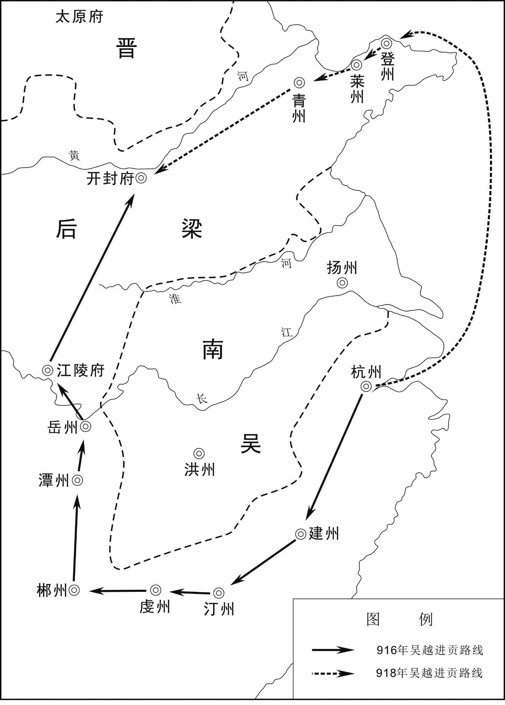 
吴越进贡后梁路线示意图

## 【原文】

**三年冬十月己亥，加吴越王镠天下兵马元帅。**

## 【译文】

后梁末帝贞明三年（917年）冬季十月己亥（二十三日），朝廷加封吴越王钱镠为天下兵马元帅。

## 【原文】

**四年春三月，吴越王镠初立元帅府，置官属。**

## 【译文】

后梁末帝贞明四年（918年）春季三月，吴越王钱镠开始建立元帅府，并设置文武百官。

## 【原文】

**五年春三月，诏吴越王镠大举讨淮南[1]。镠以节度副大使传瓘为诸军都指挥使，帅战舰五百艘自东洲击吴，吴遣舒州刺史彭彦章及裨将陈汾拒之[2]。四月，钱传瓘与彭彦章遇，传瓘命每船皆载灰、豆及沙，乙巳，战于（浪）［狼］山江[3]。吴船乘风而进，传瓘引舟避之，既过，自后随之。吴回船与战，传瓘使顺风扬灰，吴人不能开目。及船舷相接，传瓘使散沙于己船，而散豆于吴船，豆为战血所渍，吴人践之皆僵仆。传瓘因纵火焚吴船，吴兵大败。彦章战甚力，兵尽，继之以木，身被数十创。陈汾按兵不救，彦章知不免，遂自杀。传瓘俘吴裨将七十人，斩首千余级，焚战舰四百艘。吴人诛汾，籍没家赀，以其半赐彦章家，禀其妻子终身[4]。**

## 【注文】

[1]淮南：此指吴国。因其境以淮水为界，在淮水以南，其先主杨行密曾任淮南节度使，故称。

[2]节度副大使：官名，唐玄宗开元十五年（727年）置。唐制，凡诸王拜节度大使者，皆留京师，而以在军节度者称节度副大使，负责处理节度事务。五代沿置。　　舒州：州名。唐高祖武德四年（621年）改同安郡置，治所设在怀宁县（今安徽潜山），辖境相当于今安徽天柱山、三官山以南，长江以北地区。唐玄宗天宝元年（742年）复为同安郡，唐肃宗至德二载（757年）又改盛唐郡，唐肃宗乾元元年（758年）复为舒州。　　彭彦章（？—919年）：庐陵（今江西吉安）人。唐末担任袁州刺史，到五代时担任吴国舒州刺史。公元919年，在与吴越军交战中，被钱传瓘用计打败而自杀身亡。　　陈汾（？—919年）：五代时吴国舒州刺史彭彦章的副将。公元919年，吴越军大举讨伐淮南，彭彦章奉命拼死抵御，但依然不敌吴越军。身为彭彦章副将的他却按兵不救，导致彭彦章绝望自杀。随后愤怒的吴国人将他杀死，并将他的一半家产赐给彭彦章家人。

[3]（浪）［狼］山江：地名，位于今江苏南通南。

[4]籍没（jí mò）：没收。　　家赀（zī）：家庭财产。

## 【译文】

后梁末帝贞明五年（919年）春季三月，后梁帝朱友贞下诏命令吴越王钱镠大举进攻淮南。钱镠让节度副大使钱传瓘担任诸军都指挥使，率领五百艘战舰从东洲进攻吴，吴派舒州刺史彭彦章及其副将陈汾进行抵御。四月，钱传瓘与彭彦章相遇，钱传瓘让每艘船上都装上灰、豆及沙子，乙巳（初八日），双方在狼山江交战。吴军战船乘风前进，钱传瓘引船躲避，等他们过去后，再从后面追上去。吴军调转船头与吴越军交战，钱传瓘让士兵们顺风扬灰，使得吴军士兵无法睁开眼睛。等到双方船舷相触时，钱传瓘命令士兵们在自己的船上铺上散沙，而向吴军船上撒上豆子，豆子被士兵的血染透了，吴军一踩便滑倒在船上。钱传瓘顺势纵火焚毁吴军舰船，吴军大败。彭彦章竭尽全力作战，武器用完了，便用木棍继续战斗，全身上下有数十处创伤。陈汾仍按兵不救，彭彦章知道无法逃脱，于是自杀。钱传瓘俘获吴军副将七十人，杀死吴军士兵千余人，焚掉战舰四百艘。吴人又杀了陈汾，没收了他的家产，把其中的一半赐给彭彦章家，并给彭彦章的妻子儿女以终身抚恤。

## 【原文】

**秋七月，吴越王镠遣钱传瓘将兵三万攻吴常州，吴都招讨使徐温帅诸将拒之，右雄武统军陈璋以水军下海门出其后[1]。壬申，战于无锡。会温病热，不能治军，吴越攻中军，飞矢雨集，镇海节度判官陈彦谦迁中军旗鼓于左，取貌类温者擐甲胄，号令军事，温得少息[2]。俄顷，疾稍间，出拒之。时久旱草枯，吴人乘风纵火，吴越兵乱，遂大败，杀其将何逢、吴建，斩首万级[3]。传瓘遁去，追至山南，复败之。陈璋败吴越于香湾[4]。**

## 【注文】

[1]右雄武统军：官名。五代时吴国禁卫军统兵官。　　海门：地名，今江苏海门东。

[2]陈彦谦（？—925年）：常州（治今江苏常州）人。初为吴国润州司马，后历任吴镇海节度判官、楚州团练使等。后唐庄宗同光三年（925年），因病去世。　　擐（huàn）：穿。　　甲胄：盔甲。

[3]何逢（？—919年）：吴越军将领。后梁末帝贞明五年（919年），吴越军与吴军在无锡（今江苏无锡）交战，吴军顺风放火，打败吴越军，何逢也被吴军杀死。　　吴建（？—919年）：吴越军将领。后梁末帝贞明五年（919年），吴越军与吴军在无锡（今江苏无锡）交战，吴军顺风放火，打败吴越军，吴建也被吴军杀死。

[4]香湾：地名，在今江苏江阴东。

## 【译文】

后梁末帝贞明五年（919年）秋季七月，吴越王钱镠派遣钱传瓘率领三万军队攻打吴国常州，吴都招讨使徐温率部将进行抵御，右雄武统军陈璋带水军从海门抄到吴越军背后。壬申（初七日），双方在无锡交战。这时正赶上徐温生病发烧，不能指挥军队，吴越军攻打吴军的中军，飞箭如雨一样密集，镇海节度判官陈彦谦把中军的旗鼓移到左营，又找一个长得像徐温的人穿上铠甲戴上头盔，发布号令指挥战斗，徐温才得以稍稍休息。不久，徐温的病情稍有好转，便出来继续战斗。当时天旱了很久，草木也枯了，吴军顺风放火，吴越军慌忙混乱，被打得大败，吴军杀死他们的将领何逢、吴建，斩杀吴越士兵一万人。钱传瓘逃跑了，吴军继续追击到狼山南，又打败了他们。陈璋在香湾也打败了吴越军。

## 【原文】

**温募生获叛将陈绍者赏钱百万，指挥使崔彦章获之[1]。绍勇而多谋，温复使之典兵。**

## 【注文】

[1]陈绍：生卒年不详，五代时吴国将领。曾反叛徐温，后被崔彦章俘虏。因他勇猛多谋，徐温仍让他统领军队。　　崔彦章：生卒年不详，五代时吴国指挥使，曾俘虏吴国叛将陈绍。

## 【译文】

徐温招募能够活捉叛将陈绍的人，许诺赏钱一百万，指挥使崔彦章俘获了陈绍。因陈绍勇猛而有计谋，徐温又让他统领部队。

## 【原文】

**初，（锦）衣［锦］之役，吴马军指挥曹筠叛奔吴越，徐温赦其妻子，厚遇之，遣间使告之曰：“使汝不得志而去，吾之过也。汝无以妻子为念[1]。”及是役，筠复奔吴，温自数昔日不用筠言者三，而不问筠去来之罪，归其田宅，复其军职。筠内愧而卒。**

## 【注文】

[1]（锦）衣［锦］之役：即公元913年三月吴军攻打吴越钱镠家乡临安衣锦乡的战役。　　马军指挥：“指挥”之下，当有“使”字。　　曹筠（yún）（？—919年）：五代时吴国马军指挥使。公元913年衣锦战役时，叛变吴国，转投吴越。但徐温不计前嫌，赦免并厚待曹筠的妻子儿女。曹筠重回吴军后，徐温再三检讨自己以前不采纳曹筠建议的过错，并归还他的田宅，恢复他的军职。最终曹筠羞愧而死。

## 【译文】

当初，在衣锦战役时，吴马军指挥使曹筠叛逃到吴越，徐温赦免了他的妻子儿女，对他们厚礼相待，还派密使告诉曹筠说：“让你不得志而离开吴国，这是我的过错。请你不要挂念你的妻子儿女。”在这场战役中，曹筠又回到吴军，徐温再三检讨自己以前不采纳曹筠建议的过错，却绝口不提曹筠叛逃的罪过，还归还他的田宅，恢复他的军职。曹筠因内心深感羞愧而死。

## 【原文】

**知诰请帅步卒二千，易吴越旗帜、铠仗，蹑败卒而东袭取苏州[1]。温曰：“尔策固善，然吾且求息兵，未暇如汝言也。”诸将皆以为吴越所恃者舟楫，今大旱，水道涸，此天亡之时也，宜尽步骑之势一举灭之[2]。温叹曰：“天下离乱久矣，民困已甚，钱公亦未易可轻。若连兵不解，方为诸君之忧。今战胜以惧之，戢兵以怀之，使两地之民各安其业，君臣高枕，岂不乐哉[3]！多杀何为！”遂引还。**

## 【注文】

[1]知诰（gào）：即徐知诰（888—943年），字正伦，小字彭奴，徐州（治今江苏徐州）人，五代十国时吴国丞相徐温养子，南唐政权建立者。曾任吴升州刺史、润州刺史等。公元918年，他代替徐知训出任淮南节度行军副使、内外马步都军副使，逐渐掌握大权。杨溥即位后，他累迁侍中、中书令、太尉、都督中外诸军事，封齐王。公元937年，他代吴自立，建立南唐国，后改名李昪。在位期间，注意改革弊政，招徕人才，兴利除害；又与吴越约和，休养生息。但因服用方士丹药中毒，个性变得暴躁易怒。公元943年，背上生疮，不久病情恶化去世，谥光文肃武孝高皇帝，庙号烈祖。　　铠仗：甲胄和作战兵器。

[2]舟楫（jí）：泛指船只。　　涸（hé）：水干。

[3]戢（jí）兵：停战，休战。

## 【译文】

徐知诰请求率领二千名步兵，换上吴越军的旗帜、铠甲仪仗，跟随吴越败兵而向东袭击夺取苏州。徐温说：“你的计策固然很好，但我想暂时休整一下部队，来不及照你的话办。”众将领都认为吴越军所依仗的是船只，现在大旱，水道干涸，这是老天让吴越灭亡的时机，应当出动全部步兵、骑兵一举消灭吴越。徐温叹息道：“天下分裂混乱已经很久了，百姓困苦到极点，钱公也不是那么容易轻视的。如果连年用兵不止，这才是各位所要担忧的啊。现在战胜他们使他们害怕，停止战争使他们感恩，让两地的百姓各自安居乐业，君臣高枕无忧，这难道不是一件好事吗\!为什么要杀那么多人！”于是带兵返回。

## 【原文】

**吴越王镠见何逢马，悲不自胜，故将士心附之。宠姬郑氏父犯法当死，左右为之请，镠曰：“岂可以一妇人乱我法[1]！”出其女而斩之。镠自少在军中，夜未尝寐，倦极则就圆木小枕，或枕大铃，寐熟辄欹而寤，名曰“警枕[2]”。置粉盘于卧内，有所记则书盘中，比老不倦。或寝方酣，外有白事者，令侍女振纸即寤。时弹铜丸于楼墙之外，以警直更者。尝微行，夜叩北城门，吏不肯启关，曰：“虽大王来，亦不可启[3]。”乃自他门入，明日，召北门吏厚赐之。**

## 【注文】

[1]姬（jī）：古代帝王的妾称“姬”。

[2]欹（qī）：倾斜。　　寤（wù）：醒来。

[3]启关：开城门。

## 【译文】

吴越王钱镠见到何逢的马，悲伤不已，所以将士们的心都归附于他。钱镠宠姬郑氏的父亲犯法应当处死，左右的人都替她求情，钱镠说：“怎么能因一个妇人而扰乱法纪呢！”于是驱逐了郑氏，并斩了她的父亲。钱镠从小就在军中，夜里从未睡过觉，非常疲倦的时候就靠着圆木小枕，或枕着大铃，一睡熟就向旁边倾斜便醒来了，他称这些枕叫“警枕”。他又在卧室里放置粉盘，想记下什么便写在盘中，到老也不懈怠。有时睡得正香，外面有报告事情的人，便命令侍女抖动纸张叫醒他。时常弹铜丸到楼墙之外，以警醒值更的人。他曾经换上便服悄悄巡行，夜里敲北城门，守门士兵不肯开门，说：“即使是大王来了，也不能开。”于是从其他城门进城，第二天，召见并重赏了守卫北门的士兵。

## 【原文】

**秋八月，吴徐温遣使以吴王书解归无锡之俘于吴越，吴越王镠亦遣使请和于吴。自是吴国休兵息民，三十余州民乐业者二十余年[1]。吴王及徐温屡遗吴越王镠书，劝镠自王其国，镠不从。**

## 【注文】

[1]吴王：此指杨隆演（897—920年），初名瀛（yíng），又名渭，字鸿源，杨行密次子，杨渥弟弟。初为淮南节度使，封弘农王。公元908年，杨渥被杀，他被张颢、徐温拥立继位。公元919年称吴国王，国号大吴，并改年号为武义。在位期间，大臣徐温专政，他内心抑郁，经常纵酒。公元920年病死，谥宣王，杨溥称帝后，改谥宣皇帝，庙号高祖。　　三十余州：据史书记载，当时吴国占有扬、楚、泗、滁、和、光、黄、舒、蕲（qí）、庐、寿、濠（háo）、泰、海、润、常、升、宣、歙、池、饶、信、江、鄂、洪、抚、袁、吉、虔等州。

## 【译文】

后梁末帝贞明五年（919年）秋季八月，吴国徐温派使者携带吴王杨隆演的信送至吴越，并归还在无锡之战中被俘虏的吴越士兵，吴越王钱镠也派使者向吴国请和。从此，吴国命令士兵、百姓休养生息，三十余州的百姓安居乐业二十余年。吴王杨隆演和徐温多次写信给吴越王钱镠，劝他自己立国称王，钱镠不听。

## 【原文】

**龙德元年春三月，吴人归吴越王镠从弟龙武统军镒于钱塘，镠亦归吴将李涛于广陵[1]。徐温以涛为右雄武统军，镠以镒为镇海节度副使。**

## 【注文】

[1]龙德：后梁末帝朱友贞所用年号，共计三年，即公元921年至923年。此外，吴越太祖钱镠同时用该年号到公元923年十二月；闽太祖王审知用此年号至公元923年三月。　　龙武统军：官名。吴越国禁卫军统领官。龙武：唐、五代禁军名。唐太宗李世民从禁军中选出善于射箭的一百人，号为百骑。武则天时改为千骑，唐中宗时改为万骑，分左、右营。唐玄宗开元二十六年（738年），分羽林军置左、右龙武军，设左右龙武大将军各一人，下领左右万骑营，皆用功臣子弟，建制同左右羽林军。五代沿置。

## 【译文】

后梁末帝龙德元年（921年）春季三月，吴人在钱塘释放吴越王钱镠的堂弟龙武统军钱镒，钱镠也在广陵放回吴国将领李涛。徐温任命李涛为右雄武统军，钱镠任命钱镒为镇海节度副使。

## 【原文】

**后唐庄宗同光元年春二月，梁主遣兵部侍郎崔协等册命吴越王镠为吴越国王[1]。丁卯，镠始建国，仪卫、名称多如天子之制，谓所居曰宫殿，府署曰朝廷，教令下统内曰制敕，将吏皆称臣，惟不改元，表疏首称吴越国而不言军[2]。以清海节度使兼侍中传瓘为镇海、镇东留后，总军府事[3]。置百官，有丞相、侍郎、郎中、员外郎、客省等使[4]。**

## 【注文】

[1]后唐：朝代名（923—936年），五代之一。公元923年，李存勖在魏州（治今河北大名）称帝，国号唐。同年攻灭后梁，建都洛阳（今河南洛阳），史称后唐。盛时疆域包括燕山以南、六盘山以东、大巴山及淮河以北的中国北方地区。李存勖在位期间昏庸无能，只喜欢演戏玩乐，朝政腐败，后被后唐明宗李嗣源夺取帝位。后唐明宗节俭为政，他在位时是后唐的兴盛时期。但他死后，儿子们争权夺利，政局混乱。公元936年，石敬瑭勾结契丹攻入洛阳，末帝李从珂（kē）自杀，后唐至此灭亡。后唐共传四主，历十五年。　　庄宗：即李存勖（885—926年），沙陀人，本姓朱邪氏，唐末河东节度使、晋王李克用长子，五代后唐政权建立者。自幼喜欢骑马射箭，胆力过人，为李克用所宠爱。开平二年（908年），李克用病死，他承袭晋王位。之后经过多年的南征北战，逐渐强大起来。龙德三年（923年），他在魏州（治今河北大名）称帝，国号“唐”，史称后唐，是为后唐庄宗。同年攻灭后梁，实现了对中国北方的统一。他即位后灭掉前蜀，荆南、淮南等国相继朝贡，但他为政苛酷，任用宦官，滥用民力，终被乱兵所杀。　　同光：后唐开国皇帝李存勖所用年号，共计四年，即公元923年至926年。此外，闽太祖王审知在公元923年至925年间用此年号；荆南武信王高季兴在公元924年至926年亦用此年号。　　梁主：此指朱友贞。　　兵部侍郎：官名。隋炀帝大业三年（607年）置，为尚书省兵部副长官，辅佐兵部尚书处理兵部事务。唐沿置，官四品下，掌全国武官选用和兵籍、军械、军令等政务。唐中期以后，尚书多由他官兼领，由此兵部事务实际上由兵部侍郎主持。五代沿置。　　崔协（？—929年）：字思化，唐末五代清河（今河北清河）人，进士。曾担任度支巡官、渭南尉等。后梁时累迁左司郎中、万年令、给事中、兵部侍郎。后唐庄宗时，担任御史中丞。后唐明宗时，担任礼部尚书、太常卿，后经枢密使孔循保举，拜平章事，兼判国子祭酒事。

[2]教令：古代由皇帝所发布的命令或文书。　　统内：管辖范围之内。　　制敕（chì）：皇帝的诏令。

[3]清海：唐、五代方镇名。唐玄宗开元二十一年（733年）置岭南五府经略讨击使，为唐玄宗时边防十节度经略使之一。唐肃宗至德元载（756年）升为岭南节度使，治所设在广州（今广东广州），辖境大致相当于今广东钦山港以东大部分地区（连州、连山、连南等地除外）。唐懿宗咸通三年（862年）分为东、西两道，岭南东道节度使的治所仍在广州。唐昭宗乾宁二年（895年）改岭南东道节度使为清海军节度使。

[4]侍郎：官名。唐代侍郎因任职官署不同，可分为两种：其一，中书、门下二省各设侍郎二人，正三品，分别为中书令、门下侍中的副职，若主官缺，则可代判本省庶政，平时也参议朝廷大政，其权位相当于副宰相。其二，尚书省所辖的吏、户、礼、兵、刑、工六部尚书之下，各设侍郎一或二人，分别为正四品上（吏部侍郎）或正四品下（户、礼、兵、刑、工侍郎），各为本部尚书副职。如尚书职缺，侍郎则代行尚书职。唐以后，历代均有侍郎。　　郎中：官名。尚书省及所属各部高级官员，位次于尚书丞及各部侍郎，分掌本司事务。　　员外郎：官名。尚书省所辖的吏、户、礼、兵、刑、工六部下设各司的副职，与郎中同称郎官，但比郎中地位略低，都是中央官吏中的要职。　　客省使：官名。客省长官，掌外国使节接待、进奉、朝觐（jìn），州长官参内，宫中宴席，宫内官员秩序维持，各州进奉品，天子赐品及回诏等事务。原由宦官担任该职，朱温诛杀宦官后多为武将任职。五代沿置。

## 【译文】

后唐庄宗李存勖同光元年（923年）春季二月，梁国国主朱友贞派兵部侍郎崔协等册封吴越王钱镠为吴越国王。丁卯（二十二日），钱镠建国，仪卫、名称大多效仿天子的制度，称住处为宫殿，府署称朝廷，向下发布命令叫制敕，文武官员都称臣子，只是不改年号，表疏开头称吴越国而不称军节度。任命清海节度使兼侍中钱传瓘为镇海、镇东留后，总管军府事务。设置文武百官，有丞相、侍郎、郎中、员外郎、客省使等官员。

## 【原文】

**冬十二月，吴越王镠以行军司马杜建徽为左丞相[1]。**

## 【注文】

[1]左丞相：官名。唐朝武则天时曾改尚书左、右仆射为左、右相。唐玄宗开元时又改左、右仆射为左、右丞相。唐玄宗天宝时恢复仆射原名，而改侍中为左相，中书令为右相，后亦复旧。在古代中国，是“左”尊还是“右”尊，在不同时代，存在不同规定，而唐、五代时为左尊右卑。

## 【译文】

后唐庄宗同光元年（923年）冬季十二月，吴越王钱镠任命行军司马杜建徽为左丞相。

## 【原文】

**二年冬十月，吴越王镠复修本朝职贡，壬午，帝因梁官爵而命之[1]。镠厚贡献，并赂权要，求金印、玉册、赐诏不名、称国王[2]。有司言：“故事惟天子用玉册，王公皆用竹册。又非四夷，无封国王者[3]。”帝皆曲从镠意。**

## 【注文】

[1]复修本朝职贡：吴越王钱镠本是唐朝大臣，唐亡事梁，梁亡又事后唐，故云“复修本朝职贡”。　　帝：即后唐庄宗李存勖。　　因：沿袭，承袭。

[2]金印：旧时帝王或高级官员金质的印玺（xǐ）。　　玉册：古代帝王在祭祀、封禅、册命之时所用的玉制简册。　　赐诏不名：赐诏书时称吴越国王而不称名字。

[3]有司：指官吏。古代设官分职，各有专司，故称有司。　　故事：先例，旧日的典章制度。　　竹册：用竹制成的册书，封王、公勋爵时用。　　四夷：指周边少数民族所建立的国家。

## 【译文】

后唐庄宗同光二年（924年）冬季十月，吴越王钱镠又恢复对后唐朝廷的进贡，壬午（十七日），后唐庄宗李存勖按照原来梁朝给他的官爵又重新任命了他。钱镠的贡礼很丰厚，又贿赂朝中的显要权贵，请求赐给金印、玉册、赐诏上不直接称呼名字而称国王。有官员说：“按过去的制度，只有天子才用玉册，王公都用竹册。此外，不是四方的夷族，也没有被封为国王的。”后唐庄宗都改变旧例满足了钱镠的要求。

## 【原文】

**三年秋八月丁亥，遣吏部侍郎李德休等赐吴越国王玉册、金印、红袍御衣[1]。**

## 【注文】

[1]吏部侍郎：官名。吏部副长官，协助吏部尚书掌管全国官吏的任免、考课、升降、勋封、调动等事务。隋唐五代时，尚书多由其他官员兼任，因此吏部侍郎常主持吏部日常事务，权位颇重。　　李德休（？—931年）：字表逸，赵郡赞皇（今河北赞皇）人，唐宣州观察使李璋之子，进士。历任盐铁官、渭南尉、右补阙、侍御史等官。唐末天祐初年，天下大乱，他被定州节度使王处直辟为从事。后唐庄宗即位后，他被征为御史中丞，转兵部、吏部侍郎，权左丞，以礼部尚书致仕。死后被追赠为太子少保。李德休墓志现存河南洛阳古代艺术馆。

## 【译文】

后唐庄宗同光三年（925年）秋季八月丁亥（二十七日），朝廷派遣吏部侍郎李德休等赐予吴越国王钱镠玉册、金印、红袍御衣。

## 【原文】

**闰十二月，吴越王镠遣使者沈瑫致书，以受玉册、封吴越国王告于吴[1]。吴人以其国名与己同，不受书，遣瑫还。仍戒境上无得通吴越使者及商旅。**

## 【注文】

[1]沈瑫（tāo）：生卒年不详，五代时吴越国官吏。后唐庄宗同光三年（925年），奉钱镠命出使吴国，将钱镠获封吴越王一事告知吴王。

## 【译文】

后唐庄宗同光三年（925年）闰十二月，吴越王钱镠派使者沈瑫送信给吴王，把接受玉册、获封吴越国王一事告诉吴王。吴人认为他的国名与自己的相同，所以不接受钱镠的信，并遣送沈瑫回去。还戒严边境不让吴越的使者和商人通过。

## 【原文】

**明宗天成元年春三月，吴越王镠有疾，如衣锦军，命镇海、镇东节度使留后传瓘监国[1]。吴徐温遣使来问疾，左右劝镠勿见。镠曰：“温阴狡，此名问疾，实使之觇我也。”强出见之。温果聚兵欲袭吴越，闻镠疾瘳而止[2]。镠寻还钱塘。是岁，吴越王镠以中国丧乱，朝命不通，改元宝正[3]。其后复通中国，乃讳而不称。**

## 【注文】

[1]明宗：后唐明宗李嗣源（867—933年），沙陀部人，生于应州金城（今山西应县），原名邈（miǎo）佶（jí）烈。因擅于骑马射箭，被李克用收为养子，并获赐姓名为李嗣源。早年追随李克用父子征战，屡立战功，先后担任代州刺史、相州刺史、昭德军节度使、天平军节度使、蕃汉内外马步军总管。后唐庄宗李存勖同光四年（926年），魏州发生兵变，他奉命镇压，不料军队哗变，他被迫反叛。随后杀死李存勖，自称监国，后称帝，改名李亶（dàn）。他登基后革除弊政，减轻刑罚，提倡节俭，任用贤臣，并减免赋税，发展经济，使后唐一度出现繁荣景象。但他晚年疑心过重，随便杀戮大臣，致使群臣离心，他也在兵乱中惊恐而死。　　天成：后唐明宗李嗣源所用年号，共计五年，即公元926年至930年。

[2]瘳（chōu）：病愈。

[3]中国：本意为居中之国，得天地之正。不同时期有不同的含义。“中国”一词最早出现在周代《诗经》中，如《大雅·民劳》“惠此中国”。但《诗经》中的此类“中国”实为“京城”，在当时人的眼里，京师以外非中国。春秋战国时期，华夏概念形成，这时“中国”指华夏民族生活区，大致相当于今陕西大部、山西西南部、河南西北部一带。自秦始皇统一六国后开始，中国开始指中原地区，广义的“中原”是以河南为中心，向河南临近省份的部分地区渗透的一个广阔区域。此指中原王朝。　　宝正：或作宝贞、保贞，吴越太祖钱镠所用年号，共计六年，即公元926年至931年。

## 【译文】

后唐明宗李嗣源天成元年（926年）春季三月，吴越王钱镠患病，到衣锦军，命令镇海、镇东节度使留后钱传瓘监理国事。吴国徐温派使者前来询问病情，左右的人劝钱镠不要接见吴国使者。钱镠说：“徐温阴险狡诈，这次前来名义上是为了探病，实际上是想侦察我们的情况。”于是勉强出来会见使者。徐温果然聚集兵力想袭击吴越，听说钱镠的病好了这才停止。钱镠不久回到钱塘。这年，吴越王钱镠因中原丧乱，朝廷的命令受阻不通，便更改年号为宝正。后来和中原恢复了联系，才隐讳而不称宝正年号。

## 【原文】

**三年秋八月，吴越王镠欲立中子传瓘为嗣，谓诸子曰：“各言汝功，吾择多者而立之[1]。”传瓘兄传璹、传璙、传璟皆推传瓘，乃奏请以两镇授传瓘[2]。闰月丁未，诏以传瓘为镇海、镇东节度使。**

## 【注文】

[1]嗣（sì）：继承人。

[2]传璹（shú）：即钱传璹（886—951年），字秉徽，后改名元懿，钱镠第五子，杭州临安（今浙江临安）人。历任镇海军右直都知兵马使、安国衣锦军防遏指挥使、检校兵部尚书，封金华郡王。　　传璟（jǐng）：即钱传璟，生卒年不详，钱镠第十五子，杭州临安（今浙江临安）人。初任湖州刺史。天祐四年（907年），他被唐哀帝李柷选为驸马，拜检校尚书右仆射、司农卿、驸马都尉。后梁末帝贞明三年（917年），担任后梁宁国军节度使、同平章事。　　两镇：此指镇海、镇东两方镇。

## 【译文】

后唐明宗天成三年（928年）秋季八月，吴越王钱镠想立排行中间的儿子钱传瓘为继承人，于是对儿子们说：“大家都各自谈谈自己的功劳，我将选择功劳多的立为继承人。”钱传瓘的哥哥钱传璹、钱传璙、钱传璟都推选钱传瓘，于是向朝廷奏请把两镇授予钱传瓘。闰八月丁未（初五日），朝廷下诏任命钱传瓘为镇海、镇东节度使。

## 【原文】

**四年。吴越王镠居其国，好自大，朝廷使者曲意奉之则赠遗丰厚，不然则礼遇疏薄。尝遗安重诲书，辞礼颇倨[1]。帝遣供奉官乌昭遇、韩玫使吴越，昭遇与玫有隙，使还，玫奏：“昭遇见镠称臣拜舞，谓镠为殿下，及私以国事告镠[2]。”安重诲奏赐昭遇死。［秋九月］癸巳，制镠以太师致仕，自余官爵皆削之，凡吴越进奏官、使者、纲吏，令所在系治之[3]。镠令子传瓘等上表讼冤，皆不省[4]。**

## 【注文】

[1]安重诲（？—931年）：五代时后唐大臣，应州（今山西应县）人。其先为北部豪强首领。其父安福迁为李克用部下将领，以骁勇知名。他年轻时即在李嗣源帐下做谋臣，为人明达敏捷，办事谨慎。李嗣源担任安国军节度使时，他被任命为中门使。李嗣源即位后，他相继担任左领军卫大将军、枢密使，累加兼中书令、护国节度使，总揽政事。但他不通文墨，又刚愎专断，不能容人，诬杀宰相任圜等，逐渐被李嗣源嫌忌。后罢枢密使，以太子太师致仕。公元931年，以离间孟知祥、董璋、钱镠罪被杀。　　倨（jù）：傲慢。

[2]供奉官：官名。置于唐朝，原本是从官。唐高宗时，因常居住在大明宫，故在大明宫另外设置从官，称为“东头供奉官”；而西边大内的原有从官也不废除，称为“西头供奉官”。供奉官掌宫内侍奉之事。五代沿置。　　乌昭遇（？—929年）：后唐官吏，曾任供奉官。后唐明宗天成四年（929年），他奉后唐明宗李嗣源命，与韩玫一起出使吴越。后因与韩玫不合，而被诬陷私通吴越、漏泄机密，交御史台定罪，不久被赐自尽。　　韩玫：生卒年不详，后唐官吏，曾任供奉官。后唐明宗天成四年（929年），他奉后唐明宗李嗣源的命令，与乌昭遇一起出使吴越。因与乌昭遇不合，而诬陷乌昭遇私通吴越、漏泄机密，导致乌昭遇被赐死。后来，后唐明宗又下令调查此事，核实乌昭遇确实是被诬陷，于是将他逮捕入狱。　　拜舞：跪拜与舞蹈。这是古代朝拜的礼节。　　殿下：原是对天子的敬称，但称谓对象随着历史的发展而有所变化。汉代以后，演变为对太子、亲王的尊称。　　国事：即国家机密大事。

[3]制：古代帝王的命令。　　太师：古时三公（即太师、太傅、太保）之首，为辅弼国君之官。晋朝避司马师讳，曾改作“太宰”。之后又复称太师，多为重臣加衔，作为最高荣典以示恩宠，并无实职。　　进奏官：官名。唐代宗大历年间置，为进奏院官员。唐、五代藩镇皆在京师（今陕西西安）设置官邸，并置进奏官，职掌章奏、诏令及各种文书的投递、承转。　　纲吏：押运进贡财物的官吏。　　系治：逮捕处理。

[4]不省：不予理睬。

## 【译文】

后唐明宗天成四年（929年）。吴越王钱镠在自己国内喜好自夸自大，朝廷派来的使者对他曲意奉承的，他就赠送厚礼，不然就礼遇疏薄。他曾写信给安重诲，言辞非常傲慢。后唐庄宗李嗣源派遣供奉官乌昭遇、韩玫出使吴越，乌昭遇与韩玫有矛盾，回来后，韩玫上奏说：“乌昭遇见到钱镠时称臣下拜，又称钱镠为殿下，并私下把国家机密大事告诉钱镠。”安重诲上奏朝廷应赐乌昭遇死罪。［秋九月］癸巳（二十七日），朝廷下令钱镠以太师的身份退休，其余官爵一概免除，凡吴越所推举的进奏官、使者、纲吏等，都命令所在地的官员把他们全部抓起来治罪。钱镠让儿子钱传瓘等上表诉冤，朝廷一概不予理会。

## 【原文】

**长兴元年冬十月，钱镠因朝廷册闽王使者裴羽还，附表引咎，其子传瓘及将佐屡为镠上表自诉[1]。癸卯，敕听两浙纲吏自便[2]。**

## 【注文】

[1]长兴：后唐明宗李嗣源所用年号，共计四年，即公元930年至933年。　　闽王：即五代十国中闽国国君王延钧（？—935年），又名鏻（lín），王审知次子。初为泉州刺史。后唐明宗天成元年（926年），他联合王延禀起兵杀死王延翰，自称威武留后，受后唐封威武节度使、闽王。后唐明宗长兴四年（933年），称帝，国号闽，建都长乐（今福建福州）。他在位期间，迷信道教鬼神之说，任用佞臣薛文杰，大肆搜刮，纵情挥霍，残害臣民，政局紊乱。先有王延禀之叛，后有王继图谋反。后唐末帝清泰二年（935年），被儿子王昶（chǎng）杀死，谥惠宗齐肃明孝皇帝（《新五代史》记载谥太宗惠皇帝）。　　裴羽：生卒年不详，字用化，五代绛州闻喜（今山西闻喜）人，唐僖宗朝宰相裴贽之子。初因门荫任河南寿安尉。入后梁后授御史主簿、监察御史。后唐明宗朝，升任吏部郎中。曾与右骑常侍陆崇出使福建，途中遭遇海风，吹到钱塘（今浙江杭州），被钱镠扣留（当时后唐与吴越断绝往来），后被释放回国，他请求带已病故的陆崇尸体一并回归，他的大义感动了钱镠，钱镠表示归附后唐，自此后唐与吴越恢复交往。后晋高祖天福元年（936年），迁任礼部侍郎、太常卿。后周太祖广顺元年（951年），又出任左散骑常侍，卒于任上。

[2]敕：帝王的诏书、命令。　　自便：自由行动。

## 【译文】

后唐明宗长兴元年（930年）冬季十月，钱镠借朝廷册封闽王使者裴羽回朝的机会，委托他呈上表章承认自己的错误，他的儿子钱传瓘及将佐们也多次为钱镠上表陈诉。癸卯（十三日），后唐皇帝李嗣源下令，释放被收押治罪的两浙纲吏，听其自便。

## 【原文】

**二年春三月乙酉，复以钱镠为天下兵马都元帅、尚父、吴越国王，遣监门上将军张篯往谕旨，以向日致仕，安重诲矫制也[1]。**

## 【注文】

[1]上将军：官名。唐、五代时禁军高级将领，位在大将军之上。　　张篯（jiān）：生卒年不详，曾任后唐监门上将军。　　向日：过去。　　矫制：又称“矫诏”，指假托君主命令行事。

## 【译文】

后唐明宗长兴二年（931年）春季三月乙酉（二十七日），朝廷又任命钱镠为天下兵马都元帅、尚父、吴越国王，派遣监门上将军张篯前往吴越宣读圣旨，说以前让他退休，都是安重诲假传圣旨。

## 【原文】

**三年春三月，吴越武肃王钱镠寝疾，谓将吏曰：“吾疾必不起，诸儿愚懦，谁可为帅者[1]？”众泣曰：“两镇令公仁孝有功，孰不爱戴[2]！”镠乃悉出印钥授传瓘曰：“将吏推尔，宜善守之[3]。”又曰：“子孙善事中国，勿以易姓废事大之礼[4]。”庚戌卒，年八十一。**

## 【注文】

[1]吴越武肃王：即吴越王钱镠，武肃是他的谥号。

[2]两镇令公：即钱传瓘，朝廷曾加封他为中书令，故称。

[3]印钥：吴越国印及镇海、镇东节度使印，内外城各门及宫门钥匙。

[4]善事中国：好好地事奉中原王朝。　　易姓：指中原王朝更替。

## 【译文】

后唐明宗长兴三年（932年）春季三月，吴越武肃王钱镠卧病不起，他对将吏们说：“我的病肯定好不了了，儿子们愚蠢懦弱，谁可以当统帅呢？”众人哭着说：“两镇令公仁孝又立有大功，谁不爱戴\!”钱镠于是把大印和钥匙全部交给钱传瓘说：“将吏们都推举你，你应当好好守住国家。”又说：“子孙们要好好事奉中原朝廷，不要因为朝廷变更而废弃事奉朝廷的礼节。”庚戌（二十八日），钱镠去世，终年八十一岁。

## 【原文】

**传瓘与兄弟同幄行丧，内牙指挥使陆仁章曰：“令公嗣先王霸业，将吏旦暮趋谒，当与诸公子异处[1]。”乃命主者更设一幄，扶传瓘居之，告将吏曰：“自今惟谒令公，禁诸公子从者无得妄入[2]。”昼夜警卫，未尝休息。镠末年左右皆附传瓘，独仁章数以事犯之。至是传瓘劳之，仁章曰：“先王在位，仁章不知事令公，今日尽节，犹事先王也。”传瓘嘉叹久之。**

## 【注文】

[1]同幄（wò）行丧：在同一个篷帐里守灵护丧。幄，篷帐。　　谒（yè）：拜见。

[2]主者：主持操办钱镠丧事的人。

## 【译文】

钱传瓘与兄弟们同处灵帐奉行丧事，内牙指挥使陆仁章说：“令公您继承先王霸业，将士、官吏们都会去拜见您，您应当与各位公子分开住。”于是命令主持丧事的人另外再设一幄帐，扶着钱传瓘进去单独居住，并告诉将士、官吏们说：“从今以后这里只能谒见令公，禁止诸位公子和随从们随便进入。”并且亲自在幄帐外昼夜警卫，几乎没有休息过。在钱镠在世的最后几年，左右的大臣们都附和钱传瓘，只有陆仁章却多次因为一些事情冒犯他。到这时钱传瓘慰劳他，陆仁章说：“先王在世的时候，仁章还不知道侍奉令公，现在为您尽力，就像是当年侍奉先王一样。”钱传瓘听了这话，赞叹了很久。

## 【原文】

**传瓘既袭位，更名元瓘，兄弟名“传”者皆更为“元”。以遗命去国仪，用藩镇法，除民田荒绝者租税[1]。命处州刺史曹仲达权知政事[2]。置择能院，掌选举殿最，以浙西营田副使沈崧领之[3]。**

## 【注文】

[1]去国仪：即去吴越国名号。　　荒绝：荒指有主而不耕；绝指户绝而无主。

[2]曹仲达（882—943年）：十国吴越丞相。本名弘达，避讳改今名，临平（今杭州余杭临平镇）人，钱镠妹夫。钱镠在位时，初任镇东军押牙，累迁台、处二州刺史。钱元瓘继位后，命他权知政事，不久拜丞相，与皮光业、沈崧（sōng）同掌国政。他仁厚好施，深得钱元瓘宠信，常称呼他丞相而不称名。公元943年去世，谥安成。

[3]择能院：官署名。吴越国置，掌选拔人才、考核军功政绩等。　　殿最：最好和最差。　　营田副使：官名。负责开置屯田以增加军粮储备。　　沈崧（863—938年）：字吉甫，一作字文甫，闽（今福建福州）人。唐昭宗乾宁二年（895年）进士。后归闽，途经杭州，被钱镠留任静海军掌书记。后唐明宗长兴三年（932年），吴越钱元瓘置择能院，他以浙西营田副使领其职，负责选拔吴越人才。后晋高祖天福二年（937年），被钱元瓘任命为相。去世后谥“文献”。著有《钱金集》二十卷。

## 【译文】

钱传瓘继位后，改名为元瓘，兄弟们名中有“传”的都改为“元”。宣称按照钱镠的遗命，除去建国的仪礼，采用藩镇的礼法，免除百姓田地荒芜无收和户绝无主者的租税。任命处州刺史曹仲达代为掌理政事。设置择能院，主管甄别选拔人才，任命浙西营田副使沈崧负责此事。

## 【原文】

**内牙指挥使富阳刘仁杞及陆仁章久用事，仁章性刚，仁杞好毁短人，皆为众所恶[1]。一日，诸将共诣府门请诛之，元瓘使从子仁俊谕之曰：“二将事先王久，吾方图其功，汝曹乃欲逞私憾而杀之，可乎？吾为汝主，汝当禀吾命；不然，吾当归临安以避贤路[2]。”众惧而退。乃以仁章为衢州刺史，仁杞为湖州刺史。中外有上书告讦者，元瓘皆置不问，由是将吏辑睦[3]。**

## 【注文】

[1]刘仁杞（qǐ）：五代时吴越大臣，生卒年不详，富阳（今浙江富阳）人。曾任内牙指挥使，长期执掌禁军兵权。因喜欢攻击别人短处，而遭人痛恨。钱元瓘即位后，改任湖州刺史。

[2]从子：兄弟的儿子，即侄子。　　仁俊：即钱仁俊，钱元瓘侄子，生卒年不详，官至威武军节度使、检校太保。　　汝曹：你们。汝，你；曹，辈、们、类。　　避贤路：给贤者让路。

[3]告讦（jié）：攻击别人的短处或揭发别人的隐私。　　辑睦：和睦。

## 【译文】

内牙指挥使富阳人刘仁杞与陆仁章长期职掌政务，陆仁章性情刚愎，刘仁杞喜欢诋毁贬低别人，两个人都被大家所痛恨。一天，将领们一起到府门前向钱元瓘请求杀掉他们，钱元瓘派他的侄子钱仁俊劝解他们说：“这两位将军侍奉先王已经很久了，我正指望他们能为我效力，你们竟然因想了却私人恩怨而杀掉他们，这可以吗？我作为你们的王，你们应该听从我的命令；不然，我就回到临安，给有贤能的人让位。”大家一听这话，都吓得退了回去。于是，钱元瓘任命陆仁章为衢州刺史，刘仁杞为湖州刺史。朝廷内外有人上书告发别人的，钱元瓘都置之不理，从此文武百官之间相互和睦起来。

## 【原文】

**秋七月己丑，加镇海、镇东节度使钱元瓘守中书令。**

## 【译文】

后唐明宗长兴三年（932年）秋季七月己丑（初九日），朝廷加封镇海、镇东节度使钱元瓘守中书令。

## 【原文】

**四年秋七月丁亥，赐钱元瓘爵吴王。元瓘于兄弟甚厚，其兄中吴、建武节度使元璙自苏州入见，元瓘以家人礼事之，奉觞为寿曰：“此兄之位也，而小子居之，兄之赐也[1]。”元璙曰：“先王择贤而立之，君臣位定，元璙知忠顺而已[2]。”因相与对泣。**

## 【注文】

[1]中吴：五代方镇名。吴越国钱镠置，治所设在苏州（今江苏苏州）。　　建武：唐、五代方镇名。改岭南西道节度使置，治所设在邕（yōng）州（今广西南宁南），辖境大致相当于今广西地区。此处，钱元璙所担任的建武节度使一职，实际上仅为空头官衔。　　家人礼：即兄弟骨肉相见之礼。　　奉觞（shāng）为寿：举杯祝福。　　小子：谦词，钱元瓘自称。

[2]先王：此指钱镠。

## 【译文】

后唐明宗长兴四年（933年）秋季七月丁亥（十三日），朝廷赐钱元瓘进爵吴王。钱元瓘对兄弟十分宽厚，他的哥哥中吴、建武节度使钱元璙从苏州前来进见，钱元瓘用家人的礼节对待他，举起酒杯为他祝福说：“这本是哥哥的王位，而我坐在这里，这是哥哥的恩赐。”钱元璙说：“先王选择贤能的人而确立储君，君臣的名位已定，我只知道忠顺而已。”因此相对流泪。

## 【原文】

**潞王清泰元年春正月甲午，以镇海、镇东节度使吴王元瓘为吴越王[1]。**

## 【注文】

[1]潞王：即后唐末帝李从珂（885—936年），本姓王，小字阿三，镇州平山（今河北镇定）人，后唐明宗李嗣源养子。他骁勇善战，与后梁作战中屡立大功。后唐明宗时，出任河中节度使，封潞王，与石敬瑭同为明宗左右手。后又相继担任左卫大将军、西京留守等。后唐明宗长兴三年（932年），改任凤翔节度使。后唐闵帝李从厚即位后，他以“清君侧”为名义，攻入洛阳（今河南洛阳），杀死李从厚，自立为帝，并改年号为清泰。清泰三年（936年），河东节度使石敬瑭勾结契丹攻入洛阳，他自焚而死，后唐至此灭亡。　　清泰：后唐末帝李从珂所用年号，共计三年，即公元934年至936年。

## 【译文】

潞王李从珂清泰元年（934年）春季正月甲午（二十三日），朝廷封镇海、镇东节度使吴王钱元瓘为吴越王。

## 【原文】

**后晋高祖天福二年春二月，吴越王元瓘之弟顺化节度使、同平章事元珦获罪于元瓘，废为庶人[1]。初，吴越王镠少子元数有军功，镠赐之兵仗[2]。及吴越王元瓘立，元为土客马步军都指挥使、静江节度使兼中书令，恃恩骄横，增置兵仗至数千，国人多附之[3]。元瓘忌之，使人讽元请输兵仗，出判温州，元不从[4]。铜官庙吏告元遣亲信祷神，求主吴越江山，又为蜡丸从水窦出入，与兄元珦谋议[5]。三月戊午，元瓘遣使者召元宴宫中，既至，左右称元有刃坠于怀袖，即格杀之，并杀元珦。元瓘欲按诸将吏与元珦、元交通者，其子仁俊谏曰：“昔光武克王郎，曹公破袁绍，皆焚其书疏以安反侧，今宜效之[6]。”元瓘从之。**

## 【注文】

[1]后晋：朝代名（936—947年），五代之一。后唐末帝清泰三年（936年），太原留守、河东节度使石敬瑭勾结契丹，认契丹皇帝为父，并以幽、云十六州为代价，在契丹扶持下登基称帝，定都汴州（今河南开封），国号晋，史称后晋。后晋的建立造成了幽、云十六州大片领土的丢失，从此中原王朝在防御北方游牧民族入侵上失掉有利地势。后晋共传二帝、历十一年。盛时疆域约为今山东、河南两省，山西、陕西大部及河北、宁夏、甘肃、湖北、江苏、安徽的一部分。　　高祖：即后晋高祖石敬瑭（892—942年），沙陀人，五代后晋建立者，公元936年至942年在位。后唐时担任河东节度使、天平节度使等。后唐末帝清泰三年（936年），他勾结契丹灭亡后唐，并受契丹册封为帝，建国号晋，建都汴州（今河南开封），史称后晋。他割幽、云十六州给契丹，并认契丹为“父皇”，自称“儿皇帝”，成为五代时皇帝中极可耻的人物。由于割让幽、云十六州，使华北平原无险可守，中原长期处于外族威胁之下。天福七年（942）六月，他抑郁而终。　　天福：后晋高祖石敬瑭开始使用的年号，天福七年（942年）六月后晋出帝石重贵即位沿用至公元944年，前后共计九年，即公元936年至944年。　　顺化：五代时方镇名。吴越置，治所设在明州（今浙江宁波）。　　元珦（xiàng）：即钱元珦（？—937年），钱镠之子，杭州临安（今浙江临安）人。钱元瓘在位时，他历任节度使、刺史、同平章事。在任期间，骄横不法，出言傲慢。公元937年被钱元瓘废为庶人，不久被杀。　　庶（shù）人：无官爵的平民百姓。

[2]少（shào）子：指最小的儿子。　　元（sù）：即钱元（？—937年），钱镠之子，杭州临安（今浙江临安）人。因屡立军功，官至土客马步都指挥使、静江军节度使兼中书令。钱元瓘继位后，他恃恩骄横，被钱元瓘以图谋不轨罪杀死。

[3]土客马步军都指挥使：官名。负责指挥由少数民族百姓组成的禁卫军。

[4]讽：规劝。　　出判：离开朝廷，出任州官。

[5]铜官庙：庙名，祠铸铜官神像。　　铜官：官名，掌铜矿及冶炼铸钱。　　蜡丸：用蜡做成的圆形外壳，内装药丸。古代也在蜡壳里面放置机密文书，以便于秘密传递。　　水窦（dòu）：泄水孔。

[6]交通：勾结、联系。　　光武：即汉光武帝刘秀（前6—57年），字文叔，南顿（今河南项城）人，东汉开国皇帝。公元25年，他在河北登基称帝，为表刘氏重兴之意，仍以“汉”为其国号。经过几年的统一战争，他先后平定了更始、赤眉和关东、陇、蜀等诸多割据势力，使得自新莽末年以来分崩战乱的中国再次归于一统。死后葬于原陵（今河南洛阳东北汉魏洛阳故城西北），庙号世祖，谥号光武。　　王郎：即王莽（前45—23年），字巨君，汉元帝皇后王政君侄子。汉平帝刘衎（kàn）时，担任大司马、大将军等，以外戚身份掌握朝政。汉平帝去世后，他拥立年仅两岁的刘婴为帝，自为“假（代）皇帝”。公元8年，废掉刘婴，自立为帝，改国号为“新”，并宣布推行新政，史称“王莽改制”。他统治末期，社会矛盾尖锐，最终导致绿林赤眉起义爆发。公元23年，绿林军攻入长安（今陕西西安），他死于乱军之中。他共在位十五年，而新朝也成为了中国历史上最短命王朝之一。　　曹公：即曹操（155—220年），字孟德，沛国谯（qiáo）县（今安徽亳州）人，三国曹魏政权奠基人。他出身低微，父亲为宦官养子。黄巾军起义爆发后，受命担任骑都尉。东汉献帝刘协建安元年（196年），他“挟天子以令诸侯”，迎汉献帝都许昌（今河南许昌东），取得了政治上的优势。之后又打败袁术、吕布等割据势力，逐渐统一了北方。建安二十一年（216年），受封为魏王。延康元年（220年），病死于洛阳。曹丕称帝后，追尊他为武帝。　　袁绍（？—202年）：东汉末年世族豪强。字本初，汝南汝阳（今河南商水西南）人，出身于名门望族（其家族有“四世三公”之称）。汉灵帝刘宏时，担任中军校尉，典领禁兵。汉灵帝去世后，他与大将军何进胁迫太后诛杀宦官，事情泄露，何进被杀，他带兵入宫，尽诛宦官。董卓专权后，因政见不合，他逃往冀州（今河北中南部），号召起兵讨卓，先后占据冀州、青州（今山东东北部）、幽州（今河北北部）、并州（今山西），成为当时地广兵多的一大割据势力。但在东汉献帝建安五年（200年）的官渡（今河南中牟东北）之战中大败于曹操。建安七年（202年），因病去世。　　书疏：书信和奏疏。　　以安反侧：用来安定坐卧不宁的人的心绪。

## 【译文】

后晋高祖石敬瑭天福二年（937年）春季二月，吴越王钱元瓘的弟弟顺化节度使、同平章事钱元珦触怒钱元瓘，被废为平民。当初，吴越王钱镠的小儿子钱元屡次立有军功，钱镠赐给他军队仪仗。等吴越王钱元瓘继位，钱元任土客马步军都指挥使、静江节度使兼中书令，他仗恃恩宠而骄横，增设军队仪仗至数千人，国人大多依附于他。钱元瓘顾忌他，于是派人劝钱元交出军队仪仗，去温州任职，钱元不服从。掌管铜官庙的官吏报告说钱元派亲信向神灵祈祷，请求神灵保佑他统治吴越江山，又制做蜡丸从水道递送，与哥哥钱元珦图谋商议。三月戊午（初五日），钱元瓘派遣使者召钱元到宫中赴宴，到达之后，左右的人说钱元有兵刃从袖中掉出来，便杀了他，同时把钱元珦也杀了。钱元瓘想追查那些与钱元珦、钱元私下勾结的将吏，他的儿子钱仁俊劝谏道：“以前光武帝刘秀攻克王莽，曹操打败袁绍，都把他们来往的信件烧掉，以安定他们身边人的心，现在您应当效法他们。”钱元瓘听从了他的意见。

## 【原文】

**夏四月，吴越王元瓘复建国，如同光故事[1]。丙申，赦境内，立其子弘僔为世子[2]。以曹仲达、沈崧、皮光业为丞相，镇海节度判官（休）［林］鼎掌教令[3]。**

## 【注文】

[1]如同光故事：像后唐庄宗同光年间封钱镠为吴越王一样，用金印、玉册、赐诏不名、称国王。

[2]弘僔（zǔn）：即钱弘僔（925—940年），钱元瓘第五子，杭州临安（今浙江杭州临安）人，吴越世子，死后谥“孝献”。　　世子：亲王、诸侯法定继承人的正式封号，多由嫡、长充任。周代时，天子、诸侯的嫡子称“世子”。汉初，亲王法定继承人的正式封号为王太子，后来为与皇太子相区别，改为世子，后世沿袭不改。另外，为表示尊重，对于贵族、高官的儿子们习惯上也称世子，但不是正式的称呼。

[3]（休）［林］鼎：应为林鼎（891—944年），五代十国时吴越大臣。字涣文，闽（今福建福州）人。初任观察押牙，后成为钱元瓘幕府。钱元瓘即位后，他被任命为镇海军掌书记、节度判官。吴越国建立后，他被拜为丞相，掌教令。死后谥贞献。他一生擅长书法，得欧（阳询）、虞（世南）笔法，以书写草隶知名。另有《吴江应用集》二十卷。

## 【译文】

后晋高祖天福二年（937年）夏季四月，吴越王钱元瓘又恢复吴越国的建制，如同光年间的旧例。丙申（十四日），大赦境内，立他的儿子钱弘僔为世子。任命曹仲达、沈崧、皮光业为丞相，镇海节度判官林鼎掌管教令。

## 【原文】

**十一月戊辰，诏加吴越王元瓘天下兵马副元帅，进封吴越国王。**

## 【译文】

后晋高祖天福二年（937年）十一月戊辰（十九日），朝廷下诏加封吴越王钱元瓘为天下兵马副元帅，进封为吴越国王。

## 【原文】

**四年秋八月己酉，以吴越王元瓘为天下兵马元帅。**

## 【译文】

后晋高祖天福四年（939年）秋季八月己酉（十一日），朝廷任命吴越王钱元瓘为天下兵马元帅。

## 【原文】

**冬十月，吴越恭穆夫人马氏卒[1]。夫人，雄武军节度使绰之女也[2]。初，武肃王镠禁中外畜声妓，文穆王元瓘年三十余无子，夫人为之请于镠，镠喜曰：“吾家祭祀，汝实主之[3]。”乃听元瓘纳妾鹿氏，生弘僔、弘倧；许氏，生弘佐；吴氏，生弘俶；众妾，生弘偡、弘亿、弘仪、弘偓、弘仰、弘信：夫人抚视，慈爱如一[4]。常置银鹿于帐前，坐诸儿于上而弄之。**

## 【注文】

[1]恭穆夫人马氏（890—939年）：安国（今浙江杭州余杭）人，钱元瓘妻子，淮浙行军司马、雄武军节度使、同平章事马绰之女。先后获封越国夫人、吴越国庄睦夫人。她天性聪慧，勤于内职，深得钱元瓘父亲钱镠器重。钱元瓘三十无子，她主动为他纳妾，对妾所生之子都视为己出。后晋高祖天福四年（939年）病逝，谥恭穆，葬于衣锦军（今浙江杭州附近）良山村。

[2]雄武军：唐、五代方镇名。本秦州防御守捉使。唐宣宗大中三年（849年）升为秦、成两州经略使，治所在秦州（今甘肃天水）。辖境相当于今甘肃天水、清水、张家川、庄浪、秦安、会宁、甘谷、礼县、成县、西和及通渭地区。唐懿宗咸通五年（864年），升为天雄军节度，南境扩大至今甘肃康县、武都。五代改为雄武军。

[3]文穆王：即钱元瓘，文穆是他的谥号。　　祭祀：祭祖宗。按古代礼制，正妻负责先世祭祀。此指马氏不忌妒，同意钱元瓘纳妾，继嗣有望，因此钱镠很高兴。

[4]鹿氏：钱元瓘之妾，封鲁国夫人。　　弘倧：即钱弘倧（928—971年），字隆道，一作文敏，又名倧，吴越文穆王钱元瓘第七子，杭州临安（今浙江临安）人，吴越国第四代国王。历任牙内指挥使、检校司空、检校太尉、丞相等。后汉高祖刘知远天福元十二年（947年）六月，袭吴越王位。当政期间，仍未改变权臣秉政的局面。即位当年末，执掌兵权的内牙统军使胡进思率军作乱，将他废黜，拥立他的弟弟钱弘俶为王。他被幽禁二十余年，死后谥“忠逊王”。　　许氏（902—945年）：名新月，台州（治今浙江临海）人，钱元瓘之妾。她善于音律，封吴越国夫人。公元945年病逝，谥仁惠。　　弘佐：即钱弘佐（928—947年），字元祐，钱元瓘第六子，杭州临安（今浙江杭州临安）人，吴越国第三代国王。公元941年，钱元瓘去世，年仅十四岁的他承袭王位，由丞相曹仲达摄政事。后晋时，历任检校太师、兼中书令、开府仪同三司、守太尉，封吴越王。后汉时，被拜为诸道兵马都元帅。公元947年，因病去世，谥忠献。　　吴氏（898—937年）：名汉月，钱塘（今浙江杭州）人，钱元瓘之妾，钱弘俶母。她性情聪慧节俭，信奉道教，屡次阻止钱元瓘封其族人官爵。初封吴越国顺德太夫人。公元937年病逝，谥恭懿。　　弘俶：即钱弘俶（929—988年），字文德，钱元瓘第九子，杭州临安（今浙江临安）人。公元939年，受封牙内诸军指挥使、检校司空。钱弘佐在位时，被授为特进、检校太尉，出镇台州（今浙江临海）。钱弘倧继位后，被征同参相府事。公元947年，执掌兵权的内牙统军使胡进思率军作乱，废黜钱弘倧，而拥立他继位。后汉时，被授为东南面兵马都元帅，镇海军、镇东军节度使，开府仪同三司，检校太师，中书令，上柱国等，封吴越国王。到后周时，累官至尚书令、中书令，封吴越国王。公元960年，赵匡胤称帝，他归顺宋朝，先后担任宋太师、尚书令兼中书令、天下兵马大元帅，封淮海国王、邓王。　　弘偡（zhàn）：即钱弘偡（928—966年），钱元瓘第八子，杭州临安（今浙江临安）人。初任内牙诸军都知兵马使、检校司空。18岁时出任湖州刺史。他通晓治道，有政绩。钱弘俶继位后，他恭敬谨慎。后周显德年间，被拜为特进、检校太尉、宣德军节度使等，封吴兴郡王。北宋太祖赵匡胤建隆初年，拜同中书门下平章事。不久，因饮酒过度而死。　　弘亿：即钱弘亿（928—967年），字延世，小字和尚，钱元瓘第十子，杭州临安（今浙江临安）人。曾任内牙诸军左右都虞候、检校左仆射等。钱弘俶继位后，被拜为丞相。他为人正直，曾数次直言劝谏。北宋太祖建隆初年，他出任节度使、检校太保。后因病去世。　　弘仪：即钱弘仪（932—979），钱元瓘第十一子，杭州临安（今浙江临安）人。曾任越州观察使，封开国彭城侯。入宋后，官至金州观察使。他通晓音律，能造新声，尤工琵琶，妙绝当时。　　弘偓（wò）：即钱弘偓，钱元瓘之子，生卒年不详，杭州临安（今浙江临安）人，曾任衢州刺史。　　弘仰：即钱弘仰（935—958年），钱元瓘第十三子，杭州临安（今浙江临安）人。他善于骑射，通晓儒学，曾担任台州刺史。　　弘信：即钱弘信（937—1003年），字诚允，又名俨，钱元瓘之子，杭州临安（今浙江临安）人，曾任昭化静宣节度使。

## 【译文】

后晋高祖天福四年（939年）冬季十月，吴越恭穆夫人马氏去世。马夫人是雄武军节度使马绰的女儿。当初，武肃王钱镠禁止朝廷内外官员蓄养歌伎，文穆王钱元瓘年过三十还没儿子，马夫人替他向钱镠请求，钱镠高兴地说：“我们家的祭祀事宜，全由你作主。”于是听任钱元瓘纳妾鹿氏，生钱弘僔、钱弘倧；许氏，生钱弘佐；吴氏，生钱弘俶；众妾，生钱弘偡、钱弘亿、钱弘仪、钱弘偓、钱弘仰、钱弘信：马夫人抚养照看，对孩子们都一样慈爱。常在帐前放置银鹿，让孩子们坐在鹿背上面逗着玩耍。

## 【原文】

**五年夏四月甲子，吴越孝献世子弘僔卒[1]。**

## 【注文】

[1]孝献：钱弘僔谥号。

## 【译文】

后晋高祖天福五年（940年）夏季四月甲子（二十九日），吴越孝献世子钱弘僔去世。

## 【原文】

**冬十月丁酉，加吴越王元瓘天下兵马都元帅、尚书令[1]。**

## 【注文】

[1]尚书令：官名。始于秦，掌在宫中收发公文，为诸尚书之长，属少府。西汉沿置，后职权加重，掌收纳章奏，传达诏令，并参议政务。东汉置为尚书台长官，总领国家政务，权任甚重。魏晋南北朝时，为尚书省长官，参议军国大事，总领日常政务，成为百官之长。隋、唐时，位居三省长官之首，正二品。以其位望尊崇，多缺而不授。到五代时，仅为荣誉之衔，无职事。

## 【译文】

后晋高祖天福五年（940年）冬季十月丁酉（初五日），加封吴越王钱元瓘为天下兵马都元帅、尚书令。

## 【原文】

**六年秋七月，吴越府署火，宫室、府库几尽。吴越王元瓘惊惧，发狂［疾］。**

## 【译文】

后晋高祖天福六年（941年）秋季七月，吴越府署起火，宫室、府库几乎被烧光。吴越王钱元瓘受到惊吓，精神失常。

## 【原文】

**八月，吴越文穆王元瓘寝疾，察内都监使章德安忠厚，能断大事，欲属以后事，语之曰：“弘佐尚少，当择宗人长者立之[1]。”德安曰：“弘佐虽少，群下伏其英敏，愿王勿以为念。”王曰：“汝善辅之，吾无忧矣。”德安，处州人也。辛亥，元瓘卒。**

## 【注文】

[1]章德安：五代十国时吴越重臣。生卒年不详，处州丽水（今浙江丽水）人。后唐明宗长兴三年（932年），被任为内牙指挥使。他为人忠贞仁厚，并能决断政事，累官至吴越内都监使。他曾受钱元瓘的委托辅佐钱弘佐。　　属（zhǔ）：通“嘱”，嘱咐。　　宗人：即同族之人。

## 【译文】

后晋高祖天福六年（941年）八月，吴越文穆王钱元瓘病重，发现内都监使章德安为人忠厚，能决断大事，想把后事托付给他，对章德安说：“钱弘佐年龄还小，应当选宗族中年长的人立为王。”章德安回答说：“钱弘佐年龄虽小，但大臣们都佩服他英明敏捷，请大王不要担心。”钱元瓘说：“你好好辅佐他，我就不担忧了。”章德安，是处州人。辛亥（二十四日），钱元瓘去世。

## 【原文】

**初，内牙指挥使戴恽为元瓘所亲任，悉以军事委之[1]。［元］瓘养子弘侑乳母，恽妻之亲也，或告恽谋立弘侑[2]。德安秘不发丧，与诸将谋，伏甲士于幕下。壬子，恽入府，执而杀之，废弘侑为庶人，复姓孙，幽之明州。是日，将吏以元瓘遗命，承制以镇海、镇东节度副大使弘佐为节度使，时年十四[3]。九月庚申，弘佐即王位，命丞相曹仲达摄政[4]。军中言赐与不均，举仗不受，诸将不能制。仲达亲谕之，皆释仗而拜。**

## 【注文】

[1]戴恽（yùn）（？—941年）：五代吴越国内牙指挥使，深得吴越王钱元瓘的宠信。钱元瓘去世后，因被人告发谋划拥立钱弘侑（yòu）而被杀。

[2]弘侑：即钱弘侑，生卒年不详，钱元瓘养子，原姓孙。钱元瓘去世后，有人告发内牙指挥使戴恽谋划拥立他为王。章德安于是设计杀死戴恽，并将他废为平民，幽禁在明州（治今浙江宁波），并恢复原孙姓。

[3]承制：秉承皇帝旨意行事。

[4]摄政：在君主制下，已经即位的皇帝暂时不能管理国家时，由他人代替皇帝处理国政即为摄政。摄政者或由在位皇帝的直系亲属担任，或由被称为摄政王的皇亲国戚担任，或由德高望重、深具资历经验的大臣担任。在摄政期间，摄政者给予建议，并让皇帝从各项建议与执行中进行学习，直至能亲自执政为止。

## 【译文】

当初，内牙指挥使戴恽受到钱元瓘的宠信，把军事全都交给他处理。钱元瓘养子钱弘侑的乳母，是戴恽妻子的亲戚，有人告发戴恽谋划拥立钱弘侑。章德安便封锁消息，秘不发丧，与将领们谋划，在幕后埋伏士兵。天福六年（941年）八月壬子（二十五日），戴恽刚一进府，便被抓住杀了，并将钱弘侑废为平民，恢复原孙姓，幽禁在明州。当天，将吏们按照钱元瓘的遗命，秉承皇帝制书任命镇海、镇东节度副大使钱弘佐为节度使，当时他年仅十四岁。九月庚申（初三日），钱弘佐即王位，任命丞相曹仲达摄政。军中有人说赏赐不平均，士兵们举着兵器不肯接受，众将领都无法控制。曹仲达亲自去劝解他们，士兵们便都放下武器而拜服接受。

## 【原文】

**弘佐温恭，好书，礼士，躬勤政务，发摘奸伏，人不能欺。民有献嘉禾者，弘佐问仓吏：“今蓄积几何[1]？”对曰：“十年。”王曰：“然则军食足矣，可以宽吾民。”乃命复其境内税三年[2]。**

## 【注文】

[1]嘉禾：生长茂盛、籽粒饱满的稻禾，表示祥瑞。　　仓吏：官名，掌管粮库。

[2]复：免。

## 【译文】

钱弘佐性情温顺谦恭，喜欢读书，礼贤下士，勤于政务，能够察觉别人所干的隐秘的坏事，绝不受人欺骗。有百姓进献优质粮食，钱弘佐问仓吏：“现在粮食储备有多少？”回答道：“能用十年。”钱弘佐说：“这样说来军中粮食足够了，可以对百姓宽松一些。”于是下令免除境内三年的租税。

## 【原文】

**齐王开运二年冬十一月乙卯，吴越王弘佐诛内都监使杜昭达，己未，诛内牙上统军使、明州刺史阚璠[1]。昭达，建徽之孙也，与璠皆好货[2]。钱塘富人程昭悦以货结二人，得侍弘佐左右[3]。昭悦为人狡佞，王悦之，宠待逾于旧将，璠不能平[4]。昭悦知之，诣璠顿首谢罪，璠责让久之，乃曰：“吾始者决欲杀汝，今既悔过，吾亦释然[5]。”昭悦惧，谋去璠。璠专而愎，国人恶之者众，王亦恶之[6]。昭悦欲出璠于外，恐璠觉之，私谓右统军使胡进思曰：“今欲除公及璠各为本州岛，使璠不疑，可乎[7]？”进思许之，乃以璠为明州刺史，进思为湖州刺史。璠怒曰：“出我于外，是弃我也。”进思曰：“老兵得大州，幸矣，不行何为？”璠乃受命。既而复以他故留进思。内外马步都统军使钱仁俊母，杜昭达之姑也[8]。昭悦因谮璠、昭达谋奉仁俊作乱，下狱，锻炼成之[9]。璠、昭达既诛，夺仁俊官，幽于东府[10]。于是昭悦治阚、杜之党，凡权位与己侔，意所忌者，诛放百余人，国人畏之侧目[11]。胡进思重厚寡言，昭悦以为戆，故独存之[12]。昭悦收仁俊故吏慎温其，使证仁俊之罪，拷掠备至，温其坚守不屈[13]。弘佐嘉之，擢为国官[14]。温其，衢州人也。**

## 【注文】

[1]齐王：即后晋出帝石重贵（914—964年），石敬瑭侄子。曾任太原尹、知河东管内节度观察事、开封尹、广晋尹，封齐王。公元942年六月，石敬瑭去世，他继位为帝。公元944年，改元开运。因他不肯向契丹称臣，契丹于是率军攻打后晋。公元946年，契丹军队攻入大梁（今河南开封），后晋灭亡。次年，他被契丹贬为负义侯，其全家也被迁至黄龙府（今吉林农安），后又被迁至建州（今辽宁朝阳）。公元964年去世，谥号出帝。　　开运：后晋出帝石重贵所用年号，共计三年，即公元944年至946年。　　杜昭达（？—945年）：吴越丞相杜建徽之孙，曾任内都监使，后因罪被吴越王钱弘佐杀死。　　内牙上统军使：官名，为内营禁军将领。　　阚（kàn）璠（？—945年）：五代时吴越国官吏，曾任内牙上统军使、明州刺史，遥领宣州宁国军节度使，并执掌禁军。他为人专横固执，喜欢钱财。后晋出帝开运二年（945年），遭程昭悦诬陷，以谋反罪被杀。

[2]好（hào）货：喜欢钱财。

[3]程昭悦（？—947年）：吴越钱塘（今浙江杭州）人，深受吴越王钱弘佐信任。公元947年，他聚集宾客，私畜兵器，为人告发。后被诛。

[4]狡佞（nìng）：狡诈谄媚。

[5]顿首：即叩首，九拜之一。古人席地而坐，姿势和跪差不多，行顿首拜时，取跪姿，先拱手伏地，然后以头叩地，随即抬头，因为头触地时间很短，只是略作停顿，故叫顿首。

[6]愎（bì）：固执任性。

[7]右统军使：官名，为禁军将领。　　胡进思（？—948年）：字克开，五代时吴越权臣。钱镠在位时，他担任马步都虞候、武都指挥使、越州兵马使等。曾在平定徐绾、许再思叛乱时立有大功。公元904年，钱镠造功臣堂，记有功将士五十余人，他名列榜上第二位。后历任常润等州团练使、常润二州防御使、吴越兵部尚书、大将军等。公元941年，钱元瓘去世，钱弘佐继位。他统领大军，主持内政外交。公元947年，钱弘佐去世，钱弘倧袭位。因钱弘倧暴戾荒淫，不信任自己，胡进思于是废掉钱弘倧而改立钱弘俶。公元948年，突然“疽发”，死于杭州（今浙江杭州）。　　除：任命官职。

[8]内外马步都统军使：官名，为内外步骑兵禁军将领。

[9]锻炼：比喻枉法陷人于罪。

[10]东府：五代时吴越以越州（今浙江绍兴）为东府。

[11]侔（móu）：齐等。　　侧目：不敢正视。

[12]戆（zhuàng）：憨厚而刚直。

[13]慎温其：五代著名词人和词学家，生卒年不详，衢州（今浙江衢州）人。他自幼好学，尤其对词学独有见解。曾在吴越钱仁俊幕中为官。程昭悦诬陷钱仁俊密谋篡位自立，他被捕入狱，让他诬陷钱仁俊，但他遭受严刑拷打，仍不屈服。事实真相大白后，吴越国主钱弘佐对他赞誉有加，封官授爵，官至元帅府判官。

[14]国官：吴越京都朝官。

## 【译文】

后晋齐王石重贵开运二年（945年）冬季十一月乙卯（二十二日），吴越王钱弘佐杀死内都监使杜昭达，己未（二十六日），杀死内牙上统军使、明州刺史阚璠。杜昭达，是杜建徽的孙子，他与阚璠都喜好钱财。钱塘富人程昭悦利用钱财结交这两个人，得以侍奉在钱弘佐左右。程昭悦为人狡猾奸佞，钱弘佐很喜欢他，对他的宠信超过对以前的将领，阚璠心中不服。程昭悦知道后，便到阚璠那里叩头谢罪，阚璠对他斥责了很久，才说：“我开始想杀了你，现在你既然悔过，我也就算了。”程昭悦非常害怕，于是谋划除掉阚璠。阚璠为人专横而且固执，国中厌恶他的人很多，吴越王钱弘佐也讨厌他。程昭悦想把阚璠调到外地，又担心阚璠觉察，便暗地里对右统军使胡进思说：“现在想让你和阚璠各自治理本州，让阚璠不怀疑，好吗？”胡进思答应了，于是任命阚璠为明州刺史，胡进思为湖州刺史。阚璠大怒道：“把我调到外地任职，是抛弃我嘛\!”胡进思说：“老兵得到大州，是幸运的事，为什么不去？”阚璠于是接受任命。不久又借其他原因留下胡进思。内外马步都统军使钱仁俊的母亲，是杜昭达的姑母。程昭悦于是诬陷阚璠、杜昭达谋划拥立钱仁俊作乱，把他们抓起来押入监狱，枉法定罪。阚璠、杜昭达被杀后，又削去钱仁俊的官职，把他囚禁在东府。程昭悦又肃清了阚璠、杜昭达的同党，凡是权力地位与自己相当、心里有所顾忌的，被诛杀或流放的有一百多人。国内的人畏惧而不敢正面看他。胡进思沉静寡言，程昭悦认为他憨厚老实，所以唯独留下了他。程昭悦收捕了钱仁俊以前的官员慎温其，让他指证钱仁俊的罪状，虽然经过严刑拷打，但慎温其坚决不屈从。钱弘佐赞许他，提升他为吴越官员。慎温其，是衢州人。

## 【原文】

**十二月，加弘佐东南面兵马都元帅。**

## 【译文】

后晋齐王开运二年（945年）十二月，朝廷加封钱弘佐为东南面兵马都元帅。

## 【原文】

**后汉高祖天福十二年[1]。吴越内都监程昭悦多聚宾客，畜兵器，二月［己卯］，吴越王弘佐斩之，释钱仁俊之囚。**

## 【注文】

[1]后汉：朝代名（947—950年），五代之一，刘知远所建。公元947年，契丹消灭后晋，占据中原，但契丹军队在中原烧杀抢掠，大失民心。时任后晋河东节度使的刘知远抓住时机，在太原称帝，国号“汉”，史称后汉。之后攻克中原，定都于汴京（今河南开封）。公元948年，高祖次子刘承祐嗣位，即汉隐帝。公元950年，李守贞等藩镇发生叛乱，汉隐帝命郭威前去平定，但汉隐帝又猜忌郭威，打算杀掉他，郭威不得已而反叛，汉隐帝也被乱军杀死，后汉至此灭亡。后汉共历二帝、四年，盛时疆域约为今山东、河南两省，山西、陕西大部及河北、宁夏、湖北、安徽、江苏的一部分。　　高祖：即后汉高祖刘知远（895—948年），又名暠（hào），沙陀部人，五代时后汉建立者。原为后唐明宗李嗣源得力部将。后晋时任侍卫亲军都虞候、河东节度使；出帝石重贵时，受封为北平王。当时后晋与契丹在北方交战，他率领军队观察形势。后晋被契丹消灭后，他于公元947年二月在太原称帝，仍沿用石敬瑭天福年号，以此争取后晋旧臣归附。同时，又禁止契丹人搜刮钱帛，处死境内契丹人，下诏慰劳农民及抗辽民众。契丹北撤后，他改国号为汉，史称后汉。公元948年正月，因病去世，庙号高祖，谥睿文圣武昭肃孝皇帝。　　天福：年号。后晋灭亡后，刘知远建立后汉，公元947年二月至十二月沿用后晋天福年号。

## 【译文】

后汉高祖刘知远天福十二年（947年）。吴越内都监程昭悦招聚许多宾客，私藏兵器，二月［己卯］（二十三日），吴越王钱弘佐杀了他，释放了钱仁俊。

## 【原文】

**夏六月，忠献王弘佐卒，遗令以弘倧为［镇海］、镇东节度使[1]。丙寅，弘倧袭位。秋七月，吴越王弘倧以其弟弘俶同参相府事[2]。八月，制以钱弘倧为镇海镇东节度使兼中书令、吴越王。**

## 【注文】

[1]忠献王：即钱弘佐，忠献是他的谥号。

[2]同参相府事：五代官名，大致相当于宰相的职称。

## 【译文】

后汉高祖天福十二年（947年）夏季六月，忠献王钱弘佐去世，遗诏任命钱弘倧为镇海、镇东节度使。丙寅（十三日），钱弘倧即位。秋季七月，吴越王钱弘倧任命他的弟弟钱弘俶为同参相府事。八月，任命钱弘倧为镇海、镇东节度使兼中书令、吴越王。

## 【原文】

**十一月，吴越王弘倧大阅水军，赏赐倍于旧。胡进思固谏，弘倧怒，投笔水中曰：“吾之财与士卒共之，奚多少之限邪[1]！”**

## 【注文】

[1]奚（xī）：文言疑问词。即哪里，为什么。

## 【译文】

后汉高祖天福十二年（947年）十一月，吴越王钱弘倧检阅水军，对士兵的赏赐比过去多了一倍。胡进思坚决劝阻，钱弘倧发怒，把笔投进水中，说：“我的财物要与士兵共同享用，赏赐为何要有多少的限制呢！”

## 【原文】

**吴越王弘倧性刚严，愤忠献王弘佐时容养诸将，政非已出，及袭位，诛杭、越侮法吏三人。**

## 【译文】

吴越王钱弘倧性情刚正严厉，他愤恨忠献王钱弘佐时容忍姑息众将领，政事都不能由自己决定，等到他继位后，便杀了杭州、越州违法作奸的三名官吏。

## 【原文】

**内牙统军使胡进思恃迎立功，干预政事，弘倧恶之，欲授以一州，进思不可[1]。进思有所谋议，弘倧数面折之[2]。进思还家，设忠献王位，被发恸哭[3]。民有杀牛者，吏按之，引人所市肉近千斤[4]。弘倧问进思：“牛大者肉几何？”对曰：“不过三百斤。”弘倧曰：“然则吏妄也。”命按其罪，进思拜贺其明。弘倧曰：“公何能知其详？”进思踧踖对曰：“臣昔未从军，亦尝从事于此[5]。”进思以弘倧为知其素业，故辱之，益恨怒[6]。进思建议遣李孺赟归福州，及孺赟叛，弘倧责之，进思愈不自安[7]。**

## 【注文】

[1]内牙统军使：官名，为内营禁军将领。

[2]面折：当面批评、指责。

[3]被（pī）发：披散头发。　　恸（tòng）哭：放声痛哭。

[4]按：考察。　　市：卖。

[5]踧踖（cù jí）：恭敬而局促不安的样子。

[6]素业：即本业。

[7]李孺赟（yūn）（？—947年）：原名李仁达，光州（治今河南潢川）人。初为闽国元从都指挥使，因数年没被提升而心怀不满，于是叛逃到建州（治今福建建瓯），投奔殷帝王延政（闽国君主王延羲之兄，公元943年在建州称帝，国号殷）。此后，他又四处投靠，屡改名字。从公元945年起的两年里又连续背叛王继昌、卓严明，叛南唐、后晋、吴越，一生中七次叛变，四次改名（分别为李弘义、李弘达、李达、李孺赟），终因谋划投降南唐而被吴越大将鲍修让杀死。

## 【译文】

内牙统军使胡进思仰仗自己有迎立国君的功劳，便干预政事，钱弘倧厌恶他，想让他外出管理一个州，胡进思不同意。胡进思提出的谋策建议，钱弘倧多次当面驳斥。胡进思回到家后，设立忠献王钱弘佐的牌位，披头散发号啕大哭。百姓有杀牛的，官吏查问后，拿来别人所卖的牛肉将近一千斤。钱弘倧问胡进思：“牛大的有多少斤肉？”胡进思答道：“不超过三百斤。”钱弘倧说：“那么官吏是乱说的了。”命令胡进思治官吏的罪，胡进思拜称钱弘倧圣明。钱弘倧问：“你怎么知道得这么清楚？”胡进思局促不安地回答：“我还没从军时，也曾经卖过牛肉。”胡进思认为钱弘倧知道他以前的职业，故意羞辱他，于是更加痛恨愤怒。胡进思建议派李孺赟回福州，后来李孺赟叛乱，钱弘倧责备他，胡进思越发内心不安。

## 【原文】

**弘倧与内牙指挥使何承训谋逐进思，又谋于内都监使水丘昭券[1]。昭券以为进思党盛难制，不如容之，弘倧犹豫未决。承训恐事泄，反以谋告进思。**

## 【注文】

[1]何承训（？—948年）：五代时吴越国内牙指挥使。公元947年，钱弘倧继吴越王位，胡进思专横无理，钱弘倧与他谋划将胡进思驱逐出境，但他害怕事情泄露，便向胡进思告密，导致钱弘倧被胡进思废黜。次年二月，继任的吴越王钱弘俶厌恶他反复无常，于是将他杀掉。　　水丘昭券（？—947年）：五代时吴越大臣，临安（今浙江杭州）人。他为人厚道，知书达理。钱弘佐在位时，担任内衙都监使。公元946年，南唐进攻福州时，他力排众议，从长远利益考虑，劝谏钱弘佐发兵援救闽军。次年三月，他率领军队大败南唐军，巩固了吴越国东南边境。同年六月，钱弘倧继位，胡进思专横无理，钱弘倧与何承训谋划将胡进思驱逐出境，但何承训将此事告知胡进思，于是胡进思废掉钱弘倧，改立钱弘俶。他受牵连被杀。

## 【译文】

钱弘倧与内牙指挥使何承训谋划驱逐胡进思，又与内都监使水丘昭券商议。水丘昭券认为胡进思的同党势力强大，难以控制，不如容忍他，钱弘倧犹豫不决。何承训怕事情泄露，反而把谋划的事告诉了胡进思。

## 【原文】

**十二月庚戌晦，弘倧夜宴将吏，进思疑其图已，与其党谋作乱，帅亲兵百人，戎服执兵入见于天策堂曰：“老奴无罪，王何故图之[1]？”弘倧叱之不退，左右持兵者皆愤怒。弘倧猝愕不暇发言，趋入义和院[2]。进思锁其门，矫称王命，告中外，云：“猝得风疾，传位于同参相府事弘俶[3]。”进思因帅诸将迎弘俶于私第，且召丞相元德昭[4]。德昭至，立于帘外不拜，曰：“俟见新君。”进思亟出褰帘，德昭乃拜[5]。**

## 【注文】

[1]晦（huì）：农历每月的最后一天。

[2]猝（cù）：突然。　　愕（è）：受惊。

[3]矫称：谎称。　　风疾：中风。

[4]元德昭（890—968年）：本姓危，字明远，抚州南城（今江西南城东南）人，信州刺史危仔昌之子。公元909年，信州（治今江西上饶）被攻破，他随父亲投奔钱镠，历任镇东军节度判官、钱塘县令、睦州军事判官。钱元瓘继位后，经丞相林鼎举荐，他受命掌管文书机密之事。钱弘倧继位，他又被拜为丞相。钱弘俶继位后，仍用他做丞相主持政事，很受重用。公元968年因病去世。

[5]褰（qiān）：撩起，揭开。

## 【译文】

后汉高祖天福十二年（947年）十二月庚戌晦（三十日），钱弘倧晚上宴请将领官吏，胡进思怀疑他们要谋害自己，便与他的同党谋划作乱，率领一百名亲兵，穿上军装手持兵器，闯入天策堂面见钱弘倧说：“老奴我没有罪过，大王为什么要除掉我？”钱弘倧喝叱他，但他不退，身边手持兵器的士兵都很愤怒。钱弘倧慌张惊愕得说不出话，跑进义和院。胡进思锁上义和院的大门，假传王命，向朝廷内外宣告，说：“吴越王钱弘倧突然中风，传位给同参相府事钱弘俶。”胡进思于是率众将领到私宅迎接钱弘俶，并且召请丞相元德昭。元德昭来了以后，站立在帘外不肯下拜，说：“我等着拜见新君主。”胡进思赶快掀开帘子，元德昭这才下拜。

## 【原文】

**进思称弘倧之命，承制授弘俶镇海、镇东节度使兼侍中。弘俶曰：“能全吾兄，乃敢承命，不然当避贤路。”进思许之，弘俶始视事。进思杀水丘昭券及进侍鹿光铉[1]。光铉，弘倧之舅也。进思之妻曰：“他人犹可杀，昭券君子也，奈何害之！”**

## 【注文】

[1]进侍：官名。吴越所设置的侍奉在王左右的官员。　　鹿光铉（xuàn）（？—947年）：五代时吴越国官吏，吴越王钱弘倧的舅舅，曾担任进侍。公元947年，被胡进思杀死。

## 【译文】

胡进思假称钱弘倧的敕令，秉承制命任命钱弘俶为镇海、镇东节度使兼侍中。钱弘俶说：“能保全我的哥哥，我才敢接受任命，不然我将给贤能人士让路。”胡进思同意了，钱弘俶这才开始处理政务。胡进思杀死了水丘昭券及进侍鹿光铉。鹿光铉，是钱弘倧的舅舅。胡进思的妻子说：“其他人还可以杀，水丘昭券是君子啊，为什么要杀害他！”

## 【原文】

**乾祐元年春正月壬戌，吴越王弘俶迁故王弘倧于衣锦军私第，遣匡武都头薛温将亲兵卫之，潜戒之曰：“若有非常处分，皆非吾意，当以死拒之[1]。”**

## 【注文】

[1]乾祐：后汉高祖刘知远开始使用的年号，乾祐元年（948年）二月后汉隐帝刘承祐即位沿用，一直到后汉灭亡，共计三年，即公元948年至950年。此外，北汉世祖刘旻（mín）、睿宗刘钧从公元951年继续沿用此年号到956年。　　都头：官名。五代时为禁军步兵都一级统兵官。　　薛温：字伯顺，生卒年不详，钱塘（今浙江杭州）人。吴越国亲军都头，以勇武著称。因保护钱弘倧不被胡进思害而立下大功，从此倍受重用，累官镇国都指挥使、睦州刺史等。　　非常处分：指意外的处置。

## 【译文】

后汉高祖刘知远乾祐元年（948年）春季正月壬戌（十二日），吴越王钱弘俶将前任吴越王钱弘倧迁到衣锦军的私宅里，派遣匡武都头薛温率领亲兵保卫他，私下告诫他说：“如果有非常举动，那都不是我的主意，你应当以死来抵抗。”

## 【原文】

**二月，吴越内牙指挥使何承训复请诛胡进思及其党。吴越王弘俶恶其反复，且惧召祸，乙未，执承训斩之。进思屡请杀废王弘倧以绝后患，弘俶不许。进思诈以王命，密令薛温害之。温曰：“仆受命之日不闻此言，不敢妄发。”进思乃夜遣其党方安等二人逾垣而入，弘倧阖户拒之，大呼求救[1]。温闻之，率众而入，毙安等于庭中，入告弘俶。弘俶大惊曰：“全吾兄，汝之力也。”弘俶畏忌进思，曲意下之。进思亦内忧惧，未几疽发背卒，弘倧由是获全[2]。**

## 【注文】

[1]方安（？—948年）：胡进思党羽。后汉高祖乾祐元年（948年），他奉胡进思的命令密谋杀害钱弘倧，但被薛温击毙。　　逾垣（yuán）：翻越墙头。　　阖（hé）户：关门。

[2]疽（jū）：中医所指的一种毒疮。

## 【译文】

后汉高祖乾祐元年（948年）二月，吴越内牙指挥使何承训又请求杀掉胡进思及其党羽。吴越王钱弘俶厌恶何承训反复无常，又怕召来祸患，乙未（十五日），抓住何承训并将他斩首。胡进思屡次请求杀掉废王钱弘倧以杜绝后患，钱弘俶不同意。胡进思假托王命，秘密命令薛温杀害钱弘倧。薛温说：“我接受任务奉命守卫，没听说过这样的话，我不敢妄自行动。”胡进思便趁夜派遣他的同党方安等二人越墙而入，钱弘倧关闭门窗抵拒他们，并大喊救命。薛温听到后，率领军队冲进去，在庭中击毙了方安等人，并将情况报告给钱弘俶。钱弘俶大惊说：“保全我的哥哥，是你的功劳。”钱弘俶畏惧忌恨胡进思，常常曲意顺从他。胡进思内心也感到忧虑恐惧，不久背上毒疮发作而死，钱弘倧因此得以保全性命。

## 【原文】

**八月乙未，以钱弘俶为吴越国王。**

## 【译文】

后汉高祖乾祐元年（948年）八月乙未（十九日），加封钱弘俶为吴越国王。

## 【原文】

**隐帝乾祐二年夏五月，吴越内牙都指挥使钭滔，胡进思之党也，或告其谋叛，辞连丞相弘亿[1]。吴越王弘俶不欲穷治，贬滔于处州。秋七月，吴越王弘俶以丞相弘亿判明州[2]。**

## 【注文】

[1]隐帝：即后汉隐帝刘承祐（931—950年），沙陀部人，后汉高祖刘知远之子。初任节院使。后汉建立后，被授为左卫大将军，封周王。公元948年高祖去世，他即位称帝。他在位时，嫌大臣专横放肆，便采用太后的弟弟李业的计谋，相继杀死大臣杨邠、史弘肇（zhào）、王章等，又遣人刺杀天雄军节度使郭威。公元950年，郭威以“清君侧”的名义攻破开封（今河南开封），他也被乱军杀死，后汉至此灭亡。谥“隐皇帝”，葬颍陵（今河南开封）。　　内牙都指挥使：官名，为内营总指挥官。　　钭（dǒu）滔：生卒年不详，五代吴越国官吏。曾任内牙都指挥使、处州刺史等。他在任期间，为官清正廉明，屡施惠政，受到当地百姓的爱戴。

[2]判：管理。

## 【译文】

后汉隐帝刘承祐乾祐二年（949年）夏季五月，吴越内牙都指挥使钭滔是胡进思的党羽，有人告发他图谋造反，话中牵连到丞相钱弘亿。吴越王钱弘俶不想彻底追查，便把钭滔贬到处州。秋季七月，吴越王钱弘俶任命丞相钱弘亿管理明州。

## 【原文】

**冬十月壬午，加吴越王弘俶尚书令。吴越王弘俶募民能垦荒田者，勿收其税，由是境内无弃田。或请纠民遗丁以增赋，仍自掌其事，弘俶杖之国门，国人皆悦[1]。**

## 【注文】

[1]国门：此指都城城门。

## 【译文】

后汉隐帝乾祐二年（949年）冬季十月壬午（十三日），朝廷加封吴越王钱弘俶为尚书令。吴越王钱弘俶招募开垦荒田的百姓，免除他们的赋税，因此境内没有荒弃的田地。有人提议纠查户籍遗漏的百姓以增加税收，而且申请自己掌管此事，钱弘俶命人在都城门口对他处以杖刑，国内的百姓都非常高兴。

## 【原文】

**三年冬十月丁未，以吴越王弘俶为诸道兵马元帅。**

## 【译文】

后汉隐帝乾祐三年（950年）冬季十月丁未（十三日），任命吴越王钱弘俶为诸道兵马元帅。

## 【原文】

**后周太祖广顺元年夏四月，吴越王弘俶徙废王弘倧居东府，为筑宫室，治园圃娱悦之，岁时供馈甚厚[1]。**

## 【注文】

[1]后周：朝代名（951—960年），五代之一，郭威所建。公元950年，邺城留守郭威杀死后汉隐帝，次年正月称帝，定都开封（今河南开封），改国号为周，史称后周。盛时疆域约为今山东、河南两省，陕西、安徽、江苏大部，河北、山西南部、湖北北部及内蒙古、宁夏、甘肃、四川、甘肃的一部分。公元960年，殿前都点检赵匡胤发动“陈桥兵变”，灭亡后周。后周共历三帝、十年。　　太祖：即后周太祖郭威（904—954年），字文仲，本姓常，邢州尧山（今河北唐山）人，五代时后周建立者。历任后汉枢密副使、枢密使。曾参与平定李守贞等叛乱。后汉隐帝乾祐三年（950年）发动兵变，攻破开封（今河南开封），汉隐帝被杀后，奉刘赟为帝。不久又废掉刘赟自立为帝，建立周朝，改元广顺，都汴州（今河南开封），史称后周。他即位后，进行了系列改革：搜罗人才，重用文士；整顿吏治，严惩贪官；减轻刑法，免除苛捐杂税；改革盐法，奖励农耕等。通过这些改革，减轻了百姓的负担，使后周的经济得到恢复和发展，政治局面好转，同时也使他成为五代时难得的英明皇帝。公元954年正月，因病去世。　　广顺：后周太祖郭威所用年号，共计三年，即公元951年至953年。

## 【译文】

后周太祖郭威广顺元年（951年）夏季四月，吴越王钱弘俶将废王钱弘倧迁居到东府，为他修筑宫室，建造花园供他娱乐，每年的供俸馈赠十分优厚。

## 【原文】

**显德元年秋七月丁丑，加吴越王钱弘俶天下兵马都元帅[1]。**

## 【注文】

[1]显德：后周太祖郭威开始使用的年号（使用至显德元年正月），其后世宗柴荣即位沿用（使用至显德六年），恭帝柴宗训即位后继续沿用至显德七年正月。前后共计七年，即公元954年至960年。

## 【译文】

后周世宗柴荣显德元年（954年）秋季七月丁丑（初五日），加封吴越王钱弘俶为天下兵马都元帅。

## 【原文】

**世宗显德二年十二月，吴越王弘俶遣元帅府判官陈彦禧入贡，帝以诏谕弘俶，使出兵击唐[1]。**

## 【注文】

[1]世宗：即后周世宗柴荣（921—959年），邢州龙冈（今河北邢台西南）人，郭威内侄，后被收为养子，改名郭荣。后汉时，担任天雄军衙内都指挥使。后周建立后，历任镇宁军节度使、开封府尹，封晋王。公元954年，太祖郭威病死，他继立为帝，恢复本姓。他在位期间，整军练卒、裁汰冗弱、招抚流亡、减少赋税，使后周政治清明、百姓富庶，为北宋结束分裂割据局面奠定基础。公元959年，因病去世，庙号世宗，后追谥为睿武孝文皇帝。　　元帅府判官：后汉高祖乾祐元年（948年）曾册封吴越王钱弘俶为东南面兵马都元帅，因此置元帅府判官。　　陈彦禧（xī）：生卒年不详，五代时吴越国元帅府判官，生平事迹有待进一步考证。　　唐：即南唐（937—975年），五代十国时十国之一。公元937年，徐知诰代吴称帝，国号齐，改元昇元。次年恢复本名李昪，改国号唐，定都金陵（今江苏南京），史称南唐。盛时疆域约为今江西全省及安徽、江苏、福建、湖北、湖南等省的一部分。南唐经济发达，文化繁荣，为南方经济的开发作出了重大贡献，南唐也因此成为中国历史上重要的政权之一。南唐共历三主三十九年。

## 【译文】

后周世宗柴荣显德二年（955年）十二月，吴越王钱弘俶派遣元帅府判官陈彦禧入朝进贡，后周世宗柴荣下诏命令钱弘俶出兵攻打南唐。

## 【原文】

**三年春二月，吴越王弘俶遣兵屯境上以俟周命。苏州营田指挥使陈满言于丞相吴程曰：“周师南征，唐举国惊扰，常州无备，易取也[1]。”会唐主有诏抚安江阴吏民，满告程云：“周诏书已至[2]。”程为之言于弘俶，请亟发兵从其策。丞相元德昭曰：“唐大国，未可轻也。若我入唐境而周师不至，谁与并力，能无危乎？请姑俟之。”程固争，以为时不可失，弘俶卒从程议。癸未，遣程督衢州刺史鲍修让、中直都指挥使罗晟趣常州[3]。程谓将士曰：“元丞相不欲出师。”将士怒，流言欲击德昭。弘俶匿德昭于府中，令捕言者，叹曰：“方出师而士卒欲击丞相，不祥甚哉[4]！”**

## 【注文】

[1]陈满：生卒年不详，五代十国时吴越苏州营田指挥使。曾为吴越王钱弘俶出谋划策，其余事迹不详。　　吴程（894—966年）：吴越忠献王钱弘佐、忠逊王钱弘倧、忠懿王钱弘俶时宰相。字臣正，山阴（今浙江绍兴）人。早年担任校书郎。钱镠被封为吴越王后，他投奔钱镠，任检校户部员外郎。公元931年，成为钱镠驸马，并迁任金部郎中、提举诸司公事。文穆王钱元瓘即位后，历任职方郎中、观察支使、节度判官、知睦州事等。忠献王钱弘佐即位后，被拜为丞相。忠逊王钱弘倧时，仍任丞相，后授武威军节度使。后周世宗讨伐淮南时，他出兵攻打南唐常州（今江苏常州）以响应，却以失败告终。

[2]江阴：军名。南唐时置，治所在今江苏江阴。

[3]鲍修让：又名鲍修逊，生卒年不详，五代十国时吴越大臣。他治军严整，历任上直指挥使、衢州刺史等。后仕宋朝，先后担任知福州彰武军、上直诸军都辖使、同参相府事等。　　罗晟（shèng）：五代时吴越中直都指挥使，生卒年不详。后周世宗讨伐淮南时，他奉吴越王钱弘俶的命令，出兵攻打南唐常州（今江苏常州）以响应。

[4]匿（nì）：隐藏，躲藏。

## 【译文】

后周世宗显德三年（956年）春季二月，吴越王钱弘俶调兵驻扎在边境上，等待朝廷的命令。苏州营田指挥使陈满对丞相吴程说：“周朝军队南征，南唐全国上下惊慌混乱，常州现在没有防备，容易攻取。”当时恰好南唐国主下诏安抚江阴官民，陈满告诉吴程说：“周朝的诏书已经到了。”吴程将他的话告诉钱弘俶，请求赶紧按陈满的计策发兵。丞相元德昭说：“南唐是大国，不可轻视。如果我们先行进入南唐辖境，而周朝的部队没到，那谁跟我们合力作战呢，能没有危险吗？请暂且等待他们。”吴程坚持争辩，认为不可错过有利时机。钱弘俶最后听从了吴程的建议。癸未（二十日），派遣吴程督领衢州刺史鲍修让、中直都指挥使罗晟赶赴常州。吴程对将士说：“元丞相不想出军。”将士们大怒，扬言要袭击丞相元德昭。钱弘俶把他藏在自己府中，命令逮捕扬言要袭击元德昭的士兵，并叹道：“刚要出兵，士兵们便要袭击丞相，太不吉利了！”

## 【原文】

**癸巳，吴越王弘俶遣上直都指挥使路彦铢攻宣州，罗晟帅战舰屯江阴[1]。唐静海制置使姚彦洪帅兵民万人奔吴越[2]。**

## 【注文】

[1]路彦铢（zhū）：生卒年不详，五代时吴越上直都指挥使、秀州刺史。后周世宗显德三年（956年），参与吴越国会同后周军队讨伐南唐的军事行动。

[2]静海：即静海镇，五代南唐置，即今江苏南通。后周世宗显德五年（958年）升为静海军。后改为通州。　　姚彦洪：五代时南唐静海制置使，生卒年不详。后周世宗显德三年（956年），后周、吴越大军进入淮南，南唐国内一片惊慌，他率领军队归附吴越。

## 【译文】

后周世宗显德三年（956年）二月癸巳（三十日），吴越王钱弘俶派遣上直都指挥使路彦铢攻打宣州，罗晟率领战舰驻扎在江阴。南唐静海制置使姚彦洪率领士兵、百姓一万人投奔吴越。

* * *

(1) 据陈垣《二十史朔闰表》，乾宁四年七月甲戌朔，无庚戌日。

# 王氏据闽中

## 【内容提要】

《王氏据闽中》记载了王氏家族占据闽中地区并建立闽国的历史过程。

唐昭宗李晔景福二年（893年），王潮、王审知兄弟攻占福州（治今福建福州），并逐渐据有福建全地。不久，王潮被任命为福建观察使，后又升任威武军节度使。

唐昭宗乾宁四年（897年），王潮去世，他的弟弟王审知接任威武节度使，不久又加封为同平章事。后梁太祖朱温开平三年（909年），王审知获封闽王。他在位期间，称臣中原，交好邻国，提倡节俭，减轻赋役，保境息民，还建立学校，奖励通商，使得闽地经济文化得以迅速发展。

后唐庄宗李存勖（xù）同光三年（925年），王审知病故，他的长子王延翰自称威武留后。次年，被后唐朝廷正式任命为威武节度使，并加封同平章事。不久王延翰趁中原混乱之际正式建立闽国，自称大闽国王。王延翰素来就与弟弟王延钧、王延禀不和，他继位称王后，便将王延钧调任泉州刺史，进一步激化兄弟矛盾。王延禀更从中挑拨，于是王延钧与王延禀勾结发动政变，攻杀王延翰。随后王延钧被后唐朝廷授为威武节度使、闽王。后唐明宗李嗣源长兴二年（931年），王延禀听说王延钧患病，便发动兵变，率领军队袭击福州。但此次兵变失败，王延禀反被王延钧杀死。

长兴四年（933年），王延钧正式即皇帝位，定国号大闽，改元龙启，改名为王璘（lín），并设立五庙、设置文武百官，以福州为长乐府。这是开闽王氏第一个正式称帝者。王延钧在位期间，迷信鬼神佛道，重用奸臣薛文杰，残害贤良，不得民心。

后唐末帝李从珂（kē）清泰二年（935年），王延钧（王璘）被儿子王继鹏和皇城使李仿谋杀。当天，王继鹏继位，并改名为昶（chǎng），但他统治期间更加荒淫无耻。后晋高祖石敬瑭（táng）天福四年（939年），控鹤都将连重遇与拱宸都将朱文进合谋兵变，纵火焚烧闽国王宫，王昶仓惶出逃，后被王延曦与侄子王继业捕杀，谥康宗。王昶死后，王延曦继位，并改名为王曦（又作王羲）。王羲即位后同样暴虐无道，甚至腐败到卖官鬻（yù）爵的地步，又对宗室族人大肆诛杀。他的弟弟王延政多次进谏不听，反被排斥，便于天福八年（943年）在自己控制的建州（治今福建建瓯）建国称帝，改元天德，国号大殷。这样便同时存在两个王氏政权。

南唐趁王氏内乱之机发兵来攻。后晋出帝石重贵开运二年（945年），王延政复国号为闽，但不久南唐军便攻破建州，王延政被迫投降，其他闽国属地也纷纷易帜。闽国自此灭亡，共历六主、三十七年。

## 【原文】

**唐僖宗中和元年秋八月，寿州屠者王绪与妹夫刘行全聚众五百，盗据本州，月余，复陷光州，自称将军，有众万余人[1]。蔡州节度使秦宗权表为光州刺史[2]。固始县佐王潮及弟审邽、审知皆以材气知名，绪以潮为军正，使典资粮，阅士卒，信用之[3]。**

## 【注文】

[1]寿州：州名。唐高祖武德三年（620年）改淮南郡置，治所设在寿春（今安徽寿县）。唐玄宗天宝元年（742年）复称淮南郡。唐肃宗乾元初复名寿州，隶属于淮南节度使。唐昭宗天复二年（902年），封淮南节度使杨行密为吴王，寿州为吴国地。　　王绪（？—886年）：唐末民变领袖。唐末黄巢起义，天下大乱，他于唐僖宗广明元年（880年）率众起义，占据霍州（治今山西霍州），自任镇使；之后相继攻陷寿州（治今安徽寿县）、光州（治今河南潢川）、漳州（治今福建漳州）。后因他生性多疑，滥杀将士，在进军南安（今福建南安）时，被前锋将士俘虏，后自杀。　　刘行全（？—885年）：唐末民变领袖，王绪妹夫。唐僖宗广明元年（880年），他与姐夫王绪一起率众起义。后被性情多疑的王绪杀死。　　光州：州名。南朝梁置，治所设在光城县（今河南光山）。唐睿宗太极元年（712年）移治定城县（今河南潢川），辖境相当今河南淮河以南、竹竿河以东地。

[2]蔡州：州名。隋炀帝大业初改溱州置，治所设在汝阳县（今河南汝南）。唐初改为豫州。唐玄宗天宝元年（742年）改名汝南郡。唐肃宗乾元元年（758年）又改为豫州。唐代宗宝应元年（762年）复称蔡州。辖境大致在今河南淮河以北、桐柏山以东、洪河上游以南地区。　　秦宗权（？—889年）：蔡州上蔡（今河南上蔡）人，一作许州（治今河南许昌）人。初为许州牙将，唐僖宗广明元年（880年），驱逐蔡州刺史，占据蔡州（治今河南汝南）。同年冬，黄巢军入关，唐僖宗逃奔四川，他因进攻起义军有功授蔡州奉国军节度使。唐僖宗中和三年（883年），黄巢退出关中，进入河南。他迎战失败，投降黄巢。黄巢失败后，他于唐僖宗光启元年（885年）在蔡州称帝，并攻占陕州（治今河南三门峡西）、洛州（治今河南洛阳）等二十多个州，成为当时中原地区实力最为强大的军阀。随后，与盘据汴（biàn）州（今河南开封）的宣武节度使朱温展开争霸。唐僖宗文德元年（888年），在与朱温交战中，战败被擒，后被押送至京师斩首。

[3]固始县：县名，治所在今河南固始。　　佐：即佐吏，属吏。唐制丞、簿、尉之下有司功佐、司仓佐、司户佐、司兵佐、司法佐、司士佐，都是县佐。　　王潮（？—897年）：唐末将领。字信臣，光州固始（今河南固始）人。初为固始县佐吏，曾参加王绪起义军，担任军正。唐僖宗光启元年（885年），因王绪多疑猜忌，他鼓动兵变，囚禁王绪，并被将士拥戴为统帅。之后他率领军队逐渐占领今福建全境，先后受封为福建观察使、威武军节度使。在任期间，他勤于理政，召还流民，鼓励农业生产，闽人因此安居乐业。唐昭宗乾宁四年（897年），因病去世，葬于今福建惠安凤旗山东麓。　　审邽（guī）：即王审邽（858—904年），字次都，光州固始（今河南固始）人，王潮弟弟，曾任泉州刺史。他任职期间，政绩显著，累封工、兵、户三部尚书，授威武军节度副使，封开国公，死后谥“武肃王”。　　审知：即王审知（861—925年），五代时闽国建立者，字信通，光州固始（今河南固始）人。曾随其兄王潮一起加入王绪起义军。唐昭宗景福二年（893年），他出任福建观察副使。唐昭宗乾宁五年（898年），王潮去世，他继任威武军节度使。唐昭宗天祐元年（904年），受封为琅（láng）琊（yá）王。后梁太祖开平三年（909年），获封闽王。他在位期间，向中原朝廷称臣，交好邻国；提倡节俭，选任良吏；轻徭薄赋，与民休息；任用士人，兴办学校；开辟海港，与外国商人通商。在他的统治下，福建开始发展起来。　　军正：官名，为军中执法官。　　典：主持，主管。　　阅：检视、察巡。

## 【译文】

唐僖宗李儇中和元年（881年）秋季八月，寿州屠夫王绪和他的妹夫刘行全聚集五百人，占领了寿州，一个多月后，又攻占了光州，自称为将军，军队达到万余人。蔡州节度使秦宗权上表朝廷请求任命王绪为光州刺史。固始县佐王潮和弟弟王审邽、王审知都因才气而远近闻名，王绪任命王潮为军正，让他掌管军资粮饷，训练士兵，非常信任他。

## 【原文】

**四年。初，黄巢转掠福建，建州人陈岩聚众数千保乡里，号“九龙军”，福建观察使郑镒奏为团练副使[1]。泉州刺史、左厢都虞候李连有罪，亡入溪洞，合众攻福州，岩击败之[2]。镒畏岩之逼，表岩自代，［冬十二月］壬寅，以岩为福建观察使。岩为治有威惠，闽人安之[3]。**

## 【注文】

[1]福建：方镇名。唐玄宗开元二十一年（733年）置福建经略使，治所设在福州（今福建福州），领福、泉（治今福建泉州）、建（治今福建建瓯）、漳（治今福建漳州）、潮（治今广东潮安）五州。唐肃宗乾元二年（759年）改福建经略使为都防御使兼宁海军使。唐肃宗上元元年（760年）升福建都防御使为节度使，辖境约今福建大部分地区。唐末王氏据此为闽国。　　陈岩（849—891年）：字梦臣，汀州黄连镇（今福建建宁）人。唐僖宗乾符五年（878年），黄巢起义军进攻建州（治今福建建瓯），建州刺史李乾佑弃城而逃，继任刺史李彦圣被杀，他组织乡团赶赴建州与黄巢军作战，因功被朝廷任命为黄连镇将。不久黄巢军攻打福州（治今福建福州），他担任团练副使，率部进行抵抗。唐僖宗中和四年（884年），他见福建观察使郑镒（yì）兵势薄弱，庸懦无能，便逼迫郑镒离职，自己担任福建观察使。他在福州八年，政绩可观，后被朝廷加授为工部尚书、兵部尚书、右仆射和司徒等。　　郑镒：唐末官吏，生卒年不详，曾任福建观察使。他为人庸懦无能，唐僖宗中和四年（884年），被陈岩逼迫离职。　　奏：特指向帝王进言或上书。　　团练副使：官名。唐时在不设节度使、防御使的地区陆续设置团练使。团练使负责一方或一州军事，地位低于节度使，等同于防御使。分都团练使、州团练使两种。都团练使负责方镇的军事，多由观察使兼任；州团练使负责一州的军事，常由刺史兼任。团练副使为其副职。

[2]泉州：州名。唐睿宗景云二年（711年）置，治所设在晋江（今福建泉州），辖地大致相当于今闽江下游地区。唐玄宗天宝元年（742年）改为清源郡，唐肃宗乾元元年（758年）复名泉州。　　左厢都虞候：军法官。唐中期以后，藩镇多置都虞候，位次于节度副使。　　李连：唐末官吏，生卒年不详。曾任泉州刺史、左厢都虞候等。后因犯法，畏罪逃进溪洞，聚众进攻福州（治今福建福州），但被陈岩打败。

[3]威惠：威信和恩惠。此指陈岩为官有威有德。

## 【译文】

唐僖宗中和四年（884年）。当初，黄巢辗转劫掠福建，建州人陈岩聚集数千人保卫乡里，号称“九龙军”，福建观察使郑镒奏请朝廷任命他为团练副使。泉州刺史、左厢都虞候李连犯法，逃进溪洞，纠合少数民族进攻福州，陈岩打败了他。郑镒害怕陈岩的威逼，上表朝廷让陈岩代替自己担任观察使，［冬季十二月］壬寅（十六日），朝廷任命陈岩为福建观察使。陈岩治理政事威恩并施，闽人于是安定下来。

## 【原文】

**光启元年春正月，秦宗权责租赋于光州刺史王绪，绪不能给[1]。宗权怒，发兵击之。绪惧，悉举光、寿二州兵五千人，驱吏民渡江，以刘行全为前锋，转掠江、洪、虔州，是月陷汀、漳二州，然皆不能守也[2]。**

## 【注文】

[1]责：索取。

[2]江：即江州。唐高祖武德四年（621年）置，治所设在浔阳（今江西九江），辖地大致相当于今江西九江、德安、湖口、彭泽、都昌等地。唐玄宗天宝元年（742年）改为浔阳郡，唐肃宗乾元元年（758年）复名江州。　　洪：即洪州。隋文帝开皇九年（589年）改豫章郡置，因州治内有洪崖井得名。治所设在豫章县（唐代宗宝应初年改为钟陵县，唐德宗贞元中改名南昌县，即今江西南昌）。隋炀帝大业、唐玄宗天宝及唐肃宗至德年间一度改称豫章郡。唐肃宗乾元元年（758年）后仍为洪州。唐时辖境相当于今江西修水、锦江流域及南昌、进贤、丰城等地。　　漳（zhāng）：即漳州。武周武则天垂拱二年（686年）分泉州置，治所设在漳浦县（今福建云霄）。唐玄宗开元四年（716年）移治今福建漳浦。唐玄宗天宝元年（742年）改为漳浦郡。唐肃宗乾元元年（758年）复为漳州。唐德宗贞元元年（785年）移治龙溪县（今福建漳州）。辖境大致相当于今福建九龙江流域及其西南地区。

## 【译文】

唐僖宗光启元年（885年）春季正月，秦宗权向光州刺史王绪催缴租赋，王绪交不出。秦宗权大怒，发兵讨伐他。王绪害怕，于是率领光州、寿州五千名士兵，驱赶官吏百姓渡过长江，任命刘行全为先锋，辗转劫掠江州、洪州、虔州，当月又攻陷了汀州、漳州，但都无法固守。

## 【原文】

**秋八月，王绪至漳州，以道险粮少，令军中“无得以老弱自随，犯者斩[1]”。唯王潮兄弟扶其母董氏崎岖从军，绪召潮等责之曰：“军皆有法，未有无法之军。汝违吾令而不诛，是无法也[2]。”三子曰：“人皆有母，未有无母之人。将军奈何使人弃其母！”绪怒，命斩其母。三子曰：“潮等事母如事将军，既杀其母，安用其子？请先母死。”将士皆为之请，乃舍之。**

## 【注文】

[1]无得：不得，不准。王绪令军中不得携带老弱家属。

[2]崎岖：原形容道路险阻不平。此处比喻处境困难艰险。

## 【译文】

唐僖宗光启元年（885年）秋季八月，王绪抵达漳州，因为道路险要缺少粮食，于是命令军中“不许老弱家属跟随，违令者斩”。只有王潮兄弟扶着他们的老母亲董氏艰难地跟随军队前进，王绪召来王潮兄弟责怪他们说：“军中都有严格的法纪，没有无法纪的军队。你们违背我的命令，不杀你们的话，就是没有法度。”王潮三兄弟说：“人人都有母亲，没有无母亲的人。将军为什么让人丢弃自己的母亲\!”王绪大怒，下令杀掉他们的母亲。王潮三兄弟说：“我们侍奉母亲就像对待将军一样，既然要杀我们的母亲，怎么还任用她的儿子？请求死在母亲前头。”将士们都为他们求情，王绪这才放了他们。

## 【原文】

**有望气者谓绪曰：“军中有王者气[1]。”于是绪见将卒有勇略逾己及气质魁岸［者］皆杀之[2]。刘行全亦死，众皆自危，曰：“行全亲也，且军锋之冠，犹不免，况吾属乎[3]！”行至南安，王潮说其前锋将曰：“吾属违坟墓，捐妻子，羁旅外乡，为群盗，岂所欲哉，乃为绪所迫胁故也[4]。今绪猜刻不仁，妄杀无辜，军中孑孑者受诛且尽[5]。子须眉若神，骑射绝伦，又为前锋，吾窃为子危之。”前锋将执潮手泣，问计安出？潮为之谋，伏壮士数十人于篁竹中，伺绪至，挺剑大呼跃出，就马上擒之，反缚以徇，军中皆呼万岁[6]。潮推前锋将为主，前锋将曰：“吾属今日不为鱼肉，皆王君力也。夫以王君为主，谁敢先之[7]！”相推让数四，卒奉潮为将军[8]。绪叹曰：“此子在吾网中不能杀，岂非天哉！”**

## 【注文】

[1]望气者：古代方士，能观望云气预测吉凶征兆。这是一种迷信的说法。

[2]逾（yú）：超过。

[3]行全亲也：刘行全是王绪的妹夫。　　军锋之冠：即勇冠三军。

[4]南安：县名。隋文帝开皇九年（589年）改晋安县置，治所设在今福建南安。　　说（shuì）：劝说。　　违坟墓：离开祖先的坟墓。　　捐妻子：舍弃妻子儿女。　　羁（jī）旅外乡：客居他乡。

[5]猜刻：猜忌苛严。　　孑（jié）孑者：特立出众的人。

[6]篁（huáng）竹：竹林。　　徇：对众宣布。

[7]鱼肉：比喻残害。

[8]数四：再三再四，即多次。　　卒：最终。

## 【译文】

有一个能占卜吉凶的人告诉王绪说：“军中有一股帝王的气象。”于是王绪看到那些勇略超过自己或气质魁梧伟岸的人，一律杀掉。刘行全也被处死，军中将士人人自危，说：“刘行全是他的亲戚，而且是军队的先锋，仍然无法免于一死，何况我们呢\!”行军至南安，王潮劝军中前锋将领说：“我们背离祖坟，抛弃妻子儿女，行军在外，成了一群盗匪，这哪是我们情愿的呢，不过是受王绪的逼迫威胁而已。现在王绪猜疑残暴，妄杀无辜，军中才能突出的人差不多被杀光了。您的眉毛胡须似神仙一样，骑马射箭又无人能比，又是前锋，我暗自替您担忧啊。”前锋将领拉着王潮的手哭泣，问他该怎么办？王潮便给他出主意，于是在竹林中埋伏几十名壮士，等王绪一到，众人便举剑大呼着冲出来，在马上抓住了王绪，并把他反绑起来示众，军中都高呼万岁。王潮推举前锋将领担任统帅，前锋将领说：“我们今天没成为被人随意宰割的鱼肉，都是王君您的功劳。上天让王君您来当统帅，谁敢抢先呢\!”互相推让了多次，最终拥奉王潮当统帅。王绪叹道：“这小子在我网罗中，我没能早点杀掉他，难道不是天意吗！”

## 【原文】

**潮引兵将还光州，约其属，所过秋豪无犯[1]。行及沙县，泉州人张延鲁等以刺史廖彦若贪暴，帅耆老奉牛酒遮道，请潮留为州将，潮乃引兵围泉州[2]。**

## 【注文】

[1]秋豪无犯：丝毫不加侵犯，形容王潮部队纪律严明。豪，通“毫”。

[2]沙县：县名。隋文帝开皇中改沙村县置，治所设在今福建沙县东。　　张延鲁（830—922年）：他是泉州地域载入史籍的张氏第一人。早年随父经商，经过几十年的经营，成为泉州巨贾富绅。唐僖宗光启元年（885年），他迎王潮军进入泉州（治今福建泉州），杀死泉州刺史廖彦若。　　廖彦若（？—886年）：唐末官吏，曾任泉州刺史。他为人贪婪残暴，不得人心。唐僖宗光启二年（886年），被王潮杀死。　　耆（qí）老：年高而负有声望的老人。古称六十岁为耆。　　牛酒：牛和酒。古代用作馈赠、犒劳、祭祀的物品。

## 【译文】

王潮率军准备返回光州，约束部下，所经过的地方秋毫不犯。军队行进到沙县时，泉州人张延鲁等因为刺史廖彦若贪婪残暴，便率领有威望的老年人献上牛肉美酒，拦住他们的去路，请求王潮留下来担任州府将领，王潮于是率领军队包围了泉州。

## 【原文】

**二年秋八月，王潮拔泉州，杀廖彦若。潮闻福建观察使陈岩威名，不敢犯福州境，遣使降之，岩表潮为泉州刺史。潮沈勇有智略，既得泉州，招怀离散，均赋缮兵，吏民悦服[1]。幽王绪于别馆，绪惭，自杀[2]。**

## 【注文】

[1]沈勇：沉着勇敢。沈，通“沉”。　　招怀离散：招抚流亡，安置离散，恢复生产。　　均赋缮（shàn）兵：平均赋税，修整武备。

[2]幽：禁闭、囚禁。

## 【译文】

唐僖宗光启二年（886年）秋季八月，王潮攻陷泉州，杀死廖彦若。王潮曾听说福建观察使陈岩的威名，不敢侵犯福州边境，便派使者向陈岩请求投降，陈岩上表朝廷请求任命王潮为泉州刺史。王潮沉着勇敢，富有智慧谋略，得到泉州后，招抚四方流散的百姓，均摊赋税整治军备，无论官吏还是百姓都心悦诚服。王潮将王绪幽禁在其他房舍中，王绪感到惭愧，就自杀了。

## 【原文】

**昭宗大顺二年[1]。福建观察使陈岩疾病，遣使以书召泉州刺史王潮，欲授以军政，未至而岩卒。岩妻弟都将范晖讽将士推己为留后，发兵拒潮[2]。**

## 【注文】

[1]大顺：唐昭宗李晔的年号，共计两年，即公元890年至891年。

[2]范晖（？—893年）：唐末福州军都将，福建观察使陈岩妻弟。唐昭宗大顺二年（891年），陈岩去世，他自立为观察使。他在任期间，骄奢淫逸，大失军心。唐昭宗景福二年（893年），他被泉州刺史王潮军打败，逃亡途中被部下杀死。　　讽：不正面说，而用婉言劝说。

## 【译文】

唐昭宗李晔大顺二年（891年）。福建观察使陈岩身患重病，派使者携带他的书信前去召请泉州刺史王潮，想把军政大权交给他，王潮还没到，陈岩便去世了。陈岩妻子的弟弟都将范晖策动众将士推举自己为留后，发兵阻拦王潮进入福州。

## 【原文】

**景福元年。范晖骄侈失众心，王潮以从弟彦复为都统，弟审知为都监，将兵攻福州[1]。民自请输米饷军，平湖洞及滨海蛮夷皆以兵船助之[2]。**

## 【注文】

[1]彦复：即王彦复，唐末将领，生卒年不详，光州固始（今河南固始）人，王潮堂弟。曾与王潮一起追随王绪入闽。福建观察使陈岩死后，他被王潮任命为都统，率领军队攻打福州（治今福建福州）。　　都统：官名，负责统帅诸道兵马。

[2]输米饷（xiǎng）军：献纳粮食作为军粮。　　平湖洞：地名，在泉州莆（pú）田县（今福建莆田）界外。　　滨海蛮夷：此指福建沿海少数民族。

## 【译文】

唐昭宗景福元年（892年）。范晖骄横奢侈大失人心，王潮任命堂弟王彦复为都统，弟弟王审知为都监，率军攻打福州。百姓自动送来粮食犒飨军队，平湖洞及沿海少数民族部落也都出动军队战船来协助王潮军队。

## 【原文】

**二年。王彦复、王审知攻福州，久不下。范晖求救于威胜节度董昌，昌与陈岩婚姻，发温、台、婺州兵五千救之。彦复、审知以城坚，援兵且至，士卒死伤多，白王潮，欲罢兵更图后举，潮不许[1]。请潮自临行营，潮报曰：“兵尽添兵，将尽添将，兵将俱尽，吾当自来[2]。”彦复、审知惧，亲犯矢石急攻之[3]。五月，城中食尽，晖知不能守，夜以印授监军，弃城走，援兵亦还[4]。庚子，彦复等入城。辛丑，晖亡抵沿海都，为将士所杀[5]。潮入福州，自称留后，素服葬陈岩，以女妻其子延晦，厚抚其家[6]。汀、建二州降，岭、海间群盗二十余辈皆降溃。**

## 【注文】

[1]后举：以后再兴兵。

[2]行营：出征时的军营。　　报：答复。

[3]犯：冒着。　　矢（shǐ）石：箭与擂石，古代守城的武器。

[4]监军：也称监军事、督军。秦汉时为临时委任的皇帝使者，负责监督出征的将帅，不常置。唐代中期以后成为常设官员，诸方镇及出征军队皆设有此官，多以宦官充任。直到唐昭宗天复三年（903年），朱温尽杀宦官，唐代宦官监军制度告终，至此监军制度亦走向衰落。　　援兵：此指董昌的军队。

[5]沿海都：驻守海滨的部队。

[6]延晦：即陈延晦，生卒年不详，唐末陈岩之子，汀州黄连镇（今福建建宁）人，王潮女婿。

## 【译文】

唐昭宗景福二年（893年）。王彦复、王审知攻打福州，久攻不下。范晖又向威胜节度使董昌求援，董昌与陈岩有姻亲关系，便调发温、台、婺三州五千多名士兵前去救援。王彦复、王审知因为城墙坚固，敌军援兵即将到来，士兵死伤很多，于是报告王潮，想解围撤兵，以后再作打算，王潮没有同意。他们又请王潮亲临督战，王潮回答道：“士兵没了就增加士兵，将领没了就选派将领，士兵和将领都没了，我自然会去。”王彦复、王审知害怕起来，便亲自冒着流箭飞石猛攻福州城。五月，城中粮食吃完了，范晖知道福州城无法守住，夜里把印信交给监军，自己弃城逃跑，援军得到消息后也撤回去了。庚子（初二日），王彦复等进入城中。辛丑（初三日），范晖逃到沿海都城，被将士杀死。王潮进入福州，自称留后，身穿素服安葬陈岩，把女儿嫁给陈岩的儿子陈延晦，优厚地抚恤他的家人。汀州、建州也向王潮投降，岭南到沿海间二十余批强盗或者投降，或者溃散了。

## 【原文】

**冬十月戊戌，以泉州刺史王潮为福建观察使。**

## 【译文】

唐昭宗景福二年（893年）冬季十月戊戌（初四日），任命泉州刺史王潮为福建观察使。

## 【原文】

**乾宁三年秋九月庚辰，升福州为威武军，以观察使王潮为节度使[1]。**

## 【注文】

[1]威武军：方镇名。唐僖宗乾宁三年（896年）升福州置，治所设在福州（今福建福州），领福、泉（治今福建泉州）、汀（治今福建长汀）、建（治今福建建瓯）、漳（治今福建漳州）五州，辖境大致相当于今福建地区。

## 【译文】

唐昭宗乾宁三年（896年）秋季九月庚辰（初二日），朝廷升福州为威武军，任命观察使王潮担任节度使。

## 【原文】

**四年。（冬十一月）威武节度使王潮弟审知为观察副使，有过，潮犹加捶挞，审知无怨色[1]。潮寝疾，舍其子延兴、延虹、延丰、延休，命审知知军府事[2]。十二月丁未，潮薨，审知以让其兄泉州刺史审邽，审邽以审知有功，辞不受[3]。审知自称福建留后，表于朝廷。**

## 【注文】

[1]观察副使：官名。为观察使副职。　　捶挞（tà）：用棍子、鞭子痛打。

[2]寝疾：生病，卧病在床。　　舍：放弃，撇开。　　延兴：即王延兴，王潮之子，光州固始（今河南固始）人，生平事迹不详。　　延虹：即王延虹，生卒年不详，王潮之子，光州固始（今河南固始）人。　　延丰：即王延丰，王潮之子，光州固始（今河南固始）人，生平事迹不详。　　延休：即王延休，生卒年不详，王潮之子，光州固始（今河南固始）人。　　知军府事：主持军府事务。

[3]薨（hōng）：古代称诸侯或有爵位的大官死去。为避讳起见，人们对“死”取了诸多别称。据《礼记》记载：天子死曰崩；诸侯死曰薨；大夫死曰卒；士（知识分子）死曰不禄；庶人死曰死。唐制，凡丧三品以上称薨。

## 【译文】

唐昭宗乾宁四年（897年）。（冬季十一月）威威节度使王潮的弟弟王审知被任命为观察副使，他犯错时，王潮照样处罚他，王审知从没有怨恨过。王潮病重时，撇开他的儿子王延兴、王延虹、王延丰、王延休，而任命王审知掌管军府事务。十二月丁未（初六日），王潮逝世，王审知让位给他的哥哥泉州刺史王审邽，王审邽认为王审知有功，推辞不接受。王审知于是自称福建留后，上表奏报朝廷。

## 【原文】

**光化元年春三月己丑，以王审知充威武留后。冬十月癸卯，以威武留后王审知为节度使。**

## 【译文】

唐昭宗光化元年（898年）春季三月己丑（二十日），任命王审知充任威武留后。冬季十月癸卯（初七日），朝廷任命威武留后王审知为威武节度使。

## 【原文】

**三年春二月壬申，加威武节度使王审知同平章事。**

## 【译文】

唐昭宗光化三年（900年）春季二月壬申（十四日），朝廷加封威武节度使王审知为同平章事。

## 【原文】

**后梁太祖开平元年夏五月己卯，以王审知兼侍中[1]。**

## 【注文】

[1]太祖：即朱全忠（852—912年）。

## 【译文】

后梁太祖朱全忠开平元年（907年）夏季五月己卯（初三日），朝廷任命王审知兼任侍中。

## 【原文】

**三年夏四月庚子，以王审知为闽王[1]。**

## 【注文】

[1]闽王：公元909年，王审知受封为闽王，十国之一闽国自此建立。公元926年，王审知长子王延翰称大闽国王。公元933年，王审知次子王延钧称帝，国号闽，建都长乐（今福建福州）。之后闽国发生内乱，公元943年，王延钧弟弟王延政于建州（今福建建瓯）称帝，国号殷，年号天德。公元945年，王延政复国号为闽，但不久便被南唐所灭。闽国共历六主、三十七年，其统治区域与今福建大致相当。

## 【译文】

后梁太祖开平三年（909年）夏季四月庚子（初五日），朝廷任命王审知为闽王。

## 【原文】

**均王贞明六年。初，闽王审知承制加其从子泉州刺史延彬领平卢节度使[1]。延彬治泉州十七年，吏民安之[2]。会得白鹿及紫芝，僧浩源以为王者之符，延彬由是骄纵，密遣使浮海入贡，求为泉州节度使[3]。事觉，审知诛浩源及其党，黜延彬归私第[4]。**

## 【注文】

[1]延彬：即王延彬（886—930年），字表文，王审邽长子。曾任泉州刺史，颇有政绩。因善于海商贸易，还被时人称为“招宝侍郎”。后累封至检校太傅开国侯，卒赠侍中。　　平卢：唐、五代方镇名。唐肃宗上元二年（761年）改青密节度使置，治所设在青州（今山东青州），统领青、淄（治今山东淄博）、齐（治今山东济南）、沂（治今山东临沂）、密（治今山东诸城）、海（治今江苏连云港西南）等州，辖境大致相当于今山东除临清、聊城以外的地区，为当时最强大的方镇之一。唐德宗贞元四年（788年）治所迁至郓州（今山东东平西北）。唐宪宗元和十四年（819年）还治青州（今山东青州）。唐懿宗咸通后辖区大为缩小，仅为今山东东北部。唐僖宗中和二年（882年），为王敬武、王师范父子割据。唐哀帝天祐二年（905年）又为朱全忠所据。

[2]十七年：《十国春秋》作二十六年。

[3]紫芝：菌名，木耳的一种，可作茶食，可入药。　　浩源（？—920年）：五代十国时僧人。公元920年，泉州刺史王延彬得到白鹿和紫芝，他说这是帝王的预兆，一向勤于理政的王延彬听说后变得骄纵起来，还秘密向后梁朝廷请求担任泉州节度使。事情被发觉后，他被王审知杀死。　　浮海入贡：从海道北上向后梁朝贡。

[4]黜（chù）：降职或罢免。

## 【译文】

后梁均王朱友贞贞明六年（920年）。当初，闽王王审知以皇帝的旨意加封他的侄子泉州刺史王延彬兼平卢节度使。王延彬治理泉州十七年，官吏百姓都安居乐业。后来王延彬得到白鹿和紫芝，僧人浩源认为这是帝王的预兆，王延彬因此骄纵起来，并秘密派使者从海道向朝廷进贡，请求担任泉州节度使。事情被发觉后，王审知杀了浩源和他的同党，并将王延彬罢免回家。

## 【原文】

**后唐庄宗同光三年夏五月，闽王审知寝疾，命其子节度副使延翰权知军府事[1]。冬十二月辛未，闽忠懿王审知卒，子延翰自称威武留后[2]。汀州民陈本聚众三万围汀州，延翰遣右军都监柳邕等将兵二万讨之[3]。**

## 【注文】

[1]节度副使：官名。唐朝亲王遥领节度使，以副大使知节度事者为正节度，另置副使一人，位在行军司马下、判官上。五代沿置。　　延翰：即王延翰（？—926年），字子逸，王审知长子。后唐庄宗同光三年（925年），王审知去世，他承袭嗣位。次年，拜为昭武节度使，不久又自称大闽国王。他在位期间，骄淫奢侈，与兄弟不合，不久便被他的弟弟王延禀、王延钧联合杀死。死后无号，史称嗣王。

[2]忠懿（yì）王：即王审知，忠懿是他的谥号。

[3]陈本（？—926年）：起义军领袖，汀州（治今福建长汀）人。公元925年，他率领三万军队攻打汀州。但次年便被闽王王延翰所派柳邕（yōng）军剿杀。　　柳邕：五代十国时闽国官吏，生卒年不详，曾任右军都监。后唐庄宗同光三年（925年），奉王延翰的命令率领军队攻打陈本起义军。

## 【译文】

后唐庄宗李存勖同光三年（925年）夏季五月，闽王王审知病重，便命他的儿子节度副使王延翰暂时代理军府事务。冬季十二月辛未（十二日），闽忠懿王王审知去世，他的儿子王延翰自称威武留后。汀州人陈本率领三万多人包围汀州，王延翰派遣右军都监柳邕等率领二万军队前去讨伐。

## 【原文】

**明宗天成元年春正月，闽人破陈本，斩之。**

## 【译文】

后唐明宗李嗣源天成元年（926年）春季正月，闽人打败陈本并杀了他。

## 【原文】

**三月辛酉，以威武节度副使王延翰为威武节度使。夏五月甲戌，加王延翰同平章事。**

## 【译文】

后唐明宗天成元年（926年）三月辛酉（初五日），任命威武节度副使王延翰为威武节度使。夏季五月甲戌，加封王延翰为同平章事。

## 【原文】

**冬十月，（昭）［威］武节度使、同平章事王延翰骄淫残暴，己丑，自称大闽国王，立宫殿，置百官，威仪、文物皆仿天子之制，群下称之曰殿下[1]。赦境内，追尊其父审知曰昭武王。**

## 【注文】

[1]（昭）［威］武：昭武当为威武之误。闽为威武军，治所设在福州（治今福建福州）；昭武为蜀方镇，治所设在利州（治今四川广元）。

## 【译文】

后唐明宗天成元年（926年）冬季十月，威武节度使、同平章事王延翰骄淫残暴，己丑（初六日），自称大闽国王，建立宫殿，设置百官，礼节仪式、典章器具都效仿天子的制度，臣下称他为殿下。实行大赦，追尊他的父亲王审知为昭武王。

## 【原文】

**闽王延翰蔑弃兄弟，袭位才逾月，出其弟延钧为泉州刺史。延翰多取民女以充后庭，采择不已。延钧上书极谏，延翰怒，由是有隙。父审知养子延禀为建州刺史，延翰与书，使之采择，延禀复书不逊，亦有隙[1]。十二月，延禀、延钧合兵袭福州。延禀顺流先至，福州指挥使陈陶帅众拒之，兵败，陶自杀[2]。是夜，延禀帅壮士百余人趣西门，梯城而入，执守门者，发库取兵仗[3]。及寝门，延翰惊匿别室。辛卯旦，延禀执之，暴其罪恶，且称延翰与妻崔氏共弑先王，告谕吏民，斩于紫宸门外[4]。是日，延钧至城南，延禀开门纳之，推延钧为威武留后。**

## 【注文】

[1]延禀：即王延禀（？—931年），本姓周，名彦琛（chēn），王审知养子。因一眼盲，被称为“独眼龙”。曾任左金吾卫将军、检校刑部尚书、建州刺史等。后唐明宗天成元年（926年），他与王延钧合兵攻杀嗣王王延翰，不久被拜为奉国军节度使，知建州、同中书门下平章事、检校太尉、侍中。后唐明宗长兴二年（931年），他听说王延钧患病，认为有机可乘，于是任命次子王继升为建州留后，自己与另一位儿子王继雄一同率领水军进攻福州（治今福建福州），后兵败被杀。　　不逊：不客气，不礼貌。　　有隙：有矛盾。

[2]陈陶（？—926年）：五代十国时闽国福州指挥使。后唐明宗天成元年（926年），王延钧与王延禀联合起兵攻杀闽王王延翰，他率众抵拒，但被打败，自杀身亡。

[3]趣（qū）：通“趋”，趋向，奔向。

[4]崔氏（？—926年）：王延翰嫡妻。她相貌丑陋，且嫉贤妒能。王延翰选妃嫔时，她对貌美的妃嫔进行残酷折磨，相传死者达八十四人（宋·马令《南唐书》卷二十八，见《丛书集成初编》本）。后潜心佛教，自名“练师”。后唐明宗天成元年（926年），王延禀的军队攻入福州（治今福建福州），她与王延翰一道被斩。　　弑（shì）：古代臣杀君、子杀父母。　　告谕（yù）：布告晓谕。　　紫宸（chén）门：殿门名。唐都长安宫城（今陕西西安）中有紫宸门，王氏在福州也潜拟这一名号。

## 【译文】

闽王王延翰轻视嫌弃他的兄弟，继位才一个多月，便调弟弟王延钧出任泉州刺史。王延翰广搜民间美女，不断充实后宫。王延钧上书劝谏，王延翰大怒，从此他们之间产生了矛盾。父亲王审知的养子王延禀担任建州刺史，王延翰写信给他，让他为自己挑选美女，王延禀回信时很不恭敬，于是他们之间也有了隔阂。天成元年（926年）十二月，王延禀、王延钧聚合兵力袭击福州。王延禀顺着江水率先到达，福州指挥使陈陶率军迎战，兵败后陈陶自杀。当夜，王延禀率领百余名壮士直奔西门，搭云梯登城而入，捉住守门士兵，打开兵库夺取兵器。攻到王延翰寝宫门口时，王延翰惊恐地躲到其他房间。辛卯（初九日）早晨，王延禀捉住王延翰，揭露他的罪行，并说王延翰与妻子崔氏一起杀了先王王审知，然后发布文告晓谕官吏百姓，在紫宸门外把他们斩首。当天，王延钧来到城南，王延禀打开城门迎接他入城，并推举他为威武留后。

## 【原文】

**二年春正月戊辰，王延禀还建州，王延钧送之，将别，谓延钧曰：“善守先人基业，勿烦老兄再下[1]。”延钧逊谢甚恭而色变[2]。**

## 【注文】

[1]老兄：王延禀自称。

[2]逊谢：表示感谢。　　色变：内心不悦，变了脸色。

## 【译文】

后唐明宗天成二年（927年）春季正月戊辰（十六日），王延禀返回建州，王延钧为他送行，即将分别时，王延禀对王延钧说：“好好守住先人的基业，不要劳烦我再来了。”王延钧恭敬地致谢，但脸色却大变。

## 【原文】

**夏五月癸丑，以威武留后王延钧为本道节度使、守中书令、琅邪王[1]。**

## 【注文】

[1]守中书令：官名。以官阶低于中书令的官员出任中书令即称守中书令。　　琅邪：音láng yá。

## 【译文】

后唐明宗天成二年（927年）夏季五月癸丑（初三日），任命威武留后王延钧为本道节度使、守中书令、琅邪王。

## 【原文】

**三年秋七月戊辰，以威武节度使王延钧为闽王。**

## 【译文】

后唐明宗天成三年（928年）秋季七月戊辰（二十五日），任命威武节度使王延钧为闽王。

## 【原文】

**冬十二月，闽王延钧度民二万为僧，由是闽中多僧。**

## 【译文】

后唐明宗天成三年（928年）冬季十二月，闽王王延钧剃度两万名百姓为和尚，从此闽中有很多和尚。

## 【原文】

**四年冬十二月，奉国节度使、知建州王延禀称疾，退居里第，请以建州授其子继雄[1]。庚子，诏以继雄为建州刺史。**

## 【注文】

[1]奉国：五代方镇名。闽置，治所设在建州（今福建建瓯）。　　知：主管。　　里第：即里中宅第，多指大官僚的私宅。此指王延禀故里。　　继雄：即王继雄（？—931年），王延禀之子，曾任建州刺史。后跟随他的父亲王延禀发动兵变，进攻福州（治今福建福州），谋夺帝位，最终兵败被杀。

## 【译文】

后唐明宗天成四年（929年）冬季十二月，奉国节度使、知建州王延禀自称有病，回到故里，请求把建州交给他的儿子王继雄。庚子（初五日），朝廷下诏任命王继雄为建州刺史。

## 【原文】

**长兴二年夏四月，闽奉国节度使兼中书令王延禀闻闽王延钧有疾，以次子继升知建州留后，帅建州刺史继雄将水军袭福州[1]。癸卯，延禀攻西门，继雄攻东门，延钧遣楼船指挥使王仁达将水军拒之[2]。仁达伏甲舟中，伪立白帜请降，继雄喜，屏左右，登仁达舟慰抚之[3]。仁达斩继雄，枭首于西门[4]。延禀方纵火攻城，见之恸哭，仁达因纵兵击之，众溃，左右以斛舁延禀而走，甲辰，追擒之[5]。延钧见之曰“果烦老兄再下”，延禀惭不能对。延钧囚于别室，遣使者如建州招抚其党。其党杀使者，奉继升及弟继伦奔吴越[6]。仁达，延钧从子也。**

## 【注文】

[1]继升：即王继升，生卒年不详，王延禀次子。王延禀反闽王王延钧时，他被任为建州留后。谋反失败后，投奔吴越。

[2]楼船指挥使：水军将领。　　王仁达（？—933年）：王延钧侄子。他为人慷慨，富有谋略，敢于直言，积功至楼船指挥使。王延禀父子反闽王王延钧时，他率领水军进行抵御，设计杀死王继雄，大破王延禀军队，并擒获王延禀。公元933年，被诬陷叛乱而被杀。

[3]白帜（zhì）：即白旗，投降的标志。　　屏左右：屏退左右侍从人员。

[4]枭（xiāo）首：斩头高悬以示众。

[5]斛（hú）：量器，十斗为一斛。　　舁（yú）：抬。

[6]继伦：即王继伦，生卒年不详，王延禀之子。王延禀谋反闽王王延钧失败后，他与其兄王继升投奔吴越。

## 【译文】

后唐明宗长兴二年（931年）夏季四月，闽国奉国节度使兼中书令王延禀听说闽王王延钧患病，于是让次子王继升暂时代理建州留后，自己与建州刺史王继雄一起率领水军袭击福州。癸卯（十五日），王延禀进攻西门，王继雄进攻东门，王延钧派遣楼船指挥使王仁达率领水军抵抗。王仁达让甲士埋伏在船上，假装立起白旗投降，王继雄很高兴，屏退左右，自己登上王仁达的战船去安抚他。王仁达杀了王继雄，砍下人头挂在福州城西门。王延禀刚要放火攻城，却见到王继雄的人头，号啕大哭，王仁达乘势发兵进攻，王延禀的军队被打散了，他的亲随用巨斛抬着他逃走，甲辰（十六日），王仁达追上并抓住了王延禀。王延钧见到他说“果然劳烦老兄又来一趟”，王延禀满脸羞愧，无话可说。王延钧把他囚禁在另一个房间，又派使者到建州招降他的同党。他的党羽杀了使者，拥护王继升及他的弟弟王继伦投奔吴越。王仁达，是王延钧的侄子。

## 【原文】

**五月，闽王延钧斩王延禀于市，复其姓名曰周彦琛。遣其弟都教练使延政如建州抚慰吏民[1]。**

## 【注文】

[1]都教练使：官名，掌教练诸军府兵马。　　延政：即王延政（？—957年），王审知之子，王延钧弟弟。曾任都教练使、建州节度使等。公元943年，他在建州（治今福建建瓯）自立为帝，国号大殷，改元天德。公元945年，改国号为闽，但不久便被南唐所灭，他也投降南唐，被迁至金陵（今江苏南京），封鄱阳王，后徙封光山王。

## 【译文】

后唐明宗长兴二年（931年）五月，闽王王延钧下令将王延禀押到街市上斩首，恢复他的姓名周彦琛。派遣他的弟弟都教练使王延政到建州安抚慰问当地官吏和百姓。

## 【原文】

**六月，闽王延钧好神仙之术，道士陈守元、巫者徐彦林与盛韬共诱之作宝皇宫，极土木之盛，以守元为宫主[1]。**

## 【注文】

[1]好（hào）：喜欢。　　神仙之术：炼丹、养生、延寿等。　　陈守元（？—939年）：五代闽县（今福建福州）人，道士。以旁门左道而被王延钧所宠信。王延钧曾令人修造宝皇宫让他居住，并赐号洞真先生。到闽康宗王昶时，他被尊为天师，凡更易将相、刑罚选举等，他都进行干预。此后，他劝王昶在禁中修建三清殿，里面供奉金身“宝皇”像及“太上老君”像，从此王昶在殿中昼夜作乐，焚香祀祷，不务政事。后朱文进、连重遇兵变，他兵败被杀。　　巫者：即古代以装神弄鬼为人祈祷作为职业的人。　　徐彦林：据章钰校，无“林”字。徐彦：生卒年不详，五代时巫师。　　盛韬（？—934年）：五代时闽国巫师，深得闽主王延钧宠信。他曾与薛文杰一起利用鬼神之道设计谋害枢密使吴勖。公元934年，吴国大军深入闽国境内，闽主王延钧派遣骠骑大将军王延宗等率军抵抗。但王延宗的军队要求抓住薛文杰，否则拒绝出兵。迫于此，闽主王延钧只得听从。随后，盛韬也一同被杀。　　宝皇宫：闽王王延钧所造道教宫观。

## 【译文】

后唐明宗长兴二年（931年）六月，闽王王延钧喜好神仙之术，道士陈守元、巫师徐彦林与盛韬共同诱劝他修建宝皇宫，工程极尽奢华，任命陈守元为宝皇宫宫主。

## 【原文】

**冬十二月，闽陈守元等称宝皇之命，谓闽王延钧曰：“苟能避位受道，当为天子六十年[1]。”延钧信之，丙子，命其节度副使继鹏权军府事[2]。延钧避位受箓，道名玄锡[3]。**

## 【注文】

[1]避位受道：离开皇位，接受道教修炼。

[2]继鹏：即王继鹏（？—939年），又名昶，王延钧长子。公元933年，受封福王。公元935年，与皇城使李仿合谋杀父继位，次年改元通文。他在位期间，曾遣使向后唐称臣。后笃信鬼神，尊道士陈守元为天师，修建三清殿，供奉金身“宝皇”像及“太上老君”像，昼夜在殿中作乐，焚香祀祷，不务政事。此外，他又罢黜兄弟，大杀宗室，厚赏宫廷卫队，因而激怒部将。公元939年，拱宸、控鹤军使朱文进、连重遇等谋反，他兵败被缢（yì）杀。王延羲即位后，他被追谥为圣神英睿文明广武应道大弘孝皇帝，庙号康宗。

[3]受箓（lù）：即接受道教的符篆，为入道升阶仪典。符箓是道教秘笈，古时凡信奉道教的人，都应当佩带它。故后世道教弟子受道，必先受箓。受箓需依次受《五千文箓》《三洞箓》《洞玄箓》《上清箓》，然后方能成道。

## 【译文】

后唐明宗长兴二年（931年）冬季十二月，闽国陈守元等以宝皇的命令，对闽王王延钧说：“如果您能避开王位，接受道术修炼，可以当六十年天子。”王延钧相信了，丙子（二十三日），命令他的儿子节度副使王继鹏暂时管理军府事务。王延钧则退位接受道教符箓，并取道名为玄锡。

## 【原文】

**三年春三月甲辰，闽王延钧复位[1]。**

## 【注文】

[1]复位：仍为皇帝。王延钧曾避位受箓，赐道名玄锡。

## 【译文】

后唐明宗长兴三年（932年）春季三月甲辰（二十二日），闽王王延钧复位。

## 【原文】

**夏六月，闽王延钧谓陈守元曰：“为我问宝皇，既为六十年天子，后当何如[1]？”明日，守元入白：“昨夕奏章，得宝皇旨，当为大罗仙主[2]。”徐彦等亦曰：“北庙崇顺王尝见宝皇，其言与守元同[3]。”延钧益自负，始谋称帝。表朝廷，云：“钱镠卒，请以臣为吴越王。马殷卒，请以臣为尚书令[4]。”朝廷不报，自是职贡遂绝。**

## 【注文】

[1]宝皇：即道教中的玉皇大帝，全称“昊天金阙无上至尊自然妙有弥罗至真玉皇上帝”，又称“昊天通明宫玉皇大帝”“玄穹（qióng）高上玉皇大帝”，居住在玉清宫。道教认为玉皇为众神之王，在道教神阶中神权最大。玉皇大帝除统领天、地、人三界神灵之外，还管理宇宙万物的兴隆衰败、吉凶祸福。

[2]大罗仙主：神仙名号。

[3]北庙崇顺王：北庙庙神。

[4]马殷（852—930年）：字霸图，许州鄢（yān）陵（今河南鄢陵）人，五代十国时楚国第一代君主。唐昭宗乾宁元年（894年），他随刘建锋率部进入湖南，占据潭州（治今湖南长沙），被授为马步军都指挥使。乾宁三年（896年），刘建锋被部曲杀死，他被推为主帅。随即又相继攻取邵、衡、永、道、郴、朗、澧、岳等州，统一湖南，任武安军节度使。朱温建立后梁，他受封为楚王。后唐灭梁，他建国承制，自置官属，建楚王天宫幕府，任用高郁、吕师周等人，采取一系列政策措施，保持楚境独立和地方安定，发展经济，使楚国在五代十国中强盛一时。后唐明宗天成五年（930年），病逝。

## 【译文】

后唐明宗长兴三年（932年）夏季六月，闽王王延钧对陈守元说：“替我问问宝皇，当了六十年天子后，之后又会怎么样？”第二天，陈守元进宫报告说：“昨晚上奏章，得到宝皇旨意，说您会成为大罗仙主。”徐彦等人也说：“北庙崇顺王曾经见到宝皇，他说的话与陈守元所说的一样。”王延钧更加自负，开始谋划称帝。他向朝廷上表说：“钱镠死了，请让我当吴越王。马殷死了，请让我当尚书令。”朝廷没有答复，从此他再也不进贡了。

## 【原文】

**四年春正月，闽人有言真封宅龙见者，闽王延钧更命其宅曰龙跃宫[1]。遂诣宝皇宫受册，备仪卫，入府，即皇帝位，国号大闽，大赦，改元龙启，更名璘[2]。追尊父、祖，立五庙[3]。以其僚属李敏为左仆射、门下侍郎，其子节度副使继鹏为右仆射、中书侍郎，并同平章事；以亲吏吴勖为枢密使[4]。唐册礼使裴杰、程侃适至海门，闽主以杰为如京使，侃固求北还，不许[5]。闽主自以国小地僻，常谨事四邻，由是境内差安[6]。**

## 【注文】

[1]真封宅：宅名，为王延钧未即位时的旧居。　　见（xiàn）：古同“现”，出现。

[2]国号：国家或一个朝代的名称。国家或朝代创建后的第一件事就是确立国号，或根据发迹地、或根据所封爵名、或根据谶语等来作为确立国号的依据。　　龙启：闽惠宗王延钧所用年号，也是闽政权所使用的第一个自己的年号，共计两年，即公元933年至934年。

[3]追尊：嗣位皇帝或开国皇帝尊崇先辈的礼仪。

[4]李敏（？—941年）：五代十国时闽国大臣，曾任左仆射、门下侍郎、同平章事等。他的女儿是王昶元妃。　　左仆射（yè）：官名，亦称尚书左仆射。东汉末置，为尚书台副长官，位在右仆射之上，辅佐尚书令处理政务。如尚书令缺，则代掌尚书省事务。隋文帝时，尚书左仆射为朝廷首相。唐初，大抵继承隋文帝时制度，尚书省置仆射总领政务，与中书令、侍中同掌相权。房玄龄为左仆射前后达二十年，号称贤相。唐中宗、睿宗以后，仆射被逐渐排除于宰相行列之外。唐代后期常以仆射为节度、观察等使的加官，用以表示其品秩的高下。此时仆射成为虚职，不但不是宰相，连尚书省本省事务也不过问。五代沿袭唐代后期之制。　　中书侍郎：官名。唐高祖武德三年（620年）置，为中书省副长官，协助中书令管理中书省事务，正四品上。唐中期以后，中书令常缺而不授，中书侍郎实际主持中书省事务。唐代宗时进为正三品。五代时为实职宰相。　　吴勖（？—933年）：五代十国时闽国枢密使。公元933年，被薛文杰诬陷致死。　　枢密使：官名。始置于唐中期，以宦官充任。唐后期，担任枢密使的宦官逐渐侵夺宰相权力，直接指挥公事，干预朝政，以至参与废立皇帝，权倾一时。五代时改由士人充任，后又逐渐被武臣所掌握，办事机构也日益完善。但到了宋代，逐渐转为以文官担任，职权范围逐步缩小。

[5]册礼使：代皇帝行册封礼的使者。　　裴杰：生卒年不详，曾任后唐册礼使。　　程侃：生卒年不详，曾任后唐册礼使。　　海门：地名，位于今福建福清。　　如京使：到后唐京都洛阳报告称帝的使者。

[6]差安：比较安定。

## 【译文】

后唐明宗长兴四年（933年）春季正月，闽国有人声称在真封宅曾出现过龙，闽王王延钧便将真封宅改名为龙跃宫。并到宝皇宫接受册封，配备仪仗卫队，然后回到府中，正式即皇帝位，国号称大闽，大赦境内，改年号为龙启，自己改名为璘。追封父亲、祖父谥号，修建五座皇家祭庙。任命他的部属李敏为左仆射、门下侍郎，他的儿子节度副使王继鹏为右仆射、中书侍郎，二人都为同平章事；任命亲信官吏吴勖为枢密使。正好后唐册礼使裴杰、程侃抵达海门，闽主王延钧便任命裴杰为如京使，程侃坚决请求北返后唐，但被拒绝。闽主认为闽国国土太小、地方又偏辟，便与邻国谨慎相处，于是境内比较安宁。

## 【原文】

**夏四月，闽主璘立子继鹏为福王，充宝皇宫使[1]。五月，闽地震，闽主璘避位修道，命福王继鹏权总万机[2]。初，闽王审知性节俭，府舍皆庳陋[3]。至是大作宫殿，极土木之盛。**

## 【注文】

[1]福王：五代十国时闽国爵位名。爵位是古代皇帝对贵戚功臣的封赐，历代爵称和爵位制度各有不同，因时而异。五代十国时爵位分王、嗣（郡）王、国公、开国郡公、开国县公、郡侯、开国县侯、开国县伯、开国县子、开国县男十等。　　宝皇宫使：官名，即宝皇宫的主管。

[2]避位修道：离开帝位，跟随陈守元学习道术。　　权总万机：暂时处理全国政务。

[3]庳（bēi）陋：低矮简陋。

## 【译文】

后唐明宗长兴四年（933年）夏季四月，闽主王璘立儿子王继鹏为福王，充任宝皇宫使。五月，闽国地震，闽主王璘退位修道，命令福王王继鹏暂时代理国事。当初，闽王王审知性情节俭，府舍都低矮简陋。到这时闽主开始大修宫殿，大兴土木。

## 【原文】

**秋七月戊子，闽主璘复位。初，福建中军使薛文杰性巧佞，璘喜奢侈，文杰以聚敛求媚，璘以为国计使，亲任之[1]。文杰阴求富民之罪，籍没其财，被榜捶者胸背分受，仍以铜斗火熨之[2]。建州土豪吴光入朝，文杰利其财，求其罪，将治之[3]。光怨怒，帅其众且万人叛奔吴[4]。**

## 【注文】

[1]中军使：官名，为行营中军的统兵官。　　薛文杰（？—934年）：五代十国时闽国君主王延钧的亲信，曾任福建中军使。他为人阴险毒辣、把持朝政、陷害忠良，而激发民愤。公元934年，吴国大军深入闽国境内，闽主王延钧派遣骠骑大将军王延宗等率军抵抗。但王延宗的军队要求抓住薛文杰，否则拒绝出兵。迫于此，闽主王延钧只得听任薛文杰被杀。　　巧佞（nìng）：机巧奸诈，阿谀奉承。　　国计使：官名。掌国家财政粮草等事务。

[2]榜捶：拷打。

[3]土豪：泛称地方上有钱有势的家族或个人。　　吴光：五代十国时闽国土豪，生卒年不详。后遭薛文杰迫害而逃奔到吴国。　　利：贪。

[4]且：将近。

## 【译文】

后唐明宗长兴四年（933年）秋季七月戊子（十四日），闽主王璘复位。之前，福建中军使薛文杰为人巧诈谄媚，王璘喜好奢侈，薛文杰便为他聚敛财物，以取得信任，王璘任命他为国计使，十分信任他。薛文杰暗地调查富人的罪行，然后没收他们的财产，被拷打的人前胸后背分别受刑，还要被铜熨斗灼烫。建州土豪吴光来朝见闽王时，薛文杰看中了他的财产，便暗中搜集他的罪行，想要惩治他。吴光怨恨愤怒，于是率领近万部众逃奔吴国。

## 【原文】

**九月，闽内枢密使薛文杰说闽主抑挫诸宗室[1]。从子继图不胜忿，谋反，坐诛，连坐者千余人[2]。**

## 【注文】

[1]内枢密使：官名。唐代宗李豫永泰年间置，由宦官担任该职。掌承受朝廷表奏，向内中进呈，如果皇帝有处理意见，则宣付中书门下施行。到唐末五代时逐渐演变为执掌军、政的枢密使。　　抑挫：抑制。　　宗室：即国君或皇帝的宗族。

[2]继图：即王继图（？—933年），王延钧侄子。因受到薛文杰压制、陷害，被迫策划谋反，结果被处死。　　不胜忿（fèn）：忿怒得不能克制。　　连坐：旧时一人犯法，其家属、亲友、邻里等连带受处罚。

## 【译文】

后唐明宗长兴四年（933年）九月，闽国内枢密使薛文杰劝闽主王璘压制宗室势力。闽主王璘的侄子王继图愤怒不已，阴谋叛变，结果被处死，牵连被杀的有一千多人。

## 【原文】

**闽主好鬼神，巫盛韬等皆有宠。薛文杰言于闽主曰：“陛下左右多奸臣，非质诸鬼神，不能知也。盛韬善视鬼，宜使察之[1]。”闽主从之。文杰恶枢密吴勖，勖有疾，文杰省之，曰：“主上以公久疾，欲罢公近密，仆言公但小苦头痛耳，将愈矣。主上或遣使来问，慎勿以他疾对也[2]。”勖许诺。明日，文杰使韬言于闽主曰：“适见北庙崇顺王讯吴勖谋反，以铜钉钉其脑，金椎击之。”闽主以告文杰，文杰曰：“未可信也，宜遣使问之。”果以头痛对，即收下狱，遣文杰及狱吏杂治之，勖自诬服，并其妻子诛之[3]。由是国人益怒。**

## 【注文】

[1]质：求证。

[2]枢密：即枢密使。　　省（xǐng）：探望。　　近密：此指枢密使。

[3]杂治：联合审讯。　　自诬服：自己诬称谋反。

## 【译文】

闽主王璘喜好鬼神之事，巫师盛韬等都受到宠信。薛文杰对闽主说：“陛下身边有很多奸臣，不询问鬼神是无法知道的。盛韬善于联络鬼神，应当让他去察问一下。”闽主听从了他的话。薛文杰厌恶枢密使吴勖，吴勖生病，薛文杰去探望他，说：“主上因您长久患病，想罢免您枢密使一职，我说您只是稍微头痛而已，快好了。主上万一派使者来问候您，您千万不要说是其他病。”吴勖答应了。第二天，薛文杰让盛韬对闽主王璘说：“刚才看见北庙崇顺王正在审讯吴勖谋反的事，用铜钉钉他的脑袋，还用金椎击打他。”闽主告诉了薛文杰，薛文杰说：“这话不可相信，应该派人前去调查。”吴勖果然回复说是头痛，于是便把他逮捕入狱，派遣薛文杰和狱吏一同审讯他，吴勖只好自己诬称谋反，他的妻子儿女也一同被杀了。从此国人更加愤怒了。

## 【原文】

**吴光请兵于吴，吴信州刺史蒋延徽不俟朝命，引兵会光攻建州[1]。闽主遣使求救于吴越。**

## 【注文】

[1]信州：州名。唐肃宗乾元元年（758年）置，治所设在上饶县（今江西上饶西北），辖境相当于今江西贵溪以东，怀玉山以南地区。　　蒋延徽：杨行密女婿，生卒年不详，曾任吴国信州刺史。公元933年，他率领军队攻打闽国建州（治今福建建瓯），结果被闽军打败，损失惨重，被贬为右威卫将军。

## 【译文】

吴光向吴国请求出兵，吴国信州刺史蒋延徽不等朝廷下令，便带兵和吴光一起攻打建州。闽主王璘派使者向吴越求救。

## 【原文】

**十一月，闽主尊鲁［国］夫人黄氏为皇太后[1]。**

## 【注文】

[1]鲁［国］夫人黄氏：名黄蕨，字惠姑，泉州（治今福建泉州）人，王审知侧室，王延钧生母。初封鲁国夫人。公元933年，被王延钧尊为皇太后。公元936年，被孙子王继鹏尊封为太皇太后。　　皇太后：中国古代皇帝母亲的尊号。皇太后的称号自西汉开始启用，历代不改。

## 【译文】

后唐明宗长兴四年（933年）十一月，闽主王璘尊称鲁国夫人黄氏为皇太后。

## 【原文】

**十二月，闽主改福州为长乐府[1]。亲从都指挥使王仁达有擒王延禀之功，性慷慨，言事无所避，闽主恶之[2]。尝私谓左右曰：“仁达智有余，吾犹能御之，非少主臣也[3]。”至是，竟诬［以］叛，族诛之[4]。**

## 【注文】

[1]长乐府：公元933年改福州置，治所设在闽县（今福建福州）。公元948年属吴越，复称福州。

[2]亲从都指挥使：官名，即亲从总指挥官。

[3]智有余：智慧超人。　　少（shào）主：年轻的君主。

[4]族诛：中国古代的一种刑罚制度，即一人犯罪而夷灭其族，其中包括夷灭族、夷三族、夷七族、夷九族、夷十族。

## 【译文】

后唐明宗长兴四年（933年）十二月，闽主王璘改福州为长乐府。亲从都指挥使王仁达有擒获王延禀的功劳，他性格慷慨，说话无所避讳，闽主很厌恶他，曾暗中对左右亲信说：“王仁达智慧超群，我还能驾驭他，但他不可能做少主的臣下。”此时，竟诬陷他叛乱，还杀了他全家族。

## 【原文】

**潞王清泰元年春正月，吴蒋延徽败闽兵于浦城，遂围建州[1]。闽主璘遣上军使张彦柔、骠骑大将军王延宗将兵万人救建州[2]。延宗军及中涂，士卒不进，曰：“不得薛文杰，不能讨贼[3]。”延宗驰使以闻，国人震恐。太后及福王继鹏泣谓璘曰：“文杰盗弄国权，枉害无辜，上下怨怒久矣。今吴兵深入，士卒不进，社稷一旦倾覆，留文杰何益[4]？”文杰亦在侧，互陈利害[5]。璘曰：“吾无如卿何，卿自为谋。”文杰出，继鹏伺之于启圣门外，以笏击之仆地，槛车送军前，市人争持瓦砾击之[6]。文杰善术数，自云过三日则无患[7]。部送者闻之，倍道兼行，二日而至[8]。士卒见之踊跃，脔食之[9]。闽主亟遣赦之，不及。初，文杰以古制槛车疏阔，更为之，形如木匮，攒以铁铓，内向，动辄触之[10]。车成，文杰首自入焉。并诛盛韬。**

## 【注文】

[1]浦城：县名，治所在今福建浦城。

[2]上军使：官名。五代十国时闽国置上军使、中军使、下军使三官，各掌一军。　　张彦柔：生卒年不详，五代十国时闽国将领，曾任上军使。　　骠（piào）骑大将军：武官名。东汉置为临时统帅，统军出征，不常置。晋、南北朝置为正式官号，位高于骠骑将军，多作为朝廷重臣的加官。唐朝置为武散官，从一品。　　王延宗：生卒年不详，王审知之子，曾任闽国骠骑大将军。

[3]中涂：半路上。涂，通“途”。

[4]社稷（jì）：古代帝王诸侯所祭的土神和谷神，也借指国家。

[5]互陈利害：互相申述对国家的有利与有害之处。

[6]启圣门：闽国皇城门名。　　笏（hù）：古时大臣上朝时手中所拿的手板，用玉、象牙或竹片制成。笏板上可记录君命或旨意，也可记录打算向君王上奏的话，以防止遗忘。　　槛（jiàn）车：即囚车。

[7]术数：即方术和气数，指占卜、相命等迷信活动。

[8]部送：押送囚犯、官物等。

[9]踊跃：群情感奋的样子。　　脔（luán）食：切成肉块吃掉。

[10]疏阔：稀疏宽阔。　　匮（guì）：古同“柜”。　　攒以铁铓（máng）：装着铁针。

## 【译文】

后唐潞王李从珂清泰元年（934年）春季正月，吴国蒋延徽在浦城打败闽军，随后包围了建州。闽主王璘派遣上军使张彦柔、骠骑大将军王延宗率领一万名士兵援救建州。王延宗的军队刚走到半路，士兵们就停下来不往前走了，说：“不抓住薛文杰，就不去讨贼。”王延宗派遣使者快马报告闽主，闽国百姓都感到震惊恐惧。太后及福王王继鹏哭着对王璘说：“薛文杰玩弄国家大权，枉自杀害无辜，朝中上下对他痛恨已久。现在吴军深入闽国境内，如果士兵们再不前进，国家危在旦夕，留着薛文杰有什么用？”薛文杰此时也在旁边，他们互相陈述利害关系。王璘说：“我不能把你怎么样，你自己决定吧。”薛文杰出去，王继鹏在启圣门外等着他，看到他过来，便用笏板将他打倒在地，用囚车把他送到军前，百姓争相用石头瓦块击打他。薛文杰善于巫术，曾预言过三天自己便会逢凶化吉。押送的人听说后，昼夜兼程，两天就到了。士兵们见到他后，都欢呼雀跃，把他切成肉块吃掉了。闽主急忙派使者去赦免薛文杰，但没有赶上。当初，薛文杰认为古代制造的囚车太宽松，铁栏也很稀疏，便把它改造成形状像柜子一样的笼子，里面钉满了尖口朝内的铁钉，犯人一动铁尖便刺到身上。囚车刚造成，薛文杰自己却第一个进去了。随后盛韬也被杀了。

## 【原文】

**蒋延徽攻建州垂克，徐知诰以延徽吴太祖之壻，与临川王蒙素善，恐其克建州奉蒙以图兴复，遣使召之[1]。延徽亦闻闽兵及吴越兵将至，引兵归。闽人追击，败之，士卒死亡甚众，归罪于都虞候张重进，斩之[2]。知诰贬延徽为右威卫将军，遣使求好于闽[3]。**

## 【注文】

[1]吴太祖：即杨行密（852—905年），五代十国时吴国建立者。字化源，初名行愍（mǐn），庐州合肥（今安徽合肥）人。唐末，他响应黄巢起义，被官军抓获。得释后从州兵渐升至牙将，后任庐州刺史，隶属于淮南节度使高骈。唐昭宗龙纪元年（889年），担任宣州观察使，然后趁势向东、南、西三个方向发展，占领苏州（治今江苏苏州）、常州（治今江苏常州）、润州（治今江苏镇江）、滁州（治今安徽滁州）、和州（治今安徽和县）等地，势力急剧扩大，领地包括今安徽、江苏、浙江、江西、湖北等地。唐昭宗景福元年（892年），占据扬州（治今江苏扬州），拜淮南节度使。唐昭宗乾宁二年（895年）进同中书门下平章事、弘农郡王。唐昭宗天复二年（902年）进中书令，封吴王。在位四年后去世，他的儿子杨溥即帝位时追尊他为武皇帝，庙号太祖。　　临川王蒙：即临川王杨蒙（？—937年），字志龙，杨行密第三子，庐州合肥（今安徽合肥）人。曾任吴楚州团练、舒州团练，封庐江郡公。因对徐温专权表示不满，而遭到徐温排挤。杨隆演去世后，按长幼顺序应立他为吴国国王，但徐温却拥立他的弟弟杨溥继位。公元927年，杨溥即皇帝位，他受封常山王，次年改封临川王，任昭武节度使、中书令。后被徐知诰诬告私造兵器，而降为历阳郡公，囚禁在和州（治今安徽和县）。公元937年，他得知南吴将亡，便杀死守将逃走，但随即被追兵杀死，并废为悖（bèi）逆庶人。后被追封为临川灵王。　　素善：向来要好。

[2]张重进（？—934年）：五代十国时吴国官吏，曾任都虞候。公元934年，蒋延徽攻打建州（治今福建建瓯）失利，归罪并杀死了他。

[3]右威卫将军：官名，十六卫上将军之一。唐德宗贞元二年（786年）置，为右威卫最高统兵官，从二品，职同左、右卫上将军，负责宫禁宿卫。

## 【译文】

蒋延徽即将攻克建州，徐知诰因为蒋延徽是吴太祖杨行密的女婿，并且平时与临川王杨蒙很要好，便担心蒋延徽攻克建州后拥护杨蒙夺取政权，于是派使者召他回去。蒋延徽也听说了闽军及吴越军即将到来，于是率军返回。闽军乘势追击，打败了他，蒋延徽的士兵伤亡惨重，蒋延徽归罪于都虞候张重进，并将他杀死。徐知诰贬蒋延徽为右威卫将军，派使者前往闽国请求和解。

## 【原文】

**二年春正月，闽主立淑妃陈氏为皇后[1]。初，闽主两娶刘氏，皆士族，美而无宠[2]。陈后，本闽太祖侍婢金凤也，陋而淫，闽主嬖之，以其族人守恩、匡胜为殿使[3]。**

## 【注文】

[1]淑妃：古代妃嫔称号之一。　　陈氏（893—935年）：小名金凤，福州福清（今福建福清）人。原为王审知才人。王审知去世后，她被王延钧纳为姬妾，不久便被封为淑妃，继而又册立为皇后。王延钧中风瘫痪后，她独揽朝政，广纳男宠。公元935年，被王延钧嫡次子福王王继鹏杀死。

[2]士族：又称世族、门阀士族，与庶族（或称寒门）相对。是中国古代以家族为基础，以门第为标准，在社会上形成的地主阶级中的特权阶层。

[3]闽太祖：即王审知。太祖是他的庙号。　　嬖（bì）：宠爱。　　守恩：即陈守恩（？—935年），因与王延钧皇后陈氏同族，而被任命为殿使，与陈氏一起把持国柄。公元935年，被王延钧嫡次子福王王继鹏杀死。　　匡胜：即陈匡胜（？—935年），因是王延钧皇后陈氏的养父，而被任命为殿使，与陈氏一起把持国柄。公元935年，被王延钧嫡次子福王王继鹏杀死。　　殿使：官名，五代十国时闽国所置，职掌不详。

## 【译文】

后唐末帝清泰二年（935年）春季正月，闽主王璘立淑妃陈氏为皇后。当初，闽主娶了两位姓刘的女子，都是士族阶层，她们长得漂亮但并不受宠。陈后，原本是闽太祖王审知的侍女金凤，长得难看而且很淫荡，闽主宠爱她，任用她的族人陈守恩、陈匡胜为殿使。

## 【原文】

**夏六月，闽福王继鹏私于宫人李春燕，继鹏请之于陈后，后白闽主而赐之[1]。**

## 【注文】

[1]李春燕（？—939年）：原为王延钧宫人，她的受宠程度仅次于陈氏。王延钧去世后，她被王延钧的儿子王继鹏立为贤妃，不久又册立为皇后。公元939年，苦于重役的闽军起兵造反，她被乱军杀死。

## 【译文】

后唐末帝清泰二年（935年）夏季六月，闽国福王王继鹏与宫人李春燕私通，王继鹏向陈皇后请求，陈皇后说服闽主将李春燕赐给了福王。

## 【原文】

**初，闽主有幸臣曰归守明，出入卧内[1]。闽主晚年得风疾，陈后与守明及百工院使李可殷私通，国人皆恶之，莫敢言[2]。可殷尝谮皇城使李仿于闽主，后族陈匡胜无礼于福王继鹏，仿及继鹏皆恨之[3]。闽主疾甚，继鹏有喜色[4]。仿以闽主为必不起，冬十月己卯，使壮士数人持白挺击李可殷，杀之，中外震惊[5]。庚辰，闽主疾少间，陈后诉之[6]。闽主力疾视朝，诘可殷死状，仿惧而出，俄顷，引部兵鼓噪入宫[7]。闽主闻变，匿于九龙帐下，乱兵刺之而出。闽主宛转未绝，宫人不忍其苦，为绝之。仿与继鹏杀陈后、陈守恩、陈匡胜、归守明及继鹏弟继韬，继韬素与继鹏相恶故也[8]。辛巳，继鹏称皇太后令监国，是日，即皇帝位，更名昶。谥其父曰齐肃明孝皇帝，庙号惠宗[9]。既而自称权知福建节度事，遣使奉表于唐。大赦境内。立李春燕为贤妃[10]。**

## 【注文】

[1]幸臣：被皇帝宠爱的臣子。　　归守明（？—935年）：福州（治今福建福州）人，因长得漂亮而得到闽国国君王延钧的宠幸，后又与皇后陈金凤私通。公元935年，王延钧嫡次子王继鹏发动兵变，他被乱兵所杀。

[2]百工院使：宫廷官。掌木、金等百工。　　李可殷（？—935年）：五代时闽国官吏，担任百工院使。与陈皇后私通。他曾在闽王王璘面前诬陷皇城使李仿。王璘病重时，被李仿打死。　　恶（wù）：厌恶。

[3]皇城使：官名。为皇城司的主管，掌皇城拱卫，一般由君主亲信充任。　　李仿（？—935年）：五代十国时闽国皇城使。曾与王继鹏一起杀死闽主王延钧、陈皇后、归守明、李可殷等人。他专制朝政，暗养死士，图谋不轨，事情败露后，被王继鹏设计杀死。

[4]疾甚：病重。　　喜色：高兴的样子。

[5]必不起：一定死亡。　　白挺：大木棍。　　中外：即朝廷内外。

[6]少（shǎo）间（jiān）：病情稍有好转。

[7]力疾：勉强支撑病体。　　诘（jié）：责问。　　俄顷：过了一会儿。　　部兵：皇城使所属禁卫兵。　　鼓噪：古代指战时擂鼓呐喊，以壮声势。

[8]继韬：即王继韬（？—935年），王延钧次子，深得王延钧宠爱。公元935年，王继鹏发动兵变，将他杀死。

[9]庙号：古代皇帝死后在太庙里立室奉祀时追尊的名号。学术界一般认为，庙号起源于商朝，如太甲为太宗、太戊为中宗、武丁为高宗。庙号最初非常严格，按照“祖有功而宗有德”的标准，开国君主一般是祖、继嗣君主有治国才能者为宗。自魏晋南北朝起，庙号开始泛滥。

[10]贤妃：古代妃嫔封号之一。

## 【译文】

当初，闽主有个宠幸的臣子名叫归守明，能随便出入闽主王璘的寝殿。闽主晚年中风，陈皇后与归守明及百工院使李可殷私通，朝中人都很厌恶他们，但没人敢说。李可殷曾在闽主面前诬陷皇城使李仿，皇后的族人陈匡胜对福王王继鹏无礼，李仿和王继鹏都记恨他们。闽主病重时，王继鹏脸上露出喜色。李仿以为闽主的病一定好不起来了，清泰二年（935年）冬季十月己卯（十八日），他让几名壮士手持大木棍打死了李可殷，朝廷内外都很震惊。庚辰（十九日），闽王的病情稍有好转，陈皇后把这件事告诉了他。闽主拖着病体上朝理政，责问李可殷的死因，李仿非常害怕，退了出去，不一会儿，便带领手下的士兵擂鼓呐喊冲进宫中。闽主听到有变乱，便藏在九龙帐下，乱兵用刀刺伤了他。闽主气息奄奄，宫人不忍心看他痛苦，便帮他了断了性命。李仿与王继鹏杀了陈皇后、陈守恩、陈匡胜、归守明及王继鹏的弟弟王继韬，这是因为王继韬与王继鹏平时关系不合的缘故。辛巳（二十日），王继鹏声称依照皇太后的命令监理国事，当天，即皇帝位，更名为昶。追谥他的父亲为齐肃明孝皇帝，庙号惠宗。随后又自称暂时代理福建节度事务，派使者向后唐呈递奏表。大赦境内。立李春燕为贤妃。

## 【原文】

**初，闽惠宗娶汉主女清远公主，使宦者闽清林延遇置邸于番禺，专掌国信[1]。汉主赐以大第，禀赐甚厚，数问以闽事[2]。延遇不对，退谓人曰：“去闽语闽，去越语越，处人宫禁，可如是乎[3]！”汉主闻而贤之，以为内常侍，使钩校诸司事[4]。延遇闻惠宗遇弑，求归，不许，素服向其国三日哭。**

## 【注文】

[1]惠宗：王延钧的庙号。　　汉主：即南汉主刘陟（zhì）（889—942年），又名岩、（yǎn，刘岩自造字，意为飞龙在天），五代十国时期南汉建立者，南海王刘隐的弟弟。曾平定岭南东、西两道诸割据势力，控制岭南一带。公元911年，刘隐去世，他被后梁授为清海军节度使，封南平王。公元917年，他即位称帝，国号大越，年号乾亨。次年改国号为汉，史称南汉。他在位时，选用士人担任州刺史，还通过科举选拔人才，以避免武将割据称雄。但他生活极其奢侈，又荒淫残暴，好施酷刑，民众苦不堪言。公元942年去世，庙号高祖。　　清远公主：即刘华（896—930年），字德秀，南汉清远公主，后梁南海王刘隐次女（《南汉书》记载她为刘岩的女儿，后世墓志出土，得知其误），闽惠宗王延钧第一任皇后，王继鹏的母亲。公元917年，她嫁给王延钧，被封为闽国燕国夫人，很得王延钧宠爱。公元930年，因病去世，谥号明惠。公元933年，王延钧称帝，她被追封为皇后。　　闽清：地名，位于今福建闽清。　　林延遇（？—956年）：闽清（今福建闽清）人，宦官。公元943年，十国时南汉中宗刘晟（shèng）杀兄夺位，因惧怕群臣不服，便将重要职位委任内侍，他得以参与朝政。历任内常侍使，勾检诸司事及甘泉宫使等。他为人阴险多计，与女侍中卢琼仙迎合帝意，肆意杀戮。　　邸（dǐ）：官舍。　　番禺（Pān yú）：县名。秦始皇三十三年（前214年）置，因县治有番山和禺山而得名，治所设在今广东番禺。公元917年，刘?称帝于此，国号大越，后改称汉，史称南汉。　　国信：两国通使作为凭证的符节文书。

[2]禀（bǐng）赐：官家的赐予。　　数（shuò）：多次。

[3]越（905—971年）：即大越国，又称南汉，五代时十国之一，刘隐、刘岩兄弟所建，定都番禺（今广东番禺），盛时疆域大致包括今广东、广西及云南的一部分。唐哀帝天祐二年（905年），刘隐任清海军节度使。后梁太祖开平元年（907年），朱温封刘隐为大彭郡王。开平三年（909年），改封南平王。次年，又进封南海王。刘隐死后，继任者刘岩于后梁末帝贞明三年（917年）称帝，国号大越，次年改为汉，史称南汉。刘岩的继任者荒淫奢侈，刑法残酷，政局混乱，吏治腐败。公元971年，被北宋所灭。南汉自917年正式建国起，共历四主、五十四年。　　宫禁：皇帝居住、处理政事的地方。因宫中禁卫森严，臣下不得任意出入，而得此名。

[4]内常侍：宫廷内官名，由宦官充任。掌传达诏旨、守御宫门、洒扫内廷、内库出纳和照料皇帝的饮食起居等。　　钩校：管理。

## 【译文】

当初，闽惠宗王璘娶南汉主刘岩的女儿清远公主为妻，派宦官闽清人林延遇在番禺建造官邸，专门掌管国信。南汉主刘岩赐给他一座较大的府第，赏赐十分丰厚，并多次问起闽国的事情。林延遇不回答，回来对人说：“离开闽国就议论闽国，离开越国就议论越国，在人家宫廷任过职的，就可以这样吗\!”汉主听说后认为他是个贤才，便任用他为内常侍，让他审查各司事务。林延遇听说惠宗被杀，请求回国，未被批准，于是穿上素服向着他的国家所在的方向哭了三天。

## 【原文】

**闽皇城使、判六军诸卫李仿专制朝政，阴养死士，闽主昶与拱宸指挥使林延皓等图之[1]。延皓等诈亲附仿，仿待之不疑。十一月壬子，仿入朝，延皓等伏卫士数百于内殿，执斩之，枭首朝门[2]。仿部兵千余持白挺攻应天门，不克，焚启圣门，夺仿首奔吴越[3]。诏暴仿弑君及杀继韬等罪，告谕中外。以建王继严权判六军诸卫，以六军判官永泰叶翘为内宣徽使参政事[4]。**

## 【注文】

[1]判六军诸卫：武官名。五代十国时中央禁军统帅。属下有六军诸卫副使、六军押牙、六军马步都指挥使、六军马步都虞候、六军诸卫判官等。　　六军：泛指皇帝的禁卫军。　　拱宸（chén）：唐、五代禁军之一。　　林延皓（870—936年）：字仁寿。唐僖宗光启年间率众投靠王审知，后随军南下入闽。唐昭宗景福元年（892年），被任命为前锋，从泉州攻入福州，所向披靡（mǐ）。王审知为闽王时，他被任命为拱宸控鹤都使。后梁太祖开平三年（909年），他退休回到侯官吴山（今福建福州郊区）居住。王继鹏继位后，李仿图谋不轨，他被召回朝中，官复原职，后伺机杀死李仿。功成后他依然不肯为官，又回到吴山隐居。

[2]朝门：古代专指天子宫殿中的应门。由此门进入正朝，而得此名。

[3]应天门：闽皇城门名。

[4]建王继严：即王继严（？—941年），闽惠宗王延钧之子。康宗王继鹏时，他被封为建王，判六军诸卫事，后出任泉州刺史。他在任期间，深得人心，因而遭到王继鹏忌恨，不久便被罢免兵权，并更名为继裕。后被景宗王延曦毒死。　　六军判官：武官名。五代十国时中央禁军将领，判六军诸卫属官。　　永泰：县名，治所在今福建永泰。　　叶翘：永泰（今福建永泰）人，历任闽国六军判官、内宣徽院使、参政事等。他博学正直，福王王继鹏待他以师傅之礼，宫中称他为“国翁”，遇事多有匡正。王继鹏即位后，逐渐骄横放纵，遇事不再与他商议。后因屡次上书言事，而被王继鹏放归永泰，后因年老而死。　　内宣徽使：官名。唐宪宗元和年间置，为宣徽院长官，负责处理内廷事务。初由宦官担任此职。五代时改用士人，常由枢密院官兼任。　　参政事：唐、五代时带此衔者即为宰相。

## 【译文】

闽国皇城使、判六军诸卫李仿把持朝政，私下豢养一支敢死队，闽主王昶与拱宸指挥使林延皓等图谋除掉他。林延皓等假装归附李仿，李仿对他们一点也不怀疑。清泰二年（935年）十一月壬子（二十一日），李仿入朝觐见，林延皓等人在内殿中埋伏了数百名卫士，等他一到，便立刻抓住并斩了他，还将头砍下来悬在朝门上示众。李仿手下一千多名士兵拿着大木棍进攻应天门，没有攻下，便纵火焚烧了启圣门，把李仿的人头抢回后投奔吴越。闽主下诏将李仿谋杀先帝及王继韬等罪行通告内外。任命建王王继严暂领判六军诸卫，任命六军判官永泰人叶翘为内宣徽使参政事。

## 【原文】

**翘博学质直，闽惠宗擢为福王友，昶以师傅礼待之，多所裨益，宫中谓之“国翁[1]”。昶既嗣位，骄纵，不与翘议国事[2]。一旦，昶方视事，翘衣道士服过庭中趋出，昶召还，拜之，曰：“军国事殷，久不接对，孤之过也[3]。”翘顿首曰：“老臣辅导无状，致陛下即位以来，无一善可称。愿乞骸骨[4]。”昶曰：“先帝以孤属公，政令不善，公当极言，奈何弃孤去？”厚赐金帛，慰谕令复位。昶元妃梁国夫人李氏，同平章事敏之女，昶嬖李春燕，待夫人甚薄[5]。翘谏曰：“夫人先帝之甥，聘之以礼，奈何以新爱而弃之！”昶不从，由是疏之。未几复上书言事，昶批其纸尾曰“一叶随风落御沟”，遂放归永泰，以寿终[6]。**

## 【注文】

[1]擢（zhuó）：提拔。　　福王：即王继鹏（王昶）。王继鹏初封福王。　　友：即王友，咨询官，从五品下。　　裨（bì）益：有益处。

[2]嗣（sì）位：继承君位。

[3]趋出：快步走出。　　殷：多。

[4]乞骸（hái）骨：古代官吏自请退休。

[5]元妃：古代国君或诸侯的嫡妻。　　梁国夫人李氏：生卒年不详，王继鹏（王昶）的原配夫人，同平章事李敏的女儿，累封梁国夫人。

[6]纸尾：奏章的末尾。　　一叶随风落御沟：意思是将叶翘放逐回乡。

## 【译文】

叶翘学问渊博、为人正直，闽惠宗提拔他为福王的友人，王昶对他像对待师傅一样，从他那得到许多教益，宫中的人称叶翘为“国翁”。王昶继位后，日益骄纵，不再和叶翘商议国事。一天早晨，王昶刚要上朝，叶翘穿着道士服装，穿过中庭向外走去，王昶召他回来，向他叩头，说：“军队和国家的事务太多，很久没去问候您，这是我的过错。”叶翘也叩头道：“老臣辅佐不力，以致陛下即位以来，没有一件值得称道的善政。希望您能允许我告老还乡。”王昶说：“先帝让您辅佐我，政令有什么不好，您应当告诉我，怎么能弃我而去呢？”于是赐给他丰厚的财物，劝他复位。王昶元妃梁国夫人李氏，是同平章事李敏的女儿，王昶因宠幸李春燕，对待李夫人非常淡漠。叶翘劝谏道：“夫人是先帝的外甥女，正式聘娶的，为什么要为了新欢而抛弃她\!”王昶不听从他的劝谏，从此疏远他。不久叶翘又上书劝谏，王昶在他的奏疏末尾写道：“一叶随风落御沟”。于是把他放逐回永泰，后叶翘在家逝世。

## 【原文】

**十二月，闽主赐洞真先生陈守元号“天师”，信重之，乃至更易将相、刑罚、选举皆与之议。守元受赂请讬，言无不从，其门如市[1]。**

## 【注文】

[1]讬（tuō）：同“托”，交付委托。

## 【译文】

后唐末帝清泰二年（935年）十二月，闽王王昶赐洞真先生陈守元尊号为“天师”，非常信任倚重他，乃至更换将相、施行刑罚、进行选举等都要和他商议。陈守元收受贿赂替人办事，王昶全部答应，陈守元的门庭就像市场一样热闹。

## 【原文】

**后晋高祖天福元年春三月，闽主昶改元通文，立贤妃李氏为皇后，尊皇太后曰太皇太后[1]。**

## 【注文】

[1]高祖：即后晋高祖石敬瑭（892—942年）。　　通文：闽康宗王继鹏所用年号，共计四年，即公元936年至939年。　　李氏：即李春燕。　　太皇太后：中国古代帝王祖母的封号。

## 【译文】

后晋高祖石敬瑭天福元年（936年）春季三月，闽主王昶改年号为通文，册立贤妃李氏为皇后，尊皇太后为太皇太后。

## 【原文】

**二年夏四月，闽主作紫微宫，饰以水晶，土木之盛，倍于宝皇宫[1]。又遣使散诣诸州，伺人隐慝[2]。**

## 【注文】

[1]紫微宫：闽王王继鹏所建宫殿名。　　水晶：无色透明的石英矿物。

[2]隐慝（tè）：别人不知的罪恶，不可告人的罪恶。

## 【译文】

后晋高祖天福二年（937年）夏季四月，闽主王昶建造紫微宫，用水晶装饰，土木建筑的奢华，远胜于宝皇宫。又派使者分散到各州，暗中刺探人们的隐私。

## 【原文】

**夏六月，方士言于闽主，云有白龙夜见螺峰，闽主作白龙寺[1]。时百役繁兴，用度不足，闽主谓吏部侍郎判三司候官蔡守蒙曰：“闻有司除官皆受赂，有诸[2]？”对曰：“浮言无足信也[3]。”闽主曰：“朕知之久矣。今以委卿，择贤而授，不肖及罔冒者勿拒，第令纳赂，籍而献之[4]。”守蒙素廉，以为不可。闽主怒，守蒙惧而从之，自是除官但以货多寡为差[5]。闽主又以空名堂牒使医工陈究卖官于外，专务聚敛，无有盈厌[6]。又诏民有隐年者杖背，隐口者死，逃亡者族[7]。果、菜、鸡、豚，皆重征之[8]。**

## 【注文】

[1]方士：中国古代擅长神仙方术、可通神鬼的人。此外，道教中服药炼丹，以求长生不老的人也称方士。　　螺峰：即螺峰山，又名罗峰山，位于今福建闽侯北。

[2]判三司：即管理盐铁、户部、度支三司。　　候官：县名，治所在今福建福州。“候”又作“侯”。　　蔡守蒙（？—939年）：候官（今福建福州）人，闽国官吏，曾任吏部侍郎、判三司等。他为政清廉，但被迫奉王昶的命令卖官鬻爵。连重遇率军发动叛乱，他被擒获，并以卖官罪被杀。　　除官：任官。

[3]浮言：流言，谣传。

[4]罔（wǎng）冒：欺骗冒充。　　籍而献之：造成名册，将纳赂的财物献给皇帝。

[5]差（chā）：差别。

[6]空名堂牒（dié）：即空白任命书。　　医工：古代对一般医生的称谓。　　陈究：五代十国时闽国医工，生卒年不详。曾奉闽主王昶的命令四处卖官。

[7]隐年：隐瞒年龄。　　隐口：隐瞒户口。

[8]豚（tún）：泛指猪。

## 【译文】

后晋高祖天福二年（937年）夏季六月，有方士向闽主进言，说夜里在螺峰有白龙出现，闽主王昶于是在那里修建了一座白龙寺。当时各种劳役纷纷兴起，国家经费不够，闽主对吏部侍郎、判三司候官人蔡守蒙说：“听说有的部门任命官员时都要受贿，有这回事吗？”蔡守蒙说：“流言不足以相信。”闽主说：“我知道此事已经很久了。现在委托给你，挑选贤良的人让他做官，那些不正派的人也不要排斥，让他们收受贿赂，然后把没收的财物上交给朝廷。”蔡守蒙一向廉正清白，认为这样不行。闽主大怒，蔡守蒙害怕而只好服从，从此任命官员时只按进献钱财的多少来定等级。闽主又将空名的堂牒让医工陈究拿到外面去卖，专门从事聚敛资财，永远没有满足的时候。又下诏通告百姓，隐瞒年龄的仗背，隐瞒人口的处死，逃亡的诛杀全族。水果、蔬菜、鸡、猪，都要征收重税。

## 【原文】

**冬十月，闽主命其弟威武节度使继恭上表告嗣位于晋，且请置邸于都下[1]。**

## 【注文】

[1]继恭：即王继恭（？—939年），闽惠宗王延钧之子，王昶的弟弟。曾任威武节度使，封临海郡王。后在连重遇作乱中被杀。　　都下：即后晋都城汴梁（今河南开封）。

## 【译文】

后晋高祖天福二年（937年）冬季十月，闽主王昶命令他的弟弟威武节度使王继恭上表后晋朝廷禀告自己已经继承了闽国的君位，并请求在都城内设置官邸。

## 【原文】

**三年冬十一月丙午，以闽主昶为闽国王，以左散骑常侍卢损为册礼使，赐昶赭袍[1]。戊申，以威武节度使王继恭为临海郡王[2]。闽主闻之，遣进奏官林恩白执政，以既袭帝号，辞册命及使者[3]。闽谏议大夫黄讽以闽主淫暴，与妻子辞诀入谏[4]。闽主欲杖之，讽曰：“臣若迷国不忠，死亦无怨，直谏被杖，臣不受也。”闽王怒，黜为民。**

## 【注文】

[1]左散骑常侍：官名。汉有散骑，为皇帝侍从，又有中常侍。三国魏文帝曹丕将散骑与中常侍合为一官，称散骑常侍，以士人任职。唐太宗曾以散骑常侍为散官。唐高宗显庆二年（657年）分为左、右：左散骑常侍二人，属门下省；右散骑常侍二人，属中书省。职掌同为规谏过失，侍从顾问，并无实权，而为尊贵之官，常常作为将相大臣的加官。　　卢损（？—953年）：范阳（治今北京）人，后梁太祖开平年间进士。后梁末帝贞明中，累迁至右司员外郎。后唐明宗天成初年，由兵部郎中、史馆修撰转谏议大夫。后晋时，任秘书监。后上书辞官，朝廷授以户部尚书致仕，退居颍川（今河南许昌），自号“具茨（cí）山人”。死后赠太子少傅。　　赭（zhě）袍：天子所穿袍服。

[2]临海郡王：后晋爵位名，一般来说爵位名前均以其封地作为名号。此指王继恭。

[3]林恩：生卒年不详，五代十国时闽国进奏官。

[4]谏议大夫：监察官，通常称为言官、谏官。早在秦代，就已设立大夫，有谏议大夫、太中大夫、中大夫、谏大夫等各类官称，无定员。西汉时沿用秦制，汉武帝刘彻元狩五年（前118年）置谏大夫，无定员，掌议论。东汉时改称谏议大夫。魏晋时称散骑常侍。隋唐仍置谏议大夫，分左、右，分属于中书省、门下省，正四品下。掌顾问应对，议论政事得失。　　黄讽：生卒年不详，五代十国时闽国官吏，曾任谏议大夫。因闽康宗王继鹏淫暴而直言进谏，被黜为平民。

## 【译文】

后晋高祖天福三年（938年）冬季十一月丙午（初三日），后晋朝廷封闽主王昶为闽国国王，任命左散骑常侍卢损为册礼使，赐给王昶一件赭色御袍。戊申（初五日），封威武节度使王继恭为临海郡王。闽主听说后，派进奏官林恩报告后晋执政大臣，认为既然承袭了帝号，就要辞掉册命及使者。闽国谏议大夫黄讽因闽主淫暴，与妻子儿女诀别后入朝进谏。闽主想杖罚他，黄讽说：“我若迷误国家不忠诚，死无怨言，但因直谏而遭受杖刑，我无法接受。”闽主大怒，贬黄讽为平民。

## 【原文】

**四年春二月，卢损至福州，闽主称疾不见，命弟继恭主之。遣其礼部员外郎郑元弼奉继恭表，随损入贡[1]。闽主不礼于损，有士人林省邹私谓损曰：“吾主不事其君，不爱其亲，不恤其民，不敬其神，不睦其邻，不礼其宾，其能久乎？余将僧服而北逃，会当相见上国耳[2]。”**

## 【注文】

[1]礼部员外郎：官名。礼部属官，辅佐礼部郎中处理礼部政务。　　郑元弼（bì）（？—944年）：仙游（今福建仙游）人，五代十国时闽国礼部员外郎。曾奉闽主王继鹏命出使后晋，因所携国书辞旨不逊而被拘。公元940年，获释返回闽国，被任为谏议大夫、礼部尚书、判三司。公元944年，为叛臣朱文进杀死。

[2]不礼：不按应有的礼节接待。　　士人：古时指读书人。　　林省邹：生卒年不详，福州（治今福建福州）人。　　不事其君：此指不侍奉后晋君主。　　上国：此指后晋。

## 【译文】

后晋高祖天福四年（939年）春季二月，卢损抵达福州，闽主王昶声称有病拒绝接见，让弟弟王继恭主持接待。派礼部员外郎郑元弼带着王继恭的奏表，跟随卢损一起入朝进贡。闽主对卢损不礼貌，有个叫林省邹的士人暗中对卢损说：“我们的主上不事奉君主，不爱护亲人，不体恤百姓，不敬重神明，不和睦邻国，不礼待宾客，他的王位能长久吗？我将穿上僧服往北逃走，以后应该能在上国与您相见。”

## 【原文】

**闽主忌其叔父前建州刺史延武、户部尚书延望才名，巫者林兴与延武有怨，讬鬼神语，云：“延武、延望将为变[1]。”闽主不复诘，使兴帅壮士就第杀之，并其五子。**

## 【注文】

[1]延武：即王延武（？—939年），王审知之子，曾任建州刺史。公元939年，遭巫师林兴诬陷，被闽主王昶杀死。　　户部尚书：官名。户部长官，总掌户部事务。唐太宗贞观二十三年（649年），改民部为户部，民部尚书随之改为户部尚书，正三品。唐中期以后，钱谷等政务常为他官所掌，户部事务逐渐被度支、盐铁、转运等使所侵，加上户部的权力转到侍郎手中，尚书多成为他官所带的空衔。五代时，成为没有职事的官号。　　延望：即王延望（？—939年），王审知之子，曾任户部尚书。公元939年，遭巫师林兴诬陷，被闽主王昶杀死。　　林兴（？—939年）：因擅长巫术而得到王昶的宠幸，并与陈守元相表里，蛊惑闽主。公元939年，被闽王王延曦杀死。

## 【译文】

闽主王昶嫉妒他的叔父前建州刺史王延武、户部尚书王延望的才气名望，巫师林兴与王延武素有怨隙，于是假托鬼神的话，说“王延武、王延望将要叛乱。”闽主不再盘问，派林兴率领壮士到他们的府中杀了他们，连他们的五个儿子也一并杀掉。

## 【原文】

**闽主用陈守元言，作三清殿于禁中，以黄金数千斤铸宝皇大帝、天尊、老君像，昼夜作乐，焚香祷祀，求神丹[1]。政无大小，皆林兴传宝皇命决之。**

## 【注文】

[1]三清殿：供奉道教教主的大殿。道教以上清、玉清、太清为三清。　　天尊：道教对所奉天神中最高贵者的尊称，此指元始天尊。　　老君：即太上老君李耳。这是道教对老子的神化称呼。

## 【译文】

闽主王昶听从陈守元的话，在宫中修建三清殿，用数千斤黄金铸造宝皇大帝、天尊、老君的像，昼夜作乐，焚香祈祷，以求神丹。政事无论大小，都由林兴传达宝皇的命令来决定。

## 【原文】

**闽判六军诸卫建王继严得士心，闽主忌之，六月，罢其兵柄，更名继裕。以弟继镛判六军，去“诸卫”字[1]。**

## 【注文】

[1]继镛（yōng）：即王继镛，生卒年不详，王延钧之子，官至判六军。

## 【译文】

闽国判六军诸卫建王王继严深得民心，闽主王昶很猜忌他，天福四年（939年）六月，罢除他的兵权，改名为继裕。任命弟弟王继镛判六军，去掉“诸卫”二字。

## 【原文】

**林兴诈觉，流泉州[1]。望气者言宫中有灾，乙未，闽主徙居长春宫[2]。**

## 【注文】

[1]诈觉：欺骗伎俩被揭穿。

[2]长春宫：宫殿名，今址不详。

## 【译文】

林兴的欺骗伎俩被揭穿后，闽主王昶把他流放到泉州。善于观望云气的人说宫中有灾难，天福四年（939年）六月乙未（二十五日），闽主迁居长春宫。

## 【原文】

**［闰月］初，闽惠宗以太祖元从为拱宸、控鹤都，及康宗立，更募壮士二千人为腹心，号“宸卫都”，禄赐皆厚于二都[1]。或言二都怨望，将作乱，闽主欲分隶漳、泉二州，二都益怒[2]。闽主［好］为长夜之饮，强群臣酒，醉则令左右伺其过失。从弟继隆醉失礼，斩之[3]。屡以猜怒诛宗室，叔父左仆射、同平章事延羲阳为狂愚以避祸，闽主赐以道士服，置武夷山中，寻复召还，幽于私第[4]。**

## 【注文】

[1]元从：亲兵，自始就相随从的部队。此指闽建国老兵。　　控鹤：禁卫军名号。　　都：禁卫军编制。一百人为一都。　　康宗：王继鹏（王昶）的庙号。　　宸卫都：康宗王继鹏新招募的禁卫军名号。　　禄赐：俸禄和赏赐。　　二都：即拱宸、控鹤都。

[2]分隶：分别隶属于。

[3]继隆：即王继隆（？—939年），王继鹏堂弟。公元939年，因醉后失礼，被闽康宗王昶斩首。

[4]延羲：即王延羲（？—944年），固始（今河南固始）人，王审知第二十八子。公元939年，王继鹏被杀，他被连重遇拥立为闽王。他在位期间，贪财暴虐，搜刮民脂，大肆挥霍，猜忌宗族，百姓深受其苦。公元944年，被朱文进、连重遇杀死，庙号景宗。　　阳：通“佯”，假装。　　武夷山：山名，位于今福建武夷山附近。

## 【译文】

后晋高祖天福四年（939年）闰七月。起初，闽惠宗王璘把原来追随太祖王审知的亲兵编为拱宸、控鹤两都，等到康宗王昶即位，又召募二千名壮士组成心腹，号称“宸卫都”，俸禄、赏赐都比两都优厚。有人传两都士兵心怀怨恨，将发动叛乱，于是闽主想把他们分散到漳州、泉州，两都士兵更加愤怒。闽主喜好日夜饮酒，还强迫群臣陪酒，醉了就让左右的人去窥伺他们的过错。堂弟王继隆醉后失礼，被他斩掉。闽主王昶多次因猜忌而怒杀宗室成员，他的叔父左仆射、同平章事王延羲装疯卖傻躲避灾祸，闽主赐给他道士服，把他安置在武夷山中，不久又召他回来，幽禁在他的私宅中。

## 【原文】

**闽主数侮拱宸、控鹤军使永泰朱文进、光山连重遇，二人怨之[1]。会北宫火，求贼不获，闽主命重遇将内外营兵扫除余烬，日役万人，士卒甚苦之[2]。又疑重遇知纵火之谋，欲诛之；内学士陈郯私告重遇[3]。辛巳夜，重遇入直，帅二都兵焚长春宫以攻闽主，使人迎延羲于瓦砾中，呼万岁，复召外营兵共攻闽主[4]。独宸卫都拒战，闽主乃与李后如宸卫都。比明，乱兵焚宸卫都，宸卫都战败，余众千余人，奉闽主及李后出北关，至梧桐岭，众稍逃散[5]。延羲使兄子前汀州刺史继业将兵追之，及于村舍[6]。闽主素善射，引弓杀数人。俄而追兵云集，闽主知不免，投弓谓继业曰：“卿臣节安在[7]？”继业曰：“君无君德，臣安得有臣节！新君叔父也，旧君昆弟也，孰亲孰疏[8]？”闽主不复言。继业与之俱还，至陀庄，饮以酒，醉而缢之，并李后及诸子王继恭皆死[9]。宸卫余众奔吴越。**

## 【注文】

[1]拱宸、控鹤军使：官名，负责统帅拱宸、控鹤都。　　朱文进（？—944年）：永泰（今福建永泰）人，原为五代时闽国大臣。公元944年，他与连重遇以及皇后李氏合谋杀死闽王王延羲，自立为闽国皇帝。称帝后，大杀王氏皇族。不久被闽国旧臣杀死。　　光山：地名，位于今河南光山。　　连重遇（？—944年）：光山（今河南光山）人，五代时闽国重臣。唐末，王潮、王审知兄弟率领军队入闽，他于此时投效王审知帐下，深得信赖。王审知死后，他的儿子争夺王位，互相残杀。王昶自立为王后，他率领卫士，火烧南宫，致使王昶仓皇出逃。随后他迎立王审知的小儿子王延曦为闽王，但王延曦亦是昏庸之主，既不懂治国之道，又不会笼络人心，反而常常讽刺、讥诮大臣，他便派人刺杀王延曦，拥立朱文进为闽王。他统摄六军，官居礼部尚书、开府仪同三司，操控了闽国的军政大权。后晋出帝开运元年（944年），被部将林仁翰杀死。

[2]余烬（jìn）：火烧后的剩余物。

[3]内学士：官名。掌管宫内文书、奏章。　　陈郯（tán）：生卒年不详，泉州莆田（今福建莆田）人，五代时闽国大臣。初为王仁达掌书记，后历任宣徽使、内学士、检校太傅。

[4]入直：进宫值班。

[5]北关：福州的北门。　　梧桐岭：地名，位于在今福建福州北。

[6]继业：即王继业（？—941年），汀州刺史王延宗之子，景宗王延羲侄子。曾任汀州刺史、泉州刺史等。公元939年，他奉王延羲的命令追击并杀死康宗王继鹏。后被王延羲杀死。

[7]云集：像云一样迅速聚拢。形容人数很多。　　臣节：臣子的节操。

[8]昆弟：兄弟。

[9]陀庄：地名，位于今福建福州北郊。　　缢（yì）：吊死，用绳子勒死。

## 【译文】

闽主王昶多次侮辱拱宸、控鹤军使永泰人朱文进和光山人连重遇，二人都怨恨他。恰巧北宫失火，没抓到放火的贼人，闽王命令连重遇率内外营的士兵扫除残余灰烬，每天役使上万人，士兵们为此特别辛苦。闽主又怀疑连重遇知道纵火的阴谋，想要杀他；内学士陈郯偷偷告诉了连重遇。天福四年（939年）闰七月辛巳（十二日）夜里，连重遇进宫值勤，率两都士兵焚烧长春宫然后进攻闽主，同时派人在断墙残瓦中迎接王延羲，高呼万岁，又召外营士兵一起攻打闽主。只有宸卫都的士兵在抵抗，闽主于是与李皇后逃到宸卫都。到天亮时，乱兵烧毁了宸卫都，宸卫都的士兵战败，只剩下一千多人，保护闽主及李皇后逃出北关，到了梧桐岭，士兵们逐渐逃散了。王延羲派侄子前汀州刺史王继业率兵追击，一直追到村舍。闽主平常善于骑射，拉弓又射死了几个人。不一会儿大批追兵到来，闽主知道已经逃脱不了，便扔下弓对王继业说：“你的臣节哪里去了？”王继业说：“君主没有君德，臣子还讲什么臣节\!新任君主是我的叔父，旧任君主是我的兄弟，谁亲谁疏？”闽主无言以对。王继业与王昶一起返回，到了陀庄，把王昶灌醉，然后勒死了他，连同李皇后和他的儿子还有王继恭都被杀死。宸卫都剩下的士兵投奔到吴越。

## 【原文】

**延羲自称威武节度使、闽国王，更名曦，改元永隆，赦系囚，颁赉中外[1]。以宸卫弑闽主赴于邻国，谥闽主曰“圣神英睿文明广武应道大弘孝皇帝”，庙号康宗[2]。遣商人间道奉表称藩于晋，然其在国置百官皆如天子之制，以太子太傅致仕李真为司空兼中书侍郎、同平章事[3]。**

## 【注文】

[1]永隆：闽景宗王延羲所用年号，共计六年，即公元939年至944年。　　颁赉（lài）：颁布赏赐。

[2]赴：通“讣”，讣告。

[3]称藩：又作“称蕃”，即自称藩属，向大国或宗主国承认自己的附庸地位。　　太子太傅：东宫官职。为太子的师傅，掌辅导太子。隋唐时逐渐成为虚衔。　　李真：生卒年不详，五代时闽国大臣，景宗王延羲李皇后的父亲。历任太子太傅、司空、中书侍郎、同平章事。　　司空：官名。西周始置，位次三公，与司马、司寇、司士、司徒并称五官，主管水利、土木工程和官府手工业等。此后历代沿置。隋唐虽设司空，为三公之一，但仅是一种崇高的虚衔，多为大臣的加官。

## 【译文】

王延羲自称威武节度使、闽国王，更名为曦，改年号为永隆，大赦监狱里的囚犯，对朝廷内外官员都予以赏赐。向邻国发布讣告称宸卫都士兵杀了闽主王昶，追谥闽主为“圣神英睿文明广武应道大弘孝皇帝”，庙号康宗。派商人走小道，向后晋朝廷进献奏表自称藩属，但他在国内却设置文武百官，一切都仿照天子的制度，任用已退休的太子太傅李真为司空兼中书侍郎、同平章事。

## 【原文】

**连重遇之攻康宗也，陈守元在宫中，易服色将逃，兵人杀之[1]。重遇执蔡守蒙，数以卖官之罪而斩之[2]。闽主曦既立，遣使诛林兴于泉州。**

## 【注文】

[1]兵人：士兵和百姓。

[2]数（shǔ）：列举。

## 【译文】

连重遇攻打康宗王昶时，陈守元在宫中，他换了衣服打算逃跑，却被士兵杀死。连重遇抓住蔡守蒙，列数他卖官的罪行然后杀了他。闽王王曦即位后，派使者到泉州杀了林兴。

## 【原文】

**冬十月庚戌，闽主康宗所遣使者郑元弼至大梁。康宗遗执政书曰：“闽国一从兴运，久历年华，见北辰之帝座频移，致东海之风帆多阻[1]。”又求用敌国礼致书往来[2]。帝怒其不逊，壬子，诏却其贡物及福建诸州纲运，并令元弼及进奏官林恩部送速归[3]。兵部员外郎李知损上言：“王昶僭慢，宜执留使者，籍没其货[4]。”乃下元弼、恩狱。**

## 【注文】

[1]遗（wèi）：送。　　一从兴运：一向国运昌盛。　　北辰：北极星，指代皇帝。

[2]敌国礼：对等国家的礼数。

[3]却：退回、辞却。　　纲运：分批起运的货物。

[4]兵部员外郎：官名。隋文帝开皇六年（586年）置，为尚书省兵部属下兵部司副长官，掌本司簿帐，兵部侍郎缺时则代掌本司事务。隋炀帝大业三年（607年）罢。唐朝复置，协助掌管武官贡举、考课等事务，从六品上。五代沿置。另，隋唐五代时，尚书省所辖的吏、户、礼、兵、刑、工六部下设各司的副职称为“员外郎”，与郎中同称郎官，但比郎中地位略低，都是中央官吏中的要职。　　李知损：字化机，生卒年不详，大梁（今河南开封）人。从后梁至后周，他自藩镇从事历任左补阙、兵部员外郎、度支判官、右司郎中、右谏议大夫等。他为人轻薄，好诋毁近臣，后被后周世宗发配流放沙门岛（今山东长岛西庙岛）而卒。　　僭（jiàn）慢：越分而傲慢。

## 【译文】

后晋高祖天福四年（939年）冬季十月庚戌（十三日），闽主康宗王昶派出的使者郑元弼抵达大梁。康宗在给中原宰相的信上写道：“闽国自从建立以来，已经有很长时间了，但由于北方皇帝的宝座频频换主，致使东海岸的风帆多受阻隔。”于是要求用对等国家的礼节交通往来。后晋皇帝石敬瑭对他的不恭敬非常生气，壬子（十五日），下诏退回闽国的贡品以及福建各州的纲运进贡，并命令郑元弼以及闽国驻后晋的进奏官林恩立刻返回。兵部员外郎李知损进言道：“王昶僭越名分、态度傲慢，应当扣押他的使者，没收他们的所有财物。”于是将郑元弼、林恩都关进了监狱。

## 【原文】

**十二月，闽主作新宫，徙居之。**

## 【译文】

后晋高祖天福四年（939年）十二月，闽主修建新的宫殿，迁居于此。

## 【原文】

**五年春正月，帝引见闽使郑元弼等。元弼曰：“王昶蛮夷之君，不知礼义，陛下得其善言不足喜，恶言不足怒。臣将命无状，愿伏锧以赎昶罪[1]。”帝怜之，辛未，诏释元弼等。**

## 【注文】

[1]将命无状：执行使命不懂规矩。　　锧（fū zhì）：古代腰斩人的刑具。，铡刀；锧，铡刀座。

## 【译文】

后晋高祖天福五年（940年）春季正月，后晋皇帝接见闽国使者郑元弼等人。郑元弼说：“王昶是蛮夷人的君主，不懂礼仪，陛下听到他的好话不值得高兴，听到他的坏话也不值得发怒。臣奉命担任使节，没完成任务，愿意被处死以赎王昶的罪。”后晋皇帝怜悯他，辛未（初五日），下诏释放了郑元弼等人。

## 【原文】

**闽王曦既立，骄淫苛虐，猜忌宗族，多寻旧怨。其弟建州刺史延政数以书谏之，曦怒，复书骂之。遣亲吏业翘监建州军，教练使杜汉崇监南镇军，二人争捃延政阴事告于曦，由是兄弟积相猜恨[1]。一日，翘与延政议事不叶，翘诃之曰：“公反邪[2]！”延政怒，欲斩翘，翘奔南镇。延政发兵就攻之，败其戍兵，翘、汉崇奔福州西鄙，戍兵皆溃[3]。**

## 【注文】

[1]教练使：官名，掌教练诸军府兵马。　　杜汉崇：五代时闽国官吏，生卒年不详。曾任教练使、监南镇军。　　南镇军：五代方镇名。闽置，位于福州与建州之间（今福建古田）。可能随即撤销，详情不明待考。　　捃（jùn）：收集。　　积相猜恨：互相的猜疑怨恨越来越深。

[2]不叶（xié）：不协调、不统一。叶，通“协”。　　诃（hē）：同“呵”，斥责。

[3]西鄙：西边。

## 【译文】

闽王王曦即位后，骄傲荒淫苛刻暴虐，猜忌宗族，经常报复旧仇。他的弟弟建州刺史王延政多次写信劝谏他，王曦发怒，回信辱骂他。又派亲信业翘监督建州军，教练使杜汉崇监视南镇军，两人争着搜集王延政的隐私向王曦报告，从此兄弟之间的猜忌怨恨变得越发严重。有一天，业翘与王延政商议事情，无法达成统一，业翘呵叱他说：“你是不是想要造反\!”王延政大怒，想要杀了叶翘，叶翘逃到南镇。王延政发兵攻打他，打败守军，叶翘、杜汉崇又逃奔到福州西部，戍守军队溃散而逃。

## 【原文】

**二月，曦遣统军使潘师逵、吴行真将兵四万击延政[1]。师逵军于建州城西，行真军于城南，皆阻水置营，焚城外庐舍[2]。延政求救于吴越，壬戌，吴越王元瓘遣宁国节度使、同平章事仰仁诠，内都监使薛万忠将兵四万救之[3]。丞相林鼎谏，不听。三月戊辰，师逵分兵三千，遣都军使蔡弘裔将之出战，延政遣其将林汉彻等败之于茶山，斩首千余级[4]。**

## 【注文】

[1]统军使：官名。唐、五代禁军将领，位次于大将军，高于将军。　　潘师逵（？—940年）：五代时闽国将领，曾任统军使。公元940年，他奉闽主王延羲的命令率领军队攻打王延政，但战败身亡。　　吴行真：五代时闽国将领，生卒年不详，曾任统军使。公元940年，他奉闽主王延羲的命令率领军队攻打王延政，但被打败。

[2]军：驻扎。

[3]仰仁诠（quán）（？—941年）：湖州（治今浙江湖州）人。初任吴越文穆王钱元瓘牙将，曾只身前往湖州招抚文穆王弟弟钱元珦。忠献王钱弘佐即位后，他的女儿被纳为元妃。后累官至宁国军节度使，同参相府事。　　内都监使：内宫最高辅导官。　　薛万忠：生卒年不详，五代时吴越官吏，曾任内都监使，其余事迹不详。

[4]都军使：官名。负责统军，隶属于殿前司，正六品。　　蔡弘裔：生卒年不详，五代十国时闽国将领，曾任都军使，其余事迹不详。　　林汉彻：生卒年不详，王延政部将。公元940年，奉王延政的命令率领军队在茶山（今福建建瓯东）打败潘师逵的军队。　　茶山：地名，又名凤凰山，在今福建建瓯东。

## 【译文】

后晋高祖天福五年（940年）二月，王曦派遣统军使潘师逵、吴行真率领四万军队攻打王延政。潘师逵的军队驻扎在建州城西，吴行真的军队驻扎在建州城南，都隔河扎营，烧毁了城外的民房。王延政向吴越国求救，壬戌（二十六日），吴越王钱元瓘派宁国节度使、同平章事仰仁诠、内都监使薛万忠率领四万军队前去救援。丞相林鼎劝阻，但钱元瓘不听。三月戊辰（初二日），潘师逵分出三千士兵，派都军使蔡弘裔率领出战，王延政派部将林汉彻等人带兵在茶山打败了他们，斩杀一千余人。

## 【原文】

**丁丑，王延政募敢死士千余人，夜涉水，潜入潘师逵垒，因风纵火，城上鼓噪以应之，战棹都头建安陈诲杀师逵，其众皆溃[1]。戊寅，引兵欲攻吴行真寨，建人未涉水，行真及将士弃营走，死者万人。延政乘胜取永平、顺昌二城[2]。自是建州之兵始盛。**

## 【注文】

[1]战棹（zhào）都头：官名，为舰队指挥官。　　建安：县名，治所在今福建建瓯。　　陈诲：字巨训，小字阿铁，建州（今福建建瓯）人，生卒年不详。初为王延政部将，屡立战功。南唐军队围困建州（治今福建建瓯）时，他数次出城迎战，使得南唐军不敢逼近，但最终兵败被俘，受到南唐军主帅查文徽礼待，担任剑州刺史。此后又屡建奇勋，历任永安军节度使、兼侍中，威镇一方，被褒封为“忠义军节度使”。后因病辞职，南唐后主李煜（yù）亲自登门慰问，恩宠显赫。其子弟均居要职。

[2]永平：县名，治所在今福建南平。　　顺昌：县名，治所在今福建顺昌。

## 【译文】

后晋高祖天福五年（940年）三月丁丑（十一日），王延政召募敢死队一千多人，夜间渡河，潜入潘师逵的营垒，利用风势放火烧营，城上的士兵擂鼓呐喊配合行动，战棹都头建安人陈诲杀了潘师逵，潘师逵的部众都溃散了。戊寅（十二日），王延政带兵要去攻打吴行真的营寨，建州军还未渡河，吴行真和他的部众便弃营逃走，死了近万人。王延政乘胜夺取永平、顺昌二城。从此建州的军队开始强大起来。

## 【原文】

**夏四月，吴越仰仁诠等兵至建州，王延政以福州兵已败去，奉牛酒犒之，请班师[1]。仁诠等不从，营于城之西北。延政惧，复遣使乞师于闽王，闽王以泉州刺史王继业为行营都统，将兵二万救之。且移书责吴越，遣轻兵绝吴越粮道[2]。会久雨，吴越军食尽，五月，延政遣兵出击，大破之，俘斩以万计。癸未，仁诠等夜遁。**

## 【注文】

[1]犒（kào）：用酒食或财物慰劳。

[2]轻兵：行动迅速的轻装部队。

## 【译文】

后晋高祖天福五年（940年）夏季四月，吴越国仰仁诠等率军抵达建州，王延政因福州军队已经败退，便献出牛肉美酒犒劳吴越军队，请他们班师回朝。仰仁诠等不听，在建州城西北扎营。王延政有些害怕，于是再次派使者向闽王求援，闽王任命泉州刺史王继业担任行营都统，率领二万名士兵前去救援。并写信责怪吴越，派出轻骑兵切断吴越粮道。正赶上连雨天，吴越军粮吃完了，五月，王延政派遣军队进攻，大破吴越军队，俘虏和杀掉了近万人。癸未（十八日），仰仁诠等人连夜逃走了。

## 【原文】

**唐主遣客省使尚全恭如闽，和闽王曦及王延政[1]。六月，延政遣牙将及女奴持誓书及香炉至福州，与曦盟于宣陵，然兄弟相猜恨犹如故[2]。**

## 【注文】

[1]尚全恭：生卒年不详，后唐官吏，曾任客省使。公元940年，出使闽国调解闽王王曦和王延政间关系，让他们兄弟和好相处。

[2]宣陵：王审知陵墓名，位于福建福州北莲花峰下。

## 【译文】

后唐主派遣客省使尚全恭来到闽国，劝闽王王曦及王延政和好。天福五年（940年）六月，王延政派牙将和女奴手拿宣誓的文书和香炉去福州，与王曦在宣陵盟誓，然而兄弟之间互相猜忌仇恨，仍跟过去一样。

## 【原文】

**闽王曦因商人奉表自理，十一月甲申，以曦为威武节度使兼中书令，封闽国王[1]。**

## 【注文】

[1]自理：自治。

## 【译文】

闽王王曦通过商人向后晋朝廷进献奏表，为自己辩解，表明自己未曾称帝，天福五年（940年）十一月甲申（二十三日），任命王曦为威武节度使兼中书令，封为闽国王。

## 【原文】

**六年春正月，王延政城建州，周二十里，请于闽王曦，欲以建州为威武军，自为节度使[1]。曦以威武军福州也，乃以建州为镇安军，以延政为节度使，封富沙王[2]。延政改镇安曰镇武而称之。**

## 【注文】

[1]城：筑城。

[2]镇安军：五代方镇名。闽主王延羲（王曦）置，治所设在建州（今福建建瓯）。后王延政将它改称为镇武军。　　富沙王：即王延政。因州内有富沙驿、富沙里，故封富沙王。

## 【译文】

后晋高祖天福六年（941年）春季正月，王延政修筑建州城，周长二十里，又向闽王王曦请求，想把建州置为威武军，自己担任节度使。王曦因威武军是福州的名号，于是把建州改为镇安军，任命王延政为节度使，封富沙王。王延政改镇安军为镇武军。

## 【原文】

**夏四月，闽主曦以其子亚澄同平章事、判六军诸卫[1]。曦疑其弟汀州刺史延喜与延政通谋，遣将军许仁钦以兵三千如汀州，执延喜以归[2]。**

## 【注文】

[1]亚澄：即王亚澄（？—944年），闽主王延羲之子，皇后李氏所生，曾任同平章事、判六军诸卫、威武军节度使，先后获封琅邪王、长乐王。公元944年，朱文进、连重遇发动兵变，王延羲被杀，他也同时遇难。

[2]延喜：即王延喜（？—944年），闽主王审知的儿子、王延羲的弟弟，曾任汀州刺史。公元944年，朱文进、连重遇发动兵变，他随即被杀。　　许仁钦：生卒年不详，五代时闽国将军。

## 【译文】

后晋高祖天福六年（941年）夏季四月，闽王王曦任命他的儿子王亚澄同平章事、判六军诸卫。王曦怀疑他的弟弟汀州刺史王延喜与王延政通谋，于是派将军许仁钦率领三千名士兵前往汀州，把王延喜抓回来。

## 【原文】

**夏六月，闽王曦闻王延政以书招泉州刺史王继业，［召继业］还，赐死于郊外，杀其子于泉州[1]。初，继业为汀州刺史，司徒兼门下侍郎、同平章事杨沂丰为士曹参军，与之亲善[2]。或告沂丰与继业通谋，沂丰（以）［方］侍宴，即收下狱，明日斩之，夷其族。沂丰，涉之从弟也，时年八十余，国人哀之[3]。自是宗族、勋旧相继被诛，人不自保。谏议大夫黄峻舁榇诣朝堂极谏，曦曰：“老物狂发矣[4]。”贬漳州司户[5]。**

## 【注文】

[1]郊外：此指福州郊外。

[2]杨沂（yí）丰（？—941年）：唐末五代冯翊（今陕西大荔）人，后唐宰相杨涉堂弟。曾为王审知幕僚，后累官至闽司徒兼门下侍郎、同平章事、汀州士曹参军。公元941年，王继业以谋反罪被赐死。因他平日与王继业交好，也遭灭族之祸。　　士曹参军：官名。六曹参军之一，负责工程建筑。

[3]涉：即杨涉，生卒年不详，同州冯翊（今陕西大荔）人，一说华阴（今陕西华阴）人，唐懿宗朝宰相杨收之孙，进士。唐昭宗在位时，他累迁吏部侍郎。唐哀帝天祐二年（905年），进同中书门下平章事，加中书侍郎。唐朝灭亡后侍奉后梁，仍为相。在位三年，无所作为。后梁太祖朱温开平三年（909年），被贬为尚书左仆射。

[4]黄峻：生卒年不详，五代十国时闽国谏议大夫。因王延羲昏庸残暴，他便抬棺上谏，被王延羲贬为漳州司户。　　榇（chèn）：棺材。　　老物：老家伙，骂人的话。

[5]司户：官名。掌户籍、赋税、仓库交纳等。

## 【译文】

后晋高祖天福六年（941年）夏季六月，闽王王曦听说王延政写信召泉州刺史王继业，于是命令王继业返回，逼他在郊外自尽，并派人到泉州杀了他的儿子。当初，王继业担任汀州刺史，司徒兼门下侍郎、同平章事杨沂丰为士曹参军，两人关系亲密，十分友善。有人举报杨沂丰与王继业策划共同谋反，杨沂丰正在宫中参加宴会，当场被逮捕入狱，第二天斩首，还被灭了全族。杨沂丰，是杨涉的堂弟，当时已经八十多岁，闽国百姓都为他哀伤。从此皇家宗族和功臣旧将相继被杀，人人自危。谏议大夫黄峻抬着棺材到朝堂极力劝谏，王曦说：“老东西发狂了。”于是把他贬为漳州司户。

## 【原文】

**曦淫侈无度，资用不给，谋于国计使南安陈匡范，匡范请日进万金[1]。曦悦，加匡范礼部侍郎，匡范增算商贾数倍[2]。曦宴群臣，举酒属匡范曰：“明珠美玉，求之可得，如匡范人中之宝，不可得也[3]。”未几，商贾之算不能足日进，贷诸省务钱以足之，恐事觉，忧悸而卒，曦祭赠甚厚[4]。诸省务以匡范贷帖闻，曦大怒，斫棺，断其尸弃水中[5]。以连江人黄绍颇代为国计使[6]。绍颇请：“令欲仕者，自非荫补，皆听输钱即授之，以资望高下及州县户口多寡定其直，自百缗至千缗[7]。”从之。**

## 【注文】

[1]陈匡范（？—941年）：南安（今福建南安）人，五代十国时闽国国计使，主管国家财政事务。公元941年，他采用增加数倍商税的办法搜刮钱财，向闽王王延羲承诺“日进万金”，被奢侈无度的王延羲称为“人中之宝”。因无法实现“日进万金”，他被迫四处借钱填够数目，但又害怕事情真相暴露，不久便忧郁而死。

[2]礼部侍郎：官名。礼部副长官，正四品下，协助尚书掌管天下礼仪、祭享、贡举等事。　　算：纳税的计量单位。

[3]属（zhǔ）：通“嘱”，劝，劝请。

[4]贷：挪用，暂借。　　省务钱：政府机关费用。

[5]贷帖：借债的字据凭证。　　斫（zhuó）：用刀、斧等砍。

[6]连江：地名，位于今福建连江。　　黄绍颇（？—944年）：连江（今福建连江）人，曾任五代十国时闽国国计使、羽林统军使等。朱文进自封闽王后，他前往归附，被任命为泉州刺史。朱文进被杀后，他被一同斩首。

[7]荫（yìn）：即庇荫，指封建时代子孙因先世有功劳而得到封赏或免罪。　　直：古通“值”，价值，价格。

## 【译文】

王曦荒淫奢侈，毫无节制，导致财用入不敷出，便和国计使南安人陈匡范商议，陈匡范提出每天能收入黄金万两。王曦很高兴，加封陈匡范为礼部侍郎，陈匡范增加商人数倍捐税。王曦宴会群臣时，举酒对陈匡范说：“明珠美玉，只要找便可找到，而像陈匡范这样的人中之宝，却无法找到。”不久，增加商人的税收也不能保证日收万金了，于是借来各部门的经费来凑数，因害怕事情被发觉，陈匡范竟忧惧而亡，王曦给予他优厚的祭赠。各部门拿来陈匡范的贷款凭据报告王曦，王曦大怒，砍开陈匡范的棺材，把他的尸首斩断扔到水中。任命连江人黄绍颇代替他担任国计使。黄绍颇建议说：“让那些想当官又不能承袭先代官爵的人，都听任他们交钱，然后授给他们官职，官位的价钱根据资望的高低及州县户口的多少来确定，从一百缗到一千缗不等。”王曦同意了。

## 【原文】

**秋七月，闽主曦自称大闽皇，领威武节度使，与王延政治兵相攻，互有胜负[1]。福、建之间，暴骨如莽[2]。镇武节度判官晋江潘承祐屡请息兵修好，延政不从[3]。闽主使者至，延政大陈甲卒以示之，对使者语甚悖慢[4]。承佑长跪切谏，延政怒，顾左右曰：“判官之肉可食乎？”承佑不顾，声色愈厉。**

## 【注文】

[1]治兵：用兵。

[2]莽（mǎng）：密生的野草。

[3]节度判官：官名。唐、五代时为节度使属官之一，秩正七品，位在行军司马之下，分判仓、兵、骑、胄（zhòu）四曹事务，多由藩镇自行任命。　　晋江：地名，位于今福建晋江。　　潘承祐：生卒年不详，五代时晋江（今福建晋江）人。初任吴国光州司法参军，后弃官归闽，出任闽国大理少卿、度支判官。公元943年，王延政称帝，他被任命为吏部尚书、同平章事。后因向王延政上十事奏疏，指斥弊政，而被削职罢归。南唐灭亡闽国后，南唐元宗李璟（jǐng）因听闻他的贤名，便任命他为卫尉少卿，不久又将他迁任鸿胪卿，管理南方事务，凡任免官吏、设置郡县等都采纳他的建议。此后，他以年老多病而辞官，隐居洪州（治今江西南昌）西山，后因病去世。

[4]悖（bèi）慢：无理而傲慢。

## 【译文】

后晋高祖天福六年（941年）秋季七月，闽主王曦自称大闽皇，领任威武节度使，整顿军队与王延政互相进攻，各有胜负。福州、建州之间，尸骨遍地，密如野草。镇武节度判官晋江人潘承祐多次请求停战和好，王延政没有答应。闽主的使者来到时，王延政列出大批穿甲胄的士兵向他示威，对使者说话也非常忤逆傲慢。潘承祐长跪不起，恳切地劝谏他，王延政非常生气，问左右的人：“判官的肉可以吃吗？”潘承祐不顾危险，态度更加严厉。

## 【原文】

**闽主曦恶泉州刺史王继严得众心，罢归，酖杀之[1]。**

## 【注文】

[1]酖（zhèn）杀：用毒酒毒死。

## 【译文】

闽主王曦厌恶泉州刺史王继严深得百姓拥护，于是罢免他的官职，让他回来，并用药酒毒死了他。

## 【原文】

**九月，闽主曦以其子琅邪王亚澄为威武节度使兼中书令，改号长乐王。**

## 【译文】

后晋高祖天福六年（941年）九月，闽主王曦任命他的儿子琅邪王王亚澄为威武节度使兼中书令，改封为长乐王。

## 【原文】

**冬十月，闽主曦即皇帝位，王延政自称兵马元帅。闽同平章事李敏卒。**

## 【译文】

后晋高祖天福六年（941年）冬季十月，闽主王曦即皇帝位，王延政自称兵马元帅。闽国同平章事李敏去世。

## 【原文】

**七年春正月，闽主曦立皇后李氏，同平章事真之女也，嗜酒刚愎，曦宠而惮之[1]。**

## 【注文】

[1]李氏（？—944年）：闽景宗王羲的皇后，同平章事、司空李真之女。她因善于饮酒，而得到王羲宠爱。此后，她一心想立自己的儿子王亚澄为帝。公元944年，她与朱文进、连重遇等人合谋杀死闽王王延羲，但她与王亚澄也一同被杀。　　嗜（shì）酒刚愎（bì）：喜欢饮酒，执拗倔强。

## 【译文】

后晋高祖天福七年（942年）春季正月，闽主王曦立李氏为皇后，她是同平章事李真的女儿，喜欢喝酒，性情刚愎，王曦对她既宠爱又害怕。

## 【原文】

**三月，闽主曦立长乐王亚澄为闽王。**

## 【译文】

后晋高祖天福七年（942年）三月，闽主王曦立长乐王王亚澄为闽王。

## 【原文】

**夏六月，闽富沙王延政围汀州。闽主曦发漳、泉兵五千救之。又遣其将林守亮入尤溪，大明宫使黄敬忠屯尤口，欲乘虚袭建州，国计使黄绍颇将步卒八千，为二军声援[1]。秋七月，闽富沙王延政攻汀州，四十二战，不克而归。其将包洪实、陈望将水军以御福州之师[2]。丁酉，遇于尤口。黄敬忠将战，占者言时刻未利，按兵不动[3]。洪实等引兵登岸，水陆夹攻之，杀敬忠，俘斩二千级，林守亮、黄绍颇皆遁归。**

## 【注文】

[1]林守亮：生卒年不详，五代十国时闽国将领。公元942年，在与王延政军队交战中，兵败而逃。　　尤溪：县名，治所在今福建尤溪。　　大明宫使：官名。负责管理大明宫事务。　　黄敬忠（？—942年）：五代十国时闽国大明宫使。公元942年，在与王延政军队交战中，兵败被杀。　　尤口：即尤溪口，是尤溪注入闽江处。

[2]包洪实：生卒年不详，五代十国时闽国富沙王王延政部将。公元942年，他率领军队在尤口（今福建尤溪）打败闽主王曦的军队。　　陈望（？—945年）：五代十国时闽国富沙王王延政部将。公元942年，率领军队在尤口（今福建尤溪）打败闽主王曦的军队。公元945年，在与南唐军交战中，战败而死。

[3]占者：即占卜的人。

## 【译文】

后晋高祖天福七年（942年）夏季六月，闽国富沙王王延政围攻汀州。闽主王曦调发漳州、泉州五千名士兵前去救援。又派遣部将林守亮进入尤溪，大明宫使黄敬忠在尤口安营扎寨，想乘虚袭取建州，国计使黄绍颇率领八千名步兵，声援林守亮、黄敬忠的军队。秋季七月，闽国富沙王王延政攻打汀州，进攻四十二次，没攻下来便回去了。他的将领包洪实、陈望率领水军防御福州军队。丁酉（十五日），两军在尤口遭遇。黄敬忠准备出战，占卜的人说时机还未到，于是按兵不动。包洪实等率军登岸，水陆夹攻他们，杀了黄敬忠，俘虏和杀死二千人，林守亮、黄绍颇都逃了回去。

## 【原文】

**八月，闽主曦遣使以手诏及金器九百、钱万缗、将吏敕告六百四十通，求和于富沙王延政，延政不受[1]。**

## 【注文】

[1]手诏：皇帝亲手写的诏书。　　敕告：即命令通告。

## 【译文】

后晋高祖天福七年（942年）八月，闽主王曦派使者带着他亲笔写的诏书及金器九百件、钱一万缗、将吏敕告六百四十通，向富沙王王延政请求和好，王延政没有接受。

## 【原文】

**丙寅，闽主曦宴群臣于九龙殿[1]。从子继柔不能饮，强之[2]。继柔私减其酒，曦怒，并客将斩之[3]。**

## 【注文】

[1]九龙殿：五代十国时闽国宫殿名。

[2]继柔：即王继柔（？—942年），王延羲侄子。后因触怒王曦，被杀。

[3]客将：赞酒的官员。

## 【译文】

后晋高祖天福七年（942年）八月丙寅（十五日），闽主王曦在九龙殿设宴招待群臣。侄子王继柔不会喝酒，王曦强迫他喝。王继柔偷偷减少杯中的酒，王曦大怒，把王继柔和陪同官员一起杀了。

## 【原文】

**闽主曦以同平章事候官余廷英为泉州刺史[1]。廷英贪秽，掠人女子，诈称受诏采择以备后宫。事觉，曦遣御史按之[2]。廷英惧，诣福州自归，曦诘责，将以属吏[3]。廷英退，献买宴钱万缗。曦悦，明日召见，谓曰：“宴已买矣，皇后贡物安在[4]？”廷英复献钱于李后，乃遣归泉州。自是诸州皆别贡皇后物[5]。未几，复召廷英为相。**

## 【注文】

[1]余廷英：生卒年不详，候官（今福建福州）人，曾任五代十国时闽国同平章事、泉州刺史。他为官贪秽，开创向皇后贡物的先例。

[2]按：按问、查问。

[3]属吏：交给执法官吏处理。

[4]买宴钱：五代时皇帝赐宴，群臣献钱帛，即买宴钱。

[5]别贡：常例以外的贡物。

## 【译文】

闽主王曦任命同平章事候官人余廷英为泉州刺史。余廷英贪赃枉法，抢夺民女，伪称奉诏挑选民女以充实后宫。事情暴露后，王曦派遣御史前去调查。余廷英十分害怕，于是到福州自首，王曦责问他，打算把他交给有关部门处理。余廷英退出后，向王曦献出买宴钱一万缗。王曦非常高兴，第二天召见他，说：“宴席已经买了，皇后的贡物在哪里？”余廷英又给李皇后献钱，这才被放回泉州。从此各州都另外向皇后进贡财物。不久，王曦又召余廷英担任丞相。

## 【原文】

**闽盐铁使、右仆射李仁遇，敏之子，闽主曦之甥也，年少，美姿容，得幸于曦[1]。十二月，以仁遇为左仆射兼中书侍郎，翰林学士、吏部侍郎李光准为中书侍郎兼户部尚书，并同平章事[2]。**

## 【注文】

[1]盐铁使：官名。唐末、五代时期主管盐﹑铁﹑茶专卖及征税的官职。盐指食盐的生产及专卖，铁泛指矿冶（包括银﹑铜﹑铁﹑锡等）的征税，茶在唐代认为是山泽之利，故其征税亦由盐铁使主管。盐铁使与转运使后来合二为一，称为盐铁转运使。　　李仁遇：生卒年不详，李敏之子，闽主王曦的外甥。公元933年，王延钧称帝，他被拜为左仆射、门下侍郎、同平章事。王曦即位后，他又因姿容美妙，以男色事奉王曦，很受宠幸，因而得拜盐铁副使、右仆射。后历任兼中书侍郎、翰林学士、同平章事等。

[2]李光准：生卒年不详，五代十国时闽国官吏，历任翰林学士、吏部侍郎、中书侍郎兼户部尚书、同平章事。

## 【译文】

闽国盐铁使、右仆射李仁遇，是李敏的儿子，闽主王曦的外甥，年轻貌美，受到王曦的宠幸。天福七年（942年）十二月，任命李仁遇为左仆射兼中书侍郎，翰林学士、吏部侍郎李光准为中书侍郎兼户部尚书，两人都为同平章事。

## 【原文】

**曦荒淫无度，尝夜宴，光准醉忤旨，命执送都市斩之[1]。吏不敢杀，系狱中[2]。明日，视朝，召复其位。是夕，又宴，收翰林学士周维岳下狱[3]。吏拂榻待之，曰：“相公昨夜宿此，尚书勿忧[4]。”醒而释之。他日，又宴，侍臣皆以醉去，独维岳在。曦曰：“维岳身甚小，何饮酒之多？”左右或曰：“酒有别肠，不必长大。”曦欣然，命捽维岳下殿，欲剖视其酒肠[5]。或曰：“杀维岳，无人复能侍陛下剧饮者。”乃舍之[6]。**

## 【注文】

[1]尝：曾经。　　忤（wǔ）旨：触犯皇帝意旨。

[2]系（jì）：关押，拘囚。

[3]收：逮捕。　　周维岳：五代时闽国翰林学士，生平事迹不详。

[4]拂榻（tà）：打扫床铺。　　相公：此指李光准。　　尚书：此指周维岳。

[5]捽（zuó）：揪。

[6]舍：赦免。

## 【译文】

王曦荒淫无度，在一次夜宴上，李光准喝醉了酒，忤逆了王曦的旨意，王曦命人把他抓起来押送到街市斩首。监斩官不敢行刑，便把李光准关押在狱中。第二天上朝时，王曦又召李光准回来恢复原职。当晚，王曦又在宫中设宴，抓捕翰林学士周维岳投进监狱。狱吏打扫床铺侍候他，说：“相公昨晚就睡在这里，您不用担心。”王曦酒醒后果然把他放了。又一天，闽王王曦在宫中摆设宴席，陪侍大臣都因喝醉酒而走了，只有周维岳还在。王曦问：“周维岳身材这么小，为什么能喝那么多酒？”王曦身边的人说：“装酒有另外的肠子，所以个子不必高大。”王曦乐了，命人将周维岳拖下去，想剖开他的肚子看看他的酒肠。旁边有人说：“杀了周维岳，以后再没有能陪陛下豪饮的人了。”于是放了他。

## 【原文】

**齐王天福八年春二月，闽富沙王延政称帝于建州，国号大殷，大赦，改元天德[1]。以将乐县为镛州，延平镇为镡州[2]。立皇后张氏[3]。以节度判官潘承祐为吏部尚书，节度巡官建阳杨思恭为兵部尚书[4]。未几，以承祐同平章事，思恭迁仆射、录军国事[5]。延政服赭袍视事，然牙参及接邻国使者，犹如藩镇礼[6]。殷国小民贫，军旅不息。杨思恭以善聚敛得幸，增田亩山泽之税，至于鱼、盐、蔬、果无不倍征，国人谓之“杨剥皮”。**

## 【注文】

[1]大殷：五代十国时，从闽国分裂出来的一个政权，共传一个皇帝（即王延政）、历三年（943—945年）。　　天德：闽殷帝王延政所用年号，共计三年，即公元943年至945年。

[2]将乐县：县名，治所今福建将乐。　　镛（yōng）州：州名。闽王延政于公元943年置，治所设在将乐县（今福建将乐）。公元946年，复降为将乐县。　　延平镇：地名，在今福建南平。　　镡（xín）州：州名。闽王延政置，治所设在延平镇（今福建南平），辖境约为今福建南平、三明、顺昌、沙县、尤溪、永安、大田等地。公元946年改为延平军。

[3]张氏：生卒年不详，闽主王延政皇后。初封富沙王妃。公元943年，王延政称大殷皇帝，她被立为皇后。

[4]巡官：官名。唐朝节度﹑观察﹑团练﹑防御使属官，位在判官﹑推官之下，负责巡视财务、赋税。　　建阳：县名，治所在今福建建阳。　　杨思恭（？—945年）：建州建阳（今福建建阳）人，曾任五代十国时闽国兵部尚书、仆射、录军国事。他善于敛财，除增加正税外，还将鱼、盐、蔬菜等都加倍征税，被当时百姓称为“杨剥皮”。闽国灭亡后，为南唐主所杀。　　兵部尚书：官名。西魏置，尚书省兵部长官。西魏恭帝拓跋廓三年（556年）罢。隋文帝开皇元年（581年）复置为兵部长官。唐朝沿置，为统管全国军事的行政长官。唐中期以后，多由宰相兼领。

[5]仆射：官名。唐末五代时常以仆射为节度、观察等使的加官，用以表示其品秩的高下。仆射成为虚职，不但不是宰相，连尚书省本省事务也不过问。　　录军国事：主管军政事务。

[6]牙参：即牙将参拜。　　参拜：古代下属以拜礼谒见长官的礼制。　　藩镇：屏藩之镇。唐初，设都督于要地，主管军事防务，统率相应兵力。唐睿宗景云年间设节度使，授以行政、财政、司法、监察等事权，辖区已超过一州。安史之乱后，唐朝廷仍以安史旧将担任魏博、成德、幽州三镇节度使。以后山东、江淮地区也仿设节度使，形成藩镇林立的局面。这些藩镇在辖区内自行任免官吏，管辖州县；掌管财政税收，不向朝廷缴纳；拥有强悍兵力。这样节度使名为唐朝的屏藩之镇，实为割据一地的军阀。藩镇之间、藩镇与朝廷之间不断争战，割据局面延续了百余年。

## 【译文】

后晋齐王石重贵天福八年（943年）春季二月，闽国富沙王王延政在建州称帝，国号大殷，大赦境内，改年号为天德。把将乐县改为镛州，延平镇改为镡州。立张氏为皇后。任命节度判官潘承祐为吏部尚书，节度巡官建阳人杨思恭为兵部尚书。不久，任命潘承祐为同平章事，杨思恭迁为仆射、录军国事。王延政穿着赭色皇袍上朝理政，但牙将参拜及接待邻国使者时，还是按照藩镇的礼节。殷国地方狭小，百姓贫困，又战争不断。杨恩恭因善于敛财而受到宠幸，他增加田亩山泽的税收，连鱼、盐、蔬菜、水果都加倍征收，百姓称他为“杨剥皮”。

## 【原文】

**三月，闽主曦纳金吾使尚保殷之女，立为贤妃[1]。妃有殊色，曦嬖之[2]。醉中，妃所欲杀则杀之，所欲宥则宥之。**

## 【注文】

[1]金吾使：官名，掌仪卫。　　尚保殷：生卒年不详，五代十国时闽国将领，曾任金吾使，其余事迹不详。

[2]殊色：特别漂亮。

## 【译文】

后晋齐王天福八年（943年）三月，闽主王曦纳金吾使尚保殷的女儿，把她立为贤妃。她色貌出众，王曦很宠爱她。闽主王曦喝醉酒时，她想杀谁就杀谁，想放谁就放谁。

## 【原文】

**殷将陈望等攻闽福州，入其西郛，既而败归[1]。**

## 【注文】

[1]郛（fú）：古代城圈外围的大城。

## 【译文】

殷国将领陈望等率领军队攻打闽国福州，攻入西外城，但不久战败而归。

## 【原文】

**夏五月，殷吏部尚书、同平章事潘承佑上书陈十事，大指言：“兄弟相攻，逆伤天理，一也[1]。赋敛烦重，力役无节，二也。发民为兵，羁旅愁怨，三也。杨思恭夺人衣食，使归怨于上，群臣莫敢言，四也。疆土狭隘，多置州县，增吏困民，五也。除道裹粮，将攻临汀，曾不忧金陵、钱塘承虚相袭，六也[2]。括高赀户，财多者补官，逋负者被刑，七也[3]。延平诸津，征［果］、菜、鱼、米，获利至微，敛怨甚大，八也[4]。与唐、吴越为邻，即位以来，未尝通使，九也[5]。宫室台榭，崇饰无度，十也[6]。”殷王延政大怒，削承佑官爵，勒归私第。**

## 【注文】

[1]大指：大旨，大意。指，通“旨”。

[2]除道裹粮：扫清道路，携带粮食。　　临汀：即汀州，治今福建长汀。　　金陵：五代十国时南唐国都，位于今江苏南京。此代指南唐。　　钱塘：五代十国时吴越国都，位于今浙江杭州。此代指吴越。

[3]括高赀（zī）户：搜括富裕人家。赀，财产。　　逋（bū）负：拖欠赋税﹑债务。

[4]津：渡口。

[5]唐：即南唐（937—975年）。

[6]台榭（xiè）：古代将地面上的夯（hāng）土高墩（或高而平的建筑物）称为台，建筑在高土台上的敞屋则称为榭。

## 【译文】

后晋齐王天福八年（943年）夏季五月，殷国吏部尚书、同平章事潘承祐上书陈述十件事，大意说：“兄弟之间互相攻战，违背天理，这是第一。赋敛繁重，劳役没有节制，这是第二。征发百姓兵役，他们长期奔波在外，愁怨不已，这是第三。杨思恭掠夺百姓衣服粮食，使百姓都归怨于皇上，群臣没人敢说一句话，这是第四。疆土狭小，却设置许多州县，增加官员数量，使百姓贫困不堪，这是第五。修筑道路，运送粮食，准备攻打临汀，却不考虑金陵的南唐、钱塘的吴越乘虚前来袭击，这是第六。搜刮富裕人家，有钱人可买官，逃欠的被判刑，这是第七。延平各渡口，征收果、菜、鱼、米，获利很少，而怨气却大，这是第八。与南唐、吴越接壤相邻，陛下即位以来，未曾跟他们通使来往，这是第九。宫室台榭大肆修饰，没有节度，这是第十。”殷王王延政大怒，削除潘承祐的官职，勒令他回家。

## 【原文】

**初，闽主曦侍康宗宴，会新罗献宝剑，康宗举以示同平章事王倓曰：“此何所施[1]？”倓对曰：“斩为臣不忠者。”时曦已蓄异志，凛然变色[2]。至是，宴群臣，复有献剑者，曦命发倓冢，斩其尸[3]。校书郎陈光逸谓其友曰：“主上失德，亡无日矣，吾欲死谏[4]。”其友止之，不从，上书陈曦大恶五十事。曦怒，命卫士鞭之数百，不死，以绳系其颈，悬诸庭树，久之乃绝。**

## 【注文】

[1]新罗：也称斯罗、鸡林，朝鲜古国名，居于朝鲜半岛南部的辰韩地。　　王倓（tán）：生卒年不详。他为人刚直，不畏强暴，官至五代十国时闽国同平章事。

[2]凛：音lǐn。

[3]冢（zhǒng）：坟墓。

[4]校书郎：官名。东汉置，掌典校收藏于兰台的图书典籍，又称校书郎中。三国魏时秘书省置校书郎。唐朝秘书省与弘文馆皆置此职，掌校对典籍，订正讹误，从九品上。五代沿置。　　陈光逸（？—943年）：五代十国时闽国官吏，曾担任校书郎。他为人正直，敢于进谏。公元943年，他上书直陈王延羲五十件罪恶之事，激怒王延羲，被处死。

## 【译文】

当初，闽主王曦陪康宗王昶宴饮，正赶上新罗进献宝剑，康宗王昶举剑对同平章事王倓说：“这是用来干什么的？”王倓答道：“用来斩杀不忠的臣子。”当时王曦已心怀异心，听了心里一惊，脸色巨变。到这时，在宫中宴会群臣，又有人进献宝剑，闽王王曦命令掘开王倓的坟墓，斩他的尸体。校书郎陈光逸对他的朋友说：“主上没有德行，国家眼看就要灭亡，我想冒死进谏。”他的朋友阻止他，他不听，上书陈述王曦五十件罪大恶极的事情。王曦大怒，命卫士鞭笞他数百下，没有死，又用绳子捆住他的脖子，吊在庭院中的树上，过了很久才气绝身亡。

## 【原文】

**闽主尝嫁其女，取班簿阅视之，朝士有不贺者十二人，皆杖之于朝堂[1]。以御史中丞刘赞不举劾，亦将杖之，赞义不受辱，欲自杀[2]。谏议大夫郑元弼谏曰：“古者刑不上大夫。中丞仪刑百僚，岂宜加之棰楚[3]！”曦正色曰：“卿欲效魏徵邪[4]？”元弼曰：“臣以陛下为唐太宗，故敢效魏徵[5]。”曦怒稍解，乃释赞，赞竟以忧卒。**

## 【注文】

[1]班簿：在朝职官名册。

[2]御史中丞：官名。秦置，为御史大夫属官。西汉沿置，外督诸州刺史，内领侍御史，监察百官，并参治刑狱。东汉时为御史台长官，主管监察、执治，权任甚重。唐朝置为御史台次官，辅助御史大夫监督百官，初为正五品上，唐武宗会昌二年（842年）升为正四品下。唐中叶以后，又常作为观察使及州刺史的加衔。　　刘赞：五代十国时闽国御史中丞，多次上书劝谏闽主，后忧郁而死。　　举劾（hé）：检举弹劾。

[3]刑不上大夫：语出《礼记·曲礼》：“礼不下庶人，刑不上大夫”。这是中国古代大夫以上阶层享受的“特权”之一。　　仪刑百僚：文武百官的榜样。刑，通“型”。　　棰（chuí）楚：棰，木棍；楚，荆杖。古代打人用具，后引申为杖刑的通称。

[4]魏徵（580—643年）：字玄成，巨鹿（今河北邢台巨鹿，又说河北晋州或河北馆陶）人。少时孤贫，出家为道士。好读书，学识渊博。隋末参加李密领导的瓦岗起义军，为元帅府文学参军，后随李密降唐，任秘书丞。后在黎阳（今河南浚县）被窦建德俘虏，任起居舍人。窦建德败死后，入唐任太子洗马。唐太宗李世民即位后，擢谏议大夫，封钜鹿县男，后迁尚书左丞。唐太宗贞观三年（629年）任秘书监，参与朝政，召引学者校定秘府图籍。贞观七年（633年），任侍中，以修史功，进位光禄大夫，封郑国公。后卒于任上。他性格刚直、才识超卓，以敢于犯颜直谏著称。

[5]唐太宗：即李世民（599—649年），陇西成纪（治今甘肃秦安西北）人，唐高祖李渊与窦皇后的次子。曾随父亲李渊南征北战，为唐朝开国立下汗马功劳。唐朝建立后，历任尚书令、右翊卫大将军，进封秦王。率军消灭薛仁杲（gǎo）、刘武周、王世充、窦建德、刘黑闼（tà）等势力，为安定全国功绩卓著，因功加号天策上将，位在王公之上。唐高祖武德九年（626年）六月，发动“玄武门之变”，杀死大哥李建成和四弟李元吉。三天后，被立为皇太子。李渊退位后，登基即位。在位期间，虚心纳谏、厉行节约、轻徭薄赋、使百姓休养生息，唐朝出现国泰民安的局面，开创了历史上著名的“贞观之治”，为此后的“开元盛世”奠定了重要的基础。

## 【译文】

闽主王曦的女儿出嫁，他拿出礼金簿一看，发现在朝官员中有十二人没去道贺，便把他们拉到朝堂上进行杖罚。因为御史中丞刘赞没有举报，也要杖罚他，刘赞坚持义节不愿受辱，想要自杀。谏议大夫郑元弼劝谏道：“古代刑罚不加于大夫。中丞是文武百官的楷模，怎么能对他施加杖罚呢\!”王曦厉声道：“你要效法魏徵吗？”郑元弼说：“我把陛下当成唐太宗，所以才敢效法魏徵。”王曦怒气才稍微化解，于是放了刘赞，刘赞竟忧郁而死。

## 【原文】

**开运元年春正月，唐主遣使遗闽主曦及殷主延政书，责以兄弟寻戈[1]。曦复书，引周公诛管、蔡，唐太宗诛建成、元吉［为比］[2]。延政复书，斥唐主夺杨氏国[3]。唐主怒，遂与殷绝。**

## 【注文】

[1]寻戈：互相攻打。

[2]周公：西周时期政治家、军事家、思想家、教育家。姓姬名旦，又称叔旦，周文王姬昌第四子，周武王姬发同母弟。因其采邑在周（今陕西岐山东北），故称周公或周公旦。曾协助武王灭商，多次建功。武王去世后，成王即位。因成王年幼，一度由他摄政，为巩固西周王朝做出了重大贡献。　　管：即管叔（一作关叔），西周初人，姬姓，名鲜，周武王弟弟。武王灭商后，封于管（今河南郑州）。武王去世后，成王即位。因成王年幼，便由周公摄政。他与蔡叔等不服，于是发动叛乱，最终被周公平定，他随即被斩（一说自杀）。　　蔡：即蔡叔，姬姓，名度，周武王弟弟。武王灭商后，封于蔡（今河南上蔡南）。武王死后，成王即位。因成王年幼，便由周公代为摄政。他与管叔等不满，散布流言蜚语，和纣王之子武庚勾结，发动叛乱。周公率师东征，经过三年最终平定叛乱，他也被放逐。　　建成：即李建成（589—626年），唐高祖李渊长子。武德元年（618年），李渊称帝，他被立为皇太子。武德七年（624年），唐统一全国后，他与李世民围绕皇位的继承展开激烈斗争。为保住太子位，他与齐王李元吉联合，共同对付李世民。武德九年（626年），李世民先发制人，发动“玄武门之变”，他被乱箭射死。李世民即位称帝后，追封他为息王，谥隐，史称隐太子。　　元吉：即李元吉（603—626年），唐高祖李渊第四子，李世民的弟弟，初封齐王。曾与李建成合谋杀害李世民。武德九年（626年），李世民先发制人，发动“玄武门之变”，他与李建成一同遇害。

[3]杨氏国：即南吴。

## 【译文】

后晋出帝开运元年（944年）春季正月，唐主李璟（徐景通）派使者给闽主王曦和殷主王延政送信，责怪他们兄弟互相残杀。王曦回信，引用周公杀管叔、蔡叔，唐太宗杀李建成、李元吉的典故来进行比附。王延政回信，斥责唐主李璟篡夺杨氏的国家。唐主大怒，于是与殷国断绝往来。

## 【原文】

**［三月］闽拱宸都指挥使朱文进、合门使连重遇既弑康宗，常惧国人之讨，相与结婚以自固[1]。闽主曦果于诛杀，尝游西园，因醉杀控鹤指挥使魏从朗[2]。从朗，朱、连之党也。又尝酒酣，诵白居易诗“惟有人心相对间，咫尺之情不能料”，因举酒属二人[3]。二人起，流涕再拜，曰：“臣子事君父，安有他志！”曦不应，二人大惧。**

## 【注文】

[1]合门使：官名。掌供奉乘舆，朝会游幸，大宴引赞，引接亲王宰相百僚藩国朝见，纠弹失仪。五代以来，多由武臣担任。　　结婚：结成婚姻关系。

[2]魏从朗（？—944年）：闽国将领，朱文进、连重遇同党，曾任控鹤指挥使。公元944年，被闽主王曦杀死。

[3]白居易（772—846年）：字乐天，号香山居士，河南新郑（今河南郑州新郑）人，官至翰林学士、左赞善大夫，新乐府诗歌运动的代表。他生活在唐朝走向衰落的时期，他的诗作中表现出对人民的深刻同情。此外，他的诗歌题材广泛，形式多样，语言平易通俗，有“诗魔”和“诗王”之称。有《白氏长庆集》传世，代表诗作有《长恨歌》《卖炭翁》《琵琶行》等。　　咫（zhǐ）尺：古代计量单位，约等于今市尺八寸。比喻距离很近。

## 【译文】

后晋出帝开运元年（944年）三月。闽国拱宸都指挥使朱文进、合门使连重遇杀了康宗王昶后，常害怕国中百姓讨伐他们，于是互相联姻以求巩固自己的地位。闽主王曦随意杀人，有一次游览西园，因喝醉酒而杀死控鹤指挥使魏从朗。魏从朗是朱文进、连重遇的同党。又曾在喝酒喝得痛快时，诵读白居易的诗句“惟有人心相对间，咫尺之情不能料”，并举杯向朱文进、连重遇敬酒。二人站起来，哭着向王曦拜了两拜，说：“臣事奉君父，哪里会有别的意图！”王曦没有回答，二人更加害怕了。

## 【原文】

**李后妒尚贤妃之宠，欲杀曦而立其子亚澄，使人告二人曰：“主上殊不平于二公，奈何[1]？”会后父李真有疾，乙酉，曦如真第问疾。文进、重遇使拱宸马步使钱达弑曦于马上，召百官集朝堂，告之曰：“太祖昭武皇帝光启闽国，今子孙淫虐，荒坠厥绪。天厌王氏，宜更择有德者立之[2]。”众莫敢言，重遇乃推文进升殿，被衮冕，帅群臣北面再拜称臣[3]。文进自称闽主，悉收王氏宗族延喜以下少长五十余人，皆杀之。葬闽主曦，谥曰睿文广武明圣元德隆道大孝皇帝，庙号景宗。以重遇总六军[4]。礼部尚书、判三司郑元弼抗辞不屈，黜归田里，将奔建州，文进杀之[5]。文进下令，出宫人，罢营造，以反曦之政。**

## 【注文】

[1]殊：很。

[2]拱宸马步使：官名。为拱宸都步、骑兵将领。　　钱达：生卒年不详，五代十国时闽国将领，曾任拱宸马步使。公元944年，奉朱文进、连重遇的命，杀死闽王王延羲。　　昭武皇帝：王审知的谥号。　　光启：创立。　　荒坠厥（jué）绪：荒淫迷乱，坠落毁弃这个皇位的传统。厥，这个。

[3]北面：古代君主面朝南坐，臣子朝见君主则面朝北，故对人称臣即称北面。

[4]总六军：统率六军诸卫事。

[5]礼部尚书：官名。礼部最高长官，主管朝廷中的礼仪、祭祀、宴餐，并管理全国学校事务、科举考试及藩属和外国交往事务。唐五代时，正三品。

## 【译文】

李后嫉妒尚贤妃受宠，想要杀掉王曦而立她的儿子王亚澄，于是派人对朱文进、连重遇说：“主上对你们二人一直心存怨恨，怎么办？”正巧皇后父亲李真有病，开运元年（944年）三月乙酉（十三日），闽主王曦到李真府第探病。朱文进、连重遇让拱宸马步使钱达在马上杀死王曦，然后把文武百官召集到朝堂，告诉他们说：“太祖昭武皇帝王审知开创了闽国基业，现在他的子孙荒淫暴虐，荒废朝政。上天已经厌弃了王氏家族，我们应该另选有德的人拥立他为王。”大家谁也不敢说话，连重遇于是推举朱文进，朱文进登上宝殿，头戴皇冠身穿龙袍，连重遇率群臣朝北拜了两拜，自称臣子。朱文进自称闽主，将王氏宗族王延喜以下老少五十多人全部抓起来杀掉。又安葬闽主王曦，谥号为睿文广武明圣元德隆道大孝皇帝，庙号景宗。任用连重遇总理六军。礼部尚书、判三司郑元弼抗驳不屈服，被罢官回乡，他准备去建州投奔王延政，朱文进杀了他。朱文进下令，遣散宫女出宫，停止修筑宫室，以此表示与王曦政策的不同。

## 【原文】

**殷主延政统军使吴成义将兵讨文进，不克[1]。**

## 【注文】

[1]吴成义（？—945年）：五代十国时殷主王延政的统军使。曾奉王延政的命讨伐朱文进。公元945年，被李仁达杀死。

## 【译文】

殷主王延政的统军使吴成义率军讨伐朱文进，未能取胜。

## 【原文】

**文进加枢密使鲍思润同平章事，以羽林统军使黄绍颇为泉州刺史，左军使程文纬为漳州刺史[1]。汀州刺史同安许文稹举郡降之[2]。**

## 【注文】

[1]鲍思润：生卒年不详，五代时闽国官吏，曾任枢密使。公元944年，朱文进即位后，他被封为同平章事，其余事迹不详。　　羽林：又称羽林军、羽林骑，是中国古代禁军的一种。始建于西汉，一直延续到明朝。主要负责贴身护卫君王。　　左军使：官名，为左军将领。　　程文纬（？—944年）：五代时闽国官吏，曾任左军使、漳州刺史等。公元944年，被漳州将领程谟（mó）杀死。

[2]同安：县名，治所设在今福建厦门同安。　　许文稹（zhěn）：生卒年不详，泉州同安（今福建厦门同安）人。初为汀州刺史，后投降朱文进，任文思院使、金吾使等。后又归降南唐，任蕲州刺史、建州刺史等。

## 【译文】

朱文进加封枢密使鲍思润为同平章事，任命羽林统军使黄绍颇为泉州刺史、左军使程文纬为漳州刺史。汀州刺史同安人许文稹献出守郡归降朱文进。

## 【原文】

**夏四月，朱文进遣使如唐，唐主囚其使，将伐之，会天暑疾疫而止。**

## 【译文】

后晋出帝开运元年（944年）夏季四月，朱文进派使者到南唐，唐主李璟囚禁了他的使者，准备讨伐他，正赶上天气酷热、瘟疫流行，只好作罢。

## 【原文】

**秋八月，朱文进自称威武留后、权知闽国事，遣使奉表称藩于晋。癸丑，以文进为威武节度使，知闽国事。**

## 【译文】

后晋出帝开运元年（944年）秋季八月，朱文进自称威武留后、暂时代理闽国政事，派使者携带表章向后晋称臣。癸丑（十三日），任命朱文进为威武节度使，主持闽国事务。

## 【原文】

**冬十月，殷主延政遣其将陈敬佺以兵三千屯尤溪及古田，卢进以兵二千屯长溪[1]。**

## 【注文】

[1]陈敬佺（quán）：生卒年不详，五代十国时王延政部将，曾跟随王延政南征北战，其余事迹不详。　　古田：县名，治所在今福建古田。　　卢进：生卒年不详，五代十国时王延政部将，曾跟随王延政南征北战，其余事迹不详。　　长溪：县名，治所在今福建霞浦南。

## 【译文】

后晋出帝开运元年（944年）冬季十月，殷主王延政派遣他的部将陈敬佺率领三千名士兵驻扎在尤溪和古田，卢进率领二千名士兵驻扎在长溪。

## 【原文】

**泉州散员指挥使（姚）［桃］林留从效谓同列王忠顺、董思安、张汉思曰：“朱文进屠灭王氏，遣腹心分据诸州。吾属世受王氏恩，而交臂事贼，一旦富沙王克福州，吾属死有余愧[1]。”众以为然。十一月，从效等各引军中所善壮士，夜饮于从效之家，从效绐之曰：“富沙王已平福州，密旨令吾属讨黄绍颇。吾观诸君状貌，皆非久处贫贱者。从吾言，富贵可图；不然，祸且至矣。”众皆踊跃，操白挺，逾垣而入，执绍颇，斩之。从效持州印诣王继勋第，请主军府[2]。从效自称平贼统军使，函绍颇首，遣副兵马使临淮陈洪进赍诣建州[3]。**

## 【注文】

[1]散员：有官称而无实际职掌的人员。　　（姚）［桃］林：经考证，应为桃林，位于今福建永春。　　留从效（906—962年）：字元范，泉州桃林（今福建永春）人，五代时将领。他幼年丧父，以孝顺母亲、尊敬兄长名闻乡里。好读书，尤好读兵书。少年时到泉州当衙兵，后升任散员指挥使，为闽王王审知手下将领。公元944年，朱文进杀闽王王延羲，自称闽王，并委任黄绍颇为泉州刺史。他杀死黄绍颇，打败朱文进，占据漳（治今福建漳州）、泉（治今福建泉州）二州。后投归南唐，被任命为清源军节度使，封晋江王。他在职期间，勤俭养民，深受百姓爱戴。　　王忠顺（？—945年）：五代十国时闽国将领，晋江（今福建晋江）人。公元945年，南唐军围困建州（治今福建建瓯），他率军抵抗，最终战败身亡。　　董思安（？—949年）：莆田（今福建莆田）人。曾为五代十国时闽国官吏，任都指挥使。后投降南唐，被任命为漳州刺史。　　张汉思：生卒年不详，约活动于五代十国末年、宋朝初年。公元944年，朱文进杀死闽王王延羲，自称闽主，他与留从效等人合谋反抗。朱文进被杀后，他率军归降南唐。

[2]王继勋：生卒年不详，字绍元，泉州晋江（今福建晋江）人，王延政侄子。公元944年，他被留从效等迎立为泉州刺史，主持泉州政务。闽国被南唐灭亡后，他率领军队归降南唐，拜侍中，加特进。公元947年，领池州都团练观察处置等使、守池州刺史，后拜左威卫大将军。

[3]平贼统军使：官名，为平贼联军将领。　　函：用匣子装盛。　　副兵马使：官名。为兵马使副职，负责统兵。　　临淮：县名，治所设在今江苏盱（xū）眙（yí）。　　陈洪进（914—985年）：字济川，临淮（今江苏盱眙）人。公元944年，朱文进杀死闽王王延羲，自称闽主。他与留从效等人合谋反抗，被殷帝王延政任命为都指挥使。在朱文进被杀、王延政投降南唐后，他也随之归降南唐，先后被任为统军使、清源军节度使、泉南等州观察使。后献出所掌泉、漳两州及所辖十四县，归顺宋朝，被任为武宁军节度使、同平章事，封杞国公、岐国公。死后谥“忠顺”，追封南康郡王。　　赍（jī）：携带。

## 【译文】

泉州散员指挥使桃林人留从效对同列为官的王忠顺、董思安、张汉思说：“朱文进屠杀灭绝王氏家族，派心腹分别占据各州。我们世代受王氏恩德，而现在却拱手侍奉乱臣贼子，一旦富沙王王延政攻破福州，我们死了都很惭愧。”众人都认为他说得对。开运元年（944年）十一月，留从效等各自带上军中关系亲近的壮士，夜里在留从效家喝酒，留从效骗他们说：“富沙王王延政已经平定福州，秘密传旨让我们讨伐黄绍颇。我看各位相貌都不是贫贱的人。听我的话，荣华富贵就在眼前；不然，就要大祸临头了。”众人都踊跃赞成，操起大木棍，翻墙而入，抓住黄绍颇，把他杀了。留从效拿着州府官印到王继勋的府第，请他主持军府大事。留从效自称平贼统军使，把黄绍颇的人头装在匣子里，派副兵马使临淮人陈洪进送到建州王延政处。

## 【原文】

**洪进至尤溪，福州戍兵数千遮道。洪进绐之曰：“义师已诛朱福州，吾倍道逆嗣君于建州，尔辈尚守此何为乎[1]？”以绍颇首示之，众遂溃，大将数人从洪进诣建州。延政以继勋为侍中、泉州刺史，从效、忠顺、思安、洪进皆为都指挥使。漳州将程谟闻之，（亡）［立］杀刺史程文纬，立王继成权州事[2]。继勋、继成，皆延政从子也，朱文进之灭王氏，二人以疏远获全。**

## 【注文】

[1]朱福州：此指朱文进。　　逆：迎。　　嗣君：此指王延政。

[2]程谟：生卒年不详，五代十国时闽国漳州将领。曾杀死漳州刺史程文纬，扶立王继成主持漳州事务。　　王继成：生卒年不详，王延政侄子。曾被漳州将领程谟扶立主持漳州政务。后归顺南唐，被任为和州刺史。

## 【译文】

陈洪进到达尤溪，福州数千名守军拦住道路。陈洪进欺骗他们说：“义军已经杀了朱文进，我日夜赶路前去建州迎接新君，你们还坚守在这里做什么呢？”他拿出黄绍颇的人头给他们看，于是福州士兵都逃散了，有几名大将跟随陈洪进奔赴建州。王延政任命王继勋为侍中、泉州刺史，留从效、王忠顺、董思安、陈洪进都担任都指挥使。漳州将领程谟听说此事，立即杀了刺史程文纬，扶立王继成暂时主持漳州政务。王继勋、王继成，都是王延政的侄子，朱文进杀王氏族人时，他俩因为和王氏关系较为疏远，才得以保全性命。

## 【原文】

**汀州刺史许文稹，奉表请降于殷。**

## 【译文】

汀州刺史许文稹，献表向殷国请求投降。

## 【原文】

**十二月癸丑，加朱文进同平章事，封闽国王[1]。**

## 【注文】

[1]癸丑：这是后晋册礼使出发的日期，但册礼使还未抵达闽国，朱文进便被杀死。

## 【译文】

后晋出帝开运元年（944年）十二月癸丑（十五日），后晋朝廷加封朱文进为同平章事，封闽国王。

## 【原文】

**朱文进闻黄绍颇死，大惧，以重赏募兵二万，遣统军使林守谅、内客省使李廷锷将之攻泉州，钲鼓相闻五百里[1]。殷主延政遣大将军杜进将兵二万救泉州，留从效开门与福州兵战，大破之，斩守谅，执廷锷[2]。延政遣统军使吴成义帅战舰千艘攻福州，朱文进遣子弟为质于吴越以求救。**

## 【注文】

[1]林守谅（？—944年）：五代时闽国将领，曾任统军使。公元944年，他奉朱文进的命令率领军队进攻泉州（治今福建泉州），但在与殷主王延政军队交战中，兵败被杀。　　李廷锷：生卒年不详，五代时闽国官吏，曾任内客省使。公元944年，他奉朱文进的命令率领军队进攻泉州（治今福建泉州），但在与殷主王延政军队交战中，兵败被俘。　　钲（zhēng）鼓：即钲和鼓，古代行军时用以指挥军队进退的两种乐器。击钲，表示止兵、休战；击鼓，则表示前进、进攻。

[2]杜进：生卒年不详，王延政部将。曾任大将军，跟随王延政南征北战。

## 【译文】

朱文进听说黄绍颇已经死了，非常害怕，于是重赏招募二万名士兵，派遣统军使林守谅、内客省使李廷锷率领他们去攻打泉州，战鼓声绵延五百里。殷主王延政派大将军杜进率二万军队营救泉州，留从效打开城门迎战福州军，大获全胜，杀了林守谅，俘虏李廷锷。王延政派统军使吴成义率领千艘战舰攻打福州，朱文进以子弟作为人质向吴越求救。

## 【原文】

**初，唐翰林待诏臧循与枢密副使查文徽同乡里，循常为贾人，习福建山川，为文徽画取建州之策[1]。文徽表请用兵击王延政，国人多以为不可。唐主以文徽为江西安抚使，循行境上，觇其可否[2]。文徽至信州，奏言攻之必克。唐主以洪州营屯都虞候边镐为行营招讨诸军都虞候，将兵从文徽伐殷[3]。文徽自建阳进屯盖竹，闻泉、漳、汀三州皆降于殷[4]。殷将张汉真自镛州将兵八千将至，文徽惧，退保建阳[5]。臧循屯邵武，邵武民导殷兵袭破循军，执循送建州，斩之[6]。**

## 【注文】

[1]翰林待诏：官名。唐玄宗时置，由受皇帝信任的官员及文学之士充任，负责协助皇帝草拟诏命，批答表疏，以备应诏。五代沿置。待诏，始置于汉，其意为待皇帝之诏命，征召有各项专长的人，以备皇帝不时之需。　　臧（zāng）循（？—944年）：五代时南唐翰林待诏。曾为枢密副使查文徽筹划夺取建州（治福建建瓯）的计策。公元944年，他配合查文徽攻打王延政，但战败被俘，随即被押送到建州斩首。　　枢密副使：官名。枢密使副职。　　查（zhā）文徽（885—954年）：五代时南唐官吏，字光慎，歙州休宁（今安徽休宁）人。自幼刻苦好学，仕南唐，历官监察御史、谏议大夫、中书舍人、枢密副使等。因讨建州（治福建建瓯）有功，拜为永安军留后。后以工部尚书致仕。　　贾（gǔ）人：商人。　　画：同“划”，谋划。

[2]江西：即江南西道。唐玄宗开元二十一年（733年）分江南道中部地置，治所设在洪州（今江西南昌），辖境相当于今江西、湖南两省大部和皖南、粤北、鄂东南的部分地区。唐肃宗乾元元年（758年）废，但作为地理区划概念仍被沿用到五代。　　安抚使：官名。唐朝凡遇战乱或水旱灾害，常由中央派遣安抚使巡视战争或受灾地区，并考察当地官吏政绩优劣。五代沿置。

[3]边镐（hào）：生卒年不详，五代十国时南唐将领，金陵（今江苏南京）人。初任通事舍人。公元943年，奉南唐主李璟的命令率领军队镇压张遇贤起义，以行营招讨的名义兼任抚、信、袁、吉等州都虞候，又随齐王李景隆打败王延政，灭亡闽国。之后以信州刺史兼湖南安抚使的身份，率军平定割据湖南的马氏政权，进位武安军节度。他为人宽厚，御下无法，时人称他为“边菩萨”。平定湖南后，马氏旧将起兵叛乱，他抵御不力，全军覆没，从湖南逃回，被削官为民。公元956年，后周攻打南唐，他被重新起用，任命为应援都军使，但被后周军队俘虏。等到双方议和时，他被遣归南唐，但从此不被重用。最后卒于金陵（今江苏南京）。

[4]盖竹：地名，在今福建建阳南。

[5]张汉真（？—945年）：王延政部将。公元945年，他奉王延政的命令率军攻打福州城（今福建福州）东关，结果兵败被俘，随即被杀。

[6]邵武：县名，治所在今福建邵武。

## 【译文】

以前，南唐翰林待诏臧循与枢密副使查文徽是同乡，臧循曾是商人，很熟悉福建的山川地形，便为查文徽筹划夺取建州的计策。查文徽上表请求出兵攻打王延政，国中的人大多认为不可以。唐主李璟任命查文徽为江西安抚使，沿着边境巡行，侦察是否可以出兵。查文徽到达信州，回奏报说进攻一定可以取胜。南唐主李璟任命洪州营屯都虞候边镐为行营招讨诸军都虞候，率兵跟随查文徽讨伐殷国。查文徽从建阳进驻盖竹，听说泉、漳、汀三州都已归降殷国。殷将张汉真从镛州率领八千名士兵即将到来，查文徽害怕了，于是退守建阳。臧循在邵武驻军，邵武百姓引导殷兵袭击打败了臧循的军队，捉住臧循并把他押送到建州斩首。

## 【原文】

**闰月，殷吴成义闻有唐兵，诈使人告福州吏民曰：“唐助我讨贼臣，大兵今至矣。”福人益惧。乙未，朱文进遣同平章事李光准等奉国宝于殷[1]。**

## 【注文】

[1]国宝：特指传国玺（xǐ）。古代皇帝用的印叫玺。根据记载，皇帝有六玺，即皇帝行玺、皇帝之玺、皇帝信玺、天子行玺、天子之玺、天子信玺。六玺的用途各不相同，由符节令丞掌管。传国玉玺不在这六玺之内，因为它是用来代表正统的，所谓“真命天子”必须拥有这个玉玺。

## 【译文】

后晋出帝开运元年（944年）闰十二月，殷国吴成义听说南唐已经出兵，于是派人骗福州官吏百姓说：“南唐协助我讨伐叛贼，现在大军已经到达了。”福州百姓更害怕了。乙未（二十七日），朱文进派同平章事李光准等将传国玉玺献给殷国。

## 【原文】

**丁酉，福州南廊承旨林仁翰谓其徒曰：“吾曹世事王氏，今受制贼臣，富沙王至，何面见之[1]？”帅其徒三十人被甲趣连重遇第，重遇方严兵自卫，三十人者望之，稍稍遁去[2]。仁翰执槊直前刺重遇，杀之，斩其首以示众曰：“富沙王且至，汝辈族矣！今重遇已死，何不亟取文进以赎罪[3]？”众踊跃从之，遂斩文进，迎吴成义入城，函二首送建州。**

## 【注文】

[1]南廊承旨：官名。五代十国时闽国置，为侍卫武臣。　　林仁翰：五代十国时闽国官吏，福州（治今福建福州）人，曾任福州南廊承旨。公元944年，他担心建州军队攻破福州后自己会被诛杀，便率领三十名部下，身披铠甲，杀死连重遇、朱文进等人。　　徒：部下。　　吾曹：我们。　　贼臣：指朱文进、连重遇。

[2]方：刚好。

[3]槊（shuò）：长矛，古代的一种兵器。

## 【译文】

后晋出帝开运元年（944年）闰十二月丁酉（二十九日），福州南廊承旨林仁翰对他的部将说：“我们世代侍奉王氏，现在受制于贼臣，如果富沙王王延政到了，我们有什么脸面去见他？”于是率领三十名披上甲胄的士兵直奔连重遇家，连重遇正严密防卫，那三十名士兵看见了，便陆续溜走了。林仁翰拿着长矛冲上前刺向连重遇，把他杀了，还把他的头砍下来示众说：“富沙王王延政就要到了，你们要被灭族的！现在连重遇已经死了，为什么不赶快抓住朱文进来赎罪？”众人踊跃欢呼，在后面跟随着他，于是杀了朱文进，迎接吴成义进城，把朱文进、连重遇二人的头装匣送到建州。

## 【原文】

**二年春正月，闽之故臣共迎殷主延政，请归福州，改国号曰闽。延政以方有唐兵，未暇徙都，以从子门下侍郎、同平章事继昌都督南都内外诸军事，镇福州；以飞捷指挥使黄仁讽为镇遏使，将兵卫之[1]。**

## 【注文】

[1]未暇（xiá）：没有空闲。　　继昌：即王继昌（？—945年），王延政侄子，历任五代时闽国门下侍郎、同平章事、都督南都内外诸军事。他为人愚昧懦弱，喜好喝酒，不体恤将士，因而不得人心。公元945年，被李仁达杀死。　　南都：王延政以福州（治今福建福州）为南都。　　飞捷指挥使：官名，掌骑兵。　　黄仁讽（？—945年）：五代时闽国将领，曾任飞捷指挥使、镇遏（è）使等。公元945年，遭李仁达告发谋反而被杀。

## 【译文】

后晋出帝开运二年（945年）春季正月，闽国旧臣们一起迎接殷主王延政，请他回归福州，改国号为闽。王延政因为边境上还有南唐军队，无法迁移都城，便派侄子门下侍郎、同平章事王继昌都督南都内外诸军事，镇守福州；任命飞捷指挥使黄仁讽为镇遏使，率兵守卫。

## 【原文】

**林仁翰至福州，闽主赏之甚薄，仁翰未尝自言其功[1]。**

## 【注文】

[1]福州：当作建州。林仁翰在福州诛杀朱文进、连重遇，然后从福州到建州去见王延政。

## 【译文】

林仁翰到达福州，闽主王延政对他赏赐很少，林仁翰从不提及自己的功劳。

## 【原文】

**发南都侍卫及两军甲士万五千人诣建州以拒唐[1]。**

## 【注文】

[1]两军：即控鹤、拱宸两都军。

## 【译文】

闽主王延政调发南都侍卫及拱宸、控鹤两军甲士一万五千人到建州抵抗南唐军队。

## 【原文】

**二月，唐查文徽表求益兵，唐主以天威都虞候何敬洙为建州行营招讨马步都指挥使，将军祖全恩为应援使，姚凤为都监，将兵数千会攻建州，自崇安进屯赤岭[1]。闽主延政遣仆射杨思恭、统军使陈望将兵万人拒之，列栅水南，旬余不战，唐人不敢逼[2]。思恭以延政之命督望战，望曰：“江、淮兵精，其将习武事。国之安危，系此一举，不可不万全而后动[3]。”思恭怒曰：“唐兵深侵，陛下寝不交睫，委之将军。今唐兵不出数千，将军拥众万余，不乘其未定而击之，有如唐兵惧而自退，将军何面目见陛下乎？”望不得已，引兵涉水与唐战，全恩等以大军当其前，使奇兵出其后，大破之[4]。望死，思恭仅以身免。延政大惧，婴城自守，召董思安、王忠顺使将泉州兵五千诣建州，分守要害[5]。**

## 【注文】

[1]天威都虞候：官名，即天威军纠察长官。　　何敬洙（zhū）（888—964年）：广陵（今江苏扬州）人。初为吴楚州刺史李简军校。李简死后，投奔徐知诰，被任命为偏将、天威军都虞候、楚州团练使。李璟继位后，又升任武昌军节度使，加镇国将军、中书令。后主李煜时，因生足疾，恳请解职，拜右卫上将军、芮（ruì）国公，告老还乡。公元964年，因病去世。　　祖全恩：生卒年不详，五代时南唐将军、应援使。曾奉南唐主命率军攻打建州（治今福建建瓯），将闽军打得大败。　　应援使：官名，即援军将领。　　姚凤：生卒年不详，五代时南唐官吏，曾任都监，其余事迹不详。　　崇安：县名，治所在今福建武夷山。　　赤岭：地名，位于今福建武夷山西南。

[2]水南：即福建崇阳溪南面。

[3]江、淮：泛指淮河、长江下游一带。此指南唐。

[4]当：通“挡”，阻挡。

[5]婴城自守：环城固守。

## 【译文】

后晋出帝开运二年（945年）二月，南唐查文徽上表请求增加兵力，南唐主李璟任命天威都虞候何敬洙为建州行营招讨马步都指挥使、将军祖全恩为应援使、姚凤为都监，率领数千名士兵一起攻打建州，从崇安进驻赤岭。闽主王延政派仆射杨思恭、统军使陈望率领一万名士兵进行抵抗，在河水南面建起营栅，十余天也没开战，南唐军队不敢进逼。杨思恭声称奉王延政的命令督促陈望作战，陈望说：“南唐军队十分精锐，他们的将领兵法娴熟。国家的安危，在此一举，没有万全的计策不可轻举妄动。”杨思恭发怒道：“南唐军深入国境，陛下睡觉都无法合眼，将这个任务委托给将军。现在南唐军队不过数千人，将军拥兵万余人，不趁他们还没站稳脚跟而发起进攻，假如南唐兵因害怕而自己撤退，那将军有何面目去见陛下呢？”陈望不得已，率军渡河与南唐军队交战，祖全恩等用主力迎战闽军，又出奇兵袭击闽军后背，把闽军打得大败。陈望战死，杨思恭逃走免于一死。王延政听说后非常恐惧，据城自守，召来董思安、王忠顺，让他们率领泉州五千名士兵奔赴建州，分别戍守要害地方。

## 【原文】

**初，光州人李仁达仕闽为元从指挥使，十五年不迁职[1]。闽主曦之世，叛奔建州，闽主延政以为将。及朱文进弑曦，复叛奔福州，陈取建州之策。文进恶其反复，黜居福清[2]。浦城人陈继珣亦叛闽主延政奔福州，为曦画策取建州，曦以为著作郎[3]。及延政得福州，二人皆不自安。**

## 【注文】

[1]李仁达（？—947年）：后改名为李孺赟，参见前文“李孺赟”条注。

[2]福清：县名，治所在今福建福清。

[3]陈继珣（xún）（？—945年）：五代时闽国官吏，曾任著作郎。公元945年，遭李仁达告发谋反而被杀。　　著作郎：官名。三国曹魏时始置，为中书省著作局长官，掌修撰国史及起居注。到唐太宗贞观三年（629年）置史馆后，著作郎不再掌修国史，改掌修撰碑志、祝文、祭文等。五代沿置。

## 【译文】

当初，光州人李仁达在闽国担任元从指挥使，十五年没被提拔。闽主王曦时，他叛逃到建州，闽主王延政任命他为将军。等到朱文进杀死王曦后，他又叛逃到福州，陈述夺取建州的计策。朱文进厌恶他反复无常，便罢免了他的官职，把他安置在福清。浦城人陈继珣也背叛闽主王延政投奔到福州，替王曦谋划攻取建州的计策，王曦任命他为著作郎。等到王延政占有了福州，二人都感到不安。

## 【原文】

**王继昌暗弱嗜酒，不恤将士，将士多怨[1]。仁达潜入福州，与继珣说黄仁讽曰：“今唐兵乘胜，建州孤危。富沙王不能保建州，安能保福州？昔王潮兄弟，光山布衣耳，取福建如反掌[2]。况吾辈乘此机会，自图富贵，何患不如彼乎？”仁讽然之。是夕，仁达等引甲士突入府舍，杀继昌及吴成义。**

## 【注文】

[1]暗弱：昏庸懦弱。

[2]布衣：原指穿麻布衣服的人，后成为普通老百姓的代称。

## 【译文】

王继昌愚昧懦弱喜好喝酒，不体恤将士，将士们大多怨恨他。李仁达偷偷进入福州，与陈继珣游说黄仁讽说：“现在南唐乘胜进军，建州不过是一座孤城，危险万分。富沙王王延政无法保住建州，怎么能保住福州？过去王潮兄弟，不过是光山的平民罢了，他们夺取福建易如反掌。我们应该抓住这个机会，为自己谋取富贵，哪用担心不如他们呢？”黄仁讽认为他们说得对。当晚，李仁达等率军突然闯入府舍，杀死王继昌和吴成义。

## 【原文】

**仁达欲自立，恐众心未服，以雪峰寺僧卓岩明素为众所重，乃言：“此僧目重瞳子，手垂过膝，真天子也[1]。”相与迎之。三月己亥，立以为帝，解去衲衣，被以衮冕，帅将吏北面拜之[2]。然犹称天福十年，遣使奉表称藩于晋。**

## 【注文】

[1]雪峰寺：寺名，位于今福建闽侯西北雪峰山。　　卓岩明（？—945年）：五代十国时闽国莆田（今福建莆田）人，本为雪峰寺僧人。公元945年，李仁达杀死王继昌后，想独自控制福州，又怕人心不服，于是拥立他为帝。但不久李仁达便借检阅兵士的机会，将他杀死，自立为威武留后。　　瞳（tóng）子：即瞳孔。

[2]衲（nà）衣：僧衣。

## 【译文】

李仁达打算自称皇帝，又担心将士们心里不服，因雪峰寺僧人卓岩明平素深得民众敬重，于是说：“这位僧人眼睛有两个瞳孔，而且手长过膝，是真命天子。”便一起去迎接他。开运二年（945年）三月己亥（初三日），李仁达拥立卓岩明为帝，脱去他的僧服，给他戴上皇冠、披上龙袍，又率领将吏们朝北拜贺他。不过仍称天福十年，派使者携带奏章向后晋称臣。

## 【原文】

**延政闻之，族黄仁讽家，命统军使张汉真将水军五千，会漳、泉兵讨岩明。**

## 【译文】

王延政听说后，杀了黄仁讽全家，命令统军使张汉真率领五千名水军，会同漳州、泉州的军队讨伐卓岩明。

## 【原文】

**夏四月，闽张汉真至福州，攻其东关[1]。黄仁讽闻其家夷灭，开门力战，大破闽兵，执汉真，入城，斩之。**

## 【注文】

[1]东关：即福州外城东门。

## 【译文】

后晋出帝开运二年（945年）夏季四月，闽国张汉真抵达福州，进攻福州城东关。黄仁讽听说他全家被杀，于是打开城门奋力作战，大败闽军，抓住张汉真，把他押送回城并斩首。

## 【原文】

**卓岩明无他方略，但于殿上噀水散豆，作诸法事而已[1]。又遣使迎其父于莆田，尊为太上皇[2]。**

## 【注文】

[1]噀（xùn）水散豆：喷水撒豆，这是僧人做法事的样子。　　法事：指供佛、礼忏、打醮（jiào）、修斋等宗教法会、仪式。

[2]莆田：地名，位于今福建莆田。

## 【译文】

卓岩明没有其他办法，只是在殿上喷水撒豆，做各种法事而已。他又派人到莆田迎接他的父亲，尊奉为太上皇。

## 【原文】

**李仁达既立岩明，自判六军诸卫事，使黄仁讽屯西门，陈继珣屯北门。仁讽从容谓继珣曰：“人之所以为人，以有忠信仁义也。吾顷尝有功于富沙，中间叛之，非忠也[1]。人以从子讬我，而与人杀之，非信也[2]。属者与建兵战，所杀皆乡曲故人，非仁也[3]。弃妻子，使人鱼肉之，非义也。此身十沈九浮，死有余愧[4]！”因拊膺恸哭[5]。继珣曰：“大丈夫徇功名，何顾妻子？宜置此事，勿以取祸[6]。”仁达闻之，使人告仁讽、继珣谋反，皆杀之。由是兵权尽归仁达。**

## 【注文】

[1]顷：从前。　　叛之：即背叛富沙王王延政。

[2]从子：此指王继昌。

[3]乡曲故人：家乡的熟人。

[4]沈（chén）：同“沉”。

[5]拊（fǔ）膺（yīng）：拍胸。

[6]徇（xùn）：追求。

## 【译文】

李仁达拥立卓岩明为帝后，自己领判六军诸卫事，命令黄仁讽驻守西门，陈继珣驻守北门。黄仁讽从容地对陈继珣说：“人之所以为人，在于人有忠、信、仁、义。我不久前曾有功于富沙王王延政，中间又背叛他，这是不忠。人家把侄子托付给我，我却和别人一起杀了他，这是不信。最近与建州军队交战，所杀的都是自己的乡亲故人，这是不仁。舍弃妻子儿女，让人把他们当作鱼肉一样宰杀，这是不义。我这一生十沉九浮，死了都心存惭愧啊\!”于是捶胸大哭。陈继珣说：“大丈夫当为功名而死，哪里顾得了妻子儿女？应该把这些事搁置在一边，不要引祸上身。”李仁达听说后，派人告发黄仁讽、陈继珣谋反，把他们都杀了。从此兵权完全落入李仁达手中。

## 【原文】

**五月丁巳，李仁达大阅战士，请卓岩明临视，仁达阴教军士突前登阶，刺杀岩明。仁达阳惊，狼狈而走，军士共执仁达，使居岩明之坐[1]。仁达乃自称威武留后，用保大年号，奏表称藩于唐，亦遣使入贡于晋；并杀岩明之父[2]。唐以仁达为威武节度使、同平章事，赐名弘义，编之属籍[3]。弘义又遣使修好于吴越。**

## 【注文】

[1]坐：同“座”。

[2]保大：五代十国时南唐中主李璟所用年号，共计十五年，即公元943年至957年。　　年号：古时皇帝用来纪年的名号，这也是帝王正统的标志。一个政权使用另一个政权的年号，被认为是藩属、臣服的标志之一。

[3]属籍：即宗室谱籍。此指将李仁达编到李姓的谱籍之中。

## 【译文】

后晋出帝开运二年（945年）五月丁巳（二十二日），李仁达检阅军队，请卓岩明前来视察，李仁达暗中让士兵突然冲上台阶，刺杀卓岩明。李仁达假装受到惊吓，仓皇逃走，士兵们一齐拽着李仁达，让他坐在卓岩明的座位上。李仁达于是自称威武留后，沿用南唐保大年号，向南唐呈上奏表称臣，又派使者向后晋纳贡；他还杀了卓岩明的父亲。南唐任命李仁达为威武节度使、同平章事，赐名弘义，把他编入皇室族谱中。李弘义又派使者向吴越请求建立友好关系。

## 【原文】

**唐兵围建州，屡破泉州兵[1]。许文稹败唐兵于汀州，执其将时厚卿[2]。**

## 【注文】

[1]泉州兵：即董思安、王忠顺所统率的泉州军队。

[2]时厚卿：生卒年不详，五代时南唐将领。公元945年，他率领军队攻打汀州（治今福建长汀），但战败被俘。

## 【译文】

南唐军队围攻建州，多次打败泉州军队。许文稹在汀州打败南唐军队，俘虏了他们的将领时厚卿。

## 【原文】

**秋七月，闽人或告福州援兵谋叛，闽主延政收其铠仗，遣还，伏兵于隘，尽杀之，死者八千余人，脯其肉以归为食[1]。**

## 【注文】

[1]隘（ài）：险狭的地方。　　脯（fǔ）：肉干。

## 【译文】

后晋出帝开运二年（945年）秋季七月，有闽人报告说福州来的援军阴谋叛变，闽主王延政没收了他们的铠甲兵器，把他们遣送回去，又在关隘设下伏兵，把他们全杀了，被杀的有八千余人，把他们身上的肉切下来晒成肉干带回去吃。

## 【原文】

**唐边镐拔镡州，查文徽之党魏岑、冯延己、延鲁以师出有功，皆踊跃赞成之[1]。征求供亿，府库为之耗竭，洪、饶、抚、信之民尤苦之[2]。**

## 【注文】

[1]魏岑（cén）：生卒年不详，字景山，南唐谏议大夫、兵部侍郎、枢密副使。他在任期间，善于谄谀，朝中直臣多遭他排斥。　　冯延己（904—960年）：一名延嗣，字正中，历任南唐秘书郎、谏议大夫、翰林学士、户部侍郎、中书侍郎、宰相等。后因他的弟弟冯延鲁兵败而受到牵连，改官为太子少傅，后又累迁至左仆射同平章事。他长于作词，著有《阳春集》。　　延鲁：即冯延鲁，生卒年不详，字叔文，一名谧（mì），冯延己异母弟。曾任南唐中书舍人、勤政殿学士。南唐出师攻打建州（今福建建瓯）时，他被任命为监军使。兵败后流放舒州（治今安徽潜山），后赦免，历任少府监、工部侍郎等。公元956年，被后周所俘，留居汴京（今河南开封）三年。公元958年，遣归南唐，任户部尚书，之后数次出使宋朝。撰有《冯延鲁文集》。

[2]供亿：供给。　　饶：即饶州。隋文帝开皇九年（589年）改鄱阳郡置，治所设在鄱阳县（今江西鄱阳）。隋炀帝大业、唐玄宗天宝年间一度改称鄱阳郡。唐肃宗乾元元年（758年）后复为饶州。唐、五代时辖境大致相当于今江西鄱江、信江两流域（婺源、玉山除外）。　　抚：即抚州。唐高祖武德五年（622年）置，治所设在临川（今江西抚州）。唐玄宗天宝元年（742年）改为临川郡，唐肃宗乾元元年（758年）复名抚州。属江南道，后属江南西道。辖地大致相当于今江西临川以南的抚河流域。

## 【译文】

南唐将领边镐攻克镡州，查文徽的同党魏岑、冯延己、冯延鲁因为军队出征打了胜仗，都踊跃赞成继续进军。他们借机横征暴敛，府库也消耗一空，洪州、饶州、抚州、信州的百姓尤受其害。

## 【原文】

**延政遣使奉表称臣于吴越，请为附庸以求救[1]。**

## 【注文】

[1]附庸：附属于大国的小国。

## 【译文】

王延政派使者向吴越上表称臣，请求做吴越的藩属，以求得到吴越的援救。

## 【原文】

**八月，唐兵围建州既久，建人离心。或谓董思安“盍早择去就[1]”。思安曰：“吾世事王氏，危而叛之，天下其谁容我？”众感其言，无叛者。丁亥，唐先锋桥道使上元王建封先登，遂克建州，闽主延政降[2]。王忠顺战死，董思安整众奔泉州。**

## 【注文】

[1]盍（hé）：何不。

[2]先锋桥道使：官名，即先锋开路官。　　上元：县名，治所在今江苏南京。　　王建封（？—949年）：上元（今江苏南京）人，五代时南唐官吏，曾任先锋桥道使、信州刺史等。公元949年，他上疏抨击历任当权高官，触怒南唐主李璟（徐景通）而被诛杀。

## 【译文】

后晋出帝开运二年（945年）八月，南唐军队围困建州已有很长时间了，建州人心离散。有人对董思安说“你应该尽早选择去留”。董思安说：“我侍奉王氏已有几代，王家危难时背叛他，天下还有谁能容我？”大家被他的话感动了，于是没有人叛乱。丁亥（二十四日），南唐先锋桥道使上元人王建封率先登城，攻克建州，闽主王延政投降。王忠顺战死，董思安率众人逃奔泉州。

## 【原文】

**初，唐兵之来，建人苦王氏之乱与杨思恭之重敛，争伐木开道以迎之。及破建州，纵兵大掠，焚宫室、庐舍俱尽。是夕寒雨，冻死者相枕，建人失望。唐主以其有功，皆不问。**

## 【译文】

当初，南唐军队到来时，建州人不堪王氏的内乱和杨思恭的横征暴敛，便争先伐木开道迎接南唐军队。等到南唐军队攻破建州，却放纵士兵大肆烧杀抢掠，宫室庐舍被焚烧殆尽。当天夜里天气寒冷，还下了一场大雨，冻死的人一个挨一个，建州人大失所望。而南唐主李璟却因为士兵们立有战功，对他们的抢掠行为不予追究。

## 【原文】

**九月，许文稹以汀州，王继勋以泉州，王继成以漳州皆降于唐。唐置永安军于建州[1]。**

## 【注文】

[1]永安军：方镇名。五代十国时南唐置，治所设在建州（今福建建瓯）。

## 【译文】

后晋出帝开运二年（945年）九月，许文稹献出汀州，王继勋献出泉州，王继成献出漳州，都向南唐投降。南唐在建州设立永安军。

## 【原文】

**冬十月，王延政至金陵，唐主以为羽林大将军，斩杨思恭以谢建人[1]。以百胜节度使王崇文为永安节度使[2]。崇文治以宽简，建人遂安[3]。**

## 【注文】

[1]羽林大将军：官名，羽林禁军的指挥官。唐五代时设左、右羽林卫，置有大将军、将军等。

[2]百胜：五代方镇名，治所设在虔州（今江西赣州）。　　王崇文：生卒年不详，五代时南唐将领，历任百胜节度使、永安节度使、东南面都招讨使等。

[3]治以宽简：即无为而治。宽，省刑狱。简，去烦苛。

## 【译文】

后晋出帝开运二年（945年）冬季十月，王延政抵达金陵，南唐主李璟任命他为羽林大将军，杀了杨思恭向建州百姓谢罪。任命百胜节度使王崇文为永安节度使。王崇文施政宽厚简明，建州百姓这才安定下来。

## 【原文】

**三年春三月，唐泉州刺史王继勋致书修好于威武节度使李弘义[1]。弘义以泉州故隶威武军，怒其抗礼，夏四月，遣弟弘通将兵万人伐之[2]。**

## 【注文】

[1]李弘义：参见前文“李孺赟”条注。

[2]弘通：即李弘通，生卒年不详，李仁达弟弟。后因避吴越王钱弘佐讳，而改名为李通。

## 【译文】

后晋出帝开运三年（946年）春季三月，南唐泉州刺史王继勋写信给威武节度使李弘义请求和好。李弘义认为泉州以前隶属于威武军，对于他以平等身份对待自己感到非常恼怒，夏季四月，派遣他的弟弟李弘通率领一万多名士兵前去讨伐他。

## 【原文】

**泉州都指挥使留从效谓刺史王继勋曰：“李弘通兵势甚盛，士卒以使君赏罚不当，莫肯力战，使君宜避位自省[1]。”乃废继勋归私第，代领军府事，勒兵击李弘通，大破之。表闻于唐，唐主以从效为泉州刺史，召继勋还金陵，遣将将兵戍泉州。徙漳州刺史王继成为和州刺史，汀州刺史许文稹为蕲州刺史[2]。**

## 【注文】

[1]使君：汉时称刺史为使君，五代沿用。王继勋曾被留从效拥立为泉州刺史，故称使君。

[2]和州：州名。北齐文宣帝高洋天保六年（555年）置，治所设在历阳郡（今安徽和县）。隋炀帝大业初省。唐高祖武德初年复置。唐玄宗天宝元年（742年）更名历阳郡，唐肃宗乾元元年（758年）复为和州。　　蕲（qí）州：州名。北周以罗州改置，治所设在齐昌县（隋改蕲春县，今湖北蕲春北）。唐五代时辖境相当于今湖北长江以北、巴河以东地区。

## 【译文】

泉州都指挥使留从效对刺史王继勋说：“李弘通兵势十分强盛，士兵们因使君你赏罚不当，都不肯出力相战，使君应退位反省自己。”于是废黜王继勋，把他送回家，自己总领军府大事，统兵攻击李弘通，将他打得大败。留从效上表报告南唐，南唐主李璟任命留从效为泉州刺史，召王继勋返回金陵，选派将领率军驻戍泉州。迁调漳州刺史王继成为和州刺史，汀州刺史许文稹为蕲州刺史。

## 【原文】

**初，唐人既克建州，欲乘胜取福州，唐主不许。枢密使陈觉请自往说李弘义，必令入朝[1]。宋齐丘荐觉才辩，可不烦寸刃，坐致弘义[2]。唐主乃拜弘义母、妻皆为国夫人，四弟皆迁官，以觉为福州宣谕使，厚赐弘义金帛[3]。弘义知其谋，见觉，辞色甚倨，待之疏薄。觉不敢言入朝事而还。**

## 【注文】

[1]陈觉（？—958年）：泰州（今江苏泰州）人。初为宋齐丘门客，后历任监军使、兵部侍郎、枢密使，与宋齐丘等一同专擅国政。后被南唐元宗李璟诛杀。

[2]宋齐丘（887—959年）：五代时庐陵（今江西吉安）人，本字昭回，后改字子嵩（sōng）。他自幼好学，擅长机谋权变。起初投靠南唐烈祖李昪，为其幕僚。李昪很赏识他的才干，常与他单独商量机密要事。李昪代吴称帝后，他担任丞相、同平章事，兼知尚书省事。后因结党营私、排斥异己，被贬为镇南节度使。后周大举进犯南唐淮南之地时，他被重新起用为太师，领剑南东川节度使，晋封楚国公。后因专权而被贬，不久自缢而亡。

[3]国夫人：妇女封号。唐五代一品文武官及国公的母亲或妻子封为国夫人，属外命妇。　　宣谕使：官名，掌宣谕皇帝诏令。

## 【译文】

当初，南唐军队攻克建州后，打算乘胜攻取福州，南唐主李璟不同意。枢密使陈觉请求亲自前去说服李弘义，声称一定会让他入朝称臣。宋齐丘也推荐说陈觉有才干善于辞令，可以不动刀枪，坐等收服李弘义。南唐主李璟于是封李弘义的母亲和妻子为国夫人，四个弟弟都升了官，任命陈觉为福州宣谕使，赐给李弘义大量金帛。李弘义知道他的企图，见了陈觉，言词态度非常傲慢，对待他也很冷淡。陈觉没敢提入朝的事便回去了。

## 【原文】

**秋八月，唐陈觉自福州还，至剑州，耻无功，矫诏使侍卫官顾忠召弘义入朝，自称权福州军府事，擅发汀、建、抚、信州兵及戍卒，命建州监军使冯延鲁将之趣福州迎弘义[1]。延鲁先遗弘义书，谕以祸福。弘义复书请战，遣楼船指挥使杨崇保将州师拒之[2]。觉以剑州刺史陈诲为缘江战棹指挥使，表：“福州孤危，旦夕可克[3]。”唐主以觉专命，甚怒。群臣多言兵已傅城下，不可中止，当发兵助之。丁丑，觉、延鲁败杨崇保于候官，戊寅，乘胜进攻福州西关。弘义出击，大破之，执唐左神威指挥使杨匡邺[4]。唐主以永安节度使王崇文为东南面都招讨使，以漳、泉安抚使，谏议大夫魏岑为东面监军使，延鲁为南面监军使，会兵攻福州，克其外郭。弘义固守第二城。**

## 【注文】

[1]剑州：州名。南唐置，治所设在剑浦（今福建南平）。宋初改名南剑州。　　矫诏：又称“矫制”，即假托君主命令行事。　　侍卫官：皇帝的警卫官，同盛唐时的侍官。　　顾忠：生卒年不详，五代时南唐侍卫官，其余事迹不详。　　监军使：官名。方镇监军使院长官，唐玄宗开元二十年（732年）始置，掌监视刑赏，奏察违谬（miù），以宦官充任，属下有副使、判官、小使等。唐昭宗天复三年（903年）废。五代时亦置。

[2]杨崇保：生卒年不详，五代十国时闽国将领，曾任楼船指挥使，其余事迹不详。　　州师：据胡三省注，州师应作“舟师”。

[3]缘江战棹指挥使：官名，即沿江战舰指挥官。　　棹：本指摇船的用具，此指船。

[4]左神威指挥使：五代禁军将领。　　杨匡邺：生卒年不详，五代十国时南唐禁军将领，曾任左神威指挥使。公元946年，被李弘义俘虏。

## 【译文】

后晋出帝开运三年（946年）秋季八月，南唐陈觉从福州回来，走到剑州，羞于无功而返，于是假传南唐主李璟的诏书让侍卫官顾忠召李弘义入朝，并自称由他主持福州军府事务，擅自调发汀、建、抚、信四州军队及戍守士卒，命令建州监军使冯延鲁率军前往福州迎接李弘义。冯延鲁先写信给李弘义，向他说明利害关系。李弘义回信请战，并派楼船指挥使杨崇保率领军队抵抗。陈觉任命剑州刺史陈诲为缘江战棹指挥使，上表朝廷：“福州孤立无援，早晚就可拿下。”南唐主李璟因陈觉擅自传命，非常生气。群臣大多都说，已经兵临城下，不可以中止行动，应当发兵相助。丁丑（十九日），陈觉、冯延鲁在候官打败杨崇保，戊寅（二十日），南唐军队乘胜进攻福州西关。李弘义亲自出击，大败南唐军，活捉南唐左神威指挥使杨匡邺。南唐主李璟任命永安节度使王崇文为东南面都招讨使，任命漳州、泉州安抚使，谏议大夫魏岑为东面监军使，冯延鲁为南面监军使，会师攻打福州，攻克了外城。李弘义坚守第二道城墙。

## 【原文】

**九月，李弘义自称威武留后，权知闽国事，更名弘达，奉表请命于晋[1]。甲午，以弘达为威武节度使、同平章事，知闽国事。**

## 【注文】

[1]更名弘达：李弘义本名仁达，南唐李璟赐名弘义，叛南唐后便重新使用其本名。具体参见前文“李孺赟”条注。

## 【译文】

后晋出帝开运三年（946年）九月，李弘义自称威武留后，暂时主持闽国事务，改名弘达，献表向后晋称臣。甲午（初七日），后晋任命李弘达为威武节度使、同平章事，掌管闽国事务。

## 【原文】

**辛丑，福州排阵使马捷引唐兵自马牧山拔寨而入，至善化门桥，都指挥使丁彦贞以兵百人拒之[1]。弘（义）［达］退保善化门，外城再重皆为唐兵所据。弘达更名达，遣使奉表称臣，乞师于吴越[2]。**

## 【注文】

[1]排阵使：官名。负责协调各军、排布行阵及督战。　　马捷：生卒年不详，五代时福州排阵使，其余事迹不详。　　马牧山：地名，位于今福建福州西北。　　善化门桥：地名，位于今福建福州西。　　丁彦贞：生卒年不详，五代时闽国都指挥使，其余事迹不详。

[2]弘达更名达：李弘达向吴越王称臣求救，因避吴越王钱弘佐讳，去“弘”字。

## 【译文】

后晋出帝开运三年（946年）九月辛丑（十四日），福州排阵使马捷率领南唐军从马牧山拔寨入城，到达善化门桥，都指挥使丁彦贞率领一百名士兵进行抵抗。李弘（义）［达］退守善化门，外城和第二道城都被南唐军队占领。李弘达又改名为李达，派使者携带奏表向吴越称臣，并请求吴越派军支援。

## 【原文】

**冬十月，唐漳州将林赞尧作乱，杀监军使周承义、剑州刺史陈诲[1]。泉州刺史留从效举兵逐赞尧，以泉州裨将董思安权知漳州。唐主以思安为漳州刺史，思安辞以父名章，唐主改漳州为南州。命思安及留从效将州兵会攻福州，庚辰，围之。**

## 【注文】

[1]林赞尧：生卒年不详，五代十国时南唐漳州将领。公元946年，他发动叛乱，杀死监军使周承义、剑州刺史陈诲。后被泉州刺史留从效赶出漳州（治今福建漳州）。　　周承义（？—946年）：五代十国时南唐官吏，曾任监军使。公元946年，被漳州叛将林赞尧杀死。

## 【译文】

后晋出帝开运三年（946年）冬季十月，南唐漳州将领林赞尧发动叛乱，杀死监军使周承义、剑州刺史陈诲。泉州刺史留从效出兵赶走了林赞尧，任命泉州副将董思安暂管漳州事务。南唐主李璟任命董思安为漳州刺史，董思安以父亲名叫章而推辞不肯接受，南唐主李璟便把漳州改名为南州。命令董思安及留从效率领州兵合攻福州，庚辰（二十三日），包围了福州。

## 【原文】

**福州使者至钱塘，吴越王弘佐召诸将谋之，皆曰：“道险远，难救。”惟内都监使临安水丘昭券以为当救。弘佐曰：“唇亡齿寒，吾为天下元帅，曾不能救邻道，将安用之？诸君但乐饱食安坐邪！”壬午，遣统军使张筠、赵承泰将兵三万水陆救福州[1]。先是，募兵久无应者，弘佐命纠之，曰：“纠而为兵者，粮赐减半[2]。”明日，应募者云集。弘佐命昭券专掌用兵，昭券惮程昭悦，以用兵事让之。弘佐命昭悦掌应援馈运事，而以军谋委元德昭。德昭，元仔倡之子也[3]。**

## 【注文】

[1]张筠：生卒年不详，海州（治今江苏连云港西南）人。五代时吴越国统军使，曾奉吴越王钱弘佐的命令率领军队救援福州（治今福建福州）。　　赵承泰：生卒年不详，五代时吴越国统军使。他曾奉吴越王钱弘佐的命令与张筠一同率领军队前去救援福州（治今福建福州）。

[2]纠：举发、督察。

[3]元仔倡：生卒年不详，本姓危，抚州南城（今江西南城东南）人。唐僖宗乾符年间江淮盗贼横行，危害乡里，他率众起兵，大破寇盗。朝廷因此召他做官，先后任虔州防御使、信州刺史。后投奔吴越王钱镠，并改姓元。

## 【译文】

福州使者到达钱塘，吴越王钱弘佐召集众将领商议此事，将领们都说：“道路险远，难以救援。”只有内都监使临安人水丘昭券认为应该救援。钱弘佐说：“唇亡齿寒，我作为天下元帅，连邻国的危难都不能解救，那这元帅还有什么用？各位只喜欢吃饱饭安然而坐吗？”开运三年（946年）十月壬午（二十五日），派统军使张筠、赵承泰率三万水陆军前去救援福州。在此之前，招募士兵很久都没人响应，钱弘佐便下令纠查户口，并说：“凡是强迫征来的士兵，赏赐的粮食减少一半。”第二天，应征的人云集而至。钱弘佐命令水丘昭券专掌征兵事务，水丘昭券害怕程昭悦，便把用兵的事推让给程昭悦。钱弘佐任命程昭悦掌管应援馈运事务，把军事参谋的事交给元德昭。元德昭，是元仔倡的儿子。

## 【原文】

**弘佐议铸铁钱以益将士禄赐，其弟牙内都虞候弘亿谏曰：“铸铁钱有八害：新钱既行，旧钱皆流入邻国，一也[1]。可用于吾国，而不可用于他国，则商贾不行，百货不通，二也。铜禁至严，民犹盗铸，况家有铛釜，野有铧犁，犯法必多，三也[2]。闽人铸铁钱而乱亡，不足为法，四也。国用幸丰，而自示空乏，五也。禄赐有常，而无故益之，以启无厌之心，六也。法变而弊，不可遽复，七也[3]。钱者国姓，易之不祥，八也。”弘佐乃止。**

## 【注文】

[1]牙内都虞候：官名。五代及宋初藩镇亲卫官，多由子弟充任。牙同“衙”。

[2]铛（chēng）：烙饼或做菜用的平底浅锅。　　釜（fǔ）：古代的一种锅。　　铧（huá）犁：铧和犁的并称。铧：安装在犁上用来破土的铁片。犁：耕地的农具。

[3]遽（jù）：仓促。

## 【译文】

钱弘佐提议要铸铁钱来增加将士的俸禄赏赐，他的弟弟牙内都虞候钱弘亿劝谏道：“铸铁钱有八点危害：新钱流通后，旧钱就会流入邻国，这是一。铁钱可以在我国使用，却不可以在其他国家流通，那么商人无法做生意，百货就无法流通，这是二。采铜禁管得很严，百姓还私自盗铸，何况每家都有铁锅，田地里有铁铧犁，这样因盗铸铁钱而犯法的人一定更多，这是三。闽国人铸铁钱而导致国家混乱灭亡，不足以效法，这是四。国家财用比较丰富，却向外人显示自己很穷，这是五。禄俸赏赐都有常规，无缘无故增加它，是启诱无满足的欲望和心理，这是六。法度一变必出弊端，不可能马上恢复，这是七。钱是国姓，如果改变，一定不吉利，这是八。”钱弘佐这才作罢。

## 【原文】

**十一月己酉，吴越兵至福州，自罾浦南潜入州城[1]。唐兵进据东武门，李达与吴越兵共御之，不利[2]。自是内外断绝，城中益危。**

## 【注文】

[1]罾（zēng）浦：地名，位于今福建福州东南。

[2]李达：即李仁达。

## 【译文】

后晋出帝开运三年（946年）十一月己酉（二十二日），吴越军抵达福州，从罾浦南面偷偷进入福州城中。南唐军队进军占据东武门，李达与吴越军队共同抵御，作战不利。从此福州城内外断绝了联络，城中越发危急。

## 【原文】

**唐主遣信州刺史王建封助攻福州。时王崇文虽为元帅，而陈觉、冯延鲁、魏岑争用事，留从效、王建封倔强不用命，各争功，进退不相应。由是将士皆解体，故攻城不克。**

## 【译文】

南唐主李璟派信州刺史王建封帮助攻打福州。当时王崇文虽是元帅，但陈觉、冯延鲁、魏岑都争夺权力，留从效、王建封倔强不接受指挥，各自争功，军队进攻、撤退都不互相配合。因此将士们离心离德，所以福州城一直没有攻克。

## 【原文】

**唐主以江州观察使杜昌业为吏部尚书、判省事[1]。先是，昌业自兵部尚书、判省事，出江州，及还，阅簿籍，抚案叹曰：“未数年而府库所耗者半，其能久乎！”**

## 【注文】

[1]杜昌业：生卒年不详，五代十国时南唐官吏，历任兵部尚书、判省事，江州观察使，吏部尚书、判省事。　　判省事：即判尚书省事。判，以高官兼任低职称判。

## 【译文】

南唐主李璟任命江州观察使杜昌业为吏部尚书、判省事。以前，杜昌业由兵部尚书、判省事，出任江州，等到回来，他查阅簿籍，抚着桌子叹道：“不过几年时间国库便消耗了一大半，这样下去国家怎么能够长久！”

## 【原文】

**后汉高祖天福十二年春三月，吴越复发水军，遣其将余安将之，自海道救福州[1]。己亥，至白虾浦[2]。海岸泥淖，须布竹箦乃可行，唐之诸军在城南者聚而射之，箦不得施[3]。冯延鲁曰：“城所以不降，恃此救也。今相持不战，徒老我师，不若纵其登岸，尽杀之，则城不攻自降矣。”裨将孟坚曰：“浙兵至此已久，不能进退，求一战而死不可得，若听其登岸，彼必致死于我，其锋不可当，安能尽杀乎[4]！”延鲁不听，曰：“吾自击之。”吴越兵既登岸，大呼奋击，延鲁不能御，弃众而走，孟坚战死。吴越兵乘胜而进，城中兵亦出，夹击唐兵，大破之。唐城南诸军皆遁，吴越兵追之。王崇文以牙兵三百拒之，诸军陈于崇文之后，追者乃还[5]。**

## 【注文】

[1]高祖：即后汉高祖刘知远（895—948年）。　　余安：生卒年不详，五代时吴越国将领。公元947年，奉吴越王钱弘佐的命令率领水军从海道前去救援福州（治今福建福州）。

[2]白虾浦：地名，在今福建福州南。

[3]泥淖（nào）：泥沼。　　布：铺垫。　　竹箦（zé）：竹席。

[4]孟坚（？—947年）：初为五代十国时闽国建州裨将。后归降南唐，屡立大功。公元947年，随冯延鲁攻福州（治今福建福州）时，与吴越军交战，兵败被杀。

[5]牙兵：即亲兵或卫兵，是唐末五代时特有的一种军队名称，为节度使的私兵。牙兵的番号，有的称都，有的称军，有的则称牙兵而无番号。他们有时也被派到外地作战。牙军是藩镇中最精锐的军队，常由节度使派遣的心腹将领统领，是藩镇对抗朝廷、割据自雄、控制下属的重要武装力量，也是五代时期政权频繁更替的根源之一。　　陈：列阵。

## 【译文】

后汉高祖刘知远天福十二年（947年）春季三月，吴越再次调动水军，派大将余安率领，从海道前去救援福州。己亥（十四日），到达白虾浦。海岸泥泞不堪，必须铺上竹垫子才能行走，南唐各路军队聚集在城南向他们射箭，使吴越军无法铺上竹席。冯延鲁说：“福州城之所以不投降，就是在等这批海上援军。现在跟他们相持不战，白白消磨我军，不如放他们登岸，再杀尽他们，那样城就不攻自破了。”副将孟坚说：“吴越军到达这里已经很久了，无法进退，想求决一死战都无法做到，如果听凭他们登岸，他们肯定和我们死拼，势不可当，怎能杀尽他们\!”冯延鲁不听，说：“我亲率大军进攻。”吴越军登岸后，大声呐喊，奋勇攻击，冯延鲁无法抵御，抛下大军自己逃走了，孟坚战死。吴越军乘胜前进，城中士兵也冲了出来，内外夹击，把南唐军队打得大败。南唐城南各军都逃走了，吴越军继续追击。王崇文派三百牙兵抵抗，各军在王崇文后面布列军阵，追兵这才退了回去。

## 【原文】

**或言“浙兵欲弃福州，拔李达之众归钱塘”。东南守将刘洪进等白王建封，请纵其尽出而取其城[1]。留从效不欲福州之平，建封亦忿陈觉等专横，乃曰：“吾军败矣，安能与人争城？”是夕，烧营而遁，城北诸军亦相顾而溃。冯延鲁引佩刀自刺，亲吏救之，不死。唐兵死者二万余人，委弃军资、器械数十万，府库为之耗竭。**

## 【注文】

[1]刘洪进：生卒年不详，五代时南唐将领，其余事迹不详。

## 【译文】

有人说“吴越军想放弃福州，把李达的部队迁回钱塘”。东南守将刘洪进等报告王建封，请求等吴越军全部退出后便攻取福州城。留从效不想福州被平定，王建封也怨恨陈觉等人的专横，便说：“我军已经失败了，怎么能与人家争夺城池呢？”当晚，烧了大营逃走了，城北各军看见后也跟着逃散了。冯延鲁拔出佩剑自杀，被左右亲信救起。南唐军队死了二万余人，丢下数十万军资、器械，府库消耗一空。

## 【原文】

**余安引兵入福州，李达举所部授之。**

## 【译文】

余安率军进入福州城，李达把所有军队全都交给他指挥。

## 【原文】

**留从效引兵还泉州，谓唐戍将曰：“泉州与福州世为仇敌，南接岭海瘴疠之乡，地险土瘠，比年军旅屡兴，农桑废业，冬征夏敛，仅能自赡，岂劳大军久戍于此[1]？”置酒饯之，戍将不得已，引兵归[2]。唐主不能制，加从效检校太傅[3]。**

## 【注文】

[1]泉州与福州世为仇敌：唐末王潮兄弟曾自泉州（治今福建泉州）攻打福州（治今福建福州），留从效先是以泉州军队打败福州军队，后又会合南唐军队围攻福州，因此称有世仇。　　瘴疠（zhàng lì）：瘴气瘟疫。　　冬征夏敛：即一年收两次税。秋粮成熟时，征租至冬季；春蚕毕收时，敛帛到夏季。　　自赡（shàn）：供养自己。

[2]饯（jiàn）：设酒食送行。

[3]检校太傅：官名，即代理太傅。检校官，为唐、五代时国家高级官员的通称，可代理他官，也可作为高级官员担任实职后所加的能标志其职官等级的官衔。

## 【译文】

留从效率军回到泉州，对南唐守将说：“泉州与福州素来就是仇敌，南方接壤的是岭南海边烟瘴蛮荒地带，地势险要，土壤贫瘠，连年兴兵打仗，庄稼都荒废了，冬夏两季征收赋税，也仅能满足自己的给养，怎能烦劳大军长期守卫在这里呢？”便设宴为他们送行，南唐守将不得已，只好带兵回去了。南唐主也无法制止，便加封留从效为检校太傅。

## 【原文】

**张筠、余安皆还钱塘，吴越王弘佐遣东南安抚使鲍修让将兵戍福州。**

## 【译文】

张筠、余安都回到钱塘，吴越王钱弘佐派东南安抚使鲍修让率军驻守福州。

## 【原文】

**唐主以矫诏败军皆陈觉、冯延鲁之罪，夏四月壬申，诏赦诸将，议斩二人以谢中外。御史中丞江文蔚对仗弹冯延己、魏岑曰：“陛下践阼以来，所信任者延己、延鲁、岑、觉四人而已，皆阴狡弄权，壅蔽聪明，排斥忠良，引用群小，谏争者逐，窃议者刑，上下相蒙，道路以目[1]。今觉、延鲁虽伏辜，而延己、岑犹在[2]。本根未殄，枝干复生，同罪异诛，人心疑惑[3]。”又曰：“上之视听，惟在数人，虽日接群臣，终成孤立。”又曰：“在外者握兵，居中者当国。”又曰：“岑、觉、延鲁更相违戾，彼前则我却，彼东则我西。天生五材，国之利器，一旦为小人忿争妄动之具[4]。”又曰：“征讨之柄，在岑折简，帑藏取与，系岑一言[5]。”唐主以文蔚所言为太过，怒，贬江州司士参军[6]。械送觉、延鲁至金陵。宋齐丘以尝荐觉使福州，上表待罪。**

## 【注文】

[1]江文蔚（901—952年）：字君章，建安（今福建建瓯）人，一作许（今河南许昌）人，后唐明宗长兴三年（932年）进士。曾为河南府馆驿巡官，后因故夺官而投奔吴国，任比部员外郎等。后入南唐，任中书舍人、御史中丞。他在任期间，直言上疏，因弹劾宰相冯延己而被贬为江州司士参军。冯延己罢相后又被召还，后相继担任营田副使、卫尉卿、右谏议大夫、礼部侍郎等。他还善于作赋，以词赋知名江南。　　对仗：即当廷奏事。古时皇帝坐朝听政，必设仪仗，百官当廷言事，无所隐秘，故称对仗。　　践阼（zuò）：亦作“践胙”“践祚”，即位，登基。　　壅（yōng）蔽：隔绝蒙蔽。多指用不正当手段有意隔绝别人的视听，使人不明真相。

[2]伏辜：指服罪，承担罪责而死。

[3]殄（tiǎn）：灭绝。

[4]违戾（lì）：背谬、乖张。　　天生五材：语出《左传·襄公二十七年》：“天生五材，民并用之。”五材，即金、木、水、火、土。

[5]折简：写信。　　帑（tǎng）：古代指收藏钱财的府库或钱财。

[6]司士参军：官名，即司士参军事。掌河津及营造桥梁、廨（xiè）宇等事。

## 【译文】

南唐主李璟认为假传诏令以致军事失败都是陈觉、冯延鲁的罪过，天福十二年（947年）夏季四月壬申（十七日），下诏赦免其他将领，提议斩杀陈觉、冯延鲁，以向朝廷内外谢罪。御史中丞江文蔚弹劾冯延己、魏岑说：“陛下登基以来，所信任的人不过是冯延己、冯延鲁、魏岑、陈觉四人而已，他们都阴险狡诈，玩弄权术，蒙蔽陛下，排斥忠良，拉拢小人，谏臣被驱逐，私下议论的被处罚，上下互相蒙骗，路上行人都不敢交谈。现在陈觉、冯延鲁虽然被治罪，但冯延己、魏岑仍在位。根源不铲除，枝干还会再生，罪恶相同而处罚不一，人们心中会产生疑惑的。”又说：“皇上看到听到的，就是出于这几个人，您虽然天天接见群臣，但不能避免身陷孤立。”又说：“他们那些人在外面手握兵权，在朝中掌管国政。”又说：“魏岑、陈觉、冯延鲁互相对立，他前进则我后退，他向东则我往西。天生金、木、水、火、土这五材，本是国家的有利东西，一时间竟变成小人泄愤争功、轻举妄动的工具了。”又说：“国家征讨的权柄，在于魏岑的一纸奏章；国库财务的开支，在于魏岑的一句话。”南唐主李璟认为江文蔚所说的过分夸张，大怒，把他贬为江州司士参军。将陈觉、冯延鲁用枷锁锁起来押送到金陵。宋齐丘因曾经推荐陈觉出使福州，上表请求治罪。

## 【原文】

**诏流觉于蕲州，延鲁于舒州。知制诰会稽徐铉、史馆修撰韩熙载上疏曰：“觉、延鲁罪不容诛，但齐丘、延己为之陈请，故陛下赦之[1]。擅兴者不罪，则疆场有生事者矣；丧师者获存，则行陈无效死者矣。请行显戮，以重军威[2]。”不从。**

## 【注文】

[1]知制诰：官名。唐置，初期以中书舍人草拟诏命敕令，称为知制诰。至唐玄宗开元年间，常以尚书省诸司郎中等负责诏令，称为兼知制诰。此后翰林学士入院一年后便加此称，专掌皇帝诏令，因用白麻纸书写，亦称“白麻”，或称“内制”。此外，还经常委派其他官员加知制诰，负责起草一般官员的任免及其他制诏，称为“外制”，因制诏用黄麻纸书写，亦称“黄麻”。这种情况在唐末五代尤为盛行。　　徐铉（xuàn）（916—991年）：字鼎臣，祖籍会稽（今浙江绍兴），后迁至广陵（今江苏扬州）。初仕吴，为校书郎。南唐时，历任知制诰、中书舍人、礼部侍郎、翰林学士、吏部尚书等。入宋后，官至散骑常侍。他精通文字学，与弟徐锴齐名，号“大小二徐”。曾参与校定《说文解字》，编纂《文苑英华》《太平广记》等。　　史馆修撰：官名，又名修史学士。唐始置，是史馆中担任修撰国史、实录的主要史官。　　韩熙载（902—970年）：字叔言，北海（今山东青州）人，后唐庄宗同光年间进士。曾任南唐史馆修撰、中书侍郎、光政殿学士等。卒赠左仆射平章事，谥文靖。此外，他擅长书画，名重当时。　　疏：奏章。

[2]显戮（lù）：明正典刑，陈尸示众。

## 【译文】

南唐主李璟下诏将陈觉流放到蕲州，冯延鲁流放到舒州。知制诰会稽人徐铉、史馆修撰韩熙载上疏说：“陈觉、冯延鲁杀了都不足以抵罪，只因为宋齐丘、冯延已替他们求情，所以陛下赦免了他们。擅自发动战争的人不受惩罚，那么疆场上就会有闹事的了；使军队败亡的人得以保全，那么战场上就再也没人效命了。请陛下公开处决，重振军威。”南唐主不听。

## 【原文】

**中书侍郎、同平章事冯延己罢为太弟少保，贬魏岑为太子洗马[1]。**

## 【注文】

[1]太弟少保：官名，负责辅导太弟。　　太弟：储君的一种，是经选定继承皇位的皇弟。　　少保：官名。一般为大官加衔，并无实职。　　太子洗（xiǎn）马：官名。为太子的侍从官，汉代始置。掌太子府图籍、秘书等事，出则为先，导仪卫。

## 【译文】

中书侍郎、同平章事冯延己被罢为太弟少保，魏岑被贬为太子洗马。

## 【原文】

**韩熙载屡言宋齐丘党与必为祸乱。齐丘奏熙载嗜酒猖狂，贬和州司士参军。**

## 【译文】

韩熙载多次说起宋齐丘一党必定成为祸乱。宋齐丘弹劾韩熙载嗜酒猖狂，韩熙载被贬为和州司士参军。

## 【原文】

**秋七月，李达以其弟通知福州留后，自诣钱塘见吴越王弘倧，弘倧承制加达兼侍中，更其名曰孺赟[1]。既而孺赟悔惧，以金笋二十株及杂宝赂内牙统军使胡进思，求归福州。进思为之请，弘倧从之。**

## 【注文】

[1]通：即李通，初名弘通。　　赟：音yūn。

## 【译文】

天福十二年（947年）秋季七月，李达任命他的弟弟李通为代理福州留后，亲自去钱塘晋见吴越王钱弘倧，钱弘倧以皇帝名义加封李达兼侍中，又命他改名为李孺赟。不久李孺赟有些后悔恐惧，便用二十株金笋及其他宝物贿赂内牙统军使胡进思，请求让他回到福州。胡进思替他求情，钱弘倧同意了。

## 【原文】

**冬十二月，威武节度使李孺赟与吴越戍将鲍修让不协，谋袭杀修让，复以福州降唐。修让觉之，引兵攻府第，是日杀孺赟，夷其族。**

## 【译文】

后汉高祖刘知远天福十二年（947年）冬季十二月，威武节度使李孺赟与吴越守将鲍修让不和，谋划袭杀鲍修让，再以福州投降南唐。鲍修让发觉，于是率领军队攻打李孺赟的府第，当天杀死李孺赟，并诛灭了他全族。

## 【原文】

**己酉，鲍修让传李孺赟首至钱塘，吴越王弘倧以丞相山阴吴程知威武节度事。**

## 【译文】

后汉高祖刘知远天福十二年（947年）十二月己酉（二十九日），鲍修让将李孺赟的人头送到钱塘，吴越王钱弘倧任命丞相山阴人吴程主持威武节度事务。

## 【原文】

**是岁，唐主以羽林大将军王延政为安化节度使、鄱阳王，镇饶州[1]。**

## 【注文】

[1]安化：方镇名。五代十国时南唐置，治所设在饶州（今江西鄱阳）。北宋初废。

## 【译文】

当年，南唐主李璟任命羽林大将军王延政为安化节度使、鄱阳王，镇守饶州。

# 刘氏据广州

## 【内容提要】

《刘氏据广州》记载了刘氏家族占据广州，并建立南汉政权的历史过程。刘氏，指刘隐、刘（yǎn），刘玢（bīn）、刘晟（shèng），刘（chèng）祖孙三代。

唐昭宗李晔（yè）乾宁元年（894年），封州（治今广东封开东南）刺史刘谦去世，他的儿子刘隐接替刺史一职。唐昭宗天复元年（901年），清海（即原岭南东道，治今广东广州）节度使徐彦若去世，遗表举荐行军司马刘隐代理节度留后。唐昭宗天祐（yòu）元年（904年），朝廷任命兵部尚书崔远担任清海节度使。崔远走到江陵（今湖北江陵），听说岭南盗贼蜂起，并且害怕刘隐不服从自己的管辖，因而不敢前往赴任，朝廷于是召回崔远。次年，朝廷任命刘隐为清海节度使，加同平章事。后梁太祖朱温开平元年（907年），刘隐被封为大彭郡王。次年升任清海、静海节度使，逐渐占有两广之地。开平三年（909年），又获封南平王。

后梁太祖乾化元年（911年），刘隐病逝，他的弟弟刘岩继位，改名为龚，后又改名为。刘在位期间，接受兵部侍郎杨洞潜的建议，一改唐末以来以武人为刺史的流弊，主要任用士人为州刺史。后梁末帝朱友贞贞明三年（917年），刘在番（pān）禺（yú）（今广东广州）即帝位，国号大越，改年号为乾亨。次年又改国号为汉，史称南汉。

后晋高祖石敬瑭（táng）天福七年（942年），刘病死，他的儿子刘弘度即皇帝位，并改名为玢。刘玢骄横奢侈，不理政事，仅在位一年即被他的弟弟刘弘熙杀死。次年，刘弘熙继帝位，改名刘晟，改年号为应乾。刘晟在位期间，大肆排除异己，十几年间几乎杀尽弟兄。后周世宗柴荣显德五年（958年）刘晟病死，他的儿子刘继兴嗣位，改名为，年号大宝。刘年仅十六岁，不善治国，政事全部取决于宦官龚澄枢和女侍中卢琼仙等，朝廷官员只是虚位而已。

南汉统治者都极其奢侈残暴，因此境内的社会矛盾非常尖锐。宋太祖赵匡胤开宝三年（970年），宋朝派潭州防御使潘美率领军队讨伐南汉，不到半年时间，就攻入广州，刘投降，南汉政权灭亡。

## 【原文】

**唐昭宗乾宁元年冬十二月，封州刺史刘谦卒，子隐居丧于贺江，土民百余人谋乱，隐一夕尽诛之[1]。岭南节度使刘崇龟召补右都押牙兼贺水镇使，未几，表为封州刺史[2]。**

## 【注文】

[1]封州：州名。隋文帝开皇十年（590年）改成州置，以境内有封溪水而得名。治所设在封川县（今广东封开东南），辖境相当于今广东封开地区。　　刘谦（？—894年）：又名刘知谦，字德光，原籍上蔡（今河南上蔡）人（一说彭城［今江苏徐州］人，又说为大食［yì］商人后裔）。他的父亲刘安仁迁居福建，以经商为业，又迁居岭南。他初任广州牙将，因抗击黄巢有功，于唐僖宗中和二年（882年）被授为封州刺史、贺江镇遏使。唐昭宗乾宁元年（894年）冬十二月，去世。后梁末帝朱友贞贞明三年（917年），他的儿子刘岩称帝，他被追尊为圣武皇帝，庙号代祖。　　隐：即刘隐（873—911年），封州刺史刘谦长子。刘谦去世后，他继承父亲官职，唐末累任岭南东道行军司马、节度副使、留后、节度使等。后梁代唐后，他受封检校太尉兼侍中，封大彭郡王，不久又加太师兼中书令，兼领安南都护，充清海、静海两军节度使，晋爵南平王。他在任期间，以文治州县，招徕海外商贾和延揽中原士人，使岭南在数十年间，基本保持了安定局面，为南汉政权的建立奠定了基础。他死后，他的弟弟刘岩继立。后梁末帝贞明三年（917年），刘岩称帝，他被追赠为襄帝，庙号烈宗。　　居丧：又叫“丁忧”“丁艰”“守孝”，即在亲人去世后的一段时间内，孝子们要节制生活的许多方面（如不吃肉喝酒、不听丝弦音乐、不洗澡更衣、不外出做官应酬等），以表示对亡人的哀悼与思念。按照古礼，居丧一般为期三年。　　贺江：水名。一作贺水、临贺水、封溪水，源于湘桂交界处，因流经贺州而得名，是西江的主要支流之一。全长433公里，流域面积11536平方公里。

[2]岭南：方镇名。唐玄宗开元二十一年（733年）置岭南五府经略讨击使，为唐玄宗时边防十节度经略使之一。唐肃宗至德元载（756年）升为岭南节度使，治所设在广州（今广东广州），辖境大致相当于今广东钦山港以东大部分地区（连州、连山、连南等地除外）。唐懿宗咸通三年（862年）分为东、西两道，岭南东道节度使治广州，岭南西道节度使治邕（yōng）州（今广西南宁南）。唐末刘氏据此为汉国。　　刘崇龟（？—895年）：字子长，滑州胙（zuò）（今河南延津）人，一作河南（今河南洛阳）人，唐懿宗咸通六年（865年）进士。历任起居舍人、御史中丞、兵部郎中、给事中、左散骑常侍、户部侍郎等。唐昭宗大顺元年（890年），出任广州刺史、清海军节度使、岭南东道观察处置等使。在任期间，提拔刘隐为右都押牙兼贺水镇使，不久又表请为封州刺史，对刘氏的崛起起了重要作用。　　右都押牙：官名，为藩镇高级武官，可参划军事机密，并指挥一线军队，较有势力。　　贺水：参见前文“贺江”条注。　　镇使：官名。唐末五代时军镇长官，负责军镇防守。

## 【译文】

唐昭宗李晔乾宁元年（894年）冬季十二月，封州刺史刘谦去世，他的儿子刘隐在贺江守丧，当地百姓一百多人谋反，刘隐一个晚上就把他们都杀掉了。岭南节度使刘崇龟召来刘隐补授他为右都押牙兼贺水镇使，不久，又上表朝廷举荐他为封州刺史。

## 【原文】

**二年秋七月，以薛王知柔为清海军节度使[1]。**

## 【注文】

[1]薛王知柔：即嗣薛王李知柔（？—900年），祖籍陇西成纪（今甘肃秦安）人，唐朝宗室，袭封为薛王，后为宗正卿，擢（zhuó）京兆尹。在任时曾维修郑渠、白渠，百姓深得其惠。唐昭宗乾宁二年（895年）拜相，任同中书门下平章事。后又相继出任判度支、充诸道盐铁转运使、清海军节度使。他在镇期间，生活节俭，廉洁自律，贡献不断，进检校太傅兼侍中。曾提拔刘隐为行军司马，为刘氏占据广州埋下伏笔。后卒于任上。　　清海军：唐、五代方镇名。唐昭宗乾宁二年（895年），岭南东道节度使改号清海军。参见前文“岭南”条注。

## 【译文】

唐昭宗乾宁二年（895年）秋季七月，任命薛王李知柔为清海军节度使。

## 【原文】

**三年冬十二月，清海节度使薛王知柔行至湖南，广州牙将卢琚、谭弘玘据境拒之，使弘玘守端州[1]。弘玘结封州刺史刘隐，许妻以女。隐伪许之，托言亲迎，伏甲舟中，夜入端州，斩弘玘，遂袭广州，斩琚，具军容迎知柔入视事[2]。知柔表隐为行军司马。**

## 【注文】

[1]湖南：方镇名。唐代宗李豫广德二年（764年）置，治所设在衡州（今湖南衡阳）。唐代宗大历四年（769年）治所迁至潭州（今湖南长沙），辖境相当于今湖南长沙以南和广东连江流域地区。唐僖宗中和三年（883年）改号钦化军。唐僖宗光启元年（885年）又改为武安军，治所仍设潭州（今湖南长沙）。唐末马氏据此为楚国。　　广州：州名。治所设在南海县（今广东广州）。始建于公元前214年，初名番禺，曾为秦汉时南海郡治所和南越国都城。公元226年，改名广州。唐代为岭南节度使治所，公元862年岭南节度分为东、西道，又为岭南东道节度使治所。刘氏占据广州，建立南汉政权，定为都城。　　卢琚（jū）（？—896年）、谭弘玘（qǐ）（？—896年）：皆为唐末广州牙将。唐昭宗乾宁三年（896年）十二月，二人合谋拒绝接受朝廷任命的清海军节度使薛王李知柔，但不久便被封州刺史刘隐所杀。　　端州：州名。隋文帝开皇九年（589年）置，因境内有端溪而得名。治所设在高要县（今广东高要）。隋炀帝大业三年（607年）改为信安郡。唐高祖武德四年（621年）复名端州。唐玄宗天宝元年（742年）又改为高要郡。唐肃宗乾元元年（758年）复称端州。辖境相当于今广东肇庆、高要、佛山高明等地。

[2]托（tuō）言：假称；推说。

## 【译文】

唐昭宗乾宁三年（896年）冬季十二月，清海节度使薛王李知柔走到湖南，广州牙将卢琚、谭弘玘据守州境拒绝他上任，并让谭弘玘把守端州。谭弘玘结交封州刺史刘隐，答应把女儿许配给他。刘隐表面上应承，借口亲自去迎亲，在船上埋伏甲兵，乘夜进入端州，杀死谭弘玘，又袭击广州，杀死卢琚，整顿军容迎接李知柔进入广州执政。李知柔奏请朝廷任命刘隐为行军司马。

## 【原文】

**光化元年冬十二月，韶州刺史曾衮举兵攻广州，州将王瓌帅战舰应之，清海行军司马刘隐一战破之[1]。韶州将刘潼复据浈浛，隐讨斩之[2]。**

## 【注文】

[1]韶州：州名。隋文帝开皇九年（589年）置，治所设在曲江县（今广东韶关）。后废。唐太宗贞观元年（627年）复置，辖境大致相当于今广东韶关、乐昌、仁化、南雄、翁源、始兴、乳源等地。唐玄宗天宝元年（742年）改为始兴郡，唐肃宗乾元元年（758年）复称韶州。　　曾衮（gǔn）：生卒年不详，唐末官吏，曾任韶州刺史。唐昭宗光化元年（898年）冬十二月，他率领军队攻打广州，被清海军行军司马刘隐打败。　　王瓌（guī）：生卒年不详，唐末广州牙将。唐昭宗光化元年（898年）冬十二月，韶州刺史曾衮举兵攻广州，他率领战舰响应，最后被清海军行军司马刘隐打败。

[2]刘潼（？—898年）：唐末韶州牙将。唐昭宗光化元年（898年）冬，韶州刺史曾衮举兵攻广州，被清海行军司马刘隐击败。他占据浈（zhēn）阳、浛洭（kuāng）二城，在与刘隐交战中兵败被杀。　　浈：即浈阳，县名，治所在今广东英德。　　浛：即浛洭，县名，治所在今广东英德西北浛洸（guāng）。

## 【译文】

唐昭宗光化元年（898年）冬季十二月，韶州刺史曾衮率军攻打广州，广州将领王瓌率战船响应他，清海行军司马刘隐一仗便打败了他们。韶州将领刘潼又占据浈阳、浛洭一带，刘隐出兵讨伐并杀了他。

## 【原文】

**三年秋九月，以太保、门下侍郎徐彦若充清海军节度使，代薛王知柔[1]。**

## 【注文】

[1]太保：官名。西周始置，为监护与辅弼国君之官。历代沿置，多为大臣加衔，并无实职。与太师、太傅合称“三公”，正一品。　　徐彦若（？—901年）：唐末大臣。唐懿宗咸通十二年（871年）进士。历任中书舍人、御史中丞、吏部侍郎、检校户部尚书、兵部侍郎、同平章事、中书侍郎、门下侍郎等，封齐国公。唐昭宗返正，赐号“扶危匡国致理功臣”。唐昭宗光化三年（900年），出任清海军节度使，后死于任上。他遗表推荐行军司马刘隐代理留后，为刘氏占据广州迈出重要的一步。

## 【译文】

唐昭宗光化三年（900年）秋季九月，朝廷任命太保、门下侍郎徐彦若担任清海军节度使，代替薛王李知柔。

## 【原文】

**天复元年冬十二月，清海节度使徐彦若薨，遗表荐行军司马刘隐权留后[1]。**

## 【注文】

[1]权：暂且代理。

## 【译文】

唐昭宗天复元年（901年）冬季十二月，清海节度使徐彦若逝世，留下奏表向朝廷推荐行军司马刘隐代理节度留后。

## 【原文】

**二年。虔州刺史卢光稠攻岭南，陷韶州，使其子延昌守之，进围潮州[1]。清海留后刘隐发兵击走之，乘胜进攻韶州。隐弟陟以为延昌有虔州之援，未可遽取。隐不从，遂围韶州。会江涨，馈运不继，光稠自虔州引兵救之[2]。其将谭全播伏精兵万人于山谷，以羸弱挑战，大破隐于城南，隐奔还[3]。全播悉以功让诸将，光稠益贤之。**

## 【注文】

[1]卢光稠（840—911年）：字茂唏（一字茂熙），虔州南康（今江西南康）人。唐末天下大乱，他和同乡谭全播于唐僖宗光启元年（885年）聚众起兵，被推举为首领，并很快占据虔州（治今江西赣州），自任刺史。在唐末军阀混战中，他曾先后打败王潮、刘隐的进攻，夺取韶、潮二州。后梁代唐，后梁太祖朱温为置百胜军，任命他为防御使、兼五岭开通使，又建镇南军，以为留后。后梁太祖开平五年（911年），病死。　　岭南：指五岭以南地区，相当于今广东、广西及海南地区。唐代岭南还包括今越南中北部地区。　　延昌：即卢延昌（862—911年），卢光稠长子。后梁太祖开平五年（911年），他继任镇南军留侯、防御使。不久因喜好游玩打猎，不修政事，被部将黎求闭门杀死。

[2]馈运：运送粮食。

[3]谭全播（834—918年）：字勇，虔州南康（今江西南康）人，唐僖宗朝进士，自幼智勇双全。唐末天下大乱，他拥戴卢光稠起兵，相继攻下虔州（治今江西赣州）、韶州（治今广东韶关）、潮州（治今广东潮州）等地，后归附于后梁。卢光稠临死前，将权力移交给他。他拥立卢光稠之子卢延昌。卢延昌被杀后，他称病闭门不出。公元912年，他被州民拥戴为虔州刺史。公元918年，吴国派兵攻破虔州，他兵败被俘，不久死于江都（今江苏扬州江都）。

## 【译文】

唐昭宗天复二年（902年）。虔州刺史卢光稠攻打岭南，攻陷韶州，派他的儿子卢延昌驻守在那里，然后又进军包围潮州。清海留后刘隐发兵击退了他，并乘胜进攻韶州。刘隐的弟弟刘陟认为卢延昌有虔州的援助，不可急于攻取。刘隐不听，于是包围韶州。正遇上江水上涨，军粮运输接济不上，卢光稠从虔州领兵前去援救。他的部将谭全播在山谷中埋伏一万精兵，派瘦弱的士兵出去挑战，在韶州城南大败刘隐，刘隐逃回广州。谭全播将全部功劳都让给将领们，卢光稠更加认为他贤能。

## 【原文】

**天祐元年。初，清海节度使徐彦若遗表荐副使刘隐权留后，朝廷以兵部尚书崔远为清海节度使[1]。远至江陵，闻岭南多盗，且畏隐不受代，不敢前，朝廷召远还。隐遣使以重赂结朱全忠，乃奏以隐为清海节度使。**

## 【注文】

[1]崔远（？—905年）：字昌之，博陵安平（今河北安平）人，河中节度使崔玙（yú）之孙，吏部侍郎崔澹（dàn）之子。唐昭宗龙纪元年（889年）进士。历任翰林学士、中书舍人、户部侍郎、中书侍郎兼吏部尚书等。唐昭宗乾宁三年（896年）拜相，封博陵县男。后为柳璨所嫉恨，被贬为莱州刺史，再贬为白州司户，不久赐死于滑州白马驿（今河南滑县东）。他文才清丽，风神峻整，大家都很想见他，他也有饭局必到，人送外号“钉座梨”（指宴席必点的果盘）。

## 【译文】

唐昭宗天祐元年（904年）。当初，清海节度使徐彦若留下奏表向朝廷举荐节度副使刘隐代理节度留后，但朝廷任命兵部尚书崔远为清海节度使。崔远抵达江陵，听说岭南有很多盗贼，并且害怕刘隐不接受他来就职，因此不敢前去，朝廷于是召崔远回朝。刘隐派人用厚礼结交朱全忠，朱全忠于是奏请朝廷任命刘隐为清海节度使。

## 【原文】

**昭宣帝天祐二年春三月，加清海节度使刘隐同平章事。**

## 【译文】

唐昭宣帝李柷天祐二年（905年）春季三月，加封清海节度使刘隐为同平章事。

## 【原文】

**后梁太祖开平元年夏五月己卯，加刘隐兼侍中，仍以隐为大彭王[1]。**

## 【注文】

[1]太祖：即朱全忠。　　大彭王：自南朝宋武帝刘裕以彭城后裔兴起于江南，后多以彭城刘姓为名族。刘隐封大彭王，取意于此。

## 【译文】

后梁太祖朱全忠开平元年（907年）夏季五月己卯（初三日），加封刘隐兼任侍中，并以刘隐为大彭王。

## 【原文】

**二年冬十月辛酉，以刘隐为清海、静海节度使，以膳部郎中赵光裔、右补阙李殷衡充官告使，隐皆留之[1]。光裔，光逢之弟；殷衡，德裕之孙也[2]。**

## 【注文】

[1]静海：方镇名。唐懿宗咸通七年（866年）改安南都护府置，治所设在交州（治宋平县，今越南河内），辖境约为今云南南部，广西西南部，老挝甘蒙北部、万象东部及越南义静以北地区。　　膳部郎中：官名。掌陵庙祭祀所用牲豆酒膳。　　赵光裔（？—939年）：字焕业，唐末五代京兆奉天（今陕西乾县）人，尚书左仆射赵隐之子，唐僖宗乾符年间进士。曾任司勋郎中、弘文馆学士、膳部郎中、知制诰，赐金紫。后梁太祖开平二年（908年），他奉命前往番禺（今广东广州），诏刘隐为清海、静海军节度使。后被刘隐留在岭南，任节度副使。刘岩称帝后，被拜为兵部尚书、门下侍郎、同平章事。他在南汉任宰相二十余年，政事清明，四邻和睦，号称贤相。　　右补阙（quē）：官名，为门下省谏官，与中书省左补阙对置。职掌规谏朝政缺失，有优先于其他官员言事的特权。虽品秩不高，但颇受重视，充任者都为皇帝或宰相亲自授受的政绩杰出的地方官。　　李殷衡（？—919年）：唐末五代赵郡（治今河北赵县）人，李德裕之孙。初仕后梁，任右补阙。后梁太祖开平二年（908年），他与赵光裔一起赶赴番禺（今广东广州），诏刘隐为清海、静海军节度使。后被刘隐留置幕府，任节度判官。刘岩称帝后，被任命为礼部侍郎、同平章事。　　官告使：官名，负责送达官吏委任状。

[2]光逢：即赵光逢，生卒年不详，字延吉，京兆奉天（今陕西乾县）人，唐末进士。曾任唐朝监察御史、御史中丞、礼部侍郎等。唐朝灭亡后仕梁，官至宰辅，封齐国公。　　德裕：即李德裕（787—849年），字文饶，赵郡（治今河北赵县）人，李吉甫之子，晚唐名相，封赵国公。他执政期间，削平藩镇泽潞、抑制宦官、平定回鹘（hú）、裁汰冗（rǒng）官、协助武宗灭佛，功绩显赫，深得唐武宗李炎信任。唐宣宗李忱即位后，作为牛李党争中李党魁首，遭牛党构陷，被贬为崖州司户，客死于海南。

## 【译文】

后梁太祖开平二年（908年）冬季十月辛酉（二十三日），任命刘隐为清海、静海节度使，派遣膳部郎中赵光裔、右补阙李殷衡充任官告使，刘隐把他们都留下了。赵光裔，是赵光逢的弟弟；李殷衡，是李德裕的孙子。

## 【原文】

**三年夏四月庚子，以刘隐为南平王[1]。**

## 【注文】

[1]南平王：爵位名。

## 【译文】

后梁太祖开平三年（909年）夏季四月庚子（初五日），加封刘隐为南平王。

## 【原文】

**乾化元年春三月，清海、静海节度使兼中书令、南平襄王刘隐病亟，表其弟节度副使岩权知留后[1]。丁亥，卒，岩袭位。**

## 【注文】

[1]南平襄王：即刘隐。南平王是他的封号，襄是他的谥号。　　病亟（jí）：病情危急。　　岩：即南汉主刘岩（889—942年），又名陟、。　　权知：即暂时代理的官。朝廷临时差派官员去某地处理政事，在官衔前常带“知”字。“知”为主持之意。暂时代理则称“权知”，以后遂被沿用，如“权知枢密院事”“权知某州事”等。又，资历浅者出任品级高的职务时也加“权”字。

## 【译文】

后梁太祖朱温乾化元年（911年）春季三月，清海、静海节度使兼中书令，南平襄王刘隐病情危急，上表朝廷请求任命他的弟弟节度副使刘岩暂时代理节度留后。丁亥（初三日），刘隐去世，刘岩继位。

## 【原文】

**夏（四）［五］月甲辰，以清海留后刘岩为节度使。岩多延中国士人置于幕府，出为刺史，刺史无武人[1]。**

## 【注文】

[1]幕府：指古代将军的府署（因军队出征，使用帐幕，故称）。后地方军政大吏的府署也称“幕府”。幕府中的僚属称幕僚，其主要任务是置备顾问、咨议谋划、参与决策、掌握机要、典属文书，乃至迎接宾客、经办庶务或代主巡行出使等，其中尤以参议决策和掌握机要为重。

## 【译文】

后梁太祖朱温乾化元年（911年）夏五月甲辰（二十一日），朝廷任命清海留后刘岩为节度使。刘岩纳用了许多中原读书人，把他们安置在幕府，或让他们出任刺史，刺史中没有军人来担任的。

## 【原文】

**冬十二月癸亥，以静江行军司马姚彦章为宁远节度副使，权知容州，从楚王殷之请也[1]。刘岩遣兵攻容州，殷遣都指挥使许德勋以桂州兵救之[2]。彦章不能守，乃迁容州士民及其府藏奔长沙，岩遂取容管及高州[3]。**

## 【注文】

[1]静江：唐、五代方镇名。唐昭宗李晔光化三年（900年）升桂管经略使置，治所设在桂州（今广西桂林）。　　姚彦章：生卒年不详，唐末、五代汝南（今河南汝南）人，曾任静江行军司马。公元896年，武安军（治今湖南长沙）节度使刘建锋被部将杀死，他前往邵州（治今湖南邵阳）迎武穆王马殷到潭州（治今湖南长沙）。平定叛乱后，又帮助马殷攻占衡州（治今湖南衡阳）、永州（治今湖南零陵）、道州（治今湖南道县西）等地，并力荐李琼。马殷听从他的建议顺利平定湖南。他先后被授为澧州刺史、宁远军节度副使。公元927年，马殷建楚国，他因功拜为左丞相。　　宁远：方镇名。唐肃宗上元元年（760年）置容管观察使，治所设在容州（治北流县，今广西北流；唐宪宗元和年间徙治普宁县，今广西容县）。辖境大致包括今广西玉林、钦州及梧州所属的岑溪一带。唐昭宗乾宁四年（897年）升容管观察使为宁远军节度使。　　容州：州名。唐太宗贞观八年（634年）改铜州置，以境内有容山得名，治所设在北流县（今广西北流）。唐宪宗元和中治所迁至普宁县（今广西容县），辖境大致相当于今广西容县及北流北部地区。　　楚王殷：即马殷（852—930年）。

[2]许德勋：生卒年不详，十国时楚国马殷部将，蔡州朗山（治今河南确山）人。唐昭宗天复年间，担任岳州刺史。公元911年，刘岩进攻容州（今广西容县），他受命率桂州军队前去援救。公元927年，马殷正式建楚国，设置百官，他因战功卓著，被拜为右丞相，与左丞相姚彦章同掌朝政。后进位为侍中，病死。　　桂州：州名。南朝梁武帝萧衍天监六年（507年）置，因桂江得名，无定治。梁武帝大同六年（540年）治所设在始安县（唐改为临桂县，今广西桂林）。唐五代时辖境相当于今广西龙胜、永福等地以东和荔浦以北地区。

[3]长沙：十国楚首都潭州所在县，位于今湖南长沙。　　容管：唐、五代方镇名，全称“容州管内观察使”。唐玄宗天宝十四载（755年）置，治所设在容州（今广西北流）。唐肃宗上元元年（760年）升为容管观察使，辖境大致包括今广西玉林、钦州及梧州所属的岑溪一带。　　高州：州名。南朝梁置，治所设在高凉县（今广东阳江西），辖境大致相当于今广东鉴江及漠阳江流域。隋初改为高凉郡。唐高祖武德六年（623年）复置。唐太宗贞观时治所迁至良德县（今广东高州东北），辖境有所缩小。

## 【译文】

后梁太祖朱温乾化元年（911年）冬季十二月癸亥（十三日），任用静江行军司马姚彦章为宁远节度副使，暂时主持容州事务，这是听从楚王马殷的请求而做的安排。刘岩派遣军队攻打容州，马殷派都指挥使许德勋率桂州军队前去救援。姚彦章没能守住，便把容州老百姓和仓库中的物资都转移到长沙，刘岩于是攻占了容管和高州。

## 【原文】

**均王乾化三年冬十月，岭南节度使刘岩求婚于楚，楚王许以女妻之[1]。**

## 【注文】

[1]楚：政权名，即南楚（907—951年），五代时十国之一，由马殷创建，历六主、四十五年。盛时辖境包括今湖南全境和广西大部、贵州东部和广东北部。公元951年，被南唐攻灭。

## 【译文】

后梁均王朱友贞乾化三年（913年）冬季十月，岭南节度使刘岩向楚国求婚，楚王马殷答应把女儿许配给他为妻。

## 【原文】

**贞明元年秋八月，刘岩逆妇于楚，楚王殷遣永顺节度使存送之[1]。**

## 【注文】

[1]逆妇：迎亲。　　永顺：方镇名。五代时楚国马殷改武贞军置，治所设在朗州（今湖南常德）。　　存：即马存，许州鄢陵（今河南鄢陵）人，马殷弟弟。生卒年不详，活动于唐末五代时期。他跟随马殷南征北战，因功累官至永顺军节度使。

## 【译文】

后梁末帝贞明元年（915年）秋季八月，刘岩到楚国迎亲，楚王马殷派遣永顺节度使马存送亲。

## 【原文】

**是岁，清海、建武节度使兼中书令刘岩以吴越主镠为国王，而己独为南平王，表求封南越王及加都统，帝不许。岩谓僚属曰：“今中国纷纷，孰为天子？安能梯航万里，远事伪庭乎[1]！”由是贡使遂绝[2]。**

## 【注文】

[1]纷纷：此指藩镇割据，动荡不安。　　梯航：即梯山航海，此指长途跋山涉水。　　伪庭：此指后梁政权。

[2]贡使：进贡的使臣。

## 【译文】

这一年，清海、建武节度使兼中书令刘岩因为吴越王钱镠当了国王，而自己却只是南平王，于是上表朝廷请求封自己为南越王并加授都统，后梁末帝朱友贞没有批准。刘岩对部下说：“现在中原纷乱不已，谁为天子？我们怎么能翻山越海，远远地服从伪朝廷呢\!”从此不再向中原王朝委派进贡的使者了。

## 【原文】

**三年秋八月癸巳，清海、建武节度使刘岩即皇帝位于番禺，国号大越，大赦，改元乾亨[1]。以梁使赵光裔为兵部尚书，节度副使杨洞潜为兵部侍郎，节度判官李殷衡为礼部侍郎，并同平章事[2]。建三庙，追尊祖安仁曰太祖文皇帝，父谦曰代祖圣武皇帝，兄隐曰烈宗襄皇帝[3]。以广州为兴王府[4]。冬十月，越主岩遣客省使刘瑭使于吴，告即位，且劝吴王称帝[5]。**

## 【注文】

[1]大越（905—971年）：即大越国，又称南汉，五代时十国之一。　　乾亨：南汉高祖刘岩所用年号，共计九年，即公元917年至925年。

[2]杨洞潜（？—936年）：字昭元，唐末五代始兴（今广东始兴）人。他自幼喜欢读经书史籍，为人开朗坦率，富有谋略。曾向刘岩建议延请中朝人士进入幕府，并从中选任刺史，又请兴兵攻取湖南马氏所辖岭南各州。后因功被任为节度副使、御史中丞。刘岩称帝后，他被授为兵部侍郎、同平章事。他在职期间致力于陈礼法、立学校、开贡举、设铨（quán）选等。后因刘岩淫侈拒谏而称病辞官。

[3]安仁：即刘安仁，生卒年不详，原籍上蔡（今河南上蔡），后迁居岭南。曾任唐潮州刺史。刘岩称帝后，他被追尊为太祖文皇帝。　　太祖文皇帝：刘安仁的谥号。　　代祖圣武皇帝：刘谦的谥号。　　烈宗襄皇帝：刘隐的谥号。

[4]兴王府：五代十国时南汉国都，位于今广东广州。宋太宗赵匡胤开宝四年（971年），南汉灭亡，兴王府改为清海军。

[5]刘瑭：生卒年不详，曾任五代时南汉客省使。曾奉南汉主刘岩的命令前往吴国，向吴王杨隆演告知刘岩即位一事，并劝杨隆演也称帝。

## 【译文】

后梁末帝贞明三年（917年）秋季八月癸巳（十六日），清海、建武节度使刘岩在番禺即皇帝位，国号大越，实行大赦，改年号为乾亨。任命后梁使者赵光裔为兵部尚书，节度副使杨洞潜为兵部侍郎，节度判官李殷衡为礼部侍郎，以上三人都为同平章事。建立三座祖庙，追尊祖父刘安仁为太祖文皇帝，父亲刘谦为代祖圣武皇帝，哥哥刘隐为烈宗襄皇帝。以广州为兴王府。冬季十月，越王刘岩派遣客省使者刘瑭前往吴国，通告自己已经即位，并且劝吴王杨隆演也称帝。

## 【原文】

**四年冬十一月，越主岩祀南郊，大赦，改国号曰汉。**

## 【译文】

后梁末帝贞明四年（918年）冬季十一月，越主刘岩在南郊祭天，实行大赦，并改国号为汉。

## 【原文】

**五年春正月，汉主岩立越国夫人马氏为皇后，殷之女也[1]。秋九月丙寅，诏削刘岩官爵，命吴越王镠讨之。镠虽受命，竟不行。**

## 【注文】

[1]越国夫人马氏（？—934年）：五代十国时楚王马殷的女儿，南汉高祖刘岩的皇后。公元915年，与时任清海节度使的刘岩成婚。公元917年，刘岩称越帝，她被封为越国夫人。公元919年，被册封为皇后。

## 【译文】

后梁末帝贞明五年（919年）春季正月，汉主刘岩立越国夫人马氏为皇后，马氏是马殷的女儿。秋季九月丙寅（初二日），后梁下诏免去刘岩的官职和爵位，并命令吴越王钱镠前去讨伐他。钱镠虽然接受了命令，但却没有出兵。

## 【原文】

**六年冬十二月，汉主岩遣使通好于蜀[1]。**

## 【注文】

[1]蜀（891—925年）：即前蜀，五代时十国之一。唐昭宗大顺二年（891年），王建攻占成都（今四川成都），任成都尹、剑南西川节度使，是为王氏据蜀的开始。唐昭宗天复三年（903年），王建晋封为蜀王。唐末帝天祐四年（907年），王建称帝，建国号蜀，建都成都，史称前蜀。盛时疆域大致包括今四川、重庆和甘肃东南部、陕西南部、湖北西部。后梁末帝贞明四年（918年），王建去世，他的儿子王衍继位。后唐庄宗同光三年（925年），李存勖发兵攻蜀，王衍投降，前蜀至此灭亡。前蜀共历二主三十五年。

## 【译文】

后梁末帝贞明六年（920年）冬季十二月，汉主刘岩派遣使者与蜀国通好。

## 【原文】

**后唐庄宗同光三年。汉主闻帝灭梁而惧，遣宫苑使何词入贡，且觇中国强弱[1]。二月甲申，词至魏[2]。及还，言帝骄淫无政，不足畏也。汉主大悦，自是不复通中国。**

## 【注文】

[1]宫苑使：官名。唐代始置，掌皇宫内苑事务。五代沿置。　　何词：生卒年不详，五代时南汉宫苑使。公元925年，奉刘岩命前往后唐进贡。其他事迹不详。

[2]魏：地名，位于今河北大名。

## 【译文】

后唐庄宗李存勖同光三年（925年）。汉主刘岩听说庄宗消灭后梁而心生恐惧，于是派遣宫苑使何词入朝进贡，顺便窥探中原强弱。二月甲申（二十一日），何词抵达魏。回来后，何词告诉刘岩说庄宗骄奢淫逸，不理政事，用不着害怕。汉主听后非常高兴，从此不再与中原交往。

## 【原文】

**冬十二月，有白龙见于汉宫，汉主改元白龙，更名曰龚[1]。**

## 【注文】

[1]白龙：南汉高祖刘岩所用年号，共计四年，即公元925年至928年。

## 【译文】

后唐庄宗同光三年（925年）冬季十二月，南汉皇宫中出现一条白龙，南汉主刘岩改年号为白龙，并且改名为刘龚。

## 【原文】

**明宗天成三年春三月，楚大举水军击汉，围封州。汉主以《周易》筮之，遇《大有》，于是大赦，改元大有[1]。命左右街使苏章将神弩三千、战舰百艘救封州[2]。章至贺江，沈铁于水，两岸作巨轮挽，筑长堤以隐之，伏壮士于堤中[3]。章以轻舟逆战，阳不利，楚人逐之，入堤中，挽轮举，楚舰不能进退，以强弩夹水射之，楚兵大败，解围遁去。汉主以章为封州团练使。**

## 【注文】

[1]周易：又称《易经》《易》，中国儒家经典之一。其内容分为“经”和“传”两部分。其中，“经”由卦符、卦名、卦辞、爻（yáo）辞、爻题构成，共六十四卦辞、三百八十六爻辞（包含乾卦的“用九”爻，坤卦的“用六”爻），合计四百五十条、四千九百多字；“传”共计七种十篇，即《彖（tuàn）传》上、下，《象传》上、下，《系辞》上、下，《文言》《说卦》《序卦》《杂卦》，又称“十翼”，是对《经》的解释和发挥。一般认为是卜筮（shì）记录，内容涉及自然现象、历史人物事件、人事行为得失、吉凶断语等。由于在内容上涉及古代的宇宙生成论、天人合一论，并具有丰富的朴素辩证法思想，所以一般认为它又是一部具有丰富内容的哲理书。　　筮：古代用蓍（shī）草占卜的一种迷信活动。　　大有：周易六十四卦之一，象征吉利。又为南汉高祖刘岩所用年号，共计十五年，即公元928年至942年。

[2]左右街使：官名。掌京城街道治安及修桥种树等事务，常以金吾将军充任，故又称金吾街使。　　苏章：生卒年不详，曾任五代时南汉左右街使。公元928年，楚军进攻南汉，包围封州（今广东封开东南），他奉命前去救援，设计打败楚军。后被任为封州团练使。　　神弩：喻指神射手。

[3]（gēng）：粗绳索。

## 【译文】

后唐明宗李嗣源天成三年（928年）春季三月，楚国发动水军大规模进攻南汉，包围封州。南汉主刘岩用《周易》来占卜，得《大有》卦，于是实行大赦，并改年号为大有。命令左右街使苏章率领三千名神弩军、一百艘战舰救援封州。苏章抵达贺江，把铁索沉入江中，两岸造巨大的轮子来拉铁索，另外又修筑高大的堤坝来隐藏巨轮，并在堤中埋伏壮士。苏章乘轻舟迎战，假装败退，楚军追击，进入堤中，南汉兵转动巨轮拉起铁索，使楚军战舰进退不得，再以强弩兵在两岸夹射楚军，楚军大败，撤除对封州的包围，逃了回去。南汉主任命苏章为封州团练使。

## 【原文】

**长兴元年秋九月，汉主遣其将梁克贞、李守鄘攻交州，拔之，执静海节度使曲承美以归，以其将李进守交州[1]。**

## 【注文】

[1]梁克贞、李守鄘（yōng）：皆为五代时南汉将领，生卒年不详。公元930年，他们二人奉命率领军队进攻交州（治今越南河内），俘虏静海节度使曲承美。　　交州：州名。东汉献帝刘协建安八年（203年）置，治所设在广信县（今广西梧州，后迁至今广东广州），辖境相当于今广东、广西大部分和越南平治天以北地区。隋朝废置。唐高祖武德五年（622年）复置，治所设在今越南河内西北，后迁至今越南河内。　　曲承美：生卒年不详，曾任五代时静海节度使。公元930年，他在与南汉将领梁克贞、李守鄘交战中兵败被俘。　　李进（？—931年）：五代时南汉将领。公元930年，梁克贞、李守鄘攻克交州（治今越南河内），俘虏静海节度使曲承美后，他奉命驻守交州。次年，杨廷艺企图夺回交州，他收受杨廷艺贿赂，未将此事上报南汉主刘龚，结果交州城被杨廷艺攻陷，他也被南汉主刘龚斩首。

## 【译文】

后唐明宗长兴元年（930年）秋季九月，南汉主派遣部将梁克贞、李守鄘攻打交州，他们攻陷交州，俘虏静海节度使曲承美后班师，任命部将李进驻守交州。

## 【原文】

**二年。爱州将杨廷艺养假子三千人，图复交州[1]。汉交州守将李进知之，受其赂，不以闻。是岁，廷艺举兵围交州，汉主遣承旨程宝将兵救之，未至，城陷[2]。进逃归，汉主杀之。宝围交州，廷艺出战，宝败死。**

## 【注文】

[1]爱州：州名。南朝梁武帝萧衍普通四年（523年）置，治所设在移风县（今越南清化西北）。隋朝时，治所迁至九真县（今越南清化）。隋炀帝大业三年（607年）改为九真郡。唐高祖武德五年（622年）复为爱州。辖境大致相当于今越南清化地区。　　杨廷艺（？—937年）：原为静海节度使曲颢部将。公元930年，南汉主刘龚出兵，擒获曲颢之子曲承美，占领交州（治今越南河内），他随后依附于南汉。次年，他举兵叛乱，包围交州（治今越南河内）。公元937年，被交州牙将矫公羡杀死。　　假（jiǎ）子：养子；义子。

[2]承旨：官名。唐代翰林院有翰林学士承旨，位在诸学士之上，由翰林学士中资深者充任，参与起草重大诏令和重要政事决策等。五代沿置。又，五代时在枢密院亦置承旨，由诸卫将军中选充，掌承宣旨命，但不常置。　　程宝（？—931年）：五代十国时南汉将领。公元931年，杨廷艺举兵叛乱，包围交州（治今越南河内）。他奉命率兵前去救援，战败而死。

## 【译文】

后唐明宗长兴二年（931年）。爱州将领杨廷艺收养子三千人，计划夺回交州。南汉交州守将李进得知这一情况，但他收受了杨廷艺的贿赂，便未将此事上报给南汉主刘龚。这年，杨廷艺率领军队围攻交州，南汉主派遣承旨程宝率兵前去救援，救兵还没到，交州城便被攻陷。李进逃了回来，南汉主杀了他。程宝围攻交州，杨廷艺率军迎战，程宝战败而死。

## 【原文】

**三年。汉主立其子耀枢为雍王，龟图为康王，弘度为宾王，弘熙为晋王，弘昌为越王，弘弼为齐王，弘雅为韶王，弘泽为镇王，弘操为万王，弘杲为循王，弘为恩王，弘邈为高王，弘简为同王，弘建为益王，弘济为辩王，弘道为贵王，弘昭为宜王，弘政为通王，弘益为定王[1]。未几，徙弘度为秦王。**

## 【注文】

[1]耀枢：即刘耀枢，生卒年不详，原籍上蔡（今河南上蔡），一说彭城（今江苏徐州），五代时南汉国主刘龚长子。公元932年，封雍王，不久去世。　　龟图：即刘龟图，生卒年不详，原籍上蔡（今河南上蔡），一说彭城（今江苏徐州），南汉国主刘龚次子。公元932年，封康王，不久去世。　　弘度：即刘弘度（920—943年），南汉国主刘龚第三子，原籍上蔡（今河南上蔡），一作彭城（今江苏徐州），初封宾王，后改封秦王。公元942年，承袭父位，并更名为玢。他生性庸昧，不任政事，纵情声色，次年被弟弟刘晟杀死，谥殇（shāng）帝。　　弘熙：即刘弘熙（920—958年），南汉国主刘龚第四子，封晋王。公元943年，他杀死刘玢，自立为帝，并更名为刘晟。他在位期间，乘楚国马氏内乱，占据南越之地。但他暴虐淫侈，旧臣及其兄弟十三人先后被他诛杀。卒后谥文武光圣明孝皇帝，庙号中宗。　　弘昌：即刘弘昌（？—944年），五代时南汉国主刘龚第五子，封越王。南汉殇帝刘玢昏庸残暴，他多次劝谏无果。晋王刘弘熙杀死刘玢即位后，他被任命为太尉兼中书令、诸道兵马元帅，知政事。公元944年，遭刘弘熙暗杀身亡。　　弘弼：即刘弘弼（？—947年），五代时南汉国主刘龚第六子，原籍上蔡（今河南上蔡），一作彭城（今江苏徐州），封齐王，曾任建武节度使。后为南汉主刘弘熙所杀。　　弘雅：即刘弘雅（？—945年），五代时南汉国主刘龚第七子，原籍上蔡（今河南上蔡），一作彭城（今江苏徐州），封韶王。公元945年，为南汉主刘弘熙所杀。　　弘泽：即刘弘泽（？—944年），五代时南汉国主刘龚第八子，原籍上蔡（今河南上蔡），一作彭城（今江苏徐州），封镇王。南汉中宗刘弘熙即位后，他受到猜忌，于公元944年被刘弘熙毒死。　　弘操：即刘弘操（？—938年），五代时南汉国主刘龚第九子，原籍上蔡（今河南上蔡），一作彭城（今江苏徐州），初封万王。公元938年，吴权攻陷交州（治今越南河内），南汉主刘龚任命他担任静海节度使，并徙封交王，让他率领军队攻打交州，结果战败而亡。　　弘杲（gǎo）：即刘弘杲（？—943年），五代南汉国主刘龚第十子，原籍上蔡（今河南上蔡），一作彭城（今江苏徐州），封循王。曾与刘弘熙等合谋杀死刘玢。刘弘熙继位后，他被任命为兵马副元帅，后因罪被刘弘熙杀死。　　弘（wěi）：即刘弘（？—947年），五代时南汉国主刘龚第十一子，原籍上蔡（今河南上蔡），一作彭城（今江苏徐州），封恩王，后被刘弘熙杀死。　　弘邈：即刘弘邈（？—954年），五代时南汉国主刘龚第十二子，原籍上蔡（今河南上蔡），一作彭城（今江苏徐州），封高王。曾任雄武节度使，后被南汉主刘弘熙毒死。　　弘简：即刘弘简（？—947年），五代时南汉国主刘龚第十三子，原籍上蔡（今河南上蔡），一作彭城（今江苏徐州），封同王。后被南汉主刘弘熙所杀。　　弘建：即刘弘建（？—947年），五代时南汉国主刘龚第十四子，原籍上蔡（今河南上蔡），一作彭城（今江苏徐州），封益王。后被南汉主刘弘熙所杀。　　弘济：即刘弘济（？—947年），五代时南汉国主刘龚第十五子，原籍上蔡（今河南上蔡），一作彭城（今江苏徐州），封辩王。后被南汉主刘弘熙所杀。　　弘道：即刘弘道（？—947年），五代时南汉国主刘龚第十六子，原籍上蔡（今河南上蔡），一作彭城（今江苏徐州），封贵王，后被南汉主刘弘熙所杀。　　弘昭：即刘弘昭（？—947年），又作弘照，五代时南汉国主刘龚第十七子，原籍上蔡（今河南上蔡），一作彭城（今江苏徐州），封宜王（又作宣王）。后被南汉主刘弘熙所杀。　　弘政：即刘弘政（？—955年），五代时南汉国主刘龚第十八子，原籍上蔡（今河南上蔡），一作彭城（今江苏徐州），封通王。后出任祯州节度使，被南汉主刘弘熙所杀。　　弘益：即刘弘益（？—947年），五代时南汉国主刘龚第十九子，原籍上蔡（今河南上蔡），一作彭城（今江苏徐州），封定王。后被南汉主刘弘熙所杀。

## 【译文】

后唐明宗长兴三年（932年）。南汉主刘龚立儿子刘耀枢为雍王，刘龟图为康王，刘弘度为宾王，刘弘熙为晋王，刘弘昌为越王，刘弘弼为齐王，刘弘雅为韶王，刘弘泽为镇王，刘弘操为万王，刘弘杲为循王，刘弘暐为思王，刘弘邈为高王，刘弘简为同王，刘弘建为益王，刘弘济为辩王，刘弘道为贵王，刘弘昭为宜王，刘弘政为通王，刘弘益为定王。不久，改封刘弘度为秦王。

## 【原文】

**潞王清泰元年。汉主命判六军秦王弘度募宿卫兵千人，皆市井无赖子弟，弘度昵之[1]。同平章事杨洞潜谏曰：“秦王，国之冢嫡，宜亲端士。使之治军已过矣，况昵群小乎[2]？”汉主曰：“小儿教以戎事，过烦公忧[3]。”终不戒弘度。洞潜出，见卫士掠商人金帛，商人不敢诉，叹曰：“政乱如此，安用宰相！”因谢病归第。久之不召，遂卒。**

## 【注文】

[1]判六军：武官名，五代十国时中央禁军统帅。　　六军：泛指皇帝的禁卫军。　　宿卫兵：宫禁中的警卫部队。

[2]冢（zhǒnɡ）嫡（dí）：即嫡长子。　　端士：品行端正的人。

[3]戎（róng）事：军事；战事。

## 【译文】

后唐潞王李从珂清泰元年（934年）。南汉主命令判六军秦王刘弘度招募宿卫兵一千人，招来的都是些市井无赖子弟，刘弘度与他们很亲近。同平章事杨洞潜劝谏道：“秦王，是国家的正统继位者，应该亲近品行端正的人。命令他治理军队已经有些过分了，何况他还亲近这群小人呢？”南汉主说：“不过是教给孩子一些军事，让您太操心了。”最终还是没有告诫刘弘度。杨洞潜出来后，看见卫士抢夺商人的财产货物，商人却不敢告状，于是叹息道：“政局混乱到如此地步，还用什么宰相呢！”于是借口有病回家了。过了很长时间，南汉主刘龚也不召见他，最后他去世了。

## 【原文】

**后晋高祖天福二年春三月，汉主以疾愈，大赦[1]。**

## 【注文】

[1]高祖：即后晋高祖石敬瑭（892—942年）。

## 【译文】

后晋高祖石敬瑭天福二年（937年）春季三月，南汉主刘龚病愈，大赦天下。

## 【原文】

**四年。汉门下侍郎、同平章事赵光裔言于汉主曰：“自马后崩，未尝通使于楚，亲邻旧好，不可忘也[1]。”因荐谏议大夫李纾可以将命，汉主从之[2]。楚亦遣使报聘[3]。光裔相汉二十余年，府库完实，边境无虞[4]。及卒，汉主复以其子翰林学士承旨、尚书左丞损为门下侍郎、同平章事[5]。**

## 【注文】

[1]崩：古代把皇帝、皇后去世看得很重，常用天崩地裂来比喻，由此从周代开始皇帝、皇后死便称“崩”。

[2]李纾（shū）：生卒年不详，五代南汉官吏，曾任谏议大夫。公元939年，他奉南汉主刘龚的命令出使楚国，互通友好。

[3]报聘：派使臣回访他国。

[4]无虞（yú）：没有忧患，太平无事。

[5]翰林学士承旨：参见前文“承旨”条注。　　尚书左丞：官名。汉成帝刘骜（áo）建始四年（前29年）置尚书。汉光武帝刘秀时始分左、右丞，其中尚书左丞辅佐尚书令，掌吏民文书章奏及尚书台中法纪；尚书右丞辅佐仆射，掌钱谷等事。此后历代沿置，品级逐渐提高，隋、唐时至正四品。唐中期以后，与尚书右丞实际主持尚书省日常政务，权任甚重。　　损：即赵损（？—940年），京兆奉天（今陕西乾县）人，南汉宰相赵光裔长子。历任南汉翰林学士承旨、尚书左丞、门下侍郎、同平章事等。

## 【译文】

后晋高祖天福四年（939年）。南汉门下侍郎、同平章事赵光裔对汉主刘龚说：“自从马皇后逝世以后，就没有与楚国互通使者，亲邻旧好，不可忘记。”于是推荐谏议大夫李纾可以领命出使，南汉主听从了他的建议。楚国也派使者来回访。赵光裔任南汉宰相二十余年，府库财物充足，消除了边境忧患。等他去世了，南汉主又任命他的儿子翰林学士承旨、尚书左丞赵损为门下侍郎、同平章事。

## 【原文】

**五年。汉门下侍郎、同平章事赵损卒。以宁远节度使南昌王定保为中书侍郎、同平章事，不逾年亦卒[1]。**

## 【注文】

[1]南昌：县名，治所在今江西南昌。　　王定保（870—940年）：唐末五代南昌（今江西南昌）人，唐昭宗光化三年（900年）进士。唐朝末年，他辗转进入清海军节度使刘隐幕府。刘岩称帝后，他相继出任南汉宁远军节度使、中书侍郎、同平章事等。他在职期间，细心考察唐代科举制度，搜罗文人轶事，撰成《唐摭（zhí）言》十五卷，比较完备地记述了唐代科举制度，提供了许多有关唐代文人生平、性格和文学活动的珍贵史料。

## 【译文】

后晋高祖天福五年（940年）。南汉门下侍郎、同平章事赵损去世。南汉主刘龚任命宁远节度使南昌人王定保为中书侍郎、同平章事，没过一年他也去世了。

## 【原文】

**六年冬十二月，汉主寝疾，有胡僧谓汉主名龚不利，汉主自造“”字名之，义取“飞龙在天”，读若俨[1]。**

## 【注文】

[1]（yǎn）：刘龚自造字。

## 【译文】

后晋高祖天福六年（941年）冬季十二月，南汉主刘龚卧病，有一个外国来的和尚说南汉主名龚不吉利，于是南汉主刘龚便自造一“”字来作自己的名，意思是“飞龙在天”，读“俨”音。

## 【原文】

**七年。（春三月）汉高祖寝疾，以其子秦王弘度、晋王弘熙皆骄恣，少子越王弘昌孝谨有智识，与右仆射兼西御院使王翷谋，出弘度镇邕州，弘熙镇容州，而立弘昌[1]。制命将行，会崇文使萧益入问疾，以其事访之[2]。益曰：“立嫡以长，违之必乱。”乃止。［夏四月］丁丑，高祖殂[3]。高祖为人辨察，多权数，好自矜大，常谓中国天子为“洛州刺史”。岭南珍异所聚，每穷奢极丽，宫殿悉以金玉珠翠为饰。用刑惨酷，有灌鼻、割舌、支解、刳剔、炮炙、烹蒸之法[4]。或聚毒蛇水中，以罪人投之，谓之“水狱”。同平章事杨洞潜谏，不听。末年尤猜忌。以士人多为子孙计，故专任宦者，由是其国中宦者大盛。秦王弘度即皇帝位，更名玢[5]。以弘熙辅政，改元光天[6]。尊母赵昭仪曰皇太妃[7]。**

## 【注文】

[1]高祖：南汉主刘龚的庙号。　　骄恣（zī）：骄纵。　　右仆射（yè）：官名，又称尚书右仆射。东汉末置，为尚书台次官，位在尚书左仆射之下，辅佐尚书令掌台务。唐、五代沿置，从二品，但唐末五代时常以仆射为节度、观察等使的加官，用以表示其品秩的高下，此时仆射成为虚职，不但不是宰相，连尚书省本省事务也不过问。　　西御院使：五代南汉官名，负责监管皇宫西院。　　王翷（lín）（？—945年）：十国时南汉右仆射兼西院御吏。曾与南汉主刘谋议立幼子刘弘昌为太子。刘晟夺得帝位后，追查他当初策划废长立幼之罪，赐死于贬官途中。　　邕州：州名。唐太宗贞观六年（632年）改南晋州置，因邕溪水而得名。治所设在宣化县（今广西南宁南），辖境相当于今广西南宁及武鸣、隆安、大新、崇左、上思、扶绥（suí）等地。唐玄宗天宝元年（742年）改为朗宁郡。唐肃宗乾元元年（758年）复名邕州。五代后晋天福七年（942）改为诚州，南汉初复称邕州。

[2]制命：即敕命，帝王的诏书、命令。　　崇文使：官名。负责管理崇文馆。　　萧益：生卒年不详，五代时南汉官吏，曾任崇文使。

[3]殂（cú）：死亡。

[4]灌鼻：拷问犯人时使用的酷刑，以醋或水倒灌入鼻孔。　　支解：古代碎裂肢体的一种酷刑。　　刳剔（kū tī）：一种专门用来对付怀孕妇女的刑罚，即让行刑者剖开受刑者肚皮取出婴孩。　　炮（páo）炙：古代一种酷刑。

[5]玢：音bīn。

[6]光天：南汉殇帝刘玢所用年号，共计两年，即公元942年至943年。

[7]赵昭仪：生卒年不详。五代十国时南汉开国皇帝刘龚的昭仪，殇帝刘弘度的母亲。因长相漂亮而深得刘龚宠爱。殇帝刘弘度继位后，被尊为皇太妃。　　皇太妃：又称太妃，是古代皇帝用来尊封先朝嫔御的位号。

## 【译文】

后晋高祖天福七年（942年）。（春季三月）南汉高祖刘卧病不起，认为他的儿子秦王刘弘度、晋王刘弘熙都骄横任性，小儿子越王刘弘昌孝顺恭谨而有智慧，便与右仆射兼西御院使王翷谋划，调任刘弘度镇守邕州，刘弘熙镇守容州，而立刘弘昌为太子。诏令将要实行时，正遇上崇文使萧益前来探病，南汉主刘便向他征求意见。萧益说：“立继位人应当立年长的，违反了必定会发生变乱。”于是作罢。［夏季四月］丁丑（二十四日），高祖刘去世。高祖刘为人判断明察，多有权术谋略，好逞能夸大，常说中国天子为“洛州刺史”。岭南是奇珍异宝聚集的地方，他经常穷奢极欲，宫殿全部用金玉珠翠来装饰。用刑惨酷，有灌鼻、割舌、肢解、刳剔、炮炙、烹蒸等酷刑。有时在水里放养毒蛇，将犯人投进去，叫做“水狱”。同平章事杨洞潜劝谏，但不听。最后几年他更加猜忌。以为读书人多为子孙打算，因此专门任用宦官，从此国内宦官势力强盛起来。秦王刘弘度即皇帝位，改名为玢。以刘弘熙辅政，改年号为光天。尊奉母亲赵昭仪为皇太妃。

## 【原文】

**秋八月，汉葬天皇大帝于康陵，庙号高祖[1]。**

## 【注文】

[1]天皇大帝：即南汉高祖刘。　　康陵：南汉高祖刘的陵墓，位于今广东广州番禺区新造镇北亭村大香山。

## 【译文】

后晋高祖天福七年（942年）秋季八月，南汉朝廷葬天皇大帝刘于康陵，庙号高祖。

## 【原文】

**齐王天福八年。汉殇帝骄奢，不亲政事[1]。高祖在殡，作乐酣饮，夜与倡妇微行，倮男女而观之[2]。左右忤意辄死，无敢谏者[3]。惟越王弘昌及内常侍番禺吴怀恩屡谏，不听[4]。常猜忌诸弟，每宴集，令宦者守门，群臣、宗室皆露索然后入[5]。晋王弘熙欲图之，乃盛饰声伎，娱悦其意，以成其恶。汉主好手搏，弘熙令指挥使陈道庠引力士刘思潮、谭令禋、林少强、林少良、何昌廷等五人习手搏于晋府，汉主闻而悦之[6]。**

## 【注文】

[1]殇帝：南汉主刘弘度的谥号。

[2]倡妇：以歌舞为业的倡家妇女，也指卖身的妓女。　　倮（luǒ）：同“裸”。

[3]忤（wǔ）：不顺从。

[4]吴怀恩：生卒年不详，番禺（今广东广州）人。他为人正直，敢于进谏。历任南汉内常侍、开府仪同三司、西北面招讨使等。职典宿卫二十余年，未尝有过失误。曾率军攻打楚国，先后攻陷贺州（治今广西贺州东南）、昭州（治今广西平乐西北）。

[5]露索：露出身体被人搜查。

[6]手搏：古代徒手搏斗术。　　陈道庠（xiáng）（？—946年）：五代时南汉官吏，曾任元帅府马步军都指挥使等，刘弘熙亲信，端州（治今广东肇庆）人。公元943年，与刘思潮一起杀死南汉主刘玢，迎立刘弘熙即皇帝位。公元946年，被满门抄斩。　　刘思潮（？—945年）：五代时南汉力士。公元943年，与陈道庠一起杀死南汉主刘玢，迎立刘弘熙即皇帝位。公元945年，被南汉主刘弘熙杀死。　　谭令禋（yīn）：生卒年不详，五代时南汉力士。公元943年，与刘思潮一起杀死循王刘弘杲。　　林少强（？—945年）、林少良（？—945年）、何昌廷（？—945年）：皆为五代时南汉力士，后被南汉主刘晟杀死。

## 【译文】

后晋齐王石重贵天福八年（943年）。南汉殇帝刘玢骄横奢侈，不理政事。高祖刘还未出殡，他就饮酒作乐，夜里与娼妓悄悄溜出去鬼混，让男女脱光了衣服来观看取乐。身边的人有违背他心意的就被处死，没有人敢劝谏他。只有他的弟弟越王刘弘昌及内常侍番禺人吴怀恩多次劝谏，可他不听。常猜忌他的弟弟们，每当聚在一起举行宴会时，他便命令宦官守住门，群臣和本族人都得脱光衣服接受检查后才让进。晋王刘弘熙想篡夺他的帝位，于是就盛装打扮歌妓，来讨他欢心，助长他的罪恶。南汉主刘玢喜欢徒手搏斗，刘弘熙就叫指挥使陈道庠找来力士刘思潮、谭令禋、林少强、林少良、何昌廷等五人在晋王府练习手搏，南汉主听说后非常高兴。

## 【原文】

**［春三月］丙戌，与诸王宴于长春宫，观手搏，至夕罢宴，汉主大醉[1]。弘熙使道庠、思潮等掖汉主，因拉杀之，尽杀其左右[2]。明旦，百官诸王莫敢入宫，越王弘昌帅诸弟临于寝殿，迎弘熙即皇帝位，更名晟，改元应乾[3]。以弘昌为太尉兼中书令、诸道兵马都元帅，知政事，循王弘杲为副元帅，参预政事[4]。陈道庠及刘思潮等皆受赏赐甚厚。**

## 【注文】

[1]长春宫：南汉宫殿名。

[2]掖（yè）：用手扶着胳膊。

[3]应乾：南汉中宗刘晟所用年号，仅八个月，即公元943年三月至十月。

[4]太尉：官名。战国时秦国置，掌赏罚爵禄。秦汉置为最高武职，或作为皇帝的军事顾问，或临时出任军事统帅，平时不直接控制军权，且不常置。汉武帝刘彻元狩四年（前119年）置大司马以代之。东汉光武帝刘秀建武二十七年（51年）复置，取代大司马成为三公（即丞相、太尉、御史大夫）之首，常与太傅参录尚书事，综理国家军政大事，权任甚重。后逐渐成为虚衔或加官。至隋唐、五代时期，无具体职掌，多作为朝廷重臣的加官。　　诸道兵马都元帅：官名，掌管行营兵马。　　知政事：唐、五代宰相衔。加此衔者为宰相，罢者即罢相职。　　参预政事：唐五代宰相衔。

## 【译文】

后晋齐王天福八年（943年）［春季三月］丙戌（初八日），南汉主刘玢与诸王在长春宫共进晚宴，并观看手搏，到晚上宴会结束时，南汉主喝得大醉。刘弘熙命令陈道庠、刘思潮等搀扶南汉主，乘机勒死他，还把他的左右随从都杀光了。第二天早晨，百官和诸王都不敢入宫，越王刘弘昌率领弟弟们到寝殿，迎接刘弘熙即皇帝位，更名晟，改年号为应乾。任命刘弘昌为太尉兼中书令、诸道兵马都元帅，知政事，循王刘弘杲为副元帅，参预政事。陈道庠及刘思潮等都受到很优厚的赏赐。

## 【原文】

**汉中宗既立，国中议论讻讻[1]。循王弘杲请斩刘思潮等以谢中外，汉主不从。思潮等闻之，谮弘杲谋反，汉主令思潮等伺之。弘杲方宴客，思潮与谭令禋帅卫兵突入，斩弘杲。于是汉主谋尽诛诸弟，以越王弘昌贤而得众，尤忌之。雄武节度使齐王弘弼自以居大镇，惧祸，求入朝，许之[2]。**

## 【注文】

[1]中宗：南汉主刘弘熙（刘晟）的谥号。　　议论讻（xiōng）讻：议论纷纷。

[2]雄武：五代方镇名。“雄”为“建”误，雄武应为建武军节度使。

## 【译文】

南汉中宗刘晟即位后，国内议论纷纷。循王刘弘杲请求杀死刘思潮等以向朝廷内外谢罪，南汉主不同意。刘思潮等听说这事后，诬陷刘弘杲谋反，南汉主便派刘思潮等监视刘弘杲。刘弘杲正在宴请客人时，刘思潮与谭令禋率领卫兵突然闯入，杀了刘弘杲。南汉主打算把弟弟们全部杀光，因为越王刘弘昌贤良而得众心，对他更加忌恨。雄（建）武节度使齐王刘弘弼认为自己身处大镇，害怕惹祸，便请求入朝，南汉主同意了。

## 【原文】

**冬十月，汉王命韶王弘雅致仕。十一月丁亥，汉主祀南郊，大赦，改元乾和[1]。**

## 【注文】

[1]乾和：南汉中宗刘晟所用年号，共计十六年，即公元943年至958年。

## 【译文】

后晋齐王天福八年（943年）冬季十月，南汉主刘晟命令韶王刘弘雅退休。十一月丁亥（十三日），南汉主刘晟在南郊祭天，大赦天下，并改年号为乾和。

## 【原文】

**开运元年春三月，汉主命中书令、都元帅越王弘昌谒烈宗陵于海曲，至昌华宫，使盗杀之[1]。汉以户部侍郎陈偓同平章事[2]。夏六月乙巳，汉主幽齐王弘弼于私第。冬十月丙午，汉主毒杀镇王弘泽于邕州。**

## 【注文】

[1]都元帅：官名，“兵马都元帅”的简称。　　烈宗陵：刘隐的陵墓。　　海曲：地名，位于今广东广州。　　昌华宫：地名，位于今广东广州北。

[2]户部侍郎：官名。户部副长官，协助户部尚书掌管全国土地户籍、财税钱谷、仓廪库藏等政务。　　陈偓（wò）：生卒年不详，五代十国时官至南汉户部侍郎、同平章事，但政绩平平。

## 【译文】

后晋出帝开运元年（944年）春季三月，南汉主刘晟命令中书令、都元帅越王刘弘昌到海曲拜谒烈宗刘隐陵墓，刘弘昌到昌华宫时，南汉主指使盗贼杀了他。南汉主任命户部侍郎陈偓为同平章事。夏季六月乙巳（初五日），南汉主把齐王刘弘弼幽禁在家。冬季十月丙午（初七日），南汉主刘晟把镇王刘弘泽毒死在邕州。

## 【原文】

**二年秋八月，汉主杀韶王弘雅。九月，汉主杀刘思潮、林少强、林少良、何昌（延）［廷］。以左仆射王翷尝与高祖谋立弘昌，出为英州刺史，未至，赐死[1]。内外皆惧不自保。**

## 【注文】

[1]英州：州名，治所设在浈阳县（今广东英德）。

## 【译文】

后晋出帝开运二年（945年）秋季八月，南汉主刘晟杀死韶王刘弘雅。九月，杀死刘思潮、林少强、林少良、何昌廷。因为左仆射王翷曾与高祖刘龚谋划拥立刘弘昌为太子，便把他贬官到英州担任刺史，可王翷还没到英州，南汉主便赐他自杀。朝廷内外人人都担忧自己性命不保。

## 【原文】

**三年。汉刘思潮等既死，陈道庠内不自安。秋九月，特进邓伸遗之《汉纪》，道庠问其故[1]。伸曰：“憨獠，此书有诛韩信、醢彭越事，宜审读之[2]。”汉主闻之，族道庠及伸[3]。**

## 【注文】

[1]特进：官名。为文散官，正二品，位在开府仪同三司之下。一般授给列侯当中有特殊地位者，可以自辟僚属。　　邓伸（？—946年）：曾任南汉特进。公元946年，被满门抄斩。　　《汉纪》：编年体断代史书，东汉荀悦撰，共三十卷。《汉纪》记载时间起自秦二世元年（前209年），止于王莽地皇四年（23年）。由于荀悦著此书的目的是让汉献帝刘协了解《汉书》，因此主要是在对《汉书》进行删节的基础上完成的，内容和《汉书》基本相同。为区别于袁宏所著的《后汉纪》，《汉纪》又称《前汉纪》。

[2]憨（hān）獠（liáo）：蠢货。　　韩信（约前231—前196年）：淮阴（今江苏淮安）人，西汉开国功臣，“汉初三杰”之一。曾先后被封为齐王、楚王，后贬为淮阴侯。他为汉朝的建立立下赫赫功劳，但后来却遭到汉高祖刘邦的猜忌，最后被安上谋反的罪名而遭处死。　　醢（hǎi）：古代的一种酷刑，即把人杀死后剁成肉酱。　　彭越（？—前196年）：昌邑（今山东巨野）人，西汉开国功臣。曾被拜为魏相国、建成侯，楚汉战争结束后又被封为梁王。与韩信、英布并称为“汉初三杰”，后因被告发谋反，为汉高祖刘邦所杀。

[3]族：封建时代的一种残酷刑罚，即一人有罪，把全族人都杀死。

## 【译文】

后晋出帝开运三年（946年）。南汉刘思潮等人死后，陈道庠内心不安。秋季九月，特进邓伸送给他一部《汉纪》，陈道庠问他原因。邓伸说：“你这傻子，这部书里有杀韩信、剁彭越的事，你应该仔细读读它。”南汉主听说后，便将陈道庠和邓伸满门抄斩。

## 【原文】

**后汉高祖天福十二年[1]。南汉主恐诸弟与其子争国，杀齐王弘弼、贵王弘道、定王弘益、辩王弘济、同王弘简、益王弘建、恩王弘伟、宜王弘昭，尽杀其男，纳其女充后宫。作离宫千余间，饰以珠宝[2]。设镬汤、铁床、刳剔等刑，号“生地狱[3]”。尝醉，戏以瓜置乐工之颈试剑，遂断其头。**

## 【注文】

[1]高祖：即后汉高祖刘知远（895—948年）。

[2]离宫：在都城之外为皇帝修建的永久性居住的宫殿，也泛指皇帝出巡时的住所。

[3]镬（huò）汤：古代的一种酷刑，俗称下油锅，即将罪犯投入沸水中烹煮。镬，大锅。

## 【译文】

后汉高祖刘知远天福十二年（947年）。南汉主刘晟担心弟弟们与自己的儿子争夺帝位，于是杀死了齐王刘弘弼、贵王刘弘道、定王刘弘益、辩王刘弘济、同王刘弘简、益王刘弘建、恩王刘弘伟、宜王刘弘昭，并把他们的儿子也杀死了，女儿纳进后宫。此外，还建造离宫一千多间，用珠宝装饰。设置镬汤、铁床、刳剔等酷刑，号称“生地狱”。有次喝醉了，他开玩笑地把瓜放置在乐工的脖子上试剑，结果砍断了乐工的头。

## 【原文】

**乾祐元年秋八月，南汉主遣知制诰宣化钟允章求婚于楚，楚王希广不许[1]。南汉主怒，问允章：“马公复能经略南土乎[2]？”对曰：“马氏兄弟方争亡于不暇，安能害我！”南汉主曰：“然。希广懦而吝啬，其士卒忘战日久，此乃吾进取之秋也。”**

## 【注文】

[1]宣化：县名，治所在今广西南宁。　　钟允章（？—959年）：祖籍邕州宣化（今广西南宁），后迁居番禺（今广东广州）。他博学多才，善于文辞，南汉高祖刘时进士。历任考功员外郎、中书舍人、工部郎中、知制诰、尚书右丞、参知政事等。他深得南汉中宗刘晟信任，曾受命出使楚国求婚，遭拒。返国后，力劝中宗出兵伐楚。后又辅佐南汉后主刘，因为人正直，不畏强暴，而得罪宦官，被诬陷谋反被杀。　　希广：即马希广（？—950年），字德丕，楚王马殷第三十五子，马希范同母弟，楚国第四代君主。马希范死后，他继位为楚王。后汉隐帝乾祐二年（949年），其兄马希萼发动叛乱，率军南下攻打南楚都城潭州（治今湖南长沙），马希萼战败，他以不愿伤其兄为由，放弃追击。次年，马希萼勾结蛮族军再度反叛，率领军队围攻潭州，守将许可琼投降，潭州陷落，他兵败被擒。不久，被马希萼赐死，史称废王。

[2]经略：筹划；谋划。

## 【译文】

后汉高祖刘知远乾祐元年（948年）秋季八月，南汉主派遣知制诰宣化人钟允章向楚国求婚，楚王马希广不同意。南汉主大怒，问钟允章说：“马希广还能筹划处理南方的事情吗？”钟允章答道：“马氏兄弟正忙于内讧，怎么能危害我们！”南汉主说：“对。马希广怯懦而且吝啬，他的士兵很久没有打仗了，这正是我们图谋进取的好时机。”

## 【原文】

**冬十二月辛巳，南汉主以内常侍吴怀恩为开府仪同三司、西北面招讨使，将兵击楚，攻贺州[1]。楚王希广遣决胜指挥使徐知新等将兵五千救之[2]。未至，南汉人已拔贺州，凿大穽于城外，覆以竹箔，加土，下施机轴，自堑中穿穴通穽中[3]。知新等至，引兵攻城，南汉遣人自穴中发机，楚兵悉陷。南汉出兵从而击之，楚兵死者以千数。知新等遁归，希广斩之。南汉兵复陷昭州[4]。**

## 【注文】

[1]开府仪同三司：隋唐五代时文散官的最高官阶，从一品。　　西北面招讨使：即负责西北方面军的招讨使。　　贺州：州名。隋文帝开皇九年（589年）置，以贺水而得名，治所设在临贺县（今广西贺州东南）。隋炀帝大业二年（606年）废。唐高祖武德四年（621年）复置。唐玄宗天宝元年（742年）改为临贺郡。唐肃宗乾元元年（758年）复称贺州。辖境相当于今广西贺州、钟山、富川等地。

[2]决胜指挥使：官名，为领兵将领。　　徐知新（？—948年）：曾任五代时楚国决胜指挥使。公元948年，南汉大军攻打楚国的贺州（治今广西贺州东南），他奉楚王马希广命率军前去救援，但被打得大败，他逃回去后被楚王马希广杀死。

[3]穽（jǐng）：同“阱”，陷阱。　　竹箔（bó）：竹帘子。　　机轴：机关。　　堑（qiàn）：防御用的壕沟。

[4]昭州：州名。唐太宗贞观八年（634）改乐州置，治所设在平乐县（今广西平乐）。唐玄宗天宝元年（742年）改为平东郡，唐肃宗乾元元年（758年）复称昭州。辖境大致相当于今广西平乐、恭城等地。

## 【译文】

后汉高祖乾祐元年（948年）冬季十二月辛巳（初七日），南汉主任命内常侍吴怀恩为开府仪同三司、西北面招讨使，率军攻打楚国的贺州。楚王马希广派遣决胜指挥使徐知新等率领五千名士兵前去救援。援军还没到，南汉军就已攻克贺州，在城外凿了大陷阱，先用竹帘子盖上，再覆上土，下面安装机关，从堑壕中挖洞通向陷阱。徐知新等人到达后，便领兵攻城，南汉派人在洞里发动机关，楚兵全部落入陷阱中。南汉军出城进击，楚兵死者数以千计。徐知新等人逃了回去，马希广处斩了他们。南汉军又攻下了昭州。

## 【原文】

**隐帝乾祐三年。南汉主以宫人卢琼仙、黄琼芝为女侍中，朝服冠带，参决政事[1]。宗室勋旧，诛戮殆尽，惟宦官林延遇等用事。**

## 【注文】

[1]卢琼仙：生卒年不详，咸宁（今湖北咸宁）人。初为五代时南汉宫女。公元943年，刘晟杀兄夺位，因惧怕群臣不服，便将重要职位委任内侍，她被任命为侍中。她在任期间迎合帝意，专恣杀戮。公元958年，南海王刘即位，她被封为才人，仍受宠专权。　　黄琼芝：生卒年不详。十国时南汉女宰相。本为宫女，中宗刘晟时与卢琼仙并为侍中，参决政事。　　朝服：古时君臣朝会或举行隆重典礼时所穿的礼服。　　冠带：帽子与腰带。借指官吏。

## 【译文】

后汉隐帝刘承祐乾祐三年（950年）。南汉主以宫人卢琼仙、黄琼芝为女侍中，身着朝服冠带，参与决策政事。宗室和旧臣都基本被杀光了，只有宦官林延遇等人当权。

## 【原文】

**后周太祖广顺元年冬十二月，南汉主遣内侍省丞潘崇彻、将军谢贯将兵攻郴州，唐边镐发兵救之[1]。崇彻败唐兵于义章，遂取郴州[2]。**

## 【注文】

[1]太祖：即后周太祖郭威（904—954年）。　　内侍省丞：官名。五代时南汉置，为内侍省属官，负责佐理府事。　　潘崇彻：咸宁（今湖北咸宁）人，生卒年不详。他为人勇武，喜读兵书，屡立奇功。南汉高祖刘时担任内侍省丞。南汉后主刘继位后，加授西北面都统。后被刘怀疑造反，而被召回，并削夺兵权。宋太祖赵匡胤部将潘美经略南汉时，他又被南汉后主起用为都统，防守贺江，结果率军投降潘美，被任命为汝州别驾，死于任上。　　谢贯：五代时南汉将军，生卒年不详。他素有胆勇，喜好鏖（áo）战。曾于公元951年，与潘崇彻一起率兵攻克楚国郴（chēn）州（治今湖南郴州），打败前来增援的南唐将领边镐（hào），使南汉疆域大大扩展。　　唐：即南唐（937—975年）。

[2]义章：县名，治所在今湖南宜章。

## 【译文】

后周太祖郭威广顺元年（951年）冬季十二月，南汉主派遣内侍省丞潘崇彻、将军谢贯率兵攻打郴州，南唐边镐调兵前去救援。潘崇彻在义章打败南唐军队，占领了郴州。

## 【原文】

**三年秋九月，南汉主立其子继兴为卫王，璇兴为桂王，庆兴为荆王，保兴为祯王，崇兴为梅王[1]。**

## 【注文】

[1]继兴：即刘继兴（943—980年），南汉中宗刘晟长子，初封卫王。公元958年，刘晟去世，他继帝位，并更名为。他在位期间宠信宦官，将朝政交予女巫，荒淫无度，政事紊乱。再加上赋税繁重，刑罚残酷，国内矛盾重重，百姓生活痛苦。公元971年，南汉为北宋所灭，他出城投降，被降封为恩赦侯。　　璇兴：即刘璇兴，生卒年不详。南汉中宗刘晟次子，公元953年受封桂王。后为后主刘所杀。　　庆兴：即刘庆兴，生卒年不详。南汉中宗刘晟第三子，公元953年受封荆王。　　保兴：即刘保兴，生卒年不详。南汉中宗刘晟第四子，公元953年受封祯王。宋太祖赵匡胤派大将潘美经略南汉时，他率军抵抗，战败被俘，被任命为右监门率府率，终于任上。　　崇兴：即刘崇兴，生卒年不详。南汉中宗刘晟第五子，公元953年受封梅王。

## 【译文】

后周太祖广顺三年（953年）秋季九月，南汉主封儿子刘继兴为卫王，刘璇兴为桂王，刘庆兴为荆王，刘保兴为祯王，刘崇兴为梅王。

## 【原文】

**南汉大赦。**

## 【译文】

南汉大赦天下。

## 【原文】

**显德元年夏四月，南汉主以高王弘邈为雄武节度使，镇邕州。弘邈以齐、镇二王相继死于邕州，固辞，求宿卫，不许[1]。至镇，委政僚佐，日饮酒，祷鬼神。或上书诬弘邈谋作乱，戊午，南汉主遣甘泉宫使林延遇赐酖杀之[2]。**

## 【注文】

[1]齐、镇二王：即齐王刘弘弼、镇王刘弘泽。　　宿卫：即古代军队在皇宫或京师值宿，担任警卫。

[2]甘泉宫使：官名，负责管理甘泉宫。

## 【译文】

后周太祖郭威显德元年（954年）夏季四月，南汉主任命高王刘弘邈为雄武节度使，镇守邕州。刘弘邈因为齐王刘弘弼、镇王刘弘泽相继死在邕州，便坚决推辞，请求留下守卫皇宫，南汉主不同意。刘弘邈来到镇所以后，把政事全都交给手下，自己终日饮酒，祈祷鬼神保佑。有人上书诬陷刘弘邈阴谋作乱，戊午（十五日），南汉主派甘泉宫使林延遇赐给他毒酒让他自杀。

## 【原文】

**世宗显德二年夏六月戊午，南汉主杀祯州节度使通王弘政[1]。于是高祖之诸子尽矣。**

## 【注文】

[1]世宗：即后周世宗柴荣（921—959年）。　　祯（zhēn）州：州名。五代十国时南汉置，治所设在归善县（今广东惠州）。

## 【译文】

后周世宗柴荣显德二年（955年）夏季六月戊午（二十一日），南汉主杀死祯州节度使通王刘弘政。于是南汉高祖的儿子们都被杀光了。

## 【原文】

**三年春三月，南汉甘泉宫使林延遇阴险多计数，南汉主倚信之，诛灭诸弟，皆延遇之谋也。乙未卒，国人相贺。延遇病甚，荐内给事龚澄枢自代，南汉主即日擢澄枢知承宣院及内侍省[1]。澄枢，番禺人也。**

## 【注文】

[1]内给事：宦官官名。掌丞旨劳问，分判内侍省事务。　　龚澄枢（？—约971年）：十国时南汉宦官，番禺（今广东广州）人。他深得南汉主刘晟、刘宠信，历任内给事、知承宣院、兼内侍省、德陵使、兼龙德宫使、玉清宫使、特进、开府仪同三司、万华宫使、骠骑大将军、上将军、左龙虎军观军容使、内太师等。后主刘时，他与女侍中卢琼仙等人把持朝政，导致南汉灭亡，他也被宋军俘虏，押到开封（今河南开封）处死。　　承宣院：官署名，即宫廷事务总监署。　　内侍省：官署名。皇帝的近侍机构，是由宦官组成的负责宫廷内部事务的机构。北齐初年，置侍中省和长秋寺。隋初改称内侍省，后称长秋监，参用宦官和士人。唐代或称内侍省，或称内侍监、司宫，专用宦官。职掌侍奉天子、传达诏旨、守御宫门、洒扫内廷、内库出纳和照料皇帝的饮食起居等。下设掖庭局（掌宫人名册、簿帐、罪没女奴婢等）、宫闱局（掌宫闱锁钥，侍从皇后祭享等）、奚官局（掌管官奴、工役及其丧葬供给等）、内仆局（职掌皇后车乘并随侍左右）、内府局（保管宫中珠玉宝货，供给日用物品）、太子内坊局（职掌太子宫的供应等）等六局。

## 【译文】

后周世宗显德三年（956年）春季三月，南汉甘泉宫使林延遇阴险且诡计多端，南汉主依赖信任他，诛灭南汉主的弟弟们，都是林延遇出的主意。乙未（初二日），林延遇死了，国内百姓相互庆贺。林延遇病重时，曾推荐内给事龚澄枢代替自己，南汉主当日便提拔龚澄枢掌管承宣院及内侍省。龚澄枢，是番禺人。

## 【原文】

**四年。南汉主闻唐屡败，忧形于色，遣使入贡于周，为湖南所闭，乃治战舰，修武备。既而纵酒酣饮，曰：“吾身得免，幸矣，何暇虑后世哉！”时世宗取淮南。**

## 【译文】

后周世宗显德四年（957年）。南汉主听说南唐军屡次战败，脸上露出忧虑之情，于是派使者向后周进贡，走到湖南时道路就不通了，于是修理战舰，整修武备。不久又纵酒畅饮，说：“我自己得以幸免，就是侥幸了，哪有时间担忧后代呢\!”当时后周世宗柴荣已经夺取淮南。

## 【原文】

**五年秋八月辛巳，南汉中宗殂，长子卫王继兴即帝位，更名，改元大宝[1]。年十六，国事皆决于宦官玉清宫使龚澄枢及女侍中卢琼仙等，台省官备位而已[2]。冬十一月，南汉葬文武光明孝皇帝于昭陵，庙号中宗[3]。**

## 【注文】

[1]中宗：刘晟的庙号。　　大宝：十国时南汉主刘所用年号，共计十四年，即公元958年至971年。

[2]玉清宫使：官名，负责管理玉清宫。　　台省：官署名。汉代“尚书台”在宫禁之中，当时称禁中为“省中”，故称“尚书台”为“台省”。唐、五代时以“尚书省”为“中台”、门下省为“东台”、“中书省”为“西台”，总称“台省”。此外，也有将“三省”及御史台，合称“台省”。

[3]文武光明孝皇帝：刘晟的谥号。　　昭陵：刘晟陵墓，位于今广东广州东。

## 【译文】

后周世宗显德五年（958年）秋季八月辛巳（初三日），南汉中宗刘晟去世，他的长子卫王刘继兴即帝位，改名，改年号为大宝。刘年仅十六岁，国家政事都取决于宦官玉清宫使龚澄枢及女侍中卢琼仙等人，朝廷台省官员形同虚设。冬季十一月，南汉把文武光明孝皇帝安葬在昭陵，庙号中宗。

## 【原文】

**六年冬十［一］月，南汉主以中书舍人钟允章藩府旧僚，擢为尚书右丞，参政事，甚委任之[1]。允章请诛乱法者数人以正纲纪，南汉主不能从，宦官闻而恶之。南汉主将祀圜丘，前三日，允章帅礼官登坛，四顾指挥，设神位[2]。内侍监许彦真望之曰：“此谋反也[3]。”即带剑登坛，允章叱之。彦真驰入宫，告允章欲于郊祀日作乱。南汉主曰：“朕待允章厚，岂有此邪？”玉清宫使龚澄枢、内侍监李托等共证之，以彦真言为然，乃收允章系含章楼下，命宦者与礼部尚书薛用丕杂治之[4]。用丕素与允章善，告以必不免。允章执用丕手泣曰：“老夫今日犹几上肉耳，分为仇人所烹。但恨邕、昌幼，不知吾冤，及其长也，公为我语之[5]。”彦真闻之，骂曰：“反贼，欲使其子报仇邪！”复白南汉主：“允章与二子共登坛，潜有所祷。”俱斩之。自是，宦官益横[6]。李托，封州人也。**

## 【注文】

[1]中书舍人：官名。西晋置，为中书省属官，掌呈奏案章。东晋时与中书通事合为一职，称中书通事舍人。南朝梁复称中书舍人，专掌草拟诏敕，兼掌呈奏文书章表。隋朝因避文帝讳，称内史舍人、内书舍人。唐高祖武德三年（620年）复置，职掌起草诏令，参与机密，权力日重。但唐中期后，其草拟诏敕的权力渐为翰林学士所夺，权任遂轻。　　尚书右丞：官名。与尚书左丞实际主持尚书省日常政务，权任颇重。

[2]圜（yuán）丘：皇帝举行冬至祭天大典的场所。　　礼官：主管礼仪的官。

[3]内侍监：官名。内侍省长官，掌内侍奉、宣制令、总判诸局等事务。　　许彦真：宦官，生卒年不详，曾任南汉内侍监。他为人专横，曾诬陷尚书右丞钟允章谋反，致使其被杀。后因与权宦龚澄枢争权，而被告谋反诛灭九族。

[4]李托：宦官，封州（今广东封开）人，生卒年不详。南汉中宗刘晟嗣位后，他被任为内侍省内侍，充宫闱诸卫押番、兼秀华宫使等。南海王刘即位后，因其两养女被刘纳为妃子，于是得宠，被任命为内太师，执掌朝政。后被宋军俘虏，押到开封（今河南开封）处死。　　含章楼：五代时南汉宫殿之一，在内宫。　　薛用丕：生卒年不详，南汉后主刘时，任礼部尚书。与尚书右丞钟允章关系密切。钟允章被宦官诬陷逮捕后，他曾与宦官一起审理，企图为钟允章平反，但终因无法抵御宦官势力，而以失败告终。

[5]几（jǐ）上肉：案上的肉，比喻任人宰割。　　邕、昌：即钟邕（？—959年）、钟昌（？—959年），皆钟允章之子。公元959年，因其父钟允章得罪宦官，而遭诬陷致死，钟邕、钟昌也一同被杀。

[6]横（hèng）：专横放纵。

## 【译文】

后周世宗显德六年（959年）冬季十［一］月，南汉主因中书舍人钟允章为王府旧将，便把他提升为尚书右丞，参与政事，非常信任他。钟允章请求诛杀几个违犯法纪者以正纲纪，南汉主没有接受，宦官听说后非常讨厌他。南汉主将要去圜丘祭天，祭前三日，钟允章率领礼官登坛，四下里指挥，摆设神位。内侍监许彦真远远地看见后说：“这是谋反啊。”便携带利剑登坛，钟允章呵斥他。许彦真快马进宫，报告钟允章想乘祭天时作乱。南汉主说：“朕对待钟允章很好，怎么会有这事呢？”玉清宫使龚澄枢、内侍监李托等共同作证，说许彦真的话是真的，于是拘捕钟允章，把他囚禁在含章楼下，命宦官与礼部尚书薛用丕联合审讯他。薛用丕平素与钟允章关系密切，告诉他这件事难逃一死。钟允章抓住薛用丕的手哭着说：“老夫今天如同案上的肉，就要被仇人分煮着吃了。只可惜钟邕、钟昌年纪尚小，不知我蒙受冤屈，等他们长大后，请你替我告诉他们。”许彦真听说后，骂道：“反贼，还想让你儿子报仇吗？”又报告南汉主说：“钟允章与他的两个儿子共同登坛，暗中有所祈祷。”于是把他们父子三人都杀死了。从此，宦官更加专横。李托，是封州人。

## 【原文】

**辛亥，南汉主祀圜丘，大赦。未几，以龚澄枢为左龙虎观军容使、内太师，军国之事皆取决焉[1]。凡群臣有才能及进士状头，或僧道可与谈者，皆先下蚕室，然后得进，亦有自宫以求进者，亦有免死而宫者，由是宦者近二万人[2]。贵显用事之人，大抵皆宦者也，谓士人为“门外人”，不得预事，卒以此亡国。**

## 【注文】

[1]左龙虎：禁军名。　　观军容使：官名，全称为观军容宣慰处置使。唐末五代禁军最高军职，以宦官中的首领充任。原为节制、监察出征军队而设，后专掌禁军。一般而言，唐末五代宦官掌握兵权者多兼此职。　　内太师：即宦官太师。

[2]进士状头：即状元，科举考试中殿试第一名，又称殿元、鼎元，为科名中最高荣誉。　　蚕室：古时受宫刑的牢狱。

## 【译文】

后周世宗显德六年（959年）十一月辛亥（初十日），南汉主在圜丘祭天，大赦天下。不久，任命龚澄枢为左龙虎观军容使、内太师，军国事务都由他来决定。凡是群臣中有才能及进士排名第一的，或僧人道士能与之交谈的，都得先下蚕室阉割，然后才能做官，也有自己阉割以求提拔的，也有为免除死罪而受宫刑的，从此宦官将近二万人。显贵掌权的人，大多是宦官，读书人被称为“门外人”，不得干预政事，南汉因此而亡国。

# 高氏据荆南

## 【内容提要】

《高氏据荆南》记载了后梁太祖朱全忠开平元年（907年）至后汉隐帝刘承祐（yòu）乾祐二年（949年）高氏占据荆南的一段历史。

后梁太祖开平元年（907年），朱全忠任命高季昌为荆南节度使。过去，荆南一带外侵内乱连续不断，各州都被相邻势力分割殆尽，荆南原统八州，即荆（治今湖北江陵）、归（治今湖北秭归）、硖（xiá）（治今湖北宜昌）、夔（kuí）（治今重庆奉节）、忠（治今重庆忠县）、万（治今重庆万州）、澧（治今湖南澧县）、朗（治今湖南常德）八州，在高季昌受命出任荆南节度使之前，仅存荆州一地。长期遭受战火冲刷的荆南满目疮痍、凋敝不堪。高季昌到任后，尽力安抚召集流散百姓恢复旧业，百姓的生活逐渐好转。

后梁太祖乾化二年（912年），高季昌暗中想占据荆南，于是上奏朝廷请求修筑江陵外城，扩展江陵地界。次年，后梁朝廷赐高季昌为勃海王。同年，高季昌修造战船、挖筑城壕、修缮武器，并招聚亡命在外的人，与吴国、蜀国交好，如此一来，后梁朝廷逐渐控制不住他了。后唐庄宗李存勖（xù）同光元年（923年），高季昌听说后唐灭亡后梁，为避后唐庄宗李存勖祖父李国昌讳，更名为季兴。同年，后唐朝廷加封高季兴为中书令。次年，又加封兼尚书令，并晋封南平王。

后唐明宗李嗣源天成三年（928年），高季兴卧病，于是命他的儿子行军司马、忠义节度使、同平章事高从诲暂时代理军府事务。不久，高季兴病逝，高从诲继任为荆南节度使。后唐末帝李从珂（kē）清泰元年（934年），后唐朝廷封高从诲为南平王。高从诲在任期间，性情明达，礼遇贤士，减刑薄赋，境内得以安定。

后汉隐帝刘承祐乾祐元年（948年），高从诲因病去世，他的儿子高保融主持荆南节度留后事宜。同年，后汉朝廷任命高保融担任荆南节度使、同平章事。次年，又加封为兼侍中。

高氏荆南是五代十国时期南方九国之一，其疆域仅有荆州一地，是南方诸国中地域最为狭小的割据政权。服从于在夹缝中求生存的法则，高氏荆南始终没有称帝建国，而是选择臣属于其他政权，从而联合实力较强的相邻政权，以此作为与其他势力相对抗的后台。正因为如此，高氏荆南才没有陷入四面楚歌、孤立无援的境地。

## 【原文】

**唐昭宗天复二年秋九月，朱全忠表亲从指挥使高季昌为宋州团练使[1]。季昌，硖石人，本朱友恭之仆夫也[2]。**

## 【注文】

[1]高季昌（858—928年）：初名季昌，后改为季兴（避后唐庄宗李存勖祖父李国昌的名讳），字贻（yí）孙，陕州硖石（今河南三门峡东南）人。曾跟随朱温南征北战，以军功任荆南兵马留后。后梁太祖开平元年（907年），朱温称帝，他被任命为荆南节度使。后唐庄宗同光三年（925年），获封南平王，后割据称王。他在位期间，根据国势，坚持保境安民、善事朝廷的原则，境内因而得以安定。后因病去世，葬于江陵（今湖北江陵）。

[2]硖石：地名，位于今河南三门峡东南。　　朱友恭（？—904年）：唐末后梁时将领。本姓李，名彦威，寿春（今安徽寿县）人。初为朱全忠家童，后被朱全忠收为养子，赐名朱友恭。曾跟随朱温出征，因军功累迁都指挥使、汝州刺史、颍州刺史、武宁军留后等。唐昭宗东迁洛阳（今河南洛阳）后，他被任命为左龙虎统军，负责保卫宫阙（què）。后奉朱全忠密旨，与氏叔琮（cóng）一起杀死唐昭宗，但他随后也被杀死。

## 【译文】

唐昭宗李晔天复二年（902年）秋季九月，朱全忠上表朝廷请求任命亲从指挥使高季昌为宋州团练使。高季昌，是硖石人，原本为朱有恭的马夫。

## 【原文】

**［昭宣帝］天祐三年冬十月，武贞节度使雷彦恭屡寇荆南，留后贺瓌闭城自守[1]。朱全忠以为怯，以颍州防御使高季昌代之[2]。又遣驾前指挥使倪可福将兵五千戍荆南以备吴、蜀，朗兵引去[3]。**

## 【注文】

[1]武贞：方镇名。唐昭宗乾宁年间置，治所设在澧州（今湖南澧县东南），领澧、朗（治今湖南常德）、溆（治今湖南洪江）三州，辖境相当于今湖南澧水、沅水中下游流域。唐昭宗光化年间，改名为武平军节度使。　　雷彦恭（？—908年）：武陵（治今湖南常德）少数民族首领，唐末军阀，曾任武贞节度使。唐昭宗天复元年（901年），父亲雷满去世，他联结忠义节度使赵匡凝驱逐其兄雷彦威，继续统领父亲军队。天复三年（903年），在荆南节度使成汭出兵增援鄂州（治今湖北武汉）杜洪时，他乘虚袭取江陵（今湖北江陵）。后梁太祖开平二年（908年）朱全忠命湖南节度使马殷、荆南节度使高季昌等合军围剿他，最后他兵败淹死。　　贺瓌（guī）（858—919年）：字光远，濮州（治今山东鄄城北）人。最初跟从濮州刺史朱瑄。唐僖宗光启初年，任郓州马步军都指挥使、检校工部尚书。后投降朱全忠，先后担任曹州刺史、相州刺史、左龙虎统军、宣义军节度使，封开国侯、检校太傅。后梁末帝贞明年间病死于军中。瓌，古同“瑰”。

[2]颍（yǐng）州：州名。北魏孝明帝元诩（xǔ）孝昌四年（528年）置，治所设在汝阴县（今安徽阜阳）。北齐废。唐高祖武德四年（621年）改置信州，武德六年（623年）复为颍州。唐玄宗天宝初改为汝阴郡。唐肃宗乾元初复为颍州。辖境相当于今安徽阜阳、颍上、阜南、太和、界首、临泉等地。

[3]倪可福：生卒年不详，唐末荆南节度使高季昌部将，曾任驾前指挥使。　　朗兵：即朗州雷彦恭的军队。朗州：州名。隋文帝开皇十六年（596年）改嵩州置，治所设在武陵县（今湖南常德），辖境大致相当于今湖南桃源以东沅江流域。隋炀帝大业、唐玄宗天宝、唐肃宗至德间改为武陵郡。后复为朗州。

## 【译文】

唐昭宣帝李柷天祐三年（906年）冬季十月，武贞节度使雷彦恭屡次进犯荆南，荆南留后贺瓌关闭城门坚守。朱全忠认为他怯懦，于是命颍州防御使高季昌代替他。又派遣驾前指挥使倪可福率领五千名士兵驻守荆南以防备吴、蜀，雷彦恭率领朗州军队离去。

## 【原文】

**后梁太祖开平元年夏五月癸未，以权［知］荆南留后高季昌为节度使[1]。荆南旧统八州，乾符以来，寇乱相继，诸州皆为邻道所据，独余江陵[2]。季昌到官，城邑残毁，户口雕耗。季昌安集流散，民皆复业。**

## 【注文】

[1]太祖：即后梁太祖朱全忠。

[2]八州：即荆州（治今湖北江陵）、归州（治今湖北秭归）、硖州（治今湖北宜昌）、夔州（治今重庆奉节）、忠州（治今重庆忠县）、万州（治今重庆万州）、澧州（治今湖南澧县）、朗州（治今湖南常德）等八州。

## 【译文】

后梁太祖朱全忠开平元年（907年）夏季五月癸未（初七日），后梁太祖任命暂时代理荆南留后的高季昌为荆南节度使。荆南过去统辖八州，唐僖宗乾符以来，外部藩镇内侵和战乱连续不断，各州都被相邻各道占据，现在只剩下江陵了。高季昌到任时，城池残破毁坏，户口凋残耗尽。高季昌安抚召集流散的人，百姓都恢复了旧业。

## 【原文】

**六月，武贞节度使雷彦恭会楚兵攻江陵。事见《马氏据湖南》[1]。**

## 【注文】

[1]马氏据湖南：马殷起初跟从孙儒，后随刘建锋。唐昭宗乾宁三年（896年），马殷担任湖南军留后，掌管湖南军府事，后转任武安节度使。后梁太祖开平元年（907年），马殷获封楚王。后唐明宗天成二年（927年），马殷获封楚国王。马殷采取一系列政策措施，保持楚境的独立和地方安定，发展经济，使楚国在五代十国中强盛一时。马殷创立的楚国至公元951年灭亡。

## 【译文】

后梁太祖开平元年（907年）六月，武贞节度使雷彦恭会同楚兵进攻江陵。事情参见《马氏据湖南》。

## 【原文】

**二年夏四月，淮南遣其将李厚将水军万五千趣荆南，高季昌逆战，败之于马头[1]。**

## 【注文】

[1]李厚：生卒年不详，约活动于唐末五代时期。后梁太祖开平二年（908年），他奉淮南节度使的命令率领军队奔赴荆南，结果在马头（今湖北公安西北）被高季昌打败。　　马头：古地名，位于今湖北公安西北，北与长江中江津戍相对，为江防要地。

## 【译文】

后梁太祖开平二年（908年）夏季四月，淮南节度使派遣他的将领李厚率领一万五千名水军奔赴荆南，高季昌迎战，在马头打败了李厚。

## 【原文】

**冬十月，依政进士梁震，唐末登第，至是归蜀[1]。过江陵，高季昌爱其才识，留之，欲奏为判官。震耻之，欲去，恐及祸，乃曰：“震素不慕荣宦，明公不以震为愚，必欲使之参谋议，但以白衣侍樽俎可也，何必在幕府[2]。”季昌许之。震终身止称前进士，不受高氏辟署[3]。季昌甚重之，以为谋主，呼曰先辈。**

## 【注文】

[1]依政：县名，治所在今四川邛崃（Qiónglái）东南。　　进士：创立于隋朝。中国古代科举制度中，通过最后一级中央朝廷考试者，称为进士，是古代科举殿试及第者之称，意为可以晋授爵位之人。殿试是中国古代科举中最高级别的考试，录取分为三甲：一甲三名，赐“进士及第”的称号，第一名称状元，第二名称榜眼，第三名称探花；二甲若干名，赐“进士出身”的称号；三甲若干名，赐“同进士出身”的称号。　　梁震：生卒年不详，唐末五代邛州依政（今四川邛崃东南）人，唐僖宗朝进士。后成为荆南节度使高季兴的首席智囊，荆南割据政权的所有军政要务和总体规划，大多出于他手。高季兴死后隐退，自称荆台隐士。　　登第：即登科。第，指科举考试录取列榜的甲乙次第。

[2]耻之：高季昌出身奴仆，梁震耻为他的僚属。　　荣宦：荣耀的官职。　　明公：古时对有名位者的尊称。　　白衣：古代平民服。又指平民。亦指无功名或无官职的士人。也指受处分官员的身份。　　樽俎（zūn zǔ）：盛酒食的器具。

[3]辟署：征举授官。

## 【译文】

后梁太祖开平二年（908年）冬季十月，依政人进士梁震，唐末科举考试考中进士，到这时候返回蜀地。恰巧路过江陵，高季昌十分欣赏他的才能学识，于是将他留下，想要上奏朝廷任命他为判官。梁震以为耻辱，想要离开，但又恐怕遭祸，于是说：“我向来不羡慕荣华官宦，您不认为我愚笨无知，一定要让我参谋议事，只以没有官职的平民身份侍奉您就是了，何必在幕府任职。”高季昌答应了他。梁震终身仅称前进士，不接受高氏的征召任命。高季昌十分器重他，让他担任参谋，称他为先辈。

## 【原文】

**乾化二年［闰五月］，高季昌潜有据荆南之志，乃奏筑江陵外郭，增广之。**

## 【译文】

后梁太祖乾化二年（912年）闰五月，高季昌暗中有占据荆南的想法，于是便上奏朝廷请求修筑江陵的外城，把它增广扩大。

## 【原文】

**是岁，高季昌出兵，声言助梁伐晋，进攻襄州，山南东道节度使孔勍击败之[1]。自是朝贡路绝[2]。勍，兖州人也。**

## 【注文】

[1]晋：政权名（891—923年），五代十国时后唐的前身。唐昭宗大顺二年（891年），沙陀族首领李克用被册封为晋王。此后，李克用南取昭义（治今山西长治），北取云州（治今山西大同），割据河东，与独据中原、实力强大的朱全忠对峙。后梁太祖开平元年（907年），朱温称帝，建立后梁。李克用仍使用唐朝“天祐”年号，以“光复大唐”为政治口号，长期与中原的后梁政权对峙。后梁末帝朱友贞龙德三年（923年），李克用之子李存勖在魏州（治今河北大名）称帝，建立后唐。　　襄州：州名。西魏恭帝拓跋廓元年（554年）改雍州置，治所设在襄阳县（今湖北襄阳）。隋炀帝大业、唐玄宗天宝初年一度改为襄阳郡。唐五代时辖境相当于今湖北襄阳、谷城、老河口、南漳、宜城等地。　　山南东道：唐、五代方镇名。贞观年间，唐太宗根据地形地势划分军事区域统一部署，共有十道，山南道为其一。唐玄宗开元后，以山南道所部阔远，于是山南道分为山南东、西二道。其中，山南东道治所设在襄州（今湖北襄阳），辖境相当于今湖北长江以北、河南西南部及重庆东部的万州地区。　　孔勍（qíng）（847—926年）：字鼎文，兖（yǎn）州（治今山东兖州）人。初为朱全忠军中小校，累迁齐州防御使、唐邓节度使。后梁末帝贞明年间，任山南东道节度使。后梁灭亡后，投归后唐，担任昭义节度使，不久，以太子太师的身份致仕。

[2]朝贡路绝：高季昌既与孔勍争战，入梁的道路断绝，故不复朝贡。

## 【译文】

这年，高季昌出兵，声称助后梁伐晋，进攻襄州，山南东道节度使孔勍将他打败。从此荆南入朝纳贡的道路断绝。孔勍，是兖州人。

## 【原文】

**均王乾化三年秋八月，赐高季昌爵勃海王。九月，高季昌造战舰五百艘，治城堑，缮器械，为攻守之具。招聚亡命，交通吴、蜀，朝廷浸不能制[1]。**

## 【注文】

[1]亡命：逃亡在外的人。

## 【译文】

后梁均王朱友贞乾化三年（913年）秋季八月，后梁赐给高季昌勃海王的爵位。九月，高季昌修造了五百艘战船，修挖城垣壕沟，整治铠甲器械，作为进攻守卫的工具。同时招聚逃亡在外的人，结交吴、蜀，后梁逐渐无法控制。

## 【原文】

**四年春正月，高季昌以蜀夔、万、忠、涪四州旧隶荆南，兴兵取之，先以水军攻夔州[1]。时镇江节度使兼侍中嘉王宗寿镇忠州，夔州刺史王成先请甲，宗寿但以白布袍给之[2]。成先帅之逆战，季昌纵火船焚蜀浮桥，招讨副使张武举铁拒之，船不得进[3]。会风反，荆南兵焚溺死者甚众。季昌乘战舰，蒙以牛革，飞石中之，折其尾，季昌易小舟以遁。荆南兵大败，俘斩五千级。成先密遣人奏宗寿不给甲之状，宗寿获之，召成先，斩之。**

## 【注文】

[1]夔：即夔州。唐高祖武德二年（618年）改信州置，治所设在奉节县（今重庆奉节东），辖境相当于今重庆奉节、云阳、巫山、巫溪等地。唐玄宗天宝元年（742年）改为云安郡，唐肃宗乾元元年（758年）复为夔州。　　万：即万州。唐太宗贞观八年（634年）改浦州置，治所设在南浦县（今重庆万州），辖境相当于今重庆万州、梁平等地。唐玄宗天宝元年（742年）改为南浦郡，唐肃宗乾元元年（758年）复为万州。　　忠：即忠州。唐太宗贞观八年（634年）改临州置，治所设在临江县（今重庆忠县），辖境相当于今重庆忠县、丰都、垫江、石柱等地。　　涪（fú）：即涪州。唐高祖武德元年（618年）分渝州置，以“在蜀江之南，涪江之西，故为名”。唐玄宗天宝初改为涪陵郡，唐肃宗乾元初复为涪州。治所设在涪陵县（今重庆涪陵），辖境大致相当于今重庆涪陵、南川、武隆、长寿等地。

[2]镇江：唐、五代方镇名。唐哀帝天祐三年（906年）置，治所设在夔州（今重庆奉节东）。五代地属前蜀，后蜀改为宁江军。　　嘉王宗寿：即王宗寿，生卒年不详，字永年，许州（治今河南许昌）民家之子。王建以其同姓，收他为养子，赐爵嘉王，领镇江节度使兼侍中。　　王成先（？—914年）：《十国春秋》作王先成。蜀州新津（今四川新津）人，本为书生，后参军，跟随王建南征北战，献计献策，多次立有战功。后为王宗寿所杀。

[3]浮桥：古时称舟梁。因用舟船来代替桥墩，故有“浮航”“浮桁（héng）”“舟桥”之称，属于临时性桥梁。由于浮桥架设简便，成桥迅速，在军事上常被应用，故又称“战桥”。　　张武：生卒年不详，石照（今重庆合川）人，王建部将，累官至镇江军节度使。　　（gēng）：粗绳索。

## 【译文】

后梁末帝乾化四年（914年）春季正月，高季昌因为前蜀的夔州、万州、忠州、涪州等四州过去隶属于荆南，于是发动军队夺取这些地区，高季昌先用水军进攻夔州。当时前蜀镇江节度使兼侍中嘉王王宗寿镇守忠州，夔州刺史王成先请求率领穿戴铠甲的士兵作战，但王宗寿只把穿白布袍的士兵配备给他。王成先率领这些白袍士兵迎战高季昌，高季昌放出火船焚烧了前蜀的浮桥，前蜀招讨副使张武架起铁索桥来阻拦高季昌的火船，火船无法通过。这时正好遇上风向调转，荆南高季昌的很多士兵被火烧死或者淹死。高季昌改乘战船逃跑，并给船蒙上牛皮，但被飞石击中，船尾被砸断，高季昌又改乘小船逃跑。在这次战役中，荆南军队大败，被俘、被斩首的共有五千人。王成先秘密派人向前蜀主奏告王宗寿不配给穿戴铠甲士兵的情况，结果被王宗寿获知，于是召见王成先，杀了他。

## 【原文】

**贞明三年。高季昌与孔勍修好，复通贡献。**

## 【译文】

后梁末帝贞明三年（917年），高季昌与孔勍重新和好，恢复了过去的进贡。

## 【原文】

**五年夏五月，楚人攻荆南，高季昌求救于吴。吴命镇南节度使刘信等帅洪、吉、抚、信步兵自浏阳趣潭州，武昌节度使李简等帅水军攻复州[1]。信等至潭州东境，楚兵释荆南引归。简等入复州，执其知州鲍唐[2]。**

## 【注文】

[1]镇南：唐、五代方镇名。唐昭宗龙纪元年（889年）置，治所设在洪州（今江西南昌），辖境相当于今江西、湖南两省大部和皖南、粤北、鄂东南的部分地区。　　刘信：生卒年不详，五代十国时吴国将领，曾任镇南节度使。　　吉：即吉州。隋灭陈后置，治所设在庐陵县（今江西吉水北）。唐高宗永淳元年（682年）治所迁至今江西吉安。隋炀帝大业、唐玄宗天宝初年曾改为庐陵郡。唐肃宗乾元元年（758年）后复为吉州。　　浏阳：县名。三国吴置，治所在今湖南浏阳东北。唐中宗景龙二年（708年），治所迁至今湖南浏阳。　　武昌：唐、五代方镇名。唐代宗永泰元年（765年）置鄂岳观察使。唐宪宗元和元年（806年）升为武昌军节度使。治所设在鄂州（今湖北武昌），领鄂、岳（治今湖南岳阳）、蕲（治今湖北蕲春北）、黄（治今湖北武汉）等四州。唐僖宗光启年间为杜洪所占据，唐哀帝天祐年间为淮南杨行密占据。　　复州：州名。北周武帝宇文邕（yōng）置，治所设在建兴县（隋改为沔阳县，今湖北仙桃西南）。隋炀帝大业初改为沔阳郡。唐高祖武德五年（622年）改为复州，治所迁至竟陵县（今湖北天门）。唐太宗贞观七年（633年）又移治沔阳县（今湖北仙桃西南）。唐玄宗天宝元年（742年）改为竟陵郡。唐肃宗乾元元年（758年）改为复州。唐敬宗宝历二年（826年）移治竟陵县（今湖北天门）。辖境相当于今湖北仙桃、天门、监利、洪湖等地。

[2]知州：官名，为地方州级行政长官，又称权知军州事、知军州事。掌教化农桑，考察属员，赈济灾伤，以及赋役、钱谷、狱讼等事。　　鲍唐：生卒年不详，曾任复州知州。公元919年，在与杨行密部将武昌节度使李简交战中，兵败被俘。

## 【译文】

后梁末帝贞明五年（919年）夏季五月，楚军进攻荆南，高季昌向吴国求救。吴王命令镇南节度使刘信等人率洪、吉、抚、信四州步兵从浏阳出发奔赴潭州，武昌节度使李简等人率领水军进攻复州。刘信等到达潭州东境的时候，楚军解除了对荆南的包围而率军回营。李简等进入复州，擒获了知州鲍唐。

## 【原文】

**龙德元年冬十二月，高季昌遣都指挥使倪可福以卒万人修江陵外郭，季昌行视，责功程之慢，杖之[1]。季昌女为可福子知进妇，季昌谓其女曰：“归语汝舅，吾欲威众办事耳[2]。”以白金数百两遗之。**

## 【注文】

[1]杖：古代刑罚之一，即用荆条或大竹板拷打犯人。“杖”作为刑种始自东汉。南朝梁武帝萧衍定鞭杖之制，杖以荆条制成，分大杖、法杖、小杖三等。北齐北周，将杖刑列为五刑之一。隋唐、五代沿用。

[2]知进：即倪知进，生卒年不详，倪可福之子，高季昌女婿。

## 【译文】

后梁末帝龙德元年（921年）冬季十二月，高季昌派遣都指挥使倪可福率领一万多名士兵修筑江陵外城，高季昌巡察时，指责工程进展太慢，于是杖打了倪可福。高季昌的女儿是倪可福儿子倪知进的媳妇，高季昌对他的女儿说：“回去告诉你公公说，我是想以威严震慑众人以促使事情办好而已。”并送给倪可福数百两白金。

## 【原文】

**后唐庄宗同光元年。荆南节度使高季昌闻帝灭梁，避唐庙讳，更名季兴，欲自入朝[1]。梁震曰：“唐有吞天下之志，严兵守险，犹恐不自保，况数千里入朝乎？且公朱氏旧将，安知彼不以仇敌相遇乎[2]？”季兴不从。**

## 【注文】

[1]闻帝灭梁：后唐庄宗同光元年（923年），李存勖亲率主力向开封（今河南开封）进军。十月四日，李存勖与后梁王彦章相遇，一战取胜，攻克中都（今山东汶上），俘获王彦章。七日，后唐军队进抵曹州（治今山东曹县北），后梁守将投降。九日，李嗣源率前军进至开封城下，开封尹王瓒（zàn）开门出降。随即李嗣源与李存勖先后入城。后梁末帝朱友贞自杀。统治十七年的后梁政权，至此灭亡。　　避唐庙讳：因后唐庄宗李存勖的祖父李国昌有一个“昌”字，为避讳，高季昌改名为高季兴。避讳：古代君王或尊亲为了显示威严，规定人们说话中避免直呼其名或在行文中直写其名，而以别的字来代替。

[2]朱氏旧将：高季兴幼年为朱全忠养子朱友让的家奴，后被朱友让收为养子，改姓朱，由此得入军门，为朱全忠亲随牙将，跟随朱全忠南征北战，累功升颍州防御使，并复姓高氏。公元907年，朱全忠称帝，建立后梁，高季兴被授为荆南节度使。公元914年，高季兴被封为勃海王。

## 【译文】

后唐庄宗李存勖同光元年（923年）。荆南节度使高季昌听说后唐消灭了后梁，为避后唐庙讳，更名季兴，他打算亲自入朝。梁震说：“唐有吞并天下的志向，您用重兵把守着险要的地方，还担心不能保全自己，何况长途跋涉数千里去入朝？况且您又是朱氏旧将，怎么能知道他不以仇敌来对待您呢？”高季兴没有听从他的意见。

## 【原文】

**十一月己未，加高季兴守中书令。时高季兴入朝，上待之甚厚。高季兴在洛阳，帝左右伶官求货无厌，季兴忿之[1]。帝欲留季兴，郭崇韬谏曰：“陛下新得天下，诸侯不过遣子弟将佐入贡，惟高季兴身自入朝，当褒赏以劝来者[2]。乃羁留不遣，弃信亏义，沮四海之心，非计也。”乃遣之。季兴倍道而去，至许州，谓左右曰：“此行有二失：来朝一失，纵我去一失[3]。”过襄州，节度使孔勍留宴，中夜斩关而去。十二月丁酉，至江陵，握梁震手曰：“不用君言，几不免虎口。”**

## 【注文】

[1]洛阳：因其地处古洛水北岸而得名。中国历史上著名的古都之一，先后有东汉、西晋、北魏等十几个朝代建都于此。　　伶（líng）官：古代称演戏的人为伶。伶官即供职宫廷的伶人。　　求货无厌：索取财富，没有满足的时候。

[2]郭崇韬（？—926年）：后唐名将、谋臣。字安时，代州雁门（今山西代县）人。初为唐昭义节度使李克修亲信，任河东教练使。李克修死后，改而追随河东晋王李克用。后梁末帝龙德三年（923年）四月，李存勖称帝，他出任兵部尚书、枢密使。后又献计消灭后梁，以功授侍中、成德节度使，封赵郡公。后唐庄宗同光三年（925年），他率领军队攻灭前蜀，留成都处理善后事宜。他素与宦官不和，后遭宦官李从袭、向延嗣诬陷谋反而被后唐庄宗李存勖所派魏王李继岌杀死。他身为国家重臣，为政清廉，无罪被诛，导致上下离心，后唐政局陷入混乱。　　陛下：对君主的尊称。　　褒赏：嘉奖、赏赐。

[3]许州：州名。北周静帝宇文衍大定元年（581年）改郑州置，治所设在长社县（今河南许昌）。隋朝时治所设在颍川县（今河南许昌），隋炀帝大业初年改为颍川郡。唐高祖武德四年（621年）复为许州，治所设在长社县（今河南许昌）。唐玄宗天宝元年（742年）改为颍川郡，唐肃宗乾元元年（758年）复为许州。辖境相当于今河南许昌、长葛、鄢（yān）陵、扶沟、临颍、舞阳等地。许州位于河南中部，历来是群雄逐鹿之地。

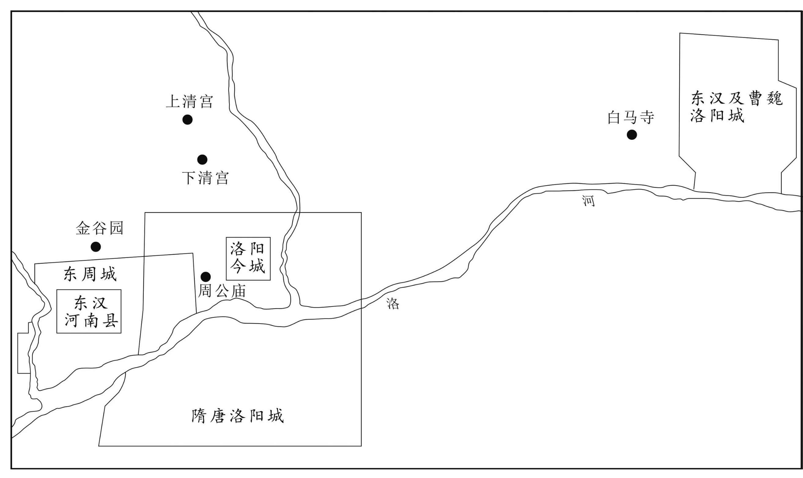 
洛阳城历代变迁示意图

## 【译文】

后唐庄宗同光元年（923年）十一月己未（十九日），加封高季兴守中书令。当时高季兴入朝拜见，后唐庄宗李存勖待他十分优厚。高季兴在洛阳时，庄宗身边的伶官经常向他索取财物，高季兴十分憎恨。后唐庄宗李存勖想扣留高季兴，郭崇韬劝谏道：“陛下刚刚得到天下，诸侯都不过是派遣子弟或将佐来朝入贡，只有高季兴亲自来朝，应当表扬奖励他，以此来劝那些不亲自来的人。如果扣留他不放他回去，这样背信弃义，丧失四海百姓之心，这不是长远之计。”于是就放高季兴回去。高季兴昼夜兼程，到达许州，对左右说：“这次行程有两个失误：我来朝是一项失误，朝廷放我回去也是一项失误。”高季兴路过襄州，节度使孔勍留他设宴，半夜高季兴冲出关口逃走。十二月丁酉（二十八日），高季兴到达江陵，握着梁震的手说：“不听您的话，差点逃不出虎口。”

## 【原文】

**二年春三月丙午，加高季兴兼尚书令，进封南平王[1]。**

## 【注文】

[1]南平王：公元924年，高季兴受封南平王，南平国自此正式建立。南平，政权名（924—963年），又称荆南（因高季兴曾被封为荆南节度使）、北楚（因高季兴死后，后唐追封他为楚王，为区别马楚，而称此名），高季兴创建，建都江陵（今湖北江陵），是五代十国时最小的国家之一，疆域盛时大约包括今湖北西部、重庆东部等地。公元963年，被北宋所灭。南平共历五主、四十年。

## 【译文】

后唐庄宗同光二年（924年）春季三月丙午（初八日），加封高季兴兼尚书令，晋封为南平王。

## 【原文】

**三年冬十月，高季兴常欲取三峡，畏蜀峡路招讨使张武威名，不敢进[1]。至是，乘唐兵势，使其子行军司马从诲权军府事，自将水军上峡取施州[2]。张武以铁锁断江路，季兴遣勇士乘舟斫之。会风大起，舟于锁，不能进退，矢石交下，坏其战舰，季兴轻舟遁去[3]。既而闻北路陷败，［以］夔、忠、万三州遣使诣魏王降[4]。是岁，庄宗灭蜀[5]。**

## 【注文】

[1]三峡：即今四川、湖北交界处的长江巫峡、西陵峡、瞿塘峡。

[2]从诲：即高从诲（891—948年），字遵圣，高季兴长子，五代时南平国君主。曾仕后梁，高季兴为荆南节度使时，告归其父，被高季兴任命为马步军都指挥使、行军司马。他嗣位后，向后唐称臣，被后唐任命为荆南节度使，兼侍中。后又相继受封为勃海王、南平王。荆南地小兵弱，介于北方王朝及南方吴、楚、蜀诸强国之间，因此他对诸强国都奉表称臣。南方诸国向中原王朝进贡的使臣路过江陵（今湖北江陵），他常劫掠贡物，拘留使者，故时人称他为“高无赖”。他在位期间，轻刑薄赋、保境安民、礼贤从谏，南平较之他国，可称安定富庶地区。公元948年去世，追赠尚书令，谥文献王。　　施州：州名。北周武帝宇文邕建德三年（574年）置，治所设在沙渠县（隋改清江县，今湖北恩施），辖境大致相当于今湖北建始、五峰等以西地区。

[3]（guà）：挂住。

[4]魏王：即李继岌（？—926年），后唐庄宗李存勖之子。庄宗即位后，他被任命为北都留守，判六军诸卫事。后迁检校太尉、同中书门下平章事。后唐庄宗同光三年（925年），受封魏王。同年，出师伐蜀。次年，班师回朝，至渭南（今陕西渭南），得知庄宗被杀，自缢而死。

[5]庄宗灭蜀：后唐庄宗同光三年（925年），后唐灭亡后梁后，李存勖乘胜兴师兼并前蜀，蜀军战败，成都（今四川成都）沦陷，前蜀灭亡。

## 【译文】

后唐庄宗同光三年（925年）冬季十月，高季兴常常想夺取三峡，只是畏惧前蜀峡路招讨使张武的威名，才不敢进攻。到这个时候，乘唐军灭掉前蜀的威势，高季兴命令他的儿子行军司马高从诲暂时主持军府事务，他亲自率水军进入三峡进取施州。张武用铁链子封锁了长江上的通路，高季兴派遣勇士乘船砍断了铁锁链。此时正好刮起大风，后唐的船只被铁锁缠住，无法进退，前蜀军队用箭石一起攻击，击毁了高季兴的战舰，高季兴乘轻便的小船逃跑。后来张武听说北路军队战败，因而让夔、忠、万三州派遣使者向后唐魏王李继岌投降。这年，后唐庄宗消灭了前蜀。

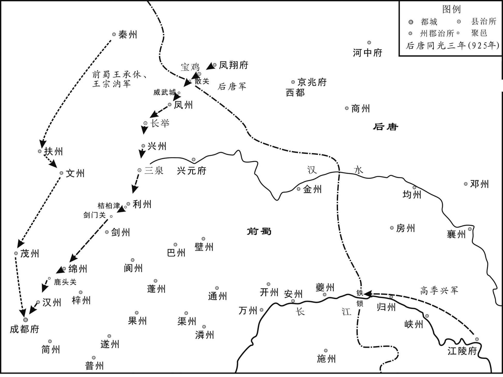 
后唐灭前蜀示意图

## 【原文】

**明宗天成元年夏四月，梁震荐前陵州判官贵平孙光宪于季兴，使掌书记[1]。季兴大治战舰，欲攻楚。光宪谏曰：“荆南乱离之后，赖公休息士民，始有生意。若又与楚国交恶，他国乘吾之弊，良可忧也。”季兴乃止。**

## 【注文】

[1]陵州：州名。北周孝闵帝宇文觉元年（557年）置，治所设在普宁县（今四川仁寿东），辖境相当于今四川仁寿、井研等地。隋炀帝大业初改隆山郡。唐高祖武德元年（618年）复名陵州。唐玄宗天宝元年（742年）改仁寿郡。唐肃宗乾元元年（758年）复为陵州。　　贵平：县名，治所今四川仁寿东北。　　孙光宪（901—968年）：字孟文，自号葆光子，贵平（今四川仁寿东北）人。他出身农家，自幼喜好读书，常校勘抄写，藏书数千卷。后唐时担任陵州判官。后避难江陵（今湖北江陵），南平国建立后，任从事，累官荆南节度副使、检校秘书监兼御史大夫。后归宋，为黄州刺史。著有《荆台》《玩笔佣》《橘斋》等集，多已散佚，今存笔记小说《北梦琐言》二十卷，记述五代时政治遗闻、文人逸事和社会风习等，文笔清新淡雅。

## 【译文】

后唐明宗李嗣源天成元年（926年）夏季四月，梁震向高季兴举荐前陵州判官贵平人孙光宪，让他担任掌书记一职。高季兴大造战船，准备进攻南楚。孙光宪劝谏道：“荆南遭受动乱以来，依赖您休息士民，才开始有生机。如果又和楚国成为仇敌，其他国家趁我们空虚疲乏之际前来侵犯，这是非常值得担忧的啊！”高季兴于是作罢。

## 【原文】

**六月，高季兴表求夔、忠、万三州为属郡，诏许之。**

## 【译文】

后唐明宗天成元年（926年）六月，高季兴上表请求将夔、忠、万三州划归为自己属郡，后唐朝廷下诏批准。

## 【原文】

**二年春二月，高季兴既得三州，请朝廷不除刺史，自以子弟为之，不许[1]。及夔州刺史潘炕罢官，季兴辄遣兵突入州城，杀戍兵而据之[2]。朝廷除奉圣指挥使西方邺为刺史，不受[3]。又遣兵袭涪州，不克。魏王继岌遣押牙韩珙等部送蜀珍货金帛四十万，浮江而下，季兴杀珙等于峡口，尽掠取之[4]。朝廷诘之，对曰：“珙等舟行下峡，涉数千里，欲知覆溺之故，自宜按问水神。”帝怒，壬寅，制削夺季兴官爵，以山南东道节度使刘训为南面招讨使、知荆南行府事，忠武节度使夏鲁奇为副招讨使，将步骑四万讨之[5]。东川节度使董璋充东南面招讨使，新夔州刺史西方邺副之，将蜀兵下峡；仍会湖南军三面进攻[6]。**

## 【注文】

[1]三州：即夔州（治今重庆奉节东）、忠州（治今重庆忠县）、万州（治今重庆万州）等三州。

[2]潘炕：生卒年不详，五代后唐官吏，曾任夔州刺史。

[3]奉圣指挥使：五代禁军指挥官。　　西方邺：生卒年不详，定州满城（今河北保定满城）人。初事朱温，不被重用，于是归服李存勖。后唐庄宗同光年间，担任曹州刺史，曾力谋率军阻抗李嗣源。庄宗李存勖死后，他迎降明宗李嗣源。后唐明宗天成年间担任夔州刺史，率军出击荆南高季兴，夺取夔州（治今重庆奉节东）、忠州（治今重庆忠县）、万州（治今重庆万州）等三州，因功拜宁江军节度使。后病卒。　　不受：高季兴不接受西方邺为夔州刺史。

[4]押牙：亦作“押衙”，唐末、五代方镇使府掌衙内事务的官员，负责仪仗、侍卫，有左、右押牙，左、右厢都押牙等。　　韩珙（gǒng）（？—927年）：唐末五代魏王李继岌押牙。公元927年，被高季兴杀死。　　峡口：即今湖北宜昌西长江西陵峡。

[5]刘训：生卒年不详，字遵范，唐末五代隰（xí）州永和（今山西永和）人，行伍出身。初为河东节度使李克用部将。后归附王珂，任隰州防御都将。后又投归后唐庄宗李存勖，历任瀛州刺史、左监卫大将军、襄州节度使等。　　忠武：唐、五代方镇名。唐德宗李适贞元十年（794年）以陈许节镇为忠武军，治所设在许州（今河南许昌）。唐昭宗龙纪元年（889年）治所迁到陈州（今河南淮阳）。　　夏鲁奇（882—931年）：字邦杰，青州（今山东青州）人。初事梁，为宣武军军校，因与主将不协，归附李存勖，任护卫指挥使。公元915年，升任磁州刺史，赐名李绍奇。公元923年，跟随后唐庄宗李存勖消灭后梁，生擒梁将王彦章。后历任郑州防御使、河阳节度使、忠武军节度使等。公元930年，加同平章事，拜武信军节度使，出镇遂州（治今四川遂宁）。次年，遂州被李仁罕攻破，他自刎而死，被追赠太师、齐国公。

[6]东川：唐、五代方镇名，剑南东川节度使的简称。唐肃宗至德二载（757年）分剑南节度使东部地置，治所设在梓州（今四川三台）。辖境屡有变动，长期领有梓、遂（治今四川遂宁）、绵（治今四川绵阳东）、普（治今四川安岳北）、陵（治今四川仁寿东）、泸（治今四川泸州）、荣（治今四川荣县西）、剑（治今四川剑阁）、龙（治今四川平武东南）、昌（治今重庆荣昌南）、渝（治今重庆）、合（治今重庆合川）等十二州，约当今四川盆地中部涪江流域以西，沱江下游流域以东以及剑阁、青川等地。唐代宗广德、大历时曾一度并入剑南西川。唐末为前蜀王建所并。　　董璋（？—932年）：原为汴州富豪李让家奴，后为朱全忠所用，因功迁任列校。后梁末帝龙德年间，担任泽州刺史。后归降后唐，被任命为邠州留后、行营右厢马步都虞候，随从宰相郭崇韬大举讨伐前蜀，因功封剑南东川节度副大使，知节度事。后唐明宗天成元年（926年），加检校太傅。次年，加同平章事。后唐明宗长兴三年（932年），被王晖杀死。　　湖南军：指楚王马殷的军队。

## 【译文】

后唐明宗天成二年（927年）春季二月，高季兴得到三州后，请求朝廷不要任命刺史，由他自己派子弟担任，后唐明宗李嗣源没有答应。等到夔州刺史潘炕罢官时，高季兴便率领军队突然进入城中，杀死防守士兵并占领了夔州城。后唐朝廷授命奉圣指挥使西方邺为刺史，高季兴拒不接受。高季兴又调兵进攻涪州，未能攻克。魏王李继岌派遣押牙韩珙等给朝廷送去蜀中四十万珍宝货物金帛，沿长江而下，高季兴在峡口杀死了韩珙，抢夺了这些珍宝货物。后唐朝廷责问他，高季兴回答道：“韩珙等率领船队下行到峡口时，已经在水上行走了数千里，要想知道翻船淹死的原因，应该自己去问水神。”后唐明宗李嗣源大怒，壬寅（二十一日），下诏削夺高季兴官爵，任命山南东道节度使刘训担任南面招讨使、知荆南行府事，忠武节度使夏鲁奇担任副招讨使，率领四万步兵、骑兵讨伐高季兴。东川节度使董璋担任东南面招讨使，新任夔州刺史西方邺为东南面招讨副使，率领蜀军下行到三峡；并会合湖南军三面向高季兴发起进攻。

## 【原文】

**三月，刘训兵至荆南，楚王殷遣都指挥使许德勋等将水军屯岳州[1]。高季兴坚壁不战，求救于吴，吴人遣水军援之救。**

## 【注文】

[1]楚王殷：即马殷（852—930年）。

## 【译文】

后唐明宗天成二年（927年）三月，刘训的军队到达荆南，楚王马殷派都指挥使许德勋等率领水军驻扎在岳州。高季兴坚守在营寨里拒不应战，同时向吴国请求救援，吴国派水军来援助他。

## 【原文】

**江陵卑湿，复值久雨，粮道不继，将士疾疫，刘训亦寝疾[1]。四月癸卯，帝遣枢密使孔循往视之，且审攻战之宜[2]。五月，孔循至江陵，攻之不克。遣人入城说高季兴，季兴不逊。丙寅，遣使赐湖南行营夏衣万袭[3]。丁卯，又遣使赐楚王殷鞍马玉带，督馈粮于行营，竟不能得[4]。庚午，诏刘训等引兵还。**

## 【注文】

[1]卑湿：地势低而潮湿。

[2]孔循（884—931年）：唐末五代人，少时流浪于汴州（治今河南开封），被富人李让收为养子。后来朱温又收李让为养子，他也随之步入仕途，任宣徽北院副使。后因帮助朱温谋杀唐昭宗、何皇后有功，而被擢为枢密副使。以后历任后梁汝州防御使、左卫大将军、租庸使。后唐庄宗时，知汴州。后唐明宗时任枢密使。

[3]万袭：万套。袭，衣服的全套。

[4]馈粮：运送粮食。

## 【译文】

江陵地势低洼潮湿，又赶上长时间下雨，运粮的道路无法通行，将士们都生病了，刘训也卧病在床。天成二年（927年）四月癸卯（二十三日），后唐明宗派遣枢密使孔循前往视察，并察看进攻作战的事宜。五月，孔循到达江陵，未能攻克。于是派人入城劝说高季兴，高季兴却出言不逊。丙寅（十六日），后唐派使者去湖南赏赐在那里的士兵一万套夏天的衣服。丁卯（十七日），又派使者赐给楚王马殷鞍马、玉带，并督促把粮食送到军营，但马殷竟不服从命令。庚午（二十日），明宗下令刘训等率兵返回。

## 【原文】

**楚王殷遣中军使史光宪入贡，帝赐之骏马十，美女二[1]。过江陵，高季兴执光宪而夺之，且请举镇自附于吴[2]。徐温曰：“为国者当务实效而去虚名。高氏事唐久矣，洛阳去江陵不远，唐人步骑袭之甚易，我以舟师溯流救之甚难。夫臣人而弗能救，使之危亡，能无愧乎？”乃受其贡物，辞其称臣，听其自附于唐。**

## 【注文】

[1]史光宪：生卒年不详，五代时楚国中军使。公元927年，奉楚王马殷的命向后唐纳贡，但在返回楚国途中，被高季兴擒获，次年才被送还楚国。

[2]自附于吴：向吴国称臣。

## 【译文】

楚王马殷派遣中军使史光宪入朝纳贡，后唐明宗赐给他十匹骏马、两名美女。史光宪回去路过江陵时，被高季兴擒获，夺取了他的马匹美女，并且请求率领全镇归附吴国。徐温说：“治理国家应当务求实效而抛弃虚名。高氏侍奉唐已经很久了，洛阳距离江陵也不太远，唐人的步兵、骑兵袭击这里非常容易，我们用水师逆流而上前去援救他十分困难。作为臣子的主人而不能去救援，使他处于危亡地步，难道不感到惭愧吗？”于是接受了高氏的贡物，辞谢他对自己的称臣要求，听凭他依附于后唐。

## 【原文】

**六月，西方邺败荆南水军于峡中，复取夔、忠、万三州。秋七月丙寅，升夔州为宁江军，以西方邺为节度使[1]。**

## 【注文】

[1]宁江军：即前蜀的镇江军。

## 【译文】

后唐明宗天成二年（927年）六月，西方邺在三峡中打败荆南水军，又收复了夔、忠、万三州。秋季七月丙寅（十七日），将夔州升为宁江军，任命西方邺为节度使。

## 【原文】

**癸酉，以与高季兴夔、忠、万三州为豆卢革、韦说之罪，皆赐死[1]。**

## 【注文】

[1]豆卢革（？—927年）：五代时后唐大臣，唐舒州刺史豆卢瓒之子。少逢战乱，避居中山（今河北定州）等地，被太原王王处直所礼遇，辟为掌书记。李存勖建立后唐，他以出身名门而被拜为行台左丞相。他虽出身名门，但并无实学，又专求长生不老之术，致使政事多有错乱。后唐庄宗李存勖死后，屡遭贬斥，后因事得罪明宗李嗣源而被赐死。　　韦说（？—927年）：后唐庄宗、明宗朝宰相。京兆万年（今陕西西安）人，福建观察使韦岫（xiù）之子，唐昭宗乾宁二年（895年）进士。唐末曾任殿中侍御史，坐事被贬南海（今广东广州）。遇赦后寓居江陵（今湖北江陵），与高季兴相知。后仕后梁，官至礼部侍郎。后唐庄宗同光年间，加同平章事、中书侍郎。后唐明宗天成年间，晋门下侍郎兼户部尚书。他担任宰相期间，贪鄙爱财、收贿卖官、紊乱朝政。后被谏议大夫肖希甫弹劾，屡遭贬斥。后唐明宗天成二年（927年），因罪赐死。

## 【译文】

后唐明宗天成二年（927年）七月癸酉（二十四日），朝廷认为将夔、忠、万三州赐给高季兴是豆卢革、韦说的罪过，将两人赐死。

## 【原文】

**三年春三月，楚王殷如岳州，遣六军使袁诠、副使王环、监军马希赡将水军击荆南，高季兴以水军逆战[1]。至刘郎洑，希赡夜匿战舰数十艘于港中[2]。诘旦，两军合战，希赡出战舰横击之，季兴大败，俘斩以千数，进逼江陵。季兴请和，归史光宪于楚。军还，楚王殷让环不遂取荆南，环曰：“江陵在中朝及吴、蜀之间，四战之地也，宜存之以为吾扞蔽[3]。”殷悦。**

## 【注文】

[1]袁诠：生卒年不详，五代时楚国马殷部将，曾任六军使。后唐明宗天成三年（928年）三月，因南平王高季兴扣留向后唐进贡的使节史光宪及后唐所赐骏马、美女等，他和王环、马希赡奉命率兵袭击荆南，大败荆南军，高季兴求和。后唐明宗长兴三年（932年），马希声去世，他与潘约从朗州（今湖南常德）迎接马希范回潭州（治今湖南长沙）承袭王位，楚国局势得以稳定。　　王环：生卒年不详，五代时楚国马殷部将，曾任六军副使。后唐明宗天成三年（928年）三月，与袁诠、马希赡奉命率兵袭击荆南，大败荆南军。　　马希赡（？—949年）：许州鄢陵（今河南鄢陵）人，五代时楚王马殷之子。后唐明宗天成三年（928年）三月，与袁诠、王环率兵袭击荆南，大败荆南军。后历任岳州团练使、检校太尉、静江军节度使等。

[2]刘郎洑（fú）：地名，在今湖北石首。

[3]中朝：此指后唐。　　扞（hàn）蔽：捍卫屏障。

## 【译文】

后唐明宗天成三年（928年）春季三月，楚王马殷到达岳州，派遣六军使袁诠、副使王环、监军马希赡等率领水军攻打荆南，高季兴命令水军迎战。楚军到达刘郎洑，马希赡乘夜藏匿数十艘战舰于港中。第二天早晨，两军交战，马希赡命令战船截击高季兴，高季兴被打得大败，被俘、被斩的士兵数以千计，楚军顺势进逼江陵。高季兴请求和好，并将史光宪送还楚国。楚军回去后，楚王马殷责备王环不乘胜夺取荆南，王环说：“江陵在唐及吴、蜀之间，这里四面受敌，应当留存他作为我们的屏藩。”马殷听后非常高兴。

## 【原文】

**夏六月辛巳，高季兴复请称藩于吴，吴进季兴爵秦王，帝诏楚王殷讨之。殷遣许德勋将兵攻荆南，以其子希范为监军，次沙头[1]。季兴从子云猛指挥使从嗣单骑造楚壁，请与希范挑战决胜，副指挥使廖匡齐出与之斗，拉杀之[2]。季兴惧，明日，请和，德勋还。匡齐，赣人也[3]。**

## 【注文】

[1]希范：即马希范（899—947年），字宝规，五代十国时南楚君主，楚王马殷第四子，马希声之弟。后唐明宗长兴三年（932年），袭楚王位。他在位期间，奢侈无度，赋税繁重，迫使农民大批逃亡。后汉高祖天福十二年（947年）去世，谥文昭王。　　沙头：地名，位于今湖北沙市。

[2]云猛指挥使：官名，五代禁军将领。　　从嗣：即高从嗣（？—928年），高季兴侄子，骁勇善战，曾任云猛指挥使。　　廖匡齐（？—939年）：五代时楚国永州刺史廖爽（一作廖爽直）之子，赣县（今江西赣州）人，曾任楚国行军司马。　　拉杀：拉住两脚，将人撕开。

[3]赣：即赣县，治所在今江西赣州。

## 【译文】

后唐明宗天成三年（928年）夏季六月辛巳（初八日），高季兴再次请求向吴国称臣，吴国给高季兴晋爵为秦王，后唐明宗命令楚王马殷讨伐高季兴。马殷于是派遣许德勋率军攻打荆南，任命他的儿子马希范为监军，驻扎在沙头。高季兴的侄子云猛指挥使高从嗣单人匹马来到楚军营寨前，要求与马希范决一胜负，副指挥使廖匡齐出营与他交战，将高从嗣杀死。高季兴听说后感到恐惧，第二天，请求与楚军和好，许德勋于是率军返回。廖匡齐，是赣县人。

## 【原文】

**秋九月辛巳，荆南败楚兵于白田，执楚岳州刺史李廷规，归于吴[1]。**

## 【注文】

[1]白田：即白田镇，在今湖南岳阳。　　李廷规：生卒年不详，五代时楚国官吏，曾任岳州刺史。后唐明宗天成三年（928年），在与荆南军队交战中，兵败被俘。　　归于吴：当时高季兴已向吴国称臣，所以战俘需押送至吴国。

## 【译文】

后唐明宗天成三年（928年）秋季九月辛巳（初九日），荆南军在白田打败楚国军队，抓获楚国岳州荆史李廷规，把他送到吴国。

## 【原文】

**己亥，以武宁节度使房知温兼荆南行营招讨使，知荆南行府事；分遣中使发诸道兵赴襄阳，以讨高季兴[1]。**

## 【注文】

[1]武宁：疑误。唐懿宗咸通年间武宁军已改为感化军。据《新唐书·方镇表》记载：咸通十一年（870年），“置徐泗观察使，寻赐号感化军节度使”。自此至五代，都未曾恢复武宁旧称，故此处武宁当作感化节度使。感化：方镇名。治所设在徐州（今江苏徐州）。唐德宗贞元后时废时置，称号屡变。唐顺宗李诵永贞元年（805年）置武宁军节度使，领徐、泗（治今江苏泗洪东南）、濠（治今安徽凤阳东北）、宿（治今安徽宿州）四州，辖境大致相当于今安徽池河、江苏淮河以北，即江苏丰县，山东滕州、郯城以南，安徽濉溪、怀远以东地区。唐懿宗咸通十年（869年）改置为徐泗观察使，次年更号为感化军节度使。唐僖宗中和初年，为时溥所据。唐昭宗李晔景福初年，为朱温所并。　　房知温（？—936年）：字伯玉，兖州瑕丘（今山东兖州）人，曾被后唐庄宗李存勖赐名为李绍英。少年时以勇力闻名，曾跟随魏博节度使杨师厚东征西讨，屡立战功，晋升为亲随军指挥使。后唐明宗李嗣源在魏州起兵时，他前往投奔。李嗣源称帝后，他相继担任泰宁、天平、平卢节度使，封东平王。他在镇期间，为人贪婪，不理政事。后晋高祖石敬瑭天福元年（936年），病逝，被追赠为太尉。　　中使：宦官。

## 【译文】

后唐明宗天成三年（928年）九月己亥（二十七日），任命武宁节度使房知温兼任荆南行营招讨使，知荆南行府事；又分别派遣中使调发各道军队前往襄阳，讨伐高季兴。

## 【原文】

**冬十二月，荆南节度使高季兴寝疾，命其子行军司马、忠义节度使、同平章事从诲权知军府事[1]。丙辰，季兴卒[2]。吴主以从诲为荆南节度使兼侍中[3]。**

## 【注文】

[1]忠义：唐、五代方镇名。唐僖宗文德元年（888年）改山南东道节度置，治所设在襄州（今湖北襄阳），领襄、郢（今湖北安陆）、复（今湖北沔阳）、邓（今河南邓州）、随（今湖北随县）、唐（今河南唐河）六州，辖境约为今湖北西北及河南西南地区。

[2]卒：古指大夫死亡，后为死亡的通称。为避讳起见，人们对“死”取了诸多别称。据《礼记》记载：“天子死曰崩，诸侯死曰薨（hōng），大夫死曰卒，士（知识分子）死曰不禄，庶人死曰死。”

[3]吴主：即南吴睿帝杨溥（pǔ）（900—938年），五代时南吴国主，庐州合肥（今安徽合肥）人，杨行密第四子，杨渥、杨隆演的弟弟。公元919年，受封丹阳郡公。杨隆演死后，被徐温拥立为吴王，改年号为顺义。公元927年，徐温病死，他在徐温养子徐知诰的逼迫下称帝，朝政被徐知诰把持。公元937年，让位给徐知诰，他被徐知诰上尊号为高尚思玄弘古让皇，南吴灭亡。次年去世，被追谥为睿皇帝。

## 【译文】

后唐明宗天成三年（928年）冬季十二月，荆南节度使高季兴患病卧床，于是任命他的儿子行军司马、忠义节度使、同平章事高从诲暂时处理军府事务。丙辰（十五日），高季兴去世。吴主杨溥任命高从诲为荆南节度使兼侍中。

## 【原文】

**四年夏四月丙午，楚六军副使王环败荆南兵于石首[1]。**

## 【注文】

[1]石首：县名。西晋武帝司马炎太康五年（284年）置，治所设在今湖北石首。

## 【译文】

后唐明宗天成四年（929年）夏季四月丙午（初七日），楚国六军副使王环在石首打败荆南军队。

## 【原文】

**［五月］高季兴之叛也，其子从诲切谏，不听。从诲既袭位，谓僚佐曰：“唐近而吴远，舍近臣远，非计也。”乃因楚王殷以谢罪于唐。又遗山南东道节度使安元信书，求保奏，复修职贡[1]。丙申，元信以从诲书闻，帝许之。**

## 【注文】

[1]安元信（？—936年）：字子言，唐末五代代北（今山西代县）人。生于将门，长于乱世。唐哀帝天祐四年（907年），因功被授为检校司徒、武州刺史。后跟随李存勖南征北战，屡立战功，为后唐的建立作出了一定的贡献。李存勖建唐灭梁后，先后被任命为博州刺史、大同军节度使、横海军节度使等。后唐明宗李嗣源即位后，特加封他为同中书门下平章事。后历任徐州刺史、山南东道节度使、归德军节度使、侍中等。后唐末帝即位后，被授为潞州节度使，加检校太尉，后死于任上。后晋高祖石敬瑭以其声望素著，特令礼官定谥为“忠懿”。

## 【译文】

后唐明宗天成四年（929年）五月。高季兴发动叛乱时，他的儿子高从诲诚恳劝谏，但高季兴不听。高从诲继位后，对僚佐们说：“唐离我们近而吴离我们远，舍近唐而臣服于远吴，这不是好办法。”于是通过楚王马殷向后唐谢罪。又给山南东道节度使安元信写信，请求他上奏朝廷，愿意重新称臣纳贡。丙申（二十八日），安元信将高从诲的书信送抵后唐，后唐明宗答应了他的请求。

## 【原文】

**六月庚申，高从诲自称前荆南行军司马、归州刺史，上表求内附[1]。秋七月甲申，以从诲为荆南节度使兼侍中。己丑，罢荆南招讨使。**

## 【注文】

[1]归州：州名。唐高祖武德二年（619年），分夔州秭归县、巴东县置，治所设在秭归（今湖北秭归），辖境大致相当于今湖北秭归、巴东、兴山等地。

## 【译文】

后唐明宗天成四年（929年）六月庚申（二十三日），高从诲自称为前荆南行军司马、归州刺史，上表请求归附后唐。秋季七月甲申（十七日），任命高从诲为荆南节度使兼侍中。己丑（二十二日），撤掉荆南招讨使。

## 【原文】

**长兴元年春三月，高从诲遣使奉表诣吴，告以坟墓在中国，恐为唐所讨，吴兵援之不及，谢绝之[1]。吴遣兵击之，不克。**

## 【注文】

[1]中国：此指后唐。高季兴祖先的坟墓在后唐辖境内。

## 【译文】

后唐明宗长兴元年（930年）春季三月，高从诲派遣使者呈奉表章来到吴国，告诉吴国因为高氏祖坟在北方，害怕后唐朝廷来讨伐时，吴军来不及救援，因此谢绝了吴国对他的笼络。吴国于是派兵讨伐高从诲，没有攻下来。

## 【原文】

**三年春二月，赐高从诲爵勃海王。**

## 【译文】

后唐明宗长兴三年（932年）春季二月，赐授高从诲勃海王。

## 【原文】

**潞王清泰元年春正月壬辰，以荆南节度使高从诲为南平王。**

## 【译文】

后唐潞王李从珂清泰元年（934年）春季正月壬辰（二十一日），授荆南节度使高从诲为南平王。

## 【原文】

**二年。荆南节度使高从诲，性明远，亲礼贤士，委任梁震，以兄事之[1]。震常谓从诲为郎君[2]。楚王希范好奢靡，游谈者共夸其盛[3]。从诲谓僚佐曰：“如马王，可谓大丈夫矣[4]。”孙光宪对曰：“天子诸侯，礼有等差。彼乳臭子骄侈僭汰，取快一时，不为远虑，危亡无日，又足慕乎！”从诲久而悟曰：“公言是也。”他日，谓梁震曰：“吾自念平生奉养，固已过矣[5]。”乃捐去玩好，以经史自娱，省刑薄赋，境内以安[6]。**

## 【注文】

[1]明远：开明豁达。　　以兄事之：用对哥哥那样的礼节对待他。

[2]郎君：门生故吏常呼其主之子为郎君。

[3]奢靡：奢侈靡费。

[4]大丈夫：古代指有作为、有抱负的人。

[5]固已过矣：本来就过分了。

[6]捐去：取消、除去。

## 【译文】

后梁末帝清泰二年（935年）。荆南节度使高从诲，性情通达，礼贤下士，委任梁震，把他当作兄长来对待。梁震常常称呼高从诲为郎君。楚王马希范喜好奢侈，和他游乐谈笑的人都夸赞他的强盛。高从诲对僚佐说：“像马王那样，可以称得上是大丈夫了。”孙光宪回答他说：“天子和诸侯，礼节是有差别的。马王是乳臭未干的小子，骄纵奢侈，快意于一时，而不作长远打算，灭亡的日子就在眼前了，有什么可以羡慕的！”高从诲寻思好久后觉悟了，说：“您说得非常对。”又有一天，高从诲对梁震说：“我自己平生享受的奉养已经过分了。”于是舍弃了自己喜好的东西，以阅读经史为乐趣，减轻刑罚，减少赋税，境内逐渐安定下来。

## 【原文】

**梁震曰：“先王待我如布衣交，以嗣王属我。今嗣王能自立，不坠其业，吾老矣，不复事人矣[1]。”遂固请退居。从诲不能留，乃为之筑室于土洲[2]。震披鹤氅，自称荆台隐士，每诣府，跨黄牛至听事[3]。从诲时过其家，四时赐与甚厚[4]。自是悉以政事属孙光宪。**

## 【注文】

[1]事人：侍奉别人。

[2]土洲：位于今湖北江陵南长江中。

[3]鹤氅（chǎng）：鸟羽所制的大衣。

[4]四时：指春夏秋冬一年四季。

## 【译文】

梁震说：“先王待我如同贫贱之交，他将您托付给我。现在您已经能够自立，没有荒废先王遗业，我已年老，不能再侍奉人了。”于是坚决请求告退还乡。高从诲留不住他，于是为他在土洲修建府舍。梁震身披鹤氅，自称荆台隐士，每次到王府去谒见，都骑着黄牛直至听事大厅。高从诲时常到他家里去看望他，一年四季的赏赐极为丰厚。从此政事全部托付给孙光宪去处理。

## 【原文】

**臣光曰[1]：孙光宪见微而能谏，高从诲闻善而能徙，梁震成功而能退，自古有国家者能如是，夫何亡国败家丧身之有[2]！**

## 【注文】

[1]臣光曰：是主持编写《资治通鉴》的司马光针对书中所记某些史事发表的评论，即“史论”。它是《通鉴》的重要内容，既突显了司马光的政治意识、历史观点，又表明了他“穷探治乱之迹，上助圣明之鉴”的编书意图。《资治通鉴》对史事的评论，除标明“臣光曰”之外，也引载了很多前人的评论。

[2]见微而能谏：看到细微的过失便能谏阻。　　闻善而能徙：能改过从善。

## 【译文】

史臣司马光评论说：孙光宪看到细微的过失而能够进谏，高从诲听到正确意见而能够改正，梁震成功之后而能引退，自古握有国家大权的人能做到这样，怎么还会有亡国、败家、丧身之祸出现呢！

## 【原文】

**后晋高祖天福六年[1]。山南东道节度使安从进谋反，求援于荆南，高从诲遗从进书，谕以祸福[2]。从进怒，反诬奏从诲。荆南行军司马王保义劝从诲具奏其状，且请发兵助朝廷讨之，从诲从之[3]。**

## 【注文】

[1]高祖：即后晋高祖石敬瑭（892—942年）。

[2]安从进（？—942年）：原为代北振武索葛部落人。年少时以勇力著称。后梁末年，跟随李存勖起兵灭后梁，因功进位为护驾马军都指挥使、贵州刺史。后唐明宗李嗣源时，升任保义、彰武军节度使。后唐愍帝李从厚即位后，改任顺化节度使。后梁末帝清泰年间，又担任山南东道节度使。后因叛变失败而自焚身亡。

[3]王保义：生卒年不详，江陵（今湖北江陵）人，五代时荆南（南平）官吏，先后担任南平行军司马、武奉军留后、平江军节度使等。

## 【译文】

后晋高祖石敬瑭天福六年（941年）。山南东道节度使安从进谋反，向荆南请求救援，高从诲写信给安从进，晓谕他谋反的祸福。安从进收到信后大怒，反向后晋朝廷诬陷高从诲。荆南行军司马王保义劝高从诲把实际情况向朝廷奏报，并且请求发兵协助朝廷讨伐安从进，高从诲采纳了他的建议。

## 【原文】

**后汉高祖天福十二年春正月，荆南节度使高从诲遣使入贡于契丹，契丹遣使以马赐之[1]。从诲亦遣使诣河东劝进[2]。**

## 【注文】

[1]高祖：即后汉高祖刘知远（895—948年）。　　契丹：古代东北民族，北魏时始见于史籍。源于东胡，为鲜卑的一支。分布于今内蒙古西拉木伦河和老哈河一带，以游牧、狩猎和捕鱼为业。隋朝时，契丹各部已形成松散的部落联盟。唐朝初年，正式形成大贺氏为首的部落联盟。唐太宗时，契丹归附唐朝，唐太宗贞观二十二年（648年），唐朝在契丹住地设置松漠都督府，以契丹首领窟哥为松漠都督，并赐姓李氏。唐玄宗时，契丹内部动乱不已，再加对唐朝战争的失败，氏族部落组织大部溃散。唐哀帝天祐四年（907年），耶律阿保机成为部落联盟首领，他在位期间统帅契丹军马，连年对外掠夺，俘掠大批奴隶和牲畜，不断扩大统治地区，使契丹的势力逐渐强大起来。后梁末帝贞明二年（916年）建立契丹国（后改称辽）。此时契丹当权者为耶律阿保机次子辽太宗耶律德光（902—947年）。

[2]河东：方镇名。唐玄宗开元十八年（730年）改太原以北诸军州节度置，负责防御突厥，治所设在太原（今山西太原西南），领太原及石（治今山西吕梁）、岚（治今山西岚县）、汾（治今山西汾阳）、沁（治今山西沁源）、仪（治今山西左权）、忻（治今山西忻州）、代（治今山西代县）等州，辖境约为今山西内长城以南，左权、榆社、沁源、灵石、中阳以北地区。唐德宗兴元元年（784年）号保宁军，唐德宗贞元三年（787年）复称河东节度使。此指河东节度使刘知远。

## 【译文】

后汉高祖刘知远天福十二年（947年）春季正月，荆南节度使高从诲派遣使者向契丹进贡，契丹派使者赐给高从诲马匹。高从诲也派使者到河东劝刘知远称帝。

## 【原文】

**夏六月，帝遣使告谕荆南。高从诲上表贺，且求郢州，帝不许[1]。及加恩使至，拒而不受。**

## 【注文】

[1]郢州：州名。西魏文帝元宝炬大统十七年（551年）置，治所设在长寿（今湖北钟祥）。隋炀帝大业初改为竟陵郡。唐初复改郢州。唐玄宗天宝、唐肃宗至德年间曾一度改为富水郡。唐肃宗乾元初年（758年）复称郢州。辖境大致相当于今湖北钟祥及京山等地。

## 【译文】

后汉高祖天福十二年（947年）夏季六月，后汉高祖刘知远派遣使者通告晓谕荆南。高从诲上表祝贺，并且请求将郢州划分给荆南，后汉高祖没有答应。等到后汉高祖派遣的加恩使到来，高从诲拒不接受。

## 【原文】

**秋（九）［八］月，高从诲闻杜重威叛，发水军数千袭襄州，山南东道节度使安审琦击却之[1]。又寇郢州，刺史尹实大破之[2]。乃绝汉，附于唐、蜀[3]。**

## 【注文】

[1]杜重威（？—948年）：又名杜威（因避后晋出帝石重贵名讳而改名），祖籍朔州（今山西朔州），太原（今山西太原）人，后晋高祖石敬瑭妹夫。后晋高祖石敬瑭时，官至同平章事、侍卫亲军马步军都指挥使，长期拥兵自据。后汉高祖刘知远称帝后，他投降后汉并被封为太尉、归德军节度使。刘知远死后，他及其全家被后汉宰相苏逢吉诱杀。　　安审琦（897—959年）：五代时将领，字国瑞，沙陀部人。历仕后唐、后晋、后汉、后周四朝：后唐时任顺化军节度使兼北面行营排阵使；降晋后任天平军节度使，曾率军抵御契丹；汉建立后，授襄州节度使，封齐国公；入周后，任平卢军节度使，封陈王。后被安友进杀死，诏赠尚书令，被追封齐王。

[2]尹实：生卒年不详，五代时郢州刺史，其余事迹不详。

[3]唐：即南唐（937—975年）。　　蜀：此指后蜀，政权名（934—965年），又称孟蜀，五代时十国之一。后唐庄宗同光三年（925年），后唐灭前蜀，任命孟知祥为西川节度使。次年孟知祥进入成都，整顿吏治，减少苛税，境内逐渐安定下来。后唐明宗长兴三年（932年），孟知祥杀死东川节度使董璋，兼并东川之地。次年，获封蜀王。后唐闵帝应顺元年（934年），孟知祥称帝，都成都（今四川成都），定国号蜀，史称后蜀，以别于王建所建前蜀。北宋太祖赵匡胤乾德三年（965年），被北宋灭亡。后蜀共历二主、三十二年，其疆域较前蜀而言要小，其中东线和北线最为显著：东由湖北襄阳退至重庆一带，北由甘陕退到四川广元。

## 【译文】

后汉高祖天福十二年（947年）秋季八月，高从诲听说杜重威叛变，便出动数千名水军袭击襄州，山南东道节度使安审琦击退了他。高从诲又进犯郢州，结果被郢州刺史严实打败。于是与后汉断绝关系，依附于南唐、后蜀。

## 【原文】

**初，荆南介居湖南、岭南、福建之间，地狭兵弱，自武信王季兴时，诸道入贡过其境者，多掠夺其货币。及诸道移书诘让，或加以兵，不得已，复归之，曾不为愧。及从诲立，唐、晋、契丹、汉更据中原，南汉、闽、吴、蜀皆称帝，从诲利其赐予，所向称臣[1]。诸国贱之，谓之“高无赖”。**

## 【注文】

[1]南汉：又称大越（905—971年），五代时十国之一。　　闽：即闽国（909—945年）。

## 【译文】

当初，荆南地处湖南、岭南、福建之间，地域狭窄，兵力薄弱，自武信王高季兴时开始，各道入朝纳贡经过这里，被他多次掠夺钱财货物。等到各道下书谴责，或兵临其境时，他不得已才把财物送还，但一点也不感到惭愧。等到高从诲即位后，后唐、后晋、契丹、后汉相继占据中原，南汉、闽、吴、后蜀纷纷称帝，高从诲贪图各国赐给他的财物，便四处称臣。各国都看不起他，称他为“高无赖”。

## 【原文】

**乾祐元年夏六月，高从诲既与汉绝，北方商旅不至，境内贫乏，乃遣使上表谢罪，乞修职贡。诏遣使慰抚之。**

## 【译文】

后汉隐帝刘承祐乾祐元年（948年）夏季六月，高从诲与后汉断绝交往后，北方商人不再到来，境内贫困，高从诲于是派使者向后汉上表谢罪，乞求恢复进贡。后汉隐帝刘承祐下诏派使者前去安抚他。

## 【原文】

**冬十（一）月，荆南节度使兼中书令、南平文献王高从诲寝疾，以其子节度副使高保融判内外兵马事[1]。癸卯，从诲卒，保融知留后。**

## 【注文】

[1]高保融（920—960年）：字德长，高从诲第三子，五代时南平国主。后汉隐帝乾祐元年（948年），南平王高从诲去世，他承袭父位。在位期间，继续保持割据荆南的局面，同时向中原王朝称臣。相继被后汉任命为荆南节度使、同平章事、兼侍中。后周太祖郭威广顺元年（951年），被封为勃海郡王。显德元年（954年），晋封为南平王。宋太祖建隆元年（960年），因病去世，赠太尉，谥贞懿王。

## 【译文】

后汉隐帝乾祐元年（948年）冬季十月，荆南节度使兼中书令、南平文献王高从诲卧病在床，于是任命他的儿子节度副使高保融管理内外兵马事务。癸卯（二十八日），高从诲去世，高保融主持留后事宜。

## 【原文】

**十二月丁丑，以高保融为荆南节度使、同平章事。**

## 【译文】

后汉隐帝乾祐元年（948年）十二月丁丑（初三日），任命高保融为荆南节度使、同平章事。

## 【原文】

**隐帝乾祐二年冬十月丙戌，加荆南节度使高保融兼侍中。**

## 【译文】

后汉隐帝乾祐二年（949年）冬季十一月丙戌（十七日），加封荆南节度使高保融兼侍中。

# 徐氏篡吴

## 【内容提要】

《徐氏篡吴》记载了南唐从徐温开始酝酿，到徐知诰（gào）最终建立的历史过程。

徐温在杨行密夺据淮南、建立吴国的过程中立有大功，杨行密非常信任他，把自己器重的养子转赠给徐温，徐温给他取名为徐知诰。

公元905年，杨行密病逝，其子杨渥（wò）继位为淮南节度使。杨渥为人骄横，生活奢侈，将领们颇感不安。公元907年，徐温与左牙指挥使张颢（hào）发动政变，共掌军政，杨氏大权自此旁落。次年，杀死杨渥，拥立杨行密次子杨隆演继位。不久，徐温又杀掉张颢，独揽大权。徐温个性多疑，所信任的只有谋士骆知祥、严可求而已。他掌权后逐步剪除杨氏旧将势力。公元915年，徐温受封为管内水陆马步诸军都指挥使、两浙都招讨使、守侍中、齐国公，镇守润州（治今江苏镇江）。公元919年，杨隆演登吴国王位，封徐温为大丞相、都督中外诸军事，诸道都统，镇海，宁国节度使，守太尉兼中书令，东海郡王。杨隆演病故后，徐温又迎立他的弟弟杨溥（pǔ），并劝杨溥称帝。从此，徐温操纵了吴国的军政大权。不过，徐温并未取代吴国，反而一直保持着吴国政权。他只是派他的儿子徐知训驻扎广陵（今江苏扬州），处理日常政务；派他的养子徐知诰驻守润州（治今江苏镇江），以为呼应；国家政务则由徐温在金陵（今江苏南京）亲自决断。这样便形成了徐氏父子专政于吴的局面。

公元918年，徐知训因骄傲荒淫为朱瑾所杀，徐知诰就近自润州渡长江平变，徐温于是任命他代替徐知训镇守广陵，日常政事皆由徐知诰处断。徐知诰为人精明，一面孝敬徐温，理持政务，赢得民心；一面忍耐、躲避与对付徐温亲生儿子的猜忌、排挤与迫害。公元927年，徐温去世，徐知诰与徐温亲生儿子徐知询争权，徐知诰趁徐知询入朝的机会，将其扣留，自此完全掌握南吴政权。公元935年，徐知诰晋封齐王。公元937年，徐知诰改名徐诰，以区别于养父徐温诸子。同年，徐知诰接受吴国“禅让”，即帝位于金陵，建国号为唐，改年号为昇元。不久又恢复原姓，改名为李昪（biàn）。这就是五代十国历史上的南唐，而徐知诰（李昪）即南唐烈祖。南唐建立后，对内兴利除弊，变更旧法，对外又与吴越和解，保境安民，与民休息，造就了江淮地区和平安定的社会环境，促进了南唐经济文化的繁荣发展。

## 【原文】

**唐昭宗乾宁二年。杨行密之拔濠州也，军士掠得徐州人李氏之子，生八年矣，行密养以为子，行密长子渥憎之[1]。行密谓其将徐温曰：“此儿质状性识颇异于人，吾度渥必不能容，今赐汝为子[2]。”温名之曰知诰，知诰事温勤孝过于诸子。尝得罪于温，温笞而逐之，及归，知诰迎拜于门，温问：“何故犹在此[3]？”知诰泣对曰：“人子舍父母将何之？父怒而归母，人情之常也。”温以是益爱之，使掌家事，家人无违言。及长，喜书，善射，识度英伟。行密常谓温曰：“知诰俊杰，诸将子皆不及也。”**

## 【注文】

[1]濠（háo）州：州名。隋文帝开皇二年（582年）改西楚州置，因濠水而得名，治所设在钟离县（今安徽凤阳东北）。隋炀帝大业初改为钟离郡。唐肃宗乾元间复改濠州。辖境大致相当于今安徽蚌埠、定远、凤阳、明光等地。　　徐州：州名。西汉武帝所置十三刺史部之一，辖境相当于今山东东南部和江苏长江以北地区。东汉治所设在郯（tán）县（今山东郯城），三国魏时移治彭城县（今江苏徐州），东晋初治所南迁京口（今江苏镇江）。隋炀帝大业及唐玄宗天宝、唐肃宗至德间曾改为彭城郡，后复为徐州，治所迁回彭城县（今江苏徐州）。

[2]度（duó）：估计，推测。

[3]笞（chī）：用鞭杖或竹板打。

## 【译文】

唐昭宗李晔乾宁二年（895年）。杨行密攻占濠州，军中士兵抢掠到徐州一个李姓人家的小孩，已经八岁了，杨行密收养他为义子，杨行密的长子杨渥憎恨他。杨行密对他的部将徐温说：“这个孩子的资质、外貌、性情、见识与别人有很大不同，我料想杨渥必定不能容忍他，现在赏赐给你，做你的儿子。”徐温给他起名叫徐知诰。徐知诰侍奉徐温勤快孝顺，远胜过其他儿子。有一次徐知诰得罪了徐温，徐温用鞭子打他，还把他赶出家门，等徐温回家时，徐知诰在门口跪拜迎接，徐温问：“你为什么还在这里？”徐知诰哭着答道：“做儿子的舍弃父母还能去哪儿？父亲发怒时就到母亲身边，这是人之常情啊。”徐温从此更加疼爱他，让他掌管家中的事务，家中的人没有不听他的。等到他长大后，喜欢读书，擅长射箭，学识丰富，气度非凡。杨行密常对徐温说：“徐知诰是个杰出的人才，各位将领的儿子都比不上他。”

## 【原文】

**天祐元年。杨行密以其子牙内诸军使渥为宣州观察使，右牙都指挥使徐温谓渥曰：“王寝疾而嫡嗣出藩，此必奸臣之谋。他日相召，非温使者及王令书，慎无亟来[1]。”渥泣谢而行。**

## 【注文】

[1]牙内诸军使：官名，为内营指挥官。　　右牙都指挥使：官名，为右牙军总指挥官。　　嫡（dí）嗣：嫡长子。　　出藩：出任地方长官。此指杨渥出任宣州观察使。　　令书：诸侯于境内下令，称为令书，以别于皇帝所下制、诏、敕书。

## 【译文】

唐昭宗天祐元年（904年）。杨行密任命他的儿子牙内诸军使杨渥为宣州观察使，右牙都指挥使徐温对杨渥说：“吴王卧病在床，而您作为嫡长子却被派到外地镇守，这必定是奸臣的诡计。以后召你回来的时候，如果不是我派遣的使者和吴王的令书，你千万不要立即回来。”杨渥哭着道谢后便出发了。

## 【原文】

**昭宣帝天佑二年。杨行密长子宣州观察使渥素无令誉，军府轻之。行密寝疾，命节度判官周隐召渥[1]。隐性憃直，对曰：“宣州司徒轻易信谗，喜击球饮酒，非保家之主[2]。余子皆幼，未能驾驭诸将。庐州刺史刘威，从王起细微，必不负王，不若使之权领军府，俟诸子长以授之[3]。”行密不应。左、右牙指挥使徐温、张颢言于行密曰：“王平生出万死，冒矢石，为子孙立基业，安可使他人有之[4]。”行密曰：“吾死瞑目矣。”隐，舒州人也。**

## 【注文】

[1]周隐（？—907年）：舒州（治今安徽潜山）人。唐末五代杨行密部将，曾任节度判官。杨行密病重时，他认为杨渥轻易听信谗言，喜欢击球饮酒，不能保全家业，便劝阻杨行密，不要立杨渥为淮南留后，但杨行密未予采纳。后梁太祖朱全忠开平元年（907年），被杨渥杀死。

[2]憃（chōng）：愚蠢。　　击球：又称“击鞠”“打马球”，古代一种骑在马上打球的游戏。所用马球是用质轻韧性好的木料做成，空心或实以柔物，球大若拳，外涂红漆，彩绘花纹，亦称“彩球”“画球”“七宝球”“珠球”。球杖为木质，长数尺，杖头一端呈月牙形，亦绘有彩色花纹，类似于今冰球棍。游戏规则是在马上持鞠杖击球，往来驰骋，以先得球且击过球门者为胜，因此打马球不仅要练球技，还要习马术。唐代皇帝多好打马球，故唐代宫廷大内中马球之风尤甚。据载，唐代宫廷内马球场有多处，且质量考究，“平望若砥，下看如镜”。

[3]庐州：州名。隋文帝开皇三年（583年）改合州置。隋炀帝大业三年（607年）改为庐江郡。唐高祖武德三年（620年）复名庐州。治所设在今安徽合肥，属淮南道。　　刘威（857—914年）：唐末五代时庐州慎县（今安徽颍上西北）人。初为杨行密牙将。唐昭宗大顺元年（890年），他率领军队在武进（今江苏常州）打败刘建锋。此后参与杨行密讨伐孙儒的战争，因功被授为庐州刺史，后升任镇南军节度使，镇守洪州（治今江西南昌）。

[4]左、右牙：即牙军，唐朝节度使的亲兵。　　张颢（？—908年）：五代时吴国左牙指挥使，曾与徐温一起把持吴国军政。公元908年，他派人杀死吴主杨渥，但他不久也被徐温及其亲信杀死。

## 【译文】

唐昭宣帝李柷天祐二年（905年）。杨行密长子宣州观察使杨渥平素没有好的名声，节度使府的人都轻视他。杨行密卧病在床，命令节度判官周隐召杨渥回来。周隐为人愚蠢憨直，回答道：“宣州司徒杨渥轻易听信谗言，喜欢击球饮酒，不是保全家业的人主。其余儿子年龄尚小，无法驾驭各位将领。庐州刺史刘威，从您地位低微时便跟随您，一定不会背叛您，不如让他暂时代理军府事务，等您的儿子们长大后再把职权交给他们。”杨行密不答应。左、右牙指挥使张颢、徐温对杨行密说：“您一生出生入死，冒着矢石的危险，为子孙建立基业，怎么能让他人占有呢？”杨行密说：“我死也瞑目了。”周隐，是舒州人。

## 【原文】

**他日，将佐问疾，行密目留幕僚严可求[1]。众出，可求曰：“王若不讳，如军府何[2]？”行密曰：“吾命周隐召渥，今忍死待之。”可求与徐温诣隐，隐未出，见牒犹在案上，可求即与温取牒，遣使者如宣州召之[3]。可求，同州人也[4]。**

## 【注文】

[1]严可求（？—930年）：杨行密幕僚，同州（今陕西大荔）人。他通达聪敏，富有谋略，杨行密杀朱彦寿，徐温立杨渥、杀张颢，计策皆出自于他。杨隆演继位后，被拜为扬州司马。徐温掌政时，把军旅大事全部委托给他。公元911年，被授为营田副使。公元919年，升任门下侍郎。杨溥继位后，官拜尚书右仆射，兼同平章事。公元930年去世，史称他“善谋而多中，军机莫测，握算若神”。

[2]不讳：死的婉词。

[3]牒（dié）：文书。

[4]同州：州名。西魏废帝三年（554年）改华州置，治所设在武乡县（今陕西大荔）。隋炀帝大业三年（607年）省。唐高祖武德元年（618年）复置，唐玄宗天宝元年（742年）改置冯（píng）翊（yì）郡，唐肃宗乾元元年（758年）复为同州。辖境大致为今陕西大荔、合阳、韩城、澄城、白水等地。

## 【译文】

有一天，将领们来探望杨行密的病情，杨行密用眼色示意幕僚严可求留下。众人出去后，严可求说：“您若有不测，军府怎么办？”杨行密说：“我命令周隐宣召杨渥回来，现在忍着病痛在等待他。”严可求与徐温去见周隐，周隐还没出发，他们看到宣诏杨渥的文书还放在桌上，严可求便与徐温拿走文书，派使者到宣州召杨渥回来。严可求，是同州人。

## 【原文】

**冬十月，杨渥至广陵，辛丑，杨行密承制以渥为淮南留后[1]。**

## 【注文】

[1]承制：原意为秉承皇帝旨意，此指以皇帝的名义。

## 【译文】

唐昭宣帝天祐二年（905年）冬季十月，杨渥回到广陵，辛丑（十六日），杨行密以皇帝的名义任命杨渥为淮南留后。

## 【原文】

**十一月庚辰，吴武忠王杨行密薨，将佐共请宣谕使李俨承制授杨渥淮南节度使、东南诸道行营都统兼侍中、弘农郡王[1]。**

## 【注文】

[1]武忠王：杨行密的谥号。　　李俨（？—918年）：曾任五代时吴国宣谕使。公元918年，朱瑾杀死徐知训，徐温怀疑他与朱瑾共谋，于是将他杀死。　　行营都统：官名。唐后期为讨伐藩镇和镇压农民暴动，设诸道行营都统，为各道出征兵的统帅。

## 【译文】

唐昭宣帝天祐二年（905年）十一月庚辰（二十六日），吴武忠王杨行密去世，将佐们共同请求宣谕使李俨按照皇帝旨意授予杨渥淮南节度使、东南诸道行营都统兼侍中、弘农郡王。

## 【原文】

**三年夏四月，镇南节度使钟传以养子延规为江州刺史[1]。传薨，军中立其子匡时为留后[2]。延规恨不得立，遣使降淮南[3]。杨渥以升州刺史秦裴为西南行营都招讨使，将兵击钟匡时于江西[4]。秋七月，秦裴至洪州，军于蓼洲[5]。诸将请阻水立寨，裴不从，锺匡时果遣其将刘楚据之[6]。诸将以咎裴，裴曰：“匡时骁将，独楚一人耳。若帅众守城，不可猝拔，吾故以要害诱致之耳[7]。”未几，裴破寨执楚，遂围洪州。饶州刺史唐宝请降[8]。**

## 【注文】

[1]钟传（？—906年）：唐末军阀，高安（今江西高安）人。初为小校，曾率军镇压王仙芝起义军，占据抚州（治今江西抚州）。后又驱逐江西观察使高茂卿，占据洪州（今江西南昌），被朝廷任命为镇南军节度使，进而拜太保、中书令，封南平王。他一生崇佛，前后盘踞江西二十余年。　　延规：即钟延规，生卒年不详，镇南节度使钟传养子，曾任江州刺史。钟传去世后，因军中没立他为留后而心怀怨恨，于是归降淮南。

[2]匡时：即钟匡时，生卒年不详，镇南节度使钟传之子，洪州高安（今江西高安）人。钟传去世后，他被军中将领拥立为留后。公元906年，在与淮南将领秦裴交战中，兵败被俘，镇南节度使一职也被杨渥取代。

[3]降淮南：即投降淮南杨渥。

[4]升州：州名。唐肃宗乾元元年（758年）以江宁郡改置，治所设在上元县（今江苏南京），辖境大致相当于今江苏南京及句容、溧阳等地。唐肃宗上元二年（761年）废。唐僖宗光启三年（887年）复置。　　西南行营都招讨使：官名，为西南方面军总征讨指挥官。　　江西：即江南西道。

[5]蓼（liǎo）洲：地名，在今江西南昌东。

[6]刘楚：生卒年不详，镇南节度留后钟匡时得力部将。公元906年，在与淮南将领秦裴交战中，兵败被俘。

[7]咎（jiù）：责备。　　骁（xiāo）将：又作“枭将”，即勇猛善战的将军。

[8]唐宝：生卒年不详，唐末饶州刺史。公元906年，归附于淮南将领秦裴。

## 【译文】

唐哀帝天祐三年（906年）夏季四月，镇南节度使钟传任命养子钟延规为江州刺史。钟传去世后，军中将领们拥立他的儿子钟匡时为留后。钟延规因没有立他为留后而心怀怨恨，于是派遣使者归降淮南。杨渥任命升州刺史秦裴为西南行营都招讨使，率军到江西攻打钟匡时。秋季七月，秦裴抵达洪州，在蓼洲驻军。各将领请求隔河扎寨，秦裴不听，结果钟匡时派他的将领刘楚占据了那里。将领们因此埋怨秦裴，秦裴说：“钟匡时的猛将，只有刘楚一人而已。他若率众守城，我们无法很快攻克，因此我故意以要害之地为诱饵把他引诱到那里。”不久，秦裴攻破敌军营寨俘虏了刘楚，于是围攻洪州。饶州刺史唐宝请求归降。

## 【原文】

**九月，秦裴拔洪州，虏钟匡时等五千人以归。杨渥自兼镇南节度使，以裴为洪州制置使。**

## 【译文】

唐哀帝天祐三年（906年）九月，秦裴攻克洪州，俘虏钟匡时等五千人返回。杨渥自己兼任镇南节度使，任命秦裴为洪州制置使。

## 【原文】

**后梁太祖开平元年春正月，淮南节度使兼侍中、东面诸道行营都统、弘农王杨渥既得江西，骄侈益甚[1]。谓节度判官周隐曰：“君卖人国家，何面复相见？”遂杀之。由是将佐皆不自安。**

## 【注文】

[1]太祖：即后梁太祖朱全忠（852—912年）。

## 【译文】

后梁太祖朱全忠开平元年（907年）春季正月，淮南节度使兼侍中、东面诸道行营都统、弘农王杨渥占据江西后，更加骄奢淫侈。对节度判官周隐说：“你出卖国家，还有什么脸面再来见我？”于是杀了他。从此将佐们都提心吊胆。

## 【原文】

**黑云都指挥使吕师周与副指挥使綦章将兵屯上高，师周与湖南战，屡有功，渥忌之[1]。师周惧，谋于綦章曰：“马公宽厚，吾欲逃死焉，可乎[2]？”章曰：“兹事君自图之，吾舌可断，不敢泄[3]。”师周遂奔湖南，章纵其孥使逸去[4]。师周，扬州人也[5]。**

## 【注文】

[1]吕师周：生卒年不详，扬州（治今江苏扬州）人。原为杨渥部将，曾任黑云都指挥使。后因遭杨渥怀疑而投奔马殷，被任命为步军都指挥使。　　綦（qí）章：生卒年不详，唐末五代吴国将领，曾任黑云都副指挥使。　　上高：地名，位于今江西上高。

[2]马公：即马殷（852—930年）。

[3]兹（zī）事：这件事。

[4]孥（nú）：指妻子和儿女。

[5]扬州：州名。隋文帝开皇九年（589年）改吴州置，治所设在江都县（今江苏扬州）。隋炀帝大业初改为江都郡。唐高祖武德九年（626年）改邗（hán）州为扬州。唐玄宗天宝元年（742年）改为广陵郡。唐肃宗乾元元年（758年）复为扬州。辖境相当于今江苏六合以北以东，高邮湖、兴化以南，长江以北地区及安徽天长等地。

## 【译文】

黑云都指挥使吕师周与副指挥使綦章率军驻扎在上高，吕师周与湖南军队交战，多次立功，杨渥忌妒他。吕师周恐惧，便与綦章商量说：“马公待人宽厚，为逃一死，我想去投奔他，行吗？”綦章说：“此事还是自己考虑，我宁可舌头断了，也不会泄露此事。”吕师周于是投奔湖南，綦章释放他的妻子儿女也逃走了。吕师周，是扬州人。

## 【原文】

**渥居丧，昼夜酣饮作乐，燃十围之烛以击球，一烛费钱数万[1]。或单骑出游，从者奔走道路，不知所之。左右牙指挥使张颢、徐温泣谏，渥怒曰：“汝谓我不才，何不杀我自为之？”二人惧。渥选壮士，号“东院马军”，广署亲信为将吏[2]。所署者恃势骄横，陵蔑勋旧。颢、温潜谋作乱。渥父行密之世，有亲军数千营于牙城之内，渥迁出于外，以其地为射场，颢、温由是无所惮。**

## 【注文】

[1]围：古人计圆周的单位，以两手拇指及食指合围而成，以计大略。

[2]东院马军：即杨渥的亲兵，主要职责是保卫杨渥及节度使军府的安全。

## 【译文】

杨渥在为父亲守孝期间，昼夜饮酒作乐，点燃十围粗的蜡烛照明以便击球，一支蜡烛便费钱数万。有时单人匹马出去游逛，随从侍卫在路上四处找他，也不知他到哪去了。左、右牙指挥使张颢、徐温哭着劝谏，杨渥大怒道：“你们认为我没有才能，为什么不杀了我自己为王呢？”二人听了非常害怕。杨渥选拔壮士，号称“东院马军”，安置很多亲信担任将领官吏。所安置的人都仗势骄横跋扈，欺凌侮辱功臣老将。张颢、徐温暗中谋划作乱。杨渥的父亲杨行密在世时，有数千名亲军驻扎在牙城之内，杨渥将他们迁到城外，而用腾出的驻地作为骑射的场所，张颢、徐温从此没有顾虑了。

## 【原文】

**渥之镇宣州也，命指挥使朱思勍、范思从、陈璠将亲兵三千[1]。及嗣位，召归广陵。颢、温使三将从秦裴击江西，因戍洪州，诬以谋叛，命别将陈佑往诛之[2]。佑间道兼行，六日至洪州，微服怀短兵径入秦裴帐中。裴大惊，佑告之故，乃召思勍等饮酒，佑数思勍等罪，执而斩之。渥闻三将死，益忌颢、温，欲诛之。丙戌，渥晨视事，颢、温帅牙兵二百，露刃直入庭中，渥曰：“尔果欲杀我邪？”对曰：“非敢然也，欲诛王左右乱政者耳。”因数渥所亲信十余人之罪，曳下，以铁击杀之，谓之“兵谏[3]”。诸将不与之同者，颢、温稍以法诛之，于是军政悉归二人，渥不能制。**

## 【注文】

[1]朱思勍（？—907年）、范思从（？—907年）、陈璠（fán）（？—907年）：三人均为五代十国时吴国杨渥部将，后遭张颢、徐温诬告谋反而被杀。

[2]陈佑：生卒年不详，五代十国时吴国张颢、徐温部将。公元907年，他奉张颢、徐温的命令杀死杨渥部将朱思勍、范思从、陈璠等三人。

[3]曳（yè）：拉，拽。　　铁（zhuā）：又作“铁挝”，铁杖，古代用作兵器。

## 【译文】

杨渥镇守宣州时，命令指挥使朱思勍、范思从、陈璠率领三千名亲兵。杨渥继位后，便把他们召回广陵。张颢、徐温命令这三位将领跟随秦裴攻打江西，当时戍守在洪州，之后张颢、徐温诬告他们谋叛，命令别将陈佑前去诛杀他们。陈佑走小道昼夜兼程，六天后便抵达洪州，他身穿便服怀揣短刀径直进入秦裴帐中。秦裴大吃一惊，陈佑告诉他前来的任务，于是召集朱思勍等三人饮酒，陈佑历数他们的罪过，抓住并杀了他们。杨渥听说三位将领被杀死后，更加忌恨张颢、徐温，想杀掉他们。开平元年（907年）正月丙戌（初九日），杨渥早晨处理政事，张颢、徐温率领二百名牙兵，手持已经出鞘的刀剑直接进入庭中，杨渥说：“你们果然想杀我吗？”张颢、徐温答道：“不敢那样，只是想杀大王身边败乱朝政的人而已。”于是历数杨渥所亲信的十几个人的罪过，把他们全部拉下去，用铁鞭打死了他们，称这件事为“兵谏”。各将领中不与他们同心的，张颢、徐温便陆续设法除掉，于是军政大权全部归二人掌握，杨渥无法控制他们。

## 【原文】

**二年夏五月，淮南左牙指挥使张颢、右牙指挥使徐温专制军政，弘农威王心不能平，欲去之而未能[1]。二人不自安，共谋弑王，分其地以臣于梁。戊寅，颢遣其党纪祥等弑王于寝室，诈云暴薨[2]。**

## 【注文】

[1]弘农威王：即杨渥，弘农王是他的封号，威是他的谥号。

[2]纪祥（？—908年）：五代十国时吴国张颢党羽。公元908年，他奉张颢的命令杀死杨渥，但不久便被徐温以弑君罪杀死。

## 【译文】

后梁太祖开平二年（908年）夏季五月，淮南左牙指挥使张颢、右牙指挥使徐温专制军政，弘农威王杨渥内心不服，想除掉他们但未能实现。张颢、徐温二人提心吊胆，共同谋划杀死弘农威王杨渥，瓜分他的领地向后梁称臣。戊寅（初八日），张颢派遣他的党羽纪祥等在卧室杀死杨渥，对外谎称杨渥暴病身亡。

## 【原文】

**己卯，颢集将吏于府廷，夹道及庭中堂上皆列白刃，令诸将悉去卫从然后入[1]。颢厉声问曰：“嗣王已薨，军府谁当主之[2]？”三问，莫应，颢气色益怒。幕僚严可求前密启曰：“军府至大，四境多虞，非公主之不可。然今日则恐太速[3]。”颢曰：“何谓速也？”可求曰：“刘威、陶雅、李遇、李简皆先王之等夷，公今自立，此曹肯为公下乎？不若立幼主辅之，诸将孰敢不从[4]。”颢默然久之。可求因屏左右，急书一纸置袖中，麾同列诣使宅贺，众莫测其所为[5]。既至，可求跪读之，乃太夫人史氏教也[6]。大要言：“先王创业艰难，嗣王不幸早世，隆演次当立，诸将宜无负杨氏，善辅导之[7]。”辞旨明切。颢气色皆沮，以其义正，不敢夺，遂奉威王弟隆演称淮南留后、东面诸道行营都统。既罢，副都统朱瑾诣可求所居曰：“瑾年十六七即横戈跃马，冲犯大敌，未尝畏慑，今日对颢，不觉流汗。公面折之如无人，乃知瑾匹夫之勇，不及公远矣[8]。”因以兄事之。**

## 【注文】

[1]白刃：锋利的刀。此借指带刀的人。　　卫从：护卫侍从的人。

[2]嗣王：即杨渥。

[3]虞（yú）：忧患。

[4]李遇（？—912年）：唐末淮南杨行密部将，历任常州刺史、宣州观察使等，为杨行密成功占据淮南立下汗马功劳。后因不满徐温秉政，被柴再用杀死。　　等夷：同辈。此指刘威、陶雅、李遇、李简等四人都与杨行密同辈。　　曹：等；辈。

[5]屏（bǐng）：屏退，让退去。　　麾（huī）：指挥。　　使宅：即节度使的居所。

[6]太夫人：汉制，列侯之妻称夫人。列侯死后，子嗣位为列侯，称其母为太夫人。　　史氏：五代十国时吴国杨渥的母亲，生卒年不详，曾封武昌郡君。杨渥继位后，被封为太夫人。　　教：文体的一种，为上对下的告谕。

[7]先王：此指杨行密。

[8]朱瑾（jǐn）（867—918年）：唐末军阀，天平节度使朱瑄堂弟，宋州下邑（yì）（今河南夏邑）人。初为朱瑄牙将。唐僖宗光启二年（886年）驱逐兖州节度使齐克让，自称留后。曾与朱瑄一起，帮助朱温打败秦宗权。唐昭宗乾宁四年（897年），朱瑄被朱温杀死，他逃奔杨行密，与杨行密联军在青口（今江苏清江西南）击败朱温，使朱温不敢再窥淮南。后被杨行密任命为行营副都统、平卢军节度使、同中书门下平章事。后梁末帝贞明四年（918年），击杀徐温之子徐知训，但随即被子城使翟虔等追杀，翻墙逃跑时，不慎摔折腿骨，于是自刎而死。　　面折：当面斥责他人过错，此指当面挫败。　　匹夫之勇：语出《孟子·梁惠王下》：“此匹夫之勇，敌一人者也。”指不用智谋，单凭个人勇气行事。

## 【译文】

后梁太祖开平二年（908年）五月己卯（初九日），张颢召集将吏们到节度使府廷中，府中道路两侧及公堂上都站立着手持武器的士兵，张颢命令将领们将卫士侍从留在外面然后才进入庭内。张颢厉声问道：“嗣王已死，节度使军府由谁主持？”连续问了三次，都没有人回答，张颢怒不可遏。幕僚严可求上前秘密对张颢说：“节度使军府非常重要，四面边境又随时可能受到攻击，因此非您主持不可。然而今天就作决定的话恐怕太过仓促了。”张颢说：“为什么说仓促呢？”严可求说：“刘威、陶雅、李遇、李简都是与先王同辈的人，您现在自立，这些人肯服从您吗？不如立幼主并由您来辅佐他，将领们谁敢不顺从。”张颢沉默了很久。严可求于是命左右随从退下，很快写了一张纸条放在袖子里，然后指挥同僚们到节度使府中去道贺，大家都不知道他想干什么。到了后，严可求把纸条拿出来跪着宣读，原来那是太夫人史氏的命令。大意说：“先王创业艰难，嗣王不幸早早去世，杨隆演按次序应当继位，众将领应当不负杨氏，好好辅导他。”言辞旨意明白恳切。张颢气色非常沮丧，因严可求义正理合，不敢反对，于是拥戴弘农威王杨渥的弟弟杨隆演为淮南留后、东面诸道行营都统。事情完毕后，副都统朱瑾到严可求家中，说：“我十六七岁时便横戈跃马，攻破强敌，从来没有感到害怕，今天面对张颢，不自觉地汗流浃背。而您当面挫败他，好像他根本不存在一样，现在才知道我只是匹夫之勇，远远比不上您啊。”因此把严可求当作兄长一样来对待。

## 【原文】

**张颢以徐温为浙西观察使，镇润州。严可求说温曰：“公舍牙兵而出外藩，颢必以弑君之罪归公[1]。”温惊曰：“然则奈何？”可求曰：“颢刚愎而暗于事，公能见听，请为公图之[2]。”时副使李承嗣参预军府之政，可求又说承嗣曰：“颢凶威如此，今出徐于外，意不徒然，恐亦非公之利[3]。”承嗣深然之。可求往见颢曰：“公出徐公于外，人皆言公欲夺其兵权而杀之，多言亦可畏也。”颢曰：“右牙欲之，非吾意也。业已行矣，奈何[4]？”可求曰：“止之易耳。”明日，可求邀颢及承嗣俱诣温，可求瞋目责温曰：“古人不忘一饭之恩，况公杨氏宿将！今幼嗣初立，多事之时，乃求自安于外，可乎[5]？”温谢曰：“苟诸公见容，温何敢自专！”由是不行。**

## 【注文】

[1]舍牙兵：徐温原为右牙指挥使。

[2]刚愎（bì）：傲慢而固执。　　见听：尊称他人听取自己的意见。

[3]李承嗣（866—920年）：唐末五代河东节度使李克用部将，雁门（今山西代县）人。唐僖宗中和二年（882年），随李克用到关中镇压黄巢起义军，因功授汾州司马。唐僖宗光启年间，他到渭桥迎接、扈从唐僖宗。唐僖宗还朝后，赐封他为迎銮功臣、检校工部尚书、岚州刺史。唐昭宗乾宁三年（896年），他与史俨投奔杨行密，被任命为淮南行军副使。　　徒然：仅此，只是如此。

[4]右牙：徐温为右牙指挥使，此以官名代称其人。

[5]瞋（chēn）目：怒目。　　宿将：老将。

## 【译文】

张颢任命徐温为浙西观察使，镇守润州。严可求劝徐温说：“您放弃牙兵而去外地任官，张颢一定会把杀君之罪怪罪到您头上。”徐温吃惊地问：“那该怎么办？”严可求说：“张颢性情刚愎，不明事理，您如果能听取我的意见，我愿为您想办法。”当时淮南行军副使李承嗣参与军府政事，严可求又劝李承嗣道：“张颢凶恶到如此地步，现在把徐温调到外地，他的意图还不止如此，恐怕也会对您不利。”李承嗣认为他说得很对。严可求去见张颢说：“您把徐公调到外地任职，人们都说您想夺他的兵权而杀他，都这么说的话，也是可怕的。”张颢说：“这是右牙指挥使徐温自己要求的，不是我的主意呀。现在任命已颁发了，现在该怎么办？”严可求说：“要留住他很容易。”第二天，严可求邀请张颢及李承嗣一起到徐温那里，严可求瞪大眼睛斥责徐温道：“古人连一顿饭的恩惠都不会忘记，况且您是杨家的老将！现在幼主刚刚继位，正是多事之秋，你却只为自己打算，到外地过安定的日子，能这样吗？”徐温谢罪道：“如果各位能容忍我，我怎么敢只顾自己呢！”徐温便不去润州了。

## 【原文】

**颢知可求阴附温，夜遣盗刺之。可求知不免，请为书辞府主[1]。盗执刀临之，可求操笔无惧色。盗能辨字，见其辞旨忠壮，曰：“公长者，吾不忍杀[2]。”掠其财以复命，曰：“捕之不获。”颢怒曰：“吾欲得可求首，何用财为！”**

## 【注文】

[1]为书：写书信。　　府主：即杨隆演。

[2]长者：古代指品德高尚的人。

## 【译文】

张颢知道严可求暗中依附徐温，于是趁夜色派刺客去暗杀他。严可求知道难免一死，便向刺客请求写信辞别府主杨隆演。刺客拿刀看着他，严可求提笔写信，面无惧色。刺客能识字，看到严可求的信中措辞忠诚壮烈，说：“您是品德高尚的人，我不忍杀你。”于是抢了他的财物去复命，说：“没有抓住他。”张颢发怒道：“我想要的是严可求的人头，要他的财物有什么用！”

## 【原文】

**温与可求谋诛颢，可求曰：“非钟泰章不可。”泰章者，合肥人，时为左监门卫将军[1]。温使亲将彭城翟虔告之[2]。泰章闻之喜，密结壮士三十人，夜刺血相饮为誓[3]。丁亥旦，直入斩颢于牙堂，并其亲近[4]。温始暴颢弑君之罪，纪祥等于市[5]。诣西宫白太夫人[6]。太夫人恐惧，大泣曰：“吾儿冲幼，祸难如此，愿保百口归庐州，公之惠也[7]。”温曰：“张颢弑逆，不可不诛，夫人宜自安。”初，颢与温谋弑威王，温曰：“参用左右牙兵，［心］必不一，不若独用吾兵[8]。”颢不可，温曰：“然则独用公兵。”颢从之。至是，穷治逆党，皆左牙兵也，由是人以温为实不知谋也。隆演以温为左右牙都指挥使，军府事咸取决焉。以严可求为扬州司马[9]。**

## 【注文】

[1]合肥：县名，治所在今安徽合肥。　　左监门卫将军：武官名，掌军府门卫。

[2]翟虔：生卒年不详，五代十国时吴国徐温的亲信将领，彭城（今江苏徐州）人，曾担任合门、宫城、武备等使。

[3]刺血相饮：古人盟誓，各自刺自己的血滴入酒中，一同饮下，表示诚意。

[4]牙堂：即衙堂，为左右军指挥使办公场所。

[5]（huàn）：即车裂，又称磔（zhé），民间俗称五马分尸，是中国古代的一种酷刑。即把人的头和四肢分别绑在五辆车上，套上马匹，分别向不同的方向拉，把人的身体硬撕裂为五块。

[6]西宫：即广陵西宫，为杨行密妃史夫人的居所。

[7]冲幼：年幼。　　百口：全家。

[8]参用：杂用。

[9]司马：官名，州、郡佐官。魏晋以后，刺史带将军开府者则置为幕僚。隋初废，置治中为郡府幕僚。隋文帝开皇三年（583年）改治中为司马。隋炀帝时废置。唐高祖武德初年复置治中。唐高宗继位后，又将诸州治中改为司马。司马掌本府军事，大致相当于后世的参谋长。

## 【译文】

徐温与严可求谋划杀掉张颢，严可求说：“非钟泰章不可。”钟泰章，是合肥人，当时担任左监门卫将军。徐温派亲信将领彭城人翟虔前去告诉钟泰章。钟泰章听后十分高兴，秘密组织三十名强壮的士兵，半夜里刺血相饮盟誓。开平二年（908年）五月丁亥（十七日）早晨，他们径直进入牙堂杀了张颢和他的亲信。徐温公布张颢杀君之罪，并在街市上车裂纪祥等人。然后到西宫禀报太夫人。太夫人恐惧，大哭说：“我儿子年龄还小，竟遭如此祸难，希望保住全家性命回到庐州，这是您的恩惠啊。”徐温说：“张颢谋杀君主，不可不杀，夫人应当安心。”当初，张颢与徐温谋划杀威王时，徐温说：“掺杂使用左右牙兵，必不齐心，不如单独用我的兵。”张颢不同意，徐温说：“那就单独用您的士兵吧。”张颢同意了。到现在彻查逆党，全是左牙兵，因此人们认为徐温真的不知情。杨隆演任命徐温为左右牙都指挥使，军府事都由他处理。任命严可求为扬州司马。

## 【原文】

**温性沈毅，自奉简俭，虽不知书，使人读狱讼之辞而决之，皆中情理[1]。先是，张颢用事，刑戮酷滥，纵亲兵剽夺市里[2]。温谓严可求曰：“大事已定，吾与公辈当力行善政，使人解衣而寝耳[3]。”乃立法度，禁强暴，政举大纲，军民安之。温以军旅委可求，以财赋委支计官骆知祥，皆称其职，淮南谓之“严、骆[4]”。**

## 【注文】

[1]狱讼：诉讼案件。有关财物的争执为讼，以罪名相告则为狱。

[2]戮（lù）：杀。　　剽（piāo）夺：抢掠。

[3]解衣而寝：即安居。

[4]支计官：官名。原为唐节度使支度判官，唐末各个藩镇将领改用此称，掌财赋、粮谷等事务。　　骆知祥：生卒年不详，合肥（今安徽合肥）人。初仕宁国节度使田。唐昭宗天复三年（903年）田战败后，杨行密赦免了他，任命他为淮南支计官，后升任盐铁判官。徐温秉政后，他负责掌管财赋，后迁中书侍郎。

## 【译文】

徐温性格沉稳刚毅，生活节俭，虽不识字，但打官司时让人把供词读给他听，然后再做裁决，他所作的判决都合情合理。当初，张颢当权，刑罚杀戮过于残酷且没有限度，还放纵士兵抢夺百姓财物。徐温对严可求说：“大事已定，我与各位应当协力推行善政，使百姓能够安居乐业。”于是制定法度，禁止强暴，遵照大政纲纪施政，军队和百姓逐渐安定下来。徐温将军队事务委托给严可求，把财赋事务委交给支计官骆知祥，他们都很称职，百姓称他们为“严、骆”。

## 【原文】

**秋七月壬申，淮南将吏请于李俨，承制授杨隆演淮南节度使、东面诸道行营都统、同平章事、弘农王。**

## 【译文】

后梁太祖开平二年（908年）秋季七月壬申（初三日），淮南的将吏们向李俨请求，以皇帝的名义授予杨隆演淮南节度使、东面诸道行营都统、同平章事、弘农王。

## 【原文】

**钟泰章赏薄，泰章未尝自言。后逾年，因醉与诸将争言而及之。或告徐温以泰章怨望，请诛之，温曰：“是吾过也。”擢为滁州刺史[1]。**

## 【注文】

[1]滁州：州名。隋文帝开皇初改南谯州置，治所设在新昌县（后改清流县，今安徽滁州）。隋炀帝大业初废。唐高祖武德三年（620年）复置。辖境相当于今安徽滁州和全椒、来安等地。

## 【译文】

钟泰章得到的赏赐很少，但他从未提过。后来过了一年，他因喝醉酒与其他将领发生争执而提及这件事。于是有人告诉了徐温，说钟泰章心怀怨恨，请求杀死他，徐温说：“这是我的过错呀。”于是将钟泰章提拔为滁州刺史。

## 【原文】

**是岁，弘农［王］遣军将万全感赍书间道诣晋及岐，告以嗣位[1]。**

## 【注文】

[1]万全感：生卒年不详，五代十国时吴国杨隆演部将。　　晋：即晋州。北魏孝庄帝元子攸建义元年（528年）改唐州置，治所设在白马城（今山西临汾）。北齐后废。唐高祖武德元年（618年）又以平阳郡复置，治所设在临汾县（今山西临汾西南）。唐五代时辖境相当于今山西临汾、霍州、洪洞、浮山、汾西、安泽等地区。　　岐：即岐州。北魏孝文帝元宏太和十一年（487年）置，治所设在雍县（今陕西凤翔东南），辖境大致包括今陕西周至、麟游、太白、宝鸡、陇县一带。隋朝治所迁至今陕西凤翔。隋炀帝大业、唐玄宗天宝年间一度改称扶风郡。当时李茂贞割据此地，自称岐王。

## 【译文】

这年，弘农王杨隆演派遣他的部将万全感携带书信走小道到晋和岐两地，告知自己已经继位的消息。

## 【原文】

**三年春二月，徐温以金陵形胜，战舰所聚，乃自以淮南行军副使领升州刺史，留广陵，以其假子元从指挥使知诰为升州防遏兼楼船副使往治之[1]。**

## 【注文】

[1]金陵：今江苏南京的别称，因南京钟山在春秋时称金陵山而得名。

## 【译文】

后梁太祖开平三年（909年）春季三月，徐温认为金陵地势优越，是战舰集中的地方，于是自己以淮南行军副使的身份兼任升州刺史，留守广陵，并任命他的养子元从指挥使徐知诰为升州防遏兼楼船副使，前去治理升州。

## 【原文】

**四年春二月，万全感自岐归广陵，岐王承制加弘农王兼中书令，嗣吴王[1]。**

## 【注文】

[1]岐王：此指李茂贞（856—924年），唐末军阀。字正臣，深州博野［今河北蠡（lí）县］人。本姓宋，名文通。因击败黄巢部将尚让有功，迁神策军指挥使。唐僖宗逃往兴元（今陕西汉中东）时，又因护驾有功，迁武定军节度使，赐名李茂贞。唐僖宗返回长安后，封陇西郡王。唐昭宗大顺二年（891年），担任凤翔和山南西道节度使，封秦王，成为关中最强大的藩镇。此后两次进犯京师，逼杀宰相韦昭度等。唐昭宗光化年间，晋封岐王。朱温代唐建梁后，他仍用唐年号，开岐王府。同光元年（923年），后唐建立，他上表称臣。次年病卒。

## 【译文】

后梁太祖开平四年（910年）二月，万全感从岐州返回广陵，岐王李茂贞承制加封弘农王杨隆演兼中书令，承袭吴王爵位。

## 【原文】

**乾化二年春三月，吴镇南节度使刘威、歙州观察使陶雅、宣州观察使李遇、常州刺史李简，皆武忠王旧将，有大功，以徐温自牙将秉政，内不能平[1]。李遇尤甚，常言：“徐温何人？吾未尝识面，一旦乃当国邪！”馆驿使徐玠使于吴越，道过宣州，温使玠说遇入见新王，遇初许之[2]。玠曰：“公不尔，人谓公反[3]。”遇怒曰：“君言遇反，杀侍中者非反邪[4]？”侍中，谓威王也[5]。温怒，以淮南节度副使王檀为宣州制置使，数遇不入朝之罪，遣都指挥使柴再用帅升、润、池、歙兵纳檀于宣州，升州副使徐知诰为之副[6]。遇不受代，再用攻宣州，逾月不克[7]。**

## 【注文】

[1]牙将：又作衙将，统帅牙军的将领。徐温原为右牙指挥使。

[2]馆驿使：官名，负责监察馆驿。　　馆驿：古代在交通沿线所设立的用来招待朝廷公差使节和往来旅客的住所。　　徐玠（jiè）（868—943年）：字蕴圭，唐末五代时彭城（今江苏徐州）人。初为崔洪军吏。后跟随崔洪投奔吴国，被任命为吉州刺史。因贪猥，被徐知诰罢官。不久又因迎合徐温而复职。

[3]不尔：不如此，此指不入见新王。

[4]侍中：此指杨渥。后梁太祖开平二年（908年）五月，徐温与张颢谋杀时任淮南节度使兼侍中的杨渥。

[5]威王：杨渥的谥号。

[6]王檀（866—916年）：五代时后梁将领，字众美，京兆（今陕西西安）人。少时喜读兵书，颇有韬略。初为朱温小校，后跟随朱温四处征战，屡建战功，官至检校太师、同中书门下平章事，封琅邪郡王。后梁末帝朱友贞即位后，授匡国节度使。后梁末帝贞明二年（916年），在兵变中被杀。　　池：即池州。唐高祖武德四年（621年）置，治所设在秋浦县（今安徽贵池）。唐太宗贞观元年（627年）省。唐代宗永泰元年（765年）复置，辖境大致相当于今安徽贵池、青阳、东至等地。

[7]受代：即接受别人替代。

## 【译文】

后梁太祖朱全忠乾化二年（912年）春季三月，吴国镇南节度使刘威、歙州观察使陶雅、宣州观察使李遇、常州刺史李简，都是武忠王杨行密的旧将，立有大功，由于徐温由牙将而掌权，他们内心不平。李遇尤其不服，常说：“徐温是什么人？我还未见过他，他居然这么快便执掌国政了！”馆驿使徐玠出使吴越，路过宣州，徐温让徐玠劝说李遇入朝拜见新王，李遇起初同意了。徐玠说：“您不来的话，有人会说您谋反。”李遇大怒道：“您说我造反，那杀死侍中的人不是造反吗？”侍中，即威王杨渥。徐温听后很生气，于是任命淮南节度副使王檀为宣州制置使，并历数李遇不入朝的罪过，派遣都指挥使柴再用率领升州、润州、池州、歙州的军队护送王檀到宣州就任，升州副使徐知诰担任他的副职。李遇拒绝交接职务，柴再用进攻宣州，过了一个月仍未攻克。

## 【原文】

**夏五月，李遇少子为淮南牙将，遇最爱之，徐温执之，至宣州城下示之，其子啼号求生，遇由是不忍战。温使典客何荛入城，以吴王命说之曰：“公本志果反，请斩荛以徇。不然，随荛纳款[1]。”遇乃开门请降，温使柴再用斩之，夷其族。于是诸将始畏温，莫敢违其命。**

## 【注文】

[1]典客：官名。掌管接待少数民族等事务。　　何荛（ráo）：生卒年不详，五代时吴国典客，其余事迹不详。

## 【译文】

后梁太祖乾化二年（912年）夏季五月，李遇的小儿子是淮南牙将，李遇最喜欢他。徐温抓住他，把他押到宣州城下让李遇看，李遇的儿子哭喊着请求饶命，李遇因此不忍再战。徐温派遣典客何荛入城，以吴王的命令对李遇说：“您若是真的谋反，就请杀了何荛来示众。否则，您就随着何荛来投诚。”李遇于是打开城门请求归降，徐温命令柴再用杀了他，并灭了他的全族。各个将领开始畏惧徐温，不敢违抗他的命令。

## 【原文】

**徐知诰以功迁升州刺史。知诰事温甚谨，安于劳辱，或通夕不解带，温以是特爱之。每谓诸子曰：“汝辈事我能如知诰乎？”时诸州长吏多武夫，专以军旅为务，不恤民事。知诰在升州，独选用廉吏，修明政教，招延四方士大夫，倾家赀无所爱[1]。洪州进士宋齐丘，好纵横之术，谒知诰，知诰奇之，辟为推官，与判官王令谋、参军王翃专主谋议，以牙吏马仁裕、周宗、曹悰为腹心[2]。仁裕，彭城人；宗，涟水人也[3]。**

## 【注文】

[1]士大夫：旧时指官吏或较有声望、地位的知识分子。

[2]纵横之术：即以辩才陈述利害、游说君主的方法。　　辟（bì）：授予官职。　　王令谋（？—937年）：五代十国时吴国大臣。历任内枢密使、左仆射、同平章事，与严可求同参朝政。　　参（cān）军：官名，即参谋军务之称，又称“参军事”。最初是丞相的军事参谋。魏晋以后军府和王国始置此官员。　　翃：音hóng。　　牙吏：旧时指官署中的杂差小吏。　　马仁裕（约880—942年）：字德宽，唐末五代时彭城（今江苏徐州）人，徐知诰女婿。世为武宁军校。唐末投奔徐知诰，担任亲吏。后因功升任楚州刺史、右金卫大将军。曾参与策划徐知诰代吴称帝等事。南唐建国后，他先后被任命为镇海军节度使、昭顺军节度使。　　周宗：字君太，生卒年不详，涟水（今江苏涟水）人。初事吴国徐知诰，担任都押牙、池州副使等。徐知诰建立南唐后，他被任命为内枢使、同平章事、侍中、镇南军节度使、宁国军节度使等。在职期间，他清谨自守，居家节俭，深得徐知诰（时改名李昪）宠信。　　曹悰（cóng）：生卒年不详，五代十国时吴国徐知诰心腹。

[3]涟水：县名，治所在今江苏涟水。

## 【译文】

徐知诰因功迁任升州刺史。徐知诰侍奉徐温十分恭谨，任劳任怨，有时整晚不解袍带，徐温因此特别喜欢他。经常对儿子们说：“你们服侍我能像徐知诰那样吗？”当时各州的长吏大多是武夫，只知道军事，不体恤百姓的生计。只有徐知诰在升州，选用廉洁官吏，修明政教，招揽四方士大夫，倾尽家产也在所不惜。洪州进士宋齐丘，喜好纵横之术，拜见徐知诰，徐知诰认为他是奇才，便征召他担任推官，与判官王令谋、参军王翃负责出谋划策，以牙吏马仁裕、周宗、曹悰为心腹。马仁裕，是彭城人；周宗，是涟水人。

## 【原文】

**吴武忠王之疾病也，周隐请召刘威，威由是为帅府所忌。或谮之于徐温，温将讨之。威幕客黄讷说威曰：“公受谤虽深，反本无状，若轻舟入觐，则嫌疑皆亡矣[1]。”威从之。陶雅闻李遇败，亦惧，与威偕诣广陵。温待之甚恭，如事武忠王之礼，优加官爵，雅等悦服，由是人皆重温。讷，苏州人也。温与威、雅帅将吏请于李俨，承制加嗣吴王隆演太师、吴王，以温领镇海节度使、同平章事，淮南行军司马如故。温遣威、雅还镇。**

## 【注文】

[1]黄讷（nè）：生卒年不详，苏州（治今江苏苏州）人。五代时吴国镇南节度使刘威幕客，曾多次为刘威出谋划策。　　入觐（jìn）：指地方官员入朝进见帝王。

## 【译文】

吴武忠王杨行密病重时，周隐请求召回刘威，刘威因此受到广陵帅府里人的忌恨。有人在徐温面前诬陷刘威，徐温于是打算讨伐他。刘威的幕客黄讷劝告刘威道：“您虽深受诽谤，但本来就没有反叛的迹象，如果您能轻舟去觐见吴王，嫌疑自然就会消失了。”刘威听从了他的劝告。陶雅听说李遇战败，也很害怕，于是与刘威一同前往广陵。徐温对待他们很恭敬，礼节如同服侍武忠王杨行密一样，并且赏赐给他们优厚的官职爵位，陶雅等人心悦诚服，从此大家都推崇徐温。黄讷，是苏州人。徐温与刘威、陶雅率领将领官吏向李俨请求，请他承用制书加封嗣吴王杨隆演为太师、吴王，任命徐温兼任镇海节度使、同平章事，淮南行军司马的职务如旧。徐温派遣刘威、陶雅各回本镇守卫。

## 【原文】

**均王贞明元年夏四月，吴徐温以其子牙内都指挥使知训为淮南行军副使、内外马步诸军副使[1]。秋八月庚戌，吴以镇海节度使徐温为管内水陆马步诸军都指挥使、两浙都招讨使、守侍中、齐国公，镇润州，以升、润、常、宣、歙、池六州为巡属，军国庶务参决如故[2]。留徐知训居广陵秉政。**

## 【注文】

[1]牙内都指挥使：官名。为内营总指挥官。　　知训：即徐知训（？—918年），徐温之子。公元914年，徐温出镇润州（治今江苏镇江）时，他留在广陵（今江苏扬州），执掌朝政。公元917年，被授为淮南行军副使、内外马步军都指挥使，通判军府事。他在任期间，依仗权势，欺凌百官，就连杨隆演都随意被他侮辱戏弄。后被朱瑾杀死。

[2]两浙：即浙江东道和浙江西道的合称。

## 【译文】

后梁均王贞明元年（915年）夏季四月，吴国徐温任命他的儿子牙内都指挥使徐知训为淮南行军副使、内外马步诸军副使。秋季八月庚戌（二十二日），吴国任命镇海节度使徐温为管内水陆马步诸军都指挥使、两浙都招讨使、守侍中、齐国公，镇守润州，把升、润、常、宣、歙、池六州作为他的巡管辖区，并且仍像以前一样参决军国事务。留徐知训在广陵主管政务。

## 【原文】

**四年夏六月，吴内外马步都军使、昌化节度使、同平章事徐知训骄倨淫暴[1]。威武节度使、知抚州李德诚有家妓数十，知训求之，德诚遣使谢曰：“家之所有皆长年，或有子，不足以侍贵人，当更为公求少而美者[2]。”知训怒，谓使者曰：“会当杀德诚，并其妻取之。”**

## 【注文】

[1]昌化：五代方镇名。吴置，建置沿革有待进一步考证。　　骄倨（jù）：亦作“骄踞”，傲慢不恭的意思。

[2]威武：唐、五代方镇名。唐昭宗乾宁三年（896年）置，治所设在福州（今福建福州），领福、泉（治今福建泉州）、汀（治今福建长汀）、建（治今福建福州）、漳（治今福建漳州）五州，辖境大致相当于今福建地区。　　李德诚（862—940年）：广陵（今江苏扬州）人，初为宣州节度使赵锽部将。赵锽败后，归附杨行密，积功为淮南马步军使。又因擒获安仁义有功，拜润州刺史。后转抚州节度使。徐知诰即皇帝位后，他因功被晋封为赵王、太师、中书令。公元940年，病逝。

## 【译文】

后梁末帝贞明四年（918年）夏季六月，吴内外马步都军使、昌化节度使、同平章事徐知训骄傲淫暴。威武节度使、知抚州李德诚家中养着几十个歌妓，徐知训向他索要，李德诚派使者道歉说：“家中歌妓年龄都太大了，有的还有孩子，不能够侍奉贵人，请让我再为您寻找年轻貌美的女子。”徐知训大怒，对使者说：“等我杀了李德诚之后，连他的妻子都要过来。”

## 【原文】

**知训狎侮吴王，无复君臣之礼[1]。尝与王为优，自为参军，使王为苍鹘，总角弊衣执帽以从[2]。又尝泛舟浊河，王先起，知训以弹弹之[3]。又尝赏花于禅智寺，知训使酒悖慢，王惧而泣，四座股栗[4]。左右扶王登舟，知训乘轻舟逐之，不及，以铁杀王亲吏。将佐无敢言者，父温皆不之知。**

## 【注文】

[1]狎（xiá）侮：轻慢，戏弄。

[2]优：古指唱戏的人。　　参军、苍鹘：为当时以滑稽诙谐为特色的参军戏中的两个角色。参军为上角，戴辏（còu）头、穿绿衣，一般饰主人或官吏；苍鹘为配角，是后世丑角的前身，以麻束发，穿破烂衣服，多饰僮仆或弄臣。　　总角：古代儿童所梳的髻。古时儿童把头发束成两结，向上分开，形状如角，故称总角。

[3]以弹（dàn）弹（tán）之：用弹弓弹。

[4]禅智寺：寺名，位于今江苏扬州东。　　股栗：两腿发抖。

## 【译文】

徐知训戏弄侮辱吴王，不再奉守君臣礼节。曾经和吴王一起演戏，他自己扮演主角参军，却让吴王当个丑角苍鹘，把头发扎成两个丫角，穿着破旧衣服、拿着帽子跟在他的后边。又曾和吴王在浊河划船，吴王先上了岸，徐知训就用弹弓打他。又曾到禅智寺赏花，徐知训借酒装疯，态度粗暴，吴王被他吓得哭了起来，在座的人也都吓得两腿发抖。左右侍从赶忙扶着吴王登船先回去，徐知训就乘着一只轻便的船在后面追赶，没追上，就用铁鞭打死吴王身边的亲信。文臣武将们没有人敢谈论这些事情，徐知训的父亲徐温对此一点都不了解。

## 【原文】

**知训及弟知询皆不礼于徐知诰，独季弟知谏以兄事礼之[1]。知训尝召兄弟饮，知诰不至，知训怒曰：“乞子不欲酒，欲剑乎！”又尝与知诰饮，伏甲欲杀之，知谏蹑知诰足，知诰阳起如厕，遁去[2]。知训以剑授左右刁彦能使追杀之[3]。彦能驰骑及于中涂，举剑示知诰而还，以不及告。**

## 【注文】

[1]知询：即徐知询（？—934年），徐温之子，海州朐山（今江苏连云港西南）人。徐温死后，他受命辅政，拜诸道副都统、镇海节度使、宁国节度使、辅国大将军、检校太尉、守中书令、金陵尹等。他为人暗懦，与诸弟不和。后遭徐知诰诬告谋反，被贬为统军、镇海军节度使，后又移镇洪州（治今江西南昌），死在任所。　　季弟：最小的弟弟。　　知谏：即徐知谏（？—931年），徐温之子，海州朐山（今江苏连云港西南）人。公元929年，被任命为吴国镇南节度使、同平章事。

[2]蹑（niè）：踩，踏。

[3]刁彦能（约890—957年）：字德明，唐末五代上蔡（今河南上蔡）人。初事五代时吴国王茂章，王茂章背叛吴国转投吴越后，他没有跟从，被徐温擢为军校。后仕徐温之子徐知训，徐知训狂妄放纵，他屡加劝谏。徐知训想谋害徐知诰，他多次设法庇护，才使徐知诰幸免于难。徐知诰取代吴国、建立南唐后，他被任命为建州留后、昭武军节度使。

## 【译文】

徐知训和弟弟徐知询都对徐知诰不礼貌，唯独三弟徐知谏把徐知诰当成兄长来对待。徐知训曾经召集兄弟们在一起饮酒，徐知诰没有到，徐知训大发脾气说：“这个叫花子不想喝酒，难道想吃我的剑吗？”又有一次徐知训和徐知诰在一起喝酒，他埋伏了甲士想杀死徐知浩，徐知谏偷偷踩徐知诰的脚示意，徐知诰假装去厕所，借机逃走了。徐知训把剑交给他的亲信刁彦能，让他去追杀徐知诰。刁彦能骑着快马在半道追上了徐知诰，只是举起剑来让徐知诰看了看便返回了，回来后向徐知训报告说没追上。

## 【原文】

**平卢节度使、同平章事、诸道副都统朱瑾遣家妓通候问于知训，知训强欲私之，瑾已不平。知训恶瑾位加己上，置静淮军于泗州，出瑾为静淮节度使，瑾益恨之，然外事知训愈谨[1]。瑾有所爱马，冬贮于幄，夏贮于帱；宠妓有绝色[2]。知训过别瑾，瑾置酒自捧觞，出宠妓使歌，以所爱马为寿，知训大喜[3]。瑾因延之中堂，伏壮士于户内，出妻陶氏拜之[4]。知训答拜，瑾以笏自后击之踣地，呼壮士出斩之[5]。瑾先系二悍马于庑下，将图知训，密令人解纵之，马相蹄啮，声甚厉，以是外人莫之闻[6]。瑾提知训首出，知训从者数百人皆散走。瑾驰入府，以首示吴王曰：“仆已为大王除害。”王惧，以衣障面，走入内，曰：“舅自为之，我不敢知。”瑾曰：“婢子不足与成大事[7]！”以知训首击柱，挺剑将出，子城使翟虔等已阖府门，勒兵讨之，乃自后逾城，坠而折足，顾追者曰：“吾为万人除害，以一身任患[8]。”遂自刭[9]。**

## 【注文】

[1]静淮军：五代方镇名。吴国置，治所设在泗（sì）州（今江苏泗洪东南）。

[2]幄（wò）：帐幕。　　帱（chóu）：帐子。

[3]觞（shāng）：古代酒器。

[4]中堂：正中的厅堂。　　陶氏：生卒年不详，五代时静淮节度使朱瑾妻。

[5]踣（bó）地：跌倒在地。

[6]庑（wǔ）：堂下周围的走廊、廊屋。

[7]婢子：用作詈（lì）词（指骂人的词语）。

[8]子城使：官名，负责内城警卫。“子城”，即内城。　　阖（hé）：关上。

[9]自刭（jǐng）：自刎的另一种说法。

## 【译文】

平卢节度使、同平章事、诸道副都统朱瑾派家里的女妓去问候徐知训，徐知训想要强行霸占她，朱瑾对这件事很生气。徐知训非常厌恶朱瑾位在自己之上，于是在泗州设置静淮军，让朱瑾出任静淮节度使，朱瑾因此更加怨恨徐知训，但他表面上对徐知训却更加恭谨了。朱瑾有一匹非常喜爱的马，冬天把它圈在篷帐里，夏天就把它养在纱帐中；他还有一位长相漂亮且受他宠爱的歌妓。徐知训到朱瑾家中与他道别，朱瑾摆下酒宴，亲自举杯向徐知训敬酒，让那位漂亮的宠妓出来唱歌助兴，又把自己心爱的马送给徐知训作为祝寿礼，徐知训非常高兴。朱瑾于是请徐知训来到中堂，他在门内埋伏了壮士，又让妻子陶氏出来拜见客人。徐知训回拜，就在这时朱瑾用笏板从后面把他打倒在地，命令壮士出来杀了他。朱瑾事先在庑下拴了两匹悍马，在准备杀死徐知训时，秘密叫人解开马的缰绳，两匹马互相踢咬打斗，声音很响，所以外人听不到里面的动静。朱瑾提着徐知训的首级走了出来，徐知训随从的几百人都吓得四处逃散。朱瑾骑着马直奔吴王府，把首级拿出来对吴王说：“我已为大王除掉了祸害。”吴王感到害怕，用衣袖遮住脸，一边往里走，一边说：“舅舅你自己看着办吧，我不敢知道这件事。”朱瑾说：“你这个奴婢的儿子不足以成大事\!”于是把徐知训的头摔到柱子上，举着剑准备走出吴王府，这时子城使翟虔等已经关闭了王府的大门，并率领士兵来抓他，朱瑾只好从后面翻越城墙，不料落地时摔折了腿骨，他回头对追兵说：“我为万人除害，自己一人承担灾祸。”于是自刎而死。

## 【原文】

**徐知诰在润州闻难，用宋齐丘策，即日引兵济江。瑾已死，因抚定军府。时徐温诸子皆弱，温乃以知诰代知训执吴政，沈朱瑾尸于雷塘而灭其族[1]。**

## 【注文】

[1]雷塘：地名，位于今江苏扬州西北。

## 【译文】

徐知诰在润州听到事变的消息，就采用宋齐丘的计策，立即率兵渡过长江。当时朱瑾已死，徐知诰只好前去安抚以稳定军府。当时徐温的儿子们都年幼力弱，徐温只好让徐知诰代替徐知训执掌吴国政事，把朱瑾的尸体沉入雷塘并诛灭了他的家族。

## 【原文】

**瑾之杀知训也，泰宁节度使米志诚从十余骑问瑾所向，闻其已死，乃归[1]。宣谕使李俨贫困，寓居海陵，温疑其与瑾通谋，皆杀之。严可求恐志诚不受命，诈称袁州大破楚兵，将吏皆入贺，伏壮士于戟门，擒志诚斩之，并其诸子[2]。**

## 【注文】

[1]泰宁：唐、五代方镇名。唐宪宗元和十四年（819年）置沂海观察使，又称兖海观察使，治所设在沂州（今山东临沂），领沂、兖（治今山东兖州）、海（治今江苏连云港）、密（治今河南新密东南）四州。次年升为节度使，治所迁至兖州（治今山东兖州）。唐昭宗乾宁四年（897年）以沂海节度使号“泰宁军”。　　米志诚（？—918年）：五代十国时淮南名将，善于骑射，骁勇闻名天下。历任牙校、都押牙、行营都指挥使、泰宁军节度使等。朱瑾杀徐知训时，他与十余名骑兵去打听朱瑾去向，却遭徐温怀疑与朱瑾共谋，后被严可求设计杀死。

[2]袁州：州名。隋文帝开皇十一年（591年）置，因境内袁山而得名，治所设在宜春县（今江西宜春东，唐高祖武德年间迁至今江西宜春）。隋炀帝大业、唐玄宗天宝年间曾一度改为宜春郡。唐肃宗乾元元年（758年）复名袁州。辖境大致相当于今江西萍乡、宜春、新余及分宜等地。五代初属吴，后属南唐。　　戟（jǐ）门：军府大门口。

## 【译文】

朱瑾杀徐知训时，泰宁节度使米志诚率十余名骑兵前去打听朱瑾的去向，听说他已经死了，便回去了。宣谕使李俨生活贫困，寄居在海陵，徐温怀疑他与朱瑾共谋，于是把他们都杀了。严可求担心米志诚不接受命令，便谎称袁州军队已大破楚兵，将领官吏们都前去道贺，严可求在军府大门口埋伏勇士，活捉了米志诚，把他和他所有儿子全部杀掉了。

## 【原文】

**秋七月，吴徐温入朝于广陵，疑诸将皆预朱瑾之谋，欲大行诛戮。徐知诰、严可求具陈徐知训过恶，所以致祸之由，温怒稍解，乃命网瑾骨于雷塘而葬之，责知训将佐不能匡救，皆抵罪。独刁彦能屡有谏书，温赏之。戊戌，以知诰为淮南节度行军副使、内外马步都军副使、通判府事，兼江州团练使[1]。以徐知谏权润州团练事。温还镇金陵，总吴朝大纲，自余庶政皆决于知诰。**

## 【注文】

[1]通判府事：官名。负责掌管粮运、家田、水利和诉讼等事务。

## 【译文】

后梁末帝贞明四年（918年）秋季七月，吴国徐温到广陵朝见吴王杨隆演，他怀疑各将领都参与了朱瑾的阴谋活动，于是打算大行诛戮。徐知诰、严可求详细地陈述了徐知训的罪过，以及导致祸患的原因，徐温的怒气才稍微得到化解，于是命人将朱瑾的尸骨从雷塘打捞上来并安葬了他，他责怪徐知训的部下不能及时匡扶拯救，于是将他们全部治罪。只有刁彦能多次写信劝谏徐知训，徐温特意赏赐了他。戊戌（二十七日），任命徐知诰为淮南节度行军副使、内外马步都军副使、通判府事，兼江州团练使。任命徐知谏暂时主持润州团练事务。徐温返回镇守金陵，总揽吴国大政，其余政务都由徐知诰来处理。

## 【原文】

**知诰悉反知训所为，事吴王尽恭，接士大夫以谦，御众以宽，约身以俭。以吴王之命，悉蠲天祐十三年以前逋税，余俟丰年乃输之[1]。求贤才，纳规谏，除奸猾，杜请讬，于是士民翕然归心，虽宿将悍夫无不悦服[2]。以宋齐丘为谋主。先是，吴有丁口钱，又计亩输钱，钱重物轻，民甚苦之[3]。齐丘说知诰，以为：“钱非耕桑所得，今使民输钱，是教民弃本逐末也。请蠲丁口钱，自余税悉输谷、帛，　　、绢匹直千钱者当税三千[4]。”或曰：“如此，县官岁失钱亿万计。”齐丘曰：“安有民富而国家贫者邪？”知诰从之。由是江、淮间旷土尽辟，桑柘满野，国以富强[5]。**

## 【注文】

[1]蠲（juān）：除去，免除。　　逋（bū）税：欠缴的租税。　　输：送给，捐献。

[2]翕（xī）然：安定的样子。

[3]丁口钱：即人头税，始于汉代，五代时吴、吴越、闽、楚等国均有征收。

[4]（chóu）：古同“绸”。

[5]桑柘（zhè）：即桑树与柘树（桑树的一种，叶也可以养蚕）。

## 【译文】

徐知诰一反徐知训的做法，侍奉吴王杨隆演非常恭敬，对待士大夫们十分谦和，统御部下特别宽容，自己的生活也很俭朴。他以吴王的名义下令，免除百姓在天祐十三年以前所拖欠的全部租税，在此以后所欠的租税等到年景丰收时再缴纳。徐知诰物色贤才，接纳部下规劝，铲除奸猾小人，杜绝请托办事，从此百姓都归心于他，即使是功臣老将和强悍武夫也没有不心悦诚服的。任用宋齐丘为首席谋士。以前，吴国既征收人头税，又征收田亩税，钱重物轻，百姓生活非常困苦。宋齐丘劝说徐知诰，他认为：“钱并不是耕田种桑所能直接收获得到的，现在让老百姓缴纳现钱，这是迫使他们舍本逐末。希望能免除人头税，其余的租税全部用谷物布帛等实物缴纳，绸绢每匹值一千钱的可以抵缴税金三千钱。”有人反对说：“这样的话，朝廷每年要损失数以万计的钱。”宋齐丘说：“哪有百姓富裕而国家贫穷的呢？”徐知诰采纳了他的建议。从此江、淮间的荒地全都被开垦出来了，满山遍野都种上了桑柘树，国家因此也富强了起来。

## 【原文】

**知诰欲进用齐丘而徐温恶之，以为殿直军判官[1]。知诰每夜引齐丘于水亭屏语，常至夜分，或居高堂，悉去屏障，独置大炉，相向坐，不言，以铁筯画灰为字，随以匙灭去之，故其所谋，人莫得而知也[2]。**

## 【注文】

[1]殿直：即入直吴王殿中，在吴王面前听差。

[2]筯（zhù）：同“箸”，筷子。

## 【译文】

徐知诰想提拔重用宋齐丘，但是徐温却很厌恶他，于是只好任命他为殿直军判官。徐知诰每天晚上都把宋齐丘领到水中的亭子中，屏退左右秘密商谈，常常直到半夜，有时候坐在高堂上，把堂中的屏障全部撤去，只摆上一个大火炉，两人对面而坐，谁都不说话，只用铁筷子在炭灰上写字，随即又用灰勺子把字抹掉，所以他俩谋划的事情，外人无法得知。

## 【原文】

**初，吴徐温自以权重而位卑，说吴王曰：“今大王与诸将皆为节度使，虽有都统之名，不足相临制。请建吴国，称帝而治。”王不许。严可求屡劝温以次子知询代徐知诰知吴政，知诰与骆知祥谋，出可求为楚州刺史[1]。可求既受命，至金陵，见温，说之曰：“吾奉唐正朔，常以兴复为辞[2]。今朱、李方争，朱氏日衰，李氏日炽[3]。一旦李氏有天下，吾能北面为之臣乎？不若先建吴国以系民望。”温大悦，复留可求参总庶政，使草具礼仪。知诰知可求不可去，乃以女妻其子续[4]。**

## 【注文】

[1]楚州：州名。隋文帝开皇元年（581年）置，治所设在寿张县（后改淮阴县，今江苏淮安西南）。开皇十二年（592年），治所迁至山阳县（今江苏淮安）。隋炀帝大业初废。唐高祖武德八年（625年）又改东楚州置，辖境大致相当于今江苏淮河以南，盱眙以东，宝应、盐城以北地区。唐玄宗天宝、唐肃宗至德时曾改为淮阴郡。

[2]正朔：旧历每年的第一月叫“正”，每月的第一天叫“朔”。正朔通常指帝王新颁布的历法。古时改朝换代，新王朝表示“应天承运”，须重定正朔，表示正统所在。

[3]朱：即后梁皇帝朱友贞的朱氏王朝。　　李：指以李存勖（xù）为首的晋阳李氏。

[4]续：即严续（909—966年），字兴宗，同州（今陕西大荔）人，五代时吴国宰相严可求之子，徐知诰女婿。徐知诰登基帝位后，他被拜为兵部侍郎、尚书左丞。元宗李璟（jǐng）时，升任门下侍郎、同平章事。后主李煜（yù）时，改拜司空、同平章事。他为官竭尽忠诚，但因缺乏学识，用人不当，加上当时战事繁多，政事大多归于枢密院，他的建议不被采纳，因此辞职。后因病归家，死于家中。

## 【译文】

起初，吴国徐温认为自己权力虽大但地位却低，于是劝吴王杨隆演说：“现在您与一些将领同为节度使，虽有都统的名号，却没有足够的权威。请建立吴国，登基称帝。”吴王不同意。严可求多次劝说徐温任用次子徐知询来代替徐知诰掌管吴国政务，徐知诰与骆知祥谋划，调派严可求出任楚州刺史。严可求受命后，到金陵去见徐温，劝他说：“我们至今仍使用唐朝年号，常以复兴唐王朝为己任。现在朱氏、李氏互相争斗，朱氏日趋衰落，而李氏日趋兴盛。一旦李氏得到天下，我们能向他称臣吗？不如先建立吴国以维系民心。”徐温很高兴，留下严可求参与总理政务，让他起草各项建国礼仪典章。徐知诰知道严可求不可能去楚州就任，于是把女儿嫁给严可求的儿子严续为妻。

## 【原文】

**五年。吴徐温帅将吏藩镇请吴王称帝，吴王不许。夏四月戊戌朔，即吴国王位，大赦，改元武义[1]。建宗庙、社稷，置百官，宫殿、文物皆用天子礼[2]。以金继土，腊用丑[3]。改谥武忠王曰孝武王，庙号太祖，威王曰景王，尊母为太妃[4]。以徐温为大丞相、都督中外诸军事、诸道都统、镇海宁国节度使，守太尉兼中书令、东海郡王[5]。以徐知诰为左仆射，参政事兼知内外诸军事，仍领江州团练使。以扬府左司马王令谋为内枢使，营田副使严可求为门下侍郎，盐铁判官骆知祥为中书侍郎，前中书舍人卢择为吏部尚书兼太常卿，掌书记殷文圭为翰林学士，馆驿巡官游恭为知制诰，前驾部员外郎杨迢为给事中[6]。择，醴泉人；迢，敬之之孙也[7]。**

## 【注文】

[1]武义：南吴高祖杨隆演所用年号，也是南吴政权的第一个年号（之前南吴一直沿用唐朝的年号），共计三年，即公元919年至921年。武义二年（920年）五月，南吴睿帝杨溥即位沿用。

[2]宗庙：供奉历朝历代君主牌位、举行祭祀的地方。　　文物：车服旌旗仪仗之类。

[3]以金继土：五代时吴国以唐朝继承者自居，以五行唐为土德，故吴为金德，以金继土。　　腊用丑：腊，即腊祭，在每年十二月祭祀祖先和百神。丑为牛，祭祀用牛称太牢，为古代天子的祭礼。

[4]谥：即谥号，是古代帝王、贵族、大臣等死后，根据他们的生平事迹与品德修养，评定褒贬，而给予一个寓含善意评价、带有评判性质的称号。一般而言，帝王后妃的谥号由礼部官员议定，再由皇上颁赐；贵族、大臣、士大夫的谥号则由朝廷直接赐予。　　太妃：又称皇太妃，是古代皇帝用来尊封先朝嫔御的位号。

[5]大丞相：官名。常授予控制朝政的权臣，位在百官之上。担任此职者大多独揽军政大权，成为国家实际统治者。　　都督中外诸军事：全国最高军事统帅。总领禁军、地方军等全国各种军队，常省称为都督中外诸军、中外都督、中外诸军事、中外诸军及中外等。多以他官兼任，无品阶（只有北魏时为从一品）。

[6]左司马：官名。唐末、五代节度使重要属官，职掌军政。　　内枢使：官名。唐代宗李豫永泰年间置，由宦官充任。掌承受朝廷表奏，向内中进呈，如果皇帝有处理意见，则宣付中书门下施行。到唐末五代时逐渐演变为执掌军、政的枢密使。　　卢择：生卒年不详，醴（lǐ）泉（今陕西礼泉）人，五代时吴国官吏，曾任中书舍人、吏部尚书兼太常卿。　　太常卿：官名。汉魏以来多作为太常的尊称。南朝梁定为正式官称，为十二卿之一，掌宗庙祭祀礼乐及教育等事宜。北齐置为太常寺长官。唐五代沿置，正三品。　　殷文圭：生卒年不详，字表儒，小字桂郎，池州青阳（今安徽青阳）人，唐昭宗乾宁五年（898年）进士。曾任裴枢宣谕判官记室参军。后为田幕客。田败亡后，依附于杨行密，历任淮南节度掌书记、翰林学士、左千牛卫将军等。　　馆驿巡官：官名。唐、五代节度使属官，负责掌管馆驿。　　游恭：生卒年不详，建安（今福建建瓯）人，进士。唐昭宗时，为武昌军节度使杜洪掌书记。唐哀帝天祐二年（905年）杜洪死后，他归附吴国，历任馆驿巡官、驾部员外郎、知制诰等。　　驾部员外郎：官名。唐、五代时为尚书省兵部所属驾部司副长官，从六品上，辅佐驾部郎中执掌车辇（niǎn）、舆（yú）乘、厩（jiù）牧、传驿等事务。　　杨迢：生卒年不详，杨敬之之孙，虢州弘农（今河南灵宝）人。五代时吴国官吏，曾任驾部员外郎、给事中，后卒于任上。　　给（jǐ）事中：官名。秦置，为朝中官员的加官，加此官衔者可以出入宫禁，侍从皇帝左右。西汉沿置，为中朝要职。魏晋时仍作为加官，但也可单授，五品，属散骑省。南朝设为职事官，掌收发文书，谏诤皇帝，属集书省。北魏置为内朝官，派驻外朝诸曹，参掌政务，并进行监察，从六品上。北齐属集书省，从六品上。隋炀帝大业三年（607年）于门下省置给事郎，掌省读奏案。唐高祖武德三年（620年）改名给事中，为门下重职，处理门下省日常事务，具体负责审议封驳诏敕奏章，有异议可直接批改驳回，权任颇重，正五品上。五代沿置。

[7]醴泉：地名，位于今陕西礼泉。　　敬之：即杨敬之，生卒年不详，字茂孝，唐虢州弘农（今河南灵宝）人，唐宪宗元和二年（807年）进士。累迁屯田、户部二郎中。后因得罪权贵被贬为连州刺史。唐文宗李昂时，任太常少卿、大理卿、国子祭酒。

## 【译文】

后梁末帝贞明五年（919年）。吴国徐温率领文武百官及各藩镇将领请求吴王杨隆演称帝，吴王不同意。夏季四月戊戌朔（初一日），吴王杨隆演登上吴国王位，实行大赦，并改年号为武义。修建宗庙社稷，设置文武百官，宫殿及礼乐典章都按照天子的礼仪制度。以金德继承唐代的土德，腊月祭祀祖先和百神用太牢祭礼。改谥武忠王杨行密为孝武王，庙号为太祖，改谥威王杨渥为景王，尊奉母亲为太妃。任用徐温为大丞相、都督中外诸军事、诸道都统、镇海宁国节度使，守太尉兼中书令、东海郡王。任用徐知诰为左仆射，参与政事兼管朝廷内外诸军事，仍旧担任江州团练使。任用扬府左司马王令谋为内枢使，营田副使严可求为门下侍郎，盐铁判官骆知祥为中书侍郎，前中书舍人卢择为吏部尚书兼太常卿，掌书记殷文圭为翰林学士，馆驿巡官游恭为知制诰，前驾部员外郎杨迢为给事中。卢择，是醴泉人；杨迢，是杨敬之的孙子。

## 【原文】

**秋七月丙戌，吴王立其弟蒙为庐江郡公，溥为丹阳郡公，浔为新安郡公，澈为鄱阳郡公，子继明为庐陵郡公[1]。吴庐江公蒙有材气，常叹曰：“我国家而为他人所有，可乎？”徐温闻而恶之。冬十月，出蒙为楚州团练使。**

## 【注文】

[1]浔（xún）：即杨浔（？—919年），杨行密第五子，庐州合肥（今安徽合肥）人。杨隆演即吴国王位后，被封为新安郡公，不久去世。　　澈：即杨澈，生卒年不详，杨行密第六子，庐州合肥（今安徽合肥）人，曾被封为鄱阳郡公。　　继明：即杨继明，生卒年不详，杨隆演之子，庐州合肥（今安徽合肥）人，曾被封为庐陵郡公。

## 【译文】

后梁末帝贞明五年（919年）秋季七月丙戌（二十一日），吴王杨隆演立他的弟弟杨蒙为庐江郡公，杨溥为丹阳郡公，杨浔为新安郡公，杨澈为鄱阳郡公，立他的儿子杨继明为庐陵郡公。吴国庐江公杨蒙有才气，常感叹道：“我们的国家却被他人所据有，这样行吗？”徐温听说后很厌恶他。冬季十月，将杨蒙调任楚州团练使。

## 【原文】

**六年夏四月，吴宣王重厚恭恪，徐温父子专政，王未尝有不平之意形于言色，温以是安之[1]。及建国称制，尤非所乐，多沈饮，鲜食，遂成寝疾[2]。五月，温自金陵入朝，议当为嗣者。或希温意言曰：“蜀先主谓武侯：‘嗣子不才，君宜自取[3]。’”温正色曰：“吾果有意取之，当在诛张颢之初，岂至今日邪！使杨氏无男，有女亦当立之。敢妄言者斩。”乃以王命迎丹杨公溥监国，徙溥兄蒙为舒州团练使[4]。己丑，宣王殂。六月戊申，溥即吴王位，尊母王氏曰太妃。**

## 【注文】

[1]宣王：杨隆演的谥号。　　重厚恭恪（kè）：宽厚恭谨。

[2]鲜（xiǎn）：少。

[3]蜀：即三国时期的蜀国（221—263年）政权。公元221年，刘备在成都（今四川成都）称帝，国号“汉”，史称蜀汉。鼎盛时期辖境大致相当于今四川及云南、贵州北部、陕西汉中一带。公元263年，被曹魏所灭。历刘备、刘禅二帝，共四十三年。　　先主：此指刘备（161—223年），字玄德，涿郡涿县（今河北涿州）人。公元221年，在成都称帝，以汉室宗亲的身份重新建立汉朝，继续东汉大统，改元章武元年。同年，发兵讨伐东吴，意图夺回荆州（今湖北江陵），但在夷陵之战中被吴将陆逊打败，最终撤退到白帝城（今重庆奉节东白帝山上）。公元223年，因病去世，谥号昭烈帝，庙号烈祖。　　武侯：即诸葛亮（181—234年），字孔明，东汉末年琅邪阳都（今山东沂南南）人。早年隐居邓县隆中（今湖北襄阳西），被称为“卧龙”。公元207年，在徐庶的推荐下，刘备三顾茅庐，请他帮助自己实现统一。他向刘备提出占据荆（今湖南、湖北）、益（今四川）两州，联合孙权，对抗曹操，统一全国的建议（即著名的“隆中对”），从此成为刘备的得力助手。公元221年，刘备称帝，建立蜀汉政权，他被任为丞相。公元223年，刘备去世，刘禅即位，他被加封为武乡侯，领益州牧，辅佐刘禅，治理蜀国。后因病去世。武侯是他死后的谥号“忠武侯”的省称。

[4]丹杨公：即杨溥。“杨”当为“阳”。　　监国：由于皇帝外出等原因，太子或诸王代为处理国政，称为“监国”。

## 【译文】

后梁末帝贞明六年（920年）夏季四月，吴宣王杨隆演宽厚恭谨，徐温父子把持朝政，吴宣王从没有怨恨的脸色和言语，徐温因此也就对他很放心。到了建国称帝以后，吴宣王的心里更加闷闷不乐，经常沉溺于饮酒，很少吃饭，终于卧病在床了。五月，徐温从金陵回朝，商讨继位人选。有人迎合徐温的心意说：“蜀先主刘备曾对武侯诸葛亮说：‘继嗣的儿子如果不成器的话，您可以代替他为王。’”徐温严厉地说：“我如果真有意夺取王位，早在诛杀张颢的时候就夺取了，哪还要等到今天！假使杨氏没有儿子，就是有女儿也应当拥立她即位。今后再有敢胡言乱语的，一律斩首。”于是以宣王杨隆演的命令迎接丹阳公杨溥入京监国，并把杨溥的哥哥杨蒙调到舒州担任团练使。己丑（二十八日），吴宣王去世。六月戊申（十八日），杨溥即吴王位，尊母亲王氏为太妃。

## 【原文】

**龙德元年冬十月，吴徐温劝吴王祀南郊[1]。或曰：“礼乐未备。且唐祀南郊，其费巨万，今未能办也。”温曰：“安有王者而不事天乎？吾闻事天贵诚，多费何为！唐每郊祀，启南门，灌其枢用脂百斛，此乃季世奢泰之弊，又安足法乎[2]！”甲子，吴王祀南郊，配以太祖[3]。（秋七月）乙丑，大赦。加徐知诰同平章事，领江州观察使。寻以江州为奉化军，以知诰领节度使[4]。**

## 【注文】

[1]南郊：古代天子在都城南面郊外筑圜丘以祭天的地方。此特指帝王祭天大礼。

[2]郊祀：古代于郊外祭祀天地，南郊祭天，北郊祭地。　　灌其枢：即用脂灌枢，可使门润滑易转动，并且消除转门时难听的摩擦声。　　季世：古以伯、仲、叔、季为次序排行兄弟，季排行最末，故又引申为最末的时间。季世，即指末世、末代。　　奢泰：奢侈过度。

[3]太祖：指杨行密。公元919年，吴王杨隆演追尊其父杨行密庙号为太祖。

[4]奉化军：五代方镇名。吴置，治所设在江州（今江西九江）。北宋初废。

## 【译文】

后梁末帝朱友贞龙德元年（921年）冬季十月，吴国徐温劝吴王在南郊祭天。有人说：“礼仪音乐都没准备。况且唐王朝在南郊祭天，花费巨万，现在我们办不到。”徐温说：“哪有为王者而不侍奉上天的呢？我认为侍奉上天贵在诚心，为什么要花费那么多呢？唐王朝每次祭天，开启南门，要用一百斛油来灌门轴，这是末世奢侈无度的弊病，怎么值得效法呢？”甲子（十二日），吴王在南郊祭天，并配祭太祖。乙丑（十三日），大赦境内。加封徐知诰为同平章事，兼任江州观察使。不久改江州为奉化军，任命徐知诰兼节度使。

## 【原文】

**徐温闻寿州团练使崔太初苛察，失民心，欲征之[1]。徐知诰曰：“寿州边隅大镇，征之恐为变，不若使其入朝，因留之[2]。”温怒曰：“一崔太初不能制，如他人何？”征为右雄武大将军[3]。**

## 【注文】

[1]崔太初：生卒年不详，五代时吴国官吏。曾任寿州团练使，后因施政苛刻，不得民心，而被调为右雄武大将军。

[2]边隅（yú）：边境。

[3]右雄武大将军：官名，五代时吴国禁军将领。

## 【译文】

徐温听说寿州团练使崔太初施政苛刻，不得民心，想征调他。徐知诰说：“寿州是边境大镇，征调他恐怕发生变故，不如让他入朝，从而留住他。”徐温发怒说：“一个崔太初都不能制服，对其他人怎么办？”于是征调崔太初为右雄武大将军。

## 【原文】

**后唐庄宗同光二年冬十月，吴王如白沙观楼船，更命白沙曰迎銮镇[1]。徐温自金陵来朝。先是，温以亲吏翟虔为合门、宫城、武备等使，使察王起居，虔防制王甚急[2]。至是，王对温名雨为水，温请其故。王曰：“翟虔父名，吾讳之熟矣[3]。”因谓温曰：“公之忠诚，我所知也，然翟虔无礼，宫中及宗室所须多不获。”温顿首谢罪，请斩之。王曰：“斩则太过，远徙可也。”乃徙抚州。**

## 【注文】

[1]白沙：地名，在今江西鄱阳西。　　楼船：一种具有多层建筑和攻防设施的大型战船，外观似楼，故名楼船。　　迎銮（luán）镇：即白沙。

[2]合门、宫城、武备等使：官名，分别负责管理宫门、宫城、武器等。

[3]讳：即避讳。古时对皇帝或尊长不能直呼或直书其名，否则会有因犯讳而坐牢甚至被砍头的危险。避讳常见的方法是用意义相同或相近的别的字来代替要避讳的字。

## 【译文】

后唐庄宗李存勖同光二年（924年）冬季十月，吴王杨溥到白沙观看楼船，下令把白沙改名为迎銮镇。徐温从金陵来朝见吴王。在这以前，徐温让他的亲信官吏翟虔担任合门、宫城、武备等使，让他监视吴王的举动，翟虔对吴王防范十分严格。到这时，吴王对徐温说“雨”字时都要改说“水”字，徐温问他是何缘故，吴王说：“雨是翟虔父亲的名字，我避讳这个字已经成习惯了。”接着又对徐温说：“您对我的忠诚，我是知道的，然而翟虔却十分无礼，宫中和宗室所需要的东西很多都办不到。”徐温叩头谢罪，请求把翟虔斩了。吴王说：“杀他太过分了，把他流放到很远的地方就可以了。”于是把翟虔流放到抚州。

## 【原文】

**三年夏六月，吴镇海节度判官、楚州团练使陈彦谦有疾，徐知诰恐其遗言及继嗣事，遗之医药、金帛，相属于道[1]。彦谦临终，密留书遗徐温，请以所生子为嗣。**

## 【注文】

[1]相属（zhǔ）：相接连；相继。

## 【译文】

后唐庄宗同光三年（925年）夏季六月，吴国镇海节度判官、楚州团练使陈彦谦患病，徐知诰担心他留下遗言涉及继嗣的事，便送给他医药、金帛，一路上络绎不绝。陈彦谦临终时，秘密留下遗书给徐温，请求以他自己的亲生儿子为继承人。

## 【原文】

**明宗天成元年春三月，吴以左仆射、同平章事徐知诰为侍中，右仆射严可求兼门下侍郎、同平章事。**

## 【译文】

后唐明宗李嗣源天成元年（926年）春季三月，吴国任命左仆射、同平章事徐知诰为侍中，右仆射严可求兼门下侍郎、同平章事。

## 【原文】

**二年冬十月辛丑，吴大丞相、都督中外诸军事、诸道都统、镇海宁国节度使兼中书令东海王徐温卒。初，温子行军司马、忠义节度使、同平章事知询以其兄知诰非徐氏子，数请代之执吴政，温曰：“汝曹皆不如也。”严可求及行军副使徐玠屡劝温以知询代知诰，温以知诰孝谨，不忍也。陈夫人曰：“知诰自我家贫贱时养之，奈何富贵而弃之[1]！”可求等言之不已。温欲帅诸藩镇入朝，劝吴王称帝，将行，有疾，乃遣知询奉表劝进，因留代知诰执政。知诰草表欲求洪州节度使，俟旦上之，是夕，温凶问至，乃止[2]。知询亟归金陵。吴王赠温齐王，谥曰忠武。**

## 【注文】

[1]陈夫人：生卒年不详，五代吴国徐温正妻，抚养徐知诰长大成人。

[2]凶问：死讯；噩耗。

## 【译文】

后唐明宗天成二年（927年）冬季十月辛丑（二十三日），吴国大丞相、都督中外诸军事、诸道都统、镇海宁国节度使兼中书令、东海王徐温去世。当初，徐温的儿子行军司马、忠义节度使、同平章事徐知询因他的哥哥徐知诰不是徐家的亲儿子，多次请求取代他执掌吴国政务，徐温说：“你们都不如他。”严可求及行军副使徐玠多次劝徐温用徐知询代替徐知诰，徐温因徐知诰仁孝恭谨，不忍心这么做。陈夫人说：“徐知诰是在我们家贫贱时收养的，为什么我们家富贵了反而要舍弃他\!”严可求等人不断进言。徐温打算率各藩镇入朝，劝吴王称帝，将要启程时，突然生病了，于是派徐知询呈上表章劝吴王称帝，并就势把他留下来取代徐知诰执政。徐知诰草拟表章请求出任洪州节度使，想等天亮后便上奏朝廷，当晚，徐温的死讯传来，徐知诰于是作罢。徐知询立刻回到金陵。吴王追赠徐温为齐王，谥号为忠武。

## 【原文】

**十一月庚戌，吴王即皇帝位，追尊孝武王曰武皇帝，景王曰景皇帝，宣王曰宣皇帝。丙子，吴主尊太妃王氏曰皇太后。以徐知询为诸道副都统、镇海宁国节度使兼侍中，加徐知诰都督中外诸军事。**

## 【译文】

后唐明宗天成二年（927年）十一月庚戌（初三日），吴王杨溥即皇帝位，追尊孝武王杨行密为武皇帝，景王杨渥为景皇帝，宣王杨隆演为宣皇帝。丙子（二十九日），吴主尊奉太妃王氏为皇太后。任用徐知询为诸道副都统、镇海宁国节度使兼侍中，加授徐知诰为都督中外诸军事。

## 【原文】

**十二月，吴主立兄庐江公蒙为常山王，弟鄱阳公澈为平原王，兄子南昌公珙为建安王[1]。**

## 【注文】

[1]珙（gǒng）：即杨珙，合肥（今安徽合肥）人，杨溥侄子，封建安王。公元937年，徐知诰称帝，降封为公，兼任中书令。后因病罢官。

## 【译文】

后唐明宗天成二年（927年）十二月，吴王立哥哥庐江公杨蒙为常山王，弟弟鄱阳公杨澈为平原王，侄子南昌公杨珙为建安王。

## 【原文】

**三年春正月，吴主立子琏为江都王，璘为江夏王，璆为宜春王，宣帝子庐陵公玢为南阳王[1]。夏四月戊戌，吴徙常山王蒙为临川王。**

## 【注文】

[1]琏：即杨琏（920—940年），五代十国时吴王杨溥长子。初封江都王，公元930年，被立为太子，娶徐知诰的女儿为妻。南唐建立后，改封为弘农郡公、平卢军、康化军节度使、中书令、池州节度使。公元940年，他在从平陵回京途中暴亡（时人认为是李昪谋杀了他），被李昪追谥为弘农靖王。　　璘：即杨璘，生卒年不详，五代十国时吴王杨溥之子。公元928年，受封江夏王。　　璆（qiú）：即杨璆，生卒年不详，五代十国时吴王杨溥之子，公元928年，受封宜春王。　　玢（bīn）：即杨玢，生卒年不详，五代十国时杨隆演之子，先后被封为庐陵公、南阳王。

## 【译文】

后唐明宗天成三年（928年）春季正月，吴主杨溥封儿子杨琏为江都王，杨璘为江夏王，杨璆为宜春王，封宣帝杨隆演的儿子庐陵公杨玢为南阳王。夏季四月戊戌（二十三日），吴主改封常山王杨蒙为临川王。

## 【原文】

**四年秋八月，吴武昌节度使兼侍中李简以疾求还江都，癸丑，卒于采石[1]。徐知询，简婿也，擅留简亲兵二千人于金陵，表荐简子彦忠代父镇鄂州，徐知诰以龙武统军柴再用为武昌节度使[2]。知询怒曰：“刘崇俊，兄之亲，三世为濠州；彦忠，吾妻族，独不得邪[3]？”**

## 【注文】

[1]江都：地名，位于今江苏扬州。　　采石：地名，位于今安徽马鞍山西南。

[2]彦忠：即李彦忠，生卒年不详，吴国武昌节度使兼侍中李简之子，其余事迹不详。　　鄂州：州名。隋文帝开皇九年（589年）改郢州置，治所设在江夏县（今湖北武汉）。隋炀帝大业、唐玄宗天宝初年一度改为江夏郡。唐肃宗乾元元年（758年）后复为鄂州。辖境相当于今湖北武汉、嘉鱼、黄石、长江以南以东以西地区。

[3]刘崇俊：字德修，生卒年不详，楚州山阳（今江苏淮安）人，五代时吴国濠州刺史，为政颇有政绩。　　三世：公元905年，濠州刺史刘金逝世，他的儿子刘仁规接任；刘仁规去世后，他的儿子刘崇俊接任，故称三世。

## 【译文】

后唐明宗天成四年（929年）秋季八月，吴国武昌节度使兼侍中李简因病请求返回江都，癸丑（十七日），在采石去世。徐知询，是李简的女婿，擅自把李简的两千名亲兵留在金陵，上表推荐李简的儿子李彦忠代替他父亲镇守鄂州，徐知诰却任命龙武统军柴再用为武昌节度使。徐知询大怒道：“刘崇俊，是哥哥的亲信，能三代据守濠州；李彦忠，是我妻子的族人，为什么他却不能得到任命？”

## 【原文】

**冬十月，吴诸道副都统、镇海宁国节度使兼侍中徐知询，自以握兵据上流，意轻徐知诰，数与知诰争权，内相猜忌，知诰患之。内枢密使王令谋曰：“公辅政日久，挟天子以令境内，谁敢不从？知询年少，恩信未洽于人，无能为也。”知询待诸弟薄，诸弟皆怨之。徐玠知知询不可辅，反持其短以附知诰。吴越王镠遗知询金玉鞍勒、器皿，皆饰以龙凤[1]。知询不以为嫌，乘用之。知询典客周廷望说知询曰：“公诚能捐宝货以结朝中勋旧，使皆归心于公，则彼谁与处[2]？”知询从之，使廷望如江都谕意[3]。廷望与知诰亲吏周宗善，密输款于知诰，亦以知诰阴谋告知询。知询召知诰诣金陵除父温丧，知诰称吴主之命不许。周宗谓廷望曰：“人言侍中有不臣七事，宜亟入谢[4]。”廷望还，以告知询。十一月，知询入朝，知诰留知询为统军，领镇海节度使，遣右雄武都指挥使柯厚征金陵兵还江都，知诰自是始专吴政[5]。知询责知诰曰：“先王违世，兄为人子，初不临丧，可乎[6]？”知诰曰：“尔挺剑待我，我何敢往！尔为人臣，畜乘舆物，亦可乎？”知询又以廷望所言诘知诰，知诰曰：“以尔所为告我者，亦廷望也。”遂斩廷望。**

## 【注文】

[1]鞍勒：鞍子和套在马头上带嚼口的笼头。

[2]周廷望（？—929年）：五代时吴国官吏，曾任典客。因在徐知诰、徐知询间阴阳反复而最终被杀。

[3]谕意：表明意思；示意。

[4]侍中：此指徐知询。徐知询替代其父镇守金陵，官加侍中，此以官名代称其人。

[5]统军：官名。五代时禁卫军将领，位在大将军之下，正三品。　　右雄武都指挥使：官名。为右雄武军指挥官。

[6]先王：指他们的父亲齐王徐温。

## 【译文】

后唐明宗天成四年（929年）冬季十月，吴国诸道副都统、镇海宁国节度使兼侍中徐知询，自认为手握重兵，又占据金陵上流，于是心里轻视徐知诰，多次与徐知诰争权夺利，兄弟之间互相猜疑忌恨，徐知诰为此十分忧虑。内枢密使王令谋说：“您辅佐朝政这么长时间，挟制天子以命令境内，谁敢反抗？徐知询年轻，恩德信义都不足以服人，他也做不出什么事来。”徐知询对待弟弟们很刻薄，弟弟们都对他不满。徐玠知道徐知询不值得辅佐，反而抓住他的短处去依附徐知诰。吴越王钱镠送给徐知询用金玉制作的马鞍和马勒、日用器具，上面都雕饰着龙凤图案。徐知询不避嫌疑，使用了这些东西。徐知询的典客周廷望劝徐知询说：“您如果能拿出宝货来结交朝中有功勋的旧臣，让他们都拥护您，那么徐知诰还能依靠谁呢？”徐知询采纳了他的建议，于是派周廷望到江都去转达自己的诚意。周廷望和徐知诰的亲信周宗交情很好，便私下通过他向徐知诰表达自己的忠诚，同时也把徐知诰的阴谋报告给徐知询。徐知询召唤徐知诰到金陵来参加他们的父亲徐温的除丧仪式，徐知诰推辞说吴主有命令不允许他离开。周宗对周廷望说：“有人说侍中有七项叛逆大罪，最好让他赶快到京城来请罪。”周廷望回去，把这些告诉了徐知询。十一月，徐知询入朝，徐知诰把他留下担任统军，并兼任镇海节度使，同时又派遣右雄武都指挥使柯厚征调金陵的守军返回江都，徐知诰从此独掌吴国朝政。徐知询责怪徐知诰说：“先王去世时，兄长你身为人子，办丧事的时候却不去参加，这样做合适吗？”徐知诰说：“你剑拔弩张地等我前去，我怎么敢去！你作为人臣，却使用皇上才能用的车驾袍服，这样做难道就合适吗？”徐知询又用周廷望报告给他的情况来质问徐知诰，徐知诰说：“把你的所作所为告诉我的人，也是周廷望啊。”于是斩了周廷望。

## 【原文】

**壬辰，吴主加尊号曰睿圣文明光孝皇帝，大赦，改元大和[1]。**

## 【注文】

[1]尊号：古代皇帝在世时的称呼，一般用于外交、礼仪、祭祀等。尊号一般很长，因为大臣们会尽量把好的词语往皇帝身上加。皇帝的尊号不需避讳，上至王公贵族，下至平民百姓都可以叫。　　大和：五代十国时吴主杨溥所用年号，共计七年，即公元929年至935年。

## 【译文】

后唐明宗天成四年（929年）十一月壬辰（二十七日），吴主杨溥加尊号为睿圣文明光孝皇帝，大赦境内，改年号为大和。

## 【原文】

**十二月，吴加徐知诰兼中书令，领宁国节度使。知诰召知询饮，以金钟酌酒赐之，曰：“愿弟寿千岁[1]。”知询疑有毒，引他器均之，跽献知诰曰：“愿与兄各享五百岁[2]。”知诰变色，左右顾，不肯受，知询捧酒不退。左右莫知所为，伶人申渐高径前为诙谐语，掠二酒合饮之，怀金钟趋出，知诰密遣人以良药解之，已脑溃而卒[3]。**

## 【注文】

[1]钟：酒器。

[2]跽（jì）：长跪，挺直上身两膝着地。

[3]伶人：古代乐人。　　申渐高（？—929年）：五代时吴国乐师，善吹三孔笛。他生性诙谐幽默而懂大义。公元929年，徐知诰打算毒杀徐知询，但被发觉。在为难之际，他挺身而出，替徐知诰喝下毒酒而亡，成为徐知诰与徐知询之间政治斗争的牺牲品。　　诙谐语：笑话。

## 【译文】

后唐明宗天成四年（929年）十二月，吴主加封徐知诰兼中书令，领宁国节度使。徐知诰征召徐知询一起饮酒，用金钟斟酒赐给他，说：“愿弟弟长寿千岁。”徐知询怀疑酒中有毒，便用另一个酒杯把酒平均分开，跪着献给徐知诰说：“愿与兄长各享五百岁。”徐知诰脸变大色，环顾左右，不肯接受，而徐知询捧着酒杯不肯退下。左右的人都不知如何是好，这时乐人申渐高径直走上前开句玩笑，把两杯酒抢过来混成一杯一饮而尽，把金钟揣在怀里走出去，徐知诰偷偷派人用好药给他解毒，但他已经脑子溃烂而死亡。

## 【原文】

**长兴元年春三月，吴主立江都王琏为太子[1]。**

## 【注文】

[1]太子：确定继承帝位或王位的帝王之子。在朝廷中，太子地位仅次于皇帝，拥有类似于朝廷的东宫。东宫的官员配置完全仿照朝廷的制度，还拥有一支类似于皇帝禁军的卫队。太子的妻妾也如皇帝的妃嫔一样，有正式的封号，如太子妃、良娣、孺人等。

## 【译文】

后唐明宗李嗣源长兴元年（930年）春季三月，吴主杨溥立江都王杨琏为太子。

## 【原文】

**冬十月丙辰，吴左仆射、同平章事严可求卒。徐知诰以其长子大将军景通为兵部尚书，参政事，知诰将出镇金陵故也[1]。**

## 【注文】

[1]景通：即徐景通（916—961年），又名李璟，字伯玉，徐知诰长子，祖籍徐州（治今江苏徐州）。历任五代时吴国司徒、同平章事、镇海军节度副使。徐知诰建立南唐后，他先后被封为吴王、齐王。公元943年嗣位。即位后开始大规模对外用兵，相继消灭楚、闽，扩大南唐疆土。但他奢侈无度，导致政治腐败，国力下降。公元955年，后周来袭，南唐战败，他削去帝号，而改称国主。公元961年在南都（治今江西南昌）去世，庙号元宗，谥明道崇德文宣孝皇帝。

## 【译文】

后唐明宗长兴元年（930年）冬季十月丙辰（二十六日），吴国左仆射、同平章事严可求去世。徐知诰任命他的长子大将军徐景通为兵部尚书，参政事，这是因为徐知诰将要外出镇守金陵的缘故。

## 【原文】

**二年春二月，吴徐知诰欲以中书侍郎、内枢使宋齐丘为相，齐丘自以资望素浅，欲以退让为高，谒归洪州葬父，因入九华山，止于应天寺，启求隐居[1]。吴主下诏征之，知诰亦以书招之，皆不至。知诰遣其子景通自入山敦谕，齐丘始还朝，除右仆射致仕，更命应天寺曰征贤寺[2]。**

## 【注文】

[1]谒归：告假回乡。　　九华山：地名，即今安徽青阳西九华山。　　应天寺：寺名，位于九华山（今安徽青阳西九华山）中。

[2]征贤寺：寺名，原名应天寺。

## 【译文】

后唐明宗长兴二年（931年）春季二月，吴国徐知诰想要任用中书侍郎、内枢使宋齐丘为相，宋齐丘认为自己的资历和声望短浅，想通过以退为进，提高自己的名望，于是告假回到洪州安葬父亲，随后进入九华山，留居在应天寺，上表朝廷请求隐居。吴主杨溥下诏征调他回朝，徐知诰也写信叫他回来，他都没有答应。徐知浩于是派自己的儿子徐景通亲自到九华山去敦促劝说，宋齐丘这才回朝，朝廷任命他为右仆射，然后让他退休，把应天寺改名为征贤寺。

## 【原文】

**秋九月，吴镇南节度使、同平章事徐知谏卒。以诸道副都统、镇海节度使、守中书令徐知询代之，赐爵东海郡王[1]。徐知诰之召知询入朝也，知谏豫其谋[2]。知询遇其丧于涂，抚棺泣曰：“弟用心如此，我亦无憾，然何面见先王于地下乎！”**

## 【注文】

[1]爵：五代十国时爵位分王、嗣（郡）王、国公、开国郡公、开国县公、郡侯、开国县侯、开国县伯、开国县子、开国县男十等。

[2]豫：同“预”，参与。

## 【译文】

后唐明宗长兴二年（931年）秋季九月，吴国镇南节度使、同平章事徐知谏去世。命令诸道副都统、镇海节度使、守中书令徐知询接替他，赐爵东海郡王。当初徐知诰召徐知询入朝的时候，徐知谏参与了谋划。徐知询在去洪州的路上遇到徐知谏的灵柩，他抚摸着棺材哭着说：“弟弟对我如此用心，我也没什么怨恨的了，但你又有什么脸面去地下见先王呢\!”

## 【原文】

**十一月，吴中书令徐知诰表称“辅政岁久，请归老金陵”。乃以知诰为镇海宁国节度使，镇金陵，余官如故，总录朝政如徐温故事。以其子兵部尚书参政事景通为司徒、同平章事、知中外左右诸军事，留江都辅政。以内枢使、同平章事王令谋为左仆射兼门下侍郎，以宋齐丘为右仆射兼中书侍郎，并同平章事兼内枢使，以佐景通。**

## 【译文】

后唐明宗长兴二年（931年）十一月，吴国中书令徐知诰上表称“已经辅理政事多年，请求回金陵养老”。于是任命徐知诰为镇海宁国节度使，镇守金陵，其余官职一律保持现状，总揽朝政的方式则依照徐温当年的前例。任命他的儿子兵部尚书参政事徐景通为司徒、同平章事、知中外左右诸军事，留居江都辅佐朝政。任命内枢使、同平章事王令谋为左仆射兼门下侍郎，任命宋齐丘为右仆射兼中书侍郎，两人都为同平章事兼内枢使，来辅佐徐景通。

## 【原文】

**十二月癸亥，徐知诰至金陵。**

## 【译文】

后唐明宗长兴二年（931年）十二月癸亥（初十日），徐知诰抵达金陵。

## 【原文】

**三年春二月，吴徐知诰作礼贤院于府舍，聚图书，延士大夫，与孙晟及海陵陈觉谈议时事[1]。秋八月，吴徐知诰广金陵城，周围二十里。冬十一月，吴以诸道都统徐知诰为大丞相、太师，加领得胜节度使[2]。知诰辞丞相、太师。**

## 【注文】

[1]孙晟（shèng）（？—956年）：本名凤，又名忌，密州（今山东诸城）人。曾投奔徐知诰，因善于文辞而颇得宠任。徐知诰称帝后，他被任命为中书舍人、翰林学士、中书侍郎。元宗李璟即位后，出任舒州节度使，后又升任左仆射，与冯延巳并为宰相。公元956年，后周世宗柴荣征讨淮南，他奉元宗李璟的命令请求和解，并表示愿割地纳贡。但不久元宗李璟反悔，不肯割地。周世宗大怒，于是杀掉南唐使臣，孙晟也一同遇害。

[2]得胜：疑为“德胜”误。德胜：方镇名。五代时吴国置，治所设在庐州（今安徽合肥）。南唐改为招顺军。

## 【译文】

后唐明宗长兴三年（932年）春季二月，吴国徐知诰在府中设置礼贤院，收集图书，延请士大夫，与孙晟及海陵人陈觉谈议时事。秋季八月，徐知诰扩建金陵城，周围二十里。冬季十一月，任命诸道都统徐知诰为大丞相、太师，加任得胜节度使。徐知诰辞去丞相、太师。

## 【原文】

**四年夏五月，吴宋齐丘劝徐知诰徙吴主都金陵，知诰乃营宫城于金陵。**

## 【译文】

后唐明宗长兴四年（933年）夏季五月，吴国宋齐丘劝说徐知诰，让他请吴主杨溥迁都金陵，徐知诰于是在金陵营建宫城。

## 【原文】

**潞王清泰元年春正月，吴徐知诰别治私第于金陵，乙未，迁居私第，虚府舍以待吴主。**

## 【译文】

后唐潞王李从珂清泰元年（934年）春季正月，吴国徐知诰在金陵另外修建自己的府第，乙未（二十四日），迁往新居，把原府舍腾空准备迎接吴主来住。

## 【原文】

**吴人多不欲迁都者，都押牙周宗言于徐知诰曰：“主上西迁，公复须东行，不惟劳费甚大，且违众心。”二月丙子，吴主遣宋齐丘如金陵谕知诰罢迁都。先是，知诰久有传禅之志，以吴主无失德，恐众心不悦，欲待嗣君；宋齐丘亦以为然[1]。一旦，知诰临镜镊白须，叹曰：“国家安而吾老矣，奈何！”周宗知其意，请如江都，微以传禅讽吴主，且告齐丘。齐丘以宗先己，心疾之，遣使驰诣金陵，手书切谏，以为天时、人事未可。知诰愕然。后数日，齐丘至，请斩宗以谢吴主，乃黜宗为池州副使。久之，节度副使李建勋、行军司马徐玠等屡陈知诰功业，宜早从民望，召宗复为都押牙[2]。知诰由是疏齐丘。**

## 【注文】

[1]传禅（shàn）：将帝王让给别人。

[2]李建勋（约873—952年）：字致尧，广陵（今江苏扬州）人，南平王李德诚之子。始为金陵巡官。徐知诰出镇金陵（今江苏南京）时，他被任命为副使，帮助徐知诰灭吴称帝，创建南唐，因功担任宰相，监修国史。公元941年罢相。李璟即位后，被任命为抚州节度使、司空，后以司徒致仕，赐号钟山公。

## 【译文】

吴国很多人都不想迁都，于是都押牙周宗对徐知诰说：“主上如果西迁金陵，您却又要东镇江都，不仅要耗费大量人力财力，而且也违背了人们的意愿。”清泰元年（934年）二月丙子（初六日），吴主杨溥派宋齐丘到金陵告诉徐知诰，希望他取消迁都。在此之前，徐知诰早就有让吴主传位给自己的意图，只因为吴主没有失德的行为，又担心人心不服，就想等嗣君继位后再作打算；宋齐丘也认为这样做很好。有一天早晨，徐知诰对着镜子夹白胡须，叹息说：“国家安定了而我却老了，怎么办\!”周宗了解他的意图，便请求前往江都，暗示吴主杨溥传位给徐知诰，并且将这件事告诉了宋齐丘。宋齐丘认为周宗比自己快了一步，心生嫉恨，便派使者急奔金陵，带着他的亲笔信极力劝阻徐知诰，认为天时、人心都还没到时机。徐知诰对此感到惊愕。几天之后，宋齐丘来到金陵，请求斩了周宗以向吴主谢罪，徐知诰只好把周宗贬为池州团练副使。过了很久，节度副使李建勋、行军司马徐玠等人多次陈述徐知诰的功业，认为应当早日顺从民意，于是又把周宗召回来恢复都押牙一职。徐知诰从此开始疏远宋齐丘。

## 【原文】

**吴主诏徐知诰还府舍。甲申，金陵大火，乙酉，又火。知诰疑有变，勒兵自卫，己丑，复入府舍。**

## 【译文】

吴主杨溥诏令徐知诰返回原府中居住。清泰元年（934年）甲申（十五日），金陵发生大火，乙酉（十六日），又发生大火。徐知诰怀疑有变故，便集结军队自卫，己丑（二十日），回到原府中居住。

## 【原文】

**东海康王徐知询卒[1]。**

## 【注文】

[1]东海康王：即东海王徐知询，康为他的谥号。

## 【译文】

东海康王徐知询去世。

## 【原文】

**夏六月，吴徐知诰将受禅，忌昭武节度使兼中书令临川王蒙，遣人告蒙藏匿亡命，擅造兵器，丙子，降封历阳公，幽于和州，命控鹤军使王宏将兵二百卫之[1]。**

## 【注文】

[1]昭武：方镇名。五代时吴国置，治所设在抚州（今江西临川）。北宋初废。　　控鹤军使：禁军将领。控鹤：意为骑鹤，古人谓仙人骑鹤上天，因此常用控鹤作为皇帝的近幸或亲兵的名称。　　王宏（？—937年）：五代时吴国禁军将领，曾任控鹤军使。公元937年，被吴国历阳公杨蒙杀死。

## 【译文】

后唐潞王清泰元年（934年）夏季六月，吴国徐知诰准备接受吴主杨溥的禅让，但又忌惮昭武节度使兼中书令临川王杨蒙，便指使人检举杨蒙窝藏亡命之徒，擅自制造兵器，丙子（初七日），将杨蒙降为历阳公，幽禁在和州，命令控鹤军使王宏率领二百名士兵看守他。

## 【原文】

**秋七月，吴徐知诰召右仆射兼中书侍郎、同平章事宋齐丘还金陵，以为诸道都统判官，加司空，于事皆无所关预。齐丘屡请退居，知诰以南园给之。**

## 【译文】

后唐潞王清泰元年（934年）秋季七月，吴国徐知诰征召右仆射兼中书侍郎、同平章事宋齐丘返回金陵，让他担任诸道都统判官，加授司空，但一切政务都不让他参与。宋齐丘多次请求退休隐居，徐知诰便将南园给他居住。

## 【原文】

**冬十月，吴主加徐知诰大丞相、尚父、嗣齐王、九锡[1]。辞不受。**

## 【注文】

[1]九锡：古代“锡”通“赐”。“九锡”是古代皇帝赐给诸侯、大臣有殊勋者的九种礼器，即车马、衣服、乐、朱户、纳陛、虎贲（bēn）、斧钺（yuè）、弓矢、鬯（chàng）。这些礼器通常只有天子才能使用，赏赐形式上的意义远大于使用价值，可以说这是最高礼遇的表示。后世掌权大臣夺取政权、建立新王朝以前，都是先加九锡，成为惯行。

## 【译文】

后唐潞王清泰元年（934年）冬季十月，吴主杨溥加封徐知诰为大丞相、尚父、嗣齐王，并加赐九锡。徐知诰都推辞没有接受。

## 【原文】

**十一月，徐知诰召其子司徒、同平章事景通还金陵，为镇海宁国节度副大使、诸道副都统、判中外诸军事；以次子牙内马步都指挥使、海州团练使景迁为左右军都军使、左仆射，参政事，留江都辅政[1]。**

## 【注文】

[1]海州：州名。东魏孝静帝元善见武定七年（549年）以青、冀二侨州改名，治所设在龙沮县（今江苏灌云西南）。北齐移治朐县（今江苏连云港西南）。隋炀帝大业、唐玄宗天宝、唐肃宗至德年间曾改为东海郡。唐五代时辖境大致相当于今江苏连云港、东海、沭阳、赣榆、灌云、灌南及新沂、滨海部分地区。　　景迁：即徐景迁（918—937年），徐知诰次子。幼年聪明机警，爱读书，娶吴上饶公主为妻，拜驸马都尉。历官牙内马步军都指挥使、海州团练使、左右军都军使，后以左仆射的身份在扬州（今江苏扬州）辅佐朝政。不久，又加同平章事、知左右军使。后迁太保、平章事。公元936年，因病罢官归金陵（今江苏南京），一年后死去。

## 【译文】

后唐潞王清泰元年（934年）十一月，徐知诰征召他的儿子司徒、同平章事徐景通回到金陵，担任镇海宁国节度副大使、诸道副都统、判中外诸军事；任用次子牙内马步都指挥使、海州团练使徐景迁为左右军都军使、左仆射，参与政事，留在江都辅佐政务。

## 【原文】

**二年春三月，吴加徐景迁同平章事，知左右军事。徐知诰令尚书郎陈觉辅之，谓觉曰：“吾少时与宋子嵩论议，好相诘难，或吾舍子嵩还家，或子嵩拂衣而起[1]。子嵩携衣笥望秦淮门欲去者数矣，吾尝戒门者止之[2]。吾今老矣，犹未遍达时事，况景迁年小当国，故屈吾子以诲之耳。”**

## 【注文】

[1]尚书郎：官名。西汉置，或称尚书郎中、侍郎，为尚书属官，掌出纳文书章奏。魏、晋以后，为尚书省属下各郎曹长官的通称，多冠以曹名，分掌本曹事务。隋初改称尚书侍郎，隋炀帝大业三年（607年）复置，为尚书省属下二十四司长官的通称。唐朝定制称为尚书郎中，五代沿置。　　宋子嵩：即宋齐丘，子嵩是他的字。

[2]衣笥（sì）：盛衣服的竹器。　　秦淮门：即金陵城门，位于今江苏南京。

## 【译文】

后唐末帝清泰二年（935年）春季三月，吴国加封徐景迁为同平章事，知左右军事。徐知诰命令尚书郎陈觉辅佐他，对陈觉说：“我年轻时与宋子嵩议论，喜欢互相诘难，有时我气得撇下宋子嵩回家，有时宋子嵩气得拂袖而去。宋子嵩多次携带行李朝着秦淮门想离我而去，我常告诫守门的人拦住他。我现在已经老了，还没有做到事事练达，何况徐景迁年纪轻轻担当国家重任，所以委屈您教导他。”

## 【原文】

**秋七月，吴润州团练使徐知谔狎昵小人，游燕废务，作列肆于牙城西，躬自贸易[1]。徐知诰闻之，怒，召知谔左右诘责，知谔惧。或谓知诰曰：“忠武王最爱知谔，而以后事传于公[2]。往年知询失守，论议至今未息。借使知谔治有能名，训兵养民，于公何利？”知诰感悟，待之加厚。**

## 【注文】

[1]徐知谔（905—939年）：五代海州朐山（今江苏连云港西南）人，徐温第六子。曾任五代时吴国太子中舍人、刺史、节度使、金陵尹。南唐建立后，先后获封饶王、梁王，镇守润州（治今江苏镇江），兼中书令。他在任期间，穷奢极欲，喜欢奇珍异宝，蓄积不可计数。　　狎（xiá）昵：指过于亲近而态度不庄重。　　肆：商铺。

[2]忠武王：五代十国时期吴国徐温的谥号。

## 【译文】

后唐末帝清泰二年（935年）秋季七月，吴国润州团练使徐知谔亲近小人，只知道游乐聚宴，政务荒废，在牙城的西边开设商铺，亲自做买卖。徐知诰得知后非常愤怒，召来徐知谔左右的人诘问斥责，徐知谔十分恐惧。有人对徐知诰说：“忠武王徐温当年最宠爱徐知谔，但他却把后事托付给您。以前徐知询治理有失误，人们对他的论议至今还未平息。假如徐知谔治理政务很有声望，训练士兵扶养百姓，这对您又有什么好处呢？”徐知诰恍然大悟，从此对待徐知谔更加优厚。

## 【原文】

**冬十月，吴加中书令徐知诰尚父、太师、大丞相、大元帅，进封齐王，备殊礼，以升、润、宣、池、歙、常、江、饶、信、海十州为齐国。知诰辞尚父、丞相，殊礼不受。**

## 【译文】

后唐末帝清泰二年（935年）冬季十月，吴主杨溥加封中书令徐知诰为尚父、太师、大丞相、大元帅，晋封为齐王，并赐给他特殊礼遇，划出升、润、宣、池、歙、常、江、饶、信、海等十州作为齐国领地。徐知诰辞让尚父、丞相，不接受特殊礼遇。

## 【原文】

**后晋高祖天福元年春正月，吴徐知诰始建大元帅府，以幕职分判吏、户、礼、兵、刑、工部及盐铁[1]。三月，吴徐知诰以其子副都［统］景通为太尉、副元帅，都统判官宋齐丘、行军司马徐玠为元帅府左右司马。夏四月，高从诲遣使奉笺于徐知诰，劝即帝位[2]。冬十一月癸巳，吴主诏齐王徐知诰置百官，以金陵府为西都。**

## 【注文】

[1]高祖：即后晋高祖石敬瑭（892—942年）。　　吏：即吏部，古代官署名，隋唐五代六部之首。掌管全国官吏的任免、考核、升降、调动等事务，长官为吏部尚书（一称大宰、冢宰），副长官称吏部侍郎。　　户：即户部，古代官署名，隋唐五代六部之一，掌全国疆土﹑田地﹑户籍﹑赋税﹑俸饷等财政事务。长官为户部尚书，曾称地官、大司徒、计相、大司农等。　　礼：即礼部，古代官署名，隋唐五代六部之一，长官为礼部尚书。掌天下礼仪、祭享、贡举，并管理全国学校、科举考试，以及和藩属、外国往来事务。　　兵：即兵部，又称夏官、武部，古代官署名，隋唐五代六部之一，掌管选用武官及兵籍、军械、军令等，其长官为兵部尚书。　　刑：即刑部，古代官署名，隋唐五代六部之一，长官为刑部尚书。掌法律刑狱，与最高法院性质的大理寺并列。　　工：即工部，古代官署名。负责掌管营造工程事项，隋唐五代六部之一，长官为工部尚书。　　盐铁：古代官署名。为掌管盐铁专卖及运输的机关。

[2]笺（jiān）：文体名，书札、奏记一类。

## 【译文】

后晋高祖石敬瑭天福元年（936年）春季正月，吴国徐知诰开始建置大元帅府，用他的幕僚分别掌管吏、户、礼、兵、刑、工部及盐铁方面的事务。三月，吴国徐知诰任命他的儿子副都统徐景通为太尉、副元帅，都统判官宋齐丘、行军司马徐玠为元帅府左右司马。夏季四月，高从诲派遣使者向徐知诰进献表笺，劝他即皇帝位。冬季十一月癸巳（初八日），吴主杨溥下诏让齐王徐知诰设置百官，以金陵府为西都。

## 【原文】

**十二月，徐知诰以镇南节度使太尉兼中书令李德诚、德胜节度使兼中书令周本位望隆重，欲使之帅众推戴。本曰：“我受先王大恩，自徐温父子用事，恨不能救杨氏之危，又使我为此，可乎？”其子弘祚强之，不得已，与德诚帅诸将诣江都表吴主，陈知诰功德，请行册命，又诣金陵劝进[1]。宋齐丘谓德诚之子建勋曰：“尊公，太祖元勋，今日扫地矣。”于是吴宫多妖，吴主曰：“吴祚其终乎[2]！”左右曰：“此乃天意，非人事也。”**

## 【注文】

[1]强（qiǎng）：勉强。

[2]祚：国运。

## 【译文】

后晋高祖天福元年（936年）十二月，徐知诰认为镇南节度使、太尉兼中书令李德诚，德胜节度使兼中书令周本位高望重，想让他们率领众人推戴自己当皇帝。周本说：“我蒙受先王恩惠，自从徐温父子把持朝政以来，我便恨自己不能挽救杨氏的危难，现在又叫我做这事，怎么能行呢？”他的儿子周弘祚强迫他，他不得已，只好与李德诚一起率领众将领到江都上表给吴主杨溥，陈述徐知诰的大功大德，请施行册命，又到金陵去劝徐知诰即皇帝位。宋齐丘对李德诚的儿子李建勋说：“令尊大人，是吴太祖杨行密的元勋，今天名声扫地了。”接着吴国的宫中出现了很多妖异的现象，吴主杨溥说：“吴国的国运就要完了吗？”左右的人说：“这是天意，不是人力所能改变的。”

## 【原文】

**二年春正月，吴太子琏纳齐王知诰女为妃。知诰始建太庙、社稷，改金陵为江宁府，牙城曰宫城，厅堂曰殿[1]。以左右司马宋齐丘、徐玠为左右丞相，马步判官周宗、内枢判官黟人周廷玉为内枢使，自余百官皆如吴朝之制[2]。置骑兵八军，步兵九军。**

## 【注文】

[1]太庙：帝王的祖庙。　　江宁府：府名。公元937年，五代时南唐改金陵府置，治所在上元、江宁二县（今江苏南京）。

[2]黟（yī）：县名，治所在今安徽黟县。　　周廷玉：生卒年不详，黟县（治今安徽黟县）人，五代时吴国官吏，曾任内枢判官、内枢使等。

## 【译文】

后晋高祖天福二年（937年）春季正月，吴国太子杨琏娶了齐王徐知诰的女儿为妃。徐知诰开始修建太庙、社稷，改金陵为江宁府，牙城称宫城，厅堂称殿。任用左右司马宋齐丘、徐玠为左右丞相，马步判官周宗、内枢判官黟县人周廷玉为内枢使，其余百官都仿照吴朝制度。配制骑兵八个军、步兵九个军。

## 【原文】

**二月戊子，吴主使宜阳王璪如西都，册命齐王[1]。王受册，赦境内。册王妃曰王后。三月，吴徐知诰立子景通为王太子，固辞不受。追尊考忠武王温曰太祖武王，妣明德太妃李氏曰王太后[2]。壬申，更名诰。夏六月，吴诸道副都统徐景迁卒。秋七月，吴同平章事王令谋如金陵劝徐诰受禅，诰让不受。**

## 【注文】

[1]宜阳王璪（zǎo）：即五代时吴国宜阳王杨璪，生平事迹不详。

[2]考：原指父亲，后多指已经去世的父亲。　　妣（bǐ）：原指母亲，后称已经去世的母亲。

## 【译文】

后晋高祖天福二年（937年）二月戊子（初五日），吴主命令宜阳王杨璪到西都金陵，册命徐知诰为齐王。齐王徐知诰接受册命，在境内实行大赦。册立王妃为王后。三月，吴国徐知诰册立他的儿子徐景通为王太子，徐景通坚决推辞不接受。追尊他死去的父亲忠武王徐温为太祖武王，死去的母亲明德太妃李氏为王太后。壬申（十九日），改名为诰。夏季六月，吴国诸道副都统徐景迁去世。秋季七月，吴国同平章事王令谋到金陵劝徐诰接受禅位，徐诰推辞不接受。

## 【原文】

**八月，吴历阳公蒙知吴将亡，甲午，杀守卫军使王宏。宏子勒兵攻蒙，蒙射杀之。以德胜节度使周本，吴之勋旧，引二骑诣庐州，欲依之。本闻蒙至，将见之。其子弘祚固谏，本怒曰：“我家郎君来，何为不使我见[1]？”弘祚合扉不听本出，使人执蒙于外，送江都[2]。徐诰遣使称诏杀蒙于采石，追废为悖逆庶人，绝属籍[3]。侍卫军使郭悰杀蒙妻子于和州，诰归罪于悰，贬池州[4]。**

## 【注文】

[1]郎君：指杨蒙。旧臣称主人的儿子为郎君，表示亲切。

[2]扉（fēi）：门。

[3]悖逆庶人：古代对大逆不道的人的处罚。悖逆，犯上作乱；庶人，平民百姓。

[4]侍卫军使：官名，为侍卫军指挥官。

## 【译文】

后晋高祖天福二年（937年）八月，吴国历阳公杨蒙知道吴国即将败亡，甲午（十四日），杀死守卫军使王宏。王宏的儿子率领士兵攻击杨蒙，杨蒙射杀了他。杨蒙认为德胜节度使周本是吴国的功勋旧臣，于是带领两名骑兵来到庐州，想依附于他。周本听说杨蒙来了，就要出门见他。他的儿子周弘祚坚决阻止他，周本发怒说：“我家的少主来了，为什么不让我去见他？”周弘祚把两扇门关上不让周本出去，并且派人到外面把杨蒙抓了起来，押送到江都。徐诰派遣使者到采石，声称奉吴主杨溥的诏令杀了杨蒙，并追废他为悖逆庶人，把他剔除出杨氏的属籍。侍卫军使郭悰在和州杀死杨蒙的妻子儿女，徐诰把这些罪名都推到郭悰头上，把他贬到池州。

## 【原文】

**吴司徒、门下侍郎、同平章事、内枢使、忠武节度使王令谋老病无齿，或劝之致仕，令谋曰：“齐王大事未毕，吾何敢自安[1]！”疾亟，力劝徐诰受禅。是月，吴主下诏禅位于齐。李德诚等复诣金陵帅百官劝进，宋齐丘不署表。九月癸丑，令谋卒。**

## 【注文】

[1]忠武：此时王令谋为遥领节镇。

## 【译文】

吴国司徒、门下侍郎、同平章事、内枢使、忠武节度使王令谋年老多病，牙齿都掉光了，有人劝他退休，王令谋却说：“齐王的大事还没办完，我怎么敢只顾自己安逸！”等到他病危时，还极力劝徐诰接受禅让。当月，吴主杨溥下诏传位给齐王徐诰。李德诚等又率领文武百官到金陵劝徐诰即位，只有宋齐丘不肯在劝进表上签名。天福二年（937年）九月癸丑（初四日），王令谋去世。

## 【原文】

**丙寅，吴主命江夏王璘奉玺绶于齐[1]。冬十月甲申，齐王诰即皇帝位于金陵，大赦，改元昇元，国号唐[2]。追尊太祖武王曰武皇帝[3]。乙酉，遣右丞相玠奉册诣吴主，称：“受禅老臣诰，谨拜稽首，上皇帝尊号曰高尚思玄弘古让皇，宫室、乘舆、服御皆如故，宗庙、正朔、徽章、服色悉从吴制[4]。”丁亥，立徐知证为江王，徐知谔为饶王[5]。以吴太子琏领平卢节度使兼中书令，封弘农公。**

## 【注文】

[1]玺（xǐ）绶：古代印玺上所系的彩色丝带，借指印玺。

[2]昇元：南唐烈祖徐知诰（李昪）所用年号，共计七年，即公元937年至943年。　　唐：即南唐（937—975年）。

[3]太祖武王：即徐温。

[4]稽（qǐ）首：古代的拜礼，“九拜”之一。行礼时，施礼者屈膝跪地，左手按右手，拱手于地，头也缓缓至于地。头至地须停留一段时间，手在膝前，头在手后。这是九拜中最隆重的拜礼，常为臣子拜见君王时所用。

[5]徐知证：生卒年不详，海州朐山（今江苏连云港西南）人，徐温第五子。曾任五代时吴国刺史、节度使。南唐建立后，先后被封为江王、韩王、魏王。

## 【译文】

后晋高祖天福二年（937年）九月丙寅（十七日），吴主命令江夏王杨璘向齐王徐诰进献国玺。冬季十月甲申（初五日），齐王徐诰在金陵即皇帝位，大赦境内，改年号为昇元，国号唐。追尊太祖武王徐温为武皇帝。乙酉（初六日），派遣右丞相徐玠奉册书晋见吴主杨溥，称：“接受禅位的老臣徐诰，恭谨下跪叩头，呈上皇帝尊号称高尚思玄弘古让皇，宫室、乘舆、服御完全和以前一样，宗庙、正朔、徽章、服色一律按照吴国旧有制度。”丁亥（初八日），立徐知证为江王，徐知谔为饶王。任用吴太子杨琏为平庐节度使兼中书令，封弘农公。

## 【原文】

**唐主宴群臣于天泉阁，李德诚曰：“陛下应天顺人，惟宋齐丘不乐[1]。”因出齐丘止德诚劝进书，唐主执书不视，曰：“子嵩三十年旧交，必不相负。”齐丘顿首谢。**

## 【注文】

[1]天泉阁：位于今江苏南京。

## 【译文】

南唐主徐诰在天泉阁宴请文武百官，李德诚说：“陛下上应天意、下顺人心，只有宋齐丘不高兴。”于是交出宋齐丘阻止他劝进的书信，南唐主徐诰拿着书信不看，说：“宋齐丘是我三十年的旧交，他一定不会辜负我。”宋齐丘叩头谢罪。

## 【原文】

**己丑，唐主表让皇改东都宫殿名，皆取于仙经[1]。让皇常服羽衣，习辟谷术[2]。辛卯，吴宗室建安王珙等十二人皆降爵为公，而加官增邑[3]。丙申，以吴同平章事张延翰及门下侍郎张居咏、中书侍郎李建勋并同平章事[4]。让皇以唐主上表，致书辞之。唐主表谢而不改。**

## 【注文】

[1]让皇：即杨溥。

[2]羽衣：道士或神仙所穿服装。　　辟谷术：又称断谷、绝谷，是古代的一种修养方法，即只食药物，不吃五谷，静居行气，传说这样可以长生不死。

[3]邑：封地。

[4]张延翰（884—940年）：字德华，唐末五代宋州睢阳（今河南商丘）人。曾任唐陕州（今河南三门峡）司马。入吴后，任盐城令，因政绩突出，迁任楚州行军司马。徐知诰（李昪）建立南唐后，先后被任为侍御史、礼部侍郎、中书侍郎、同平章事。因议论公允、处事有方而名重一时。　　张居咏：生卒年不详。曾任五代时吴国门下侍郎。徐知诰（李昪）建立南唐后，历任中书侍郎、左仆射兼门下侍郎、同平章事。元宗徐景通（李璟）继位后，被罢为镇海军节度使。后因病去世。追赠守太子太傅、上柱国、清河郡开国公。

## 【译文】

后晋高祖天福二年（937年）十月己丑（初十日），唐主徐诰上表给让皇杨溥，请求更改东都宫殿的名称，都是从神仙经书中取名。让皇经常身着羽衣，习练辟谷术。辛卯（十二日），吴国宗室建安王杨珙等十二人都降爵为公，但擢升他们的官职，并增加他们的采邑，以示安慰。丙申（十七日），任命原吴国同平章事张延翰及门下侍郎张居咏、中书侍郎李建勋同为同平章事。让皇杨溥因为唐主徐诰仍用上表的形式，便写信表示不敢当。南唐主徐诰上表致谢，但仍不改变做法。

## 【原文】

**丁酉，加宋齐丘大司徒[1]。齐丘虽为左丞相，不预政事，心愠怼，闻制词云“布衣之交”，抗声曰：“臣为布衣时，陛下为刺史。今日为天子，可不用老臣矣[2]。”还家请罪，唐主手诏谢之，亦不改命。久之，齐丘不知所出，乃更上书，请迁让皇于他州及斥远吴太子琏，绝其婚，唐主不从。**

## 【注文】

[1]大司徒：官名，户部尚书别称。

[2]愠（yùn）怼（duì）：恼怒怨恨。　　制词：诏书；诏书上的文词。

## 【译文】

后晋高祖天福二年（937年）十月丁酉（十八日），加封宋齐丘为大司徒。宋齐丘虽然担任左丞相，但却不能参与政事，心里大为不满，当他听到诏书上说他是“布衣之交”时，便大声抗议道：“我是平民的时候，陛下是刺史。现在您为天子，可以不用老臣了。”回家后请求唐主治罪，唐主徐诰亲手写诏书向他表示道歉，但仍然不改变原来的任命。过了一段时间，宋齐丘也不知如何是好，于是再次上书，请求将让皇杨溥迁到其他州，并贬斥驱逐吴国太子杨琏到远方去，断绝与他的姻亲关系，唐主没有采纳他的建议。

## 【原文】

**乙巳，立王后宋氏为皇后。戊申，以诸道都统判元帅府事景通为诸道副元帅、判六军诸卫事、太尉、尚书令、吴王[1]。**

## 【注文】

[1]判六军诸卫事：武官名。五代十国时中央禁军统帅。属下有六军诸卫副使、六军押牙、六军马步都指挥使、六军马步都虞候、六军诸卫判官等。

## 【译文】

后晋高祖天福二年（937年）十月乙巳（二十六日），立王后宋氏为皇后。戊申（二十九日），任命诸道都统判元帅府事徐景通为诸道副元帅、判六军诸卫事、太尉、尚书令、吴王。

## 【原文】

**十一月乙卯，唐吴王景通更名璟。唐主赐杨琏妃号永兴公主，妃闻人呼公主则流涕而辞。戊午，唐主立其子景遂为吉王，景达为寿阳公[1]。以景遂为侍中、东都留守、江都尹，帅留司百官赴东都[2]。**

## 【注文】

[1]景遂：即徐景遂（920—958年），徐知诰（李昪）之子，徐州（治今江苏徐州）人。曾任南吴门下侍郎。南唐建立后，先后被封为吉王、寿王、燕王、齐王，历任诸道兵马元帅、太尉、中书令，总管中外庶政。公元947年，封太弟。降后周后，代替宋齐丘出任洪州节度使。　　景达：即徐景达（924—972年），字子通，小字雨师，徐知诰（李昪）之子，徐州（治今江苏徐州）人。公元937年，受封寿阳公。李璟继位后，被拜为诸道兵马元帅、中书令，改封齐王。后主李煜时，加太师、尚书令。

[2]东都：即江都府，在今江苏扬州。　　江都尹：官名，即江都府（今江苏扬州）的最高行政长官。

## 【译文】

后晋高祖天福二年（937年）十一月乙卯（初六日），南唐吴王徐景通改名为璟。南唐主徐诰赐杨琏妃子号永兴公主，妃子听见别人呼称她公主就伤心流泪，不让人们这样喊她。戊午（十五日），南唐主封他的儿子徐景遂为吉王、徐景达为寿阳公。任命徐景遂为侍中、东都留守、江都尹，率领留守百官奔赴东都。

## 【原文】

**三年春正月，唐德胜节度使兼中书令西平恭烈王周本以不能存吴，愧恨而卒[1]。丙寅，唐以侍中吉王景遂参判尚书都省。夏四月甲申，唐宋齐丘自陈丞相不应不豫政事，唐主答以省署未备。**

## 【注文】

[1]西平恭烈王：即周本，西平王是他的封号，恭烈是他的谥号。

## 【译文】

后晋高祖天福三年（938年）春季正月，南唐德胜节度使兼中书令西平恭烈王周本因自己不能保住吴国，惭愧怀恨而死。丙寅（十九日），南唐任命侍中吉王徐景遂参判尚书都省。夏季四月甲申（初七日），南唐宋齐丘自己陈述丞相不应该不干预政事，南唐主答复他这么安排是因为省署还没建好。

## 【原文】

**吴让皇固辞旧宫，屡请徙居，李德诚等亦亟以为言。五月戊午，唐主改润州牙城为丹杨宫，以李建勋为迎奉让皇使[1]。壬戌，唐主以左宣威副统军王舆为镇海留后，客省使公孙圭为监军使，亲吏马思让为丹杨宫使，徙让皇居丹杨宫[2]。**

## 【注文】

[1]丹杨宫：原润州（治今江苏镇江）内城。

[2]左宣威副统军：官名，禁军将领。　　王舆：生卒年不详，五代时南唐禁军将领，曾任左宣威副统军、镇海留后等。　　公孙圭：生卒年不详，五代时南唐官吏，曾担任客省使、监军使等。　　马思让：生卒年不详，南唐主徐诰亲信，曾任丹杨宫使。

## 【译文】

吴让皇杨溥坚持要搬出原来的宫殿，多次请求准予他搬家，李德诚等也常提这件事。天福三年（938年）五月戊午（十二日），南唐主徐诰改润州牙城为丹杨宫，任用李建勋为迎奉让皇使。壬戌（十六日），南唐主任命左宣威副统军王舆为镇海留后，客省使公孙圭为监军使，亲信马思让为丹杨宫使，将让皇迁到丹杨宫居住。

## 【原文】

**宋齐丘复自陈为左右所间，唐主大怒[1]。齐丘归第，白衣待罪。或曰：“齐丘旧臣，不宜以小过弃之。”唐主曰：“齐丘有才，不识大体。”乃命吴王璟持手诏召之。**

## 【注文】

[1]间（jiàn）：离间。

## 【译文】

宋齐丘再次向唐主徐诰陈述自己是被左右近臣所离间，唐主大为恼怒。宋齐丘回到家中，穿上白衣等待被治罪。有人劝唐主说：“宋齐丘是位旧臣，不能因小过失而抛弃他。”南唐主徐诰说：“宋齐丘有才能，但他不识大体。”于是命令吴王徐璟拿着他的亲笔诏书去召他前来。

## 【原文】

**六月壬午，或献毒酒方于唐主，唐主曰：“犯吾法者自有常刑，安用此为！”群臣争请改府寺州县名有“吴”及“杨”者，留守判官杨嗣请更姓羊[1]。徐玠曰：“陛下自应天顺人，事非逆取，而谄邪之人专事改更，咸非急务，不可从也。”唐主然之。**

## 【注文】

[1]杨嗣：生卒年不详，曾任五代时南唐留守判官。

## 【译文】

后晋高祖天福三年（938年）六月壬午（初七日），有人献毒酒方子给南唐主徐诰，南唐主说：“违反国法的自有正常的刑罚，要这个东西干什么\!”文武百官争相建议把府、寺、州、县名称中有“吴”和“杨”字的都改掉，留守判官杨嗣请求改姓羊。徐玠说：“陛下原本就是上应天意、下顺人心，皇帝之位并不是叛逆篡夺而取得的，然而谄媚奸邪之人却一门心思要更改名称，这些都不是当务之急，不能听从他们的意见。”南唐主同意他的见解。

## 【原文】

**冬十一月辛（丑）［未］，吴让皇卒。唐主废朝二十七日，追谥曰睿皇帝。**

## 【译文】

后晋高祖天福三年（938年）冬十一月辛未（二十八日），吴让皇杨溥去世。南唐主徐诰停止上朝二十七日，追谥让皇为睿皇帝。

## 【原文】

**是岁，唐主徙吴王璟为齐王。**

## 【译文】

这年，南唐主徐诰改封吴王徐璟为齐王。

## 【原文】

**四年春正月，唐群臣、江王知证等累表请唐主复姓李，立唐宗庙，乙丑，唐主许之。群臣又请上尊号，唐主曰：“尊号虚美，且非古。”遂不受。其后子孙皆踵其法，不受尊号，又不以外戚辅政，宦者不得预事，皆他国所不及也[1]。**

## 【注文】

[1]踵（zhǒng）：继承。

## 【译文】

后晋高祖天福四年（939年）春季正月，南唐文武百官、江王徐知证等多次上表请求南唐主徐诰恢复李姓，建立唐室宗庙，乙丑（二十三日），唐主徐诰同意了。群臣又请求给皇帝上尊号，唐主徐诰说：“尊号不过是一个虚名，而且也不合古代礼仪。”便没有接受。他的后世子孙都遵循他的法制，不接受尊号，又不任用外戚辅政，宦者不得干预政事，其他各国都远远不如南唐。

## 【原文】

**二月乙亥，改太祖庙号曰义祖[1]。己卯，唐主为李氏考妣发哀，与皇后斩衰居庐，如初丧礼，朝夕临，凡五十四日[2]。江王知证、饶王知谔请亦服斩衰，不许。李建勋之妻广德长公主假衰绖入哭尽哀，如父母之丧[3]。辛巳，诏：“国事委齐王璟详决，惟军旅以闻。”**

## 【注文】

[1]义祖：徐温的庙号。徐知诰尊徐温为太祖，现恢复李姓，因徐温为他的义父，故改庙号为义祖。

[2]斩衰（cuī）居庐：穿孝服、守庐墓，这是古代丧礼礼制。

[3]广德长公主：生卒年不详，五代时徐温之女，李建勋之妻。　　假（jiǎ）：借用。　　衰绖（dié）：即丧服。“衰”是古人丧服胸前当心处所缀的长六寸、宽四寸的麻布；“绖”有两种，围在头上的散麻绳为首绖，缠在腰间的为腰绖。衰、绖是丧服的主要部分，因而也代称丧服。

## 【译文】

后晋高祖天福四年（939年）二月乙亥（初三日），改太祖徐温庙号为义祖。己卯（初七日），唐主徐诰为已经去世的李姓父母发哀追悼，与皇后穿孝服、住庐墓守丧，完全依照父母刚去世时的礼仪，早晚哭泣，共五十四天。江王徐知证、饶王徐知谔请求也穿丧服，徐诰没有允许。李建勋的妻子广德长公主穿着丧服进去大哭哀悼，如同哭亲生父母一样。辛巳（初九日），下诏：“国家政事交给齐王徐璟审慎裁决，只有军务要上报。”

## 【原文】

**庚寅，唐主更名昪。**

## 【译文】

后晋高祖天福四年（939年）二月庚寅（十八日），南唐主改名为昪。

## 【原文】

**诏百官议二祚合享礼[1]。辛卯，宋齐丘等议以义祖居七室之东。唐主命：“居高祖于西室，太宗次之，义祖又次之，皆为不祧之主[2]。”群臣言：“义祖诸侯，不宜与高祖、太宗同享，请于太庙正殿后别建庙祀之[3]。”帝曰：“吾自幼讬身义祖，向非义祖有功于吾，朕安能启此中兴之业[4]！”群臣乃不敢言。**

## 【注文】

[1]二祚合享礼：徐、李二姓祖先祭享之礼。

[2]高祖：即唐高祖李渊（566—635年），唐朝开国皇帝，字叔德，出身于北朝的关陇贵族，七岁袭封唐国公。隋末天下大乱时，驻守太原（今山西太原）的他乘势在晋阳（今山西太原西南）起兵，攻克长安（今陕西西安），尊隋炀帝为太上皇，立其孙代王杨侑（yòu）为帝。公元618年，逼杨侑退位，自己称帝，改国号为唐，定都长安（今陕西西安），不久后统一全国。玄武门之变后，退位为太上皇。公元635年，因病去世，谥号太武皇帝，庙号高祖，葬在献陵（今陕西三原）。　　太宗：即唐太宗李世民（599—649年）。　　不祧（tiāo）之主：不迁的神主。儒家学派的祭祀是淘汰制，以现任皇帝为底限，六代以上的祖先，亲情已尽，就要逐出祖庙。但高祖李渊和太宗李世民可永享祭祀，称为“不祧之主”。

[3]义祖诸侯：徐温仅封侯，未曾称帝。

[4]讬身义祖：把身体寄托给徐温，即蒙徐温抚养。讬，同“托”。南唐始祖徐知诰，本姓李，幼孤，被杨行密俘获并收为养子，随即赐徐温为子，徐温为他取名知诰。

## 【译文】

南唐主下诏让文武百官商议徐、李二姓祖先合并享祭的典礼。天福四年（939年）二月辛卯（十九日），宋齐丘等商议把义祖徐温的灵位安放在七座祖庙的最东侧。南唐主命令：“唐高祖李渊的灵位安放在西室，唐太宗李世民居其次，义祖徐温居第三，这都是永不迁移的神主。”大臣们说：“义祖徐温只是封王，不应与高祖、太宗一同享祭，请求在太庙正殿的后面另建庙宇祭祀他。”南唐主说：“我自幼蒙义祖抚养，以前如果不是义祖徐温在吴国立下大功，我怎么能开启这番中兴大业呢！”大臣们才不敢再说了。

## 【原文】

**唐主欲祖吴王恪，或曰：“恪诛死，不若祖郑王元懿[1]。”唐主命有司考二王苗裔，以吴王孙祎有功，祎子岘为宰相，遂祖吴王，云“自岘五世至父荣”，其名率皆有司所撰[2]。唐主又以历十九帝，三百年，疑十世太少[3]。有司曰：“三十年为世，陛下生于文德，已五十年矣[4]。”遂从之。三月庚戌，唐主追尊吴王恪为定宗孝静皇帝，自曾祖以下皆追［尊］庙号及谥。**

## 【注文】

[1]吴王恪：即吴王李恪（619—653年），唐太宗李世民第三子。曾被李世民列为太子的候选人，但因遭长孙无忌的强烈反对而作罢。唐高宗李治即位后，他被长孙无忌以谋反的罪名陷害至死。　　郑王元懿：即郑王李元懿（？—673年），唐高祖李渊第十三子。先后被封为滕王、郑王。历任兖州刺史、郑州刺史、潞州刺史、绛州刺史。曾多次决断大狱，办案公平允正，为时人所称誉。公元673年去世，追赠司徒、荆州大都督，谥惠，陪葬献陵（高祖陵寝，位于今陕西三原）。

[2]苗裔：苗，本意为禾谷之实，后引申为子孙后代。苗裔，即后代、子孙。　　祎（yī）：即李祎（？—743年），唐朝宗室，吴王李恪之孙，陇西成纪（治今甘肃秦安西北）人。唐中宗景龙四年（710年），被任命为太子仆，兼徐州别驾，加银青光禄大夫，封嗣江王。同年，出任德州刺史，此后又先后转任蔡、衢等州刺史。唐玄宗继位后，累转蜀州、濮州等州刺史。他在任期间，为官清廉，治理有方。后入朝为光禄卿，迁将作大匠。唐玄宗开元十二年（724年），改封信安郡王。开元十五年（727年），拜左金吾卫大将军。　　岘（xiàn）：即李岘（709—766年），唐肃宗、代宗朝宰相，陇西成纪（治今甘肃秦安西北）人，李祎之子，门荫出身。曾任高陵令、京兆尹、长沙郡太守、扶风太守兼御史大夫等。唐肃宗乾元二年（759年）拜相，任吏部尚书同中书门下平章事。同年免相，贬蜀州刺史。唐代宗广德元年（763年）再次拜相，任黄门侍郎同中书门下平章事。翌年免相，左迁太子詹事，累迁兵部尚书兼衢州刺史。　　荣：即李荣，徐知诰命人给自己生父取的假名。　　“遂祖吴王”三句：以吴王李恪为始祖，从李岘以下至徐知诰（李昪）之父李荣，都是主管族籍的官员所杜撰的假名。因徐知诰自幼流落，先为吴将李神福的养子，后为徐温养子，因而不知道祖先姓氏。为了应验“东南鲤鱼飞上天”的谶语，以置姓李氏兴唐，因而杜撰祖上姓名以为李恪后裔。

[3]十九帝：即从高祖李渊至哀帝李柷共十九位唐朝皇帝，睿宗李旦与殇帝李重茂未计入其内。　　十世：十代。即从李恪至李岘共四代，李岘以下至李荣共五代，加上徐知诰（李昪）一代，一共十代。

[4]五十年：徐知诰生于公元888年，至此年公元939年，共五十二年，故称“已五十年矣”。

## 【译文】

南唐主李昪打算认吴王李恪为始祖，有人说：“李恪是被处死的，不如奉郑王李元懿为始祖。”南唐主命令官吏考查吴王和郑王的后裔，因为吴王李恪的孙子李祎曾立下功劳，李祎的儿子李岘担任过宰相，于是决定以吴王李恪为始祖，说是“自李岘经过五世传至南唐主李昪的父亲李荣”，他们的姓名全都是有关官吏杜撰的。南唐主李昪又因为自唐初到现在共历十九帝，三百年，顾虑自己的世系只有十世太少了。有关官吏说：“三十年为一世，陛下生于唐僖宗李儇文德年间，至今已五十年了。”于是南唐主便听从了。天福四年（939年）三月庚戌（初八日），南唐主李昪追尊吴王李恪为定宗孝静皇帝，自曾祖以下都追尊了庙号和谥号。

## 【原文】

**夏四月辛巳，唐主祀南郊。癸未，大赦。**

## 【译文】

后晋高祖天福四年（939年）夏季四月辛巳（初十日），南唐主徐知诰（李昪）在南郊祭天。癸未（十二日），大赦天下。

# 附录：

## ****唐朝帝系表

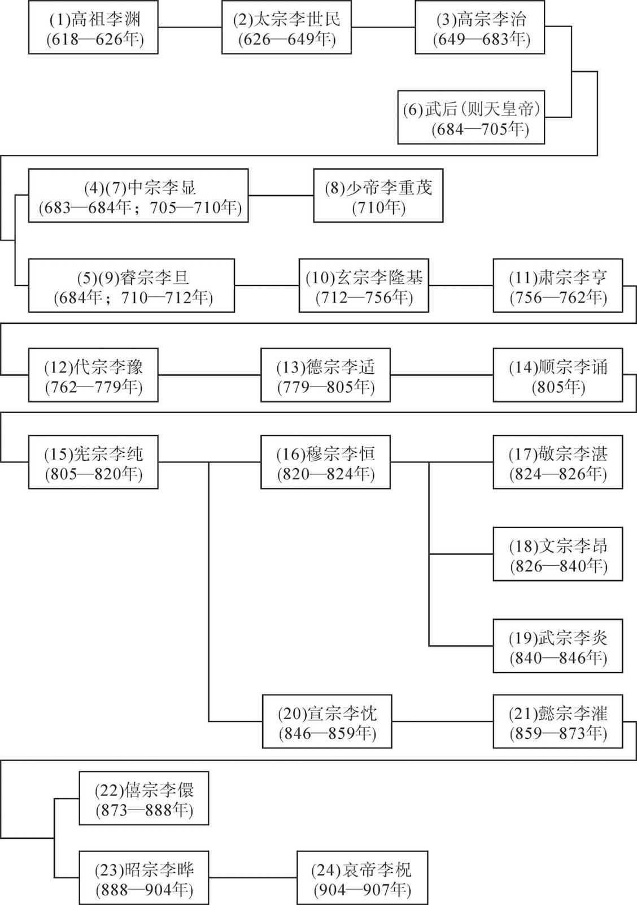 

## ****后梁世系表

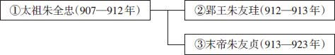 

## ****后唐世系表

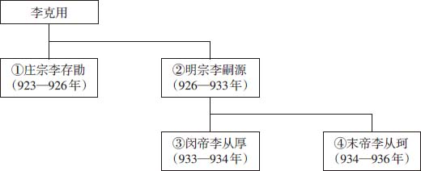 

## ****后晋世系表

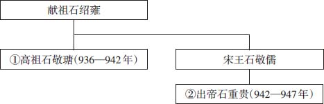 

## ****后汉世系表

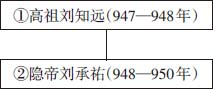 

## ****后周世系表

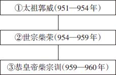 

## ****五代十国时期吴国世系表

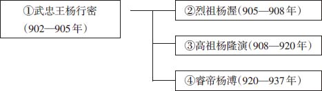 

## ****五代十国时期吴越国世系表

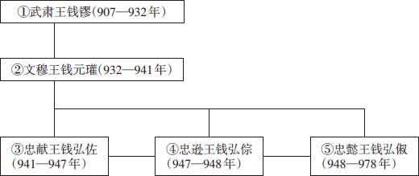 

## ****五代十国时期南唐世系表

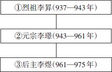 

## ****五代十国时期闽国世系表

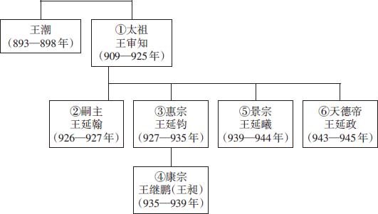 

## ****五代十国时期大越（南汉）世系表

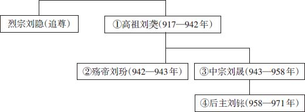 

## ****五代十国时期楚国世系表

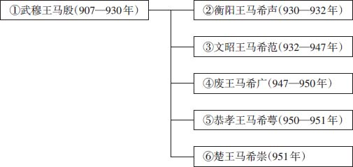 

## ****五代十国时期前蜀世系表

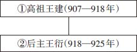 

## ****五代十国时期后蜀世系表

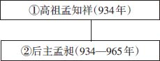 

## ****五代十国时期南平世系表

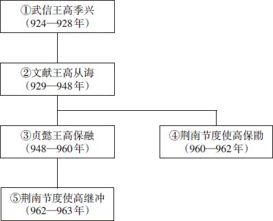

