# 目录

马氏据湖南

晋王灭燕

后唐灭梁

庄宗灭蜀

附录： 
后梁世系表

后唐世系表

五代十国时期楚国世系表

五代十国时期前蜀世系表

五代十国时期后蜀世系表

返回总目录

# 马氏据湖南

## 【内容提要】

《马氏据湖南》叙述了唐末五代时期马殷割据湖南、建立楚国，马殷之后，诸子争位，导致马楚政权灭亡的历史过程，以及马氏政权灭亡后的湖南局势。

五代十国时楚国的建立者马殷，原为秦宗权属下孙儒的裨将。唐昭宗景福元年（892年），孙儒围攻宣州（治宣城，今安徽宣州）时战败，被杨行密所杀，余众推举刘建锋为帅，马殷为先锋，率部南逃至江西洪州（治豫章，今江西南昌）。乾宁元年（894年），马殷随刘建锋西入湖南，攻取潭州（治长沙，今湖南长沙）。乾宁三年，刘建锋被部下所杀，马殷被推为主帅，被唐王朝授为潭州刺史、武安留后，开始割据湖南。

马殷割据之初，仅据有湖南所属七州中的潭、邵（治邵阳，今湖南邵阳）二州，后连取衡（治衡阳，今湖南衡阳）、永（治零陵、今湖南永州）、道（治弘道，今湖南道县）、连（治桂阳，今广东连县）、郴（chēn）（治郴县，今湖南郴州）五州，统一湖南；接着又取得桂管的桂（治临桂，今广西桂林）、宜（治龙水，今广西宜山）、岩（治长乐，今广西贵港木梓镇）、柳（治马平，今广西柳州）、象（治阳寿，今广西象州）五州，势力益盛。

公元907年，朱温代唐称帝，建立后梁，马殷被封为楚王。不久，马殷北取岳（治巴陵，今湖南岳阳）、澧（lǐ）（治澧阳，今湖南澧阳）、朗（治武陵，今湖南常德）等州，南克昭（治平乐，今广西平乐西）、贺（治临贺，今广西贺县东南）、梧（治苍梧，今广西梧州）、蒙（治立山，今广西昭平西）、龚（治平南，今广西平南）、富（治龙平，今广西昭平）等州，辖境扩至二十余州，包括今湖南全境、广西大部和贵州、广东的部分地区。

后梁灭亡后，马殷又臣服于后唐。天成二年（927年）后唐封马殷为楚国王，马殷正式建国。

公元930年，马殷病死，遗命诸子兄弟相继。其子马希声、马希范兄弟相继嗣位。而公元947年马希范死后，则形成诸弟争立，国势日衰的局面。先是马希广被部分将领拥立为楚王，其兄马希萼又于950年攻杀希广，自立为楚王。次年，其庶弟马希崇生俘希萼自立。不久，被送至衡山幽禁的马希萼又被部下拥为衡山王，并遣使向南唐求救；而马希崇也请兵于南唐。南唐将边镐乘机率兵入湖南，马希崇请降，楚国灭亡。

公元952年，朗州将领王逵、周行逢等与其所拥立的武平留后刘言，将边镐逐出湖南，并收复被南汉侵占的马氏岭北故地，称臣于后周。次年，王逵囚杀刘言，移治朗州，遂专治湖南。

马殷诸子“众驹争槽”，互相鱼肉，不仅导致了马楚政权的灭亡，还使湖南陷于长期的战乱。直至北宋王朝建立之后，这一地区才得以逐渐恢复安定的局面。

## 【原文】

**唐僖宗光启二年[1]。初，忠武决胜指挥使孙儒与龙骧指挥使朗山刘建锋戍蔡州，拒黄巢，扶沟马殷隶军中，以材勇闻[2]。及秦宗权叛，儒等皆属焉[3]。**

## 【注文】

[1]唐：朝代名。公元617年，隋朝在农民起义打击下土崩瓦解，太原（今山西太原）留守李渊乘机起兵，攻克长安（今陕西西安）。次年，隋亡，李渊称帝，国号“唐”，建都长安。至公元907年为后梁朱温所灭，共历二十二帝，二百九十年。　　僖宗（862—888年）：唐懿（yì）宗第五子，原名李俨（yǎn），后改名李儇（xuān），公元873年至888年在位。死后谥惠圣恭定皇帝，庙号僖宗。　　光启：唐僖宗在位期间所用的第四个年号，共计四年，即公元885年至888年。

[2]忠武：方镇名。唐德宗贞元三年（787年）置陈许节度使，治许州（治长社，今河南许昌）。领陈（治宛丘，今河南淮阳）、许二州，约当今河南襄城以东，太康、沈丘以西，舞阳以北，长葛、鄢（yān）陵以南地区。唐节度使所辖地区多兼军号，陈许号忠武军。　　决胜指挥使：决胜，与下文“龙骧（xiāng）”皆军名。指挥使，军将名。晚唐五代时，藩镇皆置指挥使或都指挥使，为领兵将领之称号。　　孙儒（？—892年）：河南（治今河南洛阳）人，原为忠武军军校，后为秦宗权都将。唐僖宗光启三年（887年），他诱杀秦宗权弟宗衡，吞并其军，自立为帅。后攻取扬州（治今江苏扬州），自称淮南节度使。并厚结朱温，欲平定江南。唐昭宗景福元年（892年），被杨行密擒杀。　　朗山：县名。治所在今河南确山。唐时属蔡州。　　刘建锋（？—896年）：字锐端，蔡州朗山人，原与孙儒俱为秦宗权部将。孙儒败亡，他与马殷收拾余部，西入湖南，夺取潭州（治长沙，今湖南长沙），被朝廷任命为武安节度使。后因与亲兵之妻私通被亲兵所杀。　　蔡州：州名。唐高祖武德四年（621年）改隋汝南郡置豫州，治汝阳（今河南汝南）。玄宗天宝元年（742年）改为汝南郡，肃宗乾元元年（758年）复称豫州。代宗宝应元年（762年），因避代宗李豫名讳，改为蔡州。领汝阳、朗山、遂平、郾（yǎn）城、上蔡、新蔡、褒信、新息、平舆、西平、真阳等县，辖境约当今河南淮河以北，洪河上游以南，桐柏山以东地区。　　黄巢（？—884年）：唐末农民起义领袖。曹州冤句（今山东曹县西北）人。唐僖宗乾符二年（875年）率众起义，纵横南北，众至百万，广明元年十二月（881年初）攻入长安，即皇帝位，国号大齐，年号金统。中和三年（883年），在唐军围攻下退出长安，东克蔡州，进围信州（治上饶，今江西上饶），不克，主力瓦解。次年退至泰山虎狼峪，战败自杀。　　扶沟：县名。治所在今河南扶沟。　　马殷（852—930年）：五代十国时楚国的建立者。字霸图，扶沟人，一说许州鄢（yān）陵（今河南鄢陵）人。少为木工，应募从军，为孙儒裨将。孙儒死，随刘建锋入湖南，取潭州（治长沙，今湖南长沙）。于刘建锋死后被推为主帅，统一湖南，又取得岭南桂（治临桂，今广西桂林）、容（治北流，今广西北流）等十一州。后梁开平元年（907年），封为楚王。后唐明宗天成二年（927年）封为楚国王，正式建国。晚年诸子争斗，他忧愤而死，谥武穆王。

[3]秦宗权（？—889年）：蔡州上蔡（今河南上蔡）人，一说许州（治长社，今河南许昌）人。初为许州牙将，唐僖宗时割据蔡州，任奉国军节度使。僖宗中和三年（883年），迎战黄巢，兵败投降。又于黄巢失败后称帝，遣将四处攻掠，所至焚烧屠杀。后为部将执送于朱温，斩于长安。

## 【译文】

唐僖宗光启二年（886年）。当初，忠武决胜指挥使孙儒与龙骧指挥使朗山人刘建锋戍守蔡州，抵御黄巢，扶沟人马殷隶属军中，凭着才能、勇猛而闻名。到秦宗权叛乱时，孙儒等人都归属了秦宗权。

## 【原文】

**三年。秦宗权与杨行密争扬州，以孙儒为副，张佶、刘建锋、马殷皆从[1]。**

## 【注文】

[1]杨行密（852—905年）：五代十国时吴国的建立者。初名行愍（mǐn），字化源，庐州合肥（今安徽合肥）人。唐末起兵割据庐州，僖宗中和二年（882年），任庐州刺史。昭宗景福元年（892年），攻杀孙儒，入扬州，为淮南节度使，占有淮南、江东之地。天复二年（902年）受唐封为吴王。其子杨隆演称大吴国王后，追尊为武皇帝，庙号太祖。　　扬州：州名。唐高祖武德三年（620年）改隋江都郡为兖（yǎn）州，七年改为邗（hán）州，九年改为扬州，治江都（今江苏扬州）。玄宗天宝元年（742年）改为广陵郡，肃宗乾元元年（758年）复称扬州。五代时，吴国建为国都，改为江都府。唐时领江都、江阳、六合、海陵、高邮、扬子、天长七县，辖境约当今江苏扬州、泰州、高邮、兴化、六合、泰兴、海安、如皋及安徽天长等地。

张佶（jí）（？—911年）：长安人（今陕西西安）。初为宣州幕僚，后曾在秦宗权属下任行军司马，在孙儒属下任指挥使。刘建锋被杀后，张佶率众将推举马殷为帅。后梁太祖开平（907—911年）初，由马殷表为朗州永顺军节度使。

## 【译文】

唐僖宗光启三年（887年）。秦宗权与杨行密争夺扬州，委任孙儒为副将，张佶、刘建锋、马殷都跟随前往。

## 【原文】

**昭宗景福元年夏五月，杨行密屡败孙儒兵，破其广德营，张训屯安吉，断其粮道[1]。儒食尽，士卒大疫，遣其将刘建锋、马殷分兵掠诸县。行密纵兵击儒，斩之，儒众多降于行密。刘建锋、马殷收余众七千，南走洪州，推建锋为帅，殷为先锋指挥使，以行军司马张佶为谋主，比至江西，众十余万[2]。**

## 【注文】

[1]昭宗（867—904年）：唐懿宗第七子，名李晔（yè）。初名杰，又改名敏。初封寿王，僖宗死，被宦官拥立为帝，888年至904年在位。后被朱温所杀。谥圣穆景文皇帝，庙号昭宗。　　景福：唐昭宗在位期间所用的第三个年号，共计两年，即公元892年至893年。　　广德营：驻守于广德（今安徽广德）的军营。　　张训：生卒年不详。清流（今安徽滁州。滁音chú）人。为人勇悍，多有胆略，人称“大口张”。杨行密部将，曾任常州刺史、尚书左仆射（yè）、拔山都指挥使。杨行密封为吴王后，升为司徒。　　屯：驻扎。　　安吉：县名。治所在今浙江安吉。

[2]洪州：州名。唐高祖武德五年（622年）改隋豫章郡置，治豫章（今江西南昌）。玄宗天宝元年（742年）复为豫章郡，肃宗乾元元年（758年）又改称洪州。领豫章、丰城、高安、建昌、新吴、武宁六县，辖境相当今江西修水、锦江流域及南昌、丰城、进贤等地。　　行军司马：唐五代方镇及出征将帅下所置军职，掌军符号令、军籍、兵械、粮廪衣赐之事。　　谋主：主要谋士。　　比：及，等到。　　江西：方镇名。唐于安史之乱后置江南西道观察使，通称江西。昭宗龙纪元年（889年），升为镇南节度使，治洪州。长期领有洪、江（治浔阳，今江西九江。浔音xún）、信（治上饶，今江西上饶）、袁（治宜春，今江西宜春）、抚（治临川，今江西抚州西北）、饶（治鄱阳，今江西鄱阳。鄱音pó）、虔（qián）（治赣县，今江西赣州。赣音gàn）、吉（治庐陵，今江西吉安）八州，辖境约当今江西省。

## 【译文】

唐昭宗景福元年（892年）夏季五月，杨行密多次打败孙儒的军队，攻破了孙儒的广德营，又命张训驻扎在安吉，切断了孙儒运粮的道路。孙儒粮食用尽，士卒中又大闹瘟疫，就派手下的将领刘建锋、马殷分别率军到各县抢掠。杨行密发兵攻打孙儒，斩杀了他。孙儒的部众大多投降了杨行密。刘建锋、马殷收拾残余的七千人马，向南逃往洪州，大家推举刘建锋为统帅，马殷为先锋指挥使，委任行军司马张佶为主要谋士，等到达江西，部众已达十多万人。

## 【原文】

**乾宁元年五月，刘建锋、马殷引兵至澧陵，武安节度使邓处讷遣邵州指挥使蒋勋、邓继崇将步骑三千守龙回关[1]。殷先至关下，遣使诣勋，勋等以牛酒犒师[2]。殷使说勋曰：“刘龙骧智勇兼人，术家言当兴翼、轸间[3]。今将十万众，精锐无敌，而君以乡兵数千拒之，难矣[4]。不如先下之，取富贵，还乡里，不亦善乎[5]？”勋等然之，谓众曰：“东军许吾属还[6]。”士卒皆欢呼，弃旗帜铠仗遁去[7]。建锋令前锋衣其甲，张其旗，趋潭州[8]。潭人以为邵州兵还，不为备。建锋径入府，处讷方宴，擒斩之[9]。戊辰，建锋入潭州，自称留后[10]。**

## 【注文】

[1]乾（qián）宁：唐昭宗在位期间所用的第四个年号，共计五年，即894至898年。　　引兵：率兵。引，率领，带领。　　澧（lǐ）陵：当作“醴（lǐ）陵”。县名，治所在今湖南醴陵。　　武安节度使：方镇名。唐代宗广德二年（764年）置湖南观察使，治衡州（治衡阳，今湖南衡阳）。领衡、潭（治长沙，今湖南长沙）、邵（治邵阳，今湖南邵阳）、永（治零陵，今湖南永州）、道（治弘道，今湖南道县）五州。后移治潭州，增领连（治桂阳，今广东连县）、郴（chēn）（治郴县，今湖南郴州）二州。辖地相当于今湖南长沙以南至广东阳山以北地区。僖宗中和三年（883年）升为钦化军节度使，光启元年（885年）改为武安军节度使。节度使，为唐代开始设立的地方军政长官。因受职之时，朝廷赐以旌节，故称。初仅设于边地，安史之乱后遍设于内地。一节度使辖区自两三州至十余州不等，其境内军、民、财政皆为自主。唐后期节度使多拥兵自大，不奉朝命，成为割据一方的势力。　　邓处讷（nè）（？—893年）：字冲韫（yùn），邵州龙潭（今湖南武冈）人。曾任邵州刺史。唐昭宗景福二年（893年）攻取潭州，被朝廷任命为武安军节度使。后被刘建锋所杀。　　邵州：州名。唐太宗贞观十年（636年）改南梁州置，治邵阳（今湖南邵阳）。玄宗天宝元年（742年）改为邵阳郡，肃宗乾元元年（758年）复为邵州。领邵阳、武冈两县，辖境相当于今湖南新化以南的资水流域。五代时楚国一度改为敏州。　　蒋勋：邵州人，为邓处讷属下邵州指挥使。　　龙回关：关隘名。在今湖南长沙东。

[2]诣（yì）：前往，到。　　犒师：犒劳军队。犒，用酒食或财物慰劳。

[3]说（shuì）：劝说。　　刘龙骧：即刘建锋，曾为龙骧指挥使，故称。

术家：占卜的术士。　　翼、轸（zhěn）：二十八宿中的翼宿和轸宿。古时又将天上的二十八宿分别指配于地上的州国，使之相互对应，称为分野。翼、轸二宿为楚荆分野，相当于今湖南、湖北地区。

[4]乡兵：蒋勋、邓继崇所率之兵皆当地土人，故称乡兵。

[5]下：居于其下，指投靠，服从。

[6]东军：指刘建锋军，时由东而来，故称东军。

[7]铠（kǎi）仗：盔甲兵器。

[8]趋：趋向，奔赴。　　潭州：州名。唐高祖武德四年（621年）改隋长沙郡置，治长沙（今湖南长沙）。玄宗天宝元年（742年）复为长沙郡，肃宗乾元元年（758年）又改为潭州。后唐明宗天成二年（927年），马殷正式建国，改为长沙府。领长沙、湘乡、益阳、醴陵、浏阳等县，辖境约当今湖南长沙、湘潭、湘乡、益阳、醴陵、浏阳等地。

[9]径（jìng）：径直，直接。　　方宴：正在举行宴会。

[10]戊辰：干支纪日的戊辰日。干支纪日为中国古代的一种纪日方法，即以甲、乙、丙、丁、戊、己、庚、辛、壬、癸十天干和子、丑、寅、卯、辰、巳、午、未、申、酉、戌、亥十二地支按照顺序依次相配，用来纪日，如甲子、甲午、辛丑等。六十天为一周期，周而复始，循环不已。　　留后：官名。唐中期后，节度使、观察使缺位时的代理官职。

## 【译文】

唐昭宗乾宁元年（894年）五月，刘建锋、马殷率军队到达澧陵，武安节度使邓处讷派遣邵州指挥使蒋勋、邓继崇率领步、骑兵三千人驻守龙回关。马殷首先到达关下，派使者到蒋勋那里。蒋勋等人用牛肉美酒犒劳马殷的人马。马殷的使者劝说蒋勋道：“刘龙骧智勇超人，占卜的术士说他当会在翼、轸之间兴起。现在他率领十万军队，精锐无敌，而你带领几千名乡兵来抵御他，这太难了。你不如先投靠他，谋取富贵荣华，返回乡里，不是很好吗？”蒋勋等人认为使者的话有道理，便对部众说：“东面来的军队允许我们返回故里。”士兵们听后都欢呼起来，丢下旗帜、盔甲和武器而逃走。刘建锋命令前锋兵士穿戴上蒋勋队伍的盔甲，打着蒋勋的旗帜，奔向潭州。潭州的人以为是邵州的军队回来了，不做防备。刘建锋的军队直接进入了潭州府衙，邓处讷正在举行宴会，被擒获斩杀。戊辰（初七日），刘建锋进入潭州，自称留后。

## 【原文】

**二年。以刘建锋为武安节度使。建锋以马殷为内外马步军都指挥使[1]。蒋勋求为邵州刺史，刘建锋不许，勋据邵州，使其将屯定胜镇以扼潭人[2]。**

## 【注文】

[1]内外马步军都指挥使：武将名。唐末五代之都指挥使，或为军事编制单位一都之统兵将领，或为某一方面尽统诸将的将领。此为统领武安军所有马步军的将领。

[2]刺史：官名。始置于西汉，掌监察郡国。隋唐五代时为一州行政长官。　　定胜镇：镇名。在今湖南双峰县政府所在地永丰镇。　　扼：堵，阻挡。

## 【译文】

唐昭宗乾宁二年（895年）。朝廷任命刘建锋为武安节度使。刘建锋委任马殷为内外马步军都指挥使。蒋勋要求出任邵州刺史，刘建锋不答应，蒋勋就占据邵州，派其部将驻扎在定胜镇来阻挡潭州人。

## 【原文】

**三年春正月丁巳，刘建锋遣都指挥使马殷将兵讨蒋勋，攻定胜寨，破之。**

## 【译文】

唐昭宗乾宁三年（896年）春季正月丁巳（初五日），刘建锋派遣都指挥使马殷率兵讨伐蒋勋，攻打定胜镇的军寨，攻破了它。

## 【原文】

**夏四月，武安节度使刘建锋既得志，嗜酒，不亲政事。长直兵陈赡妻美，建锋私之，赡袖铁挝击杀建锋[1]。诸将杀赡，迎行军司马张佶为留后。佶将入府，马忽踶啮，伤左髀[2]。时马殷攻邵州未下，佶谢诸将曰：“马公勇而有谋，宽厚乐善，吾所不及，真乃主也[3]。”乃以牒召之[4]。殷犹豫未行，听直军将汝南姚彦章说殷曰：“公与刘龙骧、张司马，一体人也，今龙骧遇祸，司马伤髀，天命人望，舍公尚谁属哉[5]！”殷乃使亲从都副指挥使李琼留攻邵州，径诣长沙[6]。五月，马殷至长沙，张佶肩舆入府，坐受殷拜谒，已，乃命殷升听事，以留后让之，即趋下，帅将吏拜贺，复为行军司马，代殷将兵攻邵州[7]。**

## 【注文】

[1]长直：军号，为侍卫亲兵部队。　　私：私通。　　挝（zhuā）：古代兵械之一，亦称抓，又称骨朵、锤。

[2]踶（dì）啮（niè）：踢咬。　　髀（bì）：大腿。

[3]谢：辞，辞谢。　　马公：指马殷。公，旧时对尊长或平辈的敬称。　　乃主：你们的主人。乃作为第二人称代词，既可作你，你们；又可作你的，你们的。

[4]牒（dié）：公文。

[5]听直军将：值守处理厅事的军将。听，通“厅”，官署治事的厅堂。　　汝南：郡名。唐玄宗天宝元年（742年）改豫州为汝南郡，肃宗乾元元年（758年）复称豫州。宝应元年（762年），因避代宗李豫名讳，改为蔡州。　　姚彦章：生卒年不详。汝南（治今河南汝南）人，字继微。时任湖南听直军将，后建议马殷攻取衡、永、道、连、郴五州，并推荐李琼为将，平定了湖南。马殷建立楚国后，以功拜左丞相。　　一体人：一样的人。

[6]亲从都：侍卫亲兵部队。都，为唐末五代时的军事编制单位，每都人数自一两百至数万人不等。　　李琼（？—905年）：蔡州汝阳（今河南汝阳）人。初为孙儒军将，后从马殷入湖南，隶帐下为亲从都副指挥使，曾率军为马殷先后攻取连、邵、郴、衡、道、永及桂、宜、岩、柳、象十一州之地。以功授桂州刺史，迁静江节度使，加平章事。

[7]肩舆：轿子。此指乘轿。　　拜谒（yè）：拜见。谒，拜见。　　已：结束，完毕。　　听事：治事，处理事情。　　趋下：快步退下。

## 【译文】

唐昭宗乾宁三年（896年）夏季四月，武安节度使刘建锋得志以后，饮酒成性，不过问政事。长直军兵士陈赡的妻子长得漂亮，刘建锋与她私通，陈赡把铁挝藏在衣袖里打死了刘建锋。众将领杀了陈赡，迎来行军司马张佶出任留后。张佶将要进入节度使府衙时，所骑的马忽然又踢又咬，伤了张佶的左大腿。当时马殷攻打邵州还没有拿下，张佶向众将辞谢说：“马公勇猛而又有谋略，待人宽厚，与人为善，这是我所不如的，他才真正是你们的主公。”于是便用公文召请马殷前来。马殷犹豫不决没有动身，听直军将汝南人姚彦章劝马殷说：“您与刘龙骧、张司马是一样的人，现在刘龙骧遇祸而死，张司马大腿又受了伤，上天的安排和人们的期望，除了您还能归属谁呢！”马殷于是让亲从都副指挥使李琼留下继续攻打邵州，自己径直前往长沙。五月，马殷到达长沙，张佶乘轿进入节度使府衙，坐下接受马殷的参拜，参拜已毕，便让马殷升堂治理政务，把留后的职位让给马殷，随即快步下堂，率领众将官吏向马殷拜贺，张佶重新出任行军司马，代替马殷率兵攻打邵州。

## 【原文】

**秋九月，以湖南军留后马殷判湖南军府事[1]。殷以高郁为谋主[2]。郁，扬州人也。殷畏杨行密、成汭之强，议以金帛结之[3]。高郁曰：“成汭不足畏也。行密公之仇，虽以万金赂之，安肯为吾援乎[4]？不若上奉天子，下抚士民，训卒厉兵，以修霸业，则谁与为敌矣[5]。”殷从之。**

## 【注文】

[1]湖南军：即武安军。本为湖南观察使，后升为钦化军节度使，又改为武安军节度使，但仍通称湖南。　　判湖南军府事：署理湖南节度使府府务。唐宋时，以高级官职兼任低职称判。

[2]高郁（？—929年）：扬州（治今江苏扬州）人。马殷谋臣，署都军判官。曾劝马殷尊奉唐朝，训卒厉兵，以图霸业。后梁时，又建议于汴（biàn）京及诸州置邸务售茶；令民造茶以通商旅，而收其税；铸铅铁钱，以利楚国货物流通；使民纳帛为税，以发展蚕桑。湖南由此富强。后遭诸臣所忌，罢为行军司马。不久被马殷之子马希声矫令诬杀。

[3]成汭（ruì）（？—903年）：青州（治今山东青州）人。曾改名郭禹。初为荆南节度使陈儒裨校，后攻取归州，自称刺史。公元888年又攻取荆南（今湖北江陵），被唐朝授为荆南节度使，励精图治，势力渐强。公元903年，杨行密攻打鄂州，他率兵救援，被马殷乘虚攻入江陵，他也被吴军所败，投江而死。

[4]行密公之仇：马殷曾随孙儒与杨行密连年交战，故为仇敌。　　赂：赠送财物，引申为奉送。

[5]士民：士大夫与普通百姓。亦泛指人民、百姓。　　厉兵：磨好兵器。指做好战备。

## 【译文】

唐昭宗乾宁三年（896年）秋季九月，朝廷任命湖南军留后马殷署理湖南军府事务。马殷用高郁为主要谋士。高郁是扬州人。马殷惧怕杨行密、成汭势力的强大，商议赠送金帛和他们结好。高郁说：“成汭不值得害怕，杨行密是您的仇人，即使送给他万两黄金，他怎么肯援助我们呢？不如对上尊奉天子，对下安抚百姓，训练士卒，做好战备，来建成霸业，那么谁还敢与我们为敌呢。”马殷听从了高郁的意见。

## 【原文】

**光化元年春三月，以潭州刺史、判湖南军府事马殷知武安留后[1]。时湖南管内七州，贼帅杨师远据衡州，唐世旻据永州，蔡结据道州，陈彦谦据郴州，鲁景仁据连州，殷所得惟潭、邵二州而已[2]。**

## 【注文】

[1]光化：唐昭宗在位期间所用的第五个年号，共计四年，即公元898年至901年。

[2]杨师远（？—898年）：衡州豪强。时起兵占据衡州，后被马殷军攻杀。

衡州：州名。唐高祖武德四年（621年）改隋衡山郡置，治衡阳（今湖南衡阳）。玄宗天宝元年（742年）改为衡阳郡，肃宗乾元元年（758年）复为衡州。领衡阳、常宁、攸县、茶陵、耒（lěi）阳、衡山等县，辖境约当今湖南衡山及常宁、耒阳间的湘江流域。　　唐世旻（mín）（？—898年）：字昌图，永州豪强。时起兵占据永州，后被马殷军攻破，出逃后死去。　　永州：州名。唐高祖武德四年（621年）改隋零陵郡置，治零陵（今湖南永州）。玄宗天宝元年（742年）复为零陵郡，肃宗乾元元年（758年）又改为永州。领零陵、祁（qí）阳、湘源、灌阳四县，辖境约当今湖南零陵、东安、祁阳及广西全州、灌阳等地。五代时领县减少。　　蔡结（？—899年）：道州豪强。时起兵占据道州，后被马殷军攻破，将其擒杀。

道州：州名。唐高祖武德四年（621年）置营州，太宗贞观八年（634年）改为道州，治弘道（今湖南道县）。玄宗天宝元年（742年）改为江华郡，肃宗乾元元年（758年）复称道州。领弘道、延唐、江华、永明四县，辖境约当今湖南道县、宁远以南的潇水流域。　　陈彦谦（？—899年）：郴（chēn）州豪强。时起兵占据郴州，后被马殷军攻破，将其擒杀。　　郴州：州名。唐高祖武德四年（621年）改隋桂阳郡置，治郴县（今湖南郴州）。玄宗天宝元年（742年）复为桂阳郡，肃宗乾元元年（758年）又改为郴州。领郴县、义章、义昌、平阳、资兴、高亭、临武、蓝山等县，辖境约当今湖南永兴以南的耒水流域及蓝山、嘉禾、临武、宜章等地。

鲁景仁（？—899年）：宿州（治今安徽宿州）人。原为黄巢军将领，黄巢自广州北上时，他因病留在岭南，后攻占连州。马殷军攻连州时，他自杀而死。

连州：州名。唐高祖武德四年（621年）改隋熙平郡置，治桂阳（今广东连县）。玄宗天宝元年（742年）改为连山郡。肃宗乾元元年（758年）复为连州。领桂阳、阳山、连山三县，辖境约当今广东连县、连山、阳山等地。

## 【译文】

唐昭宗光化元年（898年）春季三月，朝廷任命潭州刺史、判湖南军府事马殷主持武安留后事务。当时湖南辖境内有七个州，贼寇首领杨师远占据衡州，唐世旻占据永州，蔡结占据道州，陈彦谦占据郴州，鲁景仁占据连州，马殷所得到的仅有潭州、邵州两个州而已。

## 【原文】

**夏五月，湖南将姚彦章言于马殷，请取衡、永、道、连、郴五州，仍荐李琼为将。殷以琼及秦彦晖为岭北七州游弈使，张图英、李唐副之，将兵攻衡州，斩杨师远，引兵趣永州，围之月余，唐世旻走死[1]。殷以李唐为永州刺史。**

## 【注文】

[1]秦彦晖：生卒年不详。蔡州上蔡（今河南上蔡）人，初为孙儒部下，后为马殷亲校。历任岭北七州游弈（yì）使、在城都指挥使等职，曾率军攻取岳州、朗州等地。马殷平定湖南，其功为最。　　岭北七州：指五岭以北的衡、永、道、连、郴、潭、邵七州。　　游弈使：武官名。掌率领流动部队巡逻。　　张图英：马殷将领。籍贯、生平不详。　　李唐：籍贯及生卒年不详。初为马殷麾下牙将，后随李琼、秦彦晖平岭北，攻取永州，被任命为永州刺史。不久，又攻取道州。

## 【译文】

唐昭宗光化元年（898年）夏季五月，湖南军将领姚彦章向马殷进言，请求攻取衡、永、道、连、郴五州，仍推荐李琼为统军将领。马殷任命李琼和秦彦晖为岭北七州游弈使，张图英、李唐为副使，率兵攻打衡州，斩杀了杨师远，接着率兵奔向永州，围攻了一个多月，唐世旻逃跑后死去。马殷任命李唐为永州刺史。

## 【原文】

**二年秋七月，马殷遣其将李唐攻道州，蔡结聚群蛮，伏兵于隘以击之，大破唐兵[1]。唐曰：“蛮所恃者山林耳，若战平地，安能败我[2]。”乃命因风燔林，火烛天地，群蛮惊遁，遂拔道州，擒结，斩之[3]。**

## 【注文】

[1]群蛮：指当地的少数民族各部，古时长江中游及其以南地区少数民族被泛称为蛮。　　隘（ài）：险要的地方。

[2]恃（shì）：依仗，依靠。　　耳：语气词，相当“而已”“罢了”。

[3]因风：趁风。　　燔（fán）：焚烧。　　烛：照，照亮。

## 【译文】

唐昭宗光化二年（899年）秋季七月，马殷派遣属下将领李唐攻打道州，蔡结聚集蛮人各部，在险要之处埋伏下军队攻击李唐，把李唐的人马打得大败。李唐说：“蛮人所依仗的只是山林罢了，如果在平地交战，怎么能打败我呢。”于是下令趁着风势纵火焚烧山林，火焰光照天地，众蛮惊惧而逃，于是李唐攻取了道州，擒获蔡结，斩杀了他。

## 【原文】

**冬十一月，马殷遣其将李琼攻郴州，执陈彦谦，斩之。进攻连州，鲁景仁自杀。湖南皆平。**

## 【译文】

唐昭宗光化二年（899年）冬季十一月，马殷派部将李琼攻打郴州，擒获陈彦谦，斩杀了他。接着进军攻打连州，鲁景仁自杀而死。湖南境内全部平定。

## 【原文】

**三年冬十月，静江节度使刘士政闻马殷悉平岭北，大惧，遣副使陈可璠屯全义岭以备之[1]。殷遣使修好于士政，可璠拒之，殷遣其将秦彦晖、李琼等将兵七千击士政。湖南军至全义，士政又遣指挥使王建武屯秦城[2]。可璠掠县民耕牛以犒军，县民怨之，请为湖南乡导，曰：“此西南有小径，距秦城才五十里，仅通单骑[3]。”彦晖遣李琼将骑六十、步兵三百袭秦城，中宵，逾垣而入，擒王建武，比明复还，之以练，造可璠壁下示之，可璠犹未之信[4]。斩其首，投壁中，桂人震恐[5]。琼因勒兵击之，擒可璠，降其将士二千，皆杀之[6]。引兵趣桂州，自秦城以南二十余壁皆望风奔溃，遂围桂州[7]。数日，士政出降，桂、宜、岩、柳、象五州皆降于湖南[8]。马殷以李琼为桂州刺史，未几，表为静江节度使[9]。**

## 【注文】

[1]静江节度使：方镇名。原为桂州管内经略使，初置于唐高宗开耀（681—682年）后，唐昭宗光化三年（900年）升为静江节度使，治桂州（治今广西桂林）。领桂、梧、贺、连、柳、富、昭、蒙、严、环、融、古、思唐、龚（gōng）等州，约当今广西河池、宜山、柳江、武宣、苍梧以北及广东阳山、连县、连山之地。　　刘士政：籍贯及生卒年不详。原为安州（治安陆，今湖北安陆）指挥使。唐昭宗乾宁二年（895年），与安州防御使家晟（shèng）、兵马监押陈可璠（fán）率军袭取桂州。不久陈可璠杀家晟，推刘士政为知军府事，后被唐朝任命为桂州管内经略使，升静江节度使。　　陈可璠（？—900年）：原为安州兵马监押，取得桂州后任静江节度副使。　　全义岭：山岭名。唐高祖武德四年（621年）置临源县，唐代宗大历三年（768年）更名为全义县（治所在今广西兴安），该岭在其境内。

[2]王建武（？—900年）：籍贯不详。刘士政将领。　　秦城：地名。在今广西兴安境内，相传秦始皇征岭南时曾于此筑城屯兵，故称秦城。

[3]乡导：同“向导”。

[4]中宵：半夜。　　逾垣（yuán）：翻越城墙。垣，墙。　　（chè）之以练：用白绢捆绑。，捆绑；练，白绢。　　造：至，到。　　壁：营垒，壁垒，即军营的围墙。　　示：给……看。

[5]桂人：指桂州军士。

[6]勒兵：率领军队。勒，统率，率领。

[7]桂州：州名。唐高祖武德四年（621年）改隋始安郡置，治临桂（今广西桂林）。玄宗天宝元年（742年）改为始安郡。肃宗乾元元年（758年）复称桂州。领临桂、理定、灵川、阳朔、荔浦、丰水、修仁、恭化、永福、临源等县，辖境约当今广西龙胜、永福以西及荔浦以北地区。

[8]宜、岩、柳、象：皆州名。宜州，唐高宗时改粤州置，治龙水（今广西宜山）。玄宗天宝元年（742年）改为龙水郡，肃宗乾元元年（758年）复称宜州。领龙水、崖山、东玺（xǐ）、天河等县，辖境约当今广西宜山一带。岩州，唐高宗调露二年（680年）置，治长乐，其治所及辖地当在今广西贵港及附近地区。柳州，唐太宗贞观八年（634年）改南昆州置，治马平（今广西柳州）。天宝元年（742年）改为龙城郡，乾元元年（758年）复称柳州。领马平、新安、文安、贺水、修德等县，辖境约当今广西柳州、柳城、柳江、鹿寨等地。象州，唐武德四年（621年）置，先后治武化（今广西象州东北）、阳寿（今象州）。天宝元年（742年）改为象山郡，乾元元年（758年）复称象州。领阳寿、武化、武仙三县，辖境约当今广西象州、武宣等地。

[9]未几：不久。　　表：臣下给皇帝上的奏章。此用作动词，指向皇帝上表请求。

## 【译文】

唐昭宗光化三年（900年）冬季十月，静江节度使刘士政听说马殷全部平定了岭北地区，十分害怕，便派遣副使陈可璠率军驻守在全义岭防备马殷的军队。马殷派出使者去与刘士政讲和建立友好关系，陈可璠拒绝了，于是马殷派遣手下将领秦彦晖、李琼等率军七千人去攻打刘士政。马殷的军队抵达全义岭，刘士政又派遣指挥使王建武驻守在秦城。陈可璠抢掠县民的耕牛来犒劳军队，县民对他非常怨恨，请求为马殷的军队作向导，说：“在这西南有条小路，距离秦城才五十里，只能单骑通过。”于是秦彦晖派李琼率领骑兵六十、步兵三百人偷袭秦城，半夜，翻越城墙而入，擒获了王建武，到天明又回来，用白绢将王建武捆绑起来，带到陈可璠的营垒下让他观看，但陈可璠仍不相信。李琼又斩下王建武的脑袋，投入陈可璠的营垒之中，桂州军队震惊恐慌。李琼趁机率兵攻击，擒获了陈可璠，迫使其二千将士投降，随后将他们全部杀死。接着李琼率兵奔向桂州，自秦城以南的二十余座营垒全都望风溃逃，于是包围了桂州。不久，刘士政出城投降，桂、宜、岩、柳、象五州全都归降了湖南。马殷任命李琼为桂州刺史，不久，又上表请朝廷任命李琼为静江节度使。

## 【原文】

**天复三年夏四月，杨行密遣使诣马殷，言朱全忠跋扈，请殷绝之，约为兄弟[1]。湖南大将许德勋曰：“全忠虽无道，然挟天子以令诸侯，明公素奉王室，不可轻绝也[2]。”殷从之。**

## 【注文】

[1]天复：唐昭宗在位期间所用的第六个年号，共计四年，即公元901年至904年。　　朱全忠（852—912年）：即后梁太祖朱温。宋州砀（dàng）山（今安徽砀山）人。原为黄巢起义军将领，唐僖宗中和二年（882年）降唐，赐名全忠。次年，任宣武节度使。与李克用等联兵镇压黄巢起义军，并先后并吞、击败秦宗权、朱瑄（xuān）、李茂贞、朱瑾（jǐn）等藩镇，进封为梁王，挟制唐昭宗，控制了朝廷大权。唐哀帝天祐四年（907年）代唐称帝，改名晃，建都汴（今河南开封），国号梁，史称“后梁”。后被其子朱友珪（guī）所杀。庙号太祖。

[2]许德勋：生卒年不详。蔡州朗山（今河南确山）人。原为秦宗权左军判官，后随刘建锋入湖南。马殷为留后，以他为马步军都指挥使，成为马殷得力大将，后任岳州刺史。马殷正式建国，他以功拜右丞相。　　明公：古时对有名位之人的尊称。　　素：一向，向来。

## 【译文】

唐昭宗天复三年（903年）夏季四月，杨行密派使者到马殷那里，说朱全忠专横跋扈，请求马殷与他断绝关系，吴楚结为兄弟。湖南大将许德勋说：“朱全忠虽然无道，但他挟持天子来命令诸侯，明公您一向尊奉王室，不可轻易与他绝交。”马殷听从了他的意见。

## 【原文】

**天祐元年[1]。初，马殷弟賨性沈勇，事孙儒，为百胜指挥使[2]。儒死，事杨行密，屡有功，迁黑云指挥使[3]。行密尝从容问其兄弟，乃知为殷之弟，大惊曰：“吾常怪汝器度瓌伟，果非常人[4]。当遣汝归。”賨泣辞曰：“賨淮西残兵，大王不杀而宠任之[5]。湖南地近，常得兄声问；賨事大王久，不愿归也[6]。”行密固遣之[7]。是岁，賨归长沙，行密亲饯之郊[8]。賨至长沙，殷表賨为节度副使。他日，殷议入贡天子，賨曰：“杨王地广兵强，与吾邻接，不若与之结好，大可以为缓急之援，小可通商旅之利[9]。”殷作色曰：“杨王不事天子，一旦朝廷致讨，罪将及吾[10]。汝置此论，勿为吾祸[11]。”**

## 【注文】

[1]天祐：唐昭宗、唐哀帝使用的年号。公元904年，昭宗改元天祐。当年昭宗被朱温所杀，其子唐哀帝李柷（chù）即位，仍沿用此年号至907年。

[2]賨（cóng）：马殷弟马賨。生卒年不详。原为孙儒部将，孙儒败，被吴军俘获，任杨行密部将。后放归湖南，历任武安节度副使、朗州留后、永顺军节度使等职。马殷正式建国后，改任静江军节度观察使。　　沈（chén）勇：沉着果敢。沈，古“沉”字。　　百胜：军名，因百战百胜得名。

[3]黑云：军名。杨行密从孙儒降兵中挑选其勇猛强健者五千人组成，以皂衣蒙甲，号“黑云都”，以为亲军，待遇优厚，战斗力极强，作战时常使之冲锋陷阵。

[4]尝：曾，曾经。　　从容：舒缓，不急迫。　　器度：才具风度。　　瓌（guī）伟：亦作瑰玮。卓异，不一般。瓌，古同“瑰”。

[5]淮西残兵：马賨曾从秦宗权、孙儒起兵于淮西，故称淮西残兵。

[6]声问：音信。

[7]固：坚持。

[8]是岁：这年。是，指示代词，这。　　饯：设酒食送行。

[9]杨王：指杨行密。时受唐封为吴王。　　缓急：偏正词组，义偏在“急”，情势急迫。　　商旅：商贩，此指经商。

[10]作色：脸上变色。指神情变得严肃或发怒。

[11]置：搁置，放弃。

## 【译文】

唐昭宗天祐元年（904年）。起初，马殷的弟弟马賨，性情沉着果敢，在孙儒手下效力，担任百胜指挥使。孙儒死后，又事奉杨行密，多有战功，升任黑云指挥使。杨行密曾不急不慢地问起他兄弟的事情，才知道他是马殷的弟弟，十分惊讶地说：“我常常奇怪你的才能风度非同一般，果然不是平常的人。应当送你回去。”马賨哭着推辞说：“我本是一名淮西的残兵，大王您不杀我，却宠信任用我。湖南离这里很近，我常常得到哥哥的音信；我事奉大王您的时间已经很久，不愿意回去了。”杨行密坚持让他回去。这一年，马賨回归长沙，杨行密亲自在郊外为他饯行。马賨到了长沙，马殷向朝廷上表请求任命马賨为节度副使。有一天，马殷与部下商议向天子进贡的事情，马賨说：“杨王的土地广大，兵力强盛，与我们接壤为邻，不如与他结为友好，从大处说在形势急迫时可以作为援助的力量，从小处说可以互通商业之利。”马殷变了脸色说：“杨王不事奉天子，一旦朝廷讨伐他，罪过将连累到我们。你要放弃这种主张，不要给我招来灾祸。”

## 【原文】

**昭宣帝天祐三年[1]。吉州刺史彭玕遣使请降于湖南[2]。玕本赤石洞蛮酋，镇南节度使钟传用为吉州刺史[3]。**

## 【注文】

[1]昭宣帝：即唐哀帝（892—908年）。名李柷，唐昭宗第九子。天祐元年（904年），朱温杀昭宗，立他为帝。天祐四年（907年），禅（shàn）位于朱温，次年被朱温所杀，谥哀帝。五代时，被后唐明宗追谥昭宣光烈孝皇帝。

[2]吉州：州名。唐高祖武德五年（622年）改隋庐陵郡置，治庐陵（今江西吉安）。玄宗天宝元年（742年）复为庐陵郡，肃宗乾元元年（758年）又改为吉州。领庐陵、太和、安福、新淦（gàn）、永新五县，辖境约当今江西新干、泰和间的赣江流域及安福、永新等地。　　彭玕（gān）（？—约920年）：又作彭玗（yú）、彭旴（xū）。本为赤石洞蛮族首领。一说为庐陵人，初为胥吏，后破家起兵，被钟传任命为吉州刺史。公元906年，被吴国所败，投奔楚国，任郴州刺史。

[3]赤石洞：地名，在今江西吉水境内。　　蛮酋：蛮族首领。　　镇南节度使：方镇名。　　钟传（？—906年）：洪州高安（今江西高安）人，于唐末起兵入据抚州，被任为刺史。继而据有洪州，被任为镇南节度使，封南平郡王，割据江西三十余年。

## 【译文】

唐昭宣帝天祐三年（906年）。吉州刺史彭玕派使者向湖南请求归降。彭玕本来是赤石洞的蛮族首领，镇南节度使钟传任用他做了吉州刺史。

## 【原文】

**后梁太祖开平元年夏四月辛未，以武安节度使马殷为楚王[1]。**

## 【注文】

[1]后梁：朝代名。五代之一。公元907年，朱温代唐称帝，建都汴（今河南开封），国号“梁”，史称“后梁”。至公元923年为后唐所灭，共历三帝，十七年。　　太祖：即朱温。　　开平：后梁太祖朱温在位期间所用的第一个年号，共计五年，即公元907至911年。

## 【译文】

后梁太祖开平元年（907年）夏季四月辛未（二十五日），后梁封武安节度使马殷为楚王。

## 【原文】

**五月，弘农王以鄂岳观察使刘存为西南面都招讨使，岳州刺史陈知新为岳州团练使，庐州观察使刘威为应援使，别将许玄应为监军，将水军三万以击楚[1]。楚王马殷甚惧，静江军使杨定真贺曰：“我军胜矣[2]。”殷问其故，定真曰：“夫战惧则胜，骄则败。今淮南兵直趋吾城，是骄而轻敌也，而王有惧色，吾是以知其必胜也[3]。”**

## 【注文】

[1]弘农王：名杨渥（wò）（886—908年），字承天，吴王杨行密长子。唐哀帝天祐二年（905年），嗣位为吴国国君，受唐封为弘农郡王。在位时荒淫无度，大权渐被徐温、张颢所掌握。公元908年，被徐温、张颢所杀。后谥景王，庙号烈祖。　　鄂岳：方镇名。唐代宗时置鄂岳观察使，后数度升为武昌节度使。治鄂州（治江夏，今湖北武昌），较长期领有鄂、岳（治巴陵，今湖南岳阳）、蕲（qí）（治蕲春，今湖北蕲春）、黄（治黄冈，今湖北武汉新洲）、安（治安陆，今湖北安陆）、申（治义阳，今河南信阳）等州，辖境约当今湖北广水、应城、汉川、赤壁等地以东，河南淮河以南，湖南洞庭湖、汨（mì）罗江以北地区。　　观察使：官名。唐肃宗乾元元年（758年）改采访处置使为观察处置使，简称观察使。由节度使兼领，兼理民事，成为道一级的最高行政长官。不设节度使之道，即以观察使为最高行政长官。　　刘存（？—907年）：陈州（治宛丘，今河南淮阳）人。初随杨行密起兵于合肥，以平孙儒有功，任寿州军都尉。后以军功历任舒州刺史、团练使，淮南行军司马、鄂岳观察使等职。后梁太祖开平元年（907年），率水师攻潭州，兵败被俘，被马殷斩杀。　　都招讨使：或称招讨使，统帅军队出征的大将职名。前面常冠以所征讨的地区，如某某地区、某某方面等。为战时临时设置的军事长官，兵罢即撤销。　　岳州：州名。唐高祖武德四年（621年）改隋巴陵郡置巴州，六年，改为岳州，治巴陵（今湖南岳阳）。玄宗天宝元年（742年）复为巴陵郡，肃宗乾元元年（758年）又称岳州。领巴陵、华容、沅江、湘阴、昌江五县，辖境约当今湖南洞庭湖东、南、北沿岸各县地。　　陈知新（？—907年）：庐江（今安徽庐江）人。早年随杨行密起兵，以功授先锋指挥使。唐哀帝天祐三年（906年），攻取楚国岳州，任岳州刺史。次年，任岳州团练使，与刘存率水师攻潭州，兵败被俘，被马殷斩杀。　　团练使：官名。全称团练守捉使。唐玄宗开元（713—741年）年间，在不设节度使的地区置都团练使、团练使，负责统领地方军队，掌本地区防务，领三五州至十州不等，地位低于节度使。唐后期诸道不设节度使者，以团练使总领军务，诸道刺史又多以此为加官。五代时沿置。　　庐州：州名。唐高祖武德三年（620年）改隋庐江郡置，治合肥（今安徽合肥）。玄宗天宝元年（742年）复为庐江郡，肃宗乾元元年（758年）又称庐州。领合肥、庐江、慎县、巢（cháo）县、舒城五县，辖境约当今安徽合肥、肥东、肥西、巢湖、舒城、庐江、无为等地。

刘威（857—914年）：庐州慎县（今安徽肥东东北）人。初为杨行密旧友，随杨行密起兵于合肥，以功历任窦州刺史、庐州刺史、镇南节度副使等职。后任镇南节度使，卒于镇。　　应援使：武将名。掌率军接应援助各部。　　别将：偏将。　　许玄应（？—907年）：籍贯不详。弘农王杨渥的亲信。刘存、陈知新攻打楚国，他担任监军，因兵败，被吴国权臣徐温、张颢所杀。　　监军：官名。古代监军仅为临时差遣。唐玄宗开元二十年（732年）始以宦官为监军，后成为制度。各镇及出征之军皆设监军，掌监督军队，权力极大，往往与主帅分庭抗礼。五代时，君主亲信亦往往被派做监军。

[2]静江军使：军将名。静江为马楚军号。军使，地位在都指挥使之下。

杨定真：籍贯及生卒年不详。原为静江军使，后迁水军都指挥使。后梁太祖乾化二年（912年），吴军进攻岳州，他奉命救援，无功而逃，后不知所终。

[3]淮南：方镇名。唐肃宗至德元载（756年）置，治扬州（治今江苏扬州）。长期领有扬、滁（治清流，今安徽滁州）、和（治历阳，今安徽和县）、寿（治寿春，今安徽寿县）、庐（治合肥，今安徽合肥）、舒（治怀宁，今安徽潜山）等州，辖境约当今江苏、安徽两省江北、淮南地区的大部分。唐昭宗景福元年（892年）后，为杨行密及其子孙所据，后又为南唐国土，故常代指吴国或南唐。

## 【译文】

后梁太祖开平元年（907年）五月，弘农王杨渥任命鄂岳观察使刘存为西南面都招讨使，岳州刺史陈知新为岳州团练使，庐州观察使刘威为应援使，别将许玄应为监军，率领水军三万进攻楚国。楚王马殷十分害怕，静江军使杨定真道贺说：“我军胜利了。”马殷问是什么缘故，杨定真说：“打仗知道害怕就会胜利，骄傲就会失败。如今淮南军队直接奔向我们的城池，这是骄傲轻敌的表现，而大王您有害怕的神色，我所以知道我们一定会胜利。”

## 【原文】

**殷命在城都指挥使秦彦晖将水军三万浮江而下，水军副指挥使黄璠帅战舰三百屯浏阳口[1]。六月，存等遇大雨，引兵还，至越堤北，彦晖追之[2]。存数战不利，乃遗殷书诈降[3]。彦晖使谓殷曰：“此必诈也，勿受。”存与彦晖夹水而陈，存遥呼曰：“杀降不祥，公独不为子孙计耶[4]？”彦晖曰：“贼入吾境而不击，奚顾子孙[5]！”鼓噪而进[6]。存等走，黄璠自浏阳引兵绝江，与彦晖合击，大破之，执存及知新，裨将死者百余人，士卒死者以万数，获战舰八百艘[7]。威以余众遁归，彦晖遂拔岳州。殷释存、知新之缚，慰谕之[8]。二人皆骂曰：“丈夫以死报主，肯事贼乎！”遂斩之。许玄应，弘农王之腹心也，常预政事，张颢、徐温因其败，收斩之[9]。**

## 【注文】

[1]在城都指挥使：武官名，掌潭州在城的军队。　　浮江而下：乘船顺江而下。江，指湘江。　　浏阳口：又名驼口。浏阳河流入湘江处，在今湖南长沙北。

[2]越堤：地名。当在今湖南长沙北。

[3]遗（wèi）：送。

[4]陈（zhèn）：同“阵”。此指布阵。　　独：难道。　　计：考虑，打算。

耶：句末语气词，表示疑问或反问，相当于现代汉语的“吗”或“呢”。

[5]奚：哪里，什么。

[6]鼓噪：擂鼓呐喊。

[7]绝江：渡江。绝，越过，横渡。　　裨（pí）将：副将。

[8]慰谕：抚慰劝谕。谕，使明白。

[9]腹心：犹“心腹”。比喻亲信。　　张颢（hào）（？—908年）：蔡州（治今河南汝阳）人。原为孙儒部下，在孙儒败亡后投杨行密，官至左牙指挥使。杨渥嗣位后，由他与徐温专政。公元908年，他与徐温合谋杀死杨渥，欲自立为君，不久被徐温所杀。　　徐温（862—927年）：字敦美，海州朐（qú）山（今江苏连云港西南）人。初为盐贩，后投杨行密，官至右牙指挥使。公元908年，与张颢合谋杀死杨渥，又诛杀张颢，拥立杨隆演为君，遂专吴政。公元919年，拥立杨隆演为大吴国王，自任大丞相。此后与吴越和解，使吴国得到近二十年的休养生息。　　收斩：逮捕斩杀。

## 【译文】

马殷命令在城都指挥使秦彦晖率领水军三万人乘船顺湘江而下，命令水军副指挥使黄璠率战舰三百艘驻扎在浏阳口。开平元年（907年）六月，刘存等人遇到大雨，率军撤回，撤至越堤北边时，秦彦晖率军追击他们。刘存几次交战失利，便给马殷送去书信，假称投降。秦彦晖派人对马殷说：“这一定是诈降，不要接受。”刘存与秦彦晖隔着江水排兵布阵，刘存远远地呼喊说：“杀戮投降的人不吉利，您难道不为子孙考虑吗？”秦彦晖说：“贼寇侵入我国境内而不还击，还顾什么子孙！”于是擂鼓呐喊向前进攻。刘存等人逃走，黄璠从浏阳率军渡过江来，与秦彦晖合击，把吴军打得大败，擒获了刘存与陈知新，斩杀吴军副将一百多人，杀死的士卒数以万计，缴获战舰八百艘。刘威带着剩余的兵众逃回，秦彦晖随即攻取了岳州。马殷解开刘存、陈知新身上的绳索，并抚慰劝说他们。两人都大骂说：“大丈夫以死报效君主，怎肯事奉贼寇呢！”马殷于是斩了他们。许玄应是弘农王杨渥的亲信，经常参与政事，张颢、徐温乘他打了败仗，逮捕诛杀了他。

## 【原文】

**楚王殷遣兵会吉州刺史彭玕攻洪州，不克。**

## 【译文】

楚王马殷派遣军队会同吉州刺史彭玕攻打洪州，没有攻下。

## 【原文】

**武贞节度使雷彦恭会楚兵攻江陵，荆南节度使高季昌引兵屯公安，绝其粮道[1]。彦恭败，楚兵亦走。**

## 【注文】

[1]武贞节度使：方镇名。唐昭宗光化（898—901年）初年置，治朗州（治今湖南常德）。领澧（lǐ）（治澧阳，今湖南澧阳）、朗（治武陵，今湖南常德）、叙（治龙标，今湖南黔阳西南）等州，辖境约当今湖南资水流域北部地区。后梁开平三年（909年）五月，地归湖南马氏，改名永顺军。后唐庄宗时复称武贞军，明宗李嗣源时改为武平军。　　雷彦恭：生卒年不详，武陵（今湖南常德）人。唐末继其父雷满为武贞节度使。为人贪残，专事剽掠，又依附淮南。马殷与荆南节度使高季昌奉后梁太祖朱温之命攻克朗州，他逃至淮南。后死于广陵。　　江陵：府名。唐高祖武德四年（621年）改隋南郡置荆州，治江陵（今湖北江陵）。玄宗天宝元年（742年）改为江陵郡，肃宗上元元年（760年）建为南都，升为江陵府。五代时领江陵、枝江、松滋、监利、石首、当阳、公安、长林八县，辖境约当今湖北当阳、松滋以东，潜江以西，荆门以南，石首以北地区。　　荆南节度使：方镇名。初置于唐肃宗至德二载（757年），治荆州（治江陵，今湖北江陵）。辖境屡有变动。唐昭宗天祐二年（905年）为朱温所并。后梁开平元年（907年），朱温以高季兴为荆南节度使，所领仅限荆州。　　高季昌（858—928年）：五代十国时荆南国（又称南平）的建立者。字贻孙，陕州硖（xiá）石（今河南三门峡东南）人。早年追随朱温，因军功为颍（yǐng）州防御使。后梁开平（907—911年）初任荆南节度使。后唐同光二年（924年），被后唐封为南平王。为避后唐庄宗祖父李国昌名讳，改名高季兴。天成三年（928年）卒，谥武信。　　公安：县名。治所在今湖北公安北。

## 【译文】

武贞节度使雷彦恭会同楚国的军队进攻江陵，荆南节度使高季昌率军驻扎在公安，切断了他们的粮道。结果雷彦恭战败，楚军也撤走了。

## 【原文】

**秋七月，雷彦恭攻岳州，不克。**

## 【译文】

后梁太祖开平元年（907年）秋季七月，雷彦恭攻打岳州，没有攻下。

## 【原文】

**八月辛亥，［以］楚王殷兼武昌节度使，充本道招讨﹑制置使[1]。**

## 【注文】

[1]武昌节度使：方镇名。时为吴国所据，朱温想使马殷攻打杨渥，故先授其为武昌节度使。　　道：方镇辖区名。《新唐书·兵志》：“唐初，兵之戍边者，大曰军，小曰守捉，曰城，曰镇，而总之者曰道。”后泛指各节度使辖区。　　制置使：官名。唐后期所置，掌用兵前后控制地方秩序。五代时为地方临时性军事长官，多以招讨使兼任。

## 【译文】

后梁太祖开平元年（907年）八月辛亥（初六日），后梁任命楚王马殷兼任武昌节度使，充任本道招讨、制置使。

## 【原文】

**九月，雷彦恭攻涔阳、公安，高季昌击败之[1]。彦恭贪残类其父，专以焚掠为事，荆、湖间常被其患；又附于淮南[2]。丙申，诏削彦恭官爵，命季昌与楚王殷讨之。**

## 【注文】

[1]涔（cén）阳：镇名。在今湖北公安南。

[2]类：类似，像。　　荆、湖：荆南、湖南。　　被：蒙受，遭受。

## 【译文】

后梁太祖开平元年（907年）九月，雷彦恭攻打涔阳、公安，高季昌打败了他。雷彦恭贪婪残暴像他的父亲雷满一样，专门以焚烧抢掠为事，荆、湖之间的地区常常遭受他的祸害；又依附于淮南。丙申（二十二日），后梁太祖下诏削去雷彦恭的官职爵位，并命令高季昌会同楚王马殷讨伐他。

## 【原文】

**冬十月，高季昌遣其将倪可福会楚将秦彦晖攻朗州，雷彦恭遣使乞降于淮南，且告急[1]。弘农王遣将冷业将水军屯平江，李饶将步骑屯浏阳以救之[2]。楚王殷遣岳州刺史许德勋将兵拒之。冷业进屯朗口，德勋使善游者五十人，以木枝叶覆其首，持长刀浮江而下，夜犯其营，且举火，业军中惊扰[3]。德勋以大军进击，大破之，追至鹿角镇，擒业；又破浏阳寨，擒李饶，掠上高、唐年而归[4]。斩业、饶于长沙市。**

## 【注文】

[1]倪可福：籍贯及生卒年不详。原为后梁驾前指挥使，奉命率军助高季昌戍守荆南，被留为亲校。后迁都指挥使。　　朗州：州名。唐高祖武德四年（621年）改隋武陵郡置，治武陵（今湖南常德）。玄宗天宝元年（742年）复为武陵郡，肃宗乾元元年（758年）又改为朗州。唐时领武陵、龙阳二县，五代时增入桥江县，辖境约当今湖南桃源以东的沅江流域。　　乞降：请求归降。

[2]平江：县名。唐中宗神龙三年（707年）分湘阴县置昌江县。后唐时，楚国为避后唐庄宗祖父李国昌名讳，改为平江县。治所在今湖南平江东南。时属岳州。　　浏阳：县名。治所在今湖南浏阳东北。时属潭州。

[3]朗口：古朗水流入沅江处，在今湖南常德西南。　　覆：遮盖。

[4]鹿角镇：镇名。即今湖南岳阳西鹿角镇。　　浏阳寨：李饶在浏阳的营寨。　　上高：镇名。在今江西上高，南唐时升为县。　　唐年：县名。治所在今湖北崇阳西南。

## 【译文】

后梁太祖开平元年（907年）冬季十月，高季昌派遣手下将领倪可福会同楚将秦彦晖攻打朗州，雷彦恭派使者到淮南请求归降，并且告急。弘农王杨渥派遣将领冷业率领水军驻扎在平江，李饶率领步兵、骑兵驻扎在浏阳，来援救雷彦恭。楚王马殷派遣岳州刺史许德勋率兵抵御。冷业又进军驻扎在朗口，许德勋派出五十名善于游泳的兵士，用树枝树叶遮盖在头上，手持长刀，顺江漂浮而下，乘夜进犯冷业的营寨，并点起火来，冷业军中一片惊乱。许德勋率军进击，大败冷业，一直追击到鹿角镇，擒获了冷业。接着又攻破浏阳营寨，擒获了李饶，然后在上高、唐年抢掠一番而返。在长沙街市上斩杀了冷业、李饶。

## 【原文】

**二年夏五月，静江节度使、同平章事李琼卒，楚王殷以其弟永州刺史存知桂州事[1]。**

## 【注文】

[1]同平章事：官名，同中书门下平章事的简称。唐五代时，君主在大臣中选任数人，给以同中书门下平章事的名义，即为事实上的宰相。中书、门下二省本即政务中枢，同中书门下平章事者即与中书、门下协商处理政务之意。　　存：马殷弟马存。生卒年不详。时为永州刺史，后马殷开天策上将府，以他为右相，领永顺军节度使。

## 【译文】

后梁太祖开平二年（908年）夏季五月，静江节度使、同平章事李琼去世，楚王马殷委任自己的弟弟永州刺史马存主持桂州事务。

## 【原文】

**乙亥，楚兵寇鄂州，淮南所署知州秦裴击破之[1]。**

## 【注文】

[1]鄂州：州名。唐高祖武德四年（621年）改隋江夏郡置，治江夏（今湖北武汉武昌）。玄宗天宝元年（742年）复为江夏郡，肃宗乾元元年（758年）又改为鄂州。五代吴国时领江夏、永兴、唐年、汉阳、武昌、蒲圻（qí）、汊（chà）川七县，南唐时领县增至十一县。辖境约当今湖北武汉长江以南部分、黄石及咸宁地区。　　所署知州：所委任的暂时主持州务的官员。署，安排，委任。知州，暂时主持州务。明清时方以知州为州的长官名称。　　秦裴（péi）：籍贯及生卒年不详。初为杨行密牙校，唐昭宗光化元年（898年），率军戍守崑山，遭割据浙江的钱镠（liú）攻打，食尽而降。四年后复还，任昇州刺史。杨渥时，曾任西南行营都招讨使，攻取洪州，以功任洪州制置使。

## 【译文】

后梁太祖开平二年（908年）五月乙亥（初五日），楚国的军队侵犯鄂州，淮南方面委任的暂理州务的官员秦裴打败了楚军。

## 【原文】

**雷彦恭引沅江环朗州以自守，秦彦晖顿兵月余不战，彦恭守备稍懈[1]。彦晖使裨将曹德昌帅壮士夜入自水窦，内外举火相应，城中惊乱，彦晖鼓噪坏门而入，彦恭轻舟奔广陵[2]。彦晖虏其弟彦雄，送于大梁[3]。淮南以彦恭为节度副使。先是，澧州刺史向瓌与彦恭相表里，至是亦降于楚，楚始得澧、朗二州[4]。**

## 【注文】

[1]沅（yuán）江：水名。源出贵州都匀云雾山鸡冠岭，上游为清水江，至湖南黔阳与潕（wǔ）水汇合后称沅江，流经沅陵、常德等地，于德山入洞庭湖。　　顿兵：停兵，按兵不动。　　稍：逐渐，慢慢的。

[2]水窦（dòu）：水洞。指朗州城通向外面的水道口。　　广陵：县名。即今江苏扬州，时为吴国国都。

[3]大梁：即后梁国都开封（今河南开封）。战国魏惠王自安邑（今山西夏县西北）迁都大梁，即后之开封，故隋唐后通称开封为大梁。唐时开封属汴州，故后亦被称为汴梁。五代梁、晋、汉、周及北宋皆定都于此，故又称为汴京。

[4]澧州：州名。唐高祖武德四年（621年）改隋澧阳郡置，治澧阳（今湖南澧阳）。玄宗天宝元年（742年）改为澧阳郡，肃宗乾元元年（758年）复为澧州。领澧阳、安乡、石门、慈利四县，辖境约相当于今湖南澧水流域西起张家界东至安乡各县。　　相表里：内外互相配合，共为一体。　　始：才。

## 【译文】

雷彦恭引沅江水把朗州城环绕起来保卫自己，秦彦晖停兵一个多月不出来交战，雷彦恭的守备逐渐松懈。秦彦晖派副将曹德昌率领壮士在夜里从水洞进入城内，内外举起火把，互相呼应，城中一片惊慌混乱，秦彦晖擂鼓呐喊，打破城门，攻入城内，雷彦恭乘着轻便船只逃往广陵。秦彦晖俘虏了雷彦恭的弟弟雷彦雄，解送到大梁。淮南方面任命雷彦恭为节度副使。在这以前，澧州刺史向瓌与雷彦恭互相配合，至此也归降了楚国，楚国才得到了澧、朗二州。

## 【原文】

**湖南判官高郁请听民自采茶卖于北客，收其征以赡军，楚王殷从之[1]。秋七月，殷奏于汴、荆、襄、唐、郢、复州置回图务，运茶于河南北，卖之以易缯、纩、战马而归，仍岁贡茶二十五万斤，诏许之[2]。湖南由是富赡[3]。**

## 【注文】

[1]判官：官名。唐置，为幕府主要佐官，掌理本府日常事务。设于采访、节度、观察、招讨、经略、防御、团练、营田、监军等使之幕府，亦设于王府。五代时开始领州郡事务，成为州府职事官员。高郁时任都军判官，为诸军总判官，掌佐助马殷谋议、处理军政要务。　　听：任凭，听凭。　　北客：北方客商。　　征：赋税。　　赡：供给。

[2]汴、荆、襄、唐、郢（yǐng）、复州：皆州名。汴州，唐高祖武德四年（621年）置，治开封（今河南开封）。玄宗天宝元年（742年）改为陈留郡，肃宗乾元元年（758年）复为汴州。领浚（xùn）仪、开封、尉氏、陈留、封丘、雍丘六县，辖境相当于今河南开封、兰考、杞县、尉氏、通许等地。后梁开平元年（907年）升为开封府，为后梁国都。襄州，唐武德四年（621年）改隋襄阳郡置，治襄阳（今湖北襄樊）。天宝元年（742年）复为襄阳郡，乾元元年（758年）又改为襄州。领襄阳、邓城、谷城、义清、南漳、宜城、乐乡七县，辖境约当今湖北襄阳、南障、宣城、当阳、远安等地，其后辖境渐小。唐州，唐武德四年（621年）改隋淮安郡置显州，贞观时改为唐州，治比阳（今河南泌阳。泌音bì）。天宝元年（742年）复为淮安郡，乾元元年（758年）又改为唐州。唐末改为泌州，移治泌阳（今河南唐河）。后唐复为唐州。领比阳、慈丘、桐柏、平氏、湖阳、方城、泌阳七县，辖境相当于今河南唐河、方城、社旗、泌阳及桐柏部分地区。郢州，唐武德四年（621年）置，治长寿（今湖北钟祥），后移治京山（今湖北京山）。天宝元年（742年）改为富水郡，乾元元年（758年）复称郢州。领京山、长寿、富水三县，辖境约当今湖北钟祥、京山两县。复州，唐武德五年（622年）改隋沔（miǎn）阳郡置，初治竟陵（今湖北天门），后移治沔阳（今湖北仙桃西南）。天宝元年（742年）改为竟陵郡，乾元元年（758年）复称复州。领沔阳、竟陵、监利（后梁时改属江陵府）三县，辖境约当今湖北天门南至洪湖一带。　　回图务：楚国在中原地区设置的官方贸易机构。　　河南北：指黄河南北。　　缯（zēng）：丝织品的总称。　　纩（kuàng）：丝绵。

[3]富赡：富足。赡，富足，充足。

## 【译文】

湖南判官高郁请求任凭百姓自己采茶卖给北方的客商，征收他们的茶税来供给军队，楚王马殷听从了他的建议。开平二年（908年）秋季七月，马殷奏请在汴州、荆州、襄州、唐州、郢州、复州设置回图务，把茶叶运到黄河南北，出卖后交换成丝织品、丝绵及战马运回，仍每年向后梁进贡茶叶二十五万斤，后梁太祖下诏同意了他的请求。湖南因此富足起来。

## 【原文】

**九月，荆南节度使高季昌遣兵屯汉口，绝楚朝贡之路[1]。楚王殷遣其将许德勋将水军击之，至沙头，季昌惧而请和[2]。殷又遣步军都指挥使吕师周将兵击岭南，与清海节度使刘隐十余战，取昭、贺、梧、蒙、龚、富六州[3]。殷土宇既广，乃养士息民，湖南遂安[4]。**

## 【注文】

[1]汉口：汉水入长江之口，在今湖北武汉汉口。

[2]沙头：地名。即今湖北沙市。

[3]吕师周：生卒年不详，扬州（治今江苏扬州）人。原为吴国黑云都指挥使，率兵驻守上高时，因遭杨渥猜疑，投奔马殷，被任命为马步军都指挥使。后梁太祖开平二年（908年）率军攻打岭南，连取昭、贺等六州。授为昭州刺史。后又平定进犯楚境的辰州、溆（xù）州洞蛮。　　岭南：指五岭以南地区。　　清海节度使：方镇名。唐懿宗咸通三年（862年）置岭南东道节度使，治广州（今广东广州），领广、韶（治曲江，今广东韶关西南）、循（治归善，今广东惠州东）、潮（治海阳，今广东潮州）等二十二州，辖境约当今广东除连山、阳山以北的全省之地。唐昭宗乾宁二年（895年）号清海军。　　刘隐（874—911年）：祖籍上蔡（今河南上蔡），一说彭城（今江苏徐州），其祖经商迁居泉州（今福建泉州）。唐末，代其父刘谦为封州刺史，唐昭宗天祐元年（904年）为清海军节度使，割据岭南。后梁时进封南海王。死后其弟刘（yǎn）称帝，建立南汉国。　　昭、贺、梧、蒙、龚、富：皆州名。昭州，唐高祖武德四年（621年）置乐州，太宗贞观八年（634年）改为昭州，治平乐（今广西平乐西）。玄宗天宝元年（742年）改为平乐郡，肃宗乾元元年（758年）复为昭州。领平乐、永平、恭城三县，辖境约当今广西平乐、恭城等地。贺州，唐武德四年（621年）置，治临贺（今广西贺县东南）。天宝元年（742年）改为临贺郡，乾元元年复为贺州。领临贺、桂岭、冯乘、荡山、富川、封阳六县，辖境约当今广西富川、钟山、贺州，广东连山西南部地区。梧州，唐武德四年（621年）改隋苍梧郡置，治苍梧（今广西梧州）。天宝元年（742年）复为苍梧郡，乾元元年（758年）又改为梧州。领苍州、戎城、孟陵三县，辖境约当今广西梧州、苍梧及其南北附近地区。蒙州，唐武德四年（621年）置南恭州，太宗贞观八年（634年）改为蒙州，治立山（今广西昭平西）。天宝元年（742年）改为蒙山郡，乾元元年（758年）复为蒙州。领立山、东区、正义三县，辖境约当今广西昭平以西，荔浦以南一带。龚州，唐太宗贞观七年（633年）置，治平南（今广西平南）。天宝元年（742年）改为临江郡，乾元元年（758年）复为龚州。领平南、武林、隋建、大同、阳川、宁风六县，辖境约当今广西平南一带。富州，唐武德四年（621年）置静州，贞观八年（634年）改为富州，治龙平（今广西昭平）。天宝元年（742年）改为开江郡，乾元元年（758年）复称富州。领龙平、思勤、马江三县，辖境约当今广西昭平一带。

[4]土宇：疆域，领土。

## 【译文】

后梁太祖开平二年（908年）九月，荆南节度使高季昌派军驻守在汉口，阻断了楚国朝贡的道路。楚王马殷派遣手下大将许德勋率领水军前去攻打，到达沙头时，高季昌畏惧而请求和解。马殷又派步军都指挥使吕师周率兵进攻岭南，与清海节度使刘隐交战十多次，夺取了昭、贺、梧、蒙、龚、富六州。马殷的疆域既已广大，便休养士卒，使百姓生息，湖南因此安定下来。

## 【原文】

**三年夏六月，抚州刺史危全讽自称镇南节度使，率抚、信、袁、吉之兵号十万，攻洪州[1]。淮南守兵才千人，将吏皆惧，节度使刘威密遣使告急于广陵，日召僚佐宴饮[2]。全讽闻之，屯象牙潭，不敢进[3]。袁州刺史彭彦章围高安，以助全讽[4]。徐温以周本为西南面行营招讨应援使，将兵七千救高安[5]。本曰：“楚人为全讽声援耳，非欲取高安也。吾败全讽，援兵必还[6]。”乃疾趣象牙潭。过洪州，刘威欲犒军，本不肯留，或曰：“全讽兵强，君宜观形势然后进。”本曰：“贼众十倍于我，我军闻之必惧，不若乘其锐而用之。”**

## 【注文】

[1]抚州：州名。唐高祖武德五年（622年）改隋临川郡置，治临川（今江西抚州西北）。玄宗天宝元年（742年）复改临川郡，肃宗乾元元年（758年）又称抚州。领临川、南城、崇仁、南丰四县，辖境约当今江西抚州东乡以南抚河流域。

危全讽（？—909年）：南城（今江西南城）人。唐末任讨捕将，曾镇压当地起义军。唐僖宗中和五年（885年），入据抚州，任刺史。后降钟传，于钟传死后自称镇南节度使。公元908年，被吴将周本所俘，送至扬州，次年卒。　　信、袁、吉：皆州名，皆为镇南节度使巡属。信州，唐肃宗乾元元年（758年）割衢（qú）、饶、建、抚等州地置，治上饶（今江西上饶）。领上饶、弋（yì）阳、贵溪三县，辖境约当今江西贵溪以东、怀玉山以南地区。袁州，唐高祖武德四年（621年）改隋宜春郡置，治宜春（今江西宜春）。玄宗天宝元年（742年）复为宜春郡，肃宗乾元元年（758年）又改为袁州。领宜春、萍乡、新喻三县，辖境约当今江西萍乡及新余间的袁水流域。

[2]僚佐：官署中协助办事的官佐属吏。

[3]象牙潭：地名。在今江西丰城北象牙村一带。

[4]彭彦章（？—919年）：庐陵（今江西吉安）人，吉州刺史彭玕之弟。原为袁州刺史，后吴将周本攻破袁州，将其擒获，被吴王杨隆演任命为百胜军使。吴高祖武义元年（919年），与吴越军作战时，兵败而死。　　高安：县名。治所在今江西高安。

[5]周本（861—937年）：舒州宿松（今安徽宿松）人。少孤贫，有勇力，曾徒手格杀猛虎。唐末为宣州节度使赵锽部将，后降杨行密，多有军功，官至淮南马步军使。吴王杨隆演时，曾率军败危全讽，平定江西，被授为信州刺史。后吴国臣服后唐，他被后唐庄宗授为雄武统军、德胜节度使、安西大将军等职衔，进封西平王爵。　　行营：将帅统兵出征时的办公之地。

[6]“楚人……”句：据《通鉴》，危全讽停驻象牙潭时，请求楚国出兵协助，楚王马殷派遣指挥使苑玫率兵会同彭彦章一起围攻高安。《通鉴纪事本末》于此未录其事，故文意不甚明了。

## 【译文】

后梁太祖开平三年（909年）夏季六月，抚州刺史危全讽自称镇南节度使，率领抚、信、袁、吉四州兵马，号称十万，攻打洪州。淮南方面在洪州的守兵才一千人，将吏们都非常害怕，节度使刘威秘密派遣使者到广陵告急，并每天召集僚佐设宴饮酒。危全讽听说了这个情况，便停驻在象牙潭，不敢进军。袁州刺史彭彦章也围攻高安，来援助危全讽。吴国的徐温委任周本为西南面行营招讨应援使，率兵七千援救高安。周本说：“楚军只是声援危全讽罢了，并非想夺取高安。我们打败了危全讽，楚国的援兵必定回去。”于是急速奔往象牙潭。经过洪州时，刘威准备犒劳军队，而周本不肯停留，有人说：“危全讽的兵力强盛，您应当观察一下形势然后进军。”周本说：“贼军的兵众是我军的十倍，我军听说这种情况必定畏惧，不如乘我军锐气正旺时使用他们。”

## 【原文】

**秋七月，危全讽在象牙潭，营栅临溪，亘数十里[1]。庚辰，周本隔溪布陈，先使羸兵尝敌[2]。全讽兵涉溪追之，本乘其半济，纵兵击之[3]。全讽兵大溃，自相蹂藉，溺水死者甚众[4]。本分兵断其归路，擒全讽及将士五千人，乘胜克袁州，执刺史彭［彦］章，进攻吉州。歙州刺史陶雅使其子敬昭及都指挥使徐章将兵袭饶、信，信州刺史危仔倡请降，饶州刺史唐宝弃城走[5]。行营都指挥使米志诚、都尉吕师造等败苑玫于上高[6]。吉州刺史彭玕帅众数千人奔楚，楚王殷表玕为郴州刺史，为子希范娶其女[7]。**

## 【注文】

[1]营栅（zhà）：建造营寨。　　亘：连绵不断，从头到尾。

[2]羸（léi）兵：疲弱的士兵。　　尝敌：试探敌人。

[3]半济：渡过一半人马。济，渡，渡过。

[4]蹂（róu）藉（jiè）：踩踏，践踏。

[5]歙（shè）州：州名。唐高祖武德四年（621年）改隋新安郡置，治歙县（今安徽歙县）。玄宗天宝元年（742年）复为新安郡，肃宗乾元元年（758年）又改为歙州。领歙县、休宁、黟（yī）县、绩溪、婺（wù）源五县，辖境约当今安徽境内新安江上游及江西婺江流域。时属吴国。陶雅（857—913年），字国华，合肥（今安徽合肥）人。初为杨行密将，善用兵，以功历任舒、池、常、歙等州刺史等职。宽厚待民，有惠政。后至遥领武昌节度使，加同平章事。　　饶：饶州。唐高祖武德四年（621年）改隋鄱（pó）阳郡置，治鄱阳（今江西鄱阳）。玄宗天宝元年（742年）复为鄱阳郡，肃宗乾元元年（758年）又改为饶州。领鄱阳、余干、乐平、浮梁四县，辖境约当今江西鄱江、信江两流域（不包括婺源、玉山）。　　危仔倡：生卒年不详。危全讽之子。原为信州刺史，被吴国所败后，逃奔吴越，因吴越王钱镠恶其姓，改姓元。授淮南节度副使。

[6]米志诚（？—918年）：沙陀部人。以骁勇善射闻名。初为杨行密牙校，以功迁马军指挥使。曾败楚将苑玫及叛吴的袁州刺史刘崇景，累迁为泰宁军节度使。后徐温之子徐知训被朱瑾所杀，徐温怀疑他协助朱瑾，设计将他杀害。

都尉：武官名。为中级将领。　　吕师造：生卒年不详，扬州人。早年随杨行密起兵，为都将。南北征战，多有军功。历任池州团练使、饶州刺史、光禄大卿、检校太保、兼御史大卿等职。　　苑（yuàn）玫：生卒年不详，蔡州（治今河南上蔡）人。时为楚指挥使，奉马殷之命援助危全讽，会同彭彦章攻打上高，为吴军击败。不久任岳州刺史。后吴淮南节度副使陈璋袭击岳州，将其擒获。

[7]希范：即楚文昭王马希范（899—947年）。马殷第四子，字宝规。公元932年，继其兄马希声为楚君，后唐闵帝应顺元年（934年）进封楚王。在位期间纵情声色，奢侈无度，赋敛加剧。但在处理与湘黔边界及宁州、昆明少数民族关系上，采取羁（jī）縻（mí）政策，值得肯定。公元947年卒，谥文昭王。

## 【译文】

后梁太祖开平三年（909年）秋季七月，危全讽在象牙潭，挨着溪水建造营寨，连绵不断达几十里。庚辰（十七日），周本隔着溪水布下战阵，先派疲弱的兵士试探敌军的实力。危全讽的军队渡过溪水追击，周本乘他们渡过一半人马时，出兵猛烈攻击。结果危全讽的军队大败，自相踩踏，落水淹死的很多。周本分兵截断了他们的归路，擒获了危全讽及其将士五千人，随后乘胜攻克袁州，擒获了刺史彭彦章，继而进军攻打吉州。歙州刺史陶雅派他的儿子陶敬昭及都指挥使徐章率兵袭击饶州、信州，信州刺史危仔倡请求投降，饶州刺史唐宝弃城而逃。行营都指挥使米志诚、都尉吕师造等人在上高击败了楚将苑玫。吉州刺史彭玕率领部众数千人逃奔到楚国，楚王马殷上表请求任命彭玕为郴州刺史，并为儿子马希范娶了彭玕的女儿。

## 【原文】

**四年夏六月，楚王殷求为天策上将，诏加天策上将军[1]。殷始开天策府，以弟賨为左相，存为右相[2]。殷遣将侵荆南，军于油口[3]。高季昌击破之，斩首五千级，逐北至白田而还[4]。**

## 【注文】

[1]天策上将：官名。唐高祖武德四年（621年），特为秦王李世民所设，位在王公之上，有开建府署，自置官属的权力。武德九年废此职。

[2]左相：与下文“右相”皆为马殷天策府属官，如朝廷的宰相。

[3]军：驻扎。　　油口：地名。在今湖北公安西北，地处古油水入江之口。

[4]级：秦时规定，作战斩敌首一颗，赐爵一级，称为首级。故后用作作战所斩敌人之首的量词。　　逐北：追击败军。古时北方部族入侵，败则逃归，故以北代指战败、败逃或战败的军队。　　白田：地名。在今湖南岳阳北。

## 【译文】

后梁太祖开平四年（910年）夏季六月，楚王马殷请求担任天策上将，后梁太祖下诏加封他为天策上将。于是马殷开始设置天策府，任命弟弟马賨为左相，马存为右相。马殷派遣将领侵犯荆南，驻扎在油口。高季昌击败了楚军，斩下首级五千颗，一直将败军追击到白田才返回。

## 【原文】

**冬十二月，辰州蛮酋宋邺、（破）溆州蛮酋潘金盛恃其所居深险，数扰楚边[1]。至是，邺寇湘乡，金盛寇武冈[2]。楚王殷遣昭州刺史吕师周将衡山兵五千讨之[3]。**

## 【注文】

[1]辰州：州名。唐高祖武德四年（621年）改隋沅陵郡置，治沅陵（今湖南沅陵）。玄宗天宝元年（742年）改为卢溪郡，肃宗乾元元年（758年）复为辰州。领沅陵、溆（xù）浦、辰溪、卢溪、麻阳五县，辖境约当今湖南沅陵及其以南沅江流域与吉首、溆浦等地。　　宋邺（yè）：生卒年不详。辰州部族首领，曾率部众侵犯楚国，后归降，被马殷任命为辰州刺史。　　溆（xù）州：州名。唐太宗贞观八年（634年）分辰州地置巫州，武周天授二年（691年）改为沅州，唐代宗大历五年（770年）改为溆州。治龙标（今湖南黔阳西南黔城镇）。领渠阳、三江、罗蒙三县，辖境约当今湖南黔阳、芷（zhǐ）江、怀化、会同、靖州、通道、新晃及贵州天柱等地。　　潘金盛（？—910年）：溆州部族首领，曾率部众侵犯楚国，后被楚军擒获斩杀。

[2]湘乡：县名。治所在今湖南湘乡，时属潭州。　　武冈：县名。治所在今湖南城步，时属邵州。

[3]衡山：县名。五代时治所在今湖南衡山，属衡州。

## 【译文】

后梁太祖开平四年（910年）冬季十二月，辰州蛮部族首领宋邺、溆州蛮部族首领潘金盛依仗他们的住地偏远险要，多次侵扰楚国边境。到这时，宋邺侵犯湘乡，潘金盛侵犯武冈。楚王马殷派遣昭州刺史吕师周率领衡山的军队五千人讨伐他们。

## 【原文】

**乾化元年春正月，吕师周引兵攀藤缘崖入飞山洞，袭潘金盛，擒送武冈斩之，移兵击宋邺[1]。冬十二月乙卯，以朗州留后马賨为永顺节度使、同平章事[2]。**

## 【注文】

[1]乾化：后梁太祖朱温使用的第二个年号。公元911年，朱温改年号为乾化。乾化二年，朱温庶子朱友珪杀朱温即皇帝位，次年改年号为凤历；在位七月，朱温三子朱友贞杀朱友珪，夺取帝位，仍沿用乾化年号至915年。　　缘崖：沿着山崖。　　飞山：山名。在今湖南靖州西北。

[2]永顺节度使：方镇名。原称武贞节度使，后梁改为永顺军节度使。

## 【译文】

后梁太祖乾化元年（911年）春季正月，吕师周率兵攀缘树藤沿着山崖进入飞山洞中，袭击潘金盛，擒获后押送到武冈斩杀了他，继而移兵攻打宋邺。冬季十二月乙卯（初五日），后梁任命朗州留后马賨为永顺节度使、同平章事。

## 【原文】

**二年春二月，辰州蛮酋宋邺、昌师益皆帅众降于楚，楚王殷以邺为辰州刺史，师益为溆州刺史。**

## 【译文】

后梁太祖乾化二年（912年）春季二月，辰州蛮部族首领宋邺、昌师益都率领部众归降了楚国，楚王马殷任命宋邺为辰州刺史，昌师益为溆州刺史。

## 【原文】

**夏四月癸丑，以楚王殷为武安武昌静江宁远节度使、洪鄂四面行营都统[1]。**

## 【注文】

[1]宁远：方镇名。唐昭宗乾宁四年（897年）升容管观察使置，治普宁（今广西容县）。领容（治北流，今广西北流）、白（治博白，今广西博白）、禺（治峨石，今广西陆川东北）、牢（治南流，今广西玉林）、绣（治常林，今广西桂平南）等十三州，辖境约当今广西藤县、贵港、横县、浦北、合浦以东地区及广东信宜等地。

都统：武官名。中唐以后始置，调集诸道兵马征伐，多置此职为最高统帅，前面常冠以征伐的地名或方位名，有某地区诸道都统、某某行营都统等。为临时性军事长官，事毕即罢。时洪鄂为吴国地盘，后梁授予马殷此职，欲使之攻打吴国。

## 【译文】

后梁太祖乾化二年（912年）夏季四月癸丑（初五日），后梁任命楚王马殷为武安、武昌、静江、宁远节度使，洪鄂四面行营都统。

## 【原文】

**冬十一月，吴淮南节度副使陈璋等将水军袭楚岳州，执刺史苑玫，楚王殷遣水军都指挥使杨定真救岳州[1]。璋等进攻荆南，高季昌遣其将倪可福拒之。吴恐楚人救荆南，遣抚州刺史刘信帅江、抚、袁、吉、信五州兵屯吉州，为璋声援[2]。**

## 【注文】

[1]陈璋（866—930年）：颍川（今河南禹州）人。初投杨行密，又归钱镠，官至衢州刺史。后叛钱镠，自称衢、婺二州刺史，兵败投奔淮南。历任淮南节度副使，镇东将军、宁国军节度使等职。

[2]刘信（859—928年）：字兴远，兖（yǎn）州中都（今山东汶上）人。早年为盗，后投杨行密，多有军功。天祐十一年（914年），平定刘崇景叛乱，授镇南节度使。十五年，攻取虔州，俘虔韶二州节度开通使谭全播。次年，加封正南大将军。公元925年，后唐伐蜀，徐温惧其为变，将其从镇所洪州召回，改任左统军。后复归镇。　　江：江州。唐武德四年（621年）改隋九江郡置，治浔阳（今江西九江）。玄宗天宝元年（742年）改为浔阳郡，肃宗乾元元年（758年）复为江州。唐时领浔阳、都昌、彭泽三县，五代时增德安、瑞昌、东流三县，辖境约当今江西九江、德安、彭泽、湖口、都昌等地。

## 【译文】

后梁太祖乾化二年（912年）冬季十一月，吴国淮南节度副使陈璋等人率领水军袭击楚国的岳州，擒获了岳州刺史苑玫，楚王马殷派遣水军都指挥使杨定真救援岳州。陈璋等人又进军攻打荆南，高季昌派遣手下将领倪可福抵御吴军。吴国担心楚军救援荆南，派遣抚州刺史刘信率领江、抚、袁、吉、信五州的军队驻扎在吉州，作为陈璋的声援。

## 【原文】

**均王乾化三年春正月，吴陈璋攻荆南，不克而还，荆南兵与楚兵会于江口以邀之[1]。璋知之，舟二百艘骈为一列，夜过，二镇兵遽出追之，不能及[2]。**

## 【注文】

[1]均王：即后梁末帝朱友贞（888—923年）。后梁太祖朱温第三子，初名友贞，封均王。曾任左天兴军使、东京马步军都指挥使。乾化二年（912年），其兄朱友珪杀父篡位。次年，朱友贞杀朱友珪，夺取帝位。改名锽（huáng），又改名瑱（zhèn）。在位期间，对晋战争节节失利。公元923年，在后唐军逼近开封时，他命人将自己杀死，后梁遂亡。　　江口：即荆江口。为长江与洞庭湖汇合处，在今湖南岳阳城陵矶，长江自此以上至湖北枝江称荆江。　　邀：拦截，截击。

[2]骈（pián）：本意为两马并驾一车，引申为两物并列。此指使船只两两相并。　　遽（jù）：急速，匆忙。

## 【译文】

后梁均王乾化三年（913年）春季正月，吴将陈璋攻打荆南，没有攻取而返回，荆南军队与楚国军队在荆江口会合来截击他们。陈璋得知这一情况，便把战船两两相并，连成一列，乘夜而过，荆南与楚二镇军队急忙出来追赶，没能追上。

## 【原文】

**秋八月，楚宁远节度使姚彦章将水军侵吴鄂州，吴以池州团练使吕师造为水陆行营应援使，未至，楚兵引去[1]。**

## 【注文】

[1]池州：州名。唐高祖武德四年（621年）置，治秋浦（今安徽池州）。贞观初废。代宗永泰元年（765年）复置。领秋浦、青阳（五代时改隶江宁府）、至德、石埭（dài）四县，约当今安徽池州、青阳、东至等县地。　　引去：退走。引，退，退却。

## 【译文】

后梁均王乾化三年（913年）秋季八月，楚国宁远节度使姚彦章率领水军侵犯吴国的鄂州，吴国任命池州团练使吕师造为水陆行营应援使，前去援助，还没有到达，楚军就已退兵离去。

## 【原文】

**四年夏四月，吴袁州刺史刘崇景叛，附于楚。崇景，威之子也。楚将许贞将万人援之，吴都指挥使柴再用、米志诚帅诸将讨之[1]。**

## 【注文】

[1]柴再用（864—935年）：汝阳（今河南汝南）人。初名存，后改再用。原为孙儒部下，后归杨行密，勇敢善战，所向多胜。曾在淮南大败朱温军；在鱼荡败吴越军，收复东洲；在万胜冈败楚军。后官至吴国德胜军节度使，兼中书令。

## 【译文】

后梁均王乾化四年（914年）夏季四月，吴国袁州刺史刘崇景叛变，归附了楚国。刘崇景是刘威的儿子。楚国将领许贞率军万人援助他，吴国都指挥使柴再用、米志诚统领众将去讨伐他。

## 【原文】

**楚岳州刺史许德勋将水军巡边，夜分，南风暴起，都指挥使王环乘风趣黄州，以绳梯登城，径趣州署，执吴刺史马邺，大掠而还[1]。德勋曰：“鄂州将邀我，宜备之。”环曰：“我军入黄州，鄂人不知，奄过其城，彼自救不暇，安敢邀我[2]！”乃展旗鸣鼓而行，鄂人不敢逼[3]。**

## 【注文】

[1]夜分：夜半，午夜。　　王环（？—931年）：许州（治今河南许昌）人。为人悍勇，善用兵法。初为秦宗权部下，后随马殷入湖南，历任水军都指挥使、岳州都指挥使等职。前后曾六败吴军，两破荆南军。每战身先士卒，与部众同甘共苦，战后常亲自以药为士卒治伤。　　黄州：州名。唐高祖武德三年（620年）改隋永安郡置，治黄冈（今湖北黄冈）。玄宗天宝元年（742年）改为齐安郡，肃宗乾元元年（758年）复为黄州。领黄冈、黄陂（pí）、麻城三县，约当今湖北长江以北、京汉铁路以东、巴水以西地区。

[2]奄（yǎn）：忽然，突然。　　不暇：没有空闲，来不及。暇，闲暇。

[3]展旗：张开旗帜。　　逼：靠近，逼近。

## 【译文】

楚国岳州刺史许德勋率领水军巡视边境，午夜时分，南风大起，都指挥使王环乘着风势直扑吴国的黄州，用绳梯登上州城，直接奔向州衙，擒获了吴国的黄州刺史马邺，并大肆抢掠一番而返回。许德勋说：“鄂州军队将会截击我们，应当防备他们。”王环说：“我军进入黄州，鄂州人并不知道，突然经过他们城下，他们自救还来不及，怎么敢截击我们！”于是张开旗帜，擂响战鼓，向前行进，果然鄂州军队不敢逼近。

## 【原文】

**五月，吴柴再用等与刘崇景、许贞战于万胜冈，大破之，崇景、贞弃袁州遁去[1]。**

## 【注文】

[1]万胜冈：地名。在今江西宜春东。

## 【译文】

后梁均王乾化四年（914年）五月，吴将柴再用等人与刘崇景、许贞在万胜冈交战，大败敌军，刘崇景与许贞放弃袁州逃走。

## 【原文】

**贞明三年春三月，楚王殷遣其弟存攻吴上高，俘获而还[1]。**

## 【注文】

[1]贞明：后梁末帝朱友贞在位期间所用的第二个年号，共计七年，即公元915年至921年。

## 【译文】

后梁均王贞明三年（917年）春季三月，楚王马殷派他的弟弟马存攻打吴国的上高县，俘虏、缴获了部分敌兵、物资而返回。

## 【原文】

**龙德元年[1]。辰、溆州蛮侵楚，楚宁远节度副使姚彦章讨平之。**

## 【注文】

[1]龙德：后梁末帝朱友贞在位期间所用的第三个年号，共计三年，即公元921年至923年。

## 【译文】

后梁均王龙德元年（921年），辰州、溆州的蛮人侵犯楚国，楚宁远节度副使姚彦章讨伐平定了他们。

## 【原文】

**后唐庄宗同光元年[1]。楚王殷遣其子牙内马步都指挥使希范入见，纳洪、鄂行营都统印，上本道将吏籍[2]。**

## 【注文】

[1]后唐：朝代名。五代之一。公元923年，晋王李存勗（xù）称帝，国号“唐”，史称“后唐”，不久灭后梁，建都洛阳。至公元936年为后晋所灭，共历四帝，十四年。　　庄宗：即李存勗（885—926年）。沙陀部人，李克用之子，小名亚子。善于骑射，胆略超人。早年随父征战，于其父死后嗣位为晋王，攻灭幽州刘守光，驱逐南下的契丹兵，并与朱温连年混战。公元923年称帝，建立后唐。不久灭后梁，统一黄河流域。在位时亲信宦官、伶官，峻法厚敛，致政治混乱。同光四年（926年），在兵变中被杀。庙号庄宗。　　同光：后唐庄宗在位期间所用的年号，共计四年，即公元923年至926年。

[2]牙内马步都指挥使：唐五代时期藩镇亲卫军队将领，多以藩镇子弟担任。古时将帅官署前建有牙旗，故其官署称“牙”“牙内”，后演变为“衙”“衙内”。　　“纳洪、鄂行营都统印……”句：马殷的洪、鄂行营都统之职为后梁所授，后梁亡，马殷向后唐庄宗交纳都统之印，呈上本镇将吏名册，表示臣服后唐。

## 【译文】

后唐庄宗同光元年（923年），楚王马殷派遣他的儿子牙内马步都指挥使马希范入京朝见后唐庄宗李存勗，交纳了洪、鄂行营都统大印，并献上了本道将领官吏的名册。

## 【原文】

**二年夏四月乙亥，加楚王殷兼尚书令[1]。**

## 【注文】

[1]尚书令：官名。始置于秦，汉武帝以后职权渐重。隋代为尚书省长官，正二品，居正宰相之任。唐初李世民曾任此职，故贞观以后不再授人。五代时成为优崇大臣的荣衔。

## 【译文】

后唐庄宗同光二年（924年）夏季四月乙亥（初七日），后唐加授楚王马殷兼尚书令。

## 【原文】

**三年。初，楚王殷既得湖南，不征商旅，由是四方商旅辐凑[1]。湖南地多铅铁，殷用军都判官高郁策，铸铅铁为钱，商旅出境无所用之，皆易他货而去，故能以境内所余之物，易天下百货，国以富饶[2]。湖南民不事桑蚕，郁命民输税者皆以帛代钱，未几，民间机杼大盛[3]。**

## 【注文】

[1]商旅：往来于各地做生意的商人。　　辐凑：亦作“辐辏”。辐为车轮的辐条，皆凑集于车毂（gǔ）（车轮中心的圆木）。故用“辐凑”形容人或物聚集一处。

[2]出境无所用之：其他地区使用铜钱，故楚国以铅铁铸造的钱币不能流通使用。

[3]机杼（zhù）：织机和织梭。此指纺织业。

## 【译文】

后唐庄宗同光三年（925年）。当初，楚王马殷得到湖南以后，不向往来商人征税，因此四面八方商人都聚集于湖南。湖南出产铅铁，马殷采用军都判官高郁的策谋，用铅铁铸造成钱币，商人在湖南经商所得到的钱币，一出了楚国国境便不能使用，所以都用这种钱币交换成其他的货物而离去，因而楚国能用境内所富余的物品，换来天下各种物品，国家因此富足起来。湖南的百姓不从事植桑养蚕，高郁便命令纳税的百姓全部用绢帛代替钱币，没有多久，民间的纺织业便十分兴盛。

## 【原文】

**明宗天成元年秋九月，加楚王殷守尚书令[1]。**

## 【注文】

[1]明宗：即后唐明宗李嗣源（867—933年）。沙陀部人，原名邈佶（jí）烈，为李克用养子。以战功官至蕃汉内外马步军总管。后唐庄宗同光元年（923年），领兵攻取汴州，灭后梁。四年，庄宗李存勗在兵变中被杀，他入洛阳，称监国。后称帝，改名亶（dǎn）。在位时虽力行节俭，严惩贪官，打击宦官，褒奖廉吏，实行了一些惠民措施，但因用人不明，驾驭无力，导致变乱迭起。弥留之际，次子李从荣举兵反叛，他饮恨而死。庙号明宗。　　天成：后唐明宗在位期间所用的第一个年号，共计五年，即公元926年至930年。　　守：摄，代理。

## 【译文】

后唐明宗天成元年（926年）秋季九月，后唐加授楚王马殷为守尚书令。

## 【原文】

**二年夏五月，楚王殷遣中使史光宪入贡[1]。［还］，过［江陵］，荆南高季兴执史光宪而夺其（贡）［赐］物。事见《高氏据荆南》[2]。**

## 【注文】

[1]中使：宫中派出的使者，多由宦官担任。　　入贡：指入朝向后唐纳贡。

[2]事见《高氏据荆南》：指明此事在本书《高氏据荆南》篇有详细记载。

## 【译文】

后唐明宗天成二年（927年）夏季五月，楚王马殷派遣中使史光宪入朝纳贡。回来时路过江陵，荆南高季兴抓获了史光宪，并夺去了他所带的朝廷赏赐给楚国的物品。其事见于《高氏据荆南》。

## 【原文】

**六月丙申，封楚王殷为楚国王[1]。**

## 【注文】

[1]封楚王殷为楚国王：至此马殷正式建国，可按天子制度，修建宫殿，设置百官。

## 【译文】

后唐明宗天成二年（927年）六月丙申（十七日），后唐晋封楚王马殷为楚国王。

## 【原文】

**三年春二月，楚王殷遣六军使袁诠、副使王环等将水军击荆南高季兴[1]。事见《高氏据荆南》。**

## 【注文】

[1]六军使：武官名。唐时设六军使，掌总领左右羽林、左右龙武、左右神武六部禁军。五代十国时，各国大多仿唐制设六军为禁卫军。　　袁诠（quán）：籍贯及生卒年不详。马殷时官至六军使，曾率军攻打荆南，于刘郎洑（fú）（今湖北石首北）大败荆南军。后唐明宗长兴三年（932年）衡阳王马希声死后，他与潘约等人迎立马希范为楚君。

## 【译文】

后唐明宗天成三年（928年）春季二月，楚王马殷派遣六军使袁诠、副使王环等人率领水军攻打荆南高季兴。其事见于《高氏据荆南》。

## 【原文】

**夏四月，吴右雄武军使苗璘、静江统军王彦章将水军万人攻楚岳州，至君山，楚王殷遣右丞相许德勋将战舰千艘御之[1]。德勋曰：“吴人掩吾不备，见大军，必惧而走[2]。”乃潜军角子湖，使王环夜帅战舰三百，屯杨林浦绝吴归路[3]。迟明，吴人进军荆江口，将会荆南兵攻岳州，丁亥，至道人矶[4]。德勋命战棹都虞候詹信以轻舟三百出吴军后，德勋以大军当其前，夹击之，吴军大败，虏璘及彦章以归[5]。吴遣使求和于楚，请苗璘、王彦章。楚王殷归之，使许德勋饯之。德勋谓二人曰：“楚国虽小，旧臣宿将犹在，愿吴朝勿以措怀[6]。必俟众驹争皂栈，然后可图也[7]。”时殷多内宠，嫡庶无别，诸子骄奢，故德勋语及之[8]。**

## 【注文】

[1]右雄武军使：武官名。吴国设雄武军，为禁军之一，分左、右两部。其统帅为大将军、统军，下设都指挥使、军使。　　苗璘（lín）（？—约928年）：籍贯不详。杨行密时为裨将，官至吴右雄武军使。率军攻打楚国岳州时，兵败被俘，不久被遣还。后病卒。　　静江统军：武官名。静江，军名；统军为其统帅。

君山：又名湘山、洞庭山，在今湖南岳阳西南洞庭湖口。

[2]掩：突袭。

[3]潜军：埋伏军队。　　角子湖：即今湖南岳阳之南的南灉（yōng）湖。　　杨林浦：地名。在今湖北监利东南，湖南岳阳北。

[4]迟明：黎明。　　道人矶（jī）：地名。在今湖南临湘西南长江边。

[5]战棹（zhào）都虞候：战棹，楚国水军名。都虞候，武将名，地位仅低于都指挥使与副都指挥使，掌整肃军纪等事。棹，摇船的工具，亦指船。

[6]宿将：旧将，老将。　　措怀：放在心上，打主意。指图谋夺取。

[7]俟（sì）：等待。　　众驹争皂栈：指将来马殷诸子争夺王位的时候。众驹，指马殷诸子。皂栈，喂马的食槽和养马的竹木棚。

[8]内宠：帝王宠爱的妃嫔。　　嫡庶：指马殷的正妻与其他配偶。

## 【译文】

后唐明宗天成三年（928年）夏季四月，吴国右雄武军使苗璘、静江统军王彦章率领水军万人去攻打楚国的岳州，到达君山时，楚王马殷派遣右丞相许德勋率领一千艘战舰抵御他们。许德勋说：“吴军趁我们没有防备突然袭击，见到我们的大军，必定会害怕而逃。”于是把大军埋伏在角子湖，派王环乘夜率领三百艘战舰驻扎在杨林浦，断绝吴军的归路。黎明时分，吴军进军到荆江口，准备会合荆南的军队攻打岳州，丁亥（十二日），到达道人矶。许德勋命令战棹都虞候詹信率领三百艘轻快战船在吴军后面发起攻击，许德勋亲自率领大军在吴军前面迎战，前后夹击吴军，结果大败吴军，俘虏了苗璘和王彦章而返回。吴国派遣使者向楚国求和，请求放回苗璘、王彦章。楚王马殷放他俩回去，派许德勋为两人饯行。许德勋对这两人说：“楚国虽然很小，但旧臣老将还都健在，希望吴国不要打楚国的主意。一定要等到众驹争槽夺棚之时，然后才能图谋攻取。”当时马殷有很多宠爱的妃嫔，嫡庶不分，各个儿子又骄纵奢侈，所以许德勋说了这番话。

## 【原文】

**六月，帝诏楚王殷讨高季兴[1]。**

## 【注文】

[1]帝：指后唐明宗。

## 【译文】

后唐明宗天成三年（928年）六月，后唐明宗下诏，命令楚王马殷讨伐高季兴。

## 【原文】

**四年春三月，楚王殷命其子武安节度副使、判长沙府希声知政事，总录内外诸军事，自是国政先历希声，乃闻于殷[1]。**

## 【注文】

[1]希声：即马希声（899—932年）。字若讷，马殷次子。于马殷死后继位，遵马殷遗命，去建国制度，复藩镇之旧，被后唐任命为武安、静江等军节度使。公元930至932年在位，其间唯图享乐。死后被后唐追封为衡阳王。　　知：主持。　　总录：总领。　　乃：才。

## 【译文】

后唐明宗天成四年（929年）春季三月，楚王马殷命令自己的儿子武安节度副使、判长沙府马希声主持政务，总领内外诸军事，从此楚国的政事先经过马希声，然后才报知马殷。

## 【原文】

**初，楚王殷用都军判官高郁为谋主，国赖以富强，邻国皆疾之[1]。庄宗入洛，殷遣其子希范入贡[2]。庄宗爱其警敏，曰：“比闻马氏当为高郁所夺，今有子如此，郁安能得之[3]？”高季兴亦屡以流言间郁于殷，殷不听，乃遣使遗节度使副使、知政事希声书，盛称郁功名，愿为兄弟[4]。使者言于希声曰：“高公常云‘马氏政事皆出高郁’，此子孙之忧也[5]。”希声信之。行军司马杨昭遂，希声之妻族也，谋代郁任，日谮之于希声[6]。希声屡言于殷，称郁奢僭，且外交邻藩，请诛之[7]。殷曰：“成吾功业，皆郁力也。汝勿为此言。”希声固请罢其兵柄，乃左迁郁行军司马[8]。郁谓所亲曰：“亟营西山，吾将归老[9]。狾子渐大，能咋人矣[10]。”希声闻之，益怒，明日，矫以殷命杀郁于府舍，榜谕中外，诬郁谋叛，并诛其族党[11]。至暮，殷尚未知。是日大雾，殷谓左右曰：“吾昔从孙儒渡淮，每杀不辜，多致兹异[12]。马步院岂有冤死者乎[13]？”明日，吏以郁死告，殷拊膺大恸曰：“吾老耄，政非己出，使我勋旧横罹冤酷[14]！”既而顾左右曰：“吾亦何可久处此乎！”**

## 【注文】

[1]疾：痛恨。

[2]洛：即洛阳，时为后唐国都。

[3]警敏：机警聪明。　　比：近来。

[4]间：离间。

[5]高公：指高季兴。

[6]妻族：妻子的族人。　　谮（zèn）：说坏话诬陷别人。

[7]奢僭（jiàn）：奢侈逾礼，不合法度。　　邻藩：临近藩镇。

[8]兵柄：兵权。柄，权柄。　　左迁：降职。迁，调动官职，一般指升职。古时以右为尊，故称降职为左迁。

[9]亟（jí）：赶快，急速。　　西山：指长沙湘江西岸岳麓诸山。　　归老：辞官养老。

[10]狾（zhì）子：疯狗崽子。狾，疯狗。　　咋（zé）：咬。

[11]益：更，更加。　　矫（jiǎo）：假称，诈称。　　榜：张榜，发布榜文。　　族党：宗族同党。

[12]兹异：这种异常现象。

[13]马步院：五代时藩镇皆置马步院，设有监狱，为关押审问犯人的机构。

[14]拊（fǔ）膺（yīng）大恸（tòng）：拍打着胸膛大哭。拊，拍打；膺，胸；恸，大哭。　　老耄（mào）：年老。古代七十岁为耄，一说八十、九十岁为耄。　　勋旧：有功勋的旧臣。　　横罹（lí）：横遭。　　冤酷：无辜的刑戮。

## 【译文】

当初，楚王马殷任用都军判官高郁为主要谋臣，国家依赖他得以富强，而邻国都痛恨他。后唐庄宗进入洛阳以后，马殷派自己的儿子马希范入朝纳贡。庄宗喜爱他的机警聪明，说：“近来听说马氏政权将会被高郁所夺取，现在有这样的儿子，高郁怎么能夺得去呢？”高季兴也多次在马殷那里用流言离间他与高郁的关系，但马殷并不听信，于是高季兴派遣使者给节度副使、知政事马希声送去书信，盛赞高郁的功劳和名声，还说希望与他结为兄弟。使者对马希声说：“高公常说‘马氏的政事都是出自高郁’，这将是子孙的忧患啊。”马希声相信了这些话。行军司马杨昭遂，是马希声妻子的族人，图谋取代高郁的职务，天天在马希声面前说坏话诬陷高郁。于是马希声多次向马殷进言，说高郁奢侈逾礼，并且在外结交临近藩镇，请求诛杀了他。马殷说：“我能够成就功业，全靠高郁的力量。你不要再说这种话了。”马希声坚决请求罢免高郁的兵权，这才把高郁降职为行军司马。高郁对自己的亲信说：“赶快在西山营建房舍，我将要辞官养老。疯狗崽子已渐渐长大，能咬人了。”马希声听到这话，更加恼怒，第二天，便假称马殷的命令在府舍中杀了高郁，并张榜告知内外，诬陷高郁图谋反叛，还一并诛杀了他的全族与同党。直到傍晚，马殷还不知此事。这天起了大雾，马殷对身边的人说：“我过去跟随孙儒渡过淮河，每次枉杀无辜之人，大多会招来这种异常现象，马步院难道有冤死的人吗？”第二天，官吏报来高郁的死讯，马殷拍打着胸脯大哭说：“我已经老了，政令不能由我所出，使我的有功老臣横遭无辜的刑戮！”一会儿又看着身边的人说：“我又怎么能长久地处于这里呢！”

## 【原文】

**长兴元年冬十月，楚王殷寝疾，遣使诣阙请传位于其子希声[1]。朝廷疑殷已死，辛亥，以希声为起复武安节度使兼侍中[2]。**

## 【注文】

[1]长兴：后唐明宗在位期间所用的第二个年号，共计四年，即公元930年至933年。　　寝疾：卧病。　　诣阙：到朝廷。阙为宫殿前面两旁的楼台，常用来代指朝廷。

[2]起复：古时官员遇父母丧，应辞官守丧，守丧期未满而被起用任职，称为起复。　　侍中：官名。秦朝始置。唐时为门下省长官，正三品，二员，与中书、尚书省长官共同参议军国大政，皆为宰相。唐中期以后，多作为朝中重臣及将帅的加官，以示优崇，而不真正掌宰相之权。

## 【译文】

后唐明宗长兴元年（930年）冬季十月，楚王马殷卧病在床，派遣使者到朝廷请求传位给自己的儿子马希声。朝廷怀疑马殷已死，辛亥（二十一日），后唐任命马希声为守丧期间起用的武安节度使兼侍中。

## 【原文】

**十一月己巳，楚王殷卒，遗命诸子兄弟相继。置剑于祠堂曰：“违吾命者，戮之！”诸将议遣兵守四境，然后发丧[1]。兵部侍郎黄损曰：“吾丧君有君，何备之有[2]？宜遣使诣邻道告终称嗣而已[3]。”**

## 【注文】

[1]发丧：向外公布死讯。

[2]兵部侍郎：官名。兵部为尚书省六部之一，掌武官选用、勋绩、考课、军令、兵籍、军械等政，长官为尚书，侍郎为副长官。中唐以后，各部尚书渐为虚衔，侍郎成为实际长官。　　黄损：籍贯及生卒年不详。在马殷死后，提出应向朝廷及诸镇告丧称嗣，被人称赞能识大体。

[3]邻道：指周边各藩镇。　　告终称嗣：通告丧事并宣布新君继位。

## 【译文】

后唐明宗长兴元年（930年）十一月己巳（初十日），楚王马殷去世，留下命令让各个儿子按兄弟长幼次序继承其位。还在祠堂里放置了一把宝剑，说：“凡违背我命令的，就杀掉他！”众将领商议先派遣军队守卫四方边境，然后再向外公布马殷的死讯。兵部侍郎黄损说：“我们失去了先君还有新的国君，防备个什么呢？只应当派遣使者到邻近各藩镇，通告丧事并宣布新君继位罢了。”

## 【原文】

**丙戌，马希声袭位，称遗命去建国之制，复藩镇之旧[1]。**

## 【注文】

[1]“去建国之制……”句：即废除按天子之制建国置官的制度，不再称王，而恢复原藩镇节度使旧制。

## 【译文】

后唐明宗长兴元年（930年）十一月丙戌（二十七日），马希声继承父位，声称遵奉先王遗命，废除建国的规制，恢复原来的藩镇旧制。

## 【原文】

**十二月庚戌，以武安节度使马希声为武安、静江节度使，加兼中书令[1]。**

## 【注文】

[1]中书令：官名。隋称内史令、内书令。唐高祖武德三年（620年）改中书令。为中书省长官，置二员，正三品，内参机要，议决朝政，居宰相之任。代宗大历二年（767年）升正二品，成为优崇文武大臣的荣衔，非特殊资望者，莫居此位。五代沿袭。

## 【译文】

后唐明宗长兴元年（930年）十二月庚戌（二十一日），后唐任命武安节度使马希声为武安、静江节度使，加衔兼中书令。

## 【原文】

**二年冬十二月，武安、静江节度使马希声闻梁太祖嗜食鸡，慕之，既袭位，日杀五十鸡为膳，居丧无戚容[1]。庚申，葬武穆王于衡阳，将发引，顿食鸡数盘[2]。前吏部侍郎潘起讥之曰：“昔阮籍居丧食蒸豚，何代无贤[3]！”**

## 【注文】

[1]膳（shàn）：饭食。　　居丧：在守丧期间。　　戚容：悲伤的面色。

[2]武穆王：即马殷。“武穆”为其谥号。　　发引：灵车出发。旧时出殡，装载灵柩的车辆启行，送丧者执引前导，称为发引。引，挽柩车的绳索。　　鸡（huò）：鸡肉羹。，同“臛”。

[3]吏部侍郎：官名。吏部为尚书省六部之一，掌全国官吏的任免、考核、升降、调动等事务。其长官为尚书，副长官为侍郎。唐时置二员，正四品上。唐玄宗开元后，吏部尚书多兼带宰相职，或为外官带职，故本部事务实由侍郎主持。

潘起：籍贯及生卒年不详。马殷时历任静江节度判官、吏部侍郎。后为楚文昭王马希范所置天策府十八学士之一。　　阮籍（210—263年）：三国魏文学家、思想家，“竹林七贤”之一。字嗣宗，陈留尉氏（今河南尉氏）人。葬母时，蒸一肥豚，饮酒二斗，然后临诀。　　豚（tún）：小猪。

## 【译文】

后唐明宗长兴二年（931年）冬季十二月，武安、静江节度使马希声听说后梁太祖朱温特别喜欢吃鸡，很羡慕这种嗜好，继位以后，每天都要杀五十只鸡为膳食，守丧期间脸上也没有悲伤的表情。庚申（初七日），在衡阳安葬武穆王马殷，灵车将要出发时，马希声顿时吃下几盘鸡肉羹。原任吏部侍郎潘起讥讽他说：“从前阮籍在守丧的时候吃蒸乳猪，哪朝哪代没有贤人啊！”

## 【原文】

**三年秋七月，武安、静江节度使马希声以湖南比年大旱，命闭南岳及境内诸神祠门，竟不雨[1]。辛卯，希声卒，六军使袁诠、潘约等迎镇南节度使希范于朗州而立之。八月［庚申］，马希范至长沙。辛酉，袭位。九月，以镇南节度使马希范为武安节度使兼侍中。**

## 【注文】

[1]比年：连年。　　南岳：即衡山，在今湖南衡山县西北，为五岳之一。　　竟：终了，最终。

## 【译文】

后唐明宗长兴三年（932年）秋季七月，武安、静江节度使马希声因为湖南地区连年大旱，命令关闭南岳和境内各座神庙的大门，最终也没有下雨。辛卯（十一日），马希声去世，六军使袁诠、潘约等人到朗州迎接镇南节度使马希范，拥立他作为主公。八月庚申（十一日），马希范到达长沙。辛酉（十二日），继承其兄之位。九月，后唐任命镇南节度使马希范为武安节度使兼侍中。

## 【原文】

**四年春二月乙卯，以马希范为武安、武平节度使，兼中书令。初，马希声、希范同日生，希声母曰袁德妃，希范母曰陈氏。希范怨希声先立不让，及嗣位，不礼于袁德妃。希声母弟希旺为亲从都指挥使，希范多谴责之。袁德妃请纳希旺官为道士，不许，解其军职，使居竹屋草门，不得预兄弟燕集[1]。德妃卒，希旺忧愤而卒。**

## 【注文】

[1]燕集：宴饮聚会。燕，同“宴”。

## 【译文】

后唐明宗长兴四年（933年）春季二月乙卯（初九日），后唐任命马希范为武安、武平节度使，兼中书令。当初，马希声与马希范同一天出生，马希声的母亲叫袁德妃，马希范的母亲叫陈氏。马希范怨恨马希声自己先立为君而不推让，到继位以后，便对袁德妃不加礼遇。马希声的同母弟弟马希旺担任亲从都指挥使，马希范多次谴责他。袁德妃请求交出马希旺的官职，让他去做道士，马希范也不答应，并解除了马希旺的军职，让他住在竹屋草门之中，不许参与兄弟之间的宴会。不久，袁德妃去世，马希旺也忧愤而死。

## 【原文】

**潞王清泰元年春正月壬辰，以武安、武平节度使马希范为楚王[1]。**

## 【注文】

[1]潞（lù）王：即后唐末帝李从珂（895—936年）。生于平山（今河北平山），本姓王。少时被李嗣源收为养子，赐名李从珂。随李嗣源征战，多立战功。李嗣源即位后，他官至太尉、凤翔节度使，封潞王。应顺元年（934年）四月，起兵废后唐闵帝李从厚，即帝位。当年改年号为清泰。清泰三年（936年），河东节度使石敬瑭（táng）称帝，攻入洛阳，他举族自焚而死。　　清泰：后唐末帝李从珂在位期间所用的年号，共计三年，即公元934年至936年。

## 【译文】

后唐潞王清泰元年（934年）春季正月壬辰（二十一日），后唐封武安、武平节度使马希范为楚王。

## 【原文】

**后晋高祖天福元年[1]。静江节度使、同平章事马希杲有善政，监军裴仁煦谮之于楚王希范，言其收众心，希范疑之[2]。夏四月，汉将孙德威侵蒙、桂二州，希范命其弟武安节度副使希广权知军府事，自将步骑五千如桂州[3]。希杲惧，其母华夫人逆希范于全义岭，谢曰：“希杲为治无状，致寇戎入境，烦殿下亲涉险阻，皆妾之罪也[4]。愿削封邑，洒扫掖廷，以赎希杲罪[5]。”希范曰：“吾久不见希杲，闻其治行尤异，故来省之，无他也[6]。”汉兵自蒙州引去，徙希杲知朗州[7]。秋七月庚寅，楚王希范自桂州北还。**

## 【注文】

[1]后晋：朝代名。五代之一。公元936年，后唐河东节度使石敬瑭勾结契丹，灭后唐称帝，建都汴（今河南开封），国号“晋”，史称后晋。至公元947年为契丹所灭，共历二帝，十二年。　　高祖：即后晋高祖石敬瑭（892—942年）。沙陀人，初为李嗣源帐下左射军使，后唐时历任保义军节度使、河东节度使等职。后唐末帝清泰三年（936年），勾结契丹灭掉后唐，受契丹册封为帝，建立后晋。并割让燕云十六州予契丹，年献帛三十万匹，称契丹主为“父皇帝”，自称“儿皇帝”。公元936年至942年在位。　　天福：后晋高祖在位期间所用的年号，共计七年，即公元936年至942年。后晋出帝石重贵继位后继续使用至944年。

[2]马希杲（gǎo）（？—945年）：马殷之子。马希范在位时任静江节度使、同平章事，治有善政。因被人所谮，遭马希范猜疑，被迁知朗州，仍领静江节度使。后被马希范派人毒死。　　煦：音xù。

[3]汉：即“南汉”，五代时十国之一。公元904年，刘隐为唐清海军节度使，据有今两广地区。公元917年，其弟刘（yǎn）称帝，建都广州（今广东广州），国号“越”，后改为“汉”，史称南汉。公元971年为北宋所灭。　　孙德威：籍贯及生卒年不详。南汉将领，勇敢有气力，多次随南汉高祖刘征战，常为诸军之冠。

希广：即楚废王马希广（？—950年）。字德丕，马希范同母弟。于马希范死后被拥立为君，公元947年至950年在位。后其兄马希萼与之争位，依附南唐，攻破长沙，他被处死。　　权知军府事：暂时主持军府事务。　　如：到……去。

[4]华夫人：马希杲生母。　　逆：迎，迎接。　　谢：道歉，谢罪。　　为治无状：治理没有功绩。　　寇戎：敌军。　　殿下：汉代以后对太子、诸王的尊称。　　妾：古时女子表示谦卑的自称。

[5]掖廷：宫中的旁舍，嫔妃居住的地方。

[6]治行：政绩。　　尤异：特别优异。　　省（xǐng）：探望，探视。

[7]徙（xǐ）：迁，调迁。

## 【译文】

后晋高祖天福元年（936年）。静江节度使、同平章事马希杲有良好的政绩，监军裴仁煦在楚王马希范那里诬陷他，说他收买人心，马希范便对他有了疑心。夏季四月，南汉将领孙德威侵犯楚国的蒙、桂二州，马希范命令他的弟弟武安节度副使马希广暂时主持军府事务，自己率领步骑兵五千人前往桂州。马希杲为此而害怕，他的母亲华夫人到全义岭迎接马希范，向他谢罪说：“希杲治理桂州没有政绩，致使敌军侵入境内，劳烦殿下您亲自跋涉险阻，这都是我的罪过。我愿意削去封邑，去打扫掖廷，来赎抵希杲的罪过。”马希范说：“我很久没有见到希杲了，听说他政绩特别优异，所以前来探望他，并没有别的意思。”在南汉军队从蒙州退走后，便调迁马希杲去掌管朗州。秋季七月庚寅（初四日），楚王马希范从桂州北还。

## 【原文】

**二年冬十二月，诏加马希范江南诸道都统，制置武平、静江等军事。**

## 【译文】

后晋高祖天福二年（937年）冬季十二月，后晋高祖下诏，加授马希范为江南诸道都统，负责掌管武平、静江等军事。

## 【原文】

**三年冬十月，楚顺贤夫人彭氏卒[1]。彭夫人貌陋而治家有法，楚王希范惮之[2]。既卒，希范始纵声色，为长夜之饮，内外无别[3]。［有］商人妻美，希范杀其夫而夺之，妻誓不辱，自经死[4]。**

## 【注文】

[1]顺贤夫人彭氏（？—938年）：吉州刺史彭玕之女。后梁太祖开平三年（909年）嫁与马希范。马希范继位后，封为秦国顺贤夫人。

[2]貌陋：相貌丑。　　惮（dàn）：怕，畏惧。

[3]纵声色：纵情于声色。声色，指歌舞、女色。

[4]自经：自缢，上吊。

## 【译文】

后晋高祖天福三年（938年）冬季十月，楚国顺贤夫人彭氏去世。彭夫人相貌丑陋但治家有方，楚王马希范怕她。她去世之后，马希范开始纵情于声色，举行通宵的聚会宴饮，内外没有区别。有位商人的妻子长得漂亮，马希范杀了她的丈夫而抢走了她，商人的妻子誓死不受污辱，自缢而死。

## 【原文】

**四年夏四月戊申，加楚王希范天策上将军，赐印，听开府置官属。**

## 【译文】

后晋高祖天福四年（939年）夏季四月戊申（初七日），后晋加授楚王马希范天策上将军，赐予官印，准许开建府署，自置官属。

## 【原文】

**黔南巡内溪州刺史彭士愁引（蒋）［奖］、锦州蛮万余人寇辰、澧州[1]。九月辛未，楚王希范命左静江指挥使刘勍、决胜指挥使廖匡齐帅衡山兵五千讨之[2]。**

## 【注文】

[1]黔南：方镇名。唐代宗大历十二年（777年）升黔州经略招讨观察使置，治黔州（治彭水，今四川彭水）。领黔、施（治清江，今湖南恩施）、夷（治绥阳，今贵州凤冈）、辰（治沅陵，今湖南沅陵）、思（治务川，今贵州沿河东北）等十二州，辖境相当于今北至四川綦（qí）江、湖北建始，南抵广西桂林、东兰，西至贵州毕节，东抵湖南溆（xù）浦、黔阳地区。唐昭宗大顺元年（890年）号武泰军。乾宁（894—898年）后历为成汭（ruì）、王建、马殷割据。　　巡内：指统辖的地区之内。

溪州：州名。武周天授二年（691年）置，治大乡（今湖南永顺东南）。玄宗天宝元年（742年）改为灵溪郡，肃宗乾元元年（758年）复为溪州。领大乡、三亭二县，辖境约当今湖南龙山、永顺、保靖、古丈等地。　　彭士愁：又作士然、仕然、士慭（yìn）。生卒年不详，彭玕弟彭瑊（jiān）之子，溪州部族首领。马殷时被授为靖边都指挥使，溪州刺史。后晋天福四年（939年），率溪、奖、锦州部族攻楚辰、澧州。次年兵败降楚，被表为溪州刺史。　　奖：奖州。武周长安四年（704年）分业州置舞州，玄宗开元十二年（724年）更名鹤州，二十年更名业州，代宗大历五年（770年）又改为奖州，治峨山（今湖南芷江西南）。领峨山、渭溪、梓姜三县，辖境约当今湖南新晃及贵州玉屏等地。　　锦州：州名。武后垂拱二年（686年）分辰州置，治卢阳（今湖南麻阳西南）。玄宗天宝元年（742年）改为卢阳郡，肃宗乾元元年（758年）复称锦州。领卢阳、招喻、渭阳、常丰、洛浦五县，辖境约当今湖南花垣、凤凰、麻城，贵州松桃、铜仁等地。

[2]刘勍（qíng）：籍贯及生卒年不详。马希范时任左静江指挥使，以平定彭士愁有功，任锦州刺史。　　廖匡齐（？—939年）：虔州虔化（今江西宁都）人，官至决胜指挥使，平定彭士愁时战死。

## 【译文】

黔南节度使统辖地区内的溪州刺史彭士愁率领奖州、锦州的蛮人一万多人侵犯辰州、澧州。天福四年（939年）九月辛未（初三日），楚王马希范命令左静江指挥使刘勍、决胜指挥使廖匡齐率领衡山的五千人马讨伐他们。

## 【原文】

**冬十一月，楚王希范始开天策府，置护军都尉、领军司马等官，以诸弟及将校为之[1]。又以幕僚拓跋恒、李弘皋、廖匡图、徐仲雅等十八人为学士[2]。**

## 【注文】

[1]护军都尉：与下文“领军司马”皆为天策府禁卫军将领。护，督统之意。

[2]幕僚：幕府中参谋、书记之类的僚属。　　拓跋恒：籍贯及生卒年不详。本姓元，因避马殷之父名讳，改姓拓跋。马殷时任学士兼仆射，马希范置天策府十八学士，他为其中之一。后汉高祖天福十二年（947年），废王马希广继位，他劝希广遣使让位于马希萼，以免争端。希广不听，他称病闭门不出。

李弘皋（gāo）（？—950年）：籍贯不详。马殷时官至都统掌书记，马希范时为天策府学士。后晋高祖天福五年（940年），溪、锦、奖等州部族归降，马希广于溪州立铜柱，其上誓词铭文由他所撰。后汉隐帝乾祐三年（950年），马希萼攻破长沙，他被擒处死。　　廖匡图：生卒年不详。虔州虔化（今江西宁都）人，廖匡齐之兄。善文辞。马殷时为江南观察判官，马希范时迁天策府学士。后卒于官。　　徐仲雅（922—？）：字东野，其先为秦中（今陕西中部地区）人，后迁长沙。擅长诗文，马希范时为天策府学士，年仅十八岁。曾引典故规正公府奢侈之风。后废王马希广被杀，他闭门不出。　　学士：官名。各代学士因所属机关不同，职掌各异。马楚天策府学士当掌备顾问、草诏令、参机要等事。

## 【译文】

后晋高祖天福四年（939年）冬季十一月，楚王马希范开始设天策府，设置护军都尉、领军司马等官职，委派自己的各位弟弟与将校充任。又委任幕僚拓跋恒、李弘皋、廖匡图、徐仲雅等十八人为学士。

## 【原文】

**刘勍等进攻溪州，彭士愁兵败，弃州走保山寨。石崖四绝，勍为梯栈上围之[1]。廖匡齐战死，楚王希范遣吊其母，其母不哭，谓使者曰：“廖氏三百口受王温饱之赐，举族效死，未足以报，况一子乎？愿王无以为念[2]。”王以其母为贤，厚恤其家[3]。**

## 【注文】

[1]四绝：四面绝壁。　　梯栈：梯子连成的栈道。

[2]吊其母：向其母表示哀悼并慰问。

[3]恤：抚恤。

## 【译文】

刘勍等人进攻溪州，彭士愁的军队战败，放弃溪州逃进山寨中自保。山崖四面绝壁，刘勍架起梯子连成的栈道，登上去包围了他们。廖匡齐作战而死，楚王马希范派使者向他的母亲表示哀悼并慰问，他的母亲没有哭泣，对使者说：“廖氏全家三百口人的温饱是大王所赐，即使全族献出生命，也不足以报答，何况是一个儿子呢？希望大王不要把此事挂在心上。”楚王马希范认为廖匡齐的母亲贤德，优厚地抚恤了他家。

## 【原文】

**五年春正月，楚刘勍等因大风，以火箭焚彭士愁寨而攻之，士愁帅麾下逃入奖、锦深山[1]。乙未，遣其子师暠帅诸酋长纳溪、锦、奖三州印，请降于楚[2]。二月，刘勍引兵还长沙，楚王希范徙溪州于便地，表彭士愁为溪州刺史，以刘勍为锦州刺史[3]。自是群蛮服于楚。希范自谓伏波之后，以铜五千斤铸柱，高丈二尺，入地六尺，铭誓状于上，立之溪州[4]。**

## 【注文】

[1]麾（huī）下：部下。麾，将帅指挥军队的旗子。

[2]师暠（gǎo）：即彭师暠。又作彭师杲。彭士愁之子，生卒年不详。马希范时随其父降楚，任强弩指挥使，领辰州刺史。后周太祖广顺元年（951年），南唐灭楚，他随归南唐，任殿直都虞候。　　酋长：部落首领。

[3]便地：便于控制的地区。

[4]伏波：即东汉将领马援（公元前14—公元49年）。字文渊，扶风茂陵（今陕西兴平东北）人。曾任伏波将军，率军南征交趾及武陵“五溪蛮”。　　铭誓状：铭刻誓词。马希范所铸铜柱呈六角棱柱形，中空，上刻铭文二千一百一十八字。该柱至今仍存。

## 【译文】

后晋高祖天福五年（940年）春正月，楚将刘勍等人乘着起风，用带火的箭支焚烧彭士愁的山寨并发起攻击，彭士愁率领部下逃进奖州、锦州的深山之中。乙未（二十九日），彭士愁派他的儿子彭师暠率领蛮族各部首领献上溪、锦、奖三州的大印，请求归降楚国。二月，刘勍率军返回长沙，楚王马希范把溪州州治迁到便于控制的地区，向朝廷上表奏请任命彭士愁为溪州刺史，任命刘勍为锦州刺史。从此蛮族各部归服了楚国。马希范自称是东汉伏波将军马援的后裔，用五千斤铜铸造了一根柱子，高一丈二尺，埋入地下六尺，在柱上铭刻誓词，把它立在溪州。

## 【原文】

**七年冬十月，楚王希范作天策府，极栋宇之盛[1]。户牖栏槛皆饰以金玉，涂壁用丹砂数十万斤；地衣春夏用角簟，秋冬用木绵[2]。与子弟僚属游宴其间[3]。**

## 【注文】

[1]栋宇：房屋。据王举《天下大定录》载，马希范所建天策府在长沙城西北，包括天策、光政等十六楼，天策、勤政等五堂。　　盛：华美。

[2]户牖（yǒu）栏槛（jiàn）：门、窗、栏杆。　　丹砂：又名朱砂，一种红色的矿物。古时常用作涂料。　　地衣：天策府中地面的铺设，犹今之地毯。　　角簟（diàn）：用细竹篾（miè）编成的席子。簟，竹席。　　木绵：又作木棉。植物名，属落叶乔木。果实中有白棉，可纺织成布。此即指木棉布。

[3]僚属：下属官吏。

## 【译文】

后晋高祖天福七年（942年）冬季十月，楚王马希范建造天策府，楼堂房舍极其华美。门窗栏杆全都用金玉装饰，涂刷墙壁所用的丹砂多达几十万斤；地上铺的地毯，春夏两季用竹篾编成的席子，秋冬两季用木棉织成的布匹。马希范与他的子弟以及幕僚在里面游玩宴会。

## 【原文】

**齐王天福八年[1]。楚地多产金银，茶利尤厚，由是财货丰殖[2]。而楚王希范奢欲无厌，喜自夸大[3]。为长枪大槊，饰之以金，可执而不可用[4]。募富民年少肥泽者八千人，为银枪都[5]。宫室、园囿、服用之物，务穷侈靡[6]。作九龙殿，刻沈香为八龙，饰以金宝，长十余丈，抱柱相向[7]。希范居其中，自为一龙，其幞头脚长丈余，以象龙角[8]。用度不足，重为赋敛[9]。每遣使者行田，专以增顷亩为功，民不胜租赋而逃[10]。王曰：“但令田在，何忧无谷[11]！”命营田使邓懿文籍逃田，募民耕艺出租[12]。民舍故从新，仅能自存，自西徂东，各失其业[13]。又听人入财拜官，以财多少为官高卑之差，富商大贾，布在列位[14]。外官还者，必责贡献[15]。民有罪，则富者输财，强者为兵，惟贫弱受刑。又置函，使人投匿名书相告讦，至有灭族者[16]。**

## 【注文】

[1]齐王：即后晋出帝石重贵（914—964年）。后晋高祖石敬瑭侄子，初封郑王，后改封齐王。天福七年（942年）即帝位，沿用天福年号至公元944年，改元开运。开运三年（946年），契丹军攻入开封，他成为俘虏，后死于建州（治今辽宁朝阳西南）。

[2]丰殖：丰富、增长。此指富足。

[3]奢欲无厌：奢侈的欲望没有满足。厌，足。

[4]槊（shuò）：古代兵器，即长矛。

[5]肥泽：体胖润泽。　　银枪都：马希范所建禁卫军名。

[6]园囿（yòu）：供帝王游玩射猎的园林。　　服用之物：穿戴及使用的物品。　　务穷奢靡（mí）：务必极尽奢侈华美。

[7]沈（chén）香：即沉香，植物名，属常绿乔木。其心材为著名熏香料，树脂及根、干可入药。

[8]幞（fú）头：古代男子所戴的一种头巾。其后有两脚，有下垂、屈而朝上等多种形状。

[9]重（zhòng）为赋敛：加重征收赋税。

[10]行田：核查田亩面积。　　增顷亩：指虚增百姓的土地数量。　　不胜：受不了，不能承受。

[11]但：只，只要。

[12]营田使：官名。掌政府土地及屯田事务。　　邓懿（yì）文（？—950年）：籍贯不详。以文学著称于楚。马希范时，初为静江府掌书记，后迁天策府学士，兼领营田使。在马希萼攻入长沙后被杀。　　籍：登记没收。官府没收之物，须登入簿籍，故称籍。　　耕艺：耕种。艺，种，种植。

[13]舍故从新：故，指百姓原来的田地；新，指新租种的官府田地。　　徂（cú）：到，及。

[14]入财拜官：交纳钱财授官。拜，授。　　大贾（gǔ）：大商人。古时行商曰商，坐商曰贾。亦泛指商人。

[15]外官：在地方任职的官员。　　责：求，索取。

[16]函：匣子。　　告讦（jié）：告发。讦，揭发别人的过失、阴私。

## 【译文】

后晋齐王天福八年（943年）。楚国地方多出产金银，茶叶获利尤其丰厚，因此钱财货物富足。但楚王马希范奢侈的欲望并没有满足，喜欢自己夸大。他下令制造了长枪大矛，用黄金作为装饰，能拿在手中却不能使用。还招募富裕人家年轻胖润的子弟八千人，组建为银枪都。他的宫室、园囿、穿戴及使用的物品，务必极尽奢侈华美。所建造的九龙殿，用沉香木雕成八条龙，上面装饰金宝，各长十多丈，盘绕在柱上相向而对。马希范位居中间，自己也作为一条龙，他所戴的头巾，巾脚长达一丈多，用来象征龙角。由于用度不够，便加重征收赋税。每次派出使者核查百姓的田地面积，专以虚增田亩的数量作为功绩，致使百姓不能承受租赋而逃走。楚王马希范说：“只要使田地存在，哪用愁没有粮食！”命令营田使邓懿文登记没收逃亡百姓的田地，招募百姓耕种纳租。百姓舍弃了原有的田地，租种官府的田地，仅仅能维持生存，从西到东，百姓们各失去了他们家业。又准许世人交纳钱财授官，按照所交钱财的多少来定官职高低的等级，富商大贾，都分布在各种官位上。地方官回朝的，也必定责求他们贡献财物。百姓犯罪，富有的交纳钱财，强壮的就当兵服役，只有贫穷体弱的遭受刑罚。又设置箱匣，让人们投放匿名信互相告发，以至于有人因此被诛灭了全族。

## 【原文】

**是岁，用孔目官周陟议，令常税之外，大县贡米二千斛，中千斛，小七百斛，无米者输布帛[1]。天策学士拓跋恒上书曰：“殿下长深宫之中，藉已成之业，身不知稼穑之劳，耳不闻鼓鼙之音，驰骋遨游，雕墙玉食[2]。府库尽矣，而浮费益甚，百姓困矣，而厚敛不息[3]。今淮南为仇雠之国，番禺怀吞噬之志，荆渚日图窥伺，溪洞待我姑息[4]。谚曰：‘足寒伤心，民怨伤国。’愿罢输米之令，诛周陟以谢郡县[5]。去不急之务，减兴作之役，无令一旦祸败，为四方所笑[6]。”王大怒。他日，恒请见，辞以昼寝[7]。恒谓客将区弘练曰：“王逞欲而愎谏，吾见其千口飘零无日矣[8]。”王益怒，遂终身不复见之。**

## 【注文】

[1]孔目官：吏职名。唐五代诸州府及方镇皆置此职，掌文书档案，一说掌财计出纳。凡使司、军府之事，无论大小，一孔一目，皆经其手，故称孔目。　　陟：音zhì。　　常税：固定的税额。　　斛（hú）：容量单位。本十斗为一斛，南宋末改为五斗为一斛。

[2]藉（jiè）：凭借，引申为承袭，继承。　　稼穑（sè）：农业劳动。耕种为稼，收割为穑。　　鼓鼙（pí）：大鼓与小鼓。皆为军中常用乐器，故常用来代指战鼓、战争。　　遨游：游乐，嬉游。　　雕墙玉食：华美的宫室和珍食佳肴。雕墙，彩绘的墙壁，用来代指华美宫室。

[3]府库：国家贮藏财物的仓库。　　浮费：浪费。　　厚敛：繁重的征敛。

[4]淮南：指南唐。公元937年，原吴国丞相徐温养子李昪（biàn）（即徐知诰）代吴称帝，建都金陵（今江苏南京），国号“唐”，史称南唐。　　仇雠（chóu）：仇敌。雠，与“仇”同意。　　番（pān）禺（yú）：指南汉。南汉建都广州，广州治番禺。　　吞噬（shì）：吞并。噬，咬，吞。　　荆渚（zhǔ）：指荆南。渚，水中的小块陆地。　　窥伺：暗中观望。指伺机夺取。　　溪洞：指溪州洞蛮各部。

姑息：宽容迁就。

[5]谢郡县：向各郡县谢罪。

[6]不急之务：不急迫的事务。　　兴作之役：兴建营造方面的劳役。

[7]昼寝：午睡。

[8]客将：官名。为藩镇接待来人来使、对外出使之官。属武职系统。

区（ōu）弘练：又作欧弘练。籍贯及生卒年不详。初为马希范客将，累迁天策府内都押牙。奉命到后汉纳贡期间，马希萼攻取潭州，杀马希广，他留在后汉。后周太祖时，任左千牛卫将军，嘉州刺史。　　逞欲：放纵欲望。　　愎（bì）谏：拒谏。愎，固执，任性。　　飘零：漂泊流落。

## 【译文】

这年，楚王马希范采用孔目官周陟的建议，下令在固定的税额之外，大县再贡纳稻米二千斛，中县一千斛，小县七百斛，没有稻米的县份交纳布帛。天策府学士拓跋恒上书说：“殿下长在深宫之中，承袭已经成就的王业，自身不知农业生产的劳苦，两耳没听过战鼓的声音，而是驰马到处游乐，住在华美的宫室之中，吃着珍味佳肴。国家府库的财物已经耗尽了，而浪费更加严重，百姓已经穷困不堪，而繁重的赋敛仍不停止。如今淮南的唐国是我们的仇敌，番禺的汉国怀有吞并我们的野心，荆渚的荆南国天天窥伺我们，溪州的洞蛮等待着我们的宽容迁就。谚语说：‘足寒伤心，民怨伤国。’希望废除让各县交纳稻米的命令，诛杀周陟来向郡县谢罪。去掉不急迫的事务，减少兴建营造的劳役，不要使得一旦出现祸乱败亡，被四方所耻笑。”楚王听了大怒。后来有一天，拓跋恒请求进见，楚王马希范以正睡午觉为由推辞不见。拓跋恒对客将区弘练说：“大王放纵欲望而拒绝进谏，我看他家上千口人漂泊流落已经为时不远了。”楚王更为恼怒，于是终身不再见拓跋恒。

## 【原文】

**开运二年秋七月，楚王希范疑静江节度使兼侍中、知朗州希杲得人心，遣人伺之[1]。希杲惧，称疾求归，不许；遣医往视疾，因毒杀之。**

## 【注文】

[1]开运：后晋出帝石重贵在位时所用的年号，共计四年，即公元944年至947年。　　伺：侦伺，探察。

## 【译文】

后晋齐王开运二年（945年）秋季七月，楚王马希范怀疑静江节度使兼侍中、主管朗州的马希杲深得人心，便派人去侦伺他。马希杲很害怕，称病请求回去，马希范不准许；派医生前去观察他的病情，乘机毒死了他。

## 【原文】

**冬十二月，楚湘阴处士戴偃为诗多讥刺，楚王希范囚之[1]。天策副都军使丁思瑾上书切谏，希范削其官爵[2]。**

## 【注文】

[1]湘阴：县名。治所在今湖南湘阴西北。　　处士：古时称有才德而隐居不仕的人。　　戴偃（yǎn）（？—约945年）：金陵（今江苏南京）人。善作诗，不求仕进，自号玄黄子。唐末避乱于湘阴。因作《渔父》诗百篇讥讽马希范穷奢极欲，被囚禁饿死。

[2]丁思瑾（？—945年）：或作“思僅”。籍贯不详。初为牙将，后迁天策副都军使。因上书劝谏马希范，被削去官爵，扼喉自杀而死。　　切谏：恳切劝谏。

## 【译文】

后晋齐王开运二年（945年）冬季十二月，楚国湘阴的隐士戴偃作诗对楚王马希范多有讥讽，马希范把他囚禁起来。天策副都军使丁思瑾上书恳切劝谏，马希范削去了他的官职爵位。

## 【原文】

**三年秋九月，楚王希范知帝好奢靡，以珍玩为献，求都元帅[1]。甲辰，以希范为诸道兵马都元帅。**

## 【注文】

[1]帝：指后晋出帝石重贵。　　珍玩：珍贵的玩赏之物。　　都元帅：官名。唐时曾置天下兵马大元帅、诸道行营兵马都元帅、诸道兵马元帅等，为总兵统帅，多由亲王担任，掌征伐，兵罢则省。五代时亦置此类职务，由亲王或大藩担任。

## 【译文】

后晋齐王开运三年（946年）秋季九月，楚王马希范得知后晋出帝喜好奢侈华美，就以珍贵的玩赏之物作为贡献的物品，请求担任都元帅。甲辰（十七日），后晋任命马希范为诸道兵马都元帅。

## 【原文】

**后汉高祖天福十二年夏五月，武安节度副使、天策府都尉、领镇南节度使马希广，楚文昭王希范之母弟也，性谨顺，希范爱之，使判内外诸司事[1]。壬辰夜，希范卒，将佐议所立。都指挥使张少敌，都押牙袁友恭以武平节度使、知永州事希萼，于希范诸弟为最长，请立之[2]。长直都指挥使刘彦瑫、天策府学士李弘皋、邓懿文、小门使杨涤皆欲立希广[3]。张少敌曰：“永州齿长而性刚，必不为都尉之下明矣[4]。必立都尉，当思长策以制永州，使帖然不动则可[5]。不然，社稷危矣[6]。”彦瑫等不从。天策府学士拓跋恒曰：“三十五郎虽判军府之政，然三十郎居长，请遣使以让之；不然，必起争端[7]。”彦瑫等皆曰：“今日军政在手，天与不取，使他人得之，异日吾辈安所自容乎[8]？”希广懦弱，不能自决。乙未，彦瑫等称希范遗命共立之。张少敌退而叹曰：“祸其始此乎[9]？”与拓跋恒皆称疾不出。**

## 【注文】

[1]后汉：朝代名。五代之一。公元947年契丹灭后晋，次年，后晋河东节度使刘知远乘中原人民抗击契丹军时，在太原称帝，在契丹军北撤后，建都汴（今河南开封），国号“汉”，史称后汉。至公元950年为后周所灭，共历二帝，四年。

高祖：即后汉建立者刘知远（895—948年）。沙陀部人，初事李嗣源，后唐时任北京留守押衙。后晋时任河东节度使、北京留守，累封至北平王。后晋出帝开运四年（947年），契丹灭后晋，他乘机在太原称帝，建立后汉。在位10个月而卒。庙号高祖。　　天福：本为后晋高祖所用的年号，后晋出帝继位后，沿用该年号至公元944年，改元开运。刘知远称帝之初，为争取旧臣归附，自称不忍改晋国号，又厌恶开运年号，故称当年为天福十二年。　　谨顺：谨慎和顺。

内外诸司：指宫廷及政府各官署。

[2]张少敌：长安人（今陕西西安），生卒年不详。永顺节度使张佶（jí）之子，马希范时任都指挥使。马希范死，他因在拥立新君之事上与其他将领意见不一，称病不出。　　都押牙：官名。唐五代时藩镇军府重职，掌衙府警卫。　　希萼（è）：即马希萼。马殷庶子，生卒年不详。马希范死后，其弟马希广继位。公元950年，他依附南唐，出兵攻破长沙，夺取王位。次年被其弟希崇幽禁于衡山，又被彭师暠等拥立为衡山王。不久，南唐军入楚，他被迫入朝南唐，被任命为江南西道观察使，镇守洪州，仍赐爵楚王。后入朝觐见唐主李璟，被留在金陵，数年后卒，谥为恭孝王。

[3]刘彦瑫（tāo）：籍贯及生卒年不详。与李弘皋等人立马希广为君。后马希萼举兵争国，他率兵讨伐，兵败。不久马希萼攻破长沙，他逃奔南唐。　　小门使：官名。五代时各藩镇、王府皆置此官，掌门户之事，军府有宴集，则持兵器在门外警卫。　　杨涤（dí）（？—950年）：籍贯不详。马希范死后，他与部分将领立马希广为君。后马希萼攻破长沙，他被处死。

[4]永州：指马希萼，时任知永州事。　　齿长（zhǎng）：年长。齿，年龄。因幼牛、马每岁生一齿，故以齿计算牛马的岁数，亦指人的年龄。　　都尉：指马希广，时任天策府都尉。

[5]长策：好的计策。　　帖然：顺从的样子。

[6]社稷（jì）：本为古代帝王、诸侯所祭的土神和谷神，旧时用作国家的代称。

[7]三十五郎：指马希广，于兄弟排行居三十五。藩府将吏称府主之子为郎君。　　三十郎：指马希萼，于兄弟排行居三十。

[8]天与不取：上天赐予却不接受。与，给予。　　吾辈：我们。

[9]其：句中语气词，表示揣测、反问、期望或命令。在此表示揣测，有“恐怕”“大概”的意思。

## 【译文】

后汉高祖天福十二年（947年）夏季五月，武安节度副使、天策府都尉、兼任镇南节度使马希广，是楚文昭王马希范的同母弟弟，性情谨慎和顺，马希范很喜爱他，让他掌管内外各官署事务。壬辰日（初八日）夜里，马希范去世，将佐商议所应拥立的继承人。都指挥使张少敌、都押牙袁友恭认为武平节度使、主管永州事务的马希萼，在马希范的众弟中是年龄最大的，请求拥立他为君。而长直都指挥使刘彦瑫、天策府学士李弘皋、邓懿文、小门使杨涤都希望拥立马希广。张少敌说：“永州的马希萼年长而性格刚强，一定不肯居于都尉马希广之下，这是很明显的。一定要拥立都尉马希广，就应当考虑一个好的计策来控制住马希萼，使他顺从不动才行。不然的话，国家就危险了。”刘彦瑫等人不听从他的建议。天策府学士拓跋恒说：“三十五郎马希广虽然主持军府的政务，但三十郎马希萼年龄居长，请派遣使者去推让一下；不然的话，必定会起争端。”刘彦瑫等人都说：“现在军政大权掌握在手里，上天赐予却不接受，反而使别人得到，日后我们这些人哪里还有容身之所呢？”马希广性格懦弱，不能自己决断。乙未（十一日），刘彦瑫等人声称马希范留下遗命，共同拥立马希广为君。张少敌退下感叹说：“祸难恐怕就从此开始了吧？”于是与拓跋恒都称病不出。

## 【原文】

**秋七月甲午，以马希广为天策上将军、武安节度使、江南诸道都统兼中书令，封楚王。**

## 【译文】

后汉高祖天福十二年（947年）秋季七月甲午（十一日），后汉任命马希广为天策上将军、武安节度使、江南诸道都统兼中书令，封为楚王。

## 【原文】

**（冬十）［八月］，楚王希广庶弟天策左司马希崇，性狡险，阴遗兄希萼书，言刘彦瑫等违先王之命，废长立少，以激怒之[1]。**

## 【注文】

[1]庶弟：父亲之妾所生的弟弟。　　马希崇：生卒年不详。马殷庶子，马希萼同母弟。原为天策府左司马，马希萼夺取王位后，任命他主持湖南军政。后幽禁马希萼，自立为武安留后。不久，朗州权留后刘言出兵进攻长沙，他请兵于南唐。南唐将边镐乘机入长沙，他与马氏族人被迁于金陵，被任命为永泰军节度使。后与兄弟十七人奔后周。　　狡险：狡诈阴险。　　阴：暗地里。

## 【译文】

后汉高祖天福十二年（947年）八月，楚王马希广的庶弟天策左司马马希崇，生性狡诈阴险，暗地里给哥哥马希萼送去书信，说刘彦瑫等人违背先王的遗命，废弃哥哥而拥立弟弟，以此来激怒马希萼。

## 【原文】

**希萼自永州来奔丧，乙巳，至趺石[1]。彦瑫白希广遣侍从都指挥使周廷诲等将水军逆之，命永州将士皆释甲而入，馆希萼于碧湘宫，成服于其次，不听入与希广相见[2]。希萼求还朗州，周廷诲劝希广杀之。希广曰：“吾何忍杀兄，宁分潭、朗而治之[3]。”乃厚赠希萼，遣还朗州。希崇常为希萼诇希广，语言动作，悉以告之，约为内应[4]。**

## 【注文】

[1]趺（fū）石：地名。在今湖南长沙西北。

[2]白：报告，禀告。　　释甲：脱掉铠甲。指解除武装。　　馆：使动词，使住在某处。　　碧湘宫：宫名。故址在今长沙西湖桥外碧湘街。　　成服：旧时丧礼大殓之后，亲属按照与死者关系的亲疏穿上不同的丧服，叫“成服”。

其次：他所住的地方。次，临时所住之处。

[3]分潭、朗而治之：潭州为楚国国都所在之地，时由马希广控制，朗州时由马希萼控制。此句意谓使潭州、朗州分开，分别由两人治理，即分国而治。

[4]诇（xiòng）：刺探。

## 【译文】

马希萼从永州前来奔丧，天福十二年（947年）八月乙巳（二十四日），到达趺石。刘彦瑫禀告马希广，请派遣侍从都指挥使周廷诲等人率领水军去迎接马希萼，命令永州的将士全部解除武装进入长沙，让马希萼住在碧湘宫，就在他住的地方穿上丧服服丧，不准入宫与马希广相见。马希萼请求返回朗州，周廷诲劝马希广杀掉他。马希广说：“我怎么忍心杀害哥哥，宁愿使潭州、朗州分开，由我们两人分别治理。”于是赠送给马希萼丰厚的礼品，送他返回朗州。马希崇经常为马希萼刺探马希广的情况，所说所做，全部告知马希萼，并约定做他的内应。

## 【原文】

**乾祐元年秋八月，武平节度使马希萼请与楚王希广各修职贡，求朝廷别加官爵[1]。希广用天策府内都押牙欧弘练、进奏官张仲荀谋，厚赂执政，使拒其请[2]。九月壬子，赐希萼及楚王希广诏书，谕以“兄弟宜相辑睦，凡希萼所贡，当附希广以闻[3]”。希萼不从。**

## 【注文】

[1]乾祐：后汉高祖刘知远与隐帝刘承祐在位期间所用的年号。刘知远称帝次年，即公元948年，改年号为乾祐。不久刘知远死，刘承祐沿用该年号至公元950年后汉灭亡。　　修职贡：进献贡品。职贡，藩属按职进献的贡品。

[2]进奏官：官名。五代时南方诸国在中原王朝京城设进奏务，掌章表、诏令及各类文书的投递、转发，其长官为进奏官。　　张仲荀：籍贯及生卒年不详。初为马希范牙将，马希广时任进奏官。楚亡后仕于后周，曾任京兆少尹、渝州刺史。　　执政：指后汉执政大臣。

[3]辑睦：和睦。

## 【译文】

后汉高祖乾祐元年（948年）秋季八月，武平节度使马希萼向后汉请求与马希广各自进献贡品，请求朝廷另外加授官爵。马希广采用天策府内都押牙欧弘练、进奏官张仲荀的计策，用厚礼贿赂后汉的执政大臣，让朝廷拒绝马希萼的请求。九月壬子（初七日），后汉隐帝颁赐给马希萼和楚王马希广诏书，劝谕说“兄弟之间应当和睦相处，凡是马希萼所进献的贡品，应附在马希广的贡品中报知朝廷”。马希萼不听从。

## 【原文】

**隐帝乾祐二年秋八月，马希萼悉调朗州丁壮为乡兵，造号静江军，作战舰七百艘，将攻潭州[1]。其妻苑氏谏曰：“兄弟相攻，胜负为人所笑。”不听，引兵趣长沙。马希广闻之曰：“朗州吾兄也，不可与争，当以国让之而已。”刘彦瑫、李弘皋等固争，以为不可，乃以岳州刺史王赟为都部署战棹指挥使，以彦瑫监其军[2]。己丑，大破希萼于仆射洲，获其战舰三百艘[3]。赟追希萼，将及之，希广遣使召之曰：“勿伤吾兄。”赟引兵还。赟，环之子也[4]。希萼自赤沙湖乘轻舟遁归，苑氏泣曰：“祸将至矣，余不忍见也[5]！”赴井而死。**

## 【注文】

[1]隐帝：即后汉隐帝刘承祐（931—950年）。公元948年至950年在位。后汉高祖刘知远次子，生于邺都（今河北大名东）。高祖时任大内都点检，封周王。乾祐三年（950年），下令密杀天雄节度使郭威，郭威以清君侧为名率兵南下，他出城抵御，兵败逃回，被部下所杀。谥隐帝。　　丁壮：青壮年男子。　　造号：创建军号。

[2]王赟（yūn）（？—950年）：许州（治今河南许昌）人。历任岳州刺史、战棹（zhào）都指挥使、永州刺史等职。曾率军败马希萼军。楚亡后归南唐，被南唐中主李璟毒杀。　　都部署：官名。五代时有马步军都部署、兵马都部署、步军都部署、大内都部署、山陵都部署等多种名称。为战时指挥官。

[3]仆射洲：洲名。在今湖南长沙境内湘江中。

[4]环：即王环。

[5]赤沙湖：湖名。又名赤湖或赤亭湖，在今湖南南县，洞庭湖西。顾祖禹《读史方舆纪要》：“周回百七十里，当夏秋水泛，则与洞庭为一，涸时惟见赤沙弥望。”　　余：第一人称代词，我。

## 【译文】

后汉隐帝乾祐二年（949年）秋季八月，马希萼征发朗州的全部青壮年男子充当乡兵，创建军号叫作“静江军”，又制造战舰七百艘，准备进攻潭州。他的妻子苑氏劝谏说：“兄弟之间相互攻打，谁胜谁败都会被人耻笑。”而马希萼不听劝谏，率领军队直奔长沙。马希广听到消息说：“朗州那边是我的哥哥，不能与他争斗，只当把国家让给他就算了。”而刘彦瑫、李弘皋等人极力争辩，认为不能这样做，于是马希广任命岳州刺史王赟为都部署战棹指挥使，任命刘彦瑫监督其军。己丑（十八日），在仆射洲大败马希萼军，缴获了他的战舰三百艘。王赟追击马希萼，在就要追上时，马希广派来使者召他回兵，说：“不要伤害了我的哥哥。”于是王赟率兵而回。王赟是王环的儿子。马希萼从赤沙湖乘着轻便船只逃了回去，妻子苑氏哭着说：“祸难就要来临了，我不忍心看到它！”便投井而死。

## 【原文】

**冬十月壬午，加楚王希广太尉[1]。**

## 【注文】

[1]太尉：官名。隋唐五代时，与司徒、司空合称三公。正一品，多为大臣加官，并无实职。

## 【译文】

后汉隐帝乾祐二年（949年）冬季十月壬午（十三日），后汉加授楚王马希广太尉之职。

## 【原文】

**楚静江节度使马希瞻以兄希萼、希广交争，屡遣使谏止，不从[1]。知终覆族，疽发于背，丁亥卒[2]。**

## 【注文】

[1]马希瞻（？—949年）：马殷庶子。后唐明宗天成三年（928年），曾监袁诠军在刘郎洑败荆南军，不久，任静江节度使。后劝谏马希萼、马希广停止争斗，不听，他疽发而死。

[2]覆族：覆灭家族。　　疽（jū）：痈（yōng）疽，即毒疮。

## 【译文】

楚国静江节度使马希瞻因为哥哥希萼、希广互相争斗，多次派遣使者去劝谏阻止，两人都不听从。他自知最终会导致家族覆灭，因而背上长了毒疮，乾祐二年（949年）十月丁亥（十八日）那天去世。

## 【原文】

**三年夏六月，马希萼既败归，乃以书诱辰、溆州及梅山蛮，欲与共击湖南[1]。蛮素闻长沙帑藏之富，大喜，争出兵赴之，遂攻益阳[2]。楚王希广遣指挥使陈璠拒之，战于淹溪，璠败死[3]。马希萼又遣群蛮攻迪田，秋八月戊戌，破之，杀其镇将张延嗣[4]。楚王希广遣指挥使黄处超救之，处超败死。潭人震恐，复遣牙内指挥使崔洪琏将兵七千屯玉潭[5]。**

## 【注文】

[1]梅山蛮：梅山，山名。在今湖南新化、安化之间，在新化者称上梅山，在安化者称下梅山。当时称居住在梅山的少数民族为梅山蛮。

[2]帑（tǎng）藏：国库。帑，国库里的钱财。　　益阳：县名。治所在今湖南益阳。时属潭州。

[3]淹溪：地名。在今湖南安化。

[4]迪田：地名。在今湖南益阳西南。

[5]潭人：潭州人。　　玉潭：镇名。在今湖南宁乡。

## 【译文】

后汉隐帝乾祐三年（950年）夏季六月，马希萼兵败逃回之后，便用书信引诱辰州、溆州和梅山的蛮人，准备与他们共同攻打湖南。蛮人一向听说长沙国库中的财物丰富，非常高兴，便争相出兵赶来，随即攻打益阳。楚王马希广派遣指挥使陈璠抵御他们，在淹溪交战，陈璠兵败而死。马希萼又派遣蛮人各部攻打迪田，秋季八月戊戌（初三日），攻破迪田，杀了守将张延嗣。楚王马希广派遣指挥使黄处超援救迪田，黄处超也兵败而死。潭州人十分惊恐，又派遣牙内指挥使崔洪琏率领七千兵马驻守在玉潭。

## 【原文】

**马希萼表请别置进奏务于京师[1]。九月辛巳，诏以湖南已有进奏务，不许。亦赐楚王希广诏，劝以敦睦[2]。马希萼以朝廷意佑楚王希广，怒，遣使称藩于唐，乞师攻楚[3]。唐加希萼同平章事，以鄂州今年租税赐之，命楚州刺史何敬洙将兵助希萼[4]。冬十月丙午，希广遣使上表告急，言：“荆南、岭南、江南连谋，欲分湖南之地，乞发兵屯澧州以扼江南、荆南援朗州之路[5]。”**

## 【注文】

[1]进奏务：五代时，南方诸国在中原王朝京城设置的办事机构，掌章表、诏令及各类文书的投递、转发等。

[2]敦睦：亲厚和睦。

[3]佑：庇护，袒护。　　称藩：自称藩臣。藩，属国。　　乞师：请求出兵援助。

[4]楚州：州名。隋文帝开皇十二年（592年）置，炀（yáng）帝大业（605—618年）初废，唐高祖武德四年（621年）置东楚州，八年，改为楚州，治山阳（今江苏淮安）。玄宗天宝元年（742年）改为淮阴郡，肃宗乾元元年（758年）又改为楚州。领山阳、盐城、盱（xū）眙（yí）、宝应、淮阴五县，辖境约当今江苏淮河以南，盱眙以东，金湖、宝应、盐城以北地区。　　何敬洙（zhū）（888—964年）：广陵（今江苏扬州）人。善射，少事吴将楚州刺史李简为军校，后事南唐烈祖李昪（biàn）为裨将，后历任天威军都虞候、长步军都指挥使、楚州团练使、武昌节度使等职。南唐后主嗣位，以病授右卫上将军、芮国公致仕。宋太祖乾德二年（964年）卒，赠鄂州大都督、左卫上将军，谥威烈。

[5]荆南：指荆南的高氏政权。　　岭南：指岭南的南汉刘氏政权。　　江南：指江南的南唐李氏政权。　　扼：扼守，把守。

## 【译文】

马希萼向后汉朝廷上表，请求在京城另外设置进奏务。乾祐三年（950年）九月辛巳（十七日），后汉隐帝下诏，以湖南在京城已设有进奏务为由，没有允许。同时也赐给楚王马希广诏书，以兄弟之间要亲厚和睦相劝。马希萼认为朝廷有意袒护楚王马希广，十分恼怒，便派遣使者向南唐称臣，请求出兵攻打楚国。于是南唐加授马希萼为同平章事，并把鄂州当年的租税赏赐给他，又命令楚州刺史何敬洙率兵协助马希萼。冬季十月丙午（十二日），马希广派遣使者向后汉朝廷上表告急，说：“荆南、岭南、江南合谋，想瓜分湖南的土地，请求发兵驻扎在澧州，来扼守江南、荆南军队援助朗州的道路。”

## 【原文】

**楚王希广以朗州与山蛮入寇，诸将屡败，忧形于色[1]。刘彦瑫言于希广曰：“朗州兵不满万，马不满千，都府精兵十万，何忧不胜[2]！愿假臣兵万余人，战舰百五十艘，径入朗州缚取希萼，以解大王之忧[3]。”王悦，以彦瑫为战棹都指挥使、朗州行营都统。彦瑫入朗州境，父老争以牛酒犒军，曰：“百姓不愿从乱，望都府之兵久矣。”彦瑫厚赏之。战舰过，则运竹木以断其后。是日，马希萼遣朗兵及蛮兵六千，战舰百艘逆战于湄州，彦瑫乘风纵火以焚其舰，顷之，风回，反自焚[4]。彦瑫还走。江路已断，士卒战及溺死者数千人。希广闻之，涕泣不知所为。希广平日罕颁赐，至是大出金帛以取悦于士卒[5]。**

## 【注文】

[1]忧形于色：忧虑表现在脸上。形，表现；色，脸色。

[2]都府：都会。此指楚国国都长沙。

[3]假：给予。

[4]逆战：迎战。　　湄州：沅江中的小洲。又作湄洲、眉洲。因突起中流，状如蛾眉，故称。在今湖南汉寿西。　　顷之：不久。

[5]罕：少。

## 【译文】

楚王马希广由于朗州与山区的蛮族入侵，众将屡次战败，现出忧虑的脸色。刘彦瑫对马希广说：“朗州的军队兵不满万人，马不足千匹，而都府拥有精兵十万，为何担忧不能获胜！希望给我兵一万多人，战舰一百五十艘，直接攻入朗州捆捉马希萼，来解除大王心中的忧虑。”楚王马希广听了很高兴，任命刘彦瑫为战棹都指挥使、朗州行营都统。刘彦瑫率军进入朗州境内，当地父老争相用牛肉酒水犒劳军队，说：“百姓不愿意跟着作乱，盼望都府的军队已经很久了。”刘彦瑫丰厚地赏赐了他们。刘彦瑫率战舰驶过，朗州百姓就运来竹木阻断刘彦瑫军队的退路。这天，马希萼派遣朗州的军队和蛮兵六千人，战舰一百艘在湄州迎战，刘彦瑫乘着风势放火来焚烧对方的战舰，不一会儿，风向回转，反而烧了自己的战舰。刘彦瑫只得往回逃。因江上的退路已被阻断，士卒战死与淹死的达数千人。马希广听到消息，只是哭泣而不知该怎么办。马希广平日很少颁行赏赐，到这时也拿出大量的金钱绢帛来取悦士卒。

## 【原文】

**或告“天策左司马希崇流言惑众，反状已明，请杀之[1]”。希广曰：“吾自害其弟，何以见先王于地下！”**

## 【注文】

[1]反状：谋反的情况。状，情况。

## 【译文】

有人禀告“天策左司马马希崇散布流言蛊惑民众，谋反的情况已很明显，请杀了他。”马希广说：“我自己杀害我的弟弟，还怎么到地下去见先王呢！”

## 【原文】

**马军指挥使张晖将兵自他道击朗州，至龙阳，闻彦瑫败，退屯益阳[1]。希萼又遣指挥使朱进忠等将兵三千急攻益阳[2]。张晖绐其众曰：“我以麾下出贼后，汝辈留城中待我，相与合势击之[3]。”既出，遂自竹头市遁归长沙[4]。朗兵知城中无主，急击之，士卒九千余人皆死。**

## 【注文】

[1]张晖（huī）：籍贯及生卒年不详。马希广将领。后长沙被攻破，他降于马希萼。　　龙阳：县名。治所在今湖南汉寿。

[2]朱进忠：籍贯及生卒年不详。马希萼将领。朗州兵攻破长沙后，他劝说马希萼将马希广处死。

[3]绐（dài）：欺骗。

[4]竹头市：地名。在今湖南益阳东南。

## 【译文】

马军指挥使张晖率兵从另外的道路进攻朗州，抵达龙阳时，听说刘彦瑫战败，便退兵驻扎在益阳。马希萼又派遣指挥使朱进忠等人率兵三千急攻益阳。张晖欺骗守卫益阳的兵众说：“我率领部下绕到贼兵背后出击，你们留在城中等着我，到时一起合力攻打贼兵。”张晖出城之后，就从竹头市逃回了长沙。朗州军队得知城中没有主帅，便加紧攻打，城中九千多名士卒全部战死。

## 【原文】

**十一月，楚王希广遣其僚属孟骈说马希萼曰：“公忘父兄之仇，北面事唐，何异袁谭求救于曹公邪[1]？”希萼将斩之，骈曰：“古者兵交，使在其间。骈若爱死，安肯此来[2]？骈之言非私于潭人，实为公谋也[3]。”乃释之，使还报曰：“大义绝矣，非地下不相见也。”**

## 【注文】

[1]孟骈：籍贯及生卒年不详。为马希广幕僚，时时进献谋略。　　北面：称臣。古代君主南面而坐，臣子朝见君主则面北，故谓向他人称臣为“北面”。

“袁谭……”句：袁谭为东汉末年军阀袁绍长子。曹公，即曹操。袁绍死后，袁谭与其弟袁尚争夺冀州，互相攻战。谭败，求救于曹操，曹操击败袁尚。后谭叛操，被曹操攻杀。孟骈以此告诫马希萼，向南唐称臣为自取灭亡。　　邪（yé）：疑问语气词。如今之“吗”“呢”。

[2]爱死：惜死，舍不得死。

[3]私：偏向，偏爱。

## 【译文】

后汉隐帝乾祐三年（950年）十一月，楚王马希广派遣他的僚属孟骈去劝说马希萼说：“您忘记了父兄的仇恨，北面称臣事奉唐国，这与当年袁谭向曹操求援有什么区别呢？”马希萼要斩了他，孟骈说：“古时两军交战，使者就往来于其间。我孟骈假若惜死，怎么会来到这里？我的话并不是偏向潭州人，其实是为您考虑啊。”马希萼这才放过了他，让他回去转告说：“兄弟之间的大义已经断绝，不到地下不再相见。”

## 【原文】

**朱进忠请希萼自将兵取潭州。辛未，希萼留其子光赞守朗州，悉发境内之兵趣长沙，自称顺天王[1]。**

## 【注文】

[1]光赞：马希萼之子。马希萼攻破长沙后，以他为武平军留后。后马希萼将领王逵叛乱，将他废黜。

## 【译文】

朱进忠请求马希萼亲自率兵攻取潭州。乾祐三年（950年）十一月辛未（初八日），马希萼留下自己的儿子马光赞镇守朗州，征发境内的全部兵马奔向长沙，自称为顺天王。

## 【原文】

**先是，马希萼遣蛮兵围玉潭，朱进忠引兵会之。崔洪琏兵败，奔还长沙。希萼引兵继攻岳州，刺史王赟拒之，五日不克。希萼使人谓赟曰：“公非马氏之臣乎？不事我欲事异国乎？为人臣而怀贰心，岂不辱其先人。”赟曰：“亡父为先王将，六破淮南兵[1]。今大王兄弟不相容，赟常恐淮南坐收其弊，一旦以遗体臣淮南，诚辱先人耳[2]。大王苟能释憾罢兵，兄弟雍睦如初，赟敢不尽死以事大王兄弟，岂有二心乎[3]！”希萼惭，引兵去。辛卯，至湘阴，焚掠而过。至长沙，军于湘西，步兵及蛮兵军于岳麓，朱进忠自玉潭引兵会之[4]。马希广遣刘彦瑫召水军指挥使许可琼帅战舰五百艘屯城北津，属于南津，以马希崇为监军[5]。又遣马军指挥使李彦温将骑兵屯驼口，扼湘阴路，步军指挥使韩礼将二千人屯杨柳桥，扼栅路[6]。可琼，德勋之子也。**

## 【注文】

[1]亡父：已去世的父亲。王赟之父王环，已故。

[2]坐收其弊：谓利用我们两败俱伤而得到好处。弊，衰疲，衰败。　　遗体：自己的身体。身体为父母所生，故称自己的身体为父母的“遗体”。　　诚：实在，的确。　　耳：语气词，表示肯定。

[3]释憾：消除仇怨。　　雍睦：和睦。雍，和谐。

[4]湘西：湘江西岸。　　岳麓：山名。在湖南长沙湘江西岸。

[5]许可琼（？—约952年）：许德勋之子。时任水军指挥使，奉命抵御马希萼军，然受马希萼利诱，与之暗通。不久率军降于马希萼。攻破长沙后，他出为蒙州刺史。后率军至桂州，助静江节度副使马希隐击败彭彦晖。南汉军攻取蒙州，兵临桂州，他随马希隐率众逃到全州而卒。　　城北津：长沙城北的湘江渡口。湘江自南而北流经长沙城西。　　属（zhǔ）：连接。

[6]驼口：即浏阳口。浏阳河流入湘江处，在今湖南长沙北。浏阳口有骆驼嘴，故谓之驼口。　　杨柳桥：地名。在今湖南长沙西。　　栅路：栅，营寨。时马希萼朗州军在湘江西扎营，栅路即朗州军营寨通往长沙之路。

## 【译文】

在此之前，马希萼派遣蛮兵围攻玉潭，朱进忠率兵与他们会合。崔洪琏的军队战败，逃回了长沙。马希萼率兵接着攻打岳州，岳州刺史王赟抵御他，五天没有攻克。于是马希萼派人对王赟说：“你不是马氏的臣下吗？不事奉我，是想事奉别国吗？作为人臣而怀有二心，岂不是辱没了自己的先人。”王赟说：“我已故的父亲身为先王的将领，曾六次打败淮南的军队。如今大王兄弟之间互不相容，我常常担心淮南利用我们两败俱伤而得到好处，一旦让父母遗留给我的身体臣服于淮南，那才实在是辱没先人啊。大王如果能消除仇怨，停止用兵，兄弟之间和睦如初，我敢不尽死来事奉大王兄弟，哪里会有二心呢！”马希萼听了感到惭愧，便率军离去。乾祐三年（950年）十一月辛卯（二十八日），马希萼的军队到达湘阴，焚烧抢掠一番而过去。到达长沙，驻扎在湘江西岸，步兵与蛮兵驻扎在岳麓，朱进忠也从玉潭率兵来与他们会合。马希广派遣刘彦瑫召来水军指挥使许可琼率领战舰五百艘驻扎在城北渡口，让战舰与城南渡口相连，委任马希崇作为监军。又派遣马军指挥使李彦温率领骑兵驻扎在驼口，扼守湘阴通往长沙的道路，派遣步军指挥使韩礼率领二千人马驻扎在杨柳桥，扼守朗州军营寨通往长沙的道路。许可琼是许德勋的儿子。

## 【原文】

**初，蛮酋彭师暠降于楚，楚人恶其犷直[1]。楚王希广独怜之，以为强弩指挥使，领辰州刺史，师暠常欲为希广死[2]。及朱进忠与蛮兵合七千余人至长沙，营于江西，师暠登城望之，言于希广曰：“朗人骤胜而骄，杂以蛮兵，攻之易破也[3]。愿假臣步卒三千，自巴溪渡江出岳麓之后，至水西，令许可琼以战舰渡江，腹背合击，必破之[4]。前军败，则其大军自不敢轻进矣。”希广将从之。时马希萼已遣间使以厚利啖许可琼，许分湖南而治[5]。可琼有贰心，乃谓希广曰：“师暠与梅山诸蛮皆族类，安可信也[6]？可琼世为楚将，必不负大王，希萼竟何能为！”希广乃止。**

## 【注文】

[1]恶（wù）：厌恶，讨厌。　　犷（guǎng）直：粗犷直率。

[2]怜：爱怜，喜爱。　　强弩：军名。由善射军士组成。

[3]骤（zhòu）胜：屡次获胜。

[4]巴溪：地名。今湖南长沙湘江中有巴溪洲，在古长沙城南，当即此地。

水西：即湘江西岸。

[5]间使：密使。　　啖（dàn）：吃，给……吃。引申为利诱，引诱。

[6]族类：同一种族。

## 【译文】

当初，蛮族首领彭师暠归降了楚国，楚国人厌恶他粗犷直率。楚王马希广独自爱怜他，任命他当了强弩指挥使，兼任辰州刺史，彭师暠也常想以死来报答马希广。等到朱进忠与蛮兵共七千多人到达长沙，在湘江西岸扎营，彭师暠登上城墙观望敌军，对马希广说：“朗州军队屡次得胜而骄傲，其中又掺杂着部分蛮兵，攻打他们容易获胜。希望给我步兵三千人，从巴溪渡过湘江，绕到岳麓山之后出击，进至湘江西岸，再命许可琼率战舰渡江，前后合击，必定能打败敌人。敌人前军一败，他们的大军就自然不敢轻易前进了。”马希广准备听从这一计策。这时马希萼已经派遣密使用厚利引诱许可琼，答应与他瓜分湖南分别治理。许可琼因怀有二心，便对马希广说：“彭师暠与梅山各部蛮人都是同一族类，怎么能相信他呢？我许可琼家世代都是楚国将领，一定不会辜负大王，他马希萼最终能有什么作为！”马希广于是停止实施彭师暠的计策。

## 【原文】

**希萼寻以战舰四百余艘泊江西[1]。希广命诸将皆受可琼节度，日赐可琼银五百两，希广屡造其营计事[2]。可琼常闭垒，不使士卒知朗军进退。希广叹曰：“真将军也，吾何忧哉！”可琼或夜乘单舸诈称巡江，与希萼会水西，约为内应[3]。一旦，彭师暠见可琼，瞋目叱之，拂衣入见希广曰：“可琼将叛，国人皆知之，请速除之，无贻后患[4]。”希广曰：“可琼，许侍中之子，岂有是邪[5]？”师暠退，叹曰：“王仁而不断，败亡可翘足俟也[6]。”**

## 【注文】

[1]寻：随即，不久。

[2]节度：指挥，调度。　　造：到。

[3]或：有时。　　单舸（gě）：一条小船。舸，小船。

[4]一旦：一天早晨。　　瞋（chēn）目：瞪大眼睛，以表示愤怒。　　叱（chì）：呵斥，大声斥责。　　拂衣：犹拂袖。甩动衣袖，表示愤怒的动作。

贻（yí）：遗留，留下。

[5]许侍中：即许可琼之父许德勋，许德勋加侍中衔，故称。　　是：指示代词。这，这事。

[6]可翘（qiáo）足俟：可翘足而待，形容很短时间便可看到结果。翘足，亦作“跷足”，抬起脚来。

## 【译文】

马希萼不久率领战舰四百多艘停靠在湘江西岸。马希广命令众将都接受许可琼的指挥调度，每天赏赐给许可琼白银五百两，马希广还多次到他的军营中商议军事。许可琼常常关闭营垒，不让士卒知道朗州军队进退的情况。马希广赞叹说：“真是将军啊，我还有什么忧虑呢！”许可琼有时在夜间乘坐一条小船假称巡视江面，与马希萼在湘江西岸会面，约定作为内应。一天早晨，彭师暠见到许可琼，便瞪大眼睛呵斥他，接着拂袖进宫见马希广说：“许可琼将要叛变，国人都知道此事，请赶快除掉他，不要留下后患。”马希广说：“许可琼是许侍中的儿子，哪里会有这种事情呢？”彭师暠退下，感叹说：“大王仁爱而不决断，败亡可翘足而待了。”

## 【原文】

**潭州大雪，平地四尺，潭、朗两军久不得战。希广信巫觋及僧语，塑鬼于江上，举手以却朗兵[1]。又作大像于高楼，手指水西，怒目视之。命众僧日夜诵经，希广自衣僧服膜拜求福[2]。**

## 【注文】

[1]巫觋（xí）：巫师。古时女巫为巫，男巫为觋。　　却：退。

[2]膜拜：两手放在额上，长跪而拜，为表示极端恭敬或畏服的拜礼。也专指礼拜神佛。

## 【译文】

潭州下起了大雪，平地深达四尺，潭州、朗州两军很久不能交战。马希广相信巫师和僧人的话，在江上塑起鬼像，作举手使朗州军队退却的形状。又在高楼之上塑起大型鬼像，手指湘江西岸，怒目而视敌军。同时命令众僧日夜念诵佛经，马希广自己也身穿僧衣顶礼膜拜，来祈求福佑。

## 【原文】

**甲辰，朗州步军指挥使武陵何敬真等以蛮兵三千陈于杨柳桥，敬真望韩礼营旌旗纷错，曰：“彼众已惧，击之易破也[1]。”朗人雷晖衣潭卒之服，潜入礼寨，手剑击礼，不中，军中惊忧[2]。敬真等乘其乱击之，礼军大溃，礼被创走，至家而卒[3]。于是朗兵水陆急攻长沙，步军指挥使吴宏、小门使杨涤相谓曰：“以死报国，此其时矣[4]。”各引兵出战。宏出清泰门，战不利[5]。涤出长乐，战自辰至午，朗兵小却，许可琼、刘彦瑫按兵不救[6]。涤士卒饥疲，退就食。彭师暠战于城东北隅[7]。蛮兵自城东纵火，城上人招许可琼军使救城，可琼举全军降希萼，长沙遂陷。朗兵及蛮兵大掠三日，杀吏民，焚庐舍，自武穆王以来所营宫室皆为灰烬，所积宝货皆入蛮落。李彦温望见城中火起，自驼口引兵救之，朗人已据城拒战。彦温攻清泰门，不克，与刘彦瑫各将千余人奉文昭王及希广诸子趣袁州，遂奔唐。张晖降于希萼。左司马希崇帅将吏诣希萼劝进。吴宏战血满袖，见希萼曰：“不幸为许可琼所误，今日死，不愧先王矣。”彭师暠投槊于地，大呼请死。希萼叹曰：“铁石人也。”皆不杀。**

## 【注文】

[1]甲辰：为该年十二月甲辰（十一日）。　　武陵：县名。治所在今湖南常德。　　何敬真（？—953年）：武陵人。马希萼将领。马希萼攻破长沙后，任朗州牙内都指挥使。后湖南入于南唐，他与王逵攻克长沙，向后周称臣，被授为静江节度使。不久因与王逵不协，被王逵诱杀。　　纷错：杂乱。

[2]手剑：持剑。手，作动词，手持。

[3]被创：受伤。

[4]吴宏：籍贯及生卒年不详。马希广将领。马希萼攻打长沙时，他率兵顽强抵抗，后兵败被俘。

[5]清泰门：长沙城西北门。

[6]长乐：即长乐门。长沙城北门。　　自辰至午：古时将一昼夜分为十二个时辰，分别以十二地支配之。辰时相当七时至九时；午时相当十一时至十三时。　　小却：稍稍后退。

[7]东北隅（yú）：东北角。隅，角落。

## 【译文】

后汉隐帝乾祐三年（950年）十二月甲辰（十一日），朗州步军指挥使武陵人何敬真等人率领蛮兵三千人在杨柳桥摆下战阵，何敬真望见韩礼军营中旌旗杂乱，说：“对方的兵众已经害怕，攻打他们很容易击败。”朗州人雷晖穿上潭州兵卒的军服，潜入韩礼的营寨，手持利剑击杀韩礼，没有击中，使得韩礼军中惊慌混乱。何敬真等人乘乱发动攻击，韩礼的军队大败，韩礼受伤而逃，跑到家中就死去了。于是朗州军队由水陆两路加紧攻打长沙，步军指挥使吴宏、小门使杨涤相互说：“以死报国，就是这时候了。”便各自率兵出城应战。吴宏从清泰门杀出，交战不利。杨涤从长乐门杀出，从辰时一直战到午时，朗州军队稍稍后退，许可琼、刘彦瑫却按兵不动，不做救援。杨涤的士卒又饥又疲，退回去吃饭。彭师暠在城东北角作战。蛮兵从城东放起火来，城上的人招呼许可琼的军队，让他们救援城内，而许可琼竟带领全军投降了马希萼，长沙城终于陷落。朗州兵与蛮兵大肆抢掠三天，屠杀官吏百姓，焚烧室庐房舍，自从武穆王马殷以来所营建的宫室全部化为灰烬，所积存的珍宝财货则全部落入蛮族部落。李彦温望见城中起火，从驼口率兵赶来救援，而朗州军队已凭借城池抵御作战。李彦温攻打清泰门，未能攻破，便与刘彦瑫各自率领一千多人护拥文昭王马希范以及马希广的儿子们逃奔袁州，随即投奔了南唐。张晖则投降了马希萼。左司马马希崇率领将领官吏前往马希萼那里劝他即位称王。吴宏作战鲜血沾满了衣袖，见到马希萼说：“不幸被许可琼所误，今天死了，也不愧于先王了。”彭师暠则把长矛扔在地上，大声喊着请求受死。马希萼感叹说：“真是铁石一般的人啊。”都没杀他们。

## 【原文】

**乙巳，希崇迎希萼入府视事，闭城分捕希广及掌书记李弘皋、弟弘节、都军判官唐昭胤及（邵）［邓］懿文、杨涤等，皆获之[1]。希萼谓希广曰：“承父兄之业，岂无长幼乎？”希广曰：“将吏见推，朝廷见命耳[2]。”希萼皆囚之。丙午，希萼命内外巡检侍卫指挥使刘宾禁止焚掠。**

## 【注文】

[1]视事：办公，治理政事。　　掌书记：官名。唐五代时节度使府，元帅、都统等开府多置此职，掌表奏书檄文辞之事。　　弘节：即李弘节（？—950年）。李弘皋之弟，天策府十八学士之一。长沙陷落后，与其兄同时被杀。

胤：音yìn。

[2]见推：推戴我。“见”字放在动词前，表示对自己怎么样。

## 【译文】

后汉隐帝乾祐三年（950年）十二月乙巳（十二日），马希崇迎请马希萼进入府署治理政事，关闭城门，分头搜捕马希广与掌书记李弘皋、其弟李弘节、都军判官唐昭胤以及邓懿文、杨涤等人，全部抓获了他们。马希萼对马希广说：“继承父兄的王业，岂能没有长幼次序呢？”马希广说：“只不过是将吏们推戴我，朝廷册命我罢了。”马希萼把他们全部囚禁起来。丙午（十三日），马希萼命令内外巡检侍卫指挥使刘宾禁止焚烧抢掠。

## 【原文】

**丁未，希萼自称天策上将军、武安武平静江宁远等军节度使、楚王。以希崇为节度副使、判军府事。湖南要职，悉以朗人为之。脔食李弘皋、弘节、唐昭胤、杨涤，斩邓懿文于市[1]。戊申，希萼谓将吏曰：“希广懦夫，为左右所制耳，吾欲生之，可乎？”诸将皆不对。朱进忠尝为希广所笞，对曰：“大王三年血战，始得长沙，一国不容二主，他日必悔之[2]。”戊申，赐希广死。希广临刑，犹诵佛书。彭师暠葬之于浏阳门外[3]。**

## 【注文】

[1]脔（luán）食：割成肉块而吃掉。

[2]笞（chī）：用鞭杖或竹板打。

[3]浏阳门：长沙城东北门。

## 【译文】

后汉隐帝乾祐三年（950年）十二月丁未（十四日），马希萼自称天策府上将军，武安、武平、静江、宁远等军节度使，楚王。任命马希崇为节度副使、判理军府事务。湖南的重要职务，全部使用朗州人担任。把李弘皋、李弘节、唐昭胤、杨涤割成肉块，让人吃掉，而把邓懿文斩杀于闹市。戊申（十五日），马希萼对将吏们说：“马希广本是个懦夫，只是被身边的人所挟制罢了，我打算让他活下来，可以吗？”众将都不回答。朱进忠曾经被马希广用鞭子责打过，便回答说：“大王您三年浴血奋战，才得到长沙，一国之中容不下两个君主，否则，日后必定后悔。”戊申（十五日），将马希广赐死。马希广临刑之时，仍然念诵佛经。彭师暠把他埋葬在浏阳门外。

## 【原文】

**楚王希萼以子光赞为武平留后，以何敬真为朗州牙内都指挥使，将兵戍之。希萼召拓跋恒欲用之，恒称疾不起。**

## 【译文】

楚王马希萼任命自己的儿子马光赞为武平留后，任命何敬真为朗州牙内都指挥使，率兵戍守朗州。马希萼召见拓跋恒，打算起用他，而拓跋恒称病，不出门任职。

## 【原文】

**后周太祖广顺元年春二月甲辰，楚王希萼遣掌书记刘光辅入贡于唐[1]。三月，唐以楚王希萼为天策上将军、武安武平静江宁远节度使兼中书令、楚王，以右仆射孙忌、客省使姚凤为册礼使[2]。**

## 【注文】

[1]后周：朝代名。五代之一。公元951年，后汉邺都留守郭威代后汉称帝，建都于汴（今河南开封），国号“周”，史称后周。至公元960年为赵匡胤所灭，共历三帝、十年。　　太祖：即后周太祖郭威（904—954年）。邢州尧山（今河北隆尧西）人，字文仲。历事后唐、后晋、后汉三朝。后汉时官至邺都留守兼天雄军节度使。后汉隐帝乾祐三年（950年），因隐帝欲加害自己，率兵至开封城下。隐帝被乱兵所杀，他进入开封。次年称帝，建立后周。在位期间，改革弊政，惩治贪官、倡导节俭，为五代时较有作为的君主。死后谥斌皇帝，庙号太祖。　　广顺：后周太祖在位期间所用的年号，共计三年，即公元951年至953年。　　刘光辅（？—951年）：马希萼属下掌书记，奉命去南唐纳贡时，劝南唐攻取湖南。后马希萼被囚，事马希崇。武平留后刘言进攻潭州时，迫使马希崇将他与马希萼旧将佐一起处死。

[2]仆射（yè）：官名。始置于秦，汉魏以后职权渐重。隋唐五代时为尚书省次官，置左、右二人。唐代因太宗李世民曾任尚书令，不设尚书令，仆射实为尚书省长官，居宰相之任。但至唐玄宗以后，非加同中书门下平章事者，仅为大臣的荣衔。　　孙忌（？—956年）：初名孙凤，又名孙晟（shèng），密州高密（今山东高密）人。曾出家为道士，后为后唐宣武节度使朱守殷判官。朱守殷叛唐，兵败而死，他逃至吴国。得执政徐知诰赏识，参与其取代吴国的密谋。南唐中主李璟时，官至右仆射同平章事。保大十四年（956年），后周进攻南唐，他奉使到后周称臣求和，因不透露南唐虚实，被杀。　　客省使：官名。唐朝时置客省，掌接待地方进京朝觐官员及外族使节，长官为客省使、副使。五代十国时，各国亦多置此职。南唐、闽、吴越等国往来使节，常以客省使充任。　　姚凤：籍贯及生卒年不详。历任南唐客省使、常州团练使等职。南唐中主保大十四年（956年），任都监，与北面行营应援使皇甫晖率军抵御后周军队，兵败被俘。被后周授为左屯卫上将军。　　册礼使：主持册封官职、爵位礼仪的使臣。

## 【译文】

后周太祖广顺元年（951年）春季二月甲辰（十二日），楚王马希萼派遣掌书记刘光辅到南唐纳贡。三月，南唐任命楚王马希萼为天策上将军，武安、武平、静江、宁远节度使兼中书令，封为楚王，派右仆射孙忌、客省使姚凤为册礼使去册封马希萼。

## 【原文】

**楚王希萼既得志，多思旧怨，杀戮无度，昼夜纵酒荒淫，悉以军府事委马希崇。希崇复多私曲，政刑紊乱[1]。府库既尽于乱兵，籍民财以赏赉士卒，或封其门而取之，士卒犹以不均怨望[2]。虽朗州旧将佐从希萼来者，亦皆不悦，有离心。**

## 【注文】

[1]私曲：徇私而不公正。

[2]赏赉（lài）：赏赐。赉，赐予。　　怨望：怨恨。

## 【译文】

楚王马希萼得志以后，常想着旧时的怨恨，诛杀屠戮毫无节制，日夜纵情狂饮，荒淫无度，把军府的事务全部交给马希崇处理。马希崇又徇私不公，致使政令刑罚混乱。国家府库的财物已被乱兵抢劫一空，就没收百姓的钱财来赏赐士卒，有时还封上百姓的家门而强行夺取，即便如此，士卒仍然因为赏赐不均而怨恨。即使是那些跟随马希萼而来的朗州旧将佐，也都心中不悦，有了背离之心。

## 【原文】

**刘光辅之入贡于唐也，唐主待之厚[1]。光辅密言：“湖南民疲主骄，可取也。”唐主乃以营屯都虞候边镐为信州刺史，将兵屯袁州，潜图进取[2]。**

## 【注文】

[1]唐主：指南唐中主李璟（jǐng）（916—961年）。南唐烈祖李昪长子，字伯玉，初名景通。初封齐王，于其父死后继位。公元943年至961年在位。

[2]营屯都虞候：官名。营屯为驻防军，都虞候为其高级将领，掌整肃军纪等。　　边镐：金陵（今江苏南京）人，小名康乐，生卒年不详。初为通事舍人。南唐中主保大元年（943年），任监军，镇压张遇贤起义，迁洪州营屯诸军都虞候。九年（951年），任信州刺史，率军进入长沙，灭楚，被任命为武安节度使。次年，为刘言、王逵所逐，被削职。十四年（956年），率军抵御后周进攻，兵败被俘。后被放归，卒于金陵。

## 【译文】

刘光辅到南唐进贡时，南唐中主待他很优厚，刘光辅秘密进言说：“湖南百姓疲敝、君主骄横，可以攻取。”南唐中主便任命营屯都虞候边镐为信州刺史，率兵屯驻在袁州，暗中谋划进兵夺取湖南。

## 【原文】

**小门使谢彦颙，本希萼家奴，以首面有宠于希萼，至与妻妾杂坐，恃恩专横[1]。常肩随希崇，或拊其背，希崇衔之[2]。故事，府宴，小门使执兵在门外[3]。希萼使彦颙预坐，或居诸将之上，诸将皆耻之[4]。**

## 【注文】

[1]谢彦颙（yóng）（？—951年）：本马希萼家奴，因貌美得宠于马希萼，被任命为小门使。后将领徐威等发动兵变，执马希萼，并将他处死。　　首面：娇美。首，指发美；面，指貌美。

[2]肩随：并肩跟随。　　拊（fǔ）：拍打。　　衔：怀恨在心。

[3]故事：旧制，旧例。

[4]预坐：入席同坐。预，参与。

## 【译文】

小门使谢彦颙，本来是马希萼的家奴，由于面目娇美而得到马希萼的宠爱，甚至与马希萼的妻妾混坐在一起，依仗恩宠，专横跋扈。他还常常肩并肩地跟随马希崇，有时还拍打马希崇的后背，马希崇对他怀恨在心。按照旧例，府中举行宴会时，小门使应手持兵器在门外守卫。马希萼却让谢彦颙入席同坐，有时还坐在众将的上首，众将都以此为耻辱。

## 【原文】

**希萼以府舍焚荡，命朗州静江指挥使王逵、副使周行逢帅所部兵千余人治之，执役甚劳，又无犒赐，士卒皆怨[1]。窃言曰：“囚免死则役作之[2]。我辈从大王出万死取湖南，何罪而囚役之[3]？且大王终日酣歌，岂知我辈之劳苦乎[4]！”逵、行逢闻之，相谓曰：“众怨深矣，不早为计，祸及吾曹[5]。”壬申旦，帅其众各执长柯斧、白梃，逃归朗州[6]。时希萼醉未醒，左右不敢白；癸酉，始白之。希萼遣湖南指挥使唐师翥将千余人追之，不及，直抵朗州[7]。逵等乘其疲乏，伏兵纵击，士卒死伤殆尽，师翥脱归[8]。逵等黜留后马光赞，更以希萼兄子光惠知州事[9]。光惠，希振之子也[10]。寻奉光惠为节度使，逵等与何敬真及诸军指挥使张倣参决军府事[11]。希萼具以状言于唐，唐主遣使以厚赏招谕之[12]。逵等纳其赏，纵其使，不答其诏，唐亦不敢诘也[13]。**

## 【注文】

[1]焚荡：烧毁。　　王逵（？—956年）：武陵（今湖南常德）人。初为朗州静江军卒，后从马希萼为本军指挥使。因不满马希萼役使朗州兵修建府舍，率众哗变，奔回朗州，拥刘言为帅，自为其副。后攻取长沙，逐南唐边镐，被后周任命为武安节度使。后周太祖广顺三年（953年），又攻入朗州，囚杀刘言。次年，被后周任命为武安、武平节度使，移治朗州，专治湖南。后被其部将潘叔嗣所杀。

周行逢（917—962年）：武陵人。与王逵一起率众哗变，占据朗州。后与王逵攻入长沙，任武安行军司马。广顺三年（953年），助王逵囚杀刘言。次年，拜武清节度使，权知潭州军府事。王逵被杀后，移治朗州，被后周授为武平节度使，制置武安、静江等军事。因出身微贱，在任时知民间疾苦，励精图治，严而无私，约束简要，并能躬行节俭。后归宋，加兼中书令。　　执役：承担的劳役。

[2]窃言：私下说。窃，私下，私自。　　囚免死则役作之：谓囚犯免于死刑便罚做苦役。

[3]囚役：像囚徒一样做苦役。

[4]酣（hān）歌：痛饮欢歌。酣，尽情痛饮。

[5]吾曹：我们。

[6]长柯斧：长柄斧。柯，斧柄。　　白梃（tǐng）：白色棍棒。

[7]翥：音“zhù”。

[8]纵击：猛烈攻击。　　殆（dài）：几乎。

[9]黜（chù）：废黜，罢免。　　光惠：即马光惠。生卒年不详，马希萼兄马希振之子。被王逵等人推为武平节度使，不久被废，后被送往金陵。

[10]希振：即马希振。马殷嫡长子，官至武顺节度使，加侍中。后其弟马希声因生母有宠，被立为继承人，他弃官为道士，于后唐末帝清泰年间（934—936年）去世。

[11]张倣（？—953年）：籍贯不详。与王逵等共推马光惠为武平节度使，同参军府事。后周广顺二年（952年），随王逵等逐南唐将边镐，取潭州，任武平节度副使。后王逵与何敬真反目，诱杀敬真，他因与何敬真为姻戚，亦被王逵所杀。

[12]招谕：招抚劝谕。

[13]诘（jié）：追问，责问。

## 【译文】

马希萼因为府第房舍被烧毁，命令朗州静江指挥使王逵、副使周行逢率领所部兵士一千多人修建，承担的劳役十分辛苦，又没有犒劳赏赐，士卒们都很怨恨。他们私下说：“囚犯免于死刑便罚做苦役。我们跟随大王冒着万死攻取了湖南，有什么罪过要像囚徒一样做苦役？况且大王整天痛饮欢歌，哪里知道我们的劳苦呢！”王逵、周行逢听到这些话，互相说：“众人的怨恨已经很深了，如果不早做打算，灾祸将连累到我们。”广顺元年（951年）三月壬申（十一日）早上，两人便率领手下部众各自手持长柄斧、白棍棒，逃回朗州。当时马希萼醉酒还没醒来，身边的人不敢禀报，癸酉（十二日），才禀报了此事。于是马希萼派遣湖南指挥使唐师翥率领一千多人去追赶他们，路上没有追上，便一直追到了朗州。王逵等人乘着追兵疲乏，设下伏兵猛烈攻击，追兵或死或伤，几乎被消灭干净，只有唐师翥脱身逃了回去。王逵等人废黜了留后马光赞，改用马希萼哥哥的儿子马光惠主持朗州政事。马光惠是马希振的儿子。不久又拥立马光惠为节度使，由王逵与何敬真以及诸军指挥使张倣参与决策军府事务。马希萼把这些情况全部奏报给南唐，南唐中主派遣使者用丰厚的赏赐来招抚劝谕王逵等人。王逵等人收下南唐的赏赐，放走使者，而不对诏书作出答复，南唐对此也不敢追问。

## 【原文】

**武平节度使马光惠，愚懦嗜酒，不能服诸将。王逵、周行逢、何敬真谋以辰州刺史庐陵刘言骁勇得蛮夷心，欲迎以为副使[1]。言知逵等难制，曰：“不往，将攻我。”乃单骑赴之。既至，众废光惠，送于唐，推言权武平留后，表求旄节于唐，唐人未许；亦称藩于周[2]。**

## 【注文】

[1]庐陵：县名。治所在今江西吉安。　　刘言（？—953年）：庐陵人。随吉州刺史彭玕归附楚国，任辰州刺史。后王逵等据朗州，迎立他为帅。南唐中主保大九年（951年），南唐将边镐灭楚。次年，他与王逵等逐南唐军，尽复楚国岭北故地。被后周任命为武平节度使，同平章事。后被王逵囚禁，不久被杀。

骁（xiāo）勇：勇猛。　　蛮夷：古代称南方少数民族为蛮，东方少数民族为夷。亦用“蛮夷”泛指周边各少数民族。此指楚国境内蛮族各部。

[2]表求旄（máo）节：旄节亦称旌节。旄，为旗杆上用牦牛尾作装饰的旗；节，指符节。旌节为唐、五代及宋时朝廷赐予节度使的仪仗。表求旄节，即上表请求授予节度使之职。

## 【译文】

武平节度使马光惠，愚昧懦弱，又饮酒成性，不能镇服众将。王逵、周行逢、何敬真一起商议，认为辰州刺史庐陵人刘言勇猛并深得蛮人之心，准备迎立他出任武平节度副使。刘言知道王逵等人难以控制，说：“如果我不前往，他们将会攻打我。”便单人匹马赶赴朗州。刘言到达之后，众将便废黜了马光惠，把他送给南唐，推举刘言临时代理武平留后，并向南唐上表请求授予旌节，而南唐没有答应；他们同时也向后周称臣。

## 【原文】

**秋九月，楚王希萼既克长沙，不赏许可琼，疑可琼怨望，出为蒙州刺史。遣马步都指挥使徐威、左右军马步使陈敬迁、水军都指挥使鲁公绾、牙内侍卫指挥使陆孟俊帅部兵立寨于城西北隅，以备朗兵，不存抚役者，将卒皆怨怒，谋作乱[1]。希崇知其谋，戊寅，希萼宴将吏，徐威等不预，希崇亦辞疾不至[2]。威等使人先驱踶啮马十余入府，自帅其徒执斧斤、白梃，声言絷马，奄至座上，纵横击人，颠踣满地[3]。希萼逾垣走，威等执囚之。执谢彦颙，自顶及踵剉之[4]。立希崇为武安留后，纵兵大掠。幽希萼于衡山县[5]。**

## 【注文】

[1]存抚：安抚，慰抚。存，抚恤。

[2]辞疾：以有病为由推辞。

[3]踶（dì）啮（niè）马：又踢又咬的烈马。　　斧斤：即斧。斤，斧也。

絷（zhí）：用绳索绊住马足。此指绊捆马匹。　　颠踣（bó）：跌倒，倒下。

[4]踵：脚跟。　　剉（cuò）：削，割。

[5]幽：幽禁，监禁。

## 【译文】

后周太祖广顺元年（951年）秋季九月，楚王马希萼攻克长沙之后，没有奖赏许可琼，因而怀疑许可琼心怀怨恨，便让他出去做了蒙州刺史。又派遣马步都指挥使徐威、左右军马步使陈敬迁、水军都指挥使鲁公绾、牙内侍卫指挥使陆孟俊率领所部兵士在长沙城西北角设立营寨，来防备朗州的军队，却不安抚服役的军人，因此将士们都怨恨愤怒，密谋发动叛乱。马希崇知道将士的密谋，戊寅（十九日），马希萼宴请将吏，徐威等人没有参加，马希崇也以有病为由推辞不去。徐威等人派人先把十多匹又踢又咬的烈马驱赶进马希萼府中，随后自己率领手下徒众手持利斧、白棍，声称绊捆马匹，突然闯到宴席之上，对在座的人猛打乱击，被打倒的人躺了一地。马希萼翻墙逃走，徐威等人将他抓获。又抓获了谢彦颙，从头到脚零割了他。徐威等人拥立马希崇做了武安留后，并放纵兵卒大肆抢掠。把马希萼幽禁在衡山县。

## 【原文】

**刘言闻希崇立，遣兵趣潭州，声言讨其篡夺之罪。壬午，军于益阳之西。希崇惧，癸未，发兵二千拒之。又遣使如朗州求和，请为邻藩[1]。掌书记桂林李观象说言曰：“希萼旧将佐犹在长沙，此必不欲与公为邻[2]。不若先檄希崇取其首，然后图湖南，可兼有也[3]。”言从之。希崇畏言，即断都军判官杨仲敏、掌书记刘光辅、牙内指挥使魏师进、都押牙黄勍等十余人首，遣前辰阳县令李翊赍送朗州[4]。至则腐败，言与王逵等皆以为非仲敏等首，怒责翊，翊惶恐自杀[5]。希崇既袭位，亦纵酒荒淫，为政不公，语多矫妄，国人不附[6]。**

## 【注文】

[1]请为邻藩：请为相邻藩镇。意指双方互不统属，地位平等。

[2]桂林：即桂州。时人称桂州为桂林。　　李观象：桂州临桂（今广西桂林临桂）人，生卒年不详。初为刘言掌书记，后事周行逢，为节度副使。周行逢死后，辅佐其子周保权，劝说保权归降于宋，被宋太祖赵匡胤任命为左补阙。

[3]檄（xí）：古代用来征召、声讨的文书。此用作动词，指传布檄文。

兼有：并吞而占有。

[4]辰阳：县名。治所在今湖南辰溪西南。　　赍（jī）：携带，带着。

翊：音yì。

[5]腐败：腐烂。　　惶恐：惊恐，害怕。

[6]矫妄：虚妄，虚假。

## 【译文】

刘言听说马希崇立为武安留后，便派出军队奔赴潭州，声称讨伐他篡权夺位的罪行。广顺元年（951年）九月壬午（二十三日），驻扎在益阳西边。马希崇非常害怕，癸未（二十四日），发兵二千前去抵御。同时又派遣使者前往朗州求和，请求双方成为相邻的藩镇。掌书记桂林人李观象劝说刘言道：“马希萼的旧将佐仍在长沙，这些人肯定不想与您结为友邻。不如先传布檄文，让马希崇取了他们的首级，然后再谋取湖南，这样就能并吞而占有整个湖南了。”刘言听从了他的建议。马希崇惧怕刘言，便立即斩下都军判官杨仲敏、掌书记刘光辅、牙内指挥使魏师进、都押牙黄勍等十几人的首级，派原任辰阳县令李翊带着送往朗州。等到达朗州时，首级已经腐烂，刘言与王逵等人都认为不是杨仲敏等人的首级，便发怒斥责李翊，李翊惊恐不安，自杀而死。马希崇继位之后，也纵情狂饮，荒淫无度，处理政事不公正，口中言语大多虚妄，国内的人都不亲附他。

## 【原文】

**初，马希萼入长沙，彭师暠虽免死，犹杖背黜为民。希崇以为师暠必怨之，使送希萼于衡山，实欲师暠杀之。师暠曰：“欲使我为弑君之人乎[1]！”奉事逾谨[2]。丙戌，至衡山。衡山指挥使廖偃，匡图之子也，与其季父节度巡官匡凝谋曰：“吾家世受马氏恩，今希萼长而被黜，必不免祸，盍相与辅之[3]！”于是帅庄户及乡人悉为兵，与师暠共立希萼为衡山王[4]。以县为行府，断江为栅，编竹为战舰，以师暠为武清节度使，召募徒众，数日，至万余人，州县多应之[5]。遣判官刘虚己求援于唐。**

## 【注文】

[1]弑（shì）：古时称臣杀君、子杀父母为弑。

[2]逾谨：更加恭谨。逾，通“愈”，更加。

[3]廖偃（？—952年）：一名仁勇，楚天策府学士廖匡图之子。时任衡山指挥使，与彭师暠拥立马希萼为衡山王。不久，南唐将边镐入湖南，使马希萼入朝南唐，他随同前往，被南唐授为左殿直军使、莱州刺史，又改道州刺史。后王逵等攻破长沙，他被部下所杀。　　季父：叔父。　　巡官：幕职名。唐五代时，节度使、观察使僚属，位居判官、推官之次。　　盍（hé）：何不。

[4]庄户：唐代以来地主田庄中的佃农和雇农，其家庭称为庄户。

[5]行府：一般指临时设置的不在其原位置的府署。　　断江为栅：截断江面，设置栅栏。江，指湘江。　　武清节度使：廖匡图等人自行设置之职。

## 【译文】

当初，马希萼进入长沙时，彭师暠虽然免于一死，仍被处以杖背之刑，贬黜为民。马希崇认为彭师暠必定怨恨马希萼，便派他把马希萼送往衡山县，其实是想让彭师暠杀掉马希萼。彭师暠说：“想让我成为弑君之人吗！”反而事奉马希萼更加恭谨了。广顺元年（951年）九月丙戌（二十七日），到达了衡山县。衡山指挥使廖偃是廖匡图的儿子，与他的叔父、节度巡官廖匡凝商议说：“我们家世代蒙受马氏的恩德，如今马希萼年长却被废黜了王位，他必定不能免于灾祸，我们何不共同辅佐他！”于是率领庄户和乡里百姓全部充作兵士，与彭师暠拥立马希萼为衡山王。随后以县衙作为临时府署，截断湘江江面，设置栅栏，编连竹子造成战舰，委任彭师暠为武清节度使，招募兵众，数日之间，便达到一万多人，各个州县大多响应他们。又派出判官刘虚己向南唐求援。

## 【原文】

**徐威等见希崇所为，知必无成，又畏朗州、衡山之逼，恐一朝丧败俱及祸，欲杀希崇以自解。希崇微觉之，大惧，密遣客将范守牧奉表请兵于唐[1]。唐主命边镐自袁州将兵万人西趣长沙。**

## 【注文】

[1]微觉：暗中察觉。

## 【译文】

徐威等人眼见马希崇的所作所为，知道必定不能成事，又畏惧朗州、衡山的逼迫，害怕有朝一日马希崇失败，都会遭到灾祸，就打算杀死马希崇来使自己解脱。马希崇暗中察觉这事，大为惊恐，秘密派遣客将范守牧带着表章向南唐请求救兵，南唐中主命令边镐从袁州率兵一万人向西奔赴长沙。

## 【原文】

**冬十月，唐边镐引兵入醴陵。癸巳，楚王希崇遣使犒军。壬寅，遣天策府学士拓跋恒奉笺诣镐请降[1]。恒叹曰：“吾久不死，乃为小儿送降状[2]！”癸卯，希崇帅弟侄迎镐，望尘而拜，镐下马称诏劳之[3]。甲辰，希崇等从镐入城，镐舍于浏阳门楼，湖南将吏毕贺，镐皆厚赐之。时湖南饥馑，镐大发马氏仓粟赈之，楚人大悦。**

## 【注文】

[1]笺：文体名，写给尊贵者的书信。

[2]乃：竟然。　　降状：投降书。状为文体的一种，用于下对上陈述事情。

[3]望尘而拜：望见人马扬起的尘土就下拜。形容卑躬屈膝的样子。

劳：慰劳。

## 【译文】

后周太祖广顺元年（951年）冬季十月，南唐边镐率兵进入醴陵。癸巳（初五日），楚王马希崇派遣使者犒劳南唐军队。壬寅（十四日），派遣天策府学士拓跋恒带着笺书到边镐那里请求投降。拓跋恒叹息说：“我这么久没死，竟然为这小子送投降书！”癸卯（十五日），马希崇带领兄弟侄子迎接边镐，望见人马扬起的尘土就下拜，边镐下马，口称诏书慰劳马希崇。甲辰（十六日），马希崇等人跟随边镐进入长沙城，边镐住在浏阳门楼，湖南将领官吏全来拜贺，边镐都重赏了他们。当时湖南饥荒，边镐大量发放马氏仓库中的粮食救济百姓，楚地人民非常高兴。

## 【原文】

**癸丑，唐武昌节度使刘仁赡帅战舰二百取岳州，抚纳降附，人忘其亡[1]。仁赡，金之子也[2]。**

## 【注文】

[1]刘仁赡（900—957年）：字守惠，彭城（今江苏徐州）人。曾任吴右监门卫将军，黄、袁二州刺史。仕南唐，累官武昌节度使，徙清淮节度使，镇寿州。后周军入淮，刘仁赡坚守州城不下。显德四年（957年）三月二十四日，刘仁赡病重，其监军使周廷构、副使孙羽以城降。后周世宗赐其玉带御马，授检校太尉兼中书令、天平节度使。当日去世。

[2]金：即刘仁赡之父刘金。仕吴杨行密，曾任濠、滁二州刺史，以骁勇闻名。

## 【译文】

后周太祖广顺元年（951年）十月癸丑（二十五日），南唐武昌节度使刘仁赡率领战舰二百艘攻取岳州，安抚接纳投降归附的人，使楚人都忘记了自己的国家已经灭亡。刘仁赡是刘金的儿子。

## 【原文】

**唐百官共贺湖南平，起居郎高远曰：“我乘楚乱，取之甚易[1]。观诸将之才，但恐守之甚难耳。”远，幽州人也[2]。司徒致仕李建勋曰：“祸其始于此乎[3]？”**

## 【注文】

[1]起居郎：官名。隋始置起居舍人二人。唐时于门下省置起居郎二人，于中书省置起居舍人二人，皆掌记录皇帝言行以备修史。

[2]幽州：唐高祖武德元年（618年）改隋涿（zhuō）郡置，治蓟（jì）县（今北京西南）。玄宗天宝元年（742年）改称范阳郡，肃宗乾元元年（758年）复称幽州。领蓟县、广平、潞县、永清、安次、武清、良乡、昌平、固安、归义等县，辖境相当于今北京大部和天津武清及河北永清、廊坊安次等地。

[3]司徒：官名。隋唐五代时，与太尉、司空合称三公，皆正一品。多为亲王或大臣加官，并无实职。　　致仕：古时谓辞官退休为致仕。　　李建勋（约872—952年）：字致尧，广陵（今江苏扬州）人，一说陇西（今甘肃陇西）人。少好学，工诗能文。李昪（biàn）镇金陵，用为副使，参预李昪代吴称帝之谋，后拜中书侍郎、同平章事。南唐中主李璟时，任昭武节度使，拜司空。以司徒致仕，赐号钟山公。著有《钟山集》二十卷。

## 【译文】

南唐百官共同庆贺平定湖南，起居郎高远说：“我们乘着楚国内乱，夺取它很容易。观察众将的才能，只怕守住它就很难了。”高远是幽州人。以司徒身份退休的李建勋说：“灾祸恐怕就从这里开始了吧？”

## 【原文】

**唐主自即位以来，未尝亲祠郊庙，礼官以为请，唐主曰：“俟天下一家，然后告谢[1]。”及一举取楚，谓诸国指麾可定[2]。魏岑侍宴，言“臣少游元城，乐其风土，俟陛下定中原，乞魏博节度使[3]”。唐主许之，岑趋下拜谢。其主骄臣佞如此[4]。**

## 【注文】

[1]未尝：不曾。尝，曾经。　　祠郊庙：祭祀上天与宗庙。古代帝王于冬至日在南郊举行的祭天仪式称“郊”。庙指供奉祭祀祖先的宗庙。

[2]指麾（huī）可定：挥旗一指，便可平定。麾，古代指挥军队的旗子。

[3]魏岑（cén）：字景山，郓（yùn）州须城（今山东东平西北）人，生卒年不详。早年避乱于淮南，署为郡从事，后授校书郎。善于谄媚奉迎，揣摩人意。南唐中主李璟即位后，官至谏议大夫。与陈觉、查文徽、冯延巳、冯延鲁等结党弄权，侵损时政，被人称为“五鬼”。曾因伐闽兵败，被贬为太子洗马，不久恢复原职。后官至兵部侍郎、枢密副使。　　元城：县名。隋时治所在今山东莘（shēn）县朝城东北，唐贞观十七年（643年）并入贵乡县，武周圣历二年（699年）复置，移治今河北大名东北。开元十三年（725年）又移治今大名东。后唐时改为兴唐县。　　魏博：方镇名。唐代宗广德元年（763年）置，治魏州（治贵乡，今河北大名东北）。辖境屡变，久领魏、博（治聊城，今山东聊城东北）、贝（治清河，今河北清河）、卫（治汲县，今河南汲县）、澶（chán）（治顿丘，今河南清丰西南）、相（治安阳，今河南安阳）六州，为唐五代时河北重镇。

[4]佞（nìng）：巧言谄媚。

## 【译文】

南唐中主李璟自从即位以来，未曾亲自祭祀过上天与宗庙，掌管礼仪的官员以此事请求，南唐中主说：“等到天下成为一家，然后再向天地祖宗告谢。”等到一举夺取了楚地，认为各国也可挥旗一指，就能平定。魏岑陪侍南唐中主宴饮，说：“臣下年轻时曾游历过元城，喜欢那里的风土人情，等到陛下平定中原，请求让我做魏博节度使。”南唐中主答应了他，魏岑快步下席拜谢。南唐的君主骄傲、臣下谄媚就如同这般。

## 【原文】

**马希萼望唐人立己为潭帅，而潭人恶希萼，共请边镐为帅，唐主乃以镐为武安节度使。**

## 【译文】

马希萼希望南唐人立自己为潭州主帅，但潭州人憎恨马希萼，共同请求边镐为主帅，南唐中主于是任命边镐为武安节度使。

## 【原文】

**唐边镐趣马希崇帅其族入朝，马氏聚族相泣，欲重赂镐，奏乞留居长沙[1]。镐微哂曰：“国家与公家世为仇敌，殆六十年，然未尝敢有意窥公之国[2]。今公兄弟斗阋，困穷自归，若复二三，恐有不测之忧[3]。”希崇无以应，十一月辛酉，与宗族及将佐千余人号恸登舟，送者皆哭，响振川谷[4]。**

## 【注文】

[1]趣（cù）：通“促”。催促。

[2]微哂（shěn）：微笑。　　国家：指南唐。　　殆六十年：殆，将近。唐僖宗光启三年（887年），马殷从孙儒攻杨行密，唐昭宗乾宁三年（896年）得湖南，从此与江淮为敌国，至此已五十六年，故云殆六十年。　　窥：从小孔或缝隙中偷看。此言伺机夺取。

[3]阋（xì）：争吵，争斗。　　二三：谓反复无定。

[4]号恸：呼号痛哭。

## 【译文】

南唐边镐催促马希崇带领他的家族入京朝见，马氏族人聚集在一起相对哭泣，打算用丰厚的财物贿赂边镐，让他上奏请求留住在长沙。边镐微笑着说：“我们国家与您马家世代为仇敌，已近六十年了，然而未曾敢有意夺取您的国家。如今您兄弟自相争斗，困顿穷迫，自动归降，如若再反复无定，恐怕会有不可预料的忧患。”马希崇无言以对，广顺元年（951年）十一月辛酉（初三日），与宗族及将佐一千余人呼号痛哭登上船只，送行的人也都大哭，哭声震动河流山谷。

## 【原文】

**楚静江节度副度、知桂州马希隐，武穆王殷之少子也[1]。楚王希广、希萼兄弟争国，南汉主以内侍使(1)吴怀恩为西北招讨使，将兵屯境上，伺间密谋进取[2]。希广遣指挥使彭彦晖将兵屯龙峒以备之[3]。希萼自衡山遣使以彦晖为桂州都监、在城外内巡检使、判军府事，希隐恶之，潜遣人告蒙州刺史许可琼[4]。可琼方畏南汉之逼，即弃蒙州，引兵趣桂州，与彦晖战于城中。彦晖败，奔衡山，可琼留屯桂州。吴怀恩据蒙州，进兵侵掠，桂管大扰，希隐、可琼不知所为，但相与饮酒对泣[5]。**

## 【注文】

[1]马希隐：马殷的小儿子，生卒年不详。马希范在位时，被任命为静江节度副使。马希广、马希萼兄弟争斗，南汉乘机占领蒙州，攻至桂州，他率众逃奔全州。后归南唐，不久又归后周，授为节度行军司马。

[2]南汉主：即南汉中宗刘晟（shèng）（920—958年）。南汉高祖刘（yǎn）第四子，初封晋王，乾和元年（943年），杀兄刘玢（bīn），夺取君位。公元943年至958年在位。　　内侍使：应为“内常侍”。官名。隋初置内侍省，后称长秋监，掌宫廷内部事务，参用宦官和士人，其中设内常侍二名。唐时复称内侍省，并用宦官，内常侍增至六人，掌通判本省及诸局日常事务。　　吴怀恩：番禺（今广东广州）人，生卒年不详。南汉高祖刘时，任内府局丞，典宿卫二十余年。南汉殇（shāng）帝刘玢时，迁内常侍。南汉中宗刘晟时，加开府仪同三司，西北招讨使，率兵击楚，夺取马楚岭南十余州之地。南汉后主刘（chǎng）大宝年间，因督造战舰，榜掠役者，被工匠所杀。　　伺间：等候机会。

[3]龙峒（dòng）：地名。在今广西桂林西南。

[4]都监：官名。中唐后命将出征，以宦官为监军，称都监或都都监。宋代设有路“都监”，掌管本路禁军的屯戍、训练和边防事务；有州府“都监”，掌管本城厢军的屯驻、训练、军器和差役等事务。本文都监殆类似宋之都监，掌一州兵马。　　在城外内巡检使：官名。五代时始置巡检使之职，掌维持治安。在城外内巡检使掌维护城内外治安。

[5]桂管：指静江节度使的辖区。唐高宗时置桂州管内经略使，唐昭宗时升为静江节度使，治桂州（治今广西桂林）。其辖区称桂管。

## 【译文】

楚国静江节度副使、主持桂州事务的马希隐，是楚武穆王马殷的小儿子。楚王马希广、马希萼兄弟争夺国君之位时，南汉中宗任命内常侍吴怀恩为西北招讨使，率兵驻扎在边境上，等候机会，密谋进军夺取楚地。马希广派遣指挥使彭彦晖率兵驻扎在龙峒防备汉军。马希萼从衡山派遣使者任命彭彦晖为桂州都监、在城外内巡检使、判军府事，马希隐厌恶他，暗中派人告知蒙州刺史许可琼。许可琼正畏惧南汉的威逼，便立即放弃了蒙州，率兵奔赴桂州，与彭彦晖的军队在城中交战。彭彦晖兵败，逃奔衡山，许可琼留下来驻守桂州。吴怀恩占据蒙州，进军侵犯抢掠，桂管之内大为惊乱，马希隐、许可琼不知该怎么办，只是一起饮酒相对哭泣。

## 【原文】

**南汉主遗希隐书，言：“武穆王奄有全楚，富强安靖五十余年[1]。正由三十五舅、三十舅兄弟寻戈，自相鱼肉，举先人基业，北面仇雠[2]。今闻唐兵已据长沙，窃计桂林继为所取。当朝世为与国，重以婚姻，睹兹倾危，忍不赴救[3]！已发大军水陆俱进，当令相公舅永拥节旄，常居方面[4]。”希隐得书，与僚佐议降之，支使潘玄珪以为不可[5]。丙寅，吴怀恩引兵奄至城下，希隐、可琼帅其众夜斩关奔全州，桂州遂溃[6]。怀恩因以兵略定宜、连、梧、严、富、昭、柳、象、龚等州，南汉始尽有岭南之地[7]。**

## 【注文】

[1]奄有：全部占有。奄，覆盖。

[2]三十五舅、三十舅：指马希广、马希萼。南汉高祖刘娶马殷女为皇后，故南汉中宗刘晟称马希广兄弟为舅。　　寻戈：指动用刀兵。出自《左传》昭公元年：“昔高辛氏有二子，伯曰阏（è）伯，季曰实沈，居于旷林，不相能也，日寻干戈，以相征讨。”杜预注：“寻，用也。”　　自相鱼肉：鱼肉，当作鱼肉一般任意宰割。比喻内部自相残杀。　　北面仇雠：向仇敌称臣。指称臣于南唐。

[3]与国：同盟国，友好国家。

[4]相公舅：指马希隐。相公为旧时对上层社会年轻人的称呼。　　节旄（máo）：即旄节。此指节度使之职。　　方面：指一方的军政事务。

[5]支使：官名。唐时观察使、节度使属官，掌表笺书翰，犹书记。

[6]斩关：砍断城门门闩，泛指攻破城门。　　全州：州名。五代天福四年（939年）分永州置，治清湘（今广西全州西）。领清湘、灌阳二县，辖境约当今广西全州、灌阳两县。

[7]略定：攻取平定。　　严：严州。唐高宗乾封二年（667年）置，治来宾（今广西来宾东南）。玄宗天宝元年（742年）改为修德郡，肃宗乾元元年（758年）复称严州。领来宾、归化、修德三县，辖境约当今广西来宾及以南地区。

## 【译文】

南汉中宗刘晟送给马希隐书信，说：“武穆王占有整个楚地，富强安宁五十多年。正是由于三十五舅、三十舅兄弟大动干戈，自相残杀，才拿先人的基业，向仇敌称臣。如今听说唐国的军队已经占据长沙，我私下估计桂林将接着被唐军夺取。我朝世代与楚为友好邻邦，又加上通婚联姻，看到这倾覆危亡的局面，怎能忍心不前往救援！现已经调发大军水陆并进，一定让相公舅您永远拥有节度使的职位，长久掌管一方军政。”马希隐得到书信，与僚佐商议归降南汉，支使潘玄珪认为不可。广顺元年（951年）十一月丙寅（初八日），吴怀恩率兵突然到达城下，马希隐、许可琼率领部众，星夜破开城门逃奔全州，桂州随即溃败。吴怀恩乘机用兵攻取平定了宜、连、梧、严、富、昭、柳、象、龚等州，南汉才完全占有岭南之地。

## 【原文】

**辛未，唐边镐遣先锋指挥使李承戬将兵如衡山，趣马希萼入朝。庚辰，希萼与将佐士卒万余人自潭州东下[1]。**

## 【注文】

[1]戬：音jiǎn。

## 【译文】

后周太祖广顺元年（951年）十一月辛未（十三日），南唐边镐派遣先锋指挥使李承戬率兵前往衡山，催促马希萼入京朝见。庚辰（二十二日），马希萼与将佐士卒一万多人从潭州东下。

## 【原文】

**十二月，唐主以镇南节度使兼中书令宋齐丘为太傅；以马希萼为江南西道观察使、守中书令，镇洪州，仍赐爵楚王；以马希崇为永泰节度使兼侍中，镇舒州[1]。湖南将吏，位高者拜刺史、将军、卿监，卑者以次拜官[2]。唐主嘉廖偃、彭师暠之忠，以偃为左殿直军使、莱州刺史，师暠为殿直都虞候，赐予甚厚[3]。湖南刺史皆入朝于唐，永州刺史王赟独后至，唐主毒杀之。**

## 【注文】

[1]宋齐丘（887—959年）：豫章（治今江西南昌）人，祖籍庐陵（治今江西吉安）。初字昭回，后改字嵩（sōng）。初仕李昪（biàn），为其出谋划策，制定招贤七礼、减轻赋税、严明赏罚等大计。李昪代吴称帝后，任左丞相、同平章事。曾一度被罢除政事。后复任中书侍郎，再罢为镇南节度使。南唐中主时诏拜中书令。终因弄权结党被放逐，自缢而死。　　太傅：官名。隋唐五代时，与太师、太保合称三师，皆正一品。名为训导之官，为天子所师法，实无具体职掌。多赠与德高望重的元老大臣为荣誉衔。　　江南西道：唐、五代地理区划名。唐玄宗开元二十一年（733年）分江南道置，治洪州（治今江西南昌）。统领州十九，县九十八。辖境约当今湖南、江西大部，安徽长江以南，九华山、黄山以北，湖北、广东一部分。　　永泰节度使：方镇名。治舒州。始置时间与辖地不详。　　舒州：州名。唐高祖武德四年（621年）改隋同安郡置，治怀宁（今安徽潜山）。玄宗天宝元年（742年）复为同安郡，肃宗至德二载（757年）改为盛唐郡，次年又改为舒州。领怀宁、宿松、望江、太湖、同安五县，辖境约当今安徽太湖、宿松、桐城、岳西、枞（zōng）阳、怀宁、望江、潜山、安庆等地。

[2]卿监：九寺五监的长官。唐、五代置太常、光禄、卫尉、宗正、太仆、大理、鸿胪、司农、太府九寺，国子、将作、少府、都水、军器五监，为中央事务机关。各寺长官称卿，次官称少卿；各监长官称监（国子监称祭酒），次官称少监。

[3]殿直：军号，为南唐禁军之一，分左右两支。　　莱州：州名。唐高祖武德四年（621年）改隋东莱郡置，治掖县（今山东莱州）。玄宗天宝元年（742年）复为东莱郡，肃宗乾元元年（758年）又改称莱州。领掖县、昌阳、胶水、即墨等县，辖境约当今山东平度、青岛以东，招远、海阳以西地区。时莱州属后周，廖偃只是遥领而已。

## 【译文】

后周太祖广顺元年（951年）十二月，南唐中主李璟任命镇南节度使兼中书令宋齐丘为太傅；任命马希萼为江南西道观察使、守中令，镇守洪州，仍赐予爵位为楚王；任命马希崇为永泰节度使兼侍中，镇守舒州。湖南的将领官吏，职位高的授予刺史、将军、卿监，地位低的按照次第授予官职。南唐中主嘉奖廖偃、彭师暠的忠诚，任命廖偃为左殿直军使、莱州刺史，彭师暠为殿直都虞候，赏赐非常丰厚。原湖南各州刺史都到南唐入京朝见，唯有永州刺史王赟一人后到，南唐中主用毒药杀害了他。

## 【原文】

**南汉主遣内侍省丞潘崇彻、将军谢贯将兵攻郴州，唐边镐发兵救之[1]。崇彻败唐兵于义章，遂取郴州[2]。边镐请除全、道二州刺史以备南汉[3]。丙辰，唐主以廖偃为道州刺史，以黑云指挥使张峦知全州。**

## 【注文】

[1]内侍省丞：官名。内侍省长官。唐时内侍省长官称内侍，又曾改内侍省为内侍监，长官为监。丞为南汉创置。　　潘崇彻：南海（治今广东广州）人，生卒年不详。南汉高祖刘时，任内侍省丞。南汉中宗刘晟时，率兵攻取郴（chēn）州。南汉后主刘时，加西北面都统。因遭怀疑，被剥夺兵权。宋军攻打南汉时，又受命率军抵御，不久降宋，官授汝州别驾。　　谢贯：籍贯及生卒年不详。积功为将军，素有胆勇，喜鏖（áo）战。

[2]义章：县名。隋炀帝大业十三年（617年），梁王萧铣（xiǎn）分郴县南部置，治所在今湖南宜章北三十五里。唐高祖武德七年（624年）废，次年又置，属郴州。唐玄宗开元二十三年（735年），移治今宜章县。北宋时避宋太宗赵光义讳，改为宜章县。

[3]除：任命，授职。

## 【译文】

南汉中宗刘晟派遣内侍省丞潘崇彻、将军谢贯率兵攻打郴州，南唐边镐发兵救援郴州。潘崇彻在义章打败南唐军队，于是夺取了郴州。边镐请求任命全、道二州刺史来防备南汉。广顺元年（951年）十二月丙辰（二十九日），南唐中主任命廖偃为道州刺史，任命黑云指挥使张峦主持全州事务。

## 【原文】

**初，蒙城镇将咸师朗将部兵降唐，唐主以其兵为奉节都，从边镐平湖南[1]。唐悉收湖南金帛、珍玩、仓粟，乃至舟舰、亭馆、花果之美者，皆徙于金陵，遣都官郎中杨继勋等收湖南租赋以赡戍兵[2]。继勋等务为苛刻，湖南人失望。行营粮料使王绍颜减士卒粮赐，奉节指挥使孙朗、曹进怒曰：“昔吾从咸公降唐，唐待我岂如今日湖南将士之厚哉[3]？今有功不增禄赐，又减之，不如杀绍颜及镐，据湖南，归中原，富贵可图也[4]。”**

## 【注文】

[1]蒙城：县名。隋称山桑县，唐玄宗天宝元年（742年），改称蒙城县，治所在今安徽蒙城。　　镇将：官名。隋唐五代于边缘或内地置镇为军事据点，镇将为其长官。　　咸师朗：籍贯及生卒年不详。原为后汉蒙城镇将，后汉隐帝乾祐二年（949年），率兵归降南唐。后周世宗显德三年（956年），后周军进攻淮南，他兵败被俘。　　奉节都：南唐侍卫亲军军号之一。

[2]金陵：府名。五代吴武义二年（920年）升昇州置。治上元、江宁两县（今江苏南京），辖境相当于今江苏南京市区及句容、溧（lì）水、溧阳、高淳等地。南唐昇元二年（937年）改名江宁府。为南唐国都。　　都官郎中：官名。唐五代尚书省刑部都官司长官，掌配没徒隶，簿录俘囚等。

[3]行营粮料使：官名。掌军中粮草供给之事。　　粮赐：口粮及赏赐。

[4]中原：指位于中原的后周政权。

## 【译文】

起初，蒙城镇将咸师朗率领所部兵众归降南唐，南唐中主将他的部队改编为奉节都，随从边镐平定湖南。南唐收取湖南全部的金银绢帛、珍玩之物、仓库里的粮食，乃至精美的舟船战舰、亭台馆阁和花果树木，都迁往金陵，派遣都官郎中杨继勋等人征收湖南的租税来供给戍守的军队。杨继勋等人一味横征暴敛，湖南百姓大失所望。行营粮料使王绍颜削减士兵的口粮与赏赐，奉节指挥使孙朗、曹进发怒说：“从前我们跟随咸公归降唐国，唐朝对待我们哪里像今日对待湖南将士那样优厚呢？现在有功劳不增加俸禄赏赐，却又减少，不如杀掉王绍颜和边镐，占据湖南，归附中原，荣华富贵可谋取到。”

## 【原文】

**二年春正月庚申夜，孙朗、曹进帅其徒作乱，束藁潜烧府门，火不然[1]。边镐觉之，出兵格斗，且命鸣鼓角，朗、进等以为将晓，斩关奔朗州。王逵问朗曰：“吾昔从武穆王与淮南战屡捷，淮南兵易与耳[2]。今欲以朗州之众复取湖南，可乎？”朗曰：“朗在金陵数年，备见其政事，朝无贤臣，军无良将，忠佞无别，赏罚不当，如此，得国存幸矣，何暇兼人[3]！朗请为公前驱，取湖南如拾芥耳[4]。”逵悦，厚遇之。**

## 【注文】

[1]束藁（gǎo）：把干草捆起来。束，捆；藁，干草。　　然：“燃”的本字。

[2]易与：容易对付。

[3]得国存幸矣，何暇兼人：意谓能使国家保存就是幸事，哪里有空闲去兼并他人。

[4]拾芥：拾取地上的小草。比喻取得极为容易。芥，小草。

## 【译文】

后周太祖广顺二年（952年）春季正月庚申（初三日）夜里，孙朗、曹进率领自己的徒众叛乱，把干草捆起来偷偷地焚烧节度使府的大门，火没有点着。边镐发觉了，派出兵士进行格斗，并且下令击鼓吹号，孙朗、曹进等人以为天将要亮了，便破开城门逃奔朗州。王逵问孙朗说：“我从前跟随楚武穆王与淮南作战，屡次获胜，淮南军队容易对付。如今打算用朗州的兵众再攻取湖南，能行吗？”孙朗说：“我在金陵好多年，他们的政事全看到了，朝中没有贤臣，军中没有良将，忠臣奸佞没有分别，奖赏惩罚不能得当，像这种状况，能使国家保存下来就是幸事了，哪里还有空闲去兼并他人！我请求做您的先锋，攻取湖南就如同拾取地上的小草一样。”王逵听了很高兴，待他很优厚。

## 【原文】

**唐主既克湖南，遣其将李建期屯益阳以图朗州，以知全州张峦兼桂州招讨使以图桂州，久之，未有功。唐主谓冯延己、孙晟曰：“楚人求息肩于我，我未有以抚其疮痍而虐用其力，非所以副来苏之望[1]。吾欲罢桂林之役，敛益阳之戍，以旌节授刘言，何如[2]？”晟以为宜然[3]。延己曰：“吾出偏将举湖南，远近震惊，一旦三分丧二，人将轻我[4]。请委边将察其形势。”唐主乃遣统军使侯训将兵五千自吉州路趣全州，与张峦合兵攻桂州[5]。南汉伏兵于山谷，峦等始至城下，罢乏，伏兵四起，城中出兵夹击之，唐兵大败，训死，峦收散卒数百奔归全州[6]。**

## 【注文】

[1]冯延己（903—960年）：或作冯延巳。一名延嗣，字正中，广陵（今江苏扬州）人。初仕南唐烈祖李昪为秘书郎。中主李璟时，累迁谏议大夫、翰林学士、户部侍郎、中书侍郎、同平章事。因其弟延鲁攻闽兵败，坐罢相，出为昭武节度使。后复相位，及后周攻南唐，再罢相，改任太子太傅。冯延己在词作上颇有成就，对后世词人颇有影响。有《阳春集》传世。　　孙晟：即孙忌。　　息肩：让肩头得到休息。用来比喻卸去负担。此指卸去赋税徭役等负担。　　疮痍（yí）：又作“创痍”。创伤。比喻战争给人民带来的疾苦。　　虐用其力：残暴地使用民力，即滥用民力。　　副：符合。　　来苏：苏，苏息。来苏，谓因其来而获得休养生息。《尚书·仲虺（huǐ）之诰》：“徯（xī）予后，后来其苏！”孔安国传：“汤所往之民，皆喜曰：‘待我君来，其可苏息。’”

[2]敛：撤回。

[3]宜然：应当这样。

[4]偏将：偏师之将，以别于全军统帅。　　三分丧二：指失去朗、桂二州，仅占有潭州。

[5]统军使：官名。南唐侍卫诸军（如左右神武卫）大将军下设统军，殆即此职。

[6]罢（pí）：通“疲”。

## 【译文】

南唐中主攻克湖南以后，派遣其部将李建期屯驻在益阳，以图谋夺取朗州，任命主持全州事务的张峦兼任桂州招讨使，以图谋夺取桂州，过了很久时间，都没有成效。南唐中主对冯延己、孙晟说：“楚人求我们卸除他们的负担，而我没有抚慰战争给他们造成的创伤，却滥用民力，这种做法不符合楚人获得休养生息的愿望。我想停止攻打桂林的战役，撤回在益阳屯驻的军队，把节度使的职位授予刘言，怎么样？”孙晟认为应该这样。冯延己说：“我们派出偏将便夺取湖南，使远近震惊，一旦丧失湖南的三分之二，别人将会轻视我们。请委派守边将领观察朗州、桂州的形势。”南唐中主于是派遣统军使侯训率兵五千从吉州路奔赴全州，与张峦合兵攻打桂州。南汉在山谷中埋伏下军队，张峦等人刚到桂州城下，十分疲乏，南汉伏兵从四面杀出，城中也派出军队，前后夹击，南唐军队大败，侯训战死，张峦收拾散兵数百逃归全州。

## 【原文】

**唐武安节度使边镐，昏懦无断，在湖南，政出多门，不合众心[1]。吉水人欧阳广上书，言“镐非将帅才，必丧湖南，宜别择良帅，益兵以救其败[2]”。不报[3]。**

## 【注文】

[1]昏懦无断：昏庸懦弱而不能决断。

[2]吉水：县名。南唐中主保大八年（950年）析庐陵县置，属吉州。不久即废，北宋时复置。治所在今江西吉水。　　欧阳广：吉州吉水人，生卒年不详。游湖南时，见边镐并非将才，措置不当，知其必败。上书请撤换边镐，未被采纳。后授吉水县令之职。　　益兵：增加军队。

[3]不报：不答复。

## 【译文】

南唐武安节度使边镐，昏庸懦弱，不能决断，在湖南，政令出自多门，不能符合众人的心意。吉水人欧阳广向朝廷上书，说：“边镐不是将帅之才，必定会丧失湖南，应当另选良帅，增派军队来挽救湖南的败亡。”朝廷没有答复。

## 【原文】

**唐主使镐经略朗州，有自朗州来者，多言刘言忠顺，镐由是不为备[1]。唐主召刘言入朝，言不行，谓王逵曰：“唐必伐我，奈何？”逵曰：“武陵负江、湖之险，带甲数万，安能拱手受制于人[2]！边镐抚驭无方，士民不附，可一战擒也[3]。”言犹豫未决，周行逢曰：“机事贵速，缓则彼为之备，不可图也[4]。”言乃以逵、行逢及牙将何敬真、张倣、蒲公益、朱全琇、宇文琼、彭万和、潘叔嗣、张文表十人皆为指挥使，部分发兵[5]。叔嗣、文表，皆朗州人也。行逢能谋，文表善战，叔嗣果敢，三人多相须成功，情款甚昵[6]。**

## 【注文】

[1]经略：经营治理。

[2]武陵：即朗州。朗州曾为武陵郡。　　负：依仗，依靠。　　江、湖：指沅江与洞庭湖。　　带甲：身披铠甲的将士。　　拱手：两手相抱于胸前。此喻轻易。

[3]抚驭：安抚驾驭。

[4]机事贵速：军机大事贵在神速。

[5]牙将：牙军将领。牙军又称牙兵、衙兵，是唐五代时藩镇主帅的亲兵。

蒲公益：籍贯及生卒年不详。原为朗州牙将，被刘言任命为指挥使。王逵等攻取长沙后，他率军夺取岳州，被任命代理主持岳州军政。　　朱全琇（？—953年）：籍贯不详。原为朗州牙将，被刘言任命为指挥使。在王逵等攻取长沙后，任武安节度副使。因与王逵不和，被王逵诱杀。　　宇文琼（？—约956年）：籍贯不详。原为朗州牙将，被刘言任命为指挥使。后周显德三年（956年），被任命为武清节度使、知潭州军府事。不久，周行逢疑其谋叛，将其擒杀。　　彭万和（？—约956年）：籍贯不详。原为朗州牙将，被刘言任命为指挥使。后周世宗显德三年（956年），被任命为永州防御使、观察判官事。后与宇文琼一同被周行逢擒杀。　　潘叔嗣（？—956年）：朗州人。原为朗州牙将，被刘言任命为指挥使。后奉王逵之命杀掉刘言，任岳州团练使。后周世宗显德三年（956年），率部攻破朗州，杀王逵，迎请周行逢为帅。随即被周行逢斩杀。　　张文表（？—963年）：朗州武陵（今湖南常德）人。原为朗州牙将，被刘言任命为指挥使，后官至衡州刺史。宋太祖建隆三年（962年），周行逢死，其子周保权接任。张文表不服，袭取长沙，据城叛乱。不久被周保权部将杨师璠平定，他被割成肉块吃掉。　　部分：部署。

[6]相须：亦作相需。互相配合。　　情款甚昵（nì）：交情很亲密。情款，交情，情意；昵，亲近，亲密。

## 【译文】

南唐中主派边镐经营治理朗州，有从朗州来的人，大多说刘言忠实顺从，边镐因此不做防备。南唐中主召刘言入京朝见，刘言不去，对王逵说：“唐国一定要讨伐我们，怎么办？”王逵说：“武陵依仗沅江、洞庭湖的险要，有身披铠甲的将士数万人，怎能轻易地受人控制！边镐安抚驾驭无方，百姓都不亲附，可以一战就将他擒获。”刘言犹豫不决，周行逢说：“军机大事贵在神速，慢了对方就会做好准备，就不能谋取了。”刘言于是任命王逵、周行逢以及牙将何敬真、张倣、蒲公益、朱全琇、宇文琼、彭万和、潘叔嗣、张文表十人都为指挥使，部署发兵。潘叔嗣、张文表都是朗州人。周行逢长于计谋，张文表善于作战，潘叔嗣果断勇敢，三人经常互相配合获得成功，交情非常亲密。

## 【原文】

**诸将欲召溆州酋长苻彦通为援，行逢曰：“蛮贪而无义，前年从马希萼入潭州，焚掠无遗[1]。吾兵以义举，往无不克，乌用此物，使暴殄百姓哉[2]！”乃止。然亦畏彦通为后患，以蛮酋土团都指挥使刘瑫为群蛮所惮，补西境镇遏使以备之[3]。**

## 【注文】

[1]苻（fú）彦通：生卒年不详。溆州（治龙标，今湖南黔阳西南黔城镇）蛮族酋长。后汉隐帝乾祐三年（950年），助马希萼攻陷长沙，尽得府库财物，由此富强，于溪峒间称王。王逵取得湖南，遣使招抚，他除去王号，归附王逵，被授为黔中节度使。

[2]乌：副词。哪，怎么。　　暴殄（tiǎn）百姓：残害百姓。暴殄，灭绝，残害。

[3]土团：由当地人组成的军队。胡三省《资治通鉴音注》谓：“团结土人为兵，故谓之土团。”　　刘瑫：籍贯及生卒年不详。蛮族首领，由土团都指挥使补为西境镇遏使、锦州刺史。后王逵虑其为边患，表为镇南节度副使，充西界都招讨使。　　镇遏使：官名。为镇守藩镇辖区内重要州县及关津、边境等地的将领。

## 【译文】

众将想召溆州酋长苻彦通作为援军，周行逢说：“蛮人贪婪而没有信义，前年跟随马希萼攻入潭州，烧抢一空。我军凭着道义举事，攻无不克，哪里用得着这个东西，让他残害百姓呢！”于是作罢。但是也害怕苻彦通成为后方的祸患，因蛮人首领土团都指挥使刘瑫被蛮族各部落所惧怕，便补授他为西境镇遏使来防备苻彦通。

## 【原文】

**冬十月，逵等将兵分道趣长沙，以孙朗、曹进为先锋使，边镐遣指挥使郭再诚等将兵屯益阳以拒之。戊子，逵等克沅江，执都监刘承遇，裨将李师德帅众五百降之[1]。壬辰，逵等命军士举小舟自蔽，直造益阳，四面斧寨而入，遂克之，杀戍兵二千人[2]。边镐告急于唐。甲午，逵等克桥口及湘阴，乙未，至潭州，边镐婴城自守，救兵未至，城中兵少，丙申夜，镐弃城走，吏民俱溃[3]。醴陵门桥折，死者万余人，道州刺史廖偃为乱兵所杀[4]。丁酉旦，王逵入城，自称武平节度副使、权知军府事，以何敬真为行军司马。遣敬真等追镐，不及，斩首五百级。蒲公益攻岳州，唐岳州刺史宋德权走，刘言以公益权知岳州。唐将守湖南诸州者闻长沙陷，相继遁去。刘言尽复马氏岭北故地，惟郴、连入于南汉。**

## 【注文】

[1]沅江：县名。隋时为安乐，又改为沅江。唐昭宗乾宁年间（894—898年）改为桥江，属岳州。楚复为沅江，属朗州。治所在今湖南沅江。

[2]斧寨：用斧子砍破营寨。

[3]桥口：镇名。在今湖南长沙县西北。　　婴城：环绕在城上。

[4]醴陵门：潭州州城东门。

## 【译文】

后周太祖广顺二年（952年）冬季十月，王逵等人率兵分路奔向长沙，任命孙朗、曹进为先锋使，边镐派遣指挥使郭再诚等人率兵驻扎在益阳来抵御他们。戊子（初五日），王逵等人攻克沅江，俘获都监刘承遇，副将李师德率领部众五百人投降了王逵。壬辰（初九日），王逵等人命令军士举着小船遮蔽自己，直接来到益阳城下，从四面用斧子砍破寨门杀入，于是攻克益阳，杀死守兵二千人。边镐向南唐告急。甲午（十一日），王逵等人攻下桥口及湘阴，乙未（十二日），到达潭州，边镐环城守卫，救兵没有赶来，城中兵士很少，丙申（十三日）夜里，边镐弃城逃走，官吏百姓也全都溃散。醴陵门前的桥梁折断，死了一万多人，道州刺史廖偃被乱军所杀。丁酉（十四日）早晨，王逵进入潭州城，自称武平节度副使、权知军府事，任命何敬真为行军司马。随即派遣何敬真等追击边镐，没有追上，斩获首级五百颗。蒲公益进攻岳州，南唐岳州刺史宋德权逃走，刘言任命蒲公益暂时代理岳州军政。南唐守卫湖南各州的将领听到长沙陷落，相继逃离。刘言全部收复了马氏岭北故地，只有郴州、连州落入南汉之手。

## 【原文】

**刘言遣使奉表来告，称：“湖南世事朝廷，不幸为邻寇所陷，臣虽不奉诏，辄纠合义兵，削平旧国[1]。”**

## 【注文】

[1]来告：指来后周报告。　　邻寇：指南唐。　　辄：专擅，擅自。　　旧国：指湖南旧楚之地。

## 【译文】

刘言派遣使者敬奉表章来后周奏告，说：“湖南世代事奉朝廷，不幸被邻近的敌寇攻陷，臣下即使没奉受诏令，也擅自纠合义兵，平定了湖南楚国旧地。”

## 【原文】

**唐主削边镐官爵，流饶州[1]。**

## 【注文】

[1]流：流放。古代的一种刑罚。

## 【译文】

南唐中主削去边镐的官职爵位，把他流放到饶州。

## 【原文】

**十二月，王逵将兵及洞蛮五万攻郴州，南汉将潘崇彻救之，遇于蠔石[1]。崇彻登高望湖南兵，曰：“疲而不整，可破也。”纵击，大破之，伏尸八十里。**

## 【注文】

[1]蠔（háo）石：地名。在今湖南宜章境内。

## 【译文】

后周太祖广顺二年（952年）十二月，王逵率领手下兵马以及洞蛮五万人攻打郴州，南汉将领潘崇彻救援郴州，两军在蠔石相遇。潘崇彻登上高处观望湖南的军队，说：“疲惫而不整齐，可以击败。”于是发兵出击，大败湖南军队，倒在地上的尸体长达八十里。

## 【原文】

**刘言表称潭州残破，乞移使府治朗州，且请贡献、卖茶，悉如马氏故事；许之。**

## 【译文】

刘言向后周上表，称潭州已经残破，请求把使府治所迁移到朗州，并请求向朝廷贡献、卖茶，全部依照马氏的旧例；后周同意了他的请求。

## 【原文】

**唐江西观察使楚王马希萼入朝，唐主留之，后数年卒于金陵，谥曰恭孝[1]。**

## 【注文】

[1]谥（shì）：谥号。为古代帝王、贵族、大臣等死后，朝廷根据其生平行为给予的带有褒贬意义的称号。

## 【译文】

南唐江西观察使楚王马希萼入京朝见，南唐中主把他留了下来，数年后死在了金陵，谥号为恭孝。

## 【原文】

**三年春正月丙辰，以武平留后刘言为武平节度使，制置武安静江等军事、同平章事，以王逵为武安节度使，何敬真为静江节度使，周行逢为武安行军司马。**

## 【译文】

后周太祖广顺三年（953年）春季正月丙辰（初五日），后周任命武平留后刘言为武平节度使，制置武安、静江等军事、同平章事，任命王逵为武安节度使，何敬真为静江节度使，周行逢为武安行军司马。

## 【原文】

**初，王逵既克潭州，以指挥使何敬真为静江节度副使，朱全琇为武安节度副使，张文表为武平节度副使，周行逢为武安行军司马。敬真、全琇各置牙兵，与逵分厅视事，吏民莫知所从。每宴集，诸将使酒，纷拏如市，无复上下之分，唯行逢、文表事逵尽礼，逵亲爱之[1]。敬真与逵不协，辞归朗州，又不能事刘言，与全琇谋作乱。言素忌逵之强，疑逵使敬真伺己，将讨之[2]。逵闻之，甚惧。行逢曰：“刘言素不与吾辈同心，何敬真、朱全琇耻在公下，公宜早图之。”逵喜曰：“与公共除凶党，同治潭、朗，夫复何忧？”会南汉寇全、道、永州，行逢请身至朗州说言遣敬真、全琇南讨，俟至长沙，以计取之，如掌中物耳；逵从之。行逢至朗州，言以敬真为南面行营招讨使，全琇为先锋使，将牙兵百余人会潭州兵以御南汉。二人至长沙，逵出郊迎，相见甚欢，宴饮连日，多以美妓饵之，敬真因淹留不进[3]。朗州指挥使李仲迁部兵三千人久戍潭州，敬真使之先发，趣岭北，都头符会等因士卒思归，劫仲迁擅还朗州[4]。逵乘敬真醉，使人诈为言使者，责敬真以南寇深侵，不亟捍御，而专务荒宴，太师命械公归西府，因收系狱[5]。全琇逃去，遣兵追捕之。二月辛亥朔，斩敬真以徇[6]。未几，获全琇及其党十余人，皆斩之。王逵遣使以斩何敬真告刘言，言不得已，庚申，斩符会等数人。周行逢恶武平节度副使张倣，言于王逵曰：“何敬真，倣之亲戚，临刑以后事属倣，公宜备之[7]。”夏四月庚申，逵召倣饮，醉而杀之。（夏）六月，王逵以周行逢知潭州，自将兵袭朗州，克之，杀指挥使郑珓，执武安(2)节度使、同平章事刘言，幽于别馆[8]。秋八月，王逵遣使上表，诬刘言谋以朗州降唐，又欲攻潭州，其众不从，废而囚之，臣已至朗州抚安军府讫，且请复移使府治潭州[9]。甲戌，遣通事舍人翟光裔诣湖南宣抚，从其所请[10]。逵还长沙，以周行逢知朗州事，又遣潘叔嗣杀刘言于朗州。**

## 【注文】

[1]宴集：宴饮集会。　　使酒：因酒使性。　　纷拏（ná）如市：如同闹市一样混乱。纷拏，同“纷挐（ná）”，混乱的样子。

[2]忌：顾忌，畏惧。

[3]饵：引鱼上钩的食物，引申为引诱。　　淹留：亦作“奄留”。停留，久留。

[4]都头：军职名。唐中期以诸军总帅为都头。其后一部之军谓之一都，其部帅称为都头。宋代的都编制缩小，都头、副都头降为指挥使之下的下级军官。本文“都头”当为下级军官。

[5]荒宴：荒淫宴饮。　　太师：官名。隋唐五代时，与太傅、太保合称三师。皆正一品。名为训导之官，为天子所师法，实无具体职掌。多赠予德高望重的元老大臣为荣誉衔。后周太祖郭威授予刘言检校太师之衔，此指刘言。

械：桎梏，脚镣手铐。此用作动词，戴上脚镣手铐。　　西府：指朗州。朗州在潭州之西，故谓之西府。　　收系：拘禁，逮捕监禁。

[6]朔：阴历的每月初一。　　徇（xùn）：示众。

[7]属（zhǔ）：同“嘱”，嘱托，托付。

[8]珓：音jiào。　　别馆：其他馆舍。

[9]讫：完毕。

[10]通事舍人：官名。唐五代时为中书省属官，掌朝见引纳、殿庭通奏、承旨宣劳等事。

## 【译文】

当初，王逵攻克潭州之后，任命指挥使何敬真为静江节度副使，朱全琇为武安节度副使，张文表为武平节度副使，周行逢为武安行军司马。何敬真、朱全琇各自设置侍卫牙兵，与王逵分厅治理事务，官吏百姓不知道该听从谁的。每次宴饮聚会，众将便借酒使性，混乱得如同闹市一般，不再有上下尊卑的区别，唯有周行逢、张文表事奉王逵能尽属下之礼，因此王逵亲近喜欢这二人。何敬真因与王逵不和，告辞返回了朗州，又不能事奉刘言，便与朱全琇谋划叛乱。刘言一向顾忌王逵势力强大，怀疑王逵派何敬真来侦伺自己，便准备讨伐王逵。王逵得知消息，非常害怕。周行逢说：“刘言向来不与我们同心，何敬真、朱全琇耻于地位在您之下，您应当及早考虑对付他们。”王逵高兴地说：“我和您一起铲除凶徒乱党，共同治理潭州、朗州，还有什么忧虑呢？”此时适逢南汉入侵全、道、永三州，周行逢请求亲自前往朗州，劝说刘言派遣何敬真、朱全琇率军南讨，等他们到达长沙时，再设计将他俩拿获，这样他俩就如同手中之物一样了；王逵同意了他的计策。周行逢到了朗州，刘言便任命何敬真为南面行营招讨使，朱全琇为先锋使，率领牙兵一百多人会同潭州的军队去抵御南汉。何敬真、朱全琇二人抵达长沙时，王逵亲自出城到郊外迎接，相见之后十分欢快，连续几天设宴饮酒，并用很多漂亮的妓女引诱他们，何敬真因而滞留在潭州，不再进军。朗州指挥使李仲迁手下兵士三千人长期戍守潭州，何敬真让他们先出发，奔赴岭北，都头符会等人趁着士卒思归故乡，劫持李仲迁擅自返回了朗州。王逵乘着何敬真喝醉酒时，派人诈称是刘言的使者，责备何敬真在南汉敌寇深入侵犯之时，不赶紧防卫抵御，而专门荒淫宴饮，说太师命令给你戴上镣铐，押送回西府朗州。于是将何敬真逮捕，监禁在狱中。朱全琇脱身逃走，王逵派兵追捕。广顺三年（953年）二月辛亥朔（初一日），何敬真被斩杀示众。不久，抓获了朱全琇及其党羽十几个人，全部斩杀。王逵派遣使者将斩杀何敬真的事情告知刘言，刘言不得已，在庚申（初十日）这天，斩杀了符会等几个人。周行逢厌恶武平节度副使张倣，便对王逵说：“何敬真是张倣的亲戚，他在临刑时把后事托付给了张倣，您应当防备他。”夏季四月庚申（十一日），王逵召张倣饮酒，在灌醉之后杀了他。六月，王逵委派周行逢主持潭州事务，自己率兵袭击朗州，攻克州城，杀死指挥使郑珓，并俘获武平节度使、同平章事刘言，将他囚禁在其他馆舍。秋季八月，王逵派遣使者向后周上表，诬陷刘言阴谋带领朗州归降唐国，还准备攻打潭州，他的部众都不顺从，因而废除其位并把他囚禁起来，说他自己已经到达朗州安抚军府完毕，并且请求将节度使府治所再迁到潭州。甲戌（二十七日），后周太祖派遣通事舍人翟光裔到湖南宣旨安抚，同意王逵的请求。王逵返回长沙，委任周行逢主持朗州事务，又派遣潘叔嗣在朗州杀死了刘言。

## 【原文】

**显德元年夏四月，王逵表请复徙使府治朗州[1]。五月甲戌朔，王逵自潭州迁于朗州，以周行逢知潭州事，以潘叔嗣为岳州团练使。**

## 【注文】

[1]显德：后周太祖郭威开始使用的年号。公元954年，郭威改元显德，不久病逝，后周世宗柴荣即位，继续使用至959年。后周恭帝柴宗训即位后沿用至960年。

## 【译文】

后周世宗显德元年（954年）夏季四月，王逵向后周上表，请求再把节度使府治所迁到朗州。五月甲戌朔（初一日），王逵从潭州迁到朗州，任命周行逢主持潭州事务，任命潘叔嗣为岳州团练使。

## 【原文】

**是岁，湖南大饥，民食草木实，武清节度使、知潭州事周行逢开仓以赈之，全活甚众[1]。行逢起于微贱，知民间疾苦，励精为治，严而无私，辟署僚属，皆取廉介之士，约束简要，吏民便之[2]。其自奉甚薄，或讥其太俭，行逢曰：“马氏父子穷奢极靡，不恤百姓，今子孙乞食于人，又足效乎[3]！”**

## 【注文】

[1]赈：救济。

[2]辟署：征聘委任。　　廉介之士：清廉耿介之士。　　约束简要：法令规章简单扼要。

[3]自奉：自身日常生活的供养。　　恤：体恤，怜悯。

## 【译文】

这年，湖南发生大饥荒，百姓吃草木的果实。武清节度使、主持潭州事务的周行逢打开粮仓救济灾民，保全存活了许多人。周行逢出身微贱，知道民间疾苦，励精图治，严正无私，征聘委任下属官吏，都选取清廉耿介之士，法令规章简明扼要，官吏百姓都感到方便易行。他对自身的生活供养十分淡薄，有人讥讽他太节俭，周行逢说：“马氏父子极度奢侈挥霍，不体恤百姓，如今他的子孙向人讨饭，又值得效仿吗！”

* * *

(1) “内侍使”，《资治通鉴》作“内侍”，《九国志》《十国春秋》并作“内常侍”，当以“内常侍”为是。

(2) “武安”，《资治通鉴》也作“武安”。胡三省《资治通鉴音注》：“刘言为武平节度使，镇朗州，非武安也。‘安’当作‘平’。”据此，“武安”应为“武平”。

# 晋王灭燕

## 【内容提要】

《晋王灭燕》叙述了五代初期刘守光称帝、建立燕国，以及晋王李存勗（xù）攻灭燕国的历史过程。

刘守光本为卢龙节度使（治幽州，治今北京西南）刘仁恭之子，因与其父爱妾私通而被逐。后梁开平元年（907年），后梁将领李思安率兵攻打幽州（治蓟县，治今北京西南），时刘仁恭居于城外大安山，城中无备，刘守光自外率兵入城，击退梁军。随即又派兵攻打大安山，俘获刘仁恭，将其囚禁，自称卢龙留后。刘守光之兄义昌节度使（治沧州，治今河北沧县东南）刘守文闻讯，率本镇兵马讨伐守光，双方连年交战。后梁开平三年（909年），刘守光擒获其兄刘守文，又于次年攻取沧州。

刘守光攻取沧州之后，自认为得到天助，遂生称帝野心。后梁乾化元年（911年），遣使暗示成德节度使（治镇州，治今河北正定）王镕与义武节度使（治定州，治今河北定州）王处直尊其为“尚父”。晋王李存勗得知，便以欲取先与之策，联合成德、义武等河北六镇，共推刘守光为尚书令、尚父。刘守光以为六镇畏惧自己，更为骄横，又向后梁上表，要求授予河北都统之职。因其要求未得到满足，便于当年八月自称皇帝，国号大燕。

刘守光称帝后不久，出兵进攻义武镇。义武节度使王处直向晋王李存勗告急，李存勗遂命蕃汉马步总管周德威率兵三万，会合成德、义武两镇军队攻向幽州。乾化二年（912年），晋军先后攻下祁沟关（在今河北涿州西南）、涿州（治范阳，今河北涿州）城、瓦桥关（在今河北雄县西南），擒获燕军骁将单廷珪。次年，又攻取顺州（治怀柔，今北京顺义）、蓟（jì）州（治渔阳，今天津蓟州）、檀州（治密云，今北京密云）、古北口（今北京密云东北古北口）等地，进军至幽州城下。刘守光遣使求和，被拒。不久，晋王李存勗亲赴幽州，督诸军四面攻城，拿下幽州。刘仁恭及其家属被俘，刘守光在城破时逃走，旋被捕获。乾化四年（914年），李存勗将刘氏父子押至晋阳（今山西太原），先后处死。

李存勗攻灭燕国，免除了晋国的后顾之忧，从此得以全力与后梁争战。

## 【原文】

**后梁太祖开平元年春三月，梁王以亳州刺史李思安为北路行军都统，将兵击幽州[1]。**

## 【注文】

[1]梁王：即朱温，朱温称帝在本年四月，时尚为梁王。　　亳（bó）州：州名。唐高祖武德四年（621年）改隋谯（qiáo）郡置，治谯县（今安徽亳州）。玄宗天宝元年（742年），复为谯郡，肃宗乾元元年（758年）又改为亳州。领谯、酂（zàn）、城父、鹿邑、真源、临涣、永城、蒙城八县，辖境约当今安徽亳州、涡（guō）阳、蒙城及河南鹿邑、永城等地。　　李思安（？—912年）：字贞臣，河南陈留（今河南陈留）人。初为唐宣武将军杨彦洪部下，后得朱温赏识，赐名李思安。与秦宗权、孙儒、刘仁恭等部作战，屡有战功。曾任诸军都指挥使、检校左仆射、亳州刺史等职。后出任相州刺史，无心理政，被贬为柳州司户，不久被朱温赐死。

## 【译文】

后梁太祖开平元年（907年）春三月，梁王朱温任命亳州刺史李思安为北路行军都统，率兵攻打幽州。

## 【原文】

**卢龙节度使刘仁恭骄侈贪暴，常虑幽州城不固，筑馆于大安山，曰：“此山四面悬绝，可以少制众[1]。”其栋宇壮丽，拟于帝者，选美女实其中[2]。与方士炼丹药，求不死[3]。悉敛境内钱，瘗于山巅，令民间用堇泥为钱[4]。又禁江南茶商无得入境，自采山中草木为茶鬻之[5]。**

## 【注文】

[1]卢龙节度使：方镇名。唐玄宗先天二年（713年）为防御奚、契丹置幽州节度使；天宝元年（742年），改为范阳节度使。治幽州（今北京西南）。领幽、蓟（治渔阳，今天津蓟州）、妫（guī）（治怀戎，今河北怀来东南）、檀（治密云，今北京密云）、平（治卢龙，今河北卢龙）等州。安史之乱结束后，改为幽州节度使，因领卢龙军，又称卢龙节度使。五代沿袭。　　刘仁恭（？—914年）：深州乐寿（今河北献县）人。原为卢龙节度使李可举部将，后附晋王李克用，为卢龙节度使。不久与李克用反目，兼并沧、景、德州等地，并图谋吞并河北。又与后梁为敌。后梁太祖乾化元年（911年），被其子刘守光囚禁。乾化三年（913年），晋王李存勗攻取幽州，与其子守光成为晋军俘虏。于次年被杀。　　大安山：山名。即今北京市房山区西北大安山。

[2]拟：比，比拟。

[3]方士：古代从事求仙、炼丹、占卜、相面等活动的人。东汉以后多称道士。

[4]瘗（yì）：埋。　　堇（qín）泥：黏土。

[5]鬻（yù）：卖。

## 【译文】

卢龙节度使刘仁恭骄横奢侈，贪婪残暴，常常顾虑幽州城池不够坚固，就在大安山上修建馆舍，说：“这座山四面是悬崖绝壁，能凭借它以少制多。”馆舍的房屋宏伟壮丽，可比皇帝的宫殿，并挑选美女住在里面。他还与方士炼制丹药，以求长生不死。又把境内的钱币全部收敛来，埋藏在山顶上，让民间用黏土做成钱币使用。又禁止江南的茶商进入境内，而派人采山中的草木作为茶叶出卖。

## 【原文】

**仁恭有爱妾罗氏，其子守光通焉[1]。仁恭杖守光而斥之，不以为子数[2]。李思安引兵入其境，所过焚荡无余，夏四月己酉，直抵幽州城下。仁恭犹在大安山，城中无备，几至不守。守光自外引兵入，登城据守。又出兵与思安战，思安败退。守光遂自称节度使，令部将李小喜、元行钦将兵攻大安山[3]。仁恭遣兵拒战，为小喜所败。虏仁恭以归，囚于别室。仁恭将佐及左右，凡守光素所恶者，皆杀之。**

## 【注文】

[1]守光：即刘守光（？—914年）。刘仁恭之子，原为其父手下将领，于后梁太祖开平元年（907年）囚禁其父，自称卢龙节度使。又与其兄刘守文连年交战，斩杀刘守文，夺取沧州。开平三年（909年），被后梁太祖朱温封为燕王，其心仍不满足，于乾化元年（911年）自称大燕皇帝。乾化三年（913年），幽州被晋王李存勗攻克，他与其父被俘，解至晋阳被杀。　　通：通奸。

[2]不以为子数：不把他当作儿子中的一员。

[3]李小喜（？—914年）：刘守光爱将，刘守光对他言听计从，使之权倾一时。乾化三年（913年）幽州被晋军围攻时，他劝止刘守光投降，而自己逾城投降了晋军。次年被斩杀。　　元行钦（？—926年）：幽州（治今北京西南）人。原为燕王刘守光大将，后战败归降李嗣源，被收为养子。以勇猛得李存勗赏识，赐名李绍荣。曾任忻（xīn）州刺史、武宁军节度使。后唐建立后，升为同中书门下平章事。同光四年（926年），庄宗李存勗死，他保皇后出宫，被俘，被杀于洛阳。

## 【译文】

刘仁恭有个宠爱的小妾罗氏，他的儿子刘守光与她通奸。刘仁恭杖打了刘守光并把他赶走，不把他当作儿子中的一员。李思安率兵进入刘仁恭的境内，把所经过的地方都烧得干干净净，没有剩余，开平元年（907年）夏季四月己酉（初三日），直达幽州城下。这时刘仁恭还在大安山，城中没有防备，几乎失守。刘守光从外边率兵进入城中，登上城墙拒守。又出兵与李思安交战，李思安兵败退走。刘守光于是自称节度使，命令部将李小喜、元行钦率兵攻打大安山。刘仁恭派兵抵御，被李小喜打败。李小喜俘虏了刘仁恭并把他带回幽州，囚禁在其他房子里面。刘仁恭的将佐和身旁的亲信，凡是刘守光平常所讨厌的，都被斩杀。

## 【原文】

**甲子，梁王即皇帝位。**

## 【译文】

后梁太祖开平元年（907年）四月甲子（十八日），梁王朱温即皇帝位。

## 【原文】

**刘守光既囚其父，自称卢龙留后，遣使请命，秋七月甲午，以守光为卢龙节度使、同平章事。**

## 【译文】

刘守光囚禁了自己的父亲之后，自称卢龙留后，派遣使者请求任命，开平元年（907年）秋季七月甲午（十九日），后梁太祖朱温任命刘守光为卢龙节度使、同平章事。

## 【原文】

**冬十一月，义昌节度使刘守文闻其弟守光幽其父，集将吏大哭曰：“不意吾家生此枭獍，吾生不如死，誓与诸君讨之[1]！”乃发兵击守光，互有胜负。天雄节度使邺王罗绍威谓其下曰：“守光以窘急归国，守文孤立无援，沧州可不战服也[2]。”乃遗守文书，谕以祸福。守文亦恐梁乘虚袭其后，戊子，遣使请降，以子延祐为质[3]。帝拊手曰：“绍威折简，胜十万兵[4]。”加守文中书令，抚纳之。**

## 【注文】

[1]义昌节度使：方镇名。唐德宗贞元三年（787年）置，初名横海节度使，又名沧景节度使，治沧州（治清池，今河北沧县东南）。唐文宗太和三年（829年）废，不久复置齐沧德节度使，五年号义昌节度使，后梁乾化二年（912年）改称顺化节度使。贞明二年（916年），为晋夺取，复号横海节度使。其辖境屡变，久领沧、景（治弓高，今河北东光西北）、德（治安德，今山东德州陵城）、棣（dì）（治阳信，今山东阳信西南）四州。　　刘守文（？—910年）：深州乐寿（今河北献县）人。卢龙节度使刘仁恭之子。其父兼并沧、景、德州，以他为义昌节度使。后梁太祖开平元年（907年），其弟刘守光囚禁其父，他率兵讨伐，与刘守光连年交战，在被擒后遭暗杀。　　不意：没有想到，意料不到。　　枭（xiāo）獍（jìng）：亦作“枭镜”。相传枭为食母的恶鸟；獍，又名破镜，为食父的恶兽。常用来比喻忘恩的恶人。

[2]天雄节度使：方镇名。唐代宗广德元年（763年）置，初号魏博节度使，治魏州（治贵乡，今河北大名东北）。辖境屡变，久领魏、博（治聊城，今山东聊城东北）、贝（治清河，今河北清河）、卫（治汲县，今河南汲县）、澶（chán）（治顿丘，今河南清丰西南）、相（治安阳，今河南安阳）六州，为唐河朔三镇之一。自创立后，长期为田承嗣、何进滔、罗弘信等世袭割据。天祐元年（904年）号天雄军。五代沿袭。　　罗绍威（877—910年）：魏州贵乡（今河北大名东）人，字端己。唐昭宗乾宁五年（898年），继其父罗弘信为魏博节度使，袭父爵为长沙郡王。后进封邺（yè）王。光化二年（899年）刘仁恭围攻魏州，朱温遣将来救，从此依附朱温。后梁时官至太师兼中书令。罗绍威为人精悍明敏，通习吏事。好招延文士，家中藏书万卷。　　归国：指归附后梁。　　沧州：州名。唐高祖武德元年（618年）改隋渤海郡置，治清池（今河北沧县东南）。玄宗天宝元年（742年）改为景城郡，肃宗乾元元年（758年）复称沧州。领清池、盐山、南皮、长芦等十二县，辖境约当今天津市海河以南，静海与河北青县、泊头以东，东光及山东宁津、乐（lào）陵、无棣（dì）以北地区。

[3]质：人质。

[4]拊（fǔ）手：拍手，鼓掌。　　折简：裁纸写信。此指书信。

## 【译文】

后梁太祖开平元年（907年）冬季十一月，义昌节度使刘守文听说自己的弟弟囚禁了父亲，集合将吏大哭说：“没想到我家生了这个像枭獍一般的禽兽，我活着还不如死了，我誓死与你们讨伐他！”于是发兵攻打刘守光，双方互有胜负。天雄节度使邺王罗绍威对自己的部下说：“刘守光由于窘困危急归附了我们梁国，刘守文孤立无援，可以不战就使沧州降服了。”于是送书信给刘守文，向他说明祸福利害。刘守文也担心后梁乘虚袭击他的后方，戊子（十五日），便派遣使者请求归降，并以儿子刘延祐作为人质。后梁太祖拍手说：“罗绍威的一封书信，胜过十万雄兵。”加授刘守文为中书令，抚慰接纳了他。

## 【原文】

**二年冬十一月，刘守文举沧德兵攻幽州，刘守光求救于晋，晋王遣兵五千助之[1]。丁亥，守文兵至芦台军，为守光所败；又战玉田，亦败[2]。守文乃还。**

## 【注文】

[1]沧德兵：指刘守文所统义昌军的军队，义昌辖沧德等州，故称沧德兵。

晋王：即后唐庄宗李存勗。

[2]芦台军：在今天津宁河。唐时设兵戍守的军事单位大者称军，小者称守捉、城、镇。　　玉田：地名。在今河北玉田。

## 【译文】

后梁太祖开平二年（908年）冬季十一月，刘守文出动沧德的军队攻打幽州，刘守光向晋国求救，晋王李存勗派兵五千援助他。丁亥（十九日），刘守文的军队到达芦台军，被刘守光打败；又在玉田交战，也被打败。刘守文这才退了回去。

## 【原文】

**三年夏五月，刘守文频年攻刘守光不克，乃大发兵，以重赂招契丹、吐谷浑之众，合四万屯蓟州[1]。守光逆战于鸡苏，为守文所败[2]。守文单马立于陈前，泣谓其众曰：“勿杀吾弟。”守光将元行钦识之，直前擒之，沧德兵皆溃。守光囚之别室，栫以藂棘[3]。乘胜进攻沧州，沧州节度判官吕兖、孙鹤推守文子延祚为帅，乘城据守[4]。兖，安次人也[5]。**

## 【注文】

[1]频年：连年。频，屡次，连续多次。　　重赂：丰厚的财物。　　契丹：中国古代少数民族，北魏时即开始在辽河上游一带活动，唐末建立了强大的地方政权，公元916年正式建国，国号契丹，947年，改国号为辽。　　吐谷（yù）浑：中国古代少数民族，是鲜卑慕容部的一支，四世纪初进入青海、甘肃一带并建立地方政权。唐太宗贞观九年（635年）被唐征服。唐中期以后陆续迁至今山西一带，又称为“退浑”。五代时期开始受契丹统治。　　蓟州：州名。唐玄宗开元十八年（730年）分幽州地置，治渔阳（今天津蓟州）。天宝元年（742年）改为渔阳郡，肃宗乾元元年（758年）复称蓟州。领渔阳、三河、玉田三县，辖境约当今河北兴隆、遵化、丰润、丰南、玉田、三河、大厂等县市以及天津市北部地区。

[2]鸡苏：地名，在今天津蓟州西。

[3]栫（jiàn）以藂（cóng）棘（jí）：用很多荆棘围堵起来。栫，围堵，堵塞；藂，同“丛”。

[4]节度判官：官名。唐五代时节度使属官，一般设二人，无品秩，掌文书事务。其权极重，几乎等于副使。　　吕兖（yǎn）（？—910年）：安次（今河北廊坊安次）人，时任沧州节度判官。后梁太祖开平四年（910年）刘守光攻克沧州时被俘，次年被杀。北宋名相吕端即其孙。　　孙鹤（？—912年）：原为刘守文属下沧州节度判官，沧州陷落时被俘，成为刘守光幕僚。后梁乾化二年（912年），因劝止刘守光称帝被杀。　　乘（chéng）城：登城。乘，登、升。

[5]安次：地名。即今河北廊坊安次。

## 【译文】

后梁太祖开平三年（909年）夏季五月，刘守文连年攻打刘守光不能获胜，于是大规模发兵，用丰厚的财物招来契丹、吐谷浑的兵众，共计四万人，驻扎在蓟州。刘守光在鸡苏迎战，被刘守文打败。刘守文一人骑着马立在阵前，哭着对自己的部众说：“不要杀死我的弟弟。”刘守光的将领元行钦认得刘守文，直接冲向前擒获了他，沧德军队全部溃散。刘守光把刘守文囚禁在其他房子中，并用很多荆棘把房子围堵起来。刘守光乘胜进攻沧州，沧州节度判官吕兖、孙鹤推举刘守文的儿子刘延祚为帅，登上城墙防守。吕兖是安次人。

## 【原文】

**六月，刘守光遣使上表告捷，且言俟沧德事毕，为陛下扫除并寇[1]。亦致书晋王，云欲与之同破伪梁[2]。**

## 【注文】

[1]沧德事：指攻打沧州的战事。　　并寇：指李存勗。并即并州，治太原（今山西太原西南），唐玄宗开元十一年（723年）升为太原府。为李存勗所任河东节度使治所。时朱温与李存勗为敌，故蔑称其为“并寇”。

[2]伪梁：指后梁。李存勗不承认朱温所建的后梁王朝，故称之为伪梁。

## 【译文】

后梁太祖开平三年（909年）六月，刘守光派使者向后梁太祖上表告捷，并且说等沧德方面的战事结束，将为陛下扫除并州的敌寇。同时也写信给晋王李存勗，说想要和他一起灭掉伪梁。

## 【原文】

**秋七月甲子，以刘守光为燕王。**

## 【译文】

后梁太祖开平三年（909年）秋季七月甲子（初一日），后梁封刘守光为燕王。

## 【原文】

**九月，刘守光奏遣其子中军兵马［使］(1)继威安抚沧州吏民[1]。戊申，以继威为义昌留后。**

## 【注文】

[1]兵马使：唐五代方镇使府军将名。有都知兵马使、左厢兵马使、右厢兵马使、中军兵马使、宅内兵马使等名称。

## 【译文】

后梁太祖开平三年（909年）九月，刘守光奏请朝廷派他的儿子中军兵马使刘继威安抚沧州的官吏百姓。戊申（十六日），朝廷任命刘继威为义昌留后。

## 【原文】

**冬十二月，刘守光围沧州久不下，执刘守文至城下示之，犹固守。城中食尽，民食堇泥，军士食人，驴马相啖鬃尾[1]。吕兖选男女羸弱者，饲以曲面而烹之，以给军食，谓之“宰杀务[2]”。**

## 【注文】

[1]啖（dàn）：吃。　　鬃（zōng）尾：鬃毛尾巴。

[2]羸（léi）弱：瘦弱。　　曲面：酒曲麦粉。

## 【译文】

后梁太祖开平三年（909年）冬季十二月，刘守光围攻沧州很久不能攻克，就押着刘守文到城下给守城的军士看，但对方仍然固守。沧州城中的粮食用尽，百姓只得吃黏土，而军士吃人，驴马互相啃吃鬃毛尾巴。吕兖挑选城中瘦弱的男女，给他们吃些酒曲麦粉，然后再煮了他们，来供给军士食用，把这事称作“宰杀务”。

## 【原文】

**四年春正月乙未，刘延祚力尽出降。时刘继威尚幼，守光使大将张万进、周知裕辅之，镇沧州[1]。以延祚及其将佐归幽州，族吕兖而释孙鹤[2]。**

## 【注文】

[1]张万进（？—919年）：云州（治云中，今山西大同）人。初为刘守光裨将，守光克沧州后，辅佐刘继威镇守沧州，因继威淫乱于其家，怒杀继威。后反复附于梁、晋，历任顺化、青州、兖州等镇节度使。后梁末帝贞明四年（918年），据兖州叛梁，次年被攻杀。　　周知裕（？—约934年）：字好问，幽州（治蓟县，今北京西南）人。曾任妫（guī）州、德州刺史。后降后梁，任归化军指挥使。梁亡后降后唐，官至右神武统军等职，颇有政声。

[2]族：灭族，诛杀全族。

## 【译文】

后梁太祖开平四年（910年）春季正月乙未（初四日），刘延祚力量用尽，出城投降。这时刘继威年纪还小，刘守光就派大将张万进、周知裕辅佐他，镇守沧州。把刘延祚与他的将佐押回幽州，诛杀了吕兖的全族而释放了孙鹤。

## 【原文】

**刘守光为其父仁恭请致仕，丙午，以仁恭为太师致仕。守光寻使人潜杀其兄守文，归罪于杀者而诛之[1]。秋八月，以刘守光兼义昌节度使。**

## 【注文】

[1]潜杀：暗杀。潜，偷偷地，秘密地。

## 【译文】

刘守光为他的父亲刘仁恭请求辞官退休，开平四年（910年）正月丙午（十五日），后梁太祖命刘仁恭以太师的身份退休。刘守光不久派人暗杀了他的哥哥刘守文，又把罪名归到凶手身上而诛杀了他。秋季八月，后梁太祖任命刘守光兼任义昌节度使。

## 【原文】

**乾化元年春二月，卢龙、义昌节度使兼中书令燕王守光既克沧州，自谓得天助，淫虐滋甚[1]。每刑人，必置诸铁笼，以火逼之；又为铁刷刷人面。闻梁兵败于柏乡，使人谓赵王镕及王处直曰：“闻二镇与晋王破梁兵，举军南下，仆亦有精骑三万，欲自将之为诸公启行[2]。然四镇连兵，必有盟主，仆若至彼，何以处之？”镕患之，遣使告于晋王[3]。晋王笑曰：“赵人告急，守光不能出一卒以救之[4]。及吾成功，乃复欲以兵威离间二镇，愚莫甚焉！”诸将曰：“云、代与燕接境，彼若扰我城戍，动摇人情，吾千里出征，缓急难应，此亦腹心之患也[5]。不若先取守光，然后可以专意南讨。”王曰：“善。”**

## 【注文】

[1]淫虐滋甚：荒淫暴虐更加严重。滋，更加，愈益。

[2]梁兵败于柏乡：指后梁开平四年（910年）十二月至次年正月，梁军在柏乡（今河北柏乡西南）被晋王李存勗、赵王王镕、义武节度使王处直联兵打败之事。此役后梁损失惨重。从此梁由强转弱，晋由弱转强。　　赵王镕（874—921年）：名王镕，祖先为回鹘（hú）阿布思族。自其四世祖王庭凑起，世领成德节度使。朱温称帝后，被封为赵王，后附李存勗。晚年崇尚仙道，溺于享乐。被其养子张文礼所杀。　　王处直（？—922年）：京兆万年（今陕西西安）人，字允明。唐昭宗光化三年（900年），继其兄王处存为义武节度使。朱温称帝后，被封为北平王，后再附李存勗。晚年喜好巫术，崇信道士。后被其养子王都所杀。　　二镇：指王镕的成德、王处直的义武二方镇。　　南下：指进攻后梁。　　仆：对自己的谦称。　　诸公：诸位，各位。公，旧时对尊长或平辈的敬称。　　启行：开路，即做先锋。

[3]患：担忧、忧虑。

[4]赵人告急：指后梁开平四年（910年），朱温欲并镇、定，王镕遣使向刘守光告急求援之事。

[5]云、代：皆州名。云州，唐太宗贞观十四年（640年）置，治云中（今山西大同）。玄宗天宝元年（742年）改为云中郡，肃宗乾元元年（758年）复为云州。领云中一县，辖境约当于今山西大同、怀仁、浑源、左云、右玉，内蒙古丰镇、察哈尔右翼前旗、兴和等地及河北尚义部分地区。代州，唐高祖武德元年（618年）改隋雁门郡置，治雁门（今山西代县）。天宝元年（742年）复为雁门郡，肃宗乾元元年（758年）又改为代州。领雁门、五台、繁畤（zhì）、崞（guō）县、唐林等县，辖境约当今山西代县、繁峙、五台、原平等地。时云、代皆为晋国所有。　　城戍：城防。　　腹心：亦作“心腹”，比喻要害。

## 【译文】

后梁太祖乾化元年（911年）春季二月，卢龙、义昌节度使兼中书令燕王刘守光攻克沧州之后，自认为得到上天的帮助，荒淫暴虐更加厉害。每次对人用刑，必定把人放置在铁笼之中，用火来烤；又制作铁刷用来刷人的脸。听说后梁的军队在柏乡被打败，便派人对赵王王镕与王处直说：“听说你们二镇与晋王打败了梁军，要发兵南下，我也有三万精锐骑兵，想亲自率领他们做你们各位的开路先锋。但是我们四镇的军队联合，一定要有盟主，我如果到了那里，将怎样安排我呢？”王镕对此事很担忧，派使者告知晋王李存勗。晋王笑着说：“赵人告急求援时，刘守光不能派出一兵一卒来救援他们。到我们成功了，他竟然又想以军队的威力来离间我们二镇的关系，没有比他再愚蠢的了！”众将说：“云、代二州与燕地边境相连，他们如果侵扰我们的城防，就会动摇人心，我军出去千里征战，急迫之间难以接应，这也是心腹大患。不如先攻取刘守光，然后就可以专心向南征讨了。”晋王说：“好。”

## 【原文】

**夏六月，燕王守光尝衣赭袍，顾谓将吏曰：“今天下大乱，英雄角逐，吾兵强地险，亦欲自帝，何如[1]？”孙鹤曰：“今内难新平，公私困竭，太原窥吾西，契丹伺吾北，遽谋自帝，未见其可[2]。大王但养士爱民，训兵积谷，德政既修，四方自服矣。”守光不悦。又使人讽镇、定求尊己为尚父，赵王镕以告晋王[3]。晋王怒，欲伐之，诸将皆曰：“是为恶极矣，行当族灭，不若阳为推尊以稔之[4]。”乃与镕及义武王处直、昭义李嗣昭、振武周德威、天德宋瑶六节度使共奉册推守光为尚书令、尚父[5]。守光不寤，以为六镇实畏己，益骄，乃具表其状曰：“晋王等推臣，臣荷陛下厚恩，未之敢受[6]。窃思其宜，不若陛下授臣河北都统，则并、镇不足平矣[7]。”上亦知其狂愚，乃以守光为河北道采访使，遣门使王瞳、受旨史彦群册命之[8]。守光命僚属草尚父、采访使受册仪[9]。乙卯，僚属取唐册太尉仪献之，守光视之，问：“何得无郊天、改元之事[10]？”对曰：“尚父虽贵，人臣也，安有郊天、改元者乎？”守光怒，投之于地曰：“我地方二千里，带甲三十万，直作河北天子，谁能禁我[11]？尚父何足为哉！”命趣具即帝位之仪，械系瞳、彦群及诸道使者于狱，既而皆释之[12]。**

## 【注文】

[1]赭（zhě）袍：唐朝皇帝穿的赤褐色袍服。　　帝：用作动词，称帝。

[2]太原：府名。唐开元十一年（723年）改并州置太原府，治太原县（今山西太原西南）。唐时领有太原、晋阳、太谷、文水、榆次、盂（yú）县、清源等十三县，辖区相当于今山西太原、榆次、阳泉三市及文水、阳曲、平定等地。李存勗的河东节度使治所在太原，此用作其代称。　　窥（kuī）：偷看，窥探。　　伺（sì）：观察，侦候。

[3]讽：用含蓄的话暗示。　　镇、定：指王镕与王处直。王镕的成德节度使治所在镇州（治真定，今河北正定）；王处直的义武节度使治所在定州（治安喜，今河北定州）。故用作二人代称。　　尚父：本为周文王对吕尚的尊称，意谓可尊尚的父辈。唐五代时用作有威望大臣的尊号。

[4]阳：通“佯”。假装，表面上。　　稔（rěn）：本意为庄稼成熟。此指使恶贯满盈。

[5]义武：方镇名。唐德宗建中三年（782年）设置，又称易定节度使。治定州（治安喜，今河北定州）。辖境屡变，久领易（治易县，今河北易县）、定二州，辖境约当于今河北太行山、曲阳、无极以东，涞水、容城、安国、深泽以西地区。　　昭义：方镇名。唐肃宗至德元载（756年）置，初称泽潞沁（qìn）节度使，治潞州（治上党，今山西长治）。后与相卫节度使（又号昭义军节度使）合为一镇，仍治潞州，领泽（治晋城，今山西晋城）、潞、磁（治滏阳，今河北磁县。滏音fǔ）、邢（治龙冈，今河北邢台）、洺（míng）（治永年，今河北永年）等州。唐昭宗天祐三年（906年），昭义节度使丁会以潞州归晋，晋属昭义节度使仅辖泽、潞二州。后梁则另于邢州置昭义节度使。昭义及下文振武、天德二镇皆属河东。　　李嗣昭（？—925年）：字益光，小名进通。本姓韩，为汾州太谷（今山西太谷）农家子，被李克用之弟李克柔收为养子。历任衙内都将、蕃汉马步行营都将、昭义节度使、侍中、中书令等职，封陇西郡王。在晋与后梁的战争中多有战功。后在平定镇州叛乱时中箭，伤重而死。　　振武：方镇名。唐肃宗乾元元年（758年）置振武节度押番落使，治单（chán）于都护府（今内蒙古和林格尔西北）。辖境屡变，久领麟（治新秦，今陕西神木北）、胜（治榆林，今内蒙古准格尔旗东北十二连城）、朔（治善阳，今山西朔州）三州。后梁时移治朔州，后晋时割入契丹。　　周德威（？—919年）：朔州马邑（今山西朔州东北）人，字镇远，小名杨五，以勇敢多谋闻名。初为晋王李克用骑将，后梁开平二年（908年），击败梁军，解潞州之围，授振武节度使、同中书门下平章事。开平四年（910年）随李存勗大败梁军于柏乡（今河北柏乡）。乾化三年（913年），又攻取燕地，灭刘守光，以功拜卢龙节度使，检校侍中。后从李存勗与后梁大战于胡柳陂（今河南范县西南。陂音bēi），战死。

天德：方镇名。唐玄宗天宝年间于大同川西（今内蒙古乌拉特前旗北）筑城，置大安（一作天安）军，后改名天德军。　　宋瑶：籍贯及生卒年不详。时任天德节度使。辽太祖神册五年（920年），他在契丹军攻打天德时投降，被赐予弓矢、鞍马、旗鼓，改天德军为应天军。不久复叛，被契丹军破城擒获。

[6]寤（wù）：通“悟”。明白，醒悟。　　具表其状：上表陈述自己的情况。具，陈述；状，情况。　　荷：承受，蒙受。

[7]窃：谦词。如同说私下，私自。

[8]河北道采访使：官名。道为唐至宋初的行政区划名。河北道始置于唐太宗贞观元年（627年），治魏州（治今河北大名东）。统领都护府一、州二十九、县一百七十四，辖境约当今北京、天津两市，河北、辽宁两省大部，河南、山东古黄河以北地区。采访使又作采访处置使，唐玄宗开元二十二年（734年）后置。每道一人，掌监察州县官吏。　　门使：五代时官名。分为“东上阁门使”“西上阁门使”，品阶自从六品至正五品。掌供奉朝会，赞引亲王、宰相、百官、蕃客朝见，呈递奏章、传宣诏命等。　　受旨：官名。唐称承旨，为枢密院官属。后梁改枢密院为崇政院，又避朱温父讳，改承旨为受旨。掌传达圣旨。　　册命：即任命。古代帝王任命大臣，须举行仪式，宣读册文，故称册命。

[9]草：起草，草拟。　　受册仪：接受册命的礼仪。

[10]郊天：古代天子在南郊举行的祭祀上天的仪式。　　改元：改换年号。

[11]直：就，即使。

[12]趣（cù）：通“促”。赶快。　　械系：械，指桎梏（gù）之类的刑具。系，拘囚，拘禁。

## 【译文】

后梁太祖乾化元年（911年）夏季六月，燕王刘守光曾身穿赭色皇袍，回头对手下的将吏说：“如今天下大乱，英雄争相称雄，我的兵力强盛，地势险要，也打算自己称帝，怎么样？”孙鹤说：“现在内部的祸难刚刚平定，公家与百姓都困乏枯竭，太原的李存勗窥视我们的西边，契丹人盯着我们的北边，在这时匆忙地谋划自己称帝，我还看不到它的可行之处。大王您只要供养贤士，爱护百姓，训练士卒，积聚粮食，等德政修成之后，四方也就自然服从了。”刘守光听了很不高兴。又派人含蓄地暗示镇州的王镕、定州的王处直，求他们尊自己为尚父，赵王王镕把此事告知给晋王李存勗。晋王大怒，准备讨伐刘守光，众将都说：“这是作恶到了极点，应当诛灭他的全族，不如假意推尊他为尚父，使他恶贯满盈。”于是与赵王王镕及义武镇王处直、昭义镇李嗣昭、振武镇周德威、天德镇宋瑶共六镇节度使共同奉上表册，推尊刘守光为尚书令、尚父。刘守光却不醒悟，认为六镇节度使确实惧怕自己，更加骄横，向后梁太祖上表陈述自己的情况说：“晋王等人推尊臣下，臣下蒙受陛下的厚恩，不敢接受。我私下考虑适当的做法，不如陛下授予我河北都统的职位，那么，并州、镇州就不足平定了。”后梁太祖也知道刘守光狂妄愚蠢，于是任命刘守光为河北道采访使，派遣门使王瞳、受旨史彦群前去册命他。刘守光命令僚属草拟尚父、采访使接受册命的礼仪。乙卯（初三日），僚属官拿来唐朝册命太尉的礼仪献给他，刘守光看了，问道：“怎么能没有南郊祭天、改换年号的事项？”僚属回答说：“尚父虽然尊贵，还是人臣，哪里有南郊祭天、改换年号的事呢？”守光大怒，把属官所献的礼仪簿册扔在地上，说：“我的土地方圆二千里，军士三十万，即使做河北天子，谁能禁止我？尚父有什么值得做的！”于是命令赶快准备即皇帝之位的礼仪，把王瞳、史彦群与各道的使者戴上刑具关入狱中，不久又把他们都放了出来。

## 【原文】

**秋八月，燕王守光将称帝，将佐多窃议，以为不可[1]。守光乃置斧质于庭，曰：“敢谏者斩[2]。”孙鹤曰：“沧州之破，鹤分当死，蒙王生全，以至今日，敢爱死而忘恩乎[3]？窃以为今日之帝，未可也。”守光怒，伏诸质上，令军士冎而噉之[4]。鹤呼曰：“百日之外，必有急兵。”守光命以土窒其口，寸斩之[5]。甲子，守光即皇帝位，国号大燕，改元应天。以梁使王瞳为左相，卢龙判官齐涉为右相，史彦群为御史大夫[6]。受册之日，契丹陷平州，燕人惊扰[7]。**

## 【注文】

[1]窃议：偷偷地议论，私下议论。

[2]斧质：古代杀人的刑具。质，杀人时下面所垫的砧（zhēn）板。

[3]分（fèn）：本应，自当。

[4]冎（guǎ）：同“剐”。用刀割下皮肉。

[5]窒（zhì）：堵塞。

[6]左相：与下文“右相”皆官名。唐时曾改门下省长官侍中为左相，尚书省长官中书令为右相。刘守光亦袭用其名。　　御史大夫：官名。始置于秦，为仅次于丞相的中央最高长官。唐五代时为御史台长官，掌监察、执法。

[7]平州：州名。唐高祖武德二年（619年）改隋北平郡置，初治临渝（今河北滦县西北），后徙卢龙（今河北卢龙）。玄宗天宝元年（742年）复为北平郡，肃宗乾元元年（758年）又称平州。领卢龙、石城、马城三县，辖境约当今河北省陡河流域以东，长城以南地区。

## 【译文】

后梁太祖乾化元年（911年）秋季八月，燕王刘守光准备称帝，手下的很多将佐私下议论，认为不可。刘守光于是在庭院中摆放上行刑的大斧和砧板，说：“有敢进谏的，斩首。”孙鹤说：“沧州被攻破的时候，我自当被处死，承蒙大王保全我的性命，才活到今天，我怎敢舍不得一死而忘记大王的恩德呢？我私下认为现在称帝的事情，是不能做的。”刘守光大怒，把孙鹤按伏在砧板上，命令军士用刀剐下他的肉来吃掉。孙鹤呼喊道：“百日之后，必定有疾驰而来的敌兵。”刘守光又命令用泥土堵住孙鹤的嘴巴，一寸一寸地斩杀了他。甲子（十三日），刘守光即位称帝，国号称作大燕，年号改为应天。任命后梁的使者王瞳为左相，卢龙判官齐涉为右相，史彦群为御史大夫。接受册命的这天，契丹人攻陷了平州，燕地人惊慌混乱。

## 【原文】

**冬十月，晋王闻燕主守光称帝，大笑曰：“俟彼卜年，吾当问其鼎矣[1]。”张承业请遣使致贺以骄之，晋王遣太原少尹李承勋往[2]。承勋至幽州，用邻藩通使之礼。燕之典客者曰：“吾王帝矣，公当称臣庭见[3]。”承勋曰：“吾受命于唐朝为太原少尹，燕王自可臣其境内，岂可臣他国之使乎[4]！”守光怒，囚之，数日，出而问之曰：“臣我乎？”承勋曰：“燕王能臣我王，则我请为臣；不然，有死而已。”守光竟不能屈。**

## 【注文】

[1]卜年：与下文“问其鼎”皆出自《左传·王孙满对楚子》：“楚子（庄王）伐陆浑之戎，遂至于雒，观兵于周疆。定王使王孙满劳楚子。楚子问鼎之大小轻重焉。（王孙满）对曰：‘……成王定鼎于郏（jiá）鄏（rǔ），卜世三十，卜年七百，天所命也。’”九鼎是三代的传国之宝，楚子问鼎，有觊觎周王室之意。故后以问鼎比喻篡夺。卜年指占卜国运的年数。

[2]张承业（846—923年）：字继元，本姓康，同州（治今陕西大荔）人。唐末为宦官，被内常侍张泰收为养子。唐昭宗时出使河东为监军，为李克用所重用。李克用病重，受命辅佐李存勗，于军国大事建功颇多。后因谏止李存勗称帝不成，绝食而死。　　少尹：官名。唐五代时府的长官称尹。其下设少尹二人，助理府事。　　李承勋（？—911年）：初为牙将，以善于奉使闻名军中，官至太原少尹。刘守光称帝后，奉李存勗之命出使幽州，因不肯向刘守光称臣被拘。晋军讨伐刘守光时，死于幽州。

[3]典客者：掌管接待外国客使的官员。　　帝：用作动词。称帝。

[4]臣：使动用法，使……称臣。

## 【译文】

后梁太祖乾化元年（911年）冬季十月，晋王李存勗闻知燕主刘守光称帝，大笑道：“等到他像周成王那样占卜传国年数的时候，我将像楚庄王问周王室九鼎的大小轻重那样，向他发难。”张承业请求派遣使者前往祝贺，以使他更加骄纵，于是晋王派太原少尹李承勋前往。李承勋到了幽州，使用相邻藩镇互通使者的礼节，燕国掌管接待外国客使的官员说：“我们大王已经称帝了，您应当向他称臣，在朝廷晋见。”李承勋说：“我受唐朝的任命担任太原少尹，燕王自然可以让他境内的人民向他称臣，怎能让别国的使者向他称臣呢！”刘守光得知大怒，便把李承勋囚禁起来，几天后，又放出来问他说：“向我称臣吗？”李承勋回答说：“大王能让我们晋王称臣，我就请求称臣；不然，我只有一死罢了。”刘守光最终也不能使他屈服。

## 【原文】

**冬十一月，燕主守光集将吏谋攻易定，幽州参军景城冯道以为未可[1]。守光怒，系狱，或救之得免。道亡奔晋[2]。戊申，燕主守光将兵二万寇易定，攻容城，王处直告急于晋[3]。十二月甲子，晋王遣蕃、汉马步总管周德威将兵三万攻燕，以救易定[4]。**

## 【注文】

[1]易定：即义武节度使方镇。　　参军：官名，亦称参军事。为州府属官，一般为八品或九品。无一定职任，有事则出使。　　景城：县名，治所在今河北沧县。　　冯道（882—954年）：字可道。初为刘守光参军，后历任后唐、后晋宰相，契丹太傅，后汉太师，后周太师兼中书令。自号长乐老。曾于后唐长兴三年（932年）倡议于国子监内校定《九经》文字，雕版印刷，至后周完成，后世称为“五代监本”。

[2]亡：逃。

[3]寇：侵犯。　　容城：县名，即今河北容城。

[4]蕃、汉马步总管：官名。统领所有蕃汉兵马。蕃，指少数民族。李克用起自沙陀族，故其军中少数民族较多。

## 【译文】

后梁太祖乾化元年（911年）冬季十一月，燕主刘守光召集将吏商议攻打易定，幽州参军景城人冯道认为不可。刘守光大怒，把他关入狱中，有人出面救他，才被释放出来。冯道逃奔到晋国。戊申（二十八日），燕主刘守光率兵二万进犯易定，攻打容城，王处直向晋王李存勗告急。十二月甲子（十四日），晋王派遣蕃、汉马步总管周德威率兵三万攻打燕国，来救援易定。

## 【原文】

**二年春正月，德威东出飞狐，与赵王将王德明、义武将程岩会于易水[1]。丙戌，三镇兵进攻燕祁沟关，下之[2]。戊子，围涿州，刺史刘知温遂降[3]。先是，燕主守光籍境内丁壮，悉文面为兵，虽士人亦不免[4]。［赵］凤诈为僧奔晋，［刘］守奇客之[5]。丁酉，德威至幽州城下，守光来求救。二月，帝议自将击镇、定以救之[6]。三月，周德威遣裨将李存晖等攻瓦桥［关］，其将吏及莫州刺史李严皆降[7]。严，幽州人也。夏四月，周德威白晋王，以兵少不足以攻城，晋王遣李存审将吐谷浑、契苾骑兵会之[8]。李嗣源攻瀛州，刺史赵敬降[9]。**

## 【注文】

[1]飞狐：即飞狐口。在今河北蔚（yù）县东南。古代为河北平原与北方边郡间的交通咽喉。　　王德明（？—921年）：原名张文礼，燕（今河北北部）人。为人凶险奸诈。初为刘仁恭裨将，后叛投王镕，被收为养子，赐名王德明。后梁末帝龙德元年（921年），杀王镕父子，自任留后，并起叛晋之心。李存勗派军征讨，他惊悸而死。　　易水：水名。在河北省西部，有南、北、中三支，皆发源于河北易县，向东南汇入南拒马河。

[2]三镇：指李存勗、王镕、王处直三镇。　　祁沟关：关名。“祁”或作“岐”。在今河北涿州西南。

[3]涿州：州名。唐代宗大历四年（769年）分幽州地置，治范阳（今河北涿州）。领范阳、新昌、归义、固安、新城五县，辖境约当今河北涿州、高碑店、定兴、固安等地及北京部分地区。

[4]籍：登记。　　文面：在脸上刺字，是防止兵士逃跑的一种手段。

士人：指读书人。

[5]赵凤（？—935年）：幽州（治蓟县，今北京西南）人。少以儒学知名。为避刘守光征兵，逃至晋。后随刘守奇奔梁，先后任博州判官、郓（yùn）州节度判官。后被俘归后唐，历任中书舍人、翰林学士、门下侍郎、同平章事、安国军节度使、太保等职。　　刘守奇：生卒年不详，深州乐寿（今河北献县）人。刘守光之弟。原为平州刺史，刘守光囚禁其父，他投奔于晋。后梁太祖乾化二年（912年），随晋军讨伐刘守光，劝降涿州。不久奔梁，授为博州刺史。次年随杨师厚攻赵，攻下博、沧二州，被授为顺化节度使。　　客之：把他当作宾客对待。

[6]帝：指后梁太祖朱温。

[7]瓦桥关：关名。在今河北雄县西南。　　莫州：州名。唐睿（ruì）宗景云二年（711年）置鄚（mò）州，后改莫州，治莫县（今河北任丘）。玄宗天宝元年（742年）改为文安郡，肃宗乾元元年（758年）又改为莫州。领莫县、清苑、文安、任丘、长丰、唐兴六县，辖境约当今河北保定、任丘、文安及唐县南部地区。

李严（？—930年）：幽州人，本名让坤。明敏多艺能，善于骑射，知书善辩。初事燕，任莫州刺史，后降晋。后唐庄宗时任客省使，出使前蜀，返回后建议伐蜀，后随军平蜀。后唐明宗时任西川兵马都监，被西川节度使孟知祥所杀。

[8]李存审（862—924年）：字德祥，原姓符，名存，陈州宛丘（今河南淮阳）人。初事李罕之，后归李克用，任义儿军使。赐姓李，名存审。曾在蓨（tiáo）县、故元城、胡柳陂、同州等战中多次击败梁军，又在龙德二年（922年），平定成德镇将张文礼叛乱。历任安国节度使、内外蕃汉马步总管、检校太傅兼侍中等职。后唐初，因遭排挤，出任幽州卢龙节度使。同光二年（924年）病逝。　　契（qì）苾（bì）：中国古代的少数民族，铁勒部落之一。起初活动于今新疆一带，唐贞观年间开始东迁，唐后期逐渐迁徙至今内蒙古中部和山西北部一带。

[9]李嗣源：即后唐明宗。　　瀛（yíng）州：唐高祖武德四年（621年）改隋河间郡置，治河间（今河北河间）。玄宗天宝元年（742年）复为河间郡，肃宗乾元元年（758年）又改为瀛州。领河间、高阳、平舒、束城、博野、乐寿六县，辖境约当今河北博野、肃宁、高阳、蠡（lí）县、献县、河间、大城等地。

## 【译文】

后梁太祖乾化二年（912年）春季正月，周德威向东从飞狐口出兵，与赵王王镕的将领王德明、义武镇的将领程岩在易水会师。丙戌（初七日），三镇的军队进攻燕国的祁沟关，攻取了它。戊子（初九日），围攻涿州，涿州刺史刘知温于是投降。在这之前，燕主刘守光把境内的壮年男子都登记在册，全部在脸上刺上字充作兵士，即使是读书人也不能幸免。赵凤假扮成僧人逃到晋国，刘守奇把他当作宾客对待。丁酉（十八日），周德武抵达幽州城下，刘守光派人来后梁求救。二月，后梁太祖朱温商议亲自率军攻打镇、定二州来救援刘守光。三月，周德威派遣副将李存晖等进攻瓦桥关，瓦桥关的将吏与莫州刺史李严全部投降。李严是幽州人。夏季四月，周德威禀报晋王李存勗，因为兵马较少，不足以攻打幽州城，晋王派遣李存审率领吐谷浑、契苾的骑兵前去与周德威会合。李嗣源攻打瀛州，瀛州刺史赵敬投降。

## 【原文】

**五月，燕主守光遣其将单廷珪将精兵万人出战，与周德威遇于龙头冈[1]。廷珪曰：“今日必擒周杨五以献。”杨五，德威小名也。既战，见德威于陈，援枪单骑逐之，枪及德威背，德威侧身避之，奋反击，廷珪坠马，生擒，置于军门[2]。燕兵退走，德威引骑乘之，燕兵大败，斩首三千级[3]。廷珪，燕骁将也，燕人失之，夺气[4]。**

## 【注文】

[1]龙头冈：地名。在今北京房山西北。

[2]援枪：持枪。　　（zhuā）：古代杖棒类的兵器，粗者为，细者为杖。　　军门：营门。

[3]乘：追逐，追击。

[4]夺气：失去士气。

## 【译文】

后梁太祖乾化二年（912年）五月，燕主刘守光派遣他的部将单廷珪率领精兵万人出战，在龙头冈与周德威相遇。单廷珪说：“今天一定生擒周杨五来献。”杨五是周德威的小名。开战之后，单廷珪在阵前看到周德威，就持枪单马追了过来，枪尖刺到周德威的后背，周德威侧身躲过，奋力挥反击，单廷珪坠下马来，被晋军活捉，置放在军营门前。燕军于是退走，周德威率领骑兵追击，结果燕军大败，斩获首级三千颗。单廷珪是燕国的骁勇之将，燕人失去了他，士气大丧。

## 【原文】

**均王乾化三年春正月丁巳，晋周德威拔燕顺州[1]。晋周德威拔燕安远军，蓟州将成行言等降于晋[2]。二月丙申，晋李存晖等攻燕檀州，刺史陈确以城降[3]。三月甲辰朔，晋周德威拔燕芦台军。乙丑，晋将刘光濬克古北口，燕居庸关使胡令圭等奔晋[4]。**

## 【注文】

[1]顺州：州名。唐太宗贞观四年（630年）置，治怀柔（今北京顺义），后徙治幽州城内。玄宗天宝元年（742年）改为顺义郡，肃宗乾元元年（758年）复为顺州。领怀柔一县。

[2]安远军：镇戍名。在今天津蓟县。

[3]檀州：州名。唐高祖武德元年（618年）改隋安乐郡置，治密云（今北京密云）。玄宗天宝元年（742年）改为密云郡，肃宗乾元元年（758年）复为檀州。领密云、燕乐二县，辖境约当今北京密云、怀柔等地。

[4]濬（jùn）：“浚”的异体字。　　古北口：地名。又称“虎北口”，即今北京密云东北古北口，为长城隘口之一。　　居庸关：关名。又名军都关、纳款关。即今北京昌平西北居庸关。其地形势险要，控军都山隘道中枢，古称九塞之一。

## 【译文】

后梁均王乾化三年（913年）春季正月丁巳（十四日），晋将周德威攻取燕国的顺州。晋将周德威又攻取燕国的安远军，蓟州守将成行言等人向晋军投降。二月丙申（二十三日），晋将李存晖等攻打燕国的檀州，檀州刺史陈确率城投降。三月甲辰朔（初一日），晋将周德威攻取燕国的芦台军。乙丑（初二日），晋将刘光濬攻克古北口，燕国的居庸关使胡令圭等投奔晋国。

## 【原文】

**燕主守光命大将元行钦将骑七千，牧马于山北，募山北兵以应契丹[1]。又以骑将高行珪为武州刺史，以为外援[2]。晋李嗣源分兵徇山后八军，皆下之[3]。晋王以其弟存矩为新州刺史，使总之；以燕纳降军使卢文进为裨将[4]。李嗣源进攻武州，高行珪以城降。元行钦闻之，引兵攻行珪。行珪使其弟行周为质于晋军以求救，李嗣源引兵救之，行钦解围去[5]。嗣源与行周追至广边军，凡八战，行钦力屈而降[6]。嗣源爱其骁勇，养以为子。嗣源进攻儒州，拔之，以行珪为代州刺史[7]。行周留事嗣源，常与嗣源假子从珂分将牙兵以从[8]。**

## 【注文】

[1]山北：地区名，又称山后。指今太行山北端、军都山迤北地区。刘仁恭于此置八军以防御契丹，称“山后八军”。

[2]高行珪（？—930年）：燕（今河北北部）人。与弟高行周俱有武艺，初仕燕为骑将，以骁勇闻名。刘守光时，为武州刺史，后降晋。后唐庄宗时，历朔、忻、岚三州刺史，邓州节度使。明宗时，任安州节度使。　　武州：州名。唐僖宗光启（885—888年）中置，治文德（今河北宣化）。领文德一县，辖境约相当于今河北张家口。

[3]徇：巡行攻取。

[4]存矩：即李存矩（？—913年）。晋王李存勗之弟，时被任命为新州刺史，总领山后八军。不久被副将卢文进所杀。　　纳降军使：纳降军为燕所设镇戍，在幽州城内。军使为其将领。　　卢文进：生卒年不详，河北范阳（今河北涿州）人，字大用。初为刘守光骑将，后降晋，为李存矩副将。后杀李存矩，叛归契丹。后唐明宗时，又率众归唐，历任义成、威胜、昭义、安远等镇节度使。后晋高祖立，认契丹为父，他惧不自安，逃至南唐，历任天雄统军、宣润节度使等职。

[5]行周：即高行周（885—952年），字尚质，高行珪之弟。初事刘仁恭，后为李嗣源裨将，屡从征战，数有战功。灭梁后，历任端州、绛（jiàng）州刺史，振武、彰武、昭义节度使。后晋时任天雄、归德节度使。后汉时任天平节度使、邺都留守，封邺王。后周时晋封齐王。

[6]广边军：镇戍名。在今河北赤城县南雕鹗（è）乡东。　　力屈（jué）：力量用尽。屈，竭，尽。

[7]儒州：州名。唐末置，治晋山（今北京延庆），领晋山一县。

[8]假子：养子，义子。　　从珂：即后唐末帝李从珂。　　牙兵：又称牙军、衙兵，唐五代时藩镇主帅的侍卫亲兵。

## 【译文】

燕主刘守光命令大将元行钦率领七千骑兵，在山北牧马，并在山北招募兵士来接应契丹援军。又任命骑兵将领高行珪为武州刺史，以作为外援。晋将李嗣源分兵巡行进攻山后八军，全部攻下。晋王李存勗任命自己的弟弟李存矩为新州刺史，让他总领山后八军；任命燕国的纳降军使卢文进做他的副将。李嗣源进攻武州，高行珪率城投降。元行钦听说此事，便率兵攻打高行珪。高行珪派自己的弟弟高行周到晋军中作为人质来请求救援，李嗣源率兵救援高行珪，元行钦撤除包围离去。李嗣源与高行周一直追击到广边军，总共八次交战，元行钦力量耗尽，投降了晋军。李嗣源喜爱元行钦的勇猛，就收养他做了义子。李嗣源进攻儒州，打了下来，任命高行珪做代州刺史。高行周则留下事奉李嗣源，常常与李嗣源的养子李从珂分别带领侍卫亲军跟随左右。

## 【原文】

**夏四月，晋周德威进军逼幽州南门。壬辰，燕主守光遣使致书于德威以请和，语甚卑而哀。德威曰：“大燕皇帝尚未郊天，何雌伏如是邪[1]？予受命讨有罪者，结盟继好，非所闻也[2]。”不答书。守光惧，复遣人祈哀，德威乃以闻于晋王[3]。**

## 【注文】

[1]雌伏：谓屈居人下。语出《后汉书·赵温传》：“大丈夫当雄飞，安能雌伏！”

[2]予：第一人称代词，我。

[3]闻于晋王：报告给晋王。闻，报告使之知道。

## 【译文】

后梁均王乾化三年（913年）夏季四月，晋将周德威进军逼近幽州城南门。壬辰（二十日），燕主刘守光派遣使者给周德威送去书信，请求讲和，言辞十分卑微哀切。周德威说：“大燕皇帝还没有在南郊举行祭天典礼，为什么屈居人下到了如此地步呢？我奉命讨伐有罪之人，而结成同盟，继续友好，不是我所听到的命令。”没有回复刘守光的书信。刘守光十分害怕，又派人祈求哀怜，周德威才把此事报告给晋王。

## 【原文】

**己亥，晋刘光濬拔燕平州，执刺史张在吉。五月，光濬攻营州，刺史杨靖降[1]。**

## 【注文】

[1]营州：州名。唐时原治柳城（今辽宁辽阳），辖地在今辽宁境内。唐末陷于契丹，又于今河北境内置营州，治广宁（今河北昌黎），辖境约当今昌黎附近。

## 【译文】

后梁均王乾化三年（913年）四月己亥（二十七日），晋将刘光濬攻取燕国的平州，俘获平州刺史张在吉。五月，刘光濬攻打营州，营州刺史杨靖投降。

## 【原文】

**六月壬申朔，晋王遣张承业诣幽州与周德威议军事。辛卯，燕主守光遣使诣张承业请以城降，承业以其无信，不许。秋七月甲子，晋五院军使李信拔莫州，擒燕将毕元福[1]。八月乙亥，李信拔瀛州。晋王与赵王镕会于天长[2]。**

## 【注文】

[1]五院军使：五院军为李克用所建侍卫亲军之一，军使为其统领。

[2]天长：镇名。即今河北井陉（xíng）西南旧井陉。

## 【译文】

后梁均王乾化三年（913年）六月壬申朔（初一日），晋王派遣张承业到幽州与周德威商议军事。辛卯（二十日），燕主刘守光派遣使者到张承业那里，请求率城投降，张承业因为他不讲信用，没有答应。秋季七月甲子（二十四日），晋国的五院军使李信攻下莫州，擒获燕将毕元福。八月乙亥（初六日），李信又攻下瀛州。晋王李存勗与赵王王镕在天长镇会见。

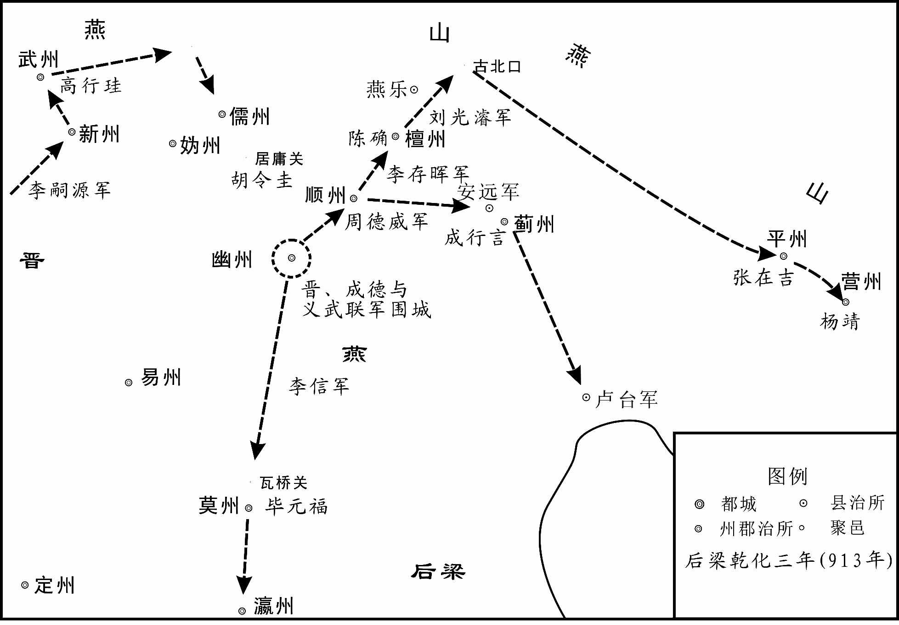 
晋军攻取燕地示意图

## 【原文】

**九月，燕主守光引兵夜出，复取顺州。**

## 【译文】

后梁均王乾化三年（913年）九月，燕主刘守光率军乘夜出击，又夺回了顺州。

## 【原文】

**冬十月己巳朔，燕主守光帅众五千夜出，将入檀州。庚午，周德威自涿州引兵邀击，大破之[1]。守光以百余骑逃归幽州，其将卒降者相继。**

## 【注文】

[1]邀击：拦击，截击。

## 【译文】

后梁均王乾化三年（913年）冬季十月己巳朔（初一日），燕主刘守光率领兵众五千人乘夜间出发，准备攻入檀州。庚午（初二日），周德威从涿州率兵拦击，大败燕军。刘守光带着一百多名骑兵逃回了幽州城，他手下的将士投降晋军的接连不断。

## 【原文】

**卢龙巡属皆入于晋，燕主守光独守幽州城，求援于契丹[1]。契丹以其无信，竟不救。守光屡请降于晋，晋人疑其诈，终不许。至是，守光登城谓周德威曰：“俟晋王至，吾则开门泥首听命[2]。”德威使白晋王。十一月甲辰，晋王以监军张承业权知军府事，自诣幽州。辛酉，单骑抵城下，谓守光曰：“朱温篡逆，余本欲与公合河朔五镇之兵兴复唐祚[3]。公谋之不臧，乃效彼狂僭[4]。镇、定二帅皆俯首事公，而公曾不之恤，是以有今日之役[5]。丈夫成败须决所向，公将何如？”守光曰：“今日俎上肉耳，惟王所裁[6]。”王怜之，与折弓矢为誓，曰：“但出相见，保无他也。”守光辞以他日。**

## 【注文】

[1]巡属：统属的地区。

[2]泥首：以泥涂首，表示自辱服罪。或言指顿首至地。

[3]河朔五镇：河朔，即河北，北方为朔。五镇，指昭义、成德、义武、卢龙、义昌五镇。　　唐祚：唐朝的国统。

[4]臧（zāng）：善。　　狂僭（jiàn）：狂妄僭越。

[5]镇、定二帅：指成德节度使王镕和义武节度使王处直。　　俯（fǔ）首：低头，比喻顺从。　　曾不之恤：“不曾恤之”的倒装，指刘守光攻打镇、定之事。恤，体恤，顾念。

[6]俎（zǔ）上肉：砧板上的肉。喻任人宰割，无可逃避。

## 【译文】

卢龙节度使统属的地区都归入了晋国，燕主刘守光独守着幽州城，向契丹求援。契丹认为他没有信用，始终不出兵救援。刘守光屡次向晋军请求投降，晋人怀疑他不是真心，也始终没有答应。到这时，刘守光登上城楼对周德威说：“等晋王到来，我就打开城门，以泥涂首，听从发落。”周德威派人禀报了晋王。乾化三年（913年）十一月甲辰（初六日），晋王委任监军张承业暂时主持军府事务，亲自前往幽州。辛酉（二十三日），晋王单人匹马到达幽州城下，对刘守光说：“朱温篡国叛逆，我本想和你联合河朔五镇的兵马兴复唐朝的国统。你却谋虑不当，竟然效法朱温的狂妄僭越。镇、定二州的统帅都顺从你，而你不曾体恤他们，所以才有了今天这场战争。大丈夫在成败的关键时刻一定要决定去向，你打算怎么办？”刘守光说：“今天我不过是砧板上的一块肉罢了，任凭大王裁决。”晋王怜悯他，与他折断弓箭起誓说：“只要你出城相见，保证不会有别的事情。”刘守光用改天投降来推托。

## 【原文】

**先是，守光爱将李小喜多赞成守光之恶，言听计从，权倾境内[1]。至是，守光将出降，小喜止之。是夕，小喜逾城诣晋军降，且言城中力竭[2]。壬戌，晋王督诸军四面攻城，克之，擒刘仁恭及其妻妾，守光帅妻子亡去。癸亥，晋王入幽州。冬十二月庚午，晋王以周德威为卢龙节度使兼侍中，以李嗣本为振武节度［使］[3]。**

## 【注文】

[1]赞成：助成。　　倾：超过，压倒。

[2]逾城：翻越城墙。

[3]李嗣本（？—916年）：雁门（治今山西代县）人，本姓张，世为铜冶镇将。被李克用收为养子，赐名李嗣本。以战功迁代州刺史、云州防御使、振武节度使等职，号威信可汗。天祐十三年（916年），契丹入代北，攻蔚（yù）州，他战死。

## 【译文】

在这之前，刘守光的爱将李小喜多方面助成刘守光的恶行，刘守光对他言听计从，他的权势倾压境内。到这时，刘守光准备出城投降，而李小喜劝止了他。这天夜里，李小喜翻越城墙到晋军中投降，并且说城里的力量已经用尽。乾化三年（913年）十一月壬戌（二十四日），晋王李存勗督率各军从四面攻城，攻克了幽州，擒获了刘仁恭及其妻妾，刘守光则带着妻儿逃走。癸亥（二十五日），晋王进入幽州城。冬季十二月庚午（初三日），晋王任命周德威为卢龙节度使兼侍中，任命李嗣本为振武节度使。

## 【原文】

**燕主守光将奔沧州就刘守奇，涉寒足肿，且迷失道，至燕乐之境，昼匿阬谷，数日不食，令妻祝氏乞食于田父张师造家[1]。师造怪妇人异状，诘知守光处，并其三子擒之[2]。癸酉，晋王方宴，将吏擒守光适至，王语之曰：“主人何避客之深邪[3]？”并仁恭置之馆舍，以器服、膳饮赐之。王命掌书记王缄草露布，缄不知故事，书之于布，遣人曳之[4]。**

## 【注文】

[1]涉寒：蹚过寒冷的河水。　　燕乐：县名。治所在今北京密云北不老屯镇燕乐村。　　匿（nì）：藏，躲藏。　　阬（kēng）谷：沟壑山谷。阬，同“坑”。

田父：老农。

[2]诘（jié）：盘问。

[3]适：正好，恰好。

[4]王缄（jiān）（？—918年）：籍贯不详。本为幽州节度使刘仁恭幕僚，后出使还经太原，被李克用强留，任掌书记。李存勗嗣位后，授检校司空、魏博节度使。后在晋梁胡柳之战中，死于乱兵。　　露布：报捷的文告。魏晋以来，每战胜则书写捷报，悬于竹竿之上，向天下公开宣布，故称露布。　　布：布匹。王缄不知写作露布的旧制，误认为须写在布上，故书之于布。　　曳（yè）：拖，扯。

## 【译文】

燕主刘守光准备逃到沧州投靠刘守奇，因徒步渡过寒冷的河水，双脚肿了，而且又迷了路，跑到了燕乐县境内，白天躲藏在沟壑山谷之中，一连几天都没有吃上东西，就让妻子祝氏到老农张师造家讨些吃的。张师造对祝氏非同一般的样子感到奇怪，通过盘问知道了刘守光的藏身之处，就把刘守光连同他的三个儿子一并捉了。乾化三年（913年）十二月癸酉（初六日），晋王李存勗正举行宴会，将吏押着刘守光恰好来到，晋王对刘守光说：“你身为主人为什么躲避客人这么久呢？”便把他与刘仁恭都安置在馆舍之中，并赐给他们一些用具衣物、膳食酒水。晋王命令掌书记王缄起草报捷的公告，王缄不知道起草公告的旧例，便把公告写在了布匹上面，派人扯着它公布于众。

## 【原文】

**晋王欲自云、代归，赵王镕及王处直请由中山、真定趣井陉，王从之[1]。庚辰，晋王发幽州，刘仁恭父子皆荷校于露布之下[2]。守光父母唾其面而骂之曰：“逆贼，破我家至此[3]！”守光俛首而已。甲申，至定州，舍于关城[4]。丙戌，晋王与王处直谒北岳庙，是日，至行唐，赵王镕迎谒于路[5]。**

## 【注文】

[1]中山：指定州州治安喜县（今河北定州），唐以前为中山郡治所，此用旧称。时为王处直治所。　　真定：县名，即今河北正定，时为王镕治所。　　井陉（xíng）：县名。治所在今河北井陉。

[2]荷校（jiào）：荷，戴；校，枷。

[3]唾（tuò）：吐唾沫。

[4]定州：州名。唐高祖武德四年（621年）改隋高阳郡置，治安喜（今河北定州）。玄宗天宝元年（742年）改为博陵郡，肃宗乾元元年（758年）复改为定州。领安喜、义丰、北平、望都、安险、曲阳、陉邑、唐县八县，辖境约当今河北保定满城以南，安国、饶阳以西，井陉、藁（gǎo）城、辛集以北地区。　　舍：驻扎。古时行军，在某地驻扎一宿为舍，两宿为信，超过两宿为次。广义的驻扎有时也称“舍”。　　关城：城门外用来加强防御的小城。

[5]谒（yè）：谒拜。　　北岳庙：五岳之一北岳恒山的神庙，在今河北曲阳。　　行唐：县名。即今河北行唐。

## 【译文】

晋王李存勗准备经过云州、代州返回晋阳，赵王王镕与王处直请求晋王经由中山、真定，再奔向井陉返回，晋王答应了他们的请求。乾化三年（913年）十二月庚辰（十三日），晋王从幽州出发，刘仁恭父子都在露布下戴着枷锁跟随。刘守光的父母把唾沫吐在刘守光的脸上并大骂道：“逆子，把我们家败坏到了这种地步！”刘守光只是低着头而已。甲申（十七日），晋王一行到达定州，驻扎在关城之中。丙戌（十九日），晋王与王处直谒拜了北岳庙，当天，到达行唐，赵王王镕在路上迎接谒见了晋王。

## 【原文】

**四年春正月戊戌朔，赵王镕诣晋王行帐上寿置酒。镕愿识刘太师面，晋王命吏脱刘仁恭及守光械，引就席同宴[1]。镕答其拜，又以衣服、鞍马、酒馔赠之[2]。己亥，晋王与镕畋于行唐之西，镕送至境上而别[3]。**

## 【注文】

[1]行帐：行军宿营时所置营帐。　　上寿：祝寿。

[2]酒馔（zhuàn）：酒食。

[3]畋（tián）：打猎。

## 【译文】

后梁均王乾化四年（914年）春季正月戊戌朔（初一日），赵王王镕到晋王李存勗的营帐中祝寿设宴，王镕希望能见刘太师之面，晋王便命官吏脱掉刘仁恭和刘守光的刑具，带入席中一同宴饮。王镕答谢了刘氏父子的拜见，又向他们赠送了衣服、鞍马和酒食。己亥（初二日），晋王与王镕一起在行唐西边打猎，随后王镕一直把晋王送到边境上才告别。

## 【原文】

**壬子，晋王以练刘仁恭父子，凯歌入于晋阳，丙辰，献于太庙，自临斩刘守光[1]。守光呼曰：“守光死不恨，然教守光不降者，李小喜也。”王召小喜证之，小喜瞋目叱守光曰：“汝内乱禽兽行，亦我教邪[2]？”王怒其无礼，先斩之。守光曰：“守光善骑射，王欲成霸业，何不留之使自効？”其二妻李氏、祝氏让之曰：“皇帝，事已如此，生亦何益[3]？妾请先死。”即伸颈就戮。守光至死号泣哀祈不已[4]。王命节度副使卢汝弼等械仁恭至代州，刺其心血以祭先王墓，然后斩之[5]。**

## 【注文】

[1]练（chè）：用白绢捆绑。练，白绢；，捆绑。　　晋阳：县名。唐时与太原县同为太原府治，在今山西太原西南古营城。　　献于太庙：指把擒获的俘虏献于太庙，祭告先祖，为古代的一种军礼。太庙，帝王供奉祖先的庙宇。

[2]内乱：家庭内部乱伦的行为。此指刘守光与其父爱妾私通之事。

[3]让：责备。

[4]哀祈：哀求。

[5]卢汝弼（bì）（？—921年）：字子谐，范阳（今河北涿州）人。唐昭宗时举进士，官至祠部郎中，知制诰。后依李克用，任河东节度副使，于李存勗称帝前卒。有诗作八首传世。　　先王：指李存勗之父李克用。因刘仁恭曾背叛李克用，故李存勗以其心血祭奠先王。

## 【译文】

后梁均王乾化四年（914年）正月壬子（十五日），晋王李存勗用白绢捆绑着刘仁恭父子，高唱凯歌进入晋阳城，丙辰（十九日），向太庙献俘，亲临刑场监斩刘守光。刘守光大声呼喊说：“我刘守光死而无恨，但是教唆我不投降的，是李小喜。”晋王召来李小喜与刘守光对证，李小喜睁大眼睛责问说：“你乱伦的禽兽行为，也是我教唆的吗？”晋王对李小喜辱骂旧主的无礼行为大怒，先斩了他。刘守光对晋王说：“我善于骑马射箭，大王您想成就王霸功业，为什么不留下我，让我为您效力呢？”他的两个妻子李氏、祝氏责备他说：“皇帝，事情已经到了这种地步，活着又有什么好处呢？我们请求先死。”随即伸着脖颈受刑。刘守光到死都号哭哀求不止。晋王命令节度副使卢汝弼等给刘仁恭戴上刑具，押到代州，在先王墓前，刺取出他心口的鲜血来祭奠先王，然后斩杀了他。

* * *

(1) 原文无“使”字，据中华书局《资治通鉴》点校本补。

# 后唐灭梁

## 【内容提要】

《后唐灭梁》叙述了五代时期晋（后唐）与后梁两大集团之间的战争，以及晋王李存勗（xù）称帝、建立后唐和攻灭后梁的历史过程。

唐朝末年，宣武节度使（治汴州，今河南开封）、梁王朱全忠与河东节度使（治太原，今山西太原西南）、晋王李克用为争夺中原，战火不断。控制黄河中下游大部分地区的朱全忠，势力超过了河东。公元907年，朱全忠代唐称帝，建立后梁。次年正月，李克用病死，其子李存勗继位。不久，李存勗击败围困潞州（治上党，今山西长治）的后梁军队，从而得以全力经营河东，为与后梁争夺中原创造了条件。

后梁开平四年（910年），后梁太祖朱全忠乘魏博节度使（治魏州，今河北大名东北）罗绍威新死，欲剪除河朔三镇，引起成德节度使（治镇州，今河北正定）王镕与义武节度使（治定州，今河北定州）王处直的不安。于是二镇背梁投晋，晋王李存勗遂发兵救援。朱全忠得知，亦派将领王景仁率兵出击。乾化元年（911年）初，双方在柏乡（今河北柏乡）的野河之旁展开激战，结果晋军大获全胜，歼灭梁军二万余人。经此一役，双方势力发生了变化，晋国开始由弱转强。

后梁乾化二年（912年）六月，朱全忠庶子、郢（yǐng）王朱友珪弑父篡位，在位仅七月，朱全忠三子、均王朱友贞又诛杀朱友珪，即位为帝，是为后梁末帝。当年，晋王李存勗也灭掉幽州（治蓟县，今北京西南）刘守光，解除了后顾之忧，转而挥兵南下。晋梁之间的争斗又进入新的阶段。

后梁末帝贞明元年（915年），后梁魏博节度使杨师厚病死。后梁末帝欲削弱魏博镇势力，诏分魏博六州为天雄、昭德两镇，分别以贺德伦、张筠为节度使，并派大将刘（xún）率兵前往威胁，从而引发魏博兵变，迫使贺德伦归降晋国。晋王李存勗率军进入魏州（治贵乡，今河北大名东），继而与刘多次交战。贞明二年（916年）二月，故元城（在今河北大名东北）一战，晋军歼灭梁军七万，刘仅率数十骑突围逃往滑州（治白马，今河南滑县东旧滑县）。随后晋军乘胜攻占邢（治龙冈，今河北邢台）、洺（治永年，今河北永年）等州，河北州县几乎尽为晋国所有。

故元城之战后，晋国取得了战略的主动地位。贞明三年（917年）冬，晋军乘黄河冰封，渡河攻取杨刘城，与梁军相争于河滨。贞明四年（918年）秋，李存勗集中幽州、沧景、邢洺、易定、河东、魏博等镇兵马与麟（治新秦，今陕西神木北）、胜（治榆林，今内蒙古准格尔旗东北十二连城）、云（治云中，今山西大同）、蔚（yù）（治灵丘，今山西灵丘）、新（治永兴，今河北涿鹿）、武（治文德，今河北宣化）等州奚、契丹、室韦、吐谷浑等部落兵力，大阅于魏州，准备大举进攻后梁。当年十二月，李存勗乘梁军统帅发生内讧，贺瓌（guī）诛杀谢彦章等骑将之机，率军西进，欲直捣后梁国都大梁（今河南开封）。晋军行至胡柳陂（在今河南范县西南濮城西南。濮音pú）时，梁军亦继踵而至，于是两军展开激战。由于李存勗指挥失当，晋军失利。后虽反败为胜，消灭梁军近三万人，但己方亦伤亡惨重，宿将周德威父子战死，损失兵力达三分之二，已无力西向大梁。

胡柳之战后，晋军于濮阳（治所在今河南濮阳西南）德胜夹黄河筑南北两城屯兵守卫，梁军亦屯兵河上，与晋军对垒，历时数年，互有胜败。公元923年四月，李存勗在魏州称帝，建立后唐，随即派军攻取郓（yùn）州（治须昌，今山东东平西北）。后梁末帝闻讯大惧，任命骁将王彦章为帅，抵御后唐军。王彦章虽数次获胜，然不久后梁末帝听信谗言，竟以智勇全无的段凝代王彦章为帅，以致宿将愤怒，士卒不服。而此时，后唐军的粮草已不足半年之用，泽潞镇（治潞州，今山西上党）又叛归后梁，契丹也屡扰北边，后梁更准备数道并进，大举进攻后唐的后方。在此危急关头，后唐庄宗采纳了谋臣郭崇韬（tāo）的建议，决定亲率精兵袭取汴京，一举灭梁。当年十月，后唐庄宗率大军自杨刘渡过黄河，到达郓州，即命李嗣源为前锋，直扑汴梁，而自领大军继后。李嗣源攻克中都（今山东汶上），俘获王彦章，继而经过曹州（治济阴，今山东曹县西北），进至汴梁城下。后梁末帝朱友贞走投无路，自杀而亡。开封尹王瓒（zàn）开门出降。李嗣源与后唐庄宗先后进入汴梁。后梁北面招讨使段凝闻讯，亦率五万大军解甲请降。后梁王朝至此灭亡。

## 【原文】

**唐昭宗天祐元年夏闰四月，更命魏博曰天雄军。进天雄节度使长沙郡王罗绍威爵邺王。**

## 【译文】

唐昭宗天祐元年（904年）夏季闰四月，朝廷把魏博改名为天雄军。进封天雄节度使长沙郡王罗绍威的爵位为邺王。

## 【原文】

**昭宣帝天祐二年七月庚午夜，天雄牙将李公佺与牙军谋乱，罗绍威觉之；公佺焚府舍，剽掠，奔沧州[1]。**

## 【注文】

[1]李公佺（quán）：魏博镇牙军将领。唐昭宗天祐二年（905年）率牙军密谋作乱，被察觉后逃至沧州，投靠义昌节度使刘守文。

## 【译文】

唐昭宣帝天祐二年（905年）七月庚午（十三日）夜里，天雄军牙将李公佺与牙军密谋作乱，罗绍威发觉了此事；李公佺便焚烧了节度使府舍，抢劫一番，逃奔到沧州。

## 【原文】

**三年。初，田承嗣镇魏博，选募六州骁勇之士五千人为牙军，厚其给赐以自卫，为腹心[1]。自是父子相继，亲党胶固，岁久益骄横；小不如意，辄族旧帅而易之，自史宪诚以来皆立于其手[2]。天雄节度使罗绍威心恶之，力不能制。朱全忠之围凤翔也，绍威遣军将杨利言密以情告全忠，欲借其兵以诛之[3]。全忠以事方急，未暇如其请，阴许之[4]。及李公佺作乱，绍威益惧，复遣牙军将臧延范趣全忠。全忠乃发河南诸镇兵七万，遣其将李思安将之，会魏、镇兵屯深州乐城，声言击沧州，讨其纳李公佺也[5]。会全忠女适绍威子廷规者卒，全忠遣客将马嗣勋实甲兵于橐中，选长直兵千人为担夫，帅之入魏，诈云会葬[6]。全忠自以大军继其后，云赴行营，牙军皆不之疑[7]。正月庚午，绍威潜遣人入库断弓弦、甲襻，是夕，绍威帅其奴客数百，与嗣勋合击牙军，牙军欲战而弓甲皆不可用，遂阖营殪之，凡八千家，婴孺无遗[8]。诘旦，全忠引兵入城[9]。**

## 【注文】

[1]田承嗣（704—778年）：平州卢龙（今河北卢龙）人。初为安禄山部将，曾于安史之乱时为前锋，两次进攻洛阳。代宗时降唐，由郑州刺史升至魏博节度使，征收重税，扩充兵力，自署官吏，成为河北割据势力，曾两次叛乱。　　六州：指魏博节度使所统魏、博、贝、卫、澶、相六州。　　给（jǐ）赐：供给赏赐。

[2]胶固：牢固。指结成牢固的集团。　　辄：就，便。　　族：诛杀全族。　　易之：指改换节度使的人选。　　史宪诚（？—829年）：灵武建康（今甘肃高台西）人，祖先为奚人。原为魏博镇将领，唐穆宗长庆二年（822年），魏博节度使田布因军乱自杀，他使诸军拥立自己为帅。七年后亦被乱军所杀。其后任何进滔、韩允中、乐彦祯（zhēn）、赵文（biàn）、罗弘信等皆为牙军所拥立。

[3]凤翔：方镇名。唐肃宗上元元年（760年）置，又称秦陇、兴凤陇、凤翔陇右、凤翔陇、凤翔河陇节度使，治凤翔府（今陕西凤翔）。原领凤翔府、陇州（治汧源，今陕西陇县。汧音qiān），后仅领凤翔府。当时为李茂贞所据。朱全忠围凤翔，事在唐昭宗天复元年（901年）至天复三年（903年）。

[4]未暇（xiá）：没有空闲。　　阴许之：暗中答应他。

[5]魏、镇：指魏博、镇冀两镇。镇冀又称成德军，唐代宗宝应元年（762年）置，治恒州（后改名镇州，治真定，今河北正定县）。天祐二年（905年）更名武顺军，后梁太祖开平四年（910年），节度使王镕依附于晋，复名成德军。领恒、赵（治平棘，今河北赵县）、冀（治信都，今河北冀州）、深（治陆泽，今河北深州西南）等州，辖境约当今河北武强、阜城、枣强以西，平山、井陉（xíng）、赞皇以东，临城、南宫以北，西北至阜平，东北抵安平、饶阳之地。时为成德节度使王镕所据。

深州：州名。隋文帝开皇十六年（596年）置，炀帝大业二年（606年）废。唐高祖武德四年（621年）复置，治陆泽（今河北深州西南）。玄宗天宝元年（742年）改为饶阳郡，肃宗乾元元年（758年）复改为深州。领陆泽、饶阳、鹿城、安平四县，辖境约当今河北深州、饶阳、辛集、安平等地。　　乐城：当为乐寿。县名。在今河北献县乐寿镇。

[6]会：副词。正好，恰巧。　　适：嫁给。　　马嗣勋（？—906）：濠州钟离（今安徽凤阳）人，初为濠州客将，有辩才。唐昭宗乾宁二年（895年），杨行密攻打濠州，他奉命向朱温求救，因濠州被克，留事朱温，任宣武军元从押衙。后在平定魏博牙军叛乱时，伤重而死。　　橐（tuó）：袋子。　　长直兵：长直军兵士。时朱温元帅府建有左、右长直军，为侍卫亲军。　　诈云：假称。

[7]不之疑：“不疑之”的倒装。

[8]甲襻（pàn）：系铠（kǎi）甲的带子。　　奴客：家奴。　　阖（hé）营：全营。　　殪（yì）：死。此指杀死。　　婴孺（rú）：婴儿小孩。

[9]诘（jié）旦：第二天早上。

## 【译文】

唐昭宣帝天祐三年（906年）。当初，田承嗣镇守魏博的时候，挑选募集所辖六州的勇猛兵士五千人组成牙军，给他们丰厚的供给和赏赐，来保卫自己，把他们作为心腹。从此牙兵父死子继，亲族关系牢固，年岁一长，便越来越骄横，稍不如意，就诛灭旧帅的全族而改立新帅，自史宪诚以来的节度使都是立于他们之手。天雄节度使罗绍威心里厌恶他们，但自己的力量又不能制伏他们。在朱全忠围攻凤翔期间，罗绍威派遣军将杨利言秘密地把情况告诉了朱全忠，想借他的军队来诛灭牙军。朱全忠因为战事正紧急，没有时间按他的请求去做，只是暗中答应下来。等到李公佺作乱，罗绍威更加害怕，又派遣牙将臧延范去催促朱全忠。朱全忠这才调发河南各方镇的军队七万人，派手下将领李思安率领，会合魏博、镇冀两镇的军队驻扎在深州乐城，声称要进攻沧州刘守文，讨伐他接纳李公佺。适逢朱全忠嫁给罗绍威之子罗廷规的女儿去世，朱全忠就派客将马嗣勋把盔甲兵器装在袋子里，挑选长直兵一千人扮作挑夫，带领他们进入魏州，假称是前来会葬。朱全忠亲自率领大军跟在他们后面，说是去往行营，魏博的牙将都没有怀疑他们。正月庚午（十六日），罗绍威秘密派人进入兵器库，把弓弦、铠甲的系带弄断，这天夜里，罗绍威率领自家的奴仆数百人，与马嗣勋合击牙军，牙军想应战，但弓箭铠甲都不能使用，于是全营都被杀死，共计八千家，连婴儿小孩也没留下一个。第二天早晨，朱全忠率兵进入魏州城。

## 【原文】

**罗绍威既诛牙军，魏之诸军皆惧，绍威虽数抚谕之，而猜怨益甚[1]。朱全忠营于魏州城东数旬，将北巡行营，会天雄牙将史仁遇作乱，聚众数万据高唐，自称留后，天雄巡内州县多应之[2]。全忠移军入城，遣使召行营兵还攻高唐，至历亭，魏兵在行营者作乱，与仁遇相应[3]。元帅府左司马李周彝、右司马符道昭击之，所杀殆半，进攻高唐，克之，城中兵民无少长皆死[4]。擒史仁遇，锯杀之[5]。**

## 【注文】

[1]抚谕：抚慰劝告。　　猜怨：猜疑怨恨。

[2]魏州：唐高祖武德四年（621年）置，治贵乡（今河北大名东）。玄宗天宝元年（742年）改为魏郡，肃宗乾元元年（758年）复为魏州。领贵乡、昌乐、元城、莘（shēn）县、临黄、顿丘、魏县、冠氏、馆陶、武圣十县，辖境约当今河北大名、魏县，河南南乐、清丰、范县，山东馆陶、冠县、莘县等地。　　高唐：县名。在今山东高唐东。

[3]历亭：县名。治所在今山东武城东。

[4]元帅府左司马：官名。与下文右司马皆为元帅府综理府事、参与军事计划的属官。　　李周彝（yí）（？—926年）：深州博野（今河北蠡县。蠡音lí）人，初名李茂勋，凤翔节度使李茂贞从弟。原为鄜（fū）州节度使，后降朱温，改名周彝。历任元帅府左司马、河阳节度使、金吾上将军、左卫上将军等职。后梁末帝时致仕。后唐时复名茂勋。　　符道昭（？—907年）：淮西蔡州（治汝阳，今河南汝南）人。初为秦宗权骑将，以善于布阵及勇猛闻名。后归降朱温，历任元帅府右司马、秦州节度使、同平章事。朱温称帝后，被委以兵权，与康怀英等率军攻打潞州，兵败被杀。

[5]锯杀：用锯杀死。

## 【译文】

罗绍威诛灭牙军之后，魏博镇各军都很害怕，罗绍威虽然多次抚慰劝告他们，但他们的猜忌怨恨更加厉害。朱全忠在魏州城东扎营数十天，准备北上巡视行营，正遇上天雄牙将史仁遇作乱，聚集部众数万人占据了高唐，自称天雄留后，天雄辖区内的州县大多都响应他。朱全忠便把军队转移到魏州城内，派遣使者召唤行营的军队回来攻打高唐，行营的军队走到历亭时，行营中的魏兵又作乱，与史仁遇遥相呼应。元帅府左司马李周彝、右司马符道昭攻击作乱的魏兵，杀死将近一半，接着又攻打高唐城，打了下来，城中的兵士百姓无论老幼全被杀死。活捉了史仁遇，用锯杀死了他。

## 【原文】

**先是，仁遇求救于河东及沧州，李克用遣其将李嗣昭将三千骑攻邢州以救之[1]。时邢州兵才二百，团练使牛存节守之，嗣昭攻七日，不克[2]。全忠遣右长直都将张筠将数千骑助存节守城，筠伏兵于马岭，击嗣昭，败之，嗣昭遁去[3]。**

## 【注文】

[1]先是：在此之前。是，指示代词，这，这时。　　河东：方镇名。唐玄宗开元十八年（730年）改太原府以北诸州军节度为河东节度使，治太原（今山西太原西南）。领天兵、大同、横野、岢（kě）岚（lán）四军，云中守捉及太原府和辽（治乐平，今山西昔阳西南）、石（治离石，今山西离石）、岚（治宜芳，今山西岚县北）、汾（治隰城，今山西汾阳。隰音xí）、代（治雁门，今山西代县）、忻（xīn）（治秀容，今山西忻州）、朔（治善阳，今山西朔州）、蔚（yù）（治灵丘，今山西灵丘）、云（云中，今山西大同）等州，辖境约当今山西长城以南，中阳、灵石、沁源、榆社、左权以北地区。后一度号保宁军节度使，辖地亦有所变更。时为李克用所据。　　李克用（856—908年）：沙陀部人，别号李鸦（yā）儿。因一目盲，又号独眼龙。其父朱邪赤心，唐懿（yì）宗时以功赐姓名李国昌。他早年随父征战，后因镇压黄巢起义军有功，被任为河东节度使。此后割据跋扈，一度进犯京师，纵火大掠。后进封为晋王，长期与朱温交战。其子李存勗建立后唐，他被谥为武皇帝，庙号太祖。　　邢州：州名。唐高祖武德元年（618年）改隋襄国郡置，治龙冈（今河北邢台）。玄宗天宝元年（742年）改为巨鹿郡，肃宗乾元元年（758年）复称邢州。领龙冈、尧山、巨鹿、沙河、平乡、南和、任县、内丘八县，辖境相当于今河北巨鹿、广宗以西，泜（zhī）河以南，沙河以北地区。

[2]牛存节（？—915年）：字赞贞，本名礼，青州博昌（今山东博兴）人。初事朱温，授宣义军小将，多有战功，官至邢州团练使、元帅府左都押衙。朱温建梁后，历任右千牛卫上将军、右龙虎统军、左龙虎统军、绛州刺史、同州节度使、郓州节度使等职，进封开国公。以擅长野战壁守著名。

[3]都将：都指挥使的俗称。都为唐末五代军队编制单位，每都人数自一二百至数万人不等，其将称都指挥使。　　张筠（？—937年）：海州（今江苏连云港）人。初为感化节度使时溥（pǔ）偏将，累功至宿州刺史。后降梁，官至昭德军节度使、永平军节度使。梁亡事唐，官至左骁卫上将军。后罢归，以酒色声妓自娱，人谓之“地仙”。　　马岭：地名。在今河北邢台西北。

## 【译文】

在此之前，史仁遇向河东及沧州请求救援，李克用派遣手下将领李嗣昭率领三千骑兵攻打邢州，来救援史仁遇。当时邢州的兵力才二百人，团练使牛存节守卫州城，李嗣昭攻打了七天，未能攻克。朱全忠派遣右长直都将张筠率领数千骑兵协助牛存节守城，张筠在马岭设下伏兵，伏击李嗣昭，打败了他，李嗣昭逃走。

## 【原文】

**义昌节度使刘守文遣兵万人攻贝州，又攻冀州，拔蓨县，进攻阜城[1]。时镇州大将王钊攻魏州叛将李重霸于宗城[2]。全忠遣归救冀州，沧州兵去。四月丙午，重霸弃城走，汴将胡规追斩之[3]。**

## 【注文】

[1]贝州：州名。唐高祖武德四年（621年）改隋清河郡置，治清河（今河北清河）。玄宗天宝元年（742年）复为清河郡，肃宗乾元元年（758年）又改为贝州。领清阳、清河、武城、宗城、临清、经城、漳南、历亭、夏津九县，辖境约当今河北清河、故城、临西及山东临清、武城、夏津等地。　　冀州：州名。唐高祖武德四年（621年）改隋信都郡置，治信都（今河北冀州）。玄宗天宝元年（742年）复为信都郡，肃宗乾元元年（758年）又改为冀州。领信都、南宫、堂阳、枣强、武邑、武强、衡水、阜城、下博九县，辖境约当今河北阜城、景县、枣强以西至滏（fǔ）阳河一带，南宫至武强之间各县地。　　蓨（tiāo）县：县名。治所在今河北景县。

阜城：县名。治所在今河北阜城。

[2]镇州：州名。唐宪宗元和十五年（820年）改恒州置，治真定（今河北正定）。领真定、藁（gǎo）城、石邑、九门、灵寿、行唐、井陉、获鹿、房山九县，辖境相当于今河北石家庄及井陉（xíng）、行唐、正定、阜平、栾城、平山、灵寿、藁城等地。时为成德节度使王镕所据。　　宗城：县名。治所在今河北威县东。

[3]汴将：指朱温将领。时朱温任宣武军节度使，治汴州（治今河南开封），故其军被称作汴军，将领被称作汴将。　　胡规（？—911年）：兖州（治今山东兖州）人。初为朱瑾（jǐn）中军都校，后归附朱温。后梁建立后，官至右龙虎统军兼侍卫指挥使。后梁太祖乾化元年（911年），奉诏修洛河堤堰，因军士滥伐百姓园林，被赐死。

## 【译文】

义昌节度使刘守文派兵万人攻打贝州，又攻打冀州，攻克了蓨县，接着攻打阜城。当时镇州大将王钊正在宗城攻打魏州叛将李重霸。朱全忠派他回兵救援冀州，沧州军队于是撤离。天祐三年（906年）四月丙午（二十四日），李重霸弃城而逃，汴州将领胡规追击斩杀了他。

## 【原文】

**五月丁巳，朱全忠如洺州，遂巡北边，视戎备，还，入于魏[1]。**

## 【注文】

[1]洺（míng）州：州名。唐高祖武德元年（618年）改隋武安郡置，治永年（今河北永年）。玄宗天宝元年（742年）改为广平郡，肃宗乾元元年（758年）复称洺州。领永年、平恩、临洺、鸡泽、肥乡、曲周、洺水、清漳、武安、邯（hán）郸（dān）十县，辖境约当今河北邯郸、鸡泽、永年、曲周、丘县、肥乡、武安等地。　　戎备：战备。

## 【译文】

唐昭宣帝天祐三年（906年）五月丁巳（初五日），朱全忠前往洺州，随即巡视北部边境，察看战备，然后返回，进入魏州。

## 【原文】

**秋七月，朱全忠克相州[1]。时魏之乱兵散据贝、博、澶、相、卫州及魏之诸县，全忠分命诸将攻讨，至是悉平之，引兵南还[2]。**

## 【注文】

[1]相州：州名。唐高祖武德元年（618年）改隋魏郡置，治安阳（今河南安阳）。玄宗天宝元年（742年）改为邺郡，肃宗乾元元年（758年）复称相州。领安阳、邺县、林虑、临漳、洹（huán）水、尧城、汤阴、滏阳、成安、内黄、临河十一县，辖境约当今河北成安、广平和魏县西南部，河南安阳、汤阴、林州、内黄及濮阳西南部地区。

[2]博：博州。唐高祖武德四年（621年）置，治聊城（今山东聊城东北）。玄宗天宝元年（742年）改为博平郡，肃宗乾元元年（758年）复称博州。领聊城、博平、武水、清平、堂邑、高唐六县，辖境约当今山东聊城、高唐、茌（chí）平等地。

澶（chán）：澶州。唐高祖武德四年（621年）分魏州置，治顿丘（今河南清丰西南）。后废，唐代宗大历七年（772年）复置。领顿丘、清丰、观城、临黄四县，辖境约当今河南清丰、范县及山东莘县部分地区。　　卫：卫州。唐高祖武德元年（618年）改隋汲郡置，初治卫县（今湖南淇县），后徙治汲县（今河南汲县）。玄宗天宝元年（742年）复为汲郡，肃宗乾元元年（758年）又改称卫州。领汲、新乡、卫县、共城、黎阳等县，辖境约当今河南新乡、卫辉、辉县、浚（xùn）县、淇县等地。

## 【译文】

唐昭宣帝天祐三年（906年）秋季七月，朱全忠攻克相州。当时，魏博的乱兵分散占据着贝、博、澶、相、卫等州及魏州的各县，朱全忠分别命令诸将攻打讨伐他们，至此全部平定，于是率军向南撤还。

## 【原文】

**全忠留魏半岁，罗绍威供亿，所杀牛、羊、豕近七十万，资粮称是，所赂遗又近百万，比去，蓄积为之一空[1]。绍威虽去其逼，而魏兵自是衰弱。绍威悔之，谓人曰：“合六州四十三县铁，不能为此错也[2]！”壬申，全忠至大梁。**

## 【注文】

[1]供亿：供给。　　称（chèn）是：与此相称，与此相当。　　赂遗（wèi）：赠送财物。

[2]“合六州……”句：六州四十三县为魏博镇所辖之地。错为锉刀，以铁铸成。错又有错误之意，故罗绍威用铸错来比喻造成的错误重大。

## 【译文】

朱全忠在魏州驻留了半年，罗绍威供给军需，所杀的牛、羊、猪达近七十万头，物质粮草也与此相当，所赠送的财物又将近百万，等到朱全忠离去，魏博的积蓄全部耗尽了。罗绍威虽然除去了威逼自己的牙军，但魏博的兵力也从此衰弱了。罗绍威对此十分后悔，对人说：“把六州四十三县的铁聚集在一起，也不能铸成这样的大错啊！”天祐三年（906年）七月壬申（二十一日），朱全忠回到大梁。

## 【原文】

**八月，朱全忠以幽、沧相首尾为魏患，欲先取沧州，甲辰，引兵发大梁[1]。九月辛亥朔，朱全忠自白马渡河，丁卯，至沧州，军于长芦，沧人不出[2]。罗绍威馈运，自魏至长芦五百里，不绝于路[3]。又建元帅府舍于魏，所过驿亭供酒馔、幄幕、什器，上下数十万人，无一不备[4]。**

## 【注文】

[1]幽、沧相首尾：幽，指卢龙节度使（治幽州）刘仁恭；沧，指义昌节度使（治沧州）刘守文。相首尾谓互相应援。　　发：出发。

[2]白马：即白马津。黄河渡口之一，因在白马县西北（今河南滑县东北）得名。在黄河南岸，与北岸黎阳津相对。　　长芦：县名。治所在今河北沧州西。

[3]馈运：运输军粮。

[4]驿亭：驿站。又称馆驿、驿舍、邮亭等。是供传递公文的人或往来官吏、使臣途中歇宿、换马的处所。唐时三十里设一驿。　　幄（wò）幕：帐幕。

什（shí）器：日常所用的器具。

## 【译文】

唐昭宣帝天祐三年（906年）八月，朱全忠认为幽州的刘仁恭与沧州的刘守文父子首尾相援，是魏州的祸患，想先攻取沧州，甲辰（二十三日），率军从大梁出发。九月辛亥朔（初一日），朱全忠从白马津渡过黄河，丁卯（十七日），到达沧州，驻扎在长芦县，沧州军队不出来迎战。罗绍威运送军粮，从魏州到长芦五百里，路上接连不断。又在魏州修建元帅府舍，汴军所经过的驿站还要供应酒食、帐幕和日用器具，对上下几十万人，没有一件不准备齐全。

## 【原文】

**刘仁恭救沧州，战屡败。乃下令境内男子十五以上，七十以下，悉自备兵粮诣行营，军发之后，有一人在闾里，刑无赦[1]。或谏曰：“今老弱悉行，妇人不能转饷，此令必行，滥刑者众矣[2]。”乃命胜执兵者尽行，文其面曰“定霸都”，士人则文其腕或臂曰“一心事主”，于是境内士民，稚孺之外身无不文者[3]。得兵十万，军于瓦桥[4]。**

## 【注文】

[1]闾（lǘ）里：乡里。

[2]转饷：运送粮饷。　　必行：假如实行。

[3]胜执兵者：能拿得动武器的人。胜，胜任，能承担。　　文其面：在他们脸上刺字。　　定霸都：定霸为军号；都，为唐末五代时的军事编制单位。

士人：读书人。　　稚孺：幼童。

[4]瓦桥：关名。在今河北雄县西南。

## 【译文】

卢龙节度使刘仁恭救援沧州，屡战屡败。于是下令辖境内的男子年龄在十五岁以上、七十岁以下的，全部自备兵器军粮前去行营，军队出发之后，如有一人还在乡里，立即诛杀，绝不宽赦。有人劝谏说：“现在老弱男子全部前行，妇女不能运送粮饷，这条命令假如实行，滥杀的人就太多了。”刘仁恭这才下令让能拿得动武器的男子全部前行，在他们脸上刺上“定霸都”三字，对于读书人，则在他们的手腕或胳膊上刺上“一心事主”四字，于是境内的士人百姓，除孩童之外，身上没有不被刺字的。共得到兵员十万，驻扎在瓦桥关。

## 【原文】

**时汴军筑垒围沧州，鸟鼠不能通[1]。仁恭畏其强，不敢战。城中食尽，丸土而食，或互相掠啖[2]。朱全忠使人说刘守文曰：“援兵势不相及，何不早降？”守文登城应之曰：“仆于幽州，父子也。梁王方以大义服天下，若子叛父而来，将安用之[3]！”全忠愧其辞直，为之缓攻[4]。**

## 【注文】

[1]垒：壁垒，营垒。

[2]丸土：抟（tuán）土成丸。

[3]梁王：即朱全忠，时为梁王。

[4]愧其辞直：因他的言辞理直而感到惭愧。

## 【译文】

当时汴军筑起壁垒围困沧州，连飞鸟老鼠都不能通过。刘仁恭惧怕汴军的强大，不敢出战。城中的食物用尽，就把泥土抟成丸状来吃，还有的人竟互相掳掠，把掠来的人吃掉。朱全忠派人劝说刘守文：“你们的援军势必不会赶来，为什么不早早投降呢？”刘守文登上城楼回答说：“我与幽州是父子关系。梁王您正凭借大义使天下服从，假如儿子背叛父亲前来，您将怎样任用他呢！”朱全忠因为他的言辞理直而感到惭愧，因此放缓了攻打的速度。

## 【原文】

**冬十月，刘仁恭求救于河东，前后百余辈[1]。李克用恨仁恭返覆，竟未之许[2]。其子存勗谏曰：“今天下之势，归朱温者什七八，虽强大如魏博、镇、定莫不附之[3]。自河以北，能为温患者独我与幽、沧耳。今幽、沧为温所困，我不与之并力拒之，非我之利也。夫为天下者不顾小怨，且彼尝困我而我救其急，以德怀之，乃一举而名实附也[4]。此乃吾复振之时，不可失也。”克用以为然，与将佐谋召幽州兵与攻潞州，曰：“于彼则可以解围，于我则可以拓境[5]。”乃许仁恭和，召其兵。仁恭遣都指挥使李溥将兵三万诣晋阳，克用遣其将周德威、李嗣昭将兵与之共攻潞州。**

## 【注文】

[1]辈：批。

[2]返覆：同“反复”。刘仁恭曾以幽州叛李克用，此时又求助于李克用，故李克用恨其反复无常。

[3]存勗（xù）：即李存勗。　　什七八：十分之七八。　　镇、定：指王镕与王处直所统二镇。

[4]以德怀之：用恩德感化他们。　　名实：名声与实际利益。

[5]潞（lù）州：州名。唐高祖武德元年（618年）改隋上党郡置，治上党（今山西长治）。玄宗天宝元年（742年）复为上党郡，肃宗乾元元年（758年）又称潞州。领上党、壶关、长子、屯留、潞城、襄垣、黎城、涉县、铜鞮（dī）、武乡十县，辖境约当今山西长治、武乡、襄垣、沁县、黎城、平顺、长子、壶关及河北涉县地区。

## 【译文】

唐昭宣帝天祐三年（906年）冬季十月，刘仁恭向河东李克用请求救援，派出的使者前后有一百多批。李克用痛恨刘仁恭反复无常，最终也没有答应他。李克用的儿子李存勗进谏说：“当今天下的形势，归附朱温的已占了十分之七八，即使像魏博、定、镇那样强大的藩镇，也没有不归附他的。自黄河以北，能成为朱温心腹之患的，唯有我们与幽州、沧州罢了。现在幽州、沧州被朱温所困，我们不与他们合力抗拒朱温，并不符合我们的利益。经营天下的人不能想着小的仇怨，况且他们曾经使我们危困而我们解救他们的危急，用恩德感化他们，这就是一举而名声与实际利益都归我们了。这正是我们重新振兴的时机，不能失去啊。”李克用认为说得对，便与将佐商议召请幽州的军队，与他们共同攻打潞州，说：“这样对于他们来说可以解除围困，对于我们来说则可以开拓领土。”于是答应与刘仁恭讲和，并召请他的军队。刘仁恭派遣都指挥使李溥领兵三万前往晋阳，李克用派遣自己的大将周德威、李嗣昭率兵与李溥共同攻打潞州。

## 【原文】

**十二月，朱全忠分步骑数万，遣行军司马李周彝将之，自河阳救潞州[1]。**

## 【注文】

[1]河阳：县名。治所在今河南孟州南。

## 【译文】

唐昭宣帝天祐三年（906年）十二月，朱全忠分出步骑兵数万人，派遣行军司马李周彝率领，从河阳前去救援潞州。

## 【原文】

**初，昭宗凶讣至潞州，昭义节度使丁会帅将士缟素流涕久之[1]。及李嗣昭攻潞州，会举军降于河东。李克用以嗣昭为昭义留后。会见克用，泣曰：“会非力不能守也。梁王陵虐唐室，会虽受其举拔之恩，诚不忍其所为，故来归命耳[2]。”克用厚待之，位于诸将之上。**

## 【注文】

[1]昭宗凶讣：唐昭宗被杀的凶讯。讣，告丧。　　丁会（？—910年）：字道隐，寿州寿春（今安徽寿县）人。初投黄巢起义军，为朱温部下，又随朱温降唐。率军征伐，多有战功，历任怀州刺史、滑州留后、河阳节度使等职。因怕朱温猜忌，曾称病避祸数年，后被任命为昭义节度使。唐哀帝天祐三年（906年），归降李克用，为都招讨使。后病死于太原。　　缟素：白色的丧服。此谓穿着丧服。

[2]归命：归顺。

## 【译文】

当初，唐昭宗被杀的凶讯传到潞州，昭义节度使丁会率领将士身穿白色的丧服哭了很长时间。等到李嗣昭攻打潞州，丁会便率领全军归降了河东。李克用任命李嗣昭为昭义留后。丁会进见李克用，哭着说：“不是我的力量守不住潞州。梁王朱温欺凌虐待唐室，我虽然受他的推举提拔之恩，但实在不能容忍他的所作所为，所以前来归顺。”李克用对待他很优厚，使他的地位在诸将之上。

## 【原文】

**己巳，朱全忠命诸军治攻具，将攻沧州[1]。壬申，闻潞州不守，甲戌，引兵还。先是，调河南北刍粮，水陆输军前，诸营山积，全忠将还，命悉焚之，烟炎数里，在舟中者凿而沈之[2]。刘守文使遗全忠书曰：“王以百姓之故，赦仆之罪，解围而去，王之惠也。城中数万口，不食数月矣，与其焚之为烟，沈之为泥，愿乞其所余以救之。”全忠为之留数囷以遗之，沧人赖以济[3]。**

## 【注文】

[1]攻具：攻城器械。

[2]刍（chú）粮：草料粮食。刍，饲养牲口的草。　　山积：堆积如山。

沈（chén）：古“沉”字。

[3]囷（qūn）：圆形的粮仓。　　济：救助，接济。

## 【译文】

唐昭宣帝天祐三年（906年）十二月己巳（二十一日），朱全忠命令各军修造攻城的器械，准备攻打沧州。壬申（二十四日），得知潞州失守，甲戌（二十六日）那天，便率兵撤回。在此之前，已调集黄河南北的粮草，通过水路、陆路运输到军前，各座军营中都堆积如山，朱全忠将要撤回时，下令全部烧掉，燃起的浓烟大火长达数里，装载在船中的粮草就凿漏船只，沉入水中。刘守文派人送书信给朱全忠说：“大王因为百姓的缘故，赦免了我的罪过，解除包围而撤离，这是大王的恩惠。城中的数万口人，没有粮吃已经几个月了，与其把这些粮食烧掉化为烟火，沉在水里变作淤泥，还不如留下一些，希望求得剩下的那些来救济百姓。”朱全忠因此留下了数仓送给了他，沧州人靠这些粮食得到接济。

## 【原文】

**河东兵进攻泽州，不克而退[1]。**

## 【注文】

[1]泽州：州名。唐高祖武德元年（618年）改隋长平郡置，初治濩（huò）泽（今山西阳城），后徙治端氏（今山西沁水东），再徙治晋城（今山西晋城）。玄宗天宝元年（742年）改为高平郡，肃宗乾元元年（758年）复称泽州。领晋城、端氏、陵川、阳城、沁水、高平六县，辖境约当今山西东南部沁水、阳城、晋城、高平、陵川等地。

## 【译文】

河东的军队进攻泽州，没有攻下而退兵。

## 【原文】

**后梁太祖开平元年春正月辛巳，梁王休兵于贝州。河东兵犹屯长子，欲窥泽州[1]。王命保平节度使康怀贞悉发京兆、同、华之兵屯晋州以备之[2]。**

## 【注文】

[1]长子：县名。治所在今山西长子。

[2]保平节度使：方镇名，即保义节度使。始置于唐肃宗乾元元年（758年），初称陕虢（guó）节度使，治陕州（治陕县，今河南三门峡西），辖境屡变，久领陕、虢（治卢氏，今河南卢氏）二州，辖境约相当于今河南三门峡、灵宝、卢氏等地。后屡经废置。唐昭宗龙纪元年（889年），号保义军。后梁时改为镇国军，后唐复名保义军。北宋太平兴国元年（976年），为避宋太宗赵光义名讳，始改保义为保平，故《通鉴》称保平。　　康怀贞：生卒年不详，兖州（治瑕丘，今山东兖州）人，后避后梁末帝朱友贞之讳，改名怀英。初为淄青节度使朱瑾列校，后降朱温，署为军校。伐襄汉、败燕军、战岐军，多建战功。以功授保义节度使。开平时，率梁兵攻打潞州，不利，降为都虞候。后复为陕州节度使。后梁末帝即位，迁永平节度使。贞明（915—921年）中，卒于镇。　　京兆：府名。唐玄宗开元元年（713年）改雍州置，治长安（今陕西西安）。领万年、长安、蓝田等二十三县，辖境约当今陕西秦岭以北，乾县以东，铜川以南，渭南以西地区。　　同：即同州。西魏废帝三年（554年）改华州置，隋炀帝大业三年（607年）废。唐高祖武德元年（618年）复置，治冯（píng）翊（yì）（今陕西大荔）。玄宗天宝元年（742年）改为冯（píng）翊（yì）郡，肃宗乾元元年（758年）复为同州。领冯翊、郃（hé）阳、白水、澄城、韩城、夏阳六县，辖境约当今陕西大荔、合阳、韩城、澄城、白水等地。　　华：即华州。唐高祖武德元年（618年）改隋华山郡置，治郑县（今陕西华县）。玄宗天宝元年（742年）改为华阴郡，肃宗乾元元年（758年）复称华州。领华、华阴、下邽（guī）三县，辖境约当今陕西华阴、潼关等县及渭南市部分地区。　　晋州：州名。唐高祖武德四年（621年）改隋平阳郡置，治白马城（今山西临汾）。玄宗天宝元年（742年）复为平阳郡，肃宗乾元元年（758年）又改称晋州。领临汾、洪洞、神山、岳阳、霍邑、赵城、汾西、冀氏、襄陵九县，辖境约当今山西临汾、霍州、汾西、浮山、安泽等地。

## 【译文】

后梁太祖开平元年（907年）春季正月辛巳（初四日），梁王朱温在贝州休整军队。河东的军队仍然驻扎在长子县，想伺机夺取泽州。梁王命令保平节度使康怀贞征调京兆、同州、华州的全部兵力驻扎在晋州，来防备河东的军队。

## 【原文】

**三月甲辰，唐昭宣帝禅位于梁[1]。夏四月（壬戌）［甲子］梁王即皇帝位。乙亥，下制削夺李克用官爵[2]。**

## 【注文】

[1]禅（shàn）位：让出帝位。

[2]制：帝王的命令。

## 【译文】

后梁太祖开平元年（907年）三月甲辰（二十七日），唐昭宣帝把皇帝之位禅让给梁国。夏季四月甲子（十八日），梁王朱温即皇帝位。乙亥（二十九日），颁布诏令削夺李克用的官职爵位。

## 【原文】

**五月壬辰，命保平节度使康怀贞将兵八万会魏博兵攻潞州。六月，康怀贞至潞州，晋昭义节度使李嗣昭、副使李嗣弼闭城拒守[1]。怀贞昼夜攻之，半月不克，乃筑垒穿蚰蜒堑而守之，内外断绝[2]。晋王以蕃汉都指挥使周德威为行营都指挥使，帅马军都指挥使李嗣本、马步都虞候李存璋、先锋指挥使史建瑭、铁林都指挥使安元信、横冲指挥使李嗣源、骑将安金全救潞州[3]。嗣弼，克修之子；嗣本，本姓张；建瑭，敬思之子；金全，代北人也[4]。**

## 【注文】

[1]李嗣弼（？—922年）：李克用弟李克修之子，历任泽州刺史，昭义、横海节度副使，海州刺史、涿州刺史。天祐十九年（922年），契丹攻破涿州，他全家被俘。

[2]穿：挖。　　蚰（yóu）蜒（yán）堑（qiàn）：曲折如同蚰蜒的壕沟。

[3]马步都虞候：官名。为军府掌整肃军纪之官。　　李存璋（？—922年）：字德璜，云中（今山西大同）人，李克用养子。李克用时，官至教练使、检校司空。于李克用临终时受命辅佐李存勗，抑强抚弱，诛杀豪首，使纪纲大振。后任大同防御使、应蔚（yù）朔等州都知兵马使，曾于蔚州击退契丹进攻，以功加检校太傅，大同军节度使，应、蔚等州观察使。后病死于云州。　　先锋指挥使：官名。统领先锋部队的将领。　　史建瑭（876或880—921年）：字国宝，雁门（治今山西代县）人，九府都督使史敬思之子。少以父荫在军中任职，屡从李克用、李存勗父子征战，常为先锋。与梁军战于潞州、柏乡，皆立战功。后梁乾化二年（912年），从李存审救援蓨（tiáo）县，率数百骑奇袭梁军，使朱温烧营而遁。以功历任贝、相二州刺史。后征讨镇州张文礼时，中流矢而死。　　铁林：晋侍卫亲军军号，李克用于唐昭宗乾宁年间置。　　安元信（862—936年）：字子言，代北（今山西代县以北）人。初事李克用，曾任铁林军使，以功升突阵都将。李存勗嗣位后，以功历任辽、武、博三州刺史，大同军节度使、横海军节度使等职。后唐明宗时，任山南东道节度使、归德军节度使。后唐末帝时，授为潞州节度使，卒于镇。　　横冲：晋侍卫亲军军号，李克用于唐昭宗乾宁三年（896年）置。　　安金全（？—928年）：代北（今山西代县以北）人。李克用时为骑将，屡从征讨。庄宗李存勗时，救潞州及平河朔，皆有战功，官至刺史，后以老病退居太原。后梁贞明二年（916年），后梁大将王檀乘虚袭击并州，他率子弟及退闲诸将打退王檀。明宗即位后，授同平章事，振武军节度使。

[4]克修：即李克修（？—890年）。字崇远，李克用之弟。曾从李克用镇压庞勋、黄巢起义军；讨伐昭义节度使孟方立，夺取潞州。历任朔州刺史、奉诚军使、左营军使、昭义军节度使等职。后李克用率军经过潞州，他因供奉不丰，遭责骂殴打，惭愤而死。　　敬思：即安敬思（？—884年）。曾任李克用九府都督使。唐僖宗中和四年（884年），李克用镇压黄巢起义军后，回师途经汴州，被宣武军节度使朱温邀入城内，于上源驿设宴款待。当夜遭朱温围攻，他为保李克用突围，血战而死。　　代北：地区名。泛指代州（治雁门，即今山西代县）以北地区。

## 【译文】

后梁太祖开平元年（907年）五月壬辰（十六日），后梁太祖朱温命令保平节度使康怀贞率军八万，会同魏博镇的军队攻打潞州。六月，康怀贞到达潞州，晋昭义节度使李嗣昭、副使李嗣弼关闭城门抵御坚守。康怀贞日夜攻打，半个月也没攻克，于是筑起壁垒并挖成曲折如同蚰蜒的壕沟，驻守在城外，使潞州城内与外部隔绝。晋王李克用任命蕃汉都指挥使周德威为行营都指挥使，统领马军都指挥使李嗣本、马步都虞候李存璋、先锋指挥使史建瑭、铁林都指挥使安元信、横冲指挥使李嗣源、骑将安金全救援潞州。李嗣弼是李克修的儿子；李嗣本本姓张；史建瑭是史敬思的儿子；安金全是代北人。

## 【原文】

**晋兵攻泽州，帝遣左神勇军使范居实将兵救之[1]。**

## 【注文】

[1]神勇：后梁侍卫亲军军号，分左右两支。　　军使：都指挥使的俗称。

范居实（？—908年）：绛州翼城（今山西翼城）人。初为朱温队将，拳勇善战，颇立军功。朱温称帝后，任左神勇军使，因率兵解泽州之围，授耀州刺史。后任泽州刺史，因不理战备，被召回朝廷，以忽视敌寇罪斩杀。

## 【译文】

晋军攻打泽州，后梁太祖派遣左神勇军使范居实率军救援。

## 【原文】

**秋八月，晋周德威壁于高河，康怀贞遣亲骑都头秦武将兵击之，武败[1]。丁巳，帝以亳州刺史李思安代怀贞为潞州行营都统，黜怀贞为行营都虞候[2]。思安将河北兵西上，至潞州城下，更筑重城，内以防奔突，外以拒援兵，谓之“夹寨[3]”。调山东民馈军粮，德威日以轻骑抄之，思安乃自东南山口筑甬道，属于夹寨[4]。德威与诸将互往攻之，排墙填堑，一昼夜间数十发，梁兵疲于奔命[5]。夹寨中出刍牧者，德威辄抄之，于是梁兵闭壁不出[6]。**

## 【注文】

[1]壁：作动词，修筑壁垒。　　高河：地名。在潞州屯留（今山西屯留）东南。　　亲骑：后梁侍卫亲军军号。

[2]黜（chù）：贬黜，贬退。

[3]西上：向西行进。潞州州治上党地势高，在河北诸镇之西，故曰西上。

重（chóng）城：环绕原城修筑的城。

[4]山东：地区名。指太行山以东地区。　　轻骑：装备轻便、行动迅捷的骑兵。　　抄：掠夺。　　甬道：两旁筑有墙壁的通道。

[5]互往：交替前往，轮番前往。　　排：推。

[6]刍（chú）牧：割草放牧。

## 【译文】

后梁太祖开平元年（907年）秋季八月，晋将周德威在高河筑起壁垒，康怀贞派遣亲骑都头秦武率兵攻打，秦武战败。丁巳（十二日），后梁太祖任命亳州刺史李思安取代康怀贞为潞州行营都统，贬黜康怀贞为行营都虞候。李思安率领河北军队西上，到达潞州城下，又环绕着原城筑起一道城墙，对内用来防止晋军突围，对外用来抗拒援兵，称之为“夹寨”。梁军征调山东的百姓运送军粮，周德威每天都派出轻便迅捷的骑兵掠夺他们，李思安于是从东南山口筑起甬道，连接到夹寨。周德威与诸将轮番前去攻打，推倒墙壁，填平壕沟，一昼夜之间出动数十次，后梁军队疲于奔命。夹寨中有出来割草放牧的梁军，周德威便抄击他们，于是梁军闭营不出。

## 【原文】

**冬十一月，晋王命李存璋攻晋州，以分上党兵势[1]。十二月壬戌，诏河中、陕州发兵救之[2]。**

## 【注文】

[1]上党：县名。治所在今山西长治。时为潞州州治所在。

[2]河中：府名。唐高祖武德元年（618年）置蒲州，治河东（今山西永济蒲州镇）。玄宗开元九年（721年）置中都，升为河中府。不久罢中都，复为蒲州。天宝元年（742年）改为河东郡，肃宗乾元元年（758年）又改为蒲州，三年，再改为河东府。领河东、河西、临晋、解县、猗（yī）氏、虞乡、永乐、宝鼎等县，辖境约当今山西西南部龙门山以南，稷山、运城、芮县以西及陕西大荔东南部等地。　　陕州：州名。唐高祖武德元年（618年）改隋弘农郡置，治陕县（今河南三门峡西）。玄宗天宝元年（742年）改为陕郡，肃宗乾元元年（758年）复为陕州。领陕县、峡石、灵宝、芮城、平陆、安邑、夏县等县，辖境约当今河南三门峡、洛宁、渑（miǎn）池、灵宝及山西平陆、芮城、运城东北部地区。

## 【译文】

后梁太祖开平元年（907年）冬季十一月，晋王李克用命令李存璋攻打晋州，以此分散后梁围攻上党的兵力。十二月壬戌（十九日），后梁太祖诏令河中、陕州发兵救援晋州。

## 【原文】

**丁卯，晋兵寇洺州。**

## 【译文】

后梁太祖开平元年（907年）十一月丁卯（二十四日），晋军进犯洺州。

## 【原文】

**二年春正月，晋王疽发于首，病笃[1]。周德威等退屯乱柳，晋王命其弟内外蕃汉都知兵马使振武节度使克宁、监军张承业、大将李存璋、吴珙、掌书记卢质立其子晋州刺史存勗为嗣，曰：“此子志气远大，必能成吾事，尔曹善教导之[2]。”辛卯，晋王谓存勗曰：“嗣昭厄于重围，吾不及见矣[3]。俟葬毕，汝与德威辈速竭力救之。”又谓克宁等曰：“以亚子累汝[4]。”亚子，存勗小名也。言终而卒。克宁纲纪军府，中外无敢喧哗[5]。**

## 【注文】

[1]病笃（dǔ）：病重。

[2]乱柳：地名。即今山西沁县。　　都知兵马使：官名。掌军府（节度使府）兵权。　　克宁：即李克宁（？—908年）。李克用之弟。为人仁孝，在诸兄弟中最贤，深得李克用信任。官至内外蕃汉都知兵马使、振武军节度使，史称“军中之事，无大小皆决克宁”。李克用死，他奉遗命辅佐李存勗，但受诸养子与其妻蛊惑，欲夺取晋王之位，事败被杀。　　吴珙（gǒng）：籍贯及生卒年不详。为李克用亲信大将，李存勗嗣晋王位后，曾任中门使。　　卢质（862—937年）：字子征，河南人。原事唐为秘书郎，李克用时任河东节度掌书记。后唐建立后，历任太原尹、北京留守，户部尚书、翰林学士、匡国军节度使、兵部尚书等职。石敬瑭建立后晋，他因病分司西京，拜太子太保。卒于洛阳。　　尔曹：你们。曹，辈。

[3]厄：困。

[4]累汝：烦劳你们。

[5]纲纪：治理，管理。

## 【译文】

后梁太祖开平二年（908年）春季正月，晋王李克用头上生毒疮，病势危重。周德威等人撤军驻扎在乱柳，晋王命令自己的弟弟内外蕃汉都知兵马使兼振武节度使李克宁、监军张承业、大将李存璋、吴珙、掌书记卢质，立自己的儿子晋州刺史李存勗为继承人，说：“这个儿子志气远大，必定能成就我的事业，你们要好好地教导他。”辛卯（十九日），晋王对李存勗说：“嗣昭被困在重围之中，我来不及见到他了。等把我安葬完毕，你与德威他们要速去竭力救援他。”又对李克宁等人说：“亚子烦劳你们辅佐了。”亚子是李存勗的小名。晋王说完便去世了。李克宁治理军府，内外没有敢喧哗的。

## 【原文】

**克宁久总兵柄，有次立之势[1]。时上党围未解，军中（外）以存勗年少，多窃议者，人情恟恟[2]。存勗惧，以位让克宁。克宁曰：“汝冢嗣也，且有先王之命，谁敢违之[3]！”将吏欲谒见存勗，存勗方哀哭，久未出[4]。张承业入谓存勗曰：“大孝在不坠基业，多哭何为？”因扶存勗出，袭位为河东节度使、晋王。李克宁首帅诸将拜贺，王悉以军府事委之。以李存璋为河东军城使、马步都虞候[5]。先王之时，多宠借胡人及军士，侵扰市肆，存璋既领职，执其尤暴横者戮之，旬月间城中肃然[6]。**

## 【注文】

[1]久总兵柄：长期掌握兵权。　　次立：按兄弟长幼次序而立，即兄死弟立。

[2]恟（xiōng）恟：同“汹汹”。混乱不安。

[3]冢（zhǒng）嗣：嫡长子继承人。古称嫡长子为冢子。

[4]谒（yè）见：进见。

[5]河东军城使：官名。掌河东节度使治所（即太原）的部队。

[6]宠借：给予荣宠和奖励。　　胡人：泛指西北、西域地区各少数民族。

市肆：市场店铺。　　尤：特别。　　旬月：满一个月。　　肃然：安定。

## 【译文】

李克宁长期掌握兵权，有继其兄长而立的势头。当时上党的围困还没有解除，军中因为李存勗年轻，多有私下议论的，人心混乱不安。李存勗心中害怕，要把王位让给李克宁。李克宁说：“你是嫡长子继承人，况且还有先王的遗命，谁敢违命！”将吏想进见李存勗，李存勗正悲哀哭泣，很长时间没有出来。张承业进去对李存勗说：“最大的孝道在于不失去基业，哭这么多干什么？”于是扶着李存勗出来，继位为河东节度使、晋王。李克宁第一个率领众将参拜祝贺，晋王李存勗把军府的事务全部交给他处理。任命李存璋为河东军城使、马步都虞候。李克用在世的时候，多给予胡人及军士荣宠奖励，这些人往往侵扰市场店铺，李存璋任职之后，逮捕了其中特别强暴蛮横的，杀掉了他们。一个月的时间城中的秩序便安定下来。

## 【原文】

**李思安等攻潞州，久不下，士卒疲弊，多逃亡。晋兵犹屯余吾寨，帝疑晋王克用诈死，欲召兵还，恐晋人蹑之，乃议自至泽州应接归师，且召匡国节度使刘知俊将兵趣泽州[1]。三月壬申朔，帝发大梁，丁丑，次泽州[2]。辛巳，刘知俊至，壬午，以知俊为潞州行营招讨使。**

## 【注文】

[1]余吾寨：地名。在今山西长治屯留西北余吾镇。　　蹑（niè）：追踪，跟在后面。　　匡国节度使：方镇名。又称同州节度使，唐昭宗乾宁二年（895年）改奉诚军置，治同州（治冯翊，今陕西大荔），天祐三年（906年）废。后梁复置，更名忠武军，改原忠武军为匡国军。后唐初复旧。　　刘知俊（？—917年）：字希贤，徐州沛（pèi）县（今江苏沛县）人。初事感化节度使时溥，后投朱温，任左开道指挥使，时人谓之“刘开道”。战功显著，官至同州节度使，封大彭郡王。后叛朱温，投凤翔节度使李茂贞，任泾州节度使。又叛投前蜀王建，任武信军节度使。王建晚年，恐自己死后，他难以驾驭，遂将他逮捕，斩于成都。

[2]次：驻扎。

## 【译文】

后梁潞州行营都统李思安等将领攻打潞州，很长时间没有攻下，士卒疲惫不堪，很多人都逃跑了。晋军仍然驻扎在余吾寨，后梁太祖朱温怀疑晋王李克用是假称身亡，就想召回军队，又怕晋军追击，于是商议亲自到泽州接应回来的军队，并且召匡国节度使刘知俊率兵赶往泽州。开平二年（908年）三月壬申朔（初一日），后梁太祖从大梁出发，丁丑（初六日），驻扎在泽州。辛巳（初十日），刘知俊赶到，壬午（十一日），任命刘知俊为潞州行营招讨使。

## 【原文】

**帝以李思安久无功，亡将校四十余人，士卒以万计，更闭壁自守，遣使召诣行在[1]。甲午，削思安官爵，勒归本贯充役，斩监押杨敏贞[2]。**

## 【注文】

[1]行在：天子出行所至之地。此指朱温当时在泽州的驻地。

[2]勒：勒令。　　本贯：原籍。　　充役：充平民百姓的差役。　　监押：官名。隋末唐初大将领兵出征，以御史随军监察，称监军。唐玄宗时开始任用宦官为监军使，后遂成制度。五代时或称监押，亦用武臣担任。

## 【译文】

后梁太祖朱温因为李思安长时间没有功绩，损失将校四十多人，士卒数以万计，又关闭营垒自守，就派遣使者召他前来驻地。开平二年（908年）三月甲午（二十三日），革除李思安的官职爵位，勒令回归原籍充任百姓差役，斩杀监押杨敏贞。

## 【原文】

**晋李嗣昭固守逾年，城中资用将竭，嗣昭登城宴诸将作乐[1]。流矢中嗣昭足，嗣昭密拔之，座中皆不觉。帝数遣使赐嗣昭诏，谕降之，嗣昭焚诏书，斩使者[2]。**

## 【注文】

[1]资用：指粮草等物质。

[2]谕降：劝降。

## 【译文】

晋将李嗣昭固守潞州已超过一年，城中的粮草物资消耗殆尽，李嗣昭登上城楼宴请诸将取乐。流箭射中李嗣昭的脚，李嗣昭偷偷地把箭拔下，座中的人都没有察觉。后梁太祖多次派遣使者赐给李嗣昭诏书，劝他归降，李嗣昭每次都烧掉诏书，斩杀使者。

## 【原文】

**帝留泽州旬余，欲召上党兵还，遣使就与诸将议之[1]。诸将以为李克用死，余吾兵且退，上党孤城无援，请更留旬月以俟之[2]。帝从之，命增运刍粮以馈其军[3]。刘知俊将精兵万余人击晋军，斩获甚众，表请自留攻上党，车驾宜还京师[4]。帝以关中空虚，虑岐人侵同、华，命知俊休兵长子旬日，退屯晋州，俟五月归镇[5]。**

## 【注文】

[1]上党兵：指攻打上党的梁军。

[2]余吾兵：指驻扎在余吾寨的晋军。　　且：将要，快要。

[3]馈：供给。

[4]车驾：皇帝所乘的车辆，常用来代指皇帝。

[5]关中：地区名。西以散关（在今陕西宝鸡西南）为界，东以函谷关（在今河南灵宝东北）为界，二关之中，谓之关中。约相当于今陕西省。　　岐人：指凤翔节度使、岐王李茂贞。　　镇：镇所，指匡国节度使的治所同州。

## 【译文】

后梁太祖朱温在泽州停留了十多天，想把围攻上党的军队召回，便派遣使者前去与诸将商议此事。诸将认为李克用已死，余吾寨的晋军将要撤退，上党城孤立无援，请求再留一个月以等待时机。后梁太祖听从了他们的意见，命令増运粮草来供给攻城的军队。刘知俊率领精兵万余人攻打晋军，斩杀俘虏了很多人，他上表请求让自己留下来攻打上党，天子应当返回京师。后梁太祖因为关中地区空虚，担心岐王李茂贞乘机侵犯同州、华州，就命令刘知俊在长子县休整军队十天，然后撤驻晋州，等到五月再回归镇所。

## 【原文】

**初，晋王克用卒，周德威握重兵在外，国人皆疑之。晋王存勗召德威使引兵还。夏四月辛丑朔，德威至晋阳，留兵城外，独徒步而入，伏先王柩，哭极哀[1]。退，谒嗣王，礼甚恭。众心由是释然[2]。**

## 【注文】

[1]柩（jiù）：灵柩，装着尸体的棺材。

[2]释然：指消除疑心。

## 【译文】

当初，晋王李克用去世，周德威在外地手握重兵，晋国都城的人都猜疑他。晋王李存勗召周德威，让他率兵返回。开平二年（908年）夏季四月辛丑朔（初一日），周德威到达晋阳，把军队留在城外，独自步行入城，趴在先王李克用的灵柩上，哭得极其哀恸。退出来后，去拜见继位之王李存勗，礼节十分恭敬。众人的疑心因此消除。

## 【原文】

**夹寨奏余吾晋兵已引去，帝以为援兵不能复来，潞州必可取，丙午，自泽州南还；壬子，至大梁。梁兵在夹寨者亦不复设备。晋王与诸将谋曰：“上党，河东之藩蔽，无上党是无河东也[1]。且朱温所惮者独先王耳，闻吾新立，以为童子未闲军旅，必有骄怠之心[2]。若简精兵倍道趣之，出其不意，破之必矣[3]。取威定霸，在此一举，不可失也[4]。”张承业亦劝之行。乃遣承业及判官王缄乞师于凤翔，又遣使赂契丹王阿保机求骑兵[5]。岐王衰老，兵弱财竭，竟不能应[6]。晋王大阅士卒，以前昭义节度使丁会为都招讨使。甲子，帅周德威（王）［等］发晋阳。**

## 【注文】

[1]藩蔽：屏障。藩，本意为篱笆，引申为遮蔽，遮挡。

[2]闲：同“娴”，熟习。

[3]简：挑选。　　倍道：兼程而行。一天赶行两天的路程。

[4]取威定霸：取得威望，成就霸业。

[5]阿保机（872—926年）：即辽太祖。契丹国的建立者，耶律氏，汉名亿。原为部落联盟首领，十世纪初统一契丹八部，控制临近的女真、室韦等族。任用汉人韩延徽等，改革习俗，建筑城郭，制作契丹文字，发展农业和商业，推进了契丹封建化的过程。于公元916年称帝，建立契丹国。

[6]岐王：即李茂贞（856—924年）。字正臣，本名宋文通，深州博野［今河北蠡（lí）县］人。初为军卒，唐僖宗时历任武定、凤翔节度使，封陇西郡王，赐名李茂贞。唐昭宗乾宁三年（896年），率部攻入长安，控制朝权，加尚书令，封岐王。天复元年（901年），朱温兵逼长安，他挟持昭宗于凤翔，与朱温对抗。后梁建立后，他地盘缩小。后唐建立，他上表称臣。

## 【译文】

夹寨的梁军奏报余吾寨的晋军已经退离，后梁太祖朱温认为晋国的援兵不能再来，潞州必能攻取，开平二年（908年）四月丙午（初六日），从泽州向南返回；壬子（十二日），到达大梁。在夹寨的梁军也不再设置防备。晋王李存勗与诸将商议说：“上党是河东的屏障，没有上党就是没有河东。并且朱温所畏惧的只是先王罢了，听说我刚刚即位，认为我只是一个孩童而不熟习军事，一定会有骄傲懈怠之心。如果挑选精兵，兼程奔向上党，出其不意，打败梁军是必定无疑的。取得威望，成就霸业，在此一举，不能失去这个机会。”张承业也劝晋王出征。于是晋王派遣张承业及判官王缄请求凤翔李茂贞出兵援助，又派遣使者贿赂契丹王阿保机，请求派出骑兵援助。岐王李茂贞衰老，兵力衰弱，资财枯竭，最终没有答应。晋王李存勗大规模检阅士卒，任命前昭义节度使丁会为都招讨使。甲子（二十四日），统领周德威等将领从晋阳出发。

## 【原文】

**己巳，晋王军于黄碾，距上党四十五里[1]。五月辛未朔，晋王伏兵三垂冈下，诘旦，大雾，进兵直抵夹寨[2]。梁军无斥候，不意晋兵之至，将士尚未起，军中惊扰[3]。晋王命周德威、李嗣源分兵为二道，德威攻西北隅，嗣源攻东北隅，填堑烧寨，鼓噪而入。梁兵大溃，南走，招讨使符道昭马倒，为晋人所杀，失亡将校士卒以万计，委弃资粮器械山积。**

## 【注文】

[1]黄碾：村名。在今山西长治郊区黄碾镇。

[2]三垂冈：山名。在今山西长治市郊。

[3]斥候：侦察兵。

## 【译文】

后梁太祖开平二年（908年）四月己巳（二十九日），晋王李存勗驻扎在黄碾，距离上党四十五里。五月辛未朔（初一日），晋王在三垂冈设下伏兵，第二天早晨，漫天大雾，晋军乘机进军，直达夹寨。梁军没设侦察人员，没有料到晋军来到，将士还没有起床，军中一片惊慌混乱。晋王命令周德威、李嗣源兵分两路，周德威攻打西北角，李嗣源攻打东北角，填塞壕沟，焚烧营寨，击鼓呐喊攻了进去。梁军大败，向南逃奔，招讨使符道昭骑的战马摔倒，被晋军杀死，丧命和逃亡的将校士卒数以万计，丢弃的物质粮草和器械堆积如山。

## 【原文】

**周德威等至城下，呼李嗣昭曰：“先王已薨，今王自来，破贼夹寨，贼已去矣，可开门[1]。”嗣昭不信，曰：“此必为贼所得，使来诳我耳。”欲射之，左右止之。嗣昭曰：“王果来，可见乎？”王自往呼之。嗣昭见王白服，大恸几绝，城中皆哭，遂开门[2]。**

## 【注文】

[1]薨（hōng）：古代侯王死称作薨。

[2]大恸（tòng）几绝：放声大哭，几乎气绝。

## 【译文】

周德威等人来到潞州城下，呼叫李嗣昭说：“先王已经辞世，当今嗣王亲自前来，攻破了贼兵的夹寨，贼兵已经逃走了，可以打开城门。”李嗣昭不相信，说：“这一定是被贼兵俘获，派来诳骗我的。”便要用箭射周德威，身边的人劝止了他。李嗣昭说：“嗣王果真来了，能相见吗？”晋王李存勗亲自前往呼喊他。李嗣昭看到晋王身穿白色丧服，放声大哭，几乎气绝，城中的将士都跟着大哭，于是打开了城门。

## 【原文】

**初，德威与嗣昭有隙，晋王克用临终谓晋王存勗曰：“进通忠孝，吾爱之深[1]。今不出重围，岂德威不忘旧怨邪？汝为吾以此意谕之。若潞围不解，吾死不瞑目。”进通，嗣昭小名也。晋王存勗以告德威，德威感泣，由是战夹寨甚力。既与嗣昭相见，遂欢好如初。**

## 【注文】

[1]隙：嫌隙，仇怨。

## 【译文】

当初，周德威与李嗣昭有嫌隙，晋王李克用临终之时对晋王李存勗说：“进通忠厚孝敬，我爱他很深。他如今不能突出重围，难道是德威不能忘记过去的仇怨吗？你替我把这个意思告诉他。如果潞州的围困不能解除，我死不瞑目。”进通是李嗣昭的小名。晋王把先王的意思告诉了周德威，周德威感动得哭泣，因此攻打夹寨非常努力。到与李嗣昭相见之后，两人便欢悦和好，如同当初。

## 【原文】

**康怀贞以百余骑自天井关遁归[1]。帝闻夹寨不守，大惊，既而叹曰：“生子当如李亚子，克用为不亡矣[2]。至如吾儿，豚犬耳[3]！”诏所在安集散兵。**

## 【注文】

[1]天井关：关名。又名太行关，在今山西晋城南太行山顶。

[2]李亚子：即李存勗，其小名“亚子”。

[3]豚犬：猪狗。

## 【译文】

康怀贞带领一百多名骑兵从天井关逃回来。后梁太祖听说夹寨失守，十分吃惊，过了一会儿感叹道：“生儿子就应当像李亚子一样，李克用等于没死。至于像我的儿子们，只是猪狗罢了！”于是诏令各地安抚招集逃散的士卒。

## 【原文】

**周德威、李存璋乘胜进趣泽州，刺史王班素失人心，众不为用。龙虎统军牛存节自西都将兵应接夹寨溃兵，至天井关，谓其众曰：“泽州要害地，不可失也[1]。虽无诏旨，当救之。”众皆不欲，曰：“晋人胜气方锐，且众寡不敌[2]。”存节曰：“见危不救，非义也。畏敌强而避之，非勇也。”遂举策引众而前[3]。至泽州，城中人已纵火喧噪，欲应晋王，班闭牙城自守，存节至，乃定[4]。晋兵寻至，缘城穿地道攻之，存节昼夜拒战，凡旬有三日[5]。刘知俊自晋州引兵救之，德威焚攻具，退保高平[6]。**

## 【注文】

[1]龙虎：军号。为后梁禁军之一。后梁太祖开平元年（907年）四月，改原元帅府左右长直军为左右龙虎军；当年十二月，又改左右龙虎军为左右天武军，改左右天武军为左右龙虎军。　　统军：官名。分统各部禁军。　　西都：即洛阳（今河南洛阳）。后梁以汴京（今河南开封）为东都，洛阳为西都。

[2]不敌：不相当。

[3]策：马鞭。

[4]牙城：军中主将所居的内城。因建有牙旗，故称。

[5]缘城：沿着城。

[6]高平：县名。即今山西高平。

## 【译文】

周德威、李存璋乘胜进军，奔向泽州，泽州刺史王班一向有失人心，众人不能为他所用。后梁龙虎统军牛存节从西都洛阳率兵接应夹寨溃逃的军队，到达天井关时，对他的部众说：“泽州是要害之地，不能丢失。虽然没有天子的诏旨，也应当前去救援它。”部众都不想去救，说：“晋军得胜的气势正旺，况且彼众我寡，力量悬殊。”牛存节说：“见到危难而不去救助，这是不义。畏惧敌军强大而躲避他们，这是不勇。”于是举起马鞭率领部众前进。等到达泽州，城中的人已经放火呼叫，准备接应晋王，刺史王班紧闭牙城自己防守，牛存节赶到，才安定下来。晋军不久也到达，沿着城墙挖掘地道攻打泽州，牛存节昼夜抵御作战，总共坚守了十三天。刘知俊从晋州率军救援泽州，周德威便烧掉攻城器械，撤退到高平守卫。

## 【原文】

**晋王归晋阳，休兵行赏，以周德威为振武节度使、同平章事。命州县举贤才，黜贪残，宽租赋，抚孤穷，伸冤滥，禁奸盗，境内大治[1]。以河东地狭兵少，乃训练士卒。令骑兵不见敌无得乘马；部分已定，无得相逾越及留绝以避险；分道并进，期会无得差晷刻，犯者必斩[2]。故能兼山东，取河南，由士卒精整故也。**

## 【注文】

[1]伸冤滥：审理冤枉失实的案件。

[2]逾越：指超越位置，如左军超越右军，后部超越前部。　　留绝：指行动时停留中止。　　期会：约定时间会合。　　晷（gǔi）刻：片刻。晷，古代测日影定时刻的仪器。

## 【译文】

晋王李存勗回到晋阳，休整军队，论功行赏，任命周德威为振武节度使、同平章事。命令各州县举荐贤才，罢黜贪婪残暴的官吏，减轻田租赋税，抚恤孤独贫穷的百姓，审理冤枉失实的案件，严禁奸人盗贼，使境内的形势大大安定。由于河东地狭兵少，于是训练士卒。命令骑兵没看到敌人，不准骑马；各军部署已定，不得互相超越及停留中止来躲避危险；各军分路并进，约定会合的时间不得相差片刻，违反者必定斩首，不予宽赦。晋王之所以能兼并山东，夺取河南，是因为士卒精锐整齐的缘故。

## 【原文】

**潞州围守历年，士民冻饿，死者太半，市里萧条[1]。李嗣昭劝课农桑，宽租、缓刑，数年之间，军城完复[2]。**

## 【注文】

[1]太半：大半。

[2]劝课：鼓励督责。　　完复：恢复。

## 【译文】

潞州被围与坚守经历了一年，百姓受冻挨饿，死去了大半，市场里巷一片萧条。于是李嗣昭鼓励督促百姓从事农桑生产，宽免租赋，减缓刑罚，数年之间，这座军城得以恢复。

## 【原文】

**壬辰，夹寨诸将诣阙待罪，皆赦之[1]。帝赏牛存节全泽州之功，以为六军马步都指挥使[2]。**

## 【注文】

[1]诣阙待罪：前往朝廷等候治罪。

[2]六军马步都指挥使：六军为后梁六部禁军，后梁太祖开平二年（908年）以左右龙虎、左右羽林、左右神武、左右天武、左右天威、左右英武等军为禁军六军。六军马步都指挥使为六军高级将领，位在六军统帅之下。

## 【译文】

后梁太祖开平二年（908年）五月壬辰（二十二日），夹寨战败的后梁诸将到朝廷等候治罪，后梁太祖全部赦免了他们。后梁太祖奖赏牛存节保全泽州的功劳，任命他为六军马步都指挥使。

## 【原文】

**六月，帝欲自将击潞州，丁卯，诏会诸道兵。**

## 【译文】

后梁太祖开平二年（908年）六月，后梁太祖准备亲自率军攻打潞州，丁卯（二十八日），诏令会合各道的军队。

## 【原文】

**秋九月，晋周德威、李嗣昭将兵三万出阴地关，攻晋州，刺史徐怀玉拒守；帝自将救之[1]。丁丑，发大梁，乙酉，至陕州。周德威等闻帝将至，乙未，退保隰州[2]。冬十月丁巳，帝还大梁。**

## 【注文】

[1]阴地关：关名。在今山西灵石西南南关镇。　　徐怀玉（？—912年）：本名琮（cóng），亳州焦夷（今安徽亳州东南城父乡）人。年轻时随朱温起兵，以军功历任沂州刺史、右龙虎统军、曹州刺史、晋州刺史、鄜（fū）坊节度使等职。赐名怀玉。乾化二年（912年），朱友珪篡位，河中节度使朱友谦不服，攻破鄜州，他被杀害。

[2]隰（xí）州：州名。唐高祖武德八年（625年）改隋龙泉郡置，治隰川（今山西隰县）。玄宗天宝元年（742年）改为大宁郡，肃宗乾元元年（758年）复为隰州。领隰川、蒲县、大宁、永和、石楼、温泉六县，辖境约当今山西石楼、隰县、永和、蒲县、大宁和孝义西南部地区。

## 【译文】

后梁太祖开平二年（908年）秋季九月，晋将周德威、李嗣昭率兵三万从阴地关出发，攻打晋州，晋州刺史徐怀玉抵御坚守；后梁太祖亲自率兵救援晋州。丁丑（初九日），从大梁出发，乙酉（十七日），到达陕州。周德威等人听说后梁太祖将要到来，乙未（二十七日），退兵守卫隰州。冬季十月丁巳（十九日），后梁太祖返回大梁。

## 【原文】

**三年春三月，以山南东道节度使杨师厚兼潞州行营四面招讨使[1]。**

## 【注文】

[1]山南东道节度使：方镇名。唐至德二载（757年）置，治襄州（治襄阳，今湖北襄樊）。辖境屡变，久领襄、隋（治隋县，今湖北随州）、唐（治比阳，今河南泌阳）、邓（治穰县，今河南邓州）、均（治武当，今湖北十堰东北）、房（治房陵，今湖北房县）等州，辖境约当今湖北郧西、陕西白河、湖北竹溪以东，随县、河南桐柏、泌阳以西，伏牛山、方城以南，湖北大神农架、荆山、大洪山以北地区。僖宗文德元年（888年）号忠义节度使，后复旧。　　杨师厚（？—915年）：颍（yǐng）州斤沟（今安徽太和北）人。初为河阳节度使部将李罕之部下，后随李罕之降晋，又因罪投奔朱温。因在攻灭淄青王师范、襄阳赵匡凝、长安刘知俊及救援晋州等征战中屡立战功，先后任山南东道节度使、镇国军节度使。乾化二年（912年），朱友珪篡位，任命他为天雄军节度使。次年，他助梁末帝杀朱友珪，被封为邺王。后因疡（yáng）发而死。

## 【译文】

后梁太祖开平三年（909年）春季三月，后梁太祖任命山南东道节度使杨师厚兼任潞州行营四面招讨使。

## 【原文】

**秋八月，岐王约晋王使攻晋、绛[1]。晋王引兵南下，先遣周德威等将兵出阴地关攻晋州，刺史边继威悉力固守。晋兵穿地道，陷城二十余步，城中血战拒之，一夕城复成。诏杨师厚将兵救晋州，周德威以骑扼蒙阬之险，师厚击破之，进抵晋州，晋兵解围遁去[2]。**

## 【注文】

[1]绛：即绛州。唐高祖武德元年（618年）改隋绛郡置，治正平（今山西新绛）。玄宗天宝元年（742年）复改为绛郡，肃宗乾元元年（758年）又改为绛州。领正平、翼城、曲沃、闻喜、垣曲、太平、绛县等县，辖境约当今山西曲沃、稷山、新绛、绛县、翼城、垣曲、闻喜等地。

[2]蒙阬（kēng）：地名。在今山西襄汾南。《魏书·安同传》：“汾东有蒙坑，东西三百余里，径路不通”，即此。阬，“坑”的异体字。

## 【译文】

后梁太祖开平三年（909年）秋季八月，岐王李茂贞约请晋王李存勗，让他攻打晋州、绛州。晋王率军南下，先派遣周德威等人率兵从阴地关出发攻打晋州，晋州刺史边继威全力固守。晋兵挖掘地道，城墙垮塌了二十多步，城中的军队奋力血战，抵御晋兵，一夜之间，城墙又修复完整。后梁太祖诏令杨师厚率兵救援晋州，周德威率领骑兵扼守蒙阬这个险要之地，杨师厚打败了他，进抵晋州，晋军撤除包围逃走。

## 【原文】

**四年。镇、定自帝践阼以来，虽不输常赋，而贡献甚勤[1]。会赵王镕母何氏卒，［秋八月］庚申，遣使吊之，且授起复官[2]。时邻道弔客皆在馆，使者见晋使，归言于帝曰：“镕潜与晋通，镇、定势强，终恐难制。”帝深然之。**

## 【注文】

[1]践阼（zuò）：即位，登基。古代庙寝堂前两阶，主阶在东，称阼阶。阼阶上为主位。故天子即位称践阼。

[2]吊：吊唁。　　起复官：古时官员遭父母丧，应辞官守丧。起复官即守丧未满而起用的原职。

## 【译文】

后梁太祖开平四年（910年）。镇、定二镇自后梁太祖朱温登基以来，虽然不向后梁缴纳固定的赋税，但贡献财物还是很勤的。适逢赵王王镕的母亲何氏去世，秋季八月庚申（初三日），后梁太祖派遣使者前去吊唁，并且在王镕守丧之时，授予他原任官职。当时相邻各道前来吊唁的客使都住在客馆，后梁使者见到了晋国的使者，回来对后梁太祖说：“王镕暗中与晋国通好，镇、定二镇的势力强大了，最终恐怕难以控制。”后梁太祖深感此话正确。

## 【原文】

**冬十月，遣镇国节度使杨师厚、相州刺史李思安将兵屯泽州，以图上党[1]。十一月己丑，以宁国节度使、同平章事王景仁充北面行营都指挥招讨使，潞州副招讨使韩勍副之，以李思安为先锋将，趣上党[2]。寻遣景仁等屯魏州，杨师厚还陕[3]。**

## 【注文】

[1]镇国节度使：方镇名。后梁开平二年（908年）改保义军置。

[2]宁国节度使：方镇名。又名宣歙（shè）节度使、宣州节度使。唐昭宗景福元年（892年）升宣歙团练使置。治宣州（治宣城，今安徽宣州），领宣、歙（治歙县，今安徽歙县）、饶［治鄱（pó）阳，今江西鄱阳］三州，辖境约当今安徽长江以南、江西怀玉山以北，鄱阳湖以东至安徽与江苏、浙江交界，并江苏溧（lì）水、溧阳地。　　王景仁（？—913年）：本名茂章，泸州合淝（今安徽合肥）人。初事淮南杨行密，官至宣州节度使。杨行密死，因不被杨渥（wò）所容，投奔吴越王钱镠（liú）。后奉表至京师，为后梁将领。乾化元年（911年）率军与晋军战于柏乡，为晋军所败。于梁末帝初病卒。　　韩勍（qíng）：生卒年不详。后梁将领，时任北面行营都指挥招讨使，后任左龙虎军统军。后梁太祖乾化二年（912年），助朱友珪弑朱温，被授为忠武军节度使。

[3]屯魏州：派遣王景仁屯兵魏州，意在图镇、定，而不在上党。

## 【译文】

后梁太祖开平四年（910年）冬季十月，后梁太祖派遣镇国节度使杨师厚、相州刺史李思安率军驻守泽州，以谋取上党。十一月己丑（初三日），任命宁国节度使、同平章事王景仁充任北面行营都指挥招讨使，潞州副招讨使韩勍做他的副手，任命李思安为先锋将，奔赴上党。不久又派王景仁等人驻守魏州，让杨师厚返回陕州。

## 【原文】

**上疑赵王镕贰于晋，且欲因邺王绍威卒除移镇、定[1]。会燕王守光发兵屯涞水，欲侵定州，上遣供奉官杜廷隐、丁延徽监魏博兵三千分屯深、冀，声言恐燕兵南寇，助赵守御，又云分兵就食[2]。赵将石公立戍深州，白赵王镕，请拒之。镕遽命开门，移公立于外以避之[3]。公立出门，指城而泣曰：“朱氏灭唐社稷，三尺童子知其为人。而我王犹恃姻好，以长者期之，此所谓开门揖盗者也[4]。惜乎，此城之人今为虏矣！”**

## 【注文】

[1]贰于晋：贰，依附二主。指在依附后梁的同时，又依附于晋。　　除移镇、定：调动镇、定二镇节度使。除移，调动官职。

[2]守光：即卢龙节度使刘守光。　　涞（lái）水：县名。治所在今河北涞水。　　供奉官：中书省与门下省的主要官员。因常侍奉皇帝左右，故名。　　分兵就食：分调军队到各地，就地取得给养。

[3]移公立于外以避之：谓把石公立调离深州，以回避梁军。

[4]姻好：婚姻之好。王镕之子王昭祚娶朱温之女为妻，故称姻好。　　以长者期之：以有德之人的心来期待他。

## 【译文】

后梁太祖怀疑赵王王镕有依附晋国之心，并且想趁邺王罗绍威去世的机会调动镇、定二镇的节度使。适逢燕王刘守光发兵驻扎在涞水，准备侵犯定州，后梁太祖便派遣供奉官杜廷隐、丁延徽监督魏博镇的军队三千人分别驻扎深州、冀州，声称是担心燕兵南侵，前来帮助赵兵防守抵御，又称是分调军队到这里，来就地取得给养。赵军大将石公立戍守深州，把此事禀报给赵王王镕，请求拒绝他们。王镕急忙命令石公立打开深州城门，并把石公立调往别处来回避梁军。石公立出了城门，指着城哭着说：“朱氏灭掉唐朝的社稷，连三尺高的孩子都知道他的为人。而我们大王仍依仗婚姻之好，以有德之人的心来期待他，这就是所说的打开家门请进强盗啊。可惜啊，这座城中的人如今要成为俘虏了！”

## 【原文】

**梁人有亡奔真定，以其谋告镕者，镕大惧，又不敢先自绝，但遣使诣洛阳，诉称“燕兵已还，与定州讲和如故[1]。深、冀民见魏博兵入，奔走惊骇，乞召兵还”。上遣使诣真定慰谕之。未几，廷隐等闭门尽杀赵戍兵，乘城拒守。镕始命石公立攻之，不克，乃遣使求援于燕、晋。**

## 【注文】

[1]先自绝：主动断绝与后梁的关系。　　定州：指义武节度使王处直。

## 【译文】

后梁人有逃奔到真定的，把朱温的阴谋告诉了王镕，王镕十分害怕，又不敢先主动断绝与后梁的关系，只得派遣使者到洛阳去诉说：“燕军已经回去，与定州讲和，如同以前一样。深、冀二州的百姓看到魏博的军队进入，奔逃惊恐，请求把这些军队召回来。”后梁太祖派遣使者到真定去抚慰劝谕王镕。没过多久，杜廷隐等人关闭城门，杀光了赵军的戍守士卒，并登上城墙拒守。这时王镕才命令石公立攻打，没有攻下，于是派遣使者向燕、晋求援。

## 【原文】

**镕使者至晋阳，义武节度使王处直使者亦至，欲共推晋王为盟主，合兵攻梁。晋王会将佐谋之，皆曰：“镕久臣朱温，岁输重赂，结以婚姻，其交深矣。此必诈也，宜徐观之[1]。”王曰：“彼亦择利害而为之耳。王氏在唐世犹或臣或叛，况肯终为朱氏之臣乎[2]？彼朱温之女，何如寿安公主[3]？今救死不赡，何顾婚姻[4]！我若疑而不救，正堕朱氏计中[5]。宜趣发兵赴之，晋、赵叶力，破梁必矣[6]。”乃发兵，遣周德威将之，出井陉，屯赵州[7]。**

## 【注文】

[1]徐观：慢慢观察。

[2]或臣或叛：指王氏先人王武俊、王承宗及王庭凑在唐朝时有时称臣，有时反叛。

[3]寿安公主：唐宪宗之子绛王李悟的女儿。王镕曾祖王元逵曾娶寿安公主为妻。此句意谓：朱温之女比不上寿安公主。王元逵娶寿安公主为妻，王氏尚且叛唐，王镕之子娶朱温之女，不能成为他不背叛朱温的理由。

[4]赡（shàn）：足。

[5]堕（duò）：落入。

[6]叶（xié）：同“协”。

[7]井陉（xíng）：即井陉关，又名土门关。在今河北井陉县北，为太行八陉之一。　　赵州：州名。唐高祖武德四年（621年）改隋赵郡置，治平棘（今河北赵县）。玄宗天宝元年（742年）复为赵郡，肃宗乾元元年（758年）又改为赵州。领有平棘、宁晋、昭庆、柏乡、高邑、临城、赞皇、元氏八县，辖境约当今河北宁晋、元氏、赵县、赞皇、高邑、栾城、临城、柏乡等县和隆尧县的一部。

## 【译文】

赵王王镕的使者到达晋阳，义武节度使王处直的使者也赶到了，想共同推举晋王李存勗为盟主，联兵攻打后梁。晋王会集将佐商议此事，将佐都说：“王镕长期臣服朱温，每年缴纳丰厚的财物，双方结成婚姻关系，他们的交情太深了。这一定是欺诈，应当慢慢地观察他的动向。”晋王说：“他也是选择利害而为之罢了。王氏在唐朝的时候还有时称臣，有时反叛，难道肯愿始终做朱氏的臣下呢？那个朱温的女儿，怎么能比得上寿安公主？他现在救死的办法尚且不足，哪里还顾得上婚姻关系！我们如果怀疑而不予援助，这正落入朱氏的诡计之中。应当赶快发兵奔赴镇州，晋、赵协力，打败梁军是肯定的。”于是发兵，派遣周德威率领，从井陉关出发，驻扎在赵州。

## 【原文】

**镕使者至幽州，燕王守光方猎，幕僚孙鹤驰诣野谓守光曰：“赵人来乞师，此天欲成王之功业也[1]。”守光曰：“何故？”对曰：“比常患其与朱温胶固。温之志非尽吞河朔不已，今彼自为雠敌，王若与之并力破梁，则镇、定皆敛衽而朝燕矣[2]。王不早出师，但恐晋人先我矣。”守光曰：“王镕数负约，今使之与梁自相弊，吾可以坐承其利，又何救焉？”赵使者交错于路，守光竟不为出兵[3]。自是镇、定复称唐天祐年号，复以武顺为成德军[4]。**

## 【注文】

[1]方猎：正在打猎。

[2]河朔：泛指黄河以北地区。朔，北方。　　雠：同“仇”。　　敛衽（rèn）：提起衣襟，表示恭敬。

[3]交错于路：在路上交叉杂错。形容派出的使者很多。

[4]天祐年号：唐昭宗、唐哀帝使用的年号。镇、定二镇本向后梁称臣，使用后梁年号。复用唐天祐年号，表示不再臣服后梁，而仍以唐为正统。　　武顺：镇州本号成德军，因避后梁庙讳改为武顺军，现恢复旧号。

## 【译文】

赵王王镕的使者到达幽州时，燕王刘守光正在打猎，幕僚孙鹤驰马赶到野外对刘守光说：“赵人前来乞求援军，这是上天想成就大王您的功业啊。”刘守光说：“这是什么缘故？”孙鹤回答说：“我们近来常常担心王镕与朱温关系牢固。朱温的志向是不全部吞并河北地区不会罢休，如今他们自己成为仇敌，大王您如果与王镕合力打败梁军，镇、定二镇都会提起衣襟，恭恭敬敬地来朝拜燕国了。大王您如果不及早出兵，只怕晋人要抢在我们前边了。”刘守光说：“王镕多次背弃盟约，现在让他与梁国自相争斗而衰敝，我们就可以坐收其利，还为什么救他呢？”王镕的使者在赵燕之间的道路上交叉杂错，刘守光最终也没为他出兵。从此镇、定二镇又恢复使用唐朝天祐年号，又把武顺军改称成德军。

## 【原文】

**司天言：“来月太阴亏，不利宿兵于外[1]。”上召王景仁等还洛阳。十二月己未，上闻赵与晋合，晋兵已屯赵州，乃命王景仁等将兵击之。庚申，景仁等自河阳渡河，会罗周翰兵，合四万，军于邢、洺[2]。**

## 【注文】

[1]司天：掌观察天象的官员。　　太阴亏：即月食。　　宿兵：驻留军队。

[2]罗周翰：天雄军节度使罗绍威之子，生卒年不详。原任天雄节度副使，于其父死后继任天雄节度使。后梁太祖乾化二年（912年），朱友珪杀朱温自立，宣义节度使杨师厚乘机将他逐出。后被任命为宣义节度使。

## 【译文】

后梁掌管观察天象的官员说：“下个月将有月食，不利于在外驻留军队。”于是后梁太祖召王景仁等人返回洛阳。开平四年（910年）十二月己未（初三日），后梁太祖听说赵与晋联合，晋军已经驻扎在赵州，便命令王景仁等人率兵攻打他们。庚申（初四日），王景仁等人从河阳渡过黄河，会合罗周翰的军队，共计四万人，驻扎在邢州、洺州。

## 【原文】

**丁丑，王景仁等进军柏乡[1]。赵王镕复告急于晋，晋王以蕃汉副总管李存审守晋阳，自将兵自赞皇东下，王处直遣将将兵五千以从[2]。辛巳，晋王至赵州，与周德威合，获梁刍荛者二百人，问之曰：“初发洛阳，梁主有何号令[3]？”对曰：“梁主戒上将云：‘镇州反覆，终为子孙之患[4]。今悉以精兵付汝，镇州虽以铁为城，必为我取之。’”晋王命送于赵。**

## 【注文】

[1]柏乡：县名。即今河北柏乡。

[2]赞皇：县名。即今河北赞皇。

[3]刍荛（ráo）者：割草打柴的人。

[4]反覆：同“反复”。

## 【译文】

后梁太祖开平四年（910年）十二月丁丑（二十一日），王景仁等人进军柏乡。赵王王镕再次向晋国告急，晋王李存勗任命蕃汉副总管李存审镇守晋阳，自己亲自率兵从赞皇东下，义武节度使王处直也派遣将领率五千人马跟随。辛巳（二十五日），晋王到达赵州，与周德威会合，俘获割草打柴的梁兵二百人，审问他们说：“当初从洛阳出发的时候，梁主有什么号令？”俘虏回答说：“梁主告诫上将说：‘镇州的王镕反复无常，终究会成为子孙的祸患。今天把精兵全部交付给你，镇州即使是用铁铸成的城墙，也一定要给我攻取它。’”晋王命令把二百名俘虏押送到赵王那里。

## 【原文】

**壬午，晋王进军，距柏乡三十里，遣周德威等以胡骑迫梁营挑战，梁兵不出[1]。癸未，复进，距柏乡五里，营于野河之北，又遣胡骑迫梁营驰射，且诟之[2]。梁将韩勍等将步骑三万，分三道追之，铠胄皆被缯绮，镂金银，光彩炫曜，晋人望之夺气[3]。周德威谓李存璋曰：“梁人志不在战，徒欲曜兵耳[4]。不挫其锐，则吾军不振。”乃徇于军曰：“彼皆汴州天武军，屠酤佣贩之徒耳，衣铠虽鲜，十不能当汝一[5]。擒获一夫，足以自富，此乃奇货，不可失也[6]。”德威自帅精骑千余击其两端，左驰右突，出入数四，俘获百余人，且战且却，距野河而止，梁兵亦退[7]。**

## 【注文】

[1]胡骑：胡族骑兵。　　迫：逼近。

[2]野河：水名。又名槐水，上游即今河北赞皇县槐河。五代时下游经高邑东南、柏乡北五里，东入洨（xiáo）河。　　诟（gòu）：骂。

[3]铠（kǎi）胄（zhòu）：铠甲和头盔。　　被（pī）：同“披”。　　缯（zēng）绮（qǐ）：绫罗绸缎之类的丝织品。　　镂（lòu）金银：指刻有花纹的金银装饰。

曜（yào）：同“耀”。

[4]徒：只，只是。　　曜兵：炫耀武力。

[5]徇：巡行通告。　　天武军：后梁禁军之一。　　屠酤佣贩：屠夫、酒保、雇工、商贩。

[6]奇货：珍奇少见的物品。

[7]数四：表示多次。　　距：至，到达。

## 【译文】

后梁太祖开平四年（910年）十二月壬午（二十六日），晋王李存勗率军前进，到达距离柏乡三十里处，派遣周德威等人率领胡族骑兵逼近后梁军营挑战，而梁兵不出来应战。癸未（二十七日），晋王再向前进军，距离柏乡只有五里，在野河北面安营扎寨，又派出胡族骑兵逼近梁军军营驰马射箭，并且辱骂梁军。后梁将领韩勍等人率领步骑兵三万人，分三路追击挑战的晋兵，他们的铠甲头盔上都披着丝绸，饰有刻花的金银，光彩夺目，晋兵望见就失去士气。周德威对李存璋说：“梁军的心意不在作战，只是想炫耀武力罢了。不挫掉他们的锐气，我军就不能振作。”于是在军中巡行通告说：“他们都是汴州的天武军，本来只是一些屠夫、酒保、雇工、商贩罢了，衣甲虽然鲜艳，但十个也抵挡不了你们一个。擒获他们一人，就足可以使自己富裕，这可是珍奇的货物，不能失去啊。”周德威亲自率领千名精锐骑兵攻打梁军的两头，左右驰骋冲击，多次出入敌阵，俘获了一百多人，随后边战边退，直到野河边上才停下来，梁兵也撤了回去。

## 【原文】

**德威言于晋王曰：“贼势甚盛，宜按兵以待其衰。”王曰：“吾孤军远来，救人之急，三镇乌合，利于速战，公乃欲按兵持重，何也[1]？”德威曰：“镇、定之兵，长于守城，短于野战。且吾所恃者骑兵，利于平原广野，可以驰突。今压贼垒门，骑无所展其足。且众寡不敌，使彼知吾虚实，则事危矣[2]。”王不悦，退卧帐中，诸将莫敢言。德威往见张承业曰：“大王骤胜而轻敌，不量力而务速战。今去贼咫尺，所限者一水耳，彼若造桥以薄我，我众立尽矣[3]。不若退军高邑，诱贼离营，彼出则归，彼归则出，别以轻骑掠其馈饷，不过逾月，破之必矣[4]。”承业入，褰帐抚王曰：“此岂王安寝时邪[5]？周德威老将知兵，其言不可忽也。”王蹶然而兴，曰：“予方思之[6]。”时梁兵闭垒不出，有降者，诘之，曰：“景仁方多造浮桥。”王谓德威曰：“果如公言。”是日拔营，退保高邑。**

## 【注文】

[1]三镇乌合：意谓晋与镇、定三镇之兵临时聚合。乌合，比喻没有组织，如同群鸦暂时聚合。　　持重：稳重，谨慎。

[2]垒门：营门。　　使：假使，假若。

[3]咫（zhǐ）尺：比喻距离很近。咫，八寸。　　薄：逼近，迫近。

[4]高邑：县名。即今河北高邑。在柏乡北三十余里。

[5]褰（qiān）：撩起。

[6]蹶（gùi）然而兴：猛然而起。

## 【译文】

周德威对晋王李存勗说：“贼兵的气势很强盛，我们应当按兵不动来等待他们气势衰落。”晋王说：“我们孤军远来，救助别人的危难，三镇兵马只是临时聚集在一起的乌合之众，利在速战速决，而您却要按兵不动，力求稳重，这是为什么呢？”周德威说：“镇、定二镇的军队擅长守城，不善于野战。而且我们所依靠的是骑兵，利于在平原旷野中作战，可以驰骋冲击。现在压在贼兵营门前面，战马没有展蹄奔驰之地。并且敌众我寡，兵力不等，假使他们知道我军的虚实，事情就危险了。”晋王听了很不高兴，退回营幕卧在床帐之中，诸将没有敢说话的。周德威前去见张承业说：“大王因为屡胜而轻视敌军，不估量自己的力量而务求速战。现在我们距离敌军很近，只是隔着一条河罢了，他们如果造桥过河逼近我们，我们的兵众就会立刻被消灭干净。不如退军到高邑，引诱贼兵离开营垒，他们出来，我们就回去，他们回去，我们就出来，另外派出轻便迅捷的骑兵劫掠他们的粮饷，不超过一个月，打败他们是必定无疑的。”于是张承业进入晋王的营幕，揭开床帐拍抚着晋王说：“现在难道是大王安然睡觉的时候吗？周德威是一员老将，懂得用兵，他的话不能忽视啊。”晋王猛然而起，说：“我正在考虑他的话。”当时梁兵紧闭营门不出，有前来投降的梁兵，盘问他们，他们回答说：“王景仁正在修造很多浮桥。”晋王对周德威说：“果然像你说的那样。”当天就拔营撤寨，退守高邑。

## 【原文】

**乾化元年。柏乡比不储刍，梁兵刈刍自给，晋人以游军抄之，梁兵不出[1]。周德威使胡骑环营驰射而诟之，梁兵疑有伏，愈不敢出，剉屋茅坐席以饲马，马多死[2]。春正月丁亥，周德威与别将史建瑭、李嗣源将精骑三千压梁垒门而诟之，王景仁、韩勍怒，悉众而出。德威等转战而北，至高邑南。李存璋以步兵陈于野河之上，梁兵横亘数里，竞前夺桥，镇、定步兵御之，势不能支[3]。晋王谓匡卫都指挥使李建及曰：“贼过桥则不可复制矣[4]。”建及选卒二百，援枪大噪，力战却之。建及，许州人，姓王，李罕之之假子也[5]。晋王登高丘以望曰：“梁兵争进而嚣，我兵整而静，我必胜[6]。”战自巳至午，胜负未决[7]。晋王谓周德威曰：“两军已合，势不可离，我之兴亡，在此一举。我为公先登，公可继之。”德威叩马而谏曰：“观梁兵之势，可以劳逸制之，未易以力胜也[8]。彼去营三十余里，虽挟糗粮，亦不暇食，日昳之后，饥渴内迫，矢刃外交，士卒劳倦，必有退志[9]。当是时，我以精骑乘之，必大捷。于今未可也。”王乃止。**

## 【注文】

[1]比：近年。　　刈（yì）：割。

[2]剉（cuò）：铡碎。

[3]横亘（gèn）：横贯。

[4]匡卫：军号。为李存勗侍卫亲军之一。　　李建及（863—919年）：本姓王，许州（治长社，今河南许昌）人。初事李罕之，后随李罕之奔晋，任匡卫指挥使。被李克用收为养子，赐名李建及。曾随军征战柏乡、故元城、胡柳陂，皆有功。历任辽州刺史、银枪效节军大将、代州刺史等职。喜以家财散士卒。后遭宦官构谗，怏怏而死。

[5]许州：州名。唐高祖武德四年（621年）改隋颍川郡置，治长社（今河南许昌）。玄宗天宝元年（742年）复为颍川郡，肃宗乾元元年（758年）又改为许州。领长社、长葛、许昌、鄢（yān）陵、扶沟、临颍、舞阳、郾（yǎn）城等县，辖境约当今河南长葛、鄢陵、扶沟、临颍、舞阳间地。　　李罕之（842—899年）：陈州项城（今河南沈丘南）人。少年为无赖，曾出家为僧。后投黄巢起义军，又叛降唐将高骈，再先后依附河阳节度使诸葛爽、宣武节度使朱温及河东节度使李克用。唐昭宗光化元年（898年），他自据潞州，遭李克用讨伐，再投朱温，被任命为河阳节度使，死于赴任途中。

[6]嚣（xiāo）：喧闹杂乱。

[7]自巳至午：巳时相当九时至十一时；午时相当十一时至十三时。

[8]扣马：勒住马。　　以劳逸制之：用以逸待劳的方法制伏梁军。

[9]糗（qiǔ）粮：干粮。　　不暇食：没空闲时间吃。暇，空闲。　　昳（dié）：日过午偏西。

## 【译文】

后梁太祖乾化元年（911年）。柏乡近年不储备饲草，梁兵割草供给自己，晋人用流动部队抄击他们，梁兵因此不再出来。周德威派出胡族骑兵环绕着梁兵的营垒驰马射箭，并辱骂他们，梁兵怀疑有埋伏，更不敢出营，只得铡碎屋顶上的茅草和坐席来喂战马，战马死掉了很多。春季正月丁亥（初二日），周德威与别将史建瑭、李嗣源率领精锐骑兵三千人逼近梁军营门并辱骂他们，王景仁、韩勍大怒，率领全部兵众出战。周德威等人辗转应战而向北诱敌，一直到了高邑南边。李存璋率领步兵在野河岸边列好战阵，梁兵队伍东西横贯长达数里，争相向前夺占河桥，镇、定二镇的步兵抵御他们，力量支持不住。晋王李存勗对匡卫都指挥使李建及说：“贼兵过桥就不能控制了。”于是李建及挑选二百名士卒，手持长枪大声呐喊，奋力作战，打退了梁兵。李建及是许州人，本姓王，是李罕之的养子。晋王登上高丘观望说：“梁兵争相前进却喧闹杂乱，我军整齐而肃静，我军必定获胜。”战斗从巳时持续到午时，没有决出胜负。晋王对周德威说：“两军已经交战，势必不能分开，我们的兴亡，就在此一举了。我为你先冲上去，你可以随后跟上。”周德威勒住晋王的马缰劝谏说：“观看梁兵的形势，可以以逸待劳制伏他们，不容易用强力取胜。他们离开营垒三十余里，即使携带着干粮，也没空去吃，到太阳偏西之后，饥渴在体内逼迫，箭刀在身外交加，士卒劳累疲倦，必定有退却的心思。在这时，我们用精锐骑兵追杀他们，必定会大获全胜。现在还不能这么做。”晋王这才停了下来。

## 【原文】

**时魏、滑之兵陈于东，宋、汴之兵陈于西[1]。至晡，梁军未食，士无斗志，景仁等引兵稍却，周德威疾呼曰：“梁兵走矣[2]。”晋兵大噪争进，魏、滑兵先退，李嗣源帅众噪于西陈之前曰：“东陈已走，尔何久留[3]？”梁兵互相惊怖，遂大溃[4]。李存璋引步兵乘之，呼曰：“梁人亦吾人也，父兄子弟饷军者勿杀[5]。”于是战士悉解甲投兵而弃之，嚣声动天地。赵人以深、冀之憾，不顾剽掠，但奋白刃追之，梁之龙骧、神捷精兵殆尽，自野河至柏乡，僵尸蔽地[6]。王景仁、韩勍、李思安以数十骑走。晋兵夜至柏乡，梁军已去，弃粮食、资财、器械不可胜计。凡斩首二万级。李嗣源等追奔至邢州，河朔大震。保义节度使王檀严备，然后开城纳败卒，给以资粮，散遣归本道[7]。晋王收兵屯赵州。**

## 【注文】

[1]滑：滑州。唐高祖武德元年（618年）改隋东郡置，治白马（今河南滑县东旧滑县）。玄宗天宝元年（742年）改为灵昌郡，肃宗乾元元年（758年）复为滑州。唐时领白马、卫南、韦城、匡城、胙（zuò）城、酸枣、灵昌七县，辖境约当今河南滑县、延津、长垣等地。五代后辖境渐缩小。　　宋：宋州。唐高祖武德四年（621年）改隋梁郡置，治宋城（今河南商丘南）。玄宗天宝元年（742年）改为睢（suī）阳郡，肃宗乾元元年（758年）复为宋州。领宋城、襄邑、宁陵、虞城、砀（dàng）山、下邑等县，辖境约当今河南商丘、虞城、宁陵、睢县、柘（zhè）城、夏邑，安徽砀山及山东曹县、单（shàn）县等地。

[2]晡（bū）：申时，相当于下午三时至五时。　　稍却：稍稍后退。稍，稍微，略微。

[3]噪：大声叫嚷。　　尔：你们。

[4]惊怖：惊吓。梁军置阵横贯数里，东西互不知情，闻晋军大噪，皆以为别处梁军已为晋军所败，故互相惊吓。

[5]饷军者：给军队运送粮饷的人。

[6]深、冀之憾：杜廷隐杀深、冀二州戍兵之恨。憾，恨。　　龙骧（xiāng）：后梁军名。开平元年（907年）四月改唐时左右亲随军将马军为左右龙骧军。

神捷：后梁军名。开平二年十月置。

[7]保义节度使：方镇名。后梁开平二年（908年）改昭义军置。治邢州（治今河北邢台）。　　王檀（866—916年）：字众美，京兆（今陕西西安）人。初为朱温小校，屡立战功。朱温称帝后，任保义军节度使，潞州东北面招讨使。乾化元年（911年），因保全邢州有功，进封琅琊郡王。后梁末帝即位，任匡国军节度使，曾乘虚袭击太原，不克而返。后徙镇天平，被帐下乱军所杀。

## 【译文】

当时魏州、滑州的梁兵在东面列阵，宋州、汴州的梁兵在西面列阵。到了申时，梁军还没吃饭，兵士们毫无斗志，王景仁等人率军稍稍后退，周德威大声疾呼道：“梁兵逃跑了。”晋兵便大声呐喊争相前进，魏州、滑州的军队先退却了，李嗣源率领部众在梁军西阵之前呼喊道：“东阵的梁兵已经逃走，你们为什么还久留这里？”梁兵互相惊吓，于是大败。李存璋率领步兵追击梁兵，呼喊道：“梁人也是我们的人，父子兄弟运送军饷的不要杀。”于是梁军战士全都卸下铠甲扔掉武器而弃之不顾，喧哗叫喊之声震动天地。赵人因为杜廷隐屠杀深、冀二州戍兵的仇恨，不顾抢掠财物，只管奋起白刃追杀梁兵，后梁的龙骧、神捷两支精锐部队几乎被消灭光了，从野河直到柏乡，尸体遮蔽了大地。王景仁、韩勍、李思安率领数十名骑兵逃走。晋军夜晚到达柏乡，梁军已经逃走，丢弃的粮食、资财、器械难以计算。共计斩首两万级。李嗣源等人一直追赶到邢州，河北地区大为震动。后梁保义节度使王檀严加戒备，然后打开城门收纳败兵，给予钱粮，分别遣送回所在各道。晋王收兵驻扎在赵州。

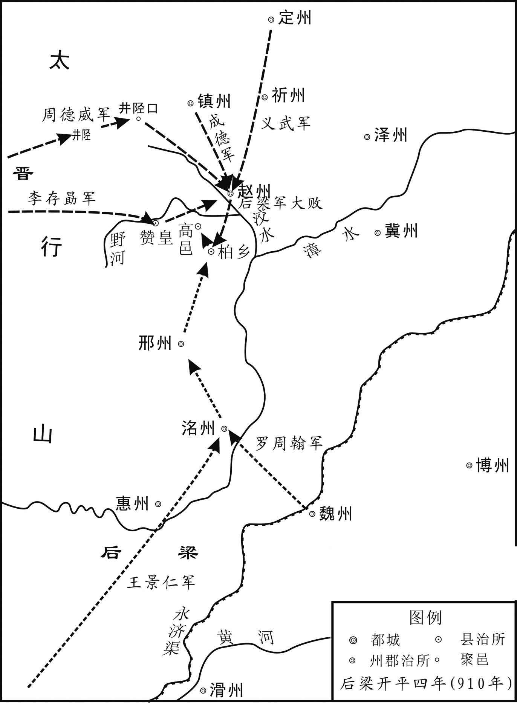 
柏乡之战示意图

## 【原文】

**杜廷隐等闻梁兵败，弃深、冀而去，悉驱二州丁壮为奴婢，老弱者坑之，城中存者坏垣而已[1]。**

## 【注文】

[1]坑：活埋。　　坏垣（yuán）：残墙断壁。

## 【译文】

杜廷隐等人听说梁兵战败，放弃深、冀二州离去，迫使二州的全部丁壮作为奴婢，而把年老体弱的全部活埋，城中所剩下的只有残墙断壁而已。

## 【原文】

**癸巳，复以杨师厚为北面都招讨使，将兵屯河阳，收集散兵，旬余得万人。己亥，晋王遣周德威、史建瑭将三千骑趣澶、魏，张承业、李存璋以步兵攻邢州，自以大军继之，移檄河北州县，谕以利害[1]。帝遣别将徐仁溥将兵千人自西山夜入邢州，助王檀城守[2]。己酉，罢王景仁招讨使，落平章事[3]。**

## 【注文】

[1]移檄（xí）：传布檄文。檄是官府用以征召、晓谕或声讨的文书。

[2]西山：指太行连延至上党诸山。

[3]落：除去。

## 【译文】

后梁太祖乾化元年（911年）正月癸巳（初八日），后梁太祖又任命杨师厚为北面行营招讨使，率军驻扎在河阳，收集在柏乡被打散的梁兵，十多天就得到一万人。己亥（十四日），晋王李存勗派遣周德威、史建瑭率领三千骑兵奔赴澶、魏二州，张承业、李存璋率领步兵攻打邢州，自己则亲自率领大军跟在后面，向河北各州县传送檄文，说明利害。后梁太祖派遣别将徐仁溥率兵千人从西山乘夜进入邢州，协助王檀守城。己酉（二十四日），后梁太祖罢免王景仁的招讨使职务，并除去他平章事的头衔。

## 【原文】

**二月己未，晋王至魏州，攻之不克。上以罗周翰年少，且忌其旧将佐，庚申，以户部尚书李振为天雄节度副使，命杜廷隐将兵千人卫之，自杨刘济河，间道夜入魏州，助周翰城守[1]。癸亥，晋王观河于黎阳，梁兵万余将渡河，闻晋王至，皆弃舟而去[2]。**

## 【注文】

[1]户部尚书：官名。户部为尚书省六部之一，掌天下土地、户籍、赋税、财政收支等事务，其长官为尚书。　　李振（？—923年）：字兴绪，唐泽潞节度使李抱真曾孙。唐末任金吾卫将军，后途经汴梁，被朱温挽留，出任天平节度副使，为朱温篡唐多方谋划。朱温称帝后，官至户部尚书，崇政院使。后唐庄宗同光元年（923年），李存勗攻入开封，他在投降后被杀。　　杨刘：镇名。在今山东东阿北杨柳村，位于黄河南岸，为黄河下游重镇。　　间道：小道。

[2]黎阳：黄河津渡名。故址在今河南浚（xùn）县东南，位于古黄河北岸，与白马津相对。

## 【译文】

后梁太祖乾化元年（911年）二月己未（初四日），晋王李存勗抵达魏州，攻打州城没有攻下。后梁太祖因为天雄节度使罗周翰年轻，并且忌恨他手下的那些旧将佐，庚申（初五日），任命户部尚书李振为天雄节度副使，命令杜廷隐率兵千人护卫他，从杨刘渡过黄河，抄小路在夜间进入魏州，协助罗周翰守城。癸亥（初八日），晋王在黎阳津观察黄河，梁兵一万多人正准备渡河，听说晋王到来，都丢弃渡船离去。

## 【原文】

**乙丑，周德威自临清攻贝州，拔夏津、高唐；攻博州，拔东武、朝城[1]。攻澶州，刺史张可臻弃城走，帝斩之。德威进攻黎阳，拔临河、淇门；逼卫州，掠新乡、共城[2]。庚午，帝帅亲军屯白司马阪以备之[3]。**

## 【注文】

[1]临清：县名。治所在今河北临西。　　夏津：县名。即今山东夏津。

东武：镇名。时属朝城，在今山东武城。　　朝城：县名。治所在今山东莘（shēn）县西南朝城镇。

[2]黎阳：县名。治所在今河南浚（xùn）县东。　　临河：县名。治所在今河南浚县东北。　　淇门：镇名。在今河南汲县东北。　　新乡：县名。即今河南新乡。　　共城：县名。治所在今河南辉县。

[3]白司马阪（bǎn）：地名。又称白马山，在今河南洛阳东北。

## 【译文】

后梁太祖乾化元年（911年）二月乙丑（初十日），周德威从临清进军攻打贝州，攻下夏津、高唐；又攻打博州，攻克东武、朝城。接着攻打澶州，澶州刺史张可臻弃城而逃，后梁太祖斩杀了他。周德威又进兵攻打黎阳，夺取临河、淇门；再逼近卫州，劫掠新乡、共城。庚午（十五日），后梁太祖率领侍卫亲军驻扎在白司马阪，以防备晋军。

## 【原文】

**杨师厚自磁、相引兵救邢、魏，壬申，晋解围去[1]。师厚追之，逾漳水而还，邢州围亦解[2]。师厚留屯魏州。赵王镕自来谒晋王于赵州，大犒将士，自是遣其养子德明将三十七都常从晋王征讨[3]。德明本姓张，名文礼，燕人也。壬午，晋王发赵州，归晋阳，留周德威等将三千人戍赵州。**

## 【注文】

[1]磁：即磁州。隋文帝开皇十年（590年）置慈州，治滏（fǔ）阳（今河北磁县）。后废，唐高祖武德元年（618年）复置，改为磁州。领滏阳、邯郸、武安、昭义四县，辖境约当今河北邯郸、磁县、武安等地。唐哀帝天祐三年（906年）改名惠州。后梁末帝贞明二年（916年），晋王李存勗攻取惠州，复改名磁州。此用旧名。

[2]漳水：水名。源于山西东南山地，有清漳河与浊漳河两源。两源在河北省西南境的合漳村汇合后称漳河，向东流至馆陶入卫河。

[3]都：唐末五代时的军事编制单位，每都人数自一二百至数万人不等。

## 【译文】

杨师厚从磁州、相州率兵救援邢、魏二州，乾化元年（911年）二月壬申（十七日），晋军撤除包围离去。杨师厚追击晋军，一直追过漳水才返回，邢州之围也解除了。杨师厚留驻在魏州。赵王王镕亲自前来赵州谒见晋王李存勗，大力犒劳将士，从此派他的养子王德明率领三十七都赵军经常跟随晋王征讨。德明本姓张，名叫文礼，是燕地人。壬午（二十七日），晋王从赵州出发，返回晋阳，留下周德威等人率领三千人戍守赵州。

## 【原文】

**夏六月，帝命杨师厚将兵三万屯邢州。秋七月，赵王镕以杨师厚在邢州，甚惧，会晋王于承天军[1]。晋王谓镕父友也，事之甚恭[2]。镕以梁寇为忧，晋王曰：“朱温之恶极矣，天将诛之，虽有师厚辈，不能救也。脱有侵轶，仆自帅众当之，叔父勿以为忧[3]。”镕捧卮为寿，谓晋王为四十六舅[4]。镕幼子昭诲从行，晋王断衿为盟，许妻以女[5]。由是晋、赵之交遂固。**

## 【注文】

[1]承天军：在今山西平定县东八十五里，后名承天砦（zhài）。军为唐五代时设兵戍守的军事单位，大者称军，小者称守捉、城、镇。

[2]谓：通“为”。因为。

[3]脱：倘若，假如。　　侵轶（yì）：侵犯，侵扰。　　当：抵挡。

[4]卮（zhī）：酒器，类似大杯。　　为寿：祝福长寿。　　四十六舅：李存勗在同族兄弟中排行四十六，当是李克用之女有嫁与王氏者，故王镕称李存勗为四十六舅。

[5]昭诲：王镕次子。后梁末帝龙德元年（921年）王镕被杀后，他被军人所救，逃至湖南南岳寺为僧。后唐明宗时，通过其父故将符习向朝廷陈情，被授予朝议大夫、检校考功郎中、司农少卿。后周显德（954—959年）中，官至少府监。　　断衿（jīn）：割断衣襟。谓割下衣襟作为许婚的信物。衿，同“襟”。

## 【译文】

后梁太祖乾化元年（911年）夏季六月，后梁太祖命令杨师厚率兵三万驻扎在邢州。秋季七月，赵王王镕因为杨师厚驻留邢州，非常惧怕，便去承天军会见晋王李存勗。晋王因为王镕是先父的朋友，对待他十分恭敬。王镕因梁军进犯非常忧虑，晋王说：“朱温的罪恶到了极点，上天将要诛灭他，即使有杨师厚这些人，也不能救他。倘若对赵地有所侵犯，我会亲自率领部众抵挡他，叔父不要以此为忧。”王镕捧起酒杯祝晋王长寿，称晋王为四十六舅。王镕的小儿子王昭诲跟着前来，晋王割断衣襟立下盟誓，答应把女儿嫁给王昭诲为妻。从此，晋、赵的关系就更为牢固了。

## 【原文】

**九月，帝闻晋、赵谋入寇，自将拒之。戊戌，以张宗奭为西都留守[1]。庚子，帝发洛阳。甲辰，至卫州，方食，军前奏晋军已出井陉，帝遽命辇北趣邢、洺，昼夜倍道兼行[2]。丙午，至相州，闻晋兵不出，乃止。冬十月甲寅夜，帝发相州，乙卯，至洹水[3]。是夜，边吏言晋、赵兵南下，帝即时进军，丙辰，至魏县[4]。或告云“沙陀至矣”，士卒忷惧，多逃亡，严刑不能禁[5]。既而复告云“无寇”，上下始定。戊午，贝州奏晋兵寇东武，寻引去。帝以夹寨、柏乡屡失利，故力疾北巡，思一雪其耻[6]。意郁郁，多躁忿，功臣、宿将往往以小过被诛，众心益惧[7]。既而晋、赵兵竟不出。十一月壬午，帝南还。**

## 【注文】

[1]张宗奭（shì）（852—926年）：濮州临濮（今山东鄄城西南。鄄音juàn）人。初名言，又作居言，字国维。初为县役，后投黄巢起义军，曾任大齐政权吏部尚书、充水运使。起义失败后，投河阳节度使诸葛爽，唐昭宗赐名全义，授泽州刺史。再附朱温，官至河南尹、天下兵马副元帅，封魏王，赐名宗奭。梁亡后投后唐，改封齐王，恢复原名。后唐明宗兵变夺帝位时，他忧愤而死。　　西都留守：官名。隋唐以后，皇帝出巡或亲征时指定亲王或大臣留守京城，得便宜行事，称京城留守；陪京和行都也常设留守，以地方长官兼任。后梁以洛阳为西都，故置留守。

[2]辇（niǎn）：皇帝所乘的车子。

[3]洹（huán）水：县名。治所在今河北魏县西南旧魏县。

[4]边吏：边境上的官吏。　　魏县：县名。治所在今河北大名西北魏庄。

[5]沙陀：指晋军。李存勗为沙陀族人，其军中亦多沙陀人。　　忷惧：惶恐不安。

[6]力疾：竭力支撑着病体。

[7]郁郁：郁闷。

## 【译文】

后梁太祖乾化元年（911年）九月，后梁太祖听说晋、赵谋划进犯，便亲自率军前往抵御。戊戌（十八日），任命张宗奭为西京留守。庚子（二十日），后梁太祖从洛阳出发。甲辰（二十四日），抵达卫州，正吃饭时，军前奏报晋军已经从井陉出发，后梁太祖立刻命令车辇向北赶赴邢、洺二州，日夜兼程向前行进。丙午（二十六日），到达相州，听说晋军没有出动，才停止前进。冬季十月甲寅（初四日）夜里，后梁太祖从相州出发，乙卯（初五日），到达洹水。这天夜里，边境上的官吏报告说晋、赵军队已经南下，后梁太祖立刻进军，丙辰（初六日）到达魏县。有人报告说“沙陀兵到了”，士卒闻讯惶恐不安，有很多人逃走，严刑惩罚也不能禁止。不久又报告说“没有敌寇”，全军上下才安定下来。戊午（初八日），贝州奏报晋兵进犯东武，不久又退走了。后梁太祖因为夹寨、柏乡屡屡失利，所以竭力支撑着病体巡视北部边境，想一举洗刷过去的耻辱。也因此心中郁郁不乐，经常烦躁动怒，功臣、老将往往因为小过失而被诛杀，众人心里更加恐惧。后来晋、赵军队最终也没出动。十一月壬午（初二日），后梁太祖向南返回。

## 【原文】

**二年春二月甲子，帝发洛阳，从官以帝诛戮无常，多惮行。帝闻之，益怒。是日，至白马顿，赐从官食，多未至，遣骑趣之于路[1]。左散骑常侍孙骘、右谏议大夫张衍、兵部郎中张儁最后至，帝命扑杀之[2]。衍，宗奭之姪也。丙寅，帝至武陟[3]。段明远供馈有加于前[4]。丁卯，至获嘉，帝追思李思安去岁供馈有阙，贬柳州司户，告辞称明远之能，曰：“观明远之忠勤如此，见思安之悖慢何如[5]。”寻长流思安于崖州，赐死[6]。明远后更名凝。乙亥，帝至魏州，命都招讨使宣义节度使杨师厚、副使前河阳节度使李周彝围枣强，招讨应接使平卢节度使贺德伦、副使天平留后袁象先围蓨县[7]。德伦，河西胡人；象先，下邑人也[8]。戊寅，帝至贝州。**

## 【注文】

[1]白马顿：地名。在今河南洛阳东北。或以为“白马”为地名，“顿”乃停顿、停留之意。

[2]散骑常侍：官名。在皇帝左右规谏过失，以备顾问。唐代分隶门下省和中书省，在门下省者称左散骑常侍，在中书省者称右散骑常侍。虽无实际职权，仍为尊贵之官。　　孙骘（zhì）（？—912年）：滑台（今河南滑县东滑县城）人。嗜学知书，藏书数千卷。初任魏博从事，累迁至节度判官。朱温称帝后，授右谏议大夫，迁左散骑常侍。乾化二年（912年），扈从朱温北巡，因赐食后至，被杀。

谏议大夫：官名。唐代分置左右各四员，分隶门下省和中书省。掌侍从规谏。　　张衍（？—912年）：字元用，濮州临濮（今山东鄄城西南）人。唐昭宗时官至翰林学士。朱温称帝后，任考功郎中，迁右谏议大夫。后与孙骘同时被杀。　　郎中：官名。为各部尚书、侍郎、丞以下的高级部员，分掌各司事务。

张儁（jùn）（？—912年）：字彦臣。唐末曾任万年县县令，因事罢免。朱温称帝后，任盐铁判官，迁兵部郎中。后与孙骘同时被杀。　　扑杀：击杀，打死。

[3]武陟（zhì）：县名。即今河南武陟。

[4]段明远（？—928年）：开封（今河南开封）人，后改名凝。初为渑（miǎn）池县主簿，后从朱温，为军巡使。因将其妹献给朱温，又善奉迎人意，故常被派作监军，历任怀、郑二州刺史。梁末帝时，曾任招讨使，与后唐军作战。梁亡，他率精兵五万降唐，被授为泰宁军节度使，又迁武胜军节度使，赐名李绍钦。后唐明宗即位后，被流放赐死。　　供馈：供应、供给。

[5]获嘉：县名。即今河南获嘉。　　阙（quē）：同“缺”。　　司户：官名。唐时，府称户曹参军，州称司户参军，县称司户，主管府、州、县民户。　　告辞：告谕上的文辞。　　悖慢：违逆不敬。

[6]崖州：州名。唐高祖武德四年（621年）改隋珠崖郡置，治舍城（今海南琼山东南）。玄宗天宝元年（742年）复为珠崖郡，肃宗乾元元年（758年）又改为崖州。领舍城、澄迈、文昌、临高四县，辖境约当今海南海口、文昌、琼海、琼山、澄迈等地。

[7]宣义节度使：方镇名。唐肃宗上元二年（761年）置，初号滑卫节度使，治滑州（治白马，今河南滑县东）。后改为滑亳、永平、义成、宣义等号。辖境屡变，久领滑、郑（治管城，今河南郑州）、濮（治鄄城，今山东鄄城北）三州，辖境约当今河南延津至山东鄄城一带。　　河阳节度使：方镇名。唐德宗建中二年（781年）置，又称怀卫节度使，治孟州（治河阳，今河南孟州南）。久领孟、怀（治河内，今河南沁阳）二州。辖境约当今河南黄河故道以北、太行山以南、浚（xùn）县以西及黄河南岸孟津、荥（xíng）阳县的汜（sì）水、广武两镇等地。　　平卢节度使：方镇名。唐玄宗开元七年（719年）置，治营州（治柳城，今辽宁朝阳）。宝应元年（762年），节度使侯希逸为史朝义及奚族所逼，南迁淄青，遂号淄青平卢节度使，或称淄青节度使、平卢节度使，治青州（今山东青州）。初辖境较大，后领青（治益都，今山东青州）、淄（治淄川，今山东淄博西南）、登（治蓬莱，今山东蓬莱）、莱（治掖县，今山东莱州）、齐（治历城，今山东济南）等州，辖境相当今山东中部、东部地区。　　贺德伦（？—915年）：先祖为河西胡人。初为滑州牙将，后随朱温征战，以功官至平卢军节度使。梁末帝贞明初，代杨师厚镇魏博，后被魏兵所迫，归附于晋。李存勗入魏，迁其为大同节度使，行至太原，被监军张承业所杀。　　枣强：县名。治所在今河北枣强东南。　　天平：方镇名。唐宪宗元和十四年（819年）置郓曹濮节度使，治郓州（治须昌，今山东东平西北）。次年号太平军。久领郓、曹（治济阴，今山东定陶西南）等州，辖境约当今山东嘉祥、成武以西，郓城、东明以东，民权以北，东平以南地区。　　袁象先（864—924年）：宋州下邑（今河南夏邑）人，朱温之甥。朱温称帝后，官至左龙武统军兼侍卫亲军都指挥使。乾化二年（912年），助梁末帝夺取帝位，官至宣武军节度，在宋州十余年，诛敛其民，积财千万。梁亡降唐，赐姓名李绍安，改宣武军为归德军，仍由他镇守。后病卒。

[8]河西：地区名。唐时指今甘肃、青海两省黄河以西，即河西走廊与湟水流域。　　下邑：县名。治所在今安徽砀山县。

## 【译文】

后梁太祖乾化二年（912年）春季二月甲子（十五日），后梁太祖从洛阳出发，随从官员因为太祖随意诛杀，大都害怕随行。后梁太祖听说此事，更加恼怒。这天，到了白马顿，后梁太祖赐给随从官员饮食，而多数官员没有赶到，太祖便派出骑兵到路上催促他们。左散骑常侍孙骘、右谏议大夫张衍、兵部侍郎张儁最后来到，太祖命令把他们打死。张衍是张宗奭的侄子。丙寅（十七日），后梁太祖到达武陟。刺史段明远供应的物资比以前还多。丁卯（十八日），到达获嘉，后梁太祖回想起李思安去年供应的物资短缺，便把他贬为柳州司户，告谕众官的文书称赞段明远的才能，说道：“见到段明远如此忠诚勤勉，就看出李思安违逆不敬到了何种地步。”不久又把李思安长期流放到崖州，赐他自尽。段明远后来改名为段凝。乙亥（二十六日），后梁太祖到达魏州，命令都招讨使、宣义节度使杨师厚，副使、前河阳节度使李周彝围攻枣强，招讨应接使、平卢节度使贺德伦，副使、天平留后袁象先围攻蓨县。贺德伦是河西胡人；袁象先是下邑人。戊寅（二十九日），后梁太祖到达贝州。

## 【原文】

**帝昼夜兼行，三月辛巳，至下博南，登观津冢[1]。赵将符习引数百骑出巡逻，不知是帝，遽前逼之[2]。或告曰：“晋兵大至矣！”帝弃行幄，亟引兵趣枣强，与杨师厚军合[3]。习，赵州人也。**

## 【注文】

[1]下博：县名。治所在今河北深州东南。　　观津冢（zhǒng）：地名。在今河北武邑东南。

[2]符习（？—930年）：赵州昭庆（今河北赵县）人，赵王王镕部将。王镕被张文礼所杀，他投奔李存勗，为其主报仇，被授予天平军节度使。后唐建立后，历任邢州、淄青、天平、汴州等镇节度使，以太师致仕。

[3]行幄：行军帐幕。　　亟（jí）：赶快，急速。

## 【译文】

后梁太祖日夜兼程，乾化二年（912年）三月辛巳（初二日），到达下博县南，登上观津冢。赵将符习率领数百名骑兵巡逻，不知道来的是后梁太祖，立即向前逼近。有人报告说：“晋兵大队人马赶来了！”后梁太祖丢弃帐幕，急忙率兵奔向枣强，与杨师厚的军队会合。符习是赵州人。

## 【原文】

**枣强城小而坚，赵人（取）［聚］精兵数千守之，师厚急攻之，数日不下，城坏复修，死伤者以万数[1]。城中矢石将竭，谋出降，有一卒奋曰：“贼自柏乡丧败以来，视我镇人裂眦，（命）今往归之，如自投虎狼之口耳[2]。困穷如此，何用身为[3]！我请独往试之。”夜，缒城出，诣梁军诈降[4]。李周彝召问城中之备，对曰：“非半月未易下也。”因（谋）［请］曰：“某既归命，愿得一剑，効死先登，取守城将首[5]。”周彝不许，使荷担从军[6]。卒得间举担击周彝首，踣地，左右救至，得免[7]。帝闻之，愈怒，命师厚昼夜急攻，丙戌，拔之，无问老幼尽杀之，流血盈城。**

## 【注文】

[1]死伤者：指攻城的梁军死伤者。

[2]裂眦（zì）：目眦欲裂。形容愤怒到极点。眦，眼眶。

[3]何用身为：意谓还要这条命做什么用。

[4]缒（zhuì）城：系上绳子从城上放下去。

[5]某：对自己的谦称，相当于“我”。

[6]荷担：挑担。

[7]得间：得到机会。　　踣（bó）：向前扑倒。

## 【译文】

枣强城虽小，但很坚固，赵人聚集精兵数千人守卫它，杨师厚加紧攻打，好几天也没能攻下来，城墙坏了赵人再把它修好，死伤的梁兵数以万计。城中的箭支礌石将要用尽了，守城的将士商议出城投降，有一个士卒奋力高呼说：“贼兵自柏乡战败以来，看到我们镇州人就恨得眼眶欲裂，如今前去归降他们，就如同主动投入虎狼的口中。困迫到这种地步，还要这条命做什么用！我请求独自前去试探一下敌军。”到了夜里，这名士卒用绳子从城上坠下，前往后梁军中假装投降。李周彝召他询问城中的守备情况，他回答说：“没有半个月的时间，是不容易攻下来的。”并乘机请求说：“我既已归顺，希望能得到一把利剑，豁出性命率先登城，斩取守城将领的首级。”李周彝没有答应，让他挑着担子跟随军队。这名士卒得到一个机会，举起扁担猛击李周彝的头部，李周彝扑倒在地，左右的人上前营救，才得免一死。后梁太祖听说此事，更加恼怒，命令杨师厚日夜加紧攻城，乾化二年（912年）三月丙戌（初七日），攻下枣强，不论老幼，全部杀死，以致血流满城。

## 【原文】

**初，帝引兵渡河，声言五十万。晋忻州刺史李存审屯赵州，患兵少，裨将赵行实请入土门避之，存审不可[1]。及贺德伦攻蓨县，存审谓史建瑭、李嗣肱曰：“吾王方有事幽、蓟，无兵此来，南方之事，委吾辈数人[2]。今蓨县方急，吾辈安得坐而视之！使贼得蓨县，必西侵深、冀，患益深矣。当与公等以奇计破之。”存审乃引兵扼下博桥，使建瑭、嗣肱分道擒生[3]。建瑭分其麾下为五队，队各百人，一之衡水，一之南宫，一之信都，一之阜城，自将一队深入，与嗣肱遇梁军之樵刍者，皆执之，获数百人[4]。明日，会于下博桥，皆杀之，留数人断臂纵去，曰：“为我语朱公，晋王大军至矣[5]。”时蓨县未下，帝引杨师厚兵五万就贺德伦共攻之。丁亥，始至县西，未及置营，建瑭、嗣肱各将三百骑，效梁军旗帜、服色，与樵刍者杂行[6]。日且暮，至德伦营门，杀门者，纵火大噪，弓矢乱发，左右驰突，既暝，各斩馘执俘而去[7]。营中大扰，不知所为。断臂者复来曰：“晋军大至矣！”帝大骇，烧营夜遁，迷失道，委曲行百五十里，戊子旦乃至冀州[8]。蓨之耕者皆荷奋梃逐之，委弃军资、器械不可胜计[9]。既而复遣骑觇之，曰：“晋军实未来，此乃史先锋游骑耳[10]。”帝不胜惭愤，由是病增剧，不能乘肩舆。留贝州旬余，诸军始集。**

## 【注文】

[1]忻（xīn）州：州名。唐高祖武德元年（618年）改隋新兴郡置，治秀容（今山西忻州）。玄宗天宝元年（742年）改为定襄郡，肃宗乾元元年（758年）复为忻州。领秀容、定襄两县，辖境约当今山西忻州、定襄等地。　　赵行实（？—937年）：幽州（治蓟县，今北京西南）人。原为幽州军校，后降李存勗，赐姓名李绍斌，累迁沧州节度使。后唐同光三年（925年）任卢龙节度使，移镇幽州。明宗时复姓赵，赐名德钧，封北平王。后遣使契丹，求立为帝，不得。后晋建立，他被契丹所俘，死于契丹。　　土门：关名。即井陉关。

[2]李嗣肱（gōng）（878—922年）：李克用弟李克修之子。颇有胆略，在救援潞州、蓨县，征讨刘守光等战中屡立战功。历任蔚州刺史，雁门以北都知兵马使，应州刺史，泽、代二州刺史，石岭以北都知兵马使，山北都团练使等职。

有事幽、蓟：时李存勗正出兵幽、蓟，征讨刘守光。

[3]擒生：生擒敌兵。

[4]之：到……去。　　衡水：县名。治所在今河北衡水西南旧城。　　南宫：县名。治所在今河北南宫西北南旧城。　　信都：县名。治所在今河北衡水冀州。　　樵刍者：打柴割草的人。

[5]纵去：放走。　　朱公：指朱温。

[6]效：仿照。

[7]暝（míng）：日落，天黑。　　斩馘（guó）：割取战斗中所杀敌人的左耳，古时以此作为计功凭证。

[8]委曲：辗转曲折。

[9]（chú）：同“锄”，锄头。　　梃（tǐng）：木棒。

[10]觇（chān）：侦察。　　史先锋：指史建瑭。时任先锋指挥使，故称。

## 【译文】

起初，后梁太祖率军渡过黄河，声称五十万大军。晋忻州刺史李存审驻扎在赵州，担心兵少，副将赵行实请求退入土门躲避梁军，李存审不同意。等到贺德伦攻打蓨县时，李存审对史建瑭、李嗣肱说：“我们大王正对幽州、蓟州用兵，没有军队来这里，把南方的战事全部托付给了我们几人。现在蓨县正处在危急之中，我们怎能坐视不救呢！假使贼军夺取了蓨县，必定向西侵犯深、冀二州，那样祸患就更深了。我应当与你们几位用奇计打败他们。”李存审于是率兵扼守下博桥，派史建瑭、李嗣肱分路捕捉梁兵。史建瑭把自己的部下分成五队，每队各一百人，一队到衡水，一队到南宫，一队到信都，一队到阜城，自己率领一队深入敌境，他与李嗣肱遇到打柴割草的梁兵，便全部抓获，一共抓获了数百人。第二天，两人在下博桥会合，杀掉了全部俘虏，只留下几个人，在砍掉胳膊后把他们放走，并对他们说：“替我告诉朱公，晋王的大军到了。”这时蓨县还未被攻克，后梁太祖率领杨师厚的五万兵马到贺德伦那里，一起攻打蓨县。乾化二年（912年）三月丁亥（初八日），晋军刚到蓨县西边，还没来得及扎营，史建瑭、李嗣肱便各自率领三百名骑兵，仿照梁军的旗帜与军服颜色，与打柴割草的梁兵混杂在一起前行。傍晚时分，到达贺德伦的营门，杀死守门的兵士，放火呐喊，弓箭乱发，左右奔驰冲杀，天黑以后，便各自割下所杀梁兵的左耳，带着俘虏离去。梁军营中十分惊乱，不知该如何应付。被砍掉胳膊的梁兵又来报告说：“晋军大队人马到了！”后梁太祖大为惊惧，便烧掉营寨连夜逃走，又迷失了道路，辗转曲折地走了一百五十里，戊子（初九日）这天早晨才到达冀州。蓨县的农民都扛着锄头、举着木棒追逐梁兵，梁兵丢弃的军用物资与器械不计其数。不久，派出骑兵去侦察晋军的情况，回来报告说：“晋军其实没有来，这只不过是史先锋的流动骑兵罢了。”后梁太祖十分羞愧愤恨，因此病情加重，连轿子都不能乘坐了。在贝州驻留了十多天，后梁的各路军队才聚集在一起。

## 【原文】

**乙巳，帝发贝州，丁未，至魏州。夏四月乙卯，博王友文来朝，请帝还东都[1]。丁巳，发魏州。己未，至黎阳，以疾淹留[2]。乙丑，至滑州。己巳，帝至大梁。戊寅，帝发大梁。**

## 【注文】

[1]博王友文：即朱友文（？—912年）。朱温养子，本名康勤，字德明。在朱温称帝后，任建昌宫使，掌宣武、宣义、天平、护国四镇征赋，封博王。朱温去西都洛阳，命他为东都留守。朱友珪杀朱温后，他也被杀。

[2]淹留：滞留，停留。

## 【译文】

后梁太祖乾化二年（912年）三月乙巳（二十六日），后梁太祖从贝州出发，丁未（二十八日），到达魏州。夏季四月乙卯（初七日），博王朱友文前来朝见，请太祖返还东都。丁巳（初九日），后梁太祖从魏州出发。己未（十一日），到达黎阳，因病滞留。乙丑（十七日），到达滑州。己巳（二十一日），后梁太祖到达大梁。戊寅（三十日），后梁太祖从大梁出发。

## 【原文】

**五月甲申，帝至洛阳，疾甚。闰月壬戌，帝疾增甚，谓近臣曰：“我经营天下三十年，不意太原余孽更昌炽如此[1]。吾观其志不小，天复夺我年，我死，诸儿非彼敌也，吾无葬地矣[2]！”因哽咽，绝而复苏[3]。六月戊寅，郢王友珪弑帝[4]。**

## 【注文】

[1]太原余孽：指李存勗。余孽，残余的孽种。　　昌炽（chì）：昌盛。

[2]夺我年：夺去我的年寿。

[3]哽咽（yè）：悲痛气塞，说不出话来。　　绝而复苏：气绝又苏醒过来。

[4]郢（yǐng）王友珪：即朱友珪（？—913年）。朱温庶子。开平元年（907年）封为郢王，后充左右控鹤都指挥使、诸军都虞候等职。乾化二年（912年），朱温病重，出其为莱州刺史。他率禁军弑朱温，即皇帝位。次年改元凤历，因荒淫、杀戮无度，致中外愤怒。在位七月，均王朱友贞等发动禁军政变，将他杀死。

## 【译文】

后梁太祖乾化二年（912年）五月甲申（初六日），后梁太祖回到洛阳，病情加剧。闰五月壬戌（十五日），后梁太祖的病情更加严重，对亲近的大臣说：“我经营天下三十年，想不到李克用的余孽更为昌盛到这个样子。我看他的志向不小。上天又要夺去我的年寿，我死之后，我的各个儿子都不是他的对手，我将没有葬身之地了！”于是悲泣失声，气绝之后又苏醒过来。六月戊寅（初二日），郢王朱友珪弑了后梁太祖。

## 【原文】

**冬十一月，赵将王德明将兵三万掠武城，至于临清，攻宗城，下之[1]。癸丑，杨师厚伏兵唐店，邀击，大破之，斩首五千余级[2]。**

## 【注文】

[1]武城：县名。治所在今河北故城。

[2]唐店：地名。在今河北广宗南。

## 【译文】

后梁太祖乾化二年（912年）冬季十一月，赵将王德明率兵三万劫掠武城，一直到达临清，接着攻打宗城，攻下了它。癸丑（初九日），杨师厚把军队埋伏在唐店，中途截击，大败王德明军，斩获赵军首级五千多颗。

## 【原文】

**均王乾化三年春二月，均王即位于大梁。三月庚戌，加杨师厚兼中书令，赐爵邺王，赐诏不名，事无巨细，必咨而后行[1]。夏五月，杨师厚与博州刺史刘守奇将汴、滑、徐、兖、魏、博、邢、洺之兵十万，大掠赵境[2]。师厚自柏乡入攻土门，趣赵州，守奇自贝州入趣冀州，所过焚掠。庚戌，师厚至镇州，营于南门外，燔其关城。壬子，师厚自九门退军下博，守奇引兵与师厚会攻下博，拔之[3]。晋将李存审、史建瑭戍赵州，兵少，赵王告急于周德威，德威遣骑将李绍衡会赵将王德明同拒梁军。师厚、守奇自弓高渡御河而东，逼沧州，张万进惧，请迁于河南[4]。师厚表徙万进镇青州，以守奇为顺化节度使[5]。**

## 【注文】

[1]赐诏不名：颁赐诏书，不直称其名，以示尊重。

[2]徐：即徐州。唐高祖武德四年（621年）改隋彭城郡置，治彭城（今江苏徐州）。玄宗天宝元年（742年）复为彭城郡，肃宗乾元元年（758年）又改为徐州。领彭城、萧县、丰县、沛县、滕县、宿迁、下邳（pī）等县，辖境约当今江苏徐州、沛县、丰县，安徽淮北、濉（suī）溪、宿州、萧县、固镇、怀远，山东枣庄、滕州、微山等地。　　兖：即兖州。唐高祖武德五年（622年）改隋鲁郡置，治瑕（xiá）丘（今山东兖州）。玄宗天宝元年（742年）复为鲁郡，肃宗乾元元年（758年）又改为兖州。领瑕丘、曲阜、乾封、泗水、邹县、任城、龚丘、金乡、鱼台、莱芜等县，辖境约当今山东济宁、兖州、宁阳、泰安、莱芜、泗水、曲阜、邹城、汶上、嘉祥、金乡等地。

[3]九门：县名。治所在今河北藁（gǎo）城西北。

[4]弓高：县名。治所在今河北东光西北。　　御河：即永济渠。隋炀帝大业四年（608年）开永济渠，引沁水南达于黄河，北通涿郡，后人谓之御河。

[5]镇青州：指任青州节度使。　　顺化节度使：方镇名。唐代称横海节度使、义昌节度使。

## 【译文】

后梁乾化三年（913年）春季二月，均王朱友贞在大梁即皇帝位。三月庚戌（初七日），加授杨师厚兼中书令，赐予邺王爵位，向他颁赐诏书，不直称其名，事情无论大小，必定先向他咨询，然后施行。夏季五月，杨师厚与博州刺史刘守奇率领汴、滑、徐、兖、魏、博、邢、洺等州的军队十万人，大肆攻掠赵地。杨师厚从柏乡进入攻打土门关，奔向赵州，刘守奇从贝州进入，直扑冀州，对所过之地，焚烧劫掠。庚戌（初九日），杨师厚到达镇州，在南门外扎营，焚烧了南门关城。壬子（十一日），杨师厚从九门退军至下博，刘守奇率军与他会合攻打下博，夺取了此城。晋将李存审、史建瑭戍守赵州，但兵力不多，赵王王镕向周德威告急，于是周德威派遣骑将李绍衡会同赵军将领王德明一起抵御梁军。杨师厚、刘守奇从弓高渡过御河向东进军，逼近沧州，顺化节度使张万进惧怕，请求迁调到河南。于是杨师厚上表请求迁调张万进镇守青州，任命刘守奇为顺化节度使。

## 【原文】

**四年。晋王既克幽州，乃谋入寇。克幽州事见《晋王灭燕》。秋七月，会赵王镕及周德威于赵州，南寇邢州，李嗣昭引昭义兵会之。杨师厚引兵救邢州，军于漳水之东。晋军至张公桥，裨将曹进金来奔[1]。晋军退，诸镇兵皆引归[2]。八月，晋王还晋阳。**

## 【注文】

[1]张公桥：地名。在今河北邢台西北。　　来奔：指奔降后梁。

[2]诸镇兵：指周德威、赵王王镕、李嗣昭各自率领的燕、赵、昭义之兵。

## 【译文】

后梁乾化四年（914年）。晋王李存勗攻克幽州以后（攻克幽州事见《晋王灭燕》），便谋划入侵后梁。秋季七月，晋王在赵州与赵王王镕及周德威会合，向南进犯邢州，李嗣昭率领昭义镇的兵马与他们会师。杨师厚率领梁军救援邢州，驻扎在漳水东岸。晋军到达张公桥时，副将曹进金奔降了后梁。晋军于是撤退，各镇军队也都退了回去。八月，晋王返回晋阳。

## 【原文】

**贞明元年春三月，天雄节度使兼中书令邺王杨师厚卒。师厚晚年矜功恃众，擅割财赋，选军中骁勇，置银枪効节都数千人，给赐优厚，欲以复故时牙兵之盛[1]。帝虽外加尊礼，内实忌之，及卒，私于宫中受贺。租庸使赵岩、判官邵赞言于帝曰：“魏博为唐腹心之蠹，二百余年不能除去者，以其地广兵强之故也[2]。罗绍威、杨师厚据之，朝廷皆不能制。陛下不乘此时为之计，所谓‘弹疽不严，必将复聚’，安知来者不为师厚乎[3]？宜分六州为两镇，以弱其权。”帝以为然，以平卢节度使贺德伦为天雄节度使，置昭德军于相州，割澶、卫二州隶焉，以宣徽使张筠为昭德节度使，仍分魏州将士、府库之半于相州[4]。筠，海州人也[5]。二人既赴镇，朝廷恐魏人不服，遣开封尹刘将兵六万自白马济河，以讨镇、定为名，实张形势以胁之[6]。**

## 【注文】

[1]矜（jīn）功：自夸其功。矜，自夸。　　恃众：依仗兵多。　　擅割财赋：擅自截留应向朝廷缴纳的财税。　　银枪効节都：杨师厚所置侍卫亲军名号。晋王李存勗取得魏州后，将其纳入麾下，号帐前银枪都，成为一支亲军劲旅。

[2]帝：指后梁末帝朱友贞。　　租庸使：官名。唐玄宗时始置，为朝廷临时派往各地催办租庸赋税的使臣。后停废。唐僖宗时又置，掌征敛军用资粮。五代时为中央财政长官，掌征调州县赋税。后唐明宗时废。　　赵岩（？—923年）：祖先为天水（今甘肃礼县东）人。唐末忠武节度使赵犫（chōu）次子，原名霖。娶朱温之女长乐公主为妻，累历近职，连典禁军。后梁末帝时任租庸使、守户部尚书，以勋戚自负，货赂公行，天下之贿，半入其门。后唐灭梁，他逃奔许州，被匡国节度使温韬（tāo）所杀。　　判官：指租庸使判官。掌综理日常事务。

蠹（dù）：本意为蛀虫，此指祸患。

[3]弹疽（jū）不严，必将复聚：“弹疽”一词出自《韩非子·外储说右上》，指用砭石割治毒疮。此句意谓治疗毒疮不痛下决心尽去其脓血，必将复聚结成疮。比喻去除祸患要干净彻底。　　来者：指将来的天雄节度使。

[4]宣徽使：官名。唐时置南北宣徽院，各设正副使，例由宦官担任，总领宫内诸司和三班内侍以及郊祀、朝会、宴享、供帐等事务。五代时或以大臣担任。

[5]海州：州名。唐高祖武德四年（621年）改隋东海郡置，治朐（qú）山（今江苏连云港西南海州镇）。玄宗天宝元年（742年）复为东海郡，肃宗乾元元年（758年）又改为海州。领朐山、东海、沭阳、怀仁四县，辖境约当今江苏连云港、东海、沭阳、赣（gàn）榆、灌云、灌南等地及新沂、滨海部分地区。

[6]尹：官名。为唐五代时府的行政长官。　　刘（xún）（858—921年）：密州安丘（今山东安丘）人。唐末为青州节度使小校，以军功历任登州、淄州刺史。后随青州节度使王师范降朱温，后梁时曾任永平军节度使、开封尹、宣义节度使等职。曾率军先后击败叛将刘知俊、蒋殷。后与晋王李存勗征战，渐失河北土地。后梁末帝贞明六年（920年），朝臣段凝诬其在讨伐叛将朱友谦时逗留养寇，次年，被后梁末帝派人鸩（zhèn）杀。　　张形势：摆开架势。

## 【译文】

后梁贞明元年（915年）春季三月，天雄节度使兼中书令、邺王杨师厚去世。杨师厚晚年自夸其功，并依仗兵多，擅自截留应向朝廷缴纳的财税，又挑选军中勇猛的兵士，设置了号为银枪效节都的部队，人数达几千人，对他们的供给赏赐十分优厚，想以此恢复过去牙兵的势力强盛局面。后梁末帝朱友贞虽然表面上对他尊崇礼遇，但内心其实猜忌他，到他去世，便私下在宫中接受拜贺。租庸使赵岩、判官邵赞对后梁末帝说：“魏博镇是唐朝的心腹之患，而二百多年不能除去的原因，是因它土地广大、兵力强盛的缘故。罗绍威、杨师厚拥有它，朝廷都不能控制。陛下不趁这时考虑对它的处置，就是常言所说的‘治疗毒疮不除尽脓血，一定还会聚结成疮’，怎么能知道将来的节度使不是杨师厚一类的人呢？应当把魏博镇所辖的六州分成两个方镇，以此来削弱它的权势。”后梁末帝认为此言有理，于是任命平卢节度使贺德伦为天雄节度使，又在相州设置昭德军，割出魏博的澶、卫二州隶属于它，任命宣徽使张筠为昭德节度使，还把魏州将士、府库所藏财物的一半分给相州。张筠是海州人。贺德伦、张筠二人到镇所以后，朝廷害怕魏州人不服，又派遣开封府尹刘率领六万大军从白马津渡过黄河，以征讨镇、定二镇为名，实际上是摆开大军压境的架势来胁迫魏州人。

## 【原文】

**魏兵皆父子相承，数百年族姻磐结，不愿分徙[1]。德伦屡趣之，应行者皆嗟怨，连营聚哭[2]。己丑，刘屯南乐，先遣澶州刺史王彦章将龙骧五百骑入魏州，屯金波亭[3]。魏兵相与谋曰：“朝廷忌吾军府强盛，欲设策使之残破耳。吾六州历代藩镇，兵未尝远出河门，一旦骨肉流离，生不如死[4]。”是夕，军乱，纵火大掠，围金波亭，王彦章斩关而走。诘旦，乱兵入牙城，杀贺德伦之亲兵五百人，劫德伦置楼上。有効节军校张彦者，自帅其党，拔白刃，止剽掠。**

## 【注文】

[1]数百年：言其历时长久，非实指。　　磐结：同“盘结”。盘根错节，形容关系牢固。

[2]嗟（jiē）怨：哀叹怨恨。

[3]南乐：县名。即今河南南乐。　　王彦章（863—923年）：郓州寿张（今山东阳谷）人，字贤明。少从军，随朱温转战各地，以骁勇闻名，每战持铁枪陷阵，军中号王铁枪。后梁时历任濮、澶州刺史，郑州防御使，许、滑州节度使等职，封开国侯。后梁末帝龙德三年（923年），后唐军攻陷郓州，他受命为北面招讨使，迎战唐军。后被副使段凝所诬，解除兵权。不久率少数兵众出征，兵败被俘，不屈被杀。　　金波亭：在魏州城内。

[4]河门：据《旧唐书》，魏州城外有河门旧堤，唐僖宗中和年间（881—885年），节度使乐彦桢筑罗城于河门旧堤，周八十里。

## 【译文】

魏州的兵士都是父子相继，数百年来亲族婚姻关系盘根错节，十分牢固，不愿意分离迁徙到别处。贺德伦多次催促他们动身，应该迁走的人都哀叹怨恨，连营聚集在一起哭泣。贞明元年（915年）三月己丑（二十九日），刘驻扎在南乐，先派遣澶州刺史王彦章率领龙骧军五百名骑兵进入魏州，驻扎在金波亭。魏州的兵士一起谋划说：“朝廷忌恨我们军府强盛，想设计使它残破。我们六州历代就是一个藩镇，兵士们不曾远出过河门，一旦骨肉流离，活着还不如死去。”当天晚上，魏兵叛乱，在城中放火并大肆抢掠，包围了金波亭，王彦章杀出城门逃走。第二天早晨，乱兵攻入牙城，杀掉贺德伦的侍卫亲兵五百人，并劫持了贺德伦，把他安置在城楼之上。有一个银枪效节都的军校名叫张彦，自动率领他的同伙，拔出刀剑，制止抢掠。

## 【原文】

**夏四月，帝遣供奉官扈异抚谕魏军，许张彦以刺史。彦请复相、澶、卫三州如旧制。异还，言张彦易与，但遣刘加兵，立当传首[1]。帝由是不许，但以优诏答之[2]。使者再返，彦裂诏书抵于地，戟手南向诟朝廷，谓德伦曰：“天子愚暗，听人穿鼻[3]。今我兵甲虽强，苟无外援，不能独立，宜投款于晋[4]。”遂逼德伦以书求援于晋。**

## 【注文】

[1]传首：传送首级。指被杀头。

[2]优诏：褒美嘉奖的诏书。

[3]抵：掷，扔。　　戟手：徒手屈肘如戟形。指点人或怒骂人时常作此状。　　穿鼻：以绳或铁环穿牛鼻来控制牛，听人穿鼻，比喻无所主张，任人摆布。

[4]兵甲：兵马，军队。　　投款：投诚。

## 【译文】

后梁贞明元年（915年）夏季四月，后梁末帝派遣供奉官扈异抚慰劝谕魏军，许诺让张彦做刺史。张彦请求恢复相、澶、卫三州隶属天雄军的旧制。扈异返回朝廷，说张彦容易对付，只要派刘率兵攻打，立刻就会把他的首级传送到京师。后梁末帝因此没有答应张彦的请求，只是用褒美嘉奖的诏书回复了他。使者再次返回魏州时，张彦撕破诏书扔在地上，抬臂伸指，向南大骂朝廷。并对贺德伦说：“天子愚昧昏庸，任凭别人牵着鼻子走。如今我们兵马虽然强盛，但没有外援，也不能自立，应当向晋国投诚。”于是逼着贺德伦用书信向晋国求援。

## 【原文】

**晋王得贺德伦书，命马步副总管李存审自赵州引兵进据临清。五月，存审至临清，刘屯洹水。贺德伦复遣使告急于晋，晋王引大军自黄泽岭东下，与存审会于临清，犹疑魏人之诈，按兵不进[1]。德伦遣判官司空颋犒军，密言于晋王曰：“除乱当除根[2]。”因言张彦凶狡之状，劝晋王先除之，则无虞矣[3]。王默然。颋，贝州人也。**

## 【注文】

[1]黄泽岭：地名。在今山西左权东南，为历代穿越太行山的主要通道之一。

[2]司空颋（tǐng）（？—915年）：贝州清阳（今河北清河西南）人。唐僖宗时，举进士不中，后为天雄军掌书记，后梁太府少卿。杨师厚镇天雄，他解官往依之。贺德伦镇天雄，用为判官。晋王李存勗兼领天雄，仍以他为判官，常权军府事。后遭都虞候张裕诬陷通梁，被灭族。

[3]无虞：无忧。

## 【译文】

晋王李存勗收到贺德伦的书信，命令马步副总管李存审从赵州领兵进占临清。贞明元年（915年）五月，李存审到达临清，刘驻军在洹水。贺德伦又派遣使者向晋国告急，晋王亲率大军从黄泽岭东下，与李存审在临清会师，但仍然怀疑魏人有诈，便按兵不进。贺德伦派遣判官司空颋犒劳晋军，秘密地告诉晋王说：“除去祸乱应当铲除祸根。”接着又说了张彦凶残狡诈的情况，劝说晋王先把他除掉，就没有什么忧患了。晋王听后没有回应。司空颋是贝州人。

## 【原文】

**晋王进屯永济，张彦选银枪効节五百人，皆执兵自卫，诣永济谒见，王登驿楼语之曰：“汝陵胁主帅，残虐百姓，数日中迎马诉冤者百余辈[1]。我今举兵而来，以安百姓，非贪人土地。汝虽有功于我，不得不诛以谢魏人。”遂斩彦及其党七人，余众股栗[2]。王召谕之曰：“罪止八人，余无所问。自今当竭力为吾爪牙。”众皆拜伏，呼万岁。明日，王缓带轻裘而进，令张彦之卒擐甲执兵，翼马而从，仍以为帐前银枪都，众心由是大服[3]。**

## 【注文】

[1]永济：县名。治所在今山东冠县北。　　陵胁：欺凌胁迫。

[2]股栗：两腿发抖，形容恐惧到极点。

[3]缓带轻裘：放宽衣带，身着轻裘，以示从容自在的样子。　　擐（huàn）甲执兵：身穿铠甲，手持兵器。擐，贯，穿。　　翼马：在晋王所乘战马的两侧。

## 【译文】

晋王李存勗进军驻扎在永济，张彦挑选银枪效节都的五百名士卒，都拿着武器自卫，到永济谒拜晋王，晋王登上驿站的门楼对他说：“你欺凌胁迫主帅，残害虐待百姓，几天里迎马向我诉说冤情的人有一百多批。我现在率兵前来，是为了安抚百姓，而不是贪图别人的土地。你尽管对我有功，也不得不杀了你来向魏州的百姓谢罪。”于是斩杀了张彦与他的七名同党，其余的部众都吓得两腿发抖。晋王把他们召集起来说：“有罪的只有这八个人，其余的人概不追究。从今以后应当竭力做我的爪牙。”众人听后都拜倒在地，口呼万岁。第二天，晋王放宽衣带，身着轻裘，从容行进，命令张彦的士卒身穿铠甲、手持武器，跟随在自己所乘的战马两侧，仍旧以他们作为帐前银枪都，众人之心因此都十分信服。

## 【原文】

**刘闻晋军至，选兵万余人，自洹水趣魏县。晋王留李存审屯临清，遣史建瑭屯魏县以拒之，王自引亲军至魏县，与夹河为营[1]。**

## 【注文】

[1]河：指漳河。

## 【译文】

刘听说晋军到来，便挑选精兵一万多人，从洹水奔向魏县。晋王李存勗留下李存审驻扎在临清，派遣史建瑭驻扎魏县来抵御梁军，晋王亲自率领亲军抵达魏县，与刘隔着漳河扎下营寨。

## 【原文】

**帝闻魏博叛，大悔惧，遣天平节度使牛存节将兵屯杨刘，为声援。会存节病卒，以匡国节度使王檀代之。**

## 【译文】

后梁末帝听说魏博镇背叛，非常后悔恐惧，便派遣天平节度使牛存节率兵屯驻在杨刘，遥作刘的支援。正遇上牛存节病故，又派匡国节度使王檀代替他。

## 【原文】

**六月庚寅朔，贺德伦帅将吏请晋王入府城慰劳。既入，德伦上印节，请王兼领天雄军[1]。王固辞，曰：“比闻汴寇侵逼贵道，故亲董师徒，远来相救[2]。又闻城中新罹涂炭，故暂入存抚[3]。明公不垂鉴信，乃以印节见推，诚非素怀[4]。”德伦再拜曰：“今寇敌密迩，军城新有大变，人心未安[5]。德伦腹心纪纲为张彦所杀殆尽，形孤势弱，安能统众[6]！一旦生事，恐负大恩。”王乃受之。德伦帅将吏拜贺，王承制以德伦为大同节度使，遣之官[7]。德伦至晋阳，张承业留之。时银枪効节都在魏城犹骄横，晋王下令：“自今有朋党流言及暴掠百姓者，杀无赦[8]。”以沁州刺史李存进为天雄都巡按使，有讹言摇众及强取人一钱已上者，存进皆枭首磔尸于市[9]。旬日，城中肃然，无敢喧哗者。**

## 【注文】

[1]印节：印信及旌节。节度使受职之时，朝廷赐以印信、旌节。交出印信旌节，表示交出职位。

[2]董：督掌，统领。

[3]罹（lí）：遭受。　　涂炭：涂，泥沼；炭，炭火。陷入泥沼，坠入炭火，比喻极其困苦。

[4]垂：敬词。用于别人对自己的行动。　　鉴信：明察信任。　　素怀：本来的心愿。

[5]密迩（ěr）：靠近。

[6]纪纲：得力的奴仆。此指身旁的亲信。

[7]承制：秉承皇帝旨意，即按照皇帝的授权。唐昭宗曾给予李克用承制授任官吏的权力。　　大同节度使：方镇名。唐僖宗乾符五年（878年）升大同都防御使置，治云州（治云中，今山西大同），后徙治代州（治雁门，今山西代县）。又号云州、雁门、代北节度使。五代时领云、应（治金城，今山西应县）、蔚（治灵丘，今山西灵丘）三州。　　之官：赴任。

[8]朋党：为私利目的而勾结同类。

[9]沁（qìn）州：州名。唐高祖武德四年（621年）改隋义宁郡置，治沁源（今山西沁源南）。玄宗天宝元年（742年）改为阳城郡，肃宗乾元元年（758年）复为沁州。领沁源、和川、绵上三县，辖境相当于今山西沁源、安泽等地。　　李存进（857—922年）：本名孙重进，振武（今内蒙古和林格尔西南）人。初为岚州军校，后投李克用，被收为养子，赐名李存进。随李克用镇压黄巢起义军有功，被任命为义儿军使。李存勗时历任行营马步军都虞候，慈、沁二州刺史，振武军节度使等职。后梁龙德二年（922年），在率军讨伐镇州叛军时阵亡。　　天雄都巡按使：官名。掌巡视天雄军内治安及惩治犯罪。　　枭（xiāo）首：悬头示众。

磔（zhé）尸：古代的一种酷刑，即分尸。

## 【译文】

后梁贞明元年（915年）六月庚寅朔（初一日），贺德伦率领魏博镇的将吏请晋王李存勗进入府城慰劳将士。晋王李存勗进城后，贺德伦献上天雄军府的印信和旌节，请晋王兼领天雄军。晋王坚决推辞，说：“近来听说汴州的敌寇侵犯逼迫贵镇，所以才亲自督掌军队，远道前来相救。又听说城中刚遭受苦难，所以才暂时进城存恤抚慰。明公您却不加以明察，给予信任，竟把印信、旌节推让给我，这实在不是我本来的心愿。”贺德伦又拜请说：“如今敌寇离得很近，军城又刚遭大的变乱，人心还没有安定。而我的心腹亲信几乎被张彦杀光了，孤身一人，势力弱小，怎么能统领众人呢！一旦出了事，恐怕会辜负您的大恩。”晋王这才接受了印信、旌节。贺德伦率领将吏参拜祝贺，晋王按照皇帝的授权任命贺德伦为大同节度使，并派他赴任。贺德伦到了晋阳，张承业留下了他。当时银枪效节都在魏州城内仍然骄横，于是晋王下令：“从今以后有结成团伙制造流言以及强暴掠夺百姓的，坚决诛杀，绝不宽赦。”并任命沁州刺史李存进为天雄军都巡检使，凡有造谣惑众以及强行夺取他人一钱以上的，李存进都将他们在市上处死，砍头分尸示众。过了十天，城中安定平静，没有敢喧哗吵闹的人了。

## 【原文】

**张彦之以魏博归晋也，贝州刺史张源德不从，北结沧德，南连刘以拒晋，数断镇、定粮道[1]。或说晋王“请先发兵万人取源德，然后东兼沧景，则海隅之地皆为我有[2]”。晋王曰：“不然。贝州城坚兵多，未易猝攻[3]。德州隶于沧州而无备，若得而戍之，则沧、贝不得往来，二垒既孤，然后可取[4]。”乃遣骑兵五百，昼夜兼行，袭德州。刺史不意晋兵至，逾城走，遂克之，以辽州守捉将马通为刺史[5]。**

## 【注文】

[1]张源德（？—916年）：少事晋，后随李罕之以潞州叛晋降梁，后梁太祖时任金吾卫将军、蔡州刺史。后梁末帝时为贝州刺史。魏博归晋后，他据城固守逾年，见河北诸州皆为晋有，欲降，被兵众所杀。　　沧德：方镇名。即顺化军方镇。

[2]沧景：亦指顺化军方镇。景州，隶属顺化军，唐德宗贞元二年（786年）置，治弓高（今河北阜城东北），唐末移治东光（今河北东光）。久领弓高、东光、安陵三县，辖境约当今河北东光及阜城东部地区。　　海隅（yú）：海边，指沧州东部的滨渤海地区。

[3]猝（cù）攻：突然进攻。

[4]德州隶于沧州：德州，唐高祖武德四年（621年）改隋平原郡置，治安德（今山东陵县）。天宝元年（742年）复为平原郡，肃宗乾元元年（758年）又改为德州。领安德、平原、长河、将陵、平昌、安陵六县，辖境约当今山东德州、平原及河北吴桥、景县等地。顺化节度使治沧州，德州为其辖区，故云隶沧州。　　二垒：指沧、贝两州州城。

[5]辽州：州名。隋文帝开皇十六年（596年）置，治乐平（今山西昔阳西南）。后废。唐高祖武德三年（620年）复置，六年，徙治辽山（今山西左权）。领辽山、榆社、和顺、平城四县，辖境约当今山西左权、和顺、榆社等地。　　守捉：唐五代时在边地戍守的军事单位。

## 【译文】

张彦带领魏博归附晋国的时候，贝州刺史张源德不服从，在北边联合沧德镇，在南边串联刘来抵御晋军，多次截断镇、定二镇的粮道。有人劝晋王说：“请先发兵攻取张源德的贝州，然后向东兼并沧景地区，那么沿海一带地区就都归我们所有了。”晋王说：“不是这样。贝州城池坚固，兵马众多，不容易突然进攻拿下它。德州隶属于沧州而没有防备，如果夺取它并设兵防守，贝、沧二州就不能往来，这二城既已孤立，然后就可以夺取。”于是派遣骑兵五百人，日夜兼行，袭击德州。德州刺史没想到晋兵会到来，翻越城墙逃走了，于是晋兵攻克德州，晋王任命辽州守捉将马通为德州刺史。

## 【原文】

**秋七月，晋人夜袭澶州，陷之。刺史王彦章在刘营，晋人获其妻子，待之甚厚，遣间使诱彦章，彦章斩其使者，晋人尽灭其家。晋王以魏州［将］李岩为澶州刺史。**

## 【译文】

后梁贞明元年（915年）秋季七月，晋人在夜里袭击澶州，攻陷了它。当时澶州刺史王彦章正在刘的军营中，晋人抓获了他的妻子儿女，对待他们十分优厚，并派出密使去诱降王彦章，王彦章斩了来使，晋人便杀了他的全家。晋王任命魏州将领李岩为澶州刺史。

## 【原文】

**晋王劳军于魏县，因帅百余骑循河而上，觇刘营[1]。会天阴晦，伏兵五千于河曲丛林间，鼓噪而出，围王数重[2]。王跃马大呼，帅骑驰突，所向披靡。裨将夏鲁奇等操短兵力战，自午至申乃得出，亡其七骑[3]。鲁奇手杀百余人，伤痍遍体，会李存审救兵至，乃得免[4]。王顾谓从骑曰：“几为虏嗤[5]。”皆曰：“适足使敌人见大王之英武耳[6]。”鲁奇，青州人也，王以是益爱之，赐姓名曰李绍奇[7]。**

## 【注文】

[1]劳军：慰劳军队。　　循河：沿河。　　觇（chān）：侦察。

[2]隐晦：阴暗。　　河曲：黄河拐弯之处。

[3]夏鲁奇（883—931年）：字邦杰，青州（治今山东青州）人。初为朱温宣武军校，后归晋，任护卫指挥使。后梁贞明元年（915年），因护卫李存勗突出梁军重围，得器重，赐名李绍奇，授磁州刺史。后唐庄宗同光元年（923年）的中都之战中，他生擒后梁大将王彦章，因功拜郑州防御使。后历任河阳、忠武、武信节度使。后唐明宗长兴元年（930年），东川节度使董璋部将李仁罕攻克遂州，他自刎而死。　　自午至申：从午时到申时。午时十一时至十三时，申时十五时至十七时。

[4]伤痍（yí）：创伤。

[5]嗤（chī）：嗤笑，讥笑。

[6]适：正，恰好。

[7]青州：州名。唐高祖武德四年（621年）改隋北海郡置，治益都（今山东青州）。玄宗天宝元年（742年）复改为北海郡，肃宗乾元元年（758年）又改为青州。领益都、临淄、博昌、寿光、千乘、临朐、北海七县，辖境约当今山东潍坊、青州、临朐、广饶、博兴、寿光、昌乐、昌邑等地。

## 【译文】

晋王李存勗在魏县慰劳军队，趁机率领一百多名骑兵沿黄河而上，去侦察刘的营寨。正遇上天色阴暗，刘在黄河拐弯处的丛林里埋伏下五千兵士，擂鼓呐喊杀了出来，把晋王包围了好几层。晋王跃马疾呼，率领骑兵驰马突围，所向披靡。副将夏鲁奇等人手持短兵器奋力应战，从午时战到申时，才得以杀出，损失了七名骑兵。夏鲁奇亲手杀死一百多人，自己也遍体鳞伤，正逢李存审的救兵赶到，才得以脱离险境。晋王回头对跟随的骑兵说：“差点儿被敌虏嗤笑。”随从都说：“这正足以让敌人看到大王的英武。”夏鲁奇是青州人，晋王因此更喜爱他，赐给他姓名叫李绍奇。

## 【原文】

**刘以晋兵尽在魏州，晋阳必虚，欲以奇计袭取之，乃潜引兵自黄泽西去。晋人怪军数日不出，寂无声迹，遣骑觇之，城中无烟火，但时见旗帜循堞往来[1]。晋王曰：“吾闻刘用兵，一步百计，此必诈也。”更使觇之，乃缚刍为人，执旗乘驴在城上耳[2]。得城中老弱者诘之，云军去已二日矣。晋王曰：“刘长于袭人，短于决战，计彼行才及山下[3]。”亟发骑兵追之。会阴雨积旬，黄泽道险，堇泥深尺余，士卒援藤葛而进，皆腹疾足肿，或坠崖谷，死者什二三[4]。晋将李嗣恩倍道先入晋阳，城中知之，勒兵为备[5]。至乐平，糗粮且尽[6]。又闻晋有备，追兵在后，众惧，将溃，谕之曰：“今去家千里，深入敌境，腹背有兵，山谷高深，如坠井中，去将何之[7]？惟力战庶几可免，不则以死报君亲耳[8]。”众泣而止。周德威闻西上，自幽州引千骑救晋阳，至土门，已整众下山，自邢州陈宋口逾漳水而东，屯于宗城[9]。军往还，马死殆半[10]。时晋军乏食，知临清有蓄积，欲据之以绝晋粮道。德威急追，再宿，至南宫，遣骑擒其斥候者数十人，断腕而纵之，使言曰：“周侍中已据临清矣[11]。”军大骇。诘朝，德威略营而过，入临清，引军趋贝州[12]。时晋王出师屯博州，刘军堂邑，周德威攻之，不克[13]。翌日，军于莘县，晋军踵之[14]。治莘城，堑而守之，自莘及河筑甬道以通馈饷[15]。晋王营于莘西三十里，烟火相望，一日数战。**

## 【注文】

[1]寂（jì）：静。　　堞（dié）：城上如齿状的矮墙，又称女墙。

[2]缚刍为人：用草绑扎成人。

[3]计：估计。

[4]堇（jǐn）泥：黏土，烂泥。

[5]李嗣恩（？—918年）：本姓骆，吐谷浑部人。少事李克用，为铁林军将。后被李克用收为养子，赐姓名。历任左厢马军都指挥使、辽州刺史、天雄军马步都指挥使、代州刺史、石岭关以北都知兵马使、振武节度使等职。　　勒兵：部署军队。

[6]乐平：县名。治所在今山西昔阳。

[7]何之：“之何”的倒装，到哪里去。

[8]庶几：也许可以。　　君亲：君主与父母。

[9]陈宋口：地名。在今河北邢台西北黄榆岭北。

[10]殆半：将近一半。

[11]再宿：两夜，借指两天。　　周侍中：指周德威。时周德威任卢龙节度使、检校侍中。

[12]诘（jié）朝：第二天早晨。　　略营：指擦着营边。略，界。

[13]堂邑：县名。治所在今山东聊城西北。

[14]翌（yì）日：第二天。　　莘（shēn）县：县名。即今山东莘县。　　踵（zhǒng）：跟着。

[15]治莘城：修治莘县城防。　　堑：作动词，挖掘壕沟。

## 【译文】

刘认为晋兵都在魏州，晋阳必定空虚，打算用奇计袭取它，于是秘密率兵从黄泽向西进发。晋人很奇怪刘的军队几天都没有出来，静得无声无迹，便派遣骑兵前去侦察，城中没有烟火，只是时时看到旗帜沿着城上的女墙来来往往。晋王说：“我听说刘用兵，行走一步，就有百计，这里面一定有诈。”于是再派人前去侦察，竟是用草绑扎成的人，打着旗帜骑在驴上，在城上来回走动。又抓获城中年老体弱的人进行盘问，他们说刘的军队已经离开两天了。晋王说：“刘擅长偷袭别人，而不擅于决战，估计他们刚刚行进到山下。”于是立刻派出骑兵追赶刘。这时适逢阴雨接连下了十多天，黄泽的道路更为艰险，烂泥达一尺多深，士卒们拉拽着藤葛行进，一个个都肚疼脚肿，还有人坠落到悬崖下的山谷之中，死的人多达十分之二三。晋将李嗣恩倍道兼行，抢先进入晋阳，城中的人得知梁军来袭，便部署军队进行防备。刘军队到达乐平时，所带的干粮已差不多吃光了。又听说晋阳已有防备，且追兵紧随在后，部众都很恐惧，将要溃散，刘告谕他们说：“我们现在离家千里，深入敌人境内，前后都有敌兵，再加上山高谷深，就如同坠入井里一样，跑又将跑到哪里？唯有奋力作战，或许能免遭不幸，否则就以死来报答君主和双亲吧。”于是兵众哭着停止了溃散。周德威听说刘率兵西上，就从幽州率领千名骑兵去救援晋阳，到达土门时，刘已经整顿部队下山，从邢州陈宋口越过漳水，往东驻扎在宗城了。刘的军队经过这一往一返，战马死了将近一半。这时晋军缺乏粮食，刘得知临清有晋军的积蓄，就打算占据它来切断晋军的粮道。周德威急速追赶刘，两天之后，到达南宫，派遣骑兵擒获了刘的数十名侦察兵，砍断手腕后放了他们，并让他们回去说：“周德威侍中已经占据临清了。”刘的军队闻讯十分惊骇。第二天早晨，周德威擦着刘的营边而过，进入临清，刘率军奔向贝州。当时晋王出兵驻扎在博州，刘驻扎在堂邑，周德威攻打堂邑，没有攻克。第二天，刘驻扎在莘县，晋军紧随而至。刘修治莘县城防，挖掘壕沟来守卫县城，并从莘县到黄河之间修筑甬道来运输粮饷。晋王在莘县西边三十里扎营，两军烟火相望，每天都交战好几次。

## 【原文】

**绛州刺史尹皓攻晋之隰州，八月，又攻慈州，皆不克[1]。王檀与（昭）［宣］义留后贺瓌攻澶州，拔之，执李岩，送东都[2]。帝以杨师厚故将杨延直为澶州刺史，使将兵万人助刘，且招诱魏人。**

## 【注文】

[1]尹皓：籍贯与生卒年不详。初为后梁左天武夹马指挥使，后任辉州、绛州刺史，感化军留后。后梁末帝贞明五年（919年），任感化军节度使，加检校太保、同平章事，与河东道招讨使刘攻打同州节度使朱友谦。因素忌刘，与段凝诬陷刘逗留养寇，致刘在兵败后被后梁末帝所杀。　　慈州：州名。唐高祖武德四年（621年）改隋文城郡置汾州，五年，改南汾州，太宗贞观八年（634年）改为慈州，治吉昌县（今山西吉县）。领吉昌、文城、昌宁、吕香、仵（wǔ）城五县，辖境相当于今山西吉县、乡宁等地。

[2]贺瓌（guī）（858—919年）：字光远，濮阳（今河南濮阳）人。初为濮州刺史朱瑄（xuān）小将，迁郓州马步军都指挥使。后兵败投降朱温，历任教练使，曹州、相州刺史。梁末帝时，迁左龙虎统军，宣义军节度使。贞明四年（918年），为北面招讨使，与晋军战于河北百日。次年，率水军攻晋之德胜城（在今河南濮阳境内），兵败，抑郁而终。

## 【译文】

后梁绛州刺史尹皓攻打晋国的隰州，贞明元年（915年）八月，又攻打慈州，都没有攻克。后梁大将王檀与宣义留后贺瓌攻打澶州，攻下了它，抓获了澶州刺史李岩，押送到东都。后梁末帝任命杨师厚的旧将杨延直为澶州刺史，让他率兵万人去援助刘，并招诱魏州人归降。

## 【原文】

**晋王遣李存审将兵五千击贝州。张源德有卒三千，每夕分出剽掠，州民苦之，请堑其城以安耕耘。存审乃发八县丁夫堑而围之[1]。**

## 【注文】

[1]堑其城：在贝州城外挖掘壕沟。　　八县：指贝州所辖清河、清阳、武城、经城、临清、漳南、历亭、夏津八县。

## 【译文】

晋王派遣李存审率兵五千攻打贝州，贝州刺史张源德有三千兵卒，每天晚上都分头出来抢劫，贝州百姓深受其苦，请求挖掘壕沟把贝州城隔开，以便安心耕种。李存审于是征发八个县的丁夫挖掘壕沟，把贝州城围了起来。

## 【原文】

**刘在莘久，馈运不给，晋人数抵其寨下挑战，不出。晋人乃攻绝其甬道，以千余斧斩寨木，梁人惊扰而出，因俘获而还。**

## 【译文】

刘在莘县驻守的时间长了，运送的粮饷接济不上，晋军多次到他的营寨下挑战，刘都不出战。晋军于是攻打切断了他的运粮甬道，又用一千多把斧子劈砍刘营寨的栅栏，一些梁兵受到惊乱跑了出来，晋军乘机俘获了他们而回。

## 【原文】

**帝以诏书让老师费粮，失亡多，不速战[1]。奏称：“臣比欲以奇兵捣其腹心，还取镇、定，期以旬时再清河朔[2]。无何天未厌乱，淫雨积旬，粮竭士病[3]。又欲据临清断其馈饷，而周杨五奄至，驰突如神[4]。臣今退保莘县，享士训兵以俟进取[5]。观其兵数甚多，便习骑射，诚为勍敌，未易轻也[6]。苟有隙可乘，臣岂敢偷安养寇[7]。”帝复问决胜之策，曰：“臣今无策，惟愿人给十斛粮，贼可破矣[8]。”帝怒，责曰：“将军蓄米，欲破贼邪？欲疗饥邪[9]？”乃遣中使往督战。**

## 【注文】

[1]老师：用兵日久而使军队疲惫。

[2]比：近来。　　腹心：喻重地、要害之地，此指晋阳。　　期：预期，估计。　　旬时：一旬，十天。

[3]无何：不久。　　天未厌乱：上天还没厌恨祸乱。　　淫雨：长久持续的雨。

[4]周杨五：即周德威，小名杨五。

[5]享士训兵：休养士卒，训练兵马。

[6]勍（qíng）敌：劲敌。　　易轻：轻视。

[7]偷安养寇：只图眼前的安逸，故意放着敌人不打。

[8]斛（hú）：容量单位，古时以十斗为一斛。

[9]疗饥：解除饥饿，充饥。

## 【译文】

后梁末帝下诏书责备刘日久劳师，耗费粮食，伤亡严重，不能速战。刘奏报说：“臣下我近来本打算用奇兵直捣晋人的心腹之地，回师时夺取镇、定二镇，预期十天再扫清河北的敌人。可过了不久，上天还没厌恨祸乱，阴雨连绵，长达十天，以致粮食耗尽，士卒患病。后来又打算占据临清，断绝晋军的粮饷，而周杨五突然赶到，驰骋冲击，如神一般。臣下现在退守莘县，休养士卒，训练兵马，以等待进取。我观察到对方的兵员人数很多，又熟习骑射，确实是劲敌，不能轻视。如果有空子可利用，臣下怎敢只图安逸而放着敌人不打呢。”后梁末帝又询问刘决胜的策略，刘说：“臣下现在也没有什么策略，只希望发给军中每人十斛粮食，这样贼军就能被打败了。”后梁末帝大怒，责问刘说：“将军你积蓄米粮，是准备打败敌人呢，还是想解除饥饿？”于是派遣中使前去督战。

## 【原文】

**集诸将问曰：“主上深居禁中，不知军旅，徒与少年新进辈谋之[1]。夫兵在临机制变，不可预度[2]。今敌尚强，与战必不利，奈何？”诸将皆曰：“胜负须一决，旷日何待[3]？”默然不悦，退谓所亲曰：“主暗臣谀，将骄卒惰，吾未知死所矣[4]。”他日，复集诸将于军门，人置河水一器于前，令饮之，众莫之测[5]。谕之曰：“一器犹难，滔滔之河，可胜尽乎[6]？”众失色。后数日，将万余人薄镇、定营，镇、定人惊扰。晋李存审以骑兵二千横击之，李建及以银枪千人助之，大败，奔还[7]。晋人逐之，及寨下，俘斩千计。**

## 【注文】

[1]禁中：宫中。皇宫门户有禁，非侍御者不能进入，故称禁中。　　少年新进辈：新任要职的年轻人。

[2]临机制变：犹随机应变，即遇到不同时机，随时制定应变措施。　　预度（duó）：预先揣测。

[3]旷日：耗费时日。

[4]谀（yú）：谄媚，奉承。

[5]器：器皿，此指碗、盆之类的东西。

[6]胜尽：完，全部。此谓全部喝尽。

[7]横击：拦腰攻击。

## 【译文】

刘召集众将问道：“主上深居在宫中，不懂得领兵作战，只是跟那些新任要职的年轻人商议对策。用兵作战在于随机应变，而不能预先揣度。现在敌军还很强大，与他们交战必定不利，该怎么办？”众将都说：“无论胜负都须一战决出，这样耗费时日，等待什么呢？”刘听后默然不语，很不高兴，退回去对所亲近的人说：“主上昏昧，臣下谄媚，将领骄横，士卒怠惰，我不知道将会死在哪里了。”另一天，刘再次把众将召集到军营门前，每人面前放上一盆河水，让他们喝下去，众将都猜测不出这是什么意思。刘告诉他们说：“喝下一盆河水尚且困难，何况滔滔不绝的黄河之水，能够全喝光吗？”众将都变了脸色。过了几天，刘率领一万多人逼近镇、定两军的营寨，镇、定二镇的人惊慌混乱。晋将李存审率领骑兵两千拦腰攻击刘的军队，李建及率领一千名银枪效节军协助他，刘被打得大败，逃了回去。晋军追击刘，一直追到他的营寨之下，俘获斩杀的梁兵数以千计。

## 【原文】

**冬十月，刘遣卒诈降于晋，谋赂膳夫以毒晋王[1]。事泄，晋王杀之，并其党五人。**

## 【注文】

[1]膳夫：厨师。

## 【译文】

后梁贞明元年（915年）冬季十月，刘派遣士卒向晋军诈降，图谋贿赂晋王的厨师来毒死晋王。事情泄露，晋王诛杀了诈降的士卒，还有他的同党五人。

## 【原文】

**二年春二月，帝屡趣刘战，闭壁不出。晋王乃留副总管李存审守营，自劳军于贝州，声言归晋阳。闻之，奏请袭魏州，帝报曰：“今扫境内以属将军，社稷存亡，系兹一举，将军勉之[1]。”令澶州刺史杨延直引兵万人会于魏州，延直夜半至城南，城中选壮士五百潜出击之，延直不为备，溃乱而走。诘旦，自莘县悉众至城东，与延直余众合，李存审引营中兵踵其后，李嗣源以城中兵出战，晋王亦自贝州至，与嗣源当其前。见之，惊曰：“晋王邪！”引兵稍却，晋王蹑之，至故元城西，与李存审遇[2]。晋王为方陈于西北，存审为方陈于东南；为圆陈于其中间，四面受敌[3]。合战良久，梁兵大败，引数十骑突围走[4]。梁步卒凡七万，晋兵环而击之，败卒登木，木枝为之折，追至河上，杀、溺殆尽[5]。收散卒，自黎阳渡河，保滑州。**

## 【注文】

[1]扫境内：调集境内的全部兵马、物资。扫，归拢。　　属（zhǔ）：同“嘱”。委托，交付。

[2]故元城：地名。旧元城县城，在今河北大名东北。元城后移治今大名东。

[3]方陈：与下文“圆陈”皆为阵形。陈，同“阵”。

[4]良久：很久。

[5]登木：爬上树木。　　溺（nì）：淹死。

## 【译文】

后梁贞明二年（916年）春季二月，后梁末帝多次催促刘出战，而刘闭营不出。晋王李存勗于是留下马步副总管李存审守卫军营，亲自前往贝州慰劳军队，而对外声称返回晋阳。刘得知这个消息，奏请袭击魏州，后梁末帝回复说：“现在把境内兵马、物资都集中起来交付给将军你，社稷存亡，在此一举，将军你要努力啊。”刘命令澶州刺史杨延直率兵万人到魏州与自己会合，杨延直半夜时分到达魏州城南，城中的晋军挑选出五百名壮士，偷偷地出城袭击杨延直的部队，杨延直没作防备，部众溃散逃走。第二天早晨，刘从莘县率领全部兵众到达魏州城东，与杨延直剩余的部众会合，晋将李存审率领营中的兵马紧紧跟在刘的后边，李嗣源率领魏州城中的兵马出来迎战，晋王也从贝州赶到，与李嗣源的部队挡在了刘前面。刘看到他们，惊呼道：“是晋王啊！”于是率兵逐步退却，晋王紧随其后，到达故元城西面，与李存审相遇。晋王在西北方排成方阵，李存审在东南方排成方阵；刘在中间排成圆阵，四面受敌。双方交战了很长时间，结果梁军大败，刘带领着数十名骑兵突围逃走。梁军的步兵共七万人，晋兵围住他们攻打，有的梁军败兵爬到了树上，树枝都被压断了，晋兵一直追到黄河边上，七万梁兵几乎全被杀死、淹死。刘收拢逃散的士卒，从黎阳津渡过黄河，守卫滑州。

## 【原文】

**匡国节度使王檀密疏请发关西兵袭晋阳，帝从之，发河中、陕、同、华诸镇兵合三万，出阴地关，奄至晋阳城下，昼夜急攻[1]。城中无备，发诸司丁匠及驱市人乘城拒守，城几陷者数四，张承业大惧[2]。代北故将安金全退居太原，往见承业曰：“晋阳根本之地，若失之，则大事去矣。仆虽老病，忧兼家国，请以库甲见授，为公击之。”承业即与之。金全帅其子弟及退将之家得数百人，夜出北门，击梁兵于羊马城内[3]。梁兵大惊，引却。昭义节度使李嗣昭闻晋阳有寇，遣牙将石君立将五百骑救之[4]。君立朝发上党，夕至晋阳。梁兵扼汾桥，君立击破之，径至城下大呼曰：“昭义侍中大军至矣[5]！”遂入城。夜，与安金全等分出诸门击梁兵，梁兵死伤什二三。诘朝，王檀引兵大掠而还。晋王性矜伐，以策非己出，故金全等赏皆不行[6]。**

## 【注文】

[1]密疏：秘密上疏。疏为臣下上给皇帝的奏议。　　关西：地区名。泛指函谷关或潼关以西地区。

[2]诸司丁匠：政府各官署的役夫工匠。

[3]羊马城：古时为防守御敌而在城外筑的类似城圈的工事。

[4]石君立（？—923年）：又名石家财，赵州昭庆（今河北隆尧尧城镇）人。初事代州刺史李克柔，后隶李嗣昭为牙将，以骁勇闻名。嗣昭出征，他常为先锋。王檀袭击太原，他率兵赶至，大败王檀。后率兵屯德胜城，截击梁军粮饷，中伏被俘，不屈被杀。

[5]汾桥：在晋阳城东南汾河上。

[6]矜伐：恃才夸功。

## 【译文】

匡国节度使王檀秘密上疏，请求征调关西的军队袭击晋阳，后梁末帝听从了他的请求，征调河中、陕州、同州、华州各镇的军队共三万人，从阴地关从发，突然抵达晋阳城下，日夜加紧攻城。晋阳城中没作防备，于是征调各官署的役夫工匠和驱使街市上的人登城抵御，城防多次几乎被攻陷，监军张承业十分害怕。代北旧将安金全退休后居住在太原，他前去拜见张承业说：“晋阳是我们的根本之地，如若失守，国家大事就完了。我虽然年老多病，仍为自家和国家担忧，请把兵库中的兵器铠甲交给我，我为你去抗击梁军。”张承业随即把兵甲交给了他。安金全率领着自家子弟与退休将领的家人共数百人，乘夜出了北门，在羊马城内攻击梁军。梁兵大为惊慌，向后退却。昭义节度使李嗣昭闻知晋阳有敌寇来犯，派遣牙将石君立率领五百名骑兵前去救援。石君立早晨从上党出发，傍晚就到达晋阳。梁兵扼守汾河桥，石君立击败他们，直接来到晋阳城下，大呼道：“昭义侍中的大军到了！”随即率军进入城中。当夜，石君立与安金全等人分别从各座城门杀出攻打梁兵，梁兵死伤的达十分之二三。第二天早晨，王檀率兵大肆抢掠一番而撤回。晋王的性情喜欢自夸其才，因为解晋阳之围的计策不是出自自己，所以对安金全等人的奖赏都没有颁行。

## 【原文】

**梁兵之在晋阳城下也，大同节度使贺德伦部兵多逃入梁军，张承业恐其为变，收德伦，斩之[1]。帝闻刘败，又闻王檀无功，叹曰：“吾事去矣！”**

## 【注文】

[1]收：逮捕。

## 【译文】

后梁兵围在晋阳城下的时候，大同节度使贺德伦手下的兵士大多逃入梁军之中，张承业恐怕贺德伦叛变，就逮捕了贺德伦，杀掉了他。后梁末帝闻知刘兵败，又听说王檀无功而返，叹息道：“我的大事完了！”

## 【原文】

**三月乙卯朔，晋王攻卫州，壬戌，刺史米昭降之。又攻惠州，刺史靳绍走，擒斩之，复以惠州为磁州[1]。晋王还魏州。**

## 【注文】

[1]惠州：即磁州。唐哀帝天祐三年（906年）改名惠州，此时复名磁州。

## 【译文】

后梁贞明二年（916年）三月乙卯朔（初一日），晋王李存勗攻打卫州，壬戌（初八日），卫州刺史米昭投降了晋王。晋王又攻打惠州，惠州刺史靳绍逃走，晋军擒获斩杀了他，又把惠州改称为磁州。晋王返回魏州。

## 【原文】

**上屡召刘不至，己巳，即以为宣义节度使，使将兵屯黎阳。**

## 【译文】

后梁末帝屡次召见刘，刘都没前去，贞明二年（916年）三月己巳（十五日），后梁末帝就任命刘为宣义节度使，让他率兵驻守黎阳。

## 【原文】

**夏四月，晋人拔洺州，以魏州都巡检使袁建丰为洺州刺史[1]。刘既败，河南大恐，复不应召，由是将卒皆摇心[2]。**

## 【注文】

[1]都巡检使：官名。掌维护治安。　　袁建丰（873—928年）：身世不详。九岁时被李克用收养，年长为铁林都虞候。曾随李存勗破夹城，战柏乡、胡柳，以功历任左厢马军指挥使，洺州、相州、隰州刺史等职。后唐明宗即位，以旧恩召还京师，加检校太尉，遥领镇南军节度使。后病卒。

[2]摇心：心中动摇。

## 【译文】

后梁贞明二年（916年）夏季四月，晋军夺取洺州，任命魏州巡检使袁建丰为洺州刺史。刘兵败以后，河南地区的人都十分恐慌，刘又不应召入朝，因此将士都心中动摇。

## 【原文】

**六月，晋人攻邢州，保义节度使阎宝拒守，帝遣捉生都指挥使张温将兵五百救之，温以其众降晋[1]。**

## 【注文】

[1]阎宝（863—922年）：字琼美，郓（yùn）州（治今山东东平西北）人。初为泰宁节度使朱瑾（jǐn）牙将，后降朱温，官至保义节度使。后梁贞明二年（916年），据守邢州，因孤城无援，降晋，官拜检校太尉、同平章事、遥领天平节度使。后任招讨使征讨镇州叛将张文礼，兵败退保赵州，惭愤而死。　　捉生都：军号，为后梁侍卫亲军之一，分左右两部。　　张温（？—935年）：字德润，魏州魏县（今河北大名西北）人。初事后梁，官至左右捉生都指挥使。后降晋，为武州刺史、山后八军都将。曾从李存勗袭契丹于幽州，收复新州（今河北涿鹿）。后唐明宗时，历任利州节度使、右卫上将军、洋州节度使、右龙武统军、云州节制等职。后唐末帝清泰（924—936年）初，屯兵雁门，逐契丹出塞。后移镇晋州，病卒。

## 【译文】

后梁贞明二年（916年）六月，晋人攻打邢州，保义节度使阎宝抵御坚守。后梁末帝派遣捉生都指挥使张温率兵五百救援洺州，张温率领他的部众投降了晋军。

## 【原文】

**秋七月甲寅朔，晋王至魏州。**

## 【译文】

后梁贞明二年（916年）秋季七月甲寅朔（初一日），晋王李存勗到达魏州。

## 【原文】

**八月，晋王自将攻邢州，昭德节度使张筠弃相州走。晋人复以相州隶天雄军，以李嗣源为刺史。晋王遣人告阎宝以相州已拔，又遣张温帅援兵至城下谕之，宝举城降。晋王以宝为东南面招讨使、领天平节度使、同平章事，以李存审为安国节度使，镇邢州[1]。**

## 【注文】

[1]领：兼任。　　安国节度使：方镇名。后梁开平二年（908年）改昭义军置保义节度使，晋夺取邢州后改为安国节度使。

## 【译文】

后梁贞明二年（916年）八月，晋王李存勗亲自率军攻打邢州，昭德节度使张筠放弃相州逃走。晋人又把相州隶属于天雄军，任命李嗣源为相州刺史。晋王派人把相州已被攻取的消息告诉了阎宝，又派张温率领援兵到邢州城下劝谕他，于是阎宝率城归降。晋王任命阎宝为东南面招讨使、兼任天平节度使、同平章事，任命李存审为安国节度使，镇守邢州。

## 【原文】

**九月，晋王还晋阳。晋人以兵逼沧州，顺化节度使戴思远弃城奔东都[1]。沧州将毛璋据城降晋，晋王命李嗣源将兵镇抚之，嗣源遣璋诣晋阳[2]。晋王徙李存审为横海节度使，镇沧州，以嗣源为安国节度使[3]。嗣源以安重诲为中门使，委以心腹，重诲亦为嗣源尽力[4]。重诲，应州胡人也[5]。**

## 【注文】

[1]戴思远（？—935年）：籍贯不详。初仕后梁，以勇猛闻名。历任右羽林统军、晋州刺史、华州防御使、洺州团练使、邢州节度使。后镇沧州，晋军来攻，他弃城而逃。又授天平军节度使兼北面招讨使，率军与李存勗对垒。梁亡后降唐，授宣化军留后。后唐明宗时，任洋州节度使。后致仕，卒于家中。

[2]毛璋（？—927年）：沧州（治今河北沧县东南）人。原为沧州军校，后以沧州降晋，被授为贝州刺史。曾与梁军相持于河上，屡有战功。后唐灭梁后，历任华州、昭义节度使。在任时骄横淫侈，多行不法。后被后唐明宗赐死。

[3]横海节度使：方镇名。即后梁顺化节度使，晋改称横海节度使。

[4]安重诲（？—931年）：应州（今山西应县）胡族人。少事李嗣源，随从征战，颇被亲信。李嗣源即位，历任左领军卫大将军、枢密使，累加兼中书令，护国节度使，总揽政事。但刚愎专断，诬杀宰相任圜（yuán）等，渐为明宗嫌忌，后被罢枢密使，以太子太师致仕。不久，以离间孟知祥、董璋、钱镠（liú）罪，被杀。

中门使：官名。五代时晋王李存勗封内，凡节镇皆有此职，掌藩镇军政要务。

[5]应州：州名。唐末置，治金城（今山西应县）。领金城、浑源二县。辖境约当今山西应县、浑源之地。　　委以心腹：把心腹之人所做的事交给他，即把他当做心腹。

## 【译文】

后梁贞明二年（916年）九月，晋王李存勗回到晋阳。晋人用军队逼迫沧州，顺化节度使戴思远丢弃城池逃奔东都。沧州将领毛璋率城归降了晋国，晋王命令李嗣源率兵镇守安抚沧州，李嗣源派遣毛璋前往晋阳。晋王调任李存审为横海节度使，镇守沧州，任命李嗣源为安国节度使。李嗣源任用安重诲为中门使，把他作为心腹，安重诲也为李嗣源尽力。安重诲是应州的胡人。

## 【原文】

**晋人围贝州逾年，张源德闻河北诸州皆为晋有，欲降。谋于其众，众以穷而后降，恐不免死，不从，共杀源德，婴城固守[1]。城中食尽，啖人为粮，乃谓晋将曰：“出降惧死，请擐甲执兵而降，事定而释之[2]。”晋将许之，其众三千人出降，既释甲，围而杀之，尽殪[3]。晋王以毛璋为贝州刺史。于是河北皆入于晋，惟黎阳为梁守。**

## 【注文】

[1]穷：走投无路。

[2]啖（dàn）人为粮：把人当作粮食吃。　　事定而释之：受降之事完成之后再放下兵甲。

[3]殪（yì）：死。

## 【译文】

晋人围攻贝州已经一年多，张源德闻知河北各州都为晋国所有，打算投降。于是和他的部众商议，部众认为在走投无路之后投降，恐怕仍不免一死，都不听从，并一起杀掉了张源德，环绕在城上固守。城中的食物吃光了，就把人当作粮食吃，于是对晋将说：“出城投降怕被杀死，请允许我们身穿铠甲，手持武器投降，等受降的事完成之后再放下兵甲。”晋将答应了他们，贝州的三千兵众出城投降，在放下兵甲之后，晋军就把他们包围起来斩杀，全部消灭。晋王任命毛璋为贝州刺史。至此河北地区全部归入晋国，唯有黎阳由后梁据守着。

## 【原文】

**晋王如魏州。**

## 【译文】

晋王到达魏州。

## 【原文】

**冬十月，晋王遣使如吴，会兵以击梁[1]。十一月，吴以行军副使徐知训为淮北行营都招讨使，及朱瑾等将兵趣宋、亳，与晋相应[2]。既渡淮，移檄州县，进围颍州[3]。**

## 【注文】

[1]吴：五代时十国之一。唐昭宗景福元年（892年），杨行密为淮南节度使，始割据江淮。天复二年（902年），受唐封为吴王，据有今江苏、安徽、江西及湖北部分地区。其子杨隆演于公元919年称吴国王，建国号大吴，建都广陵（今江苏扬州）。天祚三年（937年）为南唐所灭。共历四主、三十六年。

[2]徐知训（？—918年）：海州朐（qú）山（今江苏连云港西南）人，吴国执政大臣徐温之子，平时依恃其父权势，多行不法。徐温出镇润州，留他在广陵辅政。其间凌辱诸将，并对吴王杨隆演无礼，后被朱瑾所杀。　　朱瑾（867—918年）：宋州下邑（今河南夏邑）人。初为军校，唐僖宗时袭取兖州，拜泰宁节度使。与其兄天平节度使朱瑄联合，与朱温争战连年。后兵败投杨行密，以功历任行营副都统、同平章事、静江节度使等职。因不满徐温、徐知训父子专政，在杀徐知训后，自刎而死。

[3]颍（yǐng）州：唐高祖武德四年（621年）改隋汝阴郡置信州，六年，改为颍州，治汝阴（今安徽阜阳）。玄宗天宝元年（742年）复为汝阴郡，肃宗乾元元年（758年）又改为颍州。领汝阴、颍上、下蔡、沈丘四县，辖境约当今安徽阜阳、颍上、阜南、太和、界首、临泉等地。

## 【译文】

后梁贞明二年（916年）冬季十月，晋王李存勗派遣使者前往吴国，请求与吴国联兵来攻打后梁。十一月，吴国任命行军副使徐知训为淮北行营都招讨使，与朱瑾等人率兵奔赴宋、亳二州，与晋军配合。吴军渡过淮河之后，向各州县传布檄文，进军包围了颍州。

## 【原文】

**三年春正月，诏宣武节度使袁象先救颍州，既至，吴（引）军［引］还[1]。**

## 【注文】

[1]宣武节度使：方镇名。唐玄宗天宝十四载（755年）置，始称河南节度使。治汴州（治浚仪，今河南开封），后经废置，代宗广德（763—764年）后称汴宋节度使。德宗建中二年（781年）号宣武军，治宋州（治宋城，今河南商丘南），后移汴州，后梁时又治宋州。领汴、宋、亳（治谯县，今安徽亳州）、颍（治汝阴，今安徽阜阳）等州。

## 【译文】

后梁贞明三年（917年）春季正月，后梁末帝诏令宣武节度使袁象先救援颍州，袁象先到达以后，吴军退了回去。

## 【原文】

**二月甲申，晋王攻黎阳，刘拒之，数日，不克而去。**

## 【译文】

后梁贞明三年（917年）二月甲申（初五日），晋王李存勗攻打黎阳，刘抵御晋军，过了几天，晋军没有攻克而退走。

## 【原文】

**刘自滑州入朝，朝议以河朔失守责之，九月，落平章事，左迁亳州团练使。**

## 【译文】

刘从滑州回到朝廷，朝廷中的议论都以河北失守责备他，贞明三年（917年）九月，除去刘平章事的职衔，降职为亳州团练使。

## 【原文】

**冬十月，晋王还晋阳。王连岁出征，凡军府政事一委监军使张承业，承业劝课农桑，畜积金谷，收市兵马，征租行法不宽贵戚，由是军城肃清，馈饷不乏[1]。**

## 【注文】

[1]畜积：积聚、积储。畜，同“蓄”。　　收市：收买。

## 【译文】

后梁贞明三年（917年）冬季十月，晋王李存勗回到晋阳。晋王连年出征，凡是军府的政事全部交付给监军使张承业治理，张承业劝勉督促百姓从事农桑之业，积蓄钱财粮食，购买武器马匹，征收赋税、执行法度，不宽容权贵亲属，因此晋阳城中安定清平，供给军队的粮饷也不匮乏。

## 【原文】

**十一月，晋王闻河冰合，曰：“用兵数岁，限一水不得渡，今水自合，天赞我也[1]。”亟如魏州。**

## 【注文】

[1]河冰合：黄河结冰。　　限：阻隔。　　赞：助。

## 【译文】

后梁贞明三年（917年）十一月，晋王李存勗听说黄河已经结冰，说：“用兵数年，因被一条河水所阻而不能渡过，如今河水自己结冰，这是上天在帮助我们啊。”于是急速赶到了魏州。

## 【原文】

**十二月戊辰，晋王畋于朝城。是日大寒，晋王视河冰已坚，引步骑稍渡[1]。梁甲士三千戍杨刘城，缘河数十里，列栅相望，晋王急攻，皆陷之[2]。进攻杨刘城，使步卒斩其鹿角，负葭苇塞堑，四面进攻，即日拔之，获其守将安彦之[3]。**

## 【注文】

[1]稍：逐渐。

[2]列栅：各座营寨。

[3]鹿角：用带枝杈的树木等物所布置的防御设备，因形如鹿角，故称。

葭（jiā）苇：芦苇。

## 【译文】

后梁贞明三年（917年）十二月戊辰（二十三日），晋王李存勗在朝城打猎。这天天气特别寒冷，晋王看到黄河的冰面已经坚固，便率领步骑兵逐渐渡过河去。后梁的三千兵士戍守杨刘城，沿河数十里，座座营寨相望，晋王加紧攻打，全部将它们拿下。进而攻打杨刘城，派步兵砍断鹿角，背着芦苇填塞壕沟，从四面进攻，当天就攻克了杨刘城，俘获了杨刘守将安彦之。

## 【原文】

**先是，租庸使、户部尚书赵岩言于帝曰：“陛下践阼以来，尚未南郊，议者以为无异藩侯，为四方所轻[1]。请幸西都行郊礼，遂谒宣陵[2]。”敬翔谏曰：“自刘失利以来，公私困竭，人心惴恐[3]。今展礼圜丘，必行赏赉，是募虚名而受实弊也[4]。且勍敌近在河上，乘舆岂宜轻动。俟北方既平，报本未晚[5]。”帝不听。己巳，如洛阳，阅车服，饰宫阙[6]。郊祀有日，闻杨刘失守，道路讹言“晋军已入大梁，扼汜水矣[7]”。从官皆忧其家，相顾涕泣。帝惶骇失图，遂罢郊祀，奔归大梁[8]。**

## 【注文】

[1]南郊：又称郊礼、郊祀。为天子在国都南郊举行祭天大礼。　　藩侯：藩国诸侯。

[2]幸：特指皇帝到某处去。　　宣陵：后梁太祖朱温的陵墓。在今河南伊川县东常岭村北。

[3]敬翔（？—923年）：字子振，同州冯翊（今陕西大荔）人。唐末，举进士不第，客居大梁，得朱温赏识，跟随朱温三十余年，参与计议，深受信任。朱温称帝后，任知枢密院事、兵部尚书、金銮殿大学士等职。朱友珪篡位后命他为宰相，他称病不理政事。后梁灭亡，他不愿事后唐，自缢而死。　　惴（zhuì）恐：恐惧。

[4]展礼：行礼。展，施行。　　圜（yuán）丘：祭天的圆形高坛。　　募虚名：贪图虚名。募，同“慕”。

[5]乘舆：指皇帝的车驾。　　报本：报答帝业的根本，古时把得到天下看作上天所命，故帝王以郊祀作为对上天的报答。

[6]阅车服：检视郊礼所用的车马礼服。

[7]有日：选定日期。　　汜（sì）水：指汜水关。在今河南荥阳西北汜水镇。原名虎牢关，属成皋县。隋改成皋县为汜水县，此后因有此名。

[8]惶骇失图：惊惶害怕，失去主意。

## 【译文】

在此以前，租庸使、户部尚书赵岩对后梁末帝说：“陛下即位以来，还没有在南郊举行祭天大礼，议论的人认为这和藩国诸侯没有什么区别，会被天下所轻视。请陛下驾临西都举行郊祭上天的大礼，随后谒拜宣陵。”敬翔劝谏说：“自从刘失利以来，公私都困乏枯竭，人心恐惧不安。现在要在圜丘举行祭天大礼，必定要颁行赏赐，这是贪图虚名而受到实际损害啊。况且劲敌近在黄河边上，车驾怎么可以轻易出动。等到北方平定以后，再报答上天也不晚啊。”后梁末帝没有听从敬翔的劝谏。贞明三年（917年）十二月己巳（二十四日），后梁末帝驾临洛阳，检视车服，修整宫殿。郊祀的日期已经定了下来，突然听说杨刘失守，道路上又谣传“晋军已经攻入大梁，扼守住汜水关了”。后梁末帝的随行官员都担忧自己的家，面对面地流泪哭泣。后梁末帝惊惶害怕，失去了主意，于是停止了郊祀，奔回大梁。

## 【原文】

**四年春正月。帝至大梁。晋兵侵掠至郓、濮而还[1]。敬翔上疏曰：“国家连年丧师，疆土日蹙[2]。陛下居深宫之中，所与计事者皆左右近习，岂能量敌国之胜负乎[3]？先帝之时，奄有河北，亲御豪杰之将，犹不得志[4]。今敌至郓州，陛下不能留意。臣闻李亚子继位以来，于今十年，攻城野战，无不亲当矢石，近者攻杨刘，身负束薪为士卒先，一鼓拔之[5]。陛下儒雅守文，宴安自若，使贺瓌辈敌之，而望攘逐寇仇，非臣所知也[6]。陛下宜询访黎老，别求异策，不然，忧未艾也[7]。臣虽驽怯，受国重恩，陛下必若乏才，乞于边垂自効[8]。”疏奏，赵、张之徒言翔怨望，帝遂不用[9]。**

## 【注文】

[1]郓、濮（pú）：皆州名。郓州，唐高祖武德六年（623年）改隋东平郡置，初治郓城（今山东郓城东），太宗贞观八年（634年）移治须昌（今山东东平西北）。玄宗天宝元年（742年）复为东平郡，肃宗乾元元年（758年）又改为郓州。领须昌、郓城、钜野、寿张、卢县、平阴、东阿、阳谷、中都九县，辖境约当今山东梁山、东平、郓城、巨野、嘉祥等地。濮州，隋文帝开皇十六年（596年）置，后废。唐高祖武德四年（621年）复置，治鄄（juàn）城（今山东鄄城北）。玄宗天宝元年（742年）改为濮阳郡，肃宗乾元元年（758年）又改为濮州。领鄄城、濮阳、范县、雷泽、临濮五县，辖境约当今山东鄄城及河南濮阳南部地区。

[2]日蹙（cù）：一天天缩小。

[3]近习：君主身边的亲信。　　量：估量，预料。

[4]御：统御，统率。

[5]束薪：捆扎起来的柴草，草捆。　　一鼓拔之：指一鼓作气攻取杨刘。

[6]儒雅守文：温文尔雅，遵守成法。　　宴安自若：安逸快乐，像往常一样。　　攘逐：驱逐。

[7]黎老：耆老，老人。此指元老大臣。　　艾：止。

[8]驽（nú）怯：才庸怯弱。驽，本指劣马，常喻才能低下。　　必若：假若。　　边垂：后作“边陲”。边疆。

[9]赵：指赵岩。　　张：指张汉杰（？—923年）。清河（今河北清河）人。后梁河阳节度使张归霸之子。归霸之女为后梁末帝德妃，末帝即位，以张汉杰为近职。贞明、龙德之际，他与兄汉伦、弟汉融分掌权要，藩镇任命多出其门。后唐庄宗进入汴京，他兄弟三人同日伏诛于汴桥之下。

## 【译文】

后梁贞明四年（918年）春正月，后梁末帝回到大梁。晋军一直进犯抢掠到郓州、濮州才撤回。敬翔向后梁末帝上疏说：“国家连年损失军队，疆土一天天在缩小。陛下居住在深宫之中，与您一起商议军国大事的都是身边亲信之人，怎么能估量敌对国家之间的胜负呢？先帝在世的时候，拥有河北的全部土地，亲自统帅豪杰将领，仍不能得志。如今敌人已经到了郓州，而陛下却不放在心上。臣下我听说李亚子继位以来，至今已经十年，无论攻城还是野战，他无不冒着箭矢礌石亲自上阵，最近攻打杨刘，他亲自背着草捆走在士卒前面，一鼓作气攻克了杨刘。陛下温文尔雅，遵守成法，像往常一样安逸快乐，派贺瓌这类的人去抵挡晋军，而希望驱逐敌寇，这不是臣下我所能理解的。陛下应当询访元老大臣，另外寻求其他对策，不然的话，忧患就不会停止。臣下我虽然才庸怯懦，但身受国家的重恩，陛下假若缺乏人才，我请求到边疆效力。”奏疏献上以后，赵岩、张汉杰之流说敬翔心怀不满，后梁末帝最终没采用他的建议。

## 【原文】

**二月，河阳节度使、北面行营排陈使谢彦章将兵数万攻杨刘城[1]。甲子，晋王自魏州轻骑诣河上。彦章筑垒自固，决河水，弥浸数里，以限晋兵，晋兵不得进[2]。彦章，许州人也。安彦之散卒多聚于兖、郓山谷为群盗，以观二国成败，晋王招募之，多降于晋。**

## 【注文】

[1]排陈使：官名。掌战阵编排。陈，同“阵”。　　谢彦章（？—918年）：许州（治今河南许昌）人，后梁大将葛从周养子。少从葛从周学习兵法，尽得其诀，后为后梁太祖骑将。后梁末帝时，历任两京马军都军使、河阳节度使、许州节度使等职。后同贺瓌率军与晋军对峙于河上，贺瓌妒其才略，诬其通敌，将他杀于军中。

[2]决河水：挖开河堤放水。　　弥浸：淹没。弥，水满的样子。

## 【译文】

后梁贞明四年（918年）二月，河阳节度使、北面行营排阵使谢彦章率领数万人攻打杨刘城。甲子（二十一日），晋王李存勗从魏州率领轻骑到达黄河边上。谢彦章修筑起营垒固守，并挖开了河堤放水，河水淹没了好几里，以此来阻隔晋兵，晋兵不能前进。谢彦章是许州人。这时，安彦之手下逃散的士卒大多聚集在兖州、郓州的山谷中，成为一伙伙盗贼，来观望晋梁两国的成败，晋王招募他们，大多归降了晋王。

## 【原文】

**夏六月壬戌，晋王自魏州劳军于杨刘，自泛舟测河水，其深没枪[1]。王谓诸将曰：“梁军非有战意，但欲阻水以老我师，当涉水攻之[2]。”甲子，王引亲军先涉，诸军随之，褰甲横枪，结陈而进[3]。是日水落，深才及膝。匡国节度使、北面行营排陈使谢彦章帅众临岸拒之，晋兵不得进，乃稍引却，梁兵从之。及中流，鼓噪复进，彦章不能支，稍退登岸。晋兵因而乘之，梁兵大败，死伤不可胜纪，河水为之赤，彦章仅以身免[4]。是日，晋人遂陷滨河四寨。**

## 【注文】

[1]泛舟：乘船。

[2]老我师：使我们的军队疲惫衰竭。

[3]褰（qiān）甲横枪：撩起铠甲，横持长枪。

[4]胜纪：同“胜计”。

## 【译文】

后梁贞明四年（918年）夏季六月壬戌（二十一日），晋王李存勗从魏州到杨刘慰劳军队，亲自乘船测量河水的深浅，河水的深度没过长枪。晋王对众将说：“梁军并没有与我们作战的意图，只是想用河水为阻隔，来使我军疲惫，应当蹚过河水去攻打他们。”甲子（二十三日），晋王率领亲军先蹚水过河，其余各军跟在后边，大家都撩起铠甲，横持长枪，结成阵列前进。这天黄河水位下降，深度才到膝盖。匡国节度使、北面行营排阵使谢彦章率领部众到岸边抵御晋军，晋军不能前进，便逐步退却，梁兵则紧随在他们后边。到了河心，晋军又擂鼓呐喊，再向前进攻，谢彦章抵挡不住，便逐步退回河岸。晋军趁机追击，结果梁军大败，死伤的将士不可胜数，黄河的水都为之成了红色，谢彦章仅只身逃走，免于一死。这天，晋军顺势攻陷了临河的四座梁军营寨。

## 【原文】

**秋七月，晋王谋大举入寇，周德威将幽州步骑三万，李存审将沧景步骑万人，李嗣源将邢洺步骑万人，王处直遣将将易定步骑万人，及麟、胜、云、蔚、新、武等州诸部落奚、契丹、室韦、吐谷浑皆以兵会之[1]。八月，并河东、魏博之兵，大阅于魏州。**

## 【注文】

[1]麟、胜、云、蔚（yù）、新、武：皆州名。麟州，唐玄宗开元十二年（724年）置，后废。天宝元年（742年）复置，同年改为新秦郡，治新秦（今陕西神木北）。领新秦、连谷、银城三县，辖境约当今陕西神木一带。肃宗乾元元年（758年）复称麟州。胜州，隋文帝开皇二十年（600年）置，炀帝大业三年（607年）改为榆林郡，唐高祖武德时复置，治榆林（今内蒙古准格尔旗东北十二连城）。玄宗天宝元年（742年）复为榆林郡，肃宗乾元元年（758年）又改为胜州。领榆林、河滨两县，辖境相当于今内蒙古准格尔旗、达拉特旗、伊金霍洛旗及鄂尔多斯等地。蔚州，唐高祖武德六年（623年）置，治灵丘（今山西灵丘）。玄宗天宝元年（742年）改为兴唐郡。肃宗乾元元年（758年）复为蔚州。领灵丘、飞狐、兴唐三县，辖境约当今山西灵丘及河北蔚县、涞源一带。新州，唐僖宗光启（885—888年）中置，治永兴（今河北涿鹿）。领永兴、矾山、龙门、怀安四县，辖境约当今河北涿鹿、怀来等地。武州，唐僖宗光启中置，治文德（今河北宣化）。领文德一县，辖境约当今河北张家口、宣化、万全一带。　　奚：中国古代的少数民族。隋以前称库莫奚，唐时活动于今内蒙古老哈河上游及河北滦河中上游一带。　　室韦：中国古代的少数民族。又称“失韦”，源出东胡。北朝时有五部，分布在今嫩江流域及黑龙江北岸一带。唐时有二十余部，各不统属，经常向唐朝朝贡。

## 【译文】

后梁贞明四年（918年）秋季七月，晋王李存勗谋划大举进攻后梁，周德威率领幽州步骑兵三万人，李存审率领沧景镇步骑兵一万人，李嗣源率领邢洺镇步骑兵一万人，王处直派遣将领率易定镇步骑兵一万人，以及麟、胜、云、蔚、新、武等州各部落的奚、契丹、室韦、吐谷浑各族，都派兵前来与晋王会合。八月，与河东、魏博的军队一起，在魏州举行大规模阅兵。

## 【原文】

**晋王自魏州如杨刘，引兵略郓、濮而还，循河而上，军于麻家渡[1]。贺瓌、谢彦章将梁兵屯濮州北行台村，相持不战[2]。**

## 【注文】

[1]略：巡视，巡行。　　麻家渡：地名，又名麻家口。在今河南范县西南濮城西北。

[2]行台村：村名。在今河南范县西南濮城东北。

## 【译文】

晋王李存勗从魏州到了杨刘，率兵巡视郓州、濮州后返回，沿着黄河向上游行进，驻扎在麻家渡。贺瓌、谢彦章率领梁兵驻扎在濮州北面的行台村，双方相持不战。

## 【原文】

**晋王好自引轻骑迫敌营挑战，危窘者数四，赖李绍荣力战翼卫之得免[1]。赵王镕及王处直皆遣使致书曰：“元元之命系于王，本朝中兴系于王，奈何自轻如此[2]！”王笑谓使者曰：“定天下者，非百战何由得之，安可但深居帷房以自肥乎[3]！”一旦，王将出营，都营使李存审扣马泣谏曰：“大王当为天下自重。彼先登陷陈，将士之职也，存审辈宜为之，非大王之事也[4]。”王为之揽辔而还[5]。他日，伺存审不在，策马急出，顾左右曰：“老子妨人戏[6]。”王以数百骑抵梁营，谢彦章伏精甲五千于堤下[7]。王引十余骑（发）［度］隄，伏兵发，围王数十重，王力战于中，后骑继至者攻之于外，仅得出。会李存审救至，梁兵乃退，王始以存审之言为忠[8]。**

## 【注文】

[1]危窘（jiǒng）：危险窘迫。　　李绍荣：即元行钦。　　翼卫：在身边护卫。

[2]元元：百姓。　　本朝：指唐朝。晋与王镕、王处直不承认后梁政权，仍以唐为正统，使用唐天祐年号，故称唐朝为本朝。

[3]帷房：内室。古时室内有帷幕幔帐，故称帷房。　　自肥：把自己养胖。

[4]先登陷陈：攻城先登，冲锋陷阵。

[5]揽辔（pèi）：拉住马缰。

[6]老子：犹言“老家伙”“老东西”。指李存审。　　戏：游戏。

[7]精甲：精兵。

[8]始：才。

## 【译文】

晋王李存勗喜好亲自率领着轻骑逼近敌营挑战，曾多次处于危险窘迫的境地，依赖李绍荣奋战护卫，才得以脱身。赵王王镕与王处直都派遣使者送来书信说：“百姓的性命都系在大王身上，本朝的中兴大业也系在大王身上，您为什么像这样轻视自己的生命呢！”晋王笑着对使者说：“平定天下的人，不身经百战从哪里得到它，怎么可以只深居在帷房之中来养肥自己呢！”一天早晨，晋王将要出营，都营使李存审拉住晋王的马缰，哭着劝谏说：“大王应当为了天下保重自己。那些攻城先登、冲锋陷阵的事情，是将士的职责，是我们这些人应当做的，而不是大王该做的事情。”晋王因此拉住马缰返了回去。又一天，晋王观察到李存审不在营中，便扬鞭催马，疾驰出营，并回过头对左右亲兵说：“老家伙净妨碍别人游戏。”晋王率领数百名骑兵直抵梁军营寨，谢彦章在河堤下面埋伏了五千精兵。晋王率领十多名骑兵越过河堤，埋伏的梁兵杀了出来，把晋王包围了几十重，晋王在重围之中奋力作战，后面接着到来的骑兵在外面攻打，晋王才杀出了重围。适逢李存审的救兵赶到，梁军才退了回去。晋王这时才认为李存审的话是忠言。

## 【原文】

**晋王欲趣大梁，而梁军扼其前，坚壁不战百余日。十二月庚子朔，晋王进兵，距梁军十里而舍。**

## 【译文】

晋王李存勗打算直扑大梁，但梁军扼守在他们的前面，坚守壁垒不出来应战，长达一百多天。贞明四年（918年）十二月庚子朔（初一日），晋王进军，在距离梁军十里的地方扎营。

## 【原文】

**初，北面行营招讨使贺瓌善将步兵，排陈使谢彦章善将骑兵，瓌恶其与己齐名。一日，瓌与彦章治兵于野，瓌指一高地曰：“此可以立栅[1]。”至是，晋军适置栅于其上，瓌疑彦章与晋通谋[2]。瓌屡欲战，谓彦章曰：“主上悉以国兵授吾二人，社稷是赖[3]。今强寇压吾门，而逗遛不战，可乎[4]！”彦章曰：“强寇凭陵，利在速战[5]。今深沟高垒，据其津要，彼安敢深入[6]！若轻与之战，万一蹉跌，则大事去矣[7]。”瓌益疑之，密谮之于帝，与行营马步都虞候曹州刺史朱珪谋，因享士，伏甲，杀彦章及濮州刺史孟审澄、别将侯温裕，以谋叛闻[8]。审澄、温裕，亦骑将之良者也。丁未，以朱珪为匡国留后；癸丑，又以为平卢节度使兼行营马步副指挥使以赏之。**

## 【注文】

[1]治兵：练兵。

[2]通谋：串通合谋。

[3]社稷是赖：意谓江山社稷就依靠我们了。

[4]逗遛：同“逗留”。

[5]凭陵：侵扰，侵犯。

[6]津要：渡口要害之地。

[7]蹉（cuō）跌：失足摔倒，比喻失误。

[8]曹州：州名。唐高祖武德四年（621年）改隋济阴郡置，治济阴（今山东曹县西北）。玄宗天宝元年（742年）复为济阴郡，肃宗乾元元年（758年）又改为曹州。领济阴、考城、冤句、乘氏、南华、成武等县，辖境约当今山东菏泽、曹县、成武、东明及河南兰考、民权等地。　　朱珪（？—923年）：后梁将领。历任曹州刺史、匡国军留后、平卢节度使等职。李存勗灭梁后，将他斩杀。　　享士：宴请将士。　　伏甲：埋伏武士。　　以谋叛闻：以阴谋叛变的罪名奏报后梁末帝。闻，奏报使之知道。

## 【译文】

当初，北面行营招讨使贺瓌擅长统领步兵，排阵使谢彦章擅长统领骑兵，贺瓌厌恶谢彦章与自己齐名。一天，贺瓌与谢彦章在野外练兵，贺瓌指着一处高地说：“这里可以建立营寨。”这时，晋军恰恰在高地上设置了营寨，于是贺瓌怀疑谢彦章与晋军串通合谋。贺瓌多次想出战，对谢彦章说：“主上把国家的军队全部交给了我们二人，江山社稷就靠我们了。如今强大的敌寇逼迫在我们营门前面，我们却逗留不战，这样可以吗！”谢彦章说：“强大的敌寇前来侵犯，速战速决对他们有利。现在我们深沟高垒，据守着渡口要害之地，他们怎么敢深入！如果轻率地与他们交战，万一有所失误，大事就完了。”贺瓌更加怀疑谢彦章，便暗地里向后梁末帝诬陷他，并与行营马步都虞候曹州刺史朱珪谋划，趁着设宴招待将士，埋伏下武士，杀了谢彦章及濮州刺史孟审澄、别将侯温裕，然后以阴谋叛变的罪名奏报后梁末帝。孟审澄、侯温裕也都是骑兵将领中的优秀人才。贞明四年（918年）十二月丁未（初八日），后梁末帝任命朱珪为匡国留后；癸丑（十四日），又任命他为平卢节度使兼行营马步副指挥使，以此来奖赏他。

## 【原文】

**晋王闻彦章死，喜曰：“彼将帅自相鱼肉，亡无日矣。贺瓌残虐，失士卒心，我若引军直指其国都，彼安得坚壁不动！幸而一与之战，蔑不胜矣[1]。”王欲自将万骑直趣大梁，周德威曰：“梁人虽屠上将，其军尚全，轻行徼利，未见其福[2]。”不从。戊午，下令军中老弱悉归魏州，起师趋汴。庚申，毁营而进，众号十万。**

## 【注文】

[1]蔑：无，没有。

[2]屠上将：指杀谢彦章。　　轻行徼（yāo）利：轻率行动，以求得利益。徼，通“邀”，求取。

## 【译文】

晋王李存勗听说谢彦章已死，高兴地说：“他们将帅自相残杀，离灭亡就没有多少天了。贺瓌凶残暴虐，失去士卒之心，我们如果率军直捣他们的国都，他怎么还能坚守营垒，不出来作战呢？有幸与他决战一场，没有不胜利的。”于是晋王打算亲自率领一万骑兵直扑大梁，周德威说：“梁人虽然杀了大将，但他们的军队仍然完整，现在轻率行动，以求取胜利，不见得就是好事。”晋王没有听从他的意见。贞明四年（918年）十二月戊午（十九日），晋王下令让军中的老弱全部返回魏州，发兵奔向大梁。庚申（二十一日），晋军毁掉营寨而进发，部众号称十万。

## 【原文】

**贺瓌闻晋王已西，亦弃营而踵之。晋王发魏博白丁三万从军，以供营栅之役，所至营栅立成[1]。壬戌，至胡柳陂[2]。癸亥旦，候者言梁兵自后至矣[3]。周德威曰：“贼倍道而来，未有所舍，我营栅已固，守备有余，既深入敌境，动须万全，不可轻发。此去大梁至近，梁兵各念其家，内怀愤激，不以方略制之，恐难得志[4]。王宜按兵勿战，德威请以骑兵扰之，使彼不得休息，至暮营垒未立，樵爨未具，乘其疲乏，可一举灭也[5]。”王曰：“前在河上，恨不见贼，今贼至不击，尚复何待，公何怯也！”顾李存审曰：“敕辎重先发，吾为尔殿后，破贼而去[6]。”即以亲军先出。德威不得已，引幽州兵从之，谓其子曰：“吾无死所矣。”**

## 【注文】

[1]白丁：本无军籍临时征集起来的壮丁。　　营栅之役：建造营寨的工役。　　立成：立刻建成。

[2]胡柳陂（bēi）：地名。在今河南范县西南濮城西南。

[3]候者：侦察兵。

[4]至近：极近，非常近。　　念：挂念，牵挂。　　方略：计谋。

[5]樵爨（cuàn）：做饭的柴草、炉灶。

[6]敕（chì）：命令。　　辎重：军械、粮草、营帐、被服等军事装备的统称。

## 【译文】

贺瓌闻知晋王已向西进兵，也抛弃营寨追踪晋军。晋王李存勗征发了魏博镇的三万名壮丁跟随部队，让他们服建造营寨的工役，晋军所到之处，营寨立即就能建好。贞明四年（918年）十二月壬戌（二十三日），晋军到达胡柳陂。癸亥（二十四日）早晨，侦察兵报告说梁兵已从后面赶到了。周德威说：“贼军倍道兼行赶到，还没有休息的营寨，我们的营寨已经建造坚固，守备富余，我军既然已深入敌境，行动就必须万无一失，不能轻率地采取行动。这里离大梁很近，梁兵各自挂念他们的家人，心中怀有愤恨激动的情绪，如果不使用计谋制服他们，恐怕难以如愿。大王应当按兵不战，我请求率领骑兵去骚扰他们，使他们不能休息，等到傍晚，他们的营寨还没建好，柴灶也没齐备，趁着他们疲劳困乏，就能一举消灭他们。”晋王说：“前些时间在黄河边上，恨不能见到贼军，现在贼军到了却不攻打，还等待什么，你为什么胆怯呢！”又回头对李存审说：“令你率领辎重先出发，我为你们殿后，等打败贼兵再离开这里。”晋王立即率领亲军出战。周德威无可奈何，只得率领幽州军队跟随着晋王，对自己的儿子说：“我们将死无葬身之地了。”

## 【原文】

**贺瓌结陈而至，横亘数十里。王帅银枪都陷其陈，冲荡击斩，往返十余里[1]。行营左厢马军都指挥使、郑州防御使王彦章军先败，西走趣濮阳[2]。晋辎重在陈西，望见梁旗帜，惊溃，入幽州陈，幽州兵亦扰乱，自相蹈藉[3]。周德威不能制，父子皆战死。魏博节度副使王缄与辎重俱行，亦死。晋兵无复部伍，梁兵四集，势甚盛[4]。晋王据高丘收散兵，至日中，军复振。陂中有土山，贺瓌引兵据之。晋王谓将士曰：“今日得此山者胜，吾与汝曹夺之[5]。”即引骑兵先登，李从珂与银枪大将（王）［李］建及以步卒继之，梁兵纷纷而下，遂夺其山[6]。**

## 【注文】

[1]陷：深入。　　冲荡：冲杀。“冲”与“荡”义同。

[2]左厢：厢为军队编制。五代时禁军、出征军等军队中，或分设左、右厢，厢下设军。　　郑州：州名。唐高祖武德四年（621年）改隋荥（xíng）阳郡置，初治成皋（今河南荥阳西北汜水镇），太宗贞观七年（633年）移治管城县（今河南郑州）。领管城、荥阳、荥泽、新郑、中牟、原武等县，辖境约当今河南郑州、荥阳、新郑、中牟、原阳等地。　　防御使：官名。多设于军事要地，掌本区军事。　　濮阳：县名。治所在今河南濮阳西南。

[3]蹈藉（jí）：践踏，踩踏。

[4]无复部伍：不能再形成队伍，即队伍被打乱。部伍，队伍。

[5]汝曹：你们。

[6]李从珂：即后唐末帝。

## 【译文】

贺瓌的军队排成阵列赶到，绵延横贯数十里。晋王李存勗率领银枪都深入梁军的战阵，冲杀击斩，往返十几里。梁军行营左厢马军都指挥使、郑州防御使王彦章的军队先被击败，向西逃奔到濮阳。晋军运送辎重的部队在战阵西边，看见梁军的旗帜，惊乱溃散，逃入了幽州军队的阵中，幽州兵也乱了起来，以致自相践踏。周德威不能控制，父子都力战而死。魏博节度副使王缄与辎重部队一同行进，也战死了。晋兵被打得队伍混乱，而梁军从四面集中，攻势很猛。晋王占据高丘，收集被打散的晋兵，到了中午，军队又振作起来。胡柳陂中有一座土山，贺瓌率兵占据了那里。晋王对将士们说：“今天得到这座土山的一方就能取胜，我和你们来夺取它。”便立即率骑兵先向上登，李从珂与银枪都大将李建及率领步兵紧随其后，梁兵纷纷跑下山来，晋军就夺下了这座土山。

## 【原文】

**日向晡，贺瓌陈于山西，晋兵望之有惧色[1]。诸将以为诸军未尽集，不若敛兵还营，诘朝复战[2]。天平节度使、东南面招讨使阎宝曰：“王彦章骑兵已入濮阳，山下惟步卒，向晚皆有归志，我乘高趣下击之，破之必矣。今王深入敌境，偏师不利，若复引退，必为所乘[3]。诸军未集者闻梁再克，必不战自溃[4]。凡决胜料敌，惟观情势，情势已得，断在不疑[5]。王之成败，在此一战。若不决力取胜，纵收余众北归，河朔非王有也[6]。”昭义节度使李嗣昭曰：“贼无营垒，日晚思归，但以精骑扰之，使不得夕食，俟其引退，追击可破也[7]。我若敛兵还营，彼归整众复来，胜负未可知也。”（王）［李］建及擐甲横槊而进曰：“贼大将已遁，王之骑军一无所失，今击此疲乏之众，如拉朽耳[8]。王但登山，观臣为王破贼。”王愕然曰：“非公等言，吾几误计。”嗣昭、建及以骑兵大呼陷陈，诸军继之，梁兵大败。元城令吴琼、贵乡令胡装各帅白丁万人，于山下曳柴扬尘，鼓噪以助其势[9]。梁兵自相腾藉，弃甲山积，死亡者几三万人[10]。装，证之曾孙也[11]。是日，两军所丧士卒各三之二，皆不能振[12]。**

## 【注文】

[1]日向晡（bū）：接近黄昏。向，临近，将近。晡，申时，相当下午三时至五时。

[2]敛兵：收兵。

[3]偏师不利：指周德威兵败战死。偏师，指在主力军侧翼配合作战的部队。　　乘：追逐。此指被追上打败。

[4]克：战胜，获胜。

[5]料敌：预料敌情。　　断在不疑：毫不迟疑地作出决断。

[6]纵：纵然，即使。

[7]夕食：吃晚饭。

[8]擐（huàn）甲横槊（shuò）：身着铠甲，横持长矛。槊即长矛。　　拉朽：摧毁朽木，比喻容易。

[9]元城令：元城县令。县令为一县之长，品级由正五品上至从七品下不等。　　贵乡：县名。治所在今河北大名东。　　胡装（？—926年）：河中河东（治今山西永济西南）人，后唐建立后，官至襄州节度副使，后节度使刘训因私愤将他及全族诛杀。　　曳（yè）柴扬尘：拖着柴草，扬起尘土。意在迷惑敌军。

[10]腾藉：奔腾践踏。　　几：将近。

[11]证：即胡证（758—828年），胡装曾祖。唐德宗贞元年间举进士，工于书法。后官至广州刺史，充岭南节度使。

[12]三之二：三分之二。

## 【译文】

临近黄昏，贺瓌在土山西面布下战阵，晋兵望见都露出害怕的脸色。晋军众将认为各军还没有聚集在一起，不如收兵回营，等第二天早上再战。天平节度使、东南面行营招讨使阎宝说：“王彦章的骑兵已经逃入濮阳，山下的梁军只有步兵，他们到傍晚都有回去的念头，我们从高处扑下去攻打他们，一定会打败他们。如今大王深入敌境，侧翼部队又被打败，如若再率军撤退，必定会被敌军追上打败。还没聚集的各军听说梁军又获胜，肯定不战自溃。大凡战胜敌人、预料敌情，唯有仔细观察敌我的形势，形势已经明了，作出决断则在于毫不迟疑。大王的成败，就在此一战了。如果不竭尽全力去取得胜利，即使收拾剩余的部众回到北方，河北地区也不归大王所有了。”昭义节度使李嗣昭说：“贼军没有营垒，天晚了就想回去，只要用精锐的骑兵骚扰他们，使他们不能吃上晚饭，等他们撤退时，我们追上去攻打，就可以打败他们。我们如果收兵回营，他们回去整顿部众再来交战，谁胜谁负就不可知了。”李建及身着铠甲横持长矛进前说：“贼军大将已经逃走，而大王的骑兵没有损失一人，现在攻打这些疲惫的梁军，就像摧毁枯树朽木一样容易。大王只管登上山顶，看我为大王打败贼军。”晋王惊讶地说：“如果不是你们这样说，我几乎作出错误的打算。”于是李嗣昭、李建及率领骑兵，呼叫着杀入敌阵，其余各军紧随其后，结果梁军大败。元城县令吴琼、贵乡县令胡装各自率领壮丁一万人，在山下拖着柴草，扬起尘土，擂鼓呐喊，来助长晋军的声势。梁军奔逃蹿腾，自相践踏，丢弃的兵甲堆积如山，丧亡的将近三万人。胡装是胡证的曾孙。这天，晋、梁两军所损失的士卒各有三分之二，都不能再振作起来了。

## 【原文】

**晋王归营，闻周德威父子死，哭之恸[1]，曰：“丧吾良将，是吾罪也。”以其子幽州中军兵马使光辅为岚州刺史[2]。**

## 【注文】

[1]恸（tòng）：极其悲痛。

[2]中军兵马使：唐五代方镇使府军将名。　　光辅：即周光辅（903—937年）。周德威长子，十岁时即补为幽州中军兵马使。其父死后，授岚州刺史，后随李存勗平后梁，迁检校尚书左仆射（yè）、汝州防御使。后唐明宗及后唐末帝时，历任汾、陈、怀、磁等州刺史。石敬瑭建立后晋后，为蔡州刺史，岁余，病卒。　　岚州：州名。唐高祖武德四年（621年）置东会州，六年，改为岚州，治宜芳（今山西岚县北）。玄宗天宝元年（742年）改为楼烦郡，肃宗乾元元年（758年）复为岚州。领宜芳、静乐、合河、岚谷四县，辖境约当今山西岚县、静乐、岢岚、兴县等地。

## 【译文】

晋王回到营中，闻知周德威父子战死，哭得十分悲痛，说：“损失了我的良将，这是我的罪过。”于是任命周德威的儿子幽州中军兵马使周光辅为岚州刺史。

## 【原文】

**李嗣源与李从珂相失，见晋军挠败，不知王所之，或曰：“王已北渡河矣[1]。”嗣源遂乘冰北渡，将之相州[2]。是日从珂从王夺山，晚战皆有功。甲子，晋王进攻濮阳，拔之。李嗣源知晋军之捷，复来见王于濮阳，王不悦，曰：“公以吾为死邪？渡河安之[3]？”嗣源顿首谢罪[4]。［王］以从珂有功，但赐大钟酒以罚之；然自是待嗣源稍薄[5]。**

## 【注文】

[1]挠（náo）败：战败，挫败。

[2]乘冰：踏着冰面。

[3]安之：疑问代词作宾语前置，即到哪里去。

[4]顿首：叩头。

[5]钟：酒器，与“盅”同。

## 【译文】

李嗣源与李从珂相互失散，见到晋军战败，又不知道晋王去了哪里，有人说：“大王已经向北渡过黄河了。”李嗣源于是踏着冰面向北渡过黄河，准备到相州去。这天，李从珂跟随晋王在夺取土山和晚上的战斗中，都立下战功。贞明四年（918年）十二月甲子（二十五日），晋王进攻濮阳，夺取了它。李嗣源得知晋军获胜，又来到濮阳谒见晋王，晋王很不高兴，说：“你以为我死了吗？渡过黄河将要到哪里去？”李嗣源叩头谢罪。晋王因为李从珂有功，只赐给他一大盅酒来惩罚他；但从此对李嗣源冷淡了一些。

## 【原文】

**晋军至德胜渡，王彦章败卒有走至大梁者，曰：“晋人战胜，将至矣[1]。”顷之，晋兵有先至大梁问次舍者，京城大恐[2]。帝驱市人登城，又欲奔洛阳，遇夜而止。败卒至者不满千人，伤夷逃散，各归乡里，月余仅能成军[3]。**

## 【注文】

[1]德胜渡：地名。在今河南濮阳北，古时为黄河重要渡口之一。

[2]次舍：住所。

[3]伤夷：同“伤痍”，受伤。

## 【译文】

晋军到达德胜渡，王彦章的败兵有逃到大梁去的，说：“晋人已经获胜，就要到达这里了。”不久，晋军被打散的士卒有先跑到大梁打听驻扎处所的，于是京城大为惊恐。后梁末帝便驱使街市上的人们登城防守，又打算逃奔洛阳，赶上天黑，方才作罢。梁军败兵逃回来的不满千人，受伤逃散的，各自回到了家乡，过了一个多月，才能够整顿成军。

## 【原文】

**五年春正月，晋李存审于德胜南北夹河筑两城而守之[1]。晋王以存审代周德威为内外蕃汉马步总管。晋王还魏州，遣李嗣昭权知幽州军府事[2]。**

## 【注文】

[1]两城：分别称德胜南城与德胜北城，又称夹寨。北城在今河南濮阳，南城在今濮阳南，两城隔河相对。

[2]权知：暂时掌管。

## 【译文】

后梁贞明五年（919年）春季正月，晋将李存审在德胜渡南北夹着黄河修筑了两座城，并守卫在那里。晋王李存勗任命李存审代替周德威为内外蕃汉马步总管。晋王回到魏州，派李嗣昭暂时掌管幽州军府事务。

## 【原文】

**三月，晋王自领卢龙节度使，以中门使李绍宏提举军府事，代李嗣昭[1]。绍宏，宦者也，本姓马，晋王赐姓名，使与知岚州事孟知祥俱为河东魏博中门使[2]。知祥又荐教练使雁门郭崇韬能治剧，王以为中门副使[3]。崇韬倜傥有智略，临事敢决，王宠待日隆[4]。先是，中门使吴珪、张虔厚相继获罪，及绍宏出幽州，知祥惧祸，称疾辞位，王乃以知祥为河东马步都虞候，自是崇韬专典机密[5]。**

## 【注文】

[1]李绍宏（？—932年）：本姓马，李存勗亲信宦官。曾任中门使，权知幽州事。李存勗称帝后，以他为宣徽使。后唐庄宗末年，派他去魏州打探李嗣源有无野心，他反将实情告知李嗣源，使李嗣源萌生二心。李嗣源继位后，任枢密使、骠骑大将军等职。　　提举：管理。

[2]知岚州事：主持岚州事务。时周光辅任岚州刺史，年仅十六岁，故由他人主持州务。　　孟知祥（874—934年）：字保胤（yìn），邢州龙冈（今河北邢台西南）人。李克用侄婿。曾为晋王李存勗中门使。李存勗称帝后，以他为太原留守。同光三年（925年），后唐攻灭前蜀，他被任为成都尹、西川节度使。后渐萌割据之意，长兴三年（932年），攻杀东川节度使董璋，次年为东、西川节度使，封蜀王。应顺元年（934年）称帝，建都成都，国号蜀，史称后蜀。在位七个月而卒，庙号高祖。

[3]教练使：方镇使府所置军将，掌教练兵法及武艺，由善兵法武艺者充任。　　雁门：县名。治所在今山西代县。　　郭崇韬（tāo）（？—926年）：字安时，代州雁门人。初事李克修，后事李克用。李存勗为晋王时，历任中门副使、中门使，参与机要。后唐建立，任枢密使，策划灭梁；以功拜侍中、成德军节度使。曾奏时务利害二十五条。同光三年（925年），任招讨使，与魏王李继岌（jí）攻灭前蜀。后被宦官陷害，被杀于成都。　　治剧：处理繁难的事务。剧，繁难，繁重。

[4]倜（tì）傥（tǎng）：豪爽，洒脱不拘。

[5]典：掌管。

## 【译文】

后梁贞明五年（919年）三月，晋王李存勗亲自兼任卢龙节度使，让中门使李绍宏掌管军府事务，来代替李嗣昭。李绍宏是个宦官，本来姓马，晋王赐给他姓名，任命他与主持岚州事务的孟知祥都为河东魏博中门使。孟知祥又推荐教练使雁门人郭崇韬能处理繁难的事务，晋王就任命他为中门副使。郭崇韬豪爽洒脱，并且有才智谋略，遇事敢于决断，晋王宠信优待他一天比一天隆厚。在此之前，中门使吴珪、张虔厚接连获罪，到李绍宏出掌幽州军府事务后，孟知祥害怕招来灾祸，便称病辞去官位，晋王就任命孟知祥为河东马步都虞候，从此就由郭崇韬独自掌管机密事务。

## 【原文】

**夏四月，贺瓌攻德胜南城，百道俱进，以竹笮联艨艟十余艘，蒙以牛革，设睥睨、战格如城状，横于河流，以断晋之救兵，使不得渡[1]。晋王自引兵驰往救之，陈于北岸，不能进。遣善游者马破龙入南城，见守将氏延赏，延赏言矢石将尽，陷在顷刻[2]。晋王积金帛于军门，募能破艨艟者，众莫知为计。亲将李建及曰：“贺瓌悉众而来，冀此一举[3]。若我军不渡，则彼为得计。今日之事，建及请以死决之。”乃选効节敢死士得三百人，被铠操斧，率之乘舟而进。将至艨艟，流矢雨集，建及使操斧者入艨艟间，斧其竹笮，又以木罂载薪，沃油然火，于上游纵之，随以巨舰实甲士，鼓噪攻之[4]。艨艟既断，随流而下，梁兵焚溺者殆半，晋兵乃得渡。瓌解围走，晋兵追之，至濮州而还。瓌退屯行台村。**

## 【注文】

[1]竹笮（zé）：竹索。　　艨（méng）艟（chōng）：或作“蒙冲”“艨冲”，一种狭长的战船，可用以突击敌船。　　睥（bì）睨（nì）：城上如齿状的矮墙，又称女墙。　　战格：即战栅，用以防御的木栅。

[2]顷刻：片刻，极短的时间。

[3]冀：希望。

[4]木罂（yīng）：木制的酒坛。一种小口大腹的盛酒器。　　沃：浇。

然：“燃”的本字。　　实：载满。

## 【译文】

后梁贞明五年（919年）夏季四月，贺瓌攻打德胜南城，兵分多路一起进发，用竹索把十多艘艨艟战舰连在一起，外边蒙上牛皮，在上面设置矮墙和战栅，如同城的形状，横排在河流之中，用来切断晋国的救兵，使他们不能渡过黄河。晋王李存勗亲自率领军队驰马前往救援，在黄河北岸摆开战阵，但不能进军。晋王派善于游泳的马破龙进入南城，去见守将氏延赏，氏延赏说箭矢和礌石将要用光，南城陷落就在顷刻之间。于是晋王在军营门前堆放上黄金绢帛，招募能够击破艨艟战舰的人，但众将士都不知道该怎么办。亲军将领李建及说：“贺瓌率领全部兵众而来，希望都寄托在这一仗上。如果我军不渡过河去，他就计谋得逞。今天的战事，我请求拼死与他们决战。”于是挑选效节军中的敢死之士，得到三百人，都身披铠甲，手持利斧，率领他们乘船前进。快要到达艨艟时，飞箭像雨点一样密集地射来，李建及派持斧的兵士冲入艨艟战舰之间，砍断连接的竹索，又用木制的酒坛载上柴草，浇上油点燃，在上游顺流放下，接着用巨型舰船载满兵士，擂鼓呐喊，攻向梁军。艨艟被断开之后，顺流漂下，上面的梁军被烧死、淹死的将近一半，晋军这才得以渡过黄河。贺瓌解除包围而逃，晋军追击他，一直追到濮州才回来。贺瓌退兵驻扎在行台村。

## 【原文】

**秋七月，晋王归晋阳，以巡官冯道为掌书记。中门使郭崇韬以诸将陪食者众，请省其数[1]。王怒曰：“孤为効死者设食，亦不得专，可令军中别择河北帅，孤自归太原[2]。”即召冯道令草词以示众[3]。道执笔逡巡不为，曰：“大王方平河南，定天下，崇韬所请未至太过[4]。大王不从可矣，何必以此惊动远近，使敌国闻之，谓大王君臣不和，非所以隆威望也[5]。”会崇韬入谢，王乃止。**

## 【注文】

[1]陪食者：陪同晋王进餐的人。

[2]孤：古代王侯的谦称。意谓少德之人。　　专：自主。

[3]草词：起草文告。

[4]逡（qūn）巡：犹豫，迟疑不决的样子。

[5]隆威望：提高威望。

## 【译文】

后梁贞明五年（919年）秋季七月，晋王李存勗回到晋阳，任命巡官冯道为掌书记。中门使郭崇韬认为众将陪同晋王吃饭的人太多，请求减少他们的人数。晋王发怒说：“我为尽命效力的人设置酒食，也不能自己作主，可以让军中另外选择河北的统帅，我自己回太原去。”便立即召来冯道，让他起草文告公布于众。冯道持笔迟疑不写，说：“大王正在平定河南，安定天下，郭崇韬所请求的也不至于太过分，大王不接受就算了，何必用这事惊动远近，如果让敌国听到了，会认为大王君臣不和，这不是用来提高威望的做法。”恰好郭崇韬进来谢罪，晋王这才作罢。

## 【原文】

**八月乙未朔，宣义节度使贺瓌卒。以开封尹王瓒为北面行营招讨使[1]。瓒将兵五万，自黎阳渡河掩击澶、魏，至顿丘，遇晋兵而旋[2]。瓒为治严，令行禁止，据晋人上游十八里杨村，夹河筑垒，运洛阳竹木造浮梁，自滑州馈运相继[3]。晋蕃汉马步副总管、振武节度使李存进亦造浮梁于德胜，或曰：“浮梁须竹笮、铁牛、石囷，我皆无之，何以能成[4]？”存进不听，以苇笮维巨舰，系于土山巨木，逾月而成，人服其智[5]。**

## 【注文】

[1]王瓒（zàn）（？—923年）：太原祁县（今山西祁县）人。唐末为朱温宾佐，后梁时官至开封尹。后梁末帝贞明五年（919年），代贺瓌统军，与晋军作战，因失利被朝廷召还。龙德三年（923年）后唐军兵临大梁，他开门迎降，被授为开封尹，迁宣武军节度使。因忧、疑成疾，于年底卒。

[2]掩击：袭击。　　顿丘：县名。治所在今河南清丰西南，为澶州州治。后晋时迁德胜北城（今河南濮阳）。　　旋：返回。

[3]杨村：地名。在今河南濮阳西南，古时为黄河重要渡口之一。　　浮梁：即浮桥。

[4]铁牛：用铁铸成的牛。　　石囷（qūn）：填有石块的圆形木笼。与铁牛皆用来捆系竹索，固定浮桥。囷，本意为圆形粮仓。

[5]苇笮（zé）：以芦苇拧成的绳索。　　维：系，连接。

## 【译文】

后梁贞明五年（919年）八月乙未朔（初一日），宣义节度使贺瓌去世。后梁末帝任命开封尹王瓒为北面行营招讨使。王瓒率兵五万，从黎阳渡过黄河袭击澶州、魏州，到达顿丘，遇到晋军而返回。王瓒治军严厉，令行禁止，占据了晋军上游十八里的杨村，在黄河两岸修筑起城垒，从洛阳运来竹木修造浮桥，从滑州接连不断地运来粮饷。晋军蕃汉马步副总管、振武节度使李存进也在德胜修造浮桥，有人说：“修造浮桥必须用竹索、铁牛、石囷，这些东西我们都没有，用什么造成？”李存进不听这些话，他用苇索把巨舰连接起来，再拴在土山大树上，一个多月就造成了，人们都佩服他的才智。

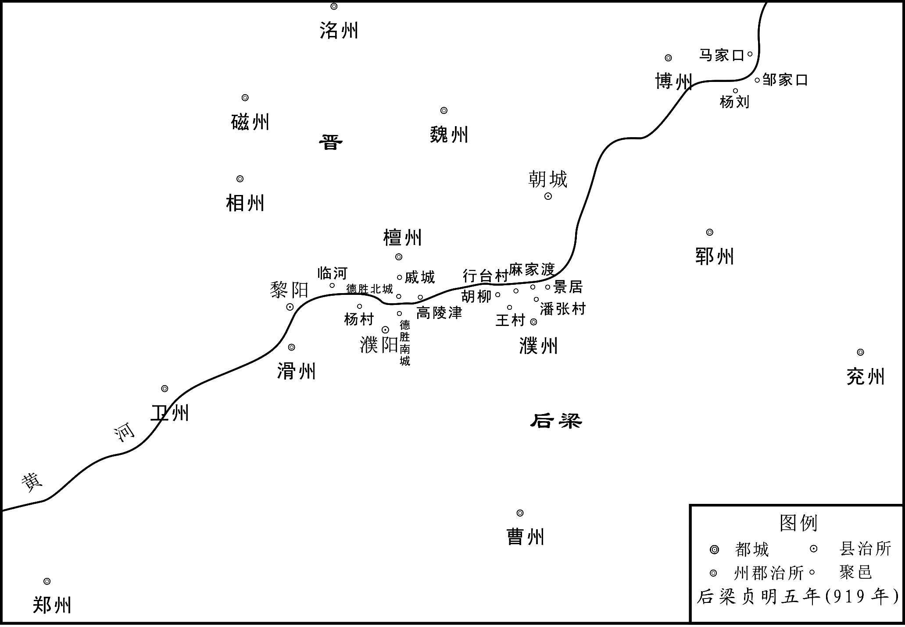 
古黄河沿岸重要战场示意图

## 【原文】

**冬十月，晋王如魏州，发徒数万，广德胜北城，日与梁人争，大小百余战，互有胜负[1]。左射军使石敬瑭与梁人战于河壖，梁人击敬瑭，断其马甲，横冲兵马使刘知远以所乘马授之，自乘断甲者徐行为殿[2]。梁人疑有伏，不敢迫，俱得免，敬瑭以是亲爱之。敬瑭、知远其先皆沙陀人。敬瑭，李嗣源之婿也。**

## 【注文】

[1]徒：刑徒，服劳役的罪犯。　　广：扩建。

[2]左射军使：官名，掌左射军。左射，军号，为晋侍卫亲军之一。　　石敬瑭：即后晋高祖。　　河壖（ruán）：河边地。壖，城下、宫庙外及水边等处的空地或田地。　　马甲：战马所披的铠甲。　　刘知远：即后汉高祖。　　徐行：慢行。　　为殿：作为殿后。

## 【译文】

后梁贞明五年（919年）冬季十月，晋王李存勗到达魏州，征调刑徒数万人，扩建德胜北城，每天都与梁军争战，大大小小有一百多仗，双方各有胜负。左射军使石敬瑭与梁军在黄河边上的空地交战，梁军攻击石敬瑭，击断了他所骑战马的铠甲，横冲兵马使刘知远便把自己的战马给了石敬瑭，自己骑着那匹断了铠甲的战马慢慢行走，作为殿后。梁军怀疑有伏兵，不敢靠近，因此两人得以脱身，石敬瑭因此亲近喜爱刘知远。石敬瑭、刘知远的祖先都是沙陀人。石敬瑭是李嗣源的女婿。

## 【原文】

**十一月辛卯，王瓒引兵至戚城，与李嗣源战，不利[1]。**

## 【注文】

[1]戚城：地名，春秋时卫国戚邑故址。在德胜西，即今河南濮阳北戚城。

## 【译文】

后梁贞明五年（919年）十一月辛卯（二十七日），王瓒率兵到达戚城，与李嗣源交战，没有获胜。

## 【原文】

**梁筑垒贮粮于潘张，距杨村五十里[1]。十二月，晋王自将骑兵自河南岸西上，邀其饷者，俘获而还[2]。梁人伏兵于要路，晋兵大败。晋王以数骑走，梁数百骑围之，李绍荣识其旗，单骑奋击救之，仅免。戊戌，晋王复与王瓒战于河南，瓒先胜，获晋将石君立等。既而大败，乘小舟渡河，走保北城，失亡万计[3]。帝闻石君立勇，欲将之，系于狱而厚饷之，使人诱之[4]。君立曰：“我晋之败将，而为用于梁，虽竭诚効死，谁则信之！人各有君，何忍反为仇雠用哉！”帝犹惜之，尽杀所获晋将，独置君立[5]。晋王乘胜遂拔濮阳[6]。帝召王瓒还，以天平节度使戴思远代为北面招讨使，屯河上以拒晋人。**

## 【注文】

[1]潘张：村名。在今河南范县西南濮城西北。

[2]邀：截击。　　饷者：运送军粮的人。

[3]北城：指杨村北城。

[4]将：任命为将。　　系：囚禁，关押。　　厚饷：优厚对待。饷，同“飨（xiǎng）”，用酒食招待。

[5]置：放，放过。指留命不杀。

[6]晋王乘胜遂拔濮阳：前文载上年十二月“甲子，晋王进攻濮阳，拔之”。此又载“拔濮阳”。殆上年十二月晋军攻取濮阳，后又撤出，此时再次攻取。

## 【译文】

梁军在潘张修筑营垒贮存粮食，距离杨村五十里。贞明五年（919年）十二月，晋王李存勗亲自率领骑兵从黄河南岸向西行进，截击为梁军运送粮饷的人，将他们俘获而返回。梁军在要道上设下伏兵，晋军大败。晋王带着几名骑兵逃走，梁军的数百名骑兵包围了他们，李绍荣认出晋王的旗帜，独自骑马前去奋力击杀，营救晋王，晋王才免于一难。戊戌（初五日），晋王再次与王瓒在黄河南岸交战，王瓒先取得胜利，俘获了晋将石君立等人。但不久王瓒大败，乘着小船渡过黄河，逃到杨村北城自保，梁军战死、逃亡的士卒数以万计。后梁末帝闻知石君立勇猛，想用他为自己的将领，把他关押在监狱里面，但对他很优待，并派人去诱降他。石君立说：“我是晋国的败将，而在梁国被任用，即使竭诚效死，有谁会相信我呢！人各有自己的君主，怎么忍心反被仇敌所用呢！”后梁末帝仍然舍不得他，把所俘获的晋将全部杀掉，唯独放过了石君立。晋王乘胜攻下濮阳。后梁末帝把王瓒召回朝廷，任命天平节度使戴思远代替他为北面招讨使，驻扎在黄河边上来抵御晋军。

## 【原文】

**六年夏四月，河中节度使冀王友谦以兵袭取同州，逐忠武节度使程全晖，全晖奔大梁[1]。友谦以其子令德为忠武留后，表求节钺，帝怒，不许[2]。既而惧友谦怨望，己酉，以友谦兼忠武节度使。制下，友谦已求节钺于晋王，晋王以墨制除令德忠武节度使[3]。**

## 【注文】

[1]河中节度使：方镇名。唐肃宗至德二载（757年）置，治河中府（治河东，今山西永济西）。僖宗光启二年（886年）改称护国节度使。辖境屡变，长期领有河中府及晋（治白马城，今山西临汾）、绛（治正平，今山西新绛）、慈（治吉昌，今山西吉县）、隰（xí）（治隰川，今山西隰县）等州，辖境约当今山西石楼、汾西、霍州等县市以南及安泽、垣曲等县以西地区。　　友谦：即朱友谦（？—926年）。许州（治今河南许昌）人，字德光，初名简。初为陕州军校，后杀节度使王珙（gǒng），归附朱温，被录为子，更名友谦，任陕州节度使。朱温称帝，封冀王，徙镇河中，朱友珪弑朱温，他附于晋，封西平王。庄宗灭梁，赐姓名为李继麟，加守太师尚书令。后被宦官诬陷谋反，被杀。

[2]令德：即朱令德（？—926年）。朱友谦长子，官任忠武节度使。后随其父改姓李。后唐同光三年（925年），随魏王李继岌伐蜀。次年，遭宦官景进等诬陷，与其父、弟先后被杀。　　节钺（yuè）：旌节与斧钺。古时朝廷授予将帅节钺，作为加重权力的标志。此“求节钺”即请求任命为节度使之职。

[3]墨制：墨笔所写的制书，不经由中书省、门下省，而由宫中直接颁发受诏者。

## 【译文】

后梁贞明六年（920年）夏季四月，河中节度使冀王朱友谦率兵袭击并夺取了同州，赶走了忠武节度使程全晖，程全晖逃到了大梁。朱友谦任命自己的儿子朱令德为忠武留后，并上表请求朝廷赐给旌节、斧钺，后梁末帝发怒，没有答应。不久又害怕朱友谦怨恨，于是在己酉（十七日）这天，任命朱友谦兼任忠武节度使。任命的制书下达时，朱友谦已经向晋王请求旌节、斧钺，晋王就直接颁发墨制任命朱令德做了忠武节度使。

## 【原文】

**六月，帝以泰宁节度使刘为河东道招讨使，帅感化节度使尹皓、静胜节度使温昭图、庄宅使段凝攻同州[1]。闰月，刘等围同州，朱友谦求救于晋。秋七月，晋王遣李存审、李嗣昭、李建及、慈州刺史李存质将兵救之。九月，李存审等至河中，即日济河。梁人素轻河中兵，每战必穷追不置。存审选精甲二百，杂河中兵，直压刘垒。出千骑逐之。知晋人已至，大惊，自是不敢轻出。晋人军于朝邑[2]。**

## 【注文】

[1]泰宁节度使：方镇名。亦称兖海节度使。唐宪宗元和十四年（819年）分淄青节度使置，治兖州（治瑕丘，今山东兖州）。领兖、海（治朐山，今江苏连云港西南海州镇）、沂（治临沂，今山东临沂）、密（治诸城，今山东诸城）四州。五代时领兖、沂、密三州。　　感化节度使：方镇名。又称华州节度使，后梁开平三年（909年）置，后唐同光元年（923年）改名镇国军，治华州（治郑县，今陕西华县）。领华、商（治上洛，今陕西商州）二州。　　静胜节度使：方镇名。唐末岐王李茂贞以美原县（治今陕西富平东北美原镇）为鼎州，置义胜军节度使。后梁末帝贞明初改鼎州为裕州，改义胜军为静胜军。　　温昭图（？—928年）：京兆华原（今陕西耀州）人，原名温韬。初为盗贼，后事李茂贞，改名李彦韬，任耀州刺史、义胜军节度使。之后反复叛附于李茂贞、朱温之间。后梁末帝时，任静胜军节度使，改名为温昭图。在镇七年，遍掘境内唐帝诸陵，取其珍宝。后徙匡国节度使。梁亡后降后唐，赐名为李绍冲。后唐明宗时被流放，赐死。　　庄宅使：官名。主管两京地区朝廷所有庄田及磨坊、邸店、菜园、车坊等产业。

[2]朝邑：县名。治所在今陕西大荔东朝邑镇。

## 【译文】

后梁贞明六年（920年）六月，后梁末帝任命泰宁节度使刘为河东道招讨使，统帅感化节度使尹皓、静胜节度使温昭图、庄宅使段凝攻打同州。闰六月，刘等人包围了同州，朱友谦向晋国求救。秋季七月，晋王派遣李存审、李嗣昭、李建及、慈州刺史李存质率兵救援同州。九月，李存审等人到达河中，当天就渡过了黄河。梁军一向轻视河中的军队，每次交战都必定穷追不舍。李存审挑选精兵二百人，混杂在河中兵卒中间，直逼到刘的营前。刘派出一千名骑兵驱逐他们。得知晋军已经到来，非常惊慌，从此不敢轻易出战。晋军驻扎在朝邑。

## 【原文】

**河中事梁久，将士皆持两端[1]。诸军大集，刍粟踊贵，友谦诸子说友谦且归款于梁，以退其师[2]。友谦曰：“昔晋王亲赴吾急，秉烛夜战[3]。今方与梁相拒，又命将星行，分我资粮，岂可负邪[4]！”**

## 【注文】

[1]持两端：指在事梁与事晋上摇摆不定。

[2]踊（yǒng）贵：价格飞涨。踊，跳跃。　　且：暂且。　　归款：投诚，归顺。

[3]亲赴吾急：指乾化二年（912年），朱友谦因朱友珪弑朱温，归附于晋，朱友珪派康怀贞等攻打河中，李存勗亲赴救援，大败康怀贞之事。　　秉烛：手持火烛。

[4]星行：星夜赶来。

## 【译文】

河中镇侍奉后梁的时间很长了，将士们都在侍奉梁还是侍奉晋上摇摆不定。各路军队都聚集在河中，致使粮草的价格飞涨，朱友谦的儿子们劝说他暂且向后梁投诚，以此使后梁退兵。朱友谦说：“过去我们有急难，晋王亲赴救援，手持火烛连夜作战。如今我们正与梁军相抗，晋王又命令大将星夜赶来救援，还分给我们物资粮食，怎么能辜负他呢！”

## 【原文】

**晋人分兵攻华州，坏其外城。李存审等按兵累旬，乃进逼刘营，等悉众出战，大败，收余众退保罗文寨[1]。又旬余，存审谓李嗣昭曰：“兽穷则搏，不如开其走路，然后击之[2]。”乃遣人牧马于沙苑[3]。等宵遁，追击至渭水，又破之，杀获甚众[4]。存审等移檄告谕关右，引兵略地，至下邽，谒唐帝陵，哭之而还[5]。河中兵进攻崇州[6]。**

## 【注文】

[1]罗文寨：地名。在华州东，即今陕西渭南华州东。

[2]兽穷则搏：野兽陷于绝境就会搏咬。喻人陷入困境，便会竭力反击。

走路：逃路。

[3]沙苑：地名。又名沙阜、沙海、沙窝。在今陕西大荔南洛、渭两水之间，地多沙草，宜放牧。

[4]宵遁：乘夜逃跑。　　渭水：水名。为黄河第一大支流，发源于甘肃渭源鸟鼠山，流经甘肃、宁夏、陕西三省区，由陕西潼关汇入黄河。此指华州境内渭水河段。

[5]关右：地区名。即关西，古时以西为右。泛指函谷关或潼关以西地区。　　略地：攻占土地。　　下邽（guī）：县名。治所在今陕西渭南东北。

[6]崇州：州名。原名耀州，治华原（今陕西铜川耀州），后梁时改为崇州，辖境相当于今铜川耀州及附近地区。

## 【译文】

晋军分出部分兵力去攻打华州，摧毁了华州的外城。李存审等人按兵不动数十天，然后才进军逼近刘的军营，刘等人率领全部兵众出战，被打得大败，于是收拾剩下的兵众退守在罗文寨。又过了十多天，李存审对李嗣昭说：“野兽陷于绝境就会搏咬，不如给梁军放开一条逃路，然后再追击他们。”于是派人到沙苑牧马。刘等人乘夜逃走，晋军追击到渭水边上，又打败了他们，斩杀俘获的梁军非常多。李存审等人传布檄文告谕关右各地，并率兵攻占州县，到达下邽，谒拜了唐朝皇帝的陵墓，对着陵墓哭了一番而返回。河中镇的军队进攻崇州。

## 【原文】

**龙德元年春正月，蜀主、吴主屡以书劝晋王称帝，晋王以书示僚佐曰：“昔王太师亦尝遗先王书，劝以唐室已亡，宜自帝一方[1]。先王语余云：‘昔天子幸石门，吾发兵诛贼臣，当是之时，威振天下，吾若挟天子据关中，自作九锡禅文，谁能禁我[2]！顾吾家世忠孝，立功帝室，誓死不为耳[3]。汝他日当务以复唐社稷为心，慎勿効此曹所为[4]。’言犹在耳，此议非敢所闻也。”因泣。**

## 【注文】

[1]蜀主：即五代时十国之一的前蜀国后主王衍（899—926年）。字化源，前蜀高祖王建第十一子，初封郑王，于其父死后袭位。在位期间（918—925年），委政于宦官，荒淫无度。后唐同光三年（925年），庄宗李存勗派遣魏王李继岌、郭崇韬发兵攻蜀，王衍出降，前蜀亡。次年被押送长安，于秦川驿举族被杀。后唐明宗追赠为顺正公。　　吴主：即五代时十国之一的吴国国主杨溥（901—938年）。吴王杨行密第四子，后梁贞明六年（920年），由权臣徐温立为吴王。徐温死，其养子徐知诰代为辅政，后唐天成二年（927年）逼杨溥称帝。后晋天福二年（937年），被迫禅位于徐知诰。吴国亡，次年病死于润州。　　王太师：即前蜀高祖王建（847—918年）。字光图，许州舞阳（今河南舞阳）人。少时以屠牛、贩私盐为业。唐末从军，参与镇压黄巢起义军。后为壁州（治今四川通江）刺史。唐昭宗大顺二年（891年），攻取成都，进而攻取东川、汉中。唐昭宗天复三年（903年），封为蜀王。后梁开平元年（907年）于成都称帝，建立前蜀。死后谥神武圣文皇帝，庙号高祖。王建在唐末曾官拜太师，故称王太师。

[2]余：第一人称代词，我。　　天子幸石门：天子，指唐昭宗。石门，地名，在今陕西西安长安南终南山中。此事指乾宁二年（895年），因凤翔节度使李茂贞、邠（bīn）宁节度使王行瑜、华州节度使韩建向朝廷施压，引起大乱，唐昭宗逃至终南山中之事。　　九锡禅文：九锡，古时帝王赐给有功大臣或有权势的诸侯的九种物品，包括车马、衣服、乐县、朱户、纳陛、虎贲、弓矢、斧钺、秬（jù）鬯（chàng）。禅文，禅让皇位的文告。

[3]顾：但。

[4]此曹：这类人。此指叛逆之人。

## 【译文】

后梁末帝龙德元年（921年）春季正月，前蜀国主王衍、吴国国主杨溥多次用书信劝晋王李存勗称帝，晋王把这些书信拿给僚佐们看，并说：“从前王太师也曾送给先王书信，用唐朝已经灭亡，应当自己在一方称帝相劝。先王告诫我说：‘过去天子驾临石门时，我发兵诛灭了叛逆贼臣，在那时候，威震天下，我如果挟持天子，占据关中，自己制作九锡和禅让皇位的文告，谁能禁止我！但我家世代忠孝，为帝室建立功勋，誓死不能做这种事情。你今后应当务必把恢复唐朝的江山社稷作为心中大事，千万不要仿效这些叛逆之人的所作所为。’先王的话语犹在耳旁，这种称帝的建议不是我所敢听的。”说完便哭了起来。

## 【原文】

**既而将佐及藩镇劝进不已，乃令有司市玉造法物[1]。黄巢之破长安也，魏州僧传真之师得传国宝，藏之四十年，至是，传真以为常玉，将鬻之[2]。或识之，曰“传国宝也”，传真乃诣行台献之，将佐皆奉觞称贺[3]。**

## 【注文】

[1]有司：有关部门。　　市：买。　　法物：传国玉玺（xǐ）之类的宝物。

[2]传国宝：即传国玉玺。武则天时改玺为宝。

[3]行台：在地方代表中央行尚书省事务的机构。乾化二年（914年），赵王王镕、义武节度使王处直奉册推李存勗为尚书令，故于魏州建行台。　　奉觞（shāng）：举杯。奉，手捧。觞，古时饮酒用的器具。

## 【译文】

不久，晋王的将佐和各藩镇不断地劝晋王称帝，于是晋王命令有关部门购买玉石制作传国玉玺等宝物。早在黄巢攻破长安的时候，魏州僧人传真的师父得到了传国玉玺，收藏了四十年，到这时，传真以为是一块普通的玉石，准备卖了它。有人认出了它，说“这是传国玉玺”，传真于是前往魏州行台献上了它，将佐们都举杯祝贺。

## 【原文】

**张承业在晋阳闻之，亟诣魏州谏曰：“吾王世世忠于唐室，救其患难，所以老奴三十余年为王捃拾财赋，召补兵马，誓灭逆贼，复本朝宗社耳[1]。今河北甫定，朱氏尚存，而王遽即大位，殊非从来征伐之意，天下其谁不解体乎[2]！王何不先灭朱氏，复列圣之深仇，然后求唐后而立之，南取吴，西取蜀，汛扫宇内，合为一家[3]。当是之时，虽使高祖、太宗复生，谁敢居王上者[4]？让之愈久，则得之愈坚矣。老奴之志无他，但以受先王大恩，欲为王立万年之基耳。”王曰：“此非余所愿，奈群下意何。”承业知不可止，恸哭曰：“诸侯血战，本为唐家，今王自取之，误老奴矣。”即归晋阳，邑邑成疾，不复起[5]。**

## 【注文】

[1]老奴：张承业身为宦官，故自称老奴。　　捃（jùn）拾：拾取，收集。

本朝宗社：指唐朝的宗庙社稷。

[2]甫定：刚刚平定。　　殊非：实在不是。

[3]列圣：指唐朝的历代皇帝。　　汛扫：清扫，扫除。

[4]高祖、太宗：指唐王朝的建立者唐高祖李渊与唐太宗李世民。

[5]邑邑：同“悒悒”，忧郁，愁闷。

## 【译文】

张承业在晋阳闻知此事，急忙去魏州劝谏说：“大王世代忠于唐室，解救它的患难，所以老奴我三十多年来为大王征收聚集财赋，招募补充兵马，发誓诛灭叛逆之贼，来恢复唐朝的宗庙社稷。现在河北地区刚刚平定，朱氏政权依然存在，而大王却要急急忙忙地即皇帝大位，这实在不是我们一直以来征伐的本意，这样天下谁不离你而去呢！大王为何不先灭掉朱氏，报了列位圣君的深仇，然后找到唐室的后人，立他为帝，再向南夺取吴国，向西夺取蜀国，扫除天下，合为一家。到那时，即使是高祖、太宗再生，又有谁敢居于大王之上呢？谦让的时间越长久，得到的天下就越牢固。老奴我没有别的志向，只是因为蒙受先王的大恩，想为大王您立下万年的基业罢了。”晋王说：“这也不是我所希望的，只是对臣下的心愿没有办法。”张承业知道不能阻止，痛哭说：“诸侯浴血奋战，本来是为了唐室，如今大王自取帝位，可害苦老奴我了。”便回了晋阳，忧郁成疾，不再视事。

## 【原文】

**二月，赵王镕养子张文礼使亲军杀镕，尽灭王氏之族，独置其子昭祚之妻普宁公主以自讬于梁[1]。三月，文礼遣使告乱于晋王，且奉笺劝进，固求节钺。晋王欲讨之，僚佐以为“吾方与梁争，不可更立敌于肘腋，且从其请以安之[2]”。王不得已，夏四月，承制授文礼成德留后。**

## 【注文】

[1]张文礼：即王德明。　　昭祚（？—921年）：王镕长子。　　普宁公主：后梁太祖朱温之女。　　自讬：使自己有所依靠。讬，同“托”。

[2]肘腋：人体的肘部与腋部，比喻切近之地。

## 【译文】

后梁末帝龙德元年（921年）二月，赵王王镕的养子张文礼指使亲军杀了王镕，并灭了王镕的全族，唯独留下了王镕之子王昭祚的妻子普宁公主，以便使自己依托于后梁。三月，张文礼派遣使者向晋王禀告发生的祸乱，并奉上书信劝晋王称帝，坚持请求赐予旌节、斧钺。晋王准备讨伐他，僚佐们认为：“我们正与梁国争战，不能再在身边树敌，应暂且听从他的请求来安抚他。”晋王不得已，在夏季四月，按照皇帝的授权授予张文礼成德留后的官职。

## 【原文】

**初，刘与朱友谦为婚[1]。之受诏讨友谦也，至陕州，先遣使移书，谕以祸福[2]。待之月余，友谦不从，然后进兵。尹皓、段凝素忌，因谮之于帝曰：“逗遛养寇，俾俟援兵[3]。”帝信之。既败归，以疾请解兵柄，诏听于西都就医，密令留守张宗奭鸩之，五月丁亥卒[4]。**

## 【注文】

[1]为婚：结为婚姻，结为亲家。

[2]移书：致送书信。

[3]俾（bǐ）：使。

[4]鸩（zhèn）：用毒酒毒死。

## 【译文】

起初，刘与朱友谦结为亲家。刘受诏令讨伐朱友谦，到达陕州时，先派遣使者给朱友谦送去书信，用祸福利害劝告他。等了一个多月，朱友谦不听从劝告，然后刘才进兵。尹皓、段凝一向忌恨刘，便乘机向后梁末帝诬陷他说：“刘逗留不进，放着敌人不打，使敌人等待援军。”后梁末帝相信了他们的话。刘战败回来之后，以有病为由请求解除兵权，后梁末帝下诏，准许他到西都治病，又密令西都留守张宗奭用毒酒毒死他，龙德元年（921年）五月丁亥（初二日），刘死去。

## 【原文】

**秋七月，晋王既许藩镇之请，求唐旧臣，欲以备百官。朱友谦遣前礼部尚书苏循诣行台[1]。循至魏州，入牙城，望府廨即拜，谓之“拜殿”[2]。见王呼万岁舞蹈，泣而称臣[3]。翌日，又献大笔三十枝，谓之“画日笔”[4]。王大喜，即命循以本官为河东节度副使，张承业深恶之[5]。**

## 【注文】

[1]礼部尚书：官名。为尚书省礼部长官，置一员，正三品。掌礼仪、祭祀、宴享及学校之政令，总判礼部、祠部、膳部、主客四司事。　　苏循（？—922年）：唐懿宗咸通年间举进士，昭宗时官至礼部尚书。善于阿谀逢迎，曾劝朱温称帝。后依附河中朱友谦，因迎合李存勗称帝之意，被授为河东节度副使。次年病卒。

[2]府廨（xiè）：官署，府衙。官吏办公处所通称为廨。

[3]舞蹈：古时臣下朝见皇帝时的一种仪节。

[4]画日笔：唐代皇帝签发制敕，于上画日，其笔称画日笔。

[5]本官：指苏循原任的礼部尚书官职。

## 【译文】

后梁末帝龙德元年（921年）秋季七月，晋王李存勗答应藩镇请他称帝的要求以后，便寻找唐朝的旧臣，打算备齐朝廷的各种官职。朱友谦派遣前礼部尚书苏循前往魏州行台。苏循到了魏州，进入牙城，望见府衙便下拜，称之为“拜殿”。见到晋王则口呼万岁，舞蹈行礼，哭着称臣。第二天，又献上大笔三十支，称之为“画日笔”。晋王大喜，随即命令苏循以礼部尚书的原职出任河东节度副使，张承业特别厌恶他。

## 【原文】

**张文礼虽受晋命，内不自安，复遣间使因卢文进求援于契丹，又遣间使来告曰：“王氏为乱兵所屠，公主无恙[1]。今臣已北召契丹，乞朝廷发精甲万人相助，自德、棣渡河，则晋人遁逃不暇矣[2]。”帝疑未决[3]。敬翔曰：“陛下不乘此衅以复河北，则晋人不可复破矣[4]。宜徇其请，不可失也[5]。”赵、张辈皆曰：“今强寇近在河上，尽吾兵力以拒之，犹惧不支，何暇分万人以救张文礼乎[6]！且文礼坐持两端，欲以自固，于我何利焉？”帝乃止。**

## 【注文】

[1]因：通过。　　来告：指来后梁禀告。

[2]棣（dì）：棣州，唐高祖武德四年（621年）置，治阳信县（今山东阳信西南），太宗贞观十七年（643年），移治厌次（今山东惠民东南）。玄宗天宝元年（742年），改为乐安郡，肃宗上元元年（760年），复为棣州。领厌次、滳（shāng）河、阳信、蒲台、渤海五县，辖境约当今山东阳信、商河、滨州、利津及博兴北部。

[3]疑：犹豫。

[4]衅：间隙，机会。

[5]徇：顺从、依从。

[6]赵、张：指赵岩、张汉杰。

## 【译文】

张文礼虽然接受了晋王的任命，心里却不自安，又派遣密使通过卢文进向契丹求援，还派遣密使来后梁禀告说：“王氏被乱兵屠杀，普宁公主安然无恙。现在我已向北边召请契丹，请求朝廷派出精兵万人相助，从德州、棣州渡过黄河，那么，晋人逃跑都来不及了。”后梁末帝犹豫不决。敬翔说：“陛下不乘这个机会来收复河北，那么晋人就不能再被打败了。应当听从他的请求，不能失去这个机会。”赵岩、张汉杰一伙都说：“现在强大的敌寇近在黄河边上，用我们的全部兵力去抵御他们，还怕支撑不住，哪里有闲空分出一万人马去救援张文礼呢！况且张文礼在那里脚踏两只船，想以此巩固自己的势力，对我们有什么好处呢？”后梁末帝于是作罢。

## 【原文】

**晋人屡于塞上及河津获文礼蜡丸绢书，晋王皆遣使归之，文礼惭惧[1]。文礼忌赵故将，多所诛灭。赵将符习将兵万人从晋王在德胜，文礼请召归，以他将代之，且以习子蒙为都督府参军，遣人赍钱帛劳行营将士以悦之[2]。习见晋王，泣涕请留，晋王曰：“吾与赵王同盟讨贼，义犹骨肉，不意一旦祸生肘腋，吾诚痛之。汝苟不忘旧君，能为之复仇乎？吾以兵粮助汝。”习与部将三十余人举身投地恸哭曰：“故使授习等剑，使之攘除寇敌[3]。自闻变故以来，冤愤无诉，欲引剑自刭，顾无益于死者。今大王念故使辅佐之勤，许之复冤，习等不敢烦霸府之兵，愿以所部径前搏取凶竖，以报王氏累世之恩，死不恨矣[4]！”**

## 【注文】

[1]塞上：指靠近契丹的边塞。　　河津：黄河渡口。　　蜡丸绢书：写在绢帛之上，用蜡封成丸状的密信。塞上所获是张文礼送给契丹的，河津所获是送给后梁的。

[2]蒙：即符习次子符蒙（？—944年），字适之。后唐同光三年（925年）举进士，任镇州节度副使。后晋时，官至礼部侍郎。著有《符蒙集》一卷。　　都督：官名。唐初于诸州置总管，大州置大总管。武德七年（624年）改为都督和大都督。为地方高级军政长官，总一州或数州事务。玄宗开元后，节度、观察等使成为地方军政长官，都督遂成虚设。此都督府殆由张文礼自行设置的机构。

[3]故使：指成德节度使王镕。因已死，故称故使。

[4]自刭（jǐng）：自刎，自杀。刭，割颈。　　霸府：指李存勗在魏州的军府。晋王在魏州，为河北诸藩镇盟主，故称其府为霸府。　　凶竖：凶恶的小子，指张文礼。　　恨：遗憾。

## 【译文】

晋人多次在边塞与黄河渡口截获张文礼写在绢帛之上、用蜡封成丸状的密信，晋王都派使者送还了张文礼，于是张文礼既惭愧又害怕。张文礼顾忌赵王原来的将领，把他们大多数都诛杀了。赵将符习率领士卒一万跟随晋王在德胜，张文礼请求召回符习，由其他将领代替他，并且任命符习的儿子符蒙为都督府参军，还派人携带着钱财绢帛去慰劳行营的将士，以此讨好他们。符习参见晋王，哭着请求留下，晋王说：“我与赵王结成同盟，讨伐逆贼，情义如同骨肉一样，想不到突然祸难发生在身边，我实在为此痛心。你如果没有忘记过去的君主，能为他报仇吗？我将用兵马、粮草来帮助你。”符习与部将三十多人纵身拜伏在地，大哭着说：“故去的节度使曾授给我们宝剑，让我们驱逐敌寇。自从闻知变故以来，冤仇愤恨无处诉说，本想用剑自刎，但这样做对死者也没什么益处。今天大王感念故使对您的辅佐功劳，答应为他报仇，我们不敢烦劳霸府的人马，愿意率领所统兵众，直接前去攻打捕获那个凶恶的小子，来报答王氏对我们世世代代的恩德，这样死了也没有遗憾了！”

## 【原文】

**八月庚申，晋王以习为成德留后，又命天平节度使阎宝、相州刺史史建瑭将兵助之，自邢洺而北。文礼先病腹疽[1]。甲子，晋兵拔赵州，刺史王降，晋王复以为刺史[2]。文礼闻之，惊惧而卒。其子处瑾秘不发丧，与其党韩正时谋悉力拒晋[3]。九月，晋兵渡滹沱，围镇州，决漕渠以灌之，获其深州刺史张友顺[4]。壬辰，史建瑭中流矢卒。**

## 【注文】

[1]腹疽：腹部的毒疮。

[2]：音chán。

[3]处瑾：即张文礼长子张处瑾（？—922年）。　　秘不发丧：不向外宣布死讯。

[4]滹（hū）沱（tuó）：水名，在今河北省西部。　　漕渠：人工开凿的用于运输粮食的河道。

## 【译文】

后梁末帝龙德元年（921年）八月庚申（初七日），晋王李存勗任命符习为成德留后，又命令天平节度使阎宝、相州刺史史建瑭率兵协助他，从邢州、洺州向北进军。张文礼先前肚子上长了个毒疮。甲子（十一日），晋军攻取赵州，赵州刺史王投降，晋王仍旧任命他为赵州刺史。张文礼闻听此事，惊恐而死。他的儿子张处瑾不向外宣布死讯，与自己的党羽韩正时谋划全力抵御晋军。九月，晋军渡过滹沱河，包围了镇州，挖开漕渠来灌州城，俘获了张处瑾的深州刺史张友顺。壬辰（初十日），晋将史建瑭身中流箭而死。

## 【原文】

**晋王欲自分兵攻镇州，北面招讨使戴思远闻之，谋悉杨村之众袭德胜北城，晋王得梁降者，知之。冬十月己未，晋王命李嗣源伏兵于戚城，李存审屯德胜，先以骑兵诱之，伪示羸怯[1]。梁兵竞进，晋王严中军以待之。梁兵至，晋王以铁骑三千奋击，梁兵大败，思远走趣杨村，士卒为晋兵所杀伤及自相蹈藉、坠河陷冰，失亡二万余人。晋王以李嗣源为蕃汉内外马步副总管、同平章事。**

## 【注文】

[1]羸（léi）怯：衰弱胆怯。

## 【译文】

晋王李存勗打算自己分出一部分兵马去攻打镇州，后梁北面招讨使戴思远得知这个消息，就谋划用杨村的全部兵众去袭击德胜北城，晋王得到后梁投降的人，知道了戴思远的图谋。龙德元年（921年）冬季十月己未（初七日），晋王命李嗣源在戚城设下伏兵，命李存审驻守德胜，先用骑兵引诱梁军，装出衰弱胆怯的样子给梁军看。于是梁军争先恐后地向前进发，晋王则严布中军来等待他们。等梁军来到，晋王率领三千铁甲骑兵奋力击杀，结果梁军大败，戴思远逃奔到杨村，梁军士卒被晋军杀死杀伤以及自相踩踏、掉到河里陷入冰窟之中，损失了二万多人。晋王任命李嗣源为蕃汉内外马步副总管、同平章事。

## 【原文】

**十一月，晋王使李存审、李嗣源守德胜，自将兵攻镇州。张处瑾遣其弟处琪、幕僚齐俭谢罪请服，晋王不许，尽锐攻之，旬日不克[1]。处瑾使韩正时将千骑突围出，趣定州，欲求救于王处直，晋兵追至行唐，斩之。**

## 【注文】

[1]处琪：张文礼第三子张处琪（？—922年）。　　尽锐：出动全部精锐部队。

## 【译文】

后梁末帝龙德元年（921年）十一月，晋王李存勗派李存审、李嗣源驻守德胜，自己率兵攻打镇州。张处瑾派遣自己的弟弟张处琪、幕僚齐俭向晋王谢罪，请求归附，晋王没有答应，并出动全部精锐部队攻打镇州，历时十天，没能攻克。张处瑾派韩正时率领一千名骑兵突围出去，奔向定州，想向王处直求救，晋军追击到行唐，斩杀了韩正时。

## 【原文】

**二年。晋王之北攻镇州也，李存审谓李嗣源曰：“梁人闻我在南兵少，不攻德胜，必袭魏州。吾二人聚于此何为？不若分军备之。”遂分军屯澶州。戴思远果悉杨村之众趣魏州，嗣源引兵先之，军于狄公祠下，遣人告魏州，使为之备[1]。思远至魏店，嗣源遣其将石万全将骑兵挑战[2]。思远知有备，乃西渡洹水，拔成安，大掠而还[3]。又将兵五万攻德胜北城，重堑复垒，断其出入，昼夜急攻之，李存审悉力拒守[4]。晋王闻德胜势危，二月，自幽州赴之，五日至魏州。思远闻之，烧营遁还杨村[5]。**

## 【注文】

[1]狄公祠：唐代宰相狄仁杰的祠庙。狄仁杰曾任魏州刺史，有惠政，故州人为之立祠。

[2]魏店：地名。在今河北大名南。

[3]成安：县名。即今河北成安。

[4]重堑复垒：道道壕沟，层层壁垒。

[5]自幽州赴之：此前契丹进犯定州，李存勗自镇州率兵救援，契丹败退，李存勗追于其后，到达幽州。此时闻知德胜危急，故自幽州赶来。

## 【译文】

后梁龙德二年（922年），晋王李存勗北进攻打镇州的时候，李存审对李嗣源说：“梁军闻知我们在南边的兵力少，不来攻打德胜，就必定去攻打魏州。我们二人都集中在这里干什么？不如把军队分开来防备梁军。”于是分出一部分军队驻扎在澶州。戴思远果然率领杨村的全部兵众，扑向魏州，而李嗣源率兵走在了他的前面，驻扎在狄公祠下，并派人向魏州报告，让他们做好防备。戴思远抵达魏店，李嗣源派手下将领石万全率领骑兵前去挑战。戴思远知道晋军已有防备，便向西渡过洹水，攻取成安，大肆抢掠一番而返回。接着又率兵五万攻打德胜北城，在城外挖掘道道壕沟，筑起层层壁垒，断绝了晋军的出入，日夜加紧攻城，李存审则全力抵御固守。晋王闻知德胜形势危急，二月，从幽州赶赴这里，五天就到了魏州。戴思远闻知此讯，便烧毁营寨，逃回了杨村。

## 【原文】

**晋天平节度使兼侍中阎宝筑垒以围镇州，决滹沱水环之。内外断绝，城中食尽，丙午(1)，五百余人出求食。宝纵其出，欲伏兵取之；其人遂攻长围，宝轻之，不为备，俄数千人继至[1]。诸军未集，镇人遂坏长围而出，纵火焚宝营；宝不能拒，退保赵州。镇人悉毁晋之营垒，取其刍粟，数日不尽。晋王闻之，以昭义节度使兼中书令李嗣昭为北面招讨使，以代宝。**

## 【注文】

[1]其人：指出来求食的五百余名镇州兵。　　长围：晋军围攻镇州的工事。　　俄：顷刻，不一会儿。

## 【译文】

晋天平节度使兼侍中阎宝筑起壁垒来包围镇州，并决开滹沱河，放水围住州城。镇州内外往来断绝，城中的粮食耗尽，后梁龙德二年（922年）三月丙午（二十六日），派五百多人出城寻找食物。阎宝放他们出来，想埋伏军队抓获他们；而这些人出来便攻打围在城外的工事，阎宝轻视他们，没做防备，不一会儿又有几千人接着赶来。阎宝的各支部队还没集中，镇州人就摧毁工事冲了出来，放火攻打阎宝的军营；阎宝抵挡不住，退到赵州自保。于是镇州人把晋军的营垒全部毁掉，并搬运晋军的粮草，几天都没运完。晋王李存勗闻知此事，任命昭义节度使兼侍中李嗣昭为北面招讨使，来代替阎宝。

## 【原文】

**夏四月甲戌，张处瑾遣兵千人迎粮于九门，李嗣昭设伏于故营，邀击之，杀获殆尽[1]。余五人匿于墙墟间，嗣昭环马而射之，镇兵发矢中其脑，嗣昭箙中矢尽，拔矢于脑以射之，一发而殪[2]。会日暮，还营，创流血不止，是夕卒。晋王闻之，不御酒肉者累日[3]。嗣昭遗命，悉以泽潞兵授节度判官任圜，使督诸军攻镇州，号令如一，镇人不知嗣昭之死[4]。圜，三原人也。晋王以天雄马步都指挥使、振武节度使李存进为北面招讨使。**

## 【注文】

[1]九门：地名。在镇州城外。　　故营：原阎宝安在镇州城外的军营。

[2]墙墟：指故营墙垒废墟。　　环马：绕圈驰马。　　箙（fú）：盛放箭支的箭囊。

[3]御：用，此指食用。古时帝王所用所为称御。

[4]泽潞：方镇名，即晋属昭义镇。　　任圜（yuán）（？—927年）：京兆三原（今陕西三原）人。原为昭义节度判官，在李嗣昭死后，代统其军。在李存勗称帝后，历任潞州观察判官、工部尚书兼真定尹、北京副留守。曾随郭崇韬灭蜀。后唐明宗时，官至同中书门下平章事，兼判三司。后被权臣安重诲诬杀。

## 【译文】

后梁龙德二年（922年）夏季四月甲戌（二十四日），张处瑾派兵千人到九门迎接缴获的粮食，李嗣昭在阎宝原来的军营中设下伏兵，截击他们，几乎把他们全部杀死或俘获。还剩下五个人躲藏在故营墙垒废墟之间，李嗣昭骑马绕着圈射他们，镇州兵也放箭射中了他的脑袋，李嗣昭箭囊中的箭支用光了，便从脑袋上拔下那支箭来射镇州兵，一箭就射死了射他的那个镇州兵。适逢傍晚，李嗣昭返回军营，伤口流血不止，当夜就死去了。晋王李存勗闻知他的死讯，很多天都不吃酒肉。李嗣昭留下命令，把泽潞镇的全部兵马交给节度判官任圜，让他督率各军攻打镇州，任圜发号施令一如既往，镇州人并不知道李嗣昭已经死去。任圜是三原人。晋王任命天雄马步都指挥使、振武节度使李存进为北面招讨使。

## 【原文】

**阎宝惭愤，疽发于背，甲戌卒。**

## 【译文】

阎宝因战败既惭愧又恼恨，背上长了毒疮，龙德二年（922年）四月甲戌（二十四日）那天死去。

## 【原文】

**五月乙酉，晋李存进至镇州，营于东垣渡，夹滹沱水为垒[1]。**

## 【注文】

[1]东垣渡：津渡名。在今河北正定滹沱河边。

## 【译文】

后梁龙德二年（922年）五月乙酉（初六日），晋将李存进到达镇州，在东垣渡安营，在滹沱河两岸建造营垒。

## 【原文】

**晋卫州刺史李存儒本姓杨，名婆儿，以俳优得幸于晋王[1]。颇有膂力，晋王赐姓名，以为刺史，专事掊敛，防城卒皆征月课纵归[2]。八月，庄宅使段凝与步军都指挥使张朗引兵夜渡河袭之，诘旦，登城，执存儒，遂克卫州[3]。戴思远又与凝攻陷淇门、共城、新乡，于是澶州之西，相州之南，皆为梁有。晋人失军储三之一，梁军复振。帝以张朗为卫州刺史。朗，徐州人也。**

## 【注文】

[1]俳（pái）优：表演滑稽戏、杂耍的艺人。

[2]膂（lǚ）力：体力。　　掊（póu）敛：搜刮，聚敛。　　月课：按月征收的税钱。　　纵归：指放回家。

[3]张朗（870—943年）：徐州萧县（今安徽萧县）人。后梁末，任步军都指挥使、卫州刺史，凡有征讨，无不参与。后唐时，官至西北面行营步军都指挥使兼代州刺史，与契丹作战。后晋时，历任贝州防御使、左羽林统军、庆州刺史等职。

## 【译文】

晋国卫州刺史李存儒本来姓杨，名叫婆儿，靠表演滑稽戏得到晋王李存勗的宠幸。他很有体力，晋王赐给他姓名，任命他当了刺史，而他专门搜刮钱财，对防守州城的兵卒都按月征收税钱，然后放他们回家。龙德二年（922年）八月，后梁庄宅使段凝与步军都指挥使张朗率兵乘夜渡过黄河，袭击卫州，第二天早晨，登上城墙，俘获了李存儒，于是夺取了卫州。戴思远又与段凝攻陷了淇门、共城、新乡，到这时，澶州以西、相州以南地区，全部被后梁占有。晋人失去了军用储备的三分之一，梁军又振作起来。后梁末帝任命张朗为卫州刺史。张朗是徐州人。

## 【原文】

**九月戊寅朔，张处瑾使其弟处球乘李存进无备，将兵七千人奄至东垣渡。时晋之骑兵亦向镇州城下，两不相遇。镇兵及存进营门，存进狼狈，引十余人斗于桥上，镇兵退，晋骑兵断其后，夹击之，镇兵殆尽，存进亦战没[1]。晋王以蕃汉马步总管李存审为北面招讨使。**

## 【注文】

[1]处球：即张文礼次子张处球（？—922年）。

## 【译文】

后梁龙德二年（922年）九月戊寅朔（初一日），张处瑾派他的弟弟张处球乘李存进没有防备，率兵七千人突然到达东垣渡。这时晋军的骑兵也正向镇州城下开进，但双方没有相遇。镇州兵到了李存进的营门，李存进十分狼狈，率领十多个人在桥上与镇州兵作战，镇州兵撤退时，晋军骑兵切断了他们的退路，两面夹击，镇州兵被消灭殆尽，李存进也战死了。晋王任命蕃汉马步总管李存审为北面招讨使。

## 【原文】

**镇州食竭力尽，处瑾遣使诣行台请降，未报，存审兵至城下[1]。丙午夜，城中将李再丰为内应，密投缒以纳晋兵，比明登毕，执处瑾兄弟、家人及其党高濛、李翥、齐俭送行台，赵人皆请而食之，磔张文礼尸于市[2]。赵王故侍者得赵王遗骸于灰烬中，晋王命祭而葬之。以赵将符习为成德节度使，乌震为赵州刺史，赵仁贞为深州刺史，李再丰为冀州刺史[3]。震，信都人也。**

## 【注文】

[1]报：答复。

[2]李再丰：籍贯及生卒年不详。原为王镕裨校，后梁末帝龙德二年（922年），做内应助晋军平定镇州之乱，被授为冀州刺史，后以武卫大将军致仕。此人粗通星气式法之学，每征伐战阵，自用其法，鲜有败，军中视其为唐初军事家李靖。　　缒（zhuì）：绳索。　　比明：到天亮。　　李翥（zhù）：原成德判官。

食之：吃了他们。

[3]乌震（？—927年）：冀州信都（今河北冀州）人。少好学，通《左氏春秋》，喜作诗，善书。原为符习部将，征讨镇州时，张文礼执其母与妻子儿女招降他，他不为所动。后官至河北道副招讨使，领宁国军节度使。戍守卢台军时，被乱军所杀。

## 【译文】

镇州城内的粮食吃光，力量耗尽，张处瑾派遣使者到魏州行台请求投降，还没有答复，李存审的军队就到了镇州城下。龙德二年（922年）九月丙午（二十九日）夜里，城内的将领李再丰做内应，偷偷地从城上把绳索放下来接晋兵登城，到天亮，晋军全部登上了城，俘获了张处瑾兄弟、家人以及他们的党羽高濛、李翥、齐俭，送往魏州行台，赵地人都要求吃了他们的肉，于是在集市上把张文礼分尸示众。赵王原来的侍者在灰烬中找到了赵王的遗骸，晋王下令举行祭奠后将他安葬。晋王任命赵将符习为成德节度使，乌震为赵州刺史，赵仁贞为深州刺史，李再丰为冀州刺史。乌震是信都人。

## 【原文】

**符习不敢当成德，辞曰：“故使无后而未葬，习当斩衰以葬之，俟礼毕听命[1]。”既葬，即诣行台。赵人请晋王兼领成德节度使，从之。晋王割相、卫二州置义宁军，以习为节度使。习辞曰：“魏博霸府，不可分也，愿得河南一镇，习自取之[2]。”乃以为天平节度使、东南面招讨使。加李存审兼侍中。**

## 【注文】

[1]当成德：掌管成德，即担任成德节度使。　　斩衰（cuī）：丧服名。为“五服”中最重的丧服。用最粗的麻布做成，不缉边，丧服上衣叫“衰”，因称“斩衰”。服期为三年。男子及未嫁女为父，承重孙（长房长孙）为祖父，妻妾为夫，均服斩衰。

[2]自取：自己夺取。时河南为后梁所有，故需自己夺取。

## 【译文】

符习不敢担任成德节度使，推辞说：“我们故去的节度使没有后人，还没有安葬，我要服斩衰丧服来安葬他，等葬礼完毕再听从您的命令。”在安葬了赵王王镕以后，符习就去了魏州行台。赵地人请求晋王兼领成德节度使，晋王答应了他们的请求。于是晋王割出相、卫二州设置义宁军，任命符习为节度使。符习推辞说：“魏博是霸府所在之地，不能分割，只希望得到黄河之南的一个方镇，由我自己去夺取它。”于是晋王任命他为天平节度使、东南面招讨使。加授李存审兼侍中。

## 【原文】

**后唐庄宗同光元年春三月，晋王筑坛于魏州牙城之南，夏四月己巳，升坛祭告上帝，遂即皇帝位，国号大唐[1]。大赦，改元[2]。以魏州为兴唐府，建东京。又于太原建西京，又以镇州为真定府，建北都。时唐国所有凡十三节度、五十州[3]。**

## 【注文】

[1]国号大唐：李存勗以唐朝正统继承者自居，故国号仍称为“唐”。

[2]改元：改换年号。改换年号的第一年称元年。李存勗原使用唐天祐年号，至此改为同光。

[3]十三节度：分别为天雄、成德、义武、横海、卢龙、大同、振武、雁门、河东、护国、晋绛、安国、昭义节度使。　　五十州：分别为魏、博、贝、澶（chán）、相、郓（yùn）、洺、磁、镇、冀、深、赵、易、祁（qí）、定、沧、景、德、瀛（yíng）、莫、幽、涿（zhuō）、檀、蓟（jì）、顺、营、平、蔚（yù）、朔、云、应、新、妫（guī）、儒、武、忻（xīn）、代、岚、石、宪、麟、府、并、汾、磁、隰（xí）、泽、潞、沁、辽州。

## 【译文】

后唐庄宗同光元年（923年）春季三月，晋王李存勗在魏州牙城之南筑起祭坛，夏季四月己巳（二十五日），晋王登上祭坛祭告上帝，于是即皇帝位，国号为大唐。大赦天下，改换年号。把魏州升为兴唐府，建立东京。又在太原建立西京，把镇州升为真定府，建立北都。这时后唐所据有的地盘，共十三个节度使、五十个州。

## 【原文】

**时契丹屡入寇，抄掠馈运，幽州食不支半年，卫州为梁所取，潞州内叛，人情岌岌，以为梁未可取，帝患之[1]。会郓州将卢顺密来奔[2]。先是，梁天平节度使戴思远屯杨村，留顺密与巡检使刘遂严、都指挥使燕颙守郓州[3]。顺密言于帝曰：“郓州守兵不满千人，遂严、颙皆失众心，可袭取也。”郭崇韬等皆以为悬军远袭，万一不利，虚弃数千人，顺密不可从[4]。帝密召李嗣源于帐中谋之，曰：“梁人志在吞泽潞，不备东方，若得东平，则溃其心腹[5]。东平果可取乎？”嗣源自胡柳有渡河之惭，常欲立奇功以补过，对曰：“今用兵岁久，生民疲弊，苟非出奇取胜，大功何由可成[6]！臣愿独当此役，必有以报。”帝悦。壬寅，遣嗣源将所部精兵五千自德胜趣郓州[7]。比及杨刘，日已暮，阴雨道黑，将士皆不欲进。高行周曰：“此天赞我也，彼必无备[8]。”夜，渡河至城下，郓人不知。李从珂先登，杀守卒，启关纳外兵，进攻牙城，城中大扰[9]。癸卯旦，嗣源兵尽入，遂拔牙城，刘遂严、燕颙奔大梁。嗣源禁焚掠，抚吏民，执知州事节度副使崔筜、判官赵凤送兴唐[10]。帝大喜，曰：“总管真奇才，吾事集矣[11]。”即以嗣源为天平节度使。**

## 【注文】

[1]潞州内叛：指当年三月，李嗣昭之子李继韬率潞州叛投后梁之事。

岌（jí）岌：危险的样子。　　帝：指后唐庄宗李存勗。至此，《通鉴》称李存勗为“帝”，改称后梁末帝为“梁主”。

[2]卢顺密（？—937年）：汶阳人（今山东泰安西南）。初为梁将戴思远步校，后归后唐庄宗。后唐明宗时，历任数州刺史。后晋时任奉国右厢都指挥使。天福二年（937年），因平定滑州叛乱有功，授昭义留后。不久病卒。

[3]颙：音yóng。

[4]悬军：孤军。　　虚弃：白白丢弃。

[5]东平：即郓州。唐玄宗天宝元年（742年）改郓州为东平郡。肃宗乾元元年（758年）又改为郓州。此用旧称。　　溃：瓦解。　　心腹：指要害之地。

[6]生民：人民。

[7]壬寅：为该年闰四月壬寅。

[8]赞：助。

[9]启关：打开城门。

[10]筜：音dāng。

[11]总管：即李嗣源，时任蕃汉马步总管。　　集：成功。

## 【译文】

这时，契丹屡次入侵，抢掠后唐运输的粮草物资，幽州的粮食不够半年支用，卫州也被后梁夺取，潞州又发生内叛，人们都感到形势岌岌可危，认为后梁还不能攻取，后唐庄宗李存勗也为此担忧。此时正逢后梁郓州将领卢顺密来投奔。此前，后梁天平节度使戴思远驻守在杨村，留下卢顺密与巡检使刘遂严、都指挥使燕颙守卫郓州。卢顺密对庄宗说：“郓州的守兵不满千人，刘遂严、燕颙都失去众人之心，可以袭击夺取它。”郭崇韬等人都认为孤军深入，远路奔击，万一不利，将会白白地丢弃几千兵马，卢顺密的建议不可听从。庄宗便在帐中秘密召见李嗣源，谋划此事，说：“梁人的心意在于吞并泽州、潞州，没有防备东方，我们如果得到东平，就瓦解了它的心腹地区。东平果真能夺取吗？”李嗣源自从胡柳之战有独自渡过黄河的惭愧事，就常想着建立奇功来弥补过错，于是回答说：“如今用兵的年岁已经很久，人民疲劳困苦，如果不出奇取胜，大功靠什么建成呢！我愿意独自担当此战，必定会有好消息回报。”庄宗听后非常高兴。同光元年（923年）闰四月壬寅（二十八日），便派遣李嗣源率领所部精兵五千人从德胜奔向郓州。等到达杨刘时，已是傍晚，天阴降雨，道路黑暗，将士们都不想再前进。高行周说：“这正是上天帮助我们啊，他们一定没有防备。”夜里，后唐军渡过黄河来到郓州城下，郓州人还不知道。李从珂率先登上城墙，杀掉守城的兵卒，打开城门让城外的军队进来，接着攻打牙城，城中十分混乱。癸卯（二十九日）早晨，李嗣源的人马全部进入城内，于是攻破了牙城，刘遂严、燕颙逃奔大梁。李嗣源禁止士卒焚烧抢掠，安抚官吏百姓，俘获了主持州务的节度副使崔筜、判官赵凤，送往兴唐。后唐庄宗大喜，说：“总管真是奇才，我们的大事成功了。”随即任命李嗣源为天平节度使。

## 【原文】

**梁主闻郓州失守，大惧，斩刘遂严、燕颙于市，罢戴思远招讨使，降授宣化留后，遣使诘让北面诸将段凝、王彦章等，趣令进战[1]。敬翔知梁室已危，以绳内靴中，入见梁主曰：“先帝取天下，不以臣为不肖，所谋无不用[2]。今敌势益强，而陛下弃忽臣言，臣身无用，不如死。”引绳将自经[3]。梁主止之，问所欲言。翔曰：“事急矣，非用王彦章为大将，不可救也。”梁主从之，以彦章代思远为北面招讨使，仍以段凝为副。帝闻之，自将亲军屯澶州，命蕃汉马步都虞候朱守殷守德胜，戒之曰：“王铁枪勇决，乘愤激之气，必来唐突，宜谨备之[4]。”**

## 【注文】

[1]宣化：方镇名。后梁开平三年（909年）析山南东道置，治邓州（治穰县，今河南邓州），领邓、泌（bì）（治泌阳，今河南唐河）、隋（治隋县，今湖北随州）、复（治沔阳，今湖北仙桃西南。沔音miǎn）、郢（治京山，今湖北京山）五州。后唐同光元年（923年）改为威胜军，后周广顺二年（952年）改为武胜军。　　诘让：究诘斥责。

[2]内（nà）：同“纳”，放进。　　不肖：不才，没有才能。

[3]引：拿出。

[4]朱守殷（？—927年）：小名会儿，原为李存勗童仆，后渐为心腹。同光元年（923年），奉命守卫德胜，被王彦章夺取南城。灭梁后，掌京城警卫，坐视后唐庄宗被害。明宗时，官至宣武军节度使。后发动叛乱失败而死。　　唐突：冒犯。

## 【译文】

后梁末帝闻知郓州失守，十分害怕，在街市中斩杀了刘遂严、燕颙，免去了戴思远的招讨使职务，降职授为宣化军留后，并派遣使者究诘斥责北面的各位将领王彦章、段凝等人，促令他们进军作战。敬翔知道梁室已经危险，便把绳子放入靴中，入宫进见后梁末帝说：“先帝夺取天下时，不把我当作无用之才，对我所作的谋划无不采用。如今敌人势力更加强盛，而陛下却摒弃忽视我的言论，我已经没有用处了，还不如死了。”说完拿出绳子就要自缢。后梁末帝阻止了他，问他想说什么。敬翔说：“事情已经危急了，不任用王彦章为大将，就不能挽救了。”后梁末帝听从了他的建议，让王彦章代替戴思远为北面招讨使，仍然任命段凝为副使。后唐庄宗闻知此事，亲自率领亲军驻守在澶州，命令蕃汉马步都虞候朱守殷守卫德胜，告诫他说：“王铁枪勇猛果断，凭着愤怒激动的情绪，必定前来冒犯，应当小心防备他。”

## 【原文】

**梁主召问王彦章以破敌之期，彦章对曰：“三日。”左右皆失笑[1]。彦章出，两日，驰至滑州。辛酉，置酒大会，阴遣人具舟于杨村[2]。夜，命甲士六百皆持巨斧，载冶者，具鞴炭，乘流而下[3]。会饮尚未散，彦章阳起更衣，引精兵数千循河南岸趋德胜[4]。天微雨，朱守殷不为备，舟中兵举锁烧断之，因以巨斧斩浮桥，而彦章引兵急击南城[5]。浮桥断，南城遂破，斩首数千级，时受命适三日矣[6]。守殷以小舟载甲士济河救之，不及。彦章进攻潘张、麻家口、景店诸寨，皆拔之，声势大振[7]。**

## 【注文】

[1]失笑：忍不住发笑。

[2]辛酉：为该年五月辛酉。　　阴：暗地里，偷偷地。　　具舟：准备船只。

[3]冶者：铁匠。　　鞴（bèi）炭：鞴，用皮革制成的、用来鼓风吹火的皮囊。炭，冶铁用的木炭。

[4]阳起更衣：假装起身上厕所。阳，通“佯”，假装。更衣，古时大小便的婉辞。

[5]锁：指连接浮桥的锁链。

[6]适：正好，刚好。

[7]景店：地名。当在今河南范县西南濮城西北。

## 【译文】

后梁末帝召见王彦章，询问他破敌需要的时间，王彦章回答说：“三天。”左右大臣听了都忍不住发笑。王彦章从京城出发，历时两天，驰奔至滑州。同光元年（923年）五月辛酉（十八日）这天，王彦章设置酒宴，大会将士，并暗地里派人在杨村准备船只。到了夜里，命令六百名武士全部手持大斧，在船上载着铁匠，备好鼓风的工具与木炭，顺流而下。当时宴会还没结束，王彦章假装起身去厕所，乘机率领精兵数千人沿着黄河南岸奔向德胜。天上正下着小雨，朱守殷没作防备，船上的梁兵抬起连接浮桥的锁链，烧断了它，随即用大斧劈砍浮桥，而王彦章则率兵紧急攻打德胜南城。河上的浮桥被砍断了，德胜南城终于被攻破，斩下唐兵的首级达数千颗，此时距接受命令刚好三天。朱守殷用小船载着武士渡河救援南城，已经来不及了。王彦章又进军攻打潘张、麻家口、景店各座唐军营寨，全部攻了下来，于是梁军声势大振。

## 【原文】

**帝遣宦者焦彦宾急趣杨刘，与镇使李周固守，命守殷弃德胜北城，撤屋材为栰，载兵械浮河东下，助杨刘守备，徙其刍粮、薪炭于澶州，所耗失殆半[1]。王彦章亦撤南城屋材浮河而下，各行一岸，每遇湾曲，辄于中流交斗，飞矢雨集，或全舟覆没，一日百战，互有胜负[2]。比及杨刘，殆亡士卒之半。己巳，王彦章、段凝以十万之众攻杨刘，百道俱进，昼夜不息，连巨舰九艘横亙河津，以绝援兵。城垂陷者数四，赖李周悉力拒之，与士卒同甘苦，彦章不能克，退屯城南，为连营以守之[3]。**

## 【注文】

[1]焦彦宾（875—952年）：后唐宦官，字英服，沧州清池（今河北沧县东南）人。初事李克用，深得委信。后唐庄宗时，任左监门卫将军，充四方馆使。后随西川节度使孟知祥入蜀，任监军。明宗时罢职，被孟知祥留在成都。后蜀时官至左骁卫上将军。　　镇使：镇守的将领。　　李周（871—944年）：邢州内丘（今河北内丘）人，字通理，以善于守备闻名。后唐时，历任匡霸都指挥使，相、蔡二州刺史，西川节度副使，邠（bīn）、徐、安、雍、汴等州节度使。后晋时，官至开封尹，卒于官。　　撤：拆。　　栰（fá）：同“筏”。用竹木编连的水上运输工具。

[2]辄：就。

[3]垂陷：即将陷落，险些陷落。

## 【译文】

后唐庄宗派遣宦官焦彦宾急速赶到杨刘，与镇使李周坚守，又命令朱守殷放弃德胜北城，拆下房屋的木材扎成木筏，载上兵士武器顺河东下，协助杨刘守备，并把德胜北城的粮草、薪炭转移到澶州，所损失的将近一半。王彦章也拆下德胜南城房屋的木材扎成木筏，顺河东下，双方各靠着河岸一侧行进，每次遇到河道弯曲的地方，就在河心交战，飞箭就像雨点一样密集，有的全船都覆没了，一天交战无数次，双方互有胜负。等到达杨刘，朱守殷的士卒几乎丧亡了一半。同光元年（923年）五月己巳（二十六日），王彦章、段凝率领十万兵众攻打杨刘，兵分多路一起进攻，日夜不停，还把九艘巨舰连在一起，横陈在黄河渡口，来阻断后唐援军。杨刘城多次险些陷落，全靠李周全力拒守，与士卒同甘共苦，王彦章才没能攻下，于是王彦章退兵驻扎在城南，建成连营守在那里。

## 【原文】

**杨刘告急于帝，请日行百里以赴之。帝引兵救之，曰：“李周在内，何忧？”日行六十里，不废畋猎，六月乙亥，至杨刘[1]。梁兵堑垒重复，严不可入，帝患之，问计于郭崇韬。对曰：“今彦章据守津要，意谓可以坐取东平[2]。苟大军不南，则东平不守矣。臣请筑垒于博州东岸以固河津，既得以应接东平，又可以分贼兵势。但虑彦章诇知，径来薄我，城不能就[3]。愿陛下募敢死之士，日令挑战以缀之，苟彦章旬日不东，则城成矣[4]。”时李嗣源守郓州，河北声问不通，人心渐离，不保朝夕[5]。会梁右先锋指挥使康延孝密请降于嗣源[6]。延孝者，太原胡人，有罪，亡奔梁，时隶段凝麾下。嗣源遣押牙临漳范延光送延孝蜡书诣帝，延光因言于帝曰：“杨刘控扼已固，梁人必不能取，请筑垒马家口以通郓州之路[7]。”帝从之，遣崇韬将万人夜发，倍道趣博州，至马家口渡河，筑城昼夜不息。帝在杨刘，与梁人昼夜苦战。崇韬筑新城，凡六日，王彦章闻之，将兵数万人驰至，戊子，急攻新城，连巨舰十余艘于中流以绝援路。时板筑仅毕，城犹卑下，沙土疏恶，未有楼橹及守备[8]。崇韬慰谕士卒，以身先之，四面拒战，遣间使告急于帝。帝自杨刘引大军救之，陈于新城西岸，城中望之增气，大呼叱梁军，梁人断绁敛舰[9]。帝檥舟将渡，彦章解围，退保邹家口，郓州奏报始通[10]。李嗣源密表请正朱守殷覆军之罪，帝不从[11]。**

## 【注文】

[1]畋（tián）猎：打猎。

[2]坐取：轻易取得。

[3]虑：担心，担忧。　　诇（xiòng）知：探知。诇，刺探，侦探。　　薄我：逼近我们。　　就：完成。

[4]缀（zhuì）之：牵制他们。

[5]声问：消息，音信。

[6]康延孝（？—926年）：代北（今山西代县以北）人。原为太原军卒，因罪逃至后梁，官至右先锋指挥使。同光元年（923年），又投靠后唐，献策灭梁，赐姓名李绍琛，授保义军节度使。同光三年，率军随魏王李继岌灭前蜀，功居第一。回师途中，闻郭崇韬、朱友谦被杀，惧祸及己身，遂拥众返蜀，自称西川节度使。后兵败被擒杀。

[7]押牙：幕职名。又作押衙。掌节度使府衙内之事。　　临漳：县名。治所在今河南临漳南。　　范延光（？—940年）：字子环，相州临漳人。初为李嗣源押牙，后被梁军所获，囚于京师。后唐灭梁，拜检校工部尚书。明宗时，为宣徽南院使，因平定朱友谦叛乱，升枢密使。后镇压天雄镇兵变，改任天雄节度使。后晋时，封临清王。天福二年（937年），据魏博叛乱，兵败复降，不久致仕，后为仇家杨光远所害。　　蜡书：裹在蜡丸中的密信。　　马家口：地名。当时为博、郓二州之间的黄河渡口，在今山东东平西北。

[8]板筑：又作“版筑”。旧时的一种筑墙方式。即以两板相夹，填土于其中，用杵（chǔ）捣实而成墙。　　楼橹：军中用来瞭望或攻城的高台。此指城上的瞭望台。

[9]叱（chì）：叱骂，怒骂。　　断绁（xiè）敛舰：砍断绳索，收回舰只。绁，指梁军连接巨舰的绳索。

[10]檥（yǐ）舟：使船靠岸。檥，同“舣”。　　邹家口：地名，在今山东东平西北。

[11]正：治。　　覆军：使军队覆没。

## 【译文】

杨刘向后唐庄宗告急，请求援军每天行进一百里赶到那里。庄宗率兵去救援杨刘，说：“李周在杨刘城内，担忧什么。”于是每天只行进六十里，路上也不停止打猎。同光元年（923年）六月乙亥（初二日），到达杨刘。梁军的壕沟壁垒重重密布，严密得无法进入，后唐庄宗忧虑此事，就向郭崇韬询问计策。郭崇韬回答说：“现在王彦章据守着津渡要地，心里认为可以坐取东平。如果大军不向南开进，东平就守不住了。我请求在博州黄河东岸修筑城堡，来巩固渡口，这样，既能接应东平，又能分散贼军的兵力。只是担心王彦章探知消息，直接前来逼近我们，使城不能筑成。希望陛下招募敢死勇士，每天让他们向梁军挑战来牵制住梁军。如果王彦章十天内不率军东进，城堡就修筑完了。”这时李嗣源驻守郓州，河北的音信不通，人心逐渐离散，郓州朝不保夕。正巧遇上后梁右先锋指挥使康延孝秘密向李嗣源请求归降。康延孝是太原的胡人，因为犯罪，逃奔到后梁，当时隶属于段凝部下。李嗣源派押牙临漳人范延光把康延孝的蜡丸密信送到后唐庄宗那里，范延光趁机对庄宗说：“杨刘的扼守已很坚固，梁军肯定不能攻取，请在马家口筑起城堡来打通通往郓州的道路。”庄宗听从了他的建议，于是派遣郭崇韬率兵万人连夜出发，倍道兼程奔赴博州，到马家口渡过黄河，日夜不停地修筑城堡。后唐庄宗在杨刘，也与梁军日夜苦战。郭崇韬修筑新城，才六天，王彦章就得知了消息，便率兵数万疾驰而至，戊子（十五日），紧急攻打新城，并在黄河中间连接起十多艘巨舰，来切断唐军的援路。这时新城仅仅完成板筑，城墙还很低矮，所用的沙土疏松，质量不好，也没有修建瞭望台和其他守备设施。郭崇韬抚慰劝谕士卒，挺身在前，四面抵御，并派出密使向后唐庄宗告急。庄宗亲自率领大军从杨刘前来救援，在新城西岸布下战阵，城中将士望见援军，士气大增，大声呼喊着叱骂梁军，梁军于是砍断连接巨舰的绳索，收回了舰只。后唐庄宗让船只靠岸，准备上船渡河，王彦章便撤除包围，退至邹家口坚守，郓州向庄宗的奏报才得以畅通。李嗣源秘密上表请求治朱守殷使军队覆没的罪，后唐庄宗没有听从。

## 【原文】

**秋七月丁未，帝引兵循河而南，彦章等弃邹家口，复趋杨刘。甲寅，游弈将李绍兴败梁游兵于清丘驿南[1]。段凝以为唐兵已自上流渡，惊骇失色，面数彦章，尤其深入[2]。戊午，帝遣骑将李绍荣直抵梁营，擒其斥候，梁人益恐，又以火栰焚其连舰[3]。王彦章等闻帝引兵已至邹家口，己未，解杨刘围，走保杨村。唐兵追击之，复屯德胜。梁兵前后急攻诸城，士卒遭矢石、溺水、暍死者且万人，委弃资粮、铠仗、锅幕，动以千计[4]。杨刘比至围解，城中无食已三日矣。**

## 【注文】

[1]游弈将：武将名。掌率流动部队巡逻。　　游兵：流动部队。

清丘驿：地名。在今河南濮阳东南。

[2]面数：当面数落。　　尤其深入：责备王彦章深入杨刘。尤，指责，责备。

[3]火栰：点着火的木筏。

[4]暍（yē）死：中暑而死。　　且：将近，几乎。

## 【译文】

后唐庄宗同光元年（923年）秋季七月丁未（初五日），后唐庄宗率兵沿着黄河向南挺进，王彦章等人放弃邹家口，又扑向杨刘。甲寅（十二日），游弈将李绍兴在清泉驿南面打败了后梁的流动部队。段凝认为唐军已在黄河上游渡过了河，大惊失色，便当面数落王彦章，责备他率军深入到杨刘。戊午（十六日），后唐庄宗派遣骑将李绍荣直达后梁军营，擒获了梁军的侦察兵，梁军更加恐惧，唐军又用火筏焚烧了梁军连接一起的舰船。王彦章等人闻知后唐庄宗已经率军达到邹家口，己未（十七日），便解除对杨刘的包围，逃到杨村坚守。唐军追击梁兵，再次驻守在德胜。梁军这次出兵，前后紧急攻打后唐的各座城堡，士卒被箭矢礌石射杀击死、落水淹死以及中暑而死的将近万人，丢弃的物资粮草、铠甲兵器、饭锅帐幕，动辄以千计算。杨刘等到解除包围时，城中已经断粮三天了。

## 【原文】

**王彦章疾赵、张乱政，及为招讨使，谓所亲曰：“待我成功还，当尽诛奸臣以谢天下[1]。”赵、张闻之，私相谓曰：“我辈宁死于沙陀，不可为彦章所杀[2]。”相与协力倾之[3]。段凝素疾彦章之能而谄附赵、张，在军中与彦章动相违戾，百方沮挠之，惟恐其有功，潜伺彦章过失以闻于梁主[4]。每捷奏至，赵、张悉归功于凝，由是彦章功竟无成。及归杨村，梁主信谗，犹恐彦章旦夕成功难制，征还大梁，使将兵会董璋攻泽州[5]。**

## 【注文】

[1]疾：憎恨。

[2]沙陀：指后唐庄宗李存勗，李存勗本为沙陀部人。

[3]倾：排挤，倾轧。

[4]疾：妒忌。　　谄（chǎn）附：谄媚趋附。　　违戾（lì）：抵触，不一致。

沮（jǔ）挠：阻挠。沮，阻止。　　潜伺：暗中侦伺。

[5]董璋（？—932年）：籍贯不详。初为后梁列校，因平定泽州叛乱，授泽州刺史。梁灭后降后唐，官至邠州节度使。同光三年（925年），随郭崇韬平定前蜀，因功授剑南东川节度使。明宗时，与西川节度使孟知祥结盟反叛，后因怀疑孟知祥卖己，攻打孟知祥，兵败回东川，被前陵州刺史王晖所杀。

## 【译文】

王彦章憎恨赵岩、张汉杰扰乱朝政，到他出任招讨使时，对所亲近的人说：“等我建立功业回朝，将诛杀所有的奸臣来向天下谢罪。”赵岩、张汉杰听到这些话，私下里交谈说：“我们宁愿死在沙陀人手里，也不能被王彦章所诛杀。”于是同心协力排挤王彦章。段凝一向妒忌王彦章的才能，也谄媚趋附于赵岩、张汉杰，在军中一有行动就与王彦章相抵触，千方百计地加以阻挠，唯恐他建立战功，还暗中侦伺王彦章的过失，奏报给后梁末帝。每次捷报奏到朝廷，赵岩、张汉杰就把功劳全都归在段凝身上，因此王彦章最终也没建立功劳。到王彦章回到杨村以后，后梁末帝听信谗言，还担心他早晚建功，难以控制，就把他召回大梁，派他率兵会同董璋攻打泽州。

## 【原文】

**甲子，帝至杨刘劳李周曰：“微卿善守，吾事败矣[1]。”八月甲戌，帝自杨刘还兴唐。**

## 【注文】

[1]微：无，不是。　　卿：古时君对臣、长辈对晚辈的称谓，朋友、夫妻也以“卿”为爱称。

## 【译文】

后唐庄宗同光元年（923年）七月甲子（二十二日），后唐庄宗到杨刘慰劳李周说：“如果不是你善于防守，我的大事就毁掉了。”八月甲戌（初三日），庄宗从杨刘返回兴唐。

## 【原文】

**梁主命于滑州决河，东注曹、濮及郓以限唐兵[1]。**

## 【注文】

[1]注：灌，流入。

## 【译文】

后梁末帝命令在滑州决开黄河堤防，使河水向东灌注曹州、濮州和郓州，以此来阻隔唐军。

## 【原文】

**初，梁主遣段凝监大军于河上，敬翔、李振屡请罢之。梁主曰：“凝未有过。”振曰：“俟其有过，则社稷危矣。”至是，凝厚赂赵、张求为招讨使，翔、振力争以为不可。赵、张主之，竟代王彦章为北面招讨使，于是宿将愤怒，士卒亦不服[1]。天下兵马副元帅张元奭(2)言于梁主曰：“臣为副元帅，虽衰朽，犹足为陛下捍御北方[2]。段凝晚进，功名未能服人，众议讻讻，恐贻国家深忧[3]。”敬翔曰：“将帅系国安危，今国势已尔，陛下岂可尚不留意邪[4]！”梁主皆不听。戊子，凝将全军五万营于王村，自高陵津济河，剽掠澶州诸县，至于顿丘[5]。梁主又命王彦章将保銮骑士及他兵合万人，屯兖、郓之境，谋复郓州，以张汉杰监其军[6]。**

## 【注文】

[1]主之：主张任用段凝为招讨使。

[2]衰朽：自谦之词，衰老无能。　　捍（hàn）御：防御，抵抗。

[3]晚进：后进，后辈。　　讻（xiōng）讻：议论纷纷的样子。

[4]已尔：已经如此。尔，如此，这样。

[5]王村：地名。在今河南范县东南。　　高陵津：津渡名，又名卢津关。在今河南范县东南。

[6]保銮（luán）骑士：后梁末帝的禁卫骑兵。銮，古代帝王车驾上的銮铃，帝王车驾称为銮或銮驾。

## 【译文】

起初，后梁末帝派遣段凝在黄河边上监督大军作战。敬翔、李振多次请求罢免他。后梁末帝说：“段凝没有过错。”李振说：“等他有了过错，国家就危险了。”到这时，段凝以厚礼贿赂赵岩、张汉杰，请求出任招讨使，敬翔、李振极力争辩，认为不可。而赵岩、张汉杰主张任用段凝，终于让他代替王彦章做了北面招讨使，于是老将们非常愤怒，众士卒也心中不服。天下兵马副元帅张宗奭对后梁末帝说：“我作为副元帅，虽然年老无能，仍足以为陛下防御北方。段凝是个晚辈官员，功劳名望不能服人，众人为此议论纷纷，恐怕要给国家留下深重的忧患。”敬翔也说：“将帅关系国家的安危，现在国家的形势已经如此，陛下怎么能还不放在心上呢！”对他们两人的劝告，后梁末帝全不听从。同光元年（923年）八月戊子（十七日），段凝率领全军五万人在王村扎营，从高陵津渡过黄河，抢掠澶州各县，一直到达顿丘。后梁末帝又命令王彦章率领保銮骑士与其他部队共一万人，驻扎在兖州、郓州境内，图谋收复郓州，并派张汉杰监督他的军队。

## 【原文】

**庚寅，帝引兵屯朝城。戊戌，康延孝帅百余骑来奔，帝解所御锦袍、玉带赐之，以为南面招讨都指挥使，领博州刺史[1]。帝屏人问延孝以梁事，对曰：“梁朝地不为狭，兵不为少，然迹其行事，终必败亡[2]。何则？主既暗懦，赵、张兄弟擅权，内结宫掖，外纳货赂，官之高下，唯视赂之多少，不择才德，不校勋劳[3]。段凝智勇俱无，一旦居王彦章、霍彦威之右，自将兵以来，专率敛行伍以奉权贵[4]。梁主每出一军，不能专任将帅，常以近臣监之，进止可否，动为所制[5]。近又闻欲数道出兵，令董璋引陕虢、泽潞之兵自石会关趣太原，霍彦威以汝、洛之兵自相卫、邢洺寇镇、定，王彦章、张汉杰以禁军攻郓州，段凝、杜晏球以大军当陛下，决以十月大举[6]。臣窃观梁兵聚则不少，分则不多。愿陛下养勇蓄力以待其分兵，帅精骑五千自郓州直抵大梁，擒其伪主，旬月之间，天下定矣[7]。”帝大悦。**

## 【注文】

[1]御：穿戴。古时帝王所用、所为称御。

[2]屏（bǐng）人：使人退下。　　迹：考察，推究。

[3]宫掖：宫廷，宫中。掖即掖廷，即宫中的旁舍，为嫔妃居住的地方，因称宫中为宫掖。此指宫中后妃宦官之类的人。　　货赂：财货，财物。　　校（jiào）：考核，考察。

[4]一旦：一朝，一时。　　霍彦威（872—928年）：字子重，洺州曲周（今河北曲周）人。后梁末帝时，官至郓州节度使兼北面行营招讨使，因屡败，降陕州留后。梁亡，降后唐，赐名李绍真。庄宗死后，曾率群臣劝李嗣源继位。后任平卢节度使，累官至检校太尉兼中书令。　　之右：之上。　　率（lǜ）敛：搜刮聚敛。　　行（háng）伍：军队。古代军队编制，二十五人为行，五人为伍。后用“行伍”泛指军队。

[5]专任：专一任用，即授予全权。

[6]虢（guó）：即虢州。唐高祖武德元年（618年）改隋虢郡置，治卢氏（今河南卢氏），太宗贞观八年（634年）徙治弘农（今河南灵宝）。玄宗天宝元年（742年）改为弘农郡，肃宗乾元元年（758年）复为虢州。领弘农、阌（wén）乡、湖城、朱阳、玉城、卢氏等县，辖境约当今河南卢氏、灵宝、栾川等地。　　石会关：关名。在今山西榆社西北。　　汝：即汝州。唐高祖武德四年（621年）改隋襄城郡置伊州，唐贞观八年（634年）改为汝州，治梁县（今河南汝州）。玄宗天宝元年（742年）改为临汝郡，肃宗乾元元年（758年）复为汝州。领梁、郏（jiá）城、鲁山、叶县、襄城、龙兴、临汝等县，辖境约当今河南汝州、鲁山、郏县、宝丰、襄城、叶县、汝阳、平顶山等地。　　杜晏球（873—932年）：字莹之，洛阳（今河南洛阳）人。本姓王，为杜氏养子。后梁末帝时官至单州刺史。领军于河上，为行营马军都指挥兼诸军排阵使。梁亡降唐，赐姓名李绍虔（qián）。后唐明宗天成二年（927年），平定定州王都叛乱，大败契丹援军，以功授天平军节度使。后移镇青州，卒于镇。

[7]伪主：指后梁末帝。后唐将后梁视为伪朝，故称其君为伪主。

## 【译文】

后唐庄宗同光元年（923年）八月庚寅（十九日），后唐庄宗率兵驻扎在朝城。戊戌（二十七日），康延孝率领一百多名骑兵前来投奔，庄宗脱下自己所穿戴的锦袍和玉带赐给了他，任命他为南面招讨都指挥使，兼博州刺史。后唐庄宗让身旁的人退下，向康延孝询问后梁的事情，康延孝回答说：“梁朝的土地不算狭小，兵马也不算少，但考察它的所作所为，最终必定失败灭亡。为什么呢？君主已是昏庸懦弱，而赵岩与张汉杰兄弟又独揽大权，在内勾结宫中之人，对外收受财货贿赂，官职的高低，只看贿赂的多少，既不按才能品德选择，也不考核功劳的大小。段凝智谋勇力全都没有，而一朝就位居王彦章、霍彦威之上，他自从统兵以来，专门搜敛军队的钱财来供奉权贵。梁主每派出一军征战，不能把全权授予将帅，常常派亲幸近臣监督他们，前进停留，行动可否，往往受他们的制约。近来又听说梁主准备分数路出兵，命令董璋率领陕虢、泽潞各州人马从石会关扑向太原，霍彦威率领汝州、洛阳的人马从相卫、邢洺两镇进犯镇、定二州，王彦章、张汉杰率领禁军攻打郓州，段凝、杜晏球率领大军抵挡陛下，决定在十月大规模行动。我私下观察，梁军聚集在一起确实不少，分散开来便不算多，希望陛下训练兵士，积蓄力量，等待梁国分兵，到那时，您率领五千精锐骑兵从郓州直抵大梁，擒获伪朝之君，一个月之内，天下即可平定了。”后唐庄宗听了，十分高兴。

## 【原文】

**九月，帝在朝城，梁段凝进至临河之南，澶西、相南，日有寇掠。自德胜失利以来，丧刍粮数百万，租庸副使孔谦暴敛以供军，民多流亡，租税益少，仓廪之积，不支半岁[1]。泽潞未下，卢文进、王郁引契丹屡过瀛、涿之南，传闻俟草枯冰合，深入为寇，又闻梁人欲大举数道入寇，帝深以为忧，召诸将会议[2]。宣徽使李绍宏等皆以为：“郓州城门之外皆为寇境，孤远难守，有之不如无之，请以易卫州及黎阳于梁，与之约和，以河为境，休兵息民，俟财力稍集，更图后举[3]。”帝不悦，曰：“如此吾无葬地矣。”乃罢诸将，独召郭崇韬问之。对曰：“陛下不栉沐，不解甲，十五余年，其志欲以雪家国之仇耻也[4]。今已正尊号，河北士庶日望升平，始得郓州尺寸之地，不能守而弃之，安能尽有中原乎[5]？臣恐将士解体，将来食尽众散，虽画河为境，谁为陛下守之[6]？臣尝细询康延孝以河南之事，度己料彼，日夜思之，成败之机，决在今岁[7]。梁今悉以精兵授段凝，据我南鄙，又决河自固，谓我猝不能渡，恃此不复为备[8]。使王彦章侵逼郓州，其意冀有奸人动摇，变生于内耳。段凝本非将材，不能临机决策，无足可畏。降者皆言大梁无兵，陛下若留兵守魏，固保杨刘，自以精兵与郓州合势，长驱入汴，彼城中既空虚，必望风自溃。苟伪主授首，则诸将自降矣[9]。不然，今秋谷不登，军粮将尽，若非陛下决志，大功何由可成[10]！谚曰：‘当道筑室，三年不成[11]。’帝王应运，必有天命，在陛下勿疑耳[12]。”帝曰：“此正合朕志。丈夫得则为王，失则为虏，吾行决矣。”司天奏：“今岁天道不利，深入必无功。”帝不听。**

## 【注文】

[1]租庸副使：官名。为租庸使之副。　　孔谦（？—926年）：魏州（治今河北大名东）人。初为晋度支使，善聚敛，晋与梁争战，多靠他筹拨军需。后唐时任租庸副使、租庸使，横征暴敛，又裁员减俸，致上下怨愤。但得庄宗信任，被赐予“丰财赡国功臣”名号。明宗即位，将其处死。

[2]泽潞未下：时李嗣昭之子李继韬率泽、潞州叛归后梁，后唐尚未夺回。

王郁（？—928年）：义武节度使王处直庶子。早年投晋，娶李克用之女为妻，任新州防御使。后梁末帝龙德元年（921年），受其父诱使，举家降契丹，被辽太祖阿保机收为养子。多次引契丹入侵镇、定、燕、赵等地，因功被任命为辽崇义军节度使。

[3]“请以易卫州……”句：请用郓州与后梁交换卫州和黎阳。卫州于上年被后梁攻取；此时后唐已尽取河北，独黎阳为后梁所据。

[4]栉（zhì）沐：梳发洗头。

[5]正尊号：名正言顺地称帝。尊号，皇帝名号。　　士庶：士人和普通百姓。　　升平：太平。

[6]画：划分界线。

[7]度（duó）己料彼：估量自己，推测对方。　　成败之机：成败的时机。

[8]南鄙：南部边境。

[9]授首：被杀。

[10]不登：没有收成。登，庄稼成熟。

[11]当道筑室，三年不成：古代谚语。在道路旁建房，往来行人各依己见提出建议，使建房者无所适从，故多年不能建成。喻众说纷纭，难以成事。

[12]应运：顺应天运。　　天命：上天之命。古代认为取得天下，是受命于天。

## 【译文】

后唐庄宗同光元年（923年）九月，后唐庄宗在朝城，梁将段凝进军到临河县之南，在澶州的西面、相州的南面，每天都有梁军进犯抢掠。后唐从德胜失利以来，损失的粮草达数百万，租庸副使孔谦靠强行征收赋税来供应军需，百姓大多离散逃亡，因此征收到的租税越来越少，粮仓里的积蓄，还不够支用半年。叛变的泽、潞两州仍没有攻下，卢文进、王郁又带着契丹军队多次经过瀛洲、涿州南面，传言他们等到草枯结冰以后，将深入后唐境内劫掠，又听说梁军也准备大规模地分数路进犯，后唐庄宗为此深感忧虑，于是召集众将共商对策。宣徽使李绍宏等人都认为：“郓州城门之外都是敌国的土地，郓州孤立遥远，难以守住，有它还不如没有它，请用它来交换梁国的卫州和黎阳，与梁国立约讲和，以黄河作为边界，休整军队，养息百姓，等到财力逐渐积聚起来，再进一步谋划以后的行动。”庄宗听后，很不高兴，说：“这样我就没有葬身之地了。”于是停止与众将商议，单独召见郭崇韬询问对策。郭崇韬回答说：“陛下不梳发洗头，不卸铠甲，已经十五年了，您的志向就是要洗除家国的深仇大耻啊。如今已经名正言顺地即位为帝，河北地区的士人百姓天天盼望着天下太平，现在刚刚得到郓州这一小块地方，却不能守住而放弃它，这样怎么能拥有整个中原呢？我害怕将士们会为此而人心离散，将来粮食耗尽，众人离散，即使与梁国划河为界，有谁来为陛下守卫呢？我曾向康延孝详细询问过河南的情况，估量自己，推测对方，日夜考虑对策，认为成败的时机，一定就在今年。梁国现在把全部精兵交给了段凝，占据着我们的南部边境，又挖开黄河来巩固自己的防线，认为我们不能突然渡过黄河，依仗着这些便不再进行防备。而派王彦章侵入逼近郓州，他们的意图只是希望有奸人动摇人心，使我们内部发生变故罢了。段凝本来就没有将帅之才，不能随机应变，作出决策，不值得畏惧。投降的梁人都说大梁没有多少军队，陛下如果留下部分兵力守卫魏州，固守住杨刘，您亲自率领精兵与郓州的军队会合，长驱直入汴京，他们城中已经空虚，必定闻风自溃。如果伪朝之君被杀，梁国的众将自然就投降了。不然的话，今年秋粮没有收成，军粮就要用尽，如果不由陛下下定决心，大功靠什么建成呢！谚语说：‘在道路旁边建房，三年也不能建成。’帝王顺应天运，必定拥有天下，这就全在陛下您不犹豫罢了。”庄宗说：“这正合我的心意。大丈夫谋划得当就成为帝王，谋划失误就成为奴虏，我的行动决定了。”这时，掌观察天象的官员奏告说：“今年天道不利，深入敌境一定不能成功。”庄宗没有听信。

## 【原文】

**王彦章引兵逾汶水，将攻郓州，李嗣源遣李从珂将骑兵逆战，败其前锋于递坊镇，获将士三百人，斩首二百级，彦章退保中都[1]。戊辰，捷奏至朝城，帝大喜，谓郭崇韬曰：“郓州告捷，足壮吾气。”己巳，命将士悉遣其家［属］归兴唐。**

## 【注文】

[1]汶水：即今大汶河。发源于山东莱芜北，向西流经莱芜、新泰、泰安、肥城、宁阳、汶上、东平地，注入黄河。　　递坊镇：地名。在今山东东平南。

中都：县名。治所在今山东汶上。

## 【译文】

王彦章率兵越过汶水，准备攻打郓州，李嗣源派遣李从珂率领骑兵前去迎战，在递坊镇打败了对方的前锋部队，俘获将士三百人，斩取首级二百颗，王彦章退守中都。同光元年（923年）九月戊辰（二十七日），捷报奏到朝城，后唐庄宗大喜，对郭崇韬说：“郓州告捷，足以壮大我们的士气。”己巳（二十八日），命令将士把他们的家属全部送回兴唐府。

## 【原文】

**冬十月，帝遣魏国夫人刘氏、皇子继岌归兴唐，与之诀曰：“事之成败，在此一决；若其不济，当聚吾家于魏宫而焚之[1]。”仍命豆卢革、李绍宏、张宪、王正言同守东京[2]。壬申，帝以大军自杨刘济河，癸酉，至郓州。中夜，进军逾汶，以李嗣源为前锋，甲戌旦，遇梁兵，一战败之，追至中都，围其城。城无守备，少顷，梁兵溃围出，追击，破之[3]。王彦章以数十骑走，龙武大将军李绍奇单骑追之，识其声，曰：“王铁枪也[4]。”拔稍(3)刺之，彦章重伤，马踬，遂擒之，并擒都监张汉杰、曹州刺史李知节、裨将赵廷隐、刘嗣彬等二百余人，斩首数千级[5]。廷隐，开封人；嗣彬，知俊之族子也[6]。**

## 【注文】

[1]刘氏（？—926年）：魏州成安（今河北成安）人。李存勗妃嫔，封魏国夫人，生李继岌。后被立为皇后。李嗣源继位后将其赐死。　　继岌：即李继岌（？—926年）。后唐庄宗长子。同光三年（925年）封魏王，为西南行营都统，率郭崇韬等平定前蜀。次年，回师途中闻庄宗死于兵变，李嗣源监国，至渭南，士卒溃散，遂命亲信将其缢杀。　　诀（jué）：辞别，多指不再相见的分别。　　不济：不成功。

[2]豆卢革（？—927年）：籍贯不详。唐末战乱，避居中山等地，在太原王处直门下任掌书记。李存勗建立后唐，他以出身名门高第征拜行台左丞相，但庸钝无实学，致使政事混乱，又不顾灾荒，怂恿庄宗李存勗专事聚敛。庄宗死后，屡被贬官。天成二年（927年）因事获罪，被赐死。　　张宪（？—926年）：字允中，晋阳（今山西太原）人。初为天雄节度使掌书记。庄宗即位，拜工部侍郎、租庸使等职，精于吏事，甚有能政。后为太原尹、北京留守。庄宗死，拒绝属下劝进李嗣源之请，奔往沂州，被杀。　　王正言：生卒年不详，郓州（治今山东东平西北）人。原为魏博判官，后唐庄宗时，历任户部尚书、兴唐尹、租庸使、礼部尚书等职。明宗时为平卢军行军司马。卒于任。　　东京：即兴唐府。李存勗称帝后，升魏州为兴唐府，建立东京。

[3]溃围：冲破包围。

[4]龙武大将军：龙武军统帅。后唐亦设禁军六部，龙武军为其中之一。

李绍奇：即夏鲁奇。参见前面“夏鲁奇”条注。

[5]稍：误，应为“矟”。矟（shuò）：槊，长矛。　　马踬（zhì）：马被绊倒。

都监：官名。掌监督军队。　　赵廷隐（884—950年）：开封（今河南开封）人。初为后梁裨将，被俘降后唐。后随孟知祥入西川，因功充左厢马步军都指挥使。长兴元年（930年）底，于剑州（今四川剑阁）击败后唐石敬瑭军，任昭武军留后。三年，又破东川节度使董璋，以功为保宁军留后。后蜀后主孟昶（chǎng）立，加兼侍中，为六军副使。后官至中书令。　　刘嗣彬（？—923年）：徐州沛县（今江苏沛县）人。初为刘知俊军校，后任后梁裨将。中都之战时兵败被擒，随即被杀。

[6]知俊：即刘知俊。　　族子：同族兄弟之子。

## 【译文】

后唐庄宗同光元年（923年）冬季十月，后唐庄宗送魏国夫人刘氏、皇子李继岌返回兴唐，与他们诀别说：“事情的成败，就在此一战；假如事情不能成功，就把我们全家集中在魏州宫中烧死。”于是命令豆卢革、李绍宏、张宪、王正言共同守卫东京。壬申（初二日），庄宗率领大军从杨刘渡过黄河，癸酉（初三日），到达郓州。午夜，进军越过汶水，派李嗣源作为前锋，甲戌（初四日）清晨，遇到梁军，一战便打败了他们，一直追击到中都，包围了此城。中都城中没有防御设施，不一会儿，梁军突围而出，唐军紧紧追击，打败了他们。王彦章带着数十名骑兵逃走，龙武大将军李绍奇独自骑马追赶他，听出了他的声音，说：“是王铁枪呀。”便拔出长矛刺了过去，王彦章身负重伤，马被绊倒，终被擒获。还一同擒获了都监张汉杰、曹州刺史李知节、副将赵廷隐、刘嗣彬等二百多人，斩取首级数千颗。赵廷隐是开封人；刘嗣彬是刘知俊同族兄弟的儿子。

## 【原文】

**彦章尝谓人曰：“李亚子斗鸡小儿，何足畏[1]！”至是，帝谓彦章曰：“尔常谓我小儿，今日服未？”又问：“尔名善将，何不守兖州？中都无壁垒，何以自固？”彦章对曰：“天命已去，无足言者。”帝惜彦章之材，欲用之，赐药傅其创，屡遣人诱谕之[2]。彦章曰：“余本匹夫，蒙梁恩，位至上将，与皇帝交战十五年[3]。今兵败力穷，死自其分，纵皇帝怜而生我，我何面目见天下之人乎[4]！岂有朝为梁将，暮为唐臣？此我所不为也。”帝复遣李嗣源自往谕之，彦章卧谓嗣源曰：“汝非邈佶烈乎[5]？”彦章素轻嗣源，故以小名呼之。于是诸将称贺，帝举酒属嗣源曰：“今日之功，公与崇韬之力也[6]。曏从绍宏辈语，大事去矣[7]。”帝又谓诸将曰：“曏所患惟王彦章，今已就擒，是天意灭梁也。段凝犹在河上，进退之计，宜何向而可？”诸将以为：“传者虽云大梁无备，未知虚实[8]。今东方诸镇兵皆在段凝麾下，所余空城耳，以陛下天威临之，无不下者。若先广地，东傅于海，然后观衅而动，可以万全[9]。”康延孝固请亟取大梁。李嗣源曰：“兵贵神速。今彦章就擒，段凝必未之知。就使有人走告之，疑信之间，尚须三日。设若知吾所向，即发救兵，直路则阻决河，须自白马南渡，数万之众，舟楫亦难猝办[10]。此去大梁至近，前无山险，方陈横行，昼夜兼程，信宿可至[11]。段凝未离河上，友贞已为吾擒矣。延孝之言是也，请陛下以大军徐进，臣愿以千骑前驱。”帝从之。令下，诸军皆踊跃愿行[12]。是夕，嗣源帅前军倍道趣大梁。**

## 【注文】

[1]斗鸡小儿：对李存勗的蔑称，意谓只会玩斗鸡游戏的小孩。

[2]傅：通“敷”，抹，涂。

[3]匹夫：古时指平民百姓中的男子。

[4]生我：让我活着。

[5]邈佶（jí）烈：李嗣源原名。

[6]属（zhǔ）：通“瞩”，看。

[7]曏（xiàng）：同“向”。从前，以往。

[8]传者：传言的人。

[9]东傅于海：东到大海。傅，通“附”。　　衅：间隙，破绽。

[10]设若：假若。　　舟楫（jí）：船与船桨，用来代指船只。　　猝办：一下子备好。猝，突然。

[11]方陈横行：排成方阵，横队行进。言前无险阻，道路宽广。　　信宿：连宿两夜。此指两天。

[12]踊跃：形容情绪激昂，争先恐后。

## 【译文】

王彦章曾经对人说：“李亚子不过是个斗鸡小儿，哪里值得畏惧！”到这时，后唐庄宗对王彦章说：“你常称我是小儿，现在服了吗？”又问道：“你号称善于统兵作战的将领，为什么不固守兖州？中都没有壁垒防御，靠什么来保住自己？”王彦章回答说：“梁朝的天命已经失去，没什么值得说的了。”庄宗吝惜王彦章的才能，想任用他，赐给药物让他涂抹伤口，并多次派人诱导劝谕他。王彦章说：“我本是一介平民，蒙受梁朝的恩德，官位做到上将，与皇帝您交战十五年。如今兵败力尽，死自然是应当的，纵然皇帝您垂怜让我活着，我还有什么脸面去见天下之人呢！哪里有早晨还是梁将，傍晚就成了唐臣的呢？这是我所不能做的。”后唐庄宗又派李嗣源亲自前去劝谕王彦章，王彦章躺着对李嗣源说：“你不是邈佶烈吗？”王彦章一向轻视李嗣源，所以用小名称呼他。在这时，众将都向后唐庄宗道贺，庄宗举起酒杯，看着李嗣源说：“今天的成功，都靠你与郭崇韬的努力。要是以前听从了李绍宏他们的话，大事也就完了。”庄宗又对众将说：“以前所忧虑的只有王彦章，现在他已被擒获，这是天意要灭掉梁国啊。如今段凝还在黄河边上，进退的计策，应当朝向哪里才对呢？”众将都认为：“传言的人虽然说大梁没有防备，但不知是真是假。如今东方各藩镇的兵马都在段凝的旗下，他们的辖境之内所剩的只是空城罢了，凭着陛下的天威到这些地方，没有不能攻下来的。如果我们先开拓领土，向东扩展到海边，然后再观察敌方的破绽采取行动，这样可以万无一失。”康延孝则坚决请求急速夺取大梁。李嗣源说：“兵贵神速。现在王彦章被擒，段凝一定还不知道。即使有人跑去告诉他，他在将信将疑之间做出决断，还需用三天。假如他知道我们的去向，立即发出救兵，走直路则被决开的河水阻隔，必须从白马津向南渡过黄河，数万兵众，船只也难以一下子备办。而我们这里离大梁极近，前面又没有高山险阻，我军排成方阵，横队前进，日夜兼程，两天就能到达。这样，段凝还没离开黄河边上，梁主朱友贞就已经被我们擒获了。康延孝的话是对的。请陛下率领大军缓慢前进，我愿率领一千名骑兵作为前驱。”后唐庄宗听从了他的建议。命令下达后，各军都情绪激昂，愿意前行。当晚，李嗣源便率领前军倍道兼行，直奔大梁。

## 【原文】

**乙亥，帝发中都，舁王彦章自随，遣中使问彦章曰：“吾此行克乎[1]？”对曰：“段凝有精兵六万，虽主将非材，亦未肯遽尔倒戈，殆难克也[2]。”帝知其终不为用，遂斩之。丁丑，至曹州，梁守将降。**

## 【注文】

[1]舁（yú）：抬。　　克：战胜，取胜。

[2]遽（jù）尔：立即，马上。　　倒戈：军队临阵投向敌方，掉转武器攻击己方。多泛指投降。　　殆：大概。

## 【译文】

同光元年（923年）十月乙亥（初五日），后唐庄宗从中都出发，让人抬着王彦章跟随自己，庄宗派中使问王彦章说：“我这次前去能取胜吗？”王彦章回答说：“段凝率有精兵六万，尽管主将不是材料，但也不肯立即投降，大概难以取胜。”庄宗知道他最终不能为己所用，便杀了他。丁丑（初七日），到达曹州，后梁曹州守将向庄宗投降。

## 【原文】

**王彦章败卒有先至大梁，告梁主以彦章就擒，唐军长驱且至者。梁主聚族哭曰：“运祚尽矣[1]。”召群臣问策，皆莫能对。梁主谓敬翔曰：“朕居常忽卿所言，以至于此[2]。今事急矣，卿勿以为怼，将若之何[3]？”翔泣曰：“臣受先帝厚恩，殆将三纪，名为宰相，其实朱氏老奴，事陛下如郎君[4]。臣前后献言，莫匪尽忠[5]。陛下初用段凝，臣极言不可，小人朋比，致有今日[6]。今唐兵且至，段凝限于水北，不能赴救。臣欲请陛下出居避狄，陛下必不听从；欲请陛下出奇合战，陛下必不果决；虽使良、平更生，谁能为陛下计者[7]？臣愿先赐死，不忍见宗庙之亡也[8]。”因与梁主相向恸哭。**

## 【注文】

[1]运祚：国家的世运祚福。祚，福。

[2]居常：平时，平常。

[3]怼（duì）：怨恨。

[4]三纪：古代以十二年为一纪，三纪即三十六年。　　郎君：门生故吏及童仆对主人之子的称谓，犹言公子。

[5]莫匪：同“莫非”。

[6]朋比：互相勾结。

[7]避狄：暂避敌寇。商朝时，周族先公古公亶父居于豳（bīn）（今陕西旬邑），为躲避戎狄侵犯，率周族迁至岐山之下的周原（今陕西岐山），改革戎狄之俗，营建城郭室屋，设置官吏，发展农业生产，使周族迅速强盛起来。故后或用“避狄”代指暂避外敌入侵，以待兴复。　　出奇合战：出奇兵交战。　　良、平：指汉初功臣张良、陈平。二人曾辅佐汉高祖刘邦平定天下，以足智多谋著称。

更生：再生。

[8]宗庙：古代帝王、诸侯祭祀祖宗的祠庙。国家灭亡则宗庙被毁，故亡宗庙即指亡国。

## 【译文】

王彦章的败兵有先跑回大梁的，禀告后梁末帝说王彦章已经被擒，唐军长驱直入将要到达大梁了。后梁末帝把全族的人聚集在一块，哭着说：“国家的世运福祚到头了。”然后召集群臣询问对策，群臣都不能回答。后梁末帝对敬翔说：“我平时忽视了你所说的话，以至于到了这种地步。如今事情危急了，你不要因我过去的行为而怨恨，现在该怎么办呢？”敬翔哭着说：“我蒙受先帝的厚恩，将近三十六年了，名义上身为宰相，其实就是朱家的老奴，侍奉陛下就如同对待主人的公子。我前后所进献的意见，无不是尽出于忠心。陛下当初任用段凝，我极力进言认为不行，一帮小人互相勾结，才导致了今天的局面。现在唐军即将来到，段凝被阻隔在黄河之北，不能赶来救援。我想请陛下出京到外地暂时躲避，陛下一定不听从；想请陛下出奇兵与唐军交战，陛下一定不会果断地决定；即使张良、陈平再活过来，谁又能为陛下谋划出良策呢？我希望陛下先赐我死，我不忍心看到国家灭亡啊。”于是与后梁末帝面对面痛哭。

## 【原文】

**梁主遣张汉伦驰骑追段凝军[1]。汉伦至滑州，坠马伤足，复限水，不能进。时城中尚有控鹤军数千，朱珪请帅之出战[2]。梁主不从，命开封尹王瓒驱市人乘城为备。**

## 【注文】

[1]张汉伦（？—923年）：清河（今河北清河）人，后梁河阳节度使张归霸之子。归霸之女为后梁末帝德妃，末帝即位，他与弟汉杰、汉融分掌权要，藩镇任命多出其门。后梁亡，他兄弟三人同日伏诛于汴桥之下。

[2]控鹤军：后梁禁军中的侍卫亲军，以“控鹤”为军号。

## 【译文】

后梁末帝派张汉伦驰马去追赶段凝的军队。张汉伦到了滑州，从马上坠落下来，伤了脚，又被河水阻隔，不能前进。这时大梁城中还有控鹤军数千人，朱珪请求率领他们出战。后梁末帝不答应，而命令开封尹王瓒驱使街市上的人登上城墙，进行守备。

## 【原文】

**初，梁陕州节度使邵王友诲，全昱之子也，性颖悟，人心多向之[1]。或言其诱致禁军欲为乱，梁主召还，与其兄友谅、友能并幽于别第[2]。及唐师将至，梁主疑诸兄弟乘危谋乱，并皇弟贺王友雍、建王友徽尽杀之[3]。**

## 【注文】

[1]友诲：即朱友诲（？—923年），朱温兄朱全昱（yù）之子，封邵王，官至陕州节度使。因受其兄朱友能反叛牵连，被末帝召还，与兄友谅、友能同时被囚。后兄弟一同被杀。按：《前五代史》载，朱友诲兄弟于梁亡后，被唐军所杀。与《通鉴》有异。　　全昱：即朱全昱（？—916年）。朱温长兄，封广王，官至宣武节度使。　　颖悟：聪慧，聪明。

[2]友谅：即朱友谅（？—923年），朱友诲兄，初封衡王，曾任宣武节度使。父死，嗣广王。　　友能：即朱友能（？—923年），朱友诲兄，封惠王，历任宋、滑二州留后，陈州刺史。贞明四年（918年）反，兵败投降，降封房陵侯。　　别第：别的府第。

[3]友雍：即朱友雍（？—923年），朱温第六子，封贺王。　　友徽：（？—923年），即朱友徽，朱温第七子，封建王。

## 【译文】

起初，后梁陕州节度使邵王朱友诲，是朱全昱之子，天赋聪慧，人心多归向他。有人说他诱惑招引禁军准备叛乱，后梁末帝把他召了回来，与他的兄长朱友谅、朱友能一同囚禁在别的府第。等到后唐军队快要到达大梁的时候，后梁末帝怀疑众位兄弟趁着危急策划叛乱，于是把他们连同皇弟贺王朱友雍、建王朱友徽都杀掉了。

## 【原文】

**梁主登建国楼，面择亲信厚赐之，使衣野服，赍蜡诏，促段凝军，既辞，皆亡匿[1]。或请幸洛阳，收集诸军以拒唐，唐虽得都城，势不能久留。或请幸段凝军，控鹤都指挥使皇甫麟曰：“凝本非将才，官由幸进，今危窘之际，望其临机制胜，转败为功，难矣[2]。且凝闻彦章军败，其胆已破，安知能终为陛下尽节乎[3]！”赵岩曰：“事势如此，一下此楼，谁心可保？”梁主乃止。复召宰相谋之，郑珏请自怀传国宝诈降以纾国难，梁主曰：“今日固不敢爱宝，但如卿此策，竟可了否[4]？”珏俛首久之，曰：“但恐未了。”左右皆缩颈而笑[5]。梁主日夜涕泣，不知所为。置传国宝于卧内，忽失之，已为左右窃之迎唐军矣。**

## 【注文】

[1]建国楼：大梁宫城南门，名建国门，其上城楼名建国楼。　　野服：平民百姓的服装。　　蜡诏：裹在蜡丸中的诏书。　　亡匿：逃亡躲藏。

[2]官由幸进：段凝将其妹献给朱温，得到宠幸，被封为美人。段凝由此得以晋升，故云“官由幸进”。

[3]尽节：牺牲生命来保全节操。

[4]郑珏（jué）（？—930年）：郑州荥阳（今河南荥阳）人。进士出身，唐末官至监察御史。仕后梁，官至中书侍郎、同平章事。后唐庄宗入汴，贬授莱州司户，累迁太子宾客。明宗即位，迁中书侍郎、同平章事。不久致仕。　　纾（shū）：解除，缓解。　　了：了事，解决问题。

[5]缩颈而笑：缩着脖子发笑。意谓强忍着不笑出声音。

## 【译文】

后梁末帝登上建国楼，当面挑选亲信之人，丰厚地赏赐他们，让他们穿上平民百姓的衣服，带着裹在蜡丸中的诏书，去催促段凝的军队，这些人告辞以后，全都逃亡躲藏起来了。有人请后梁末帝前往洛阳，聚集起各路军队来抵御唐军，唐军即使夺取了都城，势必也不能久留。还有人请后梁末帝前往段凝军中，控鹤都指挥使皇甫麟说：“段凝本来就没有将帅之才，官位是靠他的妹妹得到宠幸而升任的，在目前危急窘迫之际，期望他把握时机，出奇制胜，扭转败局，取得成功，这太难了。况且段凝得知王彦章的军队战败，已经吓破了胆，怎么知道他能最终为陛下牺牲生命来保全臣节呢！”赵岩说：“事态到了如此地步，一下了这座楼，谁的心能确保不变？”后梁末帝这才放弃了去段凝军中的打算。后梁末帝又召来宰相谋划对策，郑珏请求让自己带着传国玉玺向唐军诈降来缓解国难，后梁末帝说：“今天我固然不敢吝惜宝物，但按你的计策去做，最终能解决问题吗？”郑珏低头过了很长时间，说：“只恐怕不能解决问题。”左右大臣都缩着脖子发笑。后梁末帝日夜哭泣，不知该怎么办好。他把传国玉玺放置在卧室之内，却忽然丢失了，原来已经被身边的人偷走，带着它去迎接唐军了。

## 【原文】

**戊寅，或告唐军已过曹州，尘埃涨天，赵岩谓从者曰：“吾待温许州厚，必不负我[1]。”遂奔许州。**

## 【注文】

[1]温许州：即温韬，时任匡国节度使，镇许州，故称温许州。

## 【译文】

后唐庄宗同光元年（923年）十月戊寅（初八日），有人报告唐军已经过了曹州，扬起了漫天尘土，赵岩对随从说：“我待温许州很好，他一定不会辜负我。”于是逃往许州。

## 【原文】

**梁主谓皇甫麟曰：“李氏吾世仇，理难降首，不可俟彼刀锯[1]。吾不能自裁，卿可断吾首[2]。”麟泣曰：“臣为陛下挥剑死唐军则可矣，不敢奉此诏[3]。”梁主曰：“卿欲卖我邪？”麟欲自刭，梁主持之曰：“与卿俱死。”麟遂弑梁主，因自杀。梁主为人温恭俭约，无荒淫之失[4]。但宠信赵、张，使擅威福，疏弃敬、李旧臣，不用其言，以至于亡。**

## 【注文】

[1]降首：迎降自首，即投降。　　俟彼刀锯：等着被他们用刀锯杀死。

[2]自裁：自杀。

[3]死唐军：战死于唐军。

[4]温恭俭约：温和恭敬，简朴节省。

## 【译文】

后梁末帝对皇甫麟说：“李氏是我家的世代仇敌，按理我难以投降，但也不能等着他们的刀锯来杀戮。自杀我做不到，你可以把我的头砍下来。”皇甫麟哭着说：“我为陛下挥剑作战，死在唐军手里是可以的，但我不敢接受这道诏令。”后梁末帝说：“你想出卖我吗？”皇甫麟便准备自刎，后梁末帝拉住他说：“我和你一起死。”皇甫麟于是杀了末帝，接着自杀而死。后梁末帝为人温和恭敬，简朴节省，没有荒淫方面的过失。但宠爱信任赵岩、张汉杰，让他们独揽威福，疏远抛弃敬翔、李振这些老臣，不听用他们的意见，以致灭亡。

## 【原文】

**己卯旦，李嗣源军至大梁，攻封丘门，王瓒开门出降[1]。嗣源入城，抚安军民。是日，帝入自梁门，百官迎谒于马首，拜伏请罪，帝慰劳之，使各复其位[2]。李嗣源迎贺，帝喜不自胜，手引嗣源衣，以头触之，曰：“吾有天下，卿父子之功也，天下与尔共之。”帝命访求梁主，顷之，或以其首献。**

## 【注文】

[1]封丘门：大梁城北面西门。后梁开平元年（907年）改封丘门为含曜门，时人仍以旧名称之。

[2]梁门：大梁城西面北门。后梁开平元年（907年）改名乾象门。

## 【译文】

后唐庄宗同光元年（923年）十月己卯（初九日）早晨，李嗣源的军队到达大梁，攻打封丘门，王瓒打开城门出来投降。李嗣源进入城内，安抚城内的军民。这天，后唐庄宗从梁门进入大梁，后梁的百官都到他的马前迎接谒见，跪拜在地上请罪。庄宗慰劳了他们，让他们各自回到自己的职位上去。李嗣源前来迎接祝贺，庄宗喜不自禁，用手拉住李嗣源的衣服，并用头抵住他，说：“我得到天下，是你们父子的功劳，让我和你共同享有它。”庄宗命令询访后梁末帝的下落，不久，有人把末帝的首级献了上来。

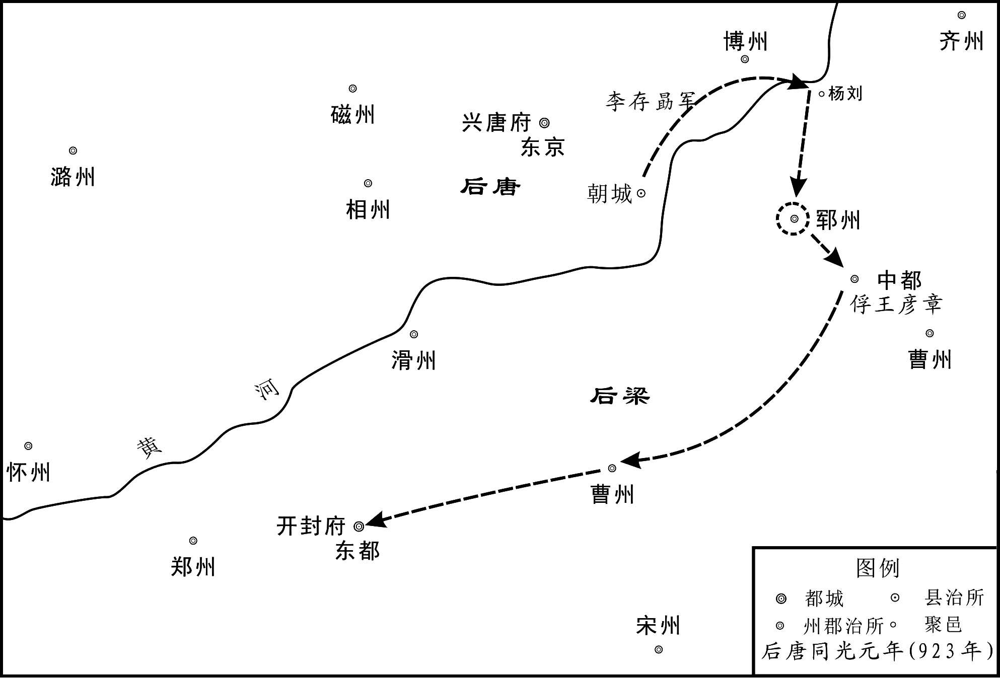 
后唐军进攻开封示意图

## 【原文】

**李振谓敬翔曰：“有诏洗涤吾辈，相与朝新君乎[1]？”翔曰：“吾二人为梁宰相，君昏不能谏，国亡不能救，新君若问，将何辞以对？”是夕未曙，或报翔曰：“崇政李太保已入朝矣[2]。”翔叹曰：“李振谬为丈夫！朱氏与新君世为仇雠，今国亡君死，纵新君不诛，何面目入建国门乎！”乃缢而死。庚辰，梁百官复待罪于朝堂，帝宣敕赦之[3]。**

## 【注文】

[1]洗涤吾辈：意谓洗除我们这些人的罪过。

[2]未曙：天未亮。　　崇政李太保：指李振。崇政，指崇政院使，后梁开平元年（907年）改枢密院使置，掌备皇帝顾问，参与谋议，承受表奏，上呈皇帝，并于禁中承皇帝旨意，传达给宰相。太保，官名。隋唐五代时，与太师、太傅合称三师。皆正一品。名为训导之官，为天子所师法，实无具体职掌。多赠予德高望重的元老大臣为荣誉衔。李振曾任后梁崇政院使，拜太保。

[3]敕：帝王的诏书、命令。

## 【译文】

李振对敬翔说：“如果唐帝有诏洗除我们这些人的罪过，我们一起朝见新君去吗？”敬翔说：“我们二人身为梁朝宰相，国君昏庸不能进谏，国家灭亡不能挽救，新君如果问起，将用什么话来回答呢？”这天夜里天还没亮，有人报告敬翔说：“崇政使李太保已经入宫朝见去了。”敬翔叹息说：“李振枉为大丈夫！朱氏与新君世代都是仇敌，如今国亡君死，纵使新君不诛杀我，我还有什么脸面进入建国门呢！”于是自缢而死。同光元年（923年）十月庚辰（初十日），后梁的百官又在朝堂等待治罪，后唐庄宗宣布敕令赦免了他们。

## 【原文】

**赵岩至许州，温昭图迎谒归第，斩首来献，尽没岩所赍之货[1]。昭图复名韬。辛巳，诏王瓒收朱友贞尸，殡于佛寺，漆其首，函之，藏于太社[2]。**

## 【注文】

[1]迎谒归第：迎请回府第。　　没（mò）：没收，吞没。

[2]殡：殓入棺木停放。　　漆其首：用漆涂刷其头。　　函：装入匣子。

太社：古代帝王祭祀土神的庙宇。

## 【译文】

赵岩跑到许州，温昭图把他迎请回府第，然后斩下他的人头去献给后唐庄宗，并将赵岩携带的财货全部吞没。温昭图恢复原名温韬。同光元年（923年）十月辛巳（十一日），后唐庄宗下诏，命令王瓒收殓朱友贞的尸体，停放在佛寺中，用漆涂刷他的首级，装入匣子，收藏在太社之中。

## 【原文】

**段凝自滑州济河入援，以诸军排陈使杜晏球为前锋。至封丘，遇李从珂，晏球先降[1]。壬午，凝将其众五万至封丘，亦解甲请降。凝帅诸大将先诣阙待罪，帝劳赐之，慰谕士卒，使各复其所。凝出入公卿间，扬扬自得无愧色，梁之旧臣见者皆欲龁其面，抉其心[2]。丙戌，诏贬梁中书侍郎、同平章事郑珏为莱州司户，萧顷为登州司户，翰林学士刘岳为均州司马，任赞为房州司马，姚为复州司马，封翘为唐州司马，李怿为怀州司马，窦梦征为沂州司马，崇政学士刘光素为密州司户，陆崇为安州司户，御史中丞王权为随州司户，以其世受唐恩而仕梁贵显故也[3]。岳，宗龟之从子；，万年人；翘，敖之孙；怿，京兆人；权，龟之孙也[4]。**

## 【注文】

[1]封丘：县名。治所在今河南封丘西南。

[2]龁（hé）：咬。　　抉（jué）：挖出。

[3]中书侍郎：官名。隋称内史侍郎、内书侍郎，唐高祖武德三年（620年）改中书侍郎，五代因之。为中书省次官，佐中书令起草发布诏书。唐中期以后，中书令时或阙员，且不轻易授人，故中书省事务实由侍郎主之，多带同中书门下平章事行宰相职事。　　萧顷（862—930年）：字子澄，京兆万年（今陕西西安）人。唐朝宰相萧仿之孙，京兆尹萧廪（lǐn）之子。进士出身，唐末官至太常博士、右补阙。后梁末帝时，官至吏部侍郎、中书门下平章事。后唐庄宗入汴，贬为登州司户，后迁太子宾客。明宗时，官至吏部尚书。　　登州：州名。武周如意元年（692年）置，初治牟平（今山东牟平），神龙三年（707年）徙治蓬莱（今山东蓬莱）。玄宗天宝元年（742年）改为东牟郡，肃宗乾元元年（758年），复为登州。领蓬莱、文登、牟平、黄县四县，辖境约当今山东蓬莱、龙口、栖霞、乳山以东地。

翰林学士：官名。唐太宗时，召名儒学士草拟诏旨。唐高宗时，称“北门学士”。唐玄宗初，置翰林待诏，后又称翰林供奉，掌表疏批答，应和文章。开元二十六年（738年），改称翰林学士。凡任命将相、册立太子、宣布征伐或大赦，皆由其草诏。德宗以后，内参密命，职权益重，号称“内相”。唐宪宗时，又于翰林学士中选取资高望重者一人为学士承旨，尤其受倚重，以至升为宰相。　　刘岳（875—930年）：字昭辅，洛阳（今河南洛阳）人。祖、父辈多任唐官。唐末举进士，官至清河尉。后梁末帝时，为翰林学士，累官至兵部侍郎。后唐庄宗入汴，贬为均州司马。后迁太子詹事。明宗时，为吏部侍郎。　　均州：州名。隋文帝开皇（581—600年）初置，后废。唐高祖武德元年（618年）复置，治武当（今湖北丹江口西北）。太宗贞观元年（627年）废，八年复置。玄宗天宝元年（742年）改为武当郡，肃宗乾元元年（758年）复为均州。领有武当、郧乡、丰利三县，辖境约当今湖北丹江口、郧（yún）西、十堰郧阳等地。　　司马：官名。刺史属官，掌综理府事，参议军事。　　任赞（？—937年）：籍贯不详。后梁时官至翰林学士。后唐庄宗入汴，贬为房州司马。明宗时官至兵部侍郎，后被流放于岚州。　　房州：州名。唐高祖武德元年（618年）改隋房陵郡置，初治竹山（今湖北竹山），太宗贞观十年（636年）移治房陵（今湖北房县）。玄宗天宝元年（742年）复为房陵郡，肃宗乾元元年（758年）又改为房州。领房陵、永清、竹山、上庸四县，辖境约当今湖北竹溪、竹山、房县等地。　　姚（yǐ）（866—940年）：字伯真，京兆万年人，唐末进士。后梁时官至翰林学士、中书舍人。后唐庄宗平梁，贬为复州司马，后授左散骑常侍。后唐末帝时，官至中书侍郎、同中书门下平章事。后晋时任户部尚书。　　封翘（qiào）：生卒年不详。蓨（tiáo）县（今河北景县）人。后梁时官至翰林学士。后唐庄宗平梁，贬为唐州司马。明宗时，官至礼部侍郎。　　李怿（yì）：生卒年不详。京兆万年（今陕西西安）人。唐末进士，任秘书省校书郎、集贤校理。后梁时官至中书舍人、翰林学士。后唐庄宗平梁，贬为怀州司马。明宗时，复为中书舍人、翰林学士，累迁尚书右丞承旨。　　怀州：州名。唐高祖武德二年（619年）置，初治柏崖城（今河南济源西南），四年徙治河内（今河南沁阳）。武周天授元年（690年）改为河内郡，肃宗乾元元年（758年）复称怀州。领河内、武德、武陟、修武、获嘉五县，辖境约当今河南焦作、沁阳、武陟、修武、博爱、获嘉等地。　　窦梦征：生卒年不详。同州（治今陕西大荔）人。进士出身，后梁时官至翰林学士。后唐庄宗平梁，贬为沂州司马。明宗时，官至翰林学士、工部侍郎。　　沂州：州名。唐高祖武德时改隋琅琊郡置，治临沂（今山东临沂）。玄宗天宝元年（742年）复为琅琊郡，肃宗乾元元年（758年）又改为沂州。领临沂、承县、费县、新泰、沂水五县。辖境约当今山东沂河流域及枣庄、新泰等地。

崇政学士：崇政院直学士的简称。后梁开平二年（908年）置。宰相奏请，由其记录其事，通过崇政院使上呈皇帝；崇政院使得旨，则由其复宣于宰相。

密州：州名。唐高祖武德五年（622年）改隋高密郡置，治诸城（今山东诸城）。玄宗天宝元年（742年）复为高密郡，肃宗乾元元年（758年）又改为密州。领诸城、高密、莒（jǔ）县、辅唐四县，辖境约当今山东沂水、莒南以东，胶州、高密、安丘以南地区。　　陆崇（？—930年）：籍贯不详。后唐时官至崇政学士。后唐庄宗平梁，贬为安州司户。明宗时，官至右散骑常侍。长兴元年（930年）使闽时，死于吴越。　　安州：州名。唐高祖武德四年（621年）改隋安陆郡置，治安陆县（今湖北安陆）。玄宗天宝元年（742年）复为安陆郡，肃宗乾元元年（758年）又改为安州。领安陆、孝昌、云梦、应城、吉阳、应山六县，辖境约当今湖北应山、安陆、应城、云梦、孝感、汉阳、汉川等地。　　御史中丞：官名。御史台副长官，佐长官御史大夫监察、执法。中唐以后，御史大夫往往缺位，而以中丞主持御史台事务。　　王权（864—941年）：字秀山，太原（今山西太原）人。唐末进士，官至右补阙。后梁时，官至御史中丞。后唐庄宗灭梁，贬为随州司户。后唐末帝时，官至户部尚书。后晋时，任兵部尚书。　　随州：州名。唐高祖武德三年（620年）改隋汉东郡置，治随县（今湖北随州）。玄宗天宝元年（742年）复为汉东郡，肃宗乾元元年（758年）又改为随州。领随、光化、枣阳、唐城四县，辖境约当今湖北北部、桐柏山与大洪山间、涢水上游及滚河上游一带。

[4]宗龟：即刘宗龟。刘岳叔父，唐昭宗乾宁年间官至岭南节度使。　　从子：侄子。　　万年：县名。治所在今陕西西安。　　敖：即封敖，字硕夫，封翘祖父。唐宪宗元和年间进士。共事宪宗、穆宗、敬宗、文宗、武宗、宣宗六朝，宣宗时，历任礼部侍郎、吏部侍郎、左散骑常侍、淄青节度使、户部尚书等职。　　龟：即王龟，字大年，王权祖父。唐懿宗咸通年间官至浙东团练观察使。

## 【译文】

段凝从滑州渡过黄河入援大梁，命诸军排阵使杜晏球作为先锋。到达封丘时，遇到李从珂，杜晏球便率先投降。同光元年（923年）十月壬午（十二日），段凝率领手下兵众五万到达封丘，也脱下铠甲请求投降。段凝带领着诸位大将先到朝廷等候治罪，后唐庄宗慰劳赏赐了他们，并抚慰告谕士卒，让他们各回到自己的住所。段凝出入于公卿之间，扬扬自得，毫无愧色，后梁旧臣看到他的，都想咬他的脸，挖他的心。丙戌（十六日），庄宗下诏贬黜后梁中书侍郎、同平章事郑珏为莱州司户，萧顷为登州司户，翰林学士刘岳为均州司马，任赞为房州司马，姚为复州司马，封翘为唐州司马，李怿为怀州司马，窦梦征为沂州司马，崇政学士刘光素为密州司户，陆崇为安州司户，御史中丞王权为随州司户，这是因为他们世代蒙受唐朝的恩德却出任后梁显贵之官的缘故。刘岳是刘宗龟的侄子；萧是万年人；封翘是封敖的孙子；李怿是京兆人；王权是王龟的孙子。

## 【原文】

**段凝、杜晏球上言：“伪梁要人赵岩、赵鹄、张希逸、张汉伦、张汉杰、张汉融、朱珪等窃弄威福，残蠹群生，不可不诛[1]。”诏：“敬翔、李振首佐朱温，共倾唐祚；契丹撒剌阿拨叛兄弃母，负恩背国，宜与岩等并族诛于市；自余文武将吏一切不问[2]。”又诏追废朱温、朱友贞为庶人，毁其宗庙神主[3]。**

## 【注文】

[1]赵鹄（hú）（？—923年）：后梁末帝近臣，梁亡后被诛杀。　　张希逸（？—923年）：后梁末帝近臣，官至崇政院副使，加金紫光禄大夫，行秘书少监。梁亡后被诛杀。　　张汉融（？—923年）：张汉杰之弟。　　残蠹（dù）：残害。

[2]祚（zuò）：皇位，国统。　　撒剌（lá）阿拨（？—923年）：契丹国主阿保机同母弟，号北大王。因在国内阴谋叛乱，被囚，释放后，率其部众投晋，被李存勗收为养子，任为刺史。晋梁胡柳之战时，率妻子投奔后梁。

[3]“追废……”句：废除朱温、朱友贞生前的身份地位而贬为平民。　　神主：供奉于宗庙里的已故君主的牌位。

## 【译文】

段凝、杜晏球上书说：“伪梁的权要人物赵岩、赵鹄、张希逸、张汉伦、张汉杰、张汉融、朱珪等人窃取权力，作威作福，残害众生，不可不杀。”后唐庄宗下诏说：“敬翔、李振带头辅佐朱温，共同倾覆唐朝；契丹的撒剌阿拨背叛兄长，抛弃母亲，辜负君恩，背弃国家，应当与赵岩等人一并在闹市之上诛灭全族；其余的文武将吏一概不予追究。”又下诏废除朱温、朱友贞生前的身份地位而贬为平民，毁掉他们的宗庙牌位。

## 【原文】

**帝之与梁战于河上也，梁拱宸左厢都指挥使陆思铎善射，常于笴上自镂姓名，射帝，中马鞍，帝拔箭藏之[1]。至是，思铎从众俱降，帝出箭示之，思铎伏地待罪，帝慰而释之，寻授龙武右厢都指挥使。**

## 【注文】

[1]拱宸（chén）：后梁禁军之一，以拱宸为军号。　　陆思铎（890—943年）：澶州临黄（今河南范县东南）人。后梁时，以战功累官检校司徒、拱宸左厢都指挥使，遥领恩州刺史。梁亡，降后唐，授龙武右厢都指挥使，加检校太保。明宗时，官至雄捷右厢马军都指挥使，曾随军讨伐荆南高季兴。后晋时，官至蔡州刺史。　　笴（gǎn）：箭杆。　　镂（lòu）：刻。

## 【译文】

后唐庄宗在黄河边上与梁军交战的时候，后梁拱宸左厢都指挥使陆思铎善于射箭，常常在箭杆上自刻姓名，有一次射后唐庄宗，射中了马鞍，庄宗拔出箭支收藏起来。到这时，陆思铎随着众将一起投降，庄宗拿出这支箭来给他看，陆思铎跪在地上请求治罪，庄宗抚慰并免除了他的罪过，不久，授予他龙武右厢都指挥使的官职。

## 【原文】

**以豆卢革尚在魏，命枢密使郭崇韬权行中书事[1]。**

## 【注文】

[1]枢密使：官名。唐代宗永泰二年（766年）始置，以宦官担任，掌接受表奏及向宰相传达皇帝旨意。后渐参与军国大事，并设置枢密院。后梁开平元年（907年），改枢密院为崇政院，枢密使为崇政院使，以朝官担任。后唐同光元年（923年），恢复枢密院及枢密使的称呼与建制。　　权行中书事：临时代行中书事务。

## 【译文】

因为豆卢革还在魏州，后唐庄宗命令枢密使郭崇韬临时代行中书事务。

## 【原文】

**梁诸藩镇稍稍入朝，或上表待罪，帝皆慰释之[1]。宋州节度使袁象先首来入朝，陕州留后霍彦威次之[2]。象先辇珍货数十万，遍赂刘夫人及权贵、伶官、宦者，旬日，中外争誉之，恩宠隆异[3]。己丑，诏伪庭节度、观察、防御、团练使、刺史及诸将校，并不议改更，将校官吏先奔伪庭者，一切不问[4]。**

## 【注文】

[1]稍稍：逐渐，渐渐。

[2]宋州节度使：方镇名。即宣武节度使。

[3]辇：用车装载。　　刘夫人：即后唐庄宗之妃魏国夫人刘氏。　　伶官：在后唐宫廷供职的伶人（以乐舞谐戏为业的艺人，亦称优伶、优人）。后唐庄宗好俳优音乐，宠爱伶人，故伶官颇有权势。　　恩宠隆异：恩宠隆重，非同一般。

[4]伪庭：伪朝，指后梁。　　观察：即观察使。

## 【译文】

原后梁任命的各藩镇都逐渐入京朝见，有的上表等待治罪，后唐庄宗都加以抚慰，免除其罪。宋州节度使袁象先第一个来京朝见，陕州留后霍彦威排在其后。袁象先用车载着价值数十万的珍宝财货，向刘夫人以及权贵、伶官、宦官遍行贿赂，十天左右，宫内宫外都争相赞誉他，后唐庄宗对他的恩宠隆重，非同一般。同光元年（923年）十月己丑（十九日），庄宗下诏，后梁节度使、观察使、防御使、团练使、刺史与各将校官员，一律不考虑更换，先前叛投后梁的将校官吏，一概不予追究。

## 【原文】

**庚寅，豆卢革至自魏。甲午，加崇韬守侍中，领成德节度使[1]。崇韬权兼内外，谋猷规益，竭忠无隐，颇亦荐引人物，豆卢革受成而已，无所裁正[2]。丙申，赐滑州留后段凝姓名曰李绍钦，耀州刺史杜晏球曰李绍虔。乙酉(4)，西都留守河南尹张宗奭来朝，复名全义，献币马千计[3]。帝命皇子继岌、皇弟存纪等兄事之[4]。帝欲发梁太祖墓斵棺焚其尸，全义上言：“朱温虽国之深仇，然其人已死，刑无可加，屠灭其家，足以为报，乞免焚斵，以存圣恩[5]。”帝从之，但铲其阙室，削封树而已[6]。**

## 【注文】

[1]守侍中：试用侍中。守某官或指试任某职，或指以较低官阶署理较高官阶之职。

[2]谋猷（yóu）规益：出谋划策，规劝补益。猷，谋划。　　受成：接受既定之事。　　裁正：裁断更订。

[3]河南尹：河南府府尹。河南，府名。唐玄宗开元元年（713年）升洛州置，治洛阳（今河南洛阳）。领河南、洛阳、偃师、伊阙、济源、河阳等二十六县，辖境相当于今河南渑池、洛宁以东，密县、禹州以西，北至济源、温县，南抵嵩县、伊川等县地。　　币马：用作礼品的马匹。币，本意为帛，古时常以帛为礼品，故亦作礼品的通称。

[4]存纪：即李存纪（？—926年），李克用第八子，李存勗同母弟。同光三年（925年）封雅王，次年，闻郭从谦反叛，与通王李存确逃至南山村民家，被霍彦威密杀。

[5]斵（zhuó）：砍、削。

[6]阙室：指朱温陵墓的门阙、享殿。　　削：砍伐。　　封树：坟墓之上的树木。封，堆土而成的坟。

## 【译文】

后唐庄宗同光元年（923年）十月庚寅（二十日），豆卢革从魏州来到大梁。甲午（二十四日），加授郭崇韬为守侍中，兼任成德节度使。郭崇韬权力兼掌内外，出谋划策，规劝补益，竭诚尽忠，无所保留，也很能引荐人才，豆卢革只是接受既定之事而已，没有什么裁断更订。丙申（二十六日），后唐庄宗赐给滑州留后段凝姓名叫李绍钦，耀州刺史杜晏球叫李绍虔。丁酉（二十七日），原后梁西都留守、河南府尹张宗奭前来朝见，恢复原名称张全义，进献礼品马匹数以千计。后唐庄宗命皇子李继岌、皇弟李存纪等人把他当作兄长对待。庄宗打算挖开后梁太祖的陵墓来劈棺焚尸，张全义上奏说：“朱温尽管是国家最大的仇人，但他人已死去，刑罚无法施加，屠灭他的家族，就足以报了大仇，请求不要劈棺焚尸，来显示皇帝的恩德。”庄宗接受了他的请求，只是铲除了陵墓的门阙、享殿，砍掉了墓上的树木而已。

## 【原文】

**戊戌，加天平节度使李嗣源兼中书令。以北京留守继岌为东京留守、同平章事[1]。**

## 【注文】

[1]北京：时后唐以镇州为真定府，建北京，又称北都。

## 【译文】

后唐庄宗同光元年（923年）十月戊戌（二十八日），加授天平节度使李嗣源兼中书令。任命北京留守李继岌为东京留守、同平章事。

## 【原文】

**帝遣使宣谕谕诸道，梁所除节度使五十余人皆上表入贡[1]。郭崇韬上言：“河南节度使、刺史上表者但称姓名，未除新官，恐负忧疑[2]。”十一月，始降制以新官命之。**

## 【注文】

[1]宣谕：宣布谕旨。谕，皇帝的诏令。

[2]“河南……”句：后梁所任命的黄河以南的各节度使、刺史，因后唐尚未授予他们官职，又不便称原任官职，故其所上章表只称姓名。　　负忧疑：担着忧虑疑惧。

## 【译文】

后唐庄宗派遣使者前去宣布谕旨告谕各道，让后梁所任命的节度使五十多人全部上表纳贡。郭崇韬上奏说：“黄河以南的节度使、刺史上表的人只称姓名，都还没有新授的官职，恐怕他们心里还担着忧虑疑惧。”同光元年（923年）十一月，后唐庄宗开始颁布制书，用新朝的官职任命他们。

## 【原文】

**癸卯，河中节度使朱友谦入朝。张全义请帝迁都洛阳，从之。乙巳，赐朱友谦姓名曰李继麟，命继岌兄事之。以康延孝为郑州防御使，赐姓名曰李绍琛。废北都，复为成德军。赐宣武节度使袁象先姓名曰李绍安。匡国节度使温韬入朝，赐姓名曰李绍冲。绍冲多赍金帛赂刘夫人及权贵、伶宦，旬日，复遣还镇[1]。郭崇韬曰：“国家为唐雪耻，温韬发唐山陵殆徧，其罪与朱温相捋(5)耳，何得复居方镇，天下义士其谓我何[2]！”上曰：“入汴之初，已赦其罪。”竟遣之。**

## 【注文】

[1]伶宦：伶人与宦官。

[2]唐山陵：唐朝皇帝的陵墓。　　相捋：应为“相埒（liè）”，即相等。埒：同等，相等。

## 【译文】

后唐庄宗同光元年（923年）十一月癸卯（初三日），河中节度使朱友谦入京朝见。张全义请求后唐庄宗把国都迁至洛阳，庄宗接受了他的请求。乙巳（初五日），庄宗赐给朱友谦姓名叫李继麟，命令李继岌把他当作兄长对待。又任命康延孝为郑州防御使，赐给姓名叫李绍琛。撤销北都，复称为成德军。赐给宣武节度使袁象先姓名叫李绍安。匡国节度使温韬入京朝见，庄宗赐给他姓名叫李绍冲。李绍冲带着大量金银绢帛贿赂刘夫人和权贵、伶人、宦官，十天之后，朝廷又派他回原来的镇所。郭崇韬说：“国家为唐朝洗刷耻辱，而温韬几乎把唐帝的陵墓挖掘了一遍，他的罪行与朱温相等，怎么能再居方镇之位，天下的义士将会怎样议论我们呢！”后唐庄宗说：“在刚进入汴梁的时候，就已经赦免了他的罪行。”最终还是把他派了回去。

## 【原文】

**初，梁均王将祀南郊于洛阳，闻杨刘陷而止，其仪物具在[1]。张全义请上亟幸洛阳，谒庙毕即祀南郊，从之[2]。丙辰，复以梁东京为宣（府）［武］军[3]。诏文武官先诣洛阳。甲子，帝发大梁，十二月庚午，至洛阳。**

## 【注文】

[1]仪物：举行祭祀所用的礼器等物品。

[2]庙：指唐朝皇帝奉祀的太庙。唐以洛阳为东都，亦立有太庙。

[3]“复以……”句：后梁时宣武军治宋州，此时又把后梁东京改为宣武军治所。

## 【译文】

当初，后梁末帝准备在洛阳举行南郊祭天大礼，得知杨刘陷落而停止，但祭祀所用的仪物还都在。于是张全义请求庄宗尽快前往洛阳，在谒拜太庙之后就举行南郊祭天大礼，庄宗接受了他的请求。同光元年（923年）十一月丙辰（十六日），又把后梁的东京改为宣武军。诏令文武官员先到洛阳。甲子（二十四日），庄宗从大梁出发，十二月庚午（初一日），到达洛阳。

## 【原文】

**二年春二月己巳朔，上祀南郊，大赦。**

## 【译文】

后唐庄宗同光二年（924年）春季二月己巳朔（初一日），后唐庄宗李存勗举行南郊祭天礼，大赦天下。

* * *

(1) “丙午”前当脱“三月”二字。《资治通鉴》同。此年二月无丙午，三月二十六日为丙午日。《旧五代史·庄宗纪》载：“三月丙午，王师败于镇州城下，阎宝退保赵州。”即此事。

(2) “张元奭”，依中华书局《资治通鉴》点校本应作“张宗奭”。

(3) “稍”，误。依中华书局《资治通鉴》点校本当作“矟”。

(4) “乙酉”，《资治通鉴》同。误。考该月十五日为乙酉。据上文“甲午”（二十四日）、“丙申”（二十六日）与下文“戊戌”（二十八日），此日当为“丁酉”（二十七日）。

(5) “相捋”，依中华书局《资治通鉴》点校本应作“相埒”。

# 庄宗灭蜀

## 【内容提要】

《庄宗灭蜀》叙述了五代时期前蜀太子王元膺（yīng）之乱，后主王衍时政治败坏，以及后唐攻灭前蜀等史事。

前蜀高祖王建，原立次子王元膺为太子。高祖永平三年（913年），王元膺因与内枢密使唐道袭争权，起兵攻杀唐道袭。王建发兵平乱，王元膺兵败被杀。王建幼子王衍，得其母徐贤妃与内飞龙使唐文扆（yǐ）、中书侍郎张格之助，被立为太子。光天元年（918年），王建病卒，王衍嗣位，是为前蜀后主。

王衍即位之后，不理政事，骄奢淫逸，军国大政，悉委于权臣宦官，以致国势日衰。后唐庄宗同光二年（924年），后唐客省使李严出使前蜀，返回后具陈前蜀情况，并建议出兵伐蜀。后唐庄宗深以为然。同光三年（925年）九月，庄宗任命魏王李继岌为西川四面行营都统，枢密使郭崇韬为东北面行营都招讨，统兵六万伐蜀。而此时前蜀后主王衍从宦官、秦州节度使（治秦州，治今甘肃秦安西北）王承休之请，正前往秦州游览，途中闻知唐兵西上，竟毫不在意。唐军越过大散关（在陕西宝鸡西南大散岭上），前蜀武兴节度使（治凤州，今陕西凤县东北）王承捷率凤、兴（治顺政，今陕西略阳）、文（治曲水，今甘肃文县西南）、扶（治同昌，今四川南坪东北）四州归降。至此王衍方如梦初醒，任命王宗勋、王宗俨、王宗昱（yù）为三招讨，率兵迎战。王宗勋等与唐军相遇，一战即败，王衍闻讯，才返回成都（今四川成都）。唐军遂乘胜进军，所至州县，皆望风而降，唐军顺利到达绵州（治巴西，今四川绵阳东北）。王衍知大势已去，遣使请降。不久，李继岌到达成都，王衍率百官出城迎降，前蜀灭亡。后唐军自出师至灭蜀，历时仅七十天。

次年，后主王衍与其宗族被押送长安（今陕西西安），举族被杀于秦川驿。

纵情声色、不恤国事的王衍，终落得一个国破家亡、死于非命的可悲下场。

## 【原文】

**后梁均王乾化三年。蜀太子元膺豭喙龅齿，目视不正，而警敏知书，善骑射，性狷急猜忍[1]。蜀主命杜光庭选纯静有德者使侍东宫，光庭荐儒者许寂、徐简夫[2]。太子未尝与之交言，日与乐工群小嬉戏无度，僚属莫敢谏[3]。秋七月，蜀主将以七夕出游[4]。丙午，太子召诸王大臣宴饮，集王宗翰、内枢密使潘峭、翰林学士承旨高阳毛文锡不至，太子怒曰：“集王不来，必峭与文锡离间也[5]。”大昌军使徐瑶、常谦素为太子所亲信，酒行，屡目少保唐道袭，道袭惧而起[6]。丁未旦，太子入白蜀主曰：“潘峭、毛文锡离间兄弟[7]。”蜀主怒，命贬逐峭、文锡，以前武泰节度使兼侍中潘炕为内枢密使[8]。太子出，道袭入，蜀主以其事告之。道袭曰：“太子谋作乱，欲召诸将、诸王以兵锢之，然后举事耳[9]。”蜀主疑焉，遂不出。道袭请召屯营兵入宿卫，许之，内外戒严[10]。**

## 【注文】

[1]蜀：即前蜀，五代时十国之一。公元891年，唐壁州（治今四川通江）刺史王建攻取成都（今四川成都），进而陆续扩占土地。903年，唐封为蜀王。907年称帝，建都成都，国号蜀，史称前蜀。925年为后唐所灭。历二主，自王建称帝起共十八年。　　太子元膺：即王元膺（892—913年）。字昌美，原名宗懿（yì），更名元坦、元膺。前蜀高祖王建次子。初封遂王，武成元年（908年）立为太子，判六军，创天武神机营，开永和府，置官属。后与内枢密使唐道袭争权，起兵杀道袭。王建发兵平乱，他被杀。　　豭（jiā）喙（huì）龅（bāo）齿：公猪嘴巴，牙齿外突。豭，公猪。喙，嘴。龅齿，龅牙，牙齿突露在唇外。　　狷（juàn）急猜忍：褊狭急躁、猜忌残忍。

[2]蜀主：即前蜀高祖王建。　　杜光庭（850—933年）：字圣宾（一作宾圣），处州缙（jìn）云（今浙江缙云）人，一作长安（今陕西西安）人。唐末，举进士不第，入天台山为道士。后避乱入蜀，仕王建父子，官任谏议大夫，赐号广成先生、传真天师。晚年隐居青城山，号东瀛子。能诗文，著有《广成集》《道德真经广圣义》等道教典籍。又著有传奇小说《虬（qiú）髯（rán）客传》。　　东宫：太子所居之宫，亦用以指太子。　　许寂（？—936年）：字闲闲，会稽（今浙江绍兴）人。少栖于四明山学《易》，后随赵匡明奔蜀。王建建蜀，拜左谏议大夫，判门下省，后擢吏部侍郎。前蜀后主王衍即位时，一度被贬官。后为礼部尚书、中书侍郎、同平章事。蜀灭，随王衍入后唐，至洛阳，以尚书致仕。

[3]交言：交谈。　　乐工：歌舞演奏艺人。　　群小：指仆从，下人。

[4]七夕：节日名。又称乞巧节，始于汉代。古代神话传说，农历七月初七之夜牛郎织女在天河相会。旧时民间有妇女于此夜向织女乞求智巧的风俗。

[5]宗翰：即王宗翰（？—917年）。本姓孟，王建之姊子，被王建收为养子，赐姓名。封集王，加同平章事。曾为招讨使，率军攻打岐州、凤州。　　潘峭（qiào）：生卒年不详，祖籍河西（今甘肃、青海黄河以西）。王建称帝后，官拜宣徽北院使，迁内枢密使。一度被贬逐，元膺之乱后，复职。后领武泰节度使、同平章事。　　高阳：县名。治所在今河北高阳。　　毛文锡：生卒年不详。字平珪，高阳（今河北高阳）人。年十四，登进士第。不久入蜀，从王建，官翰林学士承旨。后历任礼部尚书、判枢密院事，进文思殿大学士，拜司徒。又贬为茂州司马。蜀亡，随王衍降唐。不久，复事孟氏。与欧阳炯（jiǒng）等五人以小词为后蜀后主孟昶（chǎng）所赞赏。著有《前蜀纪事》《茶谱》，词存三十余首。

[6]大昌军使：官名。大昌，军名，为后蜀高祖的禁卫部队，其统兵将领称为军使。　　徐瑶（？—913年）：字伯玉，长葛（今河南长葛）人。从王建入蜀，勇猛善格斗，积功至大昌军使。后率兵奉太子元膺攻唐道袭，王建发兵讨伐，将他杀死。　　目：看。　　少保：官名，即太子少保。西晋时始置，为东宫三师（太子太师、太子太傅、太子太保）的辅官，掌辅助东宫三师辅导、教谕太子。与太子少师、太子少傅合称三少，多由朝中大臣兼领。隋唐五代时多用作加官、赠衔或安置退免大臣，不再负辅导太子之责，亦无实际职掌。　　唐道袭（？—913年）：阆（làng）州（治今四川阆中）。初为王建舞童，相貌俊美，善花言巧语，颇有心计。后渐预谋画，为马步军都指挥使，迁枢密使，进太子少保。终被太子元膺所杀。

[7]旦：早上，清晨。

[8]贬逐：贬官放逐。　　武泰节度使：方镇名。唐代宗大历十二年（777年）置黔州经略招讨观察使，唐末升为黔南节度使，治黔州（治彭水，今四川彭水）。领黔、施（治清江，今湖北恩施）、夷（治绥阳，今贵州凤冈）、辰（治沅陵，今湖南沅陵）、思（治务川，今贵州沿河东北）等十二州，辖境相当于今北至四川綦（qí）江、湖北建始，南抵广西桂林、东兰，西至贵州毕节，东抵湖南溆（xù）浦、黔阳地区。唐昭宗大顺元年（890年）号武泰军。乾宁（894—898年）后历为成汭（ruì）、王建、马殷割据。　　潘炕（？—914年）：字凝梦，潘峭之兄。为人有器量，历任武泰节度使，兼侍中，内枢密使。在太子元膺死后，屡请立太子。王衍被立为太子后，他称疾告老。国有大疑，特遣使向他询问。一说他在蜀亡后入后唐，官蜀州刺史。

[9]锢（gù）：禁锢。

[10]屯营兵：屯驻在军营中的部队。　　入宿卫：入宫值宿警卫。

## 【译文】

后梁乾化三年（913年）。前蜀太子王元膺长得嘴似公猪，牙齿外露，两眼斜视，但机警敏捷，通晓诗书，善于骑马射箭，性情褊狭急躁，猜忌残忍。前蜀高祖王建命令杜光庭挑选纯正稳重、有道德修养的人，让他们侍奉太子，杜光庭推荐了儒生许寂、徐简夫。太子不曾跟他们交谈过，而是整天与乐工下人戏耍玩闹，没有节制，他的下属官吏没人敢去劝谏。秋季七月，前蜀高祖准备在七夕节这天出游。丙午（初六日），太子召集诸王和大臣举行宴会，集王王宗翰、内枢密使潘峭、翰林学士承旨高阳人毛文锡没有到场，太子发怒说：“集王不来，肯定是潘峭与毛文锡从中挑拨离间。”大昌军使徐瑶、常谦一向被太子所亲近信任，在酒宴进行中，不时地盯着少保唐道袭看，唐道袭害怕，起身离去。丁未（初七日）早晨，太子入宫禀告前蜀高祖说：“潘峭、毛文锡离间我们兄弟。”前蜀高祖大怒，下令将潘峭、毛文锡贬官放逐，任命前武泰节度使兼侍中潘炕为内枢密使。太子出来以后，唐道袭进入宫中，前蜀高祖把这些事告诉了他。唐道袭说：“太子图谋作乱，想把诸将、诸王召集在一起，用兵士把他们禁锢起来，然后再进行叛乱。”前蜀高祖听后，对太子产生了怀疑，于是不再出游。唐道袭奏请召集屯驻在军营中的部队入宫值宿警卫，前蜀高祖答应了他的请求，在皇宫内外实行戒严。

## 【原文】

**太子初不为备，闻道袭召兵，乃以天武甲士自卫，捕潘峭、毛文锡至，之几死，囚诸东宫[1]。又捕成都尹潘峤，囚诸得贤门[2]。戊申，徐瑶、常谦与怀胜军使严璘等各帅所部兵奉太子攻道袭[3]。至清风楼，道袭引屯营兵出拒战，道袭中流矢，逐至城西，斩之。杀屯营兵甚众，中外惊扰。**

## 【注文】

[1]天武：军名。为前蜀侍卫亲军之一。　　（zhuā）：打，击打。

几：几乎。

[2]成都：府名。唐肃宗至德二载（757年）改蜀郡置，治所在成都县（今四川成都）。唐时领有成都、华阳、新都、新繁、双流、广都等十县，辖境相当于今成都市的大部分。时为前蜀国都。　　峤：音qiáo。

[3]怀胜：军名。为前蜀侍卫亲军之一。　　璘：音lín。

## 【译文】

太子元膺起初没作防备，闻知唐道袭召集兵马，便率领天武军兵士进行自卫，把潘峭、毛文锡抓来，把他俩打得几乎死去，然后囚禁在东宫之中。又逮捕了成都尹潘峤，囚禁在得贤门。乾化三年（913年）七月戊申（初八日），徐瑶、常谦与怀胜军使严璘等人各自率领所掌管的军队跟随太子攻打唐道袭。到达清风楼时，唐道袭率领屯营兵出来抵御作战，唐道袭被流箭射中，太子的军队追到城西，杀掉了他。并杀死很多屯营兵，皇宫内外惊恐混乱。

## 【原文】

**潘炕言于蜀主曰：“太子与唐道袭争权耳，无他志也。陛下宜面谕大臣以安社稷。”蜀主乃召兼中书令王宗侃、王宗贺、前利州团练使王宗鲁等，使发兵讨为乱者徐瑶、常谦等[1]。宗侃等陈于西球场门，兼侍中王宗黯自大安门梯城而入，与瑶、谦战于会同殿前，杀数十人，余众皆溃[2]。瑶死，谦与太子奔龙跃池，匿于舰中[3]。及暮，稍定[4]。己酉旦，太子出就舟人匄食，舟人以告，蜀主遣集王宗翰往慰抚之[5]。比至，太子已为卫士所杀。蜀主疑宗翰杀之，大恸不已。左右恐事变，会张格呈慰谕军民榜，读至“不行斧钺之诛，将误社稷之计”，蜀主收涕曰：“朕何敢以私害公[6]！”于是下诏废太子元膺为庶人[7]。宗翰奏诛手刃太子者，元膺左右坐诛死者数十人，贬窜者甚众[8]。庚戌，赠唐道袭太师，谥忠壮，复以潘峭为枢密使[9]。**

## 【注文】

[1]王宗侃（？—923年）：本姓田，雅州（治今四川雅安）人，一说许昌（今河南许昌）人。王建养子。随王建入西川，以功表雅州刺史。王建称帝后，官至兼中书令。后主王衍时，封乐安王，加尚父，又进封魏王。乾德五年（923年）卒。

王宗贺：籍贯及生卒年不详。王建赐姓名，收为养子。曾任指挥使、兴元留后，官至加中书令。　　利州：州名。唐高祖武德元年（618年）改隋义城郡置，治绵谷（今四川广元）。玄宗天宝元年（742年）改为义昌郡，肃宗乾元元年（758年）复为利州。领有绵谷、胤（yìn）山、嘉川、葭（jiā）萌、益昌、景谷六县，辖境约当今四川广元、旺苍及陕西宁强等区。　　王宗鲁：籍贯及生卒年不详。王建养子，官至武兴军节度使。

[2]西球场：王建所建造的马球场。　　王宗黯（àn）：籍贯及生卒年不详。本姓吉，名谏。初为王建帐下牙将，唐昭宗景福元年（892年）破杨守厚有功，赐姓名王宗黯。王建称帝后，官兼侍中。后主王衍时，封琅琊郡王。　　大安门：成都子城（大城中建造的小城。当为前蜀皇城）北门。　　梯城而入：用梯登城而入。

[3]龙跃池：隋时修筑成都子城时，取土形成的人工湖。原名摩诃（hē）池，五代时改龙跃池。故址在今成都市区内。

[4]稍定：逐渐平定。稍，逐渐，慢慢地。

[5]舟人：船夫。　　匄（gài）食：乞讨食物。匄，古“丐”字，乞求。

[6]张格（？—约926年）：字义师，一说字承之。河间（今河北河间）人，唐尚书左仆射张浚之子。唐末入成都，王建称帝，拜中书侍郎、同平章事。曾助王衍为太子，又依附宦官唐文扆（yǐ），与司徒毛文锡等争权夺利。王衍即位后，被贬为茂州刺史，再贬为维州司户。后复为中书侍郎、同平章事。蜀亡，随百官至洛阳，被后唐授为三司副使，不久卒于任。　　榜：榜文，告示。　　斧钺（yuè）之诛：用斧钺诛杀，即死刑。钺，一种像大斧的古代兵器；诛，杀死。

[7]废太子元膺为庶人：废黜元膺的太子名位而贬为平民。庶人，泛指无官爵的平民百姓。

[8]手刃：亲手杀死。刃，用作动词，杀。　　坐：入罪，定罪。　　贬窜：贬谪放逐。

[9]赠：追赠，死后追封官爵。

## 【译文】

潘炕向前蜀高祖进言说：“太子不过是与唐道袭争权罢了，并没有其他的想法。陛下应当当面告谕大臣来安定国家。”前蜀高祖于是召集兼中书令王宗侃、王宗贺、前利州团练使王宗鲁等人，派他们发兵讨伐作乱的徐瑶、常谦等人。王宗侃等人在西球场门列阵，兼侍中王宗黯从大安门用梯子登城而入，与徐瑶、常谦在会同殿前交战，杀了几十人，其余的部众全都逃散。徐瑶被杀死，常谦与太子逃到龙跃池，躲藏在战舰之中。到了傍晚，局势才慢慢安定下来。乾化三年（913年）七月己酉（初九日）早晨，太子出来向船夫讨要食物，船夫把情况报告上去，前蜀高祖派集王王宗翰前去抚慰太子。等到达时，太子已经被卫士杀死。前蜀高祖怀疑是王宗翰杀了他，大哭不止。左右大臣害怕会再发事变，正巧张格呈上安慰告谕军民的榜文，当读到“不用斧钺诛杀，将贻误国家的大计”时，前蜀高祖收住眼泪说：“朕怎么敢因私情而损害国事！”于是颁布诏书，废黜太子元膺为平民。王宗翰奏请诛杀亲手杀死太子的人，元膺身边的人被定罪而杀的有几十人，被贬官放逐的人很多。庚戌（初十日），追赠唐道袭为太师，谥号为忠壮，又任命潘峭为枢密使。

## 【原文】

**冬十月，蜀潘炕屡请立太子，蜀主以雅王宗辂类己，信王宗杰才敏，欲择一人立之[1]。郑王宗衍最幼，其母徐贤妃有宠，欲立其子，使飞龙使唐文扆讽张格上表请立宗衍[2]。格夜以表示功臣王宗侃等，诈云受密旨，众皆署名[3]。蜀主令相者视诸子，亦希旨言“郑王相最贵[4]”。蜀主以为众人实欲立宗衍，不得已许之，曰：“宗衍幼懦，能堪其任乎[5]？”甲午，立宗衍为太子。**

## 【注文】

[1]宗辂（lù）：即王宗辂（？—926年）。前蜀高祖王建第三子，为后宫宋氏所生。封雅王，后徙封豳（bīn）王。后唐灭蜀后，他与王衍等全族被杀于长安秦川驿。　　类己：像自己。类，类似，像。　　宗杰：即王宗杰（？—918年）。王建第八子，为乔妃所生。封信王。元膺之乱后，王建有改立他为太子之意，而他暴死。

[2]宗衍：即前蜀后主王衍。　　徐贤妃（？—926年）：唐眉州刺史徐耕之女，王建之妃，王衍生母。王衍嗣位后尊为顺圣皇太后，与其妹徐太妃交结佞臣，卖官鬻爵。后与王衍一同被杀。　　飞龙使：官名。武周万岁通天元年（696年）置，由宦官充任，掌飞龙厩（jiù）马匹管理，唐代宗以后职权有所扩大。　　唐文扆（？—918年）：前蜀宦官。前蜀高祖时为内飞龙使，典禁兵，参与机密。与徐贤妃、张格朋比为奸。高祖病危，他欲除去诸大臣，不果，被贬为眉州刺史，又流放雅州。后主王衍即位后，被杀。

[3]示：给……看。

[4]相者：相面的人。　　希：迎合。

[5]堪：胜任。

## 【译文】

后梁乾化三年（913年）冬季十月，前蜀潘炕屡次请求册立太子，前蜀高祖王建认为雅王王宗辂很像自己，信王王宗杰才思敏捷，想选择其中一人立为太子。郑王王宗衍年纪最小，他的母亲徐贤妃受到前蜀高祖的宠爱，想立自己的儿子为太子，便让飞龙使唐文扆暗示张格向前蜀高祖上章表，请求册立王宗衍。张格当夜把写好的章表拿给功臣王宗侃等人看，诈称是受了皇帝的密旨，因此众臣都署了名。前蜀高祖让相面的人观看各个儿子相貌，相面的人也迎合所谓的密旨说“郑王的相貌最尊贵”。前蜀高祖认为众人确实想立王宗衍，没有办法而答应了他们，说：“宗衍年幼懦弱，能胜任太子的大任吗？”甲午（二十六日），册立王宗衍为太子。

## 【原文】

**四年春正月丙子(1)，主命太子判六军，开崇勋府，置僚属，（至境上而别）［后更谓之天策府[1]］。**

## 【注文】

[1]判六军：掌管六军。六军为唐五代时皇帝的禁军，前蜀六军各部军号不详。　　开崇勋府：崇勋府，府署名。此谓开建崇勋府，设置官僚机构，治理军国大事。　　天策府：本为唐朝的府署名。唐武德四年（621年），为酬秦王李世民（即唐太宗）平洛阳王世充大功而特置，以李世民为天策上将，掌国之征讨，总判府事，位在亲王、三公之上，职位尊贵。五代时有的政权亦置天策府。

## 【译文】

后梁乾化四年（914年）春季正月丙午（初九日），前蜀高祖王建命太子王宗衍掌管六军，开建崇勋府，设置僚属，后来又改称天策府。

## 【原文】

**秋八月戊子，以内枢密使潘峭为武泰军节度使、同平章事，翰林学士承旨毛文锡为礼部尚书、判枢密院[1]。**

## 【注文】

[1]枢密院：官署名。唐永泰时始置，本在内廷，用宦官为枢密使，执掌机要事务。唐末始用朝臣。十国中多置枢密院，典掌军事机密等事。

## 【译文】

后梁乾化四年（914年）秋季八月戊子（二十四日），前蜀高祖王建任命内枢密使潘峭为武泰军节度使、同平章事，翰林学士承旨毛文锡为礼部尚书、判枢密院。

## 【原文】

**贞明三年秋七月，蜀飞龙使唐文扆居中用事，张格附之，与司徒、判枢密院事毛文锡争权[1]。文锡将以女适左仆射兼中书侍郎、同平章事庾传素之子，会亲族于枢密院，用乐，不先表闻，蜀主闻乐声，怪之，文扆从而谮之[2]。八月庚寅，贬文锡茂州司马，其子司封员外郎询流维州，籍没其家；贬文锡弟翰林学士文晏为荣经尉，传素罢为工部尚书[3]。以翰林学士承旨庾凝绩权判内枢密院事[4]。凝绩，传素之再从弟也[5]。**

## 【注文】

[1]居中用事：在朝中当权。用事，指当权。

[2]庾（yǔ）传素：籍贯及生卒年不详。仕前蜀高祖王建，任蜀州刺史，累官至左仆射，兼中书侍郎、同平章事。天汉元年（917年），为宦官唐文扆所谮，罢为工部尚书。未几，改任兵部尚书。后主王衍即位，加太子少保，复兼中书侍郎、同平章事。前蜀亡，降后唐，授刺史。　　用乐：演奏音乐。　　表闻：上表章使皇帝闻知。

[3]茂州：州名。唐高祖武德元年（618年）改隋汶山郡为会州，太宗贞观八年（634年）改为茂州，治汶山（今四川茂县）。玄宗天宝元年（742年）改为通化郡，肃宗乾元元年（758年）复为茂州。领汶山、汶川、石泉、通化四县，辖境约当今四川北川、汶川及茂县等地。　　司封员外郎：官名。尚书省吏部司封司次官，掌封爵、命妇、朝会及赐予等事。　　维州：州名。唐高祖武德七年（624年）置，治薛城（今四川理县东北）。玄宗天宝元年（742年）改为维川郡，肃宗乾元元年（758年）复为维州。领薛城、小封二县，辖境相当于今四川理县地。　　籍没：登记没收。　　文晏：毛文锡之弟。生卒年不详。有文才，善制诰，前蜀高祖时，官至翰林学士，因受其兄牵连，被贬为荣经尉。后官至兵部侍郎。著有《西园集》《昌城后寓集》等。　　荣经：县名。唐高祖武德四年（621年）置，属雅州。在今四川荥经。　　尉：县尉，掌一县军事。　　工部尚书：官名。隋时始置，唐五代因之。为尚书省工部长官，正三品。掌百工、屯田、山泽之政令，总判工部、屯田、虞部、水部四司事。中唐以后，渐为不治部务之空衔，本部事务实由侍郎主之。

[4]庾凝绩：籍贯及生卒年不详。庾传素同曾祖弟。原为前蜀翰林学士承旨，后拜礼部尚书、内枢密使。高祖王建病危时，将中外财赋、中书除授及诸司刑狱之事，全委他主之。　　权判：暂时掌管。

[5]再从弟：同曾祖弟，堂弟。

## 【译文】

后梁贞明三年（917年）秋季七月，前蜀飞龙使唐文扆在朝中当权，张格依附于他，与司徒、判枢密院事毛文锡争权。毛文锡准备把女儿嫁给左仆射兼中书侍郎、同平章事庾传素的儿子，在枢密院里聚会亲族，演奏音乐，但事先没有上表奏报，前蜀高祖听到音乐声，感到奇怪，唐文扆便乘机诬陷毛文锡。八月庚寅（十三日），把毛文锡贬为茂州司马，把他的儿子司封员外郎毛询流放到维州，并没收了他的家产；把毛文锡的弟弟翰林学士毛文晏贬为荣经县尉，庾传素被罢免原职降为工部尚书。任命翰林学士承旨庾凝绩暂时掌管内枢密院事。庾凝绩是庾传素的堂弟。

## 【原文】

**四年。蜀太子衍好酒色，乐游戏。蜀主尝自夹城过，闻太子与诸王斗鸡击毬喧呼之声，叹曰：“吾百战以立基业，此辈其能守之乎[1]！”由是恶张格，而徐贤妃为之内主，竟不能去也[2]。信王宗杰有才略，屡陈时政，蜀主贤之，有废立意[3]。二月癸亥，宗杰暴卒，蜀主深疑之。**

## 【注文】

[1]夹城：两边筑有高墙的通道。

[2]内主：在内作主。　　去：去掉，罢斥。

[3]贤之：认为他贤能。

## 【译文】

后梁贞明四年（918年）。前蜀太子王衍喜好酒色，乐于游戏。前蜀高祖曾从夹城经过，听到太子与诸王斗鸡击球的喧闹呼喊之声，叹息说：“我身经百战而建立的基业，这些人能守住它吗！”因此憎恶张格，但徐贤妃在内为张格作主，终究不能罢斥他。信王王宗杰具有才能谋略，多次陈述对时政的看法，前蜀高祖认为他贤能，便有了废黜王衍重立太子之意。二月癸亥（二十日），王宗杰暴病而死，前蜀高祖对此深感怀疑。

## 【原文】

**蜀主自永平末得疾，昏瞀，至是增剧[1]。以北面行营招讨使兼中书令王宗弼沈静有谋，五月，召还，以为马步都指挥使[2]。乙亥，召大臣入寝殿，告之曰：“太子仁弱，朕不能违诸公之请，逾次而立之[3]。若其不堪大业，可置诸别宫，幸勿杀之[4]。但王氏子弟，诸公择而辅之[5]。徐妃兄弟，止可优其禄位，慎勿使之掌兵预政，以全其宗族[6]。”**

## 【注文】

[1]永平：前蜀高祖王建在位期间使用的第二个年号，共计五年，即公元911年至915年。　　昏瞀（mào）：头昏目眩。瞀，眼睛昏花。　　增剧：加剧，加重。

[2]王宗弼（？—925年）：许州（治今河南许昌）人，本名魏弘夫。从王建入川，被收为养子，积功至兼中书令。后主王衍即位后，执掌军政大权，封为钜鹿王，后进封齐王。后唐伐蜀，他迫使王衍降唐，后为后唐招讨使郭崇韬所杀。

沈（chén）静：沉着稳重。沈，同“沉”。　　马步都指挥使：官名。当与前蜀宫城内外都指挥使、京城内外马步都指挥使为一职，为掌领在京禁军诸军的将领。

[3]寝殿：亦称寝宫，帝王睡卧的宫室。　　仁弱：仁爱懦弱。　　诸公：众公卿大臣。　　逾次：谓超越长幼次序。王衍在诸兄弟中最幼，立其为太子，故称逾次。

[4]幸：希望。

[5]但：只，只要是。

[6]慎：表示告诫，相当于“千万”。　　全其宗族：保全其宗族。徐妃兄弟不掌兵预政，则不致谋乱而被诛灭家族。

## 【译文】

前蜀高祖王建自从永平末年得病以来，就头昏目眩，到这时更加严重。因为北面行营招讨使兼中书令王宗弼沉着稳重、具有谋略，贞明四年（918年）五月，便把他召回朝廷，任命为马步都指挥使。乙亥（初三日），前蜀高祖把大臣召入寝宫，告诉他们说：“太子仁爱懦弱，朕不能违背各位公卿的请求，超越长幼次序而立了他。如若他不能承担大业，可以把他安置在别的宫中，希望不要杀了他。只要是王氏子弟，各位可以选择一人而辅佐他。徐妃家的兄弟，只可以从优给予俸禄爵位，千万不要让他们掌握兵权参与政事，好以此保全他们的家族。”

## 【原文】

**内飞龙使唐文扆久典禁兵，参预机密，欲去诸大臣，遣人守宫门。王宗弼辈三十余人，日至朝堂，不得入见，文扆屡以蜀主之命慰抚之，伺蜀主殂，即作难[1]。遣其党内皇城使潘在迎侦察外事，在迎以其谋告宗弼等[2]。宗弼等排闼入，言文扆之罪，以天册府掌书记崔延昌权判六军事，召太子入侍疾[3]。丙子，贬唐文扆为眉州刺史[4]。翰林学士承旨王保晦坐附会文扆，削官爵，流泸州[5]。在迎，炕之子也。**

## 【注文】

[1]伺：等候。　　殂（cú）：死。　　作难：作乱，指发动政变。

[2]内皇城使：官名。掌皇城启闭、警卫之事。　　潘在迎：生卒年不详，兼侍中潘炕之子。任内皇城使，以财贿交结权贵，以柔顺侍后主王衍游宴玩乐，常劝王衍诛杀谏臣。后官至果州团练使。国亡降唐，官至左都押牙、金紫光禄大夫、守蜀州刺史。

[3]排闼（tà）：推开门。闼，小门。　　天册府：即前文之“天策府”。太子王衍开建的府署。

[4]眉州：州名。唐高祖武德二年（619年）割嘉州置，治通义（今四川眉山）。玄宗天宝元年（742年），改为通义郡，肃宗乾元元年（758年）复为眉州。领通义、彭山、丹棱、洪雅、青神五县，辖境约当今四川眉山、彭山、丹棱、洪雅、青神等地。

[5]王保晦（？—918年）：阆州（治今四川阆中）人。文辞晓畅，善达人意旨。初为王建幕府掌书记，官至翰林学士承旨。因附会唐文扆，被流放泸州。王衍即位后，被杀。　　坐：因犯……罪。　　附会：依附，附和。　　泸州：州名。唐高祖武德元年（618年）改隋泸川郡置，治泸川（今四川泸州）。玄宗天宝元年（742年），改为泸川郡，肃宗乾元元年（758年）复为泸州。领有泸川、富义、江安、合江、绵水、泾南六县，辖境约当今四川宜宾、高县、兴文、泸州及贵州习水、赤水部分地区。

## 【译文】

内飞龙使唐文扆长期掌管禁军，参与机密事务，想除去众位大臣，就派人守住宫门。王宗弼等三十多人，天天来到朝堂，却不能入宫见前蜀高祖，唐文扆屡次以前蜀高祖的命令抚慰他们，准备等前蜀高祖一死，就立刻发难。还派出他的党羽内皇城使潘在迎侦察宫外的情况，潘在迎把他的阴谋告诉了王宗弼等人。王宗弼等人推门进入宫中，向前蜀高祖述说了唐文扆的罪状，前蜀高祖于是任命天策府掌书记崔延昌暂时判掌六军事务，并召太子王衍入宫侍奉自己的病。贞明四年（918年）五月丙子（初四日），把唐文扆贬为眉州刺史。翰林学士承旨王保晦因依附唐文扆，被削去官爵，流放到泸州。潘在迎是潘炕的儿子。

## 【原文】

**丙申，蜀主诏中外财赋、中书除授、诸司刑狱案牍专委庾凝绩，都城及行营军旅之事委宣徽南院使宋光嗣[1]。丁酉，削唐文扆官爵，流雅州[2]。辛丑，以宋光嗣为内枢密使，与兼中书令王宗弼、宗瑶、宗绾、宗夔并受遗诏辅政[3]。初，蜀主虽因唐制置枢密使，专用士人，及唐文扆得罪，蜀主以诸将多许州故人，恐其不为幼主用，故以光嗣代之[4]。自是宦者始用事。**

## 【注文】

[1]中书除授：中书省选授官员。除，任命官职。　　案牍（dú）：官府的文书。　　宣徽南院使：官名。唐时置南北宣徽院，各设正副使，例由宦官担任，总领宫内诸司及三班内侍，以及郊祀、朝会、宴享、供帐等事务。前蜀亦设此职。

宋光嗣（？—925年）：前蜀宦官。福州（治今福建福州）人。前蜀高祖王建病重时，授枢密使，与王宗弼等受遗诏辅政。王衍即位，判六军诸卫事。因善于迎合王衍心意，深得宠信。与内给事王廷绍等上下行私，朋比为奸，致国政日衰。前蜀灭亡前夕，被王宗弼所杀。

[2]雅州：州名。唐高祖武德元年（618年）改隋临邛（qióng）郡置，治严道（今四川雅安）。玄宗天宝元年（742年），改为卢山郡，肃宗乾元元年（758年）复为雅州。领严道、卢山、名山、百丈、荣经五县，辖境约当今四川宝兴、芦山、天全、雅安、荥经等地。

[3]宗瑶：即王宗瑶。生卒年不详。字宝臣，原名姜郅，燕（今北京）人。多有军功，被王建收为义子。历任蜀州、嘉州刺史，武信军节度使。王建称帝后，官至兼中书令。王建弥留之际，与王宗弼等受遗诏辅政。后主王衍嗣位，封临淄王。　　宗绾（wǎn）：即王宗绾。原名李绾，前蜀高祖王建义子，籍贯及生卒年不详。官至兼中书令，曾率军攻取成、秦、凤等州。王建弥留之际，与王宗弼等受遗诏辅政。后主王衍嗣位，封临洮（táo）王。　　宗夔（kuí）：即王宗夔。前蜀高祖王建义子，原名、籍贯及生卒年不详。初为王建麾下亲校，攻取龙州有功，累官至兼中书令。王建弥留之际，与王宗弼等受遗诏辅政。后主王衍嗣位，封琅琊郡王。

[4]因：沿袭。　　士人：读书人。此区别于宦官，唐时枢密使以宦官为之。　　许州故人：指王建的老部下。王建为许州舞阳人，故其将领多许州人。

## 【译文】

后梁贞明四年（918年）五月丙申（二十四日），前蜀高祖王建下诏，将朝廷内外的财赋、中书省选授官职、各司刑狱文书等事务，专门交给庾凝绩管理，将都城及行营军旅的事务交给宣徽南院使宋光嗣管理。丁酉（二十五日），又削去唐文扆的官爵，把他流放到雅州。辛丑（二十九日），前蜀高祖任命宋光嗣为内枢密使，与兼中书令王宗弼、王宗瑶、王宗绾、王宗夔一同接受遗诏辅政。当初，前蜀高祖虽然沿袭唐朝的制度设置了枢密使，但专门使用读书人担任，到唐文扆获罪时，前蜀高祖认为众将大多数是来自许州的老部下，担心他们不能被幼主所用，所以用宦官宋光嗣来取代读书人为枢密使。从此宦官开始当权。

## 【原文】

**六月壬寅朔，蜀主殂，癸卯，太子即皇帝位。尊徐贤妃为太后，徐淑妃为太妃[1]。以宋光嗣判六军诸卫事[2]。乙卯，杀唐文扆、王保晦。命西面招讨副使王宗昱杀天雄节度使唐文裔于秦州，免左保胜军使、领右街使唐道崇官[3]。**

## 【注文】

[1]徐淑妃（？—926年）：徐贤妃之妹，前蜀高祖王建之妃，称小徐妃，又号花蕊夫人。国亡后与王衍等一同被杀。世传《花蕊夫人宫词》中，约有九十首为她所作。

[2]判六军诸卫事：即判六军事。判掌禁军事务。

[3]王宗昱（yù）：前蜀高祖王建义子，原名、籍贯及生卒年不详。历任天雄节度使、同平章事，兼侍中。后主咸康元年（925年），后唐伐蜀，他担任招讨使，率军迎战于三泉，为唐兵所败。后降唐。　　天雄节度使：方镇名。又称秦州节度使。唐懿宗咸通五年（864年）升秦成两州经略、天雄军使置，治秦州（治今甘肃秦安西北）。领秦、成（治上禄，今甘肃礼县南）、阶（治皋兰镇，今甘肃武都）三州。后辖地缩小。　　唐文裔（？—918年）：宦官唐文扆之弟。后梁末帝贞明二年（916年），奉王建之命率军伐岐，遂任天雄节度使，镇守秦州。　　秦州：州名。唐高祖武德二年（619年）改隋天水郡置，初治上邽（guī）（今甘肃天水），后移治成纪（今甘肃秦安西北）。唐玄宗天宝元年（742年）改为天水郡，肃宗时复为秦州。领有上邽、成纪、伏羌（qiāng）、陇城、清水五县，辖境约当今甘肃会宁以南，天水、甘谷、清水、秦安、庄浪、张家川等地。　　左保胜军使：官名。掌禁军之左保胜军。　　右街使：官名。掌京城街道治安，以及修桥种树等事。

## 【译文】

后梁贞明四年（918年）六月壬寅朔日（初一日），前蜀高祖去世，癸卯（初二日），太子王衍即皇帝位。尊奉徐贤妃为太后，徐淑妃为太妃。任命宋光嗣判掌六军诸卫事务。乙卯（十四日），诛杀唐文扆、王保晦。又命令西面招讨副使王宗昱在秦州诛杀天雄节度使唐文裔，免去左保胜军使、兼任右街使唐道崇的官职。

## 【原文】

**蜀唐文扆既死，太傅、门下侍郎、同平章事张格内不自安[1]。或劝格称疾俟命，礼部尚书杨玢自恐失势，谓格曰：“公有援立大功，不足忧也[2]。”庚午，贬格为茂州刺史，玢为荣经尉。吏部侍郎许寂、户部侍郎潘峤皆坐格党贬官[3]。格寻再贬维州司户。**

## 【注文】

[1]门下侍郎：官名。门下，即门下省，始置于晋，隋唐五代因之。与中书省、尚书省合称三省，共秉国政，并负责审查诏令、签署章奏，有封驳之权。其长官称侍中，副长官为侍郎。

[2]称疾俟命：假称有病，等待皇帝诏命。俟，等，等待。　　杨玢（fēn）：籍贯及生卒年不详。前蜀高祖时依附宰相张格，官至礼部尚书。后主王衍即位，被贬。后为太常少卿。　　援立大功：指张格上表请立王宗衍为太子之功。援立，犹扶立。

[3]户部侍郎：官名。户部为尚书省六部之一，掌天下土田户籍、财税钱谷之政。其长官为尚书，副长官为侍郎。唐时初置一员，后加至二员，正四品上。因尚书多为外官所带空衔，日常事务多由侍郎主持。

## 【译文】

前蜀唐文扆死了以后，太傅、门下侍郎、同平章事张格心里惶恐不安。有人劝张格假称有病，等待皇帝的诏命。礼部尚书杨玢害怕自己失去权势，便对张格说：“您有扶立太子的大功，不值得为此忧心。”贞明四年（918年）六月庚午（二十九日），前蜀后主把张格贬为茂州刺史，把杨玢贬为荣经县尉。吏部侍郎许寂、户部侍郎潘峤都因是张格的同党而被贬了官职。张格不久又被贬为维州司户。

## 【原文】

**秋七月壬申朔，蜀主以兼中书令王宗弼为钜鹿王，宗瑶为临淄王，宗绾为临洮王，宗播为临颍王，宗裔、宗夔及兼侍中宗黯皆为琅邪郡王[1]。甲戌，以王宗侃为乐安王。丙子，以兵部尚书庾传素为太子少保兼中书侍郎、同平章事[2]。蜀主不亲政事，内外迁除皆出于王宗弼[3]。宗弼纳贿多私，上下咨怨[4]。宋光嗣通敏善希合，蜀主宠任之，蜀由是遂衰[5]。**

## 【注文】

[1]宗播：即王宗播（856—923年）。字昌远，本名许存，上蔡汝阳（今河南商水）人。初为秦宗权裨校，后投荆南节度使成汭，官至万州刺史。唐昭宗乾宁（894—898年）中，率部归降王建，被收为义子。官至武信军节度使，加兼中书令，后主王衍嗣位，封临颍王。于后主乾德五年（923年）卒。　　宗裔：即王宗裔。前蜀高祖王建义子，原名、籍贯及生卒年不详。累官至兼中书令。后主王衍嗣位，封琅邪（yá）郡王。　　郡王：封爵名。为封爵中的第二等，地位次于王。

[2]兵部尚书：官名。隋唐始置，为尚书省兵部长官，正三品。掌天下武官选授，总判兵部、职方、驾部、库部四司事。唐玄宗开元（713—741年）以后，多由宰相兼任，或为外官带职，渐成不治部务之空衔，本部事务实由侍郎主之。

[3]迁除：官员调动和任命。迁，调动官职。

[4]咨怨：叹息怨恨。咨，咨嗟，嗟叹，叹息。

[5]通敏：圆滑聪明。　　希合：迎合。

## 【译文】

后梁贞明四年（918年）秋季七月壬寅朔日（初一日），前蜀后主王衍封兼中书令王宗弼为钜鹿王，王宗瑶为临淄王，王宗绾为临洮王，王宗播为临颍王，王宗裔、王宗夔及兼侍中王宗黯都为琅邪郡王。甲戌（初三日），封王宗侃为乐安王。丙子（初五日），任命兵部尚书庾传素为太子少保兼中书侍郎、同平章事。前蜀后主不亲自处理政事，朝廷内外官员的调动任命全出自王宗弼一人之手。王宗弼收纳贿赂，多徇私情，以致上下都叹息怨恨。宋光嗣圆滑聪明，善于迎合，前蜀后主宠信任用他，前蜀因此而逐渐衰败。

## 【原文】

**蜀诸王皆领军使，彭王宗鼎谓其昆弟曰：“亲王典兵，祸乱之本[1]。今主少臣强，谗间将兴，缮甲训士，非吾辈所宜为也[2]。”因固辞军使，蜀主许之，但营书舍、植松竹自娱而已[3]。**

## 【注文】

[1]宗鼎：即王宗鼎（？—926年）。前蜀高祖王建第七子。初封彭王，后主王衍时改封鲁王。蜀亡，与王衍等俱被杀。　　昆弟：兄弟。昆，兄。

[2]谗间：谗言离间。　　缮甲训士：修治兵甲，训练士卒。此指统领军队。

[3]固辞：坚决辞去。　　营：经营，料理。　　书舍：即书房。

## 【译文】

前蜀的众位亲王都兼任军使，彭王王宗鼎对自己的兄弟说：“亲王掌兵，是祸乱的本源。如今君主年少，臣下强悍，谗言离间之事将要兴起，修治兵甲，训练士卒，不是我们所应当做的。”于是坚决辞去军使职务，前蜀后主答应了他，他从此只料理书舍，种植松竹，自以为乐而已。

## 【原文】

**乙丑，蜀主以内给事王廷绍、欧阳晃、李周辂、（朱）［宋］光葆、宋承蕰、田鲁俦等为将军及军使，皆干预政事，骄纵贪暴，大为蜀患[1]。周庠切谏，不听[2]。晃患所居之隘，夜因风纵火，焚西邻军营数百间，明旦，召匠广其居[3]。蜀主亦不之问[4]。光葆，光嗣之从弟也[5]。**

## 【注文】

[1]乙丑：为该年八月乙丑日。　　内给事：官名。为宦官机构内侍省官员，掌承旨劳问，分判本省具体事务。　　欧阳晃（？—925年）：前蜀宦官。前蜀后主时官至宣徽使，骄纵贪暴，残害百姓。前蜀灭亡前夕，被王宗弼斩杀。

李周辂（lù）（？—925年）：前蜀宦官。前蜀后主时官至宣徽使，与欧阳晃等人朋比为奸，后与欧阳晃等同时被杀。　　宋光葆：字季正，福州人（治今福建福州）。宋光嗣从弟。随光嗣为宦官，任宣徽北院使。后为梓（zǐ）州观察使，充武德留后。后唐庄宗同光三年（925年），后唐伐蜀，他率梓、绵、剑、龙、普五州归降。国亡后，居阆州。后唐明宗时，被阆州团练使安重霸所杀。　　蕰：音yùn。　　俦：音chóu。

[2]周庠（xiáng）：籍贯及生卒年不详。唐末曾任龙州司仓。王建为利州刺史时，从为门客，为王建出谋划策，占有两川。历官御史中丞、中书侍郎、同平章事。后主王衍时，进司徒、同平章事，领武平军节度使。　　切谏：恳切劝谏。

[3]隘（ài）：狭窄。　　因风纵火：趁风放火。因，趁着。　　广：扩建。

[4]不之问：“不问之”的倒装。

[5]从弟：同祖父的弟弟。

## 【译文】

后梁贞明四年（918年）八月乙丑（二十五日），前蜀后主王衍任命内给事王廷绍、欧阳晃、李周辂、宋光葆、宋承蕰、田鲁俦等人为将军及军使，这帮人都干预政事，骄横放纵，贪婪残暴，成为前蜀的大祸害。周庠恳切劝谏，但前蜀后主并不听从。欧阳晃因自己所居住的地方狭窄而闹心，就在夜里趁风放火，烧掉西邻军营的几百间房屋，第二天早晨，便召来工匠扩建自己的住所。前蜀后主对此也不管不问。宋光葆是宋光嗣的叔伯弟弟。

## 【原文】

**五年。蜀主奢纵无度，日与太后、太妃游宴于贵臣之家，及游近郡名山，饮酒赋诗，所费不可胜纪[1]。仗内教坊使严旭强取士民女子内宫中，或得厚赂而免之，以是累迁至蓬州刺史[2]。太后、太妃各出教令卖刺史、令、录等官，每一官阙，数人争纳赂，赂多者得之[3]。**

## 【注文】

[1]胜纪：同“胜计”。

[2]仗内教坊使：官名。掌仗内教坊。仗内教坊为禁军中的音乐机构。　　内（nà）：同“纳”。　　赂：财物。　　累迁：多次升迁。　　蓬州：州名。唐高祖武德元年（618年）置，初治良山（今四川营山东北），玄宗开元时移治大寅（今四川仪陇南）。天宝元年（742年）改为咸安郡，肃宗至德二载（757年）又改为蓬山郡，次年复为蓬州。领有良山、大寅、仪陇、伏虞、宕（dàng）渠、咸安、大竹六县，辖境约当今四川林溪流域及以东一带。

[3]教令：太后、皇后、太子、诸侯王所发布的命令。　　令、录：令，县令。录，录事参军，为州郡属官，掌考核文书簿籍，监守符印及纠弹州县官员过失。　　阙（quē）：通“缺”，空缺。

## 【译文】

后梁贞明五年（919年）。前蜀后主王衍奢侈放纵没有限度，天天与太后、太妃到显贵大臣家里游玩宴饮，以及游览附近各郡的名山，饮酒赋诗，所花费的钱财都无法计算。仗内教坊使严旭强行掠取百姓家的女子送入宫中，有时在得到女家丰厚的财物之后，再放了她们，严旭因此多次升迁，官做到蓬州刺史。太后、太妃各自发布教令，出卖刺史、县令、录事参军等官职，每有一个官位空缺，就有几个人争着交纳财物，交纳财物多的人便得到这个官职。

## 【原文】

**六年秋七月乙卯，蜀主下诏北巡，以礼部尚书兼成都尹长安韩昭为文思殿大学士，位在翰林承旨上[1]。昭无文学，以便佞得幸，出入宫禁，就蜀主乞通、渠、巴、集数州刺史卖之以营居第，蜀主许之[2]。识者知蜀之将亡[3]。**

## 【注文】

[1]韩昭（？—925年）：字德华，长安（今陕西西安）人。善窥察迎合人意，以谄媚得前蜀后主王衍宠幸，官至礼部尚书，兼成都尹、文思殿大学士。前蜀灭亡前夕，被王宗弼斩杀。　　文思殿：官署名。前蜀高祖通正元年（916年）建，为图书收藏整理之处。　　翰林承旨：即翰林学士承旨。

[2]文学：学问，学术。　　便（pián）佞（nìng）：花言巧语、谄媚奉迎。

宫禁：帝王所居之处。宫中禁卫森严，臣下不得任意出入，故称。　　就：接近。　　通、渠、巴、集：皆州名。通州，唐高祖武德元年（618年）改隋通川郡置，治通川（今四川达州）。玄宗天宝元年（742年）复为通川郡，肃宗乾元元年（758年）又改为通州。领通川、永穆、三冈、石鼓、东乡、宣汉、新宁七县，辖境约当今四川达州、开江、宣汉、万源等地。渠州，唐高祖武德元年（618年）改隋宕（dàng）渠郡置，治流江（今四川渠县）。玄宗天宝元年（742年）改为潾（lín）山郡，肃宗乾元元年（758年）复为渠州。领流江、渠江、潾山、潾水四县，辖境约当今四川渠县、大竹、邻水及广安一部。巴州，唐高祖武德元年（618年）改隋清化郡置，治化城（今四川巴中）。玄宗天宝元年（742年）复为清化郡，肃宗乾元元年（758年）又改为巴州。领化城、盘道、清化、曾口、归仁、始宁、奇章、恩阳、大牟、七盘十县，辖境约当今四川巴中、平昌等地。集州，唐高祖武德元年（618年）置，治难江（今四川南江）。玄宗天宝元年（742年）改为符阳郡，肃宗乾元元年（758年）复为集州。领难江、符阳、地平三县，辖境约当今四川南江及旺苍东部地区。　　营：建造。

[3]识者：有见识的人。

## 【译文】

后梁贞明六年（920年）秋季七月乙卯（二十六日），前蜀后主王衍下诏，将去北方巡视，任命礼部尚书兼成都尹长安人韩昭为文思殿大学士，地位在翰林承旨之上。韩昭没有学问，凭着花言巧语、谄媚奉迎得到前蜀后主的宠幸，能够出入宫禁，他在接近前蜀后主时，求要通、渠、巴、集几州的刺史官职，卖了它来建造自己的府第，前蜀后主答应了他。有见识的人知道蜀国将要灭亡了。

## 【原文】

**八月戊辰，蜀主发成都，被金甲，冠珠帽，执弓矢而行，旌旗兵甲，亙百余里[1]。雒令段融上言：“不宜远离都邑，当委大臣征讨[2]。”不从。九月，次安远城[3]。冬十月辛酉，蜀主如武定军，数日，复还安远[4]。十一月庚戌，蜀主发安远城。十二月庚申，至利州。阆州团练使林思谔来朝，请幸所治，从之[5]。癸亥，泛江而下，龙舟画舸，辉映江渚，州县供办，民始愁怨[6]。壬申，至阆州，州民何康女色美，将嫁，蜀主取之，赐其夫家帛百匹，夫一恸而卒。癸未，至梓州[7]。**

## 【注文】

[1]发：出发。

[2]雒（luò）令：雒县县令。雒县县治在今四川广汉北五里巷。唐以后为汉州州治。　　段融：籍贯及生卒年不详。在任雒县县令期间多有惠政，被汉州推为第一廉吏。

[3]安远城：城名。前蜀高祖王建时，命王宗绾于西县（今陕西勉县西老城东南）筑城，置安远军，故名。

[4]武定军：方镇名。唐僖宗光启元年（885年）置，治洋州（治西乡，今陕西西乡）。辖境屡变，久领洋、蓬（治大寅，今四川仪陇南）、壁（治诺水，今四川通江）、果（治南充，今四川南充东北）等州，辖境约当今陕西佛坪、洋县、西乡、镇巴及四川仪陇、营山、蓬安、西充、南充、岳池、通江等县地。

[5]阆（làng）州：州名。唐玄宗先天元年（712年）改隆州置，治阆中（今四川阆中）。玄宗天宝元年（742年）改为阆中郡，肃宗乾元元年（758年）复为阆州。领阆中、晋安、南部、苍溪、西水、奉国等九县，辖境相当于今四川阆中、苍溪、南部等地。　　林思谔（è）：籍贯及生卒年不详。为人柔顺，善揣人意。原任阆州团练使，后任昭武军节度使。后唐庄宗同光三年（925年），唐军攻至利州，他弃城而逃。后降唐。

[6]泛江而下：乘船沿江而下。泛，浮行。江，指嘉陵江。　　画舸（gě）：饰有彩绘的船。　　江渚（zhǔ）：江面与江中小洲。渚，水中的小块陆地，小洲。　　供办：供奉措办。

[7]梓（zǐ）州：州名。唐高祖武德元年（618年）改隋新城郡置，治郪（qī）县（今四川三台）。玄宗天宝元年（742年）改为梓潼郡，肃宗乾元元年（758年）复为梓州。领郪县、射洪、通泉、玄武、飞鸟、盐亭、永泰、铜山八县，辖境约当今四川射洪、三台、中江、盐亭等地。

## 【译文】

后梁贞明六年（920年）八月戊辰（初十日），前蜀后主王衍从成都出发，身披金甲，头戴珠帽，手执弓箭而行进，路上的旌旗兵士，从头至尾长达一百多里。雒县县令段融进言说：“国君不宜远离都城，应当委派大臣去征讨。”前蜀后主不听。九月，驻扎在安远城。冬季十月辛酉（初三日），前蜀后主前往武定军，过了几日，又回到安远城。十一月庚戌（二十三日），前蜀后主从安远城出发。十二月庚申（初三日），到达利州。阆州团练使林思谔前来朝见，请求前蜀后主到自己的治所，前蜀后主答应了他的请求。癸亥（初六日），乘船沿江而下，龙舟画船，光彩映照江面与江中的小洲，所经州县供奉措办各种物品，百姓开始发愁怨恨。壬申（十五日），到达阆州，州民何康的女儿长得漂亮，将要出嫁，前蜀后主占有了她，赐给她丈夫家一百匹绢帛，她的丈夫一声痛哭而死去。癸未（二十六日），前蜀后主到达梓州。

## 【原文】

**龙德元年春正月甲午，蜀主还成都。**

## 【译文】

后梁龙德元年（921年）春季正月甲午（初七日），前蜀后主王衍回到成都。

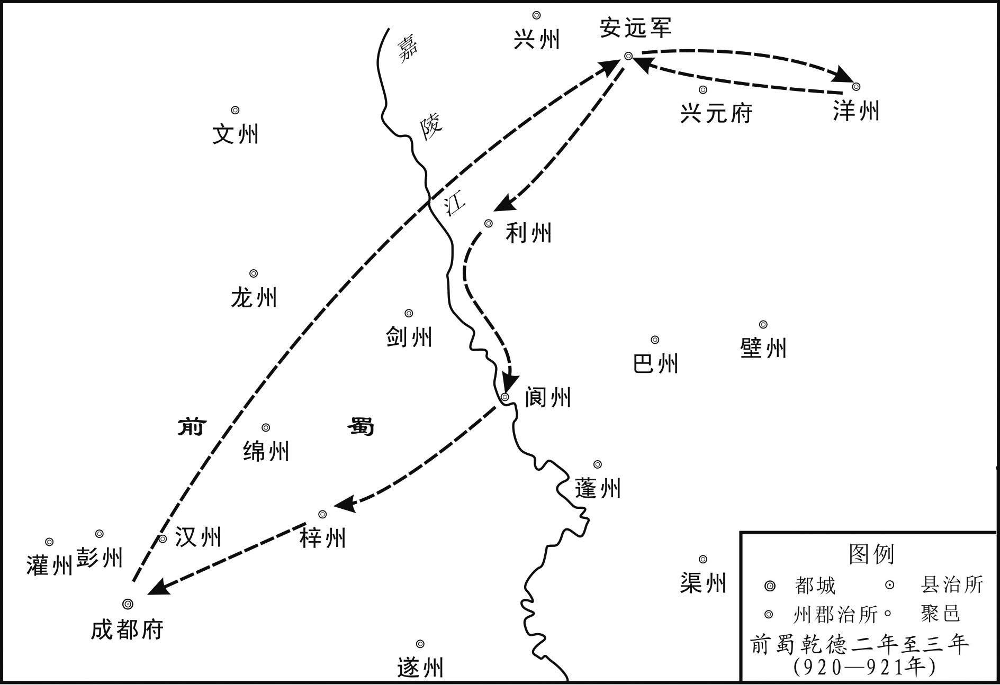 
王衍出游路线示意图

## 【原文】

**初，蜀主之为太子，高祖为聘兵部尚书高知言女为妃，无宠，及韦妃入宫，尤见疏薄，至是遣还家[1]。知言惊仆，不食而卒[2]。韦妃者，徐耕之孙也，有殊色，蜀主适徐氏，见而悦之，太后因纳于后宫[3]。蜀主不欲娶于母族，托云韦昭度之孙[4]。初为婕妤，累加元妃[5]。**

## 【注文】

[1]高祖：指王建，高祖为其庙号。　　高知言女：王衍为太子时，立为皇太子妃，王衍即位后立为皇后，无宠，于乾德三年（921年）被废。　　尤见疏薄：更被疏远淡薄。尤，更。见，表示被动，犹“被”。

[2]惊仆：受惊吓而跌倒。

[3]徐耕：徐贤妃、徐淑妃之父，曾任唐眉州刺史。　　殊色：指女子容貌特别美丽。　　适：到……去。

[4]托云：假称。　　韦昭度（？—895年）：字正纪，京兆（今陕西西安）人。唐僖宗、昭宗两朝宰相。曾随僖宗幸蜀。昭宗时，曾为行营招讨使，率军讨伐原西川节度使陈敬宣。后被侍中兼中书令王行瑜派人杀害。

[5]婕（jié）妤（yú）：与下文“元妃”皆妃嫔称号。隋唐时，婕妤位于九嫔以下；元妃地位仅次于皇后。

## 【译文】

当初，前蜀后主王衍做太子的时候，前蜀高祖为他聘娶了兵部尚书高知言的女儿为妃子，高氏不受宠爱，到韦妃入宫以后，更被疏远淡薄，到这时被送回了娘家。高知言惊吓得跌倒在地，吃不下饭而死去。韦妃是徐耕的孙女，特别有姿色，前蜀后主到徐家去，一见到她就喜欢上了，太后于是把她接入后宫。前蜀后主不想让别人说他娶母亲家族的人为妃，便假称她是韦昭度的孙女。韦妃最初被封为婕妤，后来多次晋封成为元妃。

## 【原文】

**蜀主常列锦步障，击毬其中，往往远适而外人不知[1]。爇诸香，昼夜不绝，久而厌之，更爇皂荚以乱其气[2]。结缯为山及宫殿楼观于其上，或为风雨所败，则更以新者易之。或乐饮缯山，涉旬不下[3]。山前穿渠通禁中，或乘船夜归，令宫女秉蜡炬千余居前船，却立照之，水面如昼[4]。或酣饮禁中，鼓吹沸腾，以至达旦[5]。以是为常。**

## 【注文】

[1]步障：古代贵族出行，摆在道路两旁用来遮挡尘土的障幕。

[2]爇（ruò）：烧。　　皂荚：亦称皂角，皂角树所结的果实。其形如猪牙者最良。　　乱：混，混合。

[3]涉旬：经过十天。涉，经历。

[4]秉：手持。　　却立：退立，此谓面朝后站立。

[5]酣（hān）饮：畅饮。

## 【译文】

前蜀后主王衍经常摆开锦缎步障，在里面击球，往往到远处去而外人不知道。还焚烧各种熏香，昼夜都不间断，时间长了就厌恶熏香的气味了，便改烧皂荚来混合熏香的气味。还用缯帛盘结成山，在上边用缯帛结成宫殿楼观，有时被风雨所摧毁，就再用新的更换。有时在缯山取乐宴饮，一连十几天都不下来。缯山前边挖了一条渠道直通宫中，有时在夜里乘船回宫，就让宫女手持一千多支蜡烛在前边的船上，面朝后船站着照明，把水面照得如同白昼一样。有时在宫禁中尽情畅饮，鼓乐喧天，以至到天亮。前蜀后主以此为常事。

## 【原文】

**二年春二月。蜀主好为微行，酒肆、倡家，靡所不到[1]。恶人识之，乃下令士民皆著大裁帽[2]。夏四月，蜀军使王承纲女将嫁，蜀主取之入宫。承纲请之，蜀主怒，流于茂州。女闻父得罪，自杀。**

## 【注文】

[1]微行：微服出行，指帝王或高官隐藏身份改装出行。　　酒肆：酒店。肆，店铺。　　倡家：歌舞演艺之所，亦指妓院。倡，古时指从事歌舞演艺之人。又通“娼”，娼妓。　　靡：无，没有。

[2]恶（wù）人识之：讨厌人们认出他来。　　著（zhuó）：“着”的本字。戴。　　大裁帽：大沿帽子。

## 【译文】

后梁龙德二年（922年）春季二月。前蜀后主王衍喜欢微服出行，酒店、倡家，无所不到。因讨厌人们认出他，便下令让百姓都戴大沿帽子。夏季四月，前蜀军使王承纲的女儿将要出嫁，前蜀后主把她纳入宫中，王承纲请求放出女儿，前蜀后主大怒，把他流放到了茂州。女儿得知父亲获罪，自杀而死。

## 【原文】

**后唐庄宗同光元年秋八月，蜀主以文思殿大学士韩昭、内皇城使潘在迎、武勇军使顾在珣为狎客，陪侍游宴，与宫女杂坐，或为艳歌相唱和，或谈嘲谑浪，鄙俚亵慢，无所不至，蜀主乐之[1]。在珣，彦朗之子也[2]。时枢密使宋光嗣等专断国事，恣为威虐，务徇蜀主之欲以盗其权[3]。宰相王锴、庾传素等各保宠禄，无敢规正[4]。潘在迎每劝蜀主诛谏者，无使谤国。嘉州司马刘赞献陈后主《三阁图》并作歌以讽[5]。贤良方正蒲禹卿对策语极切直[6]。蜀主虽不罪，亦不能用也。九月庚戌，蜀主以重阳宴近臣于宣华苑，酒酣，嘉王宗寿乘间极言社稷将危，流涕不已[7]。韩昭、潘在迎曰：“嘉王好酒悲[8]。”因谐笑而罢[9]。**

## 【注文】

[1]武勇军使：官名。掌禁卫军中的武勇军。　　顾在珣（xún）：生卒年不详。丰州（治今内蒙古五原西南）人，唐东川节度使顾彦朗之子。历任前蜀武勇军使、特进检校太傅、嘉州刺史。　　狎客：陪伴权贵游乐的人。　　艳歌：描写有关情爱的歌。　　谈嘲谑（xuè）浪：谈笑、嘲讽、戏谑、放荡。　　鄙俚亵（xiè）慢：粗俗轻慢。

[2]彦朗：即顾彦明（？—891年），丰州人，初为天德军小校，参与镇压黄巢起义军，收复长安，后迁右卫大将军。唐僖宗光启（885—888年）中拜东川节度使、同中书门下平章事。昭宗时，曾与王建一同配合韦昭度讨伐原四川节度使陈敬宣。

[3]恣为威虐：任意施行威势残暴。　　徇：顺从。

[4]王锴（kǎi）：字鳣（zhān）祥，籍贯及生卒年不详。唐末出使西川，留在蜀中。王建称帝后，官至中书侍郎、同平章事。曾劝王建兴文教。后主王衍时，与庾传素同为宰相，而对王衍无所规谏。国亡后，至洛阳，后唐授为刺史。

规正：规谏匡正。

[5]嘉州：州名。唐高祖武德元年（618年）改隋眉山郡置，治龙游（今四川乐山）。玄宗天宝元年（742年）改为犍（qián）为郡，肃宗乾元元年（758年）复为嘉州。领龙游、平羌、峨眉、夹江、玉津、绥山、罗目、犍为八县，辖境约当今四川夹江、峨眉山、乐山南至马边河流域。　　刘赞：籍贯及生卒年不详。王衍时，任嘉州司马，后迁学士。著有《玉堂集》，又编有《蜀国文英》。　　陈后主：即南朝陈朝皇帝陈叔宝（553—604年）。在位期间，大建宫室，生活奢靡，日与妃嫔、文臣游宴，制作艳词。后被隋所亡。　　《三阁图》：画名。三阁，即陈后主在宫中所建的临春、结绮、望仙三座楼阁，各高数十丈，连延数十间，极为奢华。

[6]贤良方正：本为汉代选拔官吏的科目之一。被选之人，为德才兼备者，经对策考核，授以官职。汉之后也往往以此作为非常设之制科。　　蒲禹卿：生卒年不详，成都（今四川成都）人。好慷慨直言，经制科对策，授右补阙，后任秦州节度判官。国亡后随王衍归唐，王衍被杀，他题诗于驿门而逃，不知所终。

对策：取士考试的一种形式，即对答皇帝有关政事、经义的策问。　　切直：激切直率。

[7]重阳：节日名，为农历九月初九。《易经》以“九”为阳数，九月初九，两九相重，故以该日为重阳节。民间在重阳有登高、插茱萸、赏菊花等习俗。　　宣华苑：前蜀皇家园林。王衍于乾德元年（919年）改龙跃池为宣华苑。　　酒酣：酒兴正浓时。　　宗寿：即王宗寿。字永年，王氏族人。工琴弈，喜道家之术。王建在位时封嘉王，领镇江节度使。王衍时进太子太保，奉朝请。后任武信军节度使，后唐伐蜀时，率遂、合、渝、泸、昌五州降。蜀亡后随王衍东迁，逃入山中。又上书后唐明宗，求葬王衍。后官至后唐平卢节度使。　　乘间：利用机会，乘机。

[8]酒悲：醉酒后哭泣，俗称“酒悲”。

[9]谐笑：嬉笑。

## 【译文】

后唐庄宗同光元年（923年）秋季八月，前蜀后主王衍让文思殿大学士韩昭、内皇城使潘在迎、武勇军使顾在珣作陪伴游乐的人，陪侍着他游乐宴饮，与宫女们混坐在一起，有时作一些情词艳歌，互相唱和，有时谈笑嘲讽，戏谑放荡，粗俗轻慢，无所不至，前蜀后主对此十分高兴。顾在珣是顾彦朗的儿子。当时枢密使宋光嗣等人擅自决断国家政事，任意施行威势残暴，专门顺从前蜀后主的欲望来盗取他的权力。宰相王锴、庾传素等人则各保自己的荣宠禄位，不敢规劝匡正。潘在迎常常劝前蜀后主诛杀进谏的人，不要让他们诽谤国家。嘉州司马刘赞向前蜀后主献了一幅陈后主《三阁图》，并作歌进行讽谏。贤良方正蒲禹卿对策极为激切直率。前蜀后主虽然没有加罪于他们，但也不能听从他们的劝谏。九月庚戌（初九日），前蜀后主因为这天是重阳节而在宣华苑宴请近臣，酒兴正浓时，嘉王王宗寿乘这个机会极力陈说国家将要危亡，并痛哭流泪不止。韩昭、潘在迎说：“嘉王喝醉了喜欢哭。”于是嬉笑罢宴。

## 【原文】

**冬十月，彗星见舆鬼，长丈余[1]。蜀司天监言国有大灾[2]。蜀主诏于玉局化设道场[3]。右补阙张云上疏，以为：“百姓怨气上彻于天，故彗星见[4]。此乃亡国之征，非祈禳可弭[5]。”蜀主怒，流云黎州，卒于道[6]。**

## 【注文】

[1]彗星见（xiàn）舆鬼：见，同“现”，出现。舆鬼，星宿名。即二十八宿中的鬼宿，南方朱雀七宿之一，有五星。古代时为了通过观察天象变化来占卜地上的吉凶，将天上的二十八宿分别指配于地上的州国，使之相互对应，称为分野。东井与舆鬼二宿为秦之分野，前蜀国土在其范围之内。彗星则被视作灾星。彗星出现在鬼宿所在的天域，故被认为预示前蜀将有大灾。

[2]司天监：官名。司天台长官，掌天文历法之事。

[3]玉局化：道教管理道事的神职之地二十四化（又称二十四治）之一。相传东汉时，李老君与张道陵至此，有局脚玉床（局，弯曲。局脚玉床即四脚弯曲的玉床）自地而出，老君升坐，为张道陵说《南北斗经》。老君离去，玉床遂隐入地下而形成洞穴。为此，张道陵在此建玉局化。故址在今成都市内。

[4]右补阙：官名。唐武则天时始置左右补阙各二员，掌规谏皇帝，并举荐人员。左补阙属门下省，右补阙属中书省。　　张云（？—923年）：唐安（今四川崇庆）人。因上疏讽谏王衍被流放黎州，行至临邛（qióng）而卒。　　疏：臣下给皇帝的奏议。　　彻：通达。

[5]祈禳（ráng）：向神灵祈祷以消除灾祸。　　弭（mǐ）：停止，消除。

[6]黎州：州名。武周大足元年（701年）置，治汉源（今四川汉源西北）。唐玄宗天宝元年（742年）改为洪源郡，肃宗乾元元年（758年）复为黎州。领汉源、飞越、通望三县，领五十余羁（jī）縻（mí）州。

## 【译文】

后唐庄宗同光元年（923年）冬季十月，彗星出现在鬼宿所在的天域，有一丈多长。前蜀司天监说国家将会有大灾。于是前蜀后主王衍诏令在玉局化设置道场。右补阙张云上疏，认为：“百姓的怨气上达于天，所以彗星出现。这是亡国的征兆，不是祈祷禳除就能消除掉的。”前蜀后主大怒，把张云流放到黎州，结果死在了路上。

## 【原文】

**二年春三月己亥朔，蜀主宴近臣于怡神亭，酒酣，君臣及宫人皆脱冠露髻，喧哗自恣[1]。知制诰京兆李龟祯谏曰：“君臣沈湎，不忧国政，臣恐启北敌之谋[2]。”不听。夏四月，帝遣客省使李严使于蜀，严盛称帝威德，有混一天下之志[3]。且言朱氏篡窃，诸侯曾无勤王之举[4]。王宗俦以其语侵蜀，请斩之，蜀主不从[5]。宣徽北院使宋光葆上言：“晋王有凭陵我国家之志，宜选将练兵，屯戍边鄙，积糗粮，治战舰以待之[6]。”蜀主乃以光葆为梓州观察使，充武德节度留后[7]。**

## 【注文】

[1]宫人：妃嫔、宫女的通称。　　髻（jì）：发髻，盘在头上的发结。　　自恣：放纵自己，任意而为。姿，恣意，任意。

[2]知制诰：官名。唐中书舍人掌起草诏令，称知制诰。开元后，或以尚书省诸司郎中等他官为之，称兼知制诰。翰林学士之实际起草诏令者，亦带知制诰衔。　　李龟祯（zhēn）：京兆人。前蜀后主乾德（919—924年）末任知制诰，为人切直，不畏权贵。　　沈（chén）湎（miǎn）：沉溺，多指嗜酒无度。沈，同“沉”。　　启北敌之谋：引起北方敌国的图谋。北敌，指后唐。

[3]帝：指后唐庄宗李存勗。　　混一：统一。

[4]朱氏篡窃：指朱温代唐称帝，建立后梁之事。篡窃，篡位窃国。　　诸侯：指唐朝所封的各王国及节度使。　　曾：副词。用来加强语气，有“连……都……”之意。　　勤王：起兵救援王朝。

[5]王宗俦（chóu）（？—924年）：前蜀高祖王建养子。累有战功，历任排阵使，天雄军节度使、山南节度使等职。后主乾德六年（924年），与王宗弼谋废王衍，宗弼犹豫未决，他忧愤而死。　　侵蜀：侵犯蜀国。

[6]晋王：指后唐庄宗李存勗。庄宗称帝前为晋王。　　边鄙：边境。鄙，边疆，边远的地方。　　糗（qiǔ）粮：干粮。此泛指粮草。

[7]武德：方镇名。前蜀高祖永平二年（912年）改剑南东川节度使为武德军节度使，治梓（zǐ）州（治郪县，今四川三台）。领梓、绵（治巴西，今四川绵阳东北）、剑（治普安，今四川剑阁）、龙（治江油，今四川平武东南）、普（安岳，今四川安岳）等州。

## 【译文】

后唐庄宗同光二年（924年）春季三月己亥朔日（初一日），前蜀后主王衍在怡神亭宴请近臣，喝到酒兴正浓时，君主臣下以及妃嫔宫女都脱掉帽子露出发髻，吵嚷喧哗，任意而为。知制诰京兆人李龟祯进谏说：“君臣沉溺于酒，不忧虑国家政事，我担心会引起北方敌国的图谋。”前蜀后主不听他的劝谏。夏季四月，后唐庄宗派遣客省使李严出使前蜀，李严大力赞颂庄宗的威德，说他有统一天下的志向。并且说到朱氏篡位窃国时，诸侯连起兵救援王朝的举动都没有。王宗俦认为他的话侵犯了蜀国，请求斩杀了他，前蜀后主没有听从。宣徽北院使宋光葆上书说：“晋王有侵扰我国的意图，应当选择将领，训练兵士，驻守在边境，积蓄粮草，修造战舰来等待他们。”前蜀后主于是任命宋光葆为梓州观察使，充任武德节度留后。

## 【原文】

**五月戊申，蜀主遣李严还。初，帝因严入蜀，令以马市宫中珍玩，而蜀法禁锦绮珍奇不得入中国，其粗恶者乃听入中国，谓之“入草物”[1]。严还以闻，帝怒曰：“王衍宁免为入草之人乎[2]！”严因言于帝曰：“衍童荒纵，不亲政务，斥远故老，昵比小人[3]。其用事之臣王宗弼、宋光嗣等谄谀专恣，黩货无厌，贤愚易位，刑赏紊乱，君臣上下专以奢淫相尚[4]。以臣观之，大兵一临，瓦解土崩，可翘足而待也[5]。”帝深以为然。**

## 【注文】

[1]因：借，趁着。　　市：买，交易。　　锦绮：有文彩的丝织品。　　中国：指中原地区。

[2]宁免：难道可以免于。此句意谓王衍也不能免于向后唐称臣纳贡。

[3]童（ái）：年幼无知。，傻。　　斥远故老：排斥疏远故旧老臣。　　昵（nì）比小人：亲近小人。

[4]谄谀（yú）专恣：谄媚奉承、专横放肆。　　黩（dú）货：贪财。黩，贪污。　　相尚：互比高低。

[5]翘（qiáo）足而待：翘足，亦作“跷足”，抬起脚来。形容很短时间便能看到结果。

## 【译文】

后唐庄宗同光二年（924年）五月戊申（十一日），前蜀后主送李严返回后唐。当初，后唐庄宗借李严进入前蜀，让他用马匹交换前蜀宫中珍贵的玩赏器物，但前蜀法律规定，锦绮等精美丝织品和珍奇之物不能进入中原地区，只有那些做工粗糙质量低劣的才听任进入中原地区，当地人把这叫作“入草物”。李严回来把这个情况奏报给后唐庄宗，庄宗发怒说：“王衍难道可以免于当入草之人吗！”李严乘机对庄宗说：“王衍年幼无知，荒淫放纵，不亲自治理政务，排斥疏远故旧老臣，亲近依靠奸邪小人。他的当权大臣王宗弼、宋光嗣等人谄媚奉承，专横放肆，贪得无厌，贤能与愚笨颠倒，刑罚和奖赏混乱，君臣上下专门以奢侈荒淫相比高下。以我来看，只要大军一到，他们就会土崩瓦解，这是可以翘足而待的。”后唐庄宗认为他说得很对。

## 【原文】

**秋八月戊辰，蜀主以右定远军使王宗锷为招讨马步使，帅二十一军屯洋州；乙亥，以长直马军使林思锷为昭武节度使，戍利州，以备唐[1]。**

## 【注文】

[1]右定远军使：官名。定远，为前蜀禁卫军军号，分左右两军，各置军使统领。　　王宗锷（è）：籍贯及生卒年不详。少多技勇，随王建入西川，被收为义子。后主即位，为定远军使。　　洋州：州名。唐高祖武德元年（618年）割梁州置，治西乡（今陕西西乡）。玄宗天宝元年（742年）改为洋川郡，移治兴道（今陕西洋县）。肃宗乾元元年（758年）复为洋州。领西乡、黄金、兴道、洋源、真符五县，辖境约相当于今陕西洋县、西乡、镇巴、佛坪等地。　　长直马军使：官名。掌长直马军。长直马军为前蜀禁军中的马军部队。　　昭武节度使：方镇名。唐僖宗光启二年（886年）升兴凤防御使为感义军节度使，治凤州（治梁泉，今陕西凤县东北）。领兴（治顺政，今陕西略阳）、凤二州，僖宗文德元年（888年）增领利州，辖境相当于今甘肃徽县、两当，陕西凤县、留坝、略阳、宁强与四川广元地区。昭宗乾宁四年（897年）号昭武军。天复二年（902年），为王建所并，前蜀时移治利州（治今四川广元）。

## 【译文】

后唐庄宗同光二年（924年）秋季八月戊辰（初二日），前蜀后主王衍任命右定远军使王宗锷为招讨马步使，率领二十一军驻守洋州；乙亥（初九日），任命长直马军使林思锷为昭武节度使，戍守利州，以防备后唐军队。

## 【原文】

**帝复遣使者李彦稠入蜀，九月己亥，至成都。**

## 【译文】

后唐庄宗又派遣使者李彦稠入蜀，同光二年（924年）九月己亥（初三日），到达成都。

## 【原文】

**蜀前山南节度使兼中书令王宗俦，以蜀主失德，与王宗弼谋废立，宗弼犹豫未决[1]。庚戌，宗俦忧愤而卒。宗弼谓枢密使宋光嗣、景润澄等曰：“宗俦教我杀尔曹，今日无患矣。”光嗣辈俯伏泣谢[2]。宗弼子承班闻之，谓人曰：“吾家难乎免矣。”**

## 【注文】

[1]山南节度使：方镇名，即山南西道节度使。唐代宗宝应元年（762年）升山南西道观察使置，治梁州（治南郑，今陕西汉中东）。领梁、洋（治西乡，今陕西西乡）、集（治难江，今四川南江）、壁（治诺水，今四川通江）、文（治曲水，今甘肃文县西南）、通（治通川，今四川达州）、巴（治化城，今四川巴中）、利（治绵谷，今四川广元）、开（治盛山，今四川开县）、渠（治流江，今四川渠县）、蓬（治大寅，今四川仪陇南）等州。德宗兴元元年（784年）升梁州为兴元府，故又称兴元节度使。唐末五代时领州大为减少，前蜀时领兴元、渠、开、通、潾（治今四川邻水）等府州。

[2]景润澄（？—925年）：官至前蜀内枢密使。曾搜求女色，取悦于前蜀后主王衍。前蜀灭亡前夕，被王宗弼所斩杀。

## 【译文】

前蜀前山南节度使兼中书令王宗俦，因为前蜀后主王衍失去君主之德，就与王宗弼谋划废掉王衍，拥立新君，王宗弼犹豫不决。同光二年（924年）九月庚戌（十四日），王宗俦忧虑愤恨而死。王宗弼对枢密使宋光嗣、景润澄等人说：“王宗俦让我杀掉你们，今天已经没有忧患了。”宋光嗣等人边哭边跪着感谢。王宗弼的儿子王承班听说这事，对别人说：“我们家难免灾祸了。”

## 【原文】

**乙卯，蜀主以前镇江节度使张武为峡路应援招讨使[1]。**

## 【注文】

[1]镇江节度使：前蜀高祖王建于天祐六年（903年）置，治忠州（治临江，今重庆忠县），一说治夔（kuí）州（治奉节，今重庆奉节东），领夔、忠、万（治南浦，今重庆万州）三州。　　张武（？—930年）：石照（今四川合川）人。少事前蜀高祖王建为破浪都头，大败荆南兵于夔州，累官镇江军节度使。前蜀乾德（919—924年）中，迁峡路应援招讨使。后唐庄宗同光三年（925年），降于魏王李继岌。明宗长兴元年（930年），孟知祥起用为峡路行营招收讨伐使，兼侍中，统水军飞棹（zhào）等营进取渝州，不久，卒于渝州。　　峡路：指沿长江三峡地区。

## 【译文】

后唐庄宗同光二年（924年）九月乙卯（十九日），前蜀后主王衍任命前镇江节度使张武为峡路应援招讨使。

## 【原文】

**蜀宣徽北院使王承休请择［诸］军(2)骁勇者万二千人，置驾下左右龙武步骑四十军，兵械给赐皆优异于他军，以承休为龙武军马步都指挥使，以裨将安重霸副之，旧将无不愤耻[1]。重霸，云州人，以狡佞贿赂事承休，故承休悦之[2]。**

## 【注文】

[1]王承休（？—925年）：前蜀宦官。以谄媚奉迎得王衍宠幸，官至天雄军节度使。宦官任节度使，自他开始。后唐庄宗同光三年（925年），后唐军入成都，他被李继岌斩杀。　　驾下：驾，车；也特指帝王的车，又指帝王。驾下即皇帝统属之下。　　左右龙武：前蜀禁军，号龙武，分左右两支，由龙武军马步都指挥使总领。　　安重霸（？—935年）：云州（治今山西大同）人。为人阴险狡诈。初事晋王李存勗，得罪逃奔后梁。后又投奔前蜀，深结宦官王承休，得为秦州节度副使。蜀亡降后唐。明宗时任阆州团练使、同州节度使。废帝时为京兆尹，西京留守，云州节度使，后以病罢归，卒于路。

[2]狡佞：狡诈谄媚。

## 【译文】

前蜀宣徽北院使王承休请求从各军里面挑选一万二千名勇猛的兵士，设置驾下左右龙武马步部队四十个军，武器装备及供给赏赐都比其他部队优厚，任命王承休为龙武军马步都指挥使，任命副将安重霸为副使，旧将对此无不感到愤恨耻辱。安重霸是云州人，凭借狡诈谄媚和贿赂侍奉王承休，所以王承休很喜欢他。

## 【原文】

**冬十一月，蜀主遣其翰林学士欧阳彬来聘[1]。彬，衡山人也。又遣李彦稠东还[2]。**

## 【注文】

[1]欧阳彬（？—950年）：字齐美，衡州衡山（今湖南衡山）人。为人好学，工于辞赋。初欲事楚王马殷，不果。遂入成都，献《万里朝天赋》，被后主王衍授为翰林学士。前蜀亡，归后蜀孟昶，官至宁江军节度使。　　聘：古代诸侯之间或诸侯与天子之间遣使通问修好。来聘指来后唐通好。

[2]东还：指返回后唐。

## 【译文】

后唐庄宗同光二年（924年）冬季十一月，前蜀后主王衍派遣他的翰林学士欧阳彬来后唐通问修好。欧阳彬是衡山人。又送后唐使臣李彦稠东还（回国）。

## 【原文】

**蜀以唐修好，罢威武城戍，召关宏业等二十四军还成都[1]。戊申，又罢武定、武兴招讨刘潜等三十七军[2]。辛酉，蜀主罢天雄军招讨，命王承骞等二十九军还成都[3]。蜀主罢金州屯戍，命王承勋等七军还成都[4]。**

## 【注文】

[1]修好：指国与国之间结成友好关系。　　威武城：城名。前蜀所筑，在今陕西凤县东北。

[2]武兴：方镇名。前蜀高祖永平五年（915年）置，治凤州（治梁泉，今陕西凤县东北），割文（治曲水，今甘肃文县西南）、兴（治顺政，今陕西略阳）二州隶之。

[3]骞：音qiān。

[4]金州：州名。唐高祖武德元年（618年）改隋西城郡置，治西城（今陕西安康）。玄宗天宝元年（742年）改为安康郡，肃宗乾元元年（758年）复为金州。领西城、洵阳、淯（yù）阳、石泉、汉阴六县，辖境相当于今陕西石泉、宁陕、汉阴、旬阳、紫阳、岚皋、安康、平利、镇平等地。

## 【译文】

前蜀因为已与后唐结成友好关系，就撤除了威武城的戍守军队，召关宏业等二十四军返回成都。同光二年（924年）十一月戊申（十四日），又撤除武定、武兴招讨刘潜等三十七军。辛酉（二十七日），前蜀后主撤销天雄军招讨，命令王承骞等二十九军返回成都。前蜀后主又撤除了金州的戍守军队，命令王承勋等七军返回成都。

## 【原文】

**初，唐僖、昭之世，宦官虽盛，未尝有建节者[1]。蜀安重霸劝王承休求秦州节度使，承休言于蜀主曰：“秦州多美妇人，请为陛下采择以献[2]。”蜀主许之，庚午，以承休为天雄节度使，封鲁国公，以龙武军为承休牙兵[3]。乙亥，蜀主以前武德节度使兼中书令徐延琼为京城内外马步都指挥使[4]。延琼以外戚代王宗弼，居旧将之右，众皆不平[5]。**

## 【注文】

[1]僖、昭：即唐僖宗、唐昭宗。　　建节：出任节度使。节度使受职之时，朝廷赐以旌节，故称。

[2]秦州节度使：即天雄节度使。

[3]庚午：为该年十二月庚午。

[4]徐延琼：生卒年不详。字敬明，徐太后之弟，凭外戚身份授为武德节度使，兼中书令，封赵国公。前蜀后主乾德六年（924），任京城内外马步都指挥使。

[5]外戚：帝王的母族或妻族。　　居旧将之右：位居老将之上。古代尚右，故以右为较尊贵的地位。

## 【译文】

起初，在唐僖宗、唐昭宗时期，宦官虽然势力强盛，但不曾有出任节度使的。前蜀的安重霸劝王承休请求出任秦州节度使，王承休对前蜀后主说：“秦州漂亮的女人很多，我请求为陛下选取一批献上来。”前蜀后主答应了他的请求，同光二年（924年）十二月庚午（初六日），任命王承休为天雄军节度使，进封鲁国公，用龙武军充当王承休的亲兵卫队。乙亥（十一日），前蜀后主任命前武德节度使兼中书令徐延琼为京城内外马步都指挥使。徐延琼凭借外戚的身份取代了王宗弼，地位在旧将之上，众人都心中不平。

## 【原文】

**三年夏六月，帝将伐蜀，辛卯，诏天下括市战马[1]。**

## 【注文】

[1]括市：搜求购买。

## 【译文】

后唐庄宗同光三年（925年）夏季六月，后唐庄宗准备讨伐前蜀，辛卯（三十日），诏令天下搜求购买战马。

## 【原文】

**秋九月，蜀主与太后、太妃游青城山，历丈人观、上清宫，遂至彭州阳平化、汉州三学山而还[1]。**

## 【注文】

[1]青城山：山名。在今四川都江堰西南，为道教名山之一。　　丈人观：道教宫观，在青城山上。　　上清宫：道教宫观，在青城山颠。始建于晋，后废，前蜀王衍时重建。　　彭州：州名。武后垂拱二年（686年）分益州置，治九陇（今四川彭州）。玄宗天宝元年（742年）改为濛阳郡，肃宗乾元元年（758年）复为彭州。领九陇、导江、濛阳、唐昌四县，辖境相当于今四川都江堰、彭州等地。

阳平化：道教管理道事的神职之地二十四化之一，故址在今彭州北二十公里。　　汉州：州名。武后垂拱二年（686年）置，治雒（luò）县（今四川广汉）。玄宗天宝元年（742年）改为德阳郡，肃宗乾元元年（758年）复为汉州。领雒县、德阳、什邡（fāng）、绵竹、金堂五县，辖境约当今四川广汉、德阳、什邡、绵竹、金堂等地。　　三学山：山名。在今四川金堂东。

## 【译文】

后唐庄宗同光三年（925年）秋季九月，前蜀后主王衍与太后、太妃游览青城山，经过丈人观、上清宫，最终到了彭州阳平化、汉州三学山而返回。

## 【原文】

**丁酉，帝与宰相议伐蜀。威胜节度使李绍钦素谄事宣徽使李绍宏，绍宏荐绍钦有盖世奇才，虽孙、吴不如，可以大任[1]。郭崇韬曰：“段凝亡国之将，奸谄绝伦，不可信也[2]。”众举李嗣源，崇韬曰：“契丹方炽，总管不可离河朔[3]。魏王地当储副，未立殊功，请依故事，以为伐蜀都统，成其威名[4]。”帝曰：“儿幼，岂能独往！当求其副。”既而曰：“无以易卿[5]。”庚子，以魏王继岌充西川四面行营都统，崇韬充东北面行营都招讨、制置等使，军事悉以委之[6]。又以荆南节度使高季兴充东南面行营都招讨使，凤翔节度使李继曮充都供军转运、应接等使，同州节度使李令德充行营副招讨使，陕州节度使李绍琛充蕃汉马步军都排陈斩斫使兼马步军都指挥使，西京留守张筠充西川管内安抚、应接使，华州节度使毛璋充左厢马步都虞候，邠州节度使董璋充右厢马步都虞候，客省使李严充西川管内招抚使，将兵六万伐蜀，仍诏季兴自取夔、忠、万三州为巡属[7]。都统置中军，以供奉官李从袭充中军马步都指挥监押，高品李廷安、吕知柔充魏王牙通谒[8]。辛丑，以工部尚书任圜、翰林学士李愚并参预都统军机[9]。**

## 【注文】

[1]威胜节度使：方镇名。后梁开平三年（909年）析山南东道置宣化节度使，治邓州（治穰县，今河南邓州），领邓、泌（bì）（治泌阳，今河南唐河）、隋（治隋县，今湖北随州）、复（治沔阳，今湖北仙桃西南。沔音miǎn）、郢（yǐng）（治京山，今湖北京山）五州。后唐同光元年（923年）改为威胜军，后周广顺二年（952年）改为武胜军。　　李绍钦：即段明远。　　孙、吴：春秋战国时期著名军事家孙武、吴起。

[2]段凝：即李绍钦。

[3]方炽（chì）：气焰正嚣张。炽，火旺，引申为强盛。　　总管：指李嗣源。时任蕃汉内外马步军总管。

[4]魏王：即李继岌。　　储副：太子，储君。储君为国之副主，故称储副。　　故事：旧制，旧例。安史之乱时，唐玄宗分命诸子为诸道都统，故云依照旧例，以魏王为伐蜀都统。

[5]无以易卿：没有人能替代你。卿，古时君对臣、长辈对晚辈的称谓，朋友、夫妻也以“卿”为爱称。

[6]制置：即制置使。唐代后期所置，掌用兵前后控制地方秩序。五代时为地方临时性军事长官，多以招讨使兼任。

[7]李继曮（yǎn）（898—946年）：又作李从曮。李茂贞长子，深州博野（今河北蠡县。蠡音lǐ）人。茂贞卒，拜凤翔节度使。后唐明宗天成元年（926年），加检校太师，后移镇汴州。清泰（934—936年）初，再任凤翔节度使，封秦国公。后晋高祖石敬瑭即位，封秦王、岐王。少帝石重贵嗣位，加守太保。开运三年（946年）冬卒于镇。　　都供军转运、应接等使：官名。掌全军粮草运输供应等。

李令德：即朱令德。　　李绍琛：即康延孝。　　排陈斩斫（zhuó）使：官名。五代时有排阵使、排阵斩斫使等称谓，当为掌战阵编排部署之职。陈，同“阵”。　　西京留守：官名。隋唐以后，皇帝出巡或亲征时指定亲王或大臣留守京城，得便宜行事，称京城留守；其陪京和行都也常设留守，以地方长官兼任。后唐都洛阳，以太原为西京，故置留守。　　安抚：即安抚使，官名。隋代以安抚大使为行军主帅的兼职。唐时派大臣巡视经过战乱或受灾的地区，以安定社会秩序，称安抚使。　　华州节度使：方镇名。又称感化节度使。　　左厢马步都虞候：官名。掌整肃左厢马步军军纪。五代时禁军或出征军队中，或分设左、右厢，厢下设军。左、右厢原为左、右翼之意，自中唐以后始变为固定的军队编制单位。都虞候，为掌整肃军纪之职。　　邠（bīn）州节度使：方镇名，即邠宁节度使。唐肃宗乾元二年（759年）置，僖宗光启元年（885年）号静难军节度，治邠州（治新平，今陕西彬县），领邠、宁（治定安，今甘肃宁县）、庆（治安化，今甘肃庆阳）等州，辖境相当于今甘肃环县、陕西长武以东，陕西吴旗、甘肃华池和正宁以西，以及陕西永寿以北地区。五代沿袭。　　招抚使：官名。掌招降安抚，为临时设置的军事长官，战后即废。　　夔（kuí）、忠、万：皆州名。夔州，唐高祖武德元年（618年）置，初称信州，二年改称夔州，治奉节（今重庆奉节东）。玄宗天宝元年（742年）改为云安郡，肃宗乾元元年（758年）复为夔州。领奉节、云安、巫山、大昌四县，辖境约当今四川奉节、巫山、巫溪、云阳等地。忠州，唐太宗贞观八年（634年）改临州置，治临江（今重庆忠县）。玄宗天宝元年（742年）改为南宾郡，肃宗乾元元年（758年）复为忠州。领临江、丰都、南宾、垫江、桂溪五县，辖境约当今重庆忠县、石柱、丰都、垫江等地。万州，唐高祖武德元年（618年）置南浦州，太宗贞观八年（634年）改称万州，治南浦（今重庆万州）。玄宗天宝元年（742年）改为南浦郡，肃宗乾元元年（758年）复为万州。领南浦、武宁、梁山三县，辖境约当今重庆梁平、万州等地。　　巡属：指统属的地区。唐时夔、忠、万三州本属荆南节度，唐末之乱，王建据蜀，并而有之。故诏高季兴取为巡属。

[8]中军：春秋时，行军作战分左、右、中或上、下、中三军，由主将所处的中军发号施令，后世遂引申称主将为中军。此指设置都统指挥机构。　　供奉官：中书省与门下省的主要官员。因常侍奉皇帝左右，故名。供奉内廷的宦官，亦有称供奉官者。　　李从袭（？—926年）：后唐宦官。同光三年（925年），任监押，随魏王李继岌伐蜀。灭蜀后，诬陷郭崇韬，以致崇韬被杀。不久，庄宗死，李嗣源监国，李继岌自杀，他被李嗣源亲信李冲所杀。　　高品：宦官品级之一，晚唐时设置，品级低于供奉官。　　牙：官署，府衙。亦作“衙”。　　通谒：官名。掌传达。

[9]李愚（？—935年）：字子晦，渤海郡无棣（今河北盐山东南）人。唐末举进士，任河南府参军。后梁末帝时官至崇政院直学士。后唐时任翰林学士，随李继岌伐蜀。后官至中书侍郎同平章事、集贤殿大学士，清泰二年（935年）病故。

## 【译文】

后唐庄宗同光三年（925年）九月丁酉（初七日），后唐庄宗与宰相商议讨伐前蜀。威胜节度使李绍钦一向以谄媚侍奉宣徽使李绍宏，李绍宏便推荐李绍钦有盖世奇才，即使是孙武、吴起也比不上他，可以担当大任。郭崇韬说：“段凝是亡国之将，奸诈谄媚，无与伦比，不能相信他。”众人又推举李嗣源，郭崇韬说：“契丹的气焰正嚣张，总管不能离开河北。魏王居于储君之位，尚未建立大功，请依照以往旧例，任命他为伐蜀都统，来成就他的威名。”后唐庄宗说：“这孩子还小，怎么能独自前往！应当为他寻求一个副手。”过了一会儿又说：“副手的人选，没人能替代你。”庚子（初十日），任命魏王李继岌充任西川四面行营都统，郭崇韬充任东北面行营都招讨、制置等使，军中的事务全部交给他处理。又任命荆南节度使高季兴充任东南面行营都招讨使，凤翔节度使李继曮充任都供军转运、应接等使，同州节度使李令德充任行营副招讨使，陕州节度使李绍琛充任蕃汉马步军都排阵斩斫使兼马步军都指挥使，西京留守张筠充任西川管内安抚、应接使，华州节度使毛璋充任左厢马步都虞候，邠州节度使董璋充任右厢马步都虞候，客省使李严充任西川管内招抚使，率兵六万征伐前蜀，还诏令高季兴自行攻取夔、忠、万三州作为自己统辖的地盘。都统设置中军，任命供奉官李从袭充任中军马步都指挥监押，高品李廷安、吕知柔充任魏王府衙通谒。辛丑（十一日），又任命工部尚书任圜、翰林学士李愚一并参与都统军机事务。

## 【原文】

**蜀安重霸劝王承休请蜀主东游秦州。承休到官，即毁府署，作行宫，大兴力役，强取民间女子教歌舞，图形遗韩昭，使言于蜀主[1]。又献花木图，盛称秦州山川土风之美[2]。蜀主将如秦州，群臣谏者甚众，皆不听。王宗弼上表谏，蜀主投其表于地。太后涕泣不食，止之，亦不能得。前秦州节度判官蒲禹卿上表几二千言，其略曰：“先帝艰难创业，欲传之万世[3]。陛下少长富贵，荒色惑酒[4]。秦州人杂羌胡，地多瘴疠，万众困于奔驰，郡县罢于供亿[5]。凤翔久为仇雠，必生衅隙[6]。唐国方通欢好，恐怀疑贰[7]。先皇未尝无故盘游，陛下率意频离宫阙[8]。秦皇东狩，銮驾不还；炀帝南巡，龙舟不返[9]。蜀都强盛，雄视邻邦，边亭无烽火之虞，境内有腹心之疾，百姓失业，盗贼公行[10]。昔李势屈于桓温，刘禅降于邓艾，山河险固，不足凭恃[11]。”韩昭谓禹卿曰：“吾收汝表，俟主上西归，当使狱吏字字问汝。”王承休妻严氏美，蜀主私焉，故锐意欲行[12]。**

## 【注文】

[1]行宫：京城以外供帝王出行时居住的宫室。　　图形：画成图像。

[2]土风：自然环境与风气习俗。

[3]几二千言：近两千字。几，将近，接近。

[4]荒色惑酒：放纵声色，沉迷酒宴。

[5]羌胡：指我国古代的羌族与匈奴族，亦用以泛称我国古代西北部的少数民族。　　瘴（zhàng）疠（lì）：由瘴气引起的瘟疫。瘴，南方暑热潮湿致病之气，疠，瘟疫，即流行性传染病。　　罢（pí）：通“疲”。

[6]凤翔：方镇名。此代指凤翔节度使李茂贞、李继曮父子。　　仇雠（chóu）：仇敌。前蜀与李茂贞之间曾多次发生战争，夺取凤翔节度使所辖秦、凤、阶、成等州，故谓久为仇雠。　　衅隙：事端。

[7]疑贰：因怀疑而生异心。

[8]盘游：游乐。盘，乐。　　率意：任意。　　频：频繁，多次。　　宫阙：宫殿。因宫门外有左右两座楼台（即阙），故称宫阙。

[9]秦皇：即秦始皇嬴政。　　狩：巡狩。指天子巡察诸侯或地方官治理的地方。　　銮（luán）驾不还：銮驾，皇帝的车驾。公元前210年，秦始皇东巡返回时，死于沙丘（今河北广宗）平台。　　炀（yáng）帝：即隋炀帝杨广。　　龙舟不返：隋炀帝曾三次乘龙舟南游江都（今江苏扬州），公元618年，宇文化及发动叛乱，将他缢死于江都。

[10]边亭：边境上的亭障，即边防哨所。此指边境。　　烽火之虞：烽火，古代边境遭敌人入侵时的报警信号。虞，忧患。烽火之虞，指外敌入侵的忧患。　　腹心之疾：比喻要害处的祸患。

[11]李势曲于桓温：李势，十六国时期成汉（建都成都）皇帝。在位期间，荒淫无度，不恤国事。桓温，东晋大将，官至大司马。公元346年末，桓温率军伐成汉。次年，李势投降，成汉亡。　　刘禅降于邓艾：刘禅，三国蜀汉后主，刘备之子。初由诸葛亮辅政，诸葛亮死后，信用宦官黄皓，朝政日趋败坏。邓艾，三国曹魏大将，官至镇西将军。公元263年，邓艾率军逼近成都，刘禅出降，蜀汉亡。　　凭恃（shì）：依仗，依靠。

[12]私：私通。　　锐意：专心一意，执意。

## 【译文】

前蜀安重霸劝王承休请前蜀后主王衍东行游览秦州。王承休到任之后，便拆掉节度使府署，建造行宫，发起大规模劳役，又强行夺取民间女子，教她们唱歌跳舞，还画出她们的图像送给韩昭，让韩昭告诉前蜀后主。又献上画有秦州花草树木的图画，盛赞秦州山川土风的美好。前蜀后主将要到秦州去，群臣中劝谏的人很多，前蜀后主概不听从。王宗弼上表劝谏，前蜀后主把他的表章扔在了地上。太后哭泣不吃饭，想以此劝阻前蜀后主，也不能如愿。前秦州节度判官蒲禹卿上表近两千字，其内容大致说：“先帝历经艰难，创立大业，想使它万世永传。陛下自幼生长在富贵的环境之中，放纵于声色，沉迷于酒宴。秦州之地汉人与羌胡杂居，当地多有瘴气瘟疫，陛下前去，会使万民因奔波而困苦，郡县因供给而疲敝。凤翔与我们久为仇敌，也必定会因此而生事端。唐国刚与我国通欢交好，恐怕也会因对陛下此行产生怀疑而有异心。先皇未曾无故外出游乐，陛下却任意多次离开宫殿。秦始皇到东方巡狩，车驾没有回来；隋炀帝去南方巡游，龙舟未能返还。蜀都势力强大，雄视邻近各邦，边境虽没有烽火之忧，国内却有心腹之疾，百姓失去家业，盗贼公然横行。从前李势屈服于桓温，刘禅投降于邓艾，可见山河险要坚固，不足以作为依靠。”韩昭对蒲禹卿说：“我收下你的表章，等主上西返成都后，将让狱吏一字一字地审问你。”王承休的妻子严氏长得很美，前蜀后主与她私通，所以执意想去秦州。

## 【原文】

**冬十月，排陈斩斫使李绍琛与李严将骁骑三千、步兵万人为前锋。招讨判官陈乂至宝鸡，称疾乞留[1]。李愚厉声曰：“陈乂见利则进，惧难则止。今大军涉险，人心易摇，宜斩以徇[2]。”由是军中无敢顾望者[3]。乂，蓟州人也。**

## 【注文】

[1]陈乂（yì）：蓟州（治今天津蓟州）人。少好学，善属文。曾任后梁太祖舍人，后唐庄宗三年（925年）随魏王李继岌伐蜀，任招讨判官。明宗时任知制诰、中书舍人、左散骑常侍等职。　　宝鸡：县名。治所在今陕西宝鸡。

[2]涉险：进入险要境地。自宝鸡入散关，将涉栈道之险。

[3]顾望：观望。

## 【译文】

后唐庄宗同光三年（925年）冬季十月，后唐排阵斩斫使李绍琛与李严率领勇猛的骑兵三千人、步兵一万人为前锋。招讨判官陈乂到达宝鸡后，声称有病请求留下。李愚严厉地说：“陈乂见有利就前进，畏惧困难就停下来。如今大军进入险要之地，人心容易动摇，应当斩杀他来示众。”因此军中没有敢再观望不前的人。陈乂是蓟州人。

## 【原文】

**癸亥，蜀主引兵数万发成都，甲子，至汉州。武兴节度使王承捷告唐兵西上，蜀主以为群臣同谋沮己，犹不信，大言曰：“吾方欲耀武[1]。”遂东行。在道，与群臣赋诗，殊不为意[2]。**

## 【注文】

[1]沮（jǔ）己：阻止自己。　　耀武：显示武力。

[2]殊：很，非常。

## 【译文】

后唐庄宗同光三年（925年）十月癸亥（初四日），前蜀后主王衍率兵数万人从成都出发，甲子（初五日），到达汉州。武兴节度使王承捷报告说后唐军队已向西开进，前蜀后主认为是群臣合谋阻止自己，仍不相信，便夸口说：“我正想显示一下武力。”于是向东行进。在路上，与群臣一起赋诗，很不把后唐军西进的事放在心上。

## 【原文】

**丁丑，李绍琛攻蜀威武城，蜀指挥使唐景思将兵出降[1]。城使周彦禋等知不能守，亦降[2]。景思，秦州人也。得城中粮二十万斛。绍琛纵其败兵万余人逸去，因倍道趣凤州[3]。李严飞书以谕王承捷[4]。李继曮竭凤翔蓄积以馈军，不能充，人情忧恐[5]。郭崇韬入散关，指其山曰：“吾辈进无成功，不复得还此矣[6]。当尽力一决。今馈运将竭，宜先取凤州，因其粮[7]。”诸将皆言蜀地险固，未可长驱，宜按兵观衅[8]。崇韬以问李愚，愚曰：“蜀人苦其主荒淫，莫为之用。宜乘其人情崩离，风驱霆击，彼皆破胆，虽有险阻，谁与守之[9]！兵势不可缓也。”是日，李绍琛告捷，崇韬喜，谓愚曰：“公料敌如此，吾复何忧。”乃倍道而进。戊寅，王承捷以凤、兴、文、扶四州印节迎降，得兵八千，粮四十万斛[10]。崇韬曰：“平蜀必矣。”即以都统牒命承捷摄武兴节度使[11]。**

## 【注文】

[1]唐景思（？—957年）：秦州（治今甘肃秦安西北）人。少以屠狗为业，善角抵。初为前蜀军校，后唐伐蜀时，投降唐军，授为兴州刺史，贝州行军司马。后被契丹所俘，为契丹将领赵延寿麾下壕砦（zhài）使。后晋时，任亳（bó）州防御使。后汉时，任邓州行军司马、沿淮巡检使。后周时官至濠州刺史，在攻打濠州时受伤，不久而死。

[2]城使：官名。掌威武城守卫。　　禋：音yīn。

[3]“绍琛纵其败兵……”句：放威武城败兵逃逸，意在使他们传播消息恐吓蜀人。　　凤州：州名。唐高祖武德元年（618年）改隋河池郡置，治梁泉（今陕西凤县东北）。玄宗天宝元年（742年）复为河池郡，肃宗乾元元年（758年）又改为凤州。领梁泉、两当、河池、黄花四县，辖境约当今甘肃两当、徽县，陕西凤县、留坝等地。

[4]飞书：疾速送去书信。　　谕：劝告。

[5]馈军：供给军队。馈，赠送，此指供给。　　充：满足。

[6]散关：关隘名。宋以后习称大散关，在陕西宝鸡西南大散岭上，地当秦岭咽喉，扼川陕间交通孔道，为古代军事必争要地。

[7]馈运：运送的粮草。　　因其粮：利用凤州的粮食。

[8]按兵观衅：按兵不动，观察敌方的破绽。衅，间隙，破绽。

[9]风驱霆（tíng）击：像疾风一样驱进，像雷霆一样猛击。

[10]兴、文、扶：皆州名。兴州，唐高祖武德元年（618年）改隋顺政郡置，治顺政（今陕西略阳）。玄宗天宝元年（742年）复为顺政郡，肃宗乾元元年（758年）又改为兴州。领顺政、长举、鸣水三县，辖境约当今陕西略阳地。文州，唐武德元年（618年）置，治曲水（今甘肃文县西南）。天宝元年（742年）改为阴平郡，乾元元年（758年）复为文州。领曲水、长松两县，辖境约当今甘肃文县一带。扶州，武德元年（618年）改隋同昌郡置，治同昌（今四川南坪东北）。天宝元年（742年）复为同昌郡，肃宗乾元元年（758年）又改为扶州。领同昌、帖夷、万全、钳川四县，辖境约当今四川南坪一带。

[11]摄：代理。

## 【译文】

后唐庄宗同光三年（925年）十月丁丑（十八日），李绍琛攻打前蜀的威武城，前蜀指挥使唐景思率兵出城投降。城使周彦禋知道守不住，也投降了唐军。唐景思是秦州人。后唐军队得到威武城中的粮食二十万斛。李绍琛先放前蜀的败兵一万多人逃逸，随即兼程奔向凤州。李严疾速送去书信，来劝说王承捷归降。李继曮拿出凤翔积蓄的全部粮食来供给军队，仍不充足，人心产生忧虑恐慌。郭崇韬进入散关后，指着那里的大山说：“如果我们进军不能成功，就不能再回到这里了。应当竭尽全力，决一死战。如今运送的粮草将要耗尽，应当先夺取凤州，利用那里的粮食充作军粮。”众将都说蜀道险要坚固，不能长驱直入，应当按兵不动，观察敌方的破绽。郭崇韬以此询问李愚，李愚说：“蜀人对他们国君荒淫无道深感痛苦，没有人愿意为他效力。应当乘着他们人心分崩离析，像疾风一样迅速前进，像雷霆一样猛烈攻击，这样他们都会被吓破胆，虽有险阻，谁来为他守卫呢！兵势不可迟缓。”这天，李绍琛传来捷报，郭崇韬大喜，对李愚说：“您料敌如此，我还担忧什么呢。”于是兼程挺进。戊寅（十九日），王承捷带着凤、兴、文、扶四州的印信符节出迎投降，后唐军得到兵员八千人，粮食四十万斛。郭崇韬说：“平定蜀国是必定无疑了。”随即用都统的文牒命令王承捷代理武兴节度使。

## 【原文】

**己卯，蜀主至利州，威武败卒奔还，始信唐兵之来。王宗弼、宋光嗣言于蜀主曰：“东川、山南兵力尚完，陛下但以大军扼利州，唐人安敢悬兵深入[1]。”从之。庚辰，以随驾清道指挥使王宗勋、王宗俨、兼侍中王宗昱为三招讨，将兵三万逆战[2]。从驾兵自绵、汉至深渡，千里相属，皆怨愤，曰：“龙武军粮赐倍于他军，他军安能御敌[3]！”**

## 【注文】

[1]东川：方镇名。唐肃宗至德二载（757年），将原来的剑南节度使分为剑南东川节度使和剑南西川节度使，剑南东川简称为东川，前蜀高祖时改为武德军。治梓（zǐ）州（治郪县，今四川三台）。辖境屡有变动，长期领有梓、遂（治方义，今四川遂宁）等州，辖境相当于今四川盆地中部涪（fú）江流域以西，沱（tuó）江下游流域以东，及剑阁、青川等地。　　山南：方镇名。即山南节度使。

悬兵深入：孤军深入。

[2]随驾清道指挥使：官名。掌随驾出行，开道护卫。为临时设置的官职。　　王宗勋（？—925年）：王建义子。后唐军伐蜀时，与王宗俨、王宗昱（yù）为三招讨，抵御唐军，兵败降唐，不久被魏王李继岌所杀。　　王宗俨（？—925年）：王建义子。后唐军伐蜀时，与王宗勋、王宗昱为三招讨，抵御唐军，兵败降唐，不久被魏王李继岌所杀。

[3]绵：绵州。唐高祖武德元年（618年）改隋金山郡置，治巴西（今四川绵阳东北）。玄宗天宝元年（742年）改为巴西郡，肃宗乾元元年（758年）复为绵州。领巴西、涪城、昌明、魏城、罗江、神泉、盐泉、龙安、西昌九县，辖境约当今四川罗江上游以东、梓潼河以西，江油、绵阳涪江流域。　　深渡：地名。在利州绵谷县北大漫天、小漫天之间。　　相属（zhǔ）：相连。

## 【译文】

后唐庄宗同光三年（925年）十月己卯（二十日），前蜀后主到达利州，威武城的败兵逃了回来，他才相信后唐军队已经到来。王宗弼、宋光嗣对前蜀后主说：“东川、山南的兵力还很完整，陛下只要用大军扼守住利州，唐人怎么敢孤军深入。”前蜀后主听从了他们的建议。庚辰（二十一日），任命随驾清道指挥使王宗勋、王宗俨、兼侍中王宗昱为三招讨，率兵三万迎战唐军。随从车驾的兵士从绵州、汉州一直到深渡，千里相连，兵士们都怨愤地说：“龙武军的粮饷赏赐比其他军队多一倍，其他军队怎么能抵御敌军呢！”

## 【原文】

**李绍琛等过长举，兴州都指挥使程奉琏将所部兵五百来降，且请先治桥栈以俟唐军，由是军行无险阻之虞[1]。辛巳，兴州刺史王承鉴弃城走，绍琛等克兴州，郭崇韬以唐景思摄兴州刺史。乙酉，成州刺史王承朴弃城走[2]。李绍琛等与蜀三招讨战于三泉，蜀兵大败，斩首五千级，余众溃走[3]。又得粮十五万斛于三泉，由是军食优足[4]。**

## 【注文】

[1]长举：县名。治所在今甘肃徽县东南，时属兴州。　　桥栈：桥梁栈道。

[2]成州：州名。唐高祖武德元年（618年）改隋汉阳郡置，治上禄（今甘肃礼县南）。领上禄、长道、同谷三县。辖境约当今甘肃礼县、成县、西和等地。

[3]三泉：县名。治所在今陕西宁强西北，时属兴元府。

[4]优足：富足，充足。

## 【译文】

李绍琛等人经过长举，兴州都指挥使程奉琏率领手下兵士五百人前来归降，并且请求先修造桥梁栈道以等待唐军的到来，因此唐军行进没有道路险恶阻碍的忧虑。同光三年（925年）十月辛巳（二十二日），兴州刺史王承鉴弃城逃走，李绍琛等人攻克兴州，郭崇韬任命唐景思代理兴州刺史。乙酉（二十六日），成州刺史王承朴弃城逃走。李绍琛等人与前蜀三招讨在三泉交战，结果蜀兵大败，被斩下首级五千颗，其余的兵众溃散逃走。又在三泉缴获粮食十五万斛，从此唐军的军粮充足。

## 【原文】

**蜀主闻王宗勋等败，自利州倍道西走，断桔柏津浮梁[1]。命中书令、判六军诸卫事王宗弼将大军守利州，且令斩王宗勋等三招讨。**

## 【注文】

[1]桔（jié）柏津：津渡名。亦称桔柏渡，在今四川广元昭化古城东嘉陵江、白龙江与清水江的合流处。　　浮梁：浮桥。

## 【译文】

前蜀后主王衍闻知王宗勋等人战败，从利州兼程向西逃跑，让人拆毁了桔柏津的浮桥。又命令中书令、判六军诸卫事王宗弼统帅大军守卫利州，并且下令斩杀王宗勋等三招讨。

## 【原文】

**李绍琛昼夜兼行趣利州。蜀武德留后宋光葆遗郭崇韬书，请唐兵不入境，当举巡属内附；苟不如约，则背城决战，以报本朝[1]。崇韬复书抚纳之[2]。己丑，魏王继岌至兴州，光葆以梓、绵、剑、龙、普五州，武定节度使王承肇以洋、蓬、壁三州，山南节度使兼侍中王宗威以梁、开、通、渠、麟五州，阶州刺史王承岳以阶州，皆降[3]。承肇，宗侃之子也。自余城镇，皆望风款附[4]。**

## 【注文】

[1]举巡属内附：率统辖的全部地区归附后唐。内附，归附，多指周边政权归附中原王朝。　　本朝：指前蜀。

[2]抚纳：安抚接纳。

[3]剑：即剑州。唐高祖武德元年（618年）改隋普安郡为始州，玄宗先天二年（713年）改为剑州，治普安（今四川剑阁）。天宝元年（742年）复为普安郡，肃宗乾元元年（758年）又改为剑州。领普安、武连、阴平、梓潼、黄安、剑门、临津、永归、普成九县，辖境约当今四川剑阁、梓潼等地。　　龙：即龙州。唐武德元年（618年）改隋平武郡为龙门郡，太宗贞观元年（627年）改为龙州，治江油（今四川平武东南）。玄宗天宝元年（742年）改为江油郡，肃宗乾元元年（758年）复为龙州。领江油、清川二县，辖境约当今四川江油、清川、平武等地。　　普：即普州。唐高祖武德二年（619年）分资州郡置，治安岳（今四川安岳）。玄宗天宝元年（742年）改为安岳郡，肃宗乾元元年（758年）复为普州。领安岳、安居、普康、崇龛（kān）四县，辖境约当今四川乐至、安岳等地。　　王承肇：王宗侃第三子，生于雅州，小名獦（gé）獠（liáo）儿。颇通兵法，官至武定节度使，加太尉。后降后唐，任行军司马。　　壁：即壁州。唐高祖武德八年（625年）分巴州始宁县置，治诺水县（今四川通江）。玄宗天宝元年（742年）改为始宁郡，乾元元年（758年）复为壁州。领通江、广纳、白石、巴东四县，辖境约当今四川通江及万源部分地区。　　梁：即梁州。唐高祖武德元年（618年）置，治南郑（今陕西汉中）。玄宗开元十三年（725年）改为褒州，天宝元年（742年）改为汉中郡，肃宗乾元元年（758年）复为梁州，德宗兴元元年（784年），升为兴元府。领南郑、褒城、城固、西县、三泉五县，辖境约当今陕西城固、南郑、勉县等地。　　开：即开州。唐高祖武德元年（618年）置，治盛山（今重庆开县）。玄宗天宝元年（742年）改为盛山郡，肃宗乾元元年（758年）复为开州。领盛山、新浦、万岁三县，辖境约当今重庆开州。　　麟：据胡三省《通鉴音注》，麟，当作“潾”，原为渠州所属潾山县（今四川邻水），前蜀置为潾州。　　阶州：州名。唐昭宗景福元年（892年）改武州置，治皋兰镇（今甘肃武都）。领福津、将利两县，辖境约当今甘肃武都、康县等地。

[4]款附：诚心归附。款，诚。

## 【译文】

李绍琛昼夜兼程奔向利州。前蜀武德留后宋光葆给郭崇韬送来一封书信，请求后唐军不要进入境内，他将率统辖的全部地区归附后唐；如果唐军不按照这个约定来做，他就在城下决一死战，来报效本朝。郭崇韬回信表示安抚接纳他。同光三年（925年）十月己丑（三十日），魏王李继岌到达兴州，宋光葆率领梓、绵、剑、龙、普五州，武定节度使王承肇率领洋、蓬、壁三州，山南节度使兼侍中王宗威率领梁、开、通、渠、麟五州，阶州刺史王承岳率领阶州，全部投降了后唐军。王承肇是王宗侃的儿子。其余的城镇，都望风诚心归附。

## 【原文】

**天雄节度使王承休与副使安重霸谋掩击唐军，重霸曰：“击之不胜，则大事去矣。蜀中精兵十万，天下险固，唐兵虽勇，安能直度剑门邪[1]？然公受国恩，闻难不可不赴，愿与公俱西[2]。”承休素亲信之，以为然。重霸请赂羌人买文、扶州路以归，承休从之，使重霸将龙武军及所募兵万二千人以从。将行，州人饯于城外。承休上道，重霸拜于马前曰：“国家竭力以得秦、陇，若从开府还朝，谁当守之[3]？开府行矣，重霸请为公留守。”承休业已上道，无如之何，遂与招讨副使王宗汭自文、扶而南[4]。其地皆不毛，羌人抄之，且战且行，士卒冻馁，北(3)至茂州，余众二千而已[5]。重霸遂以秦、陇来降。**

## 【注文】

[1]剑门：指剑门关，唐时所置，在今四川剑阁东北。剑门，因大剑山、小剑山至此峭壁中断、两岸相对如门而得名。地势险要，为戍守要地。

[2]俱西：谓一同从秦州西赴成都。

[3]陇：即陇州，唐高祖武德元年（618年）改隋陇东郡置，治汧（qiān）源县（今陕西陇县）。玄宗天宝元年（742年）改为汧阳郡，肃宗乾元元年（758年）复为陇州。领汧源、汧阳、吴山、南由、华亭五县，辖境约当今陕西千阳、华亭、陇州等地。　　开府：原指开建府署，自选僚属。节度使开府治事，故此用作节度使的别称，代指王承休。

[4]无如之何：没有什么办法。　　王宗汭（ruì）（？—925年）：前蜀高祖王建义子。后主王衍时充招讨副使，驻守秦州。后逃至成都，被魏王李继岌所杀。

[5]不毛：不生长草木五谷，指贫瘠荒凉的地方。　　抄：抄掠，抢掠。

馁（něi）：饥饿。

## 【译文】

天雄节度使王承休与副使安重霸谋划袭击后唐军，安重霸说：“如果袭击不能得胜，大事就完了。蜀地之中有十万精兵，地势险要坚固，唐军虽然勇猛，怎么能径直通过剑门关呢？但您身受国家的大恩，闻知国家有难，不能不奔赴救助，我愿与您一起西行。”王承休一向亲近信任他，认为他说得对。安重霸又请求贿赂羌人买通文、扶二州的道路，以便经由那里返回成都，王承休听从了他的意见，并让安重霸率领龙武军和所招募的兵士一万二千人跟随自己。将要出发，秦州人在城外给他们饯行。王承休上路时，安重霸跪拜在马前说：“国家竭尽全力才得到秦、陇二州，我如果跟随开府您回朝，谁将守卫这里呢？开府您走吧，我请求为您留守这里。”王承休已经上路，对安重霸也没有什么办法，于是与招讨副使王宗汭从文、扶二州向南行进。这一带都是不毛之地，羌人又抢掠他们，只得边战边行，士卒又冷又饿，等到达茂州时，剩下的部众只有二千人而已。安重霸于是率领秦、陇二州来向后唐投降。

## 【原文】

**郭崇韬遗王宗弼等书，为陈利害。李绍琛未至利州，宗弼弃城引兵西归。王宗勋等三招讨追及宗弼于白芀，宗弼怀中探诏书示之曰：“宋光嗣令我杀尔曹[1]。”因相持而泣，遂合谋送款于唐[2]。**

## 【注文】

[1]白芀（tiáo）：镇名。在今四川金堂东南。　　探：取。

[2]相持：互相抱持，抱在一起。　　送款：投诚，归降。

## 【译文】

郭崇韬给王宗弼等人送去书信，为他们陈述利害得失。李绍琛还没到达利州，王宗弼就丢下城池率兵向西返回。王宗勋等三招讨在白芀追上王宗弼，王宗弼从怀中取出诏书给他们看，说：“宋光嗣让我杀掉你们。”接着，几人便抱在一起哭泣，最终一同议定向后唐投诚。

## 【原文】

**十一月丙申，蜀主至成都，百官及后宫迎于七里亭[1]。蜀主入妃嫔中作回鹘队入宫[2]。丁酉，出见群臣于文明殿，泣下沾襟，君臣相视，竟无一言以救国患[3]。**

## 【注文】

[1]七里亭：亭名。距成都城七里，故名。

[2]回鹘（hú）队：回鹘族队形。回鹘，中国古代民族名。原为铁勒诸部中游牧于鄂尔浑河和色楞格河流域的袁纥（hé）部落。隋称韦纥。与同罗、仆固、拔野古等部结成联盟，总称回纥。天宝三载（744年），灭突厥，建政权于今鄂尔浑河流域，疆域最盛时达中亚西亚费尔干纳盆地。贞元四年（788年），改称回鹘。开成五年（840年）为黠（xiá）戞（jiá）斯所破，部众分三支分别西迁至吐鲁番盆地、葱岭西楚河一带与河西走廊。

[3]沾：浸湿。

## 【译文】

后唐庄宗同光三年（925年）十一月丙申（初七日），前蜀后主王衍回到成都，百官及后宫妃嫔在七里亭迎驾。前蜀后主进入妃嫔中间，排成回鹘队形进入宫中。丁酉（初八日），前蜀后主出来在文明殿会见大臣，流下的眼泪浸湿了衣襟，而君臣面面相觑，最终也没人说出一句挽救国家祸难的话来。

## 【原文】

**戊戌，李绍琛至利州，修桔柏浮梁。昭武节度使林思谔先弃城奔阆州，遣使请降。甲辰，魏王继岌至剑州，蜀武信节度使兼中书令王宗寿以遂、合、渝、泸、昌五州降[1]。**

## 【注文】

[1]武信节度使：方镇名。唐昭宗乾宁四年（897年）置，治遂州（治今四川遂宁）。领遂、合、渝、泸、昌五州。　　遂、合、渝、泸、昌：皆州名。遂州，唐高祖武德元年（618年）改隋遂宁郡置，治方义（今四川遂宁）。玄宗天宝元年（742年）复改为遂宁郡，肃宗乾元元年（758年）又改为遂州。领方义、长江、蓬溪、青石、遂宁五县，辖境约当今四川遂宁、蓬溪及重庆潼南等地。合州，唐高祖武德元年（618年）改隋涪陵郡置，治石镜（今四川合川）。玄宗天宝元年（742年）改为巴川郡，肃宗乾元元年（758年）复为合州。领石镜、新明、汉初、赤水、巴川、铜梁六县，辖境约当今重庆合川、铜梁，四川武胜等地。渝州，唐高祖武德元年（618年）改隋巴郡置，治巴县（今重庆）。玄宗天宝元年（742年）改为南平郡，肃宗乾元元年（758年）复为渝州。领巴、江津、万寿、南平、璧山五县，辖境约当今重庆市区。昌州，唐肃宗乾元二年（759年）析资、泸、普、合四州之地置，治昌元（今重庆荣昌）。代宗大历六年（771年）州、县废，其地各还故属。代宗大历十年（775年）复置。僖宗光启元年（885年）迁治大足（今重庆大足）。领大足、昌元、永川三县，辖境约当今重庆大足、荣昌、永川等地。

## 【译文】

后唐庄宗同光三年（925年）十一月戊戌（初九日），李绍琛到达利州，修好了桔柏津的浮桥。昭武节度使林思谔此前弃城逃到阆州，这时派遣使者来请求投降。甲辰（十五日），魏王李继岌到达剑州，前蜀武信节度使兼中书令王宗寿率领遂、合、渝、泸、昌五州投降。

## 【原文】

**王宗弼至成都，登大玄门，严兵自卫[1]。蜀主及太后自往劳之，宗弼骄慢，无复臣礼[2]。乙巳，劫迁蜀主及太后、后宫、诸王于西宫，收其玺绶，使亲吏于义兴门邀取内库金帛，悉归其家[3]。其子承涓杖剑入宫，取蜀主宠姬数人以归[4]。丙午，宗弼自称权西川兵马留后[5]。**

## 【注文】

[1]大玄门：成都城北门。　　严兵自卫：严部兵士，保卫自己。

[2]骄慢：骄横轻慢。

[3]玺绶：印玺。古代印玺上系有丝带（绶），故称印玺为玺绶。　　义兴门：成都子城西门。　　邀取：求取。

[4]杖剑：持剑。杖，同“仗”，持，拿着。

[5]权：暂时代理。

## 【译文】

王宗弼回到成都，登上大玄门，严部兵士，保卫自己。前蜀后主王衍与太后亲自前去慰劳他，而王宗弼非常骄横轻慢，不再遵从人臣之礼。同光三年（925年）十一月乙巳（十六日），王宗弼劫持了前蜀后主以及太后、后宫妃嫔、诸王，把他们迁到西宫，并收缴了他们的印玺，又派亲信官吏在义兴门求取内库的金银绢帛，把这些财物全部送回了自己家中。王宗弼的儿子王承涓持剑进入宫中，选取前蜀后主的几位宠爱姬妾带回了家里。丙午（十七日），王宗弼自称代理西川兵马留后。

## 【原文】

**李绍琛进至绵州，仓库、居民(4)已为蜀兵所燔，又断绵江浮梁，水深，无舟楫可渡[1]。绍琛谓李严曰：“吾悬军深入，利在速战。乘蜀人破胆之时，但得百骑过鹿头关，彼且迎降不暇[2]。若俟修缮桥梁，必留数日，或教王衍坚闭近关，折吾兵势，傥延旬浃，则胜负未可知矣[3]。”乃与严乘马浮渡江，从兵得济者仅千人，溺死者亦千余人，遂入鹿头关。丁未，进据汉州。居三日，后军始至。**

## 【注文】

[1]舟楫（jí）：泛指船只。楫，船桨。

[2]鹿头关：关名。在今四川德阳市北鹿头山上。唐五代时为成都北面门户，东西两川交通要道。　　且迎降不暇：谓将连出来投降都来不及。且，将。不暇，没有闲暇，来不及。

[3]近关：指鹿头关。　　折：挫。　　傥（tǎng）：同“倘”。倘若，假如。

旬浃（jiá）：十天。浃，周匝（zā）。古代以天干纪日，称自甲至癸一周十日为浃日。

## 【译文】

李绍琛进军到达绵州，这里的仓库、民房已经被前蜀兵士烧毁，他们还断掉了绵江浮桥，江水很深，没有船只可供渡江。李绍琛对李严说：“我们孤军深入，利在速战，乘蜀人吓破胆之时，只要能有一百名骑兵过鹿头关，他们将会连出来投降都来不及。如果等着修治桥梁，就必然要停留几天，要是有人教王衍紧闭鹿头关，压制住我军的势头，倘若拖延十天，那么胜负就不可知了。”便与李严乘马游过绵江，跟从的兵士渡过去的仅有千人，被淹死的也有一千多人，随即进入鹿头关。同光三年（925年）十一月丁未（十八日），又进兵占据汉州。过了三天，后边的部队才赶到这里。

## 【原文】

**王宗弼遣使以币马牛酒劳军，且以蜀主书遗李严曰：“公来吾即降。”或谓严曰：“公首建伐蜀之策，蜀人怨公深入骨髓，不可往[1]。”严不从，欣然驰入成都，抚谕吏民，告以大军继至。蜀君臣后宫皆恸哭。蜀主引严见太后，以母、妻为讬[2]。宗弼犹乘城为守备，严悉命撤去楼橹[3]。**

## 【注文】

[1]首建：首先提出。

[2]讬：同“托”。托付。

[3]楼橹：军中用来瞭望或攻城的高台。此指防御设施。

## 【译文】

王宗弼派遣使者用马匹、牛酒犒劳后唐军队，并把前蜀后主的书信送交李严，说：“您来了我就投降。”有人对李严说：“您首先提出伐蜀的策谋，蜀人对您恨得深入骨髓，您不能前往。”李严没有听从，欣然驰马进入成都，安抚告谕官吏百姓，并把大军接着就要赶到的消息告诉他们。前蜀的君臣和后宫的人都放声大哭。前蜀后主王衍带着李严去见太后，并把自己的母亲、妻子托付给他。这时王宗弼仍旧登上城墙进行守备，李严命令他撤除全部防御设施。

## 【原文】

**己酉，魏王继岌至绵州，蜀主命翰林学士李昊草降表，又命中书侍郎、同平章事王锴草降书，遣兵部侍郎欧阳彬奉之以迎继岌及郭崇韬[1]。**

## 【注文】

[1]李昊（hào）（891—965年）：字穹（qióng）佐，生于关中。初为刘知俊门客，后随刘知俊归蜀，官至翰林学士。前蜀亡，后唐授为检校兵部郎中。复从孟知祥镇蜀，任兵部侍郎，领武宁节度使。后蜀亡，仕宋为工部尚书。前蜀降唐，后蜀降宋，降表皆出于其手，有蜀人暗于其家门书写“世修降表李家”，成为笑谈。

草降表：起草降表。降表，是上给皇帝的投降章表。下文“降书”，是送至军前的投降书。

## 【译文】

后唐庄宗同光三年（925年）十一月己酉（二十日），魏王李继岌到达绵州，前蜀后主王衍命令翰林学士李昊起草降表，又命令中书侍郎、同平章事王锴起草降书，派遣兵部侍郎欧阳彬拿着降表、降书来迎接李继岌和郭崇韬。

## 【原文】

**王宗弼称蜀君臣久欲归命，而内枢密使宋光嗣、景润澄、宣徽使李周辂、欧阳晃荧惑蜀主，皆斩之，函首送继岌[1]。又责文思殿大学士、礼部尚书、成都尹韩昭佞谀，枭于金马坊门[2]。内外马步都指挥兼中书令徐延琼、果州团练使潘在迎、嘉州刺史顾在珣及诸贵戚皆惶恐，倾其家金帛妓妾以赂宗弼，仅得免死[3]。凡素所不快者，宗弼皆杀之。**

## 【注文】

[1]荧（yíng）惑：迷惑。　　函首：把首级装入匣子。函，匣子。

[2]佞（nìng）谀：谄媚奉承。　　枭（xiāo）：斩杀后悬首示众。　　金马坊：坊名。在成都城内，因其内有金马碧鸡祠，故名。

[3]果州：州名。唐高祖武德四年（621年）割隆州置，治南充（今四川南充东北）。玄宗天宝元年（742年）改为南充郡，肃宗乾元元年（758年）复为果州。领南充、相如、流溪、西充、郎池、岳池六县，辖境约当今四川南充、西充、岳池、蓬安、营山等地。

## 【译文】

王宗弼声称蜀国的君臣早就想归顺唐国，而内枢密使宋光嗣、景润澄、宣徽使李周辂、欧阳晃迷惑蜀君，便全部斩杀了他们，并把他们的首级装入匣子送给了李继岌。又斥责文思殿大学士、礼部尚书、成都尹韩昭谄媚奉承，在金马坊门把他斩首示众。内外马步都指挥兼中书令徐延琼、果州团练使潘在迎、嘉州刺史顾在珣以及众位皇室贵戚都惶恐不安，便倾尽家中的金银绢帛、家妓姬妾来贿赂王宗弼，这样才得免于一死。凡是自己平常所不喜欢的人，王宗弼全部杀了他们。

## 【原文】

**辛亥，继岌至德阳[1]。宗弼遣使奉笺，称已迁蜀主于西第，安抚军城，以俟王师[2]。又使其子承班以蜀主后宫及珍玩赂继岌及郭崇韬，求西川节度使。继岌曰：“此皆我家物，奚以献为[3]。”留其物而遣之。**

## 【注文】

[1]德阳：县名。在今四川德阳。

[2]西第：即西宫。已奉表降唐，故不敢称西宫。第，宅第。　　军城：指成都。成都原为剑南西川节度使军府治所，故称军城。　　王师：天子的军队。此指后唐军队。

[3]西川节度使：方镇名。唐肃宗至德二载（757年），分原剑南节度使为剑南东川节度使和剑南西川节度使。剑南西川简称为西川，治成都府（今四川成都）。辖境屡有变动，长期领有成都府及彭、蜀、汉、眉、嘉、邛（qióng）、简、资、茂、黎、雅等州，辖境相当于今四川成都平原及其以北、以西和雅砻（lóng）江以东地区。　　奚：何，什么。

## 【译文】

后唐庄宗同光三年（925年）十一月辛亥（二十二日），李继岌到达德阳。王宗弼派遣使者奉上书信，声称已经把蜀主王衍迁到西边的宅第，正在安抚军城，以等待天子的大军到来。又派他的儿子王承班用前蜀后主的后宫妃嫔和珍贵玩物贿赂李继岌与郭崇韬，请求出任西川节度使。李继岌说：“这些都是我们家的东西，还拿它献个什么。”便留下了物品而把王承班送走了。

## 【原文】

**李绍琛留汉州八日，以俟都统。甲寅，继岌至汉州，王宗弼迎谒[1]。乙卯，至成都。丙辰，李严引蜀主及百官仪卫出降于升迁桥，蜀主白衣、衔璧、牵羊，草绳萦首，百官衰绖、徒跣、舆榇，号哭俟命[2]。继岌受璧，崇韬解缚、焚榇，承制释罪，君臣东北向拜谢[3]。丁巳，大军入成都。崇韬禁军士侵掠，市不改肆[4]。自出师至克蜀，凡七十日。得节度十，州六十四，县二百四十九，兵三万，铠仗、钱粮、金银、缯锦共以千万计。**

## 【注文】

[1]迎谒：迎接拜见。

[2]升迁桥：桥名。时在成都北五里。　　衔璧：口衔玉璧。古代君主出降时，以玉璧为进献礼物，双手反缚于后，故口衔玉璧。　　草绳萦（yíng）首：草绳缠头。与白衣、衔璧、牵羊，都是君主出降时表示有罪的行为。　　衰（cuī）绖（dié）：丧服。古人丧服胸前当心处缀有长六寸、广四寸的麻布，名衰，因名此衣为衰；围在头上的散麻绳为首绖，缠在腰间的为腰绖。衰、绖两者是丧服的主要部分。此谓身穿丧服。　　徒跣（xiǎn）：赤足。　　舆榇（chèn）：用车载着棺材。舆，车；榇，棺材。与衰绖、徒跣，都是臣下出降时的行为。

[3]承制：奉承皇帝的命令。制，帝王的命令。

[4]市不改肆：市场上的店铺没有变化。谓社会秩序稳定，商业交易仍照常进行。

## 【译文】

李绍琛在汉州停留了八天，来等候都统李继岌。同光三年（925年）十一月甲寅（二十五日），李继岌到达汉州，王宗弼迎接拜见。乙卯（二十六日），李继岌到达成都。丙辰（二十七日），李严带领着前蜀后主以及百官和仪仗卫士出城，在升迁桥投降，前蜀后主身穿白衣，口衔玉璧，手里牵羊，头缠草绳，百官身穿丧服，光着双脚，车载着棺材，放声大哭，等待处置。李继岌接受了前蜀后主玉璧，郭崇韬为他解开绳索、烧掉棺材，按照后唐皇帝的命令免除了他们的罪过，前蜀君臣都面向东北方跪拜谢恩。丁巳（二十八日），后唐大军进入成都。郭崇韬禁止军士侵扰抢掠，市场上的店铺都没有变化。后唐从出兵到攻下前蜀，总共用了七十天，取得十个节度使方镇，六十四个州，二百四十九个县，三万兵卒，铠甲兵器、钱粮、金银、缯帛锦缎等物总数以千万计算。

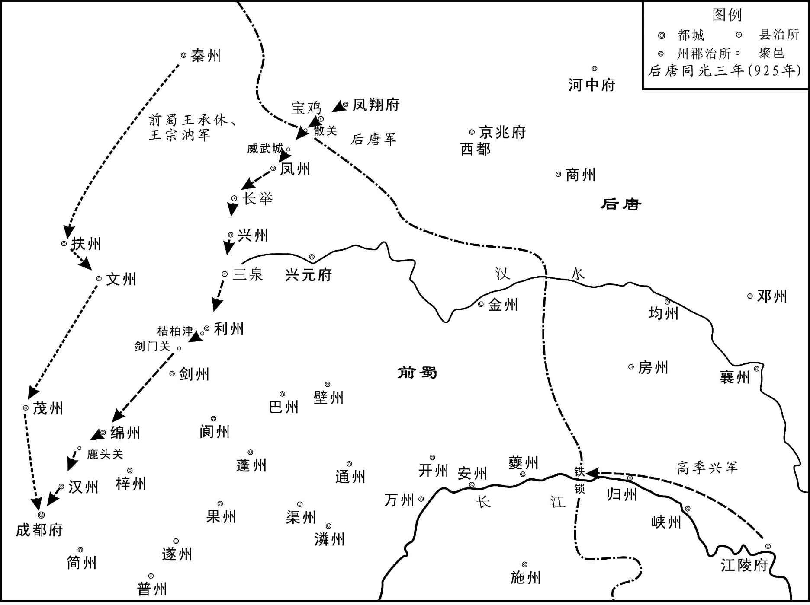 
后唐灭前蜀示意图

## 【原文】

**高季兴闻蜀亡，方食，失匕箸，曰：“是老夫之过也[1]。”梁震曰：“不足忧也[2]。唐主得蜀益骄，亡无日矣，安知其不为吾福！”**

## 【注文】

[1]匕箸（zhù）：汤勺和筷子。　　是老夫之过：同光元年（923年）高季兴入朝时，后唐庄宗问他，想用兵于吴、蜀，应以哪国为先。他认为蜀道艰险，难以攻取，故意建议先伐前蜀。此时前蜀已亡，后唐对他形成威胁，故云是自己的过失。

[2]梁震：生卒年不详，邛州依政（今四川邛崃东南）人，唐末进士。后梁时，于归蜀途中被高季兴所留，不愿接受官职，只为宾客，成为高氏主要谋士。于高季兴死后，退居监利（今湖北监利），隐居终身。

## 【译文】

高季兴闻知前蜀灭亡时，正在吃饭，惊得掉了手中的勺筷，说：“这是老夫我的过错。”梁震说：“这不值得忧虑。唐主得到蜀国会更加骄横，灭亡也就没几天了，怎么能知道这不是我们的福分呢！”

## 【原文】

**楚王殷闻蜀亡，上表称：“臣已营衡麓之间为菟裘之地，愿上印绶，以保余龄[1]。”上优诏慰谕之[2]。**

## 【注文】

[1]楚王殷：即五代十国时楚国的建立者马殷。　　衡麓：衡山山麓。

菟（tú）裘：本春秋时鲁国邑名，在今山东泰安东南楼德镇。《左传》隐公十一年载：鲁隐公因其弟桓公年幼，暂摄君位。桓公成年，公子羽父请求杀掉桓公，隐公不允，说：我将要把君位交给他，已让人在菟裘营建房屋，准备在那里养老了。故后世以菟裘作为告老退隐之地的代称。　　余龄：余年，有生之年。

[2]优诏：褒美嘉奖的诏书。

## 【译文】

楚王马殷闻知前蜀灭亡，向后唐庄宗上表章说：“臣下我已经在衡山山麓中建造告老退隐的地方，愿交上楚王的印玺，来保全有生之年。”后唐庄宗用褒美嘉奖的诏书宽慰劝导了他。

## 【原文】

**十二月癸酉，王承休、王宗汭至成都，魏王继岌诘之曰：“居大镇，拥强兵，何以不拒战？”对曰：“畏大王神武。”曰：“然则何不降？”对曰：“王师不入境。”曰：“所俱入羌者几人？”对曰：“万二千人。”曰：“今归者几人？”对曰：“二千人。”曰：“可以偿万人之死矣。”皆斩之，并其子。**

## 【译文】

后唐庄宗同光三年（925年）十二月癸酉（十四日），王承休、王宗汭回到成都，魏王李继岌责问他们说：“你们身居大镇，拥有强兵，为什么不抵御迎战？”回答说：“畏惧大王的神勇威武。”又问他们：“那么为什么不投降？”回答说：“天子的大军没有进入我们的辖境之内。”又问他们：“你们一起进入羌人地区的有多少人？”回答说：“一万二千人。”再问他们：“现在回来的有多少人？”回答说：“二千人。”李继岌说：“可以用你们来抵偿那一万人的死了。”便全部斩杀了他们，连同他们的儿子。

## 【原文】

**闰十二月丁酉，诏蜀朝所署官四品以上降授有差，五品以下才地无取者悉纵归田里；其先降及有功者，委崇韬随事奖任[1]。又赐王衍诏，略曰：“固当裂土而封，必不薄人于险[2]。三辰在上，一言不欺[3]。”**

## 【注文】

[1]署：设置，任命。　　降授有差：降级授官，各有差别。　　才地无取者：才质无所取用的人。才地，才质。　　随事奖任：根据具体事情奖励任用。

[2]固：一定。　　裂土而封：割出土地，进行分封。　　薄人于险：把人逼迫到危险的境地。薄，逼迫。

[3]三辰：指日、月、星。

## 【译文】

后唐庄宗同光三年（925年）闰十二月丁酉（初九日），后唐庄宗下诏，对前蜀所任命的四品以上的官员，降级授官，各有差别，五品以下才质无所取用者，全部放归故里；那些率先向后唐投降以及有功劳的人，委托郭崇韬根据具体情况来奖励任用。又赐给王衍诏书，大致说：“一定会割出土地封授给你，决不会把人逼迫到危险的境地。日、月、星三辰在上，一句话也不欺骗你。”

## 【原文】

**明宗天成元年春正月庚申，魏王继岌遣李继曮、李严部送王衍及其宗族、百官数千人诣洛阳[1]。（三）［二月］乙巳，王衍至长安，有诏止之。**

## 【注文】

[1]部送：押送。

## 【译文】

后唐明宗天成元年（926年）春季正月庚申（初三日），魏王李继岌派遣李继曮、李严押送王衍及其宗族、百官数千人前往洛阳。二月乙巳（十七日），王衍到达长安，有诏书让他停留下来。

## 【原文】

**三月，伶人景进等言于帝曰：“魏王未至，康延孝初平，西南犹未安[1]。王衍族党不少，闻车驾东征，恐其为变，不若除之[2]。”帝乃遣中使向延嗣赍敕往诛之，敕曰：“王衍一行，并从杀戮[3]。”已印画，枢密使张居翰覆视，就殿柱揩去“行”字，改为“家”字，由是蜀百官及衍仆役获免者千余人[4]。延嗣至长安，尽杀衍宗族于秦川驿[5]。衍母徐氏且死，呼曰：“吾儿以一国迎降，不免族诛，信义俱弃，吾知汝行亦受祸矣[6]！”**

## 【注文】

[1]伶人：也称优伶、优人，古代指以乐舞谐戏为业的艺人。　　景进：籍贯及生卒年不详。庄宗李存勗时，为伶官之首，受宠居中用事，参与谋断军机国政。曾奉命掳魏州诸营军士妻女数千人以充后宫，激起魏州兵变。以谄媚官至银青光禄大夫、检校左散骑常侍兼御史大夫、上柱国。　　帝：指后唐庄宗李存勗。庄宗于此年四月被杀。　　康延孝：即李绍琛。灭蜀回师途中，闻郭崇韬、朱友谦被杀，惧祸及己身，遂拥众返蜀，自称西川节度使。后兵败被擒杀。

[2]车驾东征：指后唐庄宗东征邺都（魏州）。同光四年（926年）二月，效节指挥使赵在礼据邺都叛乱，后唐庄宗派大将李嗣源率侍卫亲军前往讨伐。而亲军临阵哗变，与邺都叛兵共拥李嗣源为主。庄宗闻李嗣源叛，准备率军东征邺都。

[3]赍（jī）敕：带着敕令。赍，携带。

[4]印画：盖印画押。　　张居翰（858—928年）：唐末五代时宦官。字德卿。唐昭宗时，为范阳军监军。天复（901—904年）时，朱全忠诛杀宦官，他赖卢龙节度使刘仁恭收留，得免一死。后随李存勗攻占潞州，任昭义监军。李存勗称帝后，与郭崇韬同为枢密使，却不恃势弄权。在后唐明宗即位后，求归田里。后卒于家。　　覆视：查看。

[5]秦川驿：驿站名。故址在今陕西西安。

[6]汝行：你们。指后唐庄宗等人。

## 【译文】

后唐明宗天成元年（926年）三月，伶人景进等人向后唐庄宗进言说：“魏王还没有回来，康延孝刚被平定，西南方面还没安定。王衍的亲族同党不少，听说天子准备率军东征，恐怕他们会发生变乱，不如除掉他们。”后唐庄宗于是派遣中使向延嗣带着敕令前去诛杀他们，敕令说：“王衍一行，一并诛戮。”已经盖上印玺画了押，枢密使张居翰查看时，就着殿堂的柱子擦去“行”字，改成了“家”字，因此前蜀的百官和王衍的仆役得以免死的有一千多人。向延嗣到达长安，在秦川驿把王衍的宗族全部杀死。王衍的母亲徐氏临死时呼叫说：“我的儿子率领一国出迎投降，还不免全族被杀，你们完全抛弃了信义，我知道你们也会遭受这种灾祸！”

## 【原文】

**夏六月，蜀百官至洛阳，永平节度使兼侍中马全曰：“国亡至此，生不如死[1]。”不食而卒。以平章事王锴等为诸州府刺史、少尹、判官、司马，亦有复归蜀者[2]。**

## 【注文】

[1]永平节度使：唐僖宗文德元年（888年）置，治邛州（治今四川邛崃）。领邛、蜀、黎、雅四州，约当今四川大雪山以东，岷江以西，甘洛、蒲江以北，小金、大邑以南地区。　　马全（？—926年）：事王建、王衍父子，官至永平军节度使，兼侍中。国亡后随百官至洛阳，绝食而死。

[2]少尹：官名。唐五代时府的长官称尹，其下设少尹二人，协助府尹治理府事。

## 【译文】

后唐明宗天成元年（926年）夏季六月，前蜀百官到达洛阳，永平节度使兼侍中马全说：“国家灭亡，到了这种地步，活着还不如死了。”便绝食而死。后唐任命前蜀的平章事王锴等人为各州府刺史、少尹、判官、司马，也有又回到蜀中的人。

## 【原文】

**三年夏六月，陕州行军司马王宗寿表请葬故蜀主王衍。秋七月乙巳，赠衍顺正公，以诸侯礼葬之。**

## 【译文】

后唐明宗天成三年（928年）夏季六月，陕州行军司马王宗寿向后唐明宗上表章请求安葬过去的蜀主王衍。秋季七月乙巳（初二日），追赠王衍为顺正公，用诸侯的礼仪安葬了他。

* * *

(1) “丙子”，《资治通鉴》同。考该月初一为戊戌，无丙子。据张敦仁《资治通鉴刊本识误》“：子”当作“午”。

(2) “诸军”，原文“军”字前脱一“诸”字。据中华书局《资治通鉴》点校本补。

(3) “北”，误。依中华书局《资治通鉴》点校本应作“比”。

(4) “居民”，误。依中华书局《资治通鉴》点校本当作“民居”。

# 附录：

## 后梁世系表

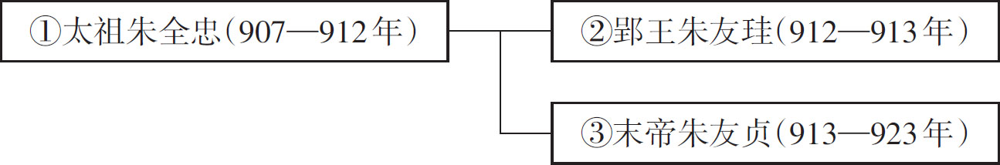 

## 后唐世系表

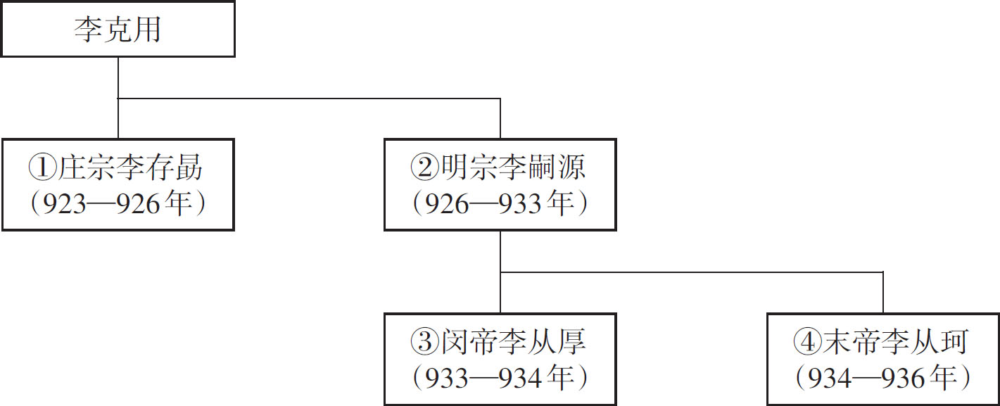 

## 五代十国时期楚国世系表

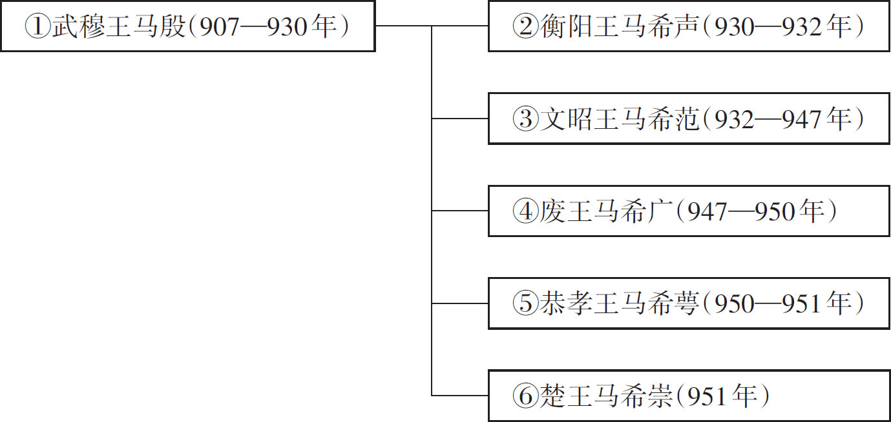 

## 五代十国时期前蜀世系表

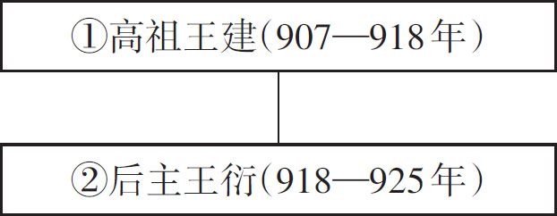 

## 五代十国时期后蜀世系表

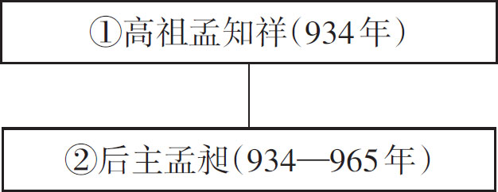

