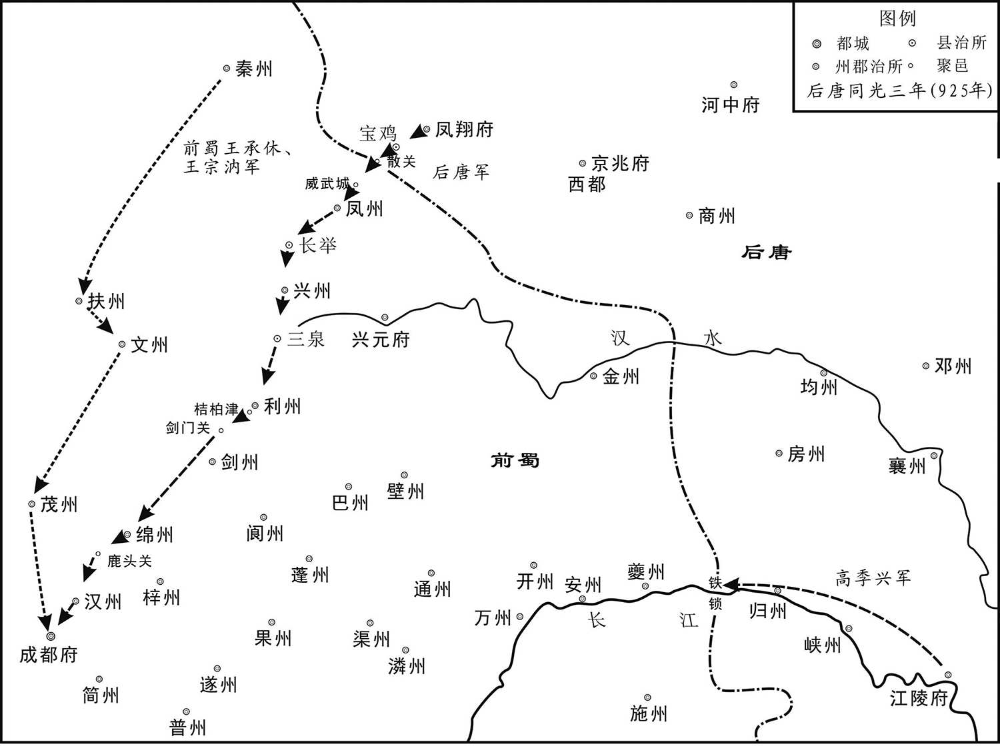
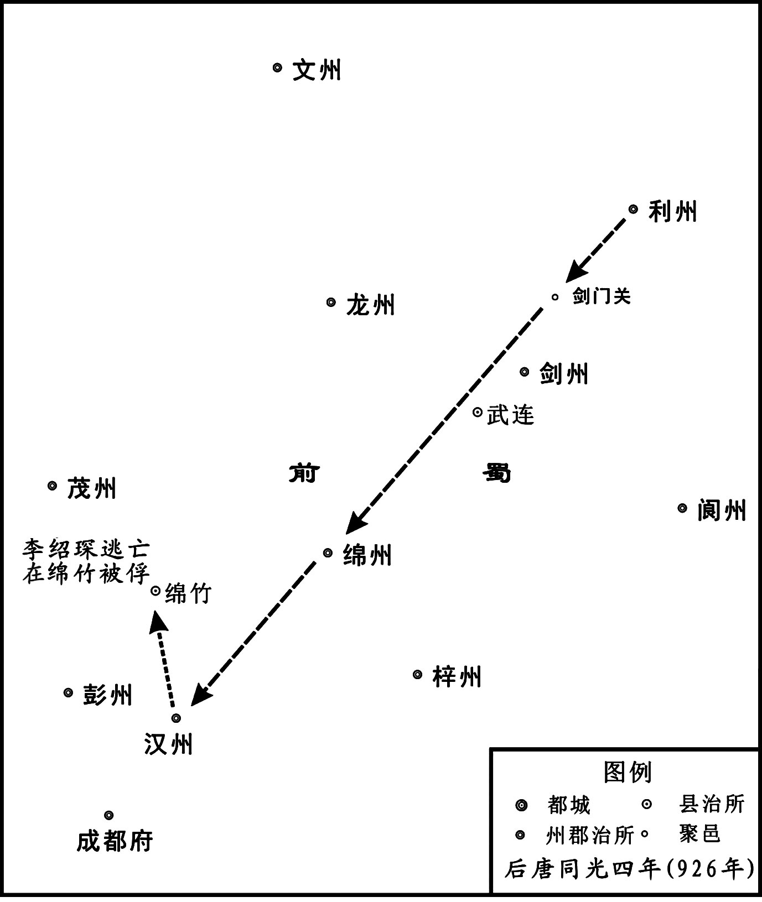
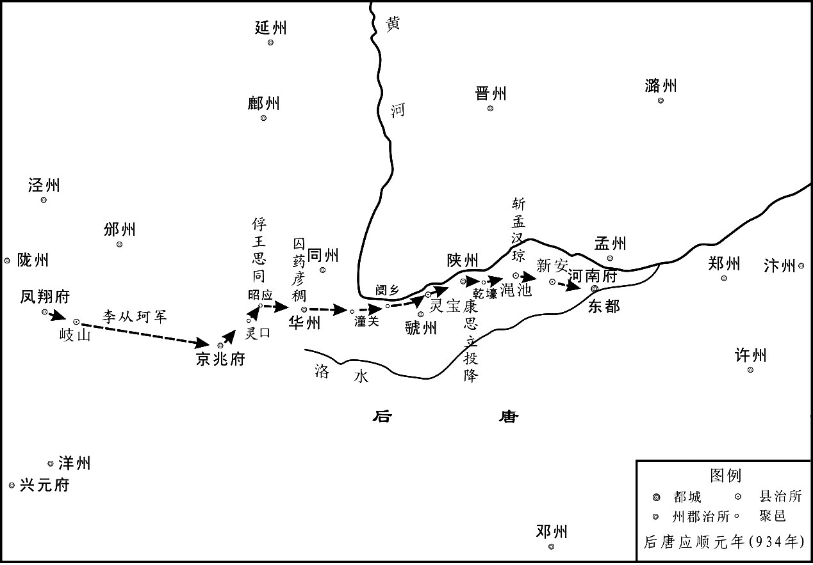
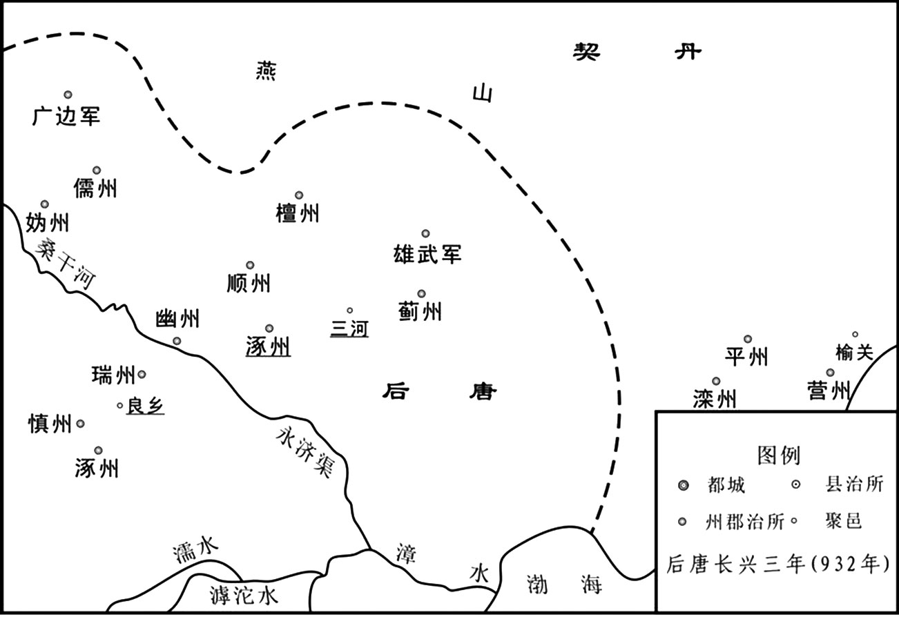
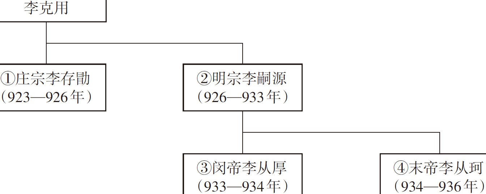
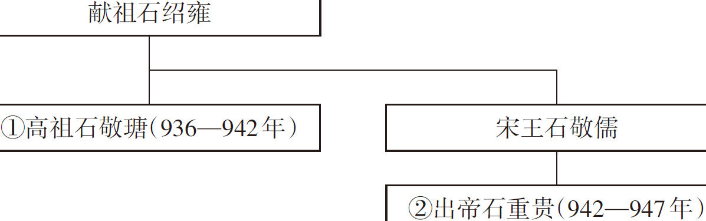

# 目录

邺都之变　李绍琛之叛附

安重诲专权

秦王之乱　两王篡弑附

契丹入寇

孟知祥据蜀

石晋篡唐

范杨之叛　范延光　杨光远

附录： 
后唐世系表

后晋世系表

返回总目录

# 邺都之变**  
****李绍琛之叛附**

## 【内容提要】

《邺都之变》主要记载了后唐权臣郭崇韬被杀，邺都（治贵乡，今河北大名东北）发生兵变，后唐明宗李嗣源取得帝位的历史过程。

后唐庄宗李存勖（xù）灭后梁后，宠信伶（líng）人和宦官。同光三年（925年），权臣郭崇韬随从魏王李继岌率军六万伐蜀。所过之处，势如破竹，蜀主王衍出降。灭蜀后，郭崇韬留成都处理善后事宜，因一向与宦官不睦，宦官李从袭、向延嗣等人趁机向庄宗李存勖进谗言，诬陷郭崇韬收受贿赂，滞蜀不归，有谋反之意。庄宗李存勖对郭崇韬产生了怀疑，在孟知祥出发后，又派衣甲库使马彦珪驰赴成都（今四川成都），观察郭崇韬的动静，如果发现郭崇韬确实拖延不归、跋（bá）扈（hù）专横，就让马彦珪和魏王李继岌谋划除掉他。但刘皇后擅自下令，令魏王李继岌杀郭崇韬于成都。此事导致上下离心，谣言纷起，后唐政局陷入混乱。

同光四年（926年）二月，魏博指挥使杨仁晸（zhěng）率部下由驻戍地瓦桥关（在今河北雄县南）返回魏州（即后唐邺都），因邺都空虚，怕这支部队到达后会叛乱，朝廷下令让杨仁晸部暂驻贝州（治清河，今河北清河），此举引起思家心切的士卒们的不满，他们趁机拥戴效节指挥使赵在礼占据邺都作乱。庄宗李存勖派遣归德军节度使李绍荣前往讨伐，久无成效。同时，在平蜀战役中功劳最大的李绍琛，因没有得到自己想要的西川节度使的职位，也在回师途中转向成都，自称西川节度使，发动了叛乱，后被董璋与任圜（yuán）率军俘获。各地叛乱接连发生，庄宗李存勖只好再派大将李嗣源率侍卫亲军前往讨伐。侍卫亲军指挥使郭从谦素以叔父礼事郭崇韬，对郭崇韬的被杀极为不满，遂在军中散布谣言，导致亲军临阵哗变，与邺都叛兵共拥李嗣源为主。李嗣源本无反意，但由于李绍荣派人向庄宗李存勖报告说李嗣源已经背叛，而且李绍荣占据卫州（治汲县，今河南汲县），切断了李嗣源与京城的联络，李嗣源迫不得已，在其婿石敬瑭的鼓动下，决意南下，谋夺帝位。郭从谦亦率禁军于洛阳城中攻杀庄宗李存勖。四月，李嗣源入洛阳称帝，是为后唐明宗。

## 【原文】

**后唐庄宗同光元年冬十月，帝遣使以灭梁告吴、蜀，二国皆惧[1]。吴扬州司马严可求笑曰：“闻唐主始得中原，志气骄满，御下无法，不出数年，将有内变[2]。吾但当卑辞厚礼，保境安民以待之耳[3]。”**

## 【注文】

[1]后唐（923—936年）：朝代名，五代王朝之一。公元923年，晋王李存勖称帝，国号“唐”，史称后唐，都洛阳（今河南洛阳），至公元936年为后晋所灭。共历四帝，十四年。　　庄宗：即李存勖（885—926年），李克用之子，沙陀部人。小名亚子，善于骑射，胆略超人。早年随父征战，于其父死后嗣位为晋王，攻灭幽州（治蓟〈jì〉县，今北京西南）刘守光，驱逐南下的契丹兵，并与朱温连年混战。公元923年称帝，建立后唐。不久，灭后梁，统一黄河流域。在位时亲信宦官、伶人，峻法厚敛，导致政治混乱。同光四年（926年），在兵变中被杀。庙号庄宗。　　同光：后唐庄宗李存勖年号，公元923年至926年。　　梁（907—923年）：即后梁，五代的第一个朝代。公元907年，朱温代唐称帝，国号“梁”，都开封（今河南开封），史称后梁。　　吴（902—937年）：五代时十国之一，杨行密所建，又称杨吴、南吴，都扬州（今江苏扬州）。吴天祚三年（937年），吴帝杨溥让位于权臣徐知诰，杨吴灭亡。　　蜀（907—925年）：即前蜀，五代时十国之一，王建所建，都成都（今四川成都）。

[2]扬州：州名。治江都（今江苏扬州），唐时领有江都、江阳、六合、海陵、高邮、扬子、天长七县，辖境相当于今江苏扬州、泰州、高邮、兴化、南京、六合、泰兴、海安、如皋（gāo）及安徽天长等地。　　司马：官职名，州、郡佐官。魏晋以后，刺史带将军开府者置为幕僚，协理州郡事务。　　严可求：生卒年不详，五代十国时南吴大臣，同州（治冯〈píng〉翊，今陕西大荔）人，少通敏，有心计。以徐温门客的身份为南吴太祖杨行密的幕僚，曾拥立杨渥（wò）、杨隆演。南吴顺义（921—927年）中，官拜尚书右仆射，兼同平章事。

[3]但当：只要，只是。

## 【译文】

后唐庄宗同光元年（923年）冬季十月，庄宗李存勖派遣使者出使吴、蜀二国，向他们通报了灭掉后梁的事情，二国十分恐惧。吴国的扬州司马严可求笑着说：“听说唐主刚刚得到中原，就骄傲自满，统御部下不得其法，用不了几年，就会发生内乱。我们现在只要以谦卑的言辞恭维他，以优厚的礼物馈赠他，保境安民，等待时机就可以了。”

## 【原文】

**滑州留后李绍钦因伶人景进纳货于宫掖，除泰宁节度使[1]。帝幼善音律，故伶人多有宠，常侍左右。帝或时自敷粉墨，与优人共戏于庭，以悦刘夫人，优名谓之“李天下”[2]。尝因为优，自呼曰“李天下，李天下”，优人敬新磨遽前批其颊[3]。帝失色，群优亦骇愕，新磨徐曰：“理天下者只有一人，尚谁呼邪[4]！”帝悦，厚赐之。诸伶出入宫掖，侮弄搢绅，群臣愤嫉，莫敢出气[5]。亦有反相附托以希恩泽者，四方藩镇争以货赂结之[6]。其尤蠧政害人者，景进为之首[7]。进好采闾阎鄙细事闻于上，上亦欲知外间事，遂委进以耳目[8]。进每奏事，常屏左右问之，由是进得施其谗慝，干预政事[9]。自将相大臣皆惮之[10]。**

## 【注文】

[1]滑州：州名。隋时所置，治滑县（今河南安阳）。唐时移治白马（今河南滑县东旧滑县），领有白马、卫南、韦城、匡城、胙（zuò）城、酸枣、灵昌七县，辖境相当于今河南滑县、延津、长垣等地，五代后辖境渐缩。　　留后：官职名，唐五代时期节度使、观察使缺位时的代理官职。　　李绍钦：即段凝（？—928年），初名明远，开封（今河南开封）人，事朱温受宠。后梁太祖开平三年（909年），授右威卫大将军，充左军巡使兼水北巡检使。后降后唐庄宗李存勖，授华州兵马留后，赐姓名李绍钦。后唐明宗李嗣源即位，被放归田里，不久赐死于辽州（治辽山，今山西左权）。　　伶（líng）人：也称优伶、优人，古代指以乐舞谐（xié）戏为业的艺人。　　景进：五代时后唐伶人，生卒年不详。庄宗李存勖时，封为伶官之首。后官至银青光禄大夫、检校左散骑常侍兼御史大夫、上柱国。　　宫掖（yè）：宫廷，皇宫。掖，掖廷，宫中的旁舍，妃嫔居住的地方。　　除：任命官职。　　泰宁节度使：方镇名，亦称兖海节度使。唐宪宗元和十四年（819年）分淄青节度使置，治兖州（治瑕〈xiá〉丘，今山东兖州东北），领兖、海（治朐〈qú〉山，今江苏连云港）、沂（治临沂，今山东临沂）、密（治诸城，今山东诸城）四州。五代时领兖、沂、密三州。节度使，官职名。唐代开始设立的地方军政长官，因受职之时，朝廷赐以旌节，故称节度使。集军事、民政、财政于一身，也称作节镇。

[2]刘夫人（？—926年）：后唐庄宗李存勖的宠妃，魏州成安（今河北大名东北）人，出身贫寒。同光二年（924年）立为皇后，贪婪且吝啬。天成元年（926年），庄宗死后，被后唐明宗李嗣源派人杀死。

[3]敬新磨：生卒年不详。后唐庄宗李存勖宠爱的优伶之一，善演杂戏，言语机智诙谐。　　遽（jù）：立刻，马上。　　批：用手掌打。　　颊（jiá）：脸的两侧。

[4]骇（hài）愕（è）：惊讶，惊愕。　　徐：慢慢地，缓缓地。　　尚谁呼邪：宾语前置，以示强调，即“尚呼谁邪”，还喊谁呢？

[5]搢（jìn）绅：亦作缙绅，指有官职或做过官的人。

[6]附托：依附，依靠。　　　希：希求。　　　藩镇：即军镇，亦称方镇、节镇。

[7]蠧（dù）：损害。

[8]闾（lǘ）阎（yán）：多借指里巷或民间。闾，泛指门户、人家，中国古代以二十五家为闾。阎，指里巷的门。

[9]屏（bǐng）：使……退下。　　左右：身边跟随的人。　　谗慝（tè）：指进谗言陷害别人。谗，谗言；慝，奸邪，邪恶。

[10]惮（dàn）：害怕，畏惧。

## 【译文】

滑州留后李绍钦通过庄宗所宠爱的伶人景进贿赂宫中，被任命为泰宁节度使。后唐庄宗李存勖从小喜爱音乐，所以伶人大多受到宠爱，常常跟随庄宗，侍奉在他的左右。庄宗有时也亲自粉墨登场，在宫中与伶人共同演戏，以讨刘夫人的欢心，他的艺名叫作“李天下”。有一次，庄宗又登台演戏，自己叫了两声“李天下”，优人敬新磨立刻走上前打了他一个耳光。庄宗变了脸色，其他伶人也都吓呆了。敬新磨缓缓地解释说：“治理天下的只有一个人，你还叫谁呢？”庄宗听了之后，转怒为喜，赏赐给他很多东西。伶人随意出入宫禁，狎（xiá）侮戏弄朝臣，大臣都非常愤恨，但是没有人敢站出来说话。也有的朝臣为了求得恩赏和提拔，反而依附于伶人，四方的藩镇将领争着贿赂、结交他们。伶人之中，特别能损坏政令、陷害别人的就是景进。景进喜欢搜集民间的琐碎细事告诉庄宗，而庄宗也很想知道宫外的事情，于是就以景进作为自己的耳目。每次景进来汇报情况，庄宗常常让身边其他人退下，单独询问景进。这样，景进就有机会向庄宗进谗言，施展伎（jì）俩陷害别人，干预朝政。于是，朝中大小将领、臣僚都很害怕景进。

## 【原文】

**荆南节度使高季兴在洛阳，帝左右伶宦求货无厌，季兴忿之[1]。归谓将佐曰：“新朝百战方得河南，乃对功臣举手，云‘吾于十指上得天下’，矜伐如此，则他人无功矣，其谁不解体[2]！又荒于禽色，何能长久[3]？吾无忧矣。”**

## 【注文】

[1]荆南节度使：方镇名。唐肃宗至德三载（758年）置，治荆州（后升江陵府，治江陵，今湖北江陵）。辖境时有变动，较长期辖有相当于今湖北江陵、石首等以西，四川丰都、垫江以东的长江流域和湖南洞庭湖以西地区。唐昭宣帝天祐二年（905年）为朱全忠所并，仍以高季兴为节度使。五代时建为南平国，又称为荆南国。　　高季兴（858—929年）：五代十国时南平国的创建者。字贻孙，陕州峡石（今河南三门峡东南）人。曾经给富人家作僮仆，后随其主人为朱温部将。朱温即帝位后，被任命为荆南节度使。后唐庄宗同光二年（924年），被后唐封为南平王。后唐明宗天成三年（928年）卒，谥武信。　　洛阳：地名，即今河南洛阳，当时为后唐都城。

[2]河：指黄河。　　矜（jīn）伐：自以为有功劳而夸耀。矜，骄傲，自夸；伐，自夸。

[3]禽：鸟兽。

## 【译文】

荆南节度使高季兴在洛阳的时候，庄宗身边的伶人、宦官索求财物贪得无厌，高季兴非常愤恨。回到荆南后，他对自己的部下说：“新建立的王朝经历无数次战斗，才据有了中原，而皇上却举起手来对功臣们说：‘我靠十个指头得到了天下！’如此骄功自傲，无视别人的功劳，这样怎么能不离心解体呢？而且，庄宗又沉湎（miǎn）于鸟兽、女色，这样怎么会长久呢？我没有什么可忧虑的了。”

## 【原文】

**二年春正月，敕内官不应居外，应前朝内官及诸道监军并私家先所蓄者，不以贵贱，并遣诣阙[1]。时在上左右者已五百人，至是殆及千人，皆给赡优厚，委之事任，以为腹心[2]。内诸司使，自天祐以来，以士人代之，至是复用宦者，浸干政事[3]。既而复置诸道监军，节度使出征或留阙下，军府之政，皆监军决之，陵忽主帅，怙势争权，由是藩镇皆愤怒[4]。**

## 【注文】

[1]敕（chì）：帝王的诏书、命令。　　应前朝内官：所有前面朝代的宦官。应，所有，全部。　　道：方镇辖区名称，泛指各节度使辖区。　　监军：官职名。监督军队的官员，代表朝廷协理军务，督察将帅。汉武帝时置监军使者，隋末以御史监军事，唐玄宗时开始任用宦官为监军。中唐以后，宦官出监各地藩镇，与统帅分庭抗礼。　　蓄（xù）：蓄养。　　诣（yì）：到，至。　　阙（què）：本义为古代宫殿、祠庙或陵墓前的高台，指帝王所居住的地方。

[2]殆（dài）：大概，几乎，将近。　　给赡（shàn）：供给。

[3]内诸司使：宫廷使职。唐代以来，在内廷设立教坊、御食、礼宾等司，负责处理皇宫内部事务。各司长官称使，副长官称副使。因各司使一般由宦官充任，所以统称作内诸司使。　　天祐：唐昭宗年号，公元904年开始使用，唐昭宣帝即位后沿用至907年。朱温代唐建立后梁后，仍有晋王李存勖及南吴杨渥、杨隆演等政权沿用。　　浸：逐渐，渐渐。

[4]陵忽：欺凌轻慢。　　怙（hù）：依靠，仗恃。

## 【译文】

后唐庄宗同光二年（924年）春季正月，后唐庄宗下令：宦官不应该留居在外面，凡是前朝的宦官以及原任各道监军的宦官，或是被私人所蓄养的宦官，不论贵贱，都要遣送到宫廷。当时庄宗身边已有宦官五百多人，又增加了这些从各地遣送回来的，宦官人数接近千人。庄宗都给他们优厚的待遇，委任他们处理各种事务，把他们当作心腹之人。自从唐昭宗天祐年间以来，宫中各司负责官员都已改用士人来担任，这时，又重新任用宦官，于是，他们渐渐干预国家朝政。不久，庄宗又重新委任宦官担任各道监军，每当节度使率军出征或留在京城时，军府的政事，都由监军来决定，各道的监军宦官往往凌驾于主帅之上，依仗势力与将领争权，因此，藩镇将帅都非常愤恨他们。

## 【原文】

**二月己巳朔，上祀南郊，大赦[1]。租庸副使孔谦欲聚敛以求媚，凡赦文所蠲者，谦复征之[2]。自是每有诏令，人皆不信，百姓愁怨。**

## 【注文】

[1]己巳：是该年农历二月初一日的干支名称，古人常使用干支名称纪年、纪日、纪时。　　朔（shuò）：农历每月初一。　　祀南郊：指帝王的祭天大典。南郊，都邑南面的地区，古代天子在京都南面的郊外筑圜（yuán）丘以祭天。

[2]租庸副使：官职名，为中央主管财政的长官租庸使之副。租庸使，官职名，五代后梁、后唐时，为中央财政长官，可不通过节度使直接发符，征调州县赋税，后唐明宗时废。　　孔谦（？—926年）：魏州（治贵乡，今河北大名东北）人。初为小吏，后唐庄宗时任租庸副使、租庸使，善于聚敛钱财，明宗李嗣源即位后被处死。　　蠲（juān）：除去，免除。

## 【译文】

后唐庄宗同光二年（924年）二月己巳朔（初一日），庄宗李存勖举行了祭天大典，并大赦天下。租庸副使孔谦想多征赋税，以此取悦庄宗，凡是赦文中规定可以免除的赋税，孔谦又重新征收。从此，庄宗下达的诏书、命令，下面的人都不相信，老百姓愁苦怨恨。

## 【原文】

**郭崇韬初至汴、洛，颇受藩镇馈遗，所亲或谏之，崇韬曰：“吾位兼将相，禄赐巨万，岂籍外财[1]！但以伪梁之季，贿赂成风，今河南藩镇皆梁之旧臣，主上之仇雠也，若拒其意，能无惧乎[2]？吾特为国家藏之私室耳。”及将祀南郊，崇韬首献劳军钱十万缗[3]。先是，宦官劝帝分天下财赋为内外府，州县上供者入外府，充经费，方镇贡献者入内府，充宴游及给赐左右。于是外府常虚竭无余而内府山积。及有司办郊祀，乏劳军钱，崇韬言于上曰：“臣已倾家所有以助大礼，愿陛下亦出内府之财以赐有司。”上默然久之，曰：“吾晋阳自有储积，可令租庸辇取以相助[4]。”于是取李继韬私第金帛数十万以益之，军士皆不满望，始怨恨，有离心矣[5]。**

## 【注文】

[1]郭崇韬（？—926年）：后唐名将、谋臣。字安时，代州雁门（今山西代县）人。初为唐朝昭义节度使李克修亲信，后归河东晋王李克用，能随机应对。李存勖嗣晋王，任为中门使，参与机要。后唐建立，以功授侍中、成德节度使，封赵郡公。同光三年（925年）任招讨使，随魏王李继岌伐前蜀，总管军政，七十日灭蜀。但因一直讨厌宦官，遂遭其诬陷，同光四年（926年）正月在蜀被杀。　　汴：即汴梁，今河南开封。　　洛：即洛阳，今河南洛阳。　　馈（kuì）遗（wèi）：馈赠。　　谏（jiàn）：旧时称规劝君主或尊长，使改正错误。　　籍（jiè）：通“藉”，借助。

[2]仇雠（chóu）：仇敌。

[3]缗（mín）：原义为古代穿铜钱用的绳子，后常用为钱币计量单位，一缗为一千文。

[4]晋阳：县名，治所在今山西太原。　　辇（niǎn）：运输，运送，载运。

[5]李继韬（？—923年）：昭义节度使李嗣昭次子，汾州太谷（今山西太谷）人。小字留得，少时骄狯（kuài）无赖。922年，李嗣昭死后，李继韬令军士劫持自己为留后，后叛附后梁。后唐庄宗同光元年（923年），被庄宗李存勖杀死。　　私第：旧时指官员私人所置的住所。第，规模较大的住宅，本指古代按一定品级为王侯功臣建造的大宅院，后通称上等房屋为第。　　帛（bó）：丝织品的总称。

## 【译文】

郭崇韬初到汴梁、洛阳，藩镇将领纷纷贿赂他，他则来者不拒，全部收下，手下的亲信中有人劝谏他，郭崇韬说：“我身兼将相，俸禄、赏赐多达巨万，难道还贪图外财？只是考虑到伪梁后期，朝政腐败，贿赂成风，今黄河以南一带的藩镇都是后梁的旧臣，当今皇上的仇敌，我若拒绝，他们能不恐惧吗？我这样做只是暂时替国家将财物收藏在我这儿罢了。”等到将要在南郊举行祭天大典的时候，郭崇韬带头捐献出十万缗钱，作为犒（kào）赏军士的费用。从前，宦官劝庄宗李存勖把天下进献来的财赋分开，由内府和外府分别管理，由州县缴纳的归入外府，作为国家财政经费；由藩镇将领贡献上来的则归入内府，专门用于皇上宴会、游乐以及赏赐亲近。于是，外府钱财往往花得精光，没有富余，而内府的钱财却堆积如山。等到筹备郊祀大典时，缺少犒赏军士的费用，郭崇韬对庄宗说：“我已经拿出了所有的家财资助典礼，希望您也拿出内府的钱财，交给负责筹备典礼的官员使用。”庄宗沉默了好长时间，说：“我在晋阳有自己的储积，可以叫租庸使去运来，以资助大典。”于是，派人到晋阳反臣李继韬的府第，取了数十万金银绸缎，增加为典礼费用。赏赐的数额没有达到军士的期望，士卒开始心生怨恨，有了背离的念头。

## 【原文】

**郭崇韬身兼将相，复领节旄，以天下为己任，旦夕车马填门[1]。性刚急，遇事辄发，嬖幸侥求，多所摧抑，宦官疾之，朝夕短之于上[2]。崇韬扼腕，欲制之不能[3]。豆卢革、韦说尝问之曰：“汾阳王本太原人徙华阴，公世家雁门，岂其枝派邪[4]？”崇韬因曰：“遭乱亡，失谱谍，尝闻先人言，上距汾阳四世耳[5]。”革曰：“然则固从祖也[6]。”崇韬由是以膏粱自处，多甄别流品，引拔浮华，鄙弃勋旧[7]。有求官者，崇韬曰：“深知公功能，然门第寒素，不敢相用，恐为名流所嗤。”由是嬖幸疾之于内，勋旧怨之于外。崇韬屡请以枢密使让李绍宏，上不许[8]。又请分枢密院事归内诸司以轻其权，而宦官谤之不已[9]。崇韬郁郁不得志，与所亲谋赴本镇以避之，其人曰：“不可。蛟龙失水，蝼蚁足以制之。”先是，上欲以刘夫人为皇后，而有正妃韩夫人在，太后素恶刘夫人，崇韬亦屡谏，上以是不果[10]。于是，所亲说崇韬曰：“公若请立刘夫人为皇后，上必喜[11]。内有皇后之助，则伶宦辈不能为患矣。”崇韬从之，与宰相帅百官共奏刘夫人宜正位中宫[12]。癸未，立魏国夫人刘氏为皇后[13]。皇后生于寒微，既贵，专务蓄财，其在魏州，至于薪苏果茹皆贩鬻之[14]。及为后，四方贡献皆分为二，一上天子，一上中宫。以是宝货山积，惟用写佛经，施尼师而已。是时皇太后诰，皇后教，与制敕交行于藩镇，奉之如一[15]。**

## 【注文】

[1]节旄（máo）：即旌节，原义为旌节上所缀的牦（máo）牛尾饰物，代指朝廷赋予的某种权力，此处指郭崇韬兼任成德军节度使。　　旦夕：早晨和晚上，即天天。

[2]辄（zhé）：总是，就。　　嬖（bì）幸：指受宠爱的人。　　摧抑：挫折压制。　　疾：恨。　　短：此处用作动词，指摘缺点，揭发过失。

[3]扼（è）腕：扼，用手掐住。用一只手握住另一只手的手腕，表示振奋、激愤或惋惜等情绪。

[4]豆卢革（？—927年）：籍贯不详。唐末战乱，避居中山等地，在太原王处直门下任掌书记。李存勖建立后唐，他以出身名门高第征拜行台左丞相。但他庸钝无实学，致使政事混乱，又不顾灾荒，怂恿庄宗李存勖专事聚敛。庄宗死后，屡被贬官为辰州刺史、费州司户参军。后唐明宗天成二年（927年），因事获罪被赐死。　　韦说（yuè）（？—927年）：福建观察使韦岫（xiù）之子。后唐庄宗平定河南，因豆卢革推荐，拜平章事。品性谨重，不造事端。当时郭崇韬秉政，韦说等人只是顺从郭崇韬而已。　　汾阳王：即唐朝名将郭子仪（697—781年），华州郑县（今陕西华县）人，祖籍山西汾阳。平定安史之乱后，升为中书令，封汾阳郡王。　　太原：府名。唐玄宗开元十一年（723年）改并（bīng）州置，治太原（今山西太原西南）。唐时领有太原、晋阳、太谷、文水、榆次、盂（yú）县、清源等十三县，辖境相当于今山西太原、榆次、阳泉三市及文水、阳曲、平定等县地。　　华阴：县名。西汉高帝八年（公元前199年）改宁秦邑置，治所在今陕西华阴东南。北魏孝文帝太和十一年（487年）移治今陕西大荔，隋炀帝大业五年（609年）移治今华阴县。　　雁门：县名，治所在今山西代县。

[5]谱谍：指家谱。谍，通“牒”。

[6]然则：然，这样。则，那么，就。与现代汉语“然则”作转折连词的意义不同。　　从祖：此处当指从祖祖父。

[7]膏粱：本义为肥肉和细粮。泛指肥美的食物，借指富贵人家子弟。

[8]枢密使：官职名。唐代宗永泰二年（766年）始置，以宦官担任，掌承受表奏，上呈皇帝。后渐参与军国大政，并设置枢密院。五代后梁太祖开平元年（907年），改枢密院为崇政院，枢密使为崇政院使，以朝官担任。后唐庄宗同光元年（923年），恢复枢密院及枢密使的称呼与建制。　　李绍宏（？—932年）：五代后唐宦官。本姓马，曾任中门使，权知幽州事。深得李存勖宠信，用为宣徽使。后唐庄宗末年，派他去魏州（治贵乡，今河北大名东北）秘密打探李嗣源有无野心，他反将实情告知李嗣源，使李嗣源萌生二心。李嗣源即位后，任命他为枢密使、骠骑大将军等职。

[9]枢密院：官署名。唐代宗永泰（765—766年）时始置，本在内廷，用宦官为枢密使，掌机要事务。五代后梁太祖开平元年（907年），改枢密院为崇政院。后唐庄宗同光元年（923）年，又改为枢密院。　　谤（bàng）：诽谤，捏造事实说别人坏话。

[10]韩夫人：生卒年不详。后唐庄宗李存勖的元妃，封卫国夫人。先在晋阳，庄宗建都洛阳之后迎至洛阳皇宫。同光二年（924年）册为淑妃。同光四年（926年），李嗣源即帝位，以先帝遗妃供养宫中，后移居太原。后唐灭亡后，被掳往契丹。　　太后：此处指后唐庄宗李存勖生母曹太后（？—925年），太原（今山西太原）人，为晋王李克用次妃，初封晋国夫人。唐僖宗光启元年（885年）生李存勖。后唐庄宗同光元年（923年），李存勖称帝，尊生母为太后，迎至洛阳皇宫。同光三年（925年）去世。　　恶（wù）：讨厌。

[11]说（shuì）：游说，劝说。

[12]帅：即“率”，率领，带领。

[13]魏国夫人：即刘夫人。

[14]魏州：州名。唐高祖武德四年（621年）改隋武阳郡置，治贵乡（今河北大名东北），领贵乡、昌乐、元城、莘（shēn）县、临黄、顿丘、魏县、冠氏、馆陶、武圣等县，辖境约相当于今河南濮（pú）阳、内黄、南乐、清丰、范县，河北魏县、大名、馆陶，山东莘县、冠县等地。后唐庄宗同光三年（925年）改为邺都，明宗天成四年（929年）复旧名魏州，不久又改为邺都。后晋高祖天福元年（936年）改为广晋府。　　薪苏果茹：柴草和果蔬。薪苏，柴火，柴草。果茹，瓜果蔬菜。　　鬻（yù）：卖。

[15]诰（gào）：后唐时，皇太后下达的命令称作“诰”。　　教：后唐时，皇后下达的命令称作“教”。　　制敕：皇帝的诏令。

## 【译文】

郭崇韬身兼枢密使和侍中二职，同时又是成德军节度使，以治理天下为自己的职责，从早到晚，车马盈门。但他性情刚直急躁，遇到自己不认可的事情，总是发脾气。那些在宫中受宠、希图求取官职的人，多数都因他的压制而达不到目的，宦官们非常恨他，天天在庄宗李存勖面前说他的坏话。郭崇韬面对这种情况却只有扼腕叹息，想制服宦官却又找不到办法。大臣豆卢革、韦说曾经问他：“汾阳王郭子仪本来是太原人，后来迁徙到华阴，您家世代都居住在雁门，难道是他的后代吗？”郭崇韬回答说：“遭遇世乱，家谱也丢失了，曾经听我父亲说起过，与汾阳王只相隔四代啊。”豆卢革说：“那么，汾阳王郭子仪就是您的伯叔祖父了。”从此，郭崇韬就以门第高贵自居，引荐、提拔官员时常常要看他的门第，往往任用浮躁无实才之人，而鄙弃那些有功劳的大臣。有人来求官职，郭崇韬对他说：“我知道你有功劳、有才能，但是你门第寒微，我不敢任用，恐怕会被名流们嗤笑。”于是，内有宫中的伶人、宦官们恨他，外有有功的臣僚们怨他。郭崇韬多次请求把枢密使的职位让给宦官李绍宏，庄宗就是不同意。他又请求把枢密院的事务转归宫内各司来负责，以削减自己手中的权力，但宦官们仍然不停地诽谤他。如此一来，郭崇韬郁郁不得志，就与他的亲信商议，打算到自己的节镇去，以逃避可能发生的祸患。这个亲信说：“不行。蛟龙如果离开了水，蝼蚁就可以控制他。”开始的时候，庄宗想立刘夫人为皇后，但因为有正妃韩夫人在，而且太后又非常讨厌刘夫人，郭崇韬又多次谏阻，庄宗就没有立刘夫人为皇后。这时，郭崇韬身边的亲信给他出主意说：“您若奏请立刘夫人为皇后，皇上必定会高兴。宫内有皇后相助，那伶人、宦官之辈就不会对您造成祸患了。”郭崇韬采纳了这个建议，和宰相一起率领朝中大臣共同上奏，说刘夫人应该立为皇后正位中宫。癸未，立魏国夫人刘氏为皇后。刘皇后出身寒微，富贵以后，专爱积聚财富，当她在魏州的时候，就贩卖柴草果菜赚钱。做了皇后以后，各地贡献来的财物都被分作两份，一份给皇帝，一份归皇后。这样，刘皇后拥有的钱物堆积如山，但她只用在抄写佛经、布施僧尼上。当时，皇太后下达的命令称作诰，皇后下达的命令称作教，都与皇帝颁布的政令一样，并行于各地藩镇，藩镇将领都要同等对待，一体执行。

## 【原文】

**勋臣畏伶宦之谗，皆不自安，蕃汉内外马步副总管李嗣源求解兵柄，帝不许[1]。**

## 【注文】

[1]蕃汉内外马步副总管：官职名，为后唐时全国军队的副统帅。蕃，指少数民族。李克用起自沙陀族，故其军中少数民族士兵较多。总管，官职名，隋及唐初于诸州设总管府，长官为总管，大州则设大总管，总领一州或数州军政事务，为地方高级军政长官。　　李嗣源（867—933年）：即后唐明宗，926年至933年在位。沙陀部人，原名邈（miǎo）吉烈，李克用养子。后唐明宗天成元年（926年），庄宗李存勖在兵变中被杀，李嗣源入洛阳监国，即位后改名李亶（dǎn）。长兴四年（933年）病卒，葬徽陵，庙号明宗。

## 【译文】

有功劳的大臣们都害怕伶人、宦官的谗言陷害，内心惴惴不安，蕃汉内外马步副总管李嗣源请求解除自己的兵权，庄宗李存勖不同意。

## 【原文】

**夏四月，孔谦贷民钱，使以贱估偿丝，屡檄州县督之[1]。翰林学士承旨、权知汴州卢质上言：“梁赵岩为租庸使，举贷诛敛，结怨于人[2]。今陛下革故鼎新，为人除害，而有司未改其所为，是赵岩复生也[3]。今春霜害桑，茧丝甚薄，但输正税，犹惧流移，况益以称贷，人何以堪[4]！臣惟事天子，不事租庸，敕旨未颁，省牒频下，愿早降明命[5]。”帝不报。**

## 【注文】

[1]檄（xí）：古代官府用以征召或声讨的文书。

[2]翰林学士承旨：翰林学士，官职名。唐太宗时始置，但未有名号。唐高宗时称“北门学士”。唐玄宗开元二十六年（738年），改称翰林供奉为翰林学士，选有文学的朝官充任，入直内廷，批答表疏，应和文章，并负责起草一些重要诏令。自唐宪宗时，又于翰林学士中选取资高望重者一人为承旨学士，参谋禁密，权任独重，并常常升任宰相。　　权：暂且，姑且。　　知：主管。　　汴州：州名。北周宣帝时改梁州置，治浚仪（今河南开封西北）。唐时徙治今开封，领有浚仪、开封、尉氏、陈留、封丘、雍丘六县，辖境相当于今河南开封、兰考、杞县、尉氏、通许等地。　　卢质（867—942年）：字子征，河南（今河南洛阳西郊）人。仕唐为芮（ruì）城令。后唐庄宗时，任户部尚书知制诰、翰林学士承旨。明宗天成四年（929年）进封开国公。后晋天福七年（942年）卒，赠太子太师，谥文忠。　　赵岩（？—923年）：唐末忠武节度使赵犫（chōu）次子，祖先为天水（今甘肃礼县东）人，原名霖，娶朱温之女长乐公主。累历近职，连典禁军。后梁末帝时任租庸使、守户部尚书。以勋戚自负，货赂公行，天下之贿，半入其门。后唐灭梁，逃奔许州（治长社，今河南许昌），被匡国节度使温韬所杀。　　诛敛：搜刮财货，横征暴敛。

[3]革故鼎新：指朝政变革或改朝换代。出自《周易》：“革，去故也；鼎，取新也。”

[4]流移：流亡和迁移。

[5]省牒：省，官署，衙门。牒，官府文书，证件。此处指租庸使下发的文书。

## 【译文】

后唐庄宗同光二年（924年）夏季四月，孔谦贷钱给百姓，用低价收购百姓丝的办法让百姓偿还贷款，屡次传下檄文让州县官吏督促。翰林学士承旨、代理汴州事务卢质上书说：“梁朝驸马赵岩担任租庸使时，以借贷搜刮百姓钱财，引起人民怨恨。现在皇上您革故鼎新，为百姓除去祸害，但是地方官吏却没有改变他们的做法，这就像是赵岩复生啊！今年春霜冻坏了桑树，茧丝产量很低，只交纳正税，还担心人们逃亡，更何况还要加上偿还贷款，百姓怎么能受得了呢？我们只负责为皇上办事，不是为租庸使办事，皇上的命令还没有下达，租庸使的文书却频频下发，希望皇上早日颁下明确的诏令。”庄宗李存勖对卢质的上书没有做出答复。

## 【原文】

**初，胡柳之役，伶人周匝为梁所得，帝每思之[1]。入汴之日，匝谒见于马前，帝甚喜[2]。匝涕泣言曰：“臣所以得生全者，皆梁教坊使陈俊、内园栽接使储德源之力也，愿就陛下乞二州以报之[3]。”帝许之。郭崇韬谏曰：“陛下所与共取天下者，皆英豪忠勇之士。今大功始就，封赏未及一人，而先以伶人为刺史，恐失天下心[4]。”以是不行。踰年，伶人屡以为言，帝谓崇韬曰：“吾已许周匝矣，使吾惭见此三人[5]。公言虽正，然当为我曲意行之[6]。”五月壬寅，以俊为景州刺史，德源为宪州刺史[7]。时亲军有从帝百战未得刺史者，莫不愤叹。**

## 【注文】

[1]胡柳之役：亦称胡柳陂之战。梁末帝贞明四年（918年），晋王李存勖率大军南下进攻后梁，与梁军在胡柳陂（今山东鄄〈juàn〉城西南）交战。晋军虽胜，但大将周德威父子阵亡，军士伤亡惨重。此战后，晋、梁两军形成长期对峙局面。　　周匝（zā）：伶人名，生卒年不详，为后唐庄宗李存勖宠爱的伶人之一。

[2]谒（yè）：拜见。

[3]教坊使：教坊，宫廷乐舞官署。教坊使，官职名，掌管教坊的官吏，一般由宦官担任。　　内园栽接使：官职名，相当于唐代后期设置的内园使，属宫廷使职，一般由宦官担任。其职掌可能为管理皇庄。

[4]刺史：官职名。始置于西汉，掌监察郡国。隋唐五代时期为一州的最高行政长官。

[5]踰（yú）年：过了一年。踰，越过，超过。

[6]曲意：委屈己意，常指委屈自己而满足别人的要求。

[7]景州：州名。唐德宗贞元二年（786年）置，治弓高（今河北阜城东北），唐末移治东光（今河北东光）。唐时领有弓高、东光、安陵三县，辖境相当于今河北东光及阜城东部地区。　　宪州：州名。唐昭宗龙纪元年（889年）置，治楼烦（今山西静乐西南娄烦）。唐时领有楼烦、玄池、天池三县，辖境相当于今山西娄烦及静乐部分地区。

## 【译文】

起初，在胡柳战役中，伶人周匝被后梁军队俘虏了，庄宗李存勖时常想念他。后唐军攻入汴梁的那天，周匝到庄宗的马前来拜见，庄宗很高兴。周匝哭着说：“臣之所以能保全性命，活到今日，全都是梁朝的教坊使陈俊和内园栽接使储德源的力量，请求皇上拿出两个州，封他们两个为刺史，以报答他们的恩德。”庄宗答应了。郭崇韬劝阻庄宗李存勖说：“与皇上一起征战夺取天下的，都是英雄豪杰、忠诚勇敢的人，现在大功刚刚告成，还一个人也没有封官赏赐，就先封没有功劳的伶人做刺史，恐怕会失去天下人心。”这件事因此没有付诸实行。过了一年，伶人多次向庄宗提起这件事，庄宗就对郭崇韬说：“我当时已经答应周匝了，承诺没有兑现，我见到这三个人感到很惭愧。你说得虽然非常正确，但是应当照顾我的情面，委曲己意，想办法落实这件事情。”同光二年（924年）到了五月壬寅（初五日），任命陈俊为景州刺史，储德源为宪州刺史。当时，庄宗李存勖的亲军中，有身经百战也没有得到刺史这等职位的人，都相当愤慨。

## 【原文】

**乙巳，右谏议大夫薛绍文上疏，以为：“今诸道僭窃者尚多，征伐之谋，未可遽息[1]。又，士卒久从征伐，赏给未丰，贫乏者多，宜以四方贡献及南郊羡余，更加颁赉[2]。又，河南诸军皆梁之精锐，恐僭窃之国潜以厚利诱之，宜加收抚[3]。又，户口流亡者，宜宽徭薄赋以安集之。又，土木不急之役，宜加裁省。又，请择隙地牧马，勿使践京畿民田[4]。”皆不从。**

## 【注文】

[1]谏议大夫：官职名，始置于秦代。唐代分置左右各四员，分隶门下省和中书省。专掌论议和侍从规谏。　　僭（jiàn）窃：超越本分，越分窃取。此处指地方藩镇割据势力不听后唐政令，各自为政。

[2]羡（xiàn）余：剩余。　　颁赉（lài）：赏赐，赏给。赉，赐予，给予。

[3]潜：暗地里，秘密地。

[4]京畿（jī）：国都及其附近地区。

## 【译文】

后唐庄宗同光二年（924年）五月乙巳（初八日），右谏议大夫薛绍文上疏说：“现在各地不听朝令、自立为政的还很多，征伐的谋略，不可以马上停止。其次，军士长期跟随皇上打仗，发放的奖赏不够充裕，很多士卒生活贫困，应当拿出四方贡献来的财物和祭天大典剩余的钱财，再赏赐给士兵。另外，黄河以南各路军队都是当时梁朝的精锐，恐怕那些有非分之想的藩镇以厚利引诱他们作乱，应该采取措施安抚他们。还有，对于战乱逃亡的百姓，应当减轻徭役和赋税，把他们召集回来，让他们安定地从事生产。不是特别急需的土木工程，应当取消。应该选择空闲的草地来牧马，不要践踏京城一带百姓的田地。”这些建议，庄宗李存勖都没有采纳。

## 【原文】

**六月壬辰，以天平节度使李嗣源为宣武节度使[1]。**

## 【注文】

[1]天平节度使：方镇名。唐宪宗元和十四年（819年）置郓（yùn）曹濮（pú）节度使，次年，号天平军。治郓州（治郓城，今山东郓城东），久领郓州、曹州（治济阴，今山东定陶西南）、濮州（治鄄〈juàn〉城，今山东鄄城北）等州，辖境约相当于今山东嘉祥、成武以西，郓城、东明以东，民权以北，东平以南地区。　　宣武节度使：方镇名。唐玄宗天宝十四载（755年）置，始称河南节度使，治汴州（治浚仪，今河南开封）。后经废置，唐代宗广德（763—764年）后称汴宋节度使。唐德宗建中二年（781年）号宣武军，治宋州（治宋城，今河南商丘南），后移治汴州，后梁时又还治宋州。后唐庄宗同光元年（923年）改名归德军。辖汴州、宋州、亳（bó）州（治谯〈qiáo〉县，今安徽亳州）、颍（yǐng）州（治汝阴，今安徽阜阳）四州，地处黄河、淮河之间，为关中通往东南地区的交通要道。

## 【译文】

后唐庄宗同光二年（924年）六月壬辰（二十五日），任命天平节度使李嗣源为宣武节度使。

## 【原文】

**秋八月癸酉，以副使、卫尉卿孔谦为租庸使，右威卫大将军孔循为副使[1]。循即赵殷衡也，梁亡，复其姓名。谦自是得行其志，重敛急征以充帝欲，民不聊生[2]。癸未，赐谦号“丰财赡国功臣”。**

## 【注文】

[1]卫尉卿：官职名，卫尉寺的长官。除宫门警卫外，还掌管仪卫军的兵械、仪仗、甲胄（zhòu）等事务。　　右威卫：官署名。隋时设左右领军府，掌管宿卫各军的籍账、差科、词讼等事务。唐时改为左右威卫，设上将军、大将军、将军、长史及诸曹参军等官职。五代沿袭。　　孔循（884—931年）：籍贯不详。少时流落汴州（治俊仪，今河南开封），为富人李让养子。因李让为朱温养子，所以随其姓朱。后得朱温家一乳母宠爱，又随其夫姓赵，名殷衡。朱温建后梁，用为租庸使。后唐明宗李嗣源入立，用为枢密使、东都留守，后出任忠武军节度使，徙镇横海。明宗长兴二年（931年）三月卒于镇。

[2]民不聊生：聊，依赖，凭借。老百姓无法生活下去，形容人民生活困难。

## 【译文】

后唐庄宗同光二年（924年）八月癸酉（初七日），任命租庸副使、卫尉卿孔谦为租庸使，右威卫大将军孔循为租庸副使。孔循就是赵殷衡，后梁灭亡后，恢复了他原来的姓名。从此，孔谦得以按照自己的意愿行事，他增加赋税，横征暴敛，以满足皇帝的欲望，致使老百姓无法生活下去。癸未（十七日），庄宗李存勖赐孔谦美号为“丰财赡国功臣”。

## 【原文】

**三年。初，李嗣源北征，过兴唐，东京库有供御细铠，嗣源牒副留守张宪取五百领，宪以军兴，不暇奏而给之[1]。帝怒曰：“宪不奉诏，擅以吾铠给嗣源，何意也？”罚宪俸一月，令自往军中取之。帝以义武节度使王都将入朝，欲辟毬场[2]。宪曰：“比以行宫阙廷为毬场，前年陛下即位于此，其坛不可毁，请辟毬场于宫西[3]。”数日未成，帝命毁即位坛。宪谓郭崇韬曰：“此坛，主上所以礼上帝，始受命之地也，若之何毁之[4]！”崇韬从容言于帝，帝立命两虞候毁之[5]。宪私于崇韬曰：“忘天背本，不祥莫大焉。”春二月庚辰，徙李嗣源为成德节度使[6]。帝性刚好胜，不欲权在臣下，入洛之后，信伶宦之谗，颇疏忌宿将[7]。李嗣源家在太原，三月丁酉，表卫州刺史李从珂为北京内牙马步都指挥使以便其家，帝怒曰：“嗣源握兵权，居大镇，军政在手，安得为其子奏请[8]。”乃黜从珂为突骑指挥使，帅数百人戍石门镇[9]。嗣源忧恐，上章申理，久之方解。辛丑，嗣源乞至东京朝觐，不许[10]。郭崇韬以嗣源功高位重，亦忌之，私谓人曰：“总管令公非久为人下者，皇家子弟皆不及也[11]。”密劝帝召之宿卫，罢其兵权，又劝帝除之，帝皆不从[12]。**

## 【注文】

[1]兴唐：即魏州，后唐庄宗同光元年（923年）升魏州为东京兴唐府，同光三年（925年）三月底，又恢复唐朝旧制，以洛阳为东都，兴唐府改称为邺都。　　供御：供给皇帝使用的。御，对帝王所作所为及所用物的敬称。　　留守：官职名。隋唐以后，皇帝出巡或亲征时指定亲王或大臣留守京城，得便宜行事，称京城留守；其陪京和行都也常设留守，以地方行政长官兼任，总理军民、钱谷、守卫等事务。　　张宪（？—926年）：晋阳（今山西太原）人，字允中，幼好读书，世为军校。后投附李存勖，曾任交城令、太原府司录参军、魏博镇推官、水部郎中、刑部侍郎、检校吏部尚书、东京副留守等职。后唐明宗天成元年（926年），因不肯降附明宗李嗣源，被杀。

[2]义武节度使：方镇名。唐德宗建中三年（782年）置，又称易定节度使。治定州（治安喜，今河北定州）。辖境屡变，久领易（治易县，今河北易县）、定二州，约相当于今河北太行山、曲阳、无极以东，涞水、容城、安国、深泽以西地区。　　王都（？—929年）：本名刘云郎，义武节度使王处直养子。921年，杀义父王处直自立，后归降后唐庄宗李存勖。天成四年（929年），被后唐明宗李嗣源所灭。　　毬场：即球场。毬，即“球”，古代一种游戏用的皮球。

[3]比：副词，近来。　　行宫：古代指京城以外供帝王出行时居住的宫室，也指帝王出京后临时寓居的官署或住宅。

[4]若之何：若，奈，怎么。为什么。

[5]虞（yú）候（hòu）：幕职名。唐五代时期或称“军候”。方镇皆置，为衙前之职，有左虞候、右虞候、马军虞候、步军虞候、衙前虞候等名目，随事立名，无定制。

[6]私：私下，暗地里。　　成德节度使：方镇名。又称恒冀（jì）节度使、镇冀节度使，为河北三镇之一。唐肃宗宝应元年（762年）置，治恒州（后改名镇州，治真定，今河北正定）。唐昭宣帝天祐二年（905年）更名武顺军。五代后唐时复名成德军。长期领有镇、冀（治信都，今河北冀州）、深（治陆泽，今河北深州）、赵（治平棘〈jí〉，今河北赵县）四州，辖境约相当于今河北武强、阜城、枣强以西，平山、井陉（xíng）、赞皇以东，临城、南宫以北，西北至阜平，东北抵安平、饶阳之地。

[7]疏忌（jì）：疏远猜忌。　　宿（sù）将：久历战阵的将领。

[8]卫州：州名。北周武帝宣政元年（578年）置，治朝歌（今河南淇〈qí〉县）。隋大业（605—617年）初改置汲（jí）郡，移治卫县（今淇县东）。唐太宗贞观元年（627年）移治汲县（今河南汲县）。唐时领有汲县、新乡、卫县、共城、黎阳五县，辖境相当于今河南新乡、淇县、浚县、辉县、汲县等地。　　李从珂（885—936年）：即后唐末帝，公元934至936年在位，年号清泰。镇州（治真定，今河北正定）人，本姓王，为后唐明宗李嗣源养子，赐姓名李从珂。随李嗣源征战，多立战功。李嗣源即位后，官至太尉、凤翔节度使，封潞王。应顺元年（934年），起兵废后唐闵帝李从厚，即帝位。清泰三年（936年），河东节度使石敬瑭称帝，攻入洛阳，李从珂与曹太后、刘皇后等人携传国玉玺（xǐ）登玄武楼自焚而死。　　北京内牙马步都指挥使：官职名，为后唐侍卫亲军统兵机构的长官。北京，后唐庄宗同光元年（923年）以镇州（治真定，即今河北正定）为真定府，建北京，称北都。十一月，改西京太原府为北京，称北都。后晋、后汉时沿袭，皆以太原为北都。内牙，即侍卫亲兵。指挥，五代时军队的编制单位，可能为军、厢级之下的军队编制。指挥使，军将名。晚唐五代时，藩镇皆置指挥使或都指挥使，为领兵将领之称号。据相关文献所载，五代时期之都指挥使，情况比较复杂，从中央到地方的各级军队中都有设置，其职级大体与唐代的都知兵马使相同。或为军事编制单位一都的统兵将领，或为某一方面尽统诸将的将领。

[9]黜（chù）：降职或罢免。　　突骑（jì）：军队名称，后唐侍卫亲军之一。　　戍（shù）：防守，守卫。　　石门镇：地名，即唐代时为防御回鹘（hú）而设立的横水栅，后唐改称石门镇。可能在今河北遵化西南南门镇。

[10]朝觐（jìn）：此处指臣子朝见帝王。

[11]总管令公：此处指李嗣源。令公是古代对中书令的尊称，唐末五代时期，武将多加中书令衔。李嗣源时为蕃汉内外马步副总管兼中书令，所以称其为总管令公。

[12]宿（sù）卫：保卫，守卫。宿，住宿，过夜，此处指军队的停留与驻扎。

## 【译文】

后唐庄宗同光三年（925年）。起初，李嗣源北征时，经过兴唐府，东京（即魏州）的武库中储藏有专门供给皇帝使用的精细铠甲，李嗣源发下文书给副留守张宪，要求领取五百套。张宪认为当时正准备打仗，军情紧急，没有上奏庄宗李存勖就发放给了李嗣源。庄宗知道后非常生气地说：“张宪没有接到我的诏令，就擅自把我的铠甲发给李嗣源，是什么用意？”于是，扣除张宪一个月的俸禄，还让他自己到李嗣源的军队中将铠甲取回。为了迎接义武节度使王都的朝觐，庄宗打算新建一个球场。张宪说：“近来要在行宫的门前修建球场，前年皇上在这儿即位，神坛不能毁掉，请皇上将球场建在行宫的西面。”过了好多天，行宫西面的球场还没有建成，庄宗就下令毁掉即位时修建的神坛，还是将球场建在行宫门前。张宪对郭崇韬说：“这个神坛，是皇上用来祭祀上天、接受天命的地方，怎么可以毁掉呢？”郭崇韬很和缓地拿这话来劝说庄宗，庄宗非但不听，反而立即命令两个虞候把神坛毁掉了。张宪私下里又对郭崇韬说：“忘弃天命，背离根本，是莫大的不祥啊！”二月庚辰（十七日），调李嗣源担任成德军节度使。庄宗性格刚毅，好胜心强，不愿意大权落入臣下手中，进入洛阳之后，听信伶人、宦官的谗言，很是疑忌那些久历战阵的将领，渐渐地就疏远了他们。李嗣源家在太原，三月丁酉（初五日），他上表请求将自己的养子李从珂由卫州刺史调任北京内牙马步都指挥使，以方便照顾家里。庄宗生气地说：“李嗣源手握兵权，身居大镇，军政大权集于一身，怎么还来为他的儿子求官？”于是，罢免了李从珂的卫州刺史职务，降为突骑指挥使，让他率领几百人去防守石门镇。李嗣源为此感到忧愁和恐慌，重新呈上奏疏解释这件事情，过了很久，这件事才算过去。三月辛丑（初九日），李嗣源请求到东都来朝见皇帝，庄宗不答应。郭崇韬因为李嗣源功劳大地位高，也对他心存顾忌，私下里对别人说：“总管令公可不是那种久居人下的人啊，皇家的子弟都比不过他呀。”背地里劝庄宗召李嗣源到京城来担任守卫，借此解除他手中的兵权，又劝庄宗除掉李嗣源，庄宗都没有听从。

## 【原文】

**洛阳宫殿宏邃，宦者欲上增广嫔御，诈言宫中夜见鬼物，上欲使符咒者攘之[1]。宦者曰：“臣昔逮事咸通、乾符天子，当是时，六宫贵贱不减万人[2]。今掖庭太半空虚，故鬼物游之耳。”上乃命宦者王允平、伶人景进采择民间女子，远至太原、幽、镇，以充后庭，不啻三千人，不问所从来[3]。上还自兴唐，载以牛车，累累盈路[4]。张宪奏：“诸营妇女亡逸者千余人，虑扈从诸军挟匿以行。”其实皆入宫矣。**

## 【注文】

[1]邃（suì）：深。　　嫔（pín）御：古代帝王、诸侯的侍妾与宫女。　　咒（zhòu）：某些宗教或巫术中的密语。　　攘（rǎng）：驱逐，排斥。

[2]逮（dài）：昔，从前。　　咸通、乾符天子：指唐懿宗和唐僖宗。咸通是唐懿宗年号，公元860年至874年。乾符是唐僖宗年号，公元874年至879年。

[3]幽：即幽州，州名。唐高祖武德元年（618年）改隋涿郡置，治蓟（jì）县（今北京西南）。唐时领有蓟县、幽都、广平、潞（lù）县、武清、永清等十县，辖境相当于今北京主城及所辖通州、房山、大兴，天津武清，河北永清、廊坊安次等地。　　镇：即镇州，州名。唐高祖武德四年（621年）改隋恒山郡设，原称恒州，元和十五年（820年）因避讳唐穆宗李恒之名改称镇州，治真定（今河北正定），领真定、藁（gǎo）城、石邑、行唐、九门、灵寿、行唐、井陉、鹿泉（后改名获鹿）、房山等县。辖境约相当于今河北石家庄市及所属各县市地。五代沿袭。　　不啻（chì）：不只，不止。

[4]还（huán）自：即自某地还，从某地返回。

## 【译文】

洛阳宫殿宏大深邃，宦官们想让庄宗增加妃嫔和宫女，就造谣说皇宫中夜晚有鬼物出现，庄宗李存勖想召术士画符念咒来驱除鬼物。宦官说：“我们过去侍候咸通天子和乾符天子，那时候，六宫中的妃嫔和宫女加起来不下万人，现在皇宫里大半是空屋子，没有人居住，所以才会有鬼物游荡其中呀。”庄宗李存勖于是派出宦官王允平和伶人景进去挑选民间女子，他们远到太原府、幽州和镇州等地，挑选女子来充实后宫，选来的美女不止三千人，也不问是从哪里来的。庄宗从兴唐府返回京城洛阳，用牛车拉着这些选来的女子，一辆接一辆地充塞于路上。张宪上奏说：“各营逃亡的女子有千余人，恐怕是侍卫皇上的军士将她们挟带跑了。”其实这些女子都被带回洛阳的宫中了。

## 【原文】

**庚辰，帝至洛阳，辛酉，诏复以洛阳为东都，兴唐府为邺都。**

## 【译文】

后唐庄宗同光三年（925年）三月庚辰（二十八日），后唐庄宗李存勖回到了洛阳，辛酉（二十九日），下诏恢复唐朝旧制，以洛阳为东都，而改称兴唐府为邺都。

## 【原文】

**夏六月，帝苦溽暑，于禁中择高凉之所，皆不称旨[1]。宦者因言：“臣见长安全盛时，大明、兴庆宫楼观以百数[2]。今日宅家曾无避暑之所，宫殿之盛曾不及当时公卿第舍耳[3]。”帝乃命宫苑使王允平别建一楼以清暑[4]。宦者曰：“郭崇韬常不伸眉，为孔谦论用度不足，恐陛下虽欲营缮，终不可得。”帝曰：“吾自用内府钱，无关经费。”然犹虑崇韬谏，遣中使语之曰：“今岁盛暑异常，朕昔在河上，与梁人相拒，行营卑湿，被甲乘马，亲当矢石，犹无此暑[5]。今居深宫之中而暑不可度，奈何？”对曰：“陛下昔在河上，勍敌未灭，深念仇耻，虽有盛暑，不介圣怀[6]。今外患已除，海内宾服，故虽珍台闲馆，犹觉郁蒸也。陛下傥不忘艰难之时，则暑气自消矣[7]。”帝默然。宦者曰：“崇韬之第，无异皇居，宜其不知至尊之热也[8]。”帝卒命允平营楼，日役万人，所费巨万[9]。崇韬谏曰：“今两河水、旱，军食不充，愿且息役，以俟丰年[10]。”帝不听。**

## 【注文】

[1]溽（rù）暑：暑湿之气，指盛夏。　　禁中：指帝王所居宫内，也称“禁内”。　　称（chèn）旨（zhǐ）：符合帝王心意。称，符合，相称。旨，帝王的意图。

[2]大明：宫名，即唐朝之东内，在陕西西安龙首山东麓，建于唐太宗贞观八年（634年），原名永安宫。　　兴庆宫：即唐朝之南内，位于唐代长安东门春明门内，原系唐玄宗登基前的藩邸。

[3]宅家：唐代宫中对皇帝的敬称。

[4]宫苑使：官职名。唐代始置，五代沿袭。一为武臣迁转之阶，无实职；一为掌皇宫内苑之事的实职官。此处当为后者。

[5]中使：指宦官使臣，也作内使。　　语（yù）：告诉，使知道。　　卑（bēi）湿：低下潮湿。　　被（pī）：同“披”，穿戴。　　矢（shǐ）石：箭和垒石，都是古时的军事器械。

[6]勍（qíng）敌：强大的敌人。

[7]傥（tǎng）：同“倘”，倘若，如果。

[8]宜：当然，无怪。

[9]卒：最终，终于，终究。

[10]俟（sì）：等待，等候。

## 【译文】

后唐庄宗同光三年（925年）夏季六月，庄宗李存勖苦于盛暑湿热，在宫中寻找地势高且凉爽的处所，没有找到符合心意的。宦官因而说：“臣见唐都长安最兴盛的时候，大明宫、兴庆宫中的楼观数以百计。今天皇上您连避暑的处所都没有，宫殿的规模还赶不上当时公卿的府第私舍呢！”于是，庄宗命令宫苑使王允平另建一楼来避暑。宦官又说：“郭崇韬常常皱着眉头，和孔谦讨论国家用度不足的问题，恐怕皇上您虽然想建楼，最终不可能建成。”庄宗说：“我用内府的钱来建，跟租庸经费没有关系。”但庄宗还是担心郭崇韬会劝阻，就派遣宦官去告诉郭崇韬说：“今年夏天特别热，我过去领兵驻扎在黄河边，与梁军对峙，军营低洼潮湿，我穿着铠甲骑着战马，亲自阻挡敌人的箭支和垒石，还没有这样热的暑天。今天我居住在深宫之中却热得无法忍受，怎么办？”郭崇韬说：“皇上您过去驻扎在河边，强敌没有消灭，心中只想要报仇雪耻，虽然天气很热，您也不放在心上。现在外患已经消除，海内豪强都已经归服，所以，虽然住在华丽舒适的台馆之中，仍然感到郁闷蒸热呀！倘若皇上不忘记从前艰难困苦的时刻，那么暑气自然就会消退了。”庄宗听了这话，默然不语。宦官说：“郭崇韬的府第，和皇宫没有什么差别，难怪他不知道皇上有多热！”庄宗最终还是下令让王允平建楼，每天役使工匠上万人，花费巨大。郭崇韬劝谏说：“现在黄河南北遭受水旱灾害，军食不足，希望您暂时停止营建，等到丰收之年再兴工。”庄宗李存勖不听。

## 【原文】

**秋七月甲午，成德节度使李嗣源表求入朝，帝不许。**

## 【译文】

后唐庄宗同光三年（925年）秋季七月甲午（初三日），成德节度使李嗣源上表请求入京朝见，庄宗不同意。

## 【原文】

**九月乙未，立皇子继岌为魏王[1]。**

## 【注文】

[1]继岌（jí）：即李继岌（？—926年），后唐庄宗李存勖长子。同光三年（925年）封魏王，与郭崇韬率军伐蜀。次年，奉刘皇后密令诛郭崇韬。班师至渭南，闻庄宗李存勖死于洛阳兵变，李嗣源已监国，其所部士卒溃散，李继岌无奈自杀。

## 【译文】

后唐庄宗同光三年（925年）九月乙未（初五日），立皇子李继岌为魏王。

## 【原文】

**丁酉，帝与宰相议伐蜀。庚子，以魏王继岌充西川四面行营都统，郭崇韬充东北面行营都招讨、制置等使，军事悉以委之[1]。**

## 【注文】

[1]西川：方镇名。唐肃宗至德二载（757年），将原来的剑南节度使分为剑南东川节度使和剑南西川节度使，剑南西川简称为西川，治成都府（今四川成都）。辖境屡有变动，长期领有成都府及彭（治九陇，今四川彭州）、蜀（治晋原，今四川崇州）、汉（治雒〈luò〉县，今四川广汉）、眉（治通义，今四川眉山）、嘉（治龙游，今四川乐山）、邛（qióng）（初治依政，今四川邛崃东南，后移治临邛，今四川邛崃）、简（治阳安，今四川简阳西北）、资（治盘石，今四川资中北）、茂（治汶〈wèn〉山，今四川茂县）、黎（治汉源，今四川汉源西北）、雅（治严道，今四川雅安）以西诸州，辖境约相当于今四川成都平原及其以北、以西和雅砻（lóng）江以东地区。　　行营都统：武职名。为讨伐藩镇叛乱与镇压农民起义，唐肃宗乾元元年（758年）置都统，或总管五道，或总管三道兵马。有某某地区诸道都统、某某行营都统等称呼，为临时性军事长官，事毕即罢。唐僖宗中和二年（882年），又置诸道行营都都统，统率各都统。　　都招讨：官职名，即都招讨使。招讨使一职，始置于唐德宗贞元（785—805年）间，前面常冠以所征讨的地区，如某某地区、某某方面等。一般为遇有战事时临时设置，常以大臣、将帅或节度使等地方军政长官兼任，掌镇压起义及招降讨叛，军中急事不及奏报，可便宜行事。遇有大的战事时，常置多名招讨使和都招讨使。　　制置等使：制置使，官职名。始设于唐宣宗大中五年（851年），掌用兵前后控制地方秩序，位在刺史之下。五代时期，制置使多以招讨使兼任，为地方临时性的军事长官。

## 【译文】

后唐庄宗同光三年（925年）九月丁酉（初七日），庄宗李存勖与宰相商议征讨蜀国。庚子（初十日），任命魏王李继岌为西川四面行营都统，郭崇韬为东北面行营都招讨使，兼制置使等职务，军中大事全部交由郭崇韬负责。

## 【原文】

**郭崇韬以北都留守孟知祥有荐引旧恩，将行，言于上曰：“孟知祥信厚有谋，若得西川而求帅，无踰此人者[1]。”又荐邺都副留守张宪谨重有识，可为相。戊申，大军西行。冬十一月乙卯，大军至成都，蜀主出降[2]。事见《庄宗灭蜀》。**

## 【注文】

[1]孟知祥（874—934年）：五代十国时后蜀建立者。字保胤（yìn），或作保裔（yì），邢州龙冈（今河北邢台）人。同光三年（925年），后唐灭前蜀，任成都尹、西川节度使。明宗长兴元年（930年），起兵反后唐，闵帝应顺元年（934年）称帝，建都成都。本年病卒，葬和陵，庙号高祖。　　荐引：即引荐，引进推荐。

[2]成都：府名。唐肃宗至德二载（757年）改蜀郡置，治成都（今四川成都）。唐时领有成都、华阳、新都、新繁、双流、广都等十县，辖境相当于今成都市的大部分。

## 【译文】

因为北都留守孟知祥对自己有引荐旧恩，郭崇韬在将要出征时对庄宗李存勖说：“孟知祥忠信厚重且有谋略，如果得到了西川而选择节帅，没有人比他更合适。”郭崇韬又推荐邺都副留守张宪，说他谨慎、稳重，且有见识，可以担任宰相。同光三年（925年）九月戊申（十八日），大军向西前进。冬季十一月乙卯（二十六日），郭崇韬大军进抵成都城下，蜀主王衍出城投降。这件事参见《庄宗灭蜀》。

## 【原文】

**平蜀之功，李绍琛为多，位在董璋上[1]。而璋素与郭崇韬善，崇韬数召璋与议军事[2]。绍琛心不平，谓璋曰：“吾有平蜀之功，公等朴樕相从，反呫嗫于郭公之门，谋相倾害[3]。吾为都将，独不能以军法斩公邪[4]！”璋诉于崇韬。十二月，崇韬表璋为东川节度使，解其军职[5]。绍琛愈怒曰：“吾冒白刃，陵险阻，定两川，璋乃坐有之邪[6]！”乃见崇韬言：“东川重地，任尚书有文武才，宜表为帅[7]。”崇韬怒曰：“绍琛反邪，何敢违吾节度[8]！”绍琛惧而退。**

## 【注文】

[1]李绍琛（？—926年）：即康延孝，代州（治雁门，今山西代县）人。初事后梁，以军功授右先锋指挥使。后投后唐，庄宗李存勖赐姓名李绍琛。在灭前蜀之战中立有大功，随魏王李继岌征蜀大军东还。因郭崇韬、朱友谦皆被诛杀，虑祸及己，遂谋叛，自称西川节度、三川制置等使，后被擒获。同光四年（926年），被杀死于凤翔。　　董璋（？—932年）：籍贯不详。初从朱温军中为列校，因功授泽州刺史，后归附李存勖。后唐庄宗同光三年（925年），为邠（bīn）州留后、行营右厢马步都虞候，随从宰相郭崇韬伐前蜀。平蜀后，因功封剑南东川节度副大使，知节度事。明宗长兴元年（930年），与西川节度使孟知祥连谋反叛。后疑孟知祥，率军攻西川，败回，被前陵州刺史王晖所杀。

[2]数（shuò）：多次。

[3]朴樕（sù）：小树，比喻平庸。　　呫（chè）嗫（niè）：附耳低语。

[4]都将：军中将领的头目。都，头目、首领。

[5]东川节度使：方镇名。唐肃宗至德二载（757年），将原来的剑南节度使分为剑南东川节度使和剑南西川节度使，剑南东川简称为东川，治梓（zǐ）州（治郪〈qī〉县，今四川三台）。辖境屡有变动，长期领有梓、遂（治方义，今四川遂宁）、绵（治巴西，今四川绵阳东）、普（治安岳，今四川安岳）、陵（治普宁，今四川仁寿东）、泸（治泸川，今四川泸州）、荣（初治公井，今四川自贡西，后移治旭川，今四川荣县）、剑（治普安，今四川剑阁）、龙（治江油，今四川绵阳平武东南）、昌（初治昌元，今重庆荣昌，后移治大足，今重庆大足）、渝（治巴县，今重庆巴南）、合（治石镜，今重庆合川）十二州，辖境约相当于今四川盆地中部涪（fú）江流域以西，沱（tuó）江下游流域以东，及剑阁、青川等地。

[6]陵：登上，越过。

[7]任尚书：即任圜（yuán）（？—927年），京兆三原（今陕西三原东北）人，明敏有才辩。后唐庄宗时任工部尚书兼真定尹，知镇州留守事。明宗李嗣源时，拜中书侍郎、同平章事，兼判三司，颇有建树。天成二年（927年），因直言得罪明宗，又为权臣安重诲所忌，遭诬杀。尚书，官职名，战国时始置。隋唐五代时期，尚书省六部长官俱称尚书，秩正三品。

[8]节度：调度，指挥。

## 【译文】

平定前蜀的战役，李绍琛功劳最大，其官位也在董璋之上。而董璋平素和郭崇韬关系十分密切，郭崇韬多次召董璋商议军事。李绍琛心中十分不平，对董璋说：“我有平定蜀地的功劳，你等平庸之人跟从我，现在反而到郭公门中背后嘀咕，盘算着压制、陷害我。我身为都将，难道不能用军法来杀你吗？”董璋将这些话告诉了郭崇韬。十二月，郭崇韬上表请求朝廷任命董璋为东川节度使，并解除董璋的军职（这样，李绍琛就无权用军法处置董璋了）。李绍琛更加生气了，说：“我冒着白刃，跨越险阻，平定了东川和西川，董璋反而坐享其成，成为东川节度使呀！”于是，李绍琛去见郭崇韬，说：“东川是军事重地，尚书任圜有文武之才，应当推荐他来担任东川的节帅。”郭崇韬发怒说：“李绍琛你要造反吗？怎么敢违抗我的调度！”李绍琛害怕地退下了。

 
后唐灭前蜀示意图

## 【原文】

**初，帝遣宦者李从袭等从魏王继岌伐蜀，继岌虽为都统，军中制置补署一出郭崇韬，崇韬终日决事，将吏宾客趋走盈庭，而都统府惟大将晨谒外，牙门索然，从袭等固耻之[1]。及破蜀，蜀之贵臣大将争以宝货、妓乐遗崇韬及其子廷诲，魏王所得，不过匹马、束帛、唾壶、麈柄而已，从袭等益不平[2]。**

## 【注文】

[1]李从袭（？—926年）：五代后唐宦官。后唐庄宗同光三年（925年），任西川行营都监，随魏王李继岌征伐前蜀。同光四年（926年）被李冲所杀。　　补署：补任官职。　　牙门：古代驻军时，将帅帐前树立牙旗作为军门，称作牙门。

[2]遗（wèi）：给予，馈赠。　　麈（zhǔ）柄：麈尾的柄，借指麈尾。麈尾是古人闲谈时执以驱虫、掸（dǎn）尘的工具。

## 【译文】

当初，庄宗派遣宦官李从袭等人跟随魏王李继岌讨伐蜀国，李继岌虽然身为行营都统，但军中的一切事务都由郭崇韬决定，郭崇韬整天处理军务，将士、官吏、宾客往来不绝，门庭若市，而李继岌的都统府除了早上大将们例行拜见以外，门庭冷落，李从袭等人对此本来就感到羞耻。等到灭掉了蜀国，蜀国的高官大将都争先恐后地把金银财宝、美女歌妓送给郭崇韬和他的儿子郭廷诲，魏王李继岌所得到的不过是一匹马、一束帛及唾壶、麈柄等不值钱的东西，李从袭等人更加愤愤不平了。

## 【原文】

**王宗弼之自为西川留后也，赂崇韬求为节度使，崇韬阳许之，既而久未得，乃帅蜀人列状见继岌，请留崇韬镇蜀[1]。从袭等因谓继岌曰：“郭公父子专横，今又使蜀人请己为帅，其志难测，王不可不为之备。”继岌谓崇韬曰：“主上倚侍中如山岳，不可离庙堂，岂肯弃元老于蛮夷之域乎[2]！且此非余之所敢知也，请诸人诣阙自陈[3]。”由是继岌与崇韬互相疑。**

## 【注文】

[1]王宗弼（？—925年）：五代十国时前蜀大将、齐王，前蜀开国君主王建养子，本名魏弘夫。后唐庄宗同光三年（925年），前蜀灭亡后，王宗弼被招讨使郭崇韬所杀。　　阳许：假装允许。阳通“佯”。

[2]侍中：官职名。秦朝始置，为丞相府属吏，因往来殿内奏事，故称侍中。西汉时仅作为朝廷官员的加官，无品秩。东汉以后地位趋于重要，多授予功臣、外戚及儒学名家，秩比二千石。唐时为门下省长官，正三品，掌封驳，即审议中书省起草的诏令，与中书省、尚书省长官共同参议军国大政，皆为宰相。唐中期以后，多作为朝中重臣及将帅的加官，以示优崇，而不真正掌宰相之权。　　山岳：高大的山。　　庙堂：太庙的明堂，是古代帝王祭祀、议事的地方。借指朝廷。

[3]陈：陈述，述说。

## 【译文】

王宗弼自称西川留后以后，便贿赂郭崇韬，请求朝廷任命他为节度使，郭崇韬表面上答应了他，但过了很久也没有结果，王宗弼便率领蜀中一部分人去拜见魏王李继岌，陈述了许多情由，请求留下郭崇韬镇守蜀地。李从袭等人乘机对李继岌说：“郭公父子任意妄为，专断强横，现在又指使蜀人请求以自己为蜀中之帅，他的志向难以猜测，大王您不能不做防备。”李继岌对郭崇韬说：“皇上倚重侍中您如同依赖高山，不会让您离开朝廷，又怎么肯将您这样的元老丢弃在这蛮夷之地呢？况且，这样的事情也不是我所应该知道的，请那些人前往都城亲自向皇上陈述吧。”李继岌和郭崇韬因此而互相猜疑。

## 【原文】

**丙子，以知北都留守事孟知祥为西川节度使、同平章事，促召赴洛阳[1]。帝议选北都留守，枢密承旨段徊等恶邺都留守张宪，不欲其在朝廷，皆曰：“北都非张宪不可[2]。宪虽有宰相器，今国家新得中原，宰相在天子目前，事有得失，可以改更，比之北都独系一方安危，不为重也。”乃徙宪为太原尹，知北都留守事[3]。以户部尚书王正言为兴唐尹，知邺都留守事[4]。正言昏耄，帝以武德使史彦琼为邺都监军[5]。彦琼，本伶人也，有宠于帝。魏、博等六州军旅金谷之政皆决于彦琼，威福自恣，陵忽将佐，自正言以下皆谄事之[6]。**

## 【注文】

[1]同平章事：官职名。同中书门下平章事的简称，是唐五代时期宰相的别名，初用于唐太宗时。自唐高宗永淳元年（682年）始，实际担任宰相者，或加以同中书门下平章事的名义。唐代宗大历（766—779年）以后，同平章事几乎成为宰相专称，五代亦如此。中书、门下二省本为政务中枢，同中书门下平章事即与中书、门下协商处理政务之意。藩镇节度使带此号者则称使相。

[2]枢密承旨：官职名，即枢密院承旨，掌承宣圣命。唐宣宗大中年间（847—860年）置，以枢密院吏员充任。五代时多以诸卫将军充任。后晋高祖石敬瑭时改为枢密院承宣。

[3]太原尹：太原府的府尹。尹，官职名，为唐五代时期首都及陪都行政长官。

[4]户部尚书：文职官名，正三品，掌全国疆土、田地、户籍、赋税、俸饷等财政事宜。户部为尚书省六部之一，三国时称度支，隋代改称民部，唐代以后称户部，其长官为尚书。　　王正言：五代后唐大臣，生卒年不详，郓州（治郓城，今山东郓城东）人。原为魏博镇判官，后唐庄宗时，历任户部尚书、兴唐尹、租庸使、礼部尚书等职。明宗时为平卢行军司马。后卒于任。

[5]昏耄（mào）：年老昏聩（kuì）。耄，年老。　　武德使：官职名。武德司的长官，为唐五代时期内诸司使之一，负责处理皇宫日常事务，常由皇帝的亲信宦官担任。　　史彦琼：生卒年不详。五代后唐庄宗时伶人，颇受庄宗宠爱，官武德使。

[6]魏、博等六州：指魏博节度使（即天雄节度使）所辖的魏州（治贵乡，今河北大名东北）、博州（治聊城，今山东聊城东北）、贝州（治清河，今河北清河）、卫州（治汲县，今河南汲县）、澶（chán）州（治顿丘，今河南清丰西南）、相州（治安阳，今河南安阳）六州。　　金谷：指钱财和粮食。　　恣（zì）：放纵，无拘束。　　谄（chǎn）：奉承，巴结。

## 【译文】

后唐庄宗同光三年（925年）十二月丙子（十七日），庄宗李存勖任命原负责北都留守事务的孟知祥为西川节度使、同平章事，催召他尽快到洛阳接受新职。庄宗与大臣商议北都留守一职人选，枢密承旨段徊等人厌恶邺都留守张宪，不愿意让张宪留在朝廷，都说：“北都非张宪不可。张宪虽然具有宰相的才干和器度，但现在国家刚刚得到了中原，宰相在天子的眼前，如果有什么事情出现失误，可以更改，这和北都关系到一方的安危相比，并不是重要的。”于是，庄宗调张宪为太原府尹，负责北都留守事务。以户部尚书王正言为兴唐府尹，负责邺都留守事务。王正言年老昏聩，庄宗又任命武德使史彦琼为邺都监军。史彦琼，本是宫中伶人，很得庄宗的宠爱。魏州、博州等六州的军事、财政等事务都由史彦琼决定，史彦琼大作威福，恣意妄为，欺凌军将和官员，自兴唐尹王正言以下官员都谄媚讨好他。

## 【原文】

**初，帝得魏州银枪效节都近八千人，以为亲军，皆勇悍无敌[1]。夹河之战，实赖其用，屡立殊功，常许以灭梁之日大加赏赉[2]。既而河南平，虽赏赉非一，而士卒恃功，骄恣无厌，更成怨望[3]。是岁大饥，民多流亡，租赋不充，道路涂潦，漕辇艰涩，东都仓廩空竭，无以给军士[4]。租庸使孔谦日于上东门外望诸州漕运，至者随以给之[5]。军士乏食，有雇妻、鬻子者，老弱采蔬于野，百十为群，往往馁死，流言怨嗟，而帝游畋不息[6]。己卯，猎于白沙，皇后、皇子、后宫毕从[7]。庚辰，宿伊阙，辛巳，宿潭泊，壬午，宿龛涧，癸未，还宫[8]。时大雪，吏卒有僵仆于道路者[9]。伊、汝间饥尤甚，卫兵所过，责其供饷，不得，则坏其什器，撤其室庐以为薪，甚于寇盗，县吏皆窜匿山谷[10]。**

## 【注文】

[1]银枪效节都：即银枪效节军，原是后梁魏州节度使杨师厚的亲军，李存勖灭后梁，将其收编为亲军。都，五代时牙兵（即亲兵）的番号，相当于今天的“军”。

[2]夹河之战：五代后梁与后唐之间的著名战役，开始于后梁末帝贞明三年（917年），结束于后唐庄宗同光元年（923年）。交战双方在杨刘、德胜、杨村三地夹黄河展开旷日持久的拉锯战，以后唐取胜、后梁灭亡而告终。夹河之战，前后历时六年，是五代时期持续时间最长、伤亡最大、争夺最为激烈的一次战役。　　赏赉（lài）：赏赐。

[3]非一：不止一次，多次。　　更（gēng）：改变，转变。　　怨望：怨恨，心怀不满。

[4]漕辇：指漕粮的运输。漕，即漕运，是我国古代一项重要的经济制度，指利用水道调运粮食到京师或其他指定地点。运送的粮食称作漕粮，主要是供宫廷消费、百官俸禄、军饷支付和灾荒之年的民食调剂。辇，用车运输、运送。漕粮的运输在水路不通处要辅以陆运，多用车载，故又合称“转漕”或“漕辇”。　　东都：指洛阳。后唐庄宗同光三年（925年）三月底，恢复唐朝旧制，以洛阳为东都，将原作为东京的兴唐府改称邺都。

[5]上东门：洛阳城东面三门之一。

[6]雇妻：即雇主支付雇金给女子的丈夫，在约定的期限之内，让该女子作为自己的临时妻子，到期再将女子送归其丈夫，雇金不收回。　　馁（něi）：饥饿。　　游畋（tián）：游玩打猎。

[7]白沙：地名，在今河南洛阳东。

[8]伊阙：县名。隋文帝开皇十八年（598年）改新城县置，因境内有伊阙山而得名。治所在今河南伊川西南古城寨。　　潭泊、龛（kān）涧：均为地名，在今河南洛阳南。

[9]仆（pū）：向前跌倒。

[10]伊：指伊水，古水名，今称伊河，发源于熊耳山南麓（lù）的栾（luán）川县，流经嵩县、伊川，穿伊阙而入洛阳，东北至偃（yǎn）师注入洛水。　　汝：指汝水，古水名，今称北汝河与南汝河。

## 【译文】

当初，后唐庄宗李存勖攻下魏州时，得到了原魏州节度使名为“银枪效节都”的亲军约八千人，编入自己的亲军，这些人个个勇敢善战、强悍无敌。夹河之战中，这支军队确实发挥了相当重要的作用，多次立下特殊的战功，庄宗常常许诺等到灭掉后梁一定好好赏赐他们。不久，后唐平定了黄河以南，虽然不止一次赏赐过他们，可是士卒们自恃功劳大，骄横放纵贪得无厌，逐渐变成了怨恨和不满。这一年（同光三年，即925年）发生了大饥荒，老百姓大都流亡在外，国家赋税收入不充足，道路泥泞积水，水陆运输都十分艰难，东都洛阳仓库空竭，没有粮食供给士卒。租庸使孔谦天天在洛阳的上东门外等候各州运来的漕粟，粮食一运到就随时发给军队。军士缺少粮食，甚至出现了出雇妻子、卖掉子女的情况，年老体弱的人只好到野外采集野菜，百十人结成一群，常常有饿死者，于是流言四起，怨声载道，但庄宗李存勖却依旧沉迷于游玩打猎。同光三年（925年）十二月己卯（二十日），围猎于白沙，皇后、皇子、后宫妃嫔都跟着。庚辰（二十一日），驻伊阙，辛巳（二十二日），宿于潭泊，壬午（二十三日），宿于龛涧，癸未（二十四日），返回皇宫。当时下了大雪，官吏和士卒有冻僵倒在路上的。伊水、汝水地区饥荒最为严重，凡卫兵所经过的地方，都责令当地官吏供应伙食，如果没有得到供应，卫兵就打坏他们的东西，拆毁他们的房屋当作柴薪，甚至比敌军和盗贼还厉害，州县里的官吏都逃到山谷中躲藏起来。

## 【原文】

**帝以军储不足，谋于群臣，豆卢革以下莫知为计。吏部尚书李琪上疏，以为：“古者量入以为出，计农而发兵，故虽有水、旱之灾而无匮乏之忧[1]。近代税农以养兵，未有农富给而兵不足，农捐瘠而兵丰饱者也[2]。今纵未能蠲省租税，苟除折纳、纽配之法，农亦可以小休矣[3]。”帝即敕有司如琪所言，然竟不能行。**

## 【注文】

[1]吏部尚书：官职名。正三品，掌管全国官吏的任免、考核、升降、调动等事务。吏部为尚书省六部之一，其长官为尚书。　　李琪（871—930年）：唐五代时人。字台秀，李谷之子，河西敦煌（今甘肃敦煌）人。以文学知名，举进士。唐时任左拾遗、殿中侍御史。入后梁，历任兵部、礼部、吏部侍郎，迁御史中丞，累擢尚书左丞、中书门下平章事。后罢相，为太子少保。后唐明宗时，授尚书左仆射，以太子太傅致仕。　　匮（kuì）乏：缺乏，缺少。

[2]富给（jí）：富裕丰足。给，丰足，充裕。　　捐瘠（jí）：饥饿而死。

[3]蠲（juān）省：废除，免除。　　苟：如果，假使。　　折（shé）纳：古代税法的一种，不征农民所产之物，而是折价征收钱财或官府所需之物。　　纽配：即科配、科敛，指官府按照数目将正项赋税外的临时加税摊派给百姓。

## 【译文】

后唐庄宗李存勖因为军队粮储不足，召群臣商议对策，自豆卢革以下的官员都拿不出办法来。吏部尚书李琪上疏，认为：“古人按照收入的多少来计划支出，根据农民的人口来确定征兵的人数，所以，虽然也有水旱灾害，但并没有缺乏的忧虑。近世以来，依靠向农民征税来供养军队，从来没有农民富裕而兵食不足、农民饿死而士卒能丰裕饱暖的。现在纵使不能免除租税，倘若能废除‘折纳’‘纽配’等赋税名目，农民也可以稍微得到休养生息了。”庄宗随即下令地方官员按照李琪所说的去做，然而竟然不能执行。

## 【原文】

**郭崇韬素疾宦者，尝密谓魏王继岌曰：“大王他日得天下，騬马亦不可乘，况任宦官[1]！宜尽去之，专用士人。”吕知柔窃听，由是宦官皆切齿。**

## 【注文】

[1]疾：厌恶，憎恨。　　騬（chéng）马：被阉割过的马。

## 【译文】

郭崇韬一向讨厌宦官，曾经私下里对魏王李继岌说：“大王您有一天做了皇帝，阉割过的马也不可以骑，何况任用宦官！应当全部除去他们，专门任用士人。”有个叫吕知柔的宦官偷听到了这番话，于是，宦官们都切齿痛恨郭崇韬。

## 【原文】

**时成都虽下，而蜀中盗贼群起，布满山林。崇韬恐大军既去，更为后患，命任圜、张筠分道招讨，以是淹留未还[1]。帝遣宦者向延嗣促之，崇韬不出郊迎，及见，礼节又倨，延嗣怒[2]。李从袭谓延嗣曰：“魏王，太子也，主上万福，而郭公专权如是。郭廷诲拥徒出入，日与军中骁将、蜀土豪杰狎饮，指天画地，近闻白其父表己为蜀帅[3]。又言蜀地富饶，大人宜善自为谋。今诸军将校皆郭氏之党，王寄身于虎狼之口，一朝有变，吾属不知委骨何地矣。”因相向垂涕。延嗣归，具以语刘后，后泣诉于帝，请早救继岌之死。前此帝闻蜀人请崇韬为帅，已不平，至是闻延嗣之言，不能无疑。帝阅蜀府库之籍曰：“人言蜀中珍货无算，何如是之微也？”延嗣曰：“臣闻蜀破，其珍货皆入于崇韬父子。崇韬有金万两，银四十万两，钱百万缗，名马千匹，他物称是，廷诲所取复在其外，故县官所得不多耳[4]。”帝遂怒形于色。及孟知祥将行，帝语之曰：“闻郭崇韬有异志，卿到，为朕诛之。”知祥曰：“崇韬，国之勋旧，不宜有此。俟臣至蜀察之，苟无他志则遣还。”帝许之。**

## 【注文】

[1]张筠（yún）（？—937年）：海州（治朐〈qú〉山，今江苏连云港）人。初事彭门帅时溥为偏将，屡立战功，升任宿州刺史。后梁时为右龙武统军，历客省使、宣徽使，出任复州、商州刺史，后为昭德军留后。入后唐，授右卫上将军，迁永平军节度使、大安尹。后晋高祖天福二年（937年）卒于家，赠太子太师。　　淹留：羁（jī）留，逗留。

[2]郊迎：古代出郊迎宾，以示隆重、尊敬。　　倨（jù）：傲慢不逊（xùn）。

[3]骁（xiāo）将：勇猛善战的将领。　　狎（xiá）：亲近而态度不庄重。　　白：报告，表明。

[4]称（chèn）是：与此相称，与此相当。是，代词，指上面列出的物品。　　县官：本意为县的行政长官，古代往往也以此称朝廷或政府。

## 【译文】

当时后唐军虽然占领了成都，但蜀中地方盗贼群起，布满山林。郭崇韬担心大军离开之后，这些盗贼成为后患，就派遣任圜和张筠分路招降讨伐，因此而逗留在成都没有返回京师。庄宗李存勖派宦官向延嗣前往成都催促郭崇韬班师回京，郭崇韬没有到郊外去迎接向延嗣，等到见面时礼节又傲慢不逊，向延嗣很生气。李从袭对向延嗣说：“魏王，是当今的太子，皇上多福康健，而郭公却专权到这种程度。他的儿子郭廷诲出入前呼后拥，天天与军中骁勇的将领及蜀地的豪杰在一起饮酒作乐，说话没有顾忌，目中无人，最近又听说郭廷诲要求他父亲上表请求任命自己为蜀中的节帅。又说蜀中地方富饶，父亲大人应当好好为自己谋划一下。现在诸军将校都是郭氏父子的党羽，魏王寄身于虎狼之口，万一哪天发生什么变化，我们这些人都不知道会死于何处呢！”说完之后，他们相对哭泣。向延嗣返回京城，把这些事情都告诉了刘皇后，刘皇后哭着把事情又告诉了庄宗李存勖，请求庄宗早日救出李继岌，以免被杀死。在此以前，庄宗听说蜀中士民请求让郭崇韬留在蜀地任节帅，已经十分不满了，现在又听了向延嗣的话，不能没有怀疑。庄宗查阅蜀中府库的账册，说：“都说蜀中珍宝无数，为什么账册上却这么少呢？”向延嗣说：“我听说攻破蜀国以后，蜀国的珍奇宝物都到了郭崇韬父子手中。郭崇韬有黄金万两，白银四十万两，钱上百万缗，好马千余匹，其他的宝物和这些相当，郭廷诲所得到的又在这些之外，所以，朝廷得到的就不多了。”于是庄宗怒形于色。等到孟知祥要启程前去成都就任时，庄宗李存勖对他说：“听说郭崇韬心怀异志，你到任后，替我杀掉他。”孟知祥说：“郭崇韬，是国家有功勋的旧臣，不应当有谋反的打算。等我到了蜀地调查一下，如果他没有谋反的志向，就让他回京。”庄宗同意了。

## 【原文】

**壬子，知祥发洛阳[1]。帝寻复遣衣甲库使马彦珪驰诣成都观崇韬去就，如奉诏班师则已，若有迁延跋扈之状，则与继岌图之[2]。彦珪见皇后，说之曰：“臣见向延嗣言蜀中事势忧在朝夕，今主上当断不断。夫成败之机，间不容发，安能缓急禀命于三千里外乎[3]！”皇后复言于帝，帝曰：“传闻之言，未知虚实，岂可遽尔果决[4]！”皇后不得请，退自为教与继岌，令杀崇韬。知祥行至石壕，彦珪夜叩门宣诏，促知祥赴镇[5]。知祥窃叹曰：“乱将作矣！”乃昼夜兼行。**

## 【注文】

[1]发：从……出发。

[2]寻：不久。　　衣甲库使：官职名。后唐所置，为内诸司使之一，掌管铠（kǎi）甲仪仗。　　去就：离去或留下，举止行动。此处指郭崇韬是班师回京还是留蜀不归。　　迁延：拖延。　　跋扈（hù）：专横暴戾。

[3]间（jiān）不容发（fà）：间，空隙。空隙中容不下一根头发。比喻与灾祸相距极近或情势危急到极点。　　禀（bǐng）命：奉行命令，接受命令。

[4]遽（jù）尔：突然。

[5]石壕：地名，即今河南三门峡东石壕镇。

## 【译文】

后唐庄宗同光三年（925年）闰十二月壬子（二十四日），孟知祥从洛阳出发。后唐庄宗李存勖接着又派衣甲库使马彦珪火速赶往成都观察郭崇韬的动向，如果郭崇韬奉命班师回京就罢了，如果有拖延时间、专横跋扈的举动，就和魏王李继岌共同谋划除掉他。马彦珪去见刘皇后，游说她说：“我听向延嗣说过蜀中的形势，担心变乱随时可能发生，但现在皇上却当断不断。事情成败的关键时刻，空隙中连一根头发也容不下，怎么可能在紧急的情况下从成都行三千里回京城来请命呢？”刘皇后又向庄宗李存勖说这件事，庄宗说：“传闻之言，不知道是真是假，怎么能突然作出决断呢！”刘皇后的请求没有得到庄宗的同意，退下来后，她就自己写了一道教令给魏王李继岌，让他杀掉郭崇韬。孟知祥走到石壕，马彦珪夜晚敲门宣读皇上的诏令，催促孟知祥赶赴任所。孟知祥暗地里叹气说：“祸乱将要发生了！”便昼夜兼程。

## 【原文】

**明宗天成元年[1]。河中节度使李继麟恃与帝故旧，且有功，帝待之厚，苦诸伶宦求匄无厌，遂拒不与[2]。大军之征蜀也，继麟阅兵，遣其子令德将之以从[3]。景进与宦官谮之曰：“继麟闻大军起，以为讨己，故惊惧，阅兵自卫[4]。”又曰：“崇韬所以敢倔强于蜀者，与河中阴谋，内外相应故也[5]。”继麟闻之惧，欲身入朝以自明。其所亲止之，继麟曰：“郭侍中功高于我[6]。今事势将危，吾得见主上，面陈赤诚，则谗人获罪矣。”正月癸亥，继麟入朝。**

## 【注文】

[1]天成：后唐明宗李嗣源第一个年号，926年至930年。

[2]河中节度使：方镇名，即护国军节度使。唐肃宗至德二载（757年）置，治蒲州（初治桑泉，今山西临猗〈yī〉西南，后移治河东，今山西永济西南）。辖境屡变，长期领有河中府（即蒲州）及晋（治临汾，今山西临汾）、绛（治正平，今山西新绛）、慈（治滏〈fǔ〉阳，今河北磁县）、隰（xí）（治隰川，今山西隰县）等州，辖境相当于今山西石楼、汾西、霍州等县市以南及安泽、垣曲等县以西地区。　　李继麟（？—926年）：即朱友谦，许州（治长社，今河南许昌）人，字德光，原名简，后为后梁太祖朱温义子，改名朱友谦。朱温称帝，封冀王，徙镇河中。后归附晋王李存勖，封西平王。李存勖灭后梁，赐其姓名李继麟，加守太师、尚书令。同光四年（926年），遭宦官景进诬陷被杀。　　匄（gài）：同“丐”，乞求，索求。

[3]将（jiàng）：统率，率领。

[4]谮（zèn）：说别人的坏话，诬陷，中伤。

[5]倔强（jué jiàng）：强硬直傲，不屈于人。

[6]郭侍中：指郭崇韬，因其官侍中，故称。

## 【译文】

后唐明宗天成元年（926年）。河中节度使李继麟苦于伶人、宦官贪得无厌地索求财物，自恃为庄宗李存勖的旧交，且在战争中立过大功，庄宗待他很好，于是拒绝给予。后唐大军征伐蜀国时，李继麟检阅自己的部队，从中挑选了一部分士卒，派他的儿子李令德率领着跟从大军征蜀。景进与宦官们因而诬陷他说：“李继麟听说调发大军征蜀，以为是要讨伐自己，所以惊慌恐惧，检阅军队以备自卫。”又说：“郭崇韬之所以敢在蜀中强硬直傲，就是因为与河中节度使有所阴谋，内外相应。”李继麟听说了这些话，非常害怕，打算亲自入朝，以表自身清白。他的亲信制止他，李继麟说：“郭侍中比我功劳大。现在情势将会相当危险，若我得以见到皇上，当面陈述我的赤诚忠心，那么，中伤陷害别人的人就会受到处罚。”正月癸亥（初六日），李继麟入京朝觐。

## 【原文】

**魏王继岌将发成都，令任圜权知留事，以俟孟知祥。诸军部署已定，是日，马彦珪至，以皇后教示继岌。继岌曰：“大军垂发，彼无衅端，安可为此负心事，公辈勿复言[1]。且主上无敕，独以皇后教杀招讨使，可乎[2]？”李从袭等泣曰：“既有此迹，万一崇韬闻之，中途为变，益不可救矣。”相与巧陈利害，继岌不得已，从之[3]。甲子旦，从袭以继岌之命召崇韬计事，继岌登楼避之。崇韬方升阶，继岌从者李环挝碎其首，并杀其子廷诲、廷信，外人犹未之知[4]。都统推官饶阳李崧谓继岌曰：“今行军三千里外，初无敕旨，擅杀大将，大王奈何行此危事[5]！独不能忍之至洛阳邪？”继岌曰：“公言是也，悔之无及。”崧乃召书吏数人，登楼去梯，矫为敕书，用蜡印宣之，军中粗定[6]。崇韬左右皆窜匿，独掌书记滏阳张砺诣魏王府恸哭久之[7]。继岌命任圜代崇韬总军政。**

## 【注文】

[1]垂：即将，接近，快要。　　衅（xìn）端：争端，事端。

[2]招讨使：官职名。始置于唐德宗贞元（785—805年）间，前面常冠以所征讨的地区，如某某地区、某某方面等。一般为遇有战事时临时设置，常以大臣、将帅或节度使等地方军政长官兼任，掌镇压起义及招降讨叛，军中急事不及奏报，可便宜行事。

[3]相与：共同。

[4]挝（zhuā）：打，敲打。　　未之知：宾语前置，即“未知之”，不知道这件事情。

[5]推官：官职名。唐朝始置，为节度使、观察使、团练使、防御使等僚佐，其位次于判官、掌书记，掌勘问刑狱。　　饶阳：县名，治所在今河北饶阳。　　李崧（？—948年）：深州饶阳（今河北饶阳）人。初仕后唐，历任端明殿学士、户部侍郎等职。入后晋，任中书侍郎、同平章事，兼枢密使。契丹大同元年（947年），契丹灭晋，李崧被胁迫北行。后归后汉，任太子太傅。后汉隐帝乾祐元年（948年），被诬以谋反而遭诛杀。

[6]矫（jiǎo）：假托，诈称，伪造。　　粗：略微，稍微。

[7]掌书记：官职名。唐中宗景龙元年（707年）始置，为节度使或观察使属官，掌管一镇或一路军政、民政机关之机要事务。　　滏（fǔ）阳：县名，治所在今河北磁县。　　张砺（lì）（？—947年）：字梦臣，磁州滏阳（今河北磁县）人。后唐庄宗同光（923—926年）间进士及第，拜左拾遗，直史馆。明宗时召为翰林学士，历礼部、兵部员外郎，知制诰。石敬瑭起兵太原，自请亲往军前，被俘入契丹，颇受辽太宗耶律德光信任，用为翰林学士，累官至吏部尚书。后晋末年，契丹入中原，授右仆射、平章事、集贤殿大学士。后病卒于镇州（治真定，今河北正定）。　　恸（tòng）哭：放声痛哭。

## 【译文】

魏王李继岌即将从成都出发，命令任圜暂时代理成都留守事务，以等待孟知祥。军队已经部署完毕，这天，马彦珪到达了成都，拿出皇后的教令给李继岌看。李继岌说：“大军即将出发，他们没有挑起什么事端，怎么可以做这种亏心的事情呢！你们不要再说了。况且皇上没有下令，仅凭皇后的教令就杀掉招讨使，这样行吗？”李从袭等人哭着说：“既然此事已经有了迹象，万一让郭崇韬知道了，半路发动变乱，就更加无法挽救了。”他们共同对李继岌巧言陈述其中的利害关系，李继岌没有办法，只好同意了。同光四年（926年）正月甲子（初七日）早上，李从袭用李继岌的名义召郭崇韬前来议事，李继岌则上楼躲避起来。郭崇韬刚上台阶，李继岌的侍从李环就打碎了他的头，并杀掉了郭崇韬的儿子郭廷诲和郭廷信，外面的人还不知道发生了这样的事情。都统推官饶阳人李崧对魏王李继岌说：“现在在离京城三千里外的地方行军，开始并没有皇上的圣旨，而擅自杀掉大将，大王您为什么做出这种危险的事情！难道就不能忍一忍，等到了洛阳再说吗？”李继岌说：“您说得对，我追悔莫及。”李崧于是召集了几名负责文书的官吏，爬到楼上，把梯子抽掉，伪造了一份皇上的敕令，用蜡刻出印章盖在上面，并当众宣布了，军中略微平定了一些。郭崇韬身边的将佐都逃走躲藏了起来，只有掌书记滏阳人张砺跑到魏王府痛哭了很长时间。魏王李继岌命令任圜代替郭崇韬总理军中事务。

## 【原文】

**马彦珪还洛阳，乃下诏暴郭崇韬之罪，并杀其子廷说、廷让、廷议，于是朝野骇惋，群议纷然[1]。帝使宦者潜察之。保大节度使睦王存，崇韬之婿也，宦官欲尽去崇韬之党，言存对诸将攘臂垂泣，为崇韬称冤，言辞怨望[2]。庚辰，幽存于第，寻杀之。景进言河中人有告变，言李继麟与郭崇韬谋反，崇韬死，又与存连谋。宦官因共劝帝速除之，帝乃徙继麟为义成节度使，是夜，遣蕃汉马步使朱守殷以兵围其第，驱继麟出徽安门外杀之，复其姓名曰朱友谦[3]。友谦二子，令德为武信节度使，令锡为忠武节度使[4]。诏魏王继岌诛令德于遂州，郑州刺史王思同诛令锡于许州，河阳节度使李绍奇诛其家人于河中[5]。绍奇至其家，友谦妻张氏帅家人二百余口见绍奇曰：“朱氏宗族当死，愿无滥及平人。”乃别其婢仆百人，以其族百口就刑。张氏又取铁券以示绍奇曰：“此皇帝去年所赐也，我妇人，不识书，不知其何等语也！”绍奇亦为之惭。友谦旧将史武等七人，时为刺史，皆坐族诛[6]。**

## 【注文】

[1]暴（pù）：披露，公布。　　骇惋：骇，惊惧，惊叹。惋，叹惜，惋惜。震惊和惋惜。

[2]保大节度使：方镇名。初治坊州（治中部，今陕西黄陵南），后徙治鄜（fū）州（治洛交，今陕西富县）。辖境屡有变更，久领鄜州、坊州及延州（治肤施，今陕西延安）。　　存（yì）：即李存（？—926年），李克用第六子，后唐庄宗李存勖之弟。同光三年（925年）封睦王，历任建雄、保大二军节度使。同光四年（926年），郭崇韬被杀，李存为郭崇韬女婿，亦遭宦官诬陷被杀。　　攘（rǎng）臂：捋（luō）起衣袖，伸出胳膊。常形容激奋貌。

[3]义成节度使：方镇名。后唐庄宗同光元年（923年）改唐宣义节度使置，治滑州（治白马，今河南滑县东），领滑、濮（治鄄〈juàn〉城，今山东鄄城北）二州，后晋时加领河堤使，后割濮州隶镇宁军节度使，而以卫州（治汲县，今河南汲县）来属。辖境约相当于今河南延津至山东鄄城一带。　　朱守殷（？—927年）：小名会儿，为李存勖家奴，后从军。后唐庄宗同光二年（924年）为振武节度使，仍兼领蕃汉马步军。同光四年（926年），禁军叛乱，他坐视不救，又派人迎李嗣源称帝。后唐明宗天成（926—930年）初，授河南尹、判六军诸卫事，加侍中。明宗李嗣源东巡，他心生疑忌，据汴梁（今河南开封）叛，兵败自杀。

[4]武信节度使：方镇名。唐昭宗乾宁四年（897年）置，治遂州（治方义，今四川遂宁），领遂、合（治石镜，今重庆合川）、昌（治昌元，今重庆荣昌）、渝（治巴县，今重庆巴南）、泸（治泸川，今四川泸州）五州，辖境相当于今四川遂宁、蓬溪、泸州、宜宾及重庆等地。　　忠武节度使：方镇名，亦称陈许节度使。唐德宗贞元三年（787年）置，治许州（治长社，今河南许昌）。领陈（治商丘，今河南淮阳）、许二州，辖境约相当于今河南襄城以东，太康、沈丘以西，舞阳以北，长葛、鄢（yān）陵以南地区。唐节度使所辖地区多兼军号，陈许号忠武军。

[5]遂州：州名。北周孝闵帝元年（557年）置，治方义（今四川遂宁）。唐时领有方义、长江、蓬溪、青石、遂宁五县，辖境约相当于今四川遂宁、蓬溪，重庆潼南等地。　　郑州：州名。隋文帝开皇元年（581年）改荥（xíng）州置，治成皋（gāo）（今河南荥阳西北汜〈sì〉水镇），唐太宗贞观七年（633年）移治管城（今河南郑州）。唐时领有管城、荥阳、荥泽、新郑、中牟、原武六县，辖境约相当于今河南郑州、荥阳、新郑、中牟、原阳等地。　　王思同（？—934年）：幽州（治蓟县，今北京西南）人。初事刘仁恭为帐下军校，后归李克用。历官同州节度使、京兆尹、西京留守。后唐明宗长兴三年（932年），任凤翔行营都部署。闵帝应顺元年（934年），潞王李从珂起兵，王思同前往平叛，兵败被杀。　　许州：州名。唐高祖武德四年（621年）置，治长社（今河南许昌）。唐时领有长社、长葛、许昌、鄢陵、扶沟、临颍、舞阳、郾（yǎn）城八县，辖境相当于今河南长葛、鄢陵、扶沟、临颍、舞阳等地。　　河阳节度使：方镇名，又名怀卫节度使。唐德宗建中二年（781年）置，治河阳三城（今河南孟县西），较长期领有河阳三城和孟州（治河阳，今河南孟县）、怀州（治河内，今河南沁阳）、卫州（治汲县，今河南汲县），辖境约相当于今河南黄河故道以北、太行山以南、浚县以西及黄河南岸孟津、荥阳等地。　　李绍奇（883—931年）：原名夏鲁奇，字邦杰，青州（治益都，今山东青州）人，初为军校。后梁末帝贞明元年（915年），因护卫李存勖突出梁军重围，得其器重，赐姓名李绍奇，授磁州刺史。后唐明宗长兴元年（930年），东川节度使董璋反，与西川节度使孟知祥合兵攻遂州（治方义，今四川遂宁），李绍奇战不利，闭城坚守。长兴二年（931年）正月，西川将领李仁罕攻陷遂州，李绍奇自刎（wěn）死。

[6]坐：即连坐，是中国古代因他人犯罪而使与犯罪者有一定关系的人连带受刑的制度。　　族诛（zhū）：中国古代死刑的一种，即诛杀犯罪者及其宗族。族，有一定血缘关系的亲属的统称。

## 【译文】

马彦珪回到洛阳，后唐庄宗李存勖就下诏公布郭崇韬的罪状，并杀了他的儿子廷说、廷让、廷议，于是，朝中和民间都感到震惊和惋惜，大家议论纷纷。庄宗派出宦官暗中察访。保大节度使睦王李存，是郭崇韬的女婿，宦官想杀尽郭崇韬的党羽，就说李存捋起衣袖伸出胳膊对着将领们激愤地哭泣，为郭崇韬喊冤，言辞中带着怨恨。同光四年（926年）正月庚辰（二十三日），李存勖下令将睦王李存幽禁在府中，不久就杀了他。景进说河中地方有人前来报告变乱，河中节度使李继麟与郭崇韬一起谋反，郭崇韬死后，又与睦王李存联合密谋。宦官们因此共同劝说庄宗李存勖迅速除掉李继麟，于是，庄宗调李继麟为义成节度使。当晚，派蕃汉马步使朱守殷带兵包围了他的府第，把李继麟赶出徽安门外杀掉了，恢复他原来的姓名朱友谦。朱友谦有两个儿子，朱令德任武信节度使，朱令锡任忠武节度使。庄宗命魏王李继岌去遂州杀朱令德，命郑州刺史王思同去许州杀朱令锡，又派河阳节度使李绍奇前往河中府杀朱友谦的家人。李绍奇到了朱友谦家，他的妻子张氏率领家人二百余口见李绍奇，说：“朱氏宗族的人应当死，希望不要滥杀无辜之人。”于是，分出朱家的奴婢、仆人一百人左右，而让属于朱氏宗族的大约一百人受刑。张氏又取出铁券（quàn）给李绍奇看，说：“这是皇上去年赐给我们的，我是妇人，不识字，不知道上面说了些什么！”李绍奇也为此感到十分羞愧。朱友谦原来的部将史武等七个人，当时都是刺史，也受到牵连而被灭族。

## 【原文】

**时洛中诸军饥窘，妄为谣言，伶官采之以闻于帝，故郭崇韬、朱友谦皆及于祸[1]。成德节度使兼中书令李嗣源亦为谣言所属，帝遣朱守殷察之[2]。守殷私谓嗣源曰：“令公勋业振主，宜自图归藩以远祸。”嗣源曰：“吾心不负天地，祸福之来，无所可避，皆委之于命耳。”时伶宦用事，勋旧人不自保，嗣源危殆者数四，赖宣徽使李绍宏左右营护，以是得全[3]。**

## 【注文】

[1]饥窘（jiǒng）：饥饿困窘。

[2]中书令：官职名。秦置中书谒者，魏晋始有中书监、令，隋称内史令。唐高祖武德三年（620年）改称中书令，五代因之。为中书省长官，额员二人，正三品（唐代宗时升正二品），内参机密，决议朝政，居宰相之任，时尊称“令公”。唐代宗以后，其职权渐由中书侍郎代行，中书令一职成为优崇文武大臣的荣衔，且多缺而不置。中书省，官署名。魏晋时置，隋称内史省、内书省。唐高祖武德三年（620年）改称中书省，五代沿袭。与门下省、尚书省共掌军国大政，为最高政令决策机关。　　属（zhǔ）：牵连，关注。

[3]危殆（dài）：危险，危急。　　宣徽使：官职名。唐时置南北宣徽院，各设正副使，例由宦官担任，总领宫内诸使及内侍名籍，并掌郊祀朝会宴飨（xiǎng）供帐事宜。后唐时裁副使，以检校官担任，或由枢密副使兼领。

## 【译文】

当时洛阳一带的军队大都饥饿困窘，胡乱编造谣言，宫中的伶人把听来的谣言上报给后唐庄宗李存勖，所以郭崇韬、朱友谦都遭到灭族之祸。成德节度使兼中书令李嗣源也为谣言所牵连，庄宗李存勖派朱守殷去观察他。朱守殷私下里对李嗣源说：“令公您的功勋太高，使主上感到不安，您应当为自己打算，想办法回到藩地去，以远离祸患。”李嗣源说：“我的心不辜负天地，祸福的到来，没有可以躲避的地方，一切都听从天命吧！”当时伶人和宦官把持朝政，有功勋的大臣不能自保，李嗣源数次濒（bīn）于危险，依靠宣徽使李绍宏多方保护，才得以保全。

## 【原文】

**魏王继岌留马步都指挥使陈留李仁罕、马军都指挥使东光潘仁嗣、左厢都指挥使赵廷隐、右厢都指挥使浚仪张业、牙内指挥使文水武漳、骁锐指挥使平恩李延厚戍成都[1]。甲申，继岌发成都，命李绍琛帅万二千人为后军，行止常差中军一舍[2]。**

## 【注文】

[1]都指挥使：武官职名。晚唐五代时，藩镇皆置指挥使或都指挥使，为领兵将领之称号。　　陈留：县名，治所在今河南开封陈留镇。　　李仁罕（？—934年）：五代十国时后蜀开国功臣，陈留（今河南开封）人，字德美。后唐明宗天成元年（926年），以击败叛将李绍琛得勇战之名，明宗时积功为左厢马步都指挥使。后唐末帝清泰元年（934年），孟知祥称帝建后蜀，加授卫圣诸军马步军指挥使，领武信节度使。孟知祥死后，他恃功跋扈，求判六军。不久，于入朝时被执杀。　　东光：县名，治所在今河北东光东。　　潘仁嗣：生卒年不详，五代十国时后蜀将领，浮阳东光（今河北东光）人。事孟知祥为马军都指挥使。后唐明宗长兴三年（932年），董璋攻西川，潘仁嗣率兵三千与董璋军在赤水交战，被俘。孟知祥亲率大军反攻，潘仁嗣得归。后累官武定军节度使，源、壁等州观察营田处置等使。　　左厢：五代时禁军或出征军队中，或分设左、右厢，厢下设军。左、右厢原为左、右翼之意，自中唐以后始变为固定的军队编制单位。　　赵廷隐（884—950年）：五代十国时后蜀开国功臣，今甘肃天水人。初为后梁裨（pí）将，后唐时随孟知祥入西川，因功充左厢马步军都指挥使。后唐明宗长兴元年（930年）为昭武军留后。长兴三年（932年），破东川节度使董璋，以功为保宁军留后，升节度使。后蜀后主孟昶（chǎng）即位，加兼侍中，为六军副使。后官至太师、中书令，封宋王。卒谥忠武。（按，据《十国春秋》等，赵廷隐为河南开封人，卒于后蜀广政十一年十二月，即948年年底。但据出土的赵廷隐墓志铭，赵廷隐为今甘肃天水人，卒于后蜀广政十三年冬，即950年冬。兹从墓志铭。）　　浚仪：县名，宋代以后改名祥符，治所在今河南开封。　　张业（？—948年）：五代十国时后蜀大臣，浚仪（今河南开封）人，李仁罕的外甥。初名张知业，后避后蜀高祖孟知祥名讳，单名业。孟知祥称帝，任右匡圣步军都指挥使，仍领江宁镇。后蜀后主孟昶即位，加检校太尉，同平章事。广政元年（938年），进左仆射、兼中书侍郎、同平章事。广政十一年（948年），因所为多不法，于入朝时被执杀。　　牙内指挥使：唐五代时期藩镇节度使牙内兵的领兵将领。　　文水：县名，治所在今山西文水。　　武漳（881—944年）：五代十国时后蜀大臣。字巨川，太原文水（今山西文水东）人。出身将门，少有勇略，精于骑射，投晋王李克用麾下，屡有战功，官至定襄都虞候。后唐庄宗同光三年（925年），随魏王李继岌伐前蜀。孟知祥称帝，用为山南节度使，政绩卓著，加封平章事。后蜀广政七年（944年），卒于山南节度使任上。　　骁（xiāo）锐：后唐军队名称。　　平恩：县名，治所在今山东丘县西。　　李延厚（886—946年）：平恩（今河北丘县）人。少有胆略，善于骑射。归附朱温，补为左拱辰指挥第二都头。后唐庄宗同光三年（925年），随魏王李继岌征伐前蜀，任马军右骁锐第一指挥使。后蜀后主孟昶即位，迁雅州刺史、永平军节度使，不久，移镇昭武军。广政九年（946年）卒。

[2]中军：古代行军作战常分左、中、右或上、中、下或前、中、后三军，主将在中军指挥，后常以中军代称主将。　　舍（shè）：古代行军一宿或三十里为一舍。

## 【译文】

魏王李继岌留下马步都指挥使陈留人李仁罕、马军都指挥使东光人潘仁嗣、左厢都指挥使赵廷隐、右厢都指挥使浚仪人张业、牙内指挥使文水人武漳、骁锐指挥使平恩人李延厚驻防成都。同光四年（926年）正月甲申（二十七日），魏王李继岌率领大军从成都出发，命令李绍琛率领一万二千人为后军，无论行军还是住宿，常与中军保持三十里的距离。

## 【原文】

**二月，魏博指挥使杨仁晸将所部兵戍瓦桥，踰年代归，至贝州，以邺都空虚，恐兵至为变，敕留屯贝州[1]。**

## 【注文】

[1]魏博：方镇名。唐代宗广德元年（763年）置，治魏州（治贵乡，今河北大名东北）。辖境屡变，久领魏、博（治聊城，今山东聊城东北）、贝（治清河，今河北清河）、卫（治汲县，今河南汲县）、澶（chán）（治顿丘，今河南清丰西南）、相（治安阳，今河南安阳）六州，为唐河朔三镇之一。自创立后，长期为田承嗣、何进滔、罗弘信等世袭割据。唐昭宗天祐元年（904年）号天雄军。　　杨仁晸（zhěng）（？—926年）：籍贯不详。后唐初任魏博指挥使。同光四年（926年），贝州兵变，被其部下皇甫晖杀死。　　瓦桥：地名，即瓦桥关，在今河北雄县南。　　踰（yú）年：过了一年，一年之后。踰，即“逾”，超过，越过。　　贝州：州名。北周武帝宣政元年（578年）分相州置，隋大业（605—617年）初废。唐复置，治清河（今河北清河），领有清阳、清河、武城、宗城、临清、经城、漳南、历亭、夏津等县，辖境相当于今河北清河、故城、临西及山东临清、武城、夏津等地。五代沿袭。

## 【译文】

后唐明宗天成元年（926年）二月，魏博指挥使杨仁晸率本部士卒驻守瓦桥，一年期限结束，由其他部队接替防守，杨仁晸率部返回魏博，走到贝州，朝廷因为此时邺都兵力空虚，害怕杨仁晸的部队到达邺都后会发生叛乱，命令这支部队留在贝州驻防。

## 【原文】

**时天下莫知郭崇韬之罪，民间讹言，云崇韬杀继岌，自王于蜀，故族其家[1]。朱友谦子建徽为澶州刺史，帝密敕邺都监军史彦琼杀之[2]。门者白留守王正言曰：“史武德夜半驰马出城，不言何往[3]。”又讹言，云皇后以继岌之死归咎于帝，已弑帝矣，故急召彦琼计事[4]。人情愈骇。**

## 【注文】

[1]讹（é）言：谣言，谣传。　　王（wàng）：称王。　　族：灭族，把犯罪者的家族成员全部处死。

[2]澶（chán）州：州名。唐置，寻废，后复置，治顿丘（今河南清丰西南）。五代后晋移治濮阳（今河南濮阳）。唐时领有顿丘、清丰、观城、临黄四县，辖境相当于今河南清丰、范县及山东莘（shēn）县部分地区。

[3]史武德：即史彦琼，因其官武德使，故称。

[4]归咎（jiù）：归罪。咎，过失，罪过。　　弑（shì）：古代称臣杀君、子杀父母为弑。

## 【译文】

当时天下人都不知道郭崇韬的罪名，民间谣传，说郭崇韬杀了魏王李继岌，在蜀地自立为王，所以全家都被杀死了。朱友谦的儿子朱建徽当时任澶州刺史，后唐庄宗李存勖秘密地命令邺都监军史彦琼杀掉他。守门人向邺都留守王正言报告说：“史武德夜半骑马出城了，没有说要到什么地方去。”民间又传言，说刘皇后把李继岌的死归罪于庄宗李存勖，已经把庄宗杀死了，所以紧急召史彦琼回去商量。人心惶惶，大家都感到害怕。

## 【原文】

**杨仁晸部兵皇甫晖与其徒夜博不胜，因人情不安遂作乱，劫仁晸曰：“主上所以有天下者，吾魏军力也[1]。魏军甲不去体，马不解鞍者十余年，今天下已定，天子不念旧劳，更加猜忌。远戍踰年，方喜代归，去家咫尺，不使相见[2]。今闻皇后弑逆，京师已乱，将士愿与公俱归，仍表闻朝廷。若天子万福，兴兵致讨，以吾魏博兵力足以拒之，安知不更为富贵之资乎！”仁晸不从，晖杀之。又劫小校，不从，又杀之[3]。效节指挥使赵在礼闻乱，衣不及带，踰垣而走，晖追及，曳其足而下之，示以二首，在礼惧而从之，乱兵遂奉以为帅，焚掠贝州[4]。晖，魏州人；在礼，涿州人也[5]。诘旦，晖等拥在礼南趣临清、永济、馆陶，所过剽掠[6]。**

## 【注文】

[1]皇甫晖（？—956年）：魏州（治贵乡，今河北大名东北）人，骁勇无赖。后唐明宗天成元年（926年），与手下军士发动兵变，拥戴效节指挥使赵在礼，后附李嗣源。后晋时，以卫将军居京师。契丹南下灭后晋，皇甫晖率其州人归附南唐，被任命为歙（shè）州刺史、奉化军节度使。后周征淮南，为北面行营应援使，屯兵清流关（在今安徽滁〈chú〉州西郊），兵败被擒，后数日卒。

[2]咫（zhǐ）尺：周制八寸为咫，十寸为尺。形容距离近。

[3]小校：武职名，军队中的低级军官。

[4]效节：军队名称，即银枪效节都。　　赵在礼（？—947年）：涿州（治范阳，今河北涿县）人。唐末事藩镇刘仁恭父子，后投庄宗李存勖，为效节指挥使。后唐明宗天成元年（926年），魏州兵变，被推举为首领。明宗李嗣源即位，拜邺都留守、兴唐尹，沧州、同州等节度使。后晋时，兼侍中，进爵为公。开运四年（947年），契丹灭晋，自缢死。　　曳（yè）：拉，牵引。

[5]涿州：州名。唐代宗大历四年（769年）置，治范阳（今河北涿县）。唐时领有范阳、新昌、归义、固安、新城五县，辖境相当于今河北涿县、雄县、固安等地。

[6]诘（jié）旦：明天早晨。诘，明天，翌日。旦，早上，清晨。　　趣：同“趋”，奔向。　　临清：县名，治所在今山东临清。　　永济：县名，治所在今山东临清南。　　馆陶：县名，治所在今河北馆陶。

## 【译文】

杨仁晸部下有个叫皇甫晖的，晚上和其他的士兵赌博赌输了，乘着此时人们情绪不安，于是制造变乱，他们劫持了杨仁晸，对他说：“皇上之所以能得到天下，全靠我们魏州军的力量。魏州军身不卸甲、马不解鞍，征战十几年。现在天下安定了，皇上非但不顾念我们过去立下的功劳，反而猜忌我们。戍守关隘已经一年多了，刚刚高兴能替代回来，可是离家这么近，却不让我们回家团聚。现在听说皇后杀了皇帝，京城里已经乱成一团，将士们愿意与您一同回去，还要上表报告朝廷。如果皇上还健在，兴兵讨伐作乱的人，以我们魏博兵的力量就足以抵御他们，怎么知道这不会变成得到富贵的机会呢！”杨仁晸不听从，皇甫晖就杀了他。又劫持了一名小校官，他也不肯听从，又杀了这名小校官。效节指挥使赵在礼听说发生了变乱，来不及系上衣服的带子，就越墙逃跑，皇甫晖追上了他，拽（zhuài）着他的脚把他从墙上拉了下来，把两颗人头拿给他看，赵在礼害怕也被杀掉，就听从了他们，于是叛乱的士卒推举赵在礼做他们的统帅，在贝州城内烧杀抢掠。皇甫晖是魏州人，赵在礼是涿州人。第二天早上，皇甫晖等簇（cù）拥着赵在礼南奔临清县、永济县、馆陶县，乱兵在所过之地抢劫掠夺。

## 【原文】

**壬辰晚，有自贝州来告军乱将犯邺都者，都巡检使孙铎等亟诣史彦琼，请授甲乘城为备[1]。彦琼疑铎等有异志，曰：“告者云今日贼至临清，计程须六日晚方至，为备未晚。”孙铎曰：“贼既作乱，必乘吾未备，昼夜倍道，安肯计程而行[2]。请仆射帅众乘城，铎募劲兵千人伏于王莽河逆击之，贼既势挫，必当离散，然后可扑灭也[3]。必俟其至城下，万一有奸人为内应，则事危矣。”彦琼曰：“但严兵守城，何必逆战。”是夜，贼前锋攻北门，弓弩乱发[4]。时彦琼将部兵宿北门楼，闻贼呼声，即时惊溃。彦琼单骑奔洛阳。癸巳，贼入邺都，孙铎等拒战不胜，亡去[5]。赵在礼据宫城，署皇甫晖及军校赵进为马步都指挥使，纵兵大掠[6]。进，定州人也[7]。**

## 【注文】

[1]都巡检使：官职名。可能始设于五代后梁时期，主要掌管地方士兵训练、缉捕盗贼等事。　　亟（jí）：急切，立刻。　　乘城：登城，登上城墙。乘，登，升。

[2]倍道：兼程而行，指一日走两日的路程。

[3]仆（pú）射（yè）：官职名。唐五代时期为尚书省次官，左右各置一人。尚书令成为虚职后，仆射总理尚书省事务，为宰相正官。中唐以后，权位益削，或为无实权之荣誉头衔。　　劲（jìng）兵：精锐部队。　　王莽河：河流名，即胡苏河，在今河北东光东南。　　逆击：迎击。逆，迎接。

[4]弓弩（nǔ）：弓，射箭器械。弩，一种可以连续发射的机械弓。泛指弓箭。

[5]亡：逃跑。

[6]署：代理、暂任或试任官职。

[7]定州：州名。治安喜（今河北迁安东北）。唐时领有安喜、义丰、北平、望都、安险等九县，辖境相当于今河北保定满城以南，安国、饶阳以西，井陉（xíng）、石家庄藁（gǎo）城、辛集以北地区。

## 【译文】

后唐明宗天成元年（926年）二月壬辰（初五日）晚上，有人从贝州来报告发生了军乱的消息，并说叛军将要攻打邺都，都巡检使孙铎等人立即来见史彦琼，请求发放武器铠甲，登城防守。史彦琼怀疑孙铎等人想叛乱，说：“前来报告消息的人说叛军今日才到临清，计算路程，应该到六日晚上才会到达邺都，到时再作防备也不晚。”孙铎说：“叛军既然发动了叛乱，必定会趁我们没有防备，昼夜兼程，哪里会按照常规计程行军呢！请仆射您率领大家登城防守，我选募精锐士兵千人埋伏在王莽河迎击他们，叛军受到挫败，一定会人心离散，这样，就可以一举扑灭他们。如果一定要等他们到了城下再战，万一城里面有奸人做内应，那样的话，形势就很危险了。”史彦琼说：“只要派兵紧密防守城池，何必前去迎战。”这天夜里，乱兵前锋进攻邺都城北门，弓弩乱发。当时史彦琼率领所部士兵住宿于北门城楼，听到乱兵的呼喊声，顿时惊慌溃散。史彦琼一个人骑马往洛阳逃奔。癸巳（初六日），乱兵攻入了邺都，孙铎等人拒战失利，逃走了。赵在礼占据了宫城，命皇甫晖和军校赵进暂任马步都指挥使，放纵士兵大肆抢掠。赵进，是定州人。

## 【原文】

**王正言方据案召吏草奏，无至者，正言怒，其家人曰：“贼已入城，杀掠于市，吏皆逃散，公尚谁呼[1]？”正言惊曰：“吾初不知也[2]。”又索马，不能得，乃帅僚佐步出府门谒在礼，再拜请罪。在礼亦拜，曰：“士卒思归耳，尚书重德，勿自卑屈[3]。”慰谕遣之。**

## 【注文】

[1]据案：扶着桌子。据，扶着，手按着。案，案几，桌子。

[2]初：全，始终。

[3]尚书：指王正言，因其以户部尚书出任邺都留守，故称。　　重德：厚德，大德。　　卑屈：屈从奉迎。

## 【译文】

兴唐尹、知邺都留守事王正言正扶着书案召唤书吏来起草文书，没有人来，王正言生气了，他的家人说：“乱兵已经攻入城中，正在大街上杀人抢劫，吏员们都逃散了，您还在叫谁呢？”王正言很吃惊地说：“我还一点也不知道这件事情呢！”又叫家人牵马来，也没有找到，只好率领他手下的官员们步行出府门来拜见赵在礼，再拜认罪并请求处罚。赵在礼也回拜王正言，说：“士兵们想回家而已，尚书厚德，不必如此屈从奉迎。”安慰了他一番，打发他走了。

## 【原文】

**众推在礼为魏博留后，具奏其状[1]。北京留守张宪家在邺都，在礼厚抚之，遣使以书诱宪，宪不发封，斩其使以闻。**

## 【注文】

[1]具奏：备文上奏。

## 【译文】

大家推举赵在礼为魏博留后，并把详细情况上报朝廷。北京留守张宪的家在邺都，赵在礼优待他的家人，派遣使者拿着书信去引诱张宪，张宪连信的封口也不拆，杀了赵在礼派来的使者，将这件事情上报朝廷。

## 【原文】

**丙申，史彦琼至洛阳。帝问可为大将者于枢密使李绍宏，绍宏复请用李绍钦，帝许之，令条上方略。绍钦所请偏裨，皆梁旧将己所善者，帝疑之而止[1]。皇后曰：“此小事，不足烦大将，绍荣可办也[2]。”帝乃命归德节度使李绍荣将骑三千诣邺都招抚，亦征诸道兵，备其不服[3]。**

## 【注文】

[1]偏裨（pí）：即偏将，裨将，将佐的通称。古代佐助大将的将领称偏裨，亦称副将。

[2]绍荣：即元行钦（？—926年），幽州（治蓟县，今北京西南）人。初为刘守光裨将，后降后唐，隶李存勖帐下，赐姓名李绍荣。后唐明宗天成元年（926年），庄宗李存勖死，李绍荣保刘皇后出宫，被俘，见李嗣源不屈，被杀于洛阳。

[3]归德节度使：方镇名，即宣武节度使，后唐庄宗同光元年（923年）改名归德军。

## 【译文】

后唐明宗天成元年（926年）二月丙申（初九日），史彦琼逃回了洛阳。后唐庄宗李存勖向枢密使李绍宏询问可以做大将的人选，李绍宏再次请庄宗任用李绍钦，庄宗同意了，让李绍钦将作战方略逐条列出报上来。李绍钦请求任用的将佐，大都是和自己关系密切的后梁旧将，庄宗因此有所怀疑而不用李绍钦了。刘皇后说：“这是小事情，不用烦劳大将，李绍荣就可以办好。”庄宗于是命令归德节度使李绍荣率领骑兵三千人到邺都去招抚叛乱的士兵，同时又征调各道的军队，以防备乱兵们不接受招抚。

## 【原文】

**郭崇韬之死也，李绍琛谓董璋曰：“公复欲呫嗫谁门乎？”璋惧，谢罪[1]。魏王继岌军还至武连，遇敕使，谕以朱友谦已伏诛，令董璋将兵之遂州诛朱令德[2]。时绍琛将后军在魏城，闻之，以帝不委己杀令德而委璋，大惊[3]。俄而璋过绍琛军，不谒[4]。绍琛怒，乘酒谓诸将曰：“国家南取大梁，西定巴、蜀，皆郭公之谋而吾之战功也，至于去逆效顺，与国家掎角以破梁，则朱公也[5]。今朱、郭皆无罪族灭，归朝之后，行及我矣。冤哉天乎！奈何？”绍琛所将多河中兵，河中将焦武等号哭于军门曰：“西平王何罪，阖门屠脍[6]！我辈归则与史武等同诛，决不复东矣。”是日，魏王继岌至泥溪，绍琛至剑州遣人白继岌，云河中将士号哭不止，欲为乱[7]。丁酉，绍琛自剑州拥兵西还，自称西川节度、三川制置等使，移檄成都，称奉诏代孟知祥，招谕蜀人，三日间众至五万[8]。**

## 【注文】

[1]谢罪：谢，认错，道歉。向人认错，请求原谅。

[2]武连：镇名，在今四川剑阁西部。

[3]魏城：县名，治所在今四川绵阳东北。

[4]俄而：不久，一会儿。

[5]乘酒：乘，就着，利用。借着酒意。　　大梁：南北朝以后通称今河南开封为大梁，五代梁、晋、汉、周均定都于此。　　巴：地域名称，指今四川省东部地区。　　去逆效顺：脱离叛逆者，效法忠于国家的人。此处指朱友谦叛离后梁而投靠李存勖。　　掎（jǐ）角：指分兵互相呼应。

[6]河中：方镇名，即河中节度使。　　阖（hé）门：全家，满门。阖，全，总共。　　屠（tú）脍（kuài）：宰割。

[7]泥溪：即泥溪河，在今四川广元西，流入嘉陵江。　　剑州：州名。唐玄宗先天二年（713年）置，治普安（今四川剑阁）。唐时领有普安、黄安、永归、梓潼、阴平、武连、临津、剑门八县，辖境相当于今四川剑阁全境以及江油、梓潼、盐亭、南部、苍溪、广元元坝、青川部分地区。

[8]三川：唐中叶后以剑南西川、剑南东川及山南西道三镇合称“三川”。

## 【译文】

郭崇韬被杀的时候，李绍琛对董璋说：“你又打算到谁的门下去搬弄是非呢？”董璋害怕了，忙向李绍琛赔礼道歉。魏王李继岌率军返回，到达武连镇的时候，遇到了前来传达后唐庄宗李存勖命令的特使，告诉他朱友谦已被杀，叫董璋率兵到遂州去杀朱友谦的儿子朱令德。当时，李绍琛正率领后军驻在魏城，听到这件事情，因为庄宗李存勖没有派自己而是派董璋去杀朱令德，心中惊恐。不一会儿，董璋经过李绍琛的军营，也没有进来拜见。李绍琛很生气，趁着酒劲对手下的将领说：“国家南下攻取大梁，向西平定巴、蜀，都是郭公（郭崇韬）的谋略、我的战功；至于脱离叛逆，投效圣明，与大军形成掎角之势，最终灭亡梁朝，都是朱公（朱友谦）的功劳。现在，郭公和朱公都没有罪而全家遭到杀戮，回到朝廷以后，就该轮到杀我了。冤枉啊，老天爷！怎么办？”李绍琛率领的士兵大都是河中一带人，河中镇的将领焦武等人在军营的大门前号哭，说：“西平王朱友谦有什么罪，满门遭到屠杀！我们这些人回去就会和朱友谦的部将史武等人一样被诛杀，我们决不会再往东走了。”这一天，魏王李继岌到达泥溪，李绍琛到达剑州并派人去向李继岌报告，说河中的将士号哭不止，想作乱。同光四年（926年）二月丁酉（初十日），李绍琛从剑州领兵西还，自称西川节度、三川制置等使，发檄文到成都，称自己接到庄宗李存勖的诏令，命他代替孟知祥，招抚蜀人，三日之内就集结了五万人。

 
李绍琛兵变示意图

## 【原文】

**己亥，魏王继岌至利州，李绍琛遣人断桔柏津[1]。继岌闻之，以任圜为副招讨使，将步骑七千，与都指挥使梁汉颙、监军李延安追讨之[2]。**

## 【注文】

[1]利州：州名。西魏废帝三年（554年）改西益州置，治兴安（隋时改名为绵谷，即今四川广元）。唐时领有绵谷、胤（yìn）山、嘉川、葭（jiā）萌、益昌、景谷六县，辖境相当于今四川广元及陕西汉中部分地区。　　桔柏津：渡口名，又称桔柏渡，在今四川广元西南嘉陵江上。

[2]梁汉颙（yóng）（？—942年）：太原（今山西太原）人。善于骑射，勇于格战，少事李克用，累功至龙武指挥使、检校司空。后唐明宗天成初，授许州兵马留后、检校太保。长兴四年（933年）夏，以眼疾授太子少师致仕。后晋时为左威卫上将军。天福七年（942年）冬，病卒于洛阳，赠太子太保。

## 【译文】

后唐明宗天成元年（926年）二月己亥（十二日），魏王李继岌到达了利州，李绍琛派人阻断桔柏渡口。李继岌听到这一情况，就任命任圜为副招讨使，率领步兵、骑兵七千人，与都指挥使梁汉颙、监军李延安一起去追击讨伐李绍琛。

## 【原文】

**庚子，邢州左右步直兵赵太等四百人据城，自称安国留后[1]。诏东北面招讨副使李绍真讨之[2]。**

## 【注文】

[1]邢州：州名。隋文帝开皇十六年（596年）置，治龙冈（今河北邢台）。唐时领有龙冈、沙河、南和、钜鹿、平乡、任县、尧山、内丘八县，辖境相当于今河北巨鹿、广宗以西，泜（zhī）河以南，沙河以北地区。　　步直兵：军种名称，即步兵长直者，指步兵常备队。　　安国：方镇名。后梁太祖开平二年（908年）置保义军节度使，后唐庄宗同光元年（923年）改名安国军。治邢州（治龙冈，今河北邢台），领有邢、洺（治永年，今河北永年）、磁（治滏〈fǔ〉阳，今河北磁县）三州。

[2]李绍真（872—928年）：即霍彦威，字子重，洺州曲周（今河北曲周）人，后梁大将霍存养子。后归顺李存勖，赐姓名李绍真。后唐庄宗同光二年（924年），跟从李嗣源征潞州（治上党，今山西长治），授徐州节度使。明宗天成元年（926年），为郓州节度使，因青州（治益都，今山东青州）王公俨拒命，改平卢军节度使。至镇，擒斩王公俨。次年，升检校太尉，兼中书令。

## 【译文】

后唐明宗天成元年（926年）二月庚子（十三日），左右翼步兵常备队士卒赵太等四百多人占据邢州城，自称安国留后。庄宗李存勖下诏，命令东北面招讨副使李绍真前往讨伐他们。

## 【原文】

**辛丑，任圜先令别将何建崇击剑门关，下之[1]。**

## 【注文】

[1]剑门关：地名，在今四川剑阁东北六十里处。　　别将：军中统兵将领称号，又称作偏将。

## 【译文】

后唐明宗天成元年（926年）二月辛丑（十四日），任圜先派其部下副将何建崇攻打剑门关，夺取了它。

## 【原文】

**李绍荣至邺都，攻其南门，遣人以敕招谕之。赵在礼以羊酒犒师，拜于城上曰：“将士思家擅归，相公诚善为敷奏，得免于死，敢不自新[1]。”遂以敕遍谕诸军士。史彦琼戟手大骂曰：“群死贼，城破万段[2]！”皇甫晖谓众曰：“观史武德之言，上不赦我矣。”因聚噪，掠敕书，手坏之，守陴拒战[3]。绍荣攻之，不利，以状闻。帝怒曰：“克城之日，勿遗噍类[4]！”大发诸军讨之。壬寅，绍荣退屯澶州。**

## 【注文】

[1]犒（kào）：用酒食或财物慰劳。　　相公：宰相的尊称。李绍荣当时任节度使同平章事，所以称他为相公。　　敷（fū）奏：陈奏，指向君主报告。

[2]戟（jǐ）手：竖起中指与食指。指手臂微屈，以食指、中指指斥人。因手形像戟，故称戟手。

[3]陴（pí）：城上的矮墙，亦称女墙，俗称城垛子。

[4]噍（jiào）类：噍，咀嚼，吃。原指能饮食的动物，此处指活着的人。

## 【译文】

李绍荣来到邺都，进攻邺都南门，派人拿着庄宗李存勖的诏令劝谕招降他们。赵在礼用羊肉、酒犒劳李绍荣的军队，在城楼上叩拜说：“将士们思念家乡，擅自回来，相公您若能在皇上面前好好地替我们分辩分辩，使我们免于被杀，哪里还敢不悔过自新呢！”于是，就将庄宗的诏令传达给全体士兵。史彦琼竖起中指与食指，指着城楼上大骂说：“你们这群该死的贼，等攻破了城，一定要将你们碎尸万段！”皇甫晖对大家说：“听史武德这话，皇上是不会赦免我们了。”于是，皇甫晖聚集众人鼓噪呐喊，抢过庄宗的敕书，将它撕毁，坚守城楼抵抗。李绍荣率众攻城，不能取胜，将情况上报给庄宗李存勖。庄宗大怒，说：“待克城之日，一个活口也不要留下！”大举调发各路军马前往讨伐。同光四年（926年）二月壬寅（十五日），李绍荣退至澶州屯驻。

## 【原文】

**甲辰夜，从马直军士王温等五人杀军使，谋作乱，擒斩之[1]。从马直指挥使郭从谦，本优人也，优名郭门高[2]。帝与梁相拒于得胜，募勇士挑战，从谦应募，俘斩而还，由是益有宠[3]。帝选诸军骁勇者为亲军，分置四指挥，号“从马直”，从谦自军使积功至指挥使。郭崇韬方用事，从谦以叔父事之，睦王存以从谦为假子[4]。及崇韬、存得罪，从谦数以私财飨从马直诸校，对之流涕，言崇韬之冤[5]。及王温作乱，帝戏之曰：“汝既负我附崇韬、存，又教王温反，欲何为也？”从谦益惧。既退，阴谓诸校曰：“主上以王温之故，俟邺都平定，尽坑若曹[6]。家之所有，宜尽市酒肉，勿为久计也[7]。”由是亲军皆不自安。**

## 【注文】

[1]从马直：军队名称，意为马军长直者。后唐庄宗李存勖挑选骁勇善战的军士作为亲军，称作“从马直”。　　军使：军职名。唐代的军使是军一级屯戍单位的长官，地位很高。五代时期，军使位在指挥使之下，其职掌可能是负责军中赏功罚罪。

[2]郭从谦（？—927年）：五代时后唐伶人，艺名郭门高。以战功官至从马直指挥使。为睦王李存义子，又因与郭崇韬同姓而以叔父之礼事郭崇韬。因郭崇韬与李存相继被杀，心中疑惧，后唐明宗天成元年（926年）四月，率所部士兵攻入洛阳兴教门，射杀庄宗李存勖。后唐明宗李嗣源任命他为景州刺史，不久被杀。

[3]得胜：渡口名，也称德胜渡。在今河南濮阳，五代时为黄河重要渡口。

[4]假子：养子，义子。

[5]飨（xiǎng）：用酒食慰劳。

[6]阴：暗中，暗地里。　　坑：活埋。　　若曹：你们。

[7]市：买。

## 【译文】

后唐明宗天成元年（926年）二月甲辰（十七日）夜，后唐庄宗李存勖的亲军从马直士兵王温等五人杀死军使，图谋作乱，被擒获斩首。从马直指挥使郭从谦，原来是伶人，艺名叫郭门高。庄宗李存勖与后梁军队相持于得胜渡口时，招募勇士向后梁军队挑战，郭从谦应募，俘虏、斩杀敌军而还，由此更加受到庄宗的宠爱。庄宗李存勖挑选骁勇善战的军士作为亲军，设置了四个指挥，称作“从马直”，郭从谦从一个级别较低的军使，积累战功，升至从马直指挥使。郭崇韬执掌国家大权的时候，郭从谦以叔父之礼事郭崇韬，睦王李存又认郭从谦为义子。等到郭崇韬、李存得罪遇害以后，郭从谦多次拿出自己的钱慰劳从马直的将领，对着他们哭泣流泪，诉说郭崇韬的冤屈。王温作乱的时候，庄宗李存勖和郭从谦开玩笑说：“你既然辜负我依附郭崇韬、李存，又教唆王温造反，你到底想干什么呢？”郭从谦更加害怕了。退下来以后，他私下里对自己的部将说：“皇上因为王温的缘故，等到邺都平定，就要把你们全部活埋。家里的钱物，最好是都拿来去买酒买肉吃，别做长久的打算了。”因此，庄宗的亲军个个惶恐不安。

## 【原文】

**丁未，李绍荣以诸道兵再攻邺都。庚戌，裨将杨重霸帅众数百登城，后无继者，重霸等皆死。贼知不赦，坚守无降意。朝廷患之，日发中使促魏王继岌东还。继岌以中军精兵皆从任圜讨李绍琛，留利州待之，未得还。**

## 【译文】

后唐明宗天成元年（926年）二月丁未（二十日），李绍荣率领从各道调来的军队再次攻打邺都。庚戌（二十三日），偏将杨重霸带领数百人登上了邺都城墙，但是，后面没有军队跟上来，杨重霸等人全都战死了。叛军知道朝廷不会赦免他们，就坚守城墙抵抗而没有投降的意思。朝廷对此十分担忧，天天派遣宦官使者前去催促魏王李继岌东还。李继岌因为中军的精锐士兵都跟着任圜讨伐李绍琛去了，所以留在利州等待，不能够立即返回。

## 【原文】

**李绍荣讨赵在礼久无功，赵太据邢州未下。沧州军乱，小校王景戡讨定之，因自为留后[1]。河朔州县告乱者相继[2]。帝欲自征邺都，宰相枢密使皆言京师根本，车驾不可轻动。帝曰：“诸将无可使者。”皆曰：“李嗣源最为勋旧。”帝心忌嗣源，曰：“吾惜嗣源，欲留宿卫。”皆曰：“他人无可者。”忠武节度使张全义亦言河朔多事，久则患深，宜令总管进讨，若倚绍荣辈，未见成功之期[3]。李绍宏亦屡言之，帝以内外所荐，久乃许之。甲寅，命嗣源将亲军讨邺都。**

## 【注文】

[1]沧州：州名。北魏孝明帝熙平二年（517年）置，治饶安（今河北盐山西南）。唐高祖武德元年（618年）复置，治清池（今河北沧县东南）。唐时领有清池、盐山、南皮、长芦、乐陵、饶安等十一县，辖境相当于今天津海河以南，河北东光及青县、泊头以东，山东宁津、乐陵和无棣以北地区。　　王景戡（kān）：五代后唐将领，生卒年不详。后唐明宗天成元年（926年），讨平沧州军乱，自称留后。明宗李嗣源即位后，任用他为邢州节度使。长兴四年（933年）为右龙武统军。闵帝应顺元年（934年），潞王李从珂起兵，王景戡被任命为右骁卫上将军。末帝清泰三年（936年），迁左神武统军。

[2]河朔：泛指黄河以北地区。

[3]张全义（852—926年）：濮州（治鄄〈juàn〉城，今山东鄄城北）人。初名居言，字国维，唐末为朱温部将，赐名全义，历官天平节度使、中书令、忠武军节度使。后梁初，任河阳节度使，封魏王。后唐时，改封齐王。后唐明宗天成元年（926年），闻李嗣源兵变，忧惧不食，死于洛阳。

## 【译文】

李绍荣讨伐邺都叛军赵在礼，很久也没有取得成功，赵太占据邢州城，李绍真也没有攻下。沧州又发生了兵变，有个叫王景戡的下级军官平定了这场变乱，因而自称留后。黄河以北的州县，前来报告变乱的信使前后相继。庄宗李存勖打算亲自讨伐邺都叛军赵在礼，宰相和枢密使都认为京师是天下的根本重地，皇上不可以轻易离开。庄宗说：“诸将中没有可以派遣的。”大臣们都说：“李嗣源是元老勋臣。”庄宗对李嗣源心存疑忌，说：“我爱惜李嗣源，打算留他守卫京师。”大家都说：“其他人没有可以担当此任的。”忠武节度使张全义也说，河北一带正是多事之秋，拖得越久，祸患越深，最好让总管李嗣源前往征讨，如果依靠李绍荣他们，看不到成功的日子。李绍宏也多次这样说，庄宗因为宫内、宫外的官员都推荐李嗣源，考虑了很久，最终同意了。同光四年（926年）二月甲寅（二十七日），庄宗李存勖命李嗣源率领亲军前往讨伐邺都叛军。

## 【原文】

**董璋将兵二万屯绵州，会任圜讨李绍琛[1]。帝遣中使崔延琛至成都，遇绍琛军，绐之曰：“吾奉诏召孟郎，公若缓兵，自当得蜀[2]。”既至成都，劝孟知祥为战守备。知祥浚壕树栅，遣马步都指挥使李仁罕将四万人，骁锐指挥使李延厚将二千人讨绍琛。延厚集其众询之曰：“有少壮勇锐欲立功求富贵者东，衰疾畏懦厌行阵者西[3]。”得选兵七百人以行。是日，任圜军追及绍琛于汉州，绍琛出兵逆战[4]。招讨掌书记张砺请伏精兵于后，以羸兵诱之，圜从之，使董璋以东川羸兵先战而却[5]。绍琛轻圜书生，又见其兵羸，极力追之，伏兵发，大破之，斩首数千级。自是绍琛入汉州，闭城不出。**

## 【注文】

[1]绵州：州名。隋文帝开皇五年（585年）置，治巴西（今四川绵阳东）。唐时领有巴西、涪城、昌明、魏城、罗江、神泉、盐泉、龙安、西昌九县，辖境相当于今四川绵阳、江油等地。

[2]绐（dài）：欺骗，欺诈。　　孟郎：指孟知祥。当时俗称女婿为郎，孟知祥为后唐李氏皇族女婿，故称。《新五代史》《十国春秋》等书皆记载孟知祥之妻是后唐太祖李克用之弟李克让的女儿，而据《五代会要》及出土《大唐福庆长公主墓志》，孟知祥之妻福庆长公主为晋王李克用长女，后唐庄宗李存勖之姊，与李存勖同为曹太后所生。

[3]行（háng）阵：行伍。

[4]追及：追上，赶上。　　汉州：州名。武则天垂拱二年（686年）置，治雒（luò）县（今四川广汉）。唐时领有雒县、德阳、什邡（fāng）、绵竹、金堂五县，辖境相当于今四川广汉、德阳、什邡、绵竹、金堂等地。

[5]羸（léi）：瘦弱。

## 【译文】

董璋率领士兵二万人屯驻在绵州，会同任圜讨伐李绍琛。后唐庄宗李存勖派遣宦官使者崔延琛前往成都，途中遇到李绍琛的军队，崔延琛欺骗李绍琛说：“我奉皇上的命令来召孟知祥回京，您若别着急发动进攻，自然会得到蜀地。”等他到了成都，就劝孟知祥做好打仗的准备。孟知祥修浚城壕，树立营栅，派遣马步都指挥使李仁罕率领四万人，骁锐指挥使李延厚率领二千人，讨伐李绍琛。李延厚把他的士兵集合起来，对他们说：“年轻力壮勇敢敏锐想立战功求富贵的人站到东边，体力衰弱身患疾病胆小懦弱讨厌行军打仗的人站到西边。”这样，选出了七百人进发。这一天，任圜率领的军队在汉州追上了李绍琛，李绍琛出兵迎战。招讨掌书记张砺出主意，要任圜将精兵埋伏在后面，用老弱士兵引诱对方，任圜采纳了，派董璋率领东川的老弱士卒先出战然后退却。李绍琛轻视任圜是个书生，又看到他的兵士都是年老体弱之人，竭力追击，进入了伏击圈，伏兵突起，大败李绍琛的军队，杀死了数千人。从此，李绍琛进入汉州坚守，关闭城门不出战。

## 【原文】

**三月丁巳朔，李绍真奏克邢州，擒赵太等。庚申，绍真引兵至邺都，营于城西北，以太等徇于邺都城下而杀之[1]。**

## 【注文】

[1]徇（xùn）：示众，对众宣示。

## 【译文】

后唐明宗天成元年（926年）三月丁巳朔（初一日），李绍真向朝廷奏报攻克了邢州，擒获了赵太等人。庚申（初四日），李绍真率兵来到邺都，安营于城西北，将赵太等人在邺都城下巡行示众，然后斩杀了。

## 【原文】

**壬戌，李嗣源至邺都，营于城西南。甲子，嗣源下令军中，诘旦攻城。是夜，从马直军士张破败作乱，帅众大噪，杀都将，焚营舍。诘旦，乱兵逼中军，嗣源帅亲军拒战，不能敌，乱兵益炽。嗣源叱而问之曰：“尔曹欲何为[1]？”对曰：“将士从主上十年，百战以得天下。今主上弃恩任威，贝州戍卒思归，主上不赦，云克城之后，当尽坑魏博之军[2]。近从马直数卒喧竞，遽欲尽诛其众[3]。我辈初无叛心，但畏死耳。今众议欲与城中合势击退诸道之军，请主上帝河南，令公帝河北，为军民之主。”嗣源泣谕之，不从。嗣源曰：“尔不用吾言，任尔所为，我自归京师。”乱兵拔白刃环之，曰：“此辈虎狼也，不识尊卑，令公去欲何之！”因拥嗣源及李绍真等入城。城中不受外兵，皇甫晖逆击张破败，斩之，外兵皆溃。赵在礼帅诸校迎拜嗣源，泣谢曰：“将士辈负令公，敢不唯命是听[4]。”嗣源诡说在礼曰：“凡举大事，须籍兵力，今外兵流散无所归，我为公出收之[5]。”在礼乃听嗣源、绍真俱出城，宿魏县，散兵稍有至者[6]。**

## 【注文】

[1]叱（chì）：大声呵斥。　　尔曹：你们。

[2]任威：任，使用。威，刑罚。使用刑罚。

[3]喧竞：喧闹相争。　　遽（jù）：遂，就。

[4]唯命是听：即唯命是从，绝对服从。

[5]诡说：诓骗，假说。　　籍：通“藉”，依赖，依靠。

[6]魏县：县名，治所在今河北魏县。

## 【译文】

后唐明宗天成元年（926年）三月壬戌（初六日），李嗣源到达邺都，安营于城西南。甲子（初八日），李嗣源下命令于军中，第二天早上攻城。这天夜里，从马直军士张破败作乱，领着人大声叫喊，杀死都将，焚毁营舍。第二天早上，变乱的士兵进逼中军，李嗣源率侍卫亲军抵挡，不能取胜，从乱的士兵越来越多，气焰越发高涨。李嗣源大声呵斥，问他们：“你们想干什么？”乱兵回答说：“将士们跟随皇上十年，身经百战才打下了天下。现在皇上不施恩情，而使用刑罚，贝州的士卒思念家乡，皇上不肯赦免他们，说克城之后，要把魏博军队全部活埋。近来从马直几名士兵喧闹相争，就要把从马直士兵全部杀掉。我们原来没有背叛的意思，只是怕死而已。现在大家商议，打算与城中联合，击退各地前来平叛的军队，请皇上做黄河以南的皇帝，令公您做黄河以北的皇帝，成为军民之主。”李嗣源流着泪劝他们不要这样做，但大家都不听从。李嗣源说：“你们不听我的话，你们想干什么就干什么吧，我自己回京城去。”乱兵拔出利刃围着李嗣源，说：“这些都是虎狼之辈，不知道尊卑，令公您打算到哪里去呢？”于是，拥着李嗣源和李绍真等人要进入邺都城。但城中不肯接纳城外的士兵，皇甫晖领兵迎击张破败，杀了他，城外的兵士都溃散而去。赵在礼率领叛军将领迎拜李嗣源，哭着说：“将士们辜负了令公您，我们怎么敢不唯命是从。”李嗣源假装同意，欺骗赵在礼说：“凡是要做大事，必须依靠兵力，现在城外的士兵流散无处可归，我出去为您把他们召集起来。”赵在礼就让李嗣源和李绍真都出了城，住宿在魏县，溃散的士兵有一部分来到了这里。

## 【原文】

**汉州无城堑，树木为栅[1]。乙丑，任圜进攻其栅，纵火焚之。李绍琛引兵出战于金雁桥，兵败，与十余骑奔绵竹，追擒之[2]。孟知祥自至汉州犒军，与任圜、董璋置酒高会，引李绍琛槛车至座中，知祥自酌大卮饮之，谓曰：“公已拥节旄，又有平蜀之功，何患不富贵，而求入此槛车邪[3]！”绍琛曰：“郭侍中佐命功第一，兵不血刃取两川，一旦无罪族诛[4]。如绍琛辈安保首领，以此不敢归朝耳。”魏王继岌既获绍琛，乃引兵倍道而东。**

## 【注文】

[1]城堑（qiàn）：城墙和护城河。

[2]金雁桥：桥名，亦称雁桥，在四川广汉南的金雁河上。　　绵竹：县名，治所在今四川绵竹。

[3]槛（jiàn）车：囚车，用栅栏封闭的车，用于囚禁犯人或装载猛兽。　　酌：斟酒。　　卮（zhī）：古代盛酒的器皿。　　饮（yìn）：给……喝。

[4]兵不血刃：兵器没有沾上血。形容未经战斗就轻易取得了胜利。　　一旦：一天之间，表示在非常短的时间内。

## 【译文】

汉州没有城墙和护城河，竖起木杆做成栅栏。同光四年（926年）三月乙丑（初九日），任圜进攻这道木栅，放火烧毁了它。李绍琛率兵在金雁桥出战，战败了，带着十来个人奔向绵竹方向，任圜率军追上擒获了他们。孟知祥亲自到汉州犒赏将士，和任圜、董璋一起摆酒庆贺，拉着关押李绍琛的槛车来到宴席上，孟知祥自己斟了一大杯酒给李绍琛喝，对他说：“您已经身居高位，拥有了节帅大旗，又有平定蜀地的功劳，何愁不能富贵，而非要坐进这个囚车呢？”李绍琛说：“郭崇韬侍中辅佐皇上夺得天下，功劳第一，兵不血刃取得东西两川，忽然之间就无罪而全家被诛杀。像我李绍琛这样的人怎么能保全性命呢，因此不敢回朝廷啊！”魏王李继岌已经俘获了李绍琛，便率兵兼程东进。

## 【原文】

**李嗣源之为乱兵所逼也，李绍荣有众万人，营于城南，嗣源遣牙将张虔钊、高行周等七人相继召之，欲与共诛乱者[1]。绍荣疑嗣源之诈，留使者，闭壁不应[2]。及嗣源入邺都，遂引兵去。嗣源在魏县，众不满百，又无兵仗。李绍真所将镇兵五千，闻嗣源得出，相帅归之，由是嗣源兵稍振[3]。嗣源泣谓诸将曰：“吾明日当归藩，上章待罪，听主上所裁。”李绍真及中门使安重诲曰：“此策非宜[4]。公为元帅，不幸为凶人所劫。李绍荣不战而退，归朝必以公藉口[5]。公若归藩，则为据地邀君，适足以实谗慝之言耳[6]。不若星行诣阙，面见天子，庶可自明[7]。”嗣源曰：“善。”丁卯，自魏县南趋相州，遇马坊使康福，得马数千匹，始能成军[8]。福，蔚州人也[9]。**

## 【注文】

[1]牙将：牙兵（即亲兵）将领。　　张虔（qián）钊（约882—947年）：辽州榆社（今山西榆社）人。少事河东节度使李克用。后唐时，历左右突骑军使、随驾亲军都指挥使、山南西道节度使等职。后唐闵帝应顺元年（934年），归附后蜀，加中书令，历左右匡圣马步军都指挥使、昭武军节度使。契丹灭后晋，后蜀后主孟昶任命张虔钊为北面行营招讨安抚使，谋趁乱取中原，但出师不利，卒于兴州（治顺政，今陕西略阳）。　　高行周（885—952年）：字尚质，幽州（治蓟县，今北京西南）人。初隶刘仁恭，后隶李嗣源帐下。历仕后唐、后晋、后汉、后周，官至守尚书令，封邺王，改封齐王。

[2]闭壁：关闭营门。

[3]镇兵：镇州（治真定，今河北正定）之兵，即李嗣源本镇之兵。

[4]中门使：官职名。五代时置，为节度使幕职，参管机要。　　安重诲（？—931年）：应州（治金城，今山西应县）人。初事李嗣源为中门使，邺都兵变，辅佐李嗣源取得帝位，授左领军卫大将军、枢密使、兵部尚书，加侍中、兼中书令，参与军政机密。刚愎（bì）专断，诬杀宰相任圜等，渐被明宗李嗣源嫌忌，后被罢枢密使，以太子太师致仕。后唐明宗长兴二年（931年），被李嗣源侄李从璋杀死。

[5]藉（jiè）口：即“借口”。

[6]邀：要挟。　　适：刚好，正好。

[7]星行：连夜赶路。

[8]相州：州名，屡有废置。唐高祖武德元年（618年）复置，治安阳（今河南安阳）。唐时领有安阳、邺县、汤阴、林虑、尧城、洹（huán）水等十一县，辖境相当于今河北广平、成安两县和魏县西南部，河南安阳、汤阴、林州、内黄等县及濮阳西南部等地。　　马坊使：官职名。唐时置，五代沿用，为诸司使之一，总领马匹驯养之事。　　康福（885—942年）：蔚州（治灵丘，今山西灵丘）人，世为本州军校。少事李克用，为承天军都监。李存勖嗣位，署为马坊使。后唐明宗即位，授飞龙使，后移彰义节度使。后唐末帝清泰（934—936年）中，移镇秦州（治上邽〈guī〉，今甘肃天水），加特进、开国侯，充西面都部署。后晋时，加检校太尉、开国公、同平章事，移领河中节度使。

[9]蔚州：州名。唐高祖武德六年（623年）复置，寄治并州阳曲（今山西太原北阳曲镇），后移治灵丘（今山西灵丘）。唐时领有灵丘、飞狐、兴唐三县，辖境相当于今山西灵丘及河北蔚县、涞源一带。

## 【译文】

当李嗣源被叛乱士兵所逼迫时，李绍荣有士兵万人，安营于邺都城南。李嗣源派遣部下将领张虔钊、高行周等七人相继前去召请他前来，想和他一起诛杀叛乱者。李绍荣怀疑李嗣源有诈，就扣留了使者，关闭营门不作回应。等到李嗣源被乱兵拥入了邺都，李绍荣就领兵撤走了。李嗣源住在魏县的时候，士兵不满百人，也没有兵械。李绍真所统领的镇州兵五千人，听说李嗣源从邺都城中出来了，相继前来投奔，李嗣源的兵力稍微壮大了一些。李嗣源哭着对将领们说：“我明天应当回到藩镇去，上疏朝廷，等待治罪，听从皇上的裁决。”李绍真和中门使安重诲都说：“这个办法不合适。您是元帅，不幸被叛兵所劫持。李绍荣不战而退，回到朝廷必定会拿您来做借口。您如果回藩镇，就是割据一方要挟君主，正好符合了那些想陷害您的人制造的谣言。您不如连夜出发赶往京城，面见皇上，才可以辩明自己的清白。”李嗣源说：“好！”同光四年（926年）三月丁卯（十一日），李嗣源从魏县出发向南朝相州方向进发，途中遇到了马坊使康福，得到了数千匹战马，这才像支军队的样子。康福，是蔚州人。

## 【原文】

**平卢节度使符习将本军攻邺都，闻李嗣源军溃，引兵归[1]。至淄州，监军使杨希望遣兵逆击之，习惧，复引兵而西[2]。青州指挥使王公俨攻希望，杀之，因据其城[3]。时近侍为诸道监军者，皆恃恩与节度使争权，及邺都军变，所在多杀之。安义监军杨继源谋杀节度使孔勍，勍先诱而杀之[4]。武宁监军以李绍真从李嗣源，谋杀其元从，据城拒之[5]。权知留后淳于晏帅诸将先杀之[6]。晏，登州人也[7]。**

## 【注文】

[1]平卢节度使：方镇名。唐玄宗开元（713—741年）初置，治营州（原治柳城，今辽宁辽阳，后治广宁，今河北昌黎），唐肃宗上元元年（760年）移治青州（治益都，今山东青州），唐德宗贞元四年（788年）移治郓州（治郓城，今山东郓城东），唐宪宗元和十四年（819年）还治青州。辖今从济南、淄博到威海的山东东部、中部一带。　　符习（？—930年）：赵州昭庆（今河北赵县）人。少从军，为赵王王镕心腹，王镕被杀后，投奔李存勖，为成德军兵马留后，后迁义宁军节度使，又授天平军节度使、东南面招讨使。后唐明宗即位，加兼侍中，复授天平军节度使。明宗天成四年（929年），移汴州节度使。后以太子太师致仕。

[2]淄州：州名。隋文帝开皇十六年（596年）置，治贝丘（后改为淄川，在今山东淄博市淄川区）。唐时领有淄川、长山、高苑、邹平四县，辖境相当于今山东邹平、博兴及淄博淄川、高青、桓台等地。　　监军使：官职名。隋末唐初大将领兵出征，或以御史随军监察，称监军。唐玄宗时始以宦官充任，安史之乱后，宦官监军成为制度。诸道方镇皆置监军院，以监军使主之，其下有副使、判官、小使等若干僚属，并掌握部分军队。其职掌为监视刑赏，奏察违谬（miù），为中央掣肘藩镇的措施。

[3]青州：州名。西汉武帝元封五年（公元前106年）所置十三刺史部之一，东汉时治临菑（今山东淄博市临淄区北），后移治益都（今山东青州）。唐时领有益都、临淄、博昌、寿光、千乘、临朐（qú）、北海七县，辖境相当于今山东潍坊、淄博临淄、青州、临朐、广饶、博兴、寿光、昌乐、昌邑等地。　　王公俨（？—926年）：五代时后唐将领，籍贯不详。庄宗李存勖时任青州指挥使，攻杀淄州监军杨希望。明宗李嗣源即位，出任登州刺史。不久，被青州节度使霍彦威杀死。

[4]安义：方镇名。唐代宗大历元年（766年）改相卫节度使置，治相州（治安阳，今河南安阳）。大历十三年（778年），与泽潞节度使合为一镇。唐德宗建中元年（780年），移治潞州（治上党，今山西长治）。后梁时称匡义军，后唐庄宗时复称安义军，明宗长兴元年（930年）更名昭义军。长期领有泽（治晋城，今山西晋城）、潞、磁（治滏〈fǔ〉阳，今河北磁县）、邢（治龙冈，今河北邢台）、洺（治永年，今河北永年）五州。　　孔勍（qíng）：生卒年不详。字鼎文，兖州（治瑕丘，今山东兖州东北）人，后徙家宿州（治符离，今安徽宿州北）。少善骑射。跟随后梁太祖朱温，累官至齐州防御使、唐邓节度使。后梁末帝贞明（915—921年）中，授山南东道节度使。后归顺后唐庄宗李存勖，任昭义节度使。后唐明宗时，授河阳节度使。不久，以太子太师致仕。

[5]武宁：方镇名。唐宪宗元和二年（807年）置，治徐州（治彭城，今江苏徐州），五代沿袭，领徐、宿（治符离，今安徽宿州北）二州。　　元从：从开始就跟随的人，此处指从前跟从李绍真但此时留在武宁镇的将士。

[6]淳于晏：生卒年不详，五代时登州（治蓬莱，今山东蓬莱）人。以明经登第，寄食于霍彦威门下，霍彦威多次兵败都跟从不弃，颇受器重。后霍彦威历数镇节度使，皆以淳于晏为从事，凡公私事务，事无巨细，都取决于淳于晏。淳于晏虽为幕宾，却握有实权。此后公侯的门客，往往效仿他，当时称作“效淳”。

[7]登州：州名。武周如意元年（692年）置，治牟平（今山东牟平），后徙治蓬莱（今山东蓬莱）。唐时领有蓬莱、牟平、文登、黄县四县，辖境相当于今山东蓬莱、烟台牟平、威海文登、龙口等地。

## 【译文】

平卢节度使符习率领本部人马进攻邺都，听说李嗣源的部队溃散了，就率兵折回。行至淄州，监军使杨希望派兵迎击他，符习害怕了，又引兵向西行进。青州指挥使王公俨攻打杨希望，杀了他，占据了淄州城。当时，皇帝的亲近侍从被任命为各道监军的，都倚仗皇帝的恩宠与节度使争夺权力，等到邺都发生了叛乱，各地节度使大多把监军杀掉了。安义镇监军杨继源阴谋杀害节度使孔勍，孔勍先把他诱杀了。武宁镇监军因为李绍真跟从李嗣源，谋划杀害留在武宁镇、从一开始就跟随李绍真的将士，占据城池抵抗。代理留后事务的淳于晏率领将士先杀死了监军。淳于晏，是登州人。

## 【原文】

**戊辰，以军食不足，敕河南尹豫借夏秋税，民不聊生[1]。**

## 【注文】

[1]河南尹：河南府的府尹。河南，府名。唐高祖武德四年（621年）置洛州，高宗显庆二年（657年）置东都，玄宗开元元年（713年）改为河南府。治洛阳（今河南洛阳），领河南、洛阳、偃师、伊阙、济源、河阳等二十六县，辖境相当于今河南渑（miǎn）池、洛宁以东，新密、禹州以西，北至济源、温县，南抵嵩县、伊川等地。

## 【译文】

后唐明宗天成元年（926年）三月戊辰（十二日），因为军中粮食不足，后唐庄宗李存勖命令河南尹提前征收夏秋两季的赋税，作为借用，致使民不聊生。

## 【原文】

**忠武节度使、尚书令齐王张全义闻李嗣源入邺都，忧惧不食，辛未，卒于洛阳[1]。**

## 【注文】

[1]尚书令：官职名。秦时置，汉魏以来委任渐重。隋代为尚书省长官，置一员，正二品，居正宰相之任。唐高祖武德（618—626年）初，以秦王李世民为尚书令，故李世民即帝位后不再授人。五代时为大臣荣誉头衔。尚书省，官署名。东汉始置尚书台，魏晋以后称省。隋唐五代时期，与门下省、中书省共掌军国大政，为中央最高政令执行机关。　　忧惧不食：忧虑害怕，吃不下饭。因张全义曾力荐李嗣源为讨伐邺都叛军的唯一合适人选，所以，他听到李嗣源进入邺都的消息，忧惧不食而死。

## 【译文】

忠武节度使、尚书令、齐王张全义听说李嗣源的部队兵变，李嗣源被拥入邺都，忧虑害怕，吃不下饭，同光四年（926年）三月辛未（十五日），死于洛阳。

## 【原文】

**租庸使以仓储不足，颇朘刻军粮，军士流言益甚[1]。宰相惧，帅百官上表，言今租庸已竭，内库有余，诸军室家不能相保，傥不赈救，惧有离心，俟过凶年，其财复集[2]。上即欲从之，刘后曰：“吾夫妇君临万国，虽藉武功，亦由天命。命既在天，人如我何！”宰相又于便殿论之，后属耳于屏风后，须臾，出妆具及三银盆、皇幼子三人于外曰：“人言宫中蓄积多，四方贡献随以给赐，所余止此耳，请鬻以赡军[3]。”宰相惶惧而退。**

## 【注文】

[1]朘（juān）刻：克扣，缩减。

[2]傥（tǎng）：同“倘”，倘若，如果。

[3]便殿：正殿以外的别殿，也称偏殿。　　属耳：以耳触物，常用作窃听之意。　　须臾：一会儿，片刻。　　赡（shàn）：供给。

## 【译文】

租庸使因为仓库粮食储备不足，稍微缩减了些军粮，军队中的流言更加厉害了。宰相对此感到害怕，就率领众官员上奏皇帝，说现在国库的赋税收入已经用光了，皇宫中的内库还有羡余，各路军队中的将士和他们的家人都不能保全，如果不进行赈济，恐怕他们会有叛离之心，等熬过了灾年，内库的钱财会重新积聚起来的。后唐庄宗李存勖立即打算听从他们的建议，刘皇后说：“我们夫妇君临天下，虽然是凭借军事力量，也是受命于天。命运既然是掌握在上天手中，别人能把我们怎么样！”宰相又在便殿里和庄宗谈论这件事情，刘皇后在屏风后面窃听，不一会儿，拿出自己的梳妆用具、三个银盆，抱出三个幼小的皇子，说：“有人说皇宫中积蓄的钱财很多，各地贡献来的物品都随时赏赐给别人了，只剩下这些了，请卖掉用来供养军队。”宰相惶恐害怕地退下去了。

## 【原文】

**李绍荣自邺都退保卫州，奏李嗣源已叛，与贼合。嗣源遣使上章自理，一日数辈。嗣源长子从审为金枪指挥使，帝谓从审曰：“吾深知尔父忠厚，尔往谕朕意，勿使自疑[1]。”从审至卫州，绍荣囚，欲杀之。从审曰：“公等既不亮吾父，吾亦不能至父所，请复还宿卫[2]。”乃释之。帝怜从审，赐名继璟，待之如子。是后嗣源所奏，皆为绍荣所遏，不得通，嗣源由是疑惧[3]。石敬瑭曰：“夫事成于果决而败于犹豫，安有上将与叛卒入贼城，而他日得保无恙乎[4]？大梁，天下之要会也，愿假三百骑先往取之[5]。若幸而得之，公宜引大军亟进，如此始可自全。”突骑都指挥使康义诚曰：“主上无道，军民怨怒，公从众则生，守节必死[6]。”嗣源乃令安重诲移檄会兵。义诚，代北胡人也[7]。**

## 【注文】

[1]从审：即李从审（？—926年），后唐明宗李嗣源长子，为后唐庄宗侍卫亲军金枪军指挥使。同光四年（926年），邺都兵变，李嗣源被乱兵劫持，李从审奉庄宗命前往李嗣源处，被李绍荣所阻。三月，庄宗李存勖再次派他前往黎阳召请李嗣源，途中被李绍荣杀死。　　金枪：军队名称，后唐庄宗李存勖设金枪军，与银枪军同为帐前亲军。

[2]亮：相信，信任。

[3]是后：此后，从那以后。　　遏（è）：阻止。

[4]石敬瑭（892—942年）：五代后晋高祖，沙陀部人，后唐明宗李嗣源的女婿。明宗时，先后任保义、宣武、天雄、河阳、河东等节度使。后唐末帝清泰三年（936年），末帝李从珂令其移镇天平，遂谋反，以割地、称臣等为条件，请求契丹出兵相助。十一月，契丹主耶律德光立石敬瑭为帝，国号晋。天福七年（942年）卒，庙号高祖，葬显陵。

[5]假：授予，给予。

[6]康义诚（？—934年）：字信臣，代北（泛指今山西北部）三部落人。少以骑射事李克用，跟从李存勖攻入魏博，补突骑使，累迁本军都指挥使。曾任富州刺史、邠州刺史、江西节度使、河阳节度使等职。后唐闵帝即位，加检校太尉、兼侍中，判六军诸卫事。末帝清泰元年（934年）被杀。

[7]代北：泛指汉﹑晋代郡和唐以后代州北部或以北地区，相当于今山西北部及河北西北部一带。　　胡人：中国古代对北方边地及西域各民族人的称呼。

## 【译文】

李绍荣从邺都撤退据保卫州，上奏庄宗李存勖说李嗣源已经背叛了，并与邺都叛兵联合起来。李嗣源派遣使者向朝廷上书说明情况，一天派出好几批。李嗣源的长子李从审当时担任亲军金枪军的指挥使，庄宗李存勖对他说：“我深知你父亲是忠厚之人，你前去传达我的旨意，不要让你父亲疑虑。”李从审到达卫州，李绍荣把他囚禁起来，想杀掉他。李从审说：“你们既然不信任我的父亲，我也不能到达我父亲那儿，请允许我重新回到京城担任宿卫。”李绍荣就把他放了。庄宗李存勖爱惜李从审，赐他名继璟，对待他如同对待自己的儿子。从此以后，李嗣源上报朝廷的奏章，都被李绍荣截住，不能够到达庄宗手中，李嗣源因此而非常忧虑害怕。石敬瑭说：“事情成功于果断而失败于犹豫，哪里有主将和叛兵同入叛军所据之城，日后还能平安无恙的呢！大梁，是天下的重要都会，请您给我三百骑兵先去攻取它。如果有幸取得大梁，您一定要率大军急速前去，只有这样才可以保全自己。”突骑都指挥使康义诚也说：“皇上无道，军民愁怨愤恨，您顺从众人才可以生存，若固守节操，必定死亡。”于是，李嗣源命令安重诲发布檄文集结兵力。康义诚，是代北胡人。

## 【原文】

**时齐州防御使李绍虔、泰宁节度使李绍钦、贝州刺史李绍英屯瓦桥，北京右厢马军都指挥使安审通屯奉化军，嗣源皆遣使召之[1]。绍英，瑕丘人，本姓房，名知温；审通，金全之侄也[2]。嗣源家在真定，虞候将王建立先杀其监军，由是获全[3]。建立，辽州人也[4]。李从珂自横水将所部兵由盂县趋镇州，与王建立军合，倍道从嗣源[5]。嗣源以李绍荣在卫州，谋自白皋济河，分三百骑使石敬瑭将之前驱，李从珂为殿，于是军势大盛[6]。嗣源从子从璋自镇州引军而南，过邢州，邢人奉为留后[7]。**

## 【注文】

[1]齐州：州名。北魏献文帝皇兴三年（469年）改冀州置，治历城（今山东济南市历城区）。唐时领有历城、章丘、亭山、临邑、长清、禹城、临济七县，辖境相当于今山东济南、临邑、禹城、齐河等地。　　防御使：官职名。唐代开始设置的地方军事长官，负责一州或几州的军事，常由刺史或观察使兼任。　　李绍虔（qián）（873—932年）：即王晏球，字莹之，洛阳（今河南洛阳）人。朱温建后梁，授右千牛卫将军。后归附后唐庄宗李存勖，赐姓名李绍虔，任齐州防御使。后唐明宗天成三年（928年），因功拜天平军节度使，兼中书令。长兴三年（932年）卒于镇。　　李绍英：即房知温（？—936年），字伯玉，兖州瑕（xiá）丘（今山东兖州东北）人。先后跟从葛从周、刘（xún）、刘知俊、杨师厚为部将。后归附李存勖，赐姓名李绍英，历任曹州、贝州刺史。后唐明宗长兴（930—933年）中任平卢军节度使，累官至开府仪同三司、检校太师、兼中书令，封东平王。后晋高祖天福元年（936年）卒于镇。　　北京：唐及五代后唐、后晋、后汉皆以太原府为北京，故治在今山西太原西南晋源镇。　　安审通（？—928年）：代北（泛指今山西北部）人，振武节度使安金全之侄。幼事庄宗李存勖，累有战功，拜先锋指挥使。明宗天成（926—930年）初，授单州刺史，改齐州防御使，兼诸道先锋马军都指挥使。奉诏北征，以功授检校太傅、沧州节度使。天成三年（928年），率兵围攻王都，为飞石击中而卒。　　奉化军：方镇名。后唐庄宗同光元年（923年）设，治清苑（今河北保定东北）。明宗天成三年（928年）升奉化军为泰州，仍治清苑。后周世宗显德六年（959年）废。

[2]瑕丘：县名。秦时置，治所在今山东兖州东北。隋时复置，移治今兖州。　　金全：即安金全（？—约928年），代北（泛指今山西北部）人，世为边将，骁勇善骑射。后从李克用为骑将，屡从征讨，累为刺史，以老病退居太原。后唐明宗李嗣源即位，授同平章事，充振武军节度使。两年后病卒。

[3]真定：府名。五代后唐改镇州置，治真定（今河北正定）。　　王建立（871—940年）：辽州榆社（今山西榆社）人。初为后唐明宗李嗣源虞候将，李嗣源即帝位后，不断加官进爵，历任镇州、青州、天平等镇节度使，加检校太尉、同平章事，充集贤殿大学士。后晋时，再度出任青州节度使，加检校太尉、兼中书令，并先后封临淄王、东平王，进封韩王。

[4]辽州：州名。隋文帝开皇十六年（596年）置，治乐平（今山西昔阳西南）。唐初复置，唐高祖武德六年（623年）移治辽山（今山西左权）。唐时领有辽山、榆社、和顺、平城四县，辖境相当于今山西左权、和顺、榆社等地。

[5]盂（yú）县：县名，治所在今山西盂县。

[6]白皋（gāo）：渡口名，唐时黄河津渡之一，故址在今河南滑县境内。　　济：渡，过河。　　殿：最后，在后面。

[7]从子：侄子。　　从璋：即李从璋（887—937年），字子良，后唐明宗李嗣源之侄。从李嗣源历战河上，屡立战功。后唐庄宗同光（923—926年）末年，为邢州留后。明宗李嗣源时，迁河中节度使，封洋王。后晋高祖石敬瑭即位，授威胜军节度使，降封陇西郡公。后晋高祖天福二年（937年）九月卒于任。

## 【译文】

当时齐州防御使李绍虔、泰宁节度使李绍钦、贝州刺史李绍英都率军驻防在瓦桥，北京右厢马军都指挥使安审通驻扎在奉化军，李嗣源都派遣使者召他们前来。李绍英是瑕丘人，本姓房，名知温；安审通，是边将安金全的侄子。李嗣源的老家在真定府，他手下的虞候将王建立先杀死了监军宦官，所以家人都得以保全。王建立，是辽州人。李嗣源的养子李从珂从戍守之地横水栅率领自己帐下的士兵由盂县直奔镇州，与王建立的军队会合，兼程行军去投李嗣源。李嗣源因为李绍荣驻扎在卫州，谋划从白皋渡口过黄河，他分出三百名骑兵让石敬瑭率领，作为前锋，李从珂的军队殿后，于是军势大盛。李嗣源的侄子李从璋从镇州率军向南，经过邢州，邢州人推举他为留后。

## 【原文】

**癸酉，诏怀远指挥使白从晖将骑兵扼河阳桥，帝乃出金帛给赐诸军，枢密宣徽使及供奉内使景进等皆献金帛以助给赐[1]。军士负物而诟曰：“吾妻子已殍死，得此何为[2]？”甲戌，李绍荣自卫州至洛阳，帝如鹞店劳之[3]。绍荣曰：“邺都乱兵已遣其党翟建白据博州，欲济河袭郓、汴，愿陛下幸关东招抚之[4]。”帝从之。**

## 【注文】

[1]怀远：后唐军队名称。　　白从晖（？—954年）：蔚州（治灵丘，今山西灵丘）吐谷（yù）浑人，勇敢多谋，后唐时为怀远指挥使。后晋出帝开运（944—947年）初，为冀州刺史，败契丹兵于横水栅，始知名。北汉初任副招讨使，佐刘钧攻后周，无功。高平战役时，为行军都部署，不久病死。　　河阳桥：古桥名，又称河桥，在今河南孟州西南、孟津东北黄河上。西晋时，杜预以孟津渡口险，始建浮桥于富平津，世称河桥。北魏、东魏先后于桥北、桥南及河中洲上筑河阳三城，从而成为戍守都城洛阳的外围要地，唐五代时期通称河阳桥。

[2]负物：背物，载物。　　诟（gòu）：骂。　　妻子：古义指妻子和儿女。　　殍（piǎo）死：饿死。

[3]鹞（yào）店：地名，在今河南洛阳北。

[4]博州：州名。隋文帝开皇十六年（596年）置，治聊城（今山东聊城东北），五代后晋移治今聊城东南。唐时领有聊城、博平、武水、清平、堂邑、高唐六县，辖境相当于今山东聊城、高唐、茌（chí）平等地。　　郓（yùn）：即郓州，州名。隋文帝开皇十年（590年）置，治万安（后改称郓城，今山东郓城东），唐太宗贞观八年（634年）移治须昌（今山东东平西北）。唐时领有须昌、郓城、钜野、寿张、卢县、平阴、东阿、阳谷、中都九县，辖境相当于今山东郓城、巨野、嘉祥、梁山、东平等县地。　　幸：古代指帝王到某地。　　关东：指汜（sì）水关以东。汜水关又称虎牢关，在今河南荥（xíng）阳西北汜水镇，位于大邳（pī）山上，地势险要，为历代兵家必争之地。

## 【译文】

后唐明宗天成元年（926年）三月癸酉（十七日），庄宗李存勖下诏，令怀远指挥使白从晖率领骑兵扼守河阳桥，以防李嗣源军渡河。这时，庄宗才拿出金银布帛等财物来犒赏军士，枢密宣徽使及供奉内使景进等人也赶紧贡献出金银财宝来赞助庄宗，发放给士兵。军士们背着发放的东西，边走边骂道：“我的妻子儿女都已经饿死了，得到这些东西还有什么用？”甲戌（十八日），李绍荣从卫州到达洛阳，庄宗李存勖亲自到鹞店去慰劳他。李绍荣说：“邺都的乱兵已派遣他们的同党翟建白占据了博州，打算过河袭击郓州、汴州，请陛下到汜水关以东去招抚他们。”庄宗听从了李绍荣的建议。

## 【原文】

**乙亥，帝发洛阳，丁丑，次汜水[1]。戊寅，遣李绍荣将骑兵循河而东。李嗣源亲党从帝者多亡去。或劝李继璟宜早自脱，继璟终无行意[2]。帝屡遣继璟诣嗣源，继璟固辞，愿死于帝前以明赤诚。帝闻嗣源在黎阳，强遣继璟渡河召之，道遇李绍荣，绍荣杀之[3]。**

## 【注文】

[1]汜水：县名，治所在今河南荥阳西北汜水镇。

[2]李继璟：即李嗣源长子李从审。

[3]黎阳：县名，治所在今河南浚县北。

## 【译文】

后唐明宗天成元年（926年）三月乙亥（十九日），后唐庄宗李存勖从洛阳出发，丁丑（二十一日），到达汜水县。戊寅（二十二日），派遣李绍荣率领骑兵沿着黄河向东前进。跟随庄宗的人中有一些是李嗣源的亲近同党，他们大都逃走了。有人劝李继璟应该尽早脱身，李继璟始终没有离去的意思。庄宗屡次派遣李继璟去见他的父亲李嗣源，李继璟非常坚决地推辞，愿意死在庄宗面前，以表明自己的赤诚之心。庄宗听说李嗣源在黎阳，就强行派李继璟渡过黄河去召请他，李继璟在途中遇到了李绍荣，被李绍荣杀死。

## 【原文】

**庚辰，帝发汜水。辛巳，李嗣源至白皋，遇山东上供绢数船，取以赏军[1]。安重诲从者争舟，行营马步使陶玘斩以徇，由是军中肃然[2]。玘，许州人也。嗣源济河至滑州，遣人招符习，习与嗣源会于胙城，安审通亦引兵来会[3]。知汴州孔循遣使奉表西迎帝，亦遣使北输密款于嗣源，曰：“先至者得之[4]。”先是，帝遣骑将满城西方邺守汴州，石敬瑭使裨将李琼以劲兵突入封丘门，敬瑭踵其后，自西门入，遂据其城，西方邺请降[5]。敬瑭使人趣嗣源，壬午，嗣源入大梁[6]。**

## 【注文】

[1]山东：区域名称，一般指太行山以东地区。

[2]陶玘（qǐ）：生卒年不详。许州（治长社，今河南许昌）人，后唐时任行营马步使。　　肃然：安定平静，秩序良好。

[3]胙（zuò）城：县名，治所在今河南延津北。

[4]密款：指内心的真诚。

[5]骑将：骑兵将领。　　满城：县名。唐玄宗天宝元年（742年）改永乐县置，治所在今河北保定满城北。　　西方邺：生卒年不详，定州满城（今河北保定满城）人。自幼从军，李存勖用为孝义军节度使，累从征伐有功。后唐庄宗同光（923—926年）中，为曹州刺史。明宗李嗣源时，为夔（kuí）州刺史，改宁江军节度使。后卒于镇。　　李琼（约882—946年）：字隐光，沧州饶安（今河北盐山西南）人。后唐庄宗同光二年（924年），亲附石敬瑭，救其命。石敬瑭即位，补为护圣都指挥使，后领横州刺史。后晋出帝开运三年（946年），改任威州刺史，赴任途中中流矢卒。　　封丘门：五代时开封城北墙西门，在今河南开封。　　踵（zhǒng）：跟随，追随。

[6]趣：通“促”，催促。

## 【译文】

后唐明宗天成元年（926年）三月庚辰（二十四日），后唐庄宗李存勖从汜水县出发。辛巳（二十五日），李嗣源到达白皋渡口，遇到山东运来上供的几船绢帛，就取来赏赐军士。安重诲的随从人员争抢船中的物品，被行营马步使陶玘斩杀示众，于是军中肃然。陶玘是许州人。李嗣源渡过黄河来到滑州，派遣使者去招降符习，符习与李嗣源在胙城会面，安审通也率兵前来会合。汴州知州孔循派遣使者带着奏章向西去迎接后唐庄宗皇帝，同时也遣使往北向李嗣源传达诚意，说：“先到者得汴州。”以前，后唐庄宗派遣骑兵将领满城人西方邺防守汴州，石敬瑭派其手下的裨将李琼率领精锐的部队突入开封城北的封丘门，石敬瑭紧随其后，从西门进入，占据了这座城池，西方邺请求投降。石敬瑭派人催促李嗣源，壬午（二十六日），李嗣源进入了大梁。

## 【原文】

**是日，帝至荥泽东，命龙骧指挥使姚彦温将三千骑为前军，曰：“汝曹汴人也，吾入汝境，不欲使他军前驱，恐扰汝室家[1]。”厚赐而遣之。彦温即以其众叛归嗣源，谓嗣源曰：“京师危迫，主上为元行钦所惑，事势已离，不可复事矣[2]。”嗣源曰：“汝自不忠，何言之悖也[3]！”即夺其兵。指挥使潘环守王村寨，有刍粟数万，帝遣骑视之，环亦奔大梁[4]。**

## 【注文】

[1]荥（xíng）泽：泽名，在今河南郑州西北古荥镇北，战国时，与黄河中游及济水相通。西汉平帝后，渐淤为平地。隋文帝仁寿元年（601年）以其地改广武县置荥泽县。　　龙骧（xiāng）：军队名称，后唐侍卫亲军之一。

[2]元行钦：即李绍荣。

[3]悖（bèi）：悖逆，违背道理。

[4]潘环（？—946年）：字楚奇，洛阳（今河南洛阳）人。少以负贩为业，始事后梁邢州节度使阎宝，为帐中亲校，以勇战闻名。曾任左雄威指挥使、棣（dì）州刺史、齐州防御使等职。后晋出帝开运元年（944年），破契丹于阳城。开运三年（946年）冬，契丹进犯，河阳军乱，潘环被蕃将高牟翰杀害。后汉时赠太尉。　　刍（chú）粟：刍粮，粮草。

## 【译文】

这天，后唐庄宗李存勖到达了荥泽以东，命令龙骧军指挥使姚彦温率领三千名骑兵为前锋，对他们说：“你们都是汴州人，我来到你们家乡境内，不想让其他的军队做前锋，担心他们会骚扰你们的家。”赏赐给他们很多东西，让他们出发。姚彦温就率领他的部众背叛了庄宗李存勖，归附了李嗣源，他对李嗣源说：“京城形势危急，皇上被元行钦（李绍荣）所迷惑，已经到了众叛亲离的程度了，不能再侍奉他了。”李嗣源说：“你自己不忠诚，怎么能说出这么悖逆的话！”当即收编了他的军队，夺去了他的兵权。指挥使潘环防守王村寨，有粮草数万石，庄宗李存勖遣人来察看，潘环也投奔大梁。

## 【原文】

**帝至万胜镇，闻嗣源已据大梁，诸军离叛，神色沮丧，登高叹曰：“吾不济矣[1]！”即命旋师[2]。是夜，复至汜水。帝之出关也，扈从兵二万五千，及还，已失万余人，乃留秦州都指挥使张唐以步骑三千守关[3]。癸未，帝还过罂子谷，道狭，每遇卫士执兵仗者，辄以善言抚之曰：“适报魏王又进西川金银五十万，到京当尽给尔曹[4]。”对曰：“陛下赐已晚矣，人亦不感圣恩。”帝流涕而已。又索袍带赐从官，内库使张容哥称颁给已尽，卫士叱容哥曰：“致吾君失社稷，皆此阉竖辈也[5]。”抽刀逐之，或救之，获免。容哥谓同类曰：“皇后吝财致此，今乃归咎于吾辈。事若不测，吾辈万段，吾不忍待也。”因赴河死。**

## 【注文】

[1]万胜镇：地名，在今河南中牟西北。　　不济：不成功。

[2]旋师：回师，还师。旋，回，归。

[3]扈（hù）从：随从。　　秦州：州名。西晋武帝泰始五年（269年）置，治冀县（今甘肃甘谷东），太康七年（286年）移治上邽（guī）（今甘肃天水）。唐时领有上邽、成纪、伏羌、陇城、清水五县，辖境相当于今甘肃静宁、定西以南，清水以西，陕西略阳、凤县，四川平武等县及青海黄河以南，贵德以东地区。后辖境渐缩。

[4]罂（yīng）子谷：地名，在今河南荥阳西北二十公里汜水镇廖峪村西的黄河南岸。　　适：刚才，方才。

[5]内库使：后唐内诸司使之一，掌宫中内库事务。　　社稷：原意为古代帝王、诸侯所祭祀的土神和谷神，代指国家。　　阉竖：对宦官的蔑称。

## 【译文】

后唐庄宗李存勖抵达万胜镇，听说李嗣源已占据了大梁，各路军队都已叛变，神色沮丧，登上高处叹息说：“我不会成功了！”就下令班师。这天夜里，又回到汜水关。当初庄宗李存勖出关时，有扈从兵二万五千人，等到还师时，已经少了一万余人，于是留下秦州都指挥使张唐率步兵、骑兵三千人守汜水关。同光四年（926年）三月癸未（二十七日），庄宗回师经过罂子谷，道路十分狭窄，每遇到拿着兵器仪仗的士兵，庄宗李存勖就以好言安慰他们说：“刚才得到报告，魏王李继岌又进献西川金银五十万，到了京城就全部分给你们。”士卒们回答说：“陛下您现在赏赐已经晚了，人们也不会感激皇上的恩德。”李存勖听了这话，只有流泪而已。庄宗又索要袍带赐给随从的将官，内库使张容哥说已经发放完了，卫士愤怒地呵斥张容哥说：“致使我们皇上失去江山社稷的，都是你们这帮阉竖啊。”抽出刀来追赶他，旁边有人相救，他才免于被杀。张容哥对别的宦官说：“皇后吝啬财物以至到了今天这种地步，现在却归罪于我们。万一事情发生变化，我们会被碎尸万段，我不忍心等到这一天。”说完就跳河死了。

## 【原文】

**甲申，帝至石桥西，置酒悲涕，谓李绍荣等诸将曰：“卿辈事吾以来，急难、富贵靡不同之[1]。今致吾至此，皆无一策以相救乎？”诸将百余人，皆截发置地，誓以死报，因相与号泣[2]。是日晚，入洛城。**

## 【注文】

[1]石桥：地名，在今河南洛阳东北。　　靡（mí）：无，没有。

[2]号（háo）泣：号啕大哭。

## 【译文】

后唐明宗天成元年（926年）三月甲申（二十八日），庄宗李存勖到达了石桥西面，摆设了酒席，十分悲伤，流着泪对李绍荣等将领说：“你们跟随我以来，无论是危急患难，还是荣华富贵，没有一样不是共同承受的。现在让我到了这种地步，你们就没有一点办法可以救我吗？”跟从李存勖的将领约有一百多人，都割下头发放到地上，发誓以死来报答皇帝，随后，大家相对号哭。当天晚上，庄宗李存勖回到了洛阳城中。

## 【原文】

**李嗣源命石敬瑭将前军趣汜水，收抚散兵，嗣源继之[1]。李绍虔、李绍英引兵来会。**

## 【注文】

[1]趣：同“趋”，趋向，奔赴。

## 【译文】

李嗣源命令石敬瑭率领前锋部队直趋汜水，收容安抚逃散的士兵，李嗣源率军跟随其后。李绍虔、李绍英都带兵前来会合。

## 【原文】

**丙戌，宰相、枢密使共奏：“魏王西军将至，车驾宜且控汜水，收抚散兵以俟之[1]。”帝从之，自出上东门阅骑兵，戒以诘旦东行。**

## 【注文】

[1]魏王：即李继岌。　　俟（sì）：等待，等候。

## 【译文】

后唐明宗天成元年（926年）三月丙戌（三十日），宰相、枢密使共同上奏说：“魏王李继岌率领的西路大军将要到达，皇上最好是暂且控制汜水关，收抚逃散的士兵以等待他的到来。”庄宗李存勖听从了这个建议，亲自出京城上东门检阅骑兵，准备于明天早上出发向东行进。

## 【原文】

**夏四月丁亥朔，严办将发，骑兵陈于宣仁门外，步兵陈于五凤门外[1]。从马直指挥使郭从谦不知睦王存已死，欲奉之以作乱，帅所部兵自营中露刃大呼，与黄甲两军攻兴教门[2]。帝方食，闻变，帅诸王及近卫骑兵击之，逐乱兵出门。时蕃汉马步使朱守殷将骑兵在外，帝遣中使急召之，欲与同击贼。守殷不至，引兵憩于北邙茂林之下[3]。乱兵焚兴教门，缘城而入，近臣宿将皆释甲潜遁，独散员都指挥使李彦卿及宿卫军校何福进、王全斌等十余人力战[4]。俄而帝为流矢所中，鹰坊人善友扶帝自门楼下，至绛霄殿庑下，抽矢。渴懑求水，皇后不自省视，遣宦者进酪[5]。须臾，帝殂[6]。李彦卿等恸哭而去，左右皆散，善友敛庑下乐器覆帝尸而焚之。彦卿，存审之子；福进、全斌，皆太原人也[7]。刘后囊金宝系马鞍，与申王存渥及李绍荣引七百骑，焚嘉庆殿，自师子门出走[8]。通王存确、雅王存纪奔南山[9]。宫人多逃散，朱守殷入宫，选宫人三十余人，各令自取乐器珍玩，内于其家[10]。于是诸军大掠都城。**

## 【注文】

[1]严办：指皇帝出行前的整备、戒严诸事。　　陈：通“阵”，列阵。　　宣仁门：唐代东都洛阳东城东门，在今河南洛阳市内。　　五凤门：洛阳宫城南门。

[2]黄甲：军队名称，后唐侍卫亲军之一。　　兴教门：洛阳皇城南面左边的门。

[3]北邙（máng）：山名，亦作北芒，即邙山，也叫郏（jiá）山，在今河南洛阳东北。

[4]散员：军队名称，后唐侍卫亲军之一。　　李彦卿：即符彦卿（898—975年），符存审第四子，陈州宛丘（今河南淮阳）人。出身武将世家，少善骑射，事后唐庄宗李存勖为亲军指挥使。后晋时，讨平青州（治益都，今山东青州）杨光远，移镇许州（治长社，今河南许昌），封祁国公。出帝开运二年（945年），大败契丹。后汉时，改镇兖州（治瑕丘，今山东兖州东北），加兼侍中。后周时，封淮阳王，改封魏王。北宋时，加守太师。开宝二年（969年）六月，移任凤翔节度使。开宝八年（975年）六月卒。

[5]懑（mèn）：烦闷，生气。　　酪（lào）：用动物的乳汁做成的半凝固食品。

[6]殂（cú）：死亡。

[7]存审：即李存审（862—924年），字德详，陈州宛丘（今河南淮阳）人，原姓符，名存。初依光州刺史李罕之，后投附李克用，任义儿军军使，赐姓名李存审。数从出征，屡立战功。后唐庄宗同光元年（923年），加开府仪同三司、检校太师、中书令，食邑千户，赐号忠烈扶天启运功臣。同光二年（924年）卒于幽州（治蓟〈jì〉县，今北京西南）官舍。

[8]囊（náng）：用口袋装。　　存渥：即李存渥（？—926年），后唐皇族，李克用之子，庄宗李存勖之弟。同光三年（925年）封申王。同光四年（926年），庄宗败亡，与刘皇后同奔太原，为部下所杀。

[9]通王存确：即李存确（？—926年），后唐皇族，李克用第七子，庄宗李存勖之弟。同光三年（925年）封通王。同光四年（926年）被安重诲派人杀死。　　雅王存纪：即李存纪（？—926年），后唐皇族，李克用第八子，庄宗李存勖之弟。同光三年（925年）封雅王。同光四年（926年）被安重诲派人杀死。　　南山：指洛阳南面伊阳等山。

[10]内：通“纳”，放入，放进。

## 【译文】

后唐明宗天成元年（926年）夏季四月丁亥朔（初一日），皇上出征的准备工作已经就绪，将要出发，骑兵列阵于宣仁门外，步兵列阵于五凤门外。从马直指挥使郭从谦不知道睦王李存已死，打算拥戴他为首领发动叛乱，郭从谦率领自己所部士兵从军营中亮出兵刃大声呼叫，与黄甲军一同进攻兴教门。庄宗李存勖正在吃饭，一听到发生了变乱，立刻率领诸王以及近侍骑兵卫队进行反击，把变乱士兵赶出门外。当时，蕃汉马步使朱守殷率领骑兵驻在城外，庄宗李存勖派遣宦官紧急召唤他前来，要和他共同抗击叛军。朱守殷不来，领兵到北邙山下的树林中休息。乱兵焚毁了兴教门，攀附城墙而入，庄宗身边的大臣和旧将都放下武器逃跑了，只有散员都指挥使李彦卿以及宿卫军校何福进、王全斌等十余人奋力作战。一会儿，庄宗李存勖被乱飞过来的箭射中，管理鹰坊的一个名叫善友的人扶他从门楼退下，来到绛霄殿的廊庑下，拔出箭。庄宗李存勖又口渴又烦闷，要水喝，刘皇后自己不出来看视，派了一个宦官给庄宗送来酪浆。过了一会儿，庄宗李存勖就死了。李彦卿等人伤心地痛哭而去，庄宗左右的人都逃散了，善友收拾廊庑下的乐器，盖在庄宗的尸体上焚烧了。李彦卿，是李存审的儿子；何福进、王全斌，都是太原人。刘皇后用口袋装满金银财宝，系在马鞍上，和申王李存渥及李绍荣率领七百骑兵，放火烧了嘉庆殿，从师子门逃出。通王李存确、雅王李存纪逃向南山。宫里的人大多逃散了，朱守殷进入皇宫，挑选了宫女三十余人，让她们各自拿着乐器和珍玩，放进朱守殷的家里。于是，军士们在都城洛阳大肆抢掠。

## 【原文】

**是日，李嗣源至罂子谷，闻之，恸哭，谓诸将曰：“主上素得士心，正为群小蔽惑致此，今吾将安归乎[1]！”**

## 【注文】

[1]蔽惑：蒙蔽迷惑。

## 【译文】

这一天，李嗣源到达了罂子谷，听到庄宗李存勖死去的消息，放声痛哭，对诸位将领说：“皇上一向深得将士的拥戴，都是受到了一群小人的蒙蔽和迷惑，才到了这个地步，现在我将到哪里去呢！”

## 【原文】

**戊子，朱守殷遣使驰白嗣源，以京城大乱，诸军焚掠不已，愿亟来救之[1]。己丑，嗣源入洛阳，止于私第，禁焚掠，拾庄宗骨于灰烬之中而殡之[2]。**

## 【注文】

[1]亟（jí）：快速，迅速。

[2]殡（bìn）：入殓（liàn），即将死者的尸体或遗骨装入棺材。

## 【译文】

后唐明宗天成元年（926年）四月戊子（初二日），朱守殷派遣使者一路奔跑去向李嗣源报告，说京城大乱，各路军队焚掠不停，希望李嗣源迅速赶来解救京城的危局。己丑（初三日），李嗣源进入洛阳，但他没有进入皇宫，而是住在自己的私人府第中，他下令禁止士兵放火抢掠，从灰烬中捡取后唐庄宗李存勖的骨灰入殓。

## 【原文】

**嗣源之入邺都也，前直指挥使平遥侯益脱身归洛阳，庄宗抚之流涕[1]。至是，益自缚请罪。嗣源曰：“尔为臣尽节，又何罪也？”使复其职。**

## 【注文】

[1]前直指挥使：武职名，领御前直卫之兵。后唐有侍卫亲军名马前直。　　平遥：县名，北魏太武帝时改平陶县置，治所在今山西平遥。　　侯益（885—965年）：平遥（今山西平遥）人。曾事奉李克用、李存勖父子及后唐明宗李嗣源，任左厢都指挥使等职。后晋时，任奉国都指挥使、河阳三城节度使、护国军节度使等职。辽灭后晋，授凤翔节度使。后汉时加官侍中。后周时封楚国公、太子太师等。宋太祖赵匡胤即位，以耆旧老臣厚待。后病卒。

## 【译文】

当初李嗣源被部下拥入邺都的时候，前直指挥使平遥人侯益从邺都脱身返回洛阳，庄宗李存勖抚摸着他的背，痛哭流涕。这时，侯益把自己绑起来去向李嗣源请罪。李嗣源说：“你做臣子的，尽到做臣子的气节，有什么罪呢？”下令恢复他原来的职务。

## 【原文】

**嗣源谓朱守殷曰：“公善巡徼，以待魏王[1]。淑妃、德妃在宫，供给尤宜丰备[2]。吾俟山陵毕，社稷有奉，则归藩，为国家扞御北方耳[3]。”是日，豆卢革帅百官上笺劝进，嗣源面谕之曰：“吾奉诏讨贼，不幸部曲叛散，欲入朝自诉，又为绍荣所隔，披猖至此[4]。吾本无他心，诸君遽尔见推，殊非相悉，愿勿言也[5]。”革等固请，嗣源不许。**

## 【注文】

[1]巡徼（jiào）：巡察，巡行视察。

[2]淑妃、德妃：淑妃姓韩，是后唐庄宗李存勖的元妃，封卫国夫人。德妃姓伊，是庄宗李存勖的次妃，封燕国夫人。二妃先在晋阳，庄宗建都洛阳之后迎至洛阳皇宫。同光二年（924年）分别被册为淑妃、德妃。同光四年（926年），李嗣源即帝位，以先帝遗妃供养宫中，后移居太原。后唐灭亡后，二妃被掳往契丹。

[3]山陵：皇帝陵墓，此处指后唐庄宗的陵墓。　　扞（hàn）御：捍卫，防御，保护。

[4]笺（jiān）：章奏。　　劝进：指劝登帝位。　　部曲：原指家兵、私兵。此指部属、部下。　　披猖（chāng）：溃散，失意，狼狈。

[5]遽（jù）尔：突然。

## 【译文】

李嗣源对朱守殷说：“请您好好地巡行察看，以等待魏王的到来。淑妃、德妃在皇宫里，供给她们的物品应当丰富齐备。我等到庄宗的陵墓修完，国家有了君主，就回我的藩地，为国家捍卫北方。”这一天，豆卢革率领文武百官上表劝李嗣源即位做皇帝，李嗣源当面告诫他们说：“我奉皇上的诏令讨伐叛贼，不幸的是我的部属叛乱离散，想亲自到朝廷说明情况，又被李绍荣所阻隔，狼狈至此。我本无他心，各位突然推举我做皇帝，实在是很不了解我，希望你们不要再说了。”豆卢革等人再三恳请，李嗣源就是不同意。

## 【原文】

**李绍荣欲奔河中就永王存霸，从兵稍散[1]。庚寅，至平陆，止余数骑，为人所执，折足送洛阳[2]。存霸亦帅众千人弃镇奔晋阳。**

## 【注文】

[1]永王存霸：即李存霸（？—926年），后唐皇族，李克用第三子，庄宗李存勖之弟。同光三年（925年）封永王。同光四年（926年）庄宗败亡，李存霸为军士所杀。

[2]平陆：县名。唐玄宗天宝元年（742年）改河北县置，治所在今山西平陆西南。　　执：捉住，逮住，抓住。

## 【译文】

李绍荣打算往河中投奔永王李存霸，跟从他的士兵逐渐散去。同光四年（926年）四月庚寅（初四日），李绍荣到达了平陆县，身边跟随的士兵只剩下几个，李绍荣被人捉住，打断了腿，送往洛阳。李存霸也率领士卒千人离开河中镇，逃奔晋阳。

## 【原文】

**辛卯，魏王继岌至兴平，闻洛阳乱，复引兵而西，谋保据凤翔[1]。**

## 【注文】

[1]兴平：县名。唐肃宗至德二载（757年）以金城县改置，治所在今陕西兴平。　　凤翔：府名。唐肃宗至德二载（757年）改扶风郡置，治天兴（今陕西凤翔）。唐时领有天兴、扶风、宝鸡、岐阳、岐山、郿（méi）县、麟游、普润、虢（guó）县九县，辖境相当于今陕西麟游、凤翔、宝鸡、眉县、太白等地。

## 【译文】

后唐明宗天成元年（926年）四月辛卯（初五日），魏王李继岌抵达兴平县，听说洛阳发生叛乱，又率兵向西，打算据守凤翔府。

## 【原文】

**向延嗣至凤翔，以庄宗之命诛李绍琛。**

## 【译文】

宦官向延嗣到达凤翔，传达庄宗李存勖的诏令，杀掉了李绍琛。

## 【原文】

**初，庄宗命吕、郑二内养在晋阳，一监兵，一监仓库，自留守张宪以下皆承应不暇[1]。及邺都有变，又命汾州刺史李彦超为北都巡检[2]。彦超，彦卿之兄也。庄宗既殂，推官河间张昭远劝张宪奉表劝进，宪曰：“吾一书生，自布衣至服金紫，皆出先帝之恩，岂可偷生而不自愧乎[3]。”昭远泣曰：“此古人所行，公能行之，忠义不朽矣。”有李存沼者，庄宗之近属，自洛阳奔晋阳，矫传庄宗之命，阴与二内养谋杀宪及彦超，据晋阳拒守。彦超知之，密告宪，欲先图之。宪曰：“仆受先帝厚恩，不忍为此[4]。徇义而不免于祸，乃天也[5]。”彦超谋未决，壬辰夜，军士共杀二内养及存沼于牙城，因大掠达旦[6]。宪闻变，出奔忻州[7]。会嗣源移书至，彦超号令士卒，城中始安，遂权知太原军府。**

## 【注文】

[1]内养：太监。

[2]汾州：州名。北魏孝文帝太和十二年（488年）置，治蒲子（今山西隰〈xí〉县），孝明帝孝昌（525—527年）时移至隰城（唐时改名为西河，即今山西汾阳）。唐时领有西河、孝义、介休、平遥、灵石五县，辖境相当于今山西汾阳、介休、平遥、孝义、灵石等地。　　李彦超：即符彦超（？—934年），符存审长子。少事李克用，累历牙职。后唐明宗天成元年（926年），邺都兵变，出任北都巡检，平定李存沼与内官吕、郑之乱。后唐明宗时，授北京留守、太原尹，后移任昭义节度使。明宗长兴元年（930年），授泰宁军节度使，寻移镇安州（治安陆，今湖北安陆）。闵帝应顺元年（934年），被部属杀害。

[3]河间：县名。隋炀帝大业（605—617年）初置，治所在今河北河间。　　张昭远：即张昭（893—972年），原名张昭远，因避后汉高祖刘知远名讳，只名张昭，字潜夫，范县（今河南范县）人。天资聪颖，十几岁就精通经书。曾任户部侍郎、翰林学士、太常卿、兵部尚书等职。宋初，任吏部尚书，进封郑国公，后改封陈国公。　　金紫：指金鱼袋及紫衣，是唐宋时期三品及以上官员的官服和佩饰。代指高官。　　先帝：此处指后唐庄宗李存勖。先，对死去的人的尊称。

[4]仆（pú）：旧时谦称，即“我”。

[5]徇义：顺从道义。

[6]牙城：即衙城，军队主帅或主将所居的城，因所在建有牙旗，故称。唐五代时期藩镇节度使治所都有牙城，也称内城、子城等。

[7]忻（xīn）州：州名。隋文帝开皇十八年（598年）置，治秀容（今山西忻州），隋炀帝大业（605—617年）中改为新兴郡，唐高祖武德元年（618年）复改为忻州。唐时领秀容、定襄二县，辖境约相当于今山西牧马河流域及其西北地区。五代沿袭。

## 【译文】

起初，后唐庄宗李存勖让吕、郑二名宦官留在晋阳，一个负责监察军队，一个负责监管仓储，自留守张宪以下的官员都纷纷奉承他们。等到邺都发生了兵变，庄宗李存勖又任命汾州刺史李彦超为北都巡检。李彦超是李彦卿的长兄。庄宗死后，推官河间人张昭远劝说张宪上表请李嗣源即帝位，张宪说：“我是一介书生，从平民做到穿戴金紫的大官，都是出自先帝的恩德，怎么可以苟且偷生而不感到惭愧呢。”张昭远哭着说：“这是古人的高风亮节啊，您能这样做，忠义之名千古不朽啊。”有个叫李存沼的人，是庄宗李存勖关系较近的亲属，他从洛阳奔来晋阳，假传后唐庄宗的诏命，暗中与吕、郑两个太监谋划杀掉张宪和李彦超，占据晋阳割据一方。李彦超知道了他们的密谋，密告张宪，打算先发制人杀掉他们。张宪说：“我受先帝厚恩，不忍心这样做。顺从道义而不能免于灾祸，是天意呀。”李彦超的谋划尚未作出决定，同光四年（926年）四月壬辰（初六日）夜里，军士们一起在内城杀死了吕、郑两个太监和李存沼，随即大肆抢掠直到早上。张宪听到变乱的消息，出奔忻州。这时，正好李嗣源下达的文书送到了太原，李彦超以此号令士卒，城中开始安定下来，李彦超于是暂时代理太原军府事务。

## 【原文】

**百官三笺请嗣源监国，嗣源乃许之[1]。甲午，入居兴圣宫，始受百官班见，下令称教，百官称之曰殿下[2]。庄宗后宫存者犹千余人，宣徽使选其美少者数百献于监国。监国曰：“奚用此为[3]！”对曰：“宫中职掌不可阙也[4]。”监国曰：“宫中职掌宜谙故事，此辈安知之[5]。”乃悉用老旧之人补之，其少年者皆出归其亲戚，无亲戚者任其所适。蜀中所送宫人亦准此。**

## 【注文】

[1]监国：中国古代的一种政治制度，通常是指皇帝外出时，由一重要人物（如太子）留守宫廷处理国事。也指君主未能亲政，由他人代理朝政。

[2]兴圣宫：五代洛阳城皇宫之一，故址在今河南洛阳。　　班见：文武官员按官阶高低排列班次进见。　　殿下：原指殿阶之下，后来成为对皇族成员的尊称，次于代表君主的陛下。汉朝时称呼太子、诸王为殿下，三国时皇太后、皇后也称殿下。唐代以后只有皇子、皇后、皇太后可以称为殿下。

[3]奚：疑问词，哪里，什么。

[4]阙：即“缺”，空缺，缺少。

[5]谙（ān）：熟悉，精通。　　故事：先例，典章制度。

## 【译文】

百官三次上表请求李嗣源监国，李嗣源才同意。同光四年（926年）四月甲午（初八日），李嗣源住到兴圣宫，开始接受百官列班进见，他所下达的命令称作“教”，百官称他为“殿下”。庄宗李存勖后宫中的幸存者还有一千余人，宣徽使挑选了数百名年轻漂亮的献给监国李嗣源。监国李嗣源说：“要这些人干什么！”宣徽使回答说：“管理宫中事务，不可以缺少她们。”李嗣源说：“管理宫中事务应该熟悉典章制度，这些人哪里知道！”于是全部选用年龄大的旧人补上，那些年轻的全都放出宫，让她们回自己的亲属那里，没有亲属的听凭她们自己选择要去的地方。从蜀中送来的宫人也是照这个办法处理。

## 【原文】

**监国令所在访求诸王。通王存确、雅王存纪匿民间，或密告枢密使安重诲，重诲与李绍真谋曰：“今殿下既监国典丧，诸王宜早为之所，以壹人心[1]。殿下性慈，不可以闻。”乃密遣人就田舍杀之。后月余，监国乃闻之，切责重诲，伤惜久之。**

## 【注文】

[1]典丧：主持丧礼。典，主持，主管。　　壹：统一，一致。

## 【译文】

监国李嗣源下令地方官吏访求诸王的下落。通王李存确、雅王李存纪藏在民间，有人秘密地告诉了枢密使安重诲，安重诲与李绍真谋划说：“现在殿下已经监国并主持庄宗皇帝的丧礼，诸王应当早作处置，以统一人心。殿下性情仁慈，不能把这件事告诉他。”就秘密派人到通王李存确、雅王李存纪藏匿的农家杀了他们。过了月余，监国李嗣源才听说了这事，他狠狠地责备了安重诲，伤心惋惜了好久。

## 【原文】

**刘皇后与申王存渥奔晋阳，在道与存渥私通。存渥至晋阳，李彦超不纳，走至风谷，为其下所杀[1]。明日，永王存霸亦至晋阳，从兵逃散俱尽，存霸削发、僧服谒李彦超：“愿为山僧，幸垂庇护。”军士争欲杀之，彦超曰：“六相公来，当奏取进止[2]。”军士不听，杀之于府门之碑下。刘皇后为尼于晋阳，监国使人就杀之。薛王存礼及庄宗幼子继嵩、继潼、继蟾、继峣，遭乱皆不知所终[3]。惟邕王存美以病风偏枯得免，居于晋阳[4]。**

## 【注文】

[1]不纳：不接纳，不让入城。　　风谷：山名，即风峪，在今山西太原西。

[2]六相公：相公是旧时对上层社会年轻男性的敬称。李存霸排行第六，因此称他为“六相公”。但据《五代会要》，李存霸为李克用第三子，《五代会要》所记可能是不计早夭者之排序。　　进止：进退，去留。

[3]薛王存礼：即李存礼，生卒年不详。后唐皇族，李克用第四子，李存勖之弟。同光三年（925年）封薛王。同光四年（926年），庄宗李存勖败亡，李存礼不知所终。　　蟾：音chán。　　峣：音yáo。

[4]邕（yōng）王存美：即李存美，生卒年不详。后唐皇族，李克用次子，李存勖之弟。同光三年（925年）封邕王。同光四年（926年），庄宗李存勖败亡，李存美因患半身不遂之病而幸免于难。　　偏枯：偏瘫，半身不遂。

## 【译文】

刘皇后与申王李存渥逃奔晋阳，在路上与李存渥私通。李存渥到了晋阳，李彦超不让他入城，李存渥走至风谷，被他的部下杀死。第二天，永王李存霸也到了晋阳，跟从他的士兵都逃光了，李存霸剃光头发、身穿僧服拜见李彦超说：“我愿意做一名山上的僧人，希望能得到您的庇护。”军士们争着要杀他，李彦超说：“六相公来了，应当向朝廷报告，由朝廷来决定他的去留。”军士们不听，把他杀死在府门的石碑下。刘皇后在晋阳当了尼姑，监国李嗣源派人就地杀死了她。薛王李存礼和庄宗李存勖的幼子李继嵩、李继潼、李继蟾、李继峣，遭遇兵乱，都不知所终。只有邕王李存美因患半身不遂之病而幸免于难，居住在晋阳。

## 【原文】

**戊戌，李绍荣至洛阳，监国责之曰：“吾何负于尔，而杀吾儿[1]？”绍荣瞋目直视曰：“先帝何负于尔[2]！”遂斩之，复其姓名曰元行钦。**

## 【注文】

[1]负：辜（gū）负，对不起。

[2]瞋（chēn）目：瞪大眼睛表示愤怒。

## 【译文】

后唐明宗天成元年（926年）四月戊戌（十二日），李绍荣被押送到洛阳，监国李嗣源责备他说：“我有什么对不起你的地方，你杀死我的儿子？”李绍荣瞪大眼睛愤怒地看着李嗣源说：“先帝有什么对不起你的！”李嗣源于是杀了李绍荣，恢复他原来的姓名元行钦。

## 【原文】

**监国恐征蜀军还为变，以石敬瑭为陕州留后[1]。己亥，以李从珂为河中留后。**

## 【注文】

[1]陕州：州名。北魏孝文帝太和十一年（487年）置，治陕县（今河南三门峡西旧陕县）。唐末辖陕县、峡石、灵宝、芮（ruì）城、平陆、安邑、夏县七县，辖境相当于今河南三门峡市、洛宁、渑池、灵宝等地及山西平陆、芮城、运城东北部地区，以后辖境渐小。

## 【译文】

监国李嗣源恐怕伐蜀大军回到洛阳会发动叛乱，任命石敬瑭为陕州留后。同光四年（926年）四月己亥（十三日），又任命李从珂为河中留后。

## 【原文】

**监国下教，数租庸使孔谦奸佞、侵刻、穷困军民之罪而斩之，凡谦所立苛敛之法皆罢之，因废租庸使及内句司，依旧为盐铁、户部、度支三司，委宰相一人专判[1]。又罢诸道监军使。以庄宗由宦官亡国，命诸道尽杀之。**

## 【注文】

[1]奸佞（nìng）：邪恶，狡诈。佞，善辩，巧言谄媚。　　内句司：即内勾司，后唐庄宗同光二年（924年）置，为宫内诸司之一，掌财赋。　　三司：官署名。唐五代时期以盐铁、户部、度支为三司，主理全国财赋。　　专判：专门负责管理。

## 【译文】

监国李嗣源下达命令，历数租庸使孔谦奸佞、侵刻、致使军民穷困等罪行而杀了他，凡是孔谦所制定的苛刻的敛财法令全都废除，进而废除了租庸使及内句司，依旧设立盐铁、户部、度支三司机构，委任一名宰相专门负责管理。又废除派往各道监军的宦官使者。由于庄宗李存勖是因为亲信、任用宦官而导致亡国，李嗣源下令各道把监军宦官全都杀掉。

## 【原文】

**魏王继岌自兴平退至武功，宦者李从袭曰：“祸福未可知，退不如进，请王亟东行以救内难[1]。”继岌从之。还，至渭水，权西都留守张篯已断浮梁，循水浮渡，是日至渭南，腹心吕知柔等皆已窜匿[2]。从袭谓继岌曰：“时事已去，王宜自图。”继岌徘徊流涕，乃自伏于床，命仆夫李环缢杀之。任圜代将其众而东。监国命石敬瑭慰抚之，军士皆无异言。**

## 【注文】

[1]武功：县名。北周武帝建德三年（574年）置，治所在今陕西武功西北武功镇。

[2]渭水：即今之渭河，为黄河中游西支流。　　西都：五代后唐同光元年（923年），以京兆府为西都，治所在今陕西西安。　　张篯（jiǎn）：唐末、五代将领，生卒年不详。海州（治朐〈qú〉山，今江苏连云港）人，字慕彭，张筠（yún）之弟。性情狡黠（xiá），善于侍奉别人。唐昭宗天复（901—904年）中，为兖州（治瑕丘，今山东兖州东北）王瓒的裨校。后唐庄宗时，镇守长安，授检校司空、右千牛卫将军同正，领饶州刺史。明宗李嗣源时，为忻州刺史，后入朝为西卫将军。后晋高祖天福二年（937年），加检校太保，出典密州（治诸城，今山东诸城）。后晋出帝时卒。　　渭南：县名，治所在今陕西渭南。

## 【译文】

魏王李继岌自兴平退至武功，身边的宦官李从袭说：“是祸是福还说不定，后退不如前进，请大王您迅速向东行进，去平定京师的内乱。”李继岌听从了李从袭的建议。大军继续向东前进，到达渭水，代理西都留守张篯已经截断了渭河上的浮桥，李继岌的军队只好沿着渭河浮水过去，这一天到达了渭南，李继岌的心腹吕知柔等人都已经逃跑或躲藏了。李从袭对李继岌说：“大势已去，大王应当为自己做打算。”李继岌徘徊流泪，没有办法，就自己趴到床上，让仆人李环把他勒死。任圜代替李继岌率领军队继续向东行进。监国李嗣源派石敬瑭前去安抚他们，军士都归心于李嗣源，没有反对的言论。

## 【原文】

**先是，监国命所亲李冲为华州都监，应接西师[1]。冲擅逼华州节度使史彦镕入朝。同州节度使李存敬过华州，冲杀之，并屠其家[2]。又杀西川行营都监李从袭。彦镕泣诉于安重诲，重诲遣彦镕还镇，召冲归朝。**

## 【注文】

[1]华州：州名。西魏废帝三年（554年）改东雍州置，治郑县（今陕西华县）。唐时领有华县、华阴、下邽（guī）三县，辖境相当于今陕西渭南华州、华阴、潼关等地。　　都监：官职名，即都统监军使。唐中期以后调数道兵马会战，设都统或都都统为战时最高军事长官，另设都统监军使一员（唐代以宦官担任），简称都监或都都监，行监督之权。　　应接：接应，支援。

[2]同州：州名。西魏废帝三年（554年）改华州置，治武乡（唐时改称冯翊〈Píng yì〉，即今陕西大荔）。唐时领有冯翊、郃（hé）阳、白水、澄城、韩城、夏阳六县，辖境相当于今陕西大荔、合阳、韩城、澄城、白水等地。

## 【译文】

起初，监国李嗣源任命自己的亲信李冲为华州都监，以迎接从蜀地返回的大军。李冲擅自逼迫华州节度使史彦镕入朝。同州节度使李存敬路过华州，李冲杀了他，并屠杀了他的全家。李冲又杀死了西川行营都监宦官李从袭。史彦镕来到朝廷，哭着把这些事情告诉了安重诲，安重诲派史彦镕返回他的藩镇华州，召李冲回朝。

## 【原文】

**自监国入洛，内外机事皆决于李绍真。绍真擅收威胜节度使李绍钦、太子少保李绍冲下狱，欲杀之[1]。安重诲谓绍真曰：“温、段罪恶皆在梁朝，今殿下新平内难，冀安万国，岂专为公报仇邪[2]！”绍真由是稍沮。辛丑，监国教，李绍冲、绍钦复姓名为温韬、段凝，并放归田里。**

## 【注文】

[1]威胜节度使：方镇名，又称宣化节度使。后梁太祖开平三年（909年）析山南东道置，治邓州（治穰〈ráng〉县，今河南邓州），领邓、泌（治泌阳，今河南唐河）、随（治随县，今湖北随州）、复（治竟陵，今湖北天门）、郢（yǐng）（治长寿，今湖北钟祥）五州。后唐庄宗同光元年（923年）改为威胜军，后周太祖广顺二年（952年）改为武胜军。　　太子少保：官职名。西晋时置，为东宫三师（太子太师、太子太傅、太子太保）的辅官，辅助东宫三师辅导、教诲太子。与太子少师、太子少傅合称东宫三少，多由朝中大臣兼领。隋唐时期多用作加官、赠官或安置退免大臣，不再负辅导太子之责，亦无实际职掌。　　李绍冲：即温韬（？—928年），京兆华原（今陕西耀县）人。少为盗，后事李茂贞，名彦韬。降于后梁，更名昭图。为耀州节度使，在镇七年，遍掘唐室陵墓，盗取珍宝。后唐庄宗同光（923—926年）初，降李存勖，赐姓名李绍冲，遣归镇。李嗣源即位，被流放于德州（治安德，今山东德州陵城），不久赐死。

[2]温：温韬，即李绍冲。　　段：段凝，即李绍钦。　　梁朝（907—923年）：指后梁，五代的第一个朝代。　　冀：希望。

## 【译文】

自从监国李嗣源进入洛阳，内外机要事务都由李绍真决断。李绍真擅自将威胜节度使李绍钦、太子少保李绍冲关到监狱中，打算杀掉他们。安重诲对李绍真说：“温韬、段凝的罪恶都是在梁朝的时候犯下的，现在殿下刚刚平定内乱，希望天下安宁太平，难道是专门为你一个人报私仇吗！”李绍真因此稍微收敛了一些。同光四年（926年）四月辛丑（十五日），监国李嗣源下令，李绍冲、李绍钦恢复姓名为温韬、段凝，撤销他们的职务，放逐他们回归乡里。

## 【原文】

**壬寅，以孔循为枢密使。**

## 【译文】

后唐明宗天成元年（926年）四月壬寅（十六日），任命孔循为枢密使。

## 【原文】

**有司议即位礼，李绍真、孔循以为唐运已尽，宜自建国号。监国问左右何谓国号，对曰：“先帝赐姓于唐，为唐复仇，继昭宗后，故称唐[1]。今梁朝之人不欲殿下称唐耳。”监国曰：“吾年十三事献祖，献祖以吾宗属，视吾犹子[2]。又事武皇垂三十年，先帝垂二十年，经纶攻战，未尝不预[3]。武皇之基业则吾之基业也，先帝之天下则吾之天下也，安有同家而异国乎？”令执政更议。吏部尚书李琪曰：“若改国号，则先帝遂为路人，梓宫安所托乎[4]！不惟殿下不忘三世旧君，吾曹为人臣者能自安乎[5]！前代以旁支入继多矣，宜用嗣子柩前即位之礼[6]。”众从之。丙午，监国自兴圣宫赴西宫，服斩衰，于柩前即皇帝位，百官缟素[7]。既而御衮冕受册，百官吉服称贺[8]。**

## 【注文】

[1]昭宗：即唐昭宗（867—904年），唐朝皇帝，888年至904年在位。原名李杰，即位后改名为敏，后又改名为晔。

[2]献祖：即朱邪赤心（？—887年），唐末沙陀部首领，李克用之父，姓朱邪。袭父职为阴山都督、代北行营招抚使。唐宣宗大中（847—860年）初，以战功迁蔚（yù）州刺史、云州守捉使。唐懿宗咸通十年（869年），任太原行营招讨、沙陀三部落军使。随康承训镇压庞勋起义，进大同军节度使，赐姓名李国昌。唐僖宗乾符三年（876年），为大同军防御使。光启三年（887年）病卒。后唐庄宗同光元年（923年），其孙李存勖称帝，追尊为献祖文皇帝。

[3]武皇：即李克用（856—908年），唐末割据太原的强藩，后唐庄宗李存勖之父，沙陀部人。因镇压黄巢起义，被任命为河东节度使，从此割据于地方。唐昭宗乾宁二年（895年），封为晋王。天祐四年（907年），朱温代唐称帝，李克用仍沿用唐天祐年号，以复兴唐朝为号与朱温抗衡，次年卒。后唐庄宗同光元年（923年），其子李存勖称帝，追尊为太祖武皇帝。　　垂：接近，将近。　　预：参与。

[4]梓（zǐ）宫：中国古代帝后用梓木做的棺材。此处指已死而未入葬的后唐庄宗李存勖的灵柩。

[5]三世旧君：指上文提到的后唐献祖朱邪赤心、武皇李克用及庄宗李存勖。

[6]旁支入继：以旁系（非直系）宗亲而继承皇位。　　柩（jiù）：装着尸体的棺材。

[7]斩衰（cuī）：丧服名，五服中最重的丧服。用最粗的生麻布制作，断处外露不缉边，因而称“斩衰”。表示毫不修饰以尽哀痛，服期三年。男子及未嫁女为父，承重孙（长房长孙）为祖父，妻妾为夫，均服斩衰。衰通“缞（cuī）”，丧服上衣。　　缟（gǎo）素：缟与素都是白色的生绢，引申为白色，指丧服。

[8]衮（gǔn）冕（miǎn）：古代帝王在登基及祭祀天地、宗庙等重大庆典活动时穿戴的礼服。衮即衮衣，是中国古代天子祭祀时所穿的绣有龙的礼服。冕是中国古代帝王及地位较高的官员们戴的礼帽，后专指帝王的皇冠。　　吉服：喜庆时穿的服装。

## 【译文】

有关官员商议李嗣源即皇帝位的仪式，李绍真、孔循认为唐朝的运数已尽，应该建立一个新的国号。监国李嗣源问左右的大臣什么是国号，大臣回答说：“先帝的李姓是唐朝皇帝赐予的，为唐朝复仇，继承唐朝的昭宗皇帝，所以称作唐。现在，梁朝的人不愿意殿下您称唐啊。”监国李嗣源说：“我十三岁开始跟随献祖，献祖以我为宗属，对待我如同对待儿子一样。我又跟随武皇将近三十年，跟随先帝近二十年，筹谋划策，攻城略地，没有不参加的。武皇的基业就是我的基业，先帝的天下就是我的天下，哪里有一家人而不同国的呢？”叫执政大臣重新商量。吏部尚书李琪说：“如果改国号，那么先帝就成了不相干的路人，他的灵柩安葬在哪里呢！不光殿下不能忘记献祖、武皇、庄宗三代旧君，我们做臣子的能安心吗！前代帝王以旁系宗支入继即位为皇帝的很多，应当用嗣子在灵柩前即位的仪式。”大家一致同意这个提议。同光四年（926年）四月丙午（二十日），监国李嗣源从兴圣宫前往西宫，穿着粗麻布制成的丧服，于庄宗李存勖的灵柩前即皇帝位，文武百官都身穿白色丧服。然后李嗣源换上帝王登基所用的龙袍、皇冠接受册命，文武百官也换上喜庆的礼服向李嗣源道贺。

## 【原文】

**有司劾奏太原尹张宪委城之罪；庚戌，赐宪死[1]。**

## 【注文】

[1]有司：指官吏。古代设官分职，各有专司，故称。　　委：弃，丢掉。

## 【译文】

有关官员上疏弹劾太原尹张宪丢弃城池逃跑的罪过；同光四年（926年）四月庚戌（二十四日），李嗣源下令赐张宪死。

## 【原文】

**任圜将征蜀兵二万六千人至洛阳，明宗慰抚之，各令还营。**

## 【译文】

任圜率领征蜀士兵二万六千人到达洛阳，明宗李嗣源慰劳安抚他们，让他们回到各自的军营。

## 【原文】

**甲寅，大赦，改元[1]。量留后宫百人，宦官三十人，教坊百人，鹰坊二十人，御厨五十人，自余任从所适[2]。诸司使务有名无实者皆废之。分遣诸军就食近畿，以省馈运。除夏、秋税省耗[3]。节度、防御等使，正、至、端午、降诞四节听贡奉，毋得敛百姓；刺史以下不得贡奉[4]。选人先遭涂毁文书者，令三铨止除诈伪，余复旧规[5]。**

## 【注文】

[1]改元：更改年号。

[2]自余：其余，此外，以外。

[3]省耗：五代时征收正式赋税以外的附加税，夏、秋二租每斗额外多交一升叫作省耗。

[4]正、至、端午、降诞四节：正，即正旦，正月初一。至，即冬至。端午，端午节，五月初五日。降诞，指明宗李嗣源的生日，李嗣源生于九月初九日，以此日为应圣节。

[5]三铨：按《唐六典》，文武官员的铨选与考核，分别由吏、兵二部的尚书和侍郎掌管，官员的选拔分作三个类别，尚书一人为尚书铨，掌五品至七品官员的选任，侍郎二人，分为东铨与西铨，掌八品、九品官员的选任，合为三铨。中唐以后，官员铨选全由侍郎主持，尚书仅在文书上署名。东铨原称中铨，唐肃宗乾元中（758—760年），改称东铨。

## 【译文】

后唐明宗天成元年（926年）四月甲寅（二十八日），李嗣源宣布大赦天下，改年号为天成。根据需要酌量留下后宫女子一百人，宦官三十人，教坊一百人，鹰坊二十人，御厨五十人，其余的听凭他们自己选择去向。各司使的职务，有名无实的一律废除。分别派遣驻守京城的各路军队到京城郊区各县，就地解决军粮，以减少运输费用。废除夏税、秋税中附加的省耗，只征收正税。节度使、防御使等高级官员，可以在正旦、冬至、端午以及皇上的生日这四个节日向朝廷贡献财物，不得苛敛百姓；刺史以下的官员不允许向朝廷贡献财物。官员候选人先前曾被涂毁委任文书的，负责官员选拔的三铨只把那些伪造文书的人剔除，其他的都按照旧规来办理。

## 【原文】

**宦官数百人窜匿山林，或落发为僧，至晋阳者七十余人。五月，诏北都指挥使李从温悉诛之[1]。从温，帝之侄也。**

## 【注文】

[1]李从温（884—946年）：字德基，代州崞（guō）县（今山西原平）人，后唐明宗李嗣源之侄。先为牙校，后唐明宗长兴四年（933年），改太平军节度使，封兖王。后晋出帝天福八年（943年），为许州节度使、开府仪同三司，封赵国公，食邑万户。开运二年（945年），改河阳三城节度使。次年卒于任，追封陇西郡王。

## 【译文】

宦官数百人逃窜藏匿在山林中，有的剃掉头发做了和尚，来到晋阳的有七十余人。天成元年（926年）五月，明宗李嗣源下发诏令，命北都指挥使李从温把他们全部杀掉。李从温，是明宗李嗣源的侄子。

## 【原文】

**丙子，听郭崇韬归葬，复朱友谦官爵，两家货财、田宅，前籍没者皆归之[1]。**

## 【注文】

[1]籍没（mò）：登记并没收所有财产。籍，登记隶属关系的簿册。没，没收。

## 【译文】

后唐明宗天成元年（926年）五月丙子（二十一日），允许将郭崇韬归葬，恢复朱友谦的官爵，郭、朱两家先前被登记并没收入官的所有财物、田宅，都归还他们的亲属。

## 【原文】

**秋七月丙子，葬光圣神闵孝皇帝于雍陵，庙号庄宗[1]。**

## 【注文】

[1]光圣神闵孝皇帝：后唐庄宗李存勖的谥号。　　雍陵：后唐庄宗李存勖的陵墓，在今河南新乡。　　庙号：指中国古代帝王死后在太庙里奉祀时追尊的名号。

## 【译文】

后唐明宗天成元年（926年）秋季七月丙子（二十二日），将光圣神闵孝皇帝安葬于雍陵，上其庙号为庄宗。

## 【原文】

**二年春二月丙申，以从马直指挥使郭从谦为景州刺史，既至，遣使族诛之。**

## 【译文】

后唐明宗天成二年（927年）春季二月丙申（十五日），任命从马直指挥使郭从谦为景州刺史，等他到任以后，明宗李嗣源就派遣使者诛杀了他的全族。

# 安重诲专权

## 【内容提要】

《安重诲专权》主要记载了后唐明宗李嗣源时权臣安重诲把持朝政，任人唯亲，构陷异己，最终也被别人诬告而遭到杀害的历史过程。

明宗李嗣源即位以后，因自己目不知书，任用亲信安重诲为枢密使，安重诲后又兼任中书令，因而把持朝政。他嫉贤妒能，任人唯亲，排斥异己。他提拔自己的姻亲张延朗为枢密院副使，听信孔循，任用没有才干的崔协为宰相。工部尚书、同平章事、判三司任圜，忧公如家，以天下为己任。他选拔贤能有才干的人，杜绝任用那些贪求、浮躁、投机取巧之人，一年之间，国家的府库充实，军队和百姓都用度充足，朝廷的纲纪法令也大致建立起来。任圜的才干和刚直，使他招致安重诲的嫉妒，安重诲滥用刑罚，致使任圜被赐死。

安重诲依仗自己受到后唐明宗李嗣源的恩宠而骄傲专横，殿直官马延不小心冲撞了他的仪卫前导，当即被斩杀于马前。因为讨厌成德节度使、同平章事王建立，安重诲就上奏明宗李嗣源，诬陷王建立与王都交结，有叛离之心。他还逼迫李嗣源赐死酒后戏登龙床的皇子右卫将军李从璨，将李嗣源信赖的精通胡语的康福排挤到危险的边境做官，又构陷河中节度使、李嗣源的养子李从珂有谋反之意，在李嗣源的坚持下，李从珂才幸免于难。

安重诲因为长期执掌朝政，得罪了很多人。李嗣源宠爱的王德妃、武德使孟汉琼都对他心怀不满，不断地在明宗李嗣源面前说他的坏话。长兴元年（930年）十二月，天雄节度使石敬瑭率军征伐蜀地，安重诲请求亲自前往督战。安重诲离开朝廷之后，众人纷纷在李嗣源面前中伤安重诲。凤翔节度使朱弘昭一向阿谀奉承安重诲，因而接连得任几个大镇的节帅，并得到安重诲的信任。安重诲督师伐蜀经过凤翔，朱弘昭前去迎接他，礼节非常恭谨。但安重诲一离开凤翔，朱弘昭立即上奏，诬陷安重诲心怀不满，口出恶言，恐怕会夺取石敬瑭的兵权。宣徽使孟汉琼从西方回来，也对李嗣源说了一些安重诲的过失和罪恶。后唐明宗长兴二年（931年）安重诲遭谗言所中，被李嗣源的侄子李从璋杀死。

## 【原文】

**后唐明宗天成元年夏四月乙未，以中门使安重诲为枢密使，镇州别驾张延朗为副使[1]。延朗，开封人也，仕梁为租庸吏，性纤巧，善事权要，以女妻重诲之子，故重诲引之[2]。**

## 【注文】

[1]后唐明宗：即李嗣源，其庙号为明宗。　　中门使：官职名。五代时置，为节度使幕职，参管机要。　　别驾：官职名，又称别驾从事或别驾从事史。西汉时置，为司隶校尉或诸州刺史属官，由刺史自己任命。刺史巡视辖境时，别驾要另外乘驿传车辆侍从导引，故称别驾，位在诸从事之上。魏、晋以后品秩渐高，但职权渐为其他僚佐侵夺。南朝及北朝前期仍由刺史任命，北朝后期渐改由朝廷任命。隋唐时期为府、州佐官之一，总理众务，职权较重。隋及唐前期曾多次改作长史，唐代中期以后并置别驾、长史，但权任已轻。　　张延朗（？—936年）：汴州开封（今河南开封）人。后梁时，以租庸吏出为郓（yùn）州粮料使。后唐明宗长兴元年（930年），官特进、工部尚书，充诸道盐铁转运等使，兼判户部度支事。末帝清泰三年（936年），被石敬瑭所杀。

[2]开封：即唐之汴州。战国魏惠王自安邑（今山西夏县西北）迁都大梁，即后之开封，故隋唐后通称开封为大梁。唐时开封属汴州，故亦称汴梁。五代后梁太祖开平元年（907年）以汴州为都城，号称东都。汴州升为开封府，辖十五县，浚仪、开封均为附郭。此后，五代的后晋、后汉、后周及北宋皆定都于此，故又称汴京。　　租庸吏：负责征收租税的下级官吏。　　引：引荐，荐举。

## 【译文】

后唐明宗天成元年（926年）夏季四月乙未（初九日），明宗李嗣源任命中门使安重诲为枢密使，镇州别驾张延朗为副使。张延朗是开封人，曾经在后梁担任负责征收租税的小官，为人工于心计，善于侍奉有权势的人，他把女儿嫁给了安重诲的儿子，所以，安重诲荐举他为副使。

## 【原文】

**五月丙辰朔，以太子宾客郑珏、工部尚书任圜并为中书侍郎、同平章事；圜仍判三司[1]。圜忧公如家，简拔贤俊，杜绝侥幸，期年之间，府库充实，军民皆足，朝纲粗立[2]。圜每以天下为己任，由是安重诲忌之。**

## 【注文】

[1]太子宾客：官职名。唐高宗显庆元年（656年）置，为东宫官属，掌侍从规谏，赞相礼仪，额员四人，正三品。以后多用作大臣加衔，无实际责权。　　郑珏（jué）：生卒年不详，唐五代时期大臣。唐昭宗光化（898—901年）中登进士第，历弘文馆校书、集贤校理、监察御史。入后梁，为补阙、起居郎，召入翰林，迁礼部侍郎。末帝贞明（915—921年）中，拜平章事。后唐庄宗率军入汴，授莱州司户，旋移曹州司马，后入为太子宾客。明宗李嗣源时，任中书侍郎、同平章事，后授开府仪同三司，以尚书左仆射致仕。长兴（930—933年）初卒。　　工部尚书：官职名。隋时始置，为尚书省工部长官，正三品。掌百工、屯田、山泽之政令，总判工部、屯田、虞部、水部四司事。中唐以后，渐为不治部务之空衔，本部事务实由侍郎主之。　　中书侍郎：官职名。三国时置，为中书省属官，佐中书监或中书令起草发布诏书，亦称中书郎，后世沿置。侍郎在隋、唐以后为尚书省吏、户、礼、兵、刑、工六部的佐贰官，参掌本部行政。中唐以后，六部尚书多为加官或由他官兼任，侍郎便成为实际长官。五代沿袭。

[2]简拔：选拔，选择。　　侥（jiǎo）幸：指企求非分、热衷于功名利禄之人。　　期（jī）年：一周年。　　粗立：大致建立。粗，略微，大致。

## 【译文】

后唐明宗天成元年（926年）五月丙辰朔（初一日），明宗李嗣源任命太子宾客郑珏、工部尚书任圜二人同为中书侍郎、同平章事；任圜仍主管盐铁、度支、户部三司事务。任圜忧虑国事如同忧虑自己的家事，他选拔贤能有才干的人，杜绝任用那些贪求、浮躁、投机取巧之人，一年之间，国家的府库充实，军队和百姓都用度充足，朝廷的纲纪法令也大致建立起来。任圜常常把治理天下作为自己的责任，安重诲由此而忌妒他。

## 【原文】

**帝目不知书，四方奏事皆令安重诲读之，重诲亦不能尽通，乃奏称：“臣徒以忠实之心事陛下，得典枢机，今事粗能知晓，至于古事，非臣所及[1]。愿仿前朝侍讲、侍读，近代直崇政、枢密院，选文学之臣与之共事，以备应对[2]。”乃置端明殿学士，乙亥，以翰林学士冯道、赵凤为之[3]。**

## 【注文】

[1]枢机：原义指事物运动的关键，借指朝廷的重要职位或机构。此处指安重诲担任枢密使。

[2]侍讲：官职名，即侍讲学士。以有文学之官员充任，为皇帝讲读经史，作为帝王的顾问。　　侍读：官职名，即侍读学士。以有文学之官员充任，职务与侍讲学士略同。　　崇政：即崇政院，官署名。五代后梁太祖开平元年（907年）将枢密院改为此名，置院使、副使各一人，直学士二人。后唐庄宗同光元年（923年）恢复枢密院旧名。

[3]端明殿学士：官职名。后唐明宗天成元年（926年）始置，以翰林学士担任，地位颇高，在翰林学士之上，掌进读书奏。宋沿置，由久任翰林学士的大臣担任，元丰（1078—1085年）改制后，并以执政官担任，无职掌，仅出入侍从以备顾问。　　冯道（882—954年）：字可道，瀛（yíng）州景城（今河北沧州）人。唐末为幽州刺史刘守光的参军，后事河东节度使李克用为掌书记。历仕后唐、后晋、辽、后汉及后周五朝，居相位二十余年，以持重镇俗为己任，未尝谏诤，自号“长乐老”。后周显德元年（954年）卒。　　赵凤（？—935年）：幽州（治蓟〈jì〉县，今北京西南）人。唐天祐（904—907年）中，出家为僧，至太原（今山西太原）。后梁用为郭州节度判官。后唐庄宗时，授礼部员外郎。后唐明宗天成元年（926年），为端明殿学士，后知汴州事，授中书侍郎、平章事。末帝清泰二年（935年）卒。

## 【译文】

后唐明宗李嗣源不会读书写文章，各地送来的奏事文书都叫安重诲读给他听，而安重诲也不能完全读通，于是，安重诲就上奏说：“我只是以忠实之心侍奉陛下您，得任枢密使这一重要职位，当今的事情还能略微知道一些，至于过去的事情，不是我所能明了的。希望能仿效唐朝设立侍讲、侍读官员，仿效梁朝设立崇政院、枢密院的值班官员，选用精通文学的大臣担任，和他们共同商量国家事务，以备皇帝顾问。”于是，设置端明殿学士，天成元年（926年）五月乙亥（二十日），以翰林学士冯道、赵凤二人充当。

## 【原文】

**戊寅，以安重诲领山南东道节度使[1]。重诲以襄阳要地，不可乏帅，无宜兼领，固辞；许之[2]。**

## 【注文】

[1]山南东道节度使：方镇名。唐玄宗开元二十一年（733年）分山南道东部置，治襄州（治襄阳，今湖北襄阳）。唐时管辖襄、复（治竟陵，今湖北天门）、均（治武当，今湖北丹江口西北）、房（治房陵，今湖北房县）、随（治随县，今湖北随州）、郢（yǐng）（治长寿，今湖北钟祥）等州，辖境相当于今湖北随州、仙桃二市以西、河南伏牛山以南和陕西南部商洛、安康二地区。唐肃宗乾元元年（758年）废。五代后唐时复置。

[2]襄阳：郡名。东汉献帝建安十三年（208年）置，治襄阳（今湖北襄阳）。唐高祖武德四年（621年）改为襄州，领有襄阳、邓城、谷城、义清、南漳、家城、乐乡七县，辖境相当于今湖北襄阳、南障、宜城、当阳、远安等地，其后辖境渐小。　　无宜：不宜，不适合。

## 【译文】

后唐明宗天成元年（926年）五月戊寅（二十三日），明宗李嗣源任命安重诲兼领山南东道节度使。安重诲认为襄阳是军事要地，不可以没有统帅坐镇，不适合由他兼领节度使，态度坚决地辞让；最后，明宗李嗣源同意不让他兼领。

## 【原文】

**六月，安重诲恃恩骄横，殿直马延误冲前导，斩之于马前，御史大夫李琪以闻[1]。秋七月，重诲白帝下诏，称延陵突重臣，戒谕中外[2]。**

## 【注文】

[1]殿直：官职名。五代时后唐置，分左、右班，为皇帝侍从之官。后晋高祖天福五年（940年）又将殿前承旨改称殿直。　　李琪（871—930年）：字台秀，李谷之子，河西敦煌（今甘肃敦煌）人。以文学知名，举进士。唐时任左拾遗、殿中侍御史。入后梁，历任兵部、礼部、吏部侍郎，迁御史中丞，累擢尚书左丞、中书门下平章事，后罢相，为太子少保。后唐明宗时，授尚书左仆射，以太子太傅致仕。

[2]陵突：冒犯，冲犯。

## 【译文】

后唐明宗天成元年（926年）六月，安重诲依仗自己受到后唐明宗李嗣源的恩宠而骄傲专横，殿直官马延不小心冲撞了他的仪卫前导，安重诲就将马延斩杀于马前，御史大夫李琪将这件事情报告了明宗李嗣源。秋季七月，安重诲奏请皇帝下发诏令，宣称马延冒犯朝廷重要大臣，并要求朝中及地方都要引以为戒。

## 【原文】

**二年春（二）［正］月(1)，安重诲以孔循少侍宫禁，谓其谙练故事，知朝士行能，多听其言。朝廷议置相，循意不欲用河北人，先已荐郑珏，又荐太常卿崔协[1]。任圜欲用御史大夫李琪。郑珏素恶琪，故循力沮之，谓重诲曰：“李琪非无文学，但不廉耳[2]。宰相但得端重有器度者，足以仪刑多士矣[3]。”他日，议于上前，上问：“谁可相者？”重诲以协对。圜曰：“重诲未悉朝中人物，为人所卖。协虽名家，识字甚少。臣既以不学忝相位，奈何更益以协，为天下笑乎[4]？”上曰：“宰相重任，卿辈更审议之。吾在河东时见冯书记多才博学，与物无竞，此可相矣[5]。”既退，孔循不揖，拂衣径去，曰：“天下事一则任圜，二则任圜，圜何者[6]！使崔协暴死则已，不死会须相之[7]。”因称疾不朝者数日，上使重诲谕之，方入。重诲私谓圜曰：“今方乏人，协且备员可乎[8]？”圜曰：“明公舍李琪而相崔协，是犹弃苏合之丸，取蛣蜣之转也[9]。”循与重诲共事，日短琪而誉协，癸亥，竟以端明殿学士冯道及崔协并为中书侍郎、同平章事。协，邠之曾孙也[10]。**

## 【注文】

[1]太常卿：官职名。汉、魏以来多作为太常的尊称，南朝梁定为正式官称，为十二卿之一，掌宗庙祭祀礼乐及教育等。北齐置为太常寺长官，亦称太常寺卿，额员一人。隋、唐以后沿置。　　崔协（？—929年）：字思化，崔彦融之子。唐末登进士第，曾为度支巡官、渭南尉，后直史馆。入后梁，曾任左司郎中、万年县令、给事中，累官至兵部侍郎，转吏部侍郎。入后唐，庄宗同光（923—926年）初改御史中丞，明宗天成元年（926年）迁礼部尚书、太常卿，拜平章事。天成四年（929年）春，中风暴卒。

[2]沮（jǔ）：阻止。

[3]仪刑：效法，法式。

[4]忝（tiǎn）：辱，有愧于。常用作谦辞，表示愧于做某事。

[5]河东：即河东节度使，方镇名。为唐前期设置的边疆十节度使之一，唐玄宗开元十八年（730年）置，治太原（今山西太原），领有太原府和石（治离石，今山西吕梁离石）、岚（lán）（治宜芳，今山西岚县北）、汾［治隰（xí）城，今山西汾阳］、沁（治沁源，今山西沁源）、辽（治辽山，今山西左权）、忻（治秀容，今山西忻州）、代（治雁门，今山西代县）等州，辖境相当于今山西中部地区。　　冯书记：即冯道。冯道事河东节度使李克用时为掌书记，故李嗣源称其为冯书记。

[6]拂衣径去：一甩衣袖径自离去。表示生气或不满。

[7]会须：必定，一定。

[8]备员：凑数，充数。

[9]明公：古时对有名位者的尊称，此处指安重诲。　　苏合之丸：指从大秦（罗马帝国）传来的用各种香料煎汁合成的香料丸。比喻高贵的东西。　　蛣蜣（qī qiāng）之转：蛣蜣，即蜣螂，俗称屎壳郎，吃粪便和动物的尸体，常把粪便滚成球形，产卵其中。喻指下贱的东西。

[10]邠（bīn）：即崔邠（753—815年），清河武城（今山东武城）人。字处仁，进士及第。唐德宗时，授渭南尉，迁拾遗、补阙，常疏论宰相裴延龄，为时所重。后以兵部员外郎知制诰至中书舍人，凡七年，迁礼部侍郎、吏部侍郎。唐宪宗时，历官太常卿、知吏部尚书铨事。

## 【译文】

后唐明宗天成二年（927年）春季二月，安重诲因为孔循自年少时就在宫禁中做事，认为他熟悉典章制度，了解朝中士大夫的品行和能力，常常听从他的意见。朝廷商议设置宰相这一职位，孔循的意思是不想用黄河以北的人来担任，先前已经推荐了郑珏，现在又推荐太常卿崔协。任圜想任用御史大夫李琪。郑珏一向讨厌李琪，所以孔循竭力阻止，孔循对安重诲说：“李琪并非没有文才学问，只是他为人不廉洁。宰相只要品德端重有器量胸襟，可以做朝中百官的表率就行了。”过了几天，他们在皇帝面前讨论这件事情，明宗李嗣源问道：“谁可以做宰相呢？”安重诲说崔协可以。任圜说：“安重诲不熟悉朝中的人物，被别人所愚弄。崔协虽然出身名家，但识字很少。我已经因为没有学识而愧于身居相位了，为什么还要再加上一个崔协，让天下的人笑话呢？”明宗李嗣源说：“宰相这个职位责任重大，你们再慎重地讨论讨论吧。从前我在河东节镇时见冯书记多才博学，与人无争，这样的人可以做宰相啊。”等到退朝时，孔循不作揖行礼，拂袖而去，说：“天下的事情，一是听任圜的，二还是听任圜的，任圜是什么人！假使崔协暴死也就罢了，如果崔协不死，一定要让他当宰相。”孔循因此一连几天都假称生病不上朝，明宗李嗣源让安重诲前去劝慰了他一番，他才又上朝。安重诲私下里对任圜说：“现在正是缺乏人才的时候，让崔协暂且来凑个数可以吗？”任圜说：“明公您舍弃李琪而用崔协当宰相，就好比是舍弃苏合香丸，而去取蜣螂所转的粪球呀。”孔循与安重诲共事，天天说李琪的坏话而称赞崔协，癸亥（十一日），明宗李嗣源到底还是任命端明殿学士冯道和崔协二人同为中书侍郎、同平章事。崔协，是崔邠的曾孙。

## 【原文】

**己卯，加枢密使安重诲兼侍中，孔循同平章事。**

## 【译文】

后唐明宗天成二年（927年）二月己卯（二十七日），加官枢密使安重诲，让他兼任侍中，加孔循为同平章事。

## 【原文】

**任圜性刚急，且恃与帝有旧，勇于敢为，权幸多疾之[1]。旧制，馆券出于户部，夏五月，安重诲请从内出，与圜争于上前，往复数四，声色俱厉[2]。上退朝，宫人问上：“适与重诲论事为谁？”上曰：“宰相。”宫人曰：“妾在长安宫中，未尝见宰相、枢密奏事敢如是者，盖轻大家耳[3]。”上愈不悦，卒从重诲议[4]。圜因求罢三司，诏以枢密承旨孟鹄充三司副使权判[5]。鹄，魏州人也。**

## 【注文】

[1]有旧：有交情，此处指任圜曾与明宗李嗣源同为庄宗李存勖的重要将领，而任圜又在李嗣源即位后率征蜀兵归顺。　　疾：同“嫉”，妒忌，嫉恨。

[2]馆券（quàn）：唐制，派遣使臣到各地，由户部出具凭证，称馆券。　　内：此处指宫内，因枢密院设在宫内，而安重诲此时为枢密使，若馆券由内廷出，则权归安重诲。

[3]大家：宫中对皇帝的称呼。

[4]卒：最终，终于。

[5]孟鹄（hú）（？—约933年）：魏州（治贵乡，今河北大名东北）人。后唐庄宗李存勖初定魏博，用为度支孔目官。明宗李嗣源即位后，擢为客省副使、枢密承旨，迁三司副使，出任相州刺史，后升三司使。长兴三年（932年）十一月，授许州节度使，到任未及一年卒，赠太傅。　　权判：临时主持，暂时主管。权，权且，暂且。判，裁定，主持。

## 【译文】

任圜性情刚急，又仗着与明宗李嗣源有旧交情，遇事敢于作为，有权势、得到皇帝宠幸的人大都妒忌他。按照原来的制度，使臣派往外地的馆券由户部出具，夏季五月，安重诲请求馆券改为从内廷出具，并且为了这件事情与任圜在明宗李嗣源面前发生争执，反复不停，两人都声色俱厉。明宗李嗣源退朝后，有个宫人问他：“刚才与安重诲争论的是谁？”明宗说：“是宰相。”这个宫人说：“从前我在长安宫中，从来没有见宰相、枢密使敢这样奏事，这是轻慢皇上您哪。”明宗李嗣源更加不高兴，最终还是批准了安重诲的提议。任圜因此而请求罢免自己担任的三司使职务，明宗李嗣源下诏，任命枢密承旨孟鹄充当三司副使，暂且主持三司事务。孟鹄，是魏州人。

## 【原文】

**六月丙戌，门下侍郎、同平章事任圜罢，守太子少保[1]。**

## 【注文】

[1]门下侍郎：官职名。秦、汉有黄门侍郎，与侍中俱管门下事务，为帝王近侍。南北朝时地位逐渐提高，参与朝廷大政。唐玄宗天宝元年（742年）改称门下侍郎，为门下省长官侍中之副。门下，即门下省，官署名。晋朝时置，为侍中省、散骑省及西省等门下三省的统称，初置时掌侍奉皇帝起居、侍从顾问、谏诤纠察、传达诏令、收纳尚书章奏等事务。隋唐时与内史省（中书省）、尚书省合称三省，共同处理朝廷大政。　　守：官制用语，守某官有两个意思，一为试任某职，一指以较低官阶署理较高之职。唐五代时期的“官”“职”分离，官即散官，也称散阶；职即职事官。散官低而职事官高者为“守”某官；相反，散官高而职事官低者为“行”某官。

## 【译文】

后唐明宗天成二年（927年）六月丙戌（初七日），明宗李嗣源下诏罢免了任圜的门下侍郎、同平章事职务，让他担任太子少保。

## 【原文】

**秋七月，任圜请致仕，居磁州，许之[1]。**

## 【注文】

[1]致仕：古时指辞官退休。　　磁州：州名。隋文帝开皇十年（590年）置慈州，治滏（fǔ）阳（今河北磁县）。唐高祖武德元年（618年）复置，改“慈”为“磁”，以州西北有慈石山，出磁石得名。唐时领有滏阳、邯郸、武安、昭义四县，辖境相当于今河北邯郸、磁县、武安等地。

## 【译文】

后唐明宗天成二年（927年）秋季七月，任圜请求退休，居住于磁州，明宗李嗣源允许了。

## 【原文】

**九月丙寅，以枢密使孔循兼东都留守[1]。**

## 【注文】

[1]东都：指洛阳。后唐庄宗同光三年（925年）三月底，恢复唐朝旧制，以洛阳为东都，将原作为东京的兴唐府改称邺都。

## 【译文】

后唐明宗天成二年（927年）九月丙寅（十八日），明宗李嗣源命枢密使孔循兼任东都留守。

## 【原文】

**冬十月，或谓安重诲曰：“失职任外之人，乘贼未破，或能为患，不如除之[1]。”重诲以为然，奏遣使赐任圜死。端明殿学士赵凤哭谓重诲曰：“任圜义士，安肯为逆？公滥刑如此，何以赞国[2]！”使者至磁州，圜聚其族酣饮，然后死，神情不挠[3]。**

## 【注文】

[1]失职任外之人：失去职务居于外地的人，此处指任圜。

[2]赞国：辅佐皇帝处理国家大事。赞，辅佐，佐助。

[3]挠：弯曲，比喻屈服。

## 【译文】

后唐明宗天成二年（927年）冬季十月，有人对安重诲说：“失去职务居于外地的人，趁着国家没有消灭盗贼的时机，有可能会和盗贼勾结，成为国家的祸患，不如除掉他。”安重诲认为这个建议有道理，就奏请明宗李嗣源派遣使者前去赐任圜死。端明殿学士赵凤哭着对安重诲说：“任圜是一个义士，怎么会做出叛逆的事情？您这样滥用刑罚，如何能有利于国家！”使者来到磁州，任圜聚集他的族人在一起痛饮，然后赴死，神情没有丝毫屈服。

## 【原文】

**三年。枢密使、同平章事孔循性狡佞，安重诲亲信之[1]。帝欲为皇子娶重诲女，循谓重诲曰：“公职居近密，不宜复与皇子为婚[2]。”重诲辞之。久之，或谓重诲曰：“循善离间人，不可置之密地。”循知之，阴遣人结王德妃求纳其女，德妃请娶循女为从厚妇，帝许之[3]。重诲大怒，二月乙未，以循同平章事，充忠武节度使兼东都留守。**

## 【注文】

[1]狡佞（nìng）：狡猾而且善于谄（chǎn）媚。

[2]近密：指接近帝王的官职，亦指帝王的亲近之臣。

[3]王德妃（？—947年）：后唐明宗李嗣源妃。邠（bīn）州（治新平，今陕西彬县）人，是卖饼家的女儿，因长得特别漂亮，人称“花见羞”。少年时被卖于后梁名将刘（xún）为侍儿，刘死后，李嗣源纳为偏房，十分宠爱。明宗天成三年（928年）册为德妃，长兴二年（931年）进号淑妃，闵帝应顺元年（934年）册为太妃。后晋出帝开运四年（947年），被后汉高祖刘知远派人杀死。后周太祖广顺元年（951年）追谥为贤妃。　　从厚：即李从厚（914—934年），五代后唐闵帝，后唐明宗李嗣源第三子。初封宋王，明宗长兴三年（932年），任天雄军节度使，镇邺都（治贵乡，今河北大名东北），长兴四年（933年）即帝位，改年号为应顺。应顺元年（934年），李从珂起兵凤翔（治天兴，今陕西凤翔），李从厚逃至卫州（治汲县，今河南卫辉），被李从珂派人杀死。

## 【译文】

后唐明宗天成三年（928年）。枢密使、同平章事孔循性情狡猾，善于巧言谄媚，安重诲非常信任他。后唐明宗李嗣源打算为皇子娶安重诲的女儿，孔循对安重诲说：“您的职位接近帝王，不适合再与皇子结为婚姻。”安重诲听了他的话，拒绝了这门亲事。过了一段时间，有人对安重诲说：“孔循善于挑拨离间，不能把他安置在皇帝身边的机密位置。”孔循知道这件事情后，暗中派人结交王德妃，让王德妃请求明宗李嗣源为皇子娶自己的女儿，王德妃就请求为皇子李从厚娶孔循的女儿，明宗李嗣源同意了。安重诲得知此事大为生气，二月乙未（十九日），任命孔循为同平章事，担任忠武节度使兼东都留守。

## 【原文】

**重诲性强愎，秦州节度使华温琪入朝，请留阙下，帝嘉之，除左骁卫上将军，月别赐钱谷[1]。岁余，帝谓重诲曰：“温琪旧人，宜择一重镇处之。”重诲对以无阙[2]。他日，帝屡言之，重诲愠曰：“臣累奏无阙，惟枢密使可代耳[3]。”帝曰：“亦可。”重诲无以对。温琪闻之，惧，数月不出。**

## 【注文】

[1]强愎（bì）：刚愎，倔强固执。　　秦州节度使：方镇名。唐懿宗咸通五年（864年）置，治秦州（治上邽〈guī〉，今甘肃天水）。领秦、成（治同谷，今甘肃成县）、阶（五代后唐时治福津，今甘肃武都东南）三州。后辖地缩小。　　华温琪（862—936年）：字德润，宋州下邑（今河南夏邑）人。唐僖宗广明（880—881年）中，跟从黄巢起义，后依从朱温部将，为开道指挥使，加检校工部尚书。后降李存勖，为顺义军节度使。后唐庄宗同光（923—926年）末年，为秦州节度使。明宗李嗣源即位，除左骁卫上将军，后拜华州节度使。末帝清泰（934—936年）中，以太子少保致仕。后晋高祖天福元年（936年）卒于家。　　阙（què）下：指京城。阙，本义为古代宫殿、祠庙或陵墓前的高台，指帝王所居住的地方。　　除：任命，授予。　　左骁卫上将军：武职名，唐代为从二品，掌宫禁宿卫。左骁卫，军队名称，为唐五代时期皇帝的护卫亲军之一。上将军，武官名。唐德宗贞元二年（786年）于十六卫各置上将军，为从二品职事官。后常非实职，仅为文武勋臣出入迁转之资格。

[2]无阙：没有空缺。阙，即“缺”。

[3]愠（yùn）：恼怒，生气。

## 【译文】

安重诲性情倔强固执，秦州节度使华温琪进京朝见，请求留在京城，明宗李嗣源很高兴，嘉奖他，任命他担任左骁卫上将军，每个月都另外赐给他钱谷。过了一年多，明宗李嗣源对安重诲说：“华温琪是我的旧交，应该选择一处重镇安置他。”安重诲回答说没有空缺。过了一阵子，明宗李嗣源又多次提起这件事，安重诲恼怒地说：“我已经多次回答您没有空缺，只有枢密使可以替代。”李嗣源说：“也可以。”安重诲无言以对。华温琪听说了这件事，很害怕，好几个月都不出门。

## 【原文】

**重诲恶成德节度使、同平章事王建立，奏建立与王都交结，有异志[1]。建立亦奏重诲专权，求入朝面言其状。帝召之，既至，言重诲与宣徽使判三司张延朗结婚，相表里，弄威福[2]。三月辛亥，帝见重诲，气色甚怒，谓曰：“今与卿一镇自休息，以王建立代卿，张延朗亦除外官。”重诲曰：“臣披荆棘事陛下数十年，值陛下龙飞，承乏机密，数年间天下幸无事[3]。今一旦弃之外镇，臣愿闻其罪。”帝不怿而起，以语宣徽使朱弘昭[4]。弘昭曰：“陛下平日待重诲如左右手，奈何以小忿弃之？愿垂三思[5]。”帝寻召重诲慰抚之。明日，建立辞归镇，帝曰：“卿比奏欲入分朕忧，今复去何之？”会门下侍郎兼刑部尚书、同平章事郑珏请致仕，己未，以珏为左仆射致仕[6]。癸亥，以建立为右仆射兼中书侍郎、同平章事、判三司。**

## 【注文】

[1]异志：指二心，叛离之心。

[2]结婚：结为姻亲，结成亲家。　　相表里：指二人互相勾结。表里，原义为外表和内心，外面和里面。

[3]披荆棘（jí）：意同“披荆斩棘”，比喻在前进的道路上清除障碍，克服困难。披，拨开。荆棘，丛生多刺的小灌木。　　龙飞：指登基做皇帝。　　承乏：即承人之乏，缺乏人才的时候。古代任某官职时的谦辞，意为职位一时无适当人选，暂且由自己充数。

[4]不怿（yì）：不悦，不高兴。　　朱弘昭（？—934年）：太原（今山西太原）人。初事李嗣源为典客，后唐明宗天成元年（926年）为文思使，历东川副使，后除左卫大将军，充内客省使。天成三年（928年），转宣徽南院使，后出镇凤翔（治天兴，今陕西凤翔）。参与拥立后唐闵帝，与冯赟（yūn）把持朝政，猜忌潞王李从珂和石敬瑭。闵帝应顺元年（934年），李从珂起兵凤翔，闵帝召其商议对策，畏罪自杀。

[5]垂：敬辞，无实际意义，多指上级或长辈对自己的言语、行动采取的态度。

[6]刑部尚书：文职官名，正三品，掌管全国司法、刑狱等事务。刑部为尚书省六部之一，其长官为尚书。

## 【译文】

安重诲讨厌成德节度使、同平章事王建立，上奏明宗李嗣源，说王建立与王都交结，有叛离之心。王建立也上奏说安重诲专权，请求允许他入朝当面揭露安重诲的罪状。明宗李嗣源召王建立来京，王建立到京后，对明宗李嗣源说安重诲与宣徽使判三司张延朗结为亲家，互为表里，在朝中弄权，擅作威福。天成三年（928年）三月辛亥（初五日），明宗李嗣源召见安重诲，怒气冲冲，对安重诲说：“现在给你一个镇，你自去休息，让王建立代替你，张延朗也安排到外地做官。”安重诲说：“臣下我披荆斩棘，侍奉陛下您数十年，有幸赶上陛下登基做了皇帝，我也暂且担任处理国家机密要务的职务，数年之间侥幸国家平安无事。现在突然要把我驱逐到外面的藩镇去，我希望能知道我的过错。”明宗李嗣源很不高兴地起身走了，把这话告诉了宣徽使朱弘昭。朱弘昭说：“陛下您平日对待安重诲如同对待自己的左右手，为什么因这一点小的忿恨就抛弃他呢？希望您三思。”李嗣源接着就召见安重诲安慰他。第二天，王建立来向李嗣源辞别，要回自己的藩镇，明宗李嗣源说：“爱卿近来奏请要入朝为朕分忧，现在又要到哪里去呢？”正好门下侍郎兼刑部尚书、同平章事郑珏请求退休，己未（十三日），明宗李嗣源下令郑珏以左仆射官致仕。癸亥（十七日），任命王建立为右仆射兼中书侍郎、同平章事、判三司。

## 【原文】

**冬十一月庚寅，皇子从厚纳孔循女为妃，循因之得至大梁，厚结王德妃之党，乞留。安重诲具奏其事，力排之，礼毕，促令归镇。**

## 【译文】

后唐明宗天成三年（928年）冬季十一月庚寅（十九日），皇子李从厚娶孔循的女儿为王妃，孔循因此得以有机会来到京城，孔循趁机与王德妃的党羽深相结交，乞求留在京城。安重诲把这些事情一一上奏给后唐明宗李嗣源，竭力排斥孔循留在京城，婚礼结束后，催促孔循回归藩镇。

## 【原文】

**四年。皇子、右卫将军从璨性刚，安重诲用事，从璨不为之屈[1]。帝东巡，以从璨为皇城使[2]。从璨与客宴于会节园，酒酣，戏登御榻，重诲奏请诛之[3]。三月丙戌，赐从璨死。**

## 【注文】

[1]右卫将军：官职名。三国时魏元帝咸熙二年（265年），晋王司马炎分中卫将军置。西晋沿置，与左卫将军共掌宫禁宿卫，为禁军主要将领之一。隋初置为十二卫中右卫府次官，额员二人，佐右卫大将军掌宫掖禁御，督摄仪卫。隋炀帝时改称右翊（yì）卫将军。唐朝复置为右卫府次官。右卫，官署名，为隋唐时亲卫之一。隋文帝开皇（581—600年）时置左右卫府，隋炀帝大业三年（607年）改左右翊卫。唐初复改称左右卫府，唐高宗龙朔二年（662年）径称左右卫。掌宫禁宿卫，守正殿诸门及内厢，并分兵守卫皇城四面与宫城内外。　　从璨（càn）：即李从璨（？—929年），后唐明宗李嗣源之子（一说为李嗣源之侄）。初为右卫将军，安重诲擅权，李从璨为人刚猛，不能少屈，而性情倜傥，轻财好施，遭安重诲忌恨。天成四年（929年），明宗李嗣源巡幸汴州（治浚仪，今河南开封），李从璨被任命为皇城使，因酒后戏登御榻，被安重诲劾奏，贬为房州司户参军，三月，被赐死。后安重诲被诛，明宗李嗣源下诏恢复其官职，赠太保。

[2]皇城使：官职名。唐昭宣帝天祐三年（906年）置，五代后梁、后唐沿袭，掌皇城启闭、警卫之事。

[3]会节园：五代后唐洛阳城内园林之一，在今河南洛阳市内。

## 【译文】

后唐明宗天成四年（929年）。皇子、右卫将军李从璨性情刚急，安重诲把持朝政，李从璨不肯屈服于他。明宗李嗣源巡幸东方，任命李从璨为皇城使。李从璨与客人在会节园宴饮，喝酒喝得酣畅，忘乎所以，开玩笑登上了园中的龙床，安重诲为此向明宗李嗣源上奏，请求杀了他。三月丙戌（十六日），明宗李嗣源下诏赐李从璨死。

## 【原文】

**初，朔方节度使韩洙卒，弟澄为留后[1]。未几，定远军使李匡宾聚党据保静镇作乱，朔方不安[2]。冬十月丁酉，韩澄遣使赉绢表乞朝廷命帅。前磁州刺史康福善胡语，上退朝，多召入便殿，访以时事，福以胡语对[3]。安重诲恶之，常戒之曰：“康福，汝但妄奏事，会当斩汝[4]。”福惧，求外补。重诲以灵州深入胡境，为帅者多遇害，戊戌，以福为朔方、河西节度使[5]。福见上，涕泣辞之。上命重诲为福更他镇，重诲曰：“福自刺史无功建节，尚复何求[6]？且成命已行，难以复改。”上不得已，谓福曰：“重诲不肯，非朕意也。”福辞行，上遣将军牛知柔、河中都指挥使卫审峹等将兵万人卫送之[7]。审峹，徐州人也[8]。**

## 【注文】

[1]朔方节度使：方镇名，又作灵盐、灵武、灵州节度使。唐玄宗开元九年（721年）置，治灵州（治回乐，今宁夏吴忠西北），初期统七军府、六州、三受降城，辖境相当于今宁夏全境、内蒙古河套南北地区、陕西北部、甘肃一部，以后逐渐缩小。唐僖宗光启三年（887年）以后为韩遵、韩逊等割据。　　韩洙（zhū）（？—929年）：唐末割据朔方的韩逊之子，其父死后，韩洙被士卒推举为灵州留后，后梁末帝时正式任命为灵武节度使，特进、检校太傅、同平章事。末帝贞明四年（918年），授开府仪同三司。后唐时累加官爵，明宗天成四年（929年）卒。

[2]定远军：军镇名。唐时置，在今宁夏平罗东南，属朔方节度使所辖。　　保静镇：地名，在今宁夏永宁东北的黄河北岸。

[3]胡语：北方少数民族的语言。

[4]会当：一定要，一定会。

[5]灵州：州名。北魏时置，治回乐（今宁夏吴忠西北）。唐时领有回乐、鸣沙、灵武、怀远、保静、温池六县，辖境相当于今宁夏银川、吴忠、石嘴山等地。　　河西节度使：方镇名。唐睿宗景云二年（711年）置，治凉州（治姑臧，今甘肃武威）。唐时统辖凉州、甘州（治张掖，今甘肃张掖）、肃州（治酒泉，今甘肃酒泉）、瓜州（治晋昌，今甘肃安西东南）、沙州（治敦煌，今甘肃敦煌西）、伊州（治伊吾，今新疆哈密）、西州（治高昌，今新疆吐鲁番东南）七州，辖境相当于今甘肃河西走廊一带，为开元、天宝间十节度使之一。安史之乱后，地入吐蕃（bō）。

[6]建节：执持符节。此处指康福升任节度使，得到朝廷所赐旌节。

[7]卫审峹（tú）：生卒年不详，徐州（治彭城，今江苏徐州）人。后唐时任河中镇都指挥使。

[8]徐州：州名。西汉武帝时所置十三刺史部之一，东汉时治郯（tán）县（今山东郯城），三国魏时移治于彭城（今江苏徐州）。唐时领有彭城、萧县、丰县、沛县、滕县、宿迁、下邳（pī）七县，辖境相当于今山东东南部和江苏省长江以北地区。

## 【译文】

起初，朔方节度使韩洙去世，他的弟弟韩澄成为朔方留后。过了不久，定远军使李匡宾聚集党徒占据保静镇作乱，朔方不安定。天成四年（929年）冬季十月丁酉（初二日），韩澄派遣使者携带着写在绢上的表文，请求朝廷任命朔方的节帅。以前做过磁州刺史的康福通晓北方少数民族的语言，后唐明宗李嗣源退朝以后，经常把康福召到便殿里，向他询问时事，康福用胡语回答李嗣源。安重诲很讨厌他，经常告诫他说：“康福，你若是敢在皇上面前乱说，我一定会杀了你。”康福害怕了，请求离开京城到外地做官。安重诲因为灵州远在胡人境内，担任节帅的人大多遭到杀害，戊戌（初三日），任命康福为朔方、河西节度使。康福见了明宗李嗣源，痛哭流涕，想辞掉这件差使。明宗李嗣源让安重诲给康福换一个别的藩镇，安重诲回答说：“康福从一个刺史没有建立任何功劳就升为节度使，还有什么要求？况且皇上的诏命已经发下，难以再改。”明宗李嗣源没有办法，只好对康福说：“安重诲不愿意，这可不是我的意思。”康福向明宗李嗣源辞行，李嗣源派遣将军牛知柔、河中都指挥使卫审峹等率领士兵万人保卫护送他前往。卫审峹，是徐州人。

## 【原文】

**长兴元年[1]。初，王德妃因安重诲得进，常德之[2]。帝性俭约，及在位久，宫中用度稍侈，重诲每规谏[3]。妃取外库锦造地衣，重诲切谏，引刘后为戒，妃由是怨之[4]。**

## 【注文】

[1]长兴：后唐明宗李嗣源第二个年号，930年至933年。

[2]德：感激。

[3]规谏（jiàn）：规劝。谏，旧时称规劝君主或尊长，使改正错误。

[4]地衣：地毯。　　刘后：指后唐庄宗李存勖的皇后刘氏。

## 【译文】

后唐明宗长兴元年（930年）。当初，王德妃因为安重诲向李嗣源推荐她，才得以跟随李嗣源，进入宫中，因此一直很感激安重诲。后唐明宗李嗣源生性俭朴节约，但等到做皇帝的时间长了，皇宫中的用度逐渐奢侈起来，安重诲常常为此而规劝。王德妃用国库中的织锦做地毯，安重诲言辞激烈地劝谏她，还举出后唐庄宗刘皇后的例子来告诫她，王德妃因此而对安重诲心生怨恨。

## 【原文】

**宣武节度使符习，自恃宿将，论议多抗安重诲，重诲求其过失，奏之。夏四月丁酉，诏习以太子太师致仕[1]。**

## 【注文】

[1]太子太师：官职名。西晋时始置，后世沿袭。掌辅导、教诲太子，与太子太傅、太子太保合称东宫三师，多由朝中大臣兼领。唐五代时期三师均为从一品，多用作加官、赠官或安置退免大臣，不再负教导太子之责。

## 【译文】

宣武节度使符习，依仗自己是久历战阵的老将，议论朝廷事务时常常和安重诲对抗，安重诲搜求他的过失，上奏给后唐明宗李嗣源。长兴元年（930年）夏季四月丁酉（初四日），明宗李嗣源下诏，让符习以太子太师的职务退休。

## 【原文】

**初，帝在真定，李从珂与安重诲饮酒争言，从珂殴重诲，重诲走免[1]。既醒，悔谢，重诲终衔之[2]。至是，重诲用事，自皇子从荣、从厚皆敬事不暇[3]。时从珂为河中节度使、同平章事，重诲屡短之于帝，帝不听。重诲乃矫以帝命谕河东牙内指挥使杨彦温使逐之[4]。是日，从珂出城阅马，彦温勒兵闭门拒之，从珂使人扣门诘之曰：“吾待汝厚，何为如是[5]？”对曰：“彦温非敢负恩，受枢密院宣耳。请公入朝。”从珂止于虞乡，遣使以状闻[6]。使者至，壬寅，帝问重诲曰：“彦温安得此言？”对曰：“此奸人妄言耳，宜速讨之。”帝疑之，欲诱致彦温讯其事，除彦温绛州刺史[7]。重诲固请发兵击之，乃命西都留守索自通、步军都指挥使药彦稠将兵讨之[8]。帝令彦稠：“必生致彦温，吾欲面讯之。”召从珂诣洛阳。从珂知为重诲所构，驰入自明[9]。**

## 【注文】

[1]真定：府名。五代后唐改镇州置，治真定（今河北正定）。

[2]衔（xián）：含在心里，记在心里。

[3]从荣：即李从荣（？—933年），五代后唐明宗李嗣源子。明宗时，历任天雄、河东诸镇节度使。长兴元年（930年）任河南尹，兼判六军诸卫事，总揽兵权，进封秦王。他自以为是皇位继承人，结纳私党，凌辱大臣。长兴四年（933年），趁李嗣源病重之机，入宫夺权，兵败被杀。

[4]杨彦温（？—930年）：汴州（治浚仪，今河南开封）人。后梁时为军中小校，后唐庄宗时累功迁裨（pí）将。明宗李嗣源时，为河中镇副指挥使。长兴元年（930年）四月，李从珂出城至黄龙庄检阅战马，杨彦温称奉枢密院令，据城逐李从珂入朝。李嗣源派遣索自通、药彦稠率兵前往讨伐，杨彦温战败被杀。

[5]勒兵：率领军队，率兵。勒，统帅、率领。　　诘（jié）：追问、责问。

[6]虞乡：县名，治所在今山西永济东虞乡。

[7]绛（jiàng）州：州名。北周明帝武成二年（560年）改东雍州置，治龙头城（今山西闻喜东北）。唐时治正平（今山西新绛），领有正平、翼（yì）城、曲沃、闻喜、垣（yuán）曲、太平、绛县七县，辖境相当于今山西曲沃、侯马、稷（jì）山、新绛、绛县、翼城、垣曲、闻喜等地。

[8]西都：五代后唐同光元年（923年）以京兆府为西都，治所在今陕西西安。　　索自通（？—934年）：字得之，太原清源（今山西清徐）人。初事李存勖（xù），为右番厅直军使。后唐明宗李嗣源即位，任左右厢马军都指挥使、忻（xīn）州刺史，后典禁军，领韶（sháo）州刺史，大同军节度使，后改京兆尹、西京留守。以讨平杨彦温之功，授河中节度使，入朝为右龙武统军。潞王清泰元年（934年）溺水卒。　　药彦稠（？—934年）：沙陀三部落人。幼事后唐明宗李嗣源为列校，李嗣源即位，领澄州刺史、河阳马步都将。跟从王晏球讨平王都，领寿州节度使、侍卫步军都虞候。后迁侍卫步军都指挥使，充河中副招讨使，又授邠州节度使。后唐闵帝即位，与王思同攻凤翔（治天兴，今陕西凤翔），为副招讨使。清泰元年（934年），被后唐末帝李从珂所杀。

[9]构：诬陷，陷害。

## 【译文】

起初，后唐明宗李嗣源还在镇守真定的时候，李从珂与安重诲喝酒时发生了争执，李从珂殴打安重诲，安重诲赶紧跑开了，才免遭殴打。李从珂酒醒之后，很后悔，向安重诲认错道歉，但安重诲还是衔恨在心。这时候，安重诲把持朝政，皇子李从荣、李从厚等人天天忙着侍奉他，非常恭敬地听命于他。当时，李从珂为河中节度使、同平章事，安重诲屡次在明宗李嗣源面前说李从珂的坏话，李嗣源不听。安重诲就假传皇帝的命令，叫河东牙内指挥使杨彦温驱逐李从珂。这天，李从珂出城检阅马匹，杨彦温率领士兵关闭城门，拒绝放李从珂进城，李从珂派人敲打城门，责问他说：“我待你优厚，你为什么要这样做？”杨彦温回答说：“彦温不敢辜负您的恩德，只是接到了枢密院的命令。请您到朝廷去。”李从珂走到离河中镇三十里处的虞乡停下，派遣使者将情况上报给明宗李嗣源。使者到了京城，长兴元年（930年）四月壬寅（初九日），明宗李嗣源问安重诲：“杨彦温怎么会说出这种话？”安重诲回答说：“这是奸人胡编乱造，应该立即发兵讨伐他。”李嗣源对此事很疑惑，打算把杨彦温引诱到京城来当面查问这件事，于是就任命杨彦温为绛州刺史。但安重诲坚决请求发兵攻打，李嗣源就派西都留守索自通、步军都指挥使药彦稠率领军队前往讨伐。李嗣源命令药彦稠说：“一定要生擒杨彦温带回京城，我要亲自审讯他。”同时，召李从珂到洛阳来。李从珂知道自己被安重诲所陷害，飞马入朝以表明自己的清白。

## 【原文】

**加安重诲兼中书令。**

## 【译文】

明宗李嗣源加安重诲官，让他兼任中书令。

## 【原文】

**李从珂至洛阳，上责之，使归第，绝朝请。辛亥，索自通等拔河中，斩杨彦温，癸丑，传首来献。上怒药彦稠不生致，深责之。安重诲讽冯道、赵凤奏从珂失守，宜加罪[1]。上曰：“吾儿为奸党所倾，未明曲直，公辈何为发此言，意不欲置之人间邪？此皆非公辈意也。”二人惶恐而退。他日，赵凤又言之，上不应。明日，重诲自言之，上曰：“朕昔为小校，家贫，赖此小儿拾马粪自赡，以至今日为天子，曾不能庇之邪[2]！卿欲如何处之，于卿为便？”重诲曰：“陛下父子之间，臣何敢言！惟陛下裁之。”上曰：“使闲居私第亦可矣，何用复言[3]！”丙辰，以索自通为河中节度使。自通至镇，承重诲旨，籍军府甲仗数上之，以为从珂私造，赖王德妃居中保护，从珂由是得免[4]。士大夫不敢与从珂往来，惟礼部郎中、史馆修撰吕琦居相近，时往见之，从珂每有奏请，皆咨琦而后行[5]。**

## 【注文】

[1]讽：用含蓄的话劝告或讥刺，暗示。

[2]曾：竟，还。

[3]私第：旧时指官员私人所置的住所。

[4]旨：指使，意图。

[5]郎中：官职名。始置于战国，秦汉沿置，掌管门户、车骑等事，内充侍卫，外从作战。隋、唐迄清，各部皆设郎中，分掌各司事务，为尚书、侍郎之下的高级官员。　　史馆修撰：官职名。唐玄宗天宝（742—756年）后以他官兼史馆职者、唐宪宗元和六年（811年）后以登朝官（指需要参加朝会的官员）领史职者，都称作史馆修撰。　　吕琦（893—943年）：字辉山，幽州安次（今河北廊坊）人。唐末，李存勖招揽人才，授吕琦代州军事判官。后唐明宗天成（926—930年）初，拜殿中侍御史，迁驾部员外郎，兼侍御史。后晋高祖石敬瑭即位，改授秘书监。天福（936—944年）中，预修《唐书》，累迁礼部、刑部、户部、兵部侍郎。后晋出帝天福八年（943年）病卒。

## 【译文】

李从珂来到洛阳，后唐明宗李嗣源责备他，让他回他的私第，不准他入朝请安。长兴元年（930年）四月辛亥（十八日），索自通等率军攻下了河中镇，斩杀了杨彦温，癸丑（二十日），把杨彦温的头颅送到京城来。明宗李嗣源生气药彦稠不把杨彦温生擒送来，狠狠地责备他。安重诲暗示冯道、赵凤上奏皇上，说李从珂失守藩镇，应该加罪。明宗李嗣源说：“我的儿子为奸党所倾陷，是非曲直还没有弄明白，你们为什么说出这种话呢，是不想让他留在人世吗？这都不是你们的意思。”冯道、赵凤二人惶恐不安地退下了。有一天，赵凤又提起这件事，明宗李嗣源不作声。第二天，安重诲亲自向李嗣源说这件事，李嗣源说：“从前我做小校官的时候，家里很穷，依靠这个孩子从外边捡拾马粪过日子，一直到今天做了天子，难道现在我还不能庇护他吗！你打算怎么处置他，你看着办就是了！”安重诲说：“这是陛下父子之间的事，臣下怎么敢说话！请陛下裁决。”明宗李嗣源说：“让他赋闲住在自己的府第中也就可以了，还用得着一遍一遍地说吗！”丙辰（二十三日），任命索自通为河中节度使。索自通到镇就任后，按照安重诲的指使，将河中军府中的盔甲兵仗造册登记，上报给皇帝，指称是李从珂私自打造的，幸亏王德妃从中保护，李从珂才免于灾难。士大夫们都不敢与李从珂往来，只有礼部郎中、史馆修撰吕琦与李从珂住所相近，时常去看他，每当有事情要上奏皇帝，李从珂都是先咨询吕琦然后再去做。

## 【原文】

**安重诲言昭义节度使王建立过魏州有摇众之言，五月丙寅，制以太傅致仕[1]。**

## 【注文】

[1]昭义节度使：方镇名。唐代宗大历元年（766年）改相卫节度使置，治相州（治安阳，今河南安阳）。大历十三年（778年），与泽潞节度使合为一镇。唐德宗建中元年（780年），移治潞州（治上党，今山西长治）。后梁时称匡义军，后唐庄宗时复称安义军，明宗长兴元年（930年）更名昭义军。长期领有泽（治晋城，今山西晋城）、潞、磁（治滏〈fǔ〉阳，今河北磁县）、邢（治龙冈，今河北邢台）、洺（治永年，今河北永年）五州。　　制：帝王的命令。　　太傅：官职名。隋唐五代时，与太师、太保合称三师，皆正一品。名义上是训导之官，为天子所师法，实际上无具体职掌。多赠予德高望重的元老大臣为荣誉头衔。

## 【译文】

安重诲上奏说昭义节度使王建立经过魏州的时候，说了一些煽（shān）惑人心的话，长兴元年（930年）五月丙寅（初三日），后唐明宗李嗣源下令，让王建立以太傅的职务退休。

## 【原文】

**秋八月乙未，捧圣军使李行德、十将张俭引告密人边彦温告“安重诲发兵，云欲自讨淮南，又引占相者问命”[1]。帝以问侍卫都指挥使安从进、药彦稠，二人曰：“此奸人欲离间陛下勋旧耳[2]。重诲事陛下三十年，幸而富贵，何苦谋反。臣等请以宗族保之。”帝乃斩彦温，召重诲慰抚之，君臣相泣。壬寅，赵凤奏：“窃闻近有奸人诬陷大臣，摇国柱石，行之未尽。”帝乃收李行德、张俭皆族之。**

## 【注文】

[1]捧圣：军队名称，为后唐明宗时侍卫亲军之一。长兴三年（932年），明宗李嗣源改在京的龙武、神武四十指挥为捧圣左、右军。　　十将：军职名，低级带兵军官。　　淮南：方镇名。唐肃宗至德元载（756年）置，治扬州（治江都，今江苏扬州）。辖境屡有变动，长期领有扬、楚（治山阳，今江苏淮安）、滁（chú）（治新昌，今安徽滁州）、和（治历阳，今安徽和县）、寿（治寿春，今安徽寿县）、庐（治合肥，今安徽合肥）、舒（治怀宁，今安徽潜山）等州，相当于今江苏、安徽两省长江以北，淮河以南地区的大部分。唐昭宗景福元年（892年）为杨行密所占据，天复二年（902年），唐昭宗封杨行密为吴王，进入五代后成为吴国，为五代时十国之一。

[2]安从进（？—941年）：籍贯不详。曾任护驾马军都指挥使、侍卫都指挥使，后任保义、彰义节度使。潞王李从珂起兵于凤翔（治天兴，今陕西凤翔），安从进归附李从珂，杀枢密使冯赟（yūn）。后晋高祖石敬瑭即位，加其为同中书门下平章事。后晋天福六年（941年），占据襄阳（今湖北襄阳）谋反。天福七年（942年）八月，大将高行周率军攻克襄阳，安从进举族自焚。

## 【译文】

后唐明宗长兴元年（930年）秋季八月乙未（初四日），捧圣军使李行德、十将张俭领着告密人边彦温上告后唐明宗李嗣源说：“安重诲调发军队，说要亲自讨伐淮南，又找占相者给他算命。”明宗李嗣源就这件事询问侍卫都指挥使安从进、药彦稠，二人回答说：“这是奸诈小人想离间陛下与有功劳的旧臣之间的关系。安重诲跟随陛下三十年，非常幸运地得到了现在的富贵，何苦去谋反。我们请求以全族人的性命为他担保。”于是，李嗣源斩了这个叫边彦温的告密人，召见安重诲抚慰他，君臣相对哭泣。壬寅（十一日），赵凤上奏说：“我听说近来有奸诈小人诬陷大臣，动摇国家的柱石，这些坏人还没有完全被清除。”明宗李嗣源就将李行德、张俭逮捕，并诛杀了他们的全族。

## 【原文】

**安重诲久专大权，中外恶之者众。王德妃及武德使孟汉琼浸用事，数短重诲于上[1]。九月，重诲内忧惧，表解机务。上曰：“朕无间于卿，诬罔者朕既诛之矣，卿何为尔[2]？”甲戌，重诲复面奏曰：“臣以寒贱，致位至此，忽为人诬以反，非陛下圣明，臣无种矣[3]。由臣才薄任重，恐终不能镇浮言，愿赐一镇，以全余生[4]。”上不许。重诲求之不已，上怒曰：“听卿去，朕不患无人！”前成德节度使范延光劝上留重诲，且曰：“重诲去，谁能代之[5]？”上曰：“卿岂不可！”延光曰：“臣受驱策日浅，且才不逮重诲，何敢当此[6]！”上遣孟汉琼诣中书议重诲事，冯道曰：“诸公果爱安令，宜解其枢务为便[7]。”赵凤曰：“公失言！”乃奏大臣不可轻动。甲申，以范延光为枢密使，安重诲如故。**

## 【注文】

[1]孟汉琼（？—934年）：五代时宦官。原是镇州节帅王镕手下的小宦官，为人狡猾，善于逢迎，为后唐明宗李嗣源所信任，自内诸司使累迁至宣徽南院使。后唐末帝清泰元年（934年），被李从珂所杀。　　浸：逐渐，渐渐。　　短：此处用作动词，指摘缺点，揭发过失。

[2]诬罔（wǎng）：诬陷毁谤。

[3]无种：没有后代，指被灭族。

[4]镇浮言：制止流言。镇，压，制止。浮言，无根据的话，流言，谣言。

[5]范延光（？—940年）：字子瑰，相州临漳（今河北临漳）人。初隶李嗣源麾下，有战功。后唐时官检校工部尚书、宣徽南院使、枢密使、宣武节度使兼中书令。后晋高祖天福二年（937年）六月，范延光元随左都押牙孙锐与澶州刺史冯晖合谋，逼迫范延光造反。天福三年（938年）九月，范延光接受石敬瑭招抚，年底，以太子太师致仕。天福五年（940年）八月，被西京留守杨光远所杀。

[6]受驱策：指效劳于皇帝。驱策，驱使，命令做某事。　　不逮（dài）：不及，赶不上。

[7]中书：官署名，即中书省。　　安令：指安重诲，因当时安重诲兼中书令，故称。

## 【译文】

安重诲长期独揽大权，朝廷内外讨厌他的人很多。王德妃和武德使孟汉琼逐渐取得后唐明宗李嗣源的信任，开始干预朝政，多次在李嗣源面前说安重诲的过失。长兴元年（930年）九月，安重诲内心忧虑害怕，上表请求解除自己担任的枢密使职务。李嗣源说：“我和你之间没有什么隔阂（hé），诬陷你的人我已经诛杀了，你为什么要这样做呢？”甲戌（十四日），安重诲又当面向明宗李嗣源请求说：“我以一个出身贫寒微贱的人，到了今天这样高的职位，忽然被人诬陷为谋反，若不是陛下您圣明，我就被灭族了。由于我才能浅薄但是职任重大，恐怕最终不能制止流言，请求皇上赐给我一个镇，以保全我的余生。”明宗李嗣源不答应。安重诲不停地向皇上请求，李嗣源发怒说：“随你去，我不怕没有人！”以前担任成德节度使的范延光劝说李嗣源挽留安重诲，并且说：“安重诲去了，谁能代替他？”李嗣源说：“你难道就不可以！”范延光说：“我效劳皇上的时间比较短，而且才能也赶不上安重诲，怎么敢担当这样的重任！”明宗李嗣源派孟汉琼到中书省，与中书省官员商议安重诲的事情，冯道说：“各位如果真的爱护安令，应当解除他所担任的枢密使职务，这样才比较妥当。”赵凤说：“您这话错了！”就上奏明宗李嗣源说，不可以轻易地改动大臣的职务。甲申（二十四日），明宗任命范延光为枢密使，安重诲的职务如故。

## 【原文】

**十二月，天雄节度使石敬瑭征蜀，安重诲请自督战[1]。既行，石敬瑭累表奏论蜀不可伐，上颇然之。**

## 【注文】

[1]天雄节度使：方镇名，即魏博节度使。唐代宗广德元年（763年）置，治魏州（治贵乡，今河北大名东北），辖境屡变，久领魏、博（治聊城，今山东聊城东北）、贝（治清河，今河北清河）、卫（治汲县，今河南卫辉）、澶（chán）（治顿丘，今河南清丰西南）、相（治安阳，今河南安阳）六州，为唐河朔三镇之一。自创立后，长期为田承嗣、何进滔、罗弘信等世袭割据。唐昭宗天祐元年（904年）号天雄军。

## 【译文】

后唐明宗长兴元年（930年）十二月，天雄节度使石敬瑭率军征伐蜀地，安重诲请求亲自前往督战。安重诲出发以后，石敬瑭接连上表，认为蜀地不可以讨伐，后唐明宗李嗣源认为石敬瑭说得很有道理。

## 【原文】

**二年。初，凤翔节度使朱弘昭谄事安重诲，连得大镇[1]。重诲过凤翔，弘昭迎拜马首，馆于府舍，延入寝室，妻子罗拜，奉进酒食，礼甚谨[2]。重诲为弘昭泣言：“谗人交构，几不免，赖主上明察，得保宗族[3]。”重诲既去，弘昭即奏：“重诲怨望，有恶言，不可令至行营，恐夺石敬瑭兵柄。”又遗敬瑭书，言“重诲举措孟浪，若至军前，恐将士疑骇，不战自溃，宜逆止之”[4]。敬瑭大惧，即上言重诲至，恐人情有变，宜急征还。宣徽使孟汉琼自西方还，亦言重诲过恶。有诏，召重诲还。**

## 【注文】

[1]凤翔节度使：方镇名。唐肃宗上元元年（760年）置，治凤翔府（治天兴，今陕西凤翔），领凤翔府、陇州（治汧〈qiān〉源，今陕西陇县）。唐末五代时期辖境大约相当于今陕西陇县至宝鸡及周边一带地区。

[2]罗拜：罗列而拜，围绕着下拜。

[3]交构：离间，播弄是非。

[4]遗（wèi）敬瑭书：送信给石敬瑭。遗，送交，交付。　　孟浪：鲁莽，轻率。　　疑骇（hài）：疑惧惊骇。　　逆止：迎上前去阻止。逆，迎。止，阻止。

## 【译文】

后唐明宗长兴二年（931年）。当初，凤翔节度使朱弘昭阿谀奉承安重诲，接连得任几个大镇的节帅。安重诲督师伐蜀经过凤翔，朱弘昭前去迎接他，在他的马前叩拜，把他接到自己的帅府中住宿，将他请入自己的寝室，朱弘昭的妻子儿女围着安重诲叩拜，恭敬地献上酒食，礼节非常恭谨。安重诲哭着对朱弘昭说：“小人交相制造谣言、搬弄是非陷害我，几乎不免于死亡，幸亏皇上明辨是非，才得以保全宗族。”安重诲离开以后，朱弘昭立即上奏说：“安重诲心怀不满，口出恶言，不可以让他到行营，恐怕会夺取石敬瑭的兵权。”又送信给石敬瑭，说“安重诲举止鲁莽，如果到了军营，恐怕将士们会猜疑惊骇，不战自溃，应当派人前去阻止他”。石敬瑭感到很害怕，立即上奏后唐明宗李嗣源说，安重诲到来，恐怕会引起军士们的情绪变化，应当紧急下令征召他回京城。宣徽使孟汉琼从西方回来，也对李嗣源说了一些安重诲的过失和罪恶。明宗李嗣源下诏，召安重诲回京。

## 【原文】

**春二月，安重诲至三泉，得诏亟归，过凤翔，朱弘昭不内，重诲惧，驰骑而东[1]。**

## 【注文】

[1]三泉：县名。北魏宣武帝正始（504—508年）中置，治所在今四川广元东北嘉陵江畔，后废。唐高祖武德四年（621年）复置，玄宗天宝元年（742年）移治于今陕西宁强西北阳平关。　　不内：即“不纳”，不接纳，不让进城。

## 【译文】

后唐明宗长兴二年（931年）春季二月，安重诲到了三泉县，接到了召他回京的诏书，立即返回，经过凤翔，朱弘昭不让他入城，安重诲害怕了，快马向东奔驰。

## 【原文】

**辛丑，以枢密使兼中书令安重诲为护国节度使[1]。赵凤言于上曰：“重诲陛下家臣，其心终不叛主，但以不能周防，为人所谗[2]。陛下不察其心，重诲死无日矣。”上以为朋党，不悦[3]。**

## 【注文】

[1]护国节度使：方镇名。唐僖宗光启元年（885年）以河中节度使号护国军。

[2]周防：周密防范。

[3]朋党：原指一些人为自私的目的而互相勾结，后来泛指士大夫结党，即结成利益集团。

## 【译文】

后唐明宗长兴二年（931年）二月辛丑（十三日），后唐明宗李嗣源任命枢密使兼中书令安重诲为护国节度使。赵凤对李嗣源说：“安重诲是陛下的家臣，他的心始终不会背叛主人，只是因为没有做到周密防范，而被别人说坏话。陛下不明察他的心迹，安重诲离死不远了。”明宗李嗣源认为赵凤和安重诲是同党，很不高兴。

## 【原文】

**三月，帝既解安重诲枢务，乃召李从珂，泣谓曰：“如重诲意，汝安得复见吾！”丙寅，以从珂为左卫大将军[1]。**

## 【注文】

[1]左卫大将军：官职名，为禁军主要将领之一，掌宫禁宿卫。左卫，官署名，为隋唐时十六卫之一，掌宿卫营兵。

## 【译文】

后唐明宗长兴二年（931年）三月，后唐明宗李嗣源解除了安重诲的枢密使职务后，就召见李从珂，流着泪对他说：“依照安重诲的意愿，你怎么可能再见到我！”丙寅（初八日），任命李从珂为左卫大将军。

## 【原文】

**护国节度使兼中书令安重诲内不自安，表请致仕。闰五月庚寅，制以太子太师致仕。是日，其子崇赞、崇绪逃奔河中。**

## 【译文】

护国节度使兼中书令安重诲内心恐惧不安，上表请求致仕。长兴二年（931年）闰五月庚寅（初三日），后唐明宗李嗣源下诏，批准安重诲以太子太师的职务退休。这一天，安重诲的儿子安崇赞、安崇绪自京城逃奔河中镇。

## 【原文】

**壬辰，以保义节度使李从璋为护国节度使[1]。甲午，遣步军指挥使药彦稠将兵趣河中[2]。**

## 【注文】

[1]保义节度使：方镇名，即保平节度使。始置于唐肃宗乾元元年（758年），初称陕虢（guó）节度使，治陕州（治陕县，今河南三门峡西），辖境屡变，久领陕、虢（治弘农，今河南灵宝）二州，约相当于今河南三门峡、灵宝、卢氏等地。其后屡经废置。唐昭宗龙纪元年（889年）号保义军，后梁时改为镇国军，后唐复名保义军。北宋太平兴国元年（976年），为避宋太宗赵光义名讳，改保义为保平，故《资治通鉴》有时亦称保平节度使。

[2]趣：通“趋”，趋向，奔赴。

## 【译文】

后唐明宗长兴二年（931年）闰五月壬辰（初五日），后唐明宗李嗣源任命保义节度使李从璋为护国节度使。甲午（初七日），派遣步军指挥使药彦稠率兵向河中镇进发。

## 【原文】

**安崇赞等至河中，重诲惊曰：“汝安得来！”既而曰：“吾知之矣，此非渠意，为人所使耳[1]。吾以死徇国，夫复何言！”乃执二子，表送诣阙。**

## 【注文】

[1]渠：他，此处指李嗣源。

## 【译文】

安崇赞等人来到河中，安重诲大吃一惊，说：“你们怎么来了！”然后又说：“我知道了，这不是他的意思，受别人指使而已。我以死来报效国家，还有什么可说的呢！”就把他的两个儿子抓了起来，派人带着奏章，押送他们前往京城。

## 【原文】

**明日，有中使至，见重诲，恸哭久之[1]。重诲问其故，中使曰：“人言令公有异志，朝廷已遣药彦稠将兵至矣[2]。”重诲曰：“吾受国恩，死不足报，敢有异志！更烦国家发兵，贻主上之忧，罪益重矣[3]。”崇赞等至陕，有诏系狱[4]。皇城使翟光邺素恶重诲，帝遣诣河中察之，曰：“重诲果有异志则诛之[5]。”光邺至河中，李从璋以甲士围其第，自入见重诲，拜于庭下。重诲惊，降阶答拜，从璋奋击其首，妻张氏惊救，亦挝杀之[6]。**

## 【注文】

[1]中使：指宦官使臣，也作内使。

[2]令公：指安重诲，因其带中书令职衔，故称。

[3]贻（yí）：给，留下。

[4]陕：州名，即陕州。　　系（xì）狱：囚禁于牢狱。

[5]翟光邺（907—952年）：字化基，濮（pú）州鄄（juàn）城（今山东鄄城北）人。后梁时为晋军所掠，李嗣源爱其聪敏，赐名为“永定”，后迁皇城使、检校司空，出任耀州团练使。后晋天福（936—944年）中，历棣（dì）、沂二州刺史，西京留守。开运（944—946年）初，授宣徽使。后汉时为左领卫大将军，迁右金吾卫大将军。后周时授宣徽使、左千牛卫上将军、检校太傅，兼枢密副使。广顺二年（952年）病卒，赠太子少师。

[6]挝（zhuā）：马杖，一种驱赶马匹用的棍子。

## 【译文】

第二天，来了一个宦官使者，他见到安重诲，大哭了很久。安重诲问他为什么，这个人说：“有人说令公您有谋反的企图，朝廷已经派遣药彦稠领兵来了。”安重诲说：“我受国家的恩惠，就是一死也不足以报答，哪里敢有谋反的念头！又烦劳国家发兵，给皇上增加忧虑，我的罪更重了。”安崇赞等人到达陕州，接到诏令，把他们囚禁于牢狱中。皇城使翟光邺一向厌恶安重诲，明宗李嗣源派遣他到河中去察看，对他说：“安重诲如果真的有谋反的企图就杀掉他。”翟光邺来到河中，李从璋率领全副武装的士兵包围了安重诲的住所，自己进去见安重诲，叩拜于庭院中。安重诲很惊讶，赶忙走下台阶答拜，李从璋突然举起马杖猛打他的头，安重诲的妻子张氏吃了一惊，赶紧过去救护，也被打死。

## 【原文】

**奏至，己亥，下诏，以重诲离间孟知祥、董璋、钱镠为重诲罪，又诬其欲自击淮南以图兵柄，遣元随窃二子归本道[1]。并二子诛之。**

## 【注文】

[1]钱镠（liú）（852—932年）：五代十国时吴越国的建立者。字具美（或作巨美），杭州临安（今浙江临安）人，初以贩私盐为业。唐末，跟随董昌击败黄巢起义军，任杭州刺史。唐昭宗景福二年（893年），任镇海军节度使。乾宁三年（896年）击败董昌，据有两浙十三州，形成割据势力。后梁太祖开平元年（907年），受后梁封为吴越王，兼淮南节度使。李存勖建后唐，钱镠又接受后唐封爵。　　元随：即元从，从开始就跟随的人。

## 【译文】

杀掉安重诲的奏书送达朝廷，长兴二年（931年）闰五月己亥（十二日），后唐明宗李嗣源下诏，以安重诲离间孟知祥、董璋和钱镠作为安重诲的罪名，又诬陷他打算亲自攻打淮南以谋取兵权，派他的亲信随从暗地里将两个儿子接回自己的藩镇。连同安重诲的两个儿子一起杀了。

## 【原文】

**六月乙丑，复以李从珂同平章事，充西都留守。**

## 【译文】

后唐明宗长兴二年（931年）六月乙丑（初九日），后唐明宗李嗣源又任命李从珂为同平章事，担任西都留守。

* * *

(1)据《资治通鉴》卷二七五，“二月”当作“正月”。

# 秦王之乱**  
****两王篡弑附**

## 【内容提要】

《秦王之乱》主要记载了后唐明宗李嗣源之子秦王李从荣发动兵变、图谋夺权，失败被杀，以及宋王李从厚即位、潞王李从珂起兵夺取皇位的历史过程。

李从荣是最有资格的皇位继承人，明宗李嗣源赋予他极大的权力。天成元年（926年），任命李从荣为天雄节度使、同平章事；天成三年（928年）四月，又任命李从荣为河东节度使、北都留守；天成四年（929年）四月，任命李从荣为河南府尹，判六军诸卫事；长兴元年（930年）八月，封李从荣为秦王；长兴四年（933年）正月，加秦王李从荣守尚书令兼侍中；九月，又规定大元帅李从荣的职位在宰相之上。

秦王李从荣于李嗣源诸子中年龄最长，手握兵权，势力极盛。但他为人急躁轻浮，骄纵凶狠，不受师教，好大喜功，因而不为时论所许。长兴四年（933年）十一月，李从荣得知明宗李嗣源病重，害怕朝臣不拥立自己为继承人，就和他的党羽杨思权等人谋划，打算带兵入宫侍卫，先把重要的掌权大臣控制住。结果失败，李从荣被皇城使安从益杀死。

明宗李嗣源去世以后，宋王李从厚即位，李从厚生性仁慈宽厚，朱弘昭、冯赟（yūn）等人掌握了朝廷大权，但潞王李从珂和石敬瑭等战功赫赫的勋臣大将，名望和地位远出他们之上，因而遭到他们的猜忌。应顺元年（934年），朱弘昭、冯赟等人不用皇帝的诏令，仅用枢密院的文书就调潞王李从珂为河东节度使兼北都留守，并且派人监送赴任新职。李从珂本来就与朝廷存在隔阂，因此心生疑惧而起兵凤翔（治天兴，今陕西凤翔）。闵帝李从厚派往凤翔平叛的军队纷纷倒戈投向潞王，闵帝无奈出亡，李从珂进入洛阳，即皇帝位，改年号为清泰，并派人去卫州（治汲县，今河南卫辉）杀死了李从厚，又杀死了他的皇后和四个儿子。

## 【原文】

**后唐明宗天成元年冬十二月庚子，以皇子从荣为天雄节度使、同平章事。**

## 【译文】

后唐明宗天成元年（926年）冬季十二月庚子（十七日），明宗李嗣源任命皇子李从荣为天雄节度使、同平章事。

## 【原文】

**二年春正月癸酉，以皇子从厚同平章事，充河南尹，判六军诸卫事[1]。从厚，从荣之母弟也。从荣闻之不悦。**

## 【注文】

[1]判六军诸卫事：六军，指皇帝的禁卫军，后梁时称左右龙虎、羽林、神武、龙骧等，后唐时沿置，改左右龙虎为左右龙武。禁军统帅称作“判六军诸卫事”，一般由亲王、重臣担任，权位在蕃汉总管之下。后唐明宗时，因不再设蕃汉总管，判六军诸卫事即为全国最高统军长官。其下设六军诸卫副使、六军（亦称诸军）马步军都指挥使等。

## 【译文】

后唐明宗天成二年（927年）春季正月癸酉（二十一日），后唐明宗李嗣源任命皇子李从厚为同平章事，充任首都所在的河南府的府尹，同时担任皇家禁卫军的统帅。李从厚，是李从荣的同母弟弟。李从荣听到任命李从厚的事情后很不高兴。

## 【原文】

**秋九月，帝谓枢密使安重诲曰：“从荣左右有矫宣朕旨，令勿接儒生，恐弱人志气者[1]。朕以从荣年少临大藩，故择名儒使辅导之，今奸人所言乃如此。”欲斩之；重诲请严戒而已。**

## 【注文】

[1]矫（jiǎo）宣：假传。

## 【译文】

后唐明宗天成二年（927年）秋季九月，后唐明宗李嗣源对枢密使安重诲说：“皇子李从荣身边有人假传我的旨意，叫他不要接近儒士，恐怕会减弱他的豪迈之气。我因为从荣年纪轻轻而镇守重要的藩镇，所以选择有才学的儒士，让他们来辅导从荣，现在奸恶之人所说的话却成了这样。”打算杀掉假传皇上旨意的人；安重诲请求只是严厉地训诫他们就可以了。

## 【原文】

**三年夏四月，以邺都留守从荣为河东节度使、北都留守，以客省使太原冯赟为副留守，夹马都指挥使新平杨思权为步军都指挥使以佐之[1]。丙戌，以枢密使安重诲兼河南尹；以河南尹从厚为宣武节度使，仍判六军诸卫事。**

## 【注文】

[1]河东节度使：方镇名。为唐前期设置的边疆十节度使之一，唐玄宗开元十八年（730年）置，治太原（今山西太原），领有太原府和石（治离石，今山西吕梁离石）、岚（lán）（治宜芳，今山西岚县北）、汾［治隰（xí）城，今山西汾阳］、沁（治沁源，今山西沁源）、辽（治辽山，今山西左权）、忻（治秀容，今山西忻州）、代（治雁门，今山西代县）等州，辖境相当于今山西中部地区。　　北都：即太原府。后唐同光元年（923年）以镇州（治真定，即今河北正定）为真定府，建北京，称北都，十一月，改西京太原府为北京，又称北都。后晋、后汉时沿袭，皆以太原为北都。　　客省使：使职名。南朝宋置客省，招待四方入京朝见皇帝的客人，由典客令掌管。后废。唐代宗时复置，长官称客省使或内客省使，掌接待奏计及四方外族使者，侵夺鸿胪寺部分职权。五代沿置，其地位也更加重要。　　太原：县名，治所在今山西太原西南。　　冯赟（yūn）（？—934年）：太原（今山西太原）人。初为李嗣源帐下进奏官，后为客省使、宣徽北院使，历河东、忠武节度使，三司使。后唐闵帝应顺元年（934年），潞王李从珂反，冯赟被安从进杀死于家中。后汉高祖刘知远即位，赠中书令。　　夹马：军队名称，为后唐禁军之一。　　新平：县名。隋文帝开皇四年（584年）置，治所在今陕西彬州。　　杨思权（875—943年）：邠（bīn）州新平（今陕西彬州）人。后梁时为弓箭指挥使、检校左仆射，迁控鹤军使。后唐庄宗时为右厢夹马都指挥使。后唐闵帝时奉诏讨李从珂，阵前倒戈。李从珂即位，授推诚奉固保义功臣、静难军节度使、观察处置使、检校太保等。后晋高祖石敬瑭即位，授左卫上将军，进封开国公。后晋天福八年（943年）病卒。

## 【译文】

后唐明宗天成三年（928年）夏季四月，后唐明宗李嗣源任命邺都留守皇子李从荣为河东节度使、北都留守，任命客省使太原人冯赟为邺都副留守，夹马都指挥使新平人杨思权为步军都指挥使以辅佐李从荣。丙戌（十一日），任命枢密使安重诲兼任河南府尹；原任河南府尹李从厚为宣武节度使，仍主持六军各卫事务。

## 【原文】

**冬十二月，河东节度使、北都留守从荣年少骄很，不亲政务，帝遣左右素与从荣善者往与之处，使从容讽导之[1]。其人私谓从荣曰：“河南相公恭谨好善，亲礼端士，有老成之风[2]。相公齿长，宜自策励，勿令声问出河南之下[3]。”从荣不悦，退告步军都指挥使杨思权曰：“朝廷之人皆推从厚而短我，我其废乎！”思权曰：“相公手握强兵，且有思权在，何忧？”因劝从荣多募部曲，缮甲兵，阴为自固之备。又谓帝左右曰：“君每誉弟而抑其兄，我辈岂不能助之邪？”其人惧，以告副留守冯赟，赟密奏之。帝召思权诣阙，以从荣故，亦弗之罪也。**

## 【注文】

[1]骄很：即“骄狠”，骄横狠戾（lì）。　　讽导：用比较含蓄的话劝导。

[2]河南相公：指李从厚，因其官河南府尹，故称。

[3]策励：督促勉励。　　声问：名声，声望。

## 【译文】

后唐明宗天成三年（928年）冬季十二月，河东节度使、北都留守皇子李从荣年轻但骄横狠戾，不用心处理政务，后唐明宗李嗣源派遣自己身边向来与李从荣关系比较好的人去和他相处，让他们慢慢地用比较含蓄的话劝导他。这个人私下里对李从荣说：“河南相公恭敬谨慎，喜欢听取善言，对待贤士亲近有礼，有少年老成的风范。相公您年龄比他大，应当自我督促勉励，不要让名声落在河南相公之下。”李从荣听了以后很不高兴，退下来后，对步军都指挥使杨思权说：“朝廷中的人都推崇李从厚而指责我，难道我要被废掉吗？”杨思权说：“相公您手里掌握着强兵，而且又有我杨思权在，忧虑什么呀！”因而劝李从荣多招募私兵，修理制造盔甲和兵器，暗中为巩固自己的地位做准备。杨思权又对明宗李嗣源身边的大臣说：“你们常常赞扬弟弟而贬低他的哥哥，我们这些人难道就不能帮助他吗？”这个人害怕了，就把这件事告诉了副留守冯赟，冯赟秘密地将这件事上奏给皇帝。明宗李嗣源下令召杨思权到京城，但因为李从荣的缘故，也没有治他的罪。

## 【原文】

**四年春正月，冯赟入为宣徽使，谓执政曰：“从荣刚僻而轻易，宜选重德辅之[1]。”**

## 【注文】

[1]刚僻（pì）：即刚愎，倔强固执。　　轻易：轻佻（tiāo）浮躁。

## 【译文】

后唐明宗天成四年（929年）春季正月，冯赟调入朝中担任宣徽使，他对执政的大臣们说：“李从荣性情暴躁刚愎自用，做事轻佻浮躁，应该选择德高望重的人来辅佐他。”

## 【原文】

**夏四月壬子，以皇子从荣为河南尹，判六军诸卫事，从厚为河东节度使、北都留守。**

## 【译文】

后唐明宗天成四年（929年）夏季四月壬子（十三日），后唐明宗李嗣源任命皇子李从荣为河南府尹，判六军诸卫事，皇子李从厚为河东节度使、北都留守。

## 【原文】

**长兴元年秋八月，立皇子从荣为秦王。丙辰，立从厚为宋王。**

## 【译文】

后唐明宗长兴元年（930年）秋季八月，封皇子李从荣为秦王。丙辰（二十五日），封皇子李从厚为宋王。

## 【原文】

**三年。秦王从荣喜为诗，聚浮华之士高辇等于幕府，与相倡和，颇自矜伐[1]。每置酒，辄令僚属赋诗，有不如意者，面毁裂抵弃[2]。冬十月壬子，从荣入谒，帝语之曰：“吾虽不知书，然喜闻儒生讲经义，开益人智思[3]。吾见庄宗好为诗，将家子文非素习，徒取人窃笑，汝勿效也[4]。”**

## 【注文】

[1]幕府：军队主将的府署，因设在帐幕内，故称。后也称军政大僚的府署。　　倡和（hè）：以诗词相酬答。　　矜（jīn）伐：自以为有功劳而夸耀。

[2]抵弃：弃掷（zhì），抛却。

[3]入谒（yè）：入见。谒，拜见。

[4]庄宗：指李存勖，其庙号为庄宗。　　将家子：将门子弟，武将的后代。　　效：效法，效仿。

## 【译文】

后唐明宗长兴三年（932年）。秦王李从荣喜欢作诗，他把高辇（niǎn）等不务实际的浮华之徒召集在他的幕府中，常常和他们互相以诗词酬答，颇以此自我炫耀。每当摆设酒宴，就让他的僚属们作诗，写得不如他意的诗稿，就当面撕毁扔掉。冬季十月壬子（初四日），李从荣入朝谒见明宗李嗣源，明宗对他说：“我虽然不识字，可是却喜欢听儒士们讲论经义，这可以开启人的智慧和思想。我见庄宗皇帝喜欢写诗，将门子弟并不是平素就练习作文，白白地让人笑话，你不要效仿。”

## 【原文】

**秦王从荣为人鹰视，轻佻峻急，既判六军诸卫事，复参朝政，多骄纵不法[1]。初，安重诲为枢密使，上专属任之，从荣及宋王从厚自襁褓与之亲狎，虽典兵，常为重诲所制，畏事之[2]。重诲死，王淑妃与宣徽使孟汉琼宣传帝命，范延光、赵延寿为枢密使，从荣皆轻侮之[3]。河阳节度使、同平章事石敬瑭兼六军诸卫副使，其妻永宁公主与从荣异母，素相憎疾[4]。从荣以从厚声名出己右，尤忌之[5]。从厚善以卑弱奉之，故嫌隙不外见[6]。石敬瑭不欲与从荣共事，常思外补以避之。范延光、赵延寿亦虑及祸，屡辞机要，请与旧臣迭为之，上不许[7]。会契丹欲入寇，上命择帅臣镇河东，延光、延寿皆曰：“当今帅臣可往者独石敬瑭、康义诚耳[8]。”敬瑭亦愿行，上即命除之。既受诏，不落六军副使，敬瑭复辞，上乃以宣徽使朱弘昭知山南东道，代义诚诣阙。**

## 【注文】

[1]峻急：性情严厉急躁。

[2]襁（qiǎng）褓（bǎo）：襁指婴儿的带子，褓指小孩儿的被子。借指婴幼儿。　　亲狎（xiá）：亲近狎昵。　　制：约束，管束。

[3]王淑妃：即王德妃，她于明宗长兴二年（931年）进号淑妃。　　宣传：宣布传达。　　赵延寿（？—948年）：常山（今河北正定）人。本姓刘，为后唐北平王赵德钧（即赵行实）养子，娶后唐明宗李嗣源女兴平公主。明宗时为汝州刺史，历河阳、宋州节度使。石敬瑭起兵，奉诏北伐，与其父赵德钧投降契丹，被契丹任命为幽州节度使，封燕王，升枢密使兼政事令。助契丹攻入中原，灭亡后晋。不久，被契丹永康王耶律兀欲囚禁。后汉乾祐元年（948年）卒于契丹。　　轻侮（wǔ）：轻慢，欺侮。

[4]永宁公主（？—950年）：后晋高祖石敬瑭皇后，后唐明宗李嗣源第三女，母曹皇后。明宗天成三年（928年）四月，封永宁公主。长兴四年（933年）九月，进封魏国公主。后唐末帝清泰二年（935年）九月，改封晋国长公主。后晋高祖天福元年（936年）十一月，尊为皇后。天福七年（942年）六月，尊为皇太后。出帝开运四年（947年）三月，与出帝石重贵同迁于契丹之黄龙府（契丹六府之一，在今吉林农安），卒于后汉隐帝乾祐三年（950年）八月。　　憎疾：厌恶妒忌。

[5]右：古代崇右，以右为上、为贵。

[6]嫌隙（xì）：因猜疑或不满而产生的恶感、仇怨。　　见（xiàn）：显现，表现出来。

[7]迭：交换，轮流。

[8]契丹：中国古代东北民族。源于东胡，为鲜卑族的一支，北魏时始见于史籍。分布于西拉木伦河和老哈河一带，以游牧、狩猎和捕鱼为业，后发展为八部。隋唐之际，建立以大贺氏为首的部落联盟。唐太宗贞观（627—649年）年间，首领窟哥率众归附唐朝。唐昭宣帝天祐四年（907年），迭剌（là）部首领耶律阿保机成为部落联盟首领，建立了契丹国，后改国号为辽。

## 【译文】

秦王李从荣看人时目光像鹰一样凶狠，行为轻佻，性情严厉急躁，他主管禁军诸卫的事务后，又参与朝政，处理事务往往骄横随意，不遵循国家法度。起初，安重诲做枢密使，后唐明宗李嗣源对他十分信赖，一切事务都交由他来处理，李从荣和宋王李从厚自小就与安重诲亲近嬉闹，虽然统领军队，手中握有兵权，但常常受到安重诲的管束，因此，对安重诲很敬畏。安重诲死后，王淑妃与宣徽使孟汉琼负责宣布传达皇帝的诏命，范延光和赵延寿担任枢密使，李从荣对他们态度轻慢，甚至欺侮他们。河阳节度使、同平章事石敬瑭兼任六军诸卫副使，他的妻子永宁公主与李从荣不是同母，一向互相厌恶妒忌。李从荣因为李从厚的声誉比自己高，特别忌恨他。但李从厚在李从荣面前常常表现出卑微和懦弱，所以他们之间的嫌隙没有表露出来。石敬瑭不愿意与李从荣共事，常常想补一个外地的官职以避开他。范延光、赵延寿也害怕灾祸及身，屡次要求辞去枢密使的职务，请求与其他资格较老的大臣轮流担任，明宗李嗣源不允许。这时，正好契丹打算进犯边境，李嗣源让大臣推选镇守河东的统帅，范延光、赵延寿都说：“当今的节帅大臣中可以前往担当此任的只有石敬瑭、康义诚两人。”石敬瑭也很愿意前去，明宗李嗣源立即下令任用石敬瑭担任河东节帅。石敬瑭接到新的任命诏书，但没有把他原来担任的六军诸卫副使去掉，石敬瑭又请求辞去六军诸卫副使的职务，明宗李嗣源就派宣徽使朱弘昭出任山南东道节度使，代替康义诚，让康义诚回到京城来。

## 【原文】

**四年春正月戊子，加秦王从荣守尚书令兼侍中。**

## 【译文】

后唐明宗长兴四年（933年）春季正月戊子（十一日），后唐明宗李嗣源加官秦王李从荣，让他试任尚书令兼侍中。

## 【原文】

**夏四月，言事者请为亲王置师傅，宰相畏秦王从荣，不敢除人，请令王自择。秦王府判官、太子詹事王居敏荐兵部侍郎刘瓒于从荣，从荣表请之[1]。癸丑，以瓒为秘书监、秦王傅，前襄州支使山阳鱼崇远为记室[2]。瓒自以左迁，泣诉，不得免[3]。王府参佐皆新进少年，轻脱谄谀，瓒独从容规讽，从荣不悦[4]。瓒虽为傅，从荣一概以僚属待之，瓒有难色。从荣觉之，自是戒门者勿为通，月听一至府，或竟日不召，亦不得食。**

## 【注文】

[1]判官：官职名。唐置，为幕府主要佐官，掌理本府日常事务。设于采访、节度、观察、招讨、经略、防御、团练、营田、监军等使之幕府，亦设于王府。五代时开始领州郡事务，成为州府职事官员。　　太子詹事：官职名。战国时期秦国始置，掌太子宫中庶务。秦、西汉沿置，掌东宫供御、警卫、刑狱、食邑、车马等事务，与太子太傅、少傅分领东宫属官。唐初复置，为太子詹事府长官，总领东宫属官，掌管东宫诸事务。　　兵部侍郎：官职名，尚书省兵部次官。唐时为正四品下，掌武官选授、勋级、考课等事。中唐以后，诸部尚书渐为虚衔，本部事务实由侍郎主持。兵部，官署名，尚书省六部之一，掌选用武官及兵籍、军械、军令等。　　刘瓒（？—935年）：魏州（治贵乡，今河北大名东北）人，幼有文辞，年三十余登进士第，为魏州巡官。后唐庄宗李存勖时，任盐铁判官。明宗天成（926—930年）中，历知制诰、中书舍人，改御史中丞、刑部侍郎。长兴四年（933年）改秘书监兼秦王傅，秦王李从荣发动兵变失败，刘瓒被长流岚（lán）州（治宜芳，今山西岚县北）。末帝清泰二年（935年）赦归田里，行至石会关卒，年六十余。

[2]秘书监：官职名。东汉桓帝延熹（xī）二年（159年）置，掌国家收藏的图书秘籍，校定文字，后废。三国魏文帝时复置，为秘书署长官，掌艺文图籍。西晋惠帝永熙元年（290年）复置，为秘书寺长官，掌修撰国史及管理图书。南北朝时为秘书省长官。唐高祖武德（618—626年）初复置，掌国家图书典籍的收藏及校勘。　　支使：官职名。唐代节度使、观察使属官，位在判官下。监察侍御使巡按州县时，如事务繁重，也设支使。　　山阳：县名，治所在今江苏淮安。　　鱼崇远：即鱼崇谅，生卒年不详。字仲益，初名崇远，后避后汉高祖刘知远名讳改名为崇谅，其先为楚州山阳（今江苏淮安）人，后迁于陕州（治陕县，今河南三门峡西旧陕县）。历仕后唐、后晋、后汉、后周，曾任陕州司马、翰林学士、保义军节度副使、工部侍郎等官。宋太宗即位，授金紫光禄大夫、尚书，以兵部侍郎致仕，岁余卒。　　记室：官职名。汉朝至隋唐的记室令史、记室参军、记室督等官的省称，为王府、公府僚佐，主管章表奏报文书。

[3]左迁：官职降低，降职。

[4]轻脱：轻佻（tiāo）。　　谄（chǎn）谀（yú）：谄媚、阿谀。

## 【译文】

后唐明宗长兴四年（933年）夏季四月，有关官员请求为亲王配备师傅，宰相害怕秦王李从荣，不敢给他派人，请他自己选择。秦王府判官、太子詹事王居敏向秦王李从荣推荐兵部侍郎刘瓒，李从荣上表请求任用刘瓒。癸丑（初七日），后唐明宗李嗣源下诏任命刘瓒为秘书监、秦王傅，前任襄州支使山阳人鱼崇远为记室。刘瓒认为自己的官职降了，向李嗣源哭诉，但是不能改变。秦王府的僚佐都是一些新近得到任用的年轻人，举止轻佻，谄媚阿谀，只有刘瓒趁机规劝教导李从荣，李从荣不高兴。刘瓒虽然是师傅，但李从荣却把他当作僚属一概对待，刘瓒感到很为难。李从荣觉察到这一点，从此就告诫守门的人不要给刘瓒通报，每个月听凭他到王府中来一次，来了以后，有时也一整天都不见他，也不给他准备饭。

## 【原文】

**五月戊寅，立皇子从珂为潞王。**

## 【译文】

后唐明宗长兴四年（933年）五月戊寅（初三日），封皇子李从珂为潞王。

## 【原文】

**秋八月，太仆少卿致仕何泽见上寝疾，秦王从荣权势方盛，冀己复进用，表请立从荣为太子[1]。上览表泣下，私谓左右曰：“群臣请立太子，朕当归老太原旧第耳[2]。”不得已，（丙）［壬］戌，诏宰相、枢密使议之。丁卯，从荣见上言曰：“窃闻有奸人请立臣为太子。臣幼少，且愿学治军民，不愿当此名。”上曰：“群臣所欲也。”从荣退，见范延光、赵延寿曰：“执政欲以吾为太子，是欲夺我兵柄，幽之东宫耳[3]。”延光等知上意，且惧从荣之言，即具以白上。辛未，制以从荣为天下兵马大元帅。**

## 【注文】

[1]太仆少卿：官职名，太仆寺的次官。太仆寺掌皇帝的车马和国家马政事务。　　寝疾：卧病。　　冀（jì）：希望，期望。

[2]私：私下，暗地里。

[3]兵柄：兵权，军权。柄，权力，权柄。

## 【译文】

后唐明宗长兴四年（933年）秋季八月，以太仆少卿职务退休的何泽看到皇帝李嗣源卧病在床，秦王李从荣的权势正盛，希望自己能重新被任用，就上表请求立李从荣为太子。后唐明宗李嗣源看到何泽的奏表流下了眼泪，私下里对身边的人说：“大臣们请求立太子，我应当回太原老家养老了。”虽然不情愿，但李嗣源迫不得已，壬戌（十八日），下诏叫宰相、枢密使等官员讨论这件事。丁卯（二十三日），李从荣来见明宗李嗣源，他说：“我听说有奸人请求立我为太子。我年纪还小，而且愿意学习治理军民，不愿意担当太子这个名分。”李嗣源说：“这是大臣们的愿望啊。”李从荣退下来，面见范延光、赵延寿说：“执政大臣打算立我为太子，是想剥夺我的兵权，把我幽禁在东宫里。”范延光等人明白李嗣源的意思，又害怕李从荣说的那些话，就把情况报告给明宗李嗣源。辛未（二十七日），明宗下制书，以皇子李从荣为天下兵马大元帅。

## 【原文】

**九月，秦王从荣请严卫、捧圣步骑两指挥为牙兵[1]。每入朝，从数百骑，张弓挟矢，驰骋衢路[2]。令文士试草檄淮南书，陈己将廓清海内之意[3]。从荣不快于执政，私谓所亲曰：“吾一旦南面，必族之[4]。”范延光、赵延寿惧，屡求外补以避之。上以为见己病而求去，甚怒，曰：“欲去自去，奚用表为。”齐国公主复为延寿言于禁中，云“延寿实有疾，不堪机务”[5]。丙申，二人复言于上曰：“臣等非敢惮劳，愿与勋旧迭为之。亦不敢俱去，愿听一人先出[6]。若新人不称职，复召臣，臣即至矣。”上乃许之。戊戌，以延寿为宣武节度使，以山南东道节度使朱弘昭为枢密使、同平章事。制下，弘昭复辞，上叱之曰：“汝辈皆不欲在吾侧，蓄养汝辈何为[7]！”弘昭乃不敢言。**

## 【注文】

[1]严卫、捧圣：军队名称，皆为后唐明宗李嗣源设立的侍卫亲军。　　指挥：五代时军队的编制单位，可能为军、厢级之下的军队编制。　　牙兵：亲兵或卫兵。

[2]衢（qú）路：道路。

[3]廓（kuò）清：澄清，肃清。

[4]南面：面朝南，此处代指做皇帝。因皇帝宝座都是坐北朝南，故称。

[5]齐国公主：即兴平公主，生卒年不详。后唐明宗李嗣源第十三女，母不详，在李嗣源登基之前下嫁赵延寿。明宗天成三年（928年）四月，封为兴平公主，拜赵延寿为驸马都尉、枢密使。长兴四年（933年）九月，改封齐国公主。末帝清泰三年（936年）二月，进封燕国长公主。　　不堪：不能承当，不能胜任。

[6]惮（dàn）劳：害怕劳累，怕苦怕累。

[7]叱（chì）：呵斥，怒骂。

## 【译文】

后唐明宗长兴四年（933年）九月，秦王李从荣请求从皇帝侍卫亲军严卫军和捧圣军中拨出步兵、骑兵两个指挥作为自己的卫兵。每次李从荣入朝，跟着的随从有数百人，张弓挟箭，驰骋于道路。李从荣还让手下的文士试着起草讨伐淮南的檄文，表达自己将肃清海内的志向。李从荣不喜欢执政大臣，私下里对他的亲信说：“我一旦当了皇帝，一定把他们全都灭族。”范延光、赵延寿很害怕，屡次请求调往外地做官以避开他。明宗李嗣源以为他们是看见自己生病才请求离去，非常生气，说：“要去就去，还用得着上表吗！”赵延寿的妻子齐国公主又在后宫中替赵延寿求情，说“赵延寿确实有病，不能承担枢密院繁重的事务”。丙申（二十三日），范延光、赵延寿两人再次对明宗李嗣源说：“我们并不是怕苦怕累，愿意与有功勋的旧臣轮流担任。也不敢都离开，愿意听您安排让一个人先出去。如果新来的人不称职，再召我们，我们立刻就回来。”明宗李嗣源这才同意了。戊戌（二十五日），任命赵延寿为宣武节度使，调山南东道节度使朱弘昭入京担任枢密使、同平章事。诏令下达以后，朱弘昭又推辞不想干，明宗李嗣源叱责他说：“你们都不想留在我身边，养你们有什么用！”于是，朱弘昭不敢再说推辞的话了。

## 【原文】

**辛丑，诏大元帅从荣位在宰相上。**

## 【译文】

后唐明宗长兴四年（933年）九月辛丑（二十八日），后唐明宗李嗣源下诏，宣布大元帅李从荣的职位在宰相之上。

## 【原文】

**冬十月，范延光屡因孟汉琼、王淑妃以求出，庚申，以延光为成德节度使，以冯赟为枢密使。帝以亲军都指挥使、河阳节度使、同平章事康义诚为朴忠，亲任之[1]。时要近之官多求出以避秦王之祸，义诚度不能自脱，乃令其子事秦王，务以恭顺持两端，冀得自全[2]。**

## 【注文】

[1]朴忠：朴实忠厚，忠诚纯朴。

[2]要近之官：指皇帝身边职居要位的大臣。要近，显要而接近皇帝。　　度（duó）：推测，估计，思量。

## 【译文】

后唐明宗长兴四年（933年）冬季十月，范延光屡次通过孟汉琼和王淑妃向明宗李嗣源请求调出京城，到外地做官，庚申（十七日），明宗李嗣源任命范延光为成德节度使，冯赟为枢密使。明宗李嗣源认为亲军都指挥使、河阳节度使、同平章事康义诚为人朴实忠厚，亲近并信任他。当时皇帝身边职居要位的大臣大多请求出京做官以逃避秦王的灾祸，康义诚思量自己推辞不掉，就叫他的儿子去侍奉秦王李从荣，尽量做到恭敬顺从，两边都不得罪，希望通过这种方法保全自身。

## 【原文】

**十一月甲戌，上饯范延光，酒罢，上曰：“卿今远去，事宜尽言[1]。”对曰：“朝廷大事，愿陛下与内外辅臣参决，勿听群小之言[2]。”遂相泣而别。时孟汉琼用事，附之者共为朋党以蔽惑上听，故延光言及之[3]。**

## 【注文】

[1]饯（jiàn）：设酒食送行。　　宜：应该，应当。

[2]参决：商酌决策。

[3]蔽（bì）惑：蒙蔽迷惑。

## 【译文】

后唐明宗长兴四年（933年）十一月甲戌（初二日），后唐明宗李嗣源设宴为范延光送行，喝完酒后，明宗说：“你现在要远去了，有什么事情应当都说出来。”范延光回答说：“朝廷里的大事，请陛下和内外辅佐大臣一起商酌决策，不要听信小人之言。”于是，君臣相对洒泪而别。当时孟汉琼把持朝政，依附他的人结成朋党，蒙蔽迷惑明宗李嗣源，所以，范延光特地提到这一点。

## 【原文】

**戊子，帝疾复作，己丑，大渐[1]。秦王从荣入问疾，帝俛首不能举[2]。王淑妃曰：“从荣在此。”帝不应。从荣出，闻宫中皆哭，从荣意帝已殂，明旦，称疾不入[3]。是夕帝实小愈，而从荣不知[4]。**

## 【注文】

[1]复作：复发，再次发作。　　大渐：病危。

[2]俛（fǔ）首：低头。俛同“俯”。

[3]殂（cú）：死亡。

[4]小愈：指病势稍有好转。

## 【译文】

后唐明宗长兴四年（933年）十一月戊子（十六日），后唐明宗李嗣源的疾病再次发作，己丑（十七日），病危。秦王李从荣入宫询问皇上的病情，明宗低下头不能再抬起来。王淑妃说：“从荣在这儿。”李嗣源没有回答。李从荣出来，听到宫中的人都在哭，他以为皇上已经死了，第二天早上，李从荣称自己病了不入朝。实际上这天晚上明宗李嗣源的病情稍有好转，但是李从荣不知道。

## 【原文】

**从荣自知不为时论所与，恐不得为嗣，与其党谋，欲以兵入侍，先制权臣[1]。辛卯，从荣遣都押牙马处钧谓朱弘昭、冯赟曰：“吾欲帅牙兵入宫中侍疾，且备非常，当止于何所[2]？”二人曰：“王自择之。”既而私于处钧曰：“主上万福，王宜竭心忠孝，不可妄信人浮言[3]。”从荣怒，复遣处钧谓二人曰：“公辈殊不爱家族邪？何敢拒我！”二人患之，入告王淑妃及宣徽使孟汉琼，咸曰：“兹事不得康义诚，不可济[4]。”乃召义诚谋之，义诚竟无言，但曰：“义诚将校耳，不敢预议，惟相公所使[5]。”弘昭疑义诚不欲众中言之，夜邀至私第问之，其对如初。**

## 【注文】

[1]时论：当时的舆论。　　与：赞许，称许。

[2]押牙：官职名，亦称押衙。唐五代时期方镇使府设置，掌管衙内事务，管领仪仗、侍卫，有左、右押牙，左、右厢都押牙等名称。各州也设都押牙、军事押牙。　　非常：突发事件，突如其来的事变。

[3]浮言：无根据的话，流言，谣言。

[4]济：成就，成功。

[5]将校：军官。

## 【译文】

李从荣自知不为当时的舆论所称许，恐怕不能继位做皇帝，就和他的党羽谋划，打算带兵入宫侍卫，先把重要的掌权大臣控制住。长兴四年（933年）十一月辛卯（十九日），李从荣派遣手下的都押牙马处钧去对朱弘昭、冯赟说：“我打算带领牙兵到宫中伺候皇上的病，并且防备出现意外情况，应当驻扎在什么地方？”朱弘昭、冯赟说：“大王您自己选吧。”然后私下里对马处钧说：“皇上平安，大王应当尽心忠诚孝顺，不要随便听信别人的谣言。”李从荣听了此话很生气，又派遣马处钧去对他们二人说：“你们这些人难道就不知道爱惜自己的家族吗？怎么敢抗拒我！”朱弘昭和冯赟都很担心，入宫把这事告诉了王淑妃和宣徽使孟汉琼，大家都说：“这件事若没有康义诚，就不能成功。”于是，召康义诚来商议，康义诚竟然不发话，只是说：“义诚我只是一个军官，不敢参与决策，唯有听从各位宰相的安排。”朱弘昭怀疑康义诚不愿意在众人面前说，就在夜里邀请康义诚到自己的私第中询问他，结果，康义诚的回答还是和从前一样。

## 【原文】

**壬辰，从荣自河南府常服将步骑千人陈于天津桥[1]。是日黎明，从荣遣马处钧至冯赟第，语之曰：“吾今日决入，且居兴圣宫[2]。公辈各有宗族，处事亦宜详允，祸福在须臾耳[3]。”又遣处钧诣康义诚，义诚曰：“王来则奉迎。”**

## 【注文】

[1]陈：通“阵”，列阵。　　天津桥：桥名。隋炀帝大业元年（605年）建于洛河之上，隋末毁。唐太宗贞观十四年（640年）重修。故址在今河南洛阳城区西南洛河上。

[2]兴圣宫：五代洛阳城皇宫之一，故址在今河南洛阳。为后唐明宗李嗣源入洛阳后所居之宫。

[3]详允：平正允当。　　须臾（yú）：片刻，极短的时间。

## 【译文】

后唐明宗长兴四年（933年）十一月壬辰（二十日），李从荣身着平常的服装，从河南府率领步兵、骑兵大约一千人于天津桥列阵。这天黎明时分，李从荣派遣马处钧到冯赟家里，对他说：“我今天一定要进入皇宫，而且要住在兴圣宫。你们都有宗族，处理事情也要平正允当，是祸是福就在一念之间。”又派遣马处钧到康义诚那儿，康义诚说：“大王来了就迎接。”

## 【原文】

**赟驰入右掖门，见弘昭、义诚、汉琼及三司使孙岳方聚谋于中兴殿门外，赟具道处钧之言，因让义诚曰：“秦王言‘祸福在须臾’，其事可知，公勿以儿在秦府，左右顾望[1]。主上拔擢吾辈，自布衣至将相，苟使秦王兵得入此门，置主上何地[2]？吾辈尚有遗种乎？”义诚未及对，监门白：“秦王已将兵至端门外[3]。”汉琼拂衣起曰：“今日之事，危及君父，公犹顾望择利邪[4]！吾何爱余生，当自帅兵拒之耳。”即入殿门，弘昭、赟随之，义诚不得已亦随之入。**

## 【注文】

[1]右掖门：隋唐东都洛阳皇城南面三门之一，故址在今河南洛阳。　　三司使：官职名，总领国家财赋的最高长官，始置于后唐明宗长兴三年（932年），位在宣徽使之下。　　孙岳（？—933年）：冀（jì）州（治信都，今河北冀州）人，强干而有才能。后唐明宗天成（926—930年）间，先后为颍州刺史、耀州刺史、阆（làng）州团练使，颇有治绩，迁凤州节度使。后受代回京，冯赟举荐为三司使，常参与密谋大事。长兴四年（933年），李从荣反，孙岳与康义诚同去河南府（治洛阳，今河南洛阳）检阅府藏，被康义诚密遣骑士射死。　　中兴殿：宫殿名。本名崇勋殿，后唐庄宗同光二年（924年）改名中兴殿，故址在今河南洛阳。　　让：责备。　　顾望：犹豫观望。

[2]拔擢（zhuó）：提拔任用。

[3]端门：隋唐东都洛阳城皇城正南门，故址在今河南洛阳。

[4]君父：指天子、皇帝。

## 【译文】

冯赟飞奔入右掖门，看见朱弘昭、康义诚、孟汉琼和三司使孙岳正在中兴殿门外讨论对策，冯赟把马处钧说的话叙述了一遍，因而责备康义诚说：“秦王李从荣说‘祸福就在顷刻之间’，他要做的事情可想而知，您不要因为自己儿子在秦府，就左右观望。皇上提拔我们，自普通百姓做到将相，假使让秦王的兵马进了这道门，把皇上置于何地？我们这些人还会留下后代吗？”康义诚还没来得及说话，监守宫门的人前来报告说：“秦王已经带兵到了端门外。”孟汉琼拂袖而起说：“今日的事情，危及皇上，你们还要犹豫观望投机取利吗！我不爱惜自己的余生，自当率兵抵抗他们。”说完立即进入殿门，朱弘昭、冯赟也紧随其后，康义诚不得已也随他们进去了。

## 【原文】

**汉琼见帝曰：“从荣反，兵已攻端门，须臾入宫，则大乱矣。”宫中相顾号哭。帝曰：“从荣何苦乃尔！”问弘昭等：“有诸？”对曰：“有之，适已令门者阖门矣[1]。”帝指天泣下，谓义诚曰：“卿自处置，勿惊百姓！”控鹤指挥使李重吉，从珂之子也，时侍侧，帝曰：“吾与尔父冒矢石，定天下，数脱吾于厄[2]。从荣辈得何力，今乃为人所教，为此悖逆[3]！我固知此曹不足付大事，当呼尔父授以兵柄耳，汝为我部闭诸门。”重吉即帅控鹤兵守宫门。孟汉琼被甲乘马，召马军都指挥使朱洪实，使将五百骑讨从荣[4]。**

## 【注文】

[1]阖（hé）门：关门。阖，关闭。

[2]控鹤：军队名称，为后唐侍卫亲军之一。　　李重吉（？—934年）：后唐末帝李从珂长子，明宗李嗣源时任侍卫亲军控鹤军都指挥使。后唐闵帝李从厚嗣位，出任亳（bó）州团练使。应顺元年（934年），潞王李从珂起兵凤翔（治天兴，今陕西凤翔），闵帝李从厚派殿直楚匡祚杀李重吉于宋州（治宋城，今河南商丘）。　　　厄（è）：困苦，灾难。

[3]悖（bèi）逆：违逆，忤（wǔ）逆。

[4]被（pī）：同“披”，穿戴。　　朱洪实（？—934年）：籍贯不详。以作战勇敢累历军校，后唐明宗长兴（930—933年）中，为马军都指挥使。闵帝应顺元年（934年）三月，潞王李从珂起兵，康义诚将率军出征，朱洪实与康义诚在左藏库中辩论用兵利害，言辞激烈，康义诚诬陷其要造反，被闵帝下令杀死。

## 【译文】

孟汉琼见到后唐明宗李嗣源，说：“李从荣反了，他的军队已经在攻打端门，片刻入宫，就要大乱了。”宫中的人你看着我，我看着你，号啕大哭。明宗说：“从荣何苦要这样做！”问朱弘昭他们：“有这事吗？”他们回答说：“有这事，刚才已经下令守门士兵关门了。”明宗李嗣源以手指天流着眼泪，对康义诚说：“你自己做主处理此事，不要惊扰百姓！”控鹤指挥使李重吉，是李从珂的儿子，当时正好侍奉在明宗李嗣源身边，明宗说：“我和你父亲冒着敌人的箭和垒石，平定了天下，你父亲多次把我从危难中解救出来。李从荣他们出过什么力，现在却被人教唆，做出这种忤逆的事情！我本来就知道不能把国家大事托付给他们，应当召你父亲来，把兵权交给他，你替我部署关闭各道宫门。”李重吉立即率领控鹤兵把守宫门。孟汉琼披上盔甲骑上马，叫来马军都指挥使朱洪实，让他率领五百名骑兵去讨伐李从荣。

## 【原文】

**从荣方据胡床，坐桥上，遣左右召康义诚[1]。端门已闭，叩左掖门，从门隙中窥之，见朱洪实引骑兵北来，走白从荣[2]。从荣大惊，命取铁掩心擐之，坐调弓矢[3]。俄而骑兵大至，从荣走归府，僚佐皆窜匿，牙兵掠嘉善坊溃去。从荣与妃刘氏匿床下，皇城使安从益就斩之，并杀其子，以其首献。初，孙岳颇得预内廷密谋，冯、朱患从荣狼伉，岳尝为之极言祸福之归[4]。康义诚恨之，至是，乘乱，密遣骑士射杀之。帝闻从荣死，悲骇，几落御榻，绝而复苏者再，由是疾复剧。从荣一子尚幼，养宫中，诸将请除之。帝泣曰：“此何罪？”不得已，竟与之。癸巳，冯道帅群臣入见帝于雍和殿，帝雨泣呜咽，曰：“吾家事至此，惭见卿等。”时宋王从厚为天雄节度使。甲午，遣孟汉琼征从厚，且权知天雄军府事。丙申，追废从荣为庶人[5]。执政共议从荣官属之罪，冯道曰：“从荣所亲者高辇、刘陟、王说而已。任赞到官才半月，王居敏、司徒诩在病告已半年，岂豫其谋[6]！居敏尤为从荣所恶，昨举兵向阙之际，与辇、陟并辔而行，指日景曰：‘来日及今，已诛王詹事矣[7]。’自非与之同谋者，岂得一切诛之乎？”朱弘昭曰：“使从荣得入光政门，赞等当如何任使，而吾辈犹有种乎[8]？且首从差一等耳，今首已拿戮而从皆不问，主上能不以吾辈为庇奸人乎[9]！”冯赟力争之，始议流贬[10]。时咨议高辇已伏诛[11]。丁酉，元帅府判官兵部侍郎任赞、秘书监兼王傅刘瓒、友苏瓒、记室鱼崇远、河南少尹刘陟、判官司徒诩、推官王说等八人并长流，河南巡官李澣、江文蔚等六人勒归田里，六军判官太子詹事王居敏、推官郭晙并贬官[12]。澣，回之族曾孙；诩，贝州人；文蔚，建安人也[13]。文蔚奔吴，徐知诰厚礼之[14]。**

## 【注文】

[1]胡床：亦称交床、交椅或绳床，是古时一种可以折叠的轻便坐具。因从西北民族传入中原而得名。

[2]窥（kuī）：从小孔、缝隙或隐蔽处偷看。

[3]擐（huàn）：穿。

[4]狼伉（kàng）：即“狼抗”，傲慢，暴戾。

[5]追废：废除已死者原有的封号。

[6]司徒诩（xǔ）（894—959年）：字德普，贝州（治清河，今河北清河西北）人。少好读书，归附李嗣源，历任永年、项城县令。后晋时，曾任刑部郎中、度支判官、枢密直学士、工部侍郎等职。后汉初，任礼部侍郎，拜太子宾客。后周时授太常卿，以本官致仕。后周世宗显德六年（959年）病卒。

[7]并辔（pèi）：并驱，骑马一同走。辔，驾驭牲口的嚼（jiáo）子和缰绳。　　日景：即日影。

[8]光政门：唐五代时期洛阳宫城南面三门之一，在今河南洛阳。　　任使：差遣，委用。

[9]戮（lù）：杀。

[10]流：放逐，流放，为古代五刑之一。　　贬：降低官职。

[11]咨议：官职名，备顾问的幕僚。

[12]友：官职名，王府中备咨询、顾问的官员。　　少尹：官职名。唐代制度，凡州升为府者，其刺史称为府尹。下设少尹二人，为府尹之副职。　　巡官：官职名。唐五代时期节度、观察、团练、防御使等的僚属，位居判官、推官之下。　　李澣（huàn）（？—962年）：京兆万年（今陕西临潼）人，唐敬宗子郇（xún）王李祎（yī）第十一世孙。字日新，幼聪明敏锐。曾任河南府巡官、校书郎、翰林学士、礼部郎中等职。后晋出帝开运三年（946年），被俘入契丹，用为宣政殿学士。辽应历十二年（962年）六月，卒于契丹。　　江文蔚（901—952年）：字君章，建安（今福建建瓯〈ōu〉）人，博学有文才。后唐明宗长兴（930—933年）间进士，为河南府推官。长兴四年（933年），李从荣发动兵变失败，江文蔚前往南吴，后仕南唐，官御史中丞。后周太祖广顺二年（952年）卒。

[13]回：即李回，生卒年不详，唐代大臣。字昭度，为唐敬宗子郇王李祎之后。唐穆宗长庆（821—824年）中进士及第。初任滑台从事、扬州掌书记，后任起居郎、中书舍人等职。强干有吏才，遇事通敏，为宰相李德裕所推许。唐武宗会昌五年（845年），任中书侍郎，同中书门下平章事。唐宣宗大中元年（847年），以李德裕党罢相，改潭州刺史、湖南观察使，再贬抚州刺史。后入朝为兵部尚书，复出任成都尹、剑南西川节度使。卒赠司徒，谥文懿。　　曾（zēng）孙：孙子的儿子。　　建安：县名。东汉建安八年（203年）分侯官县置，以年号得名，治所在今福建建瓯。

[14]徐知诰：即李昪（biàn）（888—943年），五代十国时南唐国建立者。字正伦，小字彭奴，湖州安吉（今浙江安吉）人，曾为吴国大将徐温养子，冒姓徐，名知诰。借助徐温的权威，殚精竭虑，逐渐成为重要的辅臣。后晋高祖天福二年（937年）即位于金陵（今江苏南京），改国号为唐，年号昇元，并恢复李姓。

## 【译文】

李从荣正坐着胡床，在天津桥上，派遣身边的人去召唤康义诚。这个人来到端门，发现门已经关闭了，就敲端门东边的左掖门，从门缝中偷看，见朱洪实率领骑兵从北面过来，他就赶紧回去报告李从荣。李从荣大惊，命令手下给他拿铁掩心来穿上，坐在那里调整弓箭。一会儿，骑兵大量涌来，李从荣逃回河南府，他手下的僚佐官员全都逃窜躲藏起来，护卫牙兵也抢掠嘉善坊以后溃散而去。李从荣与王妃刘氏躲到床底下，皇城使安从益就地杀了他，并且杀了他的儿子，把他们的头颅献上来。当初，孙岳常常能够参与内廷中的秘密谋划，冯赟、朱弘昭担忧李从荣的傲慢和暴戾，孙岳曾经为他们详尽地分析祸福的归宿。康义诚因此而忌恨他，这时候，乘着混乱，康义诚秘密地派遣骑士射死了孙岳。明宗李嗣源听说李从荣死了，悲痛惊骇，险些从御榻上掉下来，两次气绝而又苏醒，因此病情又一次加剧。李从荣有一个儿子还小，养在皇宫中，诸位将领请求将他也除掉。明宗哭着说：“他有什么罪？”迫不得已，还是将孩子交给将领们杀死了。长兴四年（933年）十一月癸巳（二十一日），冯道率领文武大臣在雍和殿朝见明宗，明宗李嗣源泪如雨下，呜咽着说：“我家里的事情到了这种地步，很惭愧见你们。”当时宋王李从厚担任天雄节度使。甲午（二十二日），明宗派遣孟汉琼前往征召李从厚，并且让孟汉琼代理天雄军府事务。丙申（二十四日），明宗下诏废秦王李从荣为平民。执政大臣们共同讨论给李从荣下属的官员们定罪，冯道说：“李从荣所亲信的人就是高辇、刘陟（zhì）、王说而已。任赞到官才半个月，王居敏、司徒诩因病告假已经半年，哪能参与他的逆谋！王居敏尤其被李从荣所厌恶，昨天李从荣率兵攻打皇宫的时候，与高辇、刘陟骑马并行，指着日影说：‘明天这个时候，已经杀了王詹事了。’自然不是和他同谋的人，哪能一概都处死？”朱弘昭说：“若使李从荣能够进入光政门，任赞等人该会如何受李从荣委用，而我们这些人还会有后代留下吗？况且首犯和从犯只差一等，现在首犯已经抓获杀死了，而从犯却都不追究，皇上能不认为我们是在庇护奸人吗！”冯赟极力地争辩，才开始商议流刑或贬官。当时咨议高辇已经伏法被杀死。丁酉（二十五日），元帅府判官兵部侍郎任赞、秘书监兼秦王傅刘瓒、王友苏瓒、记室鱼崇远、河南少尹刘陟、判官司徒诩、推官王说等八个人都被判以长流的刑罚，河南巡官李澣、江文蔚等六人被勒令解官归田，六军判官太子詹事王居敏、推官郭晙（jùn）都被贬官。李澣，是李回的本族曾孙；司徒诩，是贝州人；江文蔚，是建安人。江文蔚跑到吴国，徐知诰给他优厚的待遇。

## 【原文】

**初，从荣失道，六军判官、司谏郎中赵远谏曰：“大王地居上嗣，当勤修令德，奈何所为如是[1]。勿谓父子至亲为可恃，独不见恭世子、戾太子乎[2]？”从荣怒，出为泾州判官[3]。及从荣败，远以是知名。远字上交，幽州人也[4]。**

## 【注文】

[1]失道：违背道义，无道。　　郎中：官职名。始置于战国，秦汉沿置，掌管门户、车骑等事，内充侍卫，外从作战。隋、唐迄清，各部皆设郎中，分掌各司事务，为尚书、侍郎之下的高级官员。　　上嗣：君主的嫡长子，首位皇位继承人。　　令德：美德。令，美好，善。

[2]独：难道，岂。　　恭世子：指春秋时晋献公的世子公子申生。晋献公的宠姬骊（lí）姬想让自己所生的儿子继位，就设法除掉公子申生，她在晋献公的食物中投毒，嫁祸给申生，晋献公信以为真。申生的异母弟弟重（chóng）耳劝他向父亲辩白，申生说不想伤父亲的心；重耳劝他出走，他又说，我的罪名是弑（shì）父，天下虽大哪里有容我之地，于是甘心就死。后人称他为“恭世子”。世子，古代诸侯、亲王的嫡长子或应当袭位的儿子称为世子。　　戾（lì）太子：指汉武帝时的太子刘据（公元前128—公元前91年），其母是汉武帝皇后卫子夫，因此又称卫太子。汉武帝元狩元年（公元前122年），刘据被立为太子，时年七岁。汉武帝对他宠爱有加，并且极力培养他。但汉武帝晚年沉湎于追求长生，好大喜功，任用江充等奸臣。刘据因与其父政见不同，父子关系日益疏离。在巫蛊（gǔ）之祸中，刘据被迫起兵反抗，后兵败逃亡，因拒绝被捕受辱而自尽。

[3]泾（jīng）州：州名。北魏时置，治临泾（今甘肃镇原东南），后移治安定（今甘肃泾川北）。唐时领有安定、灵台、良原、潘原、临泾五县，辖境相当于今甘肃镇原、灵台、泾川等地。

[4]幽州：州名。唐高祖武德元年（618年）改隋涿郡置，治蓟（jì）县（今北京西南）。唐时领有蓟县、幽都、广平、潞县、武清、永清等十县，辖境相当于今北京大部、天津武清和河北永清、廊坊安次等地。

## 【译文】

当初，李从荣无道，六军判官、司谏郎中赵远劝谏他说：“大王您是最有资格的皇位继承人，应当勤勉地修养自己的美德，为什么所作所为竟是这样。不要以为父子关系是至亲，就认为是可以依靠的，难道没看见恭世子和戾太子的例子吗？”李从荣很生气，把赵远调出到泾州做判官。等到李从荣败亡，赵远因此而知名。赵远字上交，是幽州人。

## 【原文】

**戊戌，帝殂。帝性不猜忌，与物无竞，登极之年，已踰六十。每夕于宫中焚香祝天，曰：“某胡人，因乱为众所推，愿天早生圣人，为生民主[1]。”在位年谷屡登，兵革罕用，校于五代，粗为小康[2]。**

## 【注文】

[1]生民：百姓。

[2]登：庄稼成熟，丰收。　　校（jiào）：比于，比较。

## 【译文】

后唐明宗长兴四年（933年）十一月戊戌（二十六日），明宗李嗣源去世。李嗣源生性不猜忌别人，与世人无所争竞，登基做皇帝时，已经过了六十岁。他每晚在宫中焚香向上天祈祷，说：“我本是一个胡人，因为乱世而被大家推举做皇帝，愿上天早日降生圣人，做百姓的君主。”他在位期间，粮食连年丰收，很少打仗，比起五代的其他时期，可以称得上是小康局面了。

## 【原文】

**辛丑，宋王至洛阳。**

## 【译文】

后唐明宗长兴四年（933年）十一月辛丑（二十九日），宋王李从厚抵达洛阳。

## 【原文】

**十二月癸卯朔，始发明宗丧，宋王即皇帝位。**

## 【译文】

后唐明宗长兴四年（933年）十二月癸卯朔（初一日），后唐朝廷才开始正式宣布明宗李嗣源驾崩的消息，宋王李从厚即皇帝位。

## 【原文】

**秦王从荣既死，朱洪实妻入宫，司衣王氏与之语及秦王[1]。王氏曰：“秦王为人子，不在左右侍疾，致人归祸，是其罪也，若云大逆，则厚诬矣[2]。朱司徒最受王恩，当时不为之辨，惜哉[3]！”洪实闻之大惧，与康义诚以其语白闵帝，且言“王氏私于从荣，为之诇宫中事”，辛亥，赐王氏死[4]。事连王淑妃，淑妃素厚于从荣，帝由是疑之[5]。**

## 【注文】

[1]司衣：官职名。隋炀帝时置，为宫廷女官，额员二人，隶尚服局，掌宫内衣服首饰之类。唐五代时期沿置。

[2]厚诬：厚加诬蔑，陷害。

[3]朱司徒：此处指朱洪实，因其官衔中有检校司徒，故称。司徒，官名，由《周礼》地方官司徒演变而来。隋唐五代时期，与太尉、司空合称三公，皆正一品。名为佐天子理阴阳，平邦国，实无具体职掌，多赠与德高望重的元老大臣为荣誉衔。

[4]诇（xiòng）：侦察，探听。

[5]事连王淑妃：因司衣王氏为王淑妃养子李从益的乳母，所以，王氏之事牵连到王淑妃。

## 【译文】

秦王李从荣死了以后，朱洪实的妻子有一次到宫里去，宫里主管衣服首饰的司衣王氏和她说话，提到秦王。王氏说：“秦王作为儿子，不在父亲身边伺候疾病，导致别人将灾祸推到他身上，这是他的罪过，若要说他大逆不道，则是厚加诬蔑了。朱司徒最受秦王宠信，当时也不替他辨明，真是太可惜了！”朱洪实听了这些话非常害怕，就和康义诚一起把司衣王氏说的话报告了闵帝李从厚，而且说“王氏和李从荣有私情，替李从荣探听宫中的事情”，长兴四年（933年）十二月辛亥（初九日），闵帝李从厚下令赐司衣王氏死。此事牵连到王淑妃，而且王淑妃一向又对李从荣很好，闵帝李从厚因此而怀疑她。

## 【原文】

**潞王清泰元年春正月戊寅，闵帝大赦，改元应顺[1]。壬午，加河阳节度使兼侍卫都指挥使康义诚兼侍中，判六军诸卫事。**

## 【注文】

[1]清泰：后唐末帝李从珂年号，934年至936年。　　应顺：后唐闵帝李从厚年号，934年。

## 【译文】

后唐潞王清泰元年（934年）春季正月戊寅（初七日），后唐闵帝李从厚下诏大赦天下，改年号为应顺。壬午（十一日），加官河阳节度使兼侍卫都指挥使康义诚，命他兼任侍中，总管六军各卫的事务。

## 【原文】

**朱弘昭、冯赟忌侍卫马军都指挥使、宁国节度使安彦威，侍卫步军都指挥使、忠正节度使张从宾，甲申，出彦威护国节度使，以捧圣马军都指挥使朱洪实代之；出从宾为彰义节度使，以严卫步军都指挥使皇甫遇代之[1]。彦威，崞人；遇，真定人也[2]。**

## 【注文】

[1]宁国节度使：方镇名，又名宣歙（shè）节度使、宣州节度使。唐昭宗景福元年（892年）升宣歙团练使置，治宣州（治宣城，今安徽宣州），领宣、歙（治歙县，今安徽歙县）、饶（治鄱阳，今江西鄱阳）三州，辖境约相当于今安徽长江以南，江西怀玉山以北，鄱（pó）阳湖以东至安徽与江苏、浙江交界，并江苏溧（lì）水、溧阳地。唐昭宗天复三年（903年）废，五代复置，此时地属南吴。　　安彦威（？—945年）：字国俊，崞（guō）县（今山西原平）人。少事后唐明宗李嗣源为牙将，升任护圣指挥使，后入朝掌管禁卫军，遥领镇州节度使。后晋高祖石敬瑭即位，拜北京留守，徙镇归德，后迁西京留守，为北面行营副都统。后晋出帝开运二年（945年），因病卒于京师。　　忠正节度使：方镇名。后唐明宗天成二年（927年）时吴置，治寿州（治寿春，今安徽寿县）。南唐更名清淮军，后周复名忠正军。　　张从宾（？—937年）：籍贯不详。始事后唐庄宗李存勖为小校，从战有功。后唐明宗天成（926—930年）中，自捧圣指挥使领澄州刺史，迁左右羽林都校。长兴末年，出镇灵武，加检校太傅。后晋高祖天福二年（937年），范延光占据邺都（即魏州，治贵乡，今河北大名东北）反叛，派人引诱张从宾，张从宾起兵响应范延光，杀皇子石重信、石重，据汜（sì）水关。后兵败，在骑马过河时溺死。　　彰义节度使：方镇名，即泾原节度使。治泾州（治安定，今甘肃泾川北），领泾、原（初治平高，今宁夏固原，后移治平涼，今甘肃平涼）、渭（治襄武，今甘肃陇西东南）、武（治将利，今甘肃陇南市武都区）四州。唐昭宗乾宁元年（894年）以泾原节度使号彰义军。　　皇甫遇（？—947年）：常山（今河北正定）人，少好勇，善骑射，隶李嗣源麾下，累从征战有功。后唐末帝清泰（934—936年）中，历团练、防御使，迁邓州节度使。后晋出帝开运元年（944年），以败契丹之功，任滑州节度使。开运三年（946年），以抵御契丹战功，官至检校太师、同中书门下平章事。后杜重威降于契丹，他被迫同降。回京途中，绝食而死。

[2]崞（guō）：县名。隋炀帝大业二年（606年）改平寇县置，治所在今山西原平，因境内有崞山而得名。　　真定：县名，治所在今河北正定。

## 【译文】

朱弘昭、冯赟妒忌侍卫马军都指挥使、宁国节度使安彦威和侍卫步军都指挥使、忠正节度使张从宾，清泰元年（934年）正月甲申（十三日），调安彦威出任护国节度使，让捧圣马军都指挥使朱洪实代替他的职务；调张从宾出任彰义节度使，让严卫步军都指挥使皇甫遇代替他的职务。安彦威，是崞县人；皇甫遇，是真定人。

## 【原文】

**戊子，枢密使同平章事朱弘昭、同中书门下二品冯赟、河东节度使兼侍中石敬瑭并兼中书令[1]。赟以超迁太过，坚辞不受，己丑，改兼侍中[2]。**

## 【注文】

[1]同中书门下二品：官职名，与“同平章事”意同。唐代以同中书门下三品为宰相别名。唐代宗大历二年（767年），中书令、侍中升正二品，同三品之名不复用。后唐明宗长兴四年（933年），李嗣源欲加宣徽使、判三司冯赟同平章事，因避其父名章之讳，遂改名为同中书门下二品。

[2]超迁：越级升迁。

## 【译文】

后唐潞王清泰元年（934年）正月戊子（十七日），任命枢密使同平章事朱弘昭、同中书门下二品冯赟、河东节度使兼侍中石敬瑭三人都兼任中书令。冯赟认为自己越级升迁得太快，坚决推辞不接受，己丑（十八日），冯赟改为兼任侍中。

## 【原文】

**凤翔节度使兼侍中潞王从珂与石敬瑭少从明帝征伐，有功名，得众心。朱弘昭、冯赟位望素出二人下远甚，一旦执朝政，皆忌之[1]。明宗有疾，潞王屡遣其夫人入省侍[2]。及明宗殂，潞王辞疾不来，使臣至凤翔者，或自言伺得潞王阴事[3]。时潞王长子重吉为控鹤都指挥使，朱、冯不欲其典禁兵，己亥，出为亳州团练使[4]。潞王有女惠明为尼，在洛阳，亦召入禁中。潞王由是疑惧。**

## 【注文】

[1]位望：地位和声望。

[2]省（xǐng）侍：看望侍奉。省，看望父母、尊亲。

[3]阴事：隐秘的事情，不可告人的事情。

[4]禁兵：即禁军，中国古代帝王的亲兵，负责侍卫宫中及扈从。　　亳（bó）州：州名。北周末改南兖州置，治小黄县，隋改为谯（qiáo）县（今安徽亳州）。唐时领有谯县、酂（cuó）县、城交、鹿邑、真源、临涣、永城、蒙城八县，辖境相当于今安徽亳州、蒙城、涡阳及河南永城、鹿邑等地。　　团练使：官职名，全称团练守捉使。唐玄宗开元（713—741年）年间，在不设节度使的地区置都团练使、团练使，负责统领地方军队，掌本地区防务，领三五州至十州不等，地位低于节度使。唐后期诸道不设节度使者，以团练使总领军务，诸道刺史又多以此为加官。五代时沿置。

## 【译文】

凤翔节度使兼侍中潞王李从珂和石敬瑭都是从年轻时就跟随后唐明宗李嗣源征战，战功赫赫，深得众心。朱弘昭、冯赟二人的地位和声望一向远在李从珂和石敬瑭之下，现在他俩执掌了朝政，都非常妒忌李从珂和石敬瑭。明宗李嗣源生病的时候，潞王李从珂屡次派遣他的夫人入宫看望侍候明宗。等到明宗驾崩，潞王李从珂推说患病不来京城奔丧，朝廷派遣到凤翔的使臣中，有人说查到了潞王李从珂做的不可告人的事情。当时潞王李从珂的长子李重吉担任控鹤军都指挥使，朱、冯二人不想让他统领禁兵，清泰元年（934年）正月己亥（二十八日），调李重吉出任亳州团练使。潞王李从珂有个女儿叫惠明，当时在洛阳当尼姑，也被召入宫禁之中。潞王因此而疑虑害怕。

## 【原文】

**闰月丙午，尊皇后为皇太后[1]。甲寅，以王淑妃为太妃。**

## 【注文】

[1]皇后：指后唐明宗李嗣源的皇后曹氏（？—936年），为人俭朴大方，和善慈祥，端庄严肃，善于应变。明宗长兴元年（930年）立为皇后，闵帝应顺元年（934年）尊为皇太后。末帝清泰三年（936年），石敬瑭起兵反叛，李从珂兵败，士卒离散，曹太后与李从珂、刘皇后等人携传国玉玺登玄武楼自焚。谥和武宪皇后。

## 【译文】

后唐潞王清泰元年（934年）闰正月丙午（初五日），尊明宗皇后曹氏为皇太后。甲寅（十三日），尊王淑妃为太妃。

## 【原文】

**二月，朱弘昭、冯赟不欲石敬瑭久在太原，且欲召孟汉琼，己卯，徙成德节度使范延光为天雄节度使代汉琼，徙潞王从珂为河东节度使兼北都留守，徙石敬瑭为成德节度使，皆不降制书，但各遣使臣持宣监送赴镇[1]。**

## 【注文】

[1]但：仅，只是。　　宣：指枢密院下发的文书。

## 【译文】

后唐潞王清泰元年（934年）二月，朱弘昭、冯赟不想让石敬瑭长期在太原任职，而且打算召孟汉琼回京，己卯（初九日），调成德节度使范延光为天雄节度使代替孟汉琼，调潞王李从珂为河东节度使兼北都留守，调石敬瑭为成德节度使，这些职务调动都没有颁发正式的诏书，只是派遣使臣拿着枢密院下发的文书，监视着范延光、李从珂、石敬瑭他们前去新的藩镇赴任。

## 【原文】

**潞王既与朝廷猜阻，朝廷又命洋王从璋权知凤翔[1]。从璋性粗率乐祸，前代安重诲镇河中，手杀之。潞王闻其来，尤恶之，欲拒命，则兵弱粮少，不知所为。谋于将佐，皆曰：“主上富于春秋，政事出于朱、冯，大王功名震主，离镇必无全理，不可受也[2]。”王问观察判官滳河马胤孙曰：“今道过京师，当何向为便[3]？”对曰：“君命召，不俟驾。临丧赴镇，又何疑焉？诸人凶谋，不可从也。”众哂之[4]。王乃移檄邻道，言“朱弘昭等乘先帝疾亟，杀长立少，专制朝权，别疏骨肉，动摇藩垣，惧倾覆社稷[5]。今从珂将入朝以清君侧之恶，而力不能独办，愿乞灵邻藩以济之[6]。”**

## 【注文】

[1]猜阻：猜疑、阻隔，因猜忌而有隔阂。

[2]富于春秋：年纪很轻，年龄较小。春秋，年龄，年纪。

[3]滳（shāng）河：县名。隋文帝开皇十六年（596年）置，治所在今山东商河。　　马胤孙：五代时人，生卒年不详。字庆先，棣州滳河（今山东商河）人，为人懦暗迂腐，举进士，官至后唐宰相。后唐末帝清泰三年（936年），石敬瑭起兵进入洛阳，马胤孙被免罪除名。

[4]哂（shěn）：讥笑，嘲笑。

[5]疾亟（jí）：病重。　　别疏：分离疏远。　　藩垣（yuán）：藩篱和垣墙，泛指屏障。

[6]清君侧之恶：清除皇帝身边的恶人、奸臣。　　乞灵：请求，求助于。

## 【译文】

潞王李从珂与朝廷之间已经产生了猜疑和隔阂，朝廷又任命洋王李从璋代理凤翔府事务。李从璋这个人性情粗鲁，且幸灾乐祸，前面代替安重诲镇守河中的时候，就亲手杀了安重诲。潞王李从珂知道李从璋要来接替自己，尤其讨厌他，想抗拒朝廷的命令，但是自己又兵弱粮少，不知道该怎么办。李从珂和手下的将领、佐属官员商讨此事，大家都说：“皇上年纪轻轻，朝廷政事都由朱弘昭和冯赟决断，大王您的功劳和名望让皇上感受到威胁，若离开藩镇，肯定没有保全自己的可能，不能接受这个命令。”潞王李从珂问观察判官滳河人马胤孙说：“如果我要就任新职，必定要经过京师，应当怎么办才是合适的？”马胤孙回答说：“君主下令召见，不等车马准备好就应该动身前往。去京城奔丧，前往藩镇就职，又有什么值得怀疑的呢？他们这些人的凶险的谋划，不能听从啊。”大家都讥笑他。潞王李从珂于是给邻近的藩镇发送檄文，说“朱弘昭等人趁着先帝病重的时候，杀了年长的皇子而立了年轻的皇子做皇帝，把持朝廷大权，分离疏远皇室骨肉，动摇国家的屏障，恐怕要倾覆国家。现在我李从珂将要入朝去清除皇帝身边的恶人、奸臣，而力量有限不能单独胜任，请求邻近的藩镇帮助我以取得成功。”

## 【原文】

**潞王以西都留守王思同当东出之道，尤欲与之相结[1]。遣推官郝诩、押牙朱廷等相继诣长安，说以利害，饵以美妓，不从则令就图之[2]。思同谓将吏曰：“吾受明宗大恩，今与凤翔同反，借使事成而荣，犹为一时之叛臣，况事败而辱，流千古之丑迹乎！”遂执诩等，以状闻[3]。时潞王使者多为邻道所执，不则依阿操两端，惟陇州防御使相里金倾心附之，遣判官薛文遇往来计事[4]。金，并州人也[5]。**

## 【注文】

[1]西都：后唐庄宗同光元年（923年）以京兆府为西都，治所在今陕西西安。

[2]说（shuì）：游说，劝说。　　饵：引诱。　　图：筹划，设法对付。

[3]执：扣押，扣留。

[4]不则：即否则。　　依阿：随声附和，曲从附顺。　　陇州：州名。西魏废帝三年（554年）以东秦州改置，治汧（qiān）阴（今陕西陇县东南），北周明帝二年（558年），移治汧源（今陇县）。唐时领有汧源、汧阳、吴山、南由、华亭五县，辖境相当于今陕西千阳、华亭、陇县等地。　　相里金（？—940年）：字奉金，并州（治太原，今山西太原西南）人。唐昭宗景福（892—893年）中，入李克用所置五院兵。后从李存勖征战，以功授黄甲军指挥使。后唐庄宗同光（923—926年）中，赐忠勇拱卫功臣、检校刑部尚书。闵帝应顺元年（934年）为陇州防御使。后拥立后唐末帝李从珂，擢陕州节度使，加检校太保。后晋时官至检校太尉、开国公、上柱国。天福五年（940年）卒于任。　　薛文遇：生卒年不详，五代后唐大臣。初为陇州判官，李从珂起兵凤翔（治天兴，今陕西凤翔），陇州防御使相里金归附，派薛文遇往来商议。李从珂即帝位后，用为枢密院直学士，参与国家大政。在应对石敬瑭的问题上，反对与契丹和议，劝末帝李从珂移石敬瑭镇天平，直接导致石敬瑭起兵反叛。

[5]并（bīng）州：州名。西汉所置十三刺史部之一，汉武帝元封五年（公元前106年）置。东汉末治晋阳（隋改太原，在今山西太原西南）。唐时升为太原府，领有太原、晋阳、太谷、文水、榆次、盂（yú）县、清源、交城等十四县，辖境约相当于今山西大部、陕西北部、内蒙古河套平原和鄂尔多斯高原一带，后辖境渐缩。

## 【译文】

潞王李从珂因为王思同担任西都留守，而西都长安正好位于从凤翔向东到洛阳的必经之路上，所以特别想和他结交。李从珂派遣推官郝诩、押牙朱廷等相继到长安，拿利害关系来劝说王思同，用美妓来引诱他，如果王思同不顺从就叫郝诩、朱廷他们想办法对付他。王思同对他手下的将领和官吏说：“我受明宗皇帝的大恩，如果今天和凤翔李从珂一同谋反，就算事情成功而得到了荣华富贵，仍然是一个时代的叛臣，更何况事情失败会遭受侮辱，留下千古流传的丑陋事迹呢！”他就扣押了郝诩、朱廷他们，并把情况上报朝廷。当时潞王李从珂派出的使者大多被邻近的藩镇扣留，没有扣留使者的藩镇也是表面上曲从附顺，实际上等待观望，心怀两种打算，只有陇州防御使相里金是诚心诚意地归附潞王李从珂，他派遣判官薛文遇往来商议。相里金，是并州人。

## 【原文】

**朝廷议讨凤翔。康义诚不欲出外，恐失军权，请以王思同为统帅，以羽林都指挥使侯益为行营马步都虞候[1]。益知军情将变，辞疾不行，执政怒之，出为商州刺史[2]。辛卯，以王思同为西面行营马步军都部署，前静难节度使药彦稠副之，前绛州刺史苌从简为马步都虞候，严卫步军左厢指挥使尹晖、羽林指挥使杨思权等皆为偏裨[3]。晖，魏州人也。**

## 【注文】

[1]羽林：军队名称，五代后唐禁军之一。　　马步都虞候：官职名。“都虞候”一名最初出现在唐后期，为军事职官名称，掌管军法，各藩镇军队中都设有此职。到五代时，都虞候为禁军高级军官。后梁有六军马步都虞候，后唐以后有侍卫亲军马步军都虞候、殿前司都虞候、侍卫亲军马军都虞候、侍卫亲军步军都虞候等，权位仅次于都指挥使和副都指挥使。

[2]商州：州名。北周武帝宣政元年（578年）改洛州置，治上洛（今陕西商洛商州）。唐时领有上洛、洛南、商洛、丰阳、安业、上津等县，辖境相当于今陕西秦岭以南，洵河以东及湖北郧（yún）西县上津镇等地，以后辖境渐缩。

[3]都部署：官职名。五代时有马步军都部署、兵马都部署、步军都部署、大内都部署、山陵都部署等多种名称，一般为战时指挥官。　　静难节度使：方镇名，即邠（bīn）宁节度使。唐肃宗乾元二年（759年）设，僖宗光启元年（885年）号静难军，治邠州（治新平，今陕西彬州），领邠、宁（治安定，今陕西宁县）、庆（治安化，今甘肃庆阳）等州，辖境约相当于今甘肃环县、陕西长武以东，陕西吴旗、甘肃华池和正宁以西，以及陕西永寿以北地区。五代沿袭。　　苌（cháng）从简（877—941年）：陈州（治宛丘，今河南淮阳）人。初事李存勖为小校，后领帐前亲卫兼步军都指挥使。李存勖赐姓名李绍琼，官至洺州团练使。明宗李嗣源即位，复其本姓，历麟、汝、汾、金四州刺史。后降附石敬瑭，授许州节度使。后晋高祖天福三年（938年），加开府仪同三司、检校太尉，进封开国公。天福六年（941年）卒。　　尹晖（？—937年）：魏州（治贵乡，今河北大名东北）人。少投杨师厚军，后附后唐庄宗李存勖，多次担任各节镇的指挥使。后唐闵帝应顺元年（934年），率先叛投潞王李从珂，任应州节度使。后晋高祖天福二年（937年），范延光占领邺都（即魏州）谋求叛乱，以厚利引诱他。尹晖十分害怕，密谋逃亡，被人所杀。

## 【译文】

朝廷商议出兵讨伐凤翔李从珂。康义诚不愿意出外任职，恐怕失去军权，就奏请以王思同为统帅，以羽林都指挥使侯益为行营马步都虞候。侯益知道军情将会发生变化，便称自己有病推辞不去，执政大臣很生气，把他调出京城任商州刺史。清泰元年（934年）二月辛卯（二十一日），任命王思同为西面行营马步军都部署，前静难节度使药彦稠为副将，前绛州刺史苌从简为马步都虞候，任命严卫步军左厢指挥使尹晖、羽林指挥使杨思权等人为偏将。尹晖，是魏州人。

## 【原文】

**丁酉，加王思同同平章事、知凤翔行府[1]。以护国节度使安彦威为西面行营都监。思同虽有忠义之志，而御军无法。潞王老于行阵，将士徼幸富贵者心皆向之[2]。诏遣殿直楚匡祚执亳州团练使李重吉，幽于宋州[3]。洋王从璋行至关西，闻凤翔拒命而还[4]。**

## 【注文】

[1]行府：一般指临时设置的不在其原应位置的官署。

[2]老于行阵：熟悉行军打仗。　　徼（jiǎo）幸：希望意外获得。徼同“侥”。

[3]幽：囚禁。　　宋州：州名。隋文帝开皇十六年（596年）置，治睢（suī）阳（唐时改名为宋城，即今河南商丘）。唐时领有宋城、襄邑、宁陵、虞城、砀（dàng）山、下邑等十县，辖境相当于今河南商丘、虞城、宁陵、睢县、柘城、夏邑，安徽砀山及山东曹县、单县等地。

[4]关西：地域名称，一般指函谷关以西地区。

## 【译文】

后唐潞王清泰元年（934年）二月丁酉（二十七日），加王思同为同平章事、知凤翔行府。任命护国节度使安彦威为西面行营都监。王思同虽然心怀忠义之志，但是控御军队却没有章法。潞王李从珂惯于行军打仗，那些希望意外获得富贵的将士们都一心向着他。后唐闵帝李从厚下诏，派遣殿直楚匡祚逮捕李从珂的儿子亳州团练使李重吉，把他关押在宋州。洋王李从璋走到函谷关以西，听说凤翔李从珂抗拒朝廷命令就返回了。

## 【原文】

**三月，安彦威与山南西道张虔钊、武定孙汉韶、彰义张从宾、静难康福等五节度使奏合兵讨凤翔[1]。汉韶，李存进之子也[2]。乙卯，诸道兵大集于凤翔城下，攻之，克东西关城，城中死者甚众[3]。丙辰，复进攻城，期于必取。凤翔城堑卑浅，守备俱乏，众心危急。潞王登城泣谓外军曰：“吾未冠从先帝百战，出入生死，金创满身，以立今日之社稷[4]。汝曹从我，目睹其事[5]。今朝廷信任谗臣，猜忌骨肉，我何罪而受诛乎？”因恸哭，闻者哀之。**

## 【注文】

[1]山南西道：方镇名，又称兴元节度使。唐代宗宝应元年（762年）升山南西道观察使置，治梁州（治南郑，今陕西汉中南郑东），领梁、洋（治丰宁，今陕西西乡）、集（治难江，今四川南江）、壁（治诺水，今四川通江）、文（治曲水，今甘肃文县）、通（治通川，今四川达州）、巴（治化城，今四川巴中）、兴（治顺政，今陕西略阳）、凤（治梁泉，今陕西凤县东北）、利（治绵谷，今四川广元）、开（治盛山，今重庆开州）、渠（治流江，今四川渠县）、蓬（治蓬池，今四川仪陇南）等州。唐德宗兴元元年（784年）升梁州为兴元府，故山南西道节度使亦称兴元节度使。唐末五代时期领州大为减少，前蜀时领兴元、渠、开、通等府州，后蜀时领兴元、兴、文等府州。　　武定：方镇名。唐僖宗光启元年（885年）置，治洋州（治丰宁，今陕西西乡）。　　孙汉韶：生卒年不详，五代后唐、后蜀将领。字享天，振武（今山西朔州）人，李存进长子。幼有器度，风仪峻整。初事后唐庄宗李存勖，任定安军使，迁河东牢城指挥使。后大破契丹，以功加检校右仆射。李从珂即位，孙汉韶心不自安，与张虔钊降于后蜀，任永平军节度使，历任兴元、遂州两镇节帅，累官至中书令，封乐安郡王。年七十余，卒于蜀。

[2]李存进（？—922年）：振武（今山西朔州）人，本姓孙，名重进，初仕岚（lán）州刺史汤群为部校，后从李克用入关，署牙职。唐昭宗景福（892—893年）中，为义儿军使，赐姓名李存进。曾任永安军使、雁门以北都知兵马使、蕃汉马步副总管、振武节度使等职。922年，在讨伐成德镇叛军张文礼时战死。

[3]关城：古代城市在主要城门之外再修筑一道城墙以加固，称作关城。

[4]未冠（guàn）：尚未加冠，未成年。古礼男子年二十而加冠，未满二十岁称为“未冠”。　　先帝：指后唐明宗李嗣源。　　金创：刀枪伤。

[5]汝曹：你们。

## 【译文】

后唐潞王清泰元年（934年）三月，安彦威和山南西道节度使张虔钊、武定节度使孙汉韶、彰义节度使张从宾、静难节度使康福等五个节度使共同向朝廷上奏，要联兵讨伐凤翔李从珂。孙汉韶，是李存进的儿子。乙卯（十五日），联军各路兵在凤翔府城下集结，进攻凤翔城，攻克了东西两侧的关城，城中死了很多人。丙辰（十六日），五镇联军又向凤翔城发动进攻，约定一定要攻下凤翔。凤翔城墙低矮，护城河又浅，防守和储备的器械都很缺乏，人们纷纷感到形势危急。潞王李从珂登上城楼哭着对城外的军队说：“我从未成年时就跟随先帝出征，身经百战，出生入死，满身都是创伤，才建立了今天的社稷。你们这些人跟随我，亲眼看见这些事情。现在朝廷信任那些进谗言的大臣，猜忌至亲骨肉，我有什么罪而要受到诛杀？”因而放声大哭，听的人都为他感到难过。

## 【原文】

**张虔钊性褊急，主攻城西南，以白刃驱士卒登城，士卒怒，大诟，反攻之，虔钊跃马走免[1]。杨思权因大呼曰：“大相公，吾主也[2]。”遂帅诸军解甲投兵，请降于潞王[3]。自西门入，以幅纸进潞王曰：“愿王克京城日，以臣为节度使，勿以为防、团[4]。”潞王即书“思权可邠宁节度使”授之[5]。王思同犹未之知，趋士卒登城，尹晖大呼曰：“城西军已入城受赏矣。”众争弃甲投兵而降，其声震地。日中，乱兵悉入，外军亦溃，思同等六节度使皆遁去。潞王悉敛城中将吏士民之财以犒军，至于鼎釜皆估直以给之[6]。丁巳，王思同、药彦稠等走至长安，西京副留守刘遂雍闭门不内，乃趋潼关[7]。遂雍，之子也[8]。**

## 【注文】

[1]褊（biǎn）急：气度偏窄，脾气急躁。

[2]大相公：指李从珂，因李从珂在李嗣源的所有儿子包括义子中年龄最大，所以称他为大相公。相公，旧时对上层社会年轻男性的称呼。

[3]解甲投兵：解下盔甲，放下武器。甲，盔甲。兵，兵器，武器。

[4]防、团：指防御使和团练使。

[5]邠宁节度使：方镇名，即静难节度使。

[6]鼎：盛饭食的器具。　　釜（fǔ）：炊具。　　估直：估价，折价。

[7]刘遂雍：生卒年不详，五代后唐将领。刘（xún）之子，密州安丘（今山东安丘）人。后唐明宗时，王淑妃用事，因王淑妃在嫁李嗣源之前侍奉刘，刘遂雍与其弟刘遂凝都颇受恩宠。后唐末帝清泰元年（934年），潞王李从珂起兵，刘遂雍时为西京副留守，王思同征讨李从珂败归，刘遂雍闭门不纳，封府库以待李从珂。李从珂即位，任命刘遂雍为淄州刺史。　　潼关：关名。东汉于古桃林塞置，在今陕西渭南潼关县北，北临黄河，南踞山腰。

[8]：即刘（约858—921年），密州安丘（今山东安丘）人。唐僖宗中和（881—885年）年间，事青州节帅王敬武为小校。唐昭宗光化（898—901年）初年，为登州刺史，后移淄州（治淄川，今山东淄博淄川）。后梁时，历任左龙武统军、侍卫亲军马步军都指挥使，加检校太保、同平章事。后梁末帝龙德元年（921年），奉诏讨伐朱友谦，因遭尹皓、段凝诬陷而被杀。赠中书令。

## 【译文】

张虔钊气度偏窄，脾气急躁，他主攻城西南，拿着刀剑驱赶士卒们登城，士卒们恼怒了，大声骂他，反过来攻打他，张虔钊跳上马跑了才免于一死。杨思权乘机大声呼叫，说：“大相公才是我们的主子啊。”就率领各军解下盔甲放下兵器，向潞王李从珂请求投降。李从珂放他们从凤翔城西门进入，杨思权拿了一幅纸进呈潞王，说：“希望大王您攻克京城之日，任用我为节度使，不要让我当防御使、团练使之类。”潞王李从珂当即写下“杨思权可以担任邠宁节度使”的字据给他。王思同还不知道这件事情，正催促士卒们登城，尹晖大呼说：“城西面的军队已经进城受赏了。”士卒们一听这话，都争着丢弃铠甲放下武器投降，声响震动天地。到了中午，投降的士兵全都进入了凤翔城，城外的军队也溃散了，王思同等六个节度使都逃跑了。潞王李从珂全力搜刮城中将吏士民的财物用以犒赏军士，甚至连锅碗瓢盆也都折成钱赏赐给士兵了。后唐潞王清泰元年（934年）三月丁巳（十七日），王思同、药彦稠等人跑到长安，西京副留守刘遂雍关闭城门不放他们入内，他们只好前往潼关。刘遂雍，是刘的儿子。

## 【原文】

**潞王建大将旗鼓，整众而东，以孔目官虞城刘延朗为腹心[1]。潞王始忧王思同等并力据长安拒守，至岐山，闻刘遂雍不内思同，甚喜，遣使慰抚之[2]。遂雍悉出府库之财于外，军士前至者即给赏令过。比潞王至，前军赏遍，皆不入城[3]。庚申，潞王至长安，遂雍迎谒，率民财以充赏[4]。**

## 【注文】

[1]孔目官：官职名。掌管文书、簿籍、财务等事。唐时方镇、府、州皆设有都孔目、孔目若干人。唐玄宗时，集贤书院、神策军、太常寺、宗正寺也设置孔目官。　　虞城：县名。隋文帝开皇十六年（596年）置，治所在今河南虞城北。　　刘延朗（？—936年）：宋州虞城（今河南虞城）人，事李从珂为孔目官。后唐闵帝应顺元年（934年），李从珂即位，任为庄宅使。末帝清泰三年（936年），为河东道南面行营招讨副使，前往讨伐石敬瑭，兵败。石敬瑭入京师，刘延朗被除名为民，单骑逃奔南山，被追兵杀死。

[2]岐山：县名。隋文帝开皇十六年（596年）改三龙县置，治所在今陕西岐山。

[3]比：等到。

[4]率：聚敛，征收。

## 【译文】

潞王设置大将的旗帜和金鼓，整顿队伍向东进军，以孔目官虞城人刘延朗作为自己的亲信。潞王李从珂开始的时候担忧王思同等人联合起来占据长安拒守，等他到达岐山，听说刘遂雍不接纳王思同，非常高兴，派遣使者前往慰问安抚他。刘遂雍将府库的财物全都拿到城外，军士前来的就发给他们赏钱让他们过去。等到潞王李从珂到达时，前面的军士已经赏遍了，都没有进城。清泰元年（934年）三月庚申（二十日），潞王来到长安，刘遂雍迎拜，征收百姓的财物用来犒赏军队。

## 【原文】

**是日，西面步军都监王景从自军前奔还，中外大骇。帝不知所为，谓康义诚等曰：“先帝弃万国，朕外守藩方，当是之时，为嗣者在诸公所取耳，朕实无心与人争国[1]。既承大业，年在幼冲，国事皆委诸公[2]。朕于兄弟间不至榛梗，诸公以社稷大计见告，朕何敢违[3]！军兴之初，皆自夸大，以为寇不足平。今事至于此，何方可以转祸？朕欲自迎潞王，以大位让之，若不免于罪，亦所甘心。”朱弘昭、冯赟大惧，不敢对。义诚欲悉以宿卫兵迎降为己功，乃曰：“西师惊溃，盖主将失策耳[4]。今侍卫诸军尚多，臣请自往扼其冲要，招集离散，以图后效，幸陛下勿为过忧[5]。”帝遣使召石敬瑭，欲令将兵拒之。义诚固请自行，帝乃召将士慰谕，空府库以劳之，许以平凤翔，人更赏二百缗，府库不足，当以宫中服玩继之。军士益骄，无所畏忌，负赐物扬言于路曰：“至凤翔，更请一分。”**

## 【注文】

[1]弃万国：放弃天下，指去世。

[2]幼冲：指年龄小。当时闵帝李从厚二十一岁。

[3]榛（zhēn）梗（gěng）：隔阂，嫌怨。

[4]西师：指王思同等人率领的围攻凤翔的军队。

[5]冲要：同“要冲”，军事或交通等方面的要地。　　以图后效：谋划以后的功效。后效，后功，指补救以前的失败。

## 【译文】

这天，西面步军都监王景从自前线奔回京城，朝廷内外大为惊骇。闵帝李从厚不知道该怎么办，对康义诚等人说：“先帝放弃天下而去，朕在外地驻守藩镇，当时，立谁为嗣君全在于你们的选择，我实在是没有与别人争夺皇位的想法。既然承受祖业做了皇帝，我年龄还小，国家大事都委托给你们处理。我与各位兄弟之间也没有什么隔阂和嫌怨，你们以国家大计来劝告我，我哪里敢违背你们的提议！兴兵讨伐之初，你们都自我夸大，认为讨平寇贼轻而易举。现在事情发展到这种地步，怎么做才可以免除祸患？我打算自己前往迎接潞王，把皇位让给他，如果这样还不能免于罪责，我也就甘心了。”朱弘昭、冯赟听后十分害怕，不敢回答。康义诚想把全部宿卫军带去投降潞王李从珂作为自己的功劳，就说：“西征军队惊恐溃散，是主将失策。现在侍卫各军还有很多，臣下请求亲自带兵前往扼守冲要之地，招集离散的士卒，来谋划后功，还请陛下不要过分担忧。”闵帝李从厚派遣使者前去宣召石敬瑭，打算让石敬瑭率兵抵抗。康义诚很坚决地请求让他带兵前去，闵帝就召见将士们，慰问安抚他们，倾空国库来犒赏军士，并许诺平定了凤翔李从珂的叛乱之后，每个人再赏给二百缗，如果府库里的钱物不足，就以皇宫中的珍宝、布帛等作为补充。军士越发骄纵，无所畏惧，毫无顾忌，背着赏赐的钱物在路上叫嚷说：“到了凤翔，再得一份。”

 
李从珂兵变示意图

## 【原文】

**遣楚匡祚杀李重吉于宋州。匡祚榜棰重吉，责其家财[1]。又杀尼惠明。**

## 【注文】

[1]榜（péng）棰（chuí）：鞭笞（chī）拷打。　　责：索取。

## 【译文】

朝廷派遣楚匡祚到宋州杀死李重吉。楚匡祚拷打李重吉，索取他的家财。朝廷又派人杀了李从珂的女儿尼姑惠明。

## 【原文】

**初，马军都指挥使朱洪实为秦王从荣所厚，及朱弘昭为枢密使，洪实以宗兄事之。从荣勒兵天津桥，洪实首为孟汉琼击从荣。康义诚由是恨之。辛酉，帝亲至左藏，给将士金帛[1]。义诚、洪实共论用兵利害，洪实欲以禁军固守洛阳，曰：“如此，彼亦未敢径前，然后徐图进取，可以万全[2]。”义诚怒曰：“洪实为此言，欲反邪！”洪实曰：“公自欲反，乃谓谁反！”其声渐厉。帝闻，召而讯之，二人讼于帝前，帝不能辨其是非，遂斩洪实，军士益愤怒[3]。**

## 【注文】

[1]左藏：国库之一，因其在左方，故称左藏，晋、唐、宋等朝皆设。唐代左藏掌钱帛、天下赋税等。

[2]径：直接。

[3]讼：争辩。

## 【译文】

当初，马军都指挥使朱洪实受到秦王李从荣的厚待，等到朱弘昭做了枢密使，朱洪实以同宗兄长对待朱弘昭。李从荣在天津桥列阵起兵时，朱洪实首先听从孟汉琼的派遣进攻李从荣。康义诚因此而对他怀恨在心。清泰元年（934年）三月辛酉（二十一日），闵帝李从厚亲自到左藏库，给将士发放金帛。康义诚、朱洪实共同讨论出兵的利害关系，朱洪实打算利用禁军固守洛阳，他说：“这样，他们也不敢直接前来进攻京城，然后再慢慢谋划进攻，如此才可以做到万全。”康义诚生气地说：“朱洪实说出这样的话，是要造反呀！”朱洪实说：“你自己要造反，还说谁造反！”他们的声音越来越高。闵帝李从厚听到了，就召他们讯问，他们两个在闵帝面前争辩，闵帝不能分辨谁是谁非，就下令斩了朱洪实，军士们越发愤怒了。

## 【原文】

**壬戌，潞王至昭应，闻前军获王思同[1]。王曰：“思同虽失计，然尽心所奉，亦可嘉也[2]。”癸亥，至灵口，前军执思同以至，王责让之[3]。对曰：“思同起行间，先帝擢之，位至节将，常愧无功以报大恩[4]。非不知附大王立得富贵，助朝廷自取祸殃，但恐死之日，无面目见先帝于泉下耳。败而衅鼓，固其所也[5]。请早就死！”王为之改容曰：“公且休矣。”王欲宥之，而杨思权之徒耻见其面。王之过长安，尹晖尽取思同家资及妓妾，屡言于刘延朗曰：“若留思同，虑失士心。”属王醉，不待报，擅杀思同及其妻子[6]。王醒，怒延朗，嗟惜者累日[7]。**

## 【注文】

[1]昭应：县名。唐玄宗天宝七载（748年）以会昌县改置，治所在今陕西临潼。

[2]失计：失策，谋划失误。

[3]灵口：镇名，亦作零口，即今陕西临潼零口镇。

[4]行间：行伍之间，指军中。

[5]衅（xìn）鼓：古代战争时杀人或杀牲，把血涂在鼓上祭神。

[6]属（zhǔ）：恰好遇到。

[7]嗟（jiē）：叹息。

## 【译文】

后唐潞王清泰元年（934年）三月壬戌（二十二日），潞王李从珂到达昭应县，听到了前锋部队拿获王思同的消息。潞王说：“王思同虽然谋划失当，但是他尽心于他所侍奉的君主，也是值得嘉许的。”癸亥（二十三日），潞王抵达灵口镇，前锋部队押解王思同来到潞王面前，潞王责备王思同。王思同回答说：“思同起于行伍之间，先帝提拔我，地位达到了拥有节旄的大帅，我常常因为不能建立功勋以报答先帝的恩德而感到惭愧。并非不知道归附大王可以立即得到富贵，帮助朝廷会自取祸殃，只是恐怕死的时候，没有颜面见先帝于九泉之下呀。因为失败而把我的血涂在鼓上祭神，是应该的。请让我早点赴死！”潞王李从珂听了他这一番话，改变了原本严厉的面容，说：“您不要这样。”潞王打算饶恕他，而杨思权等人同王思同见面感到很羞愧。潞王经过长安的时候，尹晖夺取了王思同的全部家财和姬妾美女，他们多次对刘延朗说：“如果留下王思同，恐怕会失去军心。”恰好有一次潞王喝醉了酒，不等向潞王报告，杨思权、尹晖等人就擅自杀死了王思同和他的妻子儿女。潞王李从珂酒醒后知道了这事，就对刘延朗发脾气，一连几天都为此而感叹惋惜。

## 【原文】

**癸亥，制以康义诚为凤翔行营都招讨使，以王思同副之。甲子，潞王至华州，获药彦稠，囚之。乙丑，至阌乡，朝廷前后所发诸军，遇西军皆迎降，无一人战者[1]。丙寅，康义诚引侍卫兵发洛阳。诏以侍卫马军指挥使安从进为京城巡检；从进已受潞王书，潜布心腹矣[2]。**

## 【注文】

[1]阌（wén）乡：县名。北周时置，治所在今河南灵宝。　　西军：指李从珂率领的军队。

[2]巡检：即巡检使，使职名。始设于五代后梁时期，主要掌管地方士兵训练、缉捕盗贼等事。

## 【译文】

后唐潞王清泰元年（934年）三月癸亥（二十三日），闵帝李从厚下制书，任命康义诚为凤翔行营都招讨使，以王思同作为他的副将。甲子（二十四日），潞王李从珂抵达华州，擒获了药彦稠，把他囚禁起来。乙丑（二十五日），潞王抵达阌乡，朝廷前后派出讨伐潞王的各路军队，遇到潞王的军队就全都投降了，没有一个作战的。丙寅（二十六日），康义诚率领侍卫兵从洛阳出发。闵帝李从厚下诏任命侍卫马军指挥使安从进为京城巡检；安从进已经收到了潞王李从珂的书信，暗中布置了自己的心腹之人，做好了迎接潞王的准备。

## 【原文】

**是日，潞王至灵宝，护国节度使安彦威、匡国节度使安重霸皆降，惟保义节度使康思立谋固守陕城以俟康义诚[1]。先是，捧圣五百骑戍陕西，为潞王前锋，至城下，呼城上人曰：“禁军十万已奉新帝，尔辈数人奚为[2]？徒累一城人涂地耳。”于是捧圣卒争出迎，思立不能禁，不得已亦出迎。**

## 【注文】

[1]灵宝：县名。唐时置，治所在今河南灵宝。　　匡国节度使：方镇名。唐昭宗乾宁二年（895年）改奉诚军置，治同州（治冯〈píng〉翊，今陕西大荔），天祐三年（906年）省。五代后梁复置，更名忠武军。后唐复名匡国军。后周世宗显德五年（958年）废。　　康思立（874—936年）：晋阳（今山西太原）胡人，少事李克用为心腹，署河东亲骑军使，屡立战功。曾任应州刺史、岚州刺史、宿州团练使、检校太傅、右神武统军等职，封会（kuài）稽（jī）郡开国侯。后唐末帝清泰三年（936年），石敬瑭勾结契丹反，后唐军队被契丹和后晋军围困在晋安寨，杨光远等杀主帅张敬达投降，康思立愤恨惋惜，病死于军中。　　陕城：即陕州。

[2]陕西：方镇名，即陕虢（guó）节度使、保义节度使。

## 【译文】

这天（二十六日），潞王李从珂抵达灵宝县，护国节度使安彦威、匡国节度使安重霸都投降了，只有保义节度使康思立图谋固守陕州城以等待康义诚。原先的时候，皇家禁卫军捧圣军有五百名骑兵在陕西戍守，作为潞王的前锋，潞王的军队来到城下，呼叫城上的人说：“十万禁军已经拥戴新皇帝了，你们几个人还能有什么作为？白白地连累一城的百姓肝脑涂地呀。”于是，捧圣军的士卒争着出城迎接潞王的军队，康思立禁止不住，没办法，只好也随他们一起出城迎接潞王。

## 【原文】

**丁卯，潞王至陕，僚佐说王曰：“今大王将及京畿，传闻乘舆已播迁，大王宜少留于此，先移书慰安京城士庶[1]。”王从之，移书谕洛阳文武士庶，惟朱弘昭、冯赟两族不赦外，自余勿有忧疑。**

## 【注文】

[1]乘舆：原意为天子和诸侯所乘坐的车子，借指皇帝。　　播迁：迁徙，流离。　　少：稍微。

## 【译文】

后唐潞王清泰元年（934年）三月丁卯（二十七日），潞王李从珂抵达陕州，属下的官员劝他说：“现在大王将要到达京城地区，传闻皇上已经逃离，大王应当在此地稍作停留，先发书信慰问安抚京城的官员和百姓。”潞王李从珂同意了，于是，发文告谕洛阳的文武官吏和百姓，除朱弘昭、冯赟两族不能赦免外，其余的人不要有担忧和疑虑。

## 【原文】

**康义诚军至新安，所部将士自相结，百什为群，弃甲兵，争先诣陕降，累累不绝[1]。义诚至乾壕，麾下才余数十人[2]。遇潞王候骑十余人，义诚解所佩弓剑为信，因候骑请降于潞王[3]。**

## 【注文】

[1]新安：县名。秦时置，治所在今河南渑池东。隋炀帝大业（605—617年）初移治今河南新安。　　累累不绝：接连不断。

[2]乾（gān）壕：镇名，在今河南三门峡陕州境内。

[3]候骑（hòujì）：担任侦察巡逻任务的骑兵。

## 【译文】

康义诚率领的军队来到新安县，部下的将士们自己互相结合，上百人或数十人为一群，丢下盔甲和兵器，争先恐后地到陕州城去投降潞王，一群一群地接连不断。康义诚到了乾壕镇，部下只剩下数十人。途中遇到十来个潞王派出担任侦察巡逻任务的骑兵，康义诚解下自己所佩带的弓、剑作为信物，通过这些侦察兵向潞王请求投降。

## 【原文】

**戊辰，闵帝闻潞王至陕，义诚军溃，忧骇不知所为。急遣中使召朱弘昭谋所向，弘昭曰：“急召我，欲罪之也。”赴井死。安从进闻弘昭死，杀冯赟于第，灭其族，传弘昭、赟首于潞王。帝欲奔魏州，召孟汉琼使诣魏州为先置；汉琼不应诏，单骑奔陕。**

## 【译文】

后唐潞王清泰元年（934年）三月戊辰（二十八日），闵帝李从厚听说潞王李从珂已经到达陕州，康义诚率领的军队溃散，忧虑害怕不知道该怎么办。急忙派遣宦官去召唤朱弘昭前来谋划到什么地方去，朱弘昭说：“这么着急召见我，是要加罪于我啊。”就跳井死了。安从进听说朱弘昭死了，就到冯赟的府第杀死了冯赟，灭了他的家族，并且把朱弘昭和冯赟的头颅送到潞王那里。闵帝李从厚打算逃奔魏州，就召见孟汉琼，让他到魏州先去安置；孟汉琼不接受皇帝的诏令，一个人骑上马奔向陕州。

## 【原文】

**初，帝在藩镇，爱信牙将慕容迁，及即位，以为控鹤指挥使[1]。帝将北渡河，密与之谋，使帅部兵守玄武门[2]。是夕，帝以五十骑出玄武门，谓迁曰：“朕且幸魏州，徐图兴复，汝帅有马控鹤从我。”迁曰：“生死从大家。”乃阳为团结[3]。帝既出，即阖门不行。**

## 【注文】

[1]爱信：宠爱信任。

[2]玄武门：洛阳宫城北门，在今河南洛阳。

[3]阳：通“佯”，假装，装作。　　团结：指集合军队。

## 【译文】

当初，闵帝李从厚在藩镇时，宠爱信任手下的牙将慕容迁，等到即位做了皇帝，就任命慕容迁为控鹤军指挥使。闵帝将要北渡黄河，秘密地和他谋划，让他率领手下士兵守卫玄武门。这天晚上，闵帝李从厚带着五十名骑兵从玄武门出去，对慕容迁说：“我暂且到魏州去，慢慢地筹划兴复大业，你率领有马的控鹤军卒跟着我。”慕容迁回答说：“无论生死都跟从皇上。”于是他假装集合军队。待闵帝李从厚出了玄武门，他就把门关上不走了。

## 【原文】

**己巳，冯道等入朝，及端门，闻朱、冯死，帝已北走。道及刘昫欲归，李愚曰：“天子之出，吾辈不预谋[1]。今太后在宫，吾辈当至中书，遣小黄门取太后进止，然后归第，人臣之义也[2]。”道曰：“主上失守社稷，人臣惟君是奉，无君而入宫城，恐非所宜。潞王已处处张榜，不若归俟教令。”乃归。至天宫寺，安从进遣人语之曰：“潞王倍道而来，且至矣，相公宜帅百官至谷水奉迎[3]。”乃止于寺中，召百官。中书舍人卢导至，冯道曰：“俟舍人久矣，所急者劝进文书，宜速具草[4]。”导曰：“潞王入朝，百官班迎可也。设有废立，当俟太后教令，岂可遽议劝进乎[5]！”道曰：“事当务实。”导曰：“安有天子在外，人臣遽以大位劝人者邪！若潞王守节北面，以大义见责，将何辞以对[6]？公不如帅百官诣宫门，进名问安，取太后进止，则去就善矣[7]。”道未及对，从进屡遣人促之曰：“潞王至矣，太后、太妃已遣中使迎劳矣，安得百官无班！”道等即纷然而去。既而潞王未至，三相息于上阳门外，卢导过于前，道复召而语之，导对如初。李愚曰：“舍人之言是也。吾辈之罪，擢发不足数[8]。”康义诚至陕待罪，潞王责之曰：“先帝晏驾，立嗣在诸公[9]。今上亮阴，政事出诸公，何为不能终始，陷吾弟至此乎[10]？”义诚大惧，叩头请死。王素恶其为人，未欲遽诛，且宥之[11]。马步都虞候苌从简、左龙武统军王景戡皆为部下所执，降于潞王，东军尽降[12]。潞王上笺于太后，取进止，遂自陕而东。**

## 【注文】

[1]刘昫（xù）（887—946年）：字耀远，涿州归义（今河北容城）人。后唐时历任翰林学士、兵部侍郎、端明殿学士、中书侍郎兼刑部尚书、同中书门下平章事（宰相）等职。执政期间，曾革除财政积弊。后唐末帝时，监修国史，修成《旧唐书》。后晋时历任东都留守、判盐铁、同中书门下平章事等职。出帝开运三年（946年），契丹进攻开封，刘昫以目疾罢为太保，本年卒。　　李愚（？—935年）：字子晦，渤海郡无棣县（今山东庆云）人。曾任翰林学士、都统判官、中书舍人、集贤殿大学士、弘文馆大学士等职。后唐末帝清泰二年（935年）病故。

[2]小黄门：原为汉代低于黄门侍郎一级的宦官，后泛指宦官。　　进止：进退，去留。此处指皇太后对当时局势的处理意见。

[3]天宫寺：寺院名，在今河南洛阳。　　谷水：河流名，即涧水上流。源出河南陕县东崤（xiáo）山谷，向东流经渑（miǎn）池，又合涧水为涧河，至今洛阳西南汇入洛水。

[4]中书舍人：文官名，正五品上。唐初时为中书省要职，掌参议表章，草拟诏敕。中唐以后，以中书舍人掌外制，翰林学士掌内制。后外制又为他官知制诰所为，中书舍人几成闲职，为翰林学士迁转之阶。　　卢导（866—941年）：字熙化，其先范阳（今河北涿州）人。唐天祐（904—907年）初，登进士第，曾任礼部郎中、右谏议大夫、中书舍人、尚书右丞、吏部侍郎等职。后晋高祖天福六年（941年）卒。　　具草：起草。

[5]设：假使，如果。　　废立：指帝王废或立皇后﹑太子﹑诸侯，或者废旧君主立新君主。此处指废掉闵帝李从厚，立潞王李从珂为皇帝。

[6]守节北面：坚守做臣子的节操，愿意北面侍奉君主。北面，因帝王之位为面南背北，而臣子朝拜帝王则为向北拜，因此以北面代指做臣子而非君主。

[7]进名：报上姓名。

[8]擢（zhuó）发不足数：拔下全部头发也难以数清。形容罪过太多难以数清。擢，拔。

[9]晏驾：帝王死亡的讳称。

[10]亮（liáng）阴：即梁闇（ān）、谅闇，指帝王守丧。

[11]宥（yòu）：宽恕，赦免。

[12]左龙武：军队名称，唐五代时期禁军之一。　　统军：武官职名。唐德宗兴元元年（784年），于左右羽林、左右龙武、左右神武六军中各置统军一人，以优宠勋臣。

## 【译文】

后唐潞王清泰元年（934年）三月己巳（二十九日），冯道等人入朝，走到端门，听说朱弘昭、冯赟已经死了，闵帝李从厚已经逃向北方。冯道和刘昫想返回，李愚说：“天子出走这件事，我们没有参与谋划。现在太后在宫中，我们应当到中书省，派小黄门入宫听取太后对目前局势的意见，然后再回个人的私第，这是做臣子的大义啊。”冯道说：“皇上失去了国家，做臣子的只有侍奉君主，国君不在而进入宫城，恐怕不合适。潞王已经到处张贴榜文，不若回去等候潞王的教令。”说完就往回走。走到天宫寺，安从进派人告诉他们说：“潞王兼程而来，快要到了，宰相们应当率领百官到谷水去奉迎。”于是，冯道他们就在天宫寺中停下来，召集文武百官。中书舍人卢导来了，冯道说：“已经等候舍人您很久了，最紧急的是劝进的奏表，应当火速起草。”卢导回答说：“潞王入朝，百官列班迎接就可以了。如果有废立之事，应当等候太后的教令，怎么可以突兀地商议劝进皇位的事情呢！”冯道说：“做事情应当务实。”卢导说：“哪里有天子流亡在外，做臣子的突然拿皇位来劝别人的！倘若潞王遵守做臣子的节操，愿意北面为臣侍奉君王，拿君臣大义来责备我们，我们拿什么话来回答他？您不如率领文武百官到皇宫门口，报上姓名向皇太后问安，听取太后对此事的处理办法，然后再去做就比较合适了。”冯道还没来得及回答，安从进屡次派遣人来催促他们说：“潞王到了，太后、太妃都已经派遣宦官使者前去迎接慰劳了，怎么能缺少文武百官的列班迎接呢！”冯道等人立即纷纷前去。过了一会儿，潞王李从珂还没有到达，冯道、李愚、刘昫三位宰相在上阳门外休息，卢导从他们面前经过，冯道又召见卢导和他说劝进文书的事，卢导的回答和刚才一样。李愚说：“卢舍人说的是对的。我们的罪过太多了，拔下全部头发也难以数清。”康义诚到达陕州等待治罪，潞王李从珂责备他说：“先帝去世，立谁继承皇位都在于你们几位大臣的决定。当今皇上居庐守丧，国家政事都由你们来处理，为什么不能够善始善终，而致使我弟弟陷入今天这种境地？”康义诚大为恐惧，叩头请求潞王处死自己。潞王一向厌恶康义诚的为人，但并不打算立刻杀死他，就暂且宽恕了他。马步都虞候苌从简、左龙武统军王景戡都被部下拿获，他们的军队都投降了潞王，朝廷派遣由东而来讨伐潞王李从珂的军队都投降了。潞王上奏表给太后，听取太后的指令，于是，从陕州向东进发。

## 【原文】

**夏四月庚午朔，未明，闵帝至卫州东数里，遇石敬瑭。帝大喜，问以社稷大计。敬瑭曰：“闻康义诚西讨，何如？陛下何为至此？”帝曰：“义诚亦叛去矣。”敬瑭俛首长叹数四，曰：“卫州刺史王弘贽，宿将习事，请与图之[1]。”乃往见弘贽问之，弘贽曰：“前代天子播迁多矣，然皆有将相、侍卫、府库、法物，使群下有所瞻仰[2]。今皆无之，独以五十骑自随，虽有忠义之心，将若之何？”敬瑭还，见帝于卫州驿，以弘贽之言告[3]。弓箭库使沙守荣、奔洪进前责敬瑭曰：“公明宗爱婿，富贵相与共之，忧患亦宜相恤[4]。今天子播越，委计于公，冀图兴复，乃以此四者为辞，是直欲附贼卖天子耳[5]。”守荣抽佩刀欲刺之，敬瑭亲将陈晖救之，守荣与晖斗死，洪进亦自刎[6]。敬瑭牙内指挥使刘知远引兵入，尽杀帝左右及从骑，独置帝而去[7]。敬瑭遂趋洛阳。**

## 【注文】

[1]王弘贽（zhì）：五代后唐、后晋大臣，生卒年不详。后唐明宗李嗣源时，为合阶二州刺史、右千牛卫将军、卫州刺史。潞王李从珂反于凤翔（治天兴，今陕西凤翔），王弘贽奉闵帝居于卫州（治汲县，今河南卫辉）公署。清泰元年（934年），李从珂即位，派王弘贽之子王峦（luán）前往卫州鸩（zhèn）杀闵帝李从厚。后晋时，王弘贽为凤翔行军司马。后以光禄卿致仕。　　习事：熟悉事理。

[2]法物：指印信、仪仗、器物等可以证明皇帝身份的东西。　　群下：指僚属或群臣。　　瞻仰：仰慕，敬仰。

[3]卫州驿：卫州的官驿。

[4]弓箭库使：官职名，掌内库弓矢刀箭。始置于唐玄宗时，五代沿置，为内诸司使之一。　　相恤（xù）：互相体恤，互相周济。

[5]播越：意同“播迁”，流亡，流离。

[6]自刎（wěn）：自杀。一般指用刀剑等利器割断喉咙。

[7]刘知远（895—948年）：即五代后汉高祖。其先为沙陀部人，世居太原（今山西太原）。少从军，为李嗣源部卒，曾两次救护石敬瑭脱难。石敬瑭建后晋，历任检校司空、侍卫马步都指挥使、河东节度使等职。出帝开运元年（944年），契丹主耶律德光率军南下，刘知远先后在忻（xīn）口、朔州阳武谷大破契丹，累封至北平王。开运四年（947年），后晋灭亡，刘知远在太原称帝建立后汉，改名刘暠（gǎo）。乾祐元年（948年）卒，庙号高祖。

## 【译文】

后唐潞王清泰元年（934年）夏季四月庚午朔（初一日），天还没有亮，闵帝李从厚来到了卫州东面，在离州城还有几里路的地方，遇到了石敬瑭。闵帝很高兴，向石敬瑭询问国家大计。石敬瑭说：“听说康义诚率军向西讨伐凤翔，情况怎么样？陛下为什么来到这里？”闵帝说：“康义诚也背叛逃走了。”石敬瑭低头长叹了好几次，说：“卫州刺史王弘贽，是一员老将，熟悉事理，请与他谋划。”于是，石敬瑭就去见王弘贽，就此事向他询问，王弘贽说：“前代的天子出外流亡的很多，但是都有将相大臣和侍卫护从，携带府库的财物和可以证明君主身份的法物，使大臣和僚属们可以敬仰服从。现在皇上什么都没有，只有五十名骑兵跟随，我们虽然怀有忠义之心，又能怎么做呢？”石敬瑭从王弘贽那儿回来，在卫州的官驿拜见闵帝李从厚，把王弘贽所说的话告诉了他。随从闵帝出亡的弓箭库使沙守荣和奔洪进走上前责备石敬瑭说：“您是明宗皇帝的爱婿，富贵时共同享受，忧患时也应该互相体恤。现在天子流亡在外，把国家大计委托于您，希望依靠您来谋划兴复国家，而您却以皇上没有将相、侍卫、府库、法物为借口，简直就是要依附贼人出卖天子呀。”沙守荣抽出自己的佩刀想刺石敬瑭，石敬瑭手下的亲兵将领陈晖救下石敬瑭，沙守荣与陈晖格斗而死，奔洪进也拔刀自杀了。石敬瑭部下的牙内指挥使刘知远带兵进来，全部杀死了闵帝李从厚身边的人及跟从的骑兵，把闵帝一个人扔在那儿，扬长而去。石敬瑭于是奔向洛阳。

## 【原文】

**是日，太后令内诸司至乾壕迎潞王，王亟遣还洛阳[1]。**

## 【注文】

[1]内诸司：唐代以来，在内廷设立教坊、御食、礼宾等司，负责处理皇宫内部事务。各司长官称使，副长官称副使。因各司设于内廷，所以统称作内诸司。

## 【译文】

这天，太后下令宫内各司官员都到乾壕镇去迎接潞王，潞王李从珂连忙叫他们返回洛阳。

## 【原文】

**初，潞王罢河中，归私第，王淑妃数遣孟汉琼存抚之。汉琼自谓于王有旧恩，至渑池西，见王大哭，欲有所陈[1]。王曰：“诸事不言可知。”仍自预从臣之列，王即命斩于路隅[2]。**

## 【注文】

[1]渑（miǎn）池：县名。秦时始置，治所在今河南渑池。

[2]路隅（yú）：路边。隅，角落。

## 【译文】

当初，潞王李从珂从河中节度使任上被罢免，回到自己的府第闲居时，王淑妃多次派遣孟汉琼前去存问慰抚他。孟汉琼自己认为与潞王有旧恩，他到达渑池县西，见到潞王放声大哭，想诉说什么。潞王李从珂说：“那些事情不用说我也知道。”孟汉琼就自己排列到潞王的侍从官员的行列中，潞王立即下令把他杀死在路边。

## 【原文】

**壬申，潞王至蒋桥，百官班迎于路，传教以未拜梓宫，未可相见[1]。冯道等皆上笺劝进。王入谒太后、太妃，诣西宫，伏梓宫恸哭，自陈诣阙之由[2]。冯道帅百官班见，拜，王答拜。道等复上笺劝进，王立谓道等曰：“予之此行，事非获已[3]。俟皇帝归阙，园寝礼终，当还守藩服。群公遽言及此，甚无谓也！”**

## 【注文】

[1]蒋桥：地名，在洛阳西郊。　　梓（zǐ）宫：中国古代帝后用梓木做的棺材。此处指已死而未入葬的后唐明宗李嗣源的灵柩。

[2]太后：指后唐明宗李嗣源皇后曹氏。　　太妃：即王淑妃。　　诣阙（què）：到朝廷。诣，到。

[3]事非获已：事情出于不得已。获，得。

## 【译文】

后唐潞王清泰元年（934年）四月壬申（初三日），潞王李从珂抵达洛阳西郊的蒋桥地方，文武百官列班在路旁迎接，潞王传下教令，说还没有叩拜明宗李嗣源的灵柩，暂时不可以与百官相见。冯道等人都上表劝李从珂即位做皇帝。潞王入宫拜见太后和太妃，然后到西宫，伏在明宗李嗣源的棺材上痛哭，自己陈述进京的原因。冯道率领文武百官列班进见，叩拜，潞王答拜。冯道等人又一次上表劝进，潞王起身对冯道等人说：“我这次来京，事情出于不得已。等到皇帝回朝，举行完先皇帝的丧礼，我自当返回藩镇。你们突然说到这件事，实在是很没有意思呀！”

## 【原文】

**癸酉，太后下令废少帝为鄂王，以潞王知军国事，权以书诏印施行[1]。百官诣至德宫门待罪，王命各复其位[2]。甲戌，太后令潞王宜即皇帝位。乙亥，即位于柩前[3]。**

## 【注文】

[1]少帝：即后唐闵帝李从厚。　　书诏印：皇帝在诏书上所用的印，因当时玉玺（xǐ）八宝印被闵帝李从厚带走，所以暂时用书诏印下发诏令。

[2]至德宫：宫殿名。后唐明宗天成元年（926年）筑，故址在今河南洛阳。

[3]柩（jiù）：装着尸体的棺材。

## 【译文】

后唐潞王清泰元年（934年）四月癸酉（初四日），太后下令废少帝李从厚为鄂王，任命潞王总理军国大事，暂且用书诏印代替玺印发布各种诏令。文武百官都到至德宫门待罪，潞王命他们各自恢复原来的职位。甲戌（初五日），太后下令潞王应当即位做皇帝。乙亥（初六日），潞王李从珂在明宗李嗣源的灵柩之前即皇帝位。

## 【原文】

**帝之发凤翔也，许军士以入洛人赏钱百缗。既至，问三司使王玫以府库之实，对有数百万在。既而阅实，金、帛不过三万两、匹，而赏军之费计应用五十万缗[1]。帝怒，玫请率京城民财以足，数日仅得数万缗。帝谓执政曰：“军不可不赏，人不可不恤，今将奈何？”执政请据屋为率，无问士庶自居及僦者，预借五月僦直；从之[2]。**

## 【注文】

[1]阅实：审查核实。

[2]据屋为率（lǜ）：以据有房屋多少为计算标准。率，计算标准。　　僦（jiù）：租赁。　　僦直：租金，赁金。此处指房屋税。

## 【译文】

后唐末帝李从珂当初从凤翔起兵的时候，许诺军士进入洛阳后每人赏钱一百缗。到了洛阳之后，李从珂问三司使王玫国家府库有多少钱财，王玫回答说有数百万。经过审查核实，国库所存金、帛不过三万两、匹，而赏赐军士的费用预计需要五十万缗。末帝李从珂很生气，王玫请求搜刮京城中老百姓的财物来补足所需，搜刮了好几天才得到数万缗。末帝李从珂对执政大臣们说：“军士不可以不赏赐，百姓不可以不体恤，现在该怎么办？”执政大臣请求以官员、百姓占有房屋多少为计算标准，无论是自己居住还是租赁给别人，一律预交五个月的房屋税；李从珂同意了。

## 【原文】

**王弘贽迁闵帝于州廨，帝遣弘贽之子殿直峦往酖之[1]。戊寅，峦至卫州谒见，闵帝问来故，不对。弘贽数进酒，闵帝知其有毒，不饮，峦缢杀之[2]。**

## 【注文】

[1]廨（xiè）：官署，旧时官吏办公处所的通称。　　酖（zhèn）：同“鸩”，以毒酒杀人。

[2]缢（yì）：吊死，用绳子勒（lēi）死。

## 【译文】

王弘贽将闵帝李从厚安置在卫州的州署中，末帝李从珂派遣王弘贽的儿子、当时担任殿直的王峦前往卫州，让他用毒酒杀死闵帝李从厚。清泰元年（934年）四月戊寅（初九日），王峦来到卫州拜见闵帝李从厚，闵帝问他来卫州的缘故，王峦不回答。王弘贽屡次劝闵帝喝酒，闵帝知道酒中有毒，不喝，王峦就把闵帝勒死了。

## 【原文】

**闵帝性仁厚，于兄弟敦睦，虽遭秦王忌疾，闵帝坦怀待之，卒免于患[1]。及嗣位，于潞王亦无嫌，而朱弘昭、孟汉琼之徒横生猜间，闵帝不能违，以至祸败焉[2]。**

## 【注文】

[1]敦睦：敦厚和睦。　　忌疾：妒忌，嫉恨。　　坦怀：襟怀坦白。

[2]无嫌：没有怨恨。　　横生猜间：毫无缘故地猜疑和离间。横生，无端产生，没有缘故。　　以致祸败：由此招致祸患而失败。

## 【译文】

闵帝李从厚性情仁厚，对兄弟们敦厚和睦，虽然遭到秦王李从荣的妒忌，但闵帝襟怀坦白地对待他，最终避免了祸患。等到即位做了皇帝，和潞王李从珂也没有什么怨恨，而朱弘昭、孟汉琼他们却毫无缘故地猜疑和离间，闵帝不能违背他们，由此招致祸患而失败。

## 【原文】

**孔妃尚在宫中，王峦既还，潞王使人谓之曰：“重吉辈何在[1]？”遂杀妃，并其四子。**

## 【注文】

[1]孔妃（？—934年）：闵帝李从厚的皇后，孔循之女，初封鲁国夫人。应顺元年（934年），被后唐末帝李从珂派人杀死。后晋高祖天福五年（940年）正月，追谥为闵哀皇后。

## 【译文】

李从厚的妻子孔妃还在宫中，王峦从卫州回到洛阳之后，潞王李从珂派人问孔妃说：“李重吉他们在哪里？”于是杀死了孔妃和她的四个儿子。

## 【原文】

**闵帝之在卫州也，惟磁州刺史宋令询遣使问起居，闻其遇害，恸哭半日，自经死[1]。**

## 【注文】

[1]宋令询（？—934年）：籍贯不详。知书乐善，举动合礼。后唐闵帝李从厚在藩镇时，补为客将，明宗长兴（930—933年）中，迁为都押衙。李从厚即位，朱弘昭、冯赟专权，不愿意闵帝的旧臣在帝左右，调宋令询出任磁州刺史。宋令询听到闵帝遇害的消息后，痛哭自缢而死。　　自经：上吊自杀。

## 【译文】

闵帝李从厚流亡在卫州的时候，只有磁州刺史宋令询派遣使者来询问李从厚的起居，听说闵帝遇害，宋令询痛哭了半天，上吊自杀了。

## 【原文】

**己卯，石敬瑭入朝。乙酉，改元，大赦。戊子，斩河阳节度使、判六军诸卫事兼侍中康义诚，灭其族。己丑，诛药彦稠。庚寅，释王景戡、苌从简。**

## 【译文】

后唐潞王清泰元年（934年）四月己卯（初十日），石敬瑭入京朝见。乙酉（十六日），末帝李从珂宣布改年号为清泰，大赦天下。戊子（十九日），杀河阳节度使、判六军诸卫事兼侍中康义诚，灭了他的家族。己丑（二十日），杀了药彦稠。庚寅（二十一日），释放了王景戡和苌从简。

## 【原文】

**有司百方敛民财，仅得六万，帝怒，下军巡使狱，昼夜督责，囚系满狱，贫者至自经、赴井[1]。而军士游市肆皆有骄色，市人聚诟之曰：“汝曹为主力战，立功良苦，反使我辈鞭胸杖背，出财为赏，汝曹犹扬扬自得，不愧天地乎[2]！”**

## 【注文】

[1]军巡使：官职名，唐末始置。五代后梁时在开封府设置左右军巡院，隶属开封府，以左右军巡使为长官，主管京城治安、消防以及刑狱审讯等事务。后唐沿置。

[2]市肆（sì）：集市。肆，店铺。　　良苦：很辛苦。良，很。　　扬扬自得：即洋洋自得，十分得意的样子。

## 【译文】

官吏们千方百计地搜刮民财，才得到六万缗，末帝李从珂很生气，把那些交不上钱的人都关押到军巡使的监狱里，不分白天黑夜地督促责令，囚犯塞满了监狱，那些贫穷的、无钱交纳的人甚至被逼得上吊、跳井。而军士们在集市上游逛时都露出骄横的神色，街市上的人聚在一起骂他们说：“你们为主子奋力作战，立功确实很辛苦，但是，反过来让我们胸背挨鞭杖，拿出财物来给你们做赏钱，你们还洋洋自得，不觉得愧对天地吗！”

## 【原文】

**是时，竭左藏旧物及诸道贡献，乃至太后、太妃器服簪珥皆出之，才及二十万缗，帝患之[1]。李专美夜直，帝让之曰：“卿名有才，不能为我谋此，留才安所施乎[2]？”专美谢曰：“臣驽劣，陛下擢任过分，然军赏不给，非臣之责也[3]。窃思自长兴之季，赏赉亟行，卒以是骄[4]。继以山陵及出师，帑藏遂涸[5]。虽有无穷之财，终不能满骄卒之心，故陛下拱手于危困之中而得天下[6]。夫国之存亡，不专系于厚赏，亦在修法度，立纲纪[7]。陛下苟不改覆车之辙，臣恐徒困百姓，存亡未可知也。今财力尽于此矣，宜据所有均给之，何必践初言乎[8]？”帝以为然。壬辰，诏禁军在凤翔归命者，自杨思权、尹晖等各赐二马、一驼、钱七十缗，下至军人钱二十缗，其在京者各十缗[9]。军士无厌，犹怨望，为谣言曰：“除去菩萨，扶立生铁。”以闵帝仁弱，帝刚严，有悔心故也。**

## 【注文】

[1]簪（zān）：用来绾（wǎn）住头发的一种首饰。　　珥（ěr）：用珠子或玉石做的耳环。

[2]李专美：五代后唐、后晋大臣，生卒年不详。字翊（yì）商，京兆万年（今陕西临潼）人，少笃学文。后梁时为陆浑尉，秩满改舞阳令。后唐时历任尚书库部郎中、枢密院直院士、兵部侍郎、端明殿学士、守秘书监等职。后晋高祖天福三年（938年），出任卫尉少卿，迁鸿胪寺卿、大理寺卿。出帝开运（944—946）中病卒。

[3]驽（nú）劣：才能低劣。此处为李专美谦辞。　　擢任：提拔任用。　　不给（jǐ）：不足，不够。

[4]季：末了，末年。　　赏赉（lài）：赏赐。　　亟（qì）：屡次，一再。

[5]帑（tǎng）藏（cáng）：国库。　　涸（hé）：竭，尽。

[6]拱手：容易，毫不费力地。

[7]法度：法令制度。　　纪纲：纲常伦理秩序。

[8]覆车之辙（zhé）：翻过车的道路，比喻失败的做法。覆，翻，倾倒。辙，车辙，道路。

[9]归命：归附，投降。

## 【译文】

当时，拿出国库旧有的钱物和各地方的贡献物品，甚至连太后、太妃所用的器具、服饰、头簪、耳环都拿出来了，才刚够二十万缗，末帝李从珂为此而很发愁。李专美夜间在皇宫值班，末帝李从珂埋怨他说：“你号称有才，却不能替我为这件事想出办法，留着你的才能做什么用呢？”李专美谢罪说：“臣下我才能低劣，陛下您过分地提拔任用我，但军士的赏钱不够，并不是我的责任。我认为自从长兴末年以来，赏赐多次颁行，士卒们因此而骄横。加上营建山陵及出兵打仗，国库就空了。即使有无穷无尽的财物，最终也不能满足骄横士卒的心愿，所以陛下您非常容易地从危难困苦之中得到了天下。国家的存亡，不光在于优厚的赏赐，也在于修订法令制度，建立纲常伦理秩序。陛下如果不吸取前人失败的教训，臣下我认为恐怕会白白地困扰百姓，国家的存亡也难以预料呀。现在国家的财力就是这样了，应该根据现在所有的财物数量平均分给他们，何必一定要履行当初的诺言呢？”末帝李从珂认为李专美说得很对。清泰元年（934年）四月壬辰（二十三日），李从珂下令，凡是在凤翔归附的禁军，杨思权、尹晖等将领每人各赐给两匹马、一匹驼、钱七十缗，下面的士卒，每人给钱二十缗，在京归附的士卒每人各给十缗。军士们贪得无厌，仍然心怀不满，散布谣言说：“除去了菩萨，扶立了生铁。”因为闵帝李从厚仁慈懦弱，而末帝李从珂刚强严厉，士兵们感到后悔才这样说。

## 【原文】

**丙申，葬圣德和武钦孝皇帝于徽陵，庙号明宗[1]。帝衰绖护从至陵所，宿焉[2]。**

## 【注文】

[1]圣德和武钦孝皇帝：即后唐明宗李嗣源。　　徽陵：后唐明宗李嗣源的陵墓，在今河南孟津。

[2]衰（cuī）绖（dié）：指穿戴孝服。丧服胸前所缀麻布饰物叫“衰”，头上、腰上所系麻绳叫“绖”。

## 【译文】

后唐潞王清泰元年（934年）四月丙申（二十七日），将圣德和武钦孝皇帝安葬于徽陵，庙号为明宗。末帝李从珂披麻戴孝护送明宗李嗣源的灵柩到陵墓，并在那里住宿一晚。

# 契丹入寇

## 【内容提要】

《契丹入寇》主要记载了五代后梁、后唐时，中国北方民族契丹的发展过程，及其与中原政权后梁、后唐之间的战和关系。

契丹是中国古代生活在东北地区的游牧民族，源于东胡，为鲜卑族的一支。北魏时始见于史籍，分布于西拉木伦河和老哈河一带，以游牧、狩猎和捕鱼为业，后发展为八部。隋唐之际，建立以大贺氏为首的部落联盟。唐太宗贞观年间（627—649年），契丹首领窟哥率众归附唐朝。天祐四年（907年），迭剌（là）部首领耶律阿保机成为部落联盟首领，他勇敢善战，率领部众四出征伐，扩展了疆域，使中国北方的其他民族奚、室韦、女真、鞑（dá）靼（dá）等都臣属于契丹。他还任用汉人韩延徽做谋士，建立制度，修筑城郭，发展生产，协调民族关系。后梁末帝贞明二年（916年），耶律阿保机称帝，建立契丹国（辽世宗时改国号为辽）。后唐明宗天成元年（926年），耶律阿保机攻渤海国，去世于夫余城（在今吉林四平），其次子耶律德光继位。

契丹在发展过程中与中原政权后梁、后唐之间有战有和，战争占据主流地位，以在北方边境幽州（治蓟县，今北京西南）地区的争夺最为激烈。后梁末帝贞明三年（917年），寿州刺史卢文进杀死李存勖（xù）的弟弟李存矩，率部叛逃契丹，为契丹做向导，攻占新州（治永兴，今河北涿鹿），刺史安金全弃城逃跑，周德威合三镇兵力反攻新州，被契丹打得大败。契丹进围幽州，周德威凭城坚守二百余日，直到李嗣源等人率军赶到，才解了幽州之围。此后，契丹任用卢文进为幽州留后，后又任用他为卢龙节度使，每年都要进攻北方边境，杀掠吏民，给北方造成极大破坏。

后梁末帝龙德元年（921年），赵王王镕的养子张文礼杀死赵王发动叛乱，向契丹求援。契丹攻破涿州（治范阳，今河北涿州），又进攻定州（治安喜，今河北迁安东北）。晋王李存勖亲自率军迎击，在望都县（今河北望都）大败契丹，乘胜追击至易州（治易县，今河北易县），契丹损失惨重。后唐庄宗同光年间（923—926年），契丹屡次侵犯幽州。明宗天成三年（928年），义武节度使王都反，以重金贿赂契丹为援。朝廷派遣成德节度使王晏球为主帅，前往平叛。王晏球大败契丹兵，俘虏了多名契丹将领。为了对付契丹的抢掠，卢龙节度使赵德钧先后修筑了良乡（今北京房山）、潞县（今北京通州）、三河（今河北三河）等地方的城防，并派兵驻守，疏通了运输通道，使北方边境地区的人民能够进行生产。

## 【原文】

**后梁太祖开平元年夏五月，契丹遣其臣袍笏梅老来通好，帝遣太府少卿高颀报之[1]。**

## 【注文】

[1]后梁太祖：即朱温（852—912年），宋州砀（dàng）山（今安徽砀山）人。唐僖宗乾符四年（877年）参加黄巢起义，屡立战功，很快升为大将。后投唐朝，唐僖宗任命他为左金吾卫大将军，充河中行营副招讨使，并赐他名全忠。中和三年（883年），击败黄巢。唐昭宗龙纪元年（889年），朱温斩黄巢余部秦宗权，封为东平王。天复元年（901年）封梁王。开平元年（907年），朱温废唐哀帝，自称皇帝，改名为晃，建都开封，国号“梁”，史称“后梁”。乾化二年（912年），为其子朱友珪所杀。　　开平：后梁太祖朱温年号，907年至911年。　　契丹：中国古代东北民族。源于东胡，为鲜卑族的一支，北魏时始见于史籍。分布于西拉木伦河和老哈河一带，以游牧、狩猎和捕鱼为业，后发展为八部。隋唐之际，建立以大贺氏为首的部落联盟。唐太宗贞观（627—649年）年间，首领窟哥率众归附唐朝。唐昭宣帝天祐四年（907年），迭剌（là）部首领耶律阿保机成为部落联盟首领，建立了契丹国，后改国号为辽。　　袍笏（hù）：袍，古代的官服。笏，古代大臣上朝时手里拿的手板。指官员打扮。此处袍笏之意一说为契丹官职名，但《辽史·百官志》不载此名；一说为契丹人对归服契丹的汉族官员的通称，并非官职。因史料缺乏不能确定，暂且存疑。　　梅老：按中华书局标点本《通鉴纪事本末》，梅老为人名。但本目下文又有“梅老鞋里”“梅老季素”之名，疑“梅老”当为契丹官职名，而非人名。契丹遥辇氏有官职名称“梅录”，也做“梅落”“梅老”。《辽史·百官志》载，掌皇族军政事务的舍利司有属官名“梅里”，与“梅老”音近，不知是否契丹语与汉语转化过程中出现的分异。史料不足，亦暂且存疑。　　太府少卿：官职名。隋唐五代时期为太府寺次官，协助本寺卿掌仓储出纳，通管所辖各署事务。唐时为从四品。

## 【译文】

后梁太祖开平元年（907年）夏季五月，契丹派遣袍笏梅老前来梁朝通好，梁太祖朱温派遣太府少卿高颀（qí）去契丹回访。

## 【原文】

**初，契丹有八部，部各有大人，相与约，推一人为王，建旗鼓以号令诸部，每三年则以次相代[1]。咸通末，有习尔者为王，土宇始大[2]。其后钦德为王，乘中原多故，时入盗边[3]。及阿保机为王，尤雄勇，五姓奚及七姓室韦、达靼咸役属之[4]。阿保机姓邪律氏，恃其强，不肯受代[5]。久之，阿保机击黄头室韦还，七部劫之于境上，求如约[6]。阿保机不得已，传旗鼓，且曰：“我为王九年，得汉人多，请帅种落居古汉城，与汉人守之，别自为一部[7]。”七部许之。汉城者，故后魏滑盐县也[8]。地宜五谷，有盐池之利。其后阿保机稍以兵击灭七部，复并为一国。又北侵室韦、女真，西取突厥故地，击奚灭之，复立奚王而使契丹监其兵[9]。东北诸夷皆畏服之。**

## 【注文】

[1]八部：契丹在唐初时居于今内蒙古西拉木伦河流域，其首领为大贺氏，分作八部，分别称作但皆利部、乙室活部、实活部、日纳尾部、频没部、内会鸡部、集解部、奚嗢（wà）部。各部的首领称作大人。

[2]咸通：唐懿宗年号，公元860年至874年。　　习尔：生卒年不详，亦称习尔之，唐末时契丹首领。他统治时期契丹逐渐强大，曾经遣使来唐朝。

[3]钦德：生卒年不详，习尔族人，习尔之后继任契丹首领。他统治时期，契丹征服奚、室韦等部，进攻幽州（治蓟县，今北京西南）、蓟州（治渔阳，今天津蓟州）一带，当时刘仁恭镇守幽州，选将练兵，于秋季翻越摘星岭，深入契丹之地，焚烧塞下野草，契丹马匹多因缺乏草料而死。后刘守光镇守平州（初治临渝，今河北滦〈luán〉州西北，后徙治卢龙，今河北卢龙），契丹舍利王子率兵入侵，刘守光设计擒获舍利王子。钦德乞盟，此后十余年边境相对安宁。

[4]阿保机：即辽太祖耶律阿保机（872—926年），辽朝建立者。姓耶律，名亿，字阿保机，勇敢且善于骑射，明达世务。后梁时，吞并契丹其余七部。任用汉人韩延徽等，制定法律，改革习俗，创造契丹文化，发展农业、商业，国势强盛。后梁末帝贞明二年（916年）称帝，建立契丹国，年号神册。契丹天显元年（926年），征服渤海，回师途中病逝于扶余城（今吉林四平）。庙号太祖。　　五姓奚：奚族的五个部。奚，又作“库莫奚”，是中国古代东北民族，南北朝至隋唐时期分布在今西拉木伦河流域。东接契丹，西至突厥。初臣属于突厥，后稍强盛，分为五部，每部置一俟斤为帅，以游牧为主。先后向北魏、隋朝贡。唐太宗贞观二十二年（648年），其首领可度者率部归附唐朝，唐朝封其首领为都督、郡王等。唐末，部分奚人西迁至妫（guī）州（初治怀戎，今河北涿鹿西南，后移治清夷军城，今河北怀来东南），称“西奚”。东、西奚先后归附辽朝，逐渐与契丹人融合。　　七姓室韦：室韦族的七个部。室韦，又称“失韦”，是中国古代东北民族，源出东胡。北魏时始见于史书，分南室韦、北室韦等五部，分布在嫩江、黑龙江流域，东连靺鞨，西邻突厥，南接契丹。唐时有二十余部，其一称“蒙兀室韦”，为蒙古部先世。自东魏起不断向中原王朝贡献，一度附属突厥。唐武德、贞观后归附唐朝，来往频繁。契丹兴起后，部分并入契丹，成为其属国。　　达靼（dá）：即鞑（dá）靼，又称作“达怛（dá）”“塔坦”“塔塔尔”等，是中国古代北方民族，自唐中叶始见于史籍。分布于突厥以东，契丹以北，原归属突厥统治。契丹兴起后，达靼诸部都归属其统治。

[5]邪律：契丹部落以其始兴之地为名，汉语译作邪律或耶律，辽建国之后为国族之姓。

[6]黄头室韦：中国古代东北部落，为室韦部落之一，分布在西林迪河上游东南，与室韦岭西部和婆莴（wō）部相邻。

[7]古汉城：即北魏滑盐县，在今河北栾（luán）平一带。

[8]后魏（386—534年）：朝代名，即北魏，又称拓跋魏、元魏，是南北朝时朝北方的第一个王朝。鲜卑族拓跋氏建立，都平城（今山西大同），后迁都洛阳（今河南洛阳）。公元439年统一北方，534年分裂为东魏与西魏。

[9]女真：又称“女直”，是中国古代东北民族。源于唐代黑水靺鞨，五代时始称女真，分布于松花江、黑龙江下游，向东至海。后分为生女真、熟女真、黄头女真三部。北宋初，完颜部统一女真各部，建立金政权，后灭北宋，迁都燕京，与南宋并立。明代分为建州、海西、野人女真三部，明末建州女真统一女真各部，建立后金，女真成为满族的主要组成部分。　　突厥：中国古代北方和西域民族。6世纪初，兴起于金山（今阿尔泰山）西南麓，西魏时建立突厥汗国。疆域最广时东起辽水，西抵里海，北越贝加尔湖，南抵阿姆河南。以游牧为主，长于冶炼，使用突厥文，有官制、刑法和税法。隋文帝开皇二年（582年），分裂为东、西二部。

## 【译文】

起初，契丹有八个部落，每个部落都设有一个称作“大人”的首领，八部首领共同约定，推举一人为王，建立旗帜、令鼓来统率各部落，每隔三年替换一次，按照顺序轮流做王。唐懿宗咸通末年，轮到一个叫习尔的做王，契丹的领土开始扩大。习尔死后，钦德做王，他乘着中原地区政局动荡之时，常常侵犯唐朝边境地区。等到耶律阿保机做了王，他特别勇敢且善于骑射，奚族五部、室韦七部和达靼都臣服于契丹。阿保机姓邪律氏，依仗着他势力的强大，任职期满后仍不肯让别人来做王。过了很久，阿保机率军攻打室韦的黄头部还师的时候，契丹的其余七部联合起来，在边境上把他截住了，要求他遵守三年一轮换的约定。阿保机迫不得已，就把旗鼓交了出来，并且说：“我做了九年的王，得到的汉人多，请让我率领我的种族部落居住在古汉城，与汉族人共同守卫它，单独成为一个部族。”契丹的其余七部同意了。古汉城，原来是后魏的滑盐县。这个地方适宜种植五谷，还出产池盐可以获利。后来，阿保机逐渐出动兵力消灭了契丹的其余七部，统一为契丹国。又向北入侵室韦、女真，向西夺取了突厥原来占据的地方，又进攻并灭亡了奚，重新立了一个奚王，而让契丹监管奚的军事。东北地区的各部族都畏惧并服从耶律阿保机的统治。

## 【原文】

**是岁，阿保机帅众三十万寇云州，晋王与之连和，面会东城，约为兄弟，延之帐中，纵酒，握手尽欢，约以今冬共击梁[1]。或劝晋王：“因其来，可擒也。”王曰：“仇敌未灭，而失信夷狄，自亡之道也。”阿保机留旬日乃去，晋王赠以金缯数万，阿保机留马三千匹、杂畜万计以酬之[2]。阿保机既归而背盟，更附于梁，晋王由是恨之[3]。**

## 【注文】

[1]云州：州名。唐太宗贞观十四年（640年）置，治云中（曾改称定襄，在今山西大同）。唐时领有云中一县，辖境相当于今山西大同、怀仁、浑源、左云、右玉，内蒙古丰镇、察哈尔右翼前旗、兴和等地及河北尚义部分地区。　　晋王：指李克用。　　连和：联合，交好。

[2]旬日：十天。　　缯（zēng）：古代对丝织品的总称。

[3]更（gēng）：改变，改为。

## 【译文】

这一年（907年），阿保机率军三十万进犯云州，晋王李克用与他联合，二人在东城会面，结拜为兄弟，晋王将阿保机请入自己的营帐之中，二人纵情饮酒，握手尽欢，约定这年冬天共同出兵进攻后梁。有人劝晋王说：“趁着他来了，捉住他。”晋王李克用说：“我的仇敌还没有消灭，而去失信于夷狄之人，是自取灭亡的做法呀。”阿保机在晋王李克用处住了十天才回去，晋王赠给他金银、绸缎数万，阿保机留下战马三千匹、其他牲畜万余头作为酬谢。阿保机回去以后就背弃了盟约，改为依附于后梁，晋王李克用因此而恨他。

## 【原文】

**二年夏五月己丑，契丹王阿保机遣使随高颀入贡，且求册命[1]。帝复遣司农卿浑特赐以手诏，约共灭沙陀，乃行封册[2]。**

## 【注文】

[1]册命：指古代君主封立继承人、后妃或诸王、大臣的命令。

[2]司农卿：官职名。隋唐五代时期为司农寺长官，掌国家之农耕、仓储以及宫廷百官供应。唐高宗时曾改名为司稼正卿，后复旧。　　沙陀：中国古代西域和西北民族，曾为西突厥别部之一。唐太宗贞观年间居金莎山（今新疆尼赤金山）以南，蒲类海（今新疆巴里坤湖）附近，因活动地域内有大碛（qì）（即沙漠）而得名。后归附吐蕃，迁到河西走廊中部。唐宪宗元和三年（808年）内附，唐朝安置其部于盐州（今陕西定边）一带，后迁至太原（今山西太原），建十府以处沙陀。此时沙陀部首领李克用已卒，其子李存勖即位为晋王。

## 【译文】

后梁太祖开平二年（908年）夏季五月己丑（十九日），契丹王耶律阿保机派遣使臣跟随后梁回访的太府少卿高颀前来向后梁进贡礼物，并且请求后梁的册封。后梁太祖朱温又派遣司农卿浑特前去契丹，赐给阿保机朱温自己亲笔写的诏书，与契丹约定共同出兵消灭沙陀部之后，就对阿保机进行封册。

## 【原文】

**均王贞明二年[1]。初，燕人苦刘守光残虐，军士多亡归契丹[2]。及守光被围于幽州，其北边士民多为契丹所掠，契丹日益强大。契丹王阿保机自称皇帝，国人谓之天皇王，以妻述律氏为皇后，置百官[3]。至是改元神册[4]。述律后勇决多权变，阿保机行兵御众，述律后常预其谋。阿保机尝度碛击党项，留述律后守其帐，黄头、臭泊二室韦乘虚合兵掠之[5]。述律后知之，勒兵以待其至，奋击，大破之，由是名震诸夷[6]。述律后有母有姑，皆踞榻受其拜，曰：“吾惟拜天，不拜人也[7]。”晋王方经营河北，欲结契丹为援，常以叔父事阿保机，以叔母事述律后[8]。**

## 【注文】

[1]均王：即朱友贞（888—923年），五代时后梁末帝。后梁太祖朱温第四子，后改名朱锽（huáng）、朱瑱。开平元年（907年）封均王，任左天兴军使、东京马步军都指挥使。乾化二年（912年），其兄朱友珪杀父朱温篡位，凤历元年（913年），朱友贞在朝臣支持下杀朱友珪自立。即位后连年与河东李存勖争战。龙德三年（923年，即后唐同光元年），后唐军攻陷洛阳，朱友贞自杀，后梁灭亡。　　贞明：后梁末帝朱友贞年号，915年至921年。

[2]燕：地域名称，大约指今河北涿县以北地区。　　刘守光（？—914年）：深州乐寿（今河北献县）人，唐卢龙节度使刘仁恭之子。后梁太祖开平元年（907年），占据幽州（治蓟县，今北京西南），自称卢龙留后，并幽禁其父刘仁恭。开平三年（909年），封燕王。乾化元年（911年），趁晋王李存勖与朱温相战正酣之际，在幽州正式称大燕皇帝，改年号为应天。乾化三年（913年），晋军攻陷幽州，刘守光逃亡后不久被擒。乾化四年（914年），刘氏父子被李存勖斩杀。　　残虐：残酷暴虐。　　亡：逃跑，逃亡。

[3]述律氏：即辽太祖淳钦皇后（约879—953年），名平，小字月理朵，其先为回鹘人。简重果断，有雄心胆略。常带兵作战，参与契丹军事谋划。契丹神册元年（916年），加号应天大明地皇后。阿保机死后，述律后称制，掌军国事，断右腕纳于柩，杀大臣百余以殉葬，并支持次子德光（即辽太宗）即位。会同十年（947年）辽太宗死，大臣拥立辽世宗，述律后被迫下台，不久被迁于祖州（今内蒙古巴林左旗西南）。应历三年（953年）卒。

[4]神册：辽太祖耶律阿保机年号，916年至922年。

[5]党项：中国古代西北民族，又称党项羌，是古羌人中较晚兴起的一支。南北朝末期分布在今青海东南部黄河上游地区。唐初，活动范围扩展至今四川松潘以西地区。以游牧为主，族众以姓氏结成部落，互不统属，其中较大的有八部，以拓跋部为最强。唐朝时请求内附，唐王朝陆续迁移其部众于今甘肃东部、宁夏和陕西西北一带。北宋时，建立了以党项羌居统治地位的西夏政权，后为蒙古所灭。党项羌人流散各地，多与当地各族融合。　　臭泊：五代时室韦部落之一。

[6]勒兵：即陈兵，布列军队。

[7]姑：婆婆。旧时女子称自己的公公为舅，婆婆为姑。　　踞（jù）：坐。

[8]晋王：指李存勖。　　河北：指黄河以北。

## 【译文】

后梁均王贞明二年（916年）。起初，燕地的人民苦于刘守光的残酷暴虐，军士们很多逃到了契丹。等到刘守光被围困于幽州的时候，幽州北边的居民大多被契丹掳掠，契丹日益强大起来。契丹王耶律阿保机自称皇帝，契丹国人称呼他为天皇王，阿保机立他的妻子述律氏为皇后，设置了文武百官。到这时（916年），耶律阿保机定年号为神册。述律皇后勇敢果断，而且颇有谋略，阿保机率领军队出征打仗，述律皇后常常参与他的作战谋划。阿保机曾经越过沙漠去进攻党项人，留下述律皇后守卫他的牙帐，室韦的黄头、臭泊二部乘着契丹兵力空虚，联合攻打抢掠契丹。述律皇后得知这一情况后，布列军队做好准备，等他们一到，就奋勇出击，把他们打得大败，从此，她的威名震动各民族。述律皇后有母亲有婆婆，她都是坐在床榻上接受她们的叩拜，她说：“我只拜天，不拜人。”晋王李存勖当时正忙着争夺河北地区，打算结交契丹作为自己的援军，因而常常以叔父之礼待阿保机，以叔母之礼待述律皇后。

## 【原文】

**刘守光末年衰困，遣参军韩延徽求援于契丹[1]。契丹主怒其不拜，留之，使牧马于野。延徽，幽州人，有智略，颇知属文[2]。述律后言于契丹主曰：“延徽能守节不屈，此今之贤者，奈何辱以牧圉，宜礼而用之[3]。”契丹主召延徽与语，悦之，遂以为谋主，举动访焉。延徽始教契丹建牙开府，筑城郭，立市里，以处汉人，使各有配偶，垦艺荒田[4]。由是汉人各安生业，逃亡者益少。契丹威服诸国，延徽有助焉。**

## 【注文】

[1]衰困：衰弱困顿。　　参军：官职名，亦称参军事。东汉末置，为丞相、车骑将军等府属官。晋朝时为领兵持节都督的僚属，额员六人，佐理府事。南北朝王府、公府、将军府及诸州皆置。隋唐时期置于州府、王府、十二卫及太子率府。　　韩延徽（882—959年）：五代时辽朝大臣。字藏明，幽州安次（今河北廊坊安次）人。初属幽州节度使刘守光，被派前往契丹求援，契丹主耶律阿保机任用他为谋士，他教给契丹人建立制度，发展农业，修筑城郭，设立市镇，对契丹的发展作出了重要贡献。因功拜左仆射，历仕辽太祖、辽太宗、辽世宗、辽穆宗等朝，为辽朝开国功臣。

[2]属（zhǔ）文：撰写文章。

[3]牧圉（yǔ）：放牧牛马。

[4]建牙：指少数民族建置王庭。　　开府：成立官署，设置官僚机构。　　城郭：内为城，外为郭，泛指城墙。　　立市里：设立集市和里巷。市，集市。里，古代五家为邻，五邻为里，是地方基层组织，相当于现在的村镇。　　垦艺：开垦种植。

## 【译文】

刘守光末年衰弱困顿，派遣参军韩延徽前往契丹求援。契丹主耶律阿保机因为韩延徽不向他叩拜而非常生气，扣留了他，让他在荒野牧马。韩延徽是幽州人，有智慧和谋略，而且很善于撰写文章。述律皇后对契丹主说：“韩延徽能坚守节操不肯屈服，是当今的贤者呀，怎么能以让他放牧牛马来侮辱他，应该待他以礼而且重用他。”契丹主耶律阿保机召见韩延徽，与他交谈，非常高兴，于是就把他作为最主要的谋士，一举一动都要征询他的意见。韩延徽开始教给契丹人建立王庭，设置官僚机构，修筑城墙，设立市里，以安置汉人，让他们各自都有配偶，开垦荒田种植庄稼。从此以后，汉人都各自安下心来从事生产，逃亡的人越来越少。契丹能够国势强盛，以威力慑服各国，韩延徽对此有很大的功劳。

## 【原文】

**顷之，延徽逃奔晋阳[1]。晋王欲置之幕府，掌书记王缄疾之[2]。延徽不自安，求东归省母，过真定，止于乡人王德明家[3]。德明问所之，延徽曰：“今河北皆为晋有，当复诣契丹耳。”德明曰：“叛而复往，得无取死乎？”延徽曰：“彼自吾来，如丧手目，今往诣之，彼手目复完，安肯害我！”既省母，遂复入契丹。契丹主闻其至，大喜，如自天而下，拊其背曰：“向者何往[4]？”延徽曰：“思母，欲告归，恐不听，故私归耳。”契丹主待之益厚。及称帝，以延徽为相，累迁至中书令。**

## 【注文】

[1]顷之：不久。

[2]王缄（jiān）（？—918年）：籍贯不详。博学善文辞，初隶幽州（治蓟县，今北京西南）刘仁恭为幕职，后出使凤翔（治天兴，今陕西凤翔），被李克用任为推官，后任掌书记。从李存勖经略山东，授检校司空、魏博节度使。后梁末帝贞明四年（918年），胡柳之役中殁于乱兵。

[3]省（xǐng）：看望父母、尊亲。　　王德明：即张文礼（？—921年），燕（今河北涿州以北）人，初隶刘仁恭帐下为裨（pí）将，性情凶险，狡诈多谋。跟从刘仁恭之子刘守文镇守沧州（治清池，今河北沧县东南），据城为乱，失败后投奔成德节度使赵王王镕。王镕以其为养子，改名王德明，委以军政之事。后梁末帝龙德元年（921年）二月，王德明发动兵变，杀王镕全家。八月，李存勖派军讨伐张文礼，张文礼腹部发疽（jū），听到晋兵攻克赵州（治平棘，今河北赵县）的消息，惊惧而卒。

[4]拊（fǔ）：拍，抚摸。　　向者：以往，从前，前些日子，前段时间。

## 【译文】

过了不久，韩延徽逃奔到晋阳。晋王李存勖打算把他安排在自己的幕府中，但是，掌书记王缄嫉恨他。韩延徽内心不安，请求回东边的老家看望母亲，经过真定，住宿在乡人王德明的家里。王德明问他要到什么地方去，韩延徽说：“现在黄河以北都是晋王的领土，应当再回到契丹去呀。”王德明说：“你背叛了他们，又要回去，这不是自己去送死吗？”韩延徽说：“他们自从我离开以后，如同丧失了双手和双眼，现在我又回到那儿，他们的手和眼睛就恢复完好了，哪里肯害我呢！”他探望过母亲以后，就重新回到了契丹。契丹主耶律阿保机听说他回来了，非常高兴，就好像他是从天而降，抚摸着他的背说：“前段时间您到哪里去了？”韩延徽说：“我很思念我的母亲，想请假回去，恐怕您不同意，所以就偷偷地回去了。”契丹主对待他越发优厚了。等到耶律阿保机称皇帝，就任命韩延徽为宰相，韩延徽多次升迁，一直做到中书令。

## 【原文】

**晋王遣使至契丹，延徽寓书于晋王，叙所以北去之意，且曰：“非不恋英主，非不思故乡，所以不留，正惧王缄之谗耳[1]。”因以老母为托，且曰：“延徽在此，契丹必不南牧[2]。”故终同光之世，契丹不深入为寇，延徽之力也。**

## 【注文】

[1]寓书：寄信，传递书信。

[2]南牧：指向南攻掠中原地区。

## 【译文】

晋王李存勖派遣使者到契丹，韩延徽寄信给晋王，叙述自己北去投奔契丹的原因，并且说：“我并不是不眷恋英明的君主，也不是不思念故乡，所以不能留下，就是害怕王缄的谗言啊。”韩延徽把自己的老母亲托付给晋王李存勖关照，并且说：“有我韩延徽在这里，契丹人必定不会南下侵犯中原。”所以，后唐庄宗同光年间，契丹军队没有深入北方边境攻掠中原地区，是韩延徽的功劳。

## 【原文】

**三年。晋王使其弟威塞军防御使存矩募兵，存矩得五百骑，自部送之，以（青）［寿］州刺史卢文进为裨将[1]。兵叛，杀存矩，文进帅其众奔契丹。**

## 【注文】

[1]威塞军：方镇名。后唐庄宗同光二年（924年）置，治新州（治永兴，今河北涿鹿）。后地入契丹而废。　　存矩：即李存矩（？—917年），晋王李存勖之弟，任威塞军防御使，镇守新州（治永兴，今河北涿鹿）。后梁均王贞明三年（917年），因向山后民众强行摊派战马，又苛虐士卒，被部下所杀。　　部送：押送，解（jiè）送。　　寿州：州名。隋文帝开皇九年（589年）置，治寿春（今安徽寿县），五代后周世宗显德三年（956年）移治下蔡（今安徽凤台）。唐时领有寿春、安丰、霍山、霍丘四县，辖境相当于今安徽六安、寿县、霍邱、霍山及合肥长丰部分地区。　　卢文进：生卒年不详，五代时将领。字国用，范阳（今河北涿州）人。少事刘守光为骑将，后归李存勖，遥授寿州刺史。后北遁投奔契丹，多次引领契丹南下入寇。后唐明宗李嗣源时来降，授滑州节度使、检校太尉，移镇邓州（治穰〈ráng〉县，今河南邓州），加同平章事，后入朝为上将军。石敬瑭即位，与契丹修好，卢文进恐惧不安，后晋高祖天福元年（936年），率部投南吴，官宣武节度使，兼侍中。

## 【译文】

后梁均王贞明三年（917年）。晋王李存勖让他的弟弟威塞军防御使李存矩招募士兵，李存矩招募到五百骑兵，亲自率领送交晋王，以寿州刺史卢文进为副将。这些士兵叛变，杀死了李存矩，卢文进率领这支队伍投奔契丹。

## 【原文】

**初，幽州北七百里有渝关，下有渝水通海[1]。自关东北循海有道，道狭处才数尺，旁皆乱山，高峻不可越。比至进牛口，旧置八防御军，募土兵守之，田租皆供军食，不入于蓟，幽州岁致缯纩以供战衣[2]。每岁早获，清野坚壁以待契丹，契丹至则闭壁不战，俟其去，选骁勇据隘邀之，契丹常失利走[3]。土兵皆自为田园，力战有功则赐勋加赏，由是契丹不敢轻入寇。及周德威为卢龙节度使，恃勇不修边备，遂失渝关之险，契丹每刍牧于营、平之间[4]。德威又忌幽州旧将，有名者往往杀之。**

## 【注文】

[1]渝关：关名，亦作榆关、临渝关。隋文帝开皇三年（583年）置，即今河北秦皇岛抚宁东榆关镇。一说即今河北秦皇岛东北山海关。　　渝水：水名，即今河北秦皇岛抚宁东的北戴河。

[2]进牛口：地名，在今河北秦皇岛东北山海关一带。　　募土兵：招募当地人为士兵。　　蓟（jì）：即蓟州，州名。唐玄宗开元十八年（730年）置，治渔阳（今天津蓟州）。唐时领有渔阳、玉田、三河三县，辖境相当于今天津蓟州及河北遵化、兴隆、三河、玉田等地。五代后晋天福（936—944年）初年，地入契丹。　　缯纩（kuàng）：缯帛和丝绵。

[3]清野坚壁：即坚壁清野。清野，将野外的粮食、财物收藏起来。坚壁，加固城墙和堡垒。把四野的居民和物资全部转移，加固防御工事。这样，入侵之敌既抢不到东西，又攻不进来，一无所获。　　邀：阻拦，截击。

[4]周德威（？—918年）：字镇远，小字阳五，朔州马邑（今山西朔州）人。勇而多谋，久在云中（今山西大同），熟知边事，屡立战功。历任衙内指挥使、代州刺史、振武节度使、蕃汉马步总管、卢龙节度使等职。后梁末帝贞明三年（917年），坚守幽州（治蓟县，今北京西南），契丹军围攻二百余日不能破。贞明四年（918年），在胡柳陂之战中阵亡。　　卢龙节度使：方镇名，又称范阳节度使、幽州节度使。唐玄宗先天二年（713年）为防御奚、契丹置幽州节度使，天宝元年（742年）改为范阳节度使。治幽州（治蓟县，今北京西南），领幽、蓟（治渔阳，今天津蓟州）、妫（guī）（初治怀戎，今河北涿鹿西南，后移治清夷军城，今河北怀来东南）、檀（治密云，今北京密云）、平（初治临渝，今河北滦〈luán〉县西北，后徙治卢龙，今河北卢龙）等州。安史之乱后，改为幽州节度使，因领卢龙军，又称卢龙节度使。五代沿袭。　　刍（chú）牧：割草放牧。　　营：即营州，州名。唐时原治柳城（今辽宁辽阳），辖地在今辽宁境内，唐末地入于契丹，又于今河北境内置营州，治广宁（今河北昌黎），辖境相当于今河北昌黎一带。　　平：即平州，州名。唐时初治临渝（今河北滦〈luán〉县西北），后徙治卢龙（今河北卢龙）。唐时领有卢龙、石城、马城三县，辖境相当于今河北陡河流域以东，长城以南地区。

## 【译文】

起初，幽州北面七百里处有一个渝关，下面有渝水通往大海。从渝关东北沿着海边有一条小道，道路狭窄的地方只有数尺宽，两旁都是乱山，山势高峻陡峭不可翻越。到进牛口地方，原来设置了八处防御军队，招召募当地人为士兵负责守护，这一带的田租都用来供应这部分军队，不缴纳到蓟州，幽州每年送来缯帛和丝绵，供给军士做军衣。每年早早地收获，然后坚壁清野以等待契丹，契丹人入侵，就关闭城门和堡垒不和契丹人交战，等契丹人返回的时候，就挑选勇猛善战的士兵凭借险要地形进行拦击，契丹人常常失败而逃走。这部分士兵都自己耕种，奋力作战有了战功，朝廷就赐给爵位，赏给物资，因此契丹人不敢轻易入犯。等到周德威做了卢龙节度使，依仗自己打仗勇猛而不重视边境防御工事的修筑，于是失去了渝关这一道险要的屏障，契丹人常常在营州、平州之间割草放牧。周德威又妒忌幽州的老将领，有声望的老将往往被他杀掉。

## 【原文】

**吴王遣使遗契丹主以猛火油，曰：“攻城，以此油然火，焚楼橹，敌以水沃之，火愈炽[1]。”契丹主大喜，即选骑三万欲攻幽州。述律后哂之曰：“岂有试油而攻一国乎？”因指帐前树谓契丹主曰：“此树无皮，可以生乎？”契丹主曰：“不可。”述律后曰：“幽州城亦犹是矣。吾但以三千骑伏其旁，掠其四野，使城中无食，不过数年，城自困矣，何必如此躁动轻举[2]？万一不胜，为中国笑，吾部落亦解体矣[3]。”契丹主乃止。**

## 【注文】

[1]吴王：指杨隆演（897—920年），字鸿源，杨行密次子，五代时期南吴君主。　　遗（wèi）：给予，馈赠。　　沃：灌溉，浇。　　楼橹（lǔ）：守城或攻城用的高台战具。　　炽（chì）：火势旺盛。

[2]四野：原义是四方的原野，泛指四方，四处。

[3]中国：指中原地区的政权。

## 【译文】

吴王杨隆演派遣使臣给契丹主耶律阿保机送去猛火油，说：“攻城的时候，用这种油点火，来焚烧敌人的楼橹，敌人用水浇，火势会越发旺盛。”契丹主很高兴，当即挑选了骑兵三万名要去攻打幽州。述律皇后讥笑他说：“哪里有为了试验一下油而去进攻一个国家的？”她顺手指着营帐前的树对契丹主耶律阿保机说：“这棵树如果没有了树皮，还能活吗？”契丹主说：“不能。”述律皇后说：“幽州城也是这样。我仅用三千骑兵埋伏在城池旁边，在幽州城外四处抢掠，让城中没有粮食，不过几年，城中自然就穷困了，何必如此急躁轻易兴兵？万一不能取胜，反被中国耻笑，我们的部落也就解体了。”契丹主就取消了进攻幽州的计划。

## 【原文】

**三月，卢文进引契丹兵急攻新州，刺史安金全不能守，弃城走[1]。文进以其部将刘殷为刺史，使守之。晋王使周德威合河东、镇、定之兵攻之，旬日不克[2]。契丹主帅众三十万救之，德威众寡不敌，大为契丹所败，奔归[3]。**

## 【注文】

[1]新州：州名。唐僖宗光启（885—888年）中置，治永兴（今河北涿鹿），辖境相当于今河北涿鹿、怀来等地。

[2]河东：即河东节度使。　　镇：即镇州。　　定：即定州。

[3]众寡不敌：人数太少抵挡不住。众寡，偏义复词，偏在“寡”，人数少。敌，抵挡，匹敌。

## 【译文】

后梁均王贞明三年（917年）三月，卢文进引导契丹兵急攻新州，新州刺史安金全守不住，放弃州城逃走了。卢文进让他的部将刘殷作刺史，把守新州城。晋王李存勖派周德威集结河东节镇加上镇州、定州的兵力进攻卢文进，打了十天也没有攻下新州。契丹主耶律阿保机率领三十万大军前来救援新州，周德威人数太少抵挡不住，被契丹打得大败，只好撤回。

## 【原文】

**契丹乘胜进围幽州，声言有众百万，氊车毳幕弥漫山泽[1]。卢文进教之攻城，为地道，昼夜四面俱进，城中穴地然膏以邀之[2]。又为土山以临城，城中熔铜以洒之。日杀千计，而攻之不止。周德威遣间使诣晋王告急，王方与梁相持河上，欲分兵则兵少，欲勿救恐失之，忧形于色[3]。谋于诸将，独李嗣源、李存审、阎宝劝王救之[4]。王喜曰：“昔太宗得一李靖犹擒颉利，今吾有猛将三人，复何忧哉[5]！”存审、宝以为虏无辎重，势不能久，俟其野无所掠，食尽自还，然后踵以击之[6]。李嗣源曰：“周德威社稷之臣，今幽州朝夕不保，恐变生于中，何暇待虏之衰[7]？臣请身为先锋以赴之。”王曰：“公言是也。”即日，命治兵[8]。夏四月，晋王命嗣源将兵先进，军于涞水，阎宝以镇、定之兵继之[9]。秋七月，晋王以李嗣源、阎宝兵少，未足以敌契丹，辛未，更命李存审将兵益之。八月，契丹围幽州且二百日，城中危困。李嗣源、阎宝、李存审步骑七万会于易州，存审曰：“虏众吾寡，虏多骑，吾多步，若平原相遇，虏以万骑蹂吾陈，吾无遗类矣[10]。”嗣源曰：“虏无辎重，吾行必载粮食自随，若平原相遇，虏抄吾粮，吾不战自溃矣[11]。不若自山中潜行趋幽州，与城中合势，若中道遇虏，则据险拒之。”甲午，自易州北行，庚子，踰大房岭，循涧而东[12]。嗣源与养子从珂将三千骑为前锋，距幽州六十里，与契丹遇，契丹惊却，晋兵翼而随之。契丹行山上，晋兵行涧下，每至谷口，契丹辄邀之，嗣源父子力战，乃得进。至山口，契丹以万余骑遮其前，将士失色[13]。嗣源以百余骑先进，免胄扬鞭，胡语谓契丹曰：“汝无故犯我疆场，晋王命我将百万众直抵西楼，灭汝种族[14]！”因跃马奋，三入其陈，斩契丹酋长一人[15]。后军齐进，契丹兵却，晋兵始得出。李存审命步兵伐木为鹿角，人持一枝，止则成寨。契丹骑环寨而过，寨中发万弩射之，流矢蔽日，契丹人马死伤塞路[16]。将至幽州，契丹列陈待之。存审命步兵陈于其后，戒勿动，先令羸兵曳柴然草而进，烟尘蔽天，契丹莫测其多少[17]。因鼓噪合战，存审乃趋后陈起乘之，契丹大败，席卷其众自北山去，委弃车帐、铠仗、羊马满野，晋兵追之，俘斩万计[18]。辛丑，嗣源等入幽州，周德威见之，握手流涕。**

## 【注文】

[1]氊（zhān）车：以毛毡为篷的车子，是北方游牧民族最常用的车子。氊即“毡”。　　毳（cuì）幕：游牧民族居住的毡帐。

[2]然膏：烧油脂。然，通“燃”。膏，油脂。

[3]遣间使：秘密地派出从小路而行的使者。　　河上：指当时李存勖军与后梁军沿黄河夹岸争夺。　　忧形于色：忧虑的心情在脸上表现出来，形容抑制不住内心的忧虑。

[4]阎宝（863—922年）：字琼美，郓（yùn）州（治郓城，今山东郓城东）人。少事朱瑾为牙将，后归朱温为大将，历洺、随、宿、郑四州刺史。后梁太祖开平三年（909年），任邢洺节度使、检校太傅。末帝贞明二年（916年），以邢州（治龙冈，今河北邢台）归降李存勖（xù），任检校太尉、同平章事，遥领天平军节度使、东南面招讨等使。后梁末帝龙德二年（922年）卒于军中。

[5]太宗：即唐太宗李世民（599—649年），唐朝皇帝，626年至649年在位。　　李靖（？—649年）：唐朝大将。字药师，京兆三原（今陕西三原）人。仕隋为殿内直长，隋炀帝大业（605—617年）末为马邑丞。后从李世民征讨，屡有战功。唐高祖武德四年（621年），以功封永康县公，检校荆州刺史。唐太宗时为刑部尚书，兼检校中书令，大破突厥，迁尚书右仆射，授检校特进。后又担任西海道行军大总管，率兵征吐谷浑，改封卫国公。唐太宗贞观二十三年（649年）卒，陪葬昭陵，谥景武。　　颉（xié）利：即颉利可汗（？—634年），东突厥可汗。名咄（duō）苾（bì），启民可汗第三子。唐高祖武德二年（619年），继其兄处罗为可汗，初承父兄基业，兵马强盛，连年进攻唐朝边境。武德九年（626年）再度攻唐，唐太宗亲临渭水，与颉利结便桥之盟。贞观三年（629年），唐太宗派李靖、李出兵，与漠北的薛延陀可汗等夹攻颉利。次年，颉利败于阴山，被擒送长安。唐太宗赐以田宅，授右卫大将军。贞观八年（634年）卒于长安。

[6]虏：中国古代对北方少数民族的贬称，此处指契丹。　　辎（zī）重：指行军时携带的粮草、给养、军帐、器械等军需物品。

[7]社稷之臣：指身负国家重任的大臣，或关系到国家安危的大臣。　　朝夕不保：或早晨或晚上就保不住了，形容形势相当危急。朝，早晨。夕，晚上。

[8]治兵：集结、部署兵力。

[9]涞（lái）水：县名。隋文帝开皇十八年（598年）改永阳县置，治所在今河北涞水。

[10]易州：州名。隋文帝开皇元年（581年）改南营州置，治易县（今河北易县）。隋炀帝大业（605—617年）初及唐玄宗天宝元年（742年）曾改为上谷郡。唐时领有易县、容城、遂城、涞水、满城、五迴六县，辖境相当于今河北保定徐水、易县、涞水及满城、容城、安新部分地区。　　蹂（róu）：践踏。　　陈：通“阵”，阵地。

[11]抄：掠取，抢掠。

[12]大房岭：山名，即今北京房山西大房山。

[13]遮：挡。

[14]免胄（zhòu）：脱下头盔，指与敌人决战。胄，头盔。　　西楼：即契丹首都上京，在今内蒙古巴林左旗南。

[15]（zhuā）：马杖，一种驱赶马匹用的棍子。

[16]弩（nǔ）：一种用机械力量射箭的弓，泛指弓。

[17]曳（yè）：拖，拉，牵引。

[18]北山：山名，在今北京古北口一带。　　铠（kǎi）仗：指铠甲兵仗等军用器械。

## 【译文】

契丹乘胜追击，进围幽州，扬言有百万大军，毡车帐幕满山遍野。卢文进教他们攻城，挖地道，不分昼夜从城的四面同时发动进攻，幽州城中军队挖地洞点燃油脂拦击他们。契丹又靠近城墙垒土为山，向城内进攻。城中军士用熔化的铜水泼洒他们。每天都有成百上千的人被杀死，但契丹仍然没有停止攻城。周德威派遣使者从小路向晋王李存勖告急，李存勖当时正与后梁军队相持在黄河两岸，想分兵去救呢兵又比较少，不去救呢又恐怕会丢掉幽州城，抑制不住内心的忧虑。就和诸位将领商议，只有李嗣源、李存审、阎宝劝李存勖去救幽州之围。晋王李存勖高兴地说：“从前唐太宗得到了一个李靖还擒获了颉利可汗，今天我有三员猛将，还有什么可忧虑的呢！”李存审、阎宝认为契丹人没有携带军事物资，势必不能打持久战，等到田野里没有可以抢掠的东西，粮食吃完了，他们自己就会返回，然后跟在他们后面打击他们。李嗣源说：“周德威是关系到国家安危的大臣，现在幽州形势危急，朝夕不保，恐怕变乱会发生在城中，哪里有时间等待契丹粮尽衰弱，自行退兵？臣下请求担任前锋赶赴幽州救援。”晋王李存勖说：“您说得对。”当天，就命令李嗣源整顿集结兵力。贞明三年（917年）夏季四月，晋王李存勖命令李嗣源率兵先行，驻扎在涞水县，阎宝统领镇州和定州的军队随后进发。秋季七月，晋王觉得李嗣源、阎宝兵力太少，不足以抵挡契丹，辛未（二十四日），又命令李存审率兵增援。八月，契丹围困幽州已将近二百天了，城中危急匮乏。李嗣源、阎宝、李存审率领步兵、骑兵共七万人在易州会合，李存审说：“敌众我寡，契丹多是骑兵，我军多是步兵，两军若是在平原地带相遇，契丹出动上万骑兵践踏我军阵地，我们就会全军覆没。”李嗣源说：“契丹没有辎重，我们必须随军运载粮食，若是在平原相遇，契丹抢掠我们的粮食，我军就会不战自溃。我们不如从山中悄悄地赶赴幽州，与城中兵力联合，如果在半路遭遇契丹军队，就占据险要地形对抗他们。”甲午（十七日），大军从易州向北行进，庚子（二十三日），翻过了大房岭，沿着涧河向东前进。李嗣源与养子李从珂率领三千名骑兵作为前锋，在距离幽州六十里的地方，与契丹兵相遇，契丹军队大吃一惊退却了，晋兵分作两翼尾随其后。契丹兵在山上行走，晋兵在涧下行进，每到一个山谷口，契丹兵就截击晋兵，李嗣源父子率军奋力作战，才得以前进。到了山口，契丹派出一万余名骑兵拦在晋兵前面，晋军将士都害怕得变了脸色。李嗣源率领百余名骑兵向前冲锋，他脱下头盔扬起马鞭，用胡语对契丹兵说：“你们无缘无故侵犯我国疆土，晋王命令我率领百万大军直抵你们的西楼王庭，灭亡你们的种族！”说完就跃马挥鞭，三次杀入契丹阵地，斩杀了一名契丹酋长。后面的晋军一齐向前冲，契丹兵退却，晋兵才得以冲出山口。李存审命令步兵砍伐树木，削成鹿角形状，每人拿一枝，停止前进的时候就扎成营寨。契丹骑兵绕寨而过，寨中晋兵万箭齐发，流箭将太阳光都遮住了，契丹人马死伤很多，阻塞了道路。晋兵将要到达幽州时，契丹军队排好阵势等待他们。李存审命令步兵在契丹军队后面列阵，告诫他们先不要发动进攻，先令体弱的士兵拖着树枝，点燃柴草向前进军，烟尘遮蔽了天空，契丹军队不知道晋兵到底有多少。晋兵趁势擂鼓大喊，合兵作战，李存审又催促在契丹军后面列阵的步兵发起猛攻，契丹军队大败，收罗人马从北山逃走，丢弃的毡车帐篷、铠甲兵仗、羊马，布满山野，晋兵趁势追击，俘虏、斩杀契丹兵数以万计。辛丑（二十四日），李嗣源等人进入了幽州城，周德威见到他，激动地握着他的手直流眼泪。

## 【原文】

**契丹以卢文进为幽州留后，其后又以为卢龙节度使。文进常居平州，帅奚骑岁入北边，杀掠吏民[1]。晋人自瓦桥运粮输蓟城，虽以兵援之，不免抄掠[2]。契丹每入寇，则文进帅汉卒为向导，卢龙巡属诸州为之残弊[3]。**

## 【注文】

[1]杀掠：抢劫杀戮（lù）。

[2]蓟城：即蓟县，秦时始置，治所在今北京西南。　　抄掠：抢劫，掠夺。

[3]残弊：残破凋敝。

## 【译文】

契丹主耶律阿保机任命卢文进为幽州留后，后来又任命他为卢龙节度使。卢文进经常居住在平州，率领奚人骑兵每年入侵晋国的北部边境，抢劫杀戮当地的官吏和百姓。晋人从瓦桥关运输粮食到蓟县，虽然派兵护送，还是免不了被卢文进抢走。契丹每次入侵，都是由卢文进率领汉人士兵做向导，卢龙节度使所管辖的州县因为契丹的频繁入侵而残破凋敝。

## 【原文】

**四年。初，契丹主之弟撒剌阿拨号北大王，谋作乱于其国[1]。事觉，契丹主数之曰：“汝与吾如手足，而汝兴此心，我若杀汝，则与汝何异[2]！”乃囚之期年而释之[3]。撒剌阿拨帅其众奔晋，晋王厚遇之，养为假子，任为刺史[4]。胡柳之战，以其妻子来奔[5]。**

## 【注文】

[1]撒剌（lá）阿拨（？—923年）：契丹国主阿保机同母弟，号北大王。因在国内阴谋叛乱，被囚。释放后，率其部众投晋，被李存勖收为养子，任为刺史。晋梁胡柳之战时，率妻子投奔后梁。

[2]数（shǔ）：数落，责备。

[3]期（jī）年：一周年。

[4]假子：养子，义子。

[5]胡柳之战：即胡柳陂之战。

## 【译文】

后梁均王贞明四年（918年）。起初，契丹主耶律阿保机的弟弟撒剌阿拨号称北大王，阴谋在国内发动叛乱。这件事情泄露之后，契丹主数落他说：“我和你就如同手和脚，而你却有这种打算，我如果杀了你，那和你又有什么区别！”就囚禁了撒剌阿拨，一年后释放了他。撒剌阿拨率领他的部众投奔晋王李存勖，晋王给他以优厚的待遇，收养他为义子，任命他为刺史。胡柳之战时，撒剌阿拨领着他的妻子儿女投奔了后梁。

## 【原文】

**龙德元年[1]。赵王镕养子张文礼既杀赵王，遣间使因卢文进求援于契丹[2]。事见《后唐灭梁》。**

## 【注文】

[1]龙德：后梁末帝朱友贞年号，921年至923年。

[2]赵王镕：即赵王王镕（873—921年），成德节度使王景崇之子。唐僖宗中和三年（883年），王景崇卒，军中推王镕为留后，时年十岁。同年，唐朝任命王镕为节度使，以粮草接济李克用、杨复光军与黄巢军作战。唐昭宗光化三年（900年），归附朱温。后梁时，累迁至开府仪同三司、中书令，封赵王。后梁末帝龙德元年（921年），被其义子张文礼所杀。　　张文礼：即王德明。

## 【译文】

后梁均王龙德元年（921年）。赵王王镕的养子张文礼杀害了赵王以后，偷偷地派遣使者通过卢文进向契丹求援。此事参见《后唐灭梁》。

## 【原文】

**契丹主既许卢文进出兵，王郁又说之曰：“镇州美女如云，金帛如山，天皇王速往，则皆己物也，不然，为晋王所有矣[1]。”契丹主以为然，悉发所有之众而南。述律后谏曰：“吾有西楼羊马之富，其乐不可胜穷也，何必劳师远出以乘危徼利乎[2]！吾闻晋王用兵，天下莫敌，脱有危败，悔之何及[3]。”契丹主不听。十二月辛未，攻幽州，李绍宏婴城自守[4]。契丹长驱而南，围涿州，旬日拔之，擒刺史李嗣弼，进寇定州[5]。王都告急于晋，晋王自镇州将亲军五千救之，遣神武都指挥使王思同将兵戍狼山之南以拒之[6]。**

## 【注文】

[1]王郁：生卒年不详。京兆万年（今陕西临潼）人，唐义武军节度使王处直之子。后投奔太原李克用，李克用招其为婿，用为新州防御使。契丹神册六年（921年），举家降附契丹，耶律阿保机认他为养子。天赞二年（923年）秋，领契丹兵入犯燕、赵。后跟从耶律阿保机平渤海，加同平章事，改崇义军节度使，加政事令。　　说（shuì）：游说，劝说。

[2]胜穷：穷尽。　　徼（jiǎo）利：谋利，求利。

[3]脱：倘若，万一。　　危败：危险失败，危险败亡。

[4]婴城：环城。婴，以城自绕。

[5]李嗣弼：生卒年不详。后唐太祖李克用弟李克修之子。初授泽州刺史，历昭义、横海节度副使，改海州刺史。后梁末帝龙德元年（921年）十二月，契丹再攻幽州（治蓟县，今北京西南）不克，南下攻陷涿州（治范阳，今河北涿州），李嗣弼举家被俘，死于契丹。

[6]神武：军队名称，唐五代时期禁军之一。　　狼山：山名，又名郎山，在今河北易县西南。

## 【译文】

契丹主耶律阿保机答应卢文进出兵攻晋之后，王郁又游说他说：“镇州美女如云，金银绸缎堆积如山，天皇王您火速前往，那些美女、财宝就都是您的，要不然，就让晋王得到了。”契丹主认为王郁说得有道理，集合他的所有部众就要南下。述律皇后劝谏他说：“我们拥有西楼，这里有满山遍野的羊马，数不清的财富，其乐无穷，何必出动军队远征，乘人之危去求利呢！我听说晋王用兵，天下没有可以与他匹敌的，万一有危险失败，后悔也来不及呀。”契丹主耶律阿保机听不进这些话。龙德元年（921年）十二月辛未（二十日），契丹兵攻打幽州，李绍宏率军环城拒守。契丹攻幽州不克，就长驱南下，包围涿州，十天就攻下了涿州，俘虏了刺史李嗣弼，又进犯定州。王都向晋王李存勖告急，晋王亲自率领亲军五千人从镇州前去救援，派遣神武军都指挥使王思同带兵布防在狼山南面以抵御契丹军。

## 【原文】

**二年春正月甲午，晋王至新城南，候骑白“契丹前锋宿新乐，涉沙河而南”，将士皆失色，士卒有亡去者，主将斩之不能止[1]。诸将皆曰：“虏倾国而来，吾众寡不敌。又闻梁寇内侵，宜且还师魏州，以救根本[2]。”或请释镇州之围，西入井陉避之[3]。晋王犹豫未决[4]。中门使郭崇韬曰：“契丹为王郁所诱，本利货财而来，非能救镇州之急难也。王新破梁兵，威振夷夏，契丹闻王至，心沮气索，苟挫其前锋，遁走必矣[5]。”李嗣昭自潞州至，亦曰：“今强敌在前，吾有进无退，不可轻动，以摇人心[6]。”晋王曰：“帝王之兴，自有天命，契丹其如我何！吾以数万之众平定山东，今遇此小虏而避之，何面目以临四海[7]？”乃自帅铁骑五千先进。至新城北，半出桑林，契丹万余骑见之，惊走。晋王分军为二逐之，行数十里，获契丹主之子。时沙河桥狭冰薄，契丹陷溺死者甚众。是夕，晋王宿新乐。契丹主车帐在定州城下，败兵至，契丹举众退保望都[8]。晋王至定州，王都迎谒于马前，宴于府第，请以爱女妻王子继岌[9]。**

## 【注文】

[1]新城：县名。唐文宗大和六年（832年）置，治所在今河北高碑店新城镇。　　新乐：县名。隋文帝开皇十六年（596年）置，治所在今河北新乐。　　沙河：河流名。即今河北潴（zhū）龙河上源沙河，此处指流经今河北新乐和行唐北的河段。　　亡去：逃跑，逃亡。

[2]根本：根基，根据地。

[3]井陉（xíng）：关塞名，在今河北井陉西北井陉山上。

[4]犹豫未决：拿不定主意，下不了决心。

[5]威振夷夏：威震四方，威名震慑天下。夷指周边的少数民族地区，夏指中原地区。　　气索：气息消失，呼吸停止。

[6]李嗣昭（？—922年）：本名韩进通，字益光，汾州太谷（今山西太谷）人，李克用之弟代州刺史李克柔的义子，以善战闻名。唐昭宗乾宁四年（897年）为衙内都将，后权典河中留后事。唐昭宣帝天祐三年（906年），为昭义节度使。919年，代替周德威权知幽州军府事。922年，攻张文礼，战死。后唐庄宗李存勖即位，赠太师、陇西郡王。　　潞州：州名。北周武帝宣政元年（578年）置，治上党（今山西长治）。唐时领有上党、壶关、长子、屯留、潞城、襄垣等十县，辖境相当于今山西长治、武乡、襄垣、沁县、黎城、平顺、长子、壶关及河北涉县地区。

[7]山东：区域名称，一般指太行山以东地区。

[8]望都：县名。西汉置，治所在今河北唐县东北，屡有废置。唐高祖武德四年（621年）分安西、北平二县地再置，初治安险故城（今河北定县东南），唐太宗贞观八年（634年）移治今河北望都。

[9]继岌（jí）：即李存勖之子魏王李继岌。

## 【译文】

后梁均王龙德二年（922年）春季正月甲午（十三日），晋王李存勖抵达新城县南面，侦察骑兵前来报告说“契丹兵前锋住宿在新乐县，准备渡过沙河南下”，将士们都惊慌失色，士兵有逃跑的，主将将逃兵抓回斩杀，还是不能制止士卒的逃亡。诸位将领都说：“契丹出动全国的兵力来进攻，我们兵少不能抵挡。又听说梁朝要来进犯，应该暂且回师魏州，以救根本之地。”也有人提议放弃围困镇州，向西到井陉以避开契丹。晋王李存勖犹豫不决。中门使郭崇韬说：“契丹主被王郁所引诱，本来是冲着金银财宝而来的，并不是来解救镇州的危急和祸难的。大王您刚刚大败梁兵，威震四方，契丹军队听说大王来了，心情沮丧气息消失，如果能挫败他们的前锋，他们必定会逃走。”李嗣昭从潞州赶来，他也说：“现在，强大的敌人就在面前，我们只能进不能退，不可以轻易行动，以免军心动摇。”晋王李存勖说：“帝王的兴起，是天命决定的，契丹怎么能和我相比！我用几万人的兵力就平定了山东，现在遇到这股小虏就逃避，还有什么面目去君临四海？”于是，李存勖亲自率领铁骑兵五千人先行进军。晋军到达新城北面，一半士兵走出桑林的时候，遇见契丹一万余名骑兵，契丹军一见晋兵，吃惊地退却了。晋王李存勖把队伍分作二部追击他们，追了数十里地，俘虏了契丹主的儿子。当时沙河的桥梁十分狭窄，河上的冰层很薄，契丹军队陷到河里淹死的人很多。这天晚上，晋王李存勖住宿在新乐县。契丹主耶律阿保机的车帐设在定州城下，败兵逃回，报告了晋兵到来的消息，契丹全军撤至望都设守。晋王李存勖来到定州，王都迎拜于李存勖的马前，在府第设宴款待他，请求把自己心爱的女儿嫁给李存勖的儿子李继岌。

## 【原文】

**戊戌，晋王引兵趣望都，契丹逆战，晋王以亲军千骑先进，遇奚酋秃馁五千骑，为其所围[1]。晋王力战，出入数四，自午至申不解[2]。李嗣昭闻之，引三百骑横击之，虏退，王乃得出[3]。因纵兵奋击，契丹大败，逐北至易州[4]。会大雪弥旬，平地数尺，契丹人马无食，死者相属于道[5]。契丹主举手指天，谓卢文进曰：“天未令我至此。”乃北归。晋王引兵蹑之，随其行止，见其野宿之所，布藁于地，回环方正，皆如编剪，虽去，无一枝乱者，叹曰：“虏用法严，乃能如是，中国所不及也[6]。”晋王至幽州，使二百骑蹑契丹之后，曰：“虏出境即还。”骑恃勇追击之，悉为所擒，惟两骑自他道走免。**

## 【注文】

[1]趣：同“趋”，趋向，奔赴。　　逆战：迎战。逆，迎接。　　秃馁（něi）（？—929年）：五代时奚族酋长，曾多次进攻中原地区。后唐明宗天成三年（928年），义武节度使王都叛乱，以重赂求援于秃馁。五月，秃馁率万余骑兵突入定州（治安喜，今河北迁安东北），后唐将领王晏球率军围困定州，秃馁出战失败。次年二月，定州指挥使马让能等人开城门投降，秃馁被擒获，送往大梁斩首。

[2]午：午时，指白天十一点至一点。　　申：申时，下午三点至五点。

[3]横击：从侧面出击。

[4]逐北：追击败兵。

[5]弥旬：满十天。旬，十天。　　相属（zhǔ）：接连，相继。

[6]蹑（niè）：追踪，跟随。　　布藁（gǎo）于地：将禾秆铺在地上。藁，同“稾（稿）”，禾秆，草秆。

## 【译文】

后梁均王龙德二年（922年）正月戊戌（十七日），晋王李存勖率兵进军望都县，契丹军队迎战，晋王带领一千名亲军骑兵率先开进，遇到奚族酋长秃馁率领的五千名骑兵，被他们包围起来。晋王李存勖奋力作战，数次杀进杀出，从午时一直苦战到申时，还是不能解围。李嗣昭得知这一情况，率领三百名骑兵从侧面发起冲击，秃馁所部退走，晋王李存勖才得以脱险。随后，李存勖指挥军队，放纵士兵奋力攻击，契丹军大败，晋军追击败兵直到易州。当时正赶上天降大雪，一连下了十天，平地积雪数尺，契丹人马没有粮草，接连不断地有人冻死、饿死在路上。契丹主耶律阿保机举起手来指着天空，对卢文进说：“上天不让我到这儿来。”于是，率军北归。晋王李存勖领兵紧随他们，他们前进就前进，他们停下就停下，查看契丹军在野外宿营的地方，见他们将禾秆铺在地上，无论是圆形还是方形，都像是编织过、裁剪过那样整齐，虽然离去，也没有一枝禾秆是凌乱的，晋王李存勖感叹说：“契丹人行军之法的严整，竟能达到这种程度，我们中原人赶不上呀。”晋王到达幽州，派出二百名骑兵尾随在契丹军队的后面，告诉他们说：“契丹军一出境，立即返回。”这些骑兵仗着英勇善战而去追击契丹军，结果都被契丹擒获，只有两个人从别的路上逃走，才免于被擒。

## 【原文】

**契丹主责王郁，絷之以归，自是不听其谋[1]。**

## 【注文】

[1]絷（zhí）：拴，捆。

## 【译文】

契丹主耶律阿保机责怪王郁，把他捆绑起来带回了契丹，从此不再听他的计谋。

## 【原文】

**晋代州刺史李嗣肱将兵定妫、儒、武等州，授山北都团练使[1]。**

## 【注文】

[1]代州：州名。隋文帝开皇五年（585年）改肆州置，治广武（后改雁门，今山西代县）。隋炀帝大业（605—617年）时改称雁门郡。唐高祖武德元年（618年）复为代州。唐时领雁门、五台、繁畤（zhì）、崞（guō）县、唐林等县，辖境约相当于今山西代县、繁峙、五台、原平四地。五代沿袭。　　李嗣肱（gōng）（？—923年）：五代后唐皇族，后唐太祖李克用弟李克修之子。少有胆略，从周德威屡立战功，为马步军都虞候。915年，任应州刺史，累迁泽、代二州刺史，石岭以北都知兵马使。922年，平定妫（guī）、儒、武等州，授山北都团练使。后唐庄宗同光元年（923年）卒于官。　　妫：即妫州，州名。唐太宗贞观八年（634年）以北燕州改名，治怀戎（今河北涿鹿西南桑干河南岸）。武则天长安二年（702年），移治清夷军城（今河北怀来东南）。五代时改名可汗州。唐时领有怀戎、妫川二县，辖境相当于今北京延庆和河北怀来、涿鹿等地。　　儒：即儒州，州名。唐末置，治靖山（今北京延庆）。　　武：即武州，州名。治文德（今河北张家口宣化）。　　都团练使：官职名。唐玄宗开元（713—741年）年间，在不设节度使的地区置都团练使、团练使，负责统领地方军队，掌本地区防务，领三五州至十州不等，地位低于节度使。

## 【译文】

晋代州刺史李嗣肱率兵从契丹手中收复了妫、儒、武等州，晋王李存勖任命他为山北都团练使。

## 【原文】

**是岁，契丹改元天赞[1]。**

## 【注文】

[1]天赞：辽太祖耶律阿保机年号，922年至926年。

## 【译文】

这年（922年），契丹改年号为天赞。

## 【原文】

**后唐庄宗同光元年春三月，契丹寇幽州，晋王问帅于郭崇韬，崇韬荐横海节度使李存审[1]。时存审卧病，己卯，徙存审为卢龙节度使，舆疾赴镇[2]。以蕃汉马步副总管李嗣源领横海节度使[3]。**

## 【注文】

[1]后唐庄宗：即李存勖（xù）。　　横海节度使：方镇名，又名沧景节度使。唐德宗贞元三年（787年）置，治沧州（治清池，今河北沧县东南）。唐文宗大和三年（829年）废，寻复置，大和五年（831年）号义昌军。后梁乾化二年（912年）改称顺化节度使，末帝贞明二年（916年），为晋夺取，复号横海节度使。其辖境屡变，久领沧、景（治弓高，今河北阜城东北）、德（治安德，今山东德州陵城）、棣（治厌次，今山东惠民东南）四州。

[2]舆（yú）疾：即舆病，抱病登车。舆，车中装载东西的部分，泛指车。

[3]蕃汉马步副总管：官职名，为后唐时全国军队的副统帅。

## 【译文】

后唐庄宗同光元年（923年）春季三月，契丹进犯幽州，晋王李存勖询问郭崇韬谁可以做主帅，率兵抵御契丹的入侵，郭崇韬推荐横海节度使李存审。当时李存审正生病，己卯（初五日），调李存审为卢龙节度使，李存审抱病登车赶赴卢龙镇。晋王李存勖任命蕃汉马步副总管李嗣源暂时兼领横海节度使。

## 【原文】

**夏闰四月甲午，契丹寇幽州，至易定而还。**

## 【译文】

后唐庄宗同光元年（923年）夏季闰四月甲午（二十日），契丹进犯幽州，攻到易州、定州返回。

## 【原文】

**二年春正月甲辰，幽州奏契丹入寇，至瓦桥。以天平军节度使李嗣源为北面行营都招讨使，陕州留后霍彦威副之，宣徽使李绍宏为监军，将兵救幽州[1]。契丹出塞，召李嗣源旋师，命泰宁节度使李绍钦、泽州刺史董璋戍瓦桥[2]。李存审奏契丹去，复得新州。**

## 【注文】

[1]天平军节度使：方镇名。唐宪宗元和十四年（819年）置郓（yùn）曹濮（pú）节度使，次年，号天平军。治郓州（治郓城，今山东郓城东），久领郓、曹（治济阴，今山东定陶西南）、濮（治鄄〈juàn〉城，今山东鄄城北）等州，辖境约相当于今山东嘉祥、成武以西，郓城、东明以东，民权以北，东平以南地区。　　霍彦威：即李绍真。

[2]泽州：州名。隋时置，治晋城（今山西晋城）。唐时领有晋城、端氏、陵川、阳城、沁水、高平六县，辖境相当于今山西东南部沁水、阳城、晋城、高平、陵川等地。

## 【译文】

后唐庄宗同光二年（924年）春季正月甲辰（初五日），幽州地方官上奏朝廷说，契丹入侵，已经抵达瓦桥关。后唐庄宗李存勖任命天平军节度使李嗣源为北面行营都招讨使，陕州留后霍彦威为副将，宣徽使李绍宏为监军，率兵救援幽州。契丹退出边境，朝廷召李嗣源班师，命令泰宁节度使李绍钦、泽州刺史董璋驻守瓦桥。李存审上奏说契丹军队离开，重新收复新州。

## 【原文】

**三月乙巳，镇州言契丹将犯塞，诏横海节度使李绍斌、北京左厢马军指挥使李从珂帅骑兵分道备之，天平节度使李嗣源屯邢州[1]。绍斌本姓赵，名行实，幽州人也。庚戌，幽州奏契丹寇新城。**

## 【注文】

[1]李绍斌（？—937年）：即赵行实、赵德钧，幽州（治蓟县，今北京西南）人。后唐庄宗李存勖赐姓名李绍斌，累迁沧州节度使，同光二年（924年）移镇幽州。明宗天成（926—930年）中加侍中，授东北面招讨使，累官至检校太师兼中书令，封北平王。石敬瑭起兵晋阳，赵德钧遣使到契丹，请求契丹立己为帝。后被带往契丹，后晋高祖天福二年（937年）卒于契丹。

## 【译文】

后唐庄宗同光二年（924年）三月乙巳（初七日），镇州报告说契丹将要侵犯边塞，朝廷下诏，命横海节度使李绍斌、北京左厢马军指挥使李从珂率领骑兵分路防备契丹，天平节度使李嗣源驻屯在邢州。李绍斌本姓赵，名行实，是幽州人。庚戌（十二日），幽州向朝廷报告契丹入犯新城。

## 【原文】

**夏五月，幽州言契丹将入寇，甲寅，以横海节度使李绍斌充东北面行营招讨使，将大军渡河而北。契丹屯幽州东南城门之外，虏骑充斥，馈运多为所掠。**

## 【译文】

后唐庄宗同光二年（924年）夏季五月，幽州报告朝廷说契丹将要入侵，甲寅（十七日），后唐庄宗李存勖任命横海节度使李绍斌为东北面行营招讨使，率领大军渡过黄河北上。契丹屯兵在幽州东南城门之外，契丹的骑兵到处都是，后唐的供应物资常常遭到他们的抢掠。

## 【原文】

**秋七月，契丹恃其强盛，遣使就帝求幽州以处卢文进。时东北诸夷皆役属契丹，惟勃海未服[1]。契丹主谋入寇，恐勃海掎其后，乃先举兵击勃海之辽东，遣其将秃馁及卢文进据营、平等州以扰燕地[2]。九月，契丹攻勃海，无功而还。丁巳，幽州言契丹入寇。冬十月，易定言契丹入寇[3]。十二月己巳，命宣武节度使李嗣源将宿卫兵三万七千人赴汴州，遂如幽州御契丹。**

## 【注文】

[1]役属契丹：隶属于契丹而被契丹役使。　　勃海：也称渤海，是中国唐代靺鞨等族政权名称，武则天时以靺鞨（mòhé）人为主体，结合部分高丽人所建，唐玄宗时封其首领大祚荣为勃海郡王。南与新罗相接，东北至黑水靺鞨，风俗与契丹、高丽相似，有文字。

[2]掎（jǐ）：拖住，牵制。

[3]易定：方镇名，又称义武节度使。

## 【译文】

后唐庄宗同光二年（924年）秋季七月，契丹仗着自己的强盛，派遣使者向后唐庄宗李存勖要求把幽州作为安置卢文进的地方。当时东北地区的民族都隶属于契丹而被契丹役使，只有勃海国还没有臣服契丹。契丹主耶律阿保机计划入侵后唐，但他担心勃海会在后方发动进攻牵制他，就先率兵攻打勃海的辽东地方，派遣他的部将秃馁和卢文进率军占据营州、平州等以骚扰燕地。九月，契丹进攻勃海，无功而返。丁巳（二十一日），幽州报告朝廷契丹入侵。冬季十月，易定镇报告契丹进犯。十二月己巳（初五日），后唐庄宗李存勖命令宣武节度使李嗣源率领宿卫兵三万七千人赶赴汴州，然后到幽州抵御契丹的入侵。

## 【原文】

**三年春正月，契丹寇幽州。**

## 【译文】

后唐庄宗同光三年（925年）春季正月，契丹进犯幽州。

## 【原文】

**二月，上以契丹为忧，与郭崇韬谋，以威名宿将零落殆尽，李绍斌位望素轻，欲徙李嗣源镇真定为绍斌声援，崇韬深以为便[1]。**

## 【注文】

[1]零落殆尽：差不多死光了。零落，指死亡。殆，差不多。尽，竭，光。　　声援：遥作支援。

## 【译文】

后唐庄宗同光三年（925年）二月，后唐庄宗李存勖很为契丹的屡次入侵感到忧虑，就与郭崇韬商量，鉴于有威望的老将差不多都不在人世了，而李绍斌的地位和声望向来较轻，打算把李嗣源调到真定府去，作为李绍斌的声援，郭崇韬也认为这样安排比较妥当。

## 【原文】

**明宗天成元年春正月，契丹主击女真及勃海，恐唐乘虚袭之，戊寅，遣梅老鞋里来修好[1]。秋七月，契丹主攻勃海，拔其夫余城，更命曰东丹国[2]。命其长子突欲镇东丹，号人皇王；以次子德光守西楼，号元帅太子[3]。**

## 【注文】

[1]明宗：即后唐明宗李嗣源。

[2]夫余城：地名，在今吉林四平，当时属勃海国。　　东丹国：辽太祖耶律阿保机长子突欲的领地，在今吉林省内。

[3]突欲（？—936年）：辽太祖耶律阿保机长子。辽太祖死后，次子耶律德光被立为契丹国主，突欲十分不满。后唐明宗长兴元年（930年），突欲渡海从登州（治蓬莱，今山东蓬莱）投奔后唐。长兴二年（931年），明宗李嗣源赐姓东丹，名慕华，任命他为怀化节度使、瑞慎等州观察使。后改其姓名为李赞华。后唐末帝清泰三年（936年），石敬瑭起兵，勾结契丹为援军，李赞华被李从珂派人杀死。石敬瑭即位后，赠燕王，派人护送其灵柩回契丹安葬。　　德光：即辽太宗耶律德光（902—947年），辽太祖耶律阿保机次子。耶律阿保机去世后，耶律德光被述律皇后和大臣拥立为契丹国主。天显十一年（936年），契丹借石敬瑭起兵机会，攻入中原，立石敬瑭为皇帝，取得幽云十六州，疆域扩大。会同十年（947年），灭后晋。次年，耶律德光改国号为辽，于回师途中病死。

## 【译文】

后唐明宗天成元年（926年）春季正月，契丹主耶律阿保机率军攻打女真和勃海，他担心后唐会趁着契丹国内兵力空虚之机对契丹发动袭击，戊寅（二十一日），契丹派遣梅老鞋里前来与后唐建立友好关系。秋季七月，契丹主攻打勃海，攻克了夫余城，将此地改名为东丹国。命令他的长子突欲镇守东丹，称号为人皇王；让他的次子耶律德光镇守西楼，称号为元帅太子。

## 【原文】

**帝遣供奉官姚坤告哀于契丹[1]。契丹主闻庄宗为乱兵所害，恸哭曰：“我朝定儿也[2]。吾方欲救之，以勃海未下，不果往，致吾儿及此。”哭不已。虏言朝定，犹华言朋友也。又谓坤曰：“今天子闻洛阳有急，何不救？”对曰：“地远不能及。”曰：“何故自立？”坤为言帝所以即位之由，契丹主曰：“汉儿喜饰说，勿多谈[3]。”突欲侍侧曰：“牵牛以蹊人之田，而夺之牛，可乎[4]？”坤曰：“中国无主，唐天子不得已而立，亦犹天皇王初有国，岂强取之乎？”契丹主曰：“理当然。又闻吾儿专好声色游畋，不恤军民，宜其及此[5]。我自闻之，举家不饮酒，散遣伶人，解纵鹰犬。若亦效吾儿所为，行自亡矣[6]。”又曰：“吾儿与我虽世旧，然屡与我战争。于今天子则无怨，足以修好。若与我大河之北，吾不复南侵矣。”坤曰：“此非使臣之所得专也。”契丹主怒，囚之。旬余，复召之曰：“河北恐难得，得镇、定、幽州亦可也。”给纸笔，趣令为状，坤不可，欲杀之，韩延徽谏，乃复囚之[7]。**

## 【注文】

[1]供奉官：官职名。唐高宗时设东头供奉官、西头供奉官，掌宫内侍奉之事。　　告哀：报丧。

[2]朝定儿：朝定，契丹语“朋友”之意。朋友的儿子。因耶律阿保机与庄宗李存勖之父李克用曾结拜为兄弟，所以，耶律阿保机称庄宗李存勖为朝定儿。

[3]饰说：虚饰其辞，托辞掩饰。

[4]牵牛以蹊（xī）人之田，而夺之牛：语出《左传·宣公十一年》。有人牵着牛践踏了别人的田禾，就抢走这个人的牛。比喻罪轻罚重。蹊，践踏。

[5]游畋（tián）：游玩打猎。

[6]行：行将，即将。

[7]趣：同“促”，催促。

## 【译文】

后唐明宗李嗣源派遣供奉官姚坤去向契丹主报告后唐庄宗李存勖去世的消息。契丹主耶律阿保机听说李存勖被乱兵所害，大哭着说：“我的朝定儿啊。我当时打算去救他，因为勃海国没有攻下，所以没去成，致使我的儿子到了这种地步。”哭个不停。契丹语“朝定”，就是汉语“朋友”的意思。耶律阿保机对姚坤说：“当今的天子听到洛阳情况危急，为什么不去救援？”姚坤回答说：“离得远来不及。”耶律阿保机又问：“为什么自己做了皇帝？”姚坤就对契丹主讲述了明宗李嗣源即位的缘由，契丹主说：“你们汉人说话喜欢掩饰，不用多说了。”侍奉在契丹主旁边的突欲说：“有人牵着牛践踏了别人的田禾，就抢走这个人的牛，可以吗？”姚坤说：“中国没有君主，唐天子迫不得已而做了皇帝，就好比是天皇王最初建立国家，难道是强行夺取的吗？”契丹主说：“按道理是这样。又听说我儿子专门喜欢歌舞美色、游玩打猎，不体恤士兵和百姓，难怪他会有这种结局。我自从听说了他的事情以后，全家都不喝酒，把跳舞演戏的伶人都遣散了，把猎鹰、猎犬都放走了。倘若也仿效我儿的所作所为，将会自取灭亡啊。”又说：“我儿与我虽然是世交，但是却屡次和我打仗争夺土地。我和现在的天子则没有什么仇怨，可以建立友好关系。如果把黄河以北的土地给我，我就再也不南下入侵中原了。”姚坤说：“这件事情不是我能做得了主的。”契丹主生气了，就把姚坤囚禁起来。过了十来天，又召见姚坤说：“黄河以北恐怕难以得到，把镇州、定州、幽州给我也可以。”说完，就给姚坤纸笔，催促他立下字据，姚坤不干，耶律阿保机想杀姚坤，韩延徽劝阻了他，契丹主又把姚坤关押起来。

## 【原文】

**辛巳，契丹主阿保机卒于夫余城，述律后召诸将及酋长难制者之妻，谓曰：“我今寡居，汝不可不效我。”又集其夫泣问曰：“汝思先帝乎[1]？”对曰：“受先帝恩，岂得不思！”曰：“果思之，宜往见之。”遂杀之。**

## 【注文】

[1]先帝：此处指耶律阿保机。

## 【译文】

后唐明宗天成元年（926年）七月辛巳（二十七日），契丹主耶律阿保机在夫余城去世，述律皇后召集各位将领和那些难以控制的酋长们的妻子，对她们说：“我现在寡居，你们不可以不效法我。”又召集她们的丈夫，哭泣着问他们说：“你们思念先帝吗？”他们回答说：“身受先帝的恩德，哪能不思念！”述律皇后说：“如果你们是真的思念他，应该去见他。”就把他们杀了。

## 【原文】

**八月丁亥，契丹述律后使少子安端少君守东丹，与长子突欲奉契丹主之丧，将其众发夫余城[1]。**

## 【注文】

[1]安端少君（911—960年）：辽太祖耶律阿保机第三子，母述律皇后。小字李胡，一名洪古，字奚隐。少时勇悍多力，性情残酷。辽太宗天显五年（930年），略地代北，攻寰（huán）州（治寰清，今山西朔州东北），俘获甚众，被立为皇太弟，兼天下兵马大元帅。辽世宗即位，述律太后发怒，派遣李胡发兵攻打，失败。后因有人上告李胡与其母阴谋废立，被软禁于祖州（今内蒙古巴林左旗西南）。辽穆宗时，李胡之子喜隐谋反，李胡受牵连被捕，死于狱中，年五十。辽圣宗时，追谥为皇帝。

## 【译文】

后唐明宗天成元年（926年）八月丁亥（初三日），契丹述律皇后派小儿子安端少君镇守东丹，与长子突欲一起处理契丹主耶律阿保机的丧事，率领部众从夫余城出发返回契丹西楼王庭。

## 【原文】

**庚子，幽州言契丹寇边，命齐州防御使安审通将兵御之。**

## 【译文】

后唐明宗天成元年（926年）八月庚子（十六日），幽州报告契丹入犯边境，朝廷命令齐州防御使安审通率兵抵御。

## 【原文】

**九月，契丹述律后爱中子德光，欲立之，至西楼，命与突欲俱乘马立帐前，谓诸酋长曰：“二子吾皆爱之，莫知所立，汝曹择可立者执其辔[1]。”酋长知其意，争执德光辔，欢跃曰：“愿事元帅太子。”后曰：“众之所欲，吾安敢违！”遂立之为天皇王。突欲愠，帅数百骑欲奔唐，为逻者所遏；述律后不罪，遣归东丹[2]。天皇王尊述律后为太后，国事皆决焉。太后复纳其姪为天皇王后[3]。天皇王性孝谨，母病不食亦不食，侍于母前应对或不称旨，母扬眉视之，辄惧而趋避，非复召不敢见也。以韩延徽为政事令[4]。听姚坤归复命，遣其臣阿思没骨馁来告哀。**

## 【注文】

[1]中子：儿子中排行在中间的那一个。述律皇后生三子，耶律德光排行第二，故称中子。

[2]愠（yùn）：恼怒，生气。

[3]姪：即“侄”。　　天皇王后：即辽太宗敬安皇后萧氏（？—935年），小字温，述律皇后弟室鲁之女，辽穆宗生母。辽太宗即位，立为后。聪慧洁素，常参与契丹军国及田猎之事。天显十年（935年）卒。

[4]政事令：官职名。辽太祖耶律阿保机所设，主汉人事务，参议大政。辽世宗天禄四年（950年）置政事省，以此职为政事省长官。

## 【译文】

后唐明宗天成元年（926年）九月，契丹述律皇后最喜欢三个儿子中的第二个耶律德光，打算立他为契丹主，回到西楼，述律皇后让德光与突欲一起骑马立在大帐前面，对各位部落酋长说：“这两个儿子我都很喜爱，不知道立哪一个好，你们选择可以立为契丹主的那一个，拉住他的缰绳。”酋长们明白她的意思，都抢着去拉耶律德光的马缰绳，欢呼雀跃地说：“我们愿意侍奉元帅太子。”述律皇后说：“这是众人的选择，我怎么敢违背！”于是，立耶律德光为天皇王。突欲十分恼怒，率领着数百名骑兵打算投奔后唐，被巡逻的士兵阻止；述律皇后没有治他的罪，命令他返回东丹国。天皇王耶律德光尊述律皇后为太后，国家大事都由她来裁决。述律太后又为耶律德光娶了自己的侄女为天皇王后。天皇王耶律德光性情孝顺恭谨，母亲生病了不吃饭，他也不吃饭，侍奉在母亲面前，有时候对答不称母亲的心意，述律太后扬起眉毛看他，他就害怕地连忙避开，如果述律太后没有派人去召他，他就不敢来见母亲。契丹任命韩延徽为政事令。允许姚坤返回后唐回复他的使命，派遣大臣阿思没骨馁前来后唐报告耶律阿保机去世的消息。

## 【原文】

**冬十月庚子，幽州奏契丹卢龙节度使卢文进来奔。初，文进为契丹守平州，帝即位，遣间使说之，以易代之后，无复嫌怨[1]。文进所部皆华人，思归，乃杀契丹戍平州者，帅其众十余万，车帐八千乘来奔[2]。十二月癸巳，以卢文进为义成节度使、同平章事。**

## 【注文】

[1]易代：朝代更替。此处指后唐明宗李嗣源取代了李存勖，即位为皇帝。　　嫌怨：怨恨，仇怨。

[2]乘（shèng）：量词。古时四匹马拉一车叫“一乘”。

## 【译文】

后唐明宗天成元年（926年）冬季十月庚子（十七日），幽州上奏说契丹卢龙节度使卢文进前来投奔。起初，卢文进为契丹国守卫平州，后唐明宗李嗣源即位后，派遣密使前去游说卢文进，因为更换皇帝之后，不再有什么仇怨。卢文进所率领的都是汉人，都思念家乡盼望回来，于是，卢文进就杀了契丹派来平州驻守的士兵，带领他的部众十余万人，车帐八千乘前来投奔后唐。十二月癸巳（初十日），后唐任命卢文进为义成节度使、同平章事。

## 【原文】

**二年秋九月壬申，契丹来请修好，遣使报之。**

## 【译文】

后唐明宗天成二年（927年）秋季九月壬申（二十四日），契丹派使者前来后唐，请求结成友好关系，后唐派遣使臣去契丹回访。

## 【原文】

**三年春正月，契丹陷平州。**

## 【译文】

后唐明宗天成三年（928年）春季正月，契丹出兵攻陷平州。

## 【原文】

**初，义武节度使兼中书令王都镇易定十余年，自除刺史以下官，租赋皆赡本军。及安重诲用事，稍以法制裁之。帝亦以都篡父位，恶之。时契丹数犯塞，朝廷多屯兵于幽、易间，大将往来，都阴为之备，浸成猜阻[1]。都恐朝廷移之他镇，腹心和昭训劝都为自全之计，都乃求婚于卢龙节度使赵德钧[2]。又知成德节度使王建立与安重诲有隙，遣使结为兄弟，阴与之谋复河北故事，建立阳许而密奏之[3]。都又以蜡书遗青、徐、潞、益、梓五帅，离间之[4]。又遣人说北面副招讨使、归德节度使王晏球，晏球不从[5]。乃以金遗晏球帐下使图之，不克。四月癸巳，晏球以都反状闻，诏宣徽使张延朗与北面诸将议讨之。庚子，诏削夺王都官爵。壬寅，以王晏球为北面招讨使，权知定州行州事，以横海节度使安审通为副招讨使，以郑州防御使张虔钊为都监，发诸道兵会讨定州。是日，晏球攻定州，拔其北关城。都以重赂求救于奚酋秃馁，五月，秃馁以万骑突入定州。晏球退保曲阳，都与秃馁就攻之[6]。晏球与战于嘉山下，大破之，秃馁以二千骑奔还定州[7]。晏球追至城门，因进攻之，得其西关城。定州城坚，不可攻，晏球增修西关城以为行府，使三州民输税供军食而守之[8]。**

## 【注文】

[1]浸成：逐渐形成。

[2]赵德钧：即李绍斌、赵行实。

[3]有隙：有矛盾，有嫌隙。　　河北故事：指唐朝后期黄河以北地区，各镇军阀割据，自立为政，职位世袭，不向朝廷交纳贡赋，也不听朝廷调遣。　　阳许：阳通“佯”，表面上假装允许。

[4]青、徐、潞、益、梓五帅：当时青州主帅为霍彦威，徐州主帅为房知温，潞州主帅为毛璋，益州主帅为孟知样，梓州主帅为董璋。益，益州，州名。汉武帝所置十三刺史部之一，辖境相当于今四川折多山、云南怒山、哀牢山以东，甘肃武都、两当县及陕西秦岭以南，湖北保廉、十堰郧阳西北，贵州西部地区，东汉后辖境渐小。东汉时治雒（luò）县（今四川广汉北），汉灵帝中平（184—189年）中移治绵竹（今四川德阳东北），汉献帝兴平（194—195年）中又移治成都（今四川成都）。唐时领有成都、华阳、新都、新繁、犀浦、双流等十县，辖境相当于今四川成都、新都等地。梓，梓州，州名。隋文帝开皇（581—600年）末以新州改置，治郪（qī）县（今四川三台）。唐时领有郪县、射洪、通泉、玄武、盐亭、飞乌、永泰、铜山八县，辖境相当于今四川三台、中江、盐亭、射洪等地。

[5]王晏球：即李绍虔。　　帐下：指将帅的部下，意同麾下。唐末五代节帅的帐下，具有私兵性质。

[6]曲阳：县名。北齐天保七年（556年）改上曲阳县置，治所在今河北曲阳。

[7]嘉山：山名，在今河北曲阳东。

[8]三州：指定州（治安喜，今河北定州）、易州（治易县，今河北易县）、祁州（治无极，今河北无极）。

## 【译文】

起初，义武节度使兼中书令王都镇守易定节镇十余年，自己任命刺史以下的官吏，所收缴的租税都用来供养本镇军队。等到安重诲掌握朝政，稍微用法令制度裁削了王都的部分权力。后唐明宗李嗣源也因为王都是篡取其义父王处直的节度使之位，很讨厌他。当时契丹屡次进犯边塞，朝廷大多在幽州、易州之间屯驻兵马，统兵将领往来频繁，王都总是暗中防备他们，渐渐地就和朝廷产生了猜疑和阻隔。王都恐怕朝廷会把他调到别的藩镇，他的心腹和昭训劝他要为保全自己做打算，王都就向担任卢龙节度使的赵德钧请求结亲。他又得知成德节度使王建立和安重诲有矛盾，就派遣使者前去联络，与王建立结为兄弟，暗中与他谋划恢复唐末河北藩镇的惯例，王建立表面上答应了他，但秘密地将此事上奏朝廷。王都又写了用蜡密封的书信，派人分别送给青州、徐州、潞州、益州、梓州的主帅，在他们之间进行挑拨离间。王都又派遣使者去游说北面副招讨使、归德节度使王晏球，王晏球不听从。这个使者就用钱贿赂王晏球帐下的将领，让他想办法杀掉王晏球，但没有成功。天成三年（928年）四月癸巳（十八日），王晏球把王都谋反的事情上报朝廷，明宗李嗣源下诏，命令宣徽使张延朗和在北方镇守的诸位将领商议讨伐王都。庚子（二十五日），下诏削夺王都的官爵。壬寅（二十七日），朝廷任命王晏球为北面招讨使，暂时管理定州事务，任命横海节度使安审通为副招讨使，郑州防御使张虔钊为都监，调派各道军队联合讨伐定州王都。这天，王晏球攻打定州，占领了定州的北面关城。王都以重金贿赂奚族的酋长秃馁，向他求援，五月，秃馁率领一万骑兵发动突击，进入定州。王晏球退到曲阳县据守，王都和秃馁率军来攻打。王晏球率后唐大军与他们激战于嘉山之下，大败王都和秃馁的军队，秃馁率二千骑兵奔回定州。王晏球追击至城门，就势攻城，拿下定州的西面关城。定州城防坚固，不容易攻克，王晏球就将占领的西面关城进行了扩建，作为自己的临时官署，让定州、易州、祁州三州的百姓运输赋税供应军队粮食，打算长期坚守在这儿。

## 【原文】

**王晏球闻契丹发兵救定州，将大军趋望都，遣张延朗分兵退保新乐。延朗遂至真定，留赵州刺史朱建丰将兵修新乐城[1]。契丹已自他道入定州，与王都夜袭新乐，破之，杀建丰。乙丑，王晏球、张延朗会于行唐，丙寅，至曲阳[2]。王都乘胜，悉其众与契丹五千骑合万余人，邀晏球等于曲阳，丁卯，战于城南。晏球集诸将校令之曰：“王都轻而骄，可一战擒也。今日，诸君报国之时也，悉去弓矢，以短兵击之，回顾者斩。”于是骑兵先进，奋挥剑，直冲其阵，大破之，僵尸蔽野。契丹死者过半，余众北走，都与秃馁得数骑，仅免。卢龙节度使赵德钧邀击契丹，北走者殆无孑遗[3]。**

## 【注文】

[1]赵州：州名。北齐文宣帝天保二年（551年）改殷州置，治广阿（今河北隆尧东）。唐高祖武德（618—626年）初移治平棘（今河北赵县）。唐时领有平棘、宁晋、昭庆、柏乡、高邑、临城、赞皇、元氏八县，辖境相当于今河北宁晋、元氏、赵县、赞皇、高邑、石家庄栾城、临城、柏乡等县区和隆尧县的一部分。

[2]行唐：县名。北魏改南行唐县置，治所在今河北行唐东北，孝明帝熙平（516—518年）中移治今行唐县。

[3]殆无孑（jié）遗：几乎没有残存者。孑遗，残存者，遗留者。

## 【译文】

王晏球得知契丹发兵援救定州，亲率大军赶赴望都县，派遣张延朗率领部分士兵退至新乐据守。张延朗就到了真定府，留下赵州刺史朱建丰领兵修筑新乐县城防。但契丹军队没有走望都一路，已经从其他道路进入定州，并与王都联合，在夜间偷袭了新乐县，攻破了城池，杀死了赵州刺史朱建丰。天成三年（928年）五月乙丑（二十一日），王晏球、张延朗两军在行唐县会合，丙寅（二十二日），抵达曲阳县。王都乘着刚刚取得新乐之战的胜利，率领他的全部人马，加上契丹五千骑兵，合起来约有一万余人，在曲阳县拦击王晏球、张延朗两军，丁卯（二十三日），双方在曲阳城南展开战斗。王晏球召集手下的将校，命令他们说：“王都轻佻而骄横，可以一战擒获他。今天，是诸君报效国家的时候，大家都把弓和箭去掉，只用短兵器攻击敌人，回望退却的一律斩首。”于是骑兵先发动进攻，扬起马鞭挥动宝剑，直冲敌军阵地，把敌人打得落花流水，尸横遍野。契丹士兵死亡过半，残余部众逃向北方，王都与秃馁身边只剩下几名骑兵，仅能免于一死。卢龙节度使赵德钧截击契丹兵，逃向北方的几乎没有残存者。

## 【原文】

**秋七月壬戌，契丹复遣其酋长惕隐将七千骑救定州，王晏球逆战于唐河北，大破之[1]。甲子，追至易州。时久雨水涨，契丹为唐所俘、斩及陷溺死者不可胜数。**

## 【注文】

[1]惕（tì）隐：辽朝官职名，耶律阿保机时设，掌管大惕隐司，管理迭剌部贵族的政教，即调节贵族集团的内部事务。　　唐河：河名，即今唐河，源出今河北唐县北。

## 【译文】

后唐明宗天成三年（928年）秋季七月壬戌（十九日），契丹又派遣了一个担任惕隐职务的酋长率领七千名骑兵来援救定州，王晏球在唐河以北迎击这股契丹军，把他们打得大败。甲子（二十一日），追击至易州。当时大雨连绵，河水泛涨，被后唐军俘虏、斩杀以及掉到水里淹死的契丹士兵不可胜数。

## 【原文】

**契丹北走，道路泥泞，人马饥疲，入幽州境。八月甲戌，赵德钧遣牙将武从谏将精骑邀击之，分兵扼险要，生擒惕隐等数百人，余众散投村落，村民以白梃击之，其得脱归国者不过数十人[1]。自是契丹沮气，不敢轻犯塞[2]。**

## 【注文】

[1]武从谏：生卒年不详，五代时太原（今山西太原）人。后唐时为幽州（治蓟县，今北京西南）牙将，后晋时为濮（pú）州刺史。后晋高祖天福四年（939年），因受赃被罢官，勒归私第。　　白梃（tǐnɡ）：大木棍。

[2]沮气：丧气，沮丧，情绪低落。

## 【译文】

契丹败兵向北逃跑，道路泥泞，人马饥饿疲劳，进入幽州境内。天成三年（928年）八月甲戌（初二日），卢龙节度使赵德钧派遣手下牙将武从谏率领精锐骑兵拦击契丹，调派兵力扼守险要路口，生擒惕隐等数百人，其余的契丹部众散乱地跑到村落里，村民拿着大木棍打击他们，能够逃脱回到契丹国的不过数十人。从那以后，契丹垂头丧气，不敢轻易地进犯后唐边塞。

## 【原文】

**初，庄宗徇地河北，获小儿，畜之宫中，及长，赐姓名曰李继陶[1]。帝即位，纵遣之。王都得之，使衣黄袍坐堞间，谓王晏球曰：“此庄宗皇子也，已即帝位[2]。公受先朝厚恩，曾不念乎？”晏球曰：“公作此小数竟何益[3]？吾今教公二策，不悉众决战，则束手出降耳，自余无以求生也。”**

## 【注文】

[1]徇地：掠取土地，争夺地盘。　　畜（xù）：养育。

[2]堞（dié）：古代城墙上面如齿状的矮墙，也称女墙。

[3]小数：小技艺，小手段。　　竟：到底，究竟。

## 【译文】

起初，后唐庄宗李存勖在河北掠取土地时，捡到一个小男孩，养在宫中，等他长大了，赐他姓名叫李继陶。李存勖即位做了皇帝，就把他放出去了。王都找到了他，让他穿上黄袍坐在城堞上，对王晏球说：“这是庄宗皇帝的儿子，已经即皇帝位了。您受先朝皇帝的厚恩，难道不曾怀念庄宗皇帝吗？”王晏球说：“你玩这样的小把戏到底有什么好处呢？我现在教给你两个策略，如果不能率领全军出来决战，就束手投降，除此之外没有什么生路。”

## 【原文】

**闰月戊申，赵德钧献契丹俘惕隐等，诸将皆请诛之，帝曰：“此曹皆虏中骁将，杀之则虏绝望，不若存之以纾边患[1]。”乃赦惕隐等酋长五十人，置之亲卫，余六百人悉斩之。**

## 【注文】

[1]骁（xiāo）将：勇猛善战的将领。　　绝望：断绝希望。此处指如果杀掉被俘的契丹将领，就会断绝契丹将这些将领营救回去的念头。　　纾（shū）：缓和，解除。

## 【译文】

后唐明宗天成三年（928年）闰八月戊申（初六日），卢龙节度使赵德钧向朝廷献上俘虏的契丹的惕隐等人，诸位将领都请求把他们杀掉，后唐明宗李嗣源说：“他们都是契丹的骁勇将领，杀了他们，契丹人就会断绝希望，不若让他们活着以缓和边境的祸患。”于是，赦免了惕隐等五十名酋长，把他们安置在禁卫亲军里面，其余的六百人都斩杀了。

## 【原文】

**契丹遣梅老季素等入贡。**

## 【译文】

契丹派遣梅老季素等人来后唐纳贡。

## 【原文】

**初，卢文进来降，契丹以蕃汉都提举使张希崇代之为卢龙节度使，守平州，遣亲将以三百骑监之[1]。希崇本书生，为幽州牙将，没于契丹，性和易，契丹将稍亲信之，因与其部曲谋南归[2]。部曲泣曰：“归固寝食所不忘也，然虏众我寡，奈何？”希崇曰：“吾诱其将杀之，兵必溃去，此去虏帐千余里，比其知而征兵，吾属去远矣。”众曰：“善！”乃先为穽，实以石灰[3]。明日，召虏将饮，醉，并从者杀之，投诸穽中。其营在城北，亟发兵攻之，契丹众皆溃去。希崇悉举其所部二万余口来奔，诏以为汝州刺史[4]。**

## 【注文】

[1]蕃汉都提举使：契丹军职名，为统兵将领名称。　　张希崇（888—939年）：字德峰，幽州蓟县（今北京西南）人。少通《左氏春秋》，喜爱吟咏。唐天祐（904—907年）中，为幽州主帅刘守光裨将。刘守光败，列周德威麾下，守平州（初治临渝，今河北滦〈luán〉县西北，后徙治卢龙，今河北卢龙）。后被契丹所俘，授元帅府判官，后改蕃汉都提举使。后唐明宗时，率部众归后唐，授汝州刺史。后唐末帝清泰（934—936年）中，改邠州节度使。后晋高祖石敬瑭即位，为灵武节度使。郁郁不得志，天福四年（939年）卒于任。

[2]没（mò）：陷落，沦落。

[3]穽（jǐng）：深坑，陷阱。

[4]汝州：州名。隋炀帝大业二年（606年）改伊州置，治承休（今河南临汝东）。唐太宗贞观八年（634年），移治梁县（今河南临汝）。唐玄宗天宝（742—756年）年间领有梁县、郏城、鲁山、叶县、襄城、龙兴、临汝七县，辖境相当于今河南梁县、临汝、郏城、鲁山、龙兴、叶县及襄城西部。

## 【译文】

起初，卢文进归降后唐，契丹主任命蕃汉都提举使张希崇代替卢文进为卢龙节度使，镇守平州，派遣亲信将领带着三百名契丹骑兵监视张希崇。张希崇本来是一介书生，幽州镇的一名牙将，在与契丹作战时被俘，他性情平易谦和，逐渐取得了契丹将领的信任，张希崇乘机和他的部属谋划南下回归后唐。部属们哭泣着说：“回去固然是寝食不忘的事情，但是，契丹人多我们人少，怎么办？”张希崇说：“我们把他的将领引诱来杀掉，契丹士兵一定会溃散而去，这里离契丹的主帐有一千余里，等他们得到消息后征调士兵，我们就走远了。”大家都说：“好！”于是，先挖好一个深坑，填满石灰。第二天，张希崇请契丹将领来喝酒，等他喝醉了，就连他的随从一起杀了，扔到挖好的深坑中。契丹士兵的营帐设在城北，张希崇立即发兵攻打，契丹士兵都溃散逃走。张希崇带领他的所有部众约有二万余人前来投奔后唐，明宗李嗣源下诏，任命张希崇为汝州刺史。

## 【原文】

**冬十月，王都据定州，守备固，伺察严，诸将屡有谋翻城应官军者，皆不果[1]。帝遣使者促王晏球攻城，晏球与使者联骑巡城，指之曰：“城高峻如此，借使主人听外兵登城，亦非梯冲所及，徒多杀精兵，无损于贼，如此何为[2]！不若食三州之租，爱民养兵以俟之，彼必内溃[3]。”帝从之。**

## 【注文】

[1]伺察：侦察，察看，查核。

[2]联骑（jì）：骑着马并排走。　　梯冲：云梯与冲车，指古代的攻城器械。

[3]内溃：内部崩溃，出现内乱。

## 【译文】

后唐明宗天成三年（928年）冬季十月，王都据守定州，守备坚固，查核严密，将领中屡次有人谋划翻越城墙接应后唐官军入城，结果都失败了。后唐明宗李嗣源派遣使者催促王晏球攻城，王晏球与使者骑在马上并排着巡视，他指着定州城说：“城墙如此高峻，就算是主人听凭外面的士兵攀登城墙，也不是云梯、冲车等攻城器械所能达到的，白白地牺牲我方精锐士兵，对敌人没有什么损伤，这样的事情何必去做！不如让三州输送军粮，爱护百姓、蓄养士兵，在此等待，他们必定会出现内乱。”明宗李嗣源同意了。

## 【原文】

**四年春正月，王都、秃馁欲突围走，不得出。二月癸丑(1)，定州都指挥使马让能开门纳官军，都举族自焚，擒秃馁及契丹二千人。辛亥，以王晏球为天平节度使，与赵德钧并加兼侍中。秃馁至大梁，斩于市。夏四月，契丹寇云州。五月，契丹寇云州。**

## 【译文】

后唐明宗天成四年（929年）春季正月，王都、秃馁打算突围逃跑，但是冲不出去。二月癸卯（初三日），定州都指挥使马让能打开城门放官军进城，王都举族自焚，官军擒获秃馁及契丹士兵二千人。辛亥（十一日），朝廷任命王晏球为天平节度使，和赵德钧一起加官兼任侍中。秃馁被押送到大梁，斩首于市。夏季四月，契丹进犯云州。五月，契丹再犯云州。

## 【原文】

**长兴元年冬十一月，契丹东丹王突欲自以失职，帅部曲四十人越海自登州来奔。**

## 【译文】

后唐明宗长兴元年（930年）冬季十一月，契丹的东丹王耶律突欲因为自己没有能够继承契丹的天皇王职位，率领部属四十人越过大海，从登州上岸，前来投奔后唐。

## 【原文】

**二年春三月辛酉，赐契丹东丹王突欲姓东丹，名慕华，以为怀化节度使、瑞慎等州观察使[1]。其部曲及先所俘契丹将惕隐等皆赐姓名，惕隐姓狄，名怀惠。秋九月己亥，更赐东丹慕华姓名曰李赞华[2]。**

## 【注文】

[1]怀化节度使：方镇名。后唐时置，治所在慎州（今北京西南良乡）。　　瑞：即瑞州，州名。唐太宗贞观十年（636年），以突厥乌突汗达干部落置威州，后改名瑞州，借良乡县广阳城（今北京大兴西）为治所，唐时领来远一县。　　慎：即慎州，州名。唐高祖武德（618—626年）初，以速末靺鞨乌素固部落置，隶营州都督。武则天万岁通天元年（696年），营州（原治柳城，今辽宁辽阳，后治广宁，今河北昌黎）陷于契丹，慎州侨迁于淄青之境。神龙元年（705年），寄治幽州良乡之故都乡城（今河北涿州西北、北京房山西南），与黎州同治，领逢龙一县。后废。　　观察使：官职名。唐肃宗乾元元年（758年）改采访处置使为观察处置使，简称观察使。由节度使兼领，掌巡查官吏善恶，兼理民事，成为道一级的最高行政长官。不设节度使的道，即以观察使为最高行政长官。

[2]更（gēng）：改。

## 【译文】

后唐明宗长兴二年（931年）春季三月辛酉（初三日），后唐明宗李嗣源赐契丹东丹王突欲姓东丹，名慕华，任命他为怀化节度使、瑞慎等州观察使。其部下以及先前所俘虏的契丹将领惕隐等人也都赐给他们姓名，惕隐姓狄，名怀惠。秋季九月己亥（十五日），改赐东丹慕华的姓名为李赞华。

## 【原文】

**三年。初，契丹舍利荝剌与惕隐皆为赵德钧所擒，契丹屡遣使请之[1]。上谋于群臣，德钧等皆曰：“契丹所以数年不犯边，数求和者，以此辈在南故也。纵之，则边患复生。”上以问冀州刺史杨檀，对曰：“荝剌，契丹之骁将，向助王都谋危社稷，幸而擒之，陛下免其死，为赐已多[2]。契丹失之，如丧手足。彼在朝廷数年，知中国虚实，若得归，为患必深，彼才出塞，则南向发矢矣，恐悔之无及。”上乃止。檀，沙陀人也。**

## 【注文】

[1]舍利：军职名，为契丹统兵军官之一。　　荝（cè）剌：生卒年不详，为契丹骁将，与秃馁一起援助王都，被卢龙节度使赵德钧俘虏。

[2]冀州：州名。西汉武帝元封五年（公元前106年）置，为十三刺史部之一。东汉时治高邑（今河北柏乡北），后移治邺县（今河北临漳西南）。唐时治信都（今河北衡水冀州），领有信都、南宫、堂阳、枣强、武邑、衡水六县，辖境相当于今河北南宫、新河、枣强、武邑、衡水冀州等地。　　杨檀（？—944年）：即杨光远，沙陀三部落人，原名杨檀，后因“檀”字偏旁犯明宗李嗣源御讳李亶，改名杨光远，字德明。曾任幽州马步军都指挥使、检校尚书右仆射等职。后唐末帝清泰三年（936年），石敬瑭起兵，杨光远与次将安审琦杀主将张敬达，归附石敬瑭。后出任平卢节度使，封东平王。后晋少帝即位，拜太师，封寿王。开运元年（944年），勾结契丹为援军，发动叛乱，战败，被李守贞所杀。

## 【译文】

后唐明宗长兴三年（932年）。起初，契丹军中一位名叫荝剌的统军头目和官职为惕隐的一个人都被卢龙节度使赵德钧俘虏，契丹屡次派遣使者来后唐请求放还他们。明宗李嗣源和大臣们商量这件事情，赵德钧等人都说：“契丹之所以好几年不来进犯边境，多次向我们要求和好，都是因为这几个人在南边的缘故。如果把他们放回契丹，那么，边患就会重新产生。”李嗣源又拿这事问冀州刺史杨檀，杨檀回答说：“荝剌，是契丹国的骁勇将领，从前帮助王都反叛，危害国家，幸好把他擒获了，陛下赦免了他的死罪，赐给他的恩惠已经很多了。契丹失去了他，如同折断了手足。他在朝廷待了好几年，知道我国的内情虚实，如果放他回去，必定会造成极深的祸患，他刚出塞，就会向南开弓射箭，那时，我们恐怕后悔也来不及。”于是，李嗣源就打消了送荝剌他们回契丹的念头。杨檀，是沙陀人。

## 【原文】

**上欲授李赞华以河南藩镇，群臣皆以为不可[1]。上曰：“吾与其父约为昆弟，故赞华归我[2]。吾老矣，后世继体之君，虽欲招之，其可致乎[3]？”夏四月癸亥，以赞华为义成节度使，为选朝士为僚属辅之。赞华但优游自奉，不豫政事[4]。上嘉之，虽时有不法，亦不问。以庄宗后宫夏氏妻之。赞华好饮人血，姬妾多刺臂以吮之；婢仆小过，或抉目，或刀刲、火灼，夏氏不忍其残，奏离婚为尼[5]。**

## 【注文】

[1]河南：指黄河以南。

[2]昆弟：兄弟。比喻关系亲密。昆，兄。

[3]继体：泛指继承帝王之位。

[4]优游：悠闲自得，生活十分闲适。　　自奉：自身日常生活的奉养。　　不豫：不参与。

[5]吮（shǔn）：吸。　　抉（jué）目：挖出眼珠。抉，挖出，挑出。　　刲（kuī）：割取。

## 【译文】

后唐明宗李嗣源打算授予李赞华一个黄河以南藩镇节帅的职位，大臣们都认为不能这样做。李嗣源说：“我和他的父亲立约为兄弟，所以李赞华跑来投奔我。我老了，后世继位的君主，即便想召请他来，他会来吗？”长兴三年（932年）夏季四月癸亥（十一日），明宗李嗣源任命李赞华为义成节度使，为他选择朝中官员作为他的僚属辅佐他。李赞华只是悠闲自得地打发日子，不参与处理政事。明宗李嗣源对他的做法十分嘉许，虽然李赞华时常做些有违法律的事情，明宗也不责问。明宗还把庄宗李存勖后宫的妃嫔夏氏赐给李赞华做妻子。李赞华好饮人血，他的姬妾大都刺破手臂，让他吮吸血液；奴婢、仆从们即便是有小的过错，李赞华也残酷地处罚他们，或者是挖出眼珠，或者是用刀割、用火烧，夏氏不能忍受李赞华的残暴，上奏明宗李嗣源，请求离婚去做尼姑。

## 【原文】

**五月，契丹使者迭罗卿辞归国，上曰：“朕志在安边，不可不少副其求[1]。”乃遣荝骨舍利与之俱归。契丹以不得荝剌，自是数寇云州及振武[2]。**

## 【注文】

[1]副：答应，满足。

[2]振武：方镇名。唐肃宗乾元元年（758年）析朔方节度使置，治单于都护府（今内蒙古和林格尔西北）。辖境屡有变动，较长期领有单于都护府、东受降城（在今内蒙古托克托南黄河北岸）及麟（治新秦，今陕西神木北）、胜（治榆林，今内蒙古准格尔旗东北十二连城）二州，约相当于今陕西秃尾河以北，内蒙古鄂尔多斯东北，乌兰察布西南部和呼和浩特、包头等地。五代初，地入契丹。

## 【译文】

后唐明宗长兴三年（932年）五月，契丹使者迭罗卿告辞回国，后唐明宗李嗣源说：“我的愿望在于安定边境，不能不或多或少地满足一下契丹的要求。”于是，就让名叫荝骨的统兵官和迭罗卿一起回契丹。契丹国主因为没有得到荝剌，从那以后多次进犯云州和振武。

## 【原文】

**初，契丹既强，寇抄卢龙诸州皆遍，幽州城门之外，虏骑充斥[1]。每自涿州运粮入幽州，虏多伏兵于阎沟，掠取之[2]。及赵德钧为节度使，城阎沟而戍之，为良乡县，粮道稍通[3]。幽州东十里之外，人不敢樵牧，德钧于州东五十里城潞县而戍之，近州之民始得稼穑[4]。至是，又于州东北百余里城三河县以通蓟州运路，虏骑来争，德钧击却之[5]。九月庚辰朔，奏城三河毕。边人赖之。**

## 【注文】

[1]寇抄：也作“寇钞”，劫掠。

[2]阎沟：地名，又作盐沟，在今北京西南良乡镇南。

[3]城：筑城。　　戍：派军队防守。　　良乡县：县名。西汉时置，治所在今北京房山东南。武则天圣历元年（698年）改名固节县，中宗神龙（705年）初复名良乡县。五代后唐移治今房山东北良乡镇。

[4]樵牧：打柴放牧。　　潞县：县名。东汉以路县改名，治所在今河北三河西南，隋移治今北京通州东，五代后唐移治今北京通州。　　稼穑（sè）：播种与收获，泛指农业生产。稼，春耕。穑，秋收。

[5]三河县：县名。唐玄宗开元四年（716年）置，治所在今河北三河东。五代后唐长兴三年（932年），移治今河北三河。

## 【译文】

起初，契丹国力强盛以后，经常劫掠卢龙节度使所属各州县，幽州城门之外，到处是契丹的骑兵。后唐每次从涿州运送粮食到幽州，契丹兵常常埋伏在阎沟，把粮食劫走。等到赵德钧做了卢龙节度使，就在阎沟修筑城池，派士兵守卫，把良乡县的县治迁到阎沟，使运粮道路稍微畅通。幽州东面十里之外，人们不敢去打柴放牧，赵德钧就在幽州东面五十里的地方修筑城池，把潞县的县治迁到这里，并且派兵防守，靠近幽州城的百姓才得以从事农业生产。到这时，赵德钧又在幽州东北大约一百余里的地方，修筑了三河县城，开辟了通往蓟州的运道，契丹骑兵来争夺，被赵德钧击退。长兴三年（932年）九月庚辰朔（初一日），赵德钧上奏说三河县城防修筑完毕。生活在边境地区的百姓依赖这座城池得以生存。

 
赵德钧修筑边防示意图

* * *

(1)癸丑：应为“癸卯”。按，后唐明宗天成四年（929年）二月以辛丑日为朔，癸丑为十三日，但本书此处下文又载辛亥日即十一日之事，叙事前后顺序冲突。《旧五代史》和《新五代史》皆记载，后唐军攻克定州、王都自焚在二月癸卯，即二月初三日。

# 孟知祥据蜀

## 【内容提要】

《孟知祥据蜀》主要记载了后唐西川节度使孟知祥联合东川节度使董璋对抗朝廷，后又攻灭董璋割据东西两川，并最终登上帝位、建立后蜀政权的历史过程。

后唐庄宗同光三年（925年），后唐灭亡前蜀政权后，任命孟知祥为西川节度使、同平章事，孟知祥暗中有割据蜀地的打算，他一方面加强军事力量，增置骑兵、步军、水兵；一方面积蓄财力，拒绝将蜀中州县租税上缴中央，设场征收入境盐税以确保西川盐利，断绝对峡路军的粮草供应；同时，还注意收罗人才，争取将士们的信任和亲附。

明宗李嗣源即位后，安重诲专权擅政，打算收取两川。天成二年（927年），后唐朝廷派遣曾经建议伐蜀而致使前蜀被灭亡的李严担任西川都监，孟知祥杀掉了李严，而东川节度使董璋也常常抗拒朝廷的命令。天成四年（929年），后唐朝廷划出蜀地的阆（làng）州（治阆中，今四川南充阆中）、果州（治南充，今四川南充），单独成立保宁军，并向遂州（治方义，今四川遂宁）增兵，而且传言又要划出绵州（治巴西，今四川绵阳东）、龙州（治江油，今四川绵阳平武东南），建立新的节镇，在这种情况之下，孟知祥和董璋结成了同盟，共同对抗朝廷。

长兴元年（930年），董璋率兵攻打阆州，孟知祥也派出将领攻打遂州。朝廷派天雄节度使石敬瑭率军前往平叛，没有战绩。安重诲请求亲自前去督战，遭到诬陷，被杀。石敬瑭军粮草不济，只好撤退。孟知祥趁机派遣将领相继攻陷忠州（治临江，今重庆忠县）、万州（治南浦，今重庆万州）、云安监（今重庆云阳）等地，扩大自己的地盘。后来，孟知祥想向朝廷上表谢罪，但遭到董璋的拒绝，双方关系恶化。长兴三年（932年），董璋向孟知祥发动进攻，孟知祥亲自率军迎战，在汉州弥牟镇（在今四川成都新都北）大败董璋，董璋被部下杀死，孟知祥于是据有了东西两川。

长兴四年（933年），后唐朝廷任命孟知祥为东、西川节度使，并封他为蜀王。末帝清泰元年（934年）闰正月，孟知祥正式称帝，建立后蜀政权。七月，孟知祥病逝，遗诏太子孟仁赞改名孟昶，即皇帝位，赵季良、赵廷隐等大臣辅政。十二月，后蜀将孟知祥葬于和陵，庙号高祖。

## 【原文】

**后唐明宗天成元年秋七月，孟知祥阴有据蜀之志，阅库中，得铠甲二十万，置左右牙等兵十六营，凡万六千人，营于牙城内外。**

## 【译文】

后唐明宗天成元年（926年）秋季七月，孟知祥暗中有割据蜀地自立为王的打算，他检阅府库，得到铠甲二十万副，设置了左牙、右牙等军队十六营，共计一万六千人，在牙城内外安营驻扎。

## 【原文】

**初，郭崇韬以蜀骑兵分左右骁锐等六营，凡三千人；步兵分左右宁远等二十营，凡二万四千人[1]。八月，孟知祥增置左右冲山等六营，凡六千人，营于罗城内外；又置义宁等二十营，凡万六千人，分戍管内州县就食；又置左右牢城四营，凡四千人，分戍成都境内[2]。**

## 【注文】

[1]左右骁锐：与下文的左右宁远、左右冲山、义宁、左右牢城等皆为后蜀军队名称。

[2]罗城：为加强防御而在城外加修的城圈。

## 【译文】

起初，郭崇韬将蜀地的骑兵分为左右骁锐等六营，共三千人；步兵分为左右宁远等二十营，共二万四千人。天成元年（926年）八月，孟知祥增置了左右冲山等六营，共六千人，驻扎于罗城内外；又增置了义宁等二十营，共一万六千人，分散驻扎到孟知祥西川节度使管辖范围内的州县，就地解决军队粮食供应；又设置了左右牢城四个营，共四千人，分别驻守在成都境内。

## 【原文】

**秋九月壬戌，孟知祥置左右飞棹兵六营，凡六千人，分戍滨江诸州，习水战以备夔、峡[1]。**

## 【注文】

[1]飞棹（zhào）：棹，类似于桨的划船工具。此为孟知祥所建水军名称。　　夔（kuí）：即夔州，州名。唐高祖武德二年（619年）以信州改名，治奉节（今重庆奉节）。唐时领有奉节、云安、巫山、大昌四县，辖境相当于今重庆巫山、巫溪、云阳及奉节等地。　　峡：即峡州，州名，又作硖（xiá）州。北周武帝时改拓州置，因扼三峡之口而得名。治夷陵（今湖北宜昌西北）。唐时移治于今湖北宜昌，领有夷陵、宜都、长阳、远安、巴山五县，辖境相当于今湖北宜昌、远安、宜都枝城等地。

## 【译文】

后唐明宗天成元年（926年）秋季九月壬戌（初八日），孟知祥设置了左右飞棹兵六营，共六千人，分别驻戍在长江沿岸的州县，操练水战，以防备来自夔州、峡州方向的攻击。

## 【原文】

**初，魏王继岌、郭崇韬率蜀中富民输犒赏钱五百万缗，听以金银缯帛充，昼夜督责，有自杀者，给军之余，犹二百万缗[1]。至是，任圜判三司，知成都富饶，遣盐铁判官、太仆卿赵季良为孟知祥官告国信兼三川都制置转运使[2]。冬十月，季良至成都。蜀人欲皆不与，知祥曰：“府库他人所聚，输之可也。州县租税，以赡镇兵十万，决不可得[3]。”季良但发库物，不敢复言制置、转运职事矣。安重诲以知祥及东川节度使董璋皆据险要，拥强兵，恐久而难制。又知祥乃庄宗近姻，阴欲图之[4]。客省使、泗州防御使李严自请为西川监军，必能制知祥[5]。己酉，以严为西川都监，文思使太原朱弘昭为东川副使[6]。李严母贤明，谓严曰：“汝前启灭蜀之谋，今日再往，必以死报蜀人矣。”**

## 【注文】

[1]缯帛（zēng bó）：古代对丝织品的总称。

[2]盐铁判官：官职名，三司之一盐铁司的判官，为三司属官。　　太仆卿：官职名。南朝梁置，为十二卿之一，掌皇室用马及畜牧。北齐置为太仆寺长官，隋、唐沿置。　　赵季良（883—946年）：五代十国时后蜀大臣。字德彰，济阴（今山东定陶）人。初事后唐为魏州司录，迁盐铁判官、太仆卿。后唐明宗天成元年（926年），奉命入蜀。次年，孟知祥奏留为西川节度副使。孟知祥称帝后，拜司空，兼门下侍郎、同平章事。孟知祥死后，受遗诏辅佐蜀主孟昶，加司徒，进太保，兼户部事。后蜀广政九年（946年）八月卒，谥文肃。　　官告国信：此处指赵季良担任告国信使，将李嗣源即帝位后加孟知祥官侍中的符节、文书送达蜀地。　　都制置转运使：制置，即制置使，官职名，唐宣宗大中五年（851年）始置，为临时地方军事长官，负责镇抚地方。转运使，官职名，为中唐以后设置的主管运输事务的官职。唐玄宗开元元年（713年）置水陆转运使，掌洛阳、长安间粮食运输事务；后置江淮转运使，掌东南各道水陆转运；安史之乱期间又置诸道转运使，掌全国财货的转输与出纳。唐代宗后，往往与盐铁使并为一职，称盐铁转运使，并于诸道分置巡院。五代废巡院。宋以后各朝也都设转运使一职，其职责与唐五代时期有所不同。此处指赵季良兼任制置使及转运使。

[3]赡（shàn）：供给。

[4]庄宗近姻：后唐庄宗李存勖比较亲近的亲戚。孟知祥之妻福庆长公主是后唐太祖李克用长女，后唐庄宗李存勖之姊，与李存勖同为曹太后所生。

[5]泗州：州名。北周静帝大象二年（580年）改安州置，治宿迁（今江苏宿迁东南），唐玄宗开元二十三年（735年）移治临淮（今江苏泗洪东南、盱眙〈xūyí〉西北）。唐时领有临淮、涟水、徐城三县，辖境相当于今江苏泗洪、泗阳、涟水、灌南等地。　　李严（？—927年）：初名让坤，幽州（治蓟县，今北京西南）人。明敏多艺能，知书善辩，善于骑射。唐末事刘守光为刺史，后事庄宗李存勖为客省使。同光三年（925年），出使前蜀，自蜀还，建言庄宗攻取蜀地。后唐明宗时，任客省使、泗州防御使。天成二年（927年），任西川都监，前往蜀地监孟知祥军，为孟知祥所杀。　　西川：方镇名，即剑南西川节度使。

[6]文思使：官职名，文思院长官。其职掌可能是负责宫廷所需仪仗、器物等的制造事宜。

## 【译文】

起初，魏王李继岌、郭崇韬向蜀中的富民征收犒赏军队的费用，共征钱五百万缗，允许交纳金银和丝织品，不分昼夜地督促、责令上交，有的人被迫自杀，征收上来的钱除了赏给士兵之外，还剩下二百万缗。这时，任圜担任三司使，主管中央财政事务，他知道成都富饶，就派遣盐铁判官、太仆卿赵季良担任告国信使，为孟知祥送达李嗣源即帝位后加孟知祥官侍中的符节、文书，同时兼任三川都制置、转运使。天成元年（926年）冬季十月，赵季良抵达成都。蜀中的人们一点钱也不想送给朝廷，孟知祥说：“府库中的财物是别人所积攒的，可以交给朝廷。州县上交的租税，用来供给本镇十万士兵所需，决不可以交出去。”赵季良只好运走府库中的财物，不敢再提他兼任的制置使、转运使的职务责权了。安重诲认为西川节度使孟知祥和东川节度使董璋都占据险要地区，拥有强大的军队，恐怕时间长了朝廷难以控制。而且，孟知祥又是庄宗李存勖关系比较亲近的亲戚，暗中打算除掉他们。客省使、泗州防御使李严自己请求做西川监军，认为他一定能够控制孟知祥。己酉（二十六日），朝廷任命李严为西川都监，文思使太原人朱弘昭为东川副使。李严的母亲贤德而明理，她对李严说：“你以前率先提出灭蜀的谋划，现在你再去蜀中，必定会以死来回报蜀人啊。”

## 【原文】

**二年春正月，孟知祥闻李严来监其军，恶之。或请奏止之，知祥曰：“何必然，吾有以待之。”遣吏至绵、剑迎候。会武信节度使李绍文卒，知祥自言尝受密诏许便宜从事，壬戌，以西川节度副使、内外马步都指挥使李敬周为遂州留后，促之上道，然后表闻[1]。严先遣使至成都，知祥自以于严有旧恩，冀其惧而自回，乃盛陈甲兵以示之，严不以为意[2]。**

## 【注文】

[1]李绍文（？—927年）：郓（yùn）州（治郓城，今山东郓城东）人，本姓张，名从楚。少隶朱瑄帐下，后归附朱温为四镇牙校。后梁太祖开平五年（911年），从王景仁战，败于柏乡，归附后唐庄宗李存勖，赐姓名李绍文。庄宗同光（923—926年）中，历徐、滑二镇副使，知府事。明宗天成（926—930年）初，为武信军节度使。不久，卒于镇。　　便（biàn）宜行事：指可斟酌形势，不拘规制条文，不须请示，自行处理相关事务。　　李敬周（约871—944年）：字通理，后避后晋高祖石敬瑭名讳，单名李周，邢州内丘（今河北内丘）人。初为本县捕贼将，后投李克用。后唐庄宗同光（923—926年）中，历相、蔡二州刺史。明宗天成三年（928年），改邠州节度使。后晋时复镇邠州（治新平，今陕西彬县），累官至检校太师、兼侍中。后晋出帝开运元年（944年），为东京留守、开封尹，不久卒于官。

[2]于严有旧恩：指后梁太祖乾化二年（912年）三月时，因李严拒绝担任晋王李存勖之子李继岌的师傅，李存勖打算杀掉李严，为孟知祥所谏阻。

## 【译文】

后唐明宗天成二年（927年）春季正月，孟知祥得知李严要来做他的监军，十分厌恶。有人劝孟知祥上奏朝廷请求阻止李严前来，孟知祥说：“何必那样做呢，我自有对付他的办法。”孟知祥派遣官吏到绵州、剑州去迎候李严。正好武信节度使李绍文去世了，孟知祥自己说，庄宗李存勖曾经授予他秘密诏书，准许他根据形势自行处理事务，不必先请示朝廷，壬戌（初十日），孟知祥任命西川节度副使、内外马步都指挥使李敬周为遂州留后，催促他立即出发赴任，然后上表奏闻朝廷。李严先派遣使者来到成都，孟知祥自认为对李严有旧恩，希望他会有所畏惧而主动返回，于是集结军队，全副武装，列阵给李严看，但李严并没有放在心上。

## 【原文】

**孟知祥礼遇李严甚厚，一日谒知祥，知祥谓曰：“公前奉使王衍，归而请兵伐蜀，庄宗用公言，遂致两国俱亡[1]。今公复来，蜀人惧矣。且天下皆废监军，公独来监吾军，何也？”严惶怖求哀，知祥曰：“众怒不可遏也[2]。”遂揖下，斩之。又召左厢马步都虞候丁知俊，知俊大惧。知祥指严尸谓曰：“昔严奉使，汝为之副，然则故人也，为我瘗之[3]。”因诬奏“严诈宣口敕，云代臣赴阙，又擅许将士优赏，臣辄已诛之”[4]。内八作使杨令芝以事入蜀，至鹿头关，闻严死，奔还[5]。朱弘昭在东川，闻之亦惧，谋归洛，会有军事，董璋使之入奏，弘昭伪辞然后行，由是得免[6]。**

## 【注文】

[1]王衍（899—926年）：五代时十国前蜀后主，918年至925年在位。原名王宗衍，即位后改名王衍，字化源，前蜀高祖王建第十一子，许州舞阳（今河南舞阳）人。后唐庄宗同光三年（925年），庄宗李存勖派遣魏王李继岌、郭崇韬发兵攻蜀，王衍出降，前蜀灭亡，同光四年（926年），在赴洛阳途中被杀。后被封为通正公。　　两国俱亡：指庄宗李存勖派军伐蜀，灭亡前蜀，而庄宗本人也在兵变中被杀。

[2]求哀：哀求，请求宽恕。

[3]瘗（yì）：掩埋，埋葬。

[4]口敕：帝王的口头诏令。　　赴阙（què）：到朝廷，到京城。阙，本义为古代宫殿、祠庙或陵墓前的高台，指帝王所居住的地方，代指朝廷。

[5]内八作使：官职名。唐玄宗时始置，掌宫内匠作事宜。　　鹿头关：地名，在今四川德阳东北鹿头山上。

[6]伪辞：假装推辞。

## 【译文】

孟知祥给李严的待遇非常优厚，一天，李严拜见孟知祥，孟知祥对他说：“你以前奉命出使蜀主王衍，回来以后就建议朝廷讨伐蜀国，庄宗皇帝采纳了你的建议，结果导致两个国家都灭亡了。现在你又来这儿，蜀地的人非常害怕。况且现在天下都废掉了监军，独有你还来监视我的军队，这是为什么？”李严听了这些话感到惶恐害怕，请求孟知祥饶恕他，孟知祥说：“众人的愤怒不可阻挡啊。”于是，作了个揖（yī）离开了，叫人杀了李严。孟知祥又召见左厢马步都虞候丁知俊，丁知俊大为恐惧。孟知祥指着李严的尸首对丁知俊说：“从前李严奉命出使蜀国，你是他的副手，那么你们就算是老朋友了，替我把他埋葬了吧。”孟知祥就向朝廷上奏，诬告说“李严假传皇上的口谕，说来代替我的职务，让我回到朝廷，又擅自许诺给将士们优厚的赏赐，我只好将他杀死了”。内八作使杨令芝因为有事要到蜀地，走到鹿头关，听说李严被杀，就赶快跑了回来。朱弘昭在东川，听说孟知祥杀了李严，也很害怕，谋划回洛阳，正好遇到有军情事务，董璋让他入朝上奏，朱弘昭假装推辞一番，然后答应，离开了蜀地，因此得以免于灾难。

## 【原文】

**三月，帝遣客省使李仁矩如西川，传诏安谕孟知祥及吏民，甲戌，至成都[1]。**

## 【注文】

[1]李仁矩（？—930年）：籍贯不详。少事李嗣源为客将，后迁客省使、左卫大将军。后唐明宗天成四年（929年），奉明宗命往东西二川催取助礼钱，恃恩骄恣，得罪董璋。十月，出任保宁军节度使。长兴元年（930年），董璋起兵反，攻阆州（治阆中，今四川阆中），李仁矩轻敌出战，溃败，被董璋所杀。

## 【译文】

后唐明宗天成二年（927年）三月，明宗李嗣源派遣客省使李仁矩前往西川，传达朝廷的诏令，安抚告谕孟知祥以及蜀中的官吏和百姓，甲戌（二十三日），李仁矩抵达成都。

## 【原文】

**先是，孟知祥遣牙内指挥使文水武漳迎其妻琼华长公主及子仁赞于晋阳，及凤翔，李从曮闻知祥杀李严，止之，以闻，帝听其归蜀，丙申，至成都[1]。**

## 【注文】

[1]琼华长公主（？—932年）：即福庆长公主，《新五代史》《十国春秋》等书皆记载孟知祥之妻福庆长公主是后唐太祖李克用之弟李克让的女儿，而据《五代会要》及出土《大唐福庆长公主墓志》，福庆长公主为晋王李克用长女，后唐庄宗李存勖之姊，与李存勖同为曹太后所生。李存勖称帝后，册封为琼华长公主。明宗李嗣源即位，改册为福庆长公主。长兴三年（932年）卒。孟知祥称帝后，追册为皇后。　　仁赞：即孟仁赞（919年—965年），后蜀末代皇帝，934年至965年在位。初名仁赞，字保元，邢州龙岗（今河北邢台）人，五代后蜀高祖孟知祥第三子，即位后改名孟昶（chǎng）。即位初年，励精图治，后蜀国势强盛。后期沉湎酒色，朝政腐败。北宋太祖乾德二年（964年），北宋两路伐蜀，孟昶投降，被封为检校太师兼中书令、秦国公，居住在汴京。次年，郁郁而终。一说被宋太祖赵匡胤毒死。　　李从曮（yǎn）（898—946年）：本姓宋，齐王李茂贞（即宋文通）长子，深州博野（今河北蠡〈lǐ〉县）人。唐末天复（901—904年）中，自秦王府行军司马、检校太傅出为泾州两使留后。后唐明宗天成元年（926年），加检校太师，后移镇汴州（治浚仪，今河南开封）。末帝清泰（934—936年）初，再任凤翔节度使，封秦国公。后晋高祖石敬瑭即位，封秦王、岐王。出帝石重贵嗣位，加守太保。后晋出帝开运三年（946年）卒于镇。

## 【译文】

此前，孟知祥派遣手下的牙内指挥使文水人武漳前往晋阳迎接妻子琼华长公主和儿子孟仁赞，走到凤翔，凤翔节度使李从曮听说孟知祥杀了李严，就拦住了他们，将此事上报朝廷，明宗李嗣源同意他们回蜀地，天成二年（927年）三月丙申（十六日），琼华长公主一行抵达成都。

## 【原文】

**盐铁判官赵季良与孟知祥有旧，知祥奏留季良为副使。朝廷不得已，四月，以季良为西川节度副使。李昊归蜀，知祥以为观察推官[1]。**

## 【注文】

[1]李昊（约891—965年）：字穹（qióng）佐，生于关中。唐末兵乱，归附蜀将刘知俊为从事。前蜀时任彭州导江令，历中书舍人、翰林学士。后唐庄宗同光三年（925年），前蜀灭亡，李昊入洛阳，明宗李嗣源任用他为检校兵部郎中。孟知祥镇蜀，用为观察推官，后升礼部侍郎、翰林学士、兵部侍郎，领武宁节度使。入宋为工部尚书，不久病卒，赠右仆射。　　观察推官：官职名，也称观察牙推，唐五代时期为观察使僚属，位在巡官之下。

## 【译文】

盐铁判官赵季良与孟知祥有旧交，孟知祥上奏朝廷要留下赵季良担任副使。朝廷没有办法，天成二年（927年）四月，任命赵季良为西川节度副使。李昊回到蜀地，孟知祥任命他为观察推官。

## 【原文】

**三年春三月，孟知祥屡与董璋争盐利，璋诱商旅贩东川盐入西川，知祥患之，乃于汉州置三场，重征之，岁得钱七万缗，商旅不复之东川[1]。**

## 【注文】

[1]场：此处指征收盐税的地方。　　之东川：到东川。之，到，往。

## 【译文】

后唐明宗天成三年（928年）春季三月，西川节度使孟知祥屡次与东川节度使董璋争夺盐利，董璋引诱商人将东川盐运到西川贩卖，孟知祥为此很忧虑，他就在汉州两川边界地带设置了三处征收盐税的场所，加重征收进入西川的盐税，每年此项税收可以得到钱七万缗，这样，从东川贩盐来的商人无利可图，从此以后，盐商就不再到东川去贩盐了。

## 【原文】

**先是，诏发西川兵戍夔州，孟知祥遣左肃边指挥使毛重威将三千人往[1]。顷之，知祥奏夔、忠、万三州已平，请召戍兵还，以省馈运，帝不许[2]。知祥阴使人诱之，［夏六月］，重威帅其众鼓噪逃归。帝命按其罪，知祥请而免之[3]。**

## 【注文】

[1]左肃边：后蜀军队名称。

[2]忠：即忠州，州名。唐太宗贞观八年（634年）改临州置，治临江（今重庆忠县）。唐时领有临江、丰都、南宾、垫江、桂溪五县，辖境相当于今重庆忠县、石柱、丰都、垫江等地。　　万：即万州，州名。唐太宗贞观八年（634年）以浦州改名，治南浦（今重庆万州）。唐时领有南浦、武宁、梁山三县，辖境相当于今重庆梁平、万州等地。　　馈（kuì）运：粮食运输，运送粮食。馈，运输，运送。

[3]按：查究，究治。

## 【译文】

此前，后唐明宗李嗣源曾下诏，调派西川兵驻戍夔州，孟知祥派遣左肃边军指挥使毛重威率领三千人前往。不久，孟知祥就上奏朝廷说夔、忠、万三州已经平定，请求召回派去戍守的士兵，以减少物资运输，明宗李嗣源没有同意。孟知祥暗地里派人引诱这些士兵，天成三年（928年）夏季六月，毛重威领着他手下的士兵哄闹着逃回了西川。明宗李嗣源下令治他们的罪，孟知祥为他们求情，他们才免于被治罪。

## 【原文】

**四年夏五月，帝将祀南郊，遣客省使李仁矩以诏谕两川，令西川献钱一百万缗，［东川五十万缗］。皆辞以军用不足，西川献五十万缗，东川献十万缗。仁矩，帝在藩镇时客将也，为安重诲所厚，恃恩骄慢[1]。至梓州，董璋置宴召之，日中不往，方拥妓酣饮。璋怒，从卒徒执兵入驿，立仁矩于阶下而诟之曰：“公但闻西川斩李客省，谓我独不能邪[2]？”仁矩流涕拜请，仅而得免。既而厚赂仁矩以谢之。仁矩还，言璋不法。未几，帝复遣通事舍人李彦珣诣东川，入境，失小礼，璋拘其从者，彦珣奔还[3]。**

## 【注文】

[1]客将：官职名。可能为军中负责赞唱礼仪、接待宾客的官吏。

[2]诟（gòu）：骂，辱骂。　　李客省：指李严，因其官客省使，故称。

[3]通事舍人：官职名，掌朝见司仪，宣传令旨等。　　李彦珣：生卒年不详。邢州（治龙冈，今河北邢台）人，少为牙吏。后唐明宗时为通事舍人。后董璋反，任行营步军都监。后唐末帝清泰（934—936年）中，迁河阳行军司马，助张从宾作乱，失败后投奔魏州（治贵乡，今河北大名东北）范延光为步军都监，负责守城，从城上亲手射杀其母。后随范延光出降，授坊州刺史。不知所终，或说因贪赃被杀。

## 【译文】

后唐明宗天成四年（929年）夏季五月，明宗李嗣源将要举行祭天大典，派遣客省使李仁矩前往宣布诏令，告谕两川，让西川贡献钱一百万缗，东川贡献钱五十万缗。西川和东川都推辞说军队供应不足，西川献出五十万缗，东川只献出十万缗。李仁矩，是明宗李嗣源在藩镇时的客将，因为和安重诲关系密切而受到厚待，所以就依仗恩宠而骄横傲慢。他抵达梓州，东川节度使董璋设宴招待他，到中午了李仁矩还不去赴宴，拥着美妓在驿馆中饮酒作乐。董璋气坏了，带着士兵拿着兵器来到驿馆，让李仁矩站在台阶下，大骂他说：“你只听说西川杀了客省使李严，就以为我不敢那样吗？”李仁矩痛哭流涕叩头请求，才免于被杀。这件事情之后，董璋又用厚礼贿赂李仁矩向他道歉。李仁矩回朝以后，说董璋不遵守法纪。不久，明宗李嗣源又派遣通事舍人李彦珣到东川去，李彦询进入东川境内，不注意礼节，董璋就把跟从他的人拘禁起来，李彦珣逃回朝廷。

## 【原文】

**秋九月，鄜州兵戍东川者归本道，董璋擅留其壮者，选羸老归之，仍收其甲兵[1]。**

## 【注文】

[1]鄜（fū）州：州名。西魏废帝三年（554年）以北华州改名，治杏城（今陕西黄陵西南）。隋炀帝大业三年（607年）移治洛交（今陕西富县）。唐末领洛交、洛川、三川、直罗、甘泉五县，辖境相当于今陕西富县、洛川、甘泉等地。　　羸（léi）：瘦弱。

## 【译文】

后唐明宗天成四年（929年）秋季九月，在东川戍守的鄜州兵守卫期满，应该返回本道，董璋擅自留下其中的精壮士兵，挑选那些体弱衰老的让他们回去，而且，还收缴了他们的盔甲和兵器。

## 【原文】

**冬十月辛亥，割阆、果二州置保宁军，壬子，以内客省使李仁矩为节度使[1]。先是，西川常发刍粮馈峡路，孟知祥辞以本道兵自多，难以奉他镇，诏不许，屡督之[2]。甲寅，知祥奏称财力乏，不奉诏。**

## 【注文】

[1]阆（làng）：即阆州，州名。唐玄宗先天二年（713年）以隆州改名，治阆中（今四川阆中）。唐时领有阆中、晋安、南部、苍溪、西水、奉国等九县，辖境相当于今四川阆中、南部及苍溪等地。　　果：即果州，州名。唐高祖武德四年（621年）置，治南充（今四川南充）。唐时领有南充、相如、流溪、西充、郎池、岳池六县，辖境相当于今四川南充市的大部分及岳池等地。　　保宁军：方镇名。后唐、后蜀时置，治阆州（治今四川阆中），辖阆、果二州。

[2]峡路：可能指宁江军所辖地区。宁江军，即镇江军节度使。后梁末帝乾化四年（914年）置，治夔州（治奉节，今重庆奉节），领夔、忠（治临江，今重庆忠县）、万（治南浦，今重庆万州）等州。后唐初废，明宗天成二年（927年）复置，增领施州（治清江，今湖北恩施）。

## 【译文】

后唐明宗天成四年（929年）冬季十月辛亥（十六日），后唐朝廷划出阆州和果州另外设置保宁军，壬子（十七日），任命内客省使李仁矩为新设置的保宁军节度使。起先，西川常常运输粮草供应峡路军，孟知祥推辞说，西川本道的军队就很多，难以再给别的藩镇供应粮草，明宗李嗣源不同意，屡次下诏督促西川输粮峡路。甲寅（十九日），孟知祥上奏说西川财力匮乏，不能奉行皇上的诏令。

## 【原文】

**十二月，安重诲既以李仁矩镇阆州，使与绵州刺史武虔裕皆将兵赴治[1]。虔裕，帝之故吏，重诲之外兄也[2]。重诲使仁矩诇董璋反状，仁矩增饰而奏之[3]。朝廷又使武信节度使夏鲁奇治遂州城隍，缮甲兵，益兵戍之[4]。璋大惧。时道路传言，又将割绵、龙为节镇，孟知祥亦惧[5]。璋素与知祥有隙，未尝通问，至是，璋遣使诣成都，请为其子娶知祥女；知祥许之，谋并力以拒朝廷[6]。**

## 【注文】

[1]武虔裕：生卒年不详。李嗣源即位前的僚属，安重诲的表兄。后唐明宗天成四年（929年）任绵州刺史。次年，董璋上表请求任命武虔裕为东川节度使行军司马，把他囚禁起来。

[2]外兄：表兄。

[3]诇（xiòng）：侦察，探听。

[4]城隍：指护城河。　　夏鲁奇：即李绍奇。

[5]龙：即龙州，州名。初置于西魏废帝二年（553年），治江油（今四川平武东南）。唐时领有江油、马盘二县，辖境相当于今四川平武、青川等地。

[6]有隙：有矛盾，有嫌隙。　　通问：互通消息，互相往来。

## 【译文】

后唐明宗天成四年（929年）十二月，安重诲任用李仁矩镇守阆州后，让他和绵州刺史武虔裕一起带领卫兵前赴任所。武虔裕，是明宗李嗣源手下的旧官吏，安重诲的表兄。安重诲让李仁矩伺察董璋谋反的表现，李仁矩就添枝加叶地夸大情况上奏朝廷。朝廷又命令武信节度使夏鲁奇整治遂州的城防，修缮铠甲、兵器，并增加了遂州城的防守兵力。董璋感到害怕。当时道路上有人传言，说朝廷又要将绵州、龙州划出建立新的节镇，孟知祥也感到恐惧。董璋一向和孟知祥有矛盾，从来没有互通消息，这时，董璋派遣使者到成都，请求为他的儿子娶孟知祥的女儿；孟知祥答应了，他们商量着联合起来对抗朝廷。

## 【原文】

**长兴元年春正月，董璋遣兵筑七寨于剑门[1]。辛巳，孟知祥遣赵季良如梓州修好。二月乙未朔，赵季良还成都，谓孟知祥曰：“董公贪残好胜，志大谋短，终为西川之患[2]。”都指挥使李仁罕、张业欲置宴召知祥，先二日，有尼告二将谋以宴日害知祥，知祥诘之，无状，丁酉，推始言者军校都延昌、王行本，腰斩之[3]。戊戌，就宴，尽去左右，独诣仁罕第。仁罕叩头流涕曰：“老兵惟尽死以报德。”由是诸将皆亲附而服之[4]。壬子，孟知祥、董璋同上表，言两川闻朝廷于阆中建节，绵、遂益兵，无不忧恐，上以诏书慰谕之[5]。**

## 【注文】

[1]剑门：即剑门关，在今四川剑阁东北六十里处。

[2]贪残好胜：贪婪凶残，好大喜功。　　志大谋短：志向远大，谋略短浅。

[3]诘（jié）：追问、查问。　　推：审问，推究。　　腰斩：古代刑罚的一种，将犯人从腰部斩为两截。

[4]亲附：亲近依附。

[5]阆（làng）中：县名。治所在今四川阆中，为后唐新置保宁节度使治所。

## 【译文】

后唐明宗长兴元年（930年）春季正月，董璋派遣军队在剑门关修筑了七座营寨。辛巳（十六日），孟知祥派赵季良到梓州去与董璋通好。二月乙未朔（初一日），赵季良返回成都，他对孟知祥说：“董璋这个人贪婪凶残又好大喜功，志向远大但谋略短浅，终究会成为西川的祸患。”都指挥使李仁罕、张业打算设宴邀请孟知祥饮酒，在此之前两天，有一个尼姑告诉孟知祥说，李仁罕、张业这二位将领图谋在宴请的这天加害他，孟知祥追查此事，但没有查到什么可疑的迹象，丁酉（初三日），经过审问，查出了首先散布这一言论的军校都延昌、王行本，将他们处以腰斩之刑。戊戌（初四日），孟知祥前去赴宴，他将身边跟随的卫兵全部打发走，孤身一人到了李仁罕的府第。李仁罕叩头流泪说：“老兵我只有尽忠死节才能报答您的大恩大德。”从此以后，西川的将领都亲近并归附孟知祥，服从他的命令。壬子（十八日），孟知祥和董璋共同给朝廷上了一道奏表，说东西两川听说朝廷在阆州建立新的节镇，往绵州、遂州增兵，都感到非常忧虑和恐惧，明宗李嗣源下发诏书安慰劝谕他们。

## 【原文】

**董璋恐绵州刺史武虔裕窥其所为，夏四月甲午朔，表兼行军司马，囚之府廷[1]。戊戌，加孟知祥兼中书令。五月，董璋阅集民兵，皆剪发黥面，复于剑门北置永定关，布列烽火[2]。**

## 【注文】

[1]窥（kuī）：侦察，伺察。　　行军司马：官职名。始建于三国魏元帝咸熙元年（264年），职权相当于军咨祭酒。至唐代，在出征将帅及节度使下皆置此职，掌军符号令、军籍、兵械、粮廪（lǐn）等事，权任甚重。唐后期军事繁兴，多以掌军事实权者充任。　　府廷：指董璋的东川节度使府。

[2]民兵：指百姓和士兵，与今义不同。　　黥（qíng）：古代刑罚的一种，在人脸上刺字并涂墨。后亦用于士兵，以防逃跑。　　烽火：烽火台，用以报警。

## 【译文】

董璋担心绵州刺史武虔裕偷偷地侦察他的行动，长兴元年（930年）夏季四月甲午朔（初一日），董璋给朝廷上表，请求让绵州刺史武虔裕兼任东川节度使的行军司马，把他囚禁在节度使府中。戊戌（初五日），朝廷加官孟知祥，让他兼任中书令。五月，董璋召集东川百姓和士兵进行检阅，将他们都剪去头发，在脸上刺字，录入军籍，董璋又在剑门关以北设置永定关，布置了报警的烽火台。

## 【原文】

**孟知祥累表请割云安等十三盐监隶西川，以盐直赡宁江屯兵，辛卯，许之[1]。**

## 【注文】

[1]云安：县名，治所在今重庆云阳。出产井盐，曾设云安监。　　盐监（jiān）：指产盐的行政地区。　　宁江：方镇名，即镇江军节度使。

## 【译文】

孟知祥累次给朝廷上表，请求将云安等十三个产盐区划归西川，用这部分财政收入来供应宁江节镇的驻军所需，长兴元年（930年）五月辛卯（二十八日），朝廷同意了。

## 【原文】

**董璋遣兵掠遂、阆镇戍。秋七月戊辰，两川以朝廷继遣兵屯遂、阆，复有论奏，自是东北商旅少敢入蜀[1]。**

## 【注文】

[1]论奏：上表章给朝廷，论述自己的意见和看法。

## 【译文】

董璋派遣军队劫掠遂州、阆州二处节镇辖区。长兴元年（930年）秋季七月戊辰（初七日），东西两川因为朝廷继续派遣军队屯驻遂州和阆州地区，再次上奏争论此事，从那以后，从东北方向过来的客商很少有人敢到蜀中来。

## 【原文】

**董璋之子光业为宫苑使，在洛阳，璋与书曰：“朝廷割吾支郡为节镇，屯兵三千，是杀我必矣[1]。汝见枢要，为吾言，如朝廷更发一骑入斜谷，吾必反，与汝诀矣[2]。”光业以书示枢密承旨李虔徽。未几，朝廷又遣别将荀咸将兵戍阆州，光业谓虔徽曰：“此兵未至，吾父必反。吾不敢自爱，恐烦朝廷调发，愿止此兵，吾父保无他。”虔徽以告安重诲，重诲不从。璋闻之，遂反。利、阆、遂三镇以闻，且言已聚兵将攻三镇。重诲曰：“臣久知其如此，陛下含容不讨耳[3]。”帝曰：“我不负人，人负我则讨之。”**

## 【注文】

[1]光业：即董光业（？—930年），东川节度使董璋之子。后唐明宗时为宫苑使，长兴元年（930年），董璋反于东川，董光业被杀，并被灭族。　　支郡：统辖的属郡。

[2]枢要：指中央政权中的机要部门或官职。此处指枢密使安重诲。　　斜谷：地名，在今陕西眉县西南，为入蜀要道。

[3]含容：容忍，宽恕。

## 【译文】

董璋之子董光业任职宫苑使，在洛阳，董璋给他写信说：“朝廷割出我所辖的属郡设置新的节镇，屯驻军队三千人，是一定要杀我呀。你见了安重诲，替我告诉他，如果朝廷再发一个兵进入斜谷，我必定会造反，和你诀别了。”董光业把董璋的信拿给枢密承旨李虔徽看。没过几天，朝廷又派遣另外一个叫荀咸的将领率兵前往阆州戍守，董光业对李虔徽说：“等不到这批军队到达，我父亲就反了。我不敢爱惜自己的生命，但恐怕要烦劳朝廷调发军队，希望取消这支军队的行动，我父亲保证不会有其他举动。”李虔徽把这话告诉安重诲，安重诲不听。董璋得知此事，就起兵造反了。利州、阆州、遂州三镇把董璋反叛的消息上报朝廷，并且说董璋已经调集兵力准备进攻三镇。安重诲说：“我早就知道董璋会这样，陛下您容忍不讨伐他罢了。”明宗李嗣源说：“我不辜负别人，别人若辜负我，我就讨伐他。”

## 【原文】

**九月癸亥，西川进奏官苏愿白孟知祥，云朝廷欲大发兵讨两川[1]。知祥谋于副使赵季良，季良请以东川先取遂、阆，然后并兵守剑门，则大军虽来，吾无内顾之忧矣[2]。知祥从之，遣使约董璋同举兵。璋移檄利、阆、遂三镇，数其离间朝廷，引兵击阆州[3]。庚午，知祥以都指挥使李仁罕为行营都部署，汉州刺史赵廷隐副之，简州刺史张业为先锋指挥使，将兵三万攻遂州；别将牙内都指挥使侯弘实、先登指挥使孟思恭将兵四千会璋攻阆州[4]。**

## 【注文】

[1]进奏官：官职名。进奏院长官，唐代宗大历十二年（777年）置。五代沿置，为节度使、观察使派驻京师传送文书的官员。　　白：报告。

[2]并兵：聚合兵力。　　内顾之忧：内部的忧虑。

[3]移檄（xí）：传布檄文。檄，古代官府用以征召或声讨的文书。

[4]简州：州名。隋文帝仁寿三年（603年）置，治阳安（今四川简阳西北）。唐时领有阳安、金水、平泉三县，辖境相当于今四川简阳大部分地区。　　侯弘实：五代时后唐、后蜀将领，生卒年不详，千乘（今山东济南）人。仕后唐为河中都指挥使。庄宗同光三年（925年），跟从魏王李继岌伐蜀，隶李绍琛部下。后李绍琛反，侯弘实被孟知祥所俘，用为牙内都指挥使，后改奉銮肃卫指挥副使，受遗诏同赵季良等人辅佐后蜀后主孟昶。　　先登：后蜀军队名称。　　孟思恭（约886—957年）：五代前蜀、后蜀将领。字近礼，颍川（今河南禹州）人，有胆略，善抚士卒。初事前蜀王建为保信军使，娶王建之女，为驸马都尉。后唐明宗长兴三年（932年），随赵廷隐破董璋，以功改清远指挥使。后蜀后主孟昶即位，加检校司空，改雄义都指挥使，迁飞棹都指挥使，历剑、阶、忠三州刺史。后蜀后主广政二十年（957年），任峡路行营都指挥使，卒于任。

## 【译文】

后唐明宗长兴元年（930年）九月癸亥（初三日），西川驻在京城的进奏官苏愿报告孟知祥，说朝廷打算大规模发兵讨伐东西两川。孟知祥和节度副使赵季良商议对策，赵季良提议让东川兵先取占遂州、阆州，然后东西两川合兵把守剑门，这样，朝廷大军即使来了，我们也没有内部的忧虑。孟知祥采纳了这个策略，派遣使者约董璋一同起兵。董璋传布檄文给利州、阆州、遂州三镇，谴责他们离间两川和朝廷的关系，率兵攻打阆州。庚午（初十日），孟知祥任命都指挥使李仁罕为行营都部署，汉州刺史赵廷隐为他的副将，简州刺史张业为先锋指挥使，率兵三万进攻遂州；又派遣别将牙内都指挥使侯弘实、先登指挥使孟思恭率军士四千人，协助董璋攻打阆州。

## 【原文】

**东川兵至阆州，诸将皆曰：“董璋久蓄反谋，以金帛啗其士卒，锐气不可当，宜深沟高垒以挫之，不过旬日，大军至，贼自走矣[1]。”李仁矩曰：“蜀兵懦弱，安能当我精卒！”遂出战，兵未交而溃归。董璋昼夜攻之，庚辰，城陷，杀仁矩，灭其族。初，璋为梁将，指挥使姚洪尝隶麾下，至是，将兵千人戍阆州[2]。璋密以书诱之，洪投诸厕。城陷，璋执洪而让之曰：“吾自行间奖拔汝，今日何相负[3]？”洪曰：“老贼，汝昔为李氏奴，扫马粪，得脔炙，感恩无穷。今天子用汝为节度使，何负于汝而反邪[4]？汝犹负天子，吾受汝何恩，而云相负哉！汝奴材，固无耻，吾义士，岂忍为汝所为乎[5]！吾宁为天子死，不能与人奴并生。”璋怒，然镬于前，令壮士十人刲其肉自啗之，洪至死骂不绝声[6]。帝置洪二子于近卫，厚给其家。**

## 【注文】

[1]啗（dàn）：同“啖”，引诱、诱惑。　　深沟高垒：深挖壕沟，高筑壁垒。指加固防御工事。

[2]姚洪（？—930年）：籍贯不详。本是后梁军中小校，曾隶于董璋帐下，后唐时任指挥使。明宗长兴元年（930年），率军千人驻戍阆州（治阆中，今四川南充阆中）。董璋反，派人持书信招降姚洪，遭其拒绝。董璋攻破阆州，不屈被杀。

[3]让：责备。　　奖拔：奖擢，奖赏提拔。

[4]脔（luán）炙（zhì）：烤肉片。

[5]奴材：即奴才。

[6]然：通“燃”，燃烧。　　镬（huò）：锅。　　啗：同“啖”，吃。　　刲（kuī）：割取。

## 【译文】

东川兵抵达阆州，驻守在阆州的将领都说：“董璋有谋反之意已经很久了，他用金银财宝引诱士卒，锐气不可抵挡，我们应该深挖壕沟、高筑壁垒，加固防御工事，以挫败他的进攻，不过十日，朝廷的大军到达，董璋自己就会退走。”李仁矩说：“蜀兵懦弱，怎么能挡得住我的精兵！”于是，李仁矩出城迎战，双方军队还未交锋，阆州兵就溃散败回了。董璋日夜攻城，长兴元年（930年）九月庚辰（二十日），攻陷阆州城，杀死了李仁矩，并且诛灭了他的家族。起初，董璋是后梁的将领，指挥使姚洪曾经隶属于他，这时，姚洪率兵千人驻守在阆州。董璋秘密地给姚洪写信引诱他投降，姚洪将董璋的信扔到厕所里。阆州城陷落，董璋抓住姚洪责备他说：“我从军伍中把你奖赏提拔起来，今天你为什么要辜负我？”姚洪说：“老贼，你从前是李氏的奴仆，天天打扫马粪，得到一块烤肉片，就感恩无穷。现在天子任用你为节度使，有什么辜负你的地方，而你却要造反？你都辜负天子，我接受了你什么恩德，你说辜负你！你是奴才，本来就无耻，我是义士，哪能忍心去做你所做的事情！我宁愿为天子而死，也不能与奴隶并生。”董璋发怒了，在姚洪面前烧起一口大锅，叫十个健壮的士兵割下姚洪的肉自己煮着吃，姚洪到死都是骂不绝口。明宗李嗣源把姚洪的两个儿子安置在近卫军中，优厚地抚恤他的家属。

## 【原文】

**丙戌，下制削董璋官爵，兴兵讨之。丁亥，以孟知祥兼西南面供馈使[1]。以天雄节度使石敬瑭为东川行营都招讨使，以夏鲁奇为之副。璋使孟思恭分兵攻集州，思恭轻进，败归[2]。璋怒，遣还成都，知祥免其官。戊子，以石敬瑭权知东川事。庚寅，以右武卫上将军王思同为西都留守兼行营马步都虞候，为伐蜀前锋[3]。**

## 【注文】

[1]供馈使：官职名，掌物资供应，多为战时临时设置。

[2]集州：州名。西魏废帝三年（554年）改东巴州置，治今四川南江北，北周武帝天和五年（570年）移治难江（今四川南江）。唐时领有难江、符阳、地平三县，辖境相当于今四川南江及旺苍、通江部分地区。

[3]右武卫：官署名，为隋唐时亲卫之一。汉末，曹操为丞相，设武卫营。魏文帝置武卫将军，统率禁旅。隋采其名，置左右武卫府，领外军宿卫。唐五代时期沿置。　　西都：五代后唐同光元年（923年）以京兆府为西都，治所在今陕西西安。

## 【译文】

后唐明宗长兴元年（930年）九月丙戌（二十六日），后唐朝廷下制书，削去董璋的官职和爵位，调派军队前往讨伐他。丁亥（二十七日），朝廷任命孟知祥兼任西南面供馈使。任命天雄节度使石敬瑭为东川行营都招讨使，夏鲁奇做他的副将。董璋派遣孟思恭率领一支队伍攻打集州，孟思恭轻敌冒进，失败而回。董璋很生气，打发他回成都，孟知祥罢免了孟思恭的官职。戊子（二十八日），后唐朝廷任命石敬瑭代理东川节度使。庚寅（三十日），又任命右武卫上将军王思同为西都留守兼行营马步都虞候，为伐蜀的前锋。

## 【原文】

**冬十月癸巳，李仁罕围遂州，夏鲁奇婴城固守，孟知祥命都押牙高敬柔帅资州义军二万人筑长城环之[1]。鲁奇遣马军都指挥使康文通出战，文通闻阆州陷，遂以其众降于仁罕。戊戌，董璋引兵趋利州，遇雨，粮运不继，还阆州。知祥闻之，惊曰：“比破阆中，正欲径取利州，其帅不武，必望风遁去[2]。吾获其仓廪，据漫天之险，北军终不能西救武信[3]。今董公僻处阆州，远弃剑阁，非计也[4]。”欲遣兵三千助守剑门。璋固辞曰：“此已有备。”丁未，族诛董光业。**

## 【注文】

[1]高敬柔：生卒年不详，五代十国时后蜀将领。隶孟知祥为都押牙，后唐明宗长兴元年（930年），率资州义军二万人跟从李仁罕围困并最终攻克遂州（治方义，今四川遂宁）。在孟知祥与董璋的争战中，高敬柔与赵季良守卫成都，颇有功劳。　　资州：州名。西魏恭帝二年（555年）置，治阳安（今四川资阳西北），北周明帝武成二年（560年）移治资阳（今四川资阳），隋文帝开皇七年（587年）移治盘石（今四川资中北）。唐时领有盘石、资阳、牛鞞（bēi）、内江、月山、龙水、银山、丹山八县，辖境相当于今四川资阳、内江等地。　　长城：长长的城墙。

[2]径：径直，直接。　　不武：没有做主将的才能。

[3]仓廪（lǐn）：储藏粮食的仓库。　　漫天：指漫天寨，在利州北面，有大小漫天两寨，形势险要。　　北军：指后唐前来平叛的军队。

[4]剑阁：指剑州天险大小剑山一带。大剑山又称剑门山，在四川剑阁县北，即古梁山，小剑山西去大剑山三十里，连山绝险，飞阁通衢（qú），谓之剑阁。

## 【译文】

后唐明宗长兴元年（930年）冬季十月癸巳（初三日），李仁罕围攻遂州，夏鲁奇环城坚守，孟知祥命令都押牙高敬柔率资州义军二万人修筑了一道长长的城墙环绕遂州城。夏鲁奇派遣马军都指挥使康文通出战，康文通听说阆州被攻陷，就率领他的人马投降了李仁罕。戊戌（初八日），董璋率兵奔赴利州，遇到大雨，军粮接济不上，就退回了阆州。孟知祥得知董璋军退回了阆州，很吃惊地说：“刚攻破了阆中，正应该直接前往攻取利州，利州的统帅没有做主将的才能，必定会望风逃跑。这样，我军得到了利州的粮食，占据地势险要的漫天寨，从北面来的朝廷军队最终不能向西援救被围困的遂州武信军。现在董璋停在偏僻的阆州，远远地放弃了剑阁，不是策略呀。”孟知祥打算派遣三千名士兵去帮助董璋军扼守剑门。董璋坚决地推辞说：“剑门已经部署了防备部队。”丁未（十七日），后唐诛灭了董光业全族。

## 【原文】

**孟知祥以故蜀镇江节度使张武为峡路行营招收讨伐使，将水军趋夔州，以左飞棹指挥使袁彦超副之[1]。癸丑，东川兵陷征、合、巴、蓬、果五州[2]。十一月戊辰，张武至渝州，刺史张环降之，遂取泸州，遣先锋将朱偓分兵趋黔、涪[3]。**

## 【注文】

[1]镇江节度使：即镇江军，方镇名。唐哀帝天祐三年（906年）置，治所在夔州（治奉节，今重庆奉节）。五代时地属前蜀，后蜀改为宁江军。　　张武（？—930年）：五代十国时前蜀、后蜀将领，石照（今重庆合川）人。少事前蜀高祖王建，为破浪都头，大败荆南兵于夔州，累官镇江军节度使。前蜀后主乾德（919—924年）中，迁峡路应援招讨使。后唐庄宗同光三年（925年），降于魏王李继岌。明宗长兴元年（930年），孟知祥起用为峡路行营招收讨伐使，兼侍中，统水军飞棹等营进取渝州（治巴县，今重庆巴南区）。本年卒于渝州。　　招收讨伐使：后蜀官职名，其职权约同招讨使。　　袁彦超：生卒年不详，五代十国时后蜀将领，善于水战。隶孟知祥为左飞棹指挥使。张武征峡江，袁彦超为副将。张武卒后，袁彦超受命统率其众。

[2]征：似是指征州，但史籍中暂时没有发现关于征州的记载，据柏杨《通鉴纪事本末》推测，可能为昌州，因后唐时避李克用之父李国昌名讳而称作征州，未知确否。若为昌州，则是唐肃宗乾元二年（759年）所置，治昌元（今重庆荣昌）。代宗大历六年（771年）废，十年（775年）复置。唐僖宗光启元年（885年）迁治大足（今重庆大足）。领大足、昌元、永川三县，辖境约相当于今重庆大足、荣昌、永川等地。　　合：即合州，州名。西魏恭帝三年（556年）置，治石镜（今重庆合川），唐时领有石镜、新明、汉初、赤水、巴川、铜梁六县，辖境相当于今四川武胜及重庆铜梁、大足等地。　　巴：即巴州，州名。北魏宣武帝延昌三年（514年）置，治大谷郡（唐时改名为化城，即今四川巴中）。唐时领有化城、盘道、清化、曾口、归仁、始宁等十县，辖境相当于今四川巴中一带。　　蓬：即蓬州，州名。北周武帝天和四年（569年）置，治安固（今四川营山东北），唐玄宗开元二十九年（741年）移治大寅（后改蓬池县，今四川仪陇南）。唐时领有大寅、仪陇、伏虞、宕（dàng）渠、咸安、大竹六县，辖境相当于今四川仪陇及营山、渠县两县部分地区。

[3]渝州：州名。隋文帝开皇元年（581年）改楚州置，治巴县（今重庆巴南区）。唐时领有巴县、江津、万寿、南平四县，辖境相当于今重庆市部分地区。　　泸州：州名。南朝梁武帝大同（535—546年）中置，治江阳（隋大业初改为泸川，今四川泸州）。唐时领有泸川、富义、江安、合江、绵水、泾南六县，辖境相当于今四川宜宾、高县、兴文、泸州及贵州习水、赤水部分地区。　　朱偓（wò）：生卒年不详，五代十国时后蜀将领，勇敢善战。后唐明宗长兴元年（930年），孟知祥命他为先锋，分兵攻黔州（治彭水，今重庆彭水）、涪州（治涪陵，今四川涪陵），多有战功。　　黔（qián）：即黔州，州名。北周武帝建德三年（574年）以奉州改名，治彭水（今重庆彭水）。唐时领有彭水、黔江、洪杜、洋水、信宁、都濡（rú）六县，辖境相当于今重庆彭水、黔江等地。　　涪（fú）：即涪州，州名。唐高祖武德元年（618年）置，治涪陵（今四川涪陵）。唐时领有涪陵、温山、乐温、宾化、武龙五县，辖境相当于今四川涪陵和重庆长寿、武隆、南川等地，后辖境渐小。

## 【译文】

孟知祥起用曾在前蜀担任镇江节度使的张武为峡路行营招收讨伐使，率领水军直趋夔州，让左飞棹指挥使袁彦超做他的副将。长兴元年（930年）十月癸丑（二十三日），董璋的东川军队攻陷了征、合、巴、蓬、果五州。十一月戊辰（初九日），张武率军抵达渝州，渝州刺史张环投降，张武攻取了泸州，派遣先锋将领朱偓分兵去攻打黔州和涪州。

## 【原文】

**石敬瑭入散关，阶州刺史王弘贽、泸州刺史冯晖与前锋马步都虞候王思同、步军都指挥使赵在礼引兵出人头山后，过剑门之南，还袭剑门，壬申，克之，杀东川兵三千人，获都指挥使齐彦温，据而守之[1]。晖，魏州人也。甲戌，弘贽等破剑州，而大军不继，乃焚其庐舍，取其资粮，还保剑门。**

## 【注文】

[1]散关：关名，汉时置，在今陕西宝鸡西南，唐以后称为大散关。　　阶州：州名。唐昭宗景福元年（892年）改武州置，治皋（gāo）兰镇（今甘肃陇南武都东）。五代后唐迁治福津（今武都东南），辖境约相当于今甘肃陇南武都、康县、甘南、舟曲等地。　　冯晖（894—953年）：魏州（治贵乡，今河北大名东北）人。初事杨师厚及后唐庄宗李存勖为亲军。从李嗣源征潞州（治上党，今山西长治），又从魏王李继岌伐蜀。后晋时，历滑州、灵武、邠州、陕州、朔方等镇节度使，加检校太傅、太师。后汉高祖刘知远时，加同平章事。隐帝刘承祐即位，加侍中。后周初，加中书令，封陈留王。　　人头山：山名，因山巅突出形似人头而得名，在今四川广元昭化西。

## 【译文】

石敬瑭进入大散关，阶州刺史王弘贽、泸州刺史冯晖与前锋马步都虞候王思同、步军都指挥使赵在礼率军越过人头山，经过剑门南面，然后回军袭击剑门，长兴元年（930年）十一月壬申（十三日），攻克剑门，消灭东川兵三千人，擒获了东川都指挥使齐彦温，占据剑门据守。冯晖，是魏州人。甲戌（十五日），阶州刺史王弘贽等人攻破剑州，但是，朝廷大军没有跟上来，王弘贽他们只好焚毁了剑州城内的房屋，掠取了剑州城内的战略物资和粮食，退保剑门。

## 【原文】

**乙亥，诏削孟知祥官爵[1]。**

## 【注文】

[1]削（xuē）：削夺，夺去。

## 【译文】

后唐明宗长兴元年（930年）十一月乙亥（十六日），后唐明宗李嗣源下诏书，削夺孟知祥的官职、爵位。

## 【原文】

**己卯，董璋遣使至成都告急，知祥闻剑门失守，大惧，曰：“董公果误我！”庚辰，遣牙内都指挥使李肇将兵五千赴之，戒之曰：“尔倍道兼行，先据剑州，北军无能为也[1]。”又遣使诣遂州，令赵廷隐将万人会屯剑州。又遣故蜀永平节度使李筠将兵四千趋龙州，守要害[2]。时天寒，士卒恐惧，观望不进，廷隐流涕谕之曰：“今北军势盛，汝曹不力战却敌，则妻子皆为人有矣。”众心乃奋。董璋自阆州将两川兵屯木马寨[3]。**

## 【注文】

[1]李肇（zhào）：五代后唐、后蜀大臣，生卒年不详，汝阴（今安徽阜阳）人。仕后唐为陕虢都指挥使，后唐明宗天成元年（926年），被孟知祥所俘，用为牙内马步都指挥使。明宗长兴四年（933年），任昭武军节度使，不久，兼任奉銮肃卫都指挥使。后蜀后主孟昶即位，加兼侍中。后因恃功倨傲，被罢军务，改太子少傅，徙邛（qióng）州（治临邛，今四川邛崃），后卒于此。

[2]永平节度使：方镇名。唐僖宗文德元年（888年）置，治邛州（初治依政，今四川邛崃东南，后移治临邛，今四川邛崃）。领邛、蜀（治晋原，今四川崇州）、黎（治汉源，今四川汉源西北）、雅（治严道，今四川雅安）四州，辖境约相当于今四川大雪山以东，岷江以西，甘洛、蒲江以北，小金、大邑以南地区。为前蜀王建所占据。　　李筠（yún）：生卒年不详，五代十国时前蜀、后蜀将领。前蜀时任永平节度使。后唐明宗长兴元年（930年），两川起兵，孟知祥任用他为大将，守龙州（治江油，今四川平武东南）要害，有防御功。

[3]木马寨：地名，在今四川剑阁东南。

## 【译文】

后唐明宗长兴元年（930年）十一月己卯（二十日），董璋派遣使者到成都来告急，孟知祥闻知剑门失守，大吃一惊，说：“董璋果然误了我的事！”庚辰（二十一日），孟知祥派遣牙内都指挥使李肇率兵五千赶赴剑门，告诫他说：“你要加速前进，日夜兼行，先占据剑州，这样，北方来的朝廷军队就不会有什么作为了。”又派人到遂州，命令赵廷隐率领一万人马前去与李肇会合，屯驻剑州。孟知祥又派曾任前蜀永平节度使的李筠率四千士兵奔赴龙州，把守要害之地。当时天气寒冷，士卒们感到很恐惧，都在观望局势不想前进，赵廷隐流着眼泪劝谕他们说：“现在北军势力强盛，你们若不奋力作战打退敌人，那么你们的妻子儿女就要被别人占有了。”士卒们才振奋起来。董璋从阆州率领两川兵马屯驻在木马寨。

## 【原文】

**先是，西川牙内指挥使太谷庞福诚、昭信指挥使谢锽屯来苏村，闻剑门失守，相谓曰：“使北军更得剑州，则二蜀势危矣[1]。”遽引部兵千余人间道趋剑州[2]。始至，官军万余人自北山大下，会日暮，二人谋曰：“众寡不敌，逮明，则吾属无遗矣[3]。”福诚夜引兵数百升北山，大噪于官军营后，锽帅余众操短兵自其前急击之，官军大惊，空营遁去，复保剑门，十余日不出[4]。孟知祥闻之，喜曰：“吾始谓弘贽等克剑门，径据剑州，坚守其城，或引兵直趋梓州，董公必弃阆州奔还。我军失援，亦须解遂州之围。如此，则内外受敌，两川震动，势可忧危。今乃焚毁剑州，运粮东归剑门，顿兵不进，吾事济矣[5]。”**

## 【注文】

[1]太谷：县名。隋文帝开皇十八年（598年）改阳邑县置，治所在今山西太谷。　　庞福诚（？—951年）：五代十国时后蜀将领，汾州太谷（今山西太谷）人。孟知祥用为牙内指挥使。后唐明宗长兴元年（930年），两川起兵，庞福诚与昭信指挥使谢锽屯阆州（治阆中，今四川阆中），闻剑门（在今四川剑阁东北）失守，用计击退后唐军，夺回剑门。后蜀广政（938—965年）年间，随韩保贞进攻凤翔（治天兴，今陕西凤翔），无功而返。　　昭信：军队名称，西川军队之一。　　来苏村：地名，即来苏寨，在今四川剑阁东。　　二蜀：指东西两川。

[2]遽（jù）：立即，立刻，马上。　　间道：偏僻小路。

[3]逮（dài）：及，等到。

[4]升：登。　　大噪：大声呐喊。

[5]顿兵：军队驻屯，按兵不动。顿，停留，驻扎。

## 【译文】

先前，西川牙内指挥使太谷人庞福诚、昭信指挥使谢锽屯驻在来苏村，听说剑门失守，二人商量说：“如果让北军再得到剑州，那么东西两川的形势就危险了。”他们立即率领所部士兵一千多人抄小路赶赴剑州。刚刚到达，后唐官军一万多人正从北山上一拥而下，那时天色已晚，二人商议说：“敌众我寡，打不过他们，等到天亮，我们会一个人也剩不下的。”于是，庞福诚夜间领着数百名士兵登上北山，在后唐官军营寨后面大声呐喊，谢锽率领其余的士兵拿短兵器从敌军前面发起紧急攻击，官军大吃一惊，放弃营寨逃跑了，退到剑门防守，十多天不敢出战。孟知祥得知此事，高兴地说：“我开始认为王弘贽等人攻克剑门，会直接占据剑州，坚守剑州城，或者会率兵直奔梓州，那么董璋必定会放弃阆州返回。我军失去了援助，也必须放弃对遂州的包围。这样，就会内外受敌，两川震动，形势让人担忧。现在官军却焚毁了剑州，运走了剑州的粮食向东回到剑门，按兵不进，我的事情就成功了。”

## 【原文】

**官军分道趋文州，将袭龙州，为西川定远指挥使潘福超、义胜都头太原沙延祚所败[1]。甲申，张武卒于渝州，知祥命袁彦超代将其兵。朱偓将至涪州，武泰节度使杨汉宾弃黔南，奔忠州；偓追至丰都，还取涪州[2]。知祥以成都支使崔善权武泰留后[3]。董璋遣前陵州刺史王晖将兵三千会李肇等分屯剑州南山[4]。**

## 【注文】

[1]文州：州名。唐初改隋阴平郡置，治曲水（今甘肃文县）。唐时领有曲水、长松二县，辖境相当于今甘肃文县一带。地处甘肃与四川边界，地形险要，有阳平道，为入蜀捷径。　　定远：军队名称，西川军队之一。　　义胜：军队名称，西川军队之一。　　都（dū）头：武官职名，军队编制都的头目。唐僖宗时设神策新军五十四都，其统兵官称都将，亦称都头，五代时为禁军步军统兵官。

[2]武泰节度使：方镇名。唐代宗大历十二年（777年），置黔（qián）州经略招讨观察使，后升为黔南节度使，唐昭宗大顺元年（890年）号武泰军。治黔州（治彭水，今重庆彭水），领黔、施（治清江，今湖北恩施）、夷（治绥阳，今贵州凤冈）、辰（治沅陵，今湖南沅陵）、思（治务川，今贵州沿河东北）、费（治涪川，今贵州思南）等十二州，辖境约相当于今北至重庆綦（qí）江、湖北建始，南抵广西桂林、东兰，西至贵州毕节，东抵湖南溆（xù）浦、洪江地区。唐昭宗乾宁（894—898年）后历为成汭（ruì）、王建、马殷割据。　　黔南：方镇名，即武泰节度使。　　丰都：县名。隋恭帝义宁二年（618年）置，治所在今重庆丰都。

[3]崔善：生卒年不详，五代十国时前蜀、后蜀将领。前蜀高祖武成（908—910年）年间，曾任阆州（治阆中，今四川阆中）刺史，有惠政，州人在阆州官署东面为他修建了德政碑。孟知祥时，任成都支使，代理武泰军留后。

[4]陵州：州名。北周孝闵帝元年（557年）置，治普宁（今四川仁寿东）。唐太宗贞观元年（627年）移治今仁寿。唐时领有仁寿、贵平、井研、始建、籍县五县，辖境相当于今四川仁寿、井研等县及成都双流东南部。　　王晖：生卒年不详，五代十国时前蜀、后蜀将领。跟从王建，屡立战功。王建称帝后，用为集州刺史，迁秦州节度使。后唐庄宗同光三年（925年），后唐灭前蜀，王晖入后唐为陵州刺史，后降于孟知祥。

## 【译文】

后唐官军分路奔赴文州，将要攻打龙州，被西川的定远指挥使潘福超和义胜都头太原人沙延祚打败。长兴元年（930年）十一月甲申（二十五日），张武在渝州去世，孟知祥命令袁彦超接替张武指挥他的部队。朱偓将要到达涪州，武泰节度使杨汉宾放弃黔南，逃奔忠州；朱偓追到丰都县，然后回师攻取了涪州。孟知祥任命成都支使崔善暂时担任武泰留后。董璋派遣前任陵州刺史王晖率兵三千人与李肇等军会合，分别屯驻在剑州的南山。

## 【原文】

**十二月壬辰，石敬瑭至剑门，乙未，进屯剑州北山。赵廷隐陈于牙城后山，李肇、王晖陈于河桥[1]。敬瑭引步兵进击廷隐，廷隐择善射者五百人伏敬瑭归路，按甲待之，矛矟欲相及，乃扬旗鼓噪击之，北军退走，颠坠下山，俘斩百余人[2]。敬瑭又使骑兵冲河桥，李肇以强弩射之，骑兵不能进。薄暮，敬瑭引去，廷隐引兵蹑之，与伏兵合击，败之。敬瑭还屯剑门。**

## 【注文】

[1]陈：通“阵”，列阵。

[2]按甲：按兵不动。　　矛矟（shuò）：兵器。矟，同“槊”，长矛。

## 【译文】

后唐明宗长兴元年（930年）十二月壬辰（初三日），石敬瑭抵达剑门，乙未（初六日），石敬瑭率领的后唐军进屯剑州北山。赵廷隐列阵于牙城后山，李肇、王晖列阵于河桥。石敬瑭率步兵进击赵廷隐，赵廷隐挑选善于射箭的军士五百人埋伏在石敬瑭回去的路上，按兵不动等着后唐军队，一直等到士兵们的兵器都要碰到一块了，才扬起旗帜，擂鼓呐喊，发起攻击，后唐军仓皇后退逃走，跌跌撞撞地逃下山去，被俘虏和斩首的有一百多人。石敬瑭又派出骑兵冲击河桥，李肇用强弩向他们射箭，骑兵无法前进。傍晚时分，石敬瑭领兵退去，赵廷隐率兵尾随他们，与埋伏的士兵联合发动攻击，把后唐官军打得大败。石敬瑭回到剑门屯驻。

## 【原文】

**石敬瑭征蜀未有功，使者自军前来，多言道险狭，进兵甚难。关右之人疲于转饷，往往窜匿山谷，聚为盗贼[1]。上忧之，壬子，谓近臣曰：“谁能办吾事者！吾当自行耳。”安重诲曰：“臣职忝机密，军威不振，臣之罪也[2]。臣请自往督战。”上许之。重诲即拜辞，癸丑，遂行，日驰数百里。西方藩镇闻之，无不惶骇[3]。钱帛、刍粮昼夜辇运赴利州，人畜毙踣于山谷者不可胜纪[4]。时上已疏重诲，石敬瑭本不欲西征，及重诲离上侧，乃敢累表奏论，以为蜀不可伐，上颇然之。**

## 【注文】

[1]关右：区域名称，亦称关西，古人以西为右。汉唐时期泛指函谷关或潼关以西地区。

[2]忝（tiǎn）：辱，有愧于。常用作谦辞。

[3]西方藩镇：指当时的陕州保义军、华州镇国军、同州匡国军、耀州顺义军及凤翔、山南西道等。

[4]辇（niǎn）运：用车运输。泛指运送，载运。　　毙踣（bó）：倒毙，倒地死去。

## 【译文】

石敬瑭讨伐东西两川没有战绩，使者从前线回到朝廷，大都说蜀地道路艰险狭窄，很难进兵。关右的百姓负责向官军输送粮饷，已经是筋疲力尽，往往逃窜藏匿到山谷中，结成团伙做盗贼。后唐明宗李嗣源非常担心，长兴元年（930年）十二月壬子（二十三日），他对身边的亲信大臣说：“谁能够去办成我的事呢！我还是得亲自前去呀。”安重诲说：“臣下惭愧，任职枢密使，军威不振，是我的罪过呀。我请求亲自前往两川督战。”明宗李嗣源同意了。安重诲立即拜别明宗，癸丑（二十四日），动身前行，每天奔驰数百里。西方的藩镇得知此事，没有不感到惶恐害怕的。金钱布帛、军粮马草昼夜不停地运赴利州，无数的人和牲畜累得倒毙在山谷中。当时明宗李嗣源已经疏远了安重诲，石敬瑭本来就不愿意西征，等到安重诲离开皇上身边，石敬瑭才敢连篇累牍（dú）地上奏朝廷，议论形势，认为两川不可征伐，明宗李嗣源很赞同石敬瑭的看法。

## 【原文】

**西川兵先戍夔州者千五百人，上悉纵归。**

## 【译文】

西川先前被派往夔州戍守的士兵有一千五百人，后唐明宗李嗣源下令全部放他们回去。

## 【原文】

**二年春正月壬戌，孟知祥奉表谢。**

## 【译文】

后唐明宗长兴二年（931年）春季正月壬戌（初三日），孟知祥给朝廷上表，对放还西川驻守夔州的士兵表示感谢。

## 【原文】

**庚午，李仁罕陷遂州，夏鲁奇自杀。癸酉，石敬瑭复引兵至剑州，屯于北山。孟知祥枭夏鲁奇首以示之，鲁奇二子从敬瑭在军中，泣请往取其首葬之[1]。敬瑭曰：“知祥长者，必葬而父，岂不愈于身首二处乎[2]。”既而知祥果收葬之。敬瑭与赵廷隐战，不利，复还剑门。**

## 【注文】

[1]枭（xiāo）：古代刑罚的一种，悬头示众。

[2]长者：指有德行的人。　　而：通“尔”，你的，你们的。　　愈于：好于，胜过于。

## 【译文】

后唐明宗长兴二年（931年）正月庚午（十一日），西川大将李仁罕攻陷遂州，武信节度使夏鲁奇自杀。癸酉（十四日），石敬瑭再次率军来到剑州，屯驻在北山。孟知祥将夏鲁奇的头颅割下来示众，夏鲁奇的两个儿子都在石敬瑭的大军中，他们哭泣着请求去取回父亲的头颅安葬。石敬瑭说：“孟知祥是一个忠厚长者，一定会安葬你们的父亲，岂不是比身子和头颅分处于两个地方更好。”后来，孟知祥果然收葬了夏鲁奇。石敬瑭和赵廷隐交战，没有取得胜利，就又返回剑门。

## 【原文】

**凤翔节度使朱弘昭奏安重诲怨望，不可令至行营。又遗石敬瑭书，使逆止之[1]。敬瑭上言：“重诲至，恐人情有变。”宣徽使孟汉琼亦言重诲过恶，有诏召还。事见《安重诲专权》。**

## 【注文】

[1]遗（wèi）石敬瑭书：送信给石敬瑭。遗，送交，交付。　　逆止：迎上前去阻止。逆，迎。止，阻止。

## 【译文】

凤翔节度使朱弘昭上奏说安重诲心怀怨恨，不能叫他到行营。又写信给石敬瑭，让石敬瑭派人前往拦住安重诲。石敬瑭上奏说：“安重诲到军中，恐怕会引起军士们的情绪变化。”宣徽使孟汉琼也说了一些安重诲的过失和罪恶。后唐明宗李嗣源下诏召安重诲回京。这件事参见《安重诲专权》。

## 【原文】

**二月己丑朔，石敬瑭以遂、阆既陷，粮运不继，烧营北归。军前以告孟知祥，知祥匿其书，谓赵季良曰：“北军渐进，奈何？”季良曰：“不过绵州，必遁。”知祥问其故，曰：“我逸彼劳，彼悬军千里，粮尽，能无遁乎[1]？”知祥大笑，以书示之。**

## 【注文】

[1]悬军：深入敌方的孤军。

## 【译文】

后唐明宗长兴二年（931年）二月己丑朔（初一日），石敬瑭因为遂州、阆州都已经被攻陷了，军粮运输接济不上，烧毁了营寨率军北返。西川前线派人来把这个消息报告给孟知祥，孟知祥把信藏了起来，对赵季良说：“朝廷的大军渐渐逼近，怎么办？”赵季良说：“不等他们打到绵州，必定会退走。”孟知祥问他原因，赵季良说：“我军安逸他们劳顿，他们孤军深入千里，粮草吃光了，哪能不退走呢？”孟知祥大笑，把前线送来的信拿给赵季良看。

## 【原文】

**两川兵追石敬瑭至利州，壬辰，昭武节度使李彦琦弃城走，甲午，两川兵入利州[1]。孟知祥以赵廷隐为昭武留后，廷隐遣使密言于知祥曰：“董璋多诈，可与同忧，不可与同乐，他日必为公患。因其至剑州劳军，请图之[2]。并两川之众，可以得志于天下。”知祥不许。璋入廷隐营，留宿而去。廷隐叹曰：“不从吾谋，祸难未已[3]。”**

## 【注文】

[1]昭武节度使：方镇名。唐僖宗光启二年（886年），升兴凤防御使为感义军节度使，治凤州（治梁泉，今陕西凤县东北），领兴（治顺政，今陕西略阳）、凤二州。文德元年（888年）增领利州（治绵谷，今四川广元）。辖境相当于今甘肃徽县、两当，陕西凤县、留坝、略阳、宁强与四川广元地区。唐昭宗乾宁四年（897年）号昭武军，天复二年（902年），为王建所并，前蜀时移治利州。　　李彦琦：生卒年不详，唐末五代大臣。字子温，京兆长安（今陕西西安）人，本姓杨。善于骑射，颇有权略，得凤翔节帅李茂贞器重，委以心腹之任，改姓李。后佐潞王李从珂即位，以功授检校太傅，知河阳军府事。后晋高祖石敬瑭入洛阳，罢职西归，潜心佛教。后蜀后主广政十年（947年），归附后蜀，授左将军维州刺史。

[2]因：趁着。

[3]已：停止，结束。

## 【译文】

东西两川军队追击石敬瑭直到利州，长兴二年（931年）二月壬辰（初四日），昭武节度使李彦琦放弃利州城逃跑了，甲午（初六日），两川联军进入利州。孟知祥任命赵廷隐为昭武军留后，赵廷隐派遣使者秘密地告诉孟知祥说：“董璋这个人十分狡诈，只可以与他同忧患，而不能与他同安乐，以后必定会成为您的祸患。趁着他到剑州来慰劳将士，请把他除掉。这样，合并东西两川兵马，您可以在天下建立大业。”孟知祥不同意。董璋来到赵廷隐的营寨，住了一晚回去了。赵廷隐叹息说：“不听从我的谋略，祸患和灾难还是没有结束啊。”

## 【原文】

**庚子，孟知祥以武信留后李仁罕为峡路行营招讨使，使将水军东略地。乙巳，赵廷隐、李肇自剑州引还，留兵五千戍利州。丙午，董璋亦还东川，留兵三千戍果、阆。丁巳，李仁罕陷忠州。三月己未朔，李仁罕陷万州。庚申，陷云安监。李仁罕至夔州，宁江节度使安崇阮弃镇，与杨汉宾自均、房逃归[1]。壬戌，仁罕陷夔州。**

## 【注文】

[1]均：即均州，州名。隋文帝开皇（581—600年）初改丰州置，治武当（今湖北丹江口西北旧均县）。唐时领有武当、郧（yún）乡、丰利三县，辖境相当于今湖北丹江口、郧西、十堰郧阳等地。　　房：即房州，州名。隋文帝开皇十八年（598年）改罗州置，治竹山（今湖北竹山），唐太宗贞观十年（636年）移治房陵（今湖北防县）。唐时领有房陵、永清、竹山、上庸四县，辖境相当于今湖北竹溪、竹山、房县等地。

## 【译文】

后唐明宗长兴二年（931年）二月庚子（十二日），孟知祥任命武信军留后李仁罕为峡路行营招讨使，派他率领水军向东扩展地盘。乙巳（十七日），赵廷隐、李肇率军从剑州返回成都，留下五千名士兵戍守利州。丙午（十八日），董璋也返回了东川，留下三千名士兵戍守果州和阆州。丁巳（二十八日），李仁罕攻克忠州。三月己未朔（初一日），李仁罕攻陷万州。庚申（初二日），攻陷云安监。李仁罕率军抵达夔州，宁江节度使安崇阮放弃藩镇，和杨汉宾从均州、房州逃回京师。壬戌（初四日），李仁罕军攻陷了夔州。

## 【原文】

**夏四月己酉，以天雄节度使、同平章事石敬瑭兼六军诸卫副使[1]。五月(1)己亥，下诏以重诲离间孟知祥、董璋、钱镠为重诲罪。**

## 【注文】

[1]六军诸卫副使：官职名，禁军副统帅。唐五代时，禁军统帅称作“判六军诸卫事”，其下设六军诸卫副使、六军（亦称诸军）马步军都指挥使等。

## 【译文】

后唐明宗长兴二年（931年）夏季四月己酉（二十一日），后唐朝廷任命天雄节度使、同平章事石敬瑭兼任六军诸卫副使。闰五月己亥（十二日），明宗李嗣源下诏，以安重诲离间孟知祥、董璋和钱镠（liú）作为安重诲的罪名。

## 【原文】

**丙午，帝遣西川进奏官苏愿、东川军将刘澄各还本道，谕以安重诲专命，兴兵致讨，今已伏辜[1]。**

## 【注文】

[1]专命：专制君命，专权擅政。　　伏辜（gū）：服罪，伏法。辜，罪。

## 【译文】

后唐明宗长兴二年（931年）闰五月丙午（十九日），后唐明宗李嗣源打发西川进奏官苏愿、东川军将刘澄各自返回本属藩镇，分别向东西两川传达皇帝的诏令，说安重诲专权擅政，以致兴兵讨伐两川，现在安重诲已经伏法。

## 【原文】

**冬十一月癸巳，苏愿至成都，孟知祥闻甥妷在朝廷者皆无恙，遣使告董璋，欲与之俱上表谢罪[1]。璋怒曰：“孟公亲戚皆完，固宜归附。璋已族灭，尚何谢为！诏书皆在苏愿腹中，刘澄安得豫闻，璋岂不知邪！”由是复为怨敌[2]。**

## 【注文】

[1]妷（zhí）：古同“侄”。

[2]怨敌：仇敌，对头。

## 【译文】

后唐明宗长兴二年（931年）冬季十一月癸巳（初十日），苏愿抵达成都，孟知祥听说自己的外甥、侄子等在朝廷的亲属都平安无恙，就派遣使者告诉董璋，想和他一起上表，向朝廷谢罪。董璋生气地说：“孟公的亲戚都好好的，当然应该归附。我董璋的家族已被诛灭，还有什么罪可谢！诏书都在苏愿的肚子里，刘澄哪里能知道，我董璋难道还不清楚吗？”从此，董璋和孟知祥又成为仇敌。

## 【原文】

**乙未，李仁罕自夔州引兵还成都。**

## 【译文】

后唐明宗长兴二年（931年）十一月乙未（十二日），李仁罕从夔州率军返回成都。

## 【原文】

**十二月，昭武留后赵廷隐白孟知祥，以利州城堑已完，顷在剑州与牙内都指挥使李肇同功，愿以昭武让肇。知祥褒谕，不许。廷隐三让，癸酉，知祥召廷隐还成都，以肇代之。**

## 【译文】

后唐明宗长兴二年（931年）十二月，昭武军留后赵廷隐报告孟知祥说，利州的城墙壕堑已经修完，不久以前，在剑州和官军作战时，牙内都指挥使李肇和自己有同等的功劳，愿意把昭武军留后的职位让给李肇。孟知祥嘉奖慰勉他，但没有同意。赵廷隐三次辞让，癸酉（二十日），孟知祥召赵廷隐回成都，以李肇代替他为昭武军留后。

## 【原文】

**三年春正月，孟知祥以朝廷恩意优厚，而董璋塞绵州路，不听遣使入谢，与节度副使赵季良等谋，欲发使自峡江上表[1]。掌书记李昊曰：“公不与东川谋而独遣使，则异日负约之责在我矣。”乃复遣使语之，璋不从[2]。二月，赵季良与诸将议，遣昭武都监太原高彦俦将兵攻取壁州，以绝山南兵转入山后诸州者[3]。孟知祥谋于僚佐，李昊曰：“朝廷遣苏愿等西归，未尝报谢，今遣兵侵轶，公若不顾坟墓甥妷，则不若传檄举兵，直取梁、洋，安用壁州乎[4]？”知祥乃止，季良由是恶昊。**

## 【注文】

[1]塞：扼守，阻住。　　不听：不同意，不接受。　　峡江：指长江的三峡段。

[2]语（yù）：告诉，使知道。

[3]高彦俦（chóu）（？—964年）：五代十国时后蜀将领，并州太原（今山西太原）人。跟从孟知祥入蜀，历军校，官至武定军节度使。后蜀广政二十二年（959年），出任宁江军都巡检制置招讨使，加宣徽北院事、昭武军节度使。北宋太祖乾德二年（964年），宋军攻夔州（治奉节，今四川奉节东），高彦俦坚守，因监军武守谦擅自出战，兵败城破，登楼自焚死。　　壁州：州名。唐高祖武德八年（625年）置，治诺水（今四川通江）。唐时领有通江、广纳、白石、巴东四县，辖境相当于今四川通江及万源部分地区。　　山南：区域名称，指秦岭以南。唐太宗贞观元年（627年）依山川形便置山南道，辖境相当于今陕西秦岭以南，河南伏牛山以南，湖北随州、仙桃二市以西，四川广元、南充二市以南以及甘肃东南角地区。唐玄宗开元二十一年（733年）分为山南东道和山南西道。　　山后：区域名称，指位于四川和陕西交界处的米仓山以南的巴州（治化城，今四川巴中）、蓬州（治蓬池，今四川仪陇南）、果州（治南充，今四川南充）等。

[4]侵轶（yì）：亦作“侵佚”，侵犯袭击。　　传檄：传布檄文。　　梁：即梁州，州名。三国魏元帝景元四年（263年）分益州置，治沔（miǎn）阳（今陕西勉县东）。西晋武帝太康（280—289年）中移治南郑（今陕西汉中）。辖境相当于今陕西秦岭以南，大巴山以西，四川江油、绵阳、中江、遂宁和重庆合川、壁山等以东，贵州北部桐梓、正安等县以北地区。后辖境渐缩，唐时领有南郑、褒城、城固、西县、金牛、三泉六县，辖境相当于今陕西汉中南郑、城固、勉县等地。　　洋：即洋州，州名。西魏废帝二年（553年）置，治丰宁（今陕西西乡西）。唐高祖武德元年（618年）迁治西乡（今陕西西乡），唐玄宗天宝元年（742年）又移治兴道（今陕西洋县）。唐时领有西乡、黄金、兴道、洋源、真符五县，辖境相当于今陕西洋县、西乡、镇巴、佛坪等地。

## 【译文】

后唐明宗长兴三年（932年）春季正月，孟知祥因为朝廷对他恩德优厚，但是董璋阻住了绵州的道路，不允许他派遣使者到朝廷去谢罪，便和节度副使赵季良等人商量，打算派遣使者走峡江一路前往朝廷上表。掌书记李昊说：“您不和东川的董璋商量就独自遣使，那么以后负约的责任就在我方了。”孟知祥觉得李昊说得有道理，就又派遣使者去和董璋商议，董璋不肯听从。二月，赵季良与诸位将领商议，打算派遣昭武军都监太原人高彦俦率兵攻取壁州，以阻绝山南士兵转入山后的巴州、蓬州、果州等。孟知祥就此事和僚佐商量，李昊说：“朝廷派苏愿等人回成都，还没有向朝廷谢恩，现在又派兵去侵犯袭击，您若是不顾及祖宗坟墓和甥侄亲戚，那就不如传布檄文起兵，直接去攻取梁州、洋州，还用得着去攻打壁州吗？”孟知祥便放弃了这次行动，赵季良由此十分讨厌李昊。

## 【原文】

**孟知祥三遣使说董璋，以主上加礼于两川，苟不奉表谢罪，恐复致讨[1]。璋不从。三月辛丑，遣李昊诣梓州极论利害，璋见昊，诟怒，不许[2]。昊还，言于知祥曰：“璋不通谋议，且有窥西川之志，公宜备之[3]。”**

## 【注文】

[1]说（shuì）：劝说，游说。　　主上：此处指后唐明宗李嗣源。

[2]极论：透彻地论述，竭力论述。

[3]谋议：谋划，商量。　　窥：图谋，觊觎（jìyú）。

## 【译文】

孟知祥第三次派遣使者前往劝说董璋，认为后唐明宗李嗣源对东西两川以礼相待，如果不上表谢罪，恐怕会再招致讨伐。董璋不同意。长兴三年（932年）三月辛丑（十九日），孟知祥又派遣掌书记李昊到梓州去见董璋，竭力论述其中的利害关系，董璋见到李昊，怒骂他，还是不同意上表。李昊从梓州返回，对孟知祥说：“董璋这个人不容人商量，而且有图谋西川的野心，您应当有所防备。”

## 【原文】

**夏四月，东川节度使董璋会诸将谋袭成都，皆曰：“必克。”前陵州刺史王晖曰：“剑南万里，成都为大[1]。时方盛夏，师出无名，必无成功[2]。”璋不从。孟知祥闻之，遣马军都指挥使潘仁嗣将三千人诣汉州诇之[3]。璋入境，破白杨林镇，执戍将武弘礼，声势甚盛[4]。知祥忧之，赵季良曰：“璋为人勇而无恩，士卒不附，城守则难克，野战则成擒矣。今不守巢穴，公之利也。璋用兵精锐皆在前锋，公宜以羸兵诱之，以劲兵待之，始虽小衄，后必大捷[5]。璋素有威名，今举兵暴至，人心危惧，公当自出御之，以强众心[6]。”赵廷隐以季良言为然，曰：“璋轻而无谋，举兵必败，当为公擒之。”辛巳，以廷隐为行营马步军都部署，将三万人拒之。**

## 【注文】

[1]剑南：地区名，指整个四川。因唐朝在四川设置剑南节度使，故以剑南指代四川。

[2]师出无名：出兵没有正当理由。

[3]诇（xiòng）：侦察，探听。

[4]白杨林镇：地名，在今四川广汉境内。

[5]劲（jìng）兵：精锐的部队。　　小衄（nǜ）：小败，小的挫败。衄，损伤，挫败。

[6]暴至：突然来到。　　强：振奋。

## 【译文】

后唐明宗长兴三年（932年）夏季四月，东川节度使董璋召集诸位将领谋划袭击成都，将领们都说：“必定能攻克。”曾任陵州刺史的王晖说：“剑南疆域辽阔，成都是最为重要的。时节正值盛夏，出兵又没有正当理由，必定不会成功。”董璋不听。孟知祥得知此事，派遣马军都指挥使潘仁嗣率领三千名士兵前往汉州侦察董璋动向。董璋率军进入西川境内，攻破白杨林镇，擒获在此戍守的将领武弘礼，声势很强大。孟知祥有些担忧，赵季良说：“董璋为人勇猛，但是对部下没有恩惠，士卒们心中不依附他，如果他坚守城池就很难攻克，但是在野外交战，他就会被我们擒获。现在他不守自己的巢穴，对您是十分有利的。董璋用兵，把精锐都放在前锋，您最好用老弱士兵去诱敌，而用精锐士兵等待他们，开始虽然会小有挫败，最后必定会大获全胜。董璋一向有威名，现在率军突然来到，人心惶惶，您应当亲自出马率军抵御，以振奋大家的斗志。”赵廷隐认为赵季良说得很对，他说：“董璋轻率而缺乏谋略，他起兵必定会失败，肯定会被您捉住。”辛巳（二十九日），孟知祥任命赵廷隐为行营马步军都部署，率领三万人马前去迎战东川军。

## 【原文】

**五月壬午朔，廷隐入辞。董璋檄书至，又有遗季良、廷隐及李肇书，诬之云季良、廷隐与己通谋，召己令来[1]。知祥以书授廷隐，廷隐不视，投之于地曰：“不过为反间，欲令公杀副使与廷隐耳[2]。”再拜而行。知祥曰：“事必济矣。”肇素不知书，视之，曰：“璋教我反耳。”囚其使者，然亦拥众为自全计。**

## 【注文】

[1]通谋：合谋，共同谋划。

[2]反间（jiàn）：即反间计，诱使敌方的间谍或其他人反为我用，使其内讧（hòng）而伺机取胜。　　副使：指赵季良，他当时担任西川节度副使。

## 【译文】

后唐明宗长兴三年（932年）五月壬午朔（初一日），赵廷隐来向孟知祥辞行。董璋的檄文传到了成都，另外还有分别写给赵季良、赵廷隐和李肇的书信，诬陷说赵季良、赵廷隐和自己合谋，召请自己到成都来。孟知祥把信给赵廷隐看，赵廷隐不看，扔在地上说：“不过是施反间计，想让您杀掉赵季良副使和我赵廷隐而已。”再次叩拜，然后出发。孟知祥说：“事情一定会成功的。”李肇一向不识字，看了信之后，说：“董璋教我反叛罢了。”他就囚禁了董璋派来的使者，但同时也聚集兵力为保全自己做打算。

## 【原文】

**璋兵至汉州，潘仁嗣与战于赤水，大败，为璋所擒，璋遂克汉州[1]。癸未，知祥留赵季良、高敬柔守成都，自将兵八千趣汉州，至弥牟镇，赵廷隐陈于镇北[2]。甲申迟明，廷隐陈于鸡踪桥，义胜定远都知兵马使张公铎陈于其后[3]。俄而璋望西川兵盛，退陈于武侯庙下[4]。璋帐下骁卒大噪曰：“日中曝我辈何为[5]？何不速战！”璋乃上马。前锋始交，东川右厢马步都指挥使张守进降于知祥，言“璋兵尽此，无复后继，当急击之”。知祥登高冢督战，左明义指挥使毛重威、左冲山指挥使李瑭守鸡踪桥，皆为东川兵所杀[6]。赵廷隐三战不利，牙内都指挥副使侯弘实兵亦却。知祥惧，以马箠指后陈，张公铎帅众大呼而进，东川兵大败，死者数千人，擒东川中都指挥使元、牙内副指挥使董光演等八十余人[7]。璋拊膺曰：“亲兵皆尽，吾何依乎[8]！”与数骑遁去，余众七千人降，复得潘仁嗣。知祥引兵追璋，至五侯津，东川马步都指挥使元瑰降[9]。西川兵入汉州府第，求璋不得，士卒争璋军资，故璋走得免。赵廷隐追至赤水，又降其卒三千人。是夕，知祥宿雒县，命李昊草榜谕东川吏民，及草书劳问璋，且言“将如梓州，询负约之由，请见伐之罪”[10]。乙酉，知祥会廷隐于赤水，遂西还，命廷隐将兵攻梓州。**

## 【注文】

[1]赤水：地名，在今四川广汉东南。

[2]趣：同“趋”，奔向，奔赴。　　弥牟镇：地名，即弥牢镇，在今四川成都新都北。　　陈：通“阵”，列阵，阵地。

[3]迟明：黎明，天快亮的时候。　　鸡踪桥：地名，在今四川成都新都北。　　都知兵马使：唐五代时期方镇使府军将名，又称都头、都将。实掌军府兵权，职任甚重。唐肃宗至德（756—758年）以后，常为藩镇储帅。又有衙内都知兵马使、衙前都知兵马使、中军都知兵马使等名目。　　张公铎（？—945年）：五代十国时后蜀大将，太原乐平（今山西昔阳）人。少时涉猎文史，为官清正严明。后唐明宗长兴三年（932年），孟知祥与东川兵战于弥牟镇（在今四川成都新都北），张公铎率部奋战，大败东川兵，升捧圣控鹤都指挥使。后蜀高祖明德元年（934年），与赵季良等同受遗诏辅政。后蜀后主孟昶即位，加检校太尉。不久，任保宁军节度使，兼同平章事。后蜀广政四年（941年）被罢免，广政八年（945年）卒。

[4]武侯庙：即武侯诸葛亮的祠庙，此指今四川广汉的武侯庙。

[5]曝（pù）：晒。

[6]高冢（zhǒng）：高坡，高冈。冢，山顶。

[7]马箠（chuí）：亦作“马垂”，即马鞭，马杖。

[8]拊（fǔ）膺（yīng）：捶胸，表示哀痛或悲愤。拊，击，捶。膺，胸膛。

[9]五侯津：地名，在今四川广汉西南。

[10]雒（luò）县：县名。西汉时置，治所在今四川广汉北。隋文帝开皇十八年（598年）移治今广汉。　　草榜：起草布告。　　草书：起草书信。　　劳问：慰问。　　见伐：被讨伐。见，被。

## 【译文】

董璋军队到达汉州，西川马军都指挥使潘仁嗣与董璋军在赤水交战，大败，被董璋活捉，董璋于是攻克了汉州。癸未（初二日），孟知祥留下赵季良和高敬柔守卫成都，亲自率领八千名士兵赶赴汉州，到达弥牟镇，赵廷隐军在镇北列阵。甲申（初三日）这天早上天快要亮的时候，赵廷隐率军列阵于鸡踪桥，义胜定远军都知兵马使张公铎列阵于赵廷隐军之后。一会儿，董璋望见西川军队阵势强盛，就退回到武侯庙下列阵。董璋帐下的骁勇士卒大声喊叫说：“大中午的晒我们做什么？为什么不赶快开战！”董璋这才骑上战马。两军的前锋刚开始交战，东川的右厢马步都指挥使张守进就投降了孟知祥，对孟知祥说：“董璋的兵马都在这儿了，后面没有兵力增援，应当立刻发动攻击。”孟知祥登上高冈督战，左明义指挥使毛重威、左冲山指挥使李瑭扼守鸡踪桥，都被东川兵杀死了。赵廷隐军三次出击也都处于不利局势，牙内都指挥副使侯弘实的部队也往后退却。孟知祥一看战势，有些害怕，扬起马鞭指向后阵，张公铎率领部众高声呼喊着发起了攻击，东川兵大败，死亡数千人，活捉了东川中都指挥使元（guī）、牙内副指挥使董光演等八十多人。董璋捶打着胸口说：“亲兵都死光了，我还有什么可依靠的！”他只好带着几名骑兵逃走，余下的七千人也投降了，西川军救出了被俘虏的潘仁嗣。孟知祥领兵追击董璋，到达五侯津，东川马步都指挥使元瑰投降。西川兵进入汉州府第，到处寻找董璋，没有找到，士卒们争抢董璋的军用物资，所以董璋才逃走了，免于成为西川的俘虏。赵廷隐率军追击至赤水，又有三千名东川士卒向他投降。这天晚上，孟知祥住宿在雒县，叫李昊起草布告安抚东川的官吏和百姓，还起草书信慰问董璋，并且说：“将要到梓州，询问背负盟约的缘由，请教遭到讨伐的罪名。”长兴三年（932年）五月乙酉（初四日），孟知祥和赵廷隐会师于赤水，然后孟知祥就向西返回成都，命令赵廷隐率兵进攻梓州。

## 【原文】

**璋至梓州，肩舆而入，王晖迎问曰：“太尉全军出征，今还者无十人，何也[1]？”璋涕泣，不能对。至府第，方食，晖与璋从子牙内都虞候延浩帅兵三百大噪而入。璋引妻子登城，子光嗣自杀。璋至北门楼，呼指挥使潘稠使讨乱兵，稠引十卒登城，斩璋首及取光嗣首以授王晖，晖举城迎降。赵廷隐入梓州，封府库以待知祥。李肇闻璋败，始斩其使以闻。**

## 【注文】

[1]肩舆（yú）：即轿子。　　太尉：此处指董璋。太尉，官职名。隋唐五代时期为三公之一，正一品，无实职，多为大臣加衔。晚唐五代时多尊称武将为太尉。

## 【译文】

董璋到了梓州，坐着轿子入城，王晖迎上前问道：“太尉您统率全部兵马出征，现在回来的不到十个人，怎么回事呢？”董璋流涕，无言以对。董璋回到自己的府第，正在吃饭的时候，王晖和董璋的侄子牙内都虞候董延浩率领三百名士兵呐喊着冲进来。董璋急忙领着妻子、儿子登上城楼，儿子董光嗣自杀。董璋跑到北门楼，招呼指挥使潘稠，让他去镇压叛乱的士兵，潘稠领着十个士卒登上城楼，砍下了董璋的脑袋，又割取了董光嗣的头颅，一起交给王晖，王晖献出梓州城向西川军队投降。赵廷隐进入梓州，查封府库，以等待孟知祥的到来。李肇听说董璋失败了，才杀了董璋派来的使者，并且把这件事情上报给孟知祥。

## 【原文】

**丙戌，知祥入成都。丁亥，复将兵八千如梓州。至新都，赵廷隐献董璋首[1]。己丑，发玄武，赵廷隐帅东川将吏来迎[2]。**

## 【注文】

[1]新都：县名。西汉置。隋文帝开皇十八年（598年）改为兴乐县，后废。唐高祖武德二年（619年）复置，治所在今四川成都新都。

[2]玄武：县名。隋文帝开皇（581—600年）初改伍城县置，治所在今四川中江东南，唐宪宗元和（806—820年）后移治今中江。　　将吏：泛指文武官员。

## 【译文】

后唐明宗长兴三年（932年）五月丙戌（初五日），孟知祥回到成都。丁亥（初六日），又率领八千名士兵赶赴梓州。到达新都时，赵廷隐派使者献上董璋的首级。己丑（初八日），孟知祥率众从玄武县出发，赵廷隐率领东川的文武官员前来迎接。

## 【原文】

**壬辰，孟知祥有疾。癸巳，疾甚。中门副使王处回侍左右，庖人进食，必空器而出，以安众心[1]。李仁罕自遂州来，赵廷隐迎于板桥[2]。仁罕不称东川之功，侵侮廷隐，廷隐大怒[3]。乙未，知祥疾瘳，丁酉，入梓州[4]。戊戌，犒赏将士，既罢，知祥谓李仁罕、赵廷隐曰：“二将谁当镇此？”仁罕曰：“令公再与蜀州，亦行耳[5]。”廷隐不对。知祥愕然，退，命李昊草牒，俟二将有所推，则命一人为留后[6]。昊曰：“昔梁祖庄宗皆兼领四镇，今二将不让，惟公自领之为便耳[7]。公宜亟还府，更与赵仆射议之[8]。”**

## 【注文】

[1]中门副使：官职名，中门使之副。五代时置中门使，为节度使幕职，参管机要。　　王处回（？—951年）：五代十国时后蜀大臣，彭城（今江苏徐州）人。事孟知祥为中门副使，孟知祥称帝，升枢密使，与赵季良等同受顾命。后蜀孟昶即位，加兼侍中，领武泰军节度使。广政元年（938年），兼武信节度使、同平章事。广政七年（944年），遥领保宁节镇，后以太子太傅致仕。广政十四年（951年）四月卒。　　庖（páo）人：厨师。

[2]板桥：地名，在今四川三台东南。

[3]不称：不提及，不称贺。　　侵侮：侵犯轻慢，侵害欺侮。

[4]疾瘳（chōu）：病愈，病好。

[5]蜀州：州名。武则天垂拱二年（686年）置，治晋原（今四川崇州）。唐时领有晋原、青城、唐安、新津四县，辖境相当于今四川新津、崇州等地。

[6]愕然：惊讶，惊愕。

[7]梁祖庄宗皆兼领四镇：梁朝太祖、唐朝庄宗都曾经兼领四个藩镇的节度使。梁祖，指后梁太祖朱温，他曾兼领宣武、宣义、天平、护国四镇节度使。庄宗，指后唐庄宗李存勖，他曾兼领河东、魏博、卢龙、成德四镇节度使。

[8]更（gèng）：再，又。　　赵仆射：指赵季良。

## 【译文】

后唐明宗长兴三年（932年）五月壬辰（十一日），孟知祥生病了。癸巳（十二日），病势沉重。中门副使王处回侍奉在孟知祥身边，厨师来送饭，必定拿着空碗空盘出去，以让众人安心。李仁罕从遂州前来，赵廷隐前往板桥迎接他。李仁罕不向赵廷隐称贺灭掉东川董璋的战功，反而侵犯欺侮赵廷隐，赵廷隐很生气。乙未（十四日），孟知祥病愈，丁酉（十六日），孟知祥进入梓州城。戊戌（十七日），犒赏麾（huī）下的将领和士兵，赏赐结束之后，孟知祥对李仁罕和赵廷隐说：“你们二位将领谁应当在此镇守？”李仁罕说：“令公您再给我蜀州，也是可以的。”赵廷隐不回答。孟知祥很惊讶，等他们退下之后，孟知祥就叫李昊起草文书，等李仁罕和赵廷隐二位将领互相推举之后，就任命他们中的一个人做留后。李昊说：“从前梁朝太祖、唐朝庄宗都曾经兼领四个藩镇的节度使，现在这二位将领互不相让，只有您自己兼领方为妥当。您最好立刻回成都帅府，再和赵仆射商议商议。”

## 【原文】

**孟知祥命李仁罕归遂州，留赵廷隐东川巡检，以李昊行梓州军府事。昊曰：“二虎方争，仆不敢受命，愿从公还[1]。”乃以都押牙王彦铢为东川监押[2]。癸卯，知祥至成都，赵廷隐寻亦引兵西还。**

## 【注文】

[1]二虎：指李仁罕和赵廷隐。

[2]王彦铢（897—961年）：五代后唐、后蜀将领，太原（今山西太原）人。性情仁弱，喜好读书。随孟知祥入蜀，累补节度押衙。后唐明宗天成二年（927年），擒斩李严。长兴三年（932年），为东川监押。后蜀孟昶时，历蓬、嘉、雅三州刺史，出任山南兵马都监，几年后罢归。后改左金吾卫上将军，复授昭武军节度使。后蜀广政二十四年（961年）卒于任。　　监押：后蜀官职名，监管州府行政事务。

## 【译文】

孟知祥命李仁罕回遂州，留下赵廷隐担任东川巡检，叫李昊代理梓州军府事务。李昊说：“二虎方争，我不敢接受任命，愿意跟从您回去。”孟知祥就任命都押牙王彦铢为东川监押。长兴三年（932年）五月癸卯（二十二日），孟知祥回到成都，赵廷隐不久也率兵西返。

## 【原文】

**知祥谓李昊曰：“吾得东川，为患益深。”昊请其故，知祥曰：“吾自发梓州，得仁罕七状，皆云公宜自领东川，不然诸将不服[1]。廷隐言本不敢当东川，因仁罕不让，遂有争心耳。君为我晓廷隐，复以阆州为保宁军，益以果、蓬、渠、开四州，往镇之[2]。吾自领东川，以绝仁罕之望。”廷隐犹不平，请与仁罕斗，胜者为东川。昊深解之，乃受命[3]。六月，以廷隐为保宁留后。戊午，赵季良帅将吏请知祥兼镇东川，许之。季良等又请知祥称王，权行制书，赏功臣，不许[4]。**

## 【注文】

[1]状：书信，报告。

[2]晓：告知，开导，使明白。　　渠：即渠州，州名。南朝梁武帝大同三年（537年）置，治北宕（dàng）渠郡（唐时改称流江县，即今四川渠县）。唐时领有流江、潾水、渠江、潾山四县，辖境相当于今四川渠县、广安、大竹、邻水等地。　　开：即开州，州名。唐高祖武德元年（618年）改万州置，治盛山（今四川开县）。唐时领有盛山、新浦、万岁三县，辖境相当于今重庆开县一带。

[3]深解：多次劝解。

[4]权行制书：暂时使用皇帝的制书、诏令形式下发命令。

## 【译文】

孟知祥对掌书记李昊说：“我得到了东川，忧虑却更多了。”李昊向他询问其中的缘故，孟知祥说：“我自从从梓州出发，已经收到了李仁罕的七份报告，都是说您最好自己兼领东川，不然诸位将领心中不服气。赵廷隐则说本来不敢担当东川，但因为李仁罕不推让，才有和他争夺的想法。你替我告诉赵廷隐，我打算再在阆州建置保宁军，并增加果、蓬、渠、开四州，让赵廷隐前往镇守。我自己兼领东川，以断绝李仁罕的念头。”赵廷隐仍然愤愤不平，请求和李仁罕决斗，获胜的一方做东川节帅。李昊反复劝解，赵廷隐才接受任命。长兴三年（932年）六月，孟知祥任命赵廷隐为保宁军留后。戊午（初七日），赵季良率领文武官吏请求孟知祥兼领东川节度使，孟知祥同意了。赵季良等人又请求孟知祥称王，暂时使用皇帝的制书、诏令形式下发命令，赏赐功臣，孟知祥拒绝了。

## 【原文】

**董璋之起兵攻知祥也，山南西道节度使王思同以闻。范延光言于上曰：“若两川并于一贼，抚众守险，则取之益难，宜及其交争，早图之。”上命思同以兴元之兵密规进取[1]。未几，闻璋败死，延光曰：“知祥虽据全蜀，然士卒皆东方人，知祥恐其思归为变，亦欲倚朝廷之重以威其众，陛下不屈意抚之，彼则无从自新[2]。”上曰：“知祥吾故人，为人离间至此，何屈意之有！”乃遣供奉官李存瑰赐知祥诏曰：“董璋狐狼，自贻族灭。卿丘园亲戚皆保安全，所宜成家世之美名，守君臣之大节[3]。”存瑰，克宁之子，知祥之甥也[4]。**

## 【注文】

[1]兴元：府名。唐德宗兴元元年（784年）改梁州置，治南郑（今陕西汉中东），当时为山南西道节度使驻地。　　密规：秘密地计划。

[2]屈意：委屈自己的本意，迁就。

[3]丘园：坟墓。

[4]克宁：即李克宁（？—908年），后唐皇族，李克用之季弟，其妻是孟知祥的姐姐。初为奉诚军使，累官云州防御使、振武节度使。天祐五年（908年），李克用卒，李克宁遵其遗嘱拥立李存勖。但他仁而无断，惑于人言，杀都虞候李存质，与张承业、李存璋产生矛盾，又请求兼领大同军节度使，被史敬熔告发阴谋投降后梁。李存勖伏兵于府，大设宴会，李克宁前来赴宴，被杀。

## 【译文】

当初董璋起兵进攻西川孟知祥的时候，山南西道节度使王思同将该情况上报后唐朝廷。范延光对后唐明宗李嗣源说：“如果东西两川合并于一人之手，他安抚百姓扼守险要，那么，朝廷要攻取两川就更加困难了，应当趁着他们交战争夺，早点作打算。”明宗李嗣源就命令王思同指挥兴元府的士兵秘密地计划进取两川。不久，就传来了董璋失败身死的消息，范延光对李嗣源说：“孟知祥虽然据有了整个蜀地，但是，他的士卒都是东方人，孟知祥害怕士卒们思归故土发动变乱，也要倚靠朝廷的力量来镇服他的部众，陛下您如果不委屈自己的心意去安抚他，那他就无法改过自新。”明宗李嗣源说：“孟知祥是我的旧交，被别人离间到了这种地步，我还谈什么委屈心意呢！”于是，派遣供奉官李存瑰前往蜀地，向孟知祥传达诏书说：“董璋是狐狼之辈，自己造成灭族的恶果。你的祖坟、亲戚都安全无恙，现在你应当成就你家世代相传的美名，遵守君臣之间的大节。”李存瑰，是李克宁的儿子，孟知祥的外甥。

## 【原文】

**秋七月庚寅，李存瑰至成都，孟知祥拜泣受诏。乙未，孟知祥遣李存瑰还，上表谢罪，且告福庆公主之丧[1]。自是复称藩，然益骄倨矣[2]。**

## 【注文】

[1]福庆公主：即琼华长公主、福庆长公主，孟知祥之妻。

[2]骄倨（jù）：亦作“骄踞”，傲慢不恭。

## 【译文】

后唐明宗长兴三年（932年）秋季七月庚寅（初十日），李存瑰抵达成都，孟知祥哭泣着叩拜，接受明宗李嗣源的诏旨。乙未（十五日），孟知祥打发李存瑰返回京城，呈上表章，向朝廷谢罪，并且报告福庆公主去世的消息。从此以后孟知祥重新称臣，但是对朝廷却更加傲慢不恭了。

## 【原文】

**八月甲子，孟知祥令李昊为武泰赵季良等五留后草表，请以知祥为蜀王，行墨制，仍自求旌节[1]。昊曰：“比者诸将攻取方镇，即有其地，今又自求朝廷节钺及明公封爵，然则轻重之权皆在群下矣[2]。借使明公自请，岂不可邪？”知祥大悟，更令昊为己草表，请行墨制，补两川刺史以下，又表请以季良等五留后为节度使。**

## 【注文】

[1]五留后：指武泰军留后赵季良、武信军留后李仁罕、保宁军留后赵廷隐、宁江军留后张业、昭武军留后李肇。　　墨制：指天子或近臣以墨笔书写，由禁中直接发出的政令，因不加外廷诸省的署名和朱印，故称墨制，亦有墨敕、墨诏之名。晚唐皇权日衰，墨制成为天子为应对危机授给某臣专权某事的暂行办法，其职权主要限于任命官吏。其后藩镇割据，自行号令，将墨制权力扩大滥用。　　旌节：即旌和节，古代中央赐予地方高级官员或使者的权力凭证。唐制，凡任命节度使，赐双旌双节。包括门旗二面、龙虎旌一面、节一支、麾枪二支、豹尾二支，共八件。节用金铜叶做成，旗用九幅红绸制作，其上装有涂金、形如木盘的铜龙头。旌以专赏，节以专杀。

[2]比者：近来。　　节钺（yuè）：符节与斧钺。古代授予官员或将帅，作为权力的标志。　　明公：古时对有名位者的尊称，此处指孟知祥。

## 【译文】

后唐明宗长兴三年（932年）八月甲子（十五日），孟知祥叫李昊以武泰留后赵季良等五位留后的名义起草奏表，请求朝廷立孟知祥为蜀王，行使用墨笔下发制书的特权，还请求朝廷赐给他们节度使的旌节。李昊说：“近来，将领们攻取了某个方镇，就拥有了那个地方，现在又自己向朝廷求取节钺和明公您的封爵，这样一来大小的权力就都在部属手中了。假如明公您自己向朝廷请求，难道就不可以吗？”孟知祥恍然大悟，改为让李昊为自己起草奏表，向朝廷请求行使墨制特权，可以任命东西两川刺史以下的官吏，又上表请求朝廷任命赵季良等五位方镇留后为节度使。

## 【原文】

**初，安重诲欲图两川，自知祥杀李严，每除刺史，皆以东兵卫送之，小州不减五百人，夏鲁奇、李仁矩、武虔裕各数千人，皆以牙队为名[1]。及知祥克遂、阆、利、夔、黔、梓六镇，得东兵无虑三万人，恐朝廷征还，表请其妻子[2]。**

## 【注文】

[1]牙队：亲兵卫队。

[2]无虑：大约，大概。

## 【译文】

起初，安重诲打算收取东西两川，自从孟知祥杀了李严，朝廷每任命两川境内的刺史，都从东方派兵护送，小州不下五百人，大州像夏鲁奇、李仁矩、武虔裕等人赴任时，都是派遣数千人护送，这部分士兵都是打着刺史的亲兵卫队的名义。等到孟知祥攻克了遂州、阆州、利州、夔州、黔州、梓州六处方镇，得到朝廷派来护送的士兵大约三万人，恐怕朝廷会将他们征调回去，就上表请求允许这些士兵的妻子儿女前来。

## 【原文】

**九月，孟知祥命其子仁赞摄行军司马，兼都总辖两川牙内马步都军事[1]。**

## 【注文】

[1]摄（shè）：代理。　　都总辖两川牙内马步都军事：后蜀官职名，为两川军队最高统帅。

## 【译文】

后唐明宗长兴三年（932年）九月，孟知祥命他的儿子孟仁赞代理行军司马，兼任都总辖两川牙内马步都军事。

## 【原文】

**冬十月己酉朔，帝复遣李存瑰如成都，凡剑南自节度使、刺史以下官，听知祥差署讫奏闻，朝廷更不除人，唯不遣戍兵妻子，然其兵亦不复征也[1]。**

## 【注文】

[1]差署：差遣任命。　　更（gèng）：再，又。

## 【译文】

后唐明宗长兴三年（932年）冬季十月己酉朔（初一日），后唐明宗李嗣源再次派遣李存瑰到成都，回复孟知祥说，凡是两川自节度使、刺史以下的官员，都听凭孟知祥差遣任命后，再上报朝廷，朝廷不再派人，只是不送那些东兵的妻子儿女到两川来，但是也没有征调这部分士兵回去。

## 【原文】

**四年春二月，孟知祥墨制以赵季良等为五镇节度使。癸亥，以孟知祥为东西川节度使、蜀王。秋七月，以卢文纪、吕琦为蜀王册礼使，并赐蜀王一品朝服[1]。知祥自作九旒冕、九章衣，车服旌旗皆拟王者[2]。八月乙巳朔，文纪等至成都。戊申，知祥服衮冕，备仪卫诣驿，降阶北面受册，升玉辂，至府门，乘步辇而归[3]。文纪，简求之孙也[4]。**

## 【注文】

[1]卢文纪（876—951年）：京兆万年（今陕西临潼）人。后唐明宗长兴（930—933年）末为太常卿，末帝清泰（934—936年）初，授中书侍郎、同平章事。入后晋，为吏部尚书，迁太子少傅。后晋少帝嗣位，改太子太傅。入后汉，转太子太师，后以本官致仕。后周太祖广顺元年（951年）卒，赠司徒。　　册礼使：朝廷派遣主持册封典礼的使者。

[2]九旒（liú）冕（miǎn）：前后各悬挂有九串珠宝玉串的王冠。旒，古代帝王礼帽前后悬垂的玉串。冕，中国古代帝王及地位在大夫以上的官员们戴的礼帽，后专指帝王的皇冠。　　九章衣：指帝王的礼服。因上绣龙等九种图案，故名。　　拟（nǐ）：仿照，比照。

[3]玉辂（lù）：古代帝王所乘之车，以玉为饰。　　步辇：帝王所乘坐的代步工具，通常称为“辇”。秦以后，帝王、皇后所乘的辇车改由人抬，称作步辇。

[4]简求：即卢简求（789—864年），字子臧，蒲州（初治桑泉，今山西临猗西南，后移治河东，今山西永济西南）人，唐朝著名诗人卢纶之子。唐穆宗长庆元年（821年）进士，曾任苏州刺史、工部尚书、义武军节度使、太原尹、北都留守、河东节度观察使等职。唐懿宗咸通元年（860年），因病辞职，以太子太师致仕。咸通五年（864年）卒，赠尚书左仆射。

## 【译文】

后唐明宗长兴四年（933年）春季二月，孟知祥颁发墨笔制书，任命赵季良等人分别担任五镇节度使。癸亥（十七日），后唐朝廷封孟知祥为东西川节度使、蜀王。秋季七月，后唐任命卢文纪、吕琦为蜀王册礼使，并赐给蜀王孟知祥一品朝服。孟知祥自己制作了九旒冕、九章衣，车驾、服饰、旌旗都比照帝王的规制。八月乙巳朔（初一日），卢文纪等人到达成都。戊申（初四日），孟知祥穿着帝王的礼服、戴着帝王的礼帽，排列仪仗卫队来到卢文纪、吕琦所在的驿馆，站在台阶下，面向北方接受朝廷的册命，然后登上玉辂，到了府门，换乘步辇而回。卢文纪，是卢简求的孙子。

## 【原文】

**冬十二月，孟知祥闻明宗殂，谓僚佐曰：“宋王幼弱，为政者皆胥史小人，其乱可坐俟也[1]。”**

## 【注文】

[1]殂（cú）：死亡。　　宋王：即李从厚，五代后唐闵帝，后唐明宗李嗣源第三子。　　胥史：即胥吏，低级的官吏。　　俟（sì）：等待，等候。

## 【译文】

后唐明宗长兴四年（933年）冬季十二月，孟知祥听说后唐明宗李嗣源去世，对他的僚佐说：“宋王李从厚年幼，当政的都是一些低级官吏，朝廷的祸乱可以坐着不动就能等到呀。”

## 【原文】

**潞王清泰元年闰正月，蜀将吏劝蜀王知祥称帝，己巳，知祥即皇帝位于成都[1]。二月癸酉，蜀主以武泰节度使赵季良为司空兼门下侍郎、同平章事，领节度使如故[2]。蜀主以中门使王处回为枢密使。**

## 【注文】

[1]潞王：即后唐末帝李从珂。

[2]司空：官职名。东汉以大司空改称，为三公之一，与太尉、司徒同为宰执，参议大政。魏晋南北朝时职权渐削，多作为大臣加官，无实际执掌。隋、唐沿置，官正一品。

## 【译文】

后唐潞王清泰元年（934年）闰正月，蜀中的文武官员都劝蜀王孟知祥称皇帝，己巳（二十八日），孟知祥即皇帝位于成都。二月癸酉（初三日），蜀主孟知祥任命武泰节度使赵季良为司空兼门下侍郎、同平章事，仍然兼领节度使。孟知祥还任命中门使王处回为枢密使。

## 【原文】

**秋七月，蜀主得风疾踰年，至是增剧[1]。甲子，立子东川节度使、同平章事、亲卫马步都指挥使仁赞为太子，仍监国。召司空同平章事赵季良、武信节度使李仁罕、保宁节度使赵廷隐、枢密使王处回、捧圣控鹤都指挥使张公铎、奉銮肃卫指挥副使侯弘实受遗诏辅政[2]。是夕殂，秘不发丧。**

## 【注文】

[1]风疾：指风痹（bì）、半身不遂等病症。　　增剧：加重。

[2]奉銮肃卫：后蜀禁军军号，孟知祥时创立。

## 【译文】

后唐潞王清泰元年（934年）秋季七月，蜀主孟知祥患风疾一年多了，到这时病势加重。甲子（二十六日），孟知祥立他的儿子东川节度使、同平章事、亲卫马步都指挥使孟仁赞为太子，监理国事。孟知祥下令召见司空同平章事赵季良、武信节度使李仁罕、保宁节度使赵廷隐、枢密使王处回、捧圣控鹤都指挥使张公铎、奉銮肃卫指挥副使侯弘实，让他们接受遗诏辅佐太子孟仁赞处理国家政事。当晚，孟知祥就去世了，这个消息暂时没有对外宣布。

## 【原文】

**王处回夜启义兴门告赵季良，处回泣不已，季良正色曰：“今强将握兵，专伺时变，宜速立嗣君，以绝觊觎，岂可但相泣邪[1]！”处回收泪谢之。季良教处回见李仁罕，审其词旨然后告之[2]。处回至仁罕第，仁罕设备而出，遂不以实告。**

## 【注文】

[1]义兴门：后蜀宫门名。　　正色：神色严肃。　　强将：指李仁罕、李肇等当时手握兵权的将领。　　觊（jì）觎（yú）：非分的希望或企图。　　但：只是。

[2]词旨：言辞意图。

## 【译文】

王处回连夜开启义兴门把孟知祥去世的消息告诉赵季良，王处回哭个不停，赵季良神色严肃地说：“现今强将手握重兵，专门等待时局的变化，应当火速拥立继位的君主，以杜绝别人对皇位的非分企图，怎么能只是相对哭泣呢！”王处回停止了哭泣，向赵季良道谢。赵季良教王处回去见李仁罕，先审查他的言辞意图，然后再告诉他。王处回到了李仁罕的府第，李仁罕设好防备出来接待王处回，王处回就没有将实情告诉他。

## 【原文】

**丙寅，宣遗制，命太子仁赞更名昶，丁卯，即皇帝位。**

## 【译文】

后唐潞王清泰元年（934年）七月丙寅（二十八日），宣布了蜀主孟知祥的遗诏，命太子孟仁赞改名孟昶，丁卯（二十九日），孟昶即皇帝位。

## 【原文】

**冬十二月甲申，蜀葬文武圣德英烈明孝皇帝于和陵，庙号高祖[1]。**

## 【注文】

[1]文武圣德英烈明孝皇帝：指孟知祥。　　和陵：五代十国时后蜀高祖孟知祥的陵墓，在今四川成都。

## 【译文】

后唐潞王清泰元年（934年）冬季十二月甲申（十八日），蜀国将文武圣德英烈明孝皇帝安葬于和陵，庙号为高祖。

## 【原文】

**二年春二月戊寅，蜀主尊母李氏为皇太后[1]。太后，太原人，本庄宗后宫也，以赐蜀高祖。**

## 【注文】

[1]李氏：即后蜀李太后（？—965年），太原（今山西太原）人，明辨识大体。原为后唐庄宗李存勖未登基前的妾室，后被赐给孟知祥。919年，生孟仁赞，即后蜀后主孟昶。初封夫人，后进贵妃。孟昶称帝后，尊为皇太后。北宋灭后蜀，李太后随后主孟昶入宋，宋太祖以礼待之。后主孟昶死后，李太后亦绝食而亡，葬于洛阳。

## 【译文】

后唐潞王清泰二年（935年）春季二月戊寅（十三日），蜀主孟昶尊生母李氏为皇太后。李太后是太原人，本来是后唐庄宗李存勖称帝之前的妾室，庄宗把她赐给了后蜀高祖孟知祥。

* * *

(1)五月：据《资治通鉴》及本书上文《安重诲专权》应为“闰五月”。

# 石晋篡唐

## 【内容提要】

《石晋篡唐》主要记载了后唐河东节度使石敬瑭起兵太原，以割地、输岁币、称臣等条件贿赂契丹为援军，打败后唐军队，取得帝位的历史过程。

石敬瑭是后唐明宗李嗣源的女婿，担任河东节度使，镇守太原，他与后唐末帝李从珂都是久历战阵的将领，但二人一直明争暗斗，互不服气，关系不融洽。李从珂做了皇帝，心里猜忌石敬瑭，而石敬瑭也有自立为主的企图。清泰三年（936年），后唐末帝李从珂听从了大臣薛文遇的建议，下定决心，调石敬瑭移镇天平，石敬瑭不甘束手就擒，于太原起兵反叛朝廷。末帝李从珂任命张敬达为主帅，张彦琪、安审琦、相里金等将领为副，率大军前往围困太原。石敬瑭派人向契丹求救，答应割让卢龙一道及雁门关以北土地给契丹，契丹主耶律德光非常高兴，允诺在八月份倾国赴援。

张敬达修筑长围攻打太原，但是进展不利，不仅太原城池攻不下来，而且构筑的战阵工事遭积水冲泡，长期不能合围。九月，契丹主耶律德光亲自率领五万骑兵从扬武谷南下，一路无阻，抵达太原，立即与后唐军队展开激战，把后唐军打得大败，解了太原之围。接着，石敬瑭军与契丹军联合构筑长围把后唐军牢牢地围困在晋安寨。后唐末帝李从珂急忙调兵遣将，前往救援，并下诏亲征。但手握重兵的北平王赵德钧想让契丹支持自己做中原之主，所以故意拖延不进，拥兵坐视，不去救援晋安寨。

十一月，契丹立石敬瑭为后晋皇帝，石敬瑭割让幽、云等十六州给契丹，并答应每年向契丹输送金帛三十万。晋安寨长期被困，粮草匮乏，闰十一月，后唐将领杨光远杀害了张敬达，向契丹投降。十二月，契丹和后晋联军抵达团柏谷，与后唐兵交战，赵德钧、赵延寿率先逃跑，接着，符彦饶、张彦琦、刘延朗、刘在明等人也逃走了，后唐军队彻底溃败，相互践踏而死亡的有上万人。石敬瑭乘胜率军南下，渡过黄河，逼近洛阳。后唐末帝李从珂见大势已去，无奈之下，携带传国玉玺（xǐ），与曹太后、刘皇后等人登上玄武楼自焚，后唐灭亡。

## 【原文】

**后唐潞王清泰元年。帝与石敬瑭皆以勇力善斗，事明宗为左右，然心竞，素不相悦[1]。帝即位，敬瑭不得已入朝，山陵既毕，不敢言归[2]。时敬瑭久疾羸瘠，太后及魏国公主屡为之言；而凤翔旧将佐多劝帝留之，惟韩昭胤、李专美以为“赵延寿在汴，不宜猜忌敬瑭”[3]。帝亦见其骨立，不以为虞，乃曰：“石郎不惟密亲，兼自少与吾同艰难[4]。今我为天子，非石郎尚谁托哉？”乃复以为河东节度使。**

## 【注文】

[1]心竞：心里互相争竞。

[2]山陵：皇帝陵墓，此处指后唐明宗李嗣源的陵墓。

[3]羸（léi）瘠（jí）：瘦弱。　　太后：即后唐明宗李嗣源皇后曹氏。　　魏国公主：即永宁公主，后晋高祖石敬瑭皇后，后唐明宗李嗣源第三女。　　韩昭胤：生卒年不详，五代后唐大臣。曾为凤翔节度判官，佐李从珂夺取帝位。后唐末帝清泰元年（934年），任左谏议大夫，充端明殿学士，后改枢密使、刑部尚书。清泰二年（935年），任中书侍郎、同平章事，充护国军节度使。后晋高祖天福元年（936年），石敬瑭进入洛阳，韩昭胤因是李从珂近臣，被免罪除名。

[4]虞：忧虑，忧愁，忧患。

## 【译文】

后唐潞王清泰元年（934年）。后唐末帝李从珂与石敬瑭都因为勇敢有力善于作战，侍奉在明宗李嗣源的身边，然而他们俩心里互相争竞，一向不能互相喜欢。李从珂即位，石敬瑭迫不得已只好入京朝见，明宗李嗣源的葬礼举行完毕，也不敢提出回归藩镇。当时石敬瑭长期患病身体瘦弱，曹太后和石敬瑭的妻子魏国公主多次在末帝李从珂面前为他说情；但凤翔镇跟从李从珂的老将领和僚佐大多劝李从珂把石敬瑭留在京城，只有韩昭胤和李专美认为“赵延寿在汴梁，不应该猜忌石敬瑭”。末帝李从珂看见石敬瑭骨瘦如柴，不担心他会对自己构成威胁，就说：“石郎不仅仅是关系密切的亲戚，还是从小和我一同经历过艰难困苦的人。现在我做了天子，除了石郎还有谁可以依托呢？”于是，末帝李从珂又任命石敬瑭为河东节度使。

## 【原文】

**二年夏六月，河东节度使、北面总管石敬瑭既还镇，阴为自全之计[1]。帝好咨访外事，常命端明殿学士李专美、翰林学士李崧、知制诰吕琦、薛文遇、翰林天文赵延等更直于庭，与语或至夜分[2]。时敬瑭二子为内使，曹太后则晋国长公主之母也，敬瑭赂太后左右，令伺帝之密谋，事无巨细皆知之[3]。敬瑭多于宾客前自称羸瘠不堪为帅，冀朝廷不之忌[4]。**

## 【注文】

[1]总管：官职名。隋及唐初于诸州设总管府，长官为总管，大州则设大总管，总领一州或数州军政事务，为地方高级军政长官。　　阴：暗中，暗地里。

[2]咨访：咨询访查，打听。　　翰林学士：官职名。唐太宗时始置，但未有名号。高宗乾封（666—668年）以后，称作“北门学士”。玄宗开元二十六年（738年），改称翰林供奉为翰林学士，并于翰林院之外别建学士院，选有才学的朝官充任翰林学士，入直内廷，批答表疏，应和文章，随时宣召撰拟诏旨。唐德宗以后，翰林学士成为皇帝最亲近的顾问官，经常值宿禁中，承皇帝之命撰写任免将领、册立太子、宣布征伐或大赦等重要文告，有“内相”之称。　　知制诰：官职名。南北朝时已有知诏诰、掌诏诰、典诏诰等名称出现，到唐代正式称为知制诰。唐初草拟诏敕本由中书舍人专任，但有时也以他官担任学士撰写诏敕。至唐玄宗开元时期（713—741年），以翰林学士加知制诰者起草诏令，由皇帝直接授意，下达如任免宰相、号令征伐以及其他重要诏令，称作内制。以他官掌诏敕策命者称为兼知制诰，草拟一般官员的任免及其他制诏，称作外制。　　翰林天文：官职名，在翰林院掌管占候天文事务。　　赵延（约895—952年）：字子英，秦州（治上邽〈guī〉，今甘肃天水）人。通晓术数，少仕前蜀为奉礼部翰林待诏。蜀亡入洛，以旧职仕后唐。末帝清泰（934—936年）中，兼卫尉少卿。后晋时任司天监。后周太祖广顺元年（951年），加检校司徒，本官如故。广顺二年（952年），授太府卿，判司天监事。不久病卒，赠光禄卿。　　更（gēng）直：轮流值班。　　夜分：半夜。

[3]内使：此处指在皇宫中任职。　　晋国长公主：即上文提到的永宁公主、魏国公主，石敬瑭之妻，后唐末帝清泰二年（935年）改封晋国长公主。　　事无巨细：不论大事小事。巨，大。细，小。

[4]不之忌：宾语前置，即“不忌之”，不猜忌他。

## 【译文】

后唐潞王清泰二年（935年）夏季六月，河东节度使、北面总管石敬瑭回到自己的藩镇以后，就暗地里为保全自己做打算。末帝李从珂喜欢打听外面的事情，常常命端明殿学士李专美、翰林学士李崧、知制诰吕琦、薛文遇、翰林天文赵延等人轮流在中兴殿庭值班，和他们谈话有时候直到夜半时分。当时石敬瑭的两个儿子都在皇宫中任职，曹太后又是石敬瑭之妻晋国长公主的母亲，石敬瑭就贿赂曹太后身边的人，让他们侦察末帝李从珂的秘密谋划，因此，宫中的事情无论大小，石敬瑭都知道。石敬瑭多次在宾客面前自称身体瘦弱，不能胜任一方节帅，以此来麻痹（bì）朝廷，希望朝廷不猜忌他。

## 【原文】

**时契丹屡寇北边，禁军多在幽、并，敬瑭与赵德钧求益兵运粮，朝夕相继。甲申，诏借河东人有蓄积者菽粟[1]。乙酉，诏镇州输绢五万匹于总管府，籴军粮，率镇冀人车千五百乘运粮于代州[2]。又诏魏博市籴[3]。时水旱民饥，敬瑭遣使督促严急，山东之民流散，乱始兆矣[4]。敬瑭将大军屯忻州，朝廷遣使赐军士夏衣，传诏抚谕，军士呼万岁者数四。敬瑭惧，幕僚河内段希尧请诛其唱首者，敬瑭命都押衙刘知远斩挟马都将李晖等三十六人以徇[5]。希尧，怀州人也[6]。帝闻之，益疑敬瑭。秋七月乙巳，以武宁节度使张敬达为北面行营副总管，将兵屯代州，以分石敬瑭之权[7]。**

## 【注文】

[1]菽（shū）粟：泛指粮食。菽，豆类作物的总称。粟，谷类作物的总称。

[2]总管府：本是自北周开始设立的区域性军事管理机构，此处指晋阳，即今山西太原。因石敬瑭当时为北面总管，所以称其节帅府所在地为总管府。　　率（shuài）：聚集，调集。

[3]市籴（dí）：收购粮食。

[4]山东：区域名称，一般指太行山以东地区。　　兆：征兆，预兆。

[5]河内：县名，治所在今河南沁阳，时为怀州州治。　　段希尧（878—956年）：河内（今河南沁阳）人。少有器量才干，多次担任州县官吏。石敬瑭镇太原，征其为从事。后晋高祖天福（936—942年）中，迁右谏议大夫，移棣州刺史兼榷盐矾（fán）制置使。后晋少帝石重贵即位，加检校司空。开运（944—946年）中，历户部、兵部侍郎。后汉初，迁吏部侍郎，判东西两铨事。后周初，拜工部尚书，转礼部尚书。后周世宗显德三年（956年）卒于洛阳，赠太子少保。　　唱首者：带头呼喊的人。　　挟马：后唐军队名称。　　徇（xùn）：示众，对众宣示。

[6]怀州：州名。北魏献文帝天安二年（467年）置，治野王（隋改称河内，即今河南沁阳）。唐时领有河内、武德、武陟（zhì）、修武等九县，辖境相当于今河南修武、获嘉、武陟、沁阳等地。

[7]武宁节度使：方镇名。唐宪宗元和二年（807年）置，治徐州（治彭城，今江苏徐州），五代沿袭，领徐、宿（治符离，今安徽宿州北）二州。　　张敬达（？—936年）：代州（治雁门，今山西代县）人。字志通，小字生铁，以骑射著名。承父职为军使，从李存勖平河南有功，加检校工部尚书。后唐明宗长兴（930—933年）中，改河东马步军都指挥使，超授检校司徒，领钦州刺史，加检校太保、应州节度使。末帝清泰三年（936年），石敬瑭起兵，张敬达为北面行营都招讨使，率兵围太原。石敬瑭引契丹兵南下，后唐军战败，被围晋安寨，张敬达被部下杨光远等杀害。

## 【译文】

当时契丹屡次进犯后唐北方边境，禁军多屯驻在幽州、并州一带，石敬瑭与卢龙节度使赵德钧请求增加兵力和运输粮食，为此而派往朝廷的信使从早到晚接连不断。清泰二年（935年）六月甲申（二十一日），后唐朝廷下诏，向河东地区有储积的农户预借粮食。乙酉（二十二日），朝廷下诏要镇州输送绢五万匹到太原总管府，用来购买军粮，从镇州和冀州调人和车一千五百套，向代州运粮。又下诏要魏博镇征购粮食。当时发生了水旱灾害，百姓饥饿，石敬瑭派遣使者严厉急迫地督促百姓，太行山以东的百姓流离失所，变乱的预兆开始出现。石敬瑭率领大军屯驻在忻州，朝廷派遣使者赐给军士夏季军衣，传达朝廷诏令安抚慰问士兵，军士们多次呼喊万岁。石敬瑭害怕了，他的幕僚河内人段希尧建议杀掉那些带头呼喊的人，石敬瑭命令都押衙刘知远将挟马都将李晖等三十六人斩杀示众。段希尧，是怀州人。后唐末帝李从珂得知此事，更加怀疑石敬瑭。秋季七月乙巳（十三日），末帝李从珂任命武宁节度使张敬达为北面行营副总管，领兵屯驻代州，以分散石敬瑭的军权。

## 【原文】

**后晋高祖天福元年春正月癸丑，唐主以千春节置酒，晋国长公主上寿毕，辞归晋阳[1]。帝醉，曰：“何不且留，遽归，欲与石郎反邪[2]？”石敬瑭闻之，益惧。**

## 【注文】

[1]后晋高祖：即石敬瑭。　　天福：后晋高祖石敬瑭年号，936年至942年。后晋出帝石重贵即位后，942年至944年沿用。　　千春节：后唐末帝李从珂的生日。

[2]遽（jù）：立即，立刻，马上。

## 【译文】

后晋高祖天福元年（936年）春季正月癸丑（二十三日），是后唐末帝李从珂的生日，宫中摆酒设宴庆贺皇上的千春节，晋国长公主给末帝李从珂拜完寿后，就告辞要回晋阳。末帝李从珂喝醉了，说：“为何不暂且留下住一阵子，这么急着回去，想和石郎一起造反吗？”石敬瑭听说以后，更加害怕了。

## 【原文】

**三月，石敬瑭尽收其货之在洛阳及诸道者归晋阳，托言以助军费，人皆知其有异志[1]。唐主夜与近臣从容语曰：“石郎于朕至亲，无可疑者，但流言不息，万一失欢，何以解之？”皆不对。端明殿学士、给事中李崧退谓同僚吕琦曰：“吾辈受恩深厚，岂得自同众人，一概观望邪[2]！计将安出？”琦曰：“河东若有异谋，必结契丹为援。契丹母以赞华在中国，屡求和亲，但求荝剌未获，故和未成耳[3]。今诚归荝剌等与之和，岁以礼币约直十余万缗遗之，彼必欢然承命[4]。如此，则河东虽欲陆梁，无能为矣[5]。”崧曰：“此吾志也，然钱谷皆出三司，宜更与张相谋之[6]。”遂告张延朗，延朗曰：“如学士计，不惟可以制河东，亦省边费之什九，计无便于此者[7]。若主上听从，但责办于老夫，请于库财之外捃拾以供之[8]。”他夕，二人密言于帝，帝大喜，称其忠，二人私草遗契丹书以俟命。久之，帝以其谋告枢密直学士薛文遇，文遇对曰：“以天子之尊，屈身奉夷狄，不亦辱乎[9]？又，虏若循故事求尚公主，何以拒之？”因诵戎昱《昭君诗》曰：“安危托妇人[10]。”帝意遂变。一日，急召崧、琦至后楼，盛怒，责之曰：“卿辈皆知古今，欲佐人主致太平，今乃为谋如是。朕一女尚乳臭，卿欲弃之沙漠邪[11]！且欲以养士之财输之虏庭，其意安在？”二人惧，汗流浃背，曰：“臣等志在竭愚以报国，非为虏计也，愿陛下察之[12]。”拜谢无数，帝诟责不已[13]。吕琦气竭，拜少止，帝曰：“吕琦强项，肯视朕为人主邪[14]！”琦曰：“臣等为谋不臧，愿陛下治其罪，多拜何为[15]！”帝怒稍解，止其拜，各赐卮酒罢之，自是群臣不敢复言和亲之策[16]。丁巳，以琦为御史中丞，盖疏之也[17]。**

## 【注文】

[1]货：财物。　　托言：借口。

[2]给（jǐ）事中：官职名。隋初于尚书省吏部置给事郎，唐高祖武德三年（620年）改名给事中，置四人，正五品上。掌封驳制诏奏章，分判本省日常事务。

[3]契丹母：指契丹述律太后，即辽太祖淳钦皇后。　　赞华：指李赞华，辽太祖耶律阿保机的长子东丹王突欲。

[4]诚：假如，如果。　　遗（wèi）：给予，馈赠。　　承命：受命，接受命令。

[5]陆梁：嚣张，猖獗。此处指石敬瑭谋反的企图。

[6]张相：指张延朗。

[7]学士：指李崧，因其官端明殿学士，故称。

[8]捃（jùn）拾：拾取，摘取，收集。

[9]枢密直学士：官职名。始置于五代后梁，为枢密院（时称崇政院）属官，位在院使、副使之下。置二人，掌侍从，备顾问应对。

[10]戎昱（744—800年）：唐代诗人，荆州（治江陵，今湖北江陵）人。他是中唐前期比较注重反映现实的诗人之一，名作《苦哉行》，描述战争给人民带来的灾难。　　安危托妇人：国家安危寄托在妇人身上。出自唐朝诗人戎昱的《咏史》，其诗全文如下：汉家青史上，计拙是和亲。社稷依明主，安危托妇人。岂能将玉貌，便拟静胡尘。地下千年骨，谁为辅佐臣。

[11]乳臭（xiù）：奶腥气，指年幼。

[12]汗流浃（jiā）背：出汗很多，汗水流得满背都是。形容非常恐惧或惭愧。　　竭愚：自谦词，意为尽其愚见。

[13]诟（gòu）责：斥责，责骂。诟，辱骂。

[14]气竭：气力用尽。　　少：通“稍”，稍微。　　强项：倔强，不屈。

[15]为谋不臧（zāng）：制定的谋略不好，谋略不周详。

[16]卮（zhī）：古代盛酒的器皿。

[17]御史中丞：官职名。汉魏以来为御史台长官，隋时长官改为御史大夫，另置治书侍御史为副，唐高宗时改治书侍御史为中丞，佐御史大夫掌纠弹百僚。中唐以后，御史大夫多空缺不置，御史中丞实主御史台事务，权任甚重。又常为观察使所带宪衔。

## 【译文】

后晋高祖天福元年（936年）三月，石敬瑭把他原来放在洛阳和其他藩镇的财物都运回晋阳，借口用来资助军费，人们都知道他怀有叛离之心。后唐末帝李从珂夜晚与亲近大臣语调和缓地议论说：“石郎于我是关系最亲近的亲属，没有什么可怀疑的，但是流言不止，万一我们之间失和，怎么来解决才好呢？”诸位大臣都不回答。端明殿学士、给事中李崧退下来以后对同僚吕琦说：“我们受皇上的恩德深厚，怎么能和众人一样，都袖手旁观呢？有什么应对的策略吗？”吕琦说：“河东石敬瑭如果有谋反的打算，必定会结交契丹作为他的援军。契丹的述律太后因为李赞华留在中原，屡次请求与我们讲和结亲，但因为来求荝剌没有得到，所以讲和不成。现在如果把荝剌等人归还契丹，与他们讲和，每年送给契丹大约十余万缗礼币，他们肯定会高兴地答应。这样一来，河东石敬瑭虽想反叛，也不会有什么大的作为了。”李崧说：“这是我的愿望啊，但是，钱财谷物都出自三司，应该再和宰相张延朗商量商量。”于是，他俩就把这事告诉了张延朗，张延朗说：“照学士您的计谋，不仅可以扼制河东，也可以节省十分之九的边境军费，再也没有比这更方便的计策了。如果皇上肯听从，把这事交给老夫来办理就行了，我可以从国库之外搜集财物来提供这笔费用。”有天晚上，李崧和吕琦两个人就把这个计策秘密地告诉了末帝李从珂，李从珂非常高兴，称赞他们忠心耿耿，他们俩就私下里起草了送给契丹的书信以等待末帝李从珂的命令。过了许久，末帝李从珂将李崧和吕琦二人的计谋告诉了枢密直学士薛文遇，薛文遇回答说：“以天子的尊贵身份，委屈自身去侍奉夷狄外族，不是一件很耻辱的事情吗？再说，契丹如果遵循旧例请求下嫁公主，拿什么理由来拒绝他们呢？”于是吟诵戎昱的《昭君诗》说：“安危托妇人。”末帝李从珂的主意就改变了。一天，李从珂在后楼紧急召见李崧、吕琦，非常生气，责备他们说：“你们这些人都博古通今的，想辅佐君主达到天下太平，现在制定的谋略却是这样。我只有一个女儿，还年幼，你们打算把她抛弃到沙漠里去吗？而且，你们还要把国家用来养士的钱财送给虏族，你们安的是什么心？”李崧、吕琦二人很害怕，汗流浃背，说：“我们的志愿在于竭尽我们的愚见来报答国家，并非是为胡虏着想，愿陛下明察。”二人向末帝李从珂无数次叩拜谢罪，末帝责骂不停。吕琦气力用尽，叩拜稍稍停止，末帝说：“吕琦倔强，还肯把我当君主吗？”吕琦说：“臣等制定的谋略不周详，请陛下治我们的罪，多拜有什么用！”末帝李从珂的怒气稍微消解了些，制止了他们的叩拜，赐给他们每人一大杯酒，算是了结了这件事情。从此以后，大臣们不敢再提与契丹和亲的计策。丁巳（二十八日），末帝李从珂任命吕琦为御史中丞（不必再入宫值班），疏远了他。

## 【原文】

**初，石敬瑭欲尝唐主之意，累表自陈羸疾，乞解兵柄，移他镇[1]。帝与执政议从其请，移镇郓州[2]。房暠、李崧、吕琦等皆力谏，以为不可，帝犹豫久之[3]。五月庚寅夜，李崧请急在外，薛文遇独直，帝与之议河东事[4]。文遇曰：“谚有之，当道筑室，三年不成[5]。兹事断自圣志，群臣各为身谋，安肯尽言！以臣观之，河东移亦反，不移亦反，在旦暮耳，不若先事图之。”先是，术者言国家今年应得贤佐，出奇谋，定天下，帝意文遇当之[6]。闻其言，大喜，曰：“卿言殊豁吾意，成败吾决行之[7]。”即为除目，付学士院使草制[8]。辛卯，以敬瑭为天平节度使，以马军都指挥使、河阳节度使宋审虔为河东节度使[9]。制出，两班闻呼敬瑭名，相顾失色[10]。**

## 【注文】

[1]尝：试，试探。

[2]郓（yùn）州：州名。隋文帝开皇十年（590年）置，治万安（后改称郓城，今山东郓城东），唐太宗贞观八年（634年）移治须昌（今山东东平西北）。唐时领有须昌、郓城、钜野、寿张、卢县、平阴、东阿、阳谷、中都九县，辖境相当于今山东郓城、巨野、嘉祥、梁山、东平等县地。

[3]房暠（gǎo）（？—944年）：京兆长安（今陕西西安）人。少避战乱，客居蒲州（初治桑泉，今山西临猗西南，后移治河东，今山西永济西南）。后唐明宗天成（926—930年）中，为河中节度使李从珂幕僚。李从珂即位后，历任南北院宣徽使、枢密使。后晋高祖石敬瑭时，任左骁卫大将军。后晋出帝开运元年（944年）卒于洛阳。

[4]请急：休假，请假，告假。

[5]当道筑室，三年不成：在道路中间盖房子，三年也盖不起来。意思是在道路中间盖房子，人来人往，对房子进行指点的人比较多，不知道该采纳谁的意见好。

[6]术者：或称术士，一般指以占卜、星相、堪（kān）舆（yú）（即风水术）等为职业的人。

[7]殊豁（huò）吾意：让我很受启发，使我豁然开朗。豁，开通，疏通。

[8]除目：除授官吏的文书。皇帝亲自书写付外执行，或经过宰相奏拟而执行的，都可以称作除目。　　学士院：官署名。唐初，常用名儒学士起草诏令，但没有名号。唐玄宗时设置翰林待诏，批答表章奏疏，应和文章，又选文学之士为翰林供奉，与集贤院学士分掌制诏书敕。开元二十六年（738年）改称翰林学士，建学士院，掌起草任免将相、号令征伐等机密诏令，并备皇帝顾问。

[9]宋审虔（？—936年）：籍贯不详。原为凤翔牙将，李从珂即位后，任皇城使，后任寿州忠正军节度使、侍卫步军都指挥使。后唐末帝清泰二年（935年）九月，调任河阳节度使，侍卫马步军都指挥使。清泰三年（936年），石敬瑭起兵反叛，勾结契丹为援军，攻入洛阳，宋审虔追随末帝李从珂、曹太后等人登玄武楼自焚而死。

[10]相顾失色：你看看我，我看看你，吓得脸色都变了。顾，看。失色，因惊恐而变了脸色。

## 【译文】

起初，石敬瑭想试探后唐末帝李从珂的意思，就多次上表陈述自己体弱多病，请求朝廷解除自己的兵权，把自己调到其他的藩镇。末帝李从珂和执政的大臣商议要批准石敬瑭的请求，把他调到郓州去。房暠、李崧、吕琦等人都极力劝谏，认为不能这样做，末帝犹豫了好长时间没有做出决定。天福元年（936年）五月庚寅（初二日）夜晚，李崧有事请假在外，薛文遇独自值班，末帝李从珂和他商议河东石敬瑭的事情。薛文遇说：“有句谚语说，当道筑室，三年不成。这件事情应该由皇上您来决断，群臣各人都为自身打算，哪里肯尽情直言！依我的看法，河东的石敬瑭移镇也会反，不移镇也会反，石敬瑭反叛是早晚的事，不如先采取措施对付他。”先前，有一个术士预言说，国家今年应当得到贤能的辅佐大臣，制定出非同一般的谋略，来安定天下，末帝李从珂觉得这个预言就应在薛文遇身上。现在听了薛文遇的回答，非常高兴，说：“你的话使我豁然开朗，无论是成功还是失败，我下定决心要做这件事情。”李从珂当即书写了除授官吏的谕旨，交付学士院让他们起草制书。辛卯（初三日），朝廷下达诏令，任命石敬瑭为天平节度使，调马军都指挥使、河阳节度使宋审虔为河东节度使。这份制书一颁布，朝中文武两班大臣听到宣读石敬瑭的名字，你看看我，我看看你，吓得脸色都变了。

## 【原文】

**甲午，以建雄节度使张敬达为西北蕃汉马步都部署，趣敬瑭之郓州[1]。敬瑭疑惧，谋于将佐曰：“吾之再来河东也，主上面许终身不除代，今忽有是命，得非如今年千春节与公主所言乎[2]？我不兴乱，朝廷发之，安能束手死于道路乎！今且发表称疾，以观其意，若其宽我，我当事之；若加兵于我，我则改图耳[3]。”幕僚段希尧极言拒之，敬瑭以其朴直，不责也[4]。节度判官华阴赵莹劝敬瑭赴郓州，观察判官平遥薛融曰：“融书生，不习军旅[5]。”都押牙刘知远曰：“明公久将兵，得士卒心[6]。今据形胜之地，士马精强，若称兵传檄，帝业可成，奈何以一纸制书自投虎口乎[7]！”掌书记洛阳桑维翰曰：“主上初即位，明公入朝，主上岂不知蛟龙不可纵之深渊邪[8]？然卒以河东复授公，此乃天意，假公以利器也[9]。明宗遗爱在人，主上以庶孽代之，群情不附[10]。公明宗之爱婿，今主上以反逆见待，此非首谢可免，但力为自全之计。契丹主素与明宗约为兄弟，今部落近在云、应，公诚能推心屈节事之，万一有急，朝呼夕至，何患无成[11]？”敬瑭意遂决。**

## 【注文】

[1]建雄节度使：方镇名，又称定昌军节度使。后梁太祖开平四年（910年）置，末帝贞明三年（917年）改名建宁军。后唐庄宗同光元年（923年）改为建雄军，治晋州（治临汾，今山西临汾）。初领晋、绛（治正平，今山西新绛）二州，同光二年（924年），割绛州隶河中护国军，以慈（治吉昌，今山西吉县）、隰（xí）（治隰川，今山西隰县）二州隶建雄。　　趣：同“促”，催促。

[2]得非：莫非是，莫不是。　　公主：指晋国长公主，即石敬瑭之妻。

[3]改图：改变主意，做另外打算。

[4]朴直：朴实率直。

[5]节度判官：官职名。唐五代时期节度使属官，一般设二人，无品秩，掌文书事务。其权极重，几乎等于副使。　　赵莹：五代大臣，生卒年不详。字玄辉，华州华阴（今陕西华阴）人。后梁时任康延孝帐下从事。后唐时，随石敬瑭历诸镇，至节度判官。石敬瑭即位，累迁翰林学士承旨、户部侍郎、同中书门下平章事、中书令等官职。契丹灭晋，随出帝石重贵北迁至契丹，后卒于幽州（治蓟县，今北京西南）。　　薛融（？—941年）：汾州平遥（今山西平遥）人。性格温静平和，初以儒学为业，后依云州节帅李存璋为幕僚。后唐时曾任郓徐二镇从事、华州节度判官、右补阙、河东镇观察判官。后晋时曾任吏部郎中、御史中丞、尚书右丞。后晋高祖天福六年（941年）卒，年六十余。　　军旅：指有关军队及作战的事务。

[6]明公：古时对有名位者的尊称，此处指石敬瑭。

[7]形胜：指地理位置优越，地势险要。　　传檄（xí）：传布檄文。

[8]桑维翰（898—946年）：字国侨，洛阳（今河南洛阳）人。长相丑陋，身短面长。后唐庄宗同光年间（923—926年）进士及第，为石敬瑭心腹谋士。末帝清泰三年（936年），与刘知远极力赞成石敬瑭拒命起兵。后晋时，历任翰林学士、礼部侍郎、晋昌军节度使、侍中、中书令、枢密使、弘文馆大学士等职，封魏国公。后晋出帝开运三年（946年），契丹军南下灭晋，桑维翰被杜重威部将张彦泽所杀。

[9]假（jiǎ）：授予，给予。　　利器：锋利的武器，此处指兵权。

[10]庶孽（niè）：指妃妾所生之子。此处指后唐末帝李从珂为明宗李嗣源养子，非李嗣源亲子。

[11]应：即应州，州名。唐朝末年置，治金城县（今山西应县），领金城、浑源二县，辖境约相当于今山西应县、浑源之地。　　推心：以诚相待。　　屈节：委屈自己。　　朝呼夕至：早上呼叫，晚上就能到达。形容距离较近，可以在短时间内发挥作用。

## 【译文】

后晋高祖天福元年（936年）五月甲午（初六日），朝廷任命建雄节度使张敬达为西北蕃汉马步都部署，催促石敬瑭赴郓州上任。石敬瑭感到疑虑和恐惧，和他手下的将佐商议说：“我再次来到河东节镇的时候，皇上当面许诺我终我一生不会再派人来代替我，现在忽然下达了这样的命令，莫不是与今年千春节的时候皇上和公主所说的话有关？我不发动叛乱，朝廷却先有所举动，怎么能束手待毙死于道路呢！现在暂且向朝廷上表说我生病了，看看朝廷有什么意图，如果朝廷宽待我，我应当继续侍奉皇上；如果发兵来攻打我，我就另做打算。”幕僚段希尧极力劝说石敬瑭抗拒朝廷命令，石敬瑭认为他朴实直率，也没有责备他。节度判官华阴人赵莹劝石敬瑭前去郓州就任，观察判官平遥人薛融说：“薛融是一介书生，不懂行军打仗的事情。”都押牙刘知远说：“明公您长期统率兵马，深得士卒拥护。现在占据着位置险要的地盘，士卒、战马都十分精锐、强壮，如果传布檄文起兵，可以成就帝王的大业，怎么能因为一纸制书就自投虎口呢！”掌书记洛阳人桑维翰说：“皇上刚即位时，明公您入朝，皇上哪能不知道蛟龙不可以放回深渊的道理？但是，最终还是把河东镇又授予您，这是天意，给予您兵权呀。明宗皇帝遗留仁爱于后世之人，当今皇上以养子的身份继承皇位，人们不愿意归附。您是明宗皇帝的爱婿，现在皇上却把您看作造反叛逆之臣，这并不是叩头谢罪就可以得到赦免的事情，只能全力为保全自己做打算。契丹主一向与明宗皇帝相约为兄弟，现在他们的部落就在附近的云州、应州，您若是能态度真诚地委屈自己侍奉契丹主，万一有紧急情况，他们会朝呼夕至，还愁事情不成功吗？”石敬瑭于是下定决心起兵反叛。

## 【原文】

**先是，朝廷疑敬瑭，以羽林将军宝鼎杨彦询为北京副留守，敬瑭将举事，亦以情告之[1]。彦询曰：“不知河东兵粮几何？能敌朝廷乎？”左右请杀彦询，敬瑭曰：“惟副使一人我自保之，汝辈勿言也[2]。”**

## 【注文】

[1]羽林将军：官职名。唐五代时期禁军左、右羽林军统兵官员。　　宝鼎：县名。唐玄宗开元十年（722年）以汾阴县改名，治所在今山西万荣西南宝鼎镇。　　杨彦询（871—944年）：河中宝鼎（今山西万荣）人。先后事青州节帅王师范和后梁将领杨师厚，后归附李存勖。曾任客省使、检校司徒、羽林将军、左骁卫上将军、宣徽使、华州节度使、检校太尉等职。后晋出帝开运元年（944年），以风痹授右金吾卫上将军，不久卒于官，赠太子太师。

[2]副使：指杨彦询。

## 【译文】

起先，朝廷怀疑石敬瑭，任命羽林将军宝鼎人杨彦询为北京副留守，石敬瑭将要起兵反叛，也把实情告诉杨彦询。杨彦询说：“不知道河东镇有多少兵？有多少军粮？能敌得过朝廷吗？”石敬瑭手下的人请求杀掉杨彦询，石敬瑭说：“唯有副使这一个人我自己给他做担保，你们不要再说了。”

## 【原文】

**戊戌，昭义节度使皇甫立奏敬瑭反[1]。敬瑭表，帝养子，不应承祀，请传位许王[2]。帝手裂其表抵地，以诏答之曰：“卿于鄂王固非疏远，卫州之事，天下皆知，许王之言，何人肯信[3]！”壬寅，制削夺敬瑭官爵。乙巳，以张敬达兼太原四面排陈使，河阳节度使张彦琪为马步军都指挥使，以安国节度使安审琦为马军都指挥使，以保义节度使相里金为步军都指挥使，以右监门上将军武廷翰为壕寨使[4]。丙午，以张敬达为太原四面兵马都部署，以义武节度使杨光远为副部署[5]。丁未，又以张敬达知太原行府事，以前彰武节度使高行周为太原四面招抚、排陈等使[6]。光远既行，定州军乱，牙将千乘方太讨平之[7]。**

## 【注文】

[1]皇甫立（？—949年）：代北（泛指今山西代县以北）人。为李嗣源帐下牙校，性行纯谨，深得李嗣源信任。后唐时历任忻州刺史、洺州团练使、鄜（fū）州节度使、华州节度使等职。后晋时任左神武统军、左金吾卫上将军，累官至检校太尉。后汉时授特进，后以太子太师退休。后汉隐帝乾祐二年（949年）卒。

[2]承祀：主持祭祀，此处指继承皇位。　　许王：即李从益（约931—947年），后唐明宗李嗣源幼子，宫嫔所生，是李嗣源众子中唯一出生在皇宫中的儿子，最为受宠。长兴（930—933年）末，封许王。后晋时封郇（xún）国公，奉后唐之祀。契丹南下灭后晋，立李从益为傀儡皇帝，国号“梁”。后刘知远起兵太原，攻下汴梁，李从益被赐死。

[3]鄂王：即后唐闵帝李从厚，后唐明宗李嗣源第三子。　　卫州之事：指李从珂自凤翔（治天兴，今陕西凤翔）起兵，闵帝李从厚被迫出亡，他在卫州（治汲县，今河南卫辉）遇到石敬瑭，本希望依靠石敬瑭的力量收复社稷，但是，石敬瑭听从了卫州刺史王弘贽的话，以闵帝没有将相、侍卫、府库、法物为借口，置闵帝于不顾，并且，他的部下牙内指挥使刘知远率兵杀死了闵帝李从厚身边的人，把闵帝一个人扔在卫州的事情。

[4]排陈使：军职名。主管战阵编排，为作战指挥官。陈，即“阵”。　　张彦琪：生卒年不详，五代后唐将领。后唐末帝清泰（934—936年）中，任河阳节度使。清泰三年（936年），石敬瑭起兵太原，张彦琪任马步军都指挥使，率军前往平叛，在团柏谷败于契丹，退回河阳。　　安国节度使：方镇名。后梁太祖开平二年（908年）置保义军节度使，后唐庄宗同光元年（923年）改名安国军。治邢州（治龙冈，今河北邢台），领有邢、洺（治永年，今河北永年）、磁（治滏〈fǔ〉阳，今河北磁县）三州。　　安审琦（897—959年）：沙陀部人，骁勇善于骑射。幼事后唐庄宗李存勖，累迁至捧圣指挥使。石敬瑭起兵时，从张敬达围太原，与杨光远等人杀张敬达，降于石敬瑭。后晋高祖时，历任天平、晋昌、河中等镇节度使。后晋出帝开运三年（946年），契丹入寇，安审琦被任命为北面行营马军左右厢都指挥使。后汉时进封齐国公。后周时累封南阳王、陈王，加守太尉、太师。　　右监门：官署名。隋设左右监门府，每府将军一人，掌宫殿门禁及守卫之事。唐五代时期沿置。　　壕寨使：军职名。掌行军时挖掘战壕、修建营寨之事。

[5]杨光远：即杨檀。

[6]彰武节度使：方镇名。即唐保塞军节度使，后梁时称忠义军，后唐改名彰武军，治延州（治肤施，今陕西延安），领延、丹（治今陕西宜川）等州。

[7]千乘：县名。西汉置，治所在今山东高青东南，隋时移治今山东广饶。　　方太：生卒年不详，五代后唐、后晋将领。字伯宗，青州千乘（今山东广饶）人。少隶青州军为小校，后事定州节度使杨光远，历任莱州刺史、安州防御使、河阳留后等职。契丹入中原，任命其为洛京巡检，屯驻郑州（治管城，今河南郑州），后被占据河阳的武行德杀害。

## 【译文】

后晋高祖天福元年（936年）五月戊戌（初十日），昭义节度使皇甫立奏报朝廷说石敬瑭谋反。石敬瑭给朝廷上表，说皇帝是养子，不应该继承皇位，请将皇位传给许王。末帝李从珂把石敬瑭的奏表撕碎了扔在地上，下诏书答复石敬瑭说：“你和鄂王李从厚的关系本来就不是疏远的，卫州的事情，全天下的人都知道，让位给许王的话，有谁肯相信！”壬寅（十四日），朝廷颁下制书，削去石敬瑭的官职和爵位。乙巳（十七日），末帝李从珂任命张敬达兼任太原四面排阵使，河阳节度使张彦琪为马步军都指挥使，安国节度使安审琦为马军都指挥使，保义节度使相里金为步军都指挥使，右监门上将军武廷翰为壕寨使。丙午（十八日），又任命张敬达为太原四面兵马都部署，义武节度使杨光远为副部署。丁未（十九日），又令张敬达知太原行府事，任命前任彰武节度使的高行周为太原四面招抚、排阵等使。杨光远率军出发之后，定州发生了军乱，牙将千乘人方太将兵乱镇压下去。

## 【原文】

**张敬达将兵三万营于晋安乡，戊申，敬达奏西北先锋马军都指挥使安审信叛奔晋阳[1]。审信，金全之弟子也，敬瑭与之有旧。先是，雄义都指挥使马邑安元信将所部六百余人戍代州，代州刺史张朗善遇之[2]。元信密说朗曰：“吾观石令公长者，举事必成[3]。公何不潜遣人通意，可以自全。”朗不从，由是互相猜忌。元信谋杀朗，不克，帅其众奔审信，审信遂帅麾下数百骑与元信掠百井奔晋阳[4]。敬瑭谓元信曰：“汝见何利害，舍强而归弱？”对曰：“元信非知星识气，顾以人事决之耳。夫帝王所以御天下，莫重于信。今主上失大信于令公，亲而贵者且不自保，况疏贱乎！其亡可翘足而待，何强之有[5]？”敬瑭悦，委以军事。振武西北巡检使安重荣戍代北，帅步骑五百奔晋阳[6]。重荣，朔州人也[7]。以宋审虔为宁国军节度使，充侍卫马军都指挥使[8]。**

## 【注文】

[1]晋安乡：地名，在今山西太原西南。　　安审信（约894—953年）：沙陀部人，边将安金全之侄。字行光，擅长骑射。后唐时为衙内都虞候，历同、陕、许三州马步军都指挥使。后归附石敬瑭，为汾州刺史、检校太保，后授河中节度使、检校太尉、同平章事，改华州节度使。后汉初，移镇同州（治冯翊〈píngyì〉，今陕西大荔），入朝为左卫上将军。后周初，转右金吾上将军。后周太祖广顺三年（953年）四月，因病以太子太师致仕。本年秋卒，赠侍中，谥成穆。

[2]雄义：后唐军队名称。　　马邑：县名。唐玄宗开元五年（717年）置，治所在大同军城（今山西朔州东北马邑）。　　安元信（约884—946年）：朔州马邑（今山西朔州）人。初隶李嗣源麾下，累从征讨有功。后唐时任捧圣军使、雄义都指挥使等职。后归附石敬瑭，历官耀州团练使、右神武统军、洺州刺史、复州防御使等职。后晋出帝开运三年（946年）卒于任，赠太傅。　　张朗（约870—943年）：徐州萧县（今安徽萧县）人。少善骑射，膂（lǚ）力过人。后梁时任萧县镇使、宣武军内衙都将、卫州刺史等职。后唐时官至行营诸军马步都虞候。后晋时官贝州防御使、庆州刺史。后晋出帝天福八年（943年）卒于任。

[3]石令公：指石敬瑭。令公是古代对中书令的尊称，唐末五代时期，武将多加中书令衔。

[4]帅：同“率”，率领，带领。　　百井：地名，在今山西阳曲东北柏井村。

[5]翘足而待：抬起脚来即可等到，比喻很快就能实现。翘足，抬起脚来。

[6]安重荣（？—942年）：朔州（治善阳，今山西朔州）人。小字铁胡，幼有膂力，善于骑射。后唐明宗长兴（930—933年）间，为振武巡边指挥使。后归附石敬瑭，为成德军节度使。后晋高祖天福六年（941年），趁石敬瑭北巡、京城空虚之机，联合安从进起兵反叛，兵败被俘。天福七年（942年）被杀。

[7]朔州：州名。北齐文宣帝天保六年（555年）置，治新城（今山西朔州东北），八年（557年）徙治招远（隋改名为善阳，今山西朔州）。隋炀帝大业（605—617年）间先后改为代郡、马邑郡，唐高祖武德四年（621年）复为朔州，治善阳（今山西朔州），领有善阳、马邑二县，辖境相当于今山西朔州。五代石敬瑭称帝时，割让给契丹，为“幽云十六州”之一。

[8]宁国军节度使：即宁国节度使。

## 【译文】

张敬达率兵三万于晋安乡安营扎寨，天福元年（936年）五月戊申（二十日），张敬达上奏朝廷说，西北先锋马军都指挥使安审信叛变跑到晋阳去了。安审信，是安金全弟弟的儿子，和石敬瑭有旧交。先前，雄义都指挥使马邑人安元信率所部六百余人戍守代州，代州刺史张朗对他很好。安元信秘密地游说张朗说：“我看石令公是一个有德行的人，他若起兵必定成功。您何不暗中派遣人去和他联系，向他表明自己的意向，这样可以保全自己。”张朗不听，从此，安元信和张朗就互相猜忌。安元信阴谋杀掉张朗，没有成功，就率领他的部众投奔安审信，于是，安审信就率领自己所部的数百名骑兵和安元信的部众抢掠了百井，然后一起投奔晋阳。石敬瑭对安元信说：“你看到了什么利害，而要舍弃强大者归附弱小者？”安元信回答说：“元信并不是那种能知道星象气数的人，只是从人情事理上来做决定。帝王之所以能统治天下，最重要的莫过于要守信。现在皇上失大信于令公您，关系亲近而显贵的人尚且不能自保，更何况那些关系疏远而微贱的人呢！他的灭亡可以翘足而待，有什么强大可言呢？”石敬瑭很高兴，把军中事务交给他来管理。振武西北巡检使安重荣戍守代北，率领步兵、骑兵五百人投奔晋阳。安重荣，是朔州人。朝廷任命宋审虔为宁国军节度使，充侍卫马军都指挥使。

## 【原文】

**六月，石敬瑭之子右卫上将军重殷、皇城副使重裔闻敬瑭举兵，匿于民间井中[1]。弟沂州都指挥使敬德杀其妻女而逃，寻捕得，死狱中[2]。从弟彰圣都指挥使敬威自杀[3]。秋七月戊子，获重殷、重裔，诛之，并族所匿之家。**

## 【注文】

[1]右卫上将军：官职名。掌宫禁宿卫，为禁军主要将领之一。右卫，官署名，为隋唐时亲卫之一。隋文帝开皇（581—600年）时置左右卫府，隋炀帝大业三年（607年）改左右翊卫。唐初复改称左右卫府，唐高宗龙朔二年（662年）径称左右卫。掌宫禁宿卫，守正殿诸门及内厢，并分兵守卫皇城四面与宫城内外。　　重殷：即石重殷（？—936年），也作石重英，后晋高祖石敬瑭长子。后唐时为右卫上将军，末帝清泰三年（936年），石敬瑭起兵太原，石重殷藏匿于民间，于七月被杀。后晋高祖天福四年（939年），追封虢（guó）王。　　皇城副使：官职名，皇城使之副。皇城使，唐昭宣帝天祐三年（906年）置，五代后梁、后唐沿袭，掌皇城启闭、警卫之事。　　重裔：即石重裔（？—936年），或作石重胤，后晋高祖石敬瑭第三子。一说为石敬瑭幼弟，因石敬瑭十分喜爱，所以养以为子。后唐末帝清泰三年（936年），石敬瑭起兵太原，石重裔藏匿于民间，于七月被杀。后晋出帝天福七年（942年），追封郯（tán）王。

[2]沂州：州名。唐高祖武德（618—626年）时改隋琅琊（láng yá）郡置，治临沂（今山东临沂）。玄宗天宝元年（742年）复为琅琊郡，肃宗乾元元年（758年）又改为沂州。领临沂、承县、费县、新泰、沂水五县。辖境约相当于今山东沂河流域及枣庄、新泰等地。　　敬德：即石敬德（？—936年），后晋高祖石敬瑭之弟。后唐时为沂州都指挥使，末帝清泰三年（936年），石敬瑭起兵太原，石敬德杀死妻子儿女出逃，不久就被捕获，死于狱中。后晋出帝天福七年（942年），追封福王。

[3]彰圣：军队名称，后唐禁卫军之一，即原捧圣军。　　敬威：即石敬威（？—936年），字奉信，后晋高祖石敬瑭堂弟。善骑射，跟从后唐庄宗李存勖，屡立战功。后唐时，曾任捧圣指挥使、检校工部尚书、彰圣都指挥使等职。末帝清泰三年（936年），石敬瑭起兵太原，石敬威自杀。后晋高祖天福二年（937年），赠太傅。天福六年（941年），追封广王。

## 【译文】

后晋高祖天福元年（936年）六月，石敬瑭的儿子右卫上将军石重殷、皇城副使石重裔听说石敬瑭举兵反叛，藏匿到民间市井之中。石敬瑭的弟弟沂州都指挥使石敬德杀死了自己的妻子儿女后出逃，不久就被捕获，死在狱中。石敬瑭的堂弟彰圣军都指挥使石敬威自杀。秋季七月戊子（初二日），石重殷、石重裔被抓获，朝廷下令杀死他们，并且窝藏他们的人家全族也都被杀死。

## 【原文】

**张敬达发怀州彰圣军戍虎北口，其指挥使张万迪将五百骑奔河东，丙辰，诏尽诛其家[1]。**

## 【注文】

[1]虎北口：地名，在今山西太原汾水北岸。　　张万迪：生卒年不详，五代时后唐、后晋将领。后唐时任彰圣军指挥使，末帝清泰三年（936年），归附石敬瑭，后晋时为登州刺史。后晋出帝天福八年（943年）底，青州节度使杨光远起兵反叛，胁迫张万迪同反，杨光远之乱平定后，被杀。

## 【译文】

张敬达调派驻守怀州的彰圣军前往戍守虎北口，彰圣军指挥使张万迪率领部下五百名骑兵投奔河东石敬瑭，天福元年（936年）五月丙辰（三十日），朝廷下诏将张万迪的家属全部杀死。

## 【原文】

**石敬瑭遣间使求救于契丹，令桑维翰草表称臣于契丹主，且请以父礼事之，约事捷之日，割卢龙一道及雁门关以北诸州与之[1]。刘知远谏曰：“称臣可矣，以父事之太过。厚以金帛赂之，自足致其兵，不必许以土田，恐异日大为中国之患，悔之无及[2]。”敬瑭不从。表至契丹，契丹主大喜，白其母曰：“儿比梦石郎遣使来，今果然，此天意也[3]。”乃为复书，许（候）［俟］仲秋倾国赴援[4]。**

## 【注文】

[1]雁门关：关名，又名西陉（xíng）关。位于山西忻州代县以北约二十公里处的雁门山中，是长城上的重要关隘，与宁武关、偏头关合称为“外三关”。

[2]异日：他日，以后，将来。

[3]契丹主：此处指辽太宗耶律德光。

[4]仲秋：秋季的第二个月份，即八月份。仲，中间的、居中的。　　俟（sì）：等待，等候。　　倾国赴援：竭尽全国的兵力前往援助。

## 【译文】

石敬瑭派使者偷偷地从小路向契丹求救，叫桑维翰起草表章，向契丹主称臣，并且请求以对待父亲的礼节侍奉他，约定事情成功之时，将卢龙一道以及雁门关以北各州割让给契丹。刘知远劝谏说：“向契丹称臣可以，用对待父亲的礼节侍奉他就过分了。多给他们一些金钱财宝贿赂他们，自然能够让他们出兵前来，不必许诺割给他们土地，恐怕将来会成为中原的重大祸患，到那时，后悔也来不及了。”石敬瑭不听。石敬瑭的表章送至契丹，契丹主耶律德光大喜过望，告诉他的母亲述律太后说：“儿子近来梦见石郎派遣使者前来，现在果然来了，这是天意啊。”于是，契丹主回信答复石敬瑭，许诺等到八月份竭尽全国的兵力前往援助。

## 【原文】

**八月己未，以范延光为天雄节度使，李周为宣武节度使、同平章事。**

## 【译文】

后晋高祖天福元年（936年）八月己未（初三日），朝廷任命范延光为天雄节度使，李周为宣武节度使、同平章事。

## 【原文】

**癸亥，应州言契丹三千骑攻城。**

## 【译文】

后晋高祖天福元年（936年）八月癸亥（初七日），应州上奏朝廷说，契丹三千骑兵攻打应州城。

## 【原文】

**张敬达筑长围以攻晋阳。石敬瑭以刘知远为马步都指挥使，安重荣、张万迪降兵皆隶焉。知远用法无私，抚之如一，由是人无贰心[1]。敬瑭亲乘城，坐卧矢石下[2]。知远曰：“观敬达辈高垒深堑，欲为持久之计，无他奇策，不足虑也[3]。愿明公四出间使，经略外事，守城至易，知远独能办之[4]。”敬瑭执知远手，抚其背而赏之。**

## 【注文】

[1]抚之如一：抚爱士卒态度一致。指刘知远对待降兵和自己的原属部下态度一致，没有区别。　　贰心：异心，不忠实。

[2]乘城：登城，登上城墙。乘，登，升。

[3]高垒深堑：加高堡垒，挖深壕堑。形容防卫坚固。垒，军营四周的堡寨。堑，壕沟。

[4]经略：筹划，谋划。

## 【译文】

张敬达修筑了一道长围来进攻晋阳。石敬瑭任用刘知远为马步都指挥使，安重荣、张万迪带来的降兵都隶属于他。刘知远行使军法公正无私，抚爱士卒态度一致，于是士卒们都对他忠心耿耿没有背叛的心思。石敬瑭亲自登上城楼，往来于后唐官军的弓箭和礌石之下。刘知远对石敬瑭说：“我看张敬达他们高垒深堑，是要采取持久作战的策略，没有别的奇计妙策，不足以忧虑。愿明公您派出使者四处联络，把外面的事情筹划妥当，守卫城池很容易，知远自己就可以胜任。”石敬瑭握着刘知远的手，抚摸着他的后背赞赏他。

## 【原文】

**唐主使端明殿学士吕琦至河东行营犒军，杨光远谓琦曰：“愿附奏陛下，幸宽宵旰[1]。贼若无援，旦夕当平；若引契丹，当纵之令入，可一战破也[2]。”帝甚悦。帝闻契丹许石敬瑭以仲秋赴援，屡督张敬达急攻晋阳，不能下。每有营构，多值风雨，长围复为水潦所坏，竟不能合[3]。晋阳城中日窘，粮储浸乏[4]。**

## 【注文】

[1]附奏：附带着上奏。　　幸：希望。　　宵旰（gàn）：日夜。此处指末帝李从珂为石敬瑭谋反之事日夜担忧。宵，夜间。旰，天晚。

[2]旦夕：早晨和晚上，比喻很快。

[3]营构：营造，修建。　　水潦（lǎo）：雨后积水。

[4]窘（jiǒng）：窘迫，困难。

## 【译文】

后唐末帝李从珂派遣端明殿学士吕琦到河东行营犒赏士卒，杨光远对吕琦说：“请您附带着上奏皇上，希望皇上放宽心情，不要日夜担忧。石敬瑭如果没有援军，很快就会平定；如果他引领契丹人来，应当放他们进来，可以一战打败他们。”末帝李从珂非常高兴。末帝听说契丹许诺石敬瑭在八月份前来援助，屡次督促张敬达迅速攻打晋阳，但是，不能攻下。修筑防御工事的时候，大多赶上刮风下雨，长围又被雨后积水所冲坏，竟然不能合围。晋阳城中的情况也日益窘迫，粮草储备逐渐匮乏。

## 【原文】

**九月，契丹主将五万骑，号三十万，自扬武谷而南，旌旗不绝五十余里[1]。代州刺史张朗、忻州刺史丁审琦婴城自守，虏骑过城下，亦不诱胁[2]。审琦，洺州人也[3]。辛丑，契丹主至晋阳，陈于汾北之虎北口。先遣人谓敬瑭曰：“吾欲今日即破贼，可乎？”敬瑭遣人驰告：“南军甚厚，不可轻，请俟明日议战未晚也[4]。”使者未至，契丹已与唐骑将高行周、符彦卿合战，敬瑭乃遣刘知远出兵助之[5]。张敬达、杨光远、安审琦以步兵陈于城西北山下，契丹遣轻骑三千，不被甲，直犯其陈[6]。唐兵见其羸，争逐之，至汾曲，契丹涉水而去[7]。唐兵循岸而进，契丹伏兵自东北起，冲唐兵，断而为二，步兵在北者多为契丹所杀，骑兵在南者引归晋安寨[8]。契丹纵兵乘之，唐兵大败，步兵死者近万人，骑兵独全[9]。敬达等收余众保晋安，契丹亦引兵归虎北口。敬瑭得唐降兵千余人，刘知远劝敬瑭尽杀之。**

## 【注文】

[1]扬武谷：地名，在今山西原平西北，为雁门关西面的要隘。

[2]丁审琦：生卒年不详，五代时后唐、后晋将领，洺州（治广年，今河北永年）人。后唐时任忻州刺史，末帝清泰三年（936年），石敬瑭起兵太原，引契丹入寇，丁审琦坐视契丹入境，后投降契丹。后晋时，任延州节度使。出帝天福七年（942年）正月，加封爵和食邑。

[3]洺州：州名。北周武帝宣政元年（578年）置，治广年（唐时改为永年，今河北永年）。唐时领有永年、平恩、临洺、鸡泽、肥乡等七县，辖境相当于今河北邯郸、永年、曲周、鸡泽、丘县、肥乡、武安等地。

[4]南军甚厚：官军力量十分强大。南军，指后唐官军。

[5]符彦卿（898—975年）：即李彦卿，符存审第四子。

[6]被：同“披”。

[7]汾曲：汾水弯曲处。

[8]晋安寨：即后唐官兵立于晋安乡的营寨，在今山西太原西南。

[9]乘：掩袭，追逐。

## 【译文】

后晋高祖天福元年（936年）九月，契丹主耶律德光率领五万骑兵，号称三十万，从扬武谷向南进军，军队的旌旗连绵不绝，长达五十余里。代州刺史张朗、忻州刺史丁审琦环城守卫，对于经过他们城下的契丹骑兵，没有采取任何劝诱、威吓的行动。丁审琦，是洺州人。辛丑（十五日），契丹主抵达晋阳，列阵于汾水北面的虎北口。契丹主先派人去问石敬瑭说：“我打算今天就向敌军发动进攻，可以吗？”石敬瑭派人飞马回报说：“南军力量十分强大，不可小看，请等到明天再商议作战也不晚。”回复的使者还没有到达契丹军营，契丹军已经与后唐骑兵将领高行周、符彦卿所率领的军队打了起来，石敬瑭就派遣刘知远出兵助战。张敬达、杨光远、安审琦把步兵列阵在城西北面的山下，契丹派遣轻骑兵三千名，不穿铠甲，直接冲向后唐步兵营阵。后唐士兵看见契丹兵衰弱不堪，争着追击他们，追到汾水的弯曲处，契丹骑兵涉水逃走。后唐士兵沿着河岸前进，契丹伏兵从东北面发起攻击，冲散了后唐军队，把他们拦腰截断，在北面的步兵大多被契丹军杀死，在南面的骑兵退回到晋安寨。契丹放纵士兵乘胜追击，后唐军大败，步兵死亡近万人，只有骑兵得以保全。张敬达等人召集剩余的士兵退保晋安寨，契丹也率兵返回虎北口。石敬瑭得到后唐降兵一千余人，刘知远劝石敬瑭把降兵都杀掉。

## 【原文】

**是夕，敬瑭出北门，见契丹主。契丹主执敬瑭手，恨相见之晚[1]。敬瑭问曰：“皇帝远来，士马疲倦，遽与唐战而大胜，何也？”契丹主曰：“始吾自北来，谓唐必断雁门诸路，伏兵险要，则吾不可得进矣[2]。使人侦视，皆无之，吾是以长驱深入，知大事必济也。兵既相接，我气方锐，彼气方沮，若不乘此急击之，旷日持久，则胜负未可知矣[3]。此吾所以亟战而胜，不可以劳逸常理论也[4]。”敬瑭甚叹伏[5]。**

## 【注文】

[1]恨相见之晚：即相见恨晚，遗憾相见得太晚。形容一见如故，意气极其相投。恨，遗憾。

[2]断：扼守，阻断。

[3]旷日持久：荒废时间，拖得很久。旷，荒废，耽误。

[4]劳逸：劳苦与安逸。　　常理：一般的道理。

[5]叹伏：即叹服，赞叹而且佩服。

## 【译文】

这天晚上，石敬瑭出晋阳城北门，来见契丹主耶律德光。契丹主拉着石敬瑭的手，相见恨晚。石敬瑭问耶律德光说：“皇帝远道而来，士卒、战马都很疲倦，立即就和唐军交战而且大获全胜，这是为什么？”契丹主说：“开始我从北方来，认为唐军必定会阻断雁门一带的道路，在险要的地方埋伏军队，那样，我就不能顺利前进了。但我派出人马侦察，唐军既没有阻断道路，也没有在险要的地方设下埋伏，于是我军就长驱而入，我知道大事必定成功。两军交锋之后，我军士气正旺盛，他们士气正沮丧，如果不趁着这个机会迅速发动攻击，战事旷日持久，胜负就难以预料。这就是我迅速出击而且取胜的原因，不可以用劳苦与安逸的一般道理来论说。”石敬瑭对此非常赞叹和佩服。

## 【原文】

**壬寅，敬瑭引兵会契丹围晋安寨，置营于晋安之南，长百余里，厚五十里，多设铃索吠犬，人跬步不能过[1]。敬达等士卒犹五万人，马万匹，四顾无所之。甲辰，敬达遣使告败于唐，自是声问不复通[2]。唐主大惧，遣彰圣都指挥使符彦饶将洛阳步骑兵屯河阳，诏天雄节度使兼中书令范延光将魏州兵二万由青山趋榆次，卢龙节度使、东北面招讨使兼中书令北平王赵德均将幽州兵由飞狐出契丹军后，耀州防御使潘环纠合西路戍兵由晋、绛两乳岭出慈隰，共救晋安寨[3]。契丹主移帐于柳林，游骑过石会关，不见唐兵[4]。**

## 【注文】

[1]厚：宽。　　铃索：系铃的绳索。　　吠（fèi）犬：能叫的狗。　　跬（kuǐ）步：半步。古代称人行走，举足一次为“跬”，举足两次为“步”。

[2]声问：声息，消息。

[3]符彦饶（？—937年）：陈州宛丘（今河南淮阳）人，符存审第二子。少骁勇，善骑射。后唐时曾任曹州刺史、沂州刺史、金州防御使、忠正军节度使等职。后晋时为滑州节度使，累官至检校太傅。后晋高祖天福二年（937年），与白奉进因事忿争，帐下军士擒杀白奉进，符彦饶亦被白奉进部下擒获押送京城，石敬瑭派遣中使将其杀死于洛阳郊外的班荆馆。　　青山：地名，在今河北邢台。　　榆次：县名，西汉置，治所在今山西榆次。　　飞狐：即飞狐道，古道路名。东汉初筑，在今河北蔚县南与涞源县北交界处，为华北平原通往晋北的交通要道。　　耀州：州名。西汉景帝二年（公元前155年）始建县，三国魏文帝黄初元年（220年）改为泥阳县，隋文帝开皇六年（586年），改为华原县。唐昭宣帝天祐二年（905年）设耀州，辖今陕西铜川耀州一带。　　晋：州名，即晋州。北魏建义元年（528年）改唐州设，治平阳（隋改为临汾，今山西临汾）。唐时领临汾、洪洞、神山、岳阳、霍邑、赵城、汾西、冀氏、襄陵等县，辖境约相当于今山西临汾、霍州、汾西、浮山、安泽等市县地。五代沿袭。　　两乳岭：地名，亦称两乳山，在今山西乡宁西南。　　慈：州名，即慈州。唐太宗贞观八年（634年）以南汾州改名，治吉昌（今山西吉县）。唐时领有吉昌、文城、昌宁、吕香、仵（wǔ）城五县，辖境相当于今山西吉县、乡宁等地。　　隰（xí）：州名，即隰州。隋文帝开皇五年（585年）以西汾州改名，治长寿（隋改名为隰川，即今山西隰县）。唐时领有隰川、蒲县、大宁、永和、石楼、温泉六县，辖境相当于今山西隰县、蒲县、大宁、永和、石楼等地。

[4]柳林：地名，在今山西太原南。　　石会关：地名，在今山西榆社南。

## 【译文】

后晋高祖天福元年（936年）九月壬寅（十六日），石敬瑭率军会合契丹军队共同围困晋安寨，在晋安乡的南面建构了长达一百余里、宽五十里的营寨，并且设置了很多系铃的绳索和能叫的狗，后唐士兵半步也不能越过。张敬达手下还剩五万名士卒、一万匹战马，但是四顾茫然，无处可去。甲辰（十八日），张敬达派遣使者向后唐朝廷报告战败的消息，从那以后就音信断绝，和朝廷失去了联系。后唐末帝李从珂大为恐惧，派遣彰圣都指挥使符彦饶统率洛阳的步兵、骑兵屯驻河阳，又下诏调天雄节度使兼中书令范延光率领魏州兵二万人从青山赶赴榆次县，卢龙节度使、东北面招讨使兼中书令北平王赵德均率领幽州兵经飞狐道出击契丹军的后部，耀州防御使潘环集结西路戍兵经晋州、绛州之间的两乳岭出兵向慈州和隰州，共同援救晋安寨。契丹主耶律德光将主帐移到柳林，契丹的巡逻骑兵越过石会关，也没有遇见后唐军队。

## 【原文】

**丁未，唐主下诏亲征。雍王重美曰：“陛下目疾未平，不可远涉风沙[1]。臣虽童稚，愿代陛下北行。”帝意本不欲行，闻之，颇悦。张延朗、刘延皓及宣徽南院使刘延朗皆劝帝行，帝不得已，戊申，发洛阳[2]。谓卢文纪曰：“朕雅闻卿有相业，故排众议首用卿，今祸难如此，卿嘉谋皆安在乎[3]？”文纪但拜谢，不能对。己酉，遣刘延朗监侍卫步军都指挥使符彦饶军赴潞州，为大军后援。诸军自凤翔推戴以来，骄悍不为用，彦饶恐其为乱，不敢束之以法[4]。**

## 【注文】

[1]雍王重美：即李重美（？—936年），后唐末帝李从珂次子，幼而明敏。自左卫上将军领成德军节度使、兼河南尹、判六军诸卫事，改领天雄军节度使、同平章事。末帝清泰三年（936年），封雍王。石敬瑭起兵太原，进入洛阳，李重美随李从珂、刘皇后等人登玄武楼自焚而死。

[2]刘延皓（？—936年）：应州浑元（今山西浑源）人，后唐末帝李从珂皇后刘氏之弟。曾任检校户部尚书、宫苑使、宣徽南院使、检校司徒、枢密使、邺都留守、检校太傅等职。末帝清泰三年（936年），后晋高祖石敬瑭入洛阳，刘延皓自杀于龙门广化寺。　　宣徽南院使：官职名。唐时置南北宣徽院，各设正副使，例由宦官担任，总领宫内诸使及内侍名籍，并掌郊祀朝会宴飨（xiǎng）供帐事宜。后唐时裁副使，以检校官担任，或由枢密副使兼领。

[3]雅闻：一向听说，平素听说，向来听说。　　排众议：排除众人的各种意见，按照自己的意愿做决定。

[4]凤翔推戴：指后唐闵帝应顺元年（934年），军士在凤翔拥戴李从珂称皇帝。　　骄悍：骄横凶悍。

## 【译文】

后晋高祖天福元年（936年）九月丁未（二十一日），后唐末帝李从珂下诏亲征。李从珂的次子雍王李重美说：“陛下的眼病还没有痊愈，不可以长途跋涉风沙之地。我虽然年轻幼稚，愿意代替陛下北上征讨叛军。”末帝李从珂本来就不想出征，听了李重美的话，很喜欢。张延朗、刘延皓和宣徽南院使刘延朗都劝末帝李从珂亲自前往，末帝迫不得已，戊申（二十二日），从洛阳出发。李从珂对卢文纪说：“我向来听说您有胜任宰相职位的才干，所以力排众议首先任用您，现在遇到这样的祸患和灾难，您的那些好谋略都在哪里呀？”卢文纪只有叩拜谢罪，不能回答。己酉（二十三日），末帝李从珂派遣刘延朗监督侍卫步军都指挥使符彦饶的军队前赴潞州，作为张敬达大军的后援。各路军队自从在凤翔拥戴李从珂以来，骄横凶悍，不听指挥，符彦饶害怕他们作乱，也不敢用军法来约束他们。

## 【原文】

**帝至河阳，心惮北行，召宰相、枢密使议进取方略。卢文纪希帝旨，言国家根本，太半在河南[1]。胡兵倏来忽至，不能久留[2]。晋安大寨甚固，况已发三道兵救之。河阳天下津要，车驾宜留此镇抚南北，且遣近臣往督战，苟不能解围，进亦未晚[3]。张延朗欲因事令赵延寿得解枢务，因曰：“文纪言是也。”帝访于余人，无敢异言者。泽州刺史刘遂凝，之子也，潜自通于石敬瑭，表称车驾不可踰太行[4]。帝议近臣可使北行者，张延朗与翰林学士须昌和凝等皆曰：“赵延寿父德钧以卢龙兵来赴难，宜遣延寿会之[5]。”庚戌，遣枢密使、忠武节度使、随驾诸军都部署兼侍中赵延寿将兵二万如潞州。辛亥，帝如怀州。以右神武统军康思立为北面行营马军都指挥使，帅扈从骑兵赴团柏谷[6]。思立，［晋］阳胡人也。**

## 【注文】

[1]希：迎合。　　太半：大半，多半。

[2]倏（shū）来忽至：来去迅速。倏，极快地。忽，迅速，突然。

[3]且：暂时，暂且。

[4]刘遂凝：生卒年不详，五代后唐、后晋将领。刘（xún）之子，密州安丘（今山东安丘）人。后唐明宗时，王淑妃用事，因王淑妃在嫁李嗣源之前侍奉刘鄩，刘遂凝与其兄刘遂雍都颇受恩宠，曾任隰（xí）州刺史。末帝清泰（934—936年）间，任泽州刺史。清泰三年（936年），归附石敬瑭，任华州节度使，后入朝为右龙武统军。　　太行：山名。即太行山，又名五行山、王母山、女娲山，是中国东部地区的重要山脉和地理分界线。北起北京西山，南达豫北黄河北崖，西接山西高原，东临华北平原，绵延400余公里，为山西东部、东南部与河北、河南两省的天然界山。

[5]须昌：县名，秦时置，治所在今山东东平。　　和凝（898—955年）：字成绩，郓（yùn）州须昌（今山东东平）人。后梁末帝贞明二年（916年）登进士第，历郓、邓、洋三州从事。后唐时历任殿中侍御史、翰林学士、中书舍人、工部侍郎等职。后晋时拜端明殿学士、户部侍郎。高祖天福五年（940年），拜中书侍郎同平章事。入后汉，官太子太保。后周初，迁太子太傅。　　赴难：前往拯救危难。

[6]右神武统军：武官名。唐朝以左右羽林、左右龙武、左右神武为北衙六军，分掌禁兵宿卫，有大将军各一人，正三品，将军各三人，从三品。唐德宗兴元元年（784年），又设置统军，从二品。五代沿袭。　　团柏谷：地名，在今山西祁县东。

## 【译文】

后唐末帝李从珂抵达河阳，心中畏惧北行，召宰相、枢密使等大臣商议进军方略。卢文纪迎合末帝的心意，说国家的根本，多半在黄河以南。契丹兵来去迅速而且突然，不能够长久留在中原。晋安大寨非常坚固，况且已经调发三路兵马前往救援。河阳是天下的水陆要冲，皇上的车驾应该留在这里安抚南北，暂且派遣亲信大臣前往督战，如果不能解围，再向前进军也不晚。张延朗一直想利用某个机会能够让赵延寿解除枢密使的职务，就说：“卢文纪说得很对。”末帝李从珂又询问其他人，没有人敢发表不同的意见。泽州刺史刘遂凝，是刘的儿子，他暗地里已经和石敬瑭往来联系，就向末帝上表说，皇上车驾不可以越过太行山。末帝李从珂和大臣们商议派遣哪一位亲近大臣北行比较合适，张延朗和翰林学士须昌人和凝等人都说：“赵延寿的父亲赵德钧率领卢龙镇的军队前去拯救危难，应当派遣赵延寿去会合赵德钧。”天福元年（936年）九月庚戌（二十四日），末帝李从珂派遣枢密使、忠武节度使、随驾诸军都部署兼侍中赵延寿率兵二万前往潞州。辛亥（二十五日），末帝李从珂抵达怀州。李从珂任命右神武统军康思立为北面行营马军都指挥使，率领扈从骑兵赶赴团柏谷。康思立，是晋阳地方的胡人。

## 【原文】

**帝以晋安为忧，问策于群臣，吏部侍郎永清龙敏请立李赞华为契丹主，令天雄、卢龙二镇分兵送之，自幽州趋西楼，朝廷露檄言之，契丹主必有内顾之忧，然后选募军中精锐以击之，此亦解围之一策也[1]。帝深以为然，而执政恐其无成，议竟不决。帝忧沮形于神色，但日夕酣饮悲歌[2]。群臣或劝其北行，则曰：“卿勿言，石郎使我心胆堕地[3]！”**

## 【注文】

[1]吏部侍郎：官职名。吏部为尚书省六部之一，掌官吏的任免、考核、升降、调动等事务。长官为尚书，侍郎为副。中唐以后，吏部尚书多由宰相兼任，本部事务实由侍郎主持。　　永清：县名，唐玄宗天宝元年（742年）改会昌县置，治所在今河北永清。　　龙敏（886—948年）：字欲讷，幽州永清（今河北永清）人。外柔内刚，处事果断。后唐时曾任兴唐府少尹、户部郎中、谏议大夫、御史中丞、北京副留守、吏部侍郎等职。后晋时兼判户部，迁尚书左丞，再迁太常卿。后汉乾祐元年（948年）病卒，赠右仆射。　　露檄（xí）：颁布檄文，发布公告。

[2]忧沮：忧愁沮丧。

[3]心胆堕（duò）地：心和胆都掉到地上。形容非常害怕。堕，掉下来，坠落。

## 【译文】

后唐末帝李从珂十分忧虑晋安寨的形势，向大臣们询问计策，吏部侍郎永清人龙敏建议立李赞华为契丹国主，派天雄、卢龙二镇分出兵力护送他回去，从幽州直奔契丹王庭西楼，朝廷再发布檄文公布这件事情，这样，契丹主耶律德光必定会忧虑其内部形势的变化，然后再挑选军中的精锐士卒出击契丹军，这也是解晋安寨之围的一条计策。末帝李从珂对此十分赞成，但是，执政大臣恐怕这条计策不会成功，最终也没有做出决定。末帝李从珂神色忧虑沮丧，只是从早到晚地喝酒，唱悲伤的歌。大臣中有人劝他北上亲征，他就说：“爱卿别提这事，石郎让我心胆堕地！”

## 【原文】

**冬十月壬戌，诏大括天下将吏及民间马，又发民为兵，每七户出征夫一人，自备铠仗，谓之“义军”，期以十一月俱集，命陈州刺史郎万金教以战阵，用张延朗之谋也[1]。凡得马二千余匹，征夫五千人，实无益于用，而民间大扰。**

## 【注文】

[1]括：征集。　　期：约定，规定，限期。　　陈州：州名。北周武帝改信州置，治秣（mò）陵（今河南沈丘南），隋移治宛丘（今河南淮阳）。唐时领有宛丘、太康、项城、溵（yīn）水、南顿、西华六县，辖境相当于今河南太康、西华、项城、商水、淮阳、沈丘、周口等地。　　郎万金：五代时后唐猛将，生卒年不详。末帝清泰三年（936年）任陈州刺史。

## 【译文】

后晋高祖天福元年（936年）冬季十月壬戌（初七日），后唐朝廷下诏，大规模征集全国的将士官吏以及老百姓所养的马匹，又征发平民当兵，每七户人家出士兵一人，要自备铠甲和兵仗，称作“义军”，规定到十一月全部集合起来，命令陈州刺史郎万金教他们演习战阵，这是采纳的张延朗的计谋。总共得到马二千余匹，民兵五千人，实际上没有什么用处，但是民间却因此而备受骚扰。

## 【原文】

**初，赵德钧阴蓄异志，欲因乱取中原，自请救晋安寨。唐主命自飞狐踵契丹后，钞其部落，德钧请将银鞍契丹直三千骑，由土门路西入，帝许之[1]。赵州刺史、北面行营都指挥使刘在明先将兵戍易州，德钧过易州，命在明以其众自随[2]。在明，幽州人也。德钧至镇州，以成德节度使董温琪领招讨副使，邀与偕行[3]。又表称兵少，须合泽潞兵，乃自吴儿谷趋潞州，癸酉，至乱柳[4]。时范延光受诏将部兵二万屯辽州，德钧又请与魏博军合。延光知德钧合诸军，志趣难测，表称魏博兵已入贼境，无容南行数百里与德钧合，乃止[5]。**

## 【注文】

[1]踵（zhǒng）：跟随，追随。　　钞：同“抄”，袭击。　　银鞍契丹直：军队名称。赵德钧在幽州（治蓟县，今北京西南），用投降过来的骁勇的契丹士兵编制而成。　　土门：关隘名，又称作井陉（xíng）关，太行山第五陉。故址在今河北井陉的井陉山上，是连通晋冀鲁的要冲。

[2]刘在明（？—948年）：幽州（治蓟县，今北京西南）人。少为幽州节度使刘守光亲信，刘守光败，李存勖收为列校。入后唐，历任捧圣左厢都指挥使、汴州马步军都指挥使等职。末帝清泰三年（936年），从赵德钧救晋安寨，兵败，降于石敬瑭。入后晋，历单州刺史、晋州留后等职。参与平定李金全、杨光远叛乱。后汉时，任幽州道行营都部署、镇州节度使等职。

[3]董温琪：五代后唐将领，生卒年不详。后唐时任成德节度使，为官贪暴，积家财巨万。末帝清泰三年（936年），石敬瑭起兵太原，朝廷任命董温琪为东北面副招讨使，协助赵德钧前往平叛。后战败被俘，死在契丹。董温琪的部下秘琼杀死了董温琪全家，尽取其家财。　　偕（xié）：共同，一起。

[4]泽潞：方镇名，即泽潞节度使。唐肃宗至德元年（756年）置，治潞州（治上党，今山西长治）。唐代宗大历十三年（778年），与相卫节度使合为安义镇。　　吴儿谷：地名，位于河北涉县西南，山西黎城东北。　　乱柳：地名，在今山西沁县南。

[5]无容：不容，不允许。

## 【译文】

当初，赵德钧暗地里怀有叛离之心，想趁着政局动荡的时机夺取中原，于是，他自己主动请求去援救晋安寨。后唐末帝李从珂命令他从飞狐道出兵，跟在契丹军队的后面，从侧面抄掠契丹部落，赵德钧请求率领三千名银鞍契丹直骑兵，走土门关一路向西入太原，末帝李从珂同意了。赵州刺史、北面行营都指挥使刘在明先前率兵戍守易州，赵德钧经过易州，命令刘在明带领自己的部众跟随前进。刘在明，是幽州人。赵德钧到了镇州，因为成德节度使董温琪当时担任招讨副使，便邀请他与自己一同行进。赵德钧又上表给朝廷，称自己兵少，必须会合泽州、潞州的兵力，于是，赵德钧便取道吴儿谷赶赴潞州，天福元年（936年）十月癸酉（十八日），到达乱柳。当时范延光接受了朝廷的诏令，率领所部士兵二万人屯驻在辽州，赵德钧又请求会合魏博镇范延光的军队。范延光知道赵德钧会合各路军队，他的意向难以猜测，就向朝廷报告说魏博军已经进入了敌军境内，形势不允许再向南行军数百里与赵德钧会合，于是，这件事情就此作罢。

## 【原文】

**冬十一月戊子，以赵德钧为诸道行营都统，依前东北面行营招讨使。以赵延寿为河东道南面行营招讨使，以翰林学士张砺为判官。庚寅，以范延光为河东道东南面行营招讨使，以宣武节度使、同平章事李周副之。辛卯，以刘延朗为河东道南面行营招讨副使。赵延寿遇赵德钧于西汤，悉以兵属德钧[1]。唐主遣吕琦赐德钧敕告，且犒军[2]。德钧志在并范延光军，逗留不进，诏书屡趣之，德钧乃引兵北屯团柏谷口[3]。**

## 【注文】

[1]西汤：地名，在今山西沁县。

[2]敕告：此处指任命赵德钧为诸道行营都统官职的诏书。

[3]逗留：中途停留。　　趣：通“促”，催促。

## 【译文】

后晋高祖天福元年（936年）冬季十一月戊子（初三日），末帝李从珂任命赵德钧为诸道行营都统，仍旧担任东北面行营招讨使。任命赵延寿为河东道南面行营招讨使，翰林学士张砺为判官。庚寅（初五日），朝廷又任命范延光为河东道东南面行营招讨使，以宣武节度使、同平章事李周为副将。辛卯（初六日），又任命刘延朗为河东道南面行营招讨副使。赵延寿在西汤遇到了他的父亲赵德钧，就将他所统领的军队全部交给了赵德钧。后唐末帝李从珂派遣吕琦前往向赵德钧颁赐委任诏书，并且犒赏军队。赵德钧的意图在于吞并范延光的军队，所以他逗留不进，末帝李从珂屡次下诏书催促，赵德钧才率军向北屯驻在团柏谷口。

## 【原文】

**契丹主谓石敬瑭曰：“吾三千里来赴难，必有成功。观汝气貌识量，真中原之主也。吾欲立汝为天子。”敬瑭辞让数四，将吏复劝进，乃许之。契丹主作册书，命敬瑭为大晋皇帝，自解衣冠授之，筑坛于柳林，是日即皇帝位[1]。割幽、蓟、瀛、莫、涿、檀、顺、新、妫、儒、武、云、应、寰、朔、蔚十六州以与契丹，仍许岁输帛三十万匹[2]。己亥，制改长兴七年为天福元年，大赦[3]。敕命法制，皆遵明宗之旧。以节度判官赵莹为翰林学士承旨、户部侍郎、知河东［军］府事，掌书记桑维翰为翰林学士、礼部侍郎、权知枢密使事，观察判官薛融为侍御使、知杂事，节度推官白水窦贞固为翰林学士，军城都巡检使刘知远为侍卫马军都指挥使，客将景延广为步军都指挥使[4]。延广，陕州人也。立晋国长公主为皇后。**

## 【注文】

[1]册书：古代帝王用于册立、封赠的诏书。

[2]瀛（yíng）：即瀛州，州名。唐高祖武德四年（621年）改隋河间郡置，治河间（今河北河间）。领河间、高阳、平舒、束城、博野、乐寿等县，辖境约相当于今河北博野以东，肃宁、献县以北，大城、高阳以南，子牙河以西地区。后晋高祖天福元年（936年）瀛州归入契丹，后周世宗显德六年（959年）收复。　　莫：州名，即莫州。唐睿宗景云二年（711年）析瀛、幽二州地置鄚（mào）州，唐玄宗开元十三年（725年）改“鄚”为“莫”。治莫县（今河北任丘北），领莫县、清苑、任丘、文安、长丰、唐兴等县，辖境约相当于今河北保定及白洋淀以东部分地区。后晋高祖天福元年（936年）归入契丹，后周世宗显德六年（959年）收复。　　顺：州名，即顺州。唐太宗贞观四年（630年）所置羁（jī）縻（mí）州（旧时设置的管辖少数民族地区事务的地方行政区划），贞观六年（632年）借营州五柳戍（今辽宁朝阳）为治所。唐肃宗乾元元年（758年），侨治幽州城内（今北京），唐德宗建中二年（781年）移治废燕州（今北京顺义）。唐时领有宾义一县，辖境相当于今北京顺义一带。　　寰（huán）：州名，即寰州。五代后唐明宗天成元年（926年）分朔州置，治寰清（今山西朔州东北），辖境大约相当于今山西朔州市部分地区。

[3]长兴七年：即后唐末帝清泰三年（936年）。因石敬瑭起兵，指责末帝李从珂是李嗣源养子，不当继承皇位，所以不使用清泰年号，而是继续使用后唐明宗李嗣源长兴年号。

[4]户部侍郎：文官名，户部次长官。隋炀帝大业三年（607年）始置民部侍郎，唐高祖武德七年（624年）省之，贞观二年（628年）复置，贞观二十三年（649年）改为户部侍郎。初置一员，武则天垂拱四年（688年）加至二员，正四品下。掌天下土地、人民、财税、钱谷之政。　　礼部侍郎：官职名。隋炀帝大业三年（607年）始置，为尚书省礼部次官。唐高祖武德七年（624年）罢，唐太宗贞观二年（628年）复置，正四品下，五代沿置。掌天下礼仪、祭祀、宴享及学校之政令。中唐以后，诸部尚书渐为虚衔，本部事务实由侍郎主之。　　侍御使：官职名，亦称御史、侍御。西汉置，属御史大夫，由御史中丞统领，掌受纳章奏，纠举百官，出监郡国，收捕有罪官吏，平时给事殿中。后世沿置，唐时掌监察百官，分判御史台事，选其中年资较长者一人为知杂事，主管御史台日常事务，中唐以后也常作为外官宪衔。　　白水：县名。北魏孝文帝太和二年（478年）置，治所在今陕西白水。　　窦贞固（？—969年）：字体仁，白水（今陕西白水）人。勤学苦练，善写文章。后唐庄宗同光（923—926年）间进士，授河东节度推官，颇受石敬瑭器重。后晋时官翰林学士、户部员外郎、礼部尚书。后汉时官门下侍郎、同平章事。后周时官侍中，后进封国公。后周世宗显德元年（954年）罢官回洛阳，北宋太祖开宝二年（969年）病卒。　　景延广（892—947年）：字航川，陕州（治陕县，今河南三门峡）人，以善射著名。曾任侍卫步军都指挥使、宁江军节度使、马步军都指挥使、天平节度使等职。后晋出帝开运三年（946年），契丹灭后晋，景延广被捉，在押送契丹途中自杀。后汉时赠侍中。

## 【译文】

契丹主耶律德光对石敬瑭说：“我长途跋涉三千里来解除你的危难，必定会有所成就。我看你的气度相貌和见识胆量，真是中原的国主啊。我打算立你为天子。”石敬瑭推辞谦让了多次，他手下的将领和官吏又劝他进位做皇帝，于是，石敬瑭就同意了。契丹主写了册封石敬瑭做皇帝的诏书，册立石敬瑭为大晋皇帝，解下自己的衣服和皇冠授予他，在柳林筑起坛场，当天（十二日），石敬瑭即位做了皇帝。割让幽、蓟、瀛、莫、涿、檀、顺、新、妫、儒、武、云、应、寰、朔、蔚十六个州给契丹，仍然承诺每年向契丹输送帛三十万匹。天福元年（936年）十一月己亥（十四日），石敬瑭颁下制书，改长兴七年为天福元年，大赦天下。所有皇帝下发的诏敕命令和国家法令制度，都遵循后唐明宗李嗣源时的旧制。石敬瑭任命节度判官赵莹为翰林学士承旨、户部侍郎、知河东军府事，掌书记桑维翰为翰林学士、礼部侍郎，暂时代理枢密使，观察判官薛融为侍御使、知杂事，节度推官白水人窦贞固为翰林学士，军城都巡检使刘知远为侍卫马军都指挥使，客将景延广为步军都指挥使。景延广，是陕州人。立晋国长公主为皇后。

## 【原文】

**契丹主虽军柳林，其辎重老弱皆在虎北口，每日暝辄结束，以备仓猝遁逃[1]。而赵德钧欲倚契丹取中国，至团柏踰月，按兵不战，去晋安才百里，声问不能相通。德钧累表为延寿求成德节度使，曰：“臣今远征，幽州势孤，欲使延寿在镇州，左右便于应接。”唐主曰：“延寿方击贼，何暇往镇州？俟贼平，当如所请。”德钧求之不已，唐主怒曰：“赵氏父子坚欲得镇州，何意也？苟能却胡冠，虽欲代吾位，吾亦甘心[2]。若玩寇邀君，但恐犬兔俱毙耳[3]。”德钧闻之不悦。**

## 【注文】

[1]日暝（míng）：日落，黄昏。　　结束：捆扎，收拾。　　仓猝（cù）：非常事变，非常情况。

[2]胡冠：据《资治通鉴》及《旧五代史》，“冠”字当作“寇”。指契丹。

[3]玩寇邀君：消极抗敌，要挟君主。　　犬兔俱毙：典出《战国策·齐策三》，其大意为：韩子卢是天下跑得最快的狗，东郭逡（qūn）是海内最狡猾的兔子。韩子卢追逐东郭逡，绕着山跑了三圈，又翻山越岭地追赶，兔子筋疲力尽地在前面跑，狗疲惫不堪地在后面追，狗与兔都劳累至极，最后都死了，农夫则没费一点力气就得到了它们。比喻双方同归于尽。

## 【译文】

契丹主耶律德光虽然将军队驻扎在柳林，但其军用物资和老弱部众都在虎北口，每天太阳落山时就将物品捆扎整理好，以防备遇到非常情况时可以随时拔营逃走。而赵德钧打算依靠契丹的援助夺取中国，所以，他率军抵达团柏谷一个多月了，仍然按兵不动，团柏谷离晋安寨才一百里的距离，却不派人去跟被困晋安寨的张敬达军取得联系。赵德钧一次次地上表为他的儿子赵延寿谋求成德节度使的职位，他说：“我现在率军远征，幽州势力单弱，我想让赵延寿驻扎镇州，以便于从左右两路接应。”后唐末帝李从珂答复说：“赵延寿现在正在前线攻打敌军，哪里有闲暇到镇州？等平定了贼军，一定批准你的请求。”赵德钧还是不停地上表请求，末帝李从珂生气地说：“赵氏父子坚持要得到镇州，是什么用意？倘若他们能击退契丹，就算是想代替我的位子，我也心甘情愿。如果消极抗敌，要挟君主，只怕会同归于尽的。”赵德钧听了这番话很不高兴。

## 【原文】

**闰月，赵延寿献契丹主所赐诏及甲马、弓剑，诈云德钧遣使致书于契丹主，为唐结好，说令引兵归国[1]。其实别为密书，厚以金帛赂契丹主，云若立己为帝，请即以见兵南平洛阳，与契丹为兄弟之国，仍许石氏常镇河东[2]。契丹主自以深入敌境，晋安未下，德钧兵尚强，范延光在其东，又恐山北诸州邀其归路，欲许德钧之请[3]。**

## 【注文】

[1]诈云：假说，编造说。

[2]见兵：见通“现”。现有的兵力。　　石氏：指石敬瑭。

[3]山北诸州：指云州（治云中，今山西大同）、应州（治金城，今山西应县）、寰（huán）州（治寰清，今山西朔州东北）、朔州（治善阳，今山西朔州）等。

## 【译文】

后晋高祖天福元年（936年）闰十一月，赵延寿向后唐末帝李从珂献上契丹主耶律德光赏赐的诏书和铠甲、马匹、弓箭、宝剑等物品，假说赵德钧派遣使者送书信给契丹主耶律德光，替后唐政府与契丹讲和，劝说契丹退兵回国。而实际上，赵德钧给契丹主另外写了一封密信，同时用丰厚的金银布帛贿赂契丹主耶律德光，说契丹如果立自己为皇帝，就出动现有的兵力南下平定洛阳，与契丹结为兄弟之国，仍然许诺让石敬瑭长期镇守河东。契丹主耶律德光认为，自从率军南下深入敌境，晋安寨一直未能攻下，赵德钧的兵力还很强大，范延光在他的东面，又恐怕山北的云州、应州等截断契丹军返回的道路，打算同意赵德钧的请求。

## 【原文】

**帝闻之，大惧，亟使桑维翰见契丹主，说之曰：“大国举义兵以救孤危，一战而唐兵瓦解，退守一栅，食尽力穷。赵北平父子不忠不信，畏大国之强，且素蓄异志，按兵观变，非以死徇国之人，何足可畏，而信其诞妄之辞，贪毫末之利，弃垂成之功乎[1]！且使晋得天下，将竭中国之财以奉大国，岂此小利之比乎？”契丹主曰：“尔见捕鼠者乎，不备之，犹或啮伤其手，况大敌乎[2]？”对曰：“今大国已扼其喉，安能啮人乎！”契丹主曰：“吾非有渝前约也，但兵家权谋，不得不尔[3]。”对曰：“皇帝以信义救人之急，四海之人俱属耳目，奈何一旦二三其命，使大义不终[4]！臣窃为皇帝不取也[5]。”跪于帐前，自旦至暮，涕泣争之。契丹主乃从之，指帐前石谓德钧使者曰：“我已许石郎，此石烂，可改矣。”**

## 【注文】

[1]赵北平父子：即赵德钧、赵延寿父子。因赵德钧封北平王，故称。　　诞妄：荒诞虚妄。　　毫末：毫毛的末端，比喻极其细微。　　垂成：即将成功，接近成功。垂，接近，即将。

[2]啮（niè）：咬，啃。

[3]渝：改变，违背。

[4]属（zhǔ）：关注。　　二三其命：前后反复，不专一。

[5]窃：私下里，私自。

## 【译文】

后晋高祖石敬瑭听说契丹主耶律德光打算答应赵德钧的请求，非常害怕，急忙派遣桑维翰前去拜见契丹主，劝他说：“大国出动正义之师，前来救助孤单危困之人，一次战斗唐兵就土崩瓦解，退守到晋安寨中，粮食吃光力量耗尽。赵北平父子既不忠诚又不讲信义，害怕大国的强盛，而且一向怀有叛离之心，按兵不动坐观事态变化，不是那种能够以死来报效国家的人，他有什么可怕的呢，而您要去相信他那些荒诞虚妄的言辞，贪图细微的利益，放弃即将取得成功的事业！况且，假使晋国得到了天下，将竭尽中国的财力奉献大国，这哪里是他那点蝇头小利可以相比的？”契丹主耶律德光说：“你见过捕鼠的人吗？不做防备，还可能被老鼠咬伤手，何况是强大的敌人呢？”桑维翰回答说：“现在大国已经扼住了他的喉咙，怎么能咬人呢！”契丹主说：“我并不是想违背前面的约定，但是行军打仗权衡变化的谋略，不得不这样啊。”桑维翰回答说：“皇帝凭着信义救人于急难之中，四海之内每个人的耳朵和眼睛都在关注着这件事情，怎么能朝令夕改反复无常，使大义不能善始善终！臣私下里认为皇帝您不应该这样啊。”桑维翰跪在契丹主的大帐前面，从早上直至夜晚，痛哭流涕地争辩这件事。契丹主耶律德光最后只好听从了他的话，指着大帐前面的石头对赵德钧派来的使者说：“我已经答应了石敬瑭，等到这块石头烂了，才可以改变。”

## 【原文】

**龙敏谓前郑州防御使李懿曰：“君，国之近亲，今社稷之危，翘足可待，君独无忧乎[1]？”懿为言赵德钧必能破敌之状。敏曰：“我燕人也，知德钧之为人，怯而无谋，但于守城差长耳[2]。况今内蓄奸谋，岂可恃乎！仆有狂策，但恐朝廷不肯为耳[3]。今从驾兵尚万余人，马近五千匹，若选精骑一千，使仆与郎万金将之，自介休山路，夜冒虏骑入晋安寨，但使其半得入，则事济矣[4]。张敬达陷于重围，不知朝廷声问，若知大军近在团柏，虽有铁障可冲陷，况虏骑乎？”懿以白唐主，唐主曰：“龙敏之志极壮，用之晚矣。”**

## 【注文】

[1]君：您，阁下。对别人的敬称，此处指李懿。

[2]燕：地域名称，大约指今河北涿州以北地区。　　差长：稍微擅长。

[3]仆（pú）：旧时谦称，即“我”。

[4]介休：县名。西晋改界休县置，治所在今山西介休东南。北魏孝文帝太和八年（484年）移治今山西介休。　　冒：不顾，顶着。

## 【译文】

龙敏对前任郑州防御使的李懿说：“您是皇上的近亲，现在国家处境危险，覆亡翘足可待，您难道就不为此而忧虑吗？”李懿就给龙敏分析赵德钧必定能打败敌军的情况。龙敏说：“我是燕地人，清楚赵德钧的为人，怯懦而缺少谋略，只是在坚守城池方面稍微擅长一点罢了。况且，现在他内心怀有奸诈的阴谋，怎么能依靠他呢！我有一个大胆的计策，但是恐怕朝廷不肯让我去做。现在护从皇上车驾的士兵还有一万多人，战马接近五千匹，如果挑选精锐骑兵一千名，由我和郎万金率领，从介休一带的山路穿过去，夜里冲破契丹军的营盘进入晋安寨，只要能有一半人冲进去，事情就成功了。张敬达陷于敌军的重围之中，不知朝廷的动向，如果知道朝廷大军就在附近的团柏谷，即使有铁一样坚硬的屏障也可以冲破，何况只是契丹的军队呢？”李懿把龙敏的计策报告给后唐末帝李从珂，李从珂说：“龙敏的志气很豪壮，但是现在来用这个办法已经晚了。”

## 【原文】

**晋安寨被围数月，高行周、符彦卿数引骑兵出战，众寡不敌，皆无功。刍粮俱竭，削柹淘粪以饲马，马相啗，尾鬣皆秃，死则将士分食之，援兵竟不至[1]。张敬达性刚，时谓之“张生铁”。杨光远、安审琦劝敬达降于契丹，敬达曰：“吾受明宗及今上厚恩，为元帅而败军，其罪已大，况降敌乎[2]！今援兵旦暮至，且当俟之。必若力尽势穷，则诸军斩我首，携之出降，自求多福，未为晚也[3]。”光远目审琦，欲杀敬达，审琦未忍[4]。高行周知光远欲图敬达，常引壮骑尾而卫之。敬达不知其故，谓人曰：“行周每踵余后，何意也？”行周乃不敢随之。诸将每旦集于招讨使营，甲子，高行周、符彦卿未至，光远乘其无备，斩敬达首，帅诸将上表降于契丹。契丹主素闻诸将名，皆慰劳，赐以裘帽，因戏之曰：“汝辈亦大恶汉，不用盐酪啗战马万匹[5]。”光远等大惭。契丹主嘉张敬达之忠，命收葬而祭之，谓其下及晋诸将曰：“汝曹为人臣，当效敬达也。”时晋安寨马犹近五千，铠仗五万，契丹悉取以归其国，悉以唐之将卒授帝，语之曰：“勉事而主[6]。”马军都指挥使康思立愤惋而死[7]。**

## 【注文】

[1]刍（chú）粮：粮草，指供军队使用的饲料和粮食。　　柹（shì）：砍木头掉下来的碎片。　　啗（dàn）：撕咬。　　尾鬣（liè）：尾巴和马鬃（zōng）。

[2]今上：指后唐末帝李从珂。

[3]必若：如果确实是，如果一定会。　　力尽势穷：即势力穷尽，已经没有什么威势和力量了。

[4]目：用眼光示意。

[5]裘（qiú）帽：皮衣和帽子，指御寒服装。　　大恶汉：可恶的汉子，恶棍。

[6]铠（kǎi）仗：指铠甲、兵仗等军用器械。

[7]愤惋（wǎn）：愤恨，怅恨。

## 【译文】

晋安寨被围困好几个月了，高行周、符彦卿多次率领骑兵出战，但是因众寡不敌，都没有获得成功。马草和粮食都吃光了，只好削木片、淘洗粪便中的草梗来喂马，战马饿得互相撕咬，尾巴和脖子上的毛都咬掉了，死去的战马就被将士们分吃掉了，援兵最终也没有到达。张敬达性情刚毅，当时人们都叫他“张生铁”。杨光远、安审琦劝张敬达投降契丹，张敬达说：“我受明宗和当今皇帝的厚恩，身为元帅而打了败仗，罪过已经够大的了，更何况投降敌人！现在援兵早晚就到，暂时先等待援军到来。如果确实是到了势力穷尽的地步，那么就请大家砍下我的头颅，拿着去向契丹投降，各自去祈求更多的福气，也不算晚啊。”杨光远用目光暗示安审琦，想杀掉张敬达，安审琦不忍心。高行周知道杨光远想杀张敬达，常常领着健壮的骑兵跟在张敬达身后保护他。张敬达不知道其中的缘故，对别人说：“高行周总是跟在我后面，是什么意思？”高行周就不敢再跟随他了。各位将领每天早上在招讨使营帐集合，天福元年（936年）闰十一月甲子（初九日），高行周、符彦卿还没有来，杨光远乘着张敬达没有防备，砍下了张敬达的头，率诸位将领上表向契丹投降。契丹主耶律德光久闻诸位将领的大名，一一慰劳，赐给他们皮衣、帽子等御寒，顺便跟他们开玩笑说：“你们真是一群可恶的汉子，也不用盐酪就吃了战马万匹。”杨光远等人感到很惭愧。契丹主嘉许张敬达的忠诚，命人将张敬达收葬并且亲自祭奠，对他的部下和后晋的诸位将领说：“你们作为臣子，应当效法张敬达啊。”当时，晋安寨还有将近五千匹战马，铠甲兵械五万件，契丹将这些全部带回本国，把后唐投降的将士都交给后晋高祖石敬瑭，对他们说：“努力侍奉你们的君主。”马军都指挥使康思立愤恨而死。

## 【原文】

**帝以晋安已降，遣使谕诸州，代州刺史张朗斩其使。吕琦奉唐主诏劳北军，至忻州，遇晋使，亦斩之。谓刺史丁审琦曰：“虏过城下而不顾，其心可见，还日必无全理，不若早帅兵民自五台奔镇州[1]。”将行，审琦悔之，闭牙城不从。州兵欲攻之，琦曰：“家国如此，何为复相屠灭[2]！”乃帅州兵趋镇州，审琦遂降契丹。契丹主谓帝曰：“桑维翰尽忠于汝，宜以为相。”丙寅，以赵莹为门下侍郎，桑维翰为中书侍郎，并同平章事。维翰仍权知枢密使事。以杨光远为侍卫马步军都指挥使，以刘知远为保义节度使、侍卫马步军都虞候。**

## 【注文】

[1]不顾：不回头看。　　五台：县名。隋炀帝大业二年（606年）改驴夷县置，治所在今山西五台。

[2]家国：即国家。

## 【译文】

后晋高祖石敬瑭因为晋安寨的后唐军队已经投降，就派遣使者前去晓谕其他各州，代州刺史张朗杀了后晋派来的使者。吕琦奉末帝李从珂的诏令前往犒劳驻守北方的军队，走到忻州，遇到后晋派来的使者，也把他杀了。吕琦对忻州刺史丁审琦说：“契丹军经过忻州城下而不回顾，他们的用心可以预见，契丹回师之日必定会大肆劫掠，忻州肯定没有保全的可能，不如早点带领士兵和百姓从五台县奔赴镇州。”将要出发时，丁审琦后悔了，他关闭牙城拒绝跟随吕琦前往。州兵要攻打丁审琦，吕琦说：“国家到了如此地步，何必再去自相残杀呢！”于是，吕琦就率领忻州士兵前往镇州，丁审琦就投降了契丹。契丹主耶律德光对石敬瑭说：“桑维翰尽忠于你，应当任用他为宰相。”天福元年（936年）闰十一月丙寅（十一日），后晋高祖石敬瑭任命赵莹为门下侍郎，桑维翰为中书侍郎，二人都加同平章事官衔。桑维翰仍然暂时代理枢密使事务。又任命杨光远为侍卫马步军都指挥使，刘知远为保义节度使、侍卫马步军都虞候。

## 【原文】

**帝与契丹主将引兵而南，欲留一子守河东，咨于契丹主，契丹主令帝尽出诸子自择之。帝兄子重贵，父敬儒，早卒，帝养以为子，貌类帝而短小，契丹主指之曰：“此大目者可也[1]。”乃以重贵为北京留守、太原尹、河东节度使。契丹以其将高谟翰为前锋，与降卒偕进[2]。丁卯，至团柏，与唐兵战，赵德钧、赵延寿先遁，符彦饶、张彦琦、刘延朗、刘在明继之，士卒大溃，相腾践死者万计[3]。**

## 【注文】

[1]重贵：即后晋出帝石重贵（914—974年），942年至946年在位。太原（今山西太原）沙陀族人，后晋高祖石敬瑭之侄。曾任河东节度使、北京留守、检校司徒、行太原尹、左金吾卫上将军、广晋尹等职，封齐王。天福七年（942年）即位，因不肯向契丹称臣，导致双方关系恶化。契丹灭亡后晋，石重贵求降。契丹主降其为光禄大夫、检校太尉，封负义侯。后被召往怀州（治河内，今河南沁阳），再至建州（今辽宁朝阳西南），备受凌辱。辽景宗保宁六年（974年），卒于辽地。　　敬儒：即石敬儒，生卒年不详，石重贵之父。为后唐庄宗李存勖的骑将，早卒。石重贵即位后，追尊为宋王。　　短小：身材矮小。

[2]高谟翰（？—959年）：辽朝大臣（《辽史》作高模翰），又名高松，契丹名太相温，渤海（今山东阳信）人。膂（lǚ）力过人，善于骑射，喜好谈兵。曾率契丹兵援助石敬瑭，大败后唐张敬达军。后晋末年，契丹出师南下，高谟翰为统军副使，连下数城。契丹灭晋，以功加特进、检校太师，封哲郡开国公，为汴州巡检使，后迁镇辽中京。辽穆宗应历（951—969年）初年，任中台省右相，后迁左相，卒于官。

[3]张彦琦：与上文张彦琪应是一人。古汉语中“琪”“琦”音义皆同。　　腾践：践踏。

## 【译文】

后晋高祖石敬瑭与契丹主耶律德光将要率军南下，打算留下一个儿子镇守河东，石敬瑭征询契丹主的意见，契丹主让石敬瑭把所有的儿子都叫出来，由他亲自选择。石敬瑭的哥哥石敬儒过世较早，留下一个儿子叫石重贵，石敬瑭就把他养作自己的儿子，石重贵长得很像石敬瑭，只是身材矮小一些，契丹主指着他说：“这个大眼睛的就可以。”于是，石敬瑭就任命石重贵为北京留守、太原尹、河东节度使。契丹主任命他手下的将领高谟翰为前锋，与后唐投降过来的士卒一道前进。天福元年（936年）闰十一月丁卯（十二日），契丹和后晋联军抵达团柏谷，与后唐兵交战，赵德钧、赵延寿率先逃跑，接着，符彦饶、张彦琦、刘延朗、刘在明等人也逃走了，后唐军队彻底溃败，相互践踏而死亡的有上万人。

## 【原文】

**己巳，延朗、在明至怀州，唐主始知帝即位，杨光远降。众议以天雄军府尚完，契丹必惮山东，未敢南下，车驾宜幸魏州。唐主以李崧素与范延光善，召崧谋之。薛文遇不知而继至，唐主怒，变色。崧蹑文遇足，文遇乃去[1]。唐主曰：“我见此物肉颤，适几欲抽佩刀刺之[2]。”崧曰：“文遇小人，浅谋误国，刺之益丑[3]。”崧因劝唐主南还，唐主从之。**

## 【注文】

[1]蹑（niè）：踩，踏。

[2]此物：指薛文遇。因末帝李从珂听了薛文遇的话，才下定决心移石敬瑭镇天平，导致石敬瑭起兵反叛，因而十分厌恶薛文遇。　　适：刚才。

[3]浅谋误国：智谋短浅，贻误国家。

## 【译文】

后晋高祖天福元年（936年）闰十一月己巳（十四日），刘延朗、刘在明等人逃回怀州，后唐末帝李从珂这才得知石敬瑭即位称皇帝、杨光远投降等事。大家商议认为天雄军府完好无损，实力尚存，契丹必定害怕太行山以东的唐兵，未必敢南下，皇上车驾应当前往魏州。末帝李从珂因为李崧一向与范延光关系密切，就召李崧商议此事。薛文遇不知道李从珂单独召见李崧，也跟着进来了，末帝李从珂很生气，脸色都变了。李崧踩了踩薛文遇的脚暗示他，薛文遇才离开。末帝李从珂说：“我看见这个东西肉都发颤，刚才几乎要抽出佩刀杀了他。”李崧说：“薛文遇是个小人，智谋短浅贻误国家，杀了他会更让我们丢丑。”李崧于是劝末帝李从珂向南返回京城，李从珂同意了。

## 【原文】

**洛阳闻北军败，众心大震，居人四出，逃窜山谷[1]。门者请禁之，河南尹雍王重美曰：“国家多难，未能为百姓主，又禁其求生，徒增恶名耳[2]。不若听其自便，事宁自还[3]。”乃出令任从所适，众心差安[4]。**

## 【注文】

[1]北军：指后唐派出的前往北方平定石敬瑭叛乱的军队。

[2]雍王重美：即李重美，后唐末帝李从珂次子。　　徒：徒然，白白地。

[3]宁：平息，安定。

[4]差：稍微，勉强。

## 【译文】

洛阳城中听说北征的军队打了败仗，大家都感到非常震惊，居民们纷纷出城，逃散到山谷中。守门的士兵请求禁止居民出城，河南尹雍王李重美说：“国家多难，不能为百姓做主，又禁止他们去求取生存，白白地增加朝廷的坏名声。不如听从百姓自便，事情平息之后他们自会回来。”于是，雍王李重美下令任凭居民去他们愿意去的地方，大家的心里稍微安定了一些。

## 【原文】

**壬申，唐主还至河阳，命诸将分守南北城[1]。张延朗请幸滑州，庶与魏博声势相接，唐主不能决。**

## 【注文】

[1]南北城：河阳建有三城，分别是南城、北中城、中潭城。

## 【译文】

后晋高祖天福元年（936年）闰十一月壬申（十七日），后唐末帝李从珂返回河阳，命令将领们分别守卫河阳南城和北城。张延朗建议末帝李从珂到滑州去，这样可以与魏博镇遥相呼应，联合作战，李从珂拿不定主意。

## 【原文】

**赵德钧、赵延寿南奔潞州，唐败兵稍稍从之，其将时赛帅卢龙轻骑东还渔阳[1]。帝先遣昭义节度使高行周还具食，至城下，见德钧父子在城上。行周曰：“仆与大王乡曲，敢不忠告[2]。城中无斗粟可守，不若速迎车驾。”甲戌，帝与契丹主至潞州，德钧父子迎谒于高河，契丹主慰谕之，父子拜帝于马首，进曰：“别后安否[3]？”帝不顾，亦不与之言。契丹主问德钧曰：“汝在幽州所置银鞍契丹直何在？”德钧指示之，契丹主命尽杀之于西郊，凡三千人[4]。遂锁德钧、延寿送归其国。**

## 【注文】

[1]渔阳：郡名。隋炀帝大业（605—617年）初改玄州置，治无终（大业末改为渔阳，即今天津蓟州）。唐玄宗开元十八年（730年）置蓟州。唐五代时期也用来通指范阳节度使辖境，即今北京地区。

[2]乡曲：同乡，籍贯相同。

[3]高河：地名，在今山西长治屯留东南。　　进：上前，走上前。

[4]指示：指给……看。

## 【译文】

赵德钧、赵延寿父子自团柏谷兵败后向南逃奔潞州，后唐的一部分败兵也逐渐跟从前来，赵德钧手下的将领时赛率领卢龙镇的轻骑兵向东逃回到渔阳。后晋高祖石敬瑭派遣后唐降将昭义节度使高行周先回本镇潞州去准备军粮，高行周来到潞州城下，看见赵德钧父子在城上。高行周就对赵德钧父子说：“我和大王您是同乡，不敢不忠告您。城中没有存粮，无法据城坚守，不如赶快迎接皇上的车驾。”天福元年（936年）闰十一月甲戌（十九日），后晋高祖石敬瑭和契丹主耶律德光抵达潞州，赵德钧父子到高河迎接拜见，契丹主安慰抚谕他们，赵德钧父子又到石敬瑭的马前向他叩拜，上前问道：“分别之后您安好吗？”后晋高祖石敬瑭不看他们俩，也不和他们说话。契丹主问赵德钧说：“你在幽州所组建的银鞍契丹直在哪儿？”赵德钧指给他看，契丹主下令把这些军士全部杀死在西郊，共杀了三千人。于是，契丹主耶律德光命人把赵德钧、赵延寿用铁链锁起来，派人押送回契丹国。

## 【原文】

**德钧见述律太后，悉以所赍宝货并籍其田宅献之[1]。太后问曰：“汝近者何为往太原[2]？”德钧曰：“奉唐主之命。”太后指天曰：“汝从吾儿求为天子，何妄语邪？”又自指其心曰：“此不可欺也。”又曰：“吾儿将行，吾戒之云，赵大王若引兵北向渝关，亟须引归，太原不可救也。汝欲为天子，何不先击退吾儿，徐图亦未晚。汝为人臣，负其主，不能击敌，又欲乘乱邀利，所为如此，何面目复求生乎！”德钧俛首不能对。又问：“器玩在此，田宅何在？”德钧曰：“在幽州。”太后曰：“幽州今属谁？”德钧曰：“属太后。”太后曰：“然则又何献焉？”德钧益惭。自是郁郁不多食，踰年而卒。张砺与延寿俱入契丹，契丹主复以为翰林学士。**

## 【注文】

[1]赍（jī）：携带，带着。　　籍：登记。

[2]何为：为什么，做什么，干什么。

## 【译文】

赵德钧见到契丹述律太后，把他所携带的金银珠宝以及登记成册的田产、房宅全部献给她。述律太后问他说：“你近来去太原做什么？”赵德钧说：“奉唐朝皇帝的命令。”述律太后指着天说：“你向我儿子请求封你为天子，为什么说瞎话？”又指着她自己的心说：“这儿是不可以欺骗的。”又说：“我儿子将要出发时，我告诫他说，如果赵大王率兵向北挺进渝关，必须立刻回师，不能前去援救太原。你想做天子，为什么不先打退我儿，那时再慢慢地去夺取帝位也不晚。你身为人臣，辜负你的君主，不去抗击敌军，又想趁着局势混乱邀取私利，你的所作所为是这样，还有什么面目再求活下去呢！”赵德钧低下头无法回答。述律太后又问他：“宝器古玩在这儿，田产房宅在什么地方？”赵德钧回答说：“在幽州。”述律太后说：“幽州现在是谁的？”赵德钧说：“是太后的。”太后说：“既然是属于我的，那你又献什么呢？”赵德钧更加惭愧。从那以后，赵德钧心情郁闷，饮食不多，过了一年就死了。张砺也跟着赵延寿到了契丹国，契丹主也任用张砺为翰林学士。

## 【原文】

**帝将发上党，契丹主举酒属帝曰：“余远来徇义，今大事已成，我若南向，河南之人必大惊骇[1]。汝宜自引汉兵南下，人必不甚惧。我令太相温将五千骑卫送汝至河梁，欲与之渡河者多少随意[2]。余且留此，俟汝音闻，有急则下山救汝[3]。若洛阳既定，吾即北返矣。”与帝执手相泣，久之不能别，解白貂裘以衣帝，赠帝良马二十匹，战马千二百匹，曰：“世世子孙勿相忘[4]。”又曰：“刘知远、赵莹、桑维翰皆创业功臣，无大故，勿弃也。”**

## 【注文】

[1]上党：郡名，即潞州。　　属（zhǔ）：同“嘱”，嘱咐，告诫。　　徇（xùn）义：维护正义，伸张正义。　　河南：黄河以南。

[2]太相温：即高谟翰，太相温为其契丹名。　　河梁：指河阳桥。

[3]音闻：音讯。　　山：此处指太行山。

[4]衣：动词，给……穿上。

## 【译文】

后晋高祖石敬瑭将要从上党出发，契丹主举起酒杯嘱咐石敬瑭说：“我远道而来伸张正义，现在大事已经成功，我如果率军南下，黄河以南的百姓必定会大为惊慌和害怕。你最好是自己率领汉人士兵向南进军，人们肯定不会觉得很恐惧。我叫太相温率领五千名骑兵护送你到河阳桥，这五千名骑兵中，你打算带多少人随你渡河作战都由你决定。我暂且留在这儿，等候你的音讯，你若遇到紧急情况，我会下山救你。等洛阳平定以后，我就率军北上返国。”契丹主耶律德光与后晋高祖石敬瑭拉着手相对哭泣，哭了很长时间也不忍分别，耶律德光解下自己的白貂皮衣给石敬瑭穿上，赠给石敬瑭好马二十匹，战马一千二百匹，对他说：“愿子孙世世代代不要相忘。”又说：“刘知远、赵莹、桑维翰都是开创大业的有功之臣，没有严重的过错，不要抛弃他们。”

## 【原文】

**初，张敬达既出师，唐主遣左金吾大将军历山高汉筠守晋州[1]。敬达死，建雄节度副使田承肇帅众攻汉筠于府署。汉筠开门延承肇入，从容谓曰：“仆与公俱受朝寄，何相迫如此[2]？”承肇曰：“欲举公为节度使。”汉筠曰：“仆老矣，义不为乱首，死生惟公所处。”承肇目左右，欲杀之。军士投刃于地曰：“高金吾累朝宿德，奈何害之[3]！”承肇乃谢曰：“与公戏耳。”听汉筠归洛阳。帝遇诸涂，曰：“朕忧卿为乱兵所伤，今见卿甚喜[4]。”**

## 【注文】

[1]左金吾：即左金吾卫，唐五代时期禁卫军之一。隋时设左右武候，皇帝出行时，先驱后殿，日夜巡察，止宿时司警戒之责。唐高宗龙朔二年（662年），采用汉执金吾旧名，改称左右金吾卫，设大将军、将军及长史、诸曹参军，与其他各卫相同。掌宫中及京城日夜巡查警戒，仍随从皇帝出入。　　历山：县名，治所在今山东济南历城。　　高汉筠（yún）（873—938年）：字时英，齐州历山（今山东济南）人。唐末投朱温军中，为卫州（治汲县，今河南卫辉）牙校。后唐时曾任检校兵部尚书、成德军节度副使、左金吾卫大将军等职。后唐末帝清泰三年（936年），巡抚晋州（治临汾，今山西临汾）。后晋高祖石敬瑭进入洛阳，下诏征高汉筠，迁官左骁卫大将军、内客省使。天福三年（938年）正月病卒。

[2]延：请，邀请。　　朝寄：朝廷的委托。

[3]高金吾：指高汉筠，因其官左金吾大将军，故称。　　宿德：年老而有德者。

[4]涂：通“途”，路上，途中。

## 【译文】

起初，张敬达率军出征太原以后，后唐末帝李从珂派遣左金吾大将军历山人高汉筠负责守卫晋州。张敬达死后，建雄节度副使田承肇率军攻打高汉筠所在的府署。高汉筠打开门请田承肇进来，镇定从容地对他说：“我与您同是受朝廷委托的官员，为何这样逼迫我？”田承肇说：“想推举您做节度使。”高汉筠说：“我老了，坚守道义不做叛乱的首领，是死是生您看着办吧。”田承肇用目光示意左右，想杀掉高汉筠。军士们把刀刃扔到地上说：“高金吾是累朝为官、年老而有德行的人，为什么要害他？”田承肇于是向高汉筠谢罪说：“跟您开个玩笑罢了。”便听任高汉筠回洛阳。后晋高祖石敬瑭在前往洛阳途中遇到了高汉筠，对他说：“我担心您被乱兵伤害，现在见到您，我很高兴。”

## 【原文】

**符彦饶、张彦琪至河阳，密言于唐主曰：“今胡兵大下，河水复浅，人心已离，此不可守。”丁丑，唐主命河阳节度使苌从简与赵州刺史刘在明守河阳南城，遂断浮梁，归洛阳[1]。遣宦者秦继旻、皇城使李彦绅杀昭信节度使李赞华于其第[2]。**

## 【注文】

[1]浮梁：即浮桥。

[2]秦继旻（mín）（？—947年）：五代后唐、后晋宦官。后唐末帝清泰三年（936年），石敬瑭起兵反叛，贿赂契丹为援，后唐兵败，末帝李从珂派秦继旻与皇城使李彦绅杀死了契丹主耶律德光的兄长东丹王突欲（即李赞华）。辽太宗大同元年（947年）正月，辽灭后晋，秦继旻被杀死。　　李彦绅（？—947年）：五代后唐、后晋将领。后唐时任皇城使，末帝清泰三年（936年），石敬瑭起兵反叛，贿赂契丹为援，后唐兵败，末帝李从珂派李彦绅和宦官秦继旻杀死了契丹主耶律德光的兄长东丹王突欲。后晋时，李彦绅官右金吾大将军。辽太宗大同元年（947年）正月，辽灭后晋，李彦绅被杀。

## 【译文】

符彦饶、张彦琪退回到河阳，私下里对后唐末帝李从珂说：“现在契丹士兵大举南下，黄河的水又浅，不能阻挡，人心也已经叛离，这个地方守不住了。”丁丑（二十二日），末帝李从珂命令河阳节度使苌从简和赵州刺史刘在明坚守河阳南城，于是切断了黄河上的浮桥，返回洛阳。末帝李从珂派遣宦官秦继旻、皇城使李彦绅将昭信节度使李赞华杀死于他在洛阳的府第中。

## 【原文】

**己卯，帝至河阳，苌从简出降，舟楫已具。彰圣军执刘在明以降，帝释之，使复其所。**

## 【译文】

后晋高祖天福元年（936年）闰十一月己卯（二十四日），后晋高祖石敬瑭抵达河阳，苌从简出城投降，渡河的舟船都已经准备妥当。彰圣军的士卒捉住了刘在明，前来投降，石敬瑭释放了刘在明，让他回到原来的任所仍旧任职。

## 【原文】

**唐主命马军都指挥使宋审虔、步军都指挥使符彦饶、河阳节度使张彦琪、宣徽南院使刘延朗将千余骑至白马阪行战地，有五十余骑渡河，奔于北军[1]。诸将谓审虔曰：“何地不可战，谁肯立于此。”乃还。庚辰，唐主又与四将议复向河阳，而将校皆已飞状迎帝[2]。帝虑唐主西奔，遣契丹千骑扼渑池。**

## 【注文】

[1]白马阪：地名，即白司马阪，在今河南洛阳北邙（máng）山北麓。　　行战地：布列作战阵地。　　北军：指石敬瑭的后晋军队。

[2]飞状：飞速地呈上奏章。

## 【译文】

后唐末帝李从珂命令马军都指挥使宋审虔、步军都指挥使符彦饶、河阳节度使张彦琪、宣徽南院使刘延朗率领一千余名骑兵到白马阪察看地形，布列作战阵地，有五十余名骑兵渡过黄河，投奔了北军。将领们对宋审虔说：“什么地方不可以作战呢，谁愿意在这里列阵。”于是，就撤回来了。天福元年（936年）闰十一月庚辰（二十五日），末帝李从珂又和宋审虔、符彦饶、张彦琪、刘延朗四位将领商议重新攻取河阳，但是，后唐的将官都已经飞速地呈上归附的奏章，准备迎接石敬瑭了。后晋高祖石敬瑭担心末帝李从珂向西逃跑，就派遣一千名契丹骑兵扼守渑池县。

## 【原文】

**辛巳，唐主与曹太后、刘皇后、雍王重美及宋审虔等携传国宝登玄武楼自焚[1]。皇后积薪欲烧宫室，重美谏曰：“新天子至，必不露居，他日重劳民力，死而遗怨，将安用之[2]！”乃止。王淑妃谓太后曰：“事急矣，宜且避匿，以俟姑夫[3]。”太后曰：“吾子孙妇女一朝至此，何忍独生，妹自勉之[4]！”淑妃乃与许王从益匿于毬场，获免。**

## 【注文】

[1]曹太后：指后唐明宗李嗣源的皇后曹氏。　　刘皇后（？—935年）：后唐末帝李从珂皇后，应州浑元（今山西浑源）人，出生于边将世家。后唐明宗天成元年（926年），封沛国夫人，末帝清泰元年（934年）立为皇后，生李重吉及雍王李重美。清泰三年（936年），河东节度使石敬瑭起兵太原，李从珂兵败，士卒背离，刘皇后跟从李从珂、曹太后携传国玉玺登玄武楼自焚而死。　　传国宝：即传国玉玺（xǐ）。

[2]露居：露宿于外。　　遗怨：留下怨恨。

[3]姑夫：指石敬瑭。因石敬瑭娶明宗李嗣源之女，故称。

[4]子孙妇女：儿子、孙子、儿媳、孙女。

## 【译文】

后晋高祖天福元年（936年）闰十一月辛巳（二十六日），后唐末帝李从珂和曹太后、刘皇后、雍王李重美以及宋审虔等人携带传国玉玺登上玄武楼自焚。刘皇后堆积柴薪想烧毁宫室，李重美劝阻她说：“新天子来了，必定不会露宿于外，日后重新修建宫殿还得劳累民力，死了以后还要留下怨恨，干吗要这么做呢？”刘皇后于是放弃了烧毁宫室的打算。王淑妃对曹太后说：“事情很紧急了，应当暂且找个地方躲避一下，以等候姑夫的到来。”曹太后说：“我的儿子、孙子、儿媳、孙女现在到了这种境地，我怎么忍心独自活下去，妹妹你自己好好保重吧！”王淑妃就和许王李从益藏在毬场，得以保全了性命。

## 【原文】

**是日晚，帝入洛阳，止于旧第。唐兵皆解甲待罪，帝慰而释之。帝命刘知远部署京城，知远分汉军使还营，馆契丹于天宫寺，城中肃然，无敢犯令[1]。士民避乱窜匿者，数日皆还复业。**

## 【注文】

[1]部署：处理，料理，安排。　　天宫寺：寺院名，在今河南洛阳。

## 【译文】

这天晚上，后晋高祖石敬瑭进入洛阳城，住宿在自己原来的府第中。后唐士兵都解下铠甲等待治罪，石敬瑭慰抚一番把他们都释放了。石敬瑭命令刘知远负责处理京城事务，刘知远叫汉人士兵返回自己的军营，将契丹士兵安置在天宫寺，城中秩序井然，没有人敢触犯法令。那些因逃避战乱跑出去躲藏起来的士绅百姓，没过几天都返回了洛阳城中，恢复他们的旧业。

## 【原文】

**初，帝在河东，为唐朝所忌，中书侍郎、同平章事、判三司张延朗不欲河东多蓄积，凡财赋应留使之外尽收取之，帝以是恨之[1]。壬午，百官入见，独收延朗付御史台，余皆谢恩[2]。**

## 【注文】

[1]凡财赋应留使之外：除了按规定可以留在节度使府使用的财赋之外。唐末五代时期，地方府州财赋一般分为三部分：一部分上缴朝廷，一部分留节度使府，一部分存留府州。

[2]御史台：官署名，负责监察事宜。西汉初称御史府，后改御史大夫为大司空，御史之长由其副职御史中丞担任，御史中丞原在殿中兰台办事，为御史之长后仍留在台中，因而称其官署为御史台。历代沿袭，又别称宪台、兰台。

## 【译文】

起初，后晋高祖石敬瑭在河东节镇的时候，受到后唐朝廷的猜忌，中书侍郎、同平章事、判三司张延朗不想让河东镇蓄积较多的财富，除了按规定可以留在节度使府使用的财赋之外，全部都收缴中央，高祖石敬瑭因此对他怀恨在心。天福元年（936年）闰十一月壬午（二十七日），百官前来拜见高祖石敬瑭，石敬瑭唯独把张延朗拿下交付给御史台定罪，其他的大臣都感谢石敬瑭的恩德。

## 【原文】

**甲申，车驾入宫，大赦：“应中外官吏一切不问，惟贼臣张延朗、刘延皓、刘延朗奸邪贪猥，罪难容贷[1]。中书侍郎、平章事马胤孙、枢密使房暠、宣徽使李专美、河东节度使韩昭胤等，虽居重位，不务诡随，并释罪除名[2]。中外臣僚先归顺者，委中书门下别加任使[3]。”刘延皓匿于龙门，数日，自经死[4]。刘延朗将奔南山，捕得，杀之[5]。斩张延朗，既而选三司使，难其人，帝甚悔之。**

## 【注文】

[1]应：所有。　　贪猥（wěi）：即贪鄙，贪婪卑鄙。　　容贷：宽容，宽恕。

[2]诡随：妄随他人。

[3]中书门下：唐代中期至北宋前期的宰相机构和官署。唐初确立三省制以后，由于三省事权分立，渐渐滋生弊端，尤其是中书省和门下省，常常因政见不同而推诿搪（táng）塞（sè）。唐太宗时定三省长官（中书令、侍中、尚书左右仆射）合署办公，其办公地点称为政事堂，最早设置于门下省，后迁往中书省。唐玄宗开元十一年（723年），改政事堂为中书门下。

[4]龙门：地名，在今河南洛阳龙门镇。

[5]南山：指洛阳南面伊阳等山。

## 【译文】

后晋高祖天福元年（936年）闰十一月甲申（二十九日），后晋高祖石敬瑭的车驾进入洛阳皇宫，宣布大赦：“所有朝中、地方的官吏一概不予追究，只有贼臣张延朗、刘延皓、刘延朗奸诈邪恶、贪婪鄙陋，罪行深重难以宽恕。中书侍郎平章事马胤孙、枢密使房暠、宣徽使李专美、河东节度使韩昭胤等人，虽然身居重要的职位，但并没有盲目附随别人，都免于治罪，除去名籍，取消任官资格。朝内朝外的官员先归顺的，委托中书门下量才任用。”刘延皓躲藏到龙门镇，几天以后，上吊自杀。刘延朗打算逃奔南山，被捕获杀掉。高祖石敬瑭下令斩了张延朗，但后来任命三司使时，却找不到适合于这个职位的人选，石敬瑭又非常后悔杀了张延朗。

## 【原文】

**十二月乙酉朔，帝如河阳，饯太相温及契丹兵归国。追废唐王为庶人[1]。丁亥，以冯道兼门下侍郎、同平章事，诏赠李赞华燕王，遣使送其丧归国。**

## 【注文】

[1]唐王：指后唐末帝李从珂。

## 【译文】

后晋高祖天福元年（936年）十二月乙酉朔（初一日），后晋高祖石敬瑭来到河阳，摆设宴席为将要回国的太相温和契丹士兵饯行。又下诏宣布废掉后唐末帝李从珂的皇帝身份，把他降为平民。丁亥（初三日），高祖石敬瑭任命冯道兼任门下侍郎、同平章事，下诏赠李赞华为燕王，派遣使者护送他的灵柩回契丹。

## 【原文】

**庚子，以唐中书侍郎、同平章事卢文纪为吏部尚书。以皇城使晋阳周瑰为大将军，充三司使[1]。瑰辞曰：“臣自知才不称职，宁以避事见弃，犹胜冒宠获辜[2]。”帝许之。改兴唐府曰广晋府[3]。**

## 【注文】

[1]周瑰（？—937年）：晋阳（今山西太原）人。为人端厚，善于筹划。跟从石敬瑭，累职至牙门都校，经管藩镇钱粮财物出纳十余年。石敬瑭即位后，命他暂且负责三司使事务，周瑰以才不称职辞让，后任安州节度使，御军严明，有惠政。后晋高祖天福二年（937年），被威和指挥使王晖杀害，赠太傅。

[2]避事：逃避职事。　　冒宠：没有才干和功勋而受恩宠。　　获辜（gū）：获罪。辜，罪。

[3]广晋府：即魏州，后唐时改为兴唐府，后晋时又改为广晋府。

## 【译文】

后晋高祖天福元年（936年）十二月庚子（十六日），后晋高祖石敬瑭任命后唐的中书侍郎、同平章事卢文纪为吏部尚书。任命皇城使晋阳人周瑰为大将军，并担任三司使。周瑰辞让说：“我自己知道我的才能不足以胜任三司使这个职位，宁肯以逃避职事而被您抛弃，也比没有才干和功勋却受到恩宠而最终获罪要强一些。”高祖石敬瑭同意了他的请求。将兴唐府改名为广晋府。

## 【原文】

**二年春正月，李崧、吕琦逃匿于伊阙民间。帝以始镇河东，崧有力焉，德之，亦不责琦。乙丑，以琦为秘书监。（三月）［丙寅］，以崧为兵部侍郎，判户部。**

## 【译文】

后晋高祖天福二年（937年）春季正月，李崧和吕琦逃到伊阙地方，躲藏在民间。后晋高祖石敬瑭因为自己最初镇守河东，是得益于李崧的推荐，所以对他心存感激，也不责问吕琦。乙丑（十二日），石敬瑭任命吕琦担任秘书监。丙寅（十三日），任命李崧担任兵部侍郎，同时负责处理户部事务。

## 【原文】

**或得唐潞王膂及髀骨献之，三月庚申，诏以王礼葬于徽陵南[1]。**

## 【注文】

[1]膂（lǚ）：脊梁骨。　　髀（bì）骨：股骨，大腿骨。

## 【译文】

有人捡到了后唐潞王李从珂的脊梁骨和大腿骨献上来，天福二年（937年）三月庚申（初七日），后晋高祖石敬瑭下诏，用王的礼仪将李从珂的遗骨安葬到徽陵（后唐明宗李嗣源的陵墓）的南边。

## 【原文】

**六月，左拾遗张谊上言：“北狄有援立之功，宜外敦信好，内谨边备，不可自逸，以启戎心[1]。”帝深然之。**

## 【注文】

[1]左拾遗：官职名。武则天垂拱元年（685年）置，掌供奉讽谏，扈从皇帝，额员二人，为门下省属官。　　张谊：生卒年不详，五代后唐、后晋大臣。字希贾，襄邑（今河南睢县）人。后唐明宗长兴（930—933年）年间进士，曾任耀州团练推官。后晋时，因才识渊博，端明殿学士和凝把他推荐给宰相桑维翰，拜左拾遗，累官至中书舍人。　　北狄（dí）：狄，秦汉以后对我国北方少数民族的统称，此处指契丹。　　自逸：自身安逸，贪图享乐。

## 【译文】

后晋高祖天福二年（937年）六月，左拾遗张谊上奏后晋高祖石敬瑭说：“北方的契丹对我们有援助立国的功劳，应当在外面和契丹诚心诚意地守信交好，在内部则要毫不懈（xiè）怠（dài）地加强边境地区的防备工作，不可以贪图享乐，放松警惕，让契丹产生入犯中原的念头。”高祖石敬瑭认为张谊说得很对。

## 【原文】

**三年秋八月，帝上尊号于契丹主及太后。戊寅，以冯道为太后册礼使，左仆射刘昫为契丹主册礼使，备卤簿、仪仗、车辂，诣契丹行礼，契丹主大悦[1]。帝事契丹甚谨，奉表称臣，谓契丹主为“父皇帝”。每契丹使至，帝于别殿拜受诏敕[2]。岁输金帛三十万之外，吉凶庆吊，岁时赠遗，玩好珍异，相继于道[3]。乃至应天太后、元帅太子、伟王、南北二王、韩延徽、赵延寿等诸大臣，皆有赂遗，小不如意，辄来责让，帝常卑辞谢之[4]。晋使者至契丹，契丹骄倨，多不逊语[5]。使者还，以闻，朝野咸以为耻，而帝事之曾无倦意，以是终帝之世，与契丹无隙[6]。然所输金帛不过数县租赋，往往托以民困，不能满数。其后契丹主屡止帝上表称臣，但令为书称“儿皇帝”，如家人礼。**

## 【注文】

[1]卤（lǔ）簿：中国古代帝王出外时扈从的仪仗队。　　仪仗：仪卫的兵仗。　　车辂（lù）：车辆。辂，古代指大车，多为皇室所用。

[2]别殿：指正殿以外的殿堂，即偏殿。因石敬瑭称契丹主耶律德光为父皇帝，所以不敢居正殿接受契丹诏令。

[3]吉凶庆吊：指遇到吉凶礼仪时的贺喜、吊唁等的礼节。吉，吉礼，指祭祀神祇（qí）、喜庆节日等的礼仪活动。凶，凶礼，指对各种不幸事件进行悼念、慰问方面的礼节仪式。庆，贺喜。吊，唁（yàn）丧。　　赠遗（wèi）：馈赠，赠送。

[4]应天太后：即述律太后。　　元帅太子：可能指辽太祖耶律阿保机第三子安端少君。　　伟王：可能指耶律李胡次子耶律宛，据《辽史》，其封爵为卫王。而从本书下文“胡法，优礼大臣则赐之，如汉赐几仗之比，惟伟王以叔父之尊得之”的记载看，也可能是耶律阿保机的兄弟，耶律德光的叔父，具体事迹不详。　　南北二王：即南院大王和北院大王，辽官职名，属辽朝北面官系。初名迭剌部夷离堇（jīn），辽太祖耶律阿保机时分作南院和北院两部，契丹会同元年（938年），辽太宗耶律德光改两院部夷离堇为大王，称南院大王与北院大王，其下设有知事、太师、太保、司徒、司空等辅职，分掌部族军民之政。　　卑辞：谦卑的言辞。

[5]不逊：骄傲蛮横，没有礼貌。

[6]朝野：朝廷和民间。

## 【译文】

后晋高祖天福三年（938年）秋季八月，后晋高祖石敬瑭给契丹主耶律德光及述律太后献上尊号。戊寅（初四日），石敬瑭任命冯道担任进献述律太后尊号的册礼使，左仆射刘昫担任进献契丹主尊号的册礼使，置备了卤簿、仪仗和车辂，前往契丹举行献尊号礼，契丹主耶律德光非常高兴。高祖石敬瑭非常恭谨地对待契丹，凡是送往契丹的奏表，都是自称为臣，称契丹主为“父皇帝”。每有契丹使者到来，石敬瑭都是在别殿叩拜接受契丹主的诏令和敕谕。除了每年输送契丹金银布帛三十万之外，每逢吉礼、凶礼，都要派人前往送礼表示庆贺或吊唁，逢年过节馈赠礼物，各种器玩珍宝，络绎不绝地运往契丹。以至于应天太后、元帅太子、伟王、南北二院大王、韩延徽、赵延寿等诸位大臣，也都有礼物馈赠，尽管如此，稍有不如意的地方，契丹就派人前来责备，后晋高祖石敬瑭常常以谦卑的言辞向契丹谢罪。后晋的使者到契丹去，契丹人傲慢不恭，蛮横没有礼貌。使者返回后晋，把这种情况报告给石敬瑭，朝廷大臣和民间百姓都以此为耻辱，然而石敬瑭侍奉契丹却没有丝毫的厌倦之意，因此，石敬瑭在位做皇帝的时候，和契丹没有隔阂（hé）和矛盾。而每年输送给契丹的金银布帛不过是几个县应该缴纳的租赋，后晋还常常借口说百姓贫困，不能满足三十万的数目。后来，契丹主耶律德光多次阻止后晋高祖石敬瑭在给契丹上表时自称臣，只让他写信时称作“儿皇帝”，就像一家人之间的礼节。

## 【原文】

**契丹遣使如洛阳，取赵延寿妻唐燕国长公主以归[1]。**

## 【注文】

[1]燕国长公主：即兴平公主、齐国公主，末帝清泰三年（936年）二月进封燕国长公主。

## 【译文】

契丹派遣使者到洛阳，将赵延寿的妻子后唐的燕国长公主接回契丹。

## 【原文】

**冬十月戊寅，契丹遣使奉宝册，加帝号曰英武明义皇帝[1]。**

## 【注文】

[1]宝册：印信和诏书。宝，帝王的印信、符玺（xǐ）。册，皇帝的诏书。

## 【译文】

后晋高祖天福三年（938年）冬季十月戊寅（初五日），契丹派遣使者送来印信和诏书，给后晋高祖石敬瑭加上称号为英武明义皇帝。

## 【原文】

**帝以大梁舟车所会，便于漕运，丙辰(1)，建东京于汴州，为开封府，以东都为西京，以西都为晋昌军节度[1]。**

## 【注文】

[1]开封府：府名。五代后梁太祖开平元年（907年）升汴州为东京，置开封府。后唐庄宗同光元年（923年）仍称汴州。后晋高祖天福三年（938年）再置开封府。后汉、后周皆以开封为都城。　　晋昌军节度：方镇名。后晋高祖天福三年（938年）以唐西京京兆府置，后汉乾祐元年（948年）改为永兴军。治京兆府（治今陕西西安），领京兆府、华州（治郑县，今陕西渭南华州）等府州。

## 【译文】

后晋高祖石敬瑭认为大梁是船只、车辆交会的地方，交通发达，便于进行漕运，天福三年（938年）十月丙辰，石敬瑭下令，在汴州建立东京，升汴州为开封府，以东都洛阳为西京，以西都长安为晋昌军节镇。

## 【原文】

**帝遣兵部尚书王权使契丹谢尊号，权自以累世将相，耻之，谓人曰：“吾老矣，安能向穹庐屈膝[1]！”乃辞以老疾，帝怒，戊子，权坐停官[2]。**

## 【注文】

[1]兵部尚书：官职名。隋唐始置，为尚书省兵部长官，正三品。掌天下武官选授，总判兵部、职方、驾部、库部四司事。唐玄宗开元（713—741年）以后，多由宰相兼任，或为外官带职，渐成不治部务之空衔，本部事务实由侍郎主之。　　王权（864—941年）：字秀山，太原（今山西太原）人，唐末举进士。曾任秘书省校书郎、集贤校理、翰林学士、左谏议大夫、给事中、户兵吏三部侍郎、尚书左丞、户部尚书、兵部尚书等职，后以太子少傅致仕。后晋高祖天福六年（941年）病卒。　　累世将相：家族好几代中都有人担任大将或宰相之职。　　穹（qióng）庐：本义为游牧民族居住的毡帐，此处代指契丹。　　屈膝：下跪。

[2]老疾：年老有病。　　坐：定罪。

## 【译文】

后晋高祖石敬瑭派遣兵部尚书王权出使契丹，答谢契丹主给他加上“英武明义皇帝”的称号，王权认为自己出身于将相世家，对此感到羞耻，对别人说：“我老了，哪能去向那些毡帐屈膝下跪！”于是，就以年老有病为理由推辞出使契丹，高祖石敬瑭很生气，天福三年（938年）十月戊子（十五日），王权被定罪免官。

* * *

(1)据陈垣《二十史朔闰表》，天福三年十月甲戌朔，无丙辰日。

# 范杨之叛**  
****范延光　杨光远**

## 【内容提要】

《范杨之叛》主要记载了后晋时手握重兵的天雄节度使范延光和青州节度使杨光远先后背叛朝廷、发动叛乱的历史过程。

后晋天雄节度使兼中书令范延光听信术士的话，认为自己有做天子的运道，因而怀有非分之想。虽然已经投降了后晋高祖石敬瑭，但他募集士兵、整治军械，做起兵的准备。天福二年（937年）五月，范延光颇为依赖的左都押牙孙锐，与澶州刺史冯晖合谋，逼迫范延光谋反，而范延光也有称帝之心，于是公然举兵反叛。后晋朝廷派遣东都巡检使张从宾前往平叛，范延光派人游说张从宾，张从宾即与范延光同反，杀石敬瑭之子石重信、石重，占据河南府。后晋高祖石敬瑭又派遣杨光远、高行周、杜重威、侯益等将领率军平叛，击败了张从宾，围攻魏州（治贵乡，今河北大名东北）范延光。但魏州城久攻不下，天福三年（938年）五月，石敬瑭认为长期的战争，师老民疲，派人招降范延光，许诺他免死且移镇大藩，九月，范延光投降。

在平定范延光的叛乱中，魏府行营都招讨使杨光远手握重兵，居功自傲，常常干预朝政，后晋高祖石敬瑭只好以与他结亲并给他父子高官厚禄来笼络他。范延光投降之后，杨光远担任天雄节度使，兼镇河阳，骄横恣肆。天福五年（940年）八月，杨光远贪图范延光的财富，抗拒朝廷命令，谋杀了范延光，以范延光投水自尽上报朝廷。石敬瑭忌惮杨光远势力强大，不敢追查此事，调杨光远为平卢节度使，并进爵东平王，以安抚他。后晋出帝天福八年（943年）十二月，杨光远密谋反叛，劫持并杀害淄州刺史翟进宗，勾结契丹南下。开运元年（944年），契丹将领麻荅率军攻郓州（治郓城，今山东郓城东），以策应杨光远。杨光远意图向西进军与契丹会师，被棣州刺史李琼打败，只好返回青州（治益都，今山东青州）固守。后晋出帝石重贵派遣泰宁节度使李守贞前往讨伐杨光远，至十二月，李守贞围困青州已经很长时间了，青州城内粮食吃光，人员死亡过半，杨光远还在做着皇帝梦，期待契丹来援而不肯投降，杨光远的长子杨承勋杀死那些鼓动杨光远谋反的将佐，胁迫杨光远向朝廷投降。闰十二月，李守贞进入青州，派人杀死了杨光远，平定了这场叛乱。

## 【原文】

**后晋高祖天福元年。初，成德节度使董温琪贪暴，积货巨万，以牙内都虞候平山秘琼为腹心[1]。温琪与赵德钧俱没于契丹，琼尽杀其家人，瘗于一坎，而取其货，自称留后，表称军乱。**

## 【注文】

[1]平山：县名。唐肃宗至德元载（756年）改房山县置，治所在今河北平山。　　秘琼（？—937年）：镇州平山（今河北平山）人。为镇州节度使董温琪心腹。后唐末帝清泰三年（936年），董温琪被俘入契丹，秘琼将董温琪全家杀害，并据其资财为己有，自称留后。后晋高祖天福二年（937年），授齐州防御使，秘琼兵弱不敢拒命，只好前去赴任。途经邺都，被邺镇节帅范延光杀死于夏津。

## 【译文】

后晋高祖天福元年（936年）。起初，成德节度使董温琪贪婪又残暴，积聚了巨额的财富，董温琪把他手下的牙内都虞候平山人秘琼当作心腹。后来，董温琪与赵德钧都被俘虏到契丹，秘琼就把董温琪的家人全都杀害了，埋葬到一个大坑里，将董温琪积聚的财物据为己有，自称成德留后，给后晋高祖石敬瑭上表说军中发生了变乱。

## 【原文】

**二年春正月，诏以秘琼为齐州防御使。**

## 【译文】

后晋高祖天福二年（937年）春季正月，后晋高祖石敬瑭下诏，任命秘琼为齐州防御使。

## 【原文】

**初，天雄节度使兼中书令范延光微时，有术士张生语之云：“必为将相[1]。”延光既贵，信重之。延光尝梦蛇自脐入腹，以问张生，张生曰：“蛇者龙也，帝王之兆。”延光由是有非望之志[2]。唐潞王素与延光厚，及赵德钧败，延光自辽州引兵还魏州，虽奉表请降，内不自安，以书潜结秘琼，欲与之为乱[3]。琼受其书不报，延光恨之。琼将之齐，过魏境，延光欲灭口，且利其货，遣兵邀之于夏津，杀之[4]。丁卯，延光奏称夏津捕盗兵误杀琼，帝不问。**

## 【注文】

[1]微时：微贱之时，卑贱而未显达的时候。

[2]非望：非分的希望。此处指范延光想做皇帝。

[3]潞王：即后唐末帝李从珂。　　素：一向，平素。

[4]夏津：县名。唐玄宗天宝元年（742年）改鄃（shū）县置，治所在今山东夏津。

## 【译文】

起初，天雄节度使兼中书令范延光还是一介平民、没有做官的时候，有一个姓张的术士对他说：“你将来一定会成为将相。”等范延光做了大官之后，十分信任并器重他。范延光曾经梦见蛇从他的肚脐处钻入腹中，他向这个姓张的术士询问这个梦的预兆，这个姓张的术士说：“蛇就是龙，是做帝王的征兆。”范延光因此而产生了非分的志向。后唐的潞王李从珂一向与范延光关系密切，赵德钧兵败之后，范延光从辽州率兵返回魏州，虽然给后晋高祖石敬瑭上表请求归降，但内心很是不安，就写信给秘琼，暗中和他交结，想联合秘琼一道作乱。秘琼接到范延光的信之后没有做出答复，因此，范延光对他心怀怨恨。秘琼将要到齐州去赴任，经过魏州境内，范延光想杀人灭口，而且又贪图秘琼的资财，就派兵在夏津县拦击秘琼，杀死了他。天福二年（937年）正月丁卯（十四日），范延光上奏说夏津县的捕盗兵误杀了秘琼，后晋高祖石敬瑭没有追查此事。

## 【原文】

**三月，范延光聚卒缮兵，悉召巡内刺史集魏州，将作乱[1]。会帝谋徙都大梁，兼枢密使桑维翰曰：“大梁北控燕、赵，南通江、淮，水陆都会，资用富饶[2]。今延光反形已露，大梁距魏不过十驿，彼若有变，大军寻至，所谓疾雷不及掩耳也[3]。”丙寅，下诏，托以洛阳漕运有缺，东巡汴州[4]。庚辰，帝发洛阳，留前朔方节度使张从宾为东都巡检使。**

## 【注文】

[1]巡内：辖区之内。范延光当时任天雄节度使，管辖魏州（治贵乡，今河北大名东北）、博州（治聊城，今山东聊城东北）、贝州（治清河，今河北清河）、卫州（治汲县，今河南卫辉）、澶（chán）州（治顿丘，今河南清丰西南）、相州（治安阳，今河南安阳）六州。

[2]燕赵：地域名称。狭义上主要指今河北省，广义上还包括今北京、天津以及山西、河南北部、内蒙古南部的部分地区。　　江淮：地域名称。指长江、淮河一带，广义上指江南、淮南地区，狭义上指长江、淮河之间的地区。

[3]十驿：驿，驿站，古代供传递官府文书和军事情报的人或来往官员途中食宿、换马的场所。此处作为里程计算单位，唐代规定每隔三十里设一处驿站，十驿即三百里的路程。　　寻：顷刻，不久。　　疾雷不及掩耳：突然响起的雷声，使人来不及捂住耳朵。比喻事情或动作来得突然，使人来不及防备。

[4]东都：指洛阳，即今河南洛阳。后晋天福三年（938年）再置开封府，作为东都，改称洛阳为西京。

## 【译文】

后晋高祖天福二年（937年）三月，范延光招聚士卒修治兵器，把天雄节度使辖区内的贝州、博州等州的刺史全部召集到魏州，准备发动叛乱。当时，后晋高祖石敬瑭正打算把都城迁往大梁，兼任枢密使职务的桑维翰说：“大梁北面能控制燕赵之地，南面可以通往江淮地区，是水陆交通便利的大都会，物资钱财十分富饶。现在范延光反叛的迹象已经显露出来，大梁距离魏州不过十驿的里程，他若是发动叛乱，朝廷大军很快就会赶到，这就是所说的‘疾雷不及掩耳’啊。”丙寅（十三日），后晋高祖石敬瑭下诏，借口说洛阳漕运有缺额，要向东去巡视汴州。庚辰（二十七日），石敬瑭从洛阳出发，命令前任朔方节度使的张从宾留在洛阳，担任东都巡检使。

## 【原文】

**夏四月丙戌，帝至汴州。丁亥，大赦。**

## 【译文】

后晋高祖天福二年（937年）夏季四月丙戌（初四日），后晋高祖石敬瑭抵达汴州。丁亥（初五日），宣布大赦天下。

## 【原文】

**五月壬申，进范延光爵临清郡王，以安其意。**

## 【译文】

后晋高祖天福二年（937年）五月壬申（二十一日），后晋高祖石敬瑭下诏，晋升范延光的爵位为临清郡王，以此来安抚范延光，让他安心。

## 【原文】

**范延光素以军府之政委元随左都押牙孙锐，锐恃恩专横，符奏有不如意者，对延光手裂之[1]。会延光病经旬，锐密召澶州刺史冯晖，与之合谋逼延光反，延光亦思张生之言，遂从之[2]。六月，六宅使张言奉使魏州还，言延光反状[3]。义成节度使符彦饶奏延光遣兵渡河，焚草市[4]。诏侍卫马军都指挥使、昭信节度使白奉进将千五百骑屯白马津以备之[5]。奉进，云州人也。**

## 【注文】

[1]孙锐（？—937年）：籍贯不详。跟从天雄节度使范延光，为左都押牙，颇受范延光信任。后晋高祖天福二年（937年），与澶州刺史冯晖合谋，逼迫范延光起兵谋反，任兵马都监。后范延光兵屡败，归罪于孙锐，将其灭族。　　符奏：对下的文书和对上的奏章。符，符书，官府的下行公文。奏，奏书，臣子上奏君主的奏章和文书。

[2]经旬：十多天。

[3]六宅使：官职名。唐时始置，领诸王府事务，五代沿置。

[4]草市：在州、县城以外的水陆交通要道，或关津驿站所在之地形成的集市，称作草市。五代时，很多平民居住在城外，搭建草屋而形成聚居区或集市。此处指滑州（治白马，今河南滑县东）城外的平民聚居区。

[5]白奉进（？—937年）：字德升，云州（治云中，今山西大同）清塞军人。少善骑射，效力于李克用麾下。后从李存勖破夹寨、战山东，多有战功。曾任龙武指挥使、捧圣军右厢都指挥使、检校刑部尚书、唐州刺史、昭信军节度使等职。后晋高祖天福二年（937年）六月，范延光占据邺都叛乱，白奉进率骑兵北屯滑台，与滑州节度使符彦饶发生争执，被符彦饶帐下军校擒杀。赠太傅。　　白马津：渡口名，在今河南滑县北。

## 【译文】

范延光平时将天雄军府的军政事务都委托给他的旧随从左都押牙孙锐来处理，孙锐倚仗范延光的恩宠而专横跋（bá）扈（hù），无论是对下的文书还是对上的奏章，凡是有不如意的，当着范延光的面就用手撕碎。当时正巧范延光病了十多天，孙锐就秘密地召来澶州刺史冯晖，与他合谋逼迫范延光谋反，范延光也思量那个姓张的术士的话，于是就听从了他们。天福二年（937年）六月，六宅使张言奉命出使魏州回来，向后晋高祖石敬瑭汇报了范延光谋反的情状。义成节度使符彦饶上奏朝廷，说范延光派遣士兵渡过黄河，烧毁了滑州城外的草市。后晋高祖石敬瑭下诏，命令侍卫马军都指挥使、昭信节度使白奉进率领一千五百名骑兵屯驻白马津以防备范延光。白奉进，是云州人。

## 【原文】

**丁酉，以东都巡检使张从宾为魏府西南［面］都部署。戊戌，遣侍卫都军使杨光远将步骑一万屯滑州[1]。己亥，遣护圣都指挥使杜重威将兵屯卫州[2]。重威，朔州人也，尚帝妹乐平长公主[3]。范延光以冯晖为都部署，孙锐为兵马都监，将步骑二万循河西抵黎阳口[4]。辛丑，杨光远奏引兵踰胡梁渡[5]。丁未，以侍卫使杨光远为魏府四面都部署，张从宾为副部署兼诸军都虞候，昭义节度使高行周将本军屯相州，为魏府西面都部署[6]。**

## 【注文】

[1]都军使：可能是都指挥使的俗称。

[2]护圣：军队名称，后晋禁卫军之一。　　杜重威（？—948年）：祖籍朔州（治善阳，今山西朔州），后徙太原（今山西太原）。因避后晋出帝石重贵名讳，改名杜威，娶后晋高祖石敬瑭之妹乐平长公主。曾任防州刺史、潞州节度使、成德军节度使等职。后晋出帝开运三年（946年）投降契丹，拜太傅。后汉时授检校太师、守太傅、兼中书令。后汉乾祐元年（948年），被杀。

[3]乐平长公主：生卒年不详。后晋高祖石敬瑭之妹，嫁杜重威，天福二年（937年）封乐平长公主。

[4]黎阳口：地名，在今河南浚县东南古黄河上。

[5]踰：越过，渡过。　　胡梁渡：也作胡良渡，黄河古渡口，在今河南滑县东北黄河北岸。

[6]侍卫使：即侍卫马步军都指挥使。

## 【译文】

后晋高祖天福二年（937年）六月丁酉（十六日），后晋高祖石敬瑭任命东都巡检使张从宾为魏府西南面都部署。戊戌（十七日），派遣侍卫都军使杨光远率领步兵、骑兵一万人屯驻滑州。己亥（十八日），派遣护圣都指挥使杜重威率兵屯驻卫州。杜重威，是朔州人，娶高祖石敬瑭的妹妹乐平长公主为妻。范延光任命冯晖为都部署，孙锐为兵马都监，率领步兵、骑兵二万人沿黄河向西抵达黎阳口。辛丑（二十日），杨光远上奏说已经率部渡过胡梁渡口。丁未（二十六日），后晋高祖石敬瑭又下诏，任命侍卫使杨光远担任魏府四面都部署，张从宾为副部署兼诸军都虞候，命昭义节度使高行周率本部军队屯驻相州，担任魏府西面都部署。

## 【原文】

**军士郭威旧隶刘知远，当从杨光远北征，白知远乞留[1]。人问其故，威曰：“杨公有奸诈之才，无英雄之气，得我何用[2]？能用我者其刘公乎[3]！”**

## 【注文】

[1]郭威（904—954年）：即五代后周太祖，邢州尧山（今河北邢台隆尧）人。字文仲，少时贫贱。十八岁应募从军，先后事潞州节度使李继韬、后唐庄宗李存勖、后晋高祖石敬瑭、后汉高祖刘知远。后汉隐帝乾祐三年（950年）四月，领兵北征至澶（chán）州（治顿丘，今河南清丰西南），被军士拥立为帝，还军开封。次年即位，国号周，改元广顺，建都开封。后周显德元年（954年）正月病卒，庙号太祖，葬嵩陵。

[2]杨公：指杨光远，即杨檀。

[3]刘公：指刘知远。

## 【译文】

军士郭威原来隶属于刘知远，这次应当跟从杨光远北征，郭威向刘知远请求留下。有人问他其中的缘故，郭威回答说：“杨公有奸诈的才能，但没有英雄的气概，得到我有什么用处呢？能用我的人是刘公啊！”

## 【原文】

**诏张从宾发河南兵数千人击范延光。延光使人诱从宾，从宾遂与之同反，杀皇子河阳节度使重信，使上将军张继祚知河阳留后[1]。继祚，全义之子也。从宾又引兵入洛阳，杀皇子权东都留守重，以东都副留守、都巡检使张延播知河南府事[2]。从宾取内库钱帛以赏部兵，留守判官李遐不与，兵众杀之[3]。从宾引兵东扼汜水关，将逼汴州。诏奉国都指挥使侯益帅禁兵五千会杜重威讨张从宾，又诏宣徽使刘处让自黎阳分兵讨之[4]。时羽檄纵横，从官在大梁者无不忷惧，独桑维翰从容指画军事，神色自若，接对宾客，不改常度，众心差安[5]。**

## 【注文】

[1]重信：即石重信（918—937年），字守孚，后晋高祖石敬瑭次子，为人敏悟多智而好礼。后晋高祖天福二年（937年）二月，以左骁卫上将军拜河阳三城节度使。范延光占据邺都谋反，石敬瑭派前东都巡检使张从宾发河阳兵讨伐范延光，范延光引诱张从宾同反，石重信被张从宾杀害，时年二十，赠太尉。后晋出帝天福七年（942年）正月，加赠太师，追封沂王。天福八年（943年）五月，改追封楚王。　　张继祚（？—937年）：齐王张全义之子。初为河南府衙内指挥使，后除金吾将军，授蔡州刺史，累官至检校太保。后唐明宗李嗣源时，充供顿使，除西卫上将军。后晋高祖天福二年（937年），范延光反叛，并引诱张从宾同反，张从宾杀皇子石重信，发兵胁迫张继祚，令他知河阳留后。后兵败被俘，押送大梁斩首。

[2]重：即石重（919—937年），字弘理，后晋高祖石敬瑭第三子，为人好学，颇知兵法。石敬瑭即位，拜左骁卫大将军。后晋高祖天福二年（937年），为东都留守。范延光占据邺都谋反，并引诱张从宾同反，叛军攻河南，石重被杀，赠太傅。后晋出帝天福七年（942年）正月，加赠太尉，追封寿王。天福八年（943年）五月，加赠太师。　　张延播（？—937年）：汶（wèn）阳（今山东泰安）人。曾任检校司空、柳州刺史、左领军卫大将军、客省使、凤州防御使、东都副留守等职。后晋高祖天福二年（937年），兼任洛京巡检使。张从宾随范延光作乱，攻河南，杀皇子石重，令张延播知河南府事。张从宾败，张延播被俘伏诛。

[3]李遐（xiá）（？—937年）：兖州（治瑕丘，今山东兖州）人。少习儒业，颇有节操。历任藩镇从事，累迁尚书库部员外郎。后晋高祖石敬瑭即位，以李遐精明强干且有操守，用为西京留守判官，兼监西京左藏库（后晋设在西都洛阳的国库）。后晋高祖天福二年（937年），张从宾随范延光作乱，使人取金银布帛赏赐军士，李遐不给，被张从宾部下杀害，赠右谏议大夫。

[4]奉国：五代禁军军号，后唐时始设，后晋、后汉均沿袭，为侍卫亲军的中坚力量之一。　　刘处让（881—943年）：字德谦，沧州（治清池，今河北沧县）人。曾任行台左骁卫将军、客省副使、左威卫大将军、忻州刺史、左监门卫上将军、彰德军节度使等职。后晋出帝天福八年（943年）病卒，赠太尉，再赠太师。

[5]羽檄（xí）纵横：指军事文书往来频繁。羽檄，也称羽书，古代的军事文书，上插鸟羽以示紧急，必须迅速传递。纵横，交错杂乱。　　忷惧：惶恐不安。　　指画：指挥，规划。　　接对：接待应对。

## 【译文】

后晋高祖石敬瑭下诏令张从宾征调河南兵数千人前往讨伐范延光。范延光派人引诱张从宾，张从宾就和范延光合伙造反，杀害了任河阳节度使的皇子石重信，让上将军张继祚担任河阳留后。张继祚，是齐王张全义的儿子。张从宾又率兵攻入洛阳，杀死了代理东都留守职务的皇子石重，命东都副留守、都巡检使张延播主持河南府事务。张从宾要拿内库的金钱布帛来赏赐部下，留守判官李遐不给他，叛乱的士兵杀死了李遐。张从宾率兵东进扼守汜水关，准备兵临汴州。石敬瑭下诏，命令奉国都指挥使侯益率领禁兵五千人，会合杜重威讨伐张从宾，又下诏命宣徽使刘处让从黎阳分出一部分兵力讨伐张从宾。当时军事文书往来频繁，跟从石敬瑭来到大梁的官员没有一个不感到惶恐不安的，只有桑维翰镇静从容地规划军事行动，神色自如，接待应对宾客，也没有改变往常的风度，大家的心里稍微安定了一些。

## 【原文】

**秋七月，张从宾攻汜水，杀巡检使宋廷浩[1]。帝戎服，严轻骑，将奔晋阳以避之[2]。桑维翰叩头苦谏曰：“贼锋虽盛，势不能久，请少待之，不可轻动。”帝乃止。**

## 【注文】

[1]宋廷浩（897—937年）：洛阳（今河南洛阳）人，娶后唐庄宗李存勖女义宁公主。后唐时，先后任石州、原州、房州刺史。后晋初，任汜水关使。后晋高祖天福二年（937年），范延光占据邺都谋反，并引诱张从宾同反，七月，张从宾攻汜水关，宋廷浩兵败被杀。

[2]戎服：穿着军装。　　严：整饬，整备。　　轻骑：轻装的骑兵。

## 【译文】

后晋高祖天福二年（937年）秋季七月，张从宾进攻汜水关，杀死了巡检使宋廷浩。后晋高祖石敬瑭身穿戎服，整备轻装的骑兵，打算奔赴晋阳以避开叛军的兵锋。桑维翰叩头苦苦地劝阻说：“贼军声势虽然强大，但这种情况不会持续太久，请您稍等一等，不可以轻率地行动。”高祖石敬瑭就取消了前往晋阳的计划。

## 【原文】

**范延光遣使以蜡丸招诱失职者，右武卫上将军娄继英、右卫大将军尹晖在大梁，温韬之子延濬、延沼、延衮居许州，皆应之[1]。延光令延濬兄弟取许州，聚徒已及千人。继英、晖事泄，皆出走。壬子，敕以“延光奸谋，诬污忠良，自今获延光谍人，赏获者，杀谍人，焚蜡书，勿以闻”[2]。晖将奔吴，为人所杀。继英奔许州，依温氏。忠武节度使苌从简盛为之备，延濬等不得发，欲杀继英以自明，延沼止之，遂同奔张从宾。继英知其谋，劝从宾执三温，皆斩之。**

## 【注文】

[1]失职者：失去职位的人。　　娄继英（？—937年）：籍贯不详。历仕后梁、后唐，为绛冀二州刺史、北面水陆转运使、耀州团练使。后晋高祖石敬瑭时，为右武卫上将军。天福二年（937年），范延光占据邺都（即魏州，治贵乡，今河北大名东北）谋反，派人招娄继英，图谋取许州（治长社，今河南许昌）。许州节度使苌从简防备甚严，事情泄露，娄继英投奔张从宾，后被杜重威所杀。　　右卫大将军：武官名。隋唐时期设置左右卫府，掌宫禁宿卫，守正殿各门及内厢。各设大将军一人，正三品。将军二人，从三品。　　延濬、延沼、延衮：即温延濬、温延沼、温延衮。温延濬为温韬长子，后唐末帝清泰（934—936年）中为泥水关使。温延沼为温韬次子，曾任其父军中牙帐都校。温延衮（《旧五代史》作温延袤）为温韬第三子，曾任邓州指挥使。后唐明宗时，温韬获罪赐死，温氏兄弟都居于许州。后晋高祖天福二年（937年），范延光占据邺都谋反，用蜡书派人招诱，温氏兄弟响应，图谋取许州。许州节度使苌从简防备甚严，温氏兄弟不能成功，事情泄露，投奔张从宾，都被张从宾杀死。

[2]诬污：诬蔑，玷（diàn）污。　　谍人：间谍，密探。

## 【译文】

范延光派遣使者携带藏有密信的蜡丸前去招诱失去职位的人，居住在大梁的右武卫上将军娄继英、右卫大将军尹晖，以及居住在许州的温韬之子温延濬、温延沼、温延衮，都响应范延光。范延光命令温延濬兄弟夺取许州，温氏兄弟秘密招聚的部众已有一千人。范延光派人招诱娄继英、尹晖的事情泄露，他俩都逃跑了。天福二年（937年）七月壬子（初二日），后晋高祖石敬瑭下敕书说：“范延光怀有奸诈的阴谋，诬蔑陷害忠诚正直的人，从今往后，凡有捕获范延光间谍的，奖赏抓获间谍的人，杀死间谍、焚毁蜡书密信的，不用报告。”尹晖打算逃奔南吴，被人杀死。娄继英逃到许州，依傍温氏兄弟。驻在许州的忠武节度使苌从简严密防备，温延濬等人无法下手，想杀死娄继英来表明自己，温延沼制止了他们，于是，温氏兄弟和娄继英一起投奔张从宾。娄继英知道了温氏兄弟的阴谋，劝说张从宾逮捕温氏三兄弟，把他们都杀了。

## 【原文】

**白奉进在滑州，军士有夜掠者，捕之，获五人，其三隶奉进，其二隶符彦饶，奉进皆斩之。彦饶以其不先白己，甚怒。明日，奉进从数骑诣彦饶谢，彦饶曰：“军中各有部分，奈何取滑州军士并斩之，殊无客主之义乎[1]！”奉进曰：“军士犯法，何有彼我？仆已引咎谢公，而公怒不解，岂非欲与延光同反邪[2]！”拂衣而起[3]。彦饶不留，帐下甲士大噪，擒奉进，杀之。从骑走出，大呼于外，诸军争擐甲操兵，喧噪不可禁止[4]。奉国左厢都指挥使马万惶惑不知所为，帅兵欲从乱，遇右厢都指挥使卢顺密帅部兵出营，厉声谓万曰：“符公擅杀白公，必与魏城通谋[5]。此去行（营）［宫］才二百里，吾辈及军士家属皆在大梁，奈何不思报国，乃欲助乱，自求灭族乎！今日当共擒符公，送天子，立大功。军士从命者赏，违命者诛，勿复疑也。”万部兵尚有呼跃者，顺密杀数人，众莫敢动。万不得已从之，与奉国都虞候方太等共攻牙城，执彦饶，令太部送大梁。甲寅，敕斩彦饶于班荆馆，其兄弟皆不问[6]。**

## 【注文】

[1]部分：部属，所属。　　殊：甚，很。　　客主之义：客人和主人的道义。当时符彦饶为义成节度使，节度使府设在滑州（治白马，今河南滑县东），滑州兵为主兵。而白奉进当时任侍卫马军都指挥使、昭信节度使，赴滑州参加平叛，所部为客兵。

[2]引咎（jiù）：把过失归于自己，承认自己的错误。　　岂非：难道不是。

[3]拂衣而起：也作“拂衣而去”，一甩衣袖就走了。形容因生气、不满而离开。

[4]擐（huàn）：穿。

[5]马万（？—950年）：澶（chán）州（治顿丘，今河南清丰西南）人。少年从军，擅长游泳。德胜渡之役中，潜渡黄河，烧毁后梁军船，晋升水军小校，累迁奉国左厢都指挥使、泗州防御使。后晋天福二年（937）夏，范延光叛于邺郡，滑州节帅符彦饶与昭信节度使白奉进发生争执，帐下军士杀死白奉进，形势混乱，马万在卢顺密的劝说下，抓住符彦饶押送朝廷，被授为滑州节度使。后以目疾致仕。后汉乾祐三年（950年）卒。　　卢顺密（？—约938年）：汶阳（今山东泰安）人。性情笃厚，抚爱兵民。后晋天福二年（937）夏，范延光叛于邺郡，滑州节帅符彦饶与昭信节度使白奉进发生争执，帐下军士杀死白奉进，形势混乱，卢顺密时任奉国右厢都指挥使，迅速赶到并制止了马万等人跟从作乱，抓住符彦饶押送朝廷。石敬瑭任命他为泾州留后，至镇不久病卒，赠骁卫上将军。　　符公：指符彦饶。　　白公：指白奉进。

[6]班荆馆：地名，在今河南开封郊外，是五代时设在京郊用以接待外国使臣的宾馆。

## 【译文】

白奉进率军驻在滑州，有军士趁夜劫掠，白奉进派人抓捕，抓获了五个人，其中有三个人隶属于白奉进，另外二人隶属于符彦饶，白奉进把他们都斩杀了。符彦饶因为白奉进没有先向自己报告这件事情就把人杀了而十分生气。第二天，白奉进带着几个随从骑兵面见符彦饶，向他致歉，符彦饶说：“军队之中各有所属，为什么把滑州的军士也一起斩杀了，这也太没有主客之间的道义了！”白奉进说：“军士违犯了军法，还要分什么你我？在下已经承认错误并向您道歉，而您的怒气还是不能消除，难道不是要和范延光一同造反吗？”说完，生气地一甩衣袖就走了。符彦饶没有挽留，他帐下的军士们大声叫嚷，捉住白奉进，把他杀了。白奉进的随从骑兵跑出来，在外面大声呼喊，各营军士都争相穿戴盔甲、拿起兵器，大声喧嚷，禁止不住。奉国左厢都指挥使马万惶恐迷惑，不知道应该怎么办，率领他的部兵打算随从作乱，正好遇到右厢都指挥使卢顺密率领他的部兵出营，卢顺密厉声对马万说：“符公擅自杀了白公，必定与魏州城的叛军合谋。这个地方离皇上的行宫只有二百里路，我们和军士的家属都在大梁，为什么不打算报效国家，而想帮助乱兵，自找灭族呢！现在应当共同擒拿符公，送到天子那儿，建立大功。军士听从命令的赏，违背命令的杀，不要再犹豫迟疑了。”马万部下的士兵还有人在那儿叫喊跳跃，卢顺密一连杀了好几个人，军士们才不敢乱动了。马万迫不得已跟从卢顺密，联合奉国都虞候方太等人共同攻打滑州牙城，捉住了符彦饶，派方太将符彦饶押送大梁。天福二年（937年）七月甲寅（初四日），后晋高祖石敬瑭下令，将符彦饶在班荆馆斩首，对他的兄弟们都免于追究。

## 【原文】

**杨光远自白皋引兵趋滑州，士卒闻滑州乱，欲推光远为主。光远曰：“天子岂汝辈贩弄之物[1]。晋阳之降，出于穷迫，今若改图，真反贼也[2]。”其下乃不敢言。时魏、孟、滑三镇继叛，人情大震[3]。帝问计于刘知远，对曰：“帝者之兴，自有天命。陛下昔在晋阳，粮不支五日，俄成大业。今天下已定，内有劲兵，北结强虏，鼠辈何能为乎[4]？愿陛下抚将相以恩，臣请戢士卒以威，恩威兼著，京邑自安，本根深固，则枝叶不伤矣[5]。”知远乃严设科禁，宿卫诸军无敢犯者[6]。有军士盗纸钱一幞，主者擒之，左右请释之[7]。知远曰：“吾诛其情，不计其直。”竟杀之，由是众皆畏服。**

## 【注文】

[1]贩弄：买卖玩弄。

[2]晋阳之降：指后唐末帝清泰三年（936年），石敬瑭起兵反叛，杨光远跟随张敬达前往平叛，被困晋安寨（在今山西太原西南），后杨光远等人杀死张敬达投降后晋高祖石敬瑭之事。　　穷迫：穷困窘迫。

[3]魏、孟、滑三镇：此处指当时驻魏州（治贵乡，今河北大名东北）的天雄节度使范延光、驻孟州（治河阳，今河南孟州）已占据河阳的张从宾和驻滑州（治白马，今河南滑县东）的义成节度使符彦饶。孟，即孟州，州名。唐武宗会昌三年（843年）置，治河阳（今河南孟州）。唐时领有河阳、济源、温县、汜水、河阴五县，辖境相当于今河南孟县、温县、济源等地。

[4]鼠辈：对他人的蔑称，低微下贱的人。

[5]戢（jí）：约束。　　恩威兼著：恩惠和威严同时使用。

[6]科禁：戒律，禁令。

[7]纸钱：此处可能指祭祀所用的冥（míng）币。　　幞（fú）：本义为古代男子用的一种头巾，此处应是用作量词。

## 【译文】

杨光远从黄河沿岸的白皋渡口领兵赶赴滑州，士卒们听说滑州发生了兵乱，打算拥戴杨光远为君主。杨光远说：“天子岂是你们这些人买卖玩弄的器物。当初我在晋阳投降，是出于穷困窘迫，今天若是做另外的打算，那就真是一个反贼了。”这样，他的部下才不敢再提拥戴的话。当时魏州范延光、孟州张从宾、滑州符彦饶三处节镇相继背叛，人们的情绪受到极大的震动。后晋高祖石敬瑭向刘知远询问计策，刘知远回答说：“帝王的兴起，是由天命所决定的。陛下您当初在晋阳，粮草不足五日之用，不久却成就了大业。现在天下已经安定，我们内部有精锐的军队，又和北方强盛的契丹结好，几个无能鼠辈能有什么作为呢？愿陛下您用恩惠安抚将相，请让我用威严的军纪来约束士卒，这样，恩惠和威严同时使用，京城自然会安定下来，根基深厚牢固，那么枝叶就不会受到伤害。”于是，刘知远严厉地执行军法禁令，在京城的禁卫军士兵没有敢违犯的。有一个军士偷了一头巾纸钱，被失主抓住，刘知远手下的官员请求释放他。刘知远说：“我治他的罪是因为他盗窃违犯了军纪的行为，并不是按照他偷盗物品的价值。”坚决地把那个偷盗的军士杀了，从此，众人对刘知远都心怀敬畏，并服从于他。

## 【原文】

**乙卯，以杨光远为魏府行营都招讨使、兼知行府事，以昭义节度使高行周为河南尹、东京留守，以杜重威为昭义节度使、充侍卫马军都指挥使，以侯益为河阳节度使。帝以滑州奏事皆马万为首，擢万为义成节度使。丙辰，以卢顺密为果州团练使，方太为赵州刺史。既而知皆顺密之功也，更以顺密为昭义留后。**

## 【译文】

后晋高祖天福二年（937年）七月乙卯（初五日），后晋高祖石敬瑭任命杨光远为魏府行营都招讨使、兼知行府事，昭义节度使高行周为河南尹、东京留守，杜重威为昭义节度使、侍卫马军都指挥使，侯益为河阳节度使。高祖石敬瑭因为滑州军乱中，奏事的文书都是以马万为首，于是提拔马万为义成节度使。丙辰（初六日），高祖石敬瑭任命卢顺密为果州团练使，方太为赵州刺史。后来，石敬瑭知道滑州的事情都是卢顺密的功劳，就改任卢顺密为昭义留后。

## 【原文】

**冯晖、孙锐引兵至六明镇，光远引之渡河，半渡而击之，晖、锐众大败，多溺死，斩首三千级，晖、锐走还魏[1]。**

## 【注文】

[1]六明镇：地名，在今河南滑县境内。

## 【译文】

冯晖、孙锐率兵抵达六明镇，杨光远引诱他们渡河，等他们渡到一半的时候向他们发动攻击，冯晖和孙锐的部众大败，很多人淹死，有三千多人被后晋军斩首，冯晖、孙锐逃回到魏州。

## 【原文】

**杜重威、侯益引兵至汜水，遇张从宾众万余人，与战，俘、斩殆尽，遂克汜水。从宾走，乘马渡河，溺死，获其党张延播、继祚、娄继英，送大梁，斩之，灭其族。史馆修撰李涛上言：“张全义有再造洛邑之功，乞免其族[1]。”乃止诛继祚妻子。涛，回之族曾孙也。**

## 【注文】

[1]李涛（898—961年）：京兆万年（今陕西西安）人。字信臣，为唐敬宗子郇（xún）王李祎（yī）第十一世孙。后唐明宗天成（926—930年）初举进士，历任监察御史、起居舍人等职。后晋时累迁考功员外郎、刑部郎中、中书舍人等。后汉高祖刘知远即位，拜翰林学士，升中书侍郎兼户部尚书、平章事（宰相）。后周时，历刑部、户部尚书，封莒（jǔ）国公。北宋初年，拜兵部尚书。　　张全义有再造洛邑之功：指唐朝末年，黄巢起义军攻占两京，洛阳残破，居民不满百户，张全义抚绥民众，安置流亡百姓，使洛阳重新发展起来。张继祚为张全义之子。

## 【译文】

杜重威、侯益率兵来到汜水，遇到叛将张从宾率领的部众一万余人，双方交战，叛军几乎全部被后晋官军俘虏或者斩首，于是，官军攻克了汜水关。张从宾逃走，他在骑马渡黄河的时候淹死了，官军捉获了张从宾的党羽张延播、张继祚、娄继英，把他们押送到大梁斩首，并且诛灭了他们的家族。史馆修撰李涛上奏后晋高祖石敬瑭说：“张全义有再造洛阳的功劳，请求免于灭族的处罚。”于是，只杀了张继祚的妻子儿女。李涛，是唐武宗朝宰相李回的同族曾孙。

## 【原文】

**杨光远奏知博州张晖举城降。**

## 【译文】

杨光远上奏说，主管博州事务的张晖献城投降。

## 【原文】

**安州威和指挥使王晖闻范延光作乱，杀安远节度使周瑰，自领军府，欲俟延光胜则附之，败则渡江奔吴[1]。帝遣右领军上将军李金全将千骑如安州巡检，许赦王晖，以为唐州刺史[2]。**

## 【注文】

[1]安州：州名。西魏改南司州置，治安陆（今湖北安陆）。唐时领有安陆、孝昌、云梦、应城、吉阳、应山六县，辖境相当于今湖北广水、安陆、应城、云梦、孝感、汉阳、汉川等地。　　威和：军队名称。　　安远节度使：方镇名，后唐改宣威军置，治安州（治今湖北安陆）。

[2]右领军：军队名称，即右领军卫，为唐五代时期禁军之一。　　李金全：五代将领，生卒年不详，先世为吐谷浑人。初事后唐明宗李嗣源。李嗣源即位后，历任泾州、横海、沧州等镇节度使，累官至检校太傅。后晋时任安远节度使。在镇贪婪，委军政于亲吏胡汉筠，多为不法。后晋高祖天福五年（940年），惧罪出奔南唐，任南唐天威统军，迁润州节度使。后卒于江南。　　巡检：巡视。　　唐州：州名。唐高祖武德五年（622年）改显州置，治比阳（今河南泌阳），唐昭宣帝天祐三年（906年）移治泌阳（今河南唐河）。唐时领有比阳、慈丘、桐柏、平氏、湖阳、方城、泌阳七县，辖境相当于今河南唐河、方城、社旗、泌阳及桐柏部分地区。

## 【译文】

安州威和指挥使王晖听到范延光叛乱的消息，就杀死了安远节度使周瑰，自己统领安远军府，打算等范延光取胜就归附他，如果范延光失败就渡江逃奔南方的吴国。后晋高祖石敬瑭派遣右领军上将军李金全率领一千余名骑兵到安州去巡视，许诺赦免王晖的罪，并任命王晖为唐州刺史。

## 【原文】

**范延光知事不济，归罪于孙锐而族之，遣使奉表待罪。戊寅，杨光远以闻，帝不许。**

## 【译文】

范延光知道事情不能成功，就将反叛的罪责都归到孙锐头上，杀了孙锐的全族，派遣使者给石敬瑭上表，等待朝廷治罪。天福二年（937年）七月戊寅（二十八日），杨光远把这事报告给朝廷，后晋高祖石敬瑭不答应。

## 【原文】

**山南东道节度使安从进恐王晖奔吴，遣行军司马张朏将兵会复州兵于要路邀之[1]。晖大掠安州，将奔吴，部将胡进杀之。八月癸巳，以状闻。李金全至安州，将士之预于乱者数百人，金全说谕，悉遣诣阙，既而闻指挥使武彦和等数十人挟贿甚多，伏兵于野，执而斩之[2]。彦和且死，呼曰：“王晖首恶，天子犹赦之；我辈胁从，何罪乎[3]？”帝虽知金全之情，掩而不问[4]。**

## 【注文】

[1]复州：州名。北周武帝置，治建兴（隋改为沔〈miǎn〉阳，在今湖北仙桃西南）。唐时领有沔阳、竟陵、监利三县，辖境相当于今湖北仙桃、天门、监利、洪湖等地。当时复州为安州（治安陆，今湖北安陆）通往南吴的必经之路。　　要路：重要道路，主要通道。　　邀：阻拦，截击。

[2]挟贿：携带的财物。贿，财物。

[3]且：将要，将近。　　胁从：被胁迫而随从别人做坏事。

[4]掩：掩盖，遮蔽。

## 【译文】

山南东道节度使安从进恐怕王晖逃奔吴国，派遣手下的行军司马张朏（fěi）率兵会合复州兵在主要通道上拦截他们。王晖大肆劫掠安州，将要逃奔南吴，被他的部将胡进所杀。天福二年（937年）八月癸巳（十三日），山南东道节度使安从进将这些情况上报后晋朝廷。李金全到了安州，安远军将士参与作乱的有数百人，李金全对他们进行了劝说开导，全部打发他们前往京城听候发落，后来，李金全听说指挥使武彦和等几十个人携带的财物很多，就在城外埋伏下士兵，把这些人捉住杀掉了。武彦和临死，大声说：“王晖是首恶，天子还赦免他；我们这些人只是胁从者，有什么罪呢？”后晋高祖石敬瑭虽然知道李金全做的这件事情，但却掩盖过去而不加追究。

## 【原文】

**乙巳，赦张从宾、符彦饶、王晖之党，未伏诛者皆不问。**

## 【译文】

后晋高祖天福二年（937年）八月乙巳（二十五日），后晋高祖石敬瑭下诏，赦免张从宾、符彦饶、王晖的同党，没有伏法被杀的一概不再追究。

## 【原文】

**［九月］甲寅，以李金全为安远节度使。**

## 【译文】

后晋高祖天福二年（937年）九月甲寅（初五日），后晋高祖石敬瑭任命李金全为安远节度使。

## 【原文】

**三年夏（四）［五］月，杨光远自恃拥重兵，颇干预朝政，屡有抗奏，帝常曲意从之[1]。庚申，以其子承祚为左威卫将军，尚帝女长安公主，次子承信亦拜美官，宠冠当时[2]。**

## 【注文】

[1]抗奏：上奏章不执行朝廷的命令。　　曲意：委曲己意。

[2]承祚：即杨承祚，生卒年不详。沙陀部人，杨光远之子，娶后晋高祖石敬瑭长女长安公主。曾任左威卫将军、单州刺史、登州刺史等职。后晋出帝开运元年（944年），杨光远占据青州（治益都，今山东青州）反叛，出帝石重贵派遣李守贞等人前往讨伐，青州长期被围，食尽势穷，杨光远之子杨承勋胁其父出降，杨承祚兄弟入朝请罪，得释，杨承祚官右骁卫将军，服丧私第，后来被安置到郑州（治管城，今河南郑州）。　　左威卫：官署名。隋时设左右领军府，掌管宿卫各军的籍账、差科、词讼等事务。唐时改为左右威卫，设上将军、大将军、将军、长史及诸曹参军等官职。五代沿袭。　　长安公主（？—941年）：后晋高祖石敬瑭长女，嫁杨光远之子杨承祚。天福二年（937年）五月封长安公主，天福六年（941年）五月卒，追封秦国公主，后又追封梁国长公主。　　承信：即杨承信（约921—964年），沙陀部人，杨光远次子，字守真。幼从父任职，自义武军节院使领兰州刺史，历宣武、平卢二军牙校。后晋出帝开运元年（944年），杨光远占据青州反叛，其兄杨承勋胁其父出降，杨氏兄弟入朝请罪，得释。杨承信历仕后晋、后汉、后周、北宋，曾任右羽林将军、平卢军节度使、检校太师、忠正军节度使等职，先后受封杞国公、韩国公、鲁国公、赵国公。北宋太祖乾德二年（964年）卒，赠中书令。　　宠冠当时：所受宠信为当时第一。

## 【译文】

后晋高祖天福三年（938年）夏季五月，杨光远依仗自己拥有重兵，常常干预朝政，屡次上奏章不执行朝廷的命令，后晋高祖石敬瑭经常委曲自己的意愿而顺从他。庚申（十四日），石敬瑭任命杨光远的儿子杨承祚为左威卫将军，并将自己的女儿长安公主嫁给他，杨光远的次子杨承信也得任美差，杨氏父子受到的恩宠冠于当时，无人能比。

## 【原文】

**秋八月壬午，杨光远奏前澶州刺史冯晖自广晋城中出战，因来降，言范延光食尽穷困[1]。己丑，以晖为义成节度使。杨光远攻广晋，岁余不下，帝以师老民疲，遣内职朱宪入城谕延光，许移大藩，曰：“若降而杀汝，白日在上，无以享国[2]。”延光谓节度副使李式曰：“主上重信，云不死则不死矣。”乃撤守备，然犹迁延未决。宣徽南院使刘处让复入谕之，延光意乃决。九月乙巳朔，杨光远送延光二子守图、守英诣大梁。己酉，延光遣牙将奉表待罪。壬子，诏书至广晋，延光帅其众素服于牙门，使者宣诏释之。朱宪，汴州人也。**

## 【注文】

[1]广晋城：即魏州，后唐时改为兴唐府，后晋时又改为广晋府。

[2]师老民疲：部队战斗力衰退，老百姓疲惫不堪。形容连年征战造成士兵、人民极其疲劳。师，军队。老，衰弱，衰退。疲，疲乏。　　内职：在皇宫内任职，常指宦官。　　白日：太阳。　　无以享国：不会享有国家。意指石敬瑭若不遵守承诺，杀了范延光，那么自己的统治也不会长久。享国，享有国家，指王朝的统治。

## 【译文】

后晋高祖天福三年（938年）秋季八月壬午（初八日），杨光远上奏说，前任澶州刺史的冯晖从广晋城中出战，乘机来投降，他说范延光粮草用尽处境窘迫。己丑（十五日），后晋高祖石敬瑭任命冯晖为义成节度使。杨光远攻打广晋城，一年多了也没有攻下来，高祖石敬瑭因为连年征战造成士兵和百姓极其疲劳，派遣宦官朱宪到广晋城中劝说范延光投降，许诺将范延光调到另外一个大的藩镇任节度使，高祖石敬瑭发誓说：“如果你投降而杀了你，白日在上，我将不会享有国家。”范延光对节度副使李式说：“皇上重信义，许诺我们不死就不会杀死我们。”于是，撤除了防御工事，但是仍然有些犹豫不决。高祖石敬瑭又派宣徽南院使刘处让再次入城劝说，范延光才下决心投降。九月乙巳朔（初一日），杨光远送范延光的两个儿子范守图、范守英前往大梁。己酉（初五日），范延光派遣牙将到朝廷呈奏表章，自己则等待治罪。壬子（初八日），朝廷诏书送到广晋城，范延光率领他的部众身穿白色服装聚集在牙门，朝廷派来的使者宣读诏书释放了他们。朱宪，是汴州人。

## 【原文】

**（庚午）［己巳］，杨光远表乞入朝，命刘处让权知天雄军府事。（己巳）［庚午］，制以范延光为天平节度使，仍赐铁券，应广晋城中将吏军民今日以前罪皆释不问。其张从宾、符彦饶余党及自官军叛逃入城者，亦释之。延光腹心将佐李式、孙汉威、薛霸皆除防御、团练使、刺史，牙兵皆升为侍卫亲军。**

## 【译文】

后晋高祖天福三年（938年）九月己巳（二十五日），杨光远上表请求入朝，朝廷命刘处让暂时代理天雄军府的事务。庚午（二十六日），后晋高祖石敬瑭下制书，任命范延光为天平节度使，并且赐给他免死铁券，所有广晋城中的将吏军民在此日以前所犯罪行都一律赦免，不加追究。张从宾、符彦饶的余党以及从官军中叛逃到广晋城中的，也都赦免。范延光的心腹将领李式、孙汉威、薛霸等人都被任命为防御使、团练使、刺史等官职，范延光的亲兵也都编入侍卫亲军。

## 【原文】

**初，河阳行军司马李彦珣，邢州人也，父母在乡里，未尝供馈[1]。后与张从宾同反，从宾败，奔广晋，范延光以为步军都监，使登城据守。杨光远访获其母，置城下以招之，彦珣引弓射杀其母。延光既降，帝以彦珣为坊州刺史[2]。近臣言“彦珣杀母，杀母恶逆，不可赦”[3]。帝曰：“赦令已行，不可改也。”乃遣之官。**

## 【注文】

[1]供馈：赡养，供应，供给。

[2]坊州：州名。唐高祖武德二年（619年）置，治中部（今陕西黄陵西南）。唐时领有中部、鄜（fū）城、宜君、升平四县，辖境相当于今陕西黄陵、宜君等地。

[3]恶逆：罪名，为唐朝法律中要加重惩罚的“十恶”之一，指殴打及谋杀祖父母、父母、伯叔父母等血缘关系亲近的长辈。

## 【译文】

起初，河阳行军司马李彦珣，是邢州人，他的父母住在邢州乡下，李彦珣不曾赡养他们。后来李彦珣和张从宾一同造反，张从宾失败，李彦珣逃到广晋城中，范延光任命他为步军都监，让他登上城墙负责防守。杨光远经过访查，找到了李彦珣的母亲，把她带到广晋城下，想用这个办法招降李彦珣，李彦珣亲自拉开弓箭射杀了自己的母亲。范延光投降以后，后晋高祖石敬瑭任命李彦珣为坊州刺史。石敬瑭身边的大臣说：“李彦珣杀死了他的母亲，杀母是恶逆罪行，不可以赦免。”高祖石敬瑭说：“赦免的诏令已经颁发，不能更改了。”还是派李彦珣前往坊州赴任。

## 【原文】

**臣光曰：治国者固不可无信，然彦珣之恶，三灵所不容[1]。晋高祖赦其叛君之愆，治其杀母之罪，何损于信哉[2]？**

## 【注文】

[1]臣光曰：臣司马光说。这是北宋司马光编纂《资治通鉴》的体例之一，表示司马光对上文所述事件的评论，表达司马光自己对该事件的看法。　　固：固然，本来。　　三灵：指天神﹑地祇（qí）﹑人鬼。

[2]愆（qiān）：罪恶，过失。

## 【译文】

史臣司马光评论说：治理国家的人固然不能不讲信用，但是，李彦珣所犯的罪恶，是天、地、人三灵都不能容忍的。后晋高祖石敬瑭可以赦免他背叛君主的罪过，而惩治他杀害母亲的罪行，这对于信义有什么损害呢？

## 【原文】

**辛未，以杨光远为天雄节度使。**

## 【译文】

后晋高祖天福三年（938年）九月辛未（二十七日），后晋高祖石敬瑭任命杨光远为天雄节度使。

## 【原文】

**初，郭崇韬既死，宰相罕有兼枢密使者[1]。帝即位，桑维翰、李崧兼之，宣徽使刘处让及宦官皆不悦。杨光远围广晋，处让数以军事衔命往来，光远奏请多踰分，帝常依违，维翰独以法裁折之[2]。光远对处让有不平语，处让曰：“是皆执政之意。”光远由是怨执政。范延光降，光远密表论执政过失。帝知其故，而不得已，加维翰兵部尚书、崧工部尚书，皆罢其枢密使；以处让为枢密使。**

## 【注文】

[1]罕有：很少有，极少有。

[2]衔命：接受使命。　　依违：模棱两可，不作明确答复。　　裁折：抑止，摧折。

## 【译文】

起初，郭崇韬死后，宰相很少有兼任枢密使的。后晋高祖石敬瑭即位，桑维翰和李崧都兼任枢密使，宣徽使刘处让和宦官们都对此不满。杨光远围攻广晋城，刘处让多次因军事机宜接受使命往来于朝廷和前线之间，杨光远上奏朝廷的奏章，常常有超越本身职权限度的请求，后晋高祖石敬瑭对此常采取模棱两可的态度，只有桑维翰依据国家法令办事，常驳回杨光远的非分请求。杨光远很不满意，对着刘处让发牢骚，刘处让说：“这都是执政大臣的意思。”杨光远因此怨恨执政大臣。范延光投降，杨光远秘密地给石敬瑭上表，议论执政大臣的过失。后晋高祖石敬瑭虽然知道这其中的缘故，但是迫不得已，只好加桑维翰官兵部尚书、加李崧官工部尚书，而把他们担任的枢密使职务罢免；任命刘处让为枢密使。

## 【原文】

**十一月，范延光自郓州入朝。帝患天雄节度使杨光远跋扈难制，桑维翰请分天雄之众，加光远太尉、西京留守兼河阳节度使。光远由是怨望，密以赂自诉于契丹，养部曲千余人，常蓄异志。范延光屡请致仕，甲寅，诏以太子太师致仕，居于大梁，每遇宴会，与群臣无异。延光之反也，相州刺史掖人王景拒境不从，戊午，以景为耀州团练使[1]。**

## 【注文】

[1]掖：即掖县，县名。西汉时置，治所在今山东莱州。　　王景（889—963年）：掖县（今山东莱州）人。初从后梁大将王檀，后归降李存勖，累迁奉圣都虞候。后唐末帝清泰三年（936年），归附石敬瑭，授相州刺史。后晋时曾任耀州团练使、侍卫马军左厢都校、郑州防御使、横海军节度使、护国军节度使等职，封褒国公，进封凉国公。北宋初年，加官守太保，封太原郡王。北宋太祖建隆四年（963年）卒，赠太傅，追封岐王，谥元靖。

## 【译文】

后晋高祖天福三年（938年）十一月，范延光自郓州进京朝见。后晋高祖石敬瑭担忧天雄节度使杨光远专横跋扈，难以控制，桑维翰建议分散天雄节度使的兵力，加杨光远官太尉、西京留守兼河阳节度使。杨光远因此而心怀怨恨，秘密地贿赂契丹，向契丹诉说自己所受的委屈，还豢（huàn）养私兵一千余人，常怀有背叛朝廷的意向。范延光屡次请求致仕，甲寅（十一日），后晋高祖石敬瑭下诏，让范延光以太子太师的官职致仕，居住在京城大梁，每逢举行宴会，都邀请他参加，和朝中大臣们的待遇没有什么分别。范延光起兵造反的时候，相州刺史掖县人王景坚守辖境不跟从范延光作乱，戊午（十五日），石敬瑭任命王景为耀州团练使。

## 【原文】

**四年秋七月，西京留守杨光远疏中书侍郎、同平章事桑维翰迁除不公，及营邸肆于两都，与民争利[1]。帝不得已，闰月壬申，出维翰彰德节度使兼侍中。**

## 【注文】

[1]迁除：官员官职的调动和任免。　　邸肆：宅第和店铺。　　两都：指开封和洛阳。

## 【译文】

后晋高祖天福四年（939年）秋季七月，西京留守杨光远上奏后晋高祖石敬瑭，弹劾中书侍郎、同平章事桑维翰在官员官职的调动和任免问题上处理不公，并且在两都营建宅第和店铺，与民争利。后晋高祖石敬瑭迫不得已，闰七月壬申（初三日），调桑维翰出任彰德节度使兼侍中。

## 【原文】

**五年秋八月，太子太师致仕范延光请归河阳私第，帝许之。延光重载而行[1]。西京留守杨光远兼领河阳，利其货，且虑为子孙之患，奏“延光叛臣，不家洛、汴而就外藩，恐其逃逸入敌国，宜早除之”。帝不许。光远请敕延光居西京，从之。光远使其子承贵以甲士围其第，逼令自杀[2]。延光曰：“天子在上，赐我铁券，许以不死，尔父子何得如此！”己未，承贵以白刃驱延光上马，至浮梁，挤于河。光远奏云自赴水死，帝知其故，惮光远之强，不敢诘，为延光辍朝，赠太师[3]。**

## 【注文】

[1]重载：车上装载许多财物。

[2]承贵：即杨承勋（？—946年），沙陀部人，杨光远长子，原名杨承贵，因避后晋出帝石重贵名讳，改为杨承勋。曾任光州刺史、濮州刺史、莱州防御使等职。出帝开运元年（944年），杨光远占据青州（治益都，今山东青州）反叛，后因长期被围，食尽势穷，杨承贵胁其父出降，被朝廷任命为汝州防御使，不久，改郑州防御使。开运三年（946年），契丹入汴（治浚仪，今河南开封），因杨光远反叛时曾向契丹求救，契丹兵未至而杨承贵已胁父出降，被契丹杀死。

[3]诘（jié）：追问、查问。　　辍（chuò）朝：帝王停止上朝听政。辍，停止，中止。

## 【译文】

后晋高祖天福五年（940年）秋季八月，太子太师、已经退休的范延光请求回到自己在河阳的私人府第居住，后晋高祖石敬瑭同意了。范延光的车辆上装载着大量财物向河阳行进。西京留守杨光远当时兼领河阳节度使，贪图范延光的财物，而且担心范延光会给他的子孙后代带来祸患，就上奏石敬瑭说，“范延光是叛臣，不住在洛阳、开封，却迁到外面的藩镇，恐怕他会逃跑到敌国去，应当早日除掉他”。后晋高祖石敬瑭不答应。杨光远又请求石敬瑭下令让范延光居住在西京洛阳，石敬瑭同意了。范延光搬迁到西京洛阳之后，杨光远派他的儿子杨承贵率领全副武装的士兵包围了范延光的宅第，逼迫范延光自杀。范延光说：“天子在上，赐给我免死的铁券，许诺不杀我，你们父子怎么能这样做！”己未（二十六日），杨承贵拿着锋利的刀刃驱赶范延光骑上马，走到浮桥上，把范延光挤到了河里。杨光远上奏朝廷说范延光自己投水淹死了，后晋高祖石敬瑭虽然很明白这其中的缘故，但他忌惮杨光远势力强大，不敢追查此事，为范延光之死而停止上朝，追赠范延光为太师。

## 【原文】

**九月，杨光远入朝，帝欲徙之他镇，谓光远曰：“围魏之役，卿左右皆有功，尚未之赏，今当各除一州以荣之[1]。”因以其将校数人为刺史。甲申，徙光远为平卢节度使，进爵东平王。**

## 【注文】

[1]围魏之役：指平定魏州范延光叛乱的战役。

## 【译文】

后晋高祖天福五年（940年）九月，杨光远入京朝见，后晋高祖石敬瑭想把他调到其他的藩镇，就对杨光远说：“围攻魏州的战役中，你左右的将领们都立有战功，还没有奖赏他们，现在应当各自授予他们一个州，以让他们感到荣耀。”高祖石敬瑭就任命杨光远部下的好几个将领做州刺史。甲申（二十二日），调杨光远为平卢节度使，进封他的爵位为东平王。

## 【原文】

**齐王天福八年[1]。初，高祖以马三百借平卢节度使杨光远，同平章事景延广以诏命取之。光远怒曰：“是疑我也。”密召其子单州刺史承祚，十一月戊戌，承祚称母病，夜开门奔青州[2]。庚子，以左飞龙使金城何超擢知单州[3]。遣内班赐光远玉带、御马、金帛以安其意[4]。**

## 【注文】

[1]齐王：即后晋出帝石重贵。　　天福八年：即943年。后晋出帝石重贵即位后，沿用石敬瑭天福年号。

[2]单（shàn）州：州名。五代后唐庄宗同光二年（924年）改辉州置，治单父（今山东单县）。

[3]飞龙使：官职名。武则天万岁通天元年（696年）置，掌飞龙厩（jiù）马匹管理，唐代宗以后职权有所扩大。　　金城：县名。唐末置，治所在今山西应县东，唐僖宗乾符（874—879年）间移治今应县。

[4]内班：指宫廷内诸司官员，一般由宦官担任。

## 【译文】

后晋齐王天福八年（943年）。当初，后晋高祖石敬瑭曾经借给平卢节度使杨光远战马三百匹，宰相景延广奉皇帝的命令向杨光远讨还这三百匹战马。杨光远生气地说：“这是怀疑我呀。”于是，杨光远就秘密地召他的儿子单州刺史杨承祚回来，十一月戊戌（二十四日），杨承祚声称母亲生病，半夜打开单州城门奔赴青州。庚子（二十六日），后晋出帝石重贵提拔左飞龙使金城人何超负责单州事务。派遣内廷官员前往青州，赏赐杨光远玉带、御马、金帛等物品，以让杨光远安心。

## 【原文】

**壬寅，遣侍卫步军都指挥使郭瑾将兵戍郓州[1]。十二月乙巳朔，遣左领军卫将军蔡行遇将兵戍郓州[2]。杨光远遣骑兵入淄州，劫刺史翟进宗归于青州[3]。甲寅，徙杨承祚为登州刺史，以从其便。光远益骄，密告契丹取晋。**

## 【注文】

[1]郭瑾（891—950年）：字守节，太原（今山西太原）人，少从军，善骑射。曾任河中教练使、禺州刺史、泗州防御使、彰德军节度使、左神武统军等职。后汉隐帝乾祐三年（950年）十月卒于官，赠侍中。

[2]左领军卫：军队名称，为唐五代时期禁军之一。　　蔡行遇：五代后晋将领，生卒年不详。曾任均州刺史、左领军卫将军。后晋出帝天福八年（943年），率军戍守郓州（治郓城，今山东郓城东），防备杨光远。开运元年（944年），被契丹所俘。

[3]翟进宗（？—约943年）：籍贯不详。初仕后唐，后晋时为淄州刺史。后晋出帝天福八年（943年），杨光远占据青州（治益都，今山东青州），意图谋反，派数百名骑兵到淄州（治淄川，今山东淄博市淄川区），胁迫翟进宗入青州城，翟进宗不屈，被杨光远所杀。后晋时赠左武卫上将军。

## 【译文】

后晋齐王天福八年（943年）十一月壬寅（二十八日），后晋朝廷派遣侍卫步军都指挥使郭瑾率兵戍守郓州。十二月乙巳朔（初一日），朝廷又派遣左领军卫将军蔡行遇率兵前往郓州戍守。杨光远派遣骑兵进入淄州，将淄州刺史翟进宗劫持至青州城。甲寅（初十日），后晋出帝石重贵下诏，调杨承祚为登州刺史，让他更方便看望父母。杨光远越发骄横，秘密地告诉契丹，让他们前来攻取晋国。

## 【原文】

**开运元年春正月，成德节度使杜威遣幕僚曹光裔诣杨光远，为陈祸福[1]。光远遣光裔入奏，称承祚逃归，母病故尔，既蒙恩宥，阖族荷恩[2]。朝廷信其言，遣使与光裔复往慰谕之。**

## 【注文】

[1]开运：后晋出帝石重贵的年号，944年至947年。

[2]阖（hé）族：全族，满门。阖，全，总共。　　荷（hè）恩：蒙受恩惠。

## 【译文】

后晋齐王开运元年（944年）春季正月，成德节度使杜威派遣他的幕僚曹光裔到青州拜见杨光远，为杨光远分析祸福之事。于是，杨光远便派遣曹光裔入朝上奏，声称杨承祚弃官逃回青州，是因为母亲生病的缘故，已经蒙受皇上恩惠得到了宽恕，全族的人都感恩戴德。朝廷相信了他的话，派遣使者和曹光裔一起再次前往青州慰问抚谕杨光远。

## 【原文】

**博州刺史周儒以城降契丹，又与杨光远通使往还。二月甲辰，周儒引契丹将麻荅攻郓州以应杨光远[1]。辛亥，杨光远将青州兵［欲］西会契丹。戊午，诏前保义节度使石赟分兵屯郓州以备之[2]。三事并见《契丹灭晋》。**

## 【注文】

[1]麻荅（？—约947年）：契丹将领，辽太宗耶律德光堂弟。后晋出帝开运元年（944年），契丹南下进攻中原，麻荅为先驱，从马家口渡河，攻郓州（治郓城，今山东郓城东）北津以策应杨光远。开运三年（946年），辽太宗耶律德光大举南侵，灭后晋，以麻荅为安国节度使、中京留守。麻荅残忍贪暴，所行多超越本分。天禄元年（947年）被辽世宗杀死。

[2]石赟（yūn）（约897—946年）：即石敬赟，字德和，后晋高祖石敬瑭堂弟。原为乡间无赖，石敬瑭称帝后，用为太原牙将，升保义节度使等职。石重贵即位，加同中书门下平章事。出帝开运元年（944年），出任威胜军节度使。在任以贪婪残暴著称。开运三年（946年），张彦泽攻汴京（今河南开封），他连夜逃走，堕入沙壕而死。

## 【译文】

博州刺史周儒献出博州城投降了契丹，又派出使者和杨光远往来联络。开运元年（944年）二月甲辰（初一日），周儒引导契丹将麻荅进攻郓州以策应杨光远。辛亥（初八日），杨光远打算率领青州兵向西和契丹军会合。戊午（十五日），后晋出帝石重贵下诏，命前任保义节度使的石赟分出部分兵力屯驻郓州以防备杨光远。这三件事情都参见《契丹灭晋》。

## 【原文】

**壬戌，杨光远围棣州，刺史李琼出兵击败之，光远烧营走还青州[1]。癸亥，以前威胜节度使何重建为东面马步都部署，将兵屯郓州[2]。**

## 【注文】

[1]棣（dì）州：州名。隋文帝开皇六年（586年）置，治阳信（今山东阳信西南），唐太宗贞观十七年（643年）移治厌次（今山东惠民东南）。唐时领有厌次、阳信、滳（shāng）河、蒲台、渤海五县，辖境相当于今山东惠民、商河、阳信、滨州、利津等地。

[2]何重建：即何建，五代时回鹘（hú）人，生卒年不详。少隶后晋高祖石敬瑭帐下，石敬瑭即位后，任禁军将领，后历任曹州刺史，泾、邓、贝、澶、孟、秦等镇节度使。后晋出帝开运三年（946年），契丹入汴，何重建以秦州归后蜀，任秦州节度使、阆州保宁军节度使等职。后卒于蜀。

## 【译文】

后晋齐王开运元年（944年）二月壬戌（十九日），杨光远率兵围攻棣州，刺史李琼率兵反击，打败了杨光远，杨光远被迫烧毁营寨逃回青州。癸亥（二十日），后晋出帝石重贵任命前任威胜节度使的何重建为东面马步都部署，率兵屯驻郓州。

## 【原文】

**夏（四）［五］月戊寅(1)，命侍卫马步都虞候、泰宁节度使李守贞将步骑二万讨杨光远于青州[1]。契丹救之，齐州防御使堂阳薛可言邀击，败之[2]。**

## 【注文】

[1]李守贞（？—949年）：河阳（今河南孟州）人。初为本郡牙将，后晋高祖石敬瑭时任宣徽使。出帝石重贵时，因平杨光远功拜同平章事，后任兵马都监。与杜重威出征契丹，大败之，后随杜重威降契丹。后又降于后汉。后汉隐帝时，据河中反，称秦王，为郭威讨平，兵败自焚而死。

[2]堂阳：县名。西汉置，治所在今河北新河西北。　　薛可言：生卒年不详，五代将领，堂阳（今河北新河）人。后晋时为齐州防御使，出帝开运元年（944年）四月，击退契丹进攻，升延州兵马留后。后汉时升宣徽北院使、右金吾卫上将军。后周太祖广顺元年（951年），为右龙武统军。

## 【译文】

后晋齐王开运元年（944年）夏季五月戊寅（初七日），后晋出帝石重贵命令侍卫马步都虞候、泰宁节度使李守贞率领步兵、骑兵二万人前往青州讨伐杨光远。契丹出兵救援，齐州防御使堂阳人薛可言率军拦截，契丹被打得大败。

## 【原文】

**冬十二月。李守贞围青州经时，城中食尽，饿死者大半[1]。契丹援兵不至，杨光远遥稽首于契丹曰：“皇帝，皇帝，误光远矣[2]！”其子承勋、承祚、承信劝光远降，冀全其族。光远不许，曰：“吾昔在代北，尝以纸钱祭天池而沉，人皆言当为天子，姑待之[3]。”丁巳，承勋斩劝光远反者节度判官丘涛等，送其首于守贞，纵火大噪，劫其父出居私第，上表待罪，开城纳官军。朝廷以杨光远罪大而诸子归命，难于显诛，命李守贞以便宜从事[4]。闰月癸酉，守贞入青州，遣人拉杀光远于别第，以病死闻[5]。丙戌，起复杨承勋，除汝州防御使[6]。**

## 【注文】

[1]经时：过了很长时间。

[2]稽（qǐ）首：古代的一种跪拜礼，叩头至地。

[3]天池：高山湖泊名，此处指今山西宁武的天池，位于宁武县城西南二十公里处的管涔（cén）山麓。　　姑：姑且，暂且。

[4]归命：向朝廷投降。　　显诛：公开地诛杀。

[5]拉杀：用杖击杀。　　别第：另外的住宅。

[6]起复：官员守丧未满期而奉召任职。

## 【译文】

后晋齐王开运元年（944年）冬季十二月。李守贞围困青州已经很长时间了，青州城中的粮食吃光了，多半人都饿死了。契丹的援兵一直没有来到，杨光远向着遥远的北方叩拜契丹说：“皇帝，皇帝，你误了我杨光远了！”他的儿子杨承勋、杨承祚、杨承信都劝杨光远向朝廷投降，希望这样能保全他们的宗族。杨光远不同意，他说：“我当年在代北，曾经用纸钱祭祀天池，纸钱沉下去了，人们都说我应当做天子，暂且等待一阵子。”丁巳（十九日），杨承勋杀了劝杨光远谋反的节度判官丘涛等人，把他们的头颅送给李守贞，叫兵卒放火，大声喧闹，胁迫他的父亲杨光远迁出节度使府，居住在私人府第，给后晋朝廷上表，等待朝廷治罪，打开青州城门，放后晋官军进城。后晋朝廷认为杨光远罪大恶极，但是他的儿子们却向朝廷投降，不好公开地诛杀，就命令李守贞斟酌情况相机处理。闰十二月癸酉（初五日），李守贞进入青州城，派人到杨光远另外的住宅将他用杖杀死，以病死上报朝廷。丙戌（十八日），后晋朝廷在杨承勋守丧期间起用他，任命他为汝州防御使。

* * *

(1)据陈垣《二十史朔闰表》，开运元年四月癸卯朔，无戊寅日；五月壬申朔，戊寅初七日。

# 附录：

## 后唐世系表

 

## 后晋世系表

