# 目录

契丹灭晋　刘知远复汴京附

三叛连兵

郭威篡汉　刘旻据河东附

世宗征淮南

附录： 
后晋皇帝世系表

后汉皇帝世系表

后周皇帝世系表

返回总目录

# 契丹灭晋 刘知远复汴京附 

## 【内容提要】

《契丹灭晋刘知远复汴京附》叙述了契丹（辽朝）南下中原灭亡后晋以及刘知远建立后汉、收复汴（biàn）京（今河南开封）的历史。

后唐清泰三年（936年），后晋高祖石敬瑭以向契丹皇帝耶律德光称臣、称儿，并割让幽（yōu）（治蓟［jì］县，今北京西南）、云（治云中，今山西大同）等十六州，以及每年向契丹奉送三十万匹绢帛（bó）为条件，获得契丹的支持，灭掉后唐建立后晋王朝。然而石敬瑭的这一出卖中原王朝利益和向契丹卑躬屈膝的行为遭到了后晋人民和一些地方藩镇的反对。成德军节度使（治镇州，今河北正定）安重荣就公开指责石敬瑭甘做儿皇帝，耗竭中原财物以向契丹讨好的屈节行径，并以此为借口联合山南东道节度使（治襄阳，今湖北襄樊）安从进起兵反晋，企图夺取后晋的政权。石敬瑭虽然平定了安重荣和安从进的叛乱，对契丹皇帝卑躬屈膝，极力讨好，却也常常遭到契丹的责备，由此常常感到烦闷不快，于是在做了六年多的儿皇帝之后，于后晋天福七年（942年）六月在忧郁中死去。其侄石重贵继承皇位，史称后晋出帝或齐王、少帝。石重贵在大臣景延广等人的支持下，对契丹采取了较为强硬的态度，称孙而不称臣，表示只有亲属关系而无臣属关系，从而惹恼了契丹。契丹皇帝耶律德光从后晋开运元年（辽会同七年，944年）开始，先后三次大规模驱兵南下，企图消灭后晋政权。晋军在契丹前两次的进攻中，英勇抵抗，击退了契丹军。但在第三次进攻中，由于元帅杜重威的投降，其部下引契丹军南下，于开运三年（946年）十二月十七日进入开封。次年（947年）正月，契丹俘虏后晋出帝石重贵及宗室后宫百余人北迁，后晋王朝灭亡。然而契丹虽然灭了后晋，却未能在中原地区站得住脚，耶律德光在开封做了三个月的皇帝后，便在中原人民的打击下北还并病卒于回归的途中，正如他所感叹道：“我不知中国之人（按指中原地区的人民）难制如此！”

在契丹军南下进军开封期间，后晋河东节度使（治太原，今山西太原西南）刘知远驻守太原。他怀有政治野心，隔岸观火，按兵不动，坐看契丹灭掉了后晋。而当耶律德光灭了后晋率军北撤后，他虚张声势地从太原出兵进行了一番追击，随后便率军南下，击败契丹留守官员，进入开封，建立了后汉王朝。

石敬瑭割让幽云十六州、向契丹称臣、甘做“儿皇帝”的行为，受到后人的强烈谴责，也由此背上了千古骂名。

## 【原文】

**后晋高祖天福四年[1]。成德节度使安重荣出于行伍，性粗率，恃勇骄暴，每谓人曰：“今世天子，兵强马壮则为之耳[2]。”府廨有幡竿，高数十尺[3]。尝挟弓矢谓左右曰：“我能中竿上龙首者，必有天命[4]。”一发中之，以是益自负[5]。帝之遣重荣代秘琼也，戒之［曰］：“琼不受代，当别除汝一镇，勿以力取，恐为患滋深[6]。”重荣由是以帝为怯，谓人曰：“秘琼匹夫耳，天子尚畏之，况我以将相之重，士马之众乎[7]？”每所奏请多逾分，为执政所可否，意愤愤不快，乃聚亡命，市战马，有飞扬之志[8]。帝知之，义武节度使皇甫遇与重荣姻家，七月，徙遇为昭义节度使[9]。**

## 【注文】

[1]后晋（936—946年）：五代时期“沙陀三王朝”之一。公元936年，后唐河东节度使石敬瑭在契丹的支持下取代后唐自立为帝，国号晋，史称后晋，以区别魏晋南北朝时期建立的西晋和东晋王朝，定都开封（今河南开封），历二帝十一年，946年为契丹所灭。　　高祖：即后晋高祖石敬瑭（892—942年），沙陀化的昭武九姓胡人，其祖上随沙陀人从西域迁至中原。后唐明宗李嗣（sì）源的女婿，后唐时历任保义、宣武、天雄、河阳、河东等镇节度使。后唐清泰三年（936年），因受后唐末帝李从珂（kē）的猜忌，举兵反唐，以向契丹称臣、称儿，割让幽（治蓟县，今北京西南）、云（治云中，今山西大同）等十六州，以及每年向契丹贡献绢帛三十万匹为条件，获得契丹的支持，灭后唐称帝。936—942年在位。　　天福：后晋高祖石敬瑭、出帝石重贵和后汉高祖刘知远在位时使用的年号，分别为公元936年至944年和947年。

[2]节度使：古代武官名。唐初，武将在行军时称总管，在本道则称都督。唐永徽（650—655年）以后，都督带使持节者称节度使。唐景云二年（711年），始有节度使之号。至唐玄宗天宝（742—756年）年间，边疆地区共设置了十节度使。安史之乱后在内地普遍设置。一节度使一般统领数州或十数州，称“道”或“镇”“藩镇”，军事民政，用人理财，皆得自主，形成了跋扈（hù）割据的局面，其中魏博、成德、卢龙河朔三镇（即河北三镇）是割据藩镇的典型代表。　　成德节度使：古代方镇名。又称恒冀节度使、镇冀节度使等，为唐河北三镇之一。唐代宗宝应元年（762年）置，治恒州（后改名镇州，今河北正定）。唐天祐二年（905年）更名武顺军。五代后唐时复名成德军。长期领有镇、冀（治今河北冀州）、深（治今河北深州）、赵（治今河北赵县）四州，辖境约当今河北武强、阜（fù）城、枣强以西，平山、赞皇、井陉（xíng）以东，临城、南宫以北，西北至阜平，东北抵安平、饶阳之地。　　安重荣（？—942年）：朔州（治善阳，今山西朔州）中亚粟特（又称昭武九姓）胡人，小名铁胡。以武勇见称，历事后唐、后晋，累官至成德军节度使。因不满石敬瑭向契丹称儿、称臣，又有篡权野心，于是起兵反晋，后兵败被杀。　　行（háng）伍：古代军队编制，五人为伍，二十人为行，故常以“行伍”作为军队的代称。　　恃（shì）：依仗、依赖。　　每：常常。　　耳：语气词，相当于“而已”“罢了”。

[3]府廨（xiè）：官署、府衙。官吏办公处所通称为廨。　　幡（fān）竿：即旗杆。幡，挑起来直着挂的长形旗子。

[4]尝：曾经。　　挟（xié）：用胳膊夹住。　　左右：身边跟随伺候的人。　　龙首：龙头。首，头。

[5]以是：由此、因此。　　益：更加、越发。　　自负：自以为了不起。

[6]秘（bì）琼（qióng）（生卒年不详）：镇州平山县（今河北平山）人。后唐清泰（934—936年）中，董温琪任成德军节度使时，提拔他为衙内指挥使，视为心腹。后董温琪陷于契丹，秘琼于是自称成德军留后。后晋高祖即位，遣安重荣代秘琼，改授琼为齐州防御使，赴任时被天雄军节度使范延光所杀。　　当：副词，意思是“则”。　　别：另、另外。　　除：授、任命。　　滋（zī）：副词，益、更加。

[7]匹夫：一个人，古时指平民百姓中的男子。

[8]奏：本为“进上”之意。古代将臣子对皇帝陈述意见或说明事情称为奏，有奏议、奏章、奏疏、奏折等名目。战国以前臣僚向君主进呈文字统称上书，秦统一六国后始称“奏”。　　逾（yù）分：超越本分。逾，越过、超越。　　执政：宋代称参知政事、门下侍郎、中书侍郎、尚书左右丞、枢密使、枢密副使等为执政官。这里泛指掌管朝政的大臣。　　飞扬：放纵、任性、跋扈。这里有背叛、叛变之意。

[9]义武节度使：古代方镇名。唐德宗建中三年（782年）设置，又称易定节度使，领有易（治易县，今河北易县）、定（治安喜，今河北定州）二州，节度使治所定州。辖境约当今河北省中部一带地区。五代沿袭。义武与成德连界，朝廷恐其合而为变，故徙皇甫遇而离析之。　　皇甫（fǔ）遇（？—946年）：镇州（即恒州，治真定，今河北正定）人，后唐时历任龙武都指挥使、邓州节度使等职。入晋后历中山、上党、平阳、河阳诸镇节度使。后晋开运元年（944年），契丹国主耶律德光首次南下中原，皇甫遇在郓（yùn）州（治今山东东平西北）大败契丹军。开运三年（946年），契丹军再次南下，后晋军主帅杜重威投降，皇甫遇心中悲愤，不降，绝食而死。　　昭义节度使：古代方镇名。又称泽潞（lù）节度使，唐肃宗至德元载（756年）唐肃宗时期设置，领有泽（治晋城，今山西晋城）、潞（治上党，今山西长治）、邢（治龙岗，今河北邢台）、洺（治永年，今河北永年东）、磁（治滏［fǔ］阳，今河北磁县）等州，节度使治所潞州。辖境约当今山西东南部和河北西南部地区。五代沿袭，后晋天福二年（937年）增领辽（治辽山，今山西左权）、沁（治沁源，今山西沁源）二州。

## 【译文】

后晋高祖天福四年（939年）。成德军节度使安重荣出身于军人，性格粗鲁莽撞，依仗勇力骄纵暴虐，常常对人说：“现在的天子，兵强马壮的人就可以做。”节度使官署里有一根旗杆，高数十尺。他曾经用胳膊夹着弓箭对身边的人说：“如果我能射中旗杆上面的龙头，就必定有当天子的命。”结果一发而中，于是更加觉得自己不同于凡人。当初，后晋高祖（石敬瑭）派安重荣去取代秘琼的位置，告诫他说：“如果秘琼不接受替代，就另外给你一个节镇，不要用武力强取，以免日后为患越来越深。”安重荣便以为后晋高祖怯懦，对人说：“秘琼不过是一介匹夫，天子尚且怕他，何况我拥有将相的位子、众多的兵马呢？”他向朝廷呈递报告请求，往往超越本分，常常被掌管朝政的官员否决，于是心里愤愤不平，便聚集亡命之徒，购买战马，有飞扬跋扈、取代后晋称王称帝的野心。后晋高祖（石敬瑭）发现了安重荣的野心，七月，调任义武节度使皇甫遇为昭义节度使，因为皇甫遇与安重荣是儿女亲家关系。

## 【原文】

**五年[1]。初，帝割雁门之北以赂契丹，由是吐谷浑皆属契丹，苦其贪虐，思归中国[2]。成德节度使安重荣复诱之，于是吐谷浑帅部落千余帐自五台来奔[3]。契丹大怒，遣使让帝以招纳叛人[4]。**

## 【注文】

[1]五年：即后晋天福五年，公元940年。

[2]雁门：古地名，即代州治所（今山西代县）。隋唐时期代州亦称雁门郡；代州境内有雁门关，因此，此“雁门”或指雁门关。　　赂（lù）：贿（huì）赂。此指当年石敬瑭割让幽云十六州与契丹之事。　　契丹：中国古代北方民族。北魏时即见于史籍记载，隋唐时期分为八部，活动在潢河（今西拉木伦河）和土河（今老哈河）即今内蒙古赤峰一带。唐末建立了强大的地方政权，公元916年，耶律阿保机正式称帝建国，国号契丹，都上京临潢府（今内蒙古巴林左旗南）。947年，改国号为辽，1125年被金朝所灭。　　吐谷（yù）浑：中国古代部落。是鲜卑人的一支，3世纪末4世纪初叶进入今青海、甘肃一带并建立地方政权。唐太宗贞观九年（635年）被唐朝征服，后被吐蕃（bō）统治。唐中期以后陆续迁至今山西一带地区，又称为“吐浑”或“退浑”。五代后晋时期开始受契丹统治。　　贪虐（nüè）：贪婪（lán）暴虐。　　中国：指中原地区的后晋王朝。

[3]五台：古地名，指五台县或五台山，今山西五台县一带。从五台取飞狐道可直达镇州成德军。　　奔（bèn）：原意为跑，这里是投奔、投靠的意思。

[4]让：责备、责怪。

## 【译文】

后晋高祖天福五年（940年）。当初，后晋高祖（石敬瑭）为获得契丹的支持，割让雁门以北地区以贿赂契丹，于是吐谷浑部落都归属了契丹。吐谷浑不堪忍受契丹的贪婪与暴虐，盼望着归附中原王朝。再加上成德节度使安重荣的诱惑，于是吐谷浑首领率领部落一千余帐自五台前来投奔后晋。契丹大怒，派遣使臣责备后晋高祖招引接纳叛变他们的人。

## 【原文】

**六年春正月丙寅，帝遣供奉官张澄将兵二千索吐谷浑在并、镇、忻、代四州山谷者，逐之，使还故土[1]。**

## 【注文】

[1]六年：即后晋天福六年，公元941年。　　丙寅：干支纪日的丙寅日。天福六年正月丙寅，即正月初六。干支纪年是中国古代的一种纪年、纪月、纪日、纪时的方法。即以甲、乙、丙、丁、戊、己、庚、辛、壬、癸十天干和子、丑、寅、卯、辰、巳、午、未、申、酉、戌、亥十二地支按照顺序组合起来纪年、月、日，如戊寅、甲午、辛丑等。六十年（月、日）为一周期，周而复始，循环不已。　　供奉官：古代官职名。唐制以中书门下两省官员即侍中、中书令、左右散骑常侍、黄门中书侍郎、谏（jiàn）议大夫、给（jǐ）事中、中书舍人、起居郎、起居舍人、左右补阙（quē）、左右拾遗等以及御史台官员御史大夫、御史中丞、侍御史、殿中侍御史等为供奉官，又称“内供奉”，因常侍奉皇帝身边，故名，地位甚为重要。后成为一种专称。　　张澄：籍贯及生卒年不详，后晋高祖时曾任供奉官。　　将（jiàng）：带领、率领。　　索：求取、搜索。　　并（bīng）：即并州，古州名。唐武德元年（618年）设，开元十一年（723年）升为太原府。治太原（今山西太原西南），领太原、晋阳、太谷、祁县、文水、榆次、寿阳、乐平、广阳、清源、交城、阳曲等县。唐辖境约相当于今山西太原、阳泉两市及所属各县市地。五代沿袭。　　镇：即镇州，古州名。唐武德四年（621年）改隋恒（héng）山郡设。原称恒州，唐元和十五年（820年）因避讳唐穆宗李恒之名而改称镇州，治真定县（今河北正定），领真定、藁（gǎo）城、石邑、行唐、九门、灵寿、井陉（xíng）、鹿泉（后改名获鹿）、房山等县。辖境约当今河北石家庄、藁城、正定、灵寿、行唐、井陉、平山、阜平等市、县地。五代沿袭，称恒州或镇州。　　忻（xīn）：即忻州，古州名。隋开皇十八年（598年）置，治秀容（今山西忻州），隋大业时改为新兴郡，唐武德元年（618年）再次改为忻州。唐时领秀容、定襄二县，辖境约相当于今山西牧马河流域及其西北的忻州、定襄一带地区。五代沿袭。　　代：即代州，古州名。隋开皇五年（585年）改肆州置，治广武县（后改雁门县，今山西代县）。隋大业时改称雁门郡。唐武德元年（618年）恢复为代州，唐时领雁门、五台、繁峙（shì）、崞（guō）县、唐林等县，辖境约相当于今山西代县、繁峙、五台、原平四县地。五代沿袭。

## 【译文】

后晋高祖天福六年（941年）春季正月丙寅（初六日），后晋高祖派遣供奉官张澄率领两千名士兵搜索因躲避契丹而隐藏在并、镇、忻、代四州山谷之中的吐谷浑人，驱逐他们还归故土。

## 【原文】

**成德节度使安重荣耻臣契丹，见契丹使者，必箕踞慢骂，使过其境，或潜遣人杀之[1]。契丹以让帝，帝为之逊谢[2]。六月戊午，重荣执契丹使拽剌，遣轻骑掠幽州南境，军于博野[3]。上表称：“吐谷浑、两突厥、浑、契苾、沙陀各帅部众归附，党项等亦遣使纳契丹告身职牒，言为虏所陵暴，又言自二月以来，令各具精甲壮马，将以上秋南寇，恐天命不佑，与之俱灭，愿自备十万众与晋共击契丹[4]。又朔州节度副使赵崇已逐契丹节度使刘山，求归命朝廷[5]。臣相继以闻[6]。陛下屡敕臣承奉契丹，勿自起衅端[7]。其如天道人心，难以违拒，机不可失，时不再来。诸节度使没于虏庭者，皆延颈企踵以待王师，良可哀闵[8]。愿早决计[9]。”表数千言，大抵斥帝父事契丹，竭中国以媚无厌之虏[10]。又以此意为书遗朝贵及移藩镇，云已勒兵，必与契丹决战[11]。帝以重荣方握强兵，不能制，甚患之[12]。**

## 【注文】

[1]箕（jī）踞（jù）：箕即簸（bò）箕。箕踞，指两脚张开、两膝微曲地坐着，形状像簸箕，是一种轻视对方的傲慢姿态。　　慢骂：随口辱骂。　　潜：偷偷地、秘密地。

[2]逊谢：道歉谢罪。

[3]执：捉拿、拘捕。　　拽（yè）剌：契丹语，意为壮士、健儿、走卒。　　幽州：古州名。唐武德元年（618年）改隋涿（zhuō）郡设，治蓟（jì）县（今北京西南），领蓟县、广平、潞（lù）县、永清、安次、武清、良乡、昌平、固安、归义等县，辖境约相当于今北京、天津及河北涿州、雄县、香河、霸州等地。五代沿袭。　　军：驻扎。　　博野：古县名，隋唐五代时属瀛（yíng）州，治所在今河北蠡（lǐ）县。

[4]表：中国古代的一种特殊文体，是臣子写给君主的呈文。战国时期统称为“书”。至汉代，这类文字又被分成四类，即章、表、奏、议。唐令规定，大臣写给皇帝的文书一般称作“表”，其近臣所写的文书也称作“状”。　　两突厥：即东突厥和西突厥。突厥为中国古代北方民族，6世纪游牧于金山（今阿尔泰山）以南，552年首领土门建立突厥汗国，隋开皇二年（582年）分裂为东、西两突厥汗国，唐太宗和高宗时期分别被唐朝所灭。这里的“两突厥”，系指进入中原地区的突厥部落。　　浑：中国古代部落，铁勒诸部之一。起初活动于今蒙古国乌兰巴托西部一带地区，原属突厥汗国，后相继隶属于薛延陀汗国和回纥（hé）汗国，也有一些迁至今宁夏东部、内蒙古中部和山西北部一带地区。　　契苾（bì）：中国古代部落，铁勒部落之一。起初活动于今新疆焉（yān）耆（qí）西北一带地区，臣属于突厥。唐贞观年间（627—649年）开始东迁至甘（治今甘肃张掖）、凉（治今甘肃武威）一带。唐后期逐渐迁徙至今内蒙古中部和山西北部一带地区。　　沙陀：中国古代部落。起初活动于今新疆乌鲁木齐北部古尔班通古特沙漠一带。唐德宗时被吐蕃迁至甘州（治今甘肃张掖）。唐宪宗年间（806—820年），酋长朱邪执宜内附，处盐州（治今陕西定边）。唐末，沙陀首领李克用曾建立河东割据政权，五代后唐、后晋和后汉，都由沙陀人或沙陀化的昭武九姓胡人所建，被称作“沙陀三王朝”。　　党项：中国古代少数民族。又作党项羌。起初主要活动于今四川、青海一带，唐前期大规模迁徙至今陕北、宁夏及甘肃地区。唐末，党项首领拓跋思恭因镇压黄巢功被授予夏州节度使，并赐予“李”姓。自此，党项拓跋部据有夏（治朔方，今陕西靖边白城子）、绥（治上县，今陕西绥德）、银（治儒林，今陕西横山东）、宥（yòu）（治延恩，今内蒙古鄂托克旗南）等州。1038年，其后裔（yì）李元昊（hào）建立夏国，史称西夏，都兴庆府（今宁夏银川）。1227年被蒙古军所灭。　　告身：也称官告或官诰（gào），委任官职的文凭，类似后世的委任状。　　职牒：古代官职证书。职，职务；牒，授官的簿录、证书。　　具：准备、备办。　　上秋：农历七月为孟秋，也称上秋。　　佑：保佑。　　俱：副词，意为全、都。

[5]朔州节度副使：古代官职名，朔州节度使的副官。朔州节度使即振武节度使，唐肃宗乾元元年（758年）设置，领单于都护府（治今内蒙古和林格尔北土城子）和麟（治今陕西神木北）、胜（治今内蒙古准格尔旗东北十二连城）二州，约当今陕西秃尾河以北，内蒙古鄂尔多斯东北，乌兰察布西南和呼和浩特、包头等地，节度使治所在单于都护府。五代沿袭，增领并迁治所于朔州（治今山西朔州）。后晋天福（936—943年）初，石敬瑭献地，朔州北属契丹。　　归命：归顺。

[6]闻：报告上级、使上级知道。

[7]敕（chì）：本意为告诫、嘱咐，后特指皇帝的诏书、命令。　　承奉：奉承讨好。　　衅端：争端、事端。

[8]诸节度使：指赵德钧、董温琪、翟璋、沙彦珣（xún）等。　　延颈企踵（zhǒng）：延颈，伸长脖子；企踵，踮起脚跟。形容急切盼望。　　良可哀闵（mǐn）：实在是可怜。良，副词，意为甚、很；可，本义为可以，这里有“值得”的意思；闵同“悯”，怜悯。

[9]决计：作出决断、拿定主意。

[10]媚：谄（chǎn）媚、讨好。　　无厌：不能满足，贪得无厌。厌，饱、满足。　　虏：对敌人的蔑称，这里指契丹。

[11]遗（wèi）：给（jǐ）予、赠送。　　移：传递文书。　　勒兵：统率军队。勒，统帅、率领。

[12]患：担忧、忧虑。

## 【译文】

成德节度使安重荣对后晋王朝向契丹称臣深感耻辱，在会见契丹使臣时，必定双腿叉开坐着，随口辱骂。契丹使臣经过他管辖的境内时，他往往派人秘密将他们杀害。契丹因此责备后晋高祖，后晋高祖便恭恭顺顺地向契丹道歉谢罪。天福六年（941年）六月戊午（二十九日），安重荣拘留了契丹使者拽剌，派遣轻骑兵掳掠幽州南境，驻军于博野。他向朝廷上表说：“吐谷浑、两突厥、浑、契苾、沙陀各自率领部众前来归附，党项等也派遣使者交出契丹授予他们官职的任官凭信和任职凭证，诉说他们被契丹所欺凌虐待的情况。又说自今年二月以来，契丹命令他们各自准备精兵壮马，将要在入秋时分南下侵掠。他们恐怕上天不保佑，与契丹一同灭亡，愿意自备十万人马与晋室共同攻击契丹。此外，朔州节度副使赵崇也已驱逐了契丹所任命的节度使刘山，请求归顺朝廷。为臣我已将上述情况相继向朝廷报告。陛下多次命令为臣我奉承讨好契丹，不要从我方挑起事端。无奈天意人心难以违抗，机不可失，时不再来。那些陷于契丹王庭的节度使们，都在伸长脖子、踮起脚跟等待着国家军队的到来，实在是可怜。希望朝廷尽快作出决断。”奏表有数千字，大抵都是斥责后晋高祖将契丹皇帝当作父亲一样侍奉，耗竭中原的财物向贪得无厌的契丹胡虏讨好的行为。安重荣又写信给朝廷的权贵和地方藩镇节度使，表达自己的这种意愿，并且说自己已调动军队，一定要与契丹决一死战。后晋高祖因为安重荣正掌握着强大的兵力，不能约束他，非常忧虑。

## 【原文】

**时邺都留守、侍卫马步都指挥使刘知远在大梁[1]。泰宁节度使桑维翰知重荣已蓄奸谋，又虑朝廷重违其意，密上疏曰：“陛下免于晋阳之难而有天下，皆契丹之功也，不可负之[2]。今重荣恃勇轻敌，吐浑假手报仇，皆非国家之利，不可听也[3]。臣窃观契丹数年以来，士马精强，吞噬四邻，战必胜，攻必取，割中国之土地，收中国之器械，其君智勇过人，其臣上下辑睦，牛马蕃息，国无天灾，此未可与为敌也[4]。且中国新败，士气彫沮，以当契丹乘胜之威，其势相去甚远[5]。又和亲既绝，则当发兵守塞，兵少则不足以待寇，兵多则馈运无以继之[6]。我出则彼归，我归则彼至，臣恐禁卫之士疲于奔命，镇、定之地无复遗民[7]。今天下粗安，疮痍未复，府库虚竭，蒸民困弊，静而守之，犹惧不济，其可妄动乎[8]？契丹与国家恩义非轻，信誓甚著，彼无间隙而自启衅端，就使克之，后患愈重，万一不克，大事去矣。议者以岁输缯帛谓之耗蠹，有所卑逊谓之屈辱[9]。殊不知兵连而不休，祸结而不解，财力将匮，耗蠹孰甚焉[10]？用兵则武吏功臣过求姑息，边藩远郡得以骄矜，下陵上替，屈辱孰大焉[11]？臣愿陛下训农习战，养兵息民，俟国无内忧，民有余力，然后观衅而动，则动必有成矣[12]。又邺都富盛，国家藩屏，今主帅赴阙，军府无人，臣窃思慢藏诲盗之言，勇夫重闭之义，乞陛下略加巡幸，以杜奸谋[13]。”帝谓使者曰：“朕比日以来，烦懑不决，今见卿奏，如醉醒矣，卿勿以为忧[14]。”**

## 【注文】

[1]邺（yè）都：古州府名，即魏州。唐武德四年（621年）改隋武阳郡置，治贵乡（今河北大名东北），领贵乡、昌乐、元城、莘（shēn）县、临黄、顿丘、魏县、冠氏、馆陶、武圣等县，辖境约当今河南濮（pú）阳、内黄、南乐、清丰、范县，河北魏县、大名、馆陶，山东莘县、冠县等地。后唐同光三年（925年）改为邺都，后唐天成四年（929年）复旧名魏州，不久又改为邺都。　　留守：古代官职名。隋唐以后，皇帝出巡或亲征时指定亲王或大臣留守京城，得以便宜行事，称京城留守；其陪都和行都也常设留守，以地方行政长官兼任，总理军民、钱谷、守卫等事务。邺都曾是后唐的陪都。　　侍卫马步都指挥使：古代武将名，侍卫亲军马步军都指挥使的简称。五代后晋时，废除六军诸卫制度，中央禁军全部由侍卫亲军司统领，长官称侍卫亲军马步军都指挥使、副都指挥使、都虞（yú）候。其下分设马军都指挥使、副都指挥使、都虞候和步军都指挥使、副都指挥使、都虞候。宋朝建立后，侍卫亲军司分为侍卫亲军马军司和侍卫亲军步军司，与殿前司一起合称为“三衙”。　　刘知远（895—948年）：即五代后汉高祖。沙陀人，世居太原。石敬瑭任后唐河东节度使时，为石的部下。后晋建立后，历任河东节度使、邺都留守等职。后晋开运四年（947年）契丹军攻入开封，他不出兵救援，坐观后晋灭亡，并在太原称帝，国号汉，用后晋高祖天福年号。契丹北归后，南下定都汴梁（今河南开封），947年至948年在位，仅十个月。　　大梁：古地名，即后晋国都开封（今河南开封）。战国魏惠王自安邑（今山西夏县西北）迁都大梁，即后之开封，故隋唐后通称开封为大梁。唐时开封属汴州，故后亦被称为汴梁。五代梁、晋、汉、周及北宋皆定都于此，故又称为汴京。

[2]泰宁节度使：古代方镇名。亦称兖（yǎn）海节度使，唐宪宗元和十四年（819年）分平卢淄青节度使设置，领兖（治瑕［xiá］丘，今山东兖州）、海（治朐［qú］山，今江苏连云港）、沂（治临沂，今山东临沂）、密（治诸城，今山东诸城）四州，节度使治兖州。五代时领兖、沂、密三州。　　桑维翰（hàn）（？—947年）：字国侨，洛阳（今河南洛阳）人。后唐同光进士。初为石敬瑭掌书记。后唐清泰二年（935年），石敬瑭叛后唐，他献计石敬瑭向契丹称儿、称臣、割地，以获取契丹的支持。石敬瑭即位后，历任翰林学士、中书侍郎同平章事（宰相）、枢密使等职，是当时的实权派官僚。后晋出帝即位后失势，947年在契丹兵入开封时被军将张彦泽所杀。　　疏：本义为分条陈述，后多指大臣给皇帝的奏议。　　晋阳之难：后唐清泰三年（936年）五月，朝廷怀疑时任河东节度使的石敬瑭有异志，于是调任其为天平节度使，遭到拒绝。朝廷派张敬达率大军进讨，石敬瑭在契丹的支持下击败后唐军队。所谓“晋阳之难”即指此事。晋阳，即河东节度使的治所太原。

[3]假：借用、利用。

[4]窃：谦词，私下。　　吞噬（shì）：兼并、吞并。噬：咬。　　辑睦：和睦。

[5]中国新败：胡三省认为是指后晋天福元年（936年）的张敬达晋安之败和赵德钧团柏之败。张、赵都是后唐将帅，与契丹交战失败。　　彫（diāo）沮（jǔ）：凋敝衰败。彫同“凋”，损伤、衰败；沮，败坏、毁坏。

[6]待寇：对付敌人。待，对待、对付；寇，敌人，这里指契丹。　　馈（kuì）运：运送军队的给养。馈：军队的供给。

[7]镇、定之地：镇即镇州；定即定州，均为古州名。定州：唐武德四年（621年）改隋高阳郡设，治安喜（今河北定州），领安喜、义丰、北平、望都、恒阳、陉（xíng）邑、唐县、新乐、深泽、鼓城、无极等县，辖境约当今河北定州、顺平、晋州、深泽、无极、安国、唐县、望都、新乐、曲阳等市县地。五代沿袭。

[8]粗安：稍微安定。粗，粗略、稍微。　　疮痍（yí）：创伤。比喻遭受破坏或遭受灾害后的景象。　　蒸（zhēng）民：众民。蒸，众多。　　犹：尚且。　　不济：不成功。

[9]缯（zēng）帛：丝绸的总称。　　耗蠹（dǔ）：耗费。蠧，损害。　　卑逊：谦虚恭谨。

[10]孰（shú）：疑问代词，谁，哪一个。　　焉（yān）：语气词，意思是“呢”。

[11]骄矜（jīn）：骄傲夸耀。　　下陵上替：在下者凌驾于上，在上者废弛无所作为。这里主要指地方藩镇凌慢朝廷，而朝廷衰弱，纲纪不振。陵通“凌”，凌驾；替，废弃。

[12]俟（sì）：等待、等到。　　观衅（xìn）：见机。衅，缝隙、机会。

[13]藩屏：藩篱屏蔽。　　赴阙（què）：入朝。阙，宫殿，引申为朝廷。　　慢藏诲盗：出自《周易·系辞上》，意思是收藏财物不隐蔽，等于引诱别人偷窃。慢藏，收藏不慎；诲，教导。　　勇夫重（chóng）闭：出自《左传·成公八年》：“勇夫重闭，况国乎！”意思是说即令是勇士把守，门户也要严密关闭。重闭，即重重关闭。　　巡幸：指皇帝到某处巡视。

[14]比日：连日。比，副词，接连地。　　烦懑（mèn）：烦闷。

## 【译文】

当时，担任邺都留守和侍卫马步军都指挥使的刘知远在京城大梁。泰宁节度使桑维翰看出安重荣有叛变的野心，又担心朝廷难以违背他的意见，就秘密向后晋高祖上奏说：“陛下当初幸免于晋阳之难而拥有今日的天下，这全都是契丹的功劳，我们不能辜负他们的恩德。现在安重荣倚仗着勇猛而轻视敌人，吐谷浑想借助我们的手来报仇，这些都是对国家不利的事，不可以听信。为臣我私下观察，契丹这些年来，兵强马壮，吞并四邻，战无不胜，攻无不克，割据中原的土地，收缴中原的器械，他们的君主智谋勇气过人，臣僚上下和睦，牛马繁衍兴旺，国家没有发生天灾，我们不可以与他们为敌。况且我们刚刚遭到晋安之役和团柏之役的挫败，士气低落，以此来抵挡契丹新近胜利的声威，气势相差太远了。再者，如果与契丹断绝和亲，就应当发兵戍守边塞，兵力少了则不足以对付敌寇，兵力多了又使得后勤运输接济不上。我军出战，他们就退走；我军回守，他们又出来骚扰。为臣我担心禁卫的士兵疲于奔命，镇州、定州的土地上不再有中原百姓了。现在天下稍稍安定，国家的创伤还没有恢复，国库空虚耗竭，人民穷困潦倒，我们小心翼翼地去保守现状，尚且恐怕无济于事，怎么还可以轻举妄动呢？契丹对我国的恩义不轻，信守誓约十分重要，人家没有差错而我们自己挑起争端，即使战胜，后患也会更加严重。万一不胜，那大事就彻底完了。有人议论说每年送给契丹缯帛钱物是耗费，有原则的卑恭谦让是屈辱。却不曾考虑一旦战争发生，兵连祸结，长期不能结束，财力就会匮乏，国家的耗费哪个更厉害呢？用兵还会导致武将功臣过分要求对他们的姑息迁就，边藩远郡因此得以骄横，下级凌驾于上级，中央废弛无所作为，相比之下，哪个屈辱又更大呢？为臣我希望陛下训劝农耕，习练军战，培养兵士，与民休息，等到国家没有内忧，民众有了余力，然后观察形势的变化再采取行动，这样才能成功。再者，邺都富庶昌盛，是国家的屏障，现在邺都主帅入朝，军府无人掌管。为臣我私下想起了‘慢藏诲盗’（收藏财物不隐蔽，等于引诱别人偷窃）和‘勇夫重闭’（即令是勇士把守，门户也要严密关闭）的道理，请陛下略加巡视检查，以杜绝奸谋的发生。”后晋高祖让使者转告桑维翰说：“朕这几天心情烦闷，不能决定该如何办，今天见到您的奏表，如酒醉醒来一样，您不必担忧。”

## 【原文】

**秋七月，帝忧安重荣跋扈，己巳，以刘知远为北京留守、河东节度使[1]。**

## 【注文】

[1]跋扈：霸道、蛮横、独断专行。　　北京留守：古代官职名，即太原留守。五代后唐、后晋、后汉三朝都以太原为北京。　　河东节度使：古代方镇名。为唐前期设置的边疆十节度使之一，唐玄宗开元十八年（730年）设置，治太原（今山西太原西南），领有太原府、石（治离石，今山西吕梁市离石区）、岚（治宜芳，今山西岚县北）、汾（治隰［xí］城，今山西汾阳）、沁（治沁源，今山西沁源）、辽（治辽山，今山西左权）、忻（治秀容，今山西忻州）、代（治雁门，今山西代县）等州，辖境约相当于今山西中部地区。五代沿袭。

## 【译文】

后晋高祖天福六年（941年）秋季七月，后晋高祖对安重荣的跋扈十分担忧，己巳（十一日），任命刘知远为北京（太原）留守、河东节度使。

## 【原文】

**八月，帝以诏谕安重荣曰：“尔身为大臣，家有老母，忿不思难，弃君与亲[1]。吾因契丹得天下，尔因吾致富贵，吾不敢忘德，尔乃忘之，何邪[2]？今吾以天下臣之，尔欲以一镇抗之，不亦难乎[3]！宜审思之，无取后悔[4]。”重荣得诏愈骄，闻山南东道节度使安从进有异志，阴遣使与之通谋[5]。**

## 【注文】

[1]谕（yù）：告诉，使人知道。　　忿（fèn）不思难：意思是因为愤怒而不考虑后果。出自《论语·季氏》，原文作“忿思难”，意为君子遇事发怒，要考虑会不会有后患。忿，生气、恨、愤怒。

[2]因：通过。　　邪（yé）：同“耶”，句末语气词，表示疑问或反问，相当于现代汉语中的“吗”或“呢”。

[3]吾以天下臣之：意思是我把整个天下都向契丹称臣了。　　欲：想得到某种东西或想达到某种目的的要求。

[4]宜：应该、应当。

[5]闻：听说。　　山南东道节度使：古代方镇名。唐肃宗至德二载（757年）设置，治襄州（治襄阳，今湖北襄樊）。辖境屡变，久领襄、随（治随县，今湖北随州）、唐（治比阳，今河南泌阳）、邓（治穰［ráng］县，今河南邓州）、均（治武当，今湖北丹江口西北）、房（治房陵，今湖北房县）等州，辖境约当今湖北郧（yún）西、白河、竹溪以东，随州、河南桐柏、泌阳以西，伏牛山、方城以南，湖北大神农架、荆山、大洪山以北地区。五代沿袭。　　安从进（？—942年）：代北振武（今内蒙古和林格尔）索葛部昭武九姓胡人，以勇力著称。随后唐庄宗李存勖（xù）起兵灭后梁，历任护驾马军都指挥使，保义、彰武军节度使等职。后晋高祖石敬瑭即位，任山南东道节度使，后与安重荣连兵叛变，兵败后举族自焚而死。　　异志：有叛变的意图。　　阴：暗地、秘密。

## 【译文】

后晋高祖天福六年（941年）八月，后晋高祖下诏书告诫安重荣说：“你身为朝廷大臣，家有年迈老母，因一时的愤怒而不考虑后果，舍弃君主和亲人。我靠着契丹取得天下，你靠着我而得到富贵，我不敢忘记人家的恩德，你却全忘了，这是为什么呢？现在我以整个国家臣服于契丹，而你却想用一镇之地来与他们抗衡，这不是很困难吗！你应该好好地想一想，不要招致后悔！”安重荣看到后晋高祖的诏书后愈发骄横，他听说山南东道节度使安从进有叛乱的意图，便秘密派遣使臣与安从进串通谋划。

## 【原文】

**九月，帝以安重荣杀契丹使者，恐其犯塞，乙亥，遣安国节度使杨彦询使于契丹[1]。彦询至其帐，契丹主责以使者死状，彦询曰：“譬如人家有恶子，父母所不能制，将如之何[2]？”契丹主怒乃解。**

## 【注文】

[1]塞：边界上的险要地方，这里指边境。　　安国节度使：古代方镇名，即保义军节度使。后梁开平二年（908年）改昭义军设置，领有邢（治龙冈，今河北邢台）、洺（治永年，今河北邯郸市永年区东）、磁（治滏［fǔ］阳，今河北磁县）三州，节度使治所邢州。辖境约当今河北西南部地区。后唐同光元年（923年）改名安国军。　　杨彦询（871—944年）：字成章，河中宝鼎（今山西万荣）人。石敬瑭镇太原，以彦询充北京副留守。曾劝谏石敬瑭勿叛后唐，不听。后晋建立后，历任邓州节度使、宣徽使、邢州节度使、华州节度使等职，颇受后晋高祖重用。

[2]契丹主：即辽太宗耶律德光（902—947年），辽太祖耶律阿保机次子。辽天显元年（926年）阿保机去世，耶律德光被述律皇后和大臣拥立为契丹国主。辽天显十一年（936年），契丹借石敬瑭起兵机会，攻入中原，立石敬瑭为皇帝，取得幽云等十六州，疆域扩大。辽会同九年（946年），灭后晋。次年，耶律德光改国号为辽，于回师途中病死。　　状：情形、情况。　　譬（pì）如：比如。　　将如之何：将，副词，意思是且、又。将如之何，意思是那又能有什么办法呢？

## 【译文】

后晋高祖天福六年（941年）九月，后晋高祖因为安重荣杀害了契丹使者，担心契丹进犯边境，乙亥（十八日），派遣安国节度使杨彦询出使契丹。杨彦询到达契丹牙帐后，契丹国主（耶律德光）责问起契丹使者被杀的情况，杨彦询回答说：“这就好比家中出了一个不孝之子，父母管不住他，那又能有什么办法呢？”契丹国主的怒气这才消解。

## 【原文】

**刘知远遣亲将郭威以诏旨说吐谷浑酋长白承福，令去安重荣归朝廷，许以节钺[1]。威还，谓知远曰：“虏惟利是嗜，安铁胡止以袍裤赂之，今欲其来，莫若重赂乃可致耳[2]。”知远从之，且使谓承福曰：“朝廷已割尔曹隶契丹，尔曹当自安部落[3]。今乃南来助安重荣为逆，重荣已为天下所弃，朝夕败亡。尔曹宜早从化，勿俟临之以兵，南北无归，悔无及矣[4]。”承福惧，冬十月，帅其众归于知远。知远处之太原东山及岚、石之间，表承福领大同节度使，收其精骑以隶麾下[5]。始，安重荣移檄诸道，云与吐谷浑、鞑靼、契苾同起兵，既而承福降知远，鞑靼、契苾亦莫之赴，重荣势大沮[6]。**

## 【注文】

[1]郭威（904—954年）：即后周太祖。五代时后周的建立者，字文仲，邢州尧山（今河北隆尧西南）人，出身平民，十八岁时以勇力应募，先后在后唐、后晋、后汉任职，官至枢密副使、邺都留守兼天雄军节度使。后汉乾祐三年（950年）起兵反汉，击败后汉隐帝刘承祐。951年正月正式称帝，国号周，年号广顺，定都汴京，史称后周。郭威即位后，针对唐末五代的弊政进行了一些改革，为后周的强盛打下了一定的基础，是一位历史上公认的清廉勤政有所作为的皇帝。　　说（shuì）：劝说。　　酋（qiú）长：即一个部落的首领。　　白承福（？—946年）：吐谷（yù）浑首领。后唐庄宗李存勖（xù）时，置宁朔、奉化两都督府，以白承福为都督，赐姓名李绍鲁。石敬瑭割让雁门以北地区与契丹，吐谷浑被契丹统属。安重荣叛晋时，曾招吐谷浑为援，后被刘知远所杀。　　节钺（yuè）：符节与斧钺。斧钺是一种兵器，符节是中国古代朝廷传达命令、征调兵将以及用于各项事务的一种凭证，用竹、木、金、铜、玉、角等不同原料制成。用时双方各执一半，合之以验真假，如兵符、虎符等。古代天子任命大将时，授予符节与斧钺，后来就以节钺指称大将。这里主要是指藩镇节帅。

[2]惟（wéi）：只有、仅仅、只是。同“唯”。　　嗜（shì）：喜欢、特殊的爱好。　　安铁胡：安重荣的小名。　　袍裤：长袍和套裤。　　重赂：用丰厚的财物贿赂。

[3]割：放弃。　　尔曹：你们。

[4]从化：顺从归化。　　勿俟：不要等到。

[5]岚：即岚州，古州名。唐武德六年（623年）设置，治宜芳（今山西岚县北），领宜芳、静乐、合河、岚谷等县，辖境约当今山西岢（kě）岚、兴县、岚县、静乐等地。五代沿袭。　　石：即石州，古州名。唐武德元年（618年）改隋离石郡设置，治离石（今山西吕梁市离石区），领离石、平夷、定胡、临泉、方山等县，辖境约当今山西三川河、小川河、南川河、湫（qiū）水河流域即离石、中阳、临县等地。五代沿袭。　　大同节度使：古代方镇名。又称云中节度使、雁门节度使。唐会昌四年（844年）设置大同军都防御使，唐乾符五年（878年）升为节度使，治云州（治今山西大同），领云、朔（治善阳，今山西朔州）、蔚（治灵丘，今山西灵丘）、忻（治秀容，今山西忻州）、代（治雁门，今山西代县）等州，辖境约当今山西云中山、河曲、右玉以东，河北涞源、蔚县、山西五台以西，系舟山以北，内蒙古察哈尔右翼前旗、山西天镇以南地区。五代沿袭。　　麾（huī）下：将帅的大旗之下，即部下。麾，指挥作战的旗子。

[6]移檄（xí）：发布文告。移，传递文书；檄，古代官府用以征召、声讨的文书。　　鞑（dá）靼（dá）：亦称达怛（dá）等，中国古代的北方民族。原居住在今内蒙古呼伦贝尔一带地区，最早记载见于公元732年的突厥文《阙特勤碑》，大抵相当于汉文典籍中的室韦。后来，鞑靼人逐渐进入蒙古高原中部、南部地区。唐末，李克用曾借鞑靼兵万人镇压黄巢军和进行权力角逐。同时，九姓鞑靼则据有原回鹘（hú）汗国腹心地区鄂尔浑河流域。随着鞑靼人取代突厥语族部落成为蒙古高原上的主体居民，鞑靼一名也逐渐演变为对蒙古高原各部族的泛称。　　莫之赴：没有前往。莫，没有、不要；赴，往、去。　　大沮（jǔ）：大大受阻。沮，阻止。

## 【译文】

刘知远派遣心腹将领郭威带着朝廷诏旨的精神去说服吐谷浑酋长白承福，让他脱离安重荣归顺朝廷，许诺给他一个节度使的职务。郭威归来，对刘知远说：“吐谷浑唯利是图，安铁胡（安重荣的小名）只不过是用长袍套裤之类的东西贿赂了他，现在要想把他们争取过来，必须用更丰厚的财物贿赂他才可以实现。”刘知远听从了郭威的建议，并且让使者告诉白承福说：“朝廷已将你们划归给了契丹，你们就应当自己安顿好部落。现在却南下协助安重荣叛逆，安重荣已经被天下所唾弃，早晚要失败灭亡。你们应该尽早归化朝廷，不要等到朝廷大军来临，南边待不住，北边又回不去，到那时，后悔也来不及了。”白承福害怕，天福六年（941年）冬季十月，率领部众归附了刘知远。刘知远将他们安置在太原东部山区及岚州、石州之间，上表奏请朝廷任命白承福领大同节度使，而将他的精锐骑兵收编隶属在自己的部下。开始，安重荣传发檄文给各藩镇，说自己与吐谷浑、鞑靼、契苾共同起兵，但不久白承福就投降了刘知远，鞑靼、契苾也没有响应，于是安重荣的气势大大受阻。

## 【原文】

**冬十二月，安重荣闻安从进举兵反，谋遂决，大集境内饥民，众至数万，南向邺都，声言入朝[1]。初，重荣与深州人赵彦之俱为散指挥使，相得欢甚[2]。重荣镇成德，彦之自关西归之，重荣待遇甚厚，使彦之招募党众，然心实忌之，及举兵，止用为排陈使，彦之恨之[3]。**

## 【注文】

[1]遂：于是。　　决：下定决心。　　集：招集、集合。　　声言：宣布、宣称。

[2]深州：古州名。唐武德四年（621年）复置，唐先天二年（713年）移治陆泽（今河北深州西南），领陆泽、饶阳、鹿城、安平等县，辖境约相当于今河北深州、饶阳、安平、辛集等县地。五代沿袭。　　散指挥使：古代武官名。五代禁军军号中有“散指挥”一名，亦称“散员”，其将领称散指挥使、散指挥都头或散员都指挥使，散指挥使大约是该军的小军校。　　相得欢甚：意思是相处甚好。欢，喜悦、高兴。

[3]关西：汉唐等时代泛指函谷关（在今河南灵宝境内）或潼关以西的地区。　　止：只。　　排陈（zhèn）使：古代武官名。唐末五代时期军队作战时特设的指挥职务，负责指挥排阵（冲阵）部队及组织排阵的战术等事项。陈，同“阵”。

## 【译文】

后晋高祖天福六年（941年）冬季十二月，安重荣听说安从进举兵反叛后，便下定决心谋反。他大张旗鼓地招集境内饥民，人数达到数万之众，举兵南向邺都，声称要进入朝廷。当初，安重荣与深州人赵彦之都担任散指挥使，两人相处得很好。安重荣任成德节度使后，赵彦之从关西前来投靠他，安重荣对待赵彦之很优厚，让他招募军队，然而内心其实猜忌他。等到举兵造反时，只任用他当了一个排陈使的小将，于是赵彦之心里十分怨恨安重荣。

## 【原文】

**帝闻重荣反，壬辰，遣护圣等马步三十九指挥击之[1]。以天平节度使杜重威为招讨使，安国节度使马全节副之，前永清节度使王周为马步都虞候[2]。**

## 【注文】

[1]护圣：即护圣左右军，五代禁军军号，始置于后唐时期，后晋时成为禁军（侍卫亲军）的主力部队。下面的马步三十九指挥，亦是指禁军（侍卫亲军）中的各支部队。

[2]天平节度使：古代方镇名。唐宪宗元和十四年（819年），分平卢淄青节度使设置郓（yùn）曹濮（pú）节度使，次年，号天平军，治郓州（治须昌，今山东东平西北），领郓、曹（治济阴，今山东曹县西北）、濮（治鄄［juàn］城，今山东鄄城北）等州，辖境约当今山东嘉祥、成武以西，郓城、东明以东，东平以南，河南民权以北地区。五代沿袭。　　杜重威（？—948年）：五代朔州（治善阳，今山西朔州）人，后晋高祖石敬瑭的妹婿。历任潞州节度使、侍卫亲军都指挥使、成德军节度使等职，曾击败范延光、安重荣的叛乱，居功自傲，大肆搜刮民财，百姓怨声载道。后晋开运三年（946年），他作为后晋军元帅率十万大军北上抵御契丹，以全军投降。后汉建国后，任中书令。后被处死，市民争食其肉。　　招讨使：古代官职名，唐德宗贞元（785—805年）末始设，为战时临时设置的军事长官，常以大臣、将帅或节度使等地方军政长官兼任，任命时一般都冠以某某道或战争地区方位名。军中急事来不及奏报，可便宜行事，兵罢则停。其下有副使等职。遇有大的战事，则往往设置多名招讨使及都招讨使。　　马全节（891—945年）：字大雅，魏州元城（今河北大名东北）人。少从军旅，后唐时任邺都马步军都指挥使、河西节度使，后晋时任横海节度使、昭义节度使、义武节度使、邺都留守等职，为政较为清廉。屡败契丹军，多立战功。后晋开运二年（945年）卒。　　永清节度使：古代方镇名。后晋天福三年（938年）设置，治贝州（治清河，今河北清河西北），领贝、博（治聊城，今山东聊城东）、冀（治信都，今河北冀州）三州，辖境约当今山东聊城以北、德州以西，河北武强以南、新河以东地区。　　王周（？—948年）：魏州（治今河北大名东北）人。少从军，历事后唐庄宗李存勖（xù）、明宗李嗣源，以战功升任州刺史。后晋天福（936—943年）中，因参加讨伐范延光和安重荣叛变功，累迁贝州、泾（jīng）州、武胜、保义、义武等镇节度使，同情百姓疾苦，曾革除前任虐政二十余项，深受民众欢迎，所在皆有善政。杜重威投降契丹后，被迫出降，契丹任命其为武胜军节度使。后汉建立后，徙镇武宁。不久，卒于镇。　　马步都虞（yú）候：古代武官名。都虞候一名最初出现在唐朝中后期，为军事职官名称，掌管军法，各藩镇军队中都设有此职。到五代时，都虞候为禁军高级军官。后梁有六军马步都虞候，后唐以后有侍卫亲军马步军都虞候、殿前司都虞候、侍卫亲军马军都虞候、侍卫亲军步军都虞候等，权位仅次于都指挥使和副都指挥使。

## 【译文】

后晋高祖听说安重荣反叛，天福六年（941年）十二月壬辰（初七日），派遣禁军护圣等马步三十九指挥去攻打他。任命天平节度使杜重威为招讨使，安国节度使马全节为副使，原永清节度使王周为马步都虞候。

## 【原文】

**戊戌，杜重威与安重荣遇于宗城西南，重荣为偃月陈，官军再击之，不动[1]。重威惧，欲退。指挥使宛丘王重胤曰：“兵家忌退[2]。镇之精兵尽在中军，请公分锐士击其左右翼，重胤为公以契丹直冲其中军，彼必狼狈[3]。”重威从之。镇人陈稍却，赵彦之卷旗策马来降[4]。彦之以银饰铠胄及鞍勒，官军杀而分之[5]。重荣闻彦之叛，大惧，退匿于辎重中[6]。官军从而乘之，镇人大溃，斩首万五千级[7]。重荣收余众走保宗城，官军进攻，夜分，拔之[8]。重荣以十余骑走还镇州，婴城自守[9]。会天寒，镇人战及冻死者二万余人。**

## 【注文】

[1]宗城：古县名，时属贝州，在今河北威县东。　　偃（yǎn）月陈（zhèn）：古代作战时部署的似半月形的一种军阵。陈，同“阵”。

[2]指挥使：古代武官名。唐始置，唐末五代时，藩镇皆置指挥使或都指挥使，为领兵将领之称号，大到统领整个禁军的都指挥使，小到统领一支小部队的指挥使、都指挥使。　　宛（wǎn）丘：古县名，时属陈州，今河南淮阳。　　王重胤（yìn）：即王重裔（yì）（899—951年），陈州宛丘（今河南淮阳）人。善骑射，初事后唐庄宗李存勖，掌管契丹直军。累迁至禁军指挥使。后晋天福（936—943年）中，以破安重荣功，迁护圣右厢都指挥使，领费州刺史。后汉初，仍典禁军，后迁深州刺史、亳（bó）州防御使等职。

[3]契丹直：五代后唐和后晋时期以契丹骑兵组成的禁军军号。后唐天成三年（928年），义武节度使王都在定州造反，明宗李嗣源派军讨伐。耶律德光两次派兵救援王都，被后唐军击败，俘获甚众。明宗挑选其中壮健者五千多人编为“契丹直”，作为禁军中的一支部队。后晋时继续保留了这支部队。　　狼狈：形容困顿和窘（jiǒng）迫的样子。

[4]却：后退。　　策马：用马鞭驱马，让马快跑。

[5]饰：装饰。　　铠（kǎi）胄（zhòu）：铠甲与头盔。铠为古代打仗时穿的一种战衣，上面缀有金属片，用以保护身体；胄即头盔。　　鞍勒：鞍即马鞍；勒，带嚼子的笼头。

[6]匿（nì）：隐藏、躲藏。　　辎（zī）重（zhòng）：运输部队携带的军械、粮草、被服、营帐等军事装备的统称。

[7]级：即首级。古人称人头为“首”。秦及汉初，为褒奖军功，曾设立嘉奖制度，凡是斩下敌人一个人头，赐爵一级。一“首”一级，故将人头称为首级。后多用做作战所斩敌人之首的量词。

[8]夜分：夜半、半夜。

[9]婴城自守：环城固守。婴，绕、环绕。

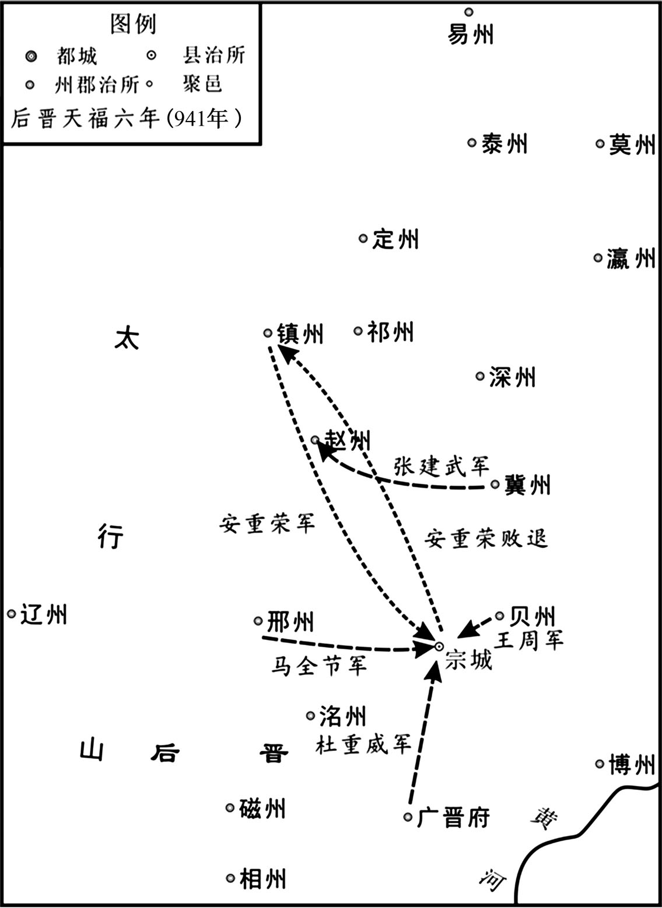 
后晋成德节度使安重荣叛变示意图

## 【译文】

后晋高祖天福六年（941年）十二月戊戌（十三日），杜重威与安重荣在贝州宗城县西南相遇，安重荣布下偃月阵，官军两次进攻都不能破阵。杜重威心里害怕，打算撤退。指挥使、宛丘人王重胤说：“用兵之道忌讳阵前退兵。安重荣镇州的精兵都在中军，请您分派精锐兵士攻击他的左右两翼，重胤我为您率领契丹兵直接冲击他的中军，安重荣必定会狼狈不堪。”杜重威听从了王重胤的建议。镇州兵的阵列稍稍退却，赵彦之卷起旗子策马奔驰前来投降。赵彦之的铠甲头盔和马鞍马笼头都用银子装饰，官军将他杀掉而瓜分了他的这些银器。安重荣听说赵彦之叛降官军，大为恐惧，撤退藏匿在运送军需物资的队伍中，官军趁机进攻，镇州兵大败，被斩首一万五千级。安重荣收集残兵败将退保宗城，官军向宗城发起进攻，天将黑时，城被攻下。安重荣率领十多名骑兵逃回镇州，环城固守。正逢天气寒冷，镇州兵战死及冻死的有两万多人。

## 【原文】

**契丹闻重荣反，乃听杨彦询还[1]。**

## 【注文】

[1]听：任凭。

## 【译文】

契丹听说安重荣反叛，于是听任杨彦询归返后晋。

## 【原文】

**七年春正月丁巳，镇州牙将自西郭水碾门导官军入城，杀守陴民二万人，执安重荣，斩之[1]。杜重威杀导者，自以为功。庚申，重荣首至邺都，帝命漆之，函送契丹[2]。**

## 【注文】

[1]七年：即后晋天福七年，公元942年。　　牙将：古代武官名。唐五代藩镇节度使治所（会府）的军队称牙军（亦称衙军），军将称牙将。古代军营门前置牙旗，故营门亦称“牙门”。　　郭：在城的外围加筑的一道城墙，有时也指外城。　　陴（pí）：城上的矮墙。亦称“女墙”，俗称“城垛子”，也泛指城墙。

[2]函：匣（xiá）子、套子。

## 【译文】

后晋高祖天福七年（942年）春季正月丁巳（初二日），镇州牙将从城西水碾门引导官军入城，杀守城军民两万人，抓获安重荣，将他斩首。杜重威杀掉引导入城的牙将，把全部功劳据为己有。庚申（初五日），安重荣的头颅被送到邺都，后晋高祖命令将他的头颅涂上油漆，装入木盒子中送往契丹。

## 【原文】

**夏四月，契丹以晋招纳吐谷浑，遣使来让。帝忧悒，不知为计，五月己亥，始有疾[1]。帝寝疾，一旦，冯道独对[2]。帝命幼子重睿出拜之，又令宦者抱重睿置道怀中，其意盖欲道辅立之[3]。**

## 【注文】

[1]忧悒（yì）：忧虑、愁闷。

[2]寝疾：卧病。　　一旦：一天早晨。旦，天明、早晨。　　冯道（882—954年）：字可道，沧州（一作瀛洲）景城（今河北沧州西）人。唐末曾任幽州节度使刘守光的幕僚，后投靠河东李克用，被任命为河东节度掌书记。后唐庄宗李存勖即位后，任翰林学士，逐渐显贵，历仕后唐、后晋、后汉、后周四朝十君以及契丹，拜相二十余年，自号“长乐老”，人称官场“不倒翁”。好学能文，曾在后唐明宗时主持校订了《九经》文字，雕版印刷，世称“五代蓝本”，为我国官府正式刻印书籍之始。

[3]重睿（ruì）（生卒年不详）：后晋高祖石敬瑭第七子，封许州节度使。契丹灭后晋后，随后晋出帝北迁，后不知所终。

## 【译文】

后晋高祖天福七年（942年）夏季四月，契丹因为后晋收容投降的吐谷浑部落，派遣使臣前来责备。后晋高祖非常忧虑，不知道该怎么办才好。五月己亥（十六日），开始生病。后晋高祖卧病在床，一天早晨，将冯道召来单独对话。高祖命令小儿子重睿出来拜见冯道，又让宦官抱着石重睿放到冯道的怀中，意思是希望冯道辅立石重睿为帝。

## 【原文】

**六月乙丑，帝殂[1]。道与天平节度使、侍卫马步都虞候景延广议[2]，以国家多难，宜立长君，乃奏广晋尹齐王重贵为嗣[3]。是日，齐王即皇帝位。延广以为己功，始用事，禁都下人毋得偶语[4]。**

## 【注文】

[1]殂（cú）：死亡。

[2]侍卫马步都虞候：古代武官名，禁军高级将领。参见前“马步都虞候”条注。　　景延广（892—947年）：字航川，陕州（治今河南三门峡西）人。后梁、后唐时为军校。后晋时累迁至侍卫亲军都指挥使。石敬瑭死后，辅立后晋出帝石重贵，专断朝政，反对向契丹称臣。契丹军南下，后晋朝廷命他指挥抗战，他却按兵不动。后晋开运三年（946年），契丹灭后晋，被囚解送北方。次年初，至陈桥（今河南封丘县城东南十三公里的陈桥镇）自杀。

[3]长君：年长的君主。　　广晋尹：古代官职名，为广晋府长官。广晋府即唐魏州（治贵乡，今河北大名东北），后唐同光元年（923年）升为东京，都督府称兴唐府，置留守、府尹；三年（925年），改为邺都。后晋天福元年（936年）改为广晋府；三年（938年）十一月，复为邺都；后晋开运二年（945年）四月，依旧为邺都留守、广晋尹、天雄军节度使。唐制，府尹为从三品官职。　　重贵：即石重贵（914—964年），石敬瑭侄子，生于太原，其父石敬儒早死，石敬瑭养以为子，封齐王。后晋天福七年（942年）即帝位，是为后晋出帝，或称少帝、齐王，942年至946年在位。对契丹称孙不称臣，并两度击败契丹兵的进攻。开运三年（946年），契丹第三次大举攻晋，入开封，他被契丹掳去，废为负义侯。后死于建州（治今辽宁朝阳西南）。　　嗣（sì）：接续、继承。

[4]都下：都城之下，这里指开封城下。　　毋（wú）得：不得，不要。　　偶语：相对私语，说悄悄话。

## 【译文】

后晋高祖天福七年（942年）六月乙丑（十三日），后晋高祖（石敬瑭）去世。冯道与当时担任天平节度使兼禁军侍卫马步都虞候的景延广商议，认为国家正处于多难之际，应该拥立年龄大的人为君主，于是上奏皇太后，拥立广晋尹、齐王石重贵为继承人。当日，齐王（石重贵）即皇帝位。景延广认为这是自己的功劳，从此开始专权用事，禁止京城的人们相互议论。

## 【原文】

**初，高祖疾亟，有旨召河东度使刘知远入辅政，齐王寝之，知远由是怨齐王[1]。**

## 【注文】

[1]疾亟（jí）：急病。亟，急、赶快。　　寝：息、止，引申为扣住不发。

## 【译文】

当初，后晋高祖病重时，曾经写下诏书召河东节度使刘知远入朝辅政，被齐王（石重贵）压下不发，刘知远于是怨恨齐王。

## 【原文】

**秋七月癸卯，加景延广同平章事，兼侍卫马步都指挥使[1]。**

## 【注文】

[1]同平章事：古代文官名，同中书门下平章事的简称，唐五代宰相别名。初用于唐太宗时，自唐高宗永淳元年（682年）始，实际担任宰相者，或加以同中书门下平章事的名义。唐代宗大历（766—779年）以后，同平章事几乎成为宰相专称，五代亦如此。中书、门下二省本为政务中枢，同中书门下平章事即与中书、门下协商处理政务之意。藩镇节度使带此号者则称使相，只是一种荣誉地位的象征。

## 【译文】

后晋高祖天福七年（942年）秋季七月癸卯（二十一日），后晋出帝（石重贵）加封景延广为同平章事，兼侍卫马步都指挥使。

## 【原文】

**冬十一月庚寅，葬圣文章武明德孝皇帝于显陵，庙号高祖[1]。**

## 【注文】

[1]圣文章武明德孝皇帝：这是石敬瑭的谥（shì）号。谥号是古代帝王、贵族、大臣等死后，依据其生前事迹所给予的称号，如“武”帝、“哀”公等。一般而言，帝王后妃的谥号由礼部官员议定，再由皇帝颁赐；贵族、大臣、士大夫的谥号则由朝廷直接赐予。　　显陵：石敬瑭墓葬，位于今河南宜阳县城西北的石陵村西。　　庙号：古代帝王死后，在太庙立室奉祀，并依其生前事迹追尊某祖、某帝、某宗的名号，如“高祖”“武帝”“太宗”等，称庙号。

## 【译文】

后晋高祖天福七年（942年）冬季十一月庚寅（初十日），安葬圣文章武明德孝皇帝（石敬瑭）于显陵，庙号为高祖。

## 【原文】

**帝之初即位也，大臣议奉表称臣告哀于契丹，景延广请致书称孙而不称臣[1]。李崧曰：“屈身以为社稷，何耻之有？陛下如此，他日必躬擐甲胄与契丹战，于时悔无益矣[2]。”延广固争，冯道依违其间。帝卒从延广议[3]。契丹大怒，遣使来责让，且言：“何得不先承禀，遽即帝位[4]？”延广复以不逊语答之。**

## 【注文】

[1]奉表：上表。奉，恭敬地用手捧着。表是中国古代的一种特殊文体。是臣子写给君主的呈文。战国时期统称为“书”。至汉代，这类文字又被分成四类，即章、表、奏、议，为臣下向皇帝进呈的上行文章。唐令规定，大臣写给皇帝的文书一般称作“表”，其近臣所写的文书也称作“状”。

[2]李崧（sōng）（？—948年）：深州饶阳（今河北饶阳）人。初事后唐，历任端明殿学士、户部侍郎等职。入后晋，任中书侍郎、同平章事，兼枢密使。契丹辽大同元年（947年），契丹灭后晋，被胁迫北行。后归后汉，任太子太傅。后汉乾祐元年（948年），被诬以谋反而遭诛杀。　　社稷（jì）：国家。社是土地神，稷是谷神。古代帝王都祭祀土地神和谷神，后来社稷就成了国家的代称。　　躬擐（huàn）甲胄：亲自穿着铠甲戴着头盔。躬，亲自；擐，穿；甲，铠甲；胄，头盔。

[3]固：坚持。　　卒：副词，终于、最终。

[4]禀（bǐng）：报告、汇报。　　遽（jù）：立刻。

## 【译文】

后晋出帝（石重贵）初即帝位时，大臣讨论向契丹奉表称臣、通报本国国丧的事，景延广主张不用奏章，只写封书信给契丹，而且在信中称孙不称臣。李崧反对说：“屈身侍奉契丹，是为了国家的利益，有什么可耻的？陛下如不肯这样做，日后必定得亲自披甲戴胄与契丹作战，到那时后悔也没有用了。”景延广据理力争，冯道则模棱两可。后晋出帝最终听从了景延广的意见。契丹大怒，派遣使者前来责问，并且质问说：“为什么不先禀告，自己就匆忙即帝位呢？”景延广再次以傲慢的语言回复契丹。

## 【原文】

**契丹卢龙节度使赵延寿欲代晋帝中国，屡说契丹击晋，契丹主颇然之[1]。**

## 【注文】

[1]卢龙节度使：古代方镇名。唐玄宗先天二年（713年）为防御奚、契丹置幽州节度使；唐天宝元年（742年），改为范阳节度使。治幽州（今北京西南）。领幽、蓟（jì）（治渔阳，今天津蓟州区）、妫（guī）（治怀戎，今河北怀来）、檀（tán）（治密云，今北京密云）、平（治卢龙，今河北卢龙）等州。安史之乱结束后，改为幽州节度使，因领卢龙军，又称卢龙节度使。五代沿袭。　　赵延寿（？—948年）：常山（今河北正定）人。本姓刘，为卢龙节度使赵德钧养子，改姓赵。仕后唐，任宣徽使、枢密使等职，娶后唐明宗女兴平公主为妻。后唐清泰三年（936年）奉命率兵讨伐石敬瑭，兵败后投靠契丹，任契丹幽州节度使，不久任枢密使，兼政事令。后晋开运三年（946年）随契丹兵南下灭后晋，被契丹任命为中京留守、大丞相。次年（947年）为契丹永康王耶律阮所囚，押送契丹而卒。　　帝：这里当动词用，即做皇帝。帝中国，即做中原的皇帝。

## 【译文】

契丹任命的卢龙节度使赵延寿想要代替后晋做中原的皇帝，多次劝说契丹进攻后晋，契丹国主耶律德光同意他的意见。

## 【原文】

**齐王天福八年[1]。帝闻契丹将入寇，二月己未，发邺都；乙丑，至东京[2]。然犹与契丹问遗相往来[3]，无虚月。**

## 【注文】

[1]齐王：即后晋出帝（少帝）石重贵。石重贵曾被封为齐王，尽管此时已即帝位，但司马光一直称其为齐王。　　天福八年：即公元943年。天福为后晋高祖石敬瑭的年号，古代皇帝即位，一般在次年才改年号。

[2]二月己未，发邺都；乙丑，至东京：后晋出帝石重贵即位于邺（yè）都（今河北大名东北）保昌殿高祖灵柩（jiù）前，以后一直在邺都，此时始还开封。东京即开封，亦称汴京。

[3]问遗（wèi）：问讯和赠送礼物。

## 【译文】

后晋齐王天福八年（943年）。后晋出帝（石重贵）听说契丹将要入侵，二月己未（十一日），从邺都出发；乙丑（十七日），到达东京大梁。然而继续与契丹保持联络，双方互相通问和赠送礼物，没有一个月间断过。

## 【原文】

**［九月］初(1)，河阳牙将乔荣从赵延寿入契丹，契丹以为回图使，往来贩易于晋，置邸大梁[1]。及契丹与晋有隙，景延广说帝囚荣于狱，悉取邸中之货[2]。凡契丹之人贩易在晋境者，皆杀之，夺其货。大臣皆言契丹有大功于晋，不可负。戊子，释荣，慰赐而归之。荣辞延广，延广大言曰：“归语而主，先帝为北朝所立，故称臣奉表。今上乃中国所立，所以降志于北朝者，正以不敢忘先帝盟约故耳。为邻称孙，足矣，无称臣之理。北朝皇帝勿信赵延寿诳诱，轻侮中国[3]。中国士马，尔所目睹。翁怒则来战，孙有十万横磨剑，足以相待[4]。他日为孙所败，取笑天下，毋悔也。”荣自以亡失货财，恐归获罪，且欲为异时据验，乃曰：“公所言颇多，惧有遗忘，愿记之纸墨[5]。”延广命吏书其语以授之，荣具以白契丹主[6]。契丹主大怒，入寇之志始决。晋使如契丹者，皆絷之幽州，不得见[7]。**

## 【注文】

[1]河阳：古代方镇名。即河阳节度使，又名怀卫节度使。唐德宗建中二年（781年）设置，治河阳三城（今河南孟州西），较长期领有河阳三城和所属五县（后置孟州）及怀（治河内，今河南沁阳）、卫（治汲［jí］县，今河南卫辉）二州，辖境约相当于今河南黄河故道以北、太行山以南、浚（xùn）县以西及黄河南岸孟津、荥（xíng）阳县的汜（sì）水、广武两镇等地。五代沿袭。　　回图使：古代官名，五代时契丹设置的掌管与中原地区贸易的官员。　　邸（dǐ）：即邸店，亦称邸舍，古代供客商居住、堆货和交易的店栈。唐五代时期，地方藩镇多在京城设有此种邸店。

[2]隙（xì）：缝隙、隔阂。　　悉：副词，都、全。

[3]诳（kuáng）诱：欺骗引诱。诳，欺骗、迷惑；诱，引诱、诱惑。

[4]翁：老人，此处指契丹主耶律德光。　　横磨剑：比喻精锐善战的士卒。

[5]据验：依据、验证。

[6]白：下级对上级禀告、陈述。

[7]如：前往，到……去。　　絷（zhí）：用绳索拴住马足，引申为拘禁、束缚。

## 【译文】

后晋齐王天福八年（943年）九月。当初，河阳牙将乔荣跟随赵延寿进入契丹，契丹任命他为回图使，在契丹与后晋之间往返贸易，并在后晋的都城大梁设置了邸店。当契丹与后晋产生隔阂后，景延广说服后晋出帝（石重贵）把乔荣关进监牢，没收了他邸店中储存的全部货物。凡是在后晋境内贩卖贸易的契丹商人，都杀掉，夺取了他们的货物。大臣纷纷上言说契丹对后晋有大功，不可辜负。戊子（十三日），这才释放了乔荣，并予以慰问赏赐，让他返回契丹。乔荣向景延广辞行，景延广大话连篇地说：“回去告诉你的主子，我们先皇帝是你们契丹国所立，因此向你们奉表称臣。而当今皇上是我们中国所立，之所以向你们北朝降低身份，是因为我们不敢忘记先帝与你们缔结盟约的缘故。作为邻邦而称孙，已经足够了，没有再向你们称臣的道理。你们北朝皇帝不要听信赵延寿的欺骗引诱，轻视侮辱中原国家。中原国家的将士战马，是你亲眼所见的。老头子如果发怒，就来交战，孙儿自有十万精锐军队，足够对付你们。以后如果为孙儿打败，被天下人笑话，不要后悔。”乔荣因为自己丧失了全部财产，担心回到契丹后被治罪，并且想为日后留下证据，就说：“您所说的内容太多，我恐怕会忘记，希望把您的话用纸笔记录下来。”景延广便命令小吏将自己所说的话记下来交给乔荣，乔荣将这一切连同证据全部报告给契丹国主（耶律德光）。契丹国主大怒，进犯中原的决心开始确定下来。后晋使臣到达契丹，都被扣留在幽州，不能见到契丹国主。

## 【原文】

**桑维翰屡请逊辞以谢契丹，每为延广所沮[1]。帝以延广为有定策功，故宠冠群臣，又总宿卫兵，故大臣莫能与之争[2]。河东节度使刘知远知延广必致寇，而畏其方用事，不敢言，但益募兵，奏置兴捷、武节等十余军以备契丹。**

## 【注文】

[1]沮（jǔ）：阻止。

[2]定策：拥立皇帝。策，竹简。把拥立皇帝的事写在竹简上，告于宗庙，称定策。　　冠：超出众人，居第一位。　　宿（sù）卫兵：宫禁中的警卫部队。

## 【译文】

桑维翰多次请求用谦逊的语言向契丹道歉，但都被景延广所阻止。后晋出帝（石重贵）因为景延广有拥立他登上皇帝宝座的功绩，所以对他的恩宠超过其他所有官员。景延广又总管着宫廷宿卫兵的军权，于是朝中大臣没有人敢和他抗争。河东节度使刘知远知道景延广必然会招致契丹的入侵，但也害怕景延广正在专权用事，不敢直言，只是进一步招兵买马，奏请朝廷设置兴捷、武节等十多支军队，以防备契丹。

## 【原文】

**杨光远之叛也(2)，密告契丹以晋主负德违盟，境内大饥，公私困竭，乘此际攻之，一举可取[1]。赵延寿亦劝之。契丹主乃集山后及卢龙兵合五万人，使延寿将之，委延寿经略中国，曰：“若得之，当立汝为帝[2]。”又常指延寿谓晋人曰：“此汝主也。”延寿信之，由是为契丹尽力画取中国之策[3]。朝廷颇闻其谋，丙辰，遣使城南乐及德清军，征近道兵以备之[4]。**

## 【注文】

[1]杨光远（？—944年）：字德明，小字阿檀，沙陀部人。初为晋王李存勖（xù）的骑将，后唐建立后，任幽州马步军都指挥使。石敬瑭叛后唐，他随张敬达前往镇压，被契丹援军围困在晋安寨（今山西太原南），坚持数月，后粮尽援绝，遂杀张敬达投降。后晋时，历任宣武节度使、平卢节度使等职，封东平王。在任期间，穷奢极欲，重赋暴敛，并秘密招引契丹。后晋朝廷派泰宁节度使李守贞围困青州，他被其子承勋所囚，送降被杀。　　负德违盟：辜负恩德，违背盟约。

[2]山后：卢龙镇以妫（guī）（治怀戎，今河北怀来）、檀（tán）（治密云，今北京密云）、新（在今河北涿鹿至怀安一带）、武（治文德，今河北宣化）四州为“山后”，因位于燕山山脉北部而名。　　经略：筹划治理。

[3]画：同“划”，谋划、策划。

[4]城：此处当动词，意思是修筑、筑城。　　南乐：古地名，今河南南乐县。　　德清军：本为驻军机构，后演化为行政区划单位，在今河南清丰县西南，辖境相当于今河南清丰、范县及山东莘（shēn）县部分地区。

## 【译文】

后晋齐王天福八年（943年）十二月。杨光远叛变之时，秘密向契丹报告说，后晋皇帝辜负恩德，违背盟约，境内饥荒严重，官府和老百姓都陷入困境，如果乘此时进攻，一举可以夺取。赵延寿也劝契丹攻取后晋。于是契丹国主（耶律德光）招集幽州山后及卢龙镇的军队共计五万人，让赵延寿统领，委派他经略中原，说：“如果能夺得中原，定当立你为皇帝。”又常常指着赵延寿对流亡到契丹管辖境内的后晋人说：“这是你们的主子。”赵延寿对此深信不疑，于是尽力为契丹谋划攻取中原的计策。赵延寿的计谋多被后晋朝廷所探听到，丙辰（十二日），后晋朝廷派遣军使修筑南乐城和德清军，征调附近各道的兵力进行防备。

## 【原文】

**开运元年春正月乙亥，边藩驰告契丹前锋将赵延寿、赵延照将兵五万入寇，逼贝州[1]。延照，思温之子也[2]。先是，朝廷以贝州水陆要冲，多聚刍粟，为大军数年之储，以备契丹[3]。军校邵珂性凶悖，永清节度使王令温黜之[4]。珂怨望，密遣人亡入契丹，言“贝州粟多而兵弱，易取也”。会令温入朝，执政以前复州防御使吴峦权知州事[5]。峦既至，推诚抚士。会契丹入寇，峦书生，无爪牙，珂自请愿效死，峦使将兵守南门，峦自守东门[6]。契丹主自攻贝州，峦悉力拒之，烧其攻具殆尽[7]。己卯，契丹复攻城，珂引契丹自南门入，峦赴井死，契丹遂陷贝州，所杀且万人。**

## 【注文】

[1]开运：后晋出帝石重贵在位时使用的年号，即从公元944年至946年。　　赵延照：平州卢龙（今河北卢龙）人，卢龙节度使赵思温之子。曾任契丹贝州留后。　　逼：靠近。　　贝州：古州名。北周宣政元年（578年）分相州置，隋大业初废。唐复置，治清河（今河北清河），领有清阳、清河、武城、宗城、临清、经城、漳南、历亭、夏津等县，辖境相当于今河北清河、威县、故城、临西及山东临清、武城、夏津等地。五代沿袭。

[2]思温（？—939年）：即赵思温，字文美，平州卢龙（今河北卢龙）人。初为卢龙节度使刘仁恭部下，后任后唐平州刺史兼平、营、蓟三州都指挥使。辽神册二年（917年）耶律阿保机进攻卢龙时降辽。历任辽保静军节度使、南京留守、卢龙军节度使、临海军节度使等职，为契丹在中原的战争中立下汗马功劳。

[3]先是：在此之前。是，指示代词，这。　　刍（chú）粟（sù）：饲草粮食。刍，牲口吃的草；粟，粟米。

[4]王令温（895—956年）：字顺之，瀛州河间（今河北河间）人。少以武勇著称，事后唐。从李嗣源与契丹战于上谷，力战击退敌兵，救出李嗣源，以功升任神武彰圣都校。后晋时从杜重威讨安重荣，以功历洺州团练使、永清军节度使等职。后汉时，任安州节度使。后周初加检校太尉、同平章事。后周世宗即位，迁镇安军节度使。　　黜（chù）：罢免、贬退。

[5]复州：古州名。唐武德五年（622年）改隋沔（miǎn）阳郡设，初治沔阳（今湖北仙桃西南），后迁治所于竟陵（五代后晋改景陵，今湖北天门东北），领沔阳、竟陵、监利三县，辖境约当今湖北仙桃、天门、监利、洪湖等县市地。五代沿袭。　　防御使：古代官职名。唐武则天时始设于夏州，安史之乱时分设于中原军事要地，掌本区军事防务，以刺史兼任，常与团练使互兼。安史之乱后，在不设节度使和观察使处，往往设都防御使以领军事，地位低于节度使、观察使。五代沿袭。　　吴峦（luán）（？—944年）：字宝川，郓（yùn）州卢县（今山东茌［chí］平西南）人。少好学，后唐时为大同军（即云州）节度使判官。石敬瑭召契丹军过云州时，节度使沙彦珣（xún）被虏，军士推峦主州事。石敬瑭割云州与契丹，他率将卒拒守，契丹围攻半年不下，由是知名。后晋出帝时，出镇贝州（治清河，今河北清河）。契丹军南下，四面围攻州城。牙将邵珂（kē）引契丹兵入城，吴峦投井而死。　　权知州事：临时行使州刺史的职务。权，权且、暂且；知，主持。

[6]爪（zhǎo）牙：本意指动物的尖爪和利牙。古代则用之比喻得力帮手，现多比喻为坏人效力的党羽，帮凶，是贬义词。

[7]悉力：全力。　　殆（dài）：几乎，将近。

## 【译文】

后晋出帝开运元年（944年）春季正月乙亥（初二日），后晋边境藩镇紧急奏报，说契丹前锋将赵延寿、赵延照率领五万军队入侵，逼近贝州。赵延照是赵思温的儿子。在此之前，后晋朝廷因贝州是水陆要道，就在这里聚集了大量的粮食和草料，作为大军数年的储备，以防备契丹。贝州军校邵珂，性情凶狠，蛮不讲理，被永清节度使王令温免职。邵珂心怀怨恨，就秘密派人逃到契丹，说“贝州粮多而兵弱，很容易攻取”。适逢王令温入朝，执政大臣任命原复州防御使吴峦代理贝州事务。吴峦到达贝州后，对军士推心置腹，诚恳相待。正赶上契丹入侵，吴峦是个书生，没有可靠的心腹军将，邵珂便自告奋勇，请求希望为国家效死。吴峦派他率兵守护南门，吴峦自己守卫东门。契丹国主（耶律德光）亲自率兵攻打贝州，吴峦全力进行抵抗，将契丹兵攻城的器具几乎烧尽。己卯（初六日），契丹兵再次攻城，邵珂引导契丹兵从南门入城，吴峦投井而死，契丹于是攻陷贝州城，杀死军民将近一万人。

## 【原文】

**庚辰，以归德节度使高行周为北面行营都部署，以河阳节度使符彦卿为马军左厢排陈使，以右神武统军皇甫遇为马军右厢排陈使，以陕府节度使王周为步军左厢排陈使，以左羽林将军潘环为步军右厢排陈使[1]。**

## 【注文】

[1]归德节度使：古代方镇名。后唐同光元年（923年），改后梁宣武军额为归德军，治宋州（治宋城，今河南商丘睢阳区），领宋、亳（bó）（治谯［qiáo］县，今安徽亳州、颍（治汝阴，今安徽阜阳）、单（shàn）（治单父，今山东单县）四州。辖境约当今山东单县、曹县以南，河南睢（suī）县至安徽临泉以东，阜南、颍上以北，蒙城至砀（dàng）山以西的鲁、豫、皖地区。后周广顺二年（952年），割单州隶曹州彰信军节度，颍州隶陈州镇安军节度。　　高行周（885—952年）：字尚质，幽州（治蓟县，今北京西南）人。出身军将世家。历事后唐、后晋、后汉、后周诸朝。历任振武、彰武、昭义等军节度使和西京留守、归德军节度使、邺都留守等职，进封齐王。勇而知义，功高不矜，为人敬重，谥（shì）号“武懿”。　　北面行营都部署：北面行营总指挥。　　行营：指古代统帅出征时办公的营帐或房屋，也指专设的机构。　　都部署：古代武官名，即总指挥。五代时有马步军都部署、马军都部署、步军都部署、大内都部署、山陵都部署等多种名称。胡三省云：“部署之官始见于《通鉴》，本在招讨使之下，其后有都部署，遂为专任主帅之任。”　　符彦卿（898—975年）：字冠侯，陈州宛丘（今河南淮阳）人。出身武将世家，其父符存审为后唐太祖李克用养子。符彦卿历事后唐、后晋、后汉、后周及北宋王朝，历任吉州刺史，同州、凤翔节度使，大名尹、天雄军节度使等职，进封魏王。其女儿分别为周世宗、宋太宗皇后。　　左厢：厢为军队编制。五代时禁军、出征军等军队中，或分设左、右厢，厢下设军。　　右神武统军：古代武官名。唐朝以左右羽林、左右龙武、左右神武为北衙六军，分掌禁兵宿卫，有大将军各一人，正三品，将军各二人，从三品。唐兴元元年（784年），又设置统军各一人，从二品。五代沿袭。　　陕府节度使：古代方镇名。即唐保义军节度使，后梁开平二年（908年）改名镇国军；后唐同光元年（923年）复旧名。长期领陕（治陕县，今河南三门峡西）、虢（guó）（治弘农，今河南灵宝）二州，辖境约当今河南三门峡市、陕县、灵宝、卢氏等地。　　左羽林将军：古代武官名。唐朝以左右羽林、左右龙武、左右神武为北衙六军，分掌禁兵宿卫，有大将军各一人，正三品，将军各二人，从三品。五代沿袭。　　潘环（？—946年）：字楚奇，洛阳（今河南洛阳）人。后梁时官至左雄威指挥使；后唐以后时历任棣（dì）、易、庆等州刺史、金州节度使、左神武统军、澶州节度使等职。后晋开运三年（946年）契丹灭后晋时，被契丹将高牟（móu）翰杀于洛阳。

## 【译文】

后晋齐王开运元年（944年）正月庚辰（初七日），后晋朝廷任命归德节度使高行周为北面行营都部署（总指挥），河阳节度使符彦卿为马军左厢排陈使，右神武统军皇甫（fǔ）遇为马军右厢排陈使，陕府节度使王周为步军左厢排陈使，左羽林将军潘环为步军右厢排陈使。

## 【原文】

**太原奏契丹入雁门关。恒、邢、沧皆奏契丹入寇[1]。**

## 【注文】

[1]恒：即恒州，亦即镇州，古州名，参见前“镇”条注。　　邢：即邢州，古州名。唐武德元年（618年）改隋襄国郡设，治龙冈（今河北邢台），领龙冈、尧山、巨鹿、南和、任县、平乡、沙河、内丘等县。辖境约当今河北巨鹿、广宗以西，泜（zhī）河以南，沙河以北地区。五代沿袭。　　沧：即沧州，古州名。唐武德元年（618年）改隋渤海郡设，治清池（今河北沧州），领清池、盐山、南皮、长芦、乐（lào）陵、饶安、无棣、临津、鲁城、弓高、胡苏、景城等县。辖境约当今河北海河以南，天津静海和河北青县、泊头以东，东光及山东宁津、乐陵、无棣以北地区。五代沿袭。

## 【译文】

太原奏报说契丹进入雁门关。恒州、邢州、沧州也都奏报说契丹入侵。

## 【原文】

**成德节度使杜威遣幕僚曹光裔往说杨光远，光远遣光裔入奏，朝廷遣使与光裔（往）复［往］慰谕之[1]。事见《范杨之叛》。**

## 【注文】

[1]慰谕（yù）：抚慰劝谕。谕，使明白。

## 【译文】

成德节度使杜威派遣幕僚曹光裔去说服杨光远，杨光远派遣曹光裔入朝廷上奏，后晋朝廷派遣使臣与曹光裔一道再次去安抚告谕杨光远。（事见《范杨之叛》）

## 【原文】

**帝遣使持书遗契丹，契丹已屯邺都，不得通而返。壬午，以侍卫马步都指挥使景延广为御营使，前静难节度使李周为东京留守[1]。是日，高行周以前军先发。时用兵方略号令皆出延广，宰相以下皆无所预。延广乘势使气，陵侮诸将，虽天子亦不能制[2]。**

## 【注文】

[1]侍卫马步都指挥使：古代官职名，禁军高级将领，详见前“侍卫马步都指挥使”条注。　　御营使：即皇帝行营长官。唐天祐元年（904年）置。　　静难节度使：古代方镇名，即邠（bīn）宁节度使，唐肃宗乾元二年（759年）设，唐光启元年（885年）号静难军节度，治邠州（治新平，今陕西彬县），领邠、宁（治定安，今甘肃宁县）、庆（治安化，今甘肃庆城）等州，辖境约当今甘肃环县、陕西长武以东，陕西吴旗、甘肃华池和正宁以西，以及陕西永寿以北地区。五代沿袭。　　李周（约872—945年）：本名敬周，后避后晋高祖石敬瑭讳去“敬”字。字通理，邢州内丘（今河北内丘）人，唐代名将李抱真之后，事后唐、后晋，历任相州、蔡州刺史，邠、徐、安、雍、汴等镇节度使，东京留守、开封尹等职。　　东京留守：即开封府留守。

[2]乘势使气：倚仗权势逞性子。

## 【译文】

后晋出帝派遣使者带书信给契丹，但契丹军队已经进驻邺都，使者不得通过而返回。后晋开运元年（944年）正月壬午（初九日），后晋朝廷任命侍卫马步都指挥使景延广为御营使，原静难节度使李周为东京留守。这一天，高行周率领前军先行出发。当时用兵过程中的调兵遣将、发号施令，都由景延广一人说了算，包括宰相在内的所有官员都不能参与意见。景延广凭借着权势任性使气，欺凌侮辱众将领，甚至就连天子（石重贵）也控制不了他。

## 【原文】

**乙酉，帝发东京。丁亥，滑州奏契丹至黎阳[1]。戊子，帝至澶州[2]。**

## 【注文】

[1]滑州：古州名。唐武德元年（618年）改隋东郡设，治白马（今河南滑县东），领白马、卫南、韦城、匡城、胙（zuò）城、酸枣、灵昌等县，辖境约当今河南滑县、长垣（yuán）、延津等县地。五代沿袭。　　黎阳：古县名，治今河南浚（xùn）县东北。

[2]澶（chán）州：古州名。唐武德四年（621年）置，治顿丘（今河南清丰县西南），领顿丘、澶水、观城等县，辖境约当今河南清丰、范县及山东莘（shēn）县部分地区。五代后晋高祖天福三年（938年），州及顿丘县俱移治德胜北城（今河南濮阳市区西南）。

## 【译文】

后晋出帝开运元年（944年）正月乙酉（十二日），后晋出帝从东京出发。丁亥（十四日），滑州奏报说契丹军到达了黎阳。戊子（十五日），后晋出帝抵达澶州。

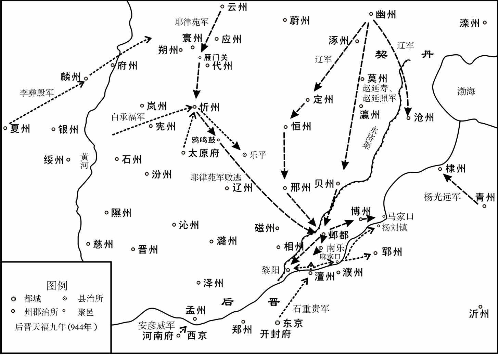 
契丹一攻后晋时于邺都集结示意图

## 【原文】

**契丹主屯元城，赵延寿屯南乐，以延寿为魏博节度使，封魏王[1]。**

## 【注文】

[1]元城：古县名，历代屡有废置。唐武后圣历二年（699年）复置，治今河北大名东北，与贵乡县同为魏州州治。五代后唐时改为兴唐县，后晋时恢复旧名。　　魏博节度使：古代方镇名，为唐河朔三镇之一。唐代宗广德元年（763年）置，治魏州（治贵乡，今河北大名东北），辖境屡变，久领魏、博（治聊城，今山东聊城东北）、贝（治清河，今河北清河西北）、卫（治汲县，今河南卫辉）、澶（治顿丘，今河南清丰西南）、相（治安阳，今河南安阳南）六州，约东至今山东武城、茌（chí）平，西达河南林州、辉县，北至河北磁县、馆陶、故城，南抵河南新乡、濮阳和山东范县、聊城一带地区。自创立后，长期为田承嗣、何进滔、罗弘信等世袭割据。唐天祐元年（904年）号天雄军。

## 【译文】

契丹国主（耶律德光）驻扎在元城，赵延寿屯守南乐，契丹任命赵延寿为魏博节度使，封魏王。

## 【原文】

**契丹寇太原，刘知远与白承福合兵二万击之。甲午，以知远为幽州道行营招讨使，杜威为副使，马全节为都虞候。丙申，遣右武卫上将军张彦泽等将兵拒契丹于黎阳[1]。**

## 【注文】

[1]右武卫上将军：古代武官名。隋开皇时设置右武卫府，为十二卫之一，禁卫军指挥机构。唐龙朔二年（662年）改为武卫，掌宫禁宿卫，分左右，各设上将军一人，从二品，大将军一人，正三品，将军二人，从三品。五代沿袭。　　张彦泽（？—947年）：突厥人，世居太原（今山西太原西南），历事后唐、后晋，历任左龙武军大将军、右武卫上将军、右神武统军、彰国军节度使、镇国军节度使等。屡与契丹战，后投降契丹，祸乱中原，残杀无辜，为人所不齿。后因故被契丹主耶律德光所杀，市民争割其肉，破脑取髓而食。

## 【译文】

契丹侵犯太原，刘知远会同白承福，集结大军两万人反击。后晋开运元年（944年）正月甲午（二十一日），后晋朝廷任命刘知远为幽州道行营招讨使，杜威为副使，马全节为都虞候。丙申（二十三日），派遣右武卫上将军张彦泽等率军在黎阳抵御契丹兵。

## 【原文】

**帝复遣译者孟守忠致书于契丹，求修旧好。契丹主复书曰：“已成之势，不可改也。”**

## 【译文】

后晋出帝再次派遣翻译孟守忠给契丹送信，要求恢复往日的友好关系。契丹国主在回信中说：“已经形成的局势，是不能更改的了。”

## 【原文】

**辛丑，太原奏破契丹伟王于秀容，斩首三千级[1]。契丹自鸦鸣谷遁去[2]。**

## 【注文】

[1]契丹伟王：可能是指耶律李胡次子耶律宛，据《辽史》，其封爵为卫王。而从下文“胡法，优礼大臣则赐之，如汉赐几仗之比，惟伟王以叔父之尊得之”的记载看，也有可能是辽太祖耶律阿保机的兄弟，太宗耶律德光的叔父，具体事迹不详。　　秀容：古代县名，治今山西忻州。

[2]鸦鸣谷：古地名。在今山西寿阳县东南，是与平定县连通的重要管道，谷径幽邃，据说曾有人在谷中迷路，见鸦飞鸣得路，因名。

## 【译文】

后晋齐王开运元年（944年）正月辛丑（二十八日），太原奏报说在秀容击败了契丹伟王的军队，斩首三千人。契丹人从鸦鸣谷逃走。

## 【原文】

**天平节度副使、知郓州颜衎遣观察判官窦仪奏：“博州刺史周儒以城降契丹，又与杨光远通使往还，引契丹自马家口济河，擒左武卫将军蔡行遇[1]。”仪谓景延广曰：“虏若济河与光远合，则河南危矣。”延广然之。仪，蓟州人也[2]。**

## 【注文】

[1]郓（yùn）州：州名。唐武德年间改隋东平郡设，初治郓城（今山东郓城东），后移治须昌（今山东东平西北），领郓城、寿张、钜野、须昌、宿城等县，辖境相当今山东梁山、东平、郓城、巨野、嘉祥等地。五代沿袭。　　颜衎（kān）（889—962年）：字祖德，兖州曲阜（今山东曲阜）人。后梁龙德（921—923年）中擢第。后唐明宗时拜太常博士。入后晋后历任御史中丞、户部侍郎。　　观察：即观察使，古代官职名。唐肃宗乾元元年（758年）改采访处置使为观察处置使，简称观察使，由节度使兼领，掌巡查官吏善恶，兼理民事，成为道一级的最高行政长官。不设节度使的道，即以观察使为最高行政、军事长官。　　判官：古代官职名。隋初置，唐遍置，设于采访、节度、观察、招讨、经略、防御、团练、营田、监军等使以及州县幕府，亦设于王府。为幕府主要佐官，掌理本府日常事务。五代时开始领州郡事务，成为州府职事官员。　　窦仪（914—966年）：字可象，蓟（jì）州渔阳（今天津蓟州区）人。后晋进士，历后晋、后汉、后周，官至端明殿学士。入宋，官至礼部尚书。学识渊博，宋初曾奉命主撰《建隆重定刑统》（即《宋刑统》）三十卷、《建隆编敕》四卷，与弟严、侃（kǎn）、称、僖（xī）时称“窦氏五龙”。　　博州：古州名。隋开皇十六年（596年）设，治聊城（今山东聊城东北），领聊城、博平、武水、清平、高唐、堂邑等县，辖境约当今山东聊城、高唐、茌（chí）平等地。唐、五代沿袭。　　周儒（生卒年不详）：时为后晋博州刺史。　　马家口：古地名。在今山东东平县西北，亦名清口戍，其西南为邹家口，又西即东阿（ē）县之杨刘镇，今堵塞。　　左武卫将军：古代武官名，参见前“右武卫上将军”条注。

[2]蓟州：古州名。唐开元十八年（730年）置，领渔阳、三河、玉田等县，州治渔阳（今天津蓟州区），辖境约相当于今天津蓟州区、河北三河、玉田、遵化等市、县及唐山市丰润区。五代沿袭。

## 【译文】

天平节度副使、代理郓州刺史颜衎派遣观察判官窦仪到京城上奏说：“博州刺史周儒献出城池向契丹投降，又与杨光远互派使者往来，引导契丹军从马家口渡过黄河，俘虏了左武卫将军蔡行遇。”窦仪对景延广说：“如果契丹军渡过黄河与杨光远会合，那黄河以南地区就十分危险了。”景延广同意窦仪的看法。窦仪是蓟州人。

## 【原文】

**二月甲辰朔，命前保义节度使石赟守麻家口，前威胜节度使何重建守杨刘镇，护圣都指挥使白再荣守马家口，西京留守安彦威守河阳[1]。未几，周儒引契丹将麻荅自马家口济河，营于东岸，攻郓州北津以应杨光远[2]。麻荅，契丹主之从弟也[3]。**

## 【注文】

[1]朔：阴历的每月初一。　　保义节度使：古代方镇名。始置于唐肃宗乾元元年（758年），初称陕虢（guó）节度使，治陕州（治陕县，今河南三门峡西），辖境屡变，久领陕、虢（治弘农，今河南灵宝）二州，辖境约相当于今河南三门峡、陕县、灵宝、卢氏等地。其后屡经废置。唐昭宗龙纪元年（889年），号保义军。后梁太祖时改为镇国军，后唐复名保义军。北宋太平兴国元年（976年），为避宋太宗赵光义名讳，改保义为保平，故《通鉴》有时亦称作保平节度使。　　石赟（yūn）：即石敬赟（约897—946年），字德和，后晋高祖石敬瑭的堂弟。原为乡间无赖，石敬瑭称帝后，任为太原牙将，升保义节度使等职。后晋出帝石重贵即位，加同中书门下平章事。后晋开运元年（944年），出任威胜军节度使。在任以贪婪残暴著称。张彦泽攻汴京时，他连夜逃走，堕入沙壕而死。　　麻家口：古地名，又名麻家渡，在今河南范县西南濮城西北。　　威胜节度使：古代方镇名。后梁开平三年（909年）设置宣化军节度使，后唐庄宗同光元年（923年）改为威胜军。后周广顺二年（952年）又改名武胜军，初领邓、泌、隋、复、郢（yǐng）等州，节度使治所邓州（治穰［ráng］县，今河南邓州），辖境约当今河南南阳、泌阳；湖北随县、京山、沔（miǎn）阳一带地区。　　何重建：即何建（生卒年不详），五代十国时回鹘（hú）人，少隶于后晋高祖石敬瑭帐下，石敬瑭即位后，任禁军将领，后历任曹州刺史，泾（jīng）、邓、贝、澶、孟等镇节度使。后晋开运三年（946年）契丹入汴，他以秦州归后蜀，任秦州节度使、阆州保宁军节度使等职，后卒于蜀。　　杨刘镇：古地名。在今山东东阿县北六十里，旧有城临河津，今城迹不可考。　　白再荣（？—950年）：五代时蕃部人。少为军卒，渐迁至护圣左厢指挥使。后晋末，从契丹北去，至真定（今河北正定），与诸将逐契丹守将麻荅，被推为留后，恃势勒索在真定的后晋朝臣财物，被称为“白麻荅”。后汉时，累迁至义成军节度使，所到之处横征暴敛，民不聊生。后被郭威军士所杀。　　西京留守：古代官职名，即洛阳留守。五代后梁、后晋、后汉、后周各朝以开封为东京，洛阳为西京。　　安彦威（生卒年不详）：字国俊，代州崞（guō）县（今山西原平）人。少以军卒隶后唐明宗李嗣源麾下，明宗立，任护圣指挥使，遥领镇州节度使。后晋高祖石敬瑭即位，拜为北京留守，后移镇宋州。时黄河在滑州决口，彦威集丁夫塞之，又出私钱募民治堤。后迁西京留守，遇饥荒，开仓廪赈饥民，民免于流散。后晋出帝时，授北面行营副都统，出家财助军，人称其忠。

[2]未几：不久。　　麻荅：即耶律拔里得（生卒年不详）。出身于契丹贵族，辽太宗耶律德光的堂弟。自幼被其伯父辽太祖耶律阿保机抚养于宫中。在辽太宗末年，依靠家族的军政势力和私人武装，成为辽朝中的实权人物。

[3]从弟：即堂弟。

## 【译文】

后晋出帝开运元年（944年）二月甲辰朔（初一日），后晋出帝命令原保义节度使石赟防守麻家口，原威胜节度使何重建防守杨刘镇，护圣都指挥使白再荣防守马家口，西京（洛阳）留守安彦威防守河阳。不久，周儒引导契丹大将耶律麻荅从马家口渡过黄河，在黄河东岸安营扎寨，进攻郓州北边的黄河渡口以接应杨光远。耶律麻荅是契丹国主耶律德光的堂弟。

## 【原文】

**乙巳，遣侍卫马军都指挥使义成节度使李守贞、神武统军皇甫遇、陈州防御使梁汉璋、怀州刺史薛怀让将兵万人，缘河水陆俱进[1]。守贞，河阳；汉璋，应州[2]；怀让，太原人也。**

## 【注文】

[1]侍卫马军都指挥使：古代武官名，禁军骑兵中的最高统帅。参见前“侍卫马步都指挥使”条注。　　义成节度使：古代方镇名。后唐同光元年（923年）改唐宣义节度使设，领滑（治白马，今河南滑县）、濮（治鄄［juàn］城，今山东鄄城）二州，后晋时加领河堤使，后割濮州隶镇宁军节度使，而以卫州（治汲县，今河南卫辉）来属。节度使治所滑州。辖境约当今河南延津至山东鄄城一带。　　李守贞（？—949年）：河阳（今河南孟州）人。初为本郡牙将，后晋高祖石敬瑭时任宣徽使。后晋出帝石重贵时，因平杨光远叛乱功拜同平章事，后任兵马都监。与杜重威出征契丹，大败，随杜重威降契丹。后又投靠后汉。后汉隐帝时，据河中（今山西永济）反汉，称秦王，被郭威讨平，他兵败自焚而死。　　陈州：古州名。唐高祖武德元年（618年）改隋淮阳郡设，治宛丘（今河南淮阳），领宛丘、箕（jī）城、扶乐、太康、新平等县，辖境约当今河南太康、西华、项城、商水、淮阳、沈丘等县地。五代沿袭。　　梁汉璋（？—943年）：字国宝，应州（治今山西应县）人。少事后唐明宗，历突骑、奉德等军指挥使。后晋时，历任护圣都指挥使、陈州和郑州防御使、侍卫马军都指挥使、永清军节度使等职。熟于戎马，累有军功，但好聚敛，无善政可纪。后戍冀州，与契丹骑军相遇，苦战数日，中流矢而亡。　　怀州：古州名。唐武德二年（619年）设，初治柏崖城（今河南济源西），后徙治河内（今河南沁阳），领河内、武德、武陟（zhì）、修武、获嘉等县，辖境约当今河南焦作、沁阳、武陟、修武、博爱、获嘉等地。五代沿袭。　　薛怀让（892—960年）：先世为西北少数民族，后移居太原（今山西太原西南）。薛怀让自后唐庄宗李存勗（xù）时开始从军打仗，抗击契丹入侵，屡立战功。自五代至宋初，历任绛、申、沂、辽、权、密、怀等州刺史，任上横征暴敛，以贪婪无度而留恶名于史。

[2]应州：古州名。唐朝末年设置，治金城（今山西应县），领金城、浑源二县，辖境约相当于今山西应县、浑源之地。

## 【译文】

后晋出帝开运元年（944年）二月乙巳（初二日），后晋朝廷派遣侍卫马军都指挥使兼义成军节度使李守贞、神武军统军皇甫遇、陈州防御使梁汉璋、怀州刺史薛怀让率领军队一万人，沿着黄河水陆并进。李守贞是河阳人；梁汉璋是应州人；薛怀让是太原人。

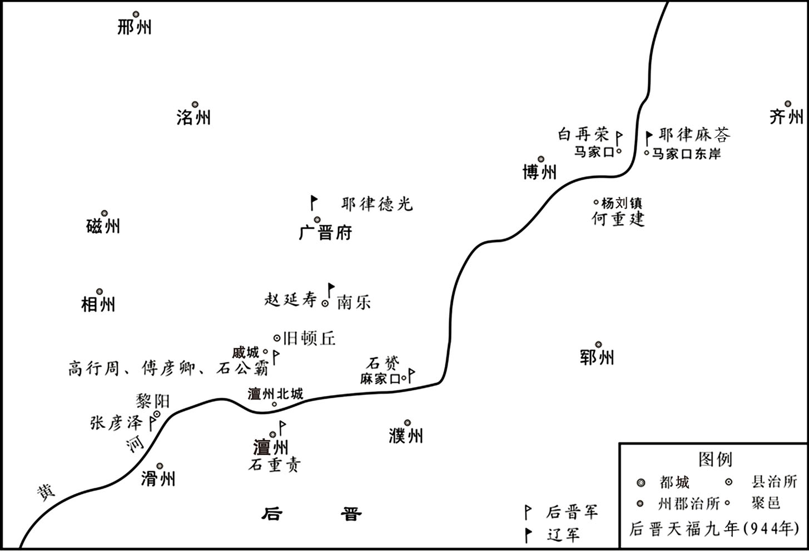 
契丹一攻后晋时双方隔黄河对峙示意图

## 【原文】

**丙午，契丹围高行周、符彦卿及先锋指挥使石公霸于戚城[1]。先是，景延广令诸将分地而守，无得相救。行周等告急，延广徐白帝，帝自将救之，契丹解去，三将泣诉救兵之缓，几不免[2]。**

## 【注文】

[1]先锋指挥使：先锋军为古代军号，指挥使即其将领。　　石公霸：五代时人，籍贯及生卒年不详。后晋时曾任卫州刺史，后周太祖广顺年间任陇州防御使。　　戚城：古地名，又称“孔悝（kuī）城”，春秋时卫国城邑，在今河南濮阳北戚城故址。

[2]徐：缓慢、慢慢地。　　解：除去、停止，这里是解除包围之意。

## 【译文】

后晋出帝开运元年（944年）二月丙午（初三日），契丹军队在戚城包围了后晋将领高行周、符彦卿以及先锋指挥使石公霸。在此之前，景延广命令他们分别驻扎在各地守卫，不准互相救援。高行周等向朝廷告急，却被景延广拖延了一段时间后才上奏给后晋出帝，出帝亲自率军前去救援，契丹撤围离去。三位将领哭泣着向出帝诉说救兵来得太慢，几乎使他们不免于难。

## 【原文】

**戊申，李守贞等至马家口。契丹遣步卒万人筑垒，散骑兵于其外，余兵数万屯河西，船数千艘渡兵，未已，晋兵薄之，契丹骑兵退走，晋兵进攻其垒，拔之[1]。契丹大败，乘马赴河溺死者数千人，俘斩亦数千人。河西之兵恸哭而去，由是不敢复东[2]。**

## 【注文】

[1]垒：防护军营的城墙或建筑物。　　薄（bó）：迫近。

[2]溺（nì）：淹没。　　恸（tòng）哭：痛哭、大哭。恸，极度悲哀。

## 【译文】

后晋出帝开运元年（944年）二月戊申（初五日），李守贞等人到达马家口。契丹派遣步兵一万人修筑堡垒，一些骑兵散处在周边进行守护，其余数万大军驻扎在黄河西岸，由数千艘船只运送渡河，没渡完，后晋军队迫近修筑堡垒的契丹步兵，契丹骑兵退走，后晋军进攻他们修筑的堡垒，攻下。契丹兵大败，骑着马过河被淹死的有几千人，俘虏和被杀的也有千人。黄河西岸的契丹军人痛哭着离去，从此再也不敢向东而来。

## 【原文】

**辛亥，定难节度使李彝殷奏将兵四万自麟州济河，侵契丹之境[1]。壬子，以彝殷为契丹西南面招讨使。**

## 【注文】

[1]定难节度使：古代方镇名。唐僖宗中和二年（882年）改夏州节度使置，治夏州（治今陕西靖边白城子），长期领有夏、银（治儒林，今陕西横山东）、绥（治上县，今陕西绥德）、宥（yòu）（治延恩，今内蒙古鄂托克旗南）等州，辖境约当今陕西白于山以北，内蒙古杭锦旗以南及乌海市、鄂托克旗、鄂托克前旗、乌审旗一带地区。五代沿袭。　　李彝（yí）殷（？—967年）：党项族首领。后唐清泰二年（935年）任定难军节度使。后晋时历加官检校太尉、同平章事，后晋出帝时加检校太师。后汉时又兼侍中。李守贞在河中叛乱，李彝殷曾为之出师。后周时，加官至守太傅兼中书令，封西平王。入宋，又加官守太尉，为避宋宣祖赵弘殷讳，改名李彝兴。卒后追封夏王。　　麟州：古州名。唐开元十二年（724年）设，后废，唐天宝元年（742年）复置，治新秦（今陕西神木北），领新秦、连谷、银城等县，辖境约相当于今神木一带地。五代沿袭。

## 【译文】

后晋出帝开运元年（944年）二月辛亥（初八日），定难节度使李彝殷奏报说率领军队四万人从麟州渡过黄河，侵入契丹境内。壬子（初九日），后晋朝廷任命李彝殷为契丹西南面招讨使。

## 【原文】

**初，契丹主得贝州、博州，皆抚尉其人，或拜官赐服章[1]。及败于戚城及马家口，忿恚，所得民皆杀之，得军士燔炙之[2]。由是晋人愤怒，戮力争奋[3]。**

## 【注文】

[1]服章：衣服和印章。

[2]忿（fèn）恚（huì）：愤怒、怨恨。　　燔（fán）炙（zhì）：焚烧。

[3]戮（lù）力争奋：戮力，并力、合力；争奋，争夺、奋斗。

## 【译文】

当初，契丹国主占领贝州、博州时，对这两州的百姓招抚安慰，有的人还被授予官职爵位，发给官服印章。但当他在戚城和马家口败退后，恼羞成怒，把所掳掠来的后晋百姓都杀死，俘虏的后晋军士都烧死。于是激起后晋人民的愤怒，他们团结起来，奋力反抗。

## 【原文】

**杨光远将青州兵欲西会契丹，戊午，诏石赟分兵屯郓州以备之[1]。**

## 【注文】

[1]青州：古州名。西汉武帝元封五年（公元前106年）所置十三刺史部之一，东汉时治临菑（zī）（今山东淄博市临淄区北），后移治益都（今山东青州）。唐时领有益都、临淄、博昌、寿光、千乘、临朐（qú）、北海七县，辖境相当于今山东潍坊、临朐、青州、广饶、博兴、寿光、昌乐、昌邑等地。五代沿袭。

## 【译文】

杨光远率领青州兵西上，打算与契丹兵会合，后晋开运元年（944年）二月戊午（十五日），后晋出帝下诏令石赟（yūn）分出兵力屯守郓州进行防备。

## 【原文】

**诏刘知远将部兵自土门出恒州击契丹，又诏会杜威、马全节于邢州[1]。知远引兵屯乐平不进[2]。**

## 【注文】

[1]土门：古关隘名，即井陉（xíng）关。在今河北井陉县北，为太行八陉之一。　　邢州：古州名，参见前“邢”条注。

[2]乐平：古县名，治今山西昔阳，时属辽州。

## 【译文】

后晋出帝下诏令刘知远率领本部兵马从土门进入恒州，攻击契丹，又命令他在邢州与杜威、马全节会合。但刘知远行军到乐平后便不再前进。

## 【原文】

**契丹伪弃元城去，伏精骑于古顿丘城，以俟晋军与恒、定之兵合而击之[1]。邺都留守张从恩屡奏虏已遁亡，大军欲进追之，会霖雨而止[2]。契丹设伏旬日，人马饥疲[3]。赵延寿曰：“晋军悉在河上，畏我锋锐，必不敢前。不如即其城下，四合攻之，夺其浮梁，则天下定矣[4]。”契丹主从之，三月癸酉朔，自将兵十余万陈于澶州城北，东西横掩城之两隅，登城望之，不见其际[5]。高行周前军在戚城之南，与契丹战，自午至晡，互有胜负[6]。契丹主以精兵当中军而来，帝亦出陈以待之[7]。契丹主望见晋军之盛，谓左右曰：“杨光远言晋兵半已馁死，今何其多也[8]？”以精骑左右略陈，晋军不动，万弩齐发，飞矢蔽地[9]。契丹稍却。又攻晋陈之东偏，不克。苦战至暮，两军死者不可胜数[10]。昏后，契丹引去，营于三十里之外[11]。**

## 【注文】

[1]古顿丘城：春秋时卫国城邑，在今河南浚（xùn）县西北。

[2]张从恩（898—966年）：太原（今山西太原西南）回鹘（hú）部人。父存信，为晋王李克用养子。从恩后晋初以外戚擢为右金吾卫将军，后累迁北京副留守、澶州防御使、枢密副使、宣徽南院使、天平军节度使等职。后汉时拜右卫上将军。后周时迁左金吾卫上将军加检校太师，封褒国公。宋初，改封许国公。　　霖（lín）雨：久下不停的雨。

[3]旬（xún）日：十天。

[4]浮梁：即浮桥。

[5]陈（zhèn）：布阵。陈，同“阵”。　　掩：突袭。　　隅（yú）：角落。　　际：边际。

[6]午：午时，相当于现在的上午十一时至下午一时。　　晡（bū）：申时，相当于现在的下午三时至五时。

[7]当：对着、面对。

[8]馁（něi）：饥饿。

[9]略陈（zhèn）：巡视阵地。陈，同“阵”。　　弩（nǔ）：一种用机械力量射箭的弓，也泛指弓。

[10]暮（mù）：傍晚，太阳落山的时候。

[11]引去：退走。引，退却。

## 【译文】

契丹兵假装放弃元城而退去，在古顿丘城埋伏下精锐骑兵，等待后晋主力部队与恒州、定州的军队会合时发起攻击。后晋邺都留守张从恩多次向朝廷奏报，说契丹兵已经逃走，大军打算追击，但却遇上阴雨连绵，不得不停止。契丹兵设置埋伏十多天，人饥马乏。赵延寿对契丹国主耶律德光说：“晋国的军队都在黄河边上，惧怕我们的兵力强盛，一定不敢追来。我们不如主动进军到澶州城下，从四面发起进攻，夺取黄河上面的浮桥，这样天下就可以平定了。”契丹国主听从了赵延寿的建议，开运元年（944年）三月癸酉（初一日），亲自率领军队十余万，在澶州城北布开阵势，从东西两边横向包围了澶州城的两侧。后晋军登上城楼观望，看不见契丹军队的边际。高行周率领的前锋部队在戚城南边与契丹军展开了战斗，两军从中午一直交战到傍晚，互有胜负。契丹国主率领精兵向后晋的中军杀了过来，后晋出帝（石重贵）也率兵出阵迎敌。契丹国主望见后晋军队阵容盛大，对身边的将领说：“杨光远说晋兵有一半已经饿死了，怎么现在还有这么多呢？”派遣精锐骑兵从左右两边向后晋军队发起冲击，后晋军丝毫不动，万箭齐发，遍地都是落下的飞矢。契丹兵稍稍后退，又向后晋军阵的偏东方向发起进攻，也攻不下来。苦战到天黑，两军战死的士兵不可胜数。天黑以后，契丹兵撤退，在三十里之外安营扎寨。

## 【原文】

**乙亥，契丹主帐下小校窃其马亡来，云契丹主已传木书，收军北去[1]。景延广疑其诈，闭壁不敢追[2]。**

## 【注文】

[1]帐下：指营帐中，将帅的部下，同麾下。　　木书：辽朝发号施令使用的一种工具，犹如中原王朝的令箭。当时契丹将文字写在木板上。

[2]闭壁：关闭营垒。壁，营垒，壁垒。

## 【译文】

后晋出帝开运元年（944年）三月乙亥（初三日），契丹国主（耶律德光）的帐下小将盗窃他的马匹逃到了后晋军中，说契丹国主已用木书传下命令，收军北归。景延广怀疑其中有诈，关闭营垒不敢追击。

## 【原文】

**契丹主自澶州北分为两军，一出沧、德，一出深、冀而归[1]。所过焚掠，方广千里，民物殆尽。留赵延照为贝州留后[2]。麻荅陷德州，擒刺史尹居璠[3]。**

## 【注文】

[1]沧：即沧州。　　德：即德州，古州名。唐高祖武德四年（621年）改隋平原郡置，治安德（今山东陵县）。唐天宝元年（742年）复为平原郡。唐肃宗乾元元年（758年）又改为德州。领安德、平原、长河、将陵、平昌、安陵六县，辖境约当今山东德州、陵县、平原及河北吴桥、景县等地。　　深：即深州。　　冀：即冀州，古州名。唐武德四年（621年）改隋信都郡置，治信都（今河北冀州）。唐天宝元年（742年）复为信都郡。唐乾元元年（758年）又改为冀州。领信都、南宫、堂阳、枣强、武邑、武强、衡水、阜城、下博九县，辖境约当今河北阜城、景县、枣强以西至滏（fǔ）阳河一带，南宫至武强之间各县地。

[2]留后：古代官名。唐中期后，节度使、观察使缺位时的代理官职。

[3]尹居璠（fán）（生卒年不详）：后晋出帝时任德州刺史，后被契丹军俘虏，不知所终。

## 【译文】

契丹国主从澶州北兵分两路，一路取道沧州、德州，一路取道深州、冀州，北上归国。所过之处，焚烧掳掠，方圆千里之内的土地上，人民财物几乎被杀戮抢劫一空。留下赵延照任贝州留后。耶律麻荅攻陷德州，俘虏刺史尹居璠。

## 【原文】

**丁亥，诏太原、恒、定兵各还本镇。**

## 【译文】

后晋出帝开运元年（944年）三月丁亥（十五日），后晋出帝下诏令太原、恒州和定州的军队都各归本镇。

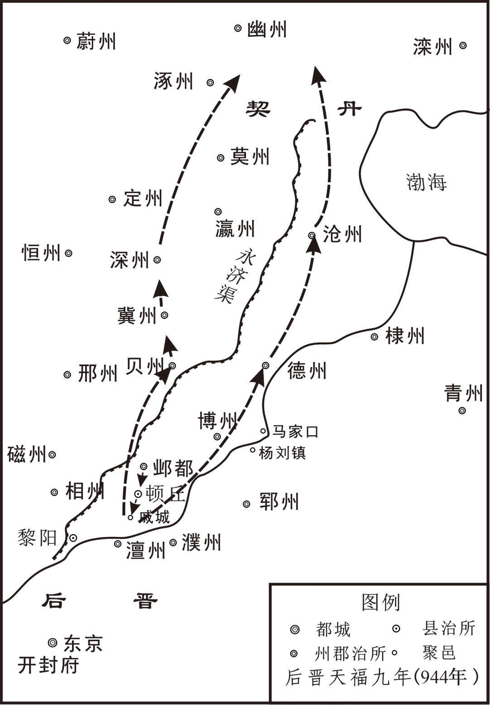 
契丹一攻后晋后大军北返示意图

## 【原文】

**辛卯，马全节攻契丹泰州，拔之[1]。敕天下籍乡兵，每七户共出兵械资一卒[2]。**

## 【注文】

[1]泰州：古州名。辽置，治乐康（今吉林洮南东北），领乐康、兴国二县，属上京道，辖境相当于今吉林洮儿河上游地区。

[2]籍：名册、户口册，引申为登记。

## 【译文】

后晋出帝开运元年（944年）三月辛卯（十九日），马全节进攻契丹所属的泰州，攻下。后晋出帝下诏令天下按户籍征集乡兵，每七户人家出一名士兵并共同负担这名士兵的兵器和粮食薪饷。

## 【原文】

**夏四月丁未，缘河巡检使梁进以乡社兵复取德州[1]。己酉，命归德节度使高行周、保义节度使王周留镇澶州。庚戌，帝发澶州，甲寅，至大梁。**

## 【注文】

[1]缘河巡检使：古代官职名。巡检使一职始设于五代后梁时期，主要掌管地方士兵训练、缉捕盗贼等事。缘河巡检使即沿黄河巡检使，负责沿河地区的巡逻等事务。　　乡社兵：即乡兵、民兵。

## 【译文】

后晋出帝开运元年（944年）夏季四月丁未（初五日），缘河巡检使梁进率领乡社兵再次收复德州。己酉（初七日），后晋出帝命令归德节度使高行周和保义节度使王周一起留下来镇守澶州。庚戌（初八日），后晋出帝从澶州出发，甲寅（十二日），抵达都城大梁。

## 【原文】

**侍卫马步都指挥使、天平节度使、同平章事景延广既为上下所恶，帝亦惮其不逊难制；桑维翰引其不救戚城之罪，辛酉，加延广兼侍中，出为西京留守[1]。以归德节度使兼侍中高行周为侍卫马步都指挥使。延广郁郁不得志，见契丹强盛，始忧国破身危，遂日夜纵酒。**

## 【注文】

[1]恶（wù）：讨厌、憎恨。　　不逊：不谦逊、不恭顺。　　引：引用。这里有指出、提起之意。　　侍中：古代文官名。秦朝始置，为丞相府属吏，因往来殿内奏事，故称侍中。西汉时仅作为朝廷官员的加官，无品秩。东汉以后地位趋于重要，多授予功臣、外戚及儒学名家，秩比二千石。唐时为门下省长官，正三品，二员，掌封驳制诰，即审议中书省起草的诏令，与中书、尚书省长官共同参议军国大政，皆为宰相。唐中期以后，多作为朝中重臣及将帅的加官，以示优崇，而不真正执掌宰相之权。

## 【译文】

侍卫马步都指挥使、天平节度使、同平章事景延广一方面被朝廷上下所厌恶，后晋出帝也感觉到他桀骜不驯，难以制服；另一方面，桑维翰又提出他先前不去救援戚城的罪过，于是，后晋开运元年（944年）四月辛酉（十九日），后晋出帝加封景延广兼任侍中，调他离开朝廷，出任西京留守。任命归德节度使兼侍中高行周为侍卫马步都指挥使。景延广忧郁不能得志，眼看契丹日益强盛，开始忧虑国破身亡的危险，于是日夜放纵饮酒。

## 【原文】

**朝廷因契丹入寇，国用愈竭，复遣使者三十六人分道括率民财，各封剑以授之[1]。使者多从吏卒，携锁械、刀杖入民家，小大惊惧，求死无地[2]。州县吏复因缘为奸[3]。**

## 【注文】

[1]括（kuò）率（lǜ）：搜刮。括，搜求；率，原意为捕鸟的网，引申为网罗、聚敛。　　封剑：指帝王授予宝剑。

[2]从吏卒：随从小吏、兵卒。　　锁：锁链、枷（jiā）锁。　　械（xiè）：木枷和镣铐之类的刑具。　　杖：兵器。

[3]因缘：借机、乘机。

## 【译文】

后晋朝廷由于契丹入侵，国家财政更加枯竭，再次派遣使臣三十六人分赴各道去搜刮民财，每人都赐给他们一枚尚方宝剑，授予生杀之权。使臣们率领众多的随从吏卒，携带着锁链、刑具、刀枪棍棒，闯入民宅，老百姓小孩大人无不惊慌恐惧，求生无路，求死无地。州县官吏也借此机会为非作歹，与他们狼狈为奸。

## 【原文】

**河南府出缗钱二十万，景延广率三十七万[1]。留守判官河南卢亿言于延广曰：“公位兼将相，富贵极矣[2]。今国家不幸，府库空竭，不得已取于民。公何忍复因而求利，为子孙之累乎！”延广惭而止。**

## 【注文】

[1]河南府：古代府名。唐玄宗开元元年（713年），改洛州（治今河南洛阳东北）为河南府，领河南、洛阳、偃（yǎn）师、陆浑、新安等二十余县，约当今河南渑（miǎn）池、洛宁以东，密县、禹州以西，北至济源、温县，南抵嵩（sōng）县、伊川等县地。唐天宝元年（742年）又改称东都。五代时或为东都，或为河南府。　　缗（mín）钱：用绳穿连成串的钱。也泛指税金。　　率（shuài）：征收、聚敛。

[2]留守判官：指河南府留守判官。　　卢亿（生卒年不详）：五代、宋初官员，怀州河内（治今河南沁阳）人。五代时历任开封尹推官、度支郎中、侍御史、文馆直学士等职。宋初迁河南少尹，以清介自持为人称道。后以少府监致仕（退休）。

## 【译文】

河南府应当出缗钱二十万，景延广却征收到了三十七万。河南留守判官、河南人卢亿对景延广说：“您的地位已经是身兼将相，富贵达到了极点。现在国家遇到困难，府库空虚枯竭，万不得已才向百姓索取。您又怎么忍心趁机贪求不义之财，将来连累子孙后代呢！”景延广惭愧而停止。

## 【原文】

**先是，诏以杨光远叛，命兖州修守备[1]。泰宁节度使安审信以治楼堞为名，率民财以实私藏[2]。大理卿张仁愿为括率使，至兖州，赋缗钱十万[3]。值审信不在，拘其守藏吏，指取钱一囷，已满其数[4]。**

## 【注文】

[1]杨光远叛：后晋天福八年（943年）十二月，平卢（青州）节度使杨光远欲效法石敬瑭，勾结契丹南下，密谋反叛。至后晋开运元年（944年）闰十二月，被泰宁节度使李守贞率军讨平，杨光远被其长子杨承勋胁迫投降，后被李守贞杀死。　　兖（yǎn）州：古代九州之一，而作为行政区划的兖州始于西汉时。唐代兖州治瑕（xiá）丘县（今山东兖州），领瑕丘、曲阜、乾封、泗（sì）水、邹县、任城、龚丘、金乡、鱼台、莱芜等县。辖境约当今山东济宁、曲阜、泗水、邹城、金乡、鱼台、莱芜、泰安等地。五代沿袭。

[2]安审信（894—953年）：唐末五代沙陀三部落人，字行光。初事后唐，历同、陕、许三州马步军都指挥使。后助石敬瑭反唐，任马步军副部署（副指挥），迁河中节度使。后周时官至右金吾上将军。性反复无常而好疑忌，所到之处搜刮聚敛，民不聊生。　　楼堞（dié）：城楼上如齿状的矮墙，也泛指城墙。　　私藏（zàng）：私家仓库。藏，贮藏财物的仓库。

[3]大理卿：古代文官名，大理寺长官，唐从三品，掌刑狱案件的审理。　　张仁愿：五代官员，籍贯及生卒年不详。　　括率使：临时派遣的征收赋税的使臣。

[4]守藏（zàng）吏：当为守仓库的小吏。　　指取：用手指着取出。指，用手指；取，取来、拿来。　　囷（qūn）：古代一种圆形的仓库。

## 【译文】

在此之前，由于杨光远的反叛，后晋朝廷命令兖州修筑防守工事。泰宁节度使安审信以修筑城墙城楼为名，搜刮民间钱财以充实他的私人仓库。大理卿张仁愿担任括率使，到达兖州后，收取缗钱十万。正好安审信不在，张仁愿拘捕了他守管仓库的小吏，随便用手指指了一个仓库让他打开，里面的钱就已经足够修筑城墙和城楼所需要的钱数了。

## 【原文】

**丙戌，诏诸州所籍乡兵号武定军，凡得七万余人。时兵荒之余，复有此扰，民不聊生。**

## 【译文】

后晋出帝开运元年（944年）四月丙戌（十五日），后晋出帝下诏，令各州按户籍征集的乡兵，定名为武定军，总共得到七万多人。当时正值兵荒马乱之余，再加上这种骚扰，老百姓无法生活。

## 【原文】

**丁亥，邺都留守张从恩上言：“赵延照虽据贝州，麾下兵皆久客思归，宜速进军攻之。”诏以从恩为贝州行营都部署，督诸将击之。辛卯，从恩奏赵延照纵火大掠，弃城而遁，屯于瀛、莫，阻水自固[1]。**

## 【注文】

[1]贝州行营都部署：古代武官名，参见前“北面行营都部署”条注。　　瀛（yíng）：即瀛州，古州名。唐武德四年（621年）改隋河间郡置，治河间（今河北河间）。领河间、高阳、平舒、束城、博野、乐寿等县，辖境约当今河北博野以东，肃宁、献县以北，大城、高阳以南，子牙河以西地区。后晋天福元年（936年）瀛州归入契丹，后周世宗显德六年（959年）收复。　　莫：即莫州，古州名。唐景云二年（711年）析瀛、幽二州地置鄚（mào）州，唐开元十三年（725年）改“鄚”为“莫”。治莫县（今河北任丘北），领莫、清苑、任丘、文安、长丰、唐兴等县，辖境约当今河北保定、清苑以及白洋淀以东任丘至文安洼一带。后晋天福元年（936年）莫州归入契丹，后周世宗显德六年（959年）收复。

## 【译文】

后晋齐王开运元年（944年）四月丁亥（十六日），邺都留守张从恩向朝廷上报说：“赵延照虽然占据了贝州，但他的部下兵士长久居住在外地，思归故里心切，应该迅速进军攻打他们。”后晋出帝便下诏任命张从恩为贝州行营都部署，督率众将领攻打赵延照。辛卯（二十日），张从恩奏报说赵延照放火焚烧掳掠，弃城逃走，屯扎在瀛州、莫州之间，以河水做阻挡固守。

## 【原文】

**六月，或谓帝曰：“陛下欲御北狄，安天下，非桑维翰不可[1]。”丙午，复置枢密院，以维翰为中书令兼枢密使，事无大小，悉以委之[2]。数月之间，朝廷差治[3]。**

## 【注文】

[1]北狄（dí）：北方的民族。中国古代素有东夷、南蛮、西戎、北狄之称，泛指东南西北方各族。这里的“北狄”，则专指契丹。

[2]枢密院：古代官署名。唐代宗永泰二年（766年）始置枢密使，以宦官担任，执掌为承受表奏，上呈皇帝，并将皇帝意图传达给宰相。后逐渐参与军国大政，并设置枢密院衙署。五代后梁开平元年（907年），改枢密院为崇政院，枢密使为崇政院使，以朝官担任。后唐同光元年（923年），恢复枢密院及枢密使的称呼与建制，有副使、参知枢密院事、枢密直学士等属官。到宋代，枢密院与中书省并称为“二府”，为最高国务机构。　　中书令：古代文官名。西汉中书谒（yè）者的省称，魏晋始有中书监、令。隋称内史令。唐高祖武德三年（620年）改为中书令，五代因之。为中书省长官，额员二人，初为正三品，唐代宗时升为正二品。内参机密，决议朝政，居宰相之任，时尊称为“令公”。唐代宗以后，其职权渐由中书侍郎代行，中书令一职成为优崇文武大臣的荣衔，且多缺而不置。

[3]差治：稍微得到治理。差，稍微地、比较地；治，治理。

## 【译文】

后晋出帝开运元年（944年）六月，有人对后晋出帝说：“陛下想要抵御北方夷狄，安定天下，非用桑维翰不可。”丙午（初六日），后晋恢复了枢密院的建制，任命桑维翰为中书令兼枢密使，无论大事小事，全部交给他处理。几个月后，朝廷政事稍稍得到了一些治理。

## 【原文】

**初，高祖割北边之地以赂契丹，由是府州刺史折从远亦北属[1]。契丹欲尽徙河西之民以实辽东，州人大恐，从远因保险拒之[2]。及帝与契丹绝，遣使谕从远，使攻契丹。从远引兵深入，拔十余寨。戊午，以从远为府州团练使[3]。从远，云州人也[4]。**

## 【注文】

[1]府州：古州名。五代后梁乾化元年（911年）设置，治府谷县（今陕西府谷），辖境约当今陕西府谷一带地区。　　折（shé）从远（892—955年）：字可久，后因避后汉高祖刘知远之讳改名从阮。云中（今山西大同）人，出于羌人折掘氏。初为后唐庄宗李存勖牙将，后升为府州刺史。石敬瑭割让幽云十六州给契丹，他在府州驻守。后晋开运元年（944年）后晋与契丹败盟后，他攻取契丹城堡十余处，升本州团练使。后汉时，在府州建永安军，他任节度使。后周时历任宣义、保义、静难三镇节度使。其孙女折赛花，为杨业之妻，即传说中的佘太君。

[2]河西之民：即黄河以西的百姓。　　辽东：辽河以东。契丹兴起于辽河流域地区，这里指契丹本部。

[3]团练使：古代官职名。全称团练守捉使。唐玄宗开元年间（713—741年），在不设节度使的地区置都防御使、团练使，负责统领地方军队，掌本地区防务，领三、五州至十州不等，地位低于节度使。唐后期诸道不设节度使者，以团练使总领军务，诸道刺史又多以此为加官。五代时沿置。

[4]云州：古州名。唐贞观十四年（640年）置，治云中县（曾改称定襄县，今山西大同）。唐时领有云中一县，辖境相当于今山西大同、怀仁、浑源、左云、右玉，内蒙古丰镇、察哈尔右翼前旗、兴和等地及河北尚义部分地区。五代沿袭。

## 【译文】

当初，后晋高祖（石敬瑭）割让北部边疆的土地以贿赂契丹，于是府州刺史折从远也隶属了契丹。契丹打算把黄河以西的老百姓全部东迁以充实辽东，府州百姓大为恐慌，折从远便据守险要，抗拒契丹。等到后晋出帝（石重贵）与契丹绝交后，派遣使者传令折从远，让他攻击契丹。折从远便率领军队深入到契丹境内，攻拔了十几个营寨。后晋开运元年（944年）六月戊午（十八日），后晋朝廷任命折从远为府州团练使。折从远是云州人。

## 【原文】

**秋八月辛丑朔，以河东节度使刘知远为北面行营都统，顺国节度使杜威为都招讨使，督十三节度以备契丹[1]。桑维翰两秉朝政，出杨光远、景延广于外，至是一制指挥，节度使十五人无敢违者，时人服其胆略[2]。契丹之入寇也，帝再命刘知远会兵山东，皆后期不至[3]。帝疑之，谓所亲曰：“太原殊不助朕，必有异图[4]。果有分，何不速为之[5]！”至是，虽为都统，而实无临制之权，密谋大计，皆不得预[6]。知远亦知见疏(3)，但慎事自守而已[7]。郭威见知远有忧色，谓知远曰：“河东山河险固，风俗尚武，土多战马，静则勤稼穑，动则习军旅，此霸王之资也，何忧乎[8]？”**

## 【注文】

[1]行营都统：古代武官名。为讨伐藩镇与镇压农民起义，唐乾元元年（758年）置都统，或总管五道，或总管三道兵马，作为最高统帅。有某某地区诸道都统、某某行营都统等称呼。为临时性军事长官，事毕即罢。唐中和二年（882年），又置诸道行营都都统，统率各都统。　　顺国节度使：即成德军节度使。后晋天福七年（942年），改镇州曰恒州，成德军曰顺国军。参见前“成德节度使”条注。　　都招讨使：古代官职名。为众招讨使头目，参见前“招讨使”条注。

[2]秉（bǐng）：掌握、主持。　　一制：统一制度。

[3]后期：迟误期限。

[4]殊：很、非常。

[5]果有分：如果有福分。

[6]临制：监临控制。

[7]慎事：谨慎做事。

[8]稼穑（sè）：农事的总称。春耕为稼，秋收为穑，即播种与收获。

## 【译文】

后晋出帝开运元年（944年）秋季八月辛丑朔（初一日），后晋朝廷任命河东节度使刘知远为北面行营都统，顺国节度使杜威为都招讨使，督率十三节度以防备契丹。桑维翰两度执掌朝政，把杨光远、景延广调离京城，出任外藩，至此统一了指挥，节度使十五人无一人敢违抗的，当时人都佩服他的胆略。契丹入侵之时，后晋出帝两次命令刘知远率军前往山东与其他部队会合，刘知远两次都过了期限不到。出帝怀疑他，对亲信说：“太原很不愿意辅助朕，必定有异图。如果他真的有当天子的福分，为什么不赶快来当呢！”于是，刘知远虽被任命为都统，然而实际上并没有施行指挥的权力，有关军事上的密谋大计，都不让他参与。刘知远也清楚自己被晋出帝疏远，只是谨慎处事，但求自保而已。郭威看见刘知远面带忧愁，就对他说：“河东山河险要，城池坚固，民风习俗崇尚武勇，土地多产战马，和平时期辛勤耕作，遇有战乱则行军打仗，这是成就王道霸业的资本，有什么可担忧的呢？”

## 【原文】

**十二月，契丹复大举入寇，卢龙节度使赵延寿引兵先进。契丹前锋至邢州，顺国节度使杜威遣使间道告急[1]。帝欲自将拒之，会有疾，命天平节度使张从恩、邺都留守马全节、护国节度使安审琦会诸道兵屯邢州，武宁节度使赵在礼屯邺都[2]。**

## 【注文】

[1]间（jiàn）道：偏僻的小路。

[2]护国节度使：古代方镇名，即河中节度使。唐肃宗至德二载（757年）置，治蒲州（即河中府，今山西永济西南）。唐僖宗光启二年（886年）改称护国军节度使。辖境屡变，长期领有河中府及晋（治临汾，今山西临汾）、绛（治正平，今山西新绛）、慈（治吉昌，今山西吉县）、隰（治隰［xí］川，今山西隰县）等州，辖境相当于今山西石楼、汾西、霍州等县市以南及安泽、垣（yuán）曲等县以西地区。五代沿袭。　　安审琦（qí）（897—959年）：沙陀三部落人。骁勇善于骑射。幼事后唐庄宗李存勖，累迁至义直军指挥使。石敬瑭起兵反叛后唐时，他跟随张敬达围太原，后与杨光远等人杀张敬达降于石敬瑭。后晋高祖时，历任天平、晋昌、河中等镇节度使。后晋开运三年（946年），契丹入寇，被任命为北面行营马军左右厢都指挥使。后汉时进封齐国公。后周时累封南阳王、陈王，加守太尉、太师。　　武宁节度使：古代方镇名，唐顺宗永贞元年（805年）置，治徐州（治彭城，今江苏徐州），领徐、泗（治临淮，今江苏泗洪东南）、濠（治钟离，今安徽凤阳东北）、宿（治符离，今安徽宿州北）等州。辖境约当今安徽池河、江苏淮河以北，山东滕州、郯（tán）城以南，安徽濉（suī）溪、怀远以东地区。唐咸通十一年（870年）更名感化军，后撤。五代时仍称武宁军节度使，领徐、宿二州。　　赵在礼（？—947年）：字干臣，涿州（治范阳，今河北涿州）人。唐末时奉事卢龙节度使刘仁恭、刘守光父子，后投河东李存勖，为效节指挥使。后唐同光四年（926年）魏州兵变，被推为帅。后唐明宗李嗣源即位后，历任邺都留守、兴唐尹和沧州、同州节度使等职。后晋时兼侍中，进爵位公。一生历仕三朝十余镇，所至之处，重征暴敛，民不堪命。契丹灭后晋，自缢死。

## 【译文】

后晋出帝开运元年（944年）十二月，契丹再次大规模入侵，其卢龙节度使赵延寿率领兵马先行进发。契丹前锋军抵达邢州，后晋顺国节度使杜威派遣使者抄小道奔向京师告急。后晋出帝本来打算亲自率领军队前往抗敌，却不巧生病，便命令天平节度使张从恩、邺都留守马全节、护国节度使安审琦会同各道兵力屯守邢州，武宁节度使赵在礼屯守邺都。

## 【原文】

**契丹主以大兵继至，建牙于元氏[1]。朝廷惮契丹之威，诏从恩等引兵稍却，于是诸军恟惧，无复部伍，委弃器甲，所过焚掠，比至相州，不复能整[2]。**

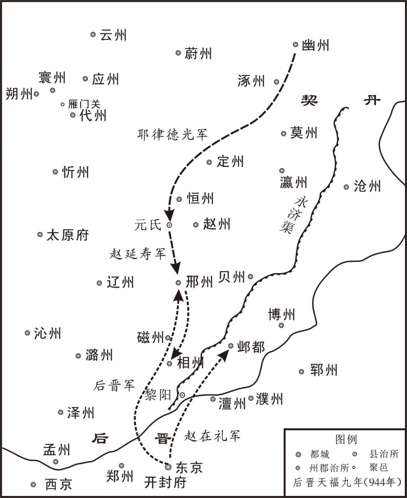 
契丹二攻后晋时邢州战役示意图

## 【注文】

[1]牙：古代将军之旗称牙旗，北方游牧民族的王庭亦称牙。　　元氏：古县名，唐、五代时属赵州，在今河北元氏县。

[2]惮：畏惧。　　却：退。　　恟（xiōng）惧：骚扰害怕。　　无复：不再。　　委弃：抛弃。　　比：及，等到。　　相州：古州名。北魏天兴四年（401年）始置，后世屡有废置。唐武德元年（618年）复置，治安阳县（今河南安阳）。唐时领有安阳、邺县、汤阴、林虑、临漳、内黄、尧城、洹（huán）水等十一县，辖境相当于今河北广平、成安两县和魏县西南部，河南安阳、汤阴、林州、内黄等县以及濮阳西南部等地。五代沿袭。　　整：整顿。

## 【译文】

契丹国主（耶律德光）率领大军后续到达，在赵州元氏县设置牙帐指挥。后晋朝廷畏惧契丹的军威，诏令张从恩等率军稍稍后退，以避开敌军的锐气。不料各军惊恐万状，一退而不可收拾，再也不能成军，丢盔弃甲，四散逃命。所过之处，焚烧掳掠，等退到相州时，部队混乱到了无法整顿的地步。

## 【原文】

**二年春正月，诏赵在礼还屯澶州，马全节还邺都[1]。又遣右神武统军张彦泽屯黎阳，西京留守景延广自滑州引兵守胡梁渡[2]。庚子，张从恩奏契丹逼邢州，诏滑州、邺都复进军拒之。义成节度使皇甫遇将兵趣邢州[3]。契丹寇邢、洺、磁三州，杀掠殆尽，入邺都境[4]。**

## 【注文】

[1]二年：即后晋开运二年，公元945年。

[2]胡梁渡：也作胡良渡，黄河古渡口，在今河南滑县东北黄河北岸。

[3]趣（qù）：奔向、赶赴。

[4]洺：即洺州，古州名。北周宣政元年（578年）置，治广年县（隋改为永年县，今河北永年）。唐沿置，领有永年、平恩、临洺、鸡泽、肥乡、曲周、洺水、清漳、武安、邯郸等县，辖境约相当于今河北邯郸、鸡泽、永年、曲周、邱县、肥乡、武安等地。五代沿袭。　　磁：即磁州，古州名。隋开皇十年（590年）置慈州，治滏（fǔ）阳县（今河北磁县）。唐武德元年（618年）改“慈”为“磁”，以州西北有慈石山，出磁石而得名。唐时领有滏阳、邯郸、武安、昭义等县，辖境约相当于今河北邯郸、磁县、武安等地。五代沿袭。

## 【译文】

后晋出帝开运二年（945年）春季正月，后晋出帝下诏命令赵在礼回师屯守澶州，马全节还师邺都。又派遣右神武统军张彦泽屯守黎阳，西京留守景延广从滑州率兵防守胡梁渡。庚子（初三日），张从恩奏报说契丹逼近邢州，出帝诏令滑州、邺都两地驻军再次出兵阻击。义成节度使皇甫遇率兵赶赴邢州。契丹军侵犯邢、洺、磁三州，几乎将三州屠杀掳掠一空，然后进入邺都境内。

## 【原文】

**壬子，张从恩、马全节、安审琦悉以行营兵数万陈于相州安阳水之南[1]。皇甫遇与濮州刺史慕容彦超将数千骑前觇契丹，至邺县，将渡漳水，遇契丹数万，遇等且战且却[2]。至榆林店，契丹大至，二将谋曰：“吾属今走，死无遗矣。”乃止，布陈，自午至未，力战百余合，相杀伤甚众[3]。遇马毙，因步战；其仆杜知敏以所乘马授之，遇乘马复战。久之，稍解，顾知敏已为契丹所擒[4]。遇曰：“知敏义士，不可弃也。”与彦超跃马入契丹陈，取知敏而还。俄而契丹继出新兵来战。二将曰：“吾属势不可走，以死报国耳。”**

## 【注文】

[1]安阳水：即安阳河，古称洹水，是流经今河南安阳境内的一条河流。殷墟出土的甲骨文中，就有“戊子贞，其咬于洹泉”的字句。发源于林虑山，东流入内黄至范阳口入卫河，入卫河后北流汇入海河，从天津入海。

[2]濮（pú）州：古州名。隋文帝开皇十六（596年）年置，后废。唐高祖武德四年（621年）复置，治鄄（juàn）城（今山东鄄城北）。玄宗天宝元年（742年）改为濮阳郡。肃宗乾元元年（758年）又改为濮州。领鄄城、濮阳、范县、雷泽、临濮五县，辖境约当今山东鄄城及河南濮阳南部地区。　　慕容彦超（？—952年）：吐谷（yù）浑部人。曾冒姓阎，号阎昆仑，为后汉高祖刘知远的同母异父弟。初事后唐明宗李嗣源，为军校，累迁至州刺史。刘知远起兵太原，他被任命为镇宁军节度使，后徙镇泰宁。后周太祖郭威起兵时，他与交战，兵败后奔往兖州。后周广顺二年（952年），他联络南唐、北汉反周，兵败城破，投井而死。　　觇（chān）：侦察。　　漳水：即漳河，卫河支流。源出晋东南山地，向东流入河北、河南一带，为现在河南安阳和河北邯郸的分界线。　　且战且却：边战边退。

[3]自午至未：从午时到未时。午时，相当于现在的上午十一时到下午一时；未时，相当于现在的下午一时到三时。

[4]顾：回头看，泛指看。

## 【译文】

后晋出帝开运二年（945年）正月壬子（十五日），张从恩、马全节、安审琦（qí）集结所有行营部队数万人，在相州安阳水南摆开阵势。皇甫（fǔ）遇和濮州刺史慕容彦超率领数千名骑兵前去侦察契丹军的行踪，到达邺县，准备渡过漳水时，与契丹军数万人相遇，皇甫遇等边战边退。到达榆林店后，契丹大部队人马来到，皇甫遇和慕容彦超二将商议说：“我们现在后退，必定会全军覆没。”于是停止撤退，布设军阵，从午时一直到未时，奋力交战一百多个回合，双方伤亡都非常惨重。皇甫遇所骑的马匹倒毙，于是步战；他的仆人杜知敏将自己所乘的马让给他，皇甫遇上马再战。过了许久以后，战斗稍微缓解，皇甫遇回头寻找杜知敏，发现他已被契丹军所抓获。皇甫遇说：“杜知敏是一个义士，不能遗弃他。”便和慕容彦超跃马杀入契丹军阵，把杜知敏夺了回来。不久，契丹又派出一支生力军前来交战。皇甫遇和慕容彦超二将说：“我们坚决不能退走，只能以死来报效国家。”

## 【原文】

**日且幕，安阳诸将怪觇兵不还，安审琦曰：“皇甫太师寂无声问，必为虏所困[1]。”语未卒，有一骑白遇等为虏数万所围[2]。审琦即引骑兵出，将救之，张从恩曰：“此言未足信。必若虏众猥至，尽吾军，恐未足以当之，公往何益[3]？”审琦曰：“成败，天也。万一不济，当共受之。借使虏不南来，坐失皇甫太师，吾属何颜以见天子[4]！”遂逾水而进[5]。契丹望见尘起，即解去[6]。遇等乃得还，与诸将俱归相州，军中皆服二将之勇。彦超本吐谷浑也，与刘知远同母。契丹亦引军退，其众自相惊曰：“晋军悉至矣。”时契丹主在邯郸，闻之，即时北遁，不再宿，至鼓城[7]。**

## 【注文】

[1]日且幕：太阳即将落下。且，将要，快要；幕同“暮”，日落的时候。　　皇甫太师：即皇甫遇，其时官至检校太师。　　太师：即太子太师，古代文官名。西晋时始置，后世沿袭。掌辅导、教诲太子，与太子太傅、太子太保合称东宫三师，多由朝中大臣兼领。唐五代时三师均为从一品官，多用做加官、赠官或安置退免大臣，不再负教导太子之责。

[2]白：下级对上级告诉、陈述。

[3]猥（wěi）至：大至。猥，众多。　　尽：全部用出。

[4]借使：假使、假如。　　吾属：我等。

[5]逾（yù）水：渡过河水。

[6]解去：解围而去。

[7]邯郸：古地名，春秋时已有。五代时属磁州，今河北邯郸。　　鼓城：古县名，时属定州，在今河北晋州。

## 【译文】

太阳将要落下的时候，驻扎在安阳的众将领们奇怪出去侦察的部队为什么还不回来，安审琦说：“皇甫太师音信全无，必定是被契丹胡虏包围了。”话音未落，有一名骑兵前来报告，说皇甫遇等被契丹胡虏数万人所围困。安审琦立即率领骑兵打算出城去解救他们，张从恩说：“此话未必可信。假若契丹胡虏真的大军来到，即使我军全部出动，恐怕也未必能抵挡他们，您去了又有什么用处呢？”安审琦说：“成败在天。即令万一不能成功，也应当有难同当。假如契丹胡虏不继续南下，我们坐在这里眼睁睁地看着皇甫太师失去，我们有何颜面去见天子！”于是渡河前进。契丹兵望见尘土飞扬，便立即解围退去。皇甫遇等于是得以生还，与众将领一起回到相州，军中都十分佩服皇甫遇和慕容彦超两位将军的勇猛。慕容彦超本来是吐谷浑人，与刘知远是同母兄弟。契丹也带领军队撤退，他们的士兵自相惊恐地呼叫：“晋军全军到来了。”当时契丹国主（耶律德光）驻扎在邯郸，听到这一消息，立即向北逃去，不再敢过夜，一路逃到了鼓城。

## 【原文】

**是夕，张从恩等议曰：“契丹倾国而来，吾兵不多，城中粮不支一旬，万一有奸人往告吾虚实，虏悉众围我，死无日矣[1]。不若引军就黎阳仓，南倚大河以拒之，可以万全[2]。”议未决，从恩引兵先发，诸军继之，扰乱失亡，复如发邢州城时。**

## 【注文】

[1]一旬：十日为一旬。　　悉众：全部出动。

[2]就：前往。　　黎阳仓：隋唐时期大运河沿岸重要的国家官署粮仓。隋开皇三年（583年）始置，唐、五代及宋均沿置，故址在今河南浚县东关村东。

## 【译文】

当晚，张从恩等人商议说：“契丹国出动全部兵马而来，而我们的军队人数不多，城中的粮食不够吃十天，万一有奸细前往契丹告诉我军的虚实，胡虏出动全部兵力来围攻我们，我们就死定了。不如率领军队进驻黎阳仓，南靠黄河来抵抗他们，这样可以万无一失。”商议尚未结束，张从恩已经率领他的部队先行开发，其他各军紧随其后，相互扰乱逃亡，又如邢州撤退时的狼狈惨状。

## 【原文】

**从恩等留步兵五百守安阳桥，夜四鼓，知相州事符彦伦谓将佐曰：“此夕纷纭，人无固志，五百弊卒，安能守桥[1]。”即召入，乘城为备[2]。至曙，望之，契丹数万骑已陈于安阳水北，彦伦命城上扬旌鼓噪约束，契丹不测[3]。日加辰，赵延寿与契丹惕隐帅众逾水，环相州而南[4]。诏右神武统军张彦泽将兵趣相州。延寿等至汤阴，闻之，甲寅，引还[5]。马全节等拥大军在黎阳，不敢追。延寿悉陈甲骑于相州城下，若将攻城状，符彦伦曰：“此虏将走耳。”出甲卒五百，陈于城北以待之，契丹果引去。**

## 【注文】

[1]四鼓：即四更，报更的鼓声敲了四次。古代一个更次敲一次鼓，四更大致相当于现在的后半夜两点左右。　　符彦伦（生卒年不详）：五代军将，陈州宛丘（今河南淮阳）人，后唐太祖李克用养子符存审（李存审）之子，名将符彦卿之弟。后唐时任供奉官，后晋时历相州、严州刺史等职。

[2]乘（chéng）城：登城。乘，登、升。

[3]曙：天刚亮。　　扬旌（jīng）鼓噪：挥舞旌旗，擂鼓呐喊。旌，古代用羽毛装饰的旗子，后多泛指普通的旗子。　　约束：规约。　　不测：不能推测。

[4]日加辰：即到了辰时，约当今上午七时至九时。　　惕（tì）隐：辽朝官职名，耶律阿保机时设，掌管大惕隐司，管理迭剌部贵族的政教，即调节贵族集团的内部事务，以便确保他们对阿保机的服从。

[5]汤阴：古县名，唐五代时属相州，在今河南汤阴。

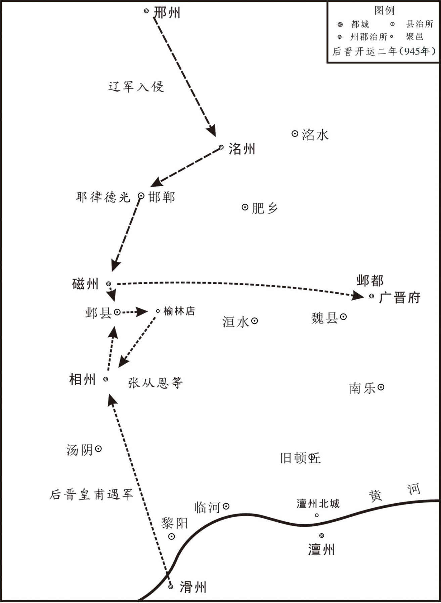 
契丹二攻后晋时邺县战役示意图

## 【译文】

张从恩等留下步兵五百人守护安阳桥，夜间四更时分，代理相州刺史符彦伦对手下各将领们说：“今天晚上乱纷纷的，人们都没有坚强的斗志，五百名疲惫的士卒，怎么能守住这座桥梁。”于是召集他们入城，登上城墙防守。等到天亮一看，契丹数万骑兵已经在安阳河北布下阵势，符彦伦命令军士们在城上挥舞旌旗擂鼓呐喊，契丹军因此推测不出后晋军队的虚实。到了辰时，赵延寿会同契丹惕隐率领部众渡过安阳水，绕过相州城南下。后晋出帝下诏令右神武统军张彦泽率兵奔赴相州。赵延寿等抵达汤阴后，听到这一消息，后晋开运二年（945年）正月甲寅（十七日），领兵撤退。马全节等统率大军驻扎在黎阳，不敢前往追击。赵延寿把他的全部重甲骑兵在相州城下布阵摆开，就像将要攻城的样子，符彦伦说：“这是胡虏将要逃走了。”派出武装士卒五百人，在城北列阵等待他们，契丹军果然退去。

## 【原文】

**以天平节度使张从恩权东京留守。**

## 【译文】

后晋朝廷任命天平节度使张从恩代理东京留守。

## 【原文】

**庚申，振武节度使折从远击契丹，围胜州，遂攻朔州[1]。**

## 【注文】

[1]振武节度使：古代方镇名，参见前“朔州节度副使”条注。　　胜州：古州名。隋开皇二十年（600年）置，治榆林（今内蒙古准格尔旗十二连城）。隋大业三年（607年）改为榆林郡。唐武德（618—626年）中复置胜州，领榆林、河滨二县。辖境约当今内蒙古准格尔旗、伊金霍洛旗、东胜、达拉特旗及托克托一带。唐末为党项所占，五代时为辽兵所占，辽胁迫城内百姓迁往黄河东北岸的东胜州，胜州遂废。　　朔州：古州名。北齐天保六年（555年）置，治新城县（今山西朔州西南），八年（557年）徙治昭远县（今山西朔州，隋改名为善阳县）。隋大业（605—616年）年间先后改为代郡、马邑郡，唐武德四年（621年）复为朔州，领有善阳、马邑二县，辖境相当于今山西朔州和偏关、河曲、神池、五寨、山阴、应县等地。五代后晋石敬瑭称帝时，割让给契丹，为“幽云十六州”之一。

## 【译文】

后晋出帝开运二年（945年）正月庚申（二十三日），振武节度使折从远攻击契丹，包围胜州，接着进攻朔州。

## 【原文】

**帝疾小愈，河北相继告急。帝曰：“此非安寝之时。”乃部分诸将为行计[1]。**

## 【注文】

[1]部分：部署分配。　　计：计谋、谋划。

## 【译文】

后晋出帝的病情稍见好转，河北相继告急。出帝说：“现在不是安睡的时候。”于是部署各部将领，准备出征。

## 【原文】

**北面副招讨使马全节等奏：“据降者言，虏众不多，宜乘其散归种落，大举径袭幽州[1]。”帝以为然，征兵诸道。壬戌，下诏亲征。乙丑，帝发大梁。**

## 【注文】

[1]径（jìng）袭：直往袭击。径，径直，直接。

## 【译文】

北面副招讨使马全节等奏报说：“据前来投降的契丹军士说，胡虏的兵力并不太多，应该乘着他们的部落分散回归的机会，大举出兵直往袭击幽州。”后晋出帝同意他的意见，向各道征调军队。后晋开运二年（945年）正月壬戌（二十五日），下诏说要御驾亲征。乙丑（二十八日），出帝从大梁出发。

## 【原文】

**二月，（壬）［戊］辰朔，帝至滑州。壬申，命安审琦屯邺都。甲戌，帝发滑州，乙亥，至澶州。己卯，马全节等诸军以次北上。刘知远闻之曰：“中国疲弊，自守恐不足，乃横挑强胡，胜之犹有后患，况不胜乎[1]！”**

## 【注文】

[1]横挑：勇敢地挑战。

## 【译文】

后晋出帝开运二年（945年）二月戊辰朔（初一日），后晋出帝抵达滑州。壬申（初五日），命令安审琦屯守邺都。甲戌（初七日），出帝从滑州出发，乙亥（初八日），抵达澶州。己卯（十二日），马全节等各路兵马按次序北上。刘知远听到这个消息后说：“中国疲惫困乏，自我保全尚且恐怕力量不足，竟然主动去向强大的胡虏挑衅，即使是取胜，也是后患无穷，何况是不能取胜呢！”

## 【原文】

**契丹自恒州还，以羸兵驱牛羊过祁州城下，刺史下邳沈斌出兵击之，契丹以精骑夺其城门，州兵不得还[1]。赵延寿知城中无余兵，引契丹急攻之。斌在［城］上，延寿语［之］曰：“沈使君，吾之故人[2]。择祸莫若轻，何不早降[3]？”斌曰：“侍中父子失计陷身虏庭，忍帅犬羊以残父母之邦[4]；不自愧耻，更有骄色，何哉！沈斌弓折矢尽，宁为国家死耳，终不效公所为。”明日，城陷，斌自杀。**

## 【注文】

[1]羸（léi）兵：疲弱的士兵。羸，瘦弱。　　祁州：古州名。唐景福二年（893年）分定州置，治无极（今河北无极），领无极、深泽二县，辖境约当今河北无极、深泽二县地。五代沿袭。　　沈斌（？—945年）：一作沈赟（yūn）。字安时，徐州下邳（pī）（今江苏睢宁西北）人。少为军卒，事后梁为拱辰都指挥使。后唐时历任虢（guó）、随、赵等州刺史。后晋开运元年（944年）为祁州刺史。契丹入侵至于榆林，过祁州，斌以州兵击之。不久城陷，斌自尽，家属没于契丹。

[2]使君：汉代称呼郡太守和州刺史，汉以后用作对州郡长官的尊称。

[3]择祸莫若轻：出自《国语·晋六》，全句作“择福莫若重，择祸莫若轻”，意思是说：“如果要在幸福的事情里加以选择，不如选重大的；如果在祸事里加以选择，不如选择轻微的。”

[4]侍中父子：指赵德钧、赵延寿父子。赵延寿在后唐时曾加检校太师兼侍中。　　犬羊：借指契丹军队，这里具有蔑称。

## 【译文】

契丹军从恒州回师，派一些羸弱士兵驱赶着牛羊从祁州城下经过，祁州刺史、下邳人沈斌派兵出城去攻击他们，契丹精锐骑兵趁机夺取了城门，出城的州兵无法回城。赵延寿知道祁州城中没有多余的兵力，便率领契丹军队迅速攻城。沈斌在城上守城，赵延寿对他呼喊说：“沈使君，我的老朋友。‘择祸莫若轻’，你为什么不尽早投降呢？”沈斌回答说：“侍中父子因为失算而身陷胡虏国中，竟然忍心率领犬羊来残害你自己的国家；自己不感到惭愧羞耻，反而以此为荣，这是为什么！沈斌我即使是弓折断、箭射完，宁愿为国家去死，也绝不会效法你的所做所为。”第二天，祁州城陷，沈斌自杀。

## 【原文】

**丙戌，诏北面行营都招讨使杜威以本道兵会马全节等进军。**

## 【译文】

后晋出帝开运二年（945年）二月丙戌（十九日），后晋出帝下诏命令北面行营都招讨使杜威率领本道兵马会同马全节等向契丹进军。

## 【原文】

**端明殿学士、户部侍郎冯玉，宣徽北院使、权侍卫马步都虞候太原李彦韬皆挟恩用事，恶中书令桑维翰，数毁之[1]。帝欲罢维翰政事，李崧、刘昫固谏而止[2]。维翰请以玉为枢密副使，玉殊不平[3]。丙申，中旨以玉为户部尚书、枢密使，以分维翰之权[4]。彦韬少事阎宝为仆夫，后隶高祖帐下[5]。高祖自太原南下，留彦韬侍帝，为腹心，由是有宠[6]。性纤巧，与嬖幸相结，以蔽帝耳目，帝委信之，至于升黜将相，亦得预议[7]。常谓人曰：“吾不知朝廷设文官何所用，且欲澄汰，徐当尽去之[8]。”**

## 【注文】

[1]端明殿学士：古代文官名。后唐天成元年（926年）始置，以翰林学士担任，地位颇高，在翰林学士之上，掌进读书奏。宋沿置，由久任翰林学士的大臣担任，元丰改制后，并以执政官担任，无职掌，仅出入侍从备顾问而已。　　户部侍郎：古代文官名，户部仅次于尚书的官职，约当今财政部次长。隋大业三年（607年）始置民部侍郎。唐武德七年（624年）省之。唐太宗贞观二年（628年）复置，二十三年（649年）改为户部侍郎。初置一员，唐垂拱四年（688年）加至二员，正四品下。掌国家土地、人民、财税、钱谷之政。中唐以后，六部尚书渐为虚衔，各部事务实由侍郎主之。　　冯玉（？—953年）：字璟臣，定州（治安喜，今河北定州）人。少举进士不中。冯赟为河东节度使时，辟为推官。后入朝做官。后晋出帝石重贵娶其姊为后，玉以后戚累拜中书舍人、端明殿学士、户部侍郎、枢密使等职。后升任中书侍郎、同中书门下平章事。军国大务，一决于玉。四方贿赂，积资产巨万。契丹灭后晋，兵士争先入其家抢掠。后晋出帝北迁，玉从入契丹，契丹以为太子太保。后周广顺三年（953年），其子杰自契丹逃归，玉忧惧死。　　宣徽北院使：古代官职名。唐时置南北宣徽院，各设正副使，例由宦官担任，总领宫内诸使及内侍名籍，并掌郊祀、朝会宴飨（xiǎng）供帐事宜。后唐省副使，院设于枢密院北，以检校官担任，或由枢密副使兼领。　　李彦韬（tāo）：五代军将，生卒年不详。太原（今山西太原）人。少奉事邢州节度使阎宝。后入后晋高祖石敬瑭帐下，历任客将、牙门都校。后晋出帝继位，迁蔡州刺史、宣徽南院使、充侍卫马军都指挥使等职。契丹入汴，从出帝北迁。及至契丹，隶契丹国母帐下。契丹永康王举兵攻国母，以伟王为前锋，彦韬降于伟王，置之帐下，后死于幽州。　　挟（xié）恩：倚仗恩宠。　　毁：诋毁。

[2]刘昫（xù）（887—946年）：字耀远，涿州归义（今河北容城东）人。后唐时历任翰林学士、兵部侍郎、端明殿学士、中书侍郎兼刑部尚书、同中书门下平章事等职。执政期间，曾革除财政积弊。后唐末帝时，监修国史，修成《旧唐书》。后晋时历任东都留守、判盐铁、同中书门下平章事等职。后晋开运三年（946年）契丹入侵开封，刘昫以目疾罢为太保，本年卒。　　谏（jiàn）：旧时称规劝君主或尊长，使之改正错误曰“谏”。

[3]枢密副使：古代官职名，枢密院副职。

[4]中旨：皇帝自宫廷发出的亲笔命令，或诏令不按照正常程序通过中书门下，而是直接交付有关机构执行，称为中旨。　　户部尚书：古代文官名，正三品。户部为尚书省六部之一，三国时称度支，隋代改称民部，唐代以后称户部，其长官为尚书。掌全国疆土、田地、户籍、赋税、俸饷等财政事宜。中唐以后渐成虚官。

[5]阎宝（863—922年）：字琼美，郓州（治须昌，今山东东平）人。少事朱瑾为牙将，后归朱温为大将，历洺、随、宿、郑四州刺史。后梁开平三年（909年），任邢洺节度使、检校太傅。后梁贞明二年（916年），阎宝以邢州归降李存勖，李存勖任其为检校太尉、同平章事，遥领天平军节度使、东南面招讨等使。922年卒于军中。　　高祖：即后晋高祖石敬瑭。　　帐下：指营帐中，将帅的部下，同麾下。唐末五代节帅的帐下，具有私兵性质。

[6]侍帝：侍奉皇帝。这里的“帝”指后晋出帝石重贵。　　腹心：即“心腹”。比喻亲信。

[7]嬖（bì）幸：宠爱、被宠爱的人。

[8]澄（chéng）汰：澄去泥滓（zǐ），汰除沙砾，亦即淘汰。

## 【译文】

端明殿学士、户部侍郎冯玉和宣徽北院使、代理侍卫马步都虞候、太原人李彦韬，都依仗着皇帝对他们的恩宠而专权用事，两人厌恶中书令桑维翰，多次对他进行诋毁。后晋出帝打算罢免桑维翰的政务，被李崧（sōng）、刘昫竭力劝谏而止。桑维翰知道了此事，奏请任命冯玉为枢密副使，冯玉很不高兴。后晋开运二年（945年）二月丙申（二十九日），出帝从宫中直接下令，任命冯玉为户部尚书、枢密使，以此来分割桑维翰的权力。李彦韬在少年时期曾伺候过阎宝，给阎宝当仆夫，后来隶属在后晋高祖（石敬瑭）的帐下。高祖从太原起兵南下，留李彦韬服侍出帝，成为出帝的心腹，因此受到出帝的宠信。李彦韬性格纤细灵巧，与那些被出帝宠信的人互相勾结，来蒙蔽出帝的耳目，出帝依赖信任他，以至于升降任免将相，也让他参与议论。李彦韬常常对人说：“我不知道朝廷设置文官有什么用处，我打算淘汰他们，慢慢地将他们全部除去。”

## 【原文】

**初，高祖置德清军于故澶州城，及契丹入寇，澶州、邺都之间城戍俱陷。议者以澶州、邺都相去百五十里，宜于中涂筑城以应接南北；从之[1]。三月戊戌，更筑德清军城，合德清、南乐之民以实之[2]。**

## 【注文】

[1]中涂：即中途、中间。涂，同“途”。

[2]更：再，另外。

## 【译文】

当初，后晋高祖（石敬瑭）在澶州故城设置德清军，及至契丹军队入侵，澶州、邺都之间的城堡军戍全部陷入契丹手中。议论者建议说，澶州与邺都相距一百五十里，应该在此之间修筑城堡来接应南北，后晋出帝听从了这个建议。后晋开运二年（945年）三月戊戌（初二日），下令另外修筑一座德清军城，集合德清、南乐两地的老百姓充实到军城之中。

## 【原文】

**乙巳，杜威等诸军会于定州，以供奉官萧处钧权知祁州事。庚戌，诸军攻契丹，泰州刺史晋廷谦举州降。甲寅，取满城，获契丹酋长没剌及其兵二千人[1]。乙卯，取遂城[2]。赵延寿部曲有降者，言契丹主还至虎北口，闻晋取泰州，复拥众南向，约八万余骑，计来夕当至，宜速为备[3]。杜威等惧，丙辰，退保泰州。**

## 【注文】

[1]满城：古县名，唐天宝元年（742年）改永乐县置，治所在今河北满城北，属易州。五代沿袭。

[2]遂城：古县名，隋开皇十八年（598年）改新昌县置，治所在今河北徐水西遂城。唐五代沿袭，属易州。

[3]部曲：指家兵、私兵。唐五代时，各藩镇节度使大都养有数量不等的私兵。　　虎北口：古地名，古代重要关口，形势险要，在今山西太原汾水北岸。

## 【译文】

后晋出帝开运二年（945年）三月乙巳（初九日），杜威等各路兵马在定州会合，后晋出帝任命供奉官萧处钧代理主持祁州事务。庚戌（十四日），各军进攻契丹，契丹委任的泰州刺史晋廷谦献出州城投降。甲寅（十八日），后晋军夺取满城，俘虏契丹酋长没剌及其下所属兵士两千人。乙卯（十九日），攻取遂城。投降后晋军的赵延寿的部属说，契丹国主（耶律德光）在返回到达虎北口时，听说后晋军攻取了泰州，便再次率军南下，大约有八万多名骑兵，估计明天傍晚就能到达，应该赶紧进行防备。杜威等人害怕，丙辰（二十日），撤退还保泰州。

## 【原文】

**戊午，契丹至泰州。己未，晋军南行，契丹踵之[1]。晋军至阳城，庚申，契丹大至[2]。晋军与战，逐北十余里，契丹逾白沟而去[3]。壬戌，晋军结陈而南，胡骑四合如山，诸军力战拒之。是日才行十余里，人马饥乏。癸亥，晋军至白团卫村，埋鹿角为行寨[4]。契丹围之数重，奇兵出寨后断粮道。是日(4)，东北风大起，破屋折树。营中掘井，方及水辄崩，士卒取其泥，帛绞而饮之，人马俱渴[5]。至曙，风尤甚。契丹主坐奚车中，令其众曰：“晋军止此耳，当尽擒之，然后南取大梁[6]。”命铁鹞四面下马，拔鹿角而入，奋短兵以击晋军，又顺风纵火扬尘以助其势[7]。**

## 【注文】

[1]踵（zhǒng）：追随。

[2]阳城：古地名，在今河北顺平县东南。《续汉志》云：“中山蒲阴县有阳城。”蒲阴县，东汉元和三年（86年）改曲逆县置，治所在今河北顺平县东南。北齐废。

[3]逐北：追击败军。古时北方部族入侵，败则逃归，故以北代指战败、败逃。　　白沟：即今河北高碑店东自北而南的白沟河。五代后也泛指位于今河北、北京境内西东流向的巨马河。

[4]鹿角：一种守城工具。古代战争中，用削尖的木棒制成木栅栏，以防止军营遭到敌军骑兵的偷袭，称“鹿角”，因其形状像鹿角，故而得名。　　行寨：即行军中的临时营寨。

[5]辄（zhé）崩：总是崩塌。辄，总是。

[6]奚（xī）车：古代奚族人建造的车。其车型前宽后窄，车毂（gǔ）较长，车轮略大，车轴则较短，车牙厚不过四寸，车轸不过五寸（以北宋尺寸计量）。上面长价有木棚，用毡帛覆盖，有的绣有花纹和图案。

[7]铁鹞（yào）：契丹骑兵名，亦称“铁鹞子”。

## 【译文】

后晋出帝开运二年（945年）三月戊午（二十二日），契丹军队到达泰州。己未（二十三日），后晋军队向南撤退，契丹军从后面追来。后晋军到达阳城，庚申（二十四日），契丹军大批而至。后晋军与契丹军展开了战斗，击败契丹军，并向北追赶了十余里，契丹军越过白沟逃去。壬戌（二十六日），后晋军结合成阵列向南撤退，契丹骑兵如同山一样从四面向后晋军队包围过来，后晋各支军队都奋力抵抗。一天才行进了十余里，人马饥饿困乏。癸亥（二十七日），后晋军到达白团卫村，埋下鹿角安营扎寨。契丹兵层层包围了后晋军，并派出奇兵从后晋军营寨的后面断绝后晋军的运粮通道。当天夜晚，刮起了猛烈的东北风，房屋倒塌，树木折断。后晋军队在营地中挖井，总是在刚刚就要出水时便崩塌，士卒只好取上带水的泥土，用布帛绞出水喝，人马都干渴。等到天亮，风刮得更大了。契丹国主坐在奚车中，命令部众说：“晋朝的军队只剩下这些了，应当把他们全部擒获，然后南下直取大梁。”于是命令铁鹞骑军从四面下马，拔除后晋军所埋下的鹿角，进入后晋军军营内，操起短兵器攻击后晋军，又顺风纵火扬尘以助长声势。

## 【原文】

**军士皆愤怒，大呼曰：“都招讨使何不用兵？令士卒徒死[1]！”诸将请出战，杜威曰：“俟风稍缓，徐观可否。”马步都监李守贞曰：“彼众我寡，风沙之内，莫测多少，惟力斗者胜，此风乃助我也。若俟风止，吾属无类矣[2]。”即呼曰：“诸军齐击贼！”又谓威曰：“令公善守御，守贞以中军决死矣[3]。”马军左厢都排陈使张彦泽召诸将问计，皆曰：“虏得风势，宜俟风回与战。”彦泽亦以为然。诸将退，马军右厢副排陈使太原药元福独留，谓彦泽曰：“今军中饥渴已甚，若俟风回，吾属已为虏矣[4]。敌（为）［谓］我不能逆风以战，（而）［宜］出其不意争击之，此兵之诡道也。”马步左右厢都排陈使符彦卿曰：“与其束手就擒，曷若以身徇国[5]！”乃与彦泽、元福及左厢都排陈使皇甫遇引精骑出西门击之，诸将继至，契丹却数百步。彦卿等谓守贞曰：“且曳队往来乎[6]？直前奋击，以胜为度乎[7]？”守贞曰：“事势如此，安可回鞚[8]！宜长驱取胜耳。”彦卿等跃马而去，风势益甚，昏晦如夜。彦卿等拥万余骑横击契丹，呼声动天地，契丹大败而走，势如崩山。李守贞亦令步兵尽拔鹿角出斗，步骑俱进，逐北二十余里。铁鹞既下马，苍皇不能复上，皆委弃马及铠仗蔽地[9]。**

## 【注文】

[1]徒死：白白地死掉。

[2]都监：古代官职名，即都统监军使。唐中期以后调数道兵马会战，设都统或都都统为战时最高军事长官，另设都统监军使一员（唐代以宦官担任），简称都监或都都监。　　无类：无遗漏，无幸存者。

[3]令公：古代对中书令（同中书门下平章事）的尊称。唐末五代时，武将多加此衔。杜重威曾兼任此职，故李守贞称其为“令公”。

[4]药元福（？—960年）：并州晋阳（今山西太原）人。善骑射，有武力，骁勇过人。初事后唐，任天平军内外马军都指挥使。后晋开运年间中任深州刺史，屡败契丹。后汉、后周时皆有战功，历任淄州刺史、建雄军节度使等职，加检校太尉。宋初加检校太师。

[5]曷（hé）若：何如。　　以身徇（xùn）国：因报效祖国而献出生命。徇，同“殉”，为某种目的而牺牲生命。

[6]曳（yè）队往来：拉着队伍来回作战，即拉锯战。曳，拉，牵引。

[7]度：事物所达到的境界、程度。

[8]回鞚（kòng）：调转马头。鞚，带嚼子的马笼头，引申为驾驭。

[9]铠仗：铠甲头盔和兵器。

## 【译文】

后晋军士都非常愤怒，大声呼叫说：“都招讨使为什么不出兵？让士卒们白白送死！”各将领也请求出战，杜威说：“等风势稍小一点后，慢慢观察情况，再做定夺。”马步都监李守贞说：“敌众我寡，风沙遮蔽，看不出谁多谁少，只有奋力拼搏才能取胜，这场风是帮助我们的。如果等到风停了，我们就会死得一个不剩了。”随即大呼道：“各部队一齐攻击敌人！”又对杜威说：“令公您好好守御大营，守贞我率领中军去与敌人决一死战。”马军左厢都排陈使张彦泽召集各将领询问计策，众将领都说：“胡虏现在正得到上风，我们应该等风势转向以后再与他们交战。”张彦泽也认为应该这样。众将领就要退出，马军右厢副排陈使、太原人药元福独自留了下来，对张彦泽说：“现在军中饥渴交迫，如果要等到风向回转，我们这些人就已经都成俘虏了。敌人说我们不能逆风出战，我们应该出其不意迅速去攻击他们，这就是兵法上的诡异之道。”马步左右厢都排陈使符彦卿说：“与其束手就擒，还不如以身殉国！”于是与张彦泽、药元福以及左厢都排陈使皇甫遇率领精锐骑兵冲出西门向契丹军发起反击，众将领相继出动，契丹军稍稍后退数百步。符彦卿等人对李守贞说：“我们是和敌人进行拉锯战呢？还是一直向前奋击，直到取得胜利为止呢？”李守贞说：“形势已经如此，怎么还可以调转马头\!应该长驱直入去夺取胜利。”符彦卿等跃上马背向前冲去，风势更加迅猛，昏暗如同黑夜。符彦卿等率领一万多名骑兵横冲猛击契丹军，呐喊之声震天动地，契丹军大败而走，势如山崩。李守贞也命令步兵把鹿角全部拔掉出战，步兵与骑兵同时挺进，向北追杀二十余里。契丹铁鹞军既已下马，仓皇之间来不及再跨上马背，都抛弃了战马和铠甲兵器，遍地都是。

## 【原文】

**契丹散卒至阳城东南水上，稍复布列。杜威曰：“贼已破胆，不宜更令成列。”遣精骑击之，皆渡水去。契丹主乘奚车走十余里，追兵急，获一橐驼，乘之而走[1]。诸将请急追之，杜威扬言曰：“逢贼幸不死，更索衣囊邪？”李守贞曰：“两日人马渴甚，今得水饮皆足重，难以追寇，不若全军而还。”乃退保定州。**

## 【注文】

[1]橐（tuó）驼：即骆驼。

## 【译文】

契丹军散兵败将逃到阳城东南的河边，稍稍恢复了一些阵列。杜威说：“敌人已经吓破了胆，不能让他们重新布置阵列。”便派遣精锐骑兵进行攻击，契丹兵都渡河逃去。契丹国主（耶律德光）乘坐奚车逃奔十余里，后晋军追赶得很急，契丹国主看到了一头骆驼，便换乘骆驼逃走。后晋各将领请求快速追击契丹国主，杜威大声对他们说：“遇上强盗不被杀死已经是万幸，难道还要拉住强盗要回被他们抢走的衣物吗？”李守贞说：“两天以来，人马极度干渴，今天得到了水，人马都喝多了，腿脚加重，难以追击敌人，不如全军撤退。”于是退守定州。

## 【原文】

**契丹主至幽州，散兵稍集。以军失利，杖其酋长各数百，唯赵延寿得免。乙丑，诸军自定州引归。诏以泰州隶定州。夏四月辛巳，帝发澶州；甲申，还大梁。**

## 【译文】

契丹国主（耶律德光）逃回幽州，离散的兵士稍稍集中回来。契丹国主因为军队打了败仗，将各部酋长都用木棍责打数百下，只有赵延寿得以幸免。后晋开运二年（945年）三月乙丑（二十九日），后晋各支部队从定州班师。后晋出帝下诏以泰州隶属定州。夏季四月辛巳（十六日），后晋出帝从澶州出发；甲申（十九日），回到大梁。

## 【原文】

**顺国节度使杜威久镇恒州，性贪残，自恃贵戚，多不法[1]。每以备边为名，敛吏民钱帛以充私藏。富室有珍货或名姝骏马，皆夺取之[2]。或诬以罪杀之，籍没其家[3]。又畏懦过甚，每契丹数十骑入境，威已闭门登陴，或数骑驱所掠华人千百过城下，威但瞋目延颈望之，无意邀取[4]。由是虏无所忌惮，属城多为所屠，威竟不出一卒救之。千里之间，暴骨如莽，村落殆尽[5]。威见所部残弊，为众所怨，又畏契丹之强，累表请入朝，帝不许[6]。威不俟报，遽委镇入朝，朝廷闻之，惊骇[7]。桑维翰言于帝曰：“威固违朝命，擅离边镇[8]。居常凭恃勋亲，邀求姑息，及疆场多事，曾无守御之意[9]。宜因此时废之，庶无后患[10]。”帝不悦。维翰曰：“陛下不忍废之，宜授以近京小镇，勿复委以雄藩。”帝曰：“威朕之密亲，必无异志。但宋国长公主切欲相见耳，公勿以为疑[11]。”维翰自是不敢复言国事，以足疾辞位。五月丙辰，威至大梁。**

## 【注文】

[1]自恃贵戚：依仗着贵戚的身份。杜重威为后晋高祖石敬瑭的妹婿，出帝石重贵的姑父，故云“自恃贵戚”。

[2]名姝（shū）：有名的美女。姝，美丽，美好。后多指美女。

[3]籍没：登记并没收（家产）入官。

[4]登陴（pí）：登上城墙。　　瞋（chēn）目延颈：瞪大眼睛，伸长脖子。　　邀取：截击袭取。邀，半路拦截。

[5]暴骨如莽：尸骨如草丛一般暴露在荒野。莽，草丛。

[6]累表：反复上表。累，连续、反复、屡屡。

[7]俟（sì）报：等待答复。俟，等待；报，答复。

[8]固：固执、顽固。

[9]居常：平时、平常。

[10]庶（shù）：副词，表示希望发生或出现某事，进行推测，但愿，或许。

[11]宋国长公主：即杜重威之妻，后晋高祖石敬瑭之妹。

## 【译文】

顺国节度使杜威长期镇守恒州，他的秉性贪婪残暴，倚仗着自己是皇亲国戚，做事多不守法纪。往往以加强边疆防务为名，搜刮境内官吏和百姓的钱财以中饱私囊。富裕人家只要有珍宝或美女、良马，都被他巧取豪夺。或者诬陷对方有罪，把人杀了，没收他的家产。但同时他又是一个非常胆小懦弱的人，往往是契丹几十名骑兵入境，他就关闭城门登上城墙了。或者是几个契丹骑兵驱赶着被掳掠的几千、几百名华人从城下经过，他只是瞪大眼睛伸长脖子观望，根本没有出击解救的意念。于是契丹胡虏无所忌惮，节度使所属城池多被契丹军队所屠戮，杜威竟然不派出一兵一卒去救援。境内千里之间，尸骨如莽草一般暴露在荒野，村落人家几乎都看不见了。杜威看到自己所管辖的地区日益败坏残破，他本人也被众人所怨恨，又畏惧契丹的强盛，便多次上表请求入朝，后晋出帝（石重贵）不允许。杜威便不再等待朝廷的批准，立即离开任所回朝，朝廷官员听说此事，无不感到震惊恐惧。桑维翰对后晋出帝说：“杜威决然违抗朝廷的命令，擅自离开边疆重镇。平常就仰仗着自己是元勋皇亲，无礼要求朝廷对他包容姑息，及至边疆战场多事之时，不曾有守土御敌的意念。应该趁此机会罢免了他，或许可以免除后患。”出帝听后很不高兴。桑维翰又说：“陛下如果实在不忍心罢免他，也应该授予他一个靠近京城的小藩镇，不要再委任给他一个雄藩大镇。”出帝说：“杜威是朕的至亲，绝对不会有贰志。只是宋国长公主迫切地想和他相见而已，您不要对他产生怀疑。”桑维翰从此不再敢议论国家大事，以脚病为由，请求辞职。后晋开运二年（945年）五月丙辰（二十一日），杜威到达大梁。

## 【原文】

**己未，杜威献部曲步骑合四千人，并铠仗[1]。庚申，又献粟十万斛，刍二十万束，云皆在本道[2]。帝以其所献骑兵隶扈圣，步兵隶护国[3]。威复请以为牙队，而禀赐皆仰县官[4]。威又令公主白帝，求天雄节钺，帝许之[5]。六月癸酉，以杜威为天雄节度使。**

## 【注文】

[1]部曲：即杜重威养的私兵。

[2]斛（hú）：中国古代的量器名，亦是容量单位，一斛本为十斗，后来改为五斗。

[3]扈（hù）圣：后晋禁军中侍卫马军军号。　　护国：后晋禁军中侍卫步军军号。

[4]牙队：即牙军，节度使护卫部队。　　禀赐：官家的赐予。这里系指军饷。　　仰：依赖，依靠。　　县官：本意为县的行政长官，古代往往也以此称朝廷或政府。

[5]天雄：即天雄节度使，亦即魏博节度使。古代方镇名。参见前“魏博节度使”条注。

## 【译文】

后晋出帝开运二年（945年）五月己未（二十四日），杜威向后晋出帝献上自己的私人武装步兵和骑兵共计四千人，以及这些私兵的铠甲和兵器装备。庚申（二十五日），又献上粟米十万斛，饲草二十万束，说这些东西都在镇州本道。出帝以杜威所献的骑兵隶属扈圣军，步兵隶属护国军。杜威又奏请以他所献的兵士为自己的牙队卫士，而这些兵马的薪饷草料都由朝廷开支。杜威又让妻子宋国长公主向出帝求情，让自己担任天雄节度使，出帝准许。六月癸酉（初九日），任命杜威为天雄节度使。

## 【原文】

**契丹连岁入寇，中国疲于奔命，边民涂地。契丹人畜亦多死，国人厌苦之。述律太后谓契丹主曰：“使汉人为胡主，可乎[1]？”曰：“不可。”太后曰：“然则汝何故欲为汉主？”曰：“石氏负恩，不可容。”太后曰：“汝今虽得汉地，不能居也。万一蹉跌，悔何所及[2]。”又谓其群下曰：“汉儿何得一向眠[3]！自古但闻汉和蕃，不闻蕃和汉。汉儿果能回意，我亦何惜与和[4]。”**

## 【注文】

[1]述律太后（879—953年）：辽太祖耶律阿保机的皇后，名平，小字月理朶（duǒ）。阿保机称帝时受封为应天大明地皇后，926年阿保机死后称制，掌握军国大政。支持次子耶律德光（辽太宗）即位，断右腕放入太祖灵柩，杀大臣百余名以殉葬。947年耶律德光死，大臣拥立世宗耶律阮即位，述律太后被迫下台，不久被迁于祖州（今内蒙古巴林左旗西南），卒。

[2]蹉（cuō）跌：失足跌倒，比喻失误。

[3]何得一向眠：哪能一直睡下去。一向，一直；眠，睡眠。

[4]回意：回心转意。

## 【译文】

契丹连年入侵中原，后晋疲于奔命，边疆百姓更是大量被屠杀，血流满地。契丹人民和牲畜也多因战争而死，国民对战争充满厌恶和痛苦。述律太后对契丹国主（耶律德光）说：“假使让汉人做胡人的君主，可以吗？”契丹国主说：“不可以。”太后说：“那么你为什么一定要当汉人的君主呢？”契丹国主说：“石氏辜负了我们对他们的恩情，不可容忍。”太后说：“你现在虽然得到中原的土地，也不能居住。万一有了差错，后悔已来不及。”又对下属文武百官说：“汉人怎么可能会一直昏睡下去！自古以来只是听说汉人向蕃人讲和，没有听说蕃人向汉人讲和。汉人果真能够回心转意，我们又何必吝惜与他们和好。”

## 【原文】

**桑维翰屡劝帝复请和于契丹，以纾国患[1]。帝假开封军将张晖供奉官，使奉表称臣诣契丹，卑辞谢过[2]。契丹主曰：“使景延广、桑维翰自来，仍割镇、定两道隶我则可和。”朝廷以契丹语忿，谓其无和意，乃止。及契丹主入大梁，谓李崧等曰：“向使晋使再来，则南北不战矣[3]。”**

## 【注文】

[1]纾（shū）：缓和，解除。

[2]假：借。这里有临时授予之意。　　诣（yì）：前往，古时特指到尊长那里去。

[3]向使：假使。

## 【译文】

桑维翰多次劝说后晋出帝再次向契丹请求和好，以缓解国家的患难。出帝临时任命开封军将张晖为供奉官，让他前往契丹奉表称臣，用谦卑的语言向契丹道歉。契丹国主（耶律德光）说：“让景延广、桑维翰亲自前来，并且割让镇州、定州两道给我们，就可以讲和。”后晋朝廷因为契丹口气怨愤，认为他们没有讲和的诚意，于是作罢。及至后来契丹国主进入大梁后，对李崧等人说：“假使当时晋朝再派使者前来讲和，那么南北两国就不会发生战争了。”

## 【原文】

**秋八月丙寅，右仆射兼中书侍郎、同平章事和凝罢守本官，加枢密使、户部尚书冯玉中书侍郎、同平章事，事无大小，悉以委之[1]。帝自阳城之捷，谓天下无虞，骄侈益甚。四方贡献珍奇，皆归内府。多造器玩，广宫室，崇饰后庭，近朝莫之及。作织锦楼以织地衣，用织工数百，期年乃成[2]。又赏赐优伶无度[3]。桑维翰谏曰：“向者陛下亲御胡寇，战士重伤者，赏不过帛数端[4]。今优人一谈一笑称旨，往往赐束帛、万钱、锦袍、银带，彼战士见之，能不觖望，曰：‘我曹冒白刃，绝筋折骨，曾不如一谈一笑之功乎[5]！’如此，则士卒解体，陛下谁与卫社稷乎？”帝不听。冯玉每善承迎帝意，由是益有宠。尝有疾在家，帝谓诸宰相曰：“自刺史以上，俟冯玉出乃得除。”其倚任如此。玉乘势弄权，四方赂遗辐凑其门[6]。由是朝政益坏。**

## 【注文】

[1]右仆射（yè）：古代文官名。尚书仆射，秦、西汉为尚书令副贰，东汉为尚书台次官，职权益重。东汉献帝建安年间分置左右。隋唐初为尚书省次官，左右各置一人，从二品。唐太宗以后，尚书令不再设置，由左右仆射总理尚书省事务，为宰相正官。中唐以后，权位渐削，几为无实权之荣誉头衔。　　中书侍郎：古代文官名。三国时始置，为中书省属官，佐中书监或中书令起草发布诏书，亦称中书郎，后世沿置。唐代中书侍郎设二员，初为正四品，唐代宗时升为正三品。中唐以后，中书令渐成为大臣加官，侍郎便成为中书省实际长官，并多以中书侍郎同平章事的头衔行使宰相权力。　　和凝（898—955年）：字成绩，郓州须昌（今山东东平）人。后梁贞明二年（916年）登进士第，历郓、邓、洋三州从事。后唐时历任殿中侍御史、翰林学士、中书舍人、工部侍郎等职。后晋时拜端明殿学士、户部侍郎。后晋天福五年（940年），拜中书侍郎同平章事。入后汉，官太子太保。后周初，迁太子太傅。　　罢守本官：罢免中书侍郎、同平章事的职务，只保留右仆射的官职。唐五代时期的“官”“职”分离，官即散官，也称散阶；职即职事官。散官低而职事官高者为“守”某官；相反，散官高而职事官低者为“行”某官。

[2]地衣：即地毯。　　期（jī）年：一周年。

[3]优伶（líng）：也称优人，古代指以乐舞谐戏为业的艺人。

[4]向者：往日、从前。　　端：布帛的长度单位，二丈为一端，一说六丈为一端。

[5]觖（jué）望：因不满意而怨恨。

[6]辐凑：亦作“辐辏（còu）”。辐为车轮的辐条，皆凑集于车毂（gǔ）（车轮中心的圆木）。故用“辐凑”形容人或物聚集一处。

## 【译文】

后晋齐王开运二年（945年）秋季八月丙寅（初三日），后晋出帝免去和凝兼任的中书侍郎、同平章事的职务，只保留了右仆射的本官。枢密使、户部尚书冯玉兼任中书侍郎、同平章事，朝廷事务无论大小，全都交与他处理。出帝自从在阳城打败契丹之后，认为天下太平，骄傲奢侈的心理日益严重。各地方政府贡献的奇珍异宝，统统归入皇帝的私人仓库。又大量制造器具玩物，扩建宫殿，装饰后宫，豪华壮丽，近来的几个王朝都望尘莫及。又设置织锦楼专门编织地毯，使用织工数百人，一年才告完工。又对艺人赏赐无节制。桑维翰劝谏说：“往日陛下亲自率军抵御胡人入侵，战士受重伤的，赏赐不过是几端绸缎。而今艺人们一谈一笑符合您的心意，往往就赏赐给他们帛一束、钱一万以及锦袍、银带，等等，如果让那些战士看到，岂能不怨恨？说：‘我们冒着钢刀白刃，绝筋断骨，竟然不如戏子们一谈一笑的功劳之大！’这样一来，军队将会解体，陛下依靠谁来保卫国家社稷呢？”出帝不听。冯玉很善于奉承迎合出帝的旨意，因此更加得宠。他曾经因病在家休息，出帝对各位宰相说：“自刺史以上官员的职务，都要等到冯玉上班以后才能任命。”对他的倚重信任达到如此地步。冯玉仗势玩弄权术，各地方官员争相向他贿赂馈赠，他家门前车马络绎不绝。于是朝政更加败坏。

## 【原文】

**九月戊申，置威信军于曹州[1]。遣侍卫马步都指挥使李守贞戍澶州。乙卯，遣彰德节度使张彦泽戍恒州[2]。**

## 【注文】

[1]威信军：古代方镇名。后晋开运二年（945年）九月置，节度使治所曹州（治今山东曹县西北），领曹、单（shàn）二州。后汉天福十二年（947年）六月废，后周广顺二年（952年）七月复置，改号彰信军。　　曹州：古州名。北周宣政元年（578年）改西兖州置，治左城（隋改为济阴县，今山东曹县西北）。隋大业初改为济阴郡。唐武德四年（621年）复为曹州，领济阴、定陶、冤句、离狐、乘氏、蒙泽、普阳等县，治济阴。辖境相当于今山东菏泽、东明、定陶、成武、曹县及河南兰考、民权等一带地。五代沿袭。

[2]彰德节度使：古代方镇名。后晋天福三年（938年）置，治相州（治安阳，今河南安阳）。初领相、澶（chán）（治顿丘，今河南清丰西南）、卫（治汲县，今河南卫辉）三州。后晋开运元年（944年），割卫州隶滑州义成军，以澶州别置镇宁军。

## 【译文】

后晋出帝开运二年（945年）九月戊申（十五日），后晋在曹州设置威信军。派遣侍卫马步都指挥使李守贞戍守澶州。乙卯（二十二日），派遣彰德节度使张彦泽戍守恒州。

## 【原文】

**初，帝疾未平，会正旦，枢密使、中书令桑维翰遣女仆入宫起居太后，因问：“皇弟睿近读书否[1]？”帝闻之，以告冯玉。玉因谮维翰有废立之志[2]，帝疑之。李守贞素恶维翰，冯玉、李彦韬与守贞合谋排之，以中书令、行开封尹赵莹柔而易制，共荐以代维翰[3]。十二月(5)，罢维翰政事，为开封尹，以莹为中书令，李崧为枢密使、守侍中[4]。维翰遂称足疾，希复朝谒，杜绝宾客[5]。或谓冯玉曰：“桑公元老，今既解其枢务，纵不留之相位，犹当优以大藩，奈何使之尹京，亲猥细之务乎[6]？”玉曰：“恐其反耳。”曰：“儒生安能反？”玉曰：“纵不自反，恐其教人耳。”**

## 【注文】

[1]正旦：正月初一。　　起居：问安、问好。　　太后：即李太后（？—950年），后晋高祖石敬瑭的夫人。后唐明宗李嗣源之女，初号永宁公主，后封为魏国长公主。石敬瑭在位时未封皇后，后晋出帝石重贵即位后，册尊为皇太后。曾劝出帝勿与契丹绝交，出帝不听。后晋灭后，随帝北迁，后汉乾祐三年（950年）病逝。　　睿（ruì）：即石重睿（生卒年不详）。后晋高祖石敬瑭的第七子。出帝即位，任为检校太保、开封尹和雄武、忠武等镇节度使，皆遥领不赴任。契丹灭晋，随出帝北迁，后不知所终。

[2]谮（zèn）：说别人的坏话，诬陷、中伤。

[3]素：历来、向来。　　行开封尹：唐制，散官高而职事官低者为“行”某官。参见前“罢守本官”条注。开封尹，开封府长官。唐制，府置尹一人，从三品。　　赵莹（生卒年不详）：字玄辉。五代大臣。华州华阴（今陕西华阴）人。后梁时任康延孝帐下从事。后唐时，随石敬瑭历诸镇，至节度判官。石敬瑭即位，累迁至翰林学士承旨、户部侍郎、同中书门下平章事、中书令等官职。契丹灭晋，随后晋出帝石重贵北迁至契丹，后卒于幽州。

[4]守侍中：李崧当时的散官低而职事官高，故曰“守”。

[5]谒（yè）：拜见。

[6]尹京：指担任开封尹一职。尹在这里当动词用。　　猥（wěi）细：烦琐。

## 【译文】

当初，后晋出帝病情尚未痊愈时，正逢正月初一，枢密使、中书令桑维翰派遣女仆入宫中向皇太后请安，顺口问道：“皇弟石重睿近来读书没有？”出帝听到后，将此事告诉冯玉。冯玉于是便诬陷说桑维翰有废出帝立石重睿为皇帝的企图。出帝对此也颇有怀疑。李守贞向来厌恶桑维翰，于是冯玉、李彦韬与李守贞三人合谋排挤桑维翰，他们认为中书令、代理开封尹赵莹性格温和容易控制，就一起推荐赵莹代替桑维翰。开运二年（945年）十二月丁亥（二十五日），后晋出帝下诏免去桑维翰枢密使、中书令的职务，命他去担任开封尹，任命赵莹为中书令，李崧为枢密使守侍中。桑维翰于是声称自己有脚病，以后很少入朝廷谒见皇帝，也谢绝宾客到他的家中。有人对冯玉说：“桑公是开国元老，现在既然已经解除了他的枢密使职务，纵然不能留在宰相的位置上，也应当优待给他一个大藩镇去做节帅，怎么能让他担任开封尹，去亲自管理那些琐碎的事务呢？”冯玉说：“怕他造反。”那人说：“他一个儒生怎么能够造反？”冯玉说：“纵使他本人不去造反，恐怕他教唆别人去造反。”

## 【原文】

**三年[1]。定州西北二百里有狼山，土人筑堡于山上以避胡寇[2]。堡中有佛舍，尼孙深意居之，以妖术惑众，言事颇验，远近信奉之。中山人孙方简及弟行友，自言深意之侄，不饮酒食肉，事深意甚谨[3]。深意卒，方简嗣行其术，称深意坐化，严饰，事之如生，其徒日滋[4]。会晋与契丹绝好，北边赋役烦重，寇盗充斥，民不安其业。方简、行友因帅乡里豪健者，据寺为寨以自保。契丹入寇，方简帅众邀击，颇获其甲兵、牛马、军资，人挈家往依之者益众。久之，至千余家，遂为群盗。惧为吏所讨，乃归款朝廷。朝廷亦资其御寇，署东北招收指挥使[5]。方简时入契丹境钞掠，多所杀获。既而邀求不已，朝廷小不副其意，则举寨降于契丹，请为乡道以入寇[6]。时河北大饥，民饿死者所在以万数，兖、郓、沧、贝之间盗贼蜂起，吏不能禁。天雄节度使杜威遣元随军将刘延翰市马于边，方简执之，献于契丹[7]。延翰逃归，六月壬戌，至大梁，言：“方简欲乘中国凶饥，引契丹入寇，宜为之备。”**

## 【注文】

[1]三年：即后晋开运三年，公元946年。

[2]狼山：又名郎山，在今河北易县西南。

[3]孙方简（生卒年不详）：五代军将，中山（即定州，治安喜，今河北定州）人。初为狼山寨主，后叛后晋归契丹，契丹以为定州节度使。永康王（即辽世宗耶律阮）即位后，移方简为云州节度使，方简不受命，复归晋。后历事后汉、后周，任定州、华州节度使等职，并加官至检校太师、同平章事、侍中等。

[4]嗣（sì）行其术：即接替孙深意施行她的法术。　　坐化：佛教用语，谓修行有素的人，端坐安然而命终。　　严饰：严密装饰。　　日滋：日益增多。

[5]署：委任。

[6]副：符合。　　乡道：即向导。

[7]元随：从一开始就跟随的随从。　　刘延翰（hàn）（生卒年不详）：五代、宋初军将。开封府浚（xùn）仪县（今河南开封）人。早年隶杜重威及后周世宗柴荣帐下军将。后周世宗即位后，补殿前指挥使，以战功迁散指挥第一直都知。宋朝建立后，累迁至铁骑都指挥使、右厢都指挥使、殿前都虞候以及大同、彰信、天雄军节度等职。长期驻守边疆，屡败契丹。

## 【译文】

后晋齐王开运三年（946年）。定州西北二百里有一座山叫狼山，当地人在山上修筑城堡以躲避契丹胡人的抢劫掠夺。城堡中建有一座佛堂，尼姑孙深意居住在里面，用法术迷惑百姓，预言的事情往往灵验，于是远近的人们都信奉她。中山人孙方简和他的弟弟孙行友，自称是孙深意的侄子，不喝酒不吃肉，侍奉孙深意十分谨慎周到。孙深意死后，孙方简替代她施行法术，说孙深意是坐化了，将她的尸体安放成坐着的姿势，着意修饰，就像她活着的时候一样地侍奉，于是门徒日渐增多。正巧当时后晋与契丹断绝和好关系，北部边疆地区的赋税徭役让百姓不堪重负，到处都充满盗匪，老百姓不能安心种地。孙方简和孙行友便带领乡里一些魁梧健壮的人，占据寺院做军寨以自我保护。契丹军队入侵，孙方简就率领部众去攻击，缴获契丹许多兵器、牛马和其他军用物资，老百姓带着家口前往依靠他的人日益增多。久而久之，达到一千多家，于是变成了一群强盗。他们因为害怕官吏的讨伐，便向后晋朝廷归顺。后晋朝廷也想利用他们去抵御契丹的入侵，就任命孙方简为东北招收指挥使。孙方简时不时地进入契丹境内抄掠，斩杀和缴获颇多。后来，孙方简不断向后晋朝廷邀功请赏，朝廷稍微不能让他满意，他就以整个山寨投降契丹，并主动请求充当向导带领契丹军队入侵。当时河北地区发生大饥荒，各地老百姓饿死数以万计，兖州、郓州、沧州、贝州之间，盗贼蜂拥而起，官吏不能禁止。天雄节度使杜威派遣元随军将刘延翰到边境买马，被孙方简抓获，献给契丹。刘延翰逃归，六月壬戌（初三日），抵达大梁，报告说：“孙方简想乘中原地区凶年饥荒，引导契丹入侵，应该及早为此做准备。”

## 【原文】

**乙丑，定州言契丹勒兵压境。诏以天平节度使、侍卫马步都指挥使李守贞为北面行营都部署，义成节度使皇甫遇副之；彰德节度使张彦泽充马军都指挥使兼都虞候，义武节度使蓟人李殷充步军都指挥使兼都排陈使[1]；遣护圣指挥使临清王彦超、太原白延遇以部兵十营诣邢州[2]。时马军都指挥使、镇安节度使李彦韬方用事，视守贞蔑如也[3]。守贞在外所为，事无大小，彦韬必知之，守贞外虽敬奉而内恨之。**

## 【注文】

[1]李殷（生卒年不详）：五代军将。蓟（jì）州（治渔阳，今天津蓟州区）人。自后唐庄宗、明宗、后晋高祖朝，从低级军校升迁至检校司徒，数为州刺史，所在无苛暴之名。后晋开运（944—946年）中，授定州节度使，防备契丹。契丹兵再至，首纳降款。后归后汉，高祖刘知远任为贝州节度使。后汉乾祐（948—950年）初卒于镇。

[2]临清：古县名，时属贝州，治所在今河北临西。　　王彦超（914—986年）：临清（今河北临西）人。少事后唐魏王李继岌（jí）。后晋时累迁至殿前散指挥都虞候、护圣指挥使。后周世宗时，为河中节度使加同平章事，参与攻北汉，收复高平之战，改忠武军节度使，加兼侍中，先后败契丹兵与南唐军。入宋后，加兼中书令，为永兴军节度使，后移镇凤翔。宋太宗时封邠（bīn）国公。　　白延遇（918—957年）：太原（今山西太原西南）人，字希望。幼从石敬瑭伐蜀，以勇悍见称。历典禁军，累官检校司空。后周太祖郭威征兖州，以他为先锋都校。兖州平，先后授齐州、兖州防御使。后周显德二年（955年）冬为先锋都校，从李谷攻南唐。次年春，入扬州，军声甚振。四年（957年），再次奉命南征，病死于濠州城下。

[3]镇安节度使：古代方镇名。后晋开运二年（945年）置，治陈州（治今河南淮阳），后汉天福十二年（947年）六月废。后周广顺二年（952年）七月复置，并以颍州（治汝阴，今安徽阜阳）隶之。　　蔑如：微细，没有什么了不起。轻视、看不起。

## 【译文】

后晋齐王开运三年（946年）六月乙丑（初六日），定州奏报说契丹调动军队进逼边境。后晋出帝下诏任命天平节度使、侍卫马步都指挥使李守贞为北面行营都部署，义成军节度使皇甫遇为副都部署；彰德节度使张彦泽充任马军都指挥使兼都虞候，义武节度使、蓟州人李殷充任步军都指挥使兼都排阵使；派遣护圣指挥使、临清人王彦超和太原人白延遇率领所部兵十营赶赴邢州。当时马军都指挥使、镇安节度使李彦韬正执掌朝廷权柄，不把李守贞看在眼里。李守贞在外所作所为，无论事情大小，李彦韬都必定知道，李守贞在表面上虽敬奉他，而内心十分记恨他。

## 【原文】

**秋七月，有自幽州来者，言赵延寿有意归国。枢密使李崧、冯玉信之，命天雄节度使杜威致书于延寿，具述朝旨，啖以厚利[1]。洺州军将赵行实尝事延寿，遣赍书潜往遗之[2]。延寿复书，言久处异域，思归中国。乞发大军应接，拔身南去，辞旨恳密。朝廷欣然，复遣行实诣延寿，与为期约[3]。**

## 【注文】

[1]啖（dàn）：拿利益引诱人。

[2]赵行实：籍贯及生卒年不详。《辽史》云其为赵延寿的族人。　　赍（jī）：怀抱着、带着；把东西送给别人。　　遗（wèi）：给予、赠送。

[3]期约：约定日期。

## 【译文】

后晋齐王开运三年（946年）秋季七月。有人自幽州来，说赵延寿有意归顺后晋。枢密使李崧（sōng）和冯玉都相信此话，命令天雄节度使杜威写信给赵延寿，说明朝廷旨意，以丰厚的利益来引诱他。洺州军将赵行实曾经侍奉过赵延寿，后晋朝廷便秘密派他带信给赵延寿。赵延寿在回信中说，久处异国他乡，思念回归中原。恳求朝廷发大军接应，我将脱身南下。词义恳切真挚。后晋朝廷非常高兴，便再次派遣赵行实前往幽州会见赵延寿，与他约定日期。

## 【原文】

**八月，李守贞言：“与契丹千余骑遇于长城北，转斗四十里，斩其酋帅解里，拥余众入水溺死者甚众[1]。”丁卯，诏李守贞还屯澶州。**

## 【注文】

[1]解里：即耶律解里，生平事迹不详。与下文出现的解里不是一人。

## 【译文】

后晋齐王开运三年（946年）八月，李守贞奏报说：“与契丹一千多名骑兵在长城北遭遇，辗转追杀格斗了四十里，斩杀了他们的首领解里，其余被拥挤落入水中淹死的也很多。”丁卯（初九日），后晋出帝下诏令李守贞还军驻守澶州。

## 【原文】

**帝既与契丹绝好，数召吐谷浑酋长白承福入朝，宴赐甚厚。承福从帝与契丹战澶州，又与张从恩戍滑州。属岁大热，遣其部落还太原，畜牧于岚、石之境。部落多犯法，刘知远无所纵舍[1]。部落知朝廷微弱，且畏知远之严，谋相与遁归故地。有白可久者，位亚承福，帅所部先亡归契丹，契丹用为云州观察使以诱承福[2]。知远与郭威谋曰：“今天下多事，置此属于太原，乃腹心之疾也，不如去之[3]。”承福家甚富，饲马用银槽。威劝知远诛之，收其货以赡军[4]。知远密表“吐谷浑反覆难保，请迁于内地”[5]。帝遣使发其部落千九百人，分置河阳及诸州[6]。知远遣威诱承福等入居太原城中，因诬承福等五族谋叛，以兵围而杀之，合四百口，籍没其家赀[7]。诏褒赏之，吐谷浑由是遂微。**

## 【注文】

[1]纵舍：释放。

[2]白可久（生卒年不详）：五代时吐谷浑部落首领。曾任辽云州观察使等职。　　亚：次一等、第二。

[3]腹心之疾：本意指体内致命的疾病，这里比喻严重的隐患。

[4]赡（shàn）：供给。

[5]反覆：同“反复”，即变化无常。

[6]河阳：即河阳三城（今河南孟州西）一带。

[7]赀（zī）：同“资”，资产、财产。

## 【译文】

后晋出帝与契丹绝交后，数次召集吐谷（yù）浑酋长白承福入朝，设宴赏赐，颇为丰厚。白承福跟随出帝与契丹在澶州作战，又与张从恩一起戍守滑州。适值天气酷热，白承福遣送他的部落返回太原，在岚州和石州境内放牧。吐谷浑部落之人多有犯法者，刘知远严惩不贷。部落知道后晋朝廷微弱，并且畏惧刘知远的严厉，便一起谋划逃回到他们原先居住的故地。有一个叫白可久的人，地位仅次于白承福，首先率领自己的部落逃往契丹，契丹任命他为云州观察使，以此来引诱白承福。刘知远与郭威谋划说：“现在天下多事，将吐谷浑部落安置在太原，这是心腹大患，不如将他们除掉。”白承福家里很富有，喂马的马槽都用白银制作。郭威劝刘知远杀掉白承福，收缴他的财产用以养活军队。刘知远便秘密向后晋朝廷上表说“吐谷浑反复无常，难以安定，请把他们迁于内地”。出帝派遣使者将吐谷浑部落一千九百人分别安置到河阳及其他各州。刘知远派遣郭威诱骗白承福等人进入太原城中居住，乘机诬陷白承福等五个部族图谋反叛，率领军队围而杀之，共计四百口，抄没其家财。出帝下诏表彰并奖赏了刘知远，吐谷浑从此衰微。

## 【原文】

**九月，契丹三万寇河东，壬辰，刘知远败之于杨武谷，斩首七千级[1]。张彦泽奏败契丹于定州北，又败之于泰州，斩首二千级。**

## 【注文】

[1]杨武谷：亦作“阳武谷”“扬武谷”，地名。一说在代州崞（guō）县（今山西原平崞阳镇），一说在朔州（治善阳，今山西朔州）南。司马光《考异》说：“代州今有杨武寨，其北有长城岭、圣佛谷。”认为在代州。

## 【译文】

后晋齐王开运三年（946年）九月，契丹军队三万人侵犯河东。壬辰（初五日），刘知远在杨武谷击败契丹军，斩首七千人。张彦泽奏报说在定州北部击败契丹兵，又在泰州击败契丹兵，斩首二千人。

## 【原文】

**契丹使瀛州刺史刘延祚遗乐寿监军王峦书，请举城内附[1]。且云：“城中契丹兵不满千人，乞朝廷发轻兵袭之，己为内应。又今秋多雨，自瓦桥以北积水无际，契丹主已归牙帐，虽闻关南有变，地远阻水，不能救也[2]。”峦与天雄节度使兼中书令杜威屡奏瀛、莫乘此可取，深州刺史慕容迁献《瀛莫图》；冯玉、李崧信以为然，欲发大兵迎赵延寿及延祚。**

## 【注文】

[1]刘延祚（zuò）：籍贯及生卒年不详，五代时人。曾任辽朝瀛（yíng）州刺史。　　乐寿：古县名，唐、五代时属瀛州或深州，今河北献县。　　监军：古代官职名。监督军队的官员，代表朝廷协理军务，督察将帅。汉武帝时置监军使者，隋末以御史监军事，唐中宗时开始任用宦官为监军。中唐以后，宦官出监各地藩镇，与统帅分庭抗礼。五代时，君主亲信亦往往被派做监军。　　王峦（luán）：籍贯及生卒年不详，五代时人。曾任后晋监军。

[2]瓦桥：古地名，即瓦桥关，在今河北雄县南。　　关南：即瓦桥关南。

## 【译文】

契丹让其瀛州刺史刘延祚给后晋乐寿监军王峦写信，请求率领全城内附后晋。并且说：“瀛州城中的契丹兵士不满一千人，恳请朝廷派发轻装军队前来袭击他们，自己愿为内应。又说今年秋天多雨，自瓦桥关以北，积水漫无边际，契丹国主已经回到了牙帐，即使听到关南有变，也是路途遥远，大水阻隔，不能前来救援。”王峦与天雄节度使兼中书令杜威屡屡上奏，说瀛、莫二州乘此机会可以夺取，深州刺史慕容迁还献上了一幅《瀛莫图》。冯玉、李崧都信以为真，打算派发大兵迎接赵延寿和刘延祚。

## 【原文】

**先是，侍卫马步都指挥使、天平节度使李守贞数将兵过广晋，杜威厚待之，赠金帛、甲兵动以万计，守贞由是与威亲善[1]。守贞入朝，帝劳之曰：“闻卿为将，常费私财以赏战士。”对曰：“此皆杜威尽忠于国，以金帛资臣，臣安敢掠有其美。”因言：“陛下若他日用兵，臣愿与威戮力以清沙漠[2]。”帝由是亦贤之。及将北征，帝与冯玉、李崧议以威为元帅，守贞副之。赵莹私谓冯、李曰：“杜令国戚，贵为将相，而所欲未厌，心常慊慊，岂可复假以兵权[3]。必若有事北方，不若止任守贞为愈也[4]。”不从。冬十月辛未，以威为北面行营都招讨使，以守贞为兵马都监，泰宁节度使安审琦为左右厢都指挥使，武宁节度使符彦卿为马军左厢都指挥使，义成节度使皇甫遇为马军右厢都指挥使，永清节度使梁汉璋为马军都排陈使，前威胜节度使宋彦筠为步军左厢都指挥使，奉国左厢都指挥使王饶为步军右厢都指挥使，洺州团练使薛怀让为先锋都指挥使[5]。仍下敕榜曰：“专发大军，往平黠虏[6]。先收瀛、莫，安定关南，次复幽、燕，荡平塞北[7]。”又曰：“有能擒获虏主者，除上镇节度使，赏钱万缗，绢万匹，银万两。”时自六月积雨，至是未止，军行及馈运者甚艰苦。**

## 【注文】

[1]广晋：即广晋府，亦即魏州。参见前“广晋尹”条注。

[2]戮力：合力。　　沙漠：沙漠中的敌人，这里指契丹。

[3]杜令：杜重威曾兼任中书令，故称。　　厌：满足。　　慊（qiàn）慊：心里感到不满。

[4]愈：更好。

[5]宋彦筠（？—957年）：雍丘（今河南杞县）人。人称宋忙儿。勇健善走。后梁时为牙校。后唐时擢领禁军，参与伐蜀战役，以功授维、渝两州刺史。后晋初，参与讨平襄阳安从进之乱。历仕后梁、后唐、后晋、后汉、后周诸朝，官至左卫上将军。　　奉国：五代禁军军号，后唐时始设，后晋、后汉均沿袭，为侍卫亲军的中坚力量之一。　　王饶（899—957年）：字受益，庆州华池（今甘肃华池）人。为人沉着坚毅，有才干。初事后晋，历任控鹤军使、奉国军校、深州刺史、阆州团练使等职。参与抗击契丹的战斗。后汉高祖刘知远即位，授镇国军节度使，加检校太傅。后周时，历任贝州、彰德军节度使，并加同平章事兼侍中，死后追封巢国公。

[6]敕（chì）榜：以皇帝诏书名义宣布的告示。榜，张贴出来的文告或名单。　　黠（xiá）虏：狡猾的胡虏。

[7]关南：大约是指瓦桥、益津、淤（yū）口三关以南，约当今河北白洋淀以东的大清河流域以南至河间市一带地区。　　塞北：长城以北。塞，关塞，特指长城。

## 【译文】

在此之前，侍卫马步都指挥使、天平节度使李守贞曾多次率兵经过广晋府，杜威十分热情地招待他，赠送他金银绢帛、铠甲兵器，动辄数以万计。李守贞因此与杜威友好亲善。李守贞入朝，后晋出帝慰劳他说：“听说你担任将领，常常用自己的私财赏赐战士。”李守贞说：“这都是杜威尽忠于国，他用金银绢帛资助臣下，臣下我怎敢掠取他的美德。”于是又说：“陛下如果将来用兵，臣下我愿意与杜威通力合作以清除沙漠之敌。”出帝由此也很看重他。待到将要北征时，出帝与冯玉、李崧商议，任命杜威为元帅，李守贞为副元帅。赵莹私下对冯玉和李崧二人说：“杜令是国戚，贵为将相，但他的欲望还没有满足，心中常怀不满之意，怎能再授予他兵权。如果一定要对北方用兵，不如只委任李守贞一个人更好一些。”二人不听。开运三年（946年）冬季十月辛未（十四日），出帝任命杜威为北面行营都招讨使，任命李守贞为兵马都监，泰宁节度使安审琦为左右厢都指挥使，武宁节度使符彦卿为马军左厢都指挥使，义成节度使皇甫遇为马军右厢都指挥使，永清节度使梁汉璋为马军都排陈使，前威胜节度使宋彦筠为步军左厢都指挥使，奉国左厢都指挥使王饶为步军右厢都指挥使，洺州团练使薛怀让为先锋都指挥使。并下敕宣布说：“朝廷专门调发大军，前往平定狡黠的胡虏。先收复瀛州、莫州，安定关南，然后收复幽州、燕京之地，荡平塞北。”又说：“如果有能生擒胡虏君主的人，授予上镇节度使，赏钱一万缗，绢一万匹，银一万两。”当时，从六月以来开始下雨，到此时仍未停止，战士行军和运送军需物资都非常艰苦。

## 【原文】

**杜威、李守贞会兵于广晋而北行。威屡使公主入奏，请益兵，曰：“今深入虏境，必资众力[1]。”由是禁军皆在其麾下，而宿卫空虚[2]。十一月丁酉，以李守贞权知幽州行府事。己亥，杜威等至瀛州，城门洞启，寂若无人，威等不敢进[3]。闻契丹将高谟（幹）［翰］先已引兵潜出，威遣梁汉璋将二千骑追之，汉璋遇契丹于南阳务，败死[4]。威等闻之，引兵而南。时束城等数县请降，威等焚其庐舍，掠其妇女而还[5]。**

## 【注文】

[1]公主：即杜威之妻宋国长公主。　　益：增加。　　资：依靠。

[2]宿卫：在宫禁中值宿，担任警卫。

[3]洞启：敞开。

[4]高谟（mó）翰（？—959年）：《辽史》作高模翰，又名高松，契丹名太相温。辽朝大臣。渤海（治今山东阳信）人。善骑射，好谈兵。曾率契丹兵援助石敬瑭，大败后唐张敬达军。后晋末年，契丹出师南下，高谟翰为统军副使，连下数城。契丹灭晋，以功加特进检校太师，为汴州巡检使，后迁镇辽中京。契丹应历初年任中台省右相，九年（959年）迁左相，卒于官。　　南阳务：古地名，在今河北肃宁东北。

[5]束城：古县名，属瀛洲，今河北河间东北束城镇。　　庐舍：本义特指田中看守庄稼的小屋，后引申为房屋、住宅。

## 【译文】

杜威、李守贞在广晋府会师，然后向北进军。杜威几次让他的妻子宋国长公主入宫上奏，请求增兵，说：“现在深入到胡虏的境内，一定要依靠众多的兵力才能取胜。”于是禁军都归属到了杜威的指挥之下，而京师宫廷的宿卫出现了空虚。后晋开运三年（946年）十一月丁酉（初十日），后晋出帝任命李守贞代理幽州行府事务。己亥（十二日），杜威等到达瀛州，发现城门大开，寂静得像没有一个人，杜威等人不敢贸然进入。听说契丹将领高谟翰早已率兵秘密出城，杜威便派遣梁汉璋率二千名骑兵前往追击。梁汉璋在南阳务与契丹遭遇，结果战败被杀。杜威等听说此消息后，便率兵南下。当时束城等几个县已请求归降晋朝，杜威等却焚烧了几县的房舍，掳掠了那里的妇女而回。

## 【原文】

**契丹主大举入寇，自易、定趣恒州[1]。杜威等至武强，闻之，将自冀、贝而南[2]。彰德节度使张彦泽时在恒州，引兵会之，言契丹可破之状。威等乃复趣恒州，以彦泽为前锋。甲寅，威等至中度桥，契丹已据桥[3]。彦泽帅骑争之，契丹焚桥而退。晋兵与契丹夹滹沱而军[4]。始，契丹见晋军大至，又争桥不胜，恐晋军急渡滹沱，与恒州合势击之，议引兵还。及闻晋军筑垒为持久之计，遂不去。**

## 【注文】

[1]易：即易州，古州名。隋开皇元年（581年）改南营州置，治易县（今河北易县）。唐时领有易县、容城、遂城、涞水、满城、五迴（huí）等县，辖境相当于今河北易县、徐水、涞水及容城、满城、安新部分地区。五代沿袭。

[2]武强：古县名，在今河北武强街关镇。

[3]中度桥：据下文意，即滹沱河上的桥梁。胡三省云：“中度桥，滹沱水径恒州东南，恒州之人各随便为津渡之所。此为中度者，明上下流各有度也。”“度”即“渡”。

[4]滹（hū）沱（tuó）：即滹沱河，发源于山西五台山东北泰戏山，穿割太行山，东流至河北献县附近和滏（fǔ）阳河相会为子牙河。

## 【译文】

契丹国主率领大军大举进犯，从易州、定州直趋恒州。杜威等人到达武强县，听到此消息后，准备从冀州、贝州南下。彰德节度使张彦泽当时驻守恒州，率兵前往武强与杜威会师，向杜威陈述了契丹兵可以被打败的情况。杜威等人于是又开往恒州，命令张彦泽为前锋。后晋开运三年（946年）十一月甲寅（二十七日），杜威等人到达中度桥，契丹兵已占据该桥。张彦泽率领骑兵争桥，契丹兵焚桥而退。后晋兵与契丹军隔着滹沱河驻扎下来。开始，契丹兵见后晋大军蜂拥而来，争夺桥梁又没能取胜，担心后晋军会急渡滹沱河，与驻守恒州的军队联合起来夹击他们，已在商议退兵之事。及至听说后晋军修筑营垒作持久驻守的准备，便没有退去。

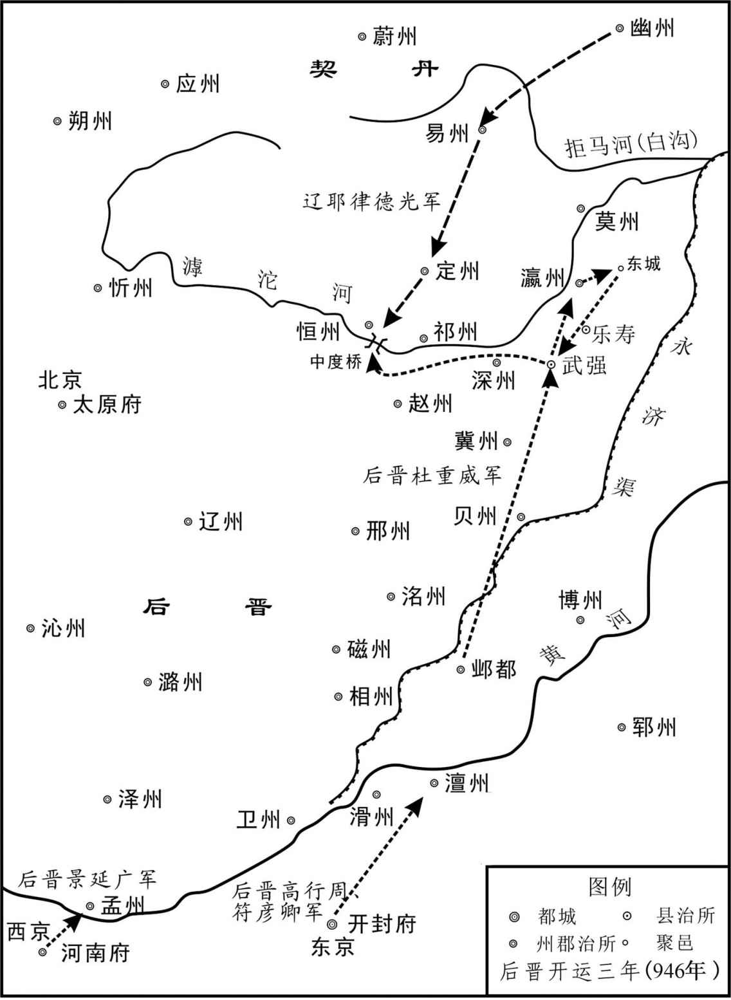 
契丹三攻后晋时中度桥对峙示意图

## 【原文】

**杜威虽以贵戚为上将，性懦怯。偏裨皆节度使，但日相承迎，置酒作乐，罕议军事[1]。磁州刺史兼北面转运使李榖说威及李守贞曰：“今大军去恒州咫尺，烟火相望[2]，若多以三股木置水中，积薪布土其上，桥可立成。密约城中举火相应，夜募壮士斫虏营而入，表里合势，虏必遁逃[3]。”诸将皆以为然，独杜威不可，遣榖南至怀、孟督军粮[4]。**

## 【注文】

[1]偏裨（pí）：将佐的通称。古代佐助大将的将领称偏裨，亦称副将。

[2]北面转运使：古代官职名，主管北征运输事务的官职。转运使为中唐以后设置的主管运输事务的官职。唐玄宗先天二年（713年）置水陆转运使，掌洛阳、长安间食粮运输事务。后置江淮河南转运使，掌东南各道水陆转运。安史之乱期间，又置诸道转运使，掌全国谷物财货的转输与出纳。唐代宗后，转运使往往与盐铁使并为一职，称盐铁转运使，并于诸道分置巡院。五代废巡院。宋以后各朝也都设转运使一职，但其职责与唐、五代有所不同。　　李榖（gǔ）（903—960年）：字惟珍，颍州汝阴（今安徽阜阳）人。进士及第，先后在五代后晋、后汉、后周三朝为官。五代著名理财专家，后晋时历任枢密直学士、磁州刺史、北面水陆转运使等职。后汉时历任左散骑常侍、工部侍郎、西南面水陆转运使等职。后周时升任中书侍郎、平章事。协助后周太祖郭威、世宗柴荣改革，并奉命率十数州民工抢堵黄河缺口。后周恭帝柴宗训即位后，进封赵国公。入宋后卒。　　咫（zhǐ）尺：接近或刚满一尺，形容距离很近。周制八寸为咫，十寸为尺。

[3]斫（zhuó）：大锄。引申为用刀、斧等砍。

[4]怀、孟：怀即怀州，参见前“怀州”条注。孟即孟州，唐会昌三年（843年）置，治河阳县（今河南孟州南）。唐时领有河阳、济源、温县、汜（sì）水、河阴五县，辖境相当于今河南孟州、温县、济源及黄河南岸汜水、广武两镇一带等地。五代沿袭。

## 【译文】

杜威虽然靠着皇亲国戚担任了上将，但他生性胆小懦弱。他的手下副将都是节度使，每日只是奉承迎合，饮酒作乐，很少商议军事。磁州刺史兼北面转运使李榖对杜威和李守贞劝说道：“现在大军到恒州近在咫尺，彼此都能望得见烟火。如果把许多用木头绑成的三角支架放置到水中，上面放上柴草和用布袋装着的泥土，立刻就可以架起一座桥梁。然后秘密约定恒州城中的守军点火相应，组织一批壮勇之士，夜里砍断胡虏军营中的栅栏冲入，里应外合，胡虏必然败逃。”众将领都认为李榖说得对，唯独杜威认为不可行，派遣李榖南下怀、孟二州督运军粮。

## 【原文】

**契丹以大兵当晋军之前，潜遣其将萧翰、通事刘重进将百骑及羸卒，并西山出晋军之后，断晋粮道及归路[1]。樵采者遇之，尽为所掠，有逸归者，皆称虏众之盛，军中忷惧[2]。翰等至栾城，城中戍兵千余人，不觉其至，狼狈降之[3]。契丹获晋民，黥其面曰“奉敕不杀”，纵之南走[4]。运夫在道遇之，皆弃车惊溃。翰，契丹主之舅也。**

## 【注文】

[1]当：挡住。　　萧翰（？—949年）：契丹部落酋长。一名敌烈，字寒真，辽太宗耶律德光的舅父和岳父，国人称之为国舅。契丹入汴，为宣武节度使。耶律德光北返，留翰镇河南。后翰迎唐明宗幼子许王从益知南朝军国事，运送宝货鞍辔北归本国。娶辽世宗妹阿不里。参与多次政变，最后因与公主结明王安端谋反被杀。　　通事：翻译。　　刘重进（899—968年）：原名刘晏僧。幽州（治蓟县，今北京西南）人。后晋初以熟悉契丹语入仕。后出使契丹，后晋高祖石敬瑭赐予“重进”一名。契丹主耶律德光以其聪敏，留为帐前通事。契丹南侵，任其为忠武军节度。后汉初归汉，移镇邓州。后周时历任右神武统军、武胜军节度使等职，累加检校太师，封开府、薛国公。宋初进封燕国公。　　并（bàng）：依傍、沿着。

[2]樵（qiáo）采：打柴。樵，柴。　　忷惧：惶恐不安。

[3]栾城：古县名，时属赵州，今河北栾城。

[4]黥（qíng）：在人脸上刺字并涂墨。

## 【译文】

契丹以大军挡在后晋军队的前面，而秘密派出将领萧翰、通事刘重进率领一百名骑兵和羸弱兵卒，沿着西山出现在后晋军的后面，切断后晋军的运粮通道和退路。打柴的樵夫遇到他们，全部被抓走。有逃跑回来的人，都说契丹军队强盛，后晋军中人心惶惶。萧翰等人到达栾城，城中后晋守兵有一千多人，没有料到契丹军队的突然来临，慌乱之中狼狈投降。契丹军抓到后晋的老百姓，全在他们的脸上刺上“奉敕不杀”四个字，然后放他们南走。运送军物的民夫们在道上遇见契丹军人，都撂（liào）下辎重车子惊慌逃溃。萧翰是契丹国主耶律德光的舅舅。

## 【原文】

**十二月丁巳朔，李榖自书密奏，具言大军危急之势，请车驾幸滑州，遣高行周、符彦卿扈从，及发兵守澶州、河阳以备虏之奔冲，遣军将关勋走马上之[1]。己未，帝始闻大军屯中度。是夕，关勋至。庚申，杜威奏请益兵，诏悉发守宫禁者得数百人赴之，又诏发河北及滑、孟、泽、潞刍粮五十万诣军前[2]。督迫严急，所在鼎沸。辛酉，威又遣从者张祚等来告急。祚等还，为契丹所获。自是朝廷与军前声问两不相通。**

## 【注文】

[1]车驾：帝王所乘的车，亦用为帝王的代称。　　扈从：随从。　　奔冲：即奔袭，突然袭击。　　走马：骑马奔驰疾跑。

[2]泽：即泽州，古州名。隋时置。唐治晋城（今山西晋城），领有晋城、端氏、陵川、阳城、沁水、高平等县，辖境相当于今山西东南部沁水、阳城、晋城、高平、陵川等地。五代沿袭。　　潞（lù）：即潞州，古州名。北周宣政元年（578年）置。唐治上党（今山西长治）。唐时领有上党、壶关、长子、屯留、潞城、襄垣（yuán）等县，辖境相当于今山西长治、武乡、襄垣、沁县、黎城、屯留、平顺、长子、壶关等市县及河北涉县地区。五代沿袭。

## 【译文】

后晋出帝开运三年（946年）十二月丁巳朔（初一日），李榖亲自给后晋出帝写了一份密奏，详细分析了后晋大军危急的形势，请出帝亲临滑州，派遣高行周、符彦卿随从护卫，并请发兵守卫澶州、河阳，以防备契丹的突然袭击，然后派遣军将关勋快马加鞭将密奏送给出帝。己未（初三日），出帝方知大军屯驻中度的消息。当晚，关勋抵达。庚申（初四日），杜威上奏请求增兵，出帝下诏征发全部守卫宫禁的兵士数百人，赶赴中度，又下诏征发河北及滑、孟、泽、潞几州的粮草五十万运送前线。由于催促严厉紧急，各地百姓惊扰沸腾。辛酉（初五日），杜威又派遣部下张祚等人前来告急。张祚等在回归的途中被契丹抓获。从此朝廷与前线军队之间音讯两不相通。

## 【原文】

**时宿卫兵皆在行营，人心懔懔，莫知为计[1]。开封尹桑维翰以国家危在旦夕，求见帝言事。帝方在苑中调鹰，辞不见。又诣执政言之，执政不以为然[2]。退谓所亲曰：“晋氏不血食矣[3]！”**

## 【注文】

[1]懔（lǐn）懔：危惧的样子。

[2]执政：执掌朝政的官员。

[3]血食：古代杀牲取血进行祭祀，称“血食”。“不血食”，指其国家的祖先不能再得到祭祀，也就是这个国家灭亡了，没有传承的后代祭祀祖先了。

## 【译文】

当时朝廷的宿卫兵士都开赴行营，京城之内人心惶惶，不知道该怎么办。开封尹桑维翰因国家的生存危在旦夕，请求面见皇帝议事。后晋出帝正在皇家御苑中调教猎鹰，推辞不见。桑维翰又去向执掌朝政的大臣陈述，执政大臣不以为然。桑维翰退回家中，对所亲近的人说：“晋氏的宗庙得不到祭祀了（晋朝要灭亡了）！”

## 【原文】

**帝欲自将北征，李彦韬谏而止。时符彦卿虽任行营职事，帝留之，使戍荆州口[1]。壬戌，诏以归德节度使高行周为北面都部署，以彦卿副之，共戍澶州。以西京留守景延广戍河阳，且张形势。奉国都指挥使王清言于杜威曰：“今大军去恒州五里，守此何为[2]？营孤食尽，势将自溃。请以步卒二千为前锋，夺桥开道，公帅诸军继之，得入恒州，则无忧矣。”威许诺，遣清与宋彦筠俱进。清战甚锐，契丹不能支，势小却[3]。诸将请以大军继之，威不许。彦筠为契丹所败，浮水抵岸，得免，因退走。清独帅麾下陈于水北力战，互有杀伤，屡请救于威，威竟不遣一骑助之。清谓其众曰：“上将握兵，坐观吾辈困急而不救，此有异志(6)。吾辈当以死报国耳！”众感其言，莫有退者。至暮，战不息。契丹以新兵继之，清及士众尽死。由是诸军皆夺气[4]。清，洺州人也。**

## 【注文】

[1]荆州口：《旧五代史·晋少帝纪四》载：“己亥，贝州梁汉璋奏，蕃寇屯聚，将谋入寇。诏符彦卿屯荆州口。”据此，荆州口大约在贝州。

[2]王清（893—946年）：字去瑕，洺州曲周（今河北曲周）人。初事后唐明宗李嗣源，历宁卫指挥使。入后晋后，屡有战功，官至奉国军都虞候。后晋开运二年（945年）冬，从杜重威抵御契丹，战功为步军之最。后力战而死。

[3]小却：稍稍后退。

[4]夺气：丧失勇气。

## 【译文】

后晋出帝打算亲自率兵北征，但被李彦韬劝阻而止。当时符彦卿虽然担任行营军将的职务，出帝却把他留下守卫荆州口。后晋开运三年（946年）十二月壬戌（初六日），出帝下诏任命归德节度使高行周为北面都部署，符彦卿为副都部署，共同守卫澶州。命令西京留守景延广守卫河阳，摆开了迎战的架势。奉国都指挥使王清向杜威进言说：“现在大军距离恒州只有五里，守在这里有什么用呢？军营孤立，粮食吃尽，势必将自行崩溃。我请求率领步兵二千人为前锋，夺取桥梁，开辟道路，您率领各支军队紧随其后，如果能进入恒州，那么就没有忧虑了。”杜威同意，派遣王清和宋彦筠一起去与契丹作战。王清作战锐气勇猛，契丹兵不能抵挡，稍稍退却。各部将请求以大军紧随其后进击契丹，杜威不允许。宋彦筠被契丹兵打败，浮着水游回岸边，免于一死，于是退走。王清独自率领部下在河水北岸布阵奋力作战，双方互有杀伤。王清多次向杜威求救，杜威竟然不派一骑一兵前去救援。王清对他的部下说：“上将（指杜威）手握兵权，坐观我们被围困危急而不来救援，他必定有叛变的意图。我们应当以死报国！”众人被他的话所感动，没有一个人后退的。直到傍晚，战斗仍然没有停止。契丹派出新来的军队接着进攻，王清和众士兵们全部战死。后晋各军由此都丧失了勇气。王清是洺州人。

## 【原文】

**甲子，契丹遥以兵环晋营，内外断绝，军中食且尽[1]。杜威与李守贞、宋彦筠谋降契丹。威潜遣腹心诣契丹牙帐，邀求重赏。契丹主绐之曰：“赵延寿威望素浅，恐不能帝中国[2]；汝果降者，当以汝为之。”威喜，遂定降计。丙寅，伏甲召诸将，出降表示之，使署名。诸将骇愕，莫敢言者，但唯唯听命[3]。威遣阁门使高勋赍诣契丹，契丹主赐诏慰纳之[4]。是日，威悉命军士出陈于外，军士皆踊跃，以为且战。威亲谕之曰：“今食尽涂穷，当与汝曹共求生计[5]。”因命释甲[6]。军士皆恸哭，声振原野[7]。威、守贞仍于众中扬言：“主上失德，信任奸邪，猜忌于己。”闻者无不切齿。契丹主遣赵延寿衣赭袍至晋营慰抚士卒，曰：“彼皆汝物也[8]。”杜威已下皆迎谒于马前，亦以赭袍衣威以示晋军，其实皆戏之耳。以威为太傅，李守贞为司徒[9]。**

## 【注文】

[1]遥：远。　　环：围绕、包围。

[2]绐（dài）：欺骗、欺诈。

[3]骇愕：惊吓、惊讶。

[4]阁（gé）门使：古代文官名，五代十国至宋朝设置，执掌礼仪的使职官，品阶自从六品至正五品。属大内诸使司之一，掌供奉乘舆、朝会游幸和赞引亲王、宰相、百官以及蕃客朝见、呈递奏章、传宣诏命等。职能相当于唐朝的中书舍人、通事之职。　　高勋：辽朝大臣，字鼎臣，籍贯及生卒年不详。初仕后晋为阁门使。后晋出帝开运三年（946年）与杜重威降辽。先后任辽枢密使，总汉军事，辽上京、南京留守，南院枢密使等职，封赵王，又封秦王。后因以毒药毒驸马都尉萧啜里，又谋害尚书令萧思温，被杀。　　赍（jī）：把东西送给别人。

[5]涂穷：即途穷，比喻走投无路或处境困窘。涂，道路，古代“涂”“途”往往通用。　　汝曹：你们。

[6]释甲：放下武器。

[7]恸（tòng）哭：痛哭、大哭。恸，极度悲哀。

[8]赭（zhě）袍：红褐色的袍子。赭，红褐色。

[9]太傅：古代文官名，即太子太傅。西汉时始置，后世沿袭。掌辅导、教诲太子，与太子太师、太子太保合称东宫三师，多由朝中大臣兼领。唐、五代时多用做加官、赠官或安置退免大臣，不再负教导太子之责。　　司徒：古代文官名。由《周礼》地方官司徒演变而来。隋唐五代时，皆正一品。名为佐天子理阴阳，平邦国，实无具体职掌，多赠予德高望重的元老大臣为荣誉衔。

## 【译文】

后晋出帝开运三年（946年）十二月甲子（初八日），契丹派兵从远处包围了后晋军营，军营与外界的联系于是断绝，军中粮食将尽。杜威和李守贞、宋彦筠谋划向契丹投降。杜威还秘密派遣心腹到契丹国主的牙帐，邀功求取重赏。契丹国主欺骗他说：“赵延寿的威望向来浅薄，恐怕不能做中原的皇帝。你果真能投降，就让你当皇帝。”杜威喜出望外，于是拟订了投降的计划。丙寅（初十日），杜威在营帐周围埋伏下了全副武装的士兵，召集众将领前来，拿出降表给他们看，让他们署名。众将领惊愕害怕，没有敢说不同意见的，只有“是、是”地听从命令。杜威派阁门使高勋带着降表送给契丹，契丹国主赐诏书抚慰收纳杜威等人。这一天，杜威命全军士兵到营外列阵，军士们都十分踊跃，以为就要打仗。杜威亲自告诉他们说：“现在粮食吃光，无路可走，应当和你们一同求取生存的办法。”于是命令军士放下武装。军士们都抱头痛哭，哭声震动了原野。杜威、李守贞还在众人中宣扬说：“皇上没有德行，听信任用奸臣小人，猜忌我们。”听到此话的人无不恨得咬牙切齿。契丹国主派赵延寿身穿赭袍来到后晋军营中抚慰士兵，对他说：“那些士兵都将成为你的部下。”杜威以下将领都到马前迎接拜见，赵延寿也给杜威穿上赭袍，给后晋将士们看，其实这都是愚弄他们的把戏而已。契丹任命杜威为太傅，李守贞为司徒。

## 【原文】

**威引契丹主至恒州城下，谕顺国节度使王周以已降之状，周亦出降。戊辰，契丹主入恒州。遣兵袭代州，刺史王晖以城降之。先是，契丹屡攻易州，刺史郭璘固守拒之[1]。契丹主每过城下，指而叹曰：“吾能吞并天下，而为此人所扼[2]！”及杜威既降，契丹主遣通事耿崇美至易州诱谕其众，众皆降[3]。璘不能制，遂为崇美所杀。璘，邢州人也。**

## 【注文】

[1]郭璘（lín）（？—946年）：邢州（治龙冈，今河北邢台）人。初事后唐明宗为军校。后晋天福年间，为奉国指挥使，历数郡刺史。后晋开运时，移镇易州，抗击契丹，屡屡获胜。杜重威降契丹，契丹遣通事耿崇美招诱其部众，璘不能制，城既降，为崇美所杀。

[2]扼（è）：用力掐着，抓住；把守，控制。

[3]耿崇美：籍贯及生卒年不详。辽朝军将，官至辽昭义节度使。

## 【译文】

杜威引导契丹国主（耶律德光）来到恒州城下，告诉顺国节度使王周自己已投降契丹的事，王周也出城投降。后晋开运三年（946年）十二月戊辰（十二日），契丹国主进入恒州。又派兵袭击代州，刺史王晖开城门投降。当初，契丹屡次进攻易州，刺史郭璘固守抗拒。契丹国主每次经过易州城下，都指着易州城感叹道：“我能够吞并天下，却被此人所阻遏！”及至杜威投降，契丹国主派遣通事耿崇美来到易州，劝诱郭璘的部下投降，这些人都投降了。郭璘不能制止，于是被耿崇美杀死。郭璘是邢州人。

## 【原文】

**义武节度使李殷、安国留后方太皆降于契丹，契丹主以孙方简为义武节度使，麻荅为安国节度使，以客省副使马崇祚权知恒州事[1]。**

## 【注文】

[1]方太（生卒年不详）：五代后唐、后晋将领。字伯宗，青州千乘（今山东广饶）人。少隶青州军为小校，后事定州节度使杨光远，历任赵州、莱州刺史和安州防御使、河阳留后等职。契丹入中原，任命其为洛京巡检，屯驻郑州，后被占据河阳的武行德所杀。　　麻荅（dá）（生卒年不详）：亦作麻答，即耶律拔里得。辽朝大将，辽太宗耶律德光的堂弟。自幼被其伯父辽太祖耶律阿保机抚养于宫中。在辽太宗末年，依靠家族的军政势力和私人武装，成为契丹辽朝中的实权人物。　　客省副使：古代文官名。唐永泰年间（765—766年）置客省，以处理四方使者到京后的事务，客省副使为客省副长官。五代后唐、后晋、后汉、后周及十国诸国多设置此职，其地位也更加重要。辽朝亦设置此职。又有内客省使之称。　　马崇祚（zuò）：籍贯及生卒年不详。五代军将，后晋末曾担任客省副使权知恒州事，后周世宗时曾以左金吾卫将军知滁（chú）州事。

## 【译文】

义武节度使李殷、安国留后方太都投降了契丹。契丹国主任命孙方简为义武节度使，麻荅为安国节度使，任命客省副使马崇祚代理主持恒州事务。

## 【原文】

**契丹翰林承旨、吏部尚书张砺言于契丹主曰：“今大辽已得天下，中国将相宜用中国人为之，不宜用北人及左右近习[1]。苟政令乖失，则人心不服，虽得之犹将失之[2]。”契丹主不从。引兵自邢、相而南，杜威将降兵以从。遣张彦泽将二千骑先取大梁，且抚安吏民，以通事傅住儿为都监[3]。**

## 【注文】

[1]翰林承旨：即翰林学士承旨。翰林学士，古代文官名。唐玄宗时始置，翰林学士。自唐宪宗时，又于翰林学士中选取资深望重者一人为承旨学士，参谋禁密，权任独重，并常常升任宰相。　　吏部尚书：古代文官名，东汉置，后世治置，正三品。吏部为尚书省六部之一，其长官为尚书，掌管全国官吏的任免、考核、升降、调动等事务。中唐以后渐成虚衔，由侍郎实际负责本部事务。　　张砺（lì）（？—947年）：字梦臣，磁州滏（fǔ）阳（今河北磁县）人。后唐同光年间（923—926年）进士及第，拜左拾遗，直史馆。后唐明宗时召为翰林学士，历礼部、兵部员外郎，知制诰。石敬瑭起兵太原，张砺自请亲往军前，被俘入契丹，颇受耶律德光信任，用为翰林学士承旨，累官至吏部尚书。后晋末，契丹入中原，授张砺右仆射，兼门下侍郎平章事。后病卒于恒州。　　近习：亲近，特指被君主宠爱亲信的人。

[2]乖失：差错、过失。

[3]傅住儿（？—947年）：籍贯不详，辽朝翻译、官员。契丹入开封后，被任命为都监，后因为官不法，被辽太宗耶律德光所杀。

## 【译文】

契丹翰林学士承旨、吏部尚书张砺对契丹国主说：“现在大辽已经得到了天下，中原的将相应由中原人来做，不适宜用北国人和您身边亲近的人去做。如果政令失误，就会人心不服，虽然现在得到了天下，将来也还会失去。”契丹国主不肯听从。契丹国主率兵从邢、相二州南下，杜威率降兵跟随。契丹国主派张彦泽率二千名骑兵先去攻取大梁，并且安抚那里的官吏百姓，派通事傅住儿为都监。

## 【原文】

**杜威之降也，皇甫遇初不预谋。契丹主欲遣遇先将兵入大梁，遇辞。退谓所亲曰：“吾位为将相，败不能死，忍复图其主乎！”至平棘，谓从者曰：“吾不食累日矣，何面目复南行[1]。”遂扼吭而死[2]。**

## 【注文】

[1]平棘（jí）：古县名，赵州治所，今河北赵县。

[2]扼吭（háng）：掐着喉咙。吭，喉咙、嗓子。

## 【译文】

杜威投降之时，皇甫遇当初并没有参与谋划。契丹国主打算派皇甫遇先率兵进入大梁，皇甫遇推辞。他退下后对亲信说：“我身为将相，兵败后不能去死，怎能再忍心去谋取君主呢！”兵至平棘，对身边跟随人的说：“我已经好几天没有吃饭了，还有什么面目再往南走。”于是掐住喉咙自杀而死。

## 【原文】

**张彦泽倍道疾驱，夜渡白马津[1]。壬申，帝始闻杜威等降。是夕，又闻彦泽至滑州，召李崧、冯玉、李彦韬入禁中计事，欲诏刘知远发兵入援[2]。癸酉，未明，彦泽自封丘门斩关而入，李彦韬帅禁兵五百赴之，不能遏[3]。彦泽顿兵明德门外，城中大扰[4]。帝于宫中起火，自携剑驱后宫十余人将赴火，为亲军将薛超所持。俄而彦泽自宽仁门传契丹主与太后书慰抚之，且召桑维翰、景延广，帝乃命灭火，悉开宫城门[5]。帝坐苑中，与后妃相聚而泣，召翰林学士范质草降表，自称孙男臣重贵，祸至神惑，运尽天亡，今与太后及妻冯氏，举族于郊野面缚待罪[6]。次遣男镇宁节度使延煦、威信节度使延宝奉国宝一、金印三出迎[7]。太后亦上表称新妇李氏妾。**

## 【注文】

[1]白马津：古渡口名，在今河南滑县西北。

[2]禁中：即宫中。皇宫门户有禁，非侍御者不能进入，故称禁中。

[3]封丘门：开封府北面西门。

[4]顿兵：停兵、按兵不动。　　明德门：开封府皇宫南门。

[5]宽仁门：开封府皇宫东门。

[6]翰林学士：古代文官名，参见前“翰林承旨”条注。　　范质（911—964年）：字文素，魏州宗城（今河北威县）人。后唐长兴年间（930—933年）进士。后晋时得桑维翰器重，累迁至翰林学士、知制诰。后汉时官至户部侍郎。后周时至枢密副使。入宋后至宰相，封鲁国公。为政以廉洁勤勉著称。著有文集及《五代通录》等。作诗八百首，为时人传诵。　　祸至神惑：大祸临头，神志昏乱。　　运尽天亡：国运已尽，上天注定灭亡。　　面缚：双手反绑于背而面向前，古代用以表示投降的样态。

[7]镇宁节度使：古代方镇名。后晋开运元年（944年）置，节度使治澶（chán）州（治今河南濮阳市区西南），领澶、濮二州，辖境约当今河南濮阳、清丰、范县及山东鄄（juàn）城和莘（shēn）县部分地区。　　延煦（xù）：即石延煦（生卒年不详），后晋出帝石重贵长子。契丹灭晋后，随晋出帝北迁，后不知其所终。　　威信节度使：古代方镇名。后晋开运二年（945年）置，后汉天福十二年（947年）废，后周广顺二年（952年）复置，改号彰信军，节度使治曹州（治今山东曹县西北），领曹、单二州。辖境相当于今山东菏泽、东明、定陶、成武、曹县及河南民权等一带地。　　延宝：即石延宝（生卒年不详），后晋出帝石重贵次子，契丹灭后晋后，随后晋出帝北迁，后不知其所终。

## 【译文】

张彦泽日夜兼程飞奔疾驰，夜里渡过白马津。后晋开运三年（946年）十二月壬申（十六日），后晋出帝方才知道杜威等人已投降契丹。当天傍晚，又听说张彦泽已到滑州，就召李崧（sōng）、冯玉、李彦韬到宫中议事，打算下诏命刘知远发兵前来援救京师。癸酉（十七日），天还没亮，张彦泽就从封丘门破关冲入城中，李彦韬率领禁军五百人前往迎敌，不能阻止。张彦泽在明德门外屯驻军队，城中大乱。后晋出帝在宫中放起了火，自己提着宝剑驱赶着后宫十几个人将要跳入火中自焚，被亲军将领薛超抱住阻止。一会儿，张彦泽从宽仁门外传来契丹国主（耶律德光）给太后的书信以示抚慰，并召集桑维翰、景延广前来。后晋出帝于是命令灭火，打开所有的宫门。后晋出帝坐在御苑中和后妃们相聚哭泣，召翰林学士范质草拟降表，自称孙男臣重贵，祸事来临，神鬼迷惑，运数已尽，天命灭亡，现在和太后及妻子冯氏，全族大小都立在郊野之外，两手反绑等待降罪。另外派儿子镇宁节度使石延煦、威信节度使石延宝，奉上国宝一枚、金印三枚，出城迎接。李太后也上表自称新妇李氏妾。

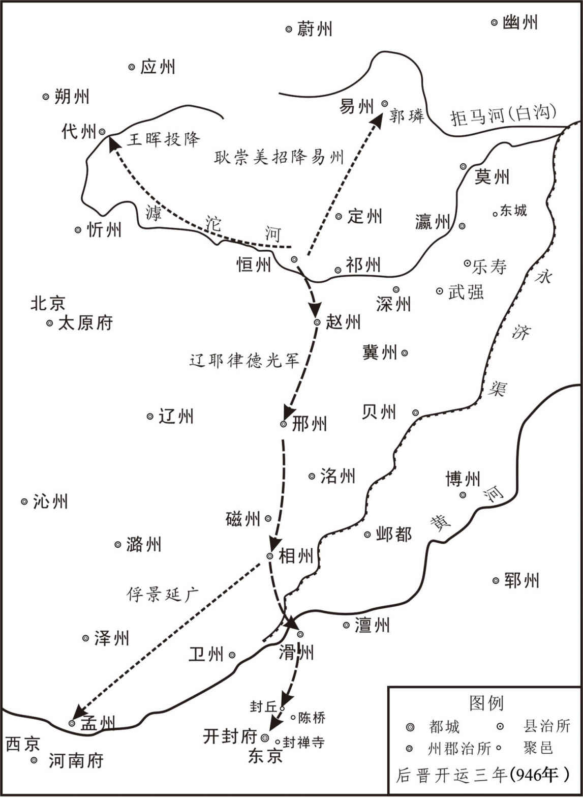 
契丹亡后晋示意图

## 【原文】

**傅住儿入宣契丹主命，帝脱黄袍，服素衫，再拜受宣，左右皆掩泣。帝使召张彦泽欲与计事，彦泽曰：“臣无面目见陛下。”帝复召之，彦泽微笑不应。**

## 【译文】

傅住儿进入宫内宣示契丹国主（耶律德光）的命令，后晋出帝（石重贵）脱下皇帝的黄袍，穿上素色衣衫，再次叩拜听从宣示，宫内左右侍从们都掩面涕泣。后晋出帝让人召张彦泽前来，想和他议事，张彦泽说：“臣没脸去见陛下。”出帝再次召他前来，张彦泽只是微笑着不答应。

## 【原文】

**或劝桑维翰逃去，维翰曰：“吾大臣，逃将安之[1]？”坐而俟命。彦泽以帝命召维翰，维翰至天街，遇李崧，驻马语未毕，有军吏于马前揖维翰赴侍卫司[2]。维翰知不免，顾谓崧曰：“侍中当国，今日国亡，反令维翰死之，何也？”崧有愧色。彦泽倨坐见维翰，维翰责之曰：“去年拔公于罪人之中，复领大镇，授以兵权，何乃负恩至此[3]！”彦泽无以应，遣兵守之。**

## 【注文】

[1]逃将安之：逃到哪里去呢？安，表示处所，哪里。

[2]天街：皇宫门外大街。　　揖（yī）：古代的拱手礼。　　侍卫司：古代官署名。五代和宋朝的最高军事机构，全称为侍卫亲军马步军都指挥使司。参见前“侍卫马步都指挥使”条注。

[3]倨（jù）坐：倨同“踞（jù）”。坐时两脚底和臀部着地、两膝上耸，跟“箕踞”略有不同。

## 【译文】

有人劝说桑维翰逃走，桑维翰说：“我是大臣，逃了又能往哪里去呢？”便坐着待命。张彦泽以皇帝的命令召桑维翰入宫，桑维翰来到天街时，遇见李崧，停下马来说话未完，就有军吏在马前揖请桑维翰去侍卫司。桑维翰知道自己难免一死，就回头对李崧说：“您身居侍中，主持国政，现在国家灭亡，反而要让我去死，为什么呢？”李崧脸上露出惭愧的表情。张彦泽傲慢地坐着接见桑维翰，桑维翰指责他道：“去年从罪人之中把你提拔出来，又让你掌管一个大藩镇，授予你兵权，你怎么能如此负恩！”张彦泽无话可答，派兵看守住桑维翰。

## 【原文】

**宣徽使孟承诲素以佞巧有宠于帝，至是，帝召承诲欲与之谋，承诲伏匿不至，张彦泽捕而杀之[1]。**

## 【注文】

[1]宣徽使：古代官职名。唐时置南北宣徽院，各设正副使，例由宦官担任，总领宫内诸使及内侍名籍，并掌郊祀、朝会宴飨（xiǎng）供帐事宜。后唐时省副使，院设于枢密院北，以检校官担任，或由枢密副使兼领。　　孟承诲（？—946年）：大名府（即魏州，治贵乡，今河北大名东北）人。始为本府牙校。后晋立，受宠于后晋高祖石敬瑭和出帝石重贵。历任阁门副使、宣徽使等职，累官至检校司空、太府卿、右武卫大将军。契丹入开封，被张彦泽所杀。　　佞（nìng）巧：奸佞乖巧。

## 【译文】

宣徽使孟承诲一贯以奸佞乖巧受到后晋出帝的宠信，到这时，出帝召他，想和他谋划事情，孟承诲藏匿起来不去，张彦泽把他抓住杀掉。

## 【原文】

**彦泽纵兵大掠，贫民乘之，亦争入富室，杀之取其货，二日方止，都城为之一空。彦泽所居，宝货山积，自谓有功于契丹，昼夜以酒乐自娱，出入骑从常数百人，其旗帜皆题“赤心为主”，见者笑之。军士擒罪人至前，彦泽不问所犯，但瞋目竖三指，即驱出断其腰领[1]。彦泽素与阁门使高勋不协，乘醉至其家，杀其叔父及弟，尸诸门首[2]，士民不寒而栗。**

## 【注文】

[1]瞋（chēn）：瞪大眼睛表示愤怒。　　腰领：腰部与颈部。领，脖子。两者为人体的重要部分，断之即死，故常比喻致命之处。

[2]尸诸门首：陈尸于门前。尸，动词，即陈尸；诸，相当于现代汉语的“之于”。

## 【译文】

张彦泽放纵士兵大肆抢掠，贫民也趁乱争着闯入富人家里杀人抢劫钱财，两天方才停止，都城被洗劫一空。张彦泽的住处里钱财宝物堆积如山，他自认为有功于契丹，不分昼夜地饮酒作乐，纵情娱乐。每次出入跟随的骑兵常有数百名，旗帜上都题有“赤心为主”四字，看见的人无不耻笑他。军士抓获罪人押到他跟前，他不问青红皂白，只瞪起眼睛竖起中指，就拉出去斩杀。张彦泽素来与阁门使高勋关系不融洽，就乘着酒醉来到他家，杀死他的叔父和弟弟，陈尸门前，士民见了都不寒而栗。

## 【原文】

**中书舍人李涛谓人曰：“吾与其逃于沟渎而不免，不若往见之[1]。”乃投刺谒彦泽曰：“上疏请杀太尉人李涛，谨来请死[2]。”彦泽欣然接之，谓涛曰：“舍人今日惧乎？”涛曰：“涛今日之惧，亦犹足下昔年之惧也。曏使高祖用涛言，事安至此！”彦泽大笑，命酒饮之。涛引满而去，旁若无人。天福七年，张彦泽获亡将杨洪，断其手足斩之，彰义节度使王周奏之，帝释而不问，李涛伏阁极论其罪。**

## 【注文】

[1]中书舍人：古代文官名。唐初时为中书省要职，正五品上，掌参议表章，草拟诏敕（chì）。中唐以后，以中书舍人掌外制，翰林学士掌内制。后外制又为他官知制诰所为，中书舍人遂几成为闲职，成为翰林学士迁转的一个官阶。　　李涛（898—961年）：字信臣，京兆万年（今陕西临潼）人。后唐天成（926—930年）初进士，历任监察御史、起居舍人等职。后晋时累迁考功员外郎，比部、刑部郎中，中书舍人等职。后汉高祖刘知远即位，拜翰林学士，升中书侍郎兼户部尚书、平章事。后周时，历刑部、户部尚书，封莒国公。北宋初年，拜兵部尚书。　　沟渎（dú）：田间水道。渎，水沟、小渠。

[2]投刺：投递名帖。　　太尉：古代官名。秦汉时期为中央掌管军事的最高官员，秦朝以丞相、太尉、御史大夫并为三公。隋唐五代时期太尉则与司徒、司空合称三公。皆正一品，多为大臣加官，并无实职。此处所谓“太尉”是指张彦泽。张彦泽在后晋开运二年（945年）九月曾加官检校太尉。

## 【译文】

中书舍人李涛对人说：“我与其逃到水沟里而不免一死，还不如前去见他。”于是投上名刺谒（yè）见张彦泽，说：“上书请杀太尉您的人李涛，谨前来请死。”张彦泽欣然接见了他，对李涛说：“舍人你今天害怕了吗？”李涛说：“我今天的害怕，就像您当年的害怕一样。往日如果高祖听从了我李涛的话，事情怎么会到这个地步！”张彦泽听了放声大笑，命人拿酒来给李涛喝。李涛斟满杯后一饮而尽，旁若无人。（后晋天福七年，张彦泽俘获逃将杨洪，砍断他的手足将他斩杀，彰义节度使王周将此事奏报朝廷，后晋高祖（石敬瑭）释放张彦泽而不加追究，李涛曾伏在阁下极力弹劾张彦泽的罪行。）

## 【原文】

**甲戌，张彦泽迁帝于开封府，顷刻不得留，宫中恸哭[1]。帝与太后、皇后乘肩舆，宫人宦者十余人步从，见者流涕[2]。帝悉以内库金珠自随，彦泽使人讽之曰：“契丹主至，此物不可匿也[3]。”帝悉归之，亦分以遗彦泽，彦泽择取其奇货，而封其余以待契丹。彦泽遣控鹤指挥使李筠以兵守帝，内外不通[4]。帝姑乌氏公主赂守门者，入与帝诀，相持而泣，归第自经死[5]。帝与太后所上契丹主表章，皆先示彦泽，然后敢发。**

## 【注文】

[1]开封府：州府名。五代后梁开平元年（907年）升汴州为东京，置开封府。后唐同光元年（923年）仍称汴州。后晋天福三年（938年）再置开封府。后汉、后周皆以开封为都城。

[2]肩舆：即轿子。

[3]讽：用含蓄的话语暗示或劝告。　　匿（nì）：隐藏、躲藏。

[4]控鹤指挥使：控鹤军最高统帅。控鹤为五代禁军军号，后梁时设置，为皇帝侍卫亲军之一。　　李筠（？—960年）：并州太原（今山西太原西南）人。后唐时应募入伍，后唐清泰（934—936年）初迁为控鹤指挥使。契丹灭后晋后一度降附契丹，但不久即率部投奔刘知远，被任命为博州刺史。后周建立，任昭义节度使、检校太傅、同平章事。北宋建立，与北汉联合抗宋，宋太祖赵匡胤亲征，李筠战败赴火自焚而死。

[5]诀（jué）：告别、诀别。　　自经：上吊自杀。

## 【译文】

后晋出帝开运三年（946年）十二月甲戌（十八日），张彦泽把后晋出帝迁往开封府，片刻不得停留，宫里大哭。出帝和皇太后、皇后坐着肩舆，宫人和宦官十几人步行跟随。路上看到的人都流下眼泪。出帝把内库的金银珠宝都随身带走，张彦泽派人暗示规劝他说：“契丹国主到来后，这些东西都无法藏匿。”出帝便将这些财宝都放回内库，也分一部分给张彦泽。张彦泽选取了其中的奇珍异宝，封存其余留待契丹。张彦泽派遣控鹤指挥使李筠率兵看守出帝，出帝和外界的联系不通。出帝的姑姑乌氏公主贿赂看门人，进来与出帝诀别，两人相对落泪，公主回到家中后上吊自杀。出帝和李太后给契丹国主（耶律德光）所上的表章，都要先经过张彦泽过目，然后才敢发出。

## 【原文】

**帝使取内库帛数段，主者不与，曰：“此非帝物也。”又求酒于李崧，崧亦辞以他故不进。又欲见李彦韬，彦韬亦辞不往。帝惆怅久之[1]。**

## 【注文】

[1]惆（chóu）怅（chàng）：因失意或失望而伤感、懊恼。

## 【译文】

后晋出帝让人取几段内库的丝帛，管库的人不给，说：“这不是皇帝的东西。”又向李崧要酒，李崧也以其他原因推托不送来。他又想见李彦韬，李彦韬也推辞不来。出帝为此而伤感、懊恼了许久。

## 【原文】

**冯玉佞张彦泽，求自送传国宝，冀契丹复任用[1]。**

## 【注文】

[1]传国宝：即传国玉玺（xǐ），为中国古代皇帝的信物与正统王朝的标志。相传秦始皇统一中国后，获得和氏璧（一说蓝田玉）一方，将其雕琢（zhuó）为传国玉玺，命丞相李斯在玉璧上书写了“受命于天，既寿永昌”八个虫鸟篆（zhuàn）字，由玉工孙寿刻于玉玺之上。后世以拥有传国玉玺作为历代王朝正统的象征。唐朝时，武则天改玺为宝。至五代时，天下大乱，流传的玉玺不知所终。　　冀：希望。

## 【译文】

冯玉向张彦泽讨好，请求让自己给契丹送去传国玉玺，希望契丹能再次任用他。

## 【原文】

**楚国夫人丁氏，延煦之母也，有美色。彦泽使人取之，太后迟回未与[1]。彦泽诟詈，立载之去[2]。**

## 【注文】

[1]迟回：迟疑、犹豫。

[2]诟（gòu）詈（lì）：辱骂、责骂。

## 【译文】

楚国夫人丁氏，是石延煦（xù）的母亲，长得美丽。张彦泽派人去接她，太后迟疑不肯给。张彦泽大骂，把楚国夫人装上车子就走。

## 【原文】

**是夕，彦泽杀桑维翰。以带加颈，白契丹主，云其自经。契丹主曰：“吾无意杀维翰，何为如是[1]？”命厚抚其家。**

## 【注文】

[1]何为：为何、为什么。　　如是：如此。

## 【译文】

这天傍晚，张彦泽杀死了桑维翰，然后用带子套在他脖子上，报告契丹国主（耶律德光）说他是上吊自杀。契丹国主说：“我无意杀掉桑维翰，他为什么这样？”命人丰厚地抚恤他的家属。

## 【原文】

**高行周、符彦卿皆诣契丹牙帐降，契丹主以阳城之战为彦卿所败，诘之[1]。彦卿曰：“臣当时惟知为晋主竭力，今日死生惟命。”契丹主笑而释之。**

## 【注文】

[1]阳城之战：即后晋开运二年（945年）三月，后晋军在阳城（今河北顺平县东南）大败契丹军的战役。　　诘（jié）：追问、责问。

## 【译文】

高行周、符彦卿都到契丹国主（耶律德光）的牙帐投降，契丹国主因为当年在阳城之战中被符彦卿打败，就责问符彦卿。符彦卿说：“臣下我当时只知道为晋主竭尽全力，今日是死是活听天由命。”契丹国主一笑而释放了他。

## 【原文】

**己卯，延煦、延宝自牙帐还，契丹主赐帝手诏，且遣解里谓帝曰：“孙勿忧，必使汝有啖饭之所[1]。”帝心稍安，上表谢恩。**

## 【注文】

[1]解里：即耶律解里（生卒年不详），字泼单，契丹突吕不部人。早年隶辽太宗耶律德光麾下。辽天显年间（926—938年）为后唐兵俘虏。后晋立，始归国，拜御史大夫。辽会同九年（946年），辽军南下灭晋，解里与后晋降将张彦泽率骑兵三千疾趋河南，所至无敢当其锋者。辽应历初，置本部令稳，解里世袭其职。　　啖：吃。

## 【译文】

后晋齐王开运三年（946年）十二月己卯（二十三日），石延煦、石延宝从契丹牙帐回来，契丹国主赐给后晋出帝亲手写的诏书，并派解里前去对出帝说：“孙儿不要担忧，一定让你有吃饭的地方。”出帝心里稍稍安稳，上表谢恩。

## 【原文】

**契丹以所献传国宝追琢非工，又不与前史相应，疑其非真，以诏书诘帝，使献真者[1]。帝奏：“顷王从珂自焚，旧传国宝不知所在，必与之俱烬[2]。此宝先帝所为，群臣备知。臣今日焉敢匿宝。”乃止。**

## 【注文】

[1]追琢非工：雕刻不细致、不精巧。追通“雕”。追琢：雕琢、雕刻；工，细致，精巧。

[2]顷：不久以前。　　王从珂（kē）（885—936年）：即后唐末帝李从珂，镇州（治今河北正定）人，为后唐明宗李嗣源的义子，故改姓李，934年至936年在位。石敬瑭南下进逼洛阳，李从珂自焚而死。死后无谥（shì）号及庙号，史家称之为末帝或废帝。　　烬（jìn）：灰烬。这里当动词用，即烧为灰烬。

## 【译文】

契丹认为后晋所献的传国之宝雕琢不够精细，又和前代史书所记载的不相吻合，怀疑不是真品，下诏书责问后晋出帝，让他献出真宝。出帝上奏道：“不久前王从珂自焚时，旧的传国之宝就不知去向，想来一定是和他一起化为灰烬了。这个国宝是先帝所制，众大臣全都知道。臣下我今天哪里还敢藏匿国宝呢。”于是作罢。

## 【原文】

**帝闻契丹主将渡河，欲与太后于前途奉迎；张彦泽先奏之，契丹主不许。有司又欲使帝衔璧、牵羊，大臣舆榇，迎于郊外，先具仪注白契丹主[1]。契丹主曰：“吾遣奇兵直取大梁，非受降也。”亦不许。又诏晋文武群官一切如故；朝廷制度，并用汉礼。有司欲备法驾迎契丹主，报曰：“吾方擐甲总戎，太常仪卫，未暇施也[2]。”皆却之。**

## 【注文】

[1]衔（xián）璧：口中含着玉璧。《左传·僖公六年》载：“许男面缚衔璧，大夫衰（cuī）绖（dié），士舆榇。”杜预注：“缚手于后，唯见其面，以璧为贽。手缚，故衔之。”后世遂称国君投降为“衔璧”。衔，含。　　牵羊：《史记·宋微子世家》：“周武王伐纣克殷，微子乃持其祭器造于军门，肉袒（tǎn）面缚，左牵羊，右把茅，膝行而前以告。”后以“牵羊”“牵羊肉袒”“牵羊把茅”表示降服或用为降服的典故。　　舆榇（chèn）：用车载着棺材，古代的一种投降仪式，表示决死或有罪当死。舆，车子；榇，棺材。　　具仪注：完备礼仪制度。具，完备；仪注，制度、礼仪。

[2]法驾：天子车驾的一种。天子出行时乘坐的车子分大驾、法驾、小驾三种，其仪卫繁简各有不同。据《史记·吕太后本纪》载：“乃奉天子法驾，迎代王于邸。”裴骃（yīn）《集解》引蔡邕曰：“天子有大驾、小驾、法驾。法驾上所乘，曰金根车，驾六马，有五时副车，皆驾四马。”　　报：回答、答复。　　擐（huàn）甲总戎：身穿铠甲指挥军队。擐，穿；戎，军队。　　太常：即太常寺，官署名。唐、五代九寺之一，掌管礼乐、郊庙、社稷、陵寝等事。长官为卿，正三品。　　未暇：没有空闲，来不及。暇，闲暇。

## 【译文】

后晋出帝听说契丹国主将要渡黄河，便想和太后事先到前面的道路上迎接。张彦泽事先奏报，契丹国主不同意。有关部门又想让后晋出帝口衔璧、手牵羊，大臣拉着车上的棺材，到郊外迎接，先将这些仪式禀报契丹国主。契丹国主说：“我派奇兵直接夺取大梁，不是来受降的。”也不允许。又下诏书告诉后晋文武百官，一切都照旧；朝廷制度一并沿用汉人礼仪。有关部门打算准备法驾车去迎接契丹国主，契丹国主答复说：“我正身穿铠甲指挥军队打仗，太常仪卫没工夫使用。”一概推却了。

## 【原文】

**先是，契丹主至相州，即遣兵趣河阳捕景延广。延广苍猝无所逃伏，往见契丹主于封丘[1]。契丹主诘之曰：“致两主失欢，皆汝所为也。十万横磨剑安在？”召乔荣使相辨证事凡十条。延广初不服，荣以纸所记语示之，乃服。每服一事，辄授一筹[2]。至八筹，延广但以面伏地请死，乃锁之。**

## 【注文】

[1]苍猝（cù）：匆忙。　　封丘：古县名，西汉时始设，在今河南封丘，南隔黄河与开封相望。唐、五代时属汴州或开封府。

[2]辄（zhé）授一筹：立即授予一个筹码。辄，立即；筹，筹码。

## 【译文】

在此之前，契丹国主来到相州，立即派兵赶赴河阳捉拿景延广。景延广仓促之间无处逃跑藏匿，就到封丘去见契丹国主。契丹国主责问他道：“导致两国君主不和，全是你干的事。你所说的‘十万横磨剑’在哪里？”召来乔荣，让他们互相申辩对证，共十件事。景延广最初不服，乔荣把当初纸上所记的话拿给他看，景延广才认服，每承认一件事，就马上交给他一个筹码。等到了第八个筹码时，景延广只能跪下来把脸伏在地上请求死罪，于是把他锁了起来。

## 【原文】

**丙戌晦，百官宿于封禅寺[1]。**

## 【注文】

[1]晦（huì）：农历每月的最后一天，朔日的前一天。本月的晦日即大年三十。　　封禅寺：位于开封城内。

## 【译文】

后晋出帝开运三年（946年）十二月丙戌晦（三十日），文武百官在封禅寺住宿。

## 【原文】

**后汉高祖天福十二年春正月丁亥朔，百官遥辞晋主于城北，乃易素服纱帽，迎契丹主，伏路侧请罪[1]。契丹主貂帽、貂裘、衷甲，驻马高阜，命起改服，抚慰之[2]。左卫上将军安叔千独出班胡语，契丹主曰：“汝安没字邪[3]？汝昔镇邢州，已累表输诚，我不忘也[4]。”叔千拜谢呼跃而退。晋主与太后已下迎于封丘门外，契丹主辞不见[5]。**

## 【注文】

[1]后汉（947—950年）：五代“沙陀三王朝”之一。公元947年，刘知远取代后晋自立为帝，国号汉，史称后汉，以区别刘邦、刘秀建立的两汉王朝，定都开封，历二帝四年，950年为后周所取代。　　高祖：即后汉高祖刘知远（895—948年）。　　天福：本为后晋高祖石敬瑭的年号。刘知远称帝后，自称不忍心忘记晋朝，但又不愿使用后晋出帝石重贵的开运年号，便恢复后晋高祖的天福年号，次年改元乾祐。天福十二年即公元947年。　　丁亥：干支纪日的丁亥日。天福十二年正月丁亥，即正月初一。　　素服：本色或白色的衣服。古代居丧或遭遇凶事时都穿素服。　　纱帽：古代君主、官员戴的一种帽子，用纱制成。后常用做官职的代称。也叫“乌纱帽”。

[2]契丹主：即辽太宗耶律德光。　　衷（zhōng）甲：在衣服里面穿铠甲。胡三省云：“衷甲者，披甲于内，而加衣甲上。”　　高阜（fù）：高的土山。阜，土山。　　改服：即脱掉素服，改穿官服。

[3]左卫上将军：古代武官名。隋唐时期设置左右卫府，各设上将军一人，从二品；大将军一人，正三品；将军二人，从三品。掌管宫禁宿卫，守卫正殿各门及内厢，并分兵守卫皇城四面与宫城内外。　　安叔千（881—952年）：字胤宗，沙陀三部落人。善骑射，初事后唐，官至振武节度使。入晋，加同平章事，历邠、沧、邢、晋四镇节度使。后晋出帝时，契丹入汴，他迎契丹国主耶律德光于赤冈，授镇国军节度使。后汉初，罢归京师。以太子太师致仕，后周初卒。　　出班：走出班列。　　安没字：即安叔千，安叔千粗俗而不识字，当时称其为“没字碑”。

[4]累表：反复上表。累，连续、反复、屡屡。

[5]晋主：即后晋出帝石重贵，参见前“重贵”条注。　　封丘门：开封府北面西门。

## 【译文】

后汉高祖天福十二年（947年）春季正月丁亥（初一日），后晋的文武百官在大梁城北远远地向后晋出帝（石重贵）辞别，然后改换白衣纱帽，迎接契丹国主（耶律德光）的到来，全都伏在路旁请罪。契丹国主头戴貂帽，身披貂裘，内裹铁甲，立马于高岗之上，命令百官起立，改换官服，对他们进行安抚勉慰。左卫上将军安叔千独自从百官行列中站了出来，向契丹国主说了一番胡语。契丹国主说：“你就是‘安没字’吗？你过去镇守邢州时，已多次向我表示忠诚，我没有忘记。”安叔千欢呼跳跃拜谢而退。后晋出帝和太后以下宫人们在封丘门外迎接契丹国主，契丹国主推辞不见。

## 【原文】

**契丹主入门，民皆惊呼而走。契丹主登城楼，遣通事谕之曰：“我亦人也，汝曹勿惧。会当使汝曹苏息[1]。我无心南来，汉兵引我至此耳。”至明德门，下马拜而后入宫[2]。以其枢密副使刘密权开封尹事[3]。日暮，契丹主复出屯于赤冈[4]。**

## 【注文】

[1]会：一定。　　当：应当。

[2]明德门：开封府皇宫南门。

[3]枢密副使：古代官职名，枢密院副职。参见前“枢密院”条注。　　权开封尹事：代理行使开封尹的事务。

[4]赤冈：古地名，在今河南开封东北二十里。

## 【译文】

契丹国主进入开封城门时，百姓们都惊呼而逃。契丹国主登上城楼，命翻译告诉他们说：“我也是人，你们不要害怕。我一定要让你们休养生息。我无心南来，是汉兵引我来到这儿的。”来到明德门后，契丹国主下马叩拜，然后入宫。命令他的枢密副使刘密为代理开封尹。日落时分，契丹国主又退出都城，屯兵于赤冈。

## 【原文】

**高勋诉张彦泽杀其家人于契丹主，契丹主亦怒彦泽剽掠京城，并傅住儿锁之。以彦泽之罪宣示百官，问：“应死否？”皆言“应死”。百姓亦投牒争疏彦泽罪[1]。己丑，斩彦泽、住儿于北市，仍命高勋监刑。彦泽前所杀士大夫子孙，皆绖杖号哭，随而诟詈，以杖扑之[2]。勋命断腕出锁，剖其心以祭死者。市人争破其脑取髓，脔其肉而食之[3]。**

## 【注文】

[1]投牒：呈递诉状。　　疏：分条陈述。

[2]绖（dié）杖：披麻戴孝，手提丧杖。绖，古代丧服上的麻带子；杖，哭丧棒。　　扑：击打。

[3]脔（luán）：把肉切成小块。

## 【译文】

高勋向契丹国主（耶律德光）控诉张彦泽杀害他的家属，契丹国主也愤恨张彦泽剽掠京城的行为，就把张彦泽和监军傅住儿一并抓住锁了起来。契丹国主将张彦泽的罪行向百官宣布，并问：“张彦泽该不该处死？”百官都说“应该处死”。百姓们也争先恐后递上状牒申诉张彦泽的罪行。天福十二年（947年）正月己丑（初三日），将张彦泽、傅住儿押往北市斩首，并命高勋监斩。张彦泽过去所杀害的士大夫的子孙们，这时都披麻戴孝、携带着哭丧杖号哭着，随后怒骂，用丧杖痛打张彦泽的尸首。高勋命令砍断张彦泽的手腕从铐锁中取出他的尸体，剖腹取心来祭奠被他杀害的人。市民们争着砸碎他的头颅，取出他的脑髓，剁碎他的肉然后分吃掉。

## 【原文】

**契丹送景延广归其国。庚寅，宿陈桥，夜，伺守者稍怠，扼吭而死[1]。**

## 【注文】

[1]陈桥：古代著名驿站，即后来宋太祖赵匡胤发动陈桥兵变、黄袍加身、夺取后周政权之处，位于今河南封丘县城东南十三公里的陈桥镇。　　伺（sì）：观察、侦候。　　怠（dài）：懒惰、松懈。　　扼吭（háng）：掐着喉咙。扼，用力掐着；吭，喉咙。

## 【译文】

契丹派军士押解景延广返归契丹。天福十二年（947年）正月庚寅（初四日），宿于陈桥镇，晚上，景延广趁着看押人懈怠之时，掐脖子自杀了。

## 【原文】

**辛卯，契丹以晋主为负义侯，置于黄龙府[1]。黄龙府，即慕容氏和龙城也[2]。契丹主使谓李太后曰：“闻重贵不用母命，以至于此，可求自便，勿与俱行[3]。”太后曰：“重贵事妾甚谨。所（以）失者，违先君之志，绝两国之欢耳。今幸蒙大恩，全生保家，母不随子，欲何所归？”**

## 【注文】

[1]黄龙府：契丹（辽朝）六府之一，位于今吉林省农安县，属东京道。

[2]慕容氏：即鲜卑慕容部，曾在南北朝时期建立燕国。按南北朝慕容氏和龙城在今辽宁朝阳，而辽朝黄龙府在今吉林农安，两者相距甚远，《通鉴》恐误。胡三省已疑契丹黄龙府非慕容氏之和龙城。

[3]俱：一起。

## 【译文】

后汉高祖天福十二年（947年）辛卯（初五日），契丹封后晋出帝石重贵为负义侯，安置在黄龙府。黄龙府就是原先鲜卑慕容氏的和龙城。契丹国主（耶律德光）派人对李太后说：“听说重贵是不听母命才落到今天的下场，您可以自行方便，不要和他同行。”李太后说：“重贵侍奉我很恭谨。他之所以失误，是违背了先君的意志，断绝了两国的交欢。现在有幸蒙受大恩，保全了身家性命，我做母亲的不随着儿子，又往哪儿去寻求归宿呢？”

## 【原文】

**癸巳，契丹迁晋主及其家人于封禅寺，遣大同节度使兼侍中河内崔廷勋以兵守之[1]。契丹主数遣使存问，晋主每闻使至，举家忧恐[2]。时雨雪连旬，外无供亿，上下冻馁[3]。太后使人谓寺僧曰：“吾尝于此饭僧数万，今日独无一人相念邪[4]？”僧辞以虏意难测，不敢献食。晋主阴祈守者，乃稍得食[5]。**

## 【注文】

[1]崔廷勋（生卒年不详）：辽朝大将。河内（今河南沁阳）人。幼入契丹，累迁至云州节度使，官至侍中。契丹入汴，授河阳节度使，甚得民情。后卒于辽朝。

[2]存问：慰问、慰劳。多用于尊对卑，上对下。

[3]连旬：连着十几天，一旬为十天。　　供亿：供给、供应。　　馁（něi）：饥饿。

[4]邪（yé）：同耶，句末语气词，表示疑问或反问，相当于现代汉语中的“吗”或“呢”。

[5]阴祈：秘密地祈求。

## 【译文】

后汉高祖天福十二年（947年）正月癸巳（初七日），契丹把后晋出帝和他的全家人迁到封禅寺，派大同节度使兼侍中河内人崔廷勋率兵看守。契丹国主多次派使者前去探望问候。后晋出帝每听说契丹使者到，全家都惊恐担忧。当时雨雪交加连着下了十几天，外界的供给完全断绝，全家老小饥寒交迫。李太后派人对寺内的和尚说：“我曾在这里为数万名和尚供给斋饭，现在难道就没有一个人记着我吗？”和尚以契丹用心难料为由，不敢献上食品。出帝只好偷偷地哀求看守，才稍稍得到一点食物。

## 【原文】

**是日，契丹主自赤冈引兵入宫，都城诸门及宫禁门皆以契丹守卫，昼夜不释兵仗。磔犬于门，以竿悬羊皮于庭为厌胜[1]。契丹主谓晋群臣曰：“自今不修甲兵，不市战马，轻赋省役，天下太平矣。”废东京，降开封府为汴州，尹为防御使[2]。乙未，契丹主改服中国衣冠，百官起居皆如旧制[3]。**

## 【注文】

[1]磔（zhé）犬：杀狗。古代分裂牲体以祭神称磔。　　厌（yā）胜：即“厌而胜之”，是用法术诅咒或祈祷的方式进行的一种迷信活动，以达到制胜所厌恶的人、物或魔怪的目的。

[2]东京：五代后梁开平元年（907年），升汴州（今河南开封）为东京，为后梁都城，并置开封府。后唐都洛阳，开封仍称汴州。后晋天福三年（938年），再置东京及开封府于汴州，契丹灭晋后又废。后汉、后周皆以开封为都城。

[3]起居：即上下朝。

## 【译文】

当日，契丹国主率兵从赤冈进入开封宫中，都城各门和宫禁大门都派契丹兵把守，昼夜兵器不离手。并且依照契丹习俗，在大门前杀狗，在庭院中竖起长竿挂上羊皮驱邪厌胜。契丹国主对后晋群臣说：“从今以后，不再整治兵器，购置战马，减轻赋税，少征徭役，天下太平了。”废除东京建制，降开封府为汴州，原开封府尹改为汴州防御使。后汉天福十二年（947年）正月乙未（初九日），契丹国主改穿中原衣冠，文武百官上朝退朝均按照原来的典章制度。

## 【原文】

**赵延寿、张砺共荐李崧之才，会威胜节度使冯道自邓州入朝，契丹主素闻二人名，皆礼重之[1]。未几，以崧为太子太师，充枢密使；道守太傅，于枢密院祗候，以备顾问[2]。**

## 【注文】

[1]邓州：唐武德二年（619年）改隋南阳郡设，治穰（ráng）县（今河南邓州），唐时领有穰县、南阳、新野、向城、临湍、内乡、菊潭等县，辖境约当今河南伏牛山以南丹江、湍河、白河流域。五代沿袭。　　素闻：一向听说。

[2]太子太师：古代文官名。参见前“太师”条注。　　枢密使：枢密院长官，参见前“枢密院”条注。　　祗（zhī）候：恭候，宋代发展成固定官名。

## 【译文】

赵延寿和张砺（lì）共同推荐李崧的才华，正好赶上威胜节度使冯道从邓州入朝，契丹国主对两人的名声早有耳闻，都给予礼遇以示重视。不久，就任命李崧为太子太师，充枢密使；任命冯道为太傅，在枢密院恭候供职，以备顾问。

## 【原文】

**契丹主分遣使者，以诏书赐晋之藩镇。晋之藩镇争上表称臣，被召者无不奔驰而至。惟彰义节度使史匡威据泾州不受命[1]。匡威，建瑭之子也[2]。雄武节度使何重建斩契丹使者，以秦、成、阶三州降蜀[3]。**

## 【注文】

[1]彰义节度使：古代方镇名。即泾（jīng）原节度使，唐代宗大历三年（768年）置，节度使治所泾州（治安定，今甘肃泾川北），初领泾、原（治平高，今宁夏固原）、渭（治襄武，今甘肃陇西东南）、武（治将利，今甘肃陇南市武都区东南）四州。后辖境屡变，久领泾、原二州，约当今甘肃清水河、六盘山以东，浦和以西，平凉、崇信以北地区。唐乾宁元年（894年）以泾原节度使号彰义军。　　史匡威（生卒年不详）：五代时将领，雁门（今山西代县）人，史建瑭之子。　　泾州：古州名。北魏时置，治临泾县（今甘肃镇原东南），后移治安定县（今甘肃泾川北）。唐时领有安定、灵台、良原、潘原、临泾等县，辖境相当于今甘肃镇原、灵台、泾川等地。五代沿袭。

[2]建瑭（880—921年）：即史建瑭，字国宝。雁门（今山西代县）人。少袭父职，任沙陀三部落之一的安庆都督府都督。屡从李克用、李存勖父子争战，有勇名，立战功。历贝、相二州刺史。后在征讨镇州将张文礼时，中箭而亡。

[3]雄武节度使：古代方镇名。即唐天雄军节度使，唐咸通五年（864年）升秦、成两州经略使置，治所秦州（治上邽［guī］，今甘肃天水），领秦、成（治上禄，今甘肃礼县南）、阶（治福津，今甘肃陇南市武都区东南）三州。后唐同光三年（925年）改为雄武军。　　秦州：古州名。西晋时置，治冀县（今甘肃甘谷东），后移治上邽县（今甘肃天水）。唐时领有上邽、成纪、伏羌、陇城、清水等县，辖境相当于今甘肃静宁、定西以南，清水以西，陕西略阳、凤县，四川平武等县及青海黄河以南，贵德以东地区，以后辖境日渐缩小。　　成州：古州名。西魏时以南秦州改名，治洛谷城（今甘肃西和南洛谷）。隋移治上禄县（今礼县西南）。唐初属陇右道，辖境约当今甘肃礼县、西和、成县等县地。唐宝应元年（762年）地入吐蕃。唐咸通十三年（872年）复置州。后定治同谷县（今甘肃成县）。五代后梁开平初改为汶州，后唐同光三年（925年）复旧名。　　阶州：唐景福元年（892年）改武州置，治皋兰镇（今甘肃陇南市武都区东）。五代后唐迁治福津县（今甘肃陇南市武都区东南），辖境约当今甘肃武都、康县、舟曲等一带地。　　蜀：指五代十国时割据四川的后蜀孟氏政权。

## 【译文】

契丹国主又分别派出使者，将诏书赐给后晋的各个藩镇。后晋各藩镇都争着上表向契丹称臣，凡被召集的无不快马奔驰到达。只有彰义节度使史匡威据守泾州不接受命令。史匡威是史建瑭的儿子。雄武节度使何重建将前来传达诏书的契丹使者杀掉，率领秦、阶、成三州投降后蜀。

## 【原文】

**初，杜重威既以晋军降契丹，契丹主悉收其铠仗数百万贮恒州，驱马数万归其国，遣重威将其众从己而南[1]。及河，契丹主以晋兵之众，恐其为变，欲悉以胡骑拥而纳之河流[2]。或谏曰：“晋兵在他所者尚多，彼闻降者尽死，必皆拒命为患，不若且抚之，徐思其策[3]。”契丹主乃使重威以其众屯陈桥。会久雪，官无所给，士卒冻馁，咸怨重威，相聚而泣[4]。重威每出，道旁人皆骂之。**

## 【注文】

[1]恒州：即镇州，古州名。参见前“镇”条注。

[2]及河：到了黄河岸边。及，到、至；河，指黄河。

[3]徐：缓慢、慢慢地。

[4]咸：全、都。

## 【译文】

当初，杜重威率领后晋军队投降契丹后，契丹国主收缴了他们的全部兵器铠甲，有数百万件之多，贮存在恒州，另派人驱赶军马数万匹北归辽国，命杜重威率领所部兵跟随自己南下。等到了黄河岸边，契丹国主看到投降的后晋兵卒太多，恐怕发生兵变，就想用契丹骑兵把他们统统赶进黄河淹死。有人劝谏道：“晋兵在各地的还有很多，他们听到投降的人都死了，一定都会抗拒命令，制造祸患，不如先安抚他们，慢慢再考虑对策。”契丹国主便派杜重威带领他的部众屯驻陈桥。正赶上多日下雪，官府不给衣粮，士兵们饥寒交迫，都怨恨杜重威，相聚哭泣。杜重威每次外出，道旁的人都骂他。

## 【原文】

**契丹主犹欲诛晋兵[1]。赵延寿言于契丹主曰：“皇帝亲冒矢石以取晋国，欲自有之乎？将为他人取之乎？”契丹主变色曰：“朕举国南征，五年不解甲，仅能得之，岂为他人乎？”延寿曰：“晋国南有唐，西有蜀，常为仇敌，皇帝亦知之乎[2]？”曰：“知之。”延寿曰：“晋国东自沂、密，西及秦、凤，延袤数千里，边于吴、蜀，常以兵戍之[3]。南方暑湿，上国之人不能居也[4]。他日车驾北归，以晋国如此之大，无兵守之，吴、蜀必相与乘虚入寇，如此，岂非为他人取之乎？”契丹主曰：“我不知也。然则奈何？”延寿曰：“陈桥降卒，可分以戍南边，则吴、蜀不能为患矣。”契丹主曰：“吾昔在上党，失于断割，悉以唐兵授晋[5]。既而返为仇雠，北向与吾战，辛勤累年，仅能胜之。今幸入吾手，不因此时悉除之，岂可复留以为后患乎！”延寿曰：“向留晋兵于河南，不质其妻子，故有此忧[6]。今若悉徙其家于恒、定、云、朔之间，每岁分番使戍南边，何忧其为变哉[7]？此上策也。”契丹主悦，曰：“善，惟大王所以处之[8]。”由是陈桥兵始得免，分遣还营。**

## 【注文】

[1]犹：仍然、还。

[2]唐：即南唐，五代时十国之一。唐昭宗景福元年（892年），杨行密为淮南节度使，始据江淮。唐天复二年（902年）称吴王。后梁贞明五年（919年），杨隆演称吴国王，国号大吴，都广陵（今江苏扬州）。937年，李昪（biàn）（即徐知诰）代吴称帝，国号唐，都金陵（今江苏南京），史称南唐。　　蜀：指五代十国时割据四川的后蜀政权。唐天祐四年（907年）唐王朝灭亡后，西川节度使王建在成都（今四川成都）称帝建国，国号蜀，史称前蜀。传二代十八年，925年被后唐所灭。后唐应顺元年（934年），后唐西川节度使孟知祥又在成都称帝，国号仍称蜀，史称后蜀。同年，孟知祥死，其子孟昶（chǎng）继位，是为后主。965年被北宋所灭。

[3]沂：即沂州，古州名。北周武帝时改北徐州置，后废。唐武德四年（621年）复置，治临沂（今山东临沂），领临沂、沂水、费县、承县、新泰等县，辖境约当今山东临沂市全部，日照市大部，及沂源、临朐（qú）和江苏赣榆等地。五代沿袭。　　密：即密州，古州名。隋开皇五年（585年）改胶州置，治东武（后改名诸城，今山东诸城）。隋大业三年（607年）改为高密郡。唐武德五年（622年）复为密州，领诸城、高密、辅唐、莒（jǔ）县等县，辖境约当今山东穆陵关、莒县、莒南以东，高密、安丘、胶州以南地区。五代沿袭。　　秦：即秦州。　　凤：即凤州，古州名。西魏废帝三年（554年）改南岐州置，治梁泉县（今陕西凤县凤州镇）。隋大业三年（607年）改为河池郡。唐武德元年（618年）复为凤州，辖梁泉、黄花、两当、河池等县。辖境约当今甘肃两当、徽县，陕西凤县、留坝等地。五代沿袭。　　吴：即吴国，南唐国的前身，这里泛指南唐。

[4]上国：即辽国，是对辽国的尊称。

[5]上党：即潞州，参见前“潞”条注。　　断割：裁决。

[6]向：昔日、往日。

[7]定：即定州。　　云：即云州。　　朔：即朔州。

[8]惟大王所以处之：就按照燕王您的意见办理。

## 【译文】

契丹国主还是想诛杀后晋降兵。赵延寿对他说：“皇帝亲自率兵冒着飞矢流石夺取晋国江山，是想自己占有呢，还是想替他人夺取呢？”契丹国主脸色大变，说：“朕统率全国南征，五年不脱衣甲，好不容易才得到，岂能是为了他人？”赵延寿说：“晋国南面有唐，西面有蜀，常常互为仇敌，皇帝想必也知道吧？”契丹国主回答说：“知道。”赵延寿又说：“晋国东起沂州、密州，西至秦州、凤州，绵延广袤数千里，边境与吴、蜀相接，常要派兵镇守。南方暑热潮湿，上国之人不能居住。将来有一天您车驾北归，而这么辽阔的晋国疆土无兵把守，吴国、蜀国一定会乘虚入侵，这样，难道不是为他人夺取江山吗？”契丹国主说：“这是我没有料到的。那么应该怎么办呢？”赵延寿说：“陈桥的降兵，可分批轮流去把守南部边疆，这样吴、蜀就不能成为后患了。”契丹国主说：“我过去在上党，失策就在于当断不断，把投降的唐兵全部交给晋。不久他们反过来与我为仇，北面同我作战，辛苦勤劳了好几年，才勉强把他们战胜。现在有幸再落到我的手里，不乘此时把他们剪除干净，难道还留做后患吗！”赵延寿说：“过去把晋兵留在河南，没有将他们的妻子作为人质，所以才酿成这种忧患。现在如果把他们的家属全部迁到恒、定、云、朔各州之间，每年轮番让他们把守南部边疆，还用担心他们发生变乱吗？这是上策。”契丹国主高兴地说：“好，就全按照燕王您的意见办理。”于是陈桥降兵才免于屠杀，分别被遣返回兵营。

## 【原文】

**癸卯，晋主与李太后、安太妃、冯后及弟睿、子延煦、延宝俱北迁，后宫左右从者百余人[1]。契丹遣三百骑援送之，又遣晋中书令赵莹、枢密使冯玉、马军都指挥使李彦韬与之俱[2]。晋主在涂，供馈不继，或时与太后俱绝食，旧臣无敢进谒者[3]。独磁州刺史李榖迎谒于路，相对泣下[4]。榖曰：“臣无状，负陛下[5]。”因倾赀以献[6]。**

## 【注文】

[1]安太妃（生卒年不详）：代北人。胡族，后晋出帝石重贵之母。始封秦国夫人，出帝立，尊为皇太妃。后随出帝北迁，自辽阳徙建州，卒于道中。　　冯后（生卒年不详）：后晋出帝石重贵的皇后。定州人。原为石敬瑭弟重胤之妻，重胤早死，石重贵即位后，娶冯氏为皇后。后随出帝北迁，不知所终。　　睿：即石重睿。　　延煦（xù）：即石延煦。　　延宝：即石延宝。　　左右：身边跟随伺候的人。

[2]马军都指挥使：古代武官名，侍卫亲军马军都指挥使的简称。

[3]涂：同“途”，路途。　　供馈（kuì）：供给进献。馈，进献。　　谒（yè）：拜见。

[4]磁州：古州名，参见前“磁”条注。

[5]无状：无能。

[6]倾赀（zī）：用尽全部资产。同“资”，资产、财产。

## 【译文】

后汉高祖天福十二年（947年）正月癸卯（十七日），后晋出帝（石重贵）与李太后、安太妃、冯皇后以及弟石重睿和儿子石延煦、石延宝一起向契丹国北迁，随从的宫女宦官有一百多人。契丹派三百名骑兵押送，又命原后晋中书令赵莹、枢密使冯玉、马军都指挥使李彦韬与他们同行。出帝在路途中，食物供给接应不上，有时和太后没有一点东西可吃，那些往日的旧臣没有人敢到道上来迎接进见。只有磁州刺史李榖在路旁迎接拜谒，君臣相对落泪。李榖说：“为臣无能，有负于陛下。”于是把自己所有的资财献给出帝。

## 【原文】

**晋主至中度桥，见杜重威寨，叹曰：“天乎，我家何负，为此贼所破[1]！”恸哭而去[2]。**

## 【注文】

[1]杜重威寨：杜重威曾经驻扎军队的营寨。　　我家何负：我家欠了你什么。负，欠。

[2]恸（tòng）哭：痛哭、大哭。恸，极度悲哀。

## 【译文】

后晋出帝（石重贵）到达中度桥，望见杜重威曾经驻扎军队的营寨，感叹道：“天啊，我家有什么对不住你，竟被你这个贼人所破！”大哭而去。

## 【原文】

**契丹主以前燕京留守刘晞为西京留守，永康王兀欲之弟留珪为义成节度使，族人郎伍为镇宁节度使，兀欲姊婿潘聿撚为横海节度使，赵延寿之子匡赞为护国节度使，汉将张彦超为雄武节度使，史佺为彰义节度使，客省副使刘晏僧为忠武节度使，前护国节度使侯益为凤翔节度使，权知凤翔府事焦继勋为保大节度使[1]。晞，涿州人也[2]。既而何重建附蜀，史匡威不受代，契丹势稍沮[3]。**

## 【注文】

[1]燕京：辽会同元年（938年）以幽州（治今北京）为南都京，又称燕京。　　刘晞（xī）（生卒年不详）：辽朝官员。涿州（治范阳县，今河北涿州）人。曾为后唐大将周德威的从事，后陷于契丹。后晋天福（936—943年）中，任契丹燕京留守，历官至同平章事，兼侍中。随契丹入汴，授洛京留守。后随契丹将萧翰北归，留镇州、定州，卒于契丹。　　西京：即洛阳，五代后梁、后晋、后汉、后周各朝以开封为东京，洛阳为西京。　　永康王兀（wū）欲（917—951年）：即辽世宗耶律兀欲，名阮，辽太祖耶律阿保机孙。曾封为永康王。辽太宗耶律德光病死于归途中时，他随行军中。在宗室大臣耶律安抟（tuán）、耶律吼、耶律洼等拥戴下即帝位，改年号为天禄。在位四年，后被耶律察割等杀死。　　留珪（guī）（生卒年不详）：辽太祖耶律阿保机之孙，世宗耶律兀欲之弟，曾任契丹滑州节度使、义成军节度使等职。　　郎伍：即耶律忠（生卒年不详）。契丹宗室，历任镇宁、义武节度使等职。　　潘聿（yù）撚（niǎn）（生卒年不详）：辽朝大将。辽世宗耶律兀欲的姐夫，曾任辽横海节度使等职。后周广顺元年（951年）北汉主刘承钧立，他曾作为辽朝使臣出使北汉。　　横海节度使：古代方镇名，又名沧景节度使。唐德宗贞元三年（787年）置，治沧州（治清池，今河北沧县西南），唐太和三年（829年）废，不久复置，太和五年（831年）号义昌军。唐乾宁五年（898年）为幽州所并。后梁乾化二年（912年）改称顺化节度使。后梁贞明二年（916年）为李存勖夺取，复号横海节度使。其辖境屡变，久领沧、景、德、棣（dì）四州。　　匡赞：即赵匡赞（923—977年）。字元辅，幽州蓟县（今北京）人。后唐明宗李嗣源的外孙。祖德钧，父延寿。后避赵匡胤名讳单名赞。后晋初与其母入契丹，累升至范阳节度使。契丹入汴后，任河中节度使。刘知远起太原，他奉表劝进。后汉时，出任京兆尹、晋昌军节度使。后周时，累迁保信军节度使。入宋，任忠正军节度使，加检校太师，后改镇延州，移建雄节度使。宋太宗即位，封卫国公。卒，赠侍中。　　张彦超（？—956年）：沙陀人。初事后唐庄宗李存勖，任神武指挥使。后唐明宗时授蔚州刺史。与石敬瑭不协，举城投契丹，契丹任为云州节度使，后迁晋昌军节度使等。后汉时归附，移授保大军节度使。后周建立，授神武统军。　　史佺（quán）（？—959年）：籍贯不详。历事后晋、后汉、辽朝和后周各朝，任彰义节度使、左领军卫上将军、左金武上将军等职。　　刘晏僧：即刘重进。参见前“刘重进”条注。　　忠武节度使：古代方镇名，亦称陈许节度使。唐德宗贞元三年（787年）置陈许节度使，治许州（治长社，今河南许昌）。领陈（治宛丘，今河南淮阳）、许二州，约当今河南襄城以东，太康、沈丘以西，舞阳以北，长葛、鄢（yān）陵以南地区。唐节度使所辖地区多兼军号，陈许号忠武军。　　侯益（885—965年）：平遥（今山西平遥）人。曾事奉李克用、李存勖父子及后唐明宗李嗣源，任左厢都指挥使等职。后晋时，历任奉国都指挥使、护国军节度使等职，加同平章事。辽灭后晋后，授凤翔节度使。后汉时加官侍中。后周时封楚国公、太子太师等。宋太祖赵匡胤即位，以耆旧老臣厚待，至病卒。　　凤翔节度使：古代方镇名。唐上元元年（760年）置，治凤翔府（治雍县，今陕西凤翔），领凤翔府、陇州（治汧［qiān］源，今陕西陇县）。唐末五代时领凤翔府和陇、乾（治今陕西乾县）、良、晏等州。大约相当于今陕西陇县至宝鸡及周边一带地区。　　权知凤翔府事：临时行使凤翔府尹的职务。权，权且、暂且。知，主持。　　焦继勋（901—978年）：字成绩，许州长社（今河南许昌）人。后晋时历任齐州防御使、保义军兵马留后等职。后汉时授保大军节度使。后周时拜彰武军节度使。宋初，召为右金吾卫上将军。宋乾德（963—968年）中，为西京留守。平生涉猎史传，所至颇有善政。　　保大节度使：古代方镇名。即渭北鄜（fū）坊节度使，唐上元元年（760年）置，初治坊州（治中部，今陕西黄陵南），唐建中四年（783年）徙治鄜州（治洛交，今陕西富县），长期领鄜、坊、延（治肤施，今陕西延安东北）三州，辖境约当今陕西中部富县、肤施、宜川等县地。唐中和二年（882年）号保大军。五代沿袭。

[2]涿（zhuō）州：古州名。唐大历四年（769年）置，治范阳县（今河北涿州）。唐时领有范阳、新昌、归义、固安、新城五县，辖境相当于今河北涿州、雄县、固安等地。

[3]沮（jǔ）：受阻。

## 【译文】

契丹国主任命原燕京留守刘晞为西京留守，永康王兀欲的弟弟留珪为义成节度使，本族人郎伍为镇宁节度使，兀欲的姐夫潘聿撚为横海节度使，赵延寿的儿子赵匡赞为护国节度使，汉将张彦超为雄武节度使，史佺为彰义节度使，客省副使刘晏僧为忠武节度使，原护国节度使侯益为凤翔节度使，代理凤翔府事焦继勋为保大节度使。刘晞是涿州人。不久，何重建归附后蜀，史匡威拒绝史佺取代自己，契丹势力稍稍受到一些扼制。

## 【原文】

**晋主之绝契丹也，匡国节度使刘继勋为宣徽北院使，颇预其谋[1]。契丹主入汴，继勋入朝，契丹主责之。时冯道在殿上，继勋急指道曰：“冯道为首相，与景延广实为此谋。臣位卑，何敢发言！”契丹主曰：“此叟非多事者，勿妄引之[2]！”命锁继勋，将送黄龙府。赵在礼至洛阳，谓人曰：“契丹主尝言庄宗之乱由我所致，我此行良可忧[3]。”契丹遣契丹将述轧、奚王拽剌、勃海将高谟翰戍洛阳，在礼入谒，拜于庭下，拽剌等皆踞坐受之[4]。乙卯，在礼至郑州，闻继勋被锁，大惊，夜自经于马枥间[5]。契丹主闻在礼死，乃释继勋，继勋忧愤而卒。刘晞在契丹尝为枢密使、同平章事，至洛阳，诟奚王曰：“赵在礼汉家大臣，尔北方一酋长耳，安得慢之如此！”立于庭下以挫之，由是洛人稍安。**

## 【注文】

[1]匡国节度使：古代方镇名。唐乾宁二年（895年）改奉诚军置，治同州（治冯翊，今陕西大荔），唐天祐三年（906年）省。五代后梁时复置，更名忠武军。后唐复名匡国军。后周显德五年（958年）废。　　刘继勋（？—947年）：卫州（今河南卫辉）人。后唐时为石敬瑭客将，从石敬瑭历数镇。石敬瑭即位后，擢为阁门使，后历任淄州刺史、澶州防御使、宣徽北院使、匡国节度使等。契丹入汴，被拘押，忧虑愤恨而死。

[2]叟（sǒu）：年老的男人。

[3]赵在礼（882或886—947年）：字干臣，涿州（治范阳，今河北涿州）人。唐末时奉事卢龙节度使刘仁恭、刘守光父子，后投李存勖，为效节指挥使。后唐同光四年（926年）魏州兵变，被推为帅。后唐明宗李嗣源即位后，历任邺都留守、兴唐尹和沧州、同州节度使等。后晋时兼侍中，进爵为公。一生历仕三朝十余镇，所至之处，重征暴敛，民不堪命。契丹灭后晋，自缢死。　　庄宗：即后唐庄宗李存勖（xù）（885—926年），李克用之子。沙陀人，小名亚子，善于骑射，胆略超人。早年随父征战，父死后嗣位为晋王，攻灭幽州刘守光，驱逐南下的契丹兵，并与朱温连年混战。公元923年称帝，建立后唐。不久灭后梁，统一黄河流域。在位时亲信宦官、伶官，峻法厚敛，导致政治混乱。后唐同光四年（926年），在兵变中被杀。　　良可忧：很是担忧。良，甚、很。

[4]述轧（zhá）（？—951年）：即牒蜡，字述兰，契丹六院夷离堇蒲古只之后。辽天显中，为中台省右相。契丹灭晋，降晋将杜重威，牒蜡功居多。辽世宗耶律阮即位，封燕王，为南京留守。辽天禄五年（951年），察割弑逆，牒蜡被牵连，凌迟而死。　　奚（xī）王拽（yē）剌（生卒年不详）：五代时奚族首领。李绍威（扫剌）之子。后投靠契丹主耶律德光，常以兵随从。　　勃海：即渤海。中国唐代以靺（mò）鞨（hé）族为主体建立的地方政权，唐玄宗时封其首领大祚荣为渤海郡王，后称渤海国。南与新罗相接，东北至黑水靺鞨，采用汉字，风俗与契丹、高丽相似。辽天显元年（926年）为契丹所灭，改称东丹。　　踞（jù）坐：伸开腿坐着，是一种傲慢的姿态。

[5]郑州：古州名。隋开皇元年（581年）改荥（xíng）州置，治所在成皋县（今河南荥阳西北汜水镇），唐贞观七年（633年）移治管城县（今河南郑州）。唐时领有管城、荥阳、荥泽、新郑、中牟、原武等县，辖境相当于今河南郑州、荥阳、新郑、中牟及原阳西南等地。五代沿袭。　　马枥（lì）：马槽。

## 【译文】

后晋国主（石重贵）断绝和契丹的往来，当时匡国节度使刘继勋担任宣徽北院使，多参与此事的谋划。契丹国主（耶律德光）进入开封，刘继勋来朝见，契丹国主责怪他。当时冯道正在殿上，刘继勋急忙指着他说：“冯道是首相，和景延广实际策划的此事。为臣我官职卑微，哪里敢说话！”契丹国主说：“这老头儿不是多事的人，你不要胡乱牵扯他。”命人用铁链锁上刘继勋，押送黄龙府。赵在礼到了洛阳，对人说：“契丹国主曾说庄宗之乱由我引起，看来我此行凶多吉少。”契丹国主派契丹将领述轧、奚王拽剌、勃海将领高谟翰驻守洛阳，赵在礼进入谒见，在庭下叩拜，拽剌等人都伸开两腿傲慢地坐着接受叩拜。天福十二年（947年）正月乙卯（二十九日），赵在礼到达郑州，听说刘继勋被羁押，惊恐万分，夜晚便在马房里自杀了。契丹国主听说赵在礼自杀，才释放了刘继勋，刘继勋忧虑愤恨而死。刘晞在契丹曾担任枢密使、同平章事的官职，到了洛阳，责骂奚王拽剌说：“赵在礼是汉家的大臣，你只不过是北方的一个酋长罢了，怎敢这样怠慢他！”罚他站立在庭下，挫败他的气焰，于是洛阳的人心稍稍安定。

## 【原文】

**契丹主广受四方贡献，大纵酒作乐。每谓晋臣曰：“中国事，我皆知之，吾国事，汝曹弗知也[1]。”**

## 【注文】

[1]弗（fú）知：不知。弗，不。

## 【译文】

契丹国主广泛接受四面八方进贡的礼物，大肆饮酒作乐。常常对原后晋的大臣说：“你们中原的事，我都知道，但我国的事，你们就不晓得了。”

## 【原文】

**赵延寿请给上国兵廪食，契丹主曰：“吾国无此法[1]。”乃纵胡骑四出，以收马为名(7)，分番剽掠，谓之“打草谷”。丁壮毙于锋刃，老弱委以沟壑，自东西两畿及郑、滑、曹、濮数百里间，财畜殆尽[2]。契丹主谓判三司刘昫曰：“契丹兵三十万，既平晋国，应有优赐，速宜营办[3]。”时府库空竭，昫不知所出，请括借都城士民钱帛，自将相以下皆不免[4]。又分遣使者数十人诣诸州括借，皆迫以严诛，人不聊生[5]。其实无所颁给，皆蓄之内库，欲辇归其国。于是内外怨愤，始患苦契丹，皆思逐之矣。**

## 【注文】

[1]廪（lǐn）食：公家供给粮食。廪，储藏的米。

[2]丁壮：青壮年男子。　　东西两畿（jī）：东京开封和西京洛阳两地。畿，古代称靠近国都的地方。　　郑：即郑州。　　滑：即滑州。　　曹：即曹州。　　濮（pú）：即濮州。　　殆（dài）：几乎，将近。

[3]判三司：即执掌三司事务。唐末五代以度支、户部、盐铁转运司为“三司”，设三司使一人，为最高财政长官。但也往往不设三司使一职，而以他官“判三司”行使三司使的职责。

[4]括（guā）借：以借贷的名义搜刮。括，同“刮”。

[5]迫以严诛：严厉逼迫交纳。迫，逼迫；诛，要求，要别人供给东西。

## 【译文】

赵延寿请求供给辽国军队粮饷，契丹国主说：“我国没有这个法。”于是放纵胡人骑兵四处出动，以牧马为名，轮番抢掠，称为“打草谷”。百姓中年轻力壮的死于契丹兵的刀口，年老体弱的被填于沟壑，从开封、洛阳两畿到郑、滑、曹、濮各州几百里之间，财产牲畜几乎被抢掠一空。契丹国主对管理财政的判三司刘昫说：“契丹大军三十万，既已灭掉了晋国，就应该有丰厚的赏赐，应当尽快准备操办。”当时官府仓库里已经空竭，刘昫不知道该从哪里弄到财物，就请求搜刮借贷都城官民的钱财，包括大将宰相都不能幸免。又分别派遣几十名使者到各州搜刮借贷，都严刑逼迫人们缴纳，搞得民不聊生。其实搜刮来的钱物并没有颁发给契丹士兵，都聚积到皇宫内库里，打算装车运回本国。于是朝廷内外怨恨愤怒，开始感到契丹带来的祸患痛苦，都想驱逐他们了。

## 【原文】

**初，晋主与河东节度使、中书令北平王刘知远相猜忌，虽以为北面行营都统，徒尊以虚名，而诸军进止，实不得预闻[1]。知远因之广募士卒，阳城之战诸军散卒归之者数千人，又得吐谷浑财畜，由是河东富强冠诸镇，步骑至五万人。晋主与契丹结怨，知远知其必危，而未尝论谏。契丹屡深入，知远初无邀遮、入援之志[2]。及闻契丹入汴，知远分兵守四境以防侵轶[3]。遣客将安阳王峻奉三表诣契丹主：一，贺入汴[4]；二，以太原夷夏杂居，戍兵所聚，未敢离镇；三，以应有贡物，值契丹将刘九一军自土门西入屯于南川，城中忧惧，俟召还此军，道路始通，可以入贡[5]。契丹主赐诏褒美，及进书，亲加“儿”字于知远姓名之上，仍赐以木柺。胡法，优礼大臣则赐之，如汉赐几杖之比，惟伟王以叔父之尊得之[6]。知远又遣北都副留守太原白文珂入献奇缯、名马[7]。契丹主知知远观望不至，及文珂还，使谓知远曰：“汝不事南朝，又不事北朝，意欲何所俟邪[8]？”蕃汉孔目官郭威言于知远曰：“虏恨我深矣[9]。王峻言契丹贪残失人心，必不能久有中国。”或劝知远举兵进取。知远曰：“用兵有缓有急，当随时制宜。今契丹新降晋军十万，虎据京邑，未有他变，岂可轻动哉。且观其所利止于货财，货财既足，必将北去。况冰雪已消，势难久留，宜待其去，然后取之，可以万全。”**

## 【注文】

[1]徒：只，仅。

[2]邀遮（zhē）：阻拦。

[3]侵轶（yì）：侵犯袭击。

[4]客将：古代官职名，唐末五代藩镇中负责赞唱礼仪、接待宾客的官员。　　王峻（902—953年）：字秀峰，相州安阳（今河南安阳）人。少以善歌唱侍奉权贵，后归河东节度使刘知远。后汉时，累迁至宣徽北院使。后周建国，授枢密使兼同平章事。率军败北汉兵于晋州（今山西临汾），又平定慕容彦超叛乱，为后周功臣。其后居功自傲，骄纵不法，被贬商州（治今陕西商洛市商州区），不久卒于贬所。

[5]土门：古关隘名，即井陉（xíng）关。在今河北井陉县北，为太行八陉之一。　　南川：元人胡三省说是晋阳（今山西太原）城南之地。

[6]伟王：可能是指耶律李胡次子耶律宛。参见前“契丹伟王”条注。

[7]北都：唐朝及五代时称太原为北都。　　白文珂（kē）（876—954年）：字德温，太原（今山西太原西南）人。初事李克用为河东牙将。后唐建立后，历任振武都指挥使及瀛、蔚、忻、代四州刺史，兼蕃汉马步都部署等职。入汉，历河中、天平军节度使，加同平章事。后周时，加兼中书令、太子太师，封晋国公。　　缯（zēng）：丝绸的总称。

[8]意欲何所俟（sì）邪（yé）：打算等待什么呢？意，心思、心愿；欲，想、打算；俟，等待。

[9]孔目官：古代官职名。掌管文书、簿籍、财务等事。唐、五代时方镇、府、州皆设有都孔目、孔目若干人。唐玄宗时，集贤书院、神策军、太常寺、宗正寺也设置孔目官。

## 【译文】

当初，后晋出帝（石重贵）与河东节度使、中书令、北平王刘知远相互猜忌。虽然任命刘知远为北面行营都统，但不过是徒有虚名罢了，各军的行动，实际上他一点都不能参与。刘知远因此大量招募士兵，阳城之战中各军散溃的士兵归附于他的有几千人，又得到了吐谷浑的财产牲畜，于是河东在各藩镇中最为富强，步兵、骑兵多达五万人。后晋出帝和契丹结怨后，刘知远料到必然凶多吉少，但从未对出帝加以规劝。契丹屡次深入进犯，刘知远从没有进行拦击和入援晋廷的打算。等到听说契丹已占据开封，刘知远便分兵守护四境以防备契丹的侵袭。又派遣客将安阳人王峻向契丹国主（耶律德光）奉上三道表章：一是祝贺契丹进入开封；二是说因太原是夷、夏杂居共处之地，需要屯聚防守，所以不敢离镇前往朝贺；三是说本应该献上贡品，但正值契丹将领刘九一的军队从土门西入屯南川，太原城中人心忧虑恐惧，等召还此军后，道路畅通，才可以送入贡品。契丹国主见到刘知远的表章后，赐诏予以称赞表彰。等到诏书起草好后，契丹国主亲自在刘知远的姓名之上加上一个“儿”字，并赐给他木拐一副。按照胡人的习俗，受礼遇非常优厚的大臣，才能赐予木拐，相当于汉人赐给几杖，只有伟王凭借其叔父的尊贵地位，才得到这种赐木拐的待遇。刘知远又派遣北都副留守太原人白文珂献上珍奇的绸缎和名贵的马匹。契丹国主得知刘知远观望不到，等白文珂返回太原时，让他转告刘知远说：“你既不奉事南朝，又不奉事北朝，打算等待什么呢？”蕃汉孔目官郭威对刘知远说：“胡虏对我们怨恨很深。王峻说过：契丹贪婪残暴失掉人心，一定不能长久占据中原。”有人劝刘知远起兵进攻。刘知远说：“用兵有缓有急，应当根据形势采取合适的策略。现在契丹刚刚招降了晋国的十万大军，像老虎一样雄踞着都城，形势没有发生变化，怎能轻举妄动呢？况且观察他们所贪图的无非是钱财物品，等钱财物品捞足了，一定要回归北国的。何况现在冰雪已消，气候转暖，他们必然难以久留，应当等他们撤退以后，再去攻占中原，这样可保万无一失。”

## 【原文】

**昭义节度使张从恩，以地迫怀、洛，欲入朝于契丹，遣使谋于知远[1]。知远曰：“我以一隅之地，安敢抗天下之大！君宜先行，我当继往。”从恩以为然。判官高防谏曰：“公晋室懿亲，不可轻变臣节[2]。”从恩不从。左骁卫大将军王守恩，与从恩姻家，时在上党，从恩以副使赵行迁知留后，牒守恩权巡检使，与高防佐之，遂行[3]。守恩，建立之子也[4]。**

## 【注文】

[1]怀：即怀州，古州名。　　洛：即洛阳。

[2]高防（905—963年）：字修己，并州寿阳（今山西寿阳）人。自幼好学，擅为诗。初事张从恩，历任节度判官、枢密副使、盐铁推官等职。入汉，历屯田员外郎、浚仪令等。后周立，历任刑部员外郎、开封令、户部侍郎等职，出知蔡、宋二州。从世宗南征。入宋，拜尚书左丞、枢密直学士，出知凤翔。　　懿（yì）亲：至亲，特指皇室宗亲、外戚。张从恩的女儿嫁后晋出帝，故高防说其是“晋室懿亲”。

[3]左骁（xiāo）卫大将军：古代武官名。隋置左右骁卫府，为禁卫军之一。唐去“府”字。设上将军一人，从二品；大将军一人，正三品；将军二人，从三品。掌宫禁宿卫，守正殿各门。　　王守恩（？—955年）：字保信，辽州榆社（今山西榆社）人。王建立之子。先为内职，后迁怀、卫二州刺史、诸卫将军。后汉时，历任潞州、邠宁等镇节度使，加同平章事。为官贪得无厌，不择手段榨取民脂民膏。后周时，历任左卫上将军、右金吾上将军等职，封许国公。　　牒：一种文书文体，唐制规定，九品以上公文皆曰牒。　　巡检使：古代官名。五代时始置巡检使之职，掌维持治安。

[4]王建立（871—941年）：辽州榆社（今山西榆社）人。初为后唐代州刺史李嗣源都虞候。李嗣源即位后，不断加官晋爵，历任镇州、青州、天平等镇节度使，加检校太尉、同平章事，充集贤殿大学士。后晋时，再度出任青州节度使，兼中书令，并先后进封临淄、东平、韩王。

## 【译文】

昭义节度使张从恩，因为辖区靠近怀州、洛阳两地，打算向契丹朝觐，派使者先去和刘知远商量。刘知远说：“我们以一隅之地，怎么敢与偌大的天下抗争！您可先行一步，我当随后就去。”张从恩信以为真。判官高防劝张从恩道：“您身为晋室的至亲，切不可轻易改变臣节。”张从恩不听。左骁卫大将军王守恩和张从恩是亲家，当时在上党，张从恩命节度副使赵行迁主持留后事务，发公文派王守恩代理巡检使，与高防共同辅佐赵行迁，便去开封朝觐契丹国主。王守恩是王建立的儿子。

## 【原文】

**契丹主召晋百官悉集于庭，问曰：“吾国广大，方数万里，有君长二十七人[1]。今中国之俗异于吾国，吾欲择一人君之，如何？”皆曰：“天无二日。夷、夏之心皆愿推戴皇帝。”如是者再。契丹主乃曰：“汝曹既欲君我，今兹所行，何事为先[2]？”对曰：“王者初有天下，应大赦[3]。”二月丁巳朔，契丹主服通天冠、绛纱袍，登正殿，设乐悬、仪卫于庭[4]。百官朝贺，华人皆法服，胡人仍胡服，立于文武班中间[5]。下制称大辽会同十年，大赦[6]。仍云：“自今节度使、刺史，毋得置牙兵，市战马[7]。”**

## 【注文】

[1]君长二十七人：契丹在公元916年耶律阿保机建国之前，实行部落酋长制，每部有大人一人。所谓“君长二十七人”，大约是指当时有二十七个部落。

[2]君我：即以我为君主。　　今兹：当今、现在。

[3]大赦（shè）：对全国已判罪犯普遍赦免或减刑。中国古代封建帝王常常以施恩为名，在皇帝登基、更换年号、立皇后、立太子等情况下，颁布赦令，赦免犯人，称“大赦”。

[4]通天冠：也称高山冠，古代皇帝戴的一种帽子。据《后汉书·舆服志下》记载：“通天冠，高九寸。”　　绛纱袍：深红色纱袍，古代常用为朝服。　　乐悬：钟磬（qìng）的悬挂制度，这里指设置皇家宫廷乐队。　　仪卫：仪仗与卫士的统称。

[5]法服：古代礼法规定的服饰，这里指汉族官服。

[6]制：帝王的命令称“制”。此指颁布制书。　　会同：辽太宗耶律德光的年号，共使用九年多，即公元938至947年。

[7]毋（wú）得：不得。

## 【译文】

契丹国主召集后晋全体文武百官到庭中集合，问他们：“我国的领土辽阔广大，方圆数万里，有君长二十七人。如今中原的习俗和我国不一样，我打算选择一个人做中原的君主，你们看怎么样？”百官都说：“天上没有两个太阳，夷族、华夏的人心都愿拥戴您为皇帝。”这样劝进两次。契丹国主于是说：“你们既然愿意让我做皇帝，那么现在首先需要办的事是什么呢？”百官答道：“皇帝刚刚得到天下，首先应该做的事是大赦。”天福十二年（947年）二月丁巳朔（初一日），契丹国主头戴通天冠，身披绛纱袍，在皇宫正殿登极，庭下设置了大典乐器和仪仗卫队。百官都来朝贺，汉人都穿汉族礼服，胡人仍穿胡服，立在文、武两班中间。契丹国主传下命令，称本年为大辽会同十年，大赦天下。并说：“从今以后，节度使、刺史不许设置亲兵卫队牙军，不得购买战马。”

## 【原文】

**赵延寿以契丹主负约，心怏怏，令李崧言于契丹主曰：“汉天子所不敢望，乞为皇太子[1]。”崧不得已为言之。契丹主曰：“我于燕王，虽割吾肉，有用于燕王，吾无所爱[2]。然吾闻皇太子当以天子儿为之，岂燕王所可为也！”因令为燕王迁官。时契丹以恒州为中京，翰林承旨张砺奏拟燕王中京留守、大丞相、录尚书事、都督中外诸军事，枢密使如故[3]。契丹主取笔涂去“录尚书事都督中外诸军事”而行之。**

## 【注文】

[1]怏（yàng）怏：不高兴、不满意。

[2]燕王：即赵延寿，他被契丹封为燕王。

[3]录尚书事：古代文官名。始置于汉昭帝时，时称“领尚书事”。东汉永平十八年（75年）后始称“录尚书事”。魏晋南北朝各朝也多设此官，隋废。据《辽史·百官志》，尚书省官员有尚书令、左右仆射、左右丞等，而无录尚书事一职。因此，这里当是张砺（lì）借古代官名临时草拟的一个官职。　　都督：监督、督察。

## 【译文】

赵延寿因为契丹国主不履行约定，心里愤愤不平，派李崧对契丹国主说：“我不敢奢望当汉人的天子，但请求做个皇太子。”李崧不得已，把这话转告给契丹国主。契丹国主说：“我对于燕王（即赵延寿），即使是割我身上的肉，只要对燕王有用，也在所不惜。然而我听说皇太子应当是天子的儿子才能当，哪能是燕王所能做的！”于是命令给燕王赵延寿晋升官职。当时契丹以恒州作为中京，翰林承旨张砺上奏拟以燕王为中京留守、大丞相、录尚书事、都督中外诸军事，枢密使依旧。契丹国主拿起笔来涂去“录尚书事都督中外诸军事”后，发布了任命令。

## 【原文】

**刘知远闻何重建降蜀，叹曰：“戎狄凭陵，中原无主，令藩镇外附，吾为方伯，良可愧也[1]！”于是将佐劝知远称尊号，以号令四方，观诸侯去就。知远不许。闻晋主北迁，声言欲出兵井陉，迎归晋阳[2]。丁卯，命武节都指挥使荥泽史弘肇集诸军于球场，告以出师之期[3]。军士皆曰：“今契丹陷京城，执天子，天下无主[4]。主天下者，非我王而谁？宜先正位号，然后出师。”争呼万岁不已。知远曰：“虏势尚强，吾军威未振，当且建功业。士卒何知！”命左右遏止之。**

## 【注文】

[1]戎狄：古代华夏（汉族）以东夷、南蛮、西戎、北狄泛指周边民族，后也常以蛮夷、戎狄泛指之。　　凭陵：侵犯、欺侮。　　方伯：古代诸侯中的领袖之称，谓一方之长。后泛称地方长官。如汉以来的刺史、唐代的节度使、观察使等。　　良可愧：实在是惭愧。良，很、甚。

[2]声言：宣布、宣称。　　井陉（xíng）：古关隘名，即土门，参见前“土门”条。　　晋阳：春秋末年晋国大卿赵简子的家臣董安修筑，故址在今山西太原市晋源区。以后相继为太原郡、并州治所。北齐时于汾水东岸增筑新城，不久又在旧城增设龙山县。隋以龙山为晋阳，晋阳为太原。唐在太原府内设太原、晋阳二县，五代为北汉都城。史书中往往太原、晋阳互代。此处的晋阳，即指太原府。

[3]武节：刘知远在太原时以防备契丹为名而建立的一支军队，后成为后汉的禁军，分左右厢。　　荥（xíng）泽：古县名，隋仁寿元年（601年）改广武县置，时属郑州，治所在今河南郑州市区西北古荥镇北。　　史弘肇（zhào）（？—950年）：字化元，郑州荥泽（今河南郑州西北）人。后梁末入禁军，后晋时归刘知远，为武节都指挥使。后汉时，历任忠武军节度使、侍卫亲军马步军都指挥使等职，官至同平章事。后汉高祖刘知远死，与苏逢吉、杨邠等受命辅佐隐帝刘承乾嗣位。不喜文士，又贪戾横暴，杀戮过滥，后被隐帝所杀。

[4]执：捉拿、拘捕。

## 【译文】

刘知远听说何重建投降后蜀，感叹道：“戎狄入侵，中原没有君主，致使藩镇向外投靠，我身为一方长官，实在是感到惭愧！”于是他手下的将领幕僚们都劝刘知远称皇帝尊号，以便号令四方，观察各处诸侯的去向。刘知远不同意。听说后晋出帝（石重贵）北迁，声称要出兵到井陉拦截，迎接出帝回归晋阳城。天福十二年（947年）二月丁卯（十一日），命令武节都指挥使、荥泽人史弘肇集合各军到球场，公布了出兵的日期。军士们都说：“现在契丹攻陷京城，抓走天子，天下已没有君主了。现在能够做天下君主的，除了我们北平王还有谁呢？应该首先确定皇帝的名号，然后再出兵。”于是争相呼喊“万岁”不止。刘知远说：“胡虏的兵力还强，而我们的军威还不够振奋，应当先建立功业。士兵们知道什么！”命左右将佐制止士兵的喧哗。

## 【原文】

**己巳，行军司马潞城张彦威等三上笺劝进，知远疑未决[1]。郭威与都押牙冠氏杨邠入说知远曰：“今远近之心不谋而同，此天意也[2]。王不乘此际取之，谦让不居，恐人心且移，移则反受其咎[3]。”知远从之。**

## 【注文】

[1]行军司马：古代官职名。始建于三国魏元帝咸熙元年（264年），职务相当于军咨祭酒。至唐代在出征将帅及藩镇节度使下皆置此职，相当于今军队中的参谋长，掌军符号令、军籍、兵械、粮廪衣赐之事。唐末五代时期军事繁兴，多以掌军事实权者充任。　　张彦威（生卒年不详）：五代军将。潞州潞城（今山西潞城）人，刘知远称帝前，任河东节度行军司马。后汉建立后，任同州节度使等职，并加检校太保、检校太尉，同平章事。　　笺（jiān）：文体名，写给尊贵者的书信。　　疑：犹豫。

[2]都押牙：古代官职名，押牙的头目或领班。押牙亦称押衙。牙（衙）即衙门。唐五代方镇节度使及各州府均设置，掌管衙内事务，管领仪仗、侍卫等，有左、右押牙，左、右厢押牙等名称。　　杨邠（bīn）（？—950年）：魏州冠氏（今山东冠县）人。出身小吏。后汉高祖刘知远即位，拜枢密使。刘知远死，与苏逢吉、杨邠等受命辅佐隐帝刘承乾嗣位，官拜中书侍郎兼吏部尚书、同平章事。为政俭静，不收贿赂，任贤荐能，直言敢谏。为五代时期较为清廉有为的官员，后为后汉隐帝猜忌被杀。　　说（shuì）：劝说。

[3]且：将要、将近。　　咎（jiù）：灾祸。

## 【译文】

后汉高祖天福十二年（947年）二月己巳（十三日），行军司马、潞城人张彦威等三次上书劝刘知远登皇帝位，刘知远迟疑不决。郭威和都押牙、冠氏人杨邠进去劝说刘知远道：“现在远近人心不谋而合，这是天意。如果大王您不趁这个时候做了天子，而谦卑辞让，只怕人心就要转变，人心变了，您就要反受其害了。”刘知远听从了他们的劝进。

## 【原文】

**契丹以其将刘愿为保义节度副使，陕人苦其暴虐[1]。奉国都头王晏与指挥使赵晖、都头侯章谋曰：“今胡虏乱华，乃吾属奋发之秋[2]。河东刘公，威德远著，吾辈若杀愿举陕城归之，为天下唱，取富贵如反掌耳[3]。”晖等然之。晏与壮士数人夜逾牙城入府，出库兵以给众[4]。庚午旦，斩愿首，悬诸府门，又杀契丹监军，奉晖为留后。晏，徐州；晖，澶州；章，太原人也[5]。**

## 【注文】

[1]陕人：陕州人民。保义节度使治陕州（治陕县，今河南三门峡西），故曰“陕人”。

[2]都头：古代武官名。唐中期以诸军总帅为都头。其后一部之军谓之一都，其帅称为都头。　　王晏（890—966年）：徐州滕县（今山东滕州）人。后唐时入募禁军。后晋时升任奉国都头。后汉时，累迁建雄军节度使，加同平章事。后周时，守晋州，拒北汉，并随周世宗征辽，收复二关，累官凤翔节度使。入宋，任安远军节度使，封韩国公。　　赵晖（888—954年）：字重光，澶州（治顿丘，今河南清丰县西南）人。初事后唐，至禁军指挥使。入晋，从马全节围安陆，佐杜重威战宗城，皆有功，授奉国指挥使。后汉初，任保义军节度使。击破王景崇叛乱，加检校太保兼侍中。后周初，加兼中书令，进封秦国公。　　侯章（？—967年）：太原榆次（今山西晋中市榆次区）人。后唐时入募禁军为小校。后晋开运（944—946年）末，任内外马步军都指挥使兼三城巡检使。后汉时为镇国军节度使，移镇邠州，加同平章事、检校太师。后周太祖初，加兼侍中。后授邓州节度使，封申国公。周世宗即位，加兼中书令，再为武胜军节度使。宋建隆元年（960年），授太子太师，封楚国公。

[3]河东刘公：即河东节度使刘知远。

[4]逾（yù）：越过、超越。　　牙城：即衙城，军队主帅或主将所居的城，因所在建有牙旗，故称。唐、五代藩镇节度使治所都有牙城，也称内城、子城等。　　库兵：仓库的兵器。

[5]徐州：西汉武帝时所置十三刺史部之一，东汉以后正式成地方行政机构。东汉时治郯（tán）县（今山东郯城），三国魏时移治于彭城县（今江苏徐州）。唐时领有彭城、萧县、丰县、沛县、滕县、宿迁、下邳（pī）七县，辖境相当于今山东东南部和江苏省长江以北地区。五代沿袭。

## 【译文】

契丹任命本国将领刘愿为保义节度副使，陕州人民无法忍受他的暴虐。奉国军都头王晏和指挥使赵晖、都头侯章合谋说：“现在胡虏扰乱中华，这正是我们奋发有为的年代。河东的刘公，德高望重、远近闻名，我们如果杀死刘愿率陕州之地归附于他，作为天下首倡，那么取得富贵就易如反掌了。”赵晖等人都赞同。王晏和几名壮士趁着夜里翻越牙城潜入府库，取出兵器分给众人。天福十二年（947年）二月庚午（十四日）早晨，斩下了刘愿的脑袋，悬挂在府门上，又杀掉契丹监军，拥立赵晖为留后。王晏是徐州人；赵晖是澶州人；侯章是太原人。

## 【原文】

**辛未，刘知远即皇帝位，自言未忍改晋国，又恶开运之名，乃更称天福十二年[1]。壬申，诏：“诸道为契丹括率钱帛者皆罢之[2]。其晋臣被迫胁为使者勿问，令诣行在。自余契丹，所在诛之。”**

## 【注文】

[1]更（gēng）：更改。　　天福十二年：即公元947年。

[2]括率（lǜ）钱帛：搜刮钱财绢帛。即前文所提到的契丹占领开封后，刘昫请括借都城士民钱帛及分遣使者数十人到各州括借一事。

## 【译文】

后汉高祖天福十二年（947年）二月辛未（十五日），刘知远即皇帝位，自称不忍心更改后晋年号，但又厌恶开运这个年号，于是改称天福十二年。壬申（十六日），刘知远下诏书说：“各道为契丹搜刮钱财绢帛的一律停止。原后晋臣子被契丹胁迫派出做使者的不予追究，命令前来皇帝所在的太原报到。其他契丹人，所在各地都要诛杀他们。”

## 【原文】

**甲戌，帝自将东迎晋主及太后[1]。至寿阳，闻已过恒州数日，乃留兵戍承天军而还[2]。**

## 【注文】

[1]帝：即后汉高祖刘知远。　　将：率兵。

[2]寿阳：古县名，唐、五代时属并州或太原府，在今山西寿阳县。　　承天军：古代军镇名，唐置，在今山西平定东北八十五里。

## 【译文】

后汉高祖天福十二年（947年）二月甲戌（十八日），后汉高祖（刘知远）亲自率兵东去迎接后晋出帝（石重贵）和李太后。兵至寿阳时，听说出帝已经过恒州好几天了，于是留下一些士兵在承天军守卫而率大军返回。

## 【原文】

**晋主既出塞，契丹无复供给，从官、宫女，皆自采木实、草叶而食之。至锦州，契丹令晋主及后妃拜契丹主阿保机墓[1]。晋主不胜屈辱，泣曰：“薛超误我[2]！”冯后阴令左右求毒药，欲与晋主俱自杀，不果。**

## 【注文】

[1]锦州：辽太祖耶律阿保机（872—926年）时“以汉俘”所建，统永乐、安昌二县，治所在今辽宁锦州。锦州之名即始于此。　　契丹主阿保机墓：即辽祖陵，位于今内蒙古赤峰市巴林左旗林东镇。

[2]薛超：即契丹入汴后，后晋出帝准备跳入火中自焚时，阻止他自焚的亲军将领薛超。此言薛超阻止他自焚，从而使其受到契丹的羞辱。

## 【译文】

后晋出帝（石重贵）被押送到塞外后，契丹就不再为他提供饮食，跟随的官员、宫女都自己去采摘树上的野果和草叶充饥。到了锦州，契丹命令出帝和后妃叩拜契丹国主耶律阿保机的坟墓。出帝不堪忍受这种屈辱，哭泣着说：“是薛超害了我！”冯皇后暗中命随从去寻找毒药，打算和出帝一起自杀，但没能成功。

## 【原文】

**契丹主闻帝即位，以通事耿崇美为昭义节度使，高唐英为彰德节度使，崔廷勋为河阳节度使，以控扼要害[1]。**

## 【注文】

[1]高唐英（？—947年）：契丹将领。曾为辽太宗耶律德光的通事（翻译），后迁至相州彰德军节度使，驻守相州。辽军北撤后，被屯驻指挥使王继宏、楚晖所杀。　　河阳节度使：古代方镇名，参见前“河阳”条。

## 【译文】

契丹国主听说刘知远已即皇帝位，就任命通事耿崇美为昭义节度使，高唐英为彰德节度使，崔廷勋为河阳节度使，以便控制扼守各地要塞。

## 【原文】

**初，晋置乡兵，号“天威军”[1]。教习岁余，村民不闲军旅，竟不可用，悉罢之[2]；但令七户输钱十千，其铠仗悉输官[3]。而无赖子弟不复肯复农业，山林之盗自是而繁。及契丹入汴，纵胡骑打草谷，又多以其子弟及亲信左右为节度使、刺史，不通政事，华人之狡狯者，多往依其麾下，教之妄作威福，掊敛货财，民不堪命[4]。于是所在相聚为盗，多者数万人，少者不减千百，攻陷州县，杀掠吏民。滏阳贼帅梁晖有众数百，送款晋阳求效用，帝许之[5]。磁州刺史李榖密通表于帝，令晖袭相州。晖侦知高唐英未至，相州积兵器，无守备，丁丑夜，遣壮士逾城入，启关纳其众，杀契丹数百，其守将突围走[6]。晖据州自称留后，表言其状[7]。**

## 【注文】

[1]晋置乡兵，号“天威军”：按上文后晋帝开运元年（944年）四月丙戌云：“诏诸州所籍乡兵号武定军，凡得七万余人。”据《旧五代史》，后晋帝开运二年（945年）正月，“改诸道武定军为天威军”。故此“天威军”即“武定军”。

[2]不闲：不熟悉。闲，熟悉。

[3]悉输官：全部上交官府。

[4]狡狯（kuài）：诡诈。　　掊（póu）敛：聚敛，搜刮。　　民不堪命：民众负担沉重，痛苦得活不下去。堪，承受、忍受。

[5]滏（fǔ）阳：古县名。北周析临水县置，以城在滏水之阳，故名。治所即今河北磁县。隋唐以后为磁州治所。　　梁晖（？—947年）：磁州滏阳（今河北磁县）人。少为盗。契丹入汴，晖率领部众入据磁州，向刘知远归附。又攻占相州，自称留后。契丹国主耶律德光亲自率兵攻城，梁晖兵败被杀。

[6]启关：开启门闩（shuān），即打开城门。门闩，横插在门后使门推不开的棍子。

[7]状：情形。

## 【译文】

当初，后晋设置乡兵，号称“天威军”。教习演练了一年多时间，村民们还是不熟悉军法作战之事，结果不能使用，便下令全部解散，只让每七户交钱十贯，原来使用的兵器铠甲全部交纳官府。而乡兵中的无赖子弟不再肯干农活，占聚山林的盗贼从此多了起来。等到契丹进入开封城，放纵胡人骑兵四处“打草谷”，又大多任命他们的子弟和亲信为节度使、刺史，这些人并不通晓政事，华人中的狡诈者往往依附在他们的部下，教唆他们肆无忌惮地作威作福，苛敛钱财，百姓无法活命。于是各地民众相互聚集成为盗贼，多的有几万人，少的也不低于千百人，他们攻陷州县，杀戮抢掠官民。滏阳盗贼头目梁晖，聚众数百人，向晋阳上表归诚请求效力，后汉高祖（刘知远）同意了。磁州刺史李榖秘密向后汉高祖呈送表章，请命令梁晖袭击相州。梁晖侦察到高唐英还没到，而相州聚积了许多兵器，且没有设防。天福十二年（947年）二月丁丑（二十一日）夜里，派壮士翻越城墙，进入城中，开启门闩，打开城门，放入他的部众，杀死契丹兵数百名，契丹守将突围逃走。梁晖占据相州，自称留后，并向后汉高祖上表陈述了作战的经过。

## 【原文】

**戊寅，帝还至晋阳，议率民财以赏将士[1]。夫人李氏谏曰：“陛下因河东创大业，未有以惠泽其民而先夺其生生之资，殆非新天子所以救民之意也[2]。今宫中所有，请悉出之以劳军，虽复不厚，人无怨言。”帝曰：“善。”即罢率民，倾内府蓄积以赐将士，中外闻之，大悦。李氏，晋阳人也。**

## 【注文】

[1]率（lǜ）民财：征收民财。率：聚敛、征收。

[2]李氏（？—954年）：晋阳（今山西太原西南）人。后汉高祖刘知远的皇后。累封魏国夫人，天福十二年（947年）后汉高祖刘知远即位后册为皇后。后汉隐帝刘承祐即位后尊为皇太后。后周太祖郭威即位后，也对其礼遇甚好。　　因：依靠、靠着。　　惠泽：惠爱与恩泽。恩泽是恩惠赏赐的意思，比喻恩德及人，就像雨露滋润草木一样。　　生生之资：生产、生活的资本。　　殆（dài）：大概、恐怕。

## 【译文】

后汉高祖天福十二年（947年）二月戊寅（二十二日），后汉高祖（刘知远）回到晋阳城，商议要向百姓征收钱财以奖赏作战的将士。他的夫人李氏劝谏道：“陛下靠河东开创大业，还没有给百姓们带来恩惠好处而先要夺取他们谋生的本钱，这大概不是新天子拯救民众的本意。现在就宫中所有的钱财，请全部拿出来慰劳军兵，虽然不太丰厚，但人们是不会有怨言的。”后汉高祖说：“好。”当即停止征收百姓钱物之议，把内府的全部积蓄都拿出来赏赐给将士，朝廷内外听到后，都很高兴。李氏是晋阳人。

## 【原文】

**建雄留后刘在明朝于契丹，以节度副使骆从朗知州事[1]。帝遣使者张晏洪等如晋州，谕以已即帝位，从朗皆囚之[2]。大将药可俦杀从朗，推晏洪权留后，庚辰，遣使以闻[3]。契丹主遣右谏议大夫赵熙使晋州，括率钱帛，征督甚急[4]。从朗既死，民相帅共杀熙。**

## 【注文】

[1]建雄：即建雄节度使，古代方镇名。后唐同光元年（923年）改后梁建宁军节度使设，治所在晋州，即今山西临汾。　　刘在明（？—948年）：幽州（治蓟县，今北京西南）人。少为幽州节度使刘守光亲信。刘守光败，李存勖收为列校。入后唐，历任捧圣左厢都指挥使、汴州马步军都指挥使等职。后唐清泰二年（936年），从赵德钧救晋安寨，兵败，迎石敬瑭。入晋，历单（shàn）州刺史、晋州留后等职。参与平定安州李金全、青州杨光远叛乱。后汉时，任幽州道行营都部署、镇州节度使等职。

[2]晋州：古州名。北魏建义元年（528年）改唐州设，治平阳县（隋改为临汾县，今山西临汾）。唐时领临汾、洪洞、神山、岳阳、霍（huò）邑、赵城、汾西、冀氏、襄陵等县，辖境约当今山西临汾、霍州、汾西、洪洞、浮山、安泽等市、县地。五代沿袭。

[3]药可俦（chóu）：五代军将，籍贯及生卒年不详。

[4]右谏（jiàn）议大夫：古代文官名。秦汉已有其名，隋初置于门下省，唐初置四人，唐贞元四年（788年），分左右各置四员，分隶中书、门下两省，正四品下。掌谏议得失，侍从赞相。五代及辽朝均沿袭。　　赵熙（？—947年）：字绩巨，唐宰相赵光逢同族兄弟之子。起家授秘书省校书郎。后唐天成（926—930年）中，累迁至起居郎、南省正郎。后晋天福（936—943年）中，承诏与张昭远等修《唐史》，书成，以功迁右谏议大夫。契丹入汴，派其到晋州搜刮百姓，熙催逼急切，百姓不堪忍受，相聚将其杀死。

## 【译文】

建雄留后刘在明去朝见契丹，命令节度副使骆从朗主持州中事务。后汉高祖（刘知远）派使者张晏洪等人前往晋州，宣布自己已即帝位，骆从朗把他们全都囚禁起来。大将药可俦杀死骆从朗，推举张晏洪为代理留后。天福十二年（947年）二月庚辰（二十四日），派使者报告后汉高祖。契丹国主（耶律德光）派遣右谏议大夫赵熙出使晋州，搜刮老百姓的钱财，催逼得很急切。骆从朗死后，民众相继出动一起杀死了赵熙。

## 【原文】

**契丹主赐赵晖诏，即以为保义留后。晖斩契丹使者，焚其诏，遣支使河间赵矩奉表诣晋阳[1]。契丹遣其将高（模）［谟］翰攻晖，不克。帝见矩，甚喜，曰：“子挈咽喉之地以归我，天下不足定也[2]。”矩因劝帝早引兵南向，以副天下之望，帝善之。辛巳，以晖为保义节度使，侯章为镇国节度使、保义军马步都指挥使，王晏为绛州防御使、保义军马步副都指挥使[3]。**

## 【注文】

[1]支使：古代官名。唐、五代时观察使、节度使属官，掌表笺书翰，相当于书记。　　赵矩（生卒年不详）：五代河间（今河北河间）人。曾任保义节度支使。

[2]挈（qiè）：用手提着。　　咽喉之地：指保义节度使所辖的陕、虢（guó）二州之地。这里是关东通往关中的必经之地，故云咽喉之地。

[3]镇国节度使：古代方镇名。后唐同光元年（923年）改后梁感化军节度使置，治华州（治郑县，今陕西渭南市华州区），领华、商（治上洛，今陕西商洛市商州区）二州。后周显德元年（954年）军废。　　绛州防御使：绛州，古州名。北周武成二年（560年）改东雍州置，治龙头城（今山西闻喜东北）。唐时治正平县（今山西新绛），领有正平、翼城、曲沃、闻喜、垣曲、太平、绛县等县，辖境相当于今山西曲沃、稷山、新绛、绛县、翼城、垣曲、闻喜等地。绛州防御使即设置在绛州的防御使。绛州从后唐同光二年（924年）起归河中护国军节度使管辖。

## 【译文】

契丹国主（耶律德光）赐给赵晖诏书，命他为保义留后。赵晖斩杀契丹使者，烧掉诏书，派支使、河间人赵矩携带表章前往晋阳。契丹派将军高谟翰进攻赵晖，未能攻下。后汉高祖（刘知远）见到赵矩，非常高兴，说：“你带着咽喉要地前来投奔于我，天下是不难平定了。”赵矩于是劝他早日率兵南下，以满足天下人的期望，后汉高祖认为他说得对。天福十二年（947年）二月辛巳（二十五日），后汉高祖任命赵晖为保义节度使，侯章为镇国节度使兼保义军马步都指挥使，王晏为绛州防御使兼保义军马步副指挥使。

## 【原文】

**镇宁节度使邪律郎五性残虐，澶州人苦之。贼帅王琼帅其徒千余人，夜袭据南城，北度浮航，纵兵大掠，围郎五于牙城[1]。契丹主闻之，甚惧，始遣天平节度使李守贞、天雄节度使杜重威还镇，由是无久留河南之意。遣兵救澶州，琼退屯近郊，遣其弟超奉表来求救。癸未，帝厚赐超，遣还。琼兵败，为契丹所杀。**

## 【注文】

[1]度：同“渡”。　　浮航：即浮桥。此为黄河上的浮桥。

## 【译文】

镇宁节度使邪律朗五生性残酷暴虐，澶州人吃够了他的苦头。盗贼首领王琼率领部下一千多人趁夜袭击占领了南城，然后向北穿过黄河上的浮桥，纵兵大肆劫掠，将朗五围困在牙城之中。契丹国主（耶律德光）听到这个消息，非常害怕，才派遣天平节度使李守贞、天雄节度使杜重威返回原镇，由此打消了久留河南地区的念头。契丹国主派遣军队营救澶州，王琼退守澶州城近郊，派遣自己的弟弟王超前来上表求救。天福十二年（947年）二月癸未（二十七日），后汉高祖（刘知远）给予王超丰厚的赏赐，送他回去。王琼兵战败，被契丹杀死。

## 【原文】

**契丹述律太后遣使以其国中酒馔、脯果赐契丹主贺平晋国，契丹主与群臣宴于永福殿[1]。**

## 【注文】

[1]酒馔（zhuàn）：酒食。馔，饭食。　　永福殿：开封大内宫殿。五代皇帝宴请群臣多在此殿举行。

## 【译文】

契丹述律太后派遣使者把辽国的酒肉蔬果赐给契丹国主（耶律德光），祝贺他灭掉了晋国。契丹国主在开封大内永福殿设宴款待群臣。

## 【原文】

**东方群盗大起，陷宋、亳、密三州[1]。契丹主谓左右曰：“我不知中国之人难制如此。”亟遣泰宁节度使安审琦、武宁节度使符彦卿等归镇，仍以契丹兵送之[2]。彦卿至埇桥，贼帅李仁恕帅众数万急攻徐州[3]。彦卿与数十骑至城下，扬鞭欲招谕之，仁恕控彦卿马，请从相公入城[4]。彦卿子昭序自城中遣军校陈守习缒而出，呼于贼中曰：“相公已陷虎口，听相公助贼攻城，城不可得也[5]。”贼知不可劫，乃相帅罗拜于彦卿马前，乞赦其罪[6]。彦卿与之誓，乃解去。**

## 【注文】

[1]群盗：这里应该是指反抗契丹的平民百姓势力。　　宋：即宋州，古州名。隋开皇十六年（596年）设，治睢（suī）阳县（唐时改名为宋城，即今河南商丘）。唐时领有宋城、襄邑、宁陵、虞城、砀（dàng）山、下邑等县，辖境相当于今河南商丘、虞城、宁陵、睢县、柘城、夏邑，安徽砀山及山东曹县、单（shàn）县等地。五代沿袭。　　亳（bó）：即亳州，古州名。北周末改南兖州设，治小黄县（隋改谯［qiáo］县，今安徽亳州）。唐时领谯、酂（cuó）县、城父、鹿邑、真源、临涣、永城、蒙城等县，辖境相当于今安徽利辛、蒙城以北，河南鹿邑、永城以南地区。五代沿袭。　　密：即密州。

[2]亟（jí）：急忙、赶快。

[3]埇（yǒng）桥：汴水桥名，又名符离桥。又地名，唐、五代宿州治所，在今安徽宿州市埇桥区。

[4]招谕：招抚劝谕。　　控：控制、抓住。　　相公：对宰相的尊称。符彦卿官拜同平章事，为使相，故尊称其“相公”。

[5]缒（zhuì）：用绳索拴住人或物从上往下放。

[6]罗拜：罗列而拜，围绕着下拜。

## 【译文】

东方反抗契丹的势力蜂拥而起，攻陷宋、亳、密三州。契丹国主（耶律德光）对身边官员说：“我没有想到中原人竟这样难以制服。”急忙派遣泰宁节度使安审琦、武宁节度使符彦卿等人回归本镇，并派契丹兵护送他们。符彦卿来到埇桥，反抗军头领李仁恕正率领几万部众加紧进攻徐州。符彦卿和几十名骑兵来到城下，跃马扬鞭想要招抚劝谕他们，李仁恕抓住符彦卿的马缰绳，说请求随相公一起进城。符彦卿的儿子符昭序派军校陈守习从城中缒绳而出，到李仁恕军中大声呼喊道：“相公已经陷入虎口，任凭相公助贼攻城，也休想得到此城。”李仁恕军士知道劫持不成，就相互跟着环绕到符彦卿的马前下拜，乞求赦免他们的罪过。符彦卿与他们起誓，他们于是解围离去。

## 【原文】

**三月丙戌朔，契丹主服赭袍，坐崇元殿，百官行入阁礼[1]。**

## 【注文】

[1]赭（zhě）袍：红褐色的袍子。赭，红褐色。　　崇元殿：开封大内的正衙殿。　　入阁礼：即进入正衙的礼仪。

## 【译文】

后汉高祖天福十二年（947年）三月丙戌朔（初一日），契丹国主身穿红色的袍子，坐在崇元殿上，文武百官举行进入正衙的礼仪。

## 【原文】

**戊子，帝遣使以诏书安集农民，保聚山谷避契丹之患者[1]。**

## 【注文】

[1]安集：安抚召集。

## 【译文】

后汉高祖天福十二年（947年）三月戊子（初三日），后汉高祖派遣使臣带着诏书，安抚召集那些为躲避契丹战乱祸患而聚集到山谷自保的农民。

## 【原文】

**契丹主复召晋百官谕之曰：“天时向暑，吾难久留，欲暂至上国省太后[1]。当留亲信一人于此为节度使。”百官请迎太后，契丹主曰：“太后族大，如古柏根，不可移也。”契丹主欲尽以晋之百官自随，或曰：“举国北迁，恐摇人心，不如稍稍迁之[2]。”乃诏有职事者从行，余留大梁[3]。复以汴州为宣武军，以萧翰为节度使[4]。翰，述律太后之兄子，其妹复为契丹主后。翰始以萧为姓，自是契丹后族皆称萧氏。**

## 【注文】

[1]向：将近。　　省（xǐng）：即省亲，看望父母、宗亲。

[2]稍稍：逐渐、渐渐。

[3]有职事者：即职事官。唐、五代官员有散官和职事官之别。散官（即阶官）用于定班位、品级，职事官用于定职守。职事官是有具体职掌的官员，如中央的三省、九寺之官，地方的州县藩镇官等均属于职事官。五代沿袭。

[4]宣武军：即宣武节度使，古代方镇名。唐玄宗天宝十四载（755年）置，始称河南节度使，治汴州（治今河南开封）。后经废置，唐代宗广德（763—764年）后称汴宋节度使。唐德宗建中二年（781年）号宣武军，治宋州（治今河南商丘南），后移汴州，后梁时又治宋州。辖汴、宋、亳（治今安徽亳州）、颍（治今安徽阜阳）四州。地处黄河、淮河之间，为关中通东南地区的交通要道。

## 【译文】

契丹国主再次召见原后晋的文武百官告谕说：“天气就要渐渐热起来，我难以久留此地，打算暂时北归辽国去看望太后。应当留一名亲信在这里任节度使。”百官请求迎接太后来开封，契丹国主说：“太后家族庞大，就像古柏盘根，不可移动。”契丹国主想让后晋的百官统统随自己北上，有人说：“如果全体官员北迁，恐怕人心动摇，不如渐渐地迁徙。”于是诏令有职事的官员跟随北迁，其余的留在开封大梁。又将汴州改置为宣武军，任命萧翰为节度使。萧翰是述律太后哥哥的儿子，他的妹妹又是契丹国主的皇后。萧翰自此开始以萧为姓，从此以后契丹皇后一族都称为萧氏。

## 【原文】

**壬寅，契丹主发大梁，晋文武诸司从者数千人，诸军吏卒又数千人，宫女宦官数百人，尽载府库之宝以行，所留乐器、仪仗而已[1]。夕宿赤冈，契丹主见村落皆空，命有司发榜数百通，所在招抚百姓，然竟不禁胡骑剽掠。丙午，契丹自白马渡河，谓宣徽使高勋曰：“吾在上国，以射猎为乐，至此令人悒悒[2]。今得归，死无恨矣。”**

## 【注文】

[1]诸司：各部衙门。　　府库之宝：府库中值钱的东西。

[2]白马：古县名，滑州州治，今河南滑县东。　　悒（yì）悒：忧郁、愁闷。

## 【译文】

后汉高祖天福十二年（947年）三月壬寅（十七日），契丹国主从大梁出发，后晋文武各司跟随的官员有数千人，各军将士又有数千人，宫女、宦官数百人，将府库中值钱的宝贝统统装车运走，所留下的只是些乐器、仪仗而已。当晚宿于赤冈，契丹国主看见村落都空荡荡的，就命令有关部门发布榜文数百道，招徕安抚当地百姓，然而竟不禁止胡人骑兵的抢劫掠夺。丙午（二十一日），契丹国主从白马渡过黄河，对宣徽使高勋说：“我在辽国，以骑射打猎为乐事，来到中原后，令人闷闷不乐。今天得以返回，死而无憾了。”

## 【原文】

**庚戌，以皇弟北京马步都指挥使崇行太原尹[1]。**

## 【注文】

[1]崇：即刘崇（895—954年），后改名刘旻（mín）。沙陀人，五代十国时期北汉的建立者。后汉高祖刘知远之弟。曾任河东节度马步都指挥使。刘知远称帝后，任太原尹。后汉隐帝时任河东节度使。郭威代汉建立后周后，他在河东称帝，改名旻，仍以乾祐为年号，史称北汉。后周显德元年（954年），他趁郭威去世之际南攻后周，为周世宗柴荣率军败于高平。同年十一月病卒。　　行太原尹：按照唐制规定，职事官较低而散官较高者为“行”某官。刘崇以北京马步都指挥使而兼太原尹，大约是太原尹在品位上要高于北京马步都指挥使。

## 【译文】

后汉高祖天福十二年（947年）三月庚戌（二十五日），后汉高祖任命他的弟弟北京马步都指挥使刘崇为代理太原府尹。

## 【原文】

**辛亥，契丹主将攻相州，梁晖请降，契丹主赦之，许以为防御使。晖疑其诈，复乘城拒守。夏四月己未，未明，契丹主命蕃汉诸军急攻相州，食时克之，悉杀城中男子，驱其妇女而北。胡人掷婴孩于空中，举刃接之以为乐。留高唐英守相州。唐英阅城中，遗民男女得七百余人。其后节度使王继弘敛城中髑髅瘗之，凡得十余万[1]。**

## 【注文】

[1]王继弘（？—约953年）：冀州南宫（今河北南宫北）人。历事李嗣源、石敬瑭为小校，累迁至奉国指挥使。后晋亡，为契丹相州节度使高唐英部下。后与指挥使樊晖等共杀唐英，奉表称臣于后汉高祖刘知远，被任命为相州节度使。后周初，加同平章事。后周广顺三年（953年）六月，移镇河阳，不久卒于京师。　　敛：收拢、聚集。　　髑（dú）髅（lóu）：死人的头骨或头盖骨。　　瘗（yì）：掩埋、埋葬。

## 【译文】

后汉高祖天福十二年（947年）三月辛亥（二十六日），契丹国主将要进攻相州，相州守将梁晖请求投降，契丹国主赦免了他，答应封他为防御使。梁晖怀疑其中有诈，重新登上城墙抗击拒守。夏季四月己未（初四日），天还未亮，契丹国主命令蕃汉各军急速进攻相州，到吃饭时攻克，把城中的男子全杀光，驱赶着妇女北上。契丹人将婴儿抛到空中，然后举起刀锋去接，以此作乐。契丹国主留高唐英镇守相州。高唐英查看城中，遗留下的百姓男女仅得七百多人。之后节度使王继弘收敛城中的髑髅埋葬，共得十几万具。

## 【原文】

**或告磁州刺史李榖谋举州应汉，契丹主执而诘之，榖不服[1]。契丹主引手于车中，若取所获文书者[2]。榖知其诈，因请曰：“必有其验，乞显示之[3]。”凡六诘，榖辞气不屈，乃释之。**

## 【注文】

[1]诘（jié）：追问、责问。

[2]引手：伸手。

[3]验：证据。　　乞：乞求、请求。　　显示：明显地展示。

## 【译文】

有人告发契丹磁州刺史李榖图谋率领全州投降后汉，契丹国主把他抓起来审问，李榖不服。契丹国主把手伸向车中，好像要取出所查获的书信的样子。李榖料定其中有诈，于是请求道：“如果必定有证据，就请明白地展示出来。”契丹国主审问了六次，李榖言辞气色毫不屈服，于是就把他释放了。

## 【原文】

**帝以从弟北京马军都指挥使信领义成节度使，充侍卫马军都指挥使[1]；武节都指挥使史弘肇领忠武节度使，充步军都指挥使[2]；右都押牙杨邠权枢密使；蕃汉兵马都孔目官郭威权副枢密使[3]；两使都孔目官南乐王章权三司使[4]。**

## 【注文】

[1]从弟：即堂弟。　　信：即刘信（？—950年），太原（今山西太原西南）人。后汉高祖刘知远的堂弟。历任北京马军都指挥使、义成节度使充侍卫马军都指挥使、许州忠武军节度使兼侍卫亲军副都指挥使等职，加检校太尉、同平章事、检校太师。郭威代汉后自杀。　　侍卫马军都指挥使：古代武官名，禁军（侍卫亲军）骑兵中的最高统帅。刘信在刘知远称帝前，担任的是河东（北京）牙军的马军都指挥使，至是，担任了后汉禁军的马军都指挥使。

[2]步军都指挥使：古代武官名，禁军（侍卫亲军）步兵中的最高统帅。

[3]都孔目官：孔目官中的领班、头目。参见前“孔目官”条注。

[4]两使：指节度使和观察使。　　王章（？—950年）：大名南乐（今河南南乐）人。少为吏，后唐同光（923—925年）初，隶枢密院，累职至都孔目官。后汉初，授三司使。后汉隐帝即位，加同平章事，主持国家财政。为满足军国费用，加重对人民的剥削，在旧有田税上每斛（hú）增加二斗，谓之“省耗”。又复查州地，广增田亩赋税，民不聊生。峻于刑法，民有犯盐矾酒曲之令，虽数量极少，亦处以死刑。后与史宏肇、杨邠因专权被隐帝所杀。　　权三司使：代理三司使。三司使为总领国家财赋的最高长官，始置于后唐明宗长兴三年（932年），位在宣徽使之下。参见前“判三司”条注。

## 【译文】

后汉高祖（刘知远）任命他的堂弟北京马军都指挥使刘信为义成节度使，充任侍卫马军都指挥使；任命武节都指挥使史弘肇为忠武节度使，充任步军都指挥使；右都押牙杨邠为代理枢密使；蕃汉兵马都孔目官郭威为代理副枢密使；节度、观察两使都孔目官南乐人王章为代理三司使。

## 【原文】

**契丹主见所过城邑丘墟，谓蕃汉群臣曰：“致中国如此，皆燕王之罪也[1]。”顾张砺曰：“尔亦有力焉[2]。”**

## 【注文】

[1]丘墟：土丘废墟。　　燕王：即赵延寿。

[2]顾：回头看，泛指看。

## 【译文】

契丹国主看见所经过的城邑都化为废墟，对蕃汉群臣说：“把中原搞成现在这个样子，全都是燕王的罪过。”回头又对张砺说：“你也出了不少力。”

## 【原文】

**契丹昭义节度使耿崇美屯泽州，将攻潞州，乙丑，诏史弘肇将步骑万人救之[1]。**

## 【注文】

[1]泽州：古州名。参见前“泽”条注。　　潞州：古州名。参见前“潞”条注。

## 【译文】

契丹昭义节度使耿崇美驻守泽州，将要进攻潞州，天福十二年（947年）四月乙丑（初十日），后汉高祖诏令史弘肇率领步兵、骑兵合一万人救援潞州。

## 【原文】

**帝闻契丹北归，欲经略河南，故以弘肇为前驱，又遣谦万进出北方(8)，以分契丹兵势[1]。万进，并州人也。**

## 【注文】

[1]阎万进（生卒年不详）：五代军将。并州（治太原，今山西太原西南）人。后汉时曾任河东馆驿沿河巡检使、岚州刺史领振武节度使兼岚、宪二州义军都制置使等职。

## 【译文】

后汉高祖听说契丹已北归，便打算出兵占领河南，于是任命史弘肇为先锋，又派遣阎万进从北方出兵来分散契丹的兵势。阎万进是并州人。

## 【原文】

**契丹主以船数十艘载晋铠仗，将自汴溯河归其国，命宁国都虞候榆次武行德将士卒千余人部送之[1]。至河阴，行德与将士谋曰：“今为虏所制，将远去乡里[2]。人生会有死，安能为异域之鬼乎！虏势不能久留中国，不若共逐其党，坚守河阳，以俟天命之所归者而臣之，岂非长策乎[3]？”众以为然。行德即以铠仗授之，相与杀契丹监军使[4]。会契丹河阳节度使崔廷勋以兵送耿崇美之潞州，行德遂乘虚入据河阳，众推行德为河阳都部署[5]。行德遣弟行友奉蜡表间道诣晋阳[6]。**

## 【注文】

[1]汴：即汴河，亦即大运河通济渠段。隋炀帝开掘大运河，自洛阳西苑引谷、洛二水入黄河，经黄河入汴水，再循春秋时吴王夫差所开运河故道引汴水入泗（sì）水以达淮水，称通济渠，习惯上也称为汴水、汴河或汴渠，为当时中原通往江南的主要运道。　　溯（sù）：逆着水流的方向走。　　宁国：当即宁国节度使，古代方镇名。唐昭宗景福元年（892年）升宣歙（shè）团练使置，治宣州（治宣城，今安徽宣州），领宣、歙（治歙县，今安徽歙县）、饶（治鄱阳，今江西鄱阳）三州，约相当于今安徽长江以南，江西怀玉山以北，鄱阳湖以东至安徽与江苏、浙江交界，并江苏溧水、溧阳地。唐天复三年（903年）废，五代复置，此时地属南唐。武行德任宁国军都虞候，当为虚衔。　　都虞候：古代武官名。参见前“马步都虞候”条注。　　武行德（908—979年）：并州榆次（今山西晋中市榆次区）人。家贫，石敬瑭召入帐内。后晋天福初，授奉国都头，迁控鹤指挥使、宁国军都虞候。刘知远起兵太原，奉表劝进。后汉乾祐中，加同平章事，移成德军节度使。后周广顺初，加兼侍中，迁河南尹、西京留守。周世宗即位，兼中书令，进封宋国公。入宋，加中书令，再授忠武军节度使，改封魏国公。　　部送：押送。

[2]河阴：古县名。唐开元二十二年（734年）置，在今河南荥阳北古汴河口，属孟州。为南北漕运枢纽。

[3]河阳：即河阳三城，今河南孟州西南。

[4]监军使：古代官职名。监督军队的官员，代表朝廷协理军务，督察将帅。西汉武帝时置监军使者，隋末以御史监军事，唐玄宗时开始任用宦官为监军。中唐以后，宦官出监各地藩镇，与统帅分庭抗礼。五代时，君主亲信亦往往被派做监军。辽朝也设监军使。

[5]河阳都部署：古代官职名。参见前“北面行营都部署”条注。

[6]间道：抄小路。　　蜡表：封在蜡丸里的奏表。

## 【译文】

契丹国主用数十艘船只装载着从后晋得到的武器铠甲北运，计划从汴水沿着黄河溯流而上返回本国，命令宁国都虞候、榆次人武行德率领士卒一千多人押送船只。到达河阴后，武行德和将士们商议说：“现在我们被胡虏挟制，即将远离家乡。人生都会有一死，怎能去做异国他乡的野鬼呢！胡虏势必不能久留中原，不如一起驱逐他们，坚守河阳城，等待有天命所归的天子而做他的臣民，这难道不是长远之计吗？”大家都觉得他说得对。武行德就把船中的武器发给大家，一起杀死了契丹的监军使。这时正赶上契丹河阳节度使崔廷勋派兵送耿崇美到潞州，武行德便趁城中空虚占据了河阳，众人推举武行德为河阳都部署。武行德派遣自己的弟弟行友携带着封在蜡丸里的表章抄着偏僻的小路送往晋阳。

## 【原文】

**契丹遣武定节度使方太诣洛阳巡检，至郑州，州有戍兵，共迫太为郑王[1]。梁嗣密王朱乙逃祸为僧，嵩山贼帅张遇得之，立以为天子，取嵩岳神衮冕以衣之，帅众万余袭郑州，太击走之[2]。太以契丹尚强，恐事不济，说谕戍兵，欲与之俱西[3]。众不从，太自西门逃奔洛阳。戍兵既失太，反谮太于契丹，云“胁我为乱”[4]。太遣子师朗自诉于契丹，契丹将麻荅杀之，太无以自明。会群盗攻洛阳，契丹留守刘晞弃城奔许州，太乃入府行留守事，与巡检使潘环击群盗却之，张遇杀朱乙请降[5]。伊阙贼帅自称天子，誓众于南郊坛，将入洛阳，太逆击走之[6]。太欲自归于晋阳，武行德使人诱太曰：“我裨校也，公旧镇此地，今虚位相待[7]。”太信之，至河阳，为行德所杀。**

## 【注文】

[1]武定节度使：古代方镇名。唐光启元年（885年）置，治洋州（治兴道，今陕西洋县）。唐末时领洋、阶、扶、果等州。五代时领洋、蓬（治今四川仪陇南）、壁（治今四川通江）等州，辖境大致相当于今陕西秦岭以南至四川仪陇一带地区，为前、后蜀所属。方太担任此职实为遥领。　　巡检：巡视检查。

[2]梁嗣密王朱乙（生卒年不详）：梁太祖朱全忠之兄朱存的儿子朱友伦，死后追封密王，朱乙大约是朱友伦的儿子。　　嵩（sōng）山：山名，也称中岳，在河南登封县北。　　衮（gǔn）冕（miǎn）：衮即衮衣，是中国古代天子祭祀时所穿的绣有龙的礼服。冕是中国古代帝王及地位较高的官员们戴的礼帽，后专指帝王的皇冠。衮冕是古代帝王在登基及祭祀天地、宗庙等重大庆典活动时穿戴的正式服装。

[3]不济：不成功。　　说谕：劝说晓谕。谕，使明白。

[4]谮（zèn）：说别人的坏话，诬陷、中伤。

[5]许州：古州名。唐武德四年（621年）置，治长社（今河南许昌）。唐时领有长社、长葛、许昌、鄢（yān）陵、扶沟、临颍（yǐng）、舞阳、郾（yǎn）城八县，辖境相当今河南长葛、鄢陵、扶沟、临颍、舞阳间地。五代沿袭。

[6]伊阙：古县名，治今河南洛阳市区南约二公里处的龙门。这里两岸香山、龙门山对立，伊水中流，远望就象天然的门阙一样，故名。唐、五代时为河南府属县。

[7]裨（pí）校：即偏将，亦称副将。

## 【译文】

契丹派遣武定节度使方太到洛阳巡行检查，到达郑州后，州城的守兵一起强迫他为郑王。后梁朱温的后代密王朱乙避祸当了和尚，被嵩山盗贼头领张遇得到，就立他为天子，把嵩岳神的冠冕衮袍扒下来给他穿上，率领部众一万多人袭击郑州，被方太打跑。方太认为契丹现在仍很强大，怕事情不成，就劝谕守军一起向西前往洛阳。众人不同意，方太就从西门逃奔洛阳。守军失去方太，反过来向契丹诬告，说方太“胁迫我们作乱”。方太派儿子方师朗向契丹申诉，被契丹将领麻荅（dá）杀死，方太无法表明自己的清白。正赶上群盗攻打洛阳，契丹留守刘晞放弃洛阳城逃往许州，方太于是进入洛阳府中代理留守事务，和巡检使潘环一起将群盗击退，张遇杀死朱乙请求投降。伊阙盗贼头领自称天子，在洛阳城南郊天坛聚众誓师，将要进入洛阳，方太出兵迎战并把他们打跑。方太打算归附晋阳，武行德派人诱骗他说：“我只是个军中的副官，您原来就镇守此地，我现在虚位以等待您的到来。”方太信以为真，来到河阳，被武行德所杀。

## 【原文】

**萧翰遣高谟翰援送刘晞自许还洛阳，晞疑潘环构其众逐己，使谟翰杀之[1]。**

## 【注文】

[1]构：图谋、谋划。

## 【译文】

萧翰派遣高谟翰护送刘晞从许州返回洛阳，刘晞怀疑潘环策动部众驱逐自己，就让高谟翰杀死了潘环。

## 【原文】

**戊辰，武行友至晋阳。**

## 【译文】

后汉高祖天福十二年（947年）四月戊辰（十三日），武行友到达晋阳。

## 【原文】

**庚午，史弘肇奏遣先锋将马诲击契丹，斩首千余级。时耿崇美、崔廷勋至泽州，闻弘肇兵已入潞州，不敢进，引众而南。弘肇遣诲追击，破之，崇美、廷勋与奚王拽剌退保怀州。**

## 【译文】

后汉高祖天福十二年（947年）四月庚午（十五日），史弘肇（zhào）奏报说派遣先锋军将马诲攻击契丹，杀死一千余人。当时耿崇美、崔廷勋到达泽州，听说史弘肇的军队已进入潞州，不敢前进，率兵南下。史弘肇派马诲前去追击，打败了他们，耿崇美、崔廷勋和奚王拽剌退守怀州。

## 【原文】

**辛未，以武行德为河阳节度使。**

## 【译文】

后汉高祖天福十二年（947年）四月辛未（十六日），后汉高祖任命武行德为河阳节度使。

## 【原文】

**契丹主闻河阳乱，叹曰：“我有三失，宜天下之叛我也。诸道括钱，一失也；令上国人打草谷，二失也；不早遣诸节度使还镇，三失也。”**

## 【译文】

契丹国主听说河阳发生变乱，感叹地说：“我有三个失误，导致了天下背叛于我。允许各道搜刮钱财，这是第一个失误；命令辽国人‘打草谷’，这是第二个失误；没有及早派遣各个节度使返回藩镇，这是第三个失误。”

## 【原文】

**契丹主至临城，得疾，及栾城，病甚，苦热，聚冰于胸腹手足，且啖之[1]。丙子，至杀胡林而卒[2]。国人剖其腹，实盐数斗，载之北去，晋人谓之“帝羓”[3]。**

## 【注文】

[1]临城：唐天宝元年（742年）改房子县为临城县，属赵州，即今河北临城。后梁时，因避朱全忠父名讳，复名房子县。后唐时，恢复临城县，仍属赵州。　　栾城：古县名。今河北栾城。　　啖（dàn）：吃

[2]杀胡林：古地名，在今河北栾城县西北。

[3]帝羓（bā）：“皇帝肉干”的意思。羓即经过加工的大块干肉，也泛指干制食品。

## 【译文】

契丹国主抵达临城后，就得了病，等到了栾城，病情加重，身上滚烫，把冰放在胸腹和手脚上，并且吃冰块来降温。天福十二年（947年）四月丙子（二十一日），到达杀胡林后去世。契丹国人把他的肚子剖开，装进几斗盐，载着他的尸体北上，后晋人称之为“帝羓”。

## 【原文】

**赵延寿恨契丹主负约，谓人曰：“我不复入龙沙矣[1]。”即日，先引兵入恒州，契丹永康王兀欲及南北二王各以所部兵相继而入。延寿欲拒之，恐失大援，乃纳之。时契丹诸将已密议奉兀欲为主，兀欲登鼓角楼受叔兄拜。而延寿不之知，自称受契丹皇帝遗诏，权知南朝军国事，仍下教布告诸道，所以供给兀欲与诸将同，兀欲衔之[2]。恒州诸门管钥及仓库出纳，兀欲皆自主之[3]。延寿使人请之，不与。**

## 【注文】

[1]龙沙：来源于《后汉书·班超传》中“坦步葱雪，咫尺龙沙”句，初指西北白龙堆沙漠，后世也泛指沙漠。此处则是指燕山以北的沙漠地区，即契丹统治区。

[2]下教：即下达命令。按照唐制规定，凡上达下，天子曰制、敕、册，亲王、公主曰教。赵延寿被封为燕王，所以其下达的命令称教。　　衔：怀恨在心。

[3]管钥（yuè）：锁子钥匙。

## 【译文】

赵延寿怨恨契丹国主背弃信约，对人说：“我不再进龙沙了。”当天就先率兵进入恒州，契丹永康王兀欲和南、北二王也各自率领他们的军队相继进入恒州。赵延寿本想拒他们于恒州城外，又怕失去大军支援，于是放他们进来。当时契丹众将领已秘密商议拥戴兀欲为国主，兀欲登上鼓角楼接受叔父和兄弟的朝拜。而赵延寿还不知道这些情况，自称受契丹皇帝的遗诏，代理主持南朝军国事务，并下教通知各道，规定各道供给兀欲的日常用品和其他将领一样，兀欲对此怀恨在心。恒州各城门的钥匙及仓库财物的出入，兀欲都亲自掌管。赵延寿派人去请求要回城门及仓库的钥匙，兀欲不给。

## 【原文】

**契丹主丧至国，述律太后不哭，曰：“待诸部宁壹如故，则葬汝矣[1]。”**

## 【注文】

[1]宁壹：即宁一，安定统一。

## 【译文】

契丹国主（耶律德光）的灵柩运回辽国后，述律太后没有哭，说：“等到各部落像从前那样安宁统一时，就安葬你。”

## 【原文】

**帝之自寿阳还也，留兵千人戍承天军。戍兵闻契丹北还，不为备，契丹袭击之，戍兵惊溃。契丹焚其市邑，一日狼烟百余举[1]。帝曰：“此虏将遁，张虚势也。”遣亲将叶仁鲁将步骑三千赴之[2]。会契丹出剽掠，仁鲁乘虚大破之，丁丑，复取承天军。**

## 【注文】

[1]市邑：市镇、城镇。　　狼烟：古代报警的烟火，据说是因为用狼粪燃烧而得名，后世便将烽火台点燃的烟火称狼烟。

[2]叶仁鲁（？—953年）：五代将领。北汉时任卫州刺史。后周时任莱州刺史。为官贪暴残忍，吏民不胜其苦。后被莱州百姓告到朝廷，周太祖郭威令其自尽。

## 【译文】

后汉高祖（刘知远）从寿阳返回太原时，曾留下一千名军队戍守承天军。戍兵听说契丹人马已北归，就不做防备，契丹兵突然袭击承天军，戍兵惊慌溃散。契丹军队烧毁了承天军的城镇，一天之内报警的狼烟点起了一百多次。后汉高祖说：“这是胡虏将要逃跑，虚张声势罢了。”派遣亲将叶仁鲁率领步兵、骑兵合三千人赶赴承天军。正赶上契丹军外出抢掠，叶仁鲁趁城中空虚大败契丹守军，天福十二年（947年）四月丁丑（二十二日），重新占领了承天军。

## 【原文】

**或说赵延寿曰：“契丹诸大人数日聚谋，此必有变。今汉兵不减万人，不若先事图之。”延寿犹豫不决。壬午，延寿下令，以来月朔日于待贤馆上事，受文武官贺[1]。其仪宰相、枢密使拜于阶上，节度使以下拜于阶下。李崧以虏意不同，事理难测，固请赵延寿未行此礼，乃止[2]。**

## 【注文】

[1]朔日：即初一。　　上事：处理公务。

[2]固：坚持。

## 【译文】

有人对赵延寿劝说道：“契丹各位大人连日聚会谋议，这里面一定有变故。现在汉兵不下一万人，不如先下手灭掉他们。”赵延寿犹豫不决。天福十二年（947年）四月壬午（二十七日），赵延寿下令，将于下月初一在待贤馆处理公务，接受文武官员的朝贺。其礼仪是宰相、枢密使在台阶上叩拜，节度使以下的官员在台阶下叩拜。李崧因为契丹人持不同意见，事情能否成功难以预测，一再劝说赵延寿不要举行这个仪式，这才作罢。

## 【原文】

**五月乙酉朔，永康王兀欲召延寿及张砺、和凝、李崧、冯道于所馆饮酒。兀欲妻素以兄事延寿，兀欲从容谓延寿曰：“妹自上国来，宁欲见之乎[1]？”延寿欣然与之俱入。良久，兀欲出，谓砺等曰：“燕王谋反，适已锁之矣[2]。”又曰：“先帝在汴时，遗我一筹，许我知南朝军国[3]。近者临崩，别无遗诏[4]。而燕王擅自知南朝军国，岂理邪？”下令延寿亲党皆释不问。间一日，兀欲至待贤馆，受蕃汉官谒贺，笑谓张砺等曰：“燕王果于此礼上，吾以铁骑围之，诸公亦不免矣[5]。”后数日，集蕃汉之臣于府署，宣契丹主遗制。其略曰：“永康王，大圣皇帝之嫡孙，人皇王之长子，太后钟爱，群情允归，可于中京即皇帝位[6]。”于是始举哀成服[7]。**

## 【注文】

[1]从容：不慌不忙。　　宁欲见之乎：难道不想见吗？宁（nìng），岂、难道。

[2]适：刚才、方才。

[3]筹：筹谋。

[4]别：另外。

[5]间：隔。

[6]大圣皇帝：即辽太祖耶律阿保机，后梁贞明二年（916年），契丹群臣及诸属国上其尊号曰大圣大明天皇帝。　　人皇王：即耶律图欲（或作突欲、托云等），汉文名倍，耶律阿保机和皇后述律平的长子，契丹国皇太子，后被立为东丹国国王，称人皇王，其子耶律阮（辽世宗）即位后被追尊为帝。　　中京：辽有五京，中京位于今内蒙古赤峰市宁城县天义镇以西约15公里的铁匠营子乡和大明镇之间的老哈河北岸。

[7]成服：旧时丧礼大殓之后，亲属按照与死者关系的亲疏穿上不同的丧服，叫成服。

## 【译文】

后汉高祖天福十二年（947年）五月乙酉朔（初一日），契丹永康王兀欲召集赵延寿和张砺（lì）、和凝、李崧（sōng）、冯道等人到自己的馆舍饮酒。兀欲的妻子向来把赵延寿像兄长一样事奉，兀欲就从容地对赵延寿说：“你妹妹远从辽国而来，难道你不想见见她吗？”赵延寿高兴地和兀欲一起进入后堂。过了许久，兀欲出来，对张砺等人说：“燕王赵延寿蓄谋反叛，刚才已经把他锁起来了。”又说：“先帝在大梁时，曾留给我一个指令，允许我主持南朝的军国大事。近日先帝在驾崩之前，没有其他遗诏。而燕王擅自主持南朝军国事务，岂有此理！”下令对赵延寿的亲友朋党一律开释不予追究。隔了一天，兀欲来到待贤馆，接受蕃汉官员的朝谒拜贺，笑着对张砺等人说：“燕王如果真的在这里举行这种礼仪，我将用铁甲骑兵包围此地，诸位也就难免遭殃了。”几天以后，兀欲召集蕃汉百官到恒州府衙，宣读契丹国主（耶律德光）的遗诏。遗诏大略说：“永康王是大圣皇帝的嫡长孙，是人皇王的长子，太后所钟爱，群情所归，可以在中京即皇帝位。”于是开始举行哀悼，穿起丧服。

## 【原文】

**帝集群臣庭议进取，诸将咸请出师井陉，次取镇、魏(9)，先定河北，则河南拱手自服[1]。帝欲自石会趋上党，郭威曰：“虏主虽死，党众犹盛，各据坚城[2]。我出河北，兵少路迂，傍无应援，若群虏合势，共击我军，进则遮前，退则邀后，粮饷路绝，此危道也[3]。上党山路险涩，粟少民残，无以供亿，亦不可由[4]。近者陕、晋二镇，相继款附，引兵从之，万无一失，不出两旬，洛、汴定矣[5]。”帝曰：“卿言是也。”苏逢吉等曰：“史弘肇大军已屯上党，群虏继遁，不若出天井抵孟津为便[6]。”司天奏：“太岁在午，不利南行[7]。宜由晋、绛抵陕。”帝从之。辛卯，诏以十二日发北京，告谕诸道。**

## 【注文】

[1]庭议：在朝廷中议事。　　拱手：本为古代交际时向对方致意的礼节，这里是妥协、顺从之意。

[2]石会：即石会关，著名关隘，位于潞州武乡县（今山西榆社）西北。

[3]迂（yū）：曲折、绕远。　　傍（pánɡ）：同“旁”，旁边。　　遮前：在前面遮挡。　　邀后：在后面拦截。

[4]险涩：崎岖阻塞。

[5]陕：即保义节度使，治陕州（治陕县，今河南三门峡西）。　　晋：即建雄节度使，治晋州（治临汾，今山西临汾）。　　两旬：即二十天。一旬为十天。

[6]苏逢吉（？—950年）：长安（今陕西西安）人。始任刘知远河东节度判官。刘知远称帝建立后汉，拜中书侍郎、同平章事。素无学术，又为人贪鄙好杀，收受贿赂，授人官爵，为时论所讥。刘知远病危，他与史弘肇、杨邠（bīn）等受命辅佐隐帝刘承祐，后因与史、杨不合，煽动李业等杀史、杨。郭威反汉，后汉乾祐三年（950年），隐帝败于北郊，他畏罪自杀。　　天井：即天井关，位于泽州（今山西晋城）西南，因关南有三眼天井泉故名。为太行山南端要冲，今山西进入河南的重要关隘，历代兵家争锋要地。宋靖康元年（1126年）改称雄定关，元末名平阳关，后又称太行关。　　孟津：黄河古渡，即今河南孟津。

[7]司天：掌管天文的官员。　　太岁在午：太岁星在午的方位。太岁星即木星。

## 【译文】

后汉高祖召集群臣在朝廷商议进军的路线，众将领都建议从井陉出兵，然后攻取镇、魏二州，先平定河北，这样河南就会拱手称臣。汉高祖想从石会关出兵，进军上党。郭威说：“契丹国主虽然死了，可是他的党羽部众仍然很强盛，各自据守着坚固的城池。我军出兵河北，兵力缺少，道路迂回曲折，沿途又没有接应救援，如果胡虏联合起来攻击我军，那么我军前进则会受到阻挡，后退又会受到拦截，运粮的道路也会被切断，这是条危险的道路。上党的山路艰险，沿途粮少民穷，无法供给军需物资，这条道路也不能走。近来陕州和晋州二镇相继向我们投诚归附，如果率兵从这里进军，万无一失，不出二十天，洛阳和汴梁就可平定了。”后汉高祖说：“您所说的极是。”苏逢吉等人说：“史弘肇的大军已屯驻在上党，胡虏相继逃跑，不如从天井关出兵，直抵孟津最为近便。”司天官上奏说：“太岁星在午的方位，不利于南行，适宜从晋、绛二州进军抵达陕州。”后汉高祖听从了司天官的意见。天福十二年（947年）五月辛卯（初七日），下诏十二日从北京发兵，并通知各道。

## 【原文】

**甲午，以太原尹崇为北京留守，以赵州刺史李存瓌为副留守，河东幕僚真定李骧为少尹，牙将太原蔚进为马步指挥使以佐之[1]。存瓌，唐庄宗之从弟也。**

## 【注文】

[1]赵州：古州名。北齐文宣帝天保二年（551年）改殷州置，治广阿县（今河北隆尧东）。唐武德（618—626年）初移治柏乡县（今河北柏乡），武德四年（621年）移治平棘县（今河北赵县）。唐时领有平棘、宁晋、昭庆、柏乡、高邑、临城、赞皇、元氏等县，辖境相当于今河北宁晋、元氏、赵县、赞皇、高邑、栾城、临城、柏乡等县和隆尧县的一部分。五代沿袭。　　李存瓌（guī）（生卒年不详）：五代军将。后唐庄宗李存勖堂弟。后晋时授赵州刺史。后汉时为北京副留守、河东节度副使。北汉时历任代州防御使、武忠节度使、同平章事。后不知所终。　　李骧（xiāng）（？—951年）：真定（今河北正定）人。初为河东幕僚。刘知远太原起兵时，任太原少尹，为刘崇部下。后汉末年隐帝刘承祐被杀后，郭威迎湘阴公刘赟（yūn）于徐州，欲立为帝。李骧劝刘崇（即刘旻，北汉世祖）进击郭威，刘崇不听并杀死李骧。　　少尹：古代文官名。唐制，凡州升为府者，其刺史称为府尹，从三品。下设少尹二人，从四品，为府尹之副职，协助府尹治理府事。　　蔚进（生卒年不详）：五代时北汉大将。太原（今山西太原西南）人。后汉初任太原马步指挥使。北汉睿宗刘承钧时任侍卫都指挥使。

## 【译文】

后汉高祖天福十二年（947年）五月甲午（初十日），后汉高祖任命太原尹刘崇为北京留守，赵州刺史李存瓌为副留守，河东幕僚、真定人李骧为少尹，牙将、太原人蔚进为马步指挥使，共同辅佐刘崇。李存瓌是后唐庄宗李存勖（xù）的堂弟。

## 【原文】

**丙申，帝发太原，自阴地关出晋、绛[1]。丁酉，史弘肇奏克泽州。始，弘肇攻泽州，刺史翟令奇固守不下。帝以弘肇兵少，欲召还。苏逢吉、杨邠曰：“今陕、晋、河阳皆已向化，崔廷勋、耿崇美朝夕遁去，若召弘肇还，则河南人心动摇，虏势复壮矣[2]。”帝未决，使人谕指于弘肇[3]。［弘肇］曰：“兵已及此，势如破竹，可进不可退。”与逢吉等议合，帝乃从之。弘肇遣部将李万超说令奇，令奇乃降[4]。弘肇以万超权知泽州。**

## 【注文】

[1]阴地关：古代重要关隘，位于汾州灵石县（今山西灵石）西南五十里。

[2]向化：归服。

[3]谕指：表明意思。指，通“旨”。

[4]李万超（904—975年）：并州太原（今山西太原西南）人。幼孤贫，后晋时应募从军，以战功升为肃锐指挥使。契丹入中原，潞州主帅张从恩弃城逃遁，他率部众杀死契丹使者，收复潞州。后汉、后周时，历任怀州刺史、洺州团练使等职。北宋初，官至左骁卫大将军。

## 【译文】

后汉高祖天福十二年（947年）五月丙申（十二日），后汉高祖从太原发兵，由阴地关开往晋、绛二州。丁酉（十三日），史弘肇奏报说攻克泽州。起初，史弘肇进攻泽州，刺史翟令奇死守城池，攻不下来。高祖认为是史弘肇兵少，打算召他回来。苏逢吉、杨邠说：“现在陕州、晋州、河阳都已归顺我朝，崔廷勋、耿崇美早晚要逃跑，如果召回史弘肇，那么河南地区就会人心动摇，胡虏的势力就会再度壮大起来。”高祖犹豫不决，派人将此事告诉史弘肇。史弘肇说：“军队已到达此地，势如破竹，只能前进不能后退。”与苏逢吉等人的建议相吻合，高祖于是听从了他们的意见。史弘肇派部将李万超前去说服崔令奇，崔令奇于是归降。史弘肇命李万超代理主持泽州事务。

## 【原文】

**崔廷勋、耿崇美、奚王拽剌合兵逼河阳，张遇帅众数千救之，战于南阪，败死[1]。武行德出战，亦败，闭城自守。拽剌欲攻之，廷勋曰：“今北军已去，得此何用[2]？且杀一夫犹可惜，况一城乎！”闻弘肇已得泽州，乃释河阳，还保怀州。弘肇将至，廷勋等拥众北遁，过卫州，大掠而去[3]。契丹在河南者相继北去，弘肇引兵与武行德合。**

## 【注文】

[1]南阪：古地名，位于怀州河内县（今河南沁阳）南部。

[2]北军：即契丹军队。

[3]卫州：古州名。北周宣政元年（578年）置，治枋头城（今河南浚县西南）。唐贞观元年（627年）移治汲县（今河南卫辉）。唐时领有汲、新乡、卫县、共城、黎阳等县，辖境相当于今河南新乡、卫辉、淇（qí）县、浚（xùn）县、辉县、汲（jí）县等地。五代沿袭。

## 【译文】

崔廷勋、耿崇美、奚（xī）王拽剌联兵逼近河阳城，张遇率领几千人马前往救援，双方在南阪展开战斗，张遇战败而死。武行德出河阳城助战，也败，退回城中关闭城门自守。拽剌想要攻城，崔廷勋说：“现在契丹的军队已北撤，得到这座城池又有什么用？而且杀死一个人都觉得可惜，更何况毁灭一座城呢！”听说史弘肇已经攻取泽州，于是放弃河阳，退守怀州。史弘肇的军队将要到达泽州，崔廷勋等人率领众军向北逃走，路过卫州，大肆劫掠而去。契丹在河南的军队相继北退，史弘肇率兵与武行德会师。

## 【原文】

**弘肇为人沈毅寡言，御众严整，将校小不从命，立挝杀之[1]。士卒所过，犯民田及系马于树者，皆斩之。军中惕息，莫敢犯令，故所向必克[2]。帝自晋阳安行入洛及汴，兵不血刃，皆弘肇之力也[3]。帝由是倚爱之。辛丑，帝至霍邑[4]。甲辰，帝至晋州。**

## 【注文】

[1]沈毅：沈同“沉”，深沉刚毅。　　挝（zhuā）杀：敲打而死。挝，敲打。

[2]惕（tì）息：心跳气喘，形容极其恐惧。

[3]安行：平安地行进。

[4]霍（huò）邑：古县名，时属晋州，今山西霍州。

## 【译文】

史弘肇为人稳重坚毅、沉默寡言，统领军队号令严明、军纪整肃，大小将领稍不服从命令，就立刻用铁锤打死。士兵经过的地方，凡践踏百姓田地和在树上系马的，一律斩首。军队中人人小心谨慎，不敢违犯军令，因此所向无敌、攻无不克。后汉高祖从晋阳一路平安进入洛阳和汴梁，士兵的刀枪都没有沾过血，都是依靠史弘肇的力量。后汉高祖由此对他更加倚重、喜爱。天福十二年（947年）五月辛丑（十七日），高祖到达霍邑。甲辰（二十日），到达晋州。

## 【原文】

**帝之即位也，绛州刺史李从朗与契丹将成霸卿等拒命，帝遣西南面招讨使、护国节度使白文珂攻之，未下[1]。帝至城下，命诸军四布而勿攻，以利害谕之。戊申，从朗举城降。帝命亲将分护诸门，士卒一人毋得入，以偏将薛琼为防御使[2]。**

## 【注文】

[1]李从朗（生卒年不详）：后唐宗室子，历任楚州防御使、绛州刺史等职。

[2]薛琼：五代军将，籍贯及生卒年不详，后汉时历任辽州刺史、亳（bó）州防御使、绛州防御使等职。

## 【译文】

后汉高祖即皇帝位时，绛州刺史李从朗和契丹将军成霸卿等人抗拒命令，高祖派西南面招讨使、护国节度使白文珂去攻打绛州城，未能攻克。高祖来到城下，命令各军四面围城而不进攻，向李从朗等人晓以利害。天福十二年（947年）五月戊申（二十四日），李从朗献城投降。高祖命令腹心军将分别把守各城门，士兵一人也不许进入，任命偏将薛琼为绛州防御使。

## 【原文】

**辛亥，帝至陕州，赵晖自御帝马而入[1]。壬子，至石壕，汴人有来迎者[2]。六月乙卯，帝至新安，西京留司官悉来迎[3]。丙辰，帝至洛阳，入居宫中。汴州百官奉表来迎。诏谕以受契丹补署者皆勿自疑，聚其告牒而焚之[4]。赵远更名上交[5]。命郑州防御使郭从义先入大梁清宫，密令杀李从益及王淑妃[6]。淑妃且死，曰：“吾儿为契丹所立，何罪而死[7]？何不留之，使每岁寒食，以一盂麦饭洒明宗陵乎[8]！”闻者泣下。**

## 【注文】

[1]陕州：北魏太和十一年（487年）置，治陕县（今河南三门峡西）。唐末辖陕、峡石、灵宝、芮城、平陆、安邑、夏县七县，辖境相当于今河南三门峡市、陕县、洛宁、渑（miǎn）池、灵宝等县及山西平陆、芮城、运城等县东北部地区，以后辖境渐小。五代沿袭。

[2]石壕：古地名，即杜甫诗《石壕吏》中所提到的“石壕”，位于今河南三门峡市东硖石镇石壕村。该村地处崤函古道，是洛阳通往西安、咸阳的必经之路。

[3]新安：古县名，属河南府，今河南新安。　　西京留司官：即洛阳留守官。五代各朝除后唐外，均以洛阳为西京。

[4]补署：补任官职。　　告牒：告身文牒，即委任状一类的文书。

[5]赵远更名上交：赵上交（895—961年）：本名远，字上交，避刘知远讳以字称。涿州范阳（今北京）人。善谈论，负才任气，为乡里所推。后唐同光中，马绍宏为北面转运制置大使，表为判官。后历泾、秦二镇节度判官。入晋，累迁御史中丞，弹劾无所回避。历后汉、后周，累拜吏部侍郎。宋初，为尚书右丞。著有文集二十卷。

[6]郭从义（909—971年）：其先沙陀人，后家太原（今山西太原西南）。父绍古，事后唐，赐姓李。后晋天福（936—944年）初，复姓郭。历仕后唐、后晋、后汉、后周，历任郑州防御使和永兴军、天平军节度使等职，并加官同平章事、侍中、检校太师。入宋，加守中书令。历河中尹、护国军节度使，改左金吾卫上将军。后以太子太师致仕，卒。　　李从益（约931—947年）：后唐明宗李嗣源幼子，宫嫔所生，是李嗣源众子中唯一出生在皇宫中的儿子，最为受宠。后唐长兴（930—933年）末，封许王。后晋时封郇（xún）国公，奉后唐之祀。契丹南下灭后晋，立李从益为傀儡皇帝，国号“梁”。后刘知远起兵太原，攻下汴梁，李从益被赐死。　　王淑妃（？—947年）：后唐明宗李嗣源的妃子。邠州（今陕西彬县）人，是卖饼人家的女儿，因长得漂亮，人称“花见羞”。少年时被卖于后梁名将刘（xún）为侍儿，刘死后，李嗣源纳为偏房。后唐天成三年（928年）册为德妃，后唐长兴二年（931年）进号淑妃，后唐应顺元年（934年）册为太妃。后汉天福十二年（947年）被杀。后周广顺元年（951年）追谥（shì）为贤妃。

[7]且：将要。

[8]寒食：即寒食节，亦称禁烟节、冷节、百五节等，是纪念春秋时晋国大臣和孝子介子推的节日，后世演变为纪念祖先的节日。时间在每年公历的4月4日，即清明节的前一天。在这一日，禁烟火，只吃冷食，所以叫作“寒食节”。

## 【译文】

后汉高祖天福十二年（947年）五月辛亥（二十七日），后汉高祖到达陕州，赵晖亲自牵着汉高祖的马进城。壬子（二十八日），抵达石壕，汴梁百姓有来迎接的。六月乙卯（初二日），高祖到达新安，西京留守各司的官员都前来迎接。丙辰（初三日），高祖到达洛阳，住进洛阳宫中。汴梁的文武百官奉上表章前来迎接。高祖下诏晓谕那些接受契丹官职的人不要疑虑，将契丹任命的文书收集起来烧掉。赵远改名为赵上交。高祖命令郑州防御使郭从义先进入大梁清理皇宫，秘密下令杀死李从益和王淑妃。王淑妃在临死之前说：“我儿是被契丹人立为皇帝，有什么罪而至于死？为什么不能留下他一条命，让他在每年的寒食节时盛一盂麦饭洒在明宗陵前呢！”听到的人无不流下眼泪。

## 【原文】

**戊午，帝发洛阳。辛酉，汴州百官窦贞固等迎于荥阳[1]。甲子，帝至大梁，晋之藩镇相继来降。戊辰，帝下诏大赦。凡契丹所除节度使，下至将吏，各安职任，不复变更。复以汴州为东京，改国号曰汉，仍称天福年，曰：“余未忍忘晋也。”复青、襄、汝三节度[2]。秋闰七月庚辰，制建宗庙。太祖高皇帝、世祖光武皇帝皆百世不迁[3]。又立四亲庙，追尊谥号[4]。凡六庙。**

## 【注文】

[1]窦贞固（？—969年）：字体仁，同州白水（今陕西白水）人。后唐同光（923—926年）进士。初任石敬瑭河东节度推官。后晋时历任户部员外郎、中书舍人、礼部尚书等职。后汉时出任门下侍郎、同平章事。后周立，官封侍中，兼修国史。不久罢相，守司徒，进封沂国公。周世宗柴荣即位，罢官归洛阳。北宋开宝二年（969年）病困，自为墓志而卒。　　荥阳：古县名，时属郑州，今河南荥阳。

[2]复青、襄、汝三节度：即恢复青州、襄州、汝州节度使的建制。青州即平卢（又称淄青）节度使；襄州即山南东道节度使。后晋以杨光远反叛废平卢节度使，以安从进反叛废山南东道节度使，至是恢复节度使的建制。汝州，胡三省云：“汝州未尝为节镇，恐是安州，以李金全反废安远军也。”其说甚是。

[3]太祖高皇帝：即汉高祖刘邦。　　世祖光武皇帝：即东汉光武帝刘秀。刘知远以两汉刘氏宗室后裔自居，故其建国号为汉，又以刘邦、刘秀作为祖先。　　百世不迁：宗法社会以嫡系长房为“大宗”，余子为“小宗”。所谓“百世不迁”，就是永远以刘邦、刘秀为大宗。

[4]四亲庙：即刘知远追尊自己的高祖刘煓（tuān）为文祖明元皇帝、曾祖刘昂为德祖恭僖皇帝、祖父刘僎（zhuàn）为翼祖昭献皇帝、父亲刘琠（tiǎn）为显祖章圣皇帝，建立四座家庙。

## 【译文】

后汉高祖天福十二年（947年）六月戊午（初五日），后汉高祖从洛阳出发。辛酉（初八日），汴州文武百官窦贞固等人到荥阳迎接后汉高祖。甲子（十一日），高祖抵达大梁，后晋的藩镇相继前来归降。戊辰（十五日），高祖下诏大赦天下。凡是契丹所任命的节度使，下至各级将领官吏，都各自安于职守，不再变更。重新将汴州改为东京，改国号为汉，年号仍称天福，说：“我不忍心忘却晋朝。”恢复青、襄、汝三州节度使。秋季闰七月庚辰（二十八日），高祖下制兴建宗庙。西汉太祖高皇帝（刘邦）、东汉世祖光武皇帝（刘秀）都百代不迁。又建立了高祖、曾祖、祖、父四座亲庙，追尊谥（shì）号。共六座庙。

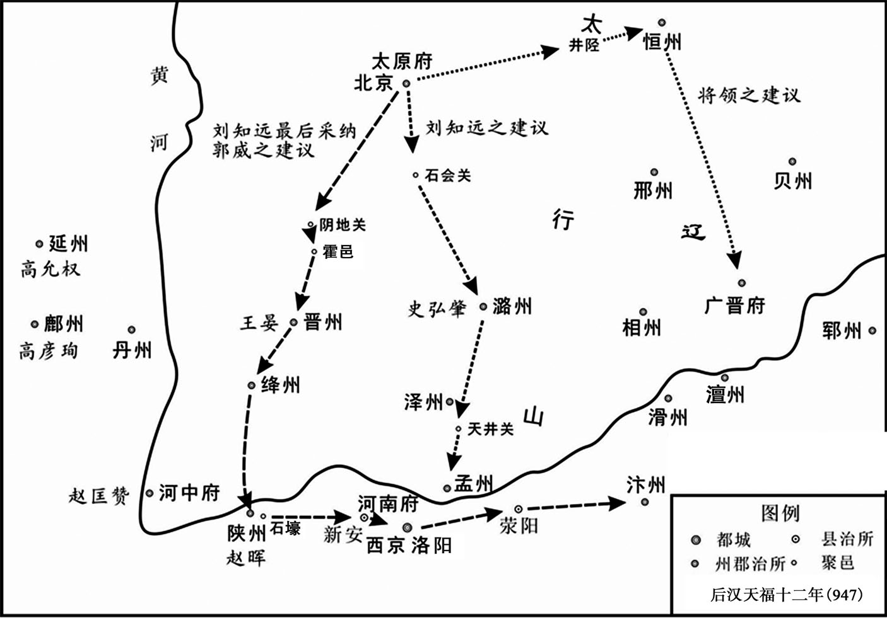 
后汉刘知远南下入汴示意图

* * *

(1) 此时当为后晋出帝天福八年（943年）九月。

(2) 此时应为后晋出帝天福八年（943年）十二月。

(3) 据《资治通鉴》卷二八四“开运元年八月”（中华书局点校本第9275页）原文，“知远亦知见疏”应为“知远自知见疏”。

(4) 据《资治通鉴》卷二八四“开运二年三月癸亥”（中华书局点校本第9289页）原文及下文文意，“是日”应当为“是夕”。

(5) 据《资治通鉴》卷二八五“后晋出帝开运二年（945年）十二月丁亥”（中华书局点校本第9301页）原文，“十二月”应为“十二月丁亥”。

(6) 据《资治通鉴》卷二八五“后晋开运三年（946年）十二月”（中华书局点校本第9318页）原文，“此有异志”应为“此必有异志”。

(7) 据《资治通鉴》卷二八六“后汉高祖天福十二年（947年）正月”（中华书局点校本第9334页）原文，“以收马为名”应为“以牧马为名”。

(8) 据《资治通鉴》卷二八六“后汉高祖天福十二年（947年）四月”（中华书局点校本第9353页）原文，“又遣谦万进出北方”应为“又遣阎万进出北方”。

(9) 据《资治通鉴》卷二八七“后汉高祖天福十二年（947年）五月”（中华书局点校本第9359页）原文，“次取镇、魏”应为“攻取镇、魏”。

# 三叛连兵

## 【内容提要】

《三叛连兵》叙述了后汉河中、凤翔以及永兴（即晋昌）三个藩镇相继反叛以及后汉朝廷相继予以平定的历史。

晋昌节度使（治长安，今陕西西安）赵匡赞、凤翔节度使（治凤翔，今陕西凤县北）侯益均为后晋以及辽朝灭晋以后所委任的节度使。后汉建立后，反复于后汉与后蜀国之间。后汉乾祐元年（948年）二月，后汉朝廷任命王景崇兼凤翔巡检使。侯益入朝极力诋毁王景崇，王景崇内不自安，遂煽动牙军将赵思绾（wǎn）据长安城反。护国军（即河中）节度使（治河中府，今山西永济）李守贞曾与杜重威一起投降契丹，因畏惧而心怀异志，赵思绾遂向他奉表献御衣，李守贞于是自称秦王，以赵思绾为晋昌节度使。后汉朝廷先令郭从义、白文珂等率兵讨伐赵思绾和李守贞，又以赵晖为凤翔节度使，迁王景崇为邠（bīn）州留后。但王景崇拖延不赴任，一面集凤翔丁壮，一面又调邠州兵士，降于后蜀，同时接受李守贞的官爵。河中、凤翔与永兴（即晋昌）三镇相继而叛，后汉朝廷先后派发数路大军分别征讨，但由于将帅不相容，自春至秋不肯攻战。八月，后汉命郭威为西面军前招慰安抚使，节度诸军。郭威听取镇国节度使扈从珂的建议，以李守贞为首要征讨对象，兵分三路，从陕州（治陕县，今河南三门峡西）、同州（治冯翊，今陕西大荔）、潼（tóng）关分道进攻，将河中紧紧包围。李守贞虽几次突围未能成功，派人求救于南唐、后蜀、辽朝，也均被后汉巡逻兵捉获，城中粮尽，饿死的人越来越多。在凤翔方向，后蜀援军被赵晖部下击退，十月，王景崇两度出兵均被赵晖击败，从此退守城中不敢出战。至后汉乾祐二年（949年）四月，河中城中食尽，饿死一半人口。至七月，郭威攻河中，李守贞与妻、子自焚而死。长安城中自五月已断粮，赵思绾取妇女儿童杀之以充军粮。同年七月，赵思绾放下武器出城受诏，又三次更改行期，郭从义等认为其心不诚，便在请示郭威后，杀赵思绾及其父兄、部曲三百多人。后汉先后平定河中、长安两镇后，赵晖猛攻凤翔。至十二月，王景崇举族自焚，其部下公孙辇（niǎn）、张思谏等以州降。后汉经过近两年的时间平定了三叛。

“三叛连兵”是后汉时期统治阶级内部中央与地方之间的一场斗争。五代时期，战乱频繁，“三叛”进一步加深了人民的灾难，因此“三叛”的平定，具有一定的积极意义。

## 【原文】

**后汉高祖天福十二年夏五月乙酉朔，契丹永康王兀欲囚赵延寿于恒州，辛丑，帝遣使谕河中节度使赵匡赞，仍以契丹囚其父延寿告之[1]。**

## 【注文】

[1]后汉高祖：即刘知远。　　天福十二年：即公元947年。　　乙酉：干支纪日的乙酉日。天福十二年五月乙酉，即五月初一。　　朔：干支纪日中的初一。　　恒州：即镇州，古州名。参见前“镇”条注。　　帝：即后汉高祖刘知远。　　河中节度使：古代方镇名，即护国节度使。参见前“护国节度使”条注。

## 【译文】

后汉高祖天福十二年（947年）夏季五月乙酉朔（初一日），契丹永康王耶律兀欲将赵延寿囚禁在了恒州。辛丑（十七日），后汉高祖（刘知远）遣使者向河中节度使赵匡赞传话，把契丹囚禁他父亲赵延寿的事情告诉了他。

## 【原文】

**秋七月，或传赵延寿已死，郭威言于帝曰：“赵匡赞契丹所署，今犹在河中，宜遣使吊祭，因起复移镇[1]。彼既家国无归，必感恩承命。”从之。会邺都留守天雄节度使兼中书令杜重威、天平节度使兼侍中李守贞皆奉表归命，重威仍请移他镇[2]。归德节度使兼中书令高行周入朝，丙申，徙重威为归德节度使，以行周代之；守贞为护国节度使，加兼中书令；徙护国节度使赵匡赞为晋昌节度使[3]。后二年，延寿始卒于契丹。**

## 【注文】

[1]署：委任。　　宜：应当。　　因：顺便、顺势。　　起复：古代官员遭父母丧时必须离职服丧，服丧期未满而应召任职称为“起复”。

[2]归命：归顺。

[3]晋昌节度使：古代方镇名。后晋天福三年（938年）以唐西京京兆府置，后汉乾祐元年（948年）改为永兴军。治京兆府（即长安，今陕西西安），领京兆府、华州（治郑县，今陕西渭南市华州区）等府州。

## 【译文】

后汉高祖天福十二年（947年）秋季七月，有人传说赵延寿已经死了，郭威向后汉高祖上言说：“赵匡赞是契丹任命的，现在仍然留在河中，我们应该派遣使者前往河中吊唁祭祀，在他服丧期间起用他，并把他调换到别的藩镇。他已无家无国可归，一定会感恩戴德听从陛下您的命令。”高祖听从了郭威的建议。当时正值邺都留守、天雄节度使兼中书令杜重威和天平节度使兼侍中李守贞都上表前来归顺，杜重威并请求调任其他藩镇。归德节度使兼中书令高行周前来朝觐，丙申（十三日），高祖调任杜重威为归德节度使，以高行周代替他原来的职务；命令李守贞为护国节度使，加官兼中书令；调任护国节度使赵匡赞为晋昌节度使。两年以后，赵延寿才死于契丹。

## 【原文】

**杜重威自以附契丹，负中国，内常疑惧。及移镇制下，复拒而不受，遣其子弘璲质于麻荅以求援[1]。赵延寿有幽州亲兵二千在恒州，指挥使张琏将之，重威请以守魏[2]；麻荅遣其将杨衮将契丹千五百人及幽州兵赴之[3]。闰月庚午，诏削夺重威官爵，以高行周为招讨使，镇宁节度使慕容彦超副之，以讨重威。**

## 【注文】

[1]制：古代帝王的命令称“制”。

[2]指挥使：古代军将名。唐末五代时，藩镇皆置指挥使或都指挥使，为领兵将领之称号。　　魏：即魏州。

[3]杨衮（gǔn）（生卒年不详）：五代时契丹大将。燕云人。契丹名耶律敌禄，随辽太宗耶律德光南征。后任契丹武定节度使、政事令等职。北汉和后周作战时，他曾率兵驰援北汉。

## 【译文】

杜重威自认为投靠契丹、背叛晋朝，内心常常感到疑虑恐惧。及至调任归德节度使的诏令下达，又拒不接受命令，派他的儿子杜弘璲（suì）到麻荅那里做人质，以换取契丹的援兵。赵延寿有两千名幽州亲兵驻扎在恒州，由指挥使张琏率领，杜重威请求契丹派他们前来帮助固守魏州。麻荅派遣将领杨衮率契丹兵一千五百人以及幽州兵马前往魏州。天福十二年（947年）闰七月庚午（十八日），后汉高祖（刘知远）下令削去杜重威的官职爵位，任命高行周为招讨使，镇宁节度使慕容彦超为副招讨使，出兵讨伐杜重威。

## 【原文】

**慕容彦超欲急攻城，行周欲缓之，由是二将不协[1]。帝恐生他变，欲自将击重威，九月戊寅，诏幸澶、魏劳军[2]。庚辰，帝发大梁。**

## 【注文】

[1]协：和谐、和洽。

[2]劳军：慰劳军队。

## 【译文】

慕容彦超想要急速攻打邺城，而高行周则想缓慢进攻，于是二将产生不和。后汉高祖担心发生其他变故，就打算亲自率兵去攻打杜重威。天福十二年（947年）九月戊寅（二十七日），下诏说要去澶（chán）州、魏州慰劳军队。庚辰（二十九日），后汉高祖从都城大梁出发。

## 【原文】

**晋昌节度使赵匡赞恐终不为朝廷所容，冬十月，遣使降蜀，请自终南路出兵应援[1]。**

## 【注文】

[1]蜀：即五代十国中的孟氏后蜀政权，都成都。　　终南：即终南山，是秦岭山脉陕西境内的一段，西起眉县，东至蓝田县。

## 【译文】

晋昌节度使赵匡赞担心最终不能被后汉朝廷所容忍，天福十二年（947年）冬季十月，派使臣归降后蜀，请求后蜀从终南山路出援兵接应。

## 【原文】

**帝至邺都，遣给事中陈观往谕指，重威复闭门拒之[1]。城中食浸竭，将士多出降者[2]。慕容彦超固请攻城，帝从之[3]。丙午，亲督诸将攻城，自寅至辰，士卒伤者万余人，死者千余人，不克而止[4]。彦超乃不敢复言。**

## 【注文】

[1]给（jǐ）事中：古代文官名。隋初于尚书省吏部置给事郎，唐武德三年（620年）改名给事中，置四人，正五品上。掌封驳制诏奏章，分判本省日常事务。

[2]浸（jìn）：逐渐。

[3]固：坚持。

[4]寅：即寅时，相当于现在的早晨三点至五点。　　辰：即辰时，相当于现在的上午七点至九点。

## 【译文】

后汉高祖到达邺都，派遣给事中陈观前去宣布旨意，杜重威却又关闭城门予以拒绝。城中粮食逐渐吃光，将士多有出城投降的。慕容彦超坚持请求攻城，高祖同意。天福十二年（947年）十月丙午（二十五日），高祖亲自督促众将攻城，从寅时到辰时，士卒伤了一万多人，死了一千多人，不能攻下而停止。慕容彦超便不敢再提攻城的事了。

## 【原文】

**初，契丹留幽州兵千五百人戍大梁。帝入大梁，或告幽州兵将为变，帝尽杀之于繁台之下[1]。及围邺都，张琏将幽州兵二千助重威拒守，帝屡遣人招谕，许以不死。琏曰：“繁台之卒，何罪而戮？今守此，以死为期耳[2]。”由是城久不下。十一月丙辰，内殿直韩训献攻城之具[3]。帝曰：“城之所恃者众心耳。众心苟离，城无所保，用此何为[4]？”**

## 【注文】

[1]繁（pó）台：古台名。在今河南开封东南禹王台公园内，相传为春秋时期著名乐师师旷演奏的吹台，西汉梁孝王增筑，后有繁姓居住其侧，故名。

[2]以死为期：只求一死。这是激愤的话。期，希望、期望。

[3]内殿直：古代军号名。宿卫宫室的皇帝亲军，后唐时已经设置，由骁勇之士组成，分为左右两番，每番又各分为第一、第二两班。战斗力极强。

[4]苟：如果。

## 【译文】

当初，契丹留下一千五百名幽州兵守卫大梁。后汉高祖进入大梁后，有人密报说幽州兵将发动兵变，高祖便把他们全部杀死在繁台下面。到现在围困邺都，张琏率领两千名幽州兵帮助杜重威拒守，汉高祖多次派人劝谕他们投降，许诺不杀他们。张琏说：“繁台之下的幽州兵卒，犯有什么罪而遭杀戮？现在坚守此城，只求一死罢了。”因此邺城久攻不下。天福十二年（947年）十一月丙辰（初六日），内殿直韩训进献攻城器械，高祖说：“守城所倚仗的是众人之心。如果众人离心，城池就无人保卫了，用这些器械干什么？”

## 【原文】

**杜重威之叛也，观察判官金乡王敏屡泣谏，不听[1]。及食竭力尽，甲戌，遣敏奉表出降。乙亥，重威子弘琏来见。丙子，妻石氏来见[2]。石氏，即晋之宋国长公主也，帝复遣入城。丁丑，重威开门出降，城中馁死者什七八，存者皆尪瘠无人状[3]。张琏先邀朝廷信誓，诏许以归乡里[4]。及出降，杀琏等将校数十人；纵其士卒北归，将出境，大掠而去。**

## 【注文】

[1]王敏（？—957年）：字待问，单（shàn）州金乡（今山东金乡）人。进士及第。初依杜重威至观察判官，后入拜侍御史。后周初历任澶州节度判官、开封少尹。后周世宗柴荣即位后，拜左谏议大夫，迁给事中、刑部侍郎等职。后因女婿陈南金犯罪被牵连免官一年多。复拜司农卿，病卒。

[2]石氏：即宋国长公主，杜重威之妻，石敬瑭之妹。

[3]馁（něi）：饥饿。　　尪（wāng）瘠（jí）：瘦弱。　　状：形状。

[4]邀：要求、希求。

## 【译文】

杜重威背叛后汉时，观察判官、金乡人王敏曾多次哭泣劝谏，杜重威不听。等到粮食吃光、气力用尽，天福十二年（947年）十一月甲戌（二十四日），杜重威派王敏出城奉表请降。乙亥（二十五日），杜重威的儿子杜弘琏前来朝见。丙子（二十六日），杜重威的妻子石氏来朝见，石氏就是后晋的宋国长公主。后汉高祖重新把他们送回城中。丁丑（二十七日），杜重威打开城门，出城投降。这时，城中之人十分之七八都被饿死了，活着的也都骨瘦如柴没有人的形状。张琏首先要求后汉朝廷作出信守不杀降者的誓言，后汉高祖下诏说允许他们返归家乡。等到出降以后，杀张琏等将领军校数十人；释放其他士兵北归家乡，这些兵士将要离开魏州地界时，大肆抢掠而去。

## 【原文】

**郭威请杀重威牙将百余人，并重威家赀籍之以赏战士，从之[1]。以重威为太傅兼中书令、楚国公。重威每出入，路人往往掷瓦砾诟之[2]。**

## 【注文】

[1]家赀（zī）：家产。赀，同“资”。　　籍：即籍没，登记并没收（家产）入官。

[2]瓦砾（lì）：破碎的砖头瓦片。　　诟（gòu）：辱骂、责骂。

## 【译文】

郭威请求杀死杜重威的一百多名牙将，并抄没杜重威的家产赏给战士，后汉高祖同意。高祖任命杜重威为太子太傅兼中书令，封楚国公。杜重威每次出入，路上的人常常向他摔扔碎砖烂瓦责骂他。

## 【原文】

**臣光曰：汉高祖杀幽州无辜千五百人，非仁也[1]。诱张琏而诛之，非信也。杜重威罪大而赦之，非刑也。仁以合众，信以行令，刑以惩奸，失此三者，何以守国？其祚运之不延也，宜哉[2]！**

## 【注文】

[1]臣光曰：臣司马光说。这是北宋大臣司马光编纂《资治通鉴》的体例之一，表示司马光对上文所述事件的评论，表达司马光本人对该事件的看法。

[2]祚（zuò）运：皇位国运。　　延：延长、延伸。　　宜哉（zāi）：应该的啊。宜，应该、应当；哉，文言语气助词，表示感叹，相当于现代汉语的“啊”。

## 【译文】

史臣司马光评论说：后汉高祖杀害无辜的幽州士卒一千五百人，这是不仁。引诱张琏投降而又将他杀死，这是不信。杜重威罪大恶极却赦免了他，这是不刑。仁用以团结大众，信用以执行命令，刑用以惩罚奸佞，失掉这三者，凭什么守护国家？后汉的皇位国运不能长久延续，这是应该的啊！

## 【原文】

**十二月丙戌，帝发邺都。**

## 【译文】

后汉高祖天福十二年（947年）十二月丙戌（初六日），后汉高祖从邺都出发。

## 【原文】

**蜀主遣雄武都押牙吴崇恽以枢密使王处回书招凤翔节度使侯益[1]。庚寅，以山南西道节度使兼中书令张虔钊为北面行营招讨、安抚使，雄武节度使何重建副之，宣徽使韩保贞为都虞候，共将兵五万，虔钊出散关，重建出陇州，以击凤翔[2]。奉銮肃卫都虞候李廷珪将兵二万出子午谷，以援长安[3]。诸军发成都，旌旗数十里。癸巳，帝至大梁。侯益请降于蜀，使吴崇恽持兵籍、粮帐西还，与赵匡赞同上表请出兵平定关中。**

## 【注文】

[1]蜀主：即后蜀国主孟昶（chǎng）。孟昶（919—965年）原名仁赞，即位后改名昶。字保元，邢州龙岗（今河北邢台）人，五代后蜀高祖孟知祥第三子，934年至964年在位。即位初年，励精图治，兴修水利，注重农桑，后蜀国势强盛。但后期沉湎酒色，不思国政，朝政十分腐败。北宋乾德二年（964年）用兵后蜀，孟昶投降，次年死于开封。　　雄武：即雄武节度使。　　吴崇恽（yùn）：后蜀军将，籍贯及生卒年不详。　　王处回（？—951年）：五代后蜀大臣。字亚贤，彭城（今江苏徐州）人。事孟知祥为中门副使。孟知祥称帝，擢枢密使。后主孟昶立，加兼侍中，领武泰军节度使。后蜀广政元年（938年），兼武信军节度使，同平章事。在任期间，专权贪纵，卖官鬻（yù）狱。后以太子太傅致仕。卒。

[2]山南西道节度使：古代方镇名。唐宝应元年（762年）升山南西道观察使置，治梁州（治南郑，今陕西汉中），领梁、洋、集、壁、文、通、巴、兴、凤、利、开、渠、蓬等州。唐兴元元年（784年）升梁州为兴元府，故其亦称兴元节度使。唐末五代时领州大为减少，前蜀时领兴元、渠（治今四川渠县）、开（治今重庆开县南）、通（治今四川达县）、潾等府州，后蜀时领兴元、兴（治今陕西略阳）、文（治今甘肃文县）等府州，约当今陕西汉中和四川北部地区。　　张虔（qián）钊（约882—947年）：辽州榆社（今山西榆社）人。少事河东节度使李克用。后唐时，历左右突骑军使、随驾亲军都指挥使等职。奉命北讨契丹，契丹不敢南下。后历徐州、山南西道节度使。后唐应顺元年（934年）归附后蜀。后蜀后主孟昶即位，加中书令，历左右匡圣马步军都指挥使、昭武军节度使。公元947年，后蜀命张虔钊为北面行营招讨安抚使，谋趁乱夺取中原，出师不利，卒于兴州。　　行营：将帅统兵出征时的办公之地。　　安抚使：古代官名。隋代以安抚大使为行军主帅的兼职。唐时派大臣巡视经过战乱或受灾的地区，以安定社会秩序，称安抚使。　　韩保贞（生卒年不详）：五代后蜀大臣。字永吉，潞州长子（今山西长子）人。初事孟知祥为押牙，后迁丰德库使兼广义库使。后主孟昶立，累迁至宣徽北院使、雄武军节度使、奉銮肃卫马步军都指挥使等。宋乾德三年（965年），宋朝举兵伐蜀，后主命他率大军防御。他一再撤退、逃遁，后被宋将史延德擒获，送至汴京，不久死去。　　散关：古关名，汉时置，在今陕西宝鸡西南，唐以后称为大散关。　　陇州：古州名。西魏废帝三年（554年）以东秦州改置，治所在杜阳（今陕西陇县东南），北周明帝二年（558年），移治汧源县（今陇县）。唐时领有汧源、汧阳、吴山、南由、华亭五县，辖境相当于今陕西千水流域及甘肃华亭地。五代沿袭。

[3]奉銮（luán）肃卫：后蜀禁军军号，后蜀孟知祥时创立。　　李廷珪（guī）（？—967年）：并州太原（今山西太原西南）人。七岁起入侍后唐太原留守孟知祥。后随孟知祥入蜀，授以军职，累迁奉銮肃卫都虞候。孟昶即位后，受命率大军接应降蜀的赵匡赞，无功而返。后历任兴元节度使、捧圣控鹤都指挥使、左右卫圣诸军马步军都指挥使等职，加兼侍中。后蜀降宋后，被宋授为右千牛卫上将军的散职。　　子午谷：也称子午道，在陕西长安县南，是关中通往汉中的南北通道。古人以北为“子”，南为“午”，故名。

## 【译文】

后蜀国主（孟昶）派遣雄武都押牙吴崇恽带着枢密使王处回的信，去招降凤翔节度使侯益。天福十二年（947年）十二月庚寅（初十日），后蜀国主任命后蜀山南西道节度使兼中书令张虔钊为北面行营招讨安抚使，雄武节度使何重建为副安抚使，宣徽使韩保贞为都虞候，共率领军士五万，张虔钊从散关出兵，何重建从陇州出兵，前去攻打凤翔。又命令奉銮肃卫都虞候李廷珪领兵两万出子午谷，去援助长安。各军从成都出发时，旌旗连绵几十里。癸巳（十三日），后汉高祖（刘知远）抵达大梁。侯益请求向后蜀归降，让吴崇恽携带着凤翔的兵士名册和粮食账簿向西返回，并与赵匡赞一同上表请求后蜀出兵平定关中。

## 【原文】

**乾祐元年春正月，帝以赵匡赞、侯益与蜀兵共为寇，患之[1]。会回鹘入贡，诉称为党项所阻，乞兵应接[2]。诏右卫大将军王景崇、将军齐藏珍将禁军数千赴之，因使之经略关西[3]。**

## 【注文】

[1]乾祐：后汉高祖刘知远和隐帝刘承祐共同使用的年号，共使用三年，公元948至950年。　　患：担忧。

[2]回鹘（hú）：中国古代的少数民族。原称回纥（hé），唐德宗时改称回鹘。早年驻牧于仙娥河（又名娑陵水，今蒙古色楞格河。娑，音suō）和温昆河（今蒙古鄂尔浑河）流域。唐太宗贞观二十年（646年）建立回纥汗国，与唐王朝保持着密切的政治、经济和文化往来，助唐平定安史之乱、抵御吐蕃对西域的进攻，促进了唐代的中外文化交流。唐开成五年（840年），回鹘汗国被黠（xiá）戛（jiá）斯灭亡，回鹘人分三支西迁：一迁吐鲁番盆地，一迁葱岭西楚河一带，一迁河西走廊。

[3]右卫大将军：古代武官名。隋唐时期设置左右卫府，各设上将军一人，从二品，大将军一人，正三品，将军二人，从三品。掌管宫禁宿卫，守卫正殿各门及内厢，并分兵守卫皇城四面与宫城内外。五代沿袭。　　王景崇（？—949年）：邢州（治龙冈，今河北邢台）人。少从军，后唐明宗李嗣源收为牙将，屡升至阁门使。后晋时，任左金吾卫大将军。契丹入汴后，被辽任为宣徽使。后汉立，归附，任右卫大将军，后任凤翔节度使。后汉乾祐二年（949年），与永兴节度使赵思绾共推河中节度使李守贞为秦王叛变，后汉朝廷命赵晖率军讨伐。李守贞、赵思绾相继失败，王景崇与全家自焚而死。　　齐藏珍（？—957年）：籍贯不详。少历内职，累迁诸卫将军。前后监押兵师在外，颇称干事，但为人阴险强辩。后周广顺（951—953年）中，奉命到滑州巡护河堤，因弛慢致黄河决口，被流放到沙门岛（今山东长岛）。周世宗柴荣即位，自沙门岛征还。秦、凤之役，淮上用兵，皆任为监军。后因贪赃官物及游说李重进，以冒称检校官罪被秘密处死。　　因：趁机。　　经略：筹划治理。　　关西：指函谷关（在河南灵宝境内）以西的地区。

## 【译文】

后汉高祖乾祐元年（948年）春季正月，后汉高祖因为赵匡赞、侯益和后蜀军队联合侵犯，感到忧虑。正赶上回鹘向后汉朝廷进贡，诉称在路上被党项人所阻拦，请求发兵接应。后汉高祖便诏令左卫大将军王景崇、将军齐藏珍率领禁军数千人赶赴，乘机让他们经营关西地区。

## 【原文】

**晋昌节度判官李恕，久在赵延寿幕下，延寿使之佐匡赞[1]。匡赞将入蜀，恕谏曰：“燕王入胡，岂所愿哉[2]？今汉家新得天下，方务招怀，若谢罪归朝，必保富贵。入蜀非全计也，‘蹄涔不容尺鲤’，公必悔之[3]。”匡赞乃遣恕奉表请入朝。景崇等未行而恕至，帝问恕：“匡赞何为附蜀？”对曰：“匡赞自以身受虏官，父在虏庭，恐陛下未之察，故附蜀求苟免耳。臣以为国家必应存抚，故遣臣来祈哀。”帝曰：“匡赞父子，本吾人也，不幸陷虏。今延寿方坠槛阱，吾何忍更害匡赞乎[4]！”即听其入朝。侯益亦请赴二月四日圣寿节上寿[5]。景崇等将行，帝召入卧内，敕之曰：“匡赞、益之心皆未可知，汝至彼，彼已入朝则勿问，若尚迁延顾望，当以便宜从事[6]。”**

## 【注文】

[1]节度判官：节度使下面的属官，一般设二人，无品秩，掌文书事务。其权极重，几乎等于副使。

[2]燕王：即赵延寿。赵延寿被契丹封为燕王。　　胡：即契丹。

[3]蹄涔（cén）不容尺鲤：牛马蹄印里的水，容不下一尺长的鲤鱼。出自《晋书·刘聪载记》。涔，积水。

[4]槛（kǎn）阱（jǐng）：捕捉野兽的机具和陷坑。也比喻人世间的陷阱、牢笼。

[5]二月四日圣寿节：古代帝王的生日，一般称“圣寿节”。刘知远出生于唐乾宁二年（895年）二月四日。

[6]顾望：观望。　　便宜从事：即便宜行事，指可斟酌形势，不拘规制条文，不须请示，自行处理相关事务。

## 【译文】

晋昌节度使判官李恕，多年在赵延寿的幕府中任职，赵延寿派他去辅佐赵匡赞。赵匡赞将要投靠后蜀，李恕劝谏说：“燕王（即赵延寿）投靠契丹胡虏，难道是他自愿的吗？现在汉家新得天下，正致力于招降怀远，如果认罪归顺朝廷，一定能保住富贵。投靠蜀国不是万全之计，‘牛马蹄印里的水，容不下一尺长的鲤鱼’，您一定会后悔的。”赵匡赞于是派李恕奉表前去后汉请求入朝。王景崇等人尚未出发，李恕就到了。后汉高祖问李恕道：“赵匡赞为什么要归附蜀国？”李恕回答说：“赵匡赞认为自己接受了契丹胡虏的官职，父亲赵延寿又在契丹朝廷，担心陛下您不能明察，所以依附蜀国寻求苟且以免遭杀害。臣下我认为国家必定会对他予以安抚，所以他就派臣前来祈求哀怜。”高祖说：“赵匡赞父子，本来就是我们的人，不幸身陷契丹胡虏。如今赵延寿刚刚落入胡虏的牢笼，我怎能再忍心加害于赵匡赞呢！”即随赵匡赞的意愿让他入朝。侯益也请求赶赴二月四日圣寿节，祝贺高祖的生日。王景崇等人准备出发，高祖将他们召集到卧室中，命令道：“赵匡赞、侯益的心思都不可知，你们到了那里，如果他们已经入朝，就不要再过问，如果他们还在拖延观望，就应当见机行事。”

## 【原文】

**赵匡赞不俟李恕返命，已离长安，丙子，入见。王景崇等至长安，闻蜀兵已入秦川，以兵少，发本道及赵匡赞牙兵千余人同拒之[1]。景崇恐匡赞牙兵亡逸，欲文其面[2]。微露风旨，军校赵思绾首请自文其面以帅下，景崇悦[3]。齐藏珍窃言曰：“思绾凶暴难制，不如杀之[4]。”景崇不听。思绾，魏州人也。**

## 【注文】

[1]秦川：泛指今陕西、甘肃的秦岭以北平原地带。因春秋、战国时期这一带地属秦国而得名。　　本道：即晋昌军节度使。

[2]文其面：在脸上刺字或记号。为防止士兵逃亡或发配犯人时采取的一种残酷手段。文同“纹”。

[3]风旨：意指、意图。　　赵思绾（wǎn）（？—949年）：魏州（治元城，今河北大名东北）人。早年为河中节度使赵匡赞的牙将，后汉高祖刘知远称帝后，随王景崇军入长安。后与王景崇、李守贞连兵反叛，残忍无比。枢密使郭威命令郭从义以诈谋擒之，与其子一起斩于闹市。

[4]窃言：私下说。窃，私下。

## 【译文】

赵匡赞没等李恕返回长安述命，就已经离开长安，乾祐元年（948年）正月丙子（二十六日），入汴京谒（yè）见后汉高祖（刘知远）。王景崇等人到达长安后，听说后蜀军队已经进入秦川，因为自己兵少，就征发本道兵马和赵匡赞的一千多名牙兵共同抵御后蜀军队。王景崇担心赵匡赞的牙兵逃跑，就想在他们的脸上刺字。稍微透露出一点风声，牙兵军校赵思绾首先请求在自己的脸上刺字来统率部下，王景崇很高兴。齐藏珍私下悄悄对王景崇说：“赵思绾凶狠残暴，难以控制，不如把他杀掉。”王景崇不听。赵思绾是魏州人。

## 【原文】

**蜀李廷珪将至长安，闻赵匡赞已入朝，欲引归[1]。王景崇邀之，败廷珪于子午谷[2]。张虔钊至宝鸡，诸将议不协，按兵未进[3]。侯益闻廷珪西还，因闭壁拒蜀兵[4]。虔钊势孤，引兵夜遁。景崇帅凤翔、陇、邠、泾、鄜、坊之兵追败蜀兵于散关，俘将卒四百人[5]。**

## 【注文】

[1]引归：率军退回。

[2]邀：半路拦截。

[3]宝鸡：古县名，唐至德二载（757年）改陈仓县置，属歧州（即凤翔府），今陕西宝鸡。　　不协：不一致，不统一。

[4]闭壁：关闭城门。

[5]邠（bīn）：即邠州，古州名。唐开元十三年（725年）改豳（bīn）州为邠州。治新平县（今陕西彬县），领新平、三水、永寿、宜禄等县，辖境相当今陕西彬县、长武、旬邑、永寿四县地。五代沿袭。　　泾：即泾州。　　鄜（fū）：即鄜州，古州、郡名。西魏废帝时以北华州改名。隋大业初废。唐武德元年（618年）改隋上郡置，治洛交县（今陕西富县）。唐末领洛交、洛川、三川、直罗、甘泉五县，相当于今陕西富县、伏陆、洛交、洛川、甘泉等地。五代沿袭。　　坊：即坊州，古州名。唐武德二年（619年）置，治中部县（今陕西黄陵西南）。唐时领有中部、鄜城、宜君、升平四县，辖境相当于今陕西黄陵、宜君等地。五代沿袭。

## 【译文】

后蜀李廷珪（guī）快要到达长安时，听说赵匡赞已经到汴京朝拜后汉高祖，便打算率兵退回蜀地。王景崇半道进行拦击，在子午谷打败李廷珪。张虔（qián）钊到达宝鸡，由于众将领意见不一致，便按兵不动。侯益听说李廷珪向西返回，于是关闭城门抗拒后蜀军队。张虔钊势力孤单，率领军队连夜逃跑。王景崇率领凤翔、陇、邠、泾、鄜、坊六镇州兵马追击，在散关打败后蜀军队，俘虏后蜀将士四百人。

## 【原文】

**丁丑，帝殂，秘不发丧[1]。庚辰，下诏，称：“重威父子，因朕小疾，谤议摇众，并其子弘璋、弘琏、弘璨皆斩之[2]。”**

## 【注文】

[1]殂（cú）：死亡。

[2]谤议：诽谤议论。

## 【译文】

后汉高祖乾祐元年（948年）正月丁丑（二十七日），后汉高祖（刘知远）去世，朝廷保密不办丧事。庚辰（三十日），下达皇帝诏令，声称：“杜重威父子，乘朕小病，毁谤议论朝廷，动摇人心，连同他的儿子杜弘璋、杜弘琏、杜弘璨一并斩首。”

## 【原文】

**二月辛巳，发丧，宣遗制，皇子承祐即皇帝位[1]。**

## 【注文】

[1]遗制：即遗诏，临死前的命令。　　承祐：即后汉隐帝刘承祐（931—951年）。沙陀族，太原（今山西太原西南）人，后汉高祖刘知远的次子。948年至950年在位，沿用高祖乾祐年号。在位期间诛杀高祖时亲信大臣杨邠、史弘肇、王章等人，又下令杀害天雄节度使郭威。郭威起兵反抗，攻入开封，他被部下杀死。

## 【译文】

后汉高祖乾祐元年（948年）二月辛巳（初一日），发布消息为后汉高祖办丧事，宣读遗诏，皇子承祐即皇帝位。

## 【原文】

**诏以王景崇兼凤翔巡检使[1]。景崇引兵至凤翔，侯益尚未行，景崇以禁兵分守诸门。或劝景崇杀益，景崇以受先朝密旨，嗣主未之知，或疑于专杀，犹豫未决[2]。益闻之，不告景崇而去。景崇悔，自诟[3]。戊戌，益入朝，隐帝问：“何故召蜀军[4]？”对曰：“臣欲诱致而杀之。”帝哂之[5]。**

## 【注文】

[1]巡检使：古代官名。五代时始置巡检使之职，掌维持治安。

[2]嗣主：继承的君主。这里指后汉隐帝刘承祐。

[3]自诟（gòu）：自己骂自己。

[4]隐帝：即后汉隐帝刘承祐。

[5]哂（shěn）：讥笑、哂笑。

## 【译文】

后汉隐帝（刘承祐）诏令王景崇兼任凤翔巡检使。王景崇率兵到达凤翔，侯益还尚未启程，王景崇命令禁兵分守各个城门。有人劝王景崇杀掉侯益，王景崇认为自己接受的是先朝高祖的密旨，新继位的皇帝不知道，担心隐帝会怀疑自己擅自杀戮，所以犹豫不决。侯益听到风声，不向王景崇告别就离去。王景崇十分懊悔，大骂自己。后汉高祖乾祐元年（948年）二月戊戌（十八日），侯益入朝谒见后汉隐帝，隐帝责问他：“为什么招诱蜀国的军队前来？”侯益回答说：“臣想把他们引诱到凤翔而后杀掉他们。”汉隐帝讥笑他。

## 【原文】

**三月，侯益家富于财，厚赂执政，由是大臣争誉之[1]。丙寅，以益兼中书令，行开封尹[2]。**

## 【注文】

[1]执政：泛指掌管朝政的大臣。

[2]行开封尹：唐制，散官高而职事官低者为“行”某官。这里当是中书令高于开封尹，故称“行开封尹”。

## 【译文】

后汉高祖乾祐元年（948年）三月，侯益家产丰厚，送厚礼贿赂执掌政权的大臣，于是大臣们争相赞誉他。丙寅（十七日），后汉隐帝（刘承祐）任命侯益兼中书令，代理开封府尹。

## 【原文】

**侯益盛毁王景崇于朝，言其恣横[1]。景崇闻益尹开封，知事已变，内不自安，且怨朝廷。会诏遣供奉官王益如凤翔，征赵匡赞牙兵诣阙[2]。赵思绾等甚惧，景崇因以言激之。思绾途中谓其党常彦卿曰：“小太尉已落其手，吾属至京师并死矣，奈何[3]？”彦卿曰：“临机制变，子勿复言！”癸酉，至长安，永兴节度副使安友规、巡检乔守温出迎王益，置酒于客亭[4]。思绾前白曰：“壕寨使已定舍馆于城东，今将士家属皆在城中，欲各入城挈家诣城东宿[5]。”友规等然之。时思绾等皆无铠仗，既入西门，有州校坐门侧，思绾遽夺其剑斩之[6]；其徒因大噪，持白梃，杀守门者十余人，分遣其党守诸门[7]。思绾入府，开库取铠仗给之。友规等皆逃去。思绾遂据城，集城中少年，得四千余人，缮城隍，葺楼堞，旬日间，战守之具皆备[8]。**

## 【注文】

[1]盛毁：极力诋毁。　　恣（zì）横：放纵专横。

[2]王益（？—949年）：后汉隐帝时供奉官，因卷入三镇之乱而被郭从义所杀。　　诣（yì）阙（què）：前往朝廷。阙为宫殿前面两旁的楼台，常用来代指朝廷。

[3]常彦卿（？—949年）：五代军将，后汉初任虢（guó）州刺史、镇国军留后。因参与三镇叛乱，与赵思绾等皆斩于市。　　小太尉：指赵匡赞。赵匡赞与其父赵延寿都被辽朝官封太尉，故称赵匡赞为“小太尉”。

[4]永兴节度：即晋昌军节度使。　　安友规：五代军将。籍贯及生卒年不详。后汉时任永兴军节度副使，因失守长安城池，被流放登州沙门岛（今山东长岛）。另，宋太祖赵匡胤的监军有安友规，疑即此人。　　乔守温（？—949年）：五代军将，籍贯不详。后汉高祖时任巡检使，因卷入三镇之乱而被郭从义所杀。

[5]白：下级对上级禀告、陈述。　　壕寨使：大约是负责军队及其家属安营扎寨的官员。　　挈（qiè）：带、领。

[6]铠（kǎi）仗：铠甲兵仗。　　遽（jù）：迅速。

[7]白梃（tǐnɡ）：大木棍。

[8]集：招集、集合。　　缮（shàn）：修补，整治。　　城隍：护城河。　　葺（qì）：修理。　　楼堞（dié）：城楼上如齿状的矮墙，泛指城墙。

## 【译文】

侯益在朝中大肆诋毁王景崇，说他放纵专横。王景崇听说侯益担任了开封尹，知道事态已经发生了变化，内心忐忑不安，而且怨恨朝廷。正赶上后汉隐帝派供奉官王益到凤翔，征集赵匡赞的牙兵回汴京朝廷。牙校赵思绾（wǎn）等人非常害怕，王景崇乘机用话语相激。赵思绾在回京的路上对他的党羽常彦卿说：“小太尉（赵匡赞）已落入他们的手中，我们到达京城后都要被处死，怎么办？”常彦卿说：“见机行事，您不要再说。”乾祐元年（948年）三月癸酉（二十四日），到达长安，永兴节度副使安友规、巡检乔守温出城迎接王益，并在客亭设置酒宴款待他们。赵思绾走上前来禀报说：“壕寨使已经把舍馆安置在城东，现在将士的家属都在城中，他们想各自进城携带家属到城东住宿。”安友规等人同意。当时赵思绾等人都没有武器铠甲，进了西门，见有该州军校坐在门旁，赵思绾迅速夺过他的剑把他杀死；赵思绾的党徒乘势大声叫嚷，举着大木棍，打死了十几个守门兵士，分派党徒把守各个大门。赵思绾进入府衙，打开府库，取出武器铠甲分给他的党徒。安友规等人全都逃走。赵思绾于是占据了长安城，聚集城内的少年，有四千多人，修缮护城壕沟，整治城楼矮墙，十日之间，攻占防守的器械全部齐备。

## 【原文】

**王景崇讽凤翔吏民表景崇知军府事，朝廷患之[1]。甲戌，徙静难节度使王守恩为永兴节度使，徙保义节度使赵晖为凤翔节度使，并同平章事。以景崇为邠州留后，令便道之官[2]。**

## 【注文】

[1]讽：用含蓄的话劝告或讥刺。　　表：这里是动词，向朝廷上表。

[2]便道之官：走近便的道路去赴任。之，往、到。

## 【译文】

王景崇示意凤翔的官吏士民向朝廷上表，推举自己主持军府事务，后汉朝廷对此深为担忧。乾祐元年（948年）三月甲戌（二十五日），调静难节度使王守恩为永兴节度使，调保义节度使赵晖为凤翔节度使，都兼官同平章事。任命王景崇为邠州留后，命令他抄近路赴任。

## 【原文】

**虢州伶人靖边庭杀团练使田令方，驱掠州民，奔赵思绾[1]。至潼关，潼关守将出击之，其众皆溃[2]。**

## 【注文】

[1]虢（guó）州：古州名。隋开皇三年（583年）以东义州改置。隋大业初废。隋义宁元年（617年）置虢郡，唐武德元年（618年）改为虢州。唐贞观八年（634年）移治弘农县（今河南灵宝），领弘农、阌（wén）乡、湖城、朱阳、卢氏等县，辖境约相当今河南西部灵宝、卢氏、栾川等县市地。五代沿袭。　　伶（líng）人：也称优伶、优人，古代指以乐舞谐戏为业的艺人。

[2]潼（tóng）关：中国古代重要关隘。始建于东汉建安元年（196年），位于今陕西渭南潼关县北，北临黄河，南踞山腰。潼关是关中的东大门，历来为兵家必争之地。

## 【译文】

虢州艺人靖边庭杀死团练使田令方，驱使掳掠州中百姓投奔赵思绾（wǎn）。到达潼关，潼关守将出兵迎击，他的部众全都溃散。

## 【原文】

**丁丑，邠、泾、同、华四镇俱上言护国节度使兼中书令李守贞与永兴、凤翔同反[1]。始，守贞闻杜重威死而惧，阴有异志。自以晋世尝为上将，有战功，素好施，得士卒心[2]。汉室新造，天子年少初立，执政皆后进，有轻朝廷之志。乃招纳亡命，养死士，治城堑，缮甲兵，昼夜不息[3]。遣人间道赍蜡丸结契丹，屡为边吏所获[4]。**

## 【注文】

[1]同：即同州。古州、府名。西魏废帝三年（554年）改华州置，治武乡县（唐时改称冯翊，即今陕西大荔。冯，音píng；翊，音yì）。唐时领有冯翊、郃（hé）阳、白水、澄城、韩城、夏阳六县，辖境相当今陕西大荔、合阳、韩城、澄城、白水等地。五代沿袭。　　华：即华州。古州名。西魏废帝三年（554年）改东雍州置，治所在郑县（今陕西渭南市华州区）。唐时领有华、华阴、下邽（guī）三县，辖境相当于今陕西渭南市华州区、华阴市、潼关县等县（市、区）渭南市部分地区。五代沿袭。　　俱：副词，意为全、都。

[2]尝：曾经。　　素：历来、平时。

[3]养死士：豢（huàn）养敢死的勇士。　　城堑（qiàn）：护城河。　　缮甲兵：修缮铠甲、兵器。

[4]间道：抄小路。　　赍（jī）：怀抱着、带着。　　蜡丸：用蜡封成丸状的密信。

## 【译文】

后汉高祖乾祐元年（948年）三月丁丑（二十八日），邠州（静难）、泾州（彰义）、同州（匡国）、华州（镇国）四镇都向朝廷上奏说护国节度使兼中书令李守贞和永兴、凤翔二镇共同反叛。开始，李守贞听说杜重威被杀而心中恐惧，暗中萌发了反叛的念头。认为自己在后晋时曾为上将，有战功，平常慷慨好施，颇得士兵之心。现在后汉朝廷新立，皇帝年轻刚刚继位，执掌朝政的大臣都是资历比自己浅的官员，所以对朝廷颇为轻视。于是招纳亡命之徒，豢养敢死之士，治理城墙壕堑，修缮武器铠甲，日夜不停。又派人抄小路带着蜡丸密信结交契丹，多次被把守边关的官吏截获。

## 【原文】

**浚仪人赵修己素善术数，自守贞镇滑州，署司户参军，累从移镇，为守贞言“时命不可，勿妄动”[1]。前后切谏非一，守贞不听，乃称疾归乡里。僧总伦以术媚守贞，言其必为天子，守贞信之。又尝会将佐置酒，引弓指《舐掌虎图》曰：“吾有非常之福，当中其舌[2]。”一发中之，左右皆贺[3]。守贞益自负[4]。**

## 【注文】

[1]浚（xùn）仪：古县名。西汉置，治所在今河南开封。北朝、隋、唐先后为陈留郡、梁州、汴州治所。五代、宋时与开封县同为开封府治所。　　赵修己（892—962年）：开封浚仪（今河南开封）人，精通天文推步之学。后晋天福（936—943年）中，任滑州司户参军，后随李守贞移镇河中。李守贞败后，召入朝中，任翰林天文。郭威镇邺，奏授参军。劝郭威起兵反汉。后周立，迁鸿胪少卿、司天监等职。宋初迁太府卿判监事。　　术数：古代道教五术中的重要内容，以阴阳五行的生克制化理论来推测自然、社会和人事的“吉凶”之象。　　司户参军：古代文官名，即司户参军事。隋唐五代时为府、州主管民政的官员。府为正七品下，州为从七品下。唐开元初诸府改称户曹参军，州仍称司户参军。　　累：连续、屡屡。

[2]舐（shì）掌：舔掌。舐，舔。

[3]左右：身边跟随伺候的人。

[4]益：更加、越发。　　自负：自以为了不起。

## 【译文】

浚仪人赵修己，向来擅长以阴阳五行术推测人的命运和气数，自从李守贞镇守滑州，署他为司户参军后，屡次跟随着李守贞调动到各个藩镇。他对李守贞说：“时运、天命不允许，不要轻举妄动。”前后恳切劝谏不止一次，李守贞不听，赵修己于是声称有病回到家乡。僧人总伦用法术讨好李守贞，说他一定会成为天子，李守贞信以为真。李守贞又曾设置酒宴与将佐聚会，弯弓搭箭指着墙上挂着的一幅《舐掌虎图》说：“我如果有非常的福分，就应当射中老虎的舌头。”一发而中，周围人都向他祝贺，李守贞更加自命不凡。

## 【原文】

**会赵思绾据长安，奉表献御衣于守贞，守贞自谓天人协契，乃自称秦王[1]。遣其骁将平陆王继勋将兵据潼关，以思绾为晋昌节度使[2]。同州距河中最近，匡国节度使张彦威常诇守贞所为，奏请先为之备，诏滑州马军都指挥使罗金山将部兵戍同州[3]。故守贞起兵，同州不为所并。金山，云州人也。**

## 【注文】

[1]协契（qì）：和洽、默契。

[2]骁（xiāo）将：勇猛善战的将军。　　平陆：古县名，唐天宝三载（744年）改河北县置，治所在今山西平陆西南。　　王继勋（生卒年不详）：五代、宋军将。陕州平陆（今山西平陆西南）人，初隶河中府为牙校，为李守贞部下。李守贞败后，郭威奏补为供奉官，后周时历任汾、宪、麟、石、磁等州刺史。宋初迁磁州团练使。宋朝平荆南，授道州刺史。有武勇，在军阵常用铁鞭、铁槊（shuò）、铁挝（zhuā），军中称为“王三铁”。

[3]诇（xiòng）：侦察、探听。　　奏：本为“进上”之意。古代将臣子对皇帝陈述意见或说明事情称为奏，有奏议、奏章、奏疏、奏折等名目。战国以前臣僚向君主进呈文字统称上书，秦统一六国后始称“奏”。

## 【译文】

正赶上赵思绾占据了长安城，向李守贞奉上表章献上御衣，李守贞自认为这是天意、人心相默契，于是自称秦王。李守贞派遣他的骁将平陆人王继勋率兵占据潼关，任命赵思绾为晋昌节度使。同州距离河中最近，匡国节度使张彦威常常侦察李守贞的所作所为，奏请朝廷早做防备，后汉隐帝（刘承祐）下诏命令滑州马军都指挥使罗金山率领所部兵守卫同州。所以李守贞起兵时，同州没有被他吞并。罗金山是云州人。

## 【原文】

**夏四月，以镇宁节度使郭从义充永兴行营都部署，将侍卫兵讨赵思绾[1]。戊子，以保义节度使白文珂为河中行营都部署，内客省使王（浚）［峻］为都监[2]。辛卯，削夺李守贞官爵，命文珂等会兵讨之。乙未，以宁江节度使、侍卫步军都指挥使尚洪迁为西面行营都虞候[3]。**

## 【注文】

[1]永兴行营都部署：古代官职名，参见前“北面行营都部署”条注。　　侍卫兵：即侍卫亲军，为皇帝御前禁军。

[2]内客省使：古代官职名。参见前“客省副使”条注。

[3]宁江节度使：古代方镇名，即镇江军节度使。后梁末帝乾化四年（914年）置，治夔（kuí）州（治奉节，今重庆奉节），领夔、忠（治临江，今重庆忠县）、万（治南浦，今重庆万州区）等州。后唐初废，后唐天成二年（927年）复置，号江宁军节度，增领施州（治清江，今湖北恩施）。　　侍卫步军都指挥使：古代武官名，禁军步兵中的最高统帅。五代后晋时，废除六军诸卫制度，中央禁军全部由侍卫亲军司统领，长官称侍卫亲军马步军都指挥使、副都指挥使、都虞候。其下分设马军都指挥使、副都指挥使、都虞候和步军都指挥使、副都指挥使、都虞候。宋朝建立后，侍卫亲军司分为侍卫亲军马军司和侍卫亲军步军司，与殿前司一起合称为“三衙”。　　尚洪迁（生卒年不详）：五代军将。后汉时任宁江（夔州）节度使、侍卫步军都指挥使，讨王景崇。后在围攻长安的战斗中战死，赠太尉。

## 【译文】

后汉高祖乾祐元年（948年）夏季四月，后汉隐帝任命镇宁节度使郭从义充任永兴行营都部署，率领侍卫禁军讨伐赵思绾。戊子（初九日），任命保义节度使白文珂为河中行营都部署，内客省使王峻为都监。辛卯（十二日），下诏削夺李守贞的官职爵位，命令白文珂等将领合兵讨伐他。乙未（十六日），任命宁江节度使、侍卫步军都指挥使尚洪迁为西面行营都虞候。

## 【原文】

**王景崇迁延不之邠州，阅集凤翔丁壮，诈言讨赵思绾，仍牒邠州会兵[1]。**

## 【注文】

[1]之：往、到。

## 【译文】

王景崇拖延日期不到邠州上任，召集检阅凤翔的壮丁，假称要去讨伐赵思绾，并发牒文要邠州前来会师。

## 【原文】

**王景崇遗蜀凤州刺史徐彦书，求通互市，壬戌(1)，蜀主使彦复书招之[1]。**

## 【注文】

[1]遗（wèi）：给予、赠送。　　互市：双边贸易。

## 【译文】

王景崇致信给后蜀凤州刺史徐彦，要求互通贸易。后汉高祖乾祐元年（948年）四月壬戌这一天，后蜀国主孟昶（chǎng）让徐彦回信招降他。

## 【原文】

**六月乙酉，王景崇遣使请降于蜀，亦受李守贞官爵。**

## 【译文】

后汉高祖乾祐元年（948年）六月乙酉（初八日），王景崇派使者向后蜀请求投降，同时也接受了李守贞授予的官爵。

## 【原文】

**西面行营都虞候尚洪迁攻长安，（重）伤［重］而卒。**

## 【译文】

西面行营都虞候尚洪迁攻打长安，身受重伤而死。

## 【原文】

**秋七月，凤翔节度使赵晖至长安；乙亥，表王景崇反状益明，请进兵击之。**

## 【译文】

后汉高祖乾祐元年（948年）秋季七月，凤翔节度使赵晖抵达长安；乙亥（二十八日），上表说王景崇反叛的情况日益明显，请求发兵进攻。

## 【原文】

**自河中、永兴、凤翔三镇拒命以来，朝廷继遣诸将讨之。昭义节度使常思屯潼关，白（从）［文］珂屯同州，赵晖屯咸阳[1]。惟郭从义、王峻置栅近长安，而二人相恶如水火，自春徂秋皆相仗莫肯攻战[2]。帝患之，欲遣重臣临督。八月壬午，以郭威为西面军前招慰安抚使，诸军皆受威节度。威将行，问策于太师冯道。道曰：“守贞自谓旧将，为士卒所附，愿公勿爱官物，以赐士卒，则夺其所恃矣。”威从之。由是众心始附于威。诏白文珂趣河中，赵晖趣凤翔。**

## 【注文】

[1]常思（生卒年不详）：五代军将。字克恭，太原（今山西太原西南）人。后唐、后晋时历任长剑指挥使、六军都虞候。后汉立，历任武胜、昭义节度使。在潞州五年，以聚敛为事。后周时，历任归德、平卢节度使。　　咸阳：古县名，唐武德二年（619年）分泾阳、始平县置，属京兆府，今陕西咸阳东北。

[2]栅（zhà）：驻守军队的营栅。　　徂（cú）：往、到。　　相仗：相持。

## 【译文】

自从河中、永兴、凤翔三藩镇抗拒朝命以来，后汉朝廷相继派遣众将领去讨伐他们。昭义节度使常思屯兵潼关，白文珂屯兵同州，赵晖屯兵咸阳。只有郭从义和王峻在靠近长安的地方设置营栅，然而郭、王二人相互交恶，如同水火不能相容，所以从春季到秋季都相持观望，不肯进攻作战。后汉隐帝为此深感忧虑，打算派一位朝廷重臣临阵督战。乾祐元年（948年）八月壬午（初六日），任命郭威为西面军前招慰安抚使，各军都接受他的指挥。郭威将要出发时，向太师冯道请教计策。冯道说：“李守贞自认为是一位老将，军心都归附于他，希望您不要吝惜官家的财物，用以赏赐士兵，就夺走他所倚仗的优势了。”郭威听从了冯道的计策。从此众人之心开始归附郭威。后汉隐帝下诏命令白文珂赶赴河中，赵晖赶赴凤翔。

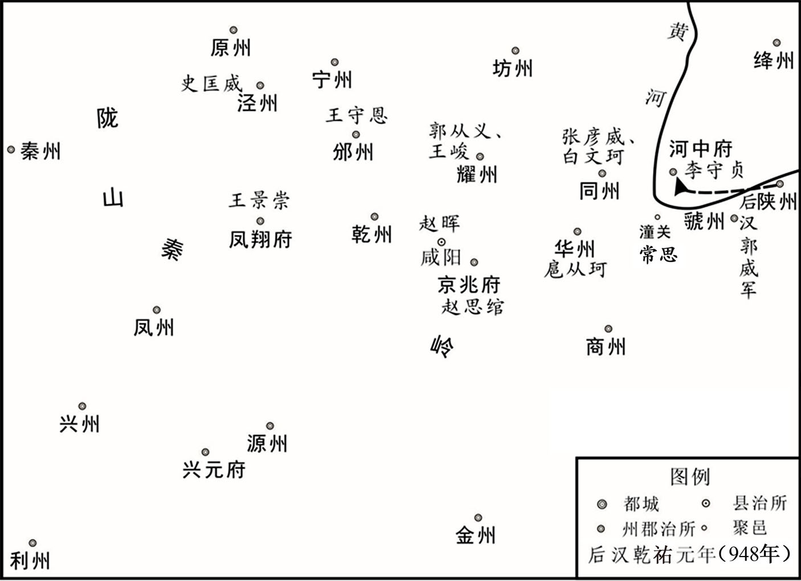 
后汉郭威讨“三叛”示意图

## 【原文】

**戊子，蜀改凤翔曰岐阳军，己丑，以王景崇为岐阳节度使、同平章事。**

## 【译文】

后汉高祖乾祐元年（948年）八月戊子（十二日），后蜀改凤翔节度使为岐阳军，己丑（十三日），任命王景崇为岐阳节度使、同平章事。

## 【原文】

**郭威与诸将议攻讨，诸将欲先取长安、凤翔。镇国节度使扈彦珂曰：“今三叛连衡，推守贞为主，守贞亡，则两镇自破矣[1]。若舍近而攻远，万一王、赵拒吾前，守贞掎吾后，此危道也[2]。”威善之。于是威自陕州，白文珂及宁江节度使、侍卫步军都指挥使刘词自同州，常思自潼关，三道攻河中[3]。威抚养士卒，与同苦乐，小有功辄厚赏之，微有伤常亲视之[4]。士无贤不肖，有所陈启，皆温辞色而受之[5]。违忤不怒，小过不责[6]。由是将卒咸归心于威[7]。**

## 【注文】

[1]扈（hù）彦珂（kē）：五代军将。籍贯及生卒年不详。后汉时任镇国节度使、匡国节度使等职。

[2]掎（jǐ）：拖住、牵引。　　危道：危险的措施。

[3]刘词（891—955年）：大名元城（今河北大名东）人，字好谦。少事天雄军节度使杨师厚，以勇悍闻名。历仕后梁、后唐、后晋、后汉、后周五朝，曾任长剑指挥使、泌州刺史、奉国右厢都指挥使、镇国军节度使、河东行营副都部署、永兴节度使等职。死后赠中书令，谥（shì）“忠惠”。

[4]辄（zhé）：总是，就。

[5]陈启：陈述、述说。　　温辞色而受之：和颜悦色地接受。

[6]违忤（wǔ）：违背，不顺从。

[7]咸：都。

## 【译文】

郭威与众将领商议讨伐进攻的策略，众将领多主张先夺取长安、凤翔。镇国节度使扈彦珂说：“现在三个叛镇东西连兵，推举李守贞为主，如果李守贞灭亡，其余那两个藩镇就会不攻自破。如果舍近攻远，万一王景崇、赵思绾在前面抵抗，李守贞在背后夹击，我们就会陷于危险的境地。”郭威认为扈彦珂讲得很有道理。于是郭威从陕州，白文珂及宁江节度使、侍卫步军都指挥使刘词从同州，常思从潼关，分三路进攻河中。郭威爱护善待士兵，和他们同甘共苦，士兵只要立有一点军功就厚赏他们，有一点轻伤就经常亲自看望他们。士人中无论是贤者还是不贤的，只要有所陈述，都和颜悦色地接受他们的意见。兵士违背触犯他不发怒，小的过错不责罚。于是士兵、将领之心都归附于郭威。

## 【原文】

**始，李守贞以禁军皆尝在麾下，受其恩施，又士卒素骄，苦汉法之严，谓其至则叩城奉迎，可坐而待之[1]。既而士卒新受赐于郭威，皆忘守贞旧恩，己亥，至城下，扬旗伐鼓，踊跃诟噪，守贞视之失色[2]。**

## 【注文】

[1]麾（huī）下：将帅的大旗之下，即部下。麾，指挥作战的旗子。　　叩（kòu）城：敲响城门。叩，敲打。

[2]诟（gòu）噪（zào）：鼓噪叫骂。

## 【译文】

开始，李守贞以为禁军都曾是自己的老部下，得到过他的恩惠，而且士兵一贯骄横，苦于后汉军法的严厉，认为禁军一到就会前来敲响城门奉迎他，自己可以坐着等待。然而士兵们新近受到郭威的赏赐，都忘掉了李守贞的旧恩，乾祐元年（948年）八月己亥（二十三日），禁军抵达河中城下，挥扬军旗，擂响战鼓，踊跃叫骂，李守贞看到此景，大惊失色。

## 【原文】

**白文珂克西关城，栅于河西，常思栅于城南，威栅于城西[1]。未几，威以常思无将领才，先遣归镇。诸将欲急攻城，威曰：“守贞前朝宿将，健斗好施，屡立战功[2]。况城临大河，楼堞完固，未易轻也。且彼冯城而斗，吾仰而攻之，何异帅士卒投汤火乎[3]！夫勇有盛衰，攻有缓急，时有可否，事有后先，不若且设长围而守之，使飞走路绝。吾洗兵牧马，坐食转输，温饱有余，俟城中无食，公帑家财皆竭，然后进梯冲以逼之，飞书檄以招之[4]。彼之将士，脱身逃死，父子且不相保，况乌合之众乎[5]？思绾、景崇，但分兵縻之，不足虑也[6]。”乃发诸州民夫二万余人，使白文珂等帅之，刳长壕，筑连城，列队伍而围之[7]。威又谓诸将曰：“守贞乡畏高祖，不敢鸱张[8]。以我辈崛起太原，事功未著，有轻我心，故敢反耳。正宜静以制之。”乃偃旗卧鼓，但循河设火铺，连延数十里，番步卒以守之[9]。遣水军舣舟于岸，寇有潜往来者，无不擒之[10]。于是守贞如坐网中矣。**

## 【注文】

[1]西关城：河中（今山西永济）城西部。　　栅（zhà）：用竹木铁条等做成的阻拦物，构成军事屏障。　　河西：黄河以西。

[2]宿（sù）将：久经战争的将领，老将。

[3]冯（píng）：同“凭”，凭借、依靠。

[4]洗兵：清洗兵器。　　转输：转运输送来的粮食。　　公帑（tǎng）：公家仓库。帑，古代指收藏钱财的府库或钱财。　　梯冲：云梯与冲车，古代攻城的工具。　　飞书檄：飞快地传递书信檄文。

[5]乌合之众：像暂时聚合的一群乌鸦。比喻临时杂凑的、毫无组织纪律的一群人。

[6]縻（mí）：牛缰绳；捆、拴。这里有牵制之意。

[7]刳（kū）：从中间破开再挖空。

[8]乡（xiàng）：通“向”，向来。　　鸱（chī）张：像鸱鸟张翼一样。比喻嚣张、凶暴。古书上指鹞鹰为“鸱”。

[9]偃（yǎn）旗卧鼓：即偃旗息鼓，指行军时隐蔽行踪，不让敌人觉察。　　番：轮番。

[10]舣（yǐ）：停船靠岸。　　潜：偷偷地、秘密地。

## 【译文】

白文珂攻克河中西关城，在黄河西岸设立营栅，常思在城南设置营栅，郭威在城西设置营栅。不久，郭威认为常思没有将领之才，就先让他返回原藩镇。众将领想尽快攻城，郭威说：“李守贞是前朝有经验的老将，勇猛善斗，慷慨好施，多次建立战功。况且河中城紧靠黄河，城楼城墙完好坚固，不可以轻视。而且他们是凭借着城防而战，我们是仰面进攻，这和领着士兵去赴汤蹈火有什么两样！勇气有盛有衰，进攻有缓有急，时机有可有否，做事有后有先，不如先布置长长的包围圈困守河中城池，使天上的飞鸟、地上的走兽都不能通过。我们磨洗兵器，放牧战马，静坐着享用转运来的粮食，温饱有余。等到城中的粮食没有了，官家和私人的钱财全都枯竭，然后推进云梯冲车来逼近他们，飞传书檄来招降他们。那边的将领士兵，脱身逃避死亡，就连父子都难以互相保护，何况是些乌合之众呢？赵思绾（wǎn）和王景崇，只需分出部分兵力牵制住他们，不值得忧虑。”于是征发各州民夫两万多人，让白文珂等人率领着，开挖长沟，修筑连城，排列队伍将河中城团团围住。郭威又对众将领说：“李守贞向来害怕高祖，所以不敢嚣张。他认为我们刚刚从太原崛起，事业功勋不显赫，有轻视我们的心理，所以敢于反叛。我们正应该以静来制服他。”于是把军旗、战鼓都收起来，只沿着黄河设置“火铺”传递军情，连绵数十里，派步卒轮番守护。派水军船只停泊在岸边，敌人有偷偷往来的，无不被擒获，于是李守贞如同坐在罗网之中了。

## 【原文】

**九月，蜀兵援王景崇军于散关，赵晖遣都监李彦从袭击，破之，蜀兵遁去[1]。**

## 【注文】

[1]李彦从（？—950年）：字士元，汾州孝义（今山西孝义）人。刘知远典禁军时，以乡里之旧，任为亲信。后汉初，任左飞龙使。后汉乾祐（948—950年）初，领恩州刺史。赵晖讨王景崇，李彦从为兵马都监，破蜀军有功，授濮（pú）州刺史，卒于州。

## 【译文】

后汉高祖乾祐元年（948年）九月，后蜀支援王景崇的军队驻扎在散关，赵晖派都监李彦从前去袭击，打败了他们，蜀军逃去。

## 【原文】

**王景崇尽杀侯益家属七十余人，益子前天平行军司马仁矩先在外，得免[1]。庚申，以仁矩为隰州刺史[2]。仁矩子延广，尚在襁褓，乳母刘氏以己子易之，抱延广而逃，乞食至于大梁，归于益家[3]。**

## 【注文】

[1]天平：即天平节度使，参见前“天平节度使”条注。

[2]隰（xí）州：古州郡名。隋开皇五年（585年）以西汾州改名，治隰川县（即今山西隰县）。唐时领有隰川、蒲县、大宁、永和、石楼、温泉等县，辖境相当于今山西隰县、蒲县、大宁、永和、石楼和孝义市西南部等地。五代沿袭。

[3]襁（qiǎng）褓（bǎo）：襁指背负婴儿的带子，褓指小儿的被子。后来以此借指未满周岁的婴儿。

## 【译文】

王景崇把侯益的家属七十多人全部杀死，只有侯益的儿子前任天平行军司马侯仁矩事前在外，才免于一死。乾祐元年（948年）九月庚申（十五日），后汉朝廷任命侯仁矩为隰州刺史。侯仁矩的儿子侯延广，还在襁褓之中，乳母刘氏用自己的孩子调换了他，抱着侯延广逃走，靠要饭走到大梁城，回到侯益家中。

## 【原文】

**李守贞屡出兵欲突长围，皆败而返。遣人赍蜡丸求救于唐、蜀、契丹，皆为逻者所获[1]。城中食且尽，殍死者日众[2]。守贞忧形于色，召总伦诘之，总伦曰：“大王当为天子，人不能夺[3]。但此分野有灾，待磨灭将尽，只余一人一骑，乃大王鹊起之时也[4]。”守贞犹以为然。**

## 【注文】

[1]唐：即南唐，五代时十国之一。　　逻者：巡逻的士兵。

[2]殍（piǎo）：饿死的人。

[3]忧形于色：忧虑表现在脸上。形，表现；色，脸色。　　诘（jié）：追问、责问。

[4]分野：我国古代占星家为了用天象变化来占卜人间的吉凶祸福，将天上星空区域与地上的国州互相对应，称作分野。　　鹊（què）起：乘时崛起。

## 【译文】

李守贞屡次出兵想突出长围，都战败而归。他派人带上蜡丸密信向南唐、后蜀、契丹求救，全被官军巡逻士兵抓获。城里粮食将要吃完，饿死的人一天比一天多。李守贞满脸忧愁，召见总伦和尚责问，总伦说：“大王您命中注定要做天子，这不是人力所能改变的。只是这一区域内有灾难，等磨难将要结束，只剩下一人一马，就是大王您乘机崛起的时候了。”李守贞仍然信以为真。

## 【原文】

**冬十月，王景崇遣其子德让，赵思绾遣其子怀乂，见蜀主于成都。**

## 【译文】

后汉高祖乾祐元年（948年）冬季十月，王景崇派他的儿子王德让，赵思绾派他的儿子赵怀，到成都朝见后蜀国主孟昶（chǎng）。

## 【原文】

**戊寅，景崇遣兵出西门，赵晖击破之，遂取西关城。景崇退守大城。晖堑而围之，数挑战，不出[1]。晖潜遣千余人擐甲执兵，效蜀旗帜，循南山而下，令诸军声言：“蜀兵至矣[2]。”景崇果遣兵数千出迎之，晖设伏掩击，尽殪之[3]。自是景崇不复敢出。**

## 【注文】

[1]堑（qiàn）：挖壕沟。

[2]擐（huàn）甲执兵：穿着铠甲拿着兵器。擐，穿；甲，铠甲；兵，兵器。　　声言：宣布、宣称。

[3]殪（yì）：杀死。

## 【译文】

后汉高祖乾祐元年（948年）十月戊寅（初三日），王景崇派兵出西门，被赵晖的军队打败，于是赵晖夺取了西关城。王景崇退守河中大城。赵晖挖起深沟包围住他们，多次向王景崇挑战，王景崇不出战。赵晖秘密派出一千多人身披铠甲手拿兵器，打着后蜀军队的旗号，沿南山而下，命令各军声称：“蜀兵到了。”王景崇果然派出数千军人出城迎接，赵晖设下埋伏突然袭击，出城兵士全被歼灭。从此王景崇再也不敢派军士出城了。

## 【原文】

**蜀主遣山南西道节度使安思谦将兵救凤翔，左仆射兼门下侍郎、同平章事毋昭裔上疏谏曰：“臣窃见庄宗皇帝志贪西顾，前蜀主意欲北行，凡在庭臣，皆贡谏疏，殊无听纳，有何所成[1]？只此两朝，可为鉴戒。”不听，又遣雄武节度使韩保贞引兵出汧阳，以分汉兵之势[2]。**

## 【注文】

[1]安思谦（？—954年）：籍贯不详。初事西川节度使孟知祥为茶酒库使。后蜀后主孟昶即位，擢为山南西道节度使，率蜀兵救凤翔，无功而还。后领左匡圣马步都指挥使、保宁军节度使，掌典禁军，作威作福。诸子也都倚仗父威横行国中，后父子一同被后主所杀。　　左仆（pú）射（yè）：古代文官名。秦始置仆射一职，汉魏以来委任渐重。隋唐初为尚书省次官，左右各置一人，从二品。唐太宗以后，尚书令不再设置，由左右仆射总理尚书省事务，为宰相正官。中唐以后，权位渐削，几为无实权之荣誉头衔。　　门下侍郎：古代文官名。秦、汉时始设黄门侍郎，后代沿袭，地位不断提高。唐天宝元年（742年）改称门下侍郎，为门下省长官侍中之副，之后，侍中渐成空衔，门下省事务实由侍郎主持，任此职者多以同中书门下平章事出任宰相。　　毋（wú）昭裔（yì）（生卒年不详）：五代后蜀大臣。河中龙门（今山西河津）人。早年效力于孟知祥麾下，后唐同光三年（925年）随孟知祥入蜀，任掌书记、御史中丞等职。后蜀明德四年（937年），后蜀后主孟昶继位后，受命主管盐务，不久又位兼宰相。曾劝谏后主勿支持后汉叛将赵思绾、王景崇。后以太子太师致仕。出资营造学宫，建校舍，命人刻《九经》，对蜀地教育文化的发展起到推动作用。　　疏：本义为分条陈述，后多指大臣给皇帝的奏议。　　庄宗皇帝：即后唐庄宗李存勖（xù）。　　西顾：向西看。顾，回头看，泛指看。这里是指后唐庄宗贪求前蜀的土地。　　前蜀主：即前蜀后主王衍（899—926年），前蜀高祖王建幼子，918年至925年在位。后唐同光三年（925年）九月，蜀将安重霸请王衍北游秦州，王衍答应。群臣中不少人劝谏，皆不听。十月，王衍出行，而此时后唐军队已在伐蜀的路上。不久，后唐军包围成都，王衍出降，前蜀亡。王衍被封为通正公，次年在赴洛阳途中被杀死。　　殊无：绝无。殊，断，绝。

[2]汧（qiān）阳：古县名，时属陇州，今陕西千阳。

## 【译文】

后蜀后主派遣山南西道节度使安思谦率兵前去救援凤翔，左仆射兼门下侍郎、同平章事毋昭裔上疏进谏道：“以臣愚见，庄宗皇帝贪图蜀地向西征伐，前蜀国主（王衍）锐意北进，凡是在朝廷的臣子，全都进谏上疏，全然听不进去一句，最终又有什么成就？仅这两朝的先例，就可以作为鉴戒。”后蜀国主不听，又派遣雄武节度使韩保贞率军从汧阳出击，来分散后汉军队的兵力。

## 【原文】

**王景崇遣前义成节度使酸枣李彦舜等逆蜀兵[1]。丙申，安思谦屯右界，汉兵屯宝鸡[2]。思谦遣眉州刺史申贵将兵二千趣模壁，设伏于竹林[3]。丁酉旦，贵以兵数百压宝鸡而陈，汉兵逐之，遇伏而败，蜀兵逐北，破宝鸡寨[4]。蜀兵去，汉兵复入宝鸡。己亥，思谦进屯渭水，汉益兵五千戍宝鸡[5]。思谦畏之，谓众曰：“粮少敌强，宜更为后图[6]。”辛丑，退屯凤州，寻归兴元[7]。贵，潞州人也。**

## 【注文】

[1]酸枣：古县名。秦代始置，治今河南延津西南。后世置废不一。隋开皇六年（586年）复置，移治今河南延津县西北。唐、五代沿袭，属滑州。　　李彦舜（生卒年不详）：滑州酸枣县（今河南延津西北）人。后汉时历任洺州团练使、义成军节度使等职。　　逆：迎接。

[2]右界：胡三省云：“盖宝鸡西界，汉、蜀分疆处也。”

[3]眉州：古州名。唐武德二年（619年）分嘉州置，治通义县（今四川眉山）。领通义、丹棱、洪雅、南安、青神等县。辖境约当今四川眉山、彭山、丹棱、洪雅、青神一带地区。五代沿袭。　　申贵（？—949年）：五代后蜀官员。潞州（治上党，今山西长治）人。曾任眉州刺史，援助王景崇失利，被后蜀朝廷贬为维州（治薛城，今四川理县东北）司户，在途中被赐死。　　模壁：古地名，在今陕西宝鸡西南。

[4]陈（zhèn）：摆阵、布阵。陈，同“阵”。　　逐北：追击败军。古时北方部族入侵，败则逃归，故以北代指战败、败逃。

[5]渭水：即今之渭河，为黄河中游西支流。

[6]更：再。

[7]寻：随即，不久。　　兴元：即兴元府，亦即梁州，治南郑，今陕西汉中。

## 【译文】

王景崇派遣前义成节度使、酸枣人李彦舜等去迎接后蜀援军。乾祐元年（948年）十月丙申（二十一日），安思谦驻扎在宝鸡以西，后汉军队驻扎在宝鸡。安思谦派遣眉州刺史申贵率兵两千人奔赴模壁，在竹林中设下伏兵。丁酉（二十二日）早晨，申贵命令几百名士兵逼近宝鸡布阵，后汉军队驱逐他们，中了埋伏而败退，后蜀兵乘胜追击，攻破宝鸡寨。后蜀兵离去，后汉军队又进入了宝鸡。己亥（二十四日），安思谦进驻渭水之滨，后汉增兵五千人守卫宝鸡。安思谦害怕，对众将领说：“我军粮少而敌人强大，应当以后再作打算。”辛丑（二十六日），退兵屯守凤州，不久回到兴元。申贵是潞州人。

## 【原文】

**彰武节度使高允权与定难节度使李彝殷有隙，李守贞密求援于彝殷，发兵屯延、丹境上，闻官军围河中，乃退[1]。甲辰，允权以其状闻，彝殷亦自诉，朝廷和解之[2]。**

## 【注文】

[1]彰武节度使：古代方镇名。即唐保塞军节度使，后梁时称忠义军，后唐改名彰武军，治延州（治肤施，今延安东北），领延、丹（治义川，今陕西宜川）等州。　　高允权（？—953年）：五代军将，延州（治肤施，今延安东北）人。早年曾任县主簿、县令等职。后晋开运（944—946年）末，曾被乱兵推为延州留后。后汉立，加检校太傅、太尉、同平章事。后周时，加兼侍中。　　隙：隔阂。　　延：即延州，古州名。西魏废帝三年（554年）改东夏州置。治广武（唐改为肤施，今陕西延安东北）。唐时领有肤施、延长、临真、金明、丰林、延川、敷政、延昌、延水、门山等县。辖境相当今陕西延安、安塞、延长、延川、志丹等具地。五代沿袭。　　丹：即丹州，古州名。西魏废帝三年（554年）改汾州置，治义川（今陕西宜川东北，唐迁今宜川）。唐时领有义川、云岩、汾川、咸宁等县，辖境相当今陕西宜川县地。五代沿袭。

[2]状：情形。

## 【译文】

彰武节度使高允权与定难节度使李彝殷结怨，李守贞秘密向李彝殷求援，李彝殷派兵驻扎在延州、丹州边境地区，听说官军已包围了河中，于是退兵。乾祐元年（948年）十月甲辰（二十九日），高允权将此事上报后汉朝廷，李彝殷也向朝廷上书申诉，朝廷命两人和解。

## 【原文】

**初，沈丘人舒元，嵩山道士杨讷，俱以游客干李守贞[1]。守贞为汉所攻，遣元更姓朱，讷更姓李名平，间道奉表求救于唐，唐谏议大夫查文徽、兵部侍郎魏岑请出兵应之[2]。唐主命北面行营招讨使李金全将兵救河中，以清淮节度使刘彦贞副之，文徽为监军使，岑为沿淮巡检使，军于沂州之境[3]。金全与诸将方会食，候骑白有汉兵数百在涧北，皆羸弱，请掩之[4]。金全令曰：“敢言过涧者斩。”及暮，伏兵四起，金鼓闻十余里，金全曰：“向可与之战乎[5]？”时唐士卒厌兵，莫有斗志，又河中道远，势不相及，十一月丙寅，唐兵退保海州[6]。唐主遗帝书谢，请复通商旅，且请赦守贞，朝廷不报[7]。**

## 【注文】

[1]沈丘：古县名。唐神龙二年（706年）分汝阴县置，治今安徽临泉，属颍（yǐng）州。　　干：干谒（yè），为某种目的求见某人。

[2]谏（jiàn）议大夫：古代文官名。参见前“右谏议大夫”条注。　　查文徽（885—954年）：五代南唐大臣。字光慎，歙（shè）州休宁（今安徽休宁）人。历仕监察御史、谏议大夫、中书舍人、枢密副使、抚州观察使、工部尚书等职。攻吴越福州时被俘，后遣还，饯以慢性毒酒，十年后卒。　　兵部侍郎：古代文官名，始设于隋，唐五代沿袭，为尚书省兵部次官，正四品下。掌全国武官选用、考课和兵籍、军械、军令之政。中唐以后，诸部尚书渐为虚衔，本部事务实由侍郎主之。　　魏岑（cén）：五代十国时期南唐权臣。籍贯及生卒年不详。历任谏议大夫、兵部侍郎等职。

[3]唐主：指南唐元宗（又称中主）李璟（jǐng）。李璟（916—961年），初名景通，字伯玉，南唐烈祖李昪（biàn）长子，943年至961年在位。幼聪颖，善诗词。初封齐王，南唐昇（shēng）元四年（940年）立为太子，昇元七年（943年）即位。南唐交泰元年（958年）败于后周，割让江北十四州之地，奉表称臣，并去帝号。后卒于南昌，葬顺陵，谥明道崇德文宣皇帝。　　李金全：五代将领。籍贯及生卒年不详。先世为吐谷浑人。初事后唐明宗李嗣源。李嗣源即位后，历任泾州、横海、沧州等镇节度使，累官至检校太傅。后晋时任安远节度使。在镇贪婪，委军政于亲吏胡汉筠，多为不法。后晋天福五年（940年），惧罪出奔南唐，任南唐天威统军，迁润州节度使。后卒于江南。　　清淮节度使：古代方镇名。后唐天成二年（927年）吴移濠州清淮军治寿州（治寿春，今安徽寿县），领寿、光（治定城，今河南潢川）二州。后周显德四年（957年）改为忠正军。　　刘彦贞（？—956年）：五代十国时期南唐军将，籍贯不详。历任镇南节度使、神武统军、侍卫诸军都指挥使等职，后周世宗征淮南时被后周军队所杀。

[4]候骑（jì）：担任侦察巡逻任务的骑兵。　　白：报告、禀报。　　掩：突袭。

[5]向：刚才。

[6]海州：古州名。唐武德四年（621年）改隋东海郡置，治朐（qú）山（今江苏连云港市海州区），领朐山、东海、沭（shù）阳、怀仁等县。辖境约当今江苏赣榆、东海、沭阳、灌云等县及东南地区。五代沿袭。

[7]商旅：往来于各地做生意的商人。　　报：答复。

## 【译文】

当初，沈丘人舒元、嵩山道士杨讷，都以游客的身份谒见李守贞。当李守贞被后汉军队围攻时，让舒元改姓朱，杨讷改姓名为李平，派他们抄小道奉表章向南唐求救。南唐谏议大夫查文徽、兵部侍郎魏岑请求朝廷出兵救援。南唐国主（李璟）便命令北面行营招讨使李金全率兵救河中，任命清淮节度使刘彦贞为副招讨使，查文徽为监军使，魏岑为沿淮巡检使，驻军于沂州境内。李金全和众将领正在一起吃饭，侦察骑兵报告说有后汉兵几百人在涧北，都是老弱残兵，请求袭击他们。李金全命令道：“敢说过涧的人斩首。”到了傍晚，后汉伏兵四起，鸣金击鼓之声传出十几里以外。李金全说：“刚才能和他们交战吗？”当时南唐士兵厌战，没有斗志，又因河中路途遥远，南唐的势力不能达到，乾祐元年（948年）十一月丙寅（二十一日），南唐兵退守海州。南唐国主致信后汉隐帝（刘承祐）谢罪，请求恢复通商贸易，并请求赦免李守贞，后汉朝廷不予答复。

## 【原文】

**王景崇累表告急于蜀，蜀主命安思谦再出兵救之。十二月壬午，思谦自兴元引兵屯凤州，请先运粮四十万斛，乃可出境。蜀主曰：“观思谦之意，安肯为朕进取。”然亦发兴州、兴元米数万斛以馈之[1]。戊子，思谦进屯散关，遣马步使高彦俦、眉州刺史申贵击汉箭筈安都寨，破之[2]。庚寅，思谦败汉兵于玉女潭，汉兵退屯宝鸡，思谦进屯模壁[3]。韩保贞出新关，壬辰，军于陇州神前，汉兵不出，保贞亦不敢进[4]。**

## 【注文】

[1]兴州：古州名。西魏废帝二年（553年）改东益州置。治汉曲县（隋改顺政县，今陕西略阳）。唐时领顺政、长举、鸣水等县。辖境约当今陕西略阳地。五代沿袭。

[2]箭筈（kuò）：即箭筈岭（一作箭括岭），山名。即今陕西岐山县东北的岐山。

[3]玉女潭：位于今陕西麟游县城南十里，传说西岳华山神女——玉女来潭边沐浴装扮，故名玉女潭。

[4]新关：古关隘名，即安戎关，位于陇州汧源县（今陕西陇县西北）。唐大中六年（852年）筑。

## 【译文】

王景崇屡次向后蜀朝廷上表告急求救。后蜀国主（孟昶）命令安思谦再次出兵前往援救。乾祐元年（948年）十二月壬午（初八日），安思谦从兴元率兵屯守凤州，请求先运军粮四十万斛，才能出境。后蜀国主说：“观察安思谦的意思，他怎肯为朕进兵攻取。”但还是从兴州、兴元调集数万斛米发送给他。戊子（十四日），安思谦进兵驻扎散关，派马步使高彦俦（chóu）、眉州刺史申贵袭击后汉设置在箭筈岭上的安都寨，攻破。庚寅（十六日），安思谦在玉女潭又打败了后汉的军队，后汉兵退守宝鸡，安思谦进军，在模壁驻扎。后蜀将领韩保贞从新关出兵，壬辰（十八日），在陇州神前驻军，后汉兵不出战，韩保贞也不敢进攻。

## 【原文】

**赵晖告急于郭威，威自往赴之。时李守贞遣副使周光逊、裨将王继勋、聂知遇守城西[1]。威戒白文珂、刘词曰：“贼苟不能突围，终为我擒。万一得出，则吾不得复留于此。成败之机，于是乎在[2]。贼之骁锐尽在城西，我去必来突围，尔曹谨备之[3]。”威至华州，闻蜀兵食尽引去，威乃还。韩保贞闻安思谦去，亦退保弓川寨[4]。**

## 【注文】

[1]周光逊：五代军将，籍贯及生卒年不详。后晋时任华州节度副使。后汉时任李守贞河中节度副使，李守贞败亡前投降。后周恭帝时任昭义监军。赵匡胤代周，昭义节度使李筠（yún）起兵反抗，周光逊被执，送与北汉，后不知所终。　　聂知遇：五代军将，籍贯及生卒年不详。后汉时任河中李守贞副将，李守贞败亡前投降。后周广顺（951—953年）年间曾率兵伐河东。后不知所终。

[2]于是乎在：倒装句，意为就在于此。

[3]尔曹：你们。

[4]弓川寨：古地名，在今甘肃张家川回族自治县东南。

## 【译文】

赵晖向郭威告急，郭威亲自赶赴华州。这时李守贞派副使周光逊、副将王继勋、聂知遇守卫河中城西。郭威告诫白文珂、刘词说：“敌军如果不能突围，最终会被我军擒获。万一他们冲出包围，那么我们就不能再留在这里了。成败的关键，就在于此。敌军的精锐部队都集中在城西，我一离去，他们必然要突围，你们要谨慎防备。”郭威到达华州，听说后蜀军队军粮吃尽已退走，于是返回河中。韩保贞听说安思谦离去，也退守到弓川寨。

## 【原文】

**隐帝乾祐二年春正月，郭威将至河中，白文珂出迎之。[1]**

## 【注文】

[1] 隐帝乾祐二年：即公元949年。

## 【译文】

后汉隐帝乾祐二年（949年）春季正月，郭威将要到达河中，白文珂从军营出来迎接。

## 【原文】

**戊申夜，李守贞遣王继勋等引精兵千余人循河而南，袭汉栅，坎岸而登，遂入之，纵火大噪，军中狼狈不知所为[1]。刘词神色自若，下令曰：“小盗不足惊也。”帅众击之。客省使阎晋卿曰：“贼甲皆黄纸，为火所照，易辨耳，奈众无斗志何[2]？”裨将李韬曰：“安有无事食君禄，有急不死斗者邪[3]！”援矟先进，众从之[4]。河中兵退走，死者七百人，继勋重伤，仅以身免。己酉，郭威至，刘词迎马首请罪。威厚赏之，曰：“吾所忧正在于此。微兄健斗，几为虏嗤[5]。然虏伎殚于此矣[6]。”晋卿，忻州人也。**

## 【注文】

[1]坎岸：在岸上挖坎。“坎”在这里当动词用。

[2]阎晋卿（？—约950年）：忻（xīn）州（治秀容，今山西忻州）人。初为河东客将。后汉乾祐（948—950年）中，历阁门使，判四方馆。随郭从义讨赵思绾于长安，以功迁内客省使。郭威反汉，后汉隐帝刘承祐任命其代理侍卫马军都指挥使。北郊兵败，自杀于家。

[3]李韬（902—968年）：河朔（黄河北部）人。后汉时任禁军队长。从白文珂讨李守贞于河中。事平，累迁军校，出为赵州刺史，移慈州刺史。北宋乾德六年（968年）卒。　　邪（yé）：同耶，句末语气词，表示疑问或反问，相当于现代汉语中的“吗”或“呢”。

[4]援矟（shuò）：拿着长矛。援，执、持、拿着；矟同“槊（shuò）”，长矛。

[5]微：若不是。　　虏：敌人，这里指李守贞的部队。　　嗤（chī）：讥笑。

[6]伎（jì）：伎俩，即某种手段或花招。　　殚（dān）：竭尽。

## 【译文】

后汉隐帝乾祐二年（949年）正月戊申（初四日）夜里，李守贞派遣王继勋等率领精锐部队一千多人沿黄河南下，袭击后汉军队的营栅。他们在堤岸上挖坎攀登而上，于是进入营栅，一边放火一边大声呼叫，后汉军狼狈不知所措。刘词神色自如，下命令说：“小小盗贼不足惊慌。”率领众将士反击。客省使阎晋卿说：“敌军铠甲上都有黄纸，被火光一照，容易辨认，但兵士们没有斗志，怎么办？”副将李韬说：“哪有太平无事时吃君王的俸禄，遇到危急时却不去拼死搏斗呢！”举起长矛带头冲锋，众将士随后。河中兵退却逃走，死亡七百人，王继勋受重伤，只身逃脱。己酉（初五日），郭威到来，刘词出迎到马头跟前请罪。郭威重赏了他，说：“我所担心的正在这里。若不是兄弟你的勇猛善战，几乎被敌人所嗤笑。然而敌人的伎俩到此也就用尽了。”阎晋卿是忻（xīn）州人。

## 【原文】

**守贞之欲攻河西栅也，先遣人出酤酒于村墅，或贳与，不责其直，逻骑多醉，由是河中兵得潜行入寨，几至不守[1]。郭威乃下令：“将士非犒宴，毋得私饮[2]。”爱将李审晨饮少酒，威怒曰：“汝为吾帐下，首违军令，何以齐众！”立斩以徇[3]。**

## 【注文】

[1]酤（gū）酒：卖酒。　　村墅（shù）：乡村房舍。泛指村庄、乡村。　　贳（shì）：赊欠。　　责：索取。　　直：价值、钱。　　逻骑：巡逻的骑兵。

[2]犒（kào）宴：犒劳宴会。　　毋（wú）得：不得、不可以。

[3]徇（xùn）：对众宣示、示众。

## 【译文】

李守贞策划偷袭河西官军营栅时，先派人出城到村里卖酒，有的赊欠白给，不要付钱，官军巡逻的骑兵大多喝醉，因此河中的士兵得以偷偷地进入后汉军队的营寨，几乎失守。郭威于是下令：“今后将士除犒赏宴饮外，不得私下喝酒。”郭威的爱将李审，早晨喝了少量的酒，郭威大怒道：“你在我的帐下，带头违反军令，怎么让众人心齐！”立即斩首示众。

## 【原文】

**诏以静州隶定难军，二月辛未(2)，李彝殷上表谢[1]。彝殷以中原多故，有轻傲之志，每藩镇有叛者常阴助之，邀其重赂[2]。朝廷知其事，亦以恩泽羁縻之[3]。**

## 【注文】

[1]静州：在今陕西米脂西。

[2]邀：求取。　　重赂：丰厚的财物。

[3]羁（jī）縻（mí）：羁，马笼头；縻，牛缰绳，引申为笼络控制。

## 【译文】

后汉朝廷下令，将静州隶属于定难军。乾祐二年（949年）二月辛未这一天，李彝殷上表谢罪。李彝殷因为中原多事，便滋生了轻视中原王朝、傲慢的心理，每当藩镇有反叛的，他常在暗中予以帮助支持，从而索取丰厚的财物。朝廷知道他的所作所为，也用恩惠来笼络他。

## 【原文】

**夏四月，河中城中食且尽，民饿死者什五六。癸卯，李守贞出兵五千余人，赍梯桥，分五道以攻长围之西北隅[1]。郭威遣都监吴虔裕引兵横击之，河中兵败走，杀伤大半，夺其攻具[2]。五月丙午，守贞复出兵，又败之，擒其将魏延朗、郑宾。壬子，周光逊、王继勋、聂知遇帅其众千余人来降。守贞将士降者相继，威乘其离散，庚申，督诸军百道攻之。**

## 【注文】

[1]赍（jī）：携带着、持。

[2]吴虔裕（约901—988年）：许州许田（今河南许昌）人。少为州吏，刘知远镇许州，署为军职。及即位，擢为引进使，转内客省使。后汉隐帝时，召为宣徽北院使。郭威讨三叛，为河中行营都监。师还，出为郑州防御使。后周广顺（951—954年）初改汝州防御使，后历右卫、左金吾卫二大将军兼街仗使。北宋时，迁右千牛卫上将军。端拱（988—989年）初卒，赠太尉。　　横击：拦腰攻击。

## 【译文】

后汉隐帝乾祐二年（949年）夏季四月，河中城里粮食将要吃光，百姓饿死的有十分之五六。癸卯（三十日），李守贞出兵五千多人，带着梯子和战桥，分五路进攻长围西北角。郭威派遣都监吴虔裕率兵拦击，河中兵战败逃走，被杀伤一大半，夺取了他们的攻城器械。五月丙午（初三日），李守贞再次出兵，又被打败，后汉军擒获了他的将领魏延朗、郑宾。壬子（初九日），周光逊、王继勋、聂知遇率领一千多人前来投降。李守贞的部将、士兵投降的相继不断，郭威趁其部下分崩离散，庚申（十七日），督率各军分一百路进攻河中。

## 【原文】

**赵思绾好食人肝，尝面剖而脍之，脍尽，人犹未死[1]。又好以酒吞人胆，谓人曰：“吞此千枚，则胆无敌矣。”及长安城中食尽，取妇女、幼稚为军粮，日计数而给之，每犒军，辄屠数百人如羊豕法[2]。思绾计穷，不知所出。郭从义使人诱之。**

## 【注文】

[1]脍（kuài）：细切的肉。

[2]豕（shǐ）：猪。

## 【译文】

赵思绾（wǎn）喜欢吃人肝，曾经把活人当面剖开腹腔取出肝脏切成细丝，切完了，人还没死。又喜欢用酒吞吃人胆，对人说：“吞人胆一千个，就胆大无敌了。”当长安城中粮食吃光时，他就取妇女、小孩充当军粮，每天有一定数量的供给，每次犒劳军队，就屠杀几百个人吃，如同杀猪宰羊一样。赵思绾计谋用尽，不知出路何在。郭从义派人诱降他。

## 【原文】

**初，思绾少时求为左骁卫上将军致仕李肃仆，肃不纳，曰：“是人目乱而语诞，他日必为叛臣[1]。”肃妻张氏，全义之女也，曰：“君今拒之，后且为患[2]。”乃厚以金帛遗之[3]。及思绾据长安，肃闲居在城中，思绾数就见之，拜伏如故礼。肃曰：“是子亟来，且污我[4]。”欲自杀。妻曰：“曷若劝之归国[5]。”会思绾问自全之计，肃乃与判官程让能说思绾曰：“公本与国家无嫌，但惧罪耳[6]。今国家三道用兵，俱未有功，若以此时翻然改图，朝廷必喜，自可不失富贵，孰与坐而待毙乎[7]！”思绾从之，遣使诣阙请降。乙丑，以思绾为华州留后，都指挥使常彦卿为虢州刺史，令便道之官。**

## 【注文】

[1]致仕：退休。　　诞：荒诞。

[2]全义：即张全义（852—926年），濮州（治鄄［juàn］城，今山东鄄城北）人。初名居言，字国维，唐末为朱温（即后梁太祖朱全忠）部将，赐名全义，历官天平节度使、守中书令、忠武军节度使。后梁初，任河阳节度使，封魏王。是后梁王朝的重要功臣。后唐时，改封齐王。后唐同光四年（926年），闻李嗣源兵变，忧惧不食，死于洛阳。

[3]遗（wèi）：给予、赠送。

[4]是子：这个人。是：指示代词，这，这个。子：对人的尊称。　　亟（qì）：屡次。

[5]曷若：何如。

[6]说（shuì）：劝说。

[7]翻然：迅速转变。　　改图：改变计划。　　孰（shú）与：表示疑问语气，比对方怎么样。这句话的意思是，与其坐以待毙，还不如翻然改图的好。

## 【译文】

当初，赵思绾少年时，曾请求做已退休的左骁（xiāo）卫上将军李肃的仆人，李肃不收他，说：“这个人眼珠乱转而且说话荒诞，将来必定是个叛逆之臣。”李肃的妻子张氏，是张全义的女儿，说：“您现在这样拒绝他，以后将会成为祸患。”于是赠送许多金银钱帛把他打发走。及至赵思绾占据长安，李肃正在长安城中闲居，赵思绾多次前往探望，向李肃叩拜伏地如同旧日礼节。李肃说：“这个人老来我这儿，玷污我的清白。”想要自杀。妻子张氏说：“不如劝他归附国家。”正赶上赵思绾前来向李肃请教自我保全的办法，李肃就和判官程让能劝说道：“您本来和国家并无嫌隙，只不过是怕获罪而已。现在国家三路用兵，都没有成功。如果趁现在翻然悔过，改弦更张，朝廷一定高兴，自然不会失掉富贵，这比坐以待毙强多了！”赵思绾听从了他们的劝告，派遣使者前往朝廷请求归降。乾祐二年（949年）五月乙丑（二十二日），后汉朝廷任命赵思绾为华州留后，都指挥使常彦卿为虢（guó）州刺史，命令他们走近道赴任。

## 【原文】

**秋七月甲辰，赵思绾释甲出城受诏，郭从义以兵守其南门，复遣还城[1]。思绾求其牙兵及铠仗，从义亦给之。思绾迁延，收敛财贿，三改行期。从义等疑之，密白郭威，请图之，威许之。壬子，从义与都监南院宣徽使王峻按辔入城，处于府舍，召思绾酌别，因执之，并常彦卿及其父兄、部曲三百人，皆斩于市[2]。**

## 【注文】

[1]释甲：放下武器。

[2]按辔（pèi）：扣紧马缰让马缓行。　　酌（zhuó）别：饮酒话别。酌，斟酒。　　执：捉拿、拘捕。

## 【译文】

后汉隐帝乾祐二年（949年）秋季七月甲辰（初三日），赵思绾脱下铠甲出城接受后汉隐帝的诏书，郭从义派兵把守南门，又把他送回城中。赵思绾要他的牙兵卫队和铠甲兵器，郭从义也都给了他。赵思绾拖延时间，在城中收敛钱财贿赂，三次改变行期。郭从义等人产生了怀疑，密报郭威，请求谋取他，郭威同意了。壬子（十一日），郭从义和都监、南院宣徽使王峻骑马缓缓入城，来到府署馆舍，召赵思绾饮酒话别，就势抓住了他，连同常彦卿及他的父亲、兄弟、部下共三百人，全部斩首于街市。

## 【原文】

**甲寅，郭威攻河中，克其外郭。李守贞收余众退保子城[1]。诸将请急攻之，威曰：“夫鸟穷则啄，况一军乎？涸水取鱼，安用急为[2]。”**

## 【注文】

[1]子城：古代城分为外城与内城，子城即内城。唐、五代藩镇节度使一般都居住在内城，也称牙城。上面的“外郭”即外城。

[2]涸（hé）水取鱼：意同竭泽而渔。涸：水干。　　安用急为：何必着急。安，疑问词，哪里。

## 【译文】

后汉隐帝乾祐二年（949年）七月甲寅（十三日），郭威进攻河中，攻克外城。李守贞收集余部退守子城。各将领请求尽快进攻子城，郭威说：“鸟走投无路还会啄人，何况是一支军队呢？等水干了再抓鱼，何必着急。”

## 【原文】

**壬戌，李守贞与妻及子崇勋等自焚。威入城，获其子崇玉等及所署宰相靖蜍、孙愿、枢密使刘芮、国师总伦等，送大梁，磔于市[1]。征赵修己为翰林天文[2]。**

## 【注文】

[1]靖蜍（chú）（生卒年不详）：五代时人，李守贞叛汉时，曾被任为宰相。　　刘芮（ruì）（生卒年不详）：五代时人，李守贞叛汉时，曾被任为枢密使。　　磔（zhé）：古代一种酷刑，把肢体分裂。

[2]翰林天文：古代官职名，翰林院掌管观测天象、占候卜筮的官员。

## 【译文】

后汉隐帝乾祐二年（949年）七月壬戌（二十一日），李守贞和妻子及儿子李崇勋等自焚而死。郭威率军队入城，抓住了李守贞的儿子李崇玉等以及他所委任的宰相靖蜍、孙愿、枢密使刘芮、国师总伦等人，押解到大梁，在街头处以极刑，分裂肢体。后汉朝廷征召赵修己为翰林天文。

## 【原文】

**威阅守贞文书，得朝廷权臣及藩镇与守贞交通书，词意悖逆，欲奏之[1]。秘书郎榆次王溥谏曰：“魑魅乘夜争出，见日自消[2]。愿一切焚之，以安反侧[3]。”威从之。**

## 【注文】

[1]悖（bèi）逆：违背纲常伦理。

[2]秘书郎：古代文官名。东汉置，马融曾任之。三国曹魏时亦置，隋唐因袭，属秘书省，掌管图书经籍之事。隋及唐前期设四员，从五品，唐开元二十八年（740年）减一员。　　王溥（pǔ）（922—982年）：字齐物，榆次（今山西榆次。一说祁县，今山西祁县）人。进士及第。郭威任后汉枢密使时，聘为幕僚。后周时，官至宰相。赵匡胤黄袍加身，王溥“降阶先拜”。历任后周太祖、世宗、恭帝以及宋太祖两代四朝宰相，封祁国公。编纂《唐会要》《五代会要》等典籍，死后谥号“文献”。　　魑（chī）魅（mèi）：古人认为是能害人的山泽神怪，也泛指鬼怪。常喻指坏人或邪恶势力。

[3]反侧：反复无常。

## 【译文】

郭威查阅李守贞的公文书信，得到朝廷掌权大臣以及藩镇大员与李守贞相互勾结往来的书信，语句大逆不道，打算上奏朝廷。秘书郎、榆次人王溥劝谏道：“山神鬼怪乘着夜晚才争着出来，见到太阳自然会消失。希望您把这些书信统统烧掉，以安定那些反复无常的人。”郭威听从了他的劝谏。

## 【原文】

**戊辰，加永兴节度使郭从义同平章事，徙镇国节度使扈彦珂为护国节度使，以河中行营马步都虞候刘词为镇国节度使。**

## 【译文】

后汉隐帝乾祐二年（949年）七月戊辰（二十七日），后汉朝廷给永兴节度使郭从义加官为同平章事，调任镇国节度使扈彦珂（kē）为护国节度使，任命河中行营马步都虞候刘词为镇国节度使。

## 【原文】

**八月戊戌，郭威至大梁，入见，帝劳之。赐金帛、衣服、玉带、鞍马，辞曰：“臣受命期年，仅克一城，何功之有[1]？且臣将兵在外，凡镇安京师、供亿所须、使兵食不乏，皆诸大臣居中者之力也，臣安敢独膺此赐，请遍赏之[2]。”又议加领方镇，辞曰：“杨邠位在臣上，未有茅土[3]。且帷幄之臣，不可以弘肇为比[4]。”九月壬寅，遍赐宰相、枢密、宣微、三司、侍卫使九人，与威如一[5]。帝欲特赏威，辞曰：“运筹建画，出于庙堂，发兵馈粮，资于藩镇，暴露战斗，在于将士，而功独归臣，臣何以堪之[6]！”乙巳，加威兼侍中，史弘肇兼中书令。辛亥，加窦贞固司徒，苏逢吉司空，苏禹珪左仆射，杨邠右仆射[7]。诸大臣议，以朝廷执政溥加恩，恐藩镇觖望[8]。乙卯，加天雄节度使高行周守太师，山南东道节度使安审琦守太傅，泰宁节度使符彦卿守太保，河东节度使刘崇兼中书令[9]；己未，加忠武节度使刘信、天平节度使慕容彦超、平卢节度使刘铢并兼侍中[10]；辛酉，加朔方节度使冯晖、定难节度使李彝殷兼中书令[11]；冬十月壬申，加义武节度使孙方简、武宁节度使刘赟同平章事[12]；壬午，加吴越王弘俶尚书令，楚王希广太尉[13]；丙戌，加荆南节度使高保融兼侍中[14]。议者以(3)：“郭威不专有其功，推以分人，信为美矣[15]。而国家爵位，以一人立功而覃及天下，不亦滥乎[16]？”**

## 【注文】

[1]期（jī）年：一周年。

[2]独膺（yīng）：独受。膺，接受、承当。

[3]茅土：古代天子分封王、侯时，用代表方位的五色土筑坛，按封地所在方向取一色土，包以白茅而授之，作为受封者得以有国建社的象征。后世多以此指王、侯的封爵。

[4]帷幄（wò）：本意指室内悬挂的帐幕、帷幔，此处借指天子近侧或朝廷。

[5]三司：即三司使，最高财政长官。　　侍卫使：即侍卫马步军都指挥使，最高军事长官。

[6]建画：建议谋划。“画”通“划”。　　庙堂：太庙的明堂。是古代帝王祭祀、议事的地方。借指朝廷。　　堪：承受、忍受。

[7]司空：古代官职名。东汉以大司空改称，为三公之一，与太尉、司徒同为宰执，参议大政。魏晋南北朝时职权渐削，多作为大臣加官，无实际执掌。隋唐五代沿置，官正一品。亦无实际执掌，多作为大臣加官。　　苏禹珪（guī）（894—956年）：字元锡，密州高密县（今山东高密）人。以五经中第，累官至检校户部郎中。后汉高祖刘知远即位后，授中书侍郎平章事，与苏逢吉并为宰相。刘知远死，他与苏逢吉、杨邠等受命立隐帝刘承祐。后周建立后，仍居相位，加守司空。周世宗柴荣即位，封莒国公。

[8]溥（pǔ）：广大，普遍。　　觖（jué）望：因不满意而怨恨。

[9]太保：古代官名。西周始置，监护与辅佐国君之官。隋唐五代时，与太师、太傅合称三师，皆正一品。名为训导之官，为天子所师法，实无具体职掌，多赠予德高望重的元老大臣为荣誉衔。

[10]平卢节度使：古代方镇名。唐开元（713—741年）初置，治营州（治柳城，今辽宁朝阳），唐上元元年（761年）移治青州（治益都，今山东青州），称平卢淄青节度使。唐贞元四年（788年）移治郓州（治须昌，今山东东平西北），唐元和十四年（819年）还治青州。长期领有青、淄、登、莱、密等州，辖今从济南、淄博到烟台、威海的山东东部、中部一带地区。五代沿袭。　　刘铢（？—950年）：陕州（治陕县，今河南三门峡西）人。少事后梁邵王朱友诲为牙将。后晋天福（936—943年）中，为刘知远部下。后汉立，授永兴军节度使，后移镇青州，加同平章事。后汉隐帝刘承祐即位，加检校太师兼侍中。性惨毒好杀，严刑峻法，擅行赋敛。后周太祖郭威自邺都起兵，他尽杀郭威家人十几人。郭威入汴，以汉太后令杀之。

[11]朔方节度使：古代方镇名，又作灵盐、灵武、灵州节度使。唐开元九年（721年）置，治灵州（今宁夏吴忠西北），初期辖境较广，以后逐渐缩小，长期领有灵、威二州及定远等军、丰宁等城，约相当于今除盐池以外的整个宁夏回族自治区。唐光启三年（887年）以后为韩遵、韩逊等割据。　　冯晖（huī）（894—953年）：魏州（治元城，今河北大名）人。早年事天雄军节度使杨师厚及后唐庄宗李存勖为亲军。从李嗣源征潞州，又从魏王李继岌（jí）伐前蜀。蜀平，历任夔（kuí）州、兴州和澶州刺史。后晋时，历滑州、灵武、邠州、陕州、朔方等镇节度使，加检校太傅、太师。后汉高祖刘知远时，加同平章事。后汉隐帝刘承祐即位，加侍中。后周初，加中书令，封陈留王。

[12]刘赟（yūn）（？—951年）：后汉高祖刘知远侄，后收为养子。后汉隐帝时为徐州节度使。隐帝被郭允明杀死后，群臣拟立他为帝。行至宋州（治今河南商丘），郭威已抢先夺取了后汉大权，遂以太后名义下诏降封他为湘阴公。不久，刘赟生父、河东节度使刘崇在晋阳称帝，与郭威对抗。郭威担心刘赟会成为后患，遂命宋州节度使李洪义将其秘密毒死。

[13]吴越王弘俶（chù）：即钱弘俶（929—988年），五代十国时期吴越国的最后一位国王。字文德，钱镠（liú）之孙，钱元瓘（guàn）第九子，公元948年被立为吴越国王，948年至978年在位。宋太祖平定江南，他出兵策应有功，授天下兵马都元帅。后入宋朝，仍为吴越国王。宋太平兴国三年（978年），献所据两浙十三州之地归宋。　　尚书令：古代文官名。秦时置，汉魏以来委任渐重。隋代为尚书省长官，置一员，正二品，居正宰相之任。唐武德初，以秦王李世民为之，故李世民即帝位以后不再授人。五代时为大臣荣誉头衔。　　楚王希广：即楚废王马希广（？—950年）。字德丕，南楚文昭王马希范同母弟。马希范死后被拥立为君，公元947年至950年在位。后其兄马希萼（è）与之争位，依附南唐，攻破长沙，他被赐死，被称为废王。

[14]荆南节度使：古代方镇名。唐肃宗至德二载（757年）置，治荆州（后升江陵府，治今湖北荆州市荆州区）。辖境时有变动，较长期辖有今湖北江陵、石首等县以西，四川丰都、重庆垫江以东的长江流域和湖南洞庭湖以西地区。五代时建为南平国，又称为荆南国。　　高保融（920—960年）：五代十国时期南平国君主。字德长，南平文献王高从诲第三子。后汉乾祐元年（948年）继南平王位。向后汉称臣，被任命为荆南节度使、同平章事兼侍中。后周广顺元年（951年），被封为渤海郡王。后周显德元年（954年），再被进封为南平王。曾派兵接应后周世宗征淮南。

[15]信：确实、的确，毫无疑问。

[16]覃（qín）及：延及。覃，深广之意。

## 【译文】

后汉隐帝乾祐二年（949年）八月戊戌（二十七日），郭威回到大梁，入朝拜见后汉隐帝（刘承祐），隐帝慰劳他，赐给他金帛、衣服、玉带、鞍马，郭威推辞道：“臣下我接受军令一年，只攻克一座城池，有什么功劳？况且我率领兵马在外，凡是镇守安定京城，供应军需物品，使军粮不缺，都是朝中众位大臣的力量，我怎么敢独自接受这些赏赐，请分赏给大家吧。”隐帝又建议加授他藩镇，他推辞道：“枢密使杨邠的位置在我之上，尚且没有兼领藩镇之地。况且帷幄近臣，不可以与掌管侍卫亲军的史弘肇相比。”九月壬寅（初二日），隐帝遍赏宰相、枢密使、宣徽使、三司使、侍卫使九个人，与郭威一样。隐帝打算特别赏赐郭威，郭威推辞道：“作战的运筹策划，出于朝廷，发兵运粮，依靠藩镇，野外战斗，在于将士，而把功劳独归于我，臣下我怎么能承受得了！”乙巳（初五日），加封郭威兼任侍中，史弘肇兼中书令。辛亥（十一日）加封窦贞固为司徒，苏逢吉为司空，苏禹珪为左仆射（yè），杨邠为右仆射。众大臣议论说，朝廷中执掌政权的大臣普遍加官受恩，恐怕各地藩镇埋怨失望。乙卯（十五日），加封天雄节度使高行周守太师，山南东道节度使安审琦守太傅，泰宁节度使符彦卿守太保，河东节度使刘崇兼中书令。己未（十九日），加封忠武节度使刘信、天平节度使慕容彦超、平卢节度使刘铢都兼侍中。辛酉（二十一日），加封朔方节度使冯晖、定难节度使李彝殷都兼中书令。冬季十月壬申（初三日），加封义武节度使孙方简、武宁节度使刘赟同平章事。壬午（十三日），加封吴越王钱弘俶为尚书令，楚王马希广为太尉。丙戌（十七日），加封荆南节度使高保融兼侍中。议论此事的人认为：“郭威不愿独占功劳，而把功劳推让分给众人，确实是高尚的行为。但是国家的爵位，因一个人立功而普及天下，不也太滥了吗？”

## 【原文】

**初，邢州人周璨为诸卫将军，罢秩无依，从王景崇西征，景崇叛，遂为谋主[1]。赵晖急攻凤翔，周璨谓王景崇曰：“公向与蒲、雍相表里[2]。今二镇已平，蜀儿不足恃，不如降也。”景崇曰：“善，吾更思之。”后数日，外攻转急，景崇谓其党曰：“事穷矣，吾欲为急计。”乃谓其将公孙辇、张思练曰：“赵晖精兵多在城北，来日五鼓前，尔二人烧城东门诈降，勿令寇入，吾与周璨以牙兵出北门突晖军，纵无成而死，犹胜束手[3]。”皆曰：“善。”癸巳，未明，辇、思练烧东门请降，府牙火亦发。二将遣人诇之，景崇已与家人自焚矣[4]。璨亦降。**

## 【注文】

[1]周璨（？—950年）：邢州（治龙冈，今河北邢台）人。跟随王景崇叛后汉，兵败后，被斩于开封两市。　　诸卫将军：即中央十六卫中的一位将军。　　罢秩：罢官。秩：古代官吏的级别。

[2]蒲：即蒲州，亦即河中节度使。当时李守贞担任河中节度使。　　雍（yōng）：即雍州（长安），亦即永兴军节度使，当时赵思绾被李守贞授予永兴军节度使。　　相表里：内外互相配合，共为一体。

[3]公孙辇（niǎn）（生卒年不详）：五代时人，王景崇部将。　　五鼓：即五更。古人将黄昏到拂晓的一夜长度分为五个更次，每个更次相隔两个小时。五更（即五鼓）相当于现在的凌晨三点至五点。　　突：急速地向前或向外冲。

[4]诇（xiòng）：侦察、探听。

## 【译文】

当初，邢州人周璨担任诸卫将军，后被罢黜官阶，没有依靠，就跟随王景崇西征，王景崇叛变，于是他就成为谋主。赵晖加紧进攻凤翔，周璨对王景崇说：“您过去与河中李守贞、长安赵思绾二藩镇互为表里，现在二镇已被平定，后蜀小儿也不可依仗，不如投降。”王景崇说：“好，容我再考虑考虑。”过了几天，城外围攻愈来愈急，王景崇对他的党羽们说：“事情已经到了山穷水尽的地步，我想采取应急计策。”于是对他的部将公孙辇、张思练说：“赵晖的精锐部队大多布置在城北，明天五鼓以前，你二人烧城东门假装投降，不要让敌军进城，我和周璨率领牙兵出北门冲击赵晖的军队，纵使不能成功而战死，也胜过束手就擒。”众将领都说：“好。”乾祐二年（949年）八月癸巳（二十四日），天还没亮，公孙辇、张思练二人放火烧东城门请求投降，府衙内也燃起大火。二位将领派人前往侦察，王景崇已和家人自焚而死。周璨也投降了。

* * *

(1) 按，本年四月庚辰朔，没有壬戌日，疑误。

(2) 按：是年二月乙亥朔，没有辛未日，疑误。

(3) 据《资治通鉴》卷二八八“后汉乾祐二年（949年）八月壬午”（中华书局点校本第9415页）原文，“议者以”应为“议者以为”。

# 郭威篡汉**  
****刘旻据河东附**

## 【内容提要】

《郭威篡汉刘旻［mín］据河东附》叙述了后周太祖郭威夺取后汉政权建立后周王朝，以及后周世宗柴荣即位初与北汉战争的一段历史。

后汉乾祐二年（949年），郭威奉命讨平了李守贞、赵思绾（wǎn）、王景崇“三叛”之乱后，被后汉朝廷授予邺（yè）都留守兼天雄军节度使（治魏州，今河北大名东北）和枢密使的要职。后汉高祖刘知远在做了一年的皇帝后即去世，其子刘承祐即帝位，即后汉隐帝。隐帝年少无知，朝中大权落入枢密使兼宰相杨邠（bīn）、禁军最高首领侍卫亲军马步军都指挥使史弘肇（zhào）以及掌管财政的最高长官三司使王章的手里，因而心中不服。当时朝廷内部矛盾重重，文官和武将之间如同水火，一些中下级官员也因长期得不到升迁而怨声载道，对杨邠、史弘肇、王章等人的专权不满。后汉乾祐三年（950年）十一月，刘承祐在其母亲李太后之弟李业等人的怂恿下，突然杀死杨邠、史弘肇、王章。郭威与杨、史等人的关系密切，因此又派使者到魏州去杀害郭威。郭威遂乘机起兵南下反汉，在京城汴梁（今河南开封）北郊大败后汉军队，率兵进入京城，迫使后汉李太后任他为“监国”，夺得后汉政权。次年（951年）正月，郭威正式称帝，国号大周，定都汴京（今河南开封），改元广顺，史称后周。从而结束了后唐、后晋、后汉所谓“沙陀三王朝”的历史，恢复了汉族王朝在中原的统治地位。

就在郭威夺取后汉政权后不久，刘知远的弟弟——后汉河东节度使刘崇（后改名为刘旻）也在太原称帝，国号仍为汉，继续使用后汉“乾祐”年号，史称“北汉”。北汉依靠辽朝的援助，与后周王朝相对峙。后周与北汉进行过多次战争，但始终不能消灭对方，直至宋朝建立后，宋太平兴国四年（979年），宋太宗才将北汉灭掉。

郭威建立后周后，针对唐末五代以来出现的弊政进行了一些改革，使后周的政局出现了一些起色。但郭威在位仅三年就去世，其养子柴荣（郭荣）继位，是为后周世宗。北汉以世宗年轻新立，遂向后周发起进攻。世宗御驾亲征，高平一战，大败北汉军队，从而进一步巩固了后周政权。并且在战事结束后，整顿军纪，诛杀临阵脱逃的大将何徽、樊爱能等人，使后周的军队素质和作战能力大为提高，为后来的“世宗征淮南”打下了军事基础。

## 【原文】

**后汉高祖乾祐元年[1]。帝自魏王承训卒，悲痛过甚，春正月甲子，始不豫[2]。丁丑，帝大渐[3]。召苏逢吉、杨邠、史弘肇、郭威入受顾命，曰：“承祐幼弱，后事托在卿辈[4]。”是日，帝殂[5]。**

## 【注文】

[1]高祖：即后汉刘知远。　　乾祐：后汉高祖刘知远和隐帝刘承祐的年号，共使用三年，公元948至950年。乾祐元年为公元948年。

[2]帝：即后汉高祖刘知远。　　魏王承训：即刘承训（922—947年），字德辉，后汉高祖刘知远长子。后晋时官封检校司空，后汉初授左卫上将军、开封尹、检校太尉、同平章事。不久卒于开封府署。后汉高祖十分钟爱，死后追封魏王。　　不豫：天子有病的讳称，即生病。

[3]大渐：病危。

[4]顾命：《尚书·顾命》云：“成王将崩，命召公、毕公率诸侯相康王，作《顾命》。”孔颖达解释说：“《说文》云：‘顾，还视也。’郑玄云：‘回首曰顾，顾是将去之意。’此言‘临终之命曰顾命’，言临将死去，回顾而为语也。”后世遂称帝王临终前的遗诏为顾命。

[5]殂（cú）：死亡。

## 【译文】

后汉高祖乾祐元年（948年）。后汉高祖（刘知远）自从魏王刘承训去世后，过于悲伤哀痛，春季正月甲子（十四日），开始发病。丁丑（二十七日），高祖病危。召集苏逢吉、杨邠（bīn）、史弘肇（zhào）、郭威入宫接受遗嘱，说：“承祐年幼弱小，以后的事情就拜托各位爱卿了。”这一天，高祖死去。

## 【原文】

**二月辛巳朔，立皇子左卫大将军、大内都点检承祐为周王、同平章事[1]。（丁亥尊皇后曰皇太后）宣遗制，令周王即皇帝位。［丁亥，尊皇后曰皇太后。］[2]**

## 【注文】

[1]左卫大将军：古代武官名，正三品。隋唐时期设置左右卫府，各设上将军一人，从二品；大将军一人，正三品；将军二人，从三品。掌管宫禁宿卫，守卫正殿各门及内厢，并分兵守卫皇城四面与宫城内外。　　大内都点检：古代官名。五代后唐时出现，每逢皇帝巡行和出征，置大内都点检。后演变为殿前都点检。　　同平章事：古代文官名，同中书门下平章事的简称，唐五代宰相别名。这里的同平章事只是虚名，并不行使宰相职责。

[2]皇后、皇太后：此指后汉高祖刘知远的皇后李氏。

## 【译文】

后汉高祖乾祐元年（948年）二月辛巳朔（初一日），后汉朝廷立皇子左卫大将军、大内都点检刘承祐为周王、同平章事。宣读高祖遗制，命周王即皇帝位。丁亥（初七日），尊李皇后为皇太后。

## 【原文】

**苏逢吉等为相，多迁补官吏，杨邠以为虚费国用，所奏多抑之，逢吉等不悦。三月，中书侍郎兼户部尚书、同平章事李涛上疏言：“今关西纷扰，外御为急[1]。二枢密皆佐命功臣，官虽贵而家未富，宜授以要害大镇[2]。枢机之务在陛下目前，易以裁决，逢吉、禹珪自先帝时任事，皆可委也[3]。”杨邠、郭威闻之，见太后泣诉，称：“臣等从先帝起艰难中，今天子取人言，欲弃之于外[4]。况关西方有事，臣等何忍自取安逸，不顾社稷[5]。若臣等必不任职，乞留过山陵[6]。”太后怒，以让帝，曰：“国家（勤）［勋］旧之臣，奈何听人言而逐之[7]！”帝曰：“此宰相所言也。”因诘责宰相[8]。涛曰：“此疏臣独为之，他人无预。”丁丑，罢涛政事，勒归私第。**

## 【注文】

[1]关西：泛指函谷关（在今河南灵宝境内）以西的地区。

[2]二枢密：指杨邠和郭威。当时杨邠担任枢密使，郭威担任枢密副使。　　官虽贵而家未富，宜授以要害大镇：当时京官的俸禄特别是额外收入要低于藩镇节度使，所以李涛建议将杨邠和郭威出任为藩镇节度使。　　宜：应该，应当。

[3]枢机：指朝廷的重要职位或机构，这里主要指宰相和枢密使机构。　　先帝：指后汉高祖刘知远。

[4]闻之：听说后。

[5]社稷（jì）：国家。社是土地神，稷是谷神。古代帝王都祭祀社稷，后来社稷就成了国家的代称。

[6]山陵：帝王或皇后的坟墓。过山陵，指皇帝灵柩安葬完毕。

[7]让：责备、谴责。

[8]诘（jié）责：质问并责备。

## 【译文】

苏逢吉等人做宰相，频繁提拔补充官吏，杨邠（bīn）认为这是白白耗费国家钱财，对他们的奏章多次压下，苏逢吉等人不高兴。乾祐元年（948年）三月，中书侍郎兼户部尚书、同平章事李涛上疏说：“现在关西形势纷扰，抵御外敌是当务之急。二位枢密使都是先朝辅佐创业的功臣，官位虽然显贵但家资并不富裕，应该授予他们重要的强藩大镇。宰辅、枢密机要事务，就在陛下眼前，容易裁决，苏逢吉和苏禹珪（guī）都是从先帝时就担任此职，都可以委托。”杨邠、郭威听说，入宫向李太后哭诉说：“我们跟随先帝从艰难中起来，当今天子听信他人几句话，就要把我们弃置在外。况且关西正有事，我们怎么忍心自求安逸，不顾社稷的安危呢。如果是我们不称职，请求留我们过了先帝灵柩出殡后再出发。”李太后听后大怒，责备后汉隐帝（刘承祐），说：“国家元勋旧臣，怎么能听信他人几句话就放逐他们！”隐帝说：“这是宰相说的。”李太后于是又去责问宰相苏逢吉等人。李涛说：“这篇疏文是为臣我独自写的，别人没有参与。”丁丑（二十八日），罢免李涛的官职，勒令回归家中。

## 【原文】

**夏四月，帝与左右谋，以太后怒李涛离间，欲更进用二枢密，以明非帝意[1]。左右亦疾二苏之专，欲夺其权，共劝之。壬午，制以枢密使杨邠为中书侍郎兼吏部尚书、同平章事，枢密使如故[2]；以副枢密使郭威为枢密使。又加三司使王章同平章事[3]。凡中书除官，诸司奏事，帝皆委邠斟酌[4]。自是三相拱手，政事尽决于邠[5]。事有未更邠所可否者，莫敢施行，遂成凝滞[6]。三相每进拟用人，苟不出邠意，虽簿、尉亦不之与[7]。邠素不喜书生，常言：“国家府廪实，甲兵强，乃为急务[8]。至于文章礼乐，何足介意。”既恨二苏排己，［又］以其除官太滥，为众所非，欲矫其弊，由是艰于除拜，士大夫往往有自汉兴至亡，不沾一命者[9]。凡门荫及百司入仕悉罢之[10]。虽由邠之愚蔽，时人亦咎二苏之不公所致云[11]。**

## 【注文】

[1]左右：身边跟随的人。　　更：再次。

[2]制：古代帝王的命令称“制”。

[3]三司使：总领国家财赋的最高长官。

[4]除官：任命官员。　　诸司：各部衙门。

[5]拱手：古人见面行拱手礼，意为三相无所事事，上朝行礼而已。

[6]更：经历、经过。　　凝滞：凝固停滞。

[7]簿：即主簿。古代文官名。隋唐以前即有此职，为各级主官属下掌管文书的佐吏。隋唐五代时，中央如御史台、诸寺以及地方州县都设置（后诸州主簿由录事参军取代）。中央官署主簿的品秩一般为七品或八品，地方州县的主簿则为八品或九品。　　尉：即县尉。古代文官名。位在县令和主簿之下，主管治安。秦、汉即有此职。唐代各县一般设县尉一至二人，品秩为从八品下或从九品下。

[8]府廪（lǐn）：官府供应的粮食。廪，廪粟。

[9]矫：矫正。　　不沾一命：不能得到一次任命。

[10]门荫：即以父祖官位或豪门世家的余荫而得官。唐制规定，三品以上大官可以荫及曾孙，五品以上荫孙。　　百司：各官署部门。

[11]愚蔽（bì）：愚钝，不通事理。　　咎（jiù）：怪罪。

## 【译文】

后汉高祖乾祐元年（948年）夏季四月，后汉隐帝和身边的大臣商量，鉴于太后恼怒李涛的挑拨离间，打算重新进用两位枢密使，以表明前举不是皇帝的意思。左右大臣也都憎恨二苏的专政，想剥夺他们的权力，便都一起劝隐帝如此去做。壬午（初三日），汉隐帝下制任命枢密使杨邠为中书侍郎兼吏部尚书、同平章事，枢密使官职照旧；任命副枢密使郭威为枢密使。又为三司使王章加官同平章事。之后凡是中书省任命官员和各官署衙门上奏公事，隐帝全都委任杨邠斟酌办理，此后其他三位宰相全都无所事事，行行拱手礼而已，一切政事都决定于杨邠。凡事未经过杨邠认可的，没有人敢于施行，于是政务拥滞，得不到及时处理。三位宰相每次打算用人，只要不是出于杨邠的意见，即使是像主簿、县尉这样的小官，也不能给予。杨邠历来不喜欢书生，常说：“国家的府库仓廪要充实，兵力要强盛，这才是当务之急。至于文章礼乐，有什么值得介意。”他既怀恨苏逢吉、苏禹珪曾排斥自己，又因二苏原来任命官员太滥，被众人非议指责，试图矫正这一弊病，因此授予官职非常艰难，士大夫里面有许多人从后汉建立到灭亡不曾得到过一次升迁。他还规定：凡靠祖、父余荫或门第得官的子弟以及从各个官署部门入仕的官员，全部罢免。这虽说是由于杨邠的愚昧闭塞，但当时人们也将此归咎于二苏封官办事不公所致。

## 【原文】

**秋七月庚申，加枢密使郭威同平章事。**

## 【译文】

后汉高祖乾祐元年（948年）秋季七月庚申（十三日），枢密使郭威加官任同平章事。

## 【原文】

**隐帝乾祐二年[1]。三叛既平，帝浸骄纵，与左右狎昵[2]。飞龙使瑕丘后匡赞、茶酒使太原郭允明，以谄媚得幸，帝好与之为廋辞、丑语，太后屡戒之，帝不以为意[3]。七月，太常卿张昭上言：“宜亲近儒臣，讲习经训[4]。”不听。昭即昭远，避高祖讳改之。**

## 【注文】

[1]隐帝乾祐二年：即公元949年。

[2]浸（jìn）：逐渐。　　骄纵：骄傲放纵。　　狎（xiá）昵（nì）：指过于亲近而态度不庄重。

[3]飞龙使：古代官职名，唐武则天万岁通天元年（696年）置，以宦官担任，掌皇家马院飞龙厩（jiù）马匹的管理，唐代宗以后职权有所扩大。　　后匡赞（？—950年）：即后赞，兖州瑕丘（今山东兖州东北）人。后汉末任飞龙使。时杨邠、史宏肇掌权，赞久得不到升迁，于是心怀怨望，与枢密承旨聂文进等发动政变。郭威南下，赞逃归兖州，慕容彦超执之以献，后周太祖命诛之。　　茶酒使：翰林院下设的掌管茶酒供应的官职。　　郭允明（？—950年）：河东（今山西太原）人。石敬瑭镇太原，补牙职。及即位，累迁至翰林茶酒使兼鞍辔（pèi）库使。后汉隐帝时，恃宠骄纵，与李业等谋杀杨邠等人。及郭威起兵南下，他杀隐帝后自杀。　　谄（chǎn）媚（mèi）：卑贱地奉承、讨好别人。　　廋（sōu）辞：隐语、谜语，古时对谜语的一种叫法。　　丑语：恶语，难听的话。

[4]太常卿：古代文官名。汉代已有其名，隋唐五代为太常寺长官，置一员，正三品，掌宗庙祭祀礼乐，总判所属各署事，有“乐卿”之称。　　张昭（？—972年）：字潜夫，原名张昭远，后因避后汉高祖刘知远名讳而改名。范县（今河南范县东南）人。历仕五代后唐以后各朝及北宋。历任史馆修撰、中书舍人、翰林学士、太常卿、礼部尚书等官职，进封郑国公、陈国公。撰写《纪年录》《庄宗实录》《明宗实录》以及后梁郢（yǐng）王、后梁均王、后唐闵帝、后唐末帝、后汉隐帝《五朝实录》，著有《嘉善集》《名臣事迹》。又与吕琦等续修《唐史》。　　经：儒家经典。　　训：训诂，即解释古书中词句的意义。

## 【译文】

后汉隐帝乾祐二年（949年）。自从“三叛”平息后，隐帝逐渐骄奢放纵，和身边的宠臣随意玩耍。飞龙使、瑕丘人后匡赞和茶酒使、太原人郭允明都因精于奉承讨好而得到宠幸，隐帝平时爱和他们说隐语、粗话。李太后多次告诫他，他都不在意。七月，太常卿张昭进言道：“陛下应该亲近儒臣，讲习儒家经典训诂。”隐帝不听。张昭就是张昭远，为避后汉高祖刘知远的名讳而改名。

## 【原文】

**三年夏四月，杨邠求解枢密使，帝遣中使谕止之[1]。宣徽北院使吴虔裕在旁曰：“枢密重地，难以久居，当使后来者迭为之，相公辞之是也[2]。”帝闻之，不悦，辛巳，以虔裕为郑州防御使。**

## 【注文】

[1]三年：即后汉隐帝乾祐三年，公元950年。　　中使：指宦官使臣，也作内使。

[2]迭：交替、轮流。

## 【译文】

后汉隐帝乾祐三年（950年）夏季四月，杨邠请求解除自己枢密使的职务，隐帝派遣宦官使臣告谕阻止他。宣徽北院使吴虔裕在旁边说：“枢密院为政务重地，难以长久担任此职，应当让后来的人轮流担任，相公辞去枢密使的请求是对的。”隐帝听了此话很不高兴，辛巳（十四日），让吴虔裕出任郑州防御使。

## 【原文】

**朝廷以契丹近入寇，横行河北，诸藩镇各自守，无捍御之者，议以郭威镇邺都，使督诸将以备契丹。史弘肇欲威仍领枢密使，苏逢吉以为故事无之[1]。弘肇曰：“领枢密使则可以便宜从事，诸军畏服，号令行矣[2]。”帝卒从弘肇议[3]。弘肇怨逢吉异议，逢吉曰：“以内制外，顺也；今反以外制内，其可乎？”壬午，制以威为邺都留守、天雄节度使，枢密使如故[4]。仍诏河北兵甲、钱谷但见郭威文书，立皆禀应[5]。明日，朝贵会饮于窦贞固之第，弘肇举大觞属威，厉声曰：“昨日廷议，一何同异[6]！今日为弟饮之。”逢吉与杨邠亦举觞曰：“是国家之事，何足介意。”弘肇又厉声曰：“安定国家，在长枪大剑，安用毛锥[7]！”王章曰：“无毛锥，则财赋何从可出？”自是将、相始有隙[8]。**

## 【注文】

[1]故事：旧事、先例。

[2]便宜从事：即便宜行事，指可斟酌形势，不拘规制条文，不须请示，自行处理相关事务。

[3]卒：终于。

[4]天雄节度使：即魏博节度使。参见前“魏博节度使”条注。

[5]禀（bǐng）应：承应、遵从。

[6]第：府第。　　觞（shāng）：古代一种酒器。　　属（zhǔ）：倾注，引申为劝酒。　　廷议：在朝廷上议事。　　一何：何其、多么。　　同异：不同、差异。

[7]安：疑问词，哪里。　　毛锥：即毛笔。

[8]隙：隔阂。

## 【译文】

后汉朝廷因为契丹军队近来入侵，横行于黄河以北地区，各藩镇长官各保自身，没有出来抵抗的，便商议任命郭威出镇邺都，让他督率诸将来防备契丹的入侵。史弘肇想要郭威继续兼任枢密使之职，苏逢吉认为无此先例。史弘肇说：“兼领枢密使就可以在外根据情况见机行事，各路军队也会畏惧服从，号令便畅行无阻了。”后汉隐帝（刘承祐）最终听从了史弘肇的建议。史弘肇怨恨苏逢吉提出不同意见，苏逢吉说：“用内朝官节制外朝官，名正言顺；如今反过来用外朝官来制约内朝官，难道可以吗？”乾祐三年（950年）四月壬午（十五日），后汉隐帝下诏任命郭威为邺都留守、天雄军节度使，枢密使之职依旧。同时下诏书到黄河以北地区，命令所有军队、武器、钱财、粮草，只要见到郭威签署的调度文书，都必须立即遵照执行。第二天，朝廷权贵在窦贞固的宅第聚会宴饮，史弘肇举起大杯向郭威敬酒，厉声说：“昨日朝廷的议事，何其有不同意见！今日为贤弟痛饮此杯。”苏逢吉、杨邠也举杯说：“这都是为了国家之事，何必介意。”史弘肇又厉声说：“安定国家，靠的是长枪大剑，哪里用得着毛锥子！”王章说：“没有毛锥子，那钱财军赋又从何而来？”从此文臣武将之间开始出现隔阂。

## 【原文】

**壬辰，以左监门卫将军郭荣为贵州刺史、天雄牙内都指挥使[1]。荣本姓柴，父守礼，郭威之妻兄也，威未有子，时养以为子。**

## 【注文】

[1]左监门卫将军：古代武官名。左监门卫官员。左右监门卫为隋唐十六卫之一，各设大将军一员，正三品；将军二员，从三品。掌宫殿门禁及守卫事。五代沿袭此职。　　郭荣：即后周世宗柴荣（921—959年）。邢州龙冈（今河北邢台）人，本姓柴，后被郭威收为养子。早年往来南北贩茶，知民生疾苦。后周建立，授澶州刺史，封晋王。954年即帝位。在位期间，整顿吏治，严明法纪，均定田赋，抑制寺院经济势力，发展农业生产。并派兵攻取后蜀秦、凤、成、阶四州，三次亲征南唐，得江淮十四州，又收复河北瀛、莫、易三州十七县，为北宋的统一奠定了基础。死后庙号世宗，谥（shì）号睿武孝文皇帝。　　贵州：古州名。唐贞观九年（635年）改南伊州设，治郁平（今广西贵港），领郁平、怀泽、潮水、义山等县。辖境约当今广西贵港市地。按郭荣任此职为遥领，实际职务即天雄军牙内都指挥使。　　牙内都指挥使：唐、五代藩镇节度使有牙内兵，都指挥使即其将领。

## 【译文】

后汉隐帝乾祐三年（950年）四月壬辰（二十五日），后汉朝廷任命左监门卫将军郭荣为贵州刺史、天雄军牙内都指挥使。郭荣本姓柴，其父柴守礼，是郭威妻子的哥哥，郭威没有儿子，就收养郭荣为子。

## 【原文】

**五月庚子，郭威辞行，言于帝曰：“太后从先帝久，多历天下事，陛下富于春秋，有事宜禀其教而行之[1]。亲近忠直，放远谗邪，善恶之间，所宜明审[2]。苏逢吉、杨邠、史弘肇皆先帝旧臣，尽忠徇国，愿陛下推心任之，必无败失。至于疆场之事，臣愿竭其愚驽，庶不负驱策[3]。”帝敛容谢之[4]。**

## 【注文】

[1]富于春秋：指年少、年轻。　　禀（bǐng）其教：秉承其教令。皇太后发布的命令称“教”。

[2]谗（chán）邪：指的是谗佞奸邪的人。　　明审：明察精细。

[3]愚驽（nú）：愚笨驽钝。　　庶不负驱策：但愿不辜负您的驱使。庶，但愿，表示希望发生或出现某事；负，辜负；驱策，驱使。

[4]敛（liǎn）容：收起笑容，脸色严肃、庄重。

## 【译文】

后汉隐帝乾祐三年（950年）五月庚子日，郭威向后汉隐帝辞行，进言说：“太后随从先皇帝很久，经历了许多天下大事，陛下年纪尚轻，有大事应当秉承太后的教令然后再行动。亲近忠诚正直的君子，远离谄谀邪恶的小人，是善是恶，应当仔细分辨清楚。苏逢吉、杨邠、史弘肇都是先帝的元老旧臣，尽忠报国，希望陛下放心任用他们，必定不会坏事失误。至于边疆征战之事，臣下我愿竭尽愚笨驽钝之力，但愿不辜负陛下的委托。”隐帝脸色庄重地表示谢意。

## 【原文】

**癸丑，王章置酒会诸朝贵，酒酣，为手势令，史弘肇不闲其事，客省使阎晋卿坐次弘肇，屡教之[1]。苏逢吉戏之曰：“旁有姓阎人，何忧罚爵[2]。”弘肇妻阎氏本酒家倡也，意逢吉讥之，大怒，以丑语诟逢吉，逢吉不应[3]。弘肇欲殴之，逢吉起去。弘肇索剑欲追之，杨邠泣止之，曰：“苏公宰相，公若杀之，置天子何地？愿熟思之。”弘肇即上马去，邠与之联镳，送至其第而还[4]。于是将、相如水火矣。帝使宣徽使王峻置酒和解之，不能得[5]。逢吉欲求出镇以避之，既而中止，曰：“吾去朝廷，止烦史公一处分，吾齑粉矣[6]。”王章亦忽忽不乐，欲求外官，杨、史固止之[7]。**

## 【注文】

[1]酒酣（hān）：喝酒喝到正香的时候。　　手势令：一种以打手势进行的酒令，大约与现在的划拳相仿。　　不闲：不熟悉。

[2]罚爵：即罚酒。爵为古代饮酒的器皿，三足，这里引申为酒。

[3]酒家倡：酒店中从艺的艺人。倡在中国古代泛指表演歌舞杂戏的艺人，又称为倡人、倡优、倡伎等。　　丑语：粗话、恶语。　　诟（gòu）：骂。

[4]联镳（biāo）：即联鞭，并骑而行。马嚼子两端露出嘴外的部分称镳。

[5]不能得：即不成，不能成功。

[6]处分：处置、处理。　　齑（jī）粉：细粉、粉末。捣碎的姜、蒜、韭菜等称齑。

[7]忽忽不乐：形容若有所失而不高兴的样子。忽忽，心中空虚恍惚的情态。　　固：坚持。

## 【译文】

后汉隐帝乾祐三年（950年）五月癸丑（十六日），王章设宴邀请朝廷各位显贵聚会，饮酒到劲头上，行起了手势令，史弘肇不熟悉这种酒令，客省使阎晋卿的座位紧挨着史弘肇，多次教他。苏逢吉戏弄史弘肇说：“身旁有姓阎的人，何必担心罚酒。”史弘肇的妻子阎氏，原本是酒家倡伎，史弘肇以为苏逢吉是在讥笑阎氏，勃然大怒，用脏话辱骂苏逢吉，苏逢吉不回嘴。史弘肇要殴打苏逢吉，苏逢吉起身离去。史弘肇寻找刀剑要追杀苏逢吉，杨邠流着泪劝阻说：“苏公是当朝宰相，您若杀了他，将天子置于何地，还望三思。”史弘肇即刻上马离去，杨邠也上马同他并驾齐驱，送到他的宅第而后返回。从此文武将相之间如同水火不能相容。后汉隐帝派宣徽使王峻设酒宴调解将相的关系，未能成功。苏逢吉打算请求出任藩镇节度使以避开史弘肇，不久又放弃了这一想法，说：“我若离开朝廷，只劳史公稍做一个手脚，我便粉身碎骨了。”王章也闷闷不乐，打算求任外官，杨邠、史弘肇再三劝阻他。

## 【原文】

**帝自即位以来，枢密使、右仆射、同平章事杨邠总机政，枢密使兼侍中郭威主征伐，归德节度使、侍卫亲军都指挥使兼中书令史弘肇典宿卫，三司使、同平章事王章掌财赋[1]。邠颇公忠，退朝，门无私谒，虽不却四方馈遗，有余辄献之[2]。弘肇督察京城，道不拾遗。是时承契丹荡覆之余，公私困竭，章捃摭遗利，吝于出纳，以实府库[3]。属三叛连衡，宿兵累年而供馈不乏[4]。及事平，赐予之外，尚有余积，以是国家粗安[5]。**

## 【注文】

[1]机政：国家枢机政务。　　侍卫亲军都指挥使：古代武将名，侍卫亲军马步军都指挥使的简称。五代后晋时，废除六军诸卫制度，中央禁军全部由侍卫亲军司统领，长官称侍卫亲军马步军都指挥使、副都指挥使、都虞候。其下分设马军都指挥使、副都指挥使、都虞候和步军都指挥使、副都指挥使、都虞候。宋朝建立后，侍卫亲军司分为侍卫亲军马军司和侍卫亲军步军司，与殿前司一起合称为“三衙”。

[2]谒（yè）：拜见。　　馈（kuì）遗（wèi）：馈赠。馈，进献。　　却：退却、退还。　　辄（zhé）：总是，就。

[3]荡覆：扫荡颠覆。　　捃（jùn）摭（zhí）：采集、搜罗。

[4]属（zhǔ）：恰逢，恰好遇到。　　三叛连衡：即前文所讲的河中、凤翔以及永兴（长安）三个藩镇相继反叛后汉的事件。　　宿（sù）兵：驻扎军队。这里指连年战争。　　累年：连年。

[5]以是：由此，因此。　　粗安：稍微安定。粗，粗略、稍微。

## 【译文】

后汉隐帝即位以来，枢密使、右仆射、同平章事杨邠总理朝廷机要政务，枢密使兼侍中郭威主持对外征战，归德节度使、侍卫亲军都指挥使兼中书令史弘肇掌典京城的警卫，三司使、同平章事王章掌管财政赋税。杨邠颇为秉公忠心，退朝回家以后，府第没有私人拜会，虽然不拒绝各方的馈赠，但有多余的就进献给朝廷。史弘肇负责京城治安，路上丢了东西没有人捡。当时在承受了契丹大乱中原之后，官府、百姓的财力困难拮据。王章搜集哪怕是点滴余利，节约开支，以此充实国库。所以虽然紧接着遇到李守贞、王景崇、赵思绾三镇相互勾结叛乱，却用兵多年而供应没有短缺。到事态平息后，除了赏赐之外，还有积余，因此国家基本得到安定。

## 【原文】

**章聚敛刻急[1]。旧制，田税每斛更输二升，谓之“雀鼠耗”，章始令更输二升，谓之“省耗”[2]。旧钱出入皆以八十为陌，章始令入者八十，出者七十七，谓之“省陌”[3]。有犯盐、矾、酒麹之禁者，锱铢涓滴罪皆死[4]。由是百姓愁怨。章尤不喜文臣，尝曰：“此辈授之握算，不知纵横，何益于用[5]！”俸禄皆以不堪资军者给之，吏已高其估，章更增之。**

## 【注文】

[1]刻急：苛刻严峻。

[2]雀鼠耗：即麻雀、老鼠的损耗。　　省耗：正税之外的附加税，后梁和后唐时期都曾实行过。

[3]陌（bǎi）：同“佰”。用于钱币，指一百文。

[4]酒麹（qū）：酒曲。麹，“曲”的异体字。　　锱（zī）铢（zhū）：旧制一两的四分之一为锱，一两的二十四分之一为铢。比喻极其微小的数量。　　涓滴：点滴的水。亦比喻极少量的钱、物或贡献。

[5]握算：即算筹。古代的算筹是一根根同样长短和粗细的小棍子，一般长为13—14厘米，径粗0.2—0.3厘米，多用竹子制成，也有用木头、兽骨、象牙、金属等材料制成，大约二百七十枚为一束，放在一个布袋里，系在腰部随身携带。需要记数和计算时，就取出来，放在桌上、炕上或地上都能摆弄。

## 【译文】

王章征集赋税苛刻严厉。过去规定，田税每斛（hú）之外再交二升，叫做“雀鼠耗”，王章开始下令再交二升，称作“省耗”。以往钱币的付出、收入都以八十文为“陌”，王章开始下令收入时以八十文为“陌”，付出时以七十七文为“陌”，称作“省陌”。有违反盐、矾、酒曲禁令的，即使只有一两一钱、一点一滴，也都定为死罪。百姓因此忧愁怨恨。王章尤其不喜欢文官，曾经说：“这帮人交给他一把算筹，也不知道如何摆弄，有什么用处！”文官官员的俸禄都是以不能用于军需的物品供给，有关官吏已经对文官的俸禄超值估算，王章再次提高估算。

## 【原文】

**帝左右嬖幸浸用事，太后亲戚亦干预朝政，邠等屡裁抑之[1]。太后有故人子求补军职，弘肇怒而斩之。武德使李业，太后之弟也，高祖使掌内帑，帝即位，尤蒙宠任[2]。会宣徽使阙，业意欲之，帝及太后亦讽执政[3]。邠、弘肇以为内使迁补有次，不可以外戚超居，乃止。内客省使阎晋卿次当为宣徽使，久而不补。枢密承旨聂文进、飞龙使后匡赞、翰林茶酒使郭允明皆有宠于帝，久不迁官，共怨执政[4]。文进，并州人也。平卢节度使刘铢罢青州归，久奉朝请，未除官，常戟手于执政[5]。**

## 【注文】

[1]嬖（bì）幸：被宠爱的人。　　浸（jìn）：逐渐。　　裁抑：制止、遏止。

[2]武德使：武德司长官。唐代后期已出现“武德使”一名，由宦官担任，掌管宫中日常事务。后唐以后，武德使的地位日益加重，多由皇帝的贴身心腹担任，成为皇帝的耳目，并对禁军产生了一定的制约作用。至北宋太平兴国六年（981年），改武德司为皇城司，成为专司皇宫警卫并担当侦查、特务功能的机构。　　李业（？—950年）：并州晋阳（今山西太原西南）人，后汉高祖刘知远李皇后的幼弟。后汉隐帝时，与聂文进等谋杀杨邠等人。及郭威起兵，后汉兵败于北郊，业奔其兄保义军节度使李洪信，李洪信拒而不纳。业走至绛州，被人所杀。　　内帑（tǎng）：宫中府库钱财。帑，古代指收藏钱财的府库或钱财。

[3]讽：用含蓄的话提醒、劝告或讥刺。　　执政：泛指掌管朝政的大臣，这里主要指杨邠、史弘肇等人。

[4]枢密承旨：古代官职名。以诸卫军将充任，职责是掌管枢密院内部事务，主要检查枢密院主事以下官吏功过及其迁补等事。　　聂文进（？—950年）：并州（治太原，今山西太原西南）人。少隶后汉高祖刘知远帐下。刘知远入汴，授枢密院承旨。杨邠等当政，他长期得不到升迁，心怀怨恨，遂与李业等杀史弘肇、杨邠、王章等人。郭威起兵，后汉隐帝兵败被杀，他被军士追获，枭首。　　翰林茶酒使：翰林院掌管茶酒的官吏。

[5]奉朝请：给予闲散大官的优惠待遇。古称春季的朝见为“朝”，秋季的朝见为“请”。奉朝请者，即有参加朝会的资格。后常用以安置闲散官员。　　戟（jǐ）手：徒手屈肘如戟形，指点人或怒骂人时的一种姿势。戟是我国古代独有的一种兵器。

## 【译文】

后汉隐帝身边的宠臣逐渐用事，李太后的亲戚也干预朝政，杨邠等屡次加以裁减抑制。李太后有个旧友的儿子要求补一个军职，史弘肇发怒斩了他。武德使李业，是李太后的弟弟，后汉高祖（刘知远）时让他掌管宫内府库的财物，后汉隐帝即位后，尤其受到宠幸信任。适逢宣徽使空缺，李业想得到这个职位，隐帝和李太后也给执政官打了招呼。杨邠、史弘肇认为内朝使职的升迁递补有规定次序，不能因为是外戚而越级担任，于是作罢。内朝客省使阎晋卿按次序应当担任宣徽使，但却迟迟没有递补。枢密承旨聂文进、飞龙使后匡赞、翰林茶酒使郭允明都得到隐帝的宠信，却也都长时间没有升官，因此共同怨恨执政大臣。聂文进是并州人。平卢节度使刘铢免职从青州归来，长期没有委任职务，只不过在皇帝上朝时奉朝请而已，也常常用手指着执政官发泄怨恨。

## 【原文】

**帝初除三年丧，听乐，赐伶人锦袍、玉带[1]。伶人诣弘肇谢[2]。弘肇怒曰：“士卒守边苦战，犹未有以赐之，汝曹何功而得此[3]！”皆夺以还官。帝欲立所幸耿夫人为后，邠以为太速[4]。夫人卒，帝欲以后礼葬之，邠复以为不可。帝年益壮，厌为大臣所制。邠、弘肇尝议事于帝前，帝曰：“审图之，勿令人有言[5]。”邠曰：“陛下但禁声，有臣等在。”帝积不能平，左右因乘间谮之于帝，云“邠等专恣，终当为乱”[6]。帝信之。尝夜闻作坊锻声，疑有急兵，达旦不寐[7]。**

## 【注文】

[1]三年丧：古代丧服中最重的一种。臣为君、子为父、妻为夫等都要服丧三年，为封建社会的基本丧制。但后世多达不到三年时间。如后汉高祖死于乾祐元年（948年）正月丁丑（二十七日），隐帝开始服丧，至乾祐三年（950年）十一月，实际不满三年。　　伶（líng）人：也称优伶、优人，古代指以乐舞谐戏为业的艺人。

[2]诣（yì）：到、前往。

[3]汝曹：你们。

[4]幸：宠爱。　　后：皇后。

[5]审图：仔细考虑。审，详细、周密；图，考虑。

[6]积：聚集。　　谮（zèn）：说别人的坏话，诬陷、中伤。

[7]作坊：从事手工制造加工的工场。　　锻：锻造、打铁。　　达旦不寐（mèi）：到天明也不睡觉。旦，天明，天亮；寐，睡，睡着。

## 【译文】

后汉隐帝刚刚解除后汉高祖的三年之丧，就听音乐，赏赐优伶锦袍、玉带。优伶到史弘肇处告谢，史弘肇大怒道：“将士守卫边疆殊死苦战，尚且没有赏赐他们，你们这些人有什么功劳得到锦袍、玉带！”随即全部没收归还官府。隐帝想立他所宠爱的耿夫人为皇后，杨邠认为太急。耿夫人去世，隐帝又想用皇后的礼仪安葬她，杨邠又认为不可。隐帝年龄渐渐增大，厌烦被大臣所制约。杨邠、史弘肇曾在隐帝面前议论政事，隐帝说：“仔细考虑，不要让人有闲话。”杨邠说：“陛下只管闭口不用出声，有我们在。”隐帝的积怨许久不能平静，左右宠臣就乘机向他进谗言诬陷说“杨邠等人专横跋扈，肆无忌惮，最终定当犯上作乱”。隐帝听信了这话。隐帝曾在夜里听到手工作坊锻造打铁的声响，怀疑是有人在紧急赶制兵器，直到天亮都不能入睡。

## 【原文】

**司空、同平章事苏逢吉既与弘肇有隙，知李业等怨弘肇，屡以言激之[1]。帝遂与业、文进、匡赞、允明谋诛邠等，议既定，入白太后[2]。太后曰：“兹事何可轻发[3]？更宜与宰相议之[4]。”业时在旁，曰：“先帝尝言，朝廷大事不可谋及书生，懦怯误人。”太后复以为言，帝忿曰：“国家之事，非闺门所知[5]。”拂衣而出。十一月乙亥，业等以其谋告阎晋卿，晋卿恐事不成，诣弘肇第欲告之，弘肇以他故辞不见。**

## 【注文】

[1]隙：隔阂。

[2]白：下级对上级禀告、陈述。

[3]兹：此。

[4]更：另外。　　宜：应该、应当。

[5]忿（fèn）：生气。

## 【译文】

司空、同平章事苏逢吉既然与史弘肇产生了隔阂，知道李业等人怨恨史弘肇，就屡次用言语去激怒他们。后汉隐帝于是和李业、聂文进、后匡赞、郭允明谋划诛杀杨邠等人，商议已定，入宫禀告李太后。太后说：“这事怎么可以轻举妄动？应该再同宰相商议。”李业当时在旁边，说：“先帝（即刘知远）曾经说过，朝廷大事不可以同书生谋划，书生胆小怕事，会误事害人。”李太后再次强调，隐帝生气地说：“国家大事，不是闺门妇道人家所能知晓的。”拂袖而出。乾祐三年（950年）十一月乙亥（十二日），李业等将他们的密谋告诉阎晋卿，阎晋卿恐怕事情不能成功，就到史弘肇的宅第打算报告给他，史弘肇以有事推辞不见。

## 【原文】

**丙子旦，邠等入朝，有甲士数十自广政殿出，杀邠、弘肇、章于东庑下[1]。文进亟召宰相朝臣班于崇元殿，宣云：“邠等谋反，已伏诛，与卿等同庆[2]。”又召诸军将校至万岁殿庭，帝亲谕之，且曰：“邠等以稚子视朕，朕今始得为汝主，汝辈免横忧矣[3]。”皆拜谢而退。又召前节度使、刺史等升殿谕之，分遣使者帅骑收捕邠等亲戚、党与、傔从，尽杀之[4]。**

## 【注文】

[1]旦：早晨。　　甲士：披甲的战士，泛指士兵。　　广政殿：开封大内东殿，后晋天福二年（937年）改乾德殿为广政殿。　　东庑（wǔ）：东边走廊。庑，堂下周围的走廊。

[2]亟（jí）：急速。　　班：排列。　　崇元殿：开封大内正衙殿。　　宣：皇帝命令或传达皇帝的命令。　　伏诛：被法律惩罚而受到死刑。

[3]万岁殿：开封大内宫殿。　　稚（zhì）子：幼子、小孩。　　横忧：意想不到的忧患。

[4]党与：即党羽，同党之人。　　傔（qiàn）从：侍从、仆役。

## 【译文】

后汉隐帝乾祐三年（950年）十一月丙子（十三日）早晨，杨邠等人上朝，有数十名全副武装的武士从广政殿杀了出来，在东面走廊下将杨邠、史弘肇、王章杀死。聂文进立即召集宰相、朝臣到崇元殿按朝班排列，宣布诏旨说：“杨邠等人谋划造反，已经伏罪处死，与众卿共同庆贺。”又召集各军将校到万岁殿庭中，后汉隐帝亲自向他们宣布了这事，并且说：“杨邠等人把朕当作小孩子一样来看待，朕今日开始成为你们的君主，你们从此以后可以免除权臣专横的忧患了。”众人全都拜谢退下。隐帝又召集在京的前任节度使、刺史等上殿宣布此事，分头派遣使者率领骑兵逮捕杨邠等人的亲属、党羽、随从，全部杀死。

## 【原文】

**弘肇待侍卫步军都指挥使王殷尤厚，邠等死，帝遣供奉官孟业赍密诏诣澶州及邺都，令镇宁节度使李洪义杀殷，又令邺都行营马军都指挥使郭崇威、步军都指挥使真定曹威杀郭威及监军、宣徽使王峻[1]。洪义，太后之弟也。又急诏征天平军节度使高行周、平卢节度使符彦卿、永兴节度使郭从义、泰宁节度使慕容彦超、匡国节度使薛怀让、郑州防御使吴虔裕、陈州刺史李榖入朝[2]。以苏逢吉权知枢密院事，前平卢节度使刘铢权知开封府，侍卫马军都指挥使李洪建权判侍卫司事，内侍省使阎晋卿权侍卫马军都指挥使[3]。洪建，业之兄也。**

## 【注文】

[1]王殷（？—953年）：瀛州大名（今河北大名）人。历事后唐、后晋、后汉诸朝，累迁至侍卫步军都指挥使，领兵屯澶州。李业等作乱后，他跟随后周太祖郭威予以平定。郭威即帝位，授天雄军节度使，统领禁军，加同平章事。后因敛财跋扈被后周太祖所杀。　　赍（jī）：怀抱着、带着。　　李洪义（909—967年）：并州晋阳（今山西太原西南）人，后汉高祖刘知远李皇后之弟。本名洪威，后避后周太祖郭威名讳改名。后汉隐帝时任镇宁节度使。后周太祖起兵，洪义投降。后周时，历任归德、青州、永兴等镇节度使，加官同平章事、检校太师，兼侍中等。宋初，加兼中书令，移镇鄜（fū）州卒，赠太师。　　行营：古代军队出征称行营。　　郭崇威（908—965年）：后因避讳周太祖郭威名而改名郭崇。应州金城（今山西应县）人。后汉时任邺都行营马军都指挥使，因拥立后周太祖功而被任命为侍卫马军都指挥使，掌典禁军。后周世宗柴荣即位后，从征北汉、淮南，累加同平章事兼侍中、检校太师等。宋初加兼中书令。　　曹威（906—954年）：字德秀，后因避讳后周太祖郭威名而改名曹英。常山镇定（今河北正定）人。历事后唐、后晋、后汉三朝，从后周太祖平定李业等内乱，后周时以翊戴功授侍卫步军都指挥使。总兵讨伐慕容彦超于兖州。后周世宗即位，加同平章事，授成德军节度使。

[2]天平军节度使：古代方镇名。唐元和十四年（819年）分平卢淄青节度使设置郓曹濮节度使，次年，号天平军，治郓州（治须昌，今山东东平西北），领郓、曹（治济阴，今山东曹县西北）、濮（治鄄［juàn］城，今山东鄄城北）等州，辖境约当今山东嘉祥、成武以西，郓城、东明以东，东平以南，河南民权以北地区。五代沿袭。　　永兴节度使：古代方镇名，即晋昌节度使。　　薛怀让（892—960年）：其先世为蕃部人，后移居太原。薛怀让自后唐庄宗李存勗时开始从军打仗，抗击契丹入侵，屡立战功。历任绛、申、沂、辽、权、密、怀等州刺史，任上横征暴敛，以贪婪无度而留恶名于史。

[3]侍卫马军都指挥使：古代武官名，禁军骑兵中的最高统帅。　　李洪建（？—950年）：并州晋阳（今山西太原西南）人，后汉高祖刘知远李皇后弟。史宏肇等被杀，以洪建为代理侍卫马步军都虞候。后周太祖郭威入京城后，被杀。　　内侍省：古代官署名。皇帝近侍机构，管理宫廷内部事务。北齐初置内侍中省和长秋寺，隋初改称内侍省，后称长秋监，参用宦官和士人，掌侍皇帝，管理宫室之事。唐代称内侍省或内侍监、司宫台，专用宦官，由内侍监、内侍、内常侍等为首官，掌传达诏旨，守御宫门，洒扫内廷，内库出纳和照料皇帝的饮食起居等事务。

## 【译文】

史弘肇对侍卫步军都指挥使王殷尤其优厚，杨邠等人死后，后汉隐帝（刘承祐）派遣供奉官孟业携带密诏到澶（chán）州以及邺都，命令镇宁节度使李洪义杀王殷，又命令邺都行营马军都指挥使郭崇威和步军都指挥使、真定人曹威分别杀掉郭威以及监军、宣徽使王峻。李洪义是李太后的弟弟。又紧急下诏征调天平军节度使高行周、平卢节度使符彦卿、永兴节度使郭从义、泰宁节度使慕容彦超、匡国节度使薛怀让、郑州防御使吴虔裕、陈州刺史李榖进京入朝。任命苏逢吉临时主持枢密院事务，前平卢节度使刘铢临时主持开封府事务，侍卫马军都指挥使李洪建临时兼管侍卫司事务，内侍省使阎晋卿代理侍卫马军都指挥使。李洪建是李业的哥哥。

## 【原文】

**时中外人情忧骇，苏逢吉虽恶弘肇，而不预李业等谋，闻变惊愕[1]。私谓人曰：“事太匆匆，主上傥以一言见问，不至于此[2]。”业等命刘铢诛郭威、王峻之家，铢极其惨毒，婴孺无免者[3]。命李洪建诛王殷之家，洪建但使人守视，仍饮食之。**

## 【注文】

[1]忧骇（hài）：忧虑惊惧。　　惊愕（è）：震惊。

[2]傥（tǎng）：同“倘”，倘若、如果。

[3]婴孺：幼儿。

## 【译文】

当时朝廷内外人心惶惶，苏逢吉虽然厌恶史弘肇，但并没有参与李业等人的密谋，听到事变后非常震惊，私下对人说：“事情办得太草率，皇上倘若有一言问我，绝不会到了这个地步。”李业等命令刘铢诛杀郭威、王峻的家属，刘铢极其残忍，连婴儿小孩都不能幸免。命令李洪建诛杀王殷的家属，李洪建只派人守卫监视，仍旧给他们提供饮食。

## 【原文】

**丁丑，使者至澶州，李洪义畏懦，虑王殷已知其事，不敢发，乃引孟业见殷。殷囚业，遣副使陈光穗以密诏示郭威[1]。威召枢密吏魏仁浦，示以诏书，曰：“奈何[2]？”仁浦曰：“公，国之大臣，功名素著，加之握强兵，据重镇，一旦为群小所构，祸出非意，此非辞说所能解[3]。时事如此，不可坐而待死。”威乃召郭崇威、曹威及诸将，告以杨邠等冤死及有密诏之状[4]。且曰：“吾与诸公，披荆棘，从先帝取天下，受托孤之任，竭力以卫国家。今诸公已死，吾何心独生！君辈当奉行诏书，取吾首以报天子，庶不相累[5]。”郭崇威等皆泣曰：“天子幼冲，此必左右群小所为，若使此辈得志，国家其得安乎[6]！崇威愿从公入朝自诉，荡涤鼠辈，以清朝廷，不可为单使所杀，受千载恶名[7]。”翰林天文赵修己谓郭威曰：“公徒死何益[8]？不若顺众心，拥兵而南，此天启也[9]。”郭威乃留其养子荣镇邺都，命郭崇威将骑兵前驱。戊寅，自将大兵继之。**

## 【注文】

[1]陈光穗：五代军将，籍贯及生卒年不详。后汉时任邺都副留守。后周广顺（951—953年）中授博州刺史。

[2]魏仁浦（911—969年）：字道济，卫州汲县（今河南卫辉）人。后晋时为枢密院小吏。后周时累迁枢密都承旨、中书侍郎、同平章事。在职勤谨，协助后周世宗整顿国政，颇有作为。宋初，进位右仆射，从宋太祖赵匡胤征北汉中途病死。

[3]素著：一向卓著。　　构：诬陷。　　非意：意料之外。

[4]状：情形、情况。

[5]庶：副词，表示希望发生或出现某事，进行推测，但愿、或许。　　累：连累。

[6]幼冲：幼小。

[7]鼠辈：对他人的蔑称，意谓低微下贱的人。　　单使：单身使者。

[8]徒死：白白地送死。

[9]天启：上天启示。

## 【译文】

后汉隐帝乾祐三年（950年）十一月丁丑（十四日），使者到达澶州，李洪义畏缩害怕，担心王殷已经知道了此事，不敢动手，于是带着孟业去见王殷。王殷囚禁孟业，派遣副使陈光穗把密诏拿给郭威看。郭威召来枢密吏魏仁浦，将诏书拿给他看，问：“怎么办？”魏仁浦说：“您是国家的大臣，功勋名声向来卓著，再加上掌握强兵，据守重镇，一旦被那帮小人所诬陷，灾祸出于不测，这不是用几句话所能化解的。事态已经如此，不可坐而待毙。”郭威于是召集郭崇威、曹威以及众将领，告知大家杨邠等人蒙冤屈死以及朝廷下有密诏的情况。并且说：“我与杨邠等人，披荆斩棘，跟随先帝夺取天下，又受托孤重任，尽心竭力保卫国家。如今他们已死，我还有什么心思独自活着！各位就按照诏书上的指令行事，砍下我的脑袋去禀报天子，或许可以不受牵连。”郭崇威等都哭泣着说：“天子年少，这必定是身边小人们所干的，倘若让这帮小人得志，国家岂能得到安宁！崇威我情愿跟从您进京入朝亲自申诉，扫除那帮鼠辈，以肃清朝廷，不能被一个单身使者所杀，蒙受千古恶名。”翰林院天文官赵修己对郭威说：“您白白送死有什么意义？不如顺应众人的心愿，领兵南下，这是天赐良机。”郭威于是留下他的养子郭荣镇守邺都，命令郭崇威率骑兵前面开路。戊寅（十五日），自己带领大部队随后出发南下。

## 【原文】

**慕容彦超方食，得诏，舍匕箸入朝，帝悉以军事委之[1]。己卯，吴虔裕入朝。**

## 【注文】

[1]匕箸：食具，羹匙和筷子。

## 【译文】

慕容彦超正在吃饭，得到诏书，放下汤勺筷子马上赶赴汴京入朝，后汉隐帝把军事全都委托给了他。乾祐三年（950年）十一月己卯（十六日），吴虔裕进京入朝。

## 【原文】

**帝闻郭威举兵南向，议发兵拒之。前开封尹侯益曰：“邺都戍兵家属皆在京师，官军不可轻出，不若闭城以挫其锋，使其母妻登城招之，可不战而下也。”慕容彦超曰：“侯益衰老，为懦夫计耳。”帝乃遣益及阎晋卿、吴虔裕、前保大节度使张彦超将禁军趣澶州。**

## 【译文】

后汉隐帝听说郭威率兵南下，商议发兵抵抗。前任开封尹侯益说：“戍守邺都士兵的家属都在京师，官军不可轻易出去，不如紧闭城门以挫败北军的锐气，让他们的父母妻子登上城楼招呼他们，可以不战而胜。”慕容彦超说：“侯益已经衰老，只会出此懦夫计策。”隐帝于是派遣侯益以及阎晋卿、吴虔裕和前任保大节度使张彦超带领禁军奔赴澶州。

## 【原文】

**是日，郭威已至澶州，李洪义纳之。王殷迎谒，恸哭，以所部兵从郭威涉河[1]。帝遣内养鸗脱觇郭威，威获之，以表置鸗脱衣领中，使归白帝曰：“臣昨得诏书，延颈俟死[2]。郭崇威等不忍杀臣，云此皆陛下左右贪权无厌者谮臣耳，逼臣南行，诣（关）［阙］请罪[3]。臣求死不获，力不能制。臣数日当至阙庭，陛下若以臣为有罪，安敢逃刑。若实有谮臣者，愿执付军前，以快众心[4]。臣敢不抚谕诸军，退归邺都。”**

## 【注文】

[1]涉：步行过水。

[2]内养：太监、宦官。　　觇（chān）：偷看、侦察。　　延颈：伸长脖子。　　俟（sì）：等待。

[3]阙：宫殿，引申为朝廷。

[4]执：捉拿、拘捕。

## 【译文】

这一天（十六日），郭威已经到达澶州，李洪义打开城门接纳了他。王殷去迎接拜见郭威，痛哭，率领所部军队跟随郭威过黄河。后汉隐帝（刘承祐）派遣宫中太监鸗（lóng）脱去侦察郭威大军，被郭威抓获。郭威将上奏隐帝的表文放置在鸗脱的衣领里，让他回去告诉隐帝说：“臣下昨日得到诏书，伸着脖子等死。郭崇威等不忍心杀我，说这都是陛下身边那帮贪图权势不知满足的人进谗言陷害我罢了，便逼着我南行，到朝廷请罪。我求死不得，又无力控制他们。我数日之内将要到达朝廷。陛下如果认为我有罪，我岂敢逃避刑法惩处。如果确实有进谗言的小人，希望把他们抓起来交到军营，以大快人心。这样，为臣我岂敢不安抚晓喻各部，退回邺都。”

## 【原文】

**庚辰，郭威趣滑州[1]。辛巳，义成节度使宋延渥迎降[2]。延渥，洛阳人，其妻高祖女(1)永宁公主也。郭威取滑州库物以劳将士，且谕之曰：“闻侯令公已督诸军自南来，今遇之，交战则非入朝之义，不战则为其所屠[3]。吾欲全汝曹功名，不若奉行前诏，吾死不恨。”皆曰：“国家负公，公不负国。所以万人争奋，如报私仇，侯益辈何能为乎！”王峻徇于众曰：“我得公处分，俟克京城，听旬日剽掠[4]。”众皆踊跃。**

## 【注文】

[1]趣（qù）：奔向、赶赴。

[2]宋延渥（wò）（926—989年）：后改名宋偓（wò）。河南洛阳（今河南洛阳）人，后唐庄宗驸马宋廷浩之子，北宋太祖孝章皇后之父，娶后汉高祖刘知远女。后晋时，以父死事补殿直，迁供奉官。后汉时，曾任北京皇城使、右金吾卫大将军、昭武军节度等职。后周时，曾任左监门卫上将军、右神武统军、义成军节度使等职。宋初，曾任保信军、忠武军、定国军等节度使，后封邢国公，改右卫上将军。卒，赠侍中，谥“庄惠”。

[3]劳：慰劳。　　侯令公：即侯益。令公是对中书令的尊称，侯益在后汉隐帝时曾任开封尹兼中书令。

[4]徇（xùn）：示众，对众宣示。　　处分：安排、指令。

## 【译文】

后汉隐帝乾祐三年（950年）十一月庚辰（十七日），郭威赶赴滑州。辛巳（十八日），义成军节度使宋延渥开城门迎接投降。宋延渥是洛阳人，他的妻子是后晋高祖石敬瑭的女儿永宁公主。郭威取出滑州仓库的财物慰劳将士，并且告诉他们说：“听说侯令公（侯益）已经督率各军从南面开来，如今遇上他们，交战的话违背了我入朝的本意，不战的话就会被他们所屠杀。我想成全你们的功名，不如就遵照几天前朝廷下达的密诏行事，把我杀了，我死了也没有遗憾。”众将士都说：“是朝廷辜负了您，您没有辜负朝廷。所以万众奋勇争先，如同各报私仇一样，侯益之辈能有什么作为呢！”王峻向大家宣布说：“我已得到郭公的指令，等到攻克京城，准许抢掠十天。”大家都欢腾踊跃。

## 【原文】

**辛巳，鸗脱至大梁。前此，帝议自往澶州(2)，闻郭威已至河上而止[1]。帝甚有悔惧之色，私谓窦贞固曰：“属者亦太草草[2]。”李业等请倾府库以赐诸军，苏禹珪以为未可，业拜禹珪于帝前曰：“相公且为天子勿惜府库。”乃赐禁军人二十缗，下军半之，将士在北者给其家，仍使通家信以诱之[3]。**

## 【注文】

[1]河上：黄河澶（chán）州（治今河南清丰西南）段北岸上。

[2]属者：近时、近来。　　草草：草率、马虎。

[3]缗（mín）：古代钱币的计量单位，一千钱为一缗，同贯。

## 【译文】

后汉隐帝乾祐三年（950年）十一月辛巳（十八日），鸗（lóng）脱到达京城大梁。在此之前，后汉隐帝声称打算亲自前往澶州，听说郭威已到达黄河北岸边上而作罢。隐帝颇有后悔恐惧的神色，私下对窦贞固说：“日前也太草率了一些。”李业等人请求清空仓库来赏赐各军，苏禹珪（guī）认为不可，李业在隐帝面前向苏禹珪叩拜说：“相公权且为了天子考虑而不要再吝惜仓库的财物了。”于是赏赐禁军每人二十缗钱，其他军队减半，将士在北面郭威军队中的，发给他们的家属，并让眷属通家信招诱他们。

## 【原文】

**壬午，郭威军至封丘，人情忷惧[1]。太后泣曰：“不用李涛之言，宜其亡也。”慕容彦超恃其（骄）［骁］勇，言于帝曰：“臣视北军犹蠛蠓耳，当为陛下生致其魁[2]。”退，见聂文进，问北来兵数及将校姓名，颇惧，曰：“是亦剧贼，未易轻也。”帝复遣左神武统军袁嶬、前威胜节度使刘重进等帅禁军与侯益等会屯赤冈[3]。嶬，象先之子也[4]。彦超以大军屯七里店[5]。**

## 【注文】

[1]封丘：古县名，在今河南封丘。

[2]恃（shì）：依仗、依赖。　　犹：如同。　　蠛（miè）蠓（méng）：属于双翅目、蠓科的昆虫，俗称“墨蚊”“人咬”。也比喻小人物。　　魁：为首的，居第一位的。这里指郭威。

[3]袁嶬（yí）（生卒年不详）：五代大将。袁象先之子，历任复州刺史、唐州刺史、左神武统军等职。后周世宗显德（954—959年）中，终于沧州节度使。　　威胜节度使：古代方镇名。后梁开平三年（909年）设置宣化军节度使，后唐同光元年（923年）改为威胜军。后周广顺二年（952年）又改名武胜军，初领邓、泌、隋、复、郢等州，节度使治所邓州（治穰［ráng］县，今河南邓州），辖境约当今河南南阳、泌阳；湖北随县、京山、仙桃一带地区。　　刘重进（899—968年）：原名刘晏僧。幽州（治今北京）人。后晋初以熟悉契丹语入仕。后出使契丹，后晋高祖石敬瑭赐予“重进”一名。契丹主耶律德光以其聪敏，留为帐前通事（翻译）。契丹南侵，任其为忠武军节度。后汉初归汉，移镇邓州。后周时历任右神武统军、武胜军节度使等职，累加检校太师，封薛国公。宋初进封燕国公。　　赤冈：古地名，在今河南开封北部。

[4]袁象先（864—924年）：宋州下邑（今安徽砀山）人，后梁太祖朱全忠的外甥。平生未尝有战功，仅仅是靠着皇亲的关系而掌典亲军。历任宣武军内外马步军都指挥使，宿、洺、陈三州刺史，左龙武统军、在京马步军都指挥使等官职。

[5]七里店：古地名，在今河南开封北部约二十里处。

## 【译文】

后汉隐帝乾祐三年（950年）十一月壬午（十九日），郭威的军队到达封丘，开封城内人心惶惶。李太后流着眼泪说：“不听李涛的话，活该要灭亡。”慕容彦超倚仗着自己的勇猛，对后汉隐帝说：“我看北来军队就像一群小虫罢了，一定为陛下活捉他们的魁首。”退朝以后，慕容彦超见到聂文进，询问北来军队的数量和将校姓名后，颇感恐惧，说：“这也是劲敌，不可以轻视他们。”隐帝又派遣左神武统军袁嶬、前威胜节度使刘重进等率禁军与侯益会合，进驻赤冈。袁嶬是袁象先的儿子。慕容彦超率领大部队驻扎在七里店。

## 【原文】

**癸未，南、北军遇于刘子陂[1]。帝欲自出劳军，太后曰：“郭威吾家勋旧，非死亡切身，何至此。但按兵守城，飞诏谕之，观其志趣，必有辞理，则君臣之礼尚全，慎勿轻出[2]。”帝不从。时扈从军甚盛，太后遣使戒聂文进曰：“大须在意[3]。”对曰：“有臣在，虽郭威百人可擒也。”至暮，两军不战，帝还宫。慕容彦超大言曰：“陛下来日宫中无事，幸再出观臣破贼[4]。臣不必与之战，但叱散使归营耳[5]。”**

## 【注文】

[1]刘子陂（pí）：古地名，在开封城郊北部，封丘之南。

[2]飞诏：意为迅速下诏。

[3]扈（hù）从：随从。　　大须：必须、千万。

[4]幸：希望。

[5]叱（chì）：大声呵斥。　　散：驱散。

## 【译文】

后汉隐帝乾祐三年（950年）十一月癸未（二十日），南、北两方军队在刘子陂相遇。后汉隐帝打算亲自出去慰劳军队，李太后说：“郭威是我家的旧臣，如果不是生死攸关，哪里会到这个地步。只要按兵不动守住京城，飞速传递诏书给他，观察他的意向，他必定有解说的道理，这样君臣大礼尚可以保全，千万不要轻率出城。”隐帝不听。当时扈从军队很多，李太后派遣使臣告诫聂文进说：“千万要倍加留意。”聂文进回答说：“有臣下我在，即使一百个郭威，也可以活捉。”一直到傍晚，两军没有交战，隐帝回宫。慕容彦超夸口说大话道：“陛下明日若宫中无事，恭请再次出来观看臣下如何攻破贼军。我不必同他们交战，只需大喝一声，就可驱散他们，使他们返归营地。”

## 【原文】

**甲申，帝欲再出，太后力止之，不可。既陈，郭威戒其众曰：“吾来诛群小，非敢敌天子也，慎勿先动[1]。”久之，慕容彦超引轻骑直前奋击，郭崇威与前博州刺史李荣帅骑兵拒之[2]。彦超马倒，几获之。彦超引兵退，麾下死者百余人，于是诸军夺气，稍稍降于北军[3]。侯益、吴虔裕、张彦超、袁嶬、刘重进皆潜往见郭威，威各遣还营[4]。又谓宋延渥曰：“天子方危，公近亲，宜以牙兵往卫乘舆，且附奏陛下，愿乘间早幸臣营[5]。”延渥未至御营，乱兵云扰，不敢进而还[6]。比暮，南军多归于北[7]。慕容彦超与麾下十余骑奔还兖州[8]。**

## 【注文】

[1]陈（zhèn）：同“阵”，布阵、摆阵。　　慎：小心、当心。与“勿”“毋”“莫”等连用表示禁戒，相当于“务必”“千万”等。

[2]博州：古州、路名。隋开皇十六年（596年）设，治聊城（今山东聊城东北），领聊城、博平、武水、清平、高唐、堂邑等县，辖境约当今山东聊城、高唐、茌（chí）平等地。唐、五代沿袭。　　李荣：即李筠（？—960年），因避后周世宗柴荣名讳而改名筠。并州太原（今山西太原西南）人。自幼善骑射，后唐时应募入伍，官至控鹤指挥使。后汉时任博州刺史。佐郭威建后周，任昭义节度使。连年抗拒北汉，建立功勋。后周世宗即位，加官太尉。公元960年，赵匡胤代周建宋，李筠与北汉联合抗宋。宋太祖赵匡胤亲自率军北征，攻下泽州城池，李筠赴火自焚而死。

[3]麾（huī）下：将帅的大旗之下，即部下。麾，指挥作战的旗子。　　夺气：挫伤锐气，丧失勇气。

[4]潜：偷偷地、秘密地。

[5]乘舆：原意为天子和诸侯所乘坐的车子，借指皇帝。

[6]云扰：像云一样的纷乱，比喻动荡不安。

[7]比暮：等到天黑。比，等到；暮，傍晚，太阳落山的时候。

[8]兖（yǎn）州：古代九州之一，而作为行政区划的兖州始于西汉时。唐代兖州治瑕丘县（今山东兖州），领瑕丘、曲阜、乾封、泗水、邹县、任城、龚丘、金乡、鱼台、莱芜等县。辖境约当今山东济宁、曲阜、泗水、邹城、金乡、鱼台、莱芜、泰安、宁阳、汶上等地。五代沿袭，为泰宁节度使治所。

## 【译文】

后汉隐帝乾祐三年（950年）十一月甲申（二十一日），后汉隐帝想再次出城，李太后极力制止，没有制止住。两军摆好列阵后，郭威训诫部众说：“我这次前来，只为诛讨那帮小人，不敢与天子对抗，你们千万不要先动手。”过了许久，慕容彦超率领轻骑兵径直前来猛攻，郭崇威与前博州刺史李荣率领骑兵抵抗。慕容彦超骑的马突然栽倒，差点被抓获。慕容彦超率兵撤退，部下死亡一百多人，于是南边各军丧失士气，逐渐向北方军队投降。侯益、吴虔裕、张彦超、袁嶬、刘重进都秘密前往拜见郭威，郭威逐一遣返他们回营。郭威又对宋延渥说：“天子正处于危难之中，您是天子的近亲，应该带领牙兵卫队前去保卫天子，并请附带启奏陛下，希望他有空早日光临臣下我的军营。”宋延渥没有到达隐帝的营帐，乱兵纷扰，不敢前进而退回。等到天黑，南军大多投归北军。慕容彦超与部下十几名骑士逃回兖州。

## 【原文】

**是夕，帝独与三相及从官数十人宿于七里寨，余皆逃溃[1]。乙酉旦，郭威望见天子旌旗在高阪上，下马免胄往从之，至则帝已去矣[2]。帝策马将还宫，至玄化门，刘铢在门上，问帝左右：“兵马何在[3]？”因射左右。帝回辔，西北至赵村，追兵已至，帝下马入民家，为乱兵所弑[4]。苏逢吉、阎晋卿、郭允明皆自杀。聂文进挺身走，军士追斩之[5]。李业奔陕州，后匡赞奔兖州。郭威闻帝遇弑，号恸曰：“老夫之罪也。”**

## 【注文】

[1]三相：即窦贞固、苏逢吉、苏禹珪（guī）。

[2]阪（bǎn）：同“坂”，山坡、斜坡。　　免胄：脱下头盔，古代将士的行礼方式。

[3]策马：用马鞭驱马、让马快跑。

[4]回辔（pèi）：即回马。辔，驾驭牲口的嚼子和缰绳。　　弑（shì）：古时称臣杀君、子杀父母为弑。

[5]挺身：独自脱身。

## 【译文】

当晚，后汉隐帝只与（窦贞固、苏逢吉、苏禹珪）三位宰相以及随从官员数十人在七里寨住宿，其余人员都逃跑溃散。乾祐三年（950年）十一月乙酉（二十二日）早晨，郭威望见天子的旌旗插在高坡上，便下马脱去头盔前往跟随，但当他到达时隐帝已经离去了。隐帝扬鞭策马准备回宫，到达大梁玄化门，刘铢在城门上，问隐帝身边的人：“兵马在何处？”就向他们射箭。隐帝掉转马头，往西北行去。到达赵村，追兵已经赶到。隐帝下马逃入百姓家，被乱兵所杀。苏逢吉、阎晋卿、郭允明都自杀。聂文进独自脱身逃跑，被军士追上斩杀。李业逃奔陕州，后匡赞逃奔兖州。郭威听说汉隐帝遇害，呼喊痛哭道：“这是老夫我的罪过啊。”

## 【原文】

**威至玄化门，刘铢雨射城外[1]。威自迎春门入，归私第，遣前曹州防御使何福进将兵守明德门[2]。诸军大掠，通夕烟火四发。**

## 【注文】

[1]雨射：像雨点一样密集地射箭。

[2]曹州防御使：后晋开运二年（945年），曾以曹州（治济阴，今山东曹县西北）置威信军节度使，领曹、单（shàn）二州。后汉天福十二年（947年）六月废为防御使。后周广顺二年（952年）七月复置节度使额，改号彰信军。　　何福进（889—954年）：字善长，太原（今山西太原西南）人。初事后唐，任宿卫军校。后唐清泰（934—936年）中，从范延光平邺，拜郑、陇二州防御使。后晋时，任左骁卫大将军，与李筠、白再荣联合，逐契丹军。后周时，拜忠武军节度使，移镇镇州，累加同平章事。

## 【译文】

郭威到达玄化门，刘铢下令向城外射击，箭如雨下。郭威从迎春门入城，回到私宅，派遣前曹州防御使何福进率兵把守明德门。各军大肆抢掠，整夜烟火四起。

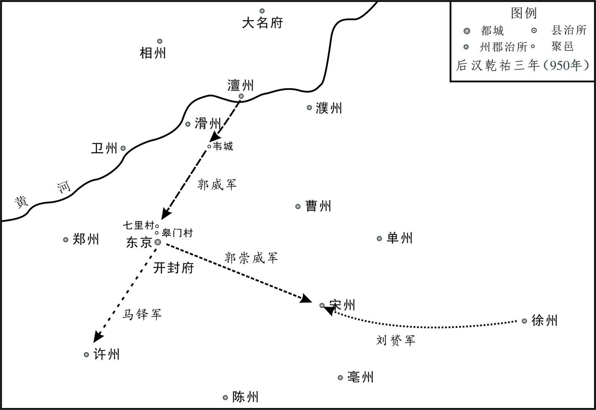 
郭威南下开封称帝示意图

## 【原文】

**军士入前义成节度使白再荣之第，执再荣，尽掠其财，既而进曰：“某等昔尝趋走麾下，一旦无礼至此，何面目复见公[1]。”遂刎其首而去[2]。吏部侍郎张允家赀以万计，而性吝，虽妻亦不之委，常自系众钥于衣下，行如环佩[3]。是夕，匿于佛殿藻井之上，登者浸多，板坏而坠，军士掠其衣，遂以冻卒[4]。**

## 【注文】

[1]白再荣（？—950年）：五代时蕃部人。少为军卒，渐迁至护圣左厢指挥使。后晋末，从契丹北去，至真定（今河北正定），与诸将逐契丹守将麻荅，被推为留后，恃势勒索在真定的后晋朝臣财物，被称为“白麻荅”。后汉时，累迁至义成军节度使，所到之处横征暴敛，民不聊生。后被郭威军士所杀。　　趋走：奔走服役。

[2]刎（wěn）：抹脖子。

[3]吏部侍郎：古代文官名。隋大业三年（607年）置，为尚书省吏部次官。唐高祖武德七年（624年）罢，唐贞观二年（628年）复置。隋代置一员，唐代加至二员，正四品上。与吏部尚书一起掌管官吏的任免、考课、升降、调动等事。唐玄宗开元以后，吏部尚书多由宰相兼之，或为外官带职，故本部事务实由侍郎主之。　　赀（zī）：同“资”，资产。　　环佩：古人所系带的佩玉。

[4]匿（nì）：隐藏、躲藏。　　藻（zǎo）井：中国传统建筑中室内顶棚的独特装饰部分。一般做成向上隆起的井状，有方形、多边形或圆形凹面，周围饰以各种花藻井纹、雕刻和彩绘。多用在宫殿、寺庙中的宝座、佛坛上方最重要部位。　　浸（jìn）：逐渐。

## 【译文】

军士进入前义成节度使白再荣的住宅，抓住白再荣，抢光了他的财物，过一会儿上前说：“我们从前曾在您手下奔走服役，今日无礼到这个地步，还有什么脸面再见您呢。”于是割下他的脑袋离开。吏部侍郎张允，家产数以万计，但生性吝啬，即使是妻子也不肯放手，总是把全部钥匙系在自己衣服底下，走起路来叮当作响如同佩带玉环。这天晚上，他躲藏在佛堂的顶棚板上，上去的人逐渐增多，顶板损坏而坠落，军士抢走他身上的衣服，于是张允被冻死。

## 【原文】

**初，作坊使贾延徽有宠于帝，与魏仁浦为邻，欲并仁浦所居以自广，屡谮仁浦于帝，几至不测[1]。至是，有擒延徽以授仁浦者，仁浦谢曰：“因乱而报怨，吾所不为也[2]。”郭威闻之，待仁浦益厚。**

## 【注文】

[1]作坊使：管理作坊的使职。　　不测：料想不到的事情，多指祸患。

[2]谢：推辞、谢绝。

## 【译文】

当初，作坊使贾延徽受到后汉隐帝的宠信，他与魏仁浦是邻居，想吞并魏仁浦的住所来扩大自己的宅第，屡次向隐帝说魏仁浦的坏话，几乎酿成杀身之祸。这时，有士兵抓获贾延徽，要将他交给魏仁浦，魏仁浦拒绝说：“乘乱而报私怨，这不是我所做的事。”郭威听说此事后，对待魏仁浦越发优厚。

## 【原文】

**右千牛卫大将军枣强赵凤曰[1]：“郭侍中举兵，欲诛君侧之恶以安国家耳[2]。而鼠辈敢尔，乃贼也，岂侍中意邪[3]？”执弓矢，踞胡床，坐于巷首，掠者至，辄射杀之，里中皆赖以全[4]。**

## 【注文】

[1]右千牛卫大将军：古代武官名，正三品，掌侍卫左右，供御兵仗事。　　枣强：古县名。西汉时置，治今河北枣强县东南东故县。北齐天保七年（556年）移治今河北景县西南广川，隋开皇二年（582年）又移治今枣强县东南前旧县，唐五代时属冀州。　　赵凤（?—约953年）：冀州枣强（今河北枣强东南）人。曾为安重荣部下，后投靠赵延寿，任辽朝羽林都指挥使。后汉时，累官至龙武将军、右千牛卫大将军。后周广顺初，历任宋、亳、宿三州巡检使，后为单州刺史。为官刚忿不仁，曾夺人妻女，又以进奉为名聚敛民财。后周广顺三年（953年）十二月，诏削夺其在身官爵，不久被赐死。

[2]郭侍中：即郭威。郭威在平三叛后，加官检校太师兼侍中。　　君侧之恶：君主身边的恶人。

[3]邪（yé）：同“耶”，句末语气词，表示疑问或反问，相当于现代汉语中的“吗”或“呢”。

[4]踞（jù）：蹲、坐。　　胡床：亦称“交床”“交椅”“绳床”，是古时一种可以折叠的轻便坐具，类似后来的马扎。

## 【译文】

右千牛卫大将军、枣强人赵凤说：“郭侍中起兵，为的是诛伐国君身边的奸佞小人以安定国家。然而这些无名鼠辈竟敢如此胡作非为，简直是强盗，难道这是郭侍中的本意吗？”于是手持弓箭，拿着胡床坐在里巷门口，抢掠者一到，就发箭射杀，同里的人家都依赖此而得以保全。

## 【原文】

**丙戌，获刘铢、李洪建，囚之。铢谓其妻曰：“我死，汝且为人婢乎[1]？”妻曰：“以公所为，雅当然耳[2]。”**

## 【注文】

[1]且：副词，将要。

[2]雅：理所当然。

## 【译文】

后汉隐帝乾祐三年（950年）十一月丙戌（二十三日），抓获了刘铢、李洪建，将他们囚禁起来。刘铢对他的妻子说：“我死了，你将去做人家的奴婢吗？”妻子说：“按您平日的所作所为，确实只该这样。”

## 【原文】

**王殷、郭崇威言于郭威曰：“不止剽掠，今夕止有空城耳。”威乃命诸将分部禁止掠者，不从则斩之，至晡，乃定[1]。**

## 【注文】

[1]晡（bū）：申时，相当现在下午三时至五时，也指傍晚。

## 【译文】

王殷、郭崇威向郭威进言说：“如果不制止抢掠，今晚恐怕就只剩下一座空城了。”郭威于是命令众将约束所部禁止抢掠，不服从就斩首，到黄昏时分，方才安定下来。

## 【原文】

**窦贞固、苏禹珪自七里寨逃归，郭威使人访求得之，寻复其位。贞固为相，值杨、史弄权，李业等作乱，但以凝重处其间，自全而已[1]。**

## 【注文】

[1]杨、史：即杨邠（bīn）、史弘肇。　　凝重：庄重、稳重。

## 【译文】

窦贞固、苏禹珪从七里寨逃了回来，郭威派人寻访找到他们，不久官复原职。窦贞固担任宰相时，正当杨邠、史弘肇玩弄权势，李业等人作乱之时，他只是以谨慎稳重处于两者之间，自我保全而已。

## 【原文】

**郭威命有司迁隐帝梓宫于西宫[1]。或请如魏高贵乡公故事，葬以公礼，威不许，曰：“仓猝之际，吾不能保卫乘舆，罪已大矣，况敢贬君乎[2]！”**

## 【注文】

[1]梓（zǐ）宫：皇帝的棺材。　　西宫：中国古代皇帝妃嫔居住的地方

[2]魏高贵乡公：即曹髦（máo）（241—260年），三国魏文帝曹丕之孙，三国时期曹魏的第四任皇帝，公元254—260年在位。司马师废齐王曹芳后，曹髦被立为新君，他对司马氏兄弟的专横跋扈十分不满，于公元260年率领宫人讨伐司马昭后被武士成济所杀。

## 【译文】

郭威命令有关部门将后汉隐帝（刘承祐）的棺木迁到西宫。有人请求比照三国时魏高贵乡公（曹髦）的旧例，用公爵的礼仪安葬汉隐帝，郭威不许，说：“紧急之时，我不能保卫好天子，罪过已经够大了，何况再敢贬谪国君呢！”

## 【原文】

**太师冯道帅百官谒见郭威，威见，犹拜之。道受拜如平时，徐曰：“侍中此行不易[1]！”**

## 【注文】

[1]徐：缓慢地、慢慢地。

## 【译文】

太师冯道率领百官拜见郭威，郭威见到冯道，仍行拜礼，冯道像平时一样接受拜礼，慢条斯理地说：“侍中这一路不容易啊！”

## 【原文】

**丁亥，郭威帅百官诣明德门起居太后，且奏称：“军国事殷，请早立嗣君[1]。”太后诰称：“郭允明弑逆，神器不可无主[2]。河东节度使崇、忠武节度使信皆高祖之弟，武宁节度使赟、开封尹勋高祖之子，其令百官议择所宜[3]。”赟，崇之子也，高祖爱之，养视如子。郭威、王峻入见太后于万岁宫，请以勋为嗣。太后曰：“勋久羸疾，不能起[4]。”威出谕诸将，诸将请见之，太后令左右以卧榻举之示诸将，诸将乃信之。于是郭威与峻议立赟。己丑，郭威帅百官表请以赟承大统。太后诰所司，择日，备法驾，迎赟即皇帝位[5]。郭威奏遣太师冯道及枢密直学士王度、秘书监赵上交诣徐州奉迎[6]。**

## 【注文】

[1]起居：问安、问好。　　殷：众多。　　嗣君：继位的国君。嗣，接续、继承。

[2]诰：帝王任命或封赠的文书。当时皇太后下达的命令一般都称“诰”。　　神器：指帝位。

[3]赟（yūn）：即刘赟。　　勋：即刘承勋（？—951年），后汉高祖刘知远幼子。后汉初授右卫大将军。隐帝即位，加检校太尉、同平章事，遥领兴元尹，又为开封尹。隐帝被杀后，大臣曾议立以为帝，因病作罢。后周初卒，周太祖下诏追封陈王。

[4]羸（léi）疾：衰弱生病。

[5]法驾：天子车驾的一种。天子出行时乘坐的车子分大驾、法驾、小驾三种，其仪卫繁简各有不同。《史记·吕太后本纪》载：“乃奉天子法驾，迎代王于邸。”裴骃（yīn）《集解》引蔡邕曰：“天子有大驾、小驾、法驾。法驾上所乘，曰金根车，驾六马，有五时副车，皆驾四马。”

[6]枢密直学士：五代枢密院官员，起初主要负责起草文书等事务，后来逐渐发展到参与谋划国家军国大事。　　王度（生卒年不详）：五代后汉、后周官员。历任监察御史、枢密直学士等职。　　秘书监：古代文官名。始置于东汉延熹二年（159年）。唐时为秘书省长官，从三品，主要掌管经籍图书之事。　　赵上交（895—961年）：本名远，字上交，避刘知远讳以字称。涿州范阳（今北京）人。善谈论，负才任气，为乡里所推。后唐同光中，马绍宏为北面转运制置大使，表为判官。后历泾、秦二镇节度判官。入后晋，累迁御史中丞，弹劾无所回避。历后汉、后周，累拜吏部侍郎。宋初，为尚书右丞。著有文集二十卷。

## 【译文】

后汉隐帝乾祐三年（950年）十一月丁亥（二十四日），郭威率领百官到明德门向李太后请安，并且进奏说：“军政事务繁多，请早立继位的国君。”李太后下诰令说：“郭允明大逆弑君，但皇位不可无主。河东节度使刘崇、忠武节度使刘信，都是高祖的弟弟，武宁节度使刘赟、开封尹刘勋，是高祖的儿子，就让百官商议选择最合适的人选。”刘赟是刘崇的儿子，后汉高祖（刘知远）喜爱他，收养视为亲生儿子。郭威、王峻进入万岁宫谒见李太后，请求立刘勋为皇位继承人。太后说：“刘勋长期患病虚弱，不能起床。”郭威出去告知众将，众将请求面见刘勋，太后命令手下人用卧榻抬着刘勋让众将领看，众将这才相信。于是郭威和王峻商议立刘赟继位。己丑（二十六日），郭威率领百官上表请求让刘赟继承帝位。李太后诰令有关部门，选择吉日，准备天子乘用的车马，迎接刘赟即皇帝位。郭威奏请派遣太师冯道以及枢密直学士王度、秘书监赵上交到徐州侍奉迎接刘赟。

## 【原文】

**郭威之讨三叛也，每见朝廷诏书，处分军事皆合机宜，问使者：“谁为此诏[1]？”使者以翰林学士范质对。威曰：“宰相器也。”入城，访求得之，甚喜。时大雪，威解所服紫袍衣之，令草太后诰令迎新君仪注[2]。苍黄之中，讨论撰定，皆得其宜[3]。**

## 【注文】

[1]机宜：依据当时情况处理事务的方针、办法等。

[2]仪注：制度、仪节。

[3]苍黄：即仓皇，匆促而慌张。

## 【译文】

郭威领兵讨伐李守贞等三镇叛乱时，每每见到朝廷诏书中处置军务内容都切合实际情况，便问使者道：“是谁起草的这些诏书？”使者回答是翰林学士范质。郭威说：“这是宰相的人才。”进入京城后，寻访找到了范质，极为喜欢。当时正下着大雪，郭威解下自己身上穿着的紫袍给范质穿上，令他起草太后准备下达的迎接新国君礼仪规则的诰令。仓促匆忙之中，范质构思写定，都很得体。

## 【原文】

**初，隐帝遣供奉官押班阳曲张永德赐昭义节度使常思生辰物[1]。永德，郭威之婿也。会杨邠等诛，密诏思杀永德。思素闻郭威多奇异，囚永德以观变。及威克大梁，思乃释永德而谢之[2]。**

## 【注文】

[1]押班：领班。　　张永德（928—1000年）：字抱一，并州阳曲（今山西太原）人。以贤孝闻名乡里，娶后周太祖郭威之女。后周时历任左卫上将军、殿前都虞候、殿前都指挥使、泗州防御使、检校太尉等官职。身经百战，功勋显赫。入宋，率兵攻灭南唐，从征北汉，官至检校太师、彰德军节度使，进爵卫国公。　　生辰物：生日礼物。

[2]谢：认错、谢罪。

## 【译文】

当初，后汉隐帝派遣供奉官领班、阳曲人张永德赐给昭义节度使常思生日礼物，张永德是郭威的女婿。遇上杨邠等人被诛杀，有密诏命令常思杀死张永德。常思久闻郭威颇有奇才，便囚禁张永德以观察事态的变化。及至郭威攻克大梁，常思便释放了张永德并向他谢罪。

## 【原文】

**庚寅，郭威帅群臣上言：“比皇帝到阙，动涉浃旬，请太后临朝听政[1]。”**

## 【注文】

[1]比：等到。　　皇帝：指刘赟（yūn）。　　阙：宫阙，特指朝廷。　　动涉：动辄涉及。　　浃（jiā）旬（xún）：十天，一旬。古代以干支纪日，称自甲至癸一周十日为“浃日”。

## 【译文】

后汉隐帝乾祐三年（950年）十一月庚寅（二十七日），郭威率领群臣进言说：“等到皇帝驾到宫中，动辄需要十天的时间，恳请太后临朝听政。”

## 【原文】

**壬辰，太后始临朝，以王峻为枢密使，袁嶬为宣徽南院使，王殷为侍卫马步军都指挥使，郭崇威为侍卫马军都指挥使，曹威为侍卫步军都指挥使，陈州刺史李榖权判三司[1]。**

## 【注文】

[1]宣徽南院使：古代官职名。唐后期设置，有南、北二院，以宦官充宣徽使与副使，无固定职掌。　　侍卫马步军都指挥使：古代武官名，禁军最高统帅。　　权判三司：临时代理三司使的职务。唐末五代往往不设三司使一职，而以他官“判三司”行使三司使的职责。

## 【译文】

后汉隐帝乾祐三年（950年）十一月壬辰（二十九日），李太后开始上朝，任命王峻为枢密使，袁嶬（yí）为宣徽南院使，王殷为侍卫马步军都指挥使，郭崇威为侍卫马军都指挥使，曹威为侍卫步军都指挥使，陈州刺史李谷代理处理三司事务。

## 【原文】

**刘铢、李洪建及其党皆枭首于市，而赦其家[1]。郭威谓公卿曰：“刘铢屠吾家，吾复屠其家，怨仇反覆，庸有极乎[2]！”由是数家获免。王殷屡为洪建请免死，郭威不许。后匡赞至兖州，慕容彦超执而献之。李业至陕州，其兄保义节度使洪信不敢匿于家；业怀金将奔晋阳，至绛州，盗杀之而取其金[3]。**

## 【注文】

[1]枭（xiāo）首：古代刑罚，把人头割下来悬挂在木杆上示众。

[2]庸：岂，哪里。　　极：极限。

[3]晋阳：即太原府。

## 【译文】

刘铢、李洪建及其党徒都被斩首将头颅挂在街市上示众，而赦免了他们的家属。郭威对朝廷大臣们说：“刘铢屠杀我的家属，我再屠杀他的家属，怨仇翻来覆去，哪里有个头呢！”于是这几家免于被屠杀。王殷屡次为李洪建请求免除死刑，郭威不允许。后匡赞逃到兖州，慕容彦超将他抓住献给朝廷。李业到达陕州，他的哥哥保义节度使李洪信不敢将他藏在家中；李业怀揣着金钱准备投奔晋阳，到达绛州，强盗杀死李业夺走了他的金子。

## 【原文】

**镇州、邢州奏：“契丹主将数万骑入寇，攻内丘，五日不克，死伤甚众[1]。有戍兵五百叛应契丹，引契丹入城，屠之，又陷饶阳[2]。”太后敕郭威将大军击之，国事权委窦贞固、苏禹珪、王峻，军事委王殷。十二月甲午朔，郭威发大梁。**

## 【注文】

[1]邢州：唐武德元年（618年）改隋襄国郡设，治龙冈（今河北邢台），领龙冈、尧山、巨鹿、南和、任县、平乡、沙河、内丘等县。辖境约当今河北巨鹿、广宗以西，泜（zhī）河以南，沙河以北地区。五代沿袭。　　契丹主：此时的契丹主即辽世宗耶律阮（917—951年）。耶律阮，辽太祖耶律阿保机孙。曾封为永康王。辽太宗耶律德光病死于归途中时，他随行军中。在宗室大臣耶律安抟（tuán）、耶律吼、耶律洼等拥戴下即帝位，改年号为天禄。在位四年，后被耶律察割等杀死。　　内丘：古县名，治今河北内丘。时属邢州。

[2]饶阳：古县名，治今河北饶阳县。时属深州。

## 【译文】

镇州、邢州奏报说：“契丹国主率领数万骑兵入侵，进攻内丘，五天没有攻打下来，死伤众多。有五百名守兵叛变策应契丹，领契丹军入城，屠杀居民，又攻陷饶阳城。”李太后敕（chì）令郭威率领大军出击契丹，国事暂时交给窦贞固、苏禹珪、王峻掌管，军事委交王殷掌管。乾祐三年（950年）十二月甲午（初一日），郭威从大梁出发。

## 【原文】

**丁酉，以翰林学士、户部侍郎范质为枢密副使。**

## 【译文】

后汉隐帝乾祐三年（950年）十二月丁酉（初四日），任命翰林学士、户部侍郎范质为枢密副使。

## 【原文】

**武宁节度使赟留右都押牙巩延美、元从教练使杨温守徐州(3)，与冯道等西来，在道仗卫皆如王者，左右呼万岁[1]。郭威至滑州，留数日，赟遣使慰劳。诸将受命之际，相顾不拜，私相谓曰：“我辈屠陷京城，其罪大矣，若刘氏复立，我辈尚有种乎[2]！”己酉，威闻之，即引兵趣澶州。**

## 【注文】

[1]巩延美（？—951年）：后文作“巩廷美”，《新五代史》作“巩庭美”，籍贯不详。后汉末任武宁军节度使右都押牙。刘赟自徐州北上，留他和都教练使杨温守徐州。后听说刘赟不得立以为帝，遂闭徐州城拒命。后周太祖郭威以王彦超为徐州节度使，后周广顺元年（951年）三月，彦超克徐州，巩延美等被杀。　　元从：从一开始就跟随着的人。　　都教练使：古代武官名。唐五代方镇使府置。以知兵法、善弓马者充任，掌教练兵法及武艺，或领兵出战。有左教练使、右教练使等名目。其都教练使与都虞候、都押牙同为方镇使府的军事要职。　　杨温（？—951年）：籍贯不详。后汉末任武宁军节度使都教练使。刘赟自徐州北上，他与巩延美留守徐州。后周广顺元年（951年）三月与巩延美一起被王彦超所杀。　　仗卫：仪仗卫队。

[2]相顾：相视，互相看着。　　我辈尚有种乎：意思是我们都要被杀头，还会有后代吗？尚，还。

## 【译文】

武宁节度使刘赟（yūn）留下右都押牙巩延美、元从都教练使杨温守卫徐州，自己与冯道等人由西而来，路上仪仗警卫，都按照国王的规格，左右高呼万岁。郭威抵达滑州，停留了数日。刘赟派遣使者慰劳。众将领在接受犒赏赐命时，相互看着不下拜，私下又相互议论说：“我们攻陷京城，屠杀吏民，罪行已经是很大了，倘若刘氏再立为国君，我们都将被杀头，还会有后代吗！”乾祐三年（950年）十二月己酉（十六日），郭威听说这事，立即领兵赶赴澶州。

## 【原文】

**辛亥，遣苏禹珪如宋州迎嗣君[1]。**

## 【注文】

[1]如：前往，到……去。

## 【译文】

后汉隐帝乾祐三年（950年）十二月辛亥（十八日），李太后派遣苏禹珪前往宋州迎接准备继承帝位的刘赟。

## 【原文】

**壬子，郭威渡河，馆于澶州[1]。癸丑旦，将发，将士数千人忽大噪。威命闭门，将士逾垣登屋而入曰：“天子须侍中自为之，将士已与刘氏为仇，不可立也[2]。”或裂黄旗以被威体，共扶抱之，呼万岁震地，因拥威南行[3]。威乃上太后笺，请奉汉宗庙，事太后为母[4]。丙辰，至韦城，下书抚谕大梁士民，以昨离河上，在道秋毫不犯，勿有忧疑[5]。戊午，威至七里店，窦贞固帅百官出迎拜谒，因劝进[6]。威营于皋门村[7]。**

## 【注文】

[1]馆：宾馆、客舍。这里当动词用，即住宿在宾馆、客舍。

[2]逾垣：翻越墙头。逾，越过、超越；垣，墙。

[3]被（pī）：同“披”，覆盖。

[4]奉：供养、供奉。

[5]韦城：古县名，在今河南滑县东南。　　秋毫：秋天鸟兽身上新长的细毛，后用来比喻最细微的事物。

[6]拜谒（yè）：拜见。谒，拜见。

[7]皋门村：古地名，属开封县，在今河南开封城北门外。

## 【译文】

后汉隐帝乾祐三年（950年）十二月壬子（十九日），郭威渡过黄河，下榻在澶州驿馆。癸丑（二十日）早晨，将要出发时，将士数千人忽然大声喧哗。郭威下令关闭馆门，将士翻越墙头登上屋顶进入馆中说：“天子必须由侍中您自己来做，我们已经与刘氏结仇，不可再立刘氏为天子。”有人撕裂黄旗披在郭威身上，共同扶抱起郭威，欢呼万岁，震天动地，趁势簇拥着郭威向南行进。郭威于是向李太后上奏笺，请求侍奉汉的宗庙社稷，并像侍奉母亲一样对待李太后。丙辰（二十三日），郭威到达韦城，发布文告安抚大梁官吏百姓，告以于昨日离开黄河岸边，一路上军纪严明，秋毫无犯，大家不必担忧疑虑。戊午（二十五日），郭威到达七里店，窦贞固率领文武百官出城迎接拜见，于是劝郭威即皇帝位。郭威在皋门村宿营。

## 【原文】

**武宁节度使赟已至宋州，王峻、王殷闻澶州军变，遣侍卫马军都指挥使郭崇威将七百骑往拒之，又遣前申州刺史马铎将兵诣许州巡检[1]。崇威忽至宋州，陈于府门外。赟大惊，阖门，登楼诘之[2]。对曰：“澶州军变，郭公虑陛下未察，故遣崇威来宿卫，无他也。”赟召崇威，崇威不敢进。冯道出与崇威语，崇威乃登楼。赟执崇威手而泣。崇威以郭威意安谕之。少顷，崇威出[3]。时护圣指挥使张令超帅部兵为赟宿卫[4]。徐州判官董裔说赟曰：“观崇威视瞻举措，必有异谋[5]。道路皆言郭威已为帝，而陛下深入不止，祸其至哉。请急召张令超，谕以祸福，使夜以兵劫崇威，夺其兵。明日，掠睢阳金帛，募士卒，北走晋阳[6]。彼新定京邑，未暇追我，此策之上也。”赟犹豫未决。是夕，崇威密诱令超，令超帅众归之。赟大惧。**

## 【注文】

[1]申州：唐武德四年（621年）改隋义阳郡置，治义阳县（今河南信阳）。唐时领义阳、钟山、罗山三县，辖境相当于今河南信阳、罗山等地。五代沿袭。　　巡检：巡视检查。

[2]阖（hé）门：关门。阖，关闭。

[3]少顷：片刻、一会儿。

[4]护圣：五代禁军军号，始置于后唐时期，后晋时成为禁军（侍卫亲军）的主力。

[5]说（shuì）：劝说。　　视瞻：观看瞻望，也形容顾盼的形态。　　举措：即举动，一举一动。

[6]睢（suī）阳：古县名，唐时改名为宋城，为宋州州治，在今河南商丘市睢阳区。

## 【译文】

武宁节度使刘赟（yūn）已经抵达宋州，王峻、王殷听说澶（chán）州军队哗变的消息，就派遣侍卫马军都指挥使郭崇威率领七百骑兵前往阻击，又派遣前申州刺史马铎率兵到许州巡察。郭崇威突然到达宋州，在州城门外排队列阵，刘赟大为惊恐，关闭城门，登上城楼责问郭崇威。郭崇威回答说：“澶州发生兵变，郭公恐怕陛下不知详情发生误会，故此派我前来警卫，没有别的意思。”刘赟召见郭崇威，郭崇威不敢进去。冯道出来和郭崇威面谈，郭崇威这才登上城楼。刘赟握住郭崇威的手流下眼泪，郭崇威转达了郭威之意安慰他。一会儿，郭崇威出府门。当时护圣指挥使张令超率领所辖军队担任刘赟的警卫。徐州判官董裔劝说刘赟道：“观察郭崇威的眼神举止，必定另有阴谋。路上都在传言郭威已经称帝，而陛下还一路向前深入不停，大祸恐怕将要来临了。请马上召见张令超，说明利害祸福，让他夜里率兵劫持郭崇威，夺取他的军队。明天，抢掠睢阳府库的金银绢帛，招募士兵，向北投奔晋阳。郭威刚刚得到京城，没有时间来追赶我们，这是上策。”刘赟犹豫不决。当晚，郭崇威秘密招诱张令超，张令超率领部众归附郭崇威。刘赟大为恐惧。

## 【原文】

**郭威遗赟书，云为诸军所迫，召冯道先归，留赵上交、王度奉侍。道辞行，赟曰：“寡人此来所恃者，以公三十年旧相，故无疑耳[1]。今崇威夺吾卫兵，事危矣，公何以为计？”道默然[2]。客将贾贞数目道，欲杀之[3]。赟曰：“汝辈勿草草，此无预冯公事。”崇威迁赟于外馆，杀其腹心董裔、贾贞等数人。己未，太后诰，废赟为湘阴公。马铎引兵入许州，刘信惶惑自杀[4]。庚申，太后诰，以侍中监国[5]。百官、藩镇相继上表劝进。壬戌夜，监国营有步兵将校醉，扬言“向者澶州骑兵扶立，今步兵亦欲扶立”，监国斩之[6]。**

## 【注文】

[1]寡人：古代君主或王侯的自称。

[2]默然：沉默不语。

[3]目：看、视。

[4]惶惑：疑虑畏惧。

[5]侍中：即郭威。　　监国：代理朝政，也指代理朝政者。

[6]向者：往日、从前。

## 【译文】

郭威写信给刘赟，称自己是被众军所逼迫，召冯道先回京城，留下赵上交、王度侍候刘赟。冯道去向刘赟辞行，刘赟说：“我这次前来，所依靠的，就是因为您是三十年的老宰相，所以没有疑虑。如今郭崇威夺走我的卫兵，情势危急，您有什么计策？”冯道默默无语。客将贾贞多次目视冯道，想把他杀掉。刘赟说：“你们不要鲁莽草率，这不关冯公的事。”郭崇威把刘赟迁到府外驿馆，杀掉他的心腹董裔、贾贞等数人。乾祐三年（950年）十二月己未（二十六日），李太后发布诰令，废黜刘赟为湘阴公。马铎率兵进入许州，刘信惶惑不安而自杀。庚申（二十七日），太后发布诰令，任命侍中郭威代理国政。文武百官和四方藩镇相继上表劝郭威即皇帝位。壬戌（二十九日）晚，郭威军营中有一个步兵将校喝醉酒，扬言“往日澶州骑兵扶立郭威为帝，今日步兵也要扶立郭威为帝”，郭威将他斩首。

## 【原文】

**后周太祖广顺元年春正月丁卯，汉太后下诰，授监国符宝，即皇帝位[1]。监国自皋门入宫，即位于崇元殿[2]。制曰：“朕周室之裔，虢叔之后，国号宜曰周[3]。”改元，大赦[4]。杨邠、史弘肇、王章等皆赠官，官为敛葬，仍访其子孙叙用之[5]。凡仓场、库务掌纳官吏，无得收斗余、称耗[6]。旧所进羡余物，悉罢之[7]。犯窃盗及奸者，并依晋天福元年以前刑名，罪人非反逆，无得诛及亲族，籍没家赀。唐庄宗、明宗、晋高祖各置守陵十户，汉高祖陵职员、宫人，时月荐享及守陵户并如故[8]。初，唐衰，多盗，不用律文，更定峻法，窃盗赃三匹者死；晋天福中加至五匹。奸有夫妇人，无问强、和，男女并死。汉法，窃盗一钱以上皆死，又罪非反逆，往往族诛、籍没。故帝即位，首革其弊。**

## 【注文】

[1]后周（951—960年）：五代王朝之一。公元951年，郭威取代后汉称帝，建国号周，年号广顺，定都汴（今河南开封）。史称后周。历三帝十年，960年被宋朝所取代。　　太祖：即后周太祖郭威。郭威去世后，庙号太祖。　　广顺：后周太祖郭威的年号，从公元951至953年，共使用三年。　　符宝：即玉玺金印。

[2]皋门：王宫外门。　　崇元殿：开封大内的正衙殿。

[3]周室之裔：周王室的后裔。　　虢（guó）叔：又称虢公，周文王之弟，武王之叔，西周初年封于西虢（一说东虢），号曰“虢公”，因“虢”“郭”音同，又称“郭公”。其后代就以郭为姓氏，虢叔为郭姓的受姓始祖。

[4]改元：改换年号。改换年号的第一年称元年。

[5]叙用：分级录用。

[6]斗余：旧时官府仓场中的一种额外苛敛。胡三省云：“斗余，概量之外，又取其余也。”　　称耗：征粮时，在规定数量外为弥补损耗而多收的数量。胡三省云：“称耗，称计斤钧石之外，又多取之以备耗折。”

[7]进羡余物：唐五代时，地方藩镇将两税外额外搜刮的钱财进献给朝廷，称“羡余”。

[8]明宗：即后唐明宗李嗣源（867—933年）。沙陀部人。原名邈（miǎo）吉烈，后唐太祖李克用养子。后唐同光四年（926年），后唐庄宗李存勖在兵变中被杀，李嗣源入洛阳监国，即位后改名李亶（dǎn）。926年至933年在位。后唐长兴四年（933年）病卒，葬徽陵，庙号明宗。　　晋高祖：即后晋高祖石敬瑭。　　汉高祖：即后汉高祖刘知远。　　荐享：祭献、祭祀。

## 【译文】

后周太祖广顺元年（951年）春季正月丁卯（初五日），后汉李太后下令授予监国郭威传国玺印，正式即皇帝位。郭威从王宫外门皋门进入皇宫，在开封大内的正衙殿崇元殿即位，下制书说：“朕是周代宗室的苗裔，虢叔的后代，所以国号应该定名为周。”改年号为广顺，大赦天下。杨邠、史弘肇、王章等人都追赠官爵，官府为他们收敛安葬，并且寻访他们的子孙分级录用。所有粮食仓库和场院掌管交纳的官吏，不得额外收取“斗余”“称耗”。从前地方藩镇以赋税盈余名义进贡的物品，全部取消。犯有盗窃罪和强奸罪的，一律按照后晋天福元年以前的刑法条文处理，罪犯不是犯及谋反罪的，不得连亲戚家族一并诛杀和没收家产。后唐庄宗（李存勖）、明宗（李嗣源）和后晋高祖（石敬瑭）的陵墓各设置守陵人家十户，后汉高祖（刘知远）陵园的官吏、宫人，一年四季的供奉祭祀以及守陵户数一律照旧。当初，唐朝衰微，盗贼很多，官府不再用原来的刑律条文，而是另外制订严刑酷法，规定盗窃赃物达到三匹绢帛的都处死；后晋天福年间加到五匹绢帛处死。奸淫有夫之妇，不论强奸、通奸，男女一律处死。后汉刑法规定，盗窃钱一文以上的都处死，此外不属于谋反罪的，往往也满族抄斩、没收家产。所以后周太祖郭威一即位，首先革除这些弊端。

## 【原文】

**初，杨邠以功臣、国戚为方镇者多不闲吏事，乃以三司军将补都押牙、孔目官、内知客，其人自恃敕补，多专横，节度使不能制[1]。至是，悉罢之。**

## 【注文】

[1]不闲：不熟悉。　　三司：唐、五代官署合称，有时称御史台、中书省、门下省为“三司”；有时称刑部、御史台、大理寺为“三司”；后多以度支、户部、盐铁转运司为“三司”。　　内知客：即客将，唐末五代藩镇负责接待使节、宾客、出使等外交职责的武官。　　敕（chì）补：以皇帝敕令下发的任命。

## 【译文】

当初，杨邠因为功臣元勋、皇亲国戚担任藩镇节度使的大多不熟悉行政事务，于是用朝廷三司军将充任藩镇的都押牙、孔目官、内知客，这些人倚仗他们是皇帝亲自任命的，大多专横跋扈，节度使不能控制。到这时全部罢免。

## 【原文】

**戊辰，以前复州防御使王彦超权武宁节度使[1]。汉李太后迁居西宫，己巳，上尊号曰昭圣皇太后。癸酉，加王峻同平章事。以卫尉卿刘皞主汉隐帝之丧[2]。**

## 【注文】

[1]复州：唐武德五年（622年）改隋沔（miǎn）阳郡设，初治沔阳（今湖北仙桃西南），后迁治所于竟陵（五代后晋改景陵，今湖北天门），领沔阳、竟陵、监利三县，辖境约当今湖北仙桃、天门、监利等县市地。五代沿袭。

[2]卫尉卿：古代文官名，从三品，卫尉寺的长官，掌宫门警卫及仪卫军的兵械、仪仗、甲胄等事务。　　刘皞（hào）（892—952年）：字克明，涿州归义（今河北容城）人，后晋丞相刘昫（xù）之弟。初为梁将谢彦章幕客，后唐时，历任监察御史、水部员外郎、史馆修撰、起居郎、河南少尹、兵部郎中、太府卿等职。入后汉，用为宗正卿。后周初，改卫尉卿。后周广顺二年（952年）春出使高丽，至郓州，饮酒过量而死。

## 【译文】

后周太祖广顺元年（951年）正月戊辰（初六日），后周太祖（郭威）任命前复州防御使王彦超代理武宁节度使。后汉李太后被迁居西宫，己巳（初七日），进李太后尊号为昭圣皇太后。癸酉（十一日），王峻加官同平章事。命令卫尉卿刘皞主办后汉隐帝（刘承祐）的丧事。

## 【原文】

**初，河东节度使兼中书令刘崇闻隐帝遇害，欲起兵南向，闻迎立湘阴公，乃止，曰：“吾儿为帝，吾又何求[1]。”太原少尹李骧阴说崇曰：“观郭公之心，终欲自取[2]。公不如疾引兵逾太行，据孟津，俟徐州相公即位，然后还镇，则郭公不敢动矣[3]。不然，且为所卖。”崇怒曰：“腐儒，欲离间吾父子！”命左右曳出斩之[4]。骧呼曰：“吾负经济之才，而为愚人谋事，死固甘心[5]。家有老妻，愿与之同死。”崇并其妻杀之，且奏于朝廷，示无二心。及赟废，崇乃遣使请赟归晋阳。诏报以“湘阴公比在宋州，今方取归京师，必令得所，公勿以为忧[6]。公能同力相辅，当加王爵，永镇河东”。**

## 【注文】

[1]湘阴公：即刘赟（yūn）。刘赟称帝不成后被降封的爵位，此为史家以刘赟后来的封爵相称。

[2]阴说（shuì）：私下劝说。

[3]太行：即太行山，又名五行山、王母山、女娲山等。是中国东部地区的重要山脉和地理分界线。北起北京西山，南达豫北黄河北崖，西接山西高原，东临华北平原，绵延四百余公里，为山西东部、东南部与河北、河南两省的天然界山。　　孟津：黄河古渡，即今河南孟津。

[4]曳（yè）：拉、牵引。

[5]负：具有。　　经济：经世济民，即经营社会，救济人民。

[6]报：答复。　　必令得所：必定让得其所宜。

## 【译文】

当初，河东节度使兼中书令刘崇听说后汉隐帝（刘承祐）遇害后，准备起兵向南进发，后听说郭威迎立湘阴公（刘赟）继皇帝位，于是作罢，说：“我儿子当皇帝，我又有什么可求。”太原少尹李骧私下劝说刘崇道：“观察郭威的心思，终究是要自取帝位，您不如火速率兵翻过太行山，占据孟津渡口，等徐州相公（刘赟）即帝位，然后返回太原镇所，这样郭威就不敢动手了。不然，将要被人出卖。”刘崇发怒道：“你这个腐儒，想要离间我父子的关系！”命令手下将李骧拉出去斩首。李骧大喊道：“我身怀经世济民之才，却在为愚蠢之人谋事，死了本当甘心。但家中还有年老的妻子，希望和她同死。”刘崇便连他的妻子一并杀了，并且向朝廷奏报，表示没有二心。直到刘赟被废黜，刘崇才派遣使者请求让刘赟返归晋阳。诏书回答说：“湘阴公近日在宋州，如今正取道归京城，必定让他得其所宜，您不要为此忧虑。您如能一同出力辅佐朝廷，理当加封王爵，永远镇守河东。”

## 【原文】

**巩廷美、杨温闻湘阴公赟失位，奉赟妃董氏据徐州拒守，以俟河东援兵[1]。帝使赟以书谕之，廷美、温欲降而惧死。帝复遗赟书曰：“爰念斯人尽心于主，足以赏其忠义，何由责以悔尤[2]。俟新节度使入城，当各除刺史，公可更以委曲示之[3]。”**

## 【注文】

[1]巩廷美：即前文所作“巩延美”。

[2]爰念斯人尽心于主：念及此人对主人竭尽忠心。爰，句首助词；念，念及；斯人，此人。　　悔尤：怨恨、过错。

[3]委曲：唐末五代通行的一种上对下、尊对卑的私人文书文体。

## 【译文】

巩廷美、杨温听说湘阴公刘赟（yūn）失去帝位，便拥戴刘赟的妃子董氏占据徐州城坚守，以等待河东的援军。后周太祖（郭威）命刘赟写信向他们陈说利害，巩廷美、杨温想投降但又怕死。后周太祖又给刘赟写信说：“念及此二人对主人竭尽忠心，足可以奖赏他们的忠义，哪里还有什么理由责备他们的过错呢。等到新节度使入城，定当分别任命他们为州刺史，您可再用亲笔信转告他们。”

## 【原文】

**丙子，帝帅百官诣西宫，为汉隐帝举哀成服，皆如天子礼[1]。**

## 【注文】

[1]成服：旧时丧礼大殓之后，亲属按照与死者关系的亲疏穿上不同的丧服，叫成服。

## 【译文】

后周太祖广顺元年（951年）正月丙子（十四日），后周太祖郭威率领文武百官到西宫，为后汉隐帝（刘承祐）发丧，穿上丧服，全都按照天子的葬礼。

## 【原文】

**慕容彦超遣使入贡，帝虑其疑惧，赐诏慰安之曰：“（今）［令］兄事已至此(4)，言不欲繁，望弟扶持，同安亿兆[1]。”**

## 【注文】

[1]言不欲繁：不想多说。　　亿兆：庶民百姓。

## 【译文】

慕容彦超派遣使者入朝进贡，后周太祖顾虑他有疑惑恐惧，特下诏书安慰他说：“（今）［令］兄的事情已到这个地步，不想多说什么，只希望兄弟你能鼎力扶助我，共同安抚庶民百姓。”

## 【原文】

**戊寅，杀湘阴公于宋州。是日，刘崇即皇帝位于晋阳，仍用乾祐年号，所有者并、汾、忻、代、岚、宪、隆、蔚、沁、辽、麟、石十二州之地[1]。以节度判官郑珙为中书侍郎，观察判官荥阳赵华为户部侍郎并同平章事[2]。以次子承钧为侍卫亲军都指挥使、太原尹，以节度副使李存（环）［瓌］为代州防御使，裨将武安张元徽为马步军都指挥使，陈光裕为宣徽使[3]。**

## 【注文】

[1]并、汾、忻、代、岚、宪、隆、蔚、沁、辽、麟、石十二州之地：并州，即太原府，治今山西太原西南；汾州，治今山西汾阳；忻州，治今山西忻州；代州，治今山西代县；岚州，治今山西岚县北；宪州，治今山西娄烦；隆州，治今山西祁县东南；蔚州，治今河北蔚县；沁州，治今山西沁源；辽州，治今山西左权；麟州，治今陕西神木北；石州，治今山西吕梁市离石区。十二州之地主要在今山西以及陕西北部、河北西部部分地区。

[2]郑珙（gǒng）（？—952年）：青州（治益都，今山东青州）人，颇有干才。刘崇为太原尹时，任为留守判官。劝崇广收豪杰，籍民益兵，据太原自固，以防郭威。崇建北汉，任为中书侍郎、同平章事。次年，以礼部尚书出使辽朝，饮酒过量而死。　　赵华（生卒年不详）：五代十国时北汉官员。荥阳（今河南荥阳）人。后汉隐帝时任河东观察判官，北汉世祖刘崇即位后，提拔为户部侍郎同平章事，不久又加仆射。赵匡胤代周后，后周昭义节度使李筠联合北汉抗宋，赵华曾予以劝阻，北汉国主刘钧不听，致北汉损兵折将，国力衰退。

[3]承钧：即刘承钧（926—968年），五代十国时北汉国君，公元954年至968年在位。太原（今山西太原西南）人，北汉世祖刘旻次子，即位后改名钧。在位期间奉契丹国主为父皇帝，联契丹攻后周。北宋初，又联合原后周昭义节度使李筠攻宋，为宋将石守信、高怀德所败。此后，北宋军屡败汉军，北汉守将纷纷降宋。他势窘力弱，又擅自改元，诛杀宰相，失契丹欢心，忧愤成疾而卒。　　张元徽（？—954年）：五代十国时北汉军将。武安（今河北武安）人。刘崇镇太原，为副将。及即位，改马步军都指挥使，不久迁武宁节度使。后周显德元年（954年），后周太祖郭威死，北汉乘机大举伐周，署元徽为前锋都指挥使，大败后周军，后周世宗仅以身免。北汉乘胜进兵，元徽阵前马倒，为周兵所杀。

## 【译文】

后周太祖广顺元年（951年）正月戊寅（十六日），湘阴公（刘赟）在宋州被杀死。当日，刘崇在晋阳即皇帝位，仍旧沿用乾祐年号，所统辖者并州、汾州、忻州、代州、岚州、宪州、隆州、蔚州、沁州、辽州、麟州、石州，共十二州之地。任命节度判官郑珙为中书侍郎，观察判官、荥阳人赵华为户部侍郎，并为同平章事。任命次子刘承钧为侍卫亲军都指挥使、太原尹，任命节度副使李存瓌为代州防御使，副将、武安人张元徽为马步军都指挥使，陈光裕为宣徽使。

## 【原文】

**北汉主谓李存瓌、张元徽曰：“朕以高祖之业一朝坠地，今日位号，不得已而称之[1]。顾我是何天子，汝曹是何节度使邪[2]！”由是不建宗庙，祭祀如家人，宰相俸钱月止百缗，节度使止三十缗，自余薄有资给而已，故其国中少廉吏[3]。客省使河南李光美尝为直省，颇谙故事，北汉朝廷制度皆出于光美[4]。**

## 【注文】

[1]北汉：五代时十国之一。公元951年，河东节度使刘崇（刘旻）称帝，国号汉，都太原，史称北汉。历四帝二十九年，979年被北宋所灭。　　北汉主：即北汉世祖刘崇（刘旻）。

[2]顾：回头看，泛指看。

[3]薄（bó）：轻微、少。

[4]李光美（生卒年不详）：五代十国时北汉官员。河南（今河南洛阳）人。刘崇在太原称帝后，署为客省使。他曾任三省直省官，熟悉先前各朝典制，所以北汉朝廷一切规章制度，都出于光美之手，时人将其比之为晋代的王彪之，唐代的裴冕。　　直省：唐五代三省（尚书、中书、门下）有直省官，凡百官见宰相，都差直省官引接，其职责相当于地方藩镇的客司通引之职。　　谙（ān）：熟悉、精通。　　故事：先例、典章制度。

## 【译文】

北汉国主刘崇对李存瓌、张元徽说：“朕只因为高祖皇帝的大业一朝断送，今日的帝位年号，是不得已才称呼的。回想一下，我算是什么天子，你们又算是什么节度使啊！”因此不建立宗庙，祭祀祖宗如同普通百姓，宰相每月的俸禄只有一百缗（mín）钱，节度使只有三十缗钱，其余官员也都只有微薄的津贴而已，所以北汉国中很少有廉洁的官吏。客省使河南人李光美曾经担任过直省官，颇熟悉宫廷旧事，故北汉朝廷的各项制度，都出自李光美之手。

## 【原文】

**北汉主闻湘阴公死，哭曰：“吾不用忠臣之言，以至于此。”为李骧立祠，岁时祭之[1]。**

## 【注文】

[1]岁时：一年、四季。

## 【译文】

北汉国主得到湘阴公（刘赟）的死讯后，哭着说：“我不听忠臣的话，以至于此。”于是为李骧建立祠堂，逢年过节祭祀他。

## 【原文】

**己卯，以太师冯道为中书令，加窦贞固侍中，苏禹珪司空。**

## 【译文】

后周太祖广顺元年（951年）正月己卯（十七日），后周朝廷任命太师冯道为中书令，窦贞固加官侍中，苏禹珪加官司空。

## 【原文】

**初，北汉主立，契丹主使聿撚遗刘承钧书[1]。北汉主使承钧复书称：“本朝沦亡，绍袭帝位，欲循晋室故事，求援北朝[2]。”契丹主大喜。北汉主发兵屯阴地、黄泽、团柏[3]。丁亥，以承钧为招讨使，与副招讨使白从晖、都监李存瓌将步骑万人寇晋州[4]。从晖，吐谷浑人也。**

## 【注文】

[1]契丹主：即辽世宗耶律阮（兀欲）。　　聿（yù）撚（niǎn）：即潘聿撚（生卒年不详）。辽朝大将，生卒年不详。辽世宗耶律兀欲的姐夫，曾任辽横海节度使等职。后周广顺元年（951年）北汉主刘承钧立，他曾作为辽朝使臣出使北汉。

[2]绍袭：承袭。绍，连续、继承。　　循：遵守。

[3]阴地：即阴地关，古代重要关隘，位于汾州灵石县（今山西灵石）西南五十里。　　黄泽：即黄泽关，在今山西左权东南一百二十里黄泽岭，山势险峻，路径曲折，为山西通往河北的要隘。唐置关。　　团柏：即团柏谷，在今山西祁县境内。

[4]白从晖（？—954年）：蔚州（治灵丘，今山西灵丘）吐谷浑人。勇敢多谋。后晋开运（944—946年）初，为冀州刺史，败契丹兵于衡水，始知名。北汉初任副招讨使，佐北汉国主刘钧攻后周，无功。高平战役时，为行军都部署。战后不久病死。

## 【译文】

当初，北汉国主（刘崇）即帝位时，契丹国主曾令潘聿撚给刘承钧去信。北汉国主让刘承钧复信，说：“原来的汉朝已沦陷灭亡，我继承帝位，希望遵循晋朝的先例，请求北朝的援助。”契丹国主大喜。北汉国主发兵屯守阴地、黄泽、团柏。广顺元年（951年）正月丁亥（二十五日），任命刘承钧为招讨使，与副招讨使白从晖、都监李存瓌率领步、骑兵万人侵犯晋州。白从晖是吐谷浑人。

## 【原文】

**郭崇威更名崇，曹威更名英[1]。**

## 【注文】

[1]郭崇威、曹威：都是为避讳周太祖郭威之名而改名。

## 【译文】

郭崇威改名为郭崇，曹威改名为曹英。

## 【原文】

**二月丁酉，以皇子天雄牙内都指挥使荣为镇宁节度使，选朝士为之僚佐，以侍御史王敏为节度判官，右补阙崔颂为观察判官，校书郎王朴为掌书记[1]。颂，协之子[2]；朴，东平人也。**

## 【注文】

[1]僚佐：官署中协助办事的官佐属吏。　　侍御史：古代官名。汉时已有其名，为御史大夫属官。唐五代为御史台属官。掌纠弹百僚，推案狱讼，并以年长资深者一人主台内日常事务，称为“知杂”。其所居之处号“台院”。中唐以后，常为外官所带宪衔（在正职外所加的虚衔）。　　右补阙：古代文官名，唐武则天垂拱元年（685年）置，职责是对皇帝进行诤谏及举荐人才，与拾遗同为供奉讽谏之官。从七品上。左补阙属门下省，右补阙属中书省。　　崔颂（919—968年）：字敦美，河南偃师（今河南偃师）人。后唐宰相崔协之子。幼以荫补官，历开封主簿、邓州录事参军等职。后晋时，任左拾遗、右补阙。后汉初出使吴越。后周世宗即位，拜驾部、吏部郎中。宋初，判国子监，颇为宋太祖赵匡胤所器重。后因为亲戚求官，出为保大军行军司马，暴病而卒。　　校书郎：古代文官名。东汉时始置，后代沿袭，掌校雠典籍，订正讹误。唐秘书省与弘文馆皆置，秘书省者为正九品上，弘文馆者为从九品上。皆为美职，为文士起家的良选。　　王朴（906—959年）：字文伯，东平（今山东东平）人。幼聪敏，进士及第，曾任后周世宗柴荣节度掌书记。后周世宗即位，为比部郎中。献《平边策》，认为首在修明政治，次论攻取。攻取之道，先取江淮，次及江南，再次巴蜀，最后幽燕。均被采纳。升左谏议大夫、端明殿学士。后周显德三年（956年）世宗征江淮，受任东京副留守。次年再征江淮，令朴留守京师。累迁至枢密副使、枢密使。又精通历法音律，撰有《大周钦天历》《律准》等。

[2]协：即崔协（？—929年）。字思化。唐末登进士第，曾为度支巡官、渭南县尉，后直史馆。入后梁，为左司郎中、万年县令、给事中，累官至兵部侍郎，转吏部侍郎。后唐同光初，改御史中丞。后唐天成元年（926年），迁礼部尚书、太常卿，拜平章事。后中风暴卒。

## 【译文】

后周太祖广顺元年（951年）二月丁酉（初五日），后周太祖任命皇子天雄牙内都指挥使郭荣为镇宁节度使，挑选朝廷文士担任他的幕僚属官，以侍御史王敏为节度判官，右补阙崔颂为观察判官，校书郎王朴为掌书记。崔颂是崔协的儿子，王朴是东平人。

## 【原文】

**戊戌，北汉兵五道攻晋州，节度使王晏闭城不出。刘承钧以为怯，蚁附登城[1]。晏伏兵奋击，北汉兵死伤者千余人。承钧遣副兵马使安元宝焚晋州西城，元宝来降。承钧乃移军攻隰州。癸卯，隰州刺史许迁遣步军都指挥使孙继业迎击北汉兵于长寿村，执其将程筠等，杀之[2]。未几，北汉兵攻州城，数日不克，死伤甚众，乃引兵去。迁，郓州人也。**

## 【注文】

[1]蚁附：亦作“蚁傅”，像蚂蚁一样趋集缘附。

[2]许迁（生卒年不详）：五代军将。郓（yùn）州（治须昌，今山东东平西北）人。初为本州牙将，后汉乾祐时，历任左屯卫将军、左监门大将军、权知隰（xí）州等职。后周太祖即位初，击退北汉军，正授隰州刺史。因断案失误，罢归汶上而卒。

## 【译文】

后周太祖广顺元年（951年）二月戊戌（初六日），北汉军队兵分五路进攻晋州，节度使王晏紧闭城门不出战。刘承钧以为王晏胆怯，下令士兵像蚂蚁那样密集攀墙登城。王晏埋伏的士兵奋起反击，北汉军队死伤一千余人。刘承钧派副兵马使安元宝焚烧晋州西城，安元宝却前来投降。刘承钧于是转移目标攻打隰（xí）州。癸卯（十一日），隰州刺史许迁派步军都指挥使孙继业在长寿村迎击北汉军队，擒获北汉将军程筠等人，杀死他们。不久，北汉军队进攻隰州州城，多日不能攻克，死伤惨重，于是撤兵离去。许迁是郓州人。

## 【原文】

**丁未，契丹主遣其臣袅骨支与朱宪偕来，贺即位[1]。丁巳，遣尚书左丞田敏使契丹[2]。北汉主遣通事舍人李使于契丹，乞兵为援[3]。**

## 【注文】

[1]袅（niǎo）骨支（生卒年不详）：辽朝大臣。　　朱宪：五代十国时军将。生卒年及籍贯不详。后汉左千牛卫将军，是年正月出使契丹。

[2]尚书左丞：古代文官名。始设于东汉，后世历代沿置。隋从四品，唐时为正四品上，为尚书令及左右仆射的属官，管理省内事务及吏、户、礼三部，并弹劾御史行为不当者。　　田敏（880—971年）：邹平（今山东邹平）人。著名儒师。少通《春秋》，笃于经学，后梁末帝贞明年间登科，在梁、唐、晋、汉、周朝历任国子博士、祭酒、太常博士、户部员外郎、工部尚书、太子少保等职。后唐时，奉诏与太常卿刘岳删定唐朝郑余庆《书仪》。

[3]通事舍人：古代文官名。始置于东晋。唐制，通事舍人置十六员，从六品上，隶中书省，掌朝见司仪，宣传令旨及管理外交等事务。

## 【译文】

后周太祖广顺元年（951年）二月丁未（十五日），契丹国主派遣他的臣子袅骨支与朱宪一同来朝，祝贺后周太祖郭威即皇帝位。丁巳（二十五日），后周太祖派遣尚书左丞田敏出使契丹。北汉国主（刘崇）派遣通事舍人李出使契丹，请求契丹出兵援助。

## 【原文】

**诏加奉宁节度使据《资治通鉴》卷二九〇“后周太祖广顺元年”原文，“奉宁节度使”应为“泰宁节度使”。慕容彦超中书令，遣翰林学士鱼崇谅诣兖州谕指[1]。崇谅，即崇远也。彦超上表谢。三月壬戌(5)，诏报之曰：“向以前朝失德，少主用谗，仓猝之间，召卿赴阙[2]。卿即奔驰应命，信宿至京，救国难而不顾身，闻君召而不俟驾[3]。以至天亡汉祚，兵散梁郊，降将败军，相继而至，卿即便回马首，径反龟阴，为主为时，有终有始[4]。所谓危乱见忠臣之节，疾风知劲草之心，若使为臣者皆能如兹，则有国者谁不欲用！所言朕潜龙河朔之际，平难浚郊之时，缘不奉示喻之言，亦不得差人至行阙[5]。且事主之道，何必如斯？若或二三于汉朝，又安肯忠信于周室，以此为惧，不亦过乎！卿但悉力推心，安民体国，事朕之节，如事故君，不惟黎庶获安，抑亦社稷是赖。但坚表率，未议替移[6]。由衷之诚，言尽于此。”**

## 【注文】

[1]鱼崇谅（？—约977年）：字仲益，著名学者。初名崇远，后避后汉高祖刘知远讳改名崇谅。陕州（治陕县，今河南三门峡西）人。历仕五代各朝及北宋，历任相州从事、陕州司马、殿中侍御史、屯田员外郎、知制诰、翰林学士、中书舍人、工部侍郎、礼部侍郎等职。宋太宗即位，诏授金紫光禄大夫、尚书兵部侍郎致仕。岁余卒。　　谕指：表明意思。指，通“旨”。

[2]向：从前、往日。　　赴阙：入朝。阙，宫殿，引申为朝廷。

[3]信宿（sù）：连宿两夜，两三日。

[4]梁郊：大梁（即汴京）郊外。　　径：直接。　　反：同“返”。　　龟阴：古地名。因位于龟山北面，故称。故址在今山东新泰西南。时属泰宁节度使管辖。

[5]潜龙河朔之际：指郭威出任邺都留守兼天雄军节度使时。潜龙，隐喻事物在发展之初，虽然有发展的势头，但是当时还比较弱小；河朔，河北，邺都天雄军在河北地区。　　平难浚（xùn）郊：指郭威在开封城北击败后汉军队。浚，古水名，今湮（yān）没。故渎在今河南开封北。　　缘不奉示喻之言：因为没有接到谕旨。是慕容彦超说他没有接到郭威的谕旨。　　行阙：即行宫，指郭威的军营。

[6]但坚表率：只是坚定表率作用。　　未议替移：没有商议替换移动。

## 【译文】

后周太祖下诏加封泰宁节度使慕容彦超为中书令，派遣翰林学士鱼崇谅到兖州宣旨。鱼崇谅就是鱼崇远。慕容彦超上表道谢。广顺元年（951年）三月壬戌（初一日），后周太祖下诏书回复慕容彦超，说：“往日因为前代汉朝丧失德政，年少君主听用谗言，危急关头，隐帝征召你奔赴朝廷，你立即飞奔疾驰接受命令，二三日便赶到京城，真可谓拯救国家危难而奋不顾身，听到君主的召唤而不等驾车。及至上天终结汉朝的国运，军队在大梁郊外溃散，投降的将领与溃败的军队相继而至，你却立刻掉转马头，直接返回龟阴。对于国君，对于时势，你做到了有始有终。所谓危乱关头才能看见忠臣的节操，狂风时节才知道劲草的骨气，倘若做臣子的都能如此，那么拥有国家的君主谁不想任用！你在表中说，朕在河北回避退让之际，在浚水郊外平定乱难之时，由于没有接到朕的告示，所以没能派人到朕的行营。况且臣子侍奉君主的道理，又哪能如此？如若你对汉朝三心二意，又怎么肯对周室忠信不二呢？由此而产生恐惧，不是多余了吗？你只管尽心竭力，安定百姓，体谅国家，侍奉朕如同侍奉从前的君主一样，不但黎民百姓获得平安，而且国家也依赖于你。朕只想坚定你的表率作用，从未考虑过要替换你。肺腑之言，全说到这里了。”

## 【原文】

**王彦超奏克徐州，杀巩廷美。**

## 【译文】

王彦超奏报攻克徐州，杀了巩廷美。

## 【原文】

**北汉李至契丹，契丹主使拽剌梅里报之[1]。夏四月，契丹主遣使如北汉，告以周使田敏来，约岁输钱十万缗。北汉主使郑珙以厚赂谢契丹，自称“侄皇帝致书于叔天授皇帝”，请行册礼[2]。五月己巳，遣左金吾将军姚汉英等使于契丹，契丹留之[3]。辛未，北汉礼部侍郎、同平章事郑珙卒于契丹[4]。**

## 【注文】

[1]拽（yè）剌梅里：据《辽史·百官志》，掌皇族军政事务的舍利司有属官名梅里，疑“梅里”为契丹官名。　　报：回访。

[2]册礼：册封官职、爵位的礼仪。

[3]左金吾将军：古代武官名，从三品。隋时设左右武侯，皇帝出行时，先驱后殿，日夜巡察，止宿时司警戒之责。唐龙朔二年（662年），采用汉执金吾旧名，改称左右金吾卫，各设大将军一人，正三品；将军二人，从三品。负责宫中及京城日夜巡查警戒，仍随从皇帝出入。

[4]礼部侍郎：古代文官名。隋大业三年（607年）始置，为尚书省礼部次官。唐武德七年（624年）罢，唐贞观二年（628年）复置，正四品下。五代沿置。掌天下礼仪、祭祀、宴享及学校之政令。中唐以后，诸部尚书渐为虚衔，本部事务实由侍郎主之。

## 【译文】

北汉使者李到达契丹，契丹国主派拽剌梅里回访北汉。广顺元年（951年）夏季四月，契丹国主派遣使者前往北汉，告知后周使者田敏曾来过，约定后周每年送辽朝钱十万缗。北汉国主（刘崇）派郑珙携带重金向契丹主致谢，自称“侄皇帝致书于叔父天授皇帝”，请求辽朝对自己册封。五月己巳（初八日），后周太祖（郭威）派遣左金吾将军姚汉英等出使契丹，被契丹扣留。辛未（初十日），北汉礼部侍郎、同平章事郑珙在契丹去世。

## 【原文】

**六月辛亥，以枢密使、同平章事王峻为左仆射兼门下侍郎，枢密副使、兵部侍郎范质、户部侍郎判三司李榖为中书侍郎，并同平章事，榖仍判三司。司徒兼侍中窦贞固、司空兼中书侍郎同平章事苏禹珪，并罢守本官[1]。癸丑，范质参知枢密院事。丁巳，以宣徽北院使翟光邺兼枢密副使[2]。**

## 【注文】

[1]罢守本官：即罢免窦贞固侍中、苏禹珪中书侍郎同平章事（宰相）的职务，而分别保留了他们司徒、司空的职务。

[2]翟光邺（生卒年不详）：五代军将。字化基，濮（pú）州鄄（juàn）城（今山东鄄城）人。后唐时官至耀州团练使。后晋时，历棣、沂二州刺史和西京副留守、青州防御使。契丹灭晋，遣光邺知曹州。后汉时历右领军卫大将军、左金吾大将军，充街使。后周太祖郭威入立，拜宣徽使、枢密副使，出知永兴军，卒于官。为官清廉，为人以孝闻。

## 【译文】

后周太祖广顺元年（951年）六月辛亥（二十一日），后周太祖（郭威）任命枢密使、同平章事王峻为左仆射兼门下侍郎，枢密副使、兵部侍郎范质和户部侍郎兼领三司事李榖为中书侍郎，二人并为同平章事，李榖仍兼领三司事。免去司徒兼侍中窦贞固和司空兼中书侍郎同平章事苏禹珪的侍中和中书侍郎，同平章事职务，而保留他们原来的官阶。癸丑（二十三日），命范质参与主持枢密院事务。丁巳（二十七日），任命宣徽北院使翟光邺兼枢密副使。

## 【原文】

**初，帝讨河中，已为人望所属[1]。李榖时为转运使，帝数以微言讽之，榖但以人臣尽节为对，帝以是贤之，即位，首用为相[2]。时国家新造，四方多故，王峻夙夜尽心，知无不为，军旅之谋，多所裨益[3]。范质明敏强记，谨守法度。李榖沉毅有器略，在帝前议论，辞气忼慨，善譬谕以开主意[4]。**

## 【注文】

[1]属（zhǔ）：瞩目、关注。

[2]转运使：中唐以后设置的主管运输事务的官职。唐玄宗开元元年（713年）置水陆转运使，掌洛阳、长安间粮食运输事务。后置江淮转运使，掌东南各道水陆转运。安史之乱期间，又置诸道转运使，掌全国谷物财货的转输与出纳。代宗以后，转运使往往与盐铁使并为一职，称盐铁转运使，并于诸道分置巡院。五代废巡院。宋以后各朝也都设转运使一职，但其职责与唐、五代有所不同。　　讽：用含蓄的话提醒、劝告或讥刺。

[3]夙（sù）夜：日夜。夙，早。　　裨（bì）益：益处、使受益。

[4]忼（kāng）慨：即慷慨。忼同“慷”。　　譬（pì）谕：打比方、比喻。

## 【译文】

当初，后周太祖（郭威）在征讨河中时，已为众望所归。李榖当时任转运使，后周太祖多次用委婉的言语暗示他，李榖只是用为人臣子应该尽守臣节的道理作为回答，太祖因此认为他有贤德，即帝位后，便首先任用他为宰相。当时国家新建，四方多事，王峻日夜绞尽脑汁，尽心尽力，知道的事没有不去做的，对于军事谋划，多所补益。范质精明敏锐，博闻强记，严守法律制度。李榖深沉坚毅，有才气胆略，在太祖面前议论朝政，言辞慷慨激昂，善于运用譬喻来启发开导皇帝的思路。

## 【原文】

**契丹遣燕王述轧等册命北汉主为大汉神武皇帝，妃为皇后[1]。北汉主更名旻。秋七月，北汉主遣翰林学士博兴卫融等诣契丹谢册礼，且请兵[2]。**

## 【注文】

[1]燕王述轧（zhá）：即耶律牒蜡（？—951年），字述兰，契丹六院夷离堇蒲古只之后。辽天显中，为中台省右相。契丹灭晋，降晋将杜重威，牒蜡功居多。辽世宗耶律阮即位，封燕王，为南京留守。辽天禄五年（951年），察割弑逆，牒蜡被牵连，凌迟而死。

[2]卫融（904—973年）：字明远，博兴（今山东博兴）人。后晋天福（936—943年）进士，任南乐主簿、忠武军掌书记等职。后汉时，任太原观察支使。北汉初，授翰林学士，后升任中书侍郎、同中书门下平章事。赵匡胤代周建宋后，北汉联合李筠抗宋，卫融在战争中被俘，遂仕宋，任司农卿。后出任陈州、舒州、黄州等地知州。

## 【译文】

契丹国主派遣燕王耶律述轧等人至北汉，册命北汉国主（刘崇）为大汉神武皇帝，其妃子为皇后。北汉国主改名为旻（mín）。后周广顺元年（951年）秋季七月，北汉国主刘旻派遣翰林学士、博兴人卫融等到契丹道谢册命典礼，并且请求出兵。

## 【原文】

**八月壬戌(6)，葬汉隐帝于颖陵[1]。**

## 【注文】

[1]颖陵：后汉隐帝刘承祐的陵墓，在今河南禹州玉桥。

## 【译文】

后周太祖广顺元年（951年）八月壬戌这一天，安葬后汉隐帝（刘承祐）于颖陵。

## 【原文】

**九月，北汉主遣招讨使李存瓌将兵自团柏入寇。契丹欲引兵会之，与酋长议于九十九泉[1]。诸部皆不欲南寇，契丹主强之，癸亥，行至新州之西火神淀，燕王述轧及伟王之子太宁王沤僧作乱，弑契丹主而立述轧[2]。契丹主德光之子齐王述律逃入南山，诸部奉述律以攻述轧、沤僧杀之，并其族党[3]。立述律为帝，改元应历[4]。自火神淀入幽州，遣使告于北汉。北汉主遣枢密直学士上党王得中如契丹，贺即位，复以叔父事之，请兵以击晋州[5]。契丹主年少，好游戏，不亲国事；每夜酣饮，达旦乃寐，日中方起，国人谓之“睡王”。后更名明。**

## 【注文】

[1]九十九泉：位于今内蒙古卓资县境内，为著名避暑胜地。

[2]新州：约设置于唐末，治永兴（今河北涿鹿），领永兴、磐山、怀安、龙门四县。后唐同光二年（924年）升为威塞军节度使，以妫、儒、武等州为属郡。　　火神淀：地名，在今河北涿鹿西。　　太宁王沤（ōu）僧：即泰宁王耶律察割（？—951年），辽太祖阿保机之弟耶律安端之子。辽太宗耶律德光死后，耶律察割劝其父支持辽世宗耶律阮（兀欲）登上帝位，由此父子俱受重用，安端被封明王，察割被封为泰宁王。辽天禄五年（951年），耶律察割杀辽世宗，立牒腊（耶律述轧）为帝。耶律屋质召诸王平乱，杀察割、牒腊，立太宗子耶律璟为帝，是为辽穆宗。

[3]齐王述律：即辽穆宗耶律璟（931—969年）。辽太宗耶律德光长子，小字述律，即位前封寿安王。辽天禄五年（951年）九月世宗耶律阮被杀后即帝位，为辽朝第四任皇帝。耶律璟是中国历史上有名的昏君和暴君，在位的十八年是辽朝政治的黑暗时期。辽应历十九年（969年）二月，为近侍小哥等人所杀，附葬怀陵，谥（shì）号孝安正敬皇帝。

[4]应历：辽穆宗耶律璟的年号，从公元951年至969年，共使用十九年。

[5]王得中（？—954年）：上党（今山西长治）人，北汉世祖时官枢密直学士。北汉乾祐七年（954年），在使辽返回途中，被代州叛将桑珪所执，械送于后周。后周世宗问以契丹兵状，不以实告。居数日，被杀。

## 【译文】

后周太祖广顺元年（951年）九月，北汉国主（刘旻）派遣招讨使李存瓌率兵从团柏入侵后周。契丹国主耶律阮（兀欲）准备率兵会合北汉军队，在九十九泉与各酋长商议。各部落都不愿意南下，契丹国主强迫他们出兵。癸亥（初四日），契丹军队行进到新州西部的火神淀，燕王耶律述轧以及伟王的儿子太宁王耶律沤僧（即耶律察割）发动叛乱，杀死契丹国主（耶律阮）而拥立耶律述轧。前契丹国主耶律德光的儿子齐王耶律述律逃入南山，各部落拥戴耶律述律进攻耶律述轧和耶律沤僧，杀死他们，吞并他们的部族党羽，拥立耶律述律为皇帝，改年号为应历。耶律述律从火神淀进入幽州，派遣使者向北汉报告。北汉国主派遣枢密直学士、上党人王得中前往契丹，祝贺耶律述律即皇帝位，仍然用对待叔父的礼节侍奉他，请求出兵攻击晋州。契丹国主（耶律述律）年轻，喜好玩耍游戏，不愿处理国家政事；每天夜里摆酒畅饮，直到天亮才睡觉，中午方才起床，国人称他为“睡王”。后来改名为明。

## 【原文】

**冬十月辛卯，潞州巡检陈思让败北汉兵于虒亭[1]。**

## 【注文】

[1]陈思让（903—974年）：字后己，幽州卢龙（今河北卢龙）人。初隶后唐庄宗李存勖帐下，补右班殿直。后晋时，转东头供奉官，迁奖、坊、随等州刺史。后汉初移淄州。后周时，历任磁州团练使、亳州防御使、义成军节度观察留后、广海军节度使等职。宋初，加检校太傅，任保信军、护国军节度使。其女嫁宋太祖子赵德昭。　　虒（sī）亭：古地名，在潞州襄垣县，即今山西襄垣县虒亭镇。

## 【译文】

后周太祖广顺元年（951年）冬季十月辛卯（初三日），后周潞州巡检陈思让在虒亭击败北汉军队。

## 【原文】

**契丹遣彰国节度使萧禹厥将奚、契丹五万会北汉兵入寇[1]。北汉主自将兵二万自阴地关寇晋州，丁未，军于城北，三面置寨，昼夜攻之，游兵至绛州[2]。时王晏已离镇，王彦超未至，巡检使王万敢权知晋州，与龙捷都指挥使史彦超、虎捷指挥使何徽共拒之[3]。史彦超，云州人也。**

## 【注文】

[1]彰国节度使：后唐天成元年（926年）置，治应州（治今山西应县），领应、寰二州。约当今山西应县到山阴一带地区。石敬瑭割幽云十六州给契丹，二州北属。

[2]游兵：流动作战的小股军队

[3]王万敢（生卒年不详）：五代军将。后汉乾祐（948—950年）时任密州刺史，曾因贪暴被削官。后周初任晋州巡检使。　　龙捷都指挥使：即侍卫马军都指挥使。后周广顺元年（951年）四月，改侍卫马军为龙捷左右军，步军为虎捷左右军。　　史彦超（？—954年）：云州（治云中，今山西大同）人。后汉乾祐时随郭威起兵，历龙捷都指挥使。戍晋州（治今山西临汾），屡挫契丹围攻，升郑州防御使。高平之战，率先冲锋陷阵，以功授华州节度使。后周显德元年（954年），世宗征北汉，契丹救援，史彦超率前锋军队追击，中契丹埋伏，力战而死。后周追赠太师衔。　　虎捷指挥使：即侍卫步军指挥使。　　何徽（？—954年）：籍贯不详。后周时历任侍卫步军都指挥使、清淮节度使等职。后周显德元年（954年），在后周与北汉高平之战中，与樊爱能望敌而遁，造成东厢骑军大乱，大军投降。战后，后周世宗将其与樊爱能等七十余名将校斩首，以正军法。

## 【译文】

契丹派遣其彰国节度使萧禹厥统率奚、契丹五万人马会合北汉军队入侵后周。北汉国主（刘旻）亲自统领二万军队从阴地关侵犯晋州。广顺元年（951年）十月丁未（十九日），军队驻扎在晋州城北，三面安营扎寨，日夜攻城，流动小部队到了绛州。当时王晏已经离开镇所，王彦超还没有到达，巡检使王万敢临时主持晋州军政，与龙捷都指挥使史彦超、虎捷指挥使何徽共同抵抗敌军。史彦超是云州人。

## 【原文】

**十一月，帝以北汉、契丹之兵犹在晋州，甲子，以王峻为行营都部署，将兵救之，诏诸军皆受峻节度，听以便宜从事，得自选择将吏[1]。乙丑，峻行，帝自至城西饯之。**

## 【注文】

[1]节度：调度、指挥。

## 【译文】

后周太祖广顺元年（951年）十一月，后周太祖因为北汉、契丹的军队仍在晋州，甲子（初六日），任命王峻为行营都部署，率兵援救晋州，下诏令各路军队都要接受王峻的调度指挥，授权王峻可以根据情况需要机断行事，可以自己选择任命将领官吏。乙丑（初七日），王峻出征，后周太祖亲自到城西为他饯行。

## 【原文】

**王峻留陕州旬日，帝以北汉攻晋州急，忧其不守，议自将由泽州路与峻会兵救之，且遣使谕峻[1]。十二月戊子朔，下诏以三日西征。使者至陕，峻因使者言于帝曰：“晋州城坚，未易可拔，刘崇兵锋方锐，不可力争[2]。所以驻兵，待其气衰耳，非臣怯也。陛下新即位，不宜轻动。若车（马）［驾］出汜水，则慕容彦超引兵入汴，大事去矣[3]！”帝闻之，自以手提耳曰：“几败吾事！”庚寅，敕罢亲征。**

## 【注文】

[1]泽州路：即经过泽州的道路。

[2]因：通过。

[3]汜（sì）水：即汜水关，又称虎牢关，在今河南荥阳西北汜水镇，位于大邳山上，形势险要，为历代兵家必争之地。

## 【译文】

王峻在陕州停留了十日，后周太祖因北汉军队攻打晋州紧急，担心晋州不能坚守，商议亲自统率军队由泽州路与王峻会师救援晋州，并且派遣使者告知王峻。广顺元年（951年）十二月戊子（初一日），后周太祖下诏说决定于三日出发西征。使者到达陕州，王峻通过使者转告后周太祖说：“晋州城池坚固，不易攻破，刘崇军队正锐气十足，不可以力相争。我之所以屯兵不进，只为等待他们的士气衰退罢了，不是臣下我胆怯。陛下新近即位，不宜轻举妄动。倘若陛下大驾一出汜水关，慕容彦超就会率兵攻入汴京，那大事就完了。”后周太祖听到这话，用手拉着自己的耳朵说：“差点坏了我的大事！”庚寅（初三日），敕命取消原定的亲征计划。

## 【原文】

**初，泰宁节度使兼中书令慕容彦超闻徐州平，疑惧愈甚，乃招纳亡命，畜聚薪粮，潜以书结北汉，吏获其书以闻[1]。又遣人诈为商人，求援于唐。帝遣通事舍人郑好谦就申慰谕，与之为誓[2]。彦超益不自安，屡遣都押牙郑麟诣阙，伪输诚款，实觇机事[3]。又献天平节度使高行周书，其言皆谤毁朝廷与彦超相结之意。帝笑曰：“此彦超之诈也。”以书示行周，行周上表谢恩。既而彦超反迹益露，丙申，遣阁门使张凝将兵赴郓州巡检以备之[4]。**

## 【注文】

[1]徐州平：即武宁节度使刘赟（yūn）部将巩廷美、杨温被平定一事。　　畜（chù）聚：积储、积累。　　潜：暗地、秘密。　　闻：报告上级、使上级知道。

[2]郑好谦：五代官员，籍贯及生卒年不详。后周初任通事舍人。因谏周太祖郭威持重待敌，被囚禁怀州监狱，后不知所终。　　就：前往。　　申：陈述、说明。　　慰谕：抚慰、宽慰晓谕。

[3]觇（chān）：看，偷偷地察看。　　机事：国家枢机大事。

[4]阁门使：古代文官名，五代十国至宋朝设置，执掌礼仪的使职官，品阶自正五品至从六品。属大内诸使司之一，掌供奉朝会，赞引亲王、宰相、百官以及蕃客朝见、呈递奏章、传宣诏命等。职能相当于唐朝的中书舍人、通事之职。五代以来，多以武臣充任。　　张凝（生卒年不详）：五代时后周大臣。后周太祖郭威时任阁门使知青州，上书请罢营田务，郭威下令实行。

## 【译文】

当初，泰宁节度使兼中书令慕容彦超听说徐州被后周朝廷平定，疑虑恐惧的心理愈发加重，于是招纳亡命之徒，积聚粮草，暗中写信勾结北汉，被后周官吏截获奏报。慕容彦超又派人装扮成商人，向南唐寻求援助。后周太祖派遣通事舍人郑好谦前去劝慰安抚，与他立下誓约。慕容彦超更加不安，屡次派遣都押牙郑麟到朝廷，表面上假表忠心，实际上是刺探朝廷机密。又献上天平节度使高行周写给自己的书信，信中讲的都是诽谤朝廷与慕容彦超私相勾结的话。后周太祖笑着说：“这是慕容彦超耍的诡计。”将书信拿给高行周看，高行周上表感谢皇恩。不久，慕容彦超谋反的迹象日益显露，广顺元年（951年）十二月丙申（初九日），周太祖派遣阁门使张凝率兵赶赴郓州巡查，进行防备。

## 【原文】

**庚子，王峻至绛州。乙巳，引兵趣晋州。晋州南有蒙坑，最为险要，峻忧北汉兵据之，是日，闻前锋已度蒙坑，喜曰：“吾事济矣[1]。”**

## 【注文】

[1]蒙坑：地名。在今山西襄汾南。　　济：成功。

## 【译文】

后周太祖广顺元年（951年）十二月庚子（十三日），王峻到达绛州。乙巳（十八日），领兵奔赴晋州。晋州南面有个蒙坑，地形最为险要，王峻担心北汉军队占据它，当天，听说前锋部队已过蒙坑，欣喜地说：“我的大事成功了。”

## 【原文】

**慕容彦超奏请入朝，帝知其诈，即许之。既而复称境内多盗，未敢离镇。**

## 【译文】

慕容彦超上表奏请进京入朝，后周太祖明知他有诈，立即应许他。但不久又说境内强盗多，不敢离开镇所。

## 【原文】

**北汉主攻晋州，久不克。会大雪，民相聚保山寨，野无所掠，军乏食。契丹思归，闻王峻至蒙坑，烧营夜遁。峻入晋州，诸将请亟追之，峻犹豫未决。明日，乃遣行营马军都指挥使仇弘超、都排陈使药元福、左厢排陈使陈思让、康延沼将骑兵追之，及于霍邑，纵兵奋击，北汉兵坠崖谷死者甚众[1]。霍邑道隘，延沼畏懦不急追，由是北汉兵得度[2]。药元福曰：“刘崇悉发其众挟胡骑而来，志吞晋、绛，今气衰力惫，狼狈而遁，不乘此翦扑，必为后患[3]。”诸将不欲进，王峻复遣使止之，遂还。契丹比至晋阳，士马什丧三四，萧禹厥耻无功，钉大酋长一人于市，旬余而斩之。北汉主始息意于进取[4]。北汉土瘠民贫，内供军国，外奉契丹，赋繁役重，民不聊生，逃入周境者甚众。**

## 【注文】

[1]康延沼：五代、宋初军将。籍贯及生卒年不详。曾任兵马钤（qián）辖、怀州防御使等职。

[2]隘（ài）：险要。　　度：同“渡”。

[3]挟（xié）：本义为挟持，这里应该是联合之意。　　翦扑：即剪灭。

[4]息意：不再有意、绝意。

## 【译文】

北汉国主（刘崇）攻打晋州，久攻不下。恰逢天降大雪，百姓互相聚集保守山寨，野外没有可抢掠的东西，军队缺乏食物。契丹军队本打算返回，听说王峻到达蒙坑，便焚烧营帐连夜逃跑。王峻进入晋州，众将领请立即追赶契丹军，王峻犹豫不决。第二天，才派遣行营马军都指挥使仇弘超、都排阵使药元福、左厢排阵使陈思让、康延沼率领骑兵追击，追到霍邑，放任士兵奋勇击杀，北汉士兵坠落山崖深谷摔死者众多。霍邑道路狭窄，康延沼畏缩害怕不敢紧追，北汉军队于是得以渡河。药元福说：“刘崇发动他的全部军队，伙同契丹骑兵一起前来，志在吞并晋州、绛州，如今士气衰落疲惫不堪，狼狈逃窜，不乘此时歼灭，必将成为后患。”众将领不愿意继续前进，王峻又派人予以制止，于是返回。等到契丹军队到达晋阳，士兵马匹损失十分之三四，萧禹厥因兵败无功而深感耻辱，便将一名大酋长钉在街市上，十几天以后将其斩杀。北汉国主开始打消南下进取的念头。北汉土地贫瘠、人民穷困，内要供给军队、官府的费用，外要向契丹供奉钱财，赋税繁多，徭役沉重，民不聊生，不少人逃入后周境内。

## 【原文】

**二年［春］正月，慕容彦超发乡兵入城，引泗水注濠中，为战守之备[1]。又多以旗帜授诸镇将，令募群盗，剽掠邻境，所在奉其反状(7)。甲子，敕沂、密二州不复隶泰宁军[2]。以侍卫步军都指挥使、昭武节度使曹英为都部署，讨彦超，齐州防御使史延超为副部署，皇城使河内向训为都监，陈州防御使药元福为行营马步都虞候[3]。帝以元福宿将，命英、训无得以军礼见之，二人皆父事之。**

## 【注文】

[1]泗（sì）水：河名。在今山东省，源出今山东泗水县东蒙山南麓，四源并发，故名。　　濠：即护城河。

[2]沂、密二州不复隶泰宁军：沂州治临沂（今山东临沂），密州治诸城（今山东诸城）。泰宁军即泰宁军节度使，亦称兖海节度使，五代时领兖、沂、密三州。后周太祖打算讨伐慕容彦超，故罢撤泰宁军节度使的支郡，以削弱其势力。

[3]昭武节度使：古代方镇名。唐光启二年（886年）升兴凤防御使为感义军节度使，治凤州（治梁泉县，今陕西凤县东北），领兴（治顺政，今陕西略阳）、凤二州。唐文德元年（888年）增领利州（治绵谷县，今四川广元）。辖境约当于今甘肃徽县、两当，陕西凤县、留坝、略阳、宁强与四川广元地区。唐乾宁四年（897年）号昭武军。唐天复二年（902年）为王建所并，后移治所于利州。　　曹英：即曹威，避后周太祖郭威名讳而改名。　　齐州：北魏皇兴三年（469年）改冀州置，治历城县（今山东济南市历城区）。唐时领有历城、章丘、亭山、临邑、长清、禹城、临济等县，辖境相当于今山东济南、临邑、禹城、齐河等地。五代沿袭。　　皇城使：古代官职名。唐天祐三年（906年）置，五代后梁、后唐沿袭，掌皇城启闭、警卫之事。　　向训（912—986年）：字星民，怀州河内（今河南沁阳）人。始名训，后避后周恭帝柴宗训讳改名拱。后周时历任宫苑使、客省使、宣徽使以及淮南等镇节度使，并数度出任行营兵马都监，加官检校太尉、同平章事。宋初加兼侍中，封谯国公、秦国公。卒，赠中书令。

## 【译文】

后周太祖广顺二年（952年）春季正月，慕容彦超调发乡兵入城，挖沟引泗水灌入护城河中，做战斗防守的准备。同时又把许多旗帜授予驻守各镇的将领，命令他们招募那些成群结伙的强盗，抢掠邻近州县，各地纷纷向朝廷奏报慕容彦超反叛的情况。甲子（初七日），后周朝廷下令沂、密二州不再隶属于泰宁军节度使。任命侍卫步军都指挥使、昭武节度使曹英为都部署，讨伐慕容彦超，以齐州防御使史延超为副部署，皇城使、河内人向训为都监，陈州防御使药元福为行营马步军都虞候。后周太祖因为药元福是久经沙场的老将，命令曹英、向训不得以军礼对待，二人都像对待父亲那样对待他。

## 【原文】

**唐主发兵五千，军于下邳，以援彦超，闻周兵将至，退屯沭阳[1]。徐州巡检使张令彬击之，大破唐兵，杀溺死者千余人，获其将燕敬权[2]。**

## 【注文】

[1]唐主：指南唐元宗（又称中主）李璟（jǐng）。　　下邳（pī）：古县名，唐、五代时属徐州，位于今江苏睢宁县右邳镇东。　　沭（shù）阳：古县名，因位于沭河之阳而得名。唐、五代时属海州，今江苏沭阳。

[2]燕敬权：五代十国时南唐大将。籍贯及生卒年不详。后周广顺二年（952年），泰宁节度使慕容彦超联合北汉、南唐反周，南唐派他率兵五千北上，与周军战于沭阳，兵败被擒。后周太祖郭威为结好南唐，将其放归。南唐则放归赴湖南贩茶被擒的后汉三司军将路昌祚。后事不详。

## 【译文】

南唐国主（李璟）发兵五千人，驻扎在下邳，以便援助慕容彦超，听说后周军队将到，后退屯驻沭阳。徐州巡检使张令彬出兵攻击，大败南唐军队，杀死、淹死的有一千余人，擒获南唐将领燕敬权。

## 【原文】

**初，彦超以周室新造，谓其易摇，故北召北汉及契丹，南诱唐人，使侵边鄙，冀朝廷奔命不暇，然后乘间而动[1]。及北汉、契丹自晋州北走，唐兵败于沭阳，彦超之势遂沮[2]。**

## 【注文】

[1]边鄙：边疆、边远的地方。　　不暇：没有空闲、来不及。暇，闲暇。

[2]沮（jǔ）：受阻。

## 【译文】

当初，慕容彦超因后周朝廷新建，认为容易动摇，所以北面招引北汉和契丹，南面诱惑南唐人，让他们侵犯后周的边境，希望朝廷疲于奔命而无暇他顾，然后自己乘机进军。及至北汉、契丹军队从晋州败走，南唐军队在沭阳溃败，慕容彦超的势力于是受挫。

## 【原文】

**壬申，王峻自晋州还，入见。**

## 【译文】

后周太祖广顺二年（952年）正月壬申（十五日），王峻从晋州回来，入朝拜见后周太祖郭威。

## 【原文】

**曹英等至兖州，设长围[1]。慕容彦超屡出战，药元福皆击败之，彦超不敢出。十余日，长围合，遂进攻之。**

## 【注文】

[1]兖（yǎn）州：治瑕丘县（今山东兖州），为泰宁节度使治所。

## 【译文】

曹英等人到达兖州，布设了长长的包围圈。慕容彦超屡次出城交战，都被药元福击败，慕容彦超便不再敢出战。十几天后，包围圈合围，于是发起进攻。

## 【原文】

**初，彦超将反，判官崔周度谏曰：“鲁，诗书之国，自伯禽以来不能霸诸侯，然以礼义守之，可以长世[1]。公于国家非有私憾，胡为自疑[2]？况主上开谕勤至，苟撤备归诚，则坐享泰山之安矣[3]。独不见杜中令、安襄阳、李河中，竟何所成乎[4]？”彦超怒，以周度阿庇司马阎弘［鲁］等，斩于市[5]。**

## 【注文】

[1]崔周度（？—952年）：齐州（治历城，今山东济南）人。有文学才能，初任长芦县令，后历监察御史、右补阙、泰宁军节度判官等职。性刚烈，又以曾为朝廷谏官，于是极力劝阻慕容彦超反叛，遂被杀。　　伯禽：西周时人，周公旦长子，周代鲁国的第一任国君。

[2]胡为：何为。胡，何。

[3]开谕：启发解说、劝告。　　勤至：经常不断地到来。

[4]独：难道、岂。　　杜中令：即中书令杜重威。　　安襄阳：即襄阳节度使安从进。　　李河中：即河中节度使李守贞。

[5]阿（ē）庇：包庇。　　司马：古代官名。隋唐时为府州上佐之一，无具体职任，多用以安置贬谪大臣。又，唐、五代藩镇及元帅、都统等军府有行军司马，为军府重职。　　阎弘鲁（？—952年）：郓州（治须昌，今山东东平）人，后梁、后唐将领阎宝之子，前陕州司马。慕容彦超搜刮民财充军，阎弘鲁将全部家产献出，但慕容彦超认为他有所隐瞒，后被拷打致死。慕容彦超曾命令崔周度搜索阎家，所以说他包庇阎弘鲁。

## 【译文】

当初，慕容彦超将要反叛，判官崔周度劝谏他说：“鲁这个地方，是诗书之国，自从伯禽掌政以来，虽不能称霸诸侯，然而用礼义守卫，可以长存于世。您对国家并没有私仇，为什么自己疑神疑鬼呢？何况皇上不断向你进行解释慰问，假如能撤去防备，归降投诚，就可以坐享像泰山那样的平安了。难道您没看见杜重威、安从进、李守贞的下场，究竟成了什么事？”慕容彦超大怒，以崔周度袒护包庇司马阎弘鲁等人为罪名，将他斩首于闹市。

## 【原文】

**夏四月，帝以曹英等攻兖州久未克，乙卯，下诏亲征，以李榖权东京留守兼判开封府，郑仁诲权大内都巡检，又以侍卫马军都指挥使郭崇充在京都巡检[1]。**

## 【注文】

[1]权东京留守兼判开封府：权，代理；权东京留守，实际负责朝廷事务；判开封府，主持开封府事务。　　权大内都巡检：代理皇宫之内的都巡检。　　充在京都巡检：充任整个京城的都巡检。

## 【译文】

后周太祖广顺二年（952年）夏季四月，后周太祖因曹英等人长期不能攻下兖州，乙卯（三十日），下诏书说要亲自出征，任命李榖代理东京留守兼管开封府事务，郑仁诲代理皇宫大内都巡检，又任命侍卫马军都指挥使郭崇担任在京都巡检。

## 【原文】

**五月庚申，帝发大梁；戊辰，至兖州。己巳，帝使人招谕慕容彦超，城上人语不逊。庚午，命诸军进攻。先是，术者绐彦超，云“镇星行至角、亢，角、亢兖州之分，其下有福”[1]。彦超乃立祠而祷之，令民家皆立黄幡[2]。彦超性贪吝，官军攻城急，犹瘗藏珍宝，由是人无斗志，将卒相继有出降者[3]。乙亥，官军克城，彦超方祷镇星祠，帅众力战，不胜，乃焚镇星祠，与妻赴井死。子继勋出走，追获，杀之。官军大掠，城中死者近万人。**

## 【注文】

[1]绐（dài）：欺骗、欺诈。　　镇星行至角、亢：土星已运行到角、亢二宿。镇星，即土星；角、亢，均为行星运行的位置。　　分：即分野，与星次相对应的地域。

[2]黄幡（fān）：黄旗。幡，用竹竿等直着挂的长条形旗子。泛指旗帜。

[3]瘗（yì）：掩埋。

## 【译文】

后周太祖广顺二年（952年）五月庚申（初五日），后周太祖从大梁出发；戊辰（十三日），抵达兖州。己巳（十四日），后周太祖派人到兖州城下招安慕容彦超，但城上的人出言不逊。庚午（十五日），后周太祖命令各军发起进攻。在此之前，有方士欺骗慕容彦超说：“土星已运行到角、亢二宿之间的位置，角、亢二宿是与兖州相对应的地域，下面有福运。”慕容彦超于是建立祠堂祈祷求福，并命令民间都要树立起黄颜色的幡旗以相呼应。慕容彦超生性贪婪吝啬，官军攻城已经非常急迫，他仍然在埋藏珍宝，因此人无斗志，将士相继有出城投降的。乙亥（二十日），官军攻克兖州城，慕容彦超正在土星祠祈祷，急忙率领部众拼力死战，没能获胜，于是焚烧土星祠，与妻子投井而死。慕容彦超的儿子慕容继勋出城逃跑，被追兵抓获，杀死。官军大肆抢掠，兖州城中死了将近一万人。

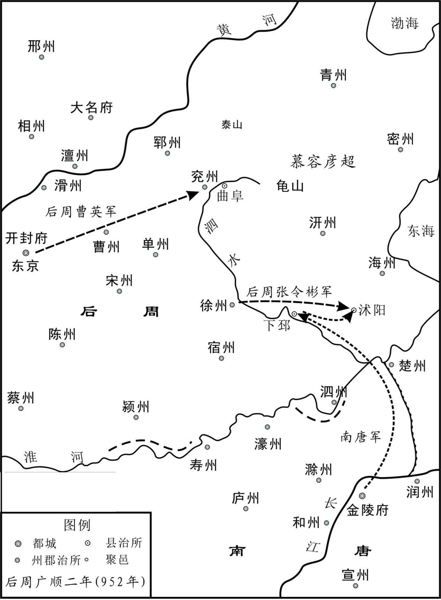 
后周平定慕容彦超反叛示意图

## 【原文】

**丁丑，以端明殿学士颜衎权知兖州事[1]。癸未，降泰宁军为防御州[2]。**

## 【注文】

[1]颜衎（kān）（889—962年）：字祖德，兖州曲阜（今山东曲阜）人。后梁龙德中擢第。后唐长兴初拜太常博士。入后晋累拜御史中丞、户部侍郎。后周广顺初为尚书右丞，充端明殿学士，后周显德初以工部尚书致仕。

[2]降泰宁军为防御州：唐末五代地方有节度使州与防御使州、刺史州之分。设置节度使的为节度州，设置防御使的为防御州，其余为刺史州。前者在规格和地位上高于后者。

## 【译文】

后周太祖广顺二年（952年）五月丁丑（二十二日），后周朝廷任命端明殿学士颜衎代理主持兖州事务。癸未（二十八日），将泰宁军节度使降为防御州。

## 【原文】

**显德元年春正月壬辰，帝殂[1]。［丙申］，晋王荣即帝位。**

## 【注文】

[1]显德：后周太祖郭威、世宗柴荣、恭帝柴宗训共同使用的年号。从公元954年至960年，共使用七年。

## 【译文】

后周太祖显德元年（954年）春季正月壬辰（十七日），后周太祖（郭威）去世，丙申（二十一日），晋王柴荣（郭荣）即皇帝位。

## 【原文】

**北汉主闻太祖晏驾，甚喜，谋大举入寇，遣使请兵于契丹[1]。二月，契丹遣其武定节度使、政事令杨袞将万余骑如晋阳[2]。北汉主自将兵三万，以义成节度使白从晖为行军都部署，武宁节度使张元徽为前锋都指挥使，与契丹自团柏南趣潞州。**

## 【注文】

[1]晏驾：古时对帝王死亡的讳称。

[2]武定节度使：此为辽朝设置的节度使，方太亦曾担任过此职。此外，唐、五代时曾在洋州（治兴道，今陕西洋县）设置武定节度使，但这时属后蜀国。　　政事令：辽朝官名。辽太祖耶律阿保机时，置政事令。辽天禄四年（950年），建政事省，政事令即其长官。辽重熙三年（1034年），改为中书省。

## 【译文】

北汉国主（刘旻［mín］）听说后周太祖（郭威）去世，极为高兴，图谋大举入侵后周，于是派遣使者到契丹请求出兵。显德元年（954年）二月，契丹派遣其武定节度使、政事令杨袞率领一万多名骑兵前往晋阳。北汉国主亲自率兵三万，任命义成节度使白从晖为行军都部署，武宁节度使张元徽为前锋都指挥使，与契丹军队从团柏南下奔向潞州。

## 【原文】

**北汉兵屯梁侯驿，昭义节度使李筠遣其将穆令均将步骑二千逆战，筠自将大军壁于太平驿[1]。张元徽与令均战，阳不胜而北，令均逐之，伏发，杀令均，俘斩士卒千余人。筠遁归上党，婴城自守[2]。筠即李荣也，避上名改焉。**

## 【注文】

[1]梁侯驿：位于潞州（今山西长治）西北。驿即驿馆（也称馆驿），是古代设置在驿站上的旅馆。　　李筠：即李荣。　　逆战：迎战。　　壁：军营的围墙、营垒。　　太平驿：位于潞州（今山西长治）西北八十里。

[2]上党：即潞州，潞州又称上党郡，其属县有上党县。

## 【译文】

北汉军队屯驻梁侯驿，昭义节度使李筠派遣将军穆令均带领步兵、骑兵二千人迎战，李筠自己率领大部队在太平驿安下营垒。张元徽与穆令均交战，假装打不过而逃跑，穆令均追逐，北汉伏兵突然出击，杀死穆令均，俘虏斩杀后周士兵一千多人。李筠逃归上党，据城自守。李筠就是李荣，为避后周世宗（郭荣）的名讳而改了名。

## 【原文】

**世宗闻北汉主入寇，欲自将兵御之。群臣皆曰：“刘崇自平阳遁走以来，势蹙气沮，必不敢自来[1]。陛下新即位，山陵有日，人心易摇，不宜轻动，宜命将御之[2]。”帝曰：“崇幸我大丧，轻朕年少新立，有吞天下之心，此必自来，朕不可不往。”冯道固争之，帝曰：“昔唐太宗定天下，未尝不自行，朕何敢偷安[3]。”道曰：“未审陛下能为唐太宗否？”帝曰：“以吾兵力之强，破刘崇如山压卵耳。”道曰：“未审陛下能为山否？”帝不悦。惟王溥劝行，帝从之。**

## 【注文】

[1]势蹙（cù）气沮（jǔ）：势力缩小，士气沮丧。蹙，缩小、削减；沮，丧气。

[2]山陵有日：指郭威的灵柩已经存放了多日。山陵，指帝王的灵柩；有日，多日。

[3]偷安：指不顾将来的祸患，只图眼前的安逸。

## 【译文】

后周世宗听说北汉国主率兵入侵，打算亲自率领军队前往抵抗。朝廷群臣都说：“刘崇自从平阳逃跑以来，势力缩小，士气沮丧，必定不敢亲自前来。陛下新近即位，先帝的灵柩又存放多日没有下葬，人心容易动摇，不宜轻易出动，应该命令将领去抵抗。”世宗说：“刘崇庆幸我国有大丧，轻视朕年轻新近即位，颇有吞并天下之心，这次必定亲自前来，朕不可不亲自前往。”冯道一再争辩，世宗说：“昔日唐太宗平定天下，未尝不亲自出征，朕何敢苟且偷安。”冯道说：“不知陛下能不能成为唐太宗？”世宗说：“以我国的兵力强大，打败刘崇犹如大山压鸡蛋罢了。”冯道说：“不知陛下能不能成为大山？”世宗不高兴。只有王溥（pǔ）鼓励世宗亲自出征，世宗听从了他的话。

## 【原文】

**三月，北汉乘胜进逼潞州。丁丑，诏天雄节度使符彦卿引兵自磁州固镇出北汉军后，以镇宁节度使郭崇副之[1]；又诏河中节度使王彦超引兵自晋州东出邀北汉，以保义节度使韩通副之[2]；又命马军都指挥使宁江节度使樊爱能、步军都指挥使清淮节度使何徽、义成节度使白重赞、郑州防御使史彦超、前耀州团练使符彦能将兵先趣泽州，宣徽使向训监之[3]。重赞，宪州人也[4]。**

## 【注文】

[1]固镇：古地名。在磁州武安县（今河北武安）境内。

[2]韩通（？—960年）：并州太原（今山西太原西南）人，勇于作战。后汉时历任检校左仆射、奉国指挥使、领雷州刺史等职。后周时历任孟州巡检、保义节度使、侍卫马步军都虞候、京城都巡检、归德军节度使等职。后周显德七年（960年），陈桥兵变，韩通闻讯惶遽而归，被军校王彦升杀害。赠中书令。

[3]樊爱能（？—954年）：籍贯不详。后周时任马军都指挥使。后周显德元年（954年）参与高平之战，与何徽望敌而遁，造成东厢骑军大乱，大军投降。战后，后周世宗将其与何徽等七十余名将校斩首，以正军法。　　清淮节度使何徽：按清淮节度使治寿州（治寿春，今安徽寿县），领寿、光（治定城，今河南潢川）二州，在南唐界，故何徽此时担任此职亦当是遥领。　　白重赞（909—970年）：宪州楼烦（今山西娄烦）人，年少从军，作战勇猛，武艺高强。后汉初由散员都虞候三迁至护圣都指挥使。乾祐年间，平李守贞之乱，升端州刺史。后周时，因战功升任郑州防御使、相州留后，迁义成、保大、河阳三城、彰义等镇节度使。宋初，加授检校太师，先后任泾州、泰宁、定国节度使、左千牛卫上将军。　　耀州：西汉景帝二年（公元前155年）始建县，三国魏黄初元年（220年）改为泥阳县，隋开皇六年（586年）改为华原县。唐天祐二年（905）设耀州，辖境在今陕西耀县一带。　　符彦能：生卒年不详。符存审之子，符彦卿之弟。

[4]宪州：唐龙纪元年（889年）置，治楼烦（今山西静乐西南娄烦）。唐时领有楼烦、玄池、天池三县，辖今山西娄烦及静乐部分地区。

## 【译文】

后周太祖显德元年（954年）三月，北汉军队乘胜推进逼近潞州。丁丑日，后周世宗下诏令天雄节度使符彦卿率兵从磁州固镇出兵攻击北汉军队的后面，以镇宁节度使郭崇为副职；又诏令河中节度使王彦超率兵从晋州东出击拦截北汉军队，以保义节度使韩通为副职；又命令马军都指挥使、宁江节度使樊爱能，步军都指挥使、清淮节度使何徽以及义成节度使白重赞、郑州防御使史彦超、前耀州团练使符彦能率兵先赶赴泽州，令宣徽使向训监督各部。白重赞是宪州人。

## 【原文】

**癸未，帝命冯道奉梓宫赴山陵，以郑仁诲为东京留守。乙酉，帝发大梁，庚寅，至怀州。帝欲兼行速进，控鹤都指挥使真定赵晁私谓通事舍人郑好谦曰：“贼势方盛，宜持重以挫之[1]。”好谦言于帝，帝怒曰：“汝安得此言，必为人所使。言其人则生，不然必死！”好谦以实对，帝命并晁械于州狱。壬辰，帝过泽州，宿于州东北。**

## 【注文】

[1]控鹤都指挥使：控鹤军最高统帅。控鹤为五代禁军军号，后梁时设置，为皇帝侍卫亲军之一。　　赵晁（cháo）（生卒年不详）：五代后周、宋初将领，真定（今河北正定）人，后晋时事杜重威为列校。后周时，曾任作坊使、控鹤左厢都指挥使、虎捷右厢都指挥使、检校太保、河阳三城节度、检校太傅等职。宋初，加检校太尉。不久病卒于京师，年五十二。赠太子太师、侍中。

## 【译文】

后周太祖显德元年（954年）三月癸未（初九日），后周世宗命令冯道护送后周太祖（郭威）的灵柩前往山陵安葬，任命郑仁诲为东京留守。乙酉（十一日），后周世宗从大梁出发，庚寅（十六日），抵达怀州。世宗打算日夜兼程快速前进，控鹤都指挥使、真定人赵晁私下对通事舍人郑好谦说：“敌寇气势正在强盛之时，应该稳健持重来挫败它。”郑好谦将此话讲给世宗听，世宗发怒说：“你哪里能说出这样的话，必定是被人所支使。说出那人的姓名就活，不然一定叫你死！”郑好谦只好据实回答，世宗命令将他连同赵晁一起关押在怀州监狱。壬辰（十八日），世宗经过泽州，住宿在州城东北。

## 【原文】

**北汉主不知帝至，过潞州不攻，引兵而南，是夕，军于高平之南[1]。癸巳，前锋与北汉兵遇，击之，北汉兵却。帝虑其遁去，趣诸军亟进[2]。北汉主以中军陈于巴公原，张元徽军其东，杨袞军其西，众颇严整[3]。时河阳节度使刘词将后军未至，众心危惧，而帝志气益锐，命白重赞与侍卫马步都虞候李重进将左军居西，樊爱能、何徽将右军居东，向训、史彦超将精骑居中央，殿前都指挥使张永德将禁兵卫帝[4]。帝介马，自临陈督战[5]。**

## 【注文】

[1]高平：古县名，即古代长平，后更名高平。唐、五代时属泽州，即今山西高平。高平在潞州（治今山西长治）西南。

[2]趣（cù）：督促、催促。　　亟（jí）：急切。

[3]巴公原：位于今山西泽州北部，地势平坦。巴公，春秋战国时曰“巴子城”。公元前624年，因晋襄公西伐巴蜀，迁巴蜀主于此而得名。

[4]李重进（？—960年）：沧州（治今河北沧州）人，后周太祖郭威的姐姐福庆长公主之子。后晋时为殿直，郭威称帝，任武信军节度使。周世宗时，攻略南唐有功。北宋建隆元年（即后周恭帝显德七年，960年）赵匡胤代汉建宋，令李重进移镇青州，遭到拒绝。九月，李重进起兵反，宋太祖命石守信、王审琦等平叛，李重进败死。　　殿前：即殿前司，古代官署名。五代后周广顺二年（952年）置，掌禁军中的内殿直、散员、散指挥使、员僚直等殿前诸班直以及左右两厢骑兵、左右控鹤两厢步兵。　　殿前都指挥使：古代武官名。为殿前司最高长官和总指挥。后又设殿前都点检，成为禁军中最高统帅。

[5]介马：给战马披甲。

## 【译文】

北汉国主不知后周世宗到达，所以经过潞州时没有进攻，率兵向南，当晚，将军队驻扎在高平城南。显德元年（954年）三月癸巳（十九日），后周前锋部队与北汉军队相遇，发起攻击，北汉军后退。后周世宗顾虑敌军逃跑，催促各路军队急速前进。北汉国主率中军在巴公原摆开阵势，张元徽率军在东边，杨袞（gǔn）率军在西边，部众十分严整。这时后周河阳节度使刘词率领的后续部队尚未到达，大家都感到危险惧怕，而后周世宗的意志更加坚定，命令白重赞与侍卫马步都虞候李重进率领左路军队部署在西边，樊爱能、何徽率领右路军队部署在东边，向训、史彦超率领精锐骑兵居中央，殿前都指挥使张永德率领禁兵保卫皇帝。世宗骑着披甲的战马亲临阵前督战。

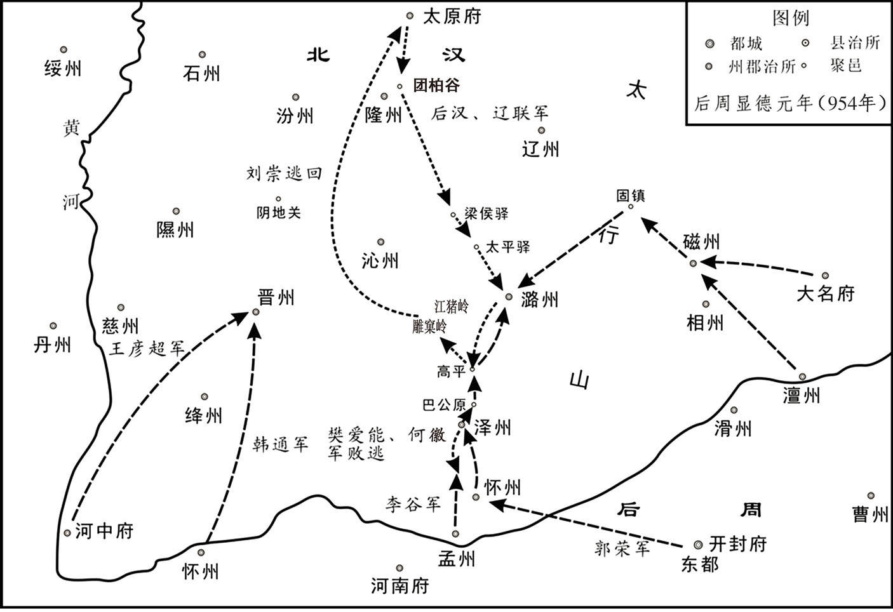 
后周、北汉高平之战示意图

## 【原文】

**北汉主见周军少，悔召契丹，谓诸将曰：“吾自用汉军可破也，何必契丹。今日不惟克周，亦可使契丹心服。”诸将皆以为然。杨袞策马前望周军，退谓北汉主曰：“勍敌也，未可轻进[1]。”北汉主奋髯曰：“时不可失，请公勿言，试观我战[2]。”袞默然不悦。时东北风方盛，俄而忽转南风，北汉副枢密使王延嗣使司天监李义白北汉主，云“时可战矣”，北汉主从之[3]。枢密直学士王得中扣马谏曰：“义可斩也。风势如此，岂助我者邪[4]？”北汉主曰：“吾计已决，老书生勿妄言，且斩汝！”麾东军先进，张元徽将千骑击周右军[5]。**

## 【注文】

[1]勍（qíng）敌：强敌、劲敌。勍，强、强大。

[2]奋髯（rán）：抖动胡须。激愤或激昂的样子。

[3]司天监：古代文官名，正三品。司天台长官，掌管天文历法。

[4]扣马：拉住马不使行进。

[5]麾：指挥。

## 【译文】

北汉国主刘旻看到后周军队人数少，后悔召来契丹军队，对众将领们说：“我独自用汉家军队就可以破敌，何必再借用契丹军队。今天不但可以战胜周军，而且还可以让契丹心悦诚服。”众将领都认为他说得对。杨袞驱马向前观望后周军队，退回来对北汉国主说：“这是劲敌，不可轻易冒进。”北汉国主激愤地扬起两颊长须说：“机不可失，请您不必多言，试看我出战。”杨袞沉默不快。这时东北风刮得正大，一会儿忽然转成南风，北汉枢密副使王延嗣派司天监李义禀报说：“现在可以开战了。”北汉国主听从了他的话。枢密直学士王得中牵住北汉国主的马劝谏说：“李义应该斩首。风向这样不定，哪里是在助我军呢？”北汉国主说：“我的主意已定，老书生不要胡言乱语，再说就砍你的头！”指挥东面军队首先推进，张元徽率领一千骑兵攻击后周右路军队。

## 【原文】

**合战未几，樊爱能、何徽引骑兵先遁，右军溃，步兵千余人解甲呼万岁，降于北汉[1]。帝见军势危，自引亲兵犯矢石督战[2]。太祖皇帝时为宿卫将，谓同列曰：“主危如此，吾属何得不致死[3]！”又谓张永德曰：“贼气骄，力战可破也。公麾下多能左射者，请引兵乘高西出为左翼，我引兵为右翼以击之[4]。国家安危，在此一举。”永德从之，各将二千人进战。太祖皇帝身先士卒，驰犯其锋，士卒死战，无不一当百，北汉兵披靡[5]。内殿直夏津马仁瑀谓众曰：“使乘舆受敌，安用我辈[6]！”跃马引弓大呼，连毙数十人，士气益振。殿前右番行首马全乂言于帝曰：“贼势极矣，将为我擒[7]。愿陛下按辔勿动，徐观诸将破之。”即引数百骑进陷陈[8]。**

## 【注文】

[1]合战：交战。

[2]犯矢石：冒着箭和石头。犯，冒着、顶着。

[3]太祖皇帝：即宋太祖赵匡胤（927—976年），北宋王朝的建立者，祖籍涿州（今河北涿州），出生于洛阳夹马营。后汉时，入郭威幕下，屡立战功。郭威建立后周后，任禁军军官。后周世宗时官至殿前都点检。公元960年，他以“镇定二州”的名义，谎报契丹联合北汉大举南侵，领兵出征，发动陈桥兵变，黄袍加身，代周称帝，建立宋朝。在位十六年。在位期间，加强中央集权，提倡文人政治，开创了中国的文治盛世，是一位推动中国历史发展的杰出人物。

[4]左射：用左手射击。

[5]披靡：草木倒伏。这里指军队溃败。

[6]马仁瑀（933—982年）：夏津（今山东夏津）人。勇猛善射，后周太祖郭威招至帐下，后入内殿直。高平之战后，以功迁内殿直都虞候。宋初，授散员、铁骑右厢、虎捷左厢都指挥使，随太祖征战，屡立战功。后出任密州、瀛州防御使等。为官清正，其侄杀人，按律斩首。　　乘舆：本意为皇帝乘坐的车子，这里指皇帝。

[7]殿前右番行（háng）首：殿前诸班中的头目。胡三省云：“右番行首，居殿前右番班行之首，其官犹在散员指挥使之下。”　　马全（yì）（生卒年不详）：五代、宋初军将。后汉末为河中节度使李守贞骑士。后周初随郭荣入朝，补殿前指挥使（右番行首）。高平之战后，迁散员指挥使。北宋初至控鹤左厢都指挥使。宋建隆元年（960年），随宋太祖赵匡胤出征泽州李筠。

[8]按辔（pèi）：按住马缰绳。

## 【译文】

双方交战不久，樊爱能、何徽带领骑兵首先逃跑，后周右路军队溃败，一千多名步兵脱下盔甲高呼万岁，向北汉投降。后周世宗看到形势危急，亲自带领侍卫亲兵冒着流矢飞石督战。宋太祖皇帝（赵匡胤）当时任后周警卫将领，对同伴们说：“皇上如此危险，我们怎么能不拼出性命！”又对张永德说：“贼寇只不过气焰嚣张，全力作战便可以打败他们。您部下有许多能左手射箭的士兵，请您领兵登上高处从西面出击作为左翼，我领兵作为右翼攻击敌人。国家的安危存亡，就在此一举。”张永德听从，与赵匡胤各自率领两千人前进战斗。宋太祖皇帝身先士卒，飞驰般冲向北汉前锋，士兵拼死战斗，无不以一当百，北汉军队溃败。内殿直、夏津人马仁瑀对部众说：“让皇上受到敌人的攻击，那还用我们干什么！”跃马拉弓，大声呼喊，连续射杀数十人，士气愈发振奋。殿前右番行首马全对后周世宗说：“贼寇气势已尽，将要被我们擒获，望陛下抓住缰绳别动，慢慢观看众将领是如何击破贼寇的。”立即率领数百骑兵冲入敌阵。

## 【原文】

**北汉主知帝自临陈，褒赏张元徽，趣使乘胜进兵[1]。元徽前略陈，马倒，为周兵所杀[2]。元徽，北汉之骁将也，北军由是夺气[3]。时南风益盛，周兵争奋，北汉兵大败。北汉主自举赤帜以收兵，不能止。杨袞畏周兵之强，不敢救，且恨北汉主之语，全军而退。**

## 【注文】

[1]趣（cù）：督促、催促。

[2]略陈：巡视阵地。略，巡视；陈，同“阵”，阵地。

[3]夺气：丧失勇气。

## 【译文】

北汉国主（刘旻）得知后周世宗亲临战阵，便嘉奖重赏张元徽，催促他乘胜进兵。张元徽前去巡视阵地，坐骑摔倒，被后周士兵所杀。张元徽是北汉有名的猛将，北汉军队因此丧失士气。这时南风越刮越大，后周士兵奋勇争先，北汉军队大败，北汉国主亲自高举红旗集结军队，却不能制止溃败。杨袞一方面畏惧后周军队的强大，不敢救援，同时也怨恨北汉国主所说的大话，便保全军队撤退。

## 【原文】

**樊爱能、何徽引数千骑南走，控弦露刃，剽掠辎重，役徒惊走，失亡甚多[1]。帝遣近臣及亲军校追谕止之，莫肯奉诏，使者或为军士所杀，扬言：“契丹大至，官军败绩，余众已降虏矣。”刘词遇爱能等于涂，爱能等止之，词不从，引兵而北[2]。时北汉主尚有余众万余人，阻涧而陈，薄暮，词至，复与诸军击之，北汉兵又败，杀王延嗣，追至高平，僵尸满山谷，委弃御物及辎重、器械、杂畜不可胜纪[3]。**

## 【注文】

[1]控弦：拉弓、持弓。　　露刃：刀出鞘，刀刃外露。　　辎（zī）重（zhòng）：运输部队携带的军械、粮草、被服、营帐等军事装备的统称。

[2]涂：路途。涂，同“途”。

[3]阻涧而陈（zhèn）：凭借山涧而布阵。　　薄暮：傍晚，太阳快落山的时候。

## 【译文】

樊爱能、何徽率领数千名骑兵向南逃奔，箭上弦、刀出鞘，抢掠军用物资，负责运送的民夫惊慌奔逃，跑丢、死亡的人很多。后周世宗（柴荣）派遣身边大臣以及贴身军校追赶上他们，宣命制止他们逃跑、抢掠，但没有人肯接受诏令，使者有的被军士所杀，军士扬言说：“契丹大军赶到，官军溃败，剩下的人马已经投降契丹了。”刘词在路上遇到樊爱能等人，樊爱能等劝阻他返回，刘词不听，领兵北上。当时北汉国主尚有余部一万多人，凭借山涧作为障碍而布阵，到傍晚时分，刘词率兵到达，又与其他军队一起进攻，北汉军队又被击败，后周军队杀死王延嗣，一直追到高平，僵卧的尸体布满山谷，丢弃的皇帝专用物品以及军需用具、各种牲畜不计其数。

## 【原文】

**是夕，帝宿于野次，得步兵之降敌者皆杀之[1]。樊爱能等闻周兵大捷，与士卒稍稍复还，有达曙不至者[2]。甲午，休兵于高平，选北汉降卒数千人为效顺指挥，命前武胜行军司马唐景思将之，使戍淮上，余二千余人赐赀装纵遣之[3]。李榖为乱兵所迫，潜窜山谷，数日乃出。丁酉，帝至潞州。**

## 【注文】

[1]野次：野外。

[2]达曙：即达旦，天刚刚亮。

[3]效顺指挥：五代后周禁军军号。　　武胜：即武胜节度使，古代方镇名。后梁开平三年（909年）设置宣化军节度使，后唐同光元年（923年）改为威胜军。后周广顺二年（952年）又改名武胜军，治邓州（治穰［ráng］县，今河南邓州），初领邓、泌、隋、复、郢等州，辖境约当今河南南阳、泌阳；湖北随县、京山、仙桃一带地区。　　唐景思（？—957年）：五代军将。秦州（治上邽［guī］，今甘肃天水）人。初事前蜀为军校。后唐灭蜀后，授兴州刺史，后为贝州行军司马。陷契丹，赵延寿署为所部壕寨使。后晋开运（944—946年）末，契丹据中原，任为亳州防御使。后汉初，改授邓州威胜军行军司马。后周时，命为沿淮巡检使。　　淮上：淮河沿岸。　　赀（zī）装：行装、盘缠。赀同“资”，资财。

## 【译文】

当天夜晚，后周世宗宿营在野外，得到投降北汉的后周步兵，全部杀死。樊爱能等听说后周军队取得大捷，才与士兵陆续返回，有的至天亮还没到达。显德元年（954年）三月甲午（二十日），后周世宗在高平休整队伍，挑选北汉投降过来的士兵数千人组成禁军中的效顺指挥军，命令前武胜行军司马唐景思率领，令他们戍守淮河沿岸，其余两千多人发给路费行装放回北汉。李榖被乱兵所逼迫，潜逃到山谷之中，数日之后才出来。丁酉（二十三日），后周世宗到达潞州。

## 【原文】

**北汉主自高平被褐戴笠，乘契丹所赠黄骝，帅百余骑由雕窠岭遁归[1]。宵迷，倩村民为导(8)，误之晋州，行百余里乃觉之，杀导者[2]。昼夜北走，所至，得食未举筯，或传周兵至，辄苍黄而去[3]。北汉主衰老力惫，伏于马上，昼夜驰骤，殆不能支，仅得入晋阳[4]。**

## 【注文】

[1]被（pī）褐（hè）戴笠：穿着粗布衣服戴上斗笠。褐，粗布、粗布衣服。　　黄骝：马名。　　雕窠（kē）岭：山名。位于泽州高平县（今山西高平）西北，由江猪岭路入。

[2]宵迷：夜间迷路。宵，夜。　　导：向导。

[3]筯（zhù）：同“箸”，筷子。　　辄（zhé）：立即。

[4]骤：马快跑。　　殆（dài）不能支：几乎不能支撑。殆，几乎。　　仅：勉强。

## 【译文】

北汉国主自高平起穿上粗布衣服，戴上斗笠，乘着契丹所赠送的黄骝马，率领一百多名骑兵从雕窠岭逃归。夜晚迷路，俘获村民为向导，却错向晋州方向行去，走了一百多里路才发觉，于是杀死向导。日夜向北奔走，刚到一处，得到食物尚未举起筷子，有人传言说后周军队追到，便立即仓皇离去。北汉国主衰老疲惫，趴在马背上，日夜奔驰，几乎不能支持，勉强得以进入晋阳。

## 【原文】

**帝欲诛樊爱能等以肃军政，犹豫未决。己亥，昼卧行宫帐中，张永德侍侧，帝以其事访之。对曰：“爱能等素无大功，忝冒节钺，望敌先逃，死未塞责[1]。且陛下方欲削平四海，苟军法不立，虽有熊罴之士，百万之众，安得而用之[2]！”帝掷枕于地，大呼称善。即收爱能、徽及所部军使以上七十余人，责之曰：“汝曹皆累朝宿将，非不能战；今望风奔遁者，无他，正欲以朕为奇货，卖与刘崇耳。”悉斩之。帝以何徽先守晋州有功，欲免之，既而以法不可废，遂并诛之，而给槥车归葬[3]。自是骄将惰卒，始知所惧，不行姑息之政矣。庚子，赏高平之功，以李重进兼忠武节度使，向训兼义成节度使，张永德兼武信节度使，史彦超为镇国节度使[4]。张永德盛称太祖皇帝之智勇，帝擢太祖皇帝为殿前都虞候，领严州刺史[5]。以马仁瑀为控鹤弓箭直指挥使，马全乂为散员指挥使[6]。自余将校迁拜者凡数十人，士卒有自行间擢主军厢者[7]。释赵晁之囚。**

## 【注文】

[1]忝（tiǎn）冒：即滥竽充数。忝，表示辱没他人，自己有愧，常用作谦辞。　　节钺（yuè）：符节与斧钺。古代天子任命大将时，授予符节与斧钺，后来就以节钺指称大将。　　塞（sè）责：抵偿罪责。塞，补救、抵偿。

[2]熊罴（pí）之士：像熊罴一样勇猛的武士。罴，熊的一种，也叫棕熊、马熊或人熊，古称罴。

[3]槥（huì）：粗陋的小棺材。

[4]武信节度使：古代方镇名，唐末置，治遂州（治方义，今四川遂宁），领遂、合（治石镜，今重庆合川区）、昌（治今重庆大足）、渝（治巴县，今重庆）、泸（治泸川，今四川泸州）五州。五代相继为前蜀、后唐、后蜀所有。张永德兼武信节度使，实际为虚名遥领。

[5]擢（zhuó）：提拔、提升。　　殿前都虞候：殿前司官员，次于都点检、副都点检和都指挥使的官职，主要掌管军法。　　严州：唐乾封元年（666年）置，治循德（今广西来宾东南），统辖循德、归化、怀义三县。唐天宝二年（743年），改怀义县为来宾县。辖境相当于今来宾市东部。赵匡胤领严州刺史，实际亦为虚名遥领。

[6]控鹤弓箭直指挥使：控鹤军下面的军将。　　散员指挥使：五代禁军军号中有“散指挥”一名，亦称“散员”，其将领称散指挥使、散指挥都头或散员都指挥使，散指挥使大约是该军的小军校。

[7]行（háng）间：行伍（军士）中间。　　擢主军厢：提升为一军或一厢的主将。厢，一支军队往往分为左右厢。

## 【译文】

后周世宗想诛杀樊爱能等人以整肃军纪，但犹豫未决。显德元年（954年）三月己亥（二十五日），世宗白天躺在行宫的帐篷中，张永德在身边侍候，世宗向他询问对此事的意见。张永德回答说：“樊爱能等人平素本来就没有什么大功，滥竽充数当了一方将帅，望见敌人首先逃跑，杀了他都不能抵偿他的罪责。况且陛下正想平定四海，一统天下，如果军法不能确立，即使是有像熊罴一样勇猛的武士，百万大军，又怎么能为陛下所用！”世宗听后将枕头扔到了地上，大声称好。立即拘捕樊爱能、何徽以及所部军使以上的军官七十多人，斥责他们说：“你们都是历朝的老将，不是不能打仗；如今望风而逃，没有别的原因，正是想把朕当作稀有货物，出卖给刘崇而已。”立即将他们全部斩首。世宗因何徽先前守卫晋州有功，打算赦免他，但马上意识到军法不可废弃，于是将他一块诛杀，赐给他一副粗陋的小棺材送归老家安葬。从此，骄横跋扈的将领和懈怠懒惰的士兵开始知道军法可畏，姑息养奸的政令不再通行了。庚子（二十六日），世宗赏赐在高平战役中立功的人员，任命李重进兼忠武节度使，向训兼义成节度使，张永德兼武信节度使，史彦超为镇国节度使。张永德极力称赞宋太祖皇帝（赵匡胤）的智慧勇敢，世宗提拔宋太祖皇帝为殿前都虞候，兼任严州刺史。任命马仁瑀为控鹤弓箭直指挥使，马全为散员指挥使。其余将校军官升任职务的共几十人，士兵有从行伍中提拔担任军使、厢主的。解除对赵晁的禁囚。

## 【原文】

**北汉主收散卒，缮甲兵，完城堑以备周[1]。杨袞将其众北屯代州，北汉主遣王得中送袞，因求救于契丹。契丹主遣得中还报，许发兵救晋阳。**

## 【注文】

[1]缮（shàn）甲兵：修补铠甲和兵器。缮，修补、整治。　　完城堑（qiàn）：完备城墙和护城河。

## 【译文】

北汉国主收拾残兵，修缮武器装备，加固城池守卫工事来防备后周。杨袞（gǔn）率领他的部众北上屯驻代州，北汉国主派遣王得中送杨袞，趁机向契丹请求救援。契丹国主（耶律璟〔jǐng〕）遣送王得中回去报告，答应发兵援救晋阳。

## 【原文】

**壬寅，以符彦卿为河东行营都部署兼知太原行府事，以郭崇副之，向训为都监，李重进为马步都虞候，史彦超为先锋都指挥使，将步骑二万发潞州[1]。仍诏王彦超、韩通自阴地关入，与彦卿合军而进。又以刘词为随驾部署，保大节度使白重赞副之[2]。**

## 【注文】

[1]太原行府：太原本为北汉占据，后周欲攻占，故以“行府”名之。

[2]随驾部署：随从皇帝的军官。

## 【译文】

后周太祖显德元年（954年）三月壬寅（二十八日），后周世宗任命符彦卿为河东行营都部署兼知太原行府事，以郭崇为副都部署，向训为都监，李重进为马步都虞候，史彦超为先锋都指挥使，率领步兵、骑兵两万人从潞州出发。同时诏令王彦超、韩通从阴地关进入，与符彦卿会师进军，又任命刘词为随驾部署，保大节度使白重赞为副部署。

## 【原文】

**夏四月，北汉盂县降[1]。符彦卿军晋阳城下。王彦超攻汾州，北汉防御使董希颜降[2]。帝遣莱州防御使康延沼攻辽州，密州防御使田琼攻沁州，皆不下[3]。供备库副使太原李谦溥单骑说辽州刺史张汉超，汉超即降[4]。**

## 【注文】

[1]盂（yú）县：古县名。时属辽州，今山西盂县。

[2]汾州：古州名。北魏太和十二年（488年）置，治蒲子县（今山西隰［xī］县），北魏孝昌（525—527年）时移至隰城县（唐时改名为西河县，即今山西汾阳）。唐时领有西河、孝义、介休、平遥、灵石等县，辖境相当于今山西汾阳、介休、平遥、孝义、灵石等地。五代沿袭。

[3]莱州：古州名。隋开皇五年（585年）改光州置，治掖县（今山东莱州）。唐时领掖、昌阳、胶水、即墨等县。辖境约当今山东平度、青岛以东，招远、海阳以西地区。五代沿袭。　　辽州：古州名。隋开皇十六年（596年）置，治乐平县（今山西昔阳西南）。唐初复置，唐武德六年（623年）移治辽山县（今山西左权）。唐时领有辽山、榆社、和顺、平城四县，辖境相当于今山西左权、和顺、榆社等地。五代沿袭。　　沁州：古州名。隋开皇十六年（596年）始置，治沁源（今山西沁源），唐武德元年（618年）复置，领沁源、和川、绵上等县。辖境约当今山西太岳山东南、沁水上游地区。五代沿袭。

[4]供备库副使：五代时已出现，但官阶及职掌不明。据《文献通考》载，宋代有供备库，有使及副使，掌供尚食及内外膳馐、米面、饴蜜、枣豆百品之料。此外，宋代的供备库使及副使，都是从七品的武职。　　李谦溥（pǔ）（914—976年）：字德明，盂县（今山西盂县）人。历事后晋、后汉、后周，累官至供备库副使。从后周世宗征北汉，以功改闲厩使、晋州兵马都监等。北宋建隆四年（963年）移隰（xí）州刺史。在州十年，北汉不敢犯境。北宋开宝六年（973年）率兵攻太原，连克七城。后病卒。

## 【译文】

后周太祖显德元年（954年）夏季四月，北汉盂县投降。符彦卿驻军晋阳城下。王彦超进攻汾州，北汉防御使董希颜投降。后周世宗派遣莱州防御使康延沼进攻辽州，密州防御使田琼进攻沁州，都没能攻下。供备库副使、太原人李谦溥独自骑马去劝说辽州刺史张汉超，张汉超就投降了。

## 【原文】

**乙卯，葬圣神恭肃文武孝皇帝于嵩陵，庙号太祖[1]。**

## 【注文】

[1]圣神恭肃文武孝皇帝：即后周太祖郭威的谥（shì）号。　　嵩（sōng）陵：后周太祖郭威的陵墓，位于今河南新郑郭店镇周庄村南约五百米处。现存冢高约九米，周长一百余米。

## 【译文】

后周太祖显德元年（954年）四月乙卯（十二日），后周将圣神恭肃文武孝皇帝（郭威）安葬在嵩陵，庙号为太祖。

## 【原文】

**初，帝遣符彦卿等北征，但欲耀兵于晋阳城下，未议攻取。既入北汉境，其民争以食物迎周师，泣诉刘氏赋役之重，愿供军须，助攻晋阳，北汉州县继有降者。帝闻之，始有兼并之意，遣使往与诸将议之。诸将皆言“刍粮不足，请且班师，以俟再举”，帝不听[1]。既而诸军数十万聚于太原城下，军士不免剽掠，北汉民失望，稍稍保山谷自固[2]。帝闻之，驰诏禁止剽掠，安抚农民，止征今岁租税，及募民入粟拜官有差，仍发泽、潞、晋、绛、慈、隰及山东近便诸州民运粮以馈军[3]。己未，遣李榖诣太原计度刍粮[4]。**

## 【注文】

[1]刍（chú）粮：饲草粮食。

[2]稍稍：逐渐、渐渐。

[3]驰诏：飞速下诏。　　入粟拜官：百姓缴纳一定量的粮食授予一定的官爵。此法早在先秦商鞅变法时即已实行，后世历朝历代也都存在。　　山东：泛指太行山以东地区。

[4]计度：计算度量。

## 【译文】

起初，后周世宗派遣符彦卿等人北上征伐，只是想在晋阳城下炫耀兵力，并没有打算攻取。及进入北汉境内后，那里的百姓争相送食物迎接后周军队，哭诉北汉刘氏政权赋税徭役的沉重，表示愿意供应军需物资，帮助进攻晋阳，北汉一些州、县相继投降。世宗知悉这些情况后，开始产生兼并北汉的念头，派遣使者前去与众将领商议。众将领都说现在“粮草不足，请暂且回师，等待时机再发兵”，世宗不同意。不久，后周各路军队数十万人聚集在太原城下，军士不免有抢掠行为，北汉百姓感到失望，渐渐退保山谷自守。世宗听说以后，派使者飞速传送诏令禁止抢掠，安抚农民，许诺只征收今年的租税，并且募集百姓缴纳粮食，按照缴纳的数量授予大小不同的官职，同时征发泽州、潞州、晋州、绛州、慈州、隰（xí）州，以及崤山以东近便各州百姓运送粮食供应军队。显德元年（954年）四月己未（十六日），派遣李榖到太原筹划粮草。

## 【原文】

**庚申，太师、中书令瀛文懿王冯道卒[1]。道少以孝谨知名，唐庄宗世始贵显，自是累朝不离将相、三公、三师之位。为人清俭宽弘，人莫测其喜愠，滑稽多智，浮沈取容，尝著《长乐老叙》，自述累朝荣遇之状，时人往往以德量推之[2]。**

## 【注文】

[1]三公：即太尉、司徒、司空合称，隋唐五代时，皆为正一品。　　三师：即太子太师、太子太傅、太子太保的合称。唐五代时，三师均为从一品。

[3]愠（yùn）：怒。　　浮沈：随波逐流，追随世俗。沈，即“沉”。　　取容：曲从讨好，取悦于人。　　推：推崇。

## 【译文】

后周太祖显德元年（954年）四月庚申（十七日），太师、中书令、瀛文懿（yì）王冯道去世。冯道少年时以孝顺谨慎闻名，后唐庄宗（李存勖）时开始尊贵显赫，从此以后历朝官不离将军、宰相、三公、三师的职位。他为人清静俭朴，宽容大度，别人无法猜测出他的喜怒哀乐。言谈幽默，足智多谋，随波逐流，左右逢源，取悦于人。曾著有《长乐老叙》一文，自述他在历朝享受荣誉礼遇的情况，当时人往往推崇他有道德和度量。

## 【原文】

**欧阳修论曰：“礼义廉耻，国之四维，四维不张，国乃灭亡[1]。”礼义，治人之大法；廉耻，立人之大节。况为大臣而无廉耻，天下其有不乱，国家其有不亡者乎！予读冯道《长乐老叙》，见其自述以为荣，其可谓无廉耻者矣，则天下国家可从而知也[2]。**

## 【注文】

[1]欧阳修（1007—1073年）：北宋著名政治家、文学家、史学家。吉安永丰（今江西永丰）人。字永叔，号醉翁，又号六一居士，谥号文忠。历仕宋仁宗、英宗、神宗三朝，累官知制诰、翰林学士、枢密副使、参知政事、兵部尚书等，后以太子少师致仕。唐宋八大家之一，诗、词、散文均为一时之冠。一生著述繁富，主要有《新唐书》《新五代史》以及《欧阳文忠公文集》等。　　四维：即四项纲维。维，纲维，总纲、法度。　　张：展开。

[2]予：自称，我。

## 【译文】

欧阳修评论说：“礼、义、廉、耻，是国家赖以生存的四条纲维，这四条纲维不能树立展开，国家就会灭亡。”礼义，是统治人民的根本大法；廉耻，是立身做人的基本节操。何况身为大臣而毫无廉耻，天下岂有不乱，国家岂有不亡的吗？我读冯道《长乐老叙》，看到他在自述中不讲礼义廉耻反以为荣耀，真可谓是毫无廉耻的人了，那么天下国家的命运也就可想而知了。

## 【原文】

**予于五代得全节之士三，死事之臣十有五，皆武夫战卒，岂于儒者果无其人哉[1]？得非高节之士，恶时之乱，薄其世而不肯出欤[2]？抑君天下者不足顾，而莫能致之欤[3]？**

## 【注文】

[1]全节：保全节操。　　死事：死于国事。

[2]得非：莫非是。　　恶（wù）：讨厌、厌恶。　　薄（bó）：轻视、鄙薄。　　欤（yú）：文言助词，表示疑问、感叹、反诘等语气。

[3]抑：文言连词，或是、还是。　　不足顾：照管、注意不够。　　莫能致之：没有能使他们出来。

## 【译文】

我从五代历史中找到保全节操的志士有三位，死于国事的臣子有十五位，全都是武夫战士，难道在儒者中间果真没有那样的人吗？莫非是那些具有高尚节操的士人，憎恶时势的浊乱，鄙薄当时的世道而不肯出仕？还是统治天下的君主来不及关顾他们，而没能让他们出来呢？

## 【原文】

**予尝闻五代时有王凝者，家青、齐之间，为虢州司户参军，以疾卒于官[1]。凝家素贫，一子尚幼，妻李氏，携其子，负其遗骸以归，东过开封止于旅舍，主人不纳[2]。李氏顾天已暮，不肯去，主人牵其臂而出之[3]。李氏仰天恸哭曰：“我为妇人，不能守节，而此手为人所执邪[4]！”即引斧自断其臂，见者为之嗟泣[5]。开封尹闻之，白其事于朝，厚恤李氏而笞其主人[6]。呜呼，士不自爱其身而忍耻以偷生者，闻李氏之风，宜少知愧哉[7]。**

## 【注文】

[1]司户参军：古代文官名，即司户参军事。隋唐五代时为府、州主管民政的官员。府为正七品下，州为从七品下。唐开元初诸府改称户曹参军，州仍称司户参军。

[2]遗骸（hái）：遗体。

[3]顾：回头看，泛指看。　　暮：傍晚，太阳落山的时候。

[4]恸（tòng）哭：大哭、痛哭。

[5]引：举。　　嗟（jiē）泣：嗟叹悲泣。

[6]恤：抚恤。　　笞（chī）：用鞭杖或竹板打。

[7]风：高风亮节。　　宜：应该、应当。　　少：稍微、多少。

## 【译文】

我曾经听说五代时有个叫王凝的人，家住在青州、齐州之间，曾担任虢（guó）州司户参军，因疾病在任上去世。王凝家中素来贫寒，一个儿子年纪尚幼，他的妻子李氏带着孩子，背负着王凝的遗骨回老家，向东经过开封，在旅店住下，店主不愿接纳。李氏眼看天色已晚，不肯离去，店主拉她的胳膊让她出去。李氏仰天痛哭说：“我是个女人，不能守住贞操，而使这只手臂被别的男人抓过了！”就举起斧子自己砍断那条胳膊，见此情景的人为她叹息流泪。开封府尹听说后，将此事向朝廷禀报，优厚地周济李氏而鞭打了那位店主。呜呼！那些不珍爱自己的身子而忍受耻辱苟且偷生的士人们，听到李氏高风亮节的事迹后，应当稍微知道一些羞愧了。

## 【原文】

**臣光曰：天地设位，圣人则之，以制礼立法，内有夫妇，外有君臣[1]。妇之从夫，终身不改，臣之事君，有死无贰，此人道之大伦也[2]。苟或废之，乱莫大焉。范质称冯道厚德稽古，宏才伟量，虽朝代迁贸，人无闲言，屹若巨山，不可转也[3]。臣愚以为正女不从二夫，忠臣不事二君。为女不正，虽复华色之美，织纴之巧，不足贤矣。为臣不忠，虽复材智之多，治行之优，不足贵矣[4]。何则？大节已亏故也。道之为相，历五朝八姓，若逆旅之视过客，朝为仇敌，暮为君臣，易面变辞，曾无愧怍，大节如此，虽有小善，庸足称乎[5]？**

## 【注文】

[1]则：效法。

[2]大伦：基本的伦理道德。

[3]稽（jī）古：考察古代的事迹。稽，考查、考核。　　迁贸：变迁、变革。

[4]材智：能力智慧。材，能力。　　治行：政绩。

[5]逆旅：旅店。逆，古语中为“迎接”；旅，旅人、行者。故“逆旅”引申即为旅店的意思。　　愧怍（zuò）：羞愧。怍，惭愧。

## 【译文】

史臣司马光评论说：天地设置方位，圣人作为效法的准则，用来制定礼仪、建立法律，家中有夫妇，家外有君臣。妇人随从丈夫，终身不能改变，臣子侍奉君主，至死没有二心，这是为人之道最基本的伦理道德。如果废弃了这一点，祸乱没有比这更大的了。范质称赞冯道德行深厚，精研古道，才气雄伟，度量宏大，虽然朝代变迁，人们对他却没有闲言，像大山一样巍然屹立，不可转动。臣下我认为，正派的女子不会嫁给两个丈夫，忠诚的臣子不会侍奉两位君主。做女人不正派，即使再有如花似玉的美貌，纺纱织布的巧手，也称不上贤惠。做臣子不忠诚，即使才能智慧再多，政绩多么卓著，也不值得看重。为什么呢？是因为大节已亏的缘故。冯道任宰相，历事五个朝代、八位君主，如同旅店看待过客一样，清晨还是仇敌，傍晚便成为君臣，更换面孔、变化腔调，竟无一点羞愧，大节如此，即使是有一些小善，哪里还值得称道？

## 【原文】

**或以为自唐室之亡，群雄力争，帝王兴废，远者十余年，近者三四年，虽有忠智，将若之何。当是之时，失臣节者非道一人，岂得独罪道哉！臣愚以为忠臣忧公如家，见危致命，君有过则强谏力争，国败亡则竭节致死[1]。智士邦有道则见，邦无道则隐，或灭迹山林，或优游下僚[2]。今道尊宠则冠三师，权任则首诸相，国存则依违拱嘿，窃位素餐，国亡则图全苟免，迎谒劝进[3]。君则兴亡接踵，道则富贵自如，兹乃奸臣之尤，安得与他人为比哉[4]！或谓道能全身远害于乱世，斯亦贤已。臣谓君子有杀身成仁，无求生害仁，岂专以全身远害为贤哉？然则盗跖病终而子路醢，果谁贤乎[5]？**

## 【注文】

[1]见危致命：在危急关头勇于献出自己的生命。出自《论语·子张》：“士见危致命，见得思义。”　　竭节致死：恪守节操直到死。

[2]邦有道则见，邦无道则隐：意为国家清明有道就出来，国家昏庸无道就隐居。出自《论语·泰伯》：“子曰：危邦不入，乱邦不居。天下有道则见，无道则隐。邦有道，贫且贱焉，耻也；邦无道，富且贵焉，耻也。”　　优游：悠闲自得。　　下僚：下层官员。

[3]拱嘿（mò）：拱手缄默。嘿同“默”，闭口不言。　　素餐：不劳而食，多指无功受禄。

[4]接踵（zhǒng）：本意为脚尖脚跟相接，这里是一个接一个的意思。　　尤：特异的，突出的。

[5]盗跖（zhí）病终而子路醢（hǎi）：盗跖生病老死而子路被砍成肉酱。盗跖，原名展雄，又名柳下跖，相传是当时贤臣柳下惠之弟，鲁孝公之子公子展的后裔。春秋战国之际奴隶起义领袖，后世蔑称为“盗跖”。子路，名仲由，春秋末鲁国卞（今山东泗水县泉林镇卞桥）人。孔子得意门生。以政事见称，信守诺言，勇于进取。曾任卫蒲邑大夫、季氏家宰、卫大夫孔悝（kuī）家宰等，后在内讧中被杀。醢，古代一种酷刑，把人杀死后剁成肉酱。

## 【译文】

有人认为自从唐皇室灭亡以来，群雄以武力相争，一位帝王的兴盛衰亡，时间长的十几年，短的三四年，虽然有忠臣智士，又能怎么样呢。在这种形势下，丧失为臣节操的又何止冯道一个人，怎么能单独怪罪冯道呢！臣下我认为，忠臣担忧国家的命运如同担忧家庭的命运，见到危险勇于献出自己的生命，君主有过失则要极力劝谏、据理力争，国家衰败灭亡则要至死恪守节操。智士看到国家清明有道就出仕，国家昏庸无道就隐居，或者遁入山林不留踪迹，或者身居小吏悠闲自在。如今冯道论尊贵恩宠则胜过太师、太傅、太保三师，论权力责任则位居宰相之首，国家存在时便拱手闭嘴不置可否，窃据权位无功受禄，国家灭亡时便图谋保全苟且免死，迎接拜谒新主或上表劝进帝位。国君的兴盛灭亡一个接着一个，冯道的荣华富贵却依然故我，这是奸臣之最，哪能与其他的人相提并论呢！有人认为冯道能够在乱世中保全自身，远离祸害，这也算得上贤能了。臣下我认为，君子只有敢于牺牲自己成全仁义的德行，决不能为追求活命而损害仁义，哪能将专门保全自身远离祸害当作贤能呢？如果把专门保全自身远离祸害当作贤能的话，那么盗跖虽是大盗却生病老死，而子路虽为忠臣却被砍成肉酱，他们究竟谁才能称得上是贤能呢？

## 【原文】

**抑此非特道之愆也，时君亦有责焉[1]。何则？不正之女，中士羞以为家，不忠之人，中君羞以为臣[2]。彼相前朝，语其忠则反君事仇，语其智则社稷为墟。后来之君，不诛不弃，乃复用以为相，彼又安肯忠于我而能获其用乎！故曰非特道之愆，亦时君之责也。**

## 【注文】

[1]愆（qiān）：罪过、过失。

[2]中士：普通男士。　　中君：才德平常的君主。

## 【译文】

然而这不光是冯道的过错，当时的君主也有责任。为什么这么说呢？不正派的女子，一般的男子也羞以为妻，不忠诚的小人，一般的君主也羞以为臣。冯道为前朝宰相，说他忠诚却背叛前君侍奉仇敌，说他智慧却听任国家变成废墟。后来的君主，对他既不诛杀又不抛弃，却再次任用为宰相，他又怎么会忠诚于新的王朝而发挥自己的作用呢！所以说不光是冯道的过错，当时的君主也有责任。

## 【原文】

**辛酉，符彦卿奏北汉宪州刺史太原韩光愿、岚州刺史郭言皆举城降[1]。王彦超、韩通攻石州，克之，执刺史安彦进[2]。癸亥，沁州刺史李延诲降。庚午，帝发潞州，趣晋阳[3]。癸酉，北汉忻州监军李勍杀刺史赵皋及契丹通事杨耨姑举城降，以勍为忻州刺史[4]。**

## 【注文】

[1]韩光愿（生卒年不详）：五代、宋初军将。太原（今山西太原西南）人。北汉时任宪州刺史。北宋初任淄州刺史。北宋开宝二年（969年），太祖亲征河东，任为河南、河北巡检。及还，改亲军马军都虞候。

[2]安彦进（？—954年）：五代十国时北汉军将。任石州刺史，后周军队攻陷石州后，以其抗拒周师被斩首于太原城下。

[3]晋阳：古县名，今山西太原西南。

[4]李勍（qíng）：五代十国时军将。籍贯及生卒年不详。曾任北汉忻州监军，后周忻州刺史。　　杨耨（nòu）姑：契丹军将、翻译。

## 【译文】

后周太祖显德元年（954年）四月辛酉（十八日），符彦卿奏报说北汉宪州刺史、太原人韩光愿和岚州刺史郭言都献城投降。王彦超、韩通进攻石州，攻克州城，抓获刺史安彦进。癸亥（二十日），沁州刺史李延诲投降。庚午（二十七日），后周世宗从潞州出发，赶赴晋阳。癸酉（三十日），北汉忻州监军李勍杀死刺史赵皋和契丹通事杨耨姑，率城投降，后周世宗任命李勍为忻州刺史。

## 【原文】

**五月丙子，帝至晋阳城下，旗帜环城四十里。杨袞疑北汉代州防御使郑处谦贰于周，召与计事，欲图之[1]。处谦知之，不往。袞使胡骑数十守其城门，处谦杀之，因闭门拒袞。袞奔归契丹。契丹主怒其无功，囚之。处谦举城来降，丁丑，置静塞军于代州，以郑处谦为节度使[2]。契丹数千骑屯忻、代之间，为北汉之援。庚辰，遣符彦卿等将步骑万余击之。彦卿入忻州，契丹退保忻口[3]。丁亥，置宁化军于汾州，以石、沁二州隶之[4]。代州将桑珪、解文遇杀郑处谦，诬奏云“潜通契丹”。**

## 【注文】

[1]郑处谦（？—954年）：五代十国时军将。曾任北汉代州防御使，后降后周，后周升代州为静塞军节度使，以其为节帅。不久被代州军将桑珪（guī）诬以潜通契丹所杀。　　图：计谋，这里有抓捕或杀戮的意思。

[2]静塞军：代州本为河东节度使支郡，属北汉。后周显德元年（954年）郑处谦举城降周后，后周以代州置静塞军节度使。但不久代州被北汉夺回，又降为防御使。

[3]忻（xīn）口：古地名。今山西忻州北忻口。

[4]宁化军：汾州本为河东节度使支郡，属北汉。后周显德元年（954年）置宁化军节度使，不久被北汉夺回，军废。

## 【译文】

后周太祖显德元年（954年）五月丙子（初三日），后周世宗到达晋阳城下，后周军队的旗帜环绕晋阳城长达四十里。杨袞怀疑北汉代州防御使郑处谦有向后周投降的意向，便召他前来共同商计军事，打算借机杀掉他。郑处谦知道了这一消息，不肯前往。杨袞便派胡人骑兵数十名把守代州城门，郑处谦杀死他们，于是关闭城门拒绝杨袞进入。杨袞逃奔返回契丹，契丹国主（耶律璟）恼怒杨袞无功而返，将他囚禁起来。郑处谦率领全城前来向后周投降。丁丑（初四日），后周在代州设置静塞军，任命郑处谦为节度使。契丹数千骑兵屯驻在忻州、代州之间，作为北汉的援军。庚辰（初七日），后周世宗派遣符彦卿等人率领步兵、骑兵一万多人出击。符彦卿进入忻州，契丹军队退保忻口。丁亥（十四日），后周在汾州设置宁化军，以石、沁二州隶属于它。代州军将桑珪、解文遇杀死郑处谦，诬奏说郑处谦“私通契丹”。

## 【原文】

**符彦卿奏请益兵，癸巳，遣李筠、张永德将兵三千赴之。契丹游骑时至忻州城下，丙申，彦卿与诸将陈以待之[1]。史彦超将二十骑为前锋，遇契丹，与战，李筠引兵继之，杀契丹二千人。彦超恃勇轻进，去大军浸远，众寡不敌，为契丹所杀，筠仅以身免，周兵死伤甚众[2]。彦卿退保忻州，寻引兵还晋阳。府州防御使折德扆将州兵来朝。辛丑，复置永安军于府州，以德扆为节度使。时大发兵夫，东自怀、孟，西及蒲、陕，以攻晋阳，不克[3]。会久雨，士卒疲病，及史彦超死，乃议引还。**

## 【注文】

[1]游骑：流动的小股骑兵。

[2]浸（jìn）远：渐渐远去。浸，逐渐。

[3]折德扆（yǐ）（917—964年）：云中（今山西省大同）人，其父折从阮，为云中大族，仕后周至静难军节度使，署德扆为马步军都校。后周广顺间，后周世宗柴荣建府州为永安军，以德扆为节度使。其女嫁与杨业，即传说中著名的佘（折）老太君。　　怀：即怀州（治今河南沁阳）。　　孟：即孟州（治今河南孟州南）。　　蒲、陕：即蒲州（治今山西永济）、陕州（治今河南三门峡西）。

## 【译文】

符彦卿上奏请求增加兵力，显德元年（954年）四月癸巳（二十日），后周世宗派遣李筠、张永德率兵三千赶赴。契丹流动骑兵不时到达忻州城下，丙申（二十三日），符彦卿与众将领列阵等待契丹军队的到来。史彦超带领二十名骑兵作为前锋，遇到契丹军队，与他们交战，李筠率兵前往增援，杀死契丹两千人。史彦超恃仗勇敢，轻易冒进，渐渐远离大部队，结果寡不敌众，被契丹军所杀，李筠只身逃脱，后周军队伤亡严重。符彦卿退保忻州，不久率兵返回晋阳。府州防御使折德扆率州兵前来朝见。辛丑（二十八日），后周又在府州设置永安军，任命折德扆为节度使。当时大量征发军队民夫，东起怀州、孟州，西至蒲州、陕州，用以进攻晋阳，没能攻克。正遇上长时间下雨，士兵疲劳生病，及至史彦超战死，于是商议退兵返回。

## 【原文】

**初，王得中返自契丹，值周兵围晋阳，留止代州。及桑珪杀郑处谦，囚得中，送于周军。帝释之，赐以带、马，问：“虏兵何时当至？”得中曰：“臣受命送杨袞，他无所求。”或谓得中曰：“契丹许公发兵，公不以实告，契丹兵即至，公得无危乎？”得中太息曰：“吾食刘氏禄，有老母在围中，若以实告，周人必发兵据险而拒之，如此家国两亡，吾独生何益[1]！不若杀身以全家国，所得多矣。”甲辰，帝以得中欺罔，缢杀之[2]。**

## 【注文】

[1]太息：叹息。

[2]欺罔（wǎng）：欺骗蒙蔽。罔，蒙蔽。

## 【译文】

当初，王得中从契丹返回，正值后周军队围攻晋阳，于是停留住在代州。及至桑珪杀了郑处谦，便囚禁王得中，将他送到后周军队中。后周世宗释放了王得中，赐给他玉带、马匹，问他：“契丹军队什么时候会到达？”王得中说：“臣下我只是受命送杨袞回契丹，没有别的使命。”有人对王得中说：“契丹答应您发兵，您不将实情禀告，倘若契丹军队立即到达，您能不受到危险吗？”王得中叹息说：“我吃刘氏的俸禄，又有老母在围城之中，倘若将实情禀告，周人必定发兵占据险要来抵抗，如此家庭、国家两亡，我独自活着又有什么意义！不如牺牲自己来保全家庭、国家，所得到的就多了！”显德元年（954年）六月甲辰（初二日），后周世宗以王得中欺骗为由，勒死了他。

## 【原文】

**乙巳，帝发晋阳。匡国节度使药元福言于帝曰：“进军易，退军难。”帝曰：“朕一以委卿。”元福乃勒兵成列而殿[1]。北汉果出兵追蹑，元福击走之[2]。然军还忽遽，刍粮数十万在城下者悉焚弃之[3]。军中讹言相惊，或相剽掠，军须失亡不可胜计。所得北汉州县，周所置刺史等皆弃城走，惟代州桑珪既叛北汉，又不敢归周，婴城自守，北汉遣兵攻拔之。乙酉，帝至潞州。甲子，至郑州。丙寅，谒嵩陵[4]。庚午，至大梁。**

## 【注文】

[1]勒兵：统率军队。勒，统率、率领。　　殿：殿后、断后。

[2]追蹑（niè）：追踪。

[3]忽遽（jù）：匆忙、仓促。

[4]嵩（sōng）陵：即后周太祖郭威的陵墓，位于今河南新郑郭店镇周庄村南。

## 【译文】

后周太祖显德元年（954年）六月乙巳（初三日），后周世宗从晋阳出发。匡国节度使药元福向世宗进言说：“进军容易，退军困难。”世宗说：“朕把一切就全都委托给你了。”药元福于是部署军队列阵断后。北汉果然派军追踪，药元福打跑了北汉追兵。然而军队返回匆忙仓促，数十万粮草还在晋阳城下，只好全部焚烧丢弃。军队中谣言流传，相互惊扰，有的互相抢劫，军需物资损失无法计算。所得到的北汉州、县，后周所设置的刺史等都弃城逃跑，只有代州桑珪既已背叛北汉，又不敢归顺后周，只好环城自守，北汉派兵攻占代州。乙酉这一天，周世宗到达潞州。甲子（二十二日），到达郑州。丙寅（二十四日），拜谒嵩陵。庚午（二十八日），抵达大梁。

## 【原文】

**帝违众议破北汉，自是政事无大小皆亲决，百官受成于上而已。河南府推官高锡上书谏，以为：“四海之广，万机之众，虽尧、舜不能独治，必择人而任之[1]。今陛下一以身亲之，天下不谓陛下聪明睿智足以兼百官之任，皆言陛下褊迫疑忌举不信群臣也[2]。不若选能知人公正者以为宰相，能爱民听讼者以为守令，能丰财足食者使掌金谷，能原情守法者使掌刑狱，陛下但垂拱明堂，视其功过而赏罚之，天下何忧不治[3]？何必降君尊而代臣职，屈贵位而亲贱事，无乃失为政之本乎[4]。”帝不从。锡，河中人也。**

## 【注文】

[1]推官：古代官职名。唐朝始置，为节度使、观察使、团练使、防御使等僚佐，位次于判官、掌书记，掌勘问刑狱。　　高锡（936—985年）：字天福，河中虞乡（今山西永济东）人。后汉乾祐（948—950年）中进士。历任徐州掌书记、河南府推官等职。后周显德（954—960年）初，上疏谏世宗下放权力。入宋，历著作佐郎、监察御史、左拾遗知制诰、屯田员外郎等官职。因私受地方节帅赂遗，责贬莱州司马。后遇赦改均州别驾，移陈州。卒。

[2]褊（biǎn）迫：狭窄，不宽广。　　举：全。

[3]守令：郡太守、县令。五代时虽为州县制，但往往在称呼上也以郡代州。　　垂拱：垂衣拱手，形容毫不费力。　　明堂：古代帝王宣明政教的地方，凡朝会、祭祀、庆赏、选士、养老、教学等大典，都在此举行。

[4]无乃：比较委婉地表示对某一事情或问题的估计或看法，相当于现代汉语的“恐怕”“只怕”等。

## 【译文】

后周世宗违背朝臣众议击败北汉，从此政事无论大小全都亲自裁决，文武百官只是从皇上那里接受现成命令而已。河南府推官高锡上书劝谏，认为：“天下四海之广大，日常政务之繁多，即使是唐尧、虞舜也不能独自治理，必定要选择贤人来任用他们。如今陛下全部亲自处理，但天下人并不认为陛下聪明智慧足以兼负百官的重任，却都说陛下狭隘多疑全不相信朝廷群臣。不如选择能够知人善任、公正无私的人作为宰相，能够爱护百姓、善理诉讼的人作为郡守（州刺史）、县令，委派能够增加财富、丰衣足食的人掌管钱财粮谷，能推究实情、遵守法制的人掌管刑法监狱，陛下只需在朝廷垂衣拱手，根据他们的功过而进行赏罚，天下何愁不能太平？何必降低国君的尊严而代行臣子的职责，枉屈高贵的地位而亲理低贱的事务，不是丢失为政的根本了吗？”世宗不听从。高锡是河中人。

## 【原文】

**北汉主忧愤成疾，悉以国事委其子侍卫都指挥使承钧。**

## 【译文】

北汉国主因忧郁愤恨而生病，将国家大事全部委托给他的儿子侍卫都指挥使刘承钧。

## 【原文】

**初，帝与北汉主相拒于高平，命前泽州刺史李彦崇将兵守江猪岭，遏北汉主归路[1]。彦崇闻樊爱能等南遁，引兵退，北汉主果自其路遁去。八月己酉，贬彦崇率府副率[2]。**

## 【注文】

[1]江猪岭：位于潞州长子县（今山西长子）西南，岭路险要。

[2]率（lǜ）府：古官署名。唐有十率府，皆太子东宫属官，掌东宫兵仗、仪卫及门禁、徼巡、斥候（侦查）等事。　　副率（lǜ）：率府次长官，从四品上。

## 【译文】

当初，后周世宗与北汉国主在高平对峙时，命令前泽州刺史李彦崇率兵扼守江猪岭，遏制北汉国主的归路。李彦崇听说樊爱能等向南逃跑，便领兵撤退，北汉国主果然从这条路上逃走。显德元年（954年）八月己酉（初八日），后周朝廷贬李彦崇为率府副率。

## 【原文】

**冬十一月，北汉主疾病，命其子承钧监国，寻殂[1]。遣使告哀于契丹，契丹遣骠骑大将军、知内侍省事刘承训册命承钧为帝，更名钧[2]。北汉孝和帝性孝谨，既嗣位，勤于为政，爱民礼士，境内粗安[3]。每上表于契丹主称“男”，契丹主赐之诏，谓之“儿皇帝”。**

## 【注文】

[1]疾病：病重。　　殂（cú）：死亡。

[2]骠骑大将军：古代武散官名。西汉始置，历代沿置。唐代为从一品，为武官最高阶，往往授予内官（宦官）。　　知内侍省事：代理内侍省事务。

[3]北汉孝和帝：即北汉睿宗刘承钧。

## 【译文】

后周太祖显德元年（954年）冬季十一月，北汉国主病重，命令他的儿子刘承钧代理国政，不久去世。北汉派遣使者向契丹报丧。契丹派遣骠骑大将军、知内侍省事刘承训册立刘承钧为皇帝，改名为钧。北汉孝和帝（刘钧）生性孝顺谨慎，继承皇位后，勤理朝政，爱护百姓，礼贤下士，境内基本得到安宁。他每次向契丹主上表自称为“男”，契丹君主回赐诏书，称他为“儿皇帝”。

## 【原文】

**三年夏四月，北汉葬神武帝于交城北山，庙号世祖[1]。**

## 【注文】

[1]三年：即后周世宗显德三年，公元956年。　　神武帝：北汉世祖刘崇（刘旻）的谥号。　　交城北山：即交城山，在今山西交城县北二十五里处。

## 【译文】

后周世宗显德三年（956）夏季四月，北汉在交城北山安葬神武帝（刘旻），庙号世祖。

* * *

(1) 据《资治通鉴》卷二八九“后汉隐帝乾祐三年（950年）十一月辛巳”（中华书局点校本第9435页）原文，“高祖女”应为“晋高祖女”。

(2) 据《资治通鉴》卷二八九“后汉隐帝乾祐三年（950年）十一月辛巳”（中华书局点校本第9435页）原文，“帝议自往澶州”应为“帝议欲自往澶州”。

(3) 据《资治通鉴》卷二八九“后汉隐帝乾祐三年（950年）十二月”（中华书局点校本第9447页）原文，“元从教练使”应为“元从都教练使”。

(4) 《资治通鉴》卷二九〇“后周太祖广顺元年（951年）正月”（中华书局点校本第9453页）原文，“（今）［令］兄事已至此”作“今兄事已至此”。按：“令兄”是指后汉高祖刘知远（慕容彦超是刘知远的同母异父兄弟），“今兄”是指郭威本人。结合下文“望弟扶持，同安亿兆”，似“今兄”更得其意。

(5) 据《资治通鉴》卷二九〇“后周太祖后周太祖广顺元年（951年）三月”（中华书局点校本第9457页）原文，“三月壬戌”应为“三月壬戌朔”。

(6) “八月壬戌”，疑误。《旧五代史》卷一一一（中华书局点校本第1474页）作“八月辛卯，汉隐帝梓宫发引”。八月辛卯，即八月初二。

(7) 据《资治通鉴》卷二九〇“后周太祖广顺二年（952年）正月”（中华书局点校本第9472页）原文，“所在奉其反状”应为“所在奏其反状”。

(8) 据《资治通鉴》卷二九一“后周世宗显德元年（954年）三月”（中华书局点校本第9507页）原文，“倩村民为导”应为“俘村民为导”。

# 世宗征淮南

## 【内容提要】

《世宗征淮南》叙述了后周世宗柴荣即位之后率军亲征，击败南唐，夺取江北十四州并使南唐臣服后周的历史过程。

后周世宗柴荣即位之后，一直有统一天下的志向，他采纳了比部郎中王朴的建议，趁南唐政事日益混乱之机，于显德二年（955年）十一月任命李榖为淮南道前军行营都部署、忠武节度使王彦超为副都部署，督领侍卫马军都指挥使韩令坤等十二名将领攻伐南唐。次年（956年）正月，后周世宗下诏亲征淮南。李榖久攻寿州（今安徽寿县）不克，退保正阳镇（今安徽寿县西六十里处）。世宗派遣归德节度使李重进率军急趋淮上，与南唐将领刘彦贞大战于正阳镇以东，南唐兵大败，江南震恐。世宗亲自至淝（féi）水，指挥军队围攻寿州。大将赵匡胤大败唐兵于涡口（在今安徽怀远东北），又率兵进袭清流关，攻克滁（chú）州（今安徽滁州）。世宗得知扬州（今江苏扬州）防备空虚，派韩令坤袭破扬州，进而攻克泰州（今江苏泰州）。

面对后周的强大攻势，南唐元宗李璟（jǐng）派遣司空孙晟（shèng）、礼部尚书王崇质携带重礼来见后周世宗，请求去帝号，割让寿、濠、泗、楚、光、海六州，并岁贡金帛百万，以此换取后周的罢兵，遭到拒绝。为攻下寿州，后周世宗采纳淮南节度使向训的计策，放弃扬州、滁州等地，集中各路兵力会攻寿春。寿春长期被围，城中粮食匮乏，南唐寿州守将清淮节度使刘仁赡（shàn）请求出城与周军决战，没有得到元帅齐王李景达的允许，因而愤恨成疾。后周显德四年（957年）二月，世宗再次亲征淮南，从水陆两路攻击唐军，击败寿春援兵。南唐监军使周廷构等人假借刘仁赡之名率军投降，后周军队终于占领寿州。

同年十月，后周世宗第三次亲征淮南。至显德五年（958年），后周军队连战连捷，南唐将领范再遇、郭廷谓、崔万迪、易文赟（yūn）等人相继投降，后周占领了泗、濠、扬、泰、海、楚、雄、舒等州。南唐国主李璟又派兵部侍郎陈觉前来求和，双方罢兵。淮南之役，历时四年，后周世宗三次亲征，南唐臣服，后周取得了原属南唐的江北十四州。

后周世宗是五代时期最有作为的君主，他的对内改革，对外征战，都为后来北宋的统一南北打下了一定的基础。

## 【原文】

**后周世宗显德二年春三月，上谓宰相曰：“朕每思致治之方，未得其要，寝食不忘[1]。又自唐、晋以来，吴、蜀、幽、并皆阻声教，未能混一[2]。宜命近臣著《为君难为臣不易论》及《开边策》一篇，朕将览焉[3]。”**

## 【注文】

[1]世宗：即后周世宗柴荣。　　显德：后周太祖郭威、世宗柴荣、恭帝柴宗训共同使用的年号。从公元954年至960年，共使用七年。显德二年即公元955年。　　上：即皇上，这里指周世宗柴荣。　　宰相：当时的宰相称同中书门下平章事。

[2]唐：即后唐（923—936年），五代“沙陀三王朝”之一。公元923年，晋王李存勖（xù）称帝，国号“唐”，史称后唐，以区别之前的唐朝。都洛阳（今河南洛阳）。至936年为后晋所取代。共历四帝，十四年。　　晋：即后晋。　　吴：即南吴和南唐。唐昭宗景福元年（892年），杨行密为淮南节度使，始据江淮。唐天复二年（902年）称吴王。后梁贞明五年（919年），杨隆演称吴国王，国号大吴，都广陵（今江苏扬州）。南唐昇（shēng）元元年（937年），李昪（biàn）（即徐知诰）代吴称帝，国号唐，都金陵（今江苏南京），史称南唐。　　蜀：指五代十国时割据四川的前蜀和后蜀政权。　　幽：即幽州。　　并（bīng）：即并州。后汉灭亡后，刘崇在这里建立北汉政权，这里即指北汉。　　声教：声威和教化。　　混一：混为一体，即天下统一。

[3]宜：应该、应当。

## 【译文】

后周世宗显德二年（955年）春季三月，后周世宗柴荣对宰相说：“朕经常思考达到大治的方略，没有得到其中的要领，睡觉吃饭都不能忘记。又从后唐、后晋以来，吴地、蜀地、幽州、并州都被隔断了声威和教化，不能统一，应该命令左右大臣撰写《为君难为臣不易论》和《开边策》各一篇，朕将一一阅览。”

## 【原文】

**比部郎中王朴献策，以为：“中国之失吴、蜀、幽、并，皆由失道[1]。今必先观所以失之之原，然后知所以取之之术。其始失之也，莫不以君暗臣邪，兵骄民困，奸党内炽，武夫外横，因小致大，积微成著[2]。今欲取之，莫若反其所为而已。夫进贤退不肖，所以收其才也；恩隐诚信，所以结其心也；赏功罚罪，所以尽其力也；去奢节用，所以丰其财也；时使薄敛，所以阜其民也[3]。俟群才既集，政事既治，财用既充，士民既附，然后举而用之，功无不成矣[4]。彼之人观我有必取之势，则知其情状者愿为间谍，知其山川者愿为乡导，民心既归，天意必从矣[5]。凡攻取之道，必先其易者。唐与吾接境几二千里，其势易扰也。扰之当以无备之处为始，备东则扰西，备西则扰东，彼必奔走而救之。奔走之间，可以知其虚实强弱，然后避实击虚，避强击弱。未须大举，且以轻兵扰之。南人懦怯，闻小有警，必悉师以救之[6]。师数动则民疲而财竭，不悉师则我可以乘虚取之。如此，江北诸州将悉为我有。既得江北，则用彼之民，行我之法，江南亦易取也。得江南则岭南、巴蜀可传檄而定。南方既定，则燕地必望风内附；若其不至，移兵攻之，席卷可平矣。惟河东必死之寇，不可以恩信诱，必当以强兵制之，然彼自高平之败，力竭气沮，必未能为边患，宜且以为后图，俟天下既平，然后伺间，一举可擒也[7]。今士卒精练，甲兵有备，群下畏法，诸将效力，期年之后，可以出师，宜自夏秋蓄积实边矣[8]。”上欣然纳之。时群臣多守常偷安，所对少有可取者。惟朴神峻气劲，有谋能断，凡所规画，皆称上意，上由是重其器识[9]。未几迁左谏议大夫，知开封府事[10]。**

## 【注文】

[1]比部郎中：古代文官名。隋文帝时置比部侍郎，唐高祖武德三年（620年）改为比部郎中，从五品上，五代因之。为尚书省刑部第三司比部司长官，掌天下经费库藏之审计出纳，赋敛、俸禄、公廨（xiè）、勋赐、赃赎，徒役课程、逃欠、军资器械及和籴、屯田之勾覆按核等政事。　　失道：丧失了治国之道。

[2]炽（chì）：昌盛、旺盛。　　积微成著：微不足道的事物，经过长期积累，就会变得显著。微，细微；著，显著。

[3]不肖：不贤、不才。　　恩隐：恩惠、恩宠。　　时使：使民以时。　　阜（fù）：盛，多，丰富，富有。

[4]俟（sì）：等待。

[5]乡导：即向导，领路的人。

[6]警：警报。　　悉师：出动全部军队。悉，尽、全。

[7]必死之寇：到死也不会改变的仇敌、势不两立的仇敌。指北汉。　　高平之败：指前文记述的后周与北汉在高平（今山西高平）进行的战役。　　伺（sì）间：寻求战机，寻找合适的机会。

[8]群下畏法：军士们畏服军法。　　期（jī）年：一年、一周年。

[9]规画：即规划。“画”同“划”。　　器识：器度见识。

[10]左谏议大夫：古代文官名。秦汉已有其名，隋初置于门下省，唐初置四人，贞元四年（788年），分左右各置四员，分隶中书、门下两省，正四品下。掌谏议得失，侍从赞相。五代及辽朝均沿袭。　　知开封府事：主持开封府的事务，实际上是行使开封尹的职务。

## 【译文】

比部郎中王朴进献策文，认为：“中原朝廷丧失吴地、蜀地、幽州、并州，都是由于丧失了治国之道。如今一定要首先考察所以丧失土地的根本原因，然后才能知晓能够收取失地的方法。当开始丧失国土时，没有不是因为君主昏庸、臣子奸邪，军队骄横、百姓穷困，奸人乱党在朝内炙手可热，强将武夫在外面横行霸道，由小变大，积微成著。如今要收取失地，只不过反其道而行之罢了。进用贤人，斥退不才，是收罗人才的办法；布施恩泽，讲究信用，是团结人心的办法；奖赏功劳，惩罚罪过，是鼓励大家贡献力量的办法；革除奢侈，节约费用，是增加财富的办法；按时使用民力，减少赋税，是使百姓富足的办法。等到群贤毕集，政事理顺，财用充足，士民归附，然后起兵而使用他们，功业没有不成功的。对方的人民看到我方有必定取胜的趋势，知道内部情况的就愿意当间谍，熟悉山川地理的就愿意当向导，民心已归附，那么天意也必然会顺从了。大凡进攻夺取的方法，必定先从容易的地方下手。南唐与我们相接的国境将近两千里，这地势很容易骚扰对方。骚扰对方应当从没有防备的地方开始，对方防备东面就骚扰西面，防备西面就骚扰东面，对方必定东奔西走去救援。东奔西走之间，就可以探明对方的虚实强弱，然后避实击虚，避强击弱。不须大举进攻时，暂且用小部队骚扰。南方人生性懦弱胆小，听说有小小的警报，必定出动全部军队去救援。军队频繁出动就会使百姓疲劳而财物耗竭，不出动全部军队救援，我们就可以乘着空虚夺取土地。像这样，长江以北各州将全部被我们占有。得到长江以北之后，就可以利用他们的百姓，实行我们的办法，那长江以南也容易夺取了。取得江南，那么岭南、巴蜀之地就可以传布檄文而平定。南方既已平定，那燕地必定望风披靡归附中原。倘若它不归顺，就调动军队进攻，犹如卷草席一样很快可以平定了。只有河东北汉是势不两立的仇敌，没法用恩惠信义诱导，应当用强大的军队制服它。然而它从高平失败以后，国力空虚，士气沮丧，必定不能再起边患，应该暂且放在以后谋取，等到天下已经平定，然后瞅准时机，一举就可以擒获。如今士兵精干，武器装备齐备，部下畏服军法，众将愿意效力，一年以后可以出师，应该从夏季、秋季就开始积蓄粮草来充实边防了。”后周世宗欣然接受。当时群臣大多墨守成规，苟且偷安，所对策略很少有可取的，只有王朴神情峻逸、气势刚劲，有智谋能决断，凡是有所规划建议，都符合世宗的心意，世宗因此看重王朴的气度和见识。不久，升他为左谏议大夫，知开封府事。

## 【原文】

**唐主性和柔，好文华，而喜人顺己，由是谄谀之臣多进用，政事日乱[1]。既克建州，破湖南，益骄，有吞天下之志[2]。李守贞、慕容彦超之叛，皆为之出师，遥为声援[3]。又遣使自海道通契丹及北汉，约共图中国[4]。值中国多事，未暇与之校[5]。先是，每冬淮水浅涸，唐人常发兵戍守，谓之“把浅”[6]。寿州监军吴廷绍以为疆场无事，坐费资粮，悉罢之[7]。清淮节度使刘仁赡上表固争，不能得[8]。十一月乙未朔，帝以李榖为淮南道前军行营都部署兼知庐、寿等行府事，以忠武节度使王彦超副之，督侍卫马军都指挥使韩令坤等十二将以伐唐[9]。令坤，磁州武安人也[10]。**

## 【注文】

[1]谄（chǎn）谀（yú）：谄媚阿谀，巴结奉承。

[2]建州：古州名。唐武德四年（621年）置，治建安（今福建建瓯），领有建安、邵武、浦城、建阳、将乐、沙县六县，辖境相当于今福建南平以西北闽江流域之地。五代时王延政在此称帝，国号殷，后改殷国为闽国。后晋开运二年（945年）被南唐所灭。　　湖南：指楚国政权，五代时十国之一。后梁开平元年（907年），马殷受封楚王，以长沙（今湖南长沙）为治所。后唐天成二年（927年），封楚国王。南唐保大九年（951年）被南唐所灭。

[3]遥：远远地。

[4]中国：指建立在中原地区的五代王朝。

[5]未暇：没有时间。　　校（jiào）：计较。

[6]淮水：即淮河。介于长江和黄河两大水系之间，发源于河南桐柏山。流域西起桐柏山、伏牛山，东临黄海，南以大别山、江淮丘陵、通扬运河及如泰运河南堤与长江分界，北以黄河南堤和沂蒙山与黄河流域毗邻，地跨河南、安徽、江苏、山东及湖北五省。　　浅涸（hé）：变浅、干涸。

[7]寿州：古州名。隋开皇九年（589年）置，治寿春县（今安徽寿县），五代后周显德三年（956年）移治所于下蔡县（今安徽凤台）。唐时领有寿春、安丰、霍山、霍丘四县，辖境相当于今安徽六安、寿县、霍邱、霍山及合肥长丰部分地区。

[8]刘仁赡（900—957年）：字守惠，彭城（今江苏徐州）人。仕南唐，累官武昌节度使，徙清淮节度使，镇寿州。后周军入淮，他坚守州城不下。后病重，其监军使周廷构、副使孙羽以城降。后周世宗赐其玉带御马，授检校太尉兼中书令、天平节度使。是日卒，后周世宗为旌表其忠节，复清淮军为忠正军，追封彭城郡王。宋代加谥（shì）“忠肃”。明代又于寿州城内建忠肃王庙以祀之。　　固：坚持、一再。

[9]乙未：干支纪日中的乙未日。后周显德二年十一月乙未，即十一月初一。　　朔：干支纪日中的初一。　　淮南道：古代地理区划名称。唐贞观十道、开元十五道之一。唐贞观元年（627年）置，治扬州（治江都，今江苏扬州），领州十二，县五十三，辖境相当于今淮河以南，长江以北，湖北广水、应城、汉川以东至海。　　庐（lú）：即庐州，古州名。唐武德三年（620年）改隋庐江郡置，治合肥（今安徽合肥）。领合肥、慎县、巢县、庐江、舒城五县，辖境相当于今安徽合肥、肥东、肥西、巢湖、舒城、庐江、无为等地。五代沿袭。　　行府：一般指临时设置的不在其原位置的官署。　　侍卫马军都指挥使：古代武官名，禁军骑兵中的最高统帅。　　韩令坤（923—968年）：磁州武安（今河北武安）人。少隶后周太祖郭威帐下，历任铁骑散员都虞候、控鹤军都校，领和州刺史。后周世宗柴荣即位后，授殿前都虞候，从征淮南有功，加检校太尉，领镇安军节度使。入宋后，移镇天平军，加侍卫马步军都指挥使、同平章事。随北宋太祖赵匡胤征李筠、讨李重进。北宋建隆二年（961年），改成德军节度使，充北面缘边兵马都部署。

[10]武安：古县名，治所在今河北武安。

## 【译文】

南唐国主（李璟〔jǐng〕）生性温和柔顺，爱好文采辞章，而且喜欢别人奉承自己，因此善于花言巧语、献媚取宠的臣子大多得到晋升任用，致使政事日益混乱。攻克建州后，又击破湖南，南唐国主就更加骄傲，有吞并天下的志向。李守贞、慕容彦超发动叛乱，南唐都为之出兵，远远地作为他们的声援。又派遣使者从海道联络契丹和北汉，约定共同谋取中原。后周正值中原多事，没有时间来与他计较。从前，每年冬天淮河水浅干涸，南唐人经常发兵守卫淮河，称作“把浅”。寿州监军吴廷绍认为边境平安无事，白费财物粮草，就把戍军全部撤回了。清淮节度使刘仁赡上表一再争辩，也没能让朝廷恢复“把浅”军。显德二年（955年）十一月乙未朔（初一日），后周世宗任命李榖为淮南道前军行营都部署兼知庐州、寿州等行府事务，任命忠武节度使王彦超为行营副都部署，督领侍卫马军都指挥使韩令坤等十二名将领攻伐南唐。韩令坤是磁州武安人。

## 【原文】

**汴水自唐末溃决，自埇桥东南悉为污泽[1]。上谋击唐，先命武宁节度使武行德发民夫，因故堤疏导之，东至泗上[2]。议者皆以为难成，上曰：“数年之后，必获其利。”**

## 【注文】

[1]汴水：河流名。即汴河，亦即大运河通济渠段。隋炀帝开掘大运河，自洛阳西苑引谷、洛二水入黄河，经黄河入汴水，再循春秋时吴王夫差所开运河故道引汴水入泗水以达淮水，称通济渠，习惯上也称之为汴水、汴河或汴渠，为当时中原通往江南的主要运道。　　埇（yǒng）桥：汴水桥名，又名符离桥，在今安徽宿州北。　　污泽：积水的洼地。

[2]东至泗（sì）上：向东面直到泗水。泗水，河名。在今山东省，源出今山东泗水县东蒙山南麓，四源并发，故名。

## 【译文】

汴水自从唐朝末年溃堤决口以来，自埇桥东南全都成为污泥沼泽。后周世宗图谋进攻南唐，先命令武宁节度使武行德征发民夫，顺着原来的河堤疏通引水，向东面直到泗水。参与商议此事的人都认为难以成功，世宗说：“数年以后，必定从中获益。”

## 【原文】

**唐人闻周兵将至而惧。刘仁赡神气自若，部分守御，无异平日，众情稍安[1]。唐主以神武统军刘彦贞为北面行营都部署，将兵二万趣寿州，奉化节度使、同平章事皇甫晖为应援使，常州团练使姚凤为应援都监，将兵三万屯定远[2]。召镇南节度使宋齐丘还金陵，谋国难[3]。以翰林承旨、户部尚书殷崇义为吏部尚书、知枢密院事[4]。**

## 【注文】

[1]部分：部署、安排。

[2]神武统军：古代武官名。　　奉化节度使：古代方镇名。后唐同光元年（923年）设，治清苑县（今河北保定东北）。后唐天成三年（928年）升奉化军为泰州，仍治清苑。后周显德六年（959年）废。　　皇甫晖（？—956）：魏州（治贵乡，今河北大名）人，骁勇无赖。后唐同光四年（926年）与手下军士发动兵变，拥戴效节指挥使赵在礼，后附李嗣源。后晋时，以卫将军居京师。契丹南下灭后晋，皇甫晖率其州人归附南唐，被任命为歙（shè）州刺史、奉化军节度使，镇江州。后周征淮南，为北面行营应援使，屯兵清流关，兵败被擒，后数日卒。　　应援使：临时设置的军将名。掌率军接应援助各部。　　常州：古州名。隋开皇九年（589年）于常熟县置，因县为名。后割常熟县入苏州，移治晋陵县（今江苏常州）。唐时领晋陵、武进、江阴、义兴、无锡五县，辖境相当于今江苏常州、无锡、江阴、宜兴等地。五代沿袭。　　姚凤：籍贯及生卒年未详。历任南唐客省使、常州团练使等职。南唐保大十四年（956年），后周世宗柴荣征淮南，他任都监，与北面行营应援使皇甫晖率军抵御，兵败被俘。被后周授为左屯卫上将军。　　定远：古县名，治今安徽定远。

[3]镇南节度使：古代方镇名。唐咸通六年（865年）升江南西道都防御团练观察使置，治洪州（治今江西南昌），较长期领有洪、饶、吉、江、袁、信、虔（qián）、抚八州，辖境相当于今江西省。天祐三年（906年）并归淮南杨行密所有，后属南唐。后周显德六年（959年），南唐以洪州为南昌府，建南都，节度使改称留守、尹。　　宋齐丘（887—959年）：豫章（今江西南昌）人，字子嵩。好学有大志，喜纵横之说。为徐知诰谋士，后徐知诰出镇金陵，任其为吴宰相。李昪（biàn）称帝建南唐，以其为丞相、同平章事，后出为镇南节度使。南唐元宗李璟即位，召为中书令。后周显德五年（958年）放归，次年，自缢死，谥“丑缪”。　　金陵：古地名。李昪（biàn）称帝建南唐，改建康为金陵，定为都城，即今江苏南京。

[4]殷崇义（生卒年不详）：五代南唐、宋初大臣。陈州西华（今河南西华）人，南吴翰林学士殷文圭之子，博洽能文章。南唐元宗李璟时，官至枢密使、右仆射。后主李煜（yù）时，官同平章事。北宋开宝二年（969年）罢为润州节度使。国亡入宋，避北宋宣祖（即赵匡胤之父赵弘殷）庙讳，改易姓名为汤悦。　　知：主持。

## 【译文】

南唐人听说后周军队即将到达而感到恐惧。刘仁赡神态自若，部署军队守卫抵御，与平日没有什么两样，大家的情绪稍趋安稳。南唐国主（李璟）任命神武统军刘彦贞为北面行营都部署，率兵二万奔赴寿州，奉化节度使、同平章事皇甫晖为应援使，常州团练使姚凤为应援都监，率兵三万屯驻定远。征召镇南节度使宋齐丘返回金陵，商讨应付国难，任命翰林承旨、户部尚书殷崇义为吏部尚书、知枢密院。

## 【原文】

**李榖等为浮梁，自正阳济淮[1]。十二月甲戌，榖奏王彦超败唐兵二千余人于寿州城下，己卯，又奏先锋都指挥使白延遇败唐兵千余人于山口镇[2]。帝诏吴越王弘俶使出兵击唐。**

## 【注文】

[1]浮梁：即浮桥。　　正阳：古镇名。一处在安徽颍（yǐng）上县东南七十里，为淮水西土著所居之处，称作西正阳，即古颍口；另一处在安徽寿县西六十里，为商贾所居之处，称作东正阳，又名正阳关，两处正阳镇夹淮相对。此处当指西正阳镇。

[2]山口镇：古镇名，在今安徽六安县境内。

## 【译文】

李榖等架设浮桥，从正阳镇渡过淮河。显德二年（955年）十二月甲戌（初十日），李榖奏报王彦超在寿州城下击败南唐军队两千余人。己卯（十五日），又奏报先锋都指挥使白延遇在山口镇击败南唐军队一千多人。后周世宗下诏，让吴越王钱弘俶（chù）出兵进攻南唐。

## 【原文】

**三年春正月丁酉，李榖奏败唐兵千余人于上窑[1]。戊戌，发开封府、曹、滑、郑州之民十余万筑大梁外城[2]。庚子，帝下诏亲征淮南，以宣徽南院使、镇安节度使向训权东京留守，端明殿学士王朴副之，彰信节度使韩通权点检侍卫司及在京内外都巡检[3]。命侍卫都指挥使、归德节度使李重进将兵先赴正阳，河阳节度使白重赞将亲兵三千屯颍上[4]。壬寅，帝发大梁。**

## 【注文】

[1]三年：即后周世宗显德三年，公元956年。　　上窑：古镇名，在今安徽怀远县南五十里处。

[2]曹：即曹州。　　滑：即滑州。

[3]彰信节度使：古代方镇名，即威信节度使。后晋开运二年（945年）九月置威信军节度使，治所曹州（治济阴，今山东曹县西北），领曹、单（shàn）二州。后汉天福十二年（947年）六月废，后周广顺二年（952年）七月复置，改号彰信军。　　侍卫司：古代官署名。五代和宋朝的最高军事机构，全称为侍卫亲军马步军都指挥使司。　　在京内外都巡检：后周官职名，负责京城内外安全事务。

[4]颍（yǐng）上：古县名，治所在今安徽颍上。

## 【译文】

后周世宗显德三年（956年）春季正月丁酉（初三日），李榖奏报在上窑击败南唐军队一千多人。戊戌（初四日），后周征发开封府、曹州、滑州、郑州的百姓十多万人修筑大梁外城。庚子（初六日），后周世宗下诏说要亲自出征淮南，任命宣徽南院使、镇安节度使向训代理东京留守，端明殿学士王朴为副留守，彰信节度使韩通代理点检侍卫司以及在京内外都巡检。命令侍卫都指挥使、归德节度使李重进率兵先赶赴正阳，河阳节度使白重赞率领随身亲兵三千屯驻颍上。壬寅（初八日），后周世宗从大梁出发。

## 【原文】

**李榖攻寿州，久不克。唐刘彦贞引兵救之，至来远镇，拒寿州二百里，又以战舰数百艘趣正阳，为攻浮梁之势[1]。李榖畏之，召将佐谋曰：“我军不能水战，若贼断浮梁，则腹背受敌，皆不归矣。不如退守浮梁，以待车驾[2]。”上至圉镇，闻其谋，亟遣中使乘驿止之[3]。比至，已焚刍粮，退保正阳。丁未，帝至陈州，亟遣李重进引兵趣淮上。**

## 【注文】

[1]来远镇：古镇名，在今安徽寿县西南百余里。

[2]车驾：帝王所乘的车，亦用为帝王的代称。

[3]圉（yǔ）镇：古镇名，在今河南杞县南五十里处。　　亟（jí）：急忙、赶快。　　中使：指宦官使臣，也作内使。　　乘驿：乘着驿站的马匹。

## 【译文】

李榖进攻寿州，许久没有攻下。南唐刘彦贞领兵救援，到达来远镇，距离寿州二百里，又派战舰数百艘赶赴正阳，摆出攻击浮桥的态势。李榖畏惧南唐水军，召集将领僚佐商议说：“我军不善水战，倘若敌人截断浮桥，我们就会腹背受敌，全都不能返回了。不如退守浮桥，以等待皇上。”后周世宗（柴荣）到达圉镇，听说了李榖的计谋，立即派遣宦官使臣乘着驿站车马前往阻止。等使者到达，李榖已烧掉粮草，退守正阳浮桥。显德三年（956年）正月丁未（十三日），后周世宗到达陈州，立即派遣李重进率兵赶赴淮上。

## 【原文】

**辛亥，李榖奏：“贼舰中淮而进，弩炮所不能及，若浮梁不守，则众心动摇，须至退军[1]。今贼舰日进，淮水日涨，若车驾亲临，万一粮道阻绝，其危不测。愿陛下且驻跸陈、颍，俟李重进至，臣与之共度，贼舰可御，浮梁可完，立具奏闻[2]。但若厉兵秣马，春去冬来，足使贼中疲弊，取之未晚[3]。”帝览奏，不悦。**

## 【注文】

[1]中淮：或作“中流”，指沿淮水的中央行进。　　须至：必须、一定。

[2]驻跸（bì）：皇帝后妃外出，途中暂停小住，称驻跸。　　颍（yǐng）：即颍州，古州名。唐武德四年（621年）改隋汝阴郡置，初名信州，后更名颍州，治汝阴（今安徽阜阳），领汝阴、颍上、下蔡、沈丘四县，辖境相当于今安徽阜阳、阜南、颍上、太和、界首、临泉等地。五代沿袭。　　共度（duó）：共同商量，一起计议。　　具：陈述。

[3]厉兵秣（mò）马：磨好兵器，喂好马。形容准备战斗。厉，同“砺（lì）”，原义为磨刀石，此处用作动词。兵，兵器。秣，喂牲口。

## 【译文】

后周世宗显德三年（956年）正月辛亥（十七日），李榖上奏说：“贼寇战舰在淮水中央前进，弓弩（nǔ）石炮的射程不能到达，倘若浮桥失守，就会人心动摇，必定得退兵。如今贼寇战舰每日前进，淮水日渐上涨，倘若皇上大驾亲临，万一粮道断绝，危险难以预测。希望陛下暂且驻在陈州、颍州，等待李重进到达，臣下与他共同商量如何阻止贼寇战舰，如何保全浮桥，立即陈奏报告。倘若我军厉兵秣马做好准备，春去冬来等待时机，足以使贼寇疲惫不堪，到那时取之未晚。”后周世宗阅览奏报，很不高兴。

## 【原文】

**刘彦贞素骄贵，无才略，不习兵，所历藩镇，专为贪暴，积财巨亿，以赂权要，由是魏岑等争誉之，以为治民如龚、黄，用兵如韩、彭，故周师至，唐主首用之[1]。其裨将咸师朗等皆勇而无谋，闻李榖退，喜，引兵直抵正阳，旌旗辎重数百里，刘仁赡及池州刺史张全约固止之[2]。仁赡曰：“公军未至而敌人先遁，是畏公之威声也，安用速战。万一失利，则大事去矣。”彦贞不从。既行，仁赡曰：“果遇，必败。”乃益兵乘城为备[3]。李重进渡淮，逆战于正阳东，大破之，斩彦贞，生擒咸师朗等，斩首万余级，伏尸三十里，收军资器械三十余万[4]。是时江、淮久安，民不习战，彦贞既败，唐人大恐。张全约收余众奔寿州，刘仁赡表全约为马步左厢都指挥使。皇甫晖、姚凤退保清流关[5]。滁州刺史王绍颜委城走[6]。**

## 【注文】

[1]巨亿：数以亿计，形容非常多。万万为亿，亿亿为巨亿。　　龚、黄：龚指龚遂，黄指黄霸，二人皆为西汉大臣，通晓文法，明察秋毫，为官清廉，文治有方，被后世誉为循吏的代表。　　韩、彭：韩指韩信，彭指彭越，二人皆为西汉名将，善于用兵作战。

[2]咸师朗：籍贯及生卒年不详。原为后汉蒙城镇将，后汉乾祐二年（949年）率兵归降南唐。后周世宗显德三年（956年），后周军进攻淮南，他兵败被俘。　　池州：古州名。唐武德四年（621年）置，治秋浦县（五代吴改为贵池县，即今安徽贵池）。唐时领有秋浦、青阳、至德、石埭（dài）四县，辖境相当于今安徽贵池、青阳、石台、东至等地。五代沿袭。

[3]益兵：增兵。　　乘（chéng）城：登城。

[4]逆战：迎战。

[5]清流关：古地名，在今安徽滁（chú）州市西郊。

[6]滁（chú）州：古州名。隋初改南谯（qiáo）州置，治新昌县（后改名清流县，今安徽滁州）。唐时领清流、全椒、永阳三县，辖境相当于今安徽滁州及来安、全椒等地。五代沿袭。　　委城：弃城。委，抛弃、舍弃。

## 【译文】

刘彦贞素来骄横宠贵，既无才能谋略，又不熟悉军事，历次任职藩镇，专行贪污暴虐，积累财产多达数亿，用来贿赂当权要人，因此魏岑（cén）等权臣争相称誉他，认为他治理百姓如同西汉的龚遂、黄霸，用兵打仗如同西汉的韩信、彭越，所以后周军队来到，南唐国主（李璟）首先任用他。刘彦贞的副将咸师朗等人都有勇无谋，听说李榖退兵，大喜，领兵直抵正阳，各色旗帜、军需运输前后长达数百里，刘仁赡和池州刺史张全约再三劝阻刘彦贞。刘仁赡说：“您的军队未到而敌人先跑，这是畏惧您的声威，怎么能用速战速决的办法。万一失利，大事就完了。”刘彦贞不听。刘彦贞率军出发后，刘仁赡说：“果真遇上敌人，必定失败。”于是增加士兵登上城楼做好战备。李重进渡过淮河，在正阳东面迎战，大败南唐军队，斩杀刘彦贞，活捉咸师朗等人，斩得首级一万多，躺伏在地上的尸体长达三十里，收缴军用物资器材三十多万件。此时长江、淮河一带长久平安无事，百姓不懂打仗，刘彦贞既已战败，南唐人大为恐慌。张全约收集残余部众投奔寿州，刘仁赡上表推荐张全约为马步左厢都指挥使。皇甫晖、姚凤率军后退保守清流关。滁州刺史王绍颜弃城逃跑。

## 【原文】

**壬子，帝至永宁镇，谓侍臣曰：“闻寿州围解，农民多归村落，今闻大军至，必复入城[1]。怜其聚为饿殍，宜先遣使存抚，各令安业[2]。”甲寅，帝至正阳，以李重进代李榖为淮南道行营都招讨使，以榖判寿州行府事[3]。丙辰，帝至寿州城下，营于淝水之阳，命诸军围寿州，徙正阳浮梁于下蔡镇[4]。丁巳，征宋、亳、陈、颍、徐、宿、许、蔡等州丁夫数十万以攻城，昼夜不息[5]。唐兵万余人，维舟于淮，营于涂山之下[6]。庚申，帝命太祖皇帝击之，太祖皇帝遣百余骑薄其营而伪遁，伏兵邀之，大败唐兵于涡口，斩其都监何延锡等，夺战舰五十余艘[7]。**

## 【注文】

[1]永宁镇：古镇名，在今安徽阜阳东南约百里处。

[2]饿殍（piǎo）：饿死的人。

[3]判寿州行府事：主持寿州事务。因寿州当时尚在南唐控制之下，后周并未占领，故曰“行府”。

[4]淝（féi）水之阳：淝水的北面。淝水，又称肥水，在今安徽省境内，源出肥西、寿县之间的将军岭。分为二支，向西北流者，出寿县而入淮河；向东南流者，注入巢湖。阳，古称山的南面或水的北面为阳。　　下蔡镇：古镇名，在今安徽凤台。

[5]宋：即宋州。　　亳（bó）：即亳州。　　徐：即徐州。　　宿：即宿州，古州名。唐元和四年（809年）以境临汴河，复有控扼漕运的埇桥而置，因其地本古宿国，故名。治虹县（今安徽五河县西），后移治符离县（今安徽宿州北），领符离、蕲（qí）县、虹县、临涣四县，辖境相当于今安徽宿州、固镇、五河、灵璧、泗县等地。五代沿袭。　　许：即许州。　　蔡：即蔡州，古州名。唐武德四年（621年）改隋汝南郡置，初名豫州，唐宝应元年（762年）避唐代宗李豫名讳改为蔡州。治汝阳（今河南汝南），领汝阳、朗山、遂平、郾（yǎn）城、上蔡、真阳等十一县，辖境相当于今河南淮河以北，洪河上游以南，桐柏山以东地区。五代沿袭。

[6]维舟于淮：将船系在淮河边上。维：系，联结。　　涂山：山名，又名当涂山。在今安徽蚌（bèng）埠（bù）西郊淮河东岸，与荆山隔淮相对。

[7]太祖皇帝：即北宋太祖赵匡胤。　　薄（bó）：靠近、迫近。　　涡口：古地名，涡河入淮处，在今安徽怀远东北。

## 【译文】

后周世宗显德三年（956年）正月壬子（十八日），后周世宗到达永宁镇，对侍从大臣说：“听说寿州包围解除后，农民大多回归村落，如今听说大军到达，必定再次入城以避战乱。可怜他们聚集起来会成为饿殍，应当先派遣使者前往安抚，让他们各自安心务农。”甲寅（二十日），后周世宗到达正阳镇，任命李重进代替李榖为淮南道行营都招讨使，李榖兼理寿州行府政务。丙辰（二十二日），后周世宗到达寿州城下，在淝水北岸安营，命令各军包围寿州，将正阳浮桥移到下蔡镇。丁巳（二十三日），征发宋州、亳州、陈州、颍州、徐州、宿州、许州、蔡州等地壮丁数十万来攻城，昼夜不停。南唐一万多人将船只停靠在淮河上，在涂山脚下宿营。庚申（二十六日），后周世宗命令北宋太祖皇帝（赵匡胤）出击，太祖皇帝派遣一百多名骑兵进逼南唐军营而又假装逃跑，埋伏的部队乘机拦击南唐追兵，在涡口大败南唐军队，斩杀南唐都监何延锡等人，夺取战舰五十多艘。

## 【原文】

**诏以武平节度使兼中书令王逵为南面行营都统，使攻唐之鄂州[1]。**

## 【注文】

[1]武平节度使：古代方镇名，又称武贞军节度使。唐昭宗光化（898—901年）初年置，治朗州（治今湖南常德），领澧（lǐ）、朗、叙等州。后梁开平三年（909年）五月，地归湖南马氏，改名永顺军。后唐庄宗时复称武贞军，明宗李嗣源改为武平军。后周显德元年（954年），升为大都督府。　　王逵（kuí）（？—956年）：一名王进逵，朗州武陵（今湖南常德）人。少为静江军卒，后从马希萼（è）为指挥使。后周广顺三年（953年）为武安节度使。后攻朗州，擒刘言，任武平节度使。后周显德三年（956年）受命攻南唐，军过岳州，与岳州团练使潘叔嗣反目，双方在武陵城外会战，王逵战败被杀。　　鄂州：古州名。唐武德四年（621年）改隋江夏郡置，治江夏（今湖北武汉市武昌区）。领江夏、永兴、武昌、蒲圻（qí）、唐年五县，辖境相当于今湖北武汉长江以南部分和幕阜山以北地区。五代沿袭。

## 【译文】

后周世宗下诏任命武平节度使兼中书令王逵（kuí）为南面行营都统，让他进攻南唐的鄂州。

## 【原文】

**唐主闻湖南兵将至，命武昌节度使何敬洙徙民入城，为固守之计[1]。敬洙不从，使除地为战场，曰：“敌至，则与兵民俱死于此耳[2]。”唐主善之。**

## 【注文】

[1]武昌节度使：古代方镇名。唐永贞元年（805年）升鄂岳观察使置，治鄂州（治今湖北武昌），领鄂、岳、蕲（qí）、安、黄、申六州，辖境相当于今湖北广水、应城、汉川等地及长江以东，河南淮河以南，湖南洞庭湖和汨罗江以北之地。唐天祐二年（905年）并归杨行密。　　何敬洙（zhū）（888—964年）：广陵（今江苏扬州）人，善射，少事吴将楚州刺史李简为军校，后事南唐烈祖李昪（biàn）为裨将，历任天威军都虞候、长步军都指挥使、楚州团练使、武昌节度使等职。南唐后主嗣位，以病授右卫上将军芮国公致仕。宋初卒，赠鄂州大都督、左卫上将军，谥“威烈”。

[2]除地：清理土地，将土地上的农作物或草木铲除。

## 【译文】

南唐国主（李璟）听说湖南军队将要到达，命令武昌节度使何敬洙将百姓都迁移入城，筹划固守鄂州之计。何敬洙没有听从，派人清理地方作为战场，说：“敌军到达，就和军民一齐战死在这里！”南唐国主很赞赏他。

## 【原文】

**二月丙寅，下蔡浮梁成，上自往视之。戊辰，庐、寿、光、黄巡检使元城司超奏败唐兵三千余人于盛唐，擒都监高弼等，获战舰四十余艘[1]。**

## 【注文】

[1]光：即光州，古州名。唐武德三年（620年）改隋弋（yì）阳郡置，初治光山县（今河南光山），后移治定城县（今河南潢川）。唐时领定城、光山、仙居、殷城、固始五县，辖境相当于今河南潢川、固始、光山、新县、商城等地。五代沿袭。　　黄：即黄州，古州名。唐武德三年（620年）改隋永安郡置，治黄冈（今湖北新洲）。唐时领黄冈、黄陂（pí）、麻城三县，辖境相当于今湖北长江以北、巴水以西至滠（shè）水流域。五代沿袭。　　巡检使：古代使职名。始设于五代后梁时期，主要掌管地方士兵训练、缉捕盗贼等事。　　司超（904—974年）：大名元城（今河北大名）人。初事邢州帅安叔千，后附刘知远。后汉时，以战功官至都指挥使。后周世宗时，为步军先锋副都指挥使，从讨淮南。后任庐、寿、光、黄等州巡检使和光州刺史、舒州团练使等职。宋初，先后任舒州、蔡州、绛州、郑州防御使。北宋开宝七年（974年）北宋征江南，以其久在淮右，熟悉地理，徙蕲（qí）州防御使，行至淮西卒。　　盛唐：古县名。唐开元二十七年（739年）改霍山县置，治今安徽六安。

## 【译文】

后周世宗显德三年（956年）二月丙寅（初三日），下蔡浮桥架成，后周世宗亲自前往视察。戊辰（初五日），庐、寿、光、黄巡检使元城人司超奏报在盛唐县击败南唐军队三千多人，擒获都监高弼等人，缴获战舰四十多艘。

## 【原文】

**上命太祖皇帝倍道袭清流关[1]。皇甫晖等陈于山下，方与前锋战，太祖皇帝引兵出山后[2]。晖等大惊，走入滁州，欲断桥自守，太祖皇帝跃马麾兵涉水，直抵城下[3]。晖曰：“人各为其主，愿容成列而战。”太祖皇帝笑而许之。晖整众而出，太祖皇帝拥马颈突阵而入，大呼曰：“吾止取皇甫晖，他人非吾敌也。”手剑击晖，中脑，生擒之，并擒姚凤，遂克滁州。后数日，宣祖皇帝为马军副都指挥使，引兵夜半至滁州城下，传呼开门[4]。太祖皇帝曰：“父子虽至亲，城门王事也，不敢奉命。”明旦乃得入。上遣翰林学士窦仪籍滁州帑藏，太祖皇帝遣亲吏取藏中绢[5]。仪曰：“公初克城时，虽倾藏取之，无伤也[6]。今既籍为官物，非有诏书，不可得也。”太祖皇帝由是重仪。**

## 【注文】

[1]倍道：兼程而行，指一日走两日的路程。

[2]陈（zhèn）：布阵、列阵。陈，同“阵”。

[3]麾（huī）兵：用旗子指挥着军队。麾，指挥作战的旗子。

[4]宣祖皇帝：指赵弘殷（899—956年），北宋太祖赵匡胤之父，涿郡（今河北涿州）人。少骁勇善战，初事后唐赵王王镕，有战功，后唐庄宗李存勖留典禁军。后汉乾祐（948—950年）中，迁护圣都指挥使。入后周，以功累官至检校司徒，封天水县男，与其子赵匡胤分典禁军。卒，赠武清军节度使、太尉。宋初追尊为武昭皇帝，庙号宣祖。

[5]籍：登记。　　帑（tǎng）藏（cáng）：官库中的钱币财物。

[6]无伤：没有妨碍，没有什么关系。

## 【译文】

后周世宗命令北宋太祖皇帝赵匡胤兼程而行袭击清流关。皇甫晖等在山下列阵，正与后周前锋部队交战，赵匡胤领兵从山后出来。皇甫晖等大吃一惊，逃入滁州城中，打算毁断护城河桥坚守，赵匡胤跃马指挥军队涉水而过，直抵城下。皇甫晖说：“我们都各自为自己的主子效力，希望容我排好队列再战。”赵匡胤笑着答应了他。皇甫晖整顿部众出城，赵匡胤抱住马脖子突破敌阵冲进去，大喊道：“我只取皇甫晖，其他的都不是我的敌手！”手持长剑攻击皇甫晖，刺中他的脑袋，将他生擒活捉，并擒获了姚凤，于是攻克了滁州。数日以后，时任马军副都指挥使的赵匡胤的父亲（北宋宣祖皇帝）赵弘殷半夜领兵到达滁州城下，传令呼喊开门。赵匡胤说：“父子虽然最亲，但城门开启是王朝大事，不敢随便从命。”后周世宗派遣翰林学士窦仪清点登记滁州官库中的物资，赵匡胤派心腹官吏去取库藏中的绢帛。窦仪说：“当初您攻克州城的时候，即使把库中东西取光，也无妨碍。如今已经登记为官府物资，没有诏书命令，是不能拿走的。”赵匡胤因此很器重窦仪。

## 【原文】

**诏左金吾卫将军马崇祚知滁州[1]。初，永兴节度使刘词遗表荐其幕僚蓟人赵普有才可用[2]。会滁州平，范质荐普为滁州军事判官[3]。太祖皇帝与语，悦之。时获盗百余人，皆应死，普请先讯鞫然后决，所活十七八[4]。太祖皇帝益奇之。**

## 【注文】

[1]左金吾卫将军：古代武官名，从三品。隋时设左右武侯，皇帝出行时，先驱后殿，日夜巡察，止宿时司警戒之责。唐龙朔二年（662年），采用汉执金吾旧名，改称左右金吾卫，各设大将军一人，正三品；将军二人，从三品。负责宫中及京城日夜巡查警戒，并随从皇帝出入。

[2]赵普（922—992年）：字则平，幽州蓟（jì）县（今北京）人。后周时曾任藩镇从事、节度推官、掌书记等职。后周显德七年（960年），与赵匡胤发动陈桥兵变。宋初，历任枢密直学士、枢密副使、门下侍郎、集贤殿大学士、同中书门下平章事、河阳三城节度使、武胜军节度等职，三次拜相，封魏国公。卒，赠尚书令，追封真定王，赐谥“忠献”。北宋咸平元年（998年），追封为韩王。

[3]军事判官：古代官职名，掌军中赏功罚罪。判官为唐朝时设置于采访、节度、观察、招讨、经略、防御、团练、营田、监军等使之幕府以及王府的主要佐官，掌理本府日常事务。五代时开始领州郡事务，成为州府职事官员。

[4]讯鞫（jū）：审讯、审问。　　决：判决。

## 【译文】

后周世宗诏令左金吾卫将军马崇祚（zuò）主持滁州政务。当初，永兴节度使刘词在临终所上表章中曾荐举他的幕僚蓟州人赵普有才能可以重用。适逢滁州平定，范质推荐赵普为滁州军事判官，北宋太祖皇帝赵匡胤和他交谈，很喜欢他。当时捕获强盗一百余人，都应处死，赵普请求先审讯然后判决，结果活下来的占十分之七八。赵匡胤愈发认为他是个奇才。

## 【原文】

**太祖皇帝威名日盛，每临阵，必以繁缨饰马，铠仗鲜明，或曰：“如此，为敌所识[1]。”太祖皇帝曰：“吾固欲其识之耳。”**

## 【注文】

[1]繁缨：古代天子、诸侯所用络马的带饰。繁，马腹带；缨，马颈革。　　饰：装饰。

## 【译文】

北宋太祖皇帝的威名日益显赫，每当亲临军阵，必定用精美的络缨绳带装饰坐骑，铠甲兵器锃亮耀眼。有人说：“像这样，会被敌人所认识。”太祖皇帝说：“我本来就想让敌人认识我！”

## 【原文】

**唐主遣泗州牙将王知朗赍书抵徐州，称：“唐皇帝奉书大周皇帝，请息兵修好，愿以兄事帝，岁输货财以助军费[1]。”甲戌，徐州以闻。帝不答。戊寅，命前武胜节度使侯章等攻寿州水寨，决其壕之西北隅，导壕水入于淝[2]。**

## 【注文】

[1]泗（sì）州：古州名。北周大象二年（580年）改安州置，治宿豫（今江苏宿迁东南），唐开元二十三年（735年）移治临淮县（今江苏泗洪东南、盱〔xū〕眙〔yí〕西北）。唐时领有临淮、涟水、徐城三县，辖境相当于今江苏泗洪、泗阳、涟水、灌南等地。五代沿袭。　　赍（jī）：怀抱着、带着；把东西送给别人。

[2]武胜节度使：古代方镇名，即威胜节度使。　　壕：护城河。　　淝（féi）：即淝水。

## 【译文】

南唐国主派遣泗州牙将王知朗携带书信抵达徐州，信中称：“唐皇帝奉上书信致大周皇帝，请求休战讲和，情愿把皇帝当作兄长来侍奉，每年贡献货物财宝来襄助军费。”显德三年（956年）二月甲戌（十一日），徐州将书信奏报。后周世宗不作回答。戊寅（十五日），后周世宗命令前任武胜节度使侯章等人进攻寿州水寨，在护城河的西北角打开决口，将护城河水引入淝水。

## 【原文】

**太祖皇帝遣使献皇甫晖等，晖伤甚，见上，卧而言曰：“臣非不忠于所事，但士卒勇怯不同耳。臣向日屡与契丹战，未尝见兵精如此[1]。”因盛称太祖皇帝之勇。上释之，后数日卒。**

## 【注文】

[1]向日：从前、往日。

## 【译文】

北宋太祖皇帝派遣使者献上俘虏的南唐将领皇甫晖等人，皇甫晖伤势很重，见到后周世宗，躺着说道：“臣下并不是不忠于所侍奉的君主，只是双方士兵勇敢胆怯不同罢了。臣下往日屡次与契丹交战，未曾见到过如此精锐的军队。”因而盛赞北宋太祖皇帝的勇敢。后周世宗释放了他，数日之后皇甫晖去世。

## 【原文】

**帝诇知扬州无备，己卯，命韩令坤等将兵袭之，戒以“毋得残民[1]。其李氏陵寝，遣人与李氏人共守护之[2]”。**

## 【注文】

[1]诇（xiòng）：侦察、探听。　　扬州：古州名。隋开皇九年（589年）改吴州置，治江都（今江苏扬州）。唐时领江都、江阳、六（lù）合、海陵、高邮、扬子、天长七县，辖境相当于今安徽天长和江苏扬州、泰州、海安、如皋、江都、高邮、兴化、六合、泰兴、姜堰等地。五代沿袭。　　毋（wú）得：不得。

[2]李氏陵寝：指南唐烈祖李昪（biàn）等人的陵墓，在今江苏南京。

## 【译文】

后周世宗探知扬州没有防备，己卯（十六日），命令韩令坤等率兵袭击扬州，告诫他们“不得残害百姓。那里的李氏陵墓寝庙，派人与李氏族人共同守卫看护”。

## 【原文】

**唐主兵屡败，惧亡，乃遣翰林学士户部侍郎锺谟、工部侍郎文理院学士李德明奉表称臣，来请平，献御服、茶药及金器千两、银器五千两、缯锦二千匹，犒军牛五百头、酒二千斛[1]。壬午，至寿州城下。谟、德明素辩口，上知其欲游说，盛陈甲兵而见之，曰：“尔主自谓唐室苗裔，宜知礼义，异于他国[2]。与朕止隔一水，未尝遣一介修好，惟泛海通契丹，舍华事夷，礼义安在[3]？且汝欲说我令罢兵邪[4]？我非六国愚主，岂汝口舌所能移邪[5]。可归语汝主，亟来见朕，再拜谢过，则无事矣；不然，朕欲往观金陵城，借府库以劳军，汝君臣得无悔乎！”谟、德明战栗不敢言[6]。**

## 【注文】

[1]锺谟（mó）（？—960年）：字仲益，其先为会稽（今浙江绍兴）人，后侨居金陵（今江苏南京）。博学善文章，南唐元宗李璟任为翰林学士，进户部侍郎。后周攻南唐，其与李德明奉命至后周军前求和，因后周提出取淮北十四州并以南唐为附庸作为讲和条件，南唐朝议以为其卖国，贬耀州司马。后又因忤元宗意，被贬黜饶州赐死。　　工部侍郎：古代文官名。隋大业三年（607年）置，为尚书省工部次官。唐时为正四品下，掌百工、屯田、山泽之政令。中唐以后，诸部尚书渐为虚衔，实由侍郎主持本部事务。　　文理院学士：五代时南唐官职名，职掌未详，可能为皇帝侍从顾问之官。　　李德明（？—956年）：籍贯不详。初为兵部员外郎，后进工部侍郎、文理院学士。后周攻南唐，其与锺谟奉命至后周军前求和，南唐朝议以为卖国，元宗李璟大怒，下诏斩首于市。后赠光禄卿，谥“忠”。　　请平：请求讲和。　　缯（zēng）锦：丝绸的总称。

[2]辩口：能言善辩。　　游说（shuì）：通过多方活动陈述自己的建议、主张，希望被人采纳、实施。　　唐室苗裔：唐朝皇室的后裔。因南唐自称是唐太宗之子吴王李恪的后代，故后周世宗称其为“唐室苗裔”。

[3]一水：指淮河。　　一介：一个。此指一个使者。

[4]邪（yé）：同“耶”，句末语气词，表示疑问或反问，相当于现代汉语中的“吗”或“呢”。

[5]六国愚主：指战国七雄中除秦国以外的齐、楚、燕、韩、赵、魏六国国君。

[6]战栗（lì）：颤抖、发抖。

## 【译文】

南唐国主因军队屡遭败绩，惧怕灭亡，于是派遣翰林学士、户部侍郎锺谟和工部侍郎、文理院学士李德明奉表称臣，前来求和，进献皇帝专用的服装、汤药以及金器一千两、银器五千两、缯帛锦缎两千匹，犒劳军队的牛五百头、酒两千斛。显德三年（956年）二月壬午（十九日），到达寿州城下。锺谟、李德明一向能言善辩，后周世宗知道他们打算游说，命士兵全副武装严整列队接见他们，说：“你们的君主自称是唐皇室的后裔，应该懂得礼义，不同于其他的国家。与朕只有一水之隔，却未曾派遣过一位使者来建立友好关系，反而漂洋过海去勾结契丹，舍弃华夏而臣事蛮夷，礼义在哪里呢？再说，你们准备向我游说让我休战吧？我不是战国时代六国那样的愚蠢君主，岂是你们用口舌所能改变主意的人。你们可以回去告诉你们的君主：赶快前来见朕，下跪再拜认罪谢过，那样就没有什么事。不然的话，朕打算亲自到金陵城观看，借用金陵国库来慰劳军队，你们君臣可不要后悔啊！”锺谟、李德明吓得全身发抖不敢说话。

## 【原文】

**吴越王弘俶遣兵屯境上，以俟周命。**

## 【译文】

吴越王钱弘俶（chù）派遣军队屯驻在边境上，以等待后周的命令。

## 【原文】

**乙酉，韩令坤奄至扬州，平旦，先遣白延遇以数百骑驰入城，城中不之觉[1]。令坤继至，唐东都营屯使贾崇焚官府、民舍，弃城南走[2]。副留守工部侍郎冯延鲁髡发被僧服，匿于佛寺，军士执之[3]。令坤慰抚其民，使皆安堵[4]。**

## 【注文】

[1]奄（yǎn）至：忽然来到。　　平旦：清晨。

[2]东都：指广陵，即今江苏扬州。南唐烈祖昇（shēng）元元年（937年），以广陵为东都。　　营屯使：南唐官职名，其职掌可能为主持屯田事务。　　贾崇（生卒年不详）：五代时南唐将领，事南唐烈祖李昪，积官至侍卫都虞候。元宗李璟时，升神武统军，迁东都营屯使。后周攻淮，弃城逃归，被流放抚州。

[3]冯延鲁（生卒年不详）：一名谧（mì），字叔文，五代时南唐大臣。广陵（今江苏扬州）人，一说寿春（今安徽寿县）人。南唐吏部尚书冯令愿之子，冯延己异母弟。历任江都判官、中书舍人、工部侍郎、东都副留守等职。南唐保大十四年（956年）被后周所俘，留居汴京三年。后周显德五年（958年）归南唐，为户部尚书，数次使宋。后改任常州观察使而卒（一说卒于金陵家中）。　　髡（kūn）发：剃去头发。　　被（pī）：同“披”，穿着。　　执：捉拿、拘捕。

[4]安堵：安定、安居。

## 【译文】

后周世宗显德三年（956年）二月乙酉（二十二日），韩令坤突然到达扬州，天亮时，先派遣白延遇率数百骑兵奔驰入城，城中没有觉察。韩令坤接着到达，南唐东都营屯使贾崇焚毁官邸、百姓房屋，弃城往南逃奔。副留守工部侍郎冯延鲁剃光头发，披上僧服躲进佛寺，军士抓获了他。韩令坤慰问安抚扬州百姓，让他们都安居乐业。

## 【原文】

**庚寅，王逵奏拔鄂州长山寨，执其将陈泽等，献之[1]。**

## 【注文】

[1]长山寨：古地名，在今湖北通城县南。

## 【译文】

后周世宗显德三年（956年）二月庚寅（二十七日），王逵奏报攻破鄂州长山寨，抓获南唐将领陈泽等人，将他们献上。

## 【原文】

**辛卯，太祖皇帝奏唐天长制置使耿谦降，获刍粮二十余万[1]。**

## 【注文】

[1]天长：古县名。唐天宝七载（748年）改千秋县置，属扬州，治今安徽天长。南唐昇元六年（942年）为建武军治所。　　制置使：古代官职名。始设于唐大中五年（851年），掌用兵前后控制地方秩序，位在刺史之下。五代时，制置使多以招讨使兼任，为地方临时性的军事长官。

## 【译文】

后周世宗显德三年（956年）二月辛卯（二十八日），北宋太祖皇帝（赵匡胤）奏报南唐天长制置使耿谦投降，缴获粮草二十多万。

## 【原文】

**韩令坤攻唐泰州，拔之，刺史方讷奔金陵[1]。**

## 【注文】

[1]泰州：古州名。五代南唐昇元元年（937年）升海陵制置院置，治海陵县（今江苏泰州）。辖境相当于今江苏泰州、姜堰、如皋、泰兴、兴化等市县（区）及海安、东台部分地区。

## 【译文】

韩令坤进攻南唐泰州，占领了它，刺史方讷逃奔金陵。

## 【原文】

**唐主遣人以蜡丸求救于契丹[1]。壬辰，静安军使何继筠获而献之[2]。**

## 【注文】

[1]蜡丸：用蜡封成丸状的密信。

[2]静安军：古代军镇名。五代后周显德二年（955年）于李晏口（今河北深州大堤镇贾城西村一带）置静安军，并移下博县治于此，以军领县。北宋雍熙二年（985年）罢废。　　何继筠（921—971年）：字化龙，河南（今河南洛阳）人。后晋时以父荫补殿直，从郭威平叛，改供奉官。后周时曾任内殿直都知、濮州、棣州刺史、西北面行营都监等职。北宋初，改棣州团练使，为关南兵马都监，后加本州防御使。北宋开宝元年（968年）从李继勋征太原，以功拜建武军节度使，判棣州。卒，赠侍中。

## 【译文】

南唐国主派人携带封有书信的蜡丸去向契丹求救。显德三年（956年）二月壬辰（二十九日），静安军使何继筠截获后献给后周朝廷。

## 【原文】

**以给事中高防权知泰州。**

## 【译文】

后周任命给事中高防临时主持泰州政务。

## 【原文】

**三月甲午朔，上行视水寨，至淝桥，自取一石，马上持之，至寨以供炮，从官过桥者人赍一石[1]。太祖皇帝乘皮船入寿春壕中，城上发连弩射之，矢大如屋椽[2]。牙将馆陶张琼遽以身蔽之，矢中琼髀，死而复苏[3]。镞着骨，不可出，琼饮酒一大卮，令人破骨出之，流血数（斗）［升］，神色自若[4]。**

## 【注文】

[1]淝桥：淝水上的桥梁。　　炮：指当时用机械发射石头的武器。　　赍（jī）：携带着。

[2]寿春：古县名。秦时始置，治所在今安徽寿县。隋唐五代时为寿州州治，地当南北交通冲要，为淮南军事重镇。　　连弩（nǔ）：利用机械力量可以连续发射的弓。　　屋椽（chuán）：即椽子，古代木质结构房屋中屋顶斜木的一种，放在檩（lǐn）条上架屋面板和瓦的条木。

[3]馆陶：古县名，治所在今河北馆陶。　　张琼（生卒年不详）：五代、宋初将领，大名馆陶（今河北馆陶）人，有勇力善射，世为牙军。后周时隶赵匡胤帐下，赵匡胤即位后，擢典禁军，累迁内外马步军都军头，领爱州刺史，迁嘉州防御使。北宋建隆四年（963年）遭石汉卿诬告，被赐死。后宋太祖知其清贫，非常后悔，命优恤其家。　　遽（jù）：急忙、仓促。　　髀（bì）：大腿骨。

[4]镞（zú）：箭头。　　卮（zhī）：古代盛酒的器皿。　　神色自若：神情脸色毫无异样。形容在异常情况下态度镇定、神情不变。自若，如常，像原来的样子。

## 【译文】

后周世宗显德三年（956年）三月甲午朔（初一日），后周世宗巡视水寨，到达淝水桥，亲自捡取一块石头，骑在马上拿着，到寨中供炮使用，随从官员过桥的也都每人携带一块石头。北宋太祖皇帝（赵匡胤）乘坐牛皮船进入寿春护城河中，城上用连弩发射，箭矢像房屋的椽子那样粗。牙将、馆陶人张琼立即用身体遮挡，箭射中张琼的大腿，昏死过去又苏醒过来。箭头射进骨头不能拔出，张琼喝下一大杯酒，命令人敲破骨头取出箭，流血好几升，神态脸色仍从容自如。

## 【原文】

**唐主复以右仆射孙晟为司空，遣与礼部尚书王崇质奉表入见，称：“自天祐以来，海内分崩，或跨据一方，或迁革异代[1]。臣绍袭先业，奄有江表，顾以瞻乌未定，附凤何从[2]。今天命有归，声教远被，愿比两浙、湖南，仰奉正朔，谨守土疆[3]。乞收薄伐之威，赦其后服之罪，首于下国，俾作外臣，则柔远之德，云谁不服[4]。”又献金千两、银十万两、罗绮二千匹。晟谓冯延己曰：“此行当在左相，晟若辞之，则负先帝[5]。”既行，知不免，中夜，叹息谓崇质曰：“君家百口，宜自为谋[6]。吾思之熟矣，终不负永陵一培土，余无所知[7]。”**

## 【注文】

[1]孙晟（shèng）（？—956年）：初名凤，又名忌，密州（治今山东诸城）人。好学有文辞，后唐庄宗用为著作佐郎。后唐天成（926—930年）中奔南吴，事南唐烈祖李昪及元宗李璟二十余年，历官中书舍人、翰林学士、中书侍郎、右仆射。后周显德三年（956年），受命前往后周奉表求和。后周世宗问以南唐虚实，不答，被赐死。南唐赠鲁国公，谥“文忠”。　　礼部尚书：古代文官名。北魏始置，为礼部之长官。西魏初为尚书省十三部尚书之一。隋代设一人，正三品，唐五代沿置。掌礼仪、祭祀、宴享及学校之政令，总判礼部、祠部、膳部、主客四司事。中唐以后，渐为虚衔。　　天祐：唐昭宗及唐袞帝年号，公元904年至907年。朱温灭唐后，前蜀王建、南汉刘隐、南吴杨行密、晋李克用、岐李茂贞、吴越钱镠（liú）等割据政权曾继续使用此年号。　　迁革异代：指中原地区不断地改朝换代。迁革，变迁、变化。

[2]奄（yǎn）有：全部占有。奄，覆盖。　　江表：指长江以南地区。从中原看，地处长江之外，故称江表。表，外。　　瞻（zhān）乌未定，附凤何从：大意为遭遇乱世无所归依之民，漂泊不定，不知道该依附于谁。瞻，向上或向前看；乌，乌鸦。语出《诗经·小雅·正月》：“瞻乌爰止，于谁之屋？”意为看那飞翔的乌鸦，将落在谁家的屋顶？后以此比喻乱世无所归依之民。附凤，指依附帝王。

[3]声教远被：声威和教化传播远方。被，盖、遮覆。　　两浙：浙东和浙西的合称。此处指五代时十国之一的吴越政权。唐景福二年（893年），钱镠（liú）任镇海、镇东节度使，以杭州（今浙江杭州）为治所。后梁开平元年（907年），后梁封钱镠为吴越王。　　正（zhēng）朔：一年第一天开始的时候。此处指代象征天命及政权的历法。正，正月，一年的开始。朔，每月的初一，一月的开始。

[4]薄（bó）伐：征伐、讨伐。薄，发语词，无实义。语出《诗经·小雅·出车》：“赫赫南仲，薄伐西戎。”　　首：准许、同意。　　下国：小国，此处为南唐自称。　　俾（bǐ）：使、让。

[5]冯延己（903或904—960年）：或作冯延巳，一名延嗣，字正中，广陵（今江苏扬州）人。多才艺，工诗词。事南唐，自秘书郎累迁至中书侍郎、同平章事。南唐保大四年（946年）罢相，出为昭武军节度使，后复相。后周攻淮，南唐尽失江北，再罢相，任太子少傅。数月后复相，因疾改太子太傅。宋初卒，谥“忠肃”。　　左相：指冯延己，其位在孙晟之上。　　先帝：指南唐烈祖李昪（biàn）（888—943年），五代时南唐建立者。字正伦，小字彭奴，徐州（今江苏徐州）人，为吴国权臣徐温养子，名徐知诰。吴时曾任升州刺史、润州团练使等职。徐温去世后，战胜徐温亲子徐知询，完全掌握吴政权。南吴天祚元年（935年），进封齐王。天祚三年（937年），杨溥让位，徐知诰即皇帝位，建立南唐，改年号昇元。昇元三年（939年），恢复原姓，改名李昪。卒后谥（shì）光文肃武孝高皇帝，庙号烈祖。

[6]中夜：半夜、夜半。

[7]永陵：南唐烈祖李昪（biàn）陵名。　　一培土：或作一抔（póu）土，意为一捧之土。

## 【译文】

南唐国主又任命右仆（pú）射（yè）孙晟为司空，派遣他与礼部尚书王崇质奉表入后周进见，表文中说：“自从唐朝天祐年间以来，天下分崩离析，有的地方割据一方，有的地方改朝换代。臣下我继承祖先基业，拥有江表之地，只是遭遇乱世无所归依，要想附凤攀龙又从何谈起。如今天命已有归宿，声威教化泽被远方，希望比照两浙的吴越、湖南的楚国，敬奉中原号令，谨守土地疆域，乞求您收敛征伐的威势，赦免后来臣服的罪过，同意我这个小国，做您域外的臣子，那么皇帝怀柔远方的德政，还有谁不服从。”又贡献黄金千两、白银十万两、罗绮二千匹。孙晟对冯延己说：“此行应当由您左相出使，然而我孙晟如果推辞，那就有负于先帝。”上路以后，自知不免于一死，半夜叹息，对王崇质说：“您家有一百多口人，应该好好地为自己盘算。我已经考虑得很成熟了，决不辜负烈祖永陵上的一捧土，其余的就不知道了。”

## 【原文】

**光舒黄招安巡检使、行光州刺史何超以安、随、申、蔡四州兵数万攻光州[1]。丙申，超奏唐光州刺史张绍弃城走，都监张承翰以城降。丁酉，行舒州刺史郭令图拔舒州[2]。**

## 【注文】

[1]光：即光州，古州名。　　舒：即舒州，古州名。唐武德四年（621年）改隋同安郡置，治怀宁（今安徽潜山）。唐时领怀宁、宿松、望江、太湖、同安五县，辖境相当于今安徽太湖、宿松、桐城、岳西、枞（zōng）阳、望江、潜山、安庆等地。五代沿袭。　　黄：即黄州，古州名。　　安：即安州，古州名。西魏改南司州置，治安陆县（今湖北安陆）。唐时领有安陆、孝昌、云梦、应城、吉阳、应山六县，辖境相当于今湖北安陆、应城、云梦、孝感等地。五代沿袭。　　随：即随州，也作隋州，古州名。西魏废帝三年（554年）改并州置，治随县（今湖北随州）。唐时辖随、光化、枣阳、唐城四县，辖境相当于今湖北随州、枣阳等地。五代沿袭。　　申：即申州，古州名。唐武德四年（621年）改隋义阳郡置，治义阳（今河南信阳）。唐时领义阳、钟山、罗山三县，辖境相当于今河南信阳、罗山等地。五代沿袭。

[2]行舒州刺史：唐五代时期的“官”“职”分离，官即散官，也称散阶；职即职事官。散官低而职事官高者为“守”某官；相反，散官高而职事官低者为“行”某官。而这里的“行舒州刺史”，则有代理的意思。

## 【译文】

光、舒、黄三州招安巡检使、行光州刺史何超率领安、随、申、蔡四州军队数万人进攻光州。显德三年（956年）三月丙申（初三日），何超奏报南唐光州刺史张绍弃城逃跑，都监张承翰献城投降。丁酉（初四日），代理舒州刺史郭令图攻克舒州。

## 【原文】

**唐蕲州将李福杀其知州王承巂举州来降[1]。遣六宅使齐藏珍攻黄州[2]。**

## 【注文】

[1]蕲（qí）州：古州名。唐武德四年（621年）置，治蕲春（今湖北蕲春北）。领蕲春、黄梅、广济、蕲水四县，辖境相当于今湖北黄梅、广济、浠（xī）水、蕲春、罗田、英山等地。五代沿袭。

[2]六宅使：古代官职名。唐朝时始置，领诸王府事务，五代沿置。　　齐藏珍（？—957年）：籍贯不详。少历宫中内职，累迁诸卫将军。前后监押兵师在外，颇称干事，但为人阴险强辩。后周广顺（951—953年）中，奉命到滑州巡护河堤，因弛慢致黄河决口，被流放到沙门岛（今山东长岛）。后周世宗柴荣即位，自沙门岛征还。秦、凤之役和淮上用兵，皆任为监军。后因贪赃官物及游说李重进，以冒称检校官罪被秘密处死。

## 【译文】

南唐蕲州将领李福杀死知州王承巂（guī或xī），献出州城投降。后周派遣六宅使齐藏珍进攻黄州。

## 【原文】

**秦、凤之平也，上赦所俘蜀兵以隶军籍，从征淮南，复亡降于唐[1]。癸卯，唐主表献百五十人，上悉命斩之。**

## 【注文】

[1]秦：即秦州，古州名，治上邽（guī）县（今甘肃天水）。　　凤：即凤州，古州名，治梁泉县（今陕西凤县凤州镇）。　　亡：逃跑。

## 【译文】

秦州、凤州平定时，后周世宗赦免所俘获的后蜀士兵将他们编入军籍，跟随征伐淮南，他们又逃亡向南唐投降。显德三年（956年）三月癸卯（初十日），南唐国主李璟（jǐng）上表献出降卒一百五十人，后周世宗命令将他们全部斩首。

## 【原文】

**丙午，孙晟等至上所。庚戌，上遣中使以孙晟诣寿春城下示刘仁赡，且招谕之。仁赡见晟，戎服拜于城上[1]。晟谓仁赡曰：“君受国厚恩，不可开门纳寇。”上闻之，甚怒。晟曰：“臣为唐宰相，岂可教节度使外叛邪！”上乃释之。**

## 【注文】

[1]戎服：穿着军服。

## 【译文】

后周世宗显德三年（956年）三月丙午（十三日），孙晟（shèng）等人到达后周世宗所在之处。庚戌（十七日），后周世宗派遣朝廷使者带孙晟到寿春城下让刘仁赡看，并且让孙晟招安南唐守将。刘仁赡见到孙晟，在城上身着戎装行拜礼。孙晟对刘仁赡说：“您身受国君厚恩，不可打开城门迎纳敌寇。”后周世宗听说后十分恼怒。孙晟说：“臣下我身为唐宰相，怎么能教唆节度使叛变投敌呢！”后周世宗于是释放了他。

## 【原文】

**唐主使李德明、孙晟言于上，请去帝号，割寿、濠、泗、楚、光、海六州之地，仍岁输金帛百万，以求罢兵[1]。上以淮南之地已半为周有，诸将捷奏日至，欲尽得江北之地，不许。德明见周兵日进，奏称：“唐主不知陛下兵力如此之盛，愿宽臣五日之诛，得归白唐主，尽献江北之地[2]。”上乃许之。晟因奏遣王崇质与德明俱归。上遣供奉官安弘道送德明等归金陵，赐唐主诏书。其略曰：“但存帝号，何爽岁寒[3]。傥坚事大之心，终不迫人于险[4]。”又曰：“俟诸郡之悉来，即大军之立罢。言尽于此，更不烦云；苟曰未然，请从兹绝[5]。”又赐其将相书，使熟议而来。唐主复上表谢。**

## 【注文】

[1]濠：即濠州，古州名。唐武德三年（620年）改隋钟离郡置，治钟离（今安徽凤阳东北）。领钟离、定远、招义三县，辖境相当于今安徽定远、凤阳、明光、蚌埠等地。五代沿袭。　　楚：即楚州，古州名。唐武德四年（621年）置东楚州，八年（625年）改为楚州，治山阳（今江苏淮安）。领山阳、盐城、盱（xū）眙（yí）、宝应、淮阴五县，辖境相当于今江苏淮河以南，盱眙以东，金湖、宝应、盐城以北地区。五代沿袭。　　海：即海州。

[2]愿宽臣五日之诛：希望将杀死我的时间宽限五天。意为希望给我五天时间。　　白：下级对上级禀告、陈述。

[3]何爽岁寒：即绝不在你们的困境中失约。爽，丧失，违背；岁寒，一年的寒冬，比喻暮境、困境。出自《论语·子罕》：“岁寒，然后知松柏之后凋也。”

[4]傥（tǎng）：同“倘”，倘若、如果。

[5]苟：假使、如果。　　兹：此。

## 【译文】

南唐国主派遣李德明、孙晟（shèng）对后周世宗说，请求废除帝号，割让寿、濠、泗、楚、光、海六州之地，并且每年进贡黄金绢帛百万，以求休兵停战。后周世宗因为淮南之地已经有一半被后周占领，各路将领捷报连日到达，便打算取得全部长江以北的地方，不答应唐主的请求。李德明眼看后周军队日益推进，上奏后周世宗说：“唐主不知道陛下的兵力如此强盛，希望给臣下五天时间，使臣下得以返归禀告唐主，献出全部长江以北的土地。”后周世宗准许了他。孙晟便奏请派王崇质与李德明一道返回。后周世宗派遣供奉官安弘道送李德明等人返归金陵，赐给南唐国主诏书。诏书中大致说：“只管保存帝号，我为什么要在你们的困境中失约呢？倘若能坚定侍奉大周的信念，我终究不会逼人于险境绝地的。”又说：“等到江北各州全部献来，我的大军立即休战。话已在此说尽，不再赘述；如果你们认为不行，请从此断绝来往。”又赐给南唐将相书信，让他们仔细商议好以后再派使臣来。南唐国主又上表道谢。

## 【原文】

**李德明盛称上威德及甲兵之强，劝唐主割江北之地，唐主不悦。宋齐丘以割地为无益。德明轻佻，言多过实，国人亦不之信[1]。枢密使陈觉、副使李徵古素恶德明及孙晟，使王崇质异其言，因谮德明于唐主曰：“德明卖国求利[2]。”唐主大怒，斩德明于市。**

## 【注文】

[1]轻佻（tiāo）：举动不庄重、不严肃。　　不之信：宾语前置，即不信之，不相信他（他说的话）。

[2]陈觉（？—958年）：泰州（今江苏泰州）人。曾任南唐宣徽副使、光政院副使、枢密使等职。与李徵古、宋齐丘等结为朋党，窃弄权威，诬杀泰州刺史褚仁规，谮杀工部侍郎李德明。奉南唐主李璟之命出使后周，又假传后周世宗之命欲杀宰相严续。后周显德五年（958年）被谪贬饶州，南唐主李璟遣使杀之于路。　　李徵古（？—约958年）：袁州宜春（今江西宜春）人。少贫贱好学，南唐昇元（937—943年）末年进士及第。初事齐王李景达为宫府之官，元宗李璟嗣位，官至枢密副使，与表亲宋齐丘、枢密使陈觉等人结为朋党。后周显德五年（958年），以宋齐丘之党削夺官爵，安置洪州，不久赐死。　　谮（zèn）：诬陷、中伤，说别人的坏话。

## 【译文】

李德明盛赞后周世宗的声威德行和周军的强盛，规劝南唐国主（李璟）割让长江以北之地，南唐国主不高兴。宋齐丘认为割让土地无济于事。李德明为人轻浮，经常言过其实，国中之人也不相信他的话。枢密使陈觉、副使李徵古素来憎恶李德明和孙晟，支使王崇质说出同李德明不一样的话，趁势对南唐国主诬陷李德明说：“李德明出卖国家求取私利。”南唐主勃然大怒，将李德明在街市斩首。

## 【原文】

**唐主命诸道兵马元帅齐王景达将兵拒周，以陈觉为监军使，前武安节度使边镐为应援都军使[1]。中书舍人韩熙载上书曰：“信莫信于亲王，重莫重于元帅，安用监军使为[2]！”唐主不从。**

## 【注文】

[1]齐王景达：即李景达（924—971年），字子通，南唐烈祖李昪（biàn）第四子。先后封为寿阳郡王、宣城王、鄂王、燕王。南唐元宗李璟即位，立为皇太弟，拜诸道兵马元帅、中书令，徙封齐王。后周显德三年（956年）周师入淮，其以元帅督师，败归，改抚州大都督、临川牧。南唐后主李煜（yù）即位，加太师、尚书令。北宋开宝四年（971年）卒，谥“昭孝”。　　武安节度使：古代方镇名，又名钦化军。唐中和三年（883年）升湖南观察使置，治潭州（治今湖南长沙），辖潭、衡、郴（chēn）、永、连、道、邵七州，辖境相当于今湖南安化、益阳、浏阳以南至广东阳山，西至雪峰山、广西资源、灌阳，东至罗霄山一带。　　边镐（gǎo或hào）（生卒年不详）：五代南唐将领，昇州（今江苏南京）人，小字康乐。初事南唐烈祖李昪为通事舍人，以功升洪州营屯诸军都虞候、信州刺史、武安军节度使。后因丧失楚地，削官流放饶州。南唐保大十四年（956年），后周攻淮，起用为应援都军使，兵败被俘，后周世宗任命他为右千牛卫上将军。后归南唐，卒于南京。

[2]韩熙载（902或908—970年）：潍州北海（今山东潍坊）人，后唐同光进士。多才艺，善文章、书画。后唐明宗时，因父韩光嗣被诛，避祸奔南吴，历任滁、和、常三州从事。南唐时，曾任虞部员外郎、史馆修撰、和州司马、中书侍郎、光政殿学士承旨等职。

## 【译文】

南唐国主命令诸道兵马元帅、齐王李景达领兵抵抗后周军队，任命陈觉为监军使，前武安节度使边镐为应援都军使。中书舍人韩熙载上书说：“论信任，没有比亲王更可信的；论重要，没有比元帅更重要的，哪里用得着监军使呢！”南唐国主没有听从。

## 【原文】

**遣鸿胪卿潘承祐诣泉、建召募骁勇，承祐荐前永安节度使许文稹、静江指挥使陈德诚、建州人郑彦华、林仁肇[1]。唐主以文稹为西面行营应援使，彦华、仁肇皆为将。仁肇，仁翰之弟也[2]。**

## 【注文】

[1]鸿胪卿：古代文官名。汉代有大鸿胪，隋唐五代沿袭北齐所置称鸿胪卿，为鸿胪寺长官，从三品。掌册封诸蕃、接待外使及凶仪事务。　　潘承祐（生卒年不详）：五代时闽国、南唐大臣。泉州莆田（今福建莆田）人。初仕吴为光州司法参军，后仕闽，任大理少卿、吏部尚书、同平章事等官。以进谏被削职为民。南唐克建州，元宗李璟任其为卫尉少卿，迁鸿胪卿，以礼部尚书致仕，隐居于洪州（今江西南昌），病卒。　　泉：即泉州。唐景云二年（711年）改荣州置，治晋江（今福建泉州）。领晋江、南安、莆田、仙游等县，辖境相当于今福建仙游、莆田西南晋江流域，以及厦门、长泰、金门等地。五代沿袭。　　永安节度使：古代方镇名，治建州（治今福建建瓯）。原属福州威武军节度，后晋天福六年（941年），闽国改称为镇武军。后晋开运二年（945年），南唐攻克建州，改建州为永安军，以延平津置剑州，为其属郡。后周显德三年（956年），南唐又改永安军为忠义军。　　许文稹（zhěn）（生卒年不详）：五代时将领，同安（今福建同安）人。曾仕闽为汀州刺史，后晋开运元年（944年），以汀州降于楚马殷。南唐保大三年（945年），南唐攻楚，曾败南唐兵于汀州。后以汀州降于南唐，任蕲州刺史、永安节度使。后周显德三年（956年）周师入淮，任西面行营应援使。被俘，后周世宗任为左监门卫上将军。后放归南唐。　　静江：古代方镇名。唐光化三年（900年）升桂管经略使置，治桂州（治今广西桂林）。久领桂、梧、贺、连、柳、富、昭、蒙、严、环、融、古、思唐、龚十四州，辖境相当于今广西河池、宣山、柳江、武宣、苍梧以北（不包括全州、资源两地），以及广东阳山、连县、连山等地。后被湖南马氏所据。后周太祖广顺元年（951年），又被岭南刘氏占据。　　陈德诚（生卒年不详）：五代时南唐将领。建安（今福建建瓯）人，南唐名将陈诲之子。少好学，才兼文武。后周显德三年（956年）周师攻淮时，率兵数千援寿春，以功拜和州刺史，有政绩。后与其叔父相继任建州永安节度使。　　郑彦华（生卒年不详）：五代、宋初大臣。建州（今福建建瓯）人，少隶节度使李弘义帐下，以勇闻。后周显德三年（956年）周师攻淮，率兵抵抗，大小百余战。累迁至镇海节度使，加同平章事。从南唐后主李煜入宋，从征太原及幽州，升左千牛卫大将军。卒年七十三。　　林仁肇（zhào）（？—972年）：五代十国时南唐将领，建阳（今福建建阳）人，闽国大臣林仁翰之弟。为人刚毅，多力善战。曾仕闽为禆将。后周显德三年（956年）周师入淮，率兵援寿州，以功升淮南屯营应援使。后升镇海节度使，移镇武昌。南唐后主时，改南都留守、南昌尹。后遭诬陷，被后主李煜鸩（zhèn）杀，即用毒酒毒死。

[2]仁翰：即林仁翰（生卒年不详），五代十国时闽国大臣，建阳（今福建建阳）人，事闽国景宗王延曦（xī）为南廊承旨。后晋开运四年（947年），闽臣朱文进、连重遇弑王延曦自立，林仁翰率人杀死朱文进和连重遇，迎吴成义入福州。后王延政为闽王，赏赐颇薄，林仁翰终不言其功，为时人所称赞。

## 【译文】

南唐国主派遣鸿胪卿潘承祐到泉州、建州招募矫健勇猛的人才，潘承祐推荐前任永安节度使许文稹、静江指挥使陈德诚、建州人郑彦华和林仁肇。南唐国主任命许文稹为西面行营应援使，郑彦华、林仁肇都为将领。林仁肇是林仁翰的弟弟。

## 【原文】

**夏四月甲子，以侍卫亲军都指挥使归德节度使李重进为庐寿等州招讨使，以武德节度使(1)武行德为濠州城下都部署[1]。**

## 【注文】

[1]武德节度使：古代方镇名，即唐剑南东川节度使。唐肃宗至德二载（757年）析剑南节度使置，治梓（zǐ）州（治今四川三台）。辖境屡有变动，长期领有梓、遂、绵、普、陵、泸、荣、剑、龙、昌、渝、合十二州，约当今四川盆地中部涪江流域以西，沱江下游流域以东，及剑阁、青川等地。前蜀王建时改为天贞军，后梁太祖乾化二年（912年）改名武德军。后唐时，孟知祥并东西两川，此时地属后蜀。

## 【译文】

后周世宗显德三年（956年）夏季四月甲子（初二日），后周世宗任命侍卫亲军都指挥使、归德节度使李重进为庐、寿等州招讨使，任命武德（应作武宁）节度使武行德为濠州城下都部署。

## 【原文】

**唐右卫将军陆孟俊自常州将兵万余人趣泰州，周兵遁去，孟俊复取之，遣陈德诚戍泰州[1]。孟俊进攻扬州，屯于蜀冈，韩令坤弃扬州走[2]。帝遣张永德将兵救之，令坤复入扬州[3]。帝又遣太祖皇帝将兵屯六合[4]。太祖皇帝令曰：“扬州兵有过六合者，折其足[5]。”令坤始有固守之志。**

## 【注文】

[1]陆孟俊（？—956年）：籍贯不详。曾仕楚，参与废马希萼立马希崇为楚王。后归南唐，为右卫将军。后周显德三年（956年），周师攻淮，陆孟俊率兵收复泰州，又攻扬州，战败，被韩令坤俘获杀死。

[2]蜀冈：古地名，在今江苏江都西北郊。

[3]张永德（928—1000年）：字抱一，并州阳曲（今山西阳曲）人。以贤孝闻名乡里，娶后周太祖郭威之女。后周时历任左卫将军、殿前都虞候、殿前都指挥使、泗州防御使、检校太尉等官职。身经百战，功勋显赫。入宋，率兵攻灭南唐，从征北汉，官至检校太师、彰德军节度使，晋爵卫国公。

[4]六（lù）合：古县名。隋开皇四年（584年）改尉氏县置，因六合山为名。治所在今江苏六合，唐时属扬州。

[5]折：折断、打断。

## 【译文】

南唐右卫将军陆孟俊从常州率兵一万多人赶赴泰州，后周军队逃遁离去，陆孟俊收复泰州，派遣陈德诚守卫。陆孟俊进攻扬州，屯驻在蜀冈，韩令坤丢弃扬州逃跑。后周世宗派遣张永德率兵救援，韩令坤重新进入扬州。世宗又派遣北宋太祖皇帝（赵匡胤）率兵屯驻六合县。太祖皇帝下令说：“扬州士兵有过六合的，折断他的脚。”韩令坤这才有固守的决心。

## 【原文】

**帝自至寿春以来，命诸军昼夜攻城，久不克。会大雨，营中水深数尺，攻具及士卒失亡颇多，粮运不继，李德明失期不至，乃议旋师[1]。或劝帝东幸濠州，声言寿州已破，从之[2]。己巳，帝自寿春循淮而东，乙亥，至濠州。韩令坤败唐兵于城东，擒陆孟俊。**

## 【注文】

[1]会：恰巧、正赶上。　　失期：超过了规定的期限，没按照约定的日期。　　旋师：回师、还师。旋，回、归。

[2]声言：宣布、宣称。

## 【译文】

后周世宗亲自到达寿春以来，命令各军昼夜攻城，但许久也未能攻克。正赶上天降大雨，军营中积水深数尺，攻城器材损失以及士兵逃亡很多，粮草运输接应不上，李德明也没有按期到达，于是商议回师。有人劝说世宗往东巡视濠州，声称寿州已经攻破，世宗听从。显德三年（956年）四月己巳（初七日），世宗从寿春沿着淮河东进，乙亥（十三日），到达濠州。韩令坤在扬州城东击败南唐兵，擒获了陆孟俊。

## 【原文】

**唐齐王景达将兵二万自瓜步济江，距六合二十余里，设栅不进[1]。诸将欲击之，太祖皇帝曰：“彼设栅自固，惧我也。今吾众不满二千，若往击之，则彼见吾众寡矣。不如俟其来而击之，破之必矣。”居数日，唐出兵趣六合，太祖皇帝奋击，大破之，杀获近五千人，余众尚万余，走渡江，争舟溺死者甚众。于是唐之精卒尽矣。是战也，士卒有不致力者，太祖皇帝阳为督战，以剑斫其皮笠[2]。明日，遍阅其笠，有剑迹者数十人，皆斩之，由是部兵莫敢不尽死。**

## 【注文】

[1]瓜步：古地名，在今江苏六合东南二十里处的瓜步山下。

[2]阳：通“佯（yáng）”，假装。　　斫（zhuó）：砍。　　皮笠：皮制的斗笠。

## 【译文】

南唐齐王李景达率兵两万从瓜步渡过长江，距离六（lù）合二十余里，设置栅栏不再前进。后周众将想出击南唐军，北宋太祖皇帝（赵匡胤）说：“他们设置栅栏固守，是害怕我们。如今我们部众不满两千人，倘若前往攻击，他们就看出我们人数的多少了。不如等到他们来时再出击，必定可以打败他们。”过了几天，南唐出兵赶赴六合，太祖皇帝奋勇出击，大败敌军，杀死和抓获的南唐兵近五千人，余下的部众还有一万多人，逃奔渡江，争夺船只淹死的很多。于是南唐的精锐部队丧失殆尽。这场战斗，士兵有不卖力的，太祖皇帝假装督战，用剑砍击他们的皮斗笠。第二天，将士兵的皮斗笠检查一遍，上面有剑砍痕迹的数十人，全部推出斩首，从此所部士兵不敢不拼死作战。

## 【原文】

**先是，唐主闻扬州失守，命四旁发兵取之。己卯，韩令坤奏败楚州兵万余人于湾头堰，获涟州刺史秦进崇[1]。张永德奏败泗州兵万余人于曲溪堰[2]。**

## 【注文】

[1]湾头堰（yàn）：古地名，即湾头镇，在今江苏扬州市江都区东北运河分流处。　　涟州：古州名。唐武德四年（621年）以涟水县置，治今江苏涟水。唐贞观元年（627年）废涟州为涟水县，属泗州。大约南唐又置。

[2]曲溪堰（yàn）：古地名，又名新河堰，在今江苏盱（xū）眙（yí）西南。

## 【译文】

在此之前，南唐国主听说扬州失守，命令扬州四围的州军发兵夺取。显德三年（956年）四月己卯（十七日），韩令坤奏报在湾头堰击败扬州军队一万多人，抓获涟州刺史秦进崇。张永德奏报在曲溪堰击败泗州军队一万多人。

## 【原文】

**丙戌，以宣徽南院使向训为淮南节度使兼沿江招讨使[1]。涡口奏新作浮梁成。丁亥，帝自濠州如涡口。**

## 【注文】

[1]淮南节度使：古代方镇名。唐置，治扬州（治今江苏扬州）。五代时吴改为江都府，后梁贞明五年（919年）杨溥即吴王位，定为都城。后晋天福二年（937年）徐知诰代吴，改为东都，置留守、尹。后周显德三年（956年），世宗复置为淮南节度使。唐时领扬、楚、滁、和、舒、庐、泰、濠八州，吴、南唐时仅领楚、和、泰三州。

## 【译文】

显德三年（956年）四月丙戌（二十四日），后周世宗任命宣徽南院使向训为淮南节度使兼沿江招讨使。涡口奏报新建浮桥落成。丁亥（二十五日），后周世宗从濠州前往涡口。

## 【原文】

**帝锐于进取，欲自至扬州，范质等以兵疲食少，泣谏而止。帝尝怒翰林学士窦仪，欲杀之。范质入救之，帝望见，知其意，即起避之；质趋前伏地叩头，谏曰：“仪罪不至死。臣为宰相，致陛下枉杀近臣，罪皆在臣。”继之以泣，帝意解，乃释之。**

## 【译文】

后周世宗锐意进取，打算亲自到扬州，范质等人认为军队疲乏粮食缺少，流泪劝谏，阻止了他。世宗曾经生翰林学士窦仪的气，想杀他。范质进去救窦仪，世宗远远望见，知道他的来意，立即起身躲避他；范质急步向前跪伏在地，磕头进谏说：“窦仪的罪不至于死。臣下身为宰相，导致陛下错杀近臣，罪都在臣下身上。”说完就哭了起来，世宗怒气消解，于是释放了窦仪。

## 【原文】

**五月壬辰朔，以涡口为镇淮军[1]。**

## 【注文】

[1]镇淮军：古代军镇名。后周显德三年（956年）设于涡口，在今安徽怀远东北。

## 【译文】

后周世宗显德三年（956年）五月壬辰朔（初一日），后周将涡口改为镇淮军。

## 【原文】

**戊戌，帝留侍卫亲军都指挥使李重进等围寿州，自涡口北归。乙卯，至大梁。**

## 【译文】

后周世宗显德三年（956年）五月戊戌（初七日），后周世宗留下侍卫亲军都指挥使李重进等围攻寿州，自己从涡口北上返回。乙卯（二十四日），抵达京城大梁。

## 【原文】

**六月壬申，赦淮南诸州系囚，除李氏非理赋役，事有不便于民者，委长吏以闻[1]。**

## 【注文】

[1]系囚：关押在监狱里的囚犯。　　李氏：指南唐政权。　　非理：不合理的。

## 【译文】

后周世宗显德三年（956年）六月壬申（十一日），后周赦免淮南各州关押的囚犯，废除南唐李氏不合理的赋税徭役，事情有不便于百姓的，委托州县官吏奏报。

## 【原文】

**侍卫步军都指挥使、彰信节度使李继勋营于寿州城南，唐刘仁赡伺继勋无备，出兵击之，杀士卒数百人，焚其攻具[1]。**

## 【注文】

[1]李继勋（916—977年）：大名元城（今河北大名东）人。后周时曾任殿前散员都指挥使、殿前都虞候、永州防御使、河阳三城节度使、安国节度使等职。入宋，在与北汉的战争中屡建功勋，曾任昭义节度使、天雄节度使、加同平章事、侍中等职。以太子太师致仕卒，追封陇西郡王。　　伺（sì）：观察、侦候。

## 【译文】

侍卫步军都指挥使、彰信节度使李继勋在寿州城南安营，南唐刘仁赡趁李继勋没有防备，出兵袭击，杀死士兵数百人，焚毁后周军队的攻城器具。

## 【原文】

**唐驾部员外郎朱元因奏事论用兵方略，唐主以为能，命将兵复江北诸州[1]。**

## 【注文】

[1]驾部员外郎：古代文官名，隋文帝开皇六年（586年）始置，隋炀帝时改置承务郎，唐高祖武德三年（620年）复旧，从六品上。驾部为兵部分司，掌舆辇、传乘、邮驿、厩牧之事。　　朱元（923—977年）：颍川沈丘（今河南沈丘）人，原姓舒，初为河中节度使李守贞门客。南唐时，任驾部员外郎，待诏文理院。后周显德三年（956年）周师攻淮，从齐王李景达救寿州，收复舒、和、蕲（qí）等州。后降后周，复舒姓，任蔡州团练使。入宋，迁汀州防御使，改白皮兵马都监。卒，赠武秦军节度使。

## 【译文】

南唐驾部员外郎朱元就着奏报政事的时机，论述用兵策略，南唐国主认为他有才能，命他统领军队收复长江以北各州。

## 【原文】

**秋七月，唐将朱元取舒州，刺史郭令图弃城走。李平取蕲州[1]。唐主以元为舒州团练使，平为蕲州刺史。元又取和州[2]。初，唐人以茶盐强民而征其粟帛，谓之“博征”，又兴营田于淮南，民甚苦之[3]。及周师至，争奉牛酒迎劳。而将帅不之恤，专事俘掠，视民如土芥[4]。民皆失望，相聚山泽，立堡壁自固，操农器为兵，积纸为甲，时人谓之“白甲军”。周兵讨之，屡为所败，先所得唐诸州，多复为唐有。**

## 【注文】

[1]李平：五代时南唐大臣，籍贯及生卒年不详。少为嵩山道士，原名杨讷，与朱元同为河中节度使李守贞门客。南唐时，曾任卫尉少卿、蕲州刺史、永安节度使、卫尉卿等职。南唐后主李煜（yù）即位，任判司农寺。后受潘佑案牵连，下大理狱，缢死。

[2]和州：古州名。唐武德三年（620年）改隋历阳郡置，治历阳（今安徽和县）。领历阳、乌江、含山三县，辖境相当于今安徽和县、含山等地。五代沿袭。

[3]以茶盐强民而征其粟帛：强迫百姓购买茶、盐，征收百姓的粟、帛。意为强迫百姓用粮食和布帛购买茶、盐。　　博征：南唐赋税名称，即用茶、盐换取粮食和布帛。博，换、易。　　营田：屯田。

[4]不之恤：宾语前置，即不恤之，不体恤他们。　　土芥（jiè）：泥土和草芥，比喻卑贱、微贱的东西。

## 【译文】

后周世宗显德三年（956年）秋季七月，南唐将领朱元攻取舒州，后周舒州刺史郭令图弃城逃跑。南唐将领李平攻取了蕲（qí）州。南唐国主任命朱元为舒州团练使，李平为蕲州刺史。朱元又攻取和州。当初，南唐将茶、盐强行配给农民而征收粮食和布帛，称为“博征”，又在淮南兴造屯田，百姓深受其害。等到后周军队到达，南唐百姓争相奉送牛酒来迎接慰劳。但后周将帅不体贴安抚，反而专门从事掳掠，把南唐百姓视为粪土草芥。南唐百姓都很失望，相互聚集在山林湖泽，建立城堡壁垒自己固守，拿起农具作为武器，拼缀纸片作为铠甲，当时人称之为“白甲军”。后周军队讨伐他们，屡次被他们打败，先前所得到的南唐各州，大多再为南唐所有。

## 【原文】

**唐之援兵营于紫金山，与寿州城中烽火相应[1]。淮南节度使向训奏请以广陵之兵并力攻寿春，俟克城，更图进取，诏许之[2]。训封府库以授扬州主者，命扬州牙将分部按行城中，秋毫不犯，扬州民感悦，军还，或负糗糒以送之[3]。滁州守将亦弃城去，皆引兵趣寿春。**

## 【注文】

[1]紫金山：古地名，在今安徽凤台东南。

[2]广陵：南唐东都，即今江苏扬州。

[3]糗（qiǔ）糒（bèi）：干粮。糗，干粮，炒熟的米或面等。糒，干饭，干粮。

## 【译文】

南唐的救援部队在紫金山安营，与寿春城中的烽火遥相呼应。后周淮南节度使向训奏请将广陵的军队调来合力进攻寿春，等攻下寿春城，再计划进取扬州，后周世宗下诏同意。向训封好府库交给扬州主管人员，命令扬州牙将分头在城中巡逻，纪律严明秋毫无犯，扬州百姓感动喜悦，军队返回，有的人背着干粮送去。滁州守将也弃城离去，都率兵赶赴寿春。

## 【原文】

**唐诸将请据险以邀周师，宋齐丘曰：“如此，则怨益深，不如纵之以德于敌，则兵易解也[1]。”乃命诸将各自守，毋得擅出击周兵。由是寿春之围益急。齐王景达军于濠州，遥为寿州声援，军政皆出于陈觉，景达署纸尾而已，拥兵五万，无决战意，将吏畏觉，无敢言者[2]。**

## 【注文】

[1]邀：邀击、截击。

[2]署纸尾：在公文的末尾签名。

## 【译文】

南唐众将领请求占据险要来截击后周的军队，宋齐丘说：“那样的话，怨仇结得就更深了，不如放他们去，让敌人感激我们的好意，那么战争就容易停止了。”于是命令众将各自坚守，不得擅自出击后周军队。因此寿春的围困益发紧急。齐王李景达的军队驻扎在濠州，远远地为寿州声援，军政命令都出自陈觉之手，李景达只是在文书末尾署名而已，拥有五万军队，却无决战之意，文武官吏畏惧陈觉，没有人敢说话。

## 【原文】

**八月，殿前都指挥使、义成节度使张永德屯下蔡，唐将林仁肇等以水陆军援寿春。永德与之战，仁肇以船实薪刍，因风纵火，欲焚下蔡浮梁，俄而风回，唐兵败退[1]。永德为铁绠千余尺，距浮梁十余步，横绝淮流，系以巨木，由是唐兵不能近[2]。**

## 【注文】

[1]薪刍（chú）：薪柴和牧草。

[2]铁绠（gěng）：铁索。绠，绳子。

## 【译文】

后周世宗显德三年（956年）八月，殿前都指挥使、义成节度使张永德屯驻在下蔡，南唐将领林仁肇率水军、陆军救援寿春。张永德与其交战，林仁肇在船舱里装满柴草，借着风势放火，打算烧毁下蔡的浮桥，但一会儿风向转回，南唐军队溃败退兵。张永德用铁索一千多尺，在距离浮桥十几步的地方，拦腰阻截淮水河道，并系上巨大的木头，因此南唐军队无法接近。

## 【原文】

**冬十月癸酉，李重进奏唐入寇盛唐，铁骑都指挥使王彦昇等击之，斩首三千余级[1]。彦昇，蜀人也。**

## 【注文】

[1]铁骑：古代军号名。　　王彦昇（shēng）（917—974年）：字光烈，本是蜀地人，后徙家洛阳。善击剑。后唐明宗时为东班承旨。后晋时任内殿直，以功升护圣指挥使。后周时曾任龙捷右厢都虞候、铁骑都指挥使、领合州刺史、殿前司散员都指挥使等职。拥立宋太祖赵匡胤，历任铁骑左厢都指挥使、京城巡检、房州防御使、原州防御使兼缘边巡检等职。

## 【译文】

后周世宗显德三年（956年）冬季十月癸酉（十四日），李重进奏报南唐军队侵犯盛唐，铁骑都指挥使王彦昇等击败来敌，斩首三千多级。王彦昇是蜀地人。

## 【原文】

**壬午，张永德奏败唐兵于下蔡。是时唐复以水军攻永德，永德夜令善游者没其船下，縻以铁锁，纵兵击之，船不得进退，溺死者甚众[1]。永德解金带以赏善游者。**

## 【注文】

[1]縻（mí）：拴、系。

## 【译文】

后周世宗显德三年（956年）十月壬午（二十三日），张永德奏报在下蔡击败南唐军队。当时南唐再次用水军进攻张永德，张永德夜晚命令善于游泳的士兵潜没到敌船底下，将南唐船只都捆上铁锁，发兵攻击，船只不能前进后退，南唐士兵被淹死的很多。张永德解下身上的金带奖赏给善于游泳的士兵。

## 【原文】

**甲申，以太祖皇帝为定国节度使兼殿前都指挥使[1]。**

## 【注文】

[1]定国节度使：古代方镇名，即匡国节度使。唐乾宁二年（895年）改奉诚军置，治同州（今陕西大荔），唐天祐三年（906年）省。五代后梁时复置，更名忠武军。后唐复名匡国军。后周显德五年（958年）废。北宋时因避赵匡胤名讳改称定国节度使。

## 【译文】

后周世宗显德三年（956年）十月甲申（二十五日），后周世宗任命北宋太祖皇帝（赵匡胤）为定国节度使兼殿前都指挥使。

## 【原文】

**张永德与李重进不相悦，永德密表重进有二心，帝不之信[1]。时二将各拥重兵，众心忧恐。重进一日单骑诣永德营，从容宴饮，谓永德曰：“吾与公幸以肺腑俱为将帅，奚相疑若此之深邪[2]！”永德意乃解，众心亦安。唐主闻之，以蜡书遗重进，诱以厚利，其书皆谤毁及反间之语，重进奏之[3]。**

## 【注文】

[1]二心：背叛之心。

[2]单骑诣（yì）永德营：一个人骑着马到张永德的营寨。当时李重进部驻扎寿州城下，张永德部驻扎在下蔡。　　肺腑（fǔ）：指李重进、张永德二人都是后周世宗柴荣的近亲和心腹。李重进是后周太祖郭威的外甥，张永德是郭威的女婿。　　奚（xī）：为什么、为何。

[3]遗（wèi）：送给。

## 【译文】

张永德和李重进关系不和，张永德秘密上表说李重进有背叛之心，后周世宗不相信。当时两位将领都手握重兵，众人心里担忧恐惧。李重进有一天单人匹马到张永德营帐，从容自如地欢宴饮酒，对张永德说：“我和您有幸因是皇上的心腹而都做将帅，为何相互疑忌如此之深呢！”张永德的敌意于是消除，众人的心里也踏实了。南唐国主听说这件事后，派人将封有书信的蜡丸送给李重进，用高官厚禄来引诱他，信中都是毁谤朝廷和策反离间的话。李重进将来信奏报朝廷。

## 【原文】

**初，唐使者孙晟、锺谟从帝至大梁，帝待之甚厚，每朝会，班之于中书省官之后，时召见，饮以醇酒，问以唐事[1]。晟但言“唐主畏陛下神武，事陛下无二心”。及得唐蜡书，帝大怒，召晟，责以所对不实。晟正色抗辞，请死而已[2]。问以唐虚实，默然不对。十一月乙巳，帝命都承旨曹翰送晟于右军巡院，更以帝意问之[3]。翰与之饮酒数行，从容问之，晟终不言。翰乃谓曰：“有敕赐相公死。”晟神色怡然，索靴笏，整衣冠，南向拜曰：“臣谨以死报国[4]。”乃就刑。并从者百余人皆杀之。贬锺谟耀州司马。既而帝怜晟忠节，悔杀之，召谟拜卫尉少卿[5]。**

## 【注文】

[1]班：排，朝班行列。　　中书省：古代官署名。魏晋始置，隋称内史省、内书省，唐武德三年（620年）改称中书省，五代沿袭。与门下省、尚书省共掌军国大政，为最高政令决策机关。　　醇酒：味浓香郁的美酒

[2]正色：神色庄重、态度严肃。　　抗辞：严辞。

[3]都承旨：古代官职名。属枢密院，掌承宣旨命，通领院务。　　曹翰（？—992年）：大名（今河北大名）人，少为郡小吏，后隶后周世宗柴荣帐下。后周时，曾任供奉官、枢密承旨、宣徽使、德州刺史等职。入宋，历任济州刺史、桂州观察使、威塞军节度使等职。后因罪削官爵，流放登州。北宋雍熙二年（985年），起为右千牛卫大将军，后召为左千牛卫上将军。卒，赠太尉。　　右军巡院：古代官署名。后周侍卫亲军分左、右军，每军各有巡院，用来审讯关押犯人。

[4]怡然：安适自在的样子。　　靴笏（hù）：朝靴和笏板，是古代官员在朝觐或其他正式场合所用的朝服和朝笏。

[5]卫尉少卿：古代武官名。北魏始置，隋唐五代时为卫尉寺次官，唐时为从四品上。协助卫尉卿掌供宫廷、祭祀、朝会之仪仗帷幕，通判本寺事务。

## 【译文】

当初，南唐使者孙晟（shèng）、锺谟跟随后周世宗（柴荣）回到大梁，世宗待他们很优厚，每次朝会，让他们排在中书省官员的后面，时常召见，赐给他们美酒，询问南唐情况。孙晟只说“唐主畏服陛下神武，侍奉陛下别无二心”。等到后周截获了南唐蜡丸中的书信，世宗勃然大怒，召见孙晟，斥责他回答的不是实情。孙晟神色严正言辞激昂，只求一死。再问南唐国中虚实，缄口不答。显德三年（956年）十一月乙巳（十七日），世宗命令都承旨曹翰送孙晟到右军巡院，再按世宗的意思问他。曹翰与他饮酒，酒过几巡以后，和颜悦色地问孙晟，孙晟始终不说。曹翰于是对他说：“有敕令，赐相公死。”孙晟神色安详，索要朝服、笏板，整理衣帽，向南叩拜说：“臣下我谨以死报国。”于是赴刑。连同孙晟的随从一百多人都被杀死。贬锺谟为耀州司马。不久，世宗怜惜孙晟的忠诚节操，后悔杀了他，召回锺谟，授予他卫尉少卿的官职。

## 【原文】

**十二月壬申，以张永德为殿前都点检[1]。**

## 【注文】

[1]殿前都点检：古代武官名。五代后周显德元年（954年）高平战役之后，后周世宗柴荣挑选骁勇善战的军士充殿前诸班，作为皇帝的亲军，称殿前军，设殿前都点检、副都点检为正、副统帅。

## 【译文】

后周世宗显德三年（956年）十二月壬申（十四日），后周世宗任命张永德为殿前都检点。

## 【原文】

**分命中使发陈、蔡、宋、亳、颍、兖、曹、单等州丁夫数万城下蔡[1]。**

## 【注文】

[1]单（shàn）：即单州，古州名。五代后唐同光二年（924年）以辉州改名，治单父县（今山东单县）。辖境相当于今山东单县、成武、鱼台，及安徽砀（dàng）山等地。

## 【译文】

后周朝廷分别命令宫中使者征发陈州、蔡州、宋州、亳州、颍州、兖州、曹州、单州等地壮丁民夫数万人修筑下蔡城。

## 【原文】

**是岁，唐主诏淮南营田害民尤甚者罢之，遣兵部郎中陈处尧持重币浮海如契丹乞兵[1]。契丹不能为之出兵，而留处尧不遣。处尧刚直，有口辩，久之，忿怼，数面责契丹主，契丹主亦不之罪也[2]。**

## 【注文】

[1]是岁：这年。是，指示代词，这。　　兵部郎中：古代官名。隋初置兵部侍郎，唐武德三年（620年）改为兵部郎中，五代沿置。为尚书省兵部头司兵部司长官，置二员，从五品上，一人掌武官勋禄、品命，一人掌军籍及军队调遣之名数。　　陈处尧（生卒年不详）：五代时南唐大臣，仕南唐为兵部郎中，后周显德三年（956年），周师攻淮，奉南唐主李璟之命从海路往契丹乞援，契丹不出兵，留陈处尧不放回。后卒于契丹。

[2]忿怼（duì）：愤怒怨恨。　　契丹主：此时契丹主为辽穆宗耶律述律。

## 【译文】

这一年，南唐国主（李璟）下诏取消淮南屯田中损害百姓特别严重的政令。派遣兵部郎中陈处尧携带厚礼渡海到契丹乞求出兵援助。契丹国主不能为南唐出兵，又留下陈处尧不放还。陈处尧刚强直率，能言善辩，扣留时间久了，愤恨怨怒，多次当面指责契丹国主，契丹国主也不怪罪他。

## 【原文】

**四年春正月，周兵围寿春，连年未下，城中食尽。齐王景达自濠州遣应援使永安节度使许文稹、都军使边镐、北面招讨使朱元将兵数万，溯淮救之，军于紫金山，列十余寨如连珠，与城中烽火晨夕相应[1]。又筑甬道抵寿春，欲运粮以馈之，绵亘数十里[2]。将及寿春，李重进邀击，大破之，死者五千人，夺其二寨。丁未，重进以闻。戊申，诏以来月幸淮上。**

## 【注文】

[1]溯（sù）：逆流而上。

[2]甬（yǒng）道：两侧筑墙的通道。　　绵亘（gèn）：接连不断、绵延。

## 【译文】

后周世宗显德四年（957年）春季正月，后周军队围攻寿春，连年没有攻下，城中粮食吃光。齐王李景达从濠州派遣应援使、永安节度使许文稹（zhěn）和都军使边镐、北面招讨使朱元率兵数万，沿淮水而上救援寿春，军队驻扎在紫金山，排列十几个营寨如同串连的珠子，与城中的烽火早晚相呼应。又修筑通道直达寿春，准备运输粮食来供应城中，绵延几十里。通道将要修到寿春城下，李重进拦截出击，大败南唐军，杀死南唐士兵五千人，夺取两个营寨。丁未（十九日），李重进将战绩奏报。戊申（二十日），后周世宗下诏宣布于下月亲临淮水之上。

## 【原文】

**刘仁赡请以边镐守城，自帅众决战，齐王景达不许，仁赡愤邑成疾[1]。其幼子崇谏夜泛舟渡淮北，为小校所执，仁赡命腰斩之，左右莫敢救。监军使周廷构哭于中门以救之；仁赡不许。廷构复使求救于夫人，夫人曰：“妾于崇谏非不爱也，然军法不可私，名节不可亏，若贷之，则刘氏为不忠之门，妾与公何面目见将士乎[2]？”趣命斩之，然后成丧[3]。将士皆感泣。**

## 【注文】

[1]愤邑：亦作“愤悒”，愤恨忧郁。

[2]妾：此处为古代女子的谦称。

[3]趣（cù）：同“促”，督促、催促。　　成丧：举行丧礼。

## 【译文】

刘仁赡请求让边镐守城，自己率领部众与后周军决一死战，齐王李景达不同意，刘仁赡因此愤恨忧郁病倒。他的小儿子刘崇谏夜晚乘船准备渡到淮北，被军中小校抓获，刘仁赡命令将他处以腰斩之刑，左右部将没有人敢去救。监军使周廷构在中门大哭，想用这个办法来救刘崇谏；刘仁赡不允许。周廷构又派人去向刘仁赡夫人求救，夫人说：“妾身对崇谏不是不怜爱，然而军法不可徇私，名节不可亏损，倘若宽恕了他，那么，刘氏就成为不忠之家，妾身与刘公将有什么面目去见将士们呢？”催促将刘崇谏处斩，然后举行丧礼，将士们都感动得流泪。

## 【原文】

**议者以唐援兵尚强，多请罢兵，帝疑之[1]。李榖寝疾在第，二月丙寅，帝使范质、王溥就与之谋，榖上疏，以为：“寿春危困，破在旦夕，若銮驾亲征，则将士争奋，援兵震恐，城中知亡，必可下矣[2]。”上悦。**

## 【注文】

[1]疑：疑虑不定。

[2]銮（luán）驾：指皇帝的车驾。

## 【译文】

后周议事的官员认为南唐援军还很强大，大多请求撤兵，后周世宗感到疑虑，拿不定主意。李榖卧病在家，显德四年（957年）二月丙寅（初八日），后周世宗派范质、王溥（pǔ）前去李榖家中与他商议，李榖上书，认为：“寿春危急困苦，朝夕之间即可攻破，倘若皇上亲自出征，将士就会奋勇争先，南唐援军则会震惊恐慌，城中守军知道必定灭亡，就一定可以攻下了！”世宗很高兴。

## 【原文】

**甲戌，以王朴权东京留守兼判开封府事，以三司使张美为大内都巡检，以侍卫都虞候韩通为京城内外都巡检[1]。乙亥，帝发大梁。**

## 【注文】

[1]张美（917—985年）：字玄圭，贝州清河（今河北清河）人。工于书算，为官清廉。后周时，曾任澶州粮料使、马步军都虞候、枢密院承旨、三司使、大内都巡检、右领军卫大将军、检校太傅等职。入宋，任定国军节度使、左骁卫上将军。太平兴国八年（983年）致仕。卒后谥“恭惠”。　　大内都巡检：后周官职名，负责皇宫安全事务。

## 【译文】

后周世宗显德四年（957年）二月甲戌（十六日），后周世宗任命王朴暂时代理东京留守兼判开封府事，任命三司使张美为大内都巡检，侍卫都虞候韩通为京城内外都巡检。乙亥（十七日），后周世宗从大梁出发。

## 【原文】

**先是，周与唐战，唐水军锐敏，周人无以敌之，帝每以为恨。返自寿春，于大梁城西汴水侧造战舰数百艘，命唐降卒教北人水战，数月之后，纵横出没，殆胜唐兵[1]。至是，命右骁卫大将军王环将水军数千自闵河沿颍入淮，唐人见之大惊[2]。**

## 【注文】

[1]殆（dài）：几乎、将近。

[2]右骁（xiāo）卫大将军：古代武官名。西汉有骁卫将军，东汉改为骁骑。隋置左右骁卫府，为禁卫军之一。唐去“府”字。设上将军一人，从二品；大将军一人，正三品；将军二人，从三品。掌宫禁宿卫，守正殿各门。　　王环（？—957年）：真定（今河北正定）人。后唐天成（926—930年）初事西川孟知祥，累典军卫。后蜀后主时，官至凤州节度使。后周显德二年（955年）周师西伐，凤州城陷，王环被擒。世宗以其忠于所事，释其罪，授右骁卫大将军。后周显德四年（957年），随世宗南征，至泗州病卒。　　闵河：又名蔡河、惠民河。起自河南新郑，东北流入开封，经淮阳入于颍河。今已湮（yān）没。　　颍：即颍河。发源于河南，经河南周口、安徽阜阳，在正阳关注入淮河，为淮河最大的支流。

## 【译文】

此前，后周与南唐交战，南唐水军精锐敏捷，后周无法同它抗衡，后周世宗经常以此为恨。从寿春返回后，就在大梁城西汴水岸边制造战舰数百艘，命令南唐投降士卒教北方士兵练习水战，几个月以后，后周水军纵横江湖，出没水中，差不多胜过南唐水军。到这时，世宗命令右骁卫大将军王环率领水军数千人从闵河沿颍水进入淮水，南唐军队见到后周船队大为震惊。

## 【原文】

**乙酉，帝至下蔡。三月己丑夜，帝渡淮，抵寿春城下。庚寅旦，躬擐甲胄，军于紫金山南[1]。命太祖皇帝击唐先锋寨及山北一寨，皆破之，斩获三千余级，断其甬道，由是唐兵首尾不能相救。至暮，帝分兵守诸寨，还下蔡。**

## 【注文】

[1]躬擐（huàn）甲胄：亲自穿着铠甲戴着头盔。躬，亲自。擐，穿。甲，铠甲。胄，头盔。

## 【译文】

后周世宗显德四年（957年）二月乙酉（二十七日），后周世宗到达下蔡。三月己丑（初二日）夜晚，后周世宗渡过淮水，抵达寿春城下。庚寅（初三日）早晨，世宗亲自穿上盔甲，驻军于紫金山南面。命令北宋太祖皇帝（赵匡胤）攻击南唐先锋寨以及山北的一处营寨，全都击破，斩获三千多首级，切断南唐修筑的甬道，于是南唐军队首尾无法互相救援。到傍晚，世宗诏令分兵把守各个营寨，返回下蔡。

## 【原文】

**唐朱元恃功，颇违元帅节度[1]。陈觉与元有隙，屡表元反覆，不可将兵，唐主以武昌节度使杨守忠代之[2]。守忠至濠州，觉以齐王景达之命，召元诣濠州计事，将夺其兵。元闻之，愤怒，欲自杀。门下客宋垍说元曰：“大丈夫何往不富贵，何必为妻子死乎[3]？”辛卯夜，元与先锋壕寨使朱仁裕等举寨万余人降。裨将时厚卿不从，元杀之。帝虑其余众沿流东溃，遽命虎捷左厢都指挥使赵晁将水军数千沿淮而下[4]。壬辰旦，帝军于赵步，诸将击唐紫金山寨，大破之，杀获万余人，擒许文稹、边镐、杨守忠[5]。余众果沿淮东走，帝自赵步将骑数百循北岸追之，诸将以步骑循南岸追之，水军自中流而下，唐兵战、溺死及降者殆四万人，获船舰、粮仗以十万数。晡时，帝驰至荆山洪，距赵步二百余里[6]。是夜，宿镇淮军，癸酉(2)，从官始至。刘仁赡闻援兵败，扼吭叹息[7]。**

## 【注文】

[1]节度：调度，指挥。

[2]隙：缝隙、隔阂。　　反覆：即反复，变化无常。

[3]门下客：门客、食客。　　妻子：古义指妻子儿女。

[4]虎捷：古代军队名称，为后周禁军之一。　　赵晁（cháo）：五代后周、宋初将领，真定（今河北正定）人，后晋时事杜重威为列校。后周时，曾任作坊使、控鹤左厢都指挥使、虎捷右厢都指挥使、检校太保、河阳三城节度、检校太傅等职。宋初，加检校太尉。不久病卒于京师，年五十二。赠太子太师、侍中。

[5]赵步：古镇名，在今安徽凤台东北，淮河北岸。

[6]晡（bū）时：即申时，指下午三点至五点。　　荆山洪：古地名，在今安徽怀远西南。

[7]扼吭（háng）：掐着喉咙。吭，喉咙、嗓子。

## 【译文】

南唐将领朱元倚仗有战功，常常违抗元帅指挥。陈觉与朱元有矛盾，屡次上表说朱元反复无常，不可领兵，南唐国主（李璟）任命武昌节度使杨守忠取代他。杨守忠到达濠州，陈觉以齐王李景达的命令，召朱元到濠州谋划军事，准备夺取他的兵权。朱元听说此事，异常愤怒，想要自杀。朱元的门客宋垍（jì）劝他说：“大丈夫到哪里不能富贵，何必为了妻子儿女去死呢！”显德四年（957年）三月辛卯（初四日）夜晚，朱元与先锋壕寨使朱仁裕等率领营寨中一万多人投降。副将时厚卿不服从，朱元杀掉了他。后周世宗担心南唐其余部众沿着淮水向东溃逃，赶紧命令虎捷左厢都指挥使赵晁带领数千水军沿着淮水而下。壬辰（初五日）早晨，后周世宗驻扎在赵步镇，众将攻击南唐紫金山营寨，大败南唐军，杀死俘获一万多人，活捉许文稹、边镐、杨守忠。其余部众果然沿着淮水向东逃跑，世宗从赵步镇率领数百骑兵沿北岸追赶，众将率步兵、骑兵沿南岸追赶，水军从淮水中流而下，南唐军队战死、淹死和投降的将近四万人，缴获船舰、粮食、兵器数十万。黄昏时分，世宗奔驰赶到荆山洪，距离赵步镇二百多里。当夜，住宿在镇淮军，癸巳（初六），随从官员才到达。刘仁赡听说援兵溃败，气得掐着喉咙而叹息。

## 【原文】

**甲午，发近县丁夫数千城镇淮军为二城，夹淮水，徙下蔡浮梁于其间，扼濠、寿应援之路。会淮水涨，唐濠州都监彭城郭廷谓以水军溯淮，欲掩不备，焚浮梁[1]。右龙武统军赵匡赞觇知之，伏兵邀击，破之[2]。**

## 【注文】

[1]彭城：古县名，治所在今江苏徐州。　　郭廷谓（919—972年）：字信臣，徐州彭城（今江苏徐州）人。幼好学，工书，善骑射。南唐时曾任殿前承旨、濠州中军使、庄宅使、武殿使、滁州刺史等职，后周攻淮，数败周军，屡立战功。后降后周，拜亳州防御使。宋初，从征上党，再知亳州。北宋乾德二年（964年）改绛州防御使，后任静江节度观察留后。

[2]右龙武：古代军队名称，为唐时北衙六军之一。　　右龙武统军：古代武官名。唐朝以左右羽林、左右龙武、左右神武为北衙六军，分掌禁兵宿卫，各设大将军一人，正三品，将军二人，从三品。唐兴元元年（784年），又设置统军各一人，从二品。五代沿袭。　　觇（chān）：窥探、侦察。

## 【译文】

后周世宗显德四年（957年）三月甲午（初七日），后周征发附近州县壮丁民夫数千人修筑镇淮军城，建造了两座城，中夹淮水，将下蔡浮桥迁移到两城之间，切断濠州、寿州接应救援的道路。适逢淮水上涨，南唐濠州都监、彭城人郭廷谓率水军沿淮水而上，想乘后周军没有防备的时候突然袭击，焚毁浮桥。后周右龙武统军赵匡赞侦察到这一情况，埋伏军队拦击，打败了南唐军。

## 【原文】

**唐齐王景达及陈觉皆自濠州奔归金陵，惟静江指挥使陈德诚全军而还。**

## 【译文】

南唐齐王李景达和陈觉都从濠州逃回金陵，只有静江指挥使陈德诚率领的军队全军而还。

## 【原文】

**戊戌，以淮南节度使向训为武宁节度使、淮南道行营都监，将兵戍镇淮军。己亥，上自镇淮军复如下蔡。庚子，赐刘仁赡诏，使自择祸福。**

## 【译文】

后周世宗显德四年（957年）三月戊戌（十一日），后周世宗任命淮南节度使向训为武宁节度使、淮南道行营都监，领兵戍守镇淮军。己亥（十二日），后周世宗从镇淮军再次前往下蔡。庚子（十三日），赐刘仁赡诏书，让他自己选择吉凶祸福。

## 【原文】

**唐主议自督诸将拒周，中书舍人乔匡舜上疏切谏，唐主以为沮众，流抚州[1]。唐主问神卫统军朱匡业、刘存忠以守御方略，匡业诵罗隐诗曰：“时来天地皆同力，运去英雄不自由[2]。”存忠以匡业言为然。唐主怒，贬匡业抚州副使，流存忠于饶州[3]。既而竟不敢自出。**

## 【注文】

[1]乔匡舜（898—972年）：高邮（今江苏高邮）人，善文章。吴国时曾任秘书省正字。南唐时历任大理评事、屯田员外郎、节度掌书记、驾部郎中、知制诰、中书舍人等职。周师攻淮，因切谏忤元宗李璟，流放抚州。后主李煜（yù）即位，起为司农少卿，历侍中、监修国史、给事中，兼献纳使，后迁刑部侍郎。卒，谥“贞”。　　沮（jǔ）：阻止。　　抚州：古州名。隋开皇九年（589年）改临川郡置，治临川（今江西临川西，唐宝应中移治今临川）。唐时领临川、南城、崇仁、南丰四县，辖境相当于今江西抚州市的临川、南城、乐安、宜黄、崇仁、南丰、广昌、黎川、金溪、资溪等地。五代沿袭。

[2]神卫：古代军队名称。　　朱匡业：五代时吴、南唐大臣，吴国时，从南唐烈祖李昪为军校，积功至诸军都虞候。南唐时曾任歙（shè）州刺史，改建州留后，后入朝为神卫统军。周师攻淮，因召对忤元宗李璟，贬抚州团练使。后主李煜即位，召为神武统军，加中书令。　　罗隐（833—909年）：唐代诗人。字昭谏，余杭（今浙江杭州市余杭区）人，久试不第。黄巢起义后，避乱隐居九华山。唐光启三年（887年），归乡依吴越王钱镠，历任钱塘令、司勋郎中、给事中等职。五代后梁开平三年（909年）卒。　　时来天地皆同力，运去英雄不自由：时运佳时，天地神灵都会相助，时运不佳时，英雄豪杰也无能为力。出自唐朝诗人罗隐的《筹笔驿》，其诗全文如下：“抛掷南阳为主忧，北讨东征尽良筹。时来天地皆同力，运去英雄不自由。千里山河轻孺子，两朝冠剑恨谯周。惟余岩下多情水，犹解年年傍驿流。”

[3]饶州：古州名。唐武德四年（621年）改隋鄱（pó）阳郡置，治鄱阳（今江西鄱阳）。领鄱阳、余干、乐平、浮梁四县，辖境相当于今江西鄱阳、德兴、万年、贵溪、铅山、余干、乐平、横峰、上饶、弋（yì）阳等地。五代沿袭。

## 【译文】

南唐国主（李璟）拟议亲自督率众将抵抗后周，中书舍人乔匡舜上书恳切劝谏，南唐国主认为他动摇众心，将他流放抚州。南唐国主问神卫统军朱匡业、刘存忠防御策略，朱匡业背诵罗隐的诗说：“时来天地皆同力，运去英雄不自由。”刘存忠认为朱匡业的话很对。南唐国主发怒，贬朱匡业为抚州副使，将刘存忠流放到饶州。最终，南唐国主也没敢亲自出征。

## 【原文】

**甲辰，帝耀兵于寿春城北[1]。唐清淮节度使兼侍中刘仁赡病甚，不知人，丙午，监军使周廷构、营田副使孙羽等作仁赡表，遣使奉之来降[2]。丁未，帝赐仁赡诏，遣阁门使万年张保续入城宣谕，仁赡子崇让复出谢罪[3]。戊申，帝大陈甲兵，受降于寿春城北，廷构等舁仁赡出城，仁赡卧不能起，帝慰劳赐赉，复令入城养疾[4]。**

## 【注文】

[1]耀兵：炫耀兵威。

[2]不知人：（病重）不省人事。

[3]万年：古县名。北周明帝二年（558年）分长安、霸城、山北三县地别置万年县，治所在今陕西西安西北汉故城。后县名屡有更改，五代后唐复名万年县。　　张保续（899—962年）：字嗣光，京兆万年（今陕西西安西北）人，以父荫补太庙斋郎。后梁时调补临济尉，充四方馆通事舍人，后唐时官至右赞善大夫，后晋时历太府、光禄二寺少卿，后汉时任陇州防御使，后周时迁判四方馆事。宋初迁卫尉卿，判四方馆、客省事。历事六朝，未曾有过，多次出使藩国而不辱使命。

[4]舁（yú）：抬。　　赉（lài）：赏赐、给予。

## 【译文】

后周世宗显德四年（957年）三月甲辰（十七日），后周世宗（柴荣）在寿春城北炫耀兵威。南唐清淮节度使兼侍中刘仁赡病重不省人事，丙午（十九日），监军使周廷构、营田副使孙羽等以刘仁赡的名义起草了奏表，派遣使者带着前来投降。丁未（二十日），后周世宗赐刘仁赡诏书，派遣阁门使、万年人张保续入城宣示安抚，刘仁赡的儿子刘崇让又出城到后周军营来谢罪。戊申（二十一日），后周世宗大陈军旅，在寿春城北接受南唐军投降，周廷构等人抬着刘仁赡出城，刘仁赡病重不能起身，世宗慰劳赏赐，又让他进城养病。

## 【原文】

**庚戌，徙寿州治下蔡，赦州境死罪以下。州民受唐文书聚山林者，并召令复业，勿问罪；有尝为其杀伤者，毋得仇讼[1]。向日政令有不便于民者，令本州条奏。辛亥，［以］刘仁赡为天平节度使兼中书令，制辞略曰：“尽忠所事，抗节无亏，前代名臣，几人堪比[2]！朕之伐叛，得尔为多。”是日卒，追赐爵彭城郡王。唐主闻之，亦赠太师。帝复以清淮军为忠正军，以旌仁赡之节，以右羽林统军杨信为忠正节度使、同平章事[3]。诏开寿州仓赈饥民[4]。丙辰，帝北还。夏四月己巳，至大梁。甲申，分江南降卒为六军、三十指挥，号“怀德军”。五月丁酉，以太祖皇帝领义成节度使。**

## 【注文】

[1]仇讼：争讼，打官司。

[2]尽忠所事，抗节无亏：尽忠于所侍奉的君主，坚守节操，德行无亏。

[3]右羽林统军：古代武官名。唐朝以左右羽林、左右龙武、左右神武为北衙六军，分掌禁兵宿卫，有大将军各一人，正三品，将军各二人，从三品。唐兴元元年（784年），又设置统军各一人，从二品。五代沿袭。　　杨信（约921—964年）：即杨承信，沙陀人，五代将领杨光远次子，字守真。幼从父任职，历仕后晋、后汉、后周、北宋，曾任右羽林将军、平卢军节度使、检校太师、忠正军节度使等职，先后受封杞国公、韩国公、鲁国公、赵国公。卒，赠中书令。

[4]赈（zhèn）：救济。

## 【译文】

后周世宗显德四年（957年）三月庚戌（二十三日），后周世宗下诏将寿州治所迁到下蔡，赦免州境内死罪以下的全部囚犯。州中百姓因接到南唐政府文书而聚集山林的，一并召回让他们重操旧业，不加问罪；有曾经被他们伤害过的，不得报仇打官司。昔日政令有不便于百姓的，命令本州官员逐条开列向朝廷奏报。辛亥（二十四日），后周世宗任命刘仁赡为天平节度使兼中书令，制书内容大致说：“尽忠于所侍奉的君主，坚守节操，德行无亏，前代名臣良将，能有几人可以相比！朕讨伐叛逆，得到你才是最大的收获。”当日，刘仁赡去世，追赐为彭城郡王。南唐国主（李璟）听到这一消息，也追赠刘仁赡为太师。后周朝廷又将清淮军改为忠正军，以表彰刘仁赡的节操，任命右羽林统军杨信为忠正节度使、同平章事。后周世宗诏令打开寿州粮仓救济饥民。丙辰（二十九日），后周世宗北上返回。夏季四月己巳（十二日），到达大梁。甲申（二十七日），后周将江南投降的士兵分编成六军、三十指挥，号称“怀德军”。五月丁酉（十一日），后周世宗任命北宋太祖皇帝（赵匡胤）兼领义成节度使。

## 【原文】

**唐郭廷谓将水军断涡口浮梁，又袭败武宁节度使武行德于定远，行德仅以身免。唐主以廷谓为滁州团练使，充上淮水陆应援使[1]。**

## 【注文】

[1]上淮：指淮河上游。

## 【译文】

南唐将领郭廷谓率领水军切断涡口浮桥，又在定远发动偷袭击败武宁节度使武行德，武行德仅仅自己逃脱。南唐国主（李璟）任命郭廷谓为滁州团练使，充淮河上游水陆应援使。

## 【原文】

**秋七月丁亥，上治定远（军）及寿春城南之败，以武宁节度使兼中书令武行德为左卫上将军，河阳节度使李继勋为右卫大将军。**

## 【译文】

后周世宗显德四年（957年）秋季七月丁亥（初二日），后周世宗（柴荣）追究定远和寿春城南失败的责任，任命武宁节度使兼中书令武行德为左卫上将军，河阳节度使李继勋为右卫大将军。

## 【原文】

**冬十月壬申，帝发大梁。十一月丙戌，至镇淮军。是夜五鼓，济淮；丁亥，至濠州城西[1]。濠州东北十八里有滩，唐人栅其上，环水自固，谓周兵必不能涉。戊子，帝自攻之，命内殿直康保裔帅甲士数百，乘橐驼涉水，太祖皇帝帅骑兵继之，遂拔之[2]。李重进破濠州南关城[3]。癸巳，帝自攻濠州，王审琦拔其水寨[4]。唐人屯战船数百于城北，植巨木于淮水以限周兵。帝命水军攻［之］，拔其木，焚战船七十余艘，斩首二千余级。又攻拔其羊马城，城中震恐[5]。丙申夜，唐濠州团练使郭廷谓上表言：“臣家在江南，今若遽降，恐为唐所种族，请先遣使诣金陵禀命，然后出降[6]。”帝许之。辛丑，帝闻唐有战船数百艘在涣水东，欲救濠州，自将兵夜发水陆击之[7]。癸卯，大破唐兵于洞口，斩首五千余级，降卒二千余人，因鼓行而东，所至皆下[8]。乙巳，至泗州城下，太祖皇帝先攻其南，因焚城门，破水寨及月城[9]。帝居于月城楼，督将士攻城。**

## 【注文】

[1]五鼓：五更，天将明时。

[2]康保裔（？—999年）：河南洛阳（今河南洛阳）人。后周时屡立战功，为东班押班，后袭父职为龙捷指挥使。北宋时，以战功累官至彰国军节度使，又徙高阳关都部署。北宋咸平二年（999年）契丹入寇，他率部迎战，被围，兵尽矢绝，援军不至，战没（一说被契丹俘虏，后卒于契丹）。　　橐（tuó）驼：即骆驼。

[3]关城：古代城市在主要城门之外再修筑一道城墙以加固，称作关城。

[4]王审琦（qí）（925—974年）：字仲宝，其先世为辽西人，后徙家洛阳（今河南洛阳）。为人厚重，有方略，善骑射。后汉时隶郭威帐下，因战功署厅直左番副将。后周时，以功累迁铁骑都虞候、勤州刺史、控鹤右厢都校领虔（qián）州团练使、殿前都虞候领睦州防御使等职。入宋，曾任殿前都指挥使领泰宁节度使、武成节度使、忠正节度使等职，后加同平章事。

[5]羊马城：古时为防守御敌而在城外修筑的类似城圈的工事。

[6]种族：灭族。

[7]涣（huàn）水：古水名。自今河南开封县东分狼汤渠水东南流经杞县、睢县南、柘城北入安徽境，以下合今浍河入淮。

[8]洞口：即浮山洞口，在今安徽盱（xū）眙（yí）西、五河东，两县交界处。

[9]月城：在城门外所筑的围绕城门的半圆形小城，起掩护城门的作用。因其为临水所筑，两头抱水，形如弯月，故名月城。

## 【译文】

后周世宗显德四年（957年）冬季十月壬申（十九日），后周世宗（柴荣）从大梁出发。十一月丙戌（初四日）到达镇淮军。当夜五更渡过淮水。丁亥（初五日）到达濠州城西。濠州东北十八里有个河滩，南唐人在滩上设置栅栏，四周环水据以固守，认为后周军队必定无法渡河。戊子（初六日），后周世宗亲自率兵攻打，命令内殿直康保裔率领全副武装士兵数百人，乘着骆驼涉水，北宋太祖皇帝（赵匡胤）率领骑兵随后，于是攻下了这道栅栏。李重进攻破濠州南关城。癸巳（十一日），后周世宗亲自进攻濠州，王审琦攻取了南唐军队水寨。南唐军队在城北聚集数百条战船，又在淮水中竖起大木头来阻拦后周军队。后周世宗命令水军进攻，拔掉大木头，烧毁战船七十多艘，斩首两千多级。又攻破了濠州的羊马城，城中震动恐慌。丙申（十四日）夜晚，南唐濠州团练使郭廷谓上表后周世宗说：“臣下我家在江南，现在如果马上投降，恐怕会被唐主诛灭全族，请求先派遣使者到金陵请命，然后出城投降。”周世宗答应了他的请求。辛丑（十九日），世宗听说南唐有数百艘战船在涣水东面，准备救援濠州，便亲自率兵连夜派出水、陆军队发动进攻。癸卯（二十一日），在洞口大败南唐军队，斩首五千余级，南唐士兵投降的有两千多人，后周军队乘势击鼓向东行进，所到之处都被攻克。乙巳（二十三日），到达泗州城下，北宋太祖皇帝（赵匡胤）先攻城南，乘势焚烧城门，攻破水寨和月城。后周世宗驻在月城楼上，监督将士攻打泗州城。

## 【原文】

**十二月乙卯，唐泗州守将范再遇举城降，以再遇为宿州团练使。上自至泗州城下，禁军中刍荛者毋得犯民田，民皆感悦，争献刍粟[1]。既克泗州，无一卒敢擅入城者。帝闻唐战船数百艘泊洞口，遣骑诇之，唐兵退保清口[2]。戊午旦，上自将亲军自淮北进，命太祖皇帝将步骑自淮南进，诸将以水军自中流进，共追唐兵。时淮滨久无行人，葭苇如织，多泥淖沟堑，士卒乘胜气茇涉争进，皆忘其劳[3]。庚申，追及唐兵，且战且行，金鼓声闻数十里。辛酉，至楚州西北，大破之。唐兵有沿淮东下者，帝自追之，太祖皇帝为前锋，行六十里，擒其保义节度使、濠泗楚海都应援使陈承昭以归[4]。所获战船烧沈之余得三百余艘，士卒杀、溺之余得七千余人[5]。唐之战船在淮上者，于是尽矣。**

## 【注文】

[1]刍（chú）荛（ráo）者：割草打柴的人。刍，喂牲畜的草。荛，柴草。

[2]诇（xiòng）：侦察、探听。　　清口：古地名，又名清河口。古泗水入淮河之口，在今江苏淮阳西南。

[3]葭（jiā）苇如织：芦苇密集丛生。葭，初生的芦苇。　　泥淖（nào）沟堑（qiàn）：泥沼壕沟。　　茇（bá）涉：踏草涉水。茇，草木的根。

[4]陈承昭（896—969年）：江表（今江南地区）人。始事南唐元宗李璟为保义军节度使，濠、泗、楚、海水陆都应援使。后周显德四年（957年），后周军攻克泗州，陈承昭被俘。后周世宗柴荣授其右监门卫上将军，改右领军卫上将军，分司西京。宋初，因习知水利，多次受命督治河道。北宋乾德五年（967年），迁右龙武统军。卒，赠太子太师。

[5]沈：通“沉”，沉没。

## 【译文】

后周世宗显德四年（957年）十二月乙卯（初三日），南唐泗州守将范再遇献城投降，后周任命范再遇为宿州团练使。后周世宗（柴荣）亲自抵达泗州城下，下令军中负责割草打柴的人不得侵犯农民田地，农民都感激喜悦，争相献送粮草。攻克泗州以后，没有一名士兵敢擅自入城。世宗得知南唐数百艘战船停泊在洞口，派遣骑兵侦察，南唐军队退守清口。戊午（初六日）早上，世宗亲自率领侍卫亲军从淮水北岸挺进，命令北宋太祖皇帝（赵匡胤）率领步兵、骑兵从淮水南岸挺进，其余将领率水军从淮水中流挺进，一起追击南唐军队。当时淮水之滨长久没有行人，芦苇茂密如织，到处是泥沼沟坑，后周士兵凭借着胜利的气势跋涉泥泞争相前进，都忘却了劳累。庚申（初八日），追上南唐军队，边打边进，金鼓的声音传到周围数十里。辛酉（初九日），追到楚州西北，大败南唐军。南唐军队有沿淮水向东而下的，世宗亲自追赶，北宋太祖皇帝（赵匡胤）担任前锋，追了六十里，擒获南唐保义节度使、濠泗楚海四州都应援使陈承昭而返回。这次作战，所缴获的战船除去烧毁、沉没的之外共得三百多艘，士兵除被斩杀、淹死之外共生俘七千多人。南唐布置在淮水上的舰队，在这场战斗中全被歼灭。

## 【原文】

**郭廷谓使者自金陵还，知唐不能救，命录事参军鄱阳李延邹草降表[1]。延邹责以忠义，廷谓以兵临之，延邹掷笔曰：“大丈夫终不负国，为叛臣作降表！”延谓斩之，举濠州降，得兵万人，粮数万斛。唐主赏李延邹之子以官。**

## 【注文】

[1]录事参军：古代文官名。西晋时始置，亦称录事参军事。为王、公、大将军的属员，掌总录众曹文簿，举弹善恶。以后刺史如掌军开府，亦置此官。隋唐五代时，各州均置。

## 【译文】

郭廷谓的使者从金陵回来，得知南唐朝廷不能救援，便命令录事参军、鄱阳人李延邹起草投降表书。李延邹用忠节大义来责备郭廷谓，郭廷谓拿出兵器逼迫他，李延邹将笔扔到地上说：“大丈夫任何时候都决不辜负国家，去为叛臣写投降表书！”郭廷谓杀了他，献出濠州城投降，后周得到兵员万人，粮食数万斛。南唐国主（李璟）赏赐李延邹的儿子一个官职。

## 【原文】

**壬戌，帝济淮，至楚州，营于城西北。乙丑，唐雄武军使、知涟水县事崔万迪降[1]。丙寅，以郭廷谓为亳州防御使。戊辰，帝攻楚州，克其月城。庚午，郭廷谓见于行宫，帝曰：“朕南征以来，江南诸将败亡相继，独卿能断涡口浮梁，破定远寨，所以报国足矣[2]。濠州小城，使李璟自守，能守之乎[3]？”使将濠州兵攻天长。帝遣铁骑左厢都指挥使武守琦将骑数百趣扬州，至高邮[4]。唐人悉焚扬州官府、民居，驱其人南渡江，后数日，周兵至，城中余癃病十余人而已[5]。癸酉，守琦以闻。帝闻泰州无备，遣兵袭之，丁丑，拔泰州。**

## 【注文】

[1]雄武军：古代方镇名，即唐天雄军节度使。唐咸通五年（864年）升秦、成两州经略使置，治所秦州（今甘肃天水），领秦、成（治上禄，今甘肃礼县南）、阶（治福津，今甘肃陇南市武都区东南）三州。后唐同光三年（925年）改为雄武军。　　涟水：古县名，治所在今江苏涟水。

[2]行宫：古代京城以外供帝王出行时居住的宫室，也指帝王出京后的临时官署或住宅。

[3]李璟（jǐng）：即南唐元宗。

[4]高邮：古县名，治所在今江苏高邮。

[5]癃（lóng）病：衰弱疲病。癃，年老衰弱多病。

## 【译文】

后周世宗显德四年（957年）十二月壬戌（初十日），后周世宗（柴荣）渡过淮水，抵达楚州，在城西北安营。乙丑（十三日），南唐雄武军使、涟水知县崔万迪投降。丙寅（十四日），后周任命郭廷谓为亳州防御使。戊辰（十六日），后周世宗进攻楚州，攻克城外的月城。庚午（十八日），郭廷谓到行宫拜见世宗，世宗说：“自从朕南下征伐以来，江南众将相继战败逃亡，只有卿能切断涡口浮桥，击破定远寨，这些战功足够报答国家了。濠州是个小城，假使让李璟自己来把守，能守住吗？”派郭廷谓率领濠州军队进攻天长县。世宗派遣铁骑左厢都指挥使武守琦率领数百骑兵奔赴扬州，到达高邮。南唐焚烧扬州全部官府民宅，驱赶百姓向南渡过长江，几天以后，后周军队到达扬州，城中只剩下十几个衰弱疲病的人。癸酉（二十一日），武守琦将情况奏报。世宗得知泰州没有防备，派兵袭击。丁丑（二十五日），攻取泰州。

## 【原文】

**五年春正月丁亥，右龙武将军王汉璋奏克海州。己丑，以侍卫马军都指挥使韩令坤权扬州军府事。**

## 【译文】

后周世宗显德五年（958年）春季正月丁亥（初五日），后周右龙武将军王汉璋奏报攻克海州。己丑（初七日），后周世宗（柴荣）任命侍卫马军都指挥使韩令坤代理扬州军府事务。

## 【原文】

**上欲引战舰自淮入江，阻北神堰，不得渡[1]。欲凿楚州西北鹳水以通其道，遣使行视，还言地形不便，计功甚多[2]。上自往视之，授以规画，发楚州民夫浚之，旬日而成，用功甚省，巨舰数百艘皆达于江，唐人大惊，以为神[3]。壬辰，拔静海军，始通吴越之路[4]。先是，帝遣左谏议大夫长安尹日就等使吴越，语之曰：“卿今去虽泛海，比还，淮南已平，当陆归耳。”已而果然。**

## 【注文】

[1]北神堰：古堰名，又名平水堰，在今江苏淮安北。

[2]鹳（guàn）水：河流名，又名老鹳河，在今江苏淮安西，已湮（yān）没。　　计功：预计工程所需耗用的人工和时间。

[3]浚（jùn）：疏通、挖深。

[4]静海军：古代军镇名。唐时于海陵之东境即扬州狼山镇（在今江苏南通）置静海都镇制置院，五代时南唐沿置。后周取其地，置静海军，不久升为通州。南至长江二十余里，与苏州隔江而对。

## 【译文】

后周世宗打算率领战舰从淮水进入长江，但被阻挡在北神堰，无法渡过。世宗打算开凿楚州西北的鹳水来连通淮水、长江的河道。派遣使者巡视，回来说地形条件不便利，预计费工很多。世宗亲自前往视察，口授工程规划，征发楚州民夫疏通河道，十天便完工，花费工日很少，数百艘巨大战舰都直接进入长江，南唐人见到后大为惊讶，认为有神相助。显德五年（958年）正月壬辰（初十日），后周攻取静海军，终于打通了通往吴越国的道路。在此之前世宗派遣左谏议大夫长安人尹日就等人出使吴越，对他们说：“卿现在去虽然还要泛舟过海，但等到回来时，淮南已经平定，必定从陆路返回了。”不久果真如此。

## 【原文】

**周兵攻楚州，逾四旬，唐楚州防御使张彦卿固守不下[1]。乙巳，帝自督诸将攻之，宿于城下，丁未，克之。彦卿与都监郑昭业犹帅众拒战，矢刃皆尽，彦卿举绳床以斗而死，所部千余人，至死无一人降者[2]。**

## 【注文】

[1]逾（yù）：越过，超过。　　张彦卿（？—958年）：籍贯不详。南唐保大末年为楚州防御使。后周显德五年（958年），周师攻楚州，张彦卿列阵城内，率众拒敌，兵器用光，举起绳床搏斗而死，所部一千多人，至死无一人投降。南唐赠侍中。

[2]绳床：坐具名。唐时从印度传入中原，形似椅子，可以折叠。

## 【译文】

后周军队进攻楚州，攻打了四十多天，南唐楚州防御使张彦卿仍然坚守城池而无法攻下。显德五年（958年）正月乙巳（二十三日），后周世宗（柴荣）亲自监督众将攻城，住宿在城下，丁未（二十五日）攻克楚州。张彦卿与都监郑昭业仍然率领部众顽强抵抗，弓箭、刀剑都用光了，张彦卿举起绳床与后周军搏斗而死，他的部下一千多人，至死也没有一个人投降。

## 【原文】

**荆南节度使高保融遣指挥使魏璘将战船百艘东下，会伐唐，至于鄂州。**

## 【译文】

荆南节度使高保融派遣指挥使魏璘率领战船百艘顺长江东下，会同后周征伐南唐，到达鄂州。

## 【原文】

**唐以天长为雄州，以建武军使易文赟为刺史[1]。二月甲寅，文赟举城降。**

## 【注文】

[1]雄州：古州名。五代时南唐以天长县置，治天长县（今安徽天长）。　　建武军：古代军镇名。五代时南唐升南城（今江西南城）为建武军，北宋太平兴国三年（979年），改名建昌军。

## 【译文】

南唐将天长县改为雄州，任命建武军使易文赟（yūn）为刺史。显德五年（958年）二月甲寅（初二日），易文赟献出城池投降。

## 【原文】

**戊午，帝发楚州，丁卯，至扬州。命韩令坤发丁夫万余，筑故城之东南隅为小城以治之[1]。乙亥，黄州刺史司超奏与控鹤右厢都指挥使王审琦攻唐舒州，擒其刺史施仁望[2]。三月壬午朔，帝如泰州。**

## 【注文】

[1]故城之东南隅：指扬州旧城的东南角。

[2]控鹤右厢都指挥使：古代武官名，控鹤军右厢军统帅。控鹤为五代禁军军号，后梁时设置，为皇帝侍卫亲军之一。厢为军队编制。五代时禁军、出征军等军队中，往往分设左、右厢，厢下设军。

## 【译文】

后周世宗显德五年（958年）二月戊午（初六日），后周世宗（柴荣）从楚州出发，丁卯（十五日），到达扬州。命令韩令坤征发民夫一万多人，在扬州旧城的东南角修筑小城来作为扬州治所。乙亥（二十三日），后周黄州刺史司超奏报与控鹤右厢都指挥使王审琦进攻南唐舒州，擒获刺史施仁望。三月壬午朔（初一日），后周世宗前往泰州。

## 【原文】

**唐太弟景遂前后凡十表辞位，且言：“今国危不能扶，请出就藩镇[1]。燕王弘冀嫡长，有军功，宜为嗣，谨奉上太弟宝册[2]。”齐王景达亦以败军辞元帅。唐主立景遂为晋王，加天策上将军、江南西道兵马元帅、洪州大都督、太尉、尚书令，以景达为浙西道元帅、润州大都督[3]。景达以浙西方用兵，固辞，改抚州大都督。立弘冀为皇太子，参决庶政。**

## 【注文】

[1]唐太弟景遂：即李景遂（920—958年），五代南唐烈祖李昪（biàn）第三子。字退身，性纯厚恬澹，善属文赋诗。仕吴为门下侍郎参政事，李昪建南唐，自吉王进封寿王，任东都留守、江都尹。南唐元宗李璟即位，徙封燕王，改齐王，加诸道兵马元帅。南唐保大五年（947年）立为太弟。南唐交泰元年（958年）辞太弟，授天策上将军、江南西道兵马元帅、洪州大都督、太尉、尚书令，封晋王。同年，被太子李弘冀鸩杀，赠太弟，谥“文成”。

[2]燕王弘冀：即李弘冀（？—959年），南唐元宗李璟长子，母为光穆皇后。颇有军事才能，但为人猜忌严刻。元宗李璟嗣位，命其留守东都，后徙镇润州，封燕王。南唐交泰元年（958年），太弟李景遂力请归藩，元宗立弘冀为太子，参决政事。为保皇储之位，鸩杀其叔父李景遂。后周显德六年（959年）九月卒，谥“文献”。

[3]天策上将军：古代武官名。唐武德四年（621年），为答谢秦王李世民（即唐太宗）平洛阳王世充大功而特置天策府，以李世民为天策上将，掌国之征讨，总判府事，位在亲王、三公之上，职位尊贵。武德九年（626年）废，至是南唐再设此职，以宠李景遂。　　江南西道：唐地理区划名称，开元十五道之一。唐开元二十一年（733年）分江南道置，治洪州（治今江西南昌），统领州十九，县九十八。辖境相当于今湖南、江西大部分，安徽长江以南，九华山、黄山以北，湖北、广东一部分。　　洪州：古州名。唐武德四年（621年）改隋豫章郡置，治豫章（后改称钟陵，今江西南昌）。领豫章、丰城、高安、建昌、豫宁（后改称武宁）、新吴六县，辖境相当于今江西修水、锦江流域和南昌、丰城、进贤等地。五代沿袭。　　都督：古代官名。唐初于诸州置总管，大州置大总管。唐武德七年（624年）改为都督和大都督。为地方高级军政长官，总一州或数州事务。唐开元（713—741年）后，节度、观察等使成为地方军政长官，都督遂成虚设。　　浙西道：即浙江西道节度使，古代方镇名。唐乾元元年（758年）置，治昇州（治今江苏南京），后移治润州（治今江苏镇江）。领升、润、宣、歙（shè）、饶、江、苏、常、杭、湖十州，唐末以来辖境渐缩。五代吴越时仅领杭、湖、苏、秀四州。　　润州：古州名。隋开皇十五年（595年）置，隋大业三年（607年）废。唐武德三年（620年）复置，治丹徒（今江苏镇江市丹徒区）。领丹徒、丹阳、延陵、江宁、句容、金坛六县，辖境相当于今江苏南京、马鞍山以东至丹阳、溧（lì）水、句容、金坛、镇江等地。五代沿袭。

## 【译文】

南唐皇太弟李景遂前后共十次上表请求辞去继承人地位，并且说：“如今国家遇到危难而不能匡扶，请求出京就任一方藩镇。燕王李弘冀是嫡长子，又有军功，应该立为继承人，谨奉上皇太弟的宝册。”齐王李景达也因为军队溃败请求辞去元帅之职。南唐国主（李璟）于是封李景遂为晋王，加官天策上将军、江南西道兵马元帅、洪州大都督、太尉、尚书令，任命李景达为浙西道元帅、润州大都督。李景达因浙西正在用兵，坚决推辞，改任抚州大都督。南唐国主立李弘冀为皇太子，参预处理各种政务。

## 【原文】

**辛卯，上如迎銮镇，屡至江口，遣水军击唐兵，破之[1]。上闻唐战舰数百艘泊东州，将趣海口，扼苏、杭路，遣殿前都虞候慕容延钊将步骑，右神武统军宋延渥将水军，循江而下[2]。甲午，延钊奏大破唐兵于东州。上遣李重进将兵趣庐州。**

## 【注文】

[1]迎銮（luán）镇：古镇名。唐时称白沙镇，五代时南吴睿帝杨溥到此检阅舟师，徐温自金陵来见，因改白沙镇名迎銮镇，在今江苏仪征。

[2]东（bù）州：古地名，在今江苏启东市北长江口外。　　慕容延钊（913—963年）：太原（今山西太原西南）人，少以勇敢闻名。初隶郭威帐下，后周时曾任西头供奉官、殿前都虞候、龙捷左厢都校、淮南节度使、镇宁节度使等职。入宋，加殿前都点检、同中书门下二品。平定李筠之叛，加兼侍中。北宋建隆二年（961年），移镇山南东道。建隆四年（963年）率军南征，荆、湘平，加检校太尉。本年冬卒。

## 【译文】

后周世宗显德五年（958年）三月辛卯（初十日），后周世宗（柴荣）前往迎銮镇，几次亲自到达长江口，派遣水军攻击南唐军队，打败了他们。世宗得知南唐有数百艘战舰停泊在东州，将要赶赴海口，扼守通往苏州、杭州的道路，便派遣殿前都虞候慕容延钊带领步兵、骑兵，右神武统军宋延渥带领水军，沿长江而下。甲午（十三日），慕容延钊奏报在东州大败南唐军队。世宗派遣李重进率领军队赶赴庐州。

## 【原文】

**唐主闻上在江上，恐遂南渡，又耻降号称藩，乃遣兵部侍郎陈觉奉表，请传位于太子弘冀，使听命于中国[1]。时淮南惟庐（州）、舒、蕲、黄未下，丙申，觉至迎銮，见周兵之盛，白上，请遣人渡江取表，献四州之地，画江为境，以求息兵，辞指甚哀[2]。上曰：“朕本兴师止取江北，今尔主能举国内附，朕复何求。”觉拜谢而退。丁酉，觉请遣其属阁门承旨刘承遇如金陵，上赐唐主书，称“皇帝恭问江南国主”，慰纳之[3]。**

## 【注文】

[1]称藩：自称藩臣。藩，属国。

[2]辞指：文辞或言语中所表达的感情。

[3]阁门承旨：古代官职名，其职掌与阁门使略同，即执掌礼仪的使职官。

## 【译文】

南唐国主（李璟）得知后周世宗（柴荣）在长江岸边，恐怕就要南下渡江，又耻于贬降帝号改称藩臣，于是派遣兵部侍郎陈觉携带表章，请求传位给太子李弘冀，让他听从后周的命令。当时淮南只有庐州、舒州、蕲（qí）州、黄州没有攻下，显德五年（958年）三月丙申（十五日），陈觉到达迎銮镇，看到后周军队的强盛，向世宗禀报，请求派人渡过长江拿取表章，进献四州土地，划江为界，以此来求得休战，言辞意旨非常悲哀。世宗说：“朕兴师出兵本只为取得江北之地，如今你国君主能够率国归附，朕还要求什么呢。”陈觉叩拜道谢退下。丁酉（十六日），陈觉请求派遣他的属官阁门承旨刘承遇前往金陵，世宗赐给南唐国主书信，上面写着“皇帝恭敬地问候江南国主”，安慰接纳他。

## 【原文】

**戊戌，吴越奏遣上直指挥使处州刺史邵可迁、秀州刺史路彦铢以战舰四百艘、士卒万七千人屯通州南岸[1]。唐主复遣刘承遇奉表，称“唐国主”，请献江北四州，岁输贡物数十万。于是江北悉平，得州十四，县六十[2]。**

## 【注文】

[1]上直：本义为上班、当值，此处可能为吴越国禁军名称。　　处州：古州名。隋开皇九年（589年）改永嘉郡置，治括苍县（唐时改称丽水县，今浙江丽水），开皇十二年（592年）改为括州。唐大历十四年（779年）因避唐德宗李括名讳改称处州。领括苍、松阳、缙（jìn）云、青田、遂昌五县，辖境相当于今浙江丽水、缙云、青田、云和、龙泉、遂昌、松阳等地。五代沿袭。　　秀州：古州名。本是苏州嘉兴县地，五代后晋天福四年（939年），吴越置为秀州，治嘉兴县（今浙江嘉兴），辖境相当于今浙江杭州湾以北（不包括海宁），桐乡以东及上海所辖吴淞江以南地区。　　通州：古州名。五代后周显德五年（958年），升静海军置，治静海县（今江苏南通），辖境相当于今江苏南通、海门、如东、通州等地。

[2]州十四：指光、寿、庐、舒、蕲（qí）、黄、滁（chú）、和、濠、泗、楚、扬、泰、通十四州。

## 【译文】

后周世宗显德五年（958年）三月戊戌（十七日），吴越奏报派遣上直指挥使、处州刺史邵可迁和秀州刺史路彦铢率领四百艘战舰和一万七千士兵驻守通州南面江岸。南唐国主（李璟）再派刘承遇奉送表章，自称“唐国主”，请求献出长江以北（庐、舒、蕲、黄）四州，每年献送贡品数十万。于是长江以北全部平定，后周得到了十四个州，六十个县。

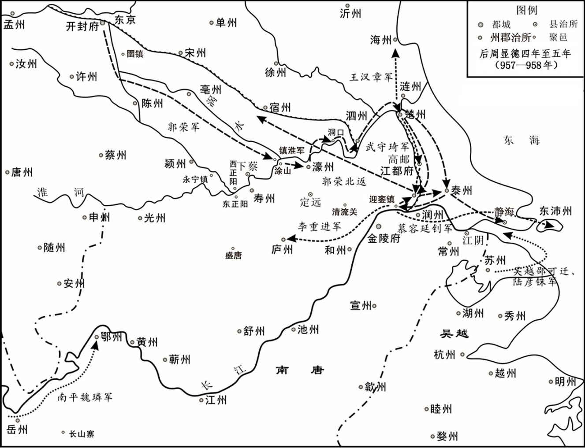 
周世宗第三次南征示意图

## 【原文】

**庚子，上赐唐主书，谕以：“缘江诸军及两浙、湖南、荆南兵并当罢归，其庐、蕲、黄三道亦令敛兵近外[1]。俟彼将士及家属皆就道，可遣人召将校以城邑付之[2]。江中舟舰有须往来者，并令就北岸引之[3]。”辛丑，陈觉辞行，又赐唐主书，谕以不必传位于子。壬寅，上自迎銮复如扬州。癸卯，诏吴越、荆南军各归本道。赐钱弘俶犒军帛三万匹，高保融一万匹。甲辰，置保信军于庐州，以右龙武统军赵匡赞为节度使[4]。丙午，唐主遣冯延己献银、钱、绢、茶、谷共百万以犒军。己酉，命宋延渥将水军三千溯江巡警[5]。**

## 【注文】

[1]两浙、湖南、荆南兵：指三处奉后周世宗之命派出前来会攻南唐的军队。　　敛兵近外：将军队撤回集结在近郊之外。指后周进攻庐、蕲（qí）、黄三州的军队。

[2]彼将士及家属：指后周尚未攻占的庐、蕲、黄三州中南唐的将士和家属。　　就道：上路。　　可遣人召将校以城邑付之：指南唐的将士和家属撤离之后，可以派人召后周的将官，将城邑交付给后周军队。

[3]江中舟舰有须往来者，并令就北岸引之：指南唐停泊在长江北岸的船舰如需返回的，可派人到北岸引领回去。

[4]保信军：古代方镇名，即德胜军节度使。唐天复三年（903年）吴王杨行密置，领庐、滁等州。南唐代吴，因之不变。后周显德五年（958年）三月，南唐献江北四州于后周，后周世宗于庐州置保信军。

[5]溯：逆着水流的方向走。

## 【译文】

后周世宗显德五年（958年）三月庚子（十九日），后周世宗（柴荣）赐给南唐主（李璟）书信，告诉他说：“沿长江各支军队和两浙、湖南、荆南的军队都当撤回，庐州、蕲州、黄州三路军队，也下令撤回到近郊以外。等到三州城中将吏士兵及其家属上路南归以后，可以派人召唤我军将校并将城市都邑交付给他们。长江的船只有需要来往的，一并派人到北岸来引领回去。”辛丑（二十日），陈觉告辞上路，后周世宗又赐给南唐国主书信，告诉他不必把君位传给儿子。壬寅（二十一日），后周世宗从迎銮（luán）镇再次前往扬州。癸卯（二十二日），世宗诏令吴越、荆南的军队各自返回本地。赐给钱弘俶（chù）犒劳军队的绢帛三万匹，高保融一万匹。甲辰（二十三日），在庐州设置保信军，任命右龙武统军赵匡赞为节度使。丙午（二十五日），南唐国主派遣冯延己贡献银、绢、钱、茶、谷总共百万以犒劳军队。己酉（二十八日），世宗命令宋延渥率领水军三千人沿江而上巡逻警戒。

## 【原文】

**庚戌，敕故淮南节度使杨行密、故昇府节度使徐温等墓并量给守户[1]。其江南群臣墓在江北者，亦委长吏以时检校[2]。辛亥，唐主遣其临汝公徐辽代己来上寿[3]。五月，诏赏劳南征士卒及淮南新附之民。辛卯，以太祖皇帝领忠武节度使。**

## 【注文】

[1]杨行密（852—905年）：五代时吴国建立者。庐州合肥（今安徽合肥）人，字化源，初名行愍（mǐn）。少为本州兵，唐中和三年（883年），以败秦宗权功授庐州刺史，后据有扬州。唐景福元年（892年）为淮南节度使，击败孙儒，兼有江淮。唐天复二年（902年）封吴王。后其子杨隆演称吴国王，追尊他为太祖武皇帝。　　昇（shēng）府节度使：古代方镇名，即镇海军节度使。后梁贞明三年（917年）置，治昇州（治今江苏南京），贞明六年（920年）改昇州为金陵府。徐知诰代吴，又改为江宁府，南唐建为西都。北宋开宝八年（975年）复为昇州。　　徐温（862—927年）：海州朐（qú）山（今江苏连云港）人，字敦美。少贩盐为盗，后为州兵，隶杨行密。足智多谋，屡立战功。杨行密死后，掌握大权，封齐国公。后梁贞明五年（919年）杨隆演称吴国王，正式建立吴国，以徐温为大丞相、都督中外诸军事、镇海节度使、守太尉兼中书令、东海郡王。杨隆演死后，又辅立杨溥。死后追封齐王，谥忠“武”。养子徐知诰建南唐后，又追谥为武皇帝，庙号太祖，后改为义祖。

[2]长吏：古代地位较高的州县官吏。　　以时检校：按时检查、察看。

[3]徐辽（生卒年不详）：五代时南吴、南唐大臣，为徐温第三子徐知诲之子，初名徐景辽，后避南唐元宗李璟名讳称徐辽，封临汝郡公。　　上寿：祝寿。

## 【译文】

后周世宗显德五年（958年）三月庚戌（二十九日），敕令已故淮南节度使杨行密、已故昇府节度使徐温等人的墓全都根据需要给予守墓民户。其余江南群臣的坟墓有在长江以北的，也委托所在地方长官按时检查。辛亥（三十日），南唐国主（李璟）派遣临汝公徐辽代表自己前来给后周世宗（柴荣）祝寿。五月，后周世宗颁诏赏赐南下征伐的士兵和淮南新近归附的百姓。辛卯（十一日），后周世宗任命北宋太祖皇帝（赵匡胤）兼领忠武节度使。

## 【原文】

**唐主避周讳，更名景[1]。下令去帝号，称国主，凡天子仪制皆有降损，去年号，用周正朔，仍告于太庙[2]。左仆射、同平章事冯延己罢为太子太傅，门下侍郎、同平章事严续罢为少傅，枢密使兵部侍郎陈觉罢守本官[3]。初，冯延己以取中原之策说唐主，由是有宠。延己尝笑烈祖戢兵为龌龊，曰：“安陆所丧才数千兵，为之辍食咨嗟者旬日，此田舍翁识量耳，安足与成大事[4]！岂如今上暴师数万于外，而击球宴乐无异平日，真英主也[5]。”延己与其党谈论，常以天下为己任，更相唱和。翰林学士常梦锡屡言延己等浮诞不可信，唐主不听[6]。梦锡曰：“奸言似忠，陛下不悟，国必亡矣。”及臣服于周，延己之党相与言，有谓周为大朝者，梦锡大笑曰：“诸公常欲致君尧、舜，何意今日自为小朝邪！”众默然。**

## 【注文】

[1]唐主避周讳：指南唐主李璟避后周信祖即后周太祖郭威高祖父郭璟名讳。

[2]去年号，用周正朔：指南唐停止使用交泰年号，改用后周显德年号。　　太庙：帝王的祖庙。

[3]严续（约910—966年）：籍贯不详。字兴宗，娶南唐烈祖李昪之女。南吴时官至秘书郎。南唐时，曾任兵部侍郎、尚书左丞、礼部尚书、中书侍郎兼三司使、奉化节度使、门下侍郎同平章事等职。北宋乾德三年（965年），出为镇海军节度使。次年病卒，谥“懿”。　　少傅：古代文官名。周成王时立少师、少傅、少保，合称三孤，是三公（太师、太傅、太保）的副职，其地位低于公而高于卿。秦、汉以后废，北周时复置。唐五代时多用作加官、赠官或安置退免大臣。　　守本官：指罢去陈觉原兼任的枢密使职务，只担任兵部侍郎一职。

[4]烈祖：即南唐烈祖李昪（biàn），南唐李璟之父。　　戢（jí）兵：收兵、息兵。　　龌（wò）龊（chuò）：气量狭隘，拘于小节。　　安陆所丧才数千兵，为之辍（chuò）食咨（zī）嗟（jiē）者旬日：指后晋高祖天福五年（940年），南唐将李承裕在安州（治今湖北安陆）被后晋将领马全节击败，李承裕和一千五百名士兵阵亡，李昪为此而辍食，长吁短叹十几天。辍，停止、中止。咨嗟，叹息。

[5]今上：指南唐国主李璟。　　暴（pù）师：指军队驻戍在外，蒙受风雨霜露。

[6]常梦锡（898—958年）：字孟图，扶风（今陕西扶风）人，一说京兆万年（今陕西西安市临潼区）人。少好学，善属文。事岐王李茂贞，为秦陇诸州从事，后补宝鸡县令。后唐长兴（930—933年）初，奔吴，任大理司直。南唐时，曾任殿中侍御史、礼部员外郎、给事中、户部郎中、谏议大夫、翰林学士等职。卒，赠右仆射，谥“康”。　　浮诞：浮夸虚妄。

## 【译文】

南唐国主（李璟）避后周世宗（柴荣）祖先名讳，改名为景。下令取消帝号，只称国主，所有原来的天子仪仗规制都有所降低贬损，取消交泰年号，改用后周年号历法，并向太庙报告。左仆射、同平章事冯延己免职改任太子太傅，门下侍郎、同平章事严续免职改任少傅，枢密使、兵部侍郎陈觉免去枢密使的职务，只保留兵部侍郎一职。当初，冯延己用夺取中原的策略来劝说南唐国主，因此得到宠幸。冯延己曾经嘲笑南唐烈祖息兵是气量狭隘，他说：“安陆一战所丧失的才几千士兵，就为之禁食叹息十多天，这是乡村田舍翁的见识度量，怎么能与他成就大事！哪像如今皇上几万大军风餐露宿在野外，而自己打球宴乐与平日没有两样，真是英明的君主。”冯延己与他的同党谈论时，总是把治理天下作为自己的责任，互相唱和呼应。翰林学士常梦锡多次上言说冯延己等人浮夸荒诞，不可信任，南唐国主不听。常梦锡说：“奸臣的话好似忠言，陛下如果再不觉悟，国家必定要灭亡了！”等到南唐向后周臣服，冯延己的党羽在相互交谈中，有称后周为大朝的，常梦锡大笑说：“诸位平常想引导国君成为唐尧、虞舜那样的圣明君主，哪里料到今日却自称小朝廷呢！”众人无言以对。

## 【原文】

**自唐主内附，帝止因使者赐书，未尝遣使至其国[1]。己酉，始命大府卿冯延鲁、卫尉少卿锺谟使于唐，赐以御衣、玉带等及犒军帛十万，并今年《钦天历》[2]。**

## 【注文】

[1]止：只。　　因：通过。

[2]大府卿：即太府卿，古代文官名。南北朝已置，隋时为太府寺长官，掌国家财务储藏出纳。关于冯延鲁此时官职，《旧五代史》卷一一八作太府卿，《资治通鉴》卷二九四作太仆卿，《宋史》卷四七八作太常卿，未知孰是。　　钦天历：后周显德二年（955年）由王朴制定的历法。

## 【译文】

自从南唐国主归附中原，后周世宗只是通过对方派来的使者返回赐给南唐书信，还未曾正式派遣使者到南唐。显德五年（958年）五月己酉（二十九日），后周始命令太府卿冯延鲁、卫尉少卿锺谟出使南唐，赐给南唐御衣、玉带等物品以及犒劳军队的绢帛十万匹，并赐予当年的《钦天历》。

## 【原文】

**刘承遇之还金陵也，唐主使陈觉白帝，以江南无卤田，愿得海陵盐监南属以赡军[1]。帝曰：“海陵在江北，难以交居，当别有处分[2]。”至是，诏岁支盐三十万斛以给江南，所俘获江南士卒稍稍归之。**

## 【注文】

[1]刘承遇之还金陵：见本卷上文，刘承遇随兵部侍郎陈觉出使后周，请献江北四州之地，后周世宗同意，陈觉命刘承遇先返金陵。南唐国主李璟又派遣刘承遇奉书前往后周世宗江北行宫。　　卤（lǔ）田：盐碱地，可用来煮盐的土地。　　海陵盐监：又称西溪盐仓，在今江苏泰州东北。海陵，古县名，治今江苏泰州。盐监，产盐地区设置的行政机构。

[2]别：另外。

## 【译文】

刘承遇返回金陵的时候，南唐国主让陈觉禀报后周世宗，说因为江南地区没有盐卤之田，希望将海陵盐监划归江南来供应军需。世宗说：“海陵在长江以北，难以交错杂居，我会另有安排。”到这时，世宗诏令每年拨出三十万斛盐给江南地区，所俘获的江南士兵，也逐渐释放回去。

## 【原文】

**秋八月辛丑，冯延鲁、锺谟来自唐，唐主手表谢恩[1]。其略曰：“天地之恩厚矣，父母之恩深矣，子不谢父，人何报天，惟有赤心，可酬大造[2]。”又乞比藩方，赐诏书[3]。又称：“有情事令锺谟上奏，乞令早还。”唐主复令谟白帝，欲传位太子。九月丁巳，以延鲁为刑部侍郎，谟为给事中[4]。己未，先遣谟还，赐书谕以未可传位之意。唐主复遣吏部尚书、知枢密院殷崇义来贺天清节[5]。冬十一月乙丑，唐主复遣礼部侍郎锺谟入见。**

## 【注文】

[1]手表：亲手写表。

[2]可酬（chóu）大造：才能报答（您）伟大的恩德。　　酬：答谢。

[3]比：比照。　　藩方：藩镇、方镇。

[4]刑部侍郎：古代文官名。隋时始置，唐时为尚书省刑部次官，正四品下，五代沿置。掌刑法、徒隶、勾覆及关禁之政。中唐以后，刑部尚书多为外官带职，本部事务实由侍郎主持。

[5]天清节：后周世宗柴荣时，将其生日九月二十四日定为天清节。

## 【译文】

后周世宗显德五年（958年）秋季八月辛丑（二十三日），冯延鲁、锺谟从南唐返回来，南唐国主亲手书写了表章感谢后周皇帝的恩德。表章大致说：“天地的恩泽是至厚的，父母的恩泽是至深的，子女无法感谢父母的深恩，人们也不能报答天地的厚德，只有赤诚之心，才能回报皇帝伟大的恩德。”又请求比照四方藩镇，由后周降赐诏书。又说：“有事情让锺谟上奏，乞求让他早日返回。”南唐国主又让锺谟禀报后周世宗，打算传位给太子。九月丁巳（初九日），后周世宗任命冯延鲁为刑部侍郎，锺谟为给事中。己未（十一日），先派遣锺谟返回南唐，赐信晓谕不要传位的意思。南唐国主又派遣吏部尚书、知枢密院事殷崇义前来祝贺后周世宗的生日天清节。冬季十一月乙丑（十九日），南唐国主又派遣礼部侍郎锺谟入朝谒见。

## 【原文】

**初，唐太傅兼中书令楚国公宋齐丘多树朋党，欲以专固朝权，躁进之士争附之，推奖以为国之元老[1]。枢密使陈觉、副使李徵古恃齐丘之势，尤骄慢[2]。及许文稹等败于紫金山，觉与齐丘、景达自濠州遁归，国人忷惧[3]。唐主尝叹曰：“吾国家一朝至此！”因泣下。徵古曰：“陛下当治兵以捍敌，涕泣何为！岂饮酒过量邪？将乳母不至邪[4]？”唐主色变，而徵古举止自若。会司天奏天文有变，人主宜避位禳灾[5]。唐主乃曰：“祸难方殷，吾欲释去万机，栖心冲寂，谁可以托国者[6]？”徵古曰：“宋公造国手也，陛下如厌万机，何不举国授之[7]？”觉曰：“陛下深居禁中，国事皆委宋公，先行后闻，臣等时入侍，谈释、老而已。”唐主心愠，即命中书舍人豫章陈乔草诏行之[8]。乔惶恐请见，曰：“陛下一署此诏，臣不复得见矣！”因极言其不可。唐主笑曰：“尔亦知其非邪？”乃止。由是，因晋王出镇，以徵古为之副[9]。觉自周还，亦罢近职。**

## 【注文】

[1]躁进：热衷于仕进，急于进取。　　推奖：推崇夸奖。

[2]骄慢：骄横傲慢，骄傲怠慢。

[3]忷惧：惶恐不安。

[4]将：或者、还是。

[5]司天：负责观察天象的官员。　　禳（ráng）灾：祈祷解除灾难，祛（qū）除灾害。

[6]祸难方殷：灾祸正是严重的时候。殷，盛、大。　　万机：指帝王日常处理的纷繁政务。　　栖心冲寂：置心于淡泊清静之中。栖，居留、停留。冲寂，淡泊清静。

[7]造国手：指在治理国家方面具有卓异才能的人。

[8]愠（yùn）：怒。　　豫章：古县名，治所在今江西南昌。　　陈乔（？—975年）：字子乔，庐陵（今江西吉安）人。初以父荫授太常奉礼郎，后迁屯田员外郎、中书舍人。后主李煜（yù）嗣位，历任吏部侍郎、翰林学士承旨、枢密副使、门下侍郎兼枢密使、光政院使等职，辅佐朝政，总领军国大事。北宋开宝八年（975年），北宋攻金陵，后主命其诣宋营请降，陈乔请背城一战，后主不从，遂自缢而死。

[9]晋王：即唐太弟李景遂。

## 【译文】

当初，南唐太傅兼中书令、楚国公宋齐丘大肆拉帮结伙、培植党羽，想以此垄断朝廷大权，热衷于仕进之徒争相攀附，推崇夸奖宋齐丘为国家元老。枢密使陈觉、副使李徵古倚仗宋齐丘的势力，尤其骄横傲慢。等到许文稹等人在紫金山溃败，陈觉与宋齐丘、李景达从濠州逃跑回来，国中之人惶恐不安。南唐国主曾经感叹说：“我的国家一刹那竟到了这个地步！”因而流下眼泪。李徵古说：“陛下应当整顿军队来抵抗敌人，流泪哭泣干什么！难道是喝酒过量了吗？还是奶妈没到呢？”南唐国主脸色大变，而李徵古言谈举止仍从容自如。适逢负责观察天象的官员奏报说天象有大变，君主应该避位祈求消灾。南唐国主于是说：“祸乱灾难正严重，我想放弃君位摆脱政务，去过淡泊寂静的日子，可以将国家托付给谁呢？”李徵古说：“宋公是治理国家的高手，陛下如果厌倦政务，何不把国家交授给他？”陈觉说：“陛下深居宫中，国家大事都委托给宋公，先行处理然后奏报，我们时常入宫侍奉，只谈佛论道罢了。”南唐国主心中很生气，立即命令中书舍人、豫章人陈乔起草诏书实行。陈乔恐惧不安请求谒见，说：“陛下一旦签署这项诏令，我就再也不能见到陛下了！”极力陈述这么做不行。南唐国主笑着说：“你也知道那样不行吗？”于是作罢。因此，借着晋王李景遂前往藩镇任职的时机，任命李徵古做他的副手。陈觉从后周返回后，也被免去朝廷近臣之职。

## 【原文】

**锺谟素与李德明善，以德明之死，怨齐丘。及奉使归唐，言于唐主曰：“齐丘乘国之危，遽谋篡窃，陈觉、李徵古为之羽翼，理不可容[1]。”陈觉之自周还，矫以帝命谓唐主曰：“闻江南连岁拒命，皆宰相严续之谋，当为我斩之[2]。”唐主知觉素与续有隙，固未之信。锺谟请覆之于周，唐主乃因谟复命，上言：“久拒王师，皆臣愚迷，非续之罪[3]。”帝闻之，大惊曰：“审如此，则续乃忠臣[4]。朕为天下主，岂教人杀忠臣乎！”谟还，以白唐主。**

## 【注文】

[1]遽（jù）：急切。　　篡窃：篡夺窃取（政权）。　　羽翼：本意为翅膀，比喻辅佐的人或力量。

[2]矫：假托、假借。

[3]覆：审查、查核。

[4]审：确实、果然。

## 【译文】

锺谟平素与李德明要好，因为李德明的死而怨恨宋齐丘。等锺谟奉命出使回到南唐后，对南唐国主进言说：“宋齐丘乘着国家危难，急切图谋篡权夺位，陈觉、李徵古都是他的党羽，天理不容。”陈觉从后周回来后，假传后周世宗的诏令对南唐国主说：“听说江南多年抗拒诏令，都是宰相严续的主意，应当替我杀了他。”南唐国主知道陈觉素来与严续有矛盾，本来就不相信他的话。锺谟请求到后周核实，南唐国主于是通过锺谟返回后周复命的机会，上奏后周世宗说：“长久抗拒王师，都是我的愚昧糊涂，不是严续的罪过。”世宗得知此事，大为惊讶，说：“确实如此的话，那么严续乃是忠臣。朕作为天下的君主，岂能教人杀害忠臣呢！”锺谟回国，将情况禀报给南唐国主。

## 【原文】

**唐主欲诛齐丘等，复遣谟入禀于帝。帝以异国之臣，无所可否。十二月己亥，唐主命知枢密院殷崇义草诏暴齐丘、觉、徵古罪恶，听齐丘归九华山旧隐，官爵悉如故[1]；觉责授国子博士，宣州安置[2]；徵古削夺官爵，赐自尽；党与皆不问。遣使告于周。**

## 【注文】

[1]暴：公布、宣布。　　九华山：在今安徽青阳西。　　旧隐：旧日隐居之地。

[2]责授：降级授予官职，贬谪官员。　　国子博士：古代文官名，国子监官员。唐时于国子监六学（即国子学、太学、四门学、律学、书学和算学）中各置有博士，掌教导监学生员，正五品上。　　宣州：古州名。唐武德三年（620年）改隋宣城郡置，治宣城（今安徽宣城）。领宣城、当涂、泾（jīng）县、绥安（后改名广德）、溧（lì）阳、溧水、南陵、太平、宁国九县，辖境相当于今安徽长江以南，黄山、九华山以北及江苏溧阳、溧水等地。五代沿袭。

## 【译文】

南唐国主打算诛杀宋齐丘等人，又派遣锺谟入朝向后周世宗禀报。世宗因为是别国的臣子，不置可否。显德五年（958年）十二月己亥（二十三日），南唐国主命令主持枢密院事务的殷崇义起草诏书公布宋齐丘、陈觉、李徵古的罪恶，允许宋齐丘返归九华山旧日隐居之地，官职爵位全部照旧；陈觉被贬谪授予国子博士，送往宣州安置；李徵古被削夺官职爵位，赐自尽；他们的党羽都不作追究。派遣使者将此事向后周朝廷报告。

## 【原文】

**六年春正月，唐宋齐丘至九华山，唐主命锁其第，穴墙给饮食[1]。齐丘叹曰：“吾昔献谋幽让皇帝族于泰州，宜其及此[2]。”乃缢而死。谥曰丑缪[3]。**

## 【注文】

[1]穴墙：在墙上打洞。

[2]幽：幽禁。　　让皇帝：即南吴睿帝杨溥（pǔ）（901—938年），南吴太祖杨行密第四子。南吴武义二年（920年）杨隆演卒，杨溥即位为吴王。时国政掌于徐温养子徐知诰（即南唐烈祖李昪）之手。南吴顺义七年（927年），杨溥即皇帝位，南吴天祚三年（937年），被迫让位于徐知诰，南吴灭亡。徐知诰上其尊号为高尚思玄弘古让皇帝。死后，追谥睿皇帝。

[3]缪（miù）：错误、荒谬。

## 【译文】

后周世宗显德六年（959年）春季正月，南唐大臣宋齐丘到达九华山，南唐国主下令锁上他的宅第，在墙上挖洞供给他饮食。宋齐丘叹息说：“我从前献计将吴让皇帝家族幽禁在泰州，所以今天应该得到这种报应。”于是上吊而死。谥号为丑缪。

## 【原文】

**夏六月，唐清源节度使留从效遣使入贡，请置进奏院于京师，直隶中朝[1]。戊寅，诏报以：“江南近服，方务绥怀，卿久奉金陵，未可改图[2]。若置邸上都，与彼抗衡，受而有之，罪在于朕[3]。卿远修职贡，足表忠勤，勉事旧君，且宜如故[4]。如此，则于卿笃始终之义，于朕尽柔远之宜，惟乃通方，谅达予意[5]。”唐主遣其子纪公从善与锺谟俱入贡，上问谟曰：“江南亦治兵，修守备乎[6]？”对曰：“既臣事大国，不敢复尔。”上曰：“不然。向时则为仇敌，今日则为一家。吾与汝国大义已定，保无他虞。然人生难期，至于后世，则事不可知[7]。归语汝主，可及吾时完城郭，缮甲兵，据守要害，为子孙计。”谟归，以告唐主。唐主乃城金陵，凡诸州城之不完者葺之，戍兵少者益之[8]。**

## 【注文】

[1]清源节度使：古代方镇名，治泉州（治今福建晋江）。南唐保大七年（949年），泉州刺史留从效之兄留从愿鸩（zhèn）杀南州刺史董思安而代之，因而留从效兼有了泉、南二州。南唐元宗李璟（jǐng）不得不升泉州为清源军，以留从效为节度使、泉南等州观察使。　　留从效（906—962年）：泉州永春（今福建永春）人，少为衙兵，事闽为泉州散员指挥使。十国闽天德二年（944年）归附王延政为指挥使，次年，南唐克建州，留从效归附南唐。南唐保大七年（949年），据有泉、南二州，为清源节度使，后封晋江王。北宋建国，遣使奉表称藩，被部将张汉思所劫。后病卒。　　进奏院：古代官署名。唐代宗大历十二年（777年）始置，又称留邸、进奏务，五代沿置。唐五代时为节度使、观察使派驻京师传送文书的机构，其长官为进奏官。　　中朝：指后周王朝。因位于中原，故称。

[2]绥怀：安抚关切。　　久奉金陵：长期侍奉南唐。金陵（今江苏南京）为南唐的国都，这里代指南唐政权。　　改图：改变图谋。

[3]邸：地方驻京机构，汉朝初建时称邸，唐宋时期称为进奏院。　　上都：即后周都城开封。

[4]修：通“脩”，致送师长的酬金。　　职贡：上贡赋税。职，赋税；贡，献，租赋。

[5]惟乃通方，谅达予意：你是通达事理的人，想必能体会我的心意。惟，文言助词，常用于句首；乃，你；予，我。

[6]纪公从善：即南唐南楚国公李从善（940—987年），字子师，南唐元宗李璟第七子，后主李煜（yù）的同母弟。初封纪国公，进封郑王。李煜即位，徙封韩王，累迁太尉、中书令。南唐附宋后，降封南楚国公。北宋开宝四年（971年），奉方物朝宋，太祖授其泰宁军节度使。宋灭南唐，授右神武大将军，迁右千牛卫上将军。北宋雍熙四年（987年）出为通许监军，卒。

[7]难期：难以预料。期，希望、预料。

[8]葺（qì）：整理、修理。

## 【译文】

后周世宗显德六年（959年）夏季六月，南唐清源节度使留从效派遣使者入朝进贡，请求在京城设置进奏院，直接隶属中央朝廷。戊寅（初四日），后周世宗下诏书答复留从效说：“江南新近归附，正在设法安抚，爱卿长久侍奉金陵，不可改变主意，另有图谋。倘若你在京城设置进奏院，就同金陵地位平等，与金陵相抗衡了，接纳你而拥有了你的辖地，罪过在于朕。爱卿远道而来进奉贡品，足以表示忠诚勤勉，努力侍奉旧日君主，应该一切如故。这样的话，对于爱卿来说可以加深始终如一的情义，对于朕来说可以尽到安抚四方的义务，你是通达事理的人，想必能体会我的心意。”南唐国主派遣他的儿子纪国公李从善与锺谟一道入朝进贡，后周世宗问锺谟说：“江南也在操练军队，修整守备吗？”锺谟回答说：“自从臣服大国，不敢再这样了。”世宗说：“不应当这样。昔日我们曾是仇敌，今日已经成为一家人。我朝同你们国家的名分大义已经确定，保证没有其他变故。然而人生难以预料，至于后世，则事情更不可知晓。回去对你家君主说，可以趁着我在的时候加固城郭，修缮武器，据守要塞，为子孙后代着想。”锺谟回国，将后周世宗的话禀告给南唐国主（李璟）。南唐国主于是修建金陵城墙，凡是各州城池有不坚固的便加以修葺，守卫士兵少的便补充增加。

## 【原文】

**臣光曰：或问臣：五代帝王唐庄宗、周世宗皆称英武，二主孰贤？臣应之曰：夫天子所以统治万国，讨其不服，抚其微弱，行其号令，一其法度，敦明信义，以兼爱兆民者也。庄宗既灭梁，海内震动，湖南马氏遣子希范入贡，庄宗曰：“比闻马氏之业，终为高郁所夺[1]。今有儿如此，郁岂能得之哉？”郁，马氏之良佐也。希范兄希声闻庄宗言，卒矫其父命而杀之[2]。此乃市道商贾之所为，岂帝王之体哉！盖庄宗善战者也，故能以弱晋胜强梁，既得之，曾不数年，外内离叛，置身无所；诚由知用兵之术，不知为天下之道故也。世宗以信令御群臣，以正义责诸国，王环以不降受赏，刘仁赡以坚守蒙褒，严续以尽忠获存，蜀兵以反覆就诛，冯道以失节被弃，张美以私恩见疏。江南未服，则亲犯矢石，期于必克；既服，则爱之如子，推诚尽言，为之远虑。其宏规大度，岂得与庄宗同日语哉。《书》曰：“无偏无党，王道荡荡[3]。”又曰：“大邦畏其力，小邦怀其惠[4]。”世宗近之矣。**

## 【注文】

[1]梁：即后梁（907—923年），五代的第一个朝代。公元907年，朱温代唐称帝，国号“梁”，建都开封（今河南开封），史称后梁。历三帝十七年，923年为后唐李存勖（xù）所灭。　　马氏：指五代十国时楚国的建立者马殷（852—930年）。马殷，字霸图，许州鄢（yān）陵（今河南鄢陵）人。唐乾宁元年（894年）率部入湖南，占据潭州，后略取邵、衡、永、道、郴、岳等州，统一湖南，任武安军节度使。朱温建后梁，受封为楚王。后唐灭梁，马殷建国承制，自置官属。改潭州为长沙府，定为都城。　　希范：即楚文昭王马希范。马希范（899—947年），字宝规，马殷第四子，932年至947年在位。后唐闵帝应顺元年（934年）封楚王，后晋天福四年（939年）加天策上将军，开府承制如其父马殷时。　　高郁（？—929年）：扬州（今江苏扬州）人。马殷谋臣，署都军判官。曾劝马殷尊奉唐朝，训卒厉兵，以图霸业。后梁时，又建议于汴京及诸州置邸务售茶；令民造茶以通商旅，政府收其税；铸铅铁钱，以利楚国货物流通；使民纳帛为税，以发展蚕桑。湖南由此富强。后遭诸臣所忌，罢为行军司马。不久被马殷之子马希声矫令诬杀。

[2]希声：即楚衡阳王马希声。马希声（899—932年），字若讷，楚武穆王马殷次子，930年至932年在位。即位后，去建国制度，复藩镇之旧，后唐任命他为武安、静江等军节度使。死后追封为衡阳王。

[3]无偏无党，王道荡荡：语出《尚书·洪范》，意为：处事公正不偏不向，为王之道浩浩荡荡。

[4]大邦畏其力，小邦怀其惠：语出《尚书·武成》，意为：大国敬畏他（指周文王）的威力，小国怀念他的恩德。

## 【译文】

史臣司马光评论说：有人问臣下：五代帝王之中，唐庄宗（李存勖）、周世宗（柴荣）都号称英武，两位君主中谁更贤明呢？臣下我回答说：天子之所以能统治万方国家，讨伐不肯降服者，安抚微小虚弱者，施行号令，统一法度，敦厚信用，昭明大义，是因为兼爱亿万百姓。唐庄宗灭梁以后，天下震动，湖南马殷派遣他的儿子马希范入朝进贡，唐庄宗说：“近来听人说马氏的家业，终将被高郁所夺取。如今他有这样的儿子，高郁怎么能得到马氏的家业呢？”高郁是马氏功绩卓越的辅佐大臣。马希范的哥哥马希声听到唐庄宗说的话后，便假传父令杀死了高郁。这是街市中和道路上的行商坐贾所干的事，哪里是做帝王的风度啊！唐庄宗是个善于打仗的人，所以能以弱小的晋国战胜强大的梁国，但是取得梁国以后，不出几年，众叛亲离，没有安身之处；这实在是因为他只知道用兵之术，而不懂得治理天下的道理的缘故啊。周世宗以信用驾驭群臣，以正义要求各国，王环因不肯投降而受奖赏，刘仁赡因坚守不屈而蒙褒扬，严续因尽忠报国而得生存，蜀国士兵因朝三暮四而被杀戮，冯道因丧失臣节而被遗弃，张美因私人恩惠而被疏远。江南没有归服，他亲身冒着飞矢流石，抱定必胜的信念；江南降服以后，便像对待子女那样地爱护他们，推心置腹地把话说尽，替他们做长远打算。他的宏伟规划，博大襟怀，哪能与唐庄宗同日而语啊！《尚书》说：“处事公正不偏不向，为王之道浩浩荡荡。”又说：“大国敬畏他的威力，小国怀念他的恩德。”周世宗的所作所为可以说接近《尚书》上的话了。

* * *

(1) 按，武德节度使当时在后蜀控制之下，据《资治通鉴》卷二九三“后周世宗显德三年（956年）四月”（中华书局点校本第9552页）原文及本书下文，此处“武德节度使”误，当作“武宁节度使”。武宁军节度使，唐永贞元年（805年）曾置，领徐、泗、濠、宿四州。

(2) 后周世宗显德四年（957年）三月戊子朔，不当有癸酉日。据上下文，应作癸巳，即三月初六日。

# 附录：

## 后晋皇帝世系表

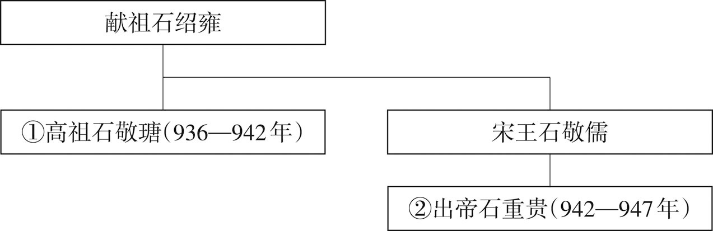 

## 后汉皇帝世系表

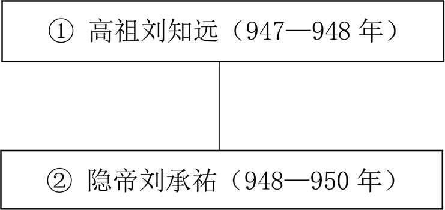 

## 后周皇帝世系表

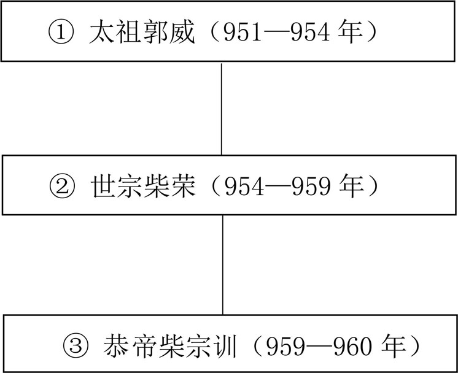

