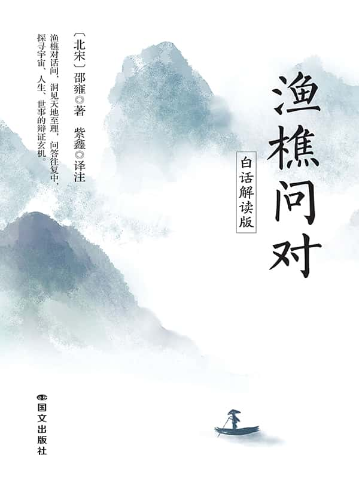

  

# 版权信息

# COPYRIGHT

书名：渔樵问对：白话解读版

作者：(北宋) 邵雍 著 紫鑫 译注

出版社：国文出版社

出版时间：2025年09月

ISBN：9787512520073

字数：43千字

# 序

我们总是忙忙碌碌，在这喧嚣的世界里奔波，都快忘了静下心来思考一些有意义的事儿。当我偶然翻开《渔樵问对》，就像走进了另一个世界。这里面渔夫和樵夫的对话，那可太妙了。他们唠的不仅是普通生活所见，更是天地、阴阳、古今的智慧。这些智慧，我们可能觉得高高在上，离我们挺远，可经他俩一聊，好像突然就变得亲近了，变得让我们普通人也能品出点不一样的滋味儿来。

《渔樵问对》，是北宋邵雍所著，里面讲了一位渔夫和一位樵夫在偶然相遇时的对话，他们只是世间最普通的人。渔夫出没风波，于浩渺烟水间讨生活；樵夫往来山林，在幽篁翠影中谋生计。他们不仅像我们身边的友人，也是智者的化身，是哲理的探寻者与传播者。其对话仿若两条奔腾的思想溪流，汇聚之处，溅起的是关于宇宙、人生、社会、历史等诸多重大命题的智慧水花。

对话先是从百姓的寻常生活入手，抽丝剥茧般层层递进，最终将话题引向了深邃的人生哲学领域，为读者开启了一场从日常烟火迈向精神思辨的奇妙思想之旅。

这正像普通人从平凡的生活出发，因好奇而不断探索，最终走向深度思考人生的过程，对话把这样的成长轨迹具象化，给予我们诸多启示。

看完这本书，我受益匪浅，同时希望能让更多的人知道这本书。现在好多人被各种琐事缠着，被那些花里胡哨的东西迷了眼，没机会好好感受老祖宗留下来的智慧宝藏，所以我决定尽我所能，把它翻译成大白话，让大家能轻松地读懂。让更多的人对《渔樵问对》产生兴趣，跟随两位智者开始思考那些关于人生的问题，并且在生活中运用古人的智慧让自己的生活变得越来越好。但因为本人学识有限，理解和感悟难免有诸多不足之处，敬请广大读者交流商榷。

《渔樵问对》中的人生哲理和我们的生活息息相关，不管你是忙忙碌碌打拼的上班族，还是在学校里读书的学生娃，又或是在家安享晚年的长辈，我都希望你能在《渔樵问对》里受到启发，也许樵夫的问题也是你的问题呢！希望在这里找到能让你心里一动的东西。说不定读完它，你看世界、看自己的眼光都会不一样了呢。

准备好了吗？大家赶紧跟着渔夫和樵夫开启这奇妙的智慧之旅吧！

# 一 『利害』之辩

**［原］渔者垂钓于伊水之上。**

［译］渔夫在伊水边钓鱼。

**［原］樵者过之，弛担息肩，坐于磐石之上，而问于渔者，曰：“鱼可钩取乎？”**

［译］有一个樵夫路过，放下柴担休息，坐在大石头上，问渔夫：“鱼可以用鱼钩钓到吗？”

**［原］曰：“然。”**

［译］渔夫回答：“能。”

**［原］曰：“钩非饵可乎？”**

［译］樵夫又问：“鱼钩上没有鱼饵能钓到鱼吗？”

**［原］曰：“否。”**

［译］渔夫答：“不能。”

**［原］曰：“非钩也，饵也。鱼利食而见害，人利鱼而蒙利，其利同也，其害异也。敢问何故？”**

［译］樵夫说：“把鱼钓上来的不是鱼钩而是鱼饵。鱼为了吃食而被害，人却因为得到鱼而获利，二者都是为了得到，但结果不同，请问这是为何？”

**［原］曰：“子樵者也，与吾异治，安得侵吾事乎？然亦可以为子试言之。彼之利，犹此之利也；彼之害，亦犹此之害也。子知其小，未知其大。”**

［译］渔夫说：“你是樵夫，与我的工作不同，怎能明白我的事呢？我可以给你解释一下。鱼的利与我的利本质相同，鱼的害与我的害也相同。你只看到一点，却未看到全面。”

**［原］“鱼之利食，吾亦利乎食也；鱼之害食，吾亦害乎食也。子知鱼终日得食为利，又安知鱼终日不得食为害？如是，则食之害也重，而钩之害也轻。子知吾终日得鱼为利，又安知吾终日不得鱼不为害也？”**

［译］“鱼以食为利，我也以食为利；鱼因食受害，我也会因食受害。你只知鱼得到吃食为利，又怎知鱼不停地追求吃食是不是一种伤害呢？所以食的诱惑对鱼的危害大，鱼钩的危害却不是主要的。你只知道我得到鱼为利，又怎知我若终日钓不到鱼不是一种伤害呢？”

**［原］“如是，则吾之害也重，鱼之害也轻。以鱼之一身，当人之食，是鱼之害多矣；以人之一身，当鱼之一食，则人之害亦多矣。又安知钓乎大江大海，则无易地之患焉？鱼利乎水，人利乎陆，水与陆异，其利一也。”**

［译］“如此看来，我受到的伤害是重的，而鱼的伤害是轻的，鱼的全身成为人的食物，鱼的害大；人的一生只为了钓鱼，把鱼当作唯一的食物，人所受到的害也很多。况且在大江大海钓鱼，还可能有其他祸患。鱼生活在水里，人生活在陆地，水与陆不同，但利害是一样的。”

**［原］“鱼害乎饵，人害乎财，饵与财异，其害一也。又何必分乎彼此哉！子之言，体也，独不知用尔。”**

［译］“鱼因鱼饵受害，人因财物受害，虽鱼饵与财物不同，但害处是一样的。何必区分彼此呢？你说的只是事物的表象，却不知其根本。”

我们很多时候只看到事物的一面，却看不到事物的全面，同样是追求食物，鱼成了人的餐中食，人却因鱼而吃饱饭。从表面上看是完全不一样的结果，但跳出来看整体是一样的。就像鱼每日都在追求吃食而获得满足，人也是如此，每日奋斗，是为了获得更好的生活。但鱼在追求贪欲时，就算有钩也想尝试而受害。人也因贪欲，过度追求而受到伤害！自以为的获利也许是一种伤害。所以不管是鱼还是人，其实都是一样的，对万事万物的追求一旦过度都会有反向的发展，贪欲过旺必遭反噬。

这个故事就是在提醒我们，好比平常看事儿，不能光看表面就下结论。要把方方面面都考虑进去才行。

生活里好多人都有这样的毛病，看啥都“着急”，看到什么就觉得是什么，却看不到事物的本质。可实际上，每件事背后都跟蜘蛛网一样，有着千丝万缕的联系。事物之间的利害关系都是相互交织、相互影响和相互转化的。有时候表面看着是好事，没准儿背后藏着坏的一面；反过来，看起来倒霉的事，说不定也能引出好的结果来。很多事都有它内在的规律，就像鱼为什么容易被鱼饵诱惑，人又为什么为了利益愿意冒险，这里面藏着人性，生活里的那些道理，得用心去发掘、去感悟。

一些人评价别人或者看待事物的时候，总是太片面了。例如，看到一个明星有才华，就觉得他很优秀；结果过一段时间他出轨了，又觉得他很可恶；后来他有一次做公益，帮助了很多人，又觉得他善良有爱心；可事后传出他做公益是为了炒作，又变得很讨厌他。对同一个人在不同时候就有很多看法和评判，以一面和一时就定论岂不是很片面。又如，和别人闹了别扭，光想着自己受委屈了，认为对方全是错，如果站在对方角度也琢磨一下，也许就能理解事件的真相，并能更好地解决问题。总之，遇到事仔细想想，把方方面面都考虑全了，才能少走弯路，把日子过得更明白，不被那些表面现象给糊弄住了。

这种智慧，可让人心胸开阔、头脑清晰，更能综合考量与事件相关的各种因素，才能突破表象的局限，对事件有完整、透彻且准确的理解，洞察到事物背后的真相与脉络，进而做出明智的应对举措，届时你的人生就能豁然开朗。

## 身边故事

我有个同学在一家互联网公司工作，他想以最快的速度当上领导，自己就能说话管用，于是从入职起就兢兢业业。他对每一个项目都全力以赴，力求做到最好。经过几年的努力，他成为公司里最年轻的经理。一开始，他满心欢喜，觉得自己的付出得到了认可，未来充满了希望。升职后的日子却并没有想象的那么美好。新职位带来了更多的责任和更大的压力，他需要管理一个更大的团队，协调各种复杂的关系。团队里的一些老员工对他的升职并不服气，在工作中故意不配合，对他的安排阳奉阴违，有时还给他制造麻烦，故意拖延进度或者提供不准确的信息。

升职也让他陷入了困境，每天要花费大量的精力去处理团队内部的矛盾和外部的合作问题。工作压力越来越大，他经常失眠，甚至开始怀疑自己的能力。也没有了当初的自信与活力。他深刻地认识到，自己所追求的名利并不一定都是美好的，同时也会带来更多的困难和挑战。

人呀，要知道，你追求什么，什么就会伤害你；你在乎什么，就会被什么所控制。有个朋友，从小就梦想拥有一辆豪车。他努力攒钱，又向家人朋友借钱凑了首付，终于买到了心仪的豪车。一开始，他开着豪车很有成就感，四处炫耀，觉得是自己拥有了它，殊不知自己也被它所控。不仅有债务的压力，还有豪车的保养费和油耗都非常高，动不动修理保养，都成了烦恼和压力。他还不得不减少其他方面的开支，舍不得吃喝，甚至放弃了一些原本的爱好和社交活动。当热爱变淡，他便开始后悔当初为了得到这辆豪车而付出的代价。

# 二 『水火』之辩

**［原］樵者又问曰：“鱼可生食乎？”**

［译］樵夫又问：“鱼能生吃吗？”

**［原］曰：“烹之可也。”**

［译］渔夫答：“煮熟可以吃。”

**［原］曰：“必吾薪济子之鱼乎？”**

［译］樵夫问：“必须用我的柴来煮你的鱼吗？”

**［原］曰：“然。”**

［译］渔夫答：“是的。”

**［原］曰：“吾知有用乎子矣。”**

［译］樵夫说：“我知道我对你有用了。”

**［原］曰：“然则子知子之薪，能济吾之鱼，不知子之薪所以能济吾之鱼也。薪之能济鱼久矣，不待子而后知。苟世未知火之能用薪，则子之薪虽积丘山，独且奈何哉？”**

［译］渔夫说：“你知道你的柴能煮我的鱼，却不知你的柴为何能煮我的鱼。柴能煮鱼由来已久，在你之前世人就知道，若世人不知柴的作用是火，你的柴堆积如山又有什么用呢？”

**［原］樵者曰：“愿闻其方。”**

［译］樵夫说：“愿听其中的道理。”

**［原］曰：“火生于动，水生于静。动静之相生，水火之相息。水火，用也；草木，体也。用生于利，体生于害。利害见乎情，体用隐乎性。一性一情，圣人能成。子之薪犹吾之鱼，微火则皆为腐臭败坏，而无所用矣，又安能养人七尺之躯哉？”**

［译］渔夫说：“火是由运动所产生，水是由静止而形成，运动与静止相互依存，水与火相互克制。水火是现象，草木是本体。现象生于利，本体生于害。利与害表现在情面上，体与用隐藏于本性中。看到本性与表现，圣人便可知柴与火的原理。你的柴和我的鱼一样，没火就会腐臭无用，怎能滋养人的身体呢？”

**［原］樵者曰：“火之功大于薪，固已知之矣。敢问善灼物，何必待薪而后传？”**

［译］樵夫问：“火的作用大于柴，我已知。请问，要让物体燃烧，为什么还要靠柴火来传递呢？”

**［原］曰：“薪，火之体也。火，薪之用也。火无体，待薪然后为体；薪无用，待火然后为用。是故凡有体之物，皆可焚之矣。”**

［译］渔夫答：“柴是火的载体，火是柴的应用。火无本体，靠柴为体；柴无作用，靠火为用。所以凡是有本体的物体，都可以燃烧。”

**［原］曰：“水有体乎？”**

［译］樵夫问：“水有本体吗？”

**［原］曰：“然。”**

［译］渔夫答：“有。”

**［原］曰：“火能焚水乎？”**

［译］樵夫问：“火能烧掉水吗？”

**［原］曰：“火之性，能迎而不能随，故灭。水之体，能随而不能迎，故热。是故有温泉而无寒火，相息之谓也。”**

［译］渔夫答：“火的性质是主动出击却不能跟随，遇水对立所以会灭。水的性质是相随，遇火而不对立，所以会变热。因此有温泉却无寒火，这就是水火相互制约的道理。”

**［原］曰：“火之道生于用，亦有体乎？”**

［译］樵夫问：“火的功能源于用，它也有体吗？”

**［原］曰：“火以用为本，以体为末，故动。水以体为本，以用为末，故静。是火亦有体，水亦有用也。故能相济又能相息，非独水火则然，天下之事皆然，在乎用之何如尔。”**

［译］渔夫答：“火以用为主，以体为辅，所以动。水以体为主，以用为辅，所以静。因此火也有体，水也有作用，二者既可以相互帮助又相互克制。不仅水火是这样，天下事物都是如此，关键在于如何运用。”

**［原］樵者曰：“用可得闻乎？”**

［译］樵夫说：“那如何运用这些道理呢？”

**［原］曰：“可以意得者，物之性也。可以言传者，物之情也。可以象求者，物之形也。可以数取者，物之体也。用也者，妙万物为言者也，可以意得，而不可以言传。”**

［译］渔夫说：“可以感受到的，是事物的本性；可以用语言表达的，是事物的表象；可以用形象描述的，是事物的形状；可以用数字计算的，是事物的数量。如何成为运用的，是要感悟万物的妙用，是要感受其中的规律，无法用语言表达。”

**［原］曰：“不可以言传，则子恶得而知之乎？”**

［译］樵夫问：“既然不可用语言表达，那你是怎么知道的呢？”

**［原］曰：“吾所以得而知之者，固不能言传，非独吾不能传之以言，圣人亦不能传之以言也。”**

［译］渔夫答：“我之所以知道其中的规律，是不能用语言表达清楚的，而且不仅我不能用语言表达，连圣人也不能用语言表达出来。”

**［原］曰：“圣人既不能传之以言，则六经非言也耶？”**

［译］樵夫问：“如果圣人都不能用语言表达清楚，难道六经不是用语言传达出来的吗？”

六经是指《诗》《书》《礼》《乐》《易》《春秋》六部先秦典籍，其所承载的先人的智慧结晶，是中华民族独特的精神标志，贯穿中国历史发展脉络，促进了社会和谐与中国传统文化的形成，如此丰富的书籍都是用语言文字记录下来的先人智慧。这些难道不是表述真理的吗？这说明知识文化是可以记录和传承的，但宇宙的自然规律是悟出来的，是无法用语言表达的。一个是外求，一个是内求。外求是有限的，内求是无限的。那些我们看不见、摸不着的自然规律，只有回归本真才能感受得到。那种境界是很难用人类的语言来描述的。我举个例子，你肯定吃过荔枝，如果让你用语言来描述荔枝的味道，并且让没有吃过的人明白，这是很难的。每个人的学识不同，经历不同，理解也就不同。所以，荔枝的味道也只能体验，无法用语言描述！虽然世间有很多典籍都在用各自的方式告诉后人，什么是道理，什么是智慧，依然很难让世人明白。这就是只可意会，不可言传呀！

**［原］曰：“时然后言，何言之有？”**

［译］渔夫答：“所有对此的表达，又有哪句可以表达清楚？”

**［原］樵者赞曰：“天地之道备于人，万物之道备于身，众妙之道备于神，天下之能事毕矣，又何思何虑！吾而今而后，知事心践形之为大。不及子之门，则几至于殆矣。”**

［译］樵夫感叹道：“天地的法则在人身上所体现，万物的法则在本身上所体现，所有万物的妙处在于精神。明白天下万事万物的规律，哪里还有思虑烦忧呢？我明白了以后做事，从心而发去做事的重要。如果没遇到你的教导，我几乎就要陷于困惑之中了。”

**［原］乃析薪烹鱼而食之，饫而论《易》。**

［译］于是他们一起解开柴生火煮鱼，吃饱后一起讨论《易经》的智慧。

这一段讲了水火既相生又相克，体现了对立统一。水与火的性质相反，却又相互促进、相互制约，这种关系是宇宙间普遍存在的，如金能克制木，也可让木成为栋梁之材；火可熔金，也可让金变成锋利的刀剑；木可破土而生，又需要土的滋养；它们都在对立中相互依存、转化，构成了世界的多样性和变化性。

《道德经》云：“有无相生，难易相成，长短相形，高下相倾，音声相和，前后相随。”意思是说：有和无互相转化，难和易互相形成，长和短互相显现，高和下互相充实，音与声互相谐和，前和后互相接随。我们生活中也有善恶、美丑、好坏，它们相互对立，却又相互依存。就像太极图，阴中有阳，阳中有阴。阴极生阳，阳极生阴，它们二元对立又相辅相成。

这样的对立统一与人们的生活息息相关，世间诸多事物皆如此。如人际关系中，朋友间相互拆借款项可能会产生矛盾，父母子女间的付出与控制，爱人间的亲密与自由。还有很多生活中的体验，就像学习与工作中的压力和动力，欲望的满足与痛苦等，这些都与水火相生相克的关系相似，说明自然规律与人事道理相通，人们可从自然现象中汲取智慧，更好地处理人事问题。

自然规律无处不在，很难用语言表达清楚，是需要感悟的，如果能感悟出这些规律，就能把握事物的体用、利害，游刃有余地处理各种关系和事务，必然能成就一番事业，在生活中也能体现出一种高超的智慧和能力，人生便可掌握无碍。

## 身边故事

前几天有个人来拜访我，和我说起他的故事。他很优秀，出生在一个优渥的家庭，父母白手起家创立了规模很大的企业，对他寄予厚望，期望他成为一个有教养、有能力且能继承家族事业的人。从小，他的生活就被各种规矩和学习任务填满。每天，他都要在私人教师的指导下学习各种课程，从古典文学到高等数学，从商务礼仪到外语。课余时间，他还要参加各种培训和社交活动，培养领导力和社交技巧。

在学校里，他凭借着优异的学习成绩和良好的教养，受到老师和同学的赞赏。他穿着得体，举止优雅，每一次考试都名列前茅，是同学们眼中的榜样。然而，只有他知道，自己内心深处是多么的压抑和痛苦。

他看着其他同学放学后可以自由自在地玩耍、参加兴趣小组，或者只是在家看动画片、打游戏，而他在完成学校作业后，却要面对家庭教师布置的额外任务。他没有时间去发展自己真正的兴趣爱好，也没有机会和同龄人建立纯真的友谊。

随着年龄的增长，他对自由的渴望越发强烈，尽管内心痛苦，但他也承认，父母的严格管理让他在学业和个人素养上取得了巨大的成就。他精通多种语言，对商业运作也有深入的了解，这些都为他未来的发展奠定了坚实的基础。他时常陷入迷茫，不知道该如何在父母的期望和自己对自由的追求之间找到平衡，他害怕自己会在这种压抑的环境中逐渐失去自我，可又无法割舍家庭带给他的资源和成就，只能在矛盾中挣扎前行。于是来找我诉说内心真实的情感。

世间本就如此，就是矛盾同时存在的，人生也是如此，不完美才是完美，就是因为这样的家庭，你才有这样的成就，如果从小不努力学习，长大了就算自由但一事无成是你想要的吗？只要内心平衡，心放开了，在哪儿都自由！如果你明白了生克本就相辅相成，人生本就如此，有得必有失，有克制就会有成就，这都是自然规律。心若清晰坦然，不管你是在家庭还是在事业中，心都是自由的，不自由只是自己把自己限制住了而已！一番交谈后，他畅快而去！

# 三 『物我』之辩

**［原］渔者与樵者游于伊水之上。**

［译］渔夫与樵夫游玩在伊水之上。

**［原］渔者叹曰：“熙熙乎万物之多，而未始有杂。”**

［译］渔夫感叹说：“世间万物众多如此和谐规律，从未有杂乱之象。”

在这里“熙熙”是“和谐”“和乐”之象，《老子》中的“众人熙熙，如享太牢”同此意。都是感叹和谐美好的助语。

渔夫看到世间万事万物虽不相同，却都在和顺的规律之中，因而感叹。万物都有生老病死、成住坏空，从有到无，又从无中生有。就像春夏秋冬，昼伏夜出一样，从未改变，也从不杂乱。

**［原］“吾知游乎天地之间，万物皆可以无心而致之矣。非子则孰与归焉？”**

［译］“我知道这天地之间，万物的发展规律都无法用心念创造。并非谁都可以掌控结果吗？”

就像山里的野花野草，没有谁去生养它们，它们依然春生、夏长、秋实、冬落。就算冬天花草都凋零衰败，来年会重生，这并非谁在控制。人也一样，人们都以为自己可以控制自己，殊不知人也活在生老病死的规律中，有新生命的诞生，有旧事物的消亡，如此从未改变，这更不是谁可以掌控的。

这里重点讲到了“无心”。不是说万物没有心，而是无法用心念、意念创造自然规律。

“归焉”是“最终归属”之意，这里可解释为“结果”。

**［原］樵者曰：“敢问无心致天地万物之方？”**

［译］樵夫问：“请问如何不用心念就可以了解天地万物？”

**［原］渔者曰：“无心者，无意之谓也。无意之意，不我物也。不我物，然后定能物物。”**

［译］渔夫说：“无心念就是无意识，无意识的意思是无我而融于物中。无我无物之时，便在定静之中感受万物的规律。”

这一段体现了渔夫的境界之高，常人只看到万物的表象，很难感受万物的本质。就像我们看一朵花，只能看到它此时的形状、颜色，甚至闻到花香，却无法体验它的成长与变化。因为我们是站在自我的角度。当“我”能达到“无我”之境时，“我”消失了，融入万物。融入此花之时，便可感受到阳光照在“我”身上的温暖，泥土对“我”的滋养；感受到“我”如何生根、成长、开花、凋零。便了知花草的本质规律。

如何达到“无我”呢？渔夫提到，就是“无心，无意”，其实就是放空大脑，进入极静之时。由静可入定，定中可生慧，智慧就是从“无”中生出的“妙有”，便可了解万物的规律。这就是他所说的“定能物物”。

**［原］“何谓我？何谓物？”**

［译］樵夫问：“什么是我？什么是物？”

**［原］曰：“以我徇物，则我亦物也；以物徇我，则物亦我也。”**

［译］渔夫答：“无我从物，则我就是物；无物从我，则物就是我。”

这里的“徇”是“依从”，即无原则的顺从。所从“我徇物”便是“我”消失成为“物”之意。

**［原］“我物皆致，意由是明。”**

［译］“我与物相融，就会互相明白对方的感受。”

这就是前面所讲的，当我融入花，我成为花，我便体会到它此刻的全部感受；如果花融入我，便成为我，就会知道我在想什么，我身体是否健康，是冷是热，是困是闲，我与花便完全相通了。“意由是明”就是意识相互明了。

**［原］“天地亦万物也，何天地之有焉？”**

［译］“当天地成为万物，哪里还有天地呢？”

**［原］“万物亦天地也，何万物之有焉？”**

［译］“当万物成为天地，哪里还有万物呢？”

**［原］“万物亦我也，何万物之有焉？”**

［译］“当万物成为我，哪里还有万物呢？”

**［原］“我亦万物也，何我之有焉？”**

［译］“当我成为万物，哪里还有我呢？”

**［原］“何物不我？何我不物？”**

［译］“哪个物不是我？哪个我不是物？”

**［原］“如是则可以宰天地，可从司鬼神，而况于人乎？况于物乎？”**

［译］“如果你能如此，便可主宰天地，可以号令鬼神，更何况是人？更何况是物呢？”

当你能融入万物，便可融入天地，你便是天地，主宰自己就是主宰天地。同理，当你融入鬼神，你就是鬼神，你号令自己便可号令鬼神。那么融入人成为人，融入物成为物，便可掌控万事万物！

说到这里，大家虽然明白了其中的道理，但做不到“如何融入”和“如何成为”？那就是进入“无我”之境，可又如何能“无我”？这就需要实修练习。

渔夫的境界绝不是普通人，而是开悟后的圣人之境，所以从他了知万物的规律，才能解世人之疑惑。此境界并非生来便可达到，而是普通人通过实修方可达到。

那么如何“实修”？其实是做一种练习，来增强自己的内心力量，达到某种境界的练习。人们总是被外部的花花世界影响，一生都在向外追求，求名求利，求情求爱，求那些得不到的一切，却不知如何找到最纯粹的存在。“纯粹的真心”就在极静之中，而“心静”只有不断地练习“静心”和“放空”，才能平静下来，心静了才能看清一切。就像一杯浑浊的水，静下来才能沉淀杂质变清澈。长时间的静心、放空，便能从寂静进入定静之中，感受“无我”。

我曾有一段时间远离繁杂的生活，到山中静心，一开始只是想逃离一段时间，慢慢地开始了“实修”。起初只是静坐，虽然周围一片寂静，我却思绪万千，越想控制越停不下来，闭上眼也是一片漆黑，无趣至极。慢慢地，通过几年的坚持练习，我的心越来越静，情绪也变得平稳，随时都处在一种安详的状态中，精气神也越来越好，静坐的时间越来越长。从一小时到三小时到六小时，甚至一坐一天。直到有一次静坐时，我突然感觉自己好像飘起来了（不是真的飘起来），越来越轻，越来越大，我甚至感受不到自己的身体，我好像消失了，我融入了空气，我“没有了”。我成为周围一切，我成为桌子、杯子、花、笔，成为房子、地板，融入万物之中，我就是万物，万物就是我，我一下子感受到它们的感受，感受到万物的律动，也明白这个律动无处不在的规律。

这一段便是渔夫讲的“定能物物”“物我相通”。当我翻译此书之时，也是如此，融入此书，感受当时作者所悟，便瞬间明了作者的表达与感受。

## 身边故事

有一个做面包烘焙的朋友，生意曾经非常火爆，门庭若市，但随着各种各样的连锁面包店不断涌入，他的烘焙坊显得有些暗淡陈旧了。

朋友看着日益冷清的生意，心中满是焦虑。不断出新，也想模仿流行的营销模式或促销方法来改变现状，结果越发失去了自己的特色，不仅没有太大的起色，反而失去了原来的方向。在迷茫中，他选择静下心来，不再病急乱投医，他会去感受顾客的需求，感受社会的发展，他决定不再仅仅为了盈利而经营面包店，而是要将这份对烘焙的喜爱传递给更多的人。

他一下子找到了方向，开始大刀阔斧地改变。他不再把心思放在如何节省成本以获取更高的利润上，而是专注于提升面包的品质和口感，选用最优质的原材料，哪怕这意味着成本大幅增加。他深入社区，与居民交流，了解他们的口味喜好和健康需求，用心研发新的面包品种。顾客提出希望有更多低糖、低脂的健康面包可供选择时，他立刻带领团队反复实验，成功推出了深受欢迎的健康面包系列。

为了回馈社区，他在店里设立了一个小小的“爱心角落”，每天会将剩余的面包捐赠给有需要的人士。

在这个过程中，他忘记了自己面临的经营困境，全身心地投入满足顾客需求和为社区做贡献之中。他体验别人的体验，感受别人的感受，关注着每一位顾客品尝面包后的反馈，看到顾客们品尝面包后满意的表情，他由衷地开心。渐渐地，越来越多的人被这个店的特色和面包的美味所吸引，曾经离开的老顾客回来了，还带来了许多新顾客。烘焙坊的生意越来越好，不仅扭亏为盈，还上榜最具人气的店铺。而朋友也在这个过程中，实现了自我价值的升华，收获了比金钱更宝贵的东西，以及内心深处满满的成就感。

再讲个小故事，有个朋友和他的儿子关系一直很紧张。儿子处于青春期，叛逆心理严重，学习成绩直线下滑。他非常着急，打也好，骂也好，不仅没用，父子关系越发不好。后来他决定放下自己的工作，全身心投入改善父子关系中。他放下父亲的身段，不再高高在上地要求或控制孩子，而是去融入儿子，了解儿子，甚至成为儿子，开始学习青少年心理知识，尝试平等地与儿子沟通，了解儿子的想法和需求。在这个过程中，他感受到了儿子内心的孤独和痛苦，明白孩子为何叛逆和不学习；感受到他的感受，也意识到自己过去教育方式的不足。他不再一味地批评和指责儿子，而是给予儿子更多的理解和支持。他陪着儿子参加各种活动，一起玩耍，用儿子接受的方式交流沟通。经过一段时间，父子变得像朋友，儿子的学习态度也有了很大转变。当他不再站在自己的角度时，就能体验到儿子的感受，融入才能化解，不仅儿子有很大的改变，自己也有很大的收获，这种智慧让家庭变得和谐幸福！

# 四 『名实』之辩

**［原］樵者问渔者曰：“天何依？”**

［译］樵夫问渔夫：“天依靠什么？”

**［原］曰：“依乎地。”**

［译］渔夫答：“天依靠于地。”

**［原］曰：“地何附？”**

［译］樵夫问：“地依赖于什么？”

**［原］曰：“附乎天。”**

［译］渔夫答：“地依赖于天。”

**［原］曰：“然则天地何依何附？”**

［译］樵夫问：“那天地又依附于什么？”

**［原］曰：“自相依附。天依形，地附气。其形也有涯，其气也无涯。有无之相生，形气之相息。终则有始，终始之间，其天地之所存乎？天以用为本，以体为末；地以体为本，以用为末。利用出入之谓神，名体有无之谓圣。唯神与圣，能参乎天地者也。”**

［译］渔夫答：“相互依附。天依靠于地形变化，地依赖于天气影响。其地形有边涯，而天气无边际。有与无相生，形与气相息。结束便是开始，在这终始之间，便是天地的存在吗？天以作用为主，形体为辅；地以形体为主，作用为辅。天的规律表现称作神，地的行为表现称作圣。只有神和圣，才能领悟天地的变化。”

这里的“神”其实是天道的规律运作，而“圣”是地形成的一种表现行为。天地也是相互依存、相互影响、相互制约的，这就是上天垂象，在地成形。与天地相连，便与神圣相融，便可通天地的变化规律了。

**［原］“小人则日用而不知，故有害生实丧之患也。夫名也者，实之客也；利也者，害之主也。名生于不足，利丧于有余。害生于有余，实丧于不足。此理之常也。养身者必以利，贪夫则以身殉，故有害生焉。”**

［译］“普通人每日都在忙碌的生活中运用却不知为何，因此有灾害是丧失‘本身’而造成祸患。我们所认为的名利，其实并不重要，为了名利，才是危害的主要原因。追求名利是因为不知足，得到过多反而是伤害，实际的丧失是因为不满足。这些都是常理。人总是为了贪图利益，甚至为了利益不惜一切代价，却因此产生危害。”

这里讲的“实丧”，是指丧失“本身”的主体，因为世间种种欲望，让实际的“我”看不清真相，在生活中迷失自己，追求外在的表象、名利等，永远不满足，又永远得不到。

**［原］“立身必以名，众人则以身殉名，故有实丧焉。窃人之财谓之盗，其始取之也，唯恐其不多也，及其败露也，唯恐其多矣。夫贿之与赃，一物而两名者，利与害故也。窃人之美谓之徼，其始取之也，唯恐其不多也。及其败露，唯恐其多矣。夫誉与毁，一事而两名者，名与实故也。”**

［译］“想出人头地必须出名，人们不顾一切地追求名利，就有丧失‘本身’的危害。窃人财物称之为盗。偷盗之时，唯恐偷的东西不够多，等到败露后，又恐偷的东西多而被定重罪。受贿与偷盗所得的财物，都是一种物品，却是两种意义，是因为利与害的不同。窃人物品时存在侥幸心理，偷时嫌少，败露时又嫌多。名誉的兴与毁，都是因为一件事，却有两种结果，这是名与实有所不同的缘故。”

**［原］“凡言朝者，萃名之地也；市者，聚利之地也。能不以争处乎其间，虽一日九迁，一货十倍，何害生实丧之有耶？是知争也者，取利之端也；让也者，趋名之本也。利至则害生，名兴则实丧。利至名兴，而无害生实丧之患，唯有德者能之。天依地，地附天，岂相远哉！”**

［译］“但凡说到朝廷，那是聚名之地；而集贸市场，是聚利之地，能不以争名夺利的心态居于朝廷或市集，就算一日升迁九次，获利十倍，又怎能伤害本身呢？因此争名，是夺利的开始。谦让，才是得名的根本。利益到来则危害产生，名扬天下则身有祸患。利益到来又名扬天下，而且无祸害相随，只有德高望重者才能达到。天依靠于地，地依赖于天，天地又岂会遥远！”

天地的自然运行致万物生，而万物在这天地间轮回不息，人本在万物之中，本应顺自然规律而运作。人总因贪婪而过度强求，反遭祸害，还不自知。古往今来，多少人为求功名利禄，殚精竭虑，机关算尽，最终身败名裂。

其实，人要像山川草木那样，依时顺势，不妄作，不强求，自可在岁月的长河中安然自得。少一些对身外之物的执着，多几分对内心宁静的守护，于晨曦中感受清风拂面，于暮霭里聆听鸟语归林，方知生命的本真不在无尽的索取，而在知足与感恩。如此，方能挣脱欲望的枷锁，重归自然和谐之境，以一颗澄澈之心，领略生命的自在与从容，尽享这世间的质朴与美好。

## 身边故事

网络的普及造就了很多网红，一些人也想通过成为网红来改变自己的命运。有个女孩在社交媒体上为自己打造了一个虚假的人设：名校毕业、家境优越、名车别墅，生活精致且多才多艺。通过购买粉丝、刷点赞和评论等炒作手段，她迅速积累了人气，开始接到各种广告代言，收入颇丰。

随着她的名气越来越大，关注度越来越高，维持这个虚假人设变得越来越困难。一次偶然的机会，网友发现了她的真实身份和生活状况，原来她并没有上过大学、家庭条件一般，甚至私生活很混乱，那些所谓的才艺和优越条件都是编造出来的。一时间，网络上掀起了对她的声讨浪潮，各种议论接踵而至，她被品牌方追责索赔，粉丝也大量流失。因为名利而迷失自我的她，在这场风波后变得一蹶不振，不仅失去了财富和名声，还陷入了深深的自我怀疑之中，明白了虚假的东西终究无法长久，她就像网络大海中的浪花，一瞬间的过眼云烟罢了。没有实实在在的品行，怎能担得住名利！

我曾经认识一位教授，在一所知名高校任教多年，一直渴望在学术领域获得更高的声誉和地位。看到周围的同事凭借科研成果名利双收，他的内心开始失衡。为了快速出成果，教授走上了学术造假的道路。他抄袭他人的论文，盗用研究数据，篡改实验结果，并将这些虚假的成果发表在一些学术期刊上。起初，他因此获得了不少荣誉和奖项，在学术界的名气也越来越大，科研项目和资金纷至沓来。

然而，纸里包不住火，其他学者在重复他的实验时发现了问题，并向学校和相关学术机构举报。经过调查，教授的学术造假行为被彻底揭露。他不仅被学校开除，之前获得的所有荣誉和奖项都被撤销，还面临着法律的制裁。那些因为名利而围绕在他身边的人也都纷纷离去，他从受人尊敬的教授沦为学术界人人唾弃的对象，陷入了深深的悔恨和自责之中，但一切都已无法挽回。

只有德行高的人，才不会为了名利而不顾一切，更不会有这样的结果。能通晓自然规律的人，就不会妄作，能坦然地面对人生而获得真正的永恒！

# 五 『言行』之辩

**［原］渔者谓樵者曰：“天下将治，则人必尚行也；天下将乱，则人必尚言也。尚行，则笃实之风行焉；尚言，则诡谲之风行焉。天下将治，则人必尚义也；天下将乱，则人必尚利也。尚义，则谦让之风行焉；尚利，则攘夺之风行焉。”**

［译］渔夫对樵夫说：“天下将要治理的时候，人们必然崇尚行动；天下将要动乱的时候，人们必然崇尚言论。崇尚行动，则诚实之风盛行；崇尚言论，则诡诈之风盛行。天下将要治理的时候，人们必然崇尚仁义；天下将要动乱的时候，人们必然崇尚利益。崇尚仁义，则谦虚之风盛行；崇尚利益，则争夺之风盛行。”

**［原］“三王，尚行者也；五霸，尚言者也。尚行者必入于义也，尚言者必入于利也。义利之相去，一何如是之远耶？是知言之于口，不若行之于身，行之于身，不若尽之于心。言之于口，人得而闻之，行之于身，人得而见之，尽之于心，神得而知之。人之聪明犹不可欺，况神之聪明乎？”**

［译］“三王时代，人们崇尚行动；五霸时代，人们崇尚言论。崇尚行动必注重于仁义，崇尚言论必注重于利益。仁义与利益相比，相差得怎么会如此之远呢？所以言出于口，但说到不如做到；而行出于身，但行为高不过心。言论出于口，人得以听到；行动在于身体，人得以见到；内心真实的想法，神灵得以知道。人再聪明都骗不了自己的心，更何况神灵的智慧？”

先说一下什么是三王五霸。

三王是指夏禹、商汤和周武王。他们是夏、商、周三代的开国君主，在古代传统观念中被视为圣明的君主典范。

五霸是“春秋五霸”，有两种常见说法：一种是指齐桓公、宋襄公、晋文公、秦穆公、楚庄王；另一种是指齐桓公、晋文公、楚庄王、吴王阖闾、越王勾践。五霸时期，社会动荡、战乱频繁。周王室衰微，诸侯势力崛起，互相征伐兼并，原有的政治秩序被打破，五霸在这种乱世中凭借自身实力和谋略争夺霸权。

**［原］“是知无愧于口，不若无愧于身，无愧于身，不若无愧于心。无口过易，无身过难，无身过易，无心过难。既无心过，何难之有！吁，安得无心过之人，与之语心哉！”**

［译］“因此言论无愧，不如行为无愧，行为无愧，不如问心无愧。不说过分的话容易，不做过分的事难；不做过分的事容易，心不妄想难。如果心无妄念，还有什么灾难！唉！哪里去找心无妄念的人，与之交心谈畅！”

人的行为永远高不过他的心，所有的行为都是心有所念才有所动的；说话也一样，心里想到才能说出来。所有表现出来的，其实都是内心所想。世界就像一面镜子，照出来的是不同人的心，你有什么样的心，就会看到什么样的世界。善良的人，看到一切都是善的；心恶之人，看到一切都是坏的。总觉得身边都是小人的人，自己也是如此；总觉得别人计较的人，自己也小气；总觉得别人傲慢的人，也看不起别人……

心里想得到，就会行动；心里害怕，就会逃避；心中喜爱，就会争取；心里厌恶，就会远离。展现在外的一切都是内心想法的映射。人总是被杂念牵着走，烦恼也会越来越多。只有把内心那些乱糟糟的想法都清空，才能活得清净自在，没有任何烦忧和苦难，远离灾祸困扰，守得内心安宁。

在这大千世界中，我们的心常常被各种欲望、烦恼和杂念填满：想要功成名就，被他人认可夸赞；担心失去已有的东西，害怕面对未知的挑战；被过往的恩怨情仇束缚，无法释怀洒脱。这些念头如同乱麻，让我们的内心不得安宁，行为也变得盲目和浮躁。

但倘若我们能静下心来审视内心，就会发现，只有努力达到无念之相，才能真正获得清净与安宁，远离灾厄。这并不是说要让大脑一片空白，而是要学会去除那些妄念、执念和杂念。当我们不再被过度的欲望驱使，不再纠结于琐事的烦恼，不再深陷于过去的悔恨和未来的焦虑时，内心就像一汪澄澈的湖水，平静而深邃。此时，我们的言谈举止都会变得从容淡定，自然而然地散发出一种平和与智慧的气息。这样的状态下，我们能更清晰地洞察事物的本质，做出更恰当的选择，生活也会变得顺遂如意，仿佛被一层宁静祥和的光辉所笼罩，远离那些不必要的纷争与灾祸，真正实现心灵的自在解脱。

## 身边故事

有个老友经常找我抱怨！家庭不幸福，老公没有以前爱她，不关心她了；自己每天忙着工作还要照顾孩子，从早到晚忙，却总觉得什么都没做好；家庭成了负担，没有了温馨。

她总是抱怨丈夫工作忙，经常很晚回家，回家后也是倒在沙发上玩手机，很少主动帮忙做家务或关心孩子的学习。孩子也不好好学习，贪玩不听话。为此，她心中满是委屈和不满，家里总是弥漫着紧张的气氛，三天两头因为一点小事发生争吵。

有一天，她在我这里喝茶，有一位老师也在。聊天时，这位老师接到丈夫打来的电话，本来说好的去接孩子给她过生日，单位临时有事不行了。老师不仅没有生气，还安慰他，让他好好工作，生日不重要，有心了就行。当时我们很惊讶，朋友直接就说，要是换了我马上就生气了！生日这么重要的日子都不能陪我，要他干吗！老师笑了笑说，他已经做得很好了，为家里做了那么多，一直支持我，那么忙还想着我的生日，很不容易了。他虽然是个普通男人，会有不足，人本来就不完美，我也一样，但我看不到他的不好，在我心里，他就是最完美的老公。

这番话对朋友触动很大，她开始反思。她想起丈夫虽然忙，偶尔也会在她疲惫时给她倒杯热水；虽然不会说好听的，但时常给她买喜欢吃的食物；虽然吵架时不谦让，但每次吵完了都是他主动缓和关系；虽然回家后懒得动了，但大事面前总是挺身而出，很有担当。原来你所看到的，决定了自己的心态，总是看到不好的，就觉得家庭一塌糊涂。如果选择看到好的，便会觉得幸福美满！所以心可以选择，心变了，行为就变了，行为变了，家庭就变了；家庭变了，世界就变了！

那天朋友回家后，没有像往常一样抱怨，而是温柔地说：“亲爱的，你工作辛苦了，我做了你爱吃的菜，快来尝尝。”丈夫惊讶地看着她，随后露出了笑容，主动摆起了碗筷。吃饭时，她也没有提及孩子的成绩，而是一家人开心地分享着一天的趣事。她看着丈夫和儿子灿烂的笑容，心中满是幸福。那个曾经充满争吵和冷漠的家，因为她心态的转变和行为的改变，变得那么温馨。

生活中，我们总是希望别人改变，其实，自己变了，一切就都变了，不要总被周围的环境影响自己的情绪和行为，而是要把控自己的心才可改变周围的一切！你就是自己命运的主宰！幸福其实就在一念之间、一行之中！

有个小妹妹因为身材微胖，我刚认识她的时候，她有些自卑，不太爱讲话。在学校里，总是害怕别人的目光，不敢主动参加集体活动，觉得自己在同学们面前低人一等，世界对她来说充满了不友好和嘲笑。后来我介绍她参加公益组织。在一次帮助贫困山区留守儿童的活动中，她看到那些孩子生活条件艰苦，甚至很多孩子的父母不在身边，他们依然充满纯真的笑容和对生活的热爱。其中一个小女孩特别喜欢画画，尽管没有画笔和画纸，却用石头在地上画出美丽的图案，并且开心地和她分享自己心中的梦想。

这次活动对小妹妹触动很大，她开始意识到外表并不能决定一个人的价值。从那以后，她开始改变自己的心态，与自己和解，接受自己的一切，接受自己的缺点，不再过分关注自己的身材，反而觉得胖胖的挺可爱。她积极参加各种活动，展示自己的才华，发挥自己的特长去帮助别人。她发现同学们因此更加喜欢和尊重她，她收获了真挚的友谊。她彻底摆脱了自卑，变得自信开朗；她眼中的世界也从灰暗变得明亮多彩。她明白了，只要内心充满阳光，世界也会变得温暖而美好。

# 六 『观物』之辩

**［原］渔者谓樵者曰：“子知观天地万物之道乎？”**

［译］渔夫问樵夫：“你知道观察天地万物的方法吗？”

**［原］樵者曰：“未也。愿闻其方。”**

［译］樵夫说：“不知道。愿听你讲。”

**［原］渔者曰：“夫所以谓之观物者，非以目观之也，非观之以目，而观之以心也；非观之以心，而观之以理也。天下之物，莫不有理焉，莫不有性焉，莫不有命焉。所以谓之理者，穷之而后可知也；所以谓之性者，尽之而后可知也；所以谓之命者，至之而后可知也。”**

［译］渔夫说：“所谓观物，并非用眼去看；也不是用眼睛去看，而是用心去感受，并非心能看到，而是心能感受到事物的本质和规律。天下万物的存在，都有它的规律，都有其本性，也都有其命运。因此所谓的规律，在本源处可以知道；所谓的本性，在尽头处可以明白；所谓的命运，明白规律和本性以后可以知道。”

前面提到的“物我相通”，意思是感受万事万物，与之相融便可明白万物的规律与本性，就可推算万物的发展。这里提到“穷”“尽”，是要表达万事万物无穷无尽的变化之象，既在本源又在尽头，无中生有，有极归无，生死交替，兴衰相续。万象纷纭，皆循此理。超脱纷繁表象，达至内在穷尽之境，顺应自然造化，清晰世间万物之流转。

**［原］“此三知也，天下之真知也，虽圣人无以过之也。而过之者，非所以谓之圣人也。夫鉴之所以能为明者，谓其能不隐万物之形也。虽然鉴之能不隐万物之形，未若水之能一万物之形也。虽然水之能一万物之形，又未若圣人之能一万物情也。圣人之所以能一万物之情者，谓其圣人之能反观也。所以谓之反观者，不以我观物也。不以我观物者，以物观物之谓也。”**

［译］“悟出这三个道理，便可知天下的真理，得道之人没有不明白这个道理的。而超出此三知，也就不能称为圣人。你想明白如何观物，那就不仅仅看万物的表面；就算能做到不看万物的表面，也不能像水一样化成万物的形状；虽然水能化成万物的形状，却不像圣人那样能通万物的性情。圣人之所以能通万物的性情，在于圣人能反观其物。所谓反观其物，并不是以我的角度观物。不以我的角度观物，而是以成为万物的角度感受万物。”

**［原］“又安有我于其间哉？是知我亦人也，人亦我也。我与人皆物也。此所以能用天下之目为己之目，其目无所不观矣。用天下之耳为己之耳，其耳无所不听矣。用天下之口为己之口，其口无所不言矣。用天下之心为己之心，其心无所不谋矣。”**

［译］“（以上以物观物，融入万物之时）那我在这世间便无处不在？由此可知我是人人，人人也是我，我与人本是万物。因此天下人的眼就是我的眼，则无所不见；天下人的耳就是我的耳，则无所不闻；天下人的口就是我的口，则无所不言；天下人的心为我的心，则无所不谋（图谋。没有什么是我不知道的）。”

**［原］“夫天下之观，其于见也，不亦广乎！天下之听，其于闻也，不亦远乎！天下之言，其于论也，不亦高乎？天下之谋，其于乐也，不亦大乎！夫其见至广，其闻至远，其论至高，其乐至大，能为至广、至远、至高、至大之事，而中无一为焉，岂不谓至神至圣者乎？”**

［译］“如此观天下之所见，则无所不见！听天下之所闻，则无所不闻！言天下之所论，则无所不言！谋天下之所乐，则无所不谋！如此观天下，所闻至远，所论至高，所乐至大，这样至广、至远、至高、至大的感受，而其中没有任何‘有为’的因素存在，这难道不就是至神至圣了吗？”

**［原］“非唯吾谓之至神至圣者乎，而天下谓之至神至圣者乎？非唯一时之天下谓之至神至圣者乎，而千万世之天下谓之至神至圣者乎？过此以往，来之或知也已。”**

［译］“并非我一人可以达到至神至圣，而是天下的人都可以达到至神至圣！并非天下人只有一时可成为至神至圣，而是千世万代的人都可成为至神至圣。只有突破了以往的认知范围，随之而来才会有更深的感悟和认知。”

这一段渔夫告诉樵夫观察万物的方法，简单来说，就是当一个人通过修身养性达到很高的程度，进入一种“无我”的境界时，就仿佛和世间万物融合在了一起，能感他人之所感，见他人之所见，闻他人之所闻，言他人之所言，好像自己变成了所有人、所有事物。这种境界并不是某个人专属的，大家都有可能达到。就好像人和大自然、和整个世界合为一体了，每个人都能像圣人那般超凡脱俗，达到这种奇妙又高深的境界。

当我们注重内在修养，通过不断修炼内心、提升自我认知，可以让自己达到更高层次的精神境界。持续的自我成长是有价值的，能让我们更好地应对生活中的各种状况，活得更加豁达。我们不要总是局限在自己的小世界里，要多去感受他人、融入自然。和外界建立紧密而和谐的关系，像欣赏自己生活的美好一样去欣赏他人生活中的闪光点，像珍惜自己的家一样珍惜地球家园，这样我们的生活才会更有意义，充满更多温暖与善意。

## 身边故事

我认识一位颇具才华的画家，但他性格孤僻，为人自私，总是沉浸在自己的绘画世界里，认为只有自己的作品才是最优秀的，对其他画家的作品不屑一顾，也从不与同行交流。他的生活虽然平静，却充满了孤独与狭隘，创作也陷入了瓶颈，作品缺乏新意。

我很理解有才华之人必自傲，他成于优越也败于优越，他陷入瓶颈但又不能坦然面对，在封闭的世界中限制了自己的想象。于是我带他回老家放松放松，让他体验一次乡村写生活动。在老家，他看到了纯朴的村民们简单而快乐的生活，邻里之间互帮互助、真诚相待，他也放下了戒备。我还给他介绍了当地的一位老画师，老画师虽然没有接受过专业的绘画训练，却对绘画有着独特的理解和感悟，他创作了很多作品，还教出很多有名气的学生，依然谦卑好学，作品充满了生活气息和真挚情感。

这次经历深深触动了这位画家，他开始反思自己的狭隘和傲慢。回来后，他尝试走出自己的舒适圈，放下以前所有的自我设限，突破自己，主动参加各种绘画交流活动，与其他画家分享自己的创作心得，虚心学习他人的长处。他不再沉浸在自己的小画室，而是经常去户外感受大自然的美妙，去不同的地方体验生活。慢慢地，他放下了自我，融入自然，融入画中，他的画作变得更加生动、富有内涵、栩栩如生。他作画也不再费劲，感受到什么就画什么，好像进入一种随心所欲的境界。他不仅得到了艺术界的认可，还赢得了很多粉丝的喜爱，收获了许多真挚的朋友和同行的尊重，生活也变得丰富多彩。他明白了，人想要达到更高的境界，只有不断突破自我认知的局限，放下自私与狭隘，才能获得新的灵感和成长。

# 七 『人天』之辩

**［原］樵者问渔者曰：“子以何道而得鱼？”**

［译］樵者问渔者：“你如何钓到鱼？”

**［原］曰：“吾以六物具而得鱼。”**

［译］渔夫答：“我用六种物具钓到鱼。”

**［原］曰：“六物具也，岂由天乎？”**

［译］樵夫问：“六物具备，就能钓到鱼吗？”

**［原］曰：“具六物而得鱼者，人也。具六物而所以得鱼者，非人也。”**

［译］渔夫答：“六物具备而钓上鱼，是人力所为。六物具备是否能钓得上鱼，非人力所能控制。”

**［原］樵者未达，请问其方。**

［译］樵者不明白，问其中的道理。

**［原］渔者曰：“六物者，竿也，纶也，浮也，沉也，钩也，饵也。一不具，则鱼不可得。然而六物具而不得鱼者，非人也。六物具而不得鱼者有焉，未有六物不具而得鱼者也。是知具六物者，人也。得鱼与不得鱼，天也。六物不具而不得鱼者，非天也，人也。”**

［译］渔夫说：“六物是，鱼竿、鱼线、鱼漂、鱼坠、鱼钩、鱼饵。有一样不具备，则钓不上鱼。然而有六物具备而钓不上鱼的时候，这不是人的原因。有六物具备而钓不上鱼的时候，肯定没有六物不具备而钓上鱼的时候。因此具备六物，是人力；钓得到钓不到鱼，是天意。如果六物不具备而钓不上鱼，就不是天意，而是人力。”

**［原］樵者曰：“人有祷鬼神而求福者，福可祷而求耶？求之而可得耶？敢问其所以。”**

［译］樵夫问：“有人祈祷鬼神而求福，福可以求来吗？所求就有所得吗？请问这是为什么。”

**［原］曰：“语善恶者，人也；福祸者，天也。天道福善而祸淫，鬼神岂能违天乎？自作之咎，固难逃已；天之灾，禳之奚益？修德积善，君子常分。安有余事于其间哉！”**

［译］答：“言行善恶，是人的因素；福与祸，是天道的结果。天的规律是善有福、恶有祸，鬼神岂能违背天道？自己做的事，岂能逃避。上天降下的灾祸，祈祷又有什么用？修德积善，是做人的本分。安稳做事就不会有灾祸来找！”

**［原］樵者曰：“有为善而遇祸，有为恶而获福者，何也？”**

［译］樵夫问：“有行善的而遇灾祸，也有为恶的而获福的。为什么？”

**［原］渔者曰：“有幸与不幸也。幸不幸，命也；当不当，分也。一命一分，人其逃乎？”**

［译］渔夫答：“（世间之事）存在有幸与不幸的情况。幸与不幸，这是命运。恰当或不恰当，是本分。命运与本分，人怎么能逃避？”

**［原］曰：“何谓分？何谓命？”**

［译］樵夫问：“什么是本分？什么是命运？”

**［原］曰：“小人之遇福，非分也，有命也；当祸，分也，非命也。君子之遇祸，非分也，有命也；当福，分也，非命也。”**

［译］答：“坏人遇福，不是本分是命运；遇祸，是本分不是命运。好人遇祸，是命运不是本分；遇福，是本分不是命运。”

这里我讲一下对“本分”和“命运”的理解。大家普遍认为一个人做好事就有好报，做坏事就有坏报，这是“本分”应有的显现，是社会伦理或者事物自然秩序所应有的状态。

“命运”可以被理解为一种主宰人生各种遭遇的神秘力量。它决定了人是“幸运”还是“不幸”。从自然规律来讲，人的生老病死是一种自然的“命运”，就像四季更替一样，人无法对抗这种自然节奏。

例如，一个人在社会动荡时期能否保全自身和家人，或者在商业活动中能否获得成功，这些结果被认为是由“命运”来左右的。就好像有一双无形的大手，预先安排好了一个人会经历幸运的机遇，如得到贵人相助、偶然发现宝藏等，或者遭遇不幸的灾祸，如疾病、伤亡等。

从社会规律看，一个人所处的时代背景、社会阶层等因素也构成了“命运”的一部分。例如，出生在一个贫穷家庭还是富裕家庭，是生活在和平年代还是战乱年代，这些社会环境因素对个人的发展会产生深远的影响，而个人很难改变自己出生时就面临的这种社会环境，甚至无法选择父母是谁，自己是男是女，甚至身高长相，这也是“命运”的一种体现。

我们也常听到一句话“我命由我不由天！”听上去是一句很不靠谱，甚至大言不惭的话！谁又能改变命运呢？但谁也不想永远地顺从于命运的安排！其实这句话不是没有道理的！每个人现在得到的结果，其实都是自己的选择造成的。你现在拥有的和失去的，其实都是自己过去的选择造成的。不管是从短时间去看，还是从一生去看，或者从更高的维度去看，都是“命运”的体现！天道是绝对的平衡，但也都是自己所做而呈现的结果。天道不会偏爱谁也不会伤害谁，但它永远会让万事万物平衡而有规律地运作着。所以自己的“命运”其实也是自己造成的！

如此，你能控制你的行为，便可控制你的命运。可多少人做事只考虑当下，不管以后，但天道的平衡也必然会让你承受自己所做的一切。天道规律是不变的，而你是可以有所为和有所不为的！

## 身边故事

前两天听到一个故事，小勇和阿伟是从小一起长大的邻居，两人家庭条件都很一般。毕业后，他们一起在城里的工地打工。小勇为人忠厚老实，工作认真负责，每天的工作虽然又累又脏，但他从不抱怨，总是尽力把每一项任务都完成得很好。他相信只要自己脚踏实地，总会有成功的一天。

阿伟则有些好高骛远，他觉得打工赚钱太慢，总想着寻找一些快速挣钱的方法。他结识了一些社会闲散人员，这些人告诉他有一个“赚钱的好机会”，转卖建筑公司的建筑材料获利，不会有人知道。悄悄地拿出来，工地上那么多材料，是不会被发现的。阿伟为了挣钱，禁不住诱惑，加入了他们的行列。

起初阿伟通过这种手段挣了一些钱，他的生活也变得比以前宽裕了许多，吃喝玩乐，也开始出入一些娱乐场所。小勇依然在省吃俭用，还把一部分工资寄给父母，自己则利用业余时间学习知识和技能，不断地提升自己。表面上我们看到的是“坏人”乐享其成，勤恳的“好人”却苦不堪言。

但只要人心受到利益诱惑，自己改变不了贪念，行为就在危险的边缘，早晚会出事的。果然好景不长，阿伟参与盗窃的行为被工地发现，他和他的同伙都被依法逮捕，受到了法律的制裁，也失去了自由。

小勇则因坚守正心，努力认真，逐渐从一名普通的工人升为队长，负责管理一些小型的工程项目。他通过不断学习和积累经验，考取了相关的资质证书，成立了自己的小型公司，生意做得越来越好。他娶了一位善良贤惠的妻子，过上了幸福美满的生活。

虽然命运会给人带来诱惑和考验，但我们的选择至关重要。坚守本心，选择走正道，虽然可能会经历暂时的艰难，但最终会走向光明的未来；一旦被眼前的利益所迷惑，选择了错误的道路，命运也会随之陷入黑暗的深渊，难以自拔。看上去是天意，实际也是人为！

# 八 『人性』之辩

**［原］渔者谓樵者曰：“人之所谓亲，莫如父子也；人之所谓疏，莫如路人也。利害在心，则父子过路人远矣。父子之道，天性也。利害犹或夺之，况非天性者乎？夫利害之移人，如是之深也，可不慎乎？路人之相逢则过之，固无相害之心焉，无利害在前故也。”**

［译］渔者对樵者说：“人与人的亲情，莫过于父子；人与人的疏远，莫过于路人。如果心里始终装着利益与危害，父子之间的感情比路人都远。父子之间的亲情，本属于天性。利害关系可夺去亲情，这难道不是天性吗？利与害能改变人性，影响如此之深，能不谨慎吗？路人相遇一过了之，并无相害之心，是因为没有利害的关系。”

**［原］“有利害在前，则路人与父子，又奚择焉？路人之能相交以义，又何况父子之亲乎！夫义者，让之本也；利者，争之端也。让则有仁，争则有害，仁与害，何相去之远也！”**

［译］“若有利与害的关系，路人之间、父子之间，又如何选择呢？路人若能以义相交，又何况父子之亲呢！所谓义，是谦让之本；而利益是争夺之端。谦让则有仁义，争夺则有危害。仁义与危害相去甚远！”

**［原］“尧、舜亦人也。桀、纣亦人也，人与人同而仁与害异尔，仁因义而起，害因利而生。利不以义，则臣弑其君者有焉，子弑其父者有焉。岂若路人之相逢，一目而交袂于中逵者哉！”**

［译］“尧、舜是人，桀、纣也是人。尧和舜、桀与纣都是人，而仁义与危害却不同。仁慈因义气而起，危害因利益而生。当有利益时就不会讲义气，所以（因为利益）有臣杀君、子杀父之事。难道说像在路口遇到一群人，谁又能一眼看出哪个是可交往的人吗！”

这里简单讲讲尧和舜的故事。他们生活在中国上古时期的部落联盟时代，尧在二十岁代挚为天子。他团结亲族，考察百官，联合友邦，往讨四夷，统一了华夏各族。他命令羲氏、和氏观察日月星辰的运行情况制定历法，推广农耕，派鲧治水。设立“欲谏之鼓”，鼓励臣民上书言事，认真倾听民意。

尧在位七十年后，向四岳征询谁可以治理天下，四岳举荐了在民间因孝行闻名的舜。尧将自己的两个女儿嫁给舜，还让九个儿子跟在舜的左右，观察舜的德行。又派舜负责推行德教，总管百官，处理政务，经过三年的考察，尧认为舜的才能足以治理天下，于是决定将帝位禅让于舜，并在太庙举行了禅位典礼。

舜出生在姚墟，生母早亡，父亲眼睛看不见，续娶了第二个妻子，生下舜的弟弟象。舜的父亲、继母和弟弟都想杀害舜，但他并没有心怀怨恨，依然恪守孝道。舜二十岁因孝顺而闻名。舜在历山耕作，人们互相推让地界；在雷泽捕鱼，平息纷争；在黄河岸边制作陶器，提高陶器质量。舜五十岁的时候帝尧年岁已高，就让舜代行天子之政，到四方巡视。舜五十八岁的时候帝尧去世，服丧三年期满后，舜让位给尧的儿子丹朱，可是天下人都拥护舜，于是六十一岁的舜接任帝位。

舜继位后，收服了三苗，惩罚奸佞，流放四凶，知人善任，设官分职，任命皋陶管理五刑，令大禹治水、后稷主管农业、契主管五教等。舜还改革了刑法，强调明慎用刑，用流放的方法代替肉刑，并规定官员的政绩考核制度，赏罚分明。

桀和纣也是帝王，桀是夏朝的最后一任帝王，纣是商朝的末代君王。

桀即位时，夏朝已走向衰败。他生性残暴、荒淫无道，上位后大兴土木兴建宫殿，将夏都迁到斟 （现称“二里头遗址”），修建大量宫殿；蔑视礼教，毁掉象征礼制的容台；穷兵黩武镇压民众，为满足个人私欲，不惜耗费大量人力物力。他宠爱妺喜，为博其欢心，建造可以行舟的酒池，让数千人一同饮酒作乐，致使很多人喝醉后落入酒池被淹死。

夏桀的暴政引发诸多不满，畎夷族在岐地发动叛乱，有缗氏在有仍之会当场公开叛离。而商国在汤的领导下日益强大，汤注重德行，很多诸侯都远离了夏而归附商。最后商取代了夏。

商纣天资聪慧、闻见甚敏、神武过人，但在妲己入宫后，变得痴恋美色，不理朝政，昏庸暴虐。他残害忠良，杀妻弃子，废黜忠臣微子和箕子，逼杀叔父比干；用“炮烙”“虿盆”等酷刑折磨大臣；听信妲己谗言，大兴土木，修建酒池肉林、摘星楼、鹿台等供自己享乐。

纣王的倒行逆施引发天怒人怨，诸侯纷纷反商，纣王众叛亲离。而新兴的西周在姬昌的领导下逐渐崛起，暗中积蓄力量，准备推翻纣的统治。

尧、舜和桀、纣，同样都是人，仁义与危害不同，行为不同，所呈现的表象就不同，结果也不同。这清晰地反映了人性、亲情与利益的关系。

尧和舜，展现出人性中的善良、无私与高尚。尧禅位给舜，不为私利，而是为天下百姓考虑，体现出其无私的胸怀和对贤能的尊重，彰显了人性中的至善。舜在面对父亲和弟弟的迫害时，并没有断绝亲情，依然坚守孝道和宽容，这体现了亲情在舜心中的重要地位。他们都将天下利益置于个人利益之上。

而桀和纣，暴露了人性中的贪婪、残暴与自私。桀为满足私欲大兴土木、荒淫无度，纣则沉迷酒色、残害忠良，他们的行为被个人的欲望和利益所驱使，完全不顾百姓的死活和国家的利益，展现出人性中恶的一面。他们甚至对亲人也施加暴力和迫害，杀妻弃子，为了利益，致使亲情荡然无存，反映出其对亲情的淡漠。过度追求个人利益会导致人性的扭曲和国家的灭亡。

## 身边故事

有个姐姐的父亲突然病倒需要住院，她与丈夫商量筹钱给父亲治病，丈夫却称没钱，他平时大手大脚，吃喝玩乐，还经常请朋友喝酒，从不吝啬，却在岳父病重时选择冷漠对待。以前吵吵闹闹都觉得可以忍受，但这一次姐姐彻底失望，最终选择离婚。在利益和亲人面前最能体现人性。

再讲一个朋友的故事，她是个美丽的女子，母亲离家出走，她跟着父亲和继母生活，因为缺少父母疼爱，自己从小特别努力，年纪轻轻就事业有成。34年后却意外找到了母亲，非常开心，以为有了亲生母亲会有人疼爱她，关心她了。后来母亲带着两个弟弟吃住在她这里，总是问她要钱。有一次她带着家人一起直播带货挣了几十万元，因利益分配问题，与两个弟弟及母亲产生矛盾，母亲偏向两个弟弟，指责她贪婪、不孝顺，她非常伤心失望，最终她与家人决裂。在这个故事中，利益的诱惑使原本珍贵的亲情变得脆弱不堪。

# 九 『力分』之辩

**［原］樵者谓渔者曰：“吾尝负薪矣，举百斤而无伤吾之身，加十斤则遂伤吾之身，敢问何故？”**

［译］樵夫问渔夫：“我经常扛柴，扛一百斤也伤不了我，再加十斤我的身体就受了伤，为什么？”

**［原］渔者曰：“樵则吾不知之矣。以吾之事观之，则易地皆然。吾尝钓而得大鱼，与吾交战。欲弃之，则不能舍，欲取之，则未能胜。终日而后获，几有没溺之患矣。非直有身伤之患耶？鱼与薪则异也，其贪而为伤则一也。百斤，力分之内者也，十斤，力分之外者也。力分之外，虽一毫犹且为害，而况十斤乎！吾之贪鱼亦何以异子之贪薪乎！”**

［译］渔夫答：“扛柴之事我不清楚。以我钓鱼来看，其实道理是一样的。我曾经钓很大的鱼，鱼会与我相抗。舍弃它，不舍得；想钓到，又不容易。整日都在与它抗衡，面临差点就溺水的危险。这不也是有伤身的忧患吗？钓鱼与扛柴虽不一样，但因贪而受伤是一样的。一百斤，力所能及，再加十斤，则超出你能承受的范围。只要是承受范围之外，加一毫都是有危害的，更何况十斤！我贪鱼与你贪柴又有什么区别呢！”

**［原］樵者叹曰：“吾而今而后，知量力而动者，智矣哉！”**

［译］樵夫感叹道：“从今以后，我知道做事要量力而行才是有智慧的呀！”

## 身边故事

大家都知道健身对身体很好，但过度训练可能会出危险！我有个朋友的老公非常喜爱健身，可他总是过度训练，超出自己的承受极限来满足自己的成就感。有一次，健身房装修停业不开，所以他歇了一段时间。健身房恢复营业了，他迫不及待地去健身。教练根据他的身体状况特别强调恢复训练初期不要过度疲劳，不要做大强度的运动，要给身体适应的时间。

他却觉得太过“温柔”，根本满足不了那种曾经的成就感。他觉得以前高强度训练都没事，于是，他抛弃教练的计划。他完全不顾身体发出的疲惫信号，训练强度甚至超出了以前训练强度的两倍。

训练结束时，他已经极度疲惫，连站立都有些不稳。他看着镜子中大汗淋漓的自己，感觉非常爽快，心中暗自得意。

然而，当晚朋友的老公就感觉身体不对劲了：先是肌肉酸痛得无法入睡，每一块肌肉都像是被针扎一样；接着，他开始出现头晕目眩、心跳过快的症状；最后呼吸都变得急促困难。家人发现情况不对，急忙将他送往医院。

医生经过详细检查后，诊断他因过度运动导致横纹肌溶解，体内的肌红蛋白大量释放进入血液，堵塞了肾小管，引发了急性肾衰竭。此外，他的心脏也因为负荷过大，出现了衰竭的征兆，晚来一点就会要命，需要立即住院进行透析治疗和心脏康复治疗，甚至以后都不能剧烈运动。

他躺在病床上，家人抱怨他太逞能了；看着身上插着的各种管子，他心中满是懊悔。

健身本是为了让自己的身体变得更好，如果不遵循科学的方法，盲目加大运动量，不量力而行，急于求成，一旦超出自己的承受范围，只会让自己付出惨重的代价，甚至危及生命。其实人和事是一样的，要知道自己可以承受的范围，做事要有度，把握好这个度，便可长久稳定。

# 十 『易理』之辩

**［原］樵者谓渔者曰：“子可谓知‘易’之道矣。吾也问：易有太极，太极何物也？”**

［译］樵夫问渔夫：“你是明白《易》的人。我想问：易学说的是太极，那太极是什么？”

**［原］曰：“无为之本也。”**

［译］渔夫答：“无是万事万物的根本。”

**［原］曰：“太极生两仪，两仪天地之谓乎？”**

［译］樵夫问：“太极生两仪，两仪就是天地吗？”

**［原］曰：“两仪，天地之祖也，非止为天地而已也。太极分而为二，先得一为一，后得一为二。一二谓两仪。”**

［译］渔夫答：“两仪，是天地之祖，并非单指天地。太极一分为二，先得到的一为一，后得到的一为二，一与二叫作两仪。”

**［原］曰：“两仪生四象，四象何物也？”**

［译］樵夫问：“两仪生四象，四象为何物？”

**［原］曰：“四象谓阴阳刚柔。有阴阳然后可以生天，有刚柔然后可以生地。立功之本，于斯为极。”**

［译］渔夫答：“四象就是阴阳刚柔。阴阳交合产生天，刚柔生克产生地。宇宙万物的本源，就是遵循这个规律。”

“太极”本是混沌一体，是宇宙万物的本源，它划分出阴阳“两仪”，阴阳对立又相融，阴中有阳，阳中有阴，进而产生“四象”，“四象”为太阴、太阳、少阴、少阳。如此规律的运作生化而产生世间万事万物。太极是中国文化史上的一个重要概念，是易学的基本概念。

**［原］曰：“四象生八卦，八卦何谓也？”**

［译］樵夫问：“四象生八卦，八卦又是什么？”

**［原］曰：“谓乾、坤、离、坎、兑、艮、震、巽之谓也。迭相盛衰终始于其间矣。因而重之，则六十四卦由是而生也，而‘易’之道始备矣。”**

［译］渔夫答：“所谓八卦就是乾、坤、离、坎、兑、艮、震、巽。万事万物的发展与盛衰都在这个规律之间。它们（八卦）反复重合改变，便衍生出六十四卦，易学（所包含的宇宙、人生、万事万物的变化）的道理和法则从这个时候就开始完备起来了。”

**［原］樵者问渔者曰：“复何以见天地之心乎？”**

［译］樵夫又问渔夫：“如何明白这天地万物的本来规律？”

**［原］曰：“先阳已尽，后阳始生，则天地始生之际。中则当日月始周之际，末则当星辰始终之际。万物死生，寒暑代谢，昼夜变迁，非此无以见之。当天地穷极之所必变，变则通，通则久，故象‘言’‘先王以至日闭关，商旅不行，后不省方’，顺天故也。”**

［译］渔夫答：“有一个阳耗尽，之后就会再生出一个阳（以一天为例，白天为阳，白天到极致就会衰落，直到白天结束，新的白天就会又开始产生，如此轮回）。则天地开始日复一日，在这个交替变化中日月也开始周行，昼夜之时是星辰从开始出现到结束的交界时刻。万物死生，寒暑交替，昼夜变迁，如果不明白这个道理就不能预测天地的规律。万事万物运行到极致必然会变化，只有变化才能通顺，通顺才能永恒。所以《易经》中象言‘君王在冬至这天关闭城门，不接纳商旅，也不出门巡视方国’，这是顺天而行的。”

“先王以至日闭关，商旅不行，后不省方”出自《易经·复卦》。这句话的深层含义是，“至日”指冬至，冬至是一年中白昼最短、黑夜最长的一天，是阴气极盛而阳气始生的关键时刻，因此要顺应天时。

古人认为冬至是阴阳转换的重要节点，此时应顺应自然规律，减少外出活动，闭关休养，以涵养阳气。这体现了中国古代“天人合一”的思想，人的行为应与自然的节奏相协调。就像冬季万物蛰伏一样，人也应减少活动，避免消耗过多阳气，为来年的生长和发展积蓄力量。

冬至这一天不接待也不出门，是在阴盛时不消耗阳气，固守为益，所以这一天人们可以利用闭关的时间进行调养生息，提升自身的品德和智慧，为来年有更好的精力和能量做准备。

**［原］樵者谓渔者曰：“无妄，灾也。敢问何故？”**

［译］樵夫又问渔夫说：“人就算不妄为也会有灾祸。请问这是为什么呢？”

**［原］曰：“妄则欺他，得之必有祸，斯有妄也。顺天而动，有祸及者，非祸也，灾也。犹农有思丰而不勤稼穑者，其荒也，不亦祸乎？农有勤稼穑而复败诸水旱者，其荒也，不亦灾乎？故‘象’言‘先王以茂对时育万物’，贵不妄也。”**

［译］渔夫答：“以妄为伤害别人，自己也必有灾祸，是因为自己做错事。顺应自然去做事，也有祸殃及，并不是自身犯错或人为所造，而是像天灾一样的不可抗力造成的。就像农民想着丰收却不勤劳种庄稼（人为），所以结果荒芜，这不就是祸吗？农民勤劳种庄稼却遭水涝或干旱（天灾），其结果荒芜，不就是灾吗？所以《易经》的象言‘君王以盛大繁茂的品德和行为，顺应天时来养育万物’，最重要的是不违背自然规律做事。”

生活中就算没有人为因素，也会有天灾，很多事并不是人力可控的，并不是自己不妄为就不会有灾祸，人若明白天道的自然规律便可顺遂。古人认为，天时是自然运行的规律和节奏，人的活动要与天时协调，根据不同季节和节气采取相应的措施，顺势而为，便可安居乐业。就像冬天播种绝无收获，夏天穿棉袄会受罪等，人本就是万物之一，是天地自然的产物，必然要遵循自然规律与法则，一旦违背，肯定会有灾祸。能通晓易理，才是古人最伟大的智慧！

**［原］樵者问曰：“姤，何也？”**

［译］樵夫问：“姤（卦名），是什么意思？”

**［原］曰：“姤，遇也。柔遇刚也，与夬正反。夬始逼壮，姤始遇壮，阴始遇阳，故称姤焉。观其姤，天地之心，亦可见矣。圣人以德化及此，罔有不昌。故象言‘施命诰四方’，履霜之慎，其在此也。”**

［译］渔夫答：“‘姤’是相遇。以柔遇刚。与‘夬’卦相反。夬从开始就很强壮，姤由弱遇壮，由阴遇阳。故称为姤。了解姤卦，就像天地的心，由此可见。圣人以德行的力量感化世间，没有不昌荣的。所以《易经》‘象’言‘发布命令向天下四方宣告’，就像走在霜雪上（从微小的迹象预判严重后果）这种谨慎的态度，大概就体现在（当下所讨论的情况）这里吧。”

姤卦是《易经》六十四卦中的第四十四卦，卦象为巽下乾上，巽为风，乾为天，天下有风，吹遍大地，代表‘柔遇刚’，象征着阴阳交合、万物相遇。暗示着一种不期而遇的机缘或变化。

上面这段话的意思是，以弱小来影响刚强，以柔克刚，也可以比喻是厉害的女子。现在很多看似柔弱的女子，谨慎细微，顽强拼搏，默默忍受，最终走向成功。还有一种解释，就是强调一种防微杜渐的谨慎意识，提醒人们在面对一些看似微小但可能会引发严重后果的现象时，要保持警惕。就比如看到一些不良风气刚刚萌芽，就应该谨慎对待，意识到如果不加以遏制，可能会导致严重的问题。换句话说，一个看似不起眼的行为、微弱的力量，却可以影响整个环境。

**［原］渔者谓樵者曰：“春为阳始，夏为阳极，秋为阴始，冬为阴极。阳始则温，阳极则热；阴始则凉，阴极则寒。温则生物，热则长物，凉则收物，寒则杀物。皆一气别而为四焉。其生万物也亦然。”**

［译］渔夫接着对樵夫说：“春天是阳气的开始，夏天阳气到达极限；秋天是阴气的开始，冬天阴气到达极限。阳气开始则天气温暖，阳气极限则天气暑热；阴气开始则天气凉爽，阴气极限则天气寒冷。温暖万物生发，暑热万物旺盛；凉爽万物收获，寒冷万物潜藏。皆是一气生化出的四种表现（也可以解释为：春夏秋冬四季，全都是由一种根源气孕化而来的）。所以万事万物都是如此。”

## 身边故事

先来讲讲顺势而为的把握。

有个朋友曾经是开奢侈品专卖店的，最近电商行业火爆，她也想在网络上售卖，于是开了一家奢侈品网店。虽然她有丰富的线下销售经验，也很有选品眼光，但她没有考虑到现在的人们不再像以前那样崇拜国外品牌，随着中国日益强大，国人的自信越来越高，不再需要国外奢侈品的衬托，人们更加喜欢国潮品牌，性价比高，又有特色，时代改变了，人们的追求改变了。国外奢侈品不仅贵还款式单一，结果她因大量囤货卖不出去，造成资金周转困难，很快就经营不下去了。有时候再努力，不懂顺势而为，不了解社会发展变化的规律，不懂消费者的需求，都是无法成功的。社会发展也是自然规律的一部分，如果了解这个规律，不管在何时何地都能顺应自然、顺应时代而取得成就。

我认识一位大哥，从小生活在海边，以捕鱼为生，很像《渔樵问答》中的“渔夫”，是个现代“渔夫”，不是钓鱼，而是捕鱼。往年，他都遵循海洋鱼类的洄游规律和季节特点出海，在鱼群聚集的海域和合适的时间撒网，收获颇丰。但有一年，一些渔民为了追求更高的产量，使用了不符合规定的小眼渔网，并且在鱼类繁殖期也大量捕捞。他的儿子看到别人这样做，劝他也这样做，说能赚更多的钱。大哥拒绝了，他深知这种违背自然规律的做法虽然短期内可以获利，但会破坏海洋渔业资源的可持续性。

那些过度捕捞的渔民虽然一开始收获很多，但很快鱼群数量急剧减少，渔业资源遭到破坏，他们也面临无鱼可捕的困境，周围的渔民也受到了连累，收入大幅下降。大哥并未责怪他们，依旧遵循规律，适度捕捞，同时还积极参与保护海洋环境和渔业资源的活动，向其他渔民宣传可持续捕捞的重要性。后来，当地渔业资源逐渐恢复，因为他的良好声誉，获得了与大型海产加工企业合作的机会，实现了渔业生产的良性发展。不管做任何事，遵循自然，人们才能生活幸福。

我认识一个很温柔的妹妹，说话轻声细语、性格柔和，长相甜美，身形娇小，给人的第一印象就是柔弱的“林妹妹”。在家族企业里，长辈们把控着核心业务，而且都是叔父辈分的男性，她刚加入时，不但不起眼还有些格格不入。

刚到公司，只是被安排在市场部做基层工作，她每天认真收集资料、整理数据，调查同类产品。一次，公司准备推出一款新产品，高层围绕传统推广模式争论不休，这时，她怯生生地提出利用新兴社交平台做推广的建议。会议室里瞬间安静下来，紧接着传来质疑声：“这能行吗？太冒险了。”“小姑娘没经验，别瞎出主意。”面对这些质疑，她没有退缩，也没有争论，而是熬夜做了详细的市场调研报告，证明社交平台的用户画像与产品受众的高度契合，还联系了一些网红博主，争取到合作意向。她的努力和诚意，最终争得了长辈们的认可，同意尝试她的方案。结果，新产品一经推出便在社交平台爆火，销售额远超预期，她也因此崭露头角。她逐渐在公司站稳脚跟，负责更重要的项目，重塑了公司的发展模式，成为公司业务发展的中坚力量。生活中，很多看似不起眼的人或事，却能撼动整个团队和周围环境，就像水，无形又柔软，但无坚不摧！

# 十一 『物人』之辩

**［原］樵者问渔者曰：“人之所以能灵于万物者，何以知其然耶？”**

［译］樵夫问渔夫：“人之所以在万物中最聪慧灵敏，怎么知道是这样的呢？”

**［原］渔者对曰：“人之所以能灵于万物者，谓其目能收万物之色，耳能收万物之声，鼻能收万物之气，口能收万物之味。声色气味者，万物之体也。目耳口鼻者，万人之用也。体无定用，惟变是用。用无定体，惟化是体。体用交而人物之道于是乎备矣。然则人亦物也，圣亦人也。”**

［译］渔夫回答：“人之所以是万物中最聪慧灵敏的，是因为人眼能看万物之色，耳能听万物之声，鼻能嗅万物之气，口能尝万物之味。声色气味，万物之本，目耳鼻口，人人皆用。物的本质是没有作用的，只有因需求而变通才可起作用；作用也不是只在一个物体上，而是可以作用在不同的物体上。本质和现象相互交融，就不能完整把握人和万物的规律。然而人也是万物中的一种，圣人也是人。”

这段话强调了人在本质上与万物并无不同，也是万物之一，而圣人也是从普通人中产生的，只是在品德、才能、智慧等方面达到了极高的境界。

**［原］“有一物之物，有十物之物，有百物之物，有千物之物，有万物之物，有亿物之物，有兆物之物。生一一之物，为兆物之物，岂非人乎！有一人之人，有十人之人，有百人之人，有千人之人，有万人之人，有亿人之人，有兆人之人。生一一之人，为兆人之人，岂非圣乎！是知人也者，物之至者也。圣也者，人之至者也。”**

［译］“有一种特性之物，就有十种特性之物，有百种特性之物，就有千种、万种、亿种、兆种的特性之物。如果有一种物可以感受世间万事万物像兆种特性之物那样，那不就是人吗！一个人有一人的影响，一个人有十人的影响，一个人能有百人的影响、千人的影响、万人的影响、亿人的影响，甚至有兆人的影响。如果一个人能有兆人的影响力。岂不就是圣人吗！由此可知，人是万物之中最杰出的，而圣人是人类之中最杰出的。”

**［原］“物之至者始得谓之物之物也。人之至者始得谓之人之人也。夫物之物者，至物之谓也。人之人者，至人之谓也。以一至物而当一至人，则非圣人而何？人谓之不圣，则吾不信也。何哉？谓其能以一心观万心，一身观万身，一物观万物，一世观万世者焉。”**

［译］“最完美的事物，才能被称作物中的杰出之物。最完美的人，才能被称作人中的杰出之人。所谓物中的杰出之物，是指达到了事物的极致。所谓人中的杰出之人，是指达到了人的极致。如果一种极致的事物能与一种极致的人相对应，那这个人不是圣人又是什么呢？如果有人说这不是圣人，那我是不相信的。为什么呢？这是因为圣人能够用自己的一颗心来体察千万人的心，用自己的身体来体察千万人的身体，用一种事物来体察千万种事物，用自己的一世来体察千万世。”

这就是所谓的一通百通，人一旦悟出世间万物的规律，就会发现这个规律贯穿于事物发展过程中，并在一定条件下普遍起作用，而且作用在方方面面，万事万物都在其中。只有圣人可以悟出其中的智慧，从而能够了解一切。

**［原］“又谓其能以心代天意，口代天言，手代天功，身代天事者焉。又谓其能以上顺天时，下应地理，中徇物情，通尽人事者焉。又谓其能以弥纶天地，出入造化，进退今古，表里人物者焉。”**

［译］“又说圣人能够以自己的心合天道的规律，以自己的口来表天道的言语，以自己的手来行天道的功效，以自己的身体顺天道而行事。而且圣人能够上知天文，下知地理，遵循事物的情理，明白人事关系造化。圣人能够包罗天地，自由出入于自然的创造化育之中，在古今之间从容进退，透彻了解人与事物的表里。”

我们认为的“上天”并不是天空，而是主宰万物的“道”，而“天意”其实就是“道的规律”。世人无法看到道的规律，神话般地认为是上天的主宰。而圣人悟道，自然与道相合，但此段把圣人说得很神圣，让世人望而却步，以为圣人像神一样出神入化，其实圣人并没有我们想象的那么夸张。圣人并不是多么高贵奢华的存在，他朴实无华，似有似无，从不争名夺利，顺应自然，大爱无疆，就是因为明了无为和谦逊所以高贵！当一个人达到那个境界时，其实他觉得只是一种最普通的存在，只是在没有达到的人看来很厉害而已。所以，角度不同，感受是不同的！真正有境界的人是谦逊低调的，是因为他明白自己只是知道了宇宙本来的状态！可如果一个人自认为明白了，表现出骄傲自信的，绝不是圣人的表现。

**［原］“噫，圣人者，非世世而效圣焉。吾不得而目见之也。虽然吾不得而目见之，察其心，观其迹，探其体，潜其用，虽亿万千年亦可以理知之也。人或告我曰：‘天地之外，别有天地万物，异乎此天地万物。’则吾不得而知之也。”**

［译］“唉！圣人并非每世可见并且能学习效仿的。我无法亲眼见到圣人。虽然不能亲眼见到圣人，但我观察他们的思想，研究他们的事迹，探究他们的本质，了解他们的作用，即便相隔千年也能通晓他们的智慧。如果有人告诉我‘天地之外，还有另外的天地万物，和我们现在的天地万物不一样’，那我是无法知道这种情况的。”

**［原］“非唯吾不得而知之也，圣人亦不得而知之也。凡言知者，谓其心得而知之也。言言者，谓其口得而言之也。既心尚不得而知之，口又恶得而言之乎？以不可得知而知之，是谓妄知也。以不可得言而言之，是谓妄言也。吾又安能从妄人而行妄知妄言者乎！”**

［译］“不只是我无法知道这些，圣人也无法知道。凡是说知道的，是说心里有所领悟才知道。而说出来的，也是通过言语表达出来的。既然内心都不明白，嘴又能说出什么呢？心里不知道而说知道的，叫作妄知。说不出来又要说的，叫作妄言。我又怎么能相信妄人的妄知和妄言呢？”

## 身边故事

明朝正德年间，王阳明因直言进谏得罪宦官，被贬到贵州修文县龙场镇当驿丞。那里荒草丛生，瘴气弥漫，连个像样的住处都没有。可他没抱怨，反而在山洞里静坐悟道，把这里取名“玩易窝”，日夜琢磨着圣人之道。

一天深夜，雷声轰隆，王阳明躺在石床上辗转反侧。突然，一道闪电照亮山洞，他脑海中轰然炸开——原来圣人之道不在古书里，不在庙堂上，而在每个人心里！只要守住良知，人人都能成为圣人。这一夜，“龙场悟道”的光芒穿透了千年迷雾，心学的种子就此生根。

离开龙场后，王阳明在安徽滁州讲学。他常带着学生漫步山林，指着潺潺溪水说：“学问就像这流水，光坐在屋里想是不够的，要在待人接物里练，在柴米油盐里悟。”有学生苦恼：“遇事就慌乱，怎么才能心静？”他笑着说：“就像这山林，风雨来时树摇叶动，但根基稳了风过雨停仍是静的。咱们的心也要在事上磨出定力。”

后来在江西庐陵（今吉安）当知县时，王阳明遇到一群让官府头疼的盗贼。公堂上，盗贼们梗着脖子喊：“我们做贼的哪有什么良知！”王阳明不恼，只说：“把衣服脱了。”盗贼们你看看我，我看看你，麻利地扒掉上衣。“接着脱。”王阳明又说。当脱到只剩贴身衣物时，盗贼们红着脸僵住不愿脱了。“这不愿脱的羞耻心，就是你们的良知啊！”王阳明声音不高，却像重锤敲在众人心里。后来，不少盗贼真的回家种地，成了安分守己的百姓。

从龙场山洞到山野课堂，从公堂教化到万民心中，王阳明用一生证明：真正的大道不在远方，而在每个人能看见善恶、辨得是非的良心里。他像盏明灯，照亮了无数人寻找自我、坚守本心的路。

# 十二 『权变』之辩

**［原］渔者谓樵者曰：“仲尼有言曰：殷因于夏礼，所损益可知也；周因于殷礼，所损益可知也。其或继周者，虽百世可知也。夫如是，则何止于百世而已哉！亿千万世，皆可得而知之也。”**

［译］渔夫对樵夫说：“孔子曾说‘殷朝沿袭夏朝的礼制，其增删改易之处可以知道；周朝沿袭殷朝的礼制，其增删改易之处也可以知道。如果有人继承周朝的礼制，即使过了百世，也能推知它的演变。’像这样，又何止百世而已啊！亿千万世之后，都可以推知它们的演变。”

**［原］“人皆知仲尼之为仲尼，不知仲尼之所以为仲尼，不欲知仲尼之所以为仲尼则已，如其必欲知仲尼之所以为仲尼，则舍天地将奚之焉？人皆知天地之为天地，不知天地之所以为天地。不欲知天地之所以为天地则已，如其必欲知天地之所以为天地，则舍动静将奚之焉？”**

［译］“人们都知道孔子是孔子，却不知道孔子成为孔子的原因。如果不想知道孔子成为孔子的原因，那就算了；如果一定要知道孔子成为孔子的原因，那么除了从天地（自然规律等）中寻找还能从哪里寻找答案呢？人们都知道天地是天地，却不知道天地成为天地的原因。如果不想知道天地成为天地的原因，那就算了；如果一定要知道天地成为天地的原因，那么除了从动静（事物运动和静止的规律等）中寻找还能从哪里寻找答案呢？”

这段话强调了探究事物的根源和原理的重要性，指出要了解孔子这样的圣人以及天地自然的本质，需要从更根本的自然规律和哲学原理入手。

**［原］“夫一动一静者，天地至妙者欤？夫一动一静之间者，天地人至妙至妙者欤？是知仲尼之所以能尽三才之道者，谓其行无辙迹也。故有言曰：‘予欲无言’，又曰：‘天何言哉！四时行焉，百物生焉。’其此之谓与？”**

［译］“一动一静，是天地间极其精妙的表现吧？在一动一静之间，是天、地、人最为精妙的表现吧？由此可知孔子之所以能够穷尽天、地、人三才之道，是因为他的行为没有留下刻意的痕迹。所以他曾说：‘我不想说话了。’又说，‘天何尝说话呢？四季照样运行，万物照样生长。’大概说的就是这个意思吧？”

**［原］渔者谓樵者曰：“大哉！权之与变乎？非圣人无以尽之。变然后知天地之消长，权然后知天下之轻重。消长，时也；轻重，事也。时有否泰，事有损益。圣人不知随时否泰之道，奚由知变之所为乎？圣人不知随时损益之道，奚由知权之所为乎？运消长者，变也；处轻重者，权也。是知权之与变，圣人之一道耳。”**

［译］渔者接着对樵夫说：“大事中，权力与变化谁重要？不是圣人不能讲清楚。变化可知天地的消长，权衡可知天下的轻重。消长是时机的变化，轻重是事物的特性。时机有好坏，事情有得失。圣人若不懂得顺应时机好坏变化的道理，又怎知变通的作用呢？圣人若不知随时机把握得失的道理，又怎知权衡的作用呢？掌握消长变化的是变通，处理事情轻重的是权衡。由此可知，权衡与变通，是圣人明白道本身规律而为的。”

## 身边故事

我也来讲讲规律，我们每个人看似都不一样，都有各自的家庭、生活、工作，都有各自的故事，都在自己的故事中是主角，都有各自的烦恼和快乐，没有两个人是完全一样的！当你跳出来看时，大家又如此相似，每个人都会因为得到自己想要的就开心，失去想要的就痛苦；每个人都因欲望而努力，也因欲望而烦恼；每个人有得也有失；每个人都有不满足；每个人都在从无到有，又从有到无。大家其实都一样，不变的是规律，万变的是形式罢了。再如何变，都在一个规律之中。这就是“道”的规律，万变不离其宗。

我经常聆听各种各样人的故事，有的因为感情，得不到放不下的痛，有的因为钱财，得不到放不下的痛，也有父母期待子女而不满意的痛。来来回回，各种各样的故事，但都是在围绕“得不到放不下”。这就是人有苦恼的根本所在。说白了就是自己的“欲望”没有得到满足，如果人一旦明白事物深层的原理，万事万物的规律，不用说，明了于心，便可清朗自在，快乐无忧！

# 十三 『阴阳』之辩

**［原］樵者问渔者曰：“人谓死而有知，有诸？”**

［译］樵夫问渔夫说：“人们说人死后有灵魂存在，有这种事吗？”

**［原］曰：“有之。”**

［译］渔夫答：“有的。”

**［原］曰：“何以知其然？”**

［译］樵夫问：“那是如何知道的？”

**［原］曰：“以人知之。”**

［译］渔夫答：“从人的角度来认知。”

**［原］曰：“何者谓之人？”**

［译］樵夫问：“什么样的才被称为人？”

**［原］曰：“目耳鼻口心胆脾肾之气全，谓之人。心之灵曰神，胆之灵曰魄，脾之灵曰魂，肾之灵曰精。心之神发乎目，则谓之视；肾之精发乎耳，则谓之听；脾之魂发乎鼻，则谓之臭；胆之魄发乎口，则谓之言。八者具备，然后谓之人。”**

［译］渔夫答：“目、耳、鼻、口、心、胆、脾、肾之气全的，可称作人。心之灵称神，胆之灵称魄，脾之灵称魂，肾之灵称精。（《黄帝内经·素问·宣明五气》中提到‘五脏所藏：心藏神，肺藏魄，肝藏魂，脾藏意，肾藏志’。与此相近，‘精’为‘志’所发，‘魂’为‘意’所感。而人感知世界就是以‘眼耳鼻舌身意’而来的。）心之神表现在眼睛，称为视觉；肾之精表现在耳朵，称为听觉；脾之魂表现在鼻子，称为嗅觉；胆之魄表现在嘴巴，称为言语。八者具备，才可称为人。”

**［原］“夫人也者，天地万物之秀气也。然而亦有不中者，各求其类也。若全得人类，则谓之曰全人之人。夫全类者，天地万物之仁人之谓也。唯全人，然后能当之。”**

［译］“人，是天地万物中的灵秀之气所凝聚而成的。然而也有不完全符合（这种标准）的万物，便各自寻求与自己同类的（群体）。如是完全具备（八种特性）的人类，就称其为完整的人。所谓具备完整人类特性的人，就会知道万物的仁善之义。只有完整的人，才能感受得到。”

**［原］“人之生也，谓其气行，人之死也，谓其形返。气行则神魂交，形返则精魄存。神行于天，精魄返于地。行于天，则谓之曰阳行；返于地，则谓之曰阴返。阳行则昼见而夜伏者也，阴返则夜见而昼伏者也。”**

［译］“人之生，在于气的运行（一呼一吸之间）。人之死，则是形的返还（肉体的消亡）。气的运行是神魂交融，形体返还则精魄存有。神魂行于天，精魄返于地。行于天，称为阳行；返于地，称为阴返。阳行于白天而夜间潜伏，阴返于夜间而白天潜伏。”

这段话的意思是，人体本就是阴阳和合而成，灵魂与肉体，也是天地之气的结合，神魂为天气而化，精魄以地形而成，天地相合人生气盛，气衰时，神魂、精魄又各归其位。人活着便是这一口气的运行，死后形体归于尘土。

**［原］“是故，知日者月之形也，月者日之影也。阳者阴之形也，阴者阳之影也。人者鬼之形也，鬼者人之影也。人谓鬼无形而无知者，吾不信也。”**

［译］“所以说，知道太阳是月亮的形状，月亮是太阳的影子，阳者是阴者的形状，阴者是阳者的影子，人是鬼的形状，鬼是人的影子。人们说鬼因没有形状就不被知晓，我不相信。”

这段话的意思是，阴本就是阳的“影子”，阳为显现，阴为气化。这就如同空气，看不到摸不着，虽无形无色，却无处不在，是维持生命不可或缺的要素。老子讲“有无相生”，强调了“无”（看不见的部分）与“有”（看得见的部分）的相互依存。灵魂、灵感、情感等看不见的存在，时刻影响着我们的行为、思想与生活状态。我们的喜怒哀乐、灵感迸发，这些精神层面无形的东西，驱动着我们做出各种选择，塑造着我们的人生轨迹。

## 身边故事

有很多艺术创作者，靠的都不是多么精湛的技艺，而是独特的内在魅力和风格，甚至是超凡的灵感！就像真正厉害的画家、作家，用心感受，与自然融为一体，放下自我，进入无尽之境，那种奇妙的灵感涌上心头，于是创作出前所未有的富含生命力的作品。

我对于写作就深有体会，我并不是一个文化深厚、技术高超的作家，从未想过有一天能写书，只是因为自己修行的经历，使我焕然一新。当我明白何为“道”时，世间一切万事万物都通了，道无处不在，万事万物都在道的规律中，也因此解决了诸多人生困惑和问题，清醒明了，豁然开朗。甚至帮助了很多需要帮助的人，于是，我想把如此智慧的文化传播出去。这些画家、作家凭的不是知识文化有多深，而是悟到的、感受到的自然规律，自然规律的力量虽然无形无相却主宰万事万物的发展，无穷无尽。圣人的智慧就是让大家去感受它，悟到它便能瞬间了知万事万物的规律，也能清醒地明白人生的意义。

# 十四 『小人』之辩

**［原］樵者问渔者曰：“小人可绝乎？”**

［译］樵夫问渔夫说：“小人能灭绝吗？”

**［原］曰：“不可。君子禀阳正气而生，小人禀阴邪气而生。无阴则阳不成，无小人则君子亦不成，唯以盛衰乎其间也。阳六分，则阴四分；阴六分，则阳四分。阳阴相半，则各五分矣。由是知君子小人之时有盛衰也。治世则君子六分。君子六分，则小人四分，小人固不能胜君子矣。”**

［译］渔夫答：“不能。君子禀阳正气而生，小人禀阴邪气而生。无阴则阳不生，没有小人也就没有君子，只是二者在不同时期会有兴盛和衰落的变化。阳占六分，则阴占四分；阴占六分，则阳占四分。阴阳各半，则各占五分。由此而知，君子与小人各有盛衰之时。太平盛世时期，君子占六分，小人占四分，小人不能战胜君子。”

这段话的意思是，世间阴阳本就是同时存在的，有阴必然有阳，有好必然有坏，有善必然有恶。而阳过旺，便会往相反的方向发展。所以过阳必然向阴，过阴又会向阳，以至于反反复复而达到平衡。当世间很乱，人们就向往和平；和平久了，人们就会没事找事，造成动乱。人们过得太安逸了，觉得没意思，空虚寂寞，非要找点事，事多了又觉得太累太苦想清净。没有爱的时候觉得爱很珍贵，有了爱又不懂珍惜；善良过头总是受骗，受骗多了谁也不信！所以有君子必然有小人，虽在不同时代会略有盛衰，但一直在这个平衡点左右变化，不会都是君子，也不会都是小人，没有小人就没有君子。从古至今从未改变。

**［原］“乱世则反是，君君，臣臣，父父，子子，兄兄，弟弟，夫夫，妇妇，谓各安其分也。君不君，臣不臣，父不父，子不子，兄不兄，弟不弟，夫不夫，妇不妇，谓各失其分也。此则由世治世乱使之然也。”**

［译］“在混乱的世道中情况则相反。君主尽君主的本分，臣子尽臣子的本分，父亲尽父亲的本分，儿子尽儿子的本分，兄长尽兄长的本分，弟弟尽弟弟的本分，丈夫尽丈夫的本分，妻子尽妻子的本分，各自安于自己的本分。君主没有尽到君主的责任，臣子没有尽到臣子的义务，父亲没有尽到父亲的职责，儿子没有尽到儿子的孝道，兄长没有尽到兄长的情谊，弟弟没有尽到弟弟的恭敬，丈夫没有尽到丈夫的担当，妻子没有尽到妻子的贤淑，这就是各自失去了自己应有的本分。世道的太平或混乱才导致这样的情况。”

这段话体现了一种社会伦理和秩序观念，强调在不同的社会状态下，人们的行为规范和角色本分是否得以遵循，并且将这种遵循与否的现象归因于世道的治乱。

**［原］“君子常行胜言，小人常言胜行。故世治则笃实之士多，世乱则缘饰之士众。笃实鲜不成事，缘饰鲜不败事。成多国兴，败多国亡。家亦由是而兴亡也。夫兴家与兴国之人，与亡国亡家之人，相去一何远哉！”**

［译］“君子通常是行为的表现胜过言语，而小人往往是言语胜过行为。所以在太平盛世中，忠厚老实、注重实际行动的人就多；在乱世之中，善于粉饰、华而不实的人就多。忠厚老实、注重实际的人很少有做不成事情的，而善于粉饰、华而不实的人很少有不败坏事情的。做成的事情多国家就兴盛，败坏的事情多国家就衰亡。家庭的兴衰也是因为这个道理。那些使家庭兴旺、国家兴盛的人，和那些使国家灭亡、家庭衰败的人，相差是多么远啊！”

这段话强调了君子和小人在言行上的差异，以及世道治乱与不同类型人的多寡之间的关系，还阐述了做事成与败对国家和家庭兴衰的影响。

## 身边故事

唐朝初期，国家兴盛，唐太宗李世民（626—649年在位）广纳贤才，身边聚集了众多君子。例如魏征，他以直谏著称，心怀天下，一心为国家长治久安考虑。他多次向唐太宗进谏，指出皇帝在治国理政中的不足，从政策制定到皇帝个人品德修养等方面，都直言不讳。如在贞观四年（630年），唐太宗打算修洛阳乾元殿，魏征便以隋朝灭亡的教训谏阻，指出在国家初定之时，不应大兴土木，劳民伤财，唐太宗最终采纳了他的建议。像魏征这样的君子大臣还有房玄龄、杜如晦等，他们齐心协力辅佐唐太宗，为“贞观之治”的出现奠定了坚实的基础，此时君子在大臣中占据主导地位，唐朝也蒸蒸日上。

到了唐朝后期，朝廷逐渐腐败，小人开始增多。例如李林甫，他担任宰相十九年，嫉贤妒能，排斥异己。他表面上对人友好，甜言蜜语，背后却常常设计陷害他人，“口有蜜，腹有剑”说的就是他。他为了巩固自己的权势，打压那些有才能、正直的官员，使朝廷中敢于直言进谏、一心为国的君子大臣越来越少。他还阻塞言路，让唐玄宗听不到真实的民间情况和正确的治国建议，导致政治日益黑暗。再如杨国忠，他凭借杨贵妃的关系位极人臣，却只知搜刮民脂民膏，结党营私，与安禄山等地方势力矛盾激化，最终引发了“安史之乱”，唐朝自此由盛转衰，可见小人得势对国家的危害。

# 十五 『才德』之辩

**［原］樵者问渔者曰：“人所谓才者，有利焉，有害焉者，何也？”**

［译］樵夫问渔夫说：“人们所说的有才能的人，有的对人有益，有的对人有害，这是为什么呢？”

**［原］渔者曰：“才一也，利害二也。有才之正者，有才之不正者。才之正者，利乎人而及乎身者也；才之不正者，利乎身而害乎人者也。”**

［译］渔夫回答：“才能是一种行为，但带来的利益与危害有两种情况。有正直的才能，也有不正直的才能。具备正直的才能，是对他人有利并惠及自身的；具备不正直才能的人，只利己却伤害别人的。”

**［原］曰：“不正，则安得谓之才？”**

［译］樵夫问：“不正直的能力，又如何称为才能呢？”

**［原］曰：“人所不能而能之，安得不谓之才？圣人所以惜乎才之难者，谓其能成天下之事而归之正者寡也。若不能归之以正，才则才矣，难乎语其仁也。譬犹药疗疾也，毒药亦有时而用也，可一而不可再也，疾愈则速已，不已则杀人矣。平药则常日用之可也，重疾非所以能治也。能驱重疾而无害人之毒者，古今人所谓良药也。”**

［译］渔夫说：“别人做不到的事情（他）却能够做到，怎么可以不称（他）为有才能呢？圣人之所以怜惜人才难得，是说能够成就天下大事并且把才能用在正道上的人太少了。如果不能把才能用到正道上，虽然有才能，但很难说他有仁德。就好像用药来治疗疾病，毒性的药有时候也会用到，只能用一次而不能用第二次，病好了就赶紧停止使用，不停止就会害人性命。平和的药可以日常使用，但重病不是它能治好的。能够驱除重病又没有害人毒性的药，就是古今人们所说的良药。”

我们常听到一句话“有德有才，破格重用；有德无才，培养使用；有才无德，限制录用；无才无德，坚决不用。此段以用药为喻，深入探讨了才能与品德的关系，强调真正的人才不仅要有出众的才能，更要将才能用于正道，具备仁德，否则才能会带来更大的危害。

**［原］《易》曰“‘大君有命，开国承家，小人勿用。’如是，则小人亦有时而用之。时平治定，用之则否。《诗》云：‘他山之石，可以攻玉。’其小人之才乎！”**

［译］《易经》说：“‘君主承天命，建立国家、承继家业，不要任用小人。’如此说来，那么小人有时候也会被任用。但在社会太平、治理稳定的时候，就不应该任用他们了。《诗经》说‘别的山上的石头，可以用来雕琢玉器’，大概说的就是小人的才能吧！”

这段话讨论了对小人的任用问题，引用《易经》表明原则上不应任用小人，又指出在特定时期小人的才能或许有可利用之处，同时以《诗经》之语作比，形象地说明对小人才能的看法。

## 身边故事

在用人方面，很多创业者都有类似的经历，我有一个朋友，是一位优秀的女企业家，说起刚开始创业，用人的经历就是典型。

她创业初期聘用一位叫小李的女孩，虽不太起眼，但是个很有才华的人，能说会道，而且在市场营销方面有着独特的见解和出色的策划能力，经小李策划的几次推广活动都取得了不错的效果，短时间内为公司吸引了不少客户和关注度。从能力上看，小李确实是公司发展的助力，也很快得到她的重用，她把很多重要项目谈判和管理事务都交给了小李，甚至给小李高额的报酬。然而，小李却不知感恩，慢慢地做出很多无德之事。小李为了在领导面前凸显自己，经常在背后诋毁其他同事，把别人的功劳据为己有；在项目合作中，为了争夺资源不择手段，甚至会泄露团队内部的一些策略给竞争对手，以换取个人的私利，背着我那位朋友吃了20%的回扣，金额高达上百万。被发现后小李不仅不知悔改，反而自己也开了一家公司，挖走以前的客户。多行不义必自毙，没过多久小李的公司倒闭了，吃回扣的钱也都搭了进去！

朋友身边还有一个助手叫小赵，也是一开始被她招来的，虽然腼腆胆小，但一直默默地陪她创业坚持。小赵虽然在专业技能上没有小李那么优秀，但为人正直、善良，对工作认真负责，团队合作中尽心尽力，愿意帮助同事解决问题，也一直感恩朋友给她一起创业的机会。每当公司面临困难时，小赵总是坚定地站在公司这边，出谋献策，和大家一起共渡难关。而且，小赵还会主动把自己的经验和心得分享给新同事，帮助整个团队共同成长。

随着公司的发展，小赵则凭借自己的品德赢得了大家的尊重和信任，同事们都愿意和她合作，她也在这个过程中不断提升自己的能力，逐渐成为公司的骨干，也成为我朋友最得力的助手与伙伴，一起把企业做得红红火火，让所有人都受益。

经过创业初期用人的经历，我的朋友意识到，当初只看重小李的才华而忽略了她的品德，是一个错误。此后，公司在招聘和使用员工时，更加注重员工的品德，优先录用像小赵这样有德之人，因为她明白了，只有品德高尚的人，才能真正为公司的长远发展贡献力量，而有才无德的小人，即便有一时的作用，最终也会给团队带来更大的危害。

# 十六 『择用』之辩

**［原］樵者谓渔者曰：“国家之兴亡，与夫才之邪正，则固得闻命矣。然则何不择其人而用之？”**

［译］樵夫问渔夫说：“国家的兴亡与人才的正邪相关，我已听你说明。那为什么不选择合适的人才来任用呢？”

**［原］渔者曰：“择臣者，君也；择君者，臣也。贤愚各从其类而为。奈何有尧舜之君，必有尧舜之臣；有桀纣之君，而必有桀纣之臣。尧舜之臣，生乎桀纣之世，桀纣之臣，生于尧舜之世，必非其所用也。虽欲为祸为福，其能行乎？夫上之所好，下必好之。其若影响，岂待驱率而然耶？”**

［译］渔夫回答：“选择臣子，是君王的事，选择君王，是臣民的事，贤能的人和愚笨的人各自选择跟随与自己同类的人。所以世上有尧、舜这样的君主，就会有尧、舜这样的臣子；有桀、纣这样的君主，就会有桀、纣这样的臣子。尧、舜这类的臣子，就算生于桀、纣之世；或者桀、纣这类的臣子，生于尧、舜之世，都不会得到重用的。（他们）即使想要做对国家有益或者有害的事，又怎能行得通呢？上面所喜好的，下面的人必定也喜好。君王的影响就像影子伴随形体，回声回应声音一样，哪里需要驱使才会这样呢？”

**［原］“上好义，则下必好义，而不义者远矣；上好利，下必好利，而不利者远矣。好利者众，则天下日削矣；好义者众，则天下日盛矣。日盛则昌，日削则亡。盛之与削，昌之与亡，岂其远乎？在上之所好耳。夫治世何尝无小人，乱世何尝无君子，不用则善恶何由而行也。”**

［译］“上面的人崇尚道义，则下面的人也必然崇尚道义，而不道义的人就会远离；上面的人贪图利益，则下面的人必然贪图利益，而不贪图利益的人就会远离。贪图利益的人多，则天下日渐消亡；讲道义的人多，则天下日渐兴旺。日盛则昌，日消则亡。昌盛与消亡，难道相差很远吗？关键在于居上位者的喜好罢了。太平盛世何尝没有小人，乱世之际又何尝没有君子，如果不任用他们，善恶又如何体现出来。”

## 身边故事

物以类聚，人以群分。有什么样的领导就有什么样的企业，有什么样的家庭就有什么样的孩子。

我认识的一位张老师到一家公司做了部门经理。他对工作要求极高，注重细节，甚至有些“吹毛求疵”。刚开始，员工们都很不适应，觉得他太苛刻。时间一长，大家发现他虽然严格，但从不推卸责任，凡事亲力亲为，甚至加班到深夜也要确保工作完美完成。渐渐地，团队里的员工也开始变得严谨起来，做事不再马虎，甚至主动追求精益求精。后来，这个部门成了公司效率最高、业绩最好的部门。大家都说“张老师带出来的兵，个个都是‘细节控’”。

这家公司的另外一个部门，经理是个“佛系”领导。他对工作没什么要求，口头语是“都可以”“还可以”“还不错”，遇到问题也是“没关系”“不着急”。部门里的员工也开始变得懒散，得过且过地混日子，上班摸鱼、迟到早退成了常态。有一次，公司承接了一个重要项目，结果因为这个部门效率低下，差点耽误了整体进度。老板一怒之下，把他调到了闲职，换了一位雷厉风行的新经理。可习惯了懒散的员工工作量突然暴涨，感觉天塌了，从忙到闲可以接受，从闲到忙就接受不了了，还是想跟着“佛系”领导。

什么样的领导选择什么样的员工。反之，什么样的员工喜欢什么样的领导。领导和员工能走到一起也是互相的选择！当然，领导的作风直接影响团队的表现，懒散的领导带不出高效的团队，而积极的领导则能激发员工的潜力。

再说说我上学时候的事，有个同学一直是班里的学习委员，平时看他也和大家玩成一片，学习好像也不努力，但考试永远都是第一。后来才知道，他的父母都是大学教授，家里到处是书。他从小就看到父母每天读书、写文章，经常讨论学术问题。虽然父母从未强迫他学习，但他自然地对学习产生了浓厚的兴趣。小学时他就开始主动阅读各种书籍，甚至和父母讨论历史、哲学等“高大上”的话题。后来，他考上了国内顶尖大学，毕业后成了一名优秀的学者。他说：“我从来没觉得学习是负担，反而觉得学习很轻松而且有趣，因为家里就是这样的氛围。”

俗话说得好：“龙生龙，凤生凤，老鼠的孩子会打洞。”家庭环境对孩子的成长有着巨大的影响。父母的行为和价值观会深深印刻在孩子的心中。

无论是领导与员工，还是家庭与孩子，环境对人的影响是深远而持久的。一个好的领导能带出优秀的团队，一个积极的家庭能培养出出色的孩子。反之，懒散的环境则可能导致团队或家庭的衰败。有时候看上去是领导在选人，殊不知领导是什么人，选的就是什么人，冥冥之中互相吸引，也会互相成就。

# 十七 『善恶』之辩

**［原］樵者曰：“善人常寡，而不善人常众；治世常少，乱世常多，何以知其然耶？”**

［译］樵夫问：“善人常常是少数，不善之人常常是多数；盛世时代比较短，乱世时期比较长。如何知道是为什么呢？”

**［原］曰：“观之于物，何物不然？譬诸五谷，耘之而不苗者有矣。蓬莠不耘而犹生，耘之而求其尽也，亦未如之何矣！由是知君子小人之道，有自来矣。君子见善则喜之，见不善则远之；小人见善则疾之，见不善则喜之。善恶各从其类也。”**

［译］渔夫答：“观察世间万物。什么事物不是这样的呢？例如五谷，耕种之后也有长不出来的，而杂草不用耕种也能长出来，耕种之后想要全部收获，是不可能的！由此而知君子与小人之道，也是自然而生。君子见善事则欢喜，见不善之事则远离；小人见善事则痛苦，见不善之事则欢喜。善恶各从其同类。”

**［原］“君子见善则就之，见不善则违之；小人见善则违之，见不善则就之。君子见义则迁，见利则止；小人见义则止，见利则迁。迁义则利人，迁利则害人。利人与害人，相去一何远耶？”**

［译］“君子见善事则去做，见不善之事则阻止；小人见善之事则阻止，见不善之事则去做；君子见道义之事便去做，不贪图利益；小人见道义之事则躲避，只贪图利益。做道义之事则有益于人，贪图利益之事则害人；益人与害人，相差又有多远呢？”

**［原］“家与国一也，其兴也，君子常多而小人常鲜；其亡也，小人常多而君子常鲜。君子多而去之者，小人也；小人多而去之者，君子也。君子好生，小人好杀。好生则世治，好杀则世乱。君子好义，小人好利。治世则好义，乱世则好利。其理一也。”**

［译］“家与国一样，兴旺的时候，君子居多而小人很少；衰亡时，则小人居多而君子很少。君子多的时候选择逃避的，是小人；小人多的时候选择逃避的，是君子。君子喜欢生旺，小人喜欢杀灭。喜欢生旺则治国安民，喜欢杀灭则祸国殃民。君子崇尚道义，小人贪图利益。治国安民崇尚道义，混乱世道贪图利益。其道理是一样的。”

**［原］钓者谈已，樵者曰：“吾闻古有伏羲，今日如睹其面焉。”拜而谢之，及旦而去。**

［译］渔夫说完，樵夫感慨万分：“我听说上古有伏羲，今日好像一睹其面。”对渔夫再三拜谢，相别而去。

## 身边故事

春秋时期，幼年的孙叔敖有一次在外面玩耍，看到一条两头蛇。当时的人们认为见到两头蛇是不吉利的事，自己会有灾祸。孙叔敖心想，如果留着这条两头蛇，别人看到也会遭殃。于是他勇敢地将两头蛇打死并埋掉。回到家后，他哭着把这件事告诉母亲，担心自己因为见到两头蛇而活不久。母亲安慰他说，他为了别人着想，主动消除隐患，这是大善之举，上天会庇佑他的。后来孙叔敖不仅平安长大，还凭借自己的才能和品德成为楚国的令尹，辅佐楚庄王（前613—前591年在位）成就霸业，深受百姓爱戴。他小时候埋蛇的善举，体现了他善良且为他人考虑的品质，也为他日后的发展积累了声望。

而唐朝的李林甫（约735—753年在任），身为宰相却心胸狭隘，嫉贤妒能。他为了巩固自己的权势，对那些有才能、有可能威胁到他地位的人，总是想方设法地进行打压和迫害。他表面上对人态度温和，甜言蜜语，背地里却暗中算计。他千方百计阻止有才能的官员得到重用，还制造冤假错案，迫害正直的大臣。在他掌权期间，朝廷风气日益败坏，政治腐败，贤能之士难以施展才华，国家也逐渐走向衰落。李林甫的恶行严重损害了国家的利益，他也因此被后人视为唐朝由盛转衰的罪魁祸首之一，遭到世人的唾弃。

君子任何时候都把道义放在第一位，而小人只贪图利益。任何时候都有君子和小人。盛世君子多，也有小人；乱世小人多，也有君子。世间本就如此，事物相互对立又相互依存的。万事万物本就是自然的体现，明白了世间万物的规律便可知人的规律，时代的规律，世界的规律！

# 结尾

渔夫和樵夫的对话多么富有哲理，发人深省！这篇《渔樵问对》的翻译与解读，于我而言，是一次充满挑战又收获颇丰的思想之旅。在写作过程中，我仿佛化作溪边的渔夫或山间的樵夫，沉浸在古人的对话情境之中。每一次对字词含义的考量，每一回对语句逻辑的深入梳理，像是在拂去历史尘埃，让这篇古籍中蕴藏的智慧光芒越发清晰地呈现在我的面前。

渔夫的表述，不仅加深了我对古代语言的理解，更让我体会到古人思维的精妙与深邃。在解读其思想观点的过程中，我仿佛置身于一场跨越时空的学术研讨，与古代的智者进行着一场酣畅淋漓的思想碰撞。

从哲学维度来看，《渔樵问对》宛如一部辩证思维的生动教材。它巧妙地呈现了世间万物的辩证关系，如治乱、兴衰、善恶等看似对立的概念，在对话中阐释了它们相互依存且相互转化的关系，让我们明白在看待世界时，不能局限于单一视角，而应秉持全面、辩证的思维方式。在面对生活中的困难与挫折时，我们应意识到这或许是成长与蜕变的契机；在享受成功与喜悦时，更需要保持清醒，居安思危。这种辩证思维能帮助我们在当今复杂多变的世界中保持冷静，以更加从容的姿态应对各种挑战。

于王朝兴衰而言，书中有关君臣、家国的论述极具特色。它深刻地揭示了古代君王的品行、价值取向以及用人策略对社会发展走向的关键影响。在古代，贤明的君主，如尧和舜，因其高尚的品德和正确的用人之道，吸引了众多贤能之士，从而开创了太平盛世；暴虐的君主，如桀和纣，贪图私利、任用奸佞，导致国家走向衰败。同时，也让我们明白，在社会交往和团队合作中，选择与品德高尚、志同道合之人共事的重要性，因为良好的人际环境和团队氛围是推动事业发展的重要保障。

在个人修养方面，《渔樵问对》对君子与小人的精准区分，为我们的人生道路指明了方向。君子好生、好义，他们尊重生命、崇尚道义，这种高尚的道德境界是我们不懈追求的目标。在日常生活中，我们应时刻以君子的标准要求自己，坚守内心的道德底线；面对利益诱惑时保持清醒的头脑，不被私利蒙蔽双眼。我们以义为先，与人为善，不仅能收获内心的安宁与满足，还能赢得他人的尊重与信任，从而建立起和谐的人际关系。

此外，对话中对自然与人事的关联探讨，也让我们深刻认识到顺应自然规律的重要性。《渔樵问对》提醒我们，要尊重自然、敬畏自然，从自然中汲取智慧，以更加平和、谦逊的态度对待生活。

《渔樵问对》虽然篇幅有限，但其蕴含的丰富思想和深刻哲理，却如同一座取之不尽、用之不竭的智慧宝库。它不仅是我们了解古代哲学思想和社会观念的珍贵资料，更是一本指导我们在现代社会中为人处世、修身养性、追求和谐发展的经典之作。希望我的翻译与解读能够为更多读者打开这扇智慧之门，让大家在探寻古籍智慧的过程中，获得心灵的滋养和思想的升华。

