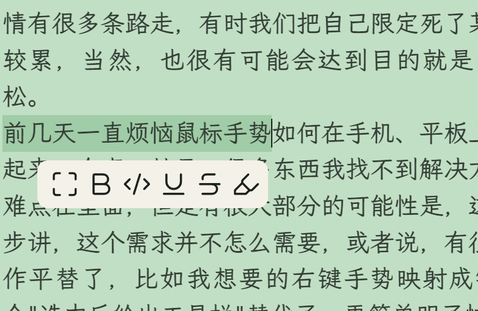

这两天折腾了关于手机自动化的一些东西，主要是用的tasker.apk及macroDroid.apk。中间出了点小插曲，让我知道其实很多时候，很多事情有很多条路走，有时我们把自己限定死了某一条路，会比较艰难、比较累，当然，也很有可能会达到目的就是了，但是拐个弯也许更轻松。  
前几天一直烦恼鼠标手势如何在手机、平板上操作的问题，今天突然想起来一个事，就是：很多东西我找不到解决方案，也许有一小部分技术难点在里面，但是有很大部分的可能性是，这个需求并不常见，再进一步讲，这个需求并不怎么需要，或者说，有很大概率被其他更简化的操作平替了，比如我想要的右键手势映射成键盘组合快捷键，就被这个"选中后给出工具栏"替代了，更简单明了快捷  
  

*突然意识到，有些东西并不需要，是人类硬生生地给他创造出来的。反之，有些东西即使不存在，也会因为需求被硬生生造出来。后者更符合“道”。* 