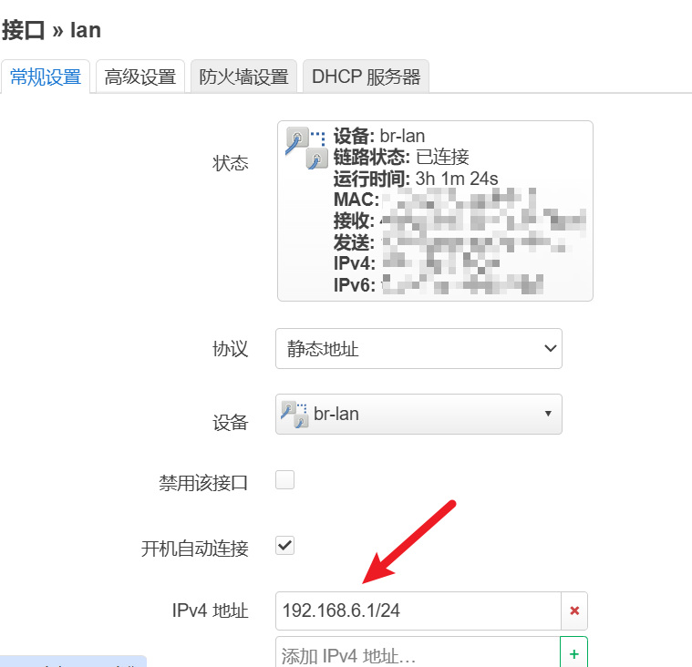
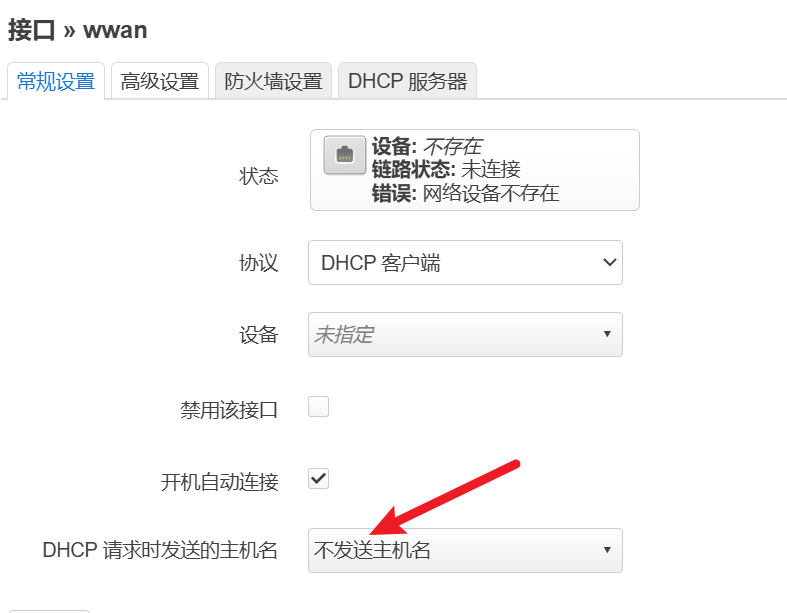
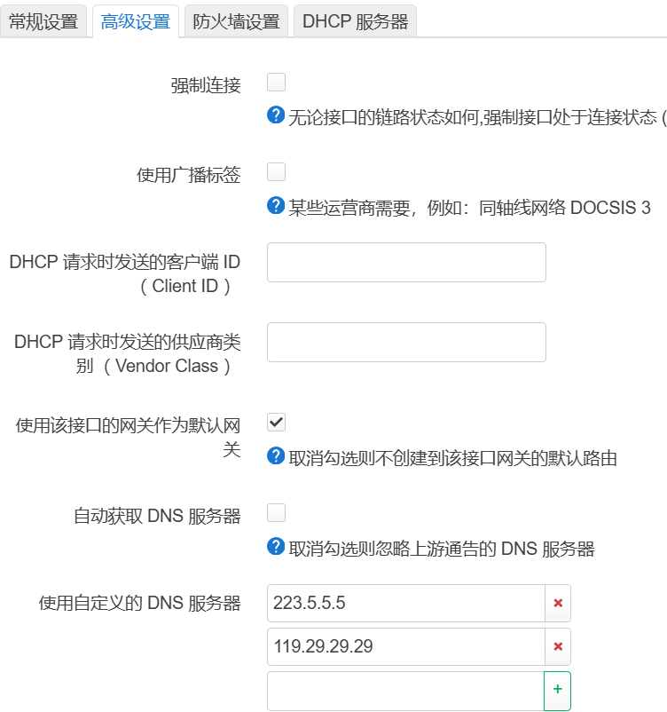
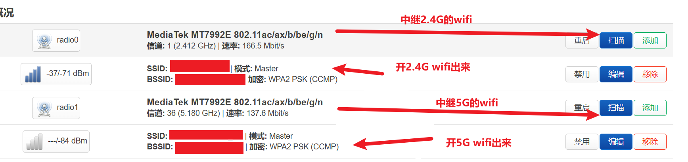
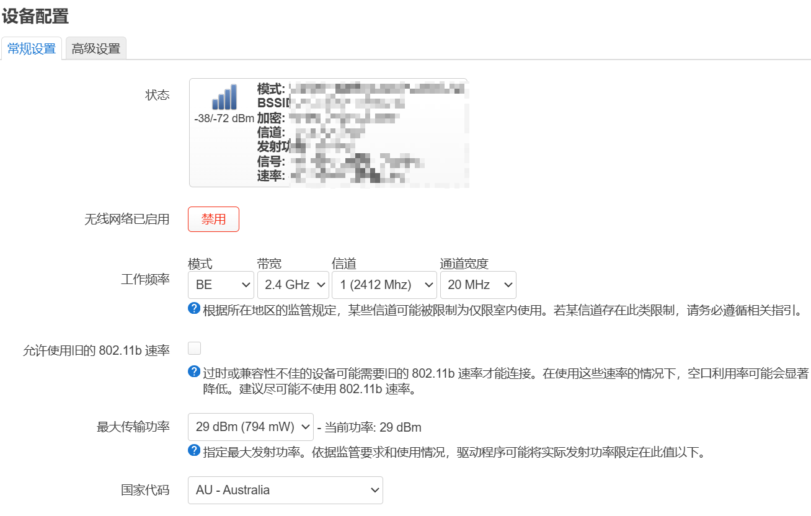
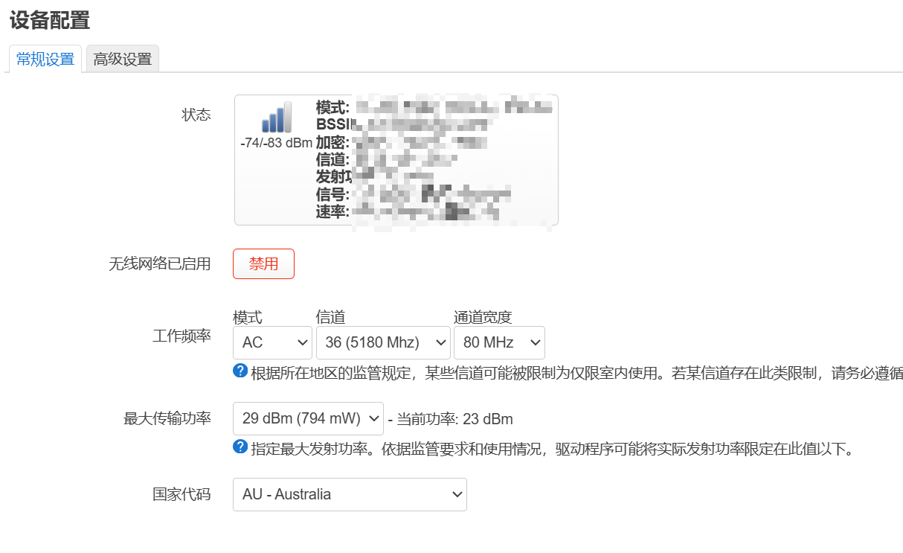
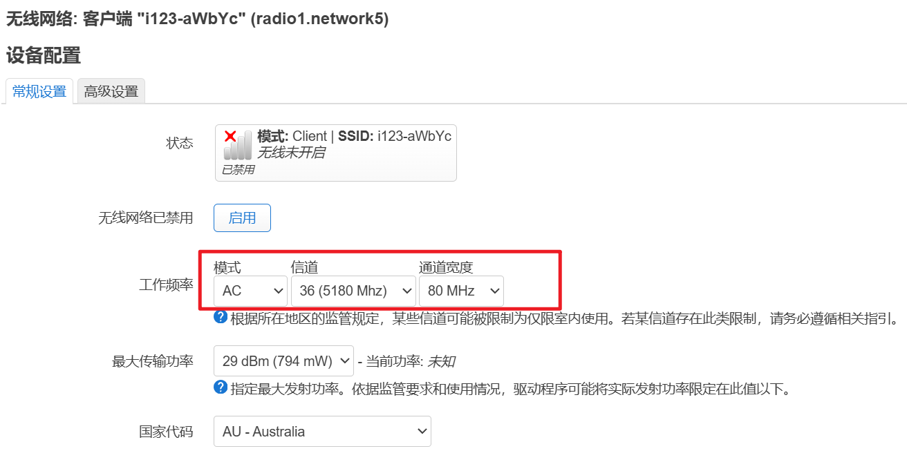
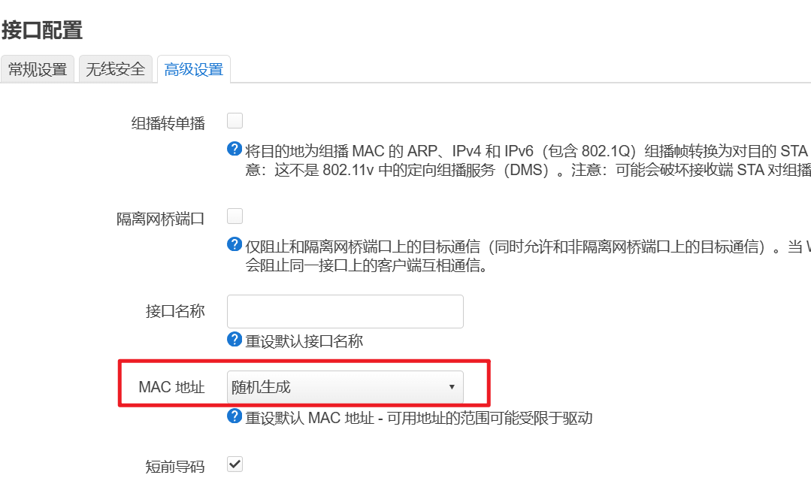

# 系统-系统

- 可以改主机名，这样别人识别你这台路由器就会看到那个名字
- 改时区，改成`Asia/Shanghai`

# 网络-接口

## 改网段

  

## 各个wwan中

### 不发送主机名

### 改DNS

  

# 网络-无线

  

不是所有wifi都能一下子就扫描出来，目前我还是云里雾里的，有时候设置完了扫描出来几秒钟就出不来了。不过只要是连接上的，即使扫描列表==*误*==隐藏了后续也能连上。附上当前配置   ~~2.4G配置以及5G配置（主要是那个==信道以及宽度==），决定了你能扫出哪些wifi，具体怎么决定的我不清楚，目前暴力算法尝试）~~ 
## 开2.4G wifi出来

  

## 开5G出来

如果在国内，最大传输功率要*依据监管要求设置*  

  

## 中继上的wifi

- 信道和宽度尽量保持和原来的wifi一致
    
- 接口配置-高级设置，可以随机mac地址  
    
# 网络-MultiWAN 管理器

这个可以指定中继某个wifi失败的时候自动中继下一个（按优先级），目前用不上，我没去尝试 

# 其他

- 还有一些东西目前听说了但我没去尝试，比如 乘飞机  
- 最后备份了一下配置，不过估计不太能用上