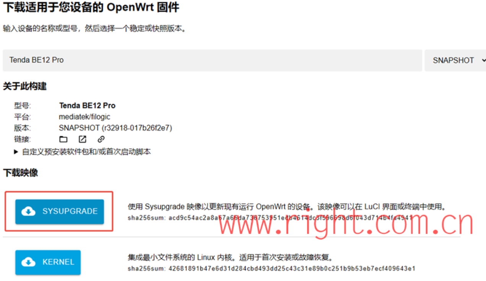
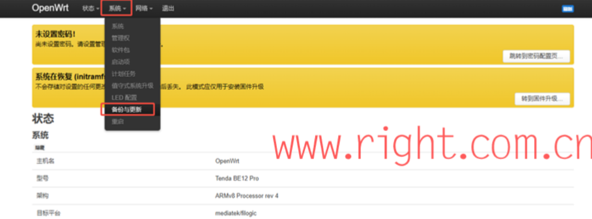
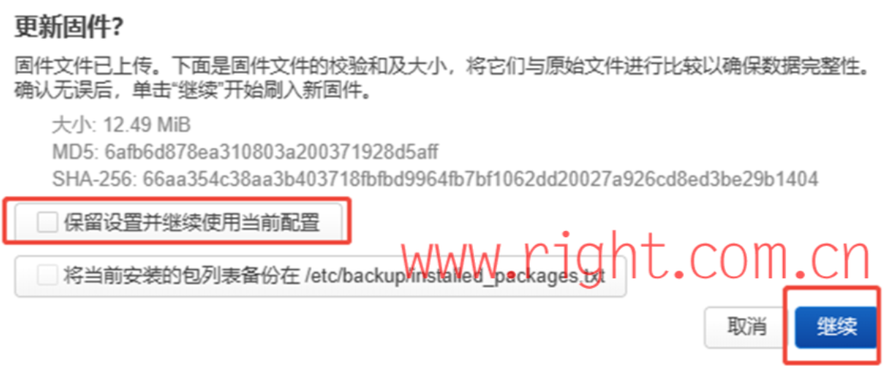
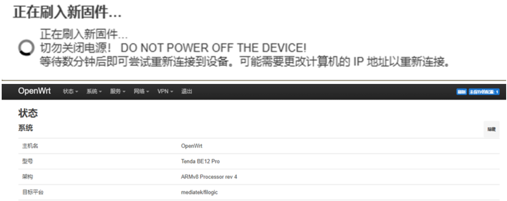
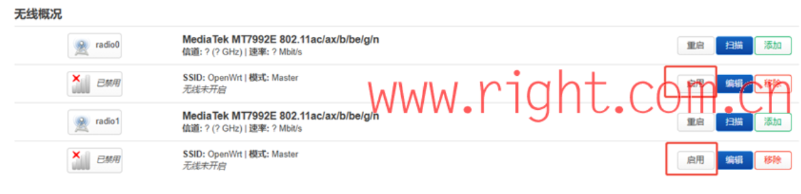
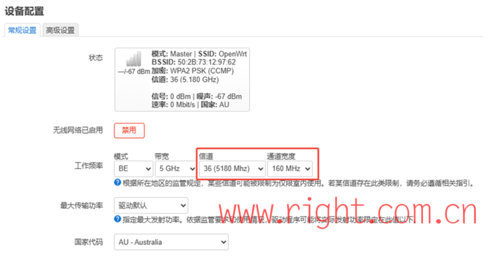
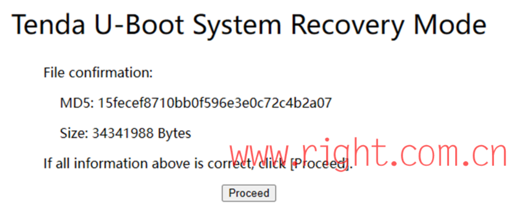

下文复制自 https://www.right.com.cn/forum/forum.php?mod=viewthread&tid=8463884&extra=page%3D1&page=1 , 原作者为 `igetmail` 

# 1. 准备工作

请提前下载好以下固件文件：

1. ==过渡固件:==  be12 pro openWRT过渡固件.bin
2. ==正式固件:== openwrt-mediatek-filogic-tenda_be12-pro-squashfs-sysupgrade.bin ，固件可在 https://firmware-selector.openwrt.org 搜索“Tenda BE12 Pro进行下载  ~~目前我在这里下载的固件不可用会变砖不过可以通过后面的救灾操作恢复~~ 。
   

  
# 2. 刷机 (二个阶段) 

## 第一阶段：刷入临时系统

1.    电脑通过网线连接到路由器的 LAN 口，登录路由器原厂管理界面（通常为 192.168.0.1 或 tendawifi.com）。
2.    进入 **系统管理**\-> **软件升级**\-> **本地升级**；
3.    选择文件：==be12 pro openWRT过渡固件.bin== ；
4.    点击升级，等待进度条完成；
5.    设备将自动重启；

## 第二阶段：刷入openWRT正式系统

1. 路由器重启完成后，电脑通常会自动获取新的 IP 地址（默认为 192.168.1.x 网段）；
2. 打开浏览器访问 192.168.1.1，账号：root ，密码（留空/none）；

3. 此时进入到 OpenWrt 主界面，选择系统 -> 备份与更新 -> 更新固件 
   
4. 选择正式固件进行升级：openwrt-mediatek-filogic-tenda\_be12-pro-squashfs-sysupgrade.bin；
5. ==取消勾选== "保留设置并继续使用当前的配置“，建议进行纯净安装；

6.    等待路由器刷入新固件，重启完成后，您已成功刷入完整的 OpenWrt 系统！  
  

注意：==openWRT系统默认Wi-Fi是关闭的==，可在主页选择 网络 ->无线，选择启用SSID。为充分发挥无线性能，如果你在Australia，可以选择AU-Australia， 信道选择低信道，比如36（避免选择100~144 Band3信道），频宽选择160MHz。选对应所在地，符合法规无线电限制要求。  

  

  
# 3. 救灾或刷回官方固件 

如果刷机过程中断电导致异常变砖，或需要刷回原厂系统，确保刷不死，可以执行以下操作：

请提前准备好工具：网线、电脑、牙签

## 3.1 进入救灾模式(U-Boot Web UI)

1.    **断电:** 拔掉路由器电源；
2.    **按RESET键:** 插上电源，使用牙签或笔尖按住机身背后的 **RESET** 按钮，持续按住**25秒**（无需观察指示灯状态）再松开，此时路由器已进入救灾模式。
  
## 3.2 刷回原厂固件

1、电脑设置（只能通过有线设置）

用网线将电脑连接到路由器的千兆LAN口（注意：不能接在2.5G口），电脑 IP 地址手动设置为静态IP，IP 地址: 192.168.1.2，子网掩码: 255.255.255.0；

2、访问救灾页面:

打开浏览器，访问 192.168.1.1，将看到 Tenda 官方的救灾模式简易界面 ；

3、上传固件:

点击“选择文件”选择准备好的Tenda原厂固件文件（通常可以在官方网站进行下载），点击“Upload”上传按钮；

4、恢复:

固件上传后，选择“Proceed”继续。过程中切勿断电，等待进度条走完，路由器将自动重启进入 Tenda 原厂系统。

  

  

完成恢复后，请将电脑网卡 IP 改回“自动获取 (DHCP)”。

****4.固件下载链接**  

https://pan.baidu.com/share/init?surl=SF973U91iUGBhF-9L1-OGQ&pwd=gff3  

https://drive.google.com/drive/folders/13C1rbYF3SBKqqhArpWVW-34xTB8EtEut  

