这篇文章不是寻常意义上的HelloWorld，但是是我第一次尝试51单片机，原因是我想学的ros视频课程中出现了OpenRB-150开发板和舵机XL330-M288-T，我手头没有实物，只有吃灰了很久的51单片机，想着能否用单片机相似的模拟一下  

# 工具
路径  ~~普中-7开发板资料\5--开发工具：卖家给的文件~~ 
- 3-程序下载软件-Keil（我这里是4，单片机卖家提供的资料里提供的版本）
- 4-常用辅助开发工具-串口调试助手（丁丁）（这里是SSCOM ~~单片机卖家提供的~~ ）
- 4-常用辅助开发工具-程序烧制工具PZ-ISO v3.7 ~~单片机卖家提供的~~ 
- 51单片机 ~~实物~~ ，我这里是普中科技的A7标配 
- 普中公司给的资料地址  `http://www.prechin.cn/gongsixinwen/208.html` 
# 测试单片机是否正常

- 用USB-A 接口数据线连接单片机，接口旁边还有个按钮，要按下去才能开机，开机后蓝灯会亮，还有一个红灯亮着 ~~我不知道干嘛的，知识水平不够~~ 
- 打开PZ-ISP
	- 芯片我这里选择STC89C5xxSeries
	- 串口号COM3 蓝牙链接上的标准串行 （自动的）
	- 波特率9600
	- 双倍速12T（默认）
	- 按文件擦除
- 接线 ~~P20->D1，其他的按方向插下去就行。别接错了，很重要~~ 
~~3--手把手教你学51单片机\实验现象演示这里有实验现象演示~~  

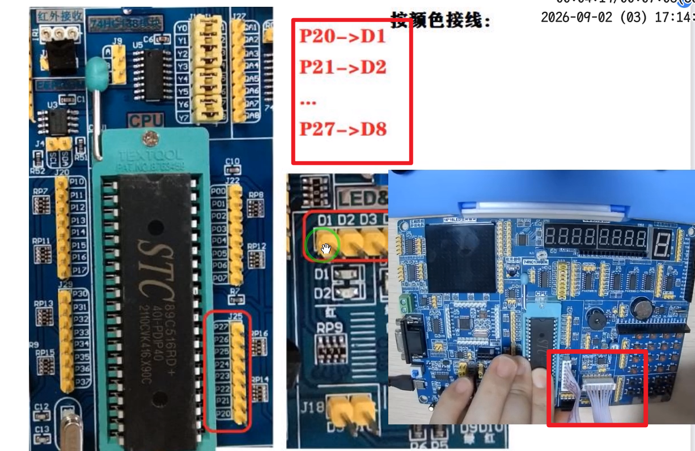

- 选择文件路径
	- 打开文件：我这里选择了最简单的流水灯 ~~`4--实验程序\1--基础实验\2-点亮第一个LED(解压后选择里面的template.hex[.hex后缀的那个，应该是编译后生成的])`~~ 
	- 程序下载---成功后会提示：`恭喜！文件下载完毕`
	- 然后D1灯就亮了绿色
	- 点亮LED灯源文件main.c
```C
/**************************************************************************************
深圳市普中科技有限公司（PRECHIN 普中）
技术支持：www.prechin.net
PRECHIN
 普中
 
实验名称：点亮第一个LED
接线说明：	
实验现象：下载程序后“LED模块”的D1指示灯点亮
注意事项：																				  
***************************************************************************************/
#include "reg52.h"

sbit LED1=P2^0;	//将P2.0管脚定义为LED1

/*******************************************************************************
* 函 数 名       : main
* 函数功能		 : 主函数
* 输    入       : 无
* 输    出    	 : 无
*******************************************************************************/
void main()
{
	LED1=0;	//LED1端口设置为低电平
	while(1)
	{
		
	}
		
}
```

测试完可以关按钮把线拔了  

# 串口数据收发

- 重新打开按钮（开机）
## 新建项目并编译

- 打开开发工具Ceil（主要写程序和编译）
- 在桌面新建文件夹HelloWorld
- 新建项目 ~~project --> new，文件夹选择刚才那个HelloWorld。uvproj名字随便输，我写的`HelloWorld`~~ 
  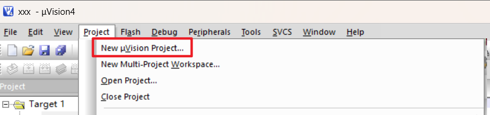
- 在弹出的选择芯片的页面，如果是普通 51 单片机，展开 Atmel 找到 AT89C51
  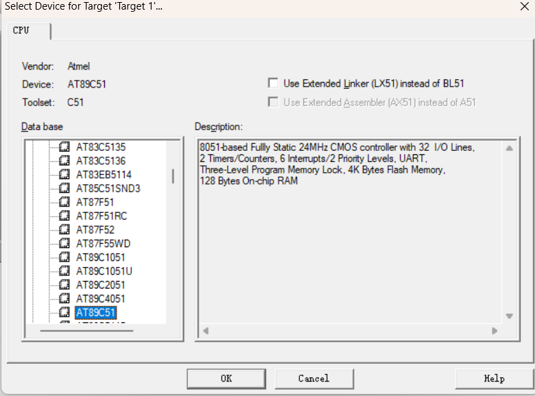
- 选择'是'
  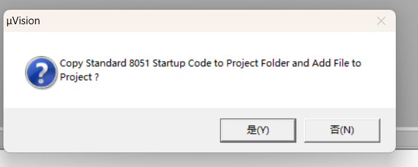
- File-新建文件
  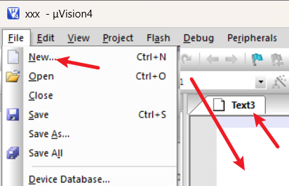  
- 粘贴下面的文件代码 ~~借助ai生成串口通信的处理代码~~ 
  
```c
#include "REG52.h"
#include <string.h>

typedef unsigned int  u16;
typedef unsigned char u8;


/************************************************
 * 电机状态
 ************************************************/

int target_position = 0;     // 目标位置
int current_position = 0;    // 当前位置

int target_velocity = 1;     // 目标速度
int current_velocity = 0;    // 当前实际速度


/************************************************
 * 串口接收缓存
 ************************************************/

#define RX_BUFFER_SIZE 30

char rx_buffer[RX_BUFFER_SIZE];

u8 rx_index = 0;

bit command_ready = 0;

bit rx_overflow = 0;


/************************************************
 * 定时器
 ************************************************/

u16 timer_count = 0;


/************************************************
 * 串口初始化
 *
 * 9600 8N1
 ************************************************/

void uart_init()
{
    /*
        Timer1 模式2
        用于产生串口波特率
    */

    TMOD |= 0x20;


    /*
        串口模式1
        REN = 1，允许接收
    */

    SCON = 0x50;


    /*
        SMOD = 1
        波特率加倍
    */

    PCON = 0x80;


    /*
        11.0592MHz 晶振
        9600 波特率
    */

    TH1 = 0xFA;
    TL1 = 0xFA;


    /*
        开启串口中断
    */

    ES = 1;


    /*
        开启总中断
    */

    EA = 1;


    /*
        启动 Timer1
    */

    TR1 = 1;
}


/************************************************
 * Timer0 初始化
 *
 * 用于模拟电机运动
 ************************************************/

void timer0_init()
{
    /*
        清除 Timer0 模式位
    */

    TMOD &= 0xF0;


    /*
        Timer0 模式1
    */

    TMOD |= 0x01;


    /*
        定时初值
    */

    TH0 = 0xDC;
    TL0 = 0x00;


    /*
        开启 Timer0 中断
    */

    ET0 = 1;


    /*
        开启总中断
    */

    EA = 1;


    /*
        启动 Timer0
    */

    TR0 = 1;
}


/************************************************
 * UART 发送一个字符
 ************************************************/

void uart_send(u8 dat)
{
    /*
        清除发送完成标志
    */

    TI = 0;


    /*
        写入发送缓冲器
    */

    SBUF = dat;


    /*
        等待发送完成
    */

    while(!TI);


    /*
        清除发送完成标志
    */

    TI = 0;
}


/************************************************
 * UART 发送字符串
 ************************************************/

void uart_send_string(char *str)
{
    while(*str)
    {
        uart_send(*str);

        str++;
    }
}


/************************************************
 * 发送整数
 *
 * 支持：
 *
 * 0
 * 123
 * -123
 ************************************************/

void send_number(int num)
{
    char buf[8];

    u8 i = 0;


    /*
        处理 0
    */

    if(num == 0)
    {
        uart_send('0');

        return;
    }


    /*
        处理负数
    */

    if(num < 0)
    {
        uart_send('-');

        num = -num;
    }


    /*
        将数字转换成字符
    */

    while(num > 0)
    {
        buf[i++] = num % 10 + '0';

        num /= 10;
    }


    /*
        倒序发送

        例如：

        123

        前面得到：

        3
        2
        1

        所以倒过来发送
    */

    while(i > 0)
    {
        uart_send(buf[--i]);
    }
}


/************************************************
 * 字符串转整数
 *
 * 例如：
 *
 * "123"  -> 123
 * "0"    -> 0
 *
 * 支持负数：
 *
 * "-123" -> -123
 ************************************************/

int str_to_int(char *str)
{
    int value = 0;

    bit negative = 0;


    /*
        判断负号
    */

    if(*str == '-')
    {
        negative = 1;

        str++;
    }


    /*
        连续读取数字
    */

    while(*str >= '0' && *str <= '9')
    {
        value = value * 10 + (*str - '0');

        str++;
    }


    /*
        返回负数
    */

    if(negative)
    {
        value = -value;
    }


    return value;
}


/************************************************
 * 命令解析
 ************************************************/

void parse_command()
{
    int value;


    /*
        如果接收缓冲区溢出
        直接报错
    */

    if(rx_overflow)
    {
        uart_send_string("ERROR OVERFLOW\r\n");

        rx_overflow = 0;

        return;
    }


    /*
        显示收到的命令

        例如：

        CMD:GET_POS
    */

    uart_send_string("CMD:");

    uart_send_string(rx_buffer);

    uart_send_string("\r\n");


    /********************************************
     * SET_POS
     *
     * 例如：
     *
     * SET_POS 100
     ********************************************/

    if(strncmp(rx_buffer, "SET_POS ", 8) == 0)
    {
        value = str_to_int(&rx_buffer[8]);

        target_position = value;

        uart_send_string("OK SET_POS\r\n");

        return;
    }


    /********************************************
     * SET_VEL
     *
     * 例如：
     *
     * SET_VEL 10
     ********************************************/

    if(strncmp(rx_buffer, "SET_VEL ", 8) == 0)
    {
        value = str_to_int(&rx_buffer[8]);


        /*
            速度不允许为负数

            方向由目标位置决定
        */

        if(value < 0)
        {
            uart_send_string("ERROR VEL\r\n");
        }
        else
        {
            target_velocity = value;

            uart_send_string("OK SET_VEL\r\n");
        }

        return;
    }


    /********************************************
     * GET_POS
     ********************************************/

    if(strcmp(rx_buffer, "GET_POS") == 0)
    {
        uart_send_string("POS:");

        send_number(current_position);

        uart_send_string("\r\n");

        return;
    }


    /********************************************
     * GET_VEL
     ********************************************/

    if(strcmp(rx_buffer, "GET_VEL") == 0)
    {
        uart_send_string("VEL:");

        send_number(current_velocity);

        uart_send_string("\r\n");

        return;
    }


    /********************************************
     * STATUS
     *
     * 返回：
     *
     * TARGET:100 POS:50 VEL:10
     ********************************************/

    if(strcmp(rx_buffer, "STATUS") == 0)
    {
        uart_send_string("TARGET:");

        send_number(target_position);


        uart_send_string(" POS:");

        send_number(current_position);


        uart_send_string(" VEL:");

        send_number(current_velocity);


        uart_send_string("\r\n");

        return;
    }


    /********************************************
     * 未知命令
     ********************************************/

    uart_send_string("ERROR\r\n");
}


/************************************************
 * 主函数
 ************************************************/

void main()
{
    /*
        初始化 UART
    */

    uart_init();


    /*
        初始化 Timer0
    */

    timer0_init();


    /*
        主循环
    */

    while(1)
    {
        /*
            是否收到完整命令？
        */

        if(command_ready)
        {
            /*
                清除命令完成标志
            */

            command_ready = 0;


            /*
                解析命令
            */

            parse_command();
        }
    }
}


/************************************************
 * Timer0 中断
 *
 * 模拟电机运动
 ************************************************/

void timer0_isr() interrupt 1
{
    /*
        重新装载定时器
    */

    TH0 = 0xDC;

    TL0 = 0x00;


    /*
        定时计数
    */

    timer_count++;


    /*
        每 50 次更新一次电机状态
    */

    if(timer_count >= 50)
    {
        timer_count = 0;


        /****************************************
         * 当前位于目标位置左侧
         *
         * 正方向运动
         ****************************************/

        if(current_position < target_position)
        {
            /*
                速度为 0

                电机不动
            */

            if(target_velocity == 0)
            {
                current_velocity = 0;
            }
            else
            {
                /*
                    向目标位置移动
                */

                current_position += target_velocity;

                current_velocity = target_velocity;


                /*
                    防止超过目标位置
                */

                if(current_position >= target_position)
                {
                    current_position = target_position;

                    current_velocity = 0;
                }
            }
        }


        /****************************************
         * 当前位于目标位置右侧
         *
         * 负方向运动
         ****************************************/

        else if(current_position > target_position)
        {
            /*
                速度为 0

                电机不动
            */

            if(target_velocity == 0)
            {
                current_velocity = 0;
            }
            else
            {
                /*
                    向目标位置移动
                */

                current_position -= target_velocity;

                current_velocity = -target_velocity;


                /*
                    防止超过目标位置
                */

                if(current_position <= target_position)
                {
                    current_position = target_position;

                    current_velocity = 0;
                }
            }
        }


        /****************************************
         * 已经到达目标位置
         ****************************************/

        else
        {
            current_velocity = 0;
        }
    }
}


/************************************************
 * UART 中断
 *
 * 只负责接收数据
 *
 * 不负责解析命令
 ************************************************/

void uart_isr() interrupt 4
{
    char rcv_data;


    /*
        是否收到数据？
    */

    if(RI)
    {
        /*
            清除接收标志
        */

        RI = 0;


        /*
            读取接收到的字符
        */

        rcv_data = SBUF;


        /****************************************
         * 收到回车或者换行
         *
         * 表示一条命令结束
         ****************************************/

        if(rcv_data == '\r' || rcv_data == '\n')
        {
            /*
                防止空命令
            */

            if(rx_index > 0)
            {
                /*
                    添加字符串结束符

                    例如：

                    GET_POS\0
                */

                rx_buffer[rx_index] = '\0';


                /*
                    通知主循环：

                    一条完整命令已经收到
                */

                command_ready = 1;


                /*
                    准备接收下一条命令
                */

                rx_index = 0;
            }
        }


        /****************************************
         * 普通字符
         ****************************************/

        else
        {
            /*
                如果之前没有发生溢出
            */

            if(!rx_overflow)
            {
                /*
                    留一个位置给 '\0'
                */

                if(rx_index < RX_BUFFER_SIZE - 1)
                {
                    rx_buffer[rx_index++] = rcv_data;
                }
                else
                {
                    /*
                        缓冲区已满
                    */

                    rx_overflow = 1;
                }
            }
        }
    }
}
```

- ctrl+s 保存到HelloWorld文件中 ~~文件名main.c~~ 
- 右键SourceGroup1-addFile  ~~不添加看不到，也没找到刷新的按钮，很奇怪~~ 
  
  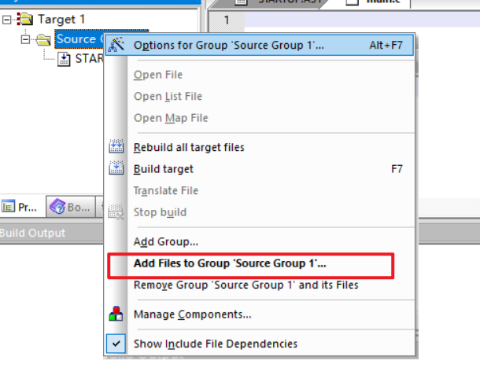  
      
  添加刚才那个文件main.c
- 右键项目名-OptionForTarget
  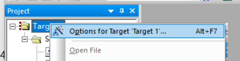
	- output里面勾上createHex  
	  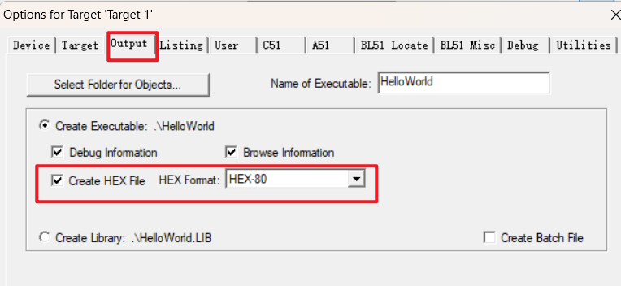  
	  
- 右键-build即可  
  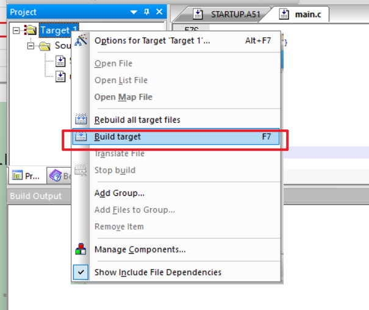  
  
  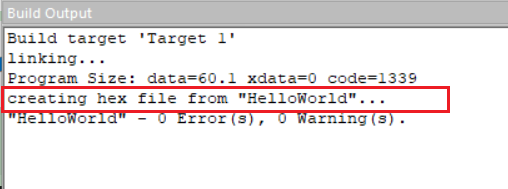
  
   ~~那个STARTUP.A51我也不知道干嘛的~~ 
## 烧制程序

- 设置跟前面的测试一样，但是不需要接线了

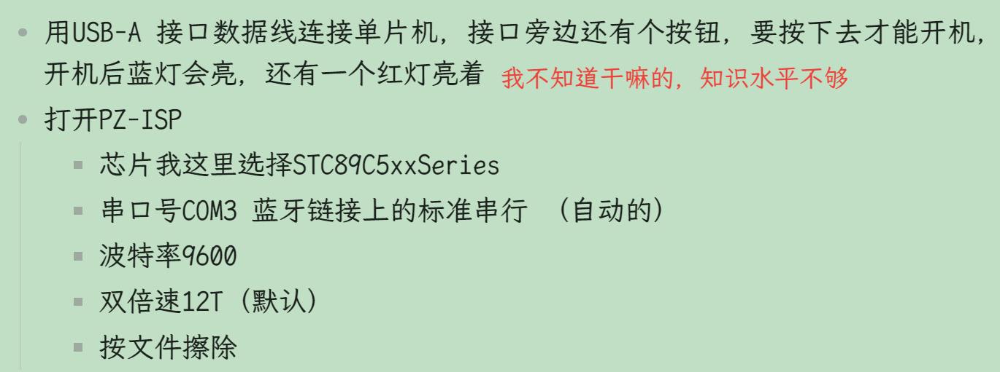  
- 打开文件，选择HelloWorld文件夹下的 .hex 文件  
- 程序下载
  然后就开始下载了，进度100%时结束  
  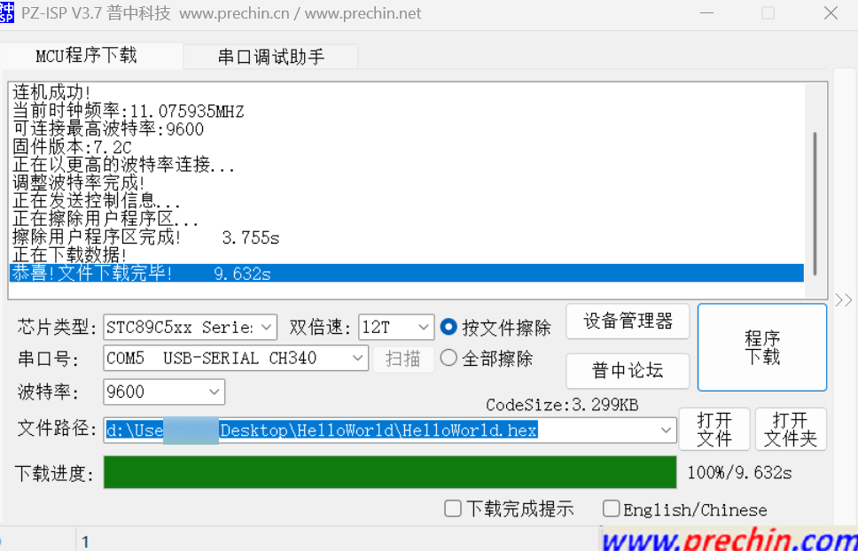

## 打开4-常用辅助开发工具-串口调试助手（丁丁）
- 端口我我选择和刚才烧制程序的串口号 ~~后续要烧制前得把这个串口号关了先~~ 
- 勾上时间戳、加回车换行
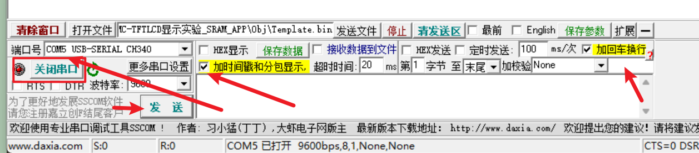

## 测试流程

串口设置：

```shell
9600
8N1
发送新行 √
```

#### 1. 设置速度

发送：

```
SET_VEL 10
```

返回：

```
CMD:SET_VEL 10
OK SET_VEL
```
#### 2. 设置位置

发送：

```
SET_POS 100
```

返回：

```
CMD:SET_POS 100
OK SET_POS
```
#### 3. 查询状态

快速发送：

```
STATUS
```

可能：

```
TARGET:100 POS:20 VEL:10
```

继续：

```
TARGET:100 POS:60 VEL:10
```

最后：

```
TARGET:100 POS:100 VEL:0
```
#### 4. 查询位置

发送：

```
GET_POS
```

返回：

```
POS:100
```
#### 5. 查询速度

运动过程中：

```
GET_VEL
```

返回：

```
VEL:10
```

停止后：

```
VEL:0
```

现在这个版本已经很接近课程里面的“电机驱动测试阶段”了。
### 解释一下其他现象

程序里进行了中断，也就是每中断50次（一次10ms）按步长更新一次位置，也就是current_position   。但是如果是在中断第20次时来获取current_position   ，那么current_position   也只会返回上次中断时更新的 current_position。即 current_position 不是`在程序里循环不限速加上的`
## 随意测试

```

[18:04:50.095]发→◇STATUS
□
[18:04:50.138]收←◆CMD:STATUS
TARGET:0 POS:0 VEL:0

[18:04:51.406]发→◇STATUS
□
[18:04:51.450]收←◆CMD:STATUS
TARGET:0 POS:0 VEL:0

[18:05:01.567]发→◇GET_VEL
□
[18:05:01.600]收←◆CMD:GET_VEL
VEL:0

[18:05:13.375]发→◇SET_POS 100
□
[18:05:13.409]收←◆CMD:SET_POS 100
OK SET_POS

[18:05:17.327]发→◇STATUS
□
[18:05:17.371]收←◆CMD:STATUS
TARGET:100 POS:8 VEL:1

[18:05:18.143]发→◇STATUS
□
[18:05:18.174]收←◆CMD:STATUS
TARGET:100 POS:10 VEL:1

[18:05:23.144]发→◇GET_VEL
□
[18:05:23.176]收←◆CMD:GET_VEL
VEL:1

[18:05:24.175]发→◇GET_VEL
□
[18:05:24.208]收←◆CMD:GET_VEL
VEL:1

[18:05:33.895]发→◇STATUS
□
[18:05:33.928]收←◆CMD:STATUS
TARGET:100 POS:41 VEL:1

[18:05:46.969]发→◇GET_VEL
□
[18:05:47.002]收←◆CMD:GET_VEL
VEL:1

[18:05:54.904]发→◇STATUS
□
[18:05:54.935]收←◆CMD:STATUS
TARGET:100 POS:83 VEL:1

[18:11:08.515]发→◇fadf
□
[18:11:08.541]收←◆CMD:fadf
ERROR
```

# 一些概念

~~目前的理解，如果有错望指出~~  

- 串口：怎么传输 ~~是一种传输方式，也可以是TCP/IP、USB等~~ 
- 协议：传什么、格式是什么  ~~驱动和硬件协商的沟通格式~~ 
- 驱动：把上层软件的操作，转换成硬件能够理解的操作 ~~可以通过串口传输，或者USB、TCP/IP等~~ ，并负责和硬件通信。 ~~驱动的核心职责，就是通过某种通信方式，和具体硬件打交道。~~ 


