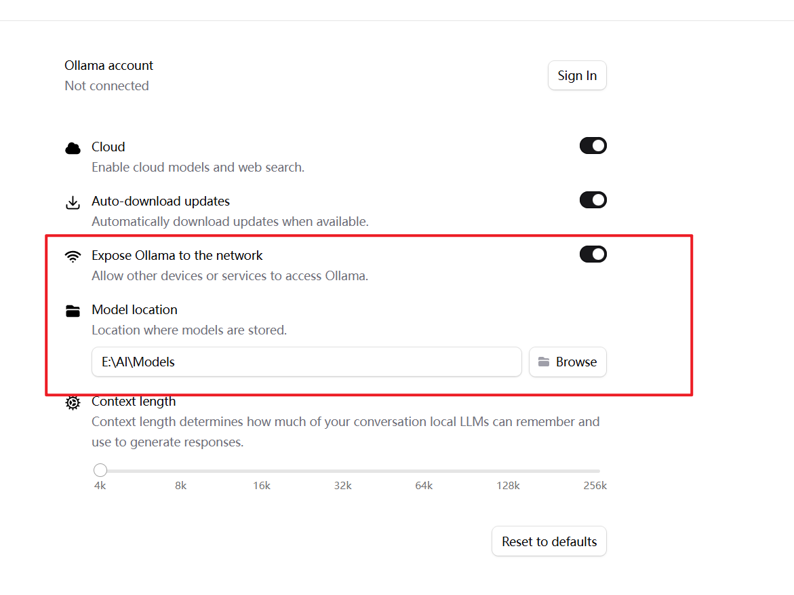
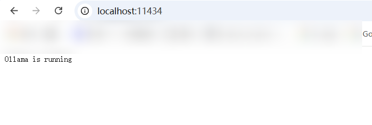

# Windows平台安装大模型

- 先下载Windows版本的Ollama
- 安装后，在settings中设置模型下载为止并且在局域网暴露Ollama（端口11434）    
    
- 访问`http://localhost:11434/`  
    
- 打开WindowsPowerShell  
  
```shell
ollama run qwen3:4b-instruct #会下载qwen3:4b-instruct大模型并运行，然后就可以问问题了
#这是我之后下载的几个，目前qwen3:4b 和 qwen3:4b-instruct 最符合电脑性能
ollama list | sort

deepseek-r1:1.5b     e0979632db5a    1.1 GB    7 hours ago
deepseek-r1:7b       755ced02ce7b    4.7 GB    6 hours ago
gemma3:4b            a2af6cc3eb7f    3.3 GB    2 hours ago
llama3.2:3b          a80c4f17acd5    2.0 GB    6 hours ago
NAME                 ID              SIZE      MODIFIED
qwen3:4b             359d7dd4bcda    2.5 GB    8 hours ago
qwen3:4b-instruct    0edcdef34593    2.5 GB    7 hours ago
qwen3:8b             500a1f067a9f    5.2 GB    5 hours ago

```

- 关于ollama 
  
```shell
ollama run qwen3:4b-instruct  --hidethinking #使用hidethingking隐藏思考过程
#或者在运行中，使用/set nothink 隐藏思考过程，不过不是每个大模型都有效
```


# Ubuntu中使用Python测试

```shell
sudo apt install python3-requests
```

## 简单请求

```shell
nano test_llm.py
```

###  test_llm.py的内容

```shell
import requests

url = "http://192.168.6.201:11434/api/chat"


data = {
    "model": "qwen3:4b-instruct",
    "messages": [
        {
            "role": "user",
            "content": "你好，随机给我一个五位数"
        }
    ],
    "stream": False
}


print("发送请求")

r = requests.post(
    url,
    json=data,
    timeout=60
)

print("状态码:", r.status_code)

print(r.text)
```

### 输出  

```shell
╭─ ~                                                                ly@ubt24 18:10:49
╰─❯ python3 test_llm.py
发送请求
状态码: 200
{"model":"qwen3:4b-instruct","created_at":"2026-08-26T10:11:13.7346513Z","message":{"role":"assistant","content":"你好！这是一个随机生成的五位数：**73924** 😊\n\n如果需要更多，比如带条件的（比如是偶数、能被3整除等），也可以告诉我哦！"},"done":true,"done_reason":"stop","total_duration":7589013100,"load_duration":7398700,"prompt_eval_count":16,"prompt_eval_duration":143164000,"eval_count":46,"eval_duration":7413854000}

```


## 写一个简单对话

这里用的其他模型，简单点 ~~用了流式一个字一个字输出，也保留了完整聊天结果~~   

`nano chat.py`


```shell
import requests
import json


url = "http://192.168.6.201:11434/api/chat"

model = "qwen3:4b-instruct"

# 保存聊天历史
messages = []


while True:

    # 获取用户输入
    try:
        question = input("\n你：")

    except EOFError:
        print("\n退出")
        break

    except KeyboardInterrupt:
        print("\n退出")
        break


    # 空输入跳过
    if not question.strip():
        continue


    # 退出
    if question.lower() == "exit":
        print("退出")
        break


    # 清空上下文
    if question == "/clear":
        messages.clear()
        print("上下文已清空")
        continue


    # 添加用户消息
    messages.append(
        {
            "role": "user",
            "content": question
        }
    )


    answer = ""


    try:

        response = requests.post(
            url,
            json={
                "model": model,
                "messages": messages,
                "stream": True,
                "think": False
            },
            stream=True,
            timeout=120
        )


        print("\nAI：", end="", flush=True)


        # 接收流式输出
        for line in response.iter_lines():

            if line:

                data = json.loads(line)

                content = data["message"]["content"]

                print(
                    content,
                    end="",
                    flush=True
                )

                answer += content


        print()


        # 保存AI回复
        messages.append(
            {
                "role": "assistant",
                "content": answer
            }
        )


    except KeyboardInterrupt:

        print("\n\n已停止生成")

        # 删除没有完成的用户请求
        if messages and messages[-1]["role"] == "user":
            messages.pop()

        continue


    except requests.exceptions.Timeout:

        print("\n请求超时")

        if messages and messages[-1]["role"] == "user":
            messages.pop()


    except requests.exceptions.ConnectionError:

        print("\n无法连接 Ollama")

        if messages and messages[-1]["role"] == "user":
            messages.pop()


    except Exception as e:

        print("\n错误：", e)

        if messages and messages[-1]["role"] == "user":
            messages.pop()


```

运行：  

```shell
─ ~                                                      ✘ INT 12s ly@ubt24 18:26:43
╰─❯ python3 chat.py

你：你好

AI： 你好！有什么可以帮助你的吗？😊

你：中国多大

AI： 中国国土面积约为960万平方公里。如果您有其他问题或需要帮助，请随时告诉我！😊

你：

```

