图是一种较为复杂的非线性结构。 ==为啥说其较为复杂呢？==

根据前面的内容，我们知道：

- 线性数据结构的元素满足唯一的线性关系，每个元素(除第一个和最后一个外)只有一个直接前趋和一个直接后继。
- 树形数据结构的元素之间有着明显的层次关系。

但是，图形结构的元素之间的关系是任意的。

==何为图呢？== 简单来说，图就是由顶点的有穷非空集合和顶点之间的边组成的集合。通常表示为：==G(V,E)==，其中，G 表示一个图，V 表示顶点的集合，E 表示边的集合。

下图所展示的就是图这种数据结构，并且还是一张有向图。

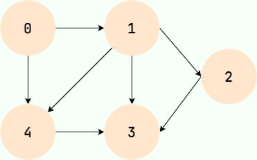

图在我们日常生活中的例子很多！比如我们在社交软件上好友关系就可以用图来表示。

## 图的基本概念

### 顶点

图中的数据元素，我们称之为顶点，图至少有一个顶点（非空有穷集合）

对应到好友关系图，每一个用户就代表一个顶点。

### 边

顶点之间的关系用边表示。

对应到好友关系图，两个用户是好友的话，那两者之间就存在一条边。

### 度

度表示一个顶点包含多少条边，在有向图中，还分为出度和入度，出度表示从该顶点出去的边的条数，入度表示进入该顶点的边的条数。

对应到好友关系图，度就代表了某个人的好友数量。

### 无向图和有向图

边表示的是顶点之间的关系，有的关系是双向的，比如同学关系，A 是 B 的同学，那么 B 也肯定是 A 的同学，那么在表示 A 和 B 的关系时，就不用关注方向，用不带箭头的边表示，这样的图就是无向图。

有的关系是有方向的，比如父子关系，师生关系，微博的关注关系，A 是 B 的爸爸，但 B 肯定不是 A 的爸爸，A 关注 B，B 不一定关注 A。在这种情况下，我们就用带箭头的边表示二者的关系，这样的图就是有向图。

### 无权图和带权图

对于一个关系，如果我们只关心关系的有无，而不关心关系有多强，那么就可以用无权图表示二者的关系。

对于一个关系，如果我们既关心关系的有无，也关心关系的强度，比如描述地图上两个城市的关系，需要用到距离，那么就用带权图来表示，带权图中的每一条边一个数值表示权值，代表关系的强度。

下图就是一个带权有向图。

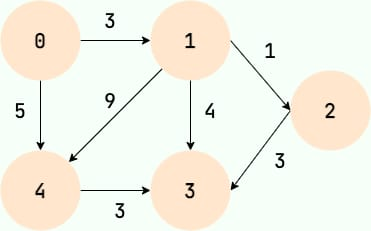

## 图的存储

### 邻接矩阵存储

邻接矩阵将图用二维矩阵存储，是一种较为直观的表示方式。

如果第 i 个顶点和第 j 个顶点之间有关系，且关系权值为 n，则 `A[i][j]=n` 。

在无向图中，我们只关心关系的有无，所以当顶点 i 和顶点 j 有关系时，`A[i][j]`=1，当顶点 i 和顶点 j 没有关系时，`A[i][j]`=0。如下图所示：

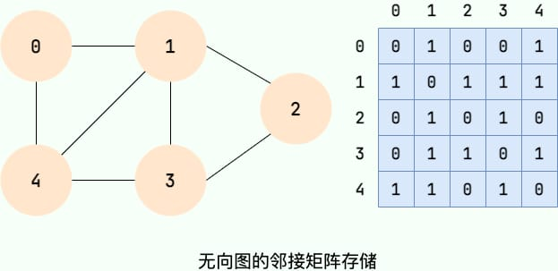

值得注意的是：==无向图的邻接矩阵是一个对称矩阵，因为在无向图中，顶点 i 和顶点 j 有关系，则顶点 j 和顶点 i 必有关系。==

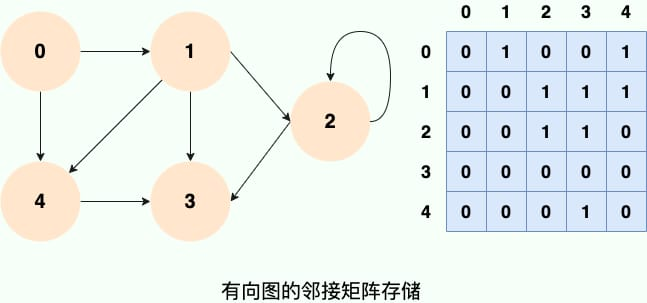

邻接矩阵存储的方式优点是简单直接（直接使用一个二维数组即可），并且，在获取两个定点之间的关系的时候也非常高效（直接获取指定位置的数组元素的值即可）。但是，这种存储方式的缺点也比较明显，那就是比较浪费空间，

### 邻接表存储

针对上面邻接矩阵比较浪费内存空间的问题，诞生了图的另外一种存储方法—==邻接表== 。

邻接链表使用一个链表来存储某个顶点的所有后继相邻顶点。对于图中每个顶点 Vi，把所有邻接于 Vi 的顶点 Vj 链成一个单链表，这个单链表称为顶点 Vi 的 ==邻接表==。如下图所示：

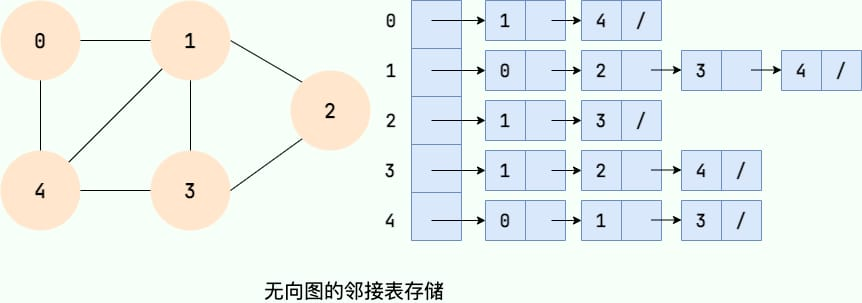

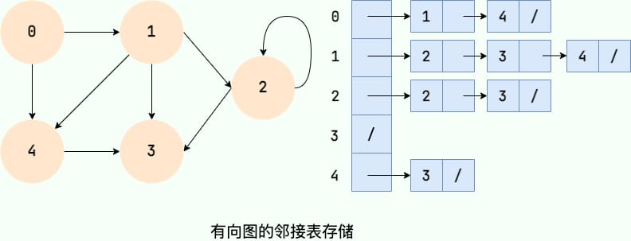

大家可以数一数邻接表中所存储的元素的个数以及图中边的条数，你会发现：

- 在无向图中，邻接表元素个数等于边的条数的两倍，如左图所示的无向图中，边的条数为 7，邻接表存储的元素个数为 14。
- 在有向图中，邻接表元素个数等于边的条数，如右图所示的有向图中，边的条数为 8，邻接表存储的元素个数为 8。

## 图的搜索

### 广度优先搜索

广度优先搜索就像水面上的波纹一样一层一层向外扩展，如下图所示：

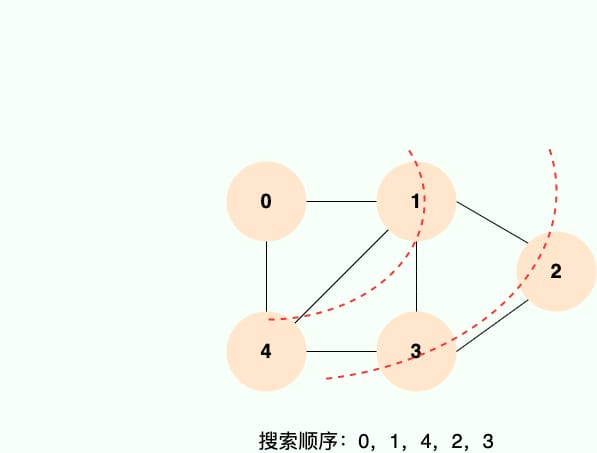

==广度优先搜索的具体实现方式用到了之前所学过的线性数据结构——队列== 。具体过程如下图所示：

==第 1 步：==

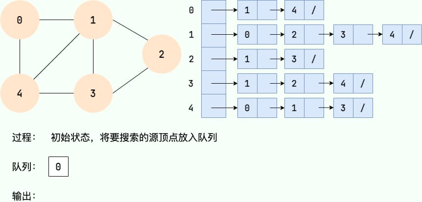

==第 2 步：==

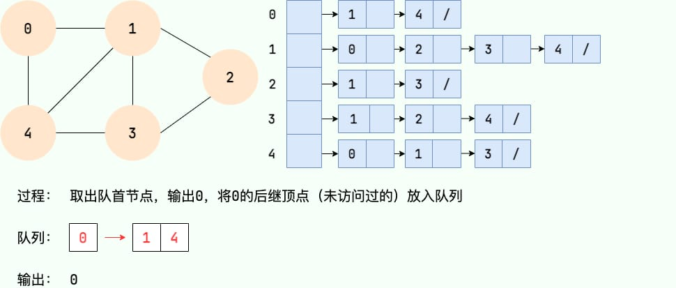

==第 3 步：==

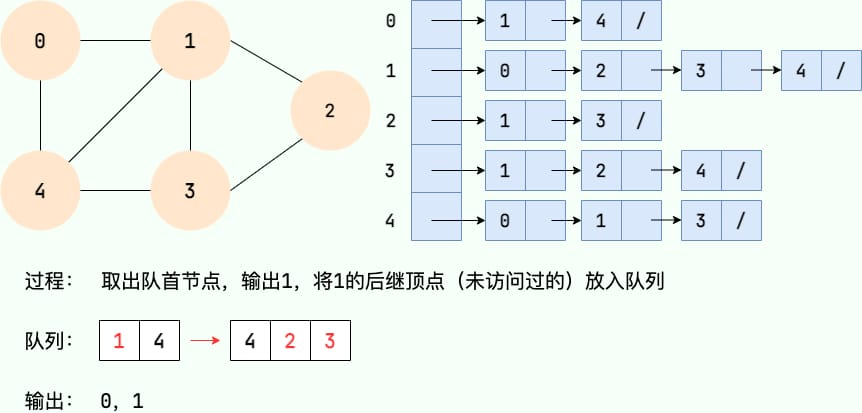

==第 4 步：==

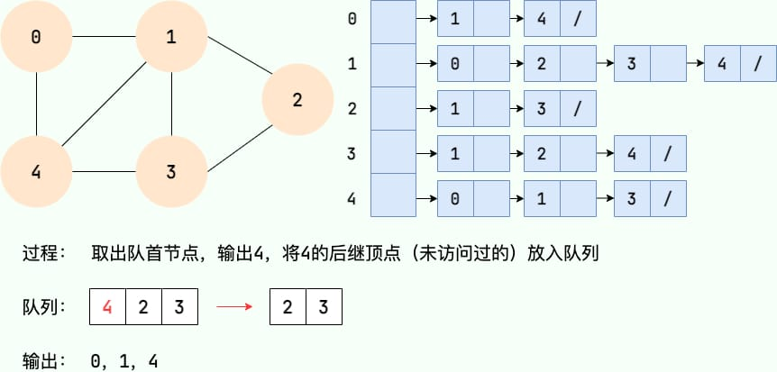

==第 5 步：==

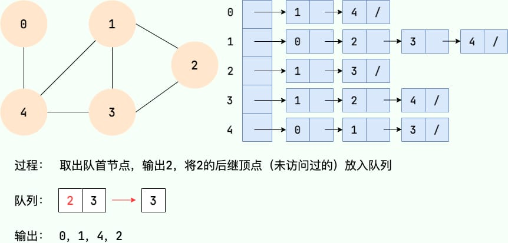

==第 6 步：==

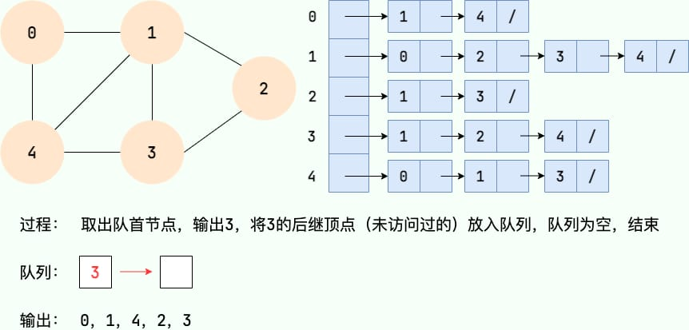

### 深度优先搜索

深度优先搜索就是“一条路走到黑”，从源顶点开始，一直走到没有后继节点，才回溯到上一顶点，然后继续“一条路走到黑”，如下图所示：

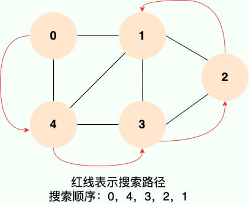

==和广度优先搜索类似，深度优先搜索的具体实现用到了另一种线性数据结构——栈== 。具体过程如下图所示：

==第 1 步：==

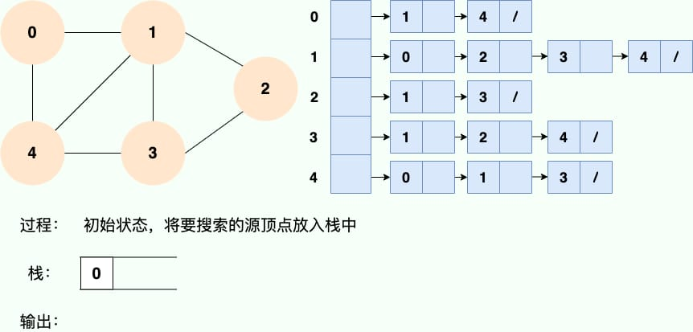

==第 2 步：==

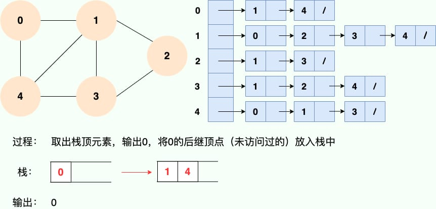

==第 3 步：==

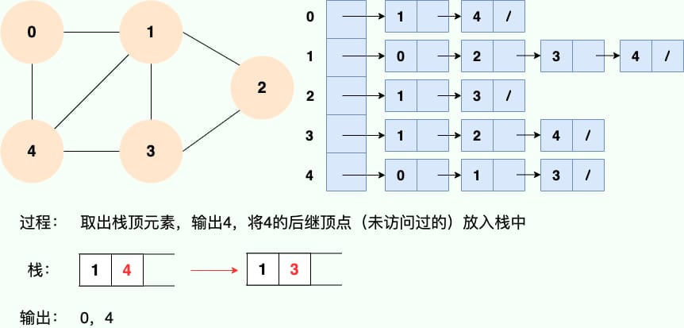

==第 4 步：==

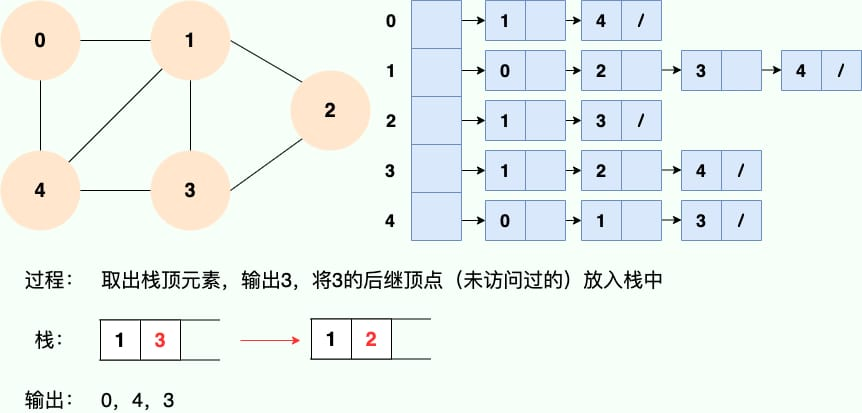

==第 5 步：==

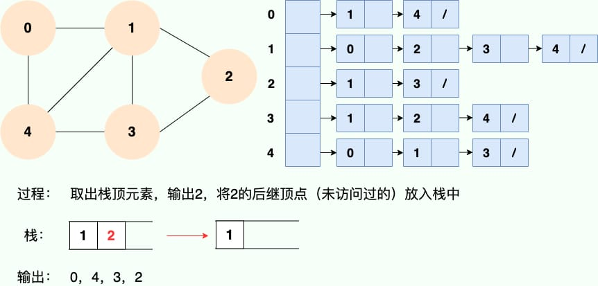

==第 6 步：==

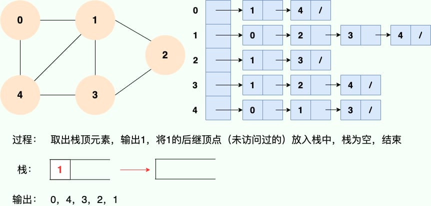

