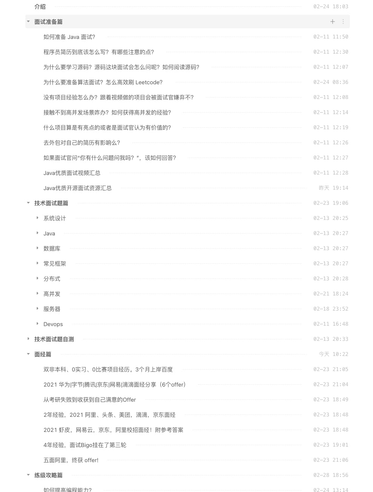
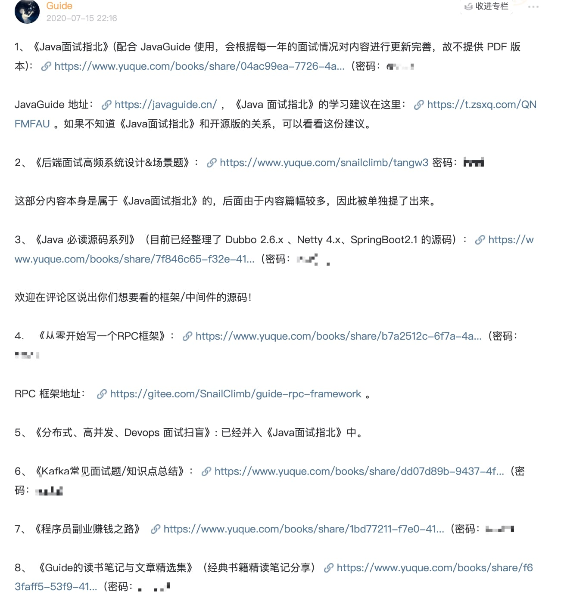

==泛型&通配符== 相关的面试题为我的[知识星球](https://javaguide.cn/about-the-author/zhishixingqiu-two-years.html)（点击链接即可查看详细介绍以及加入方法）专属内容，已经整理到了[《Java 面试指北》](https://javaguide.cn/zhuanlan/java-mian-shi-zhi-bei.html)（点击链接即可查看详细介绍以及获取方法）中。

[《Java 面试指北》](hhttps://javaguide.cn/zhuanlan/java-mian-shi-zhi-bei.html) 的部分内容展示如下，你可以将其看作是 [JavaGuide](https://javaguide.cn/#/) 的补充完善，两者可以配合使用。

[《Java 面试指北》](hhttps://javaguide.cn/zhuanlan/java-mian-shi-zhi-bei.html)只是星球内部众多资料中的一个，星球还有很多其他优质资料比如[专属专栏](https://javaguide.cn/zhuanlan/)、Java 编程视频、PDF 资料。

