# 意义
执行一系列命令
# 视频框架
1. 介绍，欢迎
2. HelloWorld
3. 变量
4. 数学函数
5. if语句
6. 退出代码
7. while循环
8. 更新脚本，保持服务器最新状态
9. for循环
10. 脚本应该存储在文件系统哪个位置
11. 数据流，标准输入、标准输出、标准错误输出
12. 函数
13. case语句
14. 调度作业（SchedulingJobs）Part1
15.  调度作业（SchedulingJobs）Part2
16. 传递参数
17. 备份脚本
# 准备
需要一台运行Linux系统的计算机（或虚拟机）
# 一些基本操作
## 新建或编辑脚本
``` shell
nano myscript.sh
```

### 内容
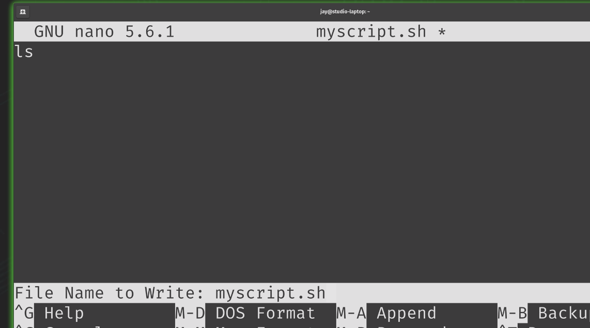  
**ctrl + o 保存，ctrl + x 退出**  
## 如何执行脚本
### 权限
``` shell
#给脚本赋予执行的权限
sudo chmod +x myscript.sh
```

### 执行
#### 执行前查看权限
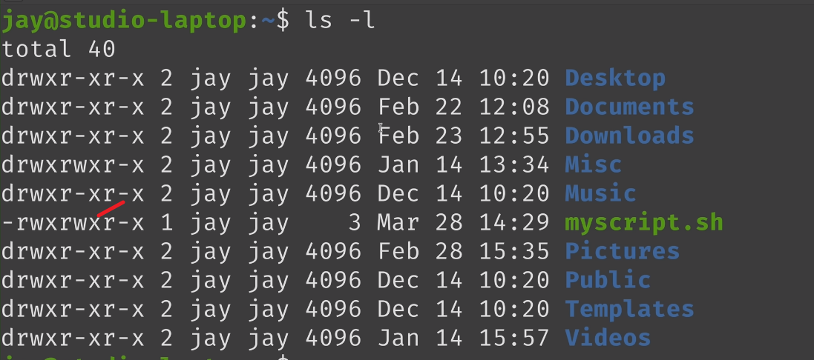  
#### 运行
``` shell
./myscript.sh
```
#### 查看脚本
``` shell
cat myscript.sh
```
# 更多语句的脚本
```shell
ls
pwd
```
输出  
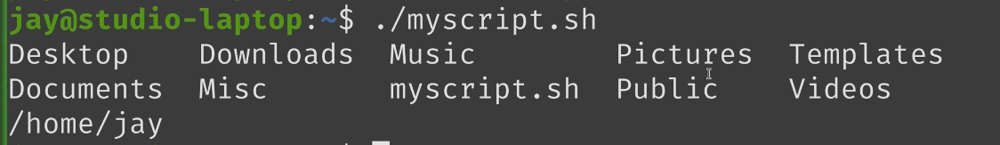  
# shebang
告诉系统哪个解释器准备运行脚本(不特别指定的情况)，比如```bash ./myscript.sh```就特别指明了用bash运行脚本，所以这里指的是```./myscript.sh```这种情况使用的哪个默认解释器  
```shell
#!/bin/bash

echo "Hello World!"

echo "My current working directory is:"
#结果中pwd会另取一行跟这里的显式换行没关系， 我猜是echo在最末尾加了\n换行符


pwd
```
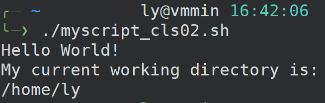   

## 关于echo行末换行符
```shell
echo -n abc;echo c
```
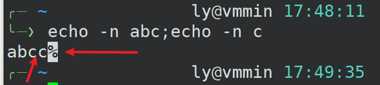  
这里使用-n禁止输出默认换行符，所以两个c连接上了
# 变量
## **变量左右两侧都不允许有空格！！**  
## nano快捷键
**ctrl + k ，删除当前行**  
## 基本使用
```shell
#!/bin/bash

myname="Jay"
#myage="40"
my="xxx"
myage="40"

#""和''的区别
echo 'Hello, my name is $myname.'
echo "Hello, my name is $myname."
#注意下面这句，不会去找变量m，my或者mya(以word字符为界，即字母或下划线为开头，直到字母或数字或下划线终止)
echo "I'm $myage years old."
#下面这句，将单引号进行了转义
#视频中的方法有点问题，这里貌似只能通过
#下面这种分段的方法
echo 'I'\''m $myage years old.'
```
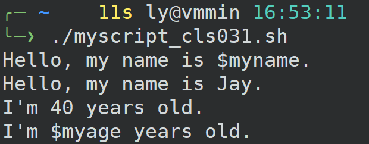  
## 减少重复操作
```shell
# myscript.sh
#!/bin/bash

word="fun"

echo "Linux is $word"
echo "Vediogames are $word"
echo "Sunny days are $word"
```
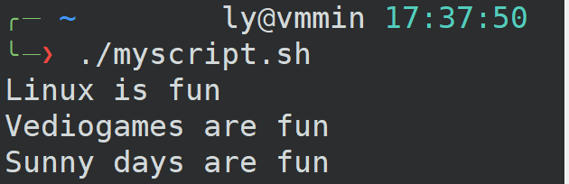  

## 存储临时值

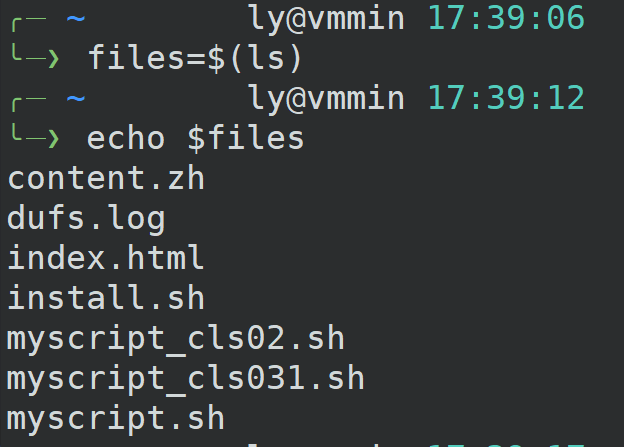  

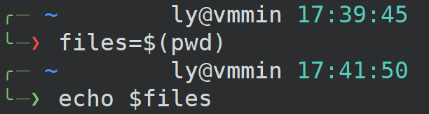  

```shell
now=$(date)
echo "The system time and date is:"
echo $now
```
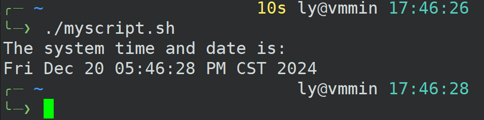  
## 系统环境变量(默认变量)

### 视频中的
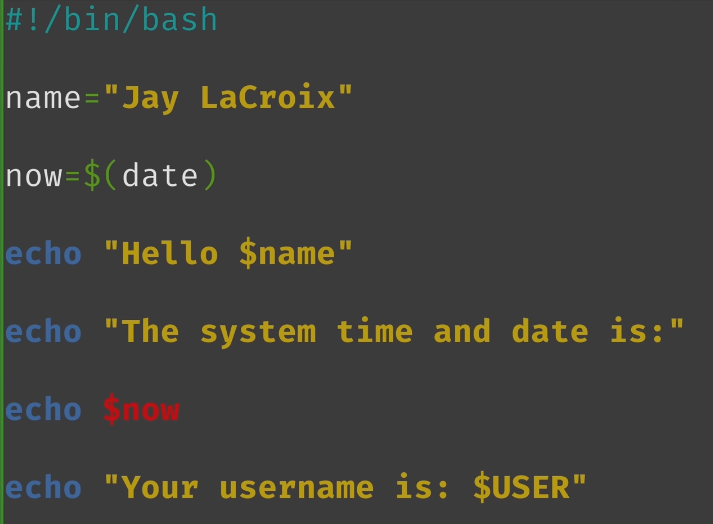  

输出  
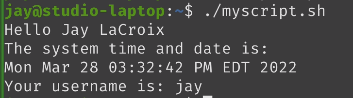  

### 自己测试
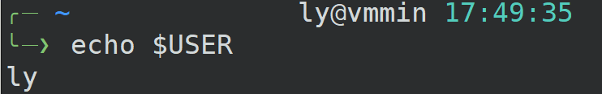  

### 系统变量字母全是大写英文
```shell
#查看系统变量
env
```
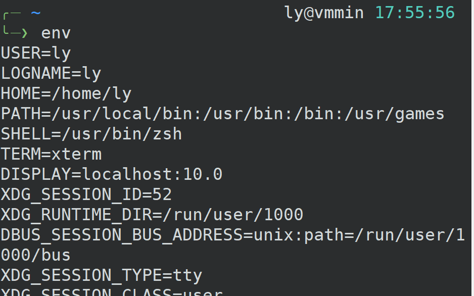  

# 数学函数
## **运算符左右两边都要有空格!!**
## shell中执行算术运算
```shell
expr 3 + 3
expr 30 - 10
expr 30 / 10
```
## 乘法\*号是通配符
**反斜杠转义星号**    
```shell
expr 100 \* 4
```
## 变量运算
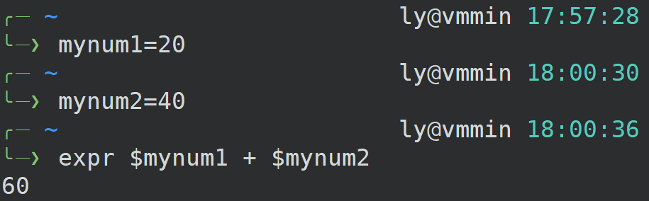  

