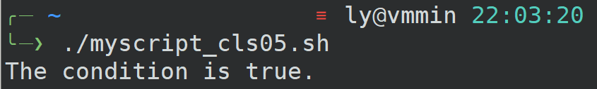
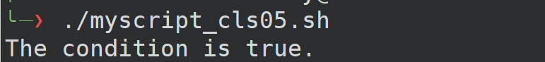
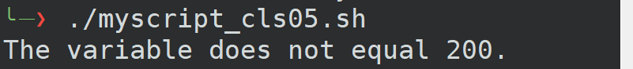
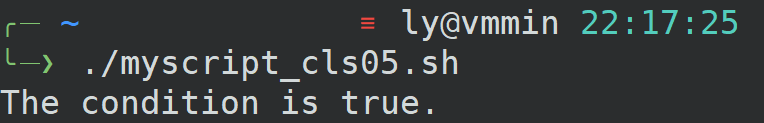
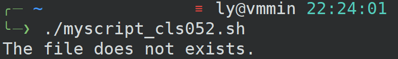
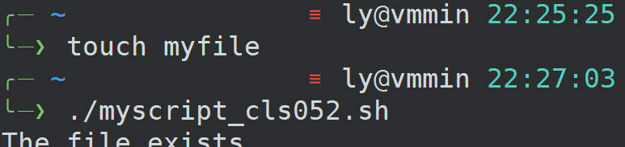
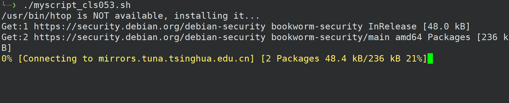
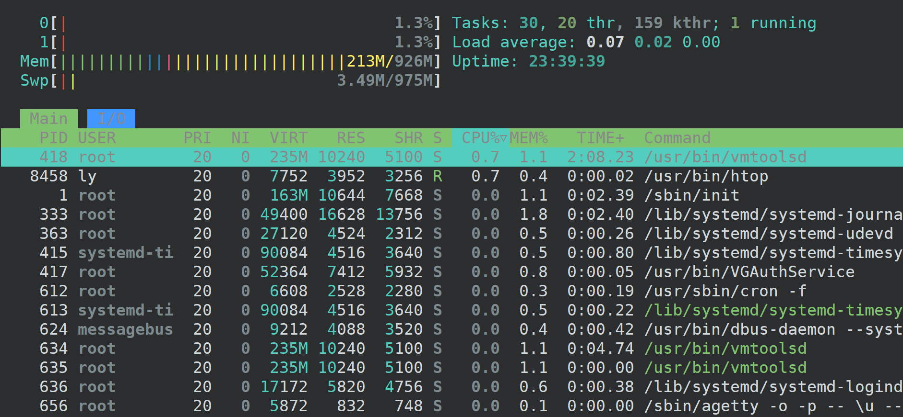
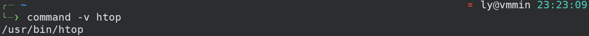
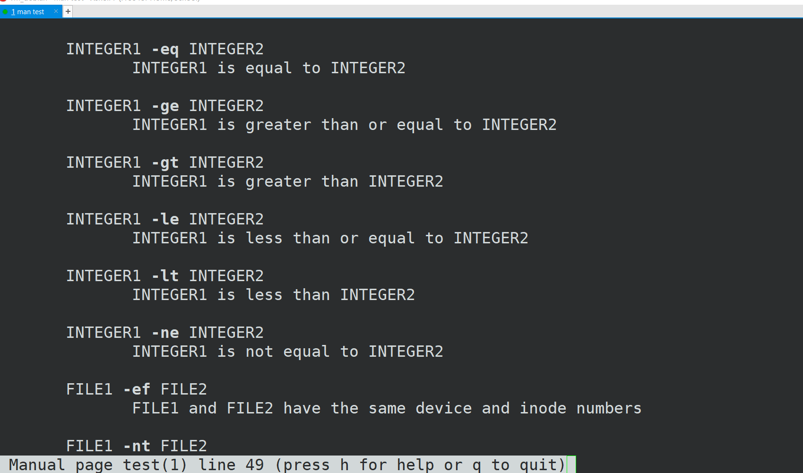

> 在shell中，零为真，非零为假。
# if then fi
```shell
mynum=200

#[和]前后都要有空格
if [ $mynum -eq 200 ]
then
    echo "The condition is true."
fi
```
  
编辑之后，按ctrl + O 保存文件  
ctrl + T + Z 保持在后台，```fg```+回车 恢复
```shell
#!/bin/bash

mynum=200

#[和]前后都要有空格
if [ $mynum -eq 200 ]
then
    echo "The condition is true."
fi

if [ $mynum -eq 300 ]
then
    echo "The variable does not equal 200."
fi
```

  

# else if
```shell
#!/bin/bash

mynum=300

#[和]前后都要有空格
if [ $mynum -eq 200 ]
then
    echo "The condition is true."
else
    echo "The variable does not equal>
fi
```
  

## !
```shell
#!/bin/bash

mynum=300

#[和]前后都要有空格
#!用来反转条件
if [ ! $mynum -eq 200 ]
then
    echo "The condition is true."
else
    echo "The variable does not equal 200."
fi
```
  

## ne
```shell
#!/bin/bash

mynum=300

#[和]前后都要有空格
if [  $mynum -ne 200 ]
then
    echo "The condition is true."
else
    echo "The variable does not equal 200."
fi
```
  

## 其他
```-gt``` 大于  

# -f 文件是否存在
```shell
#!/bin/bash

if [ -f ~/myfile ]
then
    echo "The file exists."
else
    echo "The file does not exists."
fi
```
  

## touch
文件不存在则创建文件；存在则更新修改时间  
  

```-d```查看是否存在某个目录  
# 配合install
```which```查看是否存在应用程序  
先是```which htop```，结果是空 说明暂时没有安装该程序  
编辑程序  
```shell
#!/bin/bash

command=/usr/bin/htop

#查看程序文件是否存在
if [ -f $command ]
then
    echo "$command is available,let's run it ..."
else
	#不存在则进行安装
    echo "$command is NOT available, installing it..."
    sudo apt update && sudo apt install -y htop
fi

$command
```

- 首先apt update只是用来更新软件包**列表**，与镜像存储库同步，找出实际可用的软件包，并不会实际更新软件。这就是为什么上面要先更新列表之后再安装。  
- 其次，经常有时候要apt update之后apt upgrade(这个命令才实际更新了软件)  
- &&用来命令链接，如果第一个命令成功，将立即运行第二个命令。失败则不运行。-y表示不要确认提示，只需继续运行即可（-y：当安装过程提示选择全部为"yes" ）
- 还有一点，在此之前我已经将我该用户ly添加进了sudoer组，即使用root用户运行 sudo usermod -aG sudo ly 命令（sudo deluser ly sudo 移出sudo组）。解释：-a 参数表示附加，只和 -G 参数一同使用，表示将用户增加到组中；即将ly添加到sudo组中。

  
  

简化  
```shell
#!/bin/bash

command=htop

#这里删除了[]，因为command本身就是一个测试命令
if command -v $command 
then
    echo "$command is available,let's run it ..."
else
    echo "$command is NOT available, installing it..."
    sudo apt update && sudo apt install -y $command
fi

$command
```
  

# man
```shell
man test
```


# 补充
我经常用的是```[[ ]]``` 这个命令，感觉比较直观，很多运算符都能用上。```[]```这个命令有些运算符没法用