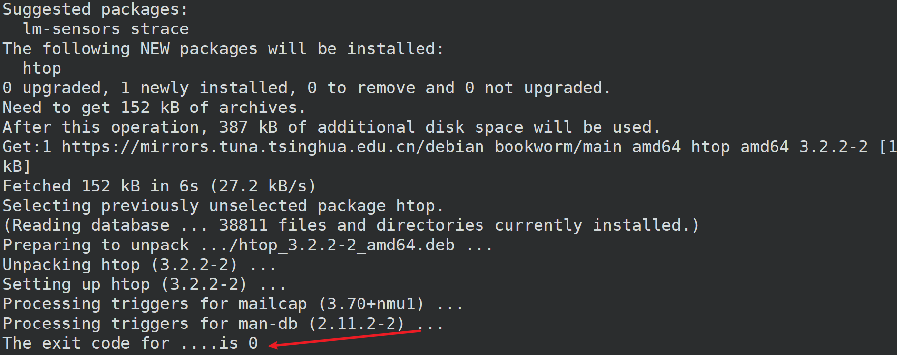

# 意义
用来确定代码是否执行成功
# 例子
```shell
ls -l /misc
echo $? #输出2
ls -l ~
echo $? #输出0
```

```$?```用来显示最近一个命令的状态，**零表示成功，非零表示失败**    
```shell
#!/bin/bash
#这个例子之前，作者用 sudo apt remove htop 命令把htop删除了
package=htop
sudo apt install $package

echo "The exit code for ....is $?"
```
安装完毕后显示返回0  
  
另一个示例  
```shell
#!/bin/bash

package=notexist
sudo apt install $package

echo "The exit code for ....is $?"
#执行后显示
#Reading package lists... Done
#Building dependency tree... Done
#Reading state information... Done
#E: Unable to locate package notexist
#The exit code for ....is 100
```

# 配合if语句
## 基本功能

```shell
#!/bin/bash

package=htop
sudo apt install $package

if [ $? -eq 0 ]
then
    echo "The installation of $package success..."
    echo "new comman here:"
    which $package
else
    echo "$package failed ..."
fi 

```
之前前作者用```sudo apt remove htop```又把htop删除了，不过其实不删除也是走的``` echo "The installation of ....."```这个分支  
结果：  
``` shell
xxxxxx....
kB]
Fetched 152 kB in 1s (292 kB/s)
Selecting previously unselected package htop.
(Reading database ... 38811 files and directories currently installed.)
Preparing to unpack .../htop_3.2.2-2_amd64.deb ...
Unpacking htop (3.2.2-2) ...
Setting up htop (3.2.2-2) ...
Processing triggers for mailcap (3.70+nmu1) ...
Processing triggers for man-db (2.11.2-2) ...
The installation of htop success...
new comman here:
/usr/bin/htop
```
修改后：  
``` shell
#!/bin/bash

package=notexit
sudo apt install $package

if [ $? -eq 0 ]
then
    echo "The installation of $package success..."
    echo "new comman here:"
    which $package
else
    echo "$package failed ..."
fi 

```

再次运行的结果：  
```shell
Reading package lists... Done
Building dependency tree... Done
Reading state information... Done
E: Unable to locate package notexit
notexit failed ...
```
## 重定向到文件 
先把htop再次提前卸载```sudo apt remove htop ```
### 成功
```shell
#!/bin/bash

package=htop
sudo apt install $package >> package_install_results.log

if [ $? -eq 0 ]
then
    echo "The installation of $package success..."
    echo "new comman here:"
    which $package
else
    echo "$package failed ..." >> package_isntall_failure.log
fi
```
结果：  
```shell
╭─ ~/shellTest                            ≡ ly@vmmin 11:14:08
╰─❯ ./63myscript_cls.sh 

WARNING: apt does not have a stable CLI interface. Use with caution in scripts.

The installation of htop success...
new comman here:
/usr/bin/htop

```
查看文件：  
```shell
─ ~/shellTest                 ≡ ly@vmmin 11:15:06
╰─❯ cat package_install_results.log 
Reading package lists...
Building dependency tree...
Reading state information...
Suggested packages:
  lm-sensors strace
The following NEW packages will be installed:
  htop
0 upgraded, 1 newly installed, 0 to remove and 0 not upgraded.
Need to get 152 kB of archives.
After this operation, 387 kB of additional disk space will be used.
Get:1 https://mirrors.tuna.tsinghua.edu.cn/debian bookworm/main amd64 htop amd64 3.2.2-2 [152 kB]
Fetched 152 kB in 1s (202 kB/s)
Selecting previously unselected package htop.
(Reading database ... 38811 files and directories currently installed.)
Preparing to unpack .../htop_3.2.2-2_amd64.deb ...
Unpacking htop (3.2.2-2) ...
Setting up htop (3.2.2-2) ...
Processing triggers for mailcap (3.70+nmu1) ...
Processing triggers for man-db (2.11.2-2) ...

```

### 失败
```shell
#!/bin/bash

package=notexit
sudo apt install $package >> package_install_results.log

if [ $? -eq 0 ]
then
    echo "The installation of $package success..."
    echo "new comman here:"
    which $package
else
    echo "$package failed ..." >> package_isntall_failure.log
fi
```

结果：  
```shell
─ ~/shellTest                 ≡ ly@vmmin 11:17:23
╰─❯ ./63myscript_cls.sh

WARNING: apt does not have a stable CLI interface. Use with caution in scripts.

E: Unable to locate package notexit
```
查看文件
```shell
╭─ ~/shellTest                 ≡ ly@vmmin 11:17:26
╰─❯ cat *fail*
notexit failed ...
```
## 退出代码的测试
代码  
```shell
#!/bin/bash

directory=/notexist

if [ -d $directory ]
then
    echo $? #测试失败，是非0
    echo "The directory $directory exists."
else
    echo $? #测试失败，是非0
    echo "The directory $directory doesn't exist."
fi

#最近一个命令是echo，echo确实正确执行并输出了，所以上一个指令执行成功，返回0
echo "The exit code ....is $?"

```

结果  
```shell
╭─ ~/shellTest                 ≡ ly@vmmin 11:43:24
╰─❯ ./64myscript_cls.sh 
1
The directory /notexist doesn't exist.
The exit code ....is 0

```
# 控制退出代码的结果

```shell
─ ~/shellTest                 ≡ ly@vmmin 11:50:29
╰─❯ cat ./65myscript_cls.sh 
#!/bin/bash

echo "Hello world"
exit 199
#这行代码永远都不会执行
echo "never exec"

```

结果：  
```shell
╭─ ~/shellTest   ✘ STOP 1m 16s ≡ ly@vmmin 11:50:16
╰─❯ ./65myscript_cls.sh 
Hello world
╭─ ~/shellTest           ✘ 199 ≡ ly@vmmin 11:50:23
╰─❯ echo $?
199

```
## 执行失败
**以最后一次exit返回的code为最终结果**  
虽然执行失败了，但是返回值还是以我们给出的为结果  
```shell
╭─ ~/shellTest           ✘ INT ≡ ly@vmmin 11:53:24
╰─❯ cat 65myscript_cls.sh 
#!/bin/bash

sudo apt install notexist
exit 0
#这行代码永远都不会执行
echo "never exec"

```

结果：  
```shell
╭─ ~/shellTest       ✘ STOP 8s ≡ ly@vmmin 11:55:04
╰─❯ ./65myscript_cls.sh 
Reading package lists... Done
Building dependency tree... Done
Reading state information... Done
E: Unable to locate package notexist
╭─ ~/shellTest                 ≡ ly@vmmin 11:55:07
╰─❯ echo $?
0

```
# exit最本质含义
```shell
!/bin/bash

directory=/notexist

if [ -d $directory ]
then
    echo "The directory $directory exists."
    exit 0
else
    echo "The directory $directory doesn't exist."
    exit 1
fi

#下面这三行永远不会执行，因为上面的任何一个分支都会导致退出程序执行
echo "The exit code for this ....is: $?"
echo "You didn't ..see this.."
echo "You won't see ..."
```