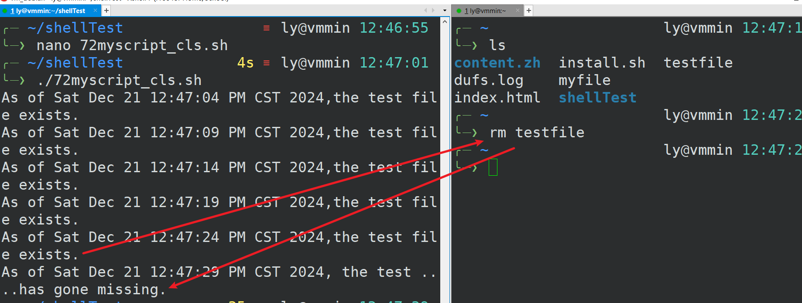

# WhileLoops
## 范例
```shell
#!/bin/bash

myvar=1
#小于或者等于10
while [ $myvar -le 10 ]
do
    echo $myvar
    myvar=$(( $myvar + 1  ))
    sleep 0.5
done

```
运行  
```shell
╭─ ~/shellTest                              ≡ ly@vmmin 12:10:33
╰─❯ ./71myscript_cls.sh 
1
2
3
4
5
6
7
8
9
10
```

数字会每隔0.5s就输出一次  
对于```myvar=$(( $myvar + 1  ))``` ，```$((expression))```形式表示算数运算，而且其中的空格是可以省略的  
## 范例2
```shell
#!/bin/bash

while [ -f ~/testfile ]
do
    echo "As of $(date),the test file exists."
    sleep 5
done

echo "As of $(date), the test ....has gone missing."

```

用来测试文件是否存在，运行前先新建一下文件```touch ~/testfile```
运行一会后把文件删除，如图  
  

```date```命令包含在子shell中，因此date命令将在后台运行并将该命令的输出替换```$(date)```这部分
# 更新相关的脚本
## 基本概念
> upgrade：系统将现有的Package升级，如果有相依性的问题，而此相依性**需要安装其它新的Package或影响到其它Package的相依性**时，此Package就**不会被升级**，会保留下来。  
> 
> dist-upgrade：可以聪明的解决相依性的问题，**如果有相依性问题，需要安装/移除新的Package，就会试着去安装/移除它**。

>  grep -q，安静模式，不打印任何标准输出。如果有匹配的内容则立即返回状态值0  
>  shell中，零为真，非零为假

```shell
#!/bin/bash

release_file=/etc/os-release

#这里没有使用[]测试命令，而是使用Linux命令
# #号用来注释，除了第一行shebang比较特殊
if  grep -q "Arch" $release_file 
then
    sudo pacman -Syu
fi
# ||或者，&& 与，
if grep -q "Ubuntu" $release_file ||  grep -q "Debian" $release_file 
then
    sudo apt update
    sudo apt dist-upgrade
fi

```
# for语句
```shell
#!/bin/bash

for current_number in 1 2 3 4 5 6 7 8 9 10
do
    echo $current_number
    sleep 1
done

echo "This is outside of the for loop."
```
for语句进入do语句前，current_number指向1，1的do结束后current_number指向2  
```shell
─ ~/shellTest                   ly@vmmin 21:55:34
╰─❯ ./9myscript_cls.sh 
1
2
3
4
5
6
7
8
9
10
This is outside of the for loop.

```
简化  
```shell
#!/bin/bash

for current_number in {1..10}
#for current_number in {a..z} #字母也行
do
    echo $current_number
    sleep 1
done

echo "This is outside of the for loop."
```

```shell
#!/bin/bash

for n in {1..10}
#for n in {a..z} #字母也行
do
    echo $n
    sleep 1
done

echo "This is outside of the for loop."
```

## 文件遍历
```shell
─ ~/shellTest                   ly@vmmin 23:15:41
╰─❯ ls logfiles          
a.log  b.log  c.log  xx.txt  y.txt
```
脚本：  
```shell
#!/bin/bash

for file in logfiles/*.log
do
    tar -czvf $file.tar.gz $file
done
```

> tar命令，tar -czvf   c : create，z : zip，v: view，f: file

结果：  

```shell
╭─ ~/shellTest                   ly@vmmin 23:26:15
╰─❯ ls logfiles 
a.log         b.log         c.log         xx.txt
a.log.tar.gz  b.log.tar.gz  c.log.tar.gz  y.txt
```

## 可以用来循环发送日志文件（提到，没例子）

# 脚本保存位置
> 主要讨论脚本应该放在哪个公共位置才可以让所有人都可以访问  
> 为需要的人提供脚本  

> file system hierarchy standard，文件系统层次结构标准，简称FHS
> 这个东西存在的目的，"所有Linux发行版上都可以找到的每个典型目录"。  
> FHS指出了与本地安装的程序一起使用的用户本地目录（给系统管理员使用），bin目录也位于用户本地，我们将在其中放置脚本

```shell
─ ~/shellTest                   ly@vmmin 10:34:13
╰─❯ sudo mv 10_1myscript_cls.sh /usr/local/bin/update
```

```shell
╭─ ~/shellTest                3s ly@vmmin 10:28:43
╰─❯ ls -l /usr/local/bin
total 77876
-rwxr-xr-x 1 root root  4488672 Dec 17 16:28 dufs
-rwxr-xr-x 1 root root 75247968 Dec 17 16:44 hugo
-rwxr-xr-x 1 root root      231 Dec 23 10:28 update
```

```shell
╭─ ~/shellTest                                                              ly@vmmin 10:34:58
╰─❯ ls -l /usr/local/bin
total 77876
-rwxr-xr-x 1 root root  4488672 Dec 17 16:28 dufs
-rwxr-xr-x 1 root root 75247968 Dec 17 16:44 hugo
-rwxr-xr-x 1 ly   ly        231 Dec 23 10:33 update
```
现在需要**让这个脚本由root拥有**，以确保有人需要```pseudo privileges 伪权限```或者```root permissions root权限```才能修改该脚本，不能让（普通）用户修改
```shell
╭─ ~/shellTest                           ly@vmmin 10:35:05
╰─❯ sudo chown root:root /usr/local/bin/update
╭─ ~/shellTest                          ly@vmmin 10:40:32
╰─❯ ls -l /usr/local/bin                      
total 77876
-rwxr-xr-x 1 root root  4488672 Dec 17 16:28 dufs
-rwxr-xr-x 1 root root 75247968 Dec 17 16:44 hugo
-rwxr-xr-x 1 root root      231 Dec 23 10:33 update
```

> Linux中任何脚本其实都不需要后缀的，所以这里删除了 .sh 。  
> 因为第一行shebang已经指明了需要使用到什么解释器

## 使用
```shell
╭─ ~                                                                        ly@vmmin 11:39:04
╰─❯ ls
content.zh  dufs.log  index.html  install.sh  myfile  shellTest
╭─ ~                                                                        ly@vmmin 11:39:05
╰─❯ update
Hit:1 https://mirrors.tuna.tsinghua.edu.cn/debian bookworm InRelease
Hit:2 https://mirrors.tuna.tsinghua.edu.cn/debian bookworm-updates InRelease
Hit:3 https://mirrors.tuna.tsinghua.edu.cn/debian bookworm-backports InRelease
Hit:4 https://mirrors.tuna.tsinghua.edu.cn/debian-security bookworm-security InRelease
Hit:5 https://security.debian.org/debian-security bookworm-security InRelease
Reading package lists... Done
Building dependency tree... Done
Reading state information... Done
All packages are up to date.
Reading package lists... Done
Building dependency tree... Done
Reading state information... Done
Calculating upgrade... Done
0 upgraded, 0 newly installed, 0 to remove and 0 not upgraded.
```

```shell
╭─ ~                          13s ly@vmmin 11:39:19
╰─❯ which update
/usr/local/bin/update
```
**运行```update```命令的时候，是需要sudo权限的**  
且不需要指定具体完整路径，就可以使用```update```文件  

> 有一个系统变量，告诉shell将在其中查找所有的目录

全大写表示**系统变量** 
```shell
─ ~                                  ly@vmmin 11:44:21
╰─❯ echo $PATH
/usr/local/bin:/usr/bin:/bin:/usr/games

```
系统变量查看  
```shell
╭─ ~                      ly@vmmin 11:45:48
╰─❯ env
USER=ly
LOGNAME=ly
HOME=/home/ly
PATH=/usr/local/bin:/usr/bin:/bin:/usr/games
SHELL=/usr/bin/zsh
TERM=xterm
DISPLAY=localhost:11.0
XDG_SESSION_ID=99
XDG_RUNTIME_DIR=/run/user/1000
DBUS_SESSION_BUS_ADDRESS=unix:path=/run/user/1000/bus
XDG_SESSION_TYPE=tty
XDG_SESSION_CLASS=user
MOTD_SHOWN=pam
LANG=en_US.UTF-8
SSH_CLIENT=192.168.1.201 52599 22
SSH_CONNECTION=192.168.1.201 52599 192.168.1.206 22
SSH_TTY=/dev/pts/2
SHLVL=1
PWD=/home/ly
OLDPWD=/home/ly/shellTest
P9K_TTY=old
_P9K_TTY=/dev/pts/2
ZSH=/home/ly/.oh-my-zsh
PAGER=less
LESS=-R
LSCOLORS=Gxfxcxdxbxegedabagacad
LS_COLORS=rs=0:di=01;34:ln=01;36:mh=00:pi=40;33:so=01;35:do=01;35:bd=40;33;01:cd=40;33;01:or=40;31;01:mi=00:su=37;41:sg=30;43:ca=00:tw=30;42:ow=34;42:st=37;44:ex=01;32:*.tar=01;31:*.tgz=01;31:*.arc=01;31:*.arj=01;31:*.taz=01;31:*.lha=01;31:*.lz4=01;31:*.lzh=01;31:*.lzma=01;31:*.tlz=01;31:*.txz=01;31:*.tzo=01;31:*.t7z=01;31:*.zip=01;31:*.z=01;31:*.dz=01;31:*.gz=01;31:*.lrz=01;31:*.lz=01;31:*.lzo=01;31:*.xz=01;31:*.zst=01;31:*.tzst=01;31:*.bz2=01;31:*.bz=01;31:*.tbz=01;31:*.tbz2=01;31:*.tz=01;31:*.deb=01;31:*.rpm=01;31:*.jar=01;31:*.war=01;31:*.ear=01;31:*.sar=01;31:*.rar=01;31:*.alz=01;31:*.ace=01;31:*.zoo=01;31:*.cpio=01;31:*.7z=01;31:*.rz=01;31:*.cab=01;31:*.wim=01;31:*.swm=01;31:*.dwm=01;31:*.esd=01;31:*.avif=01;35:*.jpg=01;35:*.jpeg=01;35:*.mjpg=01;35:*.mjpeg=01;35:*.gif=01;35:*.bmp=01;35:*.pbm=01;35:*.pgm=01;35:*.ppm=01;35:*.tga=01;35:*.xbm=01;35:*.xpm=01;35:*.tif=01;35:*.tiff=01;35:*.png=01;35:*.svg=01;35:*.svgz=01;35:*.mng=01;35:*.pcx=01;35:*.mov=01;35:*.mpg=01;35:*.mpeg=01;35:*.m2v=01;35:*.mkv=01;35:*.webm=01;35:*.webp=01;35:*.ogm=01;35:*.mp4=01;35:*.m4v=01;35:*.mp4v=01;35:*.vob=01;35:*.qt=01;35:*.nuv=01;35:*.wmv=01;35:*.asf=01;35:*.rm=01;35:*.rmvb=01;35:*.flc=01;35:*.avi=01;35:*.fli=01;35:*.flv=01;35:*.gl=01;35:*.dl=01;35:*.xcf=01;35:*.xwd=01;35:*.yuv=01;35:*.cgm=01;35:*.emf=01;35:*.ogv=01;35:*.ogx=01;35:*.aac=00;36:*.au=00;36:*.flac=00;36:*.m4a=00;36:*.mid=00;36:*.midi=00;36:*.mka=00;36:*.mp3=00;36:*.mpc=00;36:*.ogg=00;36:*.ra=00;36:*.wav=00;36:*.oga=00;36:*.opus=00;36:*.spx=00;36:*.xspf=00;36:*~=00;90:*#=00;90:*.bak=00;90:*.old=00;90:*.orig=00;90:*.part=00;90:*.rej=00;90:*.swp=00;90:*.tmp=00;90:*.dpkg-dist=00;90:*.dpkg-old=00;90:*.ucf-dist=00;90:*.ucf-new=00;90:*.ucf-old=00;90:*.rpmnew=00;90:*.rpmorig=00;90:*.rpmsave=00;90:
P9K_SSH=1
_P9K_SSH_TTY=/dev/pts/2
_=/usr/bin/env
```

如果想要修改与路径变量```PATH```不同的目录  
```shell
#如果/usr/bin/local/bin默认没有添加到path里面的情况
export PATH=/usr/bin/local/bin:$PATH
```