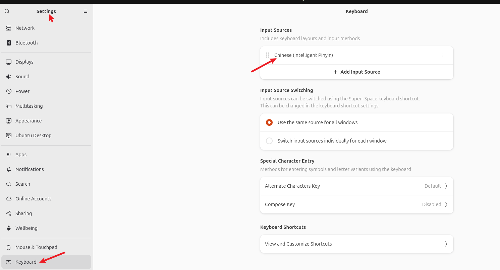

- 推荐内存8GB，硬盘80GB选择Single，网络我使用的是桥接
- 擦除磁盘并安装，文件系统无加密
- 设置账号-活动目录不要勾选
- 安装过程中会有红色报错`piix4_smbus 0000:00:07.3: SMBus Host Controller not enabled!` ~~Ubuntu 内核在启动时试图加载 piix4_smbus 模块来读取主板总线设备，但 VMware 虚拟机并没有提供真实的 SMBus 硬件，因此系统抛出了这个红色提示~~ 
- 安装时建议选择语言为English，后续需要汉化再安装汉化包，避免出现`用户\文档`、`用户\图片`之类的中文文件夹
- 键盘布局选择 Chinese，Chinese
- 安装哪些应用？默认集合
- 安装推荐的专有软件：1 为图形和wifi硬件安装第三方软件 2 下载并安装对其他媒体格式的支持。2个都勾选
- 安装过程半个小时以上（比debian久很多）
- vmware安装
  `sudo apt install -y open-vm-tools open-vm-tools-desktop`  
- 设置静态ip
  `sudo nmcli connection modify ens33 ipv4.addresses 192.168.6.206/24 ipv4.gateway 192.168.6.1`

# 设置静态ip

```shell
cd /etc/netplan
sudo nano 00-installer-config.yaml #修改基础配置文件

```

修改文件为 ~~也就是把ens33:后面的全部注释，并改为`ens33: {}`~~ 

```shell
# This is the network config written by 'subiquity'
network:
  ethernets:
    ens33: {}
#      dhcp4: true
#      dhcp6: true
#      match:
#        macaddress: 00:0c:29:4a:90:d5
#      set-name: ens33
#  version: 2

```

新增文件并配置
```shell
sudo nano 10-static-ip.yaml #新增配置文件，这里10会覆盖前面的01,01会覆盖前面的00
network:
  version: 2
  ethernets:
    ens33:
      dhcp4: false
      addresses:
        - 192.168.6.206/24
      routes:
        - to: default
          via: 192.168.6.1
      nameservers:
        addresses:
          - 192.168.6.1
          - 223.5.5.5
            
```

之后ctrl+x保存后回车即可  

应用  

```shell
sudo netplan generate
sudo netplan apply
ip route #查看ip和网关
```
# 允许ssh远程登录

```shell
sudo apt install openssh-server #安装ssh
sudo systemctl enable --now ssh
ly@ubt26:~$ sudo systemctl status ssh
● ssh.service - OpenBSD Secure Shell server
     Loaded: loaded (/usr/lib/systemd/system/ssh.service; enabled; preset: enabled) 
```

# 修改为清华源

```shell
cd /etc/apt/sources.list.d/
sudo cp ubuntu.sources ubuntu.sources.bak
```


sudo nano /etc/apt/sources.list.d/ubuntu.sources  ~~使用ctrl+k删除当前行~~   

修改为如下   

```shell
Types: deb
URIs: https://mirrors.tuna.tsinghua.edu.cn/ubuntu
Suites: resolute resolute-updates resolute-backports
Components: main restricted universe multiverse
Signed-By: /usr/share/keyrings/ubuntu-archive-keyring.gpg

# 默认注释了源码镜像以提高 apt update 速度，如有需要可自行取消注释
# Types: deb-src
# URIs: https://mirrors.tuna.tsinghua.edu.cn/ubuntu
# Suites: resolute resolute-updates resolute-backports
# Components: main restricted universe multiverse
# Signed-By: /usr/share/keyrings/ubuntu-archive-keyring.gpg

# 以下安全更新软件源为镜像站配置
Types: deb
URIs: https://mirrors.tuna.tsinghua.edu.cn/ubuntu
Suites: resolute-security
Components: main restricted universe multiverse
Signed-By: /usr/share/keyrings/ubuntu-archive-keyring.gpg

# Types: deb-src
# URIs: https://mirrors.tuna.tsinghua.edu.cn/ubuntu
# Suites: resolute-security
# Components: main restricted universe multiverse
# Signed-By: /usr/share/keyrings/ubuntu-archive-keyring.gpg

# 预发布软件源，不建议启用

# Types: deb
# URIs: https://mirrors.tuna.tsinghua.edu.cn/ubuntu
# Suites: resolute-proposed
# Components: main restricted universe multiverse
# Signed-By: /usr/share/keyrings/ubuntu-archive-keyring.gpg

# # Types: deb-src
# # URIs: https://mirrors.tuna.tsinghua.edu.cn/ubuntu
# # Suites: resolute-proposed
# # Components: main restricted universe multiverse
# # Signed-By: /usr/share/keyrings/ubuntu-archive-keyring.gpg
```

# 安装中文输入法

```shell
sudo apt install ibus ibus-libpinyin
ibus-setup #添加中文 Chinese → Intelligent Pinyin
```

还有，settings-keyboad-Add Input Sources  

  

# 缩放字体

`gsettings set org.gnome.desktop.interface text-scaling-factor 1.3` 

# 安装chrome
```shell
bash wget https://dl.google.com/linux/direct/google-chrome-stable_current_amd64.deb   

```


# 图形和纯命令行界面切换

## 进入命令行

```shell
sudo systemctl set-default multi-user.target 
sudo systemctl isolate multi-user.target
```

## 进入图形界面

```shell
sudo systemctl set-default graphical.target
sudo systemctl isolate graphical.target
```

# 共享文件夹

在vmware的SharedFolders共享后，需要在虚拟机中再执行一次命令

```shell
sudo mount -t fuse.vmhgfs-fuse .host:/ /mnt/hgfs -o allow_other
```