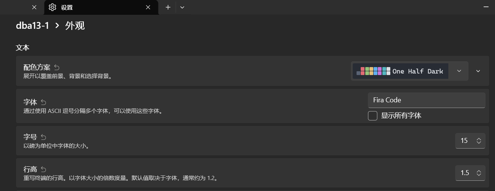

# Debian13

下载地址： https://raw.githubusercontent.com/debuerreotype/docker-debian-artifacts/dist-amd64/trixie/oci/blobs/rootfs.tar.gz  

```bash
#安装
wsl --import dba13-1 E:\WSL\dba13-1 D:\software\WSLInstall\debian13-rootfs.tar.gz  --version 2
#查看有哪些发行版
PS C:\Users\ly\MyHello> wsl -l -v
  NAME         STATE           VERSION
* dba13-1    Stopped         2
#进入wsl的debian系统
PS C:\Users\ly\MyHello> wsl -d dba13-1
root@DESKTOP-F0V2VF4:/mnt/c/Users/ly/MyHello#
```

## 修改源

修改一下源为清华源(http)

```bash
#root用户下
cp /etc/apt/sources.list.d/debian.sources /etc/apt/sources.list.d/debian.sources.bak
cat > /etc/apt/sources.list.d/debian.sources <<'EOF'
Types: deb
URIs: http://mirrors.tuna.tsinghua.edu.cn/debian
Suites: trixie trixie-updates
Components: main contrib non-free non-free-firmware
Signed-By: /usr/share/keyrings/debian-archive-keyring.gpg

Types: deb
URIs: http://mirrors.tuna.tsinghua.edu.cn/debian-security
Suites: trixie-security
Components: main contrib non-free non-free-firmware
Signed-By: /usr/share/keyrings/debian-archive-keyring.gpg
EOF

apt update
apt upgrade -y

```

## 证书处理

```
apt install -y ca-certificates
update-ca-certificates
sed -i 's#http://mirrors.tuna.tsinghua.edu.cn#https://mirrors.tuna.tsinghua.edu.cn#g' /etc/apt/sources.list.d/debian.sources

apt update
apt upgrade -y
```

## 新增用户

```shell
#备用命令，通过命令行直接用root（无密码）进入系统
wsl -d Debian-13 -u root

#新增用户
apt install -y sudo
apt install -y adduser
adduser ly
#这里会输入一堆东西，都可以enter跳过（我输入了FullName）
usermod -aG sudo ly
```

## 可以ping
`
```bash
sudo apt install -y iputils-ping
sudo apt install -y libcap2-bin
sudo setcap cap_net_raw+ep $(which ping)
#debconf: falling back to frontend: Teletype #表示因为没有界面所以显示文字提示
```


## 语言问题

```bash
sudo apt update
sudo apt install -y locales

sudo vim /etc/locale.gen
# en_US.UTF-8 UTF-8
# zh_CN.UTF-8 UTF-8
#上面的两行取消注释

sudo locale-gen 
locale -a
C
C.utf8
en_US.utf8
POSIX
zh_CN.utf8
ly@debian13:~$ sudo update-locale LANG=en_US.UTF-8

```


# Ubuntu

到这里下载wsl镜像： https://releases.ubuntu.com/noble/?utm_source=chatgpt.com  

tar.gz： https://cloud-images.ubuntu.com/wsl/releases/24.04/current/?utm_source=chatgpt.com 

```
#建议用这个，后面用注册表的方式改名字
wsl --install --from-file D:\software\WSLInstall\ubuntu-24.04.5-wsl-amd64.wsl --location E:\WSL\ubt24-1
#或者
wsl --import ubt24_2 E:\WSL\dba13-1 D:\software\WSLInstall\ubuntu-noble-wsl-amd64-24.04lts.rootfs.tar.gz  --version 2
```

## 修改源24.04

修改一下源为清华源(http)

```bash
#root用户下
sudo cp /etc/apt/sources.list.d/ubuntu.sources /etc/apt/sources.list.d/ubuntu.sources.bak
sudo tee /etc/apt/sources.list.d/ubuntu.sources > /dev/null <<'EOF'
Types: deb
URIs: https://mirrors.tuna.tsinghua.edu.cn/ubuntu
Suites: noble noble-updates noble-backports
Components: main restricted universe multiverse
Signed-By: /usr/share/keyrings/ubuntu-archive-keyring.gpg

Types: deb
URIs: https://mirrors.tuna.tsinghua.edu.cn/ubuntu
Suites: noble-security
Components: main restricted universe multiverse
Signed-By: /usr/share/keyrings/ubuntu-archive-keyring.gpg
EOF

sudo apt update
sudo apt upgrade -y

```


# WSL中Linux通用

## 修改显示的Name

***手动修改注册表步骤***  

1. 停止发行版：确保它已停止运行。
```
powershell wsl --terminate Ubuntu-24.04
```
2. 打开注册表编辑器：按 Win + R，输入 regedit，回车。
3. 定位发行版：导航至以下路径，在 Lxss 下逐个点击 GUID 子项，查看右侧 DistributionName 的值，找到 Ubuntu-24.04：
```
HKEY_CURRENT_USER\Software\Microsoft\Windows\CurrentVersion\Lxss
```
4. 修改名称：双击 DistributionName，将值改为新名称（如 ubt24-1），确定。
5. 验证：回到 PowerShell 运行 wsl -l -v 确认。

***⚠️ 后续注意***

改完注册表后，Windows Terminal 下拉菜单里可能仍显示旧名字。需进入 Terminal 设置，找到对应配置文件，手动把“名称”字段也改过来。


## 修改主机名

```
sudo apt install nano vim -y
sudo vim /etc/wsl.conf
#写入
#修改为  
[user]
default=ly

[boot]
systemd=true

[network]
hostname=ubt24-1
#generateHosts=false


#修改主机名
echo ubt24-1 | sudo tee /etc/hostname 

#=======================
#如果出现unable to resolve host debian13: Name or service not known
#则：
sudo vim /etc/hosts
#添加一行：
127.0.1.1       ubt24-1
#=======================
#关机然后重进
wsl --shutdown
wsl -d Debian

wsl -d dba13-1

#修改bashrc修改默认进入时的目录
vim ~/.profile

最后一行添加：cd ~


```


## 安装其他东西

```bash
sudo apt install -y \
    iputils-ping \
    iproute2 \
    dnsutils \
    net-tools \
    curl \
    wget
```

```bash
sudo apt update

sudo apt install -y \
build-essential \
cmake \
ninja-build \
gdb \
git \
pkg-config \
python3 \
python3-pip \
python3-venv \
python-is-python3 \
curl \
wget \
unzip \
zip \
tree \
file \
vim \
nano
```

| 软件                | 用途                           |
| ----------------- | ---------------------------- |
| `gcc`             | C 编译器--build-essential包括     |
| `g++`             | C++ 编译器--build-essential包括   |
| `make`            | Make 构建工具--build-essential包括 |
| `build-essential` | C/C++ 基础开发工具集合               |
| `cmake`           | CMake 构建系统                   |
| `ninja-build`     | Ninja 构建工具，CMake 很常用         |
| `gdb`             | C/C++ 调试器                    |
| `git`             | Git 版本控制                     |
| `pkg-config`      | 查找和配置依赖库                     |
| `libc6-dev`       | C 标准库开发文件--build-essential包括 |
| `python3`         | Python                       |
| `python3-pip`     | Python 包管理                   |
| `python3-venv`    | Python 虚拟环境                  |
| `curl` / `wget`   | 下载工具                         |
| `tree`            | 查看项目目录结构                     |


## python安装

```bash
sudo apt update
sudo apt install -y python3 python3-pip python3-venv
```

给项目创建虚拟环境  

```bash
cd ~
python3 -m venv .venv
source ~/.venv/bin/activate #激活 
python -m pip install openai
deactivate

```


## ssh

如果还没安装：

```
sudo apt install -y openssh-server
```


***修改端口***  

可以不做 ~~推荐，以免和物理机主机冲突~~ 

```bash
sudo vim /etc/ssh/sshd_config
#Port 22
#修改为
Port 2201
```


***启动：***  

```
sudo service ssh start
systemctl is-enabled ssh

sudo systemctl disable --now ssh.socket
sudo systemctl enable --now ssh
sudo ss -tlnp | grep ssh

sudo systemctl restart ssh
```

***检查：***  

```
ss -tlnp | grep ':22'
```

应该看到类似：

```
LISTEN 0 128 0.0.0.0:2201
```

## 拷贝远程机器的目录到本机

```bash
scp -P 22 -r ly@192.168.6.208:/home/ly/ly_vscode .
```

## 网络问题

让局域网内其他机器访问虚拟机及其开放的端口

```bash
#修改C:\Users\你的用户名\.wslconfig
[wsl2]

# 让 WSL 使用镜像网络模式，使 WSL 更直接地参与宿主机网络
networkingMode=mirrored 

[experimental]

# 允许 WSL 通过宿主机地址访问 Windows 上监听的服务
hostAddressLoopback=true

#然后重启虚拟机
#此时已经获取到了windows主机ip

```

## http端口访问限制

```shell
#以下都在window powershell的管理员权限下访问
#添加
New-NetFirewallHyperVRule `
    -Name "WSL-HTTP-8080" `
    -DisplayName "WSL HTTP 8080" `
    -Direction Inbound `
    -VMCreatorId '{40E0AC32-46A5-438A-A0B2-2B479E8F2E90}' `
    -Protocol TCP `
    -LocalPorts 8080
    
    
#查看某一条
Get-NetFirewallHyperVRule -Name "WSL-HTTP-8080" |
    Format-List *
    
#按端口查
Get-NetFirewallHyperVRule |
    Where-Object { $_.LocalPorts -contains "8080" } |
    Format-List *
    
#删除某个端口规则
Remove-NetFirewallHyperVRule -Name "WSL-HTTP-8080"

#一次性查清所有WSL-开头的规则
Get-NetFirewallHyperVRule |
    Where-Object {
        $_.Name -like "WSL-*"
    } |
    Format-Table Name,DisplayName,Direction,Protocol,LocalPorts,Action,Enabled
    
#端口测试
Test-NetConnection 192.168.6.201 -Port 8080

#开放所有端口
New-NetFirewallHyperVRule `
    -Name "WSL-All-TCP" `
    -DisplayName "WSL All TCP Ports" `
    -Direction Inbound `
    -VMCreatorId '{40E0AC32-46A5-438A-A0B2-2B479E8F2E90}' `
    -Protocol TCP `
    -LocalPorts 1-65535
    #范围 -LocalPorts 2201,8080,3000,5000
    
#查看VMWAREid（有规则的情况下）
Get-NetFirewallHyperVRule |
    Select-Object -ExpandProperty VMCreatorId -Unique
#查看目前虚拟机有哪些规则
Get-NetFirewallHyperVRule |
    Where-Object {
        $_.VMCreatorId -eq "{40E0AC32-46A5-438A-A0B2-2B479E8F2E90}"
    } |
    Format-Table Name,DisplayName,Direction,Protocol,LocalPorts,RemoteAddresses,Action,Enabled
    
#查看VMWARE ID--多个 WSL 发行版共用一个 VMCreatorId
Get-NetFirewallHyperVVMCreator

```


## WSL2 GPU 加速问题排查

~~我的笔记本是核显无独立显卡显存~~   

#### 1. 先看结果：OpenGL 到底用了谁？

执行：

```bash
glxinfo -B | grep -E "Device:|Accelerated:|OpenGL renderer"
```

重点看两个东西：

```text
Accelerated: yes/no
OpenGL renderer string: ...
```

##### 情况 A：CPU 软件渲染 ❌

```text
Device: llvmpipe
Accelerated: no
OpenGL renderer string: llvmpipe
```

说明：

```text
OpenGL
  ↓
llvmpipe
  ↓
CPU
```

**没有使用 GPU。**

---

##### 情况 B：GPU 硬件加速 ✅

```text
Device: D3D12 (AMD Radeon(TM) Vega 8 Graphics)
Accelerated: yes
OpenGL renderer string: D3D12 (AMD Radeon(TM) Vega 8 Graphics)
```

说明：

```text
OpenGL
  ↓
Mesa / D3D12
  ↓
Windows
  ↓
AMD Vega 8 GPU
```

**正在使用真实 GPU。**

---

### 2. 验证：是不是只是“驱动选择”出了问题？

如果直接运行得到：

```text
llvmpipe
Accelerated: no
```

可以临时指定 D3D12：

```bash
GALLIUM_DRIVER=d3d12 glxinfo -B
```

或者只看关键结果：

```bash
GALLIUM_DRIVER=d3d12 glxinfo -B | grep -E "Device:|Accelerated:|OpenGL renderer"
```

如果结果变成：

```text
D3D12 (AMD Radeon(TM) Vega 8 Graphics)
Accelerated: yes
```

那么基本可以判断：

> **WSL 的 GPU 加速能力是正常的，只是 OpenGL 默认选择了 llvmpipe，而不是 D3D12。**

---

### 3. 怎么解决？

先用环境变量临时指定：

```bash
GALLIUM_DRIVER=d3d12
```

例如：

```bash
GALLIUM_DRIVER=d3d12 glxinfo -B
```

确认正常后，再考虑是否需要把它设置成**永久环境变量**。

---

### 4. 两个最重要的概念

#### llvmpipe

```text
软件渲染器
CPU → 负责 OpenGL 计算
```

优点：没有 GPU 也能运行 OpenGL。

缺点：3D 性能通常比较差。

---

#### D3D12

```text
硬件加速路径
OpenGL → D3D12 → Vega 8 GPU
```

优点：真正使用显卡，适合 Gazebo、OpenGL 等 3D 程序。

---

### 最终判断口诀

> **看 `Accelerated`，再看 `renderer`。**

```text
Accelerated: no
        ↓
llvmpipe
        ↓
CPU 软件渲染 ❌
```

```text
Accelerated: yes
        ↓
D3D12 + Vega 8
        ↓
GPU 硬件加速 ✅
```

#### 对你这台电脑

你的目标结果就是：

```text
Accelerated: yes
OpenGL renderer string: D3D12 (AMD Radeon(TM) Vega 8 Graphics)
```

这就说明 **WSL2 → WSLg → D3D12 → Vega 8** 这条 GPU 加速链路已经正常。

## 环境变量的设置(永久)

### 一、设置永久环境变量

在 Ubuntu 中，当前用户的环境变量通常写入：

```bash
~/.bashrc


```

但你以后使用 Zsh 时，应该写入：

```bash
~/.zshrc
```

为了让 Bash 和 Zsh 都能使用，建议写入：

```bash
~/.profile
```

#### 1. 编辑 `.profile`

执行：

```bash
nano ~/.profile
```

在文件末尾添加：

```bash
# OpenGL 使用 D3D12 GPU 加速
export GALLIUM_DRIVER=d3d12
```

保存：

* `Ctrl + O`
* 回车
* `Ctrl + X`

#### 2. 让当前终端立即生效

```bash
source ~/.profile
```

#### 3. 检查变量

```bash
echo $GALLIUM_DRIVER
```

应该输出：

```text
d3d12
```

#### 4. 检查 OpenGL

```bash
sudo apt update
sudo apt install mesa-utils -y
glxinfo -B | grep -E "Device:|Accelerated:|OpenGL renderer"
#看跑分
sudo apt install glmark2
```

目标结果：

```text
Device: D3D12 (AMD Radeon(TM) Vega 8 Graphics)
Accelerated: yes
OpenGL renderer string: D3D12 (AMD Radeon(TM) Vega 8 Graphics)
```

---

### 二、为什么写到 `.profile`？

不同文件的作用可以先这样理解：

| 文件           | 作用              |
| ------------ | --------------- |
| `~/.profile` | 登录时加载，适合放通用环境变量 |
| `~/.bashrc`  | Bash 交互式终端启动时加载 |
| `~/.zshrc`   | Zsh 交互式终端启动时加载  |

你以后从 Bash 切换到 Zsh，`.profile` 中的变量通常会被继承。

但是要注意：

> 如果你从一个已经运行的终端里直接执行 `zsh`，它会继承当前 Bash 的环境变量；如果重新打开登录会话，`.profile` 也会参与加载。

因此，把这个变量放在 `.profile` 比只放在 `.bashrc` 更适合你。

### .wslconfig

最终的硬件分配情况  

```shell
# =========================================================
# WSL2 全局配置文件
# 文件位置：
# C:\Users\你的用户名\.wslconfig
#
# 修改配置后，需要执行：
# wsl --shutdown
# 然后重新启动 WSL
# =========================================================


[wsl2]

# ---------------------------------------------------------
# 网络
# ---------------------------------------------------------

# 使用镜像网络模式（Mirrored）
# 让 WSL 更直接地参与宿主机网络
#
# 适合需要：
#   - WSL 与 Windows 互相访问
#   - ROS2 / 网络通信
#   - 开发服务器
#   - 局域网通信
#
networkingMode=mirrored


# ---------------------------------------------------------
# 内存
# ---------------------------------------------------------

# 限制整个 WSL2 虚拟机最多使用 14GB 内存
#
# 本机总内存约 18GB
# 给 Windows、WSLg、VS Code 等预留约 4GB
#
# 注意：
# 14GB 是 WSL 的“最大上限”，不是启动后立即占用 14GB。
# WSL 会根据实际程序需要动态使用内存。
#
memory=14GB


# ---------------------------------------------------------
# CPU
# ---------------------------------------------------------

# 允许 WSL2 最多使用 8 个逻辑处理器
#
# Ryzen 5 3500U：
#   4 个物理核心
#   8 个逻辑线程
#
# 因此这里设置为 8，允许 WSL 使用全部逻辑线程。
#
processors=8


# ---------------------------------------------------------
# Swap
# ---------------------------------------------------------

# 设置 WSL2 的 Swap 最大容量为 6GB
#
# 当物理内存不足时，可以使用磁盘上的 Swap
# 作为额外的内存缓冲。
#
# 注意：
# Swap 的速度远低于物理内存，因此它主要用于防止
# 内存不足导致程序直接失败，而不是用来替代 RAM。
#
swap=6GB


# =========================================================
# 实验性功能
# =========================================================

[experimental]


# ---------------------------------------------------------
# Windows / WSL 网络互访
# ---------------------------------------------------------

# 允许 WSL 通过宿主机地址访问 Windows 上监听的服务
#
# 例如：
# Windows 上运行 Ollama：
#   192.168.6.201:11434
#
# WSL 可以通过宿主机地址访问 Windows 服务。
#
hostAddressLoopback=true


# ---------------------------------------------------------
# 自动回收 WSL 闲置内存
# ---------------------------------------------------------

# 当 WSL 中的程序释放内存后，
# 自动逐步回收 WSL 不再需要的内存，
# 将其释放给 Windows。
#
# gradual = 逐步回收
#
autoMemoryReclaim=gradual


# ---------------------------------------------------------
# 稀疏虚拟磁盘
# ---------------------------------------------------------

# 启用 Sparse VHD
#
# WSL 新建的虚拟硬盘可以根据实际使用情况
# 动态占用宿主机磁盘空间，而不是一次性占满
# 虚拟磁盘的最大容量。
#
sparseVhd=true
```


# 基本命令

如果你是想管理 **Windows 11 上的 WSL**，常用命令主要都是在 **PowerShell / CMD** 里执行，而不是 Ubuntu 里面。

### 1. 查看有哪些 WSL

```powershell
wsl -l -v
```

例如：

```text
  NAME      STATE      VERSION
* Ubuntu    Running    2
  Debian    Stopped    2
```

---

### 2. 启动 WSL

启动默认发行版：

```powershell
wsl
```

启动指定发行版：

```powershell
wsl -d Ubuntu
```

例如你的 Debian：

```powershell
wsl -d Debian
```

---

### 3. 关闭一个 WSL

关闭指定发行版：

```powershell
wsl --terminate Ubuntu
```

简写：

```powershell
wsl -t Ubuntu
```

例如：

```powershell
wsl -t Debian
```

这相当于**关掉这个 Linux 实例**。

---

### 4. 关闭所有 WSL

```powershell
wsl --shutdown
```

这个很常用。

它会把：

```text
WSL
├── Ubuntu
├── Debian
└── 其他正在运行的发行版
```

全部关闭。

然后再次：

```powershell
wsl
```

就会重新启动默认发行版。

---

### 5. 重启某个 WSL

WSL 没有一个直接的：

```powershell
wsl --restart Ubuntu
```

通常就是：

```powershell
wsl -t Ubuntu
wsl -d Ubuntu
```

---

### 6. 查看 WSL 状态

```powershell
wsl --status
```

可以看到 WSL 默认配置等信息。

---

### 7. 设置默认发行版

例如把 Ubuntu 设为默认：

```powershell
wsl --set-default Ubuntu
```

之后直接：

```powershell
wsl
```

就是进入 Ubuntu。

---

### 8. 注销 / 删除一个 WSL

⚠️ **这个和关机完全不同。**

```powershell
wsl --unregister Ubuntu
```

会**删除这个 Ubuntu 发行版及其 Linux 文件系统中的所有数据**。

相当于：

```text
Ubuntu
├── 系统
├── /home
├── 软件
├── 配置
└── 所有文件
      ↓
    全部删除
```

所以这个命令要非常谨慎。

---

### 9. 查看可安装的发行版

```powershell
wsl --list --online
```

或者：

```powershell
wsl -l -o
```

---

### 你平时最常用的其实就这几个

| 目的        | 命令                           |
| --------- | ---------------------------- |
| 查看 WSL    | `wsl -l -v`                  |
| 启动默认 WSL  | `wsl`                        |
| 启动指定 WSL  | `wsl -d Ubuntu`              |
| 关闭指定 WSL  | `wsl -t Ubuntu`              |
| 关闭全部 WSL  | `wsl --shutdown`             |
| 查看状态      | `wsl --status`               |
| 设置默认发行版   | `wsl --set-default Ubuntu`   |
| **删除发行版** | `wsl --unregister Ubuntu` ⚠️ |

你现在如果是在折腾 **WSL 资源占用/内存/CPU**，最值得记住的是：

```powershell
wsl --shutdown
```

它相当于把整个 WSL 2 虚拟机环境彻底关掉；之后重新打开 WSL，WSL 2 再启动。

# 启动时bash和zsh同时运行命令

1. 创建共享文件
  比如放在 ~/.shell_common（也可以叫 ~/.myrc、~/.config/shell/common.sh）：
  
```bash
# ~/.shell_common
# 这里写 bash 和 zsh 都能用的 POSIX 兼容内容
cd ~
# 其他共享配置...
关键点：这个文件里的语法必须是 bash 和 zsh 都兼容的 POSIX 语法，不要用各自专属的东西（比如 zsh 的 setopt、bash 的 shopt）。
```

2. 在 .zshrc 里 source

```
# ~/.zshrc
[ -f ~/.shell_common ] && source ~/.shell_common
```

3. 在 .bashrc 里 source

```
# ~/.bashrc
[ -f ~/.shell_common ] && . ~/.shell_common
```

# 终端设置(win11终端)

设置--外观  

  

# 备份与恢复

```shell
#先关机再备份
wsl --shutdown
#备份导出
wsl --export ubt24-1  E:\WSL\Backup\ubt24-base.tar
#重新导入
wsl --import ubt24-1 E:\WSL\ubt24-1 E:\WSL\Backup\ubt24-base.tar
```