> 《TheLinuxCommandsHandbook》结合视频 https://www.youtube.com/watch?v=ZtqBQ68cfJc  看的  

# Command意义
更快，自动化，在任何Linux上工作，有些工作的基本需求  
# 系统-Unix和Windows
绿色-开源  
红色-闭源  
黄色-混合  
  

图片中的Linux只是类Unix，而不是真正的Unix  

# FreeSoftware，开源
GNU与Linux  
> Linux只是一个**操作系统内核**而已，而GNU提供了大量的自由软件来丰富在其之上各种应用程序。  
   绝大多数基于Linux内核的操作系统使用了大量的**GNU软件**，包括了一个shell程序、工具、程序库、编译器及工具，还有许多其他程序    
   **我们常说的Linux，准确地来讲，应该是叫“GNU/Linux”**。虽然，我们没有为GNU和Linux的开发做出什么贡献，但是我们可以为GNU和Linux的宣传和应用做出微薄的努力，至少我们能够准确地去向其他人解释清楚GNU、Linux以及GNU/Linux之间的区别。让我们一起为GNU/Linux的推广贡献出自己的力量！

内核，用来连接硬件和软件的  

# TrueUNIX

Unix一开始是收费的，后面出现Unix-like（类Unix），和Unix标准兼容。  
Linux不是真正的Unix，而是类Unix。  
Linux本身只是一个内核，连接**硬件**和**软件**  
LinuxDistributions，Linux发行版(1000多种)  
Linux内核是一些GUN工具，文档，包管理器，桌面环境窗口管理，和系统一些其他东西组成的一个系统  
  

有开源的和不开源的，Linux(LinuxGUN)完全开源  
# shell
windows（powershell）  
把**命令**交给系统  
terminal（最古老时是一个硬件）--屏幕+带键盘的物理设备，如今是一个软件  
默认情况下，**Ubuntu和大多数Linux发行版**是**bashshell**，还有zsh  
# setup and installing  
如果有Mac或者其他Linux发行版，则不需要额外操作。（作者在Mac里装了Ubuntu虚拟机）  
## WindowsSubsystem  
```wsl --install```  
默认是Ubuntu    
# The Linux Handbook(电子书内容)  
**Linux 手册**
## Preface  
**前言**


The Linux Handbook follows the 80/20 rule: learn in 20% of the time the 80% of a topic.  
Linux 手册遵循 80/20 规则：用 20% 的时间学习某个主题的 80%。

In particular, the goal is to get you up to speed quickly with Linux.  
具体来说，我们的目标是让您快速熟悉 Linux。

This book is written by Flavio. I **publish programming tutorials** on my blog [flaviocopes.com](https://flaviocopes.com) and I organize a yearly bootcamp at [bootcamp.dev](https://bootcamp.dev).  
这本书的作者是弗拉维奥。我在博客[flaviocopes.com](https://flaviocopes.com)上**发布编程教程**，并在[bootcamp.dev](https://bootcamp.dev)组织年度训练营。

You can reach me on Twitter [@flaviocopes](https://twitter.com/flaviocopes).  
您可以通过 Twitter [@flaviocopes](https://twitter.com/flaviocopes)联系我。

Enjoy\!  
享受！


## Introduction to Linux   
**Linux简介**  

Linux is an operating system, like macOS or Windows.  
Linux 是一个操作系统，就像 macOS 或 Windows 一样。

It is also the most popular Open Source and free, as in freedom, operating system.  
它也是最流行的开源和免费操作系统。

It powers the vast majority of the servers that compose the Internet. It's the base upon which everything is built upon. But not just that. Android is based on \(a modified version of\) Linux.  
它为组成互联网的绝大多数服务器提供动力。它是一切事物建立的基础。但不仅如此。 Android 基于 Linux（的修改版本）。

The Linux "core" \(called *kernel*\) was born in 1991 in Finland, and it went a really long way from its humble beginnings. It went on to be the kernel of the GNU Operating System, creating the duo GNU/Linux.  
Linux“核心”（称为*kernel* ）于 1991 年在芬兰诞生，从最初的卑微开始，它已经走过了漫长的道路。它后来成为 GNU 操作系统的内核，创造了 GNU/Linux 双核。

There's one thing about Linux that corporations like Microsoft and Apple, or Google, will never be able to offer: the freedom to do whatever you want with your computer.  
Linux 有一点是 Microsoft、Apple 或 Google 等公司永远无法提供的：用计算机做任何你想做的事情的自由。

They're actually going in the opposite direction, building walled gardens, especially on the mobile side.  
他们实际上正在朝相反的方向前进，建造围墙花园，尤其是在移动端。

Linux is the ultimate freedom.  
Linux 是终极的自由。

It is developed by volunteers, some paid by companies that rely on it, some independently, but there's no single commercial company that can dictate what goes into Linux, or the project priorities.  
它是由志愿者开发的，有些是由依赖它的公司付费的，有些是独立开发的，但没有任何一家商业公司可以决定 Linux 的内容或项目的优先级。

Linux can also be used as your day to day computer. I use macOS because I really enjoy the applications, the design and I also used to be an iOS and Mac apps developer, but before using it I used Linux as my main computer Operating System.  
Linux 也可以用作您的日常计算机。我使用 macOS 是因为我真的很喜欢它的应用程序和设计，而且我也曾经是一名 iOS 和 Mac 应用程序开发人员，但在使用它之前我使用 Linux 作为我的主要计算机操作系统。

No one can dictate which apps you can run, or "call home" with apps that track you, your position, and more.  
没有人可以规定您可以运行哪些应用程序，或者使用跟踪您、您的位置等的应用程序“打电话回家”。

Linux is also special because there's not just "one Linux", like it happens on Windows or macOS. Instead, we have **distributions**.  
Linux 也很特别，因为它不像 Windows 或 macOS 那样只有“一个 Linux”。相反，我们有**发行版**。

A "distro" is made by a company or organization and packages the Linux core with additional programs and tooling.  
“发行版”由公司或组织制作，并将 Linux 核心与附加程序和工具打包在一起。

For example you have Debian, Red Hat, and Ubuntu, probably the most popular.  
例如，您有 Debian、Red Hat 和 Ubuntu，它们可能是最受欢迎的。

Many, many more exist. You can create your own distribution, too. But most likely you'll use a popular one, one that has lots of users and a community of people around it, so you can do what you need to do without losing too much time reinventing the wheel and figuring out answers to common problems.  
还存在很多很多。您也可以创建自己的发行版。但您很可能会使用一种流行的产品，它拥有大量用户和周围的人员社区，因此您可以做您需要做的事情，而不会浪费太多时间重新发明轮子并找出常见问题的答案。

Some desktop computers and laptops ship with Linux preinstalled. Or you can install it on your Windows-based computer, or on a Mac.  
一些台式计算机和笔记本电脑预装了 Linux。或者您可以将其安装在基于 Windows 的计算机或 Mac 上。

But you don't need to disrupt your existing computer just to get an idea of how Linux works.  
但您不需要仅仅为了了解 Linux 的工作原理而破坏现有的计算机。

I don't have a Linux computer.  
我没有 Linux 计算机。

If you use a Mac you need to know that under the hood macOS is a UNIX Operating System, and it shares a lot of the same ideas and software that a GNU/Linux system uses, because GNU/Linux is a free alternative to UNIX.  
如果您使用 Mac，您需要知道 macOS 在本质上是一个 UNIX 操作系统，它与 GNU/Linux 系统使用许多相同的想法和软件，因为 GNU/Linux 是 UNIX 的免费替代品。
>  
> [UNIX](https://en.wikipedia.org/wiki/Unix) is an umbrella term that groups many operating systems used in big corporations and institutions, starting from the 70's  
[UNIX](https://en.wikipedia.org/wiki/Unix)是一个涵盖性术语，涵盖了从 70 年代开始在大公司和机构中使用的许多操作系统

The macOS terminal gives you access to the same exact commands I'll describe in the rest of this handbook.  
macOS 终端使您可以访问我将在本手册的其余部分中描述的相同命令。

Microsoft has an official [Windows Subsystem for Linux](https://docs.microsoft.com/en-us/windows/wsl/install-win10) which you can \(and should\!\) install on Windows. This will give you the ability to run Linux in a very easy way on your PC.  
Microsoft 有一个[适用于 Linux 的官方 Windows 子系统](https://docs.microsoft.com/en-us/windows/wsl/install-win10)，您可以（并且应该！）将其安装在 Windows 上。这将使您能够在 PC 上以非常简单的方式运行 Linux。

But the vast majority of the time you will run a Linux computer in the cloud via a VPS \(Virtual Private Server\) like DigitalOcean.  
但绝大多数时候，您将通过 DigitalOcean 等 VPS（虚拟专用服务器）在云中运行 Linux 计算机。

A shell is a command interpreter that exposes to the user an interface to work with the underlying operating system.  
shell 是一个命令解释器，它向用户公开一个与底层操作系统一起工作的界面。

It allows you to execute operations using text and commands, and it provides users advanced features like being able to create scripts.  
它允许您使用文本和命令执行操作，并为用户提供高级功能，例如能够创建脚本。

This is important: shells let you perform things in a more optimized way than a GUI \(Graphical User Interface\) could ever possibly let you do. Command line tools can offer many different configuration options without being too complex to use.  
这很重要：shell 可以让您以比 GUI（图形用户界面）更优化的方式执行操作。命令行工具可以提供许多不同的配置选项，而且不会太复杂而无法使用。

There are many different kind of shells. This post focuses on Unix shells, the ones that you will find commonly on Linux and macOS computers.  
有许多不同种类的贝壳。本文重点介绍 Unix shell，即 Linux 和 macOS 计算机上常见的 shell。

Many different kind of shells were created for those systems over time, and a few of them dominate the space: Bash, Csh, Zsh, Fish and many more\!  
随着时间的推移，为这些系统创建了许多不同类型的 shell，其中一些占据了主导地位：Bash、Csh、Zsh、Fish 等等！

All shells originate from the Bourne Shell, called `sh`. "Bourne" because its creator was Steve Bourne.  
所有 shell 都源自 Bourne Shell，称为`sh` 。 “伯恩”是因为它的创造者是史蒂夫·伯恩。

Bash means *Bourne-again shell*. `sh` was proprietary and not open source, and Bash was created in 1989 to create a free alternative for the GNU project and the Free Software Foundation. Since projects had to pay to use the Bourne shell, Bash became very popular.  
Bash 的意思是*Bourne-again shell* 。 `sh`是专有的而不是开源的，Bash 于 1989 年创建，旨在为 GNU 项目和自由软件基金会创建免费的替代方案。由于项目必须付费才能使用 Bourne shell，因此 Bash 变得非常流行。

If you use a Mac, try opening your Mac terminal. That by default is running ZSH. \(or, pre-Catalina, Bash\)  
如果您使用 Mac，请尝试打开 Mac 终端。默认情况下运行的是 ZSH。 （或者，Catalina 之前的 Bash）

You can set up your system to run any kind of shell, for example I use the Fish shell.  
您可以将系统设置为运行任何类型的 shell，例如我使用 Fish shell。

Each single shell has its own unique features and advanced usage, but they all share a common functionality: they can let you execute programs, and they can be programmed.  
每个 shell 都有自己独特的功能和高级用法，但它们都有一个共同的功能：它们可以让您执行程序，并且可以进行编程。

In the rest of this handbook we'll see in detail the most common commands you will use.  
在本手册的其余部分，我们将详细介绍您将使用的最常用命令。

## man  

The first command I want to introduce is a command that will help you understand all the other commands.  
我想介绍的第一个命令将帮助您理解所有其他命令。

Every time I don't know how to use a command, I type `man <command>` to get the manual:  
每次我不知道如何使用命令时，我都会输入`man <command>`来获取手册：

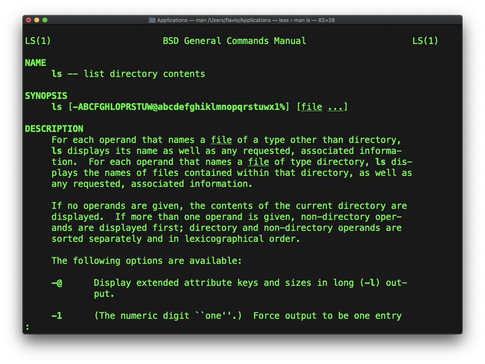

This is a man \(from *manual*\) page. Man pages are an essential tool to learn, as a developer. They contain so much information that sometimes it's almost too much.  
这是一个 man（来自*手册*）页面。手册页是开发人员学习的重要工具。它们包含太多信息，有时几乎太多了。

The above screenshot is just 1 of 14 screens of explanation for the `ls` command.  
上面的屏幕截图只是`ls`命令解释的 14 个屏幕之一。

Most of the times when I'm in need to learn a command quickly I use this site called **tldr pages**: [https://tldr.sh/](https://tldr.sh/). It's a command you can install, then you run it like this: `tldr <command>`, which gives you a very quick overview of a command, with some handy examples of common usage scenarios:  
大多数时候，当我需要快速学习命令时，我会使用这个名为**tldr 页面**的网站： [https://tldr.sh/](https://tldr.sh/) 。这是一个可以安装的命令，然后像这样运行它： `tldr <command>` ，它可以让您快速了解命令，并提供一些常见使用场景的方便示例：

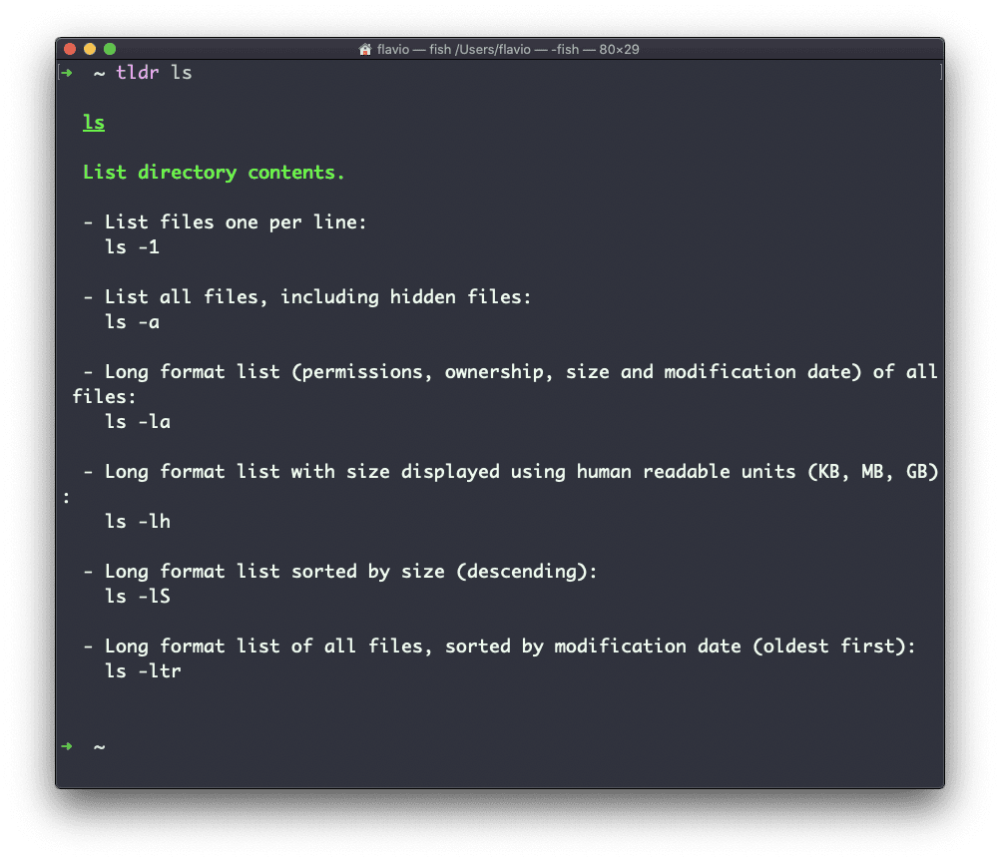

This is not a substitute for `man`, but a handy tool to avoid losing yourself in the huge amount of information present in a man page. Then you can use the man page to explore all the different options and parameters you can use on a command.  
这并不是`man`的替代品，而是一个方便的工具，可以避免在手册页中的大量信息中迷失方向。然后，您可以使用手册页来探索可在命令上使用的所有不同选项和参数。

## ls

Inside a folder you can list all the files that the folder contains using the `ls` command:  
在文件夹内，您可以使用`ls`命令列出该文件夹包含的所有文件：

    ls

If you add a folder name or path, it will print that folder contents:  
如果您添加文件夹名称或路径，它将打印该文件夹内容：

    ls /bin

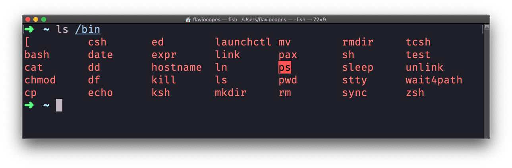

`ls` accepts a lot of options. One of my favorite options combinations is `-al`. Try it:  
`ls`接受很多选项。我最喜欢的选项组合之一是`-al` 。尝试一下：

    ls -al /bin

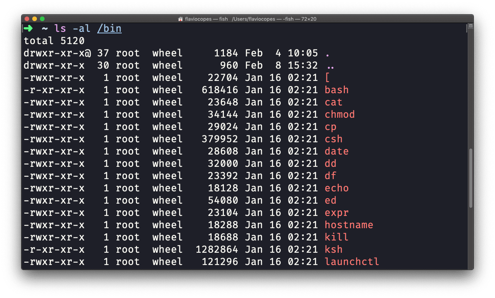

compared to the plain `ls`, this returns much more information.  
与普通的`ls`相比，这会返回更多信息。

You have, from left to right:  
你有，从左到右：

+ the file permissions \(and if your system supports ACLs, you get an ACL flag as well\)  
文件权限（如果您的系统支持 ACL，您也会获得 ACL 标志） 
+ the number of links to that file  
该文件的链接数 
+ the owner of the file  
文件的所有者 
+ the group of the file  
文件组 
+ the file size in bytes  
文件大小（以字节为单位） 
+ the file modified datetime  
文件修改日期时间 
+ the file name  
文件名 

This set of data is generated by the `l` option. The `a` option instead also shows the hidden files.  
这组数据是由`l`选项生成的。 `a`选项还显示隐藏文件。

Hidden files are files that start with a dot \(`.`\).  
隐藏文件是以点 \( `.` \) 开头的文件。

## cd  

Once you have a folder, you can move into it using the `cd` command. `cd` means **c**hange **d**irectory. You invoke it specifying a folder to move into. You can specify a folder name, or an entire path.  
有了文件夹后，您可以使用`cd`命令进入该文件夹。 `cd`表示**更改****目录**。您可以调用它并指定要移入的文件夹。您可以指定文件夹名称或整个路径。

Example:  
例子：

    mkdir fruits    cd     fruits

Now you are into the `fruits` folder.  
现在您已进入`fruits`文件夹。

You can use the `..` special path to indicate the parent folder:  
您可以使用`..`特殊路径来指示父文件夹：

    cd     ..     #back to the home folder    

The \# character indicates the start of the comment, which lasts for the entire line after it's found.  
\# 字符表示注释的开始，它在找到后持续整行。

You can use it to form a path:  
您可以使用它来形成路径：

    mkdir fruits
    mkdir cars    cd     fruits    cd     ../cars

There is another special path indicator which is `.`, and indicates the **current** folder.  
还有另一个特殊的路径指示器是`.` ，并表示**当前**文件夹。

You can also use absolute paths, which start from the root folder `/`:  
您还可以使用绝对路径，从根文件夹`/`开始：

    cd     /etc
>  
> This command works on Linux, macOS, WSL, and anywhere you have a UNIX environment  
此命令适用于 Linux、macOS、WSL 以及任何拥有 UNIX 环境的地方

## pwd  

Whenever you feel lost in the filesystem, call the `pwd` command to know where you are:  
每当您在文件系统中感到迷失时，请调用`pwd`命令来了解您所在的位置：

    pwd    

It will print the current folder path.  
它将打印当前文件夹路径。

## mkdir  

You create folders using the `mkdir` command:  
您可以使用`mkdir`命令创建文件夹：

    mkdir fruits

You can create multiple folders with one command:  
您可以使用一个命令创建多个文件夹：

    mkdir dogs cars

You can also create multiple nested folders by adding the `-p` option:  
您还可以通过添加`-p`选项来创建多个嵌套文件夹：

    mkdir -p fruits/apples

Options in UNIX commands commonly take this form. You add them right after the command name, and they change how the command behaves. You can often combine multiple options, too.  
UNIX 命令中的选项通常采用这种形式。您可以将它们添加到命令名称之后，它们会更改命令的行为方式。您通常也可以组合多个选项。

You can find which options a command supports by typing `man <commandname>`. Try now with `man mkdir` for example \(press the `q` key to esc the man page\). Man pages are the amazing built-in help for UNIX.  
您可以通过键入`man <commandname>`来查找命令支持哪些选项。例如，现在尝试使用`man mkdir` （按`q`键退出手册页）。手册页是 UNIX 令人惊叹的内置帮助。

## rmdir

Just as you can create a folder using `mkdir`, you can delete a folder using `rmdir`:  
正如您可以使用`mkdir`创建文件夹一样，您可以使用`rmdir`删除文件夹：

    mkdir fruits
    rmdir fruits

You can also delete multiple folders at once:  
您还可以一次删除多个文件夹：

    mkdir fruits cars
    rmdir fruits cars

The folder you delete must be empty.  
您删除的文件夹必须是空的。

To delete folders with files in them, we'll use the more generic `rm` command which deletes files and folders, using the `-rf` options:  
要删除其中包含文件的文件夹，我们将使用更通用的`rm`命令来删除文件和文件夹，并使用`-rf`选项：

    rm -rf fruits cars

Be careful as this command does not ask for confirmation and it will immediately remove anything you ask it to remove.  
请小心，因为此命令不会要求确认，并且它会立即删除您要求其删除的任何内容。

There is no **bin** when removing files from the command line, and recovering lost files can be hard.  
从命令行删除文件时没有**bin** ，并且恢复丢失的文件可能很困难。

## mv

Once you have a file, you can move it around using the `mv` command. You specify the file current path, and its new path:  
一旦有了文件，就可以使用`mv`命令移动它。您指定文件的当前路径及其新路径：

    touch pear
    mv pear new_pear

The `pear` file is now moved to `new_pear`. This is how you **rename** files and folders.  
`pear`文件现在已移至`new_pear` 。这就是**重命名**文件和文件夹的方法。

If the last parameter is a folder, the file located at the first parameter path is going to be moved into that folder. In this case, you can specify a list of files and they will all be moved in the folder path identified by the last parameter:  
如果最后一个参数是文件夹，则位于第一个参数路径的文件将被移动到该文件夹​​中。在这种情况下，您可以指定文件列表，它们将全部移动到最后一个参数标识的文件夹路径中：

    touch pear
    touch apple
    mkdir fruits
    mv pear apple fruits     #pear and apple moved to the fruits folder    

## cp

You can copy a file using the `cp` command:  
您可以使用`cp`命令复制文件：

    touch     test    
    cp apple another_apple

To copy folders you need to add the `-r` option to recursively copy the whole folder contents:  
要复制文件夹，您需要添加`-r`选项以递归复制整个文件夹内容：

    mkdir fruits
    cp -r fruits cars

## open  

The `open` command lets you open a file using this syntax:  
`open`命令允许您使用以下语法打开文件：

    open <filename>

You can also open a directory, which on macOS opens the Finder app with the current directory open:  
您还可以打开一个目录，在 macOS 上，该目录会打开 Finder 应用程序并打开当前目录：

    open <directory name>

I use it all the time to open the current directory:  
我一直用它来打开当前目录：

    open .
>  
> The special `.` symbol points to the current directory, as `..` points to the parent directory  
特别的`.`符号指向当前目录，as `..`指向父目录

The same command can also be be used to run an application:  
相同的命令也可用于运行应用程序：

    open <application name>

## touch  

You can create an empty file using the `touch` command:  
您可以使用`touch`命令创建一个空文件：

    touch apple

If the file already exists, it opens the file in write mode, and the timestamp of the file is updated.  
如果文件已存在，则以写入模式打开文件，并更新文件的时间戳。

## find  

The `find` command can be used to find files or folders matching a particular search pattern. It searches recursively.  
`find`命令可用于查找与特定搜索模式匹配的文件或文件夹。它递归地搜索。

Let's learn it by example.  
让我们通过例子来学习一下。

Find all the files under the current tree that have the `.js` extension and print the relative path of each file matching:  
查找当前树下所有具有`.js`扩展名的文件，并打印每个匹配文件的相对路径：

    find . -name     '*.js'    

It's important to use quotes around special characters like `*` to avoid the shell interpreting them.  
在`*`等特殊字符周围使用引号很重要，以避免 shell 解释它们。

Find directories under the current tree matching the name "src":  
在当前树下查找与名称“src”匹配的目录：

    find . -    type     d -name src

Use `-type f` to search only files, or `-type l` to only search symbolic links.  
使用`-type f`仅搜索文件，或使用`-type l`仅搜索符号链接。

`-name` is case sensitive. use `-iname` to perform a case-insensitive search.  
`-name`区分大小写。使用`-iname`执行不区分大小写的搜索。

You can search under multiple root trees:  
您可以在多个根树下搜索：

    find folder1 folder2 -name filename.txt

Find directories under the current tree matching the name "node\_modules" or 'public':  
在当前树下查找与名称“node\_modules”或“public”匹配的目录：

    find . -    type     d -name node_modules -or -name public

You can also exclude a path, using `-not -path`:  
您还可以使用`-not -path`排除路径：

    find . -    type     d -name     '*.md'     -not -path     'node_modules/*'    

You can search files that have more than 100 characters \(bytes\) in them:  
您可以搜索包含超过 100 个字符（字节）的文件：

    find . -    type     f -size +100c

Search files bigger than 100KB but smaller than 1MB:  
搜索大于 100KB 但小于 1MB 的文件：

    find . -    type     f -size +100k -size -1M

Search files edited more than 3 days ago  
搜索 3 天前编辑的文件

    find . -    type     f -mtime +3

Search files edited in the last 24 hours  
搜索过去 24 小时内编辑的文件

    find . -    type     f -mtime -1

You can delete all the files matching a search by adding the `-delete` option. This deletes all the files edited in the last 24 hours:  
您可以通过添加`-delete`选项来删除与搜索匹配的所有文件。这将删除过去 24 小时内编辑的所有文件：

    find . -    type     f -mtime -1 -delete

You can execute a command on each result of the search. In this example we run `cat` to print the file content:  
您可以对每个搜索结果执行命令。在此示例中，我们运行`cat`来打印文件内容：

    find . -    type     f -    exec     cat {} \;

notice the terminating `\;`. `{}` is filled with the file name at execution time.  
注意终止`\;` 。 `{}`填充执行时的文件名。

## ln  

The `ln` command is part of the Linux file system commands.  
`ln`命令是 Linux 文件系统命令的一部分。

It's used to create links. What is a link? It's like a pointer to another file. A file that points to another file. You might be familiar with Windows shortcuts. They're similar.  
它用于创建链接。什么是链接？它就像一个指向另一个文件的指针。一个文件指向另一个文件。您可能熟悉 Windows 快捷方式。他们很相似。

We have 2 types of links: **hard links** and **soft links**.  
我们有两种类型的链接：**硬链接**和**软链接**。

Hard links are rarely used. They have a few limitations: you can't link to directories, and you can't link to external filesystems \(disks\).  
硬链接很少使用。它们有一些限制：您不能链接到目录，也不能链接到外部文件系统（磁盘）。

A hard link is created using  
使用以下命令创建硬链接

    ln <original> <link>

For example, say you have a file called recipes.txt. You can create a hard link to it using:  
例如，假设您有一个名为recipes.txt 的文件。您可以使用以下方法创建指向它的硬链接：

    ln recipes.txt newrecipes.txt

The new hard link you created is indistinguishable from a regular file:  
您创建的新硬链接与常规文件没有区别：

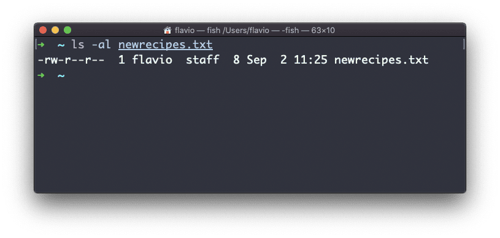

Now any time you edit any of those files, the content will be updated for both.  
现在，每当您编辑这些文件中的任何一个时，这两个文件的内容都会更新。

If you delete the original file, the link will still contain the original file content, as that's not removed until there is one hard link pointing to it.  
如果您删除原始文件，该链接仍将包含原始文件内容，因为只有在有一个硬链接指向它时，该链接才会被删除。

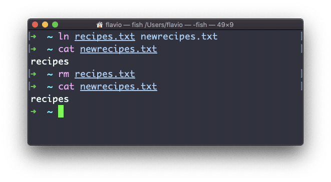

Soft links are different. They are more powerful as you can link to other filesystems and to directories, but when the original is removed, the link will be broken.  
软链接则不同。它们更强大，因为您可以链接到其他文件系统和目录，但是当删除原始文件系统和目录时，链接将被破坏。

You create soft links using the `-s` option of `ln`:  
您可以使用`ln`的`-s`选项创建软链接：

    ln -s <original> <link>

For example, say you have a file called recipes.txt. You can create a soft link to it using:  
例如，假设您有一个名为recipes.txt 的文件。您可以使用以下方法创建指向它的软链接：

    ln -s recipes.txt newrecipes.txt

In this case you can see there's a special `l` flag when you list the file using `ls -al`, and the file name has a `@` at the end, and it's colored differently if you have colors enabled:  
在这种情况下，当您使用`ls -al`列出文件时，您可以看到有一个特殊的`l`标志，并且文件名末尾有一个`@` ，如果启用了颜色，则其颜色会有所不同：

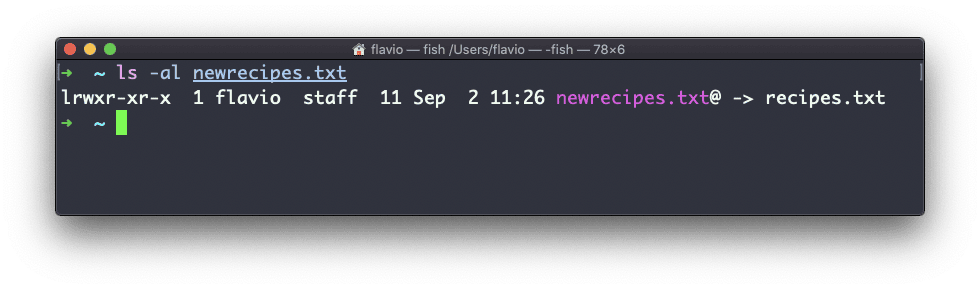

Now if you delete the original file, the links will be broken, and the shell will tell you "No such file or directory" if you try to access it:  
现在，如果您删除原始文件，链接将被破坏，并且如果您尝试访问它，shell 会告诉您“没有这样的文件或目录”：

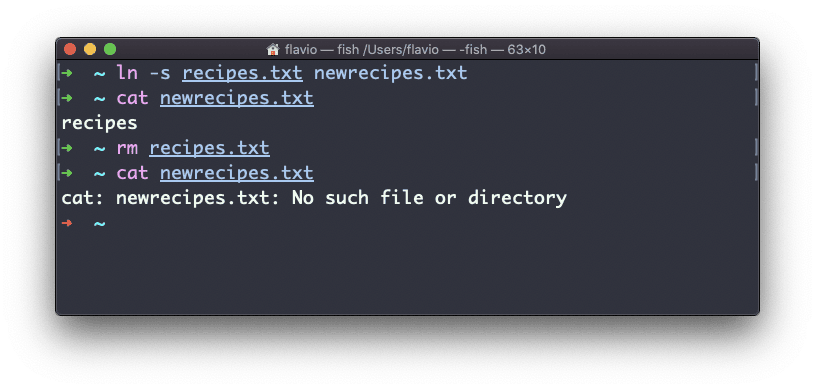

## gzip  

You can compress a file using the gzip compression protocol named [LZ77](https://en.wikipedia.org/wiki/LZ77_and_LZ78) using the `gzip` command.  
您可以使用`gzip`命令使用名为[LZ77](https://en.wikipedia.org/wiki/LZ77_and_LZ78)的 gzip 压缩协议来压缩文件。

Here's the simplest usage:  
这是最简单的用法：

    gzip filename

This will compress the file, and append a `.gz` extension to it. The original file is deleted. To prevent this, you can use the `-c` option and use output redirection to write the output to the `filename.gz` file:  
这将压缩该文件，并为其附加`.gz`扩展名。原始文件被删除。为了防止这种情况，您可以使用`-c`选项并使用输出重定向将输出写入`filename.gz`文件：

    gzip -c filename > filename.gz
>  
> The `-c` option specifies that output will go to the standard output stream, leaving the original file intact  
`-c`选项指定输出将转到标准输出流，保持原始文件不变

Or you can use the `-k` option:  
或者您可以使用`-k`选项：

    gzip -k filename

There are various levels of compression. The more the compression, the longer it will take to compress \(and decompress\). Levels range from 1 \(fastest, worst compression\) to 9 \(slowest, better compression\), and the default is 6.  
压缩有多种级别。压缩越多，压缩（和解压缩）所需的时间就越长。级别范围从 1（最快、最差压缩）到 9（最慢、更好压缩），默认值为 6。

You can choose a specific level with the `-<NUMBER>` option:  
您可以使用`-<NUMBER>`选项选择特定级别：

    gzip -1 filename

You can compress multiple files by listing them:  
您可以通过列出多个文件来压缩它们：

    gzip filename1 filename2

You can compress all the files in a directory, recursively, using the `-r` option:  
您可以使用`-r`选项递归地压缩目录中的所有文件：

    gzip -r a_folder

The `-v` option prints the compression percentage information. Here's an example of it being used along with the `-k` \(keep\) option:  
`-v`选项打印压缩百分比信息。下面是它与`-k` （保留）选项一起使用的示例：

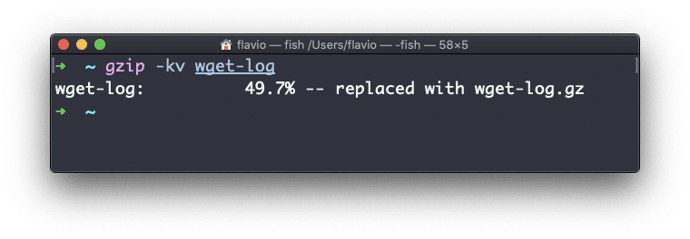

`gzip` can also be used to decompress a file, using the `-d` option:  
`gzip`还可以用于解压缩文件，使用`-d`选项：

    gzip -d filename.gz

## gunzip  

The `gunzip` command is basically equivalent to the `gzip` command, except the `-d` option is always enabled by default.  
`gunzip`命令基本上等同于`gzip`命令，只是默认情况下始终启用`-d`选项。

The command can be invoked in this way:  
该命令可以通过以下方式调用：

    gunzip filename.gz

This will gunzip and will remove the `.gz` extension, putting the result in the `filename` file. If that file exists, it will overwrite that.  
这将进行gunzip并删除`.gz`扩展名，将结果放入`filename`文件中。如果该文件存在，它将覆盖该文件。

You can extract to a different filename using output redirection using the `-c` option:  
您可以使用`-c`选项使用输出重定向来提取到不同的文件名：

    gunzip -c filename.gz > anotherfilename

## tar  

The `tar` command is used to create an archive, grouping multiple files in a single file.  
`tar`命令用于创建存档，将多个文件分组到一个文件中。

Its name comes from the past and means *tape archive*. Back when archives were stored on tapes.  
它的名字来源于过去，意思是*磁带存档*。回到档案存储在磁带上的时代。

This command creates an archive named `archive.tar` with the content of `file1` and `file2`:  
此命令创建一个名为`archive.tar`的存档，其中包含`file1`和`file2`的内容：

    tar -cf archive.tar file1 file2
>  
> The `c` option stands for *create*. The `f` option is used to write to file the archive.  
`c`选项代表*create* 。 `f`选项用于写入存档。

To extract files from an archive in the current folder, use:  
要从当前文件夹中的存档中提取文件，请使用：

    tar -xf archive.tar
>  
> the `x` option stands for *extract*  
`x`选项代表*提取*

and to extract them to a specific directory, use:  
并将它们提取到特定目录，请使用：

    tar -xf archive.tar -C directory

You can also just list the files contained in an archive:  
您还可以只列出存档中包含的文件：

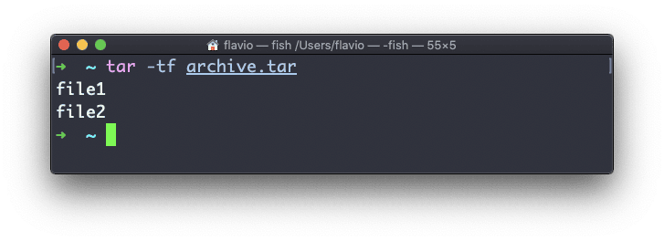

`tar` is often used to create a **compressed archive**, gzipping the archive.  
`tar`通常用于创建**压缩档案**，对档案进行 gzip 压缩。

This is done using the `z` option:  
这是使用`z`选项完成的：

    tar -czf archive.tar.gz file1 file2

This is just like creating a tar archive, and then running `gzip` on it.  
这就像创建一个 tar 存档，然后在其上运行`gzip`一样。

To unarchive a gzipped archive, you can use `gunzip`, or `gzip -d`, and then unarchive it, but `tar -xf` will recognize it's a gzipped archive, and do it for you:  
要取消归档 gzip 压缩档案，您可以使用`gunzip`或`gzip -d` ，然后将其取消归档，但`tar -xf`会识别出它是 gzip 压缩档案，并为您执行此操作：

    tar -xf archive.tar.gz

## alias  

It's common to always run a program with a set of options you like using.  
总是使用一组您喜欢使用的选项来运行程序是很常见的。

For example, take the `ls` command. By default it prints very little information:  
例如，使用`ls`命令。默认情况下它打印很少的信息：

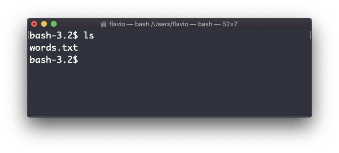

while using the `-al` option it will print something more useful, including the file modification date, the size, the owner, and the permissions, also listing hidden files \(files starting with a `.`:  
使用`-al`选项时，它将打印更有用的内容，包括文件修改日期、大小、所有者和权限，还列出隐藏文件（以`.`开头的文件：

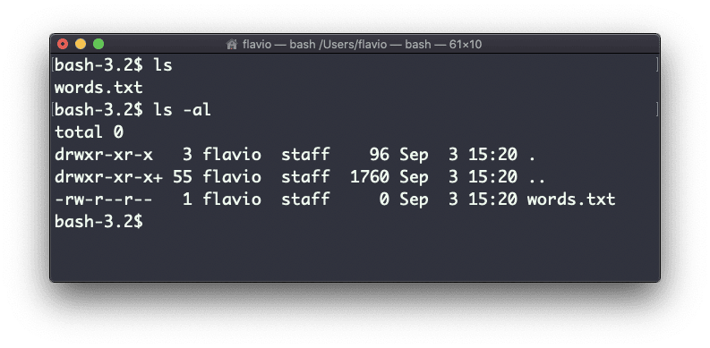

You can create a new command, for example I like to call it `ll`, that is an alias to `ls -al`.  
您可以创建一个新命令，例如我喜欢将其称为`ll` ，这是`ls -al`的别名。

You do it in this way:  
你可以这样做：

    alias     ll=    'ls -al'    

Once you do, you can call `ll` just like it was a regular UNIX command:  
完成后，您可以像调用常规 UNIX 命令一样调用`ll` ：

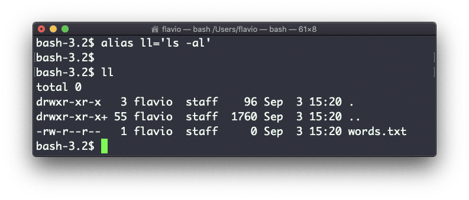

Now calling `alias` without any option will list the aliases defined:  
现在不带任何选项调用`alias`将列出定义的别名：

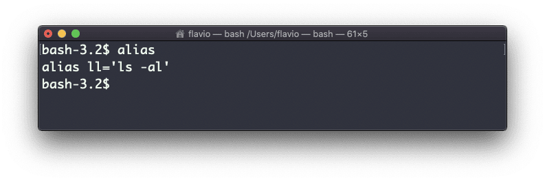

The alias will work until the terminal session is closed.  
该别名将一直有效，直到终端会话关闭。

To make it permanent, you need to add it to the shell configuration, which could be `~/.bashrc` or `~/.profile` or `~/.bash_profile` if you use the Bash shell, depending on the use case.  
为了使其永久化，您需要将其添加到 shell 配置中，如果您使用 Bash shell，则可以是`~/.bashrc`或`~/.profile`或`~/.bash_profile` ，具体取决于用例。

Be careful with quotes if you have variables in the command: using double quotes the variable is resolved at definition time, using single quotes it's resolved at invocation time. Those 2 are different:  
如果命令中有变量，请小心使用引号：使用双引号，变量在定义时解析，使用单引号，变量在调用时解析。这两个是不同的：

    alias     lsthis=    "ls     $PWD    "        alias     lscurrent=    'ls $PWD'    

$PWD refers to the current folder the shell is into. If you now navigate away to a new folder, `lscurrent` lists the files in the new folder, `lsthis` still lists the files in the folder you were when you defined the alias.  
$PWD 指 shell 所在的当前文件夹。如果您现在导航到新文件夹， `lscurrent`会列出新文件夹中的文件， `lsthis`仍会列出您定义别名时所在文件夹中的文件。

## cat  

Similar to `tail` in some way, we have `cat`. Except `cat` can also add content to a file, and this makes it super powerful.  
在某种程度上与`tail`类似，我们有`cat` 。除了`cat`还可以向文件添加内容，这使得它超级强大。

In its simplest usage, `cat` prints a file's content to the standard output:  
在最简单的用法中， `cat`将文件的内容打印到标准输出：

    cat file

You can print the content of multiple files:  
您可以打印多个文件的内容：

    cat file1 file2

and using the output redirection operator `>` you can concatenate the content of multiple files into a new file:  
并使用输出重定向运算符`>`您可以将多个文件的内容连接到一个新文件中：

    cat file1 file2 > file3

Using `>>` you can append the content of multiple files into a new file, creating it if it does not exist:  
使用`>>`您可以将多个文件的内容附加到一个新文件中，如果它不存在则创建它：

    cat file1 file2 >> file3

When watching source code files it's great to see the line numbers, and you can have `cat` print them using the `-n` option:  
当观看源代码文件时，很高兴看到行号，并且您可以使用`-n`选项让`cat`打印它们：

    cat -n file1

You can only add a number to non-blank lines using `-b`, or you can also remove all the multiple empty lines using `-s`.  
您只能使用`-b`将数字添加到非空行，也可以使用`-s`删除所有多个空行。

`cat` is often used in combination with the pipe operator `|` to feed a file content as input to another command: `cat file1 | anothercommand`.  
`cat`通常与管道运算符`|`结合使用将文件内容作为另一个命令的输入： `cat file1 | anothercommand` 。

## less  

The `less` command is one I use a lot. It shows you the content stored inside a file, in a nice and interactive UI.  
`less`命令是我经常使用的命令。它以漂亮的交互式用户界面向您显示文件中存储的内容。

Usage: `less <filename>`.  
用法： `less <filename>` 。

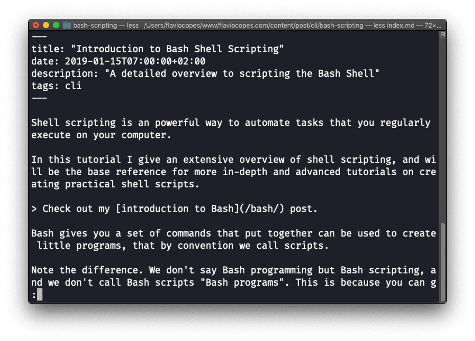

Once you are inside a `less` session, you can quit by pressing `q`.  
一旦进入`less`会话，您可以按`q`退出。

You can navigate the file contents using the `up` and `down` keys, or using the `space bar` and `b` to navigate page by page. You can also jump to the end of the file pressing `G` and jump back to the start pressing `g`.  
您可以使用`up`和`down`键导航文件内容，或使用`space bar`和`b`逐页导航。您还可以按`G`跳转到文件末尾，然后按`g`跳回开头。

You can search contents inside the file by pressing `/` and typing a word to search. This searches *forward*. You can search backwards using the `?` symbol and typing a word.  
您可以通过按`/`并键入要搜索的单词来搜索文件内的内容。这*向前*搜索。您可以使用`?`向后搜索符号并输入一个单词。

This command just visualises the file's content. You can directly open an editor by pressing `v`. It will use the system editor, which in most cases is `vim`.  
该命令只是可视化文件的内容。您可以通过按`v`直接打开编辑器。它将使用系统编辑器，在大多数情况下是`vim` 。

Pressing the `F` key enters *follow mode*, or *watch mode*. When the file is changed by someone else, like from another program, you get to see the changes *live*. By default this is not happening, and you only see the file version at the time you opened it. You need to press `ctrl-C` to quit this mode. In this case the behaviour is similar to running the `tail -f <filename>` command.  
按`F`键进入*跟随模式*或*监视模式*。当其他人（例如从另一个程序）更改文件时，您可以*实时*看到更改。默认情况下，这种情况不会发生，您只能看到打开文件时的文件版本。您需要按`ctrl-C`退出此模式。在这种情况下，行为类似于运行`tail -f <filename>`命令。

You can open multiple files, and navigate through them using `:n` \(to go to the next file\) and `:p` \(to go to the previous\).  
您可以打开多个文件，并使用`:n` （转到下一个文件）和`:p` （转到上一个文件）浏览它们。

## tail  

The best use case of tail in my opinion is when called with the `-f` option. It opens the file at the end, and watches for file changes. Any time there is new content in the file, it is printed in the window. This is great for watching log files, for example:  
我认为 tail 的最佳用例是使用`-f`选项调用时。它在末尾打开文件，并监视文件更改。每当文件中有新内容时，都会将其打印在窗口中。这对于查看日志文件非常有用，例如：

    tail -f /var/    log    /system.log

To exit, press `ctrl-C`.  
要退出，请按`ctrl-C` 。

You can print the last 10 lines in a file:  
您可以打印文件中的最后 10 行：

    tail -n 10 <filename>

You can print the whole file content starting from a specific line using `+` before the line number:  
您可以在行号之前使用`+`打印从特定行开始的整个文件内容：

    tail -n +10 <filename>

`tail` can do much more and as always my advice is to check `man tail`.  
`tail`可以做更多事情，一如既往，我的建议是检查`man tail` 。

## wc  

The `wc` command gives us useful information about a file or input it receives via pipes.  
`wc`命令为我们提供有关文件或通过管道接收的输入的有用信息。

    echo         test     >> test.txt
    wc test.txt
    1       1       5 test.txt

Example via pipes, we can count the output of running the `ls -al` command:  
通过管道示例，我们可以计算运行`ls -al`命令的输出：

    ls -al | wc
    6      47     284

The first column returned is the number of lines. The second is the number of words. The third is the number of bytes.  
返回的第一列是行数。第二是字数。第三个是字节数。

We can tell it to just count the lines:  
我们可以告诉它只计算行数：

    wc -l test.txt

or just the words:  
或者只是这样的话：

    wc -w test.txt

or just the bytes:  
或者只是字节：

    wc -c test.txt

Bytes in ASCII charsets equate to characters, but with non-ASCII charsets, the number of characters might differ because some characters might take multiple bytes, for example this happens in Unicode.  
ASCII 字符集中的字节等同于字符，但对于非 ASCII 字符集，字符数可能会有所不同，因为某些字符可能占用多个字节，例如在 Unicode 中就会发生这种情况。

In this case the `-m` flag will help getting the correct value:  
在这种情况下， `-m`标志将有助于获取正确的值：

    wc -m test.txt

## grep

The `grep` command is a very useful tool, that when you master will help you tremendously in your day to day.  
`grep`命令是一个非常有用的工具，当你掌握它时，它将对你的日常工作有很大帮助。
>  
> If you're wondering, `grep` stands for *global regular expression print*  
如果您想知道， `grep`代表*全局正则表达式打印*

You can use `grep` to search in files, or combine it with pipes to filter the output of another command.  
您可以使用`grep`在文件中搜索，或将其与管道结合起来过滤另一个命令的输出。

For example here's how we can find the occurences of the `document.getElementById` line in the `index.md` file:  
例如，我们如何在`index.md`文件中查找`document.getElementById`行的出现：

    grep document.getElementById index.md

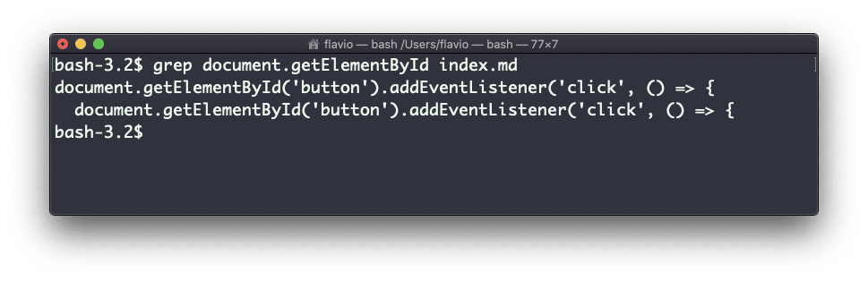

Using the `-n` option it will show the line numbers:  
使用`-n`选项它将显示行号：

    grep -n document.getElementById index.md

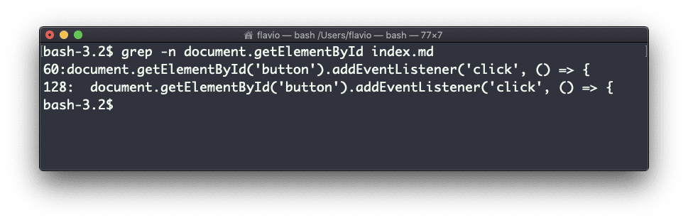

One very useful thing is to tell grep to print 2 lines before, and 2 lines after the matched line, to give us more context. That's done using the `-C` option, which accepts a number of lines:  
一件非常有用的事情是告诉 grep 在匹配行之前打印 2 行，在匹配行之后打印 2 行，以便为我们提供更多上下文。这是使用`-C`选项完成的，它接受多行：

    grep -nC 2 document.getElementById index.md

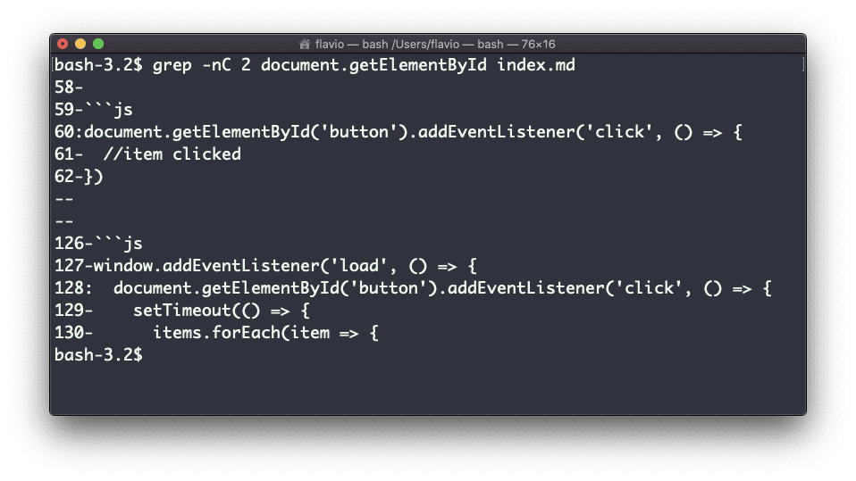

Search is case sensitive by default. Use the `-i` flag to make it insensitive.  
默认情况下，搜索区分大小写。使用`-i`标志使其不敏感。

As mentioned, you can use grep to filter the output of another command. We can replicate the same functionality as above using:  
如前所述，您可以使用 grep 来过滤另一个命令的输出。我们可以使用以下方法复制与上面相同的功能：

    less index.md | grep -n document.getElementById

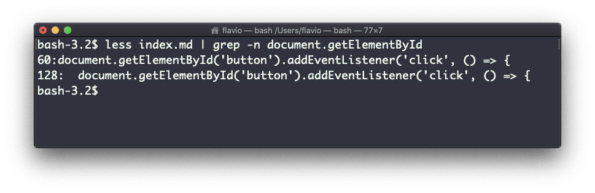

The search string can be a regular expression, and this makes `grep` very powerful.  
搜索字符串可以是正则表达式，这使得`grep`非常强大。

Another thing you might find very useful is to invert the result, excluding the lines that match a particular string, using the `-v` option:  
您可能会发现非常有用的另一件事是使用`-v`选项反转结果，排除与特定字符串匹配的行：

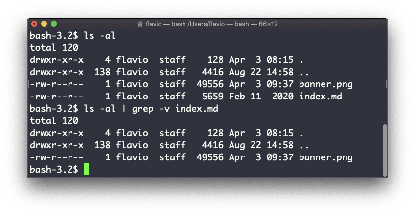

## sort  

Suppose you have a text file which contains the names of dogs:  
假设您有一个包含狗的名字的文本文件：

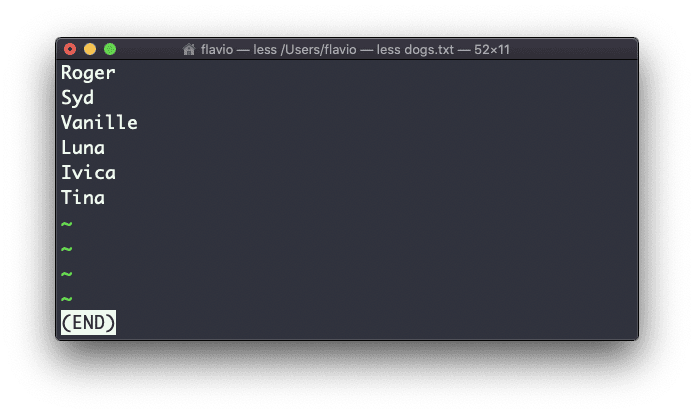

This list is unordered.  
该列表是无序的。

The `sort` command helps us sorting them by name:  
`sort`命令帮助我们按名称对它们进行排序：

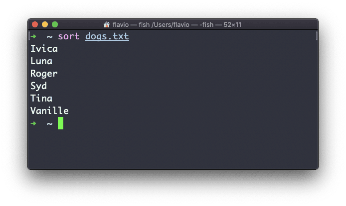

Use the `r` option to reverse the order:  
使用`r`选项反转顺序：

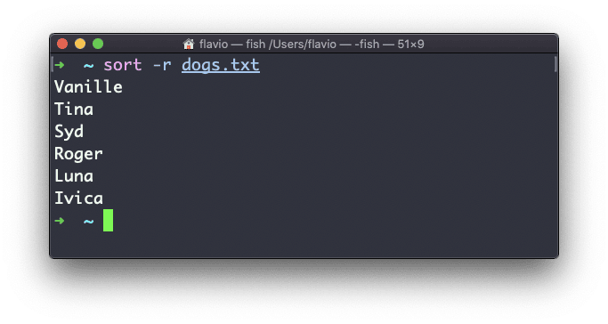

Sorting by default is case sensitive, and alphabetic. Use the `--ignore-case` option to sort case insensitive, and the `-n` option to sort using a numeric order.  
默认情况下排序区分大小写并按字母顺序。使用`--ignore-case`选项不区分大小写进行排序，使用`-n`选项按数字顺序排序。

If the file contains duplicate lines:  
如果文件包含重复行：

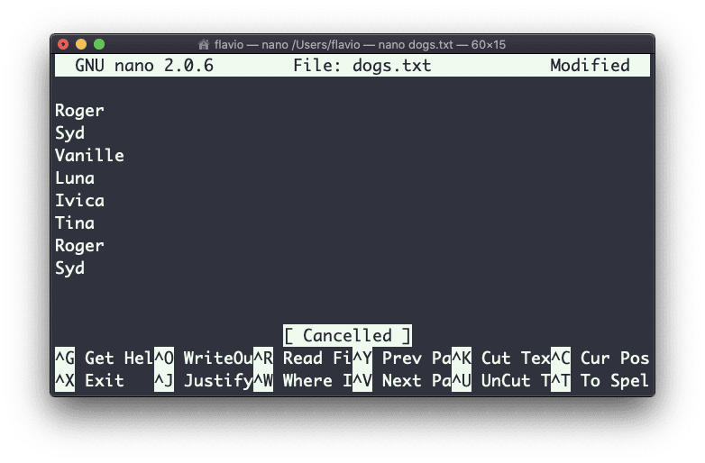

You can use the `-u` option to remove them:  
您可以使用`-u`选项来删除它们：

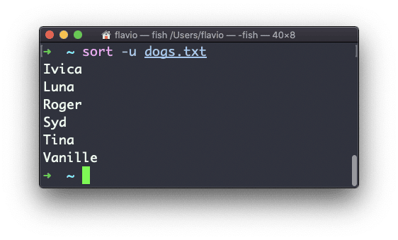

`sort` does not just works on files, as many UNIX commands it also works with pipes, so you can use on the output of another command, for example you can order the files returned by `ls` with:  
`sort`不仅仅适用于文件，因为许多 UNIX 命令也适用于管道，因此您可以在另一个命令的输出上使用，例如您可以使用以下命令对`ls`返回的文件进行排序：

    ls | sort

`sort` is very powerful and has lots more options, which you can explore calling `man sort`.  
`sort`非常强大，并且有更多选项，您可以调用`man sort`来探索。

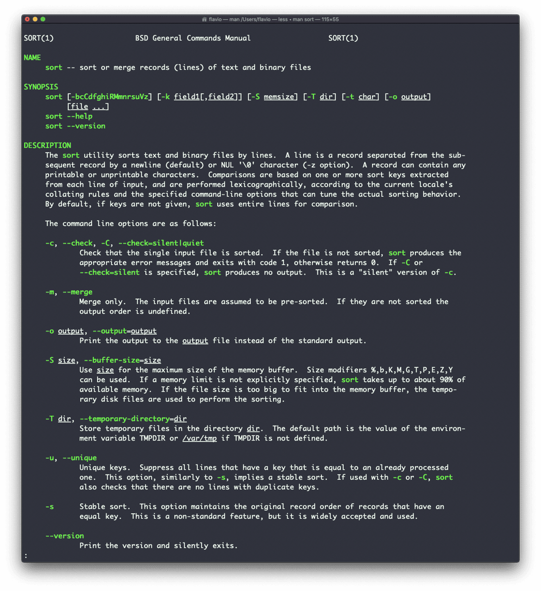

## uniq  

`uniq` is a command useful to sort lines of text.  
`uniq`是一个用于对文本行进行排序的命令。

You can get those lines from a file, or using pipes from the output of another command:  
您可以从文件中获取这些行，或使用管道从另一个命令的输出中获取这些行：

    uniq dogs.txt

    ls | uniq

You need to consider this key thing: `uniq` will only detect adjacent duplicate lines.  
您需要考虑这一关键事项： `uniq`只会检测相邻的重复行。

This implies that you will most likely use it along with `sort`:  
这意味着您很可能将它与`sort`一起使用：

    sort dogs.txt | uniq

The `sort` command has its own way to remove duplicates with the `-u` \(*unique*\) option. But `uniq` has more power.  
`sort`命令有自己的方法来使用`-u` \( *unique* \) 选项删除重复项。但`uniq`的力量更大。

By default it removes duplicate lines:  
默认情况下它会删除重复的行：

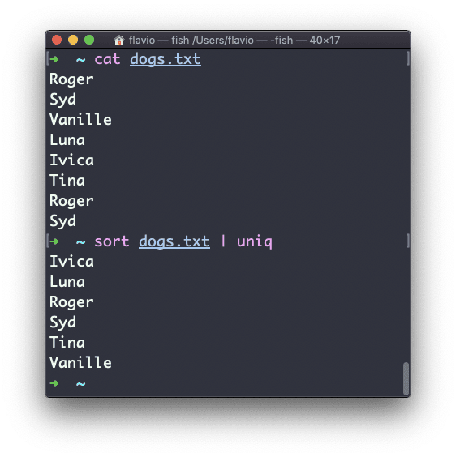

You can tell it to only display duplicate lines, for example, with the `-d` option:  
您可以告诉它只显示重复的行，例如，使用`-d`选项：

    sort dogs.txt | uniq -d

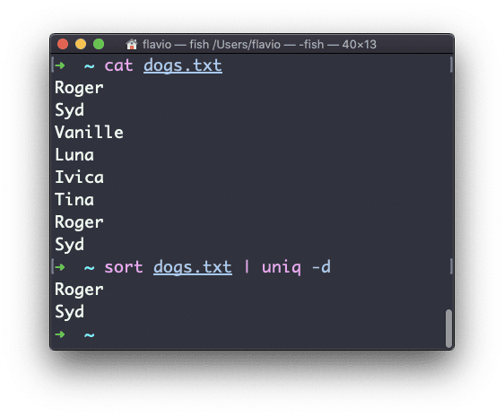

You can use the `-u` option to only display non-duplicate lines:  
您可以使用`-u`选项仅显示非重复行：

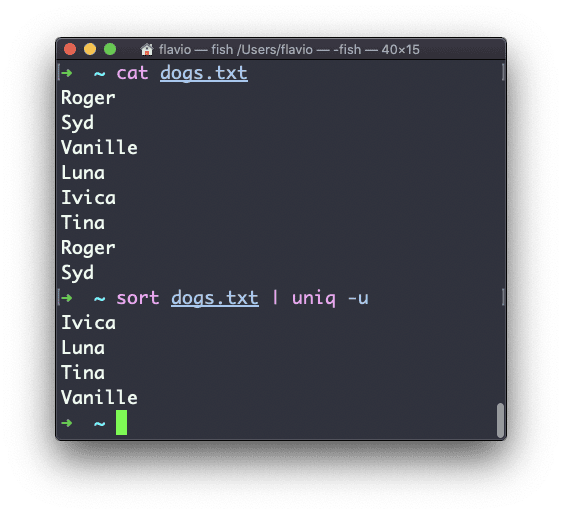

You can count the occurrences of each line with the `-c` option:  
您可以使用`-c`选项计算每行的出现次数：

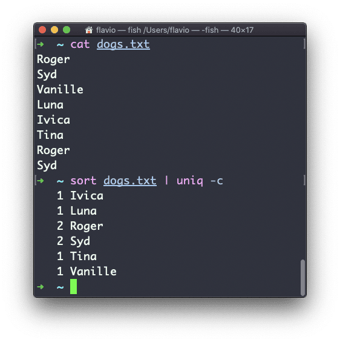

Use the special combination:  
使用特殊组合：

    sort dogs.txt | uniq -c | sort -nr

to then sort those lines by most frequent:  
然后按最常见的顺序对这些行进行排序：

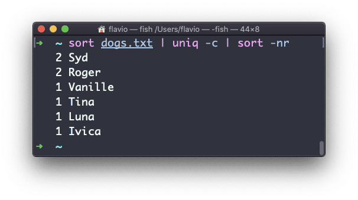

## diff  

`diff` is a handy command. Suppose you have 2 files, which contain almost the same information, but you can't find the difference between the two.  
`diff`是一个方便的命令。假设你有2个文件，它们包含几乎相同的信息，但你找不到两者之间的差异。

`diff` will process the files and will tell you what's the difference.  
`diff`将处理文件并告诉您有什么区别。

Suppose you have 2 files: `dogs.txt` and `moredogs.txt`. The difference is that `moredogs.txt` contains one more dog name:  
假设您有 2 个文件： `dogs.txt`和`moredogs.txt` 。不同之处在于`moredogs.txt`多了一个狗的名字：

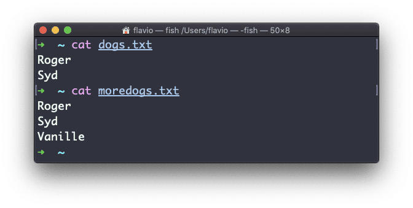

`diff dogs.txt moredogs.txt` will tell you the second file has one more line, line 3 with the line `Vanille`:  
`diff dogs.txt moredogs.txt`会告诉你第二个文件还有一行，第 3 行带有`Vanille`行：

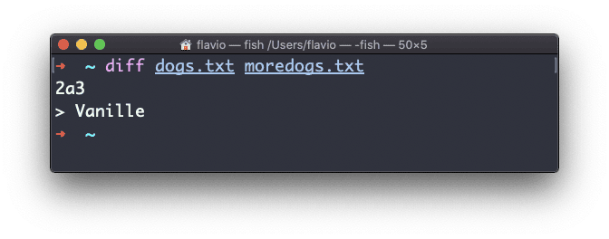

If you invert the order of the files, it will tell you that the second file is missing line 3, whose content is `Vanille`:  
如果你颠倒文件的顺序，它会告诉你第二个文件缺少第3行，其内容是`Vanille` ：

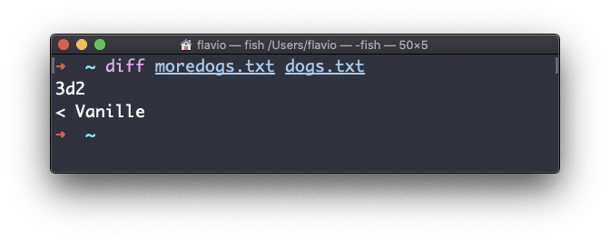

Using the `-y` option will compare the 2 files line by line:  
使用`-y`选项将逐行比较两个文件：

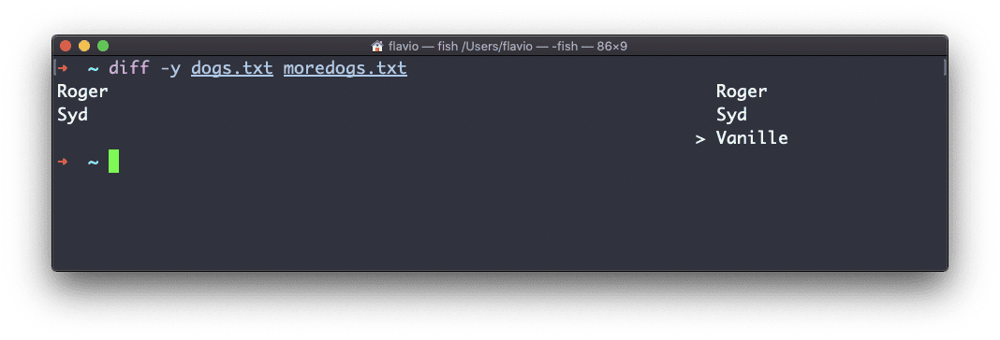

The `-u` option however will be more familiar to you, because that's the same used by the Git version control system to display differences between versions:  
不过，您会更熟悉`-u`选项，因为 Git 版本控制系统使用该选项来显示版本之间的差异：

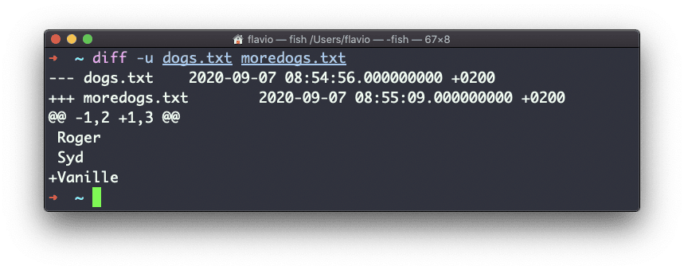

Comparing directories works in the same way. You must use the `-r` option to compare recursively \(going into subdirectories\):  
比较目录的工作方式相同。您必须使用`-r`选项进行递归比较（进入子目录）：

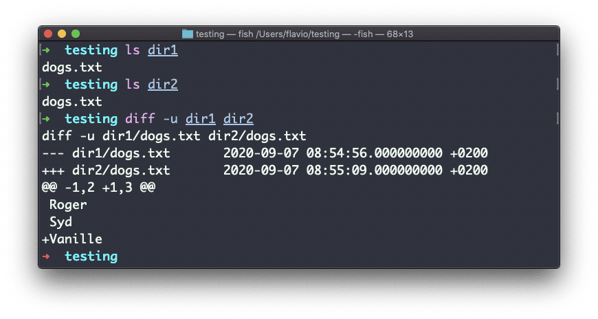

In case you're interested in which files differ, rather than the content, use the `r` and `q` options:  
如果您对哪些文件不同而不是内容感兴趣，请使用`r`和`q`选项：

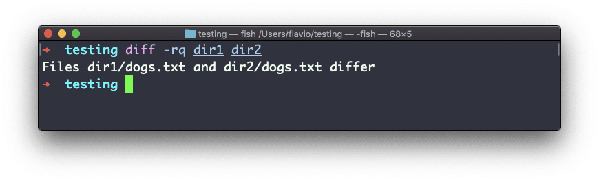

There are many more options you can explore in the man page running `man diff`:  
您可以在运行`man diff`手册页中探索更多选项：

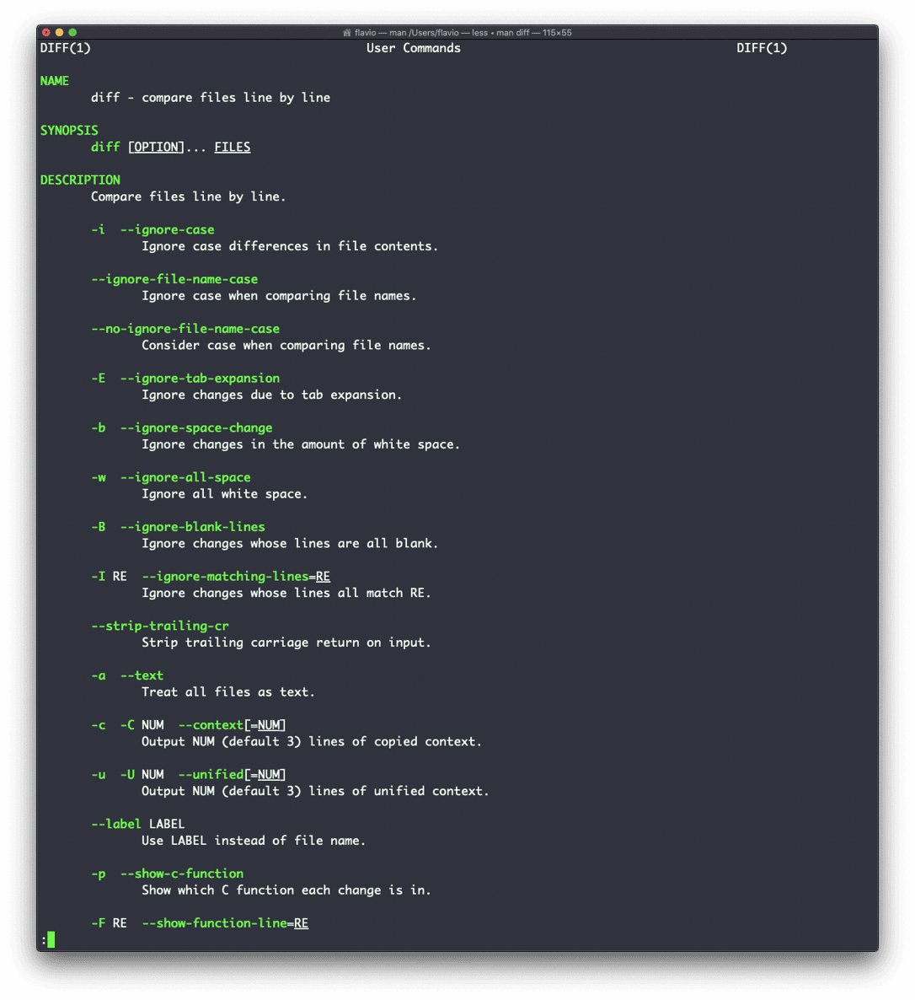

## echo  

The `echo` command does one simple job: it prints to the output the argument passed to it.  
`echo`命令执行一项简单的工作：它将传递给它的参数打印到输出。

This example:  
这个例子：

    echo         "hello"    

will print `hello` to the terminal.  
将向终端打印`hello` 。

We can append the output to a file:  
我们可以将输出附加到文件中：

    echo         "hello"     >> output.txt

We can interpolate environment variables:  
我们可以插入环境变量：

    echo         "The path variable is     $PATH    "    

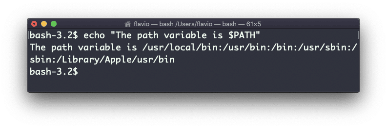

Beware that special characters need to be escaped with a backslash `\`. `$` for example:  
请注意，特殊字符需要使用反斜杠`\`进行转义。 `$`例如：

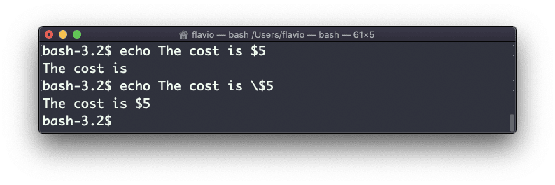

This is just the start. We can do some nice things when it comes to interacting with the shell features.  
这只是开始。在与 shell 功能交互时，我们可以做一些不错的事情。

We can echo the files in the current folder:  
我们可以回显当前文件夹中的文件：

    echo     *

We can echo the files in the current folder that start with the letter `o`:  
我们可以回显当前文件夹中以字母`o`开头的文件：

    echo     o*

Any valid Bash \(or any shell you are using\) command and feature can be used here.  
任何有效的 Bash（或您正在使用的任何 shell）命令和功能都可以在此处使用。

You can print your home folder path:  
您可以打印您的主文件夹路径：

    echo     ~

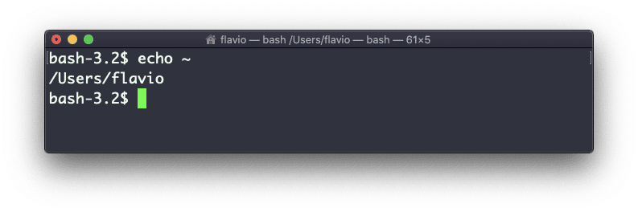

You can also execute commands, and print the result to the standard output \(or to file, as you saw\):  
您还可以执行命令，并将结果打印到标准输出（或打印到文件，如您所见）：

    echo     $(ls -al)

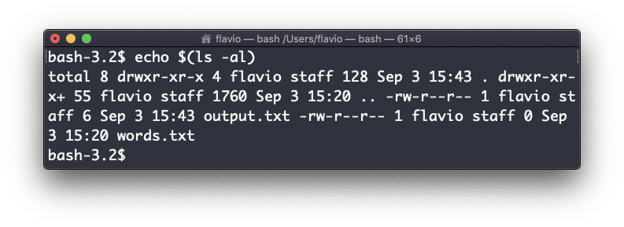

Note that whitespace is not preserved by default. You need to wrap the command in double quotes to do so:  
请注意，默认情况下不保留空格。您需要将命令用双引号括起来才能执行此操作：

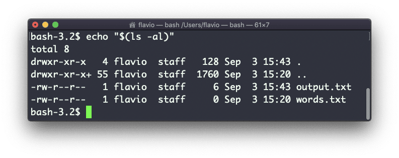

You can generate a list of strings, for example ranges:  
您可以生成字符串列表，例如范围：

    echo     {1..5}

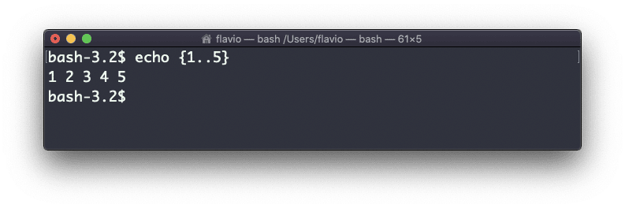

## chown  

Every file/directory in an Operating System like Linux or macOS \(and every UNIX systems in general\) has an **owner**.  
Linux 或 macOS（以及一般的每个 UNIX 系统）等操作系统中的每个文件/目录都有一个**所有者**。

The owner of a file can do everything with it. It can decide the fate of that file.  
文件的所有者可以用它做任何事情。它可以决定该文件的命运。

The owner \(and the `root` user\) can change the owner to another user, too, using the `chown` command:  
所有者（和`root`用户）也可以使用`chown`命令将所有者更改为其他用户：

    chown <owner> <file>

Like this:  
像这样：

    chown flavio test.txt

For example if you have a file that's owned by `root`, you can't write to it as another user:  
例如，如果您有一个归`root`所有的文件，则无法以其他用户身份写入该文件：

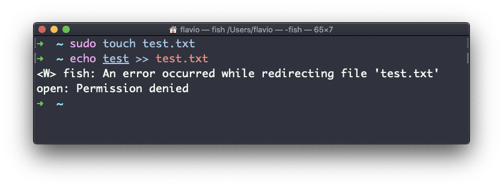

You can use `chown` to transfer the ownership to you:  
您可以使用`chown`将所有权转移给您：

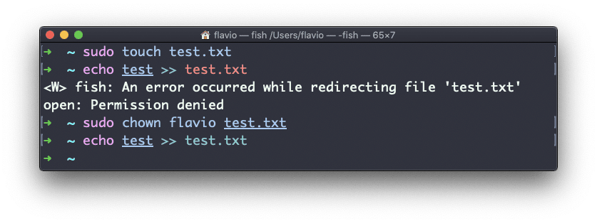

It's rather common to have the need to change the ownership of a directory, and recursively all the files contained, plus all the subdirectories and the files contained in them, too.  
需要更改目录的所有权以及递归地更改其中包含的所有文件以及所有子目录和其中包含的文件的所有权是相当常见的。

You can do so using the `-R` flag:  
您可以使用`-R`标志来执行此操作：

    chown -R <owner> <file>

Files/directories don't just have an owner, they also have a **group**. Through this command you can change that simultaneously while you change the owner:  
文件/目录不仅有一个所有者，它们还有一个**组**。通过此命令，您可以在更改所有者的同时更改它：

    chown <owner>:<group> <file>

Example:  
例子：

    chown flavio:users test.txt

You can also just change the group of a file using the `chgrp` command:  
您还可以使用`chgrp`命令更改文件组：

    chgrp <group> <filename>

## chmod

Every file in the Linux / macOS Operating Systems \(and UNIX systems in general\) has 3 permissions: Read, write, execute.  
Linux / macOS 操作系统（以及一般的 UNIX 系统）中的每个文件都有 3 个权限：读、写、执行。

Go into a folder, and run the `ls -al` command.  
进入文件夹，然后运行`ls -al`命令。

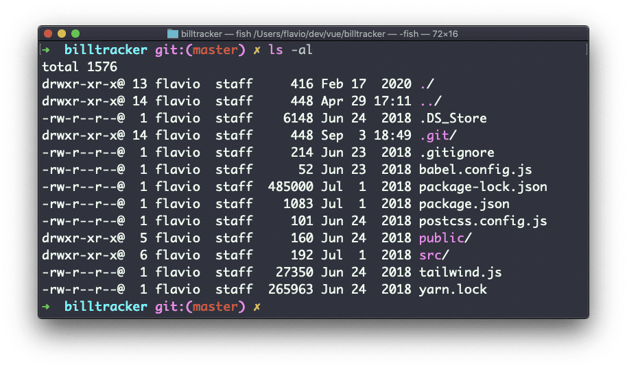

The weird strings you see on each file line, like `drwxr-xr-x`, define the permissions of the file or folder.  
您在每个文件行上看到的奇怪字符串（例如`drwxr-xr-x` ）定义了文件或文件夹的权限。

Let's dissect it.  
我们来剖析一下。

The first letter indicates the type of file:  
第一个字母表示文件类型：

+ `-` means it's a normal file  
`-`表示这是一个普通文件 
+ `d` means it's a directory  
`d`表示它是一个目录 
+ `l` means it's a link  
`l`表示这是一个链接 

Then you have 3 sets of values:  
然后你有 3 组值：

+ The first set represents the permissions of the **owner** of the file  
第一组代表文件**所有者**的权限 
+ The second set represents the permissions of the members of the **group** the file is associated to  
第二组表示文件关联的**组**成员的权限 
+ The third set represents the permissions of the **everyone else**  
第三组代表**其他人**的权限 

Those sets are composed by 3 values. `rwx` means that specific *persona* has read, write and execution access. Anything that is removed is swapped with a `-`, which lets you form various combinations of values and relative permissions: `rw-`, `r--`, `r-x`, and so on.  
这些集合由 3 个值组成。 `rwx`表示特定*角色*具有读、写和执行访问权限。任何删除的内容都会与`-`交换，这使您可以形成值和相对权限的各种组合： `rw-` 、 `r--` 、 `rx`等。

You can change the permissions given to a file using the `chmod` command.  
您可以使用`chmod`命令更改赋予文件的权限。

`chmod` can be used in 2 ways. The first is using symbolic arguments, the second is using numeric arguments. Let's start with symbols first, which is more intuitive.  
`chmod`有两种使用方式。第一个是使用符号参数，第二个是使用数字参数。我们先从符号开始，这样更直观。

You type `chmod` followed by a space, and a letter:  
您输入`chmod`后跟一个空格和一个字母：

+ `a` stands for *all*  
`a`代表*全部* 
+ `u` stands for *user*  
`u`代表*用户* 
+ `g` stands for *group*  
`g`代表*组* 
+ `o` stands for *others*  
`o`代表*其他* 

Then you type either `+` or `-` to add a permission, or to remove it. Then you enter one or more permissions symbols \(`r`, `w`, `x`\).  
然后输入`+`或`-`来添加或删除权限。然后输入一个或多个权限符号（ `r` 、 `w` 、 `x` ）。

All followed by the file or folder name.  
全部后跟文件或文件夹名称。

Here are some examples:  
以下是一些示例：

    chmod a+r filename     #everyone can now read    
    chmod a+rw filename     #everyone can now read and write    
    chmod o-rwx filename     #others (not the owner, not in the same group of the file) cannot read, write or execute the file    

You can apply the same permissions to multiple personas by adding multiple letters before the `+`/`-`:  
您可以通过`-` `+`之前添加多个字母来将相同的权限应用于多个角色：

    chmod og-r filename     #other and group can't read any more    

In case you are editing a folder, you can apply the permissions to every file contained in that folder using the `-r` \(recursive\) flag.  
如果您正在编辑文件夹，则可以使用`-r` （递归）标志将权限应用于该文件夹中包含的每个文件。

Numeric arguments are faster but I find them hard to remember when you are not using them day to day. You use a digit that represents the permissions of the persona. This number value can be a maximum of 7, and it's calculated in this way:  
数字参数速度更快，但我发现当你不每天使用它们时很难记住它们。您使用代表角色权限的数字。该数值最大可为 7，计算方法如下：

+ `1` if has execution permission  
`1`是否有执行权限 
+ `2` if has write permission  
`2`是否有写权限 
+ `4` if has read permission  
`4`是否有读权限 

This gives us 4 combinations:  
这给了我们 4 种组合：

+ `0` no permissions  
`0`无权限 
+ `1` can execute  
`1`可以执行 
+ `2` can write  
`2`可以写 
+ `3` can write, execute  
`3`可以写入、执行 
+ `4` can read  
`4`可以阅读 
+ `5` can read, execute  
`5`可以读取、执行 
+ `6` can read, write  
`6`可以读、写 
+ `7` can read, write and execute  
`7`可以读、写、执行 

We use them in pairs of 3, to set the permissions of all the 3 groups altogether:  
我们将它们 3 个成对使用，以总共设置所有 3 个组的权限：

    chmod 777 filename
    chmod 755 filename
    chmod 644 filename

## umask  

When you create a file, you don't have to decide permissions up front. Permissions have defaults.  
创建文件时，您不必预先决定权限。权限有默认值。

Those defaults can be controlled and modified using the `umask` command.  
可以使用`umask`命令控制和修改这些默认值。

Typing `umask` with no arguments will show you the current umask, in this case `0022`:  
不带参数输入`umask`将显示当前的 umask，在本例中为`0022` ：

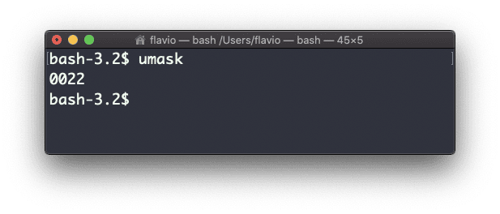

What does `0022` mean? That's an octal value that represent the permissions.  
`0022`是什么意思？这是代表权限的八进制值。

Another common value is `0002`.  
另一个常见的值是`0002` 。

Use `umask -S` to see a human-readable notation:  
使用`umask -S`查看人类可读的符号：

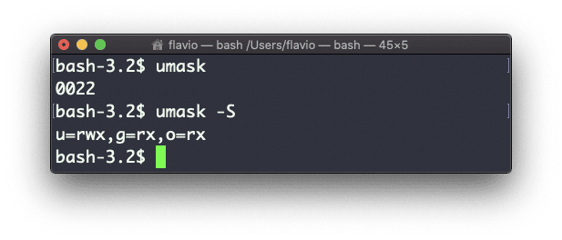

In this case, the user \(`u`\), owner of the file, has read, write and execution permissions on files.  
在这种情况下，文件的所有者用户 \( `u` \) 拥有文件的读、写和执行权限。

Other users belonging to the same group \(`g`\) have read and execution permission, same as all the other users \(`o`\).  
属于同一组的其他用户 \( `g` \) 具有读取和执行权限，与所有其他用户 \( `o` \) 相同。

In the numeric notation, we typically change the last 3 digits.  
在数字表示法中，我们通常更改最后 3 位数字。

Here's a list that gives a meaning to the number:  
这是一个给出数字含义的列表：

+ `0` read, write, execute  
`0`读、写、执行 
+ `1` read and write  
`1`读写 
+ `2` read and execute  
`2`读取并执行 
+ `3` read only  
`3`只读 
+ `4` write and execute  
`4`写入并执行 
+ `5` write only  
`5`只写 
+ `6` execute only  
`6`只执行 
+ `7` no permissions  
`7`无权限 

Note that this numeric notation differs from the one we use in `chmod`.  
请注意，此数字表示法与我们在`chmod`中使用的数字表示法不同。

We can set a new value for the mask setting the value in numeric format:  
我们可以为掩码设置一个新值，以数字格式设置该值：

    umask     002

or you can change a specific role's permission:  
或者您可以更改特定角色的权限：

    umask     g+r

## du  

The `du` command will calculate the size of a directory as a whole:  
`du`命令将计算整个目录的大小：

    du

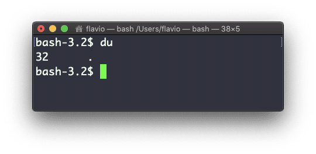

The `32` number here is a value expressed in bytes.  
这里的`32`数字是一个以字节表示的值。

Running `du *` will calculate the size of each file individually:  
运行`du *`将单独计算每个文件的大小：

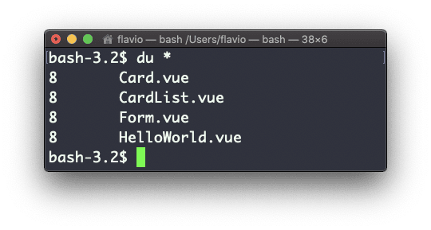

You can set `du` to display values in MegaBytes using `du -m`, and GigaBytes using `du -g`.  
您可以使用`du -m`将`du`设置为以兆字节为单位显示值，并使用`du -g`将 du 设置为以千兆字节为单位显示值。

The `-h` option will show a human-readable notation for sizes, adapting to the size:  
`-h`选项将显示人类可读的大小符号，以适应大小：

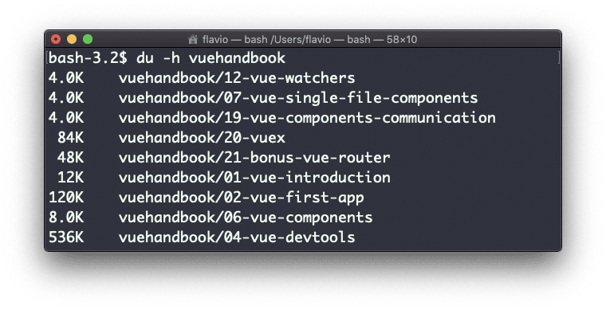

Adding the `-a` option will print the size of each file in the directories, too:  
添加`-a`选项也会打印目录中每个文件的大小：

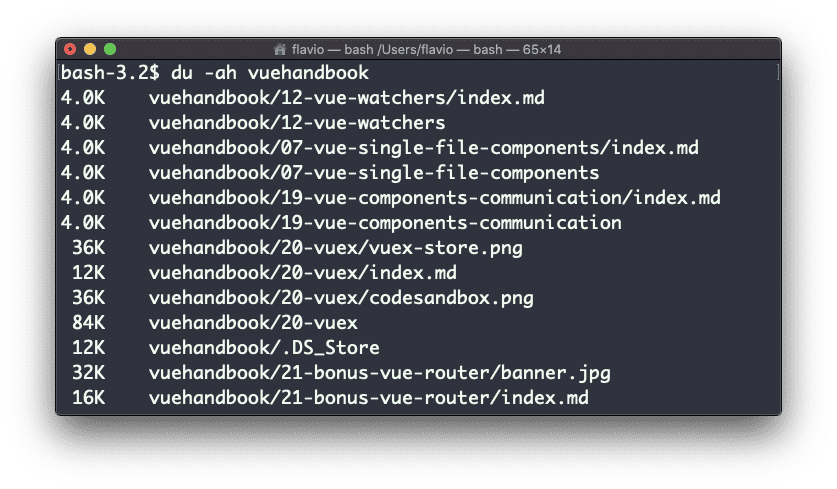

A handy thing is to sort the directories by size:  
一个方便的事情是按大小对目录进行排序：

    du -h <directory> | sort -nr

and then piping to `head` to only get the first 10 results:  
然后通过管道连接到`head`只获取前 10 个结果：

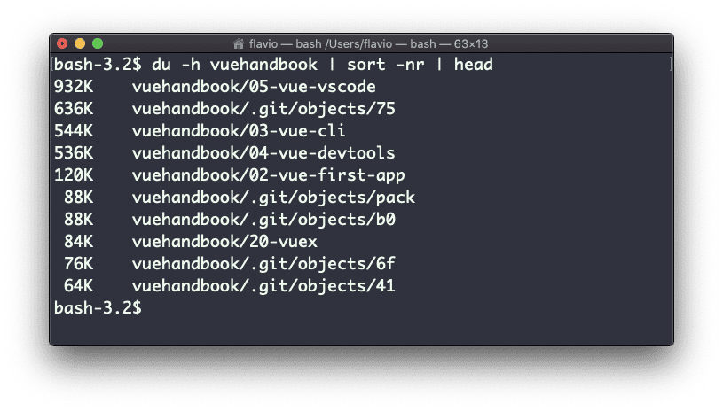

## df

The `df` command is used to get disk usage information.  
`df`命令用于获取磁盘使用信息。

Its basic form will print information about the volumes mounted:  
其基本形式将打印有关已安装卷的信息：

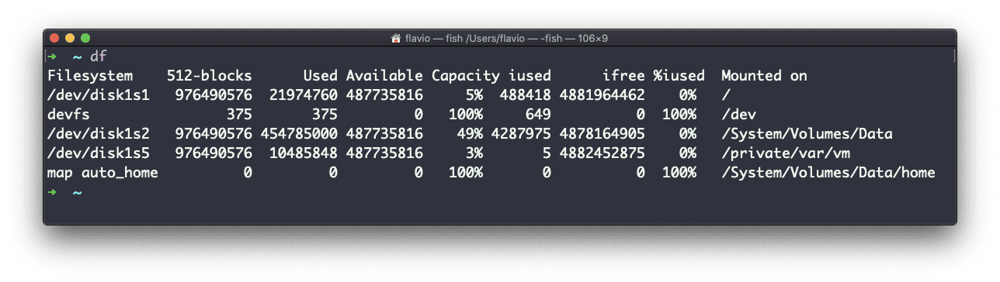

Using the `-h` option \(`df -h`\) will show those values in a human-readable format:  
使用`-h`选项 \( `df -h` \) 将以人类可读的格式显示这些值：

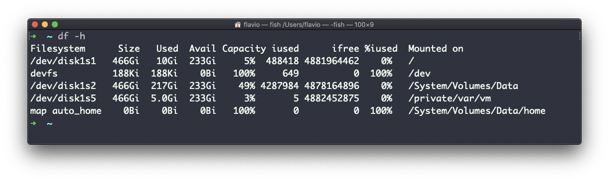

You can also specify a file or directory name to get information about the specific volume it lives on:  
您还可以指定文件或目录名称来获取有关其所在特定卷的信息：

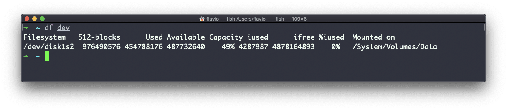

## basename  

Suppose you have a path to a file, for example `/Users/flavio/test.txt`.  
假设您有一个文件的路径，例如`/Users/flavio/test.txt` 。

Running  
跑步

    basename /Users/flavio/test.txt

will return the `test.txt` string:  
将返回`test.txt`字符串：

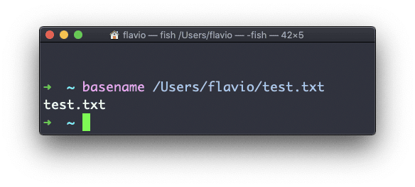

If you run `basename` on a path string that points to a directory, you will get the last segment of the path. In this example, `/Users/flavio` is a directory:  
如果您在指向目录的路径字符串上运行`basename` ，您将获得路径的最后一段。在此示例中， `/Users/flavio`是一个目录：

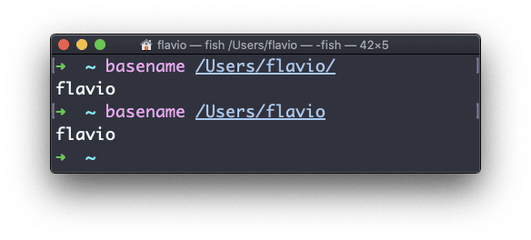

## dirname  

Suppose you have a path to a file, for example `/Users/flavio/test.txt`.  
假设您有一个文件的路径，例如`/Users/flavio/test.txt` 。

Running  
跑步

    dirname /Users/flavio/test.txt

will return the `/Users/flavio` string:  
将返回`/Users/flavio`字符串：

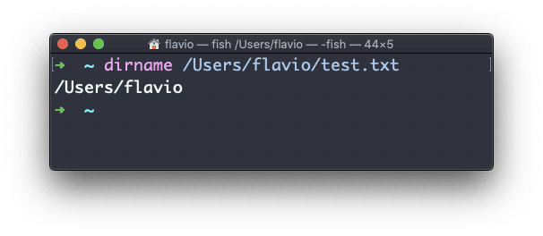

## ps  

Your computer is running, at all times, tons of different processes.  
您的计算机始终运行着大量不同的进程。

You can inspect them all using the `ps` command:  
您可以使用`ps`命令检查它们：

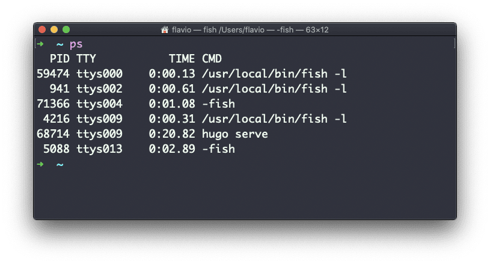

This is the list of user-initiated processes currently running in the current session.  
这是当前会话中当前运行的用户启动进程的列表。

Here I have a few `fish` shell instances, mostly opened by VS Code inside the editor, and an instances of Hugo running the development preview of a site.  
这里我有一些`fish` shell 实例，大部分是通过编辑器内的 VS Code 打开的，还有一个运行网站开发预览的 Hugo 实例。

Those are just the commands assigned to the current user. To list **all** processes we need to pass some options to `ps`.  
这些只是分配给当前用户的命令。要列出**所有**进程，我们需要将一些选项传递给`ps` 。

The most common I use is `ps ax`:  
我最常用的是`ps ax` ：

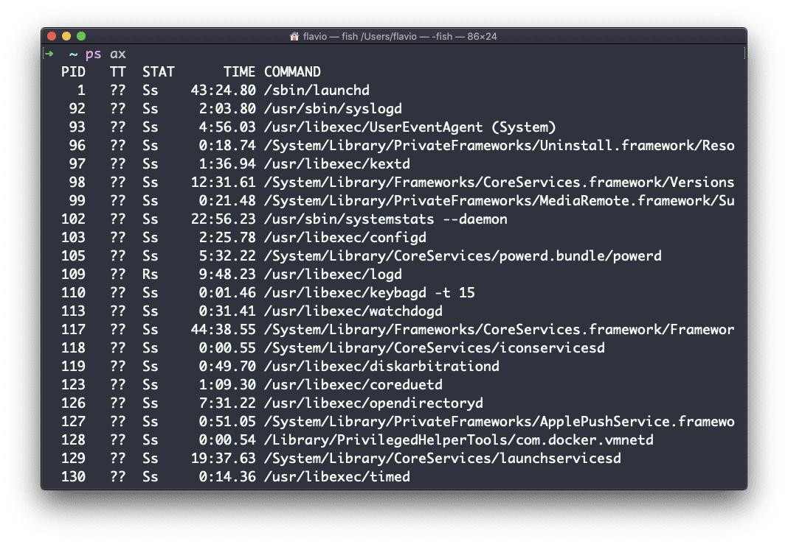
>  
> The `a` option is used to also list other users processes, not just our own. `x` shows processes not linked to any terminal \(not initiated by users through a terminal\).  
`a`选项还用于列出其他用户进程，而不仅仅是我们自己的进程。 `x`显示未链接到任何终端的进程（不是由用户通过终端启动的）。

As you can see, the longer commands are cut. Use the command `ps axww` to continue the command listing on a new line instead of cutting it:  
正如您所看到的，较长的命令被删除了。使用命令`ps axww`在新行上继续列出命令而不是剪切它：

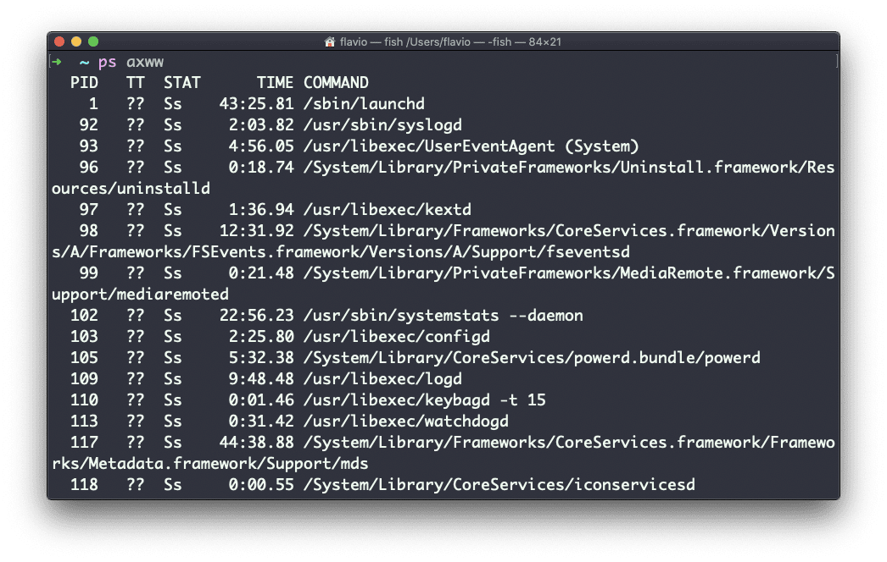
>  
> We need to specify `w` 2 times to apply this setting, it's not a typo.  
我们需要指定`w` 2 次才能应用此设置，这不是拼写错误。

You can search for a specific process combining `grep` with a pipe, like this:  
您可以将`grep`与管道结合起来搜索特定进程，如下所示：

    ps axww | grep     "Visual Studio Code"    

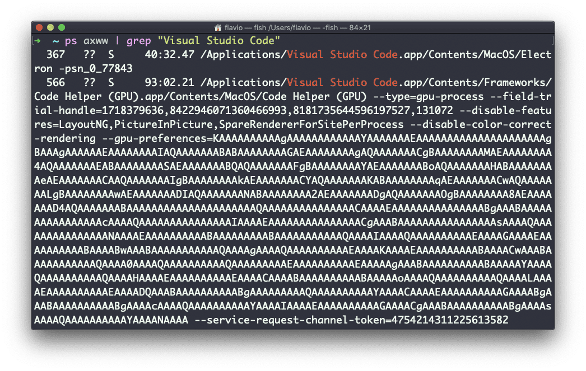

The columns returned by `ps` represent some key information.  
`ps`返回的列代表一些关键信息。

The first information is `PID`, the process ID. This is key when you want to reference this process in another command, for example to kill it.  
第一个信息是`PID` ，即进程 ID。当您想在另一个命令中引用此进程（例如杀死它）时，这是关键。

Then we have `TT` that tells us the terminal id used.  
然后我们有`TT`告诉我们所使用的终端 ID。

Then `STAT` tells us the state of the process:  
然后`STAT`告诉我们进程的状态：

`I` a process that is idle \(sleeping for longer than about 20 seconds\) `R` a runnable process `S` a process that is sleeping for less than about 20 seconds `T` a stopped process `U` a process in uninterruptible wait `Z` a dead process \(a *zombie*\)  
`I`一个空闲进程（休眠时间超过约 20 秒） `R`一个可运行的进程 `S`睡眠时间少于 20 秒的进程 `T`已停止的进程 `U`进程处于不间断等待状态 `Z`死进程（*僵尸*）

If you have more than one letter, the second represents further information, which can be very technical.  
如果您有多个字母，第二个字母代表更多信息，这可能非常技术性。

It's common to have `+` which indicates the process is in the foreground in its terminal. `s` means the process is a [session leader](https://unix.stackexchange.com/questions/18166/what-are-session-leaders-in-ps).  
通常有`+`表示该进程位于终端的前台。 `s`表示该进程是[会话领导者](https://unix.stackexchange.com/questions/18166/what-are-session-leaders-in-ps)。

`TIME` tells us how long the process has been running.  
`TIME`告诉我们该进程已经运行了多长时间。

## top  

A quick guide to the `top` command, used to list the processes running in real time  
`top`命令快速指南，用于列出实时运行的进程

The `top` command is used to display dynamic real-time information about running processes in the system.  
`top`命令用于显示系统中正在运行的进程的动态实时信息。

It's really handy to understand what is going on.  
了解正在发生的事情真的很方便。

Its usage is simple, you just type `top`, and the terminal will be fully immersed in this new view:  
它的用法很简单，你只需输入`top` ，终端就会完全沉浸在这个新视图中：

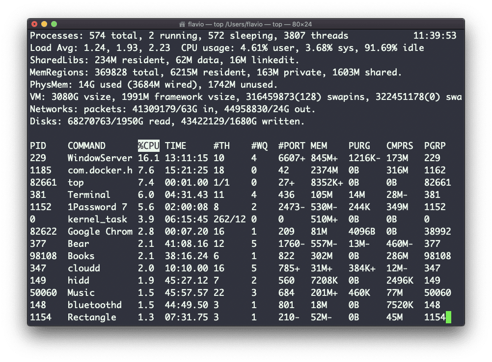

The process is long-running. To quit, you can type the `q` letter or `ctrl-C`.  
该过程是长期运行的。要退出，您可以输入`q`字母或`ctrl-C` 。

There's a lot of information being given to us: the number of processes, how many are running or sleeping, the system load, the CPU usage, and a lot more.  
我们获得了很多信息：进程数、正在运行或休眠的进程数、系统负载、CPU 使用率等等。

Below, the list of processes taking the most memory and CPU is constantly updated.  
下面，占用最多内存和 CPU 的进程列表不断更新。

By default, as you can see from the `%CPU` column highlighted, they are sorted by the CPU used.  
默认情况下，正如您从突出显示的`%CPU`列中看到的那样，它们按使用的 CPU 排序。

You can add a flag to sort processes by memory utilized:  
您可以添加一个标志来按内存使用情况对进程进行排序：

    top -o mem

## kill  

Linux processes can receive **signals** and react to them.  
Linux 进程可以接收**信号**并对信号做出反应。

That's one way we can interact with running programs.  
这是我们与正在运行的程序交互的一种方式。

The `kill` program can send a variety of signals to a program.  
`kill`程序可以向程序发送各种信号。

It's not just used to terminate a program, like the name would suggest, but that's its main job.  
正如其名称所暗示的那样，它不仅仅用于终止程序，但这才是它的主要工作。

We use it in this way:  
我们这样使用它：

    kill     <PID>

By default, this sends the `TERM` signal to the process id specified.  
默认情况下，这会将`TERM`信号发送到指定的进程 ID。

We can use flags to send other signals, including:  
我们可以使用标志来发送其他信号，包括：

    kill     -HUP <PID>    kill     -INT <PID>    kill     -KILL <PID>    kill     -TERM <PID>    kill     -CONT <PID>    kill     -STOP <PID>

`HUP` means **hang up**. It's sent automatically when a terminal window that started a process is closed before terminating the process.  
`HUP`意思是**挂断**。当启动进程的终端窗口在终止进程之前关闭时，它会自动发送。

`INT` means **interrupt**, and it sends the same signal used when we press `ctrl-C` in the terminal, which usually terminates the process.  
`INT`表示**中断**，它发送的信号与我们在终端中按`ctrl-C`时使用的信号相同，这通常会终止进程。

`KILL` is not sent to the process, but to the operating system kernel, which immediately stops and terminates the process.  
`KILL`不是发送给进程，而是发送给操作系统内核，操作系统内核会立即停止并终止进程。

`TERM` means **terminate**. The process will receive it and terminate itself. It's the default signal sent by `kill`.  
`TERM`意思是**终止**。该进程将收到它并自行终止。这是`kill`发送的默认信号。

`CONT` means **continue**. It can be used to resume a stopped process.  
`CONT`表示**继续**。它可用于恢复停止的进程。

`STOP` is not sent to the process, but to the operating system kernel, which immediately stops \(but does not terminate\) the process.  
`STOP`不会发送到进程，而是发送到操作系统内核，操作系统内核会立即停止（但不会终止）进程。

You might see numbers used instead, like `kill -1 <PID>`. In this case,  
您可能会看到使用数字，例如`kill -1 <PID>` 。在这种情况下，

`1` corresponds to `HUP`. `2` corresponds to `INT`. `9` corresponds to `KILL`. `15` corresponds to `TERM`. `18` corresponds to `CONT`. `15` corresponds to `STOP`.  
`1`对应于`HUP` 。 `2`对应于`INT` 。 `9`对应于`KILL` 。 `15`对应于`TERM` 。 `18`对应于`CONT` 。 `15`对应于`STOP` 。

## killall  

Similar to the `kill` command, `killall` instead of sending a signal to a specific process id will send the signal to multiple processes at once.  
与`kill`命令类似， `killall`不是向特定进程id发送信号，而是一次向多个进程发送信号。

This is the syntax:  
这是语法：

    killall <name>

where `name` is the name of a program. For example you can have multiple instances of the `top` program running, and `killall top` will terminate them all.  
其中`name`是程序的名称。例如，您可以运行多个`top`程序实例， `killall top`将终止它们。

You can specify the signal, like with `kill` \(and check the `kill` tutorial to read more about the specific kinds of signals we can send\), for example:  
您可以指定信号，就像使用`kill`一样（并查看`kill`教程以了解有关我们可以发送的特定类型信号的更多信息），例如：

    killall -HUP top

## jobs  

When we run a command in Linux / macOS, we can set it to run in the background using the `&` symbol after the command. For example we can run `top` in the background:  
当我们在Linux / macOS中运行命令时，我们可以使用命令后面的`&`符号将其设置为在后台运行。例如我们可以在后台运行`top` ：

    top &

This is very handy for long-running programs.  
这对于长时间运行的程序非常方便。

We can get back to that program using the `fg` command. This works fine if we just have one job in the background, otherwise we need to use the job number: `fg 1`, `fg 2` and so on. To get the job number, we use the `jobs` command.  
我们可以使用`fg`命令返回该程序。如果我们在后台只有一项作业，那么这很好用，否则我们需要使用作业编号： `fg 1` 、 `fg 2`等等。要获取作业编号，我们使用`jobs`命令。

Say we run `top &` and then `top -o mem &`, so we have 2 top instances running. `jobs` will tell us this:  
假设我们运行`top &`然后运行`top -o mem &` ，所以我们有 2 个 top 实例正在运行。 `jobs`会告诉我们这一点：

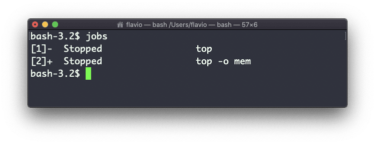

Now we can switch back to one of those using `fg <jobid>`. To stop the program again we can hit `cmd-Z`.  
现在我们可以切换回使用`fg <jobid>`的其中之一。要再次停止程序，我们可以点击`cmd-Z` 。

Running `jobs -l` will also print the process id of each job.  
运行`jobs -l`还将打印每个作业的进程 ID。

## bg  

When a command is running you can suspend it using `ctrl-Z`.  
当命令正在运行时，您可以使用`ctrl-Z`暂停它。

The command will immediately stop, and you get back to the shell terminal.  
该命令将立即停止，您将返回到 shell 终端。

You can resume the execution of the command in the background, so it will keep running but it will not prevent you from doing other work in the terminal.  
您可以在后台恢复该命令的执行，因此它将继续运行，但不会阻止您在终端中执行其他工作。

In this example I have 2 commands stopped:  
在此示例中，我停止了 2 个命令：

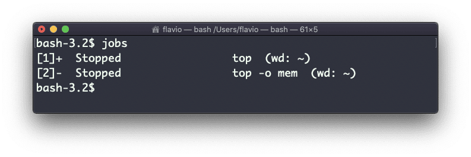

I can run `bg 1` to resume in the background the execution of the job \#1.  
我可以运行`bg 1`在后台恢复作业 \#1 的执行。

I could have also said `bg` without any option, as the default is to pick the job \#1 in the list.  
我也可以说`bg`而不带任何选项，因为默认是选择列表中的作业\#1。

## fg  

When a command is running in the background, because you started it with `&` at the end \(example: `top &` or because you put it in the background with the `bg` command, you can put it to the foreground using `fg`.  
当命令在后台运行时，因为您以`&`结尾（例如： `top &`或因为您使用`bg`命令将其置于后台，所以可以使用`fg`将其置于前台。

Running  
跑步

    fg    

will resume to the foreground the last job that was suspended.  
将恢复到前台上次暂停的作业。

You can also specify which job you want to resume to the foreground passing the job number, which you can get using the `jobs` command.  
您还可以通过作业编号指定要恢复到前台的作业，可以使用`jobs`命令获取作业编号。


Running `fg 2` will resume job \#2:  
运行`fg 2`将恢复作业\#2：

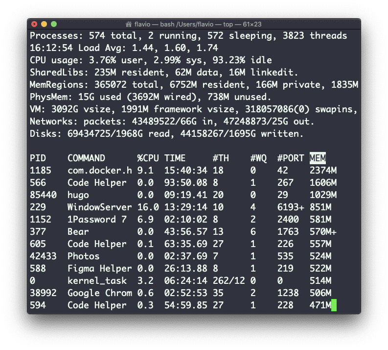

## type  

A command can be one of those 4 types:  
命令可以是以下 4 种类型之一：

+ an executable  
一个可执行文件 
+ a shell built-in program  
shell 内置程序 
+ a shell function  
一个外壳函数 
+ an alias  
别名 

The `type` command can help figure out this, in case we want to know or we're just curious. It will tell you how the command will be interpreted.  
`type`命令可以帮助弄清楚这一点，以防我们想知道或者只是好奇。它会告诉您如何解释该命令。

The output will depend on the shell used. This is Bash:  
输出将取决于所使用的 shell。这是巴什：

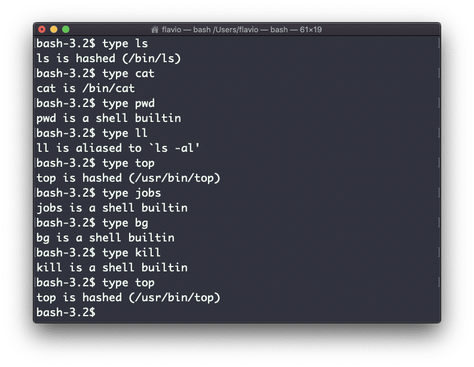

This is Zsh:  
这是 Zsh：

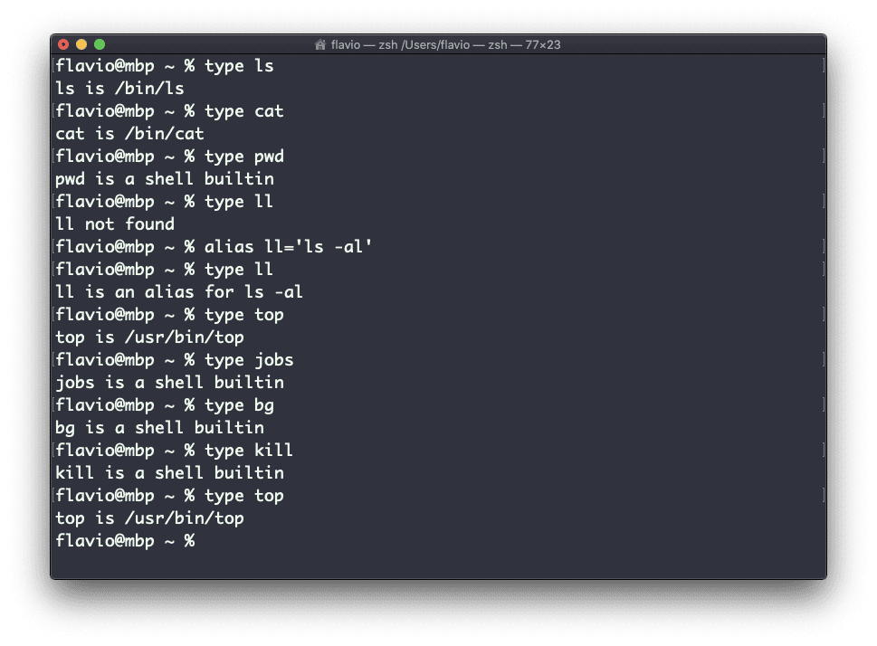

This is Fish:  
这是鱼：

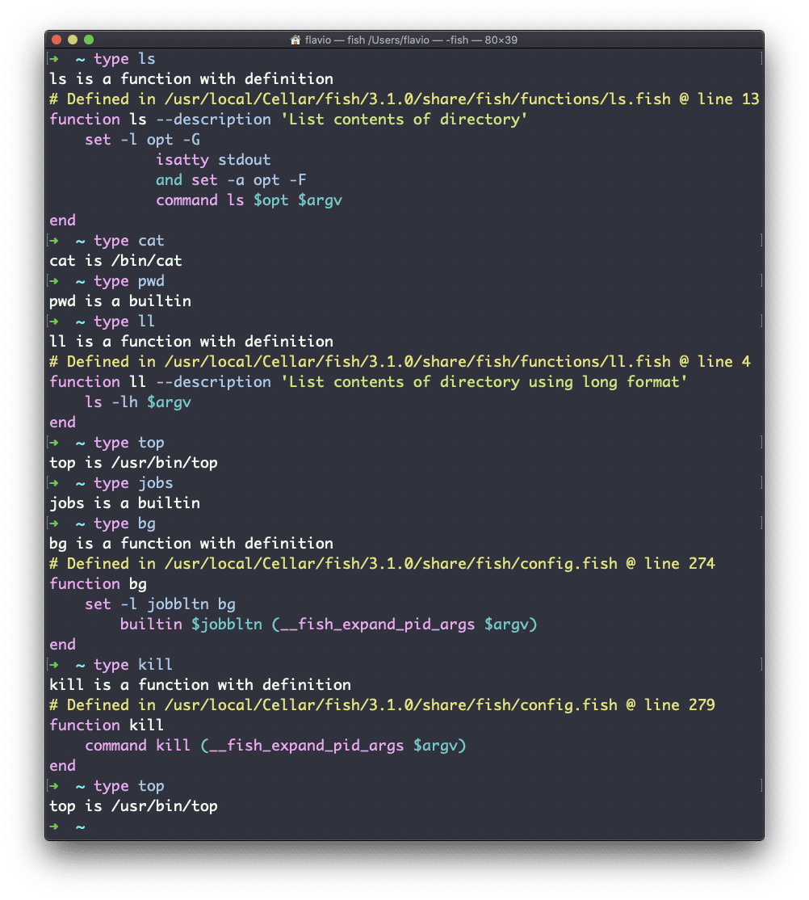

One of the most interesting things here is that for aliases it will tell you what is aliasing to. You can see the `ll` alias, in the case of Bash and Zsh, but Fish provides it by default, so it will tell you it's a built-in shell function.  
这里最有趣的事情之一是，对于别名，它会告诉您别名是什么。在 Bash 和 Zsh 中，您可以看到`ll`别名，但 Fish 默认提供它，因此它会告诉您这是一个内置的 shell 函数。

## which  

Suppose you have a command you can execute, because it's in the shell path, but you want to know where it is located.  
假设您有一个可以执行的命令，因为它位于 shell 路径中，但您想知道它所在的位置。

You can do so using `which`. The command will return the path to the command specified:  
您可以使用`which`来执行此操作。该命令将返回指定命令的路径：

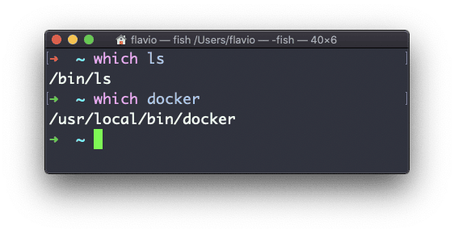

`which` will only work for executables stored on disk, not aliases or built-in shell functions.  
`which`适用于存储在磁盘上的可执行文件，不适用于别名或内置 shell 函数。

## nohup  

Sometimes you have to run a long-lived process on a remote machine, and then you need to disconnect.  
有时您必须在远程计算机上运行长期进程，然后需要断开连接。

Or you simply want to prevent the command to be halted if there's any network issue between you and the server.  
或者您只是想防止命令在您和服务器之间出现任何网络问题时停止。

The way to make a command run even after you log out or close the session to a server is to use the `nohup` command.  
即使在注销或关闭服务器会话后仍运行命令的方法是使用`nohup`命令。

Use `nohup <command>` to let the process continue working even after you log out.  
使用`nohup <command>`让进程在您注销后继续工作。

## xargs

The `xargs` command is used in a UNIX shell to convert input from standard input into arguments to a command.  
`xargs`命令在 UNIX shell 中用于将输入从标准输入转换为命令的参数。

In other words, through the use of `xargs` the output of a command is used as the input of another command.  
换句话说，通过使用`xargs`一个命令的输出被用作另一个命令的输入。

Here's the syntax you will use:  
这是您将使用的语法：

    command1 | xargs command2

We use a pipe \(`|`\) to pass the output to `xargs`. That will take care of running the `command2` command, using the output of `command1` as its argument\(s\).  
我们使用管道 \( `|` \) 将输出传递给`xargs` 。这将负责运行`command2`命令，并使用`command1`的输出作为其参数。

Let's do a simple example. You want to remove some specific files from a directory. Those files are listed inside a text file.  
我们来做一个简单的例子。您想要从目录中删除某些特定文件。这些文件列在文本文件中。

We have 3 files: `file1`, `file2`, `file3`.  
我们有 3 个文件： `file1` 、 `file2` 、 `file3` 。

In `todelete.txt` we have a list of files we want to delete, in this example `file1` and `file3`:  
在`todelete.txt`中，我们有一个要删除的文件列表，在本例中为`file1`和`file3` ：

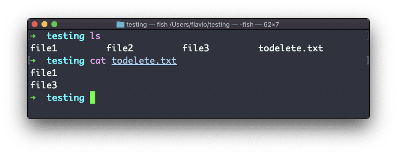

We will channel the output of `cat todelete.txt` to the `rm` command, through `xargs`.  
我们将通过`xargs`将`cat todelete.txt`的输出引导到`rm`命令。

In this way:  
这样：

    cat todelete.txt | xargs rm

That's the result, the files we listed are now deleted:  
这就是结果，我们列出的文件现在已被删除：

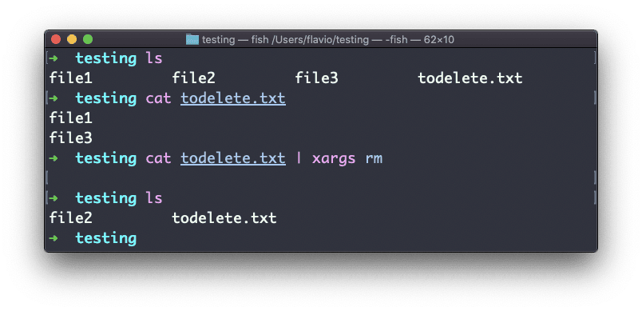

The way it works is that `xargs` will run `rm` 2 times, one for each line returned by `cat`.  
它的工作方式是`xargs`将运行`rm` 2 次， `cat`返回的每一行运行一次。

This is the simplest usage of `xargs`. There are several options we can use.  
这是`xargs`最简单的用法。我们可以使用多种选项。

One of the most useful in my opinion, especially when starting to learn `xargs`, is `-p`. Using this option will make `xargs` print a confirmation prompt with the action it's going to take:  
我认为最有用的之一是`-p` ，尤其是在开始学习`xargs`时。使用此选项将使`xargs`打印一条确认提示，其中包含将要采取的操作：

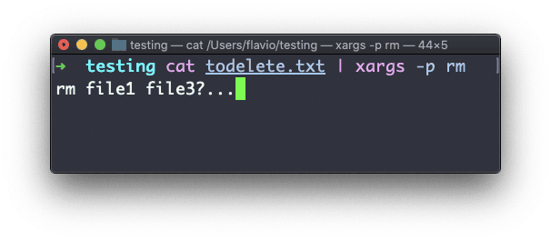

The `-n` option lets you tell `xargs` to perform one iteration at a time, so you can individually confirm them with `-p`. Here we tell `xargs` to perform one iteration at a time with `-n1`:  
`-n`选项允许您告诉`xargs`一次执行一次迭代，因此您可以使用`-p`单独确认它们。在这里，我们告诉`xargs`使用`-n1`一次执行一次迭代：

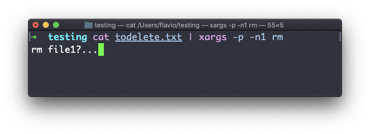

The `-I` option is another widely used one. It allows you to get the output into a placeholder, and then you can do various things.  
`-I`选项是另一个广泛使用的选项。它允许您将输出放入占位符中，然后您可以执行各种操作。

One of them is to run multiple commands:  
其中之一是运行多个命令：

    command1 | xargs -I % /bin/bash -c     'command2 %; command3 %'    

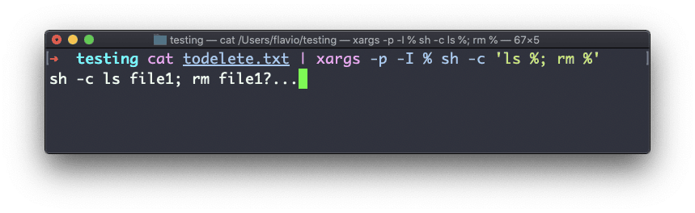
>  
> You can swap the `%` symbol I used above with anything else, it's a variable  
您可以将我上面使用的`%`符号替换为其他符号，它是一个变量

## vim  

`vim` is a **very** popular file editor, especially among programmers. It's actively developed and frequently updated, and there's a very big community around it. There's even a [Vim conference](https://vimconf.org/)\!  
`vim`是一种**非常**流行的文件编辑器，尤其是在程序员中。它得到了积极的开发和频繁的更新，并且有一个非常大的社区。甚至还有[Vim 会议](https://vimconf.org/)！

`vi` in modern systems is just an alias to `vim`, which means `vi` i`m`proved.  
现代系统中的`vi`只是`vim`的别名，这意味着`vi` i `m`被证明。

You start it by running `vi` on the command line.  
您可以通过在命令行上运行`vi`来启动它。

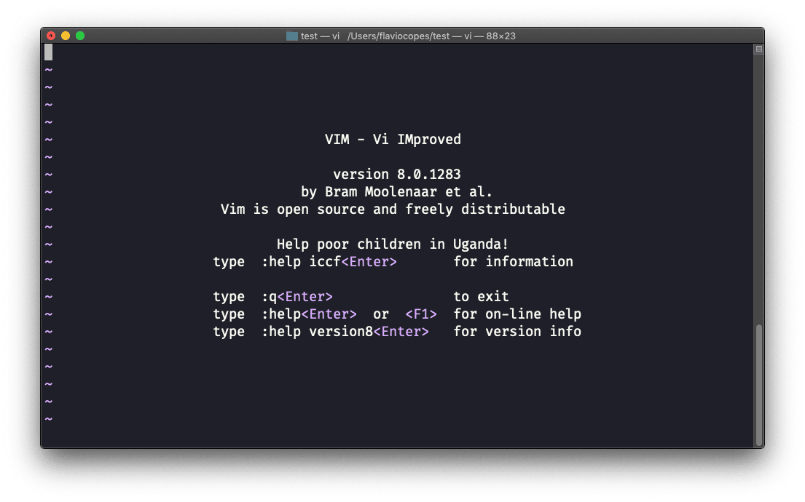

You can specify a filename at invocation time to edit that specific file:  
您可以在调用时指定文件名来编辑该特定文件：

    vi test.txt

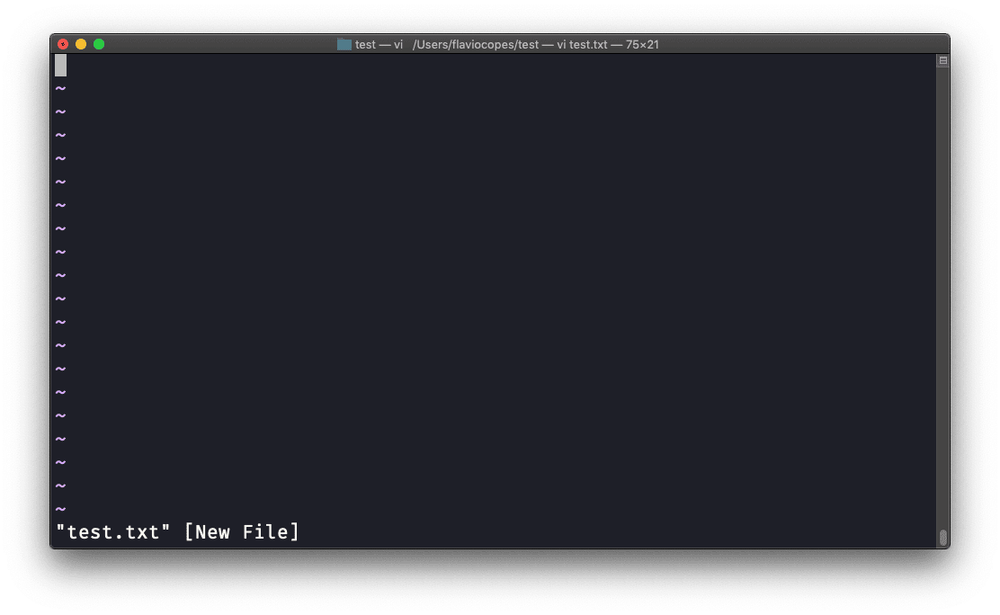

You have to know that Vim has 2 main modes:  
你要知道 Vim 有 2 个主要模式：

+ *command* \(or *normal*\) mode  
*命令*（或*正常*）模式 
+ *insert* mode  
*插入*模式 

When you start the editor, you are in command mode. You can't enter text like you expect from a GUI-based editor. You have to enter **insert mode**. You can do this by pressing the `i` key. Once you do so, the `-- INSERT --` word appear at the bottom of the editor:  
当您启动编辑器时，您处于命令模式。您无法像在基于 GUI 的编辑器中那样输入文本。您必须进入**插入模式**。您可以通过按`i`键来执行此操作。一旦你这样做了， `-- INSERT --`这个词就会出现在编辑器的底部：

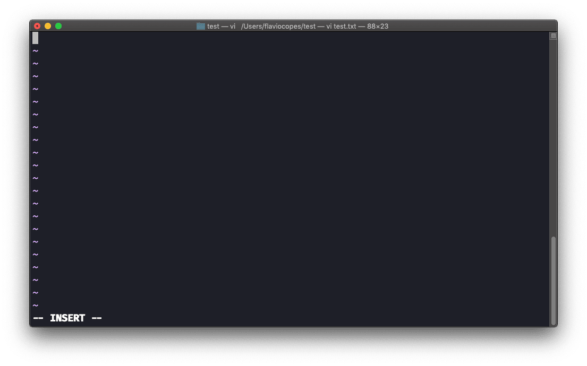

Now you can start typing and filling the screen with the file contents:  
现在您可以开始输入文件内容并在屏幕上填充：

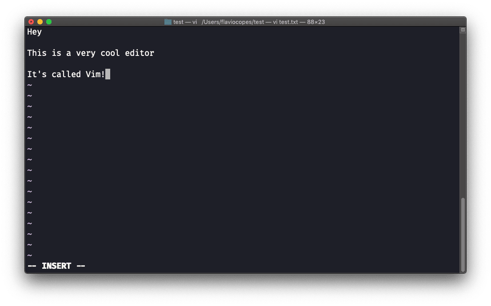

You can move around the file with the arrow keys, or using the `h` - `j` - `k` - `l` keys. `h-l` for left-right, `j-k` for down-up.  
您可以使用箭头键或使用`h` - `j` - `k` - `l`键在文件中移动。 `hl`代表左-右， `jk`代表下-上。

Once you are done editing you can press the `esc` key to exit insert mode, and go back to **command mode**.  
完成编辑后，您可以按`esc`键退出插入模式，然后返回**命令模式**。

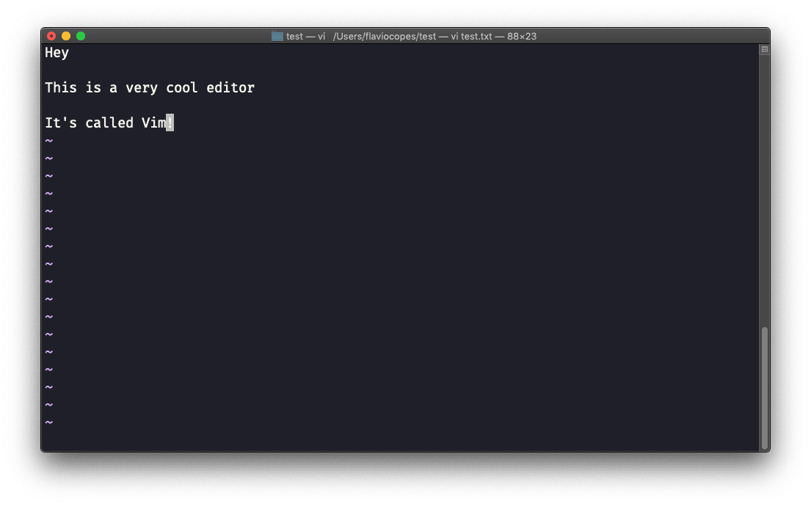

At this point you can navigate the file, but you can't add content to it \(and be careful which keys you press as they might be commands\).  
此时，您可以导航该文件，但无法向其中添加内容（并且要小心按下的键，因为它们可能是命令）。

One thing you might want to do now is **saving the file**. You can do so by pressing `:` \(colon\), then `w`.  
您现在可能想做的一件事是**保存文件**。您可以通过按`:`冒号），然后`w`来执行此操作。

You can **save and quit** pressing `:` then `w` and `q`: `:wq`  
您可以**保存并退出，**按`:`然后按`w`和`q` : `:wq`

You can **quit without saving**, pressing `:` then `q` and `!`: `:q!`  
您可以**退出而不保存**，按`:`然后按`q`和`!` :: `:q!`

You can **undo** and edit by going to command mode and pressing `u`. You can **redo** \(cancel an undo\) by pressing `ctrl-r`.  
您可以通过进入命令模式并按`u`**来撤消**和编辑。您可以按`ctrl-r`**重做**（取消撤消）。

Those are the basics of working with Vim. From here starts a rabbit hole we can't go into in this little introduction.  
这些是使用 Vim 的基础知识。从这里开始，我们无法在这个小介绍中进入一个兔子洞。

I will only mention those commands that will get you started editing with Vim:  
我只会提到那些可以让你开始使用 Vim 进行编辑的命令：

+ pressing the `x` key deletes the character currently highlighted  
按`x`键删除当前突出显示的字符 
+ pressing `A` goes at the end of the currently selected line  
按`A`转到当前所选行的末尾 
+ press `0` to go to the start of the line  
按`0`转到行首 
+ go to the first character of a word and press `d` followed by `w` to delete that word. If you follow it with `e` instead of `w`, the white space before the next word is preserved  
转到单词的第一个字符，然后按`d`然后按`w`删除该单词。如果您使用`e`而不是`w` ，则保留下一个单词之前的空格 
+ use a number between `d` and `w` to delete more than 1 word, for example use `d3w` to delete 3 words forward  
使用`d`和`w`之间的数字删除 1 个以上的单词，例如使用`d3w`向前删除 3 个单词 
+ press `d` followed by `d` to delete a whole entire line. Press `d` followed by `$` to delete the entire line from where the cursor is, until the end  
按`d`然后按`d`可删除整行。按`d`后按`$`可删除从光标所在位置开始的整行，直到末尾 

To find out more about Vim I can recommend the [Vim FAQ](https://vimhelp.org/vim_faq.txt.html) and especially running the `vimtutor` command, which should already be installed in your system and will greatly help you start your `vim` explorations.  
要了解有关 Vim 的更多信息，我可以推荐[Vim FAQ](https://vimhelp.org/vim_faq.txt.html) ，特别是运行`vimtutor`命令，该命令应该已经安装在您的系统中，并将极大地帮助您开始您的`vim`探索。

## emacs

`emacs` is an awesome editor and it's historically regarded as *the* editor for UNIX systems. Famously `vi` vs `emacs` flame wars and heated discussions caused many unproductive hours for developers around the world.  
`emacs`是一个很棒的编辑器，历来被认为是 UNIX 系统的*编辑*器。众所周知， `vi`与`emacs`的激烈争论和激烈的讨论导致世界各地的开发人员花费了很多时间，毫无成效。

`emacs` is very powerful. Some people use it all day long as a kind of operating system \([https://news.ycombinator.com/item?id=19127258](https://news.ycombinator.com/item?id=19127258)\). We'll just talk about the basics here.  
`emacs`非常强大。有些人整天把它当作一种操作系统来使用（ [https://news.ycombinator.com/item?id=19127258](https://news.ycombinator.com/item?id=19127258) ）。我们在这里只讨论基础知识。

You can open a new emacs session simply by invoking `emacs`:  
您只需调用`emacs`即可打开新的 emacs 会话：

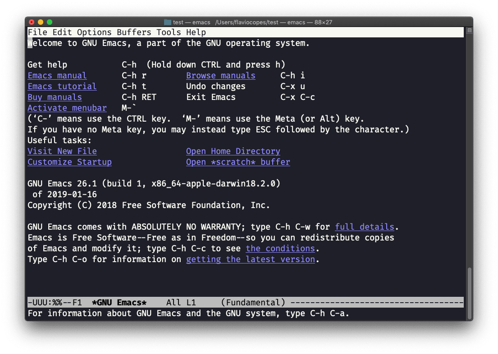
>  
> macOS users, stop a second now. If you are on Linux there are no problems, but macOS does not ship applications using GPLv3, and every built-in UNIX command that has been updated to GPLv3 has not been updated. While there is a little problem with the commands I listed up to now, in this case using an emacs version from 2007 is not exactly the same as using a version with 12 years of improvements and change. This is not a problem with Vim, which is up to date. To fix this, run `brew install emacs` and running `emacs` will use the new version from Homebrew \(make sure you have Homebrew installed\)  
macOS 用户，请停下来。如果您使用的是 Linux，则没有问题，但 macOS 不提供使用 GPLv3 的应用程序，并且已更新到 GPLv3 的每个内置 UNIX 命令尚未更新。虽然我到目前为止列出的命令存在一些问题，但在这种情况下，使用 2007 年的 emacs 版本与使用经过 12 年改进和更改的版本并不完全相同。这对于 Vim 来说不是问题，它是最新的。要解决此问题，请运行`brew install emacs` ，并且运行`emacs`将使用Homebrew的新版本（确保您已安装Homebrew ）

You can also edit an existing file calling `emacs <filename>`:  
您还可以编辑调用`emacs <filename>`的现有文件：

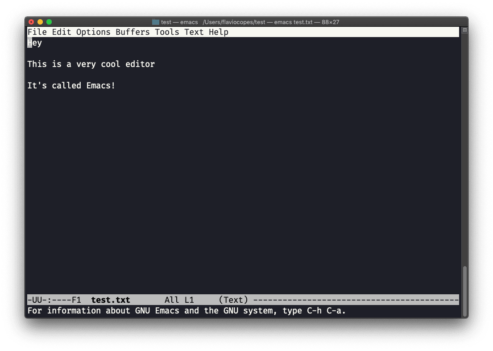

You can start editing and once you are done, press `ctrl-x` followed by `ctrl-w`. You confirm the folder:  
您可以开始编辑，完成后，按`ctrl-x` ，然后按`ctrl-w` 。您确认该文件夹：

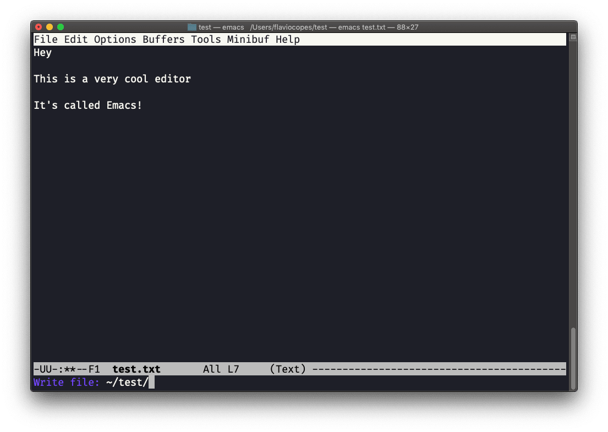

and Emacs tell you the file exists, asking you if it should overwrite it:  
Emacs 会告诉您该文件存在，并询问您是否应该覆盖它：

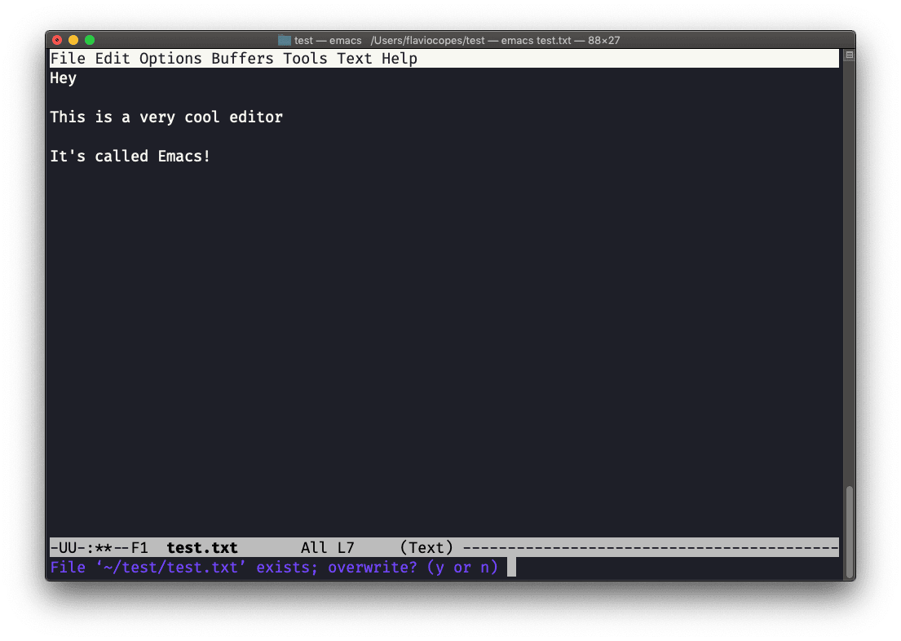

Answer `y`, and you get a confirmation of success:  
回答`y` ，您将收到成功确认信息：

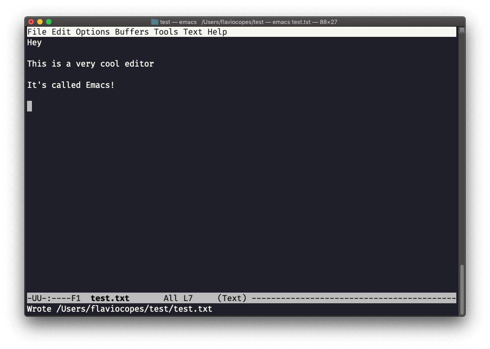

You can exit Emacs pressing `ctrl-x` followed by `ctrl-c`. Or `ctrl-x` followed by `c` \(keep `ctrl` pressed\).  
您可以按`ctrl-x`然后按`ctrl-c`退出 Emacs。或者按`ctrl-x`后跟`c` （按住`ctrl`不放）。

There is a lot to know about Emacs. More than I am able to write in this little introduction. I encourage you to open Emacs and press `ctrl-h` `r` to open the built-in manual and `ctrl-h` `t` to open the official tutorial.  
关于 Emacs 有很多东西需要了解。我在这个小小的介绍中无法写出更多内容。我鼓励你打开 Emacs 并按`ctrl-h` `r`打开内置手册，按`ctrl-h` `t`打开官方教程。

## nano  

`nano` is a beginner friendly editor.  
`nano`是一个适合初学者的编辑器。

Run it using `nano <filename>`.  
使用`nano <filename>`运行它。

You can directly type characters into the file without worrying about modes.  
您可以直接在文件中键入字符，而不必担心模式。

You can quit without editing using `ctrl-X`. If you edited the file buffer, the editor will ask you for confirmation and you can save the edits, or discard them. The help at the bottom shows you the keyboard commands that let you work with the file:  
您可以使用`ctrl-X`退出而不进行编辑。如果您编辑了文件缓冲区，编辑器将要求您确认，您可以保存编辑或放弃它们。底部的帮助显示了可让您使用该文件的键盘命令：

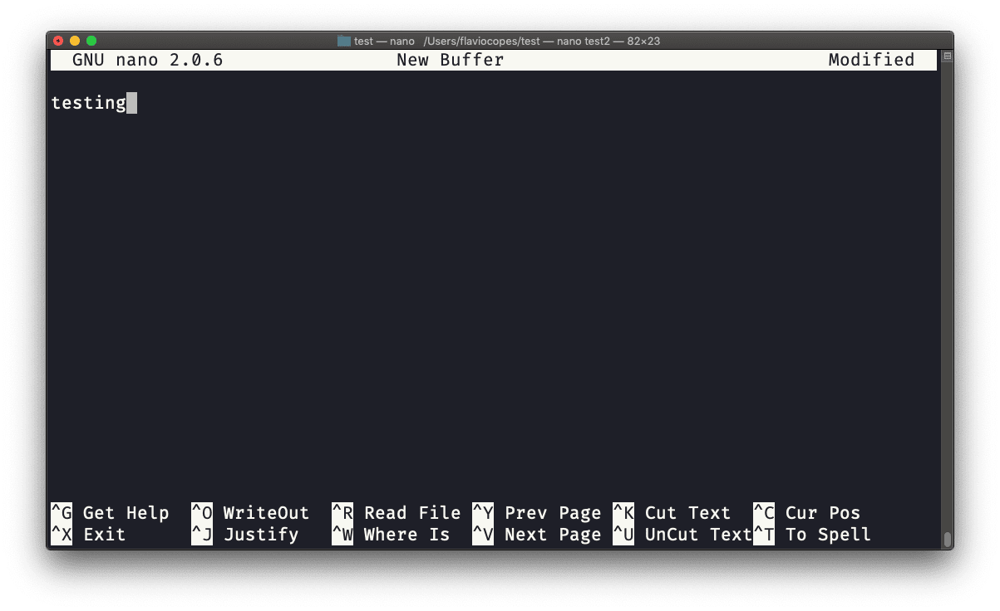

`pico` is more or less the same, although `nano` is the GNU version of `pico` which at some point in history was not open source and the `nano` clone was made to satisfy the GNU operating system license requirements.  
`pico`或多或少是相同的，尽管`nano`是`pico`的 GNU 版本，在历史上的某个时刻它不是开源的，并且`nano`克隆是为了满足 GNU 操作系统许可要求而制作的。

## whoami  

Type `whoami` to print the user name currently logged in to the terminal session:  
输入`whoami`以打印当前登录到终端会话的用户名：

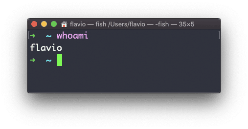
>  
> Note: this is different from the `who am i` command, which prints more information  
注意：这与`who am i`命令不同，后者打印更多信息

## who  

The `who` command displays the users logged in to the system.  
`who`命令显示登录到系统的用户。

Unless you're using a server multiple people have access to, chances are you will be the only user logged in, multiple times:  
除非您使用的服务器可供多人访问，否则您很可能是唯一多次登录的用户：

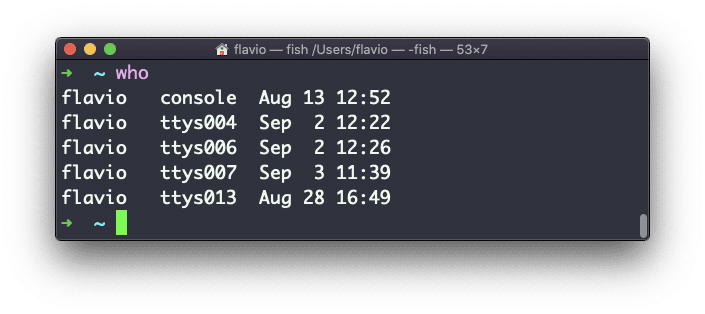

Why multiple times? Because each shell opened will count as an access.  
为什么要多次？因为每次打开的shell都会算作一次访问。

You can see the name of the terminal used, and the time/day the session was started.  
您可以看到所使用的终端的名称以及会话开始的时间/日期。

The `-aH` flags will tell `who` to display more information, including the idle time and the process ID of the terminal:  
`-aH`标志将告诉`who`显示更多信息，包括空闲时间和终端的进程 ID：

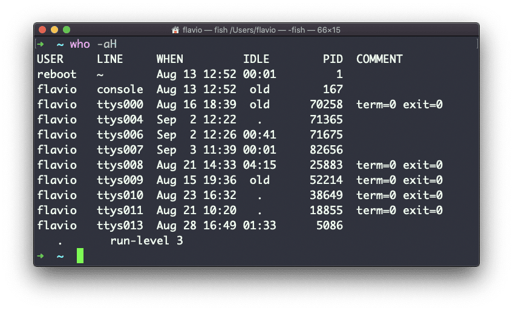

The special `who am i` command will list the current terminal session details:  
特殊的`who am i`命令将列出当前终端会话详细信息：

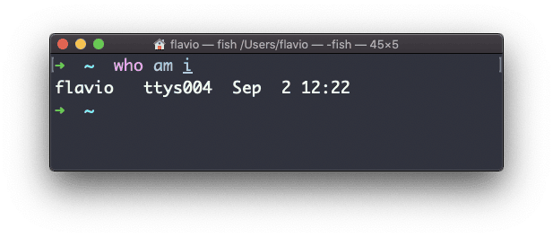


## su  

While you're logged in to the terminal shell with one user, you might have the need to switch to another user.  
当您使用一个用户登录到终端 shell 时，您可能需要切换到另一用户。

For example you're logged in as root to perform some maintenance, but then you want to switch to a user account.  
例如，您以 root 身份登录来执行一些维护，但随后您想要切换到用户帐户。

You can do so with the `su` command:  
您可以使用`su`命令来执行此操作：

    su <username>

For example: `su flavio`.  
例如： `su flavio` 。

If you're logged in as a user, running `su` without anything else will prompt to enter the `root` user password, as that's the default behavior.  
如果您以用户身份登录，则运行`su`而不执行任何其他操作将提示输入`root`用户密码，因为这是默认行为。

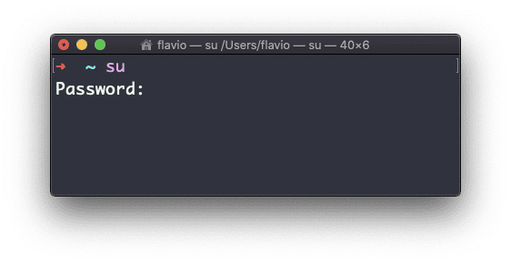

`su` will start a new shell as another user.  
`su`将以另一个用户身份启动一个新的 shell。

When you're done, typing `exit` in the shell will close that shell, and will return back to the current user's shell.  
完成后，在 shell 中键入`exit`将关闭该 shell，并返回到当前用户的 shell。

## sudo  

`sudo` is commonly used to run a command as root.  
`sudo`通常用于以 root 身份运行命令。

You must be enabled to use `sudo`, and once you do, you can run commands as root by entering your user's password \(*not* the root user password\).  
您必须能够使用`sudo` ，一旦启用，您就可以通过输入用户密码（*而不是*root 用户密码）以 root 身份运行命令。

The permissions are highly configurable, which is great especially in a multi-user server environment, and some users can be granted access to running specific commands through `sudo`.  
权限是高度可配置的，这在多用户服务器环境中尤其有用，并且可以通过`sudo`授予某些用户运行特定命令的访问权限。

For example you can edit a system configuration file:  
例如，您可以编辑系统配置文件：

    sudo nano /etc/hosts

which would otherwise fail to save since you don't have the permissions for it.  
否则将无法保存，因为您没有权限。

You can run `sudo -i` to start a shell as root:  
您可以运行`sudo -i`以 root 身份启动 shell：

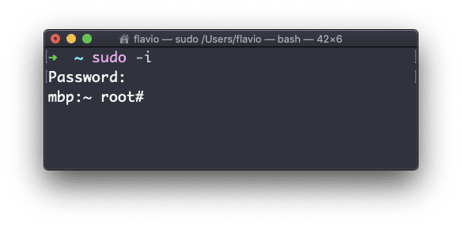

You can use `sudo` to run commands as any user. `root` is the default, but use the `-u` option to specify another user:  
您可以使用`sudo`以任何用户身份运行命令。 `root`是默认用户，但使用`-u`选项指定另一个用户：

    sudo -u flavio ls /Users/flavio

## passwd  

Users in Linux have a password assigned. You can change the password using the `passwd` command.  
Linux 中的用户已分配一个密码。您可以使用`passwd`命令更改密码。

There are two situations here.  
这里有两种情况。

The first is when you want to change your password. In this case you type:  
第一个是当您想要更改密码时。在这种情况下，您输入：

    passwd

and an interactive prompt will ask you for the old password, then it will ask you for the new one:  
交互式提示会要求您输入旧密码，然后会要求您输入新密码：

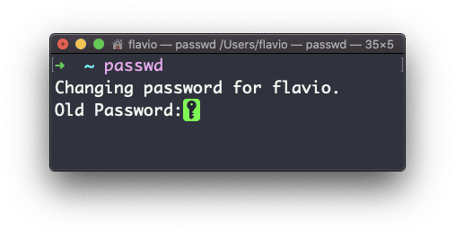

When you're `root` \(or have superuser privileges\) you can set the username of which you want to change the password:  
当您是`root` （或具有超级用户权限）时，您可以设置要更改密码的用户名：

    passwd <username> <new password>

In this case you don't need to enter the old one.  
在这种情况下，您无需输入旧的。

## ping  

The `ping` command pings a specific network host, on the local network or on the Internet.  
`ping`命令对本地网络或 Internet 上的特定网络主机执行 ping 操作。

You use it with the syntax `ping <host>` where `<host>` could be a domain name, or an IP address.  
您可以使用语法`ping <host>`来使用它，其中`<host>`可以是域名或 IP 地址。

Here's an example pinging `google.com`:  
以下是 ping `google.com`示例：

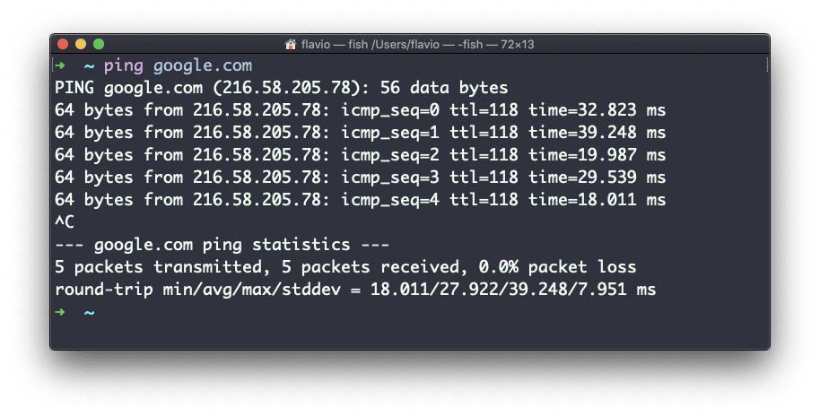

The commands sends a request to the server, and the server returns a response.  
命令向服务器发送请求，服务器返回响应。

`ping` keep sending the request every second, by default, and will keep running until you stop it with `ctrl-C`, unless you pass the number of times you want to try with the `-c` option: `ping -c 2 google.com`.  
默认情况下， `ping`每秒都会发送请求，并且将继续运行，直到您使用`ctrl-C`停止它为止，除非您通过`-c`选项传递了您想要尝试的次数： `ping -c 2 google.com` 。

Once `ping` is stopped, it will print some statistics about the results: the percentage of packages lost, and statistics about the network performance.  
一旦`ping`停止，它将打印一些有关结果的统计信息：丢失包的百分比以及有关网络性能的统计信息。

As you can see the screen prints the host IP address, and the time that it took to get the response back.  
正如您所看到的，屏幕打印了主机 IP 地址以及获取响应所需的时间。

Not all servers support pinging, in case the requests times out:  
并非所有服务器都支持 ping，以防请求超时：

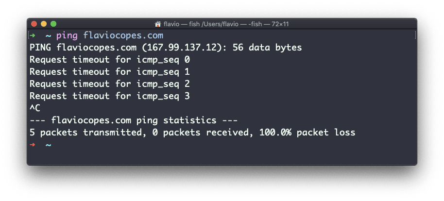

Sometimes this is done on purpose, to "hide" the server, or just to reduce the load. The ping packets can also be filtered by firewalls.  
有时这是故意这样做的，以“隐藏”服务器，或者只是为了减少负载。 ping 数据包也可以被防火墙过滤。

`ping` works using the **ICMP protocol** \(*Internet Control Message Protocol*\), a network layer protocol just like TCP or UDP.  
`ping`使用**ICMP 协议**（*​​互联网控制消息协议*）进行工作，这是一种网络层协议，就像 TCP 或 UDP 一样。

The request sends a packet to the server with the `ECHO_REQUEST` message, and the server returns a `ECHO_REPLY` message. I won't go into details, but this is the basic concept.  
请求向服务器发送带有`ECHO_REQUEST`消息的数据包，服务器返回`ECHO_REPLY`消息。我不会详细说明，但这是基本概念。

Pinging a host is useful to know if the host is reachable \(supposing it implements ping\), and how distant it is in terms of how long it takes to get back to you. Usually the nearest the server is geographically, the less time it will take to return back to you, for simple physical laws that cause a longer distance to introduce more delay in the cables.  
对主机执行 Ping 操作有助于了解该主机是否可达（假设它实现了 ping），以及与您联系所需的时间有多远。通常，服务器在地理位置上越近，返回给您所需的时间就越短，因为简单的物理定律会导致距离较长，从而在电缆中引入更多延迟。

## traceroute  

When you try to reach a host on the Internet, you go through your home router, then you reach your ISP network, which in turn goes through its own upstream network router, and so on, until you finally reach the host.  
当您尝试访问互联网上的主机时，您将通过家庭路由器，然后到达 ISP 网络，ISP 网络又通过其自己的上游网络路由器，依此类推，直到您最终到达主机。

Have you ever wanted to know what are the steps that your packets go through to do that?  
您是否想知道您的数据包要经过哪些步骤才能做到这一点？

The `traceroute` command is made for this.  
`traceroute`命令就是为此而设计的。

You invoke  
你调用

    traceroute <host>

and it will \(slowly\) gather all the information while the packet travels.  
它会在数据包传输过程中（慢慢地）收集所有信息。

In this example I tried reaching for my blog with `traceroute flaviocopes.com`:  
在此示例中，我尝试使用`traceroute flaviocopes.com`访问我的博客：

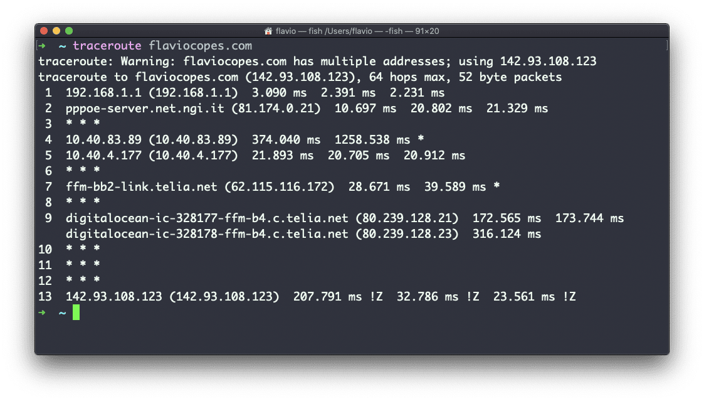

Not every router travelled returns us information. In this case, `traceroute` prints `* * *`. Otherwise, we can see the hostname, the IP address, and some performance indicator.  
并非每个经过的路由器都会向我们返回信息。在这种情况下， `traceroute`会打印`* * *` 。否则，我们可以看到主机名、IP 地址和一些性能指标。

For every router we can see 3 samples, which means traceroute tries by default 3 times to get you a good indication of the time needed to reach it. This is why it takes this long to execute `traceroute` compared to simply doing a `ping` to that host.  
对于每个路由器，我们可以看到 3 个样本，这意味着默认情况下，traceroute 会尝试 3 次，以便您很好地了解到达该路由器所需的时间。这就是为什么与简单地对该主机执行`ping`相比，执行`traceroute`需要这么长时间。

You can customize this number with the `-q` option:  
您可以使用`-q`选项自定义此数字：

    traceroute -q 1 flaviocopes.com

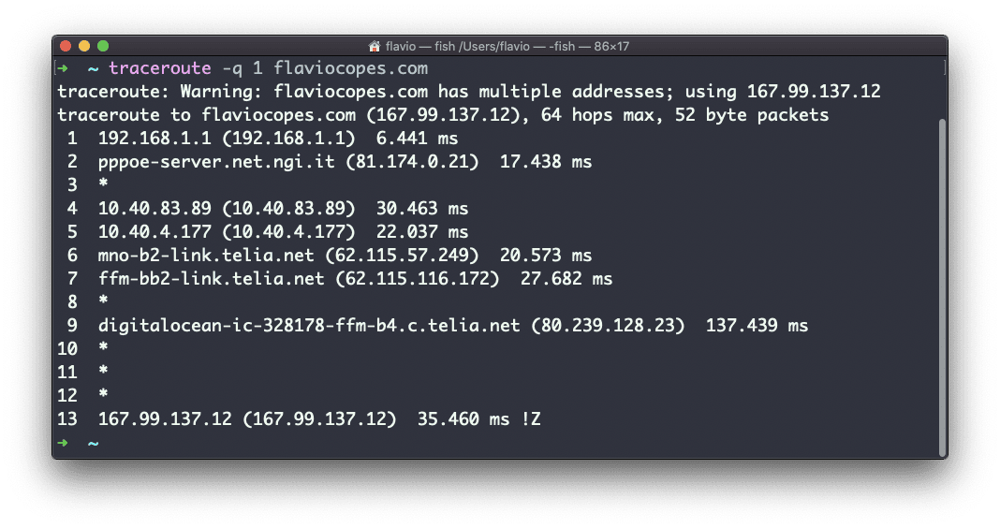

## clear  

Type `clear` to clear all the previous commands that were ran in the current terminal.  
键入`clear`以清除当前终端中运行的所有先前命令。

The screen will clear and you will just see the prompt at the top:  
屏幕将清除，您只会在顶部看到提示：

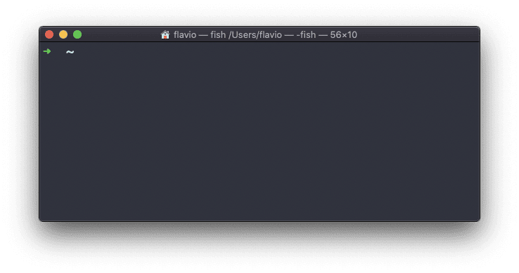
>  
> Note: this command has a handy shortcut: `ctrl-L`  
注意：此命令有一个方便的快捷键： `ctrl-L`

Once you do that, you will lose access to scrolling to see the output of the previous commands entered.  
一旦执行此操作，您将无法滚动查看先前输入的命令的输出。

So you might want to use `clear -x` instead, which still clears the screen, but lets you go back to see the previous work by scrolling up.  
因此，您可能想使用`clear -x` ，它仍然会清除屏幕，但可以让您通过向上滚动返回查看之前的工作。

## history  

Every time we run a command, that's memorized in the history.  
每次我们运行命令时，它都会被记录在历史记录中。

You can display all the history using:  
您可以使用以下命令显示所有历史记录：

    history    

This shows the history with numbers:  
这用数字显示了历史：

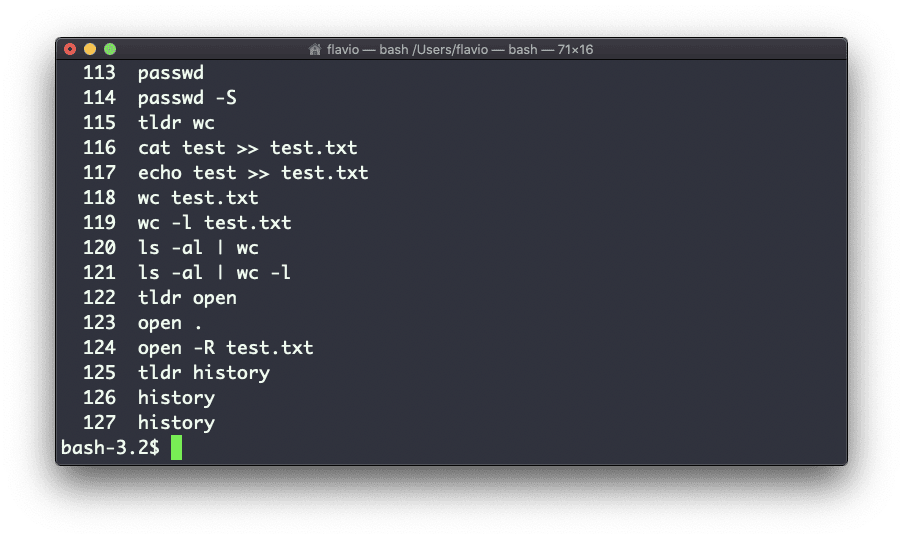

You can use the syntax `!<command number>` to repeat a command stored in the history, in the above example typing `!121` will repeat the `ls -al | wc -l` command.  
您可以使用语法`!<command number>`来重复存储在历史记录中的命令，在上面的示例中键入`!121`将重复`ls -al | wc -l`命令。

Typically the last 500 commands are stored in the history.  
通常，最后 500 个命令存储在历史记录中。

You can combine this with `grep` to find a command you ran:  
您可以将其与`grep`结合起来查找您运行的命令：

    history     | grep docker

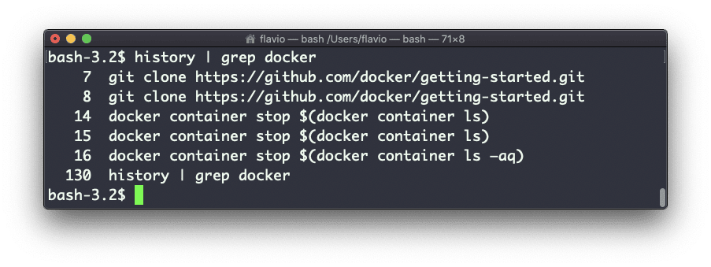

To clear the history, run `history -c`  
要清除历史记录，请运行`history -c`

## export  

The `export` command is used to export variables to child processes.  
`export`命令用于将变量导出到子进程。

What does this mean?  
这意味着什么？

Suppose you have a variable TEST defined in this way:  
假设您有一个这样定义的变量 TEST：

    TEST=    "test"    

You can print its value using `echo $TEST`:  
您可以使用`echo $TEST`打印其值：

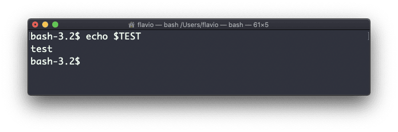

But if you try defining a Bash script in a file `script.sh` with the above command:  
但是，如果您尝试使用上述命令在`script.sh`文件中定义 Bash 脚本：

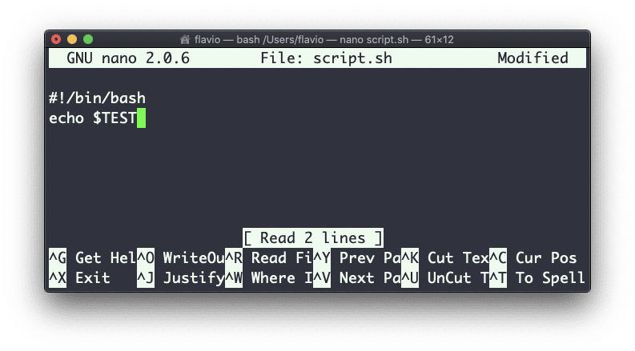

Then you set `chmod u+x script.sh` and you execute this script with `./script.sh`, the `echo $TEST` line will print nothing\!  
然后设置`chmod u+x script.sh`并使用`./script.sh`执行此脚本， `echo $TEST`行将不打印任何内容！

This is because in Bash the `TEST` variable was defined local to the shell. When executing a shell script or another command, a subshell is launched to execute it, which does not contain the current shell local variables.  
这是因为在 Bash 中， `TEST`变量是在 shell 本地定义的。当执行 shell 脚本或其他命令时，会启动一个子 shell 来执行它，该子 shell 不包含当前 shell 局部变量。

To make the variable available there we need to define `TEST` not in this way:  
为了使变量在那里可用，我们需要不以这种方式定义`TEST` ：

    TEST=    "test"    

but in this way:  
但这样：

    export     TEST=    "test"    

Try that, and running `./script.sh` now should print "test":  
尝试一下，现在运行`./script.sh`应该打印“test”：

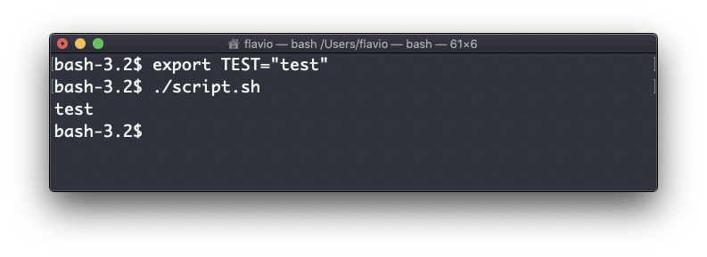

Sometimes you need to append something to a variable. It's often done with the `PATH` variable. You use this syntax:  
有时您需要向变量附加一些内容。通常通过`PATH`变量来完成。您使用以下语法：

    export     PATH=    $PATH    :/new/path

It's common to use `export` when you create new variables in this way, but also when you create variables in the `.bash_profile` or `.bashrc` configuration files with Bash, or in `.zshenv` with Zsh.  
当您以这种方式创建新变量时，以及当您使用 Bash 在`.bash_profile`或`.bashrc`配置文件中创建变量，或者使用 Zsh 在`.zshenv`中创建变量时，通常会使用`export` 。

To remove a variable, use the `-n` option:  
要删除变量，请使用`-n`选项：

    export     -n TEST

Calling `export` without any option will list all the exported variables.  
不带任何选项调用`export`将列出所有导出的变量。

## crontab    

Cron jobs are jobs that are scheduled to run at specific intervals. You might have a command perform something every hour, or every day, or every 2 weeks. Or on weekends. They are very powerful, especially on servers to perform maintenance and automations.  
Cron 作业是计划以特定时间间隔运行的作业。您可能有一个命令每小时、每天或每两周执行一些操作。或者在周末。它们非常强大，特别是在服务器上执行维护和自动化。

The `crontab` command is the entry point to work with cron jobs.  
`crontab`命令是使用 cron 作业的入口点。

The first thing you can do is to explore which cron jobs are defined by you:  
您可以做的第一件事是探索您定义了哪些 cron 作业：

    crontab -l

You might have none, like me:  
你可能没有，就像我一样：

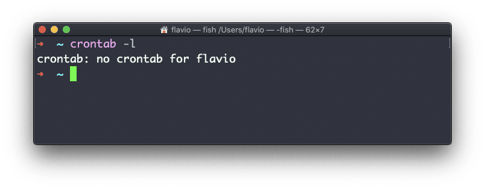

Run  
跑步

    crontab -e

to edit the cron jobs, and add new ones.  
编辑 cron 作业并添加新作业。

By default this opens with the default editor, which is usually `vim`. I like `nano` more, you can use this line to use a different editor:  
默认情况下，它会使用默认编辑器打开，通常是`vim` 。我更喜欢`nano` ，你可以使用这一行来使用不同的编辑器：

    EDITOR=nano crontab -e

Now you can add one line for each cron job.  
现在您可以为每个 cron 作业添加一行。

The syntax to define cron jobs is kind of scary. This is why I usually use a website to help me generate it without errors: [https://crontab-generator.org/](https://crontab-generator.org/)  
定义 cron 作业的语法有点可怕。这就是为什么我通常使用一个网站来帮助我生成它而不会出现错误： [https](https://crontab-generator.org/) ://crontab-generator.org/


You pick a time interval for the cron job, and you type the command to execute.  
您为 cron 作业选择一个时间间隔，然后键入要执行的命令。

I chose to run a script located in `/Users/flavio/test.sh` every 12 hours. This is the crontab line I need to run:  
我选择每 12 小时运行一次位于`/Users/flavio/test.sh`中的脚本。这是我需要运行的 crontab 行：

    * */12 * * * /Users/flavio/test.sh >/dev/null 2>&1

I run `crontab -e`:  
我运行`crontab -e` ：

    EDITOR=nano crontab -e

and I add that line, then I press `ctrl-X` and press `y` to save.  
我添加该行，然后按`ctrl-X`并按`y`保存。

If all goes well, the cron job is set up:  
如果一切顺利，则 cron 作业已设置：

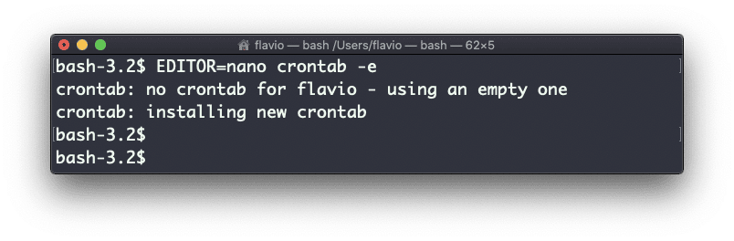

Once this is done, you can see the list of active cron jobs by running:  
完成此操作后，您可以通过运行以下命令查看活动 cron 作业的列表：

    crontab -l

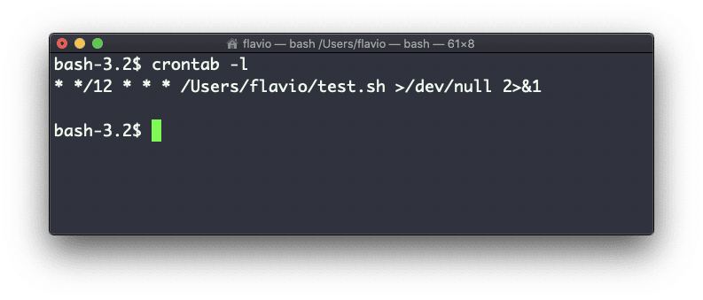

You can remove a cron job running `crontab -e` again, removing the line and exiting the editor:  
您可以删除再次运行`crontab -e` cron 作业，删除该行并退出编辑器：

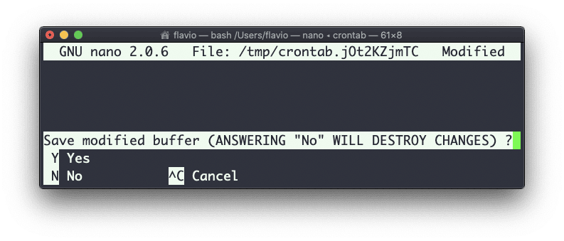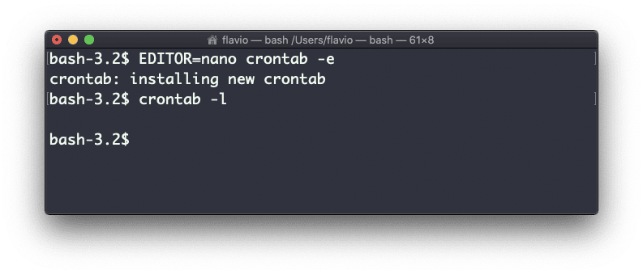

## uname  

Calling `uname` without any options will return the Operating System codename:  
不带任何选项调用`uname`将返回操作系统代号：

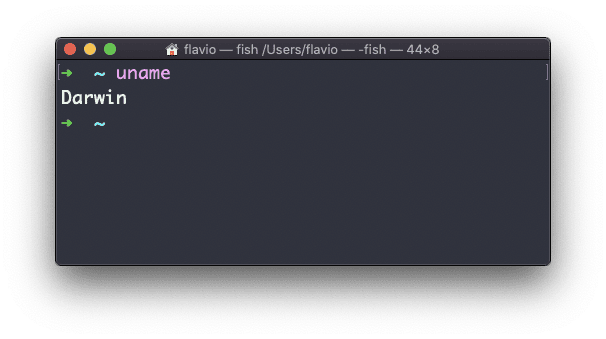

The `m` option shows the hardware name \(`x86_64` in this example\) and the `p` option prints the processor architecture name \(`i386` in this example\):  
`m`选项显示硬件名称（本例中为`x86_64` ）， `p`选项打印处理器架构名称（本例中为`i386` ）：

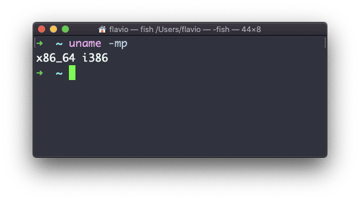

The `s` option prints the Operating System name. `r` prints the release, `v` prints the version:  
`s`选项打印操作系统名称。 `r`打印版本， `v`打印版本：

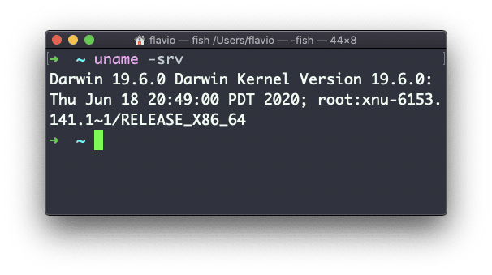

The `n` option prints the node network name:  
`n`选项打印节点网络名称：

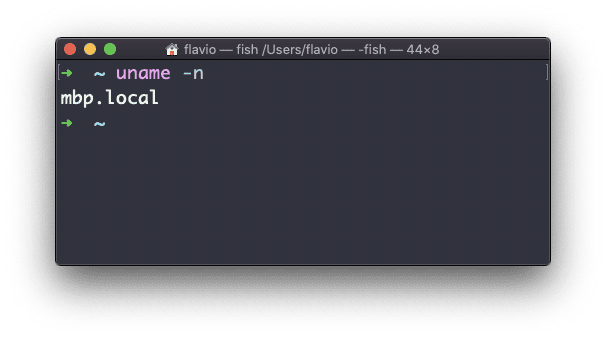

The `a` option prints all the information available:  
`a`选项打印所有可用的信息：

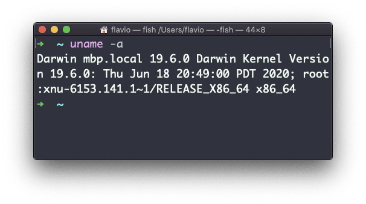

On macOS you can also use the `sw_vers` command to print more information about the macOS Operating System. Note that this differs from the Darwin \(the Kernel\) version, which above is `19.6.0`.  
在 macOS 上，您还可以使用`sw_vers`命令打印有关 macOS 操作系统的更多信息。请注意，这与 Darwin（内核）版本不同，上面是`19.6.0` 。
>  
> Darwin is the name of the kernel of macOS. The kernel is the "core" of the Operating System, while the Operating System as a whole is called macOS. In Linux, Linux is the kernel, GNU/Linux would be the Operating System name, although we all refer to it as "Linux"  
Darwin 是 macOS 内核的名称。内核是操作系统的“核心”，而整个操作系统称为 macOS。在 Linux 中，Linux 是内核，GNU/Linux 是操作系统名称，尽管我们都将其称为“Linux”

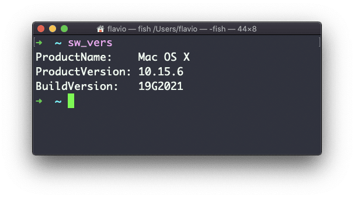

## env  

The `env` command can be used to pass environment variables without setting them on the outer environment \(the current shell\).  
`env`命令可用于传递环境变量，而无需在外部环境（当前 shell）上设置它们。

Suppose you want to run a Node.js app and set the `USER` variable to it.  
假设您要运行 Node.js 应用程序并将`USER`变量设置为其。

You can run  
你可以运行

    env USER=flavio node app.js

and the `USER` environment variable will be accessible from the Node.js app via the Node `process.env` interface.  
并且可以通过 Node.js 应用程序通过 Node `process.env`接口访问`USER`环境变量。

You can also run the command clearing all the environment variables already set, using the `-i` option:  
您还可以使用`-i`选项运行命令清除已设置的所有环境变量：

    env -i node app.js

In this case you will get an error saying `env: node: No such file or directory` because the `node` command is not reachable, as the `PATH` variable used by the shell to look up commands in the common paths is unset.  
在这种情况下，您会收到一条错误消息 `env: node: No such file or directory` 因为`node`命令不可访问，因为 shell 用于在公共路径中查找命令的`PATH`变量未设置。

So you need to pass the full path to the `node` program:  
因此需要将完整路径传递给`node`程序：

    env -i /usr/    local    /bin/node app.js

Try with a simple `app.js` file with this content:  
尝试使用包含以下内容的简单`app.js`文件：

    console    .log(process.env.NAME)    console    .log(process.env.PATH)

You will see the output being  
你会看到输出是

    undefined
    undefined

You can pass an env variable:  
您可以传递一个环境变量：

    env -i NAME=flavio node app.js

and the output will be  
输出将是

    flavio
    undefined

Removing the `-i` option will make `PATH` available again inside the program:  
删除`-i`选项将使`PATH`在程序内再次可用：

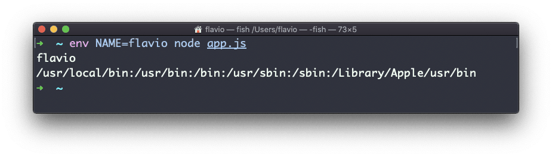

The `env` command can also be used to print out all the environment variables, if ran with no options:  
如果运行时没有选项， `env`命令还可以用于打印所有环境变量：

    env

it will return a list of the environment variables set, for example:  
它将返回环境变量集的列表，例如：

    HOME=/Users/flavio
    LOGNAME=flavio
    PATH=/usr/local/bin:/usr/bin:/bin:/usr/sbin:/sbin:/Library/Apple/usr/bin
    PWD=/Users/flavio
    SHELL=/usr/local/bin/fish

You can also make a variable inaccessible inside the program you run, using the `-u` option, for example this code removes the `HOME` variable from the command environment:  
您还可以使用`-u`选项使变量在运行的程序内不可访问，例如以下代码从命令环境中删除`HOME`变量：

    env -u HOME node app.js

## printenv    

A quick guide to the `printenv` command, used to print the values of environment variables  
`printenv`命令快速指南，用于打印环境变量的值

In any shell there are a good number of environment variables, set either by the system, or by your own shell scripts and configuration.  
在任何 shell 中都有大量的环境变量，这些变量可以由系统设置，也可以由您自己的 shell 脚本和配置设置。

You can print them all to the terminal using the `printenv` command. The output will be something like this:  
您可以使用`printenv`命令将它们全部打印到终端。输出将是这样的：

    HOME=/Users/flavio
    LOGNAME=flavio
    PATH=/usr/local/bin:/usr/bin:/bin:/usr/sbin:/sbin:/Library/Apple/usr/bin
    PWD=/Users/flavio
    SHELL=/usr/local/bin/fish

with a few more lines, usually.  
通常还有几行。

You can append a variable name as a parameter, to only show that variable value:  
您可以附加变量名称作为参数，以仅显示该变量值：

    printenv PATH

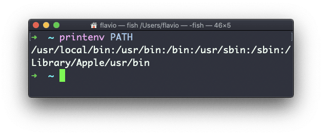


## Conclusion  
**结论**


Thanks a lot for reading this book.  
非常感谢您阅读这本书。

For more, head over to [flaviocopes.com](https://flaviocopes.com).  
如需了解更多信息，请访问[flaviocopes.com](https://flaviocopes.com) 。

Send any feedback, errata or opinions at flavio@flaviocopes.com  
请将任何反馈、勘误表或意见发送至flavio@flaviocopes.com


