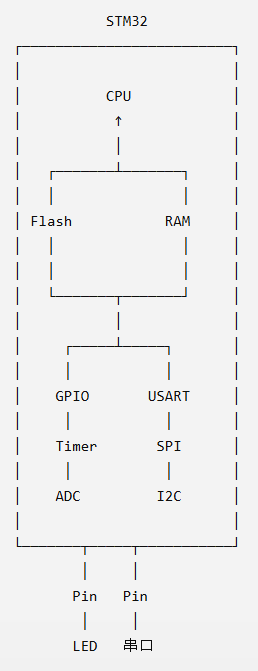
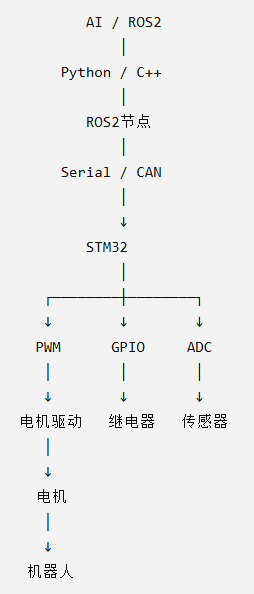
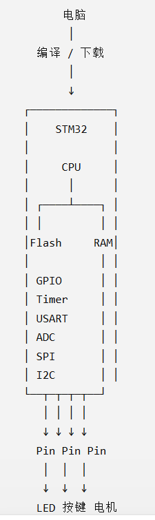

# 《STM32 硬件世界入门课》

### ——给纯软件工程师的第一堂真正硬件课

这节课**不讲寄存器、不讲 HAL、不讲 GPIO 配置代码**。

我们甚至暂时不要求你记住 STM32 的任何型号。

我们的目标只有一个：

> **当你以后看到“引脚、晶振、GPIO、3.3V、GND、Flash、RAM、定时器、串口”这些词时，你脑子里能马上出现一个具体的东西。**

而且我会一直用你熟悉的软件世界来类比。

---

# 第一章：先忘掉“单片机”这个词

你以前主要写 Java。

你可以把电脑想象成：

```text
                电脑
                  │
        ┌─────────┴─────────┐
        │                   │
       CPU                 内存
        │                   │
     执行程序              RAM
        │
      硬盘/SSD
     保存程序和数据
```

电脑能够：

* 跑 Java
* 跑 Python
* 跑 Linux
* 开浏览器
* 播放视频
* 连接 USB
* 连接网络

那么：

## STM32 是什么？

最简单的答案：

> **STM32 是一台非常非常小的计算机。**

当然，它比你的电脑弱得多。

例如你现在的 STM32F103C8T6，可以粗略想成：

```text
              STM32
        ┌─────────────────┐
        │      CPU        │
        │                 │
        │     Flash       │
        │      RAM        │
        │                 │
        │     GPIO        │
        │     USART       │
        │     Timer       │
        │     ADC         │
        │     SPI         │
        │     I2C         │
        │      ...        │
        └─────────────────┘
             │ │ │ │ │
             ↓ ↓ ↓ ↓ ↓
            外部世界
```

这里已经出现了非常重要的一件事：

**STM32 不只是一个 CPU。**

它是一整套集成在一颗芯片里的“小电脑”。

---

# 第二章：那么 STM32 为什么需要“引脚”？

这是你现在最应该真正理解的东西。

你的电脑可以：

```text
电脑
 │
 ├── USB
 ├── HDMI
 ├── 网线
 ├── 耳机
 └── 电源
```

这些都是：

> **电脑和外部世界交换东西的接口。**

STM32 也需要接口。

但是 STM32 不会像电脑一样给你几十个 USB 接口。

它直接在芯片边缘做出很多个：

> **引脚（Pin）**

比如：

```text
          STM32 芯片

       ┌──────────────┐
       │              │
       │              │
       │              │
       │              │
       └──────────────┘
        │ │ │ │ │ │ │
        ↓ ↓ ↓ ↓ ↓ ↓ ↓
       Pin Pin Pin Pin ...
```

你可以把：

> **Pin = STM32伸出去的一根“电线接口”**

先这样理解。

---

# 第三章：什么叫“引脚”？

比如你有一根线：

```text
STM32 ───────── LED
```

左边这个连接点，就是 STM32 的一个 Pin。

右边连接 LED。

那么 STM32 就可以通过这个 Pin：

```text
输出电信号
     ↓
   LED
     ↓
    发光
```

反过来也可以：

```text
按钮 ─────── STM32
              ↑
          读取电信号
```

所以一个 Pin 可以成为：

### 输出

```text
STM32 → 外部设备
```

例如：

```text
STM32 → LED
STM32 → 蜂鸣器
STM32 → 电机驱动器
```

### 输入

```text
外部设备 → STM32
```

例如：

```text
按钮 → STM32
传感器 → STM32
编码器 → STM32
```

这就是你以后学习 GPIO 的基础。

---

# 第四章：GPIO 到底是什么？

这个词你以后会看到无数遍。

GPIO：

> **General Purpose Input/Output**

通用输入输出。

不要死记英文。

你只需要记：

> **GPIO 是 STM32 用来控制/读取普通引脚的一套硬件功能。**

例如：

```text
STM32
  │
  │ GPIO
  ↓
 Pin
  │
  ↓
 LED
```

程序说：

```text
这个 GPIO 输出高电平
```

实际发生的事情就是：

```text
程序
 ↓
STM32内部GPIO硬件
 ↓
某个Pin
 ↓
电压发生变化
 ↓
LED
```

这就是：

> **软件第一次真正碰到了物理世界。**

---

# 第五章：什么叫“高电平”和“低电平”？

这也是软件工程师第一次接触硬件时非常容易懵的地方。

软件里：

```java
boolean x = true;
```

你知道：

```text
true / false
```

但是硬件没有 `true` 这个东西。

硬件真正看到的是：

> **电压。**

例如你的 STM32F103 系统通常使用 3.3V 逻辑。

可以粗略理解成：

```text
3.3V ─────── 高电平 HIGH

0V  ──────── 低电平 LOW
```

所以：

```text
程序：
GPIO = HIGH

↓

硬件：
这个 Pin 输出接近 3.3V

↓

LED / 芯片 / 外设
看到这个电压
```

反过来：

```text
GPIO = LOW

↓

Pin ≈ 0V
```

所以你之前看到：

> “GPIO 输出高电平”

实际上不要想得很复杂。

先想成：

> **“让这个引脚输出一个高电压。”**

---

# 第六章：3.3V 和 GND 是什么？

现在我们必须认识两个硬件世界最重要的东西：

```text
3.3V
GND
```

## 3.3V

你可以暂时理解成：

> **电路使用的一个电压基准/电源电压。**

## GND

Ground。

地。

初学者经常会觉得：

> “地是什么？为什么一定要接地？”

先不要想得太玄学。

你现在可以把 GND 理解成：

> **整个电路共同参考的 0V。**

例如：

```text
3.3V
 │
 ├──── STM32
 │
 ├──── LED
 │
 └──── 其他模块

GND
 │
 ├──── STM32
 │
 ├──── LED
 │
 └──── 其他模块
```

为什么大家需要共同 GND？

因为如果：

```text
STM32说：
“现在是3.3V！”

另一个模块：
“你说的3.3V是相对于什么？”
```

双方必须有共同的电压参考。

这个参考通常就是：

```text
GND = 0V
```

---

# 第七章：所以“电平”到底是什么？

现在你已经可以理解：

```text
HIGH
 ↓
较高电压

LOW
 ↓
接近0V
```

所以：

```text
GPIO输出高电平
```

就是：

```text
STM32
  ↓
GPIO
  ↓
Pin
  ↓
输出较高电压
```

而：

```text
GPIO读取高电平
```

则是：

```text
外部设备
  ↓
某个Pin出现较高电压
  ↓
GPIO读取
  ↓
STM32知道：
“现在是HIGH”
```

这就是数字电路最基础的一层。

---

# 第八章：现在来看你的 STM32 开发板

你手里的东西不要再想成：

> “一块奇怪的开发板。”

你应该把它拆成：

```text
┌───────────────────────────────┐
│         STM32开发板            │
│                               │
│   ┌───────────────┐           │
│   │ STM32F103C8T6 │           │
│   └───────────────┘           │
│        │ │ │ │ │              │
│        ↓ ↓ ↓ ↓ ↓              │
│      各种引脚                  │
│                               │
│ LED     按键    蜂鸣器         │
│ OLED    串口    电机接口       │
│                               │
└───────────────────────────────┘
```

其中真正的大脑是：

```text
STM32F103C8T6
```

开发板上的其他东西，本质上是在：

> **给 STM32 提供电源、时钟、下载接口、显示器、按钮、LED、传感器、电机等外部设备。**

---

# 第九章：那“晶振”又是什么鬼？

这正是你在江科大 [1-2] 里看到后容易懵的东西。

你看到：

> 晶振

千万不要把它理解成某种神秘的电子元件。

先记一句：

> **晶振 = 给 STM32 提供稳定“节拍”的东西。**

---

## 用你熟悉的世界类比

假设一个程序需要：

```text
1
2
3
4
5
6
...
```

CPU需要一个东西告诉它：

> “现在走一步。”

> “再走一步。”

> “再走一步。”

这个“节拍”就是：

> **时钟（Clock）**

---

例如：

```text
滴    滴    滴    滴
│     │     │     │
1     2     3     4
```

CPU和各种外设按照这个节拍工作。

---

# 第十章：CPU为什么需要时钟？

你可以把 CPU 想成一个非常非常快的工人。

没有时钟：

```text
CPU：
“我什么时候干活？”
```

有时钟：

```text
Clock：

滴
 ↓
CPU执行一些操作

滴
 ↓
CPU继续

滴
 ↓
CPU继续
```

现实中的 CPU 时钟非常快。

例如：

```text
72 MHz
```

意味着每秒有大约：

```text
72,000,000
```

个时钟周期。

所以你以后看到：

> STM32F103C8T6 主频 72MHz

先不要害怕。

你现在只需要理解：

> **CPU工作的“节拍”非常快。**

---

# 第十一章：那晶振和时钟是不是一回事？

不是完全一回事。

可以先这么理解：

```text
晶振
 ↓
产生稳定的基础频率
 ↓
时钟系统
 ↓
处理/倍频/分频
 ↓
CPU / 外设
```

例如：

```text
8MHz 晶振
    ↓
STM32时钟系统
    ↓
处理
    ↓
72MHz
    ↓
CPU
```

所以：

> **晶振是时钟的来源之一。**

而：

> **时钟是 STM32 内部运行的节拍。**

以后学“STM32时钟系统”时再深入。

现在千万不要去背 PLL、AHB、APB1、APB2。

**完全没必要。**

---

# 第十二章：Flash 又是什么？

这个你作为软件工程师应该很好理解。

你写：

```c
int main()
{
    ...
}
```

编译之后：

```text
C代码
 ↓
编译器
 ↓
机器码
 ↓
.hex / .bin
```

然后：

```text
电脑
 ↓
下载器
 ↓
STM32
 ↓
Flash
```

程序被保存到：

> **Flash**

---

所以你可以把 Flash 理解成：

> **STM32 里面用来长期保存程序的存储器。**

类似：

```text
电脑：
SSD / 硬盘

STM32：
Flash
```

当然二者技术细节不同，但这个类比足够你入门。

---

# 第十三章：RAM 又是什么？

这个你更加熟悉。

程序运行的时候需要临时变量。

例如：

```c
int a = 10;
int b = 20;
int c = a + b;
```

这些运行时数据需要一个地方放。

这就是：

> **RAM**

所以：

```text
Flash
↓
长期保存程序

RAM
↓
程序运行时临时存数据
```

可以先记成：

```text
              STM32
        ┌────────────────┐
        │                │
        │      CPU       │
        │                │
        │ Flash          │ ← 程序
        │                │
        │ RAM            │ ← 临时数据
        │                │
        └────────────────┘
```

---

# 第十四章：程序到底是怎么跑起来的？

这是整个 STM32 世界最重要的一条链。

假设你写：

```c
LED_ON();
```

实际上经历的是：

```text
① 你写 C 代码
       ↓
② 编译器
       ↓
③ 机器码
       ↓
④ 下载器
       ↓
⑤ STM32 Flash
       ↓
⑥ STM32上电/复位
       ↓
⑦ CPU从Flash读取程序
       ↓
⑧ CPU执行
       ↓
⑨ GPIO硬件
       ↓
⑩ Pin输出电压
       ↓
⑪ LED亮
```

你以后学习 STM32，实际上就是不断在研究这条链上的不同环节。

---

# 第十五章：这时候你就应该理解“烧录”了

你以前可能觉得：

> “烧程序”是一个很神秘的操作。

实际上非常简单：

```text
电脑
 │
 │ 机器码
 ↓
下载器
 │
 ↓
STM32
 │
 ↓
Flash
```

就是：

> **把编译出来的程序放进 STM32 的 Flash。**

然后 STM32 上电：

```text
Flash
 ↓
CPU
 ↓
执行程序
```

所以：

> **STM32 不需要一直连接电脑才能运行。**

下载完成后：

```text
拔掉电脑
↓
给STM32供电
↓
STM32自己运行
```

---

# 第十六章：那“外设”又是什么？

这是 STM32 课程里第二个巨大的概念。

所谓：

> **Peripheral（外设）**

不要理解成：

> “插在 STM32 外面的设备”。

STM32 语境里的“外设”很多时候是：

> **芯片内部已经集成好的硬件功能模块。**

例如：

```text
STM32
┌──────────────────────────┐
│                          │
│ CPU                      │
│                          │
│ GPIO                     │
│ USART                    │
│ Timer                    │
│ ADC                      │
│ SPI                      │
│ I2C                      │
│ DMA                      │
│                          │
└──────────────────────────┘
```

这些都可以叫：

> STM32 的片上外设。

---

# 第十七章：为什么要把这些东西做进芯片？

假设没有 Timer。

你想让 LED：

```text
亮 1秒
灭 1秒
亮 1秒
灭 1秒
```

你只能让 CPU 自己不断数：

```text
1
2
3
4
5
...
100000
```

然后：

```text
LED OFF
```

这很浪费 CPU。

于是 STM32 给你一个：

> **Timer（定时器）**

它可以自己计时。

```text
CPU
 │
 │ 设置定时器
 ↓
Timer
 │
 │ 自己数
 │
 │
 ↓
时间到了
 ↓
通知CPU
```

这就是硬件加速/硬件模块的思想。

---

# 第十八章：USART 是什么？

这个你已经实际用过。

USART 可以简单理解成：

> **STM32 和其他设备进行串行通信的硬件模块。**

例如：

```text
电脑
 │
 │ USB转串口
 ↓
USART
 │
 ↓
STM32
```

于是：

```text
电脑发送：
HELLO

↓

STM32收到

↓

STM32发送：
HELLO
```

你之前做的：

> USART1 接收中断后原样回发

实际上就是：

```text
PC
 ↓
串口
 ↓
STM32 USART1
 ↓
CPU
 ↓
程序处理
 ↓
USART1
 ↓
串口
 ↓
PC
```

你其实已经接触到了真正的“硬件世界”。

只是以前可能只是把代码跑通了，没有把背后的物理过程串起来。

---

# 第十九章：把你目前学过的东西全部串起来

现在我们把：

**Pin、GPIO、3.3V、GND、晶振、CPU、Flash、RAM、Timer、USART**

全部放在一张图里。

  

旁边还有：

```text
晶振
 ↓
时钟系统
 ↓
CPU + 外设
```

电源：

```text
3.3V
 ↓
STM32

GND
 ↓
共同参考
```

---

# 第二十章：现在进入真正重要的东西——“软件怎么控制硬件？”

你作为 Java 程序员，过去习惯：

```java
System.out.println("Hello");
```

你可能不会想：

> CPU到底怎么让显示器显示这些字符？

因为操作系统和驱动把这些东西封装掉了。

STM32则不一样。

你距离硬件非常近。

例如：

```c
GPIO_SetBits(GPIOA, GPIO_Pin_0);
```

背后实际上是在做：

```text
C代码
 ↓
告诉STM32 GPIO硬件
 ↓
GPIOA某个通道
 ↓
控制对应Pin
 ↓
Pin电压变化
 ↓
外部电路发生变化
```

这就是嵌入式和普通软件开发最大的区别之一。

---

# 第二十一章：所以 STM32 学习到底是在学什么？

你以后看到一大堆课程：

```text
GPIO
EXTI
TIM
PWM
ADC
DMA
USART
I2C
SPI
CAN
RTC
FreeRTOS
...
```

不要觉得：

> “卧槽，这么多东西。”

其实它们大部分都是在解决：

> **STM32如何和现实世界交换信息。**

例如：

| STM32功能 | 可以干什么          |
| ------- | -------------- |
| GPIO    | 开关 LED、读取按钮    |
| Timer   | 精确计时           |
| PWM     | 控制电机速度、LED亮度   |
| ADC     | 读取模拟电压         |
| USART   | 串口通信           |
| SPI     | 高速连接外部芯片       |
| I2C     | 连接 OLED、传感器等   |
| CAN     | 汽车/机器人等设备通信    |
| DMA     | 搬运数据，减少 CPU 参与 |
| EXTI    | 外部信号触发中断       |

你会发现：

**它们不是一堆杂乱的知识。**

它们都是：

> **CPU与现实世界之间的工具。**

---

# 第二十二章：这和你以后搞机器人有什么关系？

关系非常大。

你最终想做 ROS2 + 机器人。

那么整条链实际上是：

  

甚至可以继续：

```text
电机
 ↓
编码器
 ↓
STM32
 ↓
CAN / Serial
 ↓
ROS2
 ↓
控制算法
 ↓
AI
```

所以你现在学习的：

> GPIO、Timer、PWM、USART

并不是和 ROS2 毫无关系的东西。

它们实际上是：

> **机器人底层执行机构的基础。**

---

# 第二十三章：你现在千万不要学这些

至少目前不要强迫自己理解：

```text
AHB
APB1
APB2
PLL
NVIC
Cortex-M3
向量表
启动文件
链接脚本
Memory Map
寄存器地址
位带操作
RCC寄存器
GPIO寄存器
CMSIS
```

这些东西以后当然有价值。

但是现在学：

> **就像一个 Java 新手刚学变量，就开始研究 JVM GC 算法实现。**

不是没用。

而是：

> **时机不对。**

---

# 第二十四章：现在做一个“硬件世界脑内测试”

不要查资料。

凭你现在的理解回答下面几个问题。

### ① STM32 是什么？

不要回答：

> “一种 ARM 芯片。”

这只是分类。

你应该能说：

> **STM32 是一类微控制器，可以理解为一台非常小的计算机，里面有 CPU、Flash、RAM 和各种片上外设。**

---

### ② Pin 是什么？

> **STM32 与外部电路连接的物理电气接口。**

---

### ③ GPIO 是什么？

> **STM32 内部负责控制/读取普通引脚的一种硬件功能。**

---

### ④ GPIO 输出 HIGH，本质上发生了什么？

不是：

> “变量变成 true。”

而是：

> **STM32让对应引脚输出一个较高的电压电平，通常接近系统逻辑电压。**

---

### ⑤ GND 是什么？

> **电路共同的 0V 电压参考。**

---

### ⑥ 晶振是干什么的？

> **为 STM32 提供稳定的基础时钟来源。**

---

### ⑦ Flash 和 RAM 的区别？

> **Flash 主要长期保存程序；RAM 主要保存运行时临时数据。**

---

### ⑧ “把程序烧进 STM32”是什么意思？

> **把编译产生的机器码写入 STM32 的 Flash。**

---

### ⑨ Timer 是什么？

> **STM32 内部专门用于计时、产生定时事件等工作的硬件模块。**

---

### ⑩ USART 是什么？

> **STM32 内部用于串行通信的硬件外设。**

---

# 最后：你现在只需要记住这一张图

如果这节课结束后，你只能记住一个东西，就记这个：

  

然后旁边还有：

```text
       晶振
        │
        ↓
     时钟系统
        │
        ↓
    CPU / 外设
```

以及：

```text
3.3V = 电源/逻辑电压
GND  = 0V共同参考
Pin  = 物理连接点
GPIO = 操作Pin的硬件功能
```

---

## 🎯 这一课真正的目标

**不是让你背 20 个名词。**

而是让你建立这样一个思维：

> **我写的软件，最终不是“凭空让 LED 亮”。**

而是：

```text
我的C代码
   ↓
CPU执行
   ↓
GPIO硬件
   ↓
STM32某个Pin
   ↓
电压变化
   ↓
电流经过外部电路
   ↓
LED发光
```

这条链一旦在你脑子里真正建立起来，你就开始从**“软件工程师在写单片机代码”**进入**“开始理解嵌入式系统”**了。

