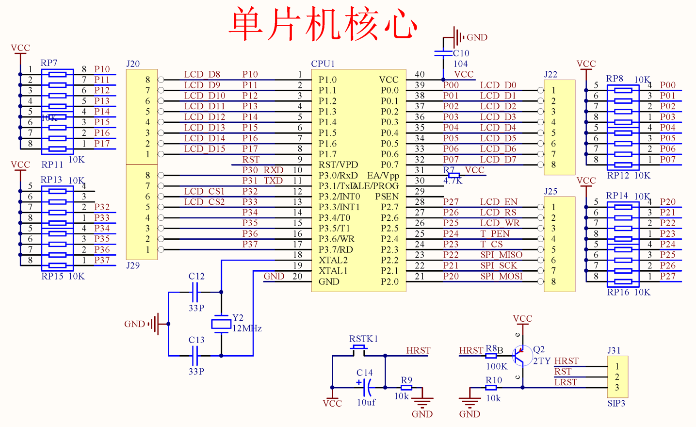
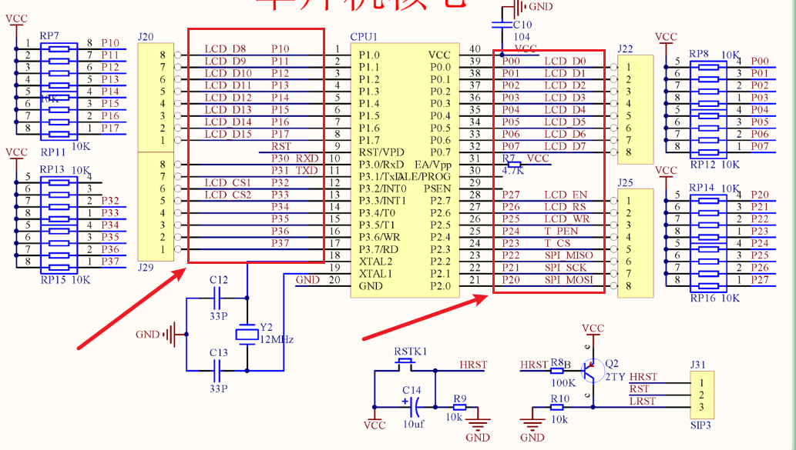
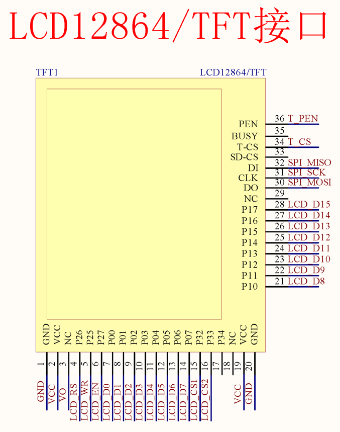

# 普中A7开发板原理图(89C516)

  
## 单片机核心(89C516)

 

箭头这些，其实是单片机核心，与LCD12864/TFT接口 ~~见下面的LCD12864/TFT接口（图)~~ 的对接关系（并非芯片方的，是普中开发板自己弄的）  

# LCD12864/TFT接口

  

# STM32F103核心板原理图

# 核心图符号说明

| 名字   | 属于谁          | 意思         |
| ---- | ------------ | ---------- |
| PA0  | STM32        | GPIOA第0号引脚 |
| P1.0 | 51单片机        | P1端口第0位    |
| P10  | 原理图编号(非官方叫法) | 第10个接口/排针  |

至于把89C516换成STM32F103之后，原引脚和STM32的对应关系，STM32F103核心板原理图中的IO接口已经说的很清楚了  

