# 简介

## 硬件

STM32最小系统板+面包板硬件平台  

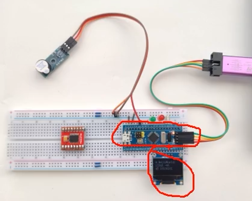  

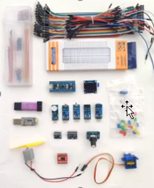  

- 面包板
- 面包板专用的插线、飞线
- 公对母、母对母，杜邦线
- 0.96寸OLED（4引脚）
## 软件

- Keil5MDK ~~Keil51不能用来开发STM32~~ 

## STM32

- STM32是ST公司==基于ARM Cortex-M== 内核开发的==32位==微传感器
- 常用领域：智能车、无人机、机器人、无线通信、物联网、工业控制、娱乐电子产品

## ARM

只设计不生产实物  

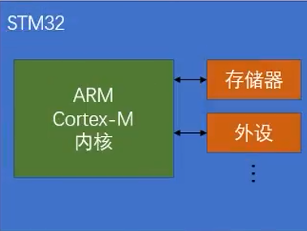  

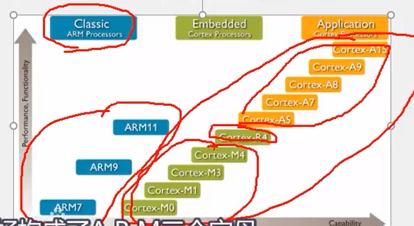  

- A系列：手机
- R,M：嵌入式

STM32F1使用的是Cortex-M3的内核  

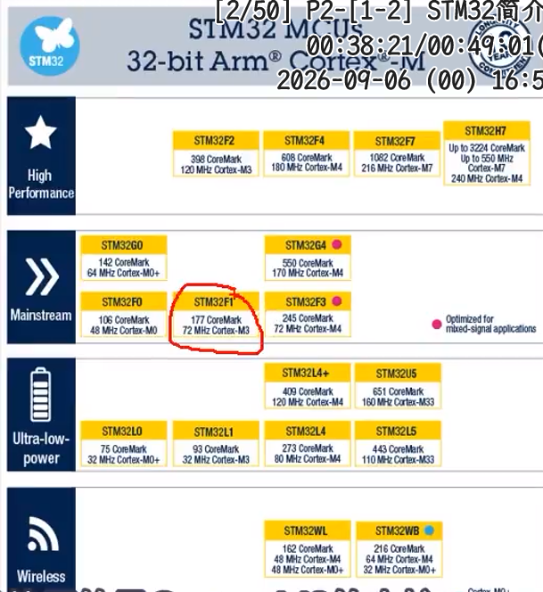  

本课程使用的是STM32F103C8T6  

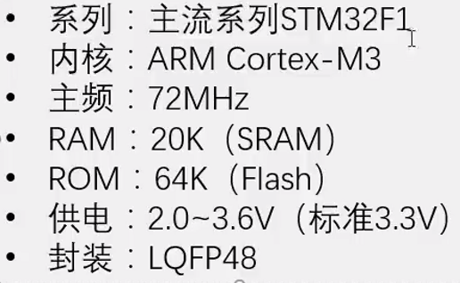  

## 外设 Peripheral

STM32整个系列拥有的外设：  

| 英文缩写    | 名称        | 英文缩写    | 名称        |
| :------ | :-------- | :------ | :-------- |
| NVIC    | 嵌套向量中断控制器 | CAN     | CAN通信     |
| SysTick | 系统滴答定时器   | USB     | USB通信     |
| RCC     | 复位和时钟控制   | RTC     | 实时时钟      |
| GPIO    | 通用IO口     | CRC     | CRC校验     |
| AFIO    | 复用IO口     | PWR     | 电源控制      |
| EXTI    | 外部中断      | BKP     | 备份寄存器     |
| TIM     | 定时器       | IWDG    | 独立看门狗     |
| ADC     | 模数转换器     | WWDG    | 窗口看门狗     |
| DMA     | 直接内存访问    | DAC     | 数模转换器     |
| USART   | 同步/异步串口通信 | SDIO    | SD卡接口     |
| I2C     | I2C通信     | FSMC    | 可变静态存储控制器 |
| SPI     | SPI通信     | USB OTG | USB主机接口   |
 - *~~通过程序配置外设，来完成想要的功能~~*   
 - ==NVIC和SysTick==位于Cortex-M3里面的外设，其他的都是内核外的外设
 - RCC：配置系统的时钟，使能各模块的时钟（在STM32中，其他的这些外设在上电的情况下默认是没有时钟的，不给时钟的情况下，操作外设是无效的） ~~目的是降低功耗。所以操作前必须先使能时钟~~ 
 - GPIO：点灯、读取按键


T8C6没有的外设：  

| DAC     | 数模转换器     |
| :------ | :-------- |
| SDIO    | SD卡接口     |
| FSMC    | 可变静态存储控制器 |
| USB OTG | USB主机接口   |

C8T6数据手册-外设资源表：  

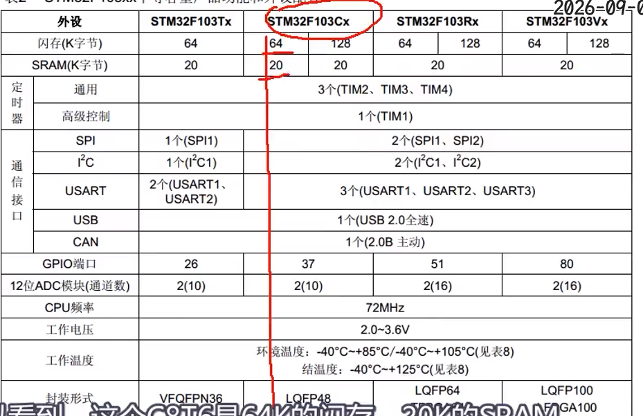  
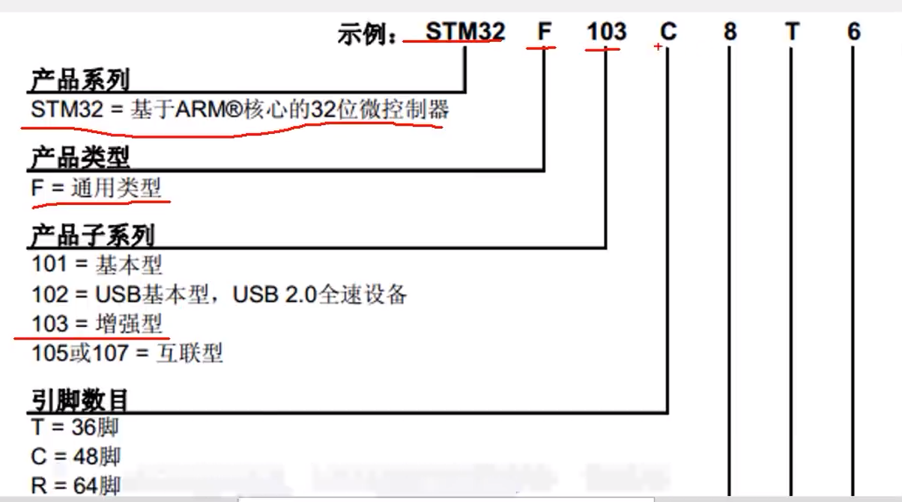  
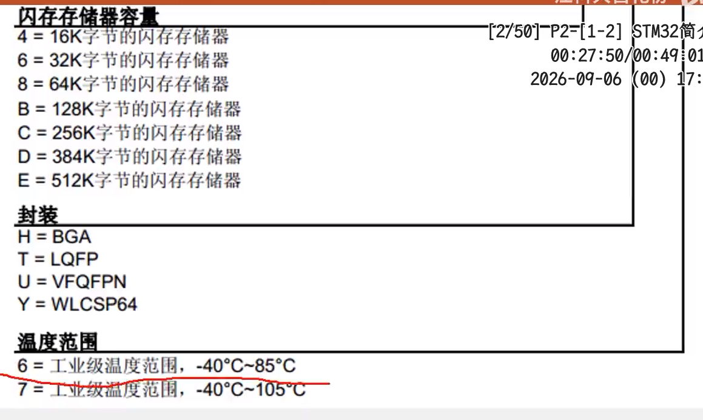  
## STM32简介
### STM32系统结构

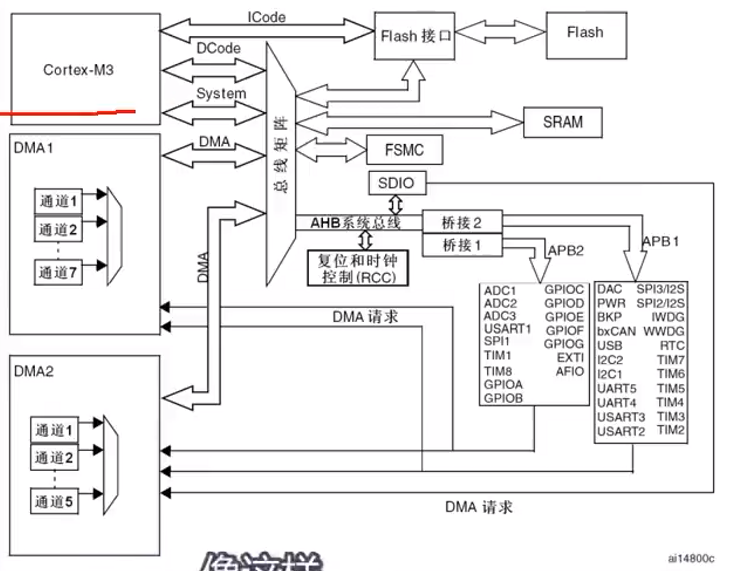

可以把下图分为四部分：  

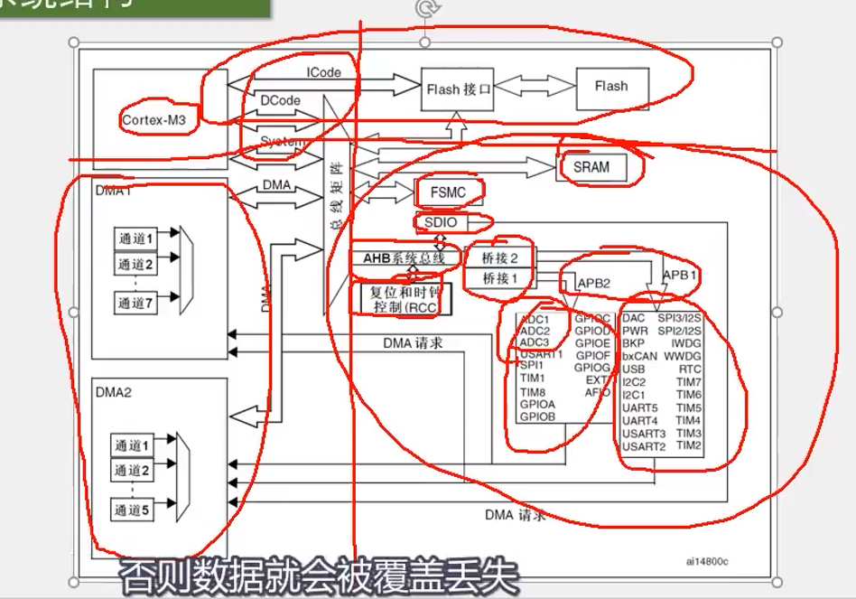  

DMA： 帮CPU搬运数据  

### 引脚定义


### 其他

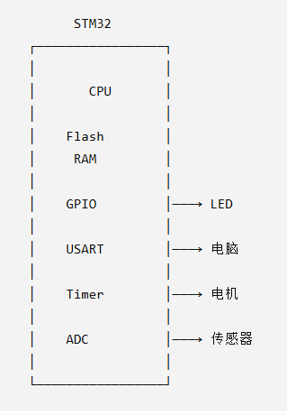  

- STM32：一个专门拿来控制电子设备的小电脑。
- 引脚 Pin：STM32 身上的一根“电线接口”。
- GPIO：可以让 STM32 读/写一个引脚的功能。
- 晶振 = 给 STM32 提供一个很稳定的“节拍”。
- 晶振可以帮助产生这个稳定的时钟来源
```shell
晶振
 ↓
时钟
 ↓
STM32按照节奏运行
```
- 外设：STM32 内置的各种工具。
```shell
STM32
│
├── GPIO     控制引脚
│
├── USART    串口通信
│
├── Timer    定时/计时
│
├── ADC      读取模拟电压
│
├── SPI      通信
│
├── I2C      通信
│
└── DMA      自动搬数据
```
- CPU（就是ARM CORE-M内核）
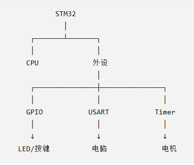
- 总述
  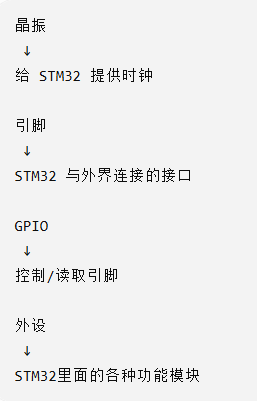  
- 