# 软件安装

这里推荐安装keil5 C51，然后安装kei5 MTK，都装在同一个文件夹里面，这样以后打开keil5同时能编译C51或者STM32项目。之后关闭Keil5软件，用管理员权限运行打开，选File---xxxLicense 激活 ~~激活软件用的keygen_new2032~~ 。把keil5中的信息复制到激活软件然后genarate后再复制key到keil5即可激活  

## slink驱动

地址： https://www.st.com/en/development-tools/stsw-link009.html#get-software 

4根杜邦线接好即可，建议先接板子上的给他固定顺序，因为可能经常拔插，USB这头的相对不会去拔插  


## 环境配置 

edit-->configuration：  

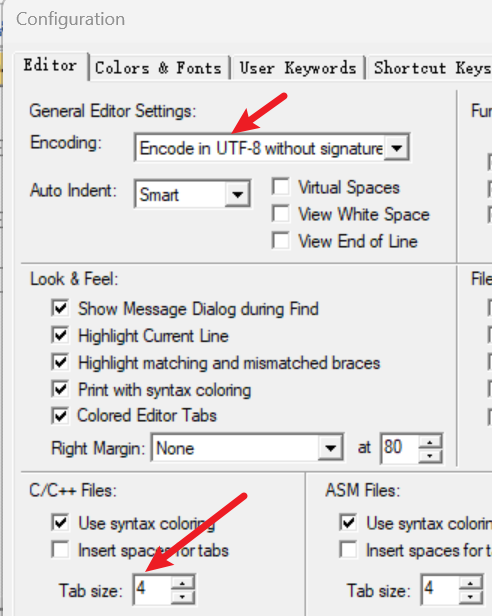  

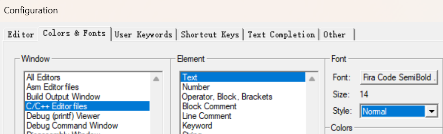  

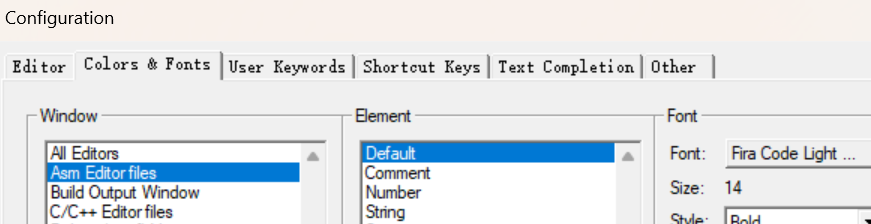  


# 开发方式

- 基于寄存器：用程序直接配置寄存器
		- 最底层，最直接，但是由于STM32结构复杂，寄存器太多 ~~不推荐~~ 
	- ==【本课程】基于标准库==，也就是库函数：使用ST官方提供的封装好的函数，通过调用函数来间接地配置寄存器。 
		- ST对寄存器封装的较好，所以这种方式既能满足对寄存器的配置，对开发人员也比较友好，有利于提高开发效率
	- 基于HAL库：图形化界面快速配置STM32
		- 适合快速上手STM32，但是隐藏了底层逻辑

------  

# 库

- 课程资料下载：  
	- 下载链接	https://pan.baidu.com/s/1h_UjuQKDX9IpP-U1Effbsw?pwd=dspb
	- 压缩包解压密码	32

- 标准外设库--> `TM32入门教程资料\固件库\STM32F10x_StdPeriph_Lib_V3.5.0.zip`

```shell
STM32入门教程资料\固件库\STM32F10x_StdPeriph_Lib
_V3.5.0
├── Libraries #库函数的文件，建工程会用到
├── Project #官方提供的工程示例和模版（用库函数时可参考）
├── Release_Notes.html #库函数发布文档
├── stm32f10x_stdperiph_lib_um.chm #库函数使用手册
├── Utilities #STM32官方评估版（小电路板）的相关例程
└── _htmresc
```

## 解释一下库

>
> 1. ARM(设计CPU内核的公司) → Cortex-M → Cortex-M3 →
> (ST公司)STM32F1 → STM32F103C8T6
> 2. ST 在设计自己的芯片时，把 ARM 授权给它的 Cortex-M3 设计集成进去，然后整个芯片一起制造出来 
> 

```shell
STM32F10x_StdPeriph_Lib_V3.5.0
│
└── Libraries
    │
    ├── CMSIS
    │   └── ARM Cortex-M3 内核 + STM32F10x 芯片底层定义
    │
    └── STM32F10x_StdPeriph_Driver
        ├── inc
        │   └── 各种外设的 .h 头文件
        │
        └── src
            └── 各种外设的 .c 实现文件
```

> 
> 关于最核心的两部分的解释：
> 1. CMSIS = “让程序认识 STM32 + Cortex-M3”
> 2. StdPeriph_Driver = “让你方便操作 STM32 的各种硬件==外设==”  ~~指的是片上外设（芯片上的，内核之外的），比如GPIO，USART，TIM，ADC，SPI，I2C，CAN，DMA~~  


> 外部器件/外接设备（芯片外的）：PA0->LED，PA1->按键，USART->USB转串口，I2C->OLED，TIM->电机驱动器->电机

### CMSIS

ARM 为 Cortex-M 系列制定的一套软件接口标准  

```shell
CMSIS
├── CM3 #Cortex-M3 内核
│   ├── CoreSupport #ARM Cortex-M3 内核本身的定义和支持代码
│   └── DeviceSupport #STM32F10x 芯片本身，即STM公司 针对 STM32F10x 做的支持，最重要的是"stm32f10x.h"，里面定义了 STM32F10x 的：外设寄存器，外设地址，GPIO，RCC，USART，TIM，ADC，DMA，NVIC，等等
├── CMSIS debug support.htm
├── CMSIS_changes.htm
├── Documentation
│   └── CMSIS_Core.htm
└── License.doc
```

####  CMSIS下CM3目录下的CoreSupport和DeviceSupport

```shell
├── CM3 #ARM 的 Cortex-M3 内核相关代码(ARM公司提供的)
|  ├── CoreSupport #======【ARM】对应Cortex-M3(这里不关心 STM32F103) CPU 内核本身======
|  |  ├── core_cm3.c #一些实现
|  |  └── core_cm3.h# 1. Cortex-M3内核寄存器 2. 内核数据结构 3. 内核相关宏 ||||#比如NVIC，SysTick，SCB
|  └── DeviceSupport #======【ST】ST 的 STM32F103 领域======
|     └── ST
|        └── STM32F10x
|           ├── Release_Notes.html
|           ├── startup #Cortex-M3 的机器指令是一套统一的，但汇编源代码语法不是统一的。Keil、GCC、IAR 使用不同汇编器，所以同一个 STM32 启动流程需要提供不同版本的 startup.s。注意下面：.s后缀是汇编源代码文件；Keil5使用ARM汇编器
|           |  ├── arm #芯片上电后的第一段程序，即启动文件（汇编文件），里面不一样的文件，代表STM32F10x 的不同容量 ★★：所以江科大的课程里把这部分复制过去了
|           |  |  ├── startup_stm32f10x_cl.s
|           |  |  ├── startup_stm32f10x_hd.s
|           |  |  ├── startup_stm32f10x_hd_vl.s
|           |  |  ├── startup_stm32f10x_ld.s
|           |  |  ├── startup_stm32f10x_ld_vl.s
|           |  |  ├── startup_stm32f10x_md.s #STM32F103C8T6属于这个
|           |  |  ├── startup_stm32f10x_md_vl.s #Value Line 是 ST 的一个低成本系列：比如还有STM32F103xC8 value line 这种
|           |  |  └── startup_stm32f10x_xl.s
|           |  ├── gcc_ride7
|           |  |  ├── startup_stm32f10x_cl.s
|           |  |  ├── startup_stm32f10x_hd.s
|           |  |  ├── startup_stm32f10x_hd_vl.s
|           |  |  ├── startup_stm32f10x_ld.s
|           |  |  ├── startup_stm32f10x_ld_vl.s
|           |  |  ├── startup_stm32f10x_md.s
|           |  |  ├── startup_stm32f10x_md_vl.s
|           |  |  └── startup_stm32f10x_xl.s
|           |  ├── iar
|           |  |  ├── startup_stm32f10x_cl.s
|           |  |  ├── startup_stm32f10x_hd.s
|           |  |  ├── startup_stm32f10x_hd_vl.s
|           |  |  ├── startup_stm32f10x_ld.s
|           |  |  ├── startup_stm32f10x_ld_vl.s
|           |  |  ├── startup_stm32f10x_md.s
|           |  |  ├── startup_stm32f10x_md_vl.s
|           |  |  └── startup_stm32f10x_xl.s
|           |  └── TrueSTUDIO
|           |     ├── startup_stm32f10x_cl.s
|           |     ├── startup_stm32f10x_hd.s
|           |     ├── startup_stm32f10x_hd_vl.s
|           |     ├── startup_stm32f10x_ld.s
|           |     ├── startup_stm32f10x_ld_vl.s
|           |     ├── startup_stm32f10x_md.s
|           |     ├── startup_stm32f10x_md_vl.s
|           |     └── startup_stm32f10x_xl.s
|           ├── stm32f10x.h # 极其重要，定义STM32F103芯片里面所有外设的地址和结构，涉及GPIO，USART，TIM，ADC，RCC。比如 #define GPIOA ((GPIO_TypeDef *) GPIOA_BASE) ，typedef struct { uint32_t CRL; uint32_t CRH; uint32_t IDR; uint32_t ODR; }GPIO_TypeDef;
|           ├── system_stm32f10x.c # STM32系统初始化 ，包括1. 时钟初始化 2. SystemCoreClock变量 3. SystemInit()
|           └── system_stm32f10x.h 
├── CMSIS debug support.htm
├── CMSIS_changes.htm
├── Documentation
|  └── CMSIS_Core.htm #ARM CMSIS说明文档。
└── License.doc
```

STM上电以后：  

```shell
STM32上电
   |
   ↓
startup_stm32f10x_md.s
   |
   ├── 设置栈
   |
   ├── 设置中断表
   |
   ├── 初始化C语言运行环境：初始化 .data 段、清零 .bss 段，再加上一些必要的运行时准备
   |
   ├── 调用 SystemInit()
   |
   ↓
system_stm32f10x.c
   |
   └── 配置72MHz系统时钟
   |
   ↓
main.c
   |
   └── 你的程序开始运行
```

>
> StdPeriph_Driver 则是在 main() 之后，你开始控制 GPIO、USART、TIM 时才大量使用。
>

小总结：  

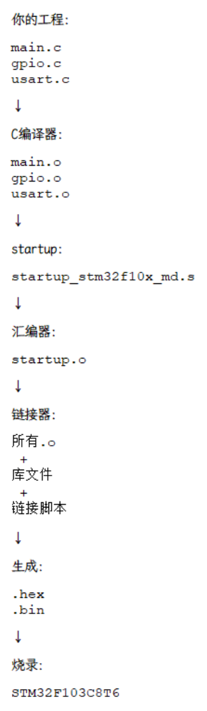
#### 精简

```shell
CMSIS
│
├── CoreSupport
│       ↓
│   ARM Cortex-M3
│   （CPU内核）
│
│
└── DeviceSupport
        ↓
    ST STM32F10x
        │
        ├── stm32f10x.h
        │       ↓
        │   STM32外设寄存器定义
        │
        ├── system_stm32f10x.c
        │       ↓
        │   时钟初始化
        │
        └── startup
                ↓
            芯片启动代码
```

### STM32F10x_StdPeriph_Driver

==STM32F10x 标准外设驱动库==，以后写 STM32 程序最常接触的部分  

```shell
STM32F10x_StdPeriph_Driver
│
├── inc #头文件
└── src #真正的实现
```

例如：  

```shell
stm32f10x_gpio.h
        ↓
告诉你怎么操作 GPIO

stm32f10x_rcc.h
        ↓
告诉你怎么操作时钟

stm32f10x_usart.h
        ↓
告诉你怎么操作 USART

stm32f10x_tim.h
        ↓
告诉你怎么操作 TIM
```

### 总结

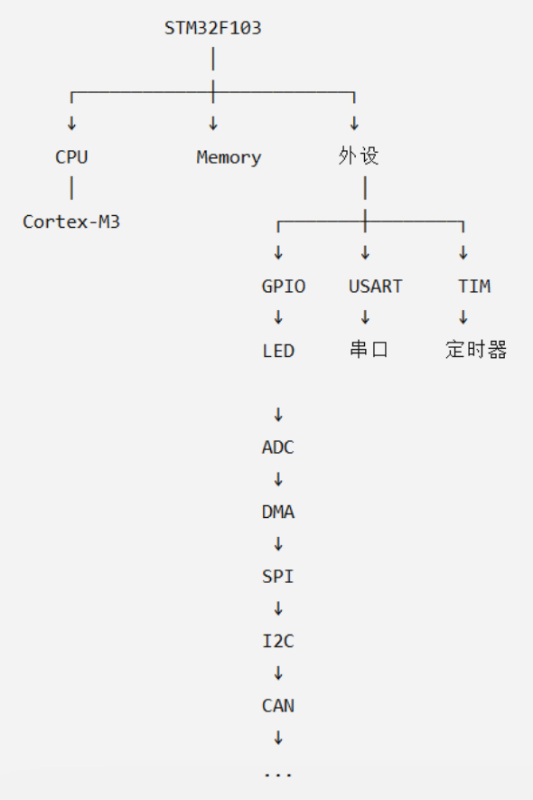  

STM32F10x_StdPeriph_Driver，就是给这些硬件外设提供一套比较方便的 C 语言 API。  

再具体实际点：  

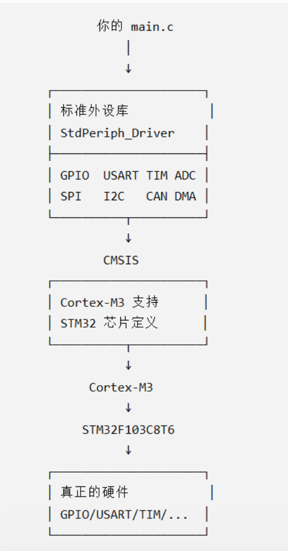  


==STM32F10x_StdPeriph_Driver 是建立在 DeviceSupport 之上的更高一层驱动库。它不是把 DeviceSupport 的代码重新“包装进来”，而是利用 DeviceSupport 提供的寄存器/芯片定义，进一步提供更易用的外设 API。==  

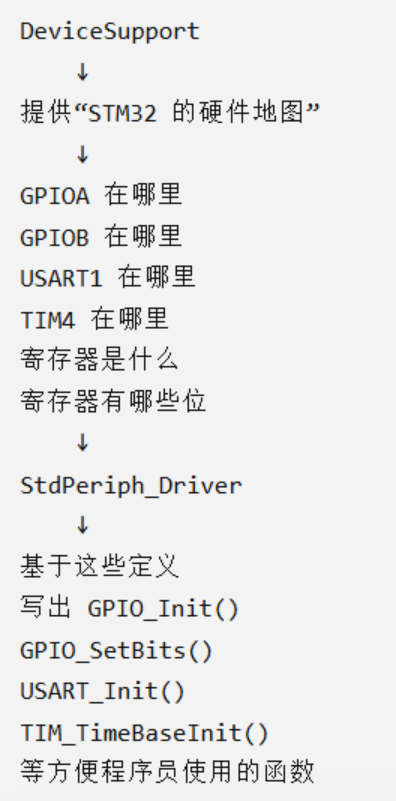  

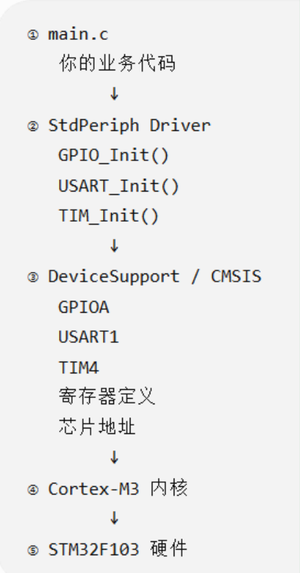  


# 新建一个工程

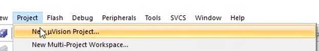  

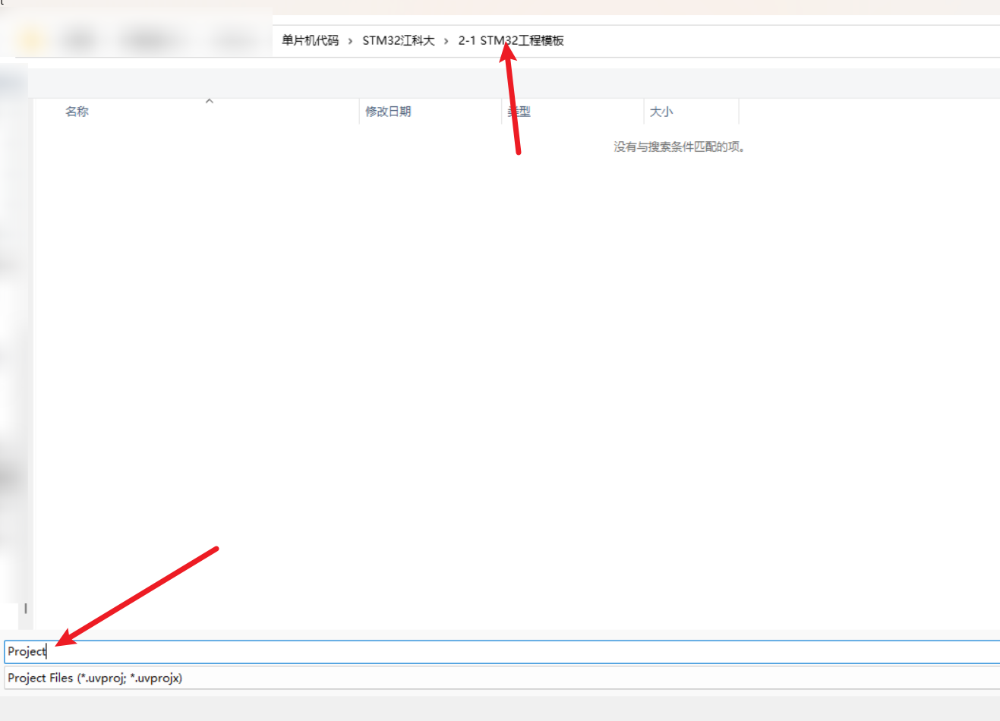  
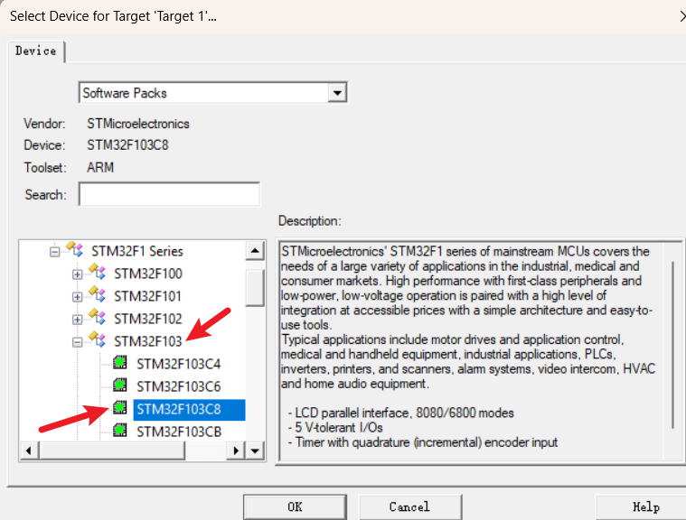  

新建完成  

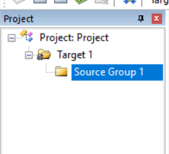  

```shell
#查看一下生成的工程目录结构
D:\software\单片机代码\STM32江科大\2-
1 STM32工程模板
├── DebugConfig
 | └── Target_1_STM32F103C8_1.0.0.dbgconf
├── Listings
├── Objects
├── Project.uvguix.ly.bak
├── Project.uvoptx
```

然后复制STM32启动文件（ARM汇编器需要用的）

首先打开一个Windows文件管理器窗口，打开工程所在文件夹，然后(再开一个窗口)找到下面这个目录：

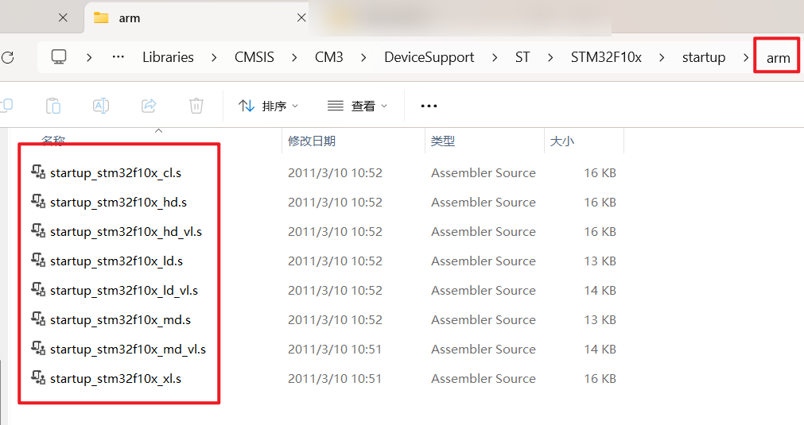  

复制这些==.s后缀文件==到工程文件夹下的start文件夹（没有就新建）  

- ==stm32f10x.h==，用来描述STM32有哪些寄存器和地址
- ==system_stm32f10x.c==，==system_stm32f10x.h==：STM32系统初始化 ，包括1. 时钟初始化 2. SystemCoreClock变量 3. SystemInit()

把以上3个文件也复制到start文件夹  

STM32是由内核和内核外围的设备组成的，内核的寄存器描述和外围设备的描述文件不是在一起的，以下添加内核寄存器描述、以及一些内核配置函数  

- ==core_cm3.c== 
- ==core_cm3.h==   ~~1. Cortex-M3内核寄存器 2. 内核数据结构 3. 内核相关宏 ||||#比如NVIC，SysTick，SCB~~ 

把以上2个文件也复制到start文件夹  

## 回到keil软件

### 添加基本文件

添加刚才复制的文件

点击后F2修改组名，改成Start  

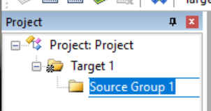  

右键Start添加文件  

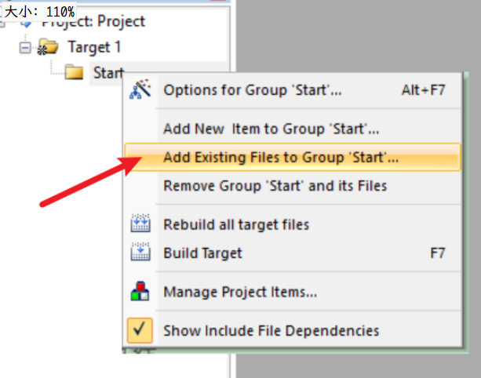  

先添加 `start/startup_stm32f10x_md.s`，然后还要再添加所有的`.c`和`.h`，之后Close  

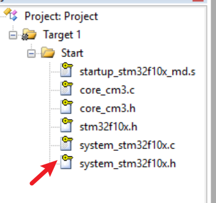  

上面的钥匙表示这些文件是不需要修改的  

### 添加头文件路径

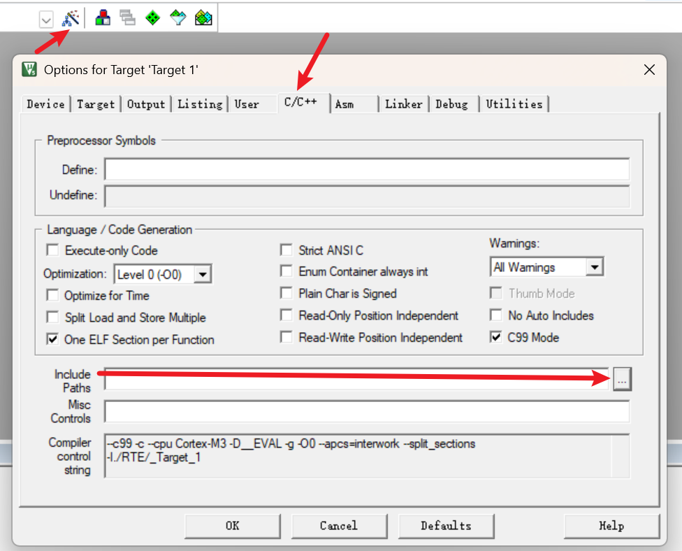  
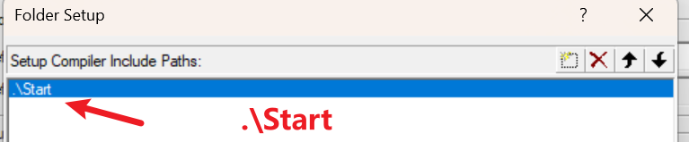  


### main函数

- 在Windows文件管理中新建User文件夹
-  Target右键：AddGroup
   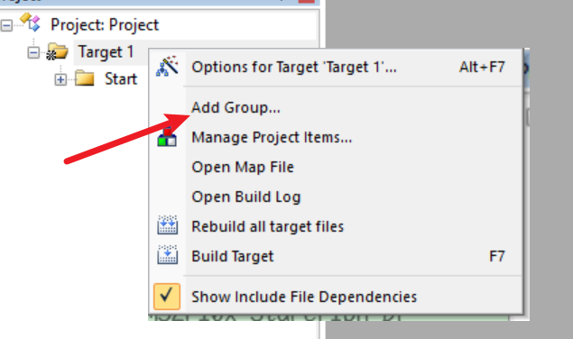  
   
   修改名字为User
- 添加新文件，选择 `.c` 文件，Name为main，Location选择User文件夹  
   
   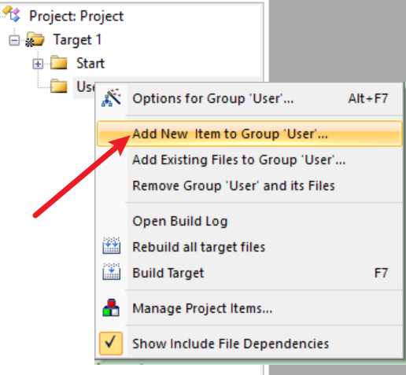  
   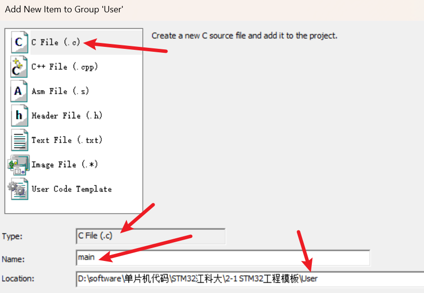
   
- main函数内容
  
```c
#include "stm32f10x.h" //定义STM32F103芯片里面所有外设的地址和结构

int main(void)
{
	while(1)
	{
		
	}
}//这里之后还有一行空行

```
- 设置编译后生成`.hex`文件
  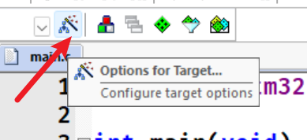
  
  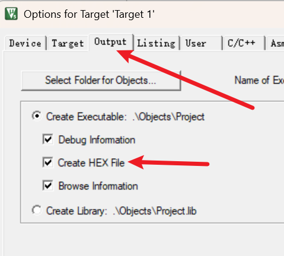
## 编译项目
   
   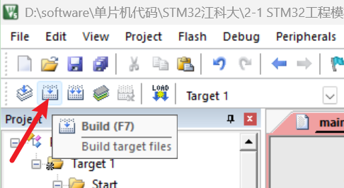
   
```shell
*** Using Compiler 'V5.06 update 5 (build 528)', folder: 'C:\Keil_v5\ARM\ARMCC\Bin'
Build target 'Target 1'
compiling main.c...
linking...
Program Size: Code=648 RO-data=252 RW-data=0 ZI-data=1632  
".\Objects\Project.axf" - 0 Error(s), 0 Warning(s).
Build Time Elapsed:  00:00:00
```

目前如果是基于寄存器开发的话，这里就已经完成了==初始工作==    

## ST-LINK设置

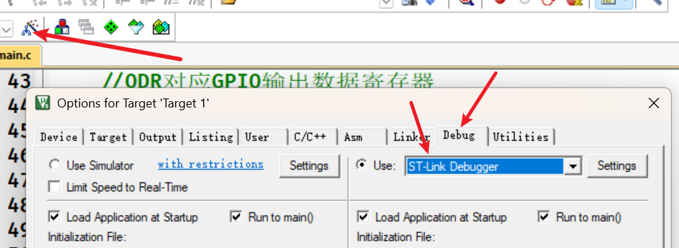  
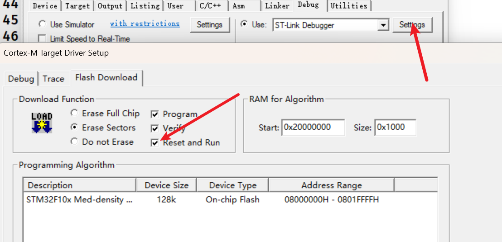  


## 直接操作寄存器

- 位4（目前测试就直接设为1，否则得用其他操作；目前会把其他位清除
  0x00000010
   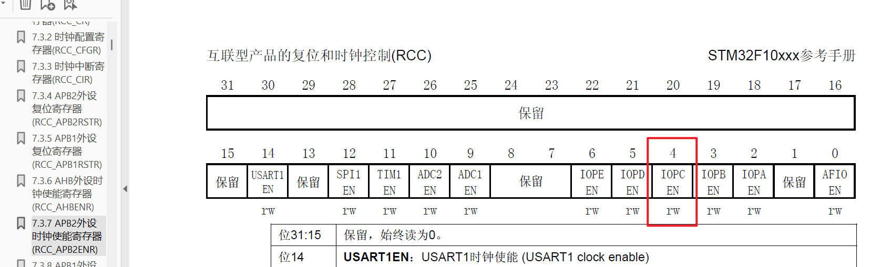  
  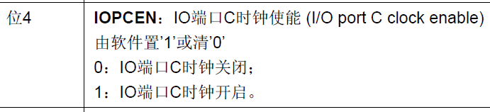
  
  `RCC->APB2ENR=0x00000010;`
- 用来配置13号口
  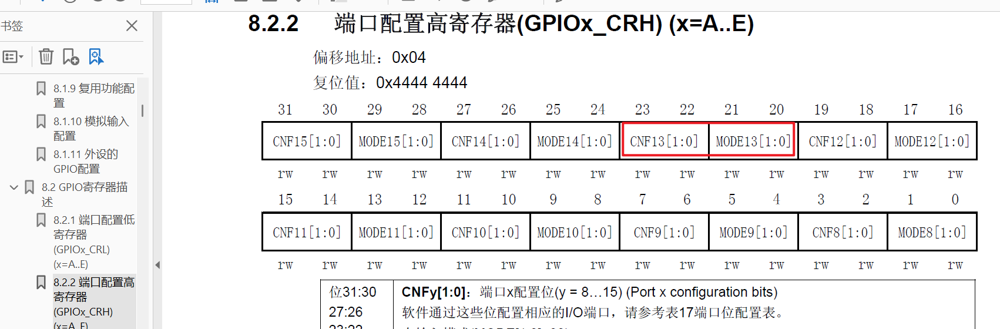  
  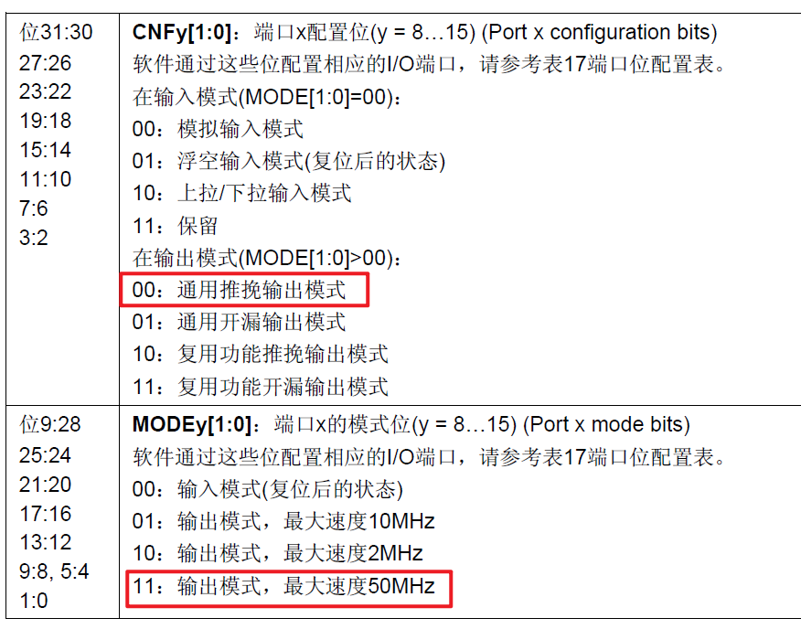  
  `GPIOC->CRH=0x00300000;`

- 给PC13口输出数据
  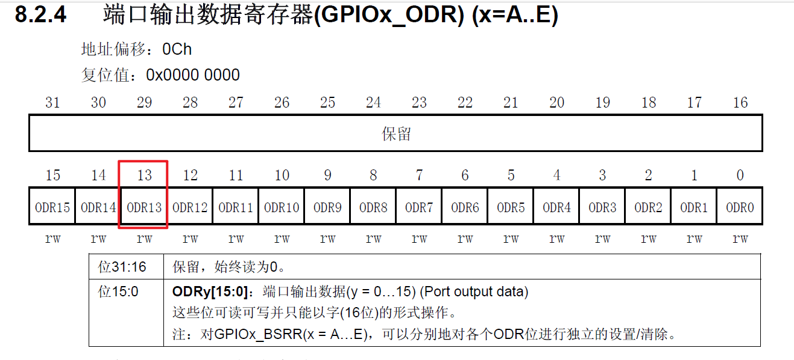  
  这一位写1,13号口就是高电平  
  `GPIOC->ODR=0x00002000;`
### 这里附上普中单片机A7-换芯-STM32版本

 ~~注：由于我没有江科大视频中提到的STM8F103C8T6以及面板上这些，手头只有*普中单片机A7*（STC89C516+STM8)【可将89C516拆下来换成STM32F103C8T6】，所以开发板、还有连线什么的都有出入~~   

```c
#include "stm32f10x.h" //包含STM32F103芯片的寄存器定义、外设地址和相关结构体


int main(void)
{
    //1. 开启GPIOA时钟
    //GPIOA属于APB2总线上的外设
    //STM32外设默认关闭时钟，需要先开启对应时钟才能使用
    //
    //RCC_APB2ENR寄存器负责控制APB2外设时钟
    //将IOPAEN位置1，即开启GPIOA时钟
    //
    //RCC->APB2ENR = 0x00000004;  //直接操作寄存器方式
    RCC->APB2ENR |= RCC_APB2ENR_IOPAEN; //开启GPIOA时钟


    //2. 配置PA0引脚模式
    //
    //GPIO的配置寄存器：
    //CRL负责配置PA0~PA7
    //CRH负责配置PA8~PA15
    //
    //每个GPIO引脚占用4个bit配置
    //PA0对应CRL最低4位
    //
    //清空PA0原来的配置
    GPIOA->CRL &= 0xFFFFFFF0;
    
    //设置PA0为推挽输出模式
    //MODE=11：输出速度50MHz
    //CNF=00：通用推挽输出
    //
    //最终配置：
    //PA0 = 输出模式，最大速度50MHz
    GPIOA->CRL |= 0x00000003;


    //3. 控制PA0输出电平
    //
    //普中开发板LED连接到PA0
    //
    //GPIO输出：
    //ODR对应GPIO输出数据寄存器
    //第0位对应PA0
    //
    //输出1：
    //PA0为高电平
    //
    //输出0：
    //PA0为低电平
    //
    //根据你的普中开发板硬件连接：
    //PA0输出低电平时LED熄灭
    //PA0输出高电平时LED点亮
    //
    //关闭LED
   GPIOA->ODR &= ~(1 << 0);
  //  GPIOA->ODR |= (1<<0);//灯亮


    while (1)
    {

    }
}

```

## 说明(普中A7)  

由STM32F103C8T6核心板原理图得知：   


### GPIO

GPIO：General Purpose Input Output，即 *通用输入输出接口*  

GPIOA 和 GPIOC 是 STM32 芯片里面两组“管脚控制模块”，A、C代表不同的GPIO端口（Port）。 ~~STM32 有很多引脚，STM32把它们分组，每16个一组。~~     

```shell
STM32芯片
│
├── GPIOA（A区）
│    ├── PA0
│    ├── PA1
│    ├── PA2
│    ...
│    └── PA15
│
├── GPIOB（B区）
│    ├── PB0
│    ├── PB1
│    ...
│
├── GPIOC（C区）
│    ├── PC0
│    ├── PC1
│    ...
│    └── PC15
│
└── 其它外设
     ├── USART
     ├── TIM
     ├── ADC
     └── SPI
```

比如PA5，即GPIOA组里面的第5号引脚（从0号开始）  

### 外设时钟使能

STM32 默认把 GPIOA 关闭了，需要先给它供电（开启时钟），即：  

```c
//RCC->APB2ENR = 0x00000004;  //直接操作寄存器方式

//把 RCC 的 APB2 外设时钟使能寄存器里面 GPIOA 对应的那一位置1。
RCC->APB2ENR |= RCC_APB2ENR_IOPAEN; //开启GPIOA时钟
```

STM32 是一个低功耗芯片。里面有很多硬件模块：  

```
STM32

├── GPIOA
├── GPIOB
├── GPIOC
├── USART1
├── SPI1
├── ADC
├── TIM1
...
```

如果只是点灯，其他模块是不需要工作的，会导致功耗增加，所以默认关闭时钟  

#### 外设时钟

即：给 GPIOA 提供运行所需的时钟信号。  

STM32内部：  

```
晶振
 |
 |
时钟系统 RCC
 |
 |
+--------------+
|              |
GPIOA       USART1
 |              |
工作          工作
```

没有时钟的话，GPIOA内部电路不运行  

#### RCC(复位和时钟控制器)

Reset and Clock Control，复位和时钟控制器  

它是 STM32里面负责：*开关外设时钟，配置系统时钟，复位外设*的模块。 ~~RCC就是 STM32 的「总电闸」。~~   

#### APB2(高级外设总线2)

Advanced Peripheral Bus 2，高级外设总线2  

STM32内部有很多总线：

简单理解：

```
CPU

 |
 |
总线
 |
 +--- GPIOA
 |
 +--- USART1
 |
 +--- TIM1
```

STM32==*把外设分到不同总线*==上：

例如：

```
APB2:

GPIOA
GPIOB
GPIOC
USART1
ADC
TIM1


APB1:

USART2
TIM2
TIM3
I2C
SPI2
```

GPIOA属于：

```
APB2
```

所以控制它 

#### ENR(使能寄存器)

APB2ENR：  

| Bit   | 名称               | 功能          |
| ----- | ---------------- | ----------- |
| bit0  | **AFIOEN**       | AFIO 时钟使能   |
| bit1  | 保留               | Reserved    |
| bit2  | **IOPAEN**       | GPIOA 时钟使能  |
| bit3  | **IOPBEN**       | GPIOB 时钟使能  |
| bit4  | **IOPCEN**       | GPIOC 时钟使能  |
| bit5  | **IOPDEN**       | GPIOD 时钟使能  |
| bit6  | **IOPEEN**       | GPIOE 时钟使能  |
| bit7  | 保留               | Reserved    |
| bit8  | **ADC1EN**       | ADC1 时钟使能   |
| bit9  | **ADC2EN**       | ADC2 时钟使能   |
| bit10 | **TIM1EN**       | TIM1 时钟使能   |
| bit11 | **SPI1EN**       | SPI1 时钟使能   |
| bit12 | **TIM8EN**（部分型号） | TIM8 时钟使能   |
| bit13 | **USART1EN**     | USART1 时钟使能 |

到这里就很清楚了，RCC->APB2ENR 是一个 32 位寄存器。但是 不是32位都用来控制外设，STM32F103 只使用其中一部分位  

#### RCC_APB2ENR_IOPAEN(宏)

宏（Macro）就是在预处理阶段进行文本替换的东西。  

其他一些名词  

| 名字            | 含义                |
| ------------- | ----------------- |
| 宏（Macro）      | `#define` 定义的替换符号 |
| 寄存器（Register） | 硬件里的控制存储单元        |
| 位（Bit）        | 寄存器里的某一个开关        |
| 结构体映射         | 用 C 结构体表示硬件地址     |
| 位掩码（Bit Mask） | 用于操作某几个bit的数字     |
| 头文件           | 提供硬件定义            |

来自：stm32f10x.h，它实际上代表：0x00000004

也就是：

```
二进制：

0000 0000 0000 0100
                ↑
              第2位
```

第2位控制：GPIOA时钟  

### CRL，CRH。(配置寄存器)

- 每组GPIO，都有两个配置寄存器  
- 每一个寄存器是32位，每一个代表8个引脚的配置，即每个引脚可以用其中4位表示配置

*CRL：*

低8个：

```
PA0 ~ PA7
```

*CRH：*

高8个：

```
PA8 ~ PA15
```

所以：

*PA0：*

```
PA0属于0~7

↓

GPIOA->CRL
```

`GPIOA->CRL |= 0x00000003;`  ~~注意，这是16进制~~ 所以它处理了最后4位为0011，也就是配置第一个引脚  

#### GPIOA->CRL

CRL：Configuration Register Low  

```
bit31                         bit0
 |                             |
+---+---+---+---+---+---+---+---+
|PA7|PA6|PA5|PA4|PA3|PA2|PA1|PA0|
+---+---+---+---+---+---+---+---+

每个占4bit
```

#### GPIOA->CRH

CRH：Configuration Register High  

```
bit31                 bit0
 |                     |
PA15 PA14 ... PA9 PA8
```

#### 工作方式

每个GPIO引脚需要4个bit描述它的工作方式。  

例如 PA0：

```
GPIOA->CRL

bit31                         bit0

[PA7配置][PA6配置]...[PA1配置][PA0配置]
```


其中：

```
PA0占最低4位：

bit3 bit2 bit1 bit0

  ?    ?    ?    ?
```


这4个位分成两部分：

```
bit1 bit0  → MODE
bit3 bit2  → CNF
```

结构：

```
PA0配置：

bit3 bit2 | bit1 bit0
 CNF      |  MODE
```

##### MODE

GPIO工作模式  

| MODE | 含义             |
| ---- | -------------- |
| 00   | 输入模式           |
| 01   | 输出模式，最大速度10MHz |
| 10   | 输出模式，最大速度2MHz  |
| 11   | 输出模式，最大速度50MHz |

- 输入：STM32听外面的信号 ~~表示入程序(传引脚状态到程序)~~ 
- 输出：STM32给外面发送信号 ~~表示出程序(传信号到某个引脚)~~ 

50MHz：指GPIO内部输出驱动电路最快变化速度。  

如果你快速翻转：

```c
while(1)
{
 GPIOA->ODR ^= 1;
}
```

这个引脚最高可以达到大约50MHz级别的变化能力。 

> 
> 频率：50MHz = 50000000 Hz
> 也就是：每秒变化约5000万次。
> 

GPIO内部有一个电子开关：

```
CPU
 |
 |
GPIO输出驱动
 |
 |
PA0引脚
```

这个开关最快：20ns左右动作一次，但是你的软件指令速度跟不上 ~~只有几MHz甚至更低~~ 。  

##### CNF 

Configuration，配置 ~~输出/输入的具体类型~~ 

| CNF | 类型     |
| --- | ------ |
| 00  | 通用推挽输出 |
| 01  | 通用开漏输出 |
| 10  | 复用推挽输出 |
| 11  | 复用开漏输出 |

推挽：GPIO内部有两个开关，一个负责拉高，一个负责拉低。  

==*CNF：00普通GPIO推挽（最常用）；01普通开漏；10外设复用推挽（串口/PWM常用）；11外设复用开漏（I2C常用）。*==

### ODR(输出数据寄存器

ODR：Output Data Register  

GPIOA->ODR 就是在操作 GPIOA 这一组引脚的“输出电平控制寄存器”。  

其实GPIOA里面有很多寄存器：  

| 寄存器  | 作用           |
| ---- | ------------ |
| CRL  | 配置PA0~PA7模式  |
| CRH  | 配置PA8~PA15模式 |
| IDR  | 读取输入电平       |
| ODR  | 设置输出电平       |
| BSRR | 置位/复位        |
| BRR  | 复位           |

```
GPIOA
 |
 ├── CRL
 ├── CRH
 ├── IDR
 └── ODR
```

ODR寄存器，里面有16位，即：ODR的每一位控制一个GPIO引脚。    

```
GPIOA->ODR


bit15 bit14 ... bit1 bit0

 PA15 PA14      PA1 PA0
```

#### 设置低电平

如果让ODR中最后一位为1，也就是配置PA0  

```
GPIOA->ODR &= ~(1 << 0);
#过程：
#~(1 << 0) = 0000 0000 0000 0001 取反 = 1111 1111 1111 1110
#也就是让其他15位保持不变，最后1位为0
``` 

即：通过GPIOA的输出数据寄存器，把PA0这个物理引脚输出电平设置为低电平。

#### 设置高电平

```
GPIOA->ODR |= (1<<0);
#过程：
#~(1 << 0) = 0000 0000 0000 0001  
#也就是让其他15位保持不变，最后1位为1
``` 

### 总结

```
第一步：
RCC打开GPIOA时钟

↓

第二步：
GPIOA->CRL配置PA0为输出

↓

第三步：
GPIOA->ODR控制PA0高低电平

↓

第四步：
LED亮灭
```

*时钟系统 → 外设 → 寄存器 → 引脚 → 电路*  
