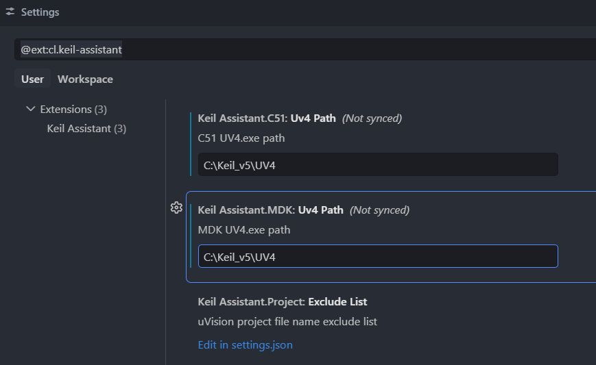
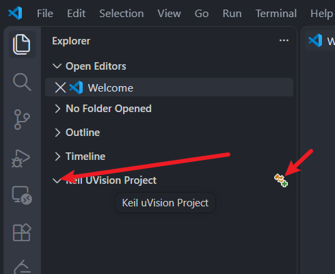
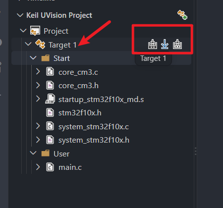
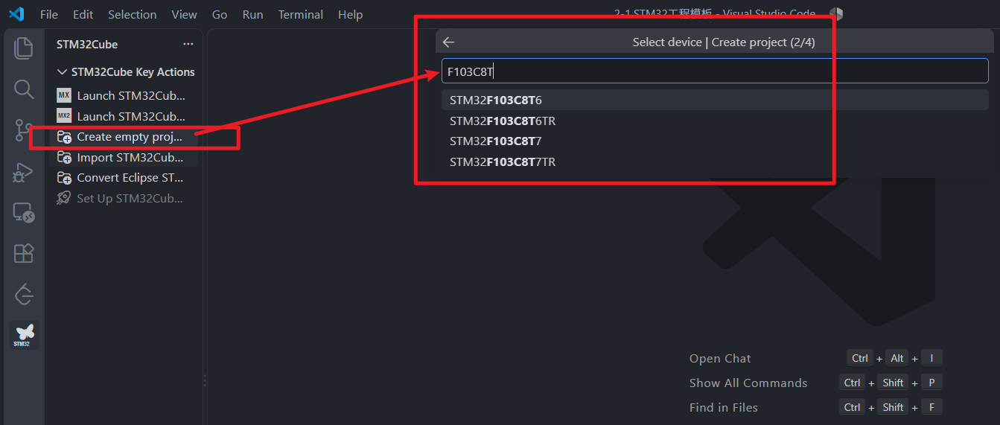
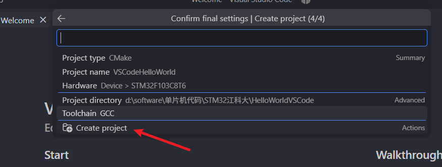
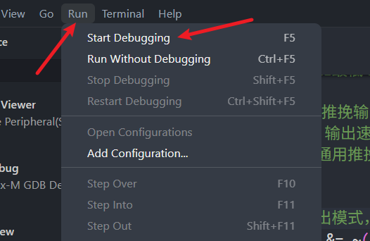

两种方式，一个是KeilAssistant，可以打开、修改、编译 keil5项目  

# KeilAssistant

在VSCode安装KeilAssistant插件，然后插件的settings设置 ~~我的keil C51和keil mdk都是安装在同一个目录下(Keil_v5)~~ ：  

  

设置并安装完毕后  

  

目录添加之后，就可以修改、编译程序了  

  

鼠标放Target1上面，出现上图右侧三个图标依次是`编译`、`下载`、`重新编译`  

有个弊端，好像是不能直接在VSCode中添加/删除文件、调试之类的，只能是在keil中新增好之后才能  

# STM32CubeIDE for Visual Studio Code

- Cortex-Debug  ~~也可以不装~~ 
- C/C++
- 安装 SetupSTM32CubeMX 
- 插件库中添加插件  ~~发布者：STMicroelectronics  ~~ 
	- 然后会自动安装一堆环境（cube bundle）

  

  

创建完成后，重新从File-OpenFolder打开  

之后我在项目中的Src文件夹中，又添加了两个文件夹：\Startup 以及 \Core  

- Core里面放置3个文件： stm32f10x.h，system_stm32f10x.c， system_stm32f10x.h ，core_cm3.h（这里移除了core_cm3.c，因为里面有个代码，gcc较新版本(可能是gcc10以上)编译不过去，但是core_cm3.c中的一些函数都已经在gcc较新版中实现了  

- Startup里面放置文件：`startup_stm32f10x_md.s`
- Src里面放置：`main.c` 

最后还要修改文件CMakeLists.txt    

```txt
cmake_minimum_required(VERSION 3.20)


include(${CMAKE_CURRENT_SOURCE_DIR}/cmake/target.cmake)

include(${CMAKE_CURRENT_SOURCE_DIR}/cmake/gcc-arm-none-eabi.cmake)


project(STM32Test)


enable_language(C ASM)


add_executable(${PROJECT_NAME})

configure_file(
    "${CMAKE_CURRENT_SOURCE_DIR}/stm32f103x8_flash.ld"
    "${CMAKE_CURRENT_BINARY_DIR}/stm32f103x8_flash.ld"
    COPYONLY
)

set_target_properties(${PROJECT_NAME} PROPERTIES
    LINK_DEPENDS "${CMAKE_CURRENT_BINARY_DIR}/stm32f103x8_flash.ld"
)


include(${CMAKE_CURRENT_SOURCE_DIR}/cmake/flags.cmake)


target_sources(${PROJECT_NAME} PRIVATE

    Src/main.c
 
    Core/system_stm32f10x.c

    Startup/startup_stm32f10x_md.s

)


target_include_directories(${PROJECT_NAME} PRIVATE

    Core

)


target_compile_definitions(${PROJECT_NAME} PRIVATE

    STM32F10X_MD

)

# 生成 HEX 和 BIN 文件
add_custom_command(TARGET ${PROJECT_NAME} POST_BUILD

    COMMAND arm-none-eabi-objcopy
    -O ihex
    $<TARGET_FILE:${PROJECT_NAME}>
    ${PROJECT_NAME}.hex

    COMMAND arm-none-eabi-objcopy
    -O binary
    $<TARGET_FILE:${PROJECT_NAME}>
    ${PROJECT_NAME}.bin

    COMMENT "Generating HEX and BIN files..."
)
```


  

