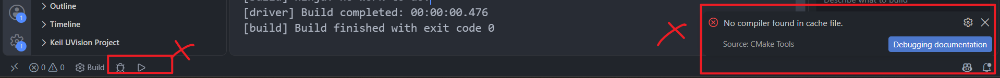
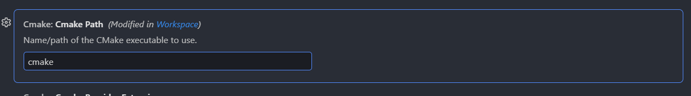

两种方式，一个是KeilAssistant，可以打开、修改、编译 keil5项目  

# KeilAssistant

在VSCode安装KeilAssistant插件，然后插件的settings设置 ~~我的keil C51和keil mdk都是安装在同一个目录下(Keil_v5)~~ ：  

  

设置并安装完毕后  

  

目录添加之后，就可以修改、编译程序了  

  

鼠标放Target1上面，出现上图右侧三个图标依次是`编译`、`下载`、`重新编译`  

有个弊端，好像是不能直接在VSCode中添加/删除文件、调试之类的，只能是在keil中新增好之后才能  
 
# STM32CubeIDE for Visual Studio Code

- Cortex-Debug  ~~也可以先不装~~ 
- C/C++
- 安装 SetupSTM32CubeMX 
- 插件库中添加插件  ~~发布者：STMicroelectronics  ~~ 
	- 然后会自动安装一堆环境（cube bundle）

  

  
创建之后，右下角有open-in-this-window ，如果不小心点掉了可以从主菜单重新open-folder  

然后中间---manage--trust-folder（信任该文件夹）  

1. `Ctrl+Shit+P`：Cmake-Configure
2. Ctrl+Shit+P: Cmake-build
3. Run-start_debugging，选择S-link即可
4. 如果进入调试，那么说明成功了。如果没有，报错找不到st-link，检查下 计算机-管理-通用串行总线控制器，是否检测到st-link

接下来，复制 Src，Core，Startup 这三个文件夹过来。这里简单看一下目录结构  

```
.
├── Core
│   ├── core_cm3.h
│   ├── stm32f10x.h
│   ├── system_stm32f10x.c
│   └── system_stm32f10x.h
├── Src
│   ├── main.c
│   ├── startup_stm32f103xx.S
│   ├── syscall.c
│   └── sysmem.c
└── Startup
    └── startup_stm32f10x_md.s
```

1. 修改`cmake/files.cmake`
   
```cmake
#"${CMAKE_CURRENT_SOURCE_DIR}/Src/startup_stm32f103xx.S"
#替换为
"${CMAKE_CURRENT_SOURCE_DIR}/Startup/startup_stm32f10x_md.s"
#添加
 "${CMAKE_CURRENT_SOURCE_DIR}/Core/system_stm32f10x.c"
```

2. 修改CMakeLists.txt

```
#这里添加头文件路径
# Add include directories
target_include_directories(${PROJECT_NAME} PRIVATE
  # User defined include directories
  ${CMAKE_CURRENT_SOURCE_DIR}/Core
)
```

3. 删除build文件夹
4. `Ctrl+Shit+P`：DeleteCachAndReconfigure
5. Ctrl+Shit+P: Clean-rebuild
6. F5调试-选择st-lint没出错即可

删除Src文件夹下多余的3个文件：  

```
├── Src
│   ├── startup_stm32f103xx.S
│   ├── syscall.c
│   └── sysmem.c
```

注释掉files.cmake中的无用的引入  

```cmake
target_sources(${PROJECT_NAME} PRIVATE
#下面2个注释掉
#    "${CMAKE_CURRENT_SOURCE_DIR}/Src/syscall.c"
#    "${CMAKE_CURRENT_SOURCE_DIR}/Src/sysmem.c"
     "${CMAKE_CURRENT_SOURCE_DIR}/Src/main.c"

	#"${CMAKE_CURRENT_SOURCE_DIR}/Src/startup_stm32f103xx.S"
	#替换为
	"${CMAKE_CURRENT_SOURCE_DIR}/Startup/startup_stm32f10x_md.s"
	#添加
	 "${CMAKE_CURRENT_SOURCE_DIR}/Core/system_stm32f10x.c"
)
```


1. 删除build文件夹
2. `Ctrl+Shit+P`：DeleteCachAndReconfigure
3. Ctrl+Shit+P: Clean-rebuild
4. F5调试-选择st-lint没出错即可

不要用左下角CMakeTools的工具，会出错 ~~这个是给普通CMake项目或者远程Linux系统中的CMake项目用的~~



上面的出错是因为这里的问题 ~~cmake设置先改成绝对路径再改为cmake就行了，不知道是不是bug。但是即使改成功了，也是没法直接调试的，因为目标文件不是.exe而是.elf~~ ：  



STM32 的启动流程可以简单理解为：  

```scss
上电复位
    ↓
读取启动地址
    ↓
执行启动文件 startup_xxx.s
    ↓
初始化C运行环境
    ↓
执行 SystemInit()
    ↓
进入 main()
```

详细版  

```
        STM32上电
             |
             ↓
        CPU复位
             |
             ↓
      读取向量表
             |
             ↓
  设置MSP + 跳Reset_Handler
             |
             ↓
 startup_stm32f10x_md.s
             |
             ↓
 初始化.data段
 清零.bss段
             |
             ↓
       SystemInit()
             |
             ↓
     初始化C环境
             |
             ↓
          main()
             |
             ↓
       用户程序运行
```