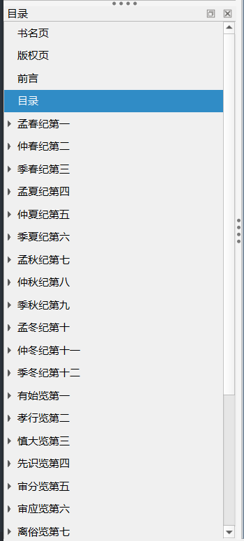
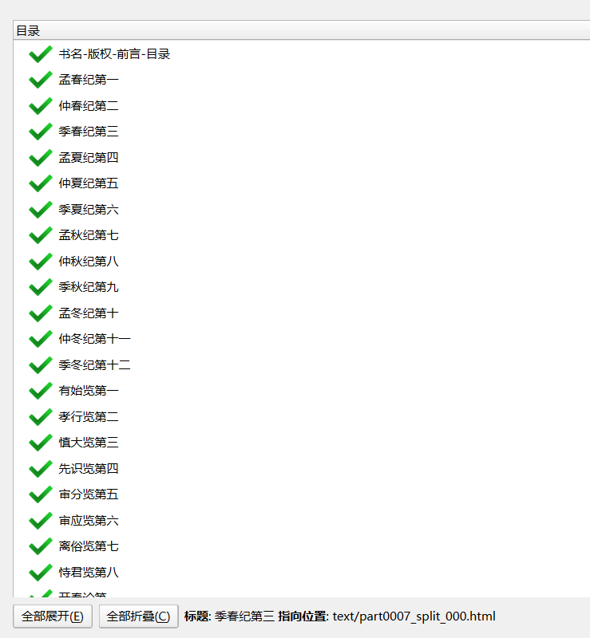
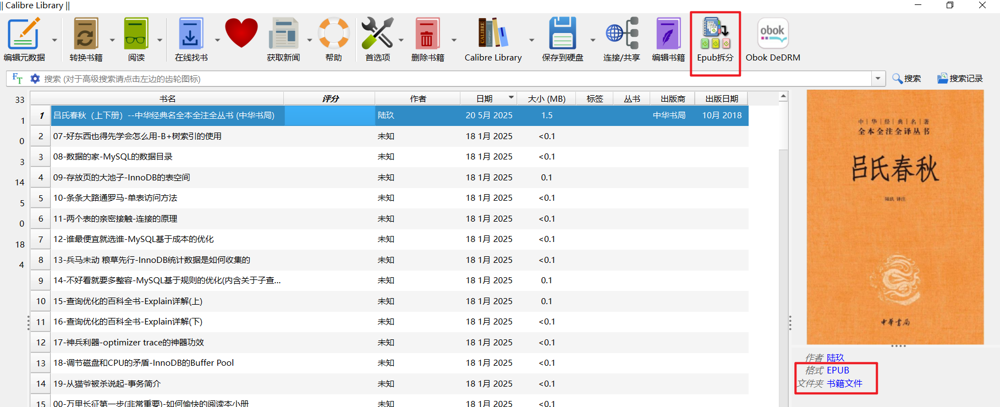
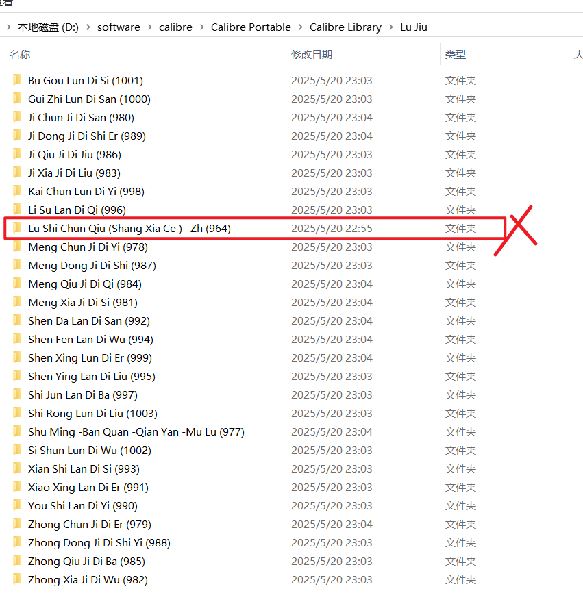
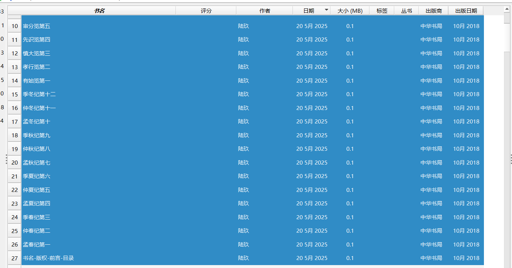
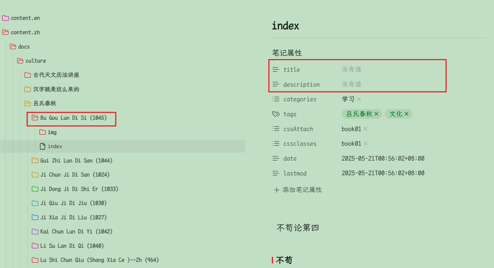
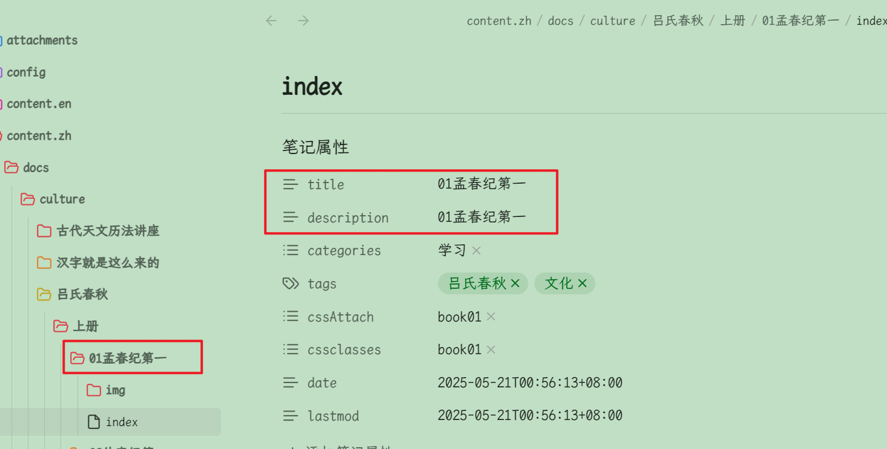

> 这是后续记录，好几个月前处理的，因此步骤可能有漏，尽量回忆
# 下载epub格式书籍
`https://zh.z-lib.fm/` ，网址时不时失效，需要到`https://yinghezhinan.com/site/z-library/`找到最新网址。注册后下载软件默认是不需要钱的，但是非会员一天只能下载10本（可以多注册几个号，只要求邮箱注册即可），正常情况下够用~~我这里用《吕氏春秋》这本书举例~~
# epub编辑器
我这里用的calibre便捷版7.19，具体谷哥一搜便有，不详细讲了(主要是太久了，怕有些细节忘了，不如不说)
# 编辑目录
处理前需要先把epub文件备份一下，这里会修改源文件。
## 编辑书籍

## 编辑处理
一开始的目录长这样  
  
我习惯把前面几章和后面几章都各自归为一章（下面的处理逻辑，会把每一章处理成单独的一个md文件）  
随便找一个，右键`编辑目录`即可  
然后在第一个前新建一个`书名-版权-前言-目录`，之后把其他二三次五级目录都删掉即可，如图：  
> 小技巧：先全选，然后同时按住`ctrl+大标题`（依次取消大标题选择，然后全部删除小标题）  

  
完毕后点击`确定`，然后ctrl+s保存，关闭编辑窗口  
## epub拆分
现在需要把epub文件进行拆分  
  
注意这几个地方，现在先看一下目前目录结构，点击`书籍文件`，然后查看他的上级目录，目前只有一本    
  
回到calibre软件，选中书籍，点击`Epub拆分功能`，ctrl+a全选章节，然后点击`每个章节一本书`，这里就会多出27本  
现在我们再查看刚才的`D:\software\calibre\Calibre Portable\Calibre Library\Lu Jiu`目录除了一本书原书，其他都是新拆分出来的  
  

## 拆分后的epub转换成txtZ格式
选中拆分后的27个文件  
  
`转换书籍`-->输出格式txtZ（其他设置默认）  
随便点一本书的文件夹进去看，会发现多了一个txtZ文件  
可以复制一份.txtZ文件，之后改成.zip，会发现就是txt文件+image图片的文件堆了（为了不影响脚本功能，记得删除这里的.zip文件）
# shell-批量将txtZ转换成md
我写了个shell脚本处理epub转md文件，由于个人使用，没有太过讲究，所以有一些限制，建议在linux环境下运行，当然，我是在windows10+cmder下运行该脚本的。脚本内容如下： 
## 脚本
```shell
n=$#
if [ $n -ne 2 ] ; then
   echo -e "Please set the dir(source)(book目录) dir(dest)(md目录). "
   exit 0
fi

#待处理的txtz文件目录
bookDir=$1;
dirMd=$2; 

initDirMd(){
fileName="$1/_index.md" 
cat >> $fileName <<-_EOF_
---
bookCollapseSection: true
title:
---
_EOF_
# echo "创建$fileName成功"
}
initContentMd(){
fileName="$1/index.md"
time=`date '+%Y-%m-%dT%H:%M:%S%:z'`
cat >> $fileName <<-_EOF_
---
title: 
description: 
categories:
  - 学习
tags: 
  - MySQL
  - MySQL是怎样运行的
cssAttach: 
  - book01
cssclasses: 
  - book01
date: $time
lastmod: $time
---
_EOF_
# echo "创建$fileName成功"
}

#遍历books目录并在相应位置创建目录
iterateBooks(){

	local dirBook=$1;
	local dirMd=$2;
	local files=$(ls "$dirBook")
	#echo "$files"
	#临时修改SHELL中的分隔符
	oldIFS=$IFS
	IFS=$'\n'
	initDirMd "$dirMd"
	for file in $files; do
		local fullPathFile="$dirBook/$file";
		if [[ -d $fullPathFile ]]; then
			# echo $file 
			#如果是目录则在目录创建对应的目录
			mkdir -p "$dirMd/$file" 
			initContentMd "$dirMd/$file" 
			#处理目录下文件
			handleDir "$fullPathFile" "$dirMd/$file"
		fi
	done
	IFS=$oldIFS
}

#处理目录下的文件
handleDir(){ 
	local dirBook=$1;
	local dirMd=$2;
	local files=$(ls "$dirBook")
	#echo "$files"
	#临时修改SHELL中的分隔符
	oldIFS=$IFS
	IFS=$'\n'
	for file in $files; do
		#如果是.txtz结尾
		if [[ $(expr "$file" : ".\+\.txtz$") > 0 ]]; then
			local fullPathFile="$dirBook/$file";
			cp -r "$fullPathFile" "$fullPathFile.zip"
		    echo "$fullPathFile"
			unzip -qo  "$fullPathFile" -d $dirBook
			rm "$fullPathFile.zip"

			#处理解压后的文件
			#sed -Ei "s/^##(.*?\s)/\1/g" index.txt 
			# sed不支持PCRE
			# \\\\\[用来取 \[ 
			#sed -Ei "s/\\\\\[([0-9]+)\\\\\]/[\1]/g"  index.txt 

			#替换图片地址
			# 这里-i -pe 一个不能去掉，且顺序不能改。且p去掉没效果，不知道原因
			# perl命令行加上"-e"选项，就能在perl命令行中直接写perl表达式
			# -i：对输入的每一行执行一次代码，并进行原地编辑（覆盖原文件）
			# -p：对输入的每一行执行一次Perl代码，并打印输出结果。 
			# g是全局,p：保存匹配的字符串到${^PREMATCH} ${^MATCH} ${^POSTMATCH}中，它们在结果上对应$` $& $'
			perl -i -pe 's/(\!\[.*?\])\(images/$1\(img/gp' "$dirBook/index.txt"
			#perl中$&表示整个字符串
			# perl -i -pe 's/(\!\[.*?\])\(img.*?\)/$&  \n/gp' "$dirBook/index.txt"
			#替换\(\) \[\]之类的默认转义（不需要）
			perl -i -pe 's/\\\[(.*?)\\\]/\[$1\]/gp' "$dirBook/index.txt"
			perl -i -pe 's/\\\((.*?)\\\)/\($1\)/gp' "$dirBook/index.txt"
			# 反引号`，星号*，下划线_
			perl -i -pe 's/\\`/`/gp' "$dirBook/index.txt"
			perl -i -pe 's/\\\*/\*/gp' "$dirBook/index.txt"
			perl -i -pe 's/\\_/_/gp' "$dirBook/index.txt"
			#标题降1级(#\s+)\*{2}(.*?)\*{4}
			perl -i -pe 's/^#(.*?\s)/$1/gp' "$dirBook/index.txt" 

			#去除#号后面4个星号(#\s+)(.*?)\s*\n\*{4}\s*\n\*{2}(.*)
			#perl -i -0 -pe 's/(#\s+)\*{2}(.*?)\*{4}.*\n\*{4}.*\n\*{2}(.*)\n.*\n/$1$2 $3/gp' "$dirBook/index.txt" 
			


			#去除#后面连续的4个星号
			#perl -i -pe 's/^(#.*?\s)\*{4}/$1/gp' "$dirBook/index.txt" 
			#去除#号后面4个星号(#\s+)\*{2}(.*?)\*{4}
			#perl -i -pe 's/(#\s+)\*{2}(.*?)\*{4}/$1$2/gp' "$dirBook/index.txt"
			#处理img图片
			# sed -Ei "s/(\!\[\.*?\])\(images/\1\(img/g"  "$dirBook/index.txt"
			#替换\(\) \[\]之类的默认转义（不需要）
			# sed -Ei "s/\\\\\[/[/g"  "$dirBook/index.txt"
			# sed -Ei "s/\\\\\]/]/g"  "$dirBook/index.txt"
			# sed -Ei "s/\\\\\(/(/g"  "$dirBook/index.txt"
			# sed -Ei "s/\\\\\)/)/g"  "$dirBook/index.txt"			
			#去除#后面连续的4个星号
			# sed -Ei "s/\*{4}//g"  "$dirBook/index.txt"
			# sed -Ei "s/\\\\\[(.*?)\\\\\]/[\1]/g"  "$dirBook/index.txt"
			# sed -Ei "s/\\\\\((.*?)\\\\\)/(\1)/g"  "$dirBook/index.txt"			
			#标题降1级
			# sed -Ei  "s/^#(.*?\s)/\1/g"  "$dirBook/index.txt"
			mkdir -p "$dirMd/img" 
			cp -r "$dirBook"/images/* "$dirMd/img"
			rm -rf "$dirBook"/images
			echo -ne "\n" >>  "$dirMd/index.md"
			# echo "23" >>  "$dirMd/index.md"
			cat "$dirBook/index.txt" >>  "$dirMd/index.md"
			rm -rf "$dirBook"/index.txt
		fi
	done
	IFS=$oldIFS

}
iterateBooks "$bookDir" "$dirMd"
# handleDir "$bookDir" "$dirMd"
```
将脚本放在某个目录下（随意）
## 执行脚本
这里说明一下，shell脚本执行需要两个参数，dirBook（要处理的epub文件所在根目录），dirMd（生成后会放在这个文件夹下）。   
  
```shell
#在cmder下执行
bash _sh/txtZ2BookMd.sh '/d/software/calibre/Calibre Portable/Calibre Library/Lu Jiu' 'D:\Users\ly\Documents\git\docs\content.zh\docs\culture\吕氏春秋'
```
## 结果

# 微调
转换后上上图的文件名、title、description修改一下 
