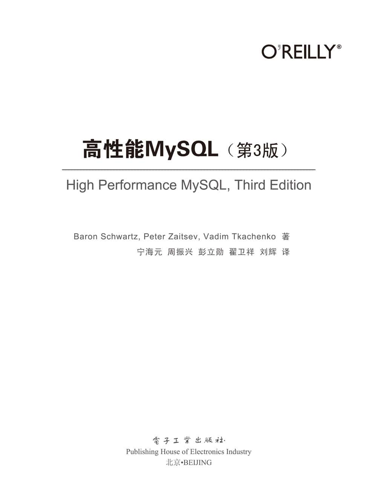
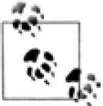

 

**内容简介**

本书是MySQL领域的经典之作，拥有广泛的影响力。第3版更新了大量的内容，不但涵盖了最新MySQL 5.5版本的新特性，也讲述了关于固态盘、高可扩展性设计和云计算环境下的数据库相关的新内容，原有的基准测试和性能优化部分也做了大量的扩展和补充。全书共分为16章和6个附录，内容涵盖MySQL架构和历史，基准测试和性能剖析，数据库软硬件性能优化，复制、备份和恢复，高可用与高可扩展性，以及云端的MySQL和MySQL相关工具等方面的内容。每一章都是相对独立的主题，读者可以有选择性地单独阅读。

本书不但适合数据库管理员（DBA）阅读，也适合开发人员参考学习。不管是数据库新手还是专家，相信都能从本书有所收获。

©2012 by Baron Schwartz，Peter Zaitsev，Vadim Tkachenko.

Simplified Chinese Edition，jointly published by O'Reilly Media，Inc. and Publishing House of Electronics Industry，2013. Authorized translation of the English edition，2012 O'Reilly Media，Inc.，the owner of all rights to publish and sell the same.

All rights reserved including the rights of reproduction in whole or in part in any form.

本书简体中文版专有出版权由O'Reilly Media，Inc.授予电子工业出版社。未经许可，不得以任何方式复制或抄袭本书的任何部分。专有出版权受法律保护。

版权贸易合同登记号图字：01-2013-1661

**图书在版编目（CIP）数据**

高性能MySQL：第3版／（美）施瓦茨（Schwartz，B.），（美）扎伊采夫（Zaitsev，P.），（美）特卡琴科（Tkachenko，V.）著；宁海元等译．—北京：电子工业出版社，2013.5

书名原文：High Performance MySQL，Third Edition

ISBN 978-7-121-19885-4

Ⅰ．①高…　Ⅱ．①施…　②扎…　③特…　④宁…　Ⅲ．①关系数据库系统　Ⅳ．①TP311.138

中国版本图书馆CIP数据核字（2013）第054420号

策划编辑：张春雨

责任编辑：白　涛　贾　莉

封面设计：Karen Montgomery　张　健

印　　刷：三河市鑫金马印装有限公司

装　　订：三河市鑫金马印装有限公司

出版发行：电子工业出版社

北京市海淀区万寿路173信箱　邮编：100036

开　　本：787×980　1/16

印　　张：50

字　　数：1040千字

印　　次：2013年5月第1次印刷

定　　价：128.00元

凡所购买电子工业出版社图书有缺损问题，请向购买书店调换。若书店售缺，请与本社发行部联系，联系及邮购电话：（010）88254888。

质量投诉请发邮件至zlts@phei.com.cn，盗版侵权举报请发邮件至dbqq@phei.com.cn。

服务热线：（010）88258888。

 O'Reilly Media，Inc．介绍

O'Reilly Media通过图书、杂志、在线服务、调查研究和会议等方式传播创新知识。自1978年开始，O'Reilly一直都是前沿发展的见证者和推动者。超级极客们正在开创着未来，而我们关注真正重要的技术趋势——通过放大那些“细微的信号”来刺激社会对新科技的应用。作为技术社区中活跃的参与者，O'Reilly的发展充满了对创新的倡导、创造和发扬光大。

O'Reilly为软件开发人员带来革命性的“动物书”；创建第一个商业网站（GNN）；组织了影响深远的开放源代码峰会，以至于开源软件运动以此命名；创立了Make杂志，从而成为DIY革命的主要先锋；公司一如既往地通过多种形式缔结信息与人的纽带。O'Reilly的会议和峰会集聚了众多超级极客和高瞻远瞩的商业领袖，共同描绘出开创新产业的革命性思想。作为技术人士获取信息的选择，O'Reilly现在还将先锋专家的知识传递给普通的计算机用户。无论是通过书籍出版、在线服务或者面授课程，每一项O'Reilly的产品都反映了公司不可动摇的理念——信息是激发创新的力量。

## 业界评论

“O'Reilly Radar博客有口皆碑。”

——Wired

“O'Reilly凭借一系列（真希望当初我也想到了）非凡想法建立了数百万美元的业务。”

——Business 2.0

“O'Reilly Conference是聚集关键思想领袖的绝对典范。”

——CRN

“一本O'Reilly的书就代表一个有用、有前途、需要学习的主题。”

——Irish Times

“Tim是位特立独行的商人，他不光放眼于最长远、最广阔的视野并且切实地按照Yogi Berra的建议去做了：‘如果你在路上遇到岔路口，走小路（岔路）。’回顾过去Tim似乎每一次都选择了小路，而且有几次都是一闪即逝的机会，尽管大路也不错。”

——Linux Journal

 译者序

在互联网行业，MySQL数据库毫无疑问已经是最常用的数据库。LAMP（Linux＋Apache＋MySQL＋PHP）甚至已经成为专有名词，也是很多中小网站建站的首选技术架构。我所在的公司淘宝网，在2003年非典肆虐期间创立时，选择的就是LAMP架构，当时MySQL的版本还是4.0。但是到了2003年底，由于业务超预期的增长，MySQL 4.0（当时用的还是MyISAM引擎）的很多缺点在高并发大压力下暴露了出来，于是技术上开始改用商业的Oracle数据库。随后几年Oracle加小型机和高端存储的数据库架构支撑了淘宝网业务的爆炸式增长，数据库也从最初的两三个库增长到十几个库，并且每个库的硬件已经逐步升级到顶配，“天花板”很明显地摆在了眼前。于是在2008年，基于PC服务器的MySQL数据库再次成为DBA团队的选择，这时候MySQL的稳定版本已经升级到5.0，并且5.1也已经在开发中，性能和特性相对于2003年的时候已经有了非常大的提升。淘宝网的数据库架构也逐渐从垂直拆分走向水平拆分，在大规模水平集群的架构设计中，开源的MySQL受到的关注度越来越高，并且一年多来的实践也证明了MySQL（存储引擎主要使用的是InnoDB）在高压力下的可用性。于是从2009年开始，后来颇受外界关注的所谓“去IOE”开始实施，经过三年多的架构改造，到2012年整个淘宝网的核心交易系统已经全部运行在基于PC服务器的MySQL数据库集群中，全部实例数超过2000个。今年的“双11”大促中，MySQL单库经受了最高达6.5万的QPS，某个拥有32个节点的核心集群的总QPS则稳定在86万以上，并且在整个大促（包括之前三年的“双11”大促）期间，数据库未发生过任何影响大促的重大故障。当然，这个结果，也得益于淘宝网整个应用架构的设计，以及这几年来革命性的闪存设备的迅猛发展。

2008年，淘宝DBA团队准备从Oracle转向MySQL的时候，团队中的大多数人对MySQL的了解都非常之少。当时国内技术圈对MySQL的讨论也不多见，网上能找到的大多数中文资料基本上关注的还是如何安装，如何配置主备复制等。而MySQL中文类的书籍，大部分还是和PHP放在一起，作为PHP开发中的一环来讲述的。所以当我们发现mysqlperformanceblog.com这个相当专业的国外博客的时候，无不欣喜莫名。同时也知道了博客的作者们2008年出版的High Performance MySQL第二版（中文版于2010年1月出版），这本书被很多MySQL DBA们奉为圭臬，书的三位主要作者Baron Schwartz、Peter Zaitsev和Vadim Tkachenko也在MySQL DBA圈中耳熟能详，他们组建的Percona公司和Percona Server分支版本以及XtraDB存储引擎也逐渐为国内DBA所熟知。2011年12月，淘宝网和O'Reilly在北京联合举办的Velocity China 2011技术大会上，我们有幸邀请到Percona公司的华人专家季海东（目前已离职）来介绍MySQL 5.5 InnoDB/XtraDB的性能优化和诊断方法。在季海东先生的引荐下，我们也和Peter通过Skype电话会议有过沟通，介绍了MySQL在淘宝的应用情况，我们对MySQL一些特性的需求，以及对MySQL做的一些patch，并随后保持了密切的邮件联系。有了这些铺垫，我们对于在生产系统中采用Percona Server 5.5也有了更大的信心，如今已有超过1000个Percona Server 5.5的实例在线上运行。所以今年上半年电子工业出版社的张春雨（侠少）编辑找到我来翻译本书的第三版的时候，很是激动，一口应承。

考虑到这么经典的书应该尽快地和读者见面，故此我邀请了团队中的MySQL专家周振兴（花名：苏普）、彭立勋、翟卫祥（花名：印风）、刘辉（花名：希羽）一起来翻译。其中，我负责前、推荐序和第1、2、3章，周振兴负责第5、6、7章，彭立勋负责第4、8、9、14章，翟卫祥负责第10、11、12、13章，刘辉负责第15、16章和附录部分，最后由我负责统稿。所以毫无疑问，这本书是团队合作的结晶。虽然我们满怀激情，但由于都是第一次参与翻译技术书籍，确实对困难有些预估不足，加上下半年为了准备“双11”等各种大促，需要在DBA团队满负荷的工作间隙挤出个人时间，初稿出来后，由于每个人翻译风格不太一致，几次审稿修订，也让本书的编辑李云静和白涛吃了不少苦头，在此对大家表示深深的感谢，是大家不懈的努力，才使得本书能够顺利地和读者见面。但书中肯定还存在不少问题，恳请读者不吝指出，欢迎大家和我的新浪微博*http://weibo.com/NinGoo*进行互动。

同时还要感谢本书第二版的译者们，他们娴熟的语言技巧给了我们很多的参考。也要感谢帮助审稿的同事们，包括但并不仅限于张新铭（花名：俊达）、张瑞（花名：张瑞）、吴学章（花名：维西）等，彭立勋甚至还发动了他女朋友加入到审稿工作中，在此一并表示感谢。当然，最后还要感谢我的妻子Lalla，在我占用了大量周末时间的时候能够给予支持，并承担了全部的家务，让我以译书为借口毫无心理负担地偷懒。

宁海元（花名：江枫）

2013年3月于余杭

 目录

O'Reilly Media，Inc．介绍

译者序

推荐序

前言

第1章　MySQL架构与历史 
1.1　MySQL逻辑架构 
1.1.1　连接管理与安全性

1.1.2　优化与执行

1.2　并发控制 
1.2.1　读写锁

1.2.2　锁粒度

1.3　事务 
1.3.1　隔离级别

1.3.2　死锁

1.3.3　事务日志

1.3.4　MySQL中的事务

1.4　多版本并发控制

1.5　MySQL的存储引擎 
1.5.1　InnoDB存储引擎

1.5.2　MyISAM存储引擎

1.5.3　MySQL内建的其他存储引擎

1.5.4　第三方存储引擎

1.5.5　选择合适的引擎

1.5.6　转换表的引擎

1.6　MySQL时间线（Timeline）

1.7　MySQL的开发模式

1.8　总结

第2章　MySQL基准测试 
2.1　为什么需要基准测试

2.2　基准测试的策略 
2.2.1　测试何种指标

2.3　基准测试方法 
2.3.1　设计和规划基准测试

2.3.2　基准测试应该运行多长时间

2.3.3　获取系统性能和状态

2.3.4　获得准确的测试结果

2.3.5　运行基准测试并分析结果

2.3.6　绘图的重要性

2.4　基准测试工具 
2.4.1　集成式测试工具

2.4.2　单组件式测试工具

2.5　基准测试案例 
2.5.1　http\_load

2.5.2　MySQL基准测试套件

2.5.3　sysbench

2.5.4　数据库测试套件中的dbt2 TPC-C测试

2.5.5　Percona的TPCC-MySQL测试工具

2.6　总结

第3章　服务器性能剖析 
3.1　性能优化简介 
3.1.1　通过性能剖析进行优化

3.1.2　理解性能剖析

3.2　对应用程序进行性能剖析 
3.2.1　测量PHP应用程序

3.3　剖析MySQL查询 
3.3.1　剖析服务器负载

3.3.2　剖析单条查询

3.3.3　使用性能剖析

3.4　诊断间歇性问题 
3.4.1　单条查询问题还是服务器问题

3.4.2　捕获诊断数据

3.4.3　一个诊断案例

3.5　其他剖析工具 
3.5.1　使用USER\_STATISTICS表

3.5.2　使用strace

3.6　总结

第4章　Schema与数据类型优化 
4.1　选择优化的数据类型 
4.1.1　整数类型

4.1.2　实数类型

4.1.3　字符串类型

4.1.4　日期和时间类型

4.1.5　位数据类型

4.1.6　选择标识符（identifier）

4.1.7　特殊类型数据

4.2　MySQL schema设计中的陷阱

4.3　范式和反范式 
4.3.1　范式的优点和缺点

4.3.2　反范式的优点和缺点

4.3.3　混用范式化和反范式化

4.4　缓存表和汇总表 
4.4.1　物化视图

4.4.2　计数器表

4.5　加快ALTER TABLE操作的速度 
4.5.1　只修改.frm文件

4.5.2　快速创建MyISAM索引

4.6　总结

第5章　创建高性能的索引 
5.1　索引基础 
5.1.1　索引的类型

5.2　索引的优点

5.3　高性能的索引策略 
5.3.1　独立的列

5.3.2　前缀索引和索引选择性

5.3.3　多列索引

5.3.4　选择合适的索引列顺序

5.3.5　聚簇索引

5.3.6　覆盖索引

5.3.7　使用索引扫描来做排序

5.3.8　压缩（前缀压缩）索引

5.3.9　冗余和重复索引

5.3.10　未使用的索引

5.3.11　索引和锁

5.4　索引案例学习 
5.4.1　支持多种过滤条件

5.4.2　避免多个范围条件

5.4.3　优化排序

5.5　维护索引和表 
5.5.1　找到并修复损坏的表

5.5.2　更新索引统计信息

5.5.3　减少索引和数据的碎片

5.6　总结

第6章　查询性能优化 
6.1　为什么查询速度会慢

6.2　慢查询基础：优化数据访问 
6.2.1　是否向数据库请求了不需要的数据

6.2.2　MySQL是否在扫描额外的记录

6.3　重构查询的方式 
6.3.1　一个复杂查询还是多个简单查询

6.3.2　切分查询

6.3.3　分解关联查询

6.4　查询执行的基础 
6.4.1　MySQL客户端/服务器通信协议

6.4.2　查询缓存

6.4.3　查询优化处理

6.4.4　查询执行引擎

6.4.5　返回结果给客户端

6.5　MySQL查询优化器的局限性 
6.5.1　关联子查询

6.5.2　UNION的限制

6.5.3　索引合并优化

6.5.4　等值传递

6.5.5　并行执行

6.5.6　哈希关联

6.5.7　松散索引扫描

6.5.8　最大值和最小值优化

6.5.9　在同一个表上查询和更新

6.6　查询优化器的提示（hint）

6.7　优化特定类型的查询 
6.7.1　优化COUNT()查询

6.7.2　优化关联查询

6.7.3　优化子查询

6.7.4　优化GROUP BY和DISTINCT

6.7.5　优化LIMIT分页

6.7.6　优化SQL\_CALC\_FOUND\_ROWS

6.7.7　优化UNION查询

6.7.8　静态查询分析

6.7.9　使用用户自定义变量

6.8　案例学习 
6.8.1　使用MySQL构建一个队列表

6.8.2　计算两点之间的距离

6.8.3　使用用户自定义函数

6.9　总结

第7章　MySQL高级特性 
7.1　分区表 
7.1.1　分区表的原理

7.1.2　分区表的类型

7.1.3　如何使用分区表

7.1.4　什么情况下会出问题

7.1.5　查询优化

7.1.6　合并表

7.2　视图 
7.2.1　可更新视图

7.2.2　视图对性能的影响

7.2.3　视图的限制

7.3　外键约束

7.4　在MySQL内部存储代码 
7.4.1　存储过程和函数

7.4.2　触发器

7.4.3　事件

7.4.4　在存储程序中保留注释

7.5　游标

7.6　绑定变量 
7.6.1　绑定变量的优化

7.6.2　SQL接口的绑定变量

7.6.3　绑定变量的限制

7.7　用户自定义函数

7.8　插件

7.9　字符集和校对 
7.9.1　MySQL如何使用字符集

7.9.2　选择字符集和校对规则

7.9.3　字符集和校对规则如何影响查询

7.10　全文索引 
7.10.1　自然语言的全文索引

7.10.2　布尔全文索引

7.10.3　MySQL 5.1中全文索引的变化

7.10.4　全文索引的限制和替代方案

7.10.5　全文索引的配置和优化

7.11　分布式（XA）事务 
7.11.1　内部XA事务

7.11.2　外部XA事务

7.12　查询缓存 
7.12.1　MySQL如何判断缓存命中

7.12.2　查询缓存如何使用内存

7.12.3　什么情况下查询缓存能发挥作用

7.12.4　如何配置和维护查询缓存

7.12.5　InnoDB和查询缓存

7.12.6　通用查询缓存优化

7.12.7　查询缓存的替代方案

7.13　总结

第8章　优化服务器设置 
8.1　MySQL配置的工作原理 
8.1.1　语法、作用域和动态性

8.1.2　设置变量的副作用

8.1.3　入门

8.1.4　通过基准测试迭代优化

8.2　什么不该做

8.3　创建MySQL配置文件 
8.3.1　检查MySQL服务器状态变量

8.4　配置内存使用 
8.4.1　MySQL可以使用多少内存

8.4.2　每个连接需要的内存

8.4.3　为操作系统保留内存

8.4.4　为缓存分配内存

8.4.5　InnoDB缓冲池（Buffer Pool）

8.4.6　MyISAM键缓存（Key Caches）

8.4.7　线程缓存

8.4.8　表缓存（Table Cache）

8.4.9　InnoDB数据字典（Data Dictionary）

8.5　配置MySQL的I/O行为 
8.5.1　InnoDB I/O配置

8.5.2　MyISAM的I/O配置

8.6　配置MySQL并发 
8.6.1　InnoDB并发配置

8.6.2　MyISAM并发配置

8.7　基于工作负载的配置 
8.7.1　优化BLOB和TEXT的场景

8.7.2　优化排序（Filesorts）

8.8　完成基本配置

8.9　安全和稳定的设置

8.10　高级InnoDB设置

8.11　总结

第9章　操作系统和硬件优化 
9.1　什么限制了MySQL的性能

9.2　如何为MySQL选择CPU 
9.2.1　哪个更好：更快的CPU还是更多的CPU

9.2.2　CPU架构

9.2.3　扩展到多个CPU和核心

9.3　平衡内存和磁盘资源 
9.3.1　随机I/O和顺序I/O

9.3.2　缓存，读和写

9.3.3　工作集是什么

9.3.4　找到有效的内存/磁盘比例

9.3.5　选择硬盘

9.4　固态存储 
9.4.1　闪存概述

9.4.2　闪存技术

9.4.3　闪存的基准测试

9.4.4　固态硬盘驱动器（SSD）

9.4.5　PCIe存储设备

9.4.6　其他类型的固态存储

9.4.7　什么时候应该使用闪存

9.4.8　使用Flashcache

9.4.9　优化固态存储上的MySQL

9.5　为备库选择硬件

9.6　RAID性能优化 
9.6.1　RAID的故障转移、恢复和镜像

9.6.2　平衡硬件RAID和软件RAID

9.6.3　RAID配置和缓存

9.7　SAN和NAS 
9.7.1　SAN基准测试

9.7.2　使用基于NFS或SMB的SAN

9.7.3　MySQL在SAN上的性能

9.7.4　应该用SAN吗

9.8　使用多磁盘卷

9.9　网络配置

9.10　选择操作系统

9.11　选择文件系统

9.12　选择磁盘队列调度策略

9.13　线程

9.14　内存交换区

9.15　操作系统状态 
9.15.1　如何阅读vmstat的输出

9.15.2　如何阅读iostat的输出

9.15.3　其他有用的工具

9.15.4　CPU密集型的机器

9.15.5　I/O密集型的机器

9.15.6　发生内存交换的机器

9.15.7　空闲的机器

9.16　总结

第10章　复制 
10.1　复制概述 
10.1.1　复制解决的问题

10.1.2　复制如何工作

10.2　配置复制 
10.2.1　创建复制账号

10.2.2　配置主库和备库

10.2.3　启动复制

10.2.4　从另一个服务器开始复制

10.2.5　推荐的复制配置

10.3　复制的原理 
10.3.1　基于语句的复制

10.3.2　基于行的复制

10.3.3　基于行或基于语句：哪种更优

10.3.4　复制文件

10.3.5　发送复制事件到其他备库

10.3.6　复制过滤器

10.4　复制拓扑 
10.4.1　一主库多备库

10.4.2　主动-主动模式下的主-主复制

10.4.3　主动-被动模式下的主-主复制

10.4.4　拥有备库的主-主结构

10.4.5　环形复制

10.4.6　主库、分发主库以及备库

10.4.7　树或金字塔形

10.4.8　定制的复制方案

10.5　复制和容量规划 
10.5.1　为什么复制无法扩展写操作

10.5.2　备库什么时候开始延迟

10.5.3　规划冗余容量

10.6　复制管理和维护 
10.6.1　监控复制

10.6.2　测量备库延迟

10.6.3　确定主备是否一致

10.6.4　从主库重新同步备库

10.6.5　改变主库

10.6.6　在一个主-主配置中交换角色

10.7　复制的问题和解决方案 
10.7.1　数据损坏或丢失的错误

10.7.2　使用非事务型表

10.7.3　混合事务型和非事务型表

10.7.4　不确定语句

10.7.5　主库和备库使用不同的存储引擎

10.7.6　备库发生数据改变

10.7.7　不唯一的服务器ID

10.7.8　未定义的服务器ID

10.7.9　对未复制数据的依赖性

10.7.10　丢失的临时表

10.7.11　不复制所有的更新

10.7.12　InnoDB加锁读引起的锁争用

10.7.13　在主-主复制结构中写入两台主库

10.7.14　过大的复制延迟

10.7.15　来自主库的过大的包

10.7.16　受限制的复制带宽

10.7.17　磁盘空间不足

10.7.18　复制的局限性

10.8　复制有多快

10.9　MySQL复制的高级特性

10.10　其他复制技术

10.11　总结

第11章　可扩展的MySQL 
11.1　什么是可扩展性 
11.1.1　正式的可扩展性定义

11.2　扩展MySQL 
11.2.1　规划可扩展性

11.2.2　为扩展赢得时间

11.2.3　向上扩展

11.2.4　向外扩展

11.2.5　通过多实例扩展

11.2.6　通过集群扩展

11.2.7　向内扩展

11.3　负载均衡 
11.3.1　直接连接

11.3.2　引入中间件

11.3.3　一主多备间的负载均衡

11.4　总结

第12章　高可用性 
12.1　什么是高可用性

12.2　导致宕机的原因

12.3　如何实现高可用性 
12.3.1　提升平均失效时间（MTBF）

12.3.2　降低平均恢复时间（MTTR）

12.4　避免单点失效 
12.4.1　共享存储或磁盘复制

12.4.2　MySQL同步复制

12.4.3　基于复制的冗余

12.5　故障转移和故障恢复 
12.5.1　提升备库或切换角色

12.5.2　虚拟IP地址或IP接管

12.5.3　中间件解决方案

12.5.4　在应用中处理故障转移

12.6　总结

第13章　云端的MySQL 
13.1　云的优点、缺点和相关误解

13.2　MySQL在云端的经济价值

13.3　云中的MySQL的可扩展性和高可用性

13.4　四种基础资源

13.5　MySQL在云主机上的性能 
13.5.1　在云端的MySQL基准测试

13.6　MySQL数据库即服务（DBaaS） 
13.6.1　Amazon RDS

13.6.2　其他DBaaS解决方案

13.7　总结

第14章　应用层优化 
14.1　常见问题

14.2　Web服务器问题 
14.2.1　寻找最优并发度

14.3　缓存 
14.3.1　应用层以下的缓存

14.3.2　应用层缓存

14.3.3　缓存控制策略

14.3.4　缓存对象分层

14.3.5　预生成内容

14.3.6　作为基础组件的缓存

14.3.7　使用HandlerSocket和memcached

14.4　拓展MySQL

14.5　MySQL的替代品

14.6　总结

第15章　备份与恢复 
15.1　为什么要备份

15.2　定义恢复需求

15.3　设计MySQL备份方案 
15.3.1　在线备份还是离线备份

15.3.2　逻辑备份还是物理备份

15.3.3　备份什么

15.3.4　存储引擎和一致性

15.4　管理和备份二进制日志 
15.4.1　二进制日志格式

15.4.2　安全地清除老的二进制日志

15.5　备份数据 
15.5.1　生成逻辑备份

15.5.2　文件系统快照

15.6　从备份中恢复 
15.6.1　恢复物理备份

15.6.2　还原逻辑备份

15.6.3　基于时间点的恢复

15.6.4　更高级的恢复技术

15.6.5　InnoDB崩溃恢复

15.7　备份和恢复工具 
15.7.1　MySQL Enterprise Backup

15.7.2　Percona XtraBackup

15.7.3　mylvmbackup

15.7.4　Zmanda Recovery Manager

15.7.5　mydumper

15.7.6　mysqldump

15.8　备份脚本化

15.9　总结

第16章　MySQL用户工具 
16.1　接口工具

16.2　命令行工具集

16.3　SQL实用集

16.4　监测工具 
16.4.1　开源的监控工具

16.4.2　商业监控系统

16.4.3　Innotop的命令行监控

16.5　总结

附录A　MySQL分支与变种

附录B　MySQL服务器状态

附录C　大文件传输

附录D　EXPLAIN

附录E　锁的调试

附录F　在MySQL上使用Sphinx

索引

 推荐序

很多年前我就是这本书的“粉丝”了，这是一本伟大的书，第三版尤其如此。这些世界级的专家不仅仅分享他们的专业知识，也花了很多时间来更新和添加新的章节，且都是高品质的内容。本书有大量关于如何获得MySQL高性能的细节信息，并且关注的是提升性能的过程，而不仅仅是描述事实结果和琐碎的细枝末节。这本书将告诉读者如何将事情做得更好，不管MySQL在不同版本中的行为有多么大的改变。

毫无疑问，本书的作者是唯一有资格来写这么一本书的人，他们经验丰富，有合理的方法，关注效率，并且精益求精。说到经验丰富，本书的作者已经在MySQL性能领域工作多年，从MySQL还没有什么可扩展性和可测量性的时代，直到现在这些方面已经有了长足的进步。而说到合理的方法，他们简直把这件事情当成了科学，首先定义需要解决的问题，然后通过合理的猜测和精确的测量来解决问题。

我对作者在效率方面的关注尤其印象深刻。作为顾问，他们时间宝贵。客户是按照他们的时间付费的，所以都希望能更快地解决问题。所以本书作者定义了一整套的流程，开发了很多的工具，让事情变得正确和高效。在本书中，作者详细描述了这些流程，并且发布了工具的源代码。

最后，本书作者在工作上一直精益求精。比如从吞吐量到响应时间的关注，致力于了解MySQL在新硬件上的性能表现，追求新的技能如排队理论对性能的影响，等等。

我相信本书预示了MySQL的光明前景。MySQL已经支持高要求的工作负载，本书作者也在努力提升MySQL社区内对性能的认识。同时，他们还直接为性能提升做出了贡献，包括XtraDB和XtraBackup。一直以来我从他们身上学到了不少东西，也希望读者多花点时间读读本书，一定会同样有所收益。

——Mark Callaghan，Facebook软件工程师

 前言

我们写这本书不仅仅是为了满足MySQL应用开发者的需求，也是为了满足MySQL数据库管理员的需要。我们假定读者已经有了一定的MySQL基础。我们还假定读者对于系统管理、网络和类Unix的操作系统都有一些了解。

本书的第二版为读者提供了大量的信息，但没有一本书是可以涵盖一个主题的所有方面的。在第二版和第三版之间的这段时间里，我们记录了数以千计有趣的问题，其中有些是我们解决的，也有一些是我们观察到其他人解决的。当我们在规划第三版的时候发现，如果要把这些主题完全覆盖，可能三千页到五千页的篇幅都还不够，这样本书的完成就遥遥无期了。在反思这个问题后，我们意识到第二版强调的广泛的覆盖度事实上有其自身的限制，从某种意义上来说也没有引导读者如何按照MySQL的方式来思考问题。

所以第三版和第二版的关注点有很大的不同。我们虽然还是会包含很多的信息，并且会强调同样的诸如可靠性和正确性的目标，但我们也会在本书中尝试更深入的讨论：我们会指出MySQL为什么会这样做，而不是MySQL做了什么。我们会使用更多的演示和案例学习来将上述原则落地。通过这样的方式，我们希望能够尝试回到下面这样的问题：“给出MySQL的内部结构和操作，对于实际应用能带来什么帮助？为什么能有这样的帮助？如何让MySQL适合（或者不适合）特定的需求？”

最后，我们希望关于MySQL内部原理的知识能够帮助大家解决本书没有覆盖到的一些情况。我们更希望读者能培养发现新问题的洞察力，能学习和实践合理的方式来设计、维护和诊断基于MySQL的系统。

# 本书是如何组织的

本书涵盖了许多复杂的主题。在这里，我们将解释一下是如何将这些主题有序地组织在一起的，以便于阅读和学习。

## 概述

第1章是非常基础的一章，在更深入地学习之前建议先熟悉一下这部分内容。在有效地使用MySQL之前应当理解它是如何组织的。本章解释了MySQL的架构及其存储引擎的关键设计。如果读者还不太熟悉关系数据库和事务的基础知识，本章也可以带来一点帮助。如果之前已经对其他关系数据库如Oracle比较熟悉，本章也可以帮助读者了解MySQL的入门知识。本章还包括了一点MySQL的历史背景：MySQL随着时间的演进、最近的公司所有权更替，以及我们认为比较重要的内容。

## 打造坚实的基础

本书前几章的内容在今后使用MySQL的过程中可能会被不断地引用到，它们是非常基础的内容。

第2章讨论了基准测试的基础，例如服务器可以处理的工作负载的类型、处理特定任务的速度等。基准测试是一项至关重要的技能，可用于评估服务器在不同负载下的表现，但也要明白在什么情况下基准测试不能发挥作用。

第3章介绍了我们常用于故障诊断和服务器性能问题分析的一种面向响应时间的方法。该方法已经被证明可以解决我们曾碰到过的一些极为棘手的问题。当然也可以选择修改我们所使用的方法（实际上我们的方法也是从Cary Millsap的方法修改而来的），但无论如何，至少不能没有方法胡乱猜测。

从第4章到第6章，连续介绍了三个关于良好的数据库逻辑设计和物理设计基础的话题。第4章涵盖了不同数据类型的细节差别以及表设计的原则。第5章则展开讨论了索引，这是数据库的物理设计。对于索引的深入理解和利用是高效使用MySQL的基础，相信这一章会经常需要回头翻看。而第6章则包含了分析MySQL的查询是如何执行的，以及如何利用查询优化器的话题。该章也包含了大量常见类型查询的例子，演示了MySQL是如何做好工作的，以及如何改写查询以利用MySQL的特性。

到此为止，已经覆盖了关于数据库的基础内容：表、索引、数据和查询。第7章则在MySQL基础知识之外介绍了MySQL的高级特性是如何工作的。这章的内容包括分区、存储引擎、触发器，以及字符集。MySQL中这些特性的实现可能不同于其他数据库，可能之前读者并不清楚这些不同，因此理解它们对于性能可能会带来新的收益。

## 配置应用程序

接下来的两章讲述的是如何让MySQL、应用程序及硬件一起很好地工作。第8章介绍了如何配置MySQL，以便更好地利用硬件，达到更好的可靠性和鲁棒性。第9章解释了如何让操作系统和硬件工作得更好。另外也深入讨论了固态硬盘，为高可扩展性应用发挥更好的性能提供了硬件配置的建议。

上面两章都一定程度地涉及了MySQL的内部知识。这将会是一个反复出现的主题，附录中也会有相关内容可以学习到MySQL的内部是如何实现的，理解了这些知识将帮助读者更好地理解某些现象背后的原理。

## 作为基础设施组件的MySQL

MySQL不是存在于真空中的，而是应用整体的一个环节，因此需要考虑整个应用架构的鲁棒性。下面的章节将告诉我们该如何做到这一点。

第10章讨论了MySQL的杀手级特性：能够设置多个服务器从一台主服务器同步数据。不幸的是，复制可能也是MySQL给很多用户带来困扰的一个特性。但实际上不应该发生这样的情况，本章将告诉你如何让复制运行得更好。

第11章讨论了什么是可扩展性（这和性能不是一回事），应用和系统为什么会无法扩展，该怎么改善扩展性。如果能够正确地处理，MySQL的可扩展性是足以应付任何需求的。第12章讲述的是和可扩展性相关但又完全不同的主题：如何保障MySQL稳定而正确地持续运行。第13章将告诉你当MySQL在云计算环境中运行时会有什么不同的事情发生。第14章解释了什么是全方位的优化（full-stack optimization），就是从前端到后端的整体优化，从用户体验开始直到数据库。

即使是世界上设计最好、最具可扩展性的架构，如果停电会导致彻底崩溃，无法抵御恶意攻击，解决不了应用的bug和程序员的错误，以及其他一些灾难场景，那就不是什么好的架构。第15章讨论了MySQL数据库各种备份与恢复的场景。这些策略可以帮助读者减少在各种不可抗的硬件失效时的宕机时间，保证在各种灾难下的数据最终可恢复。

## 其他有用的主题

在本书的最后一章以及附录中，我们探讨了一些无法明确地放到前面章节的内容，以及一些被前面多个章节引用而需要特别注意的主题。

第16章探索了一些可以帮助用户更有效地管理和监控MySQL服务器的工具，有些是开源的，也有些是商业的。

附录A介绍了近年来成长迅速的三个主要的非MySQL官方版本，其中一个是我们公司在维护的产品。知道还有其他什么是可用的选择是有价值的；很多MySQL难以解决的棘手问题在其他的变种版本中说不定就不是问题了。这三个版本中的两个（Percona Server和MariaDB）是MySQL的完全可替换版本，所以尝试使用的成本相对来说是很低的。当然，在这里我们也需要补充一点，Oracle提供的MySQL官方版本对于大多数用户来说都能服务得很好。

附录B演示了如何检查MySQL服务器。知道如何从服务器获取状态信息是非常重要的；而了解这些状态代表的意义则更加重要。这里将覆盖SHOW INNODB STATUS的输出结果，因此这里包含了InnoDB事务存储引擎的深入信息。在这个附录中讨论了很多InnoDB的内部信息。

附录C演示了如何高效地将大文件从一个地方复制到另外一个地方。如果要管理大量的数据，这种操作是经常都会碰到的。附录D演示了如何真正地使用并理解EXPLAIN命令。附录E演示了如何破除不同查询所请求的锁互相干扰的问题。最后，附录F介绍了Sphinx，一个基于MySQL的高性能的全文索引系统。

# 软件版本与可用性

MySQL是一个移动靶。从Jeremy写作本书第一版到现在，MySQL已经发布了好几个版本。当本书第一版的初稿交给出版社的时候，MySQL 4.1和5.0还只是alpha版本，而如今MySQL 5.1和5.5已经是很多在线应用的主力版本。在我们写完这第三版的时候，MySQL 5.6也即将发布。

本书的内容并不依赖某一个具体的版本。相反，我们会利用自己在实际环境中获得的更广泛的知识。本书的核心内容主要关注MySQL 5.1和5.5版本，因为我们认为这是“当前”的版本。本书的大多数例子都假设运行在MySQL 5.1的某个成熟版本上，比如MySQL 5.1.50或者更高的版本。对于在旧版本中可能不存在，或者只在即将到来的5.6版本中出现的特性或者功能，我们也会特别标注出来。然而，关于某个MySQL版本的特性的权威指南还是要看官方文档。在阅读本书时，建议随时访问在线官方文档的相关内容（*http://dev.mysql.com/doc/*）。

MySQL的另外一个伟大特点是能够运行在现今流行的所有平台：Mac OS X，Windows，GNU/Linux，Solaris，FreeBSD，以及只要你能举出名字的其他平台。然而，本书主要基于GNU/Linux(1)和其他类Unix系统。Windows的用户可能会碰到一些困难。比如说文件路径就和Windows完全不一样。我们也会引用一些Unix的命令行工具，我们假设读者能够知道Windows上对应的工具是什么(2)。

在Windows上搞MySQL的另外一个难点是Perl。MySQL中有很多有用的工具是用Perl写的。在本书的一些章节中，也有一些Perl脚本，在此基础上可以构建更加复杂的工具。Percona Toolkit是不可多得的MySQL管理工具，也是用Perl写的。然而，Windows平台默认是没有Perl环境的。为了使用这些工具，需要从ActiveState下载Perl的Windows版本，以及访问MySQL所需要的一些额外的模块（DBI和DBD::MySQL）。

# 本书使用的约定

下面是本书中使用的一些约定。

斜体（*Italic*）

新的名字、URL、邮件地址、用户名、主机名、文件名、文件扩展名、路径名、目录，以及Unix命令和工具都使用斜体表示。

等宽字体（Constant width）

包括代码元素、配置选项、数据库和表名、变量和值、函数、模块、文件内容、命令输出等，使用的是等宽字体。

加粗的等宽字体（Constant width bold）

命令或者其他需要用户输入的文本，命令输出中需要强调的某些内容，会使用加粗的等宽字体。

斜体的等宽字体（*Constant width italic*）

需要用户替换的文本以斜体的等宽字体表示。

这个图标表示提示、建议，或者一般的记录。

这个图标表示一个警告或者提醒。

# 使用示例代码

本书的目标是为了帮助读者更好地工作。一般来说，你可以在程序或者文档中使用本书中的代码。只要不是大规模地复制重要的代码，使用的时候不需要联系我们。例如，你编写的程序中如果只是使用了本书部分的代码片段则无须取得授权，而出售或者分发O'Reilly书籍示例代码的CD-ROM盘片则需要经过授权。引用本书的代码回答问题也无须取得授权，而大量引用本书的示例代码到产品文档中则需要获取授权。

示例代码维护在*http://www.highperfmysql.com*站点中，会及时保持更新。但我们无法确保代码会跟随每一个MySQL的小版本进行更新和测试。

我们欢迎大家在使用了本书代码后进行反馈，但这不是一个强制要求。反馈时请提供标题、作者、出版公司和ISBN。例如：“*High Performance MySQL，Third Edition*，by Baron Schwartz et al.（O'Reilly）. Copyright 2012 Baron Schwartz，Peter Zaitsev，and Vadim Tkachenko，978-1-449-31428-6”。

如果你使用了本书的代码，但又不在上面描述的一些无须授权的范围之内，不确定是否需要获取授权时，请联系*permissions@oreilly.com*。

# Safari在线书店

Safari在线书店（*www.safaribooksonline.com*）是一家提供定制服务的数字图书馆，提供技术和商务领域内顶级作家的高质量内容的书籍和音像制品。很多技术专家、软件开发者、Web设计师、商务人士和创新专家都将Safari在线书店作为他们研究、解决问题、学习和认证练习的首选资料来源。

Safari在线书店为组织、政府机构和个人提供了一系列的产品组合和定价计划。订阅者可以访问数以千计的图书、培训视频和手稿，这些存在于一个可搜索的数据库中，涵盖的出版公司有O'Reilly Media，Prentice Hall Professional，Addison-Wesley Professional，Microsoft Press，Sams，Que，Peachpit Press，Focal Press，Cisco Press，John Wiley&Sons，Syngress，Morgan Kaufmann，IBM Redbooks，Packt，Adobe Press，FT Press，Apress，Manning，New Riders，McGraw-Hill，Jones&Bartlett，Course Technology，等等。如需了解更多关于Safari在线书店的情况，请访问在线网站。

# 如何联系我们

若有关于本书的任何评论或者问题，请和出版公司联系。

美国：

O'Reilly Media，Inc.

1005 Gravenstein Highway North

Sebastopol，CA 95472

中国：

北京市西城区西直门南大街2号成铭大厦C座807室（100035）

奥莱利技术咨询（北京）有限公司

本书有一个配套的网页，上面列出了勘误表、示例代码及其他相关信息。下面是此网页的地址：

*http://shop.oreilly.com/product/0636920022343.do*

如果有关于本书的评论和技术问题，也可以通过邮件进行沟通：

*bookquestions@oreilly.com*

如果想了解更多关于我们出版公司的书籍、会议、资源中心和O'Reilly网络的信息，请访问网站：

*http://www.oreilly.com*

我们的Facebook：*http://facebook.com/oreilly*

我们的Twitter：*http://twitter.com/oreillymedia*

我们的YouTube：*http://www.youtube.com/oreillymedia*

当然，读者也可以直接和作者取得联系，可以访问作者的公司网站*http://www.percona.com*。我们将乐于收到大家的反馈。

# 本书第三版的致谢

感谢以下人员给予的各种帮助：Brian Aker，Johan Andersson，Espen Braekken，Mark Callaghan，James Day，Maciej Dobrzanski，Ewen Fortune，Dave Hildebrandt，Fernando Ipar，Haidong Ji，Giuseppe Maxia，Aurimas Mikalauskas，Istvan Podor，Yves Trudeau，Matt Yonkovit，Alex Yurchenko。感谢Percona公司的所有员工，多年来为本书提供了无数的支持。感谢很多著名博主(3)和技术大会的演讲者，他们为本书的很多思想提供了大量的素材，尤其是Yoshinori Matsunobu。另外也要感谢本书前面两版的作者：Jeremy D. Zawodny、Derek J. Balling和Arjen Lentz。感谢Andy Oram、Rachel Head，以及O'Reilly的整个编辑团队，你们为本书的出版和发行做了卓有成效的工作。非常感谢Oracle的才华横溢且专注的MySQL团队，以及所有之前的MySQL开发者，不管你现在是在SkySQL还是在Monty团队。

Baron也要感谢他的妻子Lynn、他的母亲Connie，以及他的岳父母Jane和Roger，感谢他们一如既往地支持他的工作，尤其是不断地鼓励他，并且承担了所有的家务和照顾整个家庭的重任。也要感谢Peter和Vadim，你们是如此优秀的老师和同事。Baron将此版本献给Alan Rimm-Kaufman，以纪念他给予的伟大的爱和鼓励，这些都将永志不忘。

# 本书第二版的致谢

Sphinx的开发者Andrew Aksyonoff编写了附录F。我们非常感谢他首次对此进行深入的讨论。

在编写本书的时候，我们得到了很多人的无私帮助。在此无法一一列举——我们真的非常感谢MySQL社区和MySQL AB公司的每一个人。下面是对本书做出了直接贡献的人，如有遗漏，还请见谅。他们是：Tobias Asplund，Igor Babaev，Pascal Borghino，Roland Bouman，Ronald Bradford，Mark Callaghan，Jeremy Cole，Britt Crawford和他的HiveDB项目，Vasil Dimov，Harrison Fisk，Florian Haas，Dmitri Joukovski和他的Zmanda项目（同时感谢Dmitri为解释LVM快照提供的配图），Alan Kasindorf，Sheeri Kritzer Cabral，Marko Makela，Giuseppe Maxia，Paul McCullagh，B. Keith Murphy，Dhiren Patel，Sergey Petrunia，Alexander Rubin，Paul Tuckfield，Heikki Tuuri,以及Michael“Monty”Widenius。在这里还要特别感谢O'Reilly的编辑Andy Oram和助理编辑Isabel Kunkle，以及审稿人Rachel Wheeler，同时也要感谢O'Reilly团队的其他所有成员。

### 来自Baron

我要感谢我的妻子Lynn Rainville和小狗Carbon。如果你也曾写过一本书，我相信你就能体会到我是如何地感谢他们。我也非常感谢Alan Rimm-Kaufman和我在Rimm-Kaufman集团的同事，在写书的过程中，他们给了我支持和鼓励。谢谢Peter、Vadim和Arjen，是你们给了我梦想成真的机会。最后，我要感谢Jeremy和Derek为我们开了个好头。

### 来自Peter

我从事MySQL性能和可扩展性方面的演讲、培训和咨询工作已经很多年了，我一直想把它们扩展到更多的受众。因此，当Andy Oram加入到本书的编写当中时，我感到非常兴奋。此前我没有写过书，所以我对所需要的时间和精力都毫无把握。一开始我们谈到只对第一版做一些更新，以跟上MySQL最新的版本升级，但我们想把更多新素材加入到书中，结果几乎相当于重写了整本书。

这本书是真正的团队合作的结晶。因为我忙于Percona公司的事情——这是我和Vadim的咨询公司，而且英语并非我的第一语言，所以我们有着不同的角色分工。我负责提供大纲和技术性内容，评审所有的材料，在写作的时候再进行修订和扩展。当Arjen（MySQL文档团队的前负责人）加入之后，我们就开始勾画出整个提纲。在Baron加入后，一切才开始真正行动起来，他能够以不可思议的速度编写出高质量的内容。Vadim则在深入检查MySQL源代码和提供基准测试及其他研究来巩固我们的论点时提供了巨大的帮助。

当我们编写本书时，我们发现有越来越多的领域需要刨根问底。本书的大部分主题，如复制、查询优化、InnoDB、架构和设计都足以单独成书。因此，有时候我们不得不在某个点停止深入，把余下的材料用在将来可能出版的新版本中，或者我们的博客、演讲和技术文章中。

本书的评审者给了我们非常大的帮助，无论是来自MySQL AB公司内部的人员，还是外部的人员，他们都是MySQL领域最优秀的世界级专家。其中包括MySQL的创建者Michael Widenius、InnoDB的创建者Heikki Tuuri、MySQL优化器团队的负责人Igor Babaev，以及其他人。

我还要感谢我的妻子Katya Zaytseva，我的孩子Ivan和Nadezhda，他们允许我把家庭时间花在了本书的写作上。我也要感谢Percona的员工，当我在公司里“人间蒸发”去写书时，他们承担了日常事务的处理工作。当然，我也要感谢O'Reilly和Andy Oram让这一切成为可能。

### 来自Vadim

我要感谢Peter，能够在本书中和他合作，我感到十分开心，期望在其他项目中能继续共事。我也要感谢Baron，他在本书的写作过程中起了很大的作用。还有Arjen，跟他一起工作非常好玩。我还要感谢我们的编辑Andy Oram，他抱着十二万分的耐心和我们一起工作。此外，还要感谢MySQL团队，是他们创造了这个伟大的软件。我还要感谢我们的客户给予我调优MySQL的机会。最后，我要特别感谢我的妻子Valerie，以及我们的孩子Myroslav和Timur，他们一直支持我，帮助我一步步前进。

### 来自Arjen

我要感谢Andy的睿智、指导和耐心，感谢Baron中途加入到我们当中来、感谢Peter和Vadim坚实的背景信息和基准测试。也要感谢Jeremy和Derek在第一版中打下的基础。在我的书上，Derak题写着：“要诚实——这就是我的所有要求”。

我也要感谢我在MySQL AB公司时的所有同事，在那里我获得了关于本书主题的大多数知识。在此，我还要特别提到Monty，我一直认为他是令人自豪的MySQL之父，尽管他的公司如今已经成为Sun公司的一部分。我要感谢全球MySQL社区里的每一个人。

最后同样重要的是，我要感谢我的女儿Phoebe，在她尚年少的生活舞台上，不用关心什么是MySQL，也不用考虑Wiggles指的是什么东西。从某些方面来讲，无知就是福。它能给予我们一个全新的视角来看清生命中真正重要的是什么。对于读者，祝愿你们的书架上又增添了一本有用的书，还有，不要忘记你的生活。

# 本书第一版的致谢

要完成这样一本书的写作，离不开许许多多人的帮助。没有他们的无私援助，你手上的这本书就可能仍然是我们显示器屏幕四周的那一堆贴纸。这是本书的一部分，在这里，我们可以感谢每一个曾经帮助我们脱离困境的人，而无须担心突然奏响的背景音乐催促我们闭上嘴巴赶紧走掉——如同你在电视里看到的颁奖晚会那样。

如果没有编辑Andy Oram坚决的督促、请求、央求和支持，我们就无法完成本书。如果要找对于本书最负责的一个人，那就是Andy。我们真的非常感谢每周一次的唠唠叨叨的会议。

然而，Andy不是一个人在战斗。在O'Reilly，还有一批人都参与了将那些小贴纸变成你正在看的这本书的工作。所以我们也要感谢那些在生产、插画和销售环节的人们，感谢你们把这本书变成实体。当然，也要感谢Tim O'Reilly，是他持久不变地承诺为广大开源软件出版一批业内最好的图书。

最后，我们要把感谢给予那些同意审阅本书不同版本草稿，并告诉我们哪里有错误的人们：我们的评审者。他们把2003年假期的一部分时间用在了审阅这些格式粗糙，充满了打字符号、误导性的语句和彻底的数学错误的文本上。我们要感谢（排名不分先后）：Brian“Krow”Aker，Mark“JDBC”Matthews，Jeremy“the other Jeremy”Cole，Mike“VBMySQL.com（*http://vbmysql.com*）”Hillyer，Raymond“Rainman”De Roo，Jeffrey“Regex Master”Friedl，Jason DeHaan，Dan Nelson，Steve“Unix Wiz”Friedl，Kasia“Unix Girl”Trapszo。

### 来自Jeremy

我要在此感谢Andy，是他同意接纳这个项目，并持续不断地鞭策我们加入新的章节内容。Derek的帮助也非常关键，本书最后的20％～30％内容由他一手完成，这使得我们没有错过下一个目标日期。感谢他同意中途加入进来，代替我只能偶尔爆发一下的零星生产力，完成了关于XML的烦琐工作、第10章、附录F，以及我丢给他的那些活儿。

我也要感谢我的父母，在多年以前他们就给我买了Commodore 64电脑，他们不仅在前10年里容忍了我就像要以身相许般的对电子和计算机技术的痴迷，并在之后还成为我不懈学习和探索的支持者。

接下来，我要感谢在过去几年里在Yahoo！布道推广MySQL时遇到的那一群人。跟他们共事，我感到非常愉快。在本书的筹备阶段，Jeffrey Friedl和Ray Goldberger给了我鼓励和反馈意见。在他们之后还有Steve Morris、James Harvey和Sergey Kolychev容忍了我在Yahoo\! Finance MySQL服务器上做着看似固定不变的实验，即使这打扰了他们的重要工作。我也要感谢Yahoo\!的其他成员，是他们帮我发现了MySQL上的那些有趣的问题和解决方法。还有，最重要的是要感谢他们对我有足够的信任和信念，让我把MySQL用在Yahoo\!重要和可见的部分业务上。

Adam Goodman，一位出版家和*Linux Magazine*的拥有者，他帮助我轻装上阵为技术受众撰写文章，并在2001年下半年第一次出版了我的MySQL相关的长篇文章。自那以后，他教授给我更多他所能认识到的关于编辑和出版的技能，还鼓励我通过在杂志上开设月度专栏在这条路上继续走下去。谢谢你，Adam。

我要感谢Monty和David，感谢你们与这个世界分享了MySQL。说到MySQL AB，也要感谢在那里的其他“牛”人，是他们鼓励我写成本书：Kerry，Larry，Joe，Marten，Brian，Paul，Jeremy，Mark，Harrison，Matt，以及团队中的其他人。他们真的非常棒。

最后，我要感谢我博客的读者，是他们鼓励我撰写基于日常工作的非正式的MySQL及其他技术文章。最后同样重要的是，感谢Goon Squad。

### 来自Derek

就像Jeremy一样，有太多同样的原因，我也要感谢我的家庭。我要感谢我的父母，是他们不停地鼓励我去写一本书，哪怕他们头脑中都没有任何和它相关的东西。我的祖父母给我上了两堂很有价值的课：美元的含义，以及我跟电脑相爱有多深，他们还借钱给我去购买了我平生第一台电脑：Commodore VIC-20。

我万分感谢Jeremy邀请我加入他那旋风般的写作“过山车”中来。这是一个很棒的体验，我希望将来还能跟他一起工作。

我要特别感谢Raymond De Roo，Brian Wohlgemuth，David Calafrancesco，Tera Doty，Jay Rubin，Bill Catlan，Anthony Howe，Mark O'Neal，George Montgomery，George Barber，以及其他无数耐心听我抱怨的人，我从他们那里了解到我所讲述的内容是否能让门外汉也能理解，或者仅仅得到一个我所希望的笑脸。没有他们，这本书可能也能写出来，但我几乎可以肯定我会在这个过程中疯掉。

————————————————————

(1) 为了避免产生疑惑，如果我们指的是内核的时候用的是Linux，如果指的是支持应用的整个操作系统环境的时候用的是GNU/Linux。

(2) 可以从*http://unxutils.sourceforge.net*或者*http://gnuwin32.sourceforge.net*获得Unix工具的Windows兼容版本。

(3) 在*http://planet.mysql.com*网站上可以找到很多优秀的技术博客。

