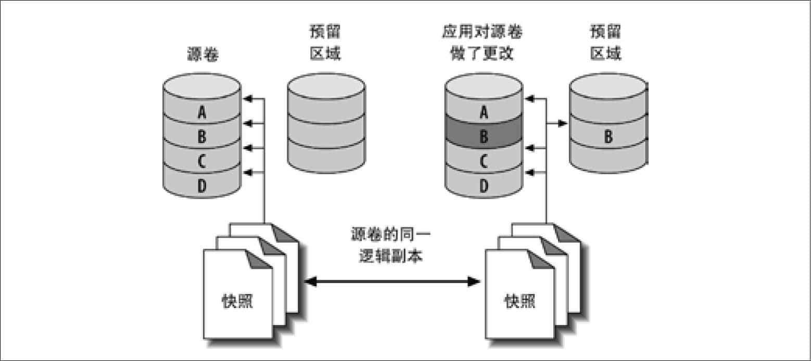

 第15章　备份与恢复

如果没有提前做好备份规划，也许以后会发现已经错失了一些最佳的选择。例如，在服务器已经配置好以后，才想起应该使用LVM，以便可以获取文件系统的快照——但这时已经太迟了。在为备份配置系统参数时，可能没有注意到某些系统配置对性能有着重要影响。如果没有计划做定期的恢复演练，当真的需要恢复时，就会发现并没有那么顺利。

相对于本书的第一版和第二版来说，我们在此假设大部分用户主要使用InnoDB而不是MyISAM。在本章中，我们不会涵盖一个精心设计的备份和恢复解决方案的所有部分——而仅涉及与MySQL相关的部分。我们不打算包括的话题如下：

+ 安全（访问备份，恢复数据的权限，文件是否需要加密）。 
+ 备份存储在哪里，包括它们应该离源数据多远（在一块不同的盘上，一台不同的服务器上，或离线存储），以及如何将数据从源头移动到目的地。 
+ 保留策略、审计、法律要求，以及相关的条款。 
+ 存储解决方案和介质，压缩，以及增量备份。 
+ 存储的格式。 
+ 对备份的监控和报告。 
+ 存储层内置备份功能，或者其他专用设备，例如预制式文件服务器。 

像这样的话题已经在许多书中涉及，例如W. Curtis Preston的*Backup＆ Recouery* （ O'Reilly）。

在开始本章之前，让我们先澄清几个核心术语。首先，经常可以听到所谓的热备份、暖备份和冷备份。人们经常使用这些词来表示一个备份的影响：例如，“热”备份不需要任何的服务停机时间。问题是对这些术语的理解因人而异。有些工具虽然在名字中使用了“热备份”，但实际上并不是我们所认为的那样。我们尽量避开这些术语，而直接说明某个特别的技术或工具对服务器的影响。

另外两个让人困惑的词是还原和恢复。在本章中它们有其特定的含义。还原意味着从备份文件中获取数据，可以加载这些文件到MySQL里，也可以将这些文件放置到MySQL期望的路径中。恢复一般意味着当某些异常发生后对一个系统或其部分的拯救。包括从备份中还原数据，以及使服务器完全恢复功能的所有必要步骤，例如重启MySQL、改变配置和预热服务器的缓存等。

在很多人的概念中，恢复仅意味着修复崩溃后损坏的表。这与恢复一个完整的服务器是不同的。存储引擎的崩溃恢复要求数据和日志文件一致。要确保数据文件中只包含已经提交的事务所做的修改，恢复操作会将日志中还没有应用到数据文件的事务重新执行。这也许是恢复过程的一部分，甚至是备份的一部分。然而，这和一个意外的DROP TABLE事故后需要做的事是不一样的。

# 15.1　为什么要备份

下面是备份非常重要的几个理由：

灾难恢复

灾难恢复是下列场景下需要做的事情：硬件故障、一个不经意的Bug导致数据损坏，或者服务器及其数据由于某些原因不可获取或无法使用等。你需要准备好应付很多问题：某人偶然连错服务器执行了一个ALTER TABLE(1)的操作，机房大楼被烧毁，恶意的黑客攻击或MySQL的Bug等。尽管遭受任何一个特殊的灾难的几率都非常低，但所有的风险叠加在一起就很有可能会碰到。

人们改变想法

不必惊讶，很多人经常会在删除某些数据后又想要恢复这些数据。

审计

有时候需要知道数据或Schema在过去的某个时间点是什么样的。例如，你也许被卷入一场法律官司，或发现了应用的一个Bug，想知道这段代码之前干了什么（有时候，仅仅依靠代码的版本控制还不够）。

测试

一个最简单的基于实际数据来测试的方法是，定期用最新的生产环境数据更新测试服务器。如果使用备份的方案就非常简单：只要把备份文件还原到测试服务器上即可。检查你的假设。例如，你认为共享虚拟主机供应商会提供MySQL服务器的备份？许多主机供应商根本不备份MySQL服务器，另外一些也仅仅在服务器运行时复制文件，这可能会创建一个损坏的没有用处的备份。

# 15.2　定义恢复需求

如果一切正常，那么永远也不需要考虑恢复。但是，一旦需要恢复，只有世界上最好的备份系统是没用的，还需要一个强大的恢复系统。

不幸的是，让备份系统平滑工作比构造良好的恢复过程和工具更容易。原因如下：

+ 备份在先。只有已经做了备份才可能恢复，因此在构建系统时，注意力自然会集中在备份上。 
+ 备份由脚本和任务自动完成。经常不经意地，我们会花些时间调优备份过程。花5分钟来对备份过程做小的调整看起来并不重要，但是你是否天天同样地重视恢复呢？ 
+ 备份是日常任务，但恢复常常发生在危急情形下。 
+ 因为安全的需要，如果正在做异地备份，可能需要对备份数据进行加密，或采取其他措施来进行保护。安全性往往只关注数据被盗用的后果，但是有没有人想过，如果没有人能对用来恢复数据的加密卷解锁，或需要从一个整块的加密文件中抽取单个文件时，损害又是多大？ 
+ 只有一个人来规划、设计和实施备份。当灾难袭来时，那个人可能不在。因此需要培养几个人并有计划地互为备份，这样就不会要求一个不合格的人来恢复数据。 

这里有一个我们看到的真实例子：一个客户报告说当*mysqldump*加上-*d*选项后，备份变得像闪电一般快，他想知道为什么没有一个人提出该选项可以如此快地加速备份过程。如果这个客户已经尝试还原这些备份，就不难发现其原因：使用-d选项将不会备份数据！这个客户关注备份，却没有关注恢复，因此完全没有意识到这个问题。

规划备份和恢复策略时，有两个重要的需求可以帮助思考：恢复点目标（PRO）和恢复时间目标（RTO）。它们定义了可以容忍丢失多少数据，以及需要等待多久将数据恢复。在定义RPO和RTO时，先尝试回答下面几类问题：

+ 在不导致严重后果的情况下，可以容忍丢失多少数据？需要故障恢复，还是可以接受自从上次日常备份后所有的工作全部丢失？是否有法律法规的要求？ 
+ 恢复需要在多长时间内完成？哪种类型的宕机是可接受的？哪种影响（例如，部分服务不可用）是应用和用户可以接受的？当那些场景发生时，又该如何持续服务？ 
+ 需要恢复什么？常见的需求是恢复整个服务器，单个数据库，单个表，或仅仅是特定的事务或语句。 

建议将上面这些问题的答案明确地用文档记录下来，同时还应该明确备份策略，以及备份过程。

**备份误区1：“复制就是备份”**

这是我们经常碰到的一个误区。复制不是备份，当然使用RAID阵列也不是备份。为什么这么说？可以考虑一下，如果意外地在生产库上执行了DROP DATABASE，它们是否可以帮你恢复所有的数据？RAID和复制连这个简单的测试都没法通过。它们不是备份，也不是备份的替代品。只有备份才能满足备份的要求。

# 15.3　设计MySQL备份方案

备份MySQL比看起来难。最基本的，备份仅是数据的一个副本，但是受限于应用程序的要求、MySQL的存储引擎架构，以及系统配置等因素，会让复制一份数据都变得很困难。

在深入所有选项细节之前，先来看一下我们的建议：

+ 在生产实践中，对于大数据库来说，物理备份是必需的：逻辑备份太慢并受到资源限制，从逻辑备份中恢复需要很长时间。基于快照的备份，例如Percona XtraBackup和MySQL Enterprise Backup是最好的选择。对于较小的数据库，逻辑备份可以很好地胜任。 
+ 保留多个备份集。 
+ 定期从逻辑备份（或者物理备份）中抽取数据进行恢复测试。 
+ 保存二进制日志以用于基于故障时间点的恢复。expire\_logs\_days参数应该设置得足够长，至少可以从最近两次物理备份中做基于时间点的恢复，这样就可以在保持主库运行且不应用任何二进制日志的情况下创建一个备库。备份二进制日志与过期设置无关，二进制日志备份需要保存足够长的时间，以便能从最近的逻辑备份进行恢复。 
+ 完全不借助备份工具本身来监控备份和备份的过程。需要另外验证备份是否正常。 
+ 通过演练整个恢复过程来测试备份和恢复。测算恢复所需要的资源（CPU、磁盘空间、实际时间，以及网络带宽等）。 
+ 对安全性要仔细考虑。如果有人能接触生产服务器，他是否也能访问备份服务器？反过来呢？ 

弄清楚RPO和RTO可以指导备份策略。是需要基于故障时间点的恢复能力，还是从昨晚的备份中恢复但会丢失此后的所有数据就足够了？如果需要基于故障时间点的恢复，可能要建立日常备份并保证所需要的二进制日志是有效的，这样才能从备份中还原，并通过重放二进制日志来恢复到想要的时间点。

一般说来，能承受的数据丢失越多，备份越简单。如果有非常苛刻的需求，要确保能恢复所有数据，备份就很困难。基于故障时间点的恢复也有几类。一个“宽松”的故障时间点恢复需求意味着需要重建数据，直到“足够接近”问题发生的时刻。一个“硬性”的需求意味着不能容忍丢失任何一个已提交的事务，即使某些可怕的事情发生（例如服务器着火了）。这需要特别的技术，例如将二进制日志保存在一个独立的SAN卷或使用DRBD磁盘复制。

## 15.3.1　在线备份还是离线备份

如果可能，关闭MySQL做备份是最简单最安全的，也是所有获取一致性副本的方法中最好的，而且损坏或不一致的风险最小。如果关闭了MySQL，就根本不用关心InnoDB缓冲池中的脏页或其他缓存。也不需要担心数据在尝试备份的过程被修改，并且因为服务器不对应用提供访问，所以可以更快地完成备份。

尽管如此，让服务器停机的代价可能比看起来要更昂贵。即使能最小化停机时间，在高负载和高数据量下关闭和重启MySQL也可能要花很长一段时间，这在第8章中讨论过。我们演示过一些使这个影响最小化的技术，但并不能将其减少为零。因此，必须要设计不需要生产服务器停机的备份。即便如此，由于一致性的需要，对服务器进行在线备份仍然会有明显的服务中断。

在众多的备份方法中，一个最大问题就是它们会使用FLUSH TABLES WITH READ LOCK操作。这会导致MySQL关闭并锁住所有的表，将MyISAM的数据文件刷新到磁盘上（但InnoDB不是这样的！），并且刷新查询缓存。该操作需要非常长的时间来完成。具体需要多长时间是不可预估的；如果全局读锁要等待一个长时间运行的语句完成，或有许多表，那么时间会更长。除非锁被释放，否则就不能在服务器上更改任何数据，一切都会被阻塞和积压(2)。FLUSH TABLES WITH READ LOCK不像关闭服务器的代价那么高，因为大部分缓存仍然在内存中，并且服务器一直是“预热”的，但是它也有非常大的破坏性。如果有人说这样做很快，可能是准备向你推销某种从来没有在真正的线上服务器上运行过的东西。

避免使用FLUSH TABLES WITH READ LOCK的最好的方法是只使用InnoDB表。在权限和其他系统信息表中使用MyISAM表是不可避免的，但是如果数据改变量很少（正常情况下），你可以只刷新和锁住这些表，这不会有什么问题。

在规划备份时，有一些与性能相关的因素需要考虑。

锁时间

需要持有锁多长时间，例如在备份期间持有的全局FLUSH TABLES WITH READ LOCK？

备份时间

复制备份到目的地需要多久？

备份负载

在复制备份到目的地时对服务器性能的影响有多少？

恢复时间

把备份镜像从存储位置复制到MySQL服务器，重放二进制日志等，需要多久？

最大的权衡是备份时间与备份负载。可以牺牲其一以增强另外一个。例如，可以提高备份的优先级，代价是降低服务器性能。

同样，也可以利用负载的特性来设计备份。例如，如果服务器在晚上的8小时内仅仅有50％的负载，那么可以尝试规划备份，使得服务器的负载低于50％且仍能在8小时内完成。可以采用许多方法来完成这个目标，例如，可以用*ionice*和*nice*来提高复制或压缩操作的优先级，使用不同的压缩等级，或在备份服务器上压缩而不是在MySQL服务器上。甚至可以利用*lzo*或*pigz*以获取更快的压缩。也可以使用O\_DIRECT或fadvise()在复制操作时绕开操作系统的缓存，以避免污染服务器的缓存。像Percona XtraBackup和MySQL Enterprise Backup这样的工具都有限流选项，可在使用*pv*时加--*rate-limit*选项来限制备份脚本的吞吐量。

## 15.3.2　逻辑备份还是物理备份

有两种主要的方法来备份MySQL数据：逻辑备份（也叫“导出”）和直接复制原始文件的物理备份。逻辑备份将数据包含在一种MySQL能够解析的格式中，要么是SQL，要么是以某个符号分隔的文本(3)。原始文件是指存在于硬盘上的文件。

任何一种备份都有其优点和缺点。

### 逻辑备份

逻辑备份有如下优点：

+ 逻辑备份是可以用编辑器或像*grep*和*sed*之类的命令查看和操作的普通文件。当需要恢复数据或只想查看数据但不恢复时，这都非常有帮助。 
+ 恢复非常简单。可以通过管道把它们输入到*mysql*，或者使用*mysqlimport*。 
+ 可以通过网络来备份和恢复——就是说，可以在与MySQL主机不同的另外一台机器上操作。 
+ 可以在类似Amazon RDS这样不能访问底层文件系统的系统中使用。 
+ 非常灵活，因为*mysqldump*——大部分人喜欢的工具——可以接受许多选项，例如可以用WHERE子句来限制需要备份哪些行。 
+ 与存储引擎无关。因为是从MySQL服务器中提取数据而生成，所以消除了底层数据存储和不同。因此，可以从InnoDB表中备份，然后只需极小的工作量就可以还原到MyISAM表中。而对于原始数据却不能这么做。 
+ 有助于避免数据损坏。如果磁盘驱动器有故障而要复制原始文件时，你将会得到一个错误并且/或生成一个部分或损坏的备份。如果MySQL在内存中的数据还没有损坏，当不能得到一个正常的原始文件复制时，有时可以得到一个可以信赖的逻辑备份。 

尽管如此，逻辑备份也有它的缺点：

+ 必须由数据库服务器完成生成逻辑备份的工作，因此要使用更多的CPU周期。 
+ 逻辑备份在某些场景下比数据库文件本身更大(4)。ASCII形式的数据不总是和存储引擎存储数据一样高效。例如，一个整型需要4字节来存储，但是用ASCII写入时，可能需要12个字符。当然也可以压缩文件以得到一个更小的备份文件，但这样会使用更多的CPU资源。（如果索引比较多，逻辑备份一般要比物理备份小。） 
+ 无法保证导出后再还原出来的一定是同样的数据。浮点表示的问题、软件Bug等都会导致问题，尽管非常少见。 
+ 从逻辑备份中还原需要MySQL加载和解释语句，转化为存储格式，并重建索引，所有这一切会很慢。 

最大的缺点是从MySQL中导出数据和通过SQL语句将其加载回去的开销。如果使用逻辑备份，测试恢复需要的时间将非常重要。

Percona Server中包含的*mysqldump*，在使用InnoDB表时能起到帮助作用，因为它会对输出格式化，以便在重新加载时利用InnoDB的快速建索引的优点。我们的测试显示这样做可以减少2/3甚至更多的还原时间。索引越多，好处越明显。

### 物理备份

物理备份有如下好处：

+ 基于文件的物理备份，只需要将需要的文件复制到其他地方即可完成备份。不需要其他额外的工作来生成原始文件。 
+ 物理备份的恢复可能就更简单了，这取决于存储引擎。对于MyISAM，只需要简单地复制文件到目的地即可。对于InnoDB则需要停止数据库服务，可能还要采取其他一些步骤。 
+ InnoDB和MyISAM的物理备份非常容易跨平台、操作系统和MySQL版本。（逻辑导出亦如此。这里特别指出这一点是为了消除大家的担心。） 
+ 从物理备份中恢复会更快，因为MySQL服务器不需要执行任何SQL或构建索引。如果有很大的InnoDB表，无法完全缓存到内存中，则物理备份的恢复要快非常多——至少要快一个数量级。事实上，逻辑备份最可怕的地方就是不确定的还原时间。 

物理备份也有其缺点，比如：

+ InnoDB的原始文件通常比相应的逻辑备份要大得多。InnoDB的表空间往往包含很多未使用的空间。还有很多空间被用来做存储数据以外的用途（插入缓冲，回滚段等）。 
+ 物理备份不总是可以跨平台、操作系统及MySQL版本。文件名大小写敏感和浮点格式是可能会遇到麻烦。很可能因浮点格式不同而不能移动文件到另一个系统（虽然主流处理器都使用IEEE浮点格式。） 

物理备份通常更加简单高效(5)。尽管如此，对于需要长期保留的备份，或者是满足法律合规要求的备份，尽量不要完全依赖物理备份。至少每隔一段时间还是需要做一次逻辑备份。

除非经过测试，不要假定备份（特别是物理备份）是正常的。对InnoDB来说，这意味着需要启动一个MySQL实例，执行InnoDB恢复操作，然后运行CHECK TABLES。也可以跳过这一操作，仅对文件运行*innochecksum*，但我们不建议这样做。对于MyISAM，可以运行CHECK TABLES，或者使用*mysqlcheck*。使用*mysqlcheck*可以对所有的表执行CHECK TABLES操作。

建议混合使用物理和逻辑两种方式来做备份：先使用物理复制，以此数据启动MySQL服务器实例并运行*mysqlcheck*。然后，周期性地使用*mysqldump*执行逻辑备份。这样做可以获得两种方法的优点，不会使生产服务器在导出时有过度负担。如果能够方便地利用文件系统的快照，也可以生成一个快照，将该快照复制到另外一个服务器上并释放，然后测试原始文件，再执行逻辑备份。

## 15.3.3　备份什么

恢复的需求决定需要备份什么。最简单的策略是只备份数据和表定义，但这是一个最低的要求。在生产环境中恢复数据库一般需要更多的工作。下面是MySQL备份需要考虑的几点。

非显著数据

不要忘记那些容易被忽略的数据：例如，二进制日志和InnoDB事务日志。

代码

现代的MySQL服务器可以存储许多代码，例如触发器和存储过程。如果备份了mysql数据库，那么大部分这类代码也备份了，但如果需要还原单个业务数据库会比较麻烦，因为这个数据库中的部分“数据”，例如存储过程，实际是存放在mysql数据库中的。

复制配置

如果恢复一个涉及复制关系的服务器，应该备份所有与复制相关的文件，例如二进制日志、中继日志、日志索引文件和.*info*文件。至少应该包含SHOW MASTER STATUS和/或SHOW SLAVE STATUS的输出。执行FLUSH LOGS也非常有好处，可以让MySQL从一个新的二进制日志开始。从日志文件的开头做基于故障时间点的恢复要比从中间更容易。

服务器配置

假设要从一个实际的灾难中恢复，比如说，地震过后在一个新数据中心中构建服务器，如果备份中包含服务器配置，你一定会喜出望外。

选定的操作系统文件

对于服务器配置来说，备份中对生产服务器至关重要的任何外部配置，都十分重要。在UNIX服务器上，这可能包括*cron*任务、用户和组的配置、管理脚本，以及*sudo*规则。

这些建议在许多场景下会被当作“备份一切”。然而，如果有大量的数据，这样做的开销将非常高，如何做备份，需要更加明智的考虑。特别是，可能需要在不同备份中备份不同的数据。例如，可以单独地备份数据、二进制日志和操作系统及系统配置。

### 增量备份和差异备份

当数据量很庞大时，一个常见的策略是做定期的增量或差异备份。它们之间的区别有点容易让人混淆，所以先来澄清这两个术语：差异备份是对自上次全备份后所有改变的部分而做的备份，而增量备份则是自从任意类型的上次备份后所有修改做的备份。

例如，假如在每周日做一个全备份。在周一，对自周日以来所有的改变做一个差异备份。在周二，就有两个选择：备份自周日以来所有的改变（差异），或只备份自从周一备份后所有的改变（增量）。

增量和差异备份都是部分备份：它们一般不包含完整的数据集，因为某些数据几乎肯定没有改变。部分备份对减少服务器开销、备份时间及备份空间而言都很适合。尽管某些部分备份并不会真正减少服务器的开销。例如，Percona XtraBackup和MySQL Enterprise Backup，仍然会扫描服务器上的所有数据块，因而并不会节约太多的开销，但它们确实会减少一定量的备份时间和大量用于压缩的CPU时间，当然也会减少磁盘空间使用(6)。

不要因为会用高级备份技术而自负，解决方案越复杂，可能面临的风险也越大。要注意分析隐藏的危险，如果多次迭代备份紧密地耦合在一起，则只要其中的一次迭代备份有损坏，就可能会导致所有的备份都无效。

下面有一些建议：

+ 使用Percona XtraBackup和MySQL　Enterprise Backup中的增量备份特性。 
+ 备份二进制日志。可以在每次备份后使用FLUSH LOGS来开始一个新的二进制日志，这样就只需要备份新的二进制日志。 
+ 不要备份没有改变的表。有些存储引擎，例如MyISAM，会记录每个表最后修改时间。可以通过查看磁盘上的文件或运行SHOW TABLE STATUS来看这个时间。如果使用InnoDB，可以利用触发器记录修改时间到一个小的“最后修改时间”表中，帮助跟踪最新的修改操作。需要确保只对变更不频繁的表进行跟踪，这样才能降低开销。通过定制的备份脚本可以轻松获取到哪些表有变更。  
例如，如果有包含不同语种各个月的名称列表，或者州或区域的简写之类的“查找”表，将它们放在一个单独的数据库中是个好主意，这样就不需要每次都备份这些表。 
+ 不要备份没有改变的行。如果一个表只做插入，例如记录网页页面点击的表，那么可以增加一个时间戳的列，然后只备份自上次备份后插入的行。 
+ 某些数据根本不需要备份。有时候这样做影响会很大——例如，如果有一个从其他数据构建的数据仓库，从技术上讲完全是冗余的，就可以仅备份构建仓库的数据，而不是数据仓库本身。即使从源数据文件重建仓库的“恢复”时间较长，这也是个好想法。相对于从全备中可能获得的快速恢复时间，避免备份可以节约更多的总的时间开销。临时数据也可以不用备份，例如保留网站会话数据的表。 
+ 备份所有的数据，然后发送到一个有去重特性的目的地，例如ZFS文件管理程序。 

增量备份的缺点包括增加恢复复杂性，额外的风险，以及更长的恢复时间。如果可以做全备，考虑到简便性，我们建议尽量做全备。

不管如何，还是需要经常做全备份——建议至少一周一次。你肯定不会希望使用一个月的所有增量备份来进行恢复。即使一周也还是有很多的工作和风险的。

## 15.3.4　存储引擎和一致性

MySQL对存储引擎的选择会导致备份明显更复杂。问题是，对于给定的存储引擎，如何得到一致的备份。

实际上有两类一致性需要考虑：数据一致性和文件一致性。

### 数据一致性

当备份时，应该考虑是否需要数据在指定时间点一致。例如，在一个电子商务数据库中，可能需要确保发货单和付款之间一致。恢复付款时如果不考虑相应的发货单，或反过来，都会导致麻烦。

如果做在线备份（从一个运行的服务器做备份），可能需要所有相关表的一致性备份。这意味着不能一次锁住一张表然后做备份——因而意味着备份可能比预想的要更有侵入性。如果使用的不是事务型存储引擎，则只能在备份时用LOCK TABLES来锁住所有要一起备份的表，备份完成后再释放锁。

InnoDB的多版本控制功能可以帮到我们。开始一个事务，转储一组相关的表，然后提交事务。（如果使用了事务获取一致性备份，则不能用LOCK TABLES，因为它会隐式地提交事务——详情参见MySQL手册。）只要在服务器上使用REPEATABLE READ事务隔离级别，并且没有任何DDL，就一定会有完美的一致性，以及基于时间点的数据快照，且在备份过程中不会阻塞任何后续的工作。

尽管如此，这种方法并不能保护逻辑设计很差的应用。假如在电子商务库中插入一条付款记录，提交事务，然后在另外一个事务中插入一条发货单记录。备份过程可能在这两个操作之间开始，备份了付款记录却不包括发货单记录。这就是必须仔细设计事务以确保相关的操作放在一个组内的原因。

也可以用*mysqldump*来获得InnoDB表的一致性逻辑备份，采用--*single-transaction*选项可以按照我们所描述的那样工作。但是，这可能会导致一个非常长的事务，在某些负载下会导致开销大到不可接受。

### 文件一致性

每个文件的内部一致性也非常重要——例如，一条大的UPDATE语句执行时备份反映不出文件的状态——并且所有要备份的文件相互间也应一致。如果没有内部一致的文件，还原时可能会感到惊讶（它们可能已经损坏）。如果是在不同的时间复制相关的文件，它们彼此可能也不一致。MyISAM的.*MYD*和.*MYI*文件就是个例子。InnoDB如果检测到不一致或损坏，会记录错误日志乃至让服务器崩溃。

对于非事务性存储引擎，例如MyISAM，可能的选项是锁住并刷新表。这意味着要么用LOCK TABLES和FLUSH TABLES结合的方法以使服务器将内存中的变更刷到磁盘上，要么用FLUSH TABLES WITH READ LOCK。一旦刷新完成，就可以安全地复制MyISAM的原始文件。

对于InnoDB，确保文件在磁盘上一致更困难。即使使用FLUSH TABLES WITH READ LOCK，InnoDB依旧在后台运行：插入缓存、日志和写线程继续将变更合并到日志和表空间文件中。这些线程设计上是异步的——在后台执行这些工作可以帮助InnoDB取得更高的并发性——正因为如此它们与LOCK TABLES无关。因此，不仅需要确保每个文件内部是一致的，还需要同时复制同一个时间点的日志和表空间文件。如果在备份时有其他线程在修改文件，或在与表空间文件不同的时间点备份日志文件，会在恢复后再次因系统损坏而告终。可以通过下面几个方法规避这个问题。

+ 等待直到InnoDB的清除线程和插入缓冲合并线程完成。可以观察SHOW INNODB STATUS的输出，当没有脏缓存或挂起的写时，就可以复制文件。尽管如此，这种方法可能需要很长一段时间；因为InnoDB的后台线程涉及太多的干扰而不太安全。所以我们不推荐这种方法。 
+ 在一个类似LVM的系统中获取数据和日志文件一致的快照，必须让数据和日志文件在快照时相互一致；单独取它们的快照是没有意义的。在本章后续的LVM快照中会讨论。 
+ 发送一个STOP信号给MySQL，做备份，然后再发送一个CONT信号来再次唤醒MySQL。看起来像是一个很少推荐的方法，但如果另外一种方法是在备份过程中需要关闭服务器，则这种方法值得考虑。至少这种技术不需要在重启服务器后预热。 

在复制数据文件到其他地方后，就可以释放锁以使MySQL服务器再次正常运行。

### 复制

从备库中备份最大的好处是可以不干扰主库，避免在主库上增加额外的负载。这是一个建立备库的好理由，即使不需要用它做负载均衡或高可用。如果钱是个问题，也可以把备份用的备库用于其他用途，例如报表服务——只要不对其做写操作，以确保备份时不会修改数据。备库不必只用于备份的目的；只需要在下次备份时能及时跟上主库，即使有时因作为其他用途导致复制延时也没有关系。

当从备库备份时，应该保存所有关于复制进程的信息，例如备库相对于主库的位置。这对于很多情况都非常有用：克隆新的备库，重新应用二进制日志到主库上以获得指定时间点的恢复，将备库提升为主库等。如果停止备库，需要确保没有打开的临时表，因为它们可能导致不能重启备库。

故意将一个备库延时一段时间对于某些灾难场景非常有用。例如延时复制一小时，当一个不期望的语句在主库上运行后，将有一个小时的时间观察到并在从中继日志重放之前停掉复制。然后可以将备库提升为主库，重放少量相关的日志事件，跳过错误的语句。这比我们后面将要讨论的指定时间点的恢复技术可能要快很多。Percona Toolkit中*pt-slave-delay*工具可以帮助实现这个方案。

备库可能与主库数据不完全一样。许多人认为备库是主库完全一样的副本，但以我们的经验，主库与备库数据不匹配是很常见的，并且MySQL没有方法检测这个问题。检测这个问题的唯一方法是使用Percona Toolkit中的*pt-table-checksum*之类的工具。

拥有一个复制的备库可能在诸如主库的硬盘烧坏时提供帮助，但却不能提供保证。复制不是备份。

# 15.4　管理和备份二进制日志

服务器的二进制日志是备份的最重要因素之一。它们对于基于时间点的恢复是必需的，并且通常比数据要小，所以更容易进行频繁的备份。如果有某个时间点的数据备份和所有从那时以后的二进制日志，就可以重放自从上次全备以来的二进制日志并“前滚”所有的变更。

MySQL复制也使用二进制日志。因此备份和恢复的策略经常和复制配置相互影响。

二进制日志很“特别”。如果丢失了数据，你一定不希望同时丢失了二进制日志。为了让这种情况发生的几率减少到最小，可以在不同的卷上保存数据和二进制日志。即使在LVM下生成二进制日志的快照，也是可以的。为了额外的安全起见，可以将它们保存在SAN上，或用DRBD复制到另外一个设备上。

经常备份二进制日志是个好主意。如果不能承受丢失超过30分钟数据的价值，至少要每30分钟就备份一次。也可以用一个配置--*log\_slave\_update*的只读备库，这样可以获得额外的安全性。备库上日志位置与主库不匹配，但找到恢复时正确的位置并不难。最后，MySQL 5.6版本的*mysqlbinlog*有一个非常方便的特性，可连接到服务器上来实时对二进制日志做镜像，比起运行一个*mysqld*实例要简单和轻便。它与老版本是向后兼容的。

请参考第8章和第10章中我们推荐的关于二进制日志的服务器配置。

## 15.4.1　二进制日志格式

二进制日志包含一系列的事件。每个事件有一个固定长度的头，其中有各种信息，例如当前时间戳和默认的数据库。可以使用*mysqlbinlog*工具来查看二进制日志的内容，打印出一些头信息。下面是一个输出的例子。

        1 # at 277
        2 #071030 10:47:21 server id 3 end_log_pos 369 Query thread_id=13 exec_time=0
           error_code=0
        3 SET TIMESTAMP=1193755641/*!*/;
        4 insert into test(a) values(2)/*!*/;

第一行包含日志文件内的偏移字节值（本例中为277）。

第二行包含如下几项。

+ 事件的日期和时间，MySQL会使用它们来产生SET TIMESTAMP语句。 
+ 原服务器的服务器ID，对于防止复制之间无限循环和其他问题是非常有必要的。 
+ end\_log\_pos，下一个事件的偏移字节值。该值对一个多语句事务中的大部分事件是不正确的。在此类事务过程中，MySQL的主库会复制事件到一个缓冲区，但这样做的时候它并不知道下个日志事件的位置。 
+ 事件类型。本例中的类型是Query，但还有许多不同的类型。 
+ 原服务器上执行事件的线程ID，对于审计和执行CONNECTION\_ID()函数很重要。 
+ exec\_time，这是语句的时间戳和写入二进制日志的时间之差。不要依赖这个值，因为它可能在复制落后的备库上会有很大的偏差。 
+ 在原服务器上事件产生的错误代码。如果事件在一个备库上重放时导致不同的错误，那么复制将因安全预警而失败。 

后续的行包含重放变更时所需的数据。用户自定义的变更和任何其他特定设置，例如当语句执行时有效的时间戳，也将会出现在这里。

如果使用的是MySQL 5.1中基于行的日志，事件将不再是SQL。而是可读性较差的由语句对表所做变更的“镜像”。

## 15.4.2　安全地清除老的二进制日志

需要决定日志的过期策略以防止磁盘被二进制日志写满。日志增长多大取决于负载和日志格式（基于行的日志会导致更大的日志记录）。我们建议，如果可能，只要日志有用就尽可能保留。保留日志对于设置复制、分析服务器负载、审计和从上次全备按时间点进行恢复，都很有帮助。当决定想要保留日志多久时，应该考虑这些需求。

一个常见的设置是使用expire\_log\_days变量来告诉MySQL定期清理日志。这个变量直到MySQL 4.1才引入；在此之前的版本，必须手动清理二进制日志。因此，你可能看到一些用类似下面的*cron*项来删除老的二进制日志的建议。

        0 0 * * * /usr/bin/find /var/log/mysql -mtime +*    N*    -name "mysql-bin.[0-9]*" | xargs rm

尽管这是在MySQL 4.1之前清除日志的唯一办法，但在新版本中不要这么做！用rm删除日志会导致*mysql-bin.index*状态文件与磁盘上的文件不一致，有些语句，例如SHOW MASTER LOGS可能会受到影响而悄然失败。手动修改*mysql-bin.index*文件也不会修复这个问题。应该用类似下面的*cron*命令。

        **    0 0 * * * /usr/bin/mysql -e "PURGE MASTER LOGS BEFORE CURRENT_DATE - INTERVAL*****    N*****    DAY"**    

expire\_logs\_days设置在服务器启动或MySQL切换二进制日志时生效，因此，如果二进制日志从没有增长和切换，服务器不会清除老条目。此设置是通过查看日志的修改时间而不是内容来决定哪个文件需要被清除。

# 15.5　备份数据

大多数时候，生成备份有好的也有差的方法——有时候显而易见的方法并不是好方法。一个有用的技巧是应该最大化利用网络、磁盘和CPU的能力以尽可能快地完成备份。这是一个需要不断去平衡的事情，必须通过实验以找到“最佳平衡点”。

## 15.5.1　生成逻辑备份

对于逻辑备份，首先要意识到的是它们并不是以同样方式创建的。实际上有两种类型的逻辑备份：SQL导出和符号分隔文件。

### SQL导出

SQL导出是很多人所熟悉的，因为它们是*mysqldump*默认的方式。例如，用默认选项导出一个小表将产生如下（有删减）输出。

        **    $ mysqldump test t1**    
        **    -- [Version and host comments]**    
        **    /*!40101 SET @OLD_CHARACTER_SET_CLIENT=@@CHARACTER_SET_CLIENT */;**    
        **    -- [More version-specific comments to save options for restore]**    
        **    --**    
        **    -- Table structure for table `t1`**    
        **    --**    
        **    DROP TABLE IF EXISTS `t1`;**    
        **    CREATE TABLE `t1` (**    
        **     `a` int(11) NOT NULL,**    
        **     PRIMARY KEY (`a`)**    
        **    ) ENGINE=MyISAM DEFAULT CHARSET=latin1;**    
        **    --**    
        **    -- Dumping data for table `t1`**    
        **    --**    
        **    LOCK TABLES `t1` WRITE;**    
        **    /*!40000 ALTER TABLE `t1` DISABLE KEYS */;**    
        **    INSERT INTO `t1` VALUES (1);**    
        **    /*!40000 ALTER TABLE `t1` ENABLE KEYS */;**    
        **    UNLOCK TABLES;**    
        **    /*!40103 SET TIME_ZONE=@OLD_TIME_ZONE */;**    
        **    /*!40101 SET SQL_MODE=@OLD_SQL_MODE */;**    
        **    -- [More option restoration]**    

导出文件包含表结构和数据，均以有效的SQL命令形式写出。文件以设置MySQL各种选项的注释开始。这些要么是为了使恢复工作更高效，要么是因为兼容性和正确性。接下来可以看到表结构，然后是数据。最后，脚本重置在导出开始时变更的选项。

导出的输出对于还原操作来说是可执行的。这很方便，但*mysqldump*默认选项对于生成一个巨大的备份却不是太适合（后续我们会深入介绍*mysqldump*的选项）。

*mysqldump*不是生成SQL逻辑备份的唯一工具。例如，也可以用*mydumper*或phpMyAdmin工具来创建(7)。我们想指出的是，不是某一个特定的工具有多大的问题，而是做SQL逻辑备份本身就有一些缺点。下面是主要问题点：

*Schema*和数据存储在一起

如果想从单个文件恢复这样做会非常方便，但如果只想恢复一个表或只想恢复数据就很困难了。可以通过导出两次的方法来减缓这个问题——一次只导出数据，另外一次只导出Schema——但还是会有下一个麻烦。

巨大的*SQL*语句

服务器分析和执行SQL语句的工作量非常大，所以加载数据时会非常慢。

单个巨大的文件

大部分文本编辑器不能编辑巨大的或者包含非常长的行的文件。尽管有时候可以用命令行的流编辑器——例如*sed*或*grep*——来抽出需要的数据，但保持文件小型化仍然是更合适的。

逻辑备份的成本很高

比起逻辑备份这种从存储引擎中读取数据然后通过客户端/服务器协议发送结果集的方式，还有其他更高效的方法。

这些限制意味着SQL导出在表变大时可能变得不可用。不过，还有另外一个选择：导出数据到符号分隔的文件中。

### 符号分隔文件备份

可以使用SQL命令 SELECT INTO OUTFILE以符号分隔文件格式创建数据的逻辑备份。（可以用*mysqldump*的--*tab*选项导出到符号分隔文件中）。符号分隔文件包含以ASCII展示的原始数据，没有SQL、注释和列名。下面是一个导出为逗号分隔值（CVS）格式的例子，对于表格形式的数据来说这是一个很好的通用格式。

        **    mysql> SELECT * INTO OUTFILE '/tmp/t1.txt'**    
            **    -> FIELDS TERMINATED BY ',' OPTIONALLY ENCLOSED BY '"'**    
            **    -> LINES TERMINATED BY '\n'**    
            **    -> FROM test.t1;**    

比起SQL导出文件，符号分隔文件要更紧凑且更易于用命令行工具操作，这种方法最大的优点是备份和还原速度更快。可以和导出时使用一样的选项，用LOAD DATA INFILE方法加载数据到表中：

        **    mysql> LOAD DATA INFILE '/tmp/t1.txt'**    
            **    -> INTO TABLE test.t1**    
            **    -> FIELDS TERMINATED BY ',' OPTIONALLY ENCLOSED BY '"'**    
            **    -> LINES TERMINATED BY '\n';**    

下面这个非正式的测试演示了SQL文件和符号分隔文件在备份和还原上的速度差异。在测试中，我们对生产数据做了些修改。导出的表看起来像下面这样：

        **    CREATE TABLE load_test (**    
            **    col1 date NOT NULL,**    
            **    col2 int NOT NULL,**    
            **    col3 smallint unsigned NOT NULL,**    
            **    col4 mediumint NOT NULL,**    
            **    col5 mediumint NOT NULL,**    
            **    col6 mediumint NOT NULL,**    
            **    col7 decimal(3,1) default NULL,**    
            **    col8 varchar(10) NOT NULL default '',**    
            **    col9 int NOT NULL,**    
            **    PRIMARY KEY (col1, col2)**    
        **    ) ENGINE=InnoDB;**    

这张表有1500万行，占用近700MB的磁盘空间。表15-1对比了两种备份和还原方法的性能。可以看到测试中还原时间有较大的差异。

**表15-1：SQL和符号分隔导出所用的备份和恢复时间**
**方法** **导出大小** **导出时间** **还原时间**  SQL导出 727 MB 102 600  符号分隔导出 669 MB 86 301  
但是SELECT INTO OUTFILE方法也有一些限制。

+ 只能备份到运行MySQL服务器的机器上的文件中。（可以写一个自定义的SELECT INTO OUTFILE程序，在读取SELECT结果的同时写到磁盘文件中，我们已经看到有些人采用这种方法。） 
+ 运行MySQL的系统用户必须有文件目录的写权限，因为是由MySQL服务器来执行文件的写入，而不是运行SQL命令的用户。 
+ 出于安全原因，不能覆盖已经存在的文件，不管文件权限如何。 
+ 不能直接导出到压缩文件中。 
+ 某些情况下很难进行正确的导出或导入，例如非标准的字符集。 

## 15.5.2　文件系统快照

文件系统快照是一种非常好的在线备份方法。支持快照的文件系统能够瞬间创建用来备份的内容一致的镜像。支持快照的文件系统和设备包括FreeBSD的文件系统、ZFS文件系统、GNU/Linux的逻辑卷管理（LVM），以及许多的SAN系统和文件存储解决方案，例如NetApp存储。

不要把快照和备份相混淆。创建快照是减少必须持有锁的时间的一个简单方法；释放锁后，必须复制文件到备份中。事实上，有些时候甚至可以创建InnoDB快照而不需要锁定。我们将要展示两种使用LVM来对InnoDB文件系统做备份的方法，可以选择最小化锁或零锁的方案。

快照对于特别用途的备份是一个非常好的方法。一个例子是在升级过程中遇到有问题而回退的情况。可以在升级前创建一个镜像，这样如果升级有问题，只需要回滚到该镜像。可以对任何不确定和有风险的操作都这么做，例如对一个巨大的表做变更（需要多少时间是未知的）。

### LVM快照是如何工作的

LVM使用写时复制（copy-on-write）的技术来创建快照——例如，对整个卷的某个瞬间的逻辑副本。这与数据库中的MVCC有点像，不同的是它只保留一个老的数据版本。

注意，我们说的不是物理副本。逻辑副本看起来好像包含了创建快照时卷中所有的数据，但实际上一开始快照是不包含数据的。相比复制数据到快照中，LVM只是简单地标记创建快照的时间点，然后对该快照请求读数据时，实际上是从原始卷中读取的。因此，初始的复制基本上是一个瞬间就能完成的操作，不管创建快照的卷有多大。

当原始卷中某些数据有变化时，LVM在任何变更写入之前，会复制受影响的块到快照预留的区域中。LVM不保留数据的多个“老版本”，因此对原始卷中变更块的额外写入并不需要对快照做其他更多的工作。换句话说，对每个块只有第一次写入才会导致写时复制到预留的区域。

现在，在快照中请求这些块时，LVM会从复制块中而不是从原始卷中读取。所以，可以继续看到快照中相同时间点的数据而不需要阻塞任何原始卷。图15-1描述了这个方案。

 
**图15-1：写时复制技术如何减少单个卷快照需要的大小**

快照会在/*dev*目录下创建一个新的逻辑卷，可以像挂载其他设备一样挂载它。

理论上讲，这种技术可以对一个非常大的卷做快照，而只需要非常少的物理存储空间。但是，必须设置足够的空间，保证在快照打开时，能够保存所有期望在原始卷上更新的块。如果不预留足够的写时复制空间，当快照用完所有的空间后，设备就会变得不可用。这个影响就像拔出一个外部设备：任何从设备上读的备份工作都会因I/O错误而失败。

### 先决条件和配置

创建一个快照的消耗几乎微不足道，但还是需要确保系统配置可以让你获取在备份瞬间的所有需要的文件的一致性副本。首先，确保系统满足下面这些条件。

+ 所有的InnoDB文件（InnoDB的表空间文件和InnoDB的事务日志）必须是在单个逻辑卷（分区）。你需要绝对的时间点一致性，LVM不能为多于一个卷做某个时间点一致的快照。（这是LVM的一个限制；其他一些系统没有这个问题。） 
+ 如果需要备份表定义，MySQL数据目录必须在相同的逻辑卷中。如果使用另外一种方法来备份表的定义，例如只备份Schema到版本控制系统中，就不需要担心这个问题。 
+ 必须在卷组中有足够的空闲空间来创建快照。需要多少取决于负载。当配置系统时，应该留一些未分配的空间以便后面做快照。 

LVM有卷组的概念，它包含一个或多个逻辑卷。可以按照如下的方式查看系统中的卷组：

        **    # vgs**    
           VG   #PV #LV #SN Attr    VSize    VFree
           vg   1   4   0   wz--n-  534.18G  249.18G

输出显示了一个分布在一个物理卷上的卷组，它有四个逻辑卷，大概有250GB空间空闲。如果需要，可用*vgdisplay*命令产生更详细的输出。现在让我们看一下系统上的逻辑卷：

        # **    lvs**    
          LV    VG   Attr  LSize  Origin Snap% Move Log Copy%
          home  vg   -wi-ao  40.00G
          mysql  vg   -wi-ao  225.00G
          tmp    vg   -wi-ao  10.00G
          var    vg   -wi-ao  10.00G

输出显示mysql卷有225GB的空间。设备名是/dev/vg/mysql。这仅是个名字，尽管看起来像一个文件系统路径。更加让人困惑的是，还有个符号链接从相同名字的文件链到*/dev/mapper/vg-mysql*的设备节点，用*ls*和*mount*命令可以观察到。

        **    # ls -l /dev/vg/mysql**    
        lrwxrwxrwx 1 root root 20 Sep 19 13:08 /dev/vg/mysql -> /dev/mapper/vg-mysql
        **    # mount | grep mysql**    
        /dev/mapper/vg-mysql on /var/lib/mysql

有了这个信息，就可以创建文件系统快照了。

### 创建、挂载和删除LVM快照

一条命令就能创建快照。只需要决定快照存放的位置和分配给写时复制的空间大小即可。不要纠结于是否使用比想象中的需求更多的空间。LVM不会马上使用完所有指定的空间，只是为后续使用预留而已。因此多预留一点空间并没有坏处，除非你必须同时为其他快照预留空间。

让我们来练习创建一个快照。我们给它16GB的写时复制空间，名字为backup\_mysql。

        # **    lvcreate --size 16G --snapshot --name backup_mysql /dev/vg/mysql**    
          Logical volume "backup_mysql" created

这里特意命名为backup\_mysql卷而不是mysql\_backup，是为了避免Tab键自动补全造成误会。这有助于避免因为Tab键自动补全导致突然误删除mysql卷组的可能。

现在让我们看看新创建的卷的状态。

        **    # lvs**    
          LV           VG   Attr     LSize   Origin  Snap% Move Log Copy%
          backup_mysql vg   swi-a-   16.00G mysql   0.01
          home         vg   -wi-ao   40.00G
          mysql        vg   owi-ao   225.00G
          tmp          vg   -wi-ao   10.00G
          var          vg   -wi-ao   10.00G

可以注意到，快照的属性与原设备不同，而且该输出还显示了一点额外的信息：原始卷组和分配了16GB的写时复制空间目前已经使用了多少。备份时对此进行监控是个非常好的主意，可以知道是否会因为设备写满而备份失败。可以交互地监控设备的状态，或使用诸如Nagios这样的监控系统。

        # **    watch 'lvs | grep backup'**    

从前面*mount*的输出可以看到，mysql卷包含一个文件系统。这意味着快照也同样如此，可以像其他文件系统一样挂载。

        **    # mkdir /tmp/backup**    
        **    # mount /dev/mapper/vg-backup_mysql /tmp/backup**    
        **    # ls -l /tmp/backup/mysql**    
        total 5336
        -rw-r----- 1 mysql mysql        0 Nov 17 2006 columns_priv.MYD
        -rw-r----- 1 mysql mysql     1024 Mar 24 2007 columns_priv.MYI
        -rw-r----- 1 mysql mysql     8820 Mar 24 2007 columns_priv.frm
        -rw-r----- 1 mysql mysql     10512 Jul 12 10:26 db.MYD
        -rw-r----- 1 mysql mysql     4096 Jul 12 10:29 db.MYI
        -rw-r----- 1 mysql mysql     9494 Mar 24 2007 db.frm
        ... omitted ...

这里只是为了练习，因此我们卸载这个快照并用*lvremove*命令将其删除。

        **    # umount /tmp/backup**    
        **    # rmdir /tmp/backup**    
        **    # lvremove --force /dev/vg/backup_mysql**    
           Logical volume "backup_mysql" successfully removed

### 用于在线备份的LVM快照

现在已经知道如何创建、加载和删除快照，可以使用它们来进行备份了。首先看一下如何在不停止MySQL服务的情况下备份InnoDB数据库，这里需要使用一个全局的读锁。连接MySQL服务器并使用一个全局读锁将表刷到磁盘上，然后获取二进制日志的位置：

        mysql> **    FLUSH TABLES WITH READ LOCK; SHOW MASTER STATUS;**    

记录SHOW MASTER STATUS的输出，确保到MySQL的连接处于打开状态，以使读锁不被释放。然后获取LVM的快照并立刻释放该读锁，可以使用UNLOCK TABLES或者直接关闭连接来释放锁。最后，加载快照并复制文件到备份位置。

这种方法最主要的问题是，获取读锁可能需要一点时间，特别是当有许多长时间运行的查询时。当连接等待全局读锁时，所有的查询都将被阻塞，并且不可预测这会持续多久。

**文件系统快照和InnoDB**

即使锁住所有的表，InnoDB的后台线程仍会继续工作，因此，即使在创建快照时，仍然可以往文件中写入。并且，由于InnoDB没有执行关闭操作，如果服务器意外断电，快照中InnoDB的文件会和服务器意外掉电后文件的遭遇一样。

这不是什么问题，因为InnoDB是个ACID系统。任何时刻（例如快照时），每个提交的事务要么在InnoDB数据文件中要么在日志文件中。在还原快照后启动MySQL时，InnoDB将运行恢复进程，就像服务器断过电一样。它会查找事务日志中任何提交但没有应用到数据文件中的事务然后应用，因此不会丢失任何事务。这正是要强制InnoDB数据文件和日志文件在一起快照的原因。

这也是在备份后需要测试的原因。启动一个MySQL实例，把它指向一个新备份，让InnoDB执行崩溃恢复过程，然后检测所有的表。通过这种方法，就不会备份损坏了却还不知道（文件可能由于任何原因损坏）。这么做的另外一个好处是，未来需要从备份中还原时会更快，因为已经在备份上运行过一遍恢复程序了。

甚至还可以在将快照复制到备份目的地之前，直接在快照上做上面的操作，但增加一点点额外开销。所以需要确保这是计划内的操作。（后面会有更多说明。）

### 使用LVM快照无锁InnoDB备份

无锁备份只有一点不同。区别是不需要执行FLUSH TABLES WITH READ LOCK。这意味着不能保证MyISAM文件在磁盘上一致，如果只使用InnoDB，这就不是问题。mysql系统数据库中依然有部分MyISAM表，但如果是典型的工作负载，在快照时这些表不太可能发生改变。

如果你认为mysql系统表可能会变更，那么可以锁住并刷新这些表。一般不会对这些表有长时间运行的查询，所以通常会很快。

        mysql> **    LOCK TABLES mysql.user READ, mysql.db READ, ...;**    
        mysql> **    FLUSH TABLES mysql.user, mysql.db, ...;**    

由于没有用全局读锁，因此不会从SHOW MASTER STATUS中获取到任何有用的信息。尽管如此，基于快照启动MySQL（来验证备份的完整性）时，也将会在日志文件中看到像下面的内容。

        InnoDB: Doing recovery: scanned up to log sequence number 0 40817239
        InnoDB: Starting an apply batch of log records to the database...
        InnoDB: Progress in percents: 3 4 5 6 ...[omitted]... 97 98 99
        InnoDB: Apply batch completed
        InnoDB: **    Last MySQL binlog file position 0 3304937, file name**    
        **    /var/log/mysql/mysql-bin.000001**    
        070928 14:08:42 InnoDB: Started; log sequence number 0 40817239

InnoDB记录了MySQL已经恢复的时间点对应的二进制日志位置。这个二进制日志位置可以用来做基于时间点的恢复。

使用快照进行无锁备份的方法在MySQL 5.0或更新版本中有变动。这些MySQL版本使用XA来协调InnoDB和二进制日志。如果还原到一个与备份时server\_id不同的服务器，服务器在准备事务阶段可能发现这是从另外一个与自己有不同ID的服务器来的。在这种情况下，服务器会变得困惑，恢复事务时可能会卡在PREPARED状态。这种情况很少发生，但是存在可能性。这也是只有经过验证才可以说备份成功的原因。有些备份也许是不能恢复的。

如果是在备库上获取快照，InnoDB恢复时还会打印如下几行日志。

        InnoDB: In a MySQL replica the last master binlog file
        InnoDB: position 0 115, file name mysql-bin.001717

输出显示了InnoDB已经恢复的基于主库的二进制日志位置（相对于备库二进制日志位置），这对于基于备库备份或基于其他备库克隆备库来说非常有用。

### 规划LVM备份

LVM快照备份也是有开销的。服务器写到原始卷的越多，引发的额外开销也越多。当服务器随机修改许多不同块时，磁头需要自写时复制空间来来回回寻址，并且将数据的老版本写到写时复制空间。从快照中读取也有开销，因为LVM需要从原始卷中读取大部分数据。只有快照创建后修改过的数据从写时复制空间读取；因此，逻辑顺序读取快照数据实际上也可能导致磁头来回移动。

所以应该为此规划好快照。快照实际上会导致原始卷和快照都比正常的读/写性能要差——如果使用过多的写时复制空间，性能可能会差很多。这会降低MySQL服务器和复制文件进行备份的性能。我们做了基准测试，发现LVM快照的开销要远高于它本应该有的——我们发现性能最多可能会慢5倍，具体取决于负载和文件系统。在规划备份时要记得这一点。

规划中另外一个重要的事情是，为快照分配足够多的空间。我们一般采取下面的方法。

+ 记住，LVM只需要复制每个修改块到快照一次。MySQL写一个块到原始卷中时，它会复制这个块到快照中，然后对复制的块在例外表中生成一个标记。后续对这个块的写不会产生任何到快照的复制。 
+ 如果只使用InnoDB，要考虑InnoDB是如何写数据的。InnoDB实际需要对数据写两遍，至少一半的InnoDB的写I/O会到双写缓冲（doublewrite buffer）、日志文件，以及其他磁盘上相对小的区域中。这部分会多次重用相同的磁盘块，因此第一次时对快照有影响，但写过一次以后就不会对快照带来写压力。 
+ 接下来，相对于反复修改同样的数据，需要评估有多少I/O需要写入到那些还没有复制到快照写时复制空间的块中，对评估的结果要保留足够的余量。 
+ 使用*vmstat*或*iostat*来收集服务器每秒写多少块的统计信息。 
+ 衡量（或评估）复制备份到其他地方需要多久。换言之，需要在复制期间保持LVM快照打开多长时间。 

假设评估出有一半的写会导致往快照的写时复制空间的写操作，并且服务器支持10MB/s的写入。如果需要一个小时（3600s）将快照复制到另外一个服务器上，那么将需要1/2×10MB×3600即18GB的快照空间。考虑到容错，还要增加一些额外的空间。

有时候当快照保持打开时，很容易计算会有多少数据发生改变。让我们看个例子。BoardReader论坛搜索引擎每个存储节点有约1TB的InnoDB表。但是，我们知道最大的开销是加载新数据。每天新增近10GB的数据，因此50GB的快照空间应该完全足够。然而这样来评估并不总是正确的。假设在某个时间点，有一个长时间运行的依次修改每个分片的ALTER TABLE操作，它会修改超过50GB的数据；在这个时间点，就不能做备份操作。为了避免这样的问题，可以稍后再创建快照，因为创建快照后会导致一个负载的高峰。

**备份误区2：“快照就是备份”**

一个快照，不论是LVM快照、ZFS快照，还是SAN快照，都不是实际的备份，因为它不包含数据的完整副本。正因为快照是写时复制的，所以它只包含实际数据和快照发生的时间点的数据之间的差异数据。如果一个没有被修改的块在备份副本时被损坏，那就没有该块的正常副本可以用来恢复，并且备份副本时每个快照看到的都是相同的损坏的块。可以使用快照来“冻结”备份时的数据，但不要把快照当作一个备份。

### 快照的其他用途和替代方案

快照有更多的其他用途，而不仅仅用于备份。例如，之前提到，在一个有潜在危险的动作之前生成一个“检查点”会有帮助。有些系统允许将快照提升为原文件系统，这使得回滚到生成快照的时间点的数据非常简单。

文件系统快照不是取得数据瞬间副本的唯一方法。另外一个选择是RAID分裂：举个例子，如果有一个三磁盘的软RAID镜像，就可以从该RAID组中移出来一个磁盘单独加载。这样做没有写时复制的代价，并且需要时将此类“快照”提升为主副本的操作也很简单。不错，如果要将磁盘加回到RAID集合，就必须重新进行同步。当然，天下没有免费的午餐。

# 15.6　从备份中恢复

如何恢复数据取决于是怎么备份的。可能需要以下部分或全部步骤。

+ 停止MySQL服务器。 
+ 记录服务器的配置和文件权限。 
+ 将数据从备份中移到MySQL数据目录。 
+ 改变配置。 
+ 改变文件权限。 
+ 以限制访问模式重启服务器，等待完成启动。 
+ 载入逻辑备份文件。 
+ 检查和重放二进制日志。 
+ 检测已经还原的数据。 
+ 以完全权限重启服务器。 

我们在接下来的章节中将演示这些步骤的具体操作。我们也会对本节及本章后面几节提及的一些特殊的备份方法和工具做一些解释。

如果有机会使用文件的当前版本，就不要用备份中的文件来代替。例如，如果备份包含二进制日志，并且需要重放这些日志来做基于时间点的恢复，那么不要把当前二进制日志用备份中的老的副本替代。如果有需要，可以将其重命名或移动到其他地方。

在恢复过程中，保证MySQL除了恢复进程外不接受其他访问，这一点往往比较重要。我们喜欢以--*skip-networking*和--*socket=/tmp/mysql\_recover.sock*选项来启动MySQL，以确保它对于已经存在的应用不可访问，直到我们检测完并重新提供服务。这对于按块加载的逻辑备份的恢复来说尤其重要。

## 15.6.1　恢复物理备份

恢复物理备份往往非常直接——换言之，没有太多的选项。这可能是好事，也可能是坏事，具体取决于恢复的需求。一般过程是简单地复制文件到正确位置。

是否需要关闭MySQL取决于存储引擎。MyISAM的文件一般相互独立，即使服务器正在运行，简单地复制每个表的.*frm*、.*MYI*和.*MYD*文件也可以正常操作。一旦有任何对此表的查询，或者其他会导致服务器访问此表的操作（例如，执行SHOW TABLES）， MySQL都会立刻找到这些表。如果在复制这些文件时表是打开的，可能会有麻烦，因此操作前要么删除或重命名该表，要么使用LOCK TABLES和FLUSH TABLES来关闭它。

InnoDB的情况有所不同。如果用传统的InnoDB的步骤来还原，即所有表都存储在单个表空间，就必须关闭MySQL，复制或移动文件到正确位置上，然后重启。同样也需要InnoDB的事务日志文件与表空间文件匹配。如果文件不匹配——例如，替换了表空间文件但没有替换事务日志文件——InnoDB将会拒绝启动。这也是将日志和数据文件一起备份非常关键的一个原因。

如果使用InnoDB file-per-table特性（innodb\_file\_per\_table），InnoDB会将每个表的数据和索引存储于一个.*ibd*文件中，这就像MyISAM的.*MYI*和.*MYD*文件合在一起。可以在服务器运行时通过复制这些文件来备份和还原单个表，但这并不像MyISAM中那样简单。这些文件并不完全独立于InnoDB。每个.*ibd*文件都有一些内部的信息，保存着它与主（共享）表空间之间的关系。在还原这样的文件时，需要让InnoDB先“导入”这个文件。

这个过程有许多的限制，如果有需要可以阅读MySQL用户手册中关于每个表使用独立表空间中的部分。最大的限制是只能在当初备份的服务器上还原单个表。用这种配置来备份和还原多个表不是不可能，但可能比想象的要更棘手。

Percona Server和Percona XtraBackup有一些改进，放宽了部分关于这个过程的限制，例如同一服务器的限制。

所有这些复杂度意味着还原物理备份会非常乏味，并且容易出错。一个好的值得倡导的规则是，恢复过程越难越复杂，也就越需要逻辑备份的保护。为了防止一些无法意料的情况或者某些无法使用物理备份的场景，准备好逻辑备份总是值得推荐的。

### 还原物理备份后启动MySQL

在启动正在恢复的MySQL服务器之前，还有些步骤要做。

首先，最重要且最容易忘记的事情，是在启动MySQL服务器之前检查服务器的配置，确保恢复的文件有正确的归属和权限。这些属性必须完全正确，否则MySQL可能无法启动。这些属性因系统的不同而不同，因此要仔细检查是否和之前做的记录吻合。一般都需要*mysql*用户和组拥有这些文件和目录，并且只有这个用户和组拥有可读/写权限。

建议观察MySQL启动时的错误日志。在UNIX类系统上，可以如下观察文件。

        $ **    tail -f /var/log/mysql/mysql.err**    

注意错误日志的准确位置会有所不同。一旦开始监测文件，就可以启动MySQL服务器并监测错误。如果一切进展顺利，MySQL启动后就有一个恢复好的数据库服务器了。

观察错误日志对于新的MySQL版本更为重要。老版本在InnoDB有错时不会启动，但新版本不管怎样都会启动，而只是让InnoDB失效。即使服务器看起来启动没有任何问题，也应该对每个数据库运行SHOW TABLE STATUS来再次检测错误日志。

## 15.6.2　还原逻辑备份

如果还原的是逻辑备份而不是物理备份，则与使用操作系统简单地复制文件到适当位置的方式不同，需要使用MySQL服务器本身来加载数据到表中。

在加载导出文件之前，应该先花一点时间考虑文件有多大，需要多久加载完，以及在启动之前还需要做什么事情，例如通知用户或禁掉部分应用。禁掉二进制日志也是个好主意，除非需要将还原操作复制到备库：服务器加载一个巨大的导出文件的代价很高，并且写二进制日志会增加更多的（可能没有必要的）开销。加载巨大的文件对于一些存储引擎也有影响。例如，在单个事务中加载100GB数据到InnoDB就不是个好想法，因为巨大的回滚段将会导致问题。应该以可控大小的块来加载，并且逐个提交事务。有两种类型的逻辑备份，所以相应地有两种类型的还原操作。

### 加载SQL文件

如果有一个SQL导出文件，它将包含可执行的SQL。需要做的就是运行这个文件。假设备份Sakila示例数据库和Schema到单个文件，下面是用来还原的常用命令。

        **    $ mysql < sakila-backup.sql**    

也可以从*mysql*命令行客户端用SOURCE命令加载文件。这只是做相同事情的不同方法，不过该方法使得某些事情更简单。例如，如果你是MySQL管理用户，就可以关闭用客户端连接执行时的二进制记录，然后加载文件而不需要重启MySQL服务器。

        mysql> **    SET SQL_LOG_BIN = 0;**    
        mysql> **    SOURCE sakila-backup.sql;**    
        mysql> **    SET SQL_LOG_BIN = 1;**    

需要注意的是，如果使用SOURCE，当定向文件到*mysql*时，默认情况下，发生一个错误不会导致一批语句退出。

如果备份做过压缩，那么不要分别解压缩和加载。应该在单个操作中完成解压缩和加载。这样做会快很多。

        **    $ gunzip –c sakila-backup.sql.gz | mysql**    

如果想用SOURCE命令加载一个压缩文件，可参考下节中关于命名管道的讨论。

如果只想恢复单个表（例如，actor表），要怎么做呢？如果数据没有分行但有schema信息，那么还原数据并不难。

        **    $ grep 'INSERT INTO ‘actor‘' sakila-backup.sql | mysql sakila**    

或者，如果文件是压缩过的，那么命令如下。

        **    $ gunzip –c sakila-backup.sql.gz | grep 'INSERT INTO ‘actor‘'| mysql sakila**    

如果需要创建表并还原数据，而在单个文件中有整个数据库，则必须先编辑这个文件。这也是有一些人喜欢导出每个表到各自文件中的原因。大部分编辑器无法应付巨大的文件，尤其如果它们是压缩过的。另外，也不会想实际地编辑文件本身——只想抽取相关的行——因此可能必须做一些命令行工作。使用*grep*来仅抽出给定表的INSERT语句较简单，就像我们在前面命令中做的那样，但得到CREATE TABLE语句比较难。下面是抽取所需段落的*sed*脚本。

        $ **    sed -e '/./{H;$!d;}' -e 'x;/CREATE TABLE `actor`/!d;q' sakila-backup.sql**    

我们得承认这条命令非常隐晦。如果必须以这种方式还原数据，那只能说明备份设计非常糟糕。如果有一点规划，可能就不会需要痛苦地去尝试弄清楚*sed*如何工作了。只需要备份每个表到各自的文件，或者可以更进一步，分别备份数据和Schema。

### 加载符号分隔文件

如果是通过SELECT INTO OUTFILE导出的符号分隔文件，可以使用LOAD DATA INFILE通过相同的参数来加载。也可以用*mysqlimport*，这是LOAD DATA INFILE的一个包装。这种方式依赖命名约定决定从哪里加载一个文件的数据。

我们希望你导出了Schema，而不仅是数据。如果是这样，那应该是一个SQL导出，就可以使用上一节中描述的技术来加载。

使用LOAD DATA INFILE有一个非常好的优化技巧。LOAD DATA INFILE必须直接从文本文件中读取，因此，如果是压缩文件很多人会在加载前先解压缩，这是非常慢的磁盘密集型的操作。然而，在支持FIFO“命名管道”文件的系统如GNU/Linux上，对这种操作有个很好的方法。首先，创建一个命名管道并将解压缩数据流到它里面。

        **    $ mkfifo /tmp/backup/default/sakila/payment.fifo**    
        **    $ chmod 666 /tmp/backup/default/sakila/payment.fifo**    
        **    $ gunzip -c /tmp/backup/default/sakila/payment.txt.gz**    
           **    > /tmp/backup/default/sakila/payment.fifo**    

注意我们使用了一个大于号字符（>）来重定向解压缩输出到*payment.fifo*文件中——而不是在不同程序之间创建匿名管道的管道符号。

管道会等待，直到其他程序打开它并从另外一端读取数据。简单一点说，MySQL服务器可以从管道中读取解压缩后的数据，就像其他文件一样。如果可能，不要忘记禁掉二进制日志。

        mysql> **    SET SQL_LOG_BIN = 0; -- Optional**    
            -> **    LOAD DATA INFILE '/tmp/backup/default/sakila/payment.fifo'**    
            -> **    INTO TABLE sakila.payment;**    
        Query OK, 16049 rows affected (2.29 sec)
        Records: 16049 Deleted: 0 Skipped: 0 Warnings: 0

一旦MySQL加载完数据，*gunzip*就会退出，然后可以删除该命令管道。在MySQL命令行客户端使用SOURCE命令加载压缩的文件也可以使用此技术。Percona Toolkit中的*pt-fifo-split*程序还可以帮助分块加载大文件，而不是在单个大事务中操作，这样效率更高。

**你无法从这里到达那里**

本书的作者之一曾将一列从DATETIME变为TIMESTAMP，以节约空间并使处理过程更快，就像第3章中推荐的那样。结果表定义如下。

        **    CREATE TABLE tbl (**    
            **    col1 timestamp NOT NULL,**    
            **    col2 timestamp NOT NULL default CURRENT_TIMESTAMP**    
                   **    on update CURRENT_TIMESTAMP,**    
            **    ... more columns ...**    
        );

这个表定义在MySQL 5.0.40版本上导致了一个语法错误，而这是创建时的版本。可以执行导出，但无法加载。这很奇怪，诸如这样无法预料的错误也是测试备份重要的原因之一。你永远不会知道什么会阻止你还原数据！

## 15.6.3　基于时间点的恢复

对MySQL做基于时间点的恢复常见的方法是还原最近一次全备份，然后从那个时间点开始重放二进制日志（有时叫“前滚恢复”）。只要有二进制日志，就可以恢复到任何希望的时间点。甚至可以不太费力地恢复单个数据库。

主要的缺点是二进制日志重放可能会是一个很慢的过程。它大体上等同于复制。如果有一个备库，并且已经测量到SQL线程的利用率有多高，那么对重放二进制日志会有多快就会心里有数了。例如，如果SQL线程约有50％被利用，则恢复一周二进制日志的工作可能在三到四天内完成。

一个典型场景是对有害的语句的结果做回滚操作，例如DROP TABLE。让我们看一个简化的例子，看只有MyISAM表的情况下该如何做。假如是在半夜，备份任务在运行与下面所列相当的语句，复制数据库到同一服务器上的其他地方。

        mysql> **    FLUSH TABLES WITH READ LOCK;**    
            -> server1# **    cp -a /var/lib/mysql/sakila /backup/sakila;**    
        mysql> **    FLUSH LOGS;**    
            -> server1# **    mysql -e "SHOW MASTER STATUS" --vertical > /backup/master.info;**    
        mysql> **    UNLOCK TABLES;**    

然后，假设有人在晚些时间运行下列语句。

        mysql> **    USE sakila;**    
        mysql> **    DROP TABLE sakila.payment;**    

为了便于说明，我们先假设可以单独地恢复这个数据库（即此库中的表不涉及跨库查询）。再假设是直到后来出问题才意识到这个有问题的语句。目标是恢复数据库中除了有问题的语句之外所有发生的事务。也就是说，其他表已经做的所有修改都必须保持，包括有问题的语句运行之后的修改。

这并不是很难做到。首先，停掉MySQL以阻止更多的修改，然后从备份中仅恢复sakila数据库。

        server1# **    /etc/init.d/mysql stop**    
        server1# **    mv /var/lib/mysql/sakila /var/lib/mysql/sakila.tmp**    
        server1# **    cp –a /backup/sakila /var/lib/mysql**    

再到运行的服务器的*my.cnf*中添加如下配置以禁止正常的连接。

        skip-networking
        socket=/tmp/mysql_recover.sock

现在可以安全地启动服务器了。

        server1# **    /etc/init.d/mysql start**    

下一个任务是从二进制日志中分出需要重放和忽略的语句。事发时，自半夜的备份以来，服务器只创建了一个二进制日志。我们可以用*grep*来检查二进制日志文件以找到问题语句。

        server1# **    mysqlbinlog --database=sakila /var/log/mysql/mysql-bin.000215**    
        **    | grep -B3 -i 'drop table sakila.payment'**    
        # at 352
        #070919 16:11:23 server id 1 end_log_pos 429 Query thread_id=16 exec_time=0
        error_code=0
        SET TIMESTAMP=1190232683/*!*/;
        DROP TABLE sakila.payment/*!*/;

可以看到，我们想忽略的语句在日志文件中的352位置，下一个语句位置是429。可以用下面的命令重放日志直到352位置，然后从429继续。

        server1# **    mysqlbinlog --database=sakila /var/log/mysql/mysql-bin.000215**    
        **    --stop-position=352 | mysql -uroot –p**    
        server1# **    mysqlbinlog --database=sakila /var/log/mysql/mysql-bin.000215**    
        **    --start-position=429 | mysql -uroot -p**    

接下来要做的是检测数据以确保没有问题，然后关闭服务器并撤消对*my.cnf*的改变，最后重启服务器。

## 15.6.4　更高级的恢复技术

复制和基于时间点的恢复使用的是相同的技术：服务器的二进制日志。这意味着复制在恢复时会是个非常有帮助的工具，哪怕方式不是很明显。在本节中我们将演示一些可以用到的方法。这里列出来的不是一个完全的列表，但应该可以为你根据需求设计恢复方案带来一些想法。记得编写脚本，并且对恢复过程中需要用到的所有技术进行预演。

### 用于快速恢复的延时复制

在本章的前面已经提到，如果有一个延时的备库，并且在备库执行问题语句之前就发现了问题，那么基于时间点的恢复就更快更容易了。

恢复的过程与本章前几节描述的有点不一样，但思路是相同的。停止备库，用START SLAVE UNTIL来重放事件直到要执行问题语句。接着，执行SET GLOBAL SQL\_SLAVE\_SKIP\_COUNTER=1来跳过问题语句。如果想跳过多个事件，可以设置一个大于1的值（或简单地使用CHANGE MASTER TO来前移备库在日志中的位置）。

然后要做的就是执行START SLAVE，让备库执行完所有的中继日志。这样就利用备库完成了基于时间点的恢复中所有冗长的工作。现在可以将备库提升为主库，整个恢复过程基本上没有中断服务。

即使没有延时的备库来加速恢复，普通的备库也有好处，至少会把主库的二进制日志复制到另外的机器上。如果主库的磁盘坏了，备库上的中继日志可能就是唯一能够获取到的最接近主库二进制日志的东西了。

### 使用日志服务器进行恢复

还有另外一种使用复制来做恢复的方法：设置日志服务器。我们感觉复制比*mysqlbinlog*更可靠，*mysqlbinlog*可能会有一些导致异常行为的奇怪的Bug和不常见的情况。使用日志服务器进行恢复比*mysqlbinlog*更灵活更简单，不仅因为START SLAVE UNTIL选项，还因为那些可以采用的复制规则（例如replicate-do-table）。使用日志服务器，相对其他的方式来说，可以做到更复杂的过滤。

例如，使用日志服务器可以轻松地恢复单个表。而用*mysqlbinlog*和命令行工具则要困难得多——事实上，这样做太复杂了，所以我们一般不建议进行尝试。

假设粗心的开发人员像前面的例子一样删除了同样的表，现在想恢复此误操作，但又不想让整个服务器退到昨晚的备份。下面是利用日志服务器进行恢复的步骤：

1. 将需要恢复的服务器叫作server1。 
2. 在另外一台叫做server2的服务器上恢复昨晚的备份。在这台服务器上运行恢复进程，以免在恢复时犯错而导致事情更糟。 
3. 按照第10章的做法设置日志服务器来接收server1的二进制日志（复制日志到另外一个服务器并设置日志服务器是个好想法，但是要格外注意。） 
4. 改变server2的配置文件，增加如下内容。 

        replicate-do-table=sakila.payment

1. 重启server2，然后用CHANGE MASTER TO来让它成为日志服务器的备库。配置它从昨晚备份的二进制日志坐标读取。这时候切记不要运行START SLAVE。 
2. 检测server2上的SHOW SLAVE STATUS的输出，验证一切正常。要三思而行！ 
3. 找到二进制日志中问题语句的位置，在server2上执行START SLAVE UNTIL来重放事件直到该位置。 
4. 在server2上用STOP SLAVE停掉复制进程。现在应该有被删除表，因为现在从库停止在被删除之前的时间点。 
5. 将所需表从server2复制到server1。 

只有没有任何多表的UPDATE、DELETE或INSERT语句操作这个表时，上述流程才是可行的。任何这样的多表操作语句在被记录的时候，可能是基于多个数据库的状态，而不仅仅是当前要恢复的这个数据库，所以这样恢复出来的数据可能和原始的有所不同。（只有在使用基于语句的二进制日志时才会有这个问题；如果使用的是基于行的日志，重放过程不会碰到这个错误。）

## 15.6.5　InnoDB崩溃恢复

InnoDB在每次启动时都会检测数据和日志文件，以确认是否需要执行恢复过程。而且， InnoDB的恢复过程与我们在本章之前谈论的不是一回事。它并不是恢复备份的数据；而是根据日志文件将事务应用到数据文件，将未提交的变更从数据文件中回滚。

精确地描述InnoDB如何进行恢复工作，这有点太过复杂。我们要关注的焦点是当InnoDB有严重问题时如何实际执行恢复。

大部分情况下InnoDB可以很好地解决问题。除非MySQL有Bug或硬件有问题，否则不需要做任何非常规的事情，哪怕是服务器意外断电。InnoDB会在启动时执行正常的恢复，然后就一切正常了。在日志文件中，可以看到如下信息。

        InnoDB: Doing recovery: scanned up to log sequence number 0 40817239
        InnoDB: Starting an apply batch of log records to the database...

InnoDB会在日志文件中输出恢复进度的百分比信息。有些人说直到整个过程完成才能看到这些信息。耐心点，这个恢复过程是急不来的。如果心急而杀掉进程并重启，只会导致需要更长的恢复时间。

如果服务器硬件有严重问题，例如内存或磁盘损坏，或遇到了MySQL或InnoDB的Bug，可能就不得不介入，这时要么进行强制恢复，要么阻止正常恢复发生。

### InnoDB损坏的原因

InnoDB非常健壮且可靠，并且有许多的内建安全检测来防止、检测和修复损坏的数据——比其他MySQL存储引擎要强很多。然而，InnoDB并不能保护自己避免一切错误。

最起码，InnoDB依赖于无缓存的I/O调用和fsync()调用，直到数据完全地写入到物理介质上才会返回。如果硬件不能保证写入的持久化，InnoDB也就不能保证数据的持久，崩溃就有可能导致数据损坏。

很多InnoDB损坏问题都是与硬件有关的（例如，因电力问题或内存损坏而导致损坏页的写入）。然而，在我们的经验中，错误配置的硬件是更多的问题之源。常见的错误配置包括打开了不包含电池备份单元的RAID卡的回写缓存，或打开了硬盘驱动器本身的回写缓存。这些错误将会导致控制器或驱动器“撒谎”，在数据实际上只写入到回写缓存上而不是磁盘上时，却说fsync()已经完成。换句话说，硬件没有提供保持InnoDB数据安全的保证。

有时候机器默认就会这样配置，因为这样做可以得到更好的性能——对于某些场景确实很好，但是对事务数据服务来说却是个大问题。

如果在网络附加存储（NAS）上运行InnoDB，也可能会遇到损坏，因为对NAS设备来说完成fsync()只是意味着设备接收到了数据。如果InnoDB崩溃，数据是安全的，但如果是NAS设备崩溃就不一定了。

严重的损坏会使InnoDB或MySQL崩溃，而不那么严重的损坏则可能只是由于日志文件未真正同步到磁盘而丢掉了某些事务。

### 如何恢复损坏的InnoDB数据

InnoDB损坏有三种主要类型，它们对数据恢复有着不同程度的要求。

二级索引损坏

一般可以用OPTIMIZE TABLE来修复损坏的二级索引；此外，也可以用SELECT INTO OUTFILE，删除和重建表，然后LOAD DATA INFILE的方法。（也可以将表改为使用MyISAM再改回来。）这些过程都是通过构建一个新表重建受影响的索引，来修复损坏的索引数据。

聚簇索引损坏

如果是聚簇索引损坏，也许只能使用innodb\_force\_recovery选项来导出表（关于这点后续会讲更多）。有时导出过程会让InnoDB崩溃；如果出现这样的情况，或许需要跳过导致崩溃的损坏页以导出其他的记录。聚簇索引的损坏比二级索引要更难修复，因为它会影响数据行本身，但在多数场合下仍然只需要修复受影响的表。

损坏系统结构

系统结构包括InnoDB事务日志、表空间的撤销日志（undo log）区域和数据字典。这种损坏可能需要做整个数据库的导出和还原，因为InnoDB内部绝大部分的工作都可能受到影响。

一般可以修复损坏的二级索引而不丢失数据。然而，另外两种情形经常会引起数据的丢失。如果已经有备份，那最好还是从备份中还原，而不是试着从损坏的文件里去提取数据。

如果必须从损坏的文件里提取数据，那一般过程是先尝试让InnoDB运行起来，然后使用SELECT INTO OUTFILE导出数据。如果服务器已经崩溃，并且每次启动InnoDB都会崩溃，那么可以配置InnoDB停止常规恢复和后台进程的运行。这样也许可以启动服务器，然后在缺少或不做完整性检查的情况下做逻辑备份。

innodb\_force\_recovery参数控制着InnoDB在启动和常规操作时要做哪一种类型的操作。通常情况下这个值是0，可以增大到6。MySQL使用手册里记录了每个数值究竟会产生什么行为；在此我们不会重复这段信息，但是要告诉你：在有点危险的前提下，可以把这个数值调高到4。使用这个设置时，若有数据页损坏，将会丢失一些数据；如果将数值设得更高，可能会从损坏的页里提取到坏掉的数据，或者增加执行SELECT INTO OUTFILES时崩溃的风险。换句话说，这个值直到4都对数据没有损害，但可能丧失修复问题的机会；而到5 和6 会更主动地修复问题，但损害数据的风险也会很大。

当把innodb\_force\_recovery设为大于0的某个值时，InnoDB 基本上是只读的，但是仍然可以创建和删除表。这可以阻止进一步的损坏，InnoDB会放松一些常规检查，以便在发现坏数据时不会特意崩溃。在常规操作中，这样做是有安全保障的，但是在恢复时，最好还是避免这样做。如果需要执行InnoDB 强制恢复，有个好主意是配置MySQL，使它在操作完成之前不接受常规的连接请求。

如果InnoDB的数据损坏到了根本不能启动MySQL的程度，还可以使用Percona出品的InnoDB Recovery Toolkit从表空间的数据文件里直接抽取数据。这个工具由本书的几个作者开发，可以从h*ttp://www.percona.com/software*免费获取。Percona Server还有允许服务器在某些表损坏时仍能运行的选项，而不是像MySQL那样在单个表损坏页被检测出时就默认强制崩溃。

# 15.7　备份和恢复工具

有各种各样的好的和不是那么好的备份工具。我们喜欢对LVM使用*mylvmbackup*做快照备份，使用Percona Xtrabackup（开源）或MySQL Enterprise Backup（收费）做InnoDB热备份。不建议对大数据量使用*mysqldump*，因为它对服务器有影响，并且漫长的还原时间不可预知。

有一些备份工具已经出现多年了，不幸的是有些已经过时。最明显的例子是Maatkit的*mk-parallel-dump*，它从没有正确运行，甚至被重新设计过好几次还是不行。另外一个工具是*mysqlhotcopy*，它适合于古老的MyISAM表。大部分场景下这两个工具都无法让人相信数据是安全的，它们会使人误以为备份了数据实际上却非如此。例如，当使用InnoDB的innodb\_file\_per\_table时，*mysqlhotcopy*会复制.*ibd*文件，这会使一些人误以为InnoDB的数据已经备份完成。在某些场景下，这两个工具都对服务器有一些负面影响。

如果你在2008或2009年时在看MySQL的路线图，可能听说过MySQL在线备份。这是一个可以用SQL命令来开始备份和还原的特性。它原本是规划在MySQL 5.2版本中，后来重新安排在了MySQL 6.0中，再后来，据我们所知被永久取消了。

## 15.7.1　MySQL Enterprise Backup

这个工具之前叫做InnoDB Hot Backup或*ibbackup*，是从Oracle购买的MySQL Enterprise中的一部分。使用此工具备份不需要停止MySQL，也不需要设置锁或中断正常的数据库活动（但是会对服务器造成一些额外的负载）。它支持类似压缩备份、增量备份和到其他服务器的流备份的特性。这是MySQL“官方”的备份工具。

## 15.7.2　Percona XtraBackup

Percona XtraBackup与MySQL Enterprise Backup在很多方面都非常类似，但它是开源并且免费的。除了核心备份工具外，还有一个用Perl写的封装脚本，可以提供更多高级功能。它支持类似流、增量、压缩和多线程（并行）备份操作。也有许多特别的功能，用以降低在高负载的系统上备份的影响。

Percona XtraBackup的工作方式是在后台线程不断追踪InnoDB日志文件尾部，然后复制InnoDB数据文件。这是个轻量级侵入过程，依靠特别的检测机制确保复制的数据是一致的。当所有的数据文件被复制完，日志复制线程就结束了。结果是在不同的时间点的所有数据的副本。然后可以使用InnoDB崩溃恢复代码应用事务日志，以达到所有数据文件一致的状态。这一步叫作准备过程。一旦准备好，备份就会完全一致，并且包含文件复制过程最后时间点已经提交的事务。一切都在MySQL外部完成，因此不需要以任何方式连接或访问MySQL。

包装脚本包含通过复制备份到原位置的方式进行恢复的能力。还有Lachlan Mulcahy的XtraBack Manager项目，功能更多，详情参见*http://code.google.com/p/xtrabackup-manager*/。

## 15.7.3　mylvmbackup

Lenz Grimmer的*mylvmbackup（http://lenz.homelinux.org/mylvmbackup/）*是一个Perl脚本，它通过LVM快照帮助MySQL自动备份。此工具首先获取全局读锁，创建快照，释放锁。然后通过*tar*压缩数据并移除快照。它通过备份时的时间戳命名压缩包。它还有几个高级选项，但总的来说，这是一个执行LVM备份的非常简单明了的工具。

## 15.7.4　Zmanda Recovery Manager

适用于MySQL的Zmanda Recovery Manager，或ZRM（*http://www.zmanda.com*），有免费（GPL）和商业两种版本。企业版提供基于网页图形接口的控制台，用来配置、备份、验证、恢复、报告和调度。开源的版本包含了所有核心功能，但缺少一些额外的特性，例如基于网页的控制台。　

正如其名，ZRM实际上是一个备份和恢复管理器，而并非单一工具。它封装了自有的基于标准工具和技术，例如*mysqldump*、LVM快照和Percona XtraBackup等之上的功能。它将许多冗长的备份和恢复工作进行了自动化。

## 15.7.5　mydumper

几名MySQL现在和之前的工程师利用他们多年的经验创建了*mydumper*，用来替代*mysqldump*。这是一个多线程（并发）的备份和还原MySQL和Drizzle的工具集，有许多很好的特性。大概有许多人会发现多线程备份和还原的速度是这个工具最吸引人的特色。尽管我们知道有些人在生产环境中使用，但我们还没有在任何产品中使用的经验。可以在*http://www.mydumper.org*找到更多信息。

## 15.7.6　mysqldump

大部分人在使用这个与MySQL一起发行的程序，因此，尽管它有缺点，但创建数据和Schema的逻辑备份最常见的选择还是*mysqldump*。这是一个通用工具，可以用于许多的任务，例如在服务器间复制表。

        **    $ mysqldump --host=server1 test t1 | mysql --host=server2 test**    

我们在本章中展示了几个用*mysqldump*创建逻辑备份的例子。该工具默认会输出包含创建表和填充数据的所有需要的命令；也有选项可以控制输出视图、存储代码和触发器。下面有一些典型的例子。

+ 对服务器上所有的内容创建逻辑备份到单个文件中，每个库中所有的表在相同逻辑时间点备份： 

        **    $ mysqldump –all-databases > dump.sql**    

+ 创建只包含Sakila示例数据库的逻辑备份： 

        **    $ mysqldump –databases sakila >dump.sql**    

+ 创建只包含sakila.actor表的逻辑备份： 

        **    $ mysqldump sakila actor > dump.sql**    

可以使用--*result-file*选项来指定输出文件，这可以帮助防止在Windows上发生换行符转换：

        **    $ mysqldum sakila actor –result-file=dump.sql**    

*mysqldump*的默认选项对于大多数备份目的来说并不够好。多半要显式地指定某些选项以改变输出。下面是一些我们经常使用的选项，可以让*mysqldump*更加高效，输出更容易使用。

*--opt*

启用一组优化选项，包括关闭缓冲区（它会使服务器耗尽内存），导出数据时把更多的数据写在更少的SQL语句里，以便在加载的时候更有效率，以及做其他一些有用的事情。更多细节可以阅读帮助文件。如果关闭了这组选项，*mysqldump*会在把表写到磁盘之前，把它们都导出到内存里，这对于大型的表而言是不切实际的。

--*allow-keywords, --quote-names*

使用户在导出和恢复表时，可以使用保留字作为表的名字。

-*-complete-insert*

使用户能在不完全相同列的表之间移动数据。

--*tz-utc*

使用户能在具有不同时区的服务器之间移动数据。

-*-lock-all-tables*

使用FLUSH TABLE WITH READ LOCK来获取全局一致的备份。

--tab

用SELECT INTO OUTFILE导出文件。

-*-skip-extended-insert*

使每一行数据都有自己的INSERT语句。必要时这可以用于有选择地还原某些行。它的代价是文件更大，导入到MySQL时开销会更大。因此，要确保只有在需要时才启用它。

如果在*mysqldump*上使用--*databases*或--*all-databases*选项，那么最终导出的数据在每个数据库中都一致，因为*mysqldump*会在同一时间锁定并导出一个数据库里的所有表。然而，来自不同数据库的各个表就未必是相互一致的。使用--*lock-all-tables*选项可以解决这个问题。

对于InnoDB备份，应该增加--*single-transaction*选项，这会使用InnoDB的MVCC特性在单个时间点创建一个一致的备份，而不需要使用LOCK TABLES锁定所有表。如果增加*--master-data*选项，备份还会包括在备份时服务器的二进制日志文件位置，这对基于时间点的恢复和设置复制非常有帮助。然而也要知道，获得日志位置时需要使用FLUSH TABLES WITH READ LOCK冻结服务器。

# 15.8　备份脚本化

为备份写一些脚本是标准做法。展示一个示例程序，其中必定有很多辅助内容，这只会增加篇幅，在这里我们更愿意列举一些典型的备份脚本功能，展示一些Perl脚本的代码片断。你可以把这些当作可重用的代码块，在创建自己的脚本时可以直接组合起来使用。下面将大致按照使用顺序来展示。

安全检测

安全检测可以让自己和同事的生活更简单点——打开严格的错误检测，并且使用英文变量名。

        use strict;
        use warnings FATAL => 'all';
        use English qw(-no_match_vars);

如果是在Bash下使用脚本，还可以做更严格的变量检测。下面的设置会让替换中有未定义的变量或程序出错退出时产生一个错误。

        set -u;
        set -e;

命令行参数

增加命令行选项处理最好的方法是用标准库，它已包含在Perl标准安装中。

        use Getopt::Long;
        Getopt::Long::Configure('no_ignore_case', 'bundling');
        GetOptions(....);

连接*MySQL*

标准的Perl DBI库几乎无所不在，提供了许多强大和灵活的功能。使用详情请参阅Perldoc（可从*http://search.cpna.org*在线获取）。可以像下面这样使用DBI来连接MySQL。

       use DBI;
       $dbh = DBI->connect(
          'DBI:mysql:;host-localhost', 'user', 'p4ssword', {RaiseError => 1});

对于编写命令行脚本，请阅读标准*mysql*程序的--*help*参数的输出文本。它有许多选项可更友好地支持脚本。例如，在Bash中遍历数据库列表如下。

        mysql -ss -e 'SHOW DATABASES' | while read DB; do
           ech "${DB}"
        done

停止和启动*MySQL*

停止和启动MySQL最好的方法是使用操作系统推荐的方法，例如运行*/etc/init.d/mysql init*脚本或通过服务控制（在Windows下）。然而这并不是唯一的方法。可以从Perl中用一个已存在的数据库连接来关闭数据库。

        $dbh->func("shutdown", 'admin');

当这个命令完成时不要太指望MySQL已经被关闭——它可能正在关闭的过程中。也可以通过命令行来停掉MySQL。

        **    $ mysqladmin shutdown**    

获取数据库和表的列表

每个备份脚本都会查询MySQL以获取数据库和表的列表。要注意那些实际上并不是数据库的条目，例如一些日志系统中的*lost\+found*文件夹和INFORMATION\_SCHEMA。也要确保脚本已经准备好应付视图，同时也要知道SHOW TABLE STATUS在InnoDB中有大量数据时可能耗时很长。

        mysql> **    SHOW DATABASES;**    
        mysql> **    SHOW /*!50002 FULL*/ TABLES FROM <*    database*    >;**    
        mysql> **    SHOW TABLE STATUS FROM <*    database*    >;**    

对表加锁、刷新并解锁

如果需要对一个或多个表加锁并且/或刷新，要么按名字锁住所需的表，要么使用全局锁锁住所有的表。

        mysql> **    LOCK TABLES <*    database.table*    > READ [, ...];**    
        mysql> **    FLUSH TABLES;**    
        mysql> **    FLUSH TABLES <*    database.table*    > [, ...];**    
        mysql> **    FLUSH TABLES WITH READ LOCK;**    
        mysql> **    UNLOCK TABLES;**    

在获取所有的表并锁住它们时要格外注意竞争条件。期间可能会有新表创建，或有表被删除或重命名。如果一个表一个表地锁住然后备份，将无法得到一致性的备份。

刷新二进制日志

让服务器开始一个新的二进制日志非常简单（一般在锁住表后但在备份前做这个操作）：

        mysql> **    FLUSH LOGS;**    

这样做使得恢复和增量备份更简单，因为不需要考虑从一个日志文件中间开始操作。此操作会有一些副作用，比如刷新和重新打开错误日志，也可能销毁老的日志条目，因此，注意不要扔掉需要用到的数据。

获取二进制日志位置

脚本应该获取并记录主库和备库的状态——即使服务器仅是个主库或备库。

        mysql> **    SHOW MASTER STATUS\G**    
        mysql> **    SHOW SLAVE STATUS\G**    

执行这两条语句并忽略错误，以使脚本可以获取到所有可能的信息。

导出数据

最好的选择是使用*mysqldump*、*mydumper*或SELECT INTO OUTFILE。

复制数据

可以使用本章中演示的任何一个方法。

这些都是构造备份脚本的基础。比较困难的部分是将管理和恢复任务脚本化。如果想获得实现的灵感，可以看看ZRM的源码。

# 15.9　总结

每个人都知道需要备份，但并不是每个人都意识到需要的是可恢复的备份。有许多方法可以规划能满足恢复需求的备份。为了避免这个问题，我们建议明确并记录恢复点目标和恢复时间目标，并且在选择备份系统时将其作为参考。

在日常基础上做恢复测试以确保备份可以正常工作也很重要。设置mysqldump并让它在每天晚上运行是很简单的，但很多时候不会意识到数据随着时间已经增长到可能需要几天或几周才能再次导入的地步。最糟糕的是当你真正需要恢复的时候，才发现原来需要这么长时间。毫不夸张地说，一个在几个小时内完成的备份可能需要几周时间来恢复，具体取决于硬件、Schema、索引和数据。

不要掉进备库就是备份的陷阱。备库对生成备份是一个干涉较少的源，但它不是备份本身。对于RAID卷、SAN和文件系统快照，也同样如此。确保备份可以通过DROP TABLE测试（或“遭受黑客攻击”的测试），也要能通过数据中心失败的测试。如果是基于备库生成备份，确保使用*pt-table-checksum*验证复制的完整性。

我们最喜欢的两种备份方式，一种是从文件系统或者SAN快照中直接复制数据文件，一种是使用Percona XtraBackup做热备份。这两种方法都可以无侵入地实现二进制的原始数据备份，这样的备份可以通过启动*mysqld*实例检查所有的表进行验证。有时候甚至可以一石二鸟：可以在开发或者预发环境每天将备份进行还原来执行恢复测试，然后再将数据导出为逻辑备份。我们也建议备份二进制日志，并且尽可能久地保留多份备份的数据和二进制文件。这样即使最近的备份无法使用了，还可以使用较老的备份来执行恢复或者创建新的备库。

除了提到的许多开源工具，也有很多很好的商业备份工具，其中最重要的是MySQL Enterprise Backup。对包括在GUI SQL编辑器、服务器管理工具和类似工具中的“备份”工具要特别小心。同样地，有一些出品“一招吃遍天下”的备份工具的公司，对于它们宣称的支持MySQL的“MySQL备份插件”也要特别小心。我们需要的是主要为MySQL设计的优秀备份工具，而不是一个支持上百个其他数据库并恰巧支持MySQL的工具。有许多备份工具的供应者并不知道或明白诸如FLUSH TABLES WITH READ LOCK操作对数据库的影响。在我们看来，使用这种SQL命令的方案应该自动退出“热”备份的行列。如果只使用InnoDB表，就更加不需要这类工具。

————————————————————

(1) Baron仍然记得他毕业后的第一个工作，当时他把电子商务网站的生产服务器上的发货表删除了两列。

(2) 是的，即使SELECT查询也会被阻塞，因为如果有一个查询需要修改某些数据，只要它开始等待表上的写锁，所有尝试获取读锁的查询也必须等待。

(3) 由mysqldump生成的逻辑备份并不一定是文本文件。SQL导出会包含许多不同的字符集，同样也会包含二进制数据，这些数据并不是有效的字符。对于许多编辑器来说，文件行也可能会太长。但是，大多数这样的文件还是可以被编辑器打开和读取，特别是*mysqldump*使用了--*hex-blob*选项时。

(4) 以我们的经验，逻辑备份往往比物理备份要小许多，但也并不总是如此。

(5) 值得一提的是物理备份会更易出错；很难像mysqldump一样简单。

(6) Percona XtraBackup正在开发“真正的”增量备份特性。它将能够备份变更的块，而不需要扫描每个块。

(7) 请不要用Maatkit的*mk-parallel-dump*和*mk-parallel-restore*工具。它们并不安全。

