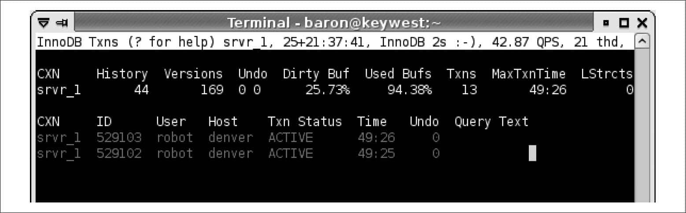
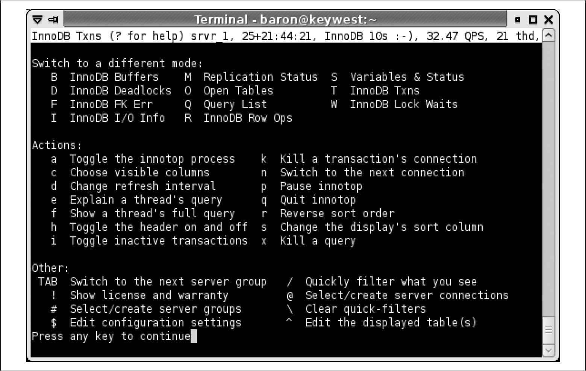
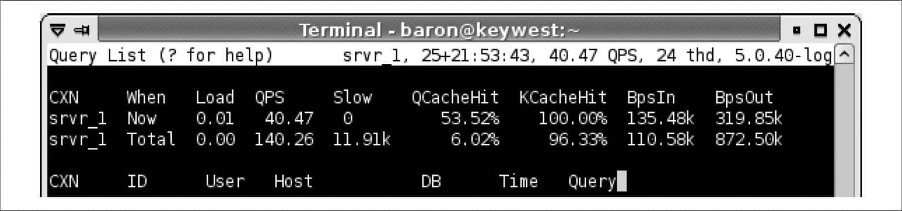
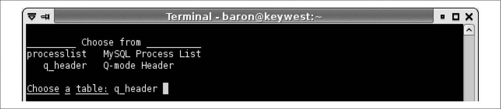
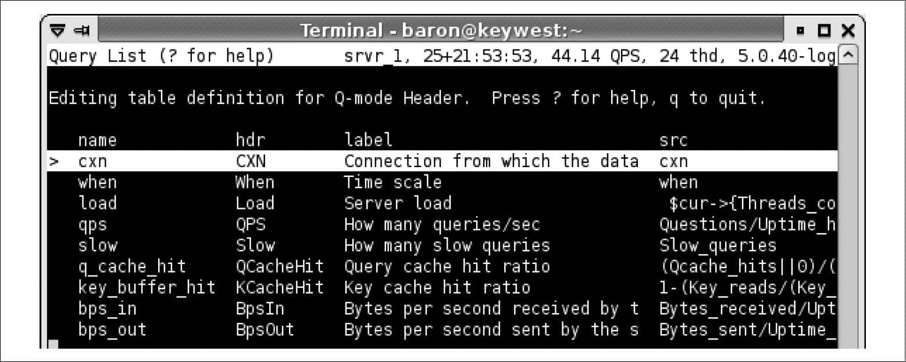
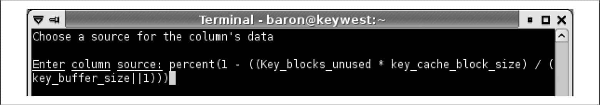
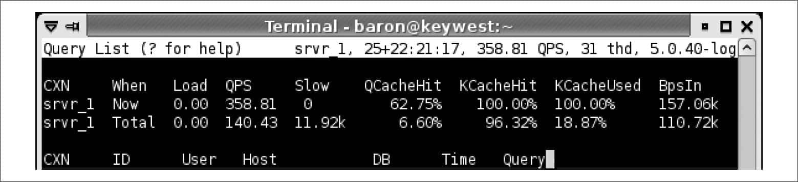

 第16章　MySQL用户工具

MySQL服务器发行包中并没有包含针对许多常用任务的工具，例如监控服务器或比较不同服务器间数据的工具。幸运的是，Oracle的商业版提供了一些扩展工具，并且MySQL活跃的开源社区和第三方公司也提供了一系列的工具，降低了自己“重复发明轮子”的需要。

# 16.1　接口工具

接口工具可以帮助运行查询，创建表和用户，以及执行其他日常任务等。本节将简单介绍一些用于此用途的最流行的工具。一般可以用SQL查询或命令做所有这些或其中大部分的工作——我们这里讨论的工具只是更为方便，可帮助避免错误和加快工作。

*MySQL Workbench*

MySQL Workbench是一个一站式的工具，可以完成例如管理服务器、写查询、开发存储过程，以及Schema设计图相关的工作。可以通过一个插件接口来编写自己的工具并集成到这个工作平台上，有一些Python脚本和库就使用了这个插件接口。MySQL Workbench有社区版和商业版两个版本，商业版只是增加了其他的一些高级特性。免费版对于大部分需要早已足够了。在*http://www.mysql.com/products/workbench*/可以学到更多相关的内容。

*SQLyog*

SQLyog是MySQL最流行的可视化工具之一，有许多很好的特性。它与MySQL Workbench是同级别的工具，但两个工具都有一些对方没有的特性。SQLyog只能在微软的Windows下使用，拥有全部特性的版本需要付费，但有限制功能的免费版本。关于SQLyog的更多信息可以参考*http://www.webyog.com*。

*phpMyAdmin*

phpMyAdmin是一个流行的管理工具，运行在Web服务器上，并且提供基于浏览器的MySQL服务器访问接口。尽管基于浏览器的访问有时很好，但phpMyAdmin是个大而复杂的工具，曾被指责有许多安全问题。对此要格外小心。我们建议不要安装在任何可以从互联网访问的地方。更多信息请参考*http://sourceforge.net/projects/phpmyadmin*/。

*Adminer*

Adminer是个基于浏览器的安全的轻量级管理工具，它与phpMyAdmin同类。其开发者将其定位为phpMyAdmin的更好的替代品。尽管它看起来更安全，但我们仍建议安装在任何可公开访问的地方时要谨慎。更多详情可参考*http://www.adminer.org*。

# 16.2　命令行工具集

MySQL包含了一些命令行工具集，例如*mysqladmin*和*mysqlcheck*。这些在MySQL手册上都有提及和记录。MySQL社区同样创建了大量高质量的工具包，并有很好的文档支撑这些实用工具集。

*Percona Toolkit*

Percona Toolkit是MySQL管理员必备的工具包。它源自Baron早期的工具包Maatkit和Aspersa，很多人认为这两个工具应该是正式的MySQL部署必须强制要求使用的。Percona Toolkit包括许多针对类似日志分析、复制完整性检测、数据同步、模式和索引分析、查询建议和数据归档目的的工具。如果刚开始接触MySQL，我们建议首先学习这些关键的工具：*pt-mysql-summary、pt-table-checksum、pt-table-sync*和*pt-query-digest*。更多信息可参考*http://www.percona.com/software*/。

*Maatkit and Aspersa*

这两个工具约从2006年以某种形式出现，两者都被认为是MySQL用户的基本工具。它们现在已经并入 Percona Toolkit。

*The openark kit*

Shlomi Noach的openark kit（*http://code.openark.org/forge/openark-kit*）包含了可以用来做一系列管理任务的Python脚本。

MySQL Workbench工具集

MySQL Workbench工具集中的某些工具可以作为单独的Python脚本使用。可参考 *https://launchpad.net/mysql-utilities*。

除了这些工具外，还有其他一系列没有太正式包装和维护的工具。许多杰出的MySQL社区成员时不时地贡献工具，其中大多数托管在他们自己的网站或MySQL Forge（*http:// forge.mysql.com*）上。可以通过不时地查看Planet MySQL博客聚合器获取大量的信息（*http://planet.mysql.com*），但不幸的是这些工具没有一个集中的目录。

# 16.3　SQL实用集

服务器本身也内置有一系列免费的附加组件和实用集可以使用；其中一些确实相当强大。

*common\_schema*

Shlomi Noach的common\_schema项目（*http://code.openark.org/forge/common\_schema*）是一套针对服务器脚本化和管理的强大的代码和视图。common\_schema对于MySQL好比jQuery对于JavaScript。

*mysql-sr-lib*

Giuseppe Maxia为MySQL创建了一个存储过程的代码库，可以在*http://www.nongnu.org/mysql-sr-lib/*找到。

*MySQL UDF*仓库

Roland Bouman建立了一个MySQL自定义函数的收藏馆，可以在 *http://www. mysqludf.org*获取。

*MySQL Forge*

在MySQL Forge上（*http://forge.mysql.com*），可以找到上百个社区贡献的程序、脚本、代码片断、实用集和技巧及陷阱。

# 16.4　监测工具

以我们的经验来看，大多数MySQL商店需要提供两种类型的监测工具：健康监测工具——检测到异常时告警——和为趋势、诊断、问题排查、容量规划等记录指标的工具。大多数系统仅在这些任务中的一个方面做得很好，而不能两者兼顾。更不幸的是，有十几种工具可选，使得评估和选择一款适合的工具非常耗时。

许多监控系统不是专门为MySQL服务器设计。它们是通用系统，用于周期性地检测许多种类型的资源，从机器到路由再到软件（例如MySQL）。它们一般有某些类型的插件架构，经常会伴随有一些MySQL插件。

一般会在专用服务器上安装监控系统来监测其他服务器。如果是监控重要的系统，它很快会变成架构中至关重要的一部分，因此可能需要采取额外的步骤，例如做监控系统本身的灾备。

## 16.4.1　开源的监控工具

下面是一些最受欢迎的开源集成监控系统。

*Nagios*

Nagios（*http://www.nagios.org*）也许是开源世界中最流行的问题检测和告警系统。它周期性检测监控的服务器并将结果与默认或自定义的阈值相比较。如果结果超出了限制，Nagios会执行某个程序并且（或）把问题的告警发给某些人。Nagios的通信和告警系统可以将告警发给不同的联系人，改变告警，或根据一天中的时间和其他条件将其发送到不同的位置，并且对计划内的宕机可以特殊处理。Nagios同样理解服务之间的依赖，因此，如果是因为中间的路由层宕机或者主机本身宕机导致MySQL实例不可用，Nagios不会发送告警来烦你。

Nagios能将任何一个可执行文件以插件形式运行，只要给予其正确参数就可得到正确输出。因此，Nagios插件在多种语言中都存在，例如shell、Perl、Python、Ruby和其他脚本语言。就算找不到一个能真正满足你需求的插件，自己创建一个也很简单。一个插件只需要接收标准的参数，以一个合适的状态退出，然后选择性地打印Nagios捕获的输出。

然而，Nagios也有一些严重的缺点。即使你很了解它，也仍然难以维护。它将所有配置保存在文件而不是数据库中。文件有一个特别容易出错的语法，当系统增长和发展时，修改配置文件就很费事。Nagios可扩展性并不好；你可以很容易地写出监控插件，但这也就是你能够做的一切。最后，它的图形化、趋势化和可视化能力都有限。Nagios将一些性能和其他数据存储到MySQL服务器中，一般从中生成图形，但并不像其他一些系统那么灵活。因为不同“政见”的原因，使得上面所有的问题继续变得更糟。因为或真实、或臆测的涉及代码、参与者的问题，Nagios至少分化出了两个分支。两个分支的名字分别是Opsview（*http://www.opsview.com*）和Icinga（*http://www.icinga.org*）。它们比Nagios更受到人们的亲睐。

有一些专门介绍Nagios的书籍；我们倾向于Wolfgang Barth的*Nagios System and Network Monitoring*（No Starch出版公司）。

*Zabbix*

Zabbix是一个同时支持监控和指标收集的完整系统。例如，它将所有配置和其他数据存储到数据库而不是配置文件中。它存储了比Nagios更多的数据类型，因而可以得到更好的趋势和历史报表。其网络画图和可视能力也比Nagios更强，配置更简单，更灵活，且更具可扩展性。可参考*http://www.zabbix.com*获取更多信息。

*Zenoss*

Zenoss是用Python写的，拥有一个基于浏览器的用户界面，使用了Ajax，这使它更快和更高效。它可以自动发现网络上的资源，并将监控、告警、趋势、绘图和记录历史数据整合到了一个统一的工具中。Zenoss默认使用SNMP来从远程服务器上收集数据，但也可以使用SSH，并且支持Nagios插件。更多信息请参考*http://www. zenoss.com*。

*Hyperic HQ*

Hyperic HQ是一个基于Java的监控系统，比起同级别的其他大部分系统，它更称得上是企业级监控。像Zenoss一样，它可以自动发现网络上的资源和支持Nagios插件，但它的逻辑组织和架构不同，有点“笨重”。更多信息可参考 *http://www.hyperic.com*。

*OpenNMS*

OpenNMS也是用Java开发，有一个活跃的开发社区。它拥有常规的特性，例如监控和告警，但同样也增加了绘图和趋势功能。它的目标是高性能、可扩展、自动化和灵活。像Hyperic一样，它也致力于为大型和关键系统做企业级监控。更多信息请参考*http://www.opennms.org*。

*Groundwork Open Source*

Groundwork Open Source用一个可移植的接口把Nagios和其他几个工具整合到了一个系统中。对于这个工具最好的描述是：如果你是Nagios、Cacti和其他几个工具方面的专家，并且花了许多时间将它们整合一起，那很可能你是在闭门造车。更多信息可参考 *http://www.gwos.com*。

相比于集所有功能于一身的系统，还有一系列软件专注于收集指标和画图以及可视化，而不是进行性能监控检查。他们中有很多是建立在RRDTool（*http://www.rrdtool.org*）之上，存储时序数据到轮询数据库（RRD）文件中。RRD文件自动聚集输入数据，对没有预期传送的输入值进行插值，并有强大的绘图工具可以生成漂亮有特色的图。有很多基于RRDTool的系统，下面是其中最受欢迎的几个。

*MRTG*

Multi Router Traffic Grapher或称MRTG（*http://oss.oetiker.ch/mrtg/*），是典型的基于RRDTool的系统。最初是为记录网络流量而设计的，但同样可以扩展到用于对其他指标进行记录和绘图。

*Cacti*

Cacti （*http://www.cacti.net*）可能是最流行的基于RRDTool的系统。它采用PHP网页来与RRDTool进行交互，并使用MySQL数据库来定义服务器、插件、图像等。因为是模板驱动，故而可以定义模板然后应用到系统上。Baron为MySQL和其他系统写了一组非常流行的模板；更多信息请参考*http://code.google.com/p/mysql-cacti-templates*/。这些也已经被移植到Munin、OpenNMS和Zabbix。

*Ganglia*

Ganglia（*http://ganglia.sourceforge.net*）与Cacti类似，但是为监控集群和网格系统而设计，所以可以汇总查看许多服务器的数据，如果需要也可以细分查看单台服务器的详细数据。

*Munin*

Munin（*http://munin.projects.linpro.no*）收集数据并存入RRDTool中，然后以几个不同级别的粒度生成数据图。它从配置中生成静态HTML文件，因此可以很容易地浏览和查看趋势。定义一个图形较容易；只需要创建一个插件脚本，其命令行帮助输出有一些Munin可以识别的特别语法的画图指令。

基于RRDTool的系统有些限制，例如不能用标准查询语言来查询存储的数据，不能永久保留数据，存在某些数据不能轻松地使用简单计数器和标准数值表示的问题，需要预先定义指标和图形等。理想情况下，我们需要的监控系统可以接受任何发送给它的指标，而不需要预先进行定义，并且后续可以绘制任意需要的图形，也不需要预先进行定义。可能我们所看到的最接近的系统是Graphite（*http://graphite.wikidot.com*）。

这些系统都可以用来对MySQL收集、记录和绘制数据图表并且生成报表，有着不同程度的灵活性，目标也稍微有些不同。但它们都缺乏真正可以在问题出现时及时告警的灵活性。

我们提到的大多数系统的主要问题是，它们明显是由那些因为现有系统不能满足他们所有需求的人设计的，因此他们又重复设计了另一个无法完全满足其他人的所有需求的系统。大部分这样的系统都有一些基础的限制，例如使用一个奇怪的数据模型存储内部数据，而导致在很多场合都无法很好地工作。在很多时候，这都令人沮丧，使用这些系统都像是把一个圆形的钉子钉到了一个方形的洞里面。

## 16.4.2　商业监控系统

尽管我们知道许多MySQL用户热衷使用开源工具，但也有许多人愿意为合适的软件买单，只要这些软件可以让工作更好地完成，为他们节省时间，减少烦恼。下面是一些可以利用的商业选件。

*MySQL Enterprise Monitor*

MySQL Enterprise Monitor包含在Oracle的MySQL支持服务中。它将监控、指标和画图、咨询服务和查询分析等特性整合到了一个工具中。通过在服务器上使用agent来监测状态计数器（也包含操作系统的关键指标）。它能以两种方式抓取查询：通过MySQL代理（MySQL Proxy），或使用合适的MySQL连接器，例如Java的Connector/J或PHP的MySQLi。尽管是为监控MySQL而设计的，但某种程度上也可以进行扩展。同样，这个工具也无法监控基础架构中所有的服务器和所有的服务。更多信息请参考*http://www.mysql.com/products/enterprise/monitor.html*。

*MONyog*

MONyog（*http://www.webyog.com*）是一个运行在桌面上的基于浏览器且无agent的监控系统。它会启动一个HTTP服务器，然后就可以通过浏览器来使用此工具。

*New Relic*

New Relic（*http://newrelic.com*）是一个托管式的软件即服务（Saas）的应用性能管理系统，它可以分析整个应用的性能，从应用代码（采用Ruby，PHP，Java和其他语言）到运行在浏览器上的JavaScript，到数据库的SQL调用，甚至是服务器的磁盘空间，CPU利用率和其它指标。

*Circonus*

Circonus（*https://circonus.com*）是一个源于OmniTI的托管式的软件即服务（SaaS）的指标和告警系统。通过agent从一个或多个服务器上收集指标并转发到Circonus，然后就可以通过一个基于浏览器的仪表盘来查看。

*Monitis*

Monitis（*http://monitis.com*）是另外一个云托管式的软件即服务（SaaS）的监控系统。它被设计成监控“一切”，这意味着它有点普遍性。它有一个入门级的免费版Monitor.us （*http://mon.itor.us*），也有支持MySQL的插件。

*Splunk*

Splunk（*http://www.splunk.com*）是一个日志聚集器和搜索引擎，可以帮助获得环境中所有机器生成的数据并进行运营分析。

*Pingdom*

Pingdom （*http://www.pingdom.com*）从世界的多个位置来监控网站的可用性和性能。实际上有许多像Pingdom一样的服务，我们并不需要特别推荐某一个这样的服务，但是我们确实建议使用一些外部的监控服务，以便让你在网站不可用时能够及时得到通知。很多类似的服务远不止Ping或获取网页。

还有许多其他的商业监控工具——我们可以凭印象列举出十几个或更多。对所有监控系统而言，要注意的一点是它们对服务器的影响。有些工具相当直白，因为它们由一些没有实际的大型高负载MySQL系统经验的公司设计。例如，我们不止一次通过禁止每分钟对所有的数据库执行 一次SHOW TABLE STATUS的监控功能来解决突发事件。（这个命令在高I/O限制的系统上特别有破坏性。）频繁查询INFORMATION\_SCHEMA表的工具也会导致负面影响。

## 16.4.3　Innotop的命令行监控

有一些基于命令行的监测工具，它们大部分在某种方面模拟了UNIX中的top工具。其中最精致和最胜任的是*innotop（http://code.google.com/p/innotop/）*，我们将详细探讨。此外，还有几个其他的工具，例如mtop*（http://mtop.sourceforge.net）*、*mytop（http://jeremy.zawodny.com/mysql/mytop/）*和一些基于网页的*mytop*克隆版本。

尽管*mytop*是MySQL上最原始的top克隆，但*innotop*比*mytop*拥有更多功能，这也是我们看重*innotop*的原因。

本书的作者之一Balon Schwartz编写了*innotop*。它展示了服务器正在发生事情的实时更新视图。别去理会它的名称，实际上它不仅仅用于监控InnoDB，还可以监控MySQL任何其他的方面。它也能同时监控多个MySQL 实例，极具可配置性和可扩展性。

它的功能特性包括以下这些：

+ 事务列表可以显示InnoDB 当前的全部事务。 
+ 查询列表可以显示当前正在运行的查询。 
+ 可以显示当前锁和锁等待的列表。 
+ 以相对值显示服务器状态和变量的汇总信息。 
+ 有多种模式可用来显示InnoDB 内部信息，例如缓冲区、死锁、外键错误、I/O 活动情况、行操作、信号量，以及其他更多的内容。 
+ 复制监控，将主服务器和从服务器的状态显示在一起。 
+ 显示任意服务器变量的模式。 
+ 服务器组可以更方便地组织多台服务器。 
+ 在命令行脚本下可以使用非交互式模式。 

*innotop*的安装很容易，可以从操作系统的软件仓库安装，也可以从*http://code.google.com/p/innotop/*下载到本地，然后解压缩，运行标准的make install安装过程。

        perl Makefile.PL
        make install

一旦安装完成，就可以在命令行里执行*innotop*，然后它会引导你完成连接到MySQL实例的过程。引导过程会读取*~/.my.cnf*选项文件，这样，除了输入服务器的主机名和按几次Enter键之外，什么都不用做。连接完成以后，就处在T（InnoDB Transaction）模式了，这时，应该可看到InnoDB 事务列表，如图16-1 所示。

 
**图16-1：处在T（InnoDB Transaction）模式的innotop**

默认情况下，*innotop*采用过滤器来减少零乱的信息（对于显示的所有信息，都可以定义自己的过滤器或者定制内部的过滤器）。在图16-1里，大多数事务都己经被过滤掉了，只显示出了当前活动的事务。可以按i 键禁掉过滤，让数量众多的事务信息填满整个屏幕。

*innotop*在这个模式下会显示头部信息和主线程列表。头部信息里显示一些InnoDB的总体信息，例如，历史清单的长度、还未清除的InnoDB 事务数目、缓冲池中脏缓冲所占的百分比等。

你要按的第一个键应该是问号（?），以查看帮助信息。虽然在屏幕上显示出的帮助内容会根据当前模式的不同而不同，但是每一个活动的键都总是会显示出来，因此能看到所有可执行的动作。图16-2显示的是T模式下的帮助信息。

 
**图16-2：innotop 帮助信息**

在这里不会详细讲解所有的模式，但还是可以从帮助信息里看出，*innotop*有许许多多的功能特性。

这里唯一要提及的是一些基本的自定义功能，告诉你如何监控想要监控的信息。*innotop*的强大功能之一就是能够解释用户定义的表达式，例如Uptime/Questions是生成每秒钟的查询指标。它会显示自服务器启动以来和／或自上次采样之后递增累加的结果值。

这使得往显示表格里添加自己的列方便很多。例如，在Q（Query List）模式下，头部信息能显示出服务器的一些总体信息。让我们看看怎么将它修改一下，使它能显示出索引键缓存有多满。启动*innotop*，按下Q键进入Q模式。这时的操作结果看起来像图16-3一样。

 
**图16-3：Q模式（查询列表）下的innotop**

这个屏幕截图只截取了一部分，因为在这个练习里，我们对查询列表没有兴趣；我们只关心头部信息。

头部显示了“当前”统计（统计自从上次*innotop*用服务器上的新数据刷新后的累计增量）和“总计”统计（统计自MySQL服务器启动以来所有的活动，这个实例中是25天前）。头部的每一列都是来自SHOW STATUS和SHOW VARIABLES相对应的变量值。图16-3中显示的头部是内建的，但也很容易增加自定义的。需要做的只是增加一列到头部“表”。按^键来打开表编辑器，然后在提示符后输入q\_header来编辑头部表（图16-4）。由于内置有Tab键自动补齐功能，因此可以敲入q然后按Tab键来补充完成整个词。

 
**图16-4：增加一个头部（开始）**

在此之后，你将会看到Q模式头部的表定义（图16-5）。该表定义显示了表的列。第一列被选中。我们可以移动选项，重新排序和编辑列，还可做其他的很多事情（按?键可以看到一个完整的列表），但我们只打算创建一个新列。按n键然后输入列名（图16-6）。

 
**图16-5：增加头部（选择）**

 
**图16-6：增加头部（命名列）**

接着，输入列的头部，它将在列的顶部显示（图16-7）。最后，选择列源。这是一个*innotop*内部编译为函数的表达式。你可以使用SHOW VARIABLES和SHOW STATUS中对应变量的名字，就像是方程中的变量一样。我们使用了一些括号和Perl式“或”默认值以防止被零除，除此而外这个等式相当直白。我们同样可以使用*innotop*中的percent()转换来以百分比形式格式化结果列；更多信息请参考*innotop*的文档。图16-8显示了这个表达式。

 
**图16-7：增加头部（列的文本）**

 
**图16-8：增加头部（要计算的表达式）**

按Enter键，你将会和之前一样看到表的定义，但是在底部有了新增加的列。按几次\+键将它往列表上方移，挨着key\_buffer\_hit列，然后按q键退出表编辑器。瞧，新的列嵌在KCacheHit和BpsIn之间（图16-9）。可以通过定制*innotop*很容易地监控想要的信息。如果它真的不能满足你的需求，甚至还可以编写对应的插件。更多文档见*http://code.google.com/p/innotop*/。

 
**图16-9：增加头（结果）**

# 16.5　总结

好的工具对管理MySQL至关重要。推荐使用一些已经可用、广泛测试过、流行的工具，例如Percona Toolkit（旧名Maatkit）。当接触新的服务器时，实践中我们首先要做的是运行*pt-summary*和*pt-mysql-summary*。如果在一台服务器上工作，可能需要在另外一个终端下运行*innotop*来观察它以及任何相关的服务器。

监控工具是另外一个更复杂的话题，这是由于它们对于管理非常重要。如果你是一名开源倡导者，想使用开源的监控系统，或许可以尝试Nagios结合带Baron的 Cacti模板的Cacti，或者尝试Zabbix，前提是作不介意复杂的接口。如果想要监控MySQL的商业工具， MySQL Enterprise Monitor可以胜任，我们知道有很多用户使用得很好。如果想监控整个环境和其中所有软硬件信息，你可能需要自己去做一些调查——这个话题超出了本书讨论的范围。

