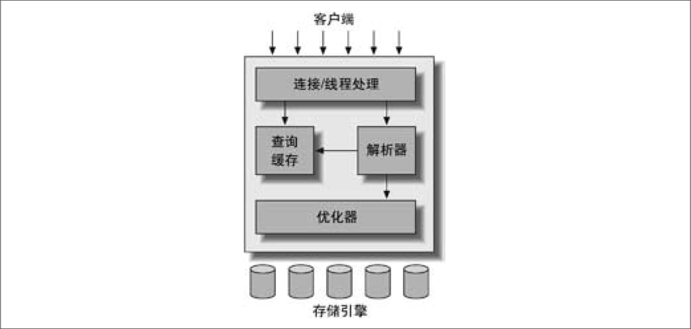
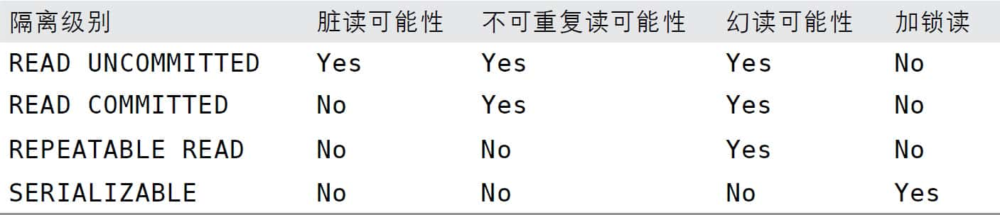
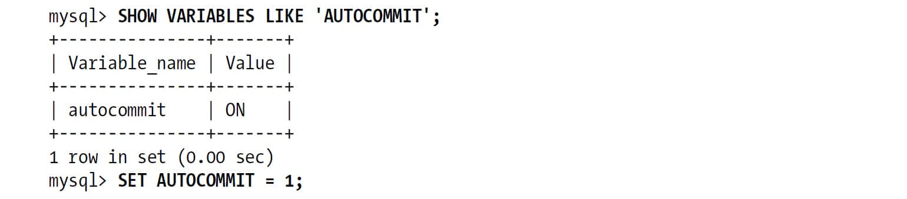
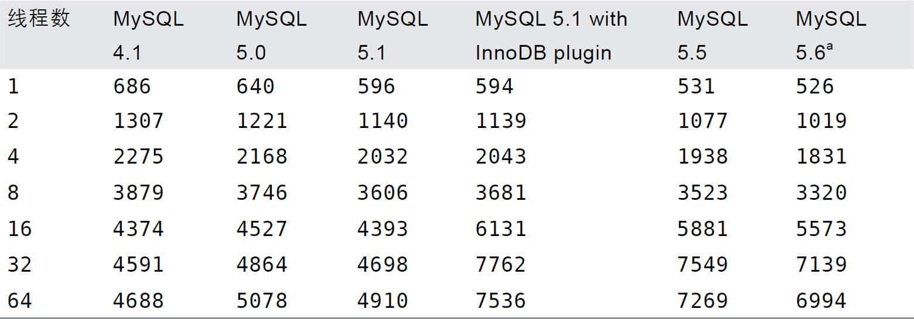
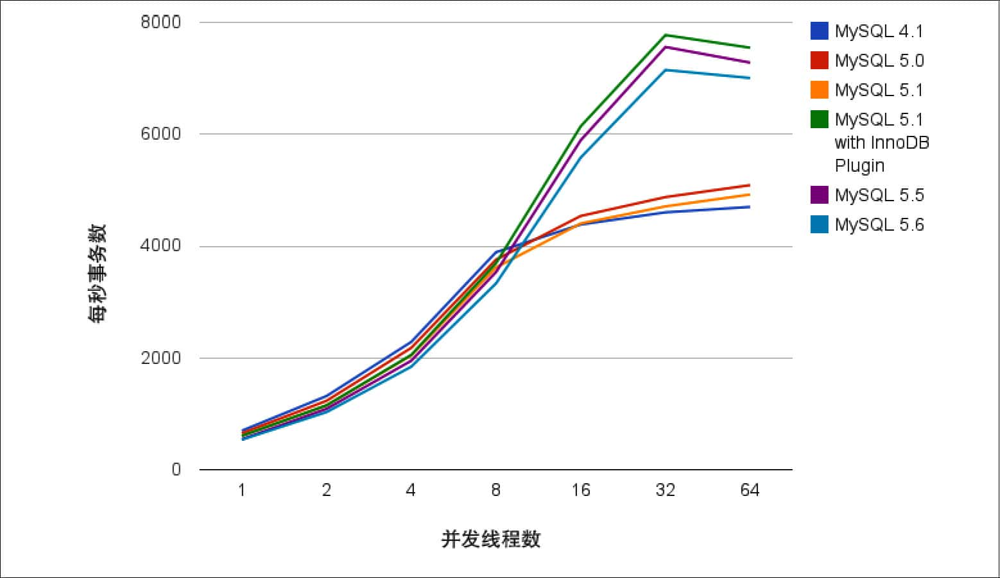

 第1章　MySQL架构与历史

和其他数据库系统相比，MySQL有点与众不同，它的架构可以在多种不同场景中应用并发挥好的作用，但同时也会带来一点选择上的困难。MySQL并不完美，却足够灵活，能够适应高要求的环境，例如Web类应用。同时，MySQL既可以嵌入到应用程序中，也可以支持数据仓库、内容索引和部署软件、高可用的冗余系统、在线事务处理系统（OLTP）等各种应用类型。

为了充分发挥MySQL的性能并顺利地使用，就必须理解其设计。MySQL的灵活性体现在很多方面。例如，你可以通过配置使它在不同的硬件上都运行得很好，也可以支持多种不同的数据类型。但是，MySQL最重要、最与众不同的特性是它的存储引擎架构，这种架构的设计将查询处理（Query Processing）及其他系统任务（Server Task）和数据的存储/提取相分离。这种处理和存储分离的设计可以在使用时根据性能、特性，以及其他需求来选择数据存储的方式。

本章概要地描述了MySQL的服务器架构、各种存储引擎之间的主要区别，以及这些区别的重要性。另外也会回顾一下MySQL的历史背景和基准测试，并试图通过简化细节和演示案例来讨论MySQL的原理。这些讨论无论是对数据库一无所知的新手，还是熟知其他数据库的专家，都不无裨益。

# 1.1　MySQL逻辑架构

如果能在头脑中构建出一幅MySQL各组件之间如何协同工作的架构图，就会有助于深入理解MySQL服务器。图1-1展示了MySQL的逻辑架构图。

 
**图1-1：MySQL服务器逻辑架构图**

最上层的服务并不是MySQL所独有的，大多数基于网络的客户端/服务器的工具或者服务都有类似的架构。比如连接处理、授权认证、安全等等。

第二层架构是MySQL比较有意思的部分。大多数MySQL的核心服务功能都在这一层，包括查询解析、分析、优化、缓存以及所有的内置函数（例如，日期、时间、数学和加密函数），所有跨存储引擎的功能都在这一层实现：存储过程、触发器、视图等。

第三层包含了存储引擎。存储引擎负责MySQL中数据的存储和提取。和GNU/Linux下的各种文件系统一样，每个存储引擎都有它的优势和劣势。服务器通过API与存储引擎进行通信。这些接口屏蔽了不同存储引擎之间的差异，使得这些差异对上层的查询过程透明。存储引擎API包含几十个底层函数，用于执行诸如“开始一个事务”或者“根据主键提取一行记录”等操作。但存储引擎不会去解析SQL(1)，不同存储引擎之间也不会相互通信，而只是简单地响应上层服务器的请求。

## 1.1.1　连接管理与安全性

每个客户端连接都会在服务器进程中拥有一个线程，这个连接的查询只会在这个单独的线程中执行，该线程只能轮流在某个CPU核心或者CPU中运行。服务器会负责缓存线程，因此不需要为每一个新建的连接创建或者销毁线程(2)。

当客户端（应用）连接到MySQL服务器时，服务器需要对其进行认证。认证基于用户名、原始主机信息和密码。如果使用了安全套接字（SSL）的方式连接，还可以使用X.509证书认证。一旦客户端连接成功，服务器会继续验证该客户端是否具有执行某个特定查询的权限（例如，是否允许客户端对world数据库的Country表执行SELECT语句）。

## 1.1.2　优化与执行

MySQL会解析查询，并创建内部数据结构（解析树），然后对其进行各种优化，包括重写查询、决定表的读取顺序，以及选择合适的索引等。用户可以通过特殊的关键字提示（hint）优化器，影响它的决策过程。也可以请求优化器解释（explain）优化过程的各个因素，使用户可以知道服务器是如何进行优化决策的，并提供一个参考基准，便于用户重构查询和schema、修改相关配置，使应用尽可能高效运行。第6章我们将讨论更多优化器的细节。

优化器并不关心表使用的是什么存储引擎，但存储引擎对于优化查询是有影响的。优化器会请求存储引擎提供容量或某个具体操作的开销信息，以及表数据的统计信息等。例如，某些存储引擎的某种索引，可能对一些特定的查询有优化。关于索引与schema的优化，请参见第4章和第5章。

对于SELECT语句，在解析查询之前，服务器会先检查查询缓存（Query Cache），如果能够在其中找到对应的查询，服务器就不必再执行查询解析、优化和执行的整个过程，而是直接返回查询缓存中的结果集。第7章详细讨论了相关内容。

# 1.2　并发控制

无论何时，只要有多个查询需要在同一时刻修改数据，都会产生并发控制的问题。本章的目的是讨论MySQL在两个层面的并发控制：服务器层与存储引擎层。并发控制是一个内容庞大的话题，有大量的理论文献对其进行过详细的论述。本章只简要地讨论MySQL如何控制并发读写，因此读者需要有相关的知识来理解本章接下来的内容。

以Unix系统的email box为例，典型的*mbox*文件格式是非常简单的。一个*mbox*邮箱中的所有邮件都串行在一起，彼此首尾相连。这种格式对于读取和分析邮件信息非常友好，同时投递邮件也很容易，只要在文件末尾附加新的邮件内容即可。

但如果两个进程在同一时刻对同一个邮箱投递邮件，会发生什么情况？显然，邮箱的数据会被破坏，两封邮件的内容会交叉地附加在邮箱文件的末尾。设计良好的邮箱投递系统会通过锁（lock）来防止数据损坏。如果客户试图投递邮件，而邮箱已经被其他客户锁住，那就必须等待，直到锁释放才能进行投递。

这种锁的方案在实际应用环境中虽然工作良好，但并不支持并发处理。因为在任意一个时刻，只有一个进程可以修改邮箱的数据，这在大容量的邮箱系统中是个问题。

## 1.2.1　读写锁

从邮箱中读取数据没有这样的麻烦，即使同一时刻多个用户并发读取也不会有什么问题。因为读取不会修改数据，所以不会出错。但如果某个客户正在读取邮箱，同时另外一个用户试图删除编号为25的邮件，会产生什么结果？结论是不确定，读的客户可能会报错退出，也可能读取到不一致的邮箱数据。所以，为安全起见，即使是读取邮箱也需要特别注意。

如果把上述的邮箱当成数据库中的一张表，把邮件当成表中的一行记录，就很容易看出，同样的问题依然存在。从很多方面来说，邮箱就是一张简单的数据库表。修改数据库表中的记录，和删除或者修改邮箱中的邮件信息，十分类似。

解决这类经典问题的方法就是并发控制，其实非常简单。在处理并发读或者写时，可以通过实现一个由两种类型的锁组成的锁系统来解决问题。这两种类型的锁通常被称为共享锁（shared lock）和排他锁（exclusive lock），也叫读锁（read lock）和写锁（write lock）。

这里先不讨论锁的具体实现，描述一下锁的概念如下：读锁是共享的，或者说是相互不阻塞的。多个客户在同一时刻可以同时读取同一个资源，而互不干扰。写锁则是排他的，也就是说一个写锁会阻塞其他的写锁和读锁，这是出于安全策略的考虑，只有这样，才能确保在给定的时间里，只有一个用户能执行写入，并防止其他用户读取正在写入的同一资源。

在实际的数据库系统中，每时每刻都在发生锁定，当某个用户在修改某一部分数据时，MySQL会通过锁定防止其他用户读取同一数据。大多数时候，MySQL锁的内部管理都是透明的。

## 1.2.2　锁粒度

一种提高共享资源并发性的方式就是让锁定对象更有选择性。尽量只锁定需要修改的部分数据，而不是所有的资源。更理想的方式是，只对会修改的数据片进行精确的锁定。任何时候，在给定的资源上，锁定的数据量越少，则系统的并发程度越高，只要相互之间不发生冲突即可。

问题是加锁也需要消耗资源。锁的各种操作，包括获得锁、检查锁是否已经解除、释放锁等，都会增加系统的开销。如果系统花费大量的时间来管理锁，而不是存取数据，那么系统的性能可能会因此受到影响。

所谓的锁策略，就是在锁的开销和数据的安全性之间寻求平衡，这种平衡当然也会影响到性能。大多数商业数据库系统没有提供更多的选择，一般都是在表上施加行级锁（row-level lock），并以各种复杂的方式来实现，以便在锁比较多的情况下尽可能地提供更好的性能。

而MySQL则提供了多种选择。每种MySQL存储引擎都可以实现自己的锁策略和锁粒度。在存储引擎的设计中，锁管理是个非常重要的决定。将锁粒度固定在某个级别，可以为某些特定的应用场景提供更好的性能，但同时却会失去对另外一些应用场景的良好支持。好在MySQL支持多个存储引擎的架构，所以不需要单一的通用解决方案。下面将介绍两种最重要的锁策略。

### 表锁（table lock）

表锁是MySQL中最基本的锁策略，并且是开销最小的策略。表锁非常类似于前文描述的邮箱加锁机制：它会锁定整张表。一个用户在对表进行写操作（插入、删除、更新等）前，需要先获得写锁，这会阻塞其他用户对该表的所有读写操作。只有没有写锁时，其他读取的用户才能获得读锁，读锁之间是不相互阻塞的。

在特定的场景中，表锁也可能有良好的性能。例如，READ LOCAL表锁支持某些类型的并发写操作。另外，写锁也比读锁有更高的优先级，因此一个写锁请求可能会被插入到读锁队列的前面（写锁可以插入到锁队列中读锁的前面，反之读锁则不能插入到写锁的前面）。

尽管存储引擎可以管理自己的锁，MySQL本身还是会使用各种有效的表锁来实现不同的目的。例如，服务器会为诸如ALTER TABLE之类的语句使用表锁，而忽略存储引擎的锁机制。

### 行级锁（row lock）

行级锁可以最大程度地支持并发处理（同时也带来了最大的锁开销）。众所周知，在InnoDB和XtraDB，以及其他一些存储引擎中实现了行级锁。行级锁只在存储引擎层实现，而MySQL服务器层（如有必要，请回顾前文的逻辑架构图）没有实现。服务器层完全不了解存储引擎中的锁实现。在本章的后续内容以及全书中，所有的存储引擎都以自己的方式显现了锁机制。

# 1.3　事务

在理解事务的概念之前，接触数据库系统的其他高级特性还言之过早。事务就是一组原子性的SQL查询，或者说一个独立的工作单元。如果数据库引擎能够成功地对数据库应用该组查询的全部语句，那么就执行该组查询。如果其中有任何一条语句因为崩溃或其他原因无法执行，那么所有的语句都不会执行。也就是说，事务内的语句，要么全部执行成功，要么全部执行失败。

本节的内容并非专属于MySQL，如果读者已经熟悉了事务的ACID的概念，可以直接跳转到1.3.4节。

银行应用是解释事务必要性的一个经典例子。假设一个银行的数据库有两张表：支票（checking）表和储蓄（savings）表。现在要从用户Jane的支票账户转移200美元到她的储蓄账户，那么需要至少三个步骤：

1. 检查支票账户的余额高于200美元。 
2. 从支票账户余额中减去200美元。 
3. 在储蓄账户余额中增加200美元。 

上述三个步骤的操作必须打包在一个事务中，任何一个步骤失败，则必须回滚所有的步骤。

可以用START TRANSACTION语句开始一个事务，然后要么使用COMMIT提交事务将修改的数据持久保留，要么使用ROLLBACK撤销所有的修改。事务SQL的样本如下：

        1 START TRANSACTION;
        2 SELECT balance FROM checking WHERE customer_id = 10233276;
        3 UPDATE checking SET balance = balance - 200.00 WHERE customer_id = 10233276;
        4 UPDATE savings SET balance = balance + 200.00 WHERE customer_id = 10233276;
        5 COMMIT;

单纯的事务概念并不是故事的全部。试想一下，如果执行到第四条语句时服务器崩溃了，会发生什么？天知道，用户可能会损失200美元。再假如，在执行到第三条语句和第四条语句之间时，另外一个进程要删除支票账户的所有余额，那么结果可能就是银行在不知道这个逻辑的情况下白白给了Jane 200美元。

除非系统通过严格的ACID测试，否则空谈事务的概念是不够的。ACID表示原子性（atomicity）、一致性（consistency）、隔离性（isolation）和持久性（durability）。一个运行良好的事务处理系统，必须具备这些标准特征。

原子性（atomicity）

一个事务必须被视为一个不可分割的最小工作单元，整个事务中的所有操作要么全部提交成功，要么全部失败回滚，对于一个事务来说，不可能只执行其中的一部分操作，这就是事务的原子性。

一致性（consistency）

数据库总是从一个一致性的状态转换到另外一个一致性的状态。在前面的例子中，一致性确保了，即使在执行第三、四条语句之间时系统崩溃，支票账户中也不会损失200美元，因为事务最终没有提交，所以事务中所做的修改也不会保存到数据库中。

隔离性（isolation）

通常来说，一个事务所做的修改在最终提交以前，对其他事务是不可见的。在前面的例子中，当执行完第三条语句、第四条语句还未开始时，此时有另外一个账户汇总程序开始运行，则其看到的支票账户的余额并没有被减去200美元。后面我们讨论隔离级别（Isolation level）的时候，会发现为什么我们要说“通常来说”是不可见的。

持久性（durability）

一旦事务提交，则其所做的修改就会永久保存到数据库中。此时即使系统崩溃，修改的数据也不会丢失。持久性是个有点模糊的概念，因为实际上持久性也分很多不同的级别。有些持久性策略能够提供非常强的安全保障，而有些则未必。而且不可能有能做到100％的持久性保证的策略（如果数据库本身就能做到真正的持久性，那么备份又怎么能增加持久性呢？）。在后面的一些章节中，我们会继续讨论MySQL中持久性的真正含义。

事务的ACID特性可以确保银行不会弄丢你的钱。而在应用逻辑中，要实现这一点非常难，甚至可以说是不可能完成的任务。一个兼容ACID的数据库系统，需要做很多复杂但可能用户并没有觉察到的工作，才能确保ACID的实现。

就像锁粒度的升级会增加系统开销一样，这种事务处理过程中额外的安全性，也会需要数据库系统做更多的额外工作。一个实现了ACID的数据库，相比没有实现ACID的数据库，通常会需要更强的CPU处理能力、更大的内存和更多的磁盘空间。正如本章不断重复的，这也正是MySQL的存储引擎架构可以发挥优势的地方。用户可以根据业务是否需要事务处理，来选择合适的存储引擎。对于一些不需要事务的查询类应用，选择一个非事务型的存储引擎，可以获得更高的性能。即使存储引擎不支持事务，也可以通过LOCK TABLES语句为应用提供一定程度的保护，这些选择用户都可以自主决定。

## 1.3.1　隔离级别

隔离性其实比想象的要复杂。在SQL标准中定义了四种隔离级别，每一种级别都规定了一个事务中所做的修改，哪些在事务内和事务间是可见的，哪些是不可见的。较低级别的隔离通常可以执行更高的并发，系统的开销也更低。

每种存储引擎实现的隔离级别不尽相同。如果熟悉其他的数据库产品，可能会发现某些特性和你期望的会有些不一样（但本节不打算讨论更详细的内容）。读者可以根据所选择的存储引擎，查阅相关的手册。

下面简单地介绍一下四种隔离级别。

READ UNCOMMITTED（未提交读）

在READ UNCOMMITTED级别，事务中的修改，即使没有提交，对其他事务也都是可见的。事务可以读取未提交的数据，这也被称为脏读（Dirty Read）。这个级别会导致很多问题，从性能上来说，READ UNCOMMITTED不会比其他的级别好太多，但却缺乏其他级别的很多好处，除非真的有非常必要的理由，在实际应用中一般很少使用。

READ COMMITTED（提交读）

大多数数据库系统的默认隔离级别都是READ COMMITTED（但MySQL不是）。READ COMMITTED满足前面提到的隔离性的简单定义：一个事务开始时，只能“看见”已经提交的事务所做的修改。换句话说，一个事务从开始直到提交之前，所做的任何修改对其他事务都是不可见的。这个级别有时候也叫做不可重复读（nonrepeatable read），因为两次执行同样的查询，可能会得到不一样的结果。

REPEATABLE READ（可重复读）

REPEATABLE READ解决了脏读的问题。该级别保证了在同一个事务中多次读取同样记录的结果是一致的。但是理论上，可重复读隔离级别还是无法解决另外一个幻读（Phantom Read）的问题。所谓幻读，指的是当某个事务在读取某个范围内的记录时，另外一个事务又在该范围内插入了新的记录，当之前的事务再次读取该范围的记录时，会产生幻行（Phantom Row）。InnoDB和XtraDB存储引擎通过多版本并发控制（MVCC，Multiversion Concurrency Control）解决了幻读的问题。本章稍后会做进一步的讨论。

可重复读是MySQL的默认事务隔离级别。

SERIALIZABLE（可串行化）

SERIALIZABLE是最高的隔离级别。它通过强制事务串行执行，避免了前面说的幻读的问题。简单来说，SERIALIZABLE会在读取的每一行数据上都加锁，所以可能导致大量的超时和锁争用的问题。实际应用中也很少用到这个隔离级别，只有在非常需要确保数据的一致性而且可以接受没有并发的情况下，才考虑采用该级别。

**表1-1：ANSI SQL隔离级别**
 

## 1.3.2　死锁

死锁是指两个或者多个事务在同一资源上相互占用，并请求锁定对方占用的资源，从而导致恶性循环的现象。当多个事务试图以不同的顺序锁定资源时，就可能会产生死锁。多个事务同时锁定同一个资源时，也会产生死锁。例如，设想下面两个事务同时处理StockPrice表：

事务1

        START TRANSACTION;
        UPDATE StockPrice SET close = 45.50 WHERE stock_id = 4 and date = '2002-05-01';
        UPDATE StockPrice SET close = 19.80 WHERE stock_id = 3 and date = '2002-05-02';
        COMMIT;

事务2

        START TRANSACTION;
        UPDATE StockPrice SET high = 20.12 WHERE stock_id = 3 and date = '2002-05-02';
        UPDATE StockPrice SET high = 47.20 WHERE stock_id = 4 and date = '2002-05-01';
        COMMIT;

如果凑巧，两个事务都执行了第一条UPDATE语句，更新了一行数据，同时也锁定了该行数据，接着每个事务都尝试去执行第二条UPDATE语句，却发现该行已经被对方锁定，然后两个事务都等待对方释放锁，同时又持有对方需要的锁，则陷入死循环。除非有外部因素介入才可能解除死锁。

为了解决这种问题，数据库系统实现了各种死锁检测和死锁超时机制。越复杂的系统，比如InnoDB存储引擎，越能检测到死锁的循环依赖，并立即返回一个错误。这种解决方式很有效，否则死锁会导致出现非常慢的查询。还有一种解决方式，就是当查询的时间达到锁等待超时的设定后放弃锁请求，这种方式通常来说不太好。InnoDB目前处理死锁的方法是，将持有最少行级排他锁的事务进行回滚（这是相对比较简单的死锁回滚算法）。

锁的行为和顺序是和存储引擎相关的。以同样的顺序执行语句，有些存储引擎会产生死锁，有些则不会。死锁的产生有双重原因：有些是因为真正的数据冲突，这种情况通常很难避免，但有些则完全是由于存储引擎的实现方式导致的。

死锁发生以后，只有部分或者完全回滚其中一个事务，才能打破死锁。对于事务型的系统，这是无法避免的，所以应用程序在设计时必须考虑如何处理死锁。大多数情况下只需要重新执行因死锁回滚的事务即可。

## 1.3.3　事务日志

事务日志可以帮助提高事务的效率。使用事务日志，存储引擎在修改表的数据时只需要修改其内存拷贝，再把该修改行为记录到持久在硬盘上的事务日志中，而不用每次都将修改的数据本身持久到磁盘。事务日志采用的是追加的方式，因此写日志的操作是磁盘上一小块区域内的顺序I/O，而不像随机I/O需要在磁盘的多个地方移动磁头，所以采用事务日志的方式相对来说要快得多。事务日志持久以后，内存中被修改的数据在后台可以慢慢地刷回到磁盘。目前大多数存储引擎都是这样实现的，我们通常称之为预写式日志（Write-Ahead Logging），修改数据需要写两次磁盘。

如果数据的修改已经记录到事务日志并持久化，但数据本身还没有写回磁盘，此时系统崩溃，存储引擎在重启时能够自动恢复这部分修改的数据。具体的恢复方式则视存储引擎而定。

## 1.3.4　MySQL中的事务

MySQL提供了两种事务型的存储引擎：InnoDB和NDB Cluster。另外还有一些第三方存储引擎也支持事务，比较知名的包括XtraDB和PBXT。后面将详细讨论它们各自的一些特点。

### 自动提交（AUTOCOMMIT）

MySQL默认采用自动提交（AUTOCOMMIT）模式。也就是说，如果不是显式地开始一个事务，则每个查询都被当作一个事务执行提交操作。在当前连接中，可以通过设置AUTOCOMMIT变量来启用或者禁用自动提交模式：

 

1或者ON表示启用，0或者OFF表示禁用。当AUTOCOMMIT=0时，所有的查询都是在一个事务中，直到显式地执行COMMIT提交或者ROLLBACK回滚，该事务结束，同时又开始了另一个新事务。修改AUTOCOMMIT对非事务型的表，比如MyISAM或者内存表，不会有任何影响。对这类表来说，没有COMMIT或者ROLLBACK的概念，也可以说是相当于一直处于AUTOCOMMIT启用的模式。

另外还有一些命令，在执行之前会强制执行COMMIT提交当前的活动事务。典型的例子，在数据定义语言（DDL）中，如果是会导致大量数据改变的操作，比如ALTER TABLE，就是如此。另外还有LOCK TABLES等其他语句也会导致同样的结果。如果有需要，请检查对应版本的官方文档来确认所有可能导致自动提交的语句列表。

MySQL可以通过执行SET TRANSACTION ISOLATION LEVEL命令来设置隔离级别。新的隔离级别会在下一个事务开始的时候生效。可以在配置文件中设置整个数据库的隔离级别，也可以只改变当前会话的隔离级别：

        mysql> **    SET SESSION TRANSACTION ISOLATION LEVEL READ COMMITTED;**    

MySQL能够识别所有的4个ANSI隔离级别，InnoDB引擎也支持所有的隔离级别。

### 在事务中混合使用存储引擎

MySQL服务器层不管理事务，事务是由下层的存储引擎实现的。所以在同一个事务中，使用多种存储引擎是不可靠的。

如果在事务中混合使用了事务型和非事务型的表（例如InnoDB和MyISAM表），在正常提交的情况下不会有什么问题。

但如果该事务需要回滚，非事务型的表上的变更就无法撤销，这会导致数据库处于不一致的状态，这种情况很难修复，事务的最终结果将无法确定。所以，为每张表选择合适的存储引擎非常重要。

在非事务型的表上执行事务相关操作的时候，MySQL通常不会发出提醒，也不会报错。有时候只有回滚的时候才会发出一个警告：“某些非事务型的表上的变更不能被回滚”。但大多数情况下，对非事务型表的操作都不会有提示。

### 隐式和显式锁定

InnoDB采用的是两阶段锁定协议（two-phase locking protocol）。在事务执行过程中，随时都可以执行锁定，锁只有在执行COMMIT或者ROLLBACK的时候才会释放，并且所有的锁是在同一时刻被释放。前面描述的锁定都是隐式锁定，InnoDB会根据隔离级别在需要的时候自动加锁。

另外，InnoDB也支持通过特定的语句进行显式锁定，这些语句不属于SQL规范(3)：

+ SELECT ... LOCK IN SHARE MODE 
+ SELECT ... FOR UPDATE 

MySQL也支持LOCK TABLES和UNLOCK TABLES语句，这是在服务器层实现的，和存储引擎无关。它们有自己的用途，但并不能替代事务处理。如果应用需要用到事务，还是应该选择事务型存储引擎。

经常可以发现，应用已经将表从MyISAM转换到InnoDB，但还是显式地使用LOCK TABLES语句。这不但没有必要，还会严重影响性能，实际上InnoDB的行级锁工作得更好。

LOCK TABLES和事务之间相互影响的话，情况会变得非常复杂，在某些MySQL版本中甚至会产生无法预料的结果。因此，本书建议，除了事务中禁用了AUTOCOMMIT，可以使用LOCK TABLES之外，其他任何时候都不要显式地执行LOCK TABLES，不管使用的是什么存储引擎。

# 1.4　多版本并发控制

MySQL的大多数事务型存储引擎实现的都不是简单的行级锁。基于提升并发性能的考虑，它们一般都同时实现了多版本并发控制（MVCC）。不仅是MySQL，包括Oracle、PostgreSQL等其他数据库系统也都实现了MVCC，但各自的实现机制不尽相同，因为MVCC没有一个统一的实现标准。

可以认为MVCC是行级锁的一个变种，但是它在很多情况下避免了加锁操作，因此开销更低。虽然实现机制有所不同，但大都实现了非阻塞的读操作，写操作也只锁定必要的行。

MVCC的实现，是通过保存数据在某个时间点的快照来实现的。也就是说，不管需要执行多长时间，每个事务看到的数据都是一致的。根据事务开始的时间不同，每个事务对同一张表，同一时刻看到的数据可能是不一样的。如果之前没有这方面的概念，这句话听起来就有点迷惑。熟悉了以后会发现，这句话其实还是很容易理解的。

前面说到不同存储引擎的MVCC实现是不同的，典型的有乐观（optimistic）并发控制和悲观（pessimistic）并发控制。下面我们通过InnoDB的简化版行为来说明MVCC是如何工作的。

InnoDB的MVCC，是通过在每行记录后面保存两个隐藏的列来实现的。这两个列，一个保存了行的创建时间，一个保存行的过期时间（或删除时间）。当然存储的并不是实际的时间值，而是系统版本号（system version number）。每开始一个新的事务，系统版本号都会自动递增。事务开始时刻的系统版本号会作为事务的版本号，用来和查询到的每行记录的版本号进行比较。下面看一下在REPEATABLE READ隔离级别下，MVCC具体是如何操作的。

SELECT

InnoDB会根据以下两个条件检查每行记录：

1. InnoDB只查找版本早于当前事务版本的数据行（也就是，行的系统版本号小于或等于事务的系统版本号），这样可以确保事务读取的行，要么是在事务开始前已经存在的，要么是事务自身插入或者修改过的。 
2. 行的删除版本要么未定义，要么大于当前事务版本号。这可以确保事务读取到的行，在事务开始之前未被删除。 

只有符合上述两个条件的记录，才能返回作为查询结果。

INSERT

InnoDB为新插入的每一行保存当前系统版本号作为行版本号。

DELETE

InnoDB为删除的每一行保存当前系统版本号作为行删除标识。

UPDATE

InnoDB为插入一行新记录，保存当前系统版本号作为行版本号，同时保存当前系统版本号到原来的行作为行删除标识。

保存这两个额外系统版本号，使大多数读操作都可以不用加锁。这样设计使得读数据操作很简单，性能很好，并且也能保证只会读取到符合标准的行。不足之处是每行记录都需要额外的存储空间，需要做更多的行检查工作，以及一些额外的维护工作。

MVCC只在REPEATABLE READ和READ COMMITTED两个隔离级别下工作。其他两个隔离级别都和MVCC不兼容(4)，因为READ UNCOMMITTED总是读取最新的数据行，而不是符合当前事务版本的数据行。而SERIALIZABLE则会对所有读取的行都加锁。

# 1.5　MySQL的存储引擎

本节只是概要地描述MySQL的存储引擎，而不会涉及太多细节。因为关于存储引擎的讨论及其相关特性将会贯穿全书，而且本书也不是存储引擎的完全指南，所以有必要阅读相关存储引擎的官方文档。

在文件系统中，MySQL将每个数据库（也可以称之为schema）保存为数据目录下的一个子目录。创建表时，MySQL会在数据库子目录下创建一个和表同名的*.frm*文件保存表的定义。例如创建一个名为MyTable的表，MySQL会在*MyTable.frm*文件中保存该表的定义。因为MySQL使用文件系统的目录和文件来保存数据库和表的定义，大小写敏感性和具体的平台密切相关。在Windows中，大小写是不敏感的；而在类Unix中则是敏感的。不同的存储引擎保存数据和索引的方式是不同的，但表的定义则是在MySQL服务层统一处理的。

可以使用SHOW TABLE STATUS命令（在MySQL 5.0以后的版本中，也可以查询INFORMATION\_SCHEMA中对应的表）显示表的相关信息。例如，对于mysql数据库中的user表：

        mysql> **    SHOW TABLE STATUS LIKE 'user' \G**    
        *************************** 1. row ***************************
                   Name: user
                 Engine: MyISAM
             Row_format: Dynamic
                   Rows: 6
         Avg_row_length: 59
            Data_length: 356
        Max_data_length: 4294967295
           Index_length: 2048
              Data_free: 0
         Auto_increment: NULL
            Create_time: 2002-01-24 18:07:17
            Update_time: 2002-01-24 21:56:29
             Check_time: NULL
              Collation: utf8_bin
               Checksum: NULL
         Create_options:
                Comment: Users and global privileges
        1 row in set (0.00 sec)

输出的结果表明，这是一个MyISAM表。输出中还有很多其他信息以及统计信息。下面简单介绍一下每一行的含义。

Name

表名。

Engine

表的存储引擎类型。在旧版本中，该列的名字叫Type，而不是Engine。

Row\_format

行的格式。对于MyISAM表，可选的值为Dynamic、Fixed或者Compressed。Dynamic的行长度是可变的，一般包含可变长度的字段，如VARCHAR或BLOB。Fixed的行长度则是固定的，只包含固定长度的列，如CHAR和INTEGER。Compressed的行则只在压缩表中存在，请参考第19页“MyISAM压缩表”一节。

Rows

表中的行数。对于MyISAM和其他一些存储引擎，该值是精确的，但对于InnoDB，该值是估计值。

Avg\_row\_length

平均每行包含的字节数。

Data\_length

表数据的大小（以字节为单位）。

Max\_data\_length

表数据的最大容量，该值和存储引擎有关。

Index\_length

索引的大小（以字节为单位）。

Data\_free

对于MyISAM表，表示已分配但目前没有使用的空间。这部分空间包括了之前删除的行，以及后续可以被INSERT利用到的空间。

Auto\_increment

下一个AUTO\_INCREMENT的值。

Create\_time

表的创建时间。

Update\_time

表数据的最后修改时间。

Check\_time

使用CKECK TABLE命令或者myisamchk工具最后一次检查表的时间。

Collation

表的默认字符集和字符列排序规则。

Checksum

如果启用，保存的是整个表的实时校验和。

Create\_options

创建表时指定的其他选项。

Comment

该列包含了一些其他的额外信息。对于MyISAM表，保存的是表在创建时带的注释。对于InnoDB表，则保存的是InnoDB表空间的剩余空间信息。如果是一个视图，则该列包含“VIEW”的文本字样。

## 1.5.1　InnoDB存储引擎

InnoDB是MySQL的默认事务型引擎，也是最重要、使用最广泛的存储引擎。它被设计用来处理大量的短期（short-lived）事务，短期事务大部分情况是正常提交的，很少会被回滚。InnoDB的性能和自动崩溃恢复特性，使得它在非事务型存储的需求中也很流行。除非有非常特别的原因需要使用其他的存储引擎，否则应该优先考虑InnoDB引擎。如果要学习存储引擎，InnoDB也是一个非常好的值得花最多的时间去深入学习的对象，收益肯定比将时间平均花在每个存储引擎的学习上要高得多。

### InnoDB的历史

InnoDB有着复杂的发布历史，了解一下这段历史对于理解InnoDB很有帮助。2008年，发布了所谓的InnoDB plugin，适用于MySQL 5.1版本，但这是Oracle创建的下一代InnoDB引擎，其拥有者是InnoDB而不是MySQL。这基于很多原因，这些原因如果要一一道来，恐怕得喝掉好几桶啤酒。MySQL默认还是选择了集成旧的InnoDB引擎。当然用户可以自行选择使用新的性能更好、扩展性更佳的InnoDB plugin来覆盖旧的版本。直到最后，在Oracle收购了Sun公司后发布的MySQL 5.5中才彻底使用InnoDB plugin替代了旧版本的InnoDB（是的，这也意味着InnoDB plugin已经是原生编译了，而不是编译成一个插件，但名字已经约定俗成很难更改）。

这个现代的InnoDB版本，也就是MySQL 5.1中所谓的InnoDB plugin，支持一些新特性，诸如利用排序创建索引（building index by sorting）、删除或者增加索引时不需要复制全表数据、新的支持压缩的存储格式、新的大型列值如BLOB的存储方式，以及文件格式管理等。很多用户在MySQL 5.1中没有使用InnoDB plugin，或许是因为他们没有注意到有这个区别。所以如果你使用的是MySQL 5.1，一定要使用InnoDB plugin，真的比旧版本的InnoDB要好很多。

InnoDB是一个很重要的存储引擎，很多个人和公司都对其贡献代码，而不仅仅是Oracle公司的开发团队。一些重要的贡献者包括Google、Yasufumi Kinoshita、Percona、Facebook等，他们的一些改进被直接移植到官方版本，也有一些由InnoDB团队重新实现。在过去的几年间，InnoDB的改进速度大大加快，主要的改进集中在可测量性、可扩展性、可配置化、性能、各种新特性和对Windows的支持等方面。MySQL 5.6实验室预览版和里程碑版也包含了一系列重要的InnoDB新特性。

为改善InnoDB的性能，Oracle投入了大量的资源，并做了很多卓有成效的工作（外部贡献者对此也提供了很大的帮助）。在本书的第二版中，我们注意到在超过四核CPU的系统中InnoDB表现不佳，而现在已经可以很好地扩展至24核的系统，甚至在某些场景，32核或者更多核的系统中也表现良好。很多改进将在即将发布的MySQL 5.6中引入，当然也还有机会做更进一步的改善。

### InnoDB概览

InnoDB的数据存储在表空间（tablespace）中，表空间是由InnoDB管理的一个黑盒子，由一系列的数据文件组成。在MySQL 4.1以后的版本中，InnoDB可以将每个表的数据和索引存放在单独的文件中。InnoDB也可以使用裸设备作为表空间的存储介质，但现代的文件系统使得裸设备不再是必要的选择。

InnoDB采用MVCC来支持高并发，并且实现了四个标准的隔离级别。其默认级别是REPEATABLE READ（可重复读），并且通过间隙锁（next-key locking）策略防止幻读的出现。间隙锁使得InnoDB不仅仅锁定查询涉及的行，还会对索引中的间隙进行锁定，以防止幻影行的插入。

InnoDB表是基于聚簇索引建立的，我们会在后面的章节详细讨论聚簇索引。InnoDB的索引结构和MySQL的其他存储引擎有很大的不同，聚簇索引对主键查询有很高的性能。不过它的二级索引（secondary index，非主键索引）中必须包含主键列，所以如果主键列很大的话，其他的所有索引都会很大。因此，若表上的索引较多的话，主键应当尽可能的小。InnoDB的存储格式是平台独立的，也就是说可以将数据和索引文件从Intel平台复制到PowerPC或者Sun SPARC平台。

InnoDB内部做了很多优化，包括从磁盘读取数据时采用的可预测性预读，能够自动在内存中创建hash索引以加速读操作的自适应哈希索引（adaptive hash index），以及能够加速插入操作的插入缓冲区（insert buffer）等。本书后面将更详细地讨论这些内容。InnoDB的行为是非常复杂的，不容易理解。如果使用了InnoDB引擎，笔者强烈建议阅读官方手册中的“InnoDB事务模型和锁”一节。如果应用程序基于InnoDB构建，则事先了解一下InnoDB的MVCC架构带来的一些微妙和细节之处是非常有必要的。存储引擎要为所有用户甚至包括修改数据的用户维持一致性的视图，是非常复杂的工作。

作为事务型的存储引擎，InnoDB通过一些机制和工具支持真正的热备份，Oracle提供的MySQL Enterprise Backup、Percona提供的开源的XtraBackup都可以做到这一点。MySQL的其他存储引擎不支持热备份，要获取一致性视图需要停止对所有表的写入，而在读写混合场景中，停止写入可能也意味着停止读取。

## 1.5.2　MyISAM存储引擎

在MySQL 5.1及之前的版本，MyISAM是默认的存储引擎。MyISAM提供了大量的特性，包括全文索引、压缩、空间函数（GIS）等，但MyISAM不支持事务和行级锁，而且有一个毫无疑问的缺陷就是崩溃后无法安全恢复。正是由于MyISAM引擎的缘故，即使MySQL支持事务已经很长时间了，在很多人的概念中MySQL还是非事务型的数据库。尽管MyISAM引擎不支持事务、不支持崩溃后的安全恢复，但它绝不是一无是处的。对于只读的数据，或者表比较小、可以忍受修复（repair）操作，则依然可以继续使用MyISAM（但请不要默认使用MyISAM，而是应当默认使用InnoDB）。

### 存储

MyISAM会将表存储在两个文件中：数据文件和索引文件，分别以*.MYD*和*.MYI*为扩展名。MyISAM表可以包含动态或者静态（长度固定）行。MySQL会根据表的定义来决定采用何种行格式。MyISAM表可以存储的行记录数，一般受限于可用的磁盘空间，或者操作系统中单个文件的最大尺寸。

在MySQL 5.0中，MyISAM表如果是变长行，则默认配置只能处理256TB的数据，因为指向数据记录的指针长度是6个字节。而在更早的版本中，指针长度默认是4字节，所以只能处理4GB的数据。而所有的MySQL版本都支持8字节的指针。要改变MyISAM表指针的长度（调高或者调低），可以通过修改表的MAX\_ROWS和AVG\_ROW\_LENGTH选项的值来实现，两者相乘就是表可能达到的最大大小。修改这两个参数会导致重建整个表和表的所有索引，这可能需要很长的时间才能完成。

### MyISAM特性

作为MySQL最早的存储引擎之一，MyISAM有一些已经开发出来很多年的特性，可以满足用户的实际需求。

加锁与并发

MyISAM对整张表加锁，而不是针对行。读取时会对需要读到的所有表加共享锁，写入时则对表加排他锁。但是在表有读取查询的同时，也可以往表中插入新的记录（这被称为并发插入，CONCURRENT INSERT）。

修复

对于MyISAM表，MySQL可以手工或者自动执行检查和修复操作，但这里说的修复和事务恢复以及崩溃恢复是不同的概念。执行表的修复可能导致一些数据丢失，而且修复操作是非常慢的。可以通过CHECK TABLE mytable检查表的错误，如果有错误可以通过执行REPAIR TABLE mytable进行修复。另外，如果MySQL服务器已经关闭，也可以通过*myisamchk*命令行工具进行检查和修复操作。

索引特性

对于MyISAM表，即使是BLOB和TEXT等长字段，也可以基于其前500个字符创建索引。MyISAM也支持全文索引，这是一种基于分词创建的索引，可以支持复杂的查询。关于索引的更多信息请参考第5章。

延迟更新索引键（Delayed Key Write）

创建MyISAM表的时候，如果指定了DELAY\_KEY\_WRITE选项，在每次修改执行完成时，不会立刻将修改的索引数据写入磁盘，而是会写到内存中的键缓冲区（in-memory key buffer），只有在清理键缓冲区或者关闭表的时候才会将对应的索引块写入到磁盘。这种方式可以极大地提升写入性能，但是在数据库或者主机崩溃时会造成索引损坏，需要执行修复操作。延迟更新索引键的特性，可以在全局设置，也可以为单个表设置。

### MyISAM压缩表

如果表在创建并导入数据以后，不会再进行修改操作，那么这样的表或许适合采用MyISAM压缩表。

可以使用*myisampack*对MyISAM表进行压缩（也叫打包pack）。压缩表是不能进行修改的（除非先将表解除压缩，修改数据，然后再次压缩）。压缩表可以极大地减少磁盘空间占用，因此也可以减少磁盘I/O，从而提升查询性能。压缩表也支持索引，但索引也是只读的。

以现在的硬件能力，对大多数应用场景，读取压缩表数据时的解压带来的开销影响并不大，而减少I/O带来的好处则要大得多。压缩时表中的记录是独立压缩的，所以读取单行的时候不需要去解压整个表（甚至也不解压行所在的整个页面）。

### MyISAM性能

MyISAM引擎设计简单，数据以紧密格式存储，所以在某些场景下的性能很好。MyISAM有一些服务器级别的性能扩展限制，比如对索引键缓冲区（key cache）的Mutex锁，MariaDB基于段（segment）的索引键缓冲区机制来避免该问题。但MyISAM最典型的性能问题还是表锁的问题，如果你发现所有的查询都长期处于“Locked”状态，那么毫无疑问表锁就是罪魁祸首。

## 1.5.3　MySQL内建的其他存储引擎

MySQL还有一些有特殊用途的存储引擎。在新版本中，有些可能因为一些原因已经不再支持；另外还有些会继续支持，但是需要明确地启用后才能使用。

### Archive引擎

Archive存储引擎只支持INSERT和SELECT操作，在MySQL 5.1之前也不支持索引。

Archive引擎会缓存所有的写并利用zlib对插入的行进行压缩，所以比MyISAM表的磁盘I/O更少。但是每次SELECT查询都需要执行全表扫描。所以Archive表适合日志和数据采集类应用，这类应用做数据分析时往往需要全表扫描。或者在一些需要更快速的INSERT操作的场合下也可以使用。

Archive引擎支持行级锁和专用的缓冲区，所以可以实现高并发的插入。在一个查询开始直到返回表中存在的所有行数之前，Archive引擎会阻止其他的SELECT执行，以实现一致性读。另外，也实现了批量插入在完成之前对读操作是不可见的。这种机制模仿了事务和MVCC的一些特性，但Archive引擎不是一个事务型的引擎，而是一个针对高速插入和压缩做了优化的简单引擎。

### Blackhole引擎

Blackhole引擎没有实现任何的存储机制，它会丢弃所有插入的数据，不做任何保存。但是服务器会记录Blackhole表的日志，所以可以用于复制数据到备库，或者只是简单地记录到日志。这种特殊的存储引擎可以在一些特殊的复制架构和日志审核时发挥作用。但这种应用方式我们碰到过很多问题，因此并不推荐。

### CSV引擎

CSV引擎可以将普通的CSV文件（逗号分割值的文件）作为MySQL的表来处理，但这种表不支持索引。CSV引擎可以在数据库运行时拷入或者拷出文件。可以将Excel等电子表格软件中的数据存储为CSV文件，然后复制到MySQL数据目录下，就能在MySQL中打开使用。同样，如果将数据写入到一个CSV引擎表，其他的外部程序也能立即从表的数据文件中读取CSV格式的数据。因此CSV引擎可以作为一种数据交换的机制，非常有用。

### Federated引擎

Federated引擎是访问其他MySQL服务器的一个代理，它会创建一个到远程MySQL服务器的客户端连接，并将查询传输到远程服务器执行，然后提取或者发送需要的数据。最初设计该存储引擎是为了和企业级数据库如Microsoft SQL Server和Oracle的类似特性竞争的，可以说更多的是一种市场行为。尽管该引擎看起来提供了一种很好的跨服务器的灵活性，但也经常带来问题，因此默认是禁用的。MariaDB使用了它的一个后续改进版本，叫做FederatedX。

### Memory引擎

如果需要快速地访问数据，并且这些数据不会被修改，重启以后丢失也没有关系，那么使用Memory表（以前也叫做HEAP表）是非常有用的。Memory表至少比MyISAM表要快一个数量级，因为所有的数据都保存在内存中，不需要进行磁盘I/O。Memory表的结构在重启以后还会保留，但数据会丢失。

Memroy表在很多场景可以发挥好的作用：

+ 用于查找（lookup）或者映射（mapping）表，例如将邮编和州名映射的表。 
+ 用于缓存周期性聚合数据（periodically aggregated data）的结果。 
+ 用于保存数据分析中产生的中间数据。 

Memory表支持Hash索引，因此查找操作非常快。虽然Memory表的速度非常快，但还是无法取代传统的基于磁盘的表。Memroy表是表级锁，因此并发写入的性能较低。它不支持BLOB或TEXT类型的列，并且每行的长度是固定的，所以即使指定了VARCHAR列，实际存储时也会转换成CHAR，这可能导致部分内存的浪费（其中一些限制在Percona版本已经解决）。

如果MySQL在执行查询的过程中需要使用临时表来保存中间结果，内部使用的临时表就是Memory表。如果中间结果太大超出了Memory表的限制，或者含有BLOB或TEXT字段，则临时表会转换成MyISAM表。在后续的章节还会继续讨论该问题。

人们经常混淆Memory表和临时表。临时表是指使用CREATE TEMPORARY TABLE语句创建的表，它可以使用任何存储引擎，因此和Memory表不是一回事。临时表只在单个连接中可见，当连接断开时，临时表也将不复存在。

### Merge引擎

Merge引擎是MyISAM引擎的一个变种。Merge表是由多个MyISAM表合并而来的虚拟表。如果将MySQL用于日志或者数据仓库类应用，该引擎可以发挥作用。但是引入分区功能后，该引擎已经被放弃（参考第7章）。

### NDB集群引擎

2003年，当时的MySQL AB公司从索尼爱立信公司收购了NDB数据库，然后开发了NDB集群存储引擎，作为SQL和NDB原生协议之间的接口。MySQL服务器、NDB集群存储引擎，以及分布式的、share-nothing的、容灾的、高可用的NDB数据库的组合，被称为MySQL集群（MySQL Cluster）。本书后续会有章节专门来讨论MySQL集群。

## 1.5.4　第三方存储引擎

MySQL从2007年开始提供了插件式的存储引擎API，从此涌出了一系列为不同目的而设计的存储引擎。其中有一些已经合并到MySQL服务器，但大多数还是第三方产品或者开源项目。下面探讨一些我们认为在它设计的场景中确实很有用的第三方存储引擎。

### OLTP类引擎

Percona的XtraDB存储引擎是基于InnoDB引擎的一个改进版本，已经包含在Percona Server和MariaDB中，它的改进点主要集中在性能、可测量性和操作灵活性方面。XtraDB可以作为InnoDB的一个完全的替代产品，甚至可以兼容地读写InnoDB的数据文件，并支持InnoDB的所有查询。

另外还有一些和InnoDB非常类似的OLTP类存储引擎，比如都支持ACID事务和MVCC。其中一个就是PBXT，由Paul McCullagh和Primebase GMBH开发。它支持引擎级别的复制、外键约束，并且以一种比较复杂的架构对固态存储（SSD）提供了适当的支持，还对较大的值类型如BLOB也做了优化。PBXT是一款社区支持的存储引擎，MariaDB包含了该引擎。

TokuDB引擎使用了一种新的叫做分形树（Fractal Trees）的索引数据结构。该结构是缓存无关的，因此即使其大小超过内存性能也不会下降，也就没有内存生命周期和碎片的问题。TokuDB是一种大数据（Big Data）存储引擎，因为其拥有很高的压缩比，可以在很大的数据量上创建大量索引。在本书写作时，这个引擎还处于早期的生产版本状态，在并发性方面还有很多明显的限制。目前其最适合在需要大量插入数据的分析型数据集的场景中使用，不过这些限制可能在后续版本中解决掉。

RethinkDB最初是为固态存储（SSD）而设计的，然而随着时间的推移，目前看起来和最初的目标有一定的差距。该引擎比较特别的地方在于采用了一种只能追加的写时复制B树（append-only copyon-write B-Tree）作为索引的数据结构。目前还处于早期开发状态，我们还没有测试评估过，也没有听说有实际的应用案例。

在Sun收购MySQL AB以后，Falcon存储引擎曾经作为下一代存储引擎被寄予期望，但现在该项目已经被取消很久了。Falcon的主要设计者Jim Starkey创立了一家新公司，主要做可以支持云计算的NewSQL数据库产品，叫做NuoDB（之前叫NimbusDB）。

### 面向列的存储引擎

MySQL默认是面向行的，每一行的数据是一起存储的，服务器的查询也是以行为单位处理的。而在大数据量处理时，面向列的方式可能效率更高。如果不需要整行的数据，面向列的方式可以传输更少的数据。如果每一列都单独存储，那么压缩的效率也会更高。

Infobright是最有名的面向列的存储引擎。在非常大的数据量（数十TB）时，该引擎工作良好。Infobright是为数据分析和数据仓库应用设计的。数据高度压缩，按照块进行排序，每个块都对应有一组元数据。在处理查询时，访问元数据可决定跳过该块，甚至可能只需要元数据即可满足查询的需求。但该引擎不支持索引，不过在这么大的数据量级，即使有索引也很难发挥作用，而且块结构也是一种准索引（quasi-index）。Infobright需要对MySQL服务器做定制，因为一些地方需要修改以适应面向列存储的需要。如果查询无法在存储层使用面向列的模式执行，则需要在服务器层转换成按行处理，这个过程会很慢。Infobright有社区版和商业版两个版本。

另外一个面向列的存储引擎是Calpont公司的InfiniDB，也有社区版和商业版。InfiniDB可以在一组机器集群间做分布式查询，但目前还没有生产环境的应用案例。

顺便提一下，在MySQL之外，如果有面向列的存储的需求，我们也评估过LucidDB和MonetDB。在我们的MySQL性能博客(5)上有相应的性能测试数据，或许随着时间的推移，这些数据慢慢会过期，但依然可以作为参考。

### 社区存储引擎

如果要列举社区提供的所有存储引擎，可能会有两位数，甚至三位数。但是负责任地说，其中大部分影响力有限，很多可能都没有听说过，或者只有极少人在使用。在这里列举了一些，也大都没有在生产环境中应用过，慎用，后果自负。

*Aria*

之前的名字是Maria，是MySQL创建者计划用来替代MyISAM的一款引擎。MariaDB包含了该引擎，之前计划开发的很多特性，有些因为在MariaDB服务器层实现，所以引擎层就取消了。在本书写作之际，可以说Aria就是解决了崩溃安全恢复问题的MyISAM，当然也还有一些特性是MyISAM不具备的，比如数据的缓存（MyISAM只能缓存索引）。

*Groonga*

这是一款全文索引引擎，号称可以提供准确而高效的全文索引。

*OQGraph*

该引擎由Open Query研发，支持图操作（比如查找两点之间的最短路径），用SQL很难实现该类操作。

*Q4M*

该引擎在MySQL内部实现了队列操作，而用SQL很难在一个语句实现这类队列操作。

*SphinxSE*

该引擎为Sphinx全文索引搜索服务器提供了SQL接口，在附录F中将做进一步的详细讨论。

*Spider*

该引擎可以将数据切分成不同的分区，比较高效透明地实现了分片（shard），并且可以针对分片执行并行查询（分片可以分布在不同的服务器上）。

*VPForMySQL*

该引擎支持垂直分区，通过一系列的代理存储引擎实现。垂直分区指的是可以将表分成不同列的组合，并且单独存储。但对查询来说，看到的还是一张表。该引擎和Spider的作者是同一人。

## 1.5.5　选择合适的引擎

这么多存储引擎，我们怎么选择？大部分情况下，InnoDB都是正确的选择，所以Oracle在MySQL 5.5版本时终于将InnoDB作为默认的存储引擎了。对于如何选择存储引擎，可以简单地归纳为一句话：“除非需要用到某些InnoDB不具备的特性，并且没有其他办法可以替代，否则都应该优先选择InnoDB引擎”。例如，如果要用到全文索引，建议优先考虑InnoDB加上Sphinx的组合，而不是使用支持全文索引的MyISAM。当然，如果不需要用到InnoDB的特性，同时其他引擎的特性能够更好地满足需求，也可以考虑一下其他存储引擎。举个例子，如果不在乎可扩展能力和并发能力，也不在乎崩溃后的数据丢失问题，却对InnoDB的空间占用过多比较敏感，这种场合下选择MyISAM就比较合适。

除非万不得已，否则建议不要混合使用多种存储引擎，否则可能带来一系列复杂的问题，以及一些潜在的bug和边界问题。存储引擎层和服务器层的交互已经比较复杂，更不用说混合多个存储引擎了。至少，混合存储对一致性备份和服务器参数配置都带来了一些困难。

如果应用需要不同的存储引擎，请先考虑以下几个因素。

事务

如果应用需要事务支持，那么InnoDB（或者XtraDB）是目前最稳定并且经过验证的选择。如果不需要事务，并且主要是SELECT和INSERT操作，那么MyISAM是不错的选择。一般日志型的应用比较符合这一特性。

备份

备份的需求也会影响存储引擎的选择。如果可以定期地关闭服务器来执行备份，那么备份的因素可以忽略。反之，如果需要在线热备份，那么选择InnoDB就是基本的要求。

崩溃恢复

数据量比较大的时候，系统崩溃后如何快速地恢复是一个需要考虑的问题。相对而言，MyISAM崩溃后发生损坏的概率比InnoDB要高很多，而且恢复速度也要慢。因此，即使不需要事务支持，很多人也选择InnoDB引擎，这是一个非常重要的因素。

特有的特性

最后，有些应用可能依赖一些存储引擎所独有的特性或者优化，比如很多应用依赖聚簇索引的优化。另外，MySQL中也只有MyISAM支持地理空间搜索。如果一个存储引擎拥有一些关键的特性，同时却又缺乏一些必要的特性，那么有时候不得不做折中的考虑，或者在架构设计上做一些取舍。某些存储引擎无法直接支持的特性，有时候通过变通也可以满足需求。

你不需要现在就做决定。本书接下来会提供很多关于各种存储引擎优缺点的详细描述，也会讨论一些架构设计的技巧。一般来说，可能有很多选项你还没有意识到，等阅读完本书回头再来看这个问题可能更有帮助些。如果无法确定，那么就使用InnoDB，这个默认选项是安全的，尤其是搞不清楚具体需要什么的时候。

如果不了解具体的应用，上面提到的这些概念都是比较抽象的。所以接下来会讨论一些常见的应用场景，在这些场景中会涉及很多的表，以及这些表如何选用合适的存储引擎，下一节将进行一些总结。

### 日志型应用

假设你需要实时地记录一台中心电话交换机的每一通电话的日志到MySQL中，或者通过Apache的*mod\_log\_sql*模块将网站的所有访问信息直接记录到表中。这一类应用的插入速度有很高的要求，数据库不能成为瓶颈。MyISAM或者Archive存储引擎对这类应用比较合适，因为它们开销低，而且插入速度非常快。

如果需要对记录的日志做分析报表，则事情就会变得有趣了。生成报表的SQL很有可能会导致插入效率明显降低，这时候该怎么办？

一种解决方法，是利用MySQL内置的复制方案将数据复制一份到备库，然后在备库上执行比较消耗时间和CPU的查询。这样主库只用于高效的插入工作，而备库上执行的查询也无须担心影响到日志的插入性能。当然也可以在系统负载较低的时候执行报表查询操作，但应用在不断变化，如果依赖这个策略可能以后会导致问题。

另外一种方法，在日志记录表的名字中包含年和月的信息，比如web\_logs\_2012\_01或者web\_logs\_2012\_jan。这样可以在已经没有插入操作的历史表上做频繁的查询操作，而不会干扰到最新的当前表上的插入操作。

### 只读或者大部分情况下只读的表

有些表的数据用于编制类目或者分列清单（如工作岗位、竞拍、不动产等），这种应用场景是典型的读多写少的业务。如果不介意MyISAM的崩溃恢复问题，选用MyISAM引擎是合适的。不过不要低估崩溃恢复问题的重要性，有些存储引擎不会保证将数据安全地写入到磁盘中，而许多用户实际上并不清楚这样有多大的风险（MyISAM只将数据写到内存中，然后等待操作系统定期将数据刷出到磁盘上）。

一个值得推荐的方式，是在性能测试环境模拟真实的环境，运行应用，然后拔下电源模拟崩溃测试。对崩溃恢复的第一手测试经验是无价之宝，可以避免真的碰到崩溃时手足无措。

不要轻易相信“MyISAM比InnoDB快”之类的经验之谈，这个结论往往不是绝对的。在很多我们已知的场景中，InnoDB的速度都可以让MyISAM望尘莫及，尤其是使用到聚簇索引，或者需要访问的数据都可以放入内存的应用。在本书后续章节，读者可以了解更多影响存储引擎性能的因素（如数据大小、I/O请求量、主键还是二级索引等）以及这些因素对应用的影响。

当设计上述类型的应用时，建议采用InnoDB。MyISAM引擎在一开始可能没有任何问题，但随着应用压力的上升，则可能迅速恶化。各种锁争用、崩溃后的数据丢失等问题都会随之而来。

### 订单处理

如果涉及订单处理，那么支持事务就是必要选项。半完成的订单是无法用来吸引用户的。另外一个重要的考虑点是存储引擎对外键的支持情况。InnoDB是订单处理类应用的最佳选择。

### 电子公告牌和主题讨论论坛

对于MySQL用户，主题讨论区是个很有意思的话题。当前有成百上千的基于PHP或者Perl的免费系统可以支持主题讨论。其中大部分的数据库操作效率都不高，因为它们大多倾向于在一次请求中执行尽可能多的查询语句。另外还有部分系统设计为不采用数据库，当然也就无法利用到数据库提供的一些方便的特性。主题讨论区一般都有更新计数器，并且会为各个主题计算访问统计信息。多数应用只设计了几张表来保存所有的数据，所以核心表的读写压力可能非常大。为保证这些核心表的数据一致性，锁成为资源争用的主要因素。

尽管有这些设计缺陷，但大多数应用在中低负载时可以工作得很好。如果Web站点的规模迅速扩展，流量随之猛增，则数据库访问可能变得非常慢。此时一个典型的解决方案是更改为支持更高读写的存储引擎，但有时用户会发现这么做反而导致系统变得更慢了。用户可能没有意识到这是由于某些特殊查询的缘故，典型的如：

        mysql> **    SELECT COUNT（*） FROM table;**    

问题就在于，不是所有的存储引擎运行上述查询都非常快：对于MyISAM确实会很快，但其他的可能都不行。每种存储引擎都能找出类似的对自己有利的例子。下一章将帮助用户分析这些状况，演示如何发现和解决存在的这类问题。

### CD-ROM应用

如果要发布一个基于CD-ROM或者DVD-ROM并且使用MySQL数据文件的应用，可以考虑使用MyISAM表或者MyISAM压缩表，这样表之间可以隔离并且可以在不同介质上相互拷贝。MyISAM压缩表比未压缩的表要节约很多空间，但压缩表是只读的。在某些应用中这可能是个大问题。但如果数据放到只读介质的场景下，压缩表的只读特性就不是问题，就没有理由不采用压缩表了。

### 大数据量

什么样的数据量算大？我们创建或者管理的很多InnoDB数据库的数据量在3～5TB之间，或者更大，这是单台机器上的量，不是一个分片（shard）的量。这些系统运行得还不错，要做到这一点需要合理地选择硬件，做好物理设计，并为服务器的I/O瓶颈做好规划。在这样的数据量下，如果采用MyISAM，崩溃后的恢复就是一个噩梦。

如果数据量继续增长到10TB以上的级别，可能就需要建立数据仓库。Infobright是MySQL数据仓库最成功的解决方案。也有一些大数据库不适合Infobright，却可能适合TokuDB。

## 1.5.6　转换表的引擎

有很多种方法可以将表的存储引擎转换成另外一种引擎。每种方法都有其优点和缺点。在接下来的章节中，我们将讲述其中的三种方法。

### **ALTER TABLE**

将表从一个引擎修改为另一个引擎最简单的办法是使用ALTER TABLE语句。下面的语句将mytable的引擎修改为InnoDB：

       mysql> **    ALTER TABLE mytable ENGINE=InnoDB;**    

上述语法可以适用任何存储引擎。但有一个问题：需要执行很长时间。MySQL会按行将数据从原表复制到一张新的表中，在复制期间可能会消耗系统所有的I/O能力，同时原表上会加上读锁。所以，在繁忙的表上执行此操作要特别小心。一个替代方案是采用接下来将讨论的导出与导入的方法，手工进行表的复制。

如果转换表的存储引擎，将会失去和原引擎相关的所有特性。例如，如果将一张InnoDB表转换为MyISAM，然后再转换回InnoDB，原InnoDB表上所有的外键将丢失。

### 导出与导入

为了更好地控制转换的过程，可以使用*mysqldump*工具将数据导出到文件，然后修改文件中CREATE TABLE语句的存储引擎选项，注意同时修改表名，因为同一个数据库中不能存在相同的表名，即使它们使用的是不同的存储引擎。同时要注意*mysqldump*默认会自动在CREATE TABLE语句前加上DROP TABLE语句，不注意这一点可能会导致数据丢失。

### 创建与查询（CREATE和SELECT）

第三种转换的技术综合了第一种方法的高效和第二种方法的安全。不需要导出整个表的数据，而是先创建一个新的存储引擎的表，然后利用INSERT…SELECT语法来导数据：

        mysql> **    CREATE TABLE innodb_table LIKE myisam_table;**    
        mysql> **    ALTER TABLE innodb_table ENGINE=InnoDB;**    
        mysql> **    INSERT INTO innodb_table SELECT * FROM myisam_table;**    

数据量不大的话，这样做工作得很好。如果数据量很大，则可以考虑做分批处理，针对每一段数据执行事务提交操作，以避免大事务产生过多的undo。假设有主键字段id，重复运行以下语句（最小值x和最大值y进行相应的替换）将数据导入到新表：

        mysql> **    START TRANSACTION;**    
        mysql> **    INSERT INTO innodb_table SELECT * FROM myisam_table**    
            -> **    WHERE id BETWEEN x AND y;**    
        mysql> **    COMMIT;**    

这样操作完成以后，新表是原表的一个全量复制，原表还在，如果需要可以删除原表。如果有必要，可以在执行的过程中对原表加锁，以确保新表和原表的数据一致。

Percona Toolkit提供了一个*pt-online-schema-change*的工具（基于Facebook的在线schema变更技术），可以比较简单、方便地执行上述过程，避免手工操作可能导致的失误和烦琐。

# 1.6　MySQL时间线（Timeline）

在选择MySQL版本的时候，了解一下版本的变迁历史是有帮助的。对于怀旧者也可以享受一下过去的好日子里是怎么使用MySQL的。

版本3.23（2001）

一般认为这个版本的发布是MySQL真正“诞生”的时刻，其开始获得广泛使用。在这个版本，MySQL依然只是一个在平面文件（Flat File）上实现了SQL查询的系统。但一个重要的改进是引入MyISAM代替了老旧而且有诸多限制的ISAM引擎。InnoDB引擎也已经可以使用，但没有包含在默认的二进制发行版中，因为它太新了。所以如果要使用InnoDB，必须手工编译。版本3.23还引入了全文索引和复制。复制是MySQL成为互联网应用的数据库系统的关键特性（killer feature）。

版本4.0（2003）

支持新的语法，比如UNION和多表DELETE语法。重写了复制，在备库使用了两个线程来实现复制，避免了之前一个线程做所有复制工作的模式下任务切换导致的问题。InnoDB成为标准配备，包括了全部的特性：行级锁、外键等。版本4.0中还引入了查询缓存（自那以后这部分改动不大），同时还支持通过SSL进行连接。

版本4.1（2005）

引入了更多新的语法，比如子查询和INSERT ON DUPLICATE KEY UPDATE。开始支持UTF-8字符集。支持新的二进制协议和prepared语句。

版本5.0（2006）

这个版本出现了一些“企业级”特性：视图、触发器、存储过程和存储函数。老的ISAM引擎的代码被彻底移除，同时引入了新的Federated等引擎。

版本5.1（2008）

这是Sun收购MySQL AB以后发布的首个版本，研发时间长达五年。版本5.1引入了分区、基于行的复制，以及plugin API（包括可插拔存储引擎的API）。移除了BerkeyDB引擎，这是MySQL最早的事务存储引擎。其他如Federated引擎也将被放弃。同时Oracle收购的InnoDB Oy(6)发布了InnoDB plugin。

版本5.5（2010）

这是Oracle收购Sun以后发布的首个版本。版本5.5的主要改善集中在性能、扩展性、复制、分区、对微软Windows系统的支持，以及一些其他方面。InnoDB成为默认的存储引擎。更多的一些遗留特性和不建议使用的特性被移除。增加了PERFORMANCE\_SCHEMA库，包含了一些可测量的性能指标的增强。增加了复制、认证和审计API。半同步复制（semisynchronous replication）插件进入实用阶段。Oracle还在2011年发布了商用的认证插件和线程池（thread pooling）。InnoDB在架构方面也做了较大的改进，比如多个子缓冲池（buffer pool）。

版本5.6（还未发布）

版本5.6将包含一些重大更新。比如多年来首次对查询优化器进行大规模的改进，更多的插件API（比如全文索引），复制的改进，以及PERFORMANCE\_SCHEMA库增加了更多的性能指标。InnoDB团队也做了大量的改进工作，这些改进在已经发布的里程碑版本和实验室版本中都已经包括。MySQL 5.5主要着重在基础部分的改进和加强，引入了部分新特性。而MySQL 5.6则在MySQL 5.5的基础上提升服务器的开发和性能。

版本6.0（已经取消）

版本6.0的概念有些模糊。最早在版本5.1还在开发的时候就宣布要开发版本6.0。传说中宣布要开发的6.0拥有大量的新特性，包括在线备份、服务器层面对所有存储引擎的外键支持，以及子查询的改进和线程池。后来该版本号被取消，Sun将其改为版本5.4继续开发，最后发布时变成版本5.5。版本6.0中很多特性的代码陆续出现在版本5.5和5.6中。

简单总结一下MySQL的发展史：早期的MySQL是一种破坏性创新(7)，有诸多限制，并且很多功能只能说是二流的。但是它的特性支持和较低的使用成本，使得其成为快速增长的互联网时代的杀手级应用。在5.x版本的早期，MySQL引入了视图和存储过程等特性，期望成为“企业级”数据库，但并不算成功，成长并非一帆风顺。从事后分析来看，MySQL 5.0充满了bug，直到5.0.50以后的版本才算稳定。这种情况在MySQL 5.1也依然没有太多改善。版本5.0和5.1的发布都延期了许多时日，而且Sun和Oracle的两次收购也使得社区人士有所担心。但我们认为事情还在按部就班地发展，MySQL 5.5可以说是MySQL历史上质量最高的版本。Oracle收购以后帮助MySQL更好地往企业级应用的方向发展，MySQL 5.6也承诺在功能和性能方面将有显著提升。

提到性能，我们可以比较一下在不同时代MySQL的性能测试的数据。在目前的生产环境中4.0及更老的版本已经很少见了，所以这里不打算测试4.1之前的版本。另外，如此多的版本如果要做完全等同的测试是比较困难的，具体原因将在后面的章节讨论。我们尝试设计了多个测试方案来尽量保证在不同版本中的基准一致，并为此做了很多努力。表1-2显示了在服务器层面不同并发下的每秒事务数的测试结果。

**表1-2：多个不同MySQL版本的只读测试**
 

**注a：在测试的时候，版本5.6还没有GA（正式发布）。**

很容易将表1-2的数据以图的方式展示出来，如图1-2所示。

 
**图1-2：MySQL不同版本的只读基准测试**

在解释结果之前，需要先介绍一下测试环境。测试的机器是Cisco UCS C250，两颗6核CPU，每个核支持两个线程，内存为384GB，测试的数据集是2.5GB，所以MySQL的buffer pool设置为4GB。采用SysBench的read-only只读测试进行压测，并采用InnoDB存储引擎，所有的数据都可以放入内存，因此是CPU密集型（CPU-bound）的测试。每次测试持续60分钟，每10秒获取一次吞吐量的结果，前面900秒用于预热数据，以避免预热时的I/O影响测试结果。

现在来看看结果，有两个很明显的趋势。第一个趋势，采用了InnoDB plugin的版本，在高并发的时候性能明显更好，可以说InnoDB plugin的扩展性更好。这是可以预期的结果，旧的版本在高并发时确实存在问题。第二个趋势，新的版本在单线程的时候性能比旧版本更差。一开始可能无法理解为什么会这样，仔细想想就能明白，这是一个非常简单的只读测试。新版本的SQL语法更复杂，针对复杂查询增加了很多特性和改进，这对于简单查询可能带来了更多的开销。旧版本的代码简单，对于简单的查询反而会更有利。

原计划做一个更复杂的不同并发条件下的读写混合场景的测试（类似TPC-C），但要在不同版本间做到可比较基本是不可能的。一般来说，新版本在复杂场景时性能有更多的优化，尤其是高并发和大数据集的情况下。

那么该如何选择版本呢？这更多地取决于业务需求而不是技术需求。理想情况下当然是版本越新越好，当然也可以选择等到第一个bug修复版本以后再采用新的大版本。如果应用还没有上线，也可以采用即将发布的新版本，以尽可能地延迟应用上线后的升级操作。

# 1.7　MySQL的开发模式

MySQL的开发过程和发布模型在不同的阶段有很大的变化，但目前已经基本稳定下来。在Oracle定期发布的新里程碑开发版本中，会包含即将在下一个GA(8)版本发布的新特性。这样做是为了测试和获得反馈，请不要在生产环境使用此版本，虽然Oracle宣称每个里程碑版本的质量都是可靠的，并随时可以正式发布（到目前为止也没有任何理由去推翻这个说法）。Oracle也会定期发布实验室预览版，主要包含一些特定的需要评估的特性，这些特性并不保证会在下一个正式版本中包括进去。最终，Oracle会将稳定的特性打包发布一个新的GA版本。

MySQL依然遵循GPL开源协议，全部的源代码（除了一些商业版本的插件）都会开放给社区。Oracle似乎也理解，为社区和付费用户提供不同的版本并非明智之举。MySQL AB曾经尝试过不同版本的策略，结果导致付费用户变成了“睁眼瞎”，无法从社区的测试和反馈中获得好处。不同版本的策略并不受企业用户的欢迎，所以后来被Sun废除了。

现在Oracle为付费用户单独提供了一些服务器插件，而MySQL本身还是遵循开源模式。尽管对于私有的服务器插件的发布有一些抱怨，但这只是少数的声音，并且慢慢地在平息。大多数MySQL用户对此并不在意，有需求的用户也能够接受商业授权的付费插件。

无论如何，不开源的扩展也只是扩展而已，并不会将MySQL变成受限制的非开源模式。没有这些扩展，MySQL也是功能完整的数据库。坦白地说，我们也很欣赏Oracle将更多的特性做成插件的开发模式。如果将特性直接包含在服务器中而不是API的方式，那就更加没有选择了：用户只能接受这种实现，而失去了选择更适合业务的实现的机会。例如，如果Oracle将InnoDB的全文索引功能以API的方式实现，那么就可能以同样的API实现Sphinx或者Lucene的插件，这可能对一些用户更有用。服务器内部的API设计也很干净，这对于提升代码质量非常有帮助，谁不想要这个呢？

# 1.8　总结

MySQL拥有分层的架构。上层是服务器层的服务和查询执行引擎，下层则是存储引擎。虽然有很多不同作用的插件API，但存储引擎API还是最重要的。如果能理解MySQL在存储引擎和服务层之间处理查询时如何通过API来回交互，就能抓住MySQL的核心基础架构的精髓。

MySQL最初基于ISAM构建（后来被MyISAM取代），其后陆续添加了更多的存储引擎和事务支持。MySQL有一些怪异的行为是由于历史遗留导致的。例如，在执行ALTER TABLE时，MySQL提交事务的方式是由于存储引擎的架构直接导致的，并且数据字典也保存在*.frm*文件中（这并不是说InnoDB会导致ALTER变成非事务型的。对于InnoDB来说，所有的操作都是事务）。

当然，存储引擎API的架构也有一些缺点。有时候选择多并非好事，而在MySQL 5.0和MySQL 5.1中有太多的存储引擎可以选择。InnoDB对于95％以上的用户来说都是最佳选择，所以其他的存储引擎可能只是让事情变得复杂难搞，当然也不可否认某些情况下某些存储引擎能更好地满足需求。

Oracle一开始收购了InnoDB，之后又收购了MySQL，在同一个屋檐下对于两者都是有利的。InnoDB和MySQL服务器之间可以更快地协同发展。MySQL依然基于GPL协议开放全部源代码，社区和客户都可以获得坚固而稳定的数据库，MySQL正在变得越来越可扩展和有用。

————————————————————

(1) InnoDB是一个例外，它会解析外键定义，因为MySQL服务器本身没有实现该功能。

(2) MySQL 5.5或者更新的版本提供了一个API，支持线程池（Thread-Pooling）插件，可以使用池中少量的线程来服务大量的连接。

(3) 这些锁定提示经常被滥用，实际上应当尽量避免使用。第6章有更详细的讨论。

(4) MVCC并没有正式的规范，所以各个存储引擎和数据库系统的实现都是各异的，没有人能说其他的实现方式是错误的。

(5) mysqlperformanceblog.com。——译者注

(6) Oracle也已经收购了BerkeyDB。

(7) “破坏性创新”一词出自Clayton M. Christensen的*The Innovator's Dilemma*（Harper）。

(8) GA（Generally Available）的意思是通常可用的版本，对于最挑剔的老板来说，这种版本也意味着达到了满足生产环境中使用的质量标准。

