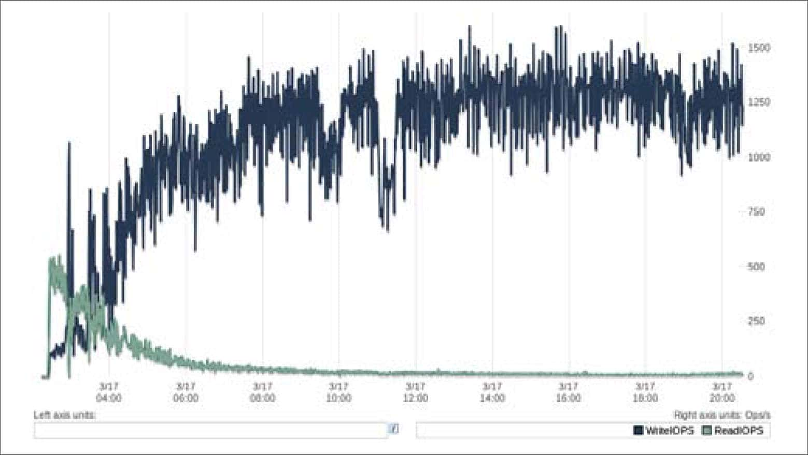
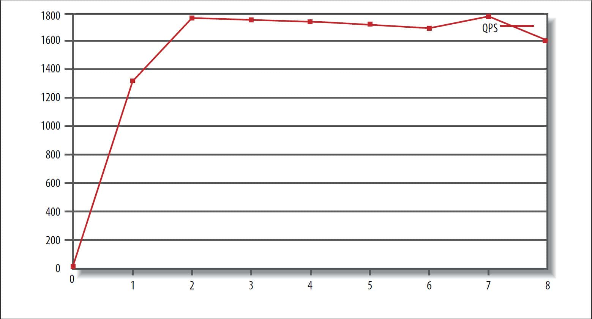
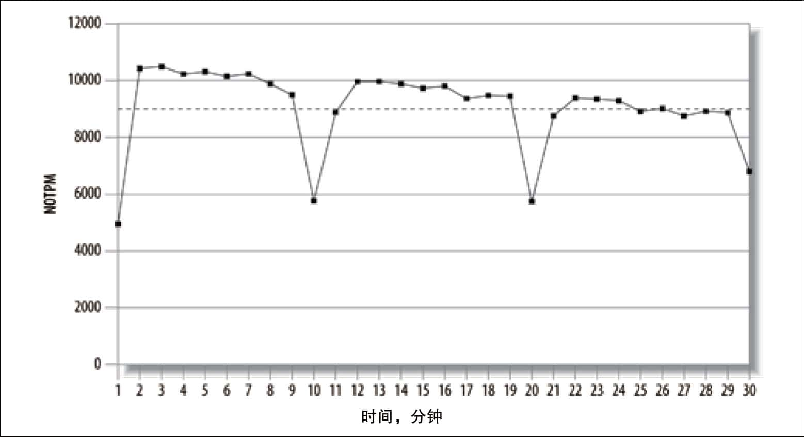
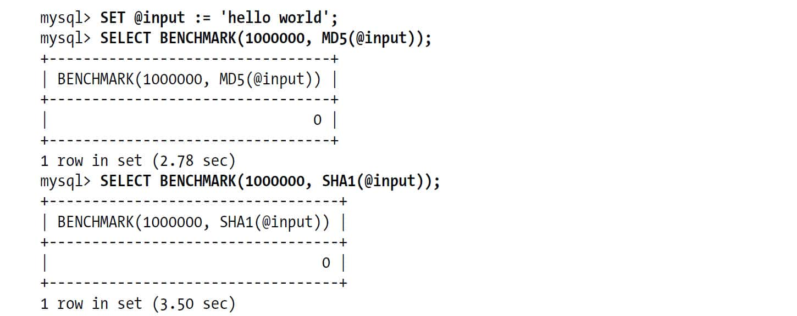
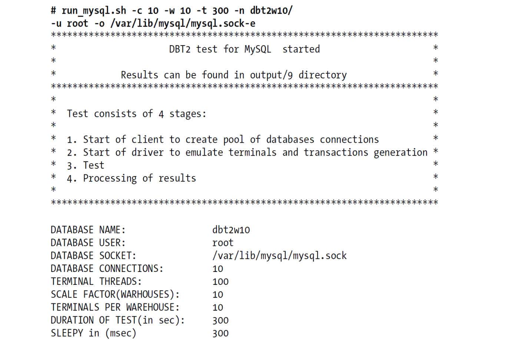
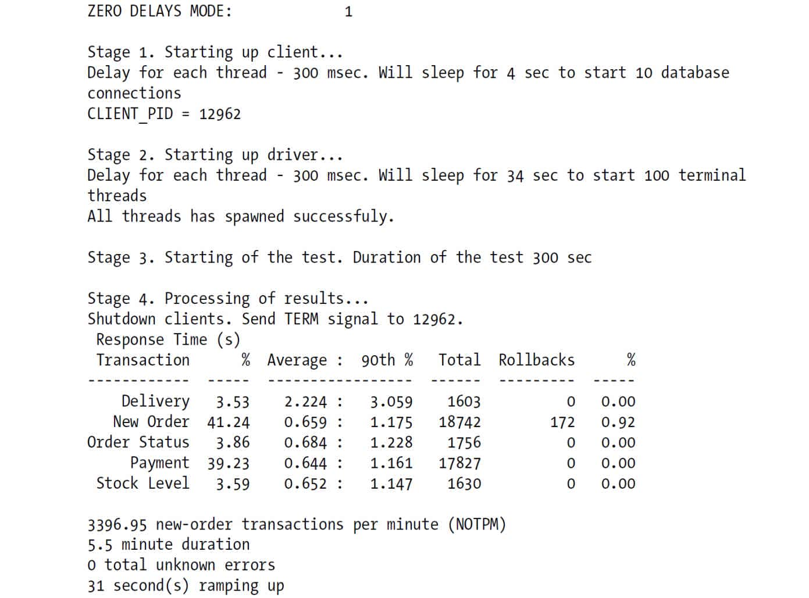

 第2章　MySQL基准测试

基准测试（benchmark）是MySQL新手和专家都需要掌握的一项基本技能。简单地说，基准测试是针对系统设计的一种压力测试。通常的目标是为了掌握系统的行为。但也有其他原因，如重现某个系统状态，或者是做新硬件的可靠性测试。本章将讨论MySQL和基于MySQL的应用的基准测试的重要性、策略和工具。我们将特别讨论一下sysbench，这是一款非常优秀的MySQL基准测试工具。

# 2.1　为什么需要基准测试

为什么基准测试很重要？因为基准测试是唯一方便有效的、可以学习系统在给定的工作负载下会发生什么的方法。基准测试可以观察系统在不同压力下的行为，评估系统的容量，掌握哪些是重要的变化，或者观察系统如何处理不同的数据。基准测试可以在系统实际负载之外创造一些虚构场景进行测试。基准测试可以完成以下工作，或者更多：

+ 验证基于系统的一些假设，确认这些假设是否符合实际情况。 
+ 重现系统中的某些异常行为，以解决这些异常。 
+ 测试系统当前的运行情况。如果不清楚系统当前的性能，就无法确认某些优化的效果如何。也可以利用历史的基准测试结果来分析诊断一些无法预测的问题。 
+ 模拟比当前系统更高的负载，以找出系统随着压力增加而可能遇到的扩展性瓶颈。 
+ 规划未来的业务增长。基准测试可以评估在项目未来的负载下，需要什么样的硬件，需要多大容量的网络，以及其他相关资源。这有助于降低系统升级和重大变更的风险。 
+ 测试应用适应可变环境的能力。例如，通过基准测试，可以发现系统在随机的并发峰值下的性能表现，或者是不同配置的服务器之间的性能表现。基准测试也可以测试系统对不同数据分布的处理能力。 
+ 测试不同的硬件、软件和操作系统配置。比如RAID 5还是RAID 10更适合当前的系统？如果系统从ATA硬盘升级到SAN存储，对于随机写性能有什么帮助？Linux 2.4系列的内核会比2.6系列的可扩展性更好吗？升级MySQL的版本能改善性能吗？为当前的数据采用不同的存储引擎会有什么效果？所有这类问题都可以通过专门的基准测试来获得答案。 
+ 证明新采购的设备是否配置正确。笔者曾经无数次地通过基准测试来对新系统进行压测，发现了很多错误的配置，以及硬件组件的失效等问题。因此在新系统正式上线到生产环境之前进行基准测试是一个好习惯，永远不要相信主机提供商或者硬件供应商的所谓系统已经安装好，并且能运行多快的说法。如果可能，执行实际的基准测试永远是一个好主意。 

基准测试还可以用于其他目的，比如为应用创建单元测试套件。但本章我们只关注与性能有关的基准测试。

基准测试的一个主要问题在于其不是真实压力的测试。基准测试施加给系统的压力相对真实压力来说，通常比较简单。真实压力是不可预期而且变化多端的，有时候情况会过于复杂而难以解释。所以使用真实压力测试，可能难以从结果中分析出确切的结论。

基准测试的压力和真实压力在哪些方面不同？有很多因素会影响基准测试，比如数据量、数据和查询的分布，但最重要的一点还是基准测试通常要求尽可能快地执行完成，所以经常给系统造成过大的压力。在很多案例中，我们都会调整给测试工具的最大压力，以在系统可以容忍的压力阈值内尽可能快地执行测试，这对于确定系统的最大容量非常有帮助。然而大部分压力测试工具不支持对压力进行复杂的控制。务必要记住，测试工具自身的局限也会影响到结果的有效性。

使用基准测试进行容量规划也要掌握技巧，不能只根据测试结果做简单的推断。例如，假设想知道使用新数据库服务器后，系统能够支撑多大的业务增长。首先对原系统进行基准测试，然后对新系统做测试，结果发现新系统可以支持原系统40倍的TPS（每秒事务数），这时候就不能简单地推断说新系统一定可以支持40倍的业务增长。这是因为在业务增长的同时，系统的流量、用户、数据以及不同数据之间的交互都在增长，它们不可能都有40倍的支撑能力，尤其是相互之间的关系。而且当业务增长到40倍时，应用本身的设计也可能已经随之改变。可能有更多的新特性会上线，其中某些特性可能对数据库造成的压力远大于原有功能。而这些压力、数据、关系和特性的变化都很难模拟，所以它们对系统的影响也很难评估。

结论就是，我们只能进行大概的测试，来确定系统大致的余量有多少。当然也可以做一些真实压力测试（和基准测试有区别），但在构造数据集和压力的时候要特别小心，而且这样就不再是基准测试了。基准测试要尽量简单直接，结果之间容易相互比较，成本低且易于执行。尽管有诸多限制，基准测试还是非常有用的（只要搞清楚测试的原理，并且了解如何分析结果所代表的意义）。

# 2.2　基准测试的策略

基准测试有两种主要的策略：一是针对整个系统的整体测试，另外是单独测试MySQL。这两种策略也被称为集成式（full-stack）以及单组件式（single-component）基准测试。针对整个系统做集成式测试，而不是单独测试MySQL的原因主要有以下几点：

+ 测试整个应用系统，包括Web服务器、应用代码、网络和数据库是非常有用的，因为用户关注的并不仅仅是MySQL本身的性能，而是应用整体的性能。 
+ MySQL并非总是应用的瓶颈，通过整体的测试可以揭示这一点。 
+ 只有对应用做整体测试，才能发现各部分之间的缓存带来的影响。 
+ 整体应用的集成式测试更能揭示应用的真实表现，而单独组件的测试很难做到这一点。 

另外一方面，应用的整体基准测试很难建立，甚至很难正确设置。如果基准测试的设计有问题，那么结果就无法反映真实的情况，从而基于此做的决策也就可能是错误的。

不过，有时候不需要了解整个应用的情况，而只需要关注MySQL的性能，至少在项目初期可以这样做。基于以下情况，可以选择只测试MySQL：

+ 需要比较不同的schema或查询的性能。 
+ 针对应用中某个具体问题的测试。 
+ 为了避免漫长的基准测试，可以通过一个短期的基准测试，做快速的“周期循环”，来检测出某些调整后的效果。 

另外，如果能够在真实的数据集上执行重复的查询，那么针对MySQL的基准测试也是有用的，但是数据本身和数据集的大小都应该是真实的。如果可能，可以采用生产环境的数据快照。

不幸的是，设置一个基于真实数据的基准测试复杂而且耗时。如果能得到一份生产数据集的拷贝，当然很幸运，但这通常不太可能。比如要测试的是一个刚开发的新应用，它只有很少的用户和数据。如果想测试该应用在规模扩张到很大以后的性能表现，就只能通过模拟大量的数据和压力来进行。

## 2.2.1　测试何种指标

在开始执行甚至是在设计基准测试之前，需要先明确测试的目标。测试目标决定了选择什么样的测试工具和技术，以获得精确而有意义的测试结果。可以将测试目标细化为一系列的问题，比如，“这种CPU是否比另外一种要快？”，或“新索引是否比当前索引性能更好？”

有时候需要用不同的方法测试不同的指标。比如，针对延迟（latency）和吞吐量（throughput）就需要采用不同的测试方法。

请考虑以下指标，看看如何满足测试的需求。

吞吐量

吞吐量指的是单位时间内的事务处理数。这一直是经典的数据库应用测试指标。一些标准的基准测试被广泛地引用，如TPC-C（参考*http://www.tpc.org*），而且很多数据库厂商都努力争取在这些测试中取得好成绩。这类基准测试主要针对在线事务处理（OLTP）的吞吐量，非常适用于多用户的交互式应用。常用的测试单位是每秒事务数（TPS），有些也采用每分钟事务数（TPM）。

响应时间或者延迟

这个指标用于测试任务所需的整体时间。根据具体的应用，测试的时间单位可能是微秒、毫秒、秒或者分钟。根据不同的时间单位可以计算出平均响应时间、最小响应时间、最大响应时间和所占百分比。最大响应时间通常意义不大，因为测试时间越长，最大响应时间也可能越大。而且其结果通常不可重复，每次测试都可能得到不同的最大响应时间。因此，通常可以使用百分比响应时间（percentile response time）来替代最大响应时间。例如，如果95％的响应时间都是5毫秒，则表示任务在95％的时间段内都可以在5毫秒之内完成。

使用图表有助于理解测试结果。可以将测试结果绘制成折线图（比如平均值折线或者95％百分比折线）或者散点图，直观地表现数据结果集的分布情况。通过这些图可以发现长时间测试的趋势。本章后面将更详细地讨论这一点。

并发性

并发性是一个非常重要又经常被误解和误用的指标。例如，它经常被表示成多少用户在同一时间浏览一个Web站点，经常使用的指标是有多少个会话(1)。然而，HTTP协议是无状态的，大多数用户只是简单地读取浏览器上显示的信息，这并不等同于Web服务器的并发性。而且，Web服务器的并发性也不等同于数据库的并发性，而仅仅只表示会话存储机制可以处理多少数据的能力。Web服务器的并发性更准确的度量指标，应该是在任意时间有多少同时发生的并发请求。

在应用的不同环节都可以测量相应的并发性。Web服务器的高并发，一般也会导致数据库的高并发，但服务器采用的语言和工具集对此都会有影响。注意不要将创建数据库连接和并发性搞混淆。一个设计良好的应用，同时可以打开成百上千个MySQL数据库服务器连接，但可能同时只有少数连接在执行查询。所以说，一个Web站点“同时有50000个用户”访问，却可能只有10～15个并发请求到MySQL数据库。

换句话说，并发性基准测试需要关注的是正在工作中的并发操作，或者是同时工作中的线程数或者连接数。当并发性增加时，需要测量吞吐量是否下降，响应时间是否变长，如果是这样，应用可能就无法处理峰值压力。

并发性的测量完全不同于响应时间和吞吐量。它不像是一个结果，而更像是设置基准测试的一种属性。并发性测试通常不是为了测试应用能达到的并发度，而是为了测试应用在不同并发下的性能。当然，数据库的并发性还是需要测量的。可以通过*sysbench*指定32、64或者128个线程的测试，然后在测试期间记录MySQL数据库的Threads\_running状态值。在第11章将讨论这个指标对容量规划的影响。

可扩展性

在系统的业务压力可能发生变化的情况下，测试可扩展性就非常必要了。第11章将更进一步讨论可扩展性的话题。简单地说，可扩展性指的是，给系统增加一倍的工作，在理想情况下就能获得两倍的结果（即吞吐量增加一倍）。或者说，给系统增加一倍的资源（比如两倍的CPU数），就可以获得两倍的吞吐量。当然，同时性能（响应时间）也必须在可以接受的范围内。大多数系统是无法做到如此理想的线性扩展的。随着压力的变化，吞吐量和性能都可能越来越差。

可扩展性指标对于容量规范非常有用，它可以提供其他测试无法提供的信息，来帮助发现应用的瓶颈。比如，如果系统是基于单个用户的响应时间测试（这是一个很糟糕的测试策略）设计的，虽然测试的结果很好，但当并发度增加时，系统的性能有可能变得非常糟糕。而一个基于不断增加用户连接的情况下的响应时间测试则可以发现这个问题。

一些任务，比如从细粒度数据创建汇总表的批量工作，需要的是周期性的快速响应时间。当然也可以测试这些任务纯粹的响应时间，但要注意考虑这些任务之间的相互影响。批量工作可能导致相互之间有影响的查询性能变差，反之亦然。

归根结底，应该测试那些对用户来说最重要的指标。因此应该尽可能地去收集一些需求，比如，什么样的响应时间是可以接受的，期待多少的并发性，等等。然后基于这些需求来设计基准测试，避免目光短浅地只关注部分指标，而忽略其他指标。

# 2.3　基准测试方法

在了解基本概念之后，现在可以来具体讨论一下如何设计和执行基准测试。但在讨论如何设计好的基准测试之前，先来看一下如何避免一些常见的错误，这些错误可能导致测试结果无用或者不精确：

+ 使用真实数据的子集而不是全集。例如应用需要处理几百GB的数据，但测试只有1GB数据；或者只使用当前数据进行测试，却希望模拟未来业务大幅度增长后的情况。 
+ 使用错误的数据分布。例如使用均匀分布的数据测试，而系统的真实数据有很多热点区域（随机生成的测试数据通常无法模拟真实的数据分布）。 
+ 使用不真实的分布参数，例如假定所有用户的个人信息（profile）都会被平均地读取(2)。 
+ 在多用户场景中，只做单用户的测试。 
+ 在单服务器上测试分布式应用。 
+ 与真实用户行为不匹配。例如Web页面中的“思考时间”。真实用户在请求到一个页面后会阅读一段时间，而不是不停顿地一个接一个点击相关链接。 
+ 反复执行同一个查询。真实的查询是不尽相同的，这可能会导致缓存命中率降低。而反复执行同一个查询在某种程度上，会全部或者部分缓存结果。 
+ 没有检查错误。如果测试的结果无法得到合理的解释，比如一个本应该很慢的查询突然变快了，就应该检查是否有错误产生。否则可能只是测试了MySQL检测语法错误的速度了。基准测试完成后，一定要检查一下错误日志，这应当是基本的要求。 
+ 忽略了系统预热（warm up）的过程。例如系统重启后马上进行测试。有时候需要了解系统重启后需要多长时间才能达到正常的性能容量，要特别留意预热的时长。反过来说，如果要想分析正常的性能，需要注意，若基准测试在重启以后马上启动，则缓存是冷的、还没有数据，这时即使测试的压力相同，得到的结果也和缓存已经装满数据时是不同的。 
+ 使用默认的服务器配置。第3章将详细地讨论服务器的优化配置。 
+ 测试时间太短。基准测试需要持续一定的时间。后面会继续讨论这个话题。 

只有避免了上述错误，才能走上改进测试质量的漫漫长路。

如果其他条件相同，就应努力使测试过程尽可能地接近真实应用的情况。当然，有时候和真实情况稍有些出入问题也不大。例如，实际应用服务器和数据库服务器分别部署在不同的机器。如果采用和实际部署完全相同的配置当然更真实，但也会引入更多的变化因素，比如加入了网络的负载和速度等。而在单一节点上运行测试相对要容易，在某些情况下结果也可以接受，那么就可以在单一节点上进行测试。当然，这样的选择需要根据实际情况来分析是否合适。

## 2.3.1　设计和规划基准测试

规划基准测试的第一步是提出问题并明确目标。然后决定是采用标准的基准测试，还是设计专用的测试。

如果采用标准的基准测试，应该确认选择了合适的测试方案。例如，不要使用TPC-H测试电子商务系统。在TPC的定义中，“TPC-H是即席查询和决策支持型应用的基准测试”，因此不适合用来测试OLTP系统。

设计专用的基准测试是很复杂的，往往需要一个迭代的过程。首先需要获得生产数据集的快照，并且该快照很容易还原，以便进行后续的测试。

然后，针对数据运行查询。可以建立一个单元测试集作为初步的测试，并运行多遍。但是这和真实的数据库环境还是有差别的。更好的办法是选择一个有代表性的时间段，比如高峰期的一个小时，或者一整天，记录生产系统上的所有查询。如果时间段选得比较小，则可以选择多个时间段。这样有助于覆盖整个系统的活动状态，例如每周报表的查询、或者非峰值时间运行的批处理作业(3)。

可以在不同级别记录查询。例如，如果是集成式（full-stack）基准测试，可以记录Web服务器上的HTTP请求，也可以打开MySQL的查询日志（Query Log）。倘若要重演这些查询，就要确保创建多线程来并行执行，而不是单个线程线性地执行。对日志中的每个连接都应该创建独立的线程，而不是将所有的查询随机地分配到一些线程中。查询日志中记录了每个查询是在哪个连接中执行的。

即使不需要创建专用的基准测试，详细地写下测试规划也是必需的。测试可能要多次反复运行，因此需要精确地重现测试过程。而且也应该考虑到未来，执行下一轮测试时可能已经不是同一个人了。即使还是同一个人，也有可能不会确切地记得初次运行时的情况。测试规划应该记录测试数据、系统配置的步骤、如何测量和分析结果，以及预热的方案等。

应该建立将参数和结果文档化的规范，每一轮测试都必须进行详细记录。文档规范可以很简单，比如采用电子表格（spreadsheet）或者记事本形式，也可以是复杂的自定义的数据库。需要记住的是，经常要写一些脚本来分析测试结果，因此如果能够不用打开电子表格或者文本文件等额外操作，当然是更好的。

## 2.3.2　基准测试应该运行多长时间

基准测试应该运行足够长的时间，这一点很重要。如果需要测试系统在稳定状态时的性能，那么当然需要在稳定状态下测试并观察。而如果系统有大量的数据和内存，要达到稳定状态可能需要非常长的时间。大部分系统都会有一些应对突发情况的余量，能够吸收性能尖峰，将一些工作延迟到高峰期之后执行。但当对机器加压足够长时间之后，这些余量会被消耗尽，系统的短期尖峰也就无法维持原来的高性能。

有时候无法确认测试需要运行多长的时间才足够。如果是这样，可以让测试一直运行，持续观察直到确认系统已经稳定。下面是一个在已知系统上执行测试的例子，图2-1显示了系统磁盘读和写吞吐量的时序图。

 
**图2-1：扩展基准测试的I/O性能图**

系统预热完成后，读I/O活动在三四个小时后曲线趋向稳定，但写I/O至少在八小时内变化还是很大，之后有一些点的波动较大，但读和写总体来说基本稳定了(4)。一个简单的测试规则，就是等系统看起来稳定的时间至少等于系统预热的时间。本例中的测试持续了72个小时才结束，以确保能够体现系统长期的行为。

一个常见的错误的测试方式是，只执行一系列短期的测试，比如每次60秒，并在此测试的基础上去总结系统的性能。我们经常可以听到类似这样的话：“我尝试对新版本做了测试，但还不如旧版本快”，然而我们分析实际的测试结果后发现，测试的方式根本不足以得出这样的结论。有时候人们也会强调说不可能有时间去测试8或者12个小时，以验证10个不同并发性在两到三个不同版本下的性能。如果没有时间去完成准确完整的基准测试，那么已经花费的所有时间都是一种浪费。有时候要相信别人的测试结果，这总比做一次半拉子的测试来得到一个错误的结论要好。

## 2.3.3　获取系统性能和状态

在执行基准测试时，需要尽可能多地收集被测试系统的信息。最好为基准测试建立一个目录，并且每执行一轮测试都创建单独的子目录，将测试结果、配置文件、测试指标、脚本和其他相关说明都保存在其中。即使有些结果不是目前需要的，也应该先保存下来。多余一些数据总比缺乏重要的数据要好，而且多余的数据以后也许会用得着。需要记录的数据包括系统状态和性能指标，诸如CPU使用率、磁盘I/O、网络流量统计、SHOW GLOBAL STATUS计数器等。

下面是一个收集MySQL测试数据的shell脚本：

        #!/bin/sh

        INTERVAL=5
        PREFIX=$INTERVAL-sec-status
        RUNFILE=/home/benchmarks/running
        mysql -e 'SHOW GLOBAL VARIABLES' >> mysql-variables
        while test -e $RUNFILE; do
           file=$(date +％F_％I)
           sleep=$(date +％s.％N | awk "{print $INTERVAL - (\$1 ％ $INTERVAL)}")
           sleep $sleep
           ts="$(date +"TS ％s.％N ％F ％T")"
           loadavg="$(uptime)"
           echo "$ts $loadavg" >> $PREFIX-${file}-status
           mysql -e 'SHOW GLOBAL STATUS' >> $PREFIX-${file}-status &
           echo "$ts $loadavg" >> $PREFIX-${file}-innodbstatus
           mysql -e 'SHOW ENGINE INNODB STATUS\G' >> $PREFIX-${file}-innodbstatus &
           echo "$ts $loadavg" >> $PREFIX-${file}-processlist
           mysql -e 'SHOW FULL PROCESSLIST\G' >> $PREFIX-${file}-processlist &
           echo $ts
        done
        echo Exiting because $RUNFILE does not exist.

这个shell脚本很简单，但提供了一个有效的收集状态和性能数据的框架。看起来好像作用不大，但当需要在多个服务器上执行比较复杂的测试的时候，要回答以下关于系统行为的问题，没有这种脚本的话就会很困难了。下面是这个脚本的一些要点：

+ 迭代是基于固定时间间隔的，每隔5秒运行一次收集的动作，注意这里sleep的时间有一个特殊的技巧。如果只是简单地在每次循环时插入一条“sleep 5”的指令，循环的执行间隔时间一般都会稍大于5秒，那么这个脚本就没有办法通过其他脚本和图形简单地捕获时间相关的准确数据。即使有时候循环能够恰好在5秒内完成，但如果某些系统的时间戳是15:32:18.218192，另外一个则是15:32:23.819437，这时候就比较讨厌了。当然这里的5秒也可以改成其他的时间间隔，比如1、10、30或者60秒。不过还是推荐使用5秒或者10秒的间隔来收集数据。 
+ 每个文件名都包含了该轮测试开始的日期和小时。如果测试要持续好几天，那么这个文件可能会非常大，有必要的话需要手工将文件移到其他地方，但要分析全部结果的时候要注意从最早的文件开始。如果只需要分析某个时间点的数据，则可以根据文件名中的日期和小时迅速定位，这比在一个GB以上的大文件中去搜索要快捷得多。 
+ 每次抓取数据都会先记录当前的时间戳，所以可以在文件中搜索某个时间点的数据。也可以写一些*awk*或者*sed*脚本来简化操作。 
+ 这个脚本不会处理或者过滤收集到的数据。先收集所有的原始数据，然后再基于此做分析和过滤是一个好习惯。如果在收集的时候对数据做了预处理，而后续分析发现一些异常的地方需要用到更多的原始数据，这时候就要“抓瞎”了。 
+ 如果需要在测试完成后脚本自动退出，只需要删除*/home/benchmarks/running*文件即可。 

这只是一段简单的代码，或许不能满足全部的需求，但却很好地演示了该如何捕获测试的性能和状态数据。从代码可以看出，只捕获了MySQL的部分数据，如果需要，则很容易通过修改脚本添加新的数据捕获。例如，可以通过*pt-diskstats*工具(5)捕获*/proc/diskstats*的数据为后续分析磁盘I/O使用。

## 2.3.4　获得准确的测试结果

获得准确测试结果的最好办法，是回答一些关于基准测试的基本问题：是否选择了正确的基准测试？是否为问题收集了相关的数据？是否采用了错误的测试标准？例如，是否对一个I/O密集型（I/O-bound）的应用，采用了CPU密集型（CPU-bound）的测试标准来评估性能？

接着，确认测试结果是否可重复。每次重新测试之前要确保系统的状态是一致的。如果是非常重要的测试，甚至有必要每次测试都重启系统。一般情况下，需要测试的是经过预热的系统，还需要确保预热的时间足够长（请参考前面关于基准测试需要运行多长时间的内容）、是否可重复。如果预热采用的是随机查询，那么测试结果可能就是不可重复的。

如果测试的过程会修改数据或者schema，那么每次测试前，需要利用快照还原数据。在表中插入1000条记录和插入100万条记录，测试结果肯定不会相同。数据的碎片度和在磁盘上的分布，都可能导致测试是不可重复的。一个确保物理磁盘数据的分布尽可能一致的办法是，每次都进行快速格式化并进行磁盘分区复制。

要注意很多因素，包括外部的压力、性能分析和监控系统、详细的日志记录、周期性作业，以及其他一些因素，都会影响到测试结果。一个典型的案例，就是测试过程中突然有*cron*定时作业启动，或者正处于一个巡查读取周期（Patrol Read cycle），抑或RAID卡启动了定时的一致性检查等。要确保基准测试运行过程中所需要的资源是专用于测试的。如果有其他额外的操作，则会消耗网络带宽，或者测试基于的是和其他服务器共享的SAN存储，那么得到的结果很可能是不准确的。

每次测试中，修改的参数应该尽量少。如果必须要一次修改多个参数，那么可能会丢失一些信息。有些参数依赖其他参数，这些参数可能无法单独修改。有时候甚至都没有意识到这些依赖，这给测试带来了复杂性(6)。

一般情况下，都是通过迭代逐步地修改基准测试的参数，而不是每次运行时都做大量的修改。举个例子，如果要通过调整参数来创造一个特定行为，可以通过使用分治法（divide-and-conquer，每次运行时将参数对分减半）来找到正确的值。

很多基准测试都是用来做预测系统迁移后的性能的，比如从Oracle迁移到MySQL。这种测试通常比较麻烦，因为MySQL执行的查询类型与Oracle完全不同。如果想知道在Oracle运行得很好的应用迁移到MySQL以后性能如何，通常需要重新设计MySQL的schema和查询（在某些情况下，比如，建立一个跨平台的应用时，可能想知道同一条查询是如何在两个平台运行的，不过这种情况并不多见）。

另外，基于MySQL的默认配置的测试没有什么意义，因为默认配置是基于消耗很少内存的极小应用的。有时候可以看到一些MySQL和其他商业数据库产品的对比测试，结果很让人尴尬，可能就是MySQL采用了默认配置的缘故。让人无语的是，这样明显有误的测试结果还容易变成头条新闻。

固态存储（SSD或者PCI-E卡）给基准测试带来了很大的挑战，第9章将进一步讨论。

最后，如果测试中出现异常结果，不要轻易当作坏数据点而丢弃。应该认真研究并找到产生这种结果的原因。测试可能会得到有价值的结果，或者一个严重的错误，抑或基准测试的设计缺陷。如果对测试结果不了解，就不要轻易公布。有一些案例表明，异常的测试结果往往都是由于很小的错误导致的，最后搞得测试无功而返(7)。

## 2.3.5　运行基准测试并分析结果

一旦准备就绪，就可以着手基准测试，收集和分析数据了。

通常来说，自动化基准测试是个好主意。这样做可以获得更精确的测试结果。因为自动化的过程可以防止测试人员偶尔遗漏某些步骤，或者误操作。另外也有助于归档整个测试过程。

自动化的方式有很多，可以是一个Makefile文件或者一组脚本。脚本语言可以根据需要选择：shell、PHP、Perl等都可以。要尽可能地使所有测试过程都自动化，包括装载数据、系统预热、执行测试、记录结果等。

一旦设置了正确的自动化操作，基准测试将成为一步式操作。如果只是针对某些应用做一次性的快速验证测试，可能就没必要做自动化。但只要未来可能会引用到测试结果，建议都尽量地自动化。否则到时候可能就搞不清楚是如何获得这个结果的，也不记得采用了什么参数，这样就很难再通过测试重现结果了。

基准测试通常需要运行多次。具体需要运行多少次要看对结果的记分方式，以及测试的重要程度。要提高测试的准确度，就需要多运行几次。一般在测试的实践中，可以取最好的结果值，或者所有结果的平均值，抑或从五个测试结果里取最好三个值的平均值。可以根据需要更进一步精确化测试结果。还可以对结果使用统计方法，确定置信区间（confidence interval）等。不过通常来说，不会用到这种程度的确定性结果(8)。只要测试的结果能满足目前的需求，简单地运行几轮测试，看看结果的变化就可以了。如果结果变化很大，可以再多运行几次，或者运行更长的时间，这样都可以获得更确定的结果。

获得测试结果后，还需要对结果进行分析，也就是说，要把“数字”变成“知识”。最终的目的是回答在设计测试时的问题。理想情况下，可以获得诸如“升级到4核CPU可以在保持响应时间不变的情况下获得超过50％的吞吐量增长”或者“增加索引可以使查询更快”的结论。如果需要更加科学化，建议在测试前读读*null hypothesis*一书，但大部分情况下不会要求做这么严格的基准测试。

如何从数据中抽象出有意义的结果，依赖于如何收集数据。通常需要写一些脚本来分析数据，这不仅能减轻分析的工作量，而且和自动化基准测试一样可以重复运行，并易于文档化。下面是一个非常简单的shell脚本，演示了如何从前面的数据采集脚本采集到的数据中抽取时间维度信息。脚本的输入参数是采集到的数据文件的名字。

        #!/bin/sh

        # This script converts SHOW GLOBAL STATUS into a tabulated format, one line
        # per sample in the input, with the metrics divided by the time elapsed
        # between samples.
        awk '
            BEGIN {
               printf "#ts date time load QPS";
               fmt = " %.2f";
            }
            /^TS/ { # The timestamp lines begin with TS.
               ts = substr($2, 1, index($2, ".") - 1);
               load = NF - 2;
               diff = ts - prev_ts;
               prev_ts = ts;
               printf "\n%s %s %s %s", ts, $3, $4, substr($load, 1, length($load)-1);
            }
            /Queries/ {
                printf fmt, ($2-Queries)/diff;
                Queries=$2
            }
            ' "$@"

假设该脚本名为*analyze*，当前面的脚本生成状态文件以后，就可以运行该脚本，可能会得到如下的结果：

        [baron@ginger ~]$ ./analyze 5-sec-status-2011-03-20
        #ts date time load QPS
        1300642150 2011-03-20 17:29:10 0.00 0.62
        1300642155 2011-03-20 17:29:15 0.00 1311.60
        1300642160 2011-03-20 17:29:20 0.00 1770.60
        1300642165 2011-03-20 17:29:25 0.00 1756.60
        1300642170 2011-03-20 17:29:30 0.00 1752.40
        1300642175 2011-03-20 17:29:35 0.00 1735.00
        1300642180 2011-03-20 17:29:40 0.00 1713.00
        1300642185 2011-03-20 17:29:45 0.00 1788.00
        1300642190 2011-03-20 17:29:50 0.00 1596.40

第一行是列的名字；第二行的数据应该忽略，因为这是测试实际启动前的数据。接下来的行包含Unix时间戳、日期、时间（注意时间数据是每5秒更新一次，前面脚本说明时曾提过）、系统负载、数据库的QPS（每秒查询次数）五列，这应该是用于分析系统性能的最少数据需求了。接下来将演示如何根据这些数据快速地绘成图形，并分析基准测试过程中发生了什么。

## 2.3.6　绘图的重要性

如果你想要统治世界，就必须不断地利用“阴谋”(9)。而最简单有效的图形，就是将性能指标按照时间顺序绘制。通过图形可以立刻发现一些问题，而这些问题在原始数据中却很难被注意到。或许你会坚持看测试工具打印出来的平均值或其他汇总过的信息，但平均值有时候是没有用的，它会掩盖掉一些真实情况。幸运的是，前面写的脚本的输出都可以定制作为*gnuplot*或者*R*绘图的数据来源。假设使用*gnuplot*，假设输出的数据文件名是*QPS-per-5-seconds*：

        gnuplot> plot "QPS-per-5-seconds" using 5 w lines title"QPS"

该*gnuplot*命令将文件的第五列q*ps数*据绘成图形，图的标题是QPS。图2-2是绘制出来的结果图。

 
**图2-2：基准测试的QPS图形**

下面我们讨论一个可以更加体现图形价值的例子。假设MySQL数据正在遭受“疯狂刷新（furious flushing）”的问题，在刷新落后于检查点时会阻塞所有的活动，从而导致吞吐量严重下跌。95％的响应时间和平均响应时间指标都无法发现这个问题，也就是说这两个指标掩盖了问题。但图形会显示出这个周期性的问题，请参考图2-3。

图2-3显示的是每分钟新订单的交易量（NOTPM，new-order transactions per minute）。从曲线可以看到明显的周期性下降，但如果从平均值（点状虚线）来看波动很小。一开始的低谷是由于系统的缓存是空的，而后面其他的下跌则是由于系统刷新脏块到磁盘导致。如果没有图形，要发现这个趋势会比较困难。

 
**图2-3：一个30分钟的*dbt2*测试的结果**

这种性能尖刺在压力大的系统比较常见，需要调查原因。在这个案例中，是由于使用了旧版本的InnoDB引擎，脏块的刷新算法性能很差。但这个结论不能是想当然的，需要认真地分析详细的性能统计。在性能下跌时，SHOW ENGINE INNODB STATUS的输出是什么？SHOW FULL PROCESSLIST的输出是什么？应该可以发现InnoDB在持续地刷新脏块，并且阻塞了很多状态是“waiting on query cache lock”的线程，或者其他类似的现象。在执行基准测试的时候要尽可能地收集更多的细节数据，然后将数据绘制成图形，这样可以帮助快速地发现问题。

# 2.4　基准测试工具

没有必要开发自己的基准测试系统，除非现有的工具确实无法满足需求。下面的章节会介绍一些可用的工具。

## 2.4.1　集成式测试工具

回忆一下前文提供的两种测试类型：集成式测试和单组件式测试。毫不奇怪，有些工具是针对整个应用进行测试，也有些工具是针对MySQL或者其他组件单独进行测试的。集成式测试，通常是获得整个应用概况的最佳手段。已有的集成式测试工具如下所示。

*ab*

*ab*是一个Apache HTTP服务器基准测试工具。它可以测试HTTP服务器每秒最多可以处理多少请求。如果测试的是Web应用服务，这个结果可以转换成整个应用每秒可以满足多少请求。这是个非常简单的工具，用途也有限，只能针对单个URL进行尽可能快的压力测试。关于ab的更多信息可以参考*http://httpd.apache.org/docs/2.0/programs/ab.html*。

*http\_load*

这个工具概念上和*ab*类似，也被设计为对Web服务器进行测试，但比*ab*要更加灵活。可以通过一个输入文件提供多个URL，*http\_load*在这些URL中随机选择进行测试。也可以定制*http\_load*，使其按照时间比率进行测试，而不仅仅是测试最大请求处理能力。更多信息请参考*http://www.acme.com/software/http-load/*。

*JMeter*

JMeter是一个Java应用程序，可以加载其他应用并测试其性能。它虽然是设计用来测试Web应用的，但也可以用于测试其他诸如FTP服务器，或者通过JDBC进行数据库查询测试。

JMeter比*ab*和*http\_load*都要复杂得多。例如，它可以通过控制预热时间等参数，更加灵活地模拟真实用户的访问。JMeter拥有绘图接口（带有内置的图形化处理的功能），还可以对测试进行记录，然后离线重演测试结果。更多信息请参考*http://jakarta.apache.org/jmeter/*。

## 2.4.2　单组件式测试工具

有一些有用的工具可以测试MySQL和基于MySQL的系统的性能。2.5节将演示如何利用这些工具进行测试。

*mysqlslap*

*mysqlslap*（*http://dev.mysql.com/doc/refman/5.1/en/mysqlslap.html*）可以模拟服务器的负载，并输出计时信息。它包含在MySQL 5.1的发行包中，应该在MySQL 4.1或者更新的版本中都可以使用。测试时可以执行并发连接数，并指定SQL语句（可以在命令行上执行，也可以把SQL语句写入到参数文件中）。如果没有指定SQL语句，*mysqlslap*会自动生成查询schema的SELECT语句。

*MySQL Benchmark Suite（sql-bench）*

在MySQL的发行包中也提供了一款自己的基准测试套件，可以用于在不同数据库服务器上进行比较测试。它是单线程的，主要用于测试服务器执行查询的速度。结果会显示哪种类型的操作在服务器上执行得更快。

这个测试套件的主要好处是包含了大量预定义的测试，容易使用，所以可以很轻松地用于比较不同存储引擎或者不同配置的性能测试。其也可以用于高层次测试，比较两个服务器的总体性能。当然也可以只执行预定义测试的子集（例如只测试UPDATE的性能）。这些测试大部分是CPU密集型的，但也有些短时间的测试需要大量的磁盘I/O操作。

这个套件的最大缺点主要有：它是单用户模式的，测试的数据集很小且用户无法使用指定的数据，并且同一个测试多次运行的结果可能会相差很大。因为是单线程且串行执行的，所以无法测试多CPU的能力，只能用于比较单CPU服务器的性能差别。使用这个套件测试数据库服务器还需要Perl和BDB的支持，相关文档请参考*http://dev.mysql.com/doc/en/mysql-benchmarks.html/*。

*Super Smack*

Super Smack（*http://vegan.net/tony/supersmack/*）是一款用于MySQL和PostgreSQL的基准测试工具，可以提供压力测试和负载生成。这是一个复杂而强大的工具，可以模拟多用户访问，可以加载测试数据到数据库，并支持使用随机数据填充测试表。测试定义在“smack”文件中，smack文件使用一种简单的语法定义测试的客户端、表、查询等测试要素。

*Database Test Suite*

Database Test Suite是由开源软件开发实验室（OSDL，Open Source Development Labs）设计的，发布在SourceForge网站（*http://sourceforge.net/projects/osdldbt/*）上，这是一款类似某些工业标准测试的测试工具集，例如由事务处理性能委员会（TPC，Transaction Processing Performance Council）制定的各种标准。特别值得一提的是，其中的*dbt2*就是一款免费的TPC-C OLTP测试工具（未认证）。之前本书作者经常使用该工具，不过现在已经使用自己研发的专用于MySQL的测试工具替代了。

*Percona's TPCC-MySQL Tool*

我们开发了一个类似TPC-C的基准测试工具集，其中有部分是专门为MySQL测试开发的。在评估大压力下MySQL的一些行为时，我们经常会利用这个工具进行测试（简单的测试，一般会采用*sysbench*替代）。该工具的源代码可以在*https://launchpad.net/perconatools*下载，在源码库中有一个简单的文档说明。

*sysbench*

*sysbench*（*https://launchpad.net/sysbench*）是一款多线程系统压测工具。它可以根据影响数据库服务器性能的各种因素来评估系统的性能。例如，可以用来测试文件I/O、操作系统调度器、内存分配和传输速度、POSIX线程，以及数据库服务器等。*sysbench*支持Lua脚本语言（*http://www.lua.org*），Lua对于各种测试场景的设置可以非常灵活。*sysbench*是我们非常喜欢的一种全能测试工具，支持MySQL、操作系统和硬件的硬件测试。

**MySQL的BENCHMARK()函数**

MySQL有一个内置的BENCHMARK()函数，可以测试某些特定操作的执行速度。参数可以是需要执行的次数和表达式。表达式可以是任何的标量表达式，比如返回值是标量的子查询或者函数。该函数可以很方便地测试某些特定操作的性能，比如通过测试可以发现，MD5()函数比SHA1()函数要快：

 

执行后的返回值永远是0，但可以通过客户端返回的时间来判断执行的时间。在这个例子中可以看到MD5()执行比SHA1()要快。使用BENCHMARK()函数来测试性能，需要清楚地知道其原理，否则容易误用。这个函数只是简单地返回服务器执行表达式的时间，而不会涉及分析和优化的开销。而且表达式必须像这个例子一样包含用户定义的变量，否则多次执行同样的表达式会因为系统缓存命中而影响结果(10)。

虽然BENCHMARK()函数用起来很方便，但不合适用来做真正的基准测试，因为很难理解真正要测试的是什么，而且测试的只是整个执行周期中的一部分环节。

# 2.5　基准测试案例

本节将演示一些利用上面提到的基准测试工具进行测试的真实案例。这些案例未必涵盖所有测试工具，但应该可以帮助读者针对自己的测试需要来做出判断和选择，并作为入门的开端。

## 2.5.1　http\_load

下面通过一个简单的例子来演示如何使用*http\_load*。首先创建一个*urls.txt*文件，输入如下的URL：

        http://www.mysqlperformanceblog.com/
        http://www.mysqlperformanceblog.com/page/2/
        http://www.mysqlperformanceblog.com/mysql-patches/
        http://www.mysqlperformanceblog.com/mysql-performance-presentations/
        http://www.mysqlperformanceblog.com/2006/09/06/slow-query-log-analyzes-tools/

*http\_load*最简单的用法，就是循环请求给定的URL列表。测试程序将以最快的速度请求这些URL：

        **    $ http_load -parallel 1 -seconds 10 urls.txt**    
        19 fetches, 1 max parallel, 837929 bytes, in 10.0003 seconds
        44101.5 mean bytes/connection
        1.89995 fetches/sec, 83790.7 bytes/sec
        msecs/connect: 41.6647 mean, 56.156 max, 38.21 min
        msecs/first-response: 320.207 mean, 508.958 max, 179.308 min
        HTTP response codes:
           code 200 - 19

测试的结果很容易理解，只是简单地输出了请求的统计信息。下面是另外一个稍微复杂的测试，还是尽可能快地循环请求给定的URL列表，不过模拟同时有五个并发用户在进行请求：

        **    $ http_load -parallel 5 -seconds 10 urls.txt**    
        94 fetches, 5 max parallel, 4.75565e+06 bytes, in 10.0005 seconds
        50592 mean bytes/connection
        9.39953 fetches/sec, 475541 bytes/sec
        msecs/connect: 65.1983 mean, 169.991 max, 38.189 min
        msecs/first-response: 245.014 mean, 993.059 max, 99.646 min
        HTTP response codes:
          code 200 - 94

另外，除了测试最快的速度，也可以根据预估的访问请求率（比如每秒5次）来做压力模拟测试。

        **    $ http_load -rate 5 -seconds 10 urls.txt**    
        48 fetches, 4 max parallel, 2.50104e+06 bytes, in 10 seconds
        52105 mean bytes/connection
        4.8 fetches/sec, 250104 bytes/sec
        msecs/connect: 42.5931 mean, 60.462 max, 38.117 min
        msecs/first-response: 246.811 mean, 546.203 max, 108.363 min
        HTTP response codes:
          code 200 - 48

最后，还可以模拟更大的负载，可以将访问请求率提高到每秒20次请求。请注意，连接和请求响应时间都会随着负载的提高而增加。

        **    $ http_load -rate 20 -seconds 10 urls.txt**    
        111 fetches, 89 max parallel, 5.91142e+06 bytes, in 10.0001 seconds
        53256.1 mean bytes/connection
        11.0998 fetches/sec, 591134 bytes/sec
        msecs/connect: 100.384 mean, 211.885 max, 38.214 min
        msecs/first-response: 2163.51 mean, 7862.77 max, 933.708 min
        HTTP response codes:
          code 200 -- 111

## 2.5.2　MySQL基准测试套件

MySQL基准测试套件（MySQL Benchmark Suite）由一组基于Perl开发的基准测试工具组成。在MySQL安装目录下的*sql-bench*子目录中包含了该工具。比如在Debian GNU/Linux系统上，默认的路径是*/usr/share/mysql/sql-bench*。

在用这个工具集测试前，应该读一下*README*文件，了解使用方法和命令行参数说明。如果要运行全部测试，可以使用如下的命令：

        **    $ cd /usr/share/mysql/sql-bench/**    
        sql-bench$ ./run-all-tests --server=mysql --user=root --log --fast
        Test finished. You can find the result in:
        output/RUN-mysql_fast-Linux_2.4.18_686_smp_i686

运行全部测试需要比较长的时间，有可能会超过一个小时，其具体长短依赖于测试的硬件环境和配置。如果指定了*--log*命令行，则可以监控到测试的进度。测试的结果都保存在*output*子目录中，每项测试的结果文件中都会包含一系列的操作计时信息。下面是一个具体的例子，为方便印刷，部分格式做了修改。

        sql-bench$ tail −5 output/select-mysql_fast-Linux_2.4.18_686_smp_i686
        Time for count_distinct_group_on_key (1000:6000):
          34 wallclock secs ( 0.20 usr 0.08 sys + 0.00 cusr 0.00 csys = 0.28 CPU)
        Time for count_distinct_group_on_key_parts (1000:100000):
          34 wallclock secs ( 0.57 usr 0.27 sys + 0.00 cusr 0.00 csys = 0.84 CPU)
        Time for count_distinct_group (1000:100000):
          34 wallclock secs ( 0.59 usr 0.20 sys + 0.00 cusr 0.00 csys = 0.79 CPU)
        Time for count_distinct_big (100:1000000):
          8 wallclock secs ( 4.22 usr 2.20 sys + 0.00 cusr 0.00 csys = 6.42 CPU)
        Total time:
          868 wallclock secs (33.24 usr 9.55 sys + 0.00 cusr 0.00 csys = 42.79 CPU)

如上所示，count\_distinct\_group\_on\_key（1000:6000）测试花费了34秒（wallclock secs），这是客户端运行测试花费的总时间；其他值（包括usr，sys，cursr，csys）则占了测试的0.28秒的开销，这是运行客户端测试代码所花费的时间，而不是等待MySQL服务器响应的时间。而测试者真正需要关心的测试结果，是除去客户端控制的部分，即实际运行时间应该是33.72秒。

除了运行全部测试集外，也可以选择单独执行其中的部分测试项。例如可以选择只执行

insert测试，这会比运行全部测试集所得到的汇总信息给出更多的详细信息：

        sql-bench$ **    ./test-insert**    
        Testing server 'MySQL 4.0.13 log' at 2003-05-18 11:02:39

        Testing the speed of inserting data into 1 table and do some selects on it.
        The tests are done with a table that has 100000 rows.

        Generating random keys
        Creating tables
        Inserting 100000 rows in order
        Inserting 100000 rows in reverse order
        Inserting 100000 rows in random order
        Time for insert (300000):
          42 wallclock secs ( 7.91 usr 5.03 sys + 0.00 cusr 0.00 csys = 12.94 CPU)
        Testing insert of duplicates
        Time for insert_duplicates (100000):
          16 wallclock secs ( 2.28 usr 1.89 sys + 0.00 cusr 0.00 csys = 4.17 CPU)

## 2.5.3　sysbench

*sysbench*可以执行多种类型的基准测试，它不仅设计用来测试数据库的性能，也可以测试运行数据库的服务器的性能。实际上，Peter和Vadim最初设计这个工具是用来执行MySQL性能测试的（尽管并不能完成所有的MySQL基准测试）。下面先演示一些非MySQL的测试场景，来测试各个子系统的性能，这些测试可以用来评估系统的整体性能瓶颈。后面再演示如何测试数据库的性能。

强烈建议大家都能熟悉*sysbench*测试，在MySQL用户的工具包中，这应该是最有用的工具之一。尽管有其他很多测试工具可以替代*sysbench*的某些功能，但那些工具有时候并不可靠，获得的结果也不一定和MySQL性能相关。例如，I/O性能测试可以用*iozone、bonnie\+\+*等一系列工具，但需要注意设计场景，以便可以模拟InnoDB的磁盘I/O模式。而*sysbench*的I/O测试则和InnoDB的I/O模式非常类似，所以fleio选项是非常好用的。

### sysbench的CPU基准测试

最典型的子系统测试就是CPU基准测试。该测试使用64位整数，测试计算素数直到某个最大值所需要的时间。下面的例子将比较两台不同的GNU/Linux服务器上的测试结果。第一台机器的CPU配置如下：

        [server1 ~]$ **    cat /proc/cpuinfo**    
        ...
        model name : AMD Opteron(tm) Processor 246
        stepping : 1
        cpu MHz : 1992.857
        cache size : 1024 KB

在这台服务器上运行如下的测试：

        [server1 ~]$ **    sysbench --test=cpu --cpu-max-prime=20000 run**    
        sysbench v0.4.8: multithreaded system evaluation benchmark
        ...
        Test execution summary: **    total time:**                            **    121.7404s**    

第二台服务器配置了不同的CPU：

        [server2 ~]$ **    cat /proc/cpuinfo**    
        ...
        model name : Intel(R) Xeon(R) CPU     5130 @ 2.00GHz
        stepping   : 6
        cpu MHz    : 1995.005

测试结果如下：

        [server1 ~]$ **    sysbench --test=cpu --cpu-max-prime=20000 run**    
        sysbench v0.4.8: multithreaded system evaluation benchmark
        ...
        Test execution summary:    **    total time:**                 **    61.8596s**    

测试的结果简单打印出了计算出素数的时间，很容易进行比较。在上面的测试中，第二台服务器的测试结果显示比第一台快两倍。

### sysbench的文件I/O基准测试

文件I/O（fileio）基准测试可以测试系统在不同I/O负载下的性能。这对于比较不同的硬盘驱动器、不同的RAID卡、不同的RAID模式，都很有帮助。可以根据测试结果来调整I/O子系统。文件I/O基准测试模拟了很多InnoDB的I/O特性。

测试的第一步是准备（prepare）阶段，生成测试用到的数据文件，生成的数据文件至少要比内存大。如果文件中的数据能完全放入内存中，则操作系统缓存大部分的数据，导致测试结果无法体现I/O密集型的工作负载。首先通过下面的命令创建一个数据集：

        **    $ sysbench --test=fileio --file-total-size=150G prepare**    

这个命令会在当前工作目录下创建测试文件，后续的运行（run）阶段将通过读写这些文件进行测试。第二步就是运行（run）阶段，针对不同的I/O类型有不同的测试选项：

seqwr

顺序写入。

seqrewr

顺序重写。

seqrd

顺序读取。

rndrd

随机读取。

rndwr

随机写入。

rdnrw

混合随机读/写。

下面的命令运行文件I/O混合随机读/写基准测试：

        **    $ sysbench --test=fileio --file-total-size=150G --file-test-mode=rndrw/**    
        **    --init-rng=on--max-time=300--max-requests=0 run**    

结果如下：

        sysbench v0.4.8: multithreaded system evaluation benchmark

        Running the test with following options:
        Number of threads: 1
        Initializing random number generator from timer.

        Extra file open flags: 0
        128 files, 1.1719Gb each
        150Gb total file size
        Block size 16Kb
        Number of random requests for random IO: 10000
        Read/Write ratio for combined random IO test: 1.50
        Periodic FSYNC enabled, calling fsync() each 100 requests.
        Calling fsync() at the end of test, Enabled.
        Using synchronous I/O mode
        Doing random r/w test
        Threads started!
        Time limit exceeded, exiting...
        Done.

        Operations performed: 40260 Read, 26840 Write, 85785 Other = 152885 Total
        Read 629.06Mb Written 419.38Mb Total transferred 1.0239Gb (3.4948Mb/sec)
          223.67 Requests/sec executed

        Test execution summary:
            total time:                          300.0004s
            total number of events:              67100
            total time taken by event execution: 254.4601
            per-request statistics:
                 min:                            0.0000s
                 avg:                            0.0038s
                 max:                            0.5628s
                 approx. 95 percentile:         0.0099s
        Threads fairness:
            events (avg/stddev):              67100.0000/0.00
            execution time (avg/stddev):      254.4601/0.00

输出结果中包含了大量的信息。和I/O子系统密切相关的包括每秒请求数和总吞吐量。在上述例子中，每秒请求数是223.67 Requests/sec，吞吐量是3.4948MB/sec。另外，时间信息也非常有用，尤其是大约95％的时间分布。这些数据对于评估磁盘性能十分有用。

测试完成后，运行清除（cleanup）操作删除第一步生成的测试文件：

        **    $ sysbench --test=fileio --file-total-size=150G cleanup**    

### sysbench的OLTP基准测试

OLTP基准测试模拟了一个简单的事务处理系统的工作负载。下面的例子使用的是一张超过百万行记录的表，第一步是先生成这张表：

        **    $ sysbench --test=oltp --oltp-table-size=1000000 --mysql-db=test/**    
        **    --mysql-user=root prepare**    
        sysbench v0.4.8: multithreaded system evaluation benchmark

        No DB drivers specified, using mysql
        Creating table 'sbtest'...
        Creating 1000000 records in table 'sbtest'...

生成测试数据只需要上面这条简单的命令即可。接下来可以运行测试，这个例子采用了8个并发线程，只读模式，测试时长60秒：

        **    $ sysbench --test=oltp --oltp-table-size=1000000 --mysql-db=test --mysql-user=root/**    
        **    --max-time=60 --oltp-read-only=on --max-requests=0 --num-threads=8 run**    
        sysbench v0.4.8: multithreaded system evaluation benchmark

        No DB drivers specified, using mysql
        WARNING: Preparing of "BEGIN" is unsupported, using emulation
        (last message repeated 7 times)
        Running the test with following options:
        Number of threads: 8

        Doing OLTP test.
        Running mixed OLTP test
        Doing read-only test
        Using Special distribution (12 iterations, 1 pct of values are returned in 75 pct
        cases)
        Using "BEGIN" for starting transactions
        Using auto_inc on the id column
        Threads started!
        Time limit exceeded, exiting...
        (last message repeated 7 times)
        Done.

        OLTP test statistics:
            queries performed:
                read:                               179606
                write:                              0
                other:                              25658
                total:                              205264
            transactions:                           12829 (213.07 per sec.)
            deadlocks:                              0 (0.00 per sec.)
            read/write requests:                    179606 (2982.92 per sec.)
            other operations:                       25658 (426.13 per sec.)

        Test execution summary:
            total time:                             60.2114s
            total number of events:                 12829
            total time taken by event execution:    480.2086
            per-request statistics:
                min:                                0.0030s
                avg:                                0.0374s
                max:                                1.9106s
                approx. 95 percentile:              0.1163s
        Threads fairness:
            events (avg/stddev):              1603.6250/70.66
            execution time (avg/stddev):      60.0261/0.06

如上所示，结果中包含了相当多的信息。其中最有价值的信息如下：

+ 总的事务数。 
+ 每秒事务数。 
+ 时间统计信息（最小、平均、最大响应时间，以及95％百分比响应时间）。 
+ 线程公平性统计信息（thread-fairness），用于表示模拟负载的公平性。 

这个例子使用的是sysbench的第4版，在SourceForge.net可以下载到这个版本的编译好的可执行文件。也可以从Launchpad下载最新的第5版的源代码自行编译（这是一件简单、有用的事情），这样就可以利用很多新版本的特性，包括可以基于多个表而不是单个表进行测试，可以每隔一定的间隔比如10秒打印出吞吐量和响应的结果。这些指标对于理解系统的行为非常重要。

### sysbench的其他特性

*sysbench*还有一些其他的基准测试，但和数据库性能没有直接关系。

memory内存（memory）

测试内存的连续读写性能。

线程（thread）

测试线程调度器的性能。对于高负载情况下测试线程调度器的行为非常有用。

互斥锁（mutex）

测试互斥锁（mutex）的性能，方式是模拟所有线程在同一时刻并发运行，并都短暂请求互斥锁（互斥锁mutex是一种数据结构，用来对某些资源进行排他性访问控制，防止因并发访问导致问题）。

顺序写（seqwr）

测试顺序写的性能。这对于测试系统的实际性能瓶颈很重要。可以用来测试RAID控制器的高速缓存的性能状况，如果测试结果异常则需要引起重视。例如，如果RAID控制器写缓存没有电池保护，而磁盘的压力达到了3000次请求/秒，就是一个问题，数据可能是不安全的。

另外，除了指定测试模式参数（*--test*）外，*sysbench*还有其他很多参数，比如*--num-threads、--max-requests*和*--max-time*参数，更多信息请查阅相关文档。

## 2.5.4　数据库测试套件中的***dbt2*** TPC-C测试

数据库测试套件（Database Test Suite）中的*dbt2*是一款免费的TPC-C测试工具。TPC-C是TPC组织发布的一个测试规范，用于模拟测试复杂的在线事务处理系统（OLTP）。它的测试结果包括每分钟事务数（tpmC），以及每事务的成本（Price/tpmC）。这种测试的结果非常依赖硬件环境，所以公开发布的TPC-C测试结果都会包含具体的系统硬件配置信息。

*dbt2*并不是真正的TPC-C测试，它没有得到TPC组织的认证，它的结果不能直接跟TPC-C的结果做对比。而且本书作者开发了一款比*dbt2*更好的测试工具，详细情况见2.5.5节。

下面看一个设置和运行*dbt2*基准测试的例子。这里使用的是*dbt2* 0.37版本，这个版本能够支持MySQL的最新版本（还有更新的版本，但包含了一些MySQL不能提供完全支持的修正）。下面是测试步骤。

1．准备测试数据。  
下面的命令会在指定的目录创建用于10个仓库的数据。每个仓库使用大约700MB磁盘空间，测试所需要的总的磁盘空间和仓库的数量成正比。因此，可以通过-w参数来调整仓库的个数以生成合适大小的数据集。

        **    # src/datagen -w 10 -d /mnt/data/dbt2-w10**    
        warehouses = 10
        districts = 10
        customers = 3000
        items = 100000
        orders = 3000
        stock = 100000
        new_orders = 900

        Output directory of data files: /mnt/data/dbt2-w10

        Generating data files for 10 warehouse(s)...
        Generating item table data...
        Finished item table data...
        Generating warehouse table data...
        Finished warehouse table data...
        Generating stock table data...

2．加载数据到MySQL数据库。  
下面的命令创建一个名为dbt2w10的数据库，并且将上一步生成的测试数据加载到数据库中（*-d*参数指定数据库，*-f*参数指定测试数据所在的目录）。

        **    # scripts/mysql/mysql_load_db.sh -d dbt2w10 -f /mnt/data/dbt2-w10/**    
        **    -s /var/lib/mysql/mysql.sock**    

3．运行测试。  
最后一步是运行*scripts*脚本目录中的如下命令执行测试：

 

 

最重要的结果是输出信息中末尾处的一行：

        3396.95 new-order transactions per minute（NOTPM）

这里显示了系统每分钟可以处理的最大事务数，越大越好（new-order并非一种事务类型的专用术语，它只是表明测试是模拟用户在假想的电子商务网站下的新订单）。

通过修改某些参数可以定制不同的基准测试。

*-c*

到数据库的连接数。修改该参数可以模拟不同程度的并发性，以测试系统的可扩展性。-e

*-e*

启用零延迟（zero-delay）模式，这意味着在不同查询之间没有时间延迟。这可以对数据库施加更大的压力，但不符合真实情况。因为真实的用户在执行一个新查询前总需要一个“思考时间（think time）”。

*-t*

基准测试的持续时间。这个参数应该精心设置，否则可能导致测试的结果是无意义的。对于I/O密集型的基准测试，太短的持续时间会导致错误的结果，因为系统可能还没有足够的时间对缓存进行预热。而对于CPU密集型的基准测试，这个时间又不应该设置得太长；否则生成的数据量过大，可能转变成I/O密集型。

这种基准测试的结果，可以比单纯的性能测试提供更多的信息。例如，如果发现测试有很多的回滚现象，那么就可以判定很可能什么地方出现错误了。

## 2.5.5　Percona的TPCC-MySQL测试工具

尽管*sysbench*的测试很简单，并且结果也具有可比性，但毕竟无法模拟真实的业务压力。相比而言，TPC-C测试则能模拟真实压力。2.5.4节谈到的*dbt2*是TPC-C的一个很好的实现，但也还有一些不足之处。为了满足很多大型基准测试的需求，本书的作者重新开发了一款新的类TPC-C测试工具，代码放在Launchpad上，可以通过如下地址获取：*https://code.launchpad.net/~percona-dev/perconatools/tpcc-mysql*，其中包含了一个README文件说明了如何编译。该工具使用很简单，但测试数据中的仓库数量很多，可能需要用到其中的并行数据加载工具来加快准备测试数据集的速度，否则这一步会花费很长时间。

使用这个测试工具，需要创建数据库和表结构、加载数据、执行测试三个步骤。数据库和表结构通过包含在源码中的SQL脚本创建。加载数据通过用C写的*tpcc\_load*工具完成，该工具需要自行编译。加载数据需要执行一段时间，并且会产生大量的输出信息（一般都应该将程序输出重定向到文件中，这里尤其应该如此，否则可能丢失滚动的历史信息）。下面的例子显示了配置过程，创建了一个小型（五个仓库）的测试数据集，数据库名为tpcc5。

        <b>$ ./tpcc_load localhost tpcc5 username p4ssword 5</b>
        *************************************
        *** ###easy### TPC-C Data Loader ***
        *************************************
        <Parameters>
            [server]: localhost
            [port]: 3306
            [DBname]: tpcc5
              [user]: username
              [pass]: p4ssword
          [warehouse]: 5
        TPCC Data Load Started...
        Loading Item
        .................................................. 5000
        .................................................. 10000
        .................................................. 15000

        [output snipped for brevity]

        Loading Orders for D=10, W= 5
        .......... 1000
        .......... 2000
        .......... 3000
        Orders Done.

        ...DATA LOADING COMPLETED SUCCESSFULLY.

然后，使用*tpcc\_start*工具开始执行基准测试。其同样会产生很多输出信息，还是建议重定向到文件中。下面是一个简单的示例，使用五个线程操作五个仓库，30秒预热时间，30秒测试时间：

        **    $ ./tpcc_start localhost tpcc5 username p4ssword 5 5 30 30**    
        ***************************************
        *** ###easy### TPC-C Load Generator ***
        ***************************************
        <Parameters>
              [server]: localhost
              [port]: 3306
              [DBname]: tpcc5
                [user]: username
                [pass]: p4ssword
         [warehouse]: 5
        [connection]: 5
            [rampup]: 30 (sec.)
           [measure]: 30 (sec.)

        RAMP-UP TIME.(30 sec.)

        MEASURING START.

        10, 63(0):0.40, 63(0):0.42, 7(0):0.76, 6(0):2.60, 6(0):0.17
        20, 75(0):0.40, 74(0):0.62, 7(0):0.04, 9(0):2.38, 7(0):0.75
        30, 83(0):0.22, 84(0):0.37, 9(0):0.04, 7(0):1.97, 9(0):0.80

        STOPPING THREADS.....

        <RT Histogram>

        1.New-Order
        2.Payment
        3.Order-Status
        4.Delivery
        5.Stock-Level

        <90th Percentile RT (MaxRT)>
           New-Order : 0.37 (1.10)
             Payment : 0.47 (1.24)
        Order-Status : 0.06 (0.96)
            Delivery : 2.43 (2.72)
         Stock-Level : 0.75 (0.79)

        <Raw Results>
          [0] sc:221 lt:0 rt:0 fl:0
          [1] sc:221 lt:0 rt:0 fl:0
          [2] sc:23 lt:0 rt:0 fl:0
          [3] sc:22 lt:0 rt:0 fl:0
          [4] sc:22 lt:0 rt:0 fl:0
        in 30 sec.

        <Raw Results2(sum ver.)>
          [0] sc:221 lt:0 rt:0 fl:0
          [1] sc:221 lt:0 rt:0 fl:0
          [2] sc:23 lt:0 rt:0 fl:0
          [3] sc:22 lt:0 rt:0 fl:0
          [4] sc:22 lt:0 rt:0 fl:0

        <Constraint Check> (all must be [OK])
        [transaction percentage]
                Payment: 43.42% (>=43.0%) [OK]
          Order-Status: 4.52% (>= 4.0%) [OK]
              Delivery: 4.32% (>= 4.0%) [OK]
           Stock-Level: 4.32% (>= 4.0%) [OK]
        [response time (at least 90% passed)]
             New-Order: 100.00% [OK]
               Payment: 100.00% [OK]
          Order-Status: 100.00% [OK]
              Delivery: 100.00% [OK]
           Stock-Level: 100.00% [OK]

        <TpmC>
                         442.000 TpmC

最后一行就是测试的结果：每分钟执行完的事务数(11)。如果紧挨着最后一行前发现有异常结果输出，比如有关于约束检查的信息，那么可以检查一下响应时间的直方图，或者通过其他详细输出信息寻找线索。当然，最好是能使用本章前面提到的一些脚本，这样就可以很容易获得测试执行期间的详细的诊断数据和性能数据。

# 2.6　总结

每个MySQL的使用者都应该了解一些基准测试的知识。基准测试不仅仅是用来解决业务问题的一种实践行动，也是一种很好的学习方法。学习如何将问题分解成可以通过基准测试来获得答案的方法，就和在数学课上从文字题目中推导出方程式一样。首先正确地描述问题，之后选择合适的基准测试来回答问题，设置基准测试的持续时间和参数，运行测试，收集数据，分析结果数据，这一系列的训练可以帮助你成为更好的MySQL用户。

如果你还没有做过基准测试，那么建议至少要熟悉*sysbench*。可以先学习如何使用oltp和fileio测试。oltp基准测试可以很方便地比较不同系统的性能。另一方面，文件系统和磁盘基准测试，则可以在系统出现问题时有效地诊断和隔离异常的组件。通过这样的基准测试，我们多次发现了一些数据库管理员的说法存在问题，比如SAN存储真的出现了一块坏盘，或者RAID控制器的缓存策略的配置并不是像工具中显示的那样。通过对单块磁盘进行基准测试，如果发现每秒可以执行14000次随机读，那要么是碰到了严重的错误，要么是配置出现了问题(12)。

如果经常执行基准测试，那么制定一些原则是很有必要的。选择一些合适的测试工具并深入地学习。可以建立一个脚本库，用于配置基准测试，收集输出结果、系统性能和状态信息，以及分析结果。使用一种熟练的绘图工具如*gnuplot*或者*R*（不用浪费时间使用电子表格，它们既笨重，速度又慢）。尽量早和多地使用绘图的方式，来发现基准测试和系统中的问题和错误。你的眼睛是比任何脚本和自动化工具都更有效的发现问题的工具。

————————————————————

(1) 特别是一些论坛软件，已经让很多管理员错误地相信同时有成千上万的用户正在同时访问网站。

(2) Justin Bieber，我们爱你。这只是开个玩笑。

(3) 当然，做这么多的前提是希望获得完美的基准测试结果，实际情况通常不会很顺利。

(4) 顺便说一下，写I/O的活动图展示的性能非常差。这个系统的稳定状态从性能上来说是一种灾难。已经达到“稳定”可以说是笑话，不过这里我们的重点在于说明系统的长期行为。

(5) 关于*pt-diskstats*工具的更多信息，请参考第9章。

(6) 有时，这并不是问题。例如，如果正在考虑从基于SPARC的Solaris系统迁移到基于x86的GNU/Linux系统，就没有必要测试基于x86的Solaris作为中间过程。

(7) 本书的任何一位作者都还没发生过这样的事情，仅供参考。

(8) 如果真的需要科学可靠的结果，应该去读读关于如何设计和执行可控测试的书籍，这个已经超出了本书讨论的范畴。

(9) 英语中plot既有“阴谋”的意思，也有“绘图”的意思，所以这里是一句双关语。——译者注

(10) 本书作者之一碰到了这个问题，因为发现循环执行1000次表达式和只执行一次表达式的时间居然差不多，这只能说明缓存命中了。实际上，当碰到此类情况时，第一反应就应当是缓存命中或者出错了。

(11) 我们是在笔记本电脑上运行这个基准测试的，这只是作为演示用的。真实服务器的速度肯定比这快得多。

(12) 一块机械磁盘每秒只能执行几百次的随机读操作，因为寻道操作是需要时间的。

