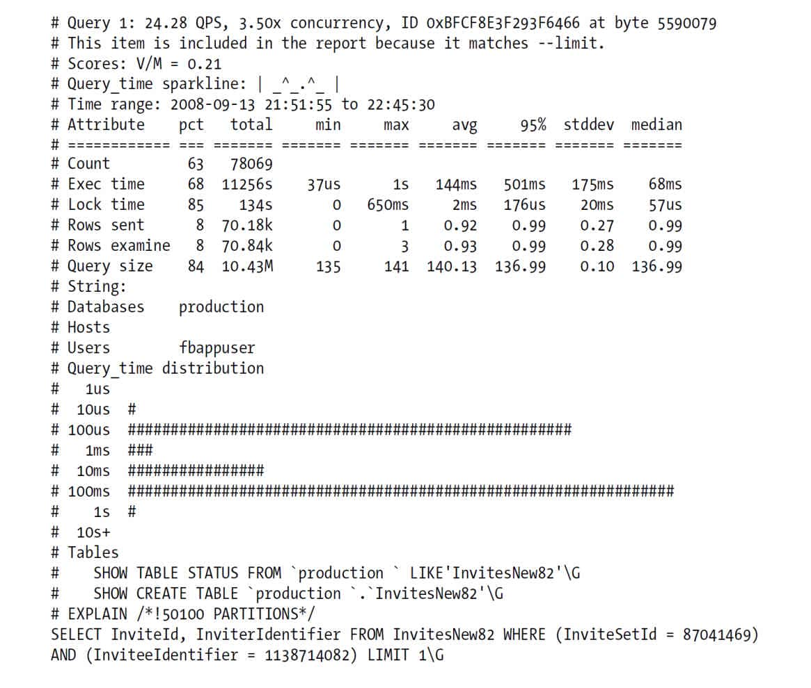
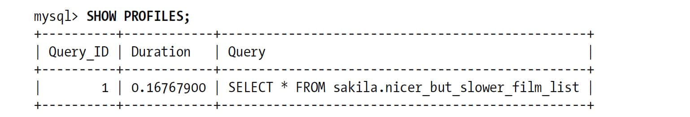
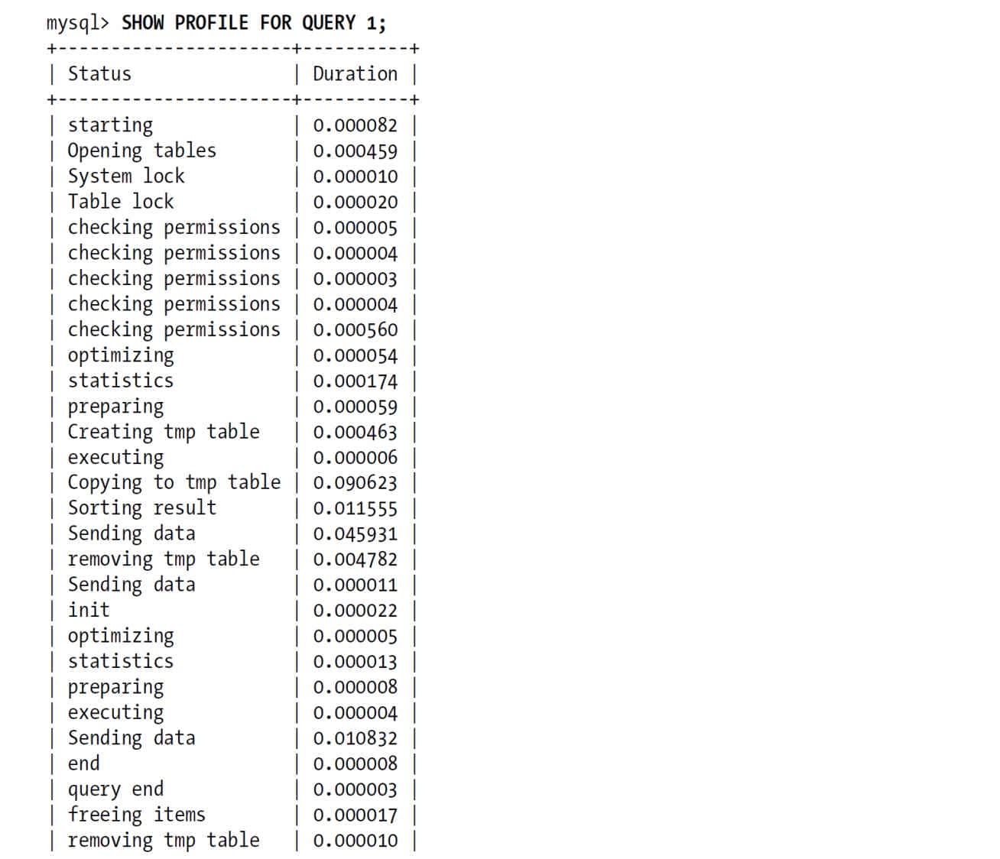
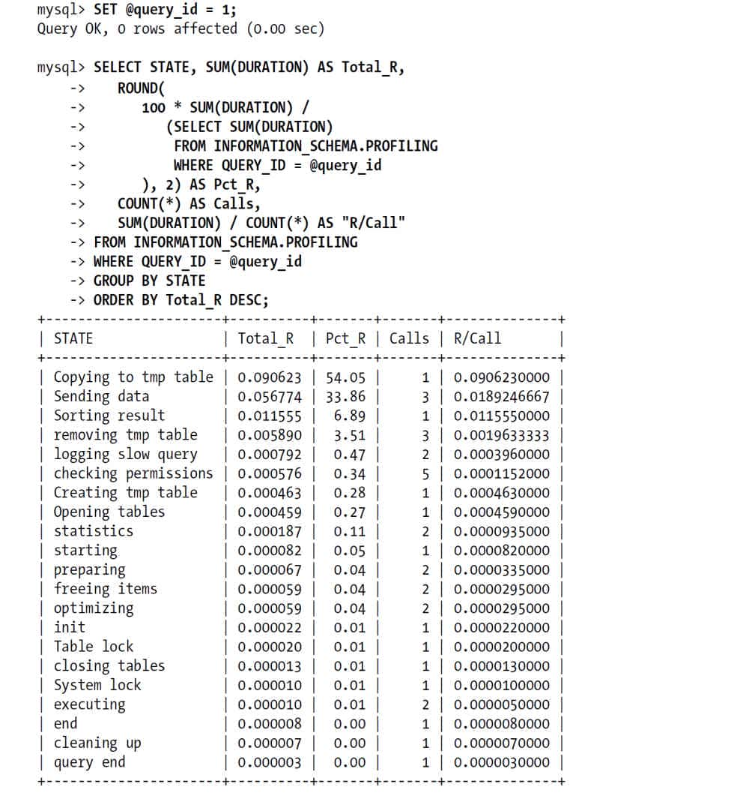
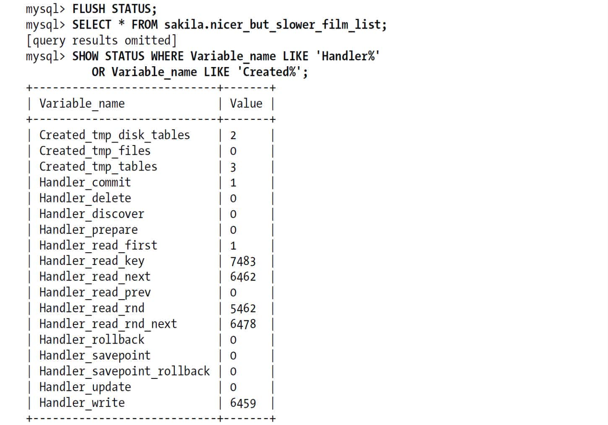
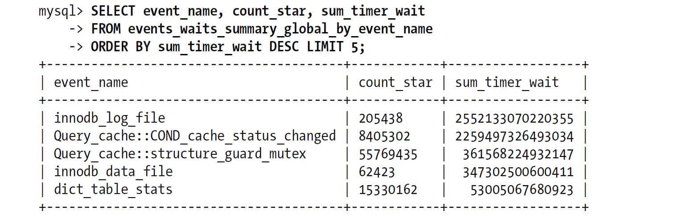
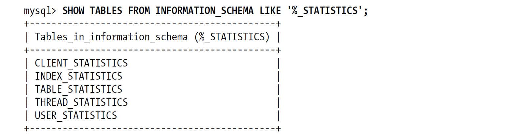
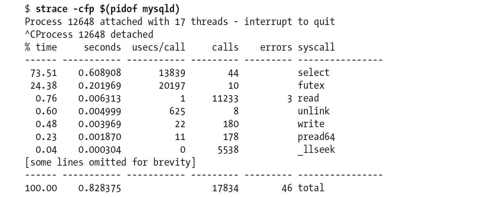

 第3章　服务器性能剖析

在我们的技术咨询生涯中，最常碰到的三个性能相关的服务请求是：如何确认服务器是否达到了性能最佳的状态、找出某条语句为什么执行不够快，以及诊断被用户描述成“停顿”、“堆积”或者“卡死”的某些间歇性疑难故障。本章将主要针对这三个问题做出解答。我们将提供一些工具和技巧来优化整机的性能、优化单条语句的执行速度，以及诊断或者解决那些很难观察到的问题（这些问题用户往往很难知道其根源，有时候甚至都很难察觉到它的存在）。

这看起来是个艰巨的任务，但是事实证明，有一个简单的方法能够从噪声中发现苗头。这个方法就是专注于测量服务器的时间花费在哪里，使用的技术则是性能剖析（profiling）。在本章，我们将展示如何测量系统并生成剖析报告，以及如何分析系统的整个堆栈（stack），包括从应用程序到数据库服务器到单个查询。

首先我们要保持空杯精神，抛弃掉一些关于性能的常见的误解。这有一定的难度，下面我们一起通过一些例子来说明问题在哪里。

# 3.1　性能优化简介

问10个人关于性能的问题，可能会得到10个不同的回答，比如“每秒查询次数”、“CPU利用率”、“可扩展性”之类。这其实也没有问题，每个人在不同场景下对性能有不同的理解，但本章将给性能一个正式的定义。我们将性能定义为完成某件任务所需要的时间度量，换句话说，性能即响应时间，这是一个非常重要的原则。我们通过任务和时间而不是资源来测量性能。数据库服务器的目的是执行SQL语句，所以它关注的任务是查询或者语句，如SELECT、UPDATE、DELETE等(1)。数据库服务器的性能用查询的响应时间来度量，单位是每个查询花费的时间。

还有另外一个问题：什么是优化？我们暂时不讨论这个问题，而是假设性能优化就是在一定的工作负载下尽可能地(2)降低响应时间。

很多人对此很迷茫。假如你认为性能优化是降低CPU利用率，那么可以减少对资源的使用。但这是一个陷阱，资源是用来消耗并用来工作的，所以有时候消耗更多的资源能够加快查询速度。很多时候将使用老版本InnoDB引擎的MySQL升级到新版本后，CPU利用率会上升得很厉害，这并不代表性能出现了问题，反而说明新版本的InnoDB对资源的利用率上升了。查询的响应时间则更能体现升级后的性能是不是变得更好。版本升级有时候会带来一些bug，比如不能利用某些索引从而导致CPU利用率上升。CPU利用率只是一种现象，而不是很好的可度量的目标。

同样，如果把性能优化仅仅看成是提升每秒查询量，这其实只是吞吐量优化。吞吐量的提升可以看作性能优化的副产品(3)。对查询的优化可以让服务器每秒执行更多的查询，因为每条查询执行的时间更短了（吞吐量的定义是单位时间内的查询数量，这正好是我们对性能的定义的倒数）。

所以如果目标是降低响应时间，那么就需要理解为什么服务器执行查询需要这么多时间，然后去减少或者消除那些对获得查询结果来说不必要的工作。也就是说，先要搞清楚时间花在哪里。这就引申出优化的第二个原则：无法测量就无法有效地优化。所以第一步应该测量时间花在什么地方。

我们观察到，很多人在优化时，都将精力放在修改一些东西上，却很少去进行精确的测量。我们的做法完全相反，将花费非常多，甚至90％的时间来测量响应时间花在哪里。如果通过测量没有找到答案，那要么是测量的方式错了，要么是测量得不够完整。如果测量了系统中完整而且正确的数据，性能问题一般都能暴露出来，对症下药的解决方案也就比较明了。测量是一项很有挑战性的工作，并且分析结果也同样有挑战性，测出时间花在哪里，和知道为什么花在那里，是两码事。

前面提到需要合适的测量范围，这是什么意思呢？合适的测量范围是说只测量需要优化的活动。有两种比较常见的情况会导致不合适的测量：

+ 在错误的时间启动和停止测量。 
+ 测量的是聚合后的信息，而不是目标活动本身。 

例如，一个常见的错误是先查看慢查询，然后又去排查整个服务器的情况来判断问题在哪里。如果确认有慢查询，那么就应该测量慢查询，而不是测量整个服务器。测量的应该是从慢查询的开始到结束的时间，而不是查询之前或查询之后的时间。

完成一项任务所需要的时间可以分成两部分：执行时间和等待时间。如果要优化任务的执行时间，最好的办法是通过测量定位不同的子任务花费的时间，然后优化去掉一些子任务、降低子任务的执行频率或者提升子任务的效率。而优化任务的等待时间则相对要复杂一些，因为等待有可能是由其他系统间接影响导致，任务之间也可能由于争用磁盘或者CPU资源而相互影响。根据时间是花在执行还是等待上的不同，诊断也需要不同的工具和技术。

刚才说到需要定位和优化子任务，但只是一笔带过。一些运行不频繁或者很短的子任务对整体响应时间的影响很小，通常可以忽略不计。那么如何确认哪些子任务是优化的目标呢？这个时候性能剖析就可以派上用场了。

**如何判断测量是正确的？**

如果测量是如此重要，那么测量错了会有什么后果？实际上，测量经常都是错误的。对数量的测量并不等于数量本身。测量的错误可能很小，跟实际情况区别不大，但错的终归是错的。所以这个问题其实应该是：“测量到底有多么不准确？”这个问题在其他一些书中有详细的讨论，但不是本书的主题。但是要意识到使用的是测量数据，而不是其所代表的实际数据。通常来说，测量的结果也可能有多种模糊的表现，这可能导致推断出错误的结论。

## 3.1.1　通过性能剖析进行优化

一旦掌握并实践面向响应时间的优化方法，就会发现需要不断地对系统进行性能剖析（profiling）。

性能剖析是测量和分析时间花费在哪里的主要方法。性能剖析一般有两个步骤：测量任务所花费的时间；然后对结果进行统计和排序，将重要的任务排到前面。

性能剖析工具的工作方式基本相同。在任务开始时启动计时器，在任务结束时停止计时器，然后用结束时间减去启动时间得到响应时间。也有些工具会记录任务的父任务。这些结果数据可以用来绘制调用关系图，但对于我们的目标来说更重要的是，可以将相似的任务分组并进行汇总。对相似的任务分组并进行汇总可以帮助对那些分到一组的任务做更复杂的统计分析，但至少需要知道每一组有多少任务，并计算出总的响应时间。通过性能剖析报告（*profile report*）可以获得需要的结果。性能剖析报告会列出所有任务列表。每行记录一个任务，包括任务名、任务的执行时间、任务的消耗时间、任务的平均执行时间，以及该任务执行时间占全部时间的百分比。性能剖析报告会按照任务的消耗时间进行降序排序。

为了更好地说明，这里举一个对整个数据库服务器工作负载的性能剖析的例子，主要输出的是各种类型的查询和执行查询的时间。这是从整体的角度来分析响应时间，后面会演示其他角度的分析结果。下面的输出是用Percona Toolkit中的*pt-query-digest*（实际上就是著名的Maatkit工具中的*mk-query-digest*）分析得到的结果。为了显示方便，对结果做了一些微调，并且只截取了前面几行结果：

        Rank Response time    Calls R/Call Item
        ==== ================ ===== ====== =======
            1 11256.3618 68.1% 78069 0.1442 SELECT InvitesNew
            2 2029.4730 12.3% 14415 0.1408 SELECT StatusUpdate
            3 1345.3445 8.1% 3520 0.3822 SHOW STATUS

上面只是性能剖析结果的前几行，根据总响应时间进行排名，只包括剖析所需要的最小列组合。每一行都包括了查询的响应时间和占总时间的百分比、查询的执行次数、单次执行的平均响应时间，以及该查询的摘要。通过这个性能剖析可以很清楚地看到每个查询相互之间的成本比较，以及每个查询占总成本的比较。在这个例子中，任务指的就是查询，实际上在分析MySQL的时候经常都指的是查询。

我们将实际地讨论两种类型的性能剖析：基于执行时间的分析和基于等待的分析。基于执行时间的分析研究的是什么任务的执行时间最长，而基于等待的分析则是判断任务在什么地方被阻塞的时间最长。

如果任务执行时间长是因为消耗了太多的资源且大部分时间花费在执行上，等待的时间不多，这种情况下基于等待的分析作用就不大。反之亦然，如果任务一直在等待，没有消耗什么资源，去分析执行时间就不会有什么结果。如果不能确认问题是出在执行还是等待上，那么两种方式都需要试试。后面会给出详细的例子。

事实上，当基于执行时间的分析发现一个任务需要花费太多时间的时候，应该深入去分析一下，可能会发现某些“执行时间”实际上是在等待。例如，上面简单的性能剖析的输出显示表InvitesNew上的SELECT查询花费了大量时间，如果深入研究，则可能发现时间都花费在等待I/O完成上。

在对系统进行性能剖析前，必须先要能够进行测量，这需要系统可测量化的支持。可测量的系统一般会有多个测量点可以捕获并收集数据，但实际系统很少可以做到可测量化。大部分系统都没有多少可测量点，即使有也只提供一些活动的计数，而没有活动花费的时间统计。MySQL就是一个典型的例子，直到版本5.5才第一次提供了Performance Schema，其中有一些基于时间的测量点(4)，而版本5.1及之前的版本没有任何基于时间的测量点。能够从MySQL收集到的服务器操作的数据大多是show status计数器的形式，这些计数器统计的是某种活动发生的次数。这也是我们最终决定创建Percona Server的主要原因，Percona Server从版本5.0开始提供很多更详细的查询级别的测量点。

虽然理想的性能优化技术依赖于更多的测量点，但幸运的是，即使系统没有提供测量点，也还有其他办法可以展开优化工作。因为还可以从外部去测量系统，如果测量失败，也可以根据对系统的了解做出一些靠谱的猜测。但这么做的时候一定要记住，不管是外部测量还是猜测，数据都不是百分之百准确的，这是系统不透明所带来的风险。

举个例子，在Percona Server 5.0中，慢查询日志揭露了一些性能低下的原因，如磁盘I/O等待或者行级锁等待。如果日志中显示一条查询花费10秒，其中9.6秒在等待磁盘I/O，那么追究其他4％的时间花费在哪里就没有意义，磁盘I/O才是最重要的原因。

## 3.1.2　理解性能剖析

MySQL的性能剖析（profile）将最重要的任务展示在前面，但有时候没显示出来的信息也很重要。可以参考一下前面提到过的性能剖析的例子。不幸的是，尽管性能剖析输出了排名、总计和平均值，但还是有很多需要的信息是缺失的，如下所示。

值得优化的查询（worthwhile query）

性能剖析不会自动给出哪些查询值得花时间去优化。这把我们带回到优化的本意，如果你读过Cary Millsap的书，对此就会有更多的理解。这里我们要再次强调两点：第一，一些只占总响应时间比重很小的查询是不值得优化的。根据阿姆达尔定律（Amdahl's Law），对一个占总响应时间不超过5％的查询进行优化，无论如何努力，收益也不会超过5％。第二，如果花费了1000美元去优化一个任务，但业务的收入没有任何增加，那么可以说反而导致业务被逆优化了1000美元。如果优化的成本大于收益，就应当停止优化。

异常情况

某些任务即使没有出现在性能剖析输出的前面也需要优化。比如某些任务执行次数很少，但每次执行都非常慢，严重影响用户体验。因为其执行频率低，所以总的响应时间占比并不突出。

未知的未知(5)

一款好的性能剖析工具会显示可能的“丢失的时间”。丢失的时间指的是任务的总时间和实际测量到的时间之间的差。例如，如果处理器的CPU时间是10秒，而剖析到的任务总时间是9.7秒，那么就有300毫秒的丢失时间。这可能是有些任务没有测量到，也可能是由于测量的误差和精度问题的缘故。如果工具发现了这类问题，则要引起重视，因为有可能错过了某些重要的事情。即使性能剖析没有发现丢失时间，也需要注意考虑这类问题存在的可能性，这样才不会错过重要的信息。我们的例子中没有显示丢失的时间，这是我们所使用工具的一个局限性。

被掩藏的细节

性能剖析无法显示所有响应时间的分布。只相信平均值是非常危险的，它会隐藏很多信息，而且无法表达全部情况。Peter经常举例说医院所有病人的平均体温没有任何价值(6)。假如在前面的性能剖析的例子的第一项中，如果有两次查询的响应时间是1秒，而另外12771次查询的响应时间是几十微秒，结果会怎样？只从平均值里是无法发现两次1秒的查询的。要做出最好的决策，需要为性能剖析里输出的这一行中包含的12773次查询提供更多的信息，尤其是更多响应时间的信息，比如直方图、百分比、标准差、偏差指数等。

好的工具可以自动地获得这些信息。实际上，*pt-query-digest*就在剖析的结果里包含了很多这类细节信息，并且输出在剖析报告中。对此我们做了简化，可以将精力集中在重要而基础的例子上：通过排序将最昂贵的任务排在前面。本章后面会展示更多丰富而有用的性能剖析的例子。

在前面的性能剖析的例子中，还有一个重要的缺失，就是无法在更高层次的堆栈中进行交互式的分析。当我们仅仅着眼于服务器中的单个查询时，无法将相关查询联系起来，也无法理解这些查询是否是同一个用户交互的一部分。性能剖析只能管中窥豹，而无法将剖析从任务扩展至事务或者页面查看（page view）的级别。也有一些办法可以解决这个问题，比如给查询加上特殊的注释作为标签，可以标明其来源并据此做聚合，也可以在应用层面增加更多的测量点，这是下一节的主题。

# 3.2　对应用程序进行性能剖析

对任何需要消耗时间的任务都可以做性能剖析，当然也包括应用程序。实际上，剖析应用程序一般比剖析数据库服务器容易，而且回报更多。虽然前面的演示例子都是针对MySQL服务器的剖析，但对系统进行性能剖析还是建议自上而下地进行(7)，这样可以追踪自用户发起到服务器响应的整个流程。虽然性能问题大多数情况下都和数据库有关，但应用导致的性能问题也不少。性能瓶颈可能有很多影响因素：

+ 外部资源，比如调用了外部的Web服务或者搜索引擎。 
+ 应用需要处理大量的数据，比如分析一个超大的XML文件。 
+ 在循环中执行昂贵的操作，比如滥用正则表达式。 
+ 使用了低效的算法，比如使用暴力搜索算法（naïve search algorithm）来查找列表中的项。 

幸运的是，确定MySQL的问题没有这么复杂，只需要一款应用程序的剖析工具即可（作为回报，一旦拥有这样的工具，就可以从一开始就写出高效的代码）。

建议在所有的新项目中都考虑包含性能剖析的代码。往已有的项目中加入性能剖析代码也许很困难，新项目就简单一些。

**性能剖析本身会导致服务器变慢吗？**

说“是的”，是因为性能剖析确实会导致应用慢一点；说“不是”，是因为性能剖析可以帮助应用运行得更快。先别急，下面就解释一下为什么这么说。

性能剖析和定期检测都会带来额外开销。问题在于这部分的开销有多少，并且由此获得的收益是否能够抵消这些开销。

大多数设计和构建过高性能应用程序的人相信，应该尽可能地测量一切可以测量的地方，并且接受这些测量带来的额外开销，这些开销应该被当成应用程序的一部分。Oracle的性能优化大师Tom Kyte曾被问到Oracle中的测量点的开销，他的回答是，测量点至少为性能优化贡献了10％。对此我们深表赞同，而且大多数应用并不需要每天都运行详细的性能测量，所以实际贡献甚至要超过10％。即使不同意这个观点，为应用构建一些可以永久使用的轻量级的性能剖析也是有意义的。如果系统没有每天变化的性能统计，则碰到无法提前预知的性能瓶颈就是一件头痛的事情。发现问题的时候，如果有历史数据，则这些历史数据价值是无限的。而且性能数据还可以帮助规划好硬件采购、资源分配，以及预测周期性的性能尖峰。

那么何谓“轻量级”的性能剖析？比如可以为所有SQL语句计时，加上脚本总时间统计，这样做的代价不高，而且不需要在每次页面查看（page view）时都执行。如果流量趋势比较稳定，随机采样也可以，随机采样可以通过在应用程序中设置实现：

        <?php
        $profiling_enabled=rand（0，100）>99;
        ?>

这样只有1％的会话会执行性能采样，来帮助定位一些严重的问题。这种策略在生产环境中尤其有用，可以发现一些其他方法无法发现的问题。

几年前在写作本书的第二版的时候，流行的Web编程语言和框架中还没有太多现成的性能剖析工具可以用于生产环境，所以在书中展示了一段示例代码，可以简单而有效地复制使用。而到了今天，已经有了很多好用的工具，要做的只是打开工具箱，就可以开始优化性能。

首先，这里要“兜售”的一个好工具是一款叫做New Relic的软件即服务（software-as-a-service）产品。声明一下我们不是“托”，我们一般不会推荐某个特定公司或产品，但这个工具真的非常棒，建议大家都用它。我们的客户借助这个工具，在没有我们帮助的情况下，解决了很多问题；即使有时候找不到解决办法，但依然能够帮助定位到问题。New Relic会插入到应用程序中进行性能剖析，将收集到的数据发送到一个基于Web的仪表盘，使用仪表盘可以更容易利用面向响应时间的方法分析应用性能。这样用户只需要考虑做那些正确的事情，而不用考虑如何去做。而且New Relic测量了很多用户体验相关的点，涵盖从Web浏览器到应用代码，再到数据库及其他外部调用。

像New Relic这类工具的好处是可以全天候地测量生产环境的代码——既不限于测试环境，也不限于某个时间段。这一点非常重要，因为有很多剖析工具或者测量点的代价很高，所以不能在生产环境全天候运行。在生产环境运行，可以发现一些在测试环境和预发环境无法发现的性能问题。如果工具在生产环境全天候运行的成本太高，那么至少也要在集群中找一台服务器运行，或者只针对部分代码运行，原因请参考前面的“性能剖析本身会导致服务器变慢吗？”。

## 3.2.1　测量PHP应用程序

如果不使用New Relic，也有其他的选择。尤其是对PHP，有好几款工具都可以帮助进行性能剖析。其中一款叫做*xhprof*（*http://pecl.php.net/package/xhprof*），这是Facebook开发给内部使用的，在2009年开源了。*xhprof*有很多高级特性，并且易于安装和使用，它很轻量级，可扩展性也很好，可以在生产环境大量部署并全天候使用，它还能针对函数调用进行剖析，并根据耗费的时间进行排序。相比*xhprof*，还有一些更底层的工具，比如*xdebug、Valgrind*和*cachegrind*，可以从多个角度对代码进行检测(8)。有些工具会产生大量输出，并且开销很大，并不适合在生产环境运行，但在开发环境却可以发挥很大的作用。

下面要讨论的另外一个PHP性能剖析工具是我们自己写的，基于本书第二版的代码和原则扩展而来，名叫IfP（instrumentation-for-php），代码托管在Goole Code上（*http://code.google.com/p/instrumentation-for-php/*）。Ifp并不像xhprof一样对PHP做深入的测量，而是更关注数据库调用。所以当无法在数据库层面进行测量的时候，Ifp可以很好地帮助应用剖析数据库的利用率。Ifp是一个提供了计数器和计时器的单例类，很容易部署到生产环境中，因为不需要访问PHP配置的权限（对很多开发人员来说，都没有访问PHP配置的权限，所以这一点很重要）。

Ifp不会自动剖析所有的PHP函数，而只是针对重要的函数。例如，对于某些需要剖析的地方要用到自定义的计数器，就需要手工启动和停止。但Ifp可以自动对整个页面的执行进行计时，这样对自动测量数据库和*memcached*的调用就比较简单，对于这种情况就无须手工启动或者停止。这也意味着，Ifp可以剖析三种情况：应用程序的请求（如page view）、数据库的查询和缓存的查询。Ifp还可以将计数器和计时器输出到Apache，通过Apache可以将结果写入到日志中。这是一种方便且轻量的记录结果的方式。Ifp不会保存其他数据，所以也不需要有系统管理员的权限。

使用Ifp，只需要简单地在页面的开始处调用start\_request()。理想情况下，在程序的一开始就应当调用：

        require_once('Instrumentation.php');
        Instrumentation::get_instance()->start_request();

这段代码注册了一个shutdown函数，所以在执行结束的地方不需要再做更多的处理。

Ifp会自动对SQL添加注释，便于从数据库的查询日志中更灵活地分析应用的情况，通过SHOW PROCESSLIST也可以更清楚地知道性能低的查询出自何处。大多数情况下，定位性能低下查询的来源都不容易，尤其是那些通过字符串拼接出来的查询语句，都没有办法在源代码中去搜索。那么Ifp的这个功能就可以帮助解决这个问题，它可以很快定位到查询是从何处而来的，即使应用和数据库中间加了代理或者负载均衡层，也可以确认是哪个应用的用户，是哪个页面请求，是源代码中的哪个函数、代码行号，甚至是所创建的计数器的键值对。下面是一个例子：

        **    --File: index.php Line: 118 Function: fullCachePage request_id: ABC session_id: XYZ**    
        **    SELECT * FROM ...**    

如何测量MySQL的调用取决于连接MySQL的接口。如果使用的是面向对象的*mysqli*接口，则只需要修改一行代码：将构造函数从*mysqli*改为可以自动测量的*mysqli\_x*即可。*mysqli\_x*构造函数是由Ifp提供的子类，可以在后台测量并改写查询。如果使用的不是面向对象的接口，或者是其他的数据库访问层，则需要修改更多的代码。如果数据库调用不是分散在代码各处还好，否则建议使用集成开发环境（IDE）如Eclipse，这样修改起来要容易些。但不管从哪个方面来看，将访问数据库的代码集中到一起都可以说是最佳实践。

Ifp的结果很容易分析。Percona Toolkit中的*pt-query-digest*能够很方便地从查询注释中抽取出键值对，所以只需要简单地将查询记录到MySQL的日志文件中，再对日志文件进行处理即可。Apache的*mod\_log\_config*模块可以利用Ifp输出的环境变量来定制日志输出，其中的宏％D还可以以微秒级记录请求时间。

也可以通过LOAD DATA INFILE将Apache的日志载入到MySQL数据库中，然后通过SQL进行查询。在Ifp的网站上有一个PDF的幻灯片，详细给出了使用示例，包括查询和命令行参数都有。

或许你会说不想或者没时间在代码中加入测量的功能，其实这事比想象的要容易得多，而且花在优化上的时间将会由于性能的优化而加倍地回报给你。对应用的测量是不可替代的。当然最好是直接使用New Relic、*xhprof*、Ifp或者其他已有的优化工具，而不必重新去发明“轮子”。

**MySQL企业监控器的查询分析功能**

MySQL的企业监控器（Enterprise Monitor）也是值得考虑的工具之一。这是Oracle提供的MySQL商业服务支持中的一部分。它可以捕获发送给服务器的查询，要么是通过应用程序连接MySQL的库文件实现，要么是在代理层实现（我们并不太建议使用代理层）。该工具有设计良好的用户界面，可以直观地显示查询的剖析结果，并且可以根据时间段进行缩放，例如可以选择某个异常的性能尖峰时间来查看状态图。也可以查看EXPLAIN出来的执行计划，这在故障诊断时非常有用。

# 3.3　剖析MySQL查询

对查询进行性能剖析有两种方式，每种方式都有各自的问题，本章会详细介绍。可以剖析整个数据库服务器，这样可以分析出哪些查询是主要的压力来源（如果已经在最上面的应用层做过剖析，则可能已经知道哪些查询需要特别留意）。定位到具体需要优化的查询后，也可以钻取下去对这些查询进行单独的剖析，分析哪些子任务是响应时间的主要消耗者。

## 3.3.1　剖析服务器负载

服务器端的剖析很有价值，因为在服务器端可以有效地审计效率低下的查询。定位和优化“坏”查询能够显著地提升应用的性能，也能解决某些特定的难题。还可以降低服务器的整体压力，这样所有的查询都将因为减少了对共享资源的争用而受益（“间接的好处”）。降低服务器的负载也可以推迟或者避免升级更昂贵硬件的需求，还可以发现和定位糟糕的用户体验，比如某些极端情况。

MySQL的每一个新版本中都增加了更多的可测量点。如果当前的趋势可靠的话，那么在性能方面比较重要的测量需求很快能够在全球范围内得到支持。但如果只是需要剖析并找出代价高的查询，就不需要如此复杂。有一个工具很早之前就能帮到我们了，这就是慢查询日志。

### 捕获MySQL的查询到日志文件中

在MySQL中，慢查询日志最初只是捕获比较“慢”的查询，而性能剖析却需要针对所有的查询。而且在MySQL 5.0及之前的版本中，慢查询日志的响应时间的单位是秒，粒度太粗了。幸运的是，这些限制都已经成为历史了。在MySQL 5.1及更新的版本中，慢日志的功能已经被加强，可以通过设置long\_query\_time为0来捕获所有的查询，而且查询的响应时间单位已经可以做到微秒级。如果使用的是Percona Server，那么5.0版本就具备了这些特性，而且Percona Server提供了对日志内容和查询捕获的更多控制能力。

在MySQL的当前版本中，慢查询日志是开销最低、精度最高的测量查询时间的工具。如果还在担心开启慢查询日志会带来额外的I/O开销，那大可以放心。我们在I/O密集型场景做过基准测试，慢查询日志带来的开销可以忽略不计（实际上在CPU密集型场景的影响还稍微大一些）。更需要担心的是日志可能消耗大量的磁盘空间。如果长期开启慢查询日志，注意要部署日志轮转（log rotation）工具。或者不要长期启用慢查询日志，只在需要收集负载样本的期间开启即可。

MySQL还有另外一种查询日志，被称之为“通用日志”，但很少用于分析和剖析服务器性能。通用日志在查询请求到服务器时进行记录，所以不包含响应时间和执行计划等重要信息。MySQL 5.1之后支持将日志记录到数据库的表中，但多数情况下这样做没什么必要。这不但对性能有较大影响，而且MySQL 5.1在将慢查询记录到文件中时已经支持微秒级别的信息，然而将慢查询记录到表中会导致时间粒度退化为只能到秒级。而秒级别的慢查询日志没有太大的意义。

Percona Server的慢查询日志比MySQL官方版本记录了更多细节且有价值的信息，如查询执行计划、锁、I/O活动等。这些特性都是随着处理各种不同的优化场景的需求而慢慢加进来的。另外在可管理性上也进行了增强。比如全局修改针对每个连接的*long\_query\_time*的阈值，这样当应用使用连接池或者持久连接的时候，可以不用重置会话级别的变量而启动或者停止连接的查询日志。总的来说，慢查询日志是一种轻量而且功能全面的性能剖析工具，是优化服务器查询的利器。

有时因为某些原因如权限不足等，无法在服务器上记录查询。这样的限制我们也常常碰到，所以我们开发了两种替代的技术，都集成到了Percona Toolkit中的*pt-query-digest*中。第一种是通过*--processlist*选项不断查看SHOW FULL PROCESSLIST的输出，记录查询第一次出现的时间和消失的时间。某些情况下这样的精度也足够发现问题，但却无法捕获所有的查询。一些执行较快的查询可能在两次执行的间隙就执行完成了，从而无法捕获到。

第二种技术是通过抓取TCP网络包，然后根据MySQL的客户端/服务端通信协议进行解析。可以先通过*tcpdump*将网络包数据保存到磁盘，然后使用*pt-query-digest*的*--type=tcpdump*选项来解析并分析查询。此方法的精度比较高，并且可以捕获所有查询。还可以解析更高级的协议特性，比如可以解析二进制协议，从而创建并执行服务端预解析的语句（prepared statement）及压缩协议。另外还有一种方法，就是通过MySQL Proxy代理层的脚本来记录所有查询，但在实践中我们很少这样做。

### 分析查询日志

强烈建议大家从现在起就利用慢查询日志捕获服务器上的所有查询，并且进行分析。可以在一些典型的时间窗口如业务高峰期的一个小时内记录查询。如果业务趋势比较均衡，那么一分钟甚至更短的时间内捕获需要优化的低效查询也是可行的。

不要直接打开整个慢查询日志进行分析，这样做只会浪费时间和金钱。首先应该生成一个剖析报告，如果需要，则可以再查看日志中需要特别关注的部分。自顶向下是比较好的方式，否则有可能像前面提到的，反而导致业务的逆优化。

从慢查询日志中生成剖析报告需要有一款好工具，这里我们建议使用*pt-query-digest*，这毫无疑问是分析MySQL查询日志最有力的工具。该工具功能强大，包括可以将查询报告保存到数据库中，以及追踪工作负载随时间的变化。

一般情况下，只需要将慢查询日志文件作为参数传递给*pt-query-digest*，就可以正确地工作了。它会将查询的剖析报告打印出来，并且能够选择将“重要”的查询逐条打印出更详细的信息。输出的报告细节详尽，绝对可以让生活更美好。该工具还在持续的开发中，因此要了解最新的功能请阅读最新版本的文档。

这里给出一份*pt-query-digest*输出的报告的例子，作为进行性能剖析的开始。这是前面提到过的一个未修改过的剖析报告：

        # Profile
        # Rank Query ID Response time Calls R/Call V/M Item
        # ==== ================== ================ ===== ====== ===== =======
        #    1 0xBFCF8E3F293F6466 11256.3618 68.1% 78069  0.1442 0.21 SELECT InvitesNew?
        #    2 0x620B8CAB2B1C76EC  2029.4730 12.3% 14415  0.1408 0.21 SELECT StatusUpdate?
        #    3 0xB90978440CC11CC7  1345.3445  8.1%  3520  0.3822 0.00 SHOW  STATUS
        #    4 0xCB73D6B5B031B4CF  1341.6432  8.1%  3509  0.3823 0.00 SHOW  STATUS
        # MISC 0xMISC               560.7556  3.4%  23930 0.0234 0.0 <17 ITEMS>

可以看到这个比之前的版本多了一些细节。首先，每个查询都有一个ID，这是对查询语句计算出的哈希值指纹，计算时去掉了查询条件中的文本值和所有空格，并且全部转化为小写字母（请注意第三条和第四条语句的摘要看起来一样，但哈希指纹是不一样的）。该工具对表名也有类似的规范做法。表名InvitesNew后面的问号意味着这是一个分片（shard）的表，表名后面的分片标识被问号替代，这样就可以将同一组分片表作为一个整体做汇总统计。这个例子实际上是来自一个压力很大的分片过的Facebook应用。

报告中的V/M列提供了方差均值比（variance-to-mean ratio）的详细数据，方差均值比也就是常说的离差指数（index of dispersion）。离差指数高的查询对应的执行时间的变化较大，而这类查询通常都值得去优化。如果*pt-query-digest*指定了*--explain*选项，输出结果中会增加一列简要描述查询的执行计划，执行计划是查询背后的“极客代码”。通过联合观察执行计划列和V/M列，可以更容易识别出性能低下需要优化的查询。

最后，在尾部也增加了一行输出，显示了其他17个占比较低而不值得单独显示的查询的统计数据。可以通过*--limit*和*--outliers*选项指定工具显示更多查询的详细信息，而不是将一些不重要的查询汇总在最后一行。默认只会打印时间消耗前10位的查询，或者执行时间超过1秒阈值很多倍的查询，这两个限制都是可配置的。

剖析报告的后面包含了每种查询的详细报告。可以通过查询的ID或者排名来匹配前面的剖析统计和查询的详细报告。下面是排名第一也就是“最差”的查询的详细报告：

 

查询报告的顶部包含了一些元数据，包括查询执行的频率、平均并发度，以及该查询性能最差的一次执行在日志文件中的字节偏移值，接下来还有一个表格格式的元数据，包括诸如标准差一类的统计信息(9)。

接下来的部分是响应时间的直方图。有趣的是，可以看到上面这个查询在Query\_time distribution部分的直方图上有两个明显的高峰，大部分情况下执行都需要几百毫秒，但在快三个数量级的部分也有一个明显的尖峰，几百微秒就能执行完成。如果这是Percona Server的记录，那么在查询日志中还会有更多丰富的属性，可以对查询进行切片分析到底发生了什么。比如可能是因为查询条件传递了不同的值，而这些值的分布很不均衡，导致服务器选择了不同的索引；或者是由于查询缓存命中等。在实际系统中，这种有两个尖峰的直方图的情况很少见，尤其是对于简单的查询，查询越简单执行计划也越稳定。

在细节报告的最后部分是方便复制、粘贴到终端去检查表的模式和状态的语句，以及完整的可用于EXPLAIN分析执行计划的语句。EXPLAIN分析的语句要求所有的条件是文本值而不是“指纹”替代符，所以是真正可直接执行的语句。在本例中是执行时间最长的一条实际的查询。

确定需要优化的查询后，可以利用这个报告迅速地检查查询的执行情况。这个工具我们经常使用，并且会根据使用的情况不断进行修正以帮助提升工具的可用性和效率，强烈建议大家都能熟练使用它。MySQL本身在未来或许也会有更多复杂的测量点和剖析工具，但在本书写作时，通过慢查询日志记录查询或者使用*pt-query-digest*分析*tcpdump*的结果，是可以找到的最好的两种方式。

## 3.3.2　剖析单条查询

在定位到需要优化的单条查询后，可以针对此查询“钻取”更多的信息，确认为什么会花费这么长的时间执行，以及需要如何去优化。关于如何优化查询的技术将在本书后续的一些章节讨论，在此之前还需要介绍一些相关的背景知识。本章的主要目的是介绍如何方便地测量查询执行的各部分花费了多少时间，有了这些数据才能决定采用何种优化技术。

不幸的是，MySQL目前大多数的测量点对于剖析查询都没有什么帮助。当然这种状况正在改善，但在本书写作之际，大多数生产环境的服务器还没有使用包含最新剖析特性的版本。所以在实际应用中，除了SHOW STATUS、SHOW PROFILE、检查慢查询日志的条目（这还要求必须是Percona Server，官方MySQL版本的慢查询日志缺失了很多附加信息）这三种方法外就没有什么更好的办法了。下面将逐一演示如何使用这三种方法来剖析单条查询，看看每一种方法是如何显示查询的执行情况的。

### 使用SHOW PROFILE

SHOW PROFILE命令是在MySQL 5.1以后的版本中引入的，来源于开源社区中的Jeremy Cole的贡献。这是在本书写作之际唯一一个在GA版本中包含的真正的查询剖析工具。默认是禁用的，但可以通过服务器变量在会话（连接）级别动态地修改。

        **    mysql> SET profiling = 1;**    

然后，在服务器上执行的所有语句，都会测量其耗费的时间和其他一些查询执行状态变更相关的数据。这个功能有一定的作用，而且最初的设计功能更强大，但未来版本中可能会被Performance Schema所取代。尽管如此，这个工具最有用的作用还是在语句执行期间剖析服务器的具体工作。

当一条查询提交给服务器时，此工具会记录剖析信息到一张临时表，并且给查询赋予一个从1开始的整数标识符。下面是对Sakila样本数据库的一个视图的剖析结果(10)：

        mysql> **    SELECT * FROM sakila.nicer_but_slower_film_list;**    
        [query results omitted]
        997 rows in set (0.17 sec)

该查询返回了997行记录，花费了大概1/6秒。下面看一下SHOW PROFILES有什么结果：

 

首先可以看到的是以很高的精度显示了查询的响应时间，这很好。MySQL客户端显示的时间只有两位小数，对于一些执行得很快的查询这样的精度是不够的。下面继续看接下来的输出：

 

 

剖析报告给出了查询执行的每个步骤及其花费的时间，看结果很难快速地确定哪个步骤花费的时间最多。因为输出是按照执行顺序排序，而不是按花费的时间排序的——而实际上我们更关心的是花费了多少时间，这样才能知道哪些开销比较大。但不幸的是无法通过诸如ORDER BY之类的命令重新排序。假如不使用SHOW PROFILE命令而是直接查询INFORMATION\_SCHEMA中对应的表，则可以按照需要格式化输出：

 

效果好多了！通过这个结果可以很容易看到查询时间太长主要是因为花了一大半的时间在将数据复制到临时表这一步。那么优化就要考虑如何改写查询以避免使用临时表，或者提升临时表的使用效率。第二个消耗时间最多的是“发送数据（Sending data）”，这个状态代表的原因非常多，可能是各种不同的服务器活动，包括在关联时搜索匹配的行记录等，这部分很难说能优化节省多少消耗的时间。另外也要注意到“结果排序（Sorting result）”花费的时间占比非常低，所以这部分是不值得去优化的。这是一个比较典型的问题，所以一般我们都不建议用户在“优化排序缓冲区（tuning sort buffer）”或者类似的活动上花时间。

尽管剖析报告能帮助我们定位到哪些活动花费了最多的时间，但并不会告诉我们为什么会这样。要弄清楚为什么复制数据到临时表要花费这么多时间，就需要深入下去，继续剖析这一步的子任务。

### 使用SHOW STATUS

MySQL的SHOW STATUS命令返回了一些计数器。既有服务器级别的全局计数器，也有基于某个连接的会话级别的计数器。例如其中的Queries(11)在会话开始时为0，每提交一条查询增加1。如果执行SHOW GLOBAL STATUS（注意到新加的GLOBAL关键字），则可以查看服务器级别的从服务器启动时开始计算的查询次数统计。不同计数器的可见范围不一样，不过全局的计数器也会出现在SHOW STATUS的结果中，容易被误认为是会话级别的，千万不要搞迷糊了。在使用这个命令的时候要注意几点，就像前面所讨论的，收集合适级别的测量值是很关键的。如果打算优化从某些特定连接观察到的东西，测量的却是全局级别的数据，就会导致混乱。MySQL官方手册中对所有的变量是会话级还是全局级做了详细的说明。

SHOW STATUS是一个有用的工具，但并不是一款剖析工具(12)。SHOW STATUS的大部分结果都只是一个计数器，可以显示某些活动如读索引的频繁程度，但无法给出消耗了多少时间。SHOW STATUS的结果中只有一条指的是操作的时间（Innodb\_row\_lock\_time），而且只能是全局级的，所以还是无法测量会话级别的工作。

尽管SHOW STATUS无法提供基于时间的统计，但对于在执行完查询后观察某些计数器的值还是有帮助的。有时候可以猜测哪些操作代价较高或者消耗的时间较多。最有用的计数器包括句柄计数器（handler counter）、临时文件和表计数器等。在附录B中会对此做更详细的解释。下面的例子演示了如何将会话级别的计数器重置为0，然后查询前面（“使用SHOW PROFILE”一节）提到的视图，再检查计数器的结果：

 

从结果可以看到该查询使用了三个临时表，其中两个是磁盘临时表，并且有很多的没有用到索引的读操作（Handler\_read\_rnd\_next）。假设我们不知道这个视图的具体定义，仅从结果来推测，这个查询有可能是做了多表关联（join）查询，并且没有合适的索引，可能是其中一个子查询创建了临时表，然后和其他表做联合查询。而用于保存子查询结果的临时表没有索引，如此大致可以解释这样的结果。

使用这个技术的时候，要注意SHOW STATUS本身也会创建一个临时表，而且也会通过句柄操作访问此临时表，这会影响到SHOW STATUS结果中对应的数字，而且不同的版本可能行为也不尽相同。比较前面通过SHOW PROFILES获得的查询的执行计划的结果来看，至少临时表的计数器多加了2。

你可能会注意到通过EXPLAIN查看查询的执行计划也可以获得大部分相同的信息，但EXPLAIN是通过估计得到的结果，而通过计数器则是实际的测量结果。例如，EXPLAIN无法告诉你临时表是否是磁盘表，这和内存临时表的性能差别是很大的。附录D包含更多关于EXPLAIN的内容。

### 使用慢查询日志

那么针对上面这样的查询语句，Percona Server对慢查询日志做了哪些改进？下面是“使用SHOW PROFILE”一节演示过的相同的查询执行后抓取到的结果：

        # Time: 110905 17:03:18
        # User@Host: root[root] @ localhost [127.0.0.1]
        # Thread_id: 7 Schema: sakila Last_errno: 0 Killed: 0
        # Query_time: 0.166872 Lock_time: 0.000552 Rows_sent: 997 Rows_examined: 24861
        Rows_affected: 0 Rows_read: 997
        # Bytes_sent: 216528 Tmp_tables: 3 Tmp_disk_tables: 2 Tmp_table_sizes: 11627188
        # InnoDB_trx_id: 191E
        # QC_Hit: No Full_scan: Yes Full_join: No Tmp_table: Yes Tmp_table_on_disk: Yes
        # Filesort: Yes Filesort_on_disk: No Merge_passes: 0
        # InnoDB_IO_r_ops: 0 InnoDB_IO_r_bytes: 0 InnoDB_IO_r_wait: 0.000000
        # InnoDB_rec_lock_wait: 0.000000 InnoDB_queue_wait: 0.000000
        # InnoDB_pages_distinct: 20
        # PROFILE_VALUES ... Copying to tmp table: 0.090623... [omitted]
        SET timestamp=1315256598;
        SELECT * FROM sakila.nicer_but_slower_film_list;

从这里看到查询确实一共创建了三个临时表，其中两个是磁盘临时表。而SHOW PROFILE看起来则隐藏了信息（可能是由于服务器执行查询的方式有不一样的地方造成的）。这里为了方便阅读，对结果做了简化。但最后对该查询执行SHOW PROFILE的数据也会写入到日志中，所以在Percona Server 中甚至可以记录SHOW PROFILE的细节信息。

另外也可以看到，慢查询日志中详细记录的条目包含了SHOW PROFILE和SHOW STATUS所有的输出，并且还有更多的信息。所以通过*pt-query-digest*发现“坏”查询后，在慢查询日志中可以获得足够有用的信息。查看*pt-query-digest*的报告时，其标题部分一般会有如下输出：

        # Query 1:0 QPS, 0x concurrency, ID 0xEE758C5E0D7EADEE at byte 3214_____

可以通过这里的字节偏移值（3214）直接跳转到日志的对应部分，例如用下面这样的命令即可：

        tail -c +3214 /path/to/query.log | head -n100

这样就可以直接跳转到细节部分了。另外，*pt-query-digest*能够处理Percona Server在慢查询日志中增加的所有键值对，并且会自动在报告中打印更多的细节信息。

### 使用Performance Schema

Using the Performance Schema

在本书写作之际，在MySQL 5.5中新增的Performance Schema表还不支持查询级别的剖析信息。Performance Schema还是非常新的特性，并且还在快速开发中，未来的版本中将会包含更多的功能。尽管如此，MySQL 5.5的初始版本已经包含了很多有趣的信息。例如，下面的查询显示了系统中等待的主要原因：

 

目前还有一些限制，使得Performance Schema还无法被当作一个通用的剖析工具。首先，它还无法提供查询执行阶段的细节信息和计时信息，而前面提供的很多现有的工具都已经能做到这些了。其次，还没有经过长时间、大规模使用的验证，并且自身的开销也还比较大，多数比较保守的用户还对此持有疑问（不过有理由相信这些问题很快都会被修复的）。

最后，对大多数用户来说，直接通过Performance Schema的裸数据获得有用的结果相对来说过于复杂和底层。到目前为止实现的这个特性，主要是为了测量当为提升服务器性能而修改MySQL源代码时使用，包括等待和互斥锁。MySQL 5.5中的特性对于高级用户也很有价值，而不仅仅为开发者使用，但还是需要开发一些前端工具以方便用户使用和分析结果。目前就只能通过写一些复杂的语句去查询大量的元数据表的各种列。这在使用过程中需要花很多时间去熟悉和理解。

在MySQL 5.6或者以后的版本中，Performance Schema将会包含更多的功能，再加上一些方便使用的工具，这样就更“爽”了。而且Oracle将其实现成表的形式，可以通过SQL访问，这样用户可以方便地访问有用的数据。但其目前还无法立即取代慢查询日志等其他工具用于服务器和查询的性能优化。

## 3.3.3　使用性能剖析

当获得服务器或者查询的剖析报告后，怎么使用？好的剖析报告能够将潜在的问题显示出来，但最终的解决方案还需要用户来决定（尽管报告可能会给出建议）。优化查询时，用户需要对服务器如何执行查询有较深的了解。剖析报告能够尽可能多地收集需要的信息、给出诊断问题的正确方向，以及为其他诸如EXPLAIN等工具提供基础信息。这里只是先引出话题，后续章节将继续讨论。

尽管一个拥有完整测量信息的剖析报告可以让事情变得简单，但现有系统通常都没有完美的测量支持。从前面的例子来说，我们虽然推断出是临时表和没有索引的读导致查询的响应时间过长，但却没有明确的证据。因为无法测量所有需要的信息，或者测量的范围不正确，有些问题就很难解决。例如，可能没有集中在需要优化的地方测量，而是测量了服务器层面的活动；或者测量的是查询开始之前的计数器，而不是查询开始后的数据。

也有其他的可能性。设想一下正在分析慢查询日志，发现了一个很简单的查询正常情况下都非常快，却有几次非常不合理地执行了很长时间。手工重新执行一遍，发现也非常快，然后使用EXPLAIN查询其执行计划，也正确地使用了索引。然后尝试修改WHERE条件中使用不同的值，以排除缓存命中的可能，也没有发现有什么问题，这可能是什么原因呢？

如果使用官方版本的MySQL，慢查询日志中没有执行计划或者详细的时间信息，对于偶尔记录到的这几次查询异常慢的问题，很难知道其原因在哪里，因为信息有限。可能是系统中有其他东西消耗了资源，比如正在备份，也可能是某种类型的锁或者争用阻塞了查询的进度。这种间歇性的问题将在下一节详细讨论。

# 3.4　诊断间歇性问题

间歇性的问题比如系统偶尔停顿或者慢查询，很难诊断。有些幻影问题只在没有注意到的时候才发生，而且无法确认如何重现，诊断这样的问题往往要花费很多时间，有时候甚至需要好几个月。在这个过程中，有些人会尝试以不断试错的方式来诊断，有时候甚至会想要通过随机地改变一些服务器的设置来侥幸地找到问题。

尽量不要使用试错的方式来解决问题。这种方式有很大的风险，因为结果可能变得更坏。这也是一种令人沮丧且低效的方式。如果一时无法定位问题，可能是测量的方式不正确，或者测量的点选择有误，或者使用的工具不合适（也可能是缺少现成的工具，我们已经开发过工具来解决各个系统不透明导致的问题，包括从操作系统到MySQL都有）。

为了演示为什么要尽量避免试错的诊断方式，下面列举了我们认为已经解决的一些间歇性数据库性能问题的实际案例：

+ 应用通过*curl*从一个运行得很慢的外部服务来获取汇率报价的数据。 
+ *memcached*缓存中的一些重要条目过期，导致大量请求落到MySQL以重新生成缓存条目。 
+ DNS查询偶尔会有超时现象。 
+ 可能是由于互斥锁争用，或者内部删除查询缓存的算法效率太低的缘故，MySQL的查询缓存有时候会导致服务有短暂的停顿。 
+ 当并发度超过某个阈值时，InnoDB的扩展性限制导致查询计划的优化需要很长的时间。 

从上面可以看到，有些问题确实是数据库的原因，也有些不是。只有在问题发生的地方通过观察资源的使用情况，并尽可能地测量出数据，才能避免在没有问题的地方耗费精力。

下面不再多费口舌说明试错的问题，而是给出我们解决间歇性问题的方法和工具，这才是“王道”。

## 3.4.1　单条查询问题还是服务器问题

发现问题的蛛丝马迹了吗？如果有，则首先要确认这是单条查询的问题，还是服务器的问题。这将为解决问题指出正确的方向。如果服务器上所有的程序都突然变慢，又突然都变好，每一条查询也都变慢了，那么慢查询可能就不一定是原因，而是由于其他问题导致的结果。反过来说，如果服务器整体运行没有问题，只有某条查询偶尔变慢，就需要将注意力放到这条特定的查询上面。

服务器的问题非常常见。在过去几年，硬件的能力越来越强，配置16核或者更多CPU的服务器成了标配，MySQL在SMP架构的机器上的可扩展性限制也就越来越显露出来。尤其是较老的版本，其问题更加严重，而目前生产环境中的老版本还非常多。新版本MySQL依然也还有一些扩展性限制，但相比老版本已经没有那么严重，而且出现的频率相对小很多，只是偶尔能碰到。这是好消息，也是坏消息：好消息是很少会碰到这个问题；坏消息则是一旦碰到，则需要对MySQL内部机制更加了解才能诊断出来。当然，这也意味着很多问题可以通过升级到MySQL新版本来解决(13)。

那么如何判断是单条查询问题还是服务器问题呢？如果问题不停地周期性出现，那么可以在某次活动中观察到；或者整夜运行脚本收集数据，第二天来分析结果。大多数情况下都可以通过三种技术来解决，下面将一一道来。

### 使用SHOW GLOBAL STATUS

这个方法实际上就是以较高的频率比如一秒执行一次SHOW GLOBAL STATUS命令捕获数据，问题出现时，则可以通过某些计数器（比如Threads\_running、Threads\_connected、Questions和Queries）的“尖刺”或者“凹陷”来发现。这个方法比较简单，所有人都可以使用（不需要特殊的权限），对服务器的影响也很小，所以是一个花费时间不多却能很好地了解问题的好方法。下面是示例命令及其输出：

        $ mysqladmin ext -i1 | awk '
            /Queries/{q=$4-qp;qp=$4}
            /Threads_connected/{tc=$4}
            /Threads_running/{printf "%5d %5d %5d\n", q, tc, $4}'
        2147483647   136  7
           798  136    7
           767  134    9
           828  134    7
           683  134    7
           784  135    7
           614  134    7
           108  134   24
           187  134   31
           179  134   28
          1179  134    7
          1151  134    7
          1240  135    7
          1000  135    7

这个命令每秒捕获一次SHOW GLOBAL STATUS的数据，输出给*awk*计算并输出每秒的查询数、Threads\_connected和Threads\_running（表示当前正在执行查询的线程数）。这三个数据的趋势对于服务器级别偶尔停顿的敏感性很高。一般发生此类问题时，根据原因的不同和应用连接数据库方式的不同，每秒的查询数一般会下跌，而其他两个则至少有一个会出现尖刺。在这个例子中，应用使用了连接池，所以Threads\_connected没有变化。但正在执行查询的线程数明显上升，同时每秒的查询数相比正常数据有严重的下跌。

如何解析这个现象呢？凭猜测有一定的风险。但在实践中有两个原因的可能性比较大。其中之一是服务器内部碰到了某种瓶颈，导致新查询在开始执行前因为需要获取老查询正在等待的锁而造成堆积。这一类的锁一般也会对应用服务器造成后端压力，使得应用服务器也出现排队问题。另外一个常见的原因是服务区突然遇到了大量查询请求的冲击，比如前端的*memcached*突然失效导致的查询风暴。

这个命令每秒输出一行数据，可以运行几个小时或者几天，然后将结果绘制成图形，这样就可以方便地发现是否有趋势的突变。如果问题确实是间歇性的，发生的频率又较低，也可以根据需要尽可能长时间地运行此命令，直到发现问题再回头来看输出结果。大多数情况下，通过输出结果都可以更明确地定位问题。

### 使用SHOW PROCESSLIST

这个方法是通过不停地捕获SHOW PROCESSLIST的输出，来观察是否有大量线程处于不正常的状态或者有其他不正常的特征。例如查询很少会长时间处于“statistics”状态，这个状态一般是指服务器在查询优化阶段如何确定表关联的顺序——通常都是非常快的。另外，也很少会见到大量线程报告当前连接用户是“未经验证的用户（Unauthenticated

user）”，这只是在连接握手的中间过程中的状态，当客户端等待输入用于登录的用户信息的时候才会出现。

使用SHOW PROCESSLIST命令时，在尾部加上\\G可以垂直的方式输出结果，这很有用，因为这样会将每一行记录的每一列都单独输出为一行，这样可以方便地使用*sort|uniq|sort*一类的命令来计算某个列值出现的次数：

        **    $ mysql -e 'SHOW PROCESSLIST\G' | grep State: | sort | uniq -c | sort -rn**    
            744  State:
            67   State: Sending data
            36   State: freeing items
             8   State: NULL
             6   State: end
             4   State: Updating
             4   State: cleaning up
             2   State: update
             1   State: Sorting result
             1   State: logging slow query

如果要查看不同的列，只需要修改grep的模式即可。在大多数案例中，State列都非常有用。从这个例子的输出中可以看到，有很多线程处于查询执行的结束部分的状态，包括“freeing items”、“end”、“cleaning up”和“logging slow query”。事实上，在案例中的这台服务器上，同样模式或类似的输出采样出现了很多次。大量的线程处于“freeing items”状态是出现了大量有问题查询的很明显的特征和指示。

用这种技术查找问题，上面的命令行不是唯一的方法。如果MySQL服务器的版本较新，也可以直接查询INFORMATION\_SCHEMA中的PROCESSLIST表；或者使用*innotop*工具以较高的频率刷新，以观察屏幕上出现的不正常查询堆积。上面演示的这个例子是由于InnoDB内部的争用和脏块刷新所导致，但有时候原因可能比这个要简单得多。一个经典的例子是很多查询处于“Locked”状态，这是MyISAM的一个典型问题，它的表级别锁定，在写请求较多时，可能迅速导致服务器级别的线程堆积。

### 使用查询日志

如果要通过查询日志发现问题，需要开启慢查询日志并在全局级别设置long\_query\_time为0，并且要确认所有的连接都采用了新的设置。这可能需要重置所有连接以使新的全局设置生效；或者使用Percona Server的一个特性，可以在不断开现有连接的情况下动态地使设置强制生效。

如果因为某些原因，不能设置慢查询日志记录所有的查询，也可以通过*tcpdump*和*pt-query-digest*工具来模拟替代。要注意找到吞吐量突然下降时间段的日志。查询是在完成阶段才写入到慢查询日志的，所以堆积会造成大量查询处于完成阶段，直到阻塞其他查询的资源占用者释放资源后，其他的查询才能执行完成。这种行为特征的一个好处是，当遇到吞吐量突然下降时，可以归咎于吞吐量下降后完成的第一个查询（有时候也不一定是第一个查询。当某些查询被阻塞时，其他查询可以不受影响继续运行，所以不能完全依赖这个经验）。

再重申一次，好的工具可以帮助诊断这类问题，否则要人工去几百GB的查询日志中找原因。下面的例子只有一行代码，却可以根据MySQL每秒将当前时间写入日志中的模式统计每秒的查询数量：

       **    $ awk '/^# Time:/{print$3,$4，c;c=0}/^# User/{c++}' slow-query.log**    
       080913 21:52:17 51
       080913 21:52:18 29
       080913 21:52:19 34
       080913 21:52:20 33
       080913 21:52:21 38
       080913 21:52:22 15
       080913 21:52:23 47
       080913 21:52:24 96
       080913 21:52:25 6
       080913 21:52:26 66
       080913 21:52:27 37
       080913 21:52:28 59

从上面的输出可以看到有吞吐量突然下降的情况发生，而且在下降之前还有一个突然的高峰，仅从这个输出而不去查询当时的详细信息很难确定发生了什么，但应该可以说这个突然的高峰和随后的下降一定有关联。不管怎么说，这种现象都很奇怪，值得去日志中挖掘该时间段的详细信息（实际上通过日志的详细信息，可以发现突然的高峰时段有很多连接被断开的现象，可能是有一台应用服务器重启导致的。所以不是所有的问题都是MySQL的问题）。

### 理解发现的问题（Making sense of the findings）

可视化的数据最具有说服力。上面只演示了很少的几个例子，但在实际情况中，利用上面的工具诊断时可能产生大量的输出结果。可以选择用*gnuplot*或*R*，或者其他绘图工具将结果绘制成图形。这些绘图工具速度很快，比电子表格要快得多，而且可以对图上的一些异常的地方进行缩放，这比在终端中通过滚动条翻看文字要好用得多，除非你是“黑客帝国”中的矩阵观察者(14)。

我们建议诊断问题时先使用前两种方法：SHOW STATUS和SHOW PROCESSLIST。这两种方法的开销很低，而且可以通过简单的shell脚本或者反复执行的查询来交互式地收集数据。分析慢查询日志则相对要困难一些，经常会发现一些蛛丝马迹，但仔细去研究时可能又消失了。这样我们很容易会认为其实没有问题。

发现输出的图形异常意味着什么？通常来说可能是查询在某个地方排队了，或者某种查询的量突然飙升了。接下来的任务就是找出这些原因。

## 3.4.2　捕获诊断数据

Capturing Diagnostic Data

当出现间歇性问题时，需要尽可能多地收集所有数据，而不只是问题出现时的数据。虽然这样会收集大量的诊断数据，但总比真正能够诊断问题的数据没有被收集到的情况要好。

在开始之前，需要搞清楚两件事：

1. 一个可靠且实时的“触发器”，也就是能区分什么时候问题出现的方法。 
2. 一个收集诊断数据的工具。 

### 诊断触发器

触发器非常重要。这是在问题出现时能够捕获数据的基础。有两个常见的问题可能导致无法达到预期的结果：误报（false positive）或者漏检（false negative）。误报是指收集了很多诊断数据，但期间其实没有发生问题，这可能浪费时间，而且令人沮丧。而漏检则指在问题出现时没有捕获到数据，错失了机会，一样地浪费时间。所以在开始收集数据前多花一点时间来确认触发器能够真正地识别问题是划算的。

那么好的触发器的标准是什么呢？像前面的例子展示的，Threads\_running的趋势在出现问题时会比较敏感，而没有问题时则比较平稳。另外SHOW PROCESSLIST中线程的异常状态尖峰也是个不错的指标。当然除此之外还有很多的方法，包括SHOW INNODB STATUS的特定输出、服务器的平均负载尖峰等。关键是找到一些能和正常时的阈值进行比较的指标。通常情况下这是一个计数，比如正在运行的线程的数量、处于“freeing items”状态的线程的数量等。当要计算线程某个状态的数量时，*grep*的*-c*选项非常有用：

       **    $ mysql -e 'SHOW PROCESSLIST\G' | grep -c "State: freeing items"**    
       36

选择一个合适的阈值很重要，既要足够高，以确保在正常时不会被触发；又不能太高，要确保问题发生时不会错过。另外要注意，要在问题开始时就捕获数据，就更不能将阈值设置得太高。问题持续上升的趋势一般会导致更多的问题发生，如果在问题导致系统快要崩溃时才开始捕获数据，就很难诊断到最初的根本原因。如果可能，在问题还是涓涓细流的时候就要开始收集数据，而不要等到波涛汹涌才开始。举个例子，Threads\_connected偶尔出现非常高的尖峰值，在几分钟时间内会从100冲到5000或者更高，所以设置阈值为4999也可以捕获到问题，但为什么非要等到这么高的时候才收集数据呢？如果在正常时该值一般不超过150，将阈值设置为200或者300会更好。

回到前面关于Threads\_running的例子，正常情况下的并发度不超过10。但是阈值设置为10并不是一个好注意，很可能会导致很多误报。即使设置为15也不够，可能还是会有很多正常的波动会到这个范围。当并发运行线程到15的时候可能也会有少量堆积的情况，但可能还没到问题的引爆点。但也应该在糟糕到一眼就能看出问题前就清晰地识别出来，对于这个例子，我们建议阀值可以设置为20。

我们当然希望在问题确实发生时能捕获到数据，但有时候也需要稍微等待一下以确保不是误报或者短暂的尖峰。所以，最后的触发条件可以这样设置：每秒监控状态值，如果Threads\_running连续5秒超过20，就开始收集诊断数据（顺便说一句，我们的例子中问题只持续了3秒就消失了，这是为了使例子简单而设置的。3秒的故障不容易诊断，而我们碰到过的大部分问题持续时间都会更长一些）。

所以我们需要利用一种工具来监控服务器，当达到触发条件时能收集数据。当然可以自己编写脚本来实现，不过不用那么麻烦，Percona Toolkit中的*pt-stalk*就是为这种情况设计的。这个工具有很多有用的特性，只要碰到过类似问题就会明白这些特性的必要性。例如，它会监控磁盘的可用空间，所以不会因为收集太多的数据将空间耗尽而导致服务器崩溃。如果之前碰到过这样的情况，你就会理解这一点了。

*pt-stalk*的用法很简单。可以配置需要监控的变量、阈值、检查的频率等。还支持一些比实际需要更多的花哨特性，但在这个例子中有这些已经足够了。在使用之前建议先阅读附带的文档。*pt-stalk*还依赖于另外一个工具执行真正的收集工作，接下来会讨论。

### 需要收集什么样的数据

现在已经确定了诊断触发器，可以开始启动一些进程来收集数据了。但需要收集什么样的数据呢？就像前面说的，答案是尽可能收集所有能收集的数据，但只在需要的时间段内收集。包括系统的状态、CPU利用率、磁盘使用率和可用空间、ps的输出采样、内存利用率，以及可以从MySQL获得的信息，如SHOW STATUS、SHOW PROCESSLIST和SHOW INNODB STATUS。这些在诊断问题时都需要用到（可能还会有更多）。

执行时间包括用于工作的时间和等待的时间。当一个未知问题发生时，一般来说有两种可能：服务器需要做大量的工作，从而导致大量消耗CPU；或者在等待某些资源被释放。所以需要用不同的方法收集诊断数据，来确认是何种原因：剖析报告用于确认是否有太多工作，而等待分析则用于确认是否存在大量等待。如果是未知的问题，怎么知道将精力集中在哪个方面呢？没有更好的办法，所以只能两种数据都尽量收集。

在GNU/Linux平台，可用于服务器内部诊断的一个重要工具是*oprofile*。后面会展示一些例子。也可以使用*strace*剖析服务器的系统调用，但在生产环境中使用它有一定的风险。后面还会继续讨论它。如果要剖析查询，可以使用*tcpdump*。大多数MySQL版本无法方便地打开和关闭慢查询日志，此时可以通过监听TCP流量来模拟。另外，网络流量在其他一些分析中也非常有用。

对于等待分析，常用的方法是GDB的堆栈跟踪(15)。MySQL内的线程如果卡在一个特定的地方很长时间，往往都有相同的堆栈跟踪信息。跟踪的过程是先启动*gdb*，然后附加（attach）到*mysqld*进程，将所有线程的堆栈都转储出来。然后可以利用一些简短的脚本将类似的堆栈跟踪信息做汇总，再利用*sort|uniq|sort*的“魔法”排序出总计最多的堆栈信息。稍后将演示如何用*pt-pmp*工具来完成这个工作。

也可以使用SHOW PROCESSLIST和SHOW INNODB STATUS的快照信息观察线程和事务的状态来进行等待分析。这些方法都不完美，但实践证明还是非常有帮助的。

收集所有的数据听起来工作量很大。或许读者之前已经做过类似的事情，但我们提供的工具可以提供一些帮助。这个工具名为*pt-collect*，也是Percona Toolkit中的一员。*pt-collect*一般通过*pt-stalk*来调用。因为涉及很多重要数据的收集，所以需要用*root*权限来运行。默认情况下，启动后会收集30秒的数据，然后退出。对于大多数问题的诊断来说，这已经足够，但如果有误报（false positive）的问题出现，则可能收集的信息就不够。这个工具很容易下载到，并且不需要任何配置，配置都是通过*pt-stalk*进行的。系统中最好安装*gdb*和*oprofile*，然后在*pt-stalk*中配置使用。另外*mysqld*也需要有调试符号信息(16)。当触发条件满足时，*pt-collect*会很好地收集完整的数据。它也会在目录中创建时间戳文件。在本书写作之际，这个工具是基于GNU/Linux的，后续会迁移到其他操作系统，这是一个好的开始。

### 解释结果数据

如果已经正确地设置好触发条件，并且长时间运行*pt-stalk*，则只需要等待足够长的时间来捕获几次问题，就能够得到大量的数据来进行筛选。从哪里开始最好呢？我们建议先根据两个目的来查看一些东西。第一，检查问题是否真的发生了，因为有很多的样本数据需要检查，如果是误报就会白白浪费大量的时间。第二，是否有非常明显的跳跃性变化。

在服务器正常运行时捕获一些样本数据也很重要，而不只是在有问题时捕获数据。这样可以帮助对比确认是否某些样本，或者样本中的某部分数据有异常。例如，在查看进程列表（process list）中查询的状态时，可以回答一些诸如“大量查询处于正在排序结果的状态是不是正常的”的问题。

查看异常的查询或事务的行为，以及异常的服务器内部行为通常都是最有收获的。查询或事务的行为可以显示是否是由于使用服务器的方式导致的问题：性能低下的SQL查询、使用不当的索引、设计糟糕的数据库逻辑架构等。通过抓取TCP流量或者SHOW PROCESSLIST输出，可以获得查询和事务出现的地方，从而知道用户对数据库进行了什么操作。通过服务器的内部行为则可以清楚服务器是否有bug，或者内部的性能和扩展性是否有问题。这些信息在类似的地方都可以看到，包括在*oprofile*或者*gdb*的输出中，但要理解则需要更多的经验。

如果遇到无法解释的错误，则最好将收集到的所有数据打包，提交给技术支持人员进行分析。MySQL的技术支持专家应该能够从数据中分析出原因，详细的数据对于支持人员来说非常重要。另外也可以将Percona Toolkit中另外两款工具*pt-mysql-summary*和*pt-summary*的输出结果打包，这两个工具会输出MySQL的状态和配置信息，以及操作系统和硬件的信息。

Percona Toolkit还提供了一款快速检查收集到的样本数据的工具：*pt-sift*。这个工具会轮流导航到所有的样本数据，得到每个样本的汇总信息。如果需要，也可以钻取到详细信息。使用此工具至少可以少打很多字，少敲很多次键盘。

前面我们演示了状态计数器和线程状态的例子。在本章结束之前，将再给出一些*oprofile*和*gdb*的输出例子。下面是一个问题服务器上的*oprofile*输出，你能找到问题吗？

        **    samples %         image name       app name      symbol  name**    
        893793     31.1273   /no-vmlinux      /no-vmlinux   (no symbols)
        325733     11.3440   mysqld           mysqld        Query_cache::free_memory_block()
        117732      4.1001   libc             libc          (no symbols)
        102349      3.5644   mysqld           mysqld        my_hash_sort_bin
        76977       2.6808   mysqld           mysqld        MYSQLparse()
        71599       2.4935   libpthread       libpthread    pthread_mutex_trylock
        52203       1.8180   mysqld           mysqld        read_view_open_now
        46516       1.6200   mysqld           mysqld        Query_cache::invalidate_query_block_list()
        42153       1.4680   mysqld           mysqld        Query_cache::write_result_data()
        37359       1.3011   mysqld           mysqld        MYSQLlex()
        35917       1.2508   libpthread       libpthread    __pthread_mutex_unlock_usercnt
        34248       1.1927   mysqld           mysqld        __intel_new_memcpy

如果你的答案是“查询缓存”，那么恭喜你答对了。在这里查询缓存导致了大量的工作，并拖慢了整个服务器。这个问题是一夜之间突然发生的，系统变慢了50倍，但这期间系统没有做过任何其他变更。关闭查询缓存后系统性能恢复了正常。这个例子比较简单地解释了服务器内部行为对性能的影响。

另外一个重要的关于等待分析的性能瓶颈分析工具是gdb的堆栈跟踪。下面是对一个线程的堆栈跟踪的输出结果，为了便于印刷做了一些格式化：

    Thread 992 (Thread 0x7f6ee0111910 (LWP 31510)):
    #0 0x0000003be560b2f9 in pthread_cond_wait@@GLIBC_2.3.2 () from /libpthread.so.0
    #1 0x00007f6ee14f0965 in os_event_wait_low () at os/os0sync.c:396
    #2 0x00007f6ee1531507 in srv_conc_enter_innodb () at srv/srv0srv.c:1185
    #3 0x00007f6ee14c906a in innodb_srv_conc_enter_innodb () at handler/ha_innodb.cc:609
    #4 ha_innodb::index_read () at handler/ha_innodb.cc:5057
    #5 0x00000000006538c5 in ?? ()
    #6 0x0000000000658029 in sub_select() ()
    #7 0x0000000000658e25 in ?? ()
    #8 0x00000000006677c0 in JOIN::exec() ()
    #9 0x000000000066944a in mysql_select() ()
    #10 0x0000000000669ea4 in handle_select() ()
    #11 0x00000000005ff89a in ?? ()
    #12 0x0000000000601c5e in mysql_execute_command() ()
    #13 0x000000000060701c in mysql_parse() ()
    #14 0x000000000060829a in dispatch_command() ()
    #15 0x0000000000608b8a in do_command(THD*) ()
    #16 0x00000000005fbd1d in handle_one_connection ()
    #17 0x0000003be560686a in start_thread () from /lib64/libpthread.so.0
    #18 0x0000003be4ede3bd in clone () from /lib64/libc.so.6
    #19 0x0000000000000000 in ?? ()

堆栈需要自下而上来看。也就是说，线程当前正在执行的是pthread\_cond\_wait函数，这是由os\_event\_wait\_low调用的。继续往下，看起来是线程试图进入到InnoDB内核（srv\_conc\_enter\_innodb），但被放入了一个内部队列中（os\_event\_wait\_low），原因应该是内核中的线程数已经超过innodb\_thread\_concurrency的限制。当然，要真正地发挥堆栈跟踪的价值需要将很多的信息聚合在一起来看。这种技术是由Domas Mituzas推广的，他以前是MySQL的支持工程师，开发了著名的穷人剖析器“poor man's profiler”。他目前在Facebook工作，和其他人一起开发了更多的收集和分析堆栈跟踪的工具。可以从他的这个网站发现更多的信息：*http://www.poormansprofiler.org*。

在Percona Toolkit中我们也开发了一个类似的穷人剖析器，叫做*pt-pmp*。这是一个用shell和*awk*脚本编写的工具，可以将类似的堆栈跟踪输出合并到一起，然后通过*sort|uniq|sort*将最常见的条目在最前面输出。下面是一个堆栈跟踪的完整例子，通过此工具将重要的信息展示了出来。使用了-l5选项指定了堆栈跟踪不超过5层，以免因太多前面部分相同而后面部分不同的跟踪信息而导致无法聚合到一起的情况，这样才能更好地显示到底在哪里产生了等待：

        **    $ pt-pmp -l 5 stacktraces.txt**    
           507 pthread_cond_wait,one_thread_per_connection_end,handle_one_connection,
               start_thread,clone
           398 pthread_cond_wait,os_event_wait_low,srv_conc_enter_innodb,
               innodb_srv_conc_enter_innodb,ha_innodb::index_read
            83 pthread_cond_wait,os_event_wait_low,sync_array_wait_event,mutex_spin_wait,
               mutex_enter_func
            10 pthread_cond_wait,os_event_wait_low,os_aio_simulated_handle,fil_aio_wait,
               io_handler_thread
             7 pthread_cond_wait,os_event_wait_low,srv_conc_enter_innodb,
               innodb_srv_conc_enter_innodb,ha_innodb::general_fetch
             5 pthread_cond_wait,os_event_wait_low,sync_array_wait_event,rw_lock_s_lock_spin,
               rw_lock_s_lock_func
             1 sigwait,signal_hand,start_thread,clone,??
             1 select,os_thread_sleep,srv_lock_timeout_and_monitor_thread,start_thread,clone
             1 select,os_thread_sleep,srv_error_monitor_thread,start_thread,clone
             1 select,handle_connections_sockets,main
             1 read,vio_read_buff,::??,my_net_read,cli_safe_read

             1 pthread_cond_wait,os_event_wait_low,sync_array_wait_event,rw_lock_x_lock_low,
               rw_lock_x_lock_func
             1 pthread_cond_wait,MYSQL_BIN_LOG::wait_for_update,mysql_binlog_send,
               dispatch_command,do_command
             1 fsync,os_file_fsync,os_file_flush,fil_flush,log_write_up_to

第一行是MySQL中非常典型的空闲线程的一种特征，所以可以忽略。第二行才是最有意思的地方，看起来大量的线程正在准备进入到InnoDB内核中，但都被阻塞了。从第三行则可以看到许多线程都在等待某些互斥锁，但具体的是什么锁不清楚，因为堆栈跟踪更深的层次被截断了。如果需要确切地知道是什么互斥锁，则需要使用更大的-l选项重跑一次。一般来说，这个堆栈跟踪显示很多线程都在等待进入到InnoDB，这是为什么呢？这个工具并不清楚，需要从其他的地方来入手。

从前面的堆栈跟踪和oprofile报表来看，如果不是MySQL和InnoDB源码方面的专家，这种类型的分析很难进行。如果用户在进行此类分析时碰到问题，通常需要求助于这样的专家才行。

在下面的例子中，通过剖析和等待分析都无法发现服务器的问题，需要使用另外一种不同的诊断技术。

## 3.4.3　一个诊断案例

在本节中，我们将逐步演示一个客户实际碰到的间歇性性能问题的诊断过程。这个案例的诊断需要具备MySQL、InnoDB和GNU/Linux的相关知识。但这不是我们要讨论的重点。要尝试从疯狂中找到条理：阅读本节并保持对之前的假设和猜测的关注，保持对之前基于合理性和基于可度量的方式的关注，等等。我们在这里深入研究一个具体和详细的案例，为的是找到一个简单的一般性的方法。

在尝试解决其他人提出的问题之前，先要明确两件事情，并且最好能够记录下来，以免遗漏或者遗忘：

1. 首先，问题是什么？一定要清晰地描述出来，费力去解决一个错误的问题是常有的事。在这个案例中，用户抱怨说每隔一两天，服务器就会拒绝连接，报max\_connections错误。这种情况一般会持续几秒到几分钟，发生的时间非常随机。 
2. 其次，为解决问题已经做过什么操作？在这个案例中，用户没有为这个问题做过任何操作。这个信息非常有帮助，因为很少有其他事情会像另外一个人来描述一件事情发生的确切顺序和曾做过的改变及其后果一样难以理解（尤其是他们还是在经过几个不眠之夜后满嘴咖啡味道地在电话里绝望呐喊的时候）。如果一台服务器遭受过未知的变更，产生了未知的结果，问题就更难解决了，尤其是时间又非常有限的时候。 

搞清楚这两个问题后，就可以开始了。不仅需要去了解服务器的行为，也需要花点时间去梳理一下服务器的状态、参数配置，以及软硬件环境。使用*pt-summary*和*pt-mysql-summary*工具可以获得这些信息。简单地说，这个例子中的服务器有16个CPU核心，12GB内存，数据量有900MB，且全部采用InnoDB引擎，存储在一块SSD固态硬盘上。服务器的操作系统是GNU/Linux、MySQL版本5.1.37，使用的存储引擎版本是InnoDB plugin 1.0.4。之前我们已经为这个客户解决过一些异常问题，所以对其系统已经比较了解。过去数据库从来没有出过问题，大多数问题都是由于应用程序的不良行为导致的。初步检查了服务器也没有发现明显的问题。查询有一些优化的空间，但大多数情况下响应时间都不到10毫秒。所以我们认为正常情况下数据库服务器运行良好（这一点比较重要，因为很多问题一开始只是零星地出现，慢慢地累积成大问题。比如RAID阵列中坏了一块硬盘这种情况）。

这个案例研究可能有点乏味。这里我们不厌其烦地展示所有的诊断数据，解释所有的细节，对几个不同的可能性深入进去追查原因。在实际工作中，其实不会对每个问题都采用这样缓慢而冗长的方式，也不推荐大家这样做。这里只是为了更好地演示案例而已。

我们安装好诊断工具，在Threads\_connected上设置触发条件，正常情况下Threads\_connected的值一般都少于15，但在发生问题时该值可能飙升到几百。下面我们会先给出一个样本数据的收集结果，后续再来评论。首先试试看，你能否从大量的输出中找出问题的重点在哪里：

+ 查询活动从1000到10000的QPS，其中有很多是“垃圾”命令，比如ping一下服务器确认其是否存活。其余的大部分是SELECT命令，大约每秒300～2000次，只有很少的UPDATE命令（大约每秒五次）。 
+ 在SHOW PROCESSLIST中主要有两种类型的查询，只是在WHERE条件中的值不一样。下面是查询状态的汇总数据： 

        **    $ grep State: processlist.txt | sort | uniq -c | sort -rn**    
        161   State: Copying to tmp table
        156   State: Sorting result
        136   State: statistics
         50   State: Sending data
         24   State: NULL
         13   State:
          7   State: freeing items
          7   State: cleaning up
          1   State: storing result in query cache
          1   State: end

+ 大部分查询都是索引扫描或者范围扫描，很少有全表扫描或者表关联的情况。 
+ 每秒大约有20～100次排序，需要排序的行大约有1000到12000行。 
+ 每秒大约创建12～90个临时表，其中有3～5个是磁盘临时表。 
+ 没有表锁或者查询缓存的问题。 
+ 在SHOW INNODB STATUS中可以观察到主要的线程状态是“flushing buffer pool pages”，但只有很少的脏页需要刷新（Innodb\_buffer\_pool\_pages\_dirty），Innodb\_buffer\_pool\_pages\_flushed也没有太大的变化，日志顺序号（log sequence number）和最后检查点（last checkpoint）之间的差距也很少。InnoDB缓存池也还远没有用满；缓存池比数据集还要大很多。大多数线程在等待InnoDB队列：“12 queries inside InnoDB，495 queries in queue”（12个查询在InnoDB内部执行，495个查询在队列中）。 
+ 每秒捕获一次*iostat*输出，持续30秒。从输出可以发现没有磁盘读，而写操作则接近了“天花板”，所以I/O平均等待时间和队列长度都非常高。下面是部分输出结果，为便于打印输出，这里截取了部分字段： 

         r/s   w/s  rsec/s wsec/s    avgqu-sz await   svctm  %util
        1.00 500.00 8.00   86216.00     5.05   11.95  0.59   29.40
        0.00 451.00 0.00   206248.00  123.25  238.00  1.90   85.90
        0.00 565.00 0.00   269792.00  143.80  245.43  1.77  100.00
        0.00 649.00 0.00   309248.00  143.01  231.30  1.54  100.10
        0.00 589.00 0.00   281784.00  142.58  232.15  1.70  100.00
        0.00 384.00 0.00   162008.00   71.80  238.39  1.73   66.60
        0.00  14.00 0.00       400.00   0.01    0.93  0.36    0.50
        0.00  13.00 0.00       248.00   0.01    0.92  0.23    0.30
        0.00  13.00 0.00       408.00   0.01    0.92  0.23    0.30

+ *vmstat*的输出也验证了iostat的结果，并且CPU的大部分时间是空闲的，只是偶尔在写尖峰时有一些I/O等待时间（最高约占9％的CPU）。 

是不是感觉脑袋里塞满了东西？当你深入一个系统的细节并且没有任何先入为主（或者故意忽略了）的观念时，很容易碰到这种情况，最终只能检查所有可能的情况。很多被检查的地方最终要么是完全正常的，要么发现是问题导致的结果而不是问题产生的原因。尽管此时我们会有很多关于问题原因的猜测，但还是需要继续检查下面给出的*oprofile*报表，并且在给出更多数据的时候添加一些评论和解释：

        samples %       image name     app name       symbol name
         473653 63.5323 no-vmlinux     no-vmlinux     /no-vmlinux
          95164 12.7646 mysqld         mysqld /usr    /libexec/mysqld
          53107 7.1234  libc-2.10.1.so libc-2.10.1.so memcpy
          13698 1.8373  ha_innodb.so   ha_innodb.so   build_template()
          13059 1.7516  ha_innodb.so   ha_innodb.so   btr_search_guess_on_hash
          11724 1.5726  ha_innodb.so   ha_innodb.so   row_sel_store_mysql_rec
           8872 1.1900  ha_innodb.so   ha_innodb.so   rec_init_offsets_comp_ordinary
           7577 1.0163  ha_innodb.so   ha_innodb.so   row_search_for_mysql
           6030 0.8088  ha_innodb.so   ha_innodb.so   rec_get_offsets_func
           5268 0.7066  ha_innodb.so   ha_innodb.so   cmp_dtuple_rec_with_match

这里大多数符号（symbol）代表的意义并不是那么明显，而大部分的时间都消耗在内核符号（no-vmlinux）(17)和一个通用的*mysqld*符号中，这两个符号无法告诉我们更多的细节(18)。不要被多个ha\_innodb.so符号分散了注意力，看一下它们占用的百分比就知道了，不管它们在做什么，其占用的时间都很少，所以应该不会是问题所在。这个例子说明，仅仅从剖析报表出发是无法得到解决问题的结果的。我们追踪的数据是错误的。如果遇到上述例子这样的情况，需要继续检查其他的数据，寻找问题根源更明显的证据。

到这里，如果希望从*gdb*的堆栈跟踪进行等待分析，请参考3.4.2节的最后部分内容。那个案例就是我们当前正在诊断的这个问题。回想一下，当时的堆栈跟踪分析的结果是正在等待进入到InnoDB内核，所以SHOW INNODB STATUS的输出结果中有“12 queries inside InnoDB，495 queries in queue”。

从上面的分析发现问题的关键点了吗？没有。我们看到了许多不同问题可能的症状，根据经验和直觉可以推测至少有两个可能的原因。但也有一些没有意义的地方。如果再次检查一下*iostat*的输出，可以发现wsec/s列显示了至少在6秒内，服务器每秒写入了几百MB的数据到磁盘。每个磁盘扇区是512B，所以这里采样的结果显示每秒最多写入了150MB数据。然而整个数据库也只有900MB大小，系统的压力又主要是SELECT查询。怎么会出现这样的情况呢？

对一个系统进行检查的时候，应该先问一下自己，是否也碰到过上面这种明显不合理的问题，如果有就需要深入调查。应该尽量跟进每一个可能的问题直到发现结果，而不要被离题太多的各种情况分散了注意力，以致最后都忘记了最初要调查的问题。可以把问题写在小纸条上，检查一个划掉一个，最后再确认一遍所有的问题都已经完成调查(19)。

在这一点上，我们可以直接得到一个结论，但却可能是错误的。可以看到主线程的状态是InnoDB正在刷新脏页。在状态输出中出现这样的情况，一般都意味着刷新已经延迟了。我们知道这个版本的InnoDB存在“疯狂刷新”的问题（或者也被称为检查点停顿）。发生这样的情况是因为InnoDB没有按时间均匀分布刷新请求，而是隔一段时间突然请求一次强制检查点导致大量刷新操作。这种机制可能会导致InnoDB内部发生严重的阻塞，导致所有的操作需要排队等待进入内核，从而引发InnoDB上一层的服务器产生堆积。在第2章中演示的例子就是一个因为“疯狂刷新”而导致性能周期性下跌的问题。很多类似的问题都是由于强制检查点导致的，但在这个案例中却不是这个问题。有很多方法可以证明，最简单的方法是查看SHOW STATUS的计数器，追踪一下Innodb\_buffer\_pool\_pages\_flushed的变化，之前已经提到了，这个值并没有怎么增加。另外，注意到InnoDB缓冲池中也没有大量的脏页需要刷新，肯定不到几百MB。这并不值得惊讶，因为这个服务器的工作压力几乎都是SELECT查询。所以可以得到一个初步的结论，我们要关注的不是InnoDB刷新的问题，而应该是刷新延迟的问题，但这只是一个现象，而不是原因。根本的原因是磁盘的I/O已经饱和，InnoDB无法完成其I/O操作。至此我们消除了一个可能的原因，可以从基于直觉的原因列表中将其划掉了。

从结果中将原因区别出来有时候会很困难。当一个问题看起来很眼熟的时候，也可以跳过调查阶段直接诊断。当然最好不要走这样的捷径，但有时候依靠直觉也非常重要。如果有什么地方看起来很眼熟，明智的做法还是需要花一点时间去测量一下其充分必要条件，以证明其是否就是问题所在。这样可以节省大量时间，避免查看大量其他的系统和性能数据。不过也不要过于相信直觉而直接下结论，不要说“我之前见过这样的问题，肯定就是同样的问题”。而是应该去收集相关的证据，尤其是能证明直觉的证据。

下一步是尝试找出是什么导致了服务器的I/O利用率异常的高。首先应该注意到前面已经提到过的“服务器有连续几秒内每秒写入了几百MB数据到磁盘，而数据库一共只有900MB大小，怎么会发生这样的情况？”，注意到这里已经隐式地假设是数据库导致了磁盘写入。那么有什么证据表明是数据库导致的呢？当你有未经证实的想法，或者觉得不可思议时，如果可能的话应该去进行测量，然后排除掉一些怀疑。

我们看到了两种可能性：要么是数据库导致了I/O（如果能找到源头的话，那么可能就找到了问题的原因）；要么不是数据库导致了所有的I/O而是其他什么导致的，而系统因为缺少I/O资源影响了数据库性能。我们也很小心地尽力避免引入另外一个隐式的假设：磁盘很忙并不一定意味着MySQL会有问题。要记住，这个服务器主要的压力是内存读取，所以也很可能出现磁盘长时间无法响应但没有造成严重问题的现象。

如果你一直跟随我们的推理逻辑，就可以发现还需要回头检查一下另外一个假设。我们已经知道磁盘设备很忙，因为其等待时间很高。对于固态硬盘来说，其I/O平均等待时间一般不会超过1/4秒。实际上，从iostat的输出结果也可以发现磁盘本身的响应还是很快的，但请求在块设备队列中等待很长的时间才能进入到磁盘设备。但要记住，这只是iostat的输出结果，也可能是错误的信息。

**究竟是什么导致了性能低下？**

当一个资源变得效率低下时，应该了解一下为什么会这样。有如下可能的原因：

1. 资源被过度使用，余量已经不足以正常工作。 
2. 资源没有被正确配置。 
3. 资源已经损坏或者失灵。 

回到上面的例子中，*iostat*的输出显示可能是磁盘的工作负载太大，也可能是配置不正确（在磁盘响应很快的情况下，为什么I/O请求需要排队这么长时间才能进入到磁盘？）。然而，比较系统的需求和现有容量对于确定问题在哪里是很重要的一部分。大量的基准测试证明这个客户使用的这种SSD是无法支撑几百MB/s的写操作的。所以，尽管*iostat*的结果表明磁盘的响应是正常的，也不一定是完全正确的。在这个案例中，我们没有办法证明磁盘的响应比*iostat*的结果中所说的要慢，但这种情况还是有可能的。所以这不能改变我们的看法：可能是磁盘被滥用(20)，或者是错误的配置，或者两者兼而有之，是性能低下的罪魁祸首。

在检查过所有诊断数据之后，接下来的任务就很明显了：测量出什么导致了I/O消耗。不幸的是，客户当前使用的GNU/Linux版本对此的支持不力。通过一些工作我们可以做一些相对准确的猜测，但首先还是需要探索一下其他的可能性。我们可以测量有多少I/O来自MySQL，但客户使用的MySQL版本较低以致缺乏一些诊断功能，所以也无法提供确切有利的支持。

作为替代，基于我们已经知道MySQL如何使用磁盘，我们来观察MySQL的I/O情况。通常来说，MySQL只会写数据、日志、排序文件和临时表到磁盘。从前面的状态计数器和其他信息来看，首先可以排除数据和日志的写入问题。那么，只能假设MySQL突然写入大量数据到临时表或者排序文件，如何来观察这种情况呢？有两个简单的方法：一是观察磁盘的可用空间，二是通过lsof命令观察服务器打开的文件句柄。这两个方法我们都采用了，结果也足以满足我们的需求。下面是问题期间每秒运行df–h的结果：

        Filesystem Size Used Avail Use% Mounted on
        /dev/sda3  58G  20G  36G   36%   /
        /dev/sda3  58G  20G  36G   36%   /
        /dev/sda3  58G  19G  36G   35%   /
        /dev/sda3  58G  19G  36G   35%   /
        /dev/sda3  58G  19G  36G   35%   /
        /dev/sda3  58G  19G  36G   35%   /
        /dev/sda3  58G  18G  37G   33%   /
        /dev/sda3  58G  18G  37G   33%   /
        /dev/sda3  58G  18G  37G   33%   /

下面则是*lsof*的数据，因为某些原因我们每五秒才收集一次。我们简单地将*mysqld*在*/tmp*中打开的文件大小做了加总，并且把总大小和采样时的时间戳一起输出到结果文件中：

        $ awk '
           /mysqld.*tmp/ {
            total += $7;
           }
           /^Sun Mar 28/ && total {
             printf "%s %7.2f MB\n", $4, total/1024/1024;
             total = 0;
           }' lsof.txt
        18:34:38 1655.21 MB
        18:34:43    1.88 MB
        18:34:48    1.88 MB
        18:34:53    1.88 MB
        18:34:58    1.88 MB

从这个数据可以看出，在问题之初MySQL大约写了1.5GB的数据到临时表，这和之前在SHOW PROCESSLIST中有大量的“Copying to tmp table”相吻合。这个证据表明可能是某些效率低下的查询风暴耗尽了磁盘资源。根据我们的工作直觉，出现这种情况比较普遍的一个原因是缓存失效。当*memcached*中所有缓存的条目同时失效，而又有很多应用需要同时访问的时候，就会出现这种情况。我们给开发人员出示了部分采样到的查询，并讨论这些查询的作用。实际情况是，缓存同时失效就是罪魁祸首（这验证了我们的直觉）。一方面开发人员在应用层面解决缓存失效的问题；另一方面我们也修改了查询，避免使用磁盘临时表。这两个方法的任何一个都可以解决问题，当然最好是两个都实施。

如果读者一直顺着我们前面的思路读下来，可能还会有一些疑问。在这里我们可以稍微解释一下（我们在本章引用的方法在审阅的时候已经检查过一遍）：

为什么我们不一开始就优化慢查询？

因为问题不在于慢查询，而是“太多连接”的错误。当然，因为慢查询，太多查询的时间过长而导致连接堆积在逻辑上也是成立的。但也有可能是其他原因导致连接过多。如果没有找到问题的真正原因，那么回头查看慢查询或其他可能的原因，看是否能够改善是很自然的事情(21)。但这样做大多时候会让问题变得更糟。如果你把一辆车开到机械师那里抱怨说有异响，假如机械师没有指出异响的原因，也不去检查其他的地方，而是直接做了四轮平衡和更换变速箱油，然后把账单扔给你，你也会觉得不爽的吧？

但是查询由于糟糕的执行计划而执行缓慢不是一种警告吗？

在事故中确实如此。但慢查询到底是原因还是结果？在深入调查前是无法知晓的。记住，在正常的时候这个查询也是正常运行的。一个查询需要执行filesort和创建临时表并不一定意味着就是有问题的。尽管消除filesort和临时表通常来说是“最佳实践”。

通常的“最佳实践”自然有它的道理，但不一定是解决某些特殊问题的“灵丹妙药”。比如说问题可能是因为很简单的配置错误。我们碰到过很多这样的案例，问题本来是由于错误的配置导致的，却去优化查询，这不但浪费了时间，也使得真正问题被解决的时间被拖延了。

如果缓存项被重新生成了很多次，是不是会导致产生很多同样的查询呢？

这个问题我们确实还没有调查到。如果是多线程重新生成同样的缓存项，那么确实有可能导致产生很多同样的查询（这和很多同类型的查询不同，比如WHERE子句中的参数可能不一样）。注意到这样会刺激我们的直觉，并更快地带我们找到问题的解决方案。

每秒有几百次SELECT查询，但只有五次UPDATE。怎么能确定这五次UPDATE的压力不会导致问题呢？

这些UPDATE有可能对服务器造成很大的压力。我们没有将真正的查询语句展示出来，因为这样可能会将事情搞得更杂乱。但有一点很明确，某种查询的绝对数量不一定有意义。

I/O风暴最初的证据看起来不是很充分？

是的，确实是这样。有很多种解释可以说明为什么一个这么小的数据库可以产生这么大量的写入磁盘，或者说为什么磁盘的可用空间下降得这么快。这个问题中使用的MySQL和GNU/Linux版本都很难对一些东西进行测量（但不是说完全不可能）。尽管在很多时候我们可能扮演“魔鬼代言人”的角色，但我们还是以尽量平衡成本和潜在的利益为第一优先级。越是难以准确测量的时候，成本/收益比越攀升，我们也更愿意接受不确定性。

之前说过“数据库过去从来没出过问题”是一种偏见吗？

是的，这就是偏见。如果抓住问题，很好；如果没有，也可以是证明我们都有偏见的很好例子。

至此我们要结束这个案例的学习了。需要指出的是，如果使用了诸如New Relic这样的剖析工具，即使没有我们的参与，也可能解决这个问题。

# 3.5　其他剖析工具

我们已经演示了很多剖析MySQL、操作系统及查询的方法。我们也演示了那些我们觉得很有用的案例。当然，通过本书，我们还会展示更多工具和技术来检查和测量系统。但是等一下，本章还有更多工具没介绍呢。

## 3.5.1　使用USER\_STATISTICS表

Percona Server和MariaDB都引入了一些额外的对象级别使用统计的INFORMATION\_SCHEMA表，这些最初是由Google开发的。这些表对于查找服务器各部分的实际使用情况非常有帮助。在一个大型企业中，DBA负责管理数据库，但其对开发缺少话语权，那么通过这些表就可以对数据库活动进行测量和审计，并且强制执行使用策略。对于像共享主机环境这样的多租户环境也同样有用。另外，在查找性能问题时，这些表也可以帮助找出数据库中什么地方花费了最多的时间，或者什么表或索引使用得最频繁，抑或最不频繁。下面就是这些表：

 

这里我们不会详细地演示针对这些表的所有有用的查询，但有几个要点要说明一下：

+ 可以查找使用得最多或者使用得最少的表和索引，通过读取次数或者更新次数，或者两者一起排序。 
+ 可以查找出从未使用的索引，可以考虑删除之。 
+ 可以看看复制用户的CONNECTED\_TIME和BUSY\_TIME，以确认复制是否会很难跟上主库的进度。 

在MySQL 5.6中，Performance Schema中也添加了很多类似上面这些功能的表。

## 3.5.2　使用strace

*strace*工具可以调查系统调用的情况。有好几种可以使用的方法，其中一种是计算系统调用的时间并打印出来：

 

这种用法和*oprofile*有点像。但是*oprofile*还可以剖析程序的内部符号，而不仅仅是系统调用。另外，*strace*拦截系统调用使用的是不同于*oprofile*的技术，这会有一些不可预期性，开销也更大些。*strace*度量时使用的是实际时间，而*oprofile*使用的是花费的CPU周期。举个例子，当I/O等待出现问题的时候，*strace*能将它们显示出来，因为它从诸如read或者pread64这样的系统调用开始计时，直到调用结束。但*oprofile*不会这样，因为I/O系统调用并不会真正地消耗CPU周期，而只是等待I/O完成而已。

我们会在需要的时候使用*oprofile*，因为*strace*对像*mysqld*这样有大量线程的场景会产生一些副作用。当*strace*附加上去后，*mysqld*的运行会变得很慢，因此不适合在产品环境中使用。但在某些场景中*strace*还是相当有用的，Percona Toolkit中有一个叫做*pt-ioprofile*的工具就是使用*strace*来生成I/O活动的剖析报告的。这个工具很有帮助，可以证明或者驳斥某些难以测量的情况下的一些观点，此时其他方法很难达到目的（如果运行的是MySQL 5.6，使用Performance Schema也可以达到目的）。

# 3.6　总结

本章给出了一些基本的思路和技术，有助于你成功地进行性能优化。正确的思维方式是开启系统的全部潜力和应用本书其他章节提供的知识的关键。下面是我们试图演示的一些基本知识点：

+ 我们认为定义性能最有效的方法是响应时间。 
+ 如果无法测量就无法有效地优化，所以性能优化工作需要基于高质量、全方位及完整的响应时间测量。 
+ 测量的最佳开始点是应用程序，而不是数据库。即使问题出在底层的数据库，借助良好的测量也可以很容易地发现问题。 
+ 大多数系统无法完整地测量，测量有时候也会有错误的结果。但也可以想办法绕过一些限制，并得到好的结果（但是要能意识到所使用的方法的缺陷和不确定性在哪里）。 
+ 完整的测量会产生大量需要分析的数据，所以需要用到剖析器。这是最佳的工具，可以帮助将重要的问题冒泡到前面，这样就可以决定从哪里开始分析会比较好。 
+ 剖析报告是一种汇总信息，掩盖和丢弃了太多细节。而且它不会告诉你缺少了什么，所以完全依赖剖析报告也是不明智的。 
+ 有两种消耗时间的操作：工作或者等待。大多数剖析器只能测量因为工作而消耗的时间，所以等待分析有时候是很有用的补充，尤其是当CPU利用率很低但工作却一直无法完成的时候。 
+ 优化和提升是两回事。当继续提升的成本超过收益的时候，应当停止优化。 
+ 注意你的直觉，但应该只根据直觉来指导解决问题的思路，而不是用于确定系统的问题。决策应当尽量基于数据而不是感觉。 

总体来说，我们认为解决性能问题的方法，首先是要澄清问题，然后选择合适的技术来解答这些问题。如果你想尝试提升服务器的总体性能，那么一个比较好的起点是将所有查询记录到日志中，然后利用*pt-query-digest*工具生成系统级别的剖析报告。如果是要追查某些性能低下的查询，记录和剖析的方法也会有帮助。可以把精力放在寻找那些消耗时间最多的、导致了糟糕的用户体验的，或者那些高度变化的，抑或有奇怪的响应时间直方图的查询。当找到了这些“坏”查询时，要钻取*pt-query-digest*报告中包含的该查询的详细信息，或者使用SHOW PROFILE及其他诸如EXPLAIN这样的工具。

如果找不到这些查询性能低下的原因，那么也可能是遇到了服务器级别的性能问题。这时，可以较高精度测量和绘制服务器状态计数器的细节信息。如果通过这样的分析重现了问题，则应该通过同样的数据制定一个可靠的触发条件，来收集更多的诊断数据。多花费一点时间来确定可靠的触发条件，尽量避免漏检或者误报。如果已经可以捕获故障活动期间的数据，但还是无法找到其根本原因，则要么尝试捕获更多的数据，要么尝试寻求帮助。

我们无法完整地测量工作系统，但说到底它们都是某种状态机，所以只要足够细心，逻辑清晰并且坚持下去，通常来说都能得到想要的结果。要注意的是不要把原因和结果搞混了，而且在确认问题之前也不要随便针对系统做变动。

理论上纯粹的自顶向下的方法分析和详尽的测量只是理想的情况，而我们常常需要处理的是真实系统。真实系统是复杂且无法充分测量的，所以我们只能根据情况尽力而为。使用诸如*pt-query-digest*和MySQL企业监控器的查询分析器这样的工具并不完美，通常都不会给出问题根源的直接证据。但真的掌握了以后，已经足以完成大部分的优化诊断工作了。

————————————————————

(1) 本书不会严格区分查询和语句，DDL和DML等。不管给服务器发送什么命令，关心的都是执行命令的速度。本书将使用“查询”一词泛指所有发送给服务器的命令。

(2) 本书尽量避免从理论上来阐述性能优化一词，如果有兴趣可以参考阅读另外两篇文章。在Percona的网站（*http://www.percona.com*）上，有一篇名为*Goal-Driven Performance Optimization*的白皮书，这是一篇紧凑的快速参考页。另外一篇是Cary Millsap的*Optimizing Oracle Performance*（O'Reilly出版）。Cary的优化方法，被称为R方法，是Oracle世界的优化黄金定律。

(3) 也有人将优化定义为提升吞吐量，这也没有什么问题，但本书采用的不是这个定义，因为我们认为响应时间更重要，尽管吞吐量在基准测试中更容易测量。

(4) MySQL 5.5的Performance Schema也没有提供查询级别的细节数据，要到MySQL 5.6才提供。

(5) 在此向Donald Rumsfeld道歉。他的评论尽管听起来可笑，但实际上非常有见地。

(6) 啊\!（这只是个玩笑，我们并不坚持。）

(7) 我们将在后面展示例子，因为需要有一些先验知识，这个问题跟底层相关，所以我们先跳过自顶向下的方法。

(8) 不像PHP，大部分其他编程语言都有一些内建的剖析功能。例如Ruby可以使用-r选项，Perl则可以使用*perl-d:DProf*，等等。

(9) 这里已经是尽可能地简化描述了，实际上Percona Server的查询日志报告会包含更多细节信息，可以帮助理解为什么某条查询花费了144ms去获取一行数据，这个时间实在是太长了。

(10) 整个视图太长，无法在书中全部打印出来，但Sakila数据库可以从MySQL网站上下载到。

(11) 原文用的Queries，实际上这里有点问题，虽然文档上也说这个参数是会话级的，但在MySQL 5.1/5.5多个版本中实际查询时发现其是全局级别的。——译者注

(12) 如果你有本书的第二版，可能会注意到我们正在彻底改变这一点。

(13) 再次强调，在没有足够的理由确信这是解决办法之前，不要随便去做升级操作。

(14) 到目前为止我们还没发现红衣女，如果发现了，一定会让你知道的。

(15) 警告：使用GDB是有侵入性的。它会暂时造成服务器停顿，尤其是有很多线程的时候，甚至有可能造成崩溃。但有时候收益还是大于风险的。如果服务器本身问题已经严重到无法提供服务了，那么使用GBD再造成一些暂停也就无所谓了。

(16) 有时候为了“优化”而不安装符号信息，实际上这样做不会有多少优化的效果，反而会造成诊断问题更困难。可以使用nm工具检查是否安装了符号信息，如果没有，则可以通过安装MySQL的debuginfo包来安装。

(17) 理论上，我们需要内核符号（kernel symbol）才能理解内核中发生了什么。实际上，安装内核符号可能会比较麻烦，并且从vmstat的输出可以看到系统CPU的利用率很低，所以即使安装了，很可能也会发现内核大多数是处于“sleeping”（睡眠）状态的。

(18) 这看起来是一个编译有问题的MySQL版本。

(19) 或者换个说法，不要把所有的鸡蛋都混在一个篮子里。

(20) 也有人会拨打1-800热线电话。

(21) 就像常说的“当你手中有了锤子，所有的东西看起来都是钉子”一样。

