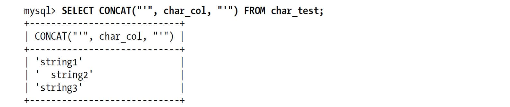
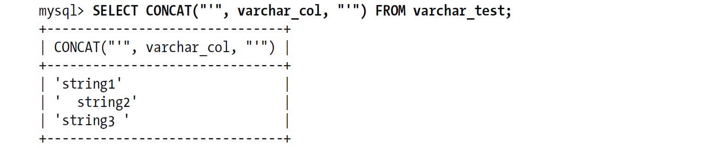
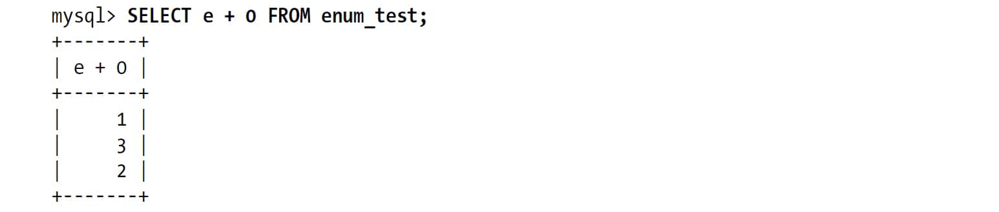
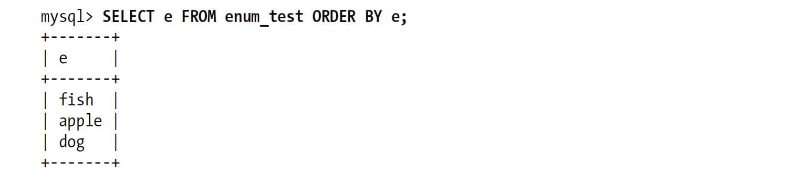
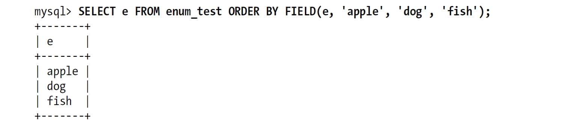
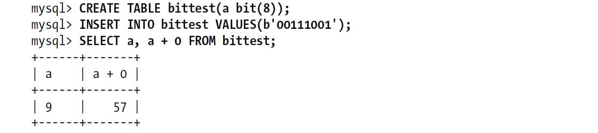
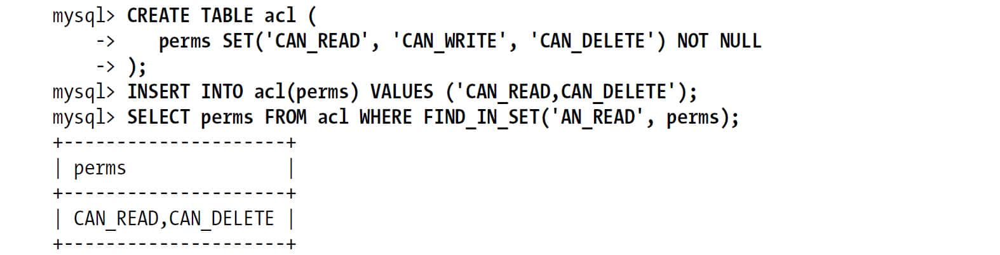
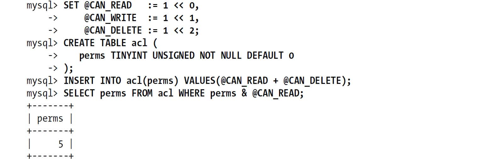
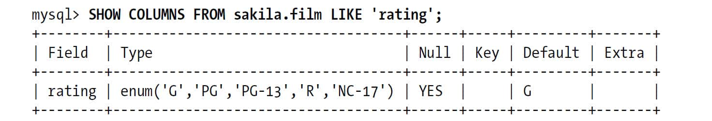

 第4章　Schema与数据类型优化

良好的逻辑设计和物理设计是高性能的基石，应该根据系统将要执行的查询语句来设计schema，这往往需要权衡各种因素。例如，反范式的设计可以加快某些类型的查询，但同时可能使另一些类型的查询变慢。比如添加计数表和汇总表是一种很好的优化查询的方式，但这些表的维护成本可能会很高。MySQL独有的特性和实现细节对性能的影响也很大。

本章和聚焦在索引优化的下一章，覆盖了MySQL特有的schema设计方面的主题。我们假设读者已经知道如何设计数据库，所以本章既不会介绍如何入门数据库设计，也不会讲解数据库设计方面的深入内容。这一章关注的是MySQL数据库的设计，主要介绍的是MySQL数据库设计与其他关系型数据库管理系统的区别。如果需要学习数据库设计方面的基础知识，建议阅读Clare Churcher的*Beginning Database Design*（Apress出版社）一书。

本章内容是为接下来的两个章节做铺垫。在这三章中，我们将讨论逻辑设计、物理设计和查询执行，以及它们之间的相互作用。这既需要关注全局，也需要专注细节。还需要理解整个系统以便弄清楚各个部分如何相互影响。如果在阅读完索引和查询优化章节后再回头来看这一章，也许会发现本章很有用，很多讨论的议题不能孤立地考虑。

# 4.1　选择优化的数据类型

MySQL支持的数据类型非常多，选择正确的数据类型对于获得高性能至关重要。不管存储哪种类型的数据，下面几个简单的原则都有助于做出更好的选择。

更小的通常更好。

一般情况下，应该尽量使用可以正确存储数据的最小数据类型(1)。更小的数据类型通常更快，因为它们占用更少的磁盘、内存和CPU缓存，并且处理时需要的CPU周期也更少。

但是要确保没有低估需要存储的值的范围，因为在schema中的多个地方增加数据类型的范围是一个非常耗时和痛苦的操作。如果无法确定哪个数据类型是最好的，就选择你认为不会超过范围的最小类型。（如果系统不是很忙或者存储的数据量不多，或者是在可以轻易修改设计的早期阶段，那之后修改数据类型也比较容易）。

简单就好

简单数据类型的操作通常需要更少的CPU周期。例如，整型比字符操作代价更低，因为字符集和校对规则（排序规则）使字符比较比整型比较更复杂。这里有两个例子：一个是应该使用MySQL内建的类型(2)而不是字符串来存储日期和时间，另外一个是应该用整型存储IP地址。稍后我们将专门讨论这个话题。

尽量避免NULL

很多表都包含可为NULL（空值）的列，即使应用程序并不需要保存NULL也是如此，这是因为可为NULL是列的默认属性(3)。通常情况下最好指定列为NOT NULL，除非真的需要存储NULL值。

如果查询中包含可为NULL的列，对MySQL来说更难优化，因为可为NULL的列使得索引、索引统计和值比较都更复杂。可为NULL的列会使用更多的存储空间，在MySQL里也需要特殊处理。当可为NULL的列被索引时，每个索引记录需要一个额外的字节，在MyISAM里甚至还可能导致固定大小的索引（例如只有一个整数列的索引）变成可变大小的索引。

通常把可为NULL的列改为NOT NULL带来的性能提升比较小，所以（调优时）没有必要首先在现有schema中查找并修改掉这种情况，除非确定这会导致问题。但是，如果计划在列上建索引，就应该尽量避免设计成可为NULL的列。

当然也有例外，例如值得一提的是，InnoDB使用单独的位（bit）存储NULL值，所以对于稀疏数据(4)有很好的空间效率。但这一点不适用于MyISAM。

在为列选择数据类型时，第一步需要确定合适的大类型：数字、字符串、时间等。这通常是很简单的，但是我们会提到一些特殊的不是那么直观的案例。

下一步是选择具体类型。很多MySQL的数据类型可以存储相同类型的数据，只是存储的长度和范围不一样、允许的精度不同，或者需要的物理空间（磁盘和内存空间）不同。相同大类型的不同子类型数据有时也有一些特殊的行为和属性。

例如，DATETIME和TIMESAMP列都可以存储相同类型的数据：时间和日期，精确到秒。

然而TIMESTAMP只使用DATETIME一半的存储空间，并且会根据时区变化，具有特殊的自动更新能力。另一方面，TIMESTAMP允许的时间范围要小得多，有时候它的特殊能力会成为障碍。

本章只讨论基本的数据类型。MySQL为了兼容性支持很多别名，例如INTEGER、BOOL，以及NUMERIC。它们都只是别名。这些别名可能令人不解，但不会影响性能。如果建表时采用数据类型的别名，然后用SHOW CREATE TABLE检查，会发现MySQL报告的是基本类型，而不是别名。

## 4.1.1　整数类型

有两种类型的数字：整数（whole number）和实数（real number）。如果存储整数，可以使用这几种整数类型：TINYINT，SMALLINT，MEDIUMINT，INT，BIGINT。分别使用8，16，24，32，64位存储空间。它们可以存储的值的范围从−2（N−1）到2（N−1）−1，其中N是存储空间的位数。

整数类型有可选的UNSIGNED属性，表示不允许负值，这大致可以使正数的上限提高一倍。例如TINYINT UNSIGNED可以存储的范围是0～255，而TINYINT的存储范围是−128～127。

有符号和无符号类型使用相同的存储空间，并具有相同的性能，因此可以根据实际情况选择合适的类型。

你的选择决定MySQL是怎么在内存和磁盘中保存数据的。然而，整数计算一般使用64位的BIGINT整数，即使在32位环境也是如此。（一些聚合函数是例外，它们使用DECIMAL或DOUBLE进行计算）。

MySQL可以为整数类型指定宽度，例如INT（11），对大多数应用这是没有意义的：它不会限制值的合法范围，只是规定了MySQL的一些交互工具（例如MySQL命令行客户端）用来显示字符的个数。对于存储和计算来说，INT（1）和INT（20）是相同的。

一些第三方存储引擎，比如Infobright，有时也有自定义的存储格式和压缩方案，并不一定使用常见的MySQL内置引擎的方式。

## 4.1.2　实数类型

实数是带有小数部分的数字。然而，它们不只是为了存储小数部分；也可以使用DECIMAL存储比BIGINT还大的整数。MySQL既支持精确类型，也支持不精确类型。

FLOAT和DOUBLE类型支持使用标准的浮点运算进行近似计算。如果需要知道浮点运算是怎么计算的，则需要研究所使用的平台的浮点数的具体实现。

DECIMAL类型用于存储精确的小数。在MySQL 5.0和更高版本，DECIMAL类型支持精确计算。MySQL 4.1以及更早版本则使用浮点运算来实现DECIAML的计算，这样做会因为精度损失导致一些奇怪的结果。在这些版本的MySQL中，DECIMAL只是一个“存储类型”。

因为CPU不支持对DECIMAL的直接计算，所以在MySQL 5.0以及更高版本中，MySQL服务器自身实现了DECIMAL的高精度计算。相对而言，CPU直接支持原生浮点计算，所以浮点运算明显更快。

浮点和DECIMAL类型都可以指定精度。对于DECIMAL列，可以指定小数点前后所允许的最大位数。这会影响列的空间消耗。MySQL 5.0和更高版本将数字打包保存到一个二进制字符串中（每4个字节存9个数字）。例如，DECIMAL（18,9）小数点两边将各存储9个数字，一共使用9个字节：小数点前的数字用4个字节，小数点后的数字用4个字节，小数点本身占1个字节。

MySQL 5.0和更高版本中的DECIMAL类型允许最多65个数字。而早期的MySQL版本中这个限制是254个数字，并且保存为未压缩的字符串（每个数字一个字节）。然而，这些（早期）版本实际上并不能在计算中使用这么大的数字，因为DECIMAL只是一种存储格式；在计算中DECIMAL会转换为DOUBLE类型。

有多种方法可以指定浮点列所需要的精度，这会使得MySQL悄悄选择不同的数据类型，或者在存储时对值进行取舍。这些精度定义是非标准的，所以我们建议只指定数据类型，不指定精度。

浮点类型在存储同样范围的值时，通常比DECIMAL使用更少的空间。FLOAT使用4个字节存储。DOUBLE占用8个字节，相比FLOAT有更高的精度和更大的范围。和整数类型一样，能选择的只是存储类型；MySQL使用DOUBLE作为内部浮点计算的类型。

因为需要额外的空间和计算开销，所以应该尽量只在对小数进行精确计算时才使用DECIMAL——例如存储财务数据。但在数据量比较大的时候，可以考虑使用BIGINT代替DECIMAL，将需要存储的货币单位根据小数的位数乘以相应的倍数即可。假设要存储财务数据精确到万分之一分，则可以把所有金额乘以一百万，然后将结果存储在BIGINT里，这样可以同时避免浮点存储计算不精确和DECIMAL精确计算代价高的问题。

## 4.1.3　字符串类型

MySQL支持多种字符串类型，每种类型还有很多变种。这些数据类型在4.1和5.0版本发生了很大的变化，使得情况更加复杂。从MySQL 4.1开始，每个字符串列可以定义自己的字符集和排序规则，或者说校对规则（collation）（更多关于这个主题的信息请参考第7章）。这些东西会很大程度上影响性能。

### **VARCHAR**和CHAR类型

VARCHAR和CHAR是两种最主要的字符串类型。不幸的是，很难精确地解释这些值是怎么存储在磁盘和内存中的，因为这跟存储引擎的具体实现有关。下面的描述假设使用的存储引擎是InnoDB和/或者MyISAM。如果使用的不是这两种存储引擎，请参考所使用的存储引擎的文档。

先看看VARCHAR和CHAR值通常在磁盘上怎么存储。请注意，存储引擎存储CHAR或者VARCHAR值的方式在内存中和在磁盘上可能不一样，所以MySQL服务器从存储引擎读出的值可能需要转换为另一种存储格式。下面是关于两种类型的一些比较。

VARCHAR

VARCHAR类型用于存储可变长字符串，是最常见的字符串数据类型。它比定长类型更节省空间，因为它仅使用必要的空间（例如，越短的字符串使用越少的空间）。有一种情况例外，如果MySQL表使用ROW\_FORMAT=FIXED创建的话，每一行都会使用定长存储，这会很浪费空间。

VARCHAR需要使用1或2个额外字节记录字符串的长度：如果列的最大长度小于或等于255字节，则只使用1个字节表示，否则使用2个字节。假设采用latin1字符集，一个VARCHAR（10）的列需要11个字节的存储空间。VARCHAR（1000）的列则需要1002个字节，因为需要2个字节存储长度信息。

VARCHAR节省了存储空间，所以对性能也有帮助。但是，由于行是变长的，在UPDATE时可能使行变得比原来更长，这就导致需要做额外的工作。如果一个行占用的空间增长，并且在页内没有更多的空间可以存储，在这种情况下，不同的存储引擎的处理方式是不一样的。例如，MyISAM会将行拆成不同的片段存储，InnoDB则需要分裂页来使行可以放进页内。其他一些存储引擎也许从不在原数据位置更新数据。

下面这些情况下使用VARCHAR是合适的：字符串列的最大长度比平均长度大很多；列的更新很少，所以碎片不是问题；使用了像UTF-8这样复杂的字符集，每个字符都使用不同的字节数进行存储。

在5.0或者更高版本，MySQL在存储和检索时会保留末尾空格。但在4.1或更老的版本，MySQL会剔除末尾空格。

InnoDB则更灵活，它可以把过长的VARCHAR存储为BLOB，我们稍后讨论这个问题。

CHAR

CHAR类型是定长的：MySQL总是根据定义的字符串长度分配足够的空间。当存储CHAR值时，MySQL会删除所有的末尾空格（在MySQL 4.1和更老版本中VARCHAR也是这样实现的——也就是说这些版本中CHAR和VARCHAR在逻辑上是一样的，区别只是在存储格式上）。CHAR值会根据需要采用空格进行填充以方便比较。

CHAR适合存储很短的字符串，或者所有值都接近同一个长度。例如，CHAR非常适合存储密码的MD5值，因为这是一个定长的值。对于经常变更的数据，CHAR也比VARCHAR更好，因为定长的CHAR类型不容易产生碎片。对于非常短的列，CHAR比VARCHAR在存储空间上也更有效率。例如用CHAR（1）来存储只有Y和N的值，如果采用单字节字符集(5)只需要一个字节，但是VARCHAR（1）却需要两个字节，因为还有一个记录长度的额外字节。

CHAR类型的这些行为可能有一点难以理解，下面通过一个具体的例子来说明。首先，我们创建一张只有一个CHAR（10）字段的表并且往里面插入一些值：

        mysql> CREATE TABLE char_test( char_col CHAR(10));
        mysql> INSERT INTO char_test(char_col) VALUES
            -> ('string1'), (' string2'), ('string3 ')

当检索这些值的时候，会发现string3末尾的空格被截断了。

 

如果用VARCHAR（10）字段存储相同的值，可以得到如下结果(6)：

 

数据如何存储取决于存储引擎，并非所有的存储引擎都会按照相同的方式处理定长和变长的字符串。Memory引擎只支持定长的行，即使有变长字段也会根据最大长度分配最大空间(7)。不过，填充和截取空格的行为在不同存储引擎都是一样的，因为这是在MySQL服务器层进行处理的。

与CHAR和VARCHAR类似的类型还有BINARY和VARBINARY，它们存储的是二进制字符串。二进制字符串跟常规字符串非常相似，但是二进制字符串存储的是字节码而不是字符。填充也不一样：MySQL填充BINARY采用的是\\0（零字节）而不是空格，在检索时也不会去掉填充值(8)。

当需要存储二进制数据，并且希望MySQL使用字节码而不是字符进行比较时，这些类型是非常有用的。二进制比较的优势并不仅仅体现在大小写敏感上。MySQL比较BINARY字符串时，每次按一个字节，并且根据该字节的数值进行比较。因此，二进制比较比字符比较简单很多，所以也就更快。

**慷慨是不明智的**

使用VARCHAR（5）和VARCHAR（200）存储’hello’的空间开销是一样的。那么使用更短的列有什么优势吗？

事实证明有很大的优势。更长的列会消耗更多的内存，因为MySQL通常会分配固定大小的内存块来保存内部值。尤其是使用内存临时表进行排序或操作时会特别糟糕。在利用磁盘临时表进行排序时也同样糟糕。

所以最好的策略是只分配真正需要的空间。

### BLOB和TEXT类型

BLOB和TEXT都是为存储很大的数据而设计的字符串数据类型，分别采用二进制和字符方式存储。

实际上，它们分别属于两组不同的数据类型家族：字符类型是TINYTEXT，SMALLTEXT，TEXT，MEDIUMTEXT，LONGTEXT；对应的二进制类型是TINYBLOB，SMALLBLOB，BLOB，MEDIUMBLOB，LONGBLOB。BLOB是SMALLBLOB的同义词，TEXT是SMALLTEXT的同义词。

与其他类型不同，MySQL把每个BLOB和TEXT值当作一个独立的对象处理。存储引擎在存储时通常会做特殊处理。当BLOB和TEXT值太大时，InnoDB会使用专门的“外部”存储区域来进行存储，此时每个值在行内需要1～4个字节存储一个指针，然后在外部存储区域存储实际的值。

BLOB和TEXT家族之间仅有的不同是BLOB类型存储的是二进制数据，没有排序规则或字符集，而TEXT类型有字符集和排序规则。

MySQL对BLOB和TEXT列进行排序与其他类型是不同的：它只对每个列的最前max\_sort\_length字节而不是整个字符串做排序。如果只需要排序前面一小部分字符，则可以减小max\_sort\_length的配置，或者使用ORDER BY SUSTRING（*column，length*）。

MySQL不能将BLOB和TEXT列全部长度的字符串进行索引，也不能使用这些索引消除排序。（关于这个主题下一章会有更多的信息。）

**磁盘临时表和文件排序**

因为Memory引擎不支持BLOB和TEXT类型，所以，如果查询使用了BLOB或TEXT列并且需要使用隐式临时表，将不得不使用MyISAM磁盘临时表，即使只有几行数据也是如此（Percona Server的Memory引擎支持BLOB和TEXT类型，但直到本书写作之际，同样的场景下还是需要使用磁盘临时表）。

这会导致严重的性能开销。即使配置MySQL将临时表存储在内存块设备上（RAM Disk），依然需要许多昂贵的系统调用。

最好的解决方案是尽量避免使用BLOB和TEXT类型。如果实在无法避免，有一个技巧是在所有用到BLOB字段的地方都使用SUBSTRING（*column，length*）将列值转换为字符串（在ORDER BY子句中也适用），这样就可以使用内存临时表了。但是要确保截取的子字符串足够短，不会使临时表的大小超过max\_heap\_table\_size或tmp\_table\_size，超过以后MySQL会将内存临时表转换为MyISAM磁盘临时表。

最坏情况下的长度分配对于排序的时候也是一样的，所以这一招对于内存中创建大临时表和文件排序，以及在磁盘上创建大临时表和文件排序这两种情况都很有帮助。

例如，假设有一个1000万行的表，占用几个GB的磁盘空间。其中有一个utf8字符集的VARCHAR（1000）列。每个字符最多使用3个字节，最坏情况下需要3000字节的空间。如果在ORDER BY中用到这个列，并且查询扫描整个表，为了排序就需要超过30GB的临时表。

如果EXPLAIN执行计划的Extra列包含”Using temporary”，则说明这个查询使用了隐式临时表。

### 使用枚举（**ENUM**）代替字符串类型

有时候可以使用枚举列代替常用的字符串类型。枚举列可以把一些不重复的字符串存储成一个预定义的集合。MySQL在存储枚举时非常紧凑，会根据列表值的数量压缩到一个或者两个字节中。MySQL在内部会将每个值在列表中的位置保存为整数，并且在表的*.frm*文件中保存“数字-字符串”映射关系的“查找表”。下面有一个例子：

        mysql> CREATE TABLE enum_test(
            -> e ENUM ('fish', 'apple', 'dog') NOT NULL
            -> );
        mysql> INSERT INTO enum_test(e) VALUES('fish'), ('dog'), ('apple');

这三行数据实际存储为整数，而不是字符串。可以通过在数字上下文环境检索看到这个双重属性：

 

如果使用数字作为ENUM枚举常量，这种双重性很容易导致混乱，例如ENUM（'1'，'2','3'）。建议尽量避免这么做。

另外一个让人吃惊的地方是，枚举字段是按照内部存储的整数而不是定义的字符串进行排序的：

 

一种绕过这种限制的方式是按照需要的顺序来定义枚举列。另外也可以在查询中使用FIELD()函数显式地指定排序顺序，但这会导致MySQL无法利用索引消除排序。

 

如果在定义时就是按照字母的顺序，就没有必要这么做了。

枚举最不好的地方是，字符串列表是固定的，添加或删除字符串必须使用ALTER TABLE。因此，对于一系列未来可能会改变的字符串，使用枚举不是一个好主意，除非能接受只在列表末尾添加元素，这样在MySQL 5.1中就可以不用重建整个表来完成修改。

由于MySQL把每个枚举值保存为整数，并且必须进行查找才能转换为字符串，所以枚举列有一些开销。通常枚举的列表都比较小，所以开销还可以控制，但也不能保证一直如此。在特定情况下，把CHAR/VARCHAR列与枚举列进行关联可能会比直接关联CHAR/VARCHAR列更慢。

为了说明这个情况，我们对一个应用中的一张表进行了基准测试，看看在MySQL中执行上面说的关联的速度如何。该表有一个很大的主键：

        CREATE TABLE webservicecalls (
           day date NOT NULL,
           account smallint NOT NULL,
           service varchar(10) NOT NULL,
           method varchar(50) NOT NULL,
           calls int NOT NULL,
           items int NOT NULL,
           time float NOT NULL,
           cost decimal(9,5) NOT NULL,
           updated datetime,
           PRIMARY KEY (day, account, service, method)
        ) ENGINE=InnoDB;

这个表有11万行数据，只有10MB大小，所以可以完全载入内存。service列包含了5个不同的值，平均长度为4个字符，method列包含了71个值，平均长度为20个字符。

我们复制一下这个表，但是把service和method字段换成枚举类型，表结构如下：

        CREATE TABLE webservicecalls_enum (
           ... omitted ...
           service ENUM(...values omitted...) NOT NULL,
           method ENUM(...values omitted...) NOT NULL,
           ... omitted ...
        ) ENGINE=InnoDB;

然后我们用主键列关联这两个表，下面是所使用的查询语句：

        mysql> SELECT SQL_NO_CACHE COUNT(*)
            -> FROM webservicecalls
            -> JOIN webservicecalls USING(day, account, service, method);

我们用VARVHAR和ENUM分别测试了这个语句，结果如表4-1所示。

**表4-1：连接VARCHAR和ENUM列的速度**
**测试** **QPS**  VARCHAR 关联 VARCHAR 2.6  VARCHAR 关联 ENUM 1.7  ENUM 关联 VARCHAR 1.8  ENUM 关联 ENUM 3.5  
从上面的结果可以看到，当把列都转换成ENUM以后，关联变得很快。但是当VARCHAR列和ENUM列进行关联时则慢很多。在本例中，如果不是必须和VARCHAR列进行关联，那么转换这些列为ENUM就是个好主意。这是一个通用的设计实践，在“查找表”时采用整数主键而避免采用基于字符串的值进行关联。

然而，转换列为枚举型还有另一个好处。根据SHOW TABLE STATUS命令输出结果中Data\_length列的值，把这两列转换为ENUM可以让表的大小缩小1/3。在某些情况下，即使可能出现ENUM和VARCHAR进行关联的情况，这也是值得的(9)。同样，转换后主键也只有原来的一半大小了。因为这是InnoDB表，如果表上有其他索引，减小主键大小会使非主键索引也变得更小。稍后再解释这个问题。

## 4.1.4　日期和时间类型

MySQL可以使用许多类型来保存日期和时间值，例如YEAR和DATE。MySQL能存储的最小时间粒度为秒（MariaDB支持微秒级别的时间类型）。但是MySQL也可以使用微秒级的粒度进行临时运算，我们会展示怎么绕开这种存储限制。

大部分时间类型都没有替代品，因此没有什么是最佳选择的问题。唯一的问题是保存日期和时间的时候需要做什么。MySQL提供两种相似的日期类型：DATETIME和TIMESTAMP。对于很多应用程序，它们都能工作，但是在某些场景，一个比另一个工作得好。让我们来看一下。

DATETIME

这个类型能保存大范围的值，从1001年到9999年，精度为秒。它把日期和时间封装到格式为YYYYMMDDHHMMSS的整数中，与时区无关。使用8个字节的存储空间。

默认情况下，MySQL以一种可排序的、无歧义的格式显示DATETIME值，例如“2008-01-16 22:37:08”。这是ANSI标准定义的日期和时间表示方法。

TIMESTAMP

就像它的名字一样，TIMETAMP类型保存了从1970年1月1日午夜（格林尼治标准时间）以来的秒数，它和UNIX时间戳相同。TIMESTAMP只使用4个字节的存储空间，因此它的范围比DATETIME小得多：只能表示从1970年到2038年。MySQL提供了FROM\_UNIXTIME()函数把Unix时间戳转换为日期，并提供了UNIX\_TIMESTAMP()函数把日期转换为Unix时间戳。

MySQL 4.1以及更新的版本按照DATETIME的方式格式化TIMESTAMP的值，但是MySQL 4.0以及更老的版本不会在各个部分之间显示任何标点符号。这仅仅是显示格式上的区别，TIMESTAMP的存储格式在各个版本都是一样的。

TIMESTAMP显示的值也依赖于时区。MySQL服务器、操作系统，以及客户端连接都有时区设置。

因此，存储值为0的TIMESTAMP在美国东部时区显示为“1969-12-31 19:00:00”，与格林尼治时间差5个小时。有必要强调一下这个区别：如果在多个时区存储或访问数据，TIMESTAMP和DATETIME的行为将很不一样。前者提供的值与时区有关系，后者则保留文本表示的日期和时间。

TIMESTAMP也有DATETIME没有的特殊属性。默认情况下，如果插入时没有指定第一个TIMESTAMP列的值，MySQL则设置这个列的值为当前时间(10)。在插入一行记录时，MySQL默认也会更新第一个TIMESTAMP列的值（除非在UPDATE语句中明确指定了值）。你可以配置任何TIMESTAMP列的插入和更新行为。最后，TIMESTAMP列默认为NOT NULL，这也和其他的数据类型不一样。

除了特殊行为之外，通常也应该尽量使用TIMESTAMP，因为它比DATETIME空间效率更高。有时候人们会将Unix时间截存储为整数值，但这不会带来任何收益。用整数保存时间截的格式通常不方便处理，所以我们不推荐这样做。

如果需要存储比秒更小粒度的日期和时间值怎么办？MySQL目前没有提供合适的数据类型，但是可以使用自己的存储格式：可以使用BIGINT类型存储微秒级别的时间截，或者使用DOUBLE存储秒之后的小数部分。这两种方式都可以，或者也可以使用MariaDB替代MySQL。

## 4.1.5　位数据类型

MySQL有少数几种存储类型使用紧凑的位存储数据。所有这些位类型，不管底层存储格式和处理方式如何，从技术上来说都是字符串类型。

BIT

在MySQL 5.0之前，BIT是TINYINT的同义词。但是在MySQL 5.0以及更新版本，这是一个特性完全不同的数据类型。下面我们将讨论BIT类型新的行为特性。

可以使用BIT列在一列中存储一个或多个true/false值。BIT（1）定义一个包含单个位的字段，BIT（2）存储2个位，依此类推。BIT列的最大长度是64个位。

BIT的行为因存储引擎而异。MyISAM会打包存储所有的BIT列，所以17个单独的BIT列只需要17个位存储（假设没有可为NULL的列），这样MyISAM只使用3个字节就能存储这17个BIT列。其他存储引擎例如Memory和InnoDB，为每个BIT列使用一个足够存储的最小整数类型来存放，所以不能节省存储空间。

MySQL把BIT当作字符串类型，而不是数字类型。当检索BIT（1）的值时，结果是一个包含二进制0或1值的字符串，而不是ASCII码的“0”或“1”。然而，在数字上下文的场景中检索时，结果将是位字符串转换成的数字。如果需要和另外的值比较结果，一定要记得这一点。例如，如果存储一个值b'00111001'（二进制值等于57）到BIT（8）的列并且检索它，得到的内容是字符码为57的字符串。也就是说得到ASCII码为57的字符“9”。但是在数字上下文场景中，得到的是数字57：

 

这是相当令人费解的，所以我们认为应该谨慎使用BIT类型。对于大部分应用，最好避免使用这种类型。

如果想在一个bit的存储空间中存储一个true/false值，另一个方法是创建一个可以为空的CHAR（0）列。该列可以保存空值（NULL）或者长度为零的字符串（空字符串）。

SET

如果需要保存很多true/false值，可以考虑合并这些列到一个SET数据类型，它在MySQL内部是以一系列打包的位的集合来表示的。这样就有效地利用了存储空间，并且MySQL有像FIND\_IN\_SET()和FIELD()这样的函数，方便地在查询中使用。它的主要缺点是改变列的定义的代价较高：需要ALTER TABLE，这对大表来说是非常昂贵的操作（但是本章的后面给出了解决办法）。一般来说，也无法在SET列上通过索引查找。

在整数列上进行按位操作

一种替代SET的方式是使用一个整数包装一系列的位。例如，可以把8个位包装到一个TINYINT中，并且按位操作来使用。可以在应用中为每个位定义名称常量来简化这个工作。

比起SET，这种办法主要的好处在于可以不使用ALTER TABLE改变字段代表的“枚举”值，缺点是查询语句更难写，并且更难理解（当第5个bit位被设置时是什么意思？）。一些人非常适应这种方式，也有一些人不适应，所以是否采用这种技术取决于个人的偏好。

一个包装位的应用的例子是保存权限的访问控制列表（ACL）。每个位或者SET元素代表一个值，例如CAN\_READ、CAN\_WRITE，或者CAN\_DELETE。如果使用SET列，可以让MySQL在列定义里存储位到值的映射关系；如果使用整数列，则可以在应用代码里存储这个对应关系。这是使用SET列时的查询：

 

如果使用整数来存储，则可以参考下面的例子：

 

这里我们使用MySQL变量来定义值，但是也可以在代码里使用常量来代替。

## 4.1.6　选择标识符（identifier）

为标识列（identifier column）选择合适的数据类型非常重要。一般来说更有可能用标识列与其他值进行比较（例如，在关联操作中），或者通过标识列寻找其他列。标识列也可能在另外的表中作为外键使用，所以为标识列选择数据类型时，应该选择跟关联表中的对应列一样的类型（正如我们在本章早些时候所论述的一样，在相关的表中使用相同的数据类型是个好主意，因为这些列很可能在关联中使用）。

当选择标识列的类型时，不仅仅需要考虑存储类型，还需要考虑MySQL对这种类型怎么执行计算和比较。例如，MySQL在内部使用整数存储ENUM和SET类型，然后在做比较操作时转换为字符串。

一旦选定了一种类型，要确保在所有关联表中都使用同样的类型。类型之间需要精确匹配，包括像UNSIGNED这样的属性(11)。混用不同数据类型可能导致性能问题，即使没有性能影响，在比较操作时隐式类型转换也可能导致很难发现的错误。这种错误可能会很久以后才突然出现，那时候可能都已经忘记是在比较不同的数据类型。

在可以满足值的范围的需求，并且预留未来增长空间的前提下，应该选择最小的数据类型。例如有一个state\_id列存储美国各州的名字(12)，就不需要几千或几百万个值，所以不需要使用INT。TINYINT足够存储，而且比INT少了3个字节。如果用这个值作为其他表的外键，3个字节可能导致很大的性能差异。下面是一些小技巧。

整数类型

整数通常是标识列最好的选择，因为它们很快并且可以使用AUTO\_INCREMENT。

ENUM和SET类型

对于标识列来说，EMUM和SET类型通常是一个糟糕的选择，尽管对某些只包含固定状态或者类型的静态“定义表”来说可能是没有问题的。ENUM和SET列适合存储固定信息，例如有序的状态、产品类型、人的性别。

举个例子，如果使用枚举字段来定义产品类型，也许会设计一张以这个枚举字段为主键的查找表（可以在查找表中增加一些列来保存描述性质的文本，这样就能够生成一个术语表，或者为网站的下拉菜单提供有意义的标签）。这时，使用枚举类型作为标识列是可行的，但是大部分情况下都要避免这么做。

字符串类型

如果可能，应该避免使用字符串类型作为标识列，因为它们很消耗空间，并且通常比数字类型慢。尤其是在MyISAM表里使用字符串作为标识列时要特别小心。MyISAM默认对字符串使用压缩索引，这会导致查询慢得多。在我们的测试中，我们注意到最多有6倍的性能下降。

对于完全“随机”的字符串也需要多加注意，例如MD5()、SHA1()或者UUID()产生的字符串。这些函数生成的新值会任意分布在很大的空间内，这会导致INSERT以及一些SELECT语句变得很慢(13)：

+ 因为插入值会随机地写到索引的不同位置，所以使得INSERT语句更慢。这会导致页分裂、磁盘随机访问，以及对于聚簇存储引擎产生聚簇索引碎片。关于这一点第5章有更多的讨论。 
+ SELECT语句会变得更慢，因为逻辑上相邻的行会分布在磁盘和内存的不同地方。 
+ 随机值导致缓存对所有类型的查询语句效果都很差，因为会使得缓存赖以工作的访问局部性原理失效。如果整个数据集都一样的“热”，那么缓存任何一部分特定数据到内存都没有好处；如果工作集比内存大，缓存将会有很多刷新和不命中。 

如果存储UUID值，则应该移除“-”符号；或者更好的做法是，用UNHEX()函数转换UUID值为16字节的数字，并且存储在一个BINARY（16）列中。检索时可以通过HEX()函数来格式化为十六进制格式。

UUID()生成的值与加密散列函数例如SHA1()生成的值有不同的特征：UUID值虽然分布也不均匀，但还是有一定顺序的。尽管如此，但还是不如递增的整数好用。

**当心自动生成的schema**

我们已经介绍了大部分重要数据类型的考虑（有些会严重影响性能，有些则影响较小），但是我们还没有提到自动生成的schema设计有多么糟糕。

写得很烂的schema迁移程序，或者自动生成schema的程序，都会导致严重的性能问题。有些程序存储任何东西都会使用很大的VARCHAR列，或者对需要在关联时比较的列使用不同的数据类型。如果schema是自动生成的，一定要反复检查确认没有问题。

对象关系映射（ORM）系统（以及使用它们的“框架”）是另一种常见的性能噩梦。一些ORM系统会存储任意类型的数据到任意类型的后端数据存储中，这通常意味着其没有设计使用更优的数据类型来存储。有时会为每个对象的每个属性使用单独的行，甚至使用基于时间戳的版本控制，导致单个属性会有多个版本存在。

这种设计对开发者很有吸引力，因为这使得他们可以用面向对象的方式工作，不需要考虑数据是怎么存储的。然而，“对开发者隐藏复杂性”的应用通常不能很好地扩展。我们建议在用性能交换开发人员的效率之前仔细考虑，并且总是在真实大小的数据集上做测试，这样就不会太晚才发现性能问题。

## 4.1.7　特殊类型数据

某些类型的数据并不直接与内置类型一致。低于秒级精度的时间戳就是一个例子；本章的前面部分也演示过存储此类数据的一些选项。

另一个例子是一个IPv4地址。人们经常使用VARCHAR（15）列来存储IP地址。然而，它们实际上是32位无符号整数，不是字符串。用小数点将地址分成四段的表示方法只是为了让人们阅读容易。所以应该用无符号整数存储IP地址。MySQL提供INET\_ATON()和INET\_NTOA()函数在这两种表示方法之间转换。

# 4.2　MySQL schema设计中的陷阱

虽然有一些普遍的好或坏的设计原则，但也有一些问题是由MySQL的实现机制导致的，这意味着有可能犯一些只在MySQL下发生的特定错误。本节我们讨论设计MySQL的schema的问题。这也许会帮助你避免这些错误，并且选择在MySQL特定实现下工作得更好的替代方案。

太多的列

MySQL的存储引擎API工作时需要在服务器层和存储引擎层之间通过行缓冲格式拷贝数据，然后在服务器层将缓冲内容解码成各个列。从行缓冲中将编码过的列转换成行数据结构的操作代价是非常高的。MyISAM的定长行结构实际上与服务器层的行结构正好匹配，所以不需要转换。然而，MyISAM的变长行结构和InnoDB的行结构则总是需要转换。转换的代价依赖于列的数量。当我们研究一个CPU占用非常高的案例时，发现客户使用了非常宽的表（数千个字段），然而只有一小部分列会实际用到，这时转换的代价就非常高。如果计划使用数千个字段，必须意识到服务器的性能运行特征会有一些不同。

太多的关联

所谓的“实体-属性-值”（EAV）设计模式是一个常见的糟糕设计模式，尤其是在MySQL下不能靠谱地工作。MySQL限制了每个关联操作最多只能有61张表，但是EAV数据库需要许多自关联。我们见过不少EAV数据库最后超过了这个限制。事实上在许多关联少于61张表的情况下，解析和优化查询的代价也会成为MySQL的问题。一个粗略的经验法则，如果希望查询执行得快速且并发性好，单个查询最好在12个表以内做关联。

全能的枚举

注意防止过度使用枚举（ENUM）。下面是我们见过的一个例子：

        CREATE TABLE ... (
          country enum('','0','1','2',...,'31')

这种模式的schema设计非常凌乱。这么使用枚举值类型也许在任何支持枚举类型的数据库都是一个有问题的设计方案，这里应该用整数作为外键关联到字典表或者查找表来查找具体值。但是在MySQL中，当需要在枚举列表中增加一个新的国家时就要做一次ALTER TABLE操作。在MySQL 5.0以及更早的版本中ALTER TABLE是一种阻塞操作；即使在5.1和更新版本中，如果不是在列表的末尾增加值也会一样需要ALTER TABLE（我们将展示一些骇客式的方法来避免阻塞操作，但是这只是骇客的玩法，别轻易用在生产环境中）。

变相的枚举

枚举（ENUM）列允许在列中存储一组定义值中的单个值，集合（SET）列则允许在列中存储一组定义值中的一个或多个值。有时候这可能比较容易导致混乱。这是一个例子：

        CREATE TABLE ... (
          is_default set ('Y','N') NOT NULL default 'N'

如果这里真和假两种情况不会同时出现，那么毫无疑问应该使用枚举列代替集合列。

非此发明（Not Invent Here）的NULL

我们之前写了避免使用NULL的好处，并且建议尽可能地考虑替代方案。即使需要存储一个事实上的“空值”到表中时，也不一定非得使用NULL。也许可以使用0、某个特殊值，或者空字符串作为代替。

但是遵循这个原则也不要走极端。当确实需要表示未知值时也不要害怕使用NULL。在一些场景中，使用NULL可能会比某个神奇常数更好。从特定类型的值域中选择一个不可能的值，例如用−1代表一个未知的整数，可能导致代码复杂很多，并容易引入bug，还可能会让事情变得一团糟。处理NULL确实不容易，但有时候会比它的替代方案更好。

下面是一个我们经常看到的例子：

        CREATE TABLE ...(
          dt DATETIME NOT NULL DEFAULT '0000-00-00 00:00:00'

伪造的全0值可能导致很多问题（可以配置MySQL的SQL\_MODE来禁止不可能的日期，对于新应用这是个非常好的实践经验，它不会让创建的数据库里充满不可能的值）。值得一提的是，MySQL会在索引中存储NULL值，而Oracle则不会。

# 4.3　范式和反范式

对于任何给定的数据通常都有很多种表示方法，从完全的范式化到完全的反范式化，以及两者的折中。在范式化的数据库中，每个事实数据会出现并且只出现一次。相反，在反范式化的数据库中，信息是冗余的，可能会存储在多个地方。

如果不熟悉范式，则应该先学习一下。有很多这方面的不错的书和在线资源；在这里，我们只是给出阅读本章所需要的这方面的简单介绍。下面以经典的“雇员，部门，部门领导”的例子开始：
**EMPLOYEE** **DEPARTMENT** **HEAD**  Jones Accounting Jones  Smith Engineering Smith  Brown Accounting Jones  Green Engineering Smith  
这个schema的问题是修改数据时可能发生不一致。假如Say Brown接任Accounting部门的领导，需要修改多行数据来反映这个变化，这是很痛苦的事并且容易引入错误。如果“Jones”这一行显示部门的领导跟“Brown”这一行的不一样，就没有办法知道哪个是对的。这就像是有句老话说的：“一个人有两块手表就永远不知道时间”。此外，这个设计在没有雇员信息的情况下就无法表示一个部门——如果我们删除了所有Accounting部门的雇员，我们就失去了关于这个部门本身的所有记录。要避免这个问题，我们需要对这个表进行范式化，方式是拆分雇员和部门项。拆分以后可以用下面两张表分别来存储雇员表：
**EMPLOYEE\_NAME** **DEPARTMENT**  Jones Accounting  Smith Engineering  Brown Accounting  Green Engineering  
和部门表：
**DEPARTMENT** **HEAD**  Accounting Jones  Engineering Smith  
这样设计的两张表符合第二范式，在很多情况下做到这一步已经足够好了。然而，第二范式只是许多可能的范式中的一种。

这个例子中我们使用姓（Last Name）作为主键，因为这是数据的“自然标识”。从实践来看，无论如何都不应该这么用。这既不能保证唯一性，而且用一个很长的字符串作为主键是很糟糕的主意。

## 4.3.1　范式的优点和缺点

当为性能问题而寻求帮助时，经常会被建议对schema进行范式化设计，尤其是写密集的场景。这通常是个好建议。因为下面这些原因，范式化通常能够带来好处：

+ 范式化的更新操作通常比反范式化要快。 
+ 当数据较好地范式化时，就只有很少或者没有重复数据，所以只需要修改更少的数据。 
+ 范式化的表通常更小，可以更好地放在内存里，所以执行操作会更快。 
+ 很少有多余的数据意味着检索列表数据时更少需要DISTINCT或者GROUP BY语句。还是前面的例子：在非范式化的结构中必须使用DISTINCT或者GROUP BY才能获得一份唯一的部门列表，但是如果部门（DEPARTMENT）是一张单独的表，则只需要简单的查询这张表就行了。 

范式化设计的schema的缺点是通常需要关联。稍微复杂一些的查询语句在符合范式的schema上都可能需要至少一次关联，也许更多。这不但代价昂贵，也可能使一些索引策略无效。例如，范式化可能将列存放在不同的表中，而这些列如果在一个表中本可以属于同一个索引。

## 4.3.2　反范式的优点和缺点

反范式化的schema因为所有数据都在一张表中，可以很好地避免关联。

如果不需要关联表，则对大部分查询最差的情况——即使表没有使用索引——是全表扫描。当数据比内存大时这可能比关联要快得多，因为这样避免了随机I/O(14)。

单独的表也能使用更有效的索引策略。假设有一个网站，允许用户发送消息，并且一些用户是付费用户。现在想查看付费用户最近的10条信息。如果是范式化的结构并且索引了发送日期字段published，这个查询也许看起来像这样：

        mysql> SELECT message_text, user_name
            -> FROM message
            -> INNER JOIN user ON message.user_id=user.id
            -> WHERE user.account_type='premiumv
            -> ORDER BY message.published DESC LIMIT 10;

要更有效地执行这个查询，MySQL需要扫描message表的published字段的索引。对于每一行找到的数据，将需要到user表里检查这个用户是不是付费用户。如果只有一小部分用户是付费账户，那么这是效率低下的做法。

另一种可能的执行计划是从user表开始，选择所有的付费用户，获得他们所有的信息，并且排序。但这可能更加糟糕。

主要问题是关联，使得需要在一个索引中又排序又过滤。如果采用反范式化组织数据，将两张表的字段合并一下，并且增加一个索引（account\_type，published），就可以不通过关联写出这个查询。这将非常高效：

        mysql> SELECT message_text,user_name
            -> FROM user_messages
            -> WHERE account_type='premium'
            -> ORDER BY published DESC
            -> LIMIT 10;

## 4.3.3　混用范式化和反范式化

范式化和反范式化的schema各有优劣，怎么选择最佳的设计？

事实是，完全的范式化和完全的反范式化schema都是实验室里才有的东西：在真实世界中很少会这么极端地使用。在实际应用中经常需要混用，可能使用部分范式化的schema、缓存表，以及其他技巧。

最常见的反范式化数据的方法是复制或者缓存，在不同的表中存储相同的特定列。在MySQL 5.0和更新版本中，可以使用触发器更新缓存值，这使得实现这样的方案变得更简单。

在我们的网站实例中，可以在user表和message表中都存储account\_type字段，而不用完全的反范式化。这避免了完全反范式化的插入和删除问题，因为即使没有消息的时候也绝不会丢失用户的信息。这样也不会把user\_message表搞得太大，有利于高效地获取数据。

但是现在更新用户的账户类型的操作代价就高了，因为需要同时更新两张表。至于这会不会是一个问题，需要考虑更新的频率以及更新的时长，并和执行SELECT查询的频率进行比较。

另一个从父表冗余一些数据到子表的理由是排序的需要。例如，在范式化的schema里通过作者的名字对消息做排序的代价将会非常高，但是如果在message表中缓存author\_name字段并且建好索引，则可以非常高效地完成排序。

缓存衍生值也是有用的。如果需要显示每个用户发了多少消息（像很多论坛做的），可以每次执行一个昂贵的子查询来计算并显示它；也可以在user表中建一个num\_messages列，每当用户发新消息时更新这个值。

# 4.4　缓存表和汇总表

有时提升性能最好的方法是在同一张表中保存衍生的冗余数据。然而，有时也需要创建一张完全独立的汇总表或缓存表（特别是为满足检索的需求时）。如果能容许少量的脏数据，这是非常好的方法，但是有时确实没有选择的余地（例如，需要避免复杂、昂贵的实时更新操作）。

术语“缓存表”和“汇总表”没有标准的含义。我们用术语“缓存表”来表示存储那些可以比较简单地从schema其他表获取（但是每次获取的速度比较慢）数据的表（例如，逻辑上冗余的数据）。而术语“汇总表”时，则保存的是使用GROUP BY语句聚合数据的表（例如，数据不是逻辑上冗余的）。也有人使用术语“累积表（Roll-Up Table）”称呼这些表。因为这些数据被“累积”了。

仍然以网站为例，假设需要计算之前24小时内发送的消息数。在一个很繁忙的网站不可能维护一个实时精确的计数器。作为替代方案，可以每小时生成一张汇总表。这样也许一条简单的查询就可以做到，并且比实时维护计数器要高效得多。缺点是计数器并不是100％精确。

如果必须获得过去24小时准确的消息发送数量（没有遗漏），有另外一种选择。以每小时汇总表为基础，把前23个完整的小时的统计表中的计数全部加起来，最后再加上开始阶段和结束阶段不完整的小时内的计数。假设统计表叫作msg\_per\_hr并且这样定义：

        CREATE TABLE msg_per_hr (
           hr DATETIME NOT NULL,
           cnt INT UNSIGNED NOT NULL,
           PRIMARY KEY(hr)
        );

可以通过把下面的三个语句的结果加起来，得到过去24小时发送消息的总数。我们使用LEFT（NOW(),14）来获得当前的日期和时间最接近的小时：

        mysql> **    SELECT SUM(cnt) FROM msg_per_hr**    
            -> **    WHERE hr BETWEEN**    
            -> **      CONCAT(LEFT(NOW(), 14), '00:00') - INTERVAL 23 HOUR**    
            -> **      AND CONCAT(LEFT(NOW(), 14), '00:00') - INTERVAL 1 HOUR;**    
        mysql> **    SELECT COUNT(*) FROM message**    
            -> **    WHERE posted >= NOW() - INTERVAL 24 HOUR**    
            -> **      AND posted < CONCAT(LEFT(NOW(), 14), '00:00') - INTERVAL 23 HOUR;**    
        mysql> **    SELECT COUNT(*) FROM message**    
            -> **    WHERE posted >= CONCAT(LEFT(NOW(), 14), '00:00');**    

不管是哪种方法——不严格的计数或通过小范围查询填满间隙的严格计数——都比计算message表的所有行要有效得多。这是建立汇总表的最关键原因。实时计算统计值是很昂贵的操作，因为要么需要扫描表中的大部分数据，要么查询语句只能在某些特定的索引上才能有效运行，而这类特定索引一般会对UPDATE操作有影响，所以一般不希望创建这样的索引。计算最活跃的用户或者最常见的“标签”是这种操作的典型例子。

缓存表则相反，其对优化搜索和检索查询语句很有效。这些查询语句经常需要特殊的表和索引结构，跟普通OLTP操作用的表有些区别。

例如，可能会需要很多不同的索引组合来加速各种类型的查询。这些矛盾的需求有时需要创建一张只包含主表中部分列的缓存表。一个有用的技巧是对缓存表使用不同的存储引擎。例如，如果主表使用InnoDB，用MyISAM作为缓存表的引擎将会得到更小的索引占用空间，并且可以做全文搜索。有时甚至想把整个表导出MySQL，插入到专门的搜索系统中获得更高的搜索效率，例如Lucene或者Sphinx搜索引擎。

在使用缓存表和汇总表时，必须决定是实时维护数据还是定期重建。哪个更好依赖于应用程序，但是定期重建并不只是节省资源，也可以保持表不会有很多碎片，以及有完全顺序组织的索引（这会更加高效）。

当重建汇总表和缓存表时，通常需要保证数据在操作时依然可用。这就需要通过使用“影子表”来实现，“影子表”指的是一张在真实表“背后”创建的表。当完成了建表操作后，可以通过一个原子的重命名操作切换影子表和原表。例如，如果需要重建my\_summary，则可以先创建my\_summary\_new，然后填充好数据，最后和真实表做切换：

        mysql> **    DROP TABLE IF EXISTS my_summary_new, my_summary_old;**    
        mysql> **    CREATE TABLE my_summary_new LIKE my_summary;**    
        -- populate my_summary_new as desired
        mysql> **    RENAME TABLE my_summary TO my_summary_old, my_summary_new TO my_summary;**    

如果像上面的例子一样，在将my\_summary这个名字分配给新建的表之前将原始的my\_summary表重命名为my\_summary\_old，就可以在下一次重建之前一直保留旧版本的数据。如果新表有问题，则可以很容易地进行快速回滚操作。

## 4.4.1　物化视图

许多数据库管理系统（例如Oracle或者微软SQL Server）都提供了一个被称作物化视图的功能。物化视图实际上是预先计算并且存储在磁盘上的表，可以通过各种各样的策略刷新和更新。MySQL并不原生支持物化视图（我们将在第7章详细探讨支持这种视图的细节）。然而，使用Justin Swanhart的开源工具Flexviews（*http://code.google.com/p/flexviews/*），也可以自己实现物化视图。Flexviews比完全自己实现的解决方案要更精细，并且提供了很多不错的功能使得可以更简单地创建和维护物化视图。它由下面这些部分组成：

+ 变更数据抓取（Change Data Capture，CDC）功能，可以读取服务器的二进制日志并且解析相关行的变更。 
+ 一系列可以帮助创建和管理视图的定义的存储过程。 
+ 一些可以应用变更到数据库中的物化视图的工具。 

对比传统的维护汇总表和缓存表的方法，Flexviews通过提取对源表的更改，可以增量地重新计算物化视图的内容。这意味着不需要通过查询原始数据来更新视图。例如，如果创建了一张汇总表用于计算每个分组的行数，此后增加了一行数据到源表中，Flexviews简单地给相应的组的行数加一即可。同样的技术对其他的聚合函数也有效，例如SUM()和AVG()。这实际上是有好处的，基于行的二进制日志包含行更新前后的镜像，所以Flexviews不仅仅可以获得每行的新值，还可以不需要查找源表就能知道每行数据的旧版本。计算增量数据比从源表中读取数据的效率要高得多。

因为版面的限制，这里我们不会完整地探讨怎么使用Flexviews，但是可以给出一个概略。先写出一个SELECT语句描述想从已经存在的数据库中得到的数据。这可能包含关联和聚合（GROUP BY）。Flexviews中有一个辅助工具可以转换SQL语句到Flexviews的API调用。Flexviews会做完所有的脏活、累活：监控数据库的变更并且转换后用于更新存储物化视图的表。现在应用可以简单地查询物化视图来替代查询需要检索的表。

Flexviews有不错的SQL覆盖范围，包括一些棘手的表达式，你可能没有料到一个工具可以在MySQL服务器之外处理这些工作。这一点对创建基于复杂SQL表达式的视图很有用，可以用基于物化视图的简单、快速的查询替换原来复杂的查询。

## 4.4.2　计数器表

如果应用在表中保存计数器，则在更新计数器时可能碰到并发问题。计数器表在Web应用中很常见。可以用这种表缓存一个用户的朋友数、文件下载次数等。创建一张独立的表存储计数器通常是个好主意，这样可使计数器表小且快。使用独立的表可以帮助避免查询缓存失效，并且可以使用本节展示的一些更高级的技巧。

应该让事情变得尽可能简单，假设有一个计数器表，只有一行数据，记录网站的点击次数：

        mysql> **    CREATE TABLE hit_counter (**    
            -> **      cnt int unsigned not null**    
            -> **    ) ENGINE=InnoDB;**    

网站的每次点击都会导致对计数器进行更新：

        mysql> **    UPDATE hit_counter SET cnt = cnt + 1;**    

问题在于，对于任何想要更新这一行的事务来说，这条记录上都有一个全局的互斥锁（mutex）。这会使得这些事务只能串行执行。要获得更高的并发更新性能，也可以将计数器保存在多行中，每次随机选择一行进行更新。这样做需要对计数器表进行如下修改：

        mysql> **    CREATE TABLE hit_counter (**    
            -> **      slot tinyint unsigned not null primary key,**    
            -> **      cnt int unsigned not null**    
            -> **    ) ENGINE=InnoDB;**    

然后预先在这张表增加100行数据。现在选择一个随机的槽（slot）进行更新：

        mysql> **    UPDATE hit_counter SET cnt = cnt + 1 WHERE slot = RAND() * 100;**    

要获得统计结果，需要使用下面这样的聚合查询：

        mysql> **    SELECT SUM(cnt) FROM hit_counter;**    

一个常见的需求是每隔一段时间开始一个新的计数器（例如，每天一个）。如果需要这么做，则可以再简单地修改一下表设计：

        mysql> **    CREATE TABLE daily_hit_counter (**    
            -> **      day date not null,**    
            -> **      slot tinyint unsigned not null,**    
            -> **      cnt int unsigned not null,**    
            -> **      primary key(day, slot)**    
            -> **    ) ENGINE=InnoDB;**    

在这个场景中，可以不用像前面的例子那样预先生成行，而用ON DUPLICATE KEY UPDATE代替：

    mysql> **    INSERT INTO daily_hit_counter(day, slot, cnt)**    
        -> **      VALUES(CURRENT_DATE, RAND() * 100, 1)**    
        -> **      ON DUPLICATE KEY UPDATE cnt = cnt + 1;**    

如果希望减少表的行数，以避免表变得太大，可以写一个周期执行的任务，合并所有结果到0号槽，并且删除所有其他的槽：

        mysql> **    UPDATE daily_hit_counter as c**    
            -> **      INNER JOIN (**    
            -> **        SELECT day, SUM(cnt) AS cnt, MIN(slot) AS mslot**    
            -> **        FROM daily_hit_counter**    
            -> **        GROUP BY day**    
            -> **       ) AS x USING(day)**    
            -> **    SET c.cnt = IF(c.slot = x.mslot, x.cnt, 0),**    
            -> **       c.slot = IF(c.slot = x.mslot, 0, c.slot);**    
        mysql> **    DELETE FROM daily_hit_counter WHERE slot <> 0 AND cnt = 0;**    

**更快地读，更慢地写**

为了提升读查询的速度，经常会需要建一些额外索引，增加冗余列，甚至是创建缓存表和汇总表。这些方法会增加写查询的负担，也需要额外的维护任务，但在设计高性能数据库时，这些都是常见的技巧：虽然写操作变得更慢了，但更显著地提高了读操作的性能。

然而，写操作变慢并不是读操作变得更快所付出的唯一代价，还可能同时增加了读操作和写操作的开发难度。

# 4.5　加快ALTER TABLE操作的速度

MySQL的ALTER TABLE操作的性能对大表来说是个大问题。MySQL执行大部分修改表结构操作的方法是用新的结构创建一个空表，从旧表中查出所有数据插入新表，然后删除旧表。这样操作可能需要花费很长时间，如果内存不足而表又很大，而且还有很多索引的情况下尤其如此。许多人都有这样的经验，ALTER TABLE操作需要花费数个小时甚至数天才能完成。

MySQL 5.1以及更新版本包含一些类型的“在线”操作的支持，这些功能不需要在整个操作过程中锁表。最近版本的InnoDB(15)也支持通过排序来建索引，这使得建索引更快并且有一个紧凑的索引布局。

一般而言，大部分ALTER TABLE操作将导致MySQL服务中断。我们会展示一些在DDL操作时有用的技巧，但这是针对一些特殊的场景而言的。对常见的场景，能使用的技巧只有两种：一种是先在一台不提供服务的机器上执行ALTER TABLE操作，然后和提供服务的主库进行切换；另外一种技巧是“影子拷贝”。影子拷贝的技巧是用要求的表结构创建一张和源表无关的新表，然后通过重命名和删表操作交换两张表。也有一些工具可以帮助完成影子拷贝工作：例如，Facebook数据库运维团队（*https://launchpad.net/mysqlatfacebook*）的“online schema change”工具、Shlomi Noach的openark toolkit（*http://code.openark.org/*），以及Percona Toolkit（*http://www.percona.com/software/*）。如果使用Flexviews（参考4.4.1节），也可以通过其CDC工具执行无锁的表结构变更。

不是所有的ALTER TABLE操作都会引起表重建。例如，有两种方法可以改变或者删除一个列的默认值（一种方法很快，另外一种则很慢）。假如要修改电影的默认租赁期限，从三天改到五天。下面是很慢的方式：

        mysql> **    ALTER TABLE sakila.film**    
            -> **    MODIFY COLUMN rental_duration TINYINT(3) NOT NULL DEFAULT 5;**    

SHOW STATUS显示这个语句做了1000次读和1000次插入操作。换句话说，它拷贝了整张表到一张新表，甚至列的类型、大小和可否为NULL属性都没改变。

理论上，MySQL可以跳过创建新表的步骤。列的默认值实际上存在表的*.frm*文件中，所以可以直接修改这个文件而不需要改动表本身。然而MySQL还没有采用这种优化的方法，所有的MODIFY COLUMN操作都将导致表重建。

另外一种方法是通过ALTER COLUMN(16)操作来改变列的默认值：

        mysql> **    ALTER TABLE sakila.film**    
            -> **    ALTER COLUMN rental_duration SET DEFAULT 5;**    

这个语句会直接修改*.frm*文件而不涉及表数据。所以，这个操作是非常快的。

## 4.5.1　只修改.frm文件

从上面的例子我们看到修改表的*.frm*文件是很快的，但MySQL有时候会在没有必要的时候也重建表。如果愿意冒一些风险，可以让MySQL做一些其他类型的修改而不用重建表。

我们下面要演示的技巧是不受官方支持的，也没有文档记录，并且也可能不能正常工作，采用这些技术需要自己承担风险。建议在执行之前首先备份数据！

下面这些操作是有可能不需要重建表的：

+ 移除（不是增加）一个列的AUTO\_INCREMENT属性。 
+ 增加、移除，或更改ENUM和SET常量。如果移除的是已经有行数据用到其值的常量，查询将会返回一个空字串值。 

基本的技术是为想要的表结构创建一个新的*.frm*文件，然后用它替换掉已经存在的那张表的*.frm*文件，像下面这样：

1. 创建一张有相同结构的空表，并进行所需要的修改（例如增加ENUM常量）。 
2. 执行FLUSH TABLES WITH READ LOCK。这将会关闭所有正在使用的表，并且禁止任何表被打开。 
3. 交换*.frm*文件. 
4. 执行UNLOCK TABLES来释放第2步的读锁。 

下面以给sakila.flm表的rating列增加一个常量为例来说明。当前列看起来如下：

 

假设我们需要为那些对电影更加谨慎的父母们增加一个PG-14的电影分级：

        mysql> **    CREATE TABLE sakila.film_new LIKE sakila.film;**    
        mysql> **    ALTER TABLE sakila.film_new**    
            -> **    MODIFY COLUMN rating ENUM('G','PG','PG-13','R','NC-17', 'PG-14')**    
            -> **    DEFAULT 'G';**    
        mysql> **    FLUSH TABLES WITH READ LOCK;**    

注意，我们是在常量列表的末尾增加一个新的值。如果把新增的值放在中间，例如PG-13之后，则会导致已经存在的数据的含义被改变：已经存在的R值将变成PG-14，而已经存在的NC-17将成为R，等等。

接下来用操作系统的命令交换*.frm*文件：

        /var/lib/mysql/sakila# mv film.frm film_tmp.frm
        /var/lib/mysql/sakila# mv film_new.frm film.frm
        /var/lib/mysql/sakila# mv film_tmp.frm film_new.frm

再回到MySQL命令行，现在可以解锁表并且看到变更后的效果了：

        mysql> **    UNLOCK TABLES;**    
        mysql> **    SHOW COLUMNS FROM sakila.film LIKE 'rating'\G**    
        *************************** 1. row ***************************
        Field: rating
        Type: enum('G','PG','PG-13','R','NC-17','PG-14')

最后需要做的是删除为完成这个操作而创建的辅助表：

        mysql> DROP TABLE sakila.film_new;

## 4.5.2　快速创建MyISAM索引

为了高效地载入数据到MyISAM表中，有一个常用的技巧是先禁用索引、载入数据，然后重新启用索引：

        mysql> **    ALTER TABLE test.load_data ENABLE KEYS;**    
        -- load the data
        mysql> **    ALTER TABLE test.load_data ENABLE KEYS;**    

这个技巧能够发挥作用，是因为构建索引的工作被延迟到数据完全载入以后，这个时候已经可以通过排序来构建索引了。这样做会快很多，并且使得索引树(17)的碎片更少、更紧凑。

不幸的是，这个办法对唯一索引无效，因为DISABLE KEYS只对非唯一索引有效。MyISAM会在内存中构造唯一索引，并且为载入的每一行检查唯一性。一旦索引的大小超过了有效内存大小，载入操作就会变得越来越慢。

在现代版本的InnoDB版本中，有一个类似的技巧，这依赖于InnoDB的快速在线索引创建功能。这个技巧是，先删除所有的非唯一索引，然后增加新的列，最后重新创建删除掉的索引。Percona Server可以自动完成这些操作步骤。

也可以使用像前面说的ALTER TABLE的骇客方法来加速这个操作，但需要多做一些工作并且承担一定的风险。这对从备份中载入数据是很有用的，例如，当已经知道所有数据都是有效的并且没有必要做唯一性检查时就可以这么来操作。

再次说明，这是没有文档说明并且不受官方支持的技巧。若使用的话，需要自己承担风险，并且操作之前一定要先备份数据。

下面是操作步骤：

1. 用需要的表结构创建一张表，但是不包括索引。 
2. 载入数据到表中以构建*.MYD*文件。 
3. 按照需要的结构创建另外一张空表，这次要包含索引。这会创建需要的*.frm*和*.MYI*文件。 
4. 获取读锁并刷新表。 
5. 重命名第二张表的*.frm*和*.MYI*文件，让MySQL认为是第一张表的文件。 
6. 释放读锁。 
7. 使用REPAIR TABLE来重建表的索引。该操作会通过排序来构建所有索引，包括唯一索引。 

这个操作步骤对大表来说会快很多。

# 4.6　总结

良好的schema设计原则是普遍适用的，但MySQL有它自己的实现细节要注意。概括来说，尽可能保持任何东西小而简单总是好的。MySQL喜欢简单，需要使用数据库的人应该也同样会喜欢简单的原则：

+ 尽量避免过度设计，例如会导致极其复杂查询的schema设计，或者有很多列的表设计（很多的意思是介于有点多和非常多之间）。 
+ 使用小而简单的合适数据类型，除非真实数据模型中有确切的需要，否则应该尽可能地避免使用NULL值。 
+ 尽量使用相同的数据类型存储相似或相关的值，尤其是要在关联条件中使用的列。 
+ 注意可变长字符串，其在临时表和排序时可能导致悲观的按最大长度分配内存。 
+ 尽量使用整型定义标识列。 
+ 避免使用MySQL已经遗弃的特性，例如指定浮点数的精度，或者整数的显示宽度。 
+ 小心使用ENUM和SET。虽然它们用起来很方便，但是不要滥用，否则有时候会变成陷阱。最好避免使用BIT。 

范式是好的，但是反范式（大多数情况下意味着重复数据）有时也是必需的，并且能带来好处。第5章我们将看到更多的例子。预先计算、缓存或生成汇总表也可能获得很大的好处。Justin Swanhart的Flexviews工具可以帮助维护汇总表。

最后，ALTER TABLE是让人痛苦的操作，因为在大部分情况下，它都会锁表并且重建整张表。我们展示了一些特殊的场景可以使用骇客方法；但是对大部分场景，必须使用其他更常规的方法，例如在备机执行ALTER并在完成后把它切换为主库。本书后续章节会有更多关于这方面的内容。

————————————————————

(1) 例如只需要存0~200，tinyint unsigned更好。——译者注

(2) date，time，datatime——译者注

(3) 如果定义表结构时没有指定列为NOT NULL，默认都是允许为NULL的。

(4) 很多值为NULL，只有少数行的列有非NULL值。——译者注

(5) 记住字符串长度定义不是字节数，是字符数。多字节字符集会需要更多的空间存储单个字符。

(6) string3尾部的空格还在。——译者注

(7) Percona Server里的Memory引擎支持变长的行。

(8) 如果需要在检索时保持值不变，则需要特别小心BINARY类型，MySQL会用\\0将其填充到需要的长度。

(9) 这很可能可以节省I/O。——译者注

(10) TIMESTAMP的行为规则比较复杂，并且在不同的MySQL版本里会变动，所以你应该验证数据库的行为是你需要的。一个好的方式是修改完TIMESTAMP列后用SHOW CREATE TABLE命令检查输出。

(11) 如果使用的是InnoDB存储引擎，将不能在数据类型不是完全匹配的情况下创建外键，否则会有报错信息：“ERROR 1005（HY000）:Can't create table”，这个信息可能让人迷惑不解，这个问题在MySQL邮件组也经常有人抱怨（但奇怪的是，在不同长度的VARCHAR列上创建外键又是可以的）。

(12) 这是关联到另一张存储名字的表的ID。——译者注

(13) 另一方面，对一些有很多写的特别大的表，这种伪随机值实际上可以帮助消除热点。

(14) 全表扫描基本上是顺序I/O，但也不是100％的，跟引擎的实现有关。——译者注

(15) 就是所谓的“InnoDB plugin”，MySQL 5.5和更新版本中唯一的InnoDB。请参考第1章中关于InnoDB发布历史的细节。

(16) ALTER TABLE允许使用ALTER COLUMN、MODIFY COLUMN和CHANGE COLUMN语句修改列。这三种操作都是不一样的。

(17) 如果使用的是LOAD DATA FILE，并且要载入的表是空的，MyISAM也可以通过排序来构造索引。

