 第6章　查询性能优化

前面的章节我们介绍了如何设计最优的库表结构、如何建立最好的索引，这些对于高性能来说是必不可少的。但这些还不够——还需要合理的设计查询。如果查询写得很糟糕，即使库表结构再合理、索引再合适，也无法实现高性能。

查询优化、索引优化、库表结构优化需要齐头并进，一个不落。在获得编写MySQL查询的经验的同时，也将学习到如何为高效的查询设计表和索引。同样的，也可以学习到在优化库表结构时会影响到哪些类型的查询。这个过程需要时间，所以建议大家在学习后面章节的时候多回头看看这三章的内容。

本章将从查询设计的一些基本原则开始——这也是在发现查询效率不高的时候首先需要考虑的因素。然后会介绍一些更深的查询优化的技巧，并会介绍一些MySQL优化器内部的机制。我们将展示MySQL是如何执行查询的，你也将学会如何去改变一个查询的执行计划。最后，我们要看一下MySQL优化器在哪些方面做得还不够，并探索查询优化的模式，以帮助MySQL更有效地执行查询。

本章的目标是帮助大家更深刻地理解MySQL如何真正地执行查询，并明白高效和低效的原因何在，这样才能充分发挥MySQL的优势，并避开它的弱点。

# 6.1　为什么查询速度会慢

在尝试编写快速的查询之前，需要清楚一点，真正重要是响应时间。如果把查询看作是一个任务，那么它由一系列子任务组成，每个子任务都会消耗一定的时间。如果要优化查询，实际上要优化其子任务，要么消除其中一些子任务，要么减少子任务的执行次数，要么让子任务运行得更快(1)。

MySQL在执行查询的时候有哪些子任务，哪些子任务运行的速度很慢？这里很难给出完整的列表，但如果按照第3章介绍的方法对查询进行剖析，就能看到查询所执行的子任务。通常来说，查询的生命周期大致可以按照顺序来看：从客户端，到服务器，然后在服务器上进行解析，生成执行计划，执行，并返回结果给客户端。其中“执行”可以认为是整个生命周期中最重要的阶段，这其中包括了大量为了检索数据到存储引擎的调用以及调用后的数据处理，包括排序、分组等。

在完成这些任务的时候，查询需要在不同的地方花费时间，包括网络，CPU计算，生成统计信息和执行计划、锁等待（互斥等待）等操作，尤其是向底层存储引擎检索数据的调用操作，这些调用需要在内存操作、CPU操作和内存不足时导致的I/O操作上消耗时间。根据存储引擎不同，可能还会产生大量的上下文切换以及系统调用。

在每一个消耗大量时间的查询案例中，我们都能看到一些不必要的额外操作、某些操作被额外地重复了很多次、某些操作执行得太慢等。优化查询的目的就是减少和消除这些操作所花费的时间。

再次申明一点，对于一个查询的全部生命周期，上面列的并不完整。这里我们只是想说明：了解查询的生命周期、清楚查询的时间消耗情况对于优化查询有很大的意义。有了这些概念，我们再一起来看看如何优化查询。

# 6.2　慢查询基础：优化数据访问

查询性能低下最基本的原因是访问的数据太多。某些查询可能不可避免地需要筛选大量数据，但这并不常见。大部分性能低下的查询都可以通过减少访问的数据量的方式进行优化。对于低效的查询，我们发现通过下面两个步骤来分析总是很有效：

1. 确认应用程序是否在检索大量超过需要的数据。这通常意味着访问了太多的行，但有时候也可能是访问了太多的列。 
2. 确认MySQL服务器层是否在分析大量超过需要的数据行。 

## 6.2.1　是否向数据库请求了不需要的数据

有些查询会请求超过实际需要的数据，然后这些多余的数据会被应用程序丢弃。这会给MySQL服务器带来额外的负担，并增加网络开销(2)，另外也会消耗应用服务器的CPU和内存资源。

这里有一些典型案例：

查询不需要的记录

一个常见的错误是常常会误以为MySQL会只返回需要的数据，实际上MySQL却是先返回全部结果集再进行计算。我们经常会看到一些了解其他数据库系统的人会设计出这类应用程序。这些开发者习惯使用这样的技术，先使用SELECT语句查询大量的结果，然后获取前面的N行后关闭结果集（例如在新闻网站中取出100条记录，但是只是在页面上显示前面10条）。他们认为MySQL会执行查询，并只返回他们需要的10条数据，然后停止查询。实际情况是MySQL会查询出全部的结果集，客户端的应用程序会接收全部的结果集数据，然后抛弃其中大部分数据。最简单有效的解决方法就是在这样的查询后面加上LIMIT。

多表关联时返回全部列

如果你想查询所有在电影*Academy Dinosaur*中出现的演员，千万不要按下面的写法编写查询：


        mysql> **    SELECT * FROM sakila.actor**    
            -> **    INNER JOIN sakila.film_actor USING(actor_id)**    
            -> **    INNER JOIN sakila.film USING(film_id)**    
            -> **    WHERE sakila.film.title = 'Academy Dinosaur';**    

这将返回这三个表的全部数据列。正确的方式应该是像下面这样只取需要的列：


        mysql> **    SELECT sakila.actor.* FROM sakila.actor...;**    

总是取出全部列

每次看到SELECT \*的时候都需要用怀疑的眼光审视，是不是真的需要返回全部的列？很可能不是必需的。取出全部列，会让优化器无法完成索引覆盖扫描这类优化，还会为服务器带来额外的I/O、内存和CPU的消耗。因此，一些DBA是严格禁止SELECT \*的写法的，这样做有时候还能避免某些列被修改带来的问题。

当然，查询返回超过需要的数据也不总是坏事。在我们研究过的许多案例中，人们会告诉我们说这种有点浪费数据库资源的方式可以简化开发，因为能提高相同代码片段的复用性，如果清楚这样做的性能影响，那么这种做法也是值得考虑的。如果应用程序使用了某种缓存机制，或者有其他考虑，获取超过需要的数据也可能有其好处，但不要忘记这样做的代价是什么。获取并缓存所有的列的查询，相比多个独立的只获取部分列的查询可能就更有好处。

重复查询相同的数据

如果你不太小心，很容易出现这样的错误——不断地重复执行相同的查询，然后每次都返回完全相同的数据。例如，在用户评论的地方需要查询用户头像的URL，那么用户多次评论的时候，可能就会反复查询这个数据。比较好的方案是，当初次查询的时候将这个数据缓存起来，需要的时候从缓存中取出，这样性能显然会更好。

## 6.2.2　MySQL是否在扫描额外的记录

在确定查询只返回需要的数据以后，接下来应该看看查询为了返回结果是否扫描了过多的数据。对于MySQL，最简单的衡量查询开销的三个指标如下：

+ 响应时间 
+ 扫描的行数 
+ 返回的行数 

没有哪个指标能够完美地衡量查询的开销，但它们大致反映了MySQL在内部执行查询时需要访问多少数据，并可以大概推算出查询运行的时间。这三个指标都会记录到MySQL的慢日志中，所以检查慢日志记录是找出扫描行数过多的查询的好办法。

### 响应时间

要记住，响应时间只是一个表面上的值。这样说可能看起来和前面关于响应时间的说法有矛盾？其实并不矛盾，响应时间仍然是最重要的指标，这有一点复杂，后面细细道来。

响应时间是两个部分之和：服务时间和排队时间。服务时间是指数据库处理这个查询真正花了多长时间。排队时间是指服务器因为等待某些资源而没有真正执行查询的时间——可能是等I/O操作完成，也可能是等待行锁，等等。遗憾的是，我们无法把响应时间细分到上面这些部分，除非有什么办法能够逐个测量上面这些消耗，不过很难做到。一般最常见和重要的等待是I/O和锁等待，但是实际情况更加复杂。

所以在不同类型的应用压力下，响应时间并没有什么一致的规律或者公式。诸如存储引擎的锁（表锁、行锁）、高并发资源竞争、硬件响应等诸多因素都会影响响应时间。所以，响应时间既可能是一个问题的结果也可能是一个问题的原因，不同案例情况不同，除非能够使用第3章的“单个查询问题还是服务器问题”一节介绍的技术来确定到底是因还是果。

当你看到一个查询的响应时间的时候，首先需要问问自己，这个响应时间是否是一个合理的值。实际上可以使用“快速上限估计”法来估算查询的响应时间，这是由TapioLahdenmaki和Mike Leach编写的*Relational Database Index Design and the Optimizers*（Wiley出版社）一书提到的技术，限于篇幅，在这里不会详细展开。概括地说，了解这个查询需要哪些索引以及它的执行计划是什么，然后计算大概需要多少个顺序和随机I/O，再用其乘以在具体硬件条件下一次I/O的消耗时间。最后把这些消耗都加起来，就可以获得一个大概参考值来判断当前响应时间是不是一个合理的值。

### 扫描的行数和返回的行数

分析查询时，查看该查询扫描的行数是非常有帮助的。这在一定程度上能够说明该查询找到需要的数据的效率高不高。

对于找出那些“糟糕”的查询，这个指标可能还不够完美，因为并不是所有的行的访问代价都是相同的。较短的行的访问速度更快，内存中的行也比磁盘中的行的访问速度要快得多。

理想情况下扫描的行数和返回的行数应该是相同的。但实际情况中这种“美事”并不多。例如在做一个关联查询时，服务器必须要扫描多行才能生成结果集中的一行。扫描的行数对返回的行数的比率通常很小，一般在1:1和10:1之间，不过有时候这个值也可能非常非常大。

### 扫描的行数和访问类型

在评估查询开销的时候，需要考虑一下从表中找到某一行数据的成本。MySQL有好几种访问方式可以查找并返回一行结果。有些访问方式可能需要扫描很多行才能返回一行结果，也有些访问方式可能无须扫描就能返回结果。

在EXPLAIN语句中的type列反应了访问类型。访问类型有很多种，从全表扫描到索引扫描、范围扫描、唯一索引查询、常数引用等。这里列的这些，速度是从慢到快，扫描的行数也是从小到大。你不需要记住这些访问类型，但需要明白扫描表、扫描索引、范围访问和单值访问的概念。

如果查询没有办法找到合适的访问类型，那么解决的最好办法通常就是增加一个合适的索引，这也正是我们前一章讨论过的问题。现在应该明白为什么索引对于查询优化如此重要了。索引让MySQL以最高效、扫描行数最少的方式找到需要的记录。

例如，我们看看示例数据库Sakila中的一个查询案例：


        mysql> **    SELECT *FROM sakila.film_actor WHERE film_id = 1;**    

这个查询将返回10行数据，从EXPLAIN的结果可以看到，MySQL在索引idx\_fk\_film\_id上使用了ref访问类型来执行查询：


        mysql> EXPLAIN SELECT * FROM sakila.film_actor WHERE film_id = 1\G
        *************************** 1. row ***************************
                   id: 1
          select_type: SIMPLE
                table: film_actor
                 type: ref
        possible_keys: idx_fk_film_id
                  key: idx_fk_film_id
              key_len: 2
                  ref: const
                 rows: 10
                Extra:

EXPLAIN的结果也显示MySQL预估需要访问10行数据。换句话说，查询优化器认为这种访问类型可以高效地完成查询。如果没有合适的索引会怎样呢？MySQL就不得不使用一种更糟糕的访问类型，下面我们来看看如果我们删除对应的索引再来运行这个查询：


        mysql> **    ALTER TABLE sakila.film_actor DROP FOREIGN KEY fk_film_actor_film;**    
        mysql> **    ALTER TABLE sakila.film_actor DROP KEY idx_fk_film_id;**    
        mysql> **    EXPLAIN SELECT * FROM sakila.film_actor WHERE film_id = 1\G**    
        *************************** 1. row ***************************
                   id: 1
          select_type: SIMPLE
                table: film_actor
                 type: ALL
        possible_keys: NULL
                  key: NULL
              key_len: NULL
                  ref: NULL
                 rows: 5073
                Extra: Using where

正如我们预测的，访问类型变成了一个全表扫描（ALL），现在MySQL预估需要扫描5073条记录来完成这个查询。这里的“Using Where”表示MySQL将通过WHERE条件来筛选存储引擎返回的记录。

一般MySQL能够使用如下三种方式应用WHERE条件，从好到坏依次为：

+ 在索引中使用WHERE条件来过滤不匹配的记录。这是在存储引擎层完成的。 
+ 使用索引覆盖扫描（在Extra列中出现了Using index）来返回记录，直接从索引中过滤不需要的记录并返回命中的结果。这是在MySQL服务器层完成的，但无须再回表查询记录。 
+ 从数据表中返回数据，然后过滤不满足条件的记录（在Extra列中出现Using Where）。这在MySQL服务器层完成，MySQL需要先从数据表读出记录然后过滤。 

上面这个例子说明了好的索引多么重要。好的索引可以让查询使用合适的访问类型，尽可能地只扫描需要的数据行。但也不是说增加索引就能让扫描的行数等于返回的行数。例如下面使用聚合函数COUNT()的查询(3)：


        mysql> **    SELECT actor_id，**    COUNT（*）**     FROM sakila.film_actor GROUP BY actor_id;**    

这个查询需要读取几千行数据，但是仅返回200行结果。没有什么索引能够让这样的查询减少需要扫描的行数。

不幸的是，MySQL不会告诉我们生成结果实际上需要扫描多少行数据(4)，而只会告诉我们生成结果时一共扫描了多少行数据。扫描的行数中的大部分都很可能是被WHERE条件过滤掉的，对最终的结果集并没有贡献。在上面的例子中，我们删除索引后，看到MySQL需要扫描所有记录然后根据WHERE条件过滤，最终只返回10行结果。理解一个查询需要扫描多少行和实际需要使用的行数需要先去理解这个查询背后的逻辑和思想。

如果发现查询需要扫描大量的数据但只返回少数的行，那么通常可以尝试下面的技巧去优化它：

+ 使用索引覆盖扫描，把所有需要用的列都放到索引中，这样存储引擎无须回表获取对应行就可以返回结果了（在前面的章节中我们已经讨论过了）。 
+ 改变库表结构。例如使用单独的汇总表（这是我们在第4章中讨论的办法）。 
+ 重写这个复杂的查询，让MySQL优化器能够以更优化的方式执行这个查询（这是本章后续需要讨论的问题）。 

# 6.3　重构查询的方式

在优化有问题的查询时，目标应该是找到一个更优的方法获得实际需要的结果——而不一定总是需要从MySQL获取一模一样的结果集。有时候，可以将查询转换一种写法让其返回一样的结果，但是性能更好。但也可以通过修改应用代码，用另一种方式完成查询，最终达到一样的目的。这一节我们将介绍如何通过这种方式来重构查询，并展示何时需要使用这样的技巧。

## 6.3.1　一个复杂查询还是多个简单查询

设计查询的时候一个需要考虑的重要问题是，是否需要将一个复杂的查询分成多个简单的查询。在传统实现中，总是强调需要数据库层完成尽可能多的工作，这样做的逻辑在于以前总是认为网络通信、查询解析和优化是一件代价很高的事情。

但是这样的想法对于MySQL并不适用，MySQL从设计上让连接和断开连接都很轻量级，在返回一个小的查询结果方面很高效。现代的网络速度比以前要快很多，无论是带宽还是延迟。在某些版本的MySQL上，即使在一个通用服务器上，也能够运行每秒超过10万的查询，即使是一个千兆网卡也能轻松满足每秒超过2000次的查询。所以运行多个小查询现在已经不是大问题了。

MySQL内部每秒能够扫描内存中上百万行数据，相比之下，MySQL响应数据给客户端就慢得多了。在其他条件都相同的时候，使用尽可能少的查询当然是更好的。但是有时候，将一个大查询分解为多个小查询是很有必要的。别害怕这样做，好好衡量一下这样做是不是会减少工作量。稍后我们将通过本章的一个示例来展示这个技巧的优势。

不过，在应用设计的时候，如果一个查询能够胜任时还写成多个独立查询是不明智的。例如，我们看到有些应用对一个数据表做10次独立的查询来返回10行数据，每个查询返回一条结果，查询10次！

## 6.3.2　切分查询

有时候对于一个大查询我们需要“分而治之”，将大查询切分成小查询，每个查询功能完全一样，只完成一小部分，每次只返回一小部分查询结果。

删除旧的数据就是一个很好的例子。定期地清除大量数据时，如果用一个大的语句一次性完成的话，则可能需要一次锁住很多数据、占满整个事务日志、耗尽系统资源、阻塞很多小的但重要的查询。将一个大的DELETE语句切分成多个较小的查询可以尽可能小地影响MySQL性能，同时还可以减少MySQL复制的延迟。例如，我们需要每个月运行一次下面的查询：


```
        mysql> **    DELETE FROM messages WHERE created < DATE_SUB(NOW(),INTERVAL 3 MONTH);**  
```  

那么可以用类似下面的办法来完成同样的工作：

```
        rows_affected = 0
        do {
           rows_affected = do_query(
              "DELETE FROM messages WHERE created < DATE_SUB(NOW(),INTERVAL 3 MONTH)
              LIMIT 10000")
        } while rows_affected > 0 
```

一次删除一万行数据一般来说是一个比较高效而且对服务器(5)影响也最小的做法（如果是事务型引擎，很多时候小事务能够更高效）。同时，需要注意的是，如果每次删除数据后，都暂停一会儿再做下一次删除，这样也可以将服务器上原本一次性的压力分散到一个很长的时间段中，就可以大大降低对服务器的影响，还可以大大减少删除时锁的持有时间。

## 6.3.3　分解关联查询

很多高性能的应用都会对关联查询进行分解。简单地，可以对每一个表进行一次单表查询，然后将结果在应用程序中进行关联。例如，下面这个查询：


        mysql> **    SELECT * FROM tag**    
            ->    **    JOIN tag_post ON tag_post.tag_id=tag.id**    
            ->    **    JOIN post ON tag_post.post_id=post.id**    
            -> **    WHERE tag.tag='mysql';**    

可以分解成下面这些查询来代替：


        mysql> **    SELECT * FROM  tag_post WHERE tag_id=1';**    
        mysql> **    SELECT * FROM  tag_post WHERE tag_id=1234;**    
        mysql> **    SELECT * FROM  post WHERE  post.id in (123,456,567,9098,8904);**    

到底为什么要这样做？乍一看，这样做并没有什么好处，原本一条查询，这里却变成多条查询，返回的结果又是一模一样的。事实上，用分解关联查询的方式重构查询有如下的优势：

+ 让缓存的效率更高。许多应用程序可以方便地缓存单表查询对应的结果对象。例如，上面查询中的tag已经被缓存了，那么应用就可以跳过第一个查询。再例如，应用中已经缓存了ID为123、567、9098的内容，那么第三个查询的IN()中就可以少几个ID。另外，对MySQL的查询缓存来说(6)，如果关联中的某个表发生了变化，那么就无法使用查询缓存了，而拆分后，如果某个表很少改变，那么基于该表的查询就可以重复利用查询缓存结果了。 
+ 将查询分解后，执行单个查询可以减少锁的竞争。 
+ 在应用层做关联，可以更容易对数据库进行拆分，更容易做到高性能和可扩展。 
+ 查询本身效率也可能会有所提升。这个例子中，使用IN()代替关联查询，可以让MySQL按照ID顺序进行查询，这可能比随机的关联要更高效。我们后续将详细介绍这点。 
+ 可以减少冗余记录的查询。在应用层做关联查询，意味着对于某条记录应用只需要查询一次，而在数据库中做关联查询，则可能需要重复地访问一部分数据。从这点看，这样的重构还可能会减少网络和内存的消耗。 
+ 更进一步，这样做相当于在应用中实现了哈希关联，而不是使用MySQL的嵌套循环关联。某些场景哈希关联的效率要高很多（本章后续我们将讨论这点）。 

在很多场景下，通过重构查询将关联放到应用程序中将会更加高效，这样的场景有很多，比如：当应用能够方便地缓存单个查询的结果的时候、当可以将数据分布到不同的MySQL服务器上的时候、当能够使用IN()的方式代替关联查询的时候、当查询中使用同一个数据表的时候。

# 6.4　查询执行的基础

当希望MySQL能够以更高的性能运行查询时，最好的办法就是弄清楚MySQL是如何优化和执行查询的。一旦理解这一点，很多查询优化工作实际上就是遵循一些原则让优化器能够按照预想的合理的方式运行。

换句话说，是时候回头看看我们前面讨论的内容了：MySQL执行一个查询的过程。根据图6-1，我们可以看到当向MySQL发送一个请求的时候，MySQL到底做了些什么：

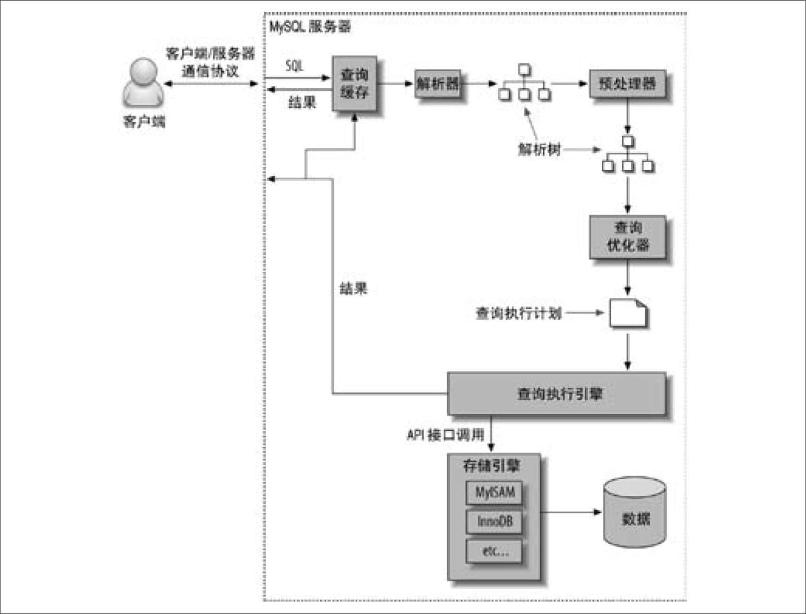 
**图6-1：查询执行路径**


1. 客户端发送一条查询给服务器。 
2. 服务器先检查查询缓存，如果命中了缓存，则立刻返回存储在缓存中的结果。否则进入下一阶段。 
3. 服务器端进行SQL解析、预处理，再由优化器生成对应的执行计划。 
4. MySQL根据优化器生成的执行计划，调用存储引擎的API来执行查询。 
5. 将结果返回给客户端。 

上面的每一步都比想象的复杂，我们在后续章节中将继续讨论。我们会看到在每一个阶段查询处于何种状态。查询优化器是其中特别复杂也特别难理解的部分。还有很多的例外情况，例如，当查询使用绑定变量后，执行路径会有所不同，我们将在下一章讨论这点。

## 6.4.1　MySQL客户端/服务器通信协议

一般来说，不需要去理解MySQL通信协议的内部实现细节，只需要大致理解通信协议是如何工作的。MySQL客户端和服务器之间的通信协议是“半双工”的，这意味着，在任何一个时刻，要么是由服务器向客户端发送数据，要么是由客户端向服务器发送数据，这两个动作不能同时发生。所以，我们无法也无须将一个消息切成小块独立来发送。

这种协议让MySQL通信简单快速，但是也从很多地方限制了MySQL。一个明显的限制是，这意味着没法进行流量控制。一旦一端开始发生消息，另一端要接收完整个消息才能响应它。这就像来回抛球的游戏：在任何时刻，只有一个人能控制球，而且只有控制球的人才能将球抛回去（发送消息）。

客户端用一个单独的数据包将查询传给服务器。这也是为什么当查询的语句很长的时候，参数max\_allowed\_packet就特别重要了(7)。一旦客户端发送了请求，它能做的事情就只是等待结果了。

相反的，一般服务器响应给用户的数据通常很多，由多个数据包组成。当服务器开始响应客户端请求时，客户端必须完整地接收整个返回结果，而不能简单地只取前面几条结果，然后让服务器停止发送数据。这种情况下，客户端若接收完整的结果，然后取前面几条需要的结果，或者接收完几条结果后就“粗暴”地断开连接，都不是好主意。这也是在必要的时候一定要在查询中加上LIMIT限制的原因。

换一种方式解释这种行为：当客户端从服务器取数据时，看起来是一个拉数据的过程，但实际上是MySQL在向客户端推送数据的过程。客户端不断地接收从服务器推送的数据，客户端也没法让服务器停下来。客户端像是“从消防水管喝水”（这是一个术语）。

多数连接MySQL的库函数都可以获得全部结果集并缓存到内存里，还可以逐行获取需要的数据。默认一般是获得全部结果集并缓存到内存中。MySQL通常需要等所有的数据都已经发送给客户端才能释放这条查询所占用的资源，所以接收全部结果并缓存通常可以减少服务器的压力，让查询能够早点结束、早点释放相应的资源。

当使用多数连接MySQL的库函数从MySQL获取数据时，其结果看起来都像是从MySQL服务器获取数据，而实际上都是从这个库函数的缓存获取数据。多数情况下这没什么问题，但是如果需要返回一个很大的结果集的时候，这样做并不好，因为库函数会花很多时间和内存来存储所有的结果集。如果能够尽早开始处理这些结果集，就能大大减少内存的消耗，这种情况下可以不使用缓存来记录结果而是直接处理。这样做的缺点是，对于服务器来说，需要查询完成后才能释放资源，所以在和客户端交互的整个过程中，服务器的资源都是被这个查询所占用的(8)。

我们看看当使用P H P的时候是什么情况。首先，下面是我们连接M y S Q L的通常写法：

```
        <?php
        $link   = mysql_connect('localhost', 'user', 'p4ssword');
        $result = mysql_query('SELECT * FROM HUGE_TABLE', $link);
        while ( $row = mysql_fetch_array($result) ) {
           // Do something with result
        }
        ?>}
```

这段代码看起来像是只有当你需要的时候，才通过循环从服务器端取出数据。而实际上，在上面的代码中，在调用mysql\_query()的时候，PHP就已经将整个结果集缓存到内存中。下面的while循环只是从这个缓存中逐行取出数据，相反如果使用下面的查询，用mysql\_unbuffered\_query()代替mysql\_query()，PHP则不会缓存结果：

```
        <?php
        $link   = mysql_connect('localhost', 'user', 'p4ssword');
        $result = mysql_unbuffered_query('SELECT * FROM HUGE_TABLE', $link);
        while ( $row = mysql_fetch_array($result) ) {
           // Do something with result
        }
        ?>
```

不同的编程语言处理缓存的方式不同。例如，在Perl的DBD:mysql驱动中需要指定C连接库的mysql\_use\_result属性（默认是mysql\_buffer\_result）。下面是一个例子


        #!/usr/bin/perl
        use DBI;
        my $dbh = DBI->connect('DBI:mysql:;host=localhost', 'user', 'p4ssword');
        my $sth = $dbh->prepare('SELECT * FROM HUGE_TABLE', { mysql_use_result => 1 });
        $sth->execute();
        while ( my $row = $sth->fetchrow_array() ) {
           # Do something with result
        }

注意到上面的prepare()调用指定了mysql\_use\_result属性为1，所以应用将直接“使用”返回的结果集而不会将其缓存。也可以在连接MySQL的时候指定这个属性，这会让整个连接都使用不缓存的方式处理结果集：


        my $dbh = DBI->connect('DBI:mysql:;mysql_use_result=1', 'user', 'p4ssword');

### 查询状态

对于一个MySQL连接，或者说一个线程，任何时刻都有一个状态，该状态表示了MySQL当前正在做什么。有很多种方式能查看当前的状态，最简单的是使用SHOW FULL PROCESSLIST命令（该命令返回结果中的Command列就表示当前的状态）。在一个查询的生命周期中，状态会变化很多次。MySQL官方手册中对这些状态值的含义有最权威的解释，下面将这些状态列出来，并做一个简单的解释。

Sleep

线程正在等待客户端发送新的请求。

Query

线程正在执行查询或者正在将结果发送给客户端。

Locked

在MySQL服务器层，该线程正在等待表锁。在存储引擎级别实现的锁，例如InnoDB的行锁，并不会体现在线程状态中。对于MyISAM来说这是一个比较典型的状态，但在其他没有行锁的引擎中也经常会出现。

Analyzing and statistics

线程正在收集存储引擎的统计信息，并生成查询的执行计划。

Copying to tmp table [on disk]

线程正在执行查询，并且将其结果集都复制到一个临时表中，这种状态一般要么是在做GROUP BY操作，要么是文件排序操作，或者是UNION操作。如果这个状态后面还有“on disk”标记，那表示MySQL正在将一个内存临时表放到磁盘上。

The thread is

线程正在对结果集进行排序。

Sending data

这表示多种情况：线程可能在多个状态之间传送数据，或者在生成结果集，或者在向客户端返回数据。

了解这些状态的基本含义非常有用，这可以让你很快地了解当前“谁正在持球”(9)。在一个繁忙的服务器上，可能会看到大量的不正常的状态，例如statistics正占用大量的时间。这通常表示，某个地方有异常了，可以通过使用第3章的一些技巧来诊断到底是哪个环节出现了问题。

## 6.4.2　查询缓存**(10)**

在解析一个查询语句之前，如果查询缓存是打开的，那么MySQL会优先检查这个查询是否命中查询缓存中的数据。这个检查是通过一个对大小写敏感的哈希查找实现的。查询和缓存中的查询即使只有一个字节不同，那也不会匹配缓存结果(11)，这种情况下查询就会进入下一阶段的处理。

如果当前的查询恰好命中了查询缓存，那么在返回查询结果之前MySQL会检查一次用户权限。这仍然是无须解析查询SQL语句的，因为在查询缓存中已经存放了当前查询需要访问的表信息。如果权限没有问题，MySQL会跳过所有其他阶段，直接从缓存中拿到结果并返回给客户端。这种情况下，查询不会被解析，不用生成执行计划，不会被执行。在第7章中的查询缓存一节，你将学习到更多细节。

## 6.4.3　查询优化处理

查询的生命周期的下一步是将一个SQL转换成一个执行计划，MySQL再依照这个执行计划和存储引擎进行交互。这包括多个子阶段：解析SQL、预处理、优化SQL执行计划。这个过程中任何错误（例如语法错误）都可能终止查询。这里不打算详细介绍MySQL内部实现，而只是选择性地介绍其中几个独立的部分，在实际执行中，这几部分可能一起执行也可能单独执行。我们的目的是帮助大家理解MySQL如何执行查询，以便写出更优秀的查询。

### 语法解析器和预处理

首先，MySQL通过关键字将SQL语句进行解析，并生成一棵对应的“解析树”。MySQL解析器将使用MySQL语法规则验证和解析查询。例如，它将验证是否使用错误的关键字，或者使用关键字的顺序是否正确等，再或者它还会验证引号是否能前后正确匹配。

预处理器则根据一些MySQL规则进一步检查解析树是否合法，例如，这里将检查数据表和数据列是否存在，还会解析名字和别名，看看它们是否有歧义。

下一步预处理器会验证权限。这通常很快，除非服务器上有非常多的权限配置。

### 查询优化器

现在语法树被认为是合法的了，并且由优化器将其转化成执行计划。一条查询可以有很多种执行方式，最后都返回相同的结果。优化器的作用就是找到这其中最好的执行计划。

MySQL使用基于成本的优化器，它将尝试预测一个查询使用某种执行计划时的成本，并选择其中成本最小的一个。最初，成本的最小单位是随机读取一个4K数据页的成本，后来（成本计算公式）变得更加复杂，并且引入了一些“因子”来估算某些操作的代价，如当执行一次WHERE条件比较的成本。可以通过查询当前会话的Last\_query\_cost的值来得知MySQL计算的当前查询的成本。

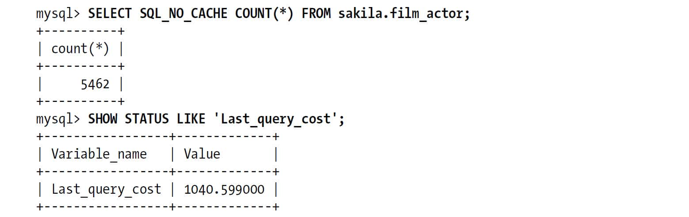 

这个结果表示MySQL的优化器认为大概需要做1040个数据页的随机查找才能完成上面的查询。这是根据一系列的统计信息计算得来的：每个表或者索引的页面个数、索引的基数（索引中不同值的数量）、索引和数据行的长度、索引分布情况。优化器在评估成本的时候并不考虑任何层面的缓存，它假设读取任何数据都需要一次磁盘I/O。

有很多种原因会导致MySQL优化器选择错误的执行计划，如下所示：

+ 统计信息不准确。MySQL依赖存储引擎提供的统计信息来评估成本，但是有的存储引擎提供的信息是准确的，有的偏差可能非常大。例如，InnoDB因为其MVCC的架构，并不能维护一个数据表的行数的精确统计信息。 
+ 执行计划中的成本估算不等同于实际执行的成本。所以即使统计信息精准，优化器给出的执行计划也可能不是最优的。例如有时候某个执行计划虽然需要读取更多的页面，但是它的成本却更小。因为如果这些页面都是顺序读或者这些页面都已经在内存中的话，那么它的访问成本将很小。MySQL层面并不知道哪些页面在内存中、哪些在磁盘上，所以查询实际执行过程中到底需要多少次物理I/O是无法得知的。 
+ MySQL的最优可能和你想的最优不一样。你可能希望执行时间尽可能的短，但是 MySQL只是基于其成本模型选择最优的执行计划，而有些时候这并不是最快的执行方式。所以，这里我们看到根据执行成本来选择执行计划并不是完美的模型。 
+ MySQL从不考虑其他并发执行的查询，这可能会影响到当前查询的速度。 
+ MySQL也并不是任何时候都是基于成本的优化。有时也会基于一些固定的规则，例如，如果存在全文搜索的MATCH()子句，则在存在全文索引的时候就使用全文索引。即使有时候使用别的索引和WHERE条件可以远比这种方式要快，MySQL也仍然会使用对应的全文索引。 
+ MySQL不会考虑不受其控制的操作的成本，例如执行存储过程或者用户自定义函数的成本。 
+ 后面我们还会看到，优化器有时候无法去估算所有可能的执行计划，所以它可能错过实际上最优的执行计划。 

MySQL的查询优化器是一个非常复杂的部件，它使用了很多优化策略来生成一个最优的执行计划。优化策略可以简单地分为两种，一种是静态优化，一种是动态优化。静态优化可以直接对解析树进行分析，并完成优化。例如，优化器可以通过一些简单的代数变换将WHERE条件转换成另一种等价形式。静态优化不依赖于特别的数值，如WHERE条件中带入的一些常数等。静态优化在第一次完成后就一直有效，即使使用不同的参数重复执行查询也不会发生变化。可以认为这是一种“编译时优化”。

相反，动态优化则和查询的上下文有关，也可能和很多其他因素有关，例如WHERE条件中的取值、索引中条目对应的数据行数等。这需要在每次查询的时候都重新评估，可以认为这是“运行时优化”。

在执行语句和存储过程的时候，动态优化和静态优化的区别非常重要。MySQL对查询的静态优化只需要做一次，但对查询的动态优化则在每次执行时都需要重新评估。有时候甚至在查询的执行过程中也会重新优化。(12)

下面是一些MySQL能够处理的优化类型：

重新定义关联表的顺序

数据表的关联并不总是按照在查询中指定的顺序进行。决定关联的顺序是优化器很重要的一部分功能，本章后面将深入介绍这一点。

将外连接转化成内连接

并不是所有的OUTER JOIN语句都必须以外连接的方式执行。诸多因素，例如WHERE条件、库表结构都可能会让外连接等价于一个内连接。MySQL能够识别这点并重写查询，让其可以调整关联顺序。

使用等价变换规则

MySQL可以使用一些等价变换来简化并规范表达式。它可以合并和减少一些比较，还可以移除一些恒成立和一些恒不成立的判断。例如，（5=5 AND a>5）将被改写为a>5。类似的，如果有```
（a<b AND b=c） AND a=5```则会改写为b>5 AND b=c AND a=5。这些规则对于我们编写条件语句很有用，我们将在本章后续继续讨论。

优化COUNT()、MIN()和MAX()

索引和列是否可为空通常可以帮助MySQL优化这类表达式。例如，要找到某一列的最小值，只需要查询对应B-Tree索引最左端的记录，MySQL可以直接获取索引的第一行记录。在优化器生成执行计划的时候就可以利用这一点，在B-Tree索引中，优化器会将这个表达式作为一个常数对待。类似的,如果要查找一个最大值，也只需读取B-Tree索引的最后一条记录。如果MySQL使用了这种类型的优化，那么在EXPLAIN中就可以看到“Select tables optimized away”。从字面意思可以看出，它表示优化器已经从执行计划中移除了该表，并以一个常数取而代之。

类似的，没有任何WHERE条件的COUNT（\*）查询通常也可以使用存储引擎提供的一些优化（例如，MyISAM维护了一个变量来存放数据表的行数）。

预估并转化为常数表达式

当MySQL检测到一个表达式可以转化为常数的时候，就会一直把该表达式作为常数进行优化处理。例如，一个用户自定义变量在查询中没有发生变化时就可以转换为一个常数。数学表达式则是另一种典型的例子。

让人惊讶的是，在优化阶段，有时候甚至一个查询也能够转化为一个常数。一个例子是在索引列上执行MIN()函数。甚至是主键或者唯一键查找语句也可以转换为常数表达式。如果WHERE子句中使用了该类索引的常数条件，MySQL可以在查询开始阶段就先查找到这些值，这样优化器就能够知道并转换为常数表达式。下面是一个例子：

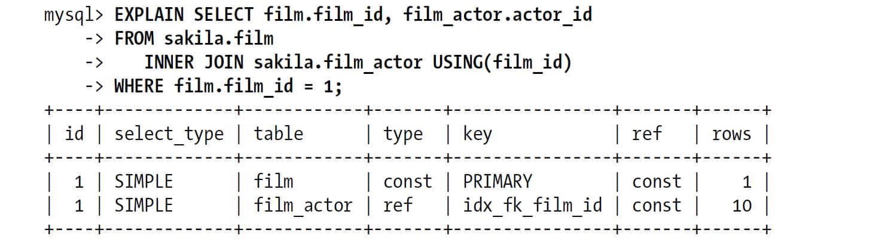 

MySQL分两步来执行这个查询，也就是上面执行计划的两行输出。第一步先从film表找到需要的行。因为在film\_id字段上有主键索引，所以MySQL优化器知道这只会返回一行数据，优化器在生成执行计划的时候，就已经通过索引信息知道将返回多少行数据。因为优化器已经明确知道有多少个值（WHERE条件中的值）需要做索引查询，所以这里的表访问类型是const。

在执行计划的第二步，MySQL将第一步中返回的film\_id列当作一个已知取值的列来处理。因为优化器清楚在第一步执行完成后，该值就会是明确的了。注意到正如第一步中一样，使用flm\_actor字段对表的访问类型也是const。

另一种会看到常数条件的情况是通过等式将常数值从一个表传到另一个表，这可以通过WHERE、USING或者ON语句来限制某列取值为常数。在上面的例子中，因为使用了USING子句，优化器知道这也限制了film\_id在整个查询过程中都始终是一个常量——因为它必须等于WHERE子句中的那个取值。

覆盖索引扫描

当索引中的列包含所有查询中需要使用的列的时候，MySQL就可以使用索引返回需要的数据，而无须查询对应的数据行，在前面的章节中我们已经讨论过这点了。

子查询优化

MySQL在某些情况下可以将子查询转换一种效率更高的形式，从而减少多个查询多次对数据进行访问。

提前终止查询

在发现已经满足查询需求的时候，MySQL总是能够立刻终止查询。一个典型的例子就是当使用了LIMIT子句的时候。除此之外，MySQL还有几类情况也会提前终止查询，例如发现了一个不成立的条件，这时MySQL可以立刻返回一个空结果。从下面的例子可以看到这一点：

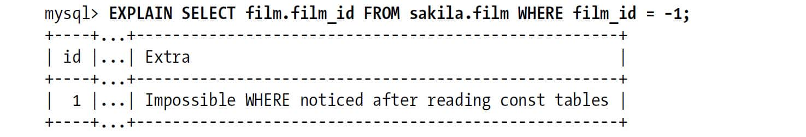 

从这个例子看到查询在优化阶段就已经终止。除此之外，MySQL在执行过程中，如果发现某些特殊的条件，则会提前终止查询。当存储引擎需要检索“不同取值”或者判断存在性的时候，MySQL都可以使用这类优化。例如，我们现在需要找到没有演员的所有电影(13)：


        mysql> **    SELECT film.film_id**    
            -> **    FROM sakila.film**    
            ->    **    LEFT OUTER JOIN sakila.film_actor USING(film_id)**    
            -> **    WHERE film_actor.film_id IS NULL;**    

这个查询将会过滤掉所有有演员的电影。每一部电影可能会有很多的演员，但是上面的查询一旦找到任何一个，就会停止并立刻判断下一部电影，因为只要有一名演员，那么WHERE条件则会过滤掉这类电影。类似这种“不同值/不存在”的优化一般可用于DISTINCT、NOT EXIST()或者LEFT JOIN类型的查询。

等值传播

如果两个列的值通过等式关联，那么MySQL能够把其中一个列的WHERE条件传递到另一列上。例如，我们看下面的查询：


        mysql> **    SELECT film.film_id**    
            -> **    FROM sakila.film**    
            ->    **    INNER JOIN sakila.film_actor USING(film_id)**    
            -> **    WHERE film.film_id > 500**    

因为这里使用了film\_id字段进行等值关联，MySQL知道这里的WHERE子句不仅适用于flm表，而且对于flm\_actor表同样适用。如果使用的是其他的数据库管理系统，可能还需要手动通过一些条件来告知优化器这个WHERE条件适用于两个表，那么写法就会如下：


        ... WHERE film.film_id > 500 AND film_actor.film_id > 500

在MySQL中这是不必要的，这样写反而会让查询更难维护。

列表IN()的比较

在很多数据库系统中，IN()完全等同于多个OR条件的子句，因为这两者是完全等价的。在MySQL中这点是不成立的，MySQL将IN()列表中的数据先进行排序，然后通过二分查找的方式来确定列表中的值是否满足条件，这是一个O（log *n*）复杂度的操作，等价地转换成OR查询的复杂度为O（*n*），对于IN()列表中有大量取值的时候，MySQL的处理速度将会更快。

上面列举的远不是MySQL优化器的全部，MySQL还会做大量其他的优化，即使本章全部用来描述也会篇幅不足，但上面的这些例子已经足以让大家明白优化器的复杂性和智能性了。如果说从上面这段讨论中我们应该学到什么，那就是“不要自以为比优化器更聪明”。最终你可能会占点便宜，但是更有可能会使查询变得更加复杂而难以维护，而最终的收益却为零。让优化器按照它的方式工作就可以了。

当然，虽然优化器已经很智能了，但是有时候也无法给出最优的结果。有时候你可能比优化器更了解数据，例如，由于应用逻辑使得某些条件总是成立；还有时，优化器缺少某种功能特性，如哈希索引；再如前面提到的，从优化器的执行成本角度评估出来的最优执行计划，实际运行中可能比其他的执行计划更慢。

如果能够确认优化器给出的不是最佳选择，并且清楚背后的原理，那么也可以帮助优化器做进一步的优化。例如，可以在查询中添加hint提示，也可以重写查询，或者重新设计更优的库表结构，或者添加更合适的索引。

### 数据和索引的统计信息

重新回忆一下图1-1，MySQL架构由多个层次组成。在服务器层有查询优化器，却没有保存数据和索引的统计信息。统计信息由存储引擎实现，不同的存储引擎可能会存储不同的统计信息（也可以按照不同的格式存储统计信息）。某些引擎，例如Archive引擎，则根本就没有存储任何统计信息！

因为服务器层没有任何统计信息，所以MySQL查询优化器在生成查询的执行计划时，需要向存储引擎获取相应的统计信息。存储引擎则提供给优化器对应的统计信息，包括：每个表或者索引有多少个页面、每个表的每个索引的基数是多少、数据行和索引长度、索引的分布信息等。优化器根据这些信息来选择一个最优的执行计划。在后面的小节中我们将看到统计信息是如何影响优化器的。

### MySQL如何执行关联查询

MySQL中“关联”(14)一词所包含的意义比一般意义上理解的要更广泛。总的来说，MySQL认为任何一个查询都是一次“关联”——并不仅仅是一个查询需要到两个表匹配才叫关联，所以在MySQL中，每一个查询，每一个片段（包括子查询，甚至基于单表的SELECT）都可能是关联。

所以，理解MySQL如何执行关联查询至关重要。我们先来看一个UNION查询的例子。对于UNION查询，MySQL先将一系列的单个查询结果放到一个临时表中，然后再重新读出临时表数据来完成UNION查询。在MySQL的概念中，每个查询都是一次关联，所以读取结果临时表也是一次关联。

当前MySQL关联执行的策略很简单：MySQL对任何关联都执行嵌套循环关联操作，即MySQL先在一个表中循环取出单条数据，然后再嵌套循环到下一个表中寻找匹配的行，依次下去，直到找到所有表中匹配的行为止。然后根据各个表匹配的行，返回查询中需要的各个列。MySQL会尝试在最后一个关联表中找到所有匹配的行，如果最后一个联表无法找到更多的行以后，MySQL返回到上一层次关联表，看是否能够找到更多的匹配记录，依此类推迭代执行。(15)

按照这样的方式查找第一个表记录，再嵌套查询下一个关联表，然后回溯到上一个表，在MySQL中是通过嵌套循环的方式实现——正如其名“嵌套循环关联”。请看下面的例子中的简单查询：


        mysql> **    SELECT tbl1.col1, tbl2.col2**    
            -> **    FROM tbl1 INNER JOIN tbl2 USING(col3)**    
            -> **    WHERE tbl1.col1 IN(5,6)**    

假设MySQL按照查询中的表顺序进行关联操作，我们则可以用下面的伪代码表示MySQL将如何完成这个查询：


        outer_iter = iterator over tbl1 where col1 IN(5,6)
        outer_row  = outer_iter.next
        while outer_row
           inner_iter = iterator over tbl2 where col3 = outer_row.col3
           inner_row  = inner_iter.next
           while inner_row
              output [ outer_row.col1, inner_row.col2 ]
              inner_row = inner_iter.next
           end
           outer_row = outer_iter.netxt
        end

上面的执行计划对于单表查询和多表关联查询都适用，如果是一个单表查询，那么只需完成上面外层的基本操作。对于外连接上面的执行过程仍然适用。例如，我们将上面查询修改如下：


        mysql> **    SELECT tbl1.col1, tbl2.col2**    
            -> **    FROM tbl1 LEFT OUTER JOIN tbl2 USING(col3)**    
            -> **    WHERE tbl1.col1 IN(5,6);**    

对应的伪代码如下，我们用黑体标示不同的部分：


        outer_iter = iterator over tbl1 where col1 IN(5,6)
        outer_row  = outer_iter.next
        while outer_row
           inner_iter = iterator over tbl2 where col3 = outer_row.col3
           inner_row  = inner_iter.next
           if inner_row
              while inner_row
                 output [ outer_row.col1, inner_row.col2 ]
                 inner_row = inner_iter.next
              end
         else
              output [ outer_row.col1, NULL ]
           end
           outer_row = outer_iter.next
        end

另一种可视化查询执行计划的方法是根据优化器执行的路径绘制出对应的“泳道图”。如图6-2所示，绘制了前面示例中内连接的泳道图，请从左至右，从上至下地看这幅图。

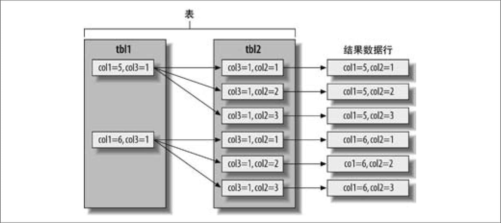 
**图6-2：通过泳道图展示MySQL如何完成关联查询**


从本质上说，MySQL对所有的类型的查询都以同样的方式运行。例如，MySQL在FROM子句中遇到子查询时，先执行子查询并将其结果放到一个临时表中(16)，然后将这个临时表当作一个普通表对待（正如其名“派生表”）。MySQL在执行UNION查询时也使用类似的临时表，在遇到右外连接的时候，MySQL将其改写成等价的左外连接。简而言之，当前版本的MySQL会将所有的查询类型都转换成类似的执行计划。(17)

不过，不是所有的查询都可以转换成上面的形式。例如，全外连接就无法通过嵌套循环和回溯的方式完成，这时当发现关联表中没有找到任何匹配行的时候，则可能是因为关联是恰好从一个没有任何匹配的表开始。这大概也是MySQL并不支持全外连接的原因。还有些场景，虽然可以转换成嵌套循环的方式，但是效率却非常差，后面我们会看一个这样的例子。

### 执行计划

和很多其他关系数据库不同，MySQL并不会生成查询字节码来执行查询。MySQL生成查询的一棵指令树，然后通过存储引擎执行完成这棵指令树并返回结果。最终的执行计划包含了重构查询的全部信息。如果对某个查询执行EXPLAIN EXTENDED后，再执行SHOW WARNINGS，就可以看到重构出的查询(18)。

任何多表查询都可以使用一棵树表示，例如，可以按照图6-3执行一个四表的关联操作。

 
**图6-3：多表关联的一种方式**


在计算机科学中，这被称为一颗平衡树。但是，这并不是MySQL执行查询的方式。正如我们前面章节介绍的，MySQL总是从一个表开始一直嵌套循环、回溯完成所有表关联。所以，MySQL的执行计划总是如图6-4所示，是一棵左测深度优先的树。

 
**图6-4：MySQL如何实现多表关联**


### 关联查询优化器

MySQL优化器最重要的一部分就是关联查询优化，它决定了多个表关联时的顺序。通常多表关联的时候，可以有多种不同的关联顺序来获得相同的执行结果。关联查询优化器则通过评估不同顺序时的成本来选择一个代价最小的关联顺序。

下面的查询可以通过不同顺序的关联最后都获得相同的结果：


        mysql> **    SELECT film.film_id, film.title, film.release_year, actor.actor_id,**    
            ->    **    actor.first_name, actor.last_name**    
            ->    **    FROM sakila.film**    
            ->    **    INNER JOIN sakila.film_actor USING(film_id)**    
            ->    **    INNER JOIN sakila.actor USING(actor_id);**    

容易看出，可以通过一些不同的执行计划来完成上面的查询。例如，MySQL可以从film表开始，使用film\_actor表的索引film\_id来查找对应的actor\_id值，然后再根据actor表的主键找到对应的记录。Oracle用户会用下面的术语描述：“film表作为驱动表先查找fle\_actor表，然后以此结果为驱动表再查找actor表”。这样做效率应该会不错，我们再使用EXPLAIN看看MySQL将如何执行这个查询：


        *************************** 1. row ***************************
                   id: 1
          select_type: SIMPLE
                table: actor
                 type: ALL
        possible_keys: PRIMARY
                  key: NULL
              key_len: NULL
                  ref: NULL
                 rows: 200
                Extra:
        *************************** 2. row ***************************
                   id: 1
          select_type: SIMPLE
                table: film_actor
                 type: ref
        possible_keys: PRIMARY,idx_fk_film_id
                  key: PRIMARY
              key_len: 2
                  ref: sakila.actor.actor_id
                 rows: 1
                Extra: Using index 
        *************************** 3. row ***************************
                   id: 1
          select_type: SIMPLE
                table: film
                 type: eq_ref
        possible_keys: PRIMARY
                  key: PRIMARY
              key_len: 2
                  ref: sakila.film_actor.film_id
                 rows: 1
                Extra:

这和我们前面给出的执行计划完全不同。MySQL从actor表开始（我们从上面的EXPLAIN结果的第一行输出可以看出这点），然后与我们前面的计划按照相反的顺序进行关联。这样是否效率更高呢？我们来看看，我们先使用STRAIGHT\_JOIN关键字，按照我们之前的顺序执行，这里是对应的EXPLAIN输出结果：


        mysql> **    EXPLAIN SELECT STRAIGHT_JOIN film.film_id...\G**    
        *************************** 1. row ***************************
                   id: 1
          select_type: SIMPLE
                table: film
                 type: ALL
        possible_keys: PRIMARY
                  key: NULL
              key_len: NULL
                  ref: NULL
                 rows: 951
                Extra:
        *************************** 2. row ***************************
                   id: 1
          select_type: SIMPLE
                table: film_actor
                 type: ref
        possible_keys: PRIMARY,idx_fk_film_id
                  key: idx_fk_film_id
              key_len: 2
                  ref: sakila.film.film_id
                 rows: 1
                Extra: Using index
        *************************** 3. row ***************************
                   id: 1
          select_type: SIMPLE
                table: actor
                 type: eq_ref
        possible_keys: PRIMARY
                  key: PRIMARY
              key_len: 2
                  ref: sakila.film_actor.actor_id
                 rows: 1
                Extra:

我们来分析一下为什么MySQL会将关联顺序倒转过来：可以看到，关联顺序倒转后的第一个关联表只需要扫描很少的行数(19)。在两种关联顺序下，第二个和第三个关联表都是根据索引查询，速度都很快，不同的是需要扫描的索引项的数量是不同的：

+ 将film表作为第一个关联表时，会找到951条记录，然后对film\_actor和actor表进行嵌套循环查询。 
+ 如果MySQL选择首先扫描actor表，只会返回200条记录进行后面的嵌套循环查询。 

换句话说，倒转的关联顺序会让查询进行更少的嵌套循环和回溯操作。为了验证优化器的选择是否正确，我们单独执行这两个查询，并且看看对应的Last\_query\_cost状态值。我们看到倒转的关联顺序的预估成本(20)为241，而原来的查询的预估成本为1 154。

这个简单的例子主要想说明MySQL是如何选择合适的关联顺序来让查询执行的成本尽可能低的。重新定义关联的顺序是优化器非常重要的一部分功能。不过有的时候，优化器给出的并不是最优的关联顺序。这时可以使用STRAIGHT\_JOIN关键字重写查询，让优化器按照你认为的最优的关联顺序执行——不过老实说，人的判断很难那么精准。绝大多数时候，优化器做出的选择都比普通人的判断要更准确。

关联优化器会尝试在所有的关联顺序中选择一个成本最小的来生成执行计划树。如果可能，优化器会遍历每一个表然后逐个做嵌套循环计算每一棵可能的执行计划树的成本，最后返回一个最优的执行计划。

不过，糟糕的是，如果有超过n个表的关联，那么需要检查n的阶乘种关联顺序。我们称之为所有可能的执行计划的“搜索空间”，搜索空间的增长速度非常块——例如，若是10个表的关联，那么共有3628800种不同的关联顺序！当搜索空间非常大的时候，优化器不可能逐一评估每一种关联顺序的成本。这时，优化器选择使用“贪婪”搜索的方式查找“最优”的关联顺序。实际上，当需要关联的表超过optimizer\_search\_depth的限制的时候，就会选择“贪婪”搜索模式了（optimizer\_search\_depth参数可以根据需要指定大小）。

在MySQL这些年的发展过程中，优化器积累了很多“启发式”的优化策略来加速执行计划的生成。绝大多数情况下，这都是有效的，但因为不会去计算每一种关联顺序的成本，所以偶尔也会选择一个不是最优的执行计划。

有时，各个查询的顺序并不能随意安排，这时关联优化器可以根据这些规则大大减少搜索空间，例如，左连接、相关子查询（后面我将继续讨论子查询）。这是因为，后面的表的查询需要依赖于前面表的查询结果。这种依赖关系通常可以帮助优化器大大减少需要扫描的执行计划数量。

### 排序优化

无论如何排序都是一个成本很高的操作，所以从性能角度考虑，应尽可能避免排序或者尽可能避免对大量数据进行排序。

在第3章中我们已经看到MySQL如何通过索引进行排序。当不能使用索引生成排序结果的时候，MySQL需要自己进行排序，如果数据量小则在内存中进行，如果数据量大则需要使用磁盘，不过MySQL将这个过程统一称为文件排序（*filesort*），即使完全是内存排序不需要任何磁盘文件时也是如此。

如果需要排序的数据量小于“排序缓冲区”，MySQL使用内存进行“快速排序”操作。如果内存不够排序，那么MySQL会先将数据分块，对每个独立的块使用“快速排序”进行排序，并将各个块的排序结果存放在磁盘上，然后将各个排好序的块进行合并（merge），最后返回排序结果。

MySQL有如下两种排序算法：

两次传输排序（旧版本使用）

读取行指针和需要排序的字段，对其进行排序，然后再根据排序结果读取所需要的数据行。

这需要进行两次数据传输，即需要从数据表中读取两次数据，第二次读取数据的时候，因为是读取排序列进行排序后的所有记录，这会产生大量的随机I/O，所以两次数据传输的成本非常高。当使用的是MyISAM表的时候，成本可能会更高，因为MyISAM使用系统调用进行数据的读取（MyISAM非常依赖操作系统对数据的缓存）。不过这样做的优点是，在排序的时候存储尽可能少的数据，这就让“排序缓冲区”(21)中可能容纳尽可能多的行数进行排序。

单次传输排序（新版本使用）

先读取查询所需要的所有列，然后再根据给定列进行排序，最后直接返回排序结果。这个算法只在MySQL 4.1和后续更新的版本才引入。因为不再需要从数据表中读取两次数据，对于I/O密集型的应用，这样做的效率高了很多。另外，相比两次传输排序，这个算法只需要一次顺序I/O读取所有的数据，而无须任何的随机I/O。缺点是，如果需要返回的列非常多、非常大，会额外占用大量的空间，而这些列对排序操作本身来说是没有任何作用的。因为单条排序记录很大，所以可能会有更多的排序块需要合并。

很难说哪个算法效率更高，两种算法都有各自最好和最糟的场景。当查询需要所有列的总长度不超过参数max\_length\_for\_sort\_data时，MySQL使用“单次传输排序”，可以通过调整这个参数来影响MySQL排序算法的选择。关于这个细节，可以参考第8章“文件排序优化”。

MySQL在进行文件排序的时候需要使用的临时存储空间可能会比想象的要大得多。原因在于MySQL在排序时，对每一个排序记录都会分配一个足够长的定长空间来存放。

这个定长空间必须足够长以容纳其中最长的字符串，例如，如果是VARCHAR列则需要分配其完整长度；如果使用UTF-8字符集，那么MySQL将会为每个字符预留三个字节。我们曾经在一个库表结构设计不合理的案例中看到，排序消耗的临时空间比磁盘上的原表要大很多倍。

在关联查询的时候如果需要排序，MySQL会分两种情况来处理这样的文件排序。如果ORDER BY子句中的所有列都来自关联的第一个表，那么MySQL在关联处理第一个表的时候就进行文件排序。如果是这样，那么在MySQL的EXPLAIN结果中可以看到Extra字段会有“Using filesort”。除此之外的所有情况，MySQL都会先将关联的结果存放到一个临时表中，然后在所有的关联都结束后，再进行文件排序。这种情况下，在MySQL的EXPLAIN结果的Extra字段可以看到“Using temporary;Using filesort”。如果查询中有LIMIT的话，LIMIT也会在排序之后应用，所以即使需要返回较少的数据，临时表和需要排序的数据量仍然会非常大。

MySQL 5.6在这里做了很多重要的改进。当只需要返回部分排序结果的时候，例如使用了LIMIT子句，MySQL不再对所有的结果进行排序，而是根据实际情况，选择抛弃不满足条件的结果，然后再进行排序。

## 6.4.4　查询执行引擎

在解析和优化阶段，MySQL将生成查询对应的执行计划，MySQL的查询执行引擎则根据这个执行计划来完成整个查询。这里执行计划是一个数据结构，而不是和很多其他的关系型数据库那样会生成对应的字节码。

相对于查询优化阶段，查询执行阶段不是那么复杂：MySQL只是简单地根据执行计划给出的指令逐步执行。在根据执行计划逐步执行的过程中，有大量的操作需要通过调用存储引擎实现的接口来完成，这些接口也就是我们称为“*handler API*”的接口。查询中的每一个表由一个handler的实例表示。前面我们有意忽略了这点，实际上，MySQL在优化阶段就为每个表创建了一个handler实例，优化器根据这些实例的接口可以获取表的相关信息，包括表的所有列名、索引统计信息，等等。

存储引擎接口有着非常丰富的功能，但是底层接口却只有几十个，这些接口像“搭积木”一样能够完成查询的大部分操作。例如，有一个查询某个索引的第一行的接口，再有一个查询某个索引条目的下一个条目的功能，有了这两个功能我们就可以完成全索引扫描的操作了。这种简单的接口模式，让MySQL的存储引擎插件式架构成为可能，但是正如前面的讨论，也给优化器带来了一定的限制。

并不是所有的操作都由handler完成。例如，当MySQL需要进行表锁的时候。handler可能会实现自己的级别的、更细粒度的锁，如InnoDB就实现了自己的行基本锁，但这并不能代替服务器层的表锁。正如我们第1章所介绍的，如果是所有存储引擎共有的特性则由服务器层实现，比如时间和日期函数、视图、触发器等。

为了执行查询，MySQL只需要重复执行计划中的各个操作，直到完成所有的数据查询。

## 6.4.5　返回结果给客户端

查询执行的最后一个阶段是将结果返回给客户端。即使查询不需要返回结果集给客户端，MySQL仍然会返回这个查询的一些信息，如该查询影响到的行数。

如果查询可以被缓存，那么MySQL在这个阶段也会将结果存放到查询缓存中。

MySQL将结果集返回客户端是一个增量、逐步返回的过程。例如，我们回头看看前面的关联操作，一旦服务器处理完最后一个关联表，开始生成第一条结果时，MySQL就可以开始向客户端逐步返回结果集了。

这样处理有两个好处：服务器端无须存储太多的结果，也就不会因为要返回太多结果而消耗太多内存。另外，这样的处理也让MySQL客户端第一时间获得返回的结果(22)。

结果集中的每一行都会以一个满足MySQL客户端/服务器通信协议的封包发送，再通过TCP协议进行传输，在TCP传输的过程中，可能对MySQL的封包进行缓存然后批量传输。

# 6.5　MySQL查询优化器的局限性

MySQL的万能“嵌套循环”并不是对每种查询都是最优的。不过还好，MySQL查询优化器只对少部分查询不适用，而且我们往往可以通过改写查询让MySQL高效地完成工作。还有一个好消息，MySQL 5.6版本正式发布后，会消除很多MySQL原本的限制，让更多的查询能够以尽可能高的效率完成。

## 6.5.1　关联子查询

MySQL的子查询实现得非常糟糕。最糟糕的一类查询是WHERE条件中包含IN()的子查询语句。例如，我们希望找到Sakila数据库中，演员Penelope Guiness（他的actor\_id为1）参演过的所有影片信息。很自然的，我们会按照下面的方式用子查询实现：


        mysql> **    SELECT * FROM sakila.film**    
            -> **    WHERE film_id IN(**    
            ->    **    SELECT film_id FROM sakila.film_actor WHERE actor_id = 1);**    

因为MySQL对IN()列表中的选项有专门的优化策略，一般会认为MySQL会先执行子查询返回所有包含actor\_id为1的film\_id。一般来说，IN()列表查询速度很快，所以我们会认为上面的查询会这样执行：


        -- SELECT * FROM sakila.film-- SELECT GROUP_CONCAT(film_id) FROM sakila.film_actor WHERE actor_id = 1;
        -- Result: 1,23,25,106,140,166,277,361,438,499,506,509,605,635,749,832,939,970,980
        SELECT * FROM sakila.film
        WHERE film_id
        IN(1,23,25,106,140,166,277,361,438,499,506,509,605,635,749,832,939,970,980);

很不幸，MySQL不是这样做的。MySQL会将相关的外层表压到子查询中，它认为这样可以更高效率地查找到数据行。也就是说，MySQL会将查询改写成下面的样子：


        SELECT * FROM sakila.film
        WHERE EXISTS (
           SELECT * FROM sakila.film_actor WHERE actor_id = 1
           AND film_actor.film_id = film.film_id);

这时，子查询需要根据film\_id来关联外部表film，因为需要film\_id字段，所以MySQL认为无法先执行这个子查询。通过EXPLAIN我们可以看到子查询是一个相关子查询（DEPENDENT SUBQUERY）（可以使用EXPLAIN EXTENDED来查看这个查询被改写成了什么样子）：

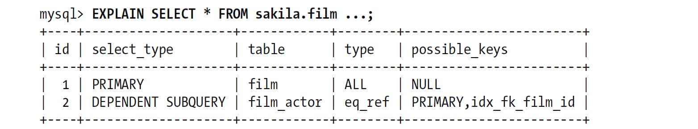 

根据EXPLAIN的输出我们可以看到，MySQL先选择对file表进行全表扫描，然后根据返回的flm\_id逐个执行子查询。如果是一个很小的表，这个查询糟糕的性能可能还不会引起注意，但是如果外层的表是一个非常大的表，那么这个查询的性能会非常糟糕。当然我们很容易用下面的办法来重写这个查询：


        mysql> **    SELECT film.* FROM sakila.film**    
            ->    **    INNER JOIN sakila.film_actor USING(film_id)**    
            -> **    WHERE actor_id = 1;**    

另一个优化的办法是使用函数GROUP\_CONCAT()在IN()中构造一个由逗号分隔的列表。有时这比上面的使用关联改写更快。因为使用IN()加子查询，性能经常会非常糟，所以通常建议使用EXISTS()等效的改写查询来获取更好的效率。下面是另一种改写IN()加子查询的办法：


        mysql> **    SELECT * FROM sakila.film**    
            -> **    WHERE EXISTS(**    
            ->    **    SELECT * FROM sakila.film_actor WHERE actor_id = 1**    
            ->       **    AND film_actor.film_id = film.film_id);**    

这里讨论的优化器的限制直到Oracle推出的MySQL 5.5都一直存在。MySQL的另一个分支MariaDB则在原有的优化器的基础上做了大量的改进，例如这里提到的IN()加子查询改进。

### 如何用好关联子查询

并不是所有关联子查询的性能都会很差。如果有人跟你说：“别用关联子查询”，那么不要理他。先测试，然后做出自己的判断。很多时候，关联子查询是一种非常合理、自然，甚至是性能最好的写法。我们看看下面的例子：


        mysql> **    EXPLAIN SELECT film_id, language_id FROM sakila.film**    
            -> **    WHERE NOT EXISTS(**    
            ->    **    SELECT * FROM sakila.film_actor**    
            ->    **    WHERE film_actor.film_id = film.film_id**    
            -> **    )\G**    
         *************************** 1. row ***************************
                   id: 1
          select_type: PRIMARY
                table: film
                 type: ALL
        possible_keys: NULL
                  key: NULL
              key_len: NULL
                  ref: NULL
                 rows: 951
                Extra: Using where
        *************************** 2. row ***************************
                   id: 2
          select_type: DEPENDENT SUBQUERY
                table: film_actor
                 type: ref
        possible_keys: idx_fk_film_id
                  key: idx_fk_film_id
              key_len: 2
                  ref: film.film_id
                 rows: 2
                Extra: Using where; Using index

一般会建议使用左外连接（LEFT OUTER JOIN）重写该查询，以代替子查询。理论上，改写后MySQL的执行计划完全不会改变。我们来看这个例子：


        mysql> **    EXPLAIN SELECT film.film_id, film.language_id**    
            -> **    FROM sakila.film**    
            ->    **    LEFT OUTER JOIN sakila.film_actor USING(film_id)**    
            -> **    WHERE film_actor.film_id IS NULL\G**    
        *************************** 1. row ***********************
                   id: 1
          select_type: SIMPLE
                table: film
                 type: ALL 
        possible_keys: NULL
                  key: NULL
              key_len: NULL
                  ref: NULL
                 rows: 951
                Extra:
        *************************** 2. row **********************
                   id: 1
          select_type: SIMPLE
                table: film_actor
                 type: ref
        possible_keys: idx_fk_film_id
                  key: idx_fk_film_id
              key_len: 2
                  ref: sakila.film.film_id
                 rows: 2
                Extra: Using where; Using index; Not exists

可以看到，这里的执行计划基本上一样，下面是一些微小的区别：

+ 表flm\_actor的访问类型一个是DEPENDENT SUBQUERY，而另一个是SIMPLE。这个不同是由于语句的写法不同导致的，一个是普通查询，一个是子查询。这对底层存储引擎接口来说，没有任何不同。 
+ 对film表，第二个查询的Extra中没有“Using where”，但这不重要，第二个查询的USING子句和第一个查询的WHERE子句实际上是完全一样的。 
+ 在第二个表film\_actor的执行计划的Extra列有“Not exists”。这是我们前面章节中提到的提前终止算法（early-termination algorithm），MySQL通过使用“Not exists”优化来避免在表film\_actor的索引中读取任何额外的行。这完全等效于直接编写NOT EXISTS子查询，这个执行计划中也是一样，一旦匹配到一行数据，就立刻停止扫描。 

所以，从理论上讲，MySQL将使用完全相同的执行计划来完成这个查询。现实世界中，我们建议通过一些测试来判断使用哪种写法速度会更快。针对上面的案例，我们对两种写法进行了测试，表6-1中列出了测试结果。

**表6-1：NOT EXISTS和左外连接的性能比较**
**查询** **每秒查询数结果（QPS）**  NOT EXISTS 子查询 360 QPS  LEFT OUTER JOIN 425 QPS  
我们的测试显示，使用子查询的写法要略微慢些！

不过每个具体的案例会各有不同，有时候子查询写法也会快些。例如，当返回结果中只有一个表中的某些列的时候。听起来，这种情况对于关联查询效率也会很好。具体情况具体分析，例如下面的关联，我们希望返回所有包含同一个演员参演的电影，因为一个电影会有很多演员参演，所以可能会返回一些重复的记录：


        mysql> **    SELECT film.film_id FROM sakila.film**    
            ->    **    INNER JOIN sakila.film_actor USING(film_id);**    

我们需要使用DISTINCT和GROUP BY来移除重复的记录：


        mysql> **    SELECT DISTINCT film.film_id FROM sakila.film**    
            ->    **    INNER JOIN sakila.film_actor USING(film_id);**    

但是，回头看看这个查询，到底这个查询返回的结果集意义是什么？至少这样的写法会让SQL的意义很不明显。如果使用EXISTS则很容易表达“包含同一个参演演员”的逻辑，而且不需要使用DISTINCT和GROUP BY，也不会产生重复的结果集，我们知道一旦使用了DISTINCT和GROUP BY，那么在查询的执行过程中，通常需要产生临时中间表。下面我们用子查询的写法替换上面的关联：


        mysql> **    SELECT film_id FROM sakila.film**    
            ->    **    WHERE EXISTS(SELECT * FROM sakila.film_actor**    
            ->    **    WHERE film.film_id = film_actor.film_id);**    

再一次，我们需要通过测试来对比这两种写法，哪个更快一些。测试结果参考表6-2。

**表6-2：EXISTS和关联性能对比**
**查询** **每秒查询数结果（QPS）**  INNER JOIN 185 QPS  EXISTS子查询 325 QPS  
在这个案例中，我们看到子查询速度要比关联查询更快些。

通过上面这个详细的案例，主要想说明两点：一是不需要听取那些关于子查询的“绝对真理”，二是应该用测试来验证对子查询的执行计划和响应时间的假设。最后，关于子查询我们需要提到的是一个MySQL的bug。在MYSQL 5.1.48和之前的版本中，下面的写法会锁住table2中的一条记录：


        SELECT ... FROM table1 WHERE col = (SELECT ... FROM table2 WHERE ...);

如果遇到该bug，子查询在高并发情况下的性能，就会和在单线程测试时的性能相差甚远。这个bug的编号是46947，虽然这个问题已经被修复了，但是我们仍然要提醒读者：不要主观猜测，应该通过测试来验证猜想。

## 6.5.2　UNION的限制

有时，MySQL无法将限制条件从外层“下推”到内层，这使得原本能够限制部分返回结果的条件无法应用到内层查询的优化上。

如果希望UNION的各个子句能够根据LIMIT只取部分结果集，或者希望能够先排好序再合并结果集的话，就需要在UNION的各个子句中分别使用这些子句。例如，想将两个子查询结果联合起来，然后再取前20条记录，那么MySQL会将两个表都存放到同一个临时表中，然后再取出前20行记录：


        (SELECT first_name, last_name
         FROM sakila.actor
         ORDER BY last_name)
        UNION ALL
        (SELECT first_name, last_name
         FROM sakila.customer
         ORDER BY last_name)
        LIMIT 20;

这条查询将会把actor中的200条记录和customer表中的599条记录存放在一个临时表中，然后再从临时表中取出前20条。可以通过在UNION的两个子查询中分别加上一个LIMIT 20来减少临时表中的数据：


        (SELECT first_name, last_name
         FROM sakila.actor
         ORDER BY last_name
         LIMIT 20)
        UNION ALL
        (SELECT first_name, last_name
         FROM sakila.customer
         ORDER BY last_name
         LIMIT 20)
        LIMIT 20;

现在中间的临时表只会包含40条记录了，除了性能考虑之外，在这里还需要注意一点：从临时表中取出数据的顺序并不是一定的，所以如果想获得正确的顺序，还需要加上一个全局的ORDER BY和LIMIT操作。

## 6.5.3　索引合并优化

在前面的章节已经讨论过，在5.0和更新的版本中，当WHERE子句中包含多个复杂条件的时候，MySQL能够访问单个表的多个索引以合并和交叉过滤的方式来定位需要查找的行。

## 6.5.4　等值传递

某些时候，等值传递会带来一些意想不到的额外消耗。例如，有一个非常大的IN()列表，而MySQL优化器发现存在WHERE、ON或者USING的子句，将这个列表的值和另一个表的某个列相关联。

那么优化器会将IN()列表都复制应用到关联的各个表中。通常，因为各个表新增了过滤条件，优化器可以更高效地从存储引擎过滤记录。但是如果这个列表非常大，则会导致优化和执行都会变慢。在本书写作的时候，除了修改MySQL源代码，目前还没有什么办法能够绕过该问题（不过这个问题很少会碰到）。

## 6.5.5　并行执行

MySQL无法利用多核特性来并行执行查询。很多其他的关系型数据库能够提供这个特性，但是MySQL做不到。这里特别指出是想告诉读者不要花时间去尝试寻找并行执行查询的方法。

## 6.5.6　哈希关联

在本书写作的时候，MySQL并不支持哈希关联——MySQL的所有关联都是嵌套循环关联。不过，可以通过建立一个哈希索引来曲线地实现哈希关联。如果使用的是Memory存储引擎，则索引都是哈希索引，所以关联的时候也类似于哈希关联。可以参考第5章的“创建自定义哈希索引”部分。另外，MariaDB已经实现了真正的哈希关联。

## 6.5.7　松散索引扫描**(23)**

由于历史原因，MySQL并不支持松散索引扫描，也就无法按照不连续的方式扫描一个索引。通常，MySQL的索引扫描需要先定义一个起点和终点，即使需要的数据只是这段索引中很少数的几个，MySQL仍需要扫描这段索引中每一个条目。

下面我们通过一个示例说明这点。假设我们有如下索引（a，b），有下面的查询：


        mysql> **    SELECT ... FROM tbl WHERE b BETWEEN 2 AND 3;**    

因为索引的前导字段是列a，但是在查询中只指定了字段b，MySQL无法使用这个索引，从而只能通过全表扫描找到匹配的行，如图6-5所示。

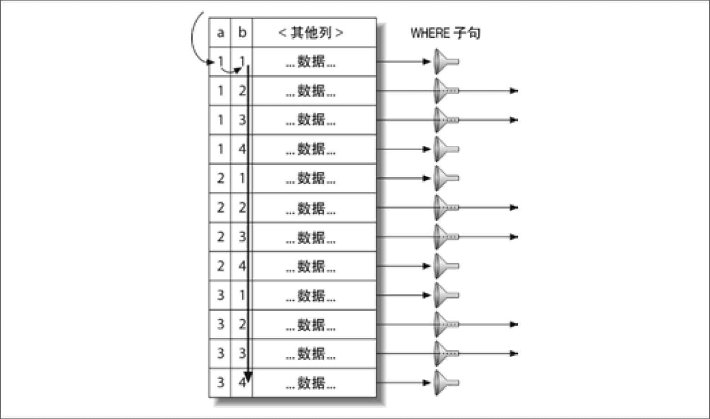 
**图6-5：MySQL通过全表扫描找到需要的记录**


了解索引的物理结构的话，不难发现还可以有一个更快的办法执行上面的查询。索引的物理结构（不是存储引擎的API）使得可以先扫描a列第一个值对应的b列的范围，然后再跳到a列第二个不同值扫描对应的b列的范围。图6-6展示了如果由MySQL来实现这个过程会怎样。

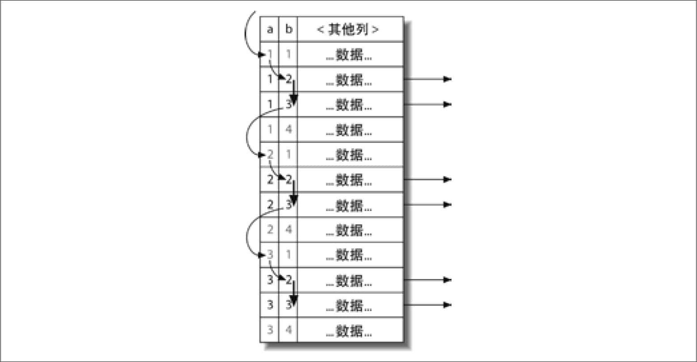 
**图6-6：使用松散索引扫描效率会更高，但是MySQL现在还不支持这么做**


注意到，这时就无须再使用WHERE子句过滤，因为松散索引扫描已经跳过了所有不需要的记录。

上面是一个简单的例子，除了松散索引扫描，新增一个合适的索引当然也可以优化上述查询。但对于某些场景，增加索引是没用的，例如，对于第一个索引列是范围条件，第二个索引列是等值条件的查询，靠增加索引就无法解决问题。

MySQL 5.0之后的版本，在某些特殊的场景下是可以使用松散索引扫描的，例如，在一个分组查询中需要找到分组的最大值和最小值：


        mysql> **    EXPLAIN SELECT actor_id, MAX(film_id)**    
            -> **    FROM sakila.film_actor**    
            -> **    GROUP BY actor_id\G**    
        *************************** 1. row ***************************
                   id: 1
          select_type: SIMPLE
                table: film_actor
                 type: range
        possible_keys: NULL
                  key: PRIMARY
              key_len: 2
                  ref: NULL
                 rows: 396
                Extra: Using index for group-by

在EXPLAIN中的Extra字段显示“Using index for group-by”，表示这里将使用松散索引扫描，不过如果MySQL能写上“loose index probe”，相信会更好理解。

在MySQL很好地支持松散索引扫描之前，一个简单的绕过问题的办法就是给前面的列加上可能的常数值。在前面索引案例学习的章节中，我们已经看到这样做的好处了。

在MySQL 5.6之后的版本，关于松散索引扫描的一些限制将会通过“索引条件下推（index condition pushdown）”的方式解决。

## 6.5.8　最大值和最小值优化

对于MIN()和MAX()查询，MySQL的优化做得并不好。这里有一个例子：


        mysql> **    SELECT MIN(actor_id) FROM sakila.actor WHERE first_name='PENELOPE';**    

因为在first\_name字段上并没有索引，因此MySQL将会进行一次全表扫描。如果MySQL能够进行主键扫描，那么理论上，当MySQL读到第一个满足条件的记录的时候，就是我们需要找的最小值了，因为主键是严格按照actor\_id字段的大小顺序排列的。但是MySQL这时只会做全表扫描，我们可以通过查看SHOW STATUS的全表扫描计数器来验证这一点。一个曲线的优化办法是移除MIN()，然后使用LIMIT来将查询重写如下：


        mysql> **    SELECT actor_id FROM sakila.actor USE INDEX(PRIMARY)**    
            -> **    WHERE first_name = 'PENELOPE' LIMIT 1;**    

这个策略可以让MySQL扫描尽可能少的记录数。如果你是一个完美主义者，可能会说这个SQL已经无法表达她的本意了。一般我们通过SQL告诉服务器我们需要什么数据，由服务器来决定如何最优地获取数据，不过在这个案例中，我们其实是告诉MySQL如何去获取我们需要的数据，通过SQL并不能一眼就看出我们其实是想要一个最小值。确实如此，有时候为了获得更高的性能，我们不得不放弃一些原则。

## 6.5.9　在同一个表上查询和更新

MySQL不允许对同一张表同时进行查询和更新。这其实并不是优化器的限制，如果清楚MySQL是如何执行查询的，就可以避免这种情况。下面是一个无法运行的SQL，虽然这是一个符合标准的SQL语句。这个SQL语句尝试将两个表中相似行的数量记录到字段cnt中：


        mysql> **    UPDATE tbl AS outer_tbl**    
            ->    **    SET cnt = (**    
            ->       **    SELECT count(*) FROM tbl AS inner_tbl**    
            ->       **    WHERE inner_tbl.type = outer_tbl.type**    
            ->    **    );**    
        ERROR 1093 (HY000): You can't specify target table 'outer_tbl' for update in FROM
        clause

可以通过使用生成表的形式来绕过上面的限制，因为MySQL只会把这个表当作一个临时表来处理。实际上，这执行了两个查询：一个是子查询中的SELECT语句，另一个是多表关联UPDATE，只是关联的表是一个临时表。子查询会在UPDATE语句打开表之前就完成，所以下面的查询将会正常执行：


        mysql> **    UPDATE tbl**    
            ->    **    INNER JOIN(www.it-eboo**    
            ->       **    SELECT type, count(*) AS cnt**    
            ->       **    FROM tbl**    
            ->       **    GROUP BY type**    
            ->    **    ) AS der USING(type)**    
            -> **    SET tbl.cnt = der.cnt;**    

# 6.6　查询优化器的提示（hint）

如果对优化器选择的执行计划不满意，可以使用优化器提供的几个提示（hint）来控制最终的执行计划。下面将列举一些常见的提示，并简单地给出什么时候使用该提示。通过在查询中加入相应的提示，就可以控制该查询的执行计划。关于每个提示的具体用法，建议直接阅读MySQL官方手册。有些提示和版本有直接关系。可以使用的一些提示如下：

HIGH\_PRIORITY和LOW\_PRIORITY

这个提示告诉MySQL，当多个语句同时访问某一个表的时候，哪些语句的优先级相对高些、哪些语句的优先级相对低些。

HIGH\_PRIORITY用于SELECT语句的时候，MySQL会将此SELECT语句重新调度到所有正在等待表锁以便修改数据的语句之前。实际上MySQL是将其放在表的队列的最前面，而不是按照常规顺序等待。HIGH\_PRIORITY还可以用于INSERT语句，其效果只是简单地抵消了全局LOW\_PRIORITY设置对该语句的影响。

LOW\_PRIORITY则正好相反：它会让该语句一直处于等待状态，只要队列中还有需要访问同一个表的语句——即使是那些比该语句还晚提交到服务器的语句。这就像一个过于礼貌的人站在餐厅门口，只要还有其他顾客在等待就一直不进去，很明显这容易把自己给饿坏。LOW\_PRIORITY提示在SELECT、INSERT、UPDATE和DELETE语句中都可以使用。

这两个提示只对使用表锁的存储引擎有效，千万不要在InnoDB或者其他有细粒度锁机制和并发控制的引擎中使用。即使是在MyISAM中使用也要注意，因为这两个提示会导致并发插入被禁用，可能会严重降低性能。

HIGH\_PRIORITY和LOW\_PRIORITY经常让人感到困惑。这两个提示并不会获取更多资源让查询“积极”工作，也不会少获取资源让查询“消极”工作。它们只是简单地控制了MySQL访问某个数据表的队列顺序。

DELAYED

这个提示对INSERT和REPLACE有效。MySQL会将使用该提示的语句立即返回给客户端，并将插入的行数据放入到缓冲区，然后在表空闲时批量将数据写入。日志系统使用这样的提示非常有效，或者是其他需要写入大量数据但是客户端却不需要等待单条语句完成I/O的应用。这个用法有一些限制：并不是所有的存储引擎都支持这样的做法；并且该提示会导致函数LAST\_INSERT\_ID()无法正常工作。

STRAIGHT\_JOIN

这个提示可以放置在SELECT语句的SELECT关键字之后，也可以放置在任何两个关联表的名字之间。第一个用法是让查询中所有的表按照在语句中出现的顺序进行关联。第二个用法则是固定其前后两个表的关联顺序。

当MySQL没能选择正确的关联顺序的时候，或者由于可能的顺序太多导致MySQL无法评估所有的关联顺序的时候，STRAIGHT\_JOIN都会很有用。在后面这种情况，MySQL可能会花费大量时间在“statistics”状态，加上这个提示则会大大减少优化器的搜索空间。

可以先使用EXPLAIN语句来查看优化器选择的关联顺序，然后使用该提示来重写查询，再看看它的关联顺序。当你确定无论怎样的where条件，某个固定的关联顺序始终是最佳的时候，使用这个提示可以大大提高优化器的效率。但是在升级MySQL版本的时候，需要重新审视下这类查询，某些新的优化特性可能会因为该提示而失效。

SQL\_SMALL\_RESULT和SQL\_BIG\_RESULT

这两个提示只对SELECT语句有效。它们告诉优化器对GROUP BY或者DISTINCT查询如何使用临时表及排序。SQL\_SMALL\_RESULT告诉优化器结果集会很小，可以将结果集放在内存中的索引临时表，以避免排序操作。如果是SQL\_BIG\_RESULT，则告诉优化器结果集可能会非常大，建议使用磁盘临时表做排序操作。

SQL\_BUFFER\_RESULT

这个提示告诉优化器将查询结果放入到一个临时表，然后尽可能快地释放表锁。这和前面提到的由客户端缓存结果不同。当你没法使用客户端缓存的时候，使用服务器端的缓存通常很有效。带来的好处是无须在客户端上消耗太多的内存，还可以尽可能快地释放对应的表锁。代价是，服务器端将需要更多的内存。

SQL\_CACHE和SQL\_NO\_CACHE

这个提示告诉MySQL这个结果集是否应该缓存在查询缓存中，下一章我们将详细介绍如何使用。

SQL\_CALC\_FOUND\_ROWS

严格来说，这并不是一个优化器提示。它不会告诉优化器任何关于执行计划的东西。它会让MySQL返回的结果集包含更多的信息。查询中加上该提示MySQL会计算除去LIMIT子句后这个查询要返回的结果集的总数，而实际上只返回LIMIT要求的结果集。可以通过函数FOUND\_ROW()获得这个值。（参阅后面的“SQL\_CALC\_FOUND\_ROWS优化”部分，了解下为什么不应该使用该提示。）

FOR UPDATE和LOCK IN SHARE MODE

这也不是真正的优化器提示。这两个提示主要控制SELECT语句的锁机制，但只对实现了行级锁的存储引擎有效。使用该提示会对符合查询条件的数据行加锁。对于INSERT...SELECT语句是不需要这两个提示的，因为对于MySQL 5.0和更新版本会默认给这些记录加上读锁。（可以禁用该默认行为，但不是个好主意，在后面关于复制和备份的章节中将解释这一点。）

唯一内置的支持这两个提示的引擎就是InnoDB。另外需要记住的是，这两个提示会让某些优化无法正常使用，例如索引覆盖扫描。InnoDB不能在不访问主键的情况下排他地锁定行，因为行的版本信息保存在主键中。

糟糕的是，这两个提示经常被滥用，很容易造成服务器的锁争用问题，后面章节我们将讨论这点。应该尽可能地避免使用这两个提示，通常都有其他更好的方式可以实现同样的目的。

USE INDEX、IGNORE INDEX和FORCE INDEX

这几个提示会告诉优化器使用或者不使用哪些索引来查询记录（例如，在决定关联顺序的时候使用哪个索引）。在MySQL 5.0和更早的版本，这些提示并不会影响到优化器选择哪个索引进行排序和分组，在MyQL 5.1和之后的版本可以通过新增选项FOR ORDER BY和FOR GROUP BY来指定是否对排序和分组有效。

FORCE INDEX和USE INDEX基本相同，除了一点：FORCE INDEX会告诉优化器全表扫描的成本会远远高于索引扫描，哪怕实际上该索引用处不大。当发现优化器选择了错误的索引，或者因为某些原因（比如在不使用ORDER BY的时候希望结果有序）要使用另一个索引时，可以使用该提示。在前面关于如何使用LIMIT高效地获取最小值的案例中，已经演示过这种用法。

在MySQL 5.0和更新版本中，新增了一些参数用来控制优化器的行为：

optimizer\_search\_depth

这个参数控制优化器在穷举执行计划时的限度。如果查询长时间处于“Statistics”状态，那么可以考虑调低此参数。

optimizer\_prune\_level

该参数默认是打开的，这让优化器会根据需要扫描的行数来决定是否跳过某些执行计划。

optimizer\_switch

这个变量包含了一些开启/关闭优化器特性的标志位。例如在MySQL 5.1中可以通过这个参数来控制禁用索引合并的特性。

前两个参数是用来控制优化器可以走的一些“捷径”。这些捷径可以让优化器在处理非常复杂的SQL语句时，仍然可以很高效，但这也可能让优化器错过一些真正最优的执行计划。所以应该根据实际需要来修改这些参数。


**MySQL升级后的验证**

在优化器面前耍一些“小聪明”是不好的。这样做收效甚小，但是却给维护带来了很多额外的工作量。在MySQL版本升级的时候，这个问题就很突出了，你设置的“优化器提示”很可能会让新版的优化策略失效。

MySQL 5.0版本引入了大量优化策略，在还没有正式发布的5.6版本中，优化器的改进也是近些年来最大的一次改进。如果要更新到这些版本，当然希望能够从这些改进中受益。

新版MySQL基本上在各个方面都有非常大的改进，5.5和5.6这两个版本尤为突出。升级操作一般来说都很顺利，但仍然建议仔细检查各个细节，以防止一些边界情况影响你的应用程序。不过还好，要避免这些，你不需要付出太多的精力。使用Percona Toolkit中的pt-upgrade工具，就可以检查在新版本中运行的SQL是否与老版本一样，返回相同的结果。


# 6.7　优化特定类型的查询

这一节，我们将介绍如何优化特定类型的查询。在本书的其他部分都会分散介绍这些优化技巧，不过这里将会汇总一下，以便参考和查阅。

本节介绍的多数优化技巧都是和特定的版本有关的，所以对于未来MySQL的版本未必适用。毫无疑问，某一天优化器自己也会实现这里列出的部分或者全部优化技巧。

## 6.7.1　优化COUNT()查询

COUNT()聚合函数，以及如何优化使用了该函数的查询，很可能是MySQL中最容易被误解的前10个话题之一。在网上随便搜索一下就能看到很多错误的理解，可能比我们想象的多得多。

在做优化之前，先来看看COUNT()函数真正的作用是什么。

### COUNT()的作用

COUNT()是一个特殊的函数，有两种非常不同的作用：它可以统计某个列值的数量，也可以统计行数。在统计列值时要求列值是非空的（不统计NULL）。如果在COUNT()的括号中指定了列或者列的表达式，则统计的就是这个表达式有值的结果数(24)。因为很多人对NULL理解有问题，所以这里很容易产生误解。如果想了解更多关于SQL语句中NULL的含义，建议阅读一些关于SQL语句基础的书籍。（关于这个话题，互联网上的一些信息是不够精确的。）

COUNT()的另一个作用是统计结果集的行数。当MySQL确认括号内的表达式值不可能为空时，实际上就是在统计行数。最简单的就是当我们使用COUNT（\*）的时候，这种情况下通配符\*并不会像我们猜想的那样扩展成所有的列，实际上，它会忽略所有的列而直接统计所有的行数。

我们发现一个最常见的错误就是，在括号内指定了一个列却希望统计结果集的行数。如果希望知道的是结果集的行数，最好使用COUNT（\*），这样写意义清晰，性能也会很好。

### 关于MyISAM的神话

一个容易产生的误解就是：MyISAM的COUNT()函数总是非常快，不过这是有前提条件的，即只有没有任何WHERE条件的COUNT（\*）才非常快，因为此时无须实际地去计算表的行数。MySQL可以利用存储引擎的特性直接获得这个值。如果MySQL知道某列col不可能为NULL值，那么MySQL内部会将COUNT（col）表达式优化为COUNT（\*）。

当统计带WHERE子句的结果集行数，可以是统计某个列值的数量时，MyISAM的COUNT()和其他存储引擎没有任何不同，就不再有神话般的速度了。所以在MyISAM引擎表上执行COUNT()有时候比别的引擎快，有时候比别的引擎慢，这受很多因素影响，要视具体情况而定。

### 简单的优化

有时候可以使用MyISAM在COUNT（\*）全表非常快的这个特性，来加速一些特定条件的COUNT()的查询。在下面的例子中，我们使用标准数据库world来看看如何快速查找到所有ID大于5的城市。可以像下面这样来写这个查询：


        mysql> **    SELECT COUNT（*） FROM world.City WHERE ID>5;**    

通过SHOW STATUS的结果可以看到该查询需要扫描4097行数据。如果将条件反转一下，先查找ID小于等于5的城市数，然后用总城市数一减就能得到同样的结果，却可以将扫描的行数减少到5行以内：
```

        mysql> **    SELECT (SELECT COUNT(*) FROM world.City) - COUNT(*)**    
            -> **    FROM world.City WHERE ID <= 5;**    
```

这样做可以大大减少需要扫描的行数，是因为在查询优化阶段会将其中的子查询直接当作一个常数来处理，我们可以通过EXPLAIN来验证这点：

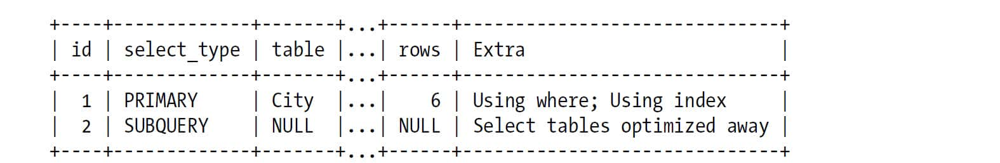 

在邮件组和IRC聊天频道中，通常会看到这样的问题：如何在同一个查询中统计同一个列的不同值的数量，以减少查询的语句量。例如，假设可能需要通过一个查询返回各种不同颜色的商品数量，此时不能使用OR语句（比如SELECT COUNT（color='blue' OR color='red'） FROM items;），因为这样做就无法区分不同颜色的商品数量；也不能在WHERE条件中指定颜色（比如SELECT COUNT（\*） FROM items WHERE color='blue' AND color='RED';），因为颜色的条件是互斥的。下面的查询可以在一定程度上解决这个问题(25)。


        mysql> **    SELECT SUM(IF(color = 'blue', 1, 0)) AS blue,SUM(IF(color = 'red', 1, 0))**    
            -> **    AS red FROM items;**    

也可以使用COUNT()而不是SUM()实现同样的目的，只需要将满足条件设置为真，不满足条件设置为NULL即可：


        mysql> **    SELECT COUNT(color = 'blue' OR NULL) AS blue, COUNT(color = 'red' OR NULL)**    
            -> **    AS red FROM items;**    

### 使用近似值

有时候某些业务场景并不要求完全精确的COUNT值，此时可以用近似值来代替。EXPLAIN出来的优化器估算的行数就是一个不错的近似值，执行EXPLAIN并不需要真正地去执行查询，所以成本很低。

很多时候，计算精确值的成本非常高，而计算近似值则非常简单。曾经有一个客户希望我们统计他的网站的当前活跃用户数是多少，这个活跃用户数保存在缓存中，过期时间为30分钟，所以每隔30分钟需要重新计算并放入缓存。因此这个活跃用户数本身就不是精确值，所以使用近似值代替是可以接受的。另外，如果要精确统计在线人数，通常WHERE条件会很复杂，一方面需要剔除当前非活跃用户，另一方面还要剔除系统中某些特定ID的“默认”用户，去掉这些约束条件对总数的影响很小，但却可能很好地提升该查询的性能。更进一步地优化则可以尝试删除DISTINCT这样的约束来避免文件排序。这样重写过的查询要比原来的精确统计的查询快很多，而返回的结果则几乎相同。

### 更复杂的优化

通常来说，COUNT()都需要扫描大量的行（意味着要访问大量数据）才能获得精确的结果，因此是很难优化的。除了前面的方法，在MySQL层面还能做的就只有索引覆盖扫描了。如果这还不够，就需要考虑修改应用的架构，可以增加汇总表（第4章已经介绍过），或者增加类似*Memcached*这样的外部缓存系统。可能很快你就会发现陷入到一个熟悉的困境，“快速，精确和实现简单”，三者永远只能满足其二，必须舍掉其中一个。

## 6.7.2　优化关联查询

这个话题基本上整本书都在讨论，这里需要特别提到的是：

+ 确保ON或者USING子句中的列上有索引。在创建索引的时候就要考虑到关联的顺序。当表A和表B用列c关联的时候，如果优化器的关联顺序是B、A，那么就不需要在B表的对应列上建上索引。没有用到的索引只会带来额外的负担。一般来说，除非有其他理由，否则只需要在关联顺序中的第二个表的相应列上创建索引。 
+ 确保任何的GROUP BY和ORDER BY中的表达式只涉及到一个表中的列，这样MySQL才有可能使用索引来优化这个过程。 
+ 当升级MySQL的时候需要注意：关联语法、运算符优先级等其他可能会发生变化的地方。因为以前是普通关联的地方可能会变成笛卡儿积，不同类型的关联可能会生成不同的结果等。 

## 6.7.3　优化子查询

关于子查询优化我们给出的最重要的优化建议就是尽可能使用关联查询代替，至少当前的MySQL版本需要这样。本章的前面章节已经详细介绍了这点。“尽可能使用关联”并不是绝对的，如果使用的是MySQL 5.6或更新的版本或者MariaDB，那么就可以直接忽略关于子查询的这些建议了。

## 6.7.4　优化**GROUP BY**和**DISTINCT**

在很多场景下，MySQL都使用同样的办法优化这两种查询，事实上，MySQL优化器会在内部处理的时候相互转化这两类查询。它们都可以使用索引来优化，这也是最有效的优化办法。

在MySQL中，当无法使用索引的时候，GROUP BY使用两种策略来完成：使用临时表或者文件排序来做分组。对于任何查询语句，这两种策略的性能都有可以提升的地方。可以通过使用提示SQL\_BIG\_RESULT和SQL\_SMALL\_RESULT来让优化器按照你希望的方式运行。在本章的前面章节我们已经讨论了这点。

如果需要对关联查询做分组（GROUP BY），并且是按照查找表中的某个列进行分组，那么通常采用查找表的标识列分组的效率会比其他列更高。例如下面的查询效率不会很好：


        mysql> **    SELECT actor.first_name, actor.last_name, COUNT(*)**    
            -> **    FROM sakila.film_actor**    
            ->    **    INNER JOIN sakila.actor USING(actor_id)**    
            -> **    GROUP BY actor.first_name, actor.last_name;**    

如果查询按照下面的写法效率则会更高：


        mysql> **    SELECT actor.first_name, actor.last_name, COUNT(*)**    
            -> **    FROM sakila.film_actor**    
            ->    **    INNER JOIN sakila.actor USING(actor_id)**    
            -> **    GROUP BY film_actor.actor_id;**    

使用actor.actor\_id列分组的效率甚至会比使用film\_actor.actor\_id更好。这一点通过简单的测试即可验证。

这个查询利用了演员的姓名和ID直接相关的特点，因此改写后的结果不受影响，但显然不是所有的关联语句的分组查询都可以改写成在SELECT中直接使用非分组列的形式的。甚至可能会在服务器上设置SQL\_MODE来禁止这样的写法。如果是这样，也可以通过MIN()或者MAX()函数来绕过这种限制，但一定要清楚，SELECT后面出现的非分组列一定是直接依赖分组列，并且在每个组内的值是唯一的，或者是业务上根本不在乎这个值具体是什么：


        mysql> **    SELECT MIN(actor.first_name), MAX(actor.last_name), ...;**    

较真的人可能会说这样写的分组查询是有问题的，确实如此。从MIN()或者MAX()函数的用法就可以看出这个查询是有问题的。但若更在乎的是MySQL运行查询的效率时这样做也无可厚非。如果实在较真的话也可以改写成下面的形式：


        mysql> **    SELECT actor.first_name, actor.last_name, c.cnt**    
            -> **    FROM sakila.film_actor**    
            ->   **    INNER JOIN (**    
            ->       **    SELECT actor_id, COUNT(*) AS cnt**    
            ->       **    FROM sakila.film_actor**    
            ->       **    GROUP BY actor_id**    
            ->    **    ) AS c USING(actor_id) ;**    

这样写更满足关系理论，但成本有点高，因为子查询需要创建和填充临时表，而子查询中创建的临时表是没有任何索引的(26)。

在分组查询的SELECT中直接使用非分组列通常都不是什么好主意，因为这样的结果通常是不定的，当索引改变，或者优化器选择不同的优化策略时都可能导致结果不一样。我们碰到的大多数这种查询最后都导致了故障（因为MySQL不会对这类查询返回错误），而且这种写法大部分是由于偷懒而不是为优化而故意这么设计的。建议始终使用含义明确的语法。事实上，我们建议将MySQL的SQL\_MODE设置为包含ONLY\_FULL\_GROUP\_BY，这时MySQL会对这类查询直接返回一个错误，提醒你需要重写这个查询。

如果没有通过ORDER BY子句显式地指定排序列，当查询使用GROUP BY子句的时候，结果集会自动按照分组的字段进行排序。如果不关心结果集的顺序，而这种默认排序又导致了需要文件排序，则可以使用ORDER BY NULL，让MySQL不再进行文件排序。也可以在GROUP BY子句中直接使用DESC或者ASC关键字，使分组的结果集按需要的方向排序。

### 优化GROUP BY WITH ROLLUP

分组查询的一个变种就是要求MySQL对返回的分组结果再做一次超级聚合。可以使用WITH ROLLUP子句来实现这种逻辑，但可能会不够优化。可以通过EXPLAIN来观察其执行计划，特别要注意分组是否是通过文件排序或者临时表实现的。然后再去掉WITH ROLLUP子句看执行计划是否相同。也可以通过本节前面介绍的优化器提示来固定执行计划。

很多时候，如果可以，在应用程序中做超级聚合是更好的，虽然这需要返回给客户端更多的结果。也可以在FROM子句中嵌套使用子查询，或者是通过一个临时表存放中间数据，然后和临时表执行UNION来得到最终结果。

最好的办法是尽可能的将WITH ROLLUP功能转移到应用程序中处理。

## 6.7.5　优化LIMIT分页

在系统中需要进行分页操作的时候，我们通常会使用LIMIT加上偏移量的办法实现，同时加上合适的ORDER BY子句。如果有对应的索引，通常效率会不错，否则，MySQL需要做大量的文件排序操作。

一个非常常见又令人头疼的问题就是，在偏移量非常大的时候(27)，例如可能是LIMIT 1000,20这样的查询，这时MySQL需要查询10 020条记录然后只返回最后20条，前面10000条记录都将被抛弃，这样的代价非常高。如果所有的页面被访问的频率都相同，那么这样的查询平均需要访问半个表的数据。要优化这种查询，要么是在页面中限制分页的数量，要么是优化大偏移量的性能。

优化此类分页查询的一个最简单的办法就是尽可能地使用索引覆盖扫描，而不是查询所有的列。然后根据需要做一次关联操作再返回所需的列。对于偏移量很大的时候，这样做的效率会提升非常大。考虑下面的查询：


        mysql> **    SELECT film_id, description FROM sakila.film ORDER BY title LIMIT 50, 5;**    

如果这个表非常大，那么这个查询最好改写成下面的样子：


        mysql> **    SELECT film.film_id, film.description**    
            -> **    FROM sakila.film**    
            ->    **    INNER JOIN (**    
            ->       **    SELECT film_id FROM sakila.film**    
            ->       **    ORDER BY title LIMIT 50, 5**    
            ->    **    ) AS lim USING(film_id);**    

这里的“延迟关联”将大大提升查询效率，它让MySQL扫描尽可能少的页面，获取需要访问的记录后再根据关联列回原表查询需要的所有列。这个技术也可以用于优化关联查询中的LIMIT子句。

有时候也可以将LIMIT查询转换为已知位置的查询，让MySQL通过范围扫描获得到对应的结果。例如，如果在一个位置列上有索引，并且预先计算出了边界值，上面的查询就可以改写为：


        mysql> **    SELECT film_id, description FROM sakila.film**    
            -> **    WHERE position BETWEEN 50 AND 54 ORDER BY position;**    

对数据进行排名的问题也与此类似，但往往还会同时和GROUP BY混合使用。在这种情况下通常都需要预先计算并存储排名信息。

LIMIT和OFFSET的问题，其实是OFFSET的问题，它会导致MySQL扫描大量不需要的行然后再抛弃掉。如果可以使用书签记录上次取数据的位置，那么下次就可以直接从该书签记录的位置开始扫描，这样就可以避免使用OFFSET。例如，若需要按照租借记录做翻页，那么可以根据最新一条租借记录向后追溯，这种做法可行是因为租借记录的主键是单调增长的。首先使用下面的查询获得第一组结果：


        mysql> **    SELECT * FROM sakila.rental**    
            -> **    ORDER BY rental_id DESC LIMIT 20;**    

假设上面的查询返回的是主键为16049到16030的租借记录，那么下一页查询就可以从16030这个点开始：

```
        mysql> **    SELECT * FROM sakila.rental**    
            -> **    WHERE rental_id < 16030**    
            -> **    ORDER BY rental_id DESC LIMIT 20;**    
```

该技术的好处是无论翻页到多么后面，其性能都会很好。

其他优化办法还包括使用预先计算的汇总表，或者关联到一个冗余表，冗余表只包含主键列和需要做排序的数据列。还可以使用Sphinx优化一些搜索操作，参考附录F可以获得更多相关信息。

## 6.7.6　优化SQL\_CALC\_FOUND\_ROWS

分页的时候，另一个常用的技巧是在LIMIT语句中加上SQL\_CALC\_FOUND\_ROWS提示（hint），这样就可以获得去掉LIMIT以后满足条件的行数，因此可以作为分页的总数。看起来，MySQL做了一些非常“高深”的优化，像是通过某种方法预测了总行数。但实际上，MySQL只有在扫描了所有满足条件的行以后，才会知道行数，所以加上这个提示以后，不管是否需要，MySQL都会扫描所有满足条件的行，然后再抛弃掉不需要的行，而不是在满足LIMIT的行数后就终止扫描。所以该提示的代价可能非常高。

一个更好的设计是将具体的页数换成“下一页”按钮，假设每页显示20条记录，那么我们每次查询时都是用LIMIT返回21条记录并只显示20条，如果第21条存在，那么我们就显示“下一页”按钮，否则就说明没有更多的数据，也就无须显示“下一页”按钮了。

另一种做法是先获取并缓存较多的数据——例如，缓存1000条——然后每次分页都从这个缓存中获取。这样做可以让应用程序根据结果集的大小采取不同的策略，如果结果集少于1000，就可以在页面上显示所有的分页链接，因为数据都在缓存中，所以这样做性能不会有问题。如果结果集大于1000，则可以在页面上设计一个额外的“找到的结果多于1000条”之类的按钮。这两种策略都比每次生成全部结果集再抛弃掉不需要的数据的效率要高很多。

有时候也可以考虑使用EXPLAIN的结果中的rows列的值来作为结果集总数的近似值（实际上Google的搜索结果总数也是个近似值）。当需要精确结果的时候，再单独使用COUNT（\*）来满足需求，这时如果能够使用索引覆盖扫描则通常也会比SQL\_CALC\_FOUND\_ROWS快得多。

## 6.7.7　优化UNION查询

MySQL总是通过创建并填充临时表的方式来执行UNION查询。因此很多优化策略在UNION查询中都没法很好地使用。经常需要手工地将WHERE、LIMIT、ORDER BY等子句“下推”到UNION的各个子查询中，以便优化器可以充分利用这些条件进行优化（例如，直接将这些子句冗余地写一份到各个子查询）。

除非确实需要服务器消除重复的行，否则就一定要使用UNION ALL，这一点很重要。如果没有ALL关键字，MySQL会给临时表加上DISTINCT选项，这会导致对整个临时表的数据做唯一性检查。这样做的代价非常高。即使有ALL关键字，MySQL仍然会使用临时表存储结果。事实上，MySQL总是将结果放入临时表，然后再读出，再返回给客户端。虽然很多时候这样做是没有必要的（例如，MySQL可以直接把这些结果返回给客户端）。

## 6.7.8　静态查询分析

Percona Toolkit中的*pt-query-advisor*能够解析查询日志、分析查询模式，然后给出所有可能存在潜在问题的查询，并给出足够详细的建议。这像是给MySQL所有的查询做一次全面的健康检查。它能检测出许多常见的问题，诸如我们前面介绍的内容。

## 6.7.9　使用用户自定义变量

用户自定义变量是一个容易被遗忘的MySQL特性，但是如果能够用好，发挥其潜力，在某些场景可以写出非常高效的查询语句。在查询中混合使用过程化和关系化逻辑的时候，自定义变量可能会非常有用。单纯的关系查询将所有的东西都当成无序的数据集合，并且一次性操作它们。MySQL则采用了更加程序化的处理方式。MySQL的这种方式有它的弱点，但如果能熟练地掌握，则会发现其强大之处，而用户自定义变量也可以给这种方式带来很大的帮助。

用户自定义变量是一个用来存储内容的临时容器，在连接MySQL的整个过程中都存在。可以使用下面的SET和SELECT语句来定义它们(28)：


        mysql> **    SET @one       := 1;**    
        mysql> **    SET @min_actor := (SELECT MIN(actor_id) FROM sakila.actor);**    
        mysql> **    SET @last_week := CURRENT_DATE-INTERVAL 1 WEEK;**    

然后可以在任何可以使用表达式的地方使用这些自定义变量：
```

        mysql> **    SELECT ... WHERE col<=@last_week;**    
```

在了解自定义变量的强大之前，我们再看看它自身的一些属性和限制，看看在哪些场景下我们不能使用用户自定义变量：

+ 使用自定义变量的查询，无法使用查询缓存。 
+ 不能在使用常量或者标识符的地方使用自定义变量，例如表名、列名和LIMIT子句中。 
+ 用户自定义变量的生命周期是在一个连接中有效，所以不能用它们来做连接间的通信。 
+ 如果使用连接池或者持久化连接，自定义变量可能让看起来毫无关系的代码发生交互（如果是这样，通常是代码bug或者连接池bug，这类情况确实可能发生）。 
+ 在5.0之前的版本，是大小写敏感的，所以要注意代码在不同MySQL版本间的兼容性问题。 
+ 不能显式地声明自定义变量的类型。确定未定义变量的具体类型的时机在不同MySQL版本中也可能不一样。如果你希望变量是整数类型，那么最好在初始化的时候就赋值为0，如果希望是浮点型则赋值为0.0，如果希望是字符串则赋值为''，用户自定义变量的类型在赋值的时候会改变。MySQL的用户自定义变量是一个动态类型。 
+ MySQL优化器在某些场景下可能会将这些变量优化掉，这可能导致代码不按预想的方式运行。 
+ 赋值的顺序和赋值的时间点并不总是固定的，这依赖于优化器的决定。实际情况可能很让人困惑，后面我们将看到这一点。 
+ 赋值符号:=的优先级非常低，所以需要注意，赋值表达式应该使用明确的括号。使用未定义变量不会产生任何语法错误，如果没有意识到这一点，非常容易犯错。 

### 优化排名语句

使用用户自定义变量(29)的一个重要特性是你可以在给一个变量赋值的同时使用这个变量。换句话说，用户自定义变量的赋值具有“左值”特性。下面的例子展示了如何使用变量来实现一个类似“行号（row number）”的功能：

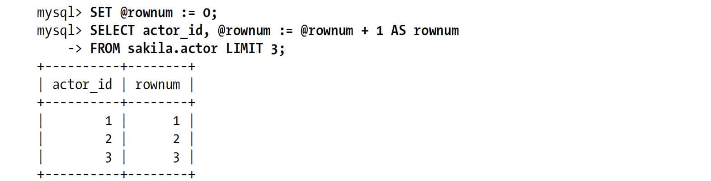 

这个例子的实际意义并不大，它只是实现了一个和该表主键一样的列。不过，我们也可以把这当作一个排名。现在我们来看一个更复杂的用法。我们先编写一个查询获取演过最多电影的前10位演员，然后根据他们的出演电影次数做一个排名，如果出演的电影数量一样，则排名相同。我们先编写一个查询，返回每个演员参演电影的数量：

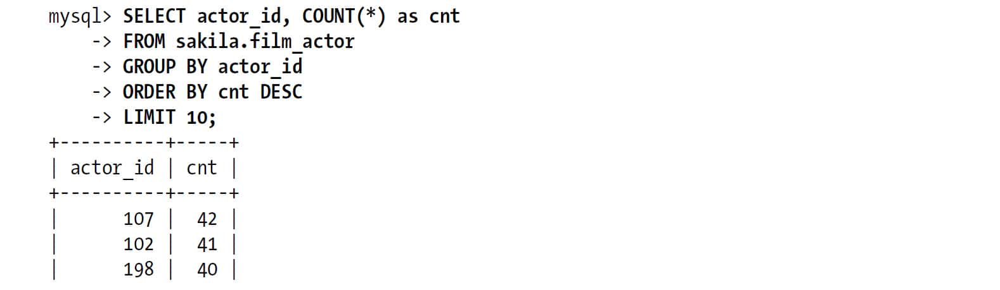 

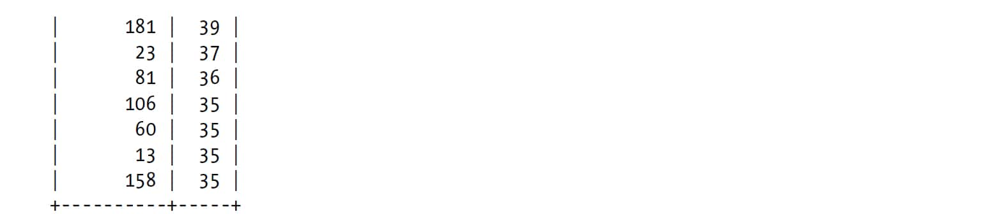 

现在我们再把排名加上去，这里看到有四名演员都参演了35部电影，所以他们的排名应该是相同的。我们使用三个变量来实现：一个用来记录当前的排名，一个用来记录前一个演员的排名，还有一个用来记录当前演员参演的电影数量。只有当前演员参演的电影的数量和前一个演员不同时，排名才变化。我们先试试下面的写法：

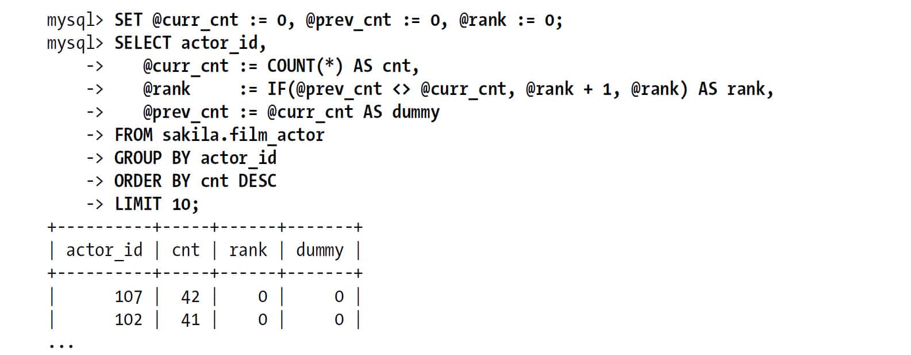 

Oops——排名和统计列一直都无法更新，这是什么原因？

对这类问题，是没法给出一个放之四海皆准的答案的，例如，一个变量名的拼写错误就可能导致这样的问题（这个案例中并不是这个原因），具体问题要具体分析。这里，通过EXPLAIN我们看到将会使用临时表和文件排序，所以可能是由于变量赋值的时间和我们预料的不同。

在使用用户自定义变量的时候，经常会遇到一些“诡异”的现象，要揪出这些问题的原因通常都不容易，但是相比其带来的好处，深究这些问题是值得的。使用SQL语句生成排名值通常需要做两次计算，例如，需要额外计算一次出演过相同数量电影的演员有哪些。使用变量则可一次完成——这对性能是一个很大的提升。

针对这个案例，另一个简单的方案是在FROM子句中使用子查询生成一个中间的临时表：

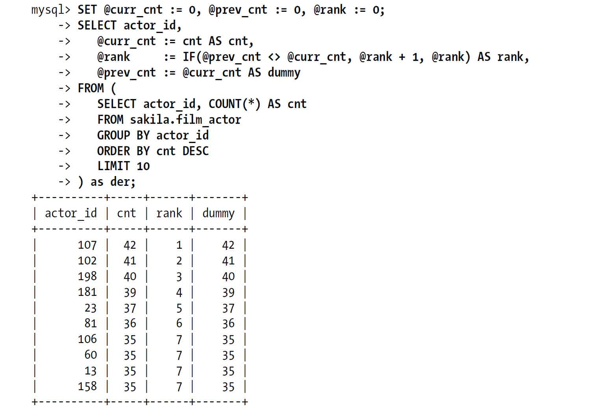 

### 避免重复查询刚刚更新的数据

如果在更新行的同时又希望获得该行的信息，要怎么做才能避免重复的查询呢？不幸的是，MySQL并不支持像PostgreSQL那样的UPDATE RETURNING语法，这个语法可以帮你在更新行的时候同时返回该行的信息。还好在MySQL中你可以使用变量来解决这个问题。例如，我们的一个客户希望能够更高效地更新一条记录的时间戳，同时希望查询当前记录中存放的时间戳是什么。简单地，可以用下面的代码来实现：


        UPDATE t1 SET lastUpdated = NOW() WHERE id = 1;
        SELECT lastUpdated FROM t1 WHERE id = 1;

使用变量，我们可以按如下方式重写查询：


        UPDATE t1 SET lastUpdated = NOW() WHERE id = 1 AND @now := NOW();
        SELECT @now;

上面看起来仍然需要两个查询，需要两次网络来回，但是这里的第二个查询无须访问任何数据表，所以会快非常多。（如果网络延迟非常大，那么这个优化的意义可能不大，不过对这个客户，这样做的效果很好。）

### 统计更新和插入的数量

当使用了INSERT ON DUPLICATE KEY UPDATE的时候，如果想知道到底插入了多少行数据，到底有多少数据是因为冲突而改写成更新操作的？Kerstian Köhntopp在他的博客上给出了一个解决这个问题的办法(30)。实现办法的本质如下：


        INSERT INTO t1(c1, c2) VALUES(4, 4), (2, 1), (3, 1)
        ON DUPLICATE KEY UPDATE
           c1 = VALUES(c1) + ( 0 * ( @x := @x +1 ) );

当每次由于冲突导致更新时对变量@x自增一次。然后通过对这个表达式乘以0来让其不影响要更新的内容。另外，MySQL的协议会返回被更改的总行数，所以不需要单独统计这个值。

### 确定取值的顺序

使用用户自定义变量的一个最常见的问题就是没有注意到在赋值和读取变量的时候可能是在查询的不同阶段。例如，在SELECT子句中进行赋值然后在WHERE子句中读取变量，则可能变量取值并不如你所想。下面的查询看起来只返回一个结果，但事实并非如此：

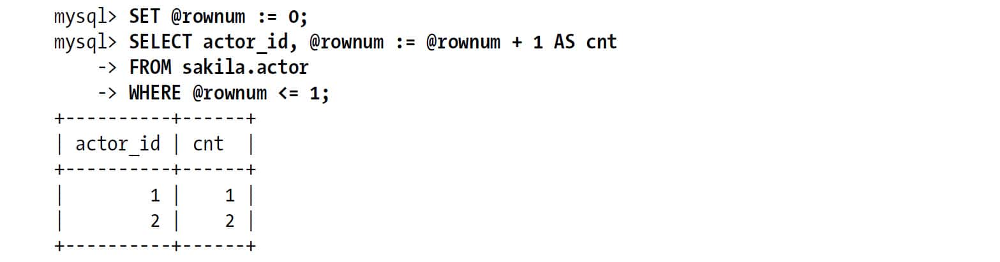 

因为WHERE和SELECT是在查询执行的不同阶段被执行的。如果在查询中再加入ORDER BY的话，结果可能会更不同：
```

        mysql> **    SET @rownum := 0;**    
        mysql> **    SELECT actor_id, @rownum := @rownum + 1 AS cnt**    
            -> **    FROM sakila.actor**    
            -> **    WHERE @rownum <= 1**    
            -> **    ORDER BY first_name;**    
```

这是因为ORDER BY引入了文件排序，而WHERE条件是在文件排序操作之前取值的，所以这条查询会返回表中的全部记录。解决这个问题的办法是让变量的赋值和取值发生在执行查询的同一阶段：

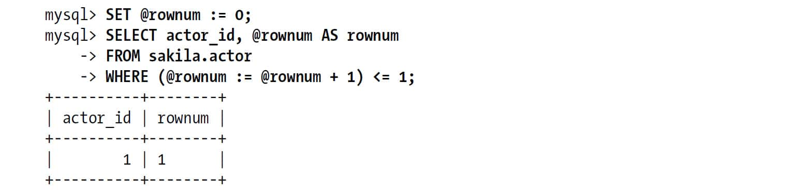 

小测试：如果在上面的查询中再加上ORDER BY，那会返回什么结果？试试看吧。如果得出的结果出乎你的意料，想想为什么？再看下面这个查询会返回什么，下面的查询中ORDER BY子句会改变变量值，那WHERE语句执行时变量值是多少。

```
        mysql> **    SET @rownum := 0;**    
        mysql> **    SELECT actor_id, first_name, @rownum AS rownum**    
            -> **    FROM sakila.actor**    
            -> **    WHERE @rownum <= 1**    
            -> **    ORDER BY first_name, LEAST(0, @rownum := @rownum + 1);**    
```

这个最出人意料的变量行为的答案可以在EXPLAIN语句中找到，注意看在Extra列中的“Using where”、“Using temporary”或者“Using filesort”。

在上面的最后一个例子中，我们引入了一个新的技巧：我们将赋值语句放到LEAST()函数中，这样就可以在完全不改变排序顺序的时候完成赋值操作（在上面例子中，LEAST()函数总是返回0）。这个技巧在不希望对子句的执行结果有影响却又要完成变量赋值的时候很有用。这个例子中，无须在返回值中新增额外列。这样的函数还有GREATEST()、LENGHT()、ISNULL()、NULLIFL()、IF()和COALESCE()，可以单独使用也可以组合使用。例如，COALESCE()可以在一组参数中取第一个已经被定义的变量。

### 编写偷懒的UNION

假设需要编写一个UNION查询，其第一个子查询作为分支条件先执行，如果找到了匹配的行，则跳过第二个分支。在某些业务场景中确实会有这样的需求，比如先在一个频繁访问的表中查找“热”数据，找不到再去另外一个较少访问的表中查找“冷”数据。（区分热数据和冷数据是一个很好的提高缓存命中率的办法）。

下面的查询会在两个地方查找一个用户——一个主用户表、一个长时间不活跃的用户表，不活跃用户表的目的是为了实现更高效的归档(31)：


        SELECT id FROM users WHERE id=123
        UNION ALL
        SELECT id FROM users_archived WHERE id=123;

上面这个查询是可以正常工作的，但是即使在users表中已经找到了记录，上面的查询还是会去归档表users\_archived中再查找一次。我们可以用一个偷懒的UNION查询来抑制这样的数据返回，而且只有当第一个表中没有数据时，我们才在第二个表中查询。一旦在第一个表中找到记录，我们就定义一个变量@found。我们通过在结果列中做一次赋值来实现，然后将赋值放在函数GREATEST中来避免返回额外的数据。为了明确我们的结果到底来自哪个表，我们新增了一个包含表名的列。最后我们需要在查询的末尾将变量重置为NULL，这样保证遍历时不干扰后面的结果。完成的查询如下：


        SELECT GREATEST(@found := −1, id) AS id, 'users' AS which_tbl
        FROM users WHERE id = 1
        UNION ALL
          SELECT id, 'users_archived'
          FROM users_archived WHERE id = 1 AND @found IS NULL
        UNION ALL
          SELECT 1, 'reset' FROM DUAL WHERE ( @found := NULL ) IS NOT NULL;

### 用户自定义变量的其他用处

不仅是在SELECT语句中，在其他任何类型的SQL语句中都可以对变量进行赋值。事实上，这也是用户自定义变量最大的用途。例如，可以像前面使用子查询的方式改进排名语句一样来改进UPDATE语句。

不过，我们需要使用一些技巧来获得我们希望的结果。有时，优化器会把变量当作一个编译时常量来对待，而不是对其进行赋值。将函数放在类似于LEAST()这样的函数中通常可以避免这样的问题。另一个办法是在查询被执行前检查变量是否被赋值。不同的场景下使用不同的办法。

通过一些实践，可以了解所有用户自定义变量能够做的有趣的事情，例如下面这些用法：

+ 查询运行时计算总数和平均值。 
+ 模拟GROUP语句中的函数FIRST()和LAST()。 
+ 对大量数据做一些数据计算。 
+ 计算一个大表的MD5散列值。 
+ 编写一个样本处理函数，当样本中的数值超过某个边界值的时候将其变成0。 
+ 模拟读/写游标。 
+ 在SHOW语句的WHERE子句中加入变量值。 


**C.J. DATE的难题**

C.J. DATE建议在使用数据库设计方法时尽量让SQL数据库符合传统关系数据库的要求。这也是根据关系模型设计SQL时的初衷，但坦白地说，在这一点上，MySQL远不如其他数据库管理系统做得好。所以如果按照C.J. DATE书中的建议编写的适合关系模型的SQL语句在MySQL中运行的效率并不高，例如编写一个多层的子查询。很不幸，这是因为MySQL本身的限制导致无法按照标准的模式运行。我们强烈建议你阅读这本书*SQL and Relational Theory:How to Write Accurate SQL Code*（*http://shop.xreilly.com/product/0636920022879.do*）（O'Reilly出版），它将改变你对SQL语句的认识。


# 6.8　案例学习

通常，我们要做的不是查询优化，不是库表结构优化，不是索引优化也不是应用设计优化——在实践中可能要面对所有这些搅和在一起的情况。本节的案例将为大家介绍一些经常困扰用户的问题和解决方法。另外我们还要推荐Bill Karwin的书*SQL Antipatterns*（一本实践型的书籍）。它将介绍如何使用SQL解决各种程序员疑难杂症。

## 6.8.1　使用MySQL构建一个队列表

使用MySQL来实现队列表是一个取巧的做法，我们看到很多系统在高流量、高并发的情况下表现并不好。典型的模式是一个表包含多种类型的记录：未处理记录、已处理记录、正在处理记录等。一个或者多个消费者线程在表中查找未处理的记录，然后声称正在处理，当处理完成后，再将记录更新成已处理状态。一般的，例如邮件发送、多命令处理、评论修改等会使用类似模式。

通常有两个原因使得大家认为这样的处理方式并不合适。第一，随着队列表越来越大和索引深度的增加，找到未处理记录的速度会随之变慢。你可以通过将队列表分成两部分来解决这个问题，就是将已处理记录归档或者存放到历史表，这可以始终保证队列表很小。

第二，一般的处理过程分两步，先找到未处理记录然后加锁。找到记录会增加服务器的压力，而加锁操作则会让各个消费者进程增加竞争，因为这是一个串行化的操作。在第11章，我们会看到这为什么会限制可扩展性。

找到未处理记录一般来说都没问题，如果有问题则可以通过使用消息的方式来通知各个消费者。具体的，可以使用一个带有注释的SLEEP()函数做超时处理，如下：


        SELECT /* waiting on unsent_emails */ SLEEP (10000);

这让线程一直阻塞，直到两个条件之一满足：10000秒后超时，或者另一个线程使用KILL QUERY结束当前的SLEEP。因此，当再向队列表中新增一批数据后，可以通过SHOW PROCESSLIST，根据注释找到当前正在休眠的线程，并将其KILL。你可以使用函数GET\_LOCK()和RELEASE\_LOCK()来实现通知，或者可以在数据库之外实现，例如使用一个消息服务。

最后需要解决的问题是如何让消费者标记正在处理的记录，而不至于让多个消费者重复处理一个记录。我们看到大家一般使用SELECT FOR UPDATE来实现。这通常是扩展性问题的根源，这会导致大量的事务阻塞并等待。

一般，我们要尽量避免使用SELECT FOR UPDATE。不光是队列表，任何情况下都要尽量避免。总是有别的更好的办法实现你的目的。在队列表的案例中，可以直接使用UPDATE来更新记录，然后检查是否还有其他的记录需要处理。我们看看具体实现，我们先建立如下的表：


        CREATE TABLE unsent_emails (
          id INT NOT NULL PRIMARY KEY AUTO_INCREMENT
          -- columns for the message, from, to, subject, etc. 
          status ENUM('unsent', 'claimed', 'sent'),
          owner  INT UNSIGNED NOT NULL DEFAULT 0,
          ts     TIMESTAMP,
          KEY    (owner, status, ts)
        );

该表的列owner用来存储当前正在处理这个记录的连接ID，即由函数CONNECTION\_ID()返回的ID。如果当前记录没有被任何消费者处理，则该值为0。

我们还经常看到的一个办法是，如下面所示的一次处理10条记录：


        BEGIN;
           SELECT id FROM unsent_emails
           LIMIT 10 FOR UPDATE;
        -- result: 123, 456, 789
        UPDATE unsent_emails
           SET status = 'claimed', owner = CONNECTION_ID()
           WHERE id IN(123, 456, 789);
        COMMIT;

看到这里的SELECT查询可以使用到索引的两个列，因此理论上查找的效率应该更快。问题是，在上面两个查询之间的“间隙时间”，这里的锁会让所有其他同样的查询全部都被阻塞。所有的这样的查询将使用相同的索引，扫描索引相同的部分，所以很可能会被阻塞。

如果改进成下面的写法，则会更加高效：


        SET AUTOCOMMIT = 1;
        COMMIT;
        UPDATE unsent_emails
           SET status = 'claimed', owner = CONNECTION_ID()
           WHERE owner = 0 AND status = 'unsent'
           LIMIT 10;
        SET AUTOCOMMIT = 0;
        SELECT id FROM unsent_emails
           WHERE owner = CONNECTION_ID() AND status = 'claimed';
        -- result: 123, 456, 789

根本就无须使用SELECT查询去找到哪些记录还没有被处理。客户端的协议会告诉你更新了几条记录，所以可以知道这次需要处理多少条记录。

所有的SELECT FOR UPDATE都可以使用类似的方法改写。

最后还需要处理一种特殊情况：那些正在被进程处理，而进程本身却由于某种原因退出的情况。这种情况处理起来很简单。你只需要定期运行UPDATE语句将它都更新成原始状态就可以了，然后执行SHOW PROCESSLIST，获取当前正在工作的线程ID，并使用一些WHERE条件避免取到那些刚开始处理的进程。假设我们获取的线程ID有（10、20、30），下面的更新语句会将处理时间超过10分钟的记录状态都更新成初始状态：
```

        UPDATE unsent_emails
           SET owner = 0, status = 'unsent'
           WHERE owner NOT IN(0, 10, 20, 30) AND status = 'claimed'
           AND ts < CURRENT_TIMESTAMP - INTERVAL 10 MINUTE;
```
另外，注意看看是如何巧妙地设计索引让这个查询更加高效的。这也是上一章和本章知识的结合。因为我们将范围条件放在WHERE条件的末尾，这个查询恰好能够使用索引的全部列。其他的查询也都能用上这个索引，这就避免了再新增一个额外的索引来满足其他的查询。

这里我们将总结一下这个案例中的一些基础原则：

+ 尽量少做事，可以的话就不要做任何事情。除非不得已，否则不要使用轮询，因为这会增加负载，而且还会带来很多低产出的工作。 
+ 尽可能快地完成需要做的事情。尽量使用UPDATE代替先SELECT FOR UPDATE再UPDATE的写法，因为事务提交的速度越快，持有的锁时间就越短，可以大大减少竞争和加速串行执行效率。将已经处理完成和未处理的数据分开，保证数据集足够小。 
+ 这个案例的另一个启发是，某些查询是无法优化的；考虑使用不同的查询或者不同的策略去实现相同的目的。通常对于SELECT FOR UPDATE就需要这样处理。 

有时，最好的办法就是将任务队列从数据库中迁移出来。Redis就是一个很好的队列容器，也可以使用*memcached*来实现。另一个选择是使用Q4M存储引擎，但我们没有在生产环境使用过这个存储引擎，所以这里也没办法提供更多的参考。RabbitMQ和Gearman(32)也可以实现类似的功能。

## 6.8.2　计算两点之间的距离

地理信息计算再次出现在我们的书中了。不建议用户使用MySQL做太复杂的空间信息存储——PostgreSQL在这方面是不错的选择——我们这里将介绍一些常用的计算模式。一个典型的例子是计算以某个点为中心，一定半径内的所有点。

典型的实际案例可能是查找某个点附近所有可以出租的房子，或者社交网站中“匹配”附近的用户，等等。假设我们有如下表：


        CREATE TABLE locations (
          id   INT NOT NULL PRIMARY KEY AUTO_INCREMENT,
          name VARCHAR(30),
          lat  FLOAT NOT NULL,
          lon  FLOAT NOT NULL
        );
        INSERT INTO locations(name, lat, lon)
        VALUES('Charlottesville, Virginia', 38.03, −78.48),
              ('Chicago, Illinois',         41.85, −87.65),
              ('Washington, DC',            38.89, −77.04);

这里经度和纬度的单位是“度”，通常我们假设地球是圆的，然后使用两点所在最大圆（半正矢）公式来计算两点之间的距离。现在有坐标*latA*和*lonA、latB*和*lonB*，那么点A和点B的距离计算公式如下：


        ACOS(
           COS(latA) * COS(latB) * COS(lonA - lonB)
             + SIN(latA) * SIN(latB)
        )

计算出的结果是一个弧度，如果要将结果的单位转换成英里或者千米，则需要乘以地球的半径，也就是3 959英里或者6 371千米。假设我们需要找出所有距离Baron所居住的地方Charlottesville 100英里以内的点，那么我们需要将经纬度带入上面的计算公式：

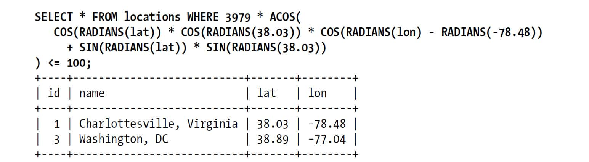 

这类查询不仅无法使用索引，而且还会非常消耗CPU时间，给服务器带来很大的压力，而且我们还得反复计算这个。那要怎样优化呢？

这个设计中有几个地方可以做优化。第一，看看是否真的需要这么精确的计算。其实这种算法已经有很多不精确的地方了，如下所示：

+ 两个地方之间的直线距离可能是100英里，但实际上它们之间的行走距离很可能不是这个值。无论你们在哪两个地方，要到达彼此位置的行走距离多半都不是直线距离，路上可能需要绕很多的弯，比如说如果有一条河，需要绕远走到一个有桥的地方。所以，这里计算的绝对距离只是一个参考值。 
+ 如果我们根据邮政编码来确定某个人所在的地区，再根据这个地区的中心位置计算他和别人的距离，那么这本身就是一个估算。Baron住在Charlottesville，不过不是在中心地区，他对华盛顿物理位置的中心也不感兴趣。 

所以，通常并不需要精确计算，很多应用如果这样计算，多半是认真过头了。这类似于有效数字的估算：计算结果的精度永远都不会比测量的值更高。（换句话说，“错进，错出”。）

如果不需要太高的精度，那么我们认为地球是圆的应该也没什么问题，其实准确的说应该是椭圆。根据毕达哥拉斯定理，做些三角函数变换，我们可以把上面的公式转换得更简单，只需要做些求和、乘积以及平方根运算，就可以得出一个点是否在另一个点多少英里之内。(33)

等等，为什么就到这为止？我们是否真需要计算一个圆周呢？为什么不直接使用一个正方形代替？边长为200英里的正方形，一个顶点到中心的距离大概是141英里，这和实际计算的100英里相差得并不是那么远。那我们根据正方形公式来计算弧度为0.0253（100英里）的中心到边长的距离：


        SELECT * FROM locations
        WHERE lat BETWEEN  38.03 - DEGREES(0.0253) AND  38.03 + DEGREES(0.0253)
          AND lon BETWEEN −78.48 - DEGREES(0.0253) AND −78.48 + DEGREES(0.0253);

现在我们看看如何使用索引来优化这个查询。简单地，我们可以增加索引（lat,lon）或者（lon,lat）。不过这样做效果并不会很好。正如我们所知，MySQL 5.5和之前的版本，如果第一列是范围查询的话，就无法使用索引后面的列了。因为两个列都是范围的，所以这里只能使用索引的一个列（BETWEEN等效于一个大于和一个小于）。

我们再次想起了通常使用的IN()优化。我们先新增两个列，用来存储坐标的近似值FLOOR()，然后在查询中使用IN()将所有点的整数值都放到列表中。下面是我们需要新增的列和索引：


        mysql> **    ALTER TABLE locations**    
            ->   **    ADD lat_floor INT NOT NULL DEFAULT 0,**    
            ->   **    ADD lon_floor INT NOT NULL DEFAULT 0,**    
            ->   **    ADD KEY(lat_floor, lon_floor);**    
        mysql> **    UPDATE locations**    
            -> **    SET lat_floor = FLOOR(lat), lon_floor = FLOOR(lon);**    

现在我们可以根据坐标的一定范围的近似值来搜索了，这个近似值包括地板值和天花板值，地理上分别对应的是南北。下面的查询为我们只展示了如何查某个范围的所有点；数值需要在应用程序中计算而不是MySQL中：

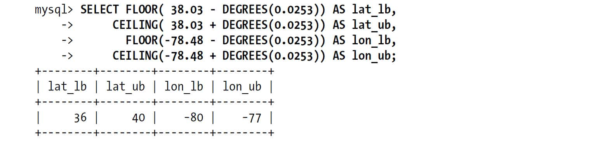 

现在我们就可以生成IN()列表中的整数了，也就是前面计算的地板和天花板数值之间的数字。下面是加上WHERE条件的完整查询：


        SELECT * FROM locations
        WHERE lat BETWEEN  38.03 - DEGREES(0.0253) AND  38.03 + DEGREES(0.0253)
          AND lon BETWEEN −78.48 - DEGREES(0.0253) AND −78.48 + DEGREES(0.0253)
          AND lat_floor IN(36,37,38,39,40) AND lon_floor IN(-80,-79,-78,-77);

使用近似值会让我们的计算结果有些偏差，所以我们还需要一些额外的条件剔除在正方形之外的点。这和前面使用CRC32做哈希索引类似：先建一个索引帮我们过滤出近似值，再使用精确条件匹配所有的记录并移除不满足条件的记录。

事实上，到这时我们就无须根据正方形的近似来过滤数据了，我们可以使用最大圆公式或者毕达哥拉斯定理来计算：
```

        SELECT * FROM locations
        WHERE lat_floor IN(36,37,38,39,40) AND lon_floor IN(-80,-79,-78,-77)
         AND 3979 * ACOS(
           COS(RADIANS(lat)) * COS(RADIANS(38.03)) * COS(RADIANS(lon) - RADIANS(-78.48))
             + SIN(RADIANS(lat)) * SIN(RADIANS(38.03))
         ) <= 100;
```

这时计算精度再次回到前面——使用一个精确的圆周——不过，现在的做法更快(34)。只要能够高效地过滤掉大部分的点，例如使用近似整数和索引，之后再做精确数学计算的代价并不大。只是不要直接使用大圆周的算法，否则速度会很慢。

Sphinx有很多内置的地理信息搜索功能，比MySQL实现要好很多。如果正在考虑使用MyISAM的GIS函数，并使用上面的技巧来计算，那么你需要记住：这样做效果并不会很好，MyISAM本身也并不适合大数据量、高并发的应用，另外MyISAM本身还有一些弱点，如数据文件崩溃、表级锁等。

回顾一下上面的案例，我们采用了下面这些常用的优化策略：

+ 尽量少做事，可能的话尽量不做事。这个案例中就不要对所有的点计算大圆周公式；先使用简单的方案过滤大多数数据，然后再到过滤出来的更小的集合上使用复杂的公式运算。 
+ 快速地完成事情。确保在你的设计中尽可能地让查询都用上合适的索引，使用近似计算（例如本案例中，认为地球是平的，使用一个正方形来近似圆周）来避免复杂的计算。 
+ 需要的时候，尽可能让应用程序完成一些计算。例如本案例中，在应用程序中计算所有的三角函数。 

## 6.8.3　使用用户自定义函数

当SQL语句已经无法高效地完成某些任务的时候，这里我们将介绍最后一个高级的优化技巧。当你需要更快的速度，那么C和C\+\+是很好的选择。当然，你需要一定的C或C\+\+编程技巧，否则你写的程序很可能会让服务器崩溃。这和“能力越强，责任越大”类似。

我们将在下一章为你展示如何编写一个用户自定义函数（UDFs），不过这一章就将通过一个案例看看如何用好一个用户自定义函数。有一个客户，在项目中需要如下的功能：“我们需要根据两个随机的64位数字计算它们的XOR值，来看两个数值是否匹配。大约有3500万条的记录需要在秒级别完成。”经过简单的计算就知道，当前的硬件条件下，不可能在MySQL中完成。那如何解决这个问题呢？

问题的答案是使用Yves Trudeau编写的一个计算程序，这个程序使用SSE4.2指令集，以一个后台程序的方式运行在通用服务器上，然后我们编写一个用户自定义函数，通过简单的网络通信协议和前面的程序进行交互。

Yves的测试表明，分布式运行上面的程序，可以达到在130毫秒内完成4百万次匹配计算。通过这样的方式，可以将密集型的计算放到一些通用的服务器上，同时可以对外界完全透明，看起来是MySQL完成了全部的工作。正如他们在Twitter上说的：\#太好了！这是一个典型的业务优化案例，而不仅仅是优化了一个简单的技术问题。

# 6.9　总结

如果把创建高性能应用程序比作是一个环环相扣的“难题”，除了前面介绍的schema、索引和查询语句设计之外，查询优化应该是解开“难题”的最后一步了。要想写一个好的查询，你必须要理解schema设计、索引设计等，反之亦然。

理解查询是如何被执行的以及时间都消耗在哪些地方，这依然是前面我们介绍的响应时间的一部分。再加上一些诸如解析和优化过程的知识，就可以更进一步地理解上一章讨论的MySQL如何访问表和索引的内容了。这也从另一个维度帮助读者理解MySQL在访问表和索引时查询和索引的关系。

优化通常都需要三管齐下：不做、少做、快速地做。我们希望这里的案例能够帮助你将理论和实践联系起来。

除了这些基础的手段，包括查询、表结构、索引等，MySQL还有一些高级的特性可以帮助你优化应用，例如分区，分区和索引有些类似但是原理不同。MySQL还支持查询缓存，它可以帮你缓存查询结果，当完全相同的查询再次执行时，直接使用缓存结果（回想一下，“不做”）。我们将在下一章中介绍这些特性。


————————————————————

(1) 有时候你可能还需要修改一些查询，减少这些查询对系统中运行的其他查询的影响。这种情况下，你是在减少一个查询的资源消耗，这我们在第3章已经讨论过。

(2) 如果应用服务器和数据库不在同一台主机上，网络开销就显得很明显了。即使是在同一台服务器上仍然会有数据传输的开销。

(3) 更多内容请参考后面的“优化COUNT()查询”。

(4) 例如关联查询结果返回的一条记录通常是由多条记录组成。——译者注

(5) Percona Toolkit中的pt-archiver工具就可以安全而简单地完成这类工作。

(6) Query Cache。——译者注

(7) 如果查询太大，服务端会拒绝接收更多的数据并抛出相应错误。

(8) 你可以使用SQL\_BUFFER\_RESULT，后面将再介绍这点。

(9) 回忆一下前面的客户端和服务器的“传球”比喻。——译者注

(10) 这里是指Query Cache。——译者注

(11) Percona版本的MySQL中提供了一个新的特性，可以在计算查询语句哈希值时，先将注释移除再算哈希值，这对于不同注释的相同查询可以命中相同的查询缓存结果。

(12) 例如，在关联操作中，范围检查的执行计划会针对每一行重新评估索引。可以通过EXPLAIN执行计划中的Extra列是否有“range checked for each record”来确认这一点。该执行计划还会增加select\_full\_range\_join这个服务器变量的值。

(13) 一部电影没有演员，是有点奇怪。不过在示例数据库Sakila中影片*SLACKER LIAISONS*没有任何演员，它的描述是“鲨鱼和见识过中国古代鳄鱼的学生的简短传说”。

(14) join。——译者注

(15) 后面我们会看到MySQL查询执行过程并没有这么简单，MySQL做了很多优化操作。

(16) MySQL的临时表是没有任何索引的，在编写复杂的子查询和关联查询的时候需要注意这一点。这一点对UNION查询也一样。

(17) 在MySQL 5.6和MariaDB中有了重大改变，这两个版本都引入了更加复杂的执行计划。

(18) MySQL根据执行计划生成输出。这和原查询有完全相同的语义，但是查询语句可能并不完全相同。

(19) 严格来说，MySQL并不根据读取的记录来选择最优的执行计划。实际上，MySQL通过预估需要读取的数据页来选择，读取的数据页越少越好。不过读取的记录数通常能够很好地反映一个查询的成本。

(20) 查询的cost。——译者注

(21) 内存。——译者注

(22) 可以通过一些办法来影响这个行为——例如，我们可以使用SQL\_BUFFER\_RESULT。参考后面的“查询优化提示”。

(23) 相当于Oracle中的跳跃索引扫描（skip index scan）。——译者注

(24) 而不是NULL。——译者注

(25) 也可以写成这样的SUM()表达式：SUM（color='blue'），SUM（color='red'）。

(26) 值得一提的是，MariaDB修复了这个限制。

(27) 翻页到非常靠后的页面。——译者注

(28) 在某些场景下，也可以直接使用=进行赋值，不过为了避免歧义，建议始终使用:=。

(29) 为行文方便，后面在不引起歧义的情况下将简称为“变量”。——译者注

(30) 参考*http://mysqldump.azundris.com/archives/86-Down-the-dirty-road.html*。

(31) Baron认为在一些社交网站上归档一些常见不活跃用户后，用户重新回到网站时有这样的需求，当用户再次登录时，一方面我们需要将其从归档中重新拿出来，另外，还可以给他发送一份欢迎邮件。这对一些不活跃的用户是非常好的一个优化。在第11章我们还会再次讨论这个问题。

(32) 参考*http://www.rabbitmq.com*和*http://gearman.org*。

(33) 要想有更多的优化，你可以将三角函数的计算放到应用中，而不要在数据库中计算。三角函数是非常消耗CPU的操作。如果将坐标都转换成弧度存放，则对数据库来说就简化了很多。为了保证我们的案例简单，不要引入太多别的因子，所以这里我们将不再做更多的优化了。

(34) 再一次，需要使用应用程序中的代码来计算这样的表达式COS（RADIANS（38.03））。


