 第7章　MySQL高级特性

MySQL从5.0和5.1版本开始引入了很多高级特性，例如分区、触发器等，这对有其他关系型数据库使用背景的用户来说可能并不陌生。这些新特性吸引了很多用户开始使用MySQL。不过，这些特性的性能到底如何，还需要用户真正使用过才能知道。本章我们将为大家介绍，在真实的世界中，这些特性表现如何，而不是只简单地介绍参考手册或者宣传材料上的数据。

# 7.1　分区表

对用户来说，分区表是一个独立的逻辑表，但是底层由多个物理子表组成。实现分区的代码实际上是对一组底层表的句柄对象（Handler Object）的封装。对分区表的请求，都会通过句柄对象转化成对存储引擎的接口调用。所以分区对于SQL层来说是一个完全封装底层实现的黑盒子，对应用是透明的，但是从底层的文件系统来看就很容易发现，每一个分区表都有一个使用\#分隔命名的表文件。

MySQL实现分区表的方式——对底层表的封装——意味着索引也是按照分区的子表定义的，而没有全局索引。这和Oracle不同，在Oracle中可以更加灵活地定义索引和表是否进行分区。

MySQL在创建表时使用PARTITION BY子句定义每个分区存放的数据。在执行查询的时候，优化器会根据分区定义过滤那些没有我们需要数据的分区，这样查询就无须扫描所有分区——只需要查找包含需要数据的分区就可以了。

分区的一个主要目的是将数据按照一个较粗的粒度分在不同的表中。这样做可以将相关的数据存放在一起，另外，如果想一次批量删除整个分区的数据也会变得很方便。

在下面的场景中，分区可以起到非常大的作用：

+ 表非常大以至于无法全部都放在内存中，或者只在表的最后部分有热点数据，其他均是历史数据。 
+ 分区表的数据更容易维护。例如，想批量删除大量数据可以使用清除整个分区的方式。另外，还可以对一个独立分区进行优化、检查、修复等操作。 
+ 分区表的数据可以分布在不同的物理设备上，从而高效地利用多个硬件设备。 
+ 可以使用分区表来避免某些特殊的瓶颈，例如InnoDB的单个索引的互斥访问、ext3文件系统的inode锁竞争等。 
+ 如果需要，还可以备份和恢复独立的分区，这在非常大的数据集的场景下效果非常好。 

MySQL的分区实现非常复杂，我们不打算介绍实现的全部细节。这里我们将专注在分区性能方面，所以如果想了解更多的关于分区的基础知识，我们建议阅读MySQL官方手册中的“分区”一节，其中介绍了很多分区相关的基础知识。另外，还可以阅读CREATE TABLE、SHOW CREATE TABLE、ALTER TABLE和INFORMATION\_SCHEMA.PARTITIONS、EXPLAIN关于分区部分的介绍。分区特性使得CREATE TABLE和ALTER TABLE命令变得更加复杂了。

分区表本身也有一些限制，下面是其中比较重要的几点：

+ 一个表最多只能有1024个分区。 
+ 在MySQL 5.1中，分区表达式必须是整数，或者是返回整数的表达式。在MySQL 5.5中，某些场景中可以直接使用列来进行分区。 
+ 如果分区字段中有主键或者唯一索引的列，那么所有主键列和唯一索引列都必须包含进来。 
+ 分区表中无法使用外键约束。 

## 7.1.1　分区表的原理

如前所述，分区表由多个相关的底层表实现，这些底层表也是由句柄对象（Handler object）表示，所以我们也可以直接访问各个分区。存储引擎管理分区的各个底层表和管理普通表一样（所有的底层表都必须使用相同的存储引擎），分区表的索引只是在各个底层表上各自加上一个完全相同的索引。从存储引擎的角度来看，底层表和一个普通表没有任何不同，存储引擎也无须知道这是一个普通表还是一个分区表的一部分。

分区表上的操作按照下面的操作逻辑进行：

SELECT查询

当查询一个分区表的时候，分区层先打开并锁住所有的底层表，优化器先判断是否可以过滤部分分区，然后再调用对应的存储引擎接口访问各个分区的数据。

INSERT操作

当写入一条记录时，分区层先打开并锁住所有的底层表，然后确定哪个分区接收这条记录，再将记录写入对应底层表。

DELETE操作

当删除一条记录时，分区层先打开并锁住所有的底层表，然后确定数据对应的分区，最后对相应底层表进行删除操作。

UPDATE操作

当更新一条记录时，分区层先打开并锁住所有的底层表，MySQL先确定需要更新的记录在哪个分区，然后取出数据并更新，再判断更新后的数据应该放在哪个分区，最后对底层表进行写入操作，并对原数据所在的底层表进行删除操作。

有些操作是支持过滤的。例如，当删除一条记录时，MySQL需要先找到这条记录，如果WHERE条件恰好和分区表达式匹配，就可以将所有不包含这条记录的分区都过滤掉。这对UPDATE语句同样有效。如果是INSERT操作，则本身就是只命中一个分区，其他分区都会被过滤掉。MySQL先确定这条记录属于哪个分区，再将记录写入对应的底层分区表，无须对任何其他分区进行操作。

虽然每个操作都会“先打开并锁住所有的底层表”，但这并不是说分区表在处理过程中是锁住全表的。如果存储引擎能够自己实现行级锁，例如InnoDB，则会在分区层释放对应表锁。这个加锁和解锁过程与普通InnoDB上的查询类似。

后面我们会通过一些例子来看看，当访问一个分区表的时候，打开和锁住所有底层表的代价及其带来的后果。

## 7.1.2　分区表的类型

MySQL支持多种分区表。我们看到最多的是根据范围进行分区，每个分区存储落在某个范围的记录，分区表达式可以是列，也可以是包含列的表达式。例如，下表就可以将每一年的销售额存放在不同的分区里：

        CREATE TABLE sales (
           order_date DATETIME NOT NULL,
           -- Other columns omitted
        ) ENGINE=InnoDB PARTITION BY RANGE(YEAR(order_date)) (
            PARTITION p_2010 VALUES LESS THAN (2010),
            PARTITION p_2011 VALUES LESS THAN (2011),
            PARTITION p_2012 VALUES LESS THAN (2012),
            PARTITION p_catchall VALUES LESS THAN MAXVALUE );

PARTITION分区子句中可以使用各种函数。但有一个要求，表达式返回的值要是一个确定的整数，且不能是一个常数。这里我们使用函数YEAR()，也可以使用任何其他的函数，如TO\_DAYS()。根据时间间隔进行分区，是一种很常见的分区方式，后面我们还会再回过头来看这个例子，看看如何优化这个例子来避免一些问题。

MySQL还支持键值、哈希和列表分区，这其中有些还支持子分区，不过我们在生产环境中很少见到。在MySQL 5.5中，还可以使用RANGE COLUMNS类型的分区，这样即使是基于时间的分区也无须再将其转化成一个整数，后面将详细介绍。

在我们看过的一个子分区的案例中，对一个类似于前面我们设计的按时间分区的InnoDB表，系统通过子分区可降低索引的互斥访问的竞争。最近一年的分区的数据会被非常频繁地访问，这会导致大量的互斥量的竞争。使用哈希子分区可以将数据切成多个小片，大大降低互斥量的竞争问题。

我们还看到的一些其他的分区技术包括：

+ 根据键值进行分区，来减少InnoDB的互斥量竞争。 
+ 使用数学模函数来进行分区，然后将数据轮询放入不同的分区。例如，可以对日期做模7的运算，或者更简单地使用返回周几的函数，如果只想保留最近几天的数据，这样分区很方便。 
+ 假设表有一个自增的主键列id，希望根据时间将最近的热点数据集中存放。那么必须将时间戳包含在主键当中才行，而这和主键本身的意义相矛盾。这种情况下也可以使用这样的分区表达式来实现相同的目的：HASH（id DIV 1000000），这将为100万数据建立一个分区。这样一方面实现了当初的分区目的，另一方面比起使用时间范围分区还避免了一个问题，就是当超过一定阈值时，如果使用时间范围分区就必须新增分区。 

## 7.1.3　如何使用分区表

假设我们希望从一个非常大的表中查询出一段时间的记录，而这个表中包含了很多年的历史数据，数据是按照时间排序的，例如，希望查询最近几个月的数据，这大约有10亿条记录。可能过些年本书会过时，不过我们还是假设使用的是2012年的硬件设备，而原表中有10TB的数据，这个数据量远大于内存，并且使用的是传统硬盘，不是闪存（多数SSD也没有这么大的空间）。你打算如何查询这个表？如何才能更高效？

首先很肯定：因为数据量巨大，肯定不能在每次查询的时候都扫描全表。考虑到索引在空间和维护上的消耗，也不希望使用索引。即使真的使用索引，你会发现数据并不是按照想要的方式聚集的，而且会有大量的碎片产生，最终会导致一个查询产生成千上万的随机I/O，应用程序也随之僵死。情况好一点的时候，也许可以通过一两个索引解决一些问题。不过多数情况下，索引不会有任何作用。这时候只有两条路可选：让所有的查询都只在数据表上做顺序扫描，或者将数据表和索引全部都缓存在内存里。

这里需要再陈述一遍：在数据量超大的时候，B-Tree索引就无法起作用了。除非是索引覆盖查询，否则数据库服务器需要根据索引扫描的结果回表，查询所有符合条件的记录，如果数据量巨大，这将产生大量随机I/O，随之，数据库的响应时间将大到不可接受的程度。另外，索引维护（磁盘空间、I/O操作）的代价也非常高。有些系统，如Infobright，意识到这一点，于是就完全放弃使用B-Tree索引，而选择了一些更粗粒度的但消耗更少的方式检索数据，例如在大量数据上只索引对应的一小块元数据。

这正是分区要做的事情。理解分区时还可以将其当作索引的最初形态，以代价非常小的方式定位到需要的数据在哪一片“区域”。在这片“区域”中，你可以做顺序扫描，可以建索引，还可以将数据都缓存到内存，等等。因为分区无须额外的数据结构记录每个分区有哪些数据——分区不需要精确定位每条数据的位置，也就无须额外的数据结构——所以其代价非常低。只需要一个简单的表达式就可以表达每个分区存放的是什么数据。

为了保证大数据量的可扩展性，一般有下面两个策略：

全量扫描数据，不要任何索引。

可以使用简单的分区方式存放表，不要任何索引，根据分区的规则大致定位需要的数据位置。只要能够使用WHERE条件，将需要的数据限制在少数分区中，则效率是很高的。当然，也需要做一些简单的运算保证查询的响应时间能够满足需求。使用该策略假设不用将数据完全放入到内存中，同时还假设需要的数据全都在磁盘上，因为内存相对很小，数据很快会被挤出内存，所以缓存起不了任何作用。这个策略适用于以正常的方式访问大量数据的时候。警告：后面我们会详细解释，必须将查询需要扫描的分区个数限制在一个很小的数量。

索引数据，并分离热点。

如果数据有明显的“热点”,而且除了这部分数据，其他数据很少被访问到，那么可以将这部分热点数据单独放在一个分区中，让这个分区的数据能够有机会都缓存在内存中。这样查询就可以只访问一个很小的分区表，能够使用索引，也能够有效地使用缓存。

仅仅知道这些还不够，MySQL的分区表实现还有很多陷阱。下面我们看看都有哪些，以及如何避免。

## 7.1.4　什么情况下会出问题

上面我们介绍的两个分区策略都基于两个非常重要的假设：查询都能够过滤（prunning）掉很多额外的分区、分区本身并不会带来很多额外的代价。而事实证明，这两个假设在某些场景下会有问题。下面介绍一些可能会遇到的问题。

NULL值会使分区过滤无效

关于分区表一个容易让人误解的地方就是分区的表达式的值可以是NULL：第一个分区是一个特殊分区。假设按照PARTITION BY RANGE YEAR（order\_date）分区，那么所有order\_date为NULL或者是一个非法值的时候，记录都会被存放到第一个分区(1)。现在假设有下面的查询：WHERE order\_date BETWEEN '2012-01-01' AND '2012-01-31'。实际上，MySQL会检查两个分区，而不是之前猜想的一个：它会检查2012年这个分区，同时它还会检查这个表的第一个分区。检查第一个分区是因为YEAR()函数在接收非法值的时候可能会返回NULL值，那么这个范围的值可能会返回NULL而被存放到第一个分区了。这一点对于其他很多函数，例如TO\_DAYS()也一样。(2)

如果第一个分区非常大，特别是当使用“全量扫描数据，不要任何索引”的策略时，代价会非常大。而且扫描两个分区来查找列也不是我们使用分区表的初衷。为了避免这种情况，可以创建一个“无用”的第一个分区，例如，上面的例子中可以使用PARTITION p\_nulls VALUES LESS THAN（0）来创建第一个分区。如果插入表中的数据都是有效的，那么第一个分区就是空的，这样即使需要检测第一个分区，代价也会非常小。

在MySQL 5.5中就不需要这个优化技巧了，因为可以直接使用列本身而不是基于列的函数进行分区：PARTITION BY RANGE COLUMNS（order\_date）。所以这个案例最好的解决方法是能够直接使用MySQL 5.5的这个语法。

分区列和索引列不匹配

如果定义的索引列和分区列不匹配，会导致查询无法进行分区过滤。假设在列a上定义了索引，而在列b上进行分区。因为每个分区都有其独立的索引，所以扫描列b上的索引就需要扫描每一个分区内对应的索引。如果每个分区内对应索引的非叶子节点都在内存中，那么扫描的速度还可以接受，但如果能跳过某些分区索引当然会更好。要避免这个问题，应该避免建立和分区列不匹配的索引，除非查询中还同时包含了可以过滤分区的条件。

听起来避免这个问题很简单，不过有时候也会遇到一些意想不到的问题。例如，在一个关联查询中，分区表在关联顺序中是第二个表，并且关联使用的索引和分区条件并不匹配。那么关联时针对第一个表符合条件的每一行，都需要访问并搜索第二个表的所有分区。

选择分区的成本可能很高

如前所述分区有很多类型，不同类型分区的实现方式也不同，所以它们的性能也各不相同。尤其是范围分区，对于回答“这一行属于哪个分区”、“这些符合查询条件的行在哪些分区”这样的问题的成本可能会非常高，因为服务器需要扫描所有的分区定义的列表来找到正确的答案。类似这样的线性搜索的效率不高，所以随着分区数的增长，成本会越来越高。

我们所实际碰到的类似这样的最糟糕的一次问题是按行写入大量数据的时候。每写入一行数据到范围分区的表时，都需要扫描分区定义列表来找到合适的目标分区。可以通过限制分区的数量来缓解此问题，根据实践经验，对大多数系统来说，100个左右的分区是没有问题的。

其他的分区类型，比如键分区和哈希分区，则没有这样的问题。

打开并锁住所有底层表的成本可能很高

当查询访问分区表的时候，MySQL需要打开并锁住所有的底层表，这是分区表的另一个开销。这个操作在分区过滤之前发生，所以无法通过分区过滤降低此开销，并且该开销也和分区类型无关，会影响所有的查询。这一点对一些本身操作非常快的查询，比如根据主键查找单行，会带来明显的额外开销。可以用批量操作的方式来降低单个操作的此类开销，例如使用批量插入或者LOAD DATA INFILE、一次删除多行数据，等等。当然同时还是需要限制分区的个数。

维护分区的成本可能很高

某些分区维护操作的速度会非常快，例如新增或者删除分区（当删除一个大分区可能会很慢，不过这是另一回事）。而有些操作，例如重组分区或者类似ALTER语句的操作：这类操作需要复制数据。重组分区的原理与ALTER类似，先创建一个临时的分区，然后将数据复制到其中，最后再删除原分区。

如上所述，分区表不是什么“银弹”。下面是目前分区实现中的一些其他限制：

+ 所有分区都必须使用相同的存储引擎。 
+ 分区函数中可以使用的函数和表达式也有一些限制。 
+ 某些存储引擎不支持分区。 
+ 对于MyISAM的分区表，不能再使用LOAD INDEX INTO CACHE操作。 
+ 对于MyISAM表，使用分区表时需要打开更多的文件描述符。虽然看起来是一个表，其实背后有很多独立的分区，每一个分区对于存储引擎来说都是一个独立的表。这样即使分区表只占用一个表缓存条目，文件描述符还是需要多个。因此，即使已经配置了合适的表缓存，以确保不会超过操作系统的单个进程可以打开的文件描述符的个数，但对于分区表而言，还是会出现超过文件描述符限制的问题。 

最后，需要指出的是较老版本的MySQL问题会更多些。所有的软件都是有bug的。分区表在MySQL 5.1中引入，在后面的5.1.40和5.1.50之后修复了很多分区表的bug。在MySQL 5.5中，分区表又做了很多改进，这才使得分区表可以逐步考虑用在生产环境了。在即将发布的MySQL 5.6版本中，分区表做了更多的增强，例如新引入的ALTER TABLE EXCHANGE PARTITION。

## 7.1.5　查询优化

引入分区给查询优化带来了一些新的思路（同时也带来新的bug）。分区最大的优点就是优化器可以根据分区函数来过滤一些分区。根据粗粒度索引的优势，通过分区过滤通常可以让查询扫描更少的数据（在某些场景下）。

所以，对于访问分区表来说，很重要的一点是要在WHERE条件中带入分区列，有时候即使看似多余的也要带上，这样就可以让优化器能够过滤掉无须访问的分区。如果没有这些条件，MySQL就需要让对应存储引擎访问这个表的所有分区，如果表非常大的话，就可能会非常慢。

使用EXPLAIN PARTITION可以观察优化器是否执行了分区过滤，下面是一个示例：

        mysql> **    EXPLAIN PARTITIONS SELECT * FROM sales \G**    
        *************************** 1. row ***************************
                   id: 1
          select_type: SIMPLE
                table: sales_by_day
           partitions: p_2010,p_2011,p_2012
                 type: ALL
        possible_keys: NULL
                  key: NULL
              key_len: NULL
                  ref: NULL
                 rows: 3
                Extra:

正如你所看到的，这个查询将访问所有的分区。下面我们在WHERE条件中再加入一个时间限制条件：

        mysql> **    EXPLAIN PARTITIONS SELECT * FROM sales_by_day WHERE day < '2011-01-01'\G**    
        *************************** 1. row ***************************
                   id: 1
          select_type: SIMPLE
                table: sales_by_day
           partitions: p_2011,p_2012

MySQL优化器已经很善于过滤分区。比如它能够将范围条件转化为离散的值列表，并根据列表中的每个值过滤分区。然而，优化器也不是万能的。下面查询的WHERE条件理论上可以过滤分区，但实际上却不行：

        mysql> **    EXPLAIN PARTITIONS SELECT * FROM sales_by_day WHERE YEAR(day) = 2010\G**    
        *************************** 1. row ***************************
                    id: 1
           select_type: SIMPLE
                 table: sales_by_day
            partitions: p_2010,p_2011,p_2012

MySQL只能在使用分区函数的列本身进行比较时才能过滤分区，而不能根据表达式的值去过滤分区，即使这个表达式就是分区函数也不行。这就和查询中使用独立的列才能使用索引的道理是一样的（参考第5章的相关内容）。所以只需要把上面的查询等价地改写为如下形式即可：

        mysql> **    EXPLAIN PARTITIONS SELECT * FROM sales_by_day**    
            -> **    WHERE day BETWEEN '2010-01-01' AND '2010-12-31'\G**    
        *************************** 1. row ***************************
                      id: 1
             select_type: SIMPLE
                   table: sales_by_day
              partitions: p_2010

这里写的WHERE条件中带入的是分区列，而不是基于分区列的表达式，所以优化器能够利用这个条件过滤部分分区。一个很重要的原则是：即便在创建分区时可以使用表达式，但在查询时却只能根据列来过滤分区。

优化器在处理查询的过程中总是尽可能聪明地去过滤分区。例如，若分区表是关联操作中的第二张表，且关联条件是分区键，MySQL就只会在对应的分区里匹配行。（EXPLAIN无法显示这种情况下的分区过滤，因为这是运行时的分区过滤，而不是查询优化阶段的。）

## 7.1.6　合并表

合并表（Merge table）是一种早期的、简单的分区实现，和分区表相比有一些不同的限制，并且缺乏优化。分区表严格来说是一个逻辑上的概念，用户无法访问底层的各个分区，对用户来说分区是透明的。但是合并表允许用户单独访问各个子表。分区表和优化器的结合更紧密，这也是未来发展的趋势，而合并表则是一种将被淘汰的技术，在未来的版本中可能被删除。

和分区表类似的是，在MyISAM中各个子表可以被一个结构完全相同的逻辑表所封装。可以简单地把这个表当作一个“老的、早期的、功能有限的”的分区表，因为它自身的特性，甚至可以提供一些分区表没有的功能(3)。

合并表相当于一个容器，里面包含了多个真实表。可以在CREATE TABLE中使用一种特别的UNION语法来指定包含哪些真实表。下面是一个创建合并表的例子：

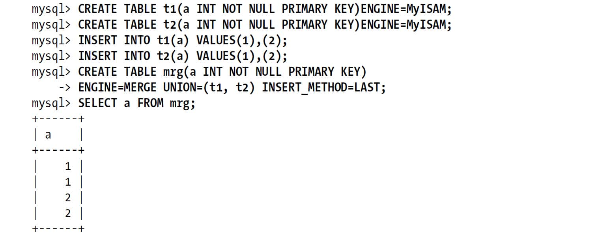 

注意到，这里最后建立的合并表和前面的各个真实表字段完全相同，在合并表中有的索引各个真实子表也有，这是创建合并表的前提条件。另外还注意到，各个子表在对应列上都有主键限制，但是最终的合并表中仍然出现了重复值，这是合并表的另一个不足：合并表中的每一个子表行为和表定义都是相同，但是合并表在全局上并不受这些条件限制。

这里的语法INSERT\_METHOD=LAST告诉MySQL，将所有的INSERT语句都发送给最后一个表。指定FIRST或者LAST关键字是唯一可以控制行插入到合并表的哪一个子表的方式（当然，还是可以直接在SQL中明确地操作任何一个子表）。而分区表则有更多的方式可以控制数据写入到哪一个子表中。

INSERT语句的执行结果可以在最终的合并表中看到，也可以在对应的子表中看到：

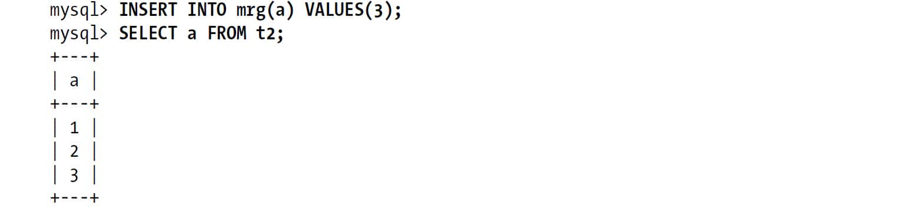 

合并表还有些有趣的限制和特性，例如，在删除合并表或者删除一个子表的时候会怎样？删除一个合并表，它的子表不会受任何影响，而如果直接删除其中一个子表则可能会有不同的后果，这要视操作系统而定。例如在GNU/Linux上，如果子表的文件描述还是被打开的状态，那么这个表还存在，但是只能通过合并表才能访问到：

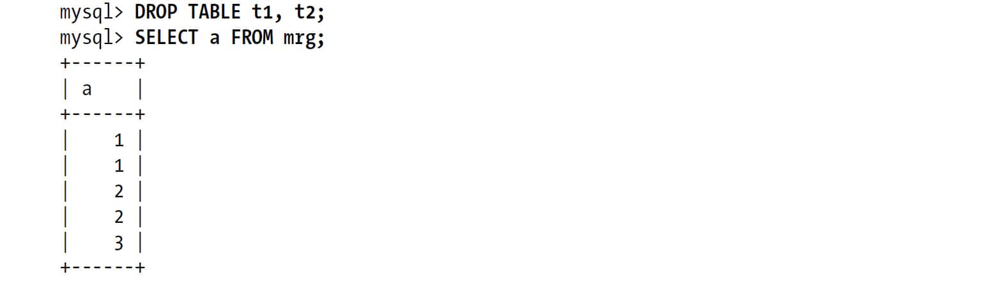 

合并表还有很多其他的限制和行为，下面列举的这几点需要在使用的时候时刻记住。

+ 在使用CREATE语句创建一个合并表的时候，并不会检查各个子表的兼容性。如果子表的定义稍有不同，那么MySQL就可能创建出一个后面无法使用的合并表。另外，如果在成功创建了合并表后再修改某个子表的定义，那么之后再使用合并表可能会看到这样的报错：ERROR 1168 (HY000):Unable to open underlying table which is differently defined or of non-MyISAM type or doesn't exist。 
+ 根据合并表的特性，不难发现，在合并表上无法使用REPLACE语法，无法使用自增字段。更多的细节请参阅MySQL官方手册。 
+ 如果一个查询访问合并表，那么它需要访问所有子表。这会让根据键查找单行的查y询速度变慢，如果能够只访问一个对应表，速度肯定将更快。所以，限制合并表中的子表数量很重要，特别是当合并表是某个关联查询的一部分的时候，因为这时访问一个表的记录数可能会将比较操作传递到关联的其他表中，这时减少记录的访问就是减少整个关联操作。当你打算使用合并表的时候，还需要记住以下几点： 

+ 执行范围查询时，需要在每一个子表上各执行一次，这比直接访问单个表的性─能要差很多，而且子表越多，性能越糟。 
+ 全表扫描和普通表的全表扫描速度相同。 
+ 在合并表上做唯一键和主键查询时，一旦找到一行数据就会停止。所以一旦查─询在合并表的某一个子表中找到一行数据，就会立刻返回，不会再访问任何其他的表。 
+ 子表的读取顺序和CREATE TABLE语句中的顺序相同。如果需要频繁地按照某个特定顺序访问表，那么可以通过这个特性来让合并排序操作更高效。 

因为合并表的各个子表可以直接被访问，所以它还具有一些MySQL 5.5分区所不能提供的特性：

+ 一个MyISAM表可以是多个合并表的子表。 
+ 可以通过直接复制y*.frm、.MYI、.MYD*文件，来实现在不同的服务器之间复制各个子表。 
+ 在合并表中可以很容易地添加新的子表：直接修改合并表的定义就可以了。 
+ 可以创建一个合并表，让它只包含需要的数据，例如只包含某个时间段的数据，而在分区表中是做不到这一点的。 
+ 如果想对某个子表做备份、恢复、修改、修复或者别的操作时，可以先将其从合并表中删除，操作结束后再将其加回去。 
+ 可以使用*myisampack*来压缩所有的子表。 

相反，分区表的子表都是被MySQL隐藏的，只能通过分区表去访问子表。

# 7.2　视图

MySQL 5.0版本之后开始引入视图。视图本身是一个虚拟表，不存放任何数据。在使用SQL语句访问视图的时候，它返回的数据是MySQL从其他表中生成的。视图和表是在同一个命名空间，MySQL在很多地方对于视图和表是同样对待的。不过视图和表也有不同，例如，不能对视图创建触发器，也不能使用DROP TABLE命令删除视图。

在MySQL官方手册中对如何创建和使用视图有详细的介绍，本书不会详细介绍这些。我们将主要介绍视图是如何实现的，以及优化器如何处理视图，通过了解这些，希望可以让大家在使用视图时获得更高的性能。我们将使用示例数据库world来演示视图是如何工作的：

        mysql> **    CREATE VIEW Oceania AS**    
            ->    **    SELECT * FROM Country WHERE Continent = 'Oceania'**    
            ->    **    WITH CHECK OPTION;**    

实现视图最简单的方法是将SELECT语句的结果存放到临时表中。当需要访问视图的时候，直接访问这个临时表就可以了。我们先来看看下面的查询：

        mysql> **    SELECT Code, Name FROM Oceania WHERE Name = 'Australia';**    

下面是使用临时表来模拟视图的方法。这里临时表的名字是为演示用的：

        mysql> **    CREATE TEMPORARY TABLE TMP_Oceania_123 AS**    
        -> **    SELECT * FROM Country WHERE Continent = 'Oceania';**    
        mysql> **    SELECT Code, Name FROM TMP_Oceania_123 WHERE Name = 'Australia';**    

这样做会有明显的性能问题，优化器也很难优化在这个临时表上的查询。实现视图更好的方法是，重写含有视图的查询，将视图的定义SQL直接包含进查询的SQL中。下面的例子展示的是将视图定义的SQL合并进查询SQL后的样子：

        mysql> **    SELECT Code, Name FROM Country**    
        -> **    WHERE Continent = 'Oceania' AND Name = 'Australia';**    

MySQL可以使用这两种办法中的任何一种来处理视图。这两种算法分别称为合并算法（MERGE）和临时表算法（TEMPTABLE）(4)，如果可能，会尽可能地使用合并算法。MySQL甚至可以嵌套地定义视图，也就是在一个视图上再定义另一个视图。可以在EXPLAIN EXTENDED之后使用SHOW WARNINGS来查看使用视图的查询重写后的结果。

如果是采用临时表算法实现的视图，EXPLAIN中会显示为派生表（DERIVED）。图7-1展示了这两种实现的细节。

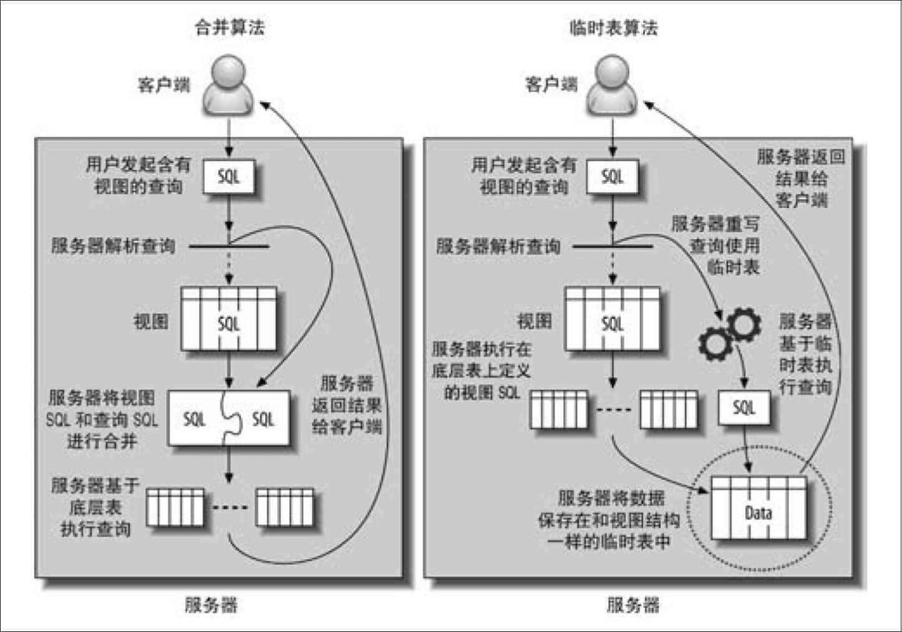 
**图7-1：视图的两种实现**

如果视图中包含GROUY BY、DISTINCT、任何聚合函数、UNION、子查询等，只要无法在原表记录和视图记录中建立一一映射的场景中，MySQL都将使用临时表算法来实现视图。上面列举的可能不全，而且这些规则在未来的版本中也可能会改变。如果你想确定MySQL到底是使用合并算法还是临时表算法，可以EXPLAIN一条针对视图的简单查询：

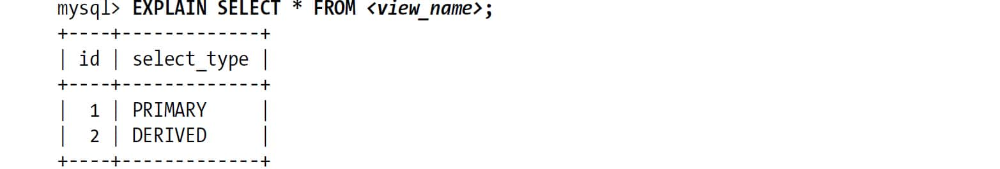 

这里的select\_type为“DERIVED”，说明该视图是采用临时表算法实现的。不过要注意：如果产生的底层派生表很大，那么执行EXPLAIN可能会非常慢。因为在MySQL 5.5和更老的版本中，EXPLAIN是需要实际执行并产生该派生表的。

视图的实现算法是视图本身的属性，和作用在视图上的查询语句无关。例如，可以为一个基于简单查询的视图指定使用临时表算法：

        **    CREATE ALGORITHM=TEMPTABLE VIEW v1 AS SELECT * FROM**     sakila.actor;

实现该视图的SQL本身并不需要临时表，但基于该视图无论执行什么样的查询，视图都会生成一个临时表。

## 7.2.1　可更新视图

可更新视图（updatable view）是指可以通过更新这个视图来更新视图涉及的相关表。只要指定了合适的条件，就可以更新、删除甚至向视图中写入数据。例如，下面就是一个合理的操作：

        mysql> **    UPDATE Oceania SET Population = Population * 1.1 WHERE Name = 'Australia';**    

如果视图定义中包含了GROUP BY、UNION、聚合函数，以及其他一些特殊情况，就不能被更新了。更新视图的查询也可以是一个关联语句，但是有一个限制，被更新的列必须来自同一个表中。另外，所有使用临时表算法实现的视图都无法被更新。

在上一节定义视图时使用的CHECK OPTION子句，表示任何通过视图更新的行，都必须符合视图本身的WHERE条件定义。所以不能更新视图定义列以外的列，比如上例中不能更新Continent列，也不能插入不同Continent值的新数据，否则MySQL会报如下的错误：

        mysql> **    UPDATE Oceania SET Continent = 'Atlantis';**    
        ERROR 1369 (HY000)：CHECK OPTION failed 'world.Oceania'

某些关系数据库允许在视图上建立INSTEAD OF触发器，通过触发器可以精确控制在修改视图数据时做些什么。不过MySQL不支持在视图上建任何触发器。

## 7.2.2　视图对性能的影响

多数人认为视图不能提升性能，实际上，在MySQL中某些情况下视图也可以帮助提升性能。而且视图还可以和其他提升性能的方式叠加使用。例如，在重构schema的时候可以使用视图，使得在修改视图底层表结构的时候，应用代码还可能继续不报错的运行。

可以使用视图实现基于列的权限控制，却不需要真正的在系统中创建列权限，因此没有额外的开销。

        CREATE VIEW public.employeeinfo AS
           SELECT firstname, lastname -- but not socialsecuritynumber
           FROM private.employeeinfo;
        GRANT SELECT ON public.* TO public_user;

有时候也可以使用伪临时视图实现一些功能。MySQL虽然不能创建只在当前连接中存在的真正的临时视图，但是可以建一个特殊名字的视图，然后在连接结束的时候删除该视图。这样在连接过程中就可以在FROM子句中使用这个视图，和使用子查询的方式完全相同，因为MySQL在处理视图和处理子查询的代码路径完全不同，所以它们的性能也不同。下面是一个例子：

        -- Assuming 1234 is the result of CONNECTION_ID()
        CREATE VIEW temp.cost_per_day_1234 AS
           SELECT DATE(ts) AS day, sum(cost) AS cost
           FROM logs.cost
           GROUP BY day;
        SELECT c.day, c.cost, s.sales
        FROM temp.cost_per_day_1234 AS c
           INNER JOIN sales.sales_per_day AS s USING(day);
        DROP VIEW temp.cost_per_day_1234;

我们这里使用连接ID作为视图名字的一部分来避免冲突。在应用发生崩溃和别的意外导致未清理临时视图的时候，这个技巧使得清理临时视图变得很简单。详细的信息可以参考后面的“丢失的临时表”。

使用临时表算法实现的视图，在某些时候性能会很糟糕（虽然可能比直接使用等效查询语句要好一点）。MySQL以递归的方式执行这类视图，先会执行外层查询，即使外层查询优化器将其优化得很好，但是MySQL优化器可能无法像其他的数据库那样做更多的内外结合的优化。外层查询的WHERE条件无法“下推”到构建视图的临时表的查询中，临时表也无法建立索引(5)。下面是一个例子，还是基于temp.cost\_per\_day\_1234这个视图：

    mysql> **    SELECT c.day, c.cost, s.sales**    
        -> **    FROM temp.cost_per_day_1234 AS c**    
        ->    **    INNER JOIN sales.sales_per_day AS s USING(day)**    
        ->    **    WHERE day BETWEEN '2007-01-01' AND '2007-01-31';**    

在这个查询中，MySQL先执行视图的SQL生成临时表，然后再将sales\_per\_day和临时表进行关联。这里的WHERE子句中的BETWEEN条件并不能下推到视图当中，所以视图在创建的时候仍然需要将所有的数据都放到临时表当中，而不仅仅是一个月的数据。而且临时表中不会有索引。这个案例中，索引还不是问题：MySQL将临时表作为关联顺序中的第一个表，因此这里可以使用sales\_per\_day中的索引。不过，如果是对两个视图做关联的话，优化器就没有任何索引可以使用了。

视图还引入了一些并非MySQL特有的其他问题。很多开发者以为视图很简单，但实际上其背后的逻辑可能非常复杂。开发人员如果没有意识到视图背后的复杂性，很可能会以为是在不停地重复查询一张简单的表，而没有意识到实际上是代价高昂的视图。我们见过不少案例，一条看起来很简单的查询，EXPLAIN出来却有几百行，因为其中一个或者多个表，实际上是引用了很多其他表的视图。

如果打算使用视图来提升性能，需要做比较详细的测试。即使是合并算法实现的视图也会有额外的开销，而且视图的性能很难预测。在MySQL优化器中，视图的代码执行路径也完全不同，这部分代码测试还不够全面，可能会有一些隐藏缺陷和问题。所以，我们认为视图还不是那么成熟。例如，我们看到过这样的案例，复杂的视图和高并发的查询导致查询优化器花了大量时间在执行计划生成和统计数据阶段，这甚至会导致MySQL服务器僵死，后来通过将视图转换成等价的查询语句解决了问题。这也说明视图——即使是使用合并算法实现的——并不总是有很优化的实现。

## 7.2.3　视图的限制

在其他的关系数据库中你可能使用过物化视图，MySQL还不支持物化视图（物化视图是指将视图结果数据存放在一个可以查看的表中，并定期从原始表中刷新数据到这个表中）。MySQL也不支持在视图中创建索引。不过，可以使用构建缓存表或者汇总表的办法来模拟物化视图和索引。可以直接使用Justin Swanhart's的工具Flexviews来实现这个目的。参考第4章可以获得更多的相关细节。

MySQL视图实现上也有一些让人烦恼的地方。例如，MySQL并不会保存视图定义的原始SQL语句，所以如果打算通过执行SHOW CREATE VIEW后再简单地修改其结果的方式来重新定义视图，可能会大失所望。SHOW CREATE VIEW出来的视图创建语句将以一种不友好的内部格式呈现，充满了各种转义符和引号，没有代码格式化，没有注释，也没有缩进。

如果打算重新修改一个视图，并且没法找到视图的原始的创建语句的话，可以通过使用视图的*.frm*文件的最后一行获得一些信息。如果有FILE权限，甚至可以直接使用SQL语句中的LOAD\_FILE()来读取*.frm*中的视图创建信息。再加上一些字符处理工作，就可以获得一个完整的视图创建语句了，感谢Roland Bouman创造性的实现：

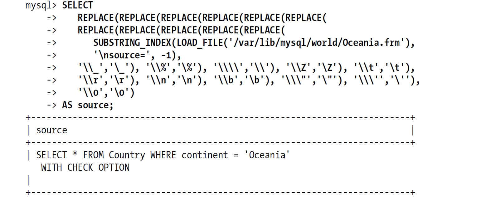 

# 7.3　外键约束

InnoDB是目前MySQL中唯一支持外键的内置存储引擎，所以如果需要外键支持那选择就不多了（PBXT也有外键支持）。

使用外键是有成本的。比如外键通常都要求每次在修改数据时都要在另外一张表中多执行一次查找操作。虽然InnoDB强制外键使用索引，但还是无法消除这种约束检查的开销。如果外键列的选择性很低，则会导致一个非常大且选择性很低的索引。例如，在一个非常大的表上有status列，并希望限制这个状态列的取值，如果该列只能取三个值——虽然这个列本身很小，但是如果主键很大，那么这个索引就会很大——而且这个索引除了做这个外键限制，也没有任何其他的作用了。

不过，在某些场景下，外键会提升一些性能。如果想确保两个相关表始终有一致的数据，那么使用外键比在应用程序中检查一致性的性能要高得多，此外，外键在相关数据的删除和更新上，也比在应用中维护要更高效，不过，外键维护操作是逐行进行的，所以这样的更新会比批量删除和更新要慢些。

外键约束使得查询需要额外访问一些别的表，这也意味着需要额外的锁。如果向子表中写入一条记录，外键约束会让InnoDB检查对应的父表的记录，也就需要对父表对应记录进行加锁操作，来确保这条记录不会在这个事务完成之时就被删除了。这会导致额外的锁等待，甚至会导致一些死锁。因为没有直接访问这些表，所以这类死锁问题往往难以排查。

有时，可以使用触发器来代替外键。对于相关数据的同时更新外键更合适，但是如果外键只是用作数值约束，那么触发器或者显式地限制取值会更好些。（这里，可以直接使用ENUM类型。）

如果只是使用外键做约束，那通常在应用程序里实现该约束会更好。外键会带来很大的额外消耗。这里没有相关的基准测试的数据，不过我们碰到过很多案例，在对性能进行剖析时发现外键约束就是瓶颈所在，删除外键后性能立即大幅提升。

# 7.4　在MySQL内部存储代码

MySQL允许通过触发器、存储过程、函数的形式来存储代码。从MySQL 5.1开始，还可以在定时任务中存放代码，这个定时任务也被称为“事件”。存储过程和存储函数都被统称为“存储程序”。

这四种存储代码都使用特殊的SQL语句扩展，它包含了很多过程处理语法，例如循环和条件分支等(6)。不同类型的存储代码的主要区别在于其执行的上下文——也就是其输入和输出。存储过程和存储函数都可以接收参数然后返回值，但是触发器和事件却不行。

一般来说，存储代码是一种很好的共享和复用代码的方法。Giuseppe Maxia和其他一些人也建立了一些通用的存储过程库，在网站*http://mysql-sr-lib.sourceforge.net*可以找到。不过因为不同的关系数据库都有各自的语法规则，所以不同的数据库很难复用这些存储代码（DB2是一个例外，它和MySQL基于相同的标准，有着非常类似的语法）(7)。

这里将主要关注存储代码的性能，而不是如何实现。如果你打算学习如何编写存储过程，那么Guy Harrison和Steven Feuerstein编写的*MySQL Stored Procedure Programming*（O'Reilly）应该会有帮助。

有人倡导使用存储代码，也有人反对。这里我们不站在任何一边，只是列举一下在MySQL中使用存储代码的优点和缺点。首先，它有如下优点：

+ 它在服务器内部执行，离数据最近，另外在服务器上执行还可以节省带宽和网络延迟。 
+ 这是一种代码重用。可以方便地统一业务规则，保证某些行为总是一致，所以也可以为应用提供一定的安全性。 
+ 它可以简化代码的维护和版本更新。 
+ 它可以帮助提升安全，比如提供更细粒度的权限控制。一个常见的例子是银行用于转移资金的存储过程：这个存储过程可以在一个事务中完成资金转移和记录用于审计的日志。应用程序也可以通过存储过程的接口访问那些没有权限的表。 
+ 服务器端可以缓存存储过程的执行计划，这对于需要反复调用的过程，会大大降低消耗。 
+ 因为是在服务器端部署的，所以备份、维护都可以在服务器端完成。所以存储程序的维护工作会很简单。它没什么外部依赖，例如，不依赖任何Perl包和其他不想在服务器上部署的外部软件。 
+ 它可以在应用开发和数据库开发人员之间更好地分工。不过最好是由数据库专家来开发存储过程，因为不是每个应用开发人员都能写出高效的SQL查询。 

存储代码也有如下缺点：

+ MySQL本身没有提供好用的开发和调试工具，所以编写MySQL的存储代码比其他的数据库要更难些。 
+ 较之应用程序的代码，存储代码效率要稍微差些。例如，存储代码中可以使用的函数非常有限，所以使用存储代码很难编写复杂的字符串维护功能，也很难实现太复杂的逻辑。 
+ 存储代码可能会给应用程序代码的部署带来额外的复杂性。原本只需要部署应用代码和库表结构变更，现在还需要额外地部署MySQL内部的存储代码。 
+ 因为存储程序都部署在服务器内，所以可能有安全隐患。如果将非标准的加密功能放在存储程序中，那么若数据库被攻破，数据也就泄漏了。但是若将加密函数放在应用程序代码中，那么攻击者必须同时攻破程序和数据库才能获得数据。 
+ 存储过程会给数据库服务器增加额外的压力，而数据库服务器的扩展性相比应用服务器要差很多。 
+ MySQL并没有什么选项可以控制存储程序的资源消耗，所以在存储过程中的一个小错误，可能直接把服务器拖死。 
+ 存储代码在MySQL中的实现也有很多限制——执行计划缓存是连接级别的，游标的物化和临时表相同，在MySQL 5.5版本之前，异常处理也非常困难，等等。（我们会在介绍它的各个特性的同时介绍相关的限制）。简而言之，较之T-SQL或者PL/SQL，MySQL的存储代码功能还非常非常弱。 
+ 调试MySQL的存储过程是一件很困难的事情。如果慢日志只是给出CALL XYZ('A')，通常很难定位到底是什么导致的问题，这时不得不看看存储过程中的SQL语句是如何编写的。（这在Percona Server中可以通过参数控制。） 
+ 它和基于语句的二进制日志复制合作得并不好。在基于语句的复制中，使用存储代码通常有很多的陷阱，除非你在这方面的经验非常丰富或者非常有耐心排查这类问题，否则需要谨慎使用。 

这个缺陷列表很长——那么在真实世界中，这意味着什么？我们来看一个真实世界中弄巧成拙的案例：在一个实例中，创建了一个存储过程来给应用程序访问数据库中的数据，这使得所有的数据访问都需要通过这个接口，甚至很多根据主键的查询也是如此，这大概使系统的性能降低了五倍左右。

最后，存储代码是一种帮助应用隐藏复杂性，使得应用开发更简单的方法。不过，它的性能可能更低，而且会给MySQL的复制等增加潜在的风险。所以当你打算使用存储过程的时候，需要问问自己，到底希望程序逻辑在哪儿实现：是数据库中还是应用代码中？这两种做法都可以，也都很流行。只是当你编写存储代码的时候，你需要明白这是将程序逻辑放在数据库中。

## 7.4.1　存储过程和函数

MySQL的架构本身和优化器的特性使得存储代码有一些天然的限制，它的性能也一定程度受限于此。在本书编写的时候，有如下的限制：

+ 优化器无法使用关键字DETERMINISTIC来优化单个查询中多次调用存储函数的情况。 
+ 优化器无法评估存储函数的执行成本。 
+ 每个连接都有独立的存储过程的执行计划缓存。如果有多个连接需要调用同一个存储过程，将会浪费缓存空间来反复缓存同样的执行计划。（如果使用的是连接池或者是持久化连接，那么执行计划缓存可能会有更长的生命周期。） 
+ 存储程序和复制是一组诡异组合。如果可以，最好不要复制对存储程序的调用。直接复制由存储程序改变的数据则会更好。MySQL 5.1引入的行复制能够改善这个问题。如果在MySQL 5.0中开启了二进制日志，那么要么在所有的存储过程中都增加DETERMINISTIC限制或者设置MySQL的选项log\_bin\_trust\_function\_creators。 

我们通常会希望存储程序越小、越简单越好。希望将更加复杂的处理逻辑交给上层的应用实现，通常这样会使代码更易读、易维护，也会更灵活。这样做也会让你拥有更多的计算资源，潜在的还会让你拥有更多的缓存资源(8)。

不过，对于某些操作，存储过程比其他的实现要快得多——特别是当一个存储过程调用可以代替很多小查询的时候。如果查询很小，相比这个查询执行的成本，解析和网络开销就变得非常明显。为了证明这一点，我们先创建一个简单的存储过程，用来写入一定数量的数据到一个表中，下面是存储过程的代码：

        1  DROP PROCEDURE IF EXISTS insert_many_rows;
        2
        3  delimiter //
        4
        5  CREATE PROCEDURE insert_many_rows (IN loops INT)
        6  BEGIN
        7     DECLARE v1 INT;
        8     SET v1=loops;
        9     WHILE v1 > 0 DO
        10       INSERT INTO test_table values(NULL,0,
        11                 'qqqqqqqqqqwwwwwwwwwweeeeeeeeeerrrrrrrrrrtttttttttt',
        12                 'qqqqqqqqqqwwwwwwwwwweeeeeeeeeerrrrrrrrrrtttttttttt');
        13       SET v1 = v1 - 1;
        14     END WHILE;
        15  END;
        16  //
        17
        18  delimiter ;

然后对该存储过程执行基准测试，看插入一百万条记录的时间，并和通过客户端程序逐条插入一百万条记录的时间进行对比。这里表结构和硬件并不重要——重要的是两种方式的相对速度。另外，我们还测试了使用MySQL Proxy连接MySQL来执行客户端程序测试的性能。为了让事情简单，整个测试在一台服务器上完成，包括客户端程序和MySQL Proxy实例。表7-1展示了测试结果。

**表7-1：写入一百万数据所花费的总时间**
**写入方式** **总消耗时间**  存储过程 101 sec  客户端程序 279 sec  使用MySQL Proxy的客户端程序 307 sec  
可以看到存储过程要快很多，很大程度因为它无须网络通信开销、解析开销和优化器开销等。

我们将在本章的后半部分介绍如何维护存储过程。

## 7.4.2　触发器

触发器可以让你在执行INSERT、UPDATE或者DELETE的时候，执行一些特定的操作。可以在MySQL中指定是在SQL语句执行前触发还是在执行后触发。触发器本身没有返回值，不过它们可以读取或者改变触发SQL语句所影响的数据。所以，可以使用触发器实现一些强制限制，或者某些业务逻辑，否则，就需要在应用程序中实现这些逻辑。

因为使用触发器可以减少客户端和服务器之间的通信，所以触发器可以简化应用逻辑，还可以提高性能。另外，还可以用于自动更新反范式化数据或者汇总表数据。例如，在示例数据库Sakila中，我们可以使用触发器来维护film\_text表。

MySQL触发器的实现非常简单，所以功能也有限。如果你在其他数据库产品中已经重度依赖触发器，那么在使用MySQL的时候需要注意，很多时候MySQL触发器的表现和预想的并不一样。特别需要注意以下几点：

+ 对每一个表的每一个事件，最多只能定义一个触发器（换句话说，不能在AFTER INSERT上定义两个触发器）。 
+ MySQL只支持“基于行的触发”——也就是说，触发器始终是针对一条记录的，而不是针对整个SQL语句的。如果变更的数据集非常大的话，效率会很低。 

下面这些触发器本身的限制也适用于MySQL：

+ 触发器可以掩盖服务器背后的工作，一个简单的SQL语句背后，因为触发器，可能包含了很多看不见的工作。例如，触发器可能会更新另一个相关表，那么这个触发器会让这条SQL影响的记录数翻一倍。 
+ 触发器的问题也很难排查，如果某个性能问题和触发器相关，会很难分析和定位。 
+ 触发器可能导致死锁和锁等待。如果触发器失败，那么原来的SQL语句也会失败。如果没有意识到这其中是触发器在搞鬼，那么很难理解服务器抛出的错误代码是什么意思。 

如果仅考虑性能，那么MySQL触发器的实现中对服务器限制最大的就是它的“基于行的触发”设计。因为性能的原因，很多时候无法使用触发器来维护汇总和缓存表。使用触发器而不是批量更新的一个重要原因就是，使用触发器可以保证数据总是一致的。

触发器并不能一定保证更新的原子性。例如，一个触发器在更新MyISAM表的时候，如果遇到什么错误，是没有办法做回滚操作的。这时，触发器可以抛出错误。假设你在一个MyISAM表上建立一个AFTER UPDATE的触发器，用来更新另一个MyISAM表。如果触发器在更新第二个表的时候遇到错误导致更新失败，那么第一个表的更新并不会回滚。

在InnoDB表上的触发器是在同一个事务中完成的，所以它们执行的操作是原子的，原操作和触发器操作会同时失败或者成功。不过，如果在InnoDB表上建触发器去检查数据的一致性，需要特别小心MVCC，稍不小心，你可能会获得错误的结果。假设，你想实现外键约束，但是不打算使用InnoDB的外键约束。若打算编写一个BEFORE INSERT触发器来检查写入的数据对应列在另一个表中是存在的，但若你在触发器中没有使用SELECT FOR UPDATE，那么并发的更新语句可能会立刻更新对应记录，导致数据不一致。我们不是危言耸听，让大家不要使用触发器。相反，触发器非常有用，尤其是实现一些约束、系统维护任务，以及更新反范式化数据的时候。

还可以使用触发器来记录数据变更日志。这对实现一些自定义的复制会非常方便，比如需要先断开连接，然后修改数据，最后再将所有的修改重新合并回去的情况。一个简单的例子是，一组用户各自在自己的个人电脑上工作，但他们的操作都需要同步到一台主数据库上，然后主数据库会将他们所有人的操作都分发给每个人。实现这个系统需要做两次同步操作。触发器就是构建整个系统的一个好办法。每个人的电脑上都可以使用一个触发器来记录每一次数据的修改，并将其发送到主数据库中。然后，再使用MySQL的复制将主数据库上的所有操作都复制一份到本地并应用。这里需要额外注意的是，如果触发器基于有自增主键的记录，并且使用的是基于语句的复制，那么自增长可能会在复制中出现不一致。

有时候可以使用一些技巧绕过触发器是“基于行的触发”这个限制。Roland Bouman发现，对于BEFORE触发器除了处理的第一条记录，触发器函数ROW\_COUNT()总是会返回1。可以使用这个特点，使得触发器不再是针对每一行都运行，而是针对一条SQL语句运行一次。这和真正意义上的单条SQL语句的触发器并不相同，不过可以使用这个技术来模拟单条SQL语句的BEFORE触发器。这个行为可能是MySQL的一个缺陷，未来版本中可能会被修复，所以在使用这个技巧的时候，需要先验证在你的MySQL版本中是否适用，另外，在升级数据库的时候还需要检查这类触发器是否还能够正常工作。下面是一个使用这个技巧的例子：

        CREATE TRIGGER fake_statement_trigger
        BEFORE INSERT ON sometable
        FOR EACH ROW
        BEGIN
           DECLARE v_row_count INT DEFAULT ROW_COUNT();
           IF v_row_count <> 1 THEN
              -- Your code here
           END IF;
        END;

## 7.4.3　事件

事件是MySQL 5.1引入的一种新的存储代码的方式。它类似于Linux的定时任务，不过是完全在MySQL内部实现的。你可以创建事件，指定MySQL在某个时候执行一段SQL代码，或者每隔一个时间间隔执行一段SQL代码。通常，我们会把复杂的SQL都封装到一个存储过程中，这样事件在执行的时候只需要做一个简单的CALL调用。

事件在一个独立事件调度线程中被初始化，这个线程和处理连接的线程没有任何关系。它不接收任何参数，也没有任何的返回值。可以在MySQL的日志中看到命令的执行日志，还可以在表INFORMATION\_SCHEMA.EVENTS中看到各个事件状态，例如这个事件最后一次被执行的时间等。

类似的，一些适用于存储过程的考虑也同样适用于事件。首先，创建事件意味着给服务器带来额外工作。事件实现机制本身的开销并不大，但是事件需要执行SQL，则可能会对性能有很大的影响。更进一步，事件和其他的存储程序一样，在和基于语句的复制一起工作时，也可能会触发同样的问题。事件的一些典型应用包括定期地维护任务、重建缓存、构建汇总表来模拟物化视图，或者存储用于监控和诊断的状态值。

下面的例子创建了一个事件，它会每周一次针对某个数据库运行一个存储过程（后面我们将展示如何创建这个存储过程）：

        CREATE EVENT optimize_somedb ON SCHEDULE EVERY 1 WEEK
        DO
        CALL optimize_tables('somedb');

你可以指定事件本身是否被复制。根据需要，有时需要被复制，有时则不需要。看前面的例子，你可能会希望在所有的备库上都运行OPTIMIZE TABLE，不过要注意如果所有的备库同时执行，可能会影响服务器的性能（会对表加锁）。

最后，如果一个定时事件执行需要很长的时间，那么有可能会出现这样的情况，即前面一个事件还未执行完成，下一个时间点的事件又开始了。MySQL本身不会防止这种并发，所以需要用户自己编写这种情况下的防并发代码。你可以使用函数GET\_LOCK()来确保当前总是只有一个事件在被执行：

        CREATE EVENT optimize_somedb ON SCHEDULE EVERY 1 WEEK
        DO
        BEGIN
           DECLARE CONTINUE HANLDER FOR SQLEXCEPTION
              BEGIN END;
           IF GET_LOCK('somedb', 0) THEN
              DO CALL optimize_tables('somedb');
           END IF;
           DO RELEASE_LOCK('somedb');
        END

这里的“CONTINUE HANLDER”用来确保，即使当事件执行出现了异样，仍然会释放持有的锁。

虽然事件的执行是和连接无关的，但是它仍然是线程级别的。MySQL中有一个事件调度线程，必须在MySQL配置文件中设置，或者使用下面的命令来设置：

        mysql> **    SET GLOBAL event_scheduler := 1;**    

该选项一旦设置，该线程就会执行各个用户指定的事件中的各段SQL代码。你可以通过观察MySQL的错误日志来了解事件的执行情况。

虽然事件调度是一个单独的线程，但是事件本身是可以并行执行的。MySQL会创建一个新的进程用于事件执行。在事件的代码中，如果你调用函数CONNECTION\_ID()，也会返回一个唯一值，和一般的线程返回值一样——虽然事件和MySQL的连接线程是无关的（这里的函数CONNECTION\_ID()返回的只是线程ID）。这里的进程和线程生命周期就是事件的执行过程。可以通过SHOW PROCESSLIST中的Command列来查看，这些线程的该列总是显示为“Connect”。

虽然事件处理进程需要创建一个线程来真正地执行事件，但该线程在时间执行结束后会被销毁，而不会放到线程缓存中，并且状态值Threads\_created也不会被增加。

## 7.4.4　在存储程序中保留注释

存储过程、存储函数、触发器、事件通常都会包含大量的重要代码，在这些代码中加上注释就非常有必要了。但是这些注释可能不会存储在MySQL服务器中，因为MySQL的命令行客户端会自动过滤注释（命令行客户端的这个“特性”令人生厌，不过这就是生活）。

一个将注释存储到存储程序中的技巧就是使用版本相关的注释，因为这样的注释可能被MySQL服务器执行（例如，只有版本号大于某个值的时候才执行的代码）。服务器和客户端都知道这不是普通的注释，所以也就不会删除这些注释。为了让这样的“版本相关的代码”不被执行，可以指定一个非常大的版本号，例如99 999。我们现在给触发器加上一些注释文档，让它更易读：

        CREATE TRIGGER fake_statement_trigger
        BEFORE INSERT ON sometable
        FOR EACH ROW
        BEGIN
           DECLARE v_row_count INT DEFAULT ROW_COUNT();
           **    /*!99999      ROW_COUNT() is 1 except for the first row, so this executes**    
              **    only once per statement.   */**    
           IF v_row_count <> 1 THEN
              -- Your code here
           END IF;
        END;

# 7.5　游标

MySQL在服务器端提供只读的、单向的游标，而且只能在存储过程或者更底层的客户端API中使用。因为MySQL游标中指向的对象都是存储在临时表中而不是实际查询到的数据，所以MySQL游标总是只读的。它可以逐行指向查询结果，然后让程序做进一步的处理。在一个存储过程中，可以有多个游标，也可以在循环中“嵌套”地使用游标。MySQL的游标设计也为粗心的人“准备”了陷阱。因为是使用临时表实现的，所以它在效率上给开发人员一个错觉。需要记住的最重要的一点是：当你打开一个游标的时候需要执行整个查询。考虑下面的存储过程：

        1  CREATE PROCEDURE bad_cursor()
        2  BEGIN
        3     DECLARE film_id INT;
        4     DECLARE f CURSOR FOR SELECT film_id FROM sakila.film;
        5     OPEN f;
        6     FETCH f INTO film_id;
        7     CLOSE f;
        8  END

从这个例子中可以看到，不用处理完所有的数据就可以立刻关闭游标。使用Oracle或者SQL Server的用户不会认为这个存储过程有什么问题，但是在MySQL中，这会带来很多的不必要的额外操作。使用SHOW STATUS来诊断这个存储过程，可以看到它需要做1000个索引页的读取，做1000个写入。这是因为在表sakila.film中有1000条记录，而所有这些读和写都发生在第五行的打开游标动作。

这个案例告诉我们，如果在关闭游标的时候你只是扫描一个大结果集的一小部分，那么存储过程可能不仅没有减少开销，相反带来了大量的额外开销。这时，你需要考虑使用LIMIT来限制返回的结果集。

游标也会让MySQL执行一些额外的I/O操作，而这些操作的效率可能非常低。因为临时内存表不支持BLOB和TEXT类型，如果游标返回的结果包含这样的列的话，MySQL就必须创建临时磁盘表来存放，这样性能可能会很糟。即使没有这样的列，当临时表大于tmp\_table\_size的时候，MyQL也还是会在磁盘上创建临时表。

MySQL不支持客户端的游标，不过客户端API可以通过缓存全部查询结果的方式模拟客户端的游标。这和直接将结果放在一个内存数组中来维护并没有什么不同。参考第6章，你可以看到更多关于一次性读取整个结果集到客户端时的性能。

# 7.6　绑定变量

从MySQL 4.1版本开始，就支持服务器端的绑定变量（prepared statement），这大大提高了客户端和服务器端数据传输的效率。你若使用一个支持新协议的客户端，如MySQL CAPI，就可以使用绑定变量功能了。另外，Java和.NET的也都可以使用各自的客户端Connector/J和Connector/NET来使用绑定变量。最后，还有一个SQL接口用于支持绑定变量，后面我们将讨论这个（这里容易引起困扰）。

当创建一个绑定变量SQL时，客户端向服务器发送了一个SQL语句的原型。服务器端收到这个SQL语句框架后，解析并存储这个SQL语句的部分执行计划，返回给客户端一个SQL语句处理句柄。以后每次执行这类查询，客户端都指定使用这个句柄。

绑定变量的SQL，使用问号标记可以接收参数的位置，当真正需要执行具体查询的时候，则使用具体值代替这些问号。例如，下面是一个绑定变量的SQL语句：

        INSERT INTO tbl(col1, col2, col3) VALUES (?, ?, ?);

可以通过向服务器端发送各个问号的取值和这个SQL的句柄来执行一个具体的查询。反复使用这样的方式执行具体的查询，这正是绑定变量的优势所在。具体如何发送取值参数和SQL句柄，则和各个客户端的编程语言有关。使用Java和.NET的MySQL连接器就是一种办法。很多使用MySQL C语言链接库的客户端可以提供类似的接口，需要根据使用的编程语言的文档来了解如何使用绑定变量。

因为如下的原因，MySQL在使用绑定变量的时候可以更高效地执行大量的重复语句：

+ 在服务器端只需要解析一次SQL语句。 
+ 在服务器端某些优化器的工作只需要执行一次，因为它会缓存一部分的执行计划。 
+ 以二进制的方式只发送参数和句柄，比起每次都发送ASCII码文本效率更高，一个二进制的日期字段只需要三个字节，但如果是ASCII码则需要十个字节。不过最大的节省还是来自于BLOB和TEXT字段，绑定变量的形式可以分块传输，而无须一次性传输。二进制协议在客户端也可能节省很多内存，减少了网络开销，另外，还节省了将数据从存储原始格式转换成文本格式的开销。 
+ 仅仅是参数——而不是整个查询语句——需要发送到服务器端，所以网络开销会更小。 
+ MySQL在存储参数的时候，直接将其存放到缓存中，不再需要在内存中多次复制。 

绑定变量相对也更安全。无须在应用程序中处理转义，一则更简单了，二则也大大减少了SQL注入和攻击的风险。（任何时候都不要信任用户输入，即使是使用绑定变量的时候。）

可以只在使用绑定变量的时候才使用二进制传输协议。如果使用普通的mysql\_query()接口则不会使用二进制传输协议。还有一些客户端让你使用绑定变量，先发送带参数的绑定SQL，然后发送变量值，但是实际上，这些客户端只是模拟了绑定变量的接口，最后还是会直接用具体值代替参数后，再使用mysql\_query()发送整个查询语句。

## 7.6.1　绑定变量的优化

对使用绑定变量的SQL，MySQL能够缓存其部分执行计划，如果某些执行计划需要根据传入的参数来计算时，MySQL就无法缓存这部分的执行计划。根据优化器什么时候工作，可以将优化分为三类。在本书编写的时候，下面的三点是适用的。

在准备阶段

服务器解析SQL语句，移除不可能的条件，并且重写子查询。

在第一次执行的时候

如果可能的话，服务器先简化嵌套循环的关联，并将外关联转化成内关联。

在每次SQL语句执行时

服务器做如下事情：

+ 过滤分区。 
+ 如果可能的话，尽量移除COUNT()、MIN()和MAX()。 
+ 移除常数表达式。 
+ 检测常量表。 
+ 做必要的等值传播。 
+ 分析和优化ref、range和索引优化等访问数据的方法。 
+ 优化关联顺序。 

参考第6章，可以了解更多关于这些优化的信息。理论上，有些优化只需要做一次，但实际上，上面的操作还是都会被执行。

## 7.6.2　SQL接口的绑定变量

在4.1和更新的版本中，MySQL支持了SQL接口的绑定变量。不使用二进制传输协议也可以直接以SQL的方式使用绑定变量。下面案例展示了如何使用SQL接口的绑定变量：

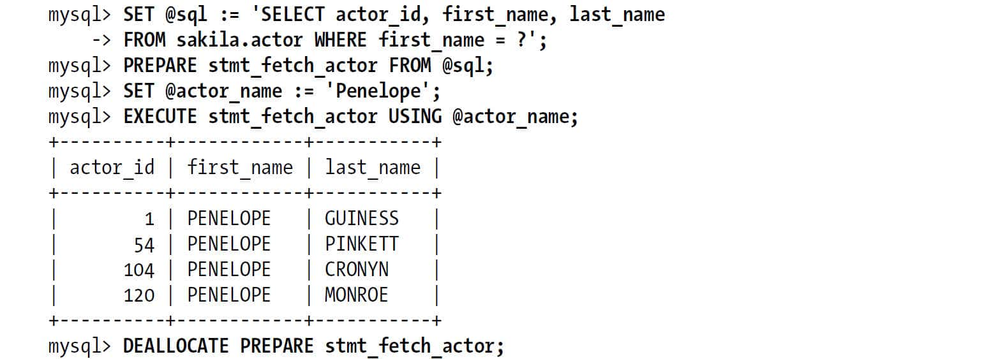 

当服务器收到这些SQL语句后，先会像一般客户端的链接库一样将其翻译成对应的操作。

这意味着你无须使用二进制协议也可以使用绑定变量。

正如你看到的，比起直接编写的SQL语句，这里的语法看起来有一些怪怪的。那么，这种写法实现的绑定变量到底有什么优势呢？

最主要的用途就是在存储过程中使用。在MySQL 5.0版本中，就可以在存储过程中使用绑定变量，其语法和前面介绍的SQL接口的绑定变量类似。这意味，可以在存储过程中构建并执行“动态”的SQL语句，这里的“动态”是指可以通过灵活地拼接字符串等参数构建SQL语句。例如，下面的示例存储过程中可以针对某个数据库执行OPTIMIZE TABLE的操作：

        DROP PROCEDURE IF EXISTS optimize_tables;
        DELIMITER //
        CREATE PROCEDURE optimize_tables(db_name VARCHAR(64))
        BEGIN
           DECLARE t VARCHAR(64);
           DECLARE done INT DEFAULT 0;
           DECLARE c CURSOR FOR
              SELECT table_name FROM INFORMATION_SCHEMA.TABLES
              WHERE TABLE_SCHEMA = db_name AND TABLE_TYPE = 'BASE TABLE';
           DECLARE CONTINUE HANDLER FOR SQLSTATE '02000' SET done = 1;
           OPEN c;
           tables_loop: LOOP
              FETCH c INTO t;
              IF done THEN
                 LEAVE tables_loop;
              END IF;
              SET @stmt_text := CONCAT("OPTIMIZE TABLE ", db_name, ".", t);
              PREPARE stmt FROM @stmt_text;
              EXECUTE stmt;
              DEALLOCATE PREPARE stmt;
           END LOOP;
           CLOSE c;
         END//
         DELIMITER ;

可以这样调用这个存储过程：

        mysql> **    CALL optimize_tables('sakila')**    

另一种实现存储过程中循环的办法是：

        REPEAT
          FETCH c INTO t;
          IF NOT done THEN
             SET @stmt_text := CONCAT("OPTIMIZE TABLE ", db_name, ".", t);
             PREPARE stmt FROM @stmt_text;
             EXECUTE stmt;
             DEALLOCATE PREPARE stmt;
          END IF;
        UNTIL done END REPEAT;

这两种循环结构最重要的区别在于：REPEAT会为每个循环检查两次循环条件。在这个例子中，因为循环条件检查的是一个整数判断，并不会有什么性能问题，如果循环的判断条件非常复杂的话，则需要注意这两者的区别。

像这样使用SQL接口的绑定变量拼接表名和库名是很常见的，这样的好处是无须使用任何参数就能完成SQL语句。而库名和表名都是关键字，在二进制协议的绑定变量中是不能将这两部分参数化的。另一个经常需要动态设置的就是LIMIT子句，因为二进制协议中也无法将这个值参数化。

另外，编写存储过程时，SQL接口的绑定变量通常可以很大程度地帮助我们调试绑定变量，如果不是在存储过程中，SQL接口的绑定变量就不是那么有用了。因为SQL接口的绑定变量，它既没有使用二进制传输协议，也没有能够节省带宽，相反还总是需要增加至少一次额外网络传输才能完成一次查询。所有只有在某些特殊的场景下SQL接口的绑定变量才有用，比如当SQL语句非常非常长，并且需要多次执行的时候。

## 7.6.3　绑定变量的限制

关于绑定变量的一些限制和注意事项如下：

+ 绑定变量是会话级别的，所以连接之间不能共用绑定变量句柄。同样地，一旦连接断开，则原来的句柄也不能再使用了。（连接池和持久化连接可以在一定程度上缓解这个问题。） 
+ 在MySQL 5.1版本之前，绑定变量的SQL是不能使用查询缓存的。 
+ 并不是所有的时候使用绑定变量都能获得更好的性能。如果只是执行一次SQL，那么使用绑定变量方式无疑比直接执行多了一次额外的准备阶段消耗，而且还需要一次额外的网络开销。（要正确地使用绑定变量，还需要在使用完成后，释放相关的资源。） 
+ 当前版本下，还不能在存储函数中使用绑定变量（但是存储过程中可以使用）。 
+ 如果总是忘记释放绑定变量资源，则在服务器端很容易发生资源“泄漏”。绑定变量 SQL总数的限制是一个全局限制，所以某一个地方的错误可能会对所有其他的线程都产生影响。 
+ 有些操作，如BEGIN，无法在绑定变量中完成。 

不过使用绑定变量最大的障碍可能是：它是如何实现以及原理是怎样的，这两点很容易让人困惑。有时，很难解释如下三种绑定变量类型之间的区别是什么：

客户端模拟的绑定变量

客户端的驱动程序接收一个带参数的SQL，再将指定的值带入其中，最后将完整的查询发送到服务器端。

服务器端的绑定变量

客户端使用特殊的二进制协议将带参数的字符串发送到服务器端，然后使用二进制协议将具体的参数值发送给服务器端并执行。

SQL接口的绑定变量

客户端先发送一个带参数的字符串到服务器端，这类似于使用PREPARE的SQL语句，然后发送设置参数的SQL，最后使用EXECUTE来执行SQL。所有这些都使用普通的文本传输协议。

# 7.7　用户自定义函数

从很早开始，MySQL就支持用户自定义函数（UDF）。存储过程只能使用SQL来编写，而UDF没有这个限制，你可以使用支持C语言调用约定的任何编程语言来实现。

UDF必须事先编译好并动态链接到服务器上，这种平台相关性使得UDF在很多方面都很强大。UDF速度非常快，而且可以访问大量操作系统的功能，还可以使用大量库函数。使用SQL实现的存储函数在实现一些简单操作上很有优势，诸如计算球体上两点之间的距离，但是如果操作涉及到网络交互，那么只能使用UDF了。同样地，如果需要一个MySQL不支持的统计聚合函数，而且无法使用SQL编写的存储函数来实现的话，通常使用UDF是很容易实现的。

能力越大，责任越大。所以在UDF中的一个错误很可能会让服务器直接崩溃，甚至扰乱服务器的内存或者数据，另外，所有C语言具有的潜在风险，UDF也都有。

和使用SQL语言编写存储程序不同，UDF无法读写数据表——至少，无法在调用UDF的线程中使用当前事务处理的上下文来读写数据表。这意味着，它更适合用作计算或者与外面的世界交互。MySQL已经支持越来越多的方式和外面的资源交互了。Brian Aker和Patrick Galbraith创建的与*memcached*通信的函数就是一个UDF很好的案例（参考：*http://tangent.org/586/Memcached\_Functions\_for\_MySQL.html*）。

如果打算使用UDF，那么在MySQL版本升级的时候需要特别注意做相应的改变，因为很可能需要重新编译这些UDF，或者甚至需要修改UDF来让它能在新的版本中工作。还需要注意的是，你需要确保UDF是线程安全的，因为它们需要在MySQL中执行，而MySQL是一个纯粹的多线程环境。

现在已经有很多写好的UDF直接提供给MySQL使用，还有很多UDF的示例可供参考，以便完成自己的UDF。现在UDF最大的仓库是*http://www.mysqludf.org*。

下面是一个用户自定义函数NOW\_USEC()的代码，这个函数在第10章中我们将用它来测量复制的速度：

        #include <my_global.h>
        #include <my_sys.h>
        #include <mysql.h>
        #include <stdio.h>
        #include <sys/time.h>
        #include <time.h>
        #include <unistd.h>
        extern "C" {
           my_bool now_usec_init(UDF_INIT *initid, UDF_ARGS *args, char *message);
           char *now_usec(
                          UDF_INIT *initid,
                          UDF_ARGS *args,
                          char *result,
                          unsigned long *length,
                          char *is_null,
                          char *error);
        }
        my_bool now_usec_init(UDF_INIT *initid, UDF_ARGS *args, char *message) {
           return 0;
        }
        char *now_usec(UDF_INIT *initid, UDF_ARGS *args, char *result,
                       unsigned long *length, char *is_null, char *error) {
          struct timeval tv;
          struct tm* ptm;
          char time_string[20]; /* e.g. "2006-04-27 17:10:52" */
          char *usec_time_string = result;
          time_t t;
          /* Obtain the time of day, and convert it to a tm struct. */
          gettimeofday (&tv, NULL);
          t = (time_t)tv.tv_sec;
          ptm = localtime (&t);
          /* Format the date and time, down to a single second. */
         | Chapter 7: Advanced MySQL Features  strftime (time_string, sizeof (time_string), "%Y-%m-%d %H:%M:%S", ptm);
          /* Print the formatted time, in seconds, followed by a decimal point
           * and the microseconds. */
          sprintf(usec_time_string, "%s.%06ld\n", time_string, tv.tv_usec);
         *length = 26;
          return(usec_time_string);
        }

参考前一章中的案例学习，可以看到如何使用用户自定义函数来解决一些棘手的问题。我们在Percona Toolkit中也使用了UDF来完成一些工作，例如高效的数据复制校验，或者在Sphinx索引之前使用UDF来预处理一些问题等。UDF是一款非常强大的工具。

# 7.8　插件

除了UDF，MySQL还支持各种各样的插件。这些插件可以在MySQL中新增启动选项和状态值，还可以新增INFORMATION\_SCHEMA表，或者在MySQL的后台执行任务，等等。在MySQL 5.1和更新的版本中，MySQL新增了很多的插件接口，使得你无须直接修改MySQL的源代码就可以大大扩展它的功能。下面是一个简单的插件列表。

存储过程插件

存储过程插件可以帮你在存储过程运行后再处理一次运行结果。这是一个很古老的插件了，和UDF有些类似，多数人都可能忘记了这个插件的存在。内置的PROCEDURE ANALYSE就是一个很好的示例。

后台插件

后台插件可以让你的程序在MySQL中运行，可以实现自己的网络监听、执行自己的定期任务。后台插件的一个典型例子就是在Percona Server中包含的Handler-Socket插件。它监听一个新的网络端口，使用一个简单的协议可以帮你无须使用SQL接口直接访问InnoDB数据，这也使得MySQL能够像一些NoSQL一样具有非常高的性能。

INFORMATION\_SCHEMA插件

这个插件可以提供一个新的内存INFORMATION\_SCHEMA表。

全文解析插件

这个插件提供一种处理文本的功能，可以根据自己的需求来对一个文档进行分词，所以如果给定一个PDF文档目录，可以使用这个插件对这个文档进行分词处理。也可以用此来增强查询执行过程中的词语匹配功能。

审计插件

审计插件在查询执行的过程中的某些固定点被调用，所以它可以用作（例如）记录MySQL的事件日志。

认证插件

认证插件既可以在MySQL客户端也可在它的服务器端，可以使用这类插件来扩展MySQL的认证功能，例如可以实现PAM和LDAP认证。

要了解更多细节，可以参考MySQL的官方手册，或者读读由Sergei Golubchik和Andrew Hutchings (Packt)编写的*MySQL 5.1 Plugin Development*。如果你需要一个插件，但是却不知道怎么实现，有很多公司都提供这类咨询服务，例如Monty Program、Open Query、Percona和SkySQL。

# 7.9　字符集和校对

字符集是指一种从二进制编码到某类字符符号的映射，可以参考如何使用一个字节来表示英文字母。“校对”是指一组用于某个字符集的排序规则。MySQL 4.1和之后的版本中，每一类编码字符都有其对应的字符集和校对规则(9)。MySQL对各种字符集的支持非常完善，但是这也带来了一定的复杂性，某些场景下甚至会有一定的性能牺牲。（另外，曾经Drizzle放弃了所有的字符集，所有字符全部统一使用UTF-8。）

本节将解释在实际使用中，你可能最需要的一些设置和功能。如果想了解更多细节，可以详细地阅读MySQL官方手册的相关章节。

## 7.9.1　MySQL如何使用字符集

每种字符集都可能有多种校对规则，并且都有一个默认的校对规则。每个校对规则都是针对某个特定的字符集的，和其他的字符集没有关系。校对规则和字符集总是一起使用的，所以后面我们将这样的组合也统称为一个字符集。

MySQL有很多的选项用于控制字符集。这些选项和字符集很容易混淆，一定要记住：只有基于字符的值才真正的“有”字符集的概念。对于其他类型的值，字符集只是一个设置，指定用哪一种字符集来做比较或者其他操作。基于字符的值能存放在某列中、查询的字符串中、表达式的计算结果中或者某个用户变量中，等等。

MySQL的设置可以分为两类：创建对象时的默认值、在服务器和客户端通信时的设置。

### 创建对象时的默认设置

MySQL服务器有默认的字符集和校对规则，每个数据库也有自己的默认值，每个表也有自己的默认值。这是一个逐层继承的默认设置，最终最靠底层的默认设置将影响你创建的对象。这些默认值，至上而下地告诉MySQL应该使用什么字符集来存储某个列。

在这个“阶梯”的每一层，你都可以指定一个特定的字符集或者让服务器使用它的默认值：

+ 创建数据库的时候，将根据服务器上的character\_set\_server设置来设定该数据库的默认字符集。 
+ 创建表的时候，将根据数据库的字符集设置指定这个表的字符集设置。 
+ 创建列的时候，将根据表的设置指定列的字符集设置。 

需要记住的是，真正存放数据的是列，所以更高“阶梯”的设置只是指定默认值。一个表的默认字符集设置无法影响存储在这个表中某个列的值。只有当创建列而没有为列指定字符集的时候，如果没有指定字符集，表的默认字符集才有作用。

### 服务器和客户端通信时的设置

当服务器和客户端通信的时候，它们可能使用不同的字符集。这时，服务器端将进行必要的翻译转换工作：

+ 服务器端总是假设客户端是按照character\_set\_client设置的字符来传输数据和SQL语句的。 
+ 当服务器收到客户端的SQL语句时，它先将其转换成字符集character\_set\_connection。它还使用这个设置来决定如何将数据转换成字符串。 
+ 当服务器端返回数据或者错误信息给客户端时，它会将其转换成character\_set\_result。 

图7-2展示了这个过程。

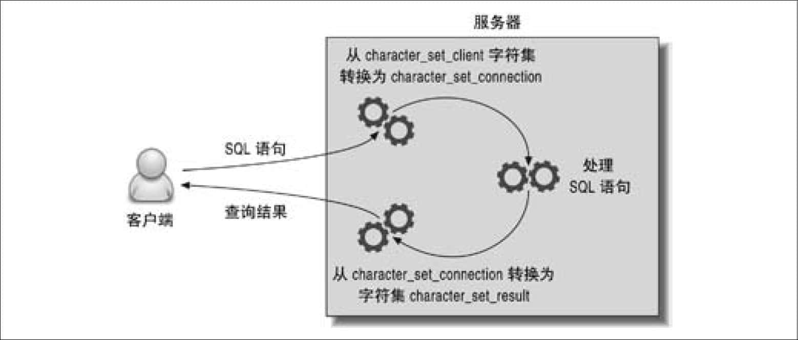 
**图7-2：客户端和服务器的字符集**

根据需要，可以使用SET NAMES或者SET CHARACTER SET语句来改变上面的设置。不过在服务器上使用这个命令只能改变服务器端的设置。客户端程序和客户端的API也需要使用正确的字符集才能避免在通信时出现问题。

假设使用latin1字符集（这是默认字符集）打开一个连接，并使用SET NAMES utf8来告诉服务器客户端将使用UTF-8字符集来传输数据。这样就创建了一个不匹配的字符集，可能会导致一些错误甚至出现一些安全性问题。应当先设置客户端字符集然后使用函数mysql\_real\_escape\_string()在需要的时候进行转义。在PHP中，可以使用mysql\_set\_charset()来修改客户端的字符集。

### MySQL如何比较两个字符串的大小

如果比较的两个字符串的字符集不同，MySQL会先将其转成同一个字符集再进行比较。如果两个字符集不兼容的话，则会抛出错误，例如“ERROR 1267(HY000):Illegal mix of collations”。这种情况下需要通过函数CONVERT()显式地将其中一个字符串的字符集转成一个兼容的字符集。MySQL 5.0和更新的版本经常会做这样的隐式转换，所以这类错误通常是在MySQL 4.1中比较常见。

MySQL还会为每个字符串设置一个“可转换性”(10)。这个设置决定了值的字符集的优先级，因而会影响MySQL做字符集隐式转换后的值。另外，也可以使用函数CHARSET()、COLLATION()、和COERCIBILITY()来定位各种字符集相关的错误。

还可以使用前缀和COLLATE子句来指定字符串的字符集或者校对字符集。例如，下面的示例中使用了前缀（由下画线开始）来指定utf8字符集，还使用了COLLATE子句指定了使用二进制校对规则：

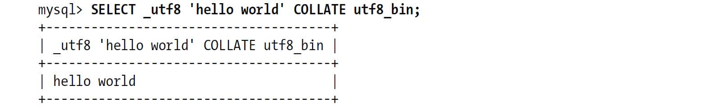 

### 一些特殊情况

MySQL的字符集行为中还是有一些隐藏的“惊喜”的。下面列举了一些需要注意的地方：

诡异的character\_set\_database设置

character\_set\_database设置的默认值和默认数据库的设置相同。当改变默认数据库的时候，这个变量也会跟着变。所以当连接到MySQL实例上又没有指定要使用的数据库时，默认值会和character\_set\_server相同。

LOAD DATA INFILE

当使用LOAD DATA INFILE的时候，数据库总是将文件中的字符按照字符集character\_set\_database来解析。在MySQL 5.0和更新的版本中，可以在LOAD DATA INFILE中使用子句CHARACTER SET来设定字符集，不过最好不要依赖这个设定。我们发现指定字符集最好的方式是先使用USE指定数据库，再执行SET NAMES来设定字符集，最后再加载数据。MySQL在加载数据的时候，总是以同样的字符集处理所有数据，而不管表中的列是否有不同的字符集设定。

SELECT INTO OUTFILE

MySQL会将SELECT INTO OUTFILE的结果不做任何转码地写入文件。目前，除了使用函数CONVERT()将所有的列都做一次转码外，还没有什么别的办法能够指定输出的字符集。

嵌入式转义序列

MySQL会根据character\_set\_client的设置来解析转义序列，即使是字符串中包含前缀或者COLLATE子句也一样。这是因为解析器在处理字符串中的转义字符时，完全不关心校对规则——对解析器来说，前缀并不是一个指令，它只是一个关键字而已。

## 7.9.2　选择字符集和校对规则

MySQL 4.1和之后的版本支持很多的字符集和校对规则，包括支持使用Unicode编码的多字节UTF-8字符集（MySQL支持UTF-8的一个三字节子集，这几乎可以包含世界上的所有字符集）。可以使用命令SHOW CHARACTERSET和SHOW COLLATION来查看MySQL支持的字符集和校对规则。

**极简原则**

在一个数据库中使用多个不同的字符集是一件很让人头疼的事情，字符集之间的不兼容问题会很难缠。有时候，一切都看起来正常，但是当某个特殊字符出现的时候，所有类型的操作都可能会无法进行（例如多表之间的关联）。你可以使用ALTER TABLE命令将对应列转成相互兼容的字符集，还可以使用编码前缀和COLLATE子句将对应的列值转成兼容的编码。

正确的方法是，最好先为服务器（或者数据库）选择一个合理的字符集。然后根据不同的实际情况，让某些列选择合适的字符集。

对于校对规则通常需要考虑的一个问题是，是否以大小写敏感的方式比较字符串，或者是以字符串编码的二进制值来比较大小。它们对应的校对规则的前缀分别是\_cs、\_ci和\_bin，根据需要很容易选择。大小写敏感和二进制校对规则的不同之处在于，二进制校对规则直接使用字符的字节进行比较，而大小写敏感的校对规则在多字节字符集时，如德语，有更复杂的比较规则。

在显式设置字符集的时候，并不是必须同时指定字符集和校对规则的名字。如果缺失了其中一个或者两个，MySQL会使用可能的默认值来进行填充。表7-2表示了MySQL如何选择字符集和校对规则。

**表7-2：MySQL如何选择字符集和校对规则**
**用户设置** **返回结果的字符集** **返回结果的校对规则**  同时设置字符集和校对规则 与用户设置相同 与用户设置相同  仅设置字符集 与用户设置相同 与字符集的默认校对规则相同  仅设置校对规则 与校对规则对应的字符集相同 与用户设置相同  都未设置 使用默认值 使用默认值  
下面的命令展示了在创建数据库、表、列的时候如何显式地指定字符集和校对规则：

        CREATE DATABASE d CHARSET latin1;
        CREATE TABLE d.t(
           col1 CHAR(1),
           col2 CHAR(1) CHARSET utf8,
           col3 CHAR(1) COLLATE latin1_bin
        ) DEFAULT CHARSET=cp1251;

这个表最后的字符集和校对规则如下：

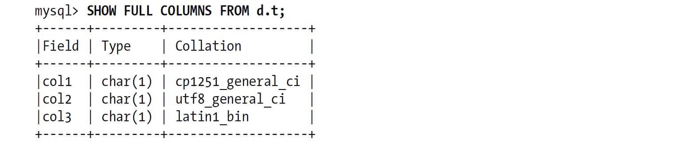 

## 7.9.3　字符集和校对规则如何影响查询

某些字符集和校对规则可能会需要更多的CPU操作，可能会消耗更多的内存和存储空间，甚至还会影响索引的正常使用。所以在选择字符集的时候，也有一些需要注意的地方。

不同的字符集和校对规则之间的转换可能会带来额外的系统开销。例如，数据表sakila.film在列title上有索引，可以加速下面的ORDER BY查询：

        mysql> **    EXPLAIN SELECT title, release_year FROM sakila.film ORDER BY title\Gmysql> EXPLAIN SELECT title, release_year FROM sakila.film ORDER BY title\G**    
        *************************** 1. row ***************************
                   id: 1
          select_type: SIMPLE
                table: film
                 type: index
        possible_keys: NULL
                  key: idx_title
              key_len: 767
                  ref: NULL
                 rows: 953
                Extra:

只有排序查询要求的字符集与服务器数据的字符集相同的时候，才能使用索引进行排序。索引根据数据列的校对规则(11)进行排序，这里使用的是utf8\_general\_ci。如果希望使用别的校对规则进行排序，那么MySQL就需要使用文件排序：

        mysql> **    EXPLAIN SELECT title, release_year**    
            -> **    FROM sakila.film ORDER BY title COLLATE utf8_bin\G**    
        *************************** 1. row ***************************
                   id: 1
          select_type: SIMPLE
                table: film
                 type: ALL
        possible_keys: NULL
                  key: NULL
              key_len: NULL
                  ref: NULL
                 rows: 953
                Extra: **    Using filesort**    

为了能够适应各种字符集，包括客户端字符集、在查询中显式指定的字符集，MySQL会在需要的时候进行字符集转换。例如，当使用两个字符集不同的列来关联两个表的时候，MySQL会尝试转换其中一个列的字符集。这和在数据列外面封装一个函数一样，会让MySQL无法使用这个列上的索引。如果你不确定MySQL内部是否做了这种转换，可以在EXPLAIN EXTENDED后使用SHOW WARNINGS来查看MySQL是如何处理的。从输出中可以看到查询中使用的字符集，也可以看出MySQL是否做了字符集转换操作。

UTF-8是一种多字节编码，它存储一个字符会使用变长的字节数（一到三个字节）。在MySQL内部，通常使用一个定长的空间来存储字符串，再进行相关操作，这样做的目的是希望总是保证缓存中有足够的空间来存储字符串。例如，一个编码是UTF-8的CHAR(10)需要30个字节，即使最终存储的时候没有存储任何“多字节”字符也是一样。变长的字段类型（VARCHAR TEXT）存储在磁盘上时不会有这个困扰，但当它存储在临时表中用来处理或者排序时，也总是会分配最大可能的长度。

在多字节字符集中，一个字符不再是一个字节。所以，在MySQL中有两个函数LENGTH()和CHAR\_LENGTH()来计算字符串的长度，在多字节字符集中，这两个函数的返回结果会不同。如果使用的是多字节字符集，那么确保在统计字符集的时候使用CHAR\_LENGTH()。（例如需要做SUBSTRING()操作的时候）。其实，在应用程序中也同样要注意多字节字符集的这个问题。

另一个“惊喜”可能是关于索引限制方面的。如果要索引一个UTF-8字符集的列， MySQL会假设每一个字符都是三个字节，所以最长索引前缀的限制一下缩短到原来的三分之一了：

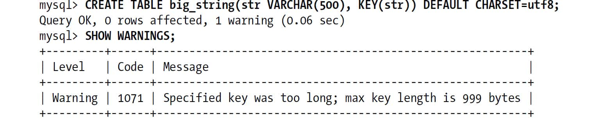 

注意到，MySQL的索引前缀自动缩短到333个字符了：

        mysql> **    SHOW CREATE TABLE big_string\G**    
        *************************** 1. row ***************************
               Table: big_string
        Create Table: CREATE TABLE `big_string` (
          `str` varchar(500) default NULL,
          KEY `str` (`str`(333))
        ) ENGINE=MyISAM DEFAULT CHARSET=utf8

如果你不注意警告信息也没有再重新检查表的定义，可能不会注意到这里仅仅是在该列的前缀上建立了索引。这会对MySQL使用索引有一些影响，例如无法使用索引覆盖扫描。

也有人建议，直接使用UTF-8字符集，“整个世界都清净了”。不过从性能的角度来看这不是一个好主意。根据存储的数据，很多应用无须使用UTF-8字符集，如果坚持使用UTF-8，只会消耗更多的磁盘空间。

在考虑使用什么字符集的时候，需要根据存储的具体内存来决定。例如，存储的内容主要是英文字符，那么即使使用UTF-8也不会消耗太多的存储空间，因为英文字符在UTF-8字符集中仍然使用一个字节。但如果需要存储一些非拉丁语系的字符，如俄语、阿拉伯语，那么区别会很大。如果应用中只需要存储阿拉伯语，那么可以使用cp1256字符集，这个字符集可以用一个字节表示所有的阿拉伯语字符。如果还需要存储别的语言，那么就应该使用UTF-8了，这时相同的阿拉伯语字符会消耗更多的空间。类似地，当从某个具体的语种编码转换成UTF-8时，存储空间的使用会相应增加。如果使用的是InnoDB表，那么字符集的改变可能导致数据的大小超过可以在页内存储的临界值，需要保存在额外的外部存储区，这会导致很严重的空间浪费，还会带来很多空间碎片。

有时候根本不需要使用任何的字符集。通常只有在做大小写无关的比较、排序、字符串操作（例如SUBSTRING()的时候才需要使用字符集。如果你的数据库不关心字符集，那么可以直接将所有的东西存储到二进制列中，包括UTF-8编码数据也可以存储在其中。这么做，可能还需要一个列记录字符的编码集。虽然很多人一直都是这么用的，但还是有不少事项需要注意。这会导致很多难以排查的错误，例如，忘记了多个字节才是一个字符时，还继续使用SUBSTRING()和LENGTH()做字符串操作，就会出错。如果可能，我们建议尽量不要这样做。

# 7.10　全文索引

通过数值比较、范围过滤等就可以完成绝大多数我们需要的查询了。但是，如果你希望通过关键字的匹配来进行查询过滤，那么就需要基于相似度的查询，而不是原来的精确数值比较。全文索引就是为这种场景设计的。

全文索引有着自己独特的语法。没有索引也可以工作，如果有索引效率会更高。用于全文搜索的索引有着独特的结构，帮助这类查询找到匹配某些关键字的记录。

你可能没有在意过全文索引，不过至少应该对一种全文索引技术比较熟悉：互联网搜索引擎。虽然这类搜索引擎的索引对象是超大量的数据，并且通常其背后都不是关系型数据库，不过全文索引的基本原理都是一样的。

全文索引可以支持各种字符内容的搜索（包括CHAR、VARCHAR和TEXT类型），也支持自然语言搜索和布尔搜索。在MySQL中全文索引有很多的限制(12)，其实现也很复杂，但是因为它是MySQL内置的功能，而且满足很多基本的搜索需求，所以它的应用仍然非常广泛。本章我们将介绍如何使用全文索引，以及如何为应用设计更高性能的全文索引。在本书编写时，在标准的MySQL中，只有MyISAM引擎支持全文索引。不过在还没有正式发布的MySQL 5.6中，InnoDB已经实验性质地支持全文索引了。除此，还有第三方的存储引擎，如Groonga，也支持全文索引。

事实上，MyISAM对全文索引的支持有很多的限制，例如表级别锁对性能的影响、数据文件的崩溃、崩溃后的恢复等，这使得MyISAM的全文索引对于很多应用场景并不合适。所以，多数情况下我们建议使用别的解决方案，例如Sphinx、Lucene、Solr、Groonga、Xapian或者Senna，再或者可以等MySQL 5.6版本正式发布后，直接使用InnoDB的全文索引。如果MyISAM的全文索引确实能满足应用的需求，那么可以继续阅读本节。

MyISAM的全文索引作用对象是一个“全文集合”，这可能是某个数据表的一列，也可能是多个列。具体的，对数据表的某一条记录，MySQL会将需要索引的列全部拼接成一个字符串，然后进行索引。

MyISAM的全文索引是一类特殊的B-Tree索引，共有两层。第一层是所有关键字，然后对于每一个关键字的第二层，包含的是一组相关的“文档指针”。全文索引不会索引文档对象中的所有词语，它会根据如下规则过滤一些词语：

+ 停用词列表中的词都不会被索引。默认的停用词根据通用英语的使用来设置，可以使用参数ft\_stopword\_file指定一组外部文件来使用自定义的停用词。 
+ 对于长度大于ft\_min\_word\_len的词语和长度小于ft\_max\_word\_len的词语，都不会被索引。 

全文索引并不会存储关键字具体匹配在哪一列，如果需要根据不同的列来进行组合查询，那么不需要针对每一列来建立多个这类索引。

这也意味着不能在MATCH AGAINST子句中指定哪个列的相关性更重要。通常构建一个网站的搜索引擎是需要这样的功能，例如，你可能希望优先搜索出那些在标题中出现过的文档对象。如果需要这样的功能，则需要编写更复杂的查询语句。（后面将会为大家展示如何实现。）

## 7.10.1　自然语言的全文索引

自然语言搜索引擎将计算每一个文档对象和查询的相关度。这里，相关度是基于匹配的关键词个数，以及关键词在文档中出现的次数。在整个索引中出现次数越少的词语，匹配时的相关度就越高。相反，非常常见的单词将不会搜索，即使不在停用词列表中出现，如果一个词语在超过50%的记录中都出现了，那么自然语言搜索将不会搜索这类词语。(13)

全文索引的语法和普通查询略有不同。可以根据WHERE子句中的MATCH AGAINST来区分查询是否使用全文索引。我们来看一个示例。在标准的数据库Sakila中，数据表film\_text在字段title和description上建立了全文索引：

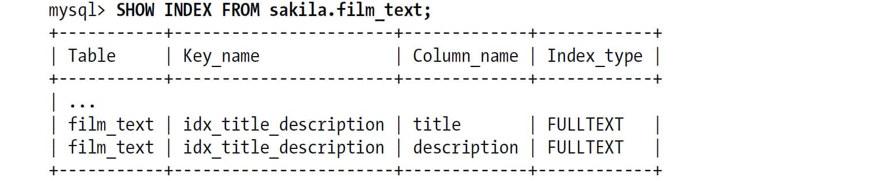 

下面是一个使用自然语言搜索的查询：

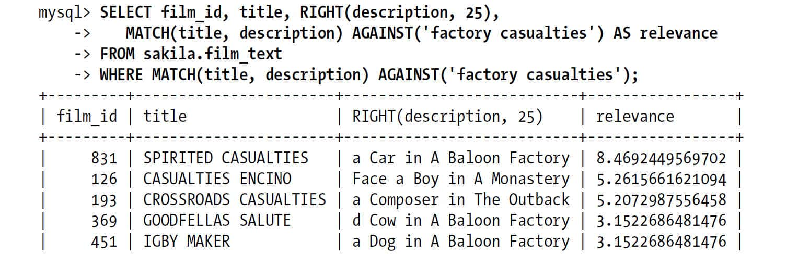 

MySQL将搜索词语分成两个独立的关键词进行搜索，搜索在title和description字段组成的全文索引上进行。注意，只有一条记录同时包含全部的两个关键词，有三个查询结果只包含关键字“casualties”（这是整个表中仅有的三条包含该关键词的记录），这三个结果都在结果列表的前面。这是因为查询结果是根据与关键词的相似度来进行排序的。

和普通查询不同，这类查询自动按照相似度进行排序。在使用全文索引进行排序的时候，MySQL无法再使用索引排序。所以如果不想使用文件排序的话，那么就不要在查询中使用ORDER BY子句。

从上面的示例可以看到，函数MATCH()将返回关键词匹配的相关度，是一个浮点数字。你可以根据相关度进行匹配，或者将此直接展现给用户。在一个查询中使用两次MATCH()函数并不会有额外的消耗，MySQL会自动识别并只进行一次搜索。不过，如果你将MATCH()函数放到ORDER BY子句中，MySQL将会使用文件排序。

在MATCH()函数中指定的列必须和在全文索引中指定的列完全相同，否则就无法使用全文索引。这是因为全文索引不会记录关键字是来自哪一列的。

这也意味着无法使用全文索引来查询某个关键字是否在某一列中存在。这里介绍一个绕过该问题的办法：根据关键词在多个不同列的全文索引上的相关度来算出排名值，然后依此来排序。我们可以在某一列上加上如下索引：

        mysql> **    ALTER TABLE film_text ADD FULLTEXT KEY(title) ;**    

这样，我们可以将title匹配乘以2来提高它的相似度的权重：

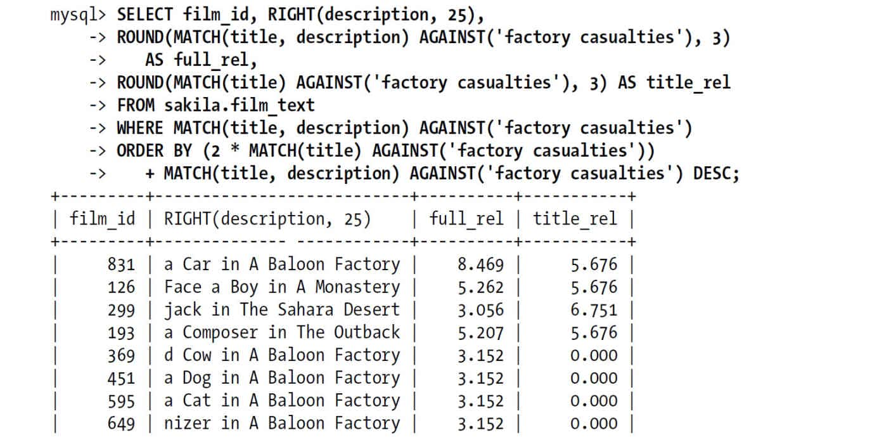 

因为上面的查询需要做文件排序，所以这并不是一个高效的做法。

## 7.10.2　布尔全文索引

在布尔搜索中，用户可以在查询中自定义某个被搜索的词语的相关性。布尔搜索通过停用词列表过滤掉那些“噪声”词，除此之外，布尔搜索还要求搜索关键词长度必须大于ft\_min\_word\_len，同时小于ft\_max\_word\_len(14)。搜索返回的结果是未经排序的。

当编写一个布尔搜索查询时，可以通过一些前缀修饰符来定制搜索。表7-3列出了最常用的修饰符。

**表7-3：布尔全文索引通用修饰符**
**Example** **Meaning**  dinosaur 包含“dinosaur”的行rank值更高  ~dinosaur 包含“dinosaur”的行rank值更低  \+dinosaur 行记录必须包含“dinosaur”  -dinosaur 行记录不可以包含“dinosaur”  dino\* 包含以“dino”开头的单词的行rank值更高  
还可以使用其他的操作，例如使用括号分组。基于此，就可以构造出一些复杂的搜索查询。

还是继续用sakila.film\_text来举例，现在我们需要搜索既包含词“factory”又包含“casualties”的记录。在前面，我们已经使用自然语言搜索查询实现找到这两个词中的任何一个的SQL写法。使用布尔搜索查询，我们可以指定返回结果必须同时包含“factory”和“casualties”：

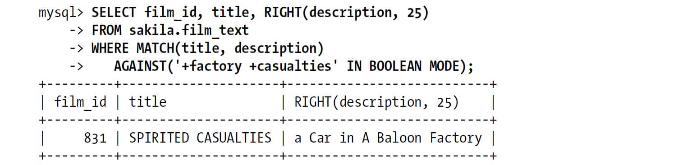 

查询中还可以使用括号进行“短语搜索”，让返回结果精确匹配指定的短语：

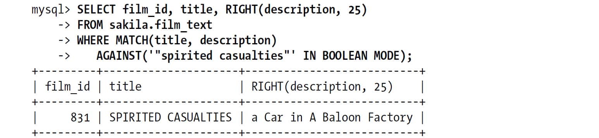 

短语搜索的速度会比较慢。只使用全文索引是无法判断是否精确匹配短语的，通常还需要查询原文确定记录中是否包含完整的短语。由于需要进行回表过滤，所以速度会很慢。

要完成上面的查询，MySQL需要先从索引中找出所有同时包含“spirited”和“casualties”的索引条目，然后取出这些记录再判断是否是精确匹配短语。因为这个操作会先从索引中过滤出一些记录，所以通常认为这样做的速度是很快的——比LIKE操作要快很多。事实上，这样做的确很快，但是搜索的关键词不能是太常见的词语。如果搜索的关键词太常见，因为前一步的过滤会返回太多的记录需要判断，因此LIKE操作反而更快。这种情况下LIKE操作是完全的顺序读，相比索引返回值的随机读，会快很多。

只有MyISAM引擎才能使用布尔全文索引，但并不是一定要有全文索引才能使用布尔全文搜索。当没有全文索引的时候，MySQL就通过全表扫描来实现。所以，你甚至还可以在多表上使用布尔全文索引，例如在一个关联结果上进行。只不过，因为是全表扫描，速度可能会很慢。

## 7.10.3　MySQL 5.1中全文索引的变化

在MySQL 5.1中引入了一些和全文索引相关的改进，包括一些性能上的提升和新增插件式的解析，通过此用户可以自己定制增强搜索功能。例如，插件可以改变索引文本的方式。可以用更灵活的方式进行分词（例如，可以指定C\+\+作为一个单独的词语）、预处理、可以对不同的文档类型进行索引（如PDF），还可以做一些自定义的词干规则。插件还可以直接影响全文搜索的工作方式——例如，直接使用词干进行搜索。

## 7.10.4　全文索引的限制和替代方案

MySQL的全文索引实现有很多的设计本身带来的限制。在某些场景下这些限制是致命的，不过也有很多办法绕过这些限制。

例如，MySQL全文索引中只有一种判断相关性的方法：词频。索引也不会记录索引词在字符串中的位置，所以位置也就无法用在相关性上。虽然大多数情况下，尤其是数据量很小的时候，这些限制都不会影响使用，但也可能不是你所想要的。而且MySQL的全文索引也没有提供其他可选的相关性排序算法。（它无法存储基于相对位置的相关性排序数据。）

数据量的大小也是一个问题。MySQL的全文索引只有全部在内存中的时候，性能才非常好。如果内存无法装载全部索引，那么搜索速度可能会非常慢。当你使用精确短语搜索时，想要好的性能，数据和索引都需要在内存中。相比其他的索引类型，当INSERT、UPDATE和DELETE操作进行时，全文索引的操作代价都很大：

+ 修改一段文本中的100个单词，需要100次索引操作，而不是一次。 
+ 一般来说列长度并不会太影响其他的索引类型，但是如果是全文索引，三个单词的文本和10000个单词的文本，性能可能会相差几个数量级。 
+ 全文索引会有更多的碎片，可能需要做更多的OPTIMIZE TABLE操作。 

全文索引还会影响查询优化器的工作。索引选择、WHERE子句、ORDER BY都有可能不是按照你所预想的方式来工作：

+ 如果查询中使用了MATCH AGAINST子句，而对应列上又有可用的全文索引，那么MySQL就一定会使用这个全文索引。这时，即使有其他的索引可以使用，MySQL也不会去比较到底哪个索引的性能更好。所以，即使这时有更合适的索引可以使用， MySQL仍然会置之不理。 
+ 全文索引只能用作全文搜索匹配。任何其他操作，如WHERE条件比较，都必须在MySQL完成全文搜索返回记录后才能进行。这和其他普通索引不同，例如，在处理WHERE条件时，MySQL可以使用普通索引一次判断多个比较表达式。 
+ 全文索引不存储索引列的实际值。也就不可能用作索引覆盖扫描。 
+ 除了相关性排序，全文索引不能用作其他的排序。如果查询需要做相关性以外的排序操作，都需要使用文件排序。 

让我们看看这些限制如何影响查询语句。来看一个例子，假设有一百万个文档记录，在文档的作者author字段上有一个普通的索引，在文档内容字段content上有全文索引。现在我们要搜索作者是123，文档中又包含特定词语的文档。很多人可能会按照下面的方式来写查询语句：

        ... WHERE MATCH(content) AGAINST ('High Performance MySQL')
            AND author = 123;

而实际上，这样做的效率非常低。因为这里使用了MATCH AGAINST，而且恰好上面有全文索引，所以MySQL优先选择使用全文索引，即先搜索所有的文档，查找是否有包含关键词的文档，然后返回记录看看作者是否是123。所以这里也就没有使用author字段上的索引。

一个替代方案是将author列包含到全文索引中。可以在author列的值前面附上一个不常见的前缀，然后将这个带前缀的值存放到一个单独的filters列中，并单独维护该列（也许可以使用触发器来做维护工作）。

这样就可以扩展全文索引，使其包含filters列，上面的查询就可以改写为：

        ... WHERE MATCH(content, filters)
            AGAINST ('High Performance MySQL +author_id_123' IN BOOLEAN MODE);

这个案例中，如果author列的选择性非常高，那么MySQL能够根据作者信息很快地将需要过滤的文档记录限制在一个很小的范围内，这个查询的效率也就会非常好。如果author列的选择性很低，那么这个替代方案的效率会比前面那个更糟，所以使用的时候要谨慎。

全文索引有时候还可以实现一些简单的“边框”搜索。例如，希望搜索某个坐标范围时，将坐标按某种方式转换成文本再进行全文索引。假设某条记录的坐标为X=123和Y=456。可以按照这样的方式交错存储坐标：XY142536，然后对此进行全文索引。这时，希望查询某矩形——X取值100至199，Y取值400至499——范围时，可以在查询直接搜索“\+XY14\*”。这比使用WHERE条件过滤的效率要高很多。

全文索引的另一个常用技巧是缓存全文索引返回的主键值，这在分页显示的时候经常使用。当应用程序真的需要输出结果时，才通过主键值将所有需要的数据返回。这个查询就可以自由地使用其他索引、或者自由地关联其他表。

虽然只有MyISAM表支持全文索引，但是如果仍然希望使用InnoDB或其他引擎，可以将原表复制到一个备库，再将备库上的表改成MyISAM并建上相应的全文索引。如果不希望在另一个服务器上完成查询，还可以对表进行垂直拆分，将需要索引的列放到一个单独的MyISAM表中。

将需要索引的列额外地冗余在另一个MyISAM表中也是一个办法。在测试库中sakila.film\_text就是使用这个策略，这里使用触发器来维护这个表的数据。最后，你还可以使用一个包含内置全文索引的引擎，如Lucene或者Sphinx。更多关于Shpinx的内容请参考附录F。

因为使用全文索引的时候，通常会返回大量结果并产生大量随机I/O，如果和GROUP BY一起使用的话，还需要通过临时表或者文件排序进行分组，性能会非常非常糟糕。这类查询通常只是希望查询分组后的前几名结果，所以一个有效的优化方法是对结果集进行抽样而不是精确计算。例如，仅查询前面的1000条记录，进行分组并返回前几名的结果。

## 7.10.5　全文索引的配置和优化

全文索引的日常维护通常能够大大提升性能。“双B-Tree”的特殊结构、在某些文档中比其他文档要包含多得多的关键字，这都使得全文索引比起普通索引有更多的碎片问题。所以需要经常使用OPTIMIZE TABLE来减少碎片。如果应用是I/O密集型的，那么定期地进行全文索引重建可以让性能提升很多。

如果希望全文索引能够高效地工作，还需要保证索引缓存足够大，从而保证所有的全文索引都能够缓存在内存中。通常，可以为全文索引设置单独的键缓存（Key cache），保证不会被其他的索引缓存挤出内存。键缓存的配置和使用可以参考第8章。

提供一个好的停用词表也很重要。默认的停用词表对常用英语来说可能还不错，但是如果是其他语言或者某些专业文档就不合适了，例如技术文档。例如，若要索引一批MySQL相关的文档，那么最好将mysql放入停用词表，因为在这类文档中，这个词会出现得非常频繁。

忽略一些太短的单词也可以提升全文索引的效率。索引单词的最小长度可以通过参数ft\_min\_word\_len配置。修改该参数可以过滤更多的单词，让查询速度更快，但是也会降低精确度。还需要注意一些特殊的场景，有时确实需要索引某些非常短的词语。例如，对一个电子消费品文档进行索引，除非我们允许对很短的单词进行索引，否则搜索“cd player”可能会返回大量的结果。因为单词“cd”比默认允许的最短长度4还要小，所以这里只会对“Player”进行搜索，而通常搜索“cd player”的客户，其实对MP3或者DVD播放器并不感兴趣。

停用词表和允许最小词长都可以通过减少索引词语来提升全文索引的效率，但是同时也会降低搜索的精确度。这需要根据实际的应用场景找到合适的平衡点。如果你希望同时获得好的性能和好的搜索质量，那么需要自己定制这些参数。一个好的办法是通过日志系统来研究用户的搜索行为，看看一些异常的查询，包括没有结果返回的查询或者返回过多结果的用户查询。通过这些用户行为和被搜索的内容来判断应该如何调整索引策略。

需要注意，当调整“允许最小词长”后，需要通过OPTIMIZE TABLE来重建索引才会生效。另一个参数ft\_max\_word\_len和该参数行为类似，它限制了允许索引的最大词长。

当向一个有全文索引的表中导入大量数据的时候，最好先通过命令DISABLE KEYS来禁用全文索引，然后在导入结束后使用ENABLE KYES来建立全文索引。因为全文索引的更新是一个消耗很大的操作，所以上面的细节会帮你节省大量时间。另外，这样还顺便为全文索引做了一次碎片整理工作。

如果数据集特别大，则需要对数据进行手动分区，然后将数据分布到不同的节点，再做并行的搜索。这是一个复杂的工作，最好通过一些外部的搜索引擎来实现，如Lucene或者Sphinx。我们的经验显示这样做性能会有指数级的提升。

# 7.11　分布式（XA）事务

存储引擎的事务特性能够保证在存储引擎级别实现ACID（参考前面介绍的“事务”），而分布式事务则让存储引擎级别的ACID可以扩展到数据库层面，甚至可以扩展到多个数据库之间——这需要通过两阶段提交实现。MySQL 5.0和更新版本的数据库已经开始支持XA事务了。

XA事务中需要有一个事务协调器来保证所有的事务参与者都完成了准备工作（第一阶段）。如果协调器收到所有的参与者都准备好的消息，就会告诉所有的事务可以提交了，这是第二阶段。MySQL在这个XA事务过程中扮演一个参与者的角色，而不是协调者。

实际上，在MySQL中有两种XA事务。一方面，MySQL可以参与到外部的分布式事务中；另一方面，还可以通过XA事务来协调存储引擎和二进制日志。

## 7.11.1　内部XA事务

MySQL本身的插件式架构导致在其内部需要使用XA事务。MySQL中各个存储引擎是完全独立的，彼此不知道对方的存在，所以一个跨存储引擎的事务就需要一个外部的协调者。如果不使用XA协议，例如，跨存储引擎的事务提交就只是顺序地要求每个存储引擎各自提交。如果在某个存储提交过程中发生系统崩溃，就会破坏事务的特性（要么就全部提交，要么就不做任何操作）。

如果将MySQL记录的二进制日志操作看作一个独立的“存储引擎”，就不难理解为什么即使是一个存储引擎参与的事务仍然需要XA事务了。在存储引擎提交的同时，需要将“提交”的信息写入二进制日志，这就是一个分布式事务，只不过二进制日志的参与者是MySQL本身。

XA事务为MySQL带来巨大的性能下降。从MySQL 5.0开始，它破坏了MySQL内部的“批量提交”（一种通过单磁盘I/O操作完成多个事务提交的技术），使得MySQL不得不进行多次额外的fsync()调用(15)。具体的，一个事务如果开启了二进制日志，则不仅需要对二进制日志进行持久化操作，InnoDB事务日志还需要两次日志持久化操作。换句话说，如果希望有二进制日志安全的事务实现，则至少需要做三次fsync()操作。唯一避免这个问题的办法就是关闭二进制日志，并将innodb\_support\_xa设置为0(16)。

但这样的设置是非常不安全的，而且这会导致MySQL复制也没法正常工作。复制需要二进制日志和XA事务的支持，另外——如果希望数据尽可能安全——最好还要将sync\_binlog设置成1，这时存储引擎和二进制日志才是真正同步的。（否则，XA事务支持就没有意义了，因为事务提交了二进制日志却可能没有“提交”到磁盘。）这也是为什么我们强烈建议使用带电池保护的RAID卡写缓存：这个缓存可以大大加快fsync()操作的效率。

下一章我们将更进一步地介绍如何配置事务日志和二进制日志。

## 7.11.2　外部XA事务

MySQL能够作为参与者完成一个外部的分布式事务。但它对XA协议支持并不完整，例如，XA协议要求在一个事务中的多个连接可以做关联，但目前的MySQL版本还不能支持。

因为通信延迟和参与者本身可能失败，所以外部XA事务比内部消耗会更大。如果在广域网中使用XA事务，通常会因为不可预测的网络性能导致事务失败。如果有太多不可控因素，例如，不稳定的网络通信或者用户长时间地等待而不提交，则最好避免使用XA事务。任何可能让事务提交发生延迟的操作代价都很大，因为它影响的不仅仅是自己本身，它还会让所有参与者都在等待。

通常，还可以使用别的方式实现高性能的分布式事务。例如，可以在本地写入数据，并将其放入队列，然后在一个更小、更快的事务中自动分发。还可以使用MySQL本身的复制机制来发送数据。我们看到很多应用程序都可以完全避免使用分布式事务。

也就是说，XA事务是一种在多个服务器之间同步数据的方法。如果由于某些原因不能使用MySQL本身的复制，或者性能并不是瓶颈的时候，可以尝试使用。

# 7.12　查询缓存

很多数据库产品都能够缓存查询的执行计划，对于相同类型的SQL就可以跳过SQL解析和执行计划生成阶段。MySQL在某些场景下也可以实现，但是MySQL还有另一种不同的缓存类型：缓存完整的SELECT查询结果，也就是“查询缓存”。本节将详细介绍这类缓存。

MySQL查询缓存保存查询返回的完整结果。当查询命中该缓存，MySQL会立刻返回结果，跳过了解析、优化和执行阶段。

查询缓存系统会跟踪查询中涉及的每个表，如果这些表发生变化，那么和这个表相关的所有的缓存数据都将失效。这种机制效率看起来比较低，因为数据表变化时很有可能对应的查询结果并没有变更，但是这种简单实现代价很小，而这点对于一个非常繁忙的系统来说非常重要。

查询缓存对应用程序是完全透明的。应用程序无须关心MySQL是通过查询缓存返回的结果还是实际执行返回的结果。事实上，这两种方式执行的结果是完全相同的。换句话说，查询缓存无须使用任何语法。无论是MySQL开启或关闭查询缓存，对应用程序都是透明的(17)。

随着现在的通用服务器越来越强大，查询缓存被发现是一个影响服务器扩展性的因素。它可能成为整个服务器的资源竞争单点，在多核服务器上还可能导致服务器僵死。后面我们将详细介绍如何配合查询缓存，但是很多时候我们还是认为应该默认关闭查询缓存，如果查询缓存作用很大的话，那就配置一个很小的查询缓存空间（如几十兆）。后面我们将解释如何判断在你的系统压力下打开查询缓存是否有好处。

## 7.12.1　MySQL如何判断缓存命中

MySQL判断缓存命中的方法很简单：缓存存放在一个引用表中，通过一个哈希值引用，这个哈希值包括了如下因素，即查询本身、当前要查询的数据库、客户端协议的版本等一些其他可能会影响返回结果的信息。

当判断缓存是否命中时，MySQL不会解析、“正规化”或者参数化查询语句，而是直接使用SQL语句和客户端发送过来的其他原始信息。任何字符上的不同，例如空格、注释——任何的不同——都会导致缓存的不命中。(18)所以在编写SQL语句的时候，需要特别注意这点。通常使用统一的编码规则是一个好的习惯，在这里这个好习惯会让你的系统运行得更快。

当查询语句中有一些不确定的数据时，则不会被缓存。例如包含函数NOW()或者CURRENT\_DATE()的查询不会被缓存。类似的，包含CURRENT\_USER或者CONNECTION\_ID()的查询语句因为会根据不同的用户返回不同的结果，所以也不会被缓存。事实上，如果查询中包含任何用户自定义函数、存储函数、用户变量、临时表、mysql库中的系统表，或者任何包含列级别权限的表，都不会被缓存。（如果想知道所有情况，建议阅读MySQL官方手册。）

我们常听到：“如果查询中包含一个不确定的函数，MySQL则不会检查查询缓存”。这个说法是不正确的。因为在检查查询缓存的时候，还没有解析SQL语句，所以MySQL并不知道查询语句中是否包含这类函数。在检查查询缓存之前，MySQL只做一件事情，就是通过一个大小写不敏感的检查看看SQL语句是不是以SEL开头。

准确的说法应该是：“如果查询语句中包含任何的不确定函数，那么在查询缓存中是不可能找到缓存结果的”。因为即使之前刚刚执行了这样的查询，结果也不会放在查询缓存中。MySQL在任何时候只要发现不能被缓存的部分，就会禁止这个查询被缓存。

所以，如果希望换成一个带日期的查询，那么最好将日期提前计算好，而不要直接使用函数。例如：

        ... DATE_SUB(CURRENT_DATE, INTERVAL 1 DAY) -- Not cacheable!
        ... DATE_SUB('2007-07-14', INTERVAL 1 DAY) -- Cacheable

因为查询缓存是在完整的SELECT语句基础上的，而且只是在刚收到SQL语句的时候才检查，所以子查询和存储过程都没办法使用查询缓存。在MySQL 5.1之前的版本中，绑定变量也无法使用查询缓存。

MySQL的查询缓存在很多时候可以提升查询性能，在使用的时候，有一些问题需要特别注意。首先，打开查询缓存对读和写操作都会带来额外的消耗：

+ 读查询在开始之前必须先检查是否命中缓存。 
+ 如果这个读查询可以被缓存，那么当完成执行后，MySQL若发现查询缓存中没有这个查询，会将其结果存入查询缓存，这会带来额外的系统消耗。 
+ 这对写操作也会有影响，因为当向某个表写入数据的时候，MySQL必须将对应表的所有缓存都设置失效。如果查询缓存非常大或者碎片很多，这个操作就可能会带来很大系统消耗（设置了很多的内存给查询缓存用的时候）。 

虽然如此，查询缓存仍然可能给系统带来性能提升。但是，如上所述，这些额外消耗也可能不断增加，再加上对查询缓存操作是一个加锁排他操作，这个消耗可能不容小觑。

对InnoDB用户来说，事务的一些特性会限制查询缓存的使用。当一个语句在事务中修改了某个表，MySQL会将这个表的对应的查询缓存都设置失效，而事实上，InnoDB的多版本特性会暂时将这个修改对其他事务屏蔽。在这个事务提交之前，这个表的相关查询是无法被缓存的，所以所有在这个表上面的查询——内部或外部的事务——都只能在该事务提交后才被缓存。因此，长时间运行的事务，会大大降低查询缓存的命中率。

如果查询缓存使用了很大量的内存，缓存失效操作就可能成为一个非常严重的问题瓶颈。如果缓存中存放了大量的查询结果，那么缓存失效操作时整个系统都可能会僵死一会儿。因为这个操作是靠一个全局锁操作保护的，所有需要做该操作的查询都要等待这个锁，而且无论是检测是否命中缓存、还是缓存失效检测都需要等待这个全局锁。第3章中有一个真实的案例，为大家展示查询缓存过大时带来的系统消耗。

## 7.12.2　查询缓存如何使用内存

查询缓存是完全存储在内存中的，所以在配置和使用它之前，我们需要先了解它是如何使用内存的。除了查询结果之外，需要缓存的还有很多别的维护相关的数据。这和文件系统有些类似：需要一些内存专门用来确定哪些内存目前是可用的、哪些是已经用掉的、哪些用来存储数据表和查询结果之前的映射、哪些用来存储查询字符串和查询结果。

这些基本的管理维护数据结构大概需要40KB的内存资源，除此之外，MySQL用于查询缓存的内存被分成一个个的数据块，数据块是变长的。每一个数据块中，存储了自己的类型、大小和存储的数据本身，还外加指向前一个和后一个数据块的指针。数据块的类型有：存储查询结果、存储查询和数据表的映射、存储查询文本，等等。不同的存储块，在内存使用上并没有什么不同，从用户角度来看无须区分它们。

当服务器启动的时候，它先初始化查询缓存需要的内存。这个内存池初始是一个完整的空闲块。这个空闲块的大小就是你所配置的查询缓存大小再减去用于维护元数据的数据结构所消耗的空间。

当有查询结果需要缓存的时候，MySQL先从大的空间块中申请一个数据块用于存储结果。这个数据块需要大于参数query\_cache\_min\_res\_unit的配置，即使查询结果远远小于此，仍需要至少申请query\_cache\_min\_res\_unit空间。因为需要在查询开始返回结果的时候就分配空间，而此时是无法预知查询结果到底多大的，所以MySQL无法为每一个查询结果精确分配大小恰好匹配的缓存空间。

因为需要先锁住空间块，然后找到合适大小数据块，所以相对来说，分配内存块是一个非常慢的操作。MySQL尽量避免这个操作的次数。当需要缓存一个查询结果的时候，它先选择一个尽可能小的内存块（也可能选择较大的，这里将不介绍细节），然后将结果存入其中。如果数据块全部用完，但仍有剩余数据需要存储，那么MySQL会申请一块新数据块——仍然是尽可能小的数据块——继续存储结果数据。当查询完成时，如果申请的内存空间还有剩余，MySQL会将其释放，并放入空闲内存部分。图7-3展示了这个过程(19)。

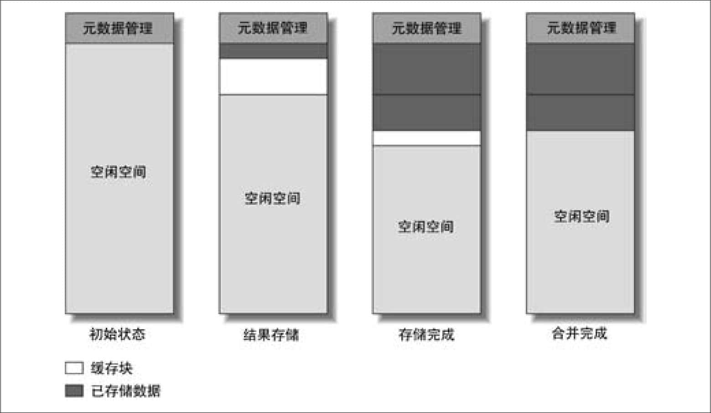 
**图7-3：查询缓存如何分配内存来存储结果数据**

我们上面说的“分配内存块”，并不是指通过函数malloc()向操作系统申请内存，这个操作只在初次创建查询缓存的时候执行一次。这里“分配内存块”是指在空闲块列表中找到一个合适的内存块，或者从正在使用的、待淘汰的内存块中回收再使用。也就是说，这里MySQL自己管理一大块内存，而不依赖操作系统的内存管理。

至此，一切都看起来很简单。不过实际情况比图7-3要更复杂。例如，我们假设平均查询结果非常小，服务器在并发地向不同的两个连接返回结果，返回完结果后MySQL回收剩余数据块空间时会发现，回收的数据块小于query\_cache\_min\_res\_unit，所以不能够直接在后续的内存块分配中使用。如果考虑到这种情况，数据块的分配就更复杂些，如图7-4所示。

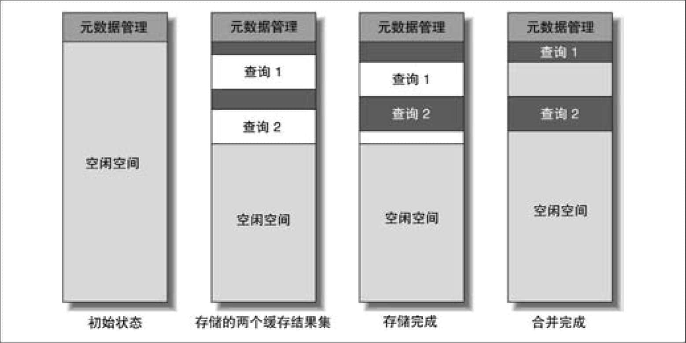 
**图7-4：查询缓存中存储查询结果后剩余的碎片**

在收缩第一个查询结果使用的缓存空间时，就会在第二个查询结果之间留下一个“空隙”——一个非常小的空闲空间，因为小于query\_cache\_min\_res\_unit而不能再次被查询缓存使用。这类“空隙”我们称为“碎片”，这在内存管理、文件系统管理上都是经典问题。有很多种情况都会导致碎片，例如缓存失效时，可能导致留下太小的数据块无法在后续缓存中使用。

## 7.12.3　什么情况下查询缓存能发挥作用

并不是什么情况下查询缓存都会提高系统性能的。缓存和失效都会带来额外的消耗，所以只有当缓存带来的资源节约大于其本身的资源消耗时才会给系统带来性能提升。这跟具体的服务器压力模型有关。

理论上，可以通过观察打开或者关闭查询缓存时候的系统效率来决定是否需要开启查询缓存。关闭查询缓存时，每个查询都需要完整的执行，每一次写操作执行完成后立刻返回；打开查询缓存时，每次读请求先检查缓存是否命中，如果命中则立刻返回，否则就完整地执行查询，每次写操作则需要检查查询缓存中是否有需要失效的缓存，然后再返回。这个过程还比较简单明了，但是要评估打开查询缓存是否能够带来性能提升却并不容易。还有一些外部的因素需要考虑，例如，查询缓存可以降低查询执行的时间，但是却不能减少查询结果传输的网络消耗，如果这个消耗是系统的主要瓶颈，那么查询缓存的作用也很小。

因为MySQL在SHOW STATUS中只能提供一个全局的性能指标，所以很难根据此来判断查询缓存是否能够提升性能(20)。很多时候，全局平均不能反映实际情况。例如，打开查询缓存可以使得一个很慢的查询变得非常快，但是也会让其他查询稍微慢一点点。有时候如果能够让某些关键的查询速度更快，稍微降低一下其他查询的速度是值得的。不过，这种情况我们推荐使用SQL\_CACHE来优化对查询缓存的使用。

对于那些需要消耗大量资源的查询通常都是非常适合缓存的。例如一些汇总计算查询，具体的如COUNT()等。总地来说，对于复杂的SELECT语句都可以使用查询缓存，例如多表JOIN后还需要做排序和分页，这类查询每次执行消耗都很大，但是返回的结果集却很小，非常适合查询缓存。不过需要注意的是，涉及的表上UPDATE、DELETE和INSERT操作相比SELECT来说要非常少才行。

一个判断查询缓存是否有效的直接数据是命中率，就是使用查询缓存返回结果占总查询的比率。当MySQL接收到一个SELECT查询的时候，要么增加Qcache\_hits的值，要么增加Com\_select的值。所以查询缓存命中率可以由如下公式计算：Qcache\_hits/(Qcache\_hits\+Com\_select)。

不过，查询缓存命中率是一个很难判断的数值。命中率多大才是好的命中率？具体情况要具体分析。只要查询缓存带来的效率提升大于查询缓存带来的额外消耗，即使30%命中率对系统性能提升也有很大好处。另外，缓存了哪些查询也很重要，例如，被缓存的查询本身消耗非常巨大，那么即使缓存命中率非常低，也仍然会对系统性能提升有好处。所以，没有一个简单的规则可以判断查询缓存是否对系统有好处。

任何SELECT语句没有从查询缓存中返回都称为“缓存未命中”。缓存未命中可能有如下几种原因：

+ 查询语句无法被缓存，可能是因为查询中包含一个不确定的函数（如CURRENT\_DATA），或者查询结果太大而无法缓存。这都会导致状态值Qcache\_not\_cached增加。 
+ MySQL从未处理这个查询，所以结果也从不曾被缓存过。 
+ 还有一种情况是虽然之前缓存了查询结果，但是由于查询缓存的内存用完了，MySQL需要将某些缓存“逐出”，或者由于数据表被修改导致缓存失效。（后续会详细介绍缓存失效。） 

如果你的服务器上有大量缓存未命中，但是实际上绝大数查询都被缓存了，那么一定是有如下情况发生：

+ 查询缓存还没有完成预热。也就是说，MySQL还没有机会将查询结果都缓存起来。 
+ 查询语句之前从未执行过。如果你的应用程序不会重复执行一条查询语句，那么即使完成预热仍然会有很多缓存未命中。 
+ 缓存失效操作太多了。 

缓存碎片、内存不足、数据修改都会造成缓存失效。如果配置了足够的缓存空间，而且query\_cache\_min\_res\_unit设置也合理的话，那么缓存失效应该主要是数据修改导致的。可以通过参数Com\_\*来查看数据修改的情况（包括Com\_update，Com\_delete，等等），还可以通过Qcache\_lowmem\_prunes来查看有多少次失效是由于内存不足导致的。

在考虑缓存命中率的同时，通常还需要考虑缓存失效带来的额外消耗。一个极端的办法是，对某一个表先做一次只有查询的测试，并且所有的查询都命中缓存，而另一个相同的表则只做修改操作。这时，查询缓存的命中率就是100%。但因为会给更新操作带来额外的消耗，所以查询缓存并不一定会带来总体效率的提升。这里，所有的更新语句都会做一次缓存失效检查，而检查的结果都是相同的，这会给系统带来额外的资源浪费。所以，如果你只是观察查询缓存的命中率的话，可能完全不会发现这样的问题。

在MySQL中如果更新操作和带缓存的读操作混合，那么查询缓存带来的好处通常很难衡量。更新操作会不断地使得缓存失效，而同时每次查询还会向缓存中再写入新的数据。所以只有当后续的查询能够在缓存失效前使用缓存才会有效地利用查询缓存。

如果缓存的结果在失效前没有被任何其他的SELECT语句使用，那么这次缓存操作就是浪费时间和内存。我们可以通过查看Com\_select和Qcache\_inserts的相对值来看看是否一直有这种情况发生。如果每次查询操作都是缓存未命中，然后需要将查询结果放到缓存中，那么Qcache\_inserts的大小应该和Com\_select相当。所以在缓存完成预热后，我们总希望看到Qcache\_inserts远远小于Com\_select。不过由于缓存和服务器内部的复杂和多样性，仍然很难说，这个比率是多少才是一个合适的值。

所以，上面的“命中率”和“INSERTS和SELECT比率”都无法直观地反应查询缓存的效率。那么还有什么直观的办法能够反映查询缓存是否对系统有好处？这里推荐查看另一个指标：“命中和写入”的比率，即Qcache\_hits和Qcache\_inserts的比值。根据经验来看，当这个比值大于3:1时通常查询缓存是有效的，不过这个比率最好能够达到10:1。如果你的应用没有达到这个比率，那么就可以考虑禁用查询缓存了，除非你能够通过精确的计算得知：命中带来的性能提升大于缓存失效的消耗，并且查询缓存并没有成为系统的瓶颈。

每一个应用程序都会有一个“最大缓存空间”，甚至对一些纯读的应用来说也一样。最大缓存空间是能够缓存所有可能查询结果的缓存空间总和。理论上，对多数应用来说，这个数值都会非常大。而实际上，由于缓存失效的原因，大多数应用最后使用的缓存空间都比预想的要小。即使你配置了足够大的缓存空间，由于不断地失效，导致缓存空间一直都不会接近“最大缓存空间”。

通常可以通过观察查询缓存内存的实际使用情况，来确定是否需要缩小或者扩大查询缓存。如果查询缓存空间长时间都有剩余，那么建议缩小；如果经常由于空间不足而导致查询缓存失效，那么则需要增大查询缓存。不过需要注意，如果查询缓存达到了几十兆这样的数量级，是有潜在危险的。（这和硬件以及系统压力大小有关）。

另外，可能还需要和系统的其他缓存一起考虑，例如InnoDB的缓存池，或者MyISAM的索引缓存。关于这点是没法简单给出一个公式或者比率来判断的，因为真正的平衡点与应用程序有很大的关系。

最好的判断查询缓存是否有效的办法还是通过查看某类查询时间消耗是否增大或者减少来判断。Percona Server通过扩展慢查询可以观察到一个查询是否命中缓存。如果查询缓存没有为系统节省时间，那么最好禁用它。

## 7.12.4　如何配置和维护查询缓存

一旦理解查询缓存工作的原理，配置起来就很容易了。它也只有很少的参数可供配置，如下所示。

query\_cache\_type

是否打开查询缓存。可以设置成OFF、ON或DEMAND。DEMAND表示只有在查询语句中明确写明SQL\_CACHE的语句才放入查询缓存。这个变量可以是会话级别的也可以是全局级别的（会话级别和全局级别的概念请参考第8章）。

query\_cache\_size

查询缓存使用的总内存空间，单位是字节。这个值必须是1 024的整数倍，否则MySQL实际分配的数据会和你指定的略有不同。

query\_cache\_min\_res\_unit

在查询缓存中分配内存块时的最小单位。在前面我们已经介绍了这个参数，后面我们还将进一步讨论它。

query\_cache\_limit

MySQL能够缓存的最大查询结果。如果查询结果大于这个值，则不会被缓存。因为查询缓存在数据生成的时候就开始尝试缓存数据，所以只有当结果全部返回后， MySQL才知道查询结果是否超出限制。

如果超出，MySQL则增加状态值Qcache\_not\_cached，并将结果从查询缓存中删除。如果你事先知道有很多这样的情况发生，那么建议在查询语句中加入SQL\_NO\_CACHE来避免查询缓存带来的额外消耗。

query\_cache\_wlock\_invalidate

如果某个数据表被其他的连接锁住，是否仍然从查询缓存中返回结果。这个参数默认是OFF，这可能在一定程序上会改变服务器的行为，因为这使得数据库可能返回其他线程锁住的数据。将参数设置成ON，则不会从缓存中读取这类数据，但是这可能会增加锁等待。对于绝大数应用来说无须注意这个细节，所以默认设置通常是没有问题的。

配置查询缓存通常很简单，但是如果想知道修改这些参数会带来哪些改变，则是一项很复杂的工作。后续的章节，我们将帮助你来决定怎样设置这些参数。

### 减少碎片

没什么办法能够完全避免碎片，但是选择合适的query\_cache\_min\_res\_unit可以帮你减少由碎片导致的内存空间浪费。设置合适的值可以平衡每个数据块的大小和每次存储结果时内存块申请的次数。这个值太小，则浪费的空间更少，但是会导致更频繁的内存块申请操作；如果这个值设置得太大，那么碎片会很多。调整合适的值其实是在平衡内存浪费和CPU消耗。

这个参数的最合适的大小和应用程序的查询结果的平均大小直接相关。可以通过内存实际消耗（query\_cache\_size−Qcache\_free\_memory）除以Qcache\_queries\_in\_cache计算单个查询的平均缓存大小。如果你的应用程序的查询结果很不均匀，有的结果很大，有的结果很小，那么碎片和反复的内存块分配可能无法避免。如果你发现缓存一个非常大的结果并没有什么意义（通常确实是这样），那么你可以通过参数query\_cache\_limit限制可以缓存的最大查询结果，借此大大减少大的查询结果的缓存，最终减少内存碎片的发生。

还可以通过参数Qcache\_free\_blocks来观察碎片。参数Qcache\_free\_blocks反映了查询缓存中空闲块的多少，在图7-4的配置中我们看到，有两个空闲块。最糟糕的情况是，任何两个存储结果的数据块之间都有一个非常小的空闲块。所以如果Qcache\_free\_blocks大小恰好达到Qcache\_total\_blocks/2，那么查询缓存就有严重的碎片问题。而如果你还有很多空闲块，而状态值Qcache\_lowmem\_prunes还不断地增加，则说明由于碎片导致了过早地在删除查询缓存结果。

可以使用命令FLUSH QUERY CACHE完成碎片整理。这个命令会将所有的查询缓存重新排序，并将所有的空闲空间都聚集到查询缓存的一块区域上。不过需要注意，这个命令并不会将查询缓存清空，清空缓存由命令RESET QUERY CACHE完成。FLUSH QUERY CACHE会访问所有的查询缓存，在这期间任何其他的连接都无法访问查询缓存，从而会导致服务器僵死一段时间，使用这个命令的时候需要特别小心这点。另外，根据经验，建议保持查询缓存空间足够小，以便在维护时可以将服务器僵死控制在非常短的时间内。

### 提高查询缓存的使用率

如果查询缓存不再有碎片问题，但你仍然发现命中率很低，还可能是查询缓存的内存空间太小导致的。如果MySQL无法为一个新的查询缓存结果的时候，则会选择删除某个老的缓存结果。

当由于这个原因导致删除老的缓存结果时，会增加状态值Qcache\_lowmem\_prunes。如果这个值增加得很快，那么可能是由下面两个原因导致的：

+ 如果还有很多空闲块，那么碎片可能是罪魁祸首（参考前面的小节）。 
+ 如果这时没什么空闲块了，就说明在这个系统压力下，你分配的查询缓存空间不够大。你可以通过检查状态值Qcache\_free\_memory来查看还有多少没有使用的内存。 

如果空闲块很多，碎片很少，也没有什么由于内存导致的缓存失效，但是命中率仍然很低，那么很可能说明，在你的系统压力下，查询缓存并没有什么好处。一定是什么原因导致查询缓存无法为系统服务，例如有大量的更新或者查询语句本身都不能被缓存。

如果在观察命中率时，仍然无法确定查询缓存是否给系统带来了好处，那么可以通过禁用它，然后观察系统的性能，再重新打开它，观察性能变化，据此来判断查询缓存是否给系统带来了好处。可以通过将query\_cache\_size设置成0，来关闭查询缓存。（改变query\_cache\_type的全局值并不会影响已经打开的连接，也不会将查询缓存的内存释放给系统。）你还可以通过系统测试来验证，不过一般都很难精确地模拟实际情况。

图7-5展示了一个用来分析和配置查询缓存的流程图。

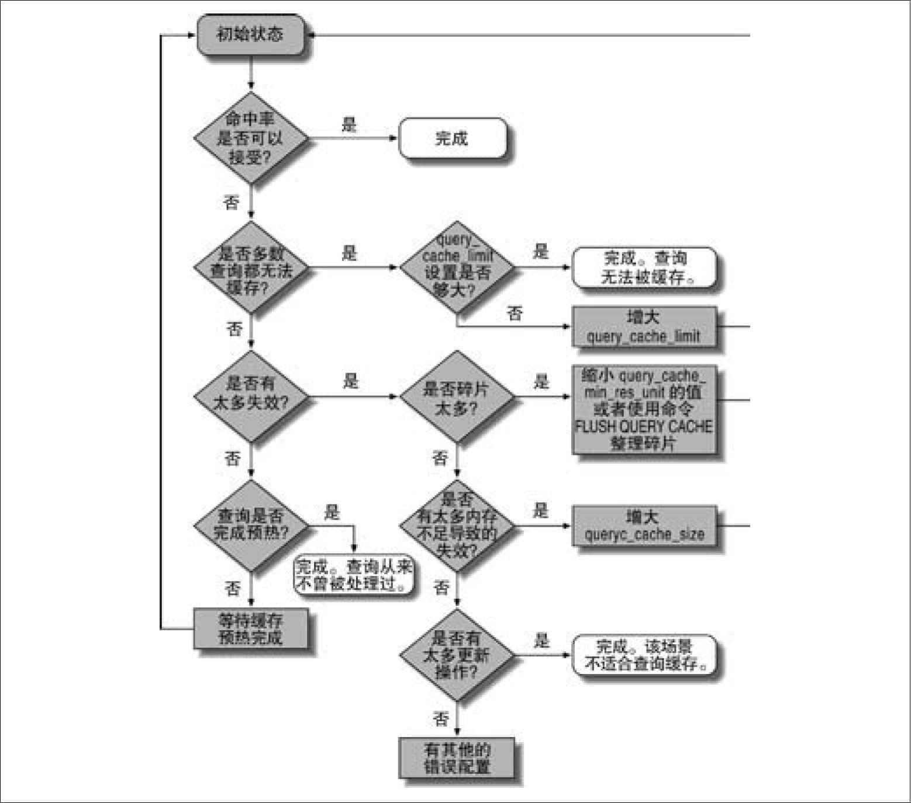 
**图7-5：如何分析和配置查询缓存**

## 7.12.5　InnoDB和查询缓存

因为InnoDB有自己的MVCC机制，所以相比其他存储引擎，InnoDB和查询缓存的交互要更加复杂。MySQL 4.0版本中，在事务处理中查询缓存是被禁用的，从4.1和更新的InnoDB版本开始，InnoDB会控制在一个事务中是否可以使用查询缓存，InnoDB会同时控制对查询缓存的读（从缓存中获取查询结果）和写操作（向查询缓存写入结果）。

事务是否可以访问查询缓存取决于当前事务ID，以及对应的数据表上是否有锁。每一个InnoDB表的内存数据字典都保存了一个事物ID号，如果当前事务ID小于该事务ID，则无法访问查询缓存。

如果表上有任何的锁，那么对这个表的任何查询语句都是无法被缓存的。例如，某个事务执行了SELECT FOR UPDATE语句，那么在这个锁释放之前，任何其他的事务都无法从查询缓存中读取与这个表相关的缓存结果。

当事务提交时，InnoDB持有锁，并使用当前的一个系统事务ID更新当前表的计数器。锁一定程度上说明事务需要对表进行修改操作，当然有可能事务获得锁，却不进行任何更新操作，但是如果想更新任何表的内容，获得相应锁则是前提条件。InnoDB将每个表的计数器设置成某个事务ID，而这个事务ID就代表了当前存在的且修改了该表的最大的事务ID。

那么下面的一些事实也就成立：

+ 所有大于该表计数器的事务才可以使用查询缓存。例如当前系统的事务ID是5，且事务获取了该表的某些记录的锁，然后进行事务提交操作，那么事务1至4，都不应该再读取或者向查询缓存写入任何相关的数据。 
+ 该表的计数器并不是直接更新为对该表进行加锁的事务ID，而是被更新成一个系统事务ID。所以，会发现该事务自身后续的更新操作也无法读取和修改查询缓存。 

查询缓存存储、检索和失效操作都是在MySQL层面完成，InnoDB无法绕过或者延迟这个行为。但InnoDB可以在事务中显式地告诉MySQL何时应该让某个表的查询缓存都失效。在有外键限制的时候这是必须的，例如某个SQL语句有ON DELETE CASCADE，那么相关联表的查询缓存也是要一起失效的。

原则上，在InnoDB的MVCC架构下，当某些修改不影响其他事务读取一致的数据时，是可以使用查询缓存的。但是这样实现起来会非常复杂，InnoDB做了一个简化，让所有有加锁操作的事务都不使用任何查询缓存，这个限制其实并不是必须的。

## 7.12.6　通用查询缓存优化

库表结构的设计、查询语句、应用程序设计都可能会影响到查询缓存的效率。除了前文介绍的之外，这里还有一些要点需要注意：

+ 用多个小表代替一个大表对查询缓存有好处。这个设计将会使得失效策略能够在一个更合适的粒度上进行。当然，不要让这个原则过分影响你的设计，毕竟其他的一些优势可能很容易就弥补了这个问题。 
+ 批量写入时只需要做一次缓存失效，所以相比单条写入效率更好。（另外需要注意，不要同时做延迟写和批量写，否则可能会因为失效导致服务器僵死较长时间。） 
+ 因为缓存空间太大，在过期操作的时候可能会导致服务器僵死。一个简单的解决办法就是控制缓存空间的大小（query\_cache\_size），或者直接禁用查询缓存。 
+ 无法在数据库或者表级别控制查询缓存，但是可以通过SQL\_CACHE和SQL\_NO\_CACHE来控制某个SELECT语句是否需要进行缓存。你还可以通过修改会话级别的变量query\_cache\_type来控制查询缓存。 
+ 对于写密集型的应用来说，直接禁用查询缓存可能会提高系统的性能。关闭查询缓存可以移除所有相关的消耗。例如将query\_cache\_size设置成0，那么至少这部分就不再消耗任何内存了。 
+ 因为对互斥信号量的竞争，有时直接关闭查询缓存对读密集型的应用也会有好处。如果你希望提高系统的并发，那么最好做一个相关的测试，对比打开和关闭查询缓存时候的性能差异。 

如果不想所有的查询都进入查询缓存，但是又希望某些查询走查询缓存，那么可以将query\_cache\_type设置成DEMAND，然后在希望缓存的查询中加上SQL\_CACHE。这虽然需要在查询中加入一些额外的语法，但是可以让你非常自由地控制哪些查询需要被缓存。相反，如果希望缓存多数查询，而少数查询又不希望缓存，那么你可以使用关键字SQL\_NO\_CACHE。

## 7.12.7　查询缓存的替代方案

MySQL查询缓存工作的原则是：执行查询最快的方式就是不去执行，但是查询仍然需要发送到服务器端，服务器也还需要做一点点工作。如果对于某些查询完全不需要与服务器通信效果会如何呢？这时客户端的缓存可以很大程度上帮你分担MySQL服务器的压力。我们将在第14章详细介绍更多关于缓存的内容。

# 7.13　总结

本章详细介绍了前面各个章节中提到的一些MySQL特性。这里我们将再来回顾一下其中的一些重点内容。

分区表

分区表是一种粗粒度的、简易的索引策略，适用于大数据量的过滤场景。最适合的场景是，在没有合适的索引时，对其中几个分区进行全表扫描，或者是只有一个分区和索引是热点，而且这个分区和索引能够都在内存中；限制单表分区数不要超过150个，并且注意某些导致无法做分区过滤的细节，分区表对于单条记录的查询并没有什么优势，需要注意这类查询的性能。

视图

对好几个表的复杂查询，使用视图有时候会大大简化问题。当视图使用临时表时，无法将WHERE条件下推到各个具体的表，也不能使用任何索引，需要特别注意这类查询的性能。如果为了便利，使用视图是很合适的。

外键

外键限制会将约束放到MySQL中，这对于必须维护外键的场景，性能会更高。不过这也会带来额外的复杂性和额外的索引消耗，还会增加多表之间的交互，会导致系统中更多的锁和竞争。外键可以被看作是一个确保系统完整性的额外的特性，但是如果设计的是一个高性能的系统，那么外键就显得很臃肿了。很多人在更在意系统的性能的时候都不会使用外键，而是通过应用程序来维护。

存储过程

MySQL本身实现了存储过程、触发器、存储函数和事件，老实说，这些特性并没什么特别的。而且对于基于语句的复制还有很多问题。通常，使用这些特性可以帮你节省很多的网络开销——很多情况下，减少网络开销可以大大提升系统的性能。在某些经典的场景下你可以使用这些特性（例如中心化业务逻辑、绕过权限系统，等等），但需要注意在MySQL中，这些特性并没有别的数据库系统那么成熟和全面。

绑定变量

当查询语句的解析和执行计划生成消耗了主要的时间，那么绑定变量可以在一定程度上解决问题。因为只需要解析一次，对于大量重复类型的查询语句，性能会有很大的提高。另外，执行计划的缓存和传输使用的二进制协议，这都使得绑定变量的方式比普通SQL语句执行的方式要更快。

插件

使用C或者C\+\+编写的插件可以让你最大程度地扩展MySQL功能。插件功能非常强大，我们已经编写了很多UDF和插件，在MySQL中解决了很多问题。

字符集

字符集是一种字节到字符之间的映射，而校对规则是指一个字符集的排序方法。很多人都使用Latin1（默认字符集，对英语和某些欧洲语言有效）或者UTF-8。如果使用的是UTF-8，那么在使用临时表和缓冲区的时候需要注意：MySQL会按照每个字符三个字节的最大占用空间来分配存储空间，这可能消耗更多的内存或者磁盘空间。注意让字符集和MySQL字符集配置相符，否则可能会由于字符集转换让某些索引无法正常使用。

全文索引

在本书编写的时候只有MyISAM支持全文索引，不过据说从MySQL 5.6开始， InnoDB也将支持全文索引。MyISAM因为在锁粒度和崩溃恢复上的缺点，使得在大型全文索引场景中基本无法使用。这时，我们通常帮助客户构建和使用Sphinx来解决全文索引的问题。

XA事务

很少有人用MySQL的XA事务特性。除非你真正明白参数innodb\_support\_xa的意义，否则不要修改这个参数的值，并不是只有显式使用XA事务时才需要设置这个参数。InnoDB和二进制日志也是需要使用XA事务来做协调的，从而确保在系统崩溃的时候，数据能够一致地恢复。

查询缓存

完全相同的查询在重复执行的时候，查询缓存可以立即返回结果，而无须在数据库中重新执行一次。根据我们的经验，在高并发压力环境中查询缓存会导致系统性能的下降，甚至僵死。如果你一定要使用查询缓存，那么不要设置太大内存，而且只有在明确收益的时候才使用。那该如何判断是否应该使用查询缓存呢？建议使用Percona Server，观察更细致的日志，并做一些简单的计算。还可以查看缓存命中率（并不总是有用）、“INSERTS和SELECT比率”（这个参数也并不直观）、或者“命中和写入比率”（这个参考意义较大）。查询缓存是一个非常方便的缓存，对应用程序完全透明，无须任何额外的编码，但是，如果希望有更高的缓存效率，我们建议使用*memcached*或者其他类似的解决方案。第14章介绍了更多的细节供大家参考。

————————————————————

(1) 因为可以在这里存放一个非法的日期，所以甚至当order\_date是一个非NULL值的时候，仍然会出现这样情况。

(2) 从用户角度来看，这应该是一个缺陷，不过从MySQL开发者的角度来看这是一个特性。

(3) 这些特性也是一些“鲜为人知的犀利”特性。

(4) 这里的“temp table”并不是指真正的物理上存在的临时表。没有经过这些改进和试验，MySQL视图也不会有现在的效率。

(5) 在MySQL 5.6中可能会有所改进，但是在本书写作的时候5.6还没有发布。

(6) 这个语法是SQL/PSM的一个子集，SQL/PSM是SQL标准中的持久化存储模块，在ISO/IEC 9075-4:2003(E)中定义。

(7) 有一些专门用作移植的工具，例如*tsql2mysql*项目就是专门用于移植SQL Server上的存储过程。参考：*http://sourceforge.net/projects/tsql2mysql*。

(8) 通常各个层都有自己的缓存。——译者注

(9) MySQL 4.0和更早的版本中，如果设置服务器的全局设置，有几种8字节的字符集可以选择。

(10) coercibility()函数的返回值。——译者注

(11) 即排序规则。——译者注

(12) 在MySQL 5.1中，可以使用全文解析器插件来扩展全文索引的功能。不过，MySQL的全文索引本身还是有很多限制的，可能导致无法在你的应用场景中使用。我们将在附录F中介绍如何将Sphinx作为一个MySQL内部搜索引擎来使用。

(13) 在测试使用时的一个常见错误就是，只是用很小的数据集合进行全文索引，所以总是无法返回结果。原因在于，每个搜索关键词都可能在一半以上的记录里面出现过。

(14) 事实上，全文索引根本不会对太短或者太长的词语进行索引，但是这里说的不是一回事。一般地， MySQL本身并不会因为搜索关键词过长或过短而忽略这些词语，但是查询优化器的某些部分却可能这样做。

(15) 在撰写本书的时候，“批量提交”的问题已经有了很多解决方案，其中至少有三种是很优秀的。还需要进一步观察到底MySQL官方会采用哪一种，到底到哪个版本MySQL才会合并到源码。目前，使用MariaDB和Percona Server就可以避免这个问题。

(16) 一个常见的误区是认为innodb\_support\_xa只有在需要XA事务时才需要打开。这是错误的：该参数还会控制MyQSL内部存储引擎和二进制日志之间的分布式事务。如果你真正关心你的数据，你需要将这个参数打开。

(17) 有一种方式查询缓存可能和原生的SQL工作方式有所不同：默认的，当要查询的表被LOCK TABLES锁住时，查询仍然可以通过查询缓存返回数据。你可以通过参数query\_cache\_wlock\_invalidate打开或者关闭这种行为。

(18) 对于这个规则，Percona Server是个例外。它会先将所有的注释语句删除，然后再比较查询语句是否有缓存。这是一个通用的需求，这样可以在查询语句中带入更多的处理过程信息。前面第3章我们介绍的MySQL监控系统就依赖于此。

(19) 这里绘制的查询缓存内存分配图，仍然是一种简化的情况。MySQL实际管理查询缓存的方式比这要更复杂。如果你想知道更多的细节，在源代码文件*sql/sql\_cache.cc*开头的注释中有非常详细的解释。

(20) Percona和MariaDB对MySQL慢日志进行了改进，会记录慢日志中的查询是否命中查询缓存。

