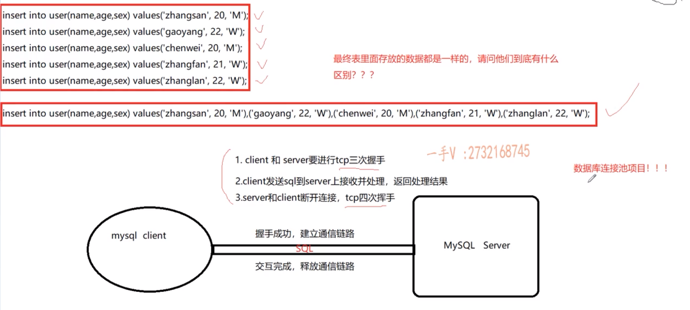

# 分类
- DDL 数据定义语言(create,drop,alter)
- DML 数据操纵语言(insert,delete,update,select)
- DCL 数据控制语言(grant,revoke)
# 删除
``` mysql
mysql> select * from user;
+----+----------+-----+-----+
| id | name     | age | sex |
+----+----------+-----+-----+
|  1 | zhangsan |  20 | M   |
|  2 | wuqi     |  34 | M   |
|  5 | baobaoi  |  45 | W   |
|  6 | lalal    |  44 | W   |
+----+----------+-----+-----+
4 rows in set (0.00 sec)
mysql> delete from user where id = 6
#如果之后重启了mysql，则再插入的数据id为6；如果没有重启，则再插入的数据id为7
mysql> nsert into user(name,age,sex) values('hah',35,'W');
```
# 新增
一次新增多条数据和多次新增单条数据区别  


# 搜索
limit可以优化sql语句，不过要看数据的位置  
```mysql 
mysql> select * from t_user  limit 1999999 ,1;
+---------+------------------+------------+
| id      | email            | password   |
+---------+------------------+------------+
| 2000000 | cwng78@yahoo.com | h4HcxZKBNQ |
+---------+------------------+------------+
1 row in set (0.52 sec)
#这条数据在最后一条，所以优化效果不怎么样
mysql> select * from t_user where email='cwng78@yahoo.com';
+---------+------------------+------------+
| id      | email            | password   |
+---------+------------------+------------+
| 2000000 | cwng78@yahoo.com | h4HcxZKBNQ |
+---------+------------------+------------+
1 row in set (0.47 sec)
```
在第一条或者前面，则优化效果显著  
```mysql
mysql> select * from t_user  limit 0 ,1;
+----+------------------------+------------+
| id | email                  | password   |
+----+------------------------+------------+
|  1 | randyhill201@gmail.com | U5ivlQVd9A |
+----+------------------------+------------+
1 row in set (0.00 sec)

mysql> select * from t_user  where email = 'randyhill201@gmail.com';
+----+------------------------+------------+
| id | email                  | password   |
+----+------------------------+------------+
|  1 | randyhill201@gmail.com | U5ivlQVd9A |
+----+------------------------+------------+
1 row in set (0.55 sec)

mysql> select * from t_user  where email = 'randyhill201@gmail.com' limit 1;
+----+------------------------+------------+
| id | email                  | password   |
+----+------------------------+------------+
|  1 | randyhill201@gmail.com | U5ivlQVd9A |
+----+------------------------+------------+
1 row in set (0.00 sec)

```
## sql语句优先级顺序
- `语法顺序：select->from->where->group by->having->order by -> limit`  
`执行顺序：from --> where -- > group by --> having --> select --> order by --> limit`
- explain不解释mysql优化后的操作
# limit优化
利用索引在分页中的优化(不过得id是连续且没有删除过的)
```mysql
mysql> select * from t_user where id > 1000000 limit 0,20;
+---------+-------------------------+------------+
| id      | email                   | password   |
+---------+-------------------------+------------+
| 1000001 | amy@outlook.com         | n5zMIHnqrC |
| 1000002 | ssugiy@gmail.com        | LEmEgFfejT |
| 1000003 | nanko@mail.com          | rVQXFYIDeF |
| 1000004 | sitsy9@mail.com         | CF3yJLWgNy |
| 1000005 | mildred412@outlook.com  | JswbqbOTJm |
| 1000006 | fergusonjesus@yahoo.com | ysJU7uvASH |
| 1000007 | ruiwang6@icloud.com     | KWVLOYMWhZ |
| 1000008 | bradlryan@hotmail.com   | t2k89OD6DL |
| 1000009 | eitamasuda@icloud.com   | Kf3Bal3tDP |
| 1000010 | eleha@mail.com          | CyTR4Ip5JW |
| 1000011 | chichy@mail.com         | ooo1V8MVe2 |
| 1000012 | linzi@outlook.com       | KOTV9fP4Xs |
| 1000013 | nakayamam@gmail.com     | K4LbwiNPRD |
| 1000014 | zhiyuand9@icloud.com    | 3dqhPhXdGh |
| 1000015 | swl618@gmail.com        | gNEUyvH2Fn |
| 1000016 | takuya2@gmail.com       | KUYing6JwV |
| 1000017 | okwa@icloud.com         | 1UFqbATwQU |
| 1000018 | khi@hotmail.com         | JyZHrHDJz3 |
| 1000019 | simpsonm324@gmail.com   | 2ZOPJJKTyE |
| 1000020 | vherrera1229@mail.com   | 1SWCeRYeLc |
+---------+-------------------------+------------+
20 rows in set (0.00 sec)
mysql> select * from t_user limit 1000000,20;
+---------+-------------------------+------------+
| id      | email                   | password   |
+---------+-------------------------+------------+
| 1000001 | amy@outlook.com         | n5zMIHnqrC |
| 1000002 | ssugiy@gmail.com        | LEmEgFfejT |
| 1000003 | nanko@mail.com          | rVQXFYIDeF |
| 1000004 | sitsy9@mail.com         | CF3yJLWgNy |
| 1000005 | mildred412@outlook.com  | JswbqbOTJm |
| 1000006 | fergusonjesus@yahoo.com | ysJU7uvASH |
| 1000007 | ruiwang6@icloud.com     | KWVLOYMWhZ |
| 1000008 | bradlryan@hotmail.com   | t2k89OD6DL |
| 1000009 | eitamasuda@icloud.com   | Kf3Bal3tDP |
| 1000010 | eleha@mail.com          | CyTR4Ip5JW |
| 1000011 | chichy@mail.com         | ooo1V8MVe2 |
| 1000012 | linzi@outlook.com       | KOTV9fP4Xs |
| 1000013 | nakayamam@gmail.com     | K4LbwiNPRD |
| 1000014 | zhiyuand9@icloud.com    | 3dqhPhXdGh |
| 1000015 | swl618@gmail.com        | gNEUyvH2Fn |
| 1000016 | takuya2@gmail.com       | KUYing6JwV |
| 1000017 | okwa@icloud.com         | 1UFqbATwQU |
| 1000018 | khi@hotmail.com         | JyZHrHDJz3 |
| 1000019 | simpsonm324@gmail.com   | 2ZOPJJKTyE |
| 1000020 | vherrera1229@mail.com   | 1SWCeRYeLc |
+---------+-------------------------+------------+
20 rows in set (0.43 sec)

```
 (Extra: Using filesort，外排序，不一定涉及磁盘io)  
~~Using filesort仅仅表示没有使用索引的排序，事实上filesort这个名字很糟糕，并不意味着在硬盘上排序，filesort与文件无关。因此消除Using filesort的方法就是让查询sql的排序走索引。它跟文件没有任何关系，实际上是内部的一个快速排序~~

```mysql
mysql> desc user \G;
*************************** 1. row ***************************
  Field: id
   Type: int(10) unsigned
   Null: NO
    Key: PRI
Default: NULL
  Extra: auto_increment
*************************** 2. row ***************************
  Field: name
   Type: varchar(50)
   Null: NO
    Key: UNI（唯一索引）
Default: NULL
  Extra: 
*************************** 3. row ***************************
  Field: age
   Type: tinyint(4)
   Null: NO
    Key: 
Default: NULL
  Extra: 
*************************** 4. row ***************************
  Field: sex
   Type: enum('M','W')
   Null: NO
    Key: 
Default: NULL
  Extra: 
4 rows in set (0.00 sec)

mysql> explain select * from user order by age \G
*************************** 1. row ***************************
           id: 1
  select_type: SIMPLE
        table: user
   partitions: NULL
         type: ALL
possible_keys: NULL
          key: NULL
      key_len: NULL
          ref: NULL
         rows: 20
     filtered: 100.00
        Extra: Using filesort
1 row in set, 1 warning (0.00 sec)
```
优化(select影响是否回表，是否使用索引)  
```mysql
mysql> explain select name from user order by name \G
*************************** 1. row ***************************
           id: 1
  select_type: SIMPLE
        table: user
   partitions: NULL
         type: index
possible_keys: NULL
          key: name
      key_len: 152
          ref: NULL
         rows: 20
     filtered: 100.00
        Extra: Using index
```
## 何为N路归并排序

  
假设磁盘文件有900MB的数据需要排序，而电脑剩余内存只有100MB。
- 首先把磁盘分为 900/100=9份，第1份放到内存应用排序算法排序后放回磁盘，然后第2，3...9份。这就得到9份有序的数据
- 把内存文件分为100/(9+1)=10份，多出来一份为缓冲区  
  
- 从原来的900MB数据的前10MB取出数据分别放到内存文件的那9个位置中（最后一个缓冲）  
  
这时候就可以用上归并排序了
- 从前9份中对比，最小放到缓冲区（蓝色区）中，缓冲区满了后输出到临时文件中（另一份），如果前9份区空了则再从对应的100MB中取数据过来
- 最后临时文件就是排好序的900MB数据
# 多表联合查询
《MySQL是如何运行的》提出根本原因：
- ~~MySQL中连接查询采用的是嵌套循环连接算法，驱动表会被访问一次，被驱动表可能被访问多次，所以两表查询的成本由两部分构成：1. 单次查询驱动表的成本 2. 多次查询被驱动表的成本（具体查询多少次取决于针对驱动表查询后的结果集中有多少条记录。 我们把查询驱动表后得到的记录条数称为驱动表的扇出~~  
- ~~因此，驱动表扇出值越小，对被驱动表的查询次数也就越少,连接查询的总成本就越低。~~
本书得出的结论是：
`成本= 单次查询驱动表的成本+驱动表的扇出 x (带条件)访问被驱动表的成本`，所以要~~尽量在被驱动表的连接列上建立索引~~，这样就可以使用ref访问方法来降低`被驱动表的访问成本`。
下图中，如果没有where语句，a作为驱动表时成本为a+ax1,c作为驱动表时成本是c+ cx1 。~~因为a和c都给uid建了索引~~所以a还是c作为驱动表取决于a数据量少还是c数据量少。 
  
带了where语句，a作为驱动表时成本为a+ax1,c作为驱动表时成本是1+ 1x1。我觉得这里MySQL会把c作为驱动表才对。 
==考虑一下，如果没有where条件且a.uid和c.uid都没有被作为索引呢？==
比如select * from student a inner join exame c on a.uid = c.uid
此时，a作为驱动表时成本为a+axc,c作为驱动表时成本是c+ cxa，这个时候便会得出~~数据量少的作为被驱动表~~这个结论(视频中提出的)